# 寻找我的幸运水晶

# 幸运是一扇虚掩的门

# 002 寻找我的幸运水晶

幸运是一扇虚掩的门，找到并轻轻推开它，我们都可以拥有更多的健康、幸福、快乐与财富。

我自幼爱玩石，近20年来对天然水晶更是着迷。但同时，我也是一个有点过分理性、很较真的人，从来不会认可未经亲身验证的事物，包括水晶功能。很长一段时间里，我只是一个水晶爱好者、收藏者。尽管经年积累的收藏颇为丰厚，但我认为石是石，我是我，从来没有想过水晶会以一种有意识个体的身份融入我的生命。然而，这一切在遇到一串钛晶之后出现了拐点。

那串直径约13毫米的收藏级钛晶手链本是我先生的。一天，我戴着它去上班，突然感到戴着钛晶的左手从手腕到手臂关节一阵一阵像有电流经过似的。几次三番重复出现这种状况后就让我不得不留心了。我告诉先生我所经历的情景，他有点不好意思地说，之所以没戴它，也是因为感觉到了电流似的震动。先生是学物理的，他对事物的看法较一般人更为严谨，不会臆断或者“凭感觉”说话。我们担心，会不会是因为辐射呢？

先生把这串钛晶手链拿去检测，结果出乎意料，完全没有辐射。从此，我对“水晶功能”的说法虽然谈不上相信，但愿意去理性观察、试验，阅读大量相关的书籍、材料，并很乐意倾听朋友们无意中说起的关于水晶功能的体验。

随着对晶石和生命更深入的了解，我越来越相信，水晶功能并不是“信则有，不信则无”，而是“信则有，不信也有”，只是人们常常把种种“有”归于偶然、心理暗示或者别的可以被自己理解的原因。

水晶治疗师认为，水晶与我们身体形成的能量场息息相关，这种能量场又与我们的工作、生活、家庭、人际关系等密切联系，把恰当的水晶引入这个能量场，可以对身体、心灵乃至灵魂层面产生不可忽视的影响。当我们试着调整自己，去接收借由水晶转达的精纯的光与色彩，并在人类灵魂及身体能量系统上产生精微且强大的效能时，我们将迈入一个崭新的、更先进的保健系统。这种新的治疗途径，兼顾了对形成个人疾病的心理、情绪、心灵和潜意识的影响，可以直达人类疾病的根源，形成包括自身和整个人类社会整体的平衡与健康。

水晶带给我们的能量震动和信息也许在佩戴和使用的当下就被我们感受到，也许要到多年以后蓦然回首时，才恍然大悟。无论如何，在水晶的潜移默化中，我们的生活会发生不同程度的改观。现在的我相信水晶是精灵，是导师，可以为我们打开一扇又一扇幸运之门。

水晶是一种媒介，它可以导向目的，但它本身不是目的。水晶是幸运的导师，它可以指向幸运，但它本身不是幸运。运用水晶也必然遵循因果法则，从这个层面上讲，水晶功能只是锦上添花，而不是无中生有。因此，对待水晶要像对待良师益友，选择自己认为合适的——相信它，但不依赖它。

# 004 寻找我的幸运水晶

水晶功能是一个涉及宇宙、宗教、科学、生命的大命题，其中有很多现象目前科学技术尚不能证实，却可以通过一定方法测量。为了满足普通水晶爱好者对于单纯的、正统的水晶知识的需要，我在《爱·水晶》中刻意回避、简化了“水晶功能说”。然而，这并不意味着水晶功能是空穴来风。可以毫不夸张地说，水晶功能是一门既古老又前沿的科学，只是我们现在还没能正确掌握和充分运用。科学的伟大之处在于承认自己是不完善的体系，是处在不断发展、变化之中的，关于水晶功能的许多不解之谜需要综合科学的、哲学的、宗教的智慧去探究和验证。我相信，未来在科技、医学、心理学等领域，水晶将得到更广泛的运用。

然而无奈的是，一些水晶经营者出于商业目的过度渲染水晶功能，夸大疗效，不仅导致水晶功能“忽悠说”，更有误导消费者、耽误治疗之嫌，因此，建议大家使用水晶更多的是为了起到“为之于未有，治之于未乱”的保健效果。如果身体已经出现了医学定义上的病症，则建议将水晶作为一种辅助心理疗法而不是医药替代疗法。

在当下这个包容、开放的时代，对于到底有没有水晶功能之类的疑问，我们不妨以开放的心态面对——在没有相关经历之前，既不说它有，也不说它必定没有，抱着这样的心态去学习和探索。暂且放下关于水晶功能的纷争，用爱心、耐心去聆听水晶带给我们的信息，感受水晶，感悟生命，也许我们会因此得到更多的启示。

如果一颗水晶让你感到心情愉悦，这就已经是开启了一段美丽的缘分，它将带你走向幸运之门。

另外，有几点要特别说明一下。

一、关于本书中“水晶”的定义。

随着近年天然水晶热的兴起，市场上出现了品种繁多的“水晶”。其中有一些是属于宝石学、矿物学定义上的水晶，也有很多严格来讲并不属于水晶，因此，水晶又有狭义和广义之分。通常情况下，狭义的水晶，是指以二氧化硅为主要化学成分的石英结晶；广义的水晶，则几乎包括了除翡翠、钻石、红（蓝）宝石以外的其他天然晶石，既包括宝石学、矿物学所称的水晶类，也包括不属于水晶，却在水晶市场上普遍出现的其他天然晶石，如红纹石、孔雀石、石榴石、月亮石等。本书采用的是广义水晶的概念。

二、关于能量水晶。

天然水晶吸收了天地亿万年的精华，综合了时间、经历、见证的积淀，是不可替代、不可模仿、不可复制的，人造水晶和人工改色水晶均无法达到天然水晶的能量品质，因此，作为能量运用的晶石要注意选择天然品。

本书为了更好地说明问题而将水晶与脉轮进行一一对应，但水晶对应脉轮的划分并不是绝对的，一些水晶以其自身的特点可以同时对应多个脉轮。

本书中的小故事全是真实案例，为了避免给朋友们带来不必要的麻烦，已将真名隐去。

三、关于水晶能量。

首先要说明的是，我不建议迷信水晶功能。对能量水晶的正确态度应是以保健为主，治疗为辅。每个人的困惑或者生病的原因不同，水晶能在一定程度上帮助我们，但不可能解决所有问题。

我们使用水晶只是多一条治疗的途径，但真正的疗愈还在于自己心态的调整并改正不良生活习惯。

理论上每个人都能感受到水晶的能量，但会因为个体的不同而有所差异。如果感受不到水晶能量，原因可能是：

1. 非纯天然水晶；
2. 没有净化、充能，水晶不能发挥应有的效用；
3. 用于净化、充能的晶簇、盆、洞等本身能量不足，需要清洗并净化；
4. 使用错误的净化、充能方法对水晶造成了伤害；
5. 个体原因，如脐轮能量过强导致对水晶功能不敏感等。

有的人确实难以感受到水晶功能，那也没有关系，就当它只是个装饰品、把玩物件，戴一戴、玩一玩，至少可以起到装饰、怡心养神的作用。

四、关于疏漏和错误。

水晶的灵性运用是灵活多样的，由于每个人的个体差异，感受到的结果就不同，因此，水晶能量运用本身就存在着诸多“对”与“错”的争议。有争议是好事，可以推动水晶能量研究，然而，也不必执著于结论的对与错，须知一切对错都是在某个前提条件下才能成立的。我们不妨放下争议，让水晶带领我们开启内在的觉知，静心去体验和感悟水晶的种种神奇。

由于各方面原因，本书难免有疏漏与错误，希望广大晶友理性对待水晶能量运用，在参考、借鉴的基础上开启自己的觉知。

# 第1章

## 神奇的水晶

# Crystal

水晶分天然水晶和人造水晶，天然水晶是自然界的产物，人造水晶是人工对自然产物的模仿，二者在各方面都有较大差别。

天然水晶在矿物学中属于石英（Quartz），化学成分是二氧化硅，三方/六方晶系，具玻璃光泽，摩氏硬度为7。矿物学中把无色透明的单晶石英（俗称白水晶）称做水晶（Rock Crystal）。珠宝学中将单晶石英统称为水晶。因此，珠宝学中的天然水晶意义更为广泛，不仅包括矿物学中的天然白水晶（Rock Crystal），还包括其他颜色或者带有其他包裹体的天然石英（Quartz）。

Crystal这个英文单词不仅可以指天然水晶和人造水晶，还有“矿石”的意思，因此，我们在水晶市场上看到的很多矿石并不属于水晶类，这样，就有了“广义水晶”的概念。广义的水晶几乎包括了除翡翠、钻石、红（蓝）宝石以外的其他天然晶石，既包括宝石学、矿物学中的水晶类，也包括不属于水晶，却在水晶市场上普遍出现的其他天然晶石，如红纹石、孔雀石、石榴石、月亮石等。

目前市场上有一部分天然晶体、人工加色或者经过其他后期加工美化的水晶，虽然在一定程度上得到了珠宝界的认可，但在水晶收藏界和灵性运用时却不一定能得到认可。

水晶与玉既有区别又有联系。中国古代称水晶为水精，即水之精华，又称为水玉，意似水之玉。许慎在《说文解字》中说，“玉，石之美者。”古人将美丽、润泽的石头统称为玉，即所指的玉是广义的，不仅包括现在的各种硬玉、软玉，还包括水晶、玛瑙等美丽的天然晶石。按照现在的划分，中国古代的“玉”中，有一部分其实就是今天的水晶。

## 最富传奇色彩的水晶神话

传说中的亚特兰蒂斯，是在柏拉图的著作和希腊神话等典籍中反复出现的一个神秘地区，是一个传说中具有高度文明的古帝国，也是一个至今没有解开的谜。

柏拉图是古希腊伟大的哲学家，生活在耶稣基督出生前约400年。柏拉图在他的著作《对话录》中，记录着由他的表弟柯里西亚斯所叙述的亚特兰蒂斯的故事。柯里西亚斯是苏格拉底的门生，他曾在对话中三次强调亚特兰蒂斯的真实性。柏拉图在这篇对话录中用大量笔墨详细描写了亚特兰蒂斯的情况：亚特兰蒂斯位于主岛的中心，主岛由三条宽阔的运河环绕，这些环形的运河和陆地把全岛划分为五个同心圆形的区域，另一条运河从中心贯穿各区，直通海岸。

柏拉图在描述中说，亚特兰蒂斯人拥有的财富多得无法想象。亚特兰蒂斯人最初诚实善良，具有超凡脱俗的智慧，过着无忧无虑的生活。亚特兰蒂斯人可以跟动物沟通，不但制造了机器人，也通过基因工程创造了半人半兽的“卡美拉”。整个城市都是机械管理，人不需专门读书，知识可以从特殊装置中吸取，十五六岁小孩的智慧就已超过现在的高等学者。亚特兰蒂斯人大多数面貌非常俊美，衣服由珠宝点缀，人们只管跳舞、聚会，享尽荣华富贵。

随着时间的流逝和过度享乐，亚特兰蒂斯人的野心开始膨胀，他们开始派出军队，征服周边的国家。他们的生活也变得越来越腐化，无休止的极尽奢华和道德沦丧，终于激怒了众神，于是，在某个“悲惨的一昼夜”，地震和洪水降临在大陆上，亚特兰蒂斯从此消失在深不可测的大海之中。据有关考证，沉没的亚特兰蒂斯位于大西洋中心附近。今天，我们不难发现，在很多看似完全不相关的大陆上，在不同的古老文明中，都有关于一场大洪水的记载。这是人类共有的悲伤记忆，自那以后，人类历史开始了新一轮的循环。

在亚特兰蒂斯的史前超级文明中，最令人瞩目的科学成就是其能源系统。传说亚特兰蒂斯人掌握了利用水晶作为能源的方法，他们用一颗巨型的水晶转换阳光的能量，以供应整个城市的能源需求。这颗巨型水晶被设置在亚特兰蒂斯的一座宫殿中，以不可直视的强光传播能源。亚特兰蒂斯人高度发达文明的基础，是将精神与物质当做同一性质来看待，因此，这个水晶能源要确保正常运作依靠的不是高超的技术，而完全是凭借着祭司们坚毅的心。

亚特兰蒂斯人对疾病的治疗运用了身心合一的概念，他们使用水晶配合着药草与芳香来治疗疾病。他们强调的是对能量或磁场的应用，认为精神不是空泛的，而是确确实实可以改变物质状态的东西。身体和头脑的振动频率越高，灵魂的振动频率就越高；内在意识越积极，就越反映在外在意识或潜意识。当两者和谐一致，也就会带来积极向上的世界；如果两者无法一致，人们就会沉迷于贪婪和权力。

# 006 寻找我的幸运水晶

亚特兰蒂斯人原本生活富裕、安乐，他们最初更注重灵性的提升而不是科技和经济。然而，由于人群中升起贪婪和私心，帝国最终走向毁灭。在此之前，亚特兰蒂斯的大祭司预知了一切，便将当时的科技、道德、农业等智慧资料存储在水晶中。为了让这些水晶有别于一般水晶，他们在这些水晶上面做了一种三角形的记号。如今，我们将这种带有三角形记号的水晶称为记忆库水晶，但可惜的是，我们尚无法有效解读这些史前的“资料”。

目前，尽管大量证据证明在大西洋海底有一块曾经发展出高度文明的古大陆遗存，但是关于亚特兰蒂斯的种种传说仍存在着许多争议。

还有一个关于亚特兰蒂斯的奇妙传说就是：今天喜欢佩戴水晶的人，都曾经是美丽、富庶的亚特兰蒂斯的子民。水晶，如同一个暗号，让我们在今生认出彼此……

## 人类的幸运石

水晶和其他天然矿石一样，在人类历史上一直处于极为重要的地位。作为产量颇丰、纯度高、质地坚硬、易于携带和保管的石英类矿石，水晶的运用尤为突出。

玛雅人与美洲印第安人曾将水晶用于疾病的诊断与治疗。美洲印第安村落的长老，在特殊的仪式中使用大型的白水晶，称为“观水晶”，据说能在其上看见未来的影像或久远的事件。某些墨西哥印第安部落则相信，如果某人在这一世活得很好，当他死亡时，他的灵魂会进入水晶中。如果有人能够幸运地找到那颗水晶，它会立即与他们交心，提供治疗，并指引他们美梦成真。

水晶是佛教七宝之一。这个“七宝”并不仅限于七种宝贝，根据不同的经文和翻译，“七宝”有十多种。通常意义上的七宝是指：水晶、玛瑙、砗磲、琥珀、红珊瑚、金、银。佛教七宝是包含了诸佛净土光明与智慧的灵物，有着深刻而独特的修行内涵。因此，水晶通常被用于静心冥想，它可以帮助人更快地入定，有利于灵性的开发，以便连接宇宙最根本、最丰沛的意识，并从中学习生活的智慧。

《圣经》的“出埃及记”一章中记载着，将包括水晶在内的12种宝石以特定的方式排成4行，组合在一起后做成胸牌让亚伦戴在胸前，将赋予亚伦神的力量。那是来自上帝的启示，具有不可思议的神灵力量。

许多古文明的医疗行为中包括：让人们在脖子上佩戴护身符与辟邪物件，并视疾病情形而决定佩戴哪种特定的矿石，这将会带来所期盼的疗愈效果。

古罗马人相信外在的宝石物件对身体有直接且正向的影响。早期以希腊、罗马文字所撰写的参考文献就指出，矿石可作为护身符佩戴，有助于身体健康，起到保护作用，并吸引美德与善行。

在我国亦有着非常悠久的使用和佩戴玉石（水晶）的传统，它被赋予“仁、义、智、勇、洁”五种德行，所以“古之君子必佩玉”，“君子无故，玉不去身”。

喜欢水晶的人，更是将水晶视为有生命的个体。水晶是益友，也是良师；是精灵，也是灵媒……它全然开放又神秘莫测，它美丽动人又冰清玉洁，它不仅懂得与人交流，而且懂得无条件付出。无论你是否感觉到它的爱，它一直关照着你，爱护着你；无论你是否觉醒，它的振动频率和光能，始终陪伴着你，指引着你。

古人云：花能解语还多事，石不能言最可人。水晶世界是无声胜有声的，它可以开启人类本身内在的智慧，指引着人们自己去探索、去发现自己的宇宙。

如果说天使是带光行走的生命，那么水晶就是光明与幸运的使者。如果有一颗水晶让你驻足，使你静下心来倾听，那么它就是你生命中可遇不可求的知己和导师。在那一刻，独一无二的它是为你而存在的，它完全属于独一无二的你。请将它带回家，相信它，善待它，它会带来你远远不曾预期，甚至不敢想象的幸运。

## 寻找我的幸运水晶

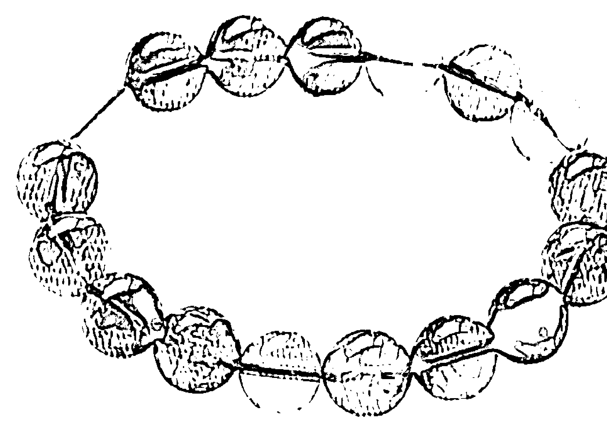

## 水晶的医疗保健作用

作为一种古老的医疗保健用石，水晶在古今中外医疗史上一直有着非常重要的地位。《本草纲目》中对于水晶的医疗用途有着较为详细的记载：水晶辛寒无毒，主治惊悸心热，能安心明目，去赤眼，益毛发，悦颜色，久用可以轻身延年。

水晶的医疗保健功能从何而来呢？按照现代科学观点，可以从以下几个方面来理解：一是单晶水晶具有压电性。即在水晶的一端施以压力，另一端会有释放出电荷的现象。天然水晶被人佩戴后，与人体摩擦可产生微弱的电磁场，这种电磁场具有稳定情绪、促使注意力集中、减轻病痛和缓解紧张、加快痊愈等作用。二是水晶具有特殊光学性质。水晶属三方/六方晶系的一轴晶正光性结晶体，当按方位精工切削琢磨后，光轴方向往往会产生一定聚光、放电功能，当其刺激到人体穴位时，可以产生相应的理疗作用。三是水晶形成的地质特点使其具备多种化学元素。水晶同其他宝石一样，形成于特殊的地质构造环境，含有对人体有益的微量元素，这些微量元素通过与皮肤的经常摩擦会沿着毛细孔、汗腺等浸入到人体内，从而促进微量元素平衡。

作为顺势疗法和另类医疗方法，国外医学界也有不少关于水晶医疗及其疗效的报道，简单地说，就是将水晶按压在病人伤患处或相关脉轮、穴位处，配合念力，以起到治疗、保健的作用。

根据水晶疗法理论，人体总是被自身创建的气场包围着。当灵性层面与物质层面不协调，被压抑或未处理的心理和情感冲突在身体上涌现时，往往表现为身体的疾病，气场也表现为能量失衡。水晶治疗是净化身心、释放压抑和伤害、连接灵性之源的最有效方法之一。通过水晶的高频振荡，将正面能量通过轮穴输入人体，导走负面信息，达到疗愈的目的。水晶可以同时作用于生理、情感、精神与灵性等各个层面，因此，水晶疗法是从肉体到精神乃至灵性的整全治疗，除了治疗生理层面的病症外，亦会照顾到病人的心理和灵性层面的疾病根源，使身、心、灵能量达到综合平衡，和谐运转。水晶疗法相信，借助水晶，人可以产生力量，去改变、学习和治疗，放下执著，做出明智的选择。

一种治疗方法是否有效跟人的主观意识有重要关系，如同患同样病症的人，积极配合的与排斥治疗的，其结果肯定不同。使用水晶治疗特别讲究缘分，真正愿意尝试的通常收效不错，而从内心抗拒的则收效甚微，甚至出现种种如晶石丢失、毁损等意外，导致治疗不能继续。另外，水晶治疗不是单一和死板的，往往要根据个体情况而灵活运用，关键是要看病症的起因是什么。比如就治疗白发而言，有的是过度用脑造成的，有的是血液循环问题造成的，那么在使用晶石治疗时，就可能用到完全不同的水晶。

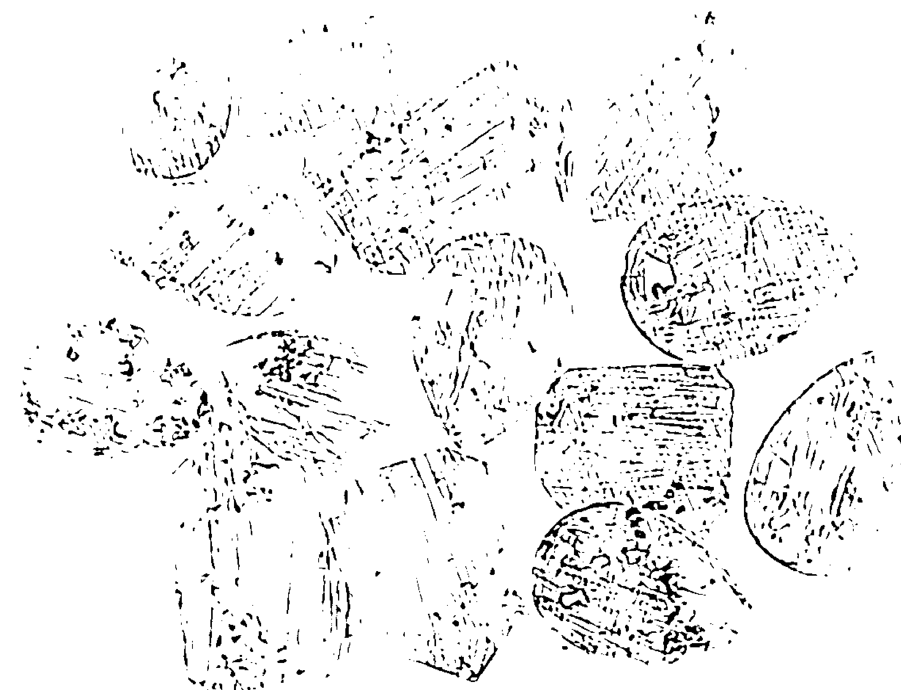

## 心理暗示与水晶功能

科学家们已经证实，在量子力学层面，无论是人，还是水晶、矿物、动物、植物等属于人类意识范畴内的“物质”的东西，归根结底都是宇宙能量的不同表现形式。当人与水晶在灵性层面合一的时候，能发展出一种新的能量平衡。这种能量的重新整合过程，有的能被人感知，这大概就是水晶功能的来源。

没有接触过水晶神秘性的人，也许会认为水晶功能是由心理暗示作用产生的。然而相悖的事实是，当一个人完全没有思想准备，完全没有评价、认定、希望等主观心理因素影响的时候，往往也是最容易感受到水晶功能的时候。这时，你能感觉到身体某些部位的诸如刺痛、麻木、震动等，甚至有些人会在刚戴上水晶的几天时间里，莫名地感觉到头晕、恶心、疲惫、嗜睡，这些都属正常情况。种种反应证明晶石与人体气场在互动，在重新整合。在达到新的平衡之前，各人的反应会不一样，一般是有轻微的不适感，但过了那一段时间（通常是几天）就能感到身心舒适。如果没有切身体验，一般人很难想象水晶是具有神秘能力的东西，而亲身体验过水晶能量的人，对于水晶所具备的功能是不会质疑的。

并不是所有的人都能明显感觉到水晶功能，通常情况下，具有宗教信仰的人或者对宗教天生有好感的人，比较容易接受水晶功能说。有宗教信仰的人，对自己所不了解的事情通常有着较为开放的心态。由于信仰环境使然，他们对于一些看似灵异、奇怪的现象能够比较理解，甚至能从宗教角度找到圆满的解释。不相信水晶功能的人，自然而然地将生活中的种种巧合或者变化归结为心理暗示，这也是可以理解的。

但是，我们不能因为自己主观上将水晶功能归为心理暗示，就否定它的存在。医学界有一句话：所有的药品都包含了药剂和安慰剂。试问，医学上的安慰疗法和安慰剂，也是利用了心理暗示作用而达到治病的目的，难道这就不叫医学？有时，一句善意的谎言往往能救人一命，难道这不是奇迹？

心理暗示与水晶功能是相互作用的。打个比方说：面对一颗水晶，一个佛教徒可能最初并不知道水晶功能，但如果知道水晶是佛教七宝之一，便对它会心生好感；如果再知道水晶有着“菩萨石”、“放光石”之类的雅号，对它的亲切感又能更进一层，然后时间长了，可能就确实能感受到水晶的神奇功效。在这个过程中，起作用的究竟是心理暗示还是水晶功能，都不再重要了。重要的是，效应确实存在。

一杯水与一把盐，分开放置时，谁都知道哪是水，哪是盐；当把盐撒进水里，又如何能再分清楚哪是水，哪是盐呢？把水晶带入生命中，就如同把盐撒入水中，虽然分不清谁是谁，但生命肯定会因此而发生改变。这种改变也许在当下的瞬间，也许要等到多年以后，蓦然回首时，才恍然而悟。

我们不妨放下水晶功能与心理暗示之争，只要真心喜欢一颗水晶，在佩戴时感觉心里舒适、心情愉悦，就是一段美丽的邂逅。善待水晶，也是善待自己。

## 小故事：用手挑水晶的风水师

晓旭是个潜修心法的风水师，他在给人调风水时经常会用到水晶，但是他并不懂得从收藏的角度去看待水晶。我们挑选水晶时，是用眼看，看晶体是否通透，颜色是否纯正，等等，而他挑水晶的方法很有趣，是用手挑——用手去感应水晶的能量。

在水晶店铺，他对柜台内的水晶用手感应，就这样，他甚至说准了很多只有店员才知道的情况。比如说，一个比较大的玛瑙盆，店员经常用来消磁的，他说那个盆能量不如它看上去那么强，“像病了一样，可能劳累过度”，但对于另一个不怎么用于消磁的、个头更小的玛瑙盆，他倒是闭着眼睛连声说：“这个好，这个比那个强！”

# 第2章 水晶与脉轮

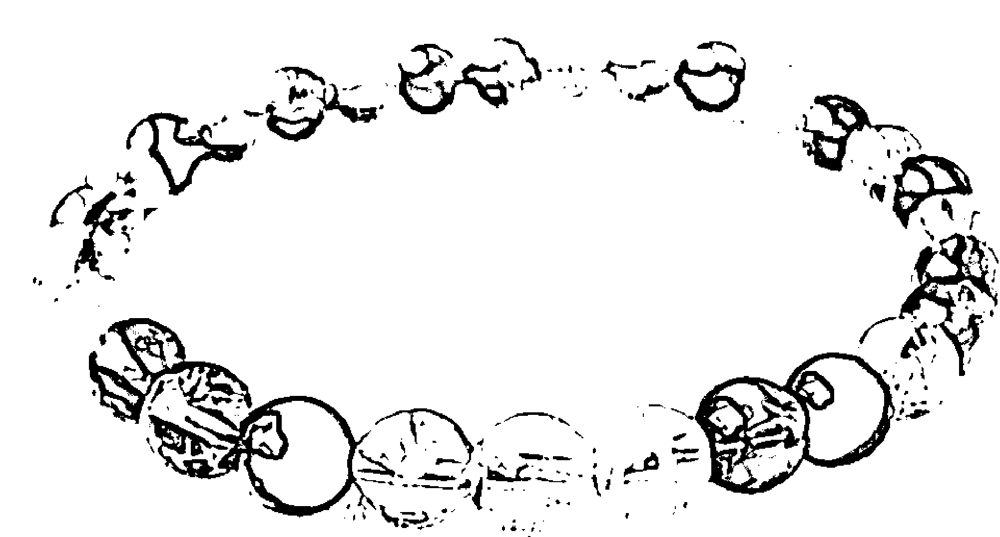

## 神秘的人体能量场

科技的发展让我们可以越来越直接地观测到人体和物体的能量场。克里安照相术（Kirlian Photography）是一种让相纸跟物体接触，并利用高电压使物体的放电影像直接感光在相纸上的照相技术。1939年，前苏联技师克里安与妻子范伦缇娜意外地发现以这种技术摄制的照片能显示物体与人体电磁场的能量放射状态。其后30年，克里安夫妇俩一直潜心研究电子照相术并携手研发了相关设备。克里安认为照片上呈现的光晕是由生物能量场所造成的，而这种技术能捕捉到被摄物的生命能量状态。克里安照片的好处在于能提早辨视出身体功能失调的部位，使它在变成疾病前早一步获得治疗。

1978年，前苏联开始了研究人体能量场的试验。科学家发现每个人的周围都存在一个微弱的电磁场，空气中的电子进入该磁场之后开始加速，使空气中的分子离子化，其结果是每个人都被一层只属于他却又看不见的光环罩着。

20世纪末，运用此原理研发而成的能量场分析仪问世，它能更真实地捕捉到人体气场，而有经验的解说人员亦能根据气场照片中的颜色与结构，判断当事人当时的情绪模式与身体能量高低。后来德国的彼得·曼戴尔博士也以此发明了彩光针灸与多种彩光疗法。

随着研究的深入，人们发现天然晶石的矿物能量能给人体电磁场带来稳定的色彩与光能补充，从而起到调节心理状况和治疗疾病的作用。今天我们佩戴和使用天然晶石，不仅可以愉悦眼睛，更可以补充我们身体能量场的磁能，帮助我们维护身、心、灵的和谐与健康。

除了克里安照相技术等可以照得出人体或物体的能量场之外，有超感能力的人也可以感觉到或者看得到能量场。各国历史上有超感能力的人或疗愈师、修行大师对能量场都有一定的言论记录，虽然我们能识别出这些文字，却不一定能真正明白字里行间所要表达的意思。所幸的是，随着科学的发展，不少科学家、医师也加入到研究能量场的行列，让我们能进一步了解自身的秘密。

想象一下，在我们身体外围100厘米左右，有一个椭圆形的光团把我们罩住，若张开手臂前后绕个圈子，大约就是它的范围。事实上，这就是我们自身的能量场范围。能量场在肉体的外缘发光，像个彩色大蛋。每个人都有这样一个蛋形体，没有人例外。其实，不只是人有能量场，世界上所有的东西，不管是生命体还是无生命体，都有能量场。虽说能量场看不见摸不着，但若稍加留意或者经过特意训练，一般人可以看得见或者摸得着在肉体之外浅浅的气体外缘。

按照疗愈师罗萨琳·布鲁耶（Rosalyn Bruyere，《光之轮》一书的作者）的说法，人体的能量场是脉轮创造衍生出来的。脉轮快速旋转形成自己的能量体，此能量体跟其他脉轮产生的能量体相结合，从而产生能量场。一般来说，能量越靠近肉体，密度越大，频率也越低；越向外走，密度越小，频率也越高。我们与周围环境交换能量，这些能量经脉轮进入肉体并滋养我们的精神和肉体。

## 神奇的脉轮理论

脉轮理论起源于印度，古代印度瑜伽理论认为人体主要有七个能量中心，即七个脉轮，由下往上分别是：海底轮、生殖轮、脐轮、心轮、喉轮、眉心轮、顶轮。这七个脉轮互相补充，互相影响，是通往心灵和高层意识的闸口。

脉轮，意指转动的轮子，“轮”含有增长、力量以及运动的意思。人体的七大脉轮自下而上分布在从脊椎底端到头顶的这一条线上，分别对应着内分泌腺体和神经丛，并负责维持某几个特定器官的能量健康。

能量场中的第一层能量体最靠近肉体，对应位于脊椎底端的第一脉轮海底轮，和肉体的安全、功能及感官有关；第二层能量体则与第二脉轮生殖轮相对应，与情绪和感觉有关；第三层能量体与第三脉轮脐轮对应，和理性分析、逻辑观念、思考能力有关；第四层能量体与第四脉轮心轮相对应，能反映此人如何付出或接受爱意；第五层能量体与第五脉轮喉轮相对应，与使用语言、文字同外界沟通有关，也和人是否接受神性意志、放下个人意志有关；第六层能量体与第六脉轮眉心轮相对应，与人类如何看待自己和万物的关系有关；第七层能量体与第七脉轮顶轮相对应，和我们如何与最高源头的灵性能量联系有关。从第一层到第七层，是沿着人类成长的脉络发展的，其意识从求生的本能到发展性能力、拥有个人力量、泛爱世人、能表达、有体会真理的能力，直到与宇宙合而为一。因个体的不同，每个人的脉轮大小和颜色强度不尽相同。

自古以来，许多有超感视力的疗愈者和灵修者，都曾经描述过七个脉轮的颜色。但一直到近代，才有人运用科学仪器记录脉轮的颜色，最有名的是1977年由美国加州大学洛杉矶分校的维乐瑞·亨特（Valerie Hunt）博士所主持的研究。研究结果详细划分了每一个脉轮的颜色和振动频率的关系，七大脉轮呈现出彩虹的七种颜色。

七个脉轮的振动频率都不相同，从最低频率的第一脉轮开始依次加高，也因为这种频率的改变，使得每个主要脉轮有不同的意识主题，有不同的需要、个性、气质和观点。脉轮能量是动态的，时时与周边万物进行着能量交换，人的心情、心态，甚至种种好的、坏的思想，都可以导致脉轮能量不断发生变化。

较下层的脉轮是上层脉轮的基础，如果较下层的脉轮发展不完全、不平衡或者残留着未排除的紧张压力，都可能损害上层脉轮。要想进入某一个脉轮对应的意识或行为特质，必须先处理好前一个脉轮。最下层的脉轮发展出最靠近身体的那层能量体，是最准确的诊断工具。早在病人的症状出现之前，能量场里第一层的气体已出现异常。因此，疗愈师常常并不是直接“对症下药”，而是要先打好基础，即通常从海底轮起，依次处理各个脉轮的能量，最终达到整体的和谐统一。

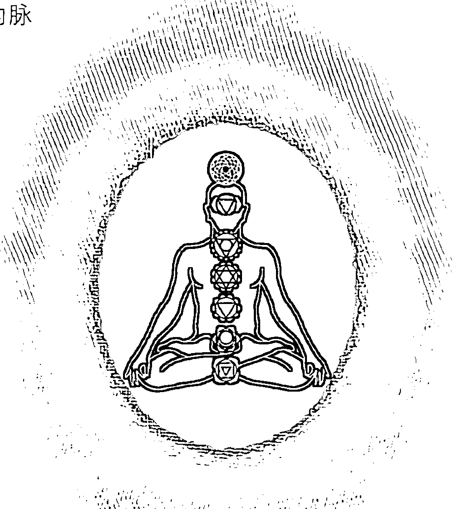

天然水晶以其天然品质和色彩，可以将自然条件下形成的精纯能量带入我们的能量场，补充我们所需要的能量。借助水晶持续地将注意力转向内心，放下烦恼，就可以掌控脉轮的能量，从而帮助我们活出完美人生。正如一位大师所说的：如果你对自己的身体拥有控制能力，你命运的10%~15%就掌握在自己手里；如果你对自己的头脑有足够的控制能力，你命运的40%~60%就掌握在自己手里；如果你对自己的能量有充分的控制能力，你的生活和命运就100%掌握在自己手中。

一旦掌握了能量的运作模式，借助水晶的高频振动，我们就可以认识自己，疗愈自己，创造一个全新的、快乐幸福的自己。我们将轻松、快乐地拥有心想事成的幸运！

## 水晶与脉轮的对应关系

不同的脉轮有着不同的颜色，利用不同颜色水晶的振动频率来与身体的各个脉轮作能量的契合与补充，可以将更多的生命力导入身体，并将负面情绪排放出去，可以帮助治疗疾病，促进健康。如何正确地使用水晶治疗疾病，已成为现今国外很多另类医疗机构的研究课题。

在不同的理论体系中，脉轮的位置和颜色不尽相同，其中争议比较大的大概是顶轮的位置和颜色，有的理论将顶轮定位于头顶上方身体之内，认为顶轮的颜色是淡紫色；有的理论将顶轮定位于头顶上方，身体之外，认为顶轮的颜色是白色和金色。这两种学说各有根据和益处，大家不妨自己去体验。本人更接受第二种说法，即顶轮位于头顶上方身体之外，颜色是白色和金色。

水晶对应脉轮的划分并不是绝对的，一些水晶以其自身的特点可以同时对应多个脉轮。

## 七轮对照表

| 脉轮 | 位置及主要特点 | 对应生理器官 | 对应颜色 | 常用护佑晶石 |
| :--- | :--- | :--- | :--- | :--- |
| 第七脉轮：顶轮 (Sahasrara) | 位于头顶中央的身体之外，连接着宇宙能量 | 松果腺体 | 白色、金色 | 白水晶、宝石级巴西黄水晶 |
| 第六脉轮：眉心轮 (Ajna) | 位于双眉中央，是与灵性有关的脉轮 | 脑下垂体、眼睛、鼻 | 靛蓝色、紫色 | 青金石、紫水晶、紫龙晶、舒俱莱 |
| 第五脉轮：喉轮 (Vishuddha) | 位于脖子前方的根部，联结自我与外在世界，是身体不同频率的能量汇集与具体化的中枢 | 喉咙、甲状腺、颈部、肩膀、食道、嘴、下巴、牙齿、口腔、气管 | 蓝色 | 海蓝宝、蓝玉髓/玛瑙、菱锌矿、拉利玛 |
| 第四脉轮：心轮 (Anahata) | 位于胸腔凹陷处，即膻宫，是七个脉轮的正中央，是高振动频率的脉轮；此处的意识集中于爱、和谐以及滋养慈悲心 | 心脏、肺、胸腺 | 绿色、粉红色 | 绿幽灵、绿发晶、葡萄石、绿东陵、粉晶、红纹石、西瓜碧玺 |
| 第三脉轮：脐轮 (Manipura，又称太阳神经丛、胃轮) | 位于腹部，负责较为缓慢的振动频率 | 胰脏、胃、小肠、肝脏、胆囊、肾脏、脾脏以及脊 | 黄色 | 黄水晶、金发晶、钛晶、虎眼石、琥珀/蜜蜡 |
| 第二脉轮：生殖轮 (Svadishtana，又称生产轮、性轮) | 位于下腹部，大约在膀胱带，振动频率高于海底轮，是喜悦与欢愉感升起之处 | 淋巴腺、生殖器官、胰脏、盲肠及膀胱 | 橙色 | 石榴石、红发晶(兔毛)、红铜发、红玛瑙/玉髓 |
| 第一脉轮：海底轮 (Muladhara，又称根轮、圣事轮) | 位于脊椎底部，振动频率最低，与物质界有关，代表求生意识 | 直肠、结肠、肾上腺、骨骼、双脚、血管以及免疫系统 | 红色、黑色 | 黑曜石、茶晶、石榴石、红幽灵 |

## 水晶的五行属性

五行是指金、木、水、火、土五种物质及其运行转化规律。我国古代思想家用这五种物质来说明世界万物的起源，中医用五行来说明生理病理上的种种现象，而传统命理学用五行相生相克来推算人的命运。五行学说认为，世界上的一切事物都是由这五种基本物质之间的运动而生成、变化的，同时，还以五行之间的生克关系来阐释事物之间的相互联系，认为任何事物都不是孤立、静止的，而是在不断地相生、相克的运动之中维系着协调平衡。

有人说水晶五行属“水”，这大概是出于顾名思义的习惯思维而随口说的；有人说是属“金”，这大概是认为水晶是土里挖来的，由“土生金”推断水晶属“金”。其实，水晶是属“土”的。水晶是大地的一部分，就算从地里取出来，它依然是“土”。比如一块泥巴，不能说泥巴在地上是“土”，在手里就是“金”了呀。另外，水晶具备净化的作用，因此水晶在属“土”的同时还具有“火”的特性。

水晶具有丰富的颜色，而五行又能与五色相配，是不是绿幽灵水晶属“木”，红兔毛水晶就属“火”呢？依五行划分，猫是属“木”的，能说“白猫属金，黑猫属水”吗？显然不能！由此可见，水晶本身属“土”，不能说白水晶属“金”，茶水晶属“水”。当然，如果是为了配五行的需要，化繁为简而用之，也是可以理解的。

## 五行不足的补救

| 五行不足 | 金 | 木 | 水 | 火 | 土 |
| :--- | :--- | :--- | :--- | :--- | :--- |
| 补救颜色 | 白 | 绿 | 黑 | 红 | 黄 |
| 补救水晶 | 白水晶、白幽灵 | 绿发晶、绿幽灵 | 黑曜石、茶水晶 | 红发晶（兔毛） | 黄水晶、金色发晶 |

## 水晶是配五行还是配脉轮？

水晶能量的来源主要有两个方面，一是色彩能量，二是磁场能量。色彩能量在国外早就有研究，比如，医院、办公室、教室等不同场合需要运用不同的色彩。

磁场能量是无形的，效能却非常大，比色彩能量更加强劲而持久。比如说，相对于居室来讲，晶洞是很小的，但它足够改变整个居室的磁场，让到达这个场中的人、事、物在无形中得到净化，从而引发现实生活中的好运、吉祥。别看我们佩戴的是小小的一串或者一颗水晶，当它与我们的身体能量场和谐共振，帮助我们的身、心、灵和谐运作时，水晶就在无形中起到了促进健康、招财纳福、逢凶化吉的功效。

用不同颜色的水晶配五行，是以水晶的色彩能量为主导，配合磁场能量达到效果；而用不同颜色的水晶配脉轮系统，则是根据自身的个体情况，利用水晶的磁场能量来增进脉轮系统运作，从而达到疗愈的目的。正因为如此，在用水晶配五行时，有时候甚至不太讲究晶石的纯天然性而非常讲究使用准确的颜色；而在用水晶配脉轮时，则更苛求水晶的纯天然性。

简单地说，阴阳五行是中国特色，脉轮系统则是印度特色。随着水晶在世界范围内的广为流行，古老的脉轮理论及其运用渐渐被现代人重新认识并得到运用。但在中国，除了西藏地区因受印度文化影响而对脉轮系统并不陌生外，内陆很多地方的人还不太习惯用脉轮理论去解释一些身体和生活的现象。因此，水晶配五行并结合浅显易懂的道教理论，似乎更符合中国内陆人的口味。但是，水晶配五行究竟能有多大的效果，其效果是心理作用还是能量展现，等等，这些都还需要足够的时间和实践去验证。

# 第3章 生命之初总是伴随着痛苦

## 海底轮的秘密

四周一片熟悉的寂静与安详，那仿佛是亘古以来的状态，我们游荡在温暖柔软的世界……突然，一阵阵摇晃与挤压，我们感到无比的恐惧！不知过了多久，突然眼前一亮，刺眼的白光让我们睁不开眼，到处是嘈杂的声音，有人用力拍了我们一巴掌，我们无比害怕地痛哭——哇，怎么会这样——我们诞生在一个陌生而冰冷的空间！这实在不是一个美好的开端，但是，伴随着血与痛，生命就此开始了。这是我们出生的过程，也是海底轮最初的意识。

通过回溯出生，我们大概就会意识到内心的不安全感是与生俱来的。在我们脊椎底部，有一个专注于求生的红色脉轮，叫做海底轮。海底轮是生命的基础，代表元素是物质与土，它主管着饮食与睡眠，并握有我们的生理蓝图：骨骼、肌肉、皮肤、头发、指甲、血管等；同时也与肉体的支撑有关：双腿、双脚以及免疫系统。和海底轮关系最密切的器官是肾上腺与结肠，肾上腺是“战斗、逃亡或者僵住”的系统，在压力、震惊或惶恐的处境中，它会自动形成反应。我们出生时的遭遇会激起强烈的求生意识，这种求生意识最初可能表现为一种想逃避的本能。

如果我们总是感到不安全，或是持续活在求生的模式里，海底轮就会变得混乱不堪，健康也必然会受到影响。海底轮能量失衡可能表现为：对金钱和物质的极度追求，堆积越来越多的物质以寻求安全感，以价值为导向的各类收集、收藏癖好。某些管理者、实干家、企业家的海底轮是不和谐的，他们成功的原因相当一部分是基于不安全感的“进取精神”，而这种所谓的“进取”，在别人也许就意味着“掠夺”。如果不懂得超越，不懂得建立更高层次的进取精神，这类人在得到之后非但不会满足，反而可能无所适从，于是继续以往的“战斗”模式，直到造成健康上的疾病而导致事业停滞。不懂得放下，无论得到多少钱财，取得多高的地位，都不能带来生命的祥和与安乐。

如果我们经常感觉疲倦，饮食与睡眠出现问题，肤色暗淡，头发干枯，免疫力下降……即种种迹象表明我们处于亚健康状态时，这多半是因为我们的生命基础海底轮出现了问题。这时需要合理安排饮食与睡眠，并可以运用相应的晶石补充海底轮能量，黑曜石、黑碧玺、石榴石、红幽灵等天然黑色、红色晶石都是不错的选择。

## 生命的基石——石榴石

石榴石的英文名称为 Garnet，由拉丁文 Granatum 演变而来，意思是“像种子一样”。石榴石晶体与石榴籽的形状、颜色十分相似，故名石榴石。石榴石在我国古代又名紫牙乌，也称子牙乌、紫鸦乌。相传其名来源于古代阿拉伯语“牙乌”，意即红宝石。

尽管石榴石是个大家族，有多种颜色，但一般市场上能见到的石榴石都是红色的。红色石榴石因品质不同，价格可能相去天壤。

就颜色而言，石榴石以玫瑰红为最好，酒红次之。酒红石榴石的颜色有点像红酒，对光看时是比较鲜的红色，色感偏沉闷；而玫瑰红石榴石则有一种玫瑰般的活跃色调蕴藏其中，色感偏明亮。值得注意的是，石榴石的红极具变化空间，在某些人眼里看是玫瑰红的，在另一些人眼里可能只是酒红，不把两件东西拿到一处比较，往往很难说它到底是酒红还是玫瑰红。而在比对过很多的石榴石以后，还会发现：同一串石榴石，在与成色一般的 A 比较时是玫瑰红，但在与成色较好的 B 比较时，却只能算作是酒红！这情形好比一杯温度为 80 度的茶水，与 90 度的相比是温的，与 70 度的相比又是烫的了。因此，究竟什么是“玫瑰红”，是比较条件下的结论。也就是说，把两件“玫瑰红”的放在一起比较，总会有一件更加“玫瑰红”。

石榴石就晶体而言，当然越透越好，内包物越少越好。由于石榴石性脆，在晶体表面通常会有一些打磨、抛光过程中留下的坑、点，这些瑕疵越少越好，但不可过分追求完美，因为这是天然晶石的特征。

石榴石以其殷红如血的天然色泽，能与海底轮达到和谐共振，有着女性之石的美誉。石榴石富含铁元素，能够帮助我们解决一些血液和肌肤方面的问题，促进皮肤和毛发系统的新陈代谢，并能够净化血液，促进血液循环，使我们恢复健康活力。

石榴石能够帮助我们把身体外观调整到良好状态，因而又有“石榴石具备美容功效”一说。很多朋友在生理期使用石榴石时会有腰部温暖、疼痛缓解的感觉。佩戴石榴石对于痛经、身体瘦弱、畏寒、冬天易手足冰冷等女性常见问题，有着良好的调理作用。

## 安抚与保护之神——黑曜石

黑曜石是火山熔岩迅速冷却后形成的天然玻璃质岩石，主要成分是二氧化硅，因功能强大，又有着黑金刚武士的美誉。

黑曜石通常呈黑色，也有金色、棕色、蓝色等。这种“黑”并不是漆黑一片，而是如彩虹般有着七彩的光。磨成圆形的黑曜石常见由七彩色构成的环状光环，这就是彩虹眼。一般圆形的黑曜石常见单彩虹眼，等级高的黑曜石能在对称的位置上出现两个，即双彩虹眼。

黑曜石能强力化解负面信息，常被用来制成镇宅、辟邪、避桃花的风水制品和饰物。如果是出入负面信息较强的场所，如医院、殡仪馆等，可以将黑曜石戴在左手以起到防护效果，如果是想清除自身不良情绪等负面信息，则可以将黑曜石戴在右手。

黑曜石在吸收一切光的同时又反射一切光，具有安抚作用，它暗调的彩虹光对应海底轮，引导较高脉轮的更精微能量进入原始能量中心，来精炼与纯化较低的自我。在感到精疲力竭、打不开思绪、有烦心事的时候，可以在睡觉时佩戴黑曜石，以达到凝神静气、调理思维的目的。将黑曜石用于身心紧张与过度情绪化的人身上也是很理想的，它像一个容器，能稳固不安定的能量，让人能更加脚踏实地，从而感受到安抚与被保护。睡眠不好的人用黑曜石治疗失眠是一个不错的选择。

尽管黑曜石吸收负面信息的效应非常强，但很难做到自身的净化，因此，使用黑曜石要特别注意每天消磁。

对晶石的感应是因人而异的，如果一个人心轮不够打开或者脐轮能量过强，一般很难感受到晶石能量。我也试过用黑曜石来安神，促睡眠，头两天完全没有效果，过了几天，我无意中拿着黑曜石打坐，很快就犯困，不到平时时间的一半就坚持不下去了，顺手把黑曜石塞枕头下倒头便睡，直睡得天昏地暗。而且，一连几天都是这样。后来我明白了：我起初在试图去感受黑曜石的安抚能力的时候，自己的心就在不知不觉中绷紧了，自然就没有效果；直到我完全不去想安抚这回事以后，黑曜石的安抚功能才能充分发挥出来。

# 第4章 我们就是要追求快乐

## 生殖轮的困惑

生殖轮又名生产轮、性轮，位于下腹部，大约在膀胱带。生殖轮的振动频率高于海底轮，散发着橙色的光芒，这里也是喜悦与欢愉感生起之处。

当解决了生存问题后，我们自然而然地转向追求快乐。追求快乐是生命的目的也是生命的过程，追求快乐永远也不会错，错的只是追求不恰当的快乐。如果追求的是对身体和心灵造成伤害的所谓“快乐”，如毒品、酒精，乃至极端宗教信仰和个人崇拜，导致个人和社会的冲突与损失，那还会是快乐吗？

与生殖轮相关的元素是水，这个脉轮控制了身体的体液，包括淋巴腺、血液、眼泪、唾液等，影响生殖器官、泌尿系统、脾脏、胰脏、大肠、骨盆、臀部等器官和部位。生殖轮能量受阻的人，通常会产生金钱、权力、性方面的冲突与斗争。如果我们陷在生殖轮的问题里，通常会接连遇到情绪上的路障，我们会寻求能带来短暂欲乐的物质与处境，包括沉迷于食物、巧克力、毒品、酒精、性、草药或西药。生殖轮能量失衡，可能还会有下列的态度与行为：依赖他人的赞同、意见，压抑感觉与否认感觉，嫉妒，偏见，很容易激动，把所有的事情都看成是针对自己而来的，大男子（大女子）主义，僵固刚直，沉迷于架构和规则。

生殖轮能量过度时，会使人沉湎于物质世界里寻欢作乐，无法忍受平淡与平凡。表现为不能独处，整天都忙于社交，身边总要有个人，若身边没人，电话那头也得有个人；情绪时高时低，常在两极荡来荡去；他（她）们可能会频频谈恋爱，谈起恋爱来每一次都惊天动地，表现得轰轰烈烈，身边的人常被弄得团团转。事实上，生殖轮能量过度的人既不幸福，也不快乐。

如果你无法忍受安静的环境，回家第一件事是打开电视或者音响，总是用声音、忙碌、工作甚至是琐碎事来填满自己的生活，那就要小心你的生殖轮可能处于不和谐状态，可能会被生活中的琐事所困扰，而你所追求的那些“幸福”，并不能真正带来事先所设想的幸福感受。

## 与快乐相伴的精灵——红兔毛水晶

橙色代表温情与信赖，是快乐的颜色。天然红兔毛水晶是快乐的化身，天然水晶与其包裹的红色发丝一起形成幸福的包围圈，在温暖、关爱的氛围中释放生殖轮的困惑。佩戴红兔毛水晶，很容易令人生起欢喜与愉悦的感觉。

红兔毛水晶是红发水晶的一种，它的发丝特别细小，如果不用放大镜甚至显微镜，很难用肉眼观察到那些极细密的红丝。与红发水晶相比，红兔毛水晶在功效上更为舒缓、温柔，更具有循序渐进的特点，因此，红兔毛水晶一直是颇受欢迎的一个品种。红兔毛水晶对于生殖轮能量弱、月经不调、宫冷的女性有着良好的生理调节作用。

从字面上看，红兔毛水晶似乎应该对应海底轮，但天然红兔毛水晶通常是橙红色，极少有如血般的深红色，因此，红兔毛水晶依其天然颜色可以对应海底轮和生殖轮，一般以对应生殖轮的橙红色居多。

海底轮与生殖轮是两个相距很近的脉轮，分别有着各自的对应颜色和对应器官等，但由于它们的互相联系和支持相对其他脉轮较多，再加上每个人的脉轮活跃度不同，如果这两个脉轮中的任何一个出现问题，包括身体的和情绪的问题，都可以考虑进行综合调理。黑色、红色、橙红色，是三种经常用来综合调理海底轮和生殖轮的颜色，相对应的晶石包括黑碧玺、黑曜石、茶晶、红玛瑙、红兔毛水晶、石榴石、红幽灵水晶等。

## 小故事：北京 G 小姐体验红色晶石

北京的 G 小姐对于红色晶石就有着自己的亲身体验。可能因为体质比较弱，她每个月生理期前都会头痛欲裂，吃过很多药也没有调理好。自从佩戴了红玛瑙手镯和红兔毛水晶手链，意外地发现生理期“在不知道的情况下”就来了，虽然脾气稍有些不好，但头疼没那么厉害，只是有点昏昏沉沉而已。最开始她认为这可能是因为心理作用，可接下来的几个月都是这样。偶尔在关键时候忘了佩戴红玛瑙和红兔毛手链时，头疼感便会袭来，而一旦戴上几分钟之后，竟然就不那么难受了。

## 体现阳刚之美——铜发水晶

如果说红兔毛水晶的能量倾向于柔缓，那么铜发水晶就是最能体现阳刚之美的发晶了。

铜发水晶属于发丝水晶的一种，内包物通常为金红石，针对生殖轮，它在默默无闻地保护和加强阳刚气场的同时，也会加强佩戴者的个人魅力。铜发水晶有着如铜丝般的颜色和闪亮的发丝，初看是内敛的，细看却又是很张扬的，因此，激情澎湃而气质内敛的铜发水晶，就成为职场男士和有着男性气质的职场女性的能量宝石。

一个有趣的事实是，喜爱和佩戴铜发水晶的女性往往具备阳刚之美。她们做事果断，雷厉风行，通常是职场的赢家或权威人士，企业高管或单位负责人居多；有的虽然在职场上不甚突出，但在家庭中却是说话极有分量的一员。

如今无论是职场、官场还是商场，处处充斥着争夺与胶着，人们的心态变得很不平静，经常在各种力量拉锯之间激烈摆动，难以自拔。铜发水晶的介入，将是一种有力的调和。它使人在权力、金钱、欲望之间保持个人情绪的平衡，为身、心、灵的健康起到保驾护航的作用。因此，铜发水晶其实是一种非常基础、非常务实的晶石，生活中充满了冲突的人经常需要使用到它。

灵性脉轮过度开发的人也离不开铜发水晶。灵性脉轮过度开发的人往往有一个共同特点，就是不擅长处理世俗中的人际关系。这种人在日常生活中可能很难与身边的家人、同事、朋友打成一片，而周围的人可能也会斥之行事怪异。这其实是生命基础产生问题的表现，使用对应的晶石如铜发水晶等，可以帮助补充人体基础脉轮能量，促使身心达到新的和谐统一。

铜发水晶的能量比较刚猛，一些敏感体质的人在初次接触铜发水晶时可能会不适应，有时候可能产生头晕、睡眠不安稳等现象。在适应了一段时间以后，这些现象自然会消失，此时人体与晶石的能量互动处于和谐状态。当然，对于不太敏感的人而言，可能仅仅只是内心喜欢而感应不到明显的能量振动。

# 第5章 我们到底需要怎样的快乐？

## 脐轮的理智与行动力

脐轮又名太阳神经丛，位于胸骨基处，控制的器官包括胃、小肠、肝、肾、胆、胰、脾等，涵盖肉体部位范围广大。脐轮是物质显化的主要中心，主创造、落实、显现，具备意志力和行动力，呈黄色，代表元素是火。火是力量与净化的象征，帮助物质转化成能量。脐轮能量活跃的人表现为一个行动者。

脐轮如同一个拥有高度智能，做事谨守原则、有条有理的规划者，它会建立个人选择能力和方式。生殖轮通常是跟着感觉走，拼命去追求自己喜欢的东西；聪明的脐轮则知道什么时候是“够了”，什么时候该叫生殖轮停下。脐轮能对生殖轮产生的感受和情绪，有条不紊地进行整理规划。它是情感生命的调理者，使我们能拥有丰富的感情生活，但不会滥情到不可收拾的地步。

如果脐轮的能量过度，人们的行为会表现得倾向于控制性行动，或追求成就、钱财，或贪恋权力。为了追逐这些“实在”的东西，他们不断地从事多种活动，身体的活动性很大，他们需要亢奋才能感觉自己活着。脐轮过度发展会殃及邻近的脉轮，生殖轮和心轮首先遭殃。生活中不难看到，一些行动能力特别强的人，对两性和情感方面的诉求往往没感觉，这是因为脉轮能量发生了调遣。脐轮的主要问题在于，它需要被来自更高脉轮的能量所净化。

脐轮在主导人际关系的同时，也会滋生出关系带。我们在出生以前是依赖腹部的脐带通过妈妈与外界进行信息交流的，出生以后，肉眼所见的脐带断开了，但另外一种肉眼不可见的关系带也开始形成。当两人有诸如亲情、同事、朋友甚至仇恨的关系时，相对应的就会产生能量管道，即关系带，将两人连接起来。关系带的运作方式非常奇妙，有时候，一方的情绪、心理甚至疾病会导致另一方也出现类似的状况。如果仔细观察不难发现，我们的亲人、关系非常好的朋友，往往能在某些事情发生之前预料或者莫名其妙地感觉到即将发生在我们身上的事。另外，我们或许都有过这种经历，当没理由地不喜欢某人时，会有一种胃部难受的感觉；或者，当面对不愿意面对的人时，会突然“胃痛”起来。这些都是脐轮智慧和关系带作用的显现。

## 美食家与行动者的护身石——黄水晶

黄水晶有助于脐轮能量的净化与补充，它如太阳般温暖，渗透、供应能量及给予生命，肠胃出问题的人可以用黄水晶帮助调理。

肠胃受脐轮的管辖。用“心知肚明”来形容脐轮是最确切的，它感到受伤害或者有需要时，会发出召唤。如果一个人善于倾听自己内心的、身体的声音，那么就会采取一些在外部世界看来也许是莫名其妙的举动，而这些举动，会“凑巧”帮了你的大忙！

我的食欲一度非常旺盛，对美食很有兴趣，肠胃总是在超负荷运

## 寻找我的幸运水晶

转，而那段时间恰恰最喜欢黄水晶，在享受美味的同时，肠胃还没出过什么大毛病。

能量精纯的脐轮有助于增强行动力，可能吸引任何所需要的物质财富到生活中。黄水晶有助于将心动的结果落实到行动层面，特别适合那些想得多、做得少、缺乏行动力的人，适用于需要加强社交能力和行动能力的场合。因此，很多人用黄水晶招财，并且往往体验到不同程度的效果。其实，说黄水晶招财是有原因的，如果只是想想而不行动，财从何来？值得一提的是，黄水晶所招之财，并不仅仅是世俗意义上的钱财，更多的是内在的财富，包括富足感、丰沛感、喜悦感等。

高品质的黄水晶颜色鲜艳浓郁，晶体清透亮泽，质感如金，通常产自巴西。因此，人们渐渐习惯了把最好的黄水晶统称为“巴西黄”。由于黄水晶品种、品质的区别，其对应的脉轮并不是唯一的。可以说，一般黄色、淡黄色的黄水晶对应脐轮，而巴西黄水晶则可对应脐轮和顶轮。顶轮的颜色除了白色还有金色，主宇宙大爱的显现和落实。颜色浓艳、质感如金的高等级巴西黄水晶，有助于将顶轮的精纯能量传导到脐轮，并运用于创造与显化。人们极容易去执著依恋地球上的享乐与富裕，因此只有当脐轮被顶轮所支配时，脐轮的能量才能被净化和升华，使人不至沉湎于享乐。

巴西黄水晶能将正面的能量直接发射到使用者的环境中，使生活变得更闪耀、光亮，借由巴西黄水晶的振动频率，能帮助增强内在的富有，而不仅仅是获得钱财。这种内在富有的本源是宇宙大爱，只有在付出时才能得到，付出得越多，得到的才会越多。

如果一个人感受到丰沛、富足、快乐，应将这些美好的感觉回馈给他人，无论是身边的亲人，还是路上遇到的陌生人，或者是电梯口的一个普通勤杂人员，都可以在内心祝福他（她）吉祥如意，那么慢慢地，此人自己也将会遇吉祥、事事如意。相反，如果一个人很贪吝于手中的财富或者吝啬于感恩与赞美，那就是只懂积累，不懂付出，其结果，必然是招致意外损失——可能是经济方面，也可能是健康方面。这是一项不随人类意志转移的宇宙法则，是一种因果关系，儒家《大学》中所说的“货悖而入者，必悖而出”就是讲的这种因果循环。

做一个有钱人很容易，做一个富有的人却很难！

## 小故事：具减肥功效的巴西黄水晶

有晶友告诉我说，他发现巴西黄水晶可以帮助减肥，我很意外。巴西黄是促进肠胃功能的，会在一定程度上促进消化吸收，怎么可能导致相反的结果呢？后来才知道，原来肥胖的原因有多种，毒素积累导致肥胖是其中的一种。肠胃功能不好会导致毒素不能及时排出，从而长期积累在体内，用巴西黄改善了肠胃功能，毒素就会随之排出，减重也就在情理之中了。但这种减肥功效对于我是没有用的，因为我的肠胃功能一直很好。尽管如此，我还是编了串巴西黄水晶的腰链戴上，只是因为它真的很漂亮。

一天晚上9点多钟突然想吃夜宵了，临出发前，戴上那条巴西黄水晶腰链，先生还笑说：“你戴这个又不能帮助减肥。”我说：“戴上它保护肠胃呗！”奇怪的是，兴冲冲跑去吃夜宵，但东西端上来只吃了几口就突然不想吃了，全部推给先生。先生有点郁闷，说：“不是你以前的风格啊！”我笑，心里也觉得奇怪，直到低头把玩腰链时才突然明白：原来是它！巴西黄水晶能促进脐轮能量，加强行动力。而脐轮是一个聪明的规划者，它知道什么时候是“够了”。在现实生活中，这种行动力表现出来可能是下达“停止”的命令！

## 能量之王——钛晶

钛晶金光闪闪、绚丽夺目，看到钛晶时，人们脑子里第一个闪现的词往往会是一一黄金。钛晶是发晶的一种，有着灿烂的金黄色板状钛丝和晶莹的晶体，具有国人最爱的金与玉的双重质感，深受人们的喜爱。钛晶以其备受追捧的地位，一直是超然于发晶之外的一个品种。钛晶中的钛丝矿物成分为金红石，富含稀有元素二氧化钛，这使钛晶具有金子般的质感，另一方面，也使得“钛晶功能说”极富传奇。

传说钛晶有六大功能：主正财，招偏财，招人缘，辟邪，促健康，防小人。它象征大吉祥、大富贵，如神佛加持。钛晶强劲的功能堪称霸道，因此，佩戴钛晶饰物讲究循序渐进，身体较虚弱的人，并不适合一下子就长时间佩戴质量过好、重量过大的钛晶饰物。有时候，佩戴钛晶会有头晕、恶心甚至肢体麻木的感觉，这可能是能量不匹配的表现，最好先尝试着偶尔佩戴，等身体完全适应之后，再长时间佩戴。

钛晶的感应力很强，可以当作护身符或平安符，尤其是常要夜间工作的人。当出入一些浊气较重的地方，如医院、病房、墓地、特种经营场所等，佩戴钛晶有防止干扰的作用，使自己的气场加强，比较不容易受到负面信息的干扰。将钛晶挂于车内有辟邪驱凶的效果。如果是出差在外，入住旅馆后感觉到不安或者恐惧，可以将钛晶放在枕下或者床头，以起到辟邪安神的作用。

钛晶相对产量低，品相好的更是深受市场追捧的收藏品，价格连年高涨，已到高处不胜寒的境地，这给痴迷钛晶能量的晶友们带来一定的阻碍。为了解决这个矛盾，有的朋友开始使用金发晶代替钛晶。就包裹体构成而言，金发晶内包裹的发丝通常是金红石，与钛晶中钛丝的成分基本一致，就能量利用而言，这不失为一种可行的办法。

## 欧洲贵族的最爱——琥珀 / 蜜蜡

琥珀与蜜蜡属于有机宝贝，并且都是树脂化石，因所含琥珀酸的多少而有所区别。通常情况下，按照琥珀收藏界的习惯，称含琥珀酸较多的为蜜蜡，琥珀酸较少的为琥珀；而市场上习惯将透明的统称为琥珀，将不透明的统称为蜜蜡。

## 寻找我的幸运水晶

琥珀（蜜蜡，下同）是欧洲人的传统宝石，是欧洲文化的一部分。欧洲人对琥珀的痴迷一如中国人对玉石的喜爱，认为它们蕴含高贵、古典和神秘之美，可以将美好的愿望寄托其中，相信琥珀具有护身、避瘟疫的功效。古时候的欧洲，人们用琥珀串成婚礼项链，是结婚时必备的贵重珠宝，也是情人间互赠的信物。古代罗马人对琥珀的喜爱达到了疯狂的程度，琥珀在古罗马贵族中尤为流行，也是尼禄皇帝宫殿中的装饰物。帝国鼎盛时期，古罗马人对琥珀的需求非常强烈，历史学家老普尼迪曾记述：一个小小琥珀人像的价格超过了一个活人奴隶的身价。

天然琥珀在形成过程中，经常包裹了很多气泡，为了增加琥珀的透明度和美观度，经常要进行热处理。在热处理时，气泡因温度的升高而发生爆裂，形成大大小小、形状不一的“太阳光芒”、“睡莲叶”。由于气泡的大小差别和分布的不均匀，这些“睡莲叶”会呈现不同的大小和形态。如同世界上找不出两片一模一样的雪花，自然界也找不出两块一模一样的“睡莲叶”琥珀。这也是热处理琥珀的看点和亮点之一。

从行业标准看，热处理后的琥珀化学性质稳定。根据国家有关珠宝玉石命名规定，热处理晶石可直接使用珠宝玉石的名称，在鉴定证书中可不附注说明。珠宝界并不排斥热处理等在宝石学上被列为优化的方式，但类似的这些优化方式在收藏界和灵性运用上还没有得到普遍认可。

## 052 | 寻找我的幸运水晶

琥珀有一个很奇特的物理性质，能在饱和盐水中上浮。将琥珀投入一杯清水中，会看到琥珀沉在杯底。在水中加入食盐并搅动，慢慢加到食盐不再溶化而形成饱和盐水，在这个过程中，就会看到天然琥珀会逐渐上浮。当然，这并不是区别天然琥珀与人造琥珀的保险方法，但它不失为一个简便的好方法。要注意的是，在做这个小试验前，一定要把穿珠子的线、搭扣、吊扣等“杂质”取下来。

# 第6章
### 爱你等于爱自己

## 心轮的芬芳

心轮位于胸腔凹陷处，控制着肺、心脏及胸腺，此处的意识集中在爱、和谐以及滋养我们对自己和世间活动的慈悲心。心轮位于七个脉轮的正中央，是生存脉轮与解脱脉轮相会的地方，心轮上面三个脉轮是属于意识的、灵性的、天界的，下面三个脉轮是属于物质的、肉体的、人间的。心轮介于中间，是一个非常重要的中枢，是两个世界的交界和桥梁，代表两种力量的共生共存。它也是第一个高振动频率的脉轮，对应着较高层次的意识。当某人的能量活跃于心轮时，就成为一个创造者，一个具有创意的人。

心轮散发出来的光是绿色的，并伴有柔和的粉红色，同样，绿色和粉红色也是滋养心轮的颜色。可以看出的是，那些喜爱大自然的人，心态通常是积极、健康的，人格往往比较健全，也更富有激情和创意。心轮是绿色的原野，它能散发爱，也能接受爱。与心轮有关的元素是风，或者是水与火的结合。心轮涵盖了有关爱、承诺、宽恕、热情、和谐、生气、憎恨、抛弃、哀伤、苦恼、孤独、后悔、遗憾等与自我相关的议题。

人类的天性本是能够接纳并付出爱的。爱是一种情感，爱是一种能量，爱是一种表达，爱是人间不死的光芒。爱加上光，就意味着疗愈，意味着身、心、灵的和谐发展。心轮散发出来的爱连接你、我、他，心轮的语言就是——爱你等于爱自己！

心轮最具威力的动能就是纯粹的爱。真正爱一个人，意味着接纳并珍惜对方的本来面目，而不是这个人必须为了取悦你而改变自己。心灵的潜力与我们爱自己的程度成正比，爱自己使我们更为开放地接纳和付出爱与温暖。

一心想要付出爱并得到爱的回报，这是许多人会心碎的原因：他们付出了爱，并期待着未来能得到快乐。然而在真实的人生中，情爱关系里总有许多颠簸、岔道和路障，这些爱的习题对我们的成长极其重要。

心轮是宽恕的中枢。心轮打开之后，你能接受所有人的好，也接受所有人的坏，这其中包括你自己的好与坏。你原谅别人也原谅自己，你更珍惜自己，宽容别人。另一方面，当别人为你付出时，你也能不卑不亢地接受。你能享受自己的付出，也能享受别人的给予。

心轮的关系带是名副其实的“心连心”，这种关系带基于真实的爱，它有别于脐轮的关系带上体现的自私情感，那是一种摄取多过付出的关系。心轮振动出来的能量，持续地引导我们评估自身的信念与正直廉洁的程度，拒绝缺少廉耻心的人或事物到生活当中来污染我们的心灵与身体。

## 招正财、好运、贵人的“正港财神”——绿幽灵水晶

我们的意识知道，绿色代表健康、生命、和谐；我们的心更知道，绿色代表着心本质的光芒。我们的生活应该充满更多的绿色！作为调节心轮能量的绿幽灵水晶，在这个时代有着几乎无穷尽的需求。

说起绿幽灵水晶，先得解释这个名称的来历。绿幽灵，英文名 Phantom-Quartzgreen，又称绿色幻影水晶。Phantom 意为“鬼怪、幽灵、幻象”，因此，“绿幽灵”就是“绿幻影”，“绿幽灵”这个名号太响亮，人们已经习惯了叫它“幽灵”。绿幽灵中的“幽灵”形态多样，有层状、虫状、团块状等，关于其成分也有多种不同的说法，有的说是绿泥石，也有的说是火山泥灰。绿幽灵以其颜色酷似美钞的绿色，又有着“鬼佬财神”、“正港财神”等绰号。

心的力量是非常强大的，一个起心动念就有可能引发一系列具有重大影响的行为，只要心摆正了，心态好了，自然而然就会遇到好人、好运、好财富。佩戴绿幽灵水晶有助于开放心灵，强化心脏功能，平衡紧张、失眠、愤怒、妄想等不良情绪。绿幽灵招来的贵人、财富、好运通常表现在正财方面，即与工作相关的，因辛勤努力而累积的应得而未得之人、财、运。

绿幽灵一直广受职场人士追捧，而藏家们则爱其纯净的绿色、灵动的“金沙”效应和奇异的各类造型。就颜色而言，绿幽灵的颜色越墨绿，价格越高，高档绿幽灵的价格连年上涨。

## 小故事：失落的“正港财神”

我从小喜欢水晶、矿石，但真正接触它们却是在工作之后，尤其是在两次跳槽以后。那时候，水晶还属于冷门，市里没有专业水晶店，水晶都是和玉器、仿水晶之类混在一处。有一次，我花了近四位数的代价，买了一个绿幽灵坠子。当时这个价格买个水晶坠子很有点离谱，但就东西来讲，我知道这个价钱很值，犹豫再三终于拿下。有趣的是，在我戴上它之后，没出几天就接到原单位财务部的电话，说我还有两千多元的年终奖可领。挂上电话就觉得有趣，我已经脱离原来的单位大半年了，这份奖金完全可以不给我，看来，绿幽灵“正港财神”的名号不虚！不过，我并不迷信水晶功能，对于水晶收藏，依然只是以自己从小“炼”出来的对矿石的敏感的心去精挑细选。

我的水晶收藏颇丰厚，起初如同一汪深潭，后来成了一条河。藏品在流动，那些被我转让的宝贝中，包括给我带来意外财富的那个昂贵的绿幽灵坠子。尽管心痛，但一想到它们各自找到了可以专心爱它们的人，还是感到欣慰：比待在我这儿三千宠爱没办法集于一身强。回头细想，是得到了？还是失去了？也许，既没有得到，也没有失去。不同的只是自己更加懂得享受当下，享受爱水晶的过程：得亦乐，失亦乐，有缘则与人分享，无缘则自己独享，都很好！

在这个过程中，我清楚地看到：失落的是曾经给我带来意外之财的“正港财神”，不失落的是心轮的力量。

## 天造地设的忘忧石——玻璃陨石

玻璃陨石究竟算不算陨石？一种观点认为，玻璃陨石是石英质陨石在坠入大气层燃烧后快速冷却形成的；另有一种观点认为，它是地外物体撞击地球，使地表岩石熔化冷却后形成的。但是，无论是哪种观点，基本都认同玻璃陨石中包含了非地球物质，是天外物质的携带者。佩戴玻璃陨石，就如同与流星相伴，将拥有心想事成的幸运，因此，玻璃陨石又有个令人心动的外号——忘忧石。

玻璃陨石产地非常多，泰国出产雷公墨，捷克出产莫达维石；颜色有橄榄绿、深绿、墨绿、黄绿等多种。不同产地因地质条件不同，所出产的玻璃陨石都会带有各自的特点，包括形状、构造和包裹体特征等。捷克陨石是玻璃陨石中最著名、最有代表性的一种，以其明亮的绿色而深受人们的喜爱，又因价高，也是伪品出现最多的一种玻璃陨石。

玻璃陨石的神秘力量自古就被人们认识和利用。考古学家曾在埃及最年轻的法老图坦卡蒙的墓中发现，图坦卡蒙身上佩戴着一块“绿色的玻璃”。这块神秘的绿色玻璃，后来被鉴定为玻璃陨石。古埃及人相信，玻璃陨石具备通灵的作用，可以守护不死的灵魂。

玻璃陨石对应心轮，可以增强信心及感受喜悦，具有供给精力、祛除疲劳、逼出或者祛除病气并加强免疫力的功能。玻璃陨石功能强大，有些人刚刚戴上玻璃陨石时，可能不能适应它的能量，会产生头晕、目眩、恶心，甚至呕吐的反应。

## 小故事：能量超强的雷公墨

我相信我和 S 妹妹是深具缘分的，因为她找到我的过程很神奇。
S 妹妹体质较敏感、虚弱。有一天她做了个梦，梦见要用陨石疗愈自己，于是就在淘宝无数的店铺中找到完全没有名气的我，而刚好我就有几块玻璃陨石。
S 妹妹说她戴上我寄去的陨石后，很有效果，这让我很好奇，问她都有哪些反应。

S 妹妹：戴上陨石后感觉恶心，很恶心，心很热，很热很热！
爱水晶：后来呢？
S 妹妹：很容易发脾气，心很慌很慌。走路人往一边倒，不自觉往一边歪，很容易发火。然后就是做很奇怪的梦。买石头之前，就做过梦，说一定要买这个石头，很神奇啊！

爱水晶：啊？这太奇怪了！然后呢？
S 妹妹：过了大概几天吧，心情就慢慢好多了，人也缓过了，心情很轻松。
爱水晶：那就好！我还担心呢，总不能老是刚开始的状态啊！
S 妹妹：那种状态也很有意思啊！

然而，有意思的事还不止如此，没过几天，S 妹妹告诉我一件更有意思的事。
S 妹妹：戴陨石以后，有奇怪的事发生——我现在不吃肉了！
爱水晶：啊？！
S 妹妹：觉得吃肉很有罪恶感，不知道为什么，看到肉觉得很可怕，可能以前吃肉太多了。这个陨石太神奇啦！
爱水晶：那我是不是也得考虑佩戴陨石，以帮助改善膳食，哈哈……

## 人见人爱的“桃花使者”——粉水晶

粉晶，又名蔷薇水晶、芙蓉水晶，有着人缘水晶、爱情水晶的美誉。粉晶因内含有锰、钛离子而呈现粉红色。普通粉晶比较娇嫩，如果长时间接受阳光曝晒或者过度接触化学物品，容易失去粉润的色泽。

粉色是心轮的颜色之一，天性喜欢粉色的人心胸是比较开阔的，骨子里往往也存有一种浪漫情结。粉晶可以增强自身气场里的粉红光，有助于增加异性缘。粉晶可以增进与另一半的感情，带给你愉快的情感生活；若不幸地与另一半闹翻了，佩戴粉晶也可帮助治愈爱情创伤，减少感情烦恼，进而享受爱情，把握爱情。粉晶也主人际关系，增进人缘。在生意场所或人员进出频繁的地方摆设粉晶，可建立良好的公共关系，促进生意缘。

如果认为柔美的粉晶仅仅对应爱情与人缘，是一种功能方面较弱势的水晶，那就错了。事实上，粉晶是一种被严重低估的水晶，它是能为生命带来喜悦和感动的礼物。粉晶散发着心轮的光彩，并能促进心轮与上面三个灵性脉轮的沟通与协调。它有助于扩大心中的爱，舒缓心中不平衡的波动，释放压抑的情绪，引领并接通更高层次的爱，帮助修补人际关系。当人被粉色水晶所吸引时，心中最初往往会有一种想哭的感觉，会莫名其妙地感动，甚至会流着泪微笑。

粉晶有助于抚慰和治疗心中所累积的创伤，这些创伤有的源自生活琐事，有的存在于细胞记忆中。如果稍加留意就会发现，我们生活中有一些人，无论在别人看来他（她）是多么完美，但他（她）真的不知如何去爱自己，很难自我认可，也不知如何给予或与他人分享爱，很难享受生命中的喜悦与感动。究其深层次的原因，是某些他（她）不一定能用头脑记得的深度创伤藏在潜意识中，在细胞记忆里，他（她）认为自己是不值得爱的。这种人往往带有一定程度的自毁倾向，容易担忧、焦虑，也更容易患上抑郁症。粉晶是这种内在创伤的治疗师，可以帮助人们走出旧有的心智模式，教导个人原谅的力量，为心重新输入“爱自己”的“程序”。

粉晶教导着爱的源头，这种爱来自于内在，是无止境的真爱，是一种柔软的、不期待回报的、安住的力量。当一个人学会了爱自己，他（她）不会对别人给予的爱怀有过分的期待或者失落。如果听到有人用这种语句结构说话：“我为了你/家/孩子……付出了/牺牲了……但是却没有得到……”那么他（她）需要粉晶温和的力量来疗愈自己。

粉晶是最重要的晶石之一，赠送粉晶给朋友或恋人，就相当于在世界上传递正向善意的能量。

## 小故事：新人入洞房，“桃花”扔过墙

身材高大的女孩在择偶方面可能有着更多的困扰，因此，当身高 1.70 米的女孩 K 要找粉晶招桃花时，我们都不感到意外。然而，自从她带走一串粉晶手链以后，一直杳无音讯。当我几乎忘了这件事的时候，K 突然通过网络告诉我：那串粉晶她已经扔了！因为她在戴了粉晶之后就找到心仪的男朋友，不久，两人就结婚了。

果然是新人入洞房，“桃花”扔过墙。虽然有点替那串粉晶感到难过，但还是替 K 感到高兴并祝福她。

## 小故事：粉晶球创造的奇迹

一位朋友接走了一个粉晶球之后，有两段一直以来难以处理的关系突然都得到了改善。

一个是她原来的好朋友，在长达数年的时间里，因为一些误会，两人的关系始终不太融洽，朋友也曾试图去沟通，但总是解决不了。后来，她们有过一次彻底的长谈，终于把关系恢复到了良好状态。

另外一段关系跟工作相关。朋友是公司的中层干部，在将近一年的时间里与她的一位下属的工作配合总是出现问题，这让朋友极为苦恼。在某次饭桌上，这位下属意外地做出了积极而善意的表态，向朋友表示衷心的感谢。之后还特意就工作方面的问题与她进行解释沟通，工作随之也顺畅了。

神奇的是，这两件事都发生在粉晶球到达她的办公桌上之后，这让朋友相信是粉晶球安住、温柔、不需要刻意做什么的力量，于无形中促成了两段关系的修复。

## 趋向于行动的蜜运宝贝——红纹石

红纹石，学名菱锰矿，色泽来自其基本组成之一的锰离子，呈现或深或浅的粉红色调，有着印加玫瑰的美誉，其最古老的矿床位于南美洲阿根廷的安第斯山脉，是阿根廷的国石。南美印第安人相信他们古老的祖先、圣者、大智慧者在转世后，其高贵精纯的能量就会化为红纹石。

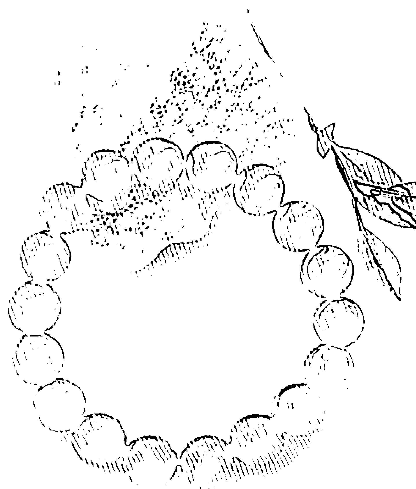

## 寻找我的幸运水晶

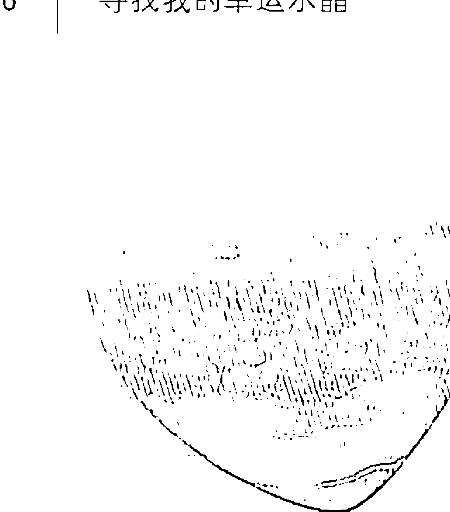

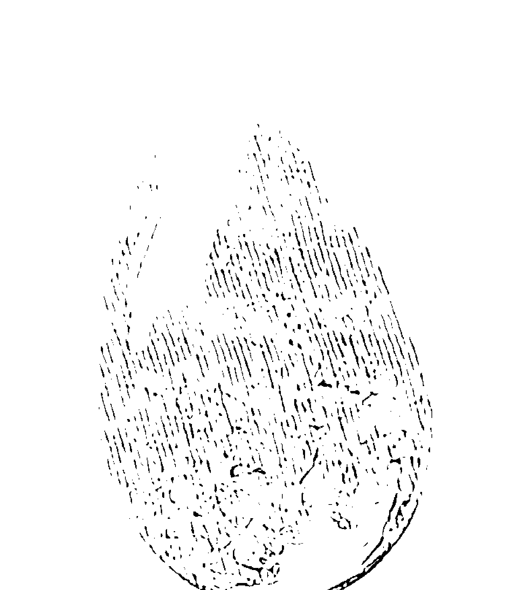

红纹石通常在粉红底色上可见白色、灰色、褐色或黄色条纹。高档红纹石晶体可呈透明的深红色，非常美丽、稀有。红纹石的摩氏硬度只有 3~5，轻微的摩擦都会伤害到它，需要小心呵护。

红纹石主开发心轮，解忧郁，助蜜运，能使佩戴者心情愉快，唤醒人们心中对爱的需求，使人热情，愿意付出；可以增进异性缘，增加招来爱情的机会。与粉晶不同的是，红纹石更偏向于行动，能增加信心并迈向目标。红纹石也被用来治疗因失恋带来的痛苦、失落、抑郁情绪，帮助心态趋向稳定、柔和。

与心轮对应的晶石会特别受到心态的影响。如果一个人根本无心谈婚论嫁，那么即使他（她）戴上粉红色系列水晶，也不能带来情感方面的助运，并且，随着时间的推移，被戴的晶石慢慢也会转入一种类似于休眠的沉寂状态。当然，一颗向往爱情的心也可以重新唤醒沉睡的晶石，帮助吸引生命中缘分的早日到来。

# 第7章 我幸运，我表达，我就是我

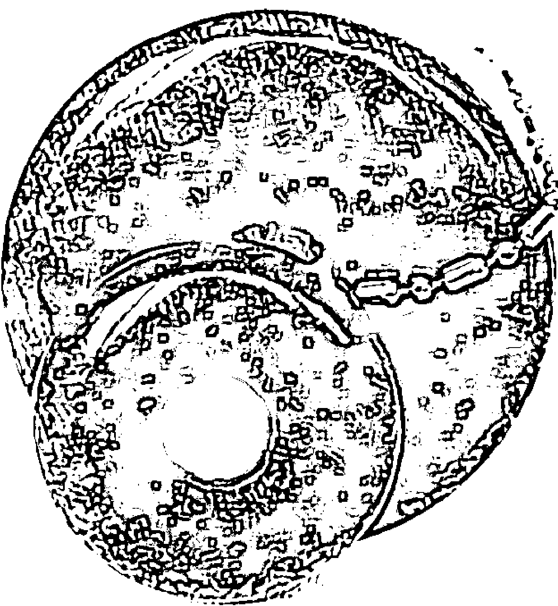

## 喉轮的表达

喉轮位于脖子前方的根部，它负责沟通和表达创造力，掌握着喉咙、甲状腺、颈部与嘴巴等。喉轮的智慧是宇宙真实本性的流露。喉轮的光是蓝色的，与喉轮有关的元素是声音和乙太。乙太代表了宇宙极为精细的能量场，它连接万物。现代科学之父牛顿就以“乙太”一词来描述存在于整个宇宙中的那些不可见物质，并将它视为活着的精灵。爱因斯坦也甚至说过：没有乙太的空间是不可想象的。尽管现代实验都相继表明乙太场的存在，但它已不再被称作“乙太”了。在科学界里，一提到“乙太”，就会被冠以“伪科学”之类的称号，因此，它暂时还没有新的、更贴切的名字。

喉轮是心轮的情绪以及眉心轮的心智的能量焦点。我们所做的每个选择都是情绪与心智之间平衡后的结果。一旦情绪和心智之间出现了挣扎，喉轮就会不和谐。长期的不和谐会导致生理上的疾病，如喉咙、甲状腺、嘴、下巴、牙齿、口腔、颈部等部位的炎症和其他健康问题。

喉轮表达的是真我。若无法忠实地表达自我，会给我们的身体制造出更多的紧张，因而失去能量。人若表达出来的是扭曲后的假相，而不是真实的自我，其喉轮的能量也必然是失衡的。人们虽然可以选择声调和个性来操纵语音，却无法彻底操纵声音里非语言的细微部分，因此聆听的人会接收到压力、不信任以及某人在说谎的事实。不诚实会害了自己，事实上，对方在能量的层次已经知道真相，可以感受到紧绷与不和谐。

我们的声音和话语后面包含着无限的能量，这也是为什么许多宗教都劝导我们要谨言慎行的原因。基督教要求赞美上帝，佛家强调莫造口业，世俗经验也告诫我们要小心祸从口出。根据一些疗愈大师的治疗记录和观察札记，现代人中喉轮能量失衡的情况占了相当的比例。人们对自己不够诚实，假意奉承，心口不一，这些都是造成喉轮能量失衡的原因，并且这种个体能量失衡的集体、集中表现将导致整个社会缺乏诚信。这个世界频发恶性呼吸道疾病的事实，其实是一个自然而然的结果，也意味着一种提醒。如果我们每个人都处理好自己喉轮的能量，勇于表达真我，这对自己、他人及社会都是一件好事。

从个人灵性层面看，喉轮使人具有深度自省能力，开始质疑自己一向深信不疑的观念，勇于挖掘事情的真相。当我们反躬自省，知道自己的行为何时是出于防卫，何时是出于真心；自己的观念哪一部分来自父母或社会，哪一部分仍保留着自己的本性，我们才算是真正了解自己。

在宇宙意识方面，由于我们从一个全新的角度看待自己，也就开始从不同的角度看待所有生命。我们会摆脱社会化造成的僵化思考模式，以开放的态度接受来自各方的能量，从而能欣赏世界上所有风俗、种族、文化里蕴涵的美感，对所有的人物、宗教、思想都没有偏见，并了解它们皆具真理，只是因时、地、人之不同，呈现出的形式或强调的面向有所不同而已。喉轮培养出全方位的宇宙观，使我们能够超越狭隘的思考框架。

喉轮臣服于高层意志并放下个人意志，臣服是出于全然地信任更高的能量，让上苍、上帝、佛法等接管一切。

喉轮的智性、创造力与表达力是我们难以想象的。开发出喉轮能量的人不一定是擅长语言表达的人，跳舞、绘画、音乐、文学等，都是自我表现创意的方式。成功开发出喉轮能量的人，可以超越时间和空间的限制而展现自己。

## 沉醉在蓝色的觉性之海——海蓝宝

自然界蓝色的矿物比较少，海蓝宝算是比较常见的了。海蓝宝是绿柱石家族的一员。说到绿柱石，大家也许会觉得陌生，但说起祖母绿，则可谓如雷贯耳了。祖母绿是世界公认的珍贵宝石，属于绿柱石家族，是绿色的绿柱石，而海蓝宝是祖母绿的同胞姐妹，它是蓝色的绿柱石。海蓝宝以酷似海水般的蓝色而得名，由于含微量的二价铁离子而呈天蓝色至海蓝色或蓝绿色，以晶体干净、蓝色浓艳为佳。

海蓝宝石长期以来被人们奉为勇敢者之石，代表着沉着、勇敢，并被视为幸福和永葆青春的标志。西方人认为，佩戴海蓝宝石能够使人具有先见之明，同时，它还具有催眠和镇邪的力量以及神奇的医用价值。海蓝宝的蓝色对应喉轮，能促进喉部健康，对提升表达能力、语言能力很有帮助，因此，很多讲师、业务员等喜欢佩戴海蓝宝，希望借以提升自己的沟通能力。

有一个朋友特别喜欢海蓝宝，她经常嗓子痛，而戴上海蓝宝就能起到一定的缓解作用。最令人惊奇的是，每次当她的嗓子好了，那串海蓝宝就会变得晦暗，需要进行很长时间的消磁才能恢复光泽。

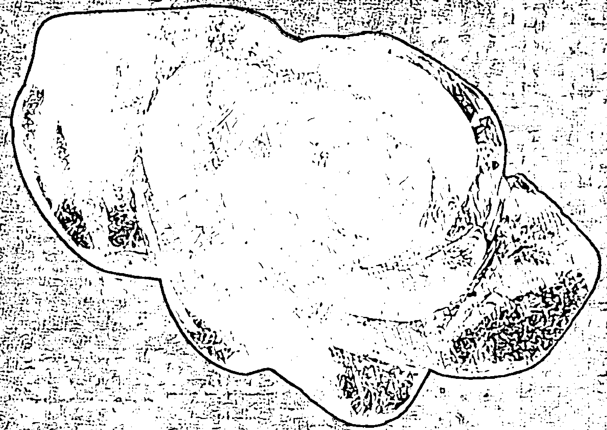

由于喉轮的特点，海蓝宝及其他对应喉轮的晶石如月亮石、青金石等，都是很好的灵修宝贝，尤其适用于灵修初期，它能让人更愿意放下执着以看清真相。同样，海蓝宝也是一种可以令人彻底放下情感伤痛的宝石。

## 小故事：海蓝宝带来的勇气——放下执著

素未谋面的网友 L 妹妹，收了我的一串藏品级海蓝宝手链，并无意中在给我的留言中提到海蓝宝给她带来“勇气”。基于对晶石与脉轮的理解，我知道海蓝宝的勇气与一般人们理解的勇气是不一样的。一般人们理解的勇气是冲劲、干劲，但海蓝宝的勇气则完全相反，它意味着“放下的勇气”。我好奇地问 L 妹妹，她所体会到的是不是一种“愿意放下执著”的勇气？一会儿她就回复了：“姐姐，你是怎么知道我失恋了?!”

“看到姐姐这么问我，真有一语惊醒梦中人的感觉，自己仔细思考了一番，发现真是那么回事啊！因为喉咙不好的缘故，收到那串海蓝宝就一直戴着。感觉心态在慢慢变化，还做了些奇怪的梦，再加上后来的思考……真是释然了啊！”

“我之前一直有点自欺欺人，甚至说是执迷不悟，不去想，逃避面对事实。不过现在都好了，真的，说不清楚呢。”

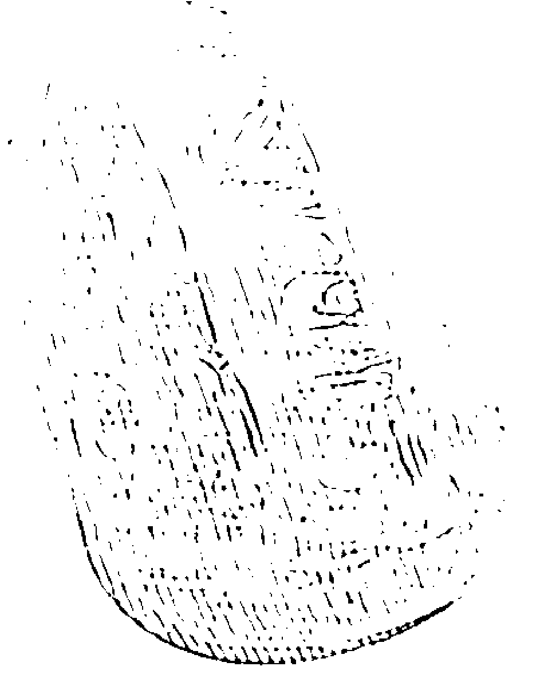

## 温柔而有力的表达——月亮石

月亮石，又称为月光石，属长石类。作为长石类宝石中最有价值的品种，月亮石静谧而朴素，透明的宝石上闪耀着蓝色的光芒，令人联想到皎洁的月色。它所散发的温婉之美正是其魅力之所在。古时候，世界上很多国家的人都认为佩戴月亮石能给人带来好运，给人以力量，并能唤醒心上人的温柔感情。

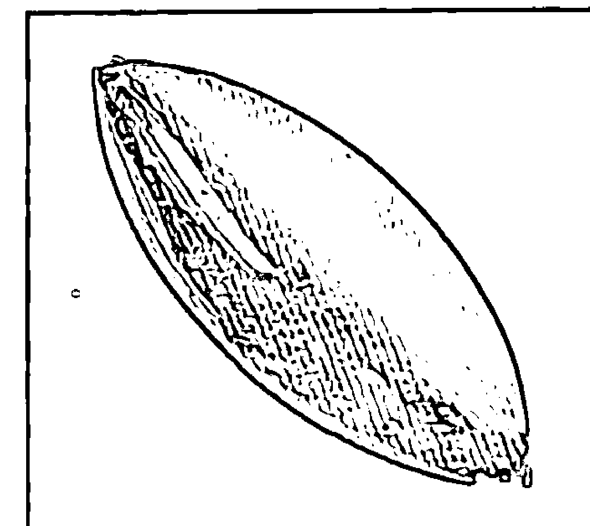

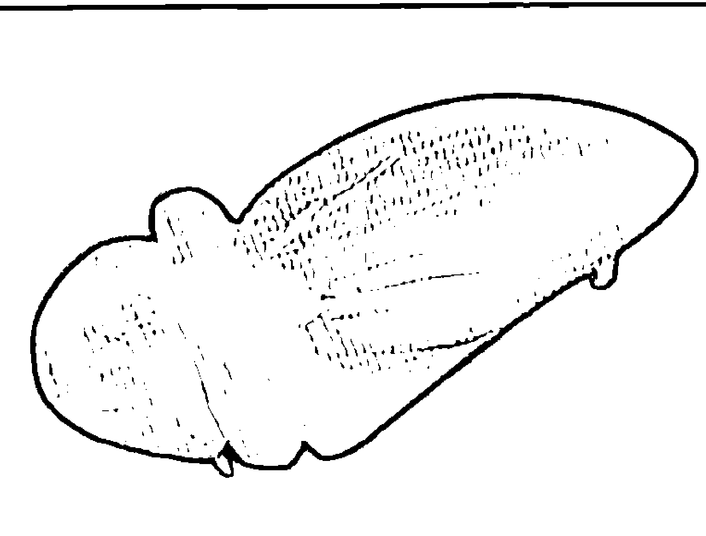

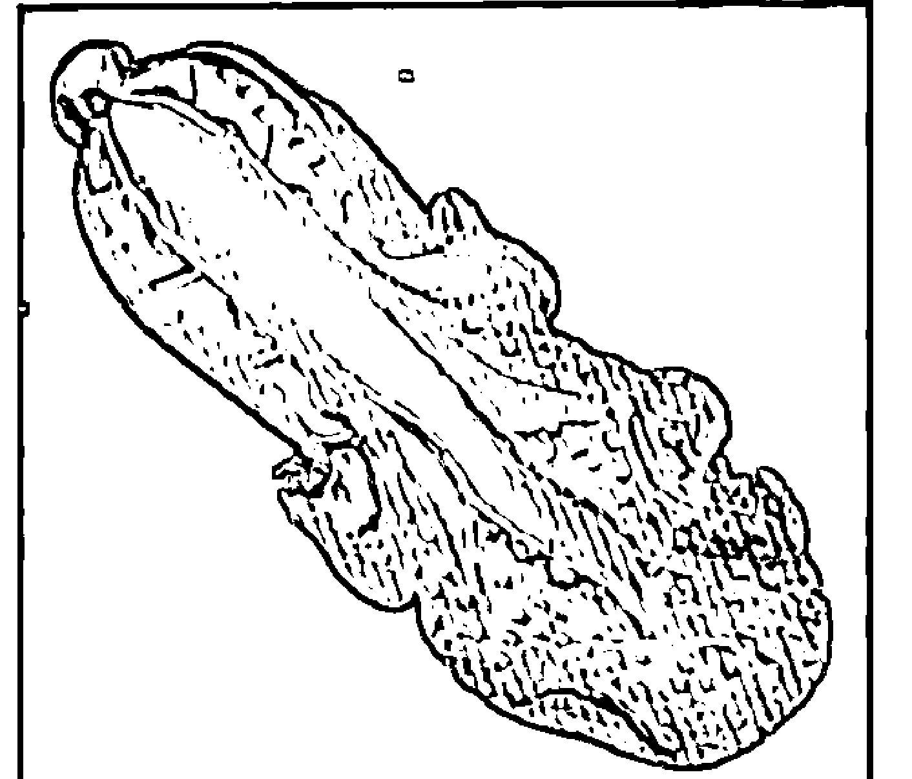

高档月亮石晶体透明或乳白，蓝光闪烁、游移，时隐时现，给人以无比美丽、神秘的感觉。月亮石的美与能量在于臣服，即收敛、放下自我，让宇宙意识显现。这情形如同天上的月亮与太阳的关系，月亮本身不会发光，因反射了太阳的光芒，而成就了天空中特殊的明亮与美丽。尽管月亮石外表是柔弱的，但它接通了宇宙能量的管道，也许它还不明白“为什么”，但谦和的它知道该“怎么做”，因此，月亮石的力量实际上非常强大，是真正意义上的柔弱胜刚强。

温柔的月亮石在能量表现上颇为全面。使用月亮石可以帮助缓解刚烈、暴躁、冲动的情绪，给人带来从容的举止和优雅的风度。如果有女性朋友个性太过直率，言语、行为、举止过于突兀，不合场合、气氛，可以用佩戴月亮石的方式，在潜移默化中改善气质。将月亮石放在枕头底下，可以助人安然入眠，夜夜好梦。月亮石能通灵性，有助于清晰思维，提升知觉与超自然力。作为医疗保健用的月亮石，可以用于减肥、美容和消除水肿。

## 因洞察真相而低调华丽——青金石

青金石，又称天青石，是阿富汗国石。青金石是古老的玉石品种之一，以其鲜艳的蓝色赢得各国人民的喜爱，早在 6000 年前即被中亚国家开发使用。在公元前数千年的古埃及，青金石与黄金价值相当。在古印度、伊朗等国，青金石与绿松石、珊瑚均属名贵玉石品种。在古希腊、古罗马，佩戴青金石被认为是富有的标志。我国对青金石的记载始于西汉时期，当时称青金为兰赤、金螭、点黛等。

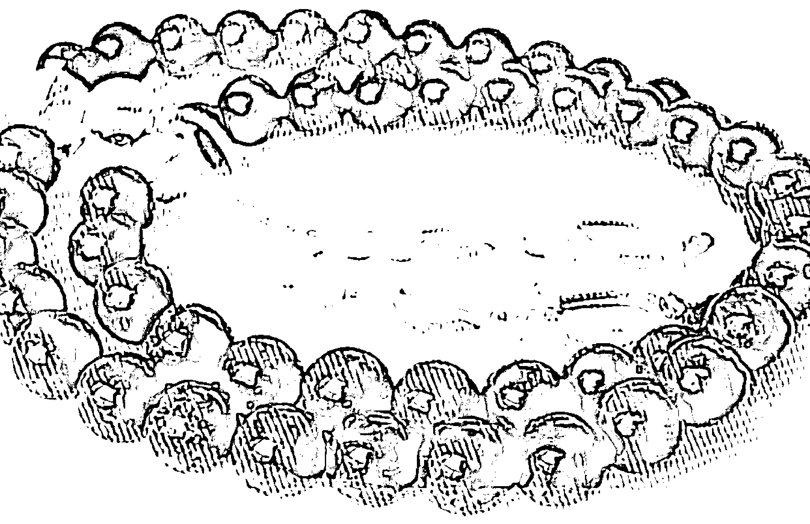

高档青金石有着完美而干净的深蓝色，金斑点点，如湛蓝幽远的星空群星闪耀，于简约中透着华美。

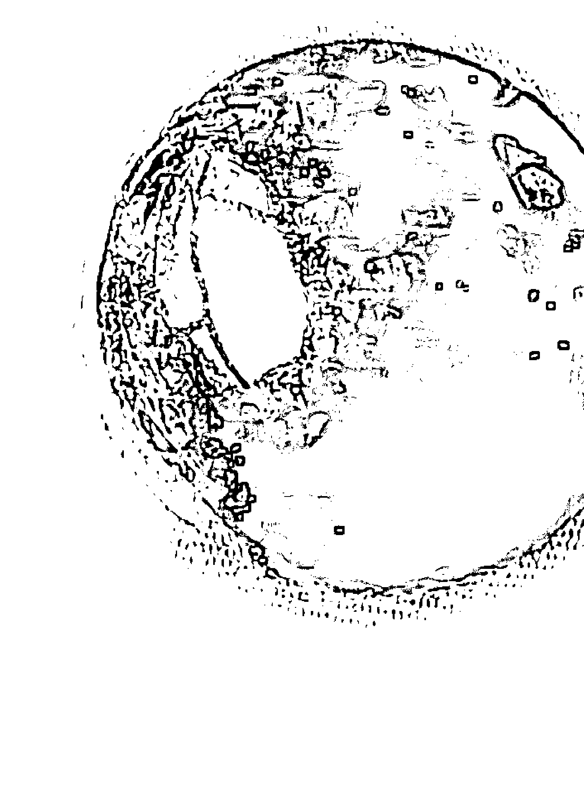

一般来说，青金石通常分为三个等级。最上等为青金石，颜色深蓝纯正，无裂纹，质地细腻，无方解石等杂质，不含金星（黄铁矿）或带有很漂亮的金星；其次为金格浪，其色深蓝至蓝色，黄铁矿和其他矿物质含量较多，使得蓝色中带有白纹、黄斑等颜色；再次为催生石，为较浅的蓝色，多含有白色方解石，因源于古人用此石作催生药之说而得名。

青金石特别适合亚洲人的肤色，只可惜国内不产这种石头。高档青金石有着完美而干净的深蓝色，金斑点点，如湛蓝幽远的星空群星闪耀，于简约中透着华美。因此，青金石是一种蕴藏着古典气韵、散发着书卷气息的石种，如同宠辱不惊的老牌贵族，于低调处张扬着，因洞察真相而低调华丽。

青金石以其独特的紫蓝、深蓝色调，对应着略高于喉轮而低于眉心轮的部位，代表着因洞察真相而心悦诚服。使用青金石可帮助催眠及深层冥想，增强洞察力，提升灵性，消除业障，也可激起人高贵清新、温文儒雅的气质。

青金石最实际的疗愈效果在于对老年病的帮助，若患有风湿性关节炎之类的病症，用青金石在关节处、疼痛处按摩，能起到良好的镇痛消炎效果。用于治疗的青金石无须追求高等级，选择普通蓝底带金星（黄铁矿）的即可。

关于青金石，我一直有一个很大的困惑：为什么高档青金石用于治疗的效果反而不及普通青金石？根据实践经验，用于镇痛、消炎的青金石需要有一定的黄铁矿组成，并不需要太高档的品质。这在晶石治疗中属于特殊情况，一般都是高档品质的功能更强。

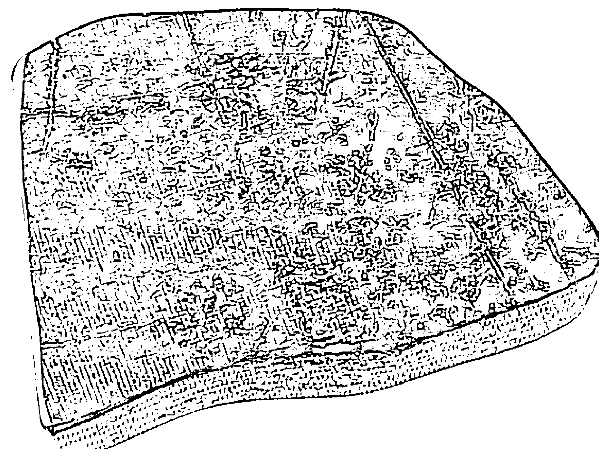

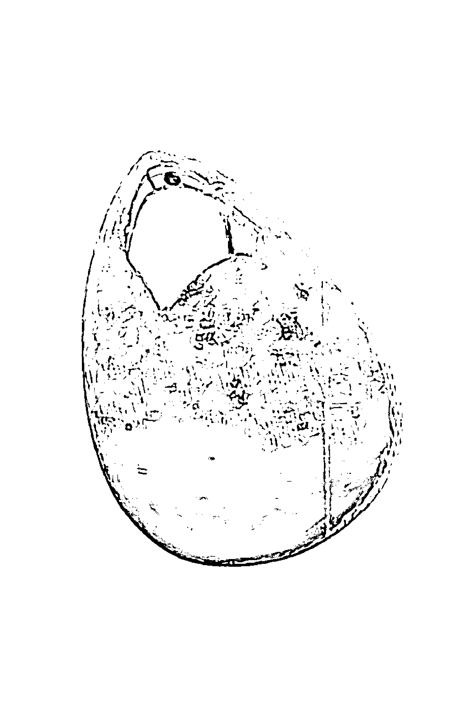

后来，我从种种事件中总结，终于明白普通青金石与高档青金石之间的疗愈区别：普通青金石以其深蓝颜色和所含黄铁矿的矿石特质，可以帮助镇痛消炎，是用于治疗身体的；纯净到几乎无黄铁矿的高档青金石对应更高的脉轮，如果是精神、业力方面的“炎症”，则需要使用高档的青金石帮助排除，这是用于疗愈灵性生命的。正因为如此，如果将高档青金石用于普通病症的治疗，很可能不会起到立竿见影的效果，如消炎、止痛等。使用高档青金石时，需要关注的效果更多的是整个生活层面，而不仅仅是身体层面。

## 小故事：青金石的疗效

妈妈常常腿痛，我抱着试一试的心态建议她用青金石。不久，妈妈告诉我说使用青金石效果不错，头天本来腿很痛的，用了青金石，第二天起来就不痛了。我笑着说：“您大概是心理作用吧？”“不是的！”妈妈拉我到床边，掀开被子，床上赫然放着一只蓝幽幽的青金石手镯，她说：“你看，我就是用这个垫着腿上痛的地方睡了一晚，第二天一早腿真的就轻松了！”

妈妈属于比较敏感的人，到底是心理作用还是真有效果，则需要爸爸这个旁观者来见证。爸爸是理科教授，浙江大学毕业后留校任教十年，回长沙后，先后从事科技研究、企业管理和法律方面的工作至退休。爸爸的理性思维是贯穿始终的，他很难认可未经验证的东西。当然，他对未经验证的东西也能抱着开放的心态——既不说有，也不说必定无。我问爸爸关于这事的看法，爸爸说妈妈头天说腿痛，第二天一早就说腿轻松了，这在以往是没有的，但究竟是不是石头的效果就不好说了。

既然妈妈认为有效果，我就多拿了几片小的青金石平安扣回去，更方便贴在痛点上。

没过几天，爸爸在电话里主动跟我说：“你那个蓝色的石头啊，消炎镇痛效果特别好！”爸爸的右手从大拇指到手腕一直肿痛，有一段时间了，吃了很多药也没见好，用我送回去的青金石平安扣贴着，居然贴哪儿，哪儿就不痛。连续试了好几天，贴在不同的痛点，通常一晚就见效。爸爸还发现，几个平安扣中，有一个的效果是特别明显的。如此理性的人，如此明确的结论，倒是让我有些意外了。

我叮嘱爸爸妈妈：用于治疗的晶石一定要特别注意消磁。白天放在紫晶洞里消磁，晚上拿出来贴在手上睡觉。这样既不影响治疗，又不影响日常工作、生活。

## 小故事：极品青金石佛珠的能量

我喜欢将最高档的各种晶石穿成佛珠自用或者随缘结交朋友。曾经不计成本地选用基本无黄铁矿、颜色鲜艳深邃的极品青金石，配上自己喜欢的黄蜜蜡平安扣，编制成一串价格极其高昂的佛珠打算自用。那个平安扣上雕刻有盘在一起的两只貔貅。不料，它被一位偶然找到我的朋友结缘而去。不久，朋友就告诉我，自打那串佛珠进了门，身边很多事情都自然而然地顺利了。最让她欣慰的是，长达数年的女儿监护权争夺战终于宣告胜利结束！

就那串青金石佛珠而言，青金石增强了朋友的说服力，黄蜜蜡则加强了行动力与提升了个性魅力，这些因素综合的结果就是让对方让步，于是，朋友终于得到了对女儿的监护权。当初我在穿制那串佛珠的时候，冥冥中，所谓的颜色搭配啊什么的，其实并不是为自己收藏，而就是为了这位朋友——那是她的缘分。甚至连那一颗两只貔貅盘在一起的蜜蜡平安扣，似乎也有着“母女团圆”的寓意。

水晶可以帮助很多人解除身体和心灵的痛苦，在这个过程中我也能更加清楚地看到自身生命的意义。

# 第8章 幸福不是想要得到的欲望，而是懂得放下的宁静

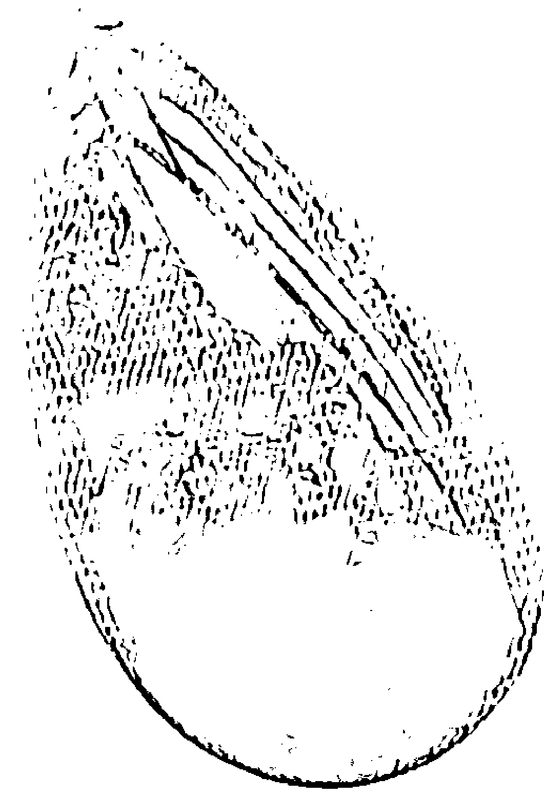

## 眉心轮的智慧

眉心轮位于双眉中央，是直觉坐落的位置，即第三眼。这是肉身内的最后一个脉轮，振动频率最高而波长最短，代表着有形世界最高的统领。眉心轮掌握的生理范围包括脑下垂体、眼睛、鼻等，是最为人知的与心灵品质、灵性相关的脉轮。眉心轮的元素是光，能表达出我们的洞见、慈悲、无我和连接无条件的大爱。眉心轮的开发将有助于灵性的提升，使人成为理性上的开悟者，能在内心获得一种新的平衡和宁静，不再容易受外界事物的干扰，但是，这种人还没有获得完全的解脱。成功开发眉心轮后，也就是俗称的“开天眼”，可以用非视觉的觉知，“看到”远处的物体或者体内的经络、内脏等。

眉心轮的光是紫色的，这种光由眉心轮到头顶逐步过渡到淡紫，到顶轮是明亮的白光。紫色是人类从光谱中所能看到的波长最短的光，比它波长更短的称为紫外线。紫色是彩虹光谱中的最后一种颜色，代表着已知王国的边界和未知王国的开端。眉心轮的直觉是属灵的智慧，也是灵感与创意的基础。所谓“急中生智”、“眉头一皱，计上心来”，是眉心轮能量调动的结果。所以，问题得不到解决时我们常常会“紧锁眉头”，一段情可以让我们“才下眉头，却上心头”，而一旦问题解决了，紧锁的眉头自然舒展开来，或者干脆就“眉飞色舞”了。

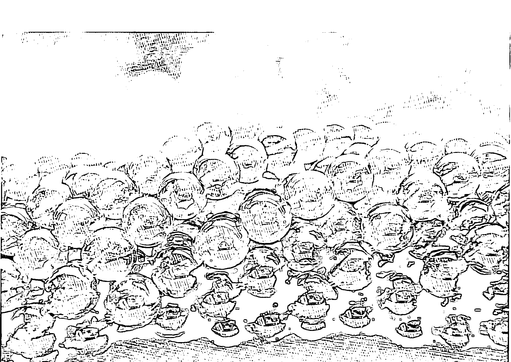

眉心轮能量不足或有阻碍的人中，有相当一部分是知识分子、学者。他们理性分析、逻辑思考能力很强，但直觉能力低，观想力差，缺乏想象力。他们只相信眼前的事实是唯一真理，对看不见、摸不着的事物一概否定，一概不相信，对灵性事物嗤之以鼻。

眉心轮能量过度的人则太过肯定、太过相信一些片面的经验，想象力过度发展成幻想，甚至幻视、幻听、幻觉，严重的则在医学上被诊断为精神分裂等疾病。这种人由于身体下部的能量被向上抽，不能落地扎根，因而在现实生活（海底轮等管辖范围）中可能连柴米油盐也张罗不了。

眉心轮与喉轮能量一旦结合起来，我们就能回到内在的核心，专注在自己的道路上。通过眉心轮与顶轮的共同运作，我们将得到启发，并且和更高层次的智慧取得联系。这种能力在生活中显现出来时，我们就如同掌握了宇宙的吸引力法则，拥有心想事成的幸运。

## 洞明真相的“第三眼”——紫水晶

紫水晶因三价铁离子产生的空穴色心而呈现美丽的紫色。紫水晶的外号颇多，有爱情水晶、智慧水晶、招福水晶、风水石、能源石等。

自古以来，紫色代表了高贵、神秘，甚至是不可思议。如果问世间什么东西是高贵、神秘和不可思议的，相信很多人会回答出两个字——宗教。事实上，紫色也是常被运用于宗教中的颜色，一直与灵性相关。《大乘无量寿经》中阿弥陀佛四十八大愿之一就是“十方世界所有众生令生我刹，皆具紫磨真金色身”。紫磨金指带紫色的黄金，是黄金中的最上品；基督教中，紫色代表忏悔与期待。

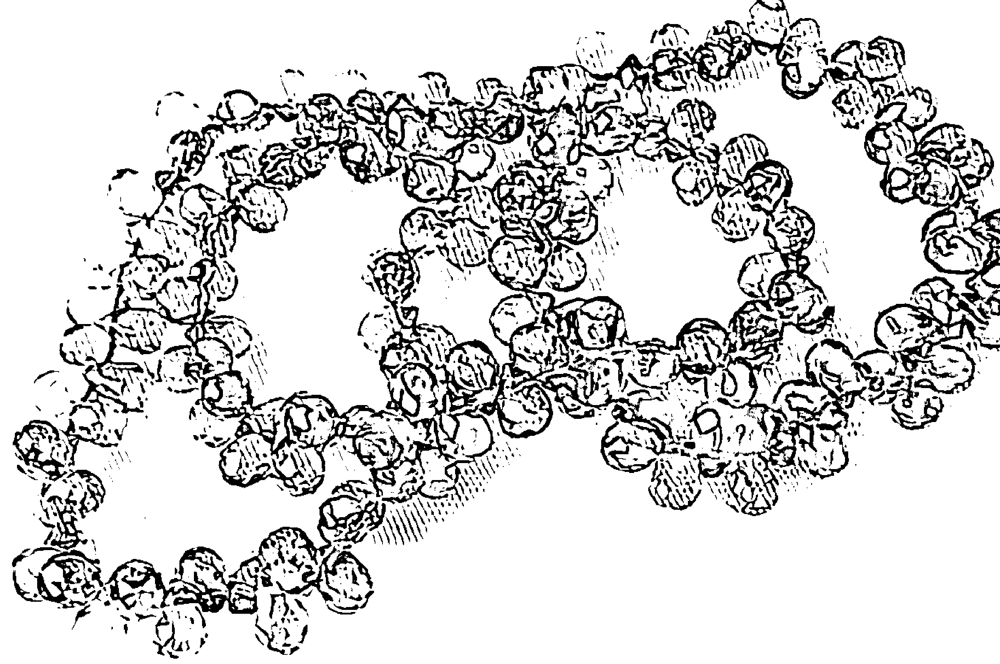

表至高无上和来自圣灵的力量；犹太教大祭司的服装或窗帘、圣器，常常使用紫色；天主教视紫色为主教色，主教穿紫色，红衣主教穿朱红色。在中国传统里，紫色也是尊贵而神秘的颜色，如北京故宫又称为紫禁城；老子出关时显现“紫气东来”这样一种祥瑞之象。如今日本王室仍尊崇紫色，也是源于中国古代对紫微星（北极星）的崇拜。可见，古今中外的文化传统都将紫色视为一种与智慧、灵性、高贵相关的颜色。佩戴与眉心轮和谐共振的紫色晶石，有助于开发智慧，提升灵性。

紫水晶对应第三眼，象征着意识的转变，能开发智慧，提高直觉，促进慈悲心，发展和稳定人际关系，使人能冷静沉着应对困境，并有镇定安神、加强记忆力、缓和暴躁脾气的效果。紫水晶温和的说服力能暂时停止充斥在意识中的世俗思维，使心智体验到宁静，并进一步开发觉知力。

在眉心轮这个层面，只有放下所有曾经坚信为真的，才能认识终极的真相。这种从觉知中提炼出来的智慧，对生活将具有更正确的指导意义。这种智慧不是从世俗的知识中所能提炼的，它是一种本源的觉知，是深藏在人身体中的宇宙秘密，而紫水晶是连接这种觉知的桥梁。

## 寻找我的幸运水晶

紫色主宰右脑世界，即直觉与潜意识，脑力劳动者特别适宜使用紫水晶，以提高脑细胞活力，帮助集中精力进行思考。由于具有镇定心智的作用，紫水晶可以用来帮助工作过度、压力过大或者被头脑中过多想法所淹没的人。紫水晶还可以帮助释放焦虑，缓解紧张情绪，对治疗和缓解偏头痛、晕眩等有一定的作用。

丁香紫般的浅紫色水晶对那些因噩梦而受苦的人特别有帮助。在就寝前，将浅紫水晶握于掌心，贴在前额，祈祷高品质的睡眠或者观想自己置身于一个优美的环境，如一个有着美丽风景的地方，然后将它放在枕头下，安心地睡觉。当祈祷或者观想日渐娴熟，高品质的睡眠和梦境也将随之呈现。

## 新世纪的抗癌宝石——舒俱莱

舒俱莱是英文 Sugilite 的译音，矿物名称为硅铁锂钠石，也称为苏纪石、苏姬莱石、钠锂大隅石。这是一种集合体晶石，主要矿物成分为苏纪石，并含有针钠钙石、霓石、石英等矿物，结构细腻，通常呈紫红、粉、蓝等多种自然过渡颜色。

舒俱莱石的发现相对比较晚，于 1944 年被日本一位石油探勘家 Mr. Kenichi Sugi 发现，并以他的名字来命名，但直到 1979 年，由于部分伟塞尔锰矿的崩塌，南非才发现达到宝石级的舒俱莱石。

紫红色的舒俱莱对应人体的眉心轮，能帮助人们进入忘我境界，平衡暴怒、忧郁、沮丧、悲哀等极端情绪，清洁、净化身体负面信息，帮助恢复身心平衡和健康，因此，又被称为新世纪的抗癌宝石。

21 世纪是一个充满竞争的世纪，然而，通过竞争所获得的快乐，很快就会被更多“自己的欲望”和“别人的成功”导致的失落感所取代。在竞争式快乐的引导下，无止境的索取将使地球无法承受，最终导致整个生态系统的毁灭。在长期压力和不良环境及其产物的综合影响下，各种疾病尤其是癌症频频发生，并引发高死亡率。

可见，这种竞争式的快乐模式其实根本没有快乐可言。认清楚这点后，现在很多人转而向内寻求自身灵性成长的快乐。当人们灵性发展，懂得什么是无条件的快乐并开始遵循自然的平衡法则后，很多癌症或者其他疾病也将随之消失。

当然，无论是运用什么种类的天然石，都必须配合正确的心念才能发挥最大的效果，从而达到疗愈的目的。如果只是戴着某种石头，而依旧放任自己非良性的心态，那么再好的灵石也难起作用。

## 神性的管道——三轮紫骨干水晶

三轮紫骨干水晶又被称为紫（红）发水晶，含金黄色包裹体的又被称为紫钛水晶，其梦幻般紫色的晶体中包含着多色发丝状包裹体，对应人体不同的脉轮，因而被称为三轮紫骨干水晶。三轮紫骨干水晶是自然界中一个很特殊的晶种，具备温柔、持久、缓释的强大功能。

# 第 8 章 幸福不是想要得到的欲望，而是懂得放下的宁静

以前只顾着欣赏三轮紫骨干水晶的美丽，并没有去思索它的功能。一天，在礼佛时，我脖子上佩戴着的一块三轮紫骨干水晶碰到额头，脑子里突然冒出一个问题：三轮紫骨干对应的是哪三轮？这一想不要紧，我被所得出的结论吓了一跳。三轮紫骨干水晶通常包含有多种颜色，即黑色、红色、金黄色和紫色，所对应的脉轮，自下而上分别可以是海底轮、脐轮和眉心轮。也就是说，它对应了人体里最初和最后的脉轮！如果再加上其白色的晶体，则这种水晶甚至接通了人体外的第七轮——顶轮。三轮紫骨干水晶如同一条神秘的管道，沟通了物质基础和灵性本源，其紫色中显现的部分白色晶体更是直达神性的合一。三轮紫骨干水晶代表着最初的，也是最后的。它指引着生生世世终极的成就：由物质走向精神，由黑暗走向光明，由生命走向永恒。

## 092 寻找我的幸运水晶

接受和喜欢三轮紫骨干的人需要一点灵力和毅力，首先是自己要愿意站在探索生命奥秘的高度去体验生活中的点点滴滴；其次是对遇到的所谓的不如意事并不十分介意。三轮紫骨干水晶一般不会立即给人带来眼前的“好处”，但它对整个人生却能产生长远而深刻的影响，这种影响从生命历程的角度看是非常积极和有意义的。可以想见，一个尚挣扎在海底轮、生殖轮能量失衡中的人，是不太可能接受高贵而“无用”的三轮紫骨干水晶的。只有当人们在生活中碰得头破血流或者被无常的苦乐所困扰，最终开始思考什么是人生、什么是快乐的时候，三轮紫骨干水晶才会以一种导师的身份出现在思索者的面前，帮助人走上觉悟之路。

# 第9章 我就是彩虹！

### 顶轮的境界

不同的传承中对于顶轮的位置与颜色有着不同的说法，较普遍的有两种：一种认为顶轮位于头顶，在身体内，发出淡紫的光；一种认为它位于头顶之外，发出白色和金色的光。我个人更认同顶轮位于头顶之外的理论。可能是由于“顶轮位于头顶之外”这样的情形让人难以理解，甚至可能产生“顶轮与我无关”的误解，于是，有的理论在描述时就将此轮脉的位置放低了，因此在颜色和能量描述上也就随之有所不同。

顶轮又称为梵轮，连接着宇宙能量，它并不存在于真实的肉体里，而位于从肉体转化到灵体（体外的空间）的那个点上。顶轮是物质的创造者和毁灭者，它代表着极乐。可以说极乐世界就在我们头顶，但极少有人能够到达。

顶轮是灵感、灵性和献身信仰的脉轮，它信任生命不可毁坏的力量。我们常见画中的佛、菩萨、基督、圣母头上都有着金色的光环，这表示灵性的觉醒以及觉醒之光，从顶轮发射出的光芒可直达宇宙星辰。我们必须靠海底轮吸收地气以滋养身体，也必须依赖顶轮吸收宇宙星辰之光，以滋养灵体及整个脉轮系统。

顶轮让人们突破父母的教育、社会与文化的限制以及地缘的限制，获得真正的自由。它教导我们如何活在当下，并借着宽恕他人和自己来释放过去。我们从顶轮学习到如何改变与了解能量，如何臣服与信任，如何受到启示与激励，并且致力于自己的人生使命。顶轮掌握着完美的觉知，那是一种内在的洞见，人可以借由它和宇宙能量调成同步。在这个状态里，我们与无条件的快乐联结在一起，可以毫不费力地创造。

将能量从海底轮提升到眉心轮可以采用很多方法，也必须经历很多过程，但是，要将能量从眉心轮提升到顶轮，却是无路可循，只能“跳跃”。从另一个角度看，是人不得不往上“掉落”。正是在这个意义上，许多灵修传统都强调上师在开悟中的作用。除非此人具有一颗狂野不羁的心，且拥有一个完全值得信任的上师，否则无法跳进那无底的深渊。多数人都缺少上述两个条件中的任何一个，所以他们都在眉心轮那里卡住了。这样，内心的宁静与平和成了他们所体会到的最高境界，也正是因为这样的限制，才有那么多的言论认定宁静与平和是最高的境界。

真正的开悟之后，一个人通常就结束了在物质世界的生死轮回。大部分开悟的现象都发生在灵体脱离肉体躯壳的那一刻，因此，世界上极少有真正开悟的人。而且，真正开悟的人与常人无异，就算擦肩而过，人们也未必能认出外表普通的他（她）来。正如古人所说，“浓肥辛甘非真味，真味只是淡；神奇卓异非至人，至人只是常”。

顶轮的觉知是一种开悟的状态。在此状态中，能体会万事万物都来自于同一源头，能产生与整个宇宙合而为一的感觉。能量进入到顶轮的人，会毫无缘由地处于狂喜之中。虽然几乎所有的人都不能达到永远开悟的境界，但借助有效的静坐、灵修等，灵光乍现的开悟体验并不难求。有人描述在这种境界中的感受：“我大哭特哭，但完全不是伤心也不是痛苦，只是太高兴了！”“见到大片的光线……内心非常宁静。”“非常快乐！”“完全自由了！”

## 代表圆满的大地之花——白水晶

我们习惯上所称的“白水晶”其实并不是白色的，而是无色透明的。透明纯净的白水晶是主要化学成分为二氧化硅的石英结晶。就整个水晶家族而言，白水晶分布最广，数量也最多。白水晶的晶莹剔透，与冰类似，却又有别于冰的寒冷与不堪接近。它是大地之花，光而不耀，温润动人。白水晶是佛教七宝之一，被称为摩尼宝珠，又被称为菩萨石，此外，它还有千年冰、放光石等雅号。

自然界中，白色光被誉为众光之母，是红、橙、黄、绿、蓝、靛、紫等可见光的综合体，代表平衡和圆满。所有的彩虹光都是由白光演化、扩散而来，是宇宙最高的能量，因而白水晶又有着晶王的美誉。白水晶的透明度越高，聚集灵气的能力也越强，纯净透明的白水晶一直以来深受广大水晶爱好者和灵修人士的喜爱。灵修人士常常借助白水晶的清净光来清除自身的“黑气”，即“不善业”，希望恢复本性的光明纯净。

白水晶能产生持续、稳定的震荡波，化解不良磁场带来的干扰，具有镇宅、辟邪、化煞的能力，也能使人头脑清晰，增强记忆力和理解力。一直以来，东方人将象征圆圆满满、有求（球）必应的天然白水晶球，作为镇宅、聚福的宝物。西方的预言师们也总是在面前摆上一只天然白水晶球，用来通灵或借助其预测命运。

将白水晶晶簇摆放在电脑、电视机、微波炉等电器附近，可以减轻辐射，保护人体不受过多的电磁波的干扰。长时间使用电脑的人可以将白水晶晶簇或者晶柱放在电脑边，对防辐射、保持冷静、增进分析思考能力，都将起到良好的作用。工作之余还可以将敲键盘的双手放在白水晶晶簇上，让天然白水晶纯净的气场净化双手吸收的负面信息，刺激手掌穴位，以达到快速恢复细胞活力的效果。

### 小贴士：谁是王中王？

钛晶是“水晶之王”，白水晶也是“晶王”，这两个到底谁是王中王？其实，所谓的“王”，是针对不同情况而言的。就世俗的喜好来说，钛晶具备金与玉的双重质感，无疑是富贵与吉祥的象征，是世俗眼中的王；就灵修而言，作为开发顶轮和综合了彩虹光谱颜色的白水晶，因其特有的频率和功效，无疑是灵修土眼中的王。这两个王都各有其“追随者”，无所谓谁是王中王。

## 落入人间的彩虹——碧玺

如果说白水晶是脉轮颜色的综合与隐含，那么碧玺就是脉轮颜色的显化了。碧玺以其艳丽多彩而著名，色泽美丽的碧玺，如同一道落入人间的彩虹，深受人们喜爱。

碧玺，英文名称为 Tourmaline，是从古僧伽罗语 Turmali 一词衍生而来的，意为混合宝石。在我国的一些历史文献中，称之为砒硒、碧霞希、碎邪金等，“碧玺”是珠宝行业惯用的名称，它在矿物学中属于电气石族。碧玺颜色丰富，有无色、玫瑰红、粉红、蓝、绿、黄、褐等，其中以蔚蓝色和鲜玫瑰红色为上品。多色碧玺中，又以红绿相配的西瓜碧玺最为珍贵，最受欢迎。

据说，1703 年一个温暖的夏天，在荷兰的阿姆斯特丹，有几个小孩在玩航海者带回的石头。突然，一个小孩发现这些石头将近处的灰尘和草屑纷纷吸了过去。小孩十分惊奇，便叫他的父母来看，果然发现这种石头能吸引或排斥轻物体，如灰尘和草屑等，因此，荷兰人把这种石头叫做吸灰石。直到 1768 年，瑞典著名科学家林内斯发现碧玺具有压电性和热电性后，人们才逐渐接受并采纳了现在的名称——电气石。

碧玺以颜色、透明度和重量等作为评价与选购的依据：透明度要好，表面具有玻璃光泽，内部包裹体和裂隙要少。碧玺性脆，佩戴时应注意避免撞击。

碧玺的颜色是多变的，甚至同一块晶石中会包含着多种色泽，其自然过渡的态势，也一如脉轮，因此，除了西瓜碧玺特别对应心轮外，碧玺对应的脉轮通常是全方位的，佩戴碧玺有助于全身脉轮能量的净化，并达成新的和谐。据说它的能量还可以随温度而转化，对身体的血液循环有很大的帮助。

值得注意的是，经人工注胶改色的碧玺如同“木乃伊”，尽管它们也许晶体更透，颜色更漂亮，但却因为失去自然的活力而在一定程度上得不到灵性运用的认可。

## 传说中的爱神——彩虹水晶

彩虹是一种光学现象。当阳光照射到空中的雨点时，光线被折射及反射，便在天空形成拱形的七彩光谱。彩虹的七彩颜色，从外至内分别为：红、橙、黄、绿、蓝、靛、紫。彩虹是宇宙白光的综合体，通过彩虹，我们可以追溯本源。彩虹是宇宙大爱的使者，宇宙之爱是圆满的、无私的、光明的，因此，“彩虹”也意味着“圆满”。彩虹是象征，意味着在我们怀疑与困惑的乌云背后，永远有太阳守候着。

水晶中的彩虹是水晶在生长的过程中遭遇不同方向的力量而形成，在学术上叫应力裂隙或应力纹。这一点都不浪漫，听起来像是破水晶。好在，彩虹水晶不在乎别人怎么看，它只是不断地绽放出自己最美丽的光华，给人以深思和灵性的指引。

当彩虹光束放射它多彩的神奇力量到我们的生命里，我们将带着欢乐和喜悦使用这些令人称赞的礼物，为世界奉献更多美好与爱。

彩虹水晶常用于静心，护送意识安然进入纯净白光的领域，它可以带你更快地进入一段内在的旅程。当人类的灵魂与宇宙力量联合时，实相将以一个新的面貌呈现，个人将被赋予力量。

彩虹水晶有助于治疗哀伤、悲痛和沮丧的情绪。使用时将它对准心轮，观想那些负面的情绪在温暖的白光中被溶解与缓和，并以喜悦、热忱、自信与爱取代。将彩虹水晶放在近窗台的位置，阳光折射进来，透过它在室内散射出漂亮的光彩，有利于室内磁场的净化，并创造出正能量。

> “起一座虹桥，指点着永恒的逍遥”——与其说这是徐志摩带给我们的文学美，还不如说是宇宙大爱借诗人之笔的化现。借助彩虹水晶，我们可以更深刻地认识自身，并踏上彩虹之旅，回溯到白光的尽头，回归到“永恒的逍遥”之中。

# 第10章 特殊水晶的运用提示

### 走进神性的图书馆——记忆库水晶

记忆库水晶（Record Keeper），又译作资料库水晶、记录器水晶等。这种水晶如同录影带，客观地记录着种种“所见所闻”的资料，在读取这些资料时，它就如同是一位客观的叙述者。记忆库这个名称的由来，涉及我们前面讲述过的具有高度文明的古帝国——亚特兰蒂斯。

传说亚特兰蒂斯拥有高度文明，他们掌握了利用水晶作为能源的方法，用一颗巨型的水晶转换宇宙能量以供应整个城市的能源需求。亚特兰蒂斯的大祭司预知灾难即将发生，帝国即将沉入海底，于是将当时的科技、道德、农业等智慧输入水晶，为了让这些水晶有别于一般水晶，便在上面做了三角形的记号。以后，这种带有三角形记号的水晶就被称为记忆库水晶。

然而，谁也说不准亚特兰蒂斯大祭司所作的三角形记号，到底是刻在水晶的表面上，还是包裹于水晶当中；是突出的，还是凹陷的；是等边三角，还是等腰三角，或者其他三角。因此，人们将带有三角形的天然水晶都归为记忆库水晶。作为灵修用的记忆库水晶，通常是选择水晶柱顶端菱面有突出或者内陷三角形的水晶。

值得注意的是，诸如记忆库水晶等有着特殊标记的水晶，其特殊标记或者特殊菱面都必须是天然形成而非人工打磨而成的。

### 小故事：TETE

一位好友很偶然地拥有了一块记忆库水晶。在带着它打坐的过程中，这块水晶通过频率振动告诉朋友它的名字叫“ULKIRA-TETE”。朋友是个很严谨的人，因此，除了对几个关系非常好的晶友，她从不跟其他人说起这些事。

有了第一次的沟通之后，她就一直称呼那块记忆库水晶为 TETE。一位晶友偶然看到 TETE 的照片后说，不知道为什么，看到 TETE 的照片很心酸，想流泪。朋友这才说，TETE 还传达过这样的信息：在某个大陆，人们的衣着、生活完全不同于我们现在的人，在那里，人人都有一块护身符般的水晶。TETE 最后传达的影像是：TETE 的小主人和妈妈一起被爸爸送上船，像是在逃亡，一片混乱……爸爸转身又回去，没跟他们一起……

难道，TETE 真的是来自亚特兰蒂斯？

## 接通终极真理与智慧——通灵水晶

通灵水晶（Channeling Crystal）是一种有着特殊功能的水晶，它能够帮助擅长于灵能沟通的人读取所需要的信息，如果能配合记忆库水晶使用，效果将更为理想。寻找通灵水晶并不难，难的是要等待机会——它只在你确实需要的时候才会出现。

识别通灵水晶有几个要素，它的顶端有一个天然的七边形晶面，这个晶面必须是所有面中最大的一个，正对这个晶面的背后是一个三角形的晶面，沿着这个三角形晶面往下，通常能找到更小的水晶突起。通灵水晶七边形的晶面象征着通往内在真理的门径，背面的三角形象征允许这些真理和洞见能被表达出来。

通灵水晶所谓的“通灵”，其根本意思是：接通来自灵魂深处的实相和宇宙的智慧本源，并且表达出来。通灵水晶是一种媒介，可以帮助接通灵性，获得更多的信息和帮助，因此，当我们使用通灵水晶时，并不是把能量给出去，而是通过它连接更高层的能量。当我们用这个方法来接通智慧之源，就会了解如何接收能量，并在生活中正确地使用。

## 改造气场的“教堂”——骨干水晶

人们把不同时期的热矿液在同一水晶主体上的结晶叫作垒晶，不同的结晶层层相连，便形成骨干水晶。骨干水晶因其外表嶙峋，又有着鳄鱼皮水晶、教堂水晶、城堡水晶的美誉，有紫色、白色、茶色等多种颜色。其定义在不同的领域稍有不同：在灵性运用领域，将垒叠生长的水晶原矿统称为骨干水晶，大小从数毫米到几十公分不等；在学术领域，把按平行方式生长的垒晶叫做骨干水晶，通过观察其反光面比较好辨认。天然水晶的生长形态是非常复杂的，尤其是垒晶，往往是多种形态并存，很难从严格意义上区分开来，因此我个人更认可灵性运用上骨干水晶的概念。

我最喜欢白色的骨干水晶，因为它似乎更符合圣洁教堂的形象：那是一种建立在高山或者悬崖上的哥特式建筑，有着很多高耸的尖顶，紧紧地挨在一起，远远地看着，有一种神圣感，仿佛能听到天使在唱诵着赞歌，有无数大大小小的光环从天而降……

骨干水晶是一种具备强大功能的水晶。曾经做过下面的试验：同样是天然白水晶簇，当我把手掌靠近普通白水晶簇但不接触时，隐隐能感受到有一点凉气；当把手靠近白骨干水晶簇时，能感到凉气更重。我的理解是：当手靠近水晶时，尽管没有接触，但空气传导了手心的热气，造成了手心有凉感。如果说是空气传导手心的热气造成了凉感，那么从理论上来推测，晶体侧面的凉感应该比较明显，而晶体顶端的凉感会比较微弱。我将手分别靠近晶体面积最大的侧面和面积最小的顶端，情况却恰恰相反：我将手放在靠近晶体顶端的部位能感到很明显的凉气，这种凉气甚至是一阵一阵的，有如波浪推动；而在晶体侧面则没有感受到这种现象。

水晶以其生长特点，是有方向性的，水晶能量传导的途径通常是从晶柱的底端到尖端。因此，在靠近晶体尖端的地方，很多人能感受到特别的能量振动；而在晶体的侧面，尽管面积最大，却不会有太多的感觉。骨干晶簇更是一种特别的水晶，它的结晶形态有如很多小柱密密麻麻地堆积，最后集结到一处。可以想见，骨干水晶的能量传导特点是纽合了很多很多的能量管道最终汇聚到一点的，它的能量更容易被感受到。

事实上，讲究能量运用的水晶在切割方式上也是颇为技巧的，通常，沿着水晶的生长方向进行切割，得到的水晶能量更强。

## 天使的信物——蓝针水晶

水晶有时候会考验一个人的爱心、耐心和平常心，如果对一颗普通的“白水晶”不够仔细去欣赏、去体验、去爱，也许就不会有遇上意外的幸运。有时候，一颗看似普通的“白水晶”，很有可能就是传说中天使的信物——蓝针水晶。

蓝针水晶很特别，平时看它就是一颗普普通通的白水晶，而把它放在白炽灯或者较强烈的阳光下仔细欣赏，则可以发现水晶里面有蓝色的针状、斑状、点状包裹体。那一层层、一片片、一束束，如激光闪闪，似星辰点点，像金字塔矗立，若玉羽轻扬，时隐时现，美轮美奂，令人赞叹欣喜。

蓝针水晶一直被认为是天使的信物，它又有着“天使的羽毛”的美称。相传，只有足够幸运的人才能够找到它们，并能因此而得到诸神的恩典。

寻找蓝针是一个有趣的过程。随着观察角度的不同，蓝针会隐身，差一点点角度，就完全找不到它们。这种感觉很灵异，那些倏而不见的蓝针，像是一群调皮的小精灵在跟人捉迷藏。

蓝针水晶可以对应喉轮，但它的特别之处在于，当它帮助别人表达的同时，也在运用独特的方式表达自己。

### 小故事：“咬人”的蓝针水晶球

有一天，我在阳光下拍一颗蓝针水晶球。我以为它里面只有一束蓝针，而在拍摄的过程中，它明确告诉我，我之前发现的那束蓝针只是它其中的一小束，而更大的一束是在另外一侧。

当时，我找到那一小束蓝针进行拍摄，突然感觉持球的左手中指一阵刺痛，以为是被蚂蚁咬了，赶紧松开手看，却没发现任何东西。于是接着拍，可手刚一搭上球面，又一阵猛烈的刺痛，我忍不住“哎哟”一声，赶紧再看，却还是什么也没有！我再重新拍，这次竟然还是和前两次一样，我的手在搭上球面的一瞬间又是一阵剧烈的刺痛！我发现，三次都是在左手中指搭上球面同一位置时就被刺痛，而一松开就立即不痛了。于是，我小心翼翼地将球转动着观察，终于发现有一束以前没被发现的蓝针——很粗的一束，直指我的手指被“咬”疼的部位！

可以确定的是，这并非阳光被水晶球聚焦的结果，当时手指所在的位置绝非焦点。而且，在我终于看见了那束更粗的蓝针后（以手指被“咬”肿为代价），在同样的情况下，再也没有被它刺痛了。这位蓝大侠大概只是想告诉我——我们甚至不能完全看见摆在眼前的事实，宇宙间肯定还有更伟大的存在等着我们去认知。

## 神殿的光芒——埃及女神水晶

埃及女神水晶又名伊希斯水晶，是指晶柱顶端有一个大的五边形菱面的水晶。严格意义上的埃及女神水晶要求上面四条边的长度分别对称，非严格意义上的埃及女神水晶则不要求。埃及女神水晶五条边的分布犹如宫殿房屋：上面两条边较长，下面两条边较短，底下一条横边也比较短，这个形状看上去既像是高耸的神殿，又如同一位女神亭亭玉立，庄重而美丽。相传，这种以古埃及主管生育和繁殖的女神的名字命名的水晶，有助于治疗任何破裂的东西——身体、思想、情绪或精神。它能把精神能量与肉体结合在一起，带来平衡和愉快的感受，可以避免因过分同情他人的痛苦而深陷其中，也可避免因为内心的创伤而否定自己。当面临某些生命中的重大转变时，这种水晶会起到促进和推动事态向更好的方向发展的作用。

毫无疑问，埃及女神水晶与灵性有关，它意味着与宇宙的神性合一，一方面有助于提升灵性，另一方面有助于提升自身气质。将埃及女神水晶放在身边打坐时，可在端坐好后，将那个五边形的面向贴在额前，观想女神赐予的洁净、温暖的光芒从头顶灌入自身并罩护着周身，形成安全、清静、轻松和谐的气场；然后将水晶放在手心（如果水晶是大块的簇，则可以放在面前地上或者桌上）静心修持。结束时，观想这种具有疗愈、赐福能量的光芒从心间散射开来，飞向每一个人、动物、植物、石头等，给世界每一个角落带去和平与快乐。

## 风水先生——紫晶洞、玛瑙聚宝盆

紫水晶矿床主要位于乌拉圭以及巴西境内的一种火成岩玄武岩中，这层火成岩在拉丁美洲分布广泛，是同一层的火山大量喷发导致的熔岩流层。一般来说，乌拉圭与巴西的这层玄武岩，都是在白垩纪时期所喷发的岩浆凝固而成的。紫水晶矿的成因关键，主要是受控于其玄武岩熔岩流是否能容易产生含矿流体以及孔隙（这是造就紫水晶洞外形的重要因素）。

目前，尽管关于紫水晶洞的成因有多种说法，但普遍被接受的是玄武岩气孔学说。玄武岩曾经是火山所喷出的流动熔岩，从地底喷发至地表之时，除了含有熔融状态的岩石之外，还含有大量气体，这些气体在熔岩中以气泡的状态存在着。这些气泡的大小变化颇大，可由几毫米至数公分甚至数米不等。当火山岩浆慢慢冷却、凝固后成为玄武岩之时，原先包含在其中的气泡，就成为坚硬火成岩中的空洞了。这些空洞在后期含矿的热水或是流体侵入后，开始沉淀、结晶出许多矿物晶体，形成“晶洞”。而这些气泡的外形、大小则控制着我们现今市场上所见的紫水晶洞的外形和大小。在矿场内，许多这类晶洞以圆柱状、钟状的外形出现在玄武岩中，小心地移除一旁的玄武岩，将整颗“气泡”取下、修整，就成为市场上的紫晶洞了。可以想见，由于地质条件的复杂，“气泡”壁不一定会被完整地填满紫水晶，因此，紫晶洞经常需要修补。尽管必要的修补并不影响紫晶洞的能量，但为了能量的纯净与完整，最好尽量选择完好的紫晶洞。

紫晶洞以其独特的生长方式聚合了大地深处精纯的能量，可凝聚、化解屋内邪气，改善风水，具有招财进宝的作用。相对于居室来讲，晶洞很小，但就是这么一个小小的晶洞，也足够改变整个居室的气场，让到达这个场中的人、事、物在无形中得到净化，从而引发现实生活中的种种好运、吉祥。因此，紫晶洞常用于风水调整、功能摆设、晶石消磁等，被誉为最佳风水石。

具有同样效果的还有玛瑙聚宝盆，它也是一种内空的“石头气泡”，与紫晶洞不同的是，玛瑙聚宝盆合上盖子时，就是一整个“气泡”。因此，玛瑙聚宝盆的能量是非常完整的，也具有聚气、化煞的作用。

要想加强转化作用，可以在紫晶洞、聚宝盆中放入一颗大小合适的水晶球，这样会起到更好的效果。如果想增进感情、人缘，可以放入粉晶球；如果想增强胆识、行动力，可以放入金发晶球；如果想增进智慧，可以放入紫水晶球；如果想增强灵性，可以放入紫水晶球、白水晶球或者彩虹水晶球。

### 小故事：妙用雷公蛋做眼部 SPA

雷公蛋是迷你型的天然水晶玛瑙聚宝盆，其貌不扬，外壳上有瘤状及独特的肋骨形状线条，外壳之内即是玛瑙玉髓层。收集雷公蛋可分几种情况：一是选色，即挑选各种漂亮颜色；二是选纹，即挑选奇奇怪怪的纹路，如云纹、花纹、流水纹等；三是选内包物，即以收集不同内包物和内包奇怪晶形为主。

既然雷公蛋就是小型玛瑙聚宝盆，它当然具备紫晶洞和玛瑙盆的功效，因其小巧，可以用于做眼部 SPA。工作之余，可以躺下或者把头仰靠在椅子上，将一对雷公蛋扣在眼睛上，顿时会感受到一阵清凉，眼眶周围甚至会有轻微跳动的感觉。三到五分钟之后，清凉感消失，即可取下雷公蛋。这时候转动眼睛，会有一种清凉与舒适感，跟滴了眼药水似的，而且没有滴眼药水后的那种不适感。

巧用雷公蛋做眼部 SPA 的原因：一是雷公蛋的磁场因其个头袖珍而影响范围较小，非常适合放置于眼部等处，起到散热、消炎、镇痛的作用；二是玛瑙是公认的具备多种疗效的晶石，而水晶的高频振动同样可以产生足够刺激眼眶周围穴位的能量波，此二者的结合可以对眼部护理起到积极的作用；三是雷公蛋的窝形结构更适合用于微微凸出的眼部，将眼部置于水晶玛瑙完整能量场的范围内，能缓解眼部疲劳及帮助消除各种眼部症状。雷公蛋可以反复使用，在它变热的时候取下，自然放置在空气中，待转凉后可以再次使用。

除了做眼部 SPA，用酒杯、茶杯或者其他小摆件托着雷公蛋，放在电脑前，既可以帮助减轻辐射，也可以作为小装饰。

## 能量集结号——七星阵

根据《周易》理论，七是一个周期。这一奇妙的周期，不仅跟天文地理有关，还跟人体自身的血气运行规律有关。七，在世界其他传统文化中，也扮演着举足轻重的角色。现在世界各国通用一星期七天的制度，最早起源于古巴比伦。公元前7世纪或前6世纪，巴比伦人便有了星期制。他们建造七星坛祭祀星神，七星坛从上到下依次为日、月、火、水、木、金、土七个神，巴比伦人每天都以一个神来命名。另外，“七”在世界上很多地方都是神圣的数字，有人认为，七代表了上、下、前、后、左、右、中，即代表了整个宇宙。七象征着宇宙的智慧，代表了宇宙的七种美德：爱、知识、自由、创造、喜悦、和平与万物合一。

天然水晶七星阵，常被作为一种转化能量场的风水物。在由两个正三角形相交构成的大卫星图案上（通常为盘状基座），在其六角和中央，分别摆上七个天然水晶球或者水晶柱，就成为七星阵。

设七星阵要用天然材质，不同材质的七星阵侧重于不同的功能。白水晶阵可息灾、净化；粉水晶阵带来爱情、人缘；绿幽灵水晶阵可带来增加财富的机会；紫水晶阵有助于开发智慧，激发创意。也可用多彩水晶球摆成七彩阵，祈祷所求如愿。

# 第11章
## 爱水晶的提示

## 水晶在生活中的运用

现代设备：从20世纪40年代末期起，科学家们便开始将水晶芯片广泛运用在收音机、电视机和电脑等各种电子设备中。当我们使用这些电子设备时，就不知不觉地与水晶在一起工作、生活了。

装饰：水晶的装饰功能是水晶最原始和最基本的功能之一。天然水晶颜色各异，品种丰富，包裹体多种多样，价格水平高低尽有，可以满足各种不同需求、不同层次、不同爱好的人群。

收藏：作为市场上认知度很高的一种晶石，尽管水晶以饰品、工艺品的形态走进千家万户，但不容置疑的是，天然水晶已经作为一类蕴藏着传统审美特质的收藏品、文化石，而被越来越多的有识之士所喜爱和收藏。收藏类水晶通常是品种稀有、品质高档、工艺精湛的饰品。

风水调整：人体有气场，水晶也有气场，人们所住的房子中也有气场。水晶的气场稳定、强大、纯正，人们常常利用水晶改善房屋的气场。

辟邪、化煞：因旅游、出差、外出等情况，入住陌生酒店、旅馆，或者出入如医院、殡仪馆等负面信息较强的场所，可以佩戴水晶抵挡灵异、妖邪之气，起到辟邪的功效。

美容、医疗：利用天然水晶制成的美容棒、刮痧板等美容、医疗器材进行按摩，能起到活血化瘀、缓解症状、注入外部能量的效果，可更有效地促进人体的微循环，对紧张、疼痛的肌体起到舒缓和镇定作用。

灵修：利用集天地精华的水晶帮助宁神静心，调整自己的能量场，从而达到与宇宙的和谐统一和同步运作，提升自己与整个人类社会的灵性。

保持冷静，提升判断力：在汽车的驾驶室布置天然水晶饰物，不但美观，还可以保持驾驶者头脑清醒，同时也有辟邪挡煞的效果。在办公室桌上摆放水晶制品，可促进思考，提高工作效率，并聚集人缘与正面能量。

水晶枕：中医传统观点认为“头喜凉，足喜温”，“凡旺盛之生命，皆头凉而脚热；凡衰亡之机体，必头热而脚冷”，使用水晶枕可以起到安神、定心的效果，对治疗烦躁失眠、精神抑郁、头疼、神经衰弱有一定的疗效。水晶枕还能够帮助人们在睡眠中清除深层次负面情绪，启发更高层次及预兆性的梦，使人精神抖擞，充满快乐与自信地度过每一天。

### 小故事：用水晶枕开发具启示意义的梦

水晶枕能够帮助开发具有启示意义的梦吗？为了求证，我用各种各样的天然水晶混在一起，放在布袋子里做成枕头。一连几天，原本睡眠很不错的我，那段时间居然天天做很多很多很奇怪的梦。这些梦杂乱无章，毫无规律可循，把自己搞得很累。由此得出，使用水晶枕可能可以帮助开发具有启示意义的梦，但不能使用种类很杂的水晶。

根据脉轮的原理，若想使用水晶开发具有启示意义的梦时，最好使用对应上三轮（即顶轮、眉心轮、喉轮）的水晶，以白水晶、浅紫水晶较好。如果使用对应下三轮的晶石，那么不一定能达到开发启示性的梦的效果，如使用黑曜石，会使人睡个好觉，但可能不会做梦。

使用时，既可以将水晶散珠包在布袋里做成水晶枕，也可以将稍大块的水晶置于枕头下。注意，在睡前握着水晶许愿，请水晶以梦境的方式给予回应。

## 天然水晶的鉴别方法

天然水晶是自然的产物，在地壳中经过了千万乃至亿万年的粹炼，已然凝聚形成并扩散出独特的能量。人造水晶又称人造压电水晶、高铅玻璃等，因其含铅，不宜长期贴身佩戴。人造水晶是实验室或者作坊产物，形成时间短，品种单一，包体单调，不可与自然万千造化相提并论。以下是几种常见人造水晶与天然水晶的鉴别方法。

### 一、天然水晶与合成水晶的肉眼区别：

- 1. 合成水晶颜色均匀或具平行色带。合成水晶的颜色均匀、呆滞，通常给人一种俗艳感。天然水晶的颜色分布不均匀，经常带有绵和冰裂等天然形成的印记。
- 2. 合成水晶具有种晶特征。未加工之前，合成水晶晶体中心有一个平整的片状种晶板，晶体发育也会有相对应的特征。天然水晶则没有。
- 3. 合成水晶晶体纯净无瑕。合成水晶通常晶体纯净无瑕，有的有圆形气泡和糖浆状构造，固态包体常为细微面包渣状，是未溶解的原料。天然水晶则可见种类繁多的各种形态包体、绵、冰裂纹，包体主要有金红石、电气石等天然矿物以及液态水。

### 二、天然水晶与熔炼水晶的肉眼区别：

熔炼水晶也叫石英玻璃，以水晶或玻璃碴为原料，加热使晶体融化掉，冷却后便是熔炼水晶，与天然水晶在外观上很相似。

- 1. 硬度。天然水晶的摩氏硬度为7，天然白水晶可以刻划普通玻璃。熔炼水晶的硬度不及天然水晶，与普通玻璃互刻时，会留下印痕。
- 2. 包裹体形态。天然水晶的包裹体形态丰富、自然。熔炼水晶的包裹体通常呈白色云雾状，如果在熔炼时加入致色化学制剂，将导致包裹体颜色全部呈某种特定的颜色，如红色等。
- 3. 触摸感受。天然水晶有冰凉感，熔炼水晶冰凉感不明显或有温感。手握天然水晶会感到冰凉入心，佩戴一会儿便与体温同步，熔炼水晶则有温感。

### 三、天然水晶与改色水晶的区别：

改色水晶，是在天然水晶的基础上，通过一定的方法，改变天然水晶或者其包裹体的颜色，以达到美化的目的。珠宝学中对某些改色方法是认可的，并将之定义为“优化”，可视同天然品销售，如玛瑙等；而在收藏界或者讲究水晶灵性时，则不大认可改色水晶。原因是水晶在被改色的过程中，不可避免地会受到伤害，从而造成能量上的损失。另外，由于颜色被人为改变，也将导致可能被错误地运用。

区别天然水晶与改色水晶，需要对层出不穷的造假手段有循序渐进的了解，并不断关注和累积市场经验。如果没有相关经验，则一般采用直观法，即在感觉不对、不愉快时，就不要选购。

## 如何选择合适的水晶？

很多非水晶收藏者，甚至不太了解水晶的人，反而对水晶有一种自然而然但很正确的“感觉”。这是因为他们本身能量场比较稳定，就算不具备专业经验，也能凭气场而感应出具备能量的天然水晶。他们对于那些看上去似乎是真的、价格便宜的水晶，往往会因为拿在手里“感觉不好”而决定放弃。可见，那些因种种原因而丧失了磁场能量的水晶，是难以与人在高频能量场上达到有效沟通的。

如果有朋友就水晶的选择征求我的意见，我往往只是让她们自己静下心去感觉再作出决定。挑水晶是自身与晶石能量的互动，只有自身当下的心（频率）才能知道并且决定自己需要什么样的晶石，这是任何其他人也代替不了的。因此，本着对自己负责的态度，最好是自己亲自挑选和体验那“一刹那即是永恒”的宝贝。

水晶种类繁多、品质和价格相差甚远，很多初涉水晶的朋友，往往不知道该如何选择合适的水晶。其实，只要掌握了如下几个简单的方法和原则，挑选水晶是一件非常快乐的事。

首先是理性方法，明确究竟是要好用的，还是要好看的。

如果是求功能，就是要好用的，那么在确定了类别的前提下，要尽可能挑个头大、品质高的。通常质量越大，能量越强；品质越高，能量也更为精纯。如果是挑手链，一般女士戴的是直径12mm及以下的珠子，男士则戴直径10mm到18mm的珠子，这要视个人喜好和身材而定。如果是挑坠子、手把件，则没有太多的讲究，自己觉得不累赘就行。

如果是求美观，就是要好看的，这就更简单了，选择大小适中、质地透彻、颜色鲜艳、做工讲究的就行。

其次是感性方法，即直觉法。

挑选水晶用直觉法是不错的选择。简单地说，就是选择“一见钟情”的就对了。人有气场，水晶也有气场，人在挑选水晶的时候，水晶也在挑选主人。在两个场相吻合的情况下，一切就会自然而然地发生，而且，其结果也将是最合适的，其他一切美丑、好坏、大小等，就都不是问题了。因此，选择水晶的终极方法就是——喜欢的，就是最好的！

## 如何选择水晶把玩件？

把玩件之所以深受人们喜爱，一个很重要的原因是出于人们对健康的关注。人在盘玩水晶的过程中，晶石对手掌穴位起到了很好的刺激作用，促进了身体的血液循环和新陈代谢，因此不难理解，为什么有的人在开始玩水晶以后，健康状况更好，脸色更红润，生活更丰富多彩，心情更愉快。

经常把玩天然晶石，不仅可以对手掌中诸多具备疗效的穴位进行按摩以促进健康，还可以利用天然晶石的磁场能量促进整个身体脉轮系统的和谐运作。如果说前者的治疗是属于身体层面的，后者的治疗则是包括了身体甚至更高的灵性层面的。前者可以改变身体状况，后者在改变身体状况的同时还能改变生活状况。

选择水晶把玩件可以选择对应心轮的绿色和粉红色。手掌中的重要穴位有很多，而以劳宫穴为最。劳宫穴五行属火，按之具有清心火、安心神的作用，当心烦不安、心情难以平静时，刺激劳宫穴有助于恢复心灵的平静。经常按压手心劳宫穴，能强壮心脏各项功能，也能治疗失眠、神经衰弱等症。

把玩件的选择应根据个人喜好，有的人喜欢大块，有的人喜欢小块，以手轻轻握住晶石稍稍用力时感觉舒适为宜。晶石的形状也多种多样，有橄榄形、球形、长条形、方形等，以饱满、圆润为佳，这样抓在手里把玩时，能够均匀地刺激手掌上的穴位。晶石是否经过雕刻都不要紧，雕刻件通常有着吉祥美好的寓意，原生态的晶石也有着独特的天然美。

## 能量水晶的不同状态

北京科学技术出版社引进一本日本人写的关于水晶及其能量的书，编辑找到我了解一些情况并希望我就这本书及水晶写点文字。我大略看了一下，认为这是一本不错的书，并提出一些意见和建议。

这本书最令人质疑之处，就是关于水光水晶（Aqua Aura Quartz），它又称水色气息水晶，即在水晶或其他晶石表面镀金、铂、银等金属，使其具备彩虹光或者特殊色彩的光。这与其说是一种水晶，还不如说是一种工艺。经过人工造作的水晶通常很难具备纯天然晶石的强大能量。镀膜水晶是用人工镀膜的方式将天然水晶的能量封住，不能自然散发，因此从磁场能量方面讲，它的水晶功能是非常有限的，但是，它具备明亮的、彩虹般的色彩，从色彩能量角度来说又有一定效果。

从原理上讲，水光水晶能量非常有限，而这本书的作者却认为它具备强大能量。我想原因不外乎两点：第一，国外的文化习俗是并不排斥人工品的，他们会很坦然地表明工艺特点并加以欣赏。第二，作者可能无意中混淆了色彩治疗与磁能治疗。色彩治疗通常是以色彩为主，通过运用大面积的色彩对人造成从视觉到心理的冲击，从而达到治疗的目的；晶石的磁能疗法则是以磁场能量为主，通过使用与脉轮颜色相对应的天然晶石对人体能量场造成直接影响，从而达到治疗的目的。后者虽然也使用到色彩，但并不强调色彩对视觉和心理的冲击。

作为能量运用的天然水晶最好选择未经过辐射、染色、注胶、镀膜等优化和处理的纯天然水晶。经过人工处理的水晶尽管有些石质是天然的，但由于经过了染色、辐射、注胶、镀膜等加工工艺，其能量损失严重或者因人工干扰而紊乱，很难达到晶石治疗的要求，从治疗角度看，是中看不中用的“木乃伊水晶”。

纯天然水晶是指晶体天然，颜色天然，没有经过人工优化和处理的水晶，其在能量运用上具备活性。为了保证晶石的纯天然性，很多做晶石治疗的人更愿意使用天然原石，这是有一定道理的。

另外，雕刻和打磨虽然会改变水晶的重量和形状，但不会改变其天然属性，因此仅仅只是经过雕刻和打磨的水晶也属于纯天然水晶。

## 水晶的净化与充能

水晶可以吸收、转化一切不好的负面信息，释放正面能量，但水晶吸取了太多的负面信息后，自身的能量会慢慢减弱。因此，所有的水晶，在使用和佩戴之前和使用了一段时间之后，都需要净化（消磁）和充能。当然，如果仅仅只将水晶作为纯收藏品或普通装饰品，则不必讲究消磁和充能。

水晶的净化，又被称为消磁或者充能。天然水晶在开采、运输、打磨的过程中，被很多人接触过，为了清除这期间可能遇到的诸多不良记忆，天然水晶在佩戴之前有必要进行净化，这样有利于重新培养属于自己能量场的水晶。另外，在佩戴水晶的过程中，晶石一直处于工作状态，因此应给水晶充能，让它更好地起到护身、辟邪、祈福的作用。

水晶净化与充能是一项需要经常进行的工作，此二者往往同时进行。水晶的净化充能因人因各自情况而定，可以是一个月甚至更长时间进行一次，也可以是经常进行。如果能一周进行一次水晶净化、充能，会收到良好的效果。

作为治疗或者讲究功能运用的晶石，最好每天进行净化、充能。如果出入负面信息较强的场所，如医院、墓地等，则需要在回家后立即进行水晶的净化，清除负面信息，让过度工作的水晶及时得以休整。

水晶的净化与充能并不难，而且应该说是给自己一个和水晶一起休整、共同体验愉悦的过程。水晶的净化、充能方法有很多，以下举出几种常用方法，可任意选择：

- 1. 晶洞、晶簇、聚宝盆净化法（经典法）：这种方法非常安全、简便而有效。每晚在临睡前，把白天佩戴的水晶放于天然水晶簇上或水晶洞、聚宝盆内静置一夜。晶洞、聚宝盆或是晶簇的体积越大，其效果越强。当然，如果在同一个晶洞、聚宝盆内（或晶簇上）摆有好几十条水晶，净化效果也会打折扣。值得注意的是，灰尘等污垢会降低晶石的净化作用。作为消磁充能用的晶洞、盆、簇等，要注意保持洁净。除了要定期清洗灰尘之外，还要充能，一般以一到两个月为好。最简便的方法是在晶洞、盆、簇附近点燃艾草(条)或其他诸如檀香等，可以轻轻扇动，使烟气对着晶石熏5~10分钟。艾草（条）在各地药铺有售。

- 2. 月光星辰净化法：每逢农历十五月圆之夜或前后几天，将晶石放于露台或窗边，沐浴一整晚的月光，能起到良好的净化效果。此外，也可在清风徐徐、星光闪闪的夜晚，将晶石放在露台上，让它吸收清风和星光的精华。注意要在第二天太阳完全升起之前将晶石收回，以免阳光对水晶造成伤害。

- 3. 香熏净化法：点燃一小把晒干的艾草(条)或其他诸如檀香等，将水晶置于香氛中熏约10分钟（使水晶距离烟火源约20厘米），可以达到很好的净化效果。也可将水晶放于香熏炉旁，点燃植物类的香熏精油，让水晶在沐浴芬芳的过程中得以净化。

- 4. 音乐、念力净化法：将水晶放在平和、悦耳的音乐空间里进行净化，如佛教音乐、福音歌颂、古典音乐等。水晶不在乎我们的信仰是什么，只需要把它带入信仰的氛围就能得到净化，因此，也可以对水晶读、诵、唱佛乐、经咒、赞美诗等。有空的时候可以拿着心爱的水晶念念大悲咒、心经，会起到良好的净化效果。

- 5. 庙宇（教堂）祈福法：去寺院（教堂）祈祷的时候，可将水晶带去净化。在祈祷的同时，将水晶合于掌心，倾诉美好的愿望，观想手中的水晶得到佛菩萨、神灵的加持和庇佑并诚心感谢。此种方法也适用于在家中圣像前祈祷。

- 6. 活水清洗法：将水晶盛在小碗内，置于自来水龙头下约20厘米处，将水开到最小，让水滴打在水面形成振动波以达到净化的目的。这样冲洗晶石几小时后，取出放在阴凉处自然风干即可。

- 7. 自然清洗法：将水晶带到郊外，让宁静和谐的大自然万籁之声、清泉之水等来净化晶石并增加晶石的能量。

- 8. 其他：对白水晶、黑曜石的净化可以使用日光照射法和海盐洁净法。将白水晶、黑曜石放在阳光下2~4小时，或者浸泡在盐水中若干小时。这两种方法仅适用于白水晶、黑曜石等少数几种水晶，对其他类水晶可能造成损伤，应慎重。

## 水晶能量与哪些因素相关？

不同品种的水晶对应不同的身体状况，从这个意义上讲，世界上没有能量最强的水晶，只有能量最适合个体当下状况的水晶。

水晶能量的强弱不仅跟水晶的大小、品质、经历等情况相关，还跟使用者的态度、心灵修习层次相关，因此，一块晶石的能量并不是固定不变的，既有先天的一部分，也有后天培养的原因。综合来看，水晶能量主要跟以下因素相关，这些因素的相互影响最终构成水晶能量的强弱：

- 品质：通常品质越好的能量越强。即在同等条件、同类相比的情况下，晶体越透明清澈，品质越好，能量越强。

- 重量：块头越大的水晶通常能量越强。这种情形跟人一样，通常块头大、身体强壮的人，力气也大。

- 切割、打磨方式：不经任何打磨、切割的原矿是纯粹的能量品。但为了携带、佩戴的美观和方便，人们会将晶石进行切割、打磨、雕刻，通常沿着水晶的生长方向进行切割、打磨和雕刻，得到的水晶饰品能量更强。

- 晶石禀赋：有些少见的异象水晶成因复杂，尽管个头相对较小，却很精灵古怪。形态奇异的异象水晶，禀赋通常异于常见晶石，它们的功能因人而异，甚至是因时、因地而异的，表现非常特殊，因此这类水晶的功能真的是“不可说，不可说，一说即错”，只能由拥有者自己去体验它的妙处了。异象水晶是非常独特的，大概除了它们自己，谁也不知道它们肩负的使命是什么。

- 经历：水晶的经历主要来自两个方面，一是生长环境，有时候，生长环境极其恶劣反而会导致水晶的特殊能力；二是使用环境，随着被反复用于治疗同一类型的问题，水晶的治疗能力将得到更快的提升。尽管一种天然晶石可能具备多种不同用途，但同一件晶石如果解决了某个方面的问题，那么下次最好还是用它解决同样的问题。如此反复，它的某类功能会在被使用、被疗愈的过程中得以强化。就如同一个医生，随着治疗经验的丰富，会特别擅长于治疗某类型的疾病。

- 正确使用：正确使用包括净化、充能、休息等。喜欢水晶的人更愿意把水晶看作有意识的个体，因此会很注意给水晶净化、充能、休息，让水晶更好地保持良好的状态。毫无疑问，得到较好维护的水晶，其能量也会更强。

- 信仰：水晶不在乎我们信仰的是什么，但在有传统信仰的环境中，水晶能记忆、存储并扩大诸如慈悲、祝福、快乐、感恩、幸运等正面信息，从而使水晶能量加倍积累。因此，平时握着自己心爱的水晶念经、持咒是非常好的净化和充能方式。

## 寻找我的幸运水晶

## 水晶戴左手还是戴右手？

经常会有朋友问：“水晶戴左手还是戴右手？”总的来讲，佩戴天然水晶都可以起到护身、招财、保平安、促健康等作用，无论是戴左手、戴右手，还是将水晶项坠戴在胸前，都能起到同样的效果。从习惯上看，人的左手使用得相对较少，为了保护水晶，一般是将水晶戴在左手。

讲究水晶的功能运用时，可以采用“左进右出”的原则。钛晶、黄水晶、绿幽灵等一般用来求财、招正面信息的水晶，可以戴在左手；黑、白两种颜色的水晶，如黑曜石、白水晶等有助于安神、镇静，排出负面情绪的水晶，可以戴在右手。黑曜石用于辟外邪时应戴在左手，用于排出自身负面情绪时则戴在右手。其他如石榴石、碧玺等，戴左右手都可以。

水晶的功能运用是灵活的，可以根据自己的具体情况选择。通常使脉轮能量达到平衡的方式不外乎两种，一种是直接补充，一种是间接补充。

直接补充是指如果某个脉轮能量较弱或者出现相关病兆，可以佩戴与之相应的晶石达到补充能量的效果。

间接补充是指如果某个脉轮能量过强导致整体的不平衡，则可以采用补充其他脉轮能量的方法来帮助达成新的平衡。比如说心轮以上的喉轮、眉心轮等灵性脉轮能量过强，则下三轮（海底轮、生殖轮、脐轮）的能量可能较弱，此人也许极具灵性，但在世俗生活中可能会因处理不好人际关系、矛盾和冲突而四处碰壁，这时候就可以采用佩戴补充下三轮能量晶石的方式，帮助自身整体能量达到新的平衡。

采用间接补充能量的方式应先从最底层脉轮起，一层一层循序渐进，逐步补充。即左手戴一段时间对应海底轮的黑曜石、石榴石以后，再换成对应生殖轮的红兔毛水晶，之后再用对应脐轮的黄水晶。采用间接补充的方式最好加一串白水晶，以起到保护的作用。

## 小故事：换个手戴就是不一样

七七是一个可爱的江西女孩，喜欢水晶，对自然的事物有一种天然的感应力。有一次，七七在网上跟我说由于家人住院，她要去陪护，之前做好了充分的准备——戴上包括一串黑曜石在内的大概五六条手链。结果，感觉疲惫不堪。她很苦恼，不知道该怎么办。看着她那一连串的文字，起初我也感到茫然，后来静了下心，试着捕捉心中陆续涌现出来的念头，然后打成文字发给她，大意是：戴多了，只戴一串黑曜石就够；戴在左手，戴前注意消磁，告诉它请求保护……零零散散的文字，我甚至不能确定七七能不能看明白。

然而，有趣的事情发生了。七七告诉我，她听了这些建议（这些建议甚至我自己在事后都不能完整地表达），只戴一串黑曜石，并且是戴在左手去医院，结果自始至终精神很好。

## 水晶能不能让人碰？

天然水晶有它独特的记忆功能，很容易感受并吸收周边的能量。一些水晶店的老板总是叮嘱：“一定不能让别人碰！”这让很多初涉水晶的人很小心谨慎，生怕别人有意或者无意碰到自己的水晶。其实，过分的小心反而是一种心理负担，并不利于水晶功能的稳定发挥。试问，如果说水晶不能让人碰，那为什么又千方百计地要找大师加持呢？

天然水晶不是不能让人碰，而是最好不要让磁场不确切、来历不明的人碰。也就是平常所说的，不要让坏运气的人碰，怕沾上“霉气”。如果有机会遇上好运气的人或者是真正修持的师傅，那就不仅要让他（她）碰，还最好让他（她）多多碰、多多加持！

就算是来历不明的、磁场不好的人碰了水晶，也不要紧，可以通过对水晶进行净化和充能令其恢复如初。

## 水晶的保养与爱护

水晶的保养与爱护分理性层面和灵性层面。

从理性层面讲，水晶保养是讲究方法的，比如说，某些种类的水晶不可以接受阳光或者灯光的长时间晒烤，否则就会褪色，如粉晶、紫晶、紫锂辉、海蓝宝等；某些种类的水晶不可过多地接触汗水等酸碱物质，如拉利玛、青金石等。另外，如果是镶嵌类水晶，则要注意避免酸、碱物质和相关环境，因为这些可能对水晶及其镶嵌用的金属配件造成损害。

为了更好地爱护水晶，通常要注意：第一，水晶的保养方法与一般宝石无异，注意不要和其他饰品一起放置，避免碰撞、摔打，防止造成刮痕；第二，为保险起见，在泡温泉、操持家务、运动、化妆、洗热水澡或者长时间暴露在高温条件下时，应将水晶摘除。

从灵性层面讲，在你选择了心仪的水晶并将它戴上的那一刻起，这颗在地球上流传了千万年甚至亿万年的宝贝就成为你生命中的守护者，你要完全信任它，要像爱护一个小天使一般地爱护它，关心它。

水晶是有生命的个体，自从你把它带进家门，就意味着你在照顾它的同时也在被它疗愈。因此，水晶需要一个属于你们之间的约定，一个专属的名字。这个名字可以是它给你的第一印象，也可以是你个人的特殊爱好，甚至是一个简洁明快的无特定意义的发音。这个名字是你给你的水晶宝贝特别取的，是你们之间沟通互动的桥梁。它在字面上叫什么并不重要，重要的是用心付出你的爱，给它一个饱含着你的爱的名字。

有了名字的水晶喜欢听你说话，但有一点要特别注意的是，水晶是精纯的能量体，喜欢听肯定的话语。你一定要将你的要求明确、直接、清晰地表达出来。如果你使用怀疑、疑问、询问式的语气，或者表达不清晰，它可能会因为难以理解而无法做到你所想要它做到的。你的水晶宝贝会记得你所有的付出，并扩大所收到的信息，加倍地反馈给你。这是因为人在加强信念的同时，身体会释放出比平常更强大的静电及能量，水晶在感受到这种磁场后，也会启动更强大的反馈，帮助持有它的人心想事成。

最后一点也是最重要的一点就是，要经常为你的水晶宝贝净化、充能，让它得到休整，然后以更好的状态和你相处。

## 佩戴的水晶会有变化吗？

水晶通常在佩戴或者盘玩一周之后会有比较明显的变化，变得更透明、发亮，好像有一种内在的能量从晶石中散发出来，发出能抚慰心灵的、圣洁的光彩。之后的变化会比较缓慢。

当遇到水晶在佩戴的过程中发生诸如颜色、晶体，甚至是大小有所改变的情形，在排除染色、拼贴等人工造作的情况，也就是说，当确定是天然水晶在佩戴的过程中发生了变化时，如晶体变透、绵裂消失、颜色改变、细微的大小变化等等，这是水晶与佩戴者达到了能量共振才会产生的神奇效应，并且，这种效应是因人而异的。

并不是所有被佩戴的水晶都会有变化。通常情况是：幽灵水晶可能在晶体变透的同时，幽灵的位置转移或者颜色发生改变；发晶会因晶体更透而颜色稍有变化，或者“长”出更多的发丝；有时候还会“长”出原来所不具备的颜色，使水晶显得更加晶莹美丽。

## 小故事：色变深、个头变小的蜜蜡手串

曾经将一串蜜蜡佛珠拆成两条一模一样的念珠手链，其中一条被朋友戴去“养”了大概几个月，另外一条从没被人佩戴过。一个偶然的机会，无意中把两条念珠放在一起，发现被“养”过的蜜蜡念珠颜色明显深了很多，而最令人称奇的是它的珠径变小了：用游标卡尺测量发现，没戴过的那串直径超过9mm，戴过的那串直径却不足9mm了！

## 小故事：如人所愿长出“枫叶”的玛瑙手镯

一个被我称为“京韵”的玛瑙手镯被北京的董姐改名为“秋韵”。董姐佩戴了一段时间后，手镯上一块黄色斑纹居然如她心所想的秋景一般，形成了一片枫叶形状！

当看到图片并发现这个细微变化后，我立即请董姐帮忙核实：这究竟是因为拍摄角度的原因，还是由于佩戴后颜色变化所造成？很快董姐回复：经过仔细对比，确认那片“枫叶”不是因为拍摄角度原因造成的，确实是经过佩戴后，手镯的颜色发生了变化并形成了一片“枫叶”。

## 制作水晶能量水

能量水是一种被能量场活化的水，能帮助增强细胞活力，祛病延年。水晶中蕴含大量的矿物质和精纯能量，经常用干净水晶泡水喝有利于身心健康。

根据脉轮所对应的颜色，使用不同的水晶泡水喝，可以帮助提升相应脉轮能量，如，想增强脑力可以用紫水晶泡水喝，女性用石榴石泡水喝可以起到美容养颜的功效，用黄水晶泡水喝养胃，等等。水晶能量水用途广泛，凡是要用到水的地方都可以使用能量水，除了可以饮用、洁净、消磁、浇花、喂宠物外，还可以根据自己的奇思妙想开发新用途。

需要注意的是，并不是所有的水晶都可以用来泡能量水，有的包裹体水晶可能含有不宜内服的矿物成分，有的发晶可能经染色含化学物质，因此，为了安全起见，建议选用天然离子致色晶石，如白水晶、茶晶、紫水晶、黄水晶、碧玺、粉晶、橄榄石等。

制作能量水的水晶可以是碎石、块石、吊坠、手链圆珠等，注意在使用前取下吊扣、挂绳、弹力绳之类的“杂质”，并且反复淘洗干净后再使用。用于泡能量水的水晶可以反复使用。要特别提醒的是：为了避免对水晶造成损伤，制作时用凉水！

制作水晶能量水有很多种方法，包括日照法、诵经法、持咒法、祈祷法等。日照法是一种常用方法：将洗净的天然水晶放在一个干净、无色透明的玻璃杯中，注入凉的蒸馏水或者纯净水，选择一天中最清新的时段，即早晨8点到11点，放在阳光下1~3个小时，当阳光透过液体进入矿石，水即被矿石的振动能量与色彩频率所充满，这就成为一杯能量水了。其他诸如诵经法、持咒法则更简单，也不限于时间、地点，只需将水晶泡在干净的凉水中，对之专心诵经、持咒3遍、7遍、21遍甚至108遍即可。如果没有阳光、不会诵经持咒，那么也可以只是简单地将矿石泡在凉水中制作能量水，只是在能量强弱上会有所差别。

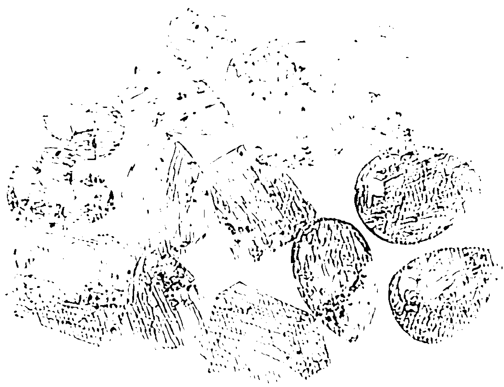

### 小贴士：有关水晶能量水的科学实验

1985年，在美国加利福尼亚，来自世界各地的水晶专家聚集一起，做了一个有趣的对比性实验：

- 植物：将花分别插入一杯含有水晶的水和一杯普通水中，结果发现，插在含有水晶的水里的花活了31天，插在普通水里的花只活了7天。
- 人体：因为水晶具有压电性，人饮用泡过水晶的水后，测得身上所含的电粒子高出正常人3倍多。

## 小故事：水草玛瑙与水草的奇迹

朋友订了个水草玛瑙蝴蝶，发货时不小心给打断了蝶翅，跟朋友商量了下，另外发了一件给他。顺手把这个打坏的“蝴蝶”丢在桌上一瓶水养的绿萝里。

我不擅长养植物，家里的植物勉强活下来的都很不容易。这绿萝自打插在水里，半年了都没长过新叶。一天，无意中发现它居然长出了四片新叶子，这绝对不是偶然的，算算时间，“蝴蝶”丢进去大概不到一周的样子。除了顺手丢进去的那个水草玛瑙蝴蝶，我再没格外“关照”过它！

## 与它一起活在每一个当下

很多朋友问我是否舍得转让水晶宝贝，尽管确实是舍不得，但我也必须学会人生最重要的功课——放手。一切物质都有一个成、住、坏、空的过程。换句话说，任何物质都是无常的，不可能永恒。既然物质的生命是有限的，如何让有限的生命发挥无限的潜能，则是我们人生的重大课题了。

在欣赏、把玩水晶的过程中，如果能借由它的帮助让人们得到身体的健康和精神的升华，那么它在那时那刻才具备真正的价值。然而，这一切需要缘分，该来的时候会来，该走的时候必然会走。

水晶是晶莹剔透的天使，在给人带来健康、快乐、幸福、美满的同时，也有着它自己的使命。某些时候，为了保护或者引起主人的注意以及为了更多人的福祉，它会以莫名其妙的方式离开我们，这其中包括转让、赠与、损坏，甚至是遗失。尽管我们不喜欢离别，但为了尊重属于它们自己的缘分，有时候需要放下。放手，也是一种爱。

水晶在佩戴和使用的过程中往往会出现诸如摔碎、断裂的现象，虽然这些偶然事件是一种提醒，但都不应该成为我们的心理负担。我们只需对这些水晶的提醒加以注意，而不必过分执著。

当一颗水晶因为种种原因如褪色、破碎等而无法佩戴，那么它与人的缘分就走到了尽头，为了感谢它陪伴我们度过的那些或欢乐，或悲伤，或平淡的日子，我们不妨找一方净土，将它埋在一棵树或者一株花下，给它一个永远的归宿。另外，也可以对它表达感谢与祝福之后，将之投入江、河、湖、海等自然水域。水晶来自于大地母亲，缘分尽时，就让它回归母亲的怀抱吧。当然，如果我们实在舍不得，也可以将它们放进盒子里作为旧物收藏。

爱水晶，就与它一起活在每一个当下，并享受不可预知的未来。