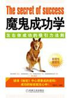

# 左右你成功的吸引力法则：魔鬼成功学

# 目录
Content

*   第一部分：惊天秘密——吸引力法则
*   第二部分：吸引力法则的发现(1)
*   第三部分：吸引力法则的发现(2)
*   第四部分：让你的吸引力只接受肯定信息
*   第五部分：个人磁场原理(1)
*   第六部分：个人磁场原理(2)
*   第七部分：思想磁场影响身体状态
*   第八部分：你想什么就会吸引什么(1)
*   第九部分：你想什么就会吸引什么(2)
*   第十部分：你想什么就会吸引什么(3)
*   第十一部分：潜意识也能发挥吸引力作用(1)
*   第十二部分：潜意识也能发挥吸引力作用(2)
*   第十三部分：唤醒心中巨人，发挥心灵感召力(1)
*   第十四部分：唤醒心中巨人，发挥心灵感召力(2)
*   第十五部分：唤醒心中巨人，发挥心灵感召力(3)
*   第十六部分：吸引力法则只接受正面描述的命令(1)
*   第十七部分：吸引力法则只接受正面描述的命令(2)
*   第十八部分：吸引力法则只接受正面描述的命令(3)
*   第十九部分：吸引力法则只接受正面描述的命令(4)
*   第二十部分：被忽略的才会自觉消失(1)
*   第二十一部分：被忽略的才会自觉消失(2)
*   第二十二部分：不去想那些你不愿意发生的事(1)
*   第二十三部分：不去想那些你不愿意发生的事(2)
*   第二十四部分：让潜意识为成功服务(1)
*   第二十五部分：让潜意识为成功服务(2)
*   第二十六部分：让潜意识为成功服务(3)
*   第二十七部分：让潜意识为成功服务(4)
*   第二十八部分：让潜意识为成功服务(5)
*   第二十九部分：方向很重要
*   第三十部分：成功需要一个信念(1)
*   第三十一部分：成功需要一个信念(2)
*   第三十二部分：成功来源于成功的意识(1)
*   第三十三部分：成功来源于成功的意识(2)
*   第三十四部分：大目标切分为小目标
*   第三十五部分：一切皆有可能(1)
*   第三十六部分：一切皆有可能(2)
*   第三十七部分：下定决心帮你实现“不可能”的梦想
*   第三十八部分：成功之路规划在先(1)
*   第三十九部分：成功之路规划在先(2)
*   第四十部分：成功者应该执著于自己的梦想(1)
*   第四十一部分：成功者应该执著于自己的梦想(2)
*   第四十二部分：相信梦想，才会实现梦想(1)
*   第四十三部分：相信梦想，才会实现梦想(2)

## 第一部分：惊天秘密——吸引力法则

第一章奇怪，心想居然事成——吸引力法则

有时候我们不得不承认，当我们在思考某件事情的时候，往往会不经意间发现这件事情居然发生了。比如，我们每天七点按时醒来，可是如果第二天有事，我们想五点醒来，于是，第二天即使没有闹钟我们也会在五点起床。这是为什么呢？

这就是神奇的吸引力法则，本章将围绕这个法则来告诉你，其实在你的身体当中，蕴涵着一股神奇的力量，足可以让你吸引你成功需要的一切。◎惊天秘密——吸引力法则

在人们祝福别人的时候，总是会说“愿你万事如意，心想事成”。我们都把这些当作愿望和吉祥语，认为不必信以为真，于是，我们就放弃了对美好愿望的关注。最终导致了万事如意和心想事成就真的变成仅是一句祝福话语。我们对自己希望发生的事情并不是时时放在心上。

然而在西方，人们发现了一个惊天秘密，即通过人的意识坚持不懈地关注心中的某个想法，行动就会不知不觉地向所想的方向去发展。比如：你想要获取成功，你的这个想法就会吸引你成功所需要的

为什么说世界上大约 96%的财富都掌握在 1％的人手中？究竟是什么原因呢？这就是因为这 1%的人都熟知并善于运用这个秘密——吸引力法则。

条件，甚至吸引成功的到来。也就是说，心想事成是有根据的，只要不停地将你想要得到的成功默念在心，然后拿出行动，成功就会到来。这个规律就是吸引力法则。

有一种说法是世界上大约 96%的财富掌握在 1％的人手中。如果真的如此，那么究竟是什么原因导致 1%的人能够拥有 96%的人的财富呢？你认为那只是意外吗？这是因为这 1%的人知道某些事情，他们明白某个秘密。这个秘密就是——如何运用吸引力法则来为自己吸引财富。

## 第二部分：吸引力法则的发现(1)

吸引力法则的发现

2006 年，美国 Prime Time 公司推出一部名为《秘密》的纪录片，该片堪称成功学、财富学的经典之作。四个月中该纪录片的 DVD 销量就达到了 200 万张。《秘密》中所揭示的秘密就是吸引力法则。这部纪录片帮助不少读者寻找到属于自己的财富，达到自己梦寐以求的成功。那么，吸引力法则究竟是什么东西呢？

吸引力法则早在万古之初就开始存在并运行了。公元前三千年，它就被记载在了翡翠石板上。随后，这个法则通过各种形式被记录下来并流传了好几个时代。历史上一直有许多人觊觎这个法则，也有许多人试图让世人知晓这个秘密，但是当知道这个秘密的人在自己取得成功以后，就立刻将秘密隐藏起来。然而，不管他们如何隐藏，这个秘密都一直存在并且被继承了下来。

吸引力法则早就存在，只是有的人意识到它的存在，而有的人意识不到而已。一直以来，它就在影响着我们每个人的命运。意识到的人能够根据吸引力法则行事并取得了成功，但有些人把吸引力法则用在了反面，从而导致了失败。

早在 20 世纪初期，美国一些心理学家证实了吸引力法则的存在，在这一领域，很多研究者都是当时声名显赫的成功学家、心理学家、思想家等。在这些人物中，最神奇和出色的莫过于查尔斯·哈尼尔了。查尔斯·哈尼尔在《硅谷禁书》等系列著作中最核心的一个思想也是吸引力法则。

那么怎么理解这个法则呢？

吸引力法则可以简单定义为——“关注什么，就吸引什么”。这个意思就是说，你所关注的事情往往最有可能出现在你的生活当中，也就是你的意识和想法会吸引那些你所关注的事物。比如，我们每天七点按时醒来，可是如果第二天有事，我们想五点起床，于是第二天即使没有闹钟我们也会在五点起床。

不知道你有没有听说过日本首富孙正义的故事，他的成长经历说明：如果我们带着信念和梦想上路，吸引力就会发生作用，成功就可能更容易到来。

孙正义两三岁的时候,他的父亲一再告诉孙正义：“你是天才，

关注什么，就会吸引什么，这就是吸引力法则。我们常常会发现这样有趣的现象：如果第二天有事，我们想五点起来，于是第二天即使没有闹钟我们也会在五点起床。这就是吸引力的作用。

你长大以后会成为日本首屈一指的企业家。”

在孙正义六岁的时候，他就这样跟别人做自我介绍：“你好，我是孙正义，我长大以后会成为日本排名第一的企业家。”孙正义每一次自我介绍都加上这一句话，直到他后来成为日本首富。

孙正义给自己制定的个人蓝图：

19 岁规划人生 50 年蓝图。

30 岁以前，要成就自己的事业，光宗耀祖！

40 岁以前，要拥有至少 1000 亿日元的资产！

50 岁之前，要作出一番惊天动地的伟业！

60 岁之前，事业成功！

70 岁之前，把事业交给下一任接班人！

他是这么规划的，也是这样实施的，并且最终这位后来的日本首富成功做到了。

吸引力法则并不是“魔法”，你肯定不能仅仅通过幻想就得到物质财富、实现个人理想，你还需要实际的行动。但在付出同亲努力的情况下，如果你善于运用吸引力法则，那么实现你理想的未来的可能性就会增大。

在生活当中，人人都希望自己健康、快乐、富有，可是有时候虽然我们的愿望很虔诚，吸引力也没有办法让你把所有的愿望都实现。但这并不意味吸引力法则失效了。吸引力法则的作用在于它会增加让愿望变成现实的概率，如果不懂得方法，概率就会下降。

## 第三部分：吸引力法则的发现(2)

我们很多人有很好的愿望和梦想，但是为什么他们的理想少有实现呢？梦想成真为什么离我们会有距离呢？那是因为：很多有梦想的人往往关注的不是他们的梦想，而是关注梦想的背面，或者说关注与梦想不相关的东西，他们的这种梦想只是一时的想法。所以，他们就依然过着自己难以满意的生活。这也从另外一个角度说明了吸引力法则的正确性。

如果我们换种做法，改变对自己梦想的态度，或许我们就会惊奇地看到自己期望的东西正在如愿实现。例如：你始终关注你如何获得健康、如何变得美丽、如何获得快乐，那么你的生活会逐渐聚集你关注的事物，你实现愿望的可能性会更大。曾经有位记者在乡下遇到一位正在山坡放羊的少年，于是有了下面的对话：

记者：为什么要放羊？

放羊娃：放羊为了卖钱。

记者：为什么要卖钱？

放羊娃：卖钱为了娶媳妇。

记者：为什么要娶媳妇？

放羊娃：娶媳妇为了生个娃。

记者：为什么要生个娃？

放羊娃：生个娃以后好接着放羊啊！也许看完这个故事大家都会会心一笑，笑这个孩子和他的下一代都是周而复始地生活。没有大志向，也没有改变自己生活的想法。

从这个角度来说，由于他生活在条件艰苦信息闭塞的农村，他所关注的主要是放羊，于是就吸引了他所关注的条件，使其变成现实，他的生活也就坠入了这样一个循环。俗话说煎饼再大也大不过烙饼的锅，这个孩子生活在那样一个环境，他的想法就大部分都是围绕着放羊。他基本上不会有成为篮球明星去打 NBA 的想法，更不会有成为电脑专家去研发芯片的理想，因为他每天关注的是哪里草多好放羊，哪天天气不好要去打草。

这个故事从反面说明，你所关注的，在很大程度上就可能变成一种现实。

如果没有人去打扰，放羊娃也许会继续过着他所说的理想中的生活：放羊、卖钱、娶媳妇、生娃、让娃接着放羊。他的这个关注很容易实现，而且也很容易坠入一个循环。但是如果这位记者告诉他，山的外边不再是山，还有更多梦想，那么这个孩子就可能变成另外一个他想变成的人，过上他所希望的另外一种生活。由此可见，意识总是在所要发生的生活之前产生，从而吸引我们关注的生活的到来。

## 第四部分：让你的吸引力只接受肯定信息

让你的吸引力只接受肯定信息

让自己的吸引力只接受肯定的信息，对于否定的信息，我们把否定词去掉，然后再让它继续发挥吸引力效应。

努力从正面的角度看待事情，会吸引你的成功条件，想什么也就真的会得到什么。如：我们渴望财富，就应该把自己的关注点集中在如何获取财富上，心中坚信自己总有一天会成为富翁，并积极地向着这个方向迈进，你就真的会成为一个富翁。相反，如果你整天想为什么我会这么贫穷，由于你的注意力当中有贫穷，你就真的难以摆脱贫穷了。

人们总是忌讳那些消极的词语，于是就会用积极词语的否定形式来表述不好的事情。比如：身体状况不是很好就说身体“欠佳”，贫穷就说“不够富裕”，失败就说成“失利”。总之，很多时候人们是不愿意把消极词语轻易说出口的，因为消极词语就意味着消极意识，就会带来不好的吸引效果。

在古代，人们似乎就已经感觉到了吸引力法则的效应，所以在说话的时候往往存在很多忌讳，担心乱说会招来灾祸。西方人忌讳数字 13，日本人忌讳数字 4，都是因为这些数字会让有这样文化传统的人联想到不祥和灾难，而关注的这些负面信息在吸引力法则的作用下就会带来祸患和灾难。所以人们就忌讳这些，避免自己的注意力吸引来不必要的麻烦。

人们忌讳祸从口出，所以就不把这些不吉利的字眼讲出来，怕这些话语会带来不好的吸引力，这也是吸引力法则的体现。人们见面总是把夸赞的话语说在前面，满嘴乌鸦叫式的人往往不会受到欢迎也是这个道理。

吸引力法则是取得成功的一个很重要的法则，几乎所有成功的人总是一开始就相信自己会取得成功，没有哪个认为自己是失败者的人最后还成功了的。吸引力的力量如此之大，以至于会唤醒你身体中的无限潜能，帮助你创造奇迹。

如果我们追求成功，我们就要在自己的意识中关注成功，忽略一时的失败。吸引力法则会发挥作用吸引你所关注的东西。只要我们把如何成功当做每天必须关注的内容，并且坚持下去，我们的未来就会成功。

## 第五部分：个人磁场原理(1)

◎个人磁场原理

正像电流会产生磁场一样，人体本身也会产生磁场。磁铁和电流产生的磁场会吸引铁、钴、镍等金属，人的心电也会产生一个磁场，来吸引你心中所想象和关注的事物。

人的心电也会产生一个磁场，来吸引你心中所想和关注的一切。有了这个磁场，你就可以用它来吸引我们生命中的财富、成功、幸福……

世上有很多形式的能量：原子的、热能的、电力的、运动的和潜在的，它们可以相互转化、守恒，而不会被摧毁。一切物质都是由原子构成的，而且每一个原子都有一个原子核，原子核之外则是旋转着的电子。物理学家现在的实验已经证明电子是能够产生磁场的。人的思想的存在方式是脑电波，也是一种电子运动方式。所以，在某种程度上来说，思想也可以产生磁场。

个人磁场原理

不论是积极性的想法，还是这种想法在符合吸引力法则后所表现出来的效果，都有一个心理基础，这种心理基础像一个磁场一样吸引你所思考和关注的问题。

可以说，吸引力法则并不是一个幻想的说法或者新出现的魔法，它是一种自然界的法则。我们每个人都是一个活磁铁，我们生命中的财富、成功、幸福、健康都是我们自身磁场吸引而来的。只要你保持对自己所期盼事物的关注，你想要的就可能得到！

某些力量确实潜藏在我们的身体里，而且始终对我们的生活发挥着微妙的作用，虽然它已经得到某种程度的发展，却仍然不能被广泛地开发应用，我们称之为“个人磁场”。在佛陀时代，有一位非常漂亮的女人爱上了一个和尚，她邀请和尚到她家小住四个月，那个和尚说：“我必须问我师傅，如果他允许，我就去。”

其他和尚非常嫉妒，他们说：“这是违反清规戒律的！佛陀说过，不要碰女人，也不要让女人碰你，你居然还要求跟一个女人一起住四个月！”

而佛陀却说：“我告诉过你们要不近女色，但是对于他，这个戒律已经不适用了，我一直在观察他，他已经脱离红尘，不再是芸芸众生的一部分了。”于是，佛陀对那个和尚说：“你可以去。”

这个决定在寺庙炸开了锅，很多弟子非常生气，过了几个月甚至传出了不堪入耳的夸张谣言，说那个和尚已经不再是一个和尚，变得非常堕落。

四个月后，和尚回来了，后面跟着那个漂亮的女人。佛陀看着他们，然后问那个女人：“你有什么事要告诉我吗？”

女人说：“我是来当你的门徒的，我试图吸引你的弟子，但是我失败了，这是我第一次遭到失败。对于男人，我一向都是成功的，但我就是吸引不了他，一点点都不能。我在他面前唱歌跳舞，我用各种方法来引诱他。但是，他一直都停留在他自己的内心，我一点都看不出在他的头脑里有任何想法，或是他的眼睛里有任何欲望。我试图改变他，但是他却改变了我，甚至都没有说一句话。不是他带我来这里的，是我自己要来的，因为通过他我第一次知道什么叫做信念，我想要学习这个能力。”在生活当中，我们所说的“个人磁场”的存在也是如此的简单而且真实。上面例子当中的这位和尚就是将自己的磁场利用得很好的人。

思想磁场的力量

当我们思考的时候，我们从自己的头脑里发射出一种微弱的电波，这种电波会像射线一样自动向外扩展。同时，从空间上，它们有可能会发射到离我们非常远的地方去。一个强大的思想能在强有力的能量的支持下，一直履行自己向外扩张的职责，而且它的力量足以压倒其他人头脑中的本能的抵抗力，并且去引导其他人思想的走向。而一个疲弱的思想就没有足够的能力攻破别人头脑的堡垒，它甚至连一个入口都找不到。当然，如果这个堡垒的主人根本就没有用心去守护他的领域，结果就又不一样了。

如果我们一直坚持一种思想，我们就能一直不断地沿着相同的路径发射我们的“思想电波”，在这种情况下，即使是那些强度很大的思想都无法攻陷的坚壁，也有可能被冲开一个缺口。这种现象在就像我们所说的“水滴石穿、绳锯木断”。

## 第六部分：个人磁场原理(2)

在大部分时候，我们都是在自己没有意识到的情况下受到了别人思想的影响，就好像我们有时候不知道为什么必须要去做一件事情，虽然这件事情对我们来说意义不大或者根本没有意义。这种现象并不是说我们会被别人的意见所左右，而是指他们的思想会在潜移默化中对我们产生影响。在这个课题上有一位权威人士曾经就说：思想也是一种物质。思想的确就是物质，因为思想的产生器官大脑就是一种物质。思想是蕴涵了这个世界上最为巨大能量的物质。但是，对于这种力量的本质我们一无所知，我们当中的大部分人甚至根本就不承认这种力量的存在。反过来说，一旦我们弄清了这种奇妙力量的本质和主导它的法则，就能够让它为我们所掌控，从而把它变成成功的强大推动力。古往今来，在西方人眼里，印度一直都是一个神秘的国度。在古代，它所拥有的贵金属、象牙、香料，就曾吸引哥伦布、达·珈玛以及其他一些勇敢的水手，这些人穿越从未涉足过的浩瀚海洋去寻找这块传奇的土地。

不少野心勃勃的征服者曾在印度留下足迹。2000 多年前，亚历山大一世率领军队挺进了印度西部，并建立了属于希腊人的城堡；不久之后，铁木儿人和莫卧儿人来了；再后来，法国人、荷兰人、英国人也来了。各殖民者为占领印度彼此征战不休。很长一段时期里，印度都在外族的铁蹄之下备受蹂躏。然而，没有任何一个外来殖民者能长期统治印度。他们引以为荣的强大军事力量最终都在这片土地上消磨殆尽。

西方人依赖于炮弹、飞机、原子弹，而印度人仰仗的是精神力量。印度人始终虔诚地依赖内心的力量，尽管这种力量是肉眼看不见的。然而，印度人却正是凭借它把侵略者赶了出去，并取得最后的胜利。

帮助印度人获得独立的领袖并非一个英勇善战的将军，而是一位道德高尚纯善、精通最高深智慧典籍的圣人——莫汉达斯·甘地。甘地是凭着一种强大的精神力量，把四亿多印度人民从英国殖民者长达两个多世纪的统治下解救了出来。

印度的这种心灵力量在西方人看来是很难理解的。尽管西方人也会赞扬心灵的伟大，但实际上他们只相信实实在在的东西。在强大的意识力量前面，即使是坚船和利炮也会有所屈服。我们创造出来的所有思想，不管它们是强还是弱，是好还是坏，是健康还是不健康，都会向外发射电波，电波影响的范围与我们自己意识的坚定程度和持续程度有关系。思想电波就像我们向池塘里扔一块小石头在水面上激起的波纹一样，它们会以一个点为中心一圈一圈地向外面扩展。如果我们想让这种波纹成为某种特定的形状，就需要在特定的点施加更强的作用力。

## 第七部分：思想磁场影响身体状态

思想磁场影响身体状态

你希望自己变成什么样子，你就坚守这个信念，并为之努力，最终你就可能成为你希望的样子。

我们希望自己变成什么样子，最终我们就真的会成为那个样子。如果我们愿意，可以很容易让自己的心情变得忧郁，反过来也一样。但重要的是我们应该认识到，如果我们一直按照一种方式重复类似的思考，这种思考不仅仅会在我们的性格上体现出来，而且还会在我们身体的变化上体现出来。这也是思想磁场发挥的作用。通常情况下，被汽车撞倒或从二层楼上摔下来的部分受伤者是不会当场死亡的。在对死者进行检验时，医生就会发现受伤或失血的程度并不足以导致死亡，死亡的直接原因是：极度的恐惧感导致神经系统崩溃、心脏休克。

医院里所有的急救程序一般都会建议要先稳定伤者的情绪，减轻他的恐惧——因为这或许是他所面临的最大威胁。

类似上面的例子还有很多，其中最有趣的要数艾尔弗·科日布斯伯爵所讲的一个案例。有一个人对玫瑰花非常过敏，哪怕看到图片也会心生恐惧。有一次，别人给他看一张玫瑰花的照片，他立刻就开始不由自主地打喷嚏，好像面前是一朵真花似的。

从上面的例子中我们可以看到：意识可以成就一个人，也可以毁灭一个人。一个渴望变得活力四射的人会比常人更有活力；一个希望自己有勇气的人能变得勇气十足；那些坚信“我一定能行”的人就可能做到他想做到的；而那些想着“我恐怕不行”的人就可能会落在别人身后。在现实中很多事实都证明了这个观点。那么，到底是什么导致了这种差异的发生？没错，就是思想！只有你的思想能做到这些。

一个强有力的思想自然而然就会让我们行动起来，只要你是很认真地在考虑一个问题，你的行动就会自动帮助你完成这件事。思想是世界上最伟大的东西，人类凭借思想改变了世界的面貌，改变了人类自身的生活状态。对于我们个人来说，也完全可以通过自己的思想产生的磁场来改变我们的人生。

## 第八部分：你想什么就会吸引什么(1)

◎你想什么就会吸引什么

吸引力法则是一个虽然你意识不到但却一直在发挥作用的法则。就像你不知道自己每天具体需要喝多少水才会觉得不渴，但是身体中有个力量在起作用，会让你在需要补充水分的时候感觉到口渴。吸引力法则就是这样一个在暗中起着微妙作用的“魔法”。

脑细胞能改变身体各个部位

一个人的思想意识具有如此大的主导作用，以至于没有它我们就没办法支配自己的行动、没有方向。人类之所以称为高级动物也就因为我们具有大脑的思考能力，可以产生自己的思想意识。人的思想是如此的重要，以至于我们需要进一步地探讨，思想意识对于我们的生活究竟还会产生其他什么作用。由于我们的思想意识产生于大脑，所以研究思想意识就主要集中在对大脑的研究上。据研究发现：脑细胞可以对身体的各个部位发挥作用。这一点得到了华盛顿史密森纳研究所艾尔默·格迪士教授的证实。他做了一个实验，将豚鼠置放在以某些颜色为主色调的密闭空间里，大脑解剖显示，生活在有颜色空间里的豚鼠的大脑要比其他同级别豚鼠的大。

另一个实验，对处在不同情绪中排出的汗的分析发现：生气的人排出的汗里，其盐分的属性与众不同，让小狗尝过这些盐后居然发现汗里带有毒性。这两个实验说明：我们的思想的确能够改变身体状态。

想法决定未来

看一看周围的人，你就会发现，无论后来的境况如何，他们的想法总是比行动领先一步。如果之前没有全心全意地致力于化学研究，巴斯德不会成为一个化学家；如果早年没有一心一意想着发财致富，洛克菲勒也不会成为身价百亿的石油大亨。经过专注的思考、追求，人们才能获得自己想要的。功成名就者与碌碌无为者的主要区别就在于他们思想方面的差异。

有一个船员，从 18 岁就开始做水手了，然而到了暮年仍然只是船上的一名普通的装卸工。他只会抱怨自己命运不济，却没有意识到一切都应该归罪于自己。导致他一生平庸的根源在他自己的思想当中，而非环境所致。在潜意识里他一直认为自己只是一个当船员的料，从未有过更高的期望。当然，也许他曾梦想做一名船长，或者干点别的事发点小财，但这些想法在他的脑海中不够强大和牢固，没多久就在现实生活的惯性轨道中磨灭了。如果他对自己当时的状况极度不满，并把这种不满转化为追求新生活的行动，那么到最后，他肯定会有所收获。遗憾的是他没有这么做，他的脑袋里装满了各种各样的想法，却没有一个主导，消极的想法居多。所以，这个船员最终一生碌碌无为。

莎士比亚的剧本里有一句台词：“亲爱的布鲁图，真正该责备的并非宿命，而是我们自己，是我们自己决定了我们只会是微不足道的人。”从中我们能看到想法对人一生的重要作用。

无论我们想做任何事情，我们的意识总是在最前面，先有意识才会激发行动的动力。我们想追求成功，首先要在心中产生关于成功的思想意识。

思想有多远，人就能走多远。意识总是在最前面，你只有先拥有成功的思想，才可能达到成功。

相信奇迹，奇迹才可能发生

一位哲人曾说过：“思想比任何形式的言语更为深刻。”一个人的思想意识是如此具有魔力，以至于除了可以支配你的身体，还可以对其他人和事物产生影响。也就是说，你想什么就会吸引什么。

思想造就了我们的世界。历史学家们说，在 20 世纪里，电力、汽车、飞机和原子能使人类的生活发生了翻天覆地的变化。而这些伟大的发明都是源于一个个想法。我们都看见过鸟儿飞翔，然而，只有极少的人能像达·芬奇和怀特兄弟一样花费很多工夫去认真思考飞翔的问题。他们越想越深入，最后达·芬奇的那幅鸟儿飞翔的动作分解草图就诞生了，并因为精准而成为传世之作。在怀特兄弟脑海中，首先有了制造一台飞翔机器的念头，正是这个念头，才使人类在天空翱翔的梦想变成现实。

## 第九部分：你想什么就会吸引什么(2)

电灯的发明也不是偶然的。托马斯·爱迪生在年少时学了电的基本原理。他意识到，这种奇妙的能量有许多令人难以置信的用途。爱迪生注视着当时人们所用的蜡烛和汽灯，他觉得它们实在是太不方便了。于是，他产生了这样一个念头：要用电给灯泡供应能量，使其远远先进于当时已存在的任何照明方式。在接下来十年的时间里，这个念头一直牢固地存在于爱迪生的脑海中。他做了一个玻璃灯泡，然后试了一种又一种的材料，试图找到一种可以燃烧很长时间的，但是始终未能如愿。他先后尝试了数千种不同的材料，虽然一次又一次地失败，但是凭借对自己想法的坚持和执著，最终找到了理想的灯丝材料。其他发明或发现的产生经历也几乎都与此相似。比如，有人曾问牛顿是如何发现万有引力定律的，他的回答是：“一直不断地思考。”

也就是说，只要我们坚持关注自己想要得到的，我们就会吸引我们所关注的，坚持到最后，加上自己的努力，我们所关注的就会变成现实。

生活中我们的思想和意识确实具有一定的吸引力。你也许会这样问，既然我们的思想和意识具有吸引力，那么是不是我们想拥有金钱就会吸引金钱呢？回答是肯定的，但不是像童话中的阿里巴巴那样，只要默念“芝麻开门吧”，金钱就会源源不断地来到面前。吸引力法则没有这么神奇的力量，但是如果你做到了对金钱以及如何获取金钱的持续关注，你就会开始吸引那些本该属于你的财富。假设你心中没有金钱的欲望，一直思考如何成为一个拯救万民的圣人，那么你也就会成为你想要成为的人，你会拥有你想要拥有的高尚品德和伟大影响力。

每个人都是自己机遇的制造者。你可以造就自己，可以通过操控自己的意识和发展自身内在特有的能力使自己变得强大、富有。你所需要的条件是具备开展各种工作、活动和学习所需的意志力、决心。你必须学会给自己树立一个坚定的信念和想法，也必须愿意投入足够多的金钱、时间和耐心来持续这个信念。只要遵循吸引力法则并正确调适，在这个世界一切皆有可能！

相信奇迹的人总是最靠近奇迹。很多奇迹我们难以置信，但它还不是一样在人类社会中发生了吗？比如以前人们认为传送信息必须靠马匹来传递，而现在一个电话比任何一匹马都快；以前人们认为登上月亮只是事情中的事情，但是这个事情已经被人类实现了；以前人们会觉得到异国游历很花费时间，几个月、几年甚至是一生，但是现在只要几个小时的飞行你就很容易踏上异国疆土。

我们要相信奇迹会在自己身上发生，只有相信并时时关注，意识才会把实现这个奇迹的条件吸引到我们周围，我们才会创造奇迹。

## 第十部分：你想什么就会吸引什么(3)

想什么，就吸引什么

每个人天生就继承了一份具有无限价值的遗产，这就是吸引力法则。运用好这个法则，你几乎可以得到你想要的一切。尽管这份遗产已经归你所有，你只有遵行自然、心理和精神的法则，为它开辟通向你这里的道路时，它才能为你所拥有。生命中伟大的事业和目标绝不是采取随随便便的方法就可以实现的。吸引力法则就是在帮助你来开发这份遗产，把它充分地利用起来，让它发挥无穷的威力来帮助你实现自己的梦想。

几乎所有伟人在他成名之前都相信自己将会影响这个世界，至少是他所在的世界，他相信自己是生命舞台的主角而不是配角。或许对于周围的人来说他的这种想法太疯狂，以至于人们都认为他是疯子。但是，事实证明，当你坚持一个想法进入到近乎疯狂的状态时，你往往就会迎来自己的成功。只有相信你的意识才会吸引成功所需的条件，那些一直鼠目寸光、计较得失的人，自然就难以作出影响世界的举动，这也是吸引力所起的作用。

你想什么就会吸引什么，你想象积极的事情就会吸引促成你积极的因素。但是，如果你想象消极的事情就会吸引促成消极结果的因素。这也就是俗话说的“恐惧只袭击那些心怀恐惧的人”。

既然知道我们的思想意识会吸引我们未来的生活，那么我们就需要摆正自己的心态，积极地去思考和面对问题，让吸引力更好地发挥正面作用。

## 第十一部分：潜意识也能发挥吸引力作用(1)

◎潜意识也能发挥吸引力作用

意识分为显意识和潜意识。潜意识存在我们大脑当中，我们难以感觉但确确实实存在，因为它确实发挥着作用。这就像我们晚上睡觉做梦一样，梦也是潜意识的一种表现。

每一个人都具备潜意识，潜意识的发现始自催眠术。第一次提出人类具有潜在意识学说的人是西格蒙德·弗洛伊德。

弗洛伊德所谈的潜意识，是一种与理性相对立存在的本能，是人类固有的一种动力。他认为：人类有一种本能，就是追求幸福生活的潜意识。这种潜意识虽然看不见摸不着，却一直在不知不觉中控制着人类的言语、行动。在适当的条件下，这种潜意识可以升华成为人类文明的原始动力。

潜意识是本能的欲望，它遵照意识地提示执行任务，并且无比忠诚。正是因为意识与潜意识之间紧密的联系，才使得有意识地思考显得如此重要。人的器官功能是受潜意识控制的。人体的循环、呼吸、消化、吸收系统通通都受潜意识控制。潜意识不断地从显意识中接受神经脉冲，我们想要改变潜意识只需先相应地改变我们的显意识。俄列冈州奥克兰的 W·L·凯恩这样写道：“我知道有这样一种能量的存在，因为有一次我看见两个男孩，一个 16 岁，一个 18 岁，将一根压在他们兄弟身上的巨木挪走了。第二天，还是那两个男孩，还有我和另一个男人，我们四个人一起试图将那根巨木抬起，但是失败了。”

那两个男孩是如何抬起了四个人都无法抬起的巨木的呢？因为他们当时根本没有时间去怀疑自己能不能办得到，而是将所有的精力和能量都集中到这一件事上，全身所有的细胞在听到他们的召唤时都动了起来，激发出力量。这时，他们拥有的便不是两人之力，而是十人之力了！案例中的两个男孩正是用自己的显意识引发了潜意识中的关注点，从而激发了潜能，来完成不可能完成的事情。吸引力吸引来他们以前没有的力量，让他们力大无比。

你的身体是世界上最为精细完美的工厂。它由水、碳、铁、糖、盐、氢、磷和碘一系列物质化合而成，还没有人能够完全弄清楚身体

潜意识是我们平时感觉不到却时时在发挥着作用的意识。就好像胃的蠕动和食物消化一样。

内部因为冷热、压力以及摄入食物而产生的变化。世界上没有一个化学家能够告诉你，应该喝多少水来稀释食物中的盐量，排汗会失去多少盐量，水与盐到底要在每天的食物中保持什么样的比例才能维持健康。然而你的潜意识知道这一切的答案，甚至在你还是个婴儿时就已经了如指掌，而且潜意识还会自然地指引你的行为举止。

潜意识能量巨大

根据维也纳大学康士坦丁博士估算：人类的脑神经细胞数量约有 1500 亿个，脑神经细胞受到外部的刺激会长出芽，再长成枝（神经元），然后与其他脑细胞结合并相互联络，形成了发达的联络网。于是，信息电路开启了。然而人类有 95%以上的神经元处于未使用状态，这些沉睡的神经元如果能够被唤醒，几乎人人都可以变成“超人”。如果将人类的整个意识比喻成一座冰山的话，那么浮出水面的部分就属于显意识的范围，约占全部意识的 5%。换句话说，95%隐藏在冰山底下的意识都是属于潜意识的范围。这仅仅是理论值，就目前只用到很少脑细胞的大脑而言，其耗氧量已经占到全身耗氧量的四分之一。所以，潜意识全部使用是不可能的。就算是像爱因斯坦、爱迪生这样的天才人物，一生中也不过运用了他们整个潜意识的 2%左右。许多催眠大师可以让人沉睡，让被催眠的人作出一些令人不可思议的举动，展示出惊人的承受力。曾经有一位催眠大师催眠了一位男士，让他以为自己是一根铁棒。随后，催眠大师让他躺在两张椅子上，头和脚分别搁在椅子上，然后，催眠师在他身上堆满重物，还让几个人站在他身上。通常情况下，一个人无法承受如此大的重量。然而在催眠的作用下，他轻而易举地做到了。他是如何做到的？很简单，移开显意识对身体的控制，让它沉睡，随后让潜意识接管身体。这时，身体内在的力量可以做到很多“不寻常”的事。当你解脱了显意识的束缚，放手让潜意识接管一切，吸引力法则就会发挥作用，用潜意识激发你的潜能，你会拥有完全不一样的能力。

## 第十二部分：潜意识也能发挥吸引力作用(2)

催眠大师只是让你的意识暂时沉睡，然后，暗示潜意识按他的意愿行动。但是，让自己的潜意识受到外在控制是很不明智的，相信多数人都不愿意自己受别人意识的摆布。我们可以用显意识来制造潜意识，用吸引力法则来吸引潜意识，发挥出自己身体、头脑的潜力，这样可以比任何催眠大师都干得好。

正确利用潜意识

我们知道，通过显意识我们可以让自己持续的关注发挥吸引力作用，而潜意识则是显意识的储存库。通过下面小孩学钢琴的例子，我们就可以知道显意识和潜意识的关系。老师会教小孩以什么样的指法敲击琴键。起初，小孩不知道怎么才能控制自己的手指，他必须长年累月、全神贯注地练习，才能敲出正确的音符，这些都处在显意识状态下。日积月累，这些显意识潜移默化地输入了潜意识——在演奏过程中手指自然地受潜意识控制，于是，他可以轻松自如地演奏了，因为潜意识已经彻底吸收并储存了弹琴正确的指法。20 世纪发生在匈牙利的一件事也证明了潜意识的力量。一个男人被误关进冷藏车里，等第二天早上打开冷藏车，发现这个男人已死。在调查过程中发现一件怪事：冷藏车的冷冻机是关着的，里面的温度为 10℃左右，而他身上具备所有因为过冷而死的症状。看来，这个人的想象力实在是太“丰富”，他想象着自己会被冻死，结果果然如此。这个例子说明，你的大脑中想象什么，潜意识就会吸引什么，并且会让你的身体作出反应。这个男人的思想“杀死”了自己。他思想中的潜意识认为自己被冻死了，于是就放弃了呼吸、心跳、脉搏等一切生命生存所必需的活动，尽管显意识中人是怕死的，但最终潜意识发挥了作用，“杀死”了自己。

这只是利用潜意识吸引力的一个反面案例，我们要尽可能地避免让消极的思想和潜意识引发吸引力，这些会发挥消极作用。只有正确合理地利用潜意识引发吸引力，我们才会更快达到成功。

## 第十三部分：唤醒心中巨人，发挥心灵感召力(1)

◎唤醒心中巨人，发挥心灵感召力

潜意识的力量如此之大，甚至有时候潜意识发挥的吸引力会比显意识的吸引力大。当潜意识与显意识存在相反的想法时，潜意识通常会胜出。例如：我们显意识想戒烟，但看到香烟又不自觉地拿起来开始抽，这就是还想要吸烟这种潜意识的作用。

很多人想要有自信、人际关系好、增加收入、增强行动力，想了很久却达不到理想中的目标，吸引力作用难以发挥效力，这是为什么呢?答案是因为潜意识中杂念太多，消极、否定思想占据过多。我们总是习惯于把消极的东西放入潜意识。

潜意识的运行规律

既然我们知道自己的潜意识还潜藏着无穷的能量，那么我们就该不断激发自己心中的潜力，让吸引力发挥作用，为成功带来便利。潜意识具有一些什么样的规律呢？

◆潜意识对经历记忆深刻

记忆分为暂时记忆和长久记忆两种。暂时记忆处于显意识中，比如接电话的时候，对方告诉你一个客户的电话号码，你强行记住这一串数字，但可能很快就会遗忘掉，这就是因为这个记忆是暂时的记忆。而事实上我们的经历都记忆在我们的潜意识中，分毫不差。它们按照时间顺序或者是按照情绪的连锁，被储存在潜意识中，很久没有被挖掘出来，但是在催眠状态下，这些尘封已久的记忆就会被显现出来。

另外，经历中所形成的负面情绪在未被释放前，会被存储在记忆中，成为“记忆仓库”中的“存货”，留待日后处理。处理的方式就是对这些记忆进行再一次的“学习”，这些负面情绪才可能被彻底地清除。

◆潜意识容易让不合理的事情“合理化”

当我们遭遇到一些自己难以接受的事件的时候，反应方式可能是使其“合理化”，就像是“阿 Q 精神”。这其实是潜意识的一种自我解嘲式的保护机制，以让我们接受现实。

◆潜意识掌控身体运作，调节身体状态

潜意识掌控着体内各个部分的运作，在此过程中，身体的变化会自然地在潜意识中有所呈现。因而，当身体某些部位发生病变的时候，身体都会具有自动调整、保护和自我愈合的功能，这都是缘于潜意识在背后的运作。

◆不带评判地接受指令，用天性及习惯应对外来的信息

潜意识就好像是一个容器，它会自然而又不带任何评判地接受一些指令和信息。平常处于理智状态之下的时候，外来的信息会受到理智的过滤。当潜意识完全自主工作的时候，信息就会被完全植入到潜意识中。

◆控制及保持所有的感应

感应分为一般感应（来自五官的感应）和心灵感应两种。潜意识接收这些感应并传递到意识层面去处理。

◆制造、储存、分配及传送生命的能量

潜意识是存储能量的地方，焦点专注在哪里，能量就会被吸引到哪里，成果也就在哪里出现。当潜意识集中到一点的时候，爆发出的潜能是让人吃惊的。

◆有意识地反复刺激会让潜意识接受某个信念

一个概念对潜意识进行反复的刺激，就会被潜意识接受。一般而言，当一个概念被重复了 30 次以后就会被潜意识接受。

◆不断地寻求发掘更新、更好的事物

潜意识的特点就在于不断地自我超越和完善，在此过程中，不断地将自己的模式变得更加高效和完善。这也就是为什么人类可以不断进步和发展的原因。

◆潜意识的沟通方式是图像和符号

文字是属于显意识的，而潜意识的沟通方式是运用图像和符号。因而在梦中经常梦见的是图像，而不是语言。

## 第十四部分：唤醒心中巨人，发挥心灵感召力(2)

◆不懂得处理否定性的字眼

“请你不要想一只黑色的猫。”当你听到这样的建议时，你想到的是什么呢？也许你现在想到的正是一只黑色的猫。因为潜意识只善于接受正面的描述，而不善于理解否定的字眼。因为如果说否定的字眼，反而会衍生出很多其他未被否定方面的可能性，这就会让潜意识莫衷一是，无所适从。而正面的描述已经界定了某一种状态，这种状态就可以为潜意识带来直接和明确的影响。

人的大脑就好比神奇的黑洞，拥有无穷的潜能。如果合理开发应用，大脑就会变成多啦 A 梦的口袋，想什么就会拥有什么。

如何开发潜意识

了解了潜意识的规律之后，如何开发自己的潜意识呢？

想要开发潜意识以及让潜意识也参与吸引力法则，最有效的方法就是重复，也就是将我们想输入的意识和关注重复地通过感官输入大脑。一旦某一个信息被输入潜意识后，它会直接影响我们的行为。

举个例子，我们会因为看到某个广告拍得很棒就立刻去买广告中的那个产品吗?通常不会。但厂商为什么要打广告呢?比如，你一看到可口可乐的广告，可能不会立刻去买，但如果经常看到这个广告在电视上播放，报纸也刊登，广播也播出，招牌满街都是，效果就不一样了。你在走路、坐车、看报纸、看电视时，经常看到可口可乐的图像，听到其声音，只要重复的次数够多，这个产品就输入了你的潜意识。当你想喝饮料时，你就会走进商店直接向老板要一瓶可口可乐，而不考虑其他饮料，这就是广告的效果。

既然潜意识具有如此巨大的能量，那么如何来训练、开发和利用它，来帮助我们达到成功呢？以下几点可供参考：

◆开发潜意识，储存是基础

如果你想建造高楼大厦，就必须储备好各种各样的建筑材料、装修材料、设计知识、建筑技能、指挥管理技能等。对于一个追求成功与卓越的人来说，应该不断地学习新的东西，给潜意识输进更多的基本常识、专业知识、成功知识以及相关的最新信息。

“事事留心皆学问”，你要大脑更聪明、更有智慧、更富于创造性、更符合现实性，就必须给潜意识输送更多的相关知识和信息。为了使你的潜意识储存功能更有效率，可采取一些辅助手段帮助储存信息。比如重要资料重复过目，重复学习，增加记忆功能；还可以建立看得见的信息资料库，比如分类保存图书、剪报、笔记、日记等。

◆吸收潜意识要注意信息把关

由于潜意识是非不分，不论积极消极还是好的坏的统统吸收，而且常常跳过意识直接支配人的行为，或直接形成人的各种心态。所以，潜意识往往很影响成败。基于这些原因，我们要训练自己，努力开发利用积极的潜意识，使之发挥积极效应，吸引积极因素，并对可能导致失败的消极的潜意识加以严格控制。

## 第十五部分：唤醒心中巨人，发挥心灵感召力(3)

具体地说，就是要珍惜原来潜意识中的积极因素，并不断输入新的有利于积极成功的信息，使积极成功的心态占据统治地位，成为最具优势的潜意识，甚至成为支配我们行为的直觉习惯。另外，对一切消极失败的心态信息进行控制，尽量不要让它们随意进入我们的潜意识中。遇到消极思想信息时，可采取两个办法加以控制：

第一种方法是立即抑制它，不去关注并回避它，不要让它污染你的大脑意识。对过去无意中吸收的消极失败的潜意识，永远不要提起它，把它遗忘并沉入潜意识的海底。

第二种方法是进行批判分析，化腐朽为神奇。用成功积极的心态对失败消极的心态进行分析批判，化害为利，让失败消极的潜意识像毒草化成肥料一样，变成有益于成功的思想意识。

◆不断思考，让关注进入潜意识

潜意识蕴藏着我们一生中各种各样的信息，又能自动地排列组合，并产生一些新思想。所以，我们可以给它指令，把我们成功的梦想、所碰到的难题化成清晰的指令，并经由显意识输入到潜意识中。然后，放松自己，等待它的答案。比如，反复下达这样的指令：我该如何开辟新的饮料市场呢？还可以把指令变小：我开辟市场的第一步应该怎样走？

有不少人苦思冥想某一问题，结果却在梦中，或是在早晨醒来时，或在洗澡时，或在走路时，突然从大脑中蹦出了答案或灵感。所以，我们要随时准备纸和笔，记下突然而来的灵感。电影大王邵逸夫经常在思考各种问题的同时，在任何地方都备有一本记事簿，一旦灵感从潜意识中蹦出来，便立刻记下来。这帮助邵逸夫成就了辉煌的事业。

◆反复重复，让吸引力发挥作用

假设你想要成功，就在心中反复默念“我会成功”；假设你想赚钱，你就反复默念“我很有钱”；假设你想要让自己的业绩提升，就反复告诉自己“我的业绩要不断地提升”。这样不断地经由大脑反复记忆和输入，当潜意识开始接受这样一个指令的时候，所有的思想和行为都会配合这个想法，吸引力于是发挥作用，吸引你所想象的成功，朝着你的目标前进，直到达到目标为止。

很多人运用了吸引力法则却没有效果，原因是他们对自己意识的重复次数不够多。影响一个人潜意识最重要的一点，就是要重复，随时随地不断地确认你的目标，想着你的目标，这样的话，你的关注和意识就会吸引你达到目标所需的条件。?世界上之所以会有人成功并占据大量的财富，是因为他们知道了或者悟出了吸引力法则，他们相信自己所想象的成功会变成现实。

?吸引力法则认为，你所关注的事情往往最有可能出现在你的生活当中。也就是你的意识和想法会吸引那些你所关注的事物，对于你的成功也是一样。

?吸引力法则之所以产生效应是因为人的脑电波会产生磁场，这个磁场会发生一定的吸引力。你的想法越是坚定，这个吸引力就越强，想法变成现实的概率也就会越大。

?人的大脑会产生潜意识，潜意识也会发生吸引力作用，有时候潜意识发挥的吸引力会激发人体内惊人的潜能。

?要想让潜意识发挥作用，需要对大脑重复地进行刺激，把记忆“写入”潜意识，这样才能够有目的地发挥潜意识的吸引力，创造出潜能的奇迹。

## 第十六部分：吸引力法则只接受正面描述的命令(1)

第二章想减肥为什么反会肥胖——吸引力反力

吸引力有一个反例：如果你对某件事情非常恐惧，或者是非常排斥，不希望它发生，那么很抱歉，很有可能这样的事情就会发生。就像那些想要减肥的人往往难以达到想要的结果一样。

本章将讨论吸引力反力对人们成功的影响，帮助渴望成功的人树立积极正面的世界观和人生观。◎吸引力法则只接受正面描述的命令

我们常常会发现，在自己的意识中，如果拼命地否定一些东西，往往这些被否定的东西会一而再再而三地出现在脑海中。也就是当你越希望自己忘记的时候，你就记忆得越清楚。这是由于我们的意识往往只善于接受正面肯定的信息，即使你在信息前面加了很多否定词，意识在大脑中还是以正面肯定的形式呈现。意识的这种特性决定了吸引力法则只适合接受正面描述的命令。

吸引力法则的特性

要使吸引力法则发挥作用，你必须学会使用正面积极的描述，对于否定的信息，大脑一般都会作出正面肯定的处理。

有不少身体比较丰满的人希望自己能够瘦一点，苗条一点，于是自己天天节食、运动、吃药甚至抽脂。整天想着自己要减肥，可是他们得到的结果往往不是很理想，体重还是比较稳定，究竟是什么地方出现问题了呢？没错，问题就在于

吸引力法则往往只记住正面的信息，不管你在这段信息前面加入多少否定词语。所以，我们在想问题的时候要想积极一面，这样我们才能保证我们的想法产生积极的吸引效果。

自己的意识。他们想的问题是减肥，意识中于是出现了自己肥硕的身躯和臃肿的体态。在这样的意识作用下，吸引力对身体产生潜移默化的作用，你可以想象最后出现的结果。假如换种思考方式，自己想象自己会变苗条、美丽，结果就可能变得接近你的想法了。

比如说，具有创富意识的人经常会吸引来金钱，而整天想着自己穷困的人却引来贫穷，即使他想要拒绝贫穷，他的想法还是会带来贫穷，因为他的意识里有贫穷这个信息。通过你的思想、语言和行为，吸引力将为你所关注的事物打开通道，无论富有或贫穷，都如你所想的那样满足你。用现代心理学的语言表达就是：“我所强烈意识到的事物总是来到我这里。”

## 第十七部分：吸引力法则只接受正面描述的命令(2)

意识、思想、信念，是使我们所关注的事物来到我们生活中的精神导线，是吸引力发挥作用的起因，可是吸引力法则只对那些正面描述感兴趣。所以，假设你现在不够富裕，你不要在脑子中关注为什么自己会贫穷，而是要想自己正在走向富裕的道路上，想象自己某天也会有车有房有存款。

再比如说，预防窃贼的家庭可能也是引来窃贼的家庭，而那些不存在盗贼入侵这种恐惧意识的人，却往往不受骚扰。路上熙熙攘攘的行人中，那些毫无畏惧的人往往不会被别人攻击，因为似乎总有一种说不清的东西在阻止别人那样做。

就像总是想着如何省钱的人永远也富裕不了，而关注如何挣钱的人才会成为富翁一样，我们面对成功和失败的心态，也同样关系着我们达到成功的过程中吸引力所发挥的作用。如果我们想为什么会失败，尽管我们的想法是好的，但是无意当中，吸引力法则就把失败给默认了，因为它只接受正面的描述。接下来它就会发挥吸引力作用来吸引失败的条件和因素，这样就与我们的成功目标背道而驰了。

所以面对失败我们要把失败看淡，并反复想象自己将来成功时候的情景，想到自己会拥有想要的一切：宝马、名犬、黄金屋、颜如玉。这样，成功的条件就被我们的思想所吸引着，我们离成功就越来越近。

吸引力法则的这种特性也适用于生活中其他一些美好的事物。如果我们想过上幸福的生活，我们就要把幸福时刻放在意识当中，这样即使是遭遇不幸，吸引力法则也会让情况得到好转；而如果你是在想如何避免不幸和灾难，虽然目的都是为了幸福生活，但是后者往往可能会让不幸不期而至。对于其他情况也都是相同。有句俗语说：“恐惧只袭击那些心存恐惧的人”，也就是这个道理。

在心中铭刻成功

我们要明白的就是，吸引力法则只对那些我们心中所持续肯定和关注的东西加以吸引，而如果我们的想法带有否定词，吸引力法则就会吸引否定词后面的那部分。从前，有一个聪明的巫师，他告诉国王自己发现了一种可以把沙子变成金子的魔法。国王当然很感兴趣，并给了他一大笔奖赏。于是巫师向国王解释了他的方法，整个过程看上去很简单除了一条规则——在操作过程中，不能想到“阿布拉卡达布拉”这个词。只要一想到，魔法就会被打破，金子就没法变出来了。这个国王尝试了一次又一次，但他总是无法把那个词忘记。于是，他始终没有变出金子。这个故事也许只是为了讽刺巫师的狡猾和国王的愚蠢，但我们可以从中发现，越是被否定和排斥的内容越是会出现在意识当中。所以，我们要防备那些消极的词语进入自己的意识，也不要让积极的想法以消极的否定形式出现在意识当中，因为这同样会带来消极的后果。比如大家熟知的笑话“不紧张”：小 A 去面试一家大公司，紧张得要死，于是在心中反复嘱咐自己：不紧张，不紧张……然后当面试官问到姓名的时候，他回答：“我叫不紧张！”

## 第十八部分：吸引力法则只接受正面描述的命令(3)

结果“我叫不紧张”成了他在这家大公司的第一句话，也是最后一句话……只要对自己的潜力有清醒的认识、足够的信心、坚定的信念，并不断地给自己加油鼓劲，那么，我们的潜能就会被唤醒，吸引力就会发挥应有的作用，成功的理想终会实现。有一个前提是，心中的信念和关注必须足够正面，这样思想产生的吸引力才会被唤醒，来帮助我们实现成功目标。

我们生活所向往的一切都是由心而生，先由大脑出现，然后才会不断去追逐。开心与痛苦，幸福与不幸，成功与失败，所有的感受都来自于心中。既然天堂在人的心中。那么地狱的感觉也同样来自我们心中。我们可以像天使那样身轻如燕地在自我的天堂中徜徉；同样，也有可能在自己制造的地狱中遭受苦难。

我们要在自己的心中看到天堂的样子，我们生活的圈子才会在吸引力的作用下逐渐显现你所想象的样子。如果你厌恶自己所在的世界，你的憎恶可能会让事情变得更加糟糕。你可以抱着对天堂的向往，这样才会使吸引力发挥积极作用。

从另一个方面讲，我们心中关注什么，眼睛自然就会看到什么。心之所想就会引发目之所见。我们关注鲜明的东西，所看到的就大多是鲜明，我们关注消沉和颓废的东西，也就会看到消沉和颓废。无论我们心中对于某种事物是肯定还是否定，我们的意识和关注都将以正面的描述为基准来吸引相关条件。

成功也是一样，成功的感觉也是来源于每个人的心中，当你心中时时存在着成功，意识中不停地关注成功，那么成功也就离你更近了。

◎越是抵抗越是存在〖*2〗家庭暴力的遗传现象相信不少人在童年时期都对家庭暴力很反感和抵制，但是你可能不知道，有时候由于家庭暴力这个概念存在于你的意识中，你越是反抗，你所反抗的情形越是可能出现。这是一位从小在父亲拳脚相加的阴影下长大、看上去既温柔贤惠又能干的女人。她是小有地位的公务员，但却经常鼻青脸肿地去上班。原来，她的老公很暴力，经常打她。她受不了，离婚了，但第二任老公又是如此。约 40 岁时，她再一次离婚。

这时，她对男人绝望了，想单身下去，因为在她看来“男人没有一个是好东西”。不过，有一个男子喜欢她很多年了，并对她穷追不舍。而且这个男人没有暴力史，别说打女人，就连和女人吵架的事都没干过。

又爱自己，又是好男人，那还有什么好挑的？于是她心动了，嫁给了他。但刚结婚两个星期，她就给她的几个朋友打电话哭诉，说她又被打了。

朋友们赶过来，自然对男人一通斥责：你又不是不知道她多不幸，你又说爱她，那为什么这样对待你最爱的女人……这次来的朋友中有一位心理医生，她没有加入谴责男人的队伍，而是问：“你们到底发生了什么事，请告诉我细节。”

## 第十九部分：吸引力法则只接受正面描述的命令(4)

原来，两人先是吵架，吵着吵着，女人对男人说：“你是不是想打我了，像某某（她爸爸的名字）打我妈妈一样？”

男人回答说：“怎么可能，我从不打女人，今天能和你吵成这样，我都纳闷。”

女人不信，说：“你就是想打我，你打呀打呀，你不打就不是男人！”

她歇斯底里地一直念叨这句话，男人突然脑子里一片空白，一拳挥了过去……

男子挥拳前的那一刻，发生了什么？

洗脑！这个男人脑子里一片空白，是因为他一直持有的好男人的逻辑被抹去了，而接受了女人用歇斯底里的方式强加给他的坏男人的逻辑。女人为什么又会被殴打？因为心想事成！吸引力的反力发挥了作用。她越是抵抗家庭暴力，就越会把父亲拳脚相加的印象重复一遍。遇到一个没有暴力倾向的丈夫，反而会令她恐慌，这是吸引力反力发挥作用。所以，她无形中不自觉地把“暴力”的坏意识传输给男人，这正好让家庭暴力的悲剧继续下来。

这是一种对“反相”的执著和关注而产生的结果。这位女子人生中出现了“丈夫打妻子”的四次强迫性重复，第一次是爸爸打妈妈，而后三次是她的三任丈夫打她。最后一任丈夫本是好男人，但却在她的吸引力反力的作用下变成了坏男人。

要终结这种消极的心想事在，结束吸引力的反力，最有效的办法是接受真相，然后放弃抵抗，让那些不好的记忆不再出现。首先承认自己有一个不好的爸爸，接受这是一个改变不了的事实，然后逐渐适应，最后去忽略这个事实。

你所抵抗和反对的事情会因为你的极力反对和抵抗被一次次重复，在这个过程中，你不希望发生的事情被你的意识和想法认可了，于是产生了吸引力，带来负面效应。

当彻底接受事实时，我们内心中会自动浮现出一个新的念头，但这个念头并不是我们主动想出来的，而是自然而然地在彻底接受真相的那一刹那自动产生的。这种想法具有不可思议的力量，会在瞬间将我们从痛苦的纠缠中解脱出来。

越抵抗越存在

在我们生活当中很多事情都容易跌入吸引力反力当中，也就是说我们所极力反对和抵制的事情会继续存在。

比如，那些反战分子竭尽全力反对战争，可是战争几乎一日都没有停止过，我们要做的是去倡导和平而不是反对战争；我们反垄断，可是当今世界垄断依然大行其道，如果我们倡导自由贸易，情况或许就会好一点。

吸引力反力在我们生活中处处可见，你越是反对和抵制的，它往往越会顽强地继续存在下去。抗生素可以杀死病毒，可是用药时间长了以后，病毒会产生抗药性，让病情更加难以控制；网络反病毒软件开发越先进，黑客制造的病毒就越高级，令人防不胜防；人们越是反对黄赌毒，就越会让这些丑恶的东西继续衍生，因为在诱惑之下人们往往不顾反对铤而走险；当人们越是想忘记什么的时候，偏偏发现自己就是难以忘记；越是想减肥，往往越是难以减下来。你的反对和抵制只会让你反对和抵制的事物在吸引力的反作用下变得更加强大。因为吸引力只接受正面描述，你的反对是无效的，相反它会吸引你所反对的事物。

## 第二十部分：被忽略的才会自觉消失(1)

我们会发现，有时候我们自己所想要的和现实总是差距很大，原因就是吸引力反力发挥作用，如何解决呢？

相信自己，相信生活，相信成功，这种想法就会带来自己的成功。相互对立的事物总是相克相生，你越反对，就会越吸引它。所以，我们就要以正面的思想方式来看待事物，引导吸引力发挥作用，让我们最终吸引成功。我们不应恐惧害怕某些事物，我们的恐惧害怕正好会吸引它们；我们尽量不要去厌恶什么，因为我们所厌恶的必将继续存在；我们最好不要总把自己焦虑的东西放在心上，否则我们所焦虑的东西就会让我们难以摆脱。

◎被忽略的才会自觉消失〖*2〗忽略是遗忘的好办法请问爱的反义词是什么？是恨吗？不对，爱的反义词是冷漠、忽略、忘记。就像你所抵制和反对的会继续存在一样，你所憎恨的不会立即消失，而是继续存在。只有冷漠、忽略、忘记，我们才会让自己不喜欢的东西消失。这也是吸引力法则的规律之一。

正因为你的意识具有吸引力作用，所以当我们关注某些事情、对某些事情耿耿于怀的时候，不管你愿不愿意，吸引力就会发挥作用，你所关注的就可能逐渐水到渠成。只有你不怎么搭理的事情，才有可能逐渐消失。

由于人类所有的意识都来源于大脑产生的意识和感受，所以，只要某个想法不停地在大脑中出现，这个想法就会难以忘却，对于快乐是这样，对于悲伤也是这样。当我们把某些事情放在心上念念不忘的时候，我们确实是难以忘记，但是当我们逐渐把某些事情忽略，把它埋在意识的深处，我们就会感觉到这个事情在消失。人们总是只关注存在于他们意识当中的事情，而对于被他们忽略的事情，总是难以放在心上。

成功与空气

一个学生向往成功，师从一位智者，智者对他引导学生的这项工作显得冷漠而粗心。学生就向那智者抱怨说自己从他身上什么也学不到。那智者回答说：“很好，年轻人，请跟我来！”他带着那学生翻过几座山，又越过峡谷和田地，最后来到一个湖边。他们走入湖水中，那个智者将学生带到湖水的中心。然后，那智者猛然间把学生的头摁到水里，不让他脑袋浮出水面。直到那个年轻人的渴望只剩下最重要的一样——空气，此时金钱、财富、荣誉、富贵、名望等对于他都已不再重要了。最后，当年轻人快要被窒息的时候，智者将他的头露出水面，然后对他说：“年轻人，当你的头被浸在水下的时候，你最想要的是什么？”年轻人回答：“空气、空气、空气！”智者对年轻人说：“什么时候你对成功的渴望也能像你刚才对空气的渴望那么强烈，你就会真正得到它。”就像这个故事所讲的，我们如果把成功当成是水中的空气，如果我们对成功的渴望达到那位年轻人对空气渴望的程度的时候，自然我们会很快达到自己的成功。但是做到这一点并不简单，往往出现的情况是，我们对那些负面消极的想法难以释怀，我们总是难以忘记自己曾经的失败。

## 第二十一部分：被忽略的才会自觉消失(2)

当我们对痛苦、不幸、失败、灾难一直难以释怀的时候，我们可能就真的不会把这些事从心中拿走，心灵的负担也就会越来越重。当你总想“不要失败”，你就没能够放下失败，始终把失败一次次地提起来，让盐一次次地撒在伤口上面，让我们难以忘记失败，于是在吸引力法则的作用下，自然会吸引那些失败的因素。

所以对于渴望成功的我们来说，最重要的是要放下失败，只吸取成功的教训，把失败忽略掉，这样我们才可以从一个成功走向另一个成功。

关注的和忽略的

这个世界有很多我们忽略的事情最终消失的例子。比如那些被我们所忽略的濒危动植物，而诸如熊猫、丹顶鹤等国宝级动物，由于被我们关注，就得以幸存。从前有一个人遗失了一把斧头，他怀疑被隔壁的小孩偷走了。于是，他就暗中观察小孩。不论是言语与动作，还是神态与举止，怎么看，都觉得小孩像是偷斧头的人。由于没有证据，所以也就没有办法揭发。隔了几天，他在后山找到了遗失的斧头，原来是自己弄丢了。之后，他再去观察隔壁的小孩，再怎么看也不像是会偷斧头的人。由于这个人心中已经有了怀疑别人的意识，所以无论他怎么看，都脱离不开自己的结论。但是后来在他忽略了自己的看法和怀疑之后，看到的就是另外一种情况了。

我们都有过打针的经验，在打针之前，如果你不停地在想，这一针下去会多么疼啊！于是，你自然就感觉到疼痛，甚至比你预想的还疼。但是，如果我们把注意力转移，放在其他事情上，那么你就可能只感受到轻微的打针疼痛了。在《三国演义》中，关羽的胳膊曾经被敌人的毒箭射中，为了治疗受伤的胳膊，名医华佗决定为他动手术。由于医疗条件限制只好用刀直接刮骨疗伤。关羽当时就边喝酒边下棋，任由华佗刮得骨头沙沙作响、臂膀血流如注，仍然面不改色神情自若。其实，他之所以下棋就是为了转移自己对疼痛的关注，这样疼痛就缓和一点，再加上酒的麻醉，他就可以承受住剧痛。当我们不希望或者不愿意某些事情发生的时候，最好的办法就是忽略它。比如你不愿意自己失败，那么就需要去忽略失败，尽量不要让它出现在你的意识当中。于是，由于没有了关注，吸引力就不会吸引这些事情的发生。

此地无银三百两古时候，有个叫张三的人，他费了好大的劲才积攒三百两银子，心里很高兴。但他总是怕别人去偷，就找了一只箱子，把三百两银子装在箱中，然后埋在屋后地下。可是他还是不放心，怕别人到这儿来挖，于是就想了一个“巧妙”的办法，在纸张上写上：“此地无银三百两”七个字，贴在墙角边，这才放心地走了。谁知道他的举动，都被隔壁的王二看到了。半夜，王二把三百两银子全偷走了。为了不让张三知道，他也在一张纸上写上：“隔壁王二不曾偷”，并贴在墙上。张三第二天早上起来，到屋后去看银子，发现银子不见了，一见纸条，才恍然大悟。虽然大家都觉得这样的故事比较好笑，但是往往我们做的很多事情、想的很多事情都类似于故事中的张三。我们对自己说“我不要贫穷”，其实是承认了自己的现状是贫穷的。我们不能够阻止不想发生的事情出现，是因为我们自己一直在惦记着那些不想发生的事情，就像张三和王二的纸条。要是真的不想让它发生，就根本不要去想，不去想才会真正遗忘。藏东西的最高境界是忘掉它的存在，对于那些消极的记忆也一样，最高境界就是彻底忽略和忘掉，只记住那些积极的事情，这样吸引力才能够发挥出积极的效应。

## 第二十二部分：不去想那些你不愿意发生的事(1)

所以，追求成功的人要正确利用吸引力法则，就要不断地把成功放在心中，让成功的意识发挥吸引力作用，同时要忽略你曾经的失败，不要让失败的吸引力作用轻易发生。

◎不去想那些你不愿意发生的事

通过吸引力反力的原理我们知道，很多事情往往我们越抵抗越容易被自己的意识吸引过来。如果你不希望一件事情发生，那么就悄悄地不去想，将自己的注意力转移到其他事物上面，你就容易把需要忽略的东西忘记了。

应该忽略消极的事物

要忽略那些你不愿意发生的事情，就尽量不去想，这样你不情愿发生的事情可能就会自觉地离你而去，吸引力法则会让它们发生的可能性变得很小。

我们在一个宏大的精神世界中生存，我们的意识包含了一切形形色色的这个世界具有的能量，随时对我们的渴望作出回应。我们的生存法则决定了我们的信念，这种信念应该是富于建设性和创造性的，它会产生一股无坚不摧的强大力量促使我们去实现自己的成功目标。

很常见的一个现象就是，如果我们经常念叨要改变一些坏习惯，这些坏习惯反而很难清除。比如说我们曾经在媒体的号召下去抵制皮草服装，可是我们越是抵制，越会招来某些人士对于皮草的趋之若鹜。假设媒体不要过多地对此进行关注，而只是政府对皮草产品提高税收，那么皮草狂热就可能容易得到遏制。

常常看见某些孩子在打针的时候，还没有被注射就开始哭起来，因为在他们心里想，打针多疼啊。这样的消极想法和意识让他们凭空产生痛苦感觉。

古代将士出征前要避讳一些不吉利的东西，因为这些东西会让他们产生不好的联想和消极的意识，对于出战极为不利。

由于我们的意识会产生强大的吸引力作用，我们对自己的意识必须要加以控制，尽量不要胡思乱想。那样不仅是对自身能量的浪费，而且由此产生的吸引力还有可能带来不良后果，造成那些我们不愿意的事情发生。所以我们不要去想我们所不愿意发生的事情，这样有了积极的心态，即使是遭遇意外，我们依然可以沿着自己成功的方向前进。

将注意力聚焦于成功

我们的大脑随时都在产生脑电波，发挥着吸引力作用，相当于一个无价的宝库。和电路相比，神经系统就像是一个蓄电池，可以产生巨大能量，神经纤维就是传输脑电波的导线，冲动和渴望就是电流，脊髓相当于一个传输机，接受和传递大脑发布的所有信息。随着脉搏的跳动，流淌在血管里的血液不间断地更新、唤醒并激发我们的能量。我们的肌肉和皮肤完整地覆盖了整个身体。这个完美的构架，就是吸引力机制运行的系统。大脑通过这个系统发挥出意识的吸引力作用。

## 第二十三部分：不去想那些你不愿意发生的事(2)

只有锋利的尖刀才能够刺得更深，也只有集中和坚持的想法才会产生让事情改观的吸引力。

我们都知道放大镜能够聚焦太阳的光线，但是如果把放大镜晃来晃去，光柱不断移动，这时的放大镜只会产生很少的能量。只有当它静止下来，并把光线集中于一点，才能看到奇妙的效果。意念的集中就如同放大镜，思想的能量也只有在集中时才会显现。如果你的思维游散、飘离，就会导致思想的能量无法集中，自然也就难以成就任何事情。所以，你需要全神贯注，对准一个目标笃定地坚持下去，只要时机成熟，你就能获得你想要的成功。

记住一件事情是非常不容易的，因为需要在脑子中反复地复习，然后才会记得牢固。忘记一件事情也是很不容易的，如果你一遍遍在自己心中想这件事，然后说“我要忘记它”，你就会发现，对于这件事情想忘记它很难。忘记事情最好的办法就是转移你的注意力到其他事情上面。

要让我们的思想保持集中，就必须放弃一些东西而去全神贯注地关注你的成功，否则目标就会难以达到。你不愿意失败，那么就别去关注失败好了，甚至不要去想它。你越是心生恐惧，它就越会缠着你不放，让你难以成功。

也许你会轻蔑地说：“原来成功是如此的简单！只要思想集中就好了。”这种想法无疑忽略了锁定目标的重要性。作为成功者或者志在成功的人，我们不能把自己的目标随意化，这是对自己的不负责任，也是对未来的不负责任。我们应该明确并关注成功进程中的一个个目标。有了关注，吸引力就发挥作用，成功就会容易实现了。

如何做到不分心

如何做到不去想或者不要在意一些事情呢？你可以尝试下面的练习，训练自己集中注意力，然后你就能够心无旁骛，让那些不好的杂念远离你而去。随意取一张相片，坐到座位上。这时候认真观察你手上的这张相片，观察照片中人的眼神、衣着打扮以及发型设计等，坚持 10 分钟以上。然后，拿走相片，闭上眼睛，尝试在心里勾勒出这张相片的所有细节。如果你能在心里清晰地呈现出照片，那么你就获得成功。如果不能，请继续反复尝试，直到达到这种效果为止。当然，这个练习只是帮助你做到集中注意力，其实你完全可以把照片换成自己成功的计划，或者换成你一直期盼着的成功景象，你尽量把自己的成功图片化、细致化、意象化，成为一种现实的目标，这个时候成功就会在潜意识的驱动下逐渐实现。

最重要的是，这个时候你的脑子当中不要出现其他不利于成功的杂念，特别是不要出现那些你不希望发生的事情的意识。当你实在控制不住去想的时候，应该暗示自己转移注意力，哪怕去打打球、唱唱歌或者散散步。这样等你做完这些事情的时候，你就会惊奇地发现你已经摆脱了那些消极思想的控制。然后你就可以把意识的关注点放到你的成功上面了。

## 第二十四部分：让潜意识为成功服务(1)

◎让潜意识为成功服务

吸引力法则之所以为人所关注，就是因为这个法则能够唤醒和激发人的潜意识，让人发挥自己难以预测的潜能，还会吸引成功所需的条件。

持续关注会激发潜意识

通常，我们很少有意地去利用潜意识来工作，尽管潜意识中蕴涵着巨大的能量。事实上一旦潜意识开始发挥作用，就会产生意想不到的“好结果”。这就像超人还没有意识到自己具有超能力一样。在本书的前面章节，我们已经了解到潜意识的一些规律，我们可以通过持续地关注某一件事，来激发潜意识。为了达到成功，我们更需要这样做。很多伟大的科学家也是借助潜意识在工作。苯分子是构成汽油的一种分子，它的结构很复杂。当时发明苯分子结构的著名化学家弗里德里克也想不通它的结构，不知道原子应该怎么排列。这个问题困惑了他很久，一直没有答案。一天晚上他睡觉的时候，梦见一条蛇，蛇头咬住自己的尾巴，构成了一个环状。早上醒来，这个图像一直冲击着他的大脑，他马上联想到苯分子结构应该是一个环状。现在人们所知道的苯原子环形排列，就是这样产生的。

现代物理学中有两大划时代的理论分歧：一个是爱因斯坦的相对论，另一个是波恩的量子力学。波恩发现量子理论时，也是在梦中。他梦见了一个一个的点冲击他，醒来后，就构建了量子力学的雏形。还有胰岛素的发现，班廷医生一直在所关注糖尿病的事，他知道这种病给病人带来许多痛苦。当时在医学界尚无药物能对症下药。班廷医生花了大量时间进行研究，想解决这一国际医学难题。一天晚上他很疲倦，不知不觉睡着了，在梦中，他梦见自己从狗的退化胰腺管中抽取残液。这就是胰岛素的起源，它帮助了千万名患者。正是由于持续关注，所关注的内容被写进大脑的潜意识，在我们不注意的环境下（例如梦中）潜意识自己开始工作。高度集中的意识催生的潜意识帮了我们的忙，解决

当我们长时间地把注意力集中于某个问题的时候，即使显意识暂时没法给出答案，潜意识也会开始工作，帮你解决问题。

了一些显意识难以解决的问题。潜意识控制身体

即使你静静地坐着，你的身体也处于不停工作的状态，其中的过程远非我们大脑的意识部分能够控制。你的身上有上百块的肌肉，各自处于不同的收缩状态来使你能够保持姿势。每秒钟大脑发出的信息有 500 万到 1000 万条之多，你的意识是无法控制的。这些信息中的绝大部分直接深入潜意识，只有极少数送到意识中让我们感知。

你告诉你的身体站起来，这个简单的指令由意识传给潜意识的活动机制部分，命令你的肌肉去收缩及配合，使得你的身体能够站起来。这个动作需要数以百万计的感官资讯，然而你只要意识到你要站起来便足够了。

## 第二十五部分：让潜意识为成功服务(2)

当你走路时，起步的决定是意识发出的，一旦开始走路后，你就可以把思想完全放在其他事情上，因为你的潜意识已经接手控制身体步行的工作。就像一架飞机由驾驶员操控起飞，但一旦飞上天空，自动导航系统容许驾驶员把全部注意力放在其他事情上。不仅如此，我们研究肌肉反应得出的结论显示，潜意识的力量能够超越意识的力量。因为只有这样，潜意识才能确保我们的生命得到最大的机会生存下去，而不会因为受到一些意识作出的错误决定的影响而导致生命危险。

打个比方，如果你试图举起一个你身体的肌肉和筋骨不能负荷的重量，潜意识的探测器发觉到那不断增加的压力，便会将有关的危险通知给潜意识的控制中心。潜意识就会指令有关的肌肉放弃，否定意识所发出的指令。这种现象，在举重比赛里经常见到，一个选手勉强地把杠铃举过头，开始发抖，然后把杠铃摔在地上。他的潜意识压过了意识中想打破世界纪录的念头，不容许一个理想化、不切实际的愿望去伤害身体。

所以，我们往往以为自己能够控制身体的活动，这其实是一种错觉。极大部分的身体活动由我们的潜意识所控制，而潜意识的目标是生存。

心理学家做过大量的实验，表明人在催眠状态下，潜意识对所有的暗示都接受，哪怕是错误的暗示，而且一旦接受后就作出相应的反应。在催眠状态下催眠师对试验者暗示他是某某人，或者是猫和狗，试验者都能作出相应的反应。有一个熟练的催眠师，在试验者进入休眠状态后，分别向他暗示：你的背在发痒，你的鼻子流血了，你现在成了大理石塑像，你现在被冻起来了，试验者作出的反应均与被暗示的内容有关。

潜意识有一个显著的特点：它没有判断力，没有推理能力，只有执行能力。潜意识是没有选择的，它什么都接受。也就是说潜意识不推理不判断，只听从意识。意识是潜意识的守门人。不论是对的还是错的，意识告诉潜意识什么，潜意识就相信什么并做什么。

比如你找几个人商量好，哪天见到一个同事时，你先跟他说：“你的脸色好苍白啊！你可能是病了。”要说得很逼真。过一会，又来一个同事，看到他说：“哎呀,你今天有一点不对头，赶快去医院看一下吧！”过会儿再来一个人说：“你今天真的看上去不舒服，去看一下吧。”如果你们表现得足够逼真，他很可能就会真的生起病来。

为什么会这样呢？因为大家都这样说，他的意识就相信自己真病了，而潜意识是不作判断的，它只听从意识。意识相信自己病了，潜意识就认为自己真生病了，于是就真的让他生病，让他的脸色变白，呼吸不畅，身体不舒服。

## 第二十六部分：让潜意识为成功服务(3)

另外一个实验就是晕船实验，也会让人产生晕船的反应，但如果你跑去跟一个航海几十年的海员说：“你今天出海会晕船的！”不

潜意识发挥理想作用的前提是要你的显意识先相信，这样潜意识才能够接受并执行。

管有多少人跟他讲，他都不会相信，他会说：“我做了几十年海员还会晕船？”意识不相信，潜意识就不会让他晕船。

所以说潜意识服从于意识，意识认为是对的，潜意识就相信；意识认为是错的，潜意识就不相信。

要让潜意识更好地工作，最有效的方法就是一定要对你的潜意识完全相信。你不相信它，意识一有怀疑，潜意识就难以发挥作用。

内在世界与潜意识的巨大力量

相信就是一种内在的确定，只有内在确定了，潜意识才会发挥作用，才会帮助你去获得你所想要的。就像美国作家爱默生所说：“一个人就是一天到晚自己所想象的那个样子。”

如何才可以让我们自己意识到这种潜藏的巨大能量，从而让它发挥作用呢？首先必须明白一点，我们一切的力量都来源于我们的内在世界，虽然内在世界只存在于意识当中无法触及，但是它却是真实存在的。它是一个由思想、感觉、力量等要素构成的、极具能动性和创造性的神秘世界，它蕴涵的力量强大到我们难以想象。

内在世界由我们思想控制，包括意识和潜意识。我们只有意识到和探知到自己的内在世界，才能够从根本上寻找成功的方法。在 19 世纪的孟加拉，发生过一系列类似奇迹的医学现象。一个叫詹姆斯的苏格兰医生，在从 1843 年到 1846 年在孟加拉工作的时候，大约实施了 400 多次大手术，有截肢的、切除肿瘤的，还有眼睛、耳朵、喉咙等器官的手术。

所有的手术都没有麻药，用的只是精神麻醉法。那时麻醉药乙醚或其他一些麻醉方法还没发明。这位医生后来透露，手术后的死亡率很低，只占 2%～3％。病人在手术期间也不感到疼痛，更没有死在手术台上。

据说詹姆斯医生在手术时是这样做的：先将病人催眠，并向他们暗示不会有败血症和细菌感染现象，然后再动手术。詹姆斯医生手术的死亡率很低，几乎没有感染现象，这是他对病人潜意识暗示的结果，病人的反应是根据暗示作出的。从这个故事中我们可以看出：一旦找寻到合适的方法改变内在世界，很多事情就会被自己的潜意识接受，然后自己的肌体就会出现超能力和抵抗力，于是奇迹就发生了。

唤醒你的潜意识

我们知道潜意识是显意识的镜子，除了只对正面信息作出反馈以外，它会很准确地回应显意识的意愿。要让潜意识发挥你所想要的功效，最简单的方法就是让你的内心关注你所向往的目标。只有当你把内心的关注点集中起来的时候，潜意识才开始为你服务。

## 第二十七部分：让潜意识为成功服务(4)

潜意识会对显意识的意愿作出回应，这说明宇宙无限的创造性能量是被人类个体的显意识所掌控的。挖掘这种潜在能力的最佳方式就是正确利用潜意识，让潜意识为你服务。那么，我们该如何掌控自己的潜意识和潜能，让吸引力法则为成功服务呢？下面提供了一些方法：

◆不断地想象，改变自我内在的一个影像和图片，直观的意象和图片的刺激对于潜意识更加有效；

◆不断地自我暗示、自我确认。每当我们想要实现一个目标的时候，就反复地关注这个目标。

◆不断地反复地练习，反复地输入。当我们潜意识可以接受这样一个指令的时候，所有的思想和行为都会配合这样一个想法，朝着我们的目标前进，直到达到目标为止。

很多人试了这些方法却没有效果，原因是因为他们重复的次数不够多。影响一个人潜意识最重要的关键就是要不断地重复，大量地重复，随时随地不断地确认你的成功目标。这样的话，你的成功目标一定会实现。金·凯瑞下决心一定要成功，他开始运用潜意识的力量。有一天，他拿出一张空白支票，上面写着：“在 1995 年年底，这个支票要付给金·凯瑞 1000 万美元。”他把这张空白支票携带在他自己身上。每天有事没事的时候，就把这张 1000 万美元的支票拿出来看。很巧的是，在 1995 年，金·凯瑞从事电影的第二年，他得到一个契约——高达 2000 万美元一部影片合约，获得的报酬超出他原来的期望。成功学家波恩·崔西认为：“一个人之所以没办法成功，就是他没办法在脑中看到他成功的画面。世界上所有的一切，都是把脑海中的画面搬到现实中。”

所有一切的发生都是从脑中的画面开始的。我们写字用的笔、驾驶的车、住的房子，都是先在设计者的脑海中形成画面，才能画成设计图，最后才搬到现实世界中的。你现在正在读的这本书，也是如此。

成功也是一样，当你觉得开一部奔驰车是成功的喜悦，你在脑海中就应该有开奔驰车的画面：你可以感受到手中握的真皮方向盘的质感；可以闻到车子里面的香水味和皮椅味；可以听到从高级音响里放出来的音乐；可以感受到身旁依偎着你所爱的人；可以看到车窗外的景观和所有的车辆都被你抛在后头……

当你在脑海中可以清楚地勾勒出自己坐在奔驰车上的画面时，让这个画面栩栩如生、充满感情，甚至连大脑都无法分辨真假时，你就已经树立目标了。因为成功的企业家一定是在身无分文时，就能在脑中看到自己站在企业总部里一展宏图的模样。那些好莱坞的超级巨星，大多是在一无所有时，就能在脑中看到自己有一天会在银幕上大放异彩的情景。这就是成功者与失败者最大的差别，成功者总能事先在脑中勾勒出他们成功的画面。?吸引力法则往往只记住你重复多遍的信息，不管你在这段信息前面加入多少否定词。所以，我们在想问题的时候要想积极一面，这样成功才会到来。

## 第二十八部分：让潜意识为成功服务(5)

?对于刻骨铭心的失败，你最好的做法就是要忘掉，不管有多么刻骨铭心。因为你每想一遍就会再一次地复习，这也正好给你带来失败的吸引力。

?如果你不想失败，就不要去抵制它，因为越是抵制越会存在。只需要把自己的注意力转移到成功上面就行了，忽略失败是最好的选择。

?坚持思考你的成功方法，你的潜意识就会在你的意识作用下自己工作，很有可能就会在不经意间产生成功的好点子。

?对于不好的结果，你尽可能地去忽视，对于好的结果，你要一遍遍地在脑海中想象，这样就会让自己的意识产生积极的吸引力。

## 第二十九部分：方向很重要

第三章我思故我在——志向对成功的影响

拿破仑曾经说过：“不想当元帅的士兵不是好士兵。”他是这么说的，也是这么做的，最后成为英雄。居里夫人面对艰难时，不改变自己的志向，坚定地去实现自己的理想，正因为志向坚定，居里夫人才在那么艰苦的条件下奋进，从一个成功走向另一个成功。海伦·凯勒先天失明度过了 87 年无光、无声、无语的孤独岁月，但是远大的志向让她完成哈佛学业并成为美国的英雄偶像。他们之所以能成功，很大一部分原因是由于他们志向远大。

据说一位富翁悬赏百万寻求贫富差距的原因，他最终认可的答案是“野心”，野心也是另一种形式的志向。本章从解析成功者立志方面入手，告诉读者远大志向是成功的前奏，只有胸怀抱负，成功才能得以实现。◎伟人成功先立志现象

几乎所有的成功者和伟人都很早立下远大志向。这是因为，一个人的志向的确能够决定这个人的未来，远大坚定的志向就像一块磁石吸引着你走向成功，让成功离自己越来越近。

方向很重要

一个人追求的目标越高，他的才智和能力就发展得越快，对成功就越有益。志向和理想就好像是海上航行时的灯塔，沙漠中行进时的罗盘，我们人生的方向和动力完全来源于自己的目标和志向。在吸引力法则中，志向就是我们对于自己未来的想法。我们都想获得成功。但是，我们只有首先有个明确的志向，成功才有可能实现。伟人毛泽东少年时期就立下了自己长远坚定的志向，志向的远大造就了最终的成功。1910 年秋，16 岁的毛泽东第一次离开家乡韶山冲，到湘乡东山小学堂读书。临行前，他作诗一首以铭其心志：“孩儿立志出乡关，学不成名誓不还，埋骨何须桑梓地，人生无处不青山。”彰显了好男儿志在四方的“我能”豪情。入学后，因乡音浓重，衣着简朴，年龄偏大，屡遭同学奚落。面对此情此景，毛泽东没有“我穷、我土、我不行”的矮化心理，而是奋笔题下《咏蛙》一诗：“独坐池塘如虎踞，绿杨树下养精神，春来我不先开口，哪个虫儿敢作声。”已颇有“燕雀安知鸿鹄志”的大家风范。不久后，毛泽东又题下“自信人生二百年，会当水击三千里”，充分展示了他搏击风浪、挑战人生的壮志豪情和自信。指点江山，激扬文字，在远大志向的激励下，毛泽东成就了宏图大业。1925 年，毛泽东重游岳麓山、橘子洲，曾独立寒秋，叹望长空，发出内心呐喊：“问苍茫大地，谁主沉浮？”此后 20 多年的艰难与奋战，正是他“主沉浮”舍我其谁的期待和追求，经历了一场场血雨腥风的斗争直到梦想变成现实，他成就的伟大也正说明成功就是不断实现自己的梦想与目标的过程。哈佛大学曾做过一项非常著名的关于目标对人生影响的跟踪调查。调查的对象是一群智力、学历、环境等条件都差不多的大学毕业生。其中 27％的人没有目标，60％的人目标模糊，10％的人有清晰但比较短期的目标，3％的人有清晰而长远的目标。25 年后，研究人员再次对这群学生进行了跟踪调查，结果是：3％的人，几乎都成为社会各界的成功人士；10％的人，短期目标不断得到实现，成为各个领域中的专业人士，大都生活在社会的中上层；60％的人，他们安稳地生活与工作，几乎都生活在社会的中下层；剩下的 27％，他们的生活没有目标，过得很不如意，并且常常抱怨这个“不肯给他们机会”的世界。基本上大部分成功者，在他们达到成功以前，都预先有了自己的目标。因为他们在早期就开始对自己的人生做出了规划，他们知道自己想要什么，知道自己想成为什么样的人，他们知道方向的重要性。没有方向，千里马也只能围绕着磨盘打转；没有方向，万吨巨轮也只有在旋涡中徘徊；没有方向，奋飞的雄鹰也只能够在天空无奈地盘旋。下面这个事例就表明了方向的重要性。1952 年，福劳伦斯·凯德维克游过英吉利海峡一个来回。之后，她为自己设定了一个新目标，那就是横渡宽达 21 英里的卡特里那海峡！

她出发的那天早晨天气寒冷而且有大雾。跟随的船只撞上了鲨鱼，而水又冰冷彻骨。当她靠近海岸的时候，海上起了大雾。她看不清前方，而且疲惫不堪，冷得直打哆嗦。尽管教练和她母亲都使劲给她加油，让她不要放弃继续往前游，但她还是放弃了。

当她上船之后，一位记者走过来问她：“你为什么不游了？”她回答说：“我看不到岸，只能看到雾。”

当福劳伦斯再次准备横渡海峡时，天气和第一次时一样寒冷而且有雾，尽管如此，她还是成功地渡过了卡特里那海峡。与第一次不同的是在她到达彼岸之前，她已经在头脑中形成了对岸的意象！而且，她坚信第二次一定能渡过去，她实际上比男子记录还提前了两个小时。方向对于人生来说是什么呢？就是梦想、理想、志向。如果没有人生的方向，一个人真的有可能整

一个人的成功不在于他所处的地方，而在于他奔跑的方向。

天碌碌无为，或者只会在鸡毛蒜皮的事情上消耗掉自己的一生。

梦想和目标的力量是惊人的，总是想着自己要去的地方和达到的目标，一年、两年、三年之后，你想象成为什么样子或许就真的成为什么样子。梦想和目标是极其重要的，它们实际上是为你定义了成功。

一旦你的目标在头脑中确定，它们就会帮你实现梦想。没有目标，你就没有方向。电影《绿野仙踪》中的多罗西只选择了一条“黄砖路”。当你有十条黄砖路要选或在两条不同的道路间徘徊时，你不会取得什么很大的成绩。如果你没有坚持一条道路，或者说你没有一条路的思想，你就很难到达自己想去的地方。

## 第三十部分：成功需要一个信念(1)

成功需要一个信念

一个人要对自己想去哪里、想成为什么人有一个毫不动摇的信念。然而，在实现它们的过程中你可能得改变既定的计划。随着事情的发展，你得面临不同的压力和挑战。集中精力于自己的梦想。一定要使你的梦想与你对成功的定义、你的目的和你想成为谁相一致。这样就会取得更好的结果。拿破仑的父亲是一个极高傲但是穷困的科西嘉贵族。父亲把拿破仑送进了一个在布列讷的贵族学校。在这里与拿破仑往来的都是一些在他面前极力夸耀自己富有而讥讽他穷苦的同学。对于这种讥讽的行为，拿破仑十分愤怒但一筹莫展，屈服在威势之下。后来实在受不住了，拿破仑写信给父亲，说道：“为了忍受这些外国孩子的嘲笑，我实在疲于解释我的贫困了，他们唯一高于我的便是金钱，至于说到高尚的思想，他们是远在我之下的。难道我应当在这些富有高傲的人之下谦卑下去吗？”

“我们没有钱，所以你必须在那里读书。”这是拿破仑父亲的回答。因此拿破仑忍受了五年的痛苦。但是每一种嘲笑、每一种欺侮、每一种轻视的态度都使拿破仑增加了决心，发誓要做给他们看看。拿破仑到了部队时，同伴正在用多余的时间追求女人和赌博，而拿破仑用埋头读书的方法去努力和他们竞争。读书是和呼吸一样自由的，因为拿破仑可以不花钱在图书馆里借书读，这使他得到了很大的收获，为自己理想的将来作准备。

拿破仑住在一个既小又闷的房间内。在这里，他脸无血色、孤寂、沉闷，但是他却不停地读下去。他想象自己是一个总司令，将科西嘉岛的地图画出来，地图上清楚地指出哪些地方应当布置防范，这是用数学的方法精确地计算出来的。因此，他数学方面的才能获得了提高。长官看见拿破仑的学问很好，便派他在操练场上执行一些任务，这是需要极复杂的计算能力的。他的工作做得极好，于是他又获得了新的机会，拿破仑开始走上有权势的道路了。

这时，一切的情形都改变了。从前嘲笑他的人，现在都涌到他面前来，想分享一点他得的奖励金；从前轻视他的人，现在都希望成为他的朋友；从前揶揄他矮小、无用、死用功的人，现在也都改为尊重他。他们都变成了拿破仑的忠心拥戴者。

在这之后，拿破仑创造了奇迹：50 多场的战役，仅有 3 场战败，连续 5 次挫败反法联军，共歼敌千万之众，柏林、罗马、马德里甚至在莫斯科也有法国王师的脚印。在不到十年的时间里，拿破仑征服了大半个欧洲，册封了五个君主，灭了三个国家，整个欧洲甚至世界上也没有一个国家可以击败他，在军事上拿破仑是称雄一时的霸主，库图佐夫和惠灵顿在余生中只是感慨自己侥幸战胜了不可战胜的人。志向的大小与最终的成功成正比例关系，即所谓“取法乎上仅得其中，取法乎中仅得其下”。树有根，水有源，伟人巨子的功业肇始于其立身行事之志。相比其他同学，少年拿破仑的这个志向是多么的崇高远大啊！也正是这样的志向，激发了他前进的斗志。

当然，仅仅拥有梦想和志向是不够的，所有的梦想和志向都由一个个的小目标构成，目标比梦想更具体，它们能帮你实现梦想。一个目标会是这样的：“我要一周做五次生意。我要在六个月之内达到某个水平。”要实现这些目标，你得有一个行动计划。记住：目标定义成功。

如果你想更有效率地成就自己的事业，你就必须为达到一定的水平制定具体的目标。立志最为重要，要树立远大志向，然后将你的志向划分为一个个小目标，逐步去实现，成功也就水到渠成了。目标尽可能接近自己能力又具有挑战性，这样才不至于让自己丧失信心，同时一步一步向更高的目标前进。

◎有成功意识才会产生成功磁场〖*2〗失败意识导致失败让吸引力产生巨大吸引作用的最基本条件是你要有想法，这个想法不是一闪而过的，而是要长久存在于你的思维里，在你的潜意识和显意识当中都持续不断地重复。只有这样，你的大脑才会发射出一些磁力，吸引帮助你达到成功目标的条件。一个人在高山之巅的鹰巢里，抓到了一只幼鹰，他把幼鹰带回家，养在鸡笼里。这只幼鹰和鸡一起啄食、嬉闹和休息。它以为自己是一只鸡。这只鹰渐渐长大，羽翼丰满了，主人想把它训练成猎鹰，可是由于终日和鸡混在一起，它已经变得和鸡完全一样，根本没有飞的愿望了。

## 第三十一部分：成功需要一个信念(2)

主人试了各种办法，都毫无效果，最后把它带到山顶上，一把将它扔了出去。它在慌乱之中拼命地扑打翅膀，就这样，这只鹰终于飞了起来！从这个故事中我们可以看到，起初由于这只鹰的脑子当中只有鸡的意识，每天在草地上找虫子吃，即使它具备翱翔万里的能力，也不肯把自己的翅膀轻轻动一下。鸡的意识让它认为自己偶尔只能在草垛子上扑腾两下，它的意识让它的潜能发挥仅限于此。

世界上狼孩、熊孩的产生是因为他们自己与动物为伍的时候已经默认了自己的角色，成功者也应该默认自己在未来的角色，即：你是未来的成功者。

当这只鹰被人从山顶扔下去的时候，求生的潜意识已经完全大过了自己是只鸡的显意识，在这样的状态和意识之下，吸引力发挥作用，让它以前所没有发现的飞翔能力超乎寻常地发挥出来。就这样，这只自认为是鸡的雄鹰学会了飞翔。

人生也是一样，如果你认为自己是一只羊，你就会处处受人欺负。如果你自己看重自己，认为自己就是天生的无可争辩的成功者，你就真的会成为成功人士。

## 第三十二部分：成功来源于成功的意识(1)

成功来源于成功的意识

意识的吸引力产生作用的前提是你必须有一个志向，有成功的意愿，有奋斗的目标。当你把这个志向铭刻在心中无比坚定之后，你的意识自然就会发挥吸引作用，让你的周围充满成功的机会和有利成功的因素。

居里夫人说过，弱者等待机会，强者制造机会。所谓强者，就是有清晰的志向和目标，对自己的成功极度渴望的人。他们之所以能够制造自己的成功机会，就是因为他们可以让自己的成功志向转化成为一个高强度磁场，最终使这个磁场产生强大的吸引力，让成功机会和成功因素不断地向他们身边聚集。

思想和意识将带来与我们所关注的想法相一致的条件。例如，如果我们害怕灾难，就可能会遇到灾难。这是因为，恐惧同样是一种能动的精神形式，它会将我们的想法体现在外部世界。正是这种不利的思考形式，让人们经过多年努力得到的东西化为泡影。对于成功也是这个道理，如果我们渴望成功，就会达到成功，因为内心的成功想法也将体现在外部的世界，这样成功就会离我们更加接近。勒格森·卡伊拉出发时仅有够维持五天的食物、一本《圣经》和一本《天路历程》（他的两本宝书）、一把用于防身的小斧头和一块毯子。带着这些，他急切地踏上了他的人生旅途，他将徒步从他的家乡尼亚萨兰（今马拉维）的村庄向北穿过东非荒原到达开罗，然后乘船到美国，开始他的大学教育。那一年，勒格森只有 16 岁,虽然父母不知道美国离他们究竟有多远，但他们还是虔诚地为勒格森的旅途祈祷。

开始，勒格森和村里的许多人一样，认为学习对于居住在尼亚萨兰卡荣谷镇的穷孩子来说只是浪费时间。但是到了后来，他从传教士提供的书籍中看到亚伯拉罕·林肯和布克·华盛顿。这些伟人的故事启发了他，使他重新审视了自己的生活，并且认识到接受教育是他实现梦想的第一步。于是他就有了徒步到开罗的想法。

不去想身上毫无分文，也没有任何的办法支付船票；不去想根本不知道要上哪所大学，也不知道会不会被大学接受；也不去想从开罗到华盛顿有 3000 英里之遥，途中要经过上百个部落，说着 50 多种语言；不去想所有这一切，勒格森出发了。他必须踏上征途。他一心只想着那一片可以帮助他把握自己命运的土地，其他的一切都可以置之度外。

在崎岖的非洲大地上，艰难跋涉了整整五天以后，勒格森仅仅前进了 25 英里。食物吃完了，水也快喝完了，而且他身无分文。要想继续完成后面的 2975 英里的路程似乎是不可能了，但勒格森清楚地知道回头就是放弃，就是重新回到贫穷和无知。他对自己发誓：不到美国我誓不罢休，除非我死了。于是他继续前行。

有时，勒格森同陌生人同行，但更多的时候则是孤独地步行。每到一个新的村庄他都非常小心，因为不知道当地人是敌意的还是友善的。有时他找到一份工作，暂时有栖身之所，但大多数夜晚却是过着大地为床、星空为被的生活。他依靠野果和其他可以吃的植物维持生活。艰难的旅途生活使他变得又瘦又弱。

一次高烧使勒格森病得很重。好心的陌生人用草药为他治疗，并给他提供了地方休息和养病。由于疲惫不堪和心灰意冷，勒格森几欲放弃。他开始思考：“回家也许会比继续这似乎愚蠢的旅途和冒险更好一些。”看到这里，你或许以为我们的主人公真的就打道回府，将自己的美国上学梦搁浅了，但是如果是这样，这件事情就没有任何意义，勒格森也不会取得最后的成功，实现自己的梦想。最终的结果是他证明了成功意识的强大。勒格森并未回家，而是翻开了他的两本书，读着那熟悉的语句，他又恢复了对自己的目标和信心，继续前行。从开始这次冒险旅行到 1960 年已经有 15 个月的时间了，他走了近 1000 英里，到达了乌干达首都坎帕拉，并在坎帕拉待了 6 个月，干点零活，一有时间就到图书馆，贪婪地阅读着各种书籍。

在图书馆里他找到一本关于美国大学的指南书，其中的一张插图深深地吸引了他。那是个看上去庄重而友好的学院，坐落在湛蓝的天空下，喷泉草坪错落有致，环绕学院的群山使他想起了家乡那壮丽的山峰。位于华盛顿佛农山区的斯卡吉特峡谷学院成为勒格森申请的第一个具体的院校，他决定立即给学院的主任写封信，述说自己的境况，并向学院申请希望得到奖学金。

## 第三十三部分：成功来源于成功的意识(2)

但是担心可能不被斯卡吉特接受，勒格森决定在他微薄积蓄允许的情况下，给尽可能多的院校寄去了自己的申请。其实这大可不必，斯卡吉特的主任被这个年轻人的决心深深地感动了，不仅接受了他的申请，还向他提供了奖学金和一份工作，其工资足够用以支付他上学期间的食宿费用。勒格森向着自己的梦想又前进了一大步，但是更多的困难仍然阻挡着他的道路。

要到美国去，勒格森必须有护照和签证，但是得到护照他必须向美国政府提供确切的出生日期证明。更糟糕的是要拿到签证，他还需证明他拥有可使他往返美国的费用。勒格森只好再次拿起笔给他童年时起就曾教导过他的传教士写求助信。结果传教士们通过政府渠道帮助他很快拿到了护照。然而，勒格森还是缺少领取签证所必须拥有的那笔航空费用。勒格森并不灰心，而是继续向开罗前进，他相信自己一定能通过某种途径得到自己需要的这笔钱。他坚信自己可以达到目标，于是他花了自己仅有的一点积蓄买了一双新鞋，使自己不必光着脚走进学院的大门。

几个月过去了，他勇敢的旅途事迹也渐渐的广为人知。当他身无分文、筋疲力尽地到达喀土穆时，关于他的传说已经在非洲和华盛顿佛农山区广为流传了。斯卡吉特峡谷学院的学生们在当地市民的帮助下，寄给勒格森 650 美元，用以支付它来美国的费用。当他得知这些人的慷慨帮助时，勒格森疲惫地跪在地上，满怀喜悦和感激。

1960 年 12 月，经过两年多的行程，勒格森终于来到斯卡吉特峡谷学院。手持自己宝贵的两本书，他骄傲地跨进了学院高耸的大门。毕业后，勒格森并没有停止奋斗。他继续进行学术研究，并到达英国成为剑桥大学的一名政治学教授，同时还是广受尊重的权威。

勒格森出身卑微，但就像他崇拜的英雄——亚伯拉罕·林肯和布克·华盛顿那样，最终出人头地。他为成功奋斗的经历成为我们人生航行中的一座壮丽的灯塔，其光芒一直为人们指引着前进的方向。谁能想象一个从小生活在非洲而且从未出过门的年轻人，为了能够得到大学的教育而不远万里，从非洲一路步行到达美国？但是勒格森做到了。

高尔基说过：“只有满怀自信的人，才能在任何地方都自信地沉浸在生活中，并实现自己的意志。”没有坚强的决心和意志，可以想象是难以达成任何一个目标的。

当我们想要获得某种物质财富时，通过专注力，脑海就会形成关于这种财富的清晰的精神意象，精神意象里的一切细节就是实现愿望的必要条件，然后经过坚持不懈的努力和奋斗，最终这些条件会体现在客观世界当中，从而带来必要的人际关系和物质条件，以支持我们实现愿望。要记住，脑海中的这个意向要能够帮你解决问题，让你能够看到成功的希望，而不是一次次给你失望。

## 第三十四部分：大目标切分为小目标

大目标切分为小目标

或许你认为自己具备成功的意识，但是仅仅拥有这些还是远远不够的。要知道成功往往有很多的小目标，而这些小目标的实现需要我们拥有对这些小目标的意识。也就是说，我们向往成功就必须弄清楚构成成功的一个个的小目标，在弄清这些小目标之前你还需要拥有足够的知识来从大局上看清你的成功目标。

知识就是另一种形式的意识形态，所以要想获得成功，掌握一定的知识是必不可少的。掌握的知识是你个人能力的体现，拥有足够多的知识，你才会得到改变命运的捷径，才可以用最强有力的意识来实现目标。雕刻家在一块巨石中雕出了一个美女石像。旁边的小孩子很惊讶：“你怎么知道她藏在里边？你是怎么把她给找出来的啊？”雕刻家回答：“我不知道她藏在这里，她其实藏在我心里，我只不过是把心中的美人搬到了石头里。”一个人只有具有足够的知识，才能够在心中描绘出自己的成功蓝图，这是成功的前提。

如果你暂时还无法将自己的成功划分成为小目标，那么你可以将自己的月收入作为关注点，来尝试一下你的意识对成功的帮助。因为你的月收入就基本意味着个人能力，收入越高，说明你达到成功的可能性就越大。

成功人士对自己的收入一般都没有满足的时候，因为成功者有野心。有了野心这样更深层次的意识，成功的机会也就来得更加频繁，抓住成功的可能性也就更大。所以，意识是首要的，你必须对自己未来某个时段的收入有个清晰的概念。如果你想在下个元旦到来之前将自己的工资达到 1 万元。那么，你就不断在自己的心中重复这样一个数目，时刻将这样一个工资数额放在心中，不断重复这样一个意识。最终，你的意识就会吸引你达到这样一个目标所需要的各种能力和条件。

意识产生磁场，如果我们渴望成功，就必须首先在自己心中呈现你的成功细节，包括每个目标，最终你将达到这样一个个成功的目标，完成自己成功的志向和理想。

## 第三十五部分：一切皆有可能(1)

◎一切皆有可能

无论你承认与否，这个世界已经变得越来越没有界限了。远处和近处没有界限，天涯若比邻不再只是梦想。从人类自身来看，身体的极限在奥运会上一次次被突破，自身的潜能一步步地被开发。这个世界的界限正在变得越来越少，我们需要相信的是：只要不断地探索和坚持下去，一切皆有可能。

但是在一般情况下，我们总是惯用常规的思考方式，因为它可以使我们在思考问题时，省去许多摸索和试探的时间，少走弯路，从而提高思考的质量和成功率。这样的思维定式往往会起到妨碍和束缚的作用，它会使人陷入旧的思维框架中，难以进行新的探索和尝试。一位心理学家说过：“只会使用锤子的人，总是把一切问题都看成是钉子。”世界是复杂多变的，当我们用发散的思维思考问题时，我们会发现世界上很多的问题都不是问题，需要的只是时间和努力。固定的思维模式和已有的一些经验会让我们的思想出现不该有的桎梏，产生不应该有的界限。

人生需要一种境界，就是像脱缰野马和初生牛犊一样的境界，只有拥有这样精神的人才有可能创造出生命的辉煌，如果没有大见识、大理想，没有包容宇宙的雄心，那么一个人何谈理想，何谈成功呢？

英雄的悲哀

拿破仑在滑铁卢战役失败后，被流放到圣赫勒岛。在岛上过着十分艰苦而无聊的生活。后来，他的一位密友听说此事，通过秘密方式赠送他一副象棋。拿破仑对这副象棋爱不释手，一个人默默地下起象棋来，从而减轻了被流放的孤独和寂寞感。这位有名的囚犯在岛上用那副象棋不厌其烦地打发着时光，最终慢慢地死去。他死后，那副象棋多次以高价转手拍卖。后来，象棋的所有者在一次偶然的机会中发现，其中一个象棋的底部可以打开。当那人打开时，被惊呆了，里面竟密密麻麻地写着如何从圣赫勒岛上逃出的详细计划。随即，此事便成为全球的一大新闻。可见，拿破仑没有领悟到朋友的良苦用心，所以，到死都没逃出圣赫勒岛。这恐怕是他一生中最大的失败。拿破仑一生用了许多别人想不到的方法，几乎要称霸欧洲，但是，他没有想到最后竟然死在了他的失败思维上。如果他用征战的方法思考一下象棋解闷之外的用意，很可能历史会被改写。

他把自己光辉的一生葬送在一个小岛上，是因为他的思维受到了束缚，认为自己没有可能逃出小岛，这是他从滑铁卢以后就一直存在的失败思维。在那之前，拿破仑一直认为自己是个无所不能的人，而他的确也曾经是。

虽然拿破仑自己也很想逃出小岛，意识的力量将逃生的条件吸引到了他的身边。但是，他的想法和意识显然还不够强大，以至于逃生和重整旗鼓的机会近在眼前却被凭空地浪费掉，这实在是一个伟人和英雄的遗憾。

想一想当时驰骋欧洲的拿破仑，基本上是所向无敌的，到哪里胜利就在哪里，直到滑铁卢，挫败了这位英雄的锐气，他开始由成功向失败转变。其实拿破仑的滑铁卢是我们每个人都可能遇到的。但是，如果仅仅因为一点点的挫折就偃旗息鼓的话，就难以成就惊天动地的伟业。

英雄的思想受到限制都会落得如此悲惨的下场，更何况我们普通人。我们需要相信任何事情都可能发生，就像我们相信明天的太阳还会升起来一样。只要我们的意识足够坚定和持久，我们的行动足够坚

那些创造吉尼斯世界纪录的人，在他们突破别人或者自己的纪录创造奇迹之前，总是先相信自己能够做到。也就是说，相信奇迹，才会创造奇迹！

持和坚决，我们就会吸引我们愿望中的事情尽快发生。最为重要的是，我们首先要摆脱心灵的束缚。

## 第三十六部分：一切皆有可能(2)

摆脱束缚就是要让自己任何时候都不找退路，不找退路就会让我们更加英勇无比、勇往直前。我们往往是因为找退路而导致了失败，这些找退路的意识是不利于一个人成功的。因为找退路的意思就是说你事先假设自己失败，这样的预测和意识绝对是成功的大敌，它只会吸引那些阻碍你成功的因素。破釜沉舟的人会取得成功，因为信念中没有任何妥协，这样的心理状态才适合成功者。

行动创造奇迹

我们要相信这个世界上没有任何事情办不到，只有坚信一切梦想都可以成为现实，你才会让生活向着梦想的方向发生改变。没有对理想的坚定不移，就没有对成功的追逐不息，也就不会有成功的可能。咬住你的目标不放弃，你会发现生活正在一点点地向你所希望的方向进步。

罗马不是一天建成的，要想成功你要有咬住不放的意志力去对待所有可能出现的情况，这样才能看到成功的未来就在光明的前方。对于理想的追逐就好比是猎豹对羚羊的追逐一样，如果有一步放松了，你的猎物就可能逃之夭夭了。成功就是我们眼前的羚羊，不仅眼睛要不放弃你的羚羊，行动上也要保持追逐不停。日本保险女神柴田和子，向不可能挑战，一年的业绩是 804 位业务员业绩的总和。1988 年，更是创造了世界寿险业绩第一的奇迹，荣登吉尼斯世界纪录。此后逐年刷新纪录，至今无人打破。

埃里森，向不可能挑战，连续二十多年向比尔·盖茨下战书。结果在他的领导下，1999 年甲骨文公司销售额突破 100 亿美元，盈利超过 30 亿美元，一年内增长了 40%。2000 年 9 月，公司市值达到 1840 亿美元。埃里森在《财富》杂志当年富人排行榜上跃升到第 2 位。在向不可能挑战的强烈进取心的驱使下，埃里森的财富增长速度之快是始料不及的。人生没有不可能，要做就做第一名。一个人，只有决心成为第一名，才会设法争取第一名。树立成为第一名的目标，并不是想在成功之后证明什么，而是按照第一名的标准来要求自己、审视自己、鞭策自己，进而加快成长的速度，实现人生最大的社会价值。

比赛，跟弱者比，越比越弱；跟强者比，越比越强。有人比你更成功，他的标准一定比你高。只有最顶尖的人物，才接受最严格的挑战。一流的人物，来自一流的标准。埃里森就是这样的一个拿全球首富的标准要求自己的人。所以，他可以取得巨大的成功。

当你决心成为第一名时，你就会去研究第一名。他每天到底都在想些什么？每天都在做些什么？每天都跟什么人交往？都出入什么场所？安排哪些日常活动？当你了解到这一切信息并如法炮制后，你就很可能成为第二名；当你全方位效仿之后，在每个方面稍微改进一点点，创新一点点，你就很可能成为下一个第一名。

## 第三十七部分：下定决心帮你实现“不可能”的梦想

下定决心帮你实现“不可能”的梦想

杰克是一位商人，32 岁时就拥有几十亿元的资产，而他 16 岁时，还只是一家娱乐城的服务生。十几年的时间，竟然发生了如此翻天覆地的变化。

杰克说：“我要感谢一个人。在我做服务生的时候，有一次，一位财大气粗的老板喝醉了酒，在我给他送咖啡的时候，打翻了咖啡杯，还把嘴里嚼得血红的槟榔吐在我身上。当时，看着自己雪白的衬衫沾满了污秽的槟榔汁，我气得浑身颤抖。经理这时却叫我给客人赔礼道歉。明明是客人酗酒拿我开心，却叫我给他道歉，为什么？当那位老板买单的时候，我终于明白了其中的道理，答案就是钱！因为他是来消费的，而我是来赚钱的。他当晚消费的金额比我一年的工资还要多！”

当天晚上，杰克失眠了。想到父亲已经年迈，还要靠着一份苦力来维持家里的生计，自己的泪水就不停地涌出来。他暗自发誓，一定要成为富有的人，让父母以他为荣，他要改写家族的历史。

他受够了贫穷和别人的鄙视，他要改变自己的命运，以此报答父母的养育之恩，最终他如愿以偿。从一个服务生到亿万富翁，杰克的经历证明，只要下定决心，没有什么不可能的事情。

不要以为成功离你遥远得看不见，至少你要把它放在离你胸口最近的第二颗扣子的地方。盲目地遵从已有的规则，只会让你的思想和行动像是陷入泥坑一样，无法施展最大的能力。当阿里第一次走入拳击栏时，瘦弱的他令观众认为不出 5 个回合就会被打趴下。

然而，就是这个不起眼的年轻人，在一生 61 场比赛中，创造了 56 胜 5 负的拳坛神话，成为拳击史上第一位三度夺得世界重量级冠军、获得“20 世纪最伟大运动员”荣誉的拳王。他说过一句话：“‘不可能’只是别人的观点，是新一次的挑战，绝非永远。”对不可能的超越，需要坚定信心才能够实现。一个成功者的一生，必定是与风险和艰难拼搏的一生。许多事情看似不可能，其实是功夫未到。记住这句话：只要去做，就没有不可能。

## 第三十八部分：成功之路规划在先(1)

◎成功之路规划在先〖*2〗人生的阶段规划当我们不断地重复和巩固自己树立的远大志向，并且无比坚定地相信这个志向和目标的可实现性时，这个信念就会深入到我们的潜意识当中，我们的头脑就会发散磁场，身体就会自觉地进入兴奋状态。即使我们自己偶尔没有这样的显意识，我们的潜意识也会督促我们的行动向胜利迈进，我们的脚步会加快，我们的头脑会更清晰，我们对自己想要的会更有占有欲。

其实，远大志向的实质就是要对自己的人生有一个较为明确的、以成功为目的的规划，这个规划既有整体性的，也有分布细化的，可以细化到每一年的目标，甚至是每个月的工作目标。

当我们出生以后，我们就需要意识到自己得到了一个无价之宝，因为生命无所不能，既坚强又柔韧，既充满张力又富有内涵，既安静又活泼。但同时我们也应该意识

人生的规划就好像是修建摩天大楼之前的蓝图。要想成为一个成功人士，首先要有阶段性规划：在什么时候我希望成为什么样的人。

到，生命就好比是沙漏中的沙子，虽然漏下的速度很慢，但是漏一点就会少一点。生命的终点我们感觉不到在哪里，但是生命的大概长度我们是知道的，如何在这段有限的生命当中开发出无限的可能，让生命绽放出成功的火花，这就是生命规划所要解答的问题。

◆20 岁以前

20 岁以前大部分人的人生经历是类似的，升学读书，在各方面的期望下完成基本教育。选择读书，应该一鼓作气，在尚未进入社会的时候，能够多读就多读，能够掌握多少知识就掌握多少知识。而且时间宝贵，我们必须珍惜年少时光，尽量获取更多的社会知识，让我们进入社会的时候不至于感到不适应。同时，在这个阶段最好是树立下自己终生奋斗的方向和目标。

◆20～25 岁

这个阶段要开始懂得掌握与规划自己的未来。作为成年人，既意味着我们得到了一些权利，同时也意味着自己将肩负着更多的责任，是喜悦、矛盾与痛苦交战。喜悦来自于开始被赋予一些自主权，矛盾来自于与父母割不断的“脐带关系”，痛苦的原因是要开始尝试接受挑战。同时我们要开始为自己的未来规划，如升学、就业、感情……拿回自己对人生的主控权。我们还需要学会处理人际关系，多认识成功的朋友，在你的人生中，这些朋友都将会对你有帮助。

◆25～30 岁

我们像一块海绵，努力吸收也甘心被压榨，为的只是自我的成长。这时候我们需要决定自己的工作取向，薪水待遇。升迁调职我们需要仔细权衡。因为年轻，我们有足够的闯劲；也因为没有经验，所以不懂挫折；还因为资源不多，所以一切尽人事，听天命。这个阶段我们该做的是领取别人的薪水，学习别人的经验、付出自己的青春，积极构造自己的未来。要学会积累经验、良师益友的提携更是提升我们成长的捷径。

◆30～35 岁

到了这个阶段，我们要能够判断机会、抓住机会，不能再有尝试错误的心态，而要决定事业取向和家庭取向，工作应该从体力转换为脑力。这个阶段应该看重的是远景，而非现况，面对的是宽广人生，而非局限于自我。这个时候我们需要管理好自己的时间，转化心境。

◆35～40 岁

这个阶段应该是成功果实的摘取阶段，我们需要明白一些以前没有明白的道理。无论达到成功的我们有多风光，有多大成就，我们仍要了解成功的终极意义。工作，不应该等于人生，更不应该是需要经营一辈子的事。试问健康、财富、自我成长、人际关系和时间自由，这些要素中哪些是努力工作的目标？我相信没有人愿意放弃任何一点。这些也正是促使我们前进的动力。宁可因成功而忙碌，不要因忙碌而失去成功。

## 第三十九部分：成功之路规划在先(2)

……

规划前需自我分析

当我们在树立目标的时候，首先需要分析自我。分析自我需要付出艰苦的努力和一定的时间成本。分析自我可作以下几点基本分析：

◆个人志趣分析

自我认识必须先了解自己的真正思想和情绪。要认真和实事求是地分析自己的兴趣爱好和厌恶之物是什么，要分析自己内心真正的想法和愿望，明明白白地找出自己真正想要的、对自己来说有意义和有价值的东西。

◆社会需求分析

任何人都不能孤立地存在于世上，而是生存于现实的特定的社会环境之中。个人的成功、幸福、发展必须以社会的某些客观条件为前提，成功幸福的人生往往是超前或同步于、融合于当代社会发展大潮的人生。个人人生的价值和意义，只有放在广阔真实的社会背景之下，才能显示出其真谛。

◆家庭需求分析

成功的人生还必须考虑家庭对自己的需求。尤其对于中国人来说，家庭对人生成功具有十分重要的意义。当然，事实上我们存在着对于家庭需求的多种处理方法。你可以选择独身，也可以选择特定的对于双方来说都有意义的婚姻。但不能因为家庭的需求，牺牲自我发展的基本方向。

◆个人 SWOT 分析及人生定位

以上三点构成了我们分析自我的三个维度。如果我们把家庭纳入社会范围，简化成个人和社会两个维度来考虑，那么，我们就可以对自己的人生发展进行一次战略规划常用的 SWOT（又称态势分析法，由美国大学教授在 20 世纪 80 年代提出。SWOT 四个字母分别代表：优势（Strength）、劣势（Weakness）、机会（Opportunity）、威胁（Threat）），然后给自己做个切实可行而又具有挑战性的人生定位。

总之，我们需要相信的是，有志向、有梦想的人生总是要比那些没有追求、没有理想的人生要来得更加精彩和让人羡慕，也更有可能得到我们所想要的，最终走向成功。

如果你想要取得成功，那么就根据自身条件确定自己的方向，知道自己想要什么，明确地做出自己人生的切实可行而且具有挑战性的规划，并且把自己的生活送入你所制订的人生规划轨道当中去。那么，当你的意识不断地重复你的梦想和目标的时候，在吸引力的作用下，成功自然会在你不知不觉的付出当中实现。

## 第四十部分：成功者应该执著于自己的梦想(1)

◎成功者应该执著于自己的梦想〖*2〗成功源于执著几乎所有的成功人士在自己成功之前都首先设计了自己成功的生活，并为之坚持到底。下面讲的是曾经成功导演过北京奥运会和残奥会开闭幕式的大陆顶级导演张艺谋的故事，你或许会对这个由农民成长起来的大导演的成功难以理解，但是生活确实就这样造就了张艺谋的杰出和成功。让我们首先来看看张艺谋的过去。1968 年初中毕业后，张艺谋在陕西乾县农村插队劳动，后来在陕西咸阳国棉八厂当工人。特殊的历史环境使得年轻时的张艺谋未能上高中就插队当了农民、工人，很多人像他一样没有选择，但能像他一样坚持自己梦想的却不多。终于，在 1978 年，张艺谋以 27 岁的“高龄”去学习自己心爱的技术——摄影，为自己未来的转型进行积累。

1978 年，张艺谋考入北京电影学院摄影系学习。1982 年毕业后任广西电影制片厂摄影师。1984 年张艺谋作为摄影师拍摄了影片《黄土地》，该影片在 1985 年获第五届中国电影金鸡奖最佳摄影奖，随后又获法国第七届南特三大洲国际电影节最佳摄影奖、第五届夏威夷国际电影节东方人柯达优秀制片技术奖。

在《黄土地》获奖后，张艺谋有两个选择——继续做一个已经很成功的摄影师或者转型开始做导演。然而，意料之外，他却做了另外的选择——做一名演员！在他看来，要想成为较有建树的导演，最好亲身体验过做演员的感受，这样才能在拍片的时候和演员们更好地交流。1987 年张艺谋主演的影片《老井》获第二届东京国际电影节最佳男演员奖，1988 年获第八届中国电影金鸡奖最佳男主角奖、第十一届电影百花奖最佳男演员奖。这时候他还不是导演。

1987 年，张艺谋导演的《红高粱》以浓烈的色彩、豪放的风格发挥了电影语言的独特魅力，于 1988 年获第八届中国电影金鸡奖最佳故事片奖、第十一届电影百花奖最佳故事片奖、第三十八届西柏林国际电影节最佳故事片金熊奖、第五届津巴布韦国际电影节最佳影片奖、最佳导演奖、故事片真实新颖奖，以及第三十五届悉尼国际电影节电影评论奖、摩洛哥第一届马拉卡什国际电影电视节导演大阿特拉斯金奖；1989 年获第十六届布鲁塞尔国际电影节广播电台青年听众评委会最佳影片奖。正是这部电影，让张艺谋成功地实现了从演员到导演的转型，并以一个成功导演的角色进入公众视野。从此，张导便一发不可收拾。

《红高粱》等一系列文艺片成功以后，张艺谋敏锐地捕捉到了商业片的市场价值，他开始转向了商业大片，开始了大片之旅，从《英雄》、《十面埋伏》到《黄金甲》，《英雄》等一部部商业大片的红火为他带来了巨大的声誉，并最终带他走到了中国电影导演旗帜的位置。在 2008 年张艺谋毫无悬念地成为北京奥运会和残奥会的开闭幕式导演。在张艺谋的故事中，你可以看到一个成功人士成长的轨迹，在他们处于人生低谷时期的时候，他们总是对自己的未来充满信心，他们有明确的理想和志向，有自己的坚持。他们知道自己以后会成为一个什么样的人，并且为这个方向奋斗不息，哪怕出身普通平民，哪怕是不被人看好。

我们要明白的是，之所以成功路上面临很多挫折，就是为了把那些失败者挡在成功的门外，让那些真正对未来充满信心的人取得成功。在一次演讲会上，一位著名的演说家没讲一句开场白，却高举着手里一张 20 美元的钞票。面对会议室里的 200 个人，他问：“谁要这 20 美元？”一只只手举了起来。他接着说：“我打算把这 20 美元送给你们中的一位，但在这之前，请准许我做一件事。”他说着将钞票揉成一团，然后问：“谁还要？”仍有人举起手来。

## 第四十一部分：成功者应该执著于自己的梦想(2)

他又说：“那么，假如我这样做又会怎么样呢？”他把钞票扔到地上，又踏上一只脚，并且用脚碾它。尔后他拾起钞票，钞票已变得又脏又皱。他再次问：“现在谁还要？”还是有人举起手来。这时，演讲家说道：“朋友们，你们已经上了一堂很有意义的课。无论我如何对待那张钞票，你们还是想要它，因为它并没贬值，它依旧值 20 美元。人生路上，我们会无数次地被自己的决定或碰到的逆境击倒、欺凌甚至碾压。这让我们觉得自己似乎一文不值。但无论发生什么，或将要发生什么，你们永远不会丧失价值。无论肮脏或洁净，衣着整齐或不整齐，你们依然是无价之宝。”请记住，无论碰到什么困难，只要你保持自己的信心，你将还是具有继续成功的可能，我们要坚信自己会成功，就好像成功明天就会来到。当每天早晨我们起床的时候我们该问自己几个问题：

◆我的理想（梦想）是什么？

◆今天我要做什么工作让我离目标更近？

◆我要成功，需要对环境作什么样的改变?

这样问自己之后，再找面镜子，面对镜子中的自己，盯着自己的眼睛问自己是不是仍然自信如初。再一次确认自己很帅或美丽，自己才华横溢人缘广泛，最终肯定会走向胜利。要知道自信是成功必备的武器。你甚至可以很自负骄傲，但千万不要自卑怯懦。恐惧会赶走大部分走在成功路上的人。

## 第四十二部分：相信梦想，才会实现梦想(1)

相信梦想，才会实现梦想

所有的成功人士都是一样的，要想成功你必须对你的梦想有着强烈的渴望，并且信心十足。中国的成功人士是这样，外国的成功人士也是这样。现在美国加利福尼亚州州长施瓦辛格就是一个对自己非常有信心的人。阿诺德·施瓦辛格 1947 年 7 月 30 日出生在一个鲜为人知的村落——奥地利的特尔村。施瓦辛格幼年时期就制定了自己的人生“规划表”：通过健美成为百万富翁，然后进入影坛，赚更多的钱，娶一个有名的妻子，最后成为政坛名人。

施瓦辛格年轻时，父亲希望他踢足球。他为了梦想执著于举重和健美运动。他十分投入，父母亲怕他锻炼过量，不得不限制他去健身房的次数为每周三次，可他在家里把一间没有暖气的房间改为健身房继续锻炼。坚持不懈的努力使施瓦辛格成为最知名的健美运动员。从影前他一共获得过八次奥林匹克先生和五次环球健美先生的荣誉。

施瓦辛格在 1968 年来到美国，当时仅有的财产是 20 美元，一个装有沾满汗水的运动包和一个梦想。但是施瓦辛格总是充满自信。他在 1973 年出版的自传小说《阿诺德，一个健美运动员的成长》中写到：“我知道我是一个赢者，我知道我一定要做伟大的事情。”

在洛杉矶定居后，施瓦辛格不满足于只是个健美冠军，他立即向世界富豪的目标前进。最初，他为经纪人乔·维德的健美杂志写文章，得到一个免费单元房、一辆车和每周 60 美元的酬金。与此同时，他又和朋友一起雇用了几个健美教练开办了一家健身房，还用函授方式讲授健美课程。他自己也去读夜校，同时到三所学校学习营销、经济学、政治学、历史和艺术。他说：“只要你努力工作，你就可以实现理想。”

远大的抱负和充沛的精力使施瓦辛格勇于迎接新的挑战。作为一名健美运动员，他从很早开始就具有表演的才能。身居洛杉矶，好莱坞近在咫尺。于是他有了下一步的目标。1970 年施瓦辛格从第一部电影《大力神在纽约》开始了他的演员生涯。至今已主演近 20 部动作片，几乎部部叫座，在全球影响极广。其中最大的商业成功是《魔鬼终结者 2》，使他成为全球收入最高的演员。“魔鬼终结者”也成为好莱坞的经典形象之一。施瓦辛格的名字已成为动作片的代名词，也是票房的保证。更难得的是他为拓宽戏路还出演了几部喜剧片，依然大获成功。这也是其他动作片明星所无法比拟的。当时他是最走红的明星，他拍摄的每一部动作片都可使他获得 2000 万美元的收入；他又是成功的商人、不动产巨头和餐馆老板；他还得到美国共和党人的支持。

想要成功的人会将自己的每一天都和成功目标挂钩，明确到每一天的成功目标会让成功到来的路径更加清晰。

施瓦辛格和肯尼迪总统的外甥女玛利亚·施莱弗结婚，更给他演艺生涯增添了传奇色彩，这也是他个人理想实现的一部分。息影后的施瓦辛格开始参与政治,并且参加了州长竞选,在演艺界的影响和成就使其于 2003 年 11 月 16 日起成为美国加利福尼亚州州长。有人说如果他出生在美国,他很有可能成为美国总统（美国宪法规定,美国总统只能是出生于美国的人）。从施瓦辛格的经历中，你能感觉到他绝对相信自己将是一个成功者，从来都不怀疑自己，他觉得自己注定将是赢家。正是对自己未来如此坚决的肯定，才让他有了从一个异国乡下小孩变成美国州长的传奇经历。

几乎所有成功的人都对自己充满信心，不论何种情况他都相信自己可以排除一切困难达到成功，成功者的字典里没有“不可能”。忍受宫刑的司马迁写出了不朽的《史记》，耳聋的贝多芬依旧谱写出《命运交响曲》，轮椅上的总统罗斯福依然能够左右世界。尽管命运之神设置了障碍，但是同样没有阻挡住他们奔向成功的脚步。

如何制定目标

如果你觉得虽然自己立下远大志向，但是仍然感觉没有进步，整天总重复那些无关痛痒的小事，那么就给自己设定一个目标吧！树立起来自己的成功目标可以让我们更加明晰地看到成功的未来。

## 第四十三部分：相信梦想，才会实现梦想(2)

◆做成功计划的准备

如果你已经有了一个计划，先问问自己下面的问题：

“关于这件事情，我了解什么？”

“我已经掌握了哪些信息？”

“哪些信息是我需要的？我该如何获得这些信息？”

“我需要熟悉哪些技能？”

“我该利用其他什么资源？”

“这是解决问题最好的办法吗？还有其他更好的办法吗？”

◆设定目标的起点不能太高，然后逐步提高自己的目标

目标并不一定要设置得太高，如果你把自己的目标设置得太高，你会发现即使你投入大量的时间和精力，到头来也未必会实现。

◆把目标细化

也许你会设定一些太泛的目标，例如：“我想成为一个成功的人！”“我想成为有钱人！”但是，怎么样才算达到目标了呢？倒不如把这些目标分为生活中各个方面的小目标，如家庭、居室、职业、社交、生理和精神等方面，并按照时间、日期、工作量等要素，细化成一个个容易操作的小的阶段。这样，你的目标才更有可能会实现。记住：即使是伟人，他也是从某一点开始做起的。

◆相信自己的能力

有时候设定的目标太低，太容易实现了，反而给自己多了一些偷懒的机会。要让你的目标具有挑战性，人是在不断挑战自我中得到升华的。

◆用积极的语气陈述你的目标

积极地陈述你的目标，不要说“我不想错过今天的例行锻炼”，而要说“我真的很忙，所以我可能只会参加 20 分钟的跑步机锻炼”。以乐观的心态开始一个目标会使你觉得这是一件好事，而不是一件尽力想避免的苦差事。

◆正视未知的阻力

在实现自己目标的过程中，可能会遇到各种阻力。记住：“你面临的恐惧是未知的”，所以，不要去想同事会不会嘲笑你的努力，也不用害怕目标会不会实现。只有自己去实现的时候，你才会发现有时候你的能力超乎自己的想象。

◆把你的目标写下来

在纸上列出你要实现的目标，书面的清单是一个很好的提醒工具，它能够使你对自己的目标一目了然，而且很清楚自己现在已经完成和未完成的目标。

◆不断提醒自己

把你的目标写下来，贴到经常能看到的地方，加深印象。这样做不仅能让你时刻关注自己的目标，也能激励自己努力去实现它。

◆抵制诱惑

实现目标的过程是艰辛的，你可能会遇到很多让你放弃目标的诱惑。这时，你试着问问自己：“如果我这样做了，我还能实现目标吗？”“几个月后，目标没有实现，就是因为今天这愚蠢的行为吗？”

◆要有时间观念，切忌拖延

浪费时间就是浪费生命，也是慢性自杀。如果目标的其中一个环节被拖延，后面的环节就需要付出更多的时间和精力补上前面拖延造成的损失。为了避免自身的懒惰或是其他原因造成的拖延，你可以给自己设定一个时间表，也可以在每次按时完成目标时给自己一个小小的奖励。

当有了比较合理的目标时，你会觉得生活多了不少意义，你会为梦想而奋斗，让生活充满希望，相信你的人生也将会与众不同。?伟大的人物之所以很早就显现出与众不同，是因为他们立志很早，他们有自己明确的方向，他们对成功的想法给他们的成功道路带来诸多有利因素。

很多人之所以失败，是因为他们怀有失败意识，总是瞻前顾后、左顾右盼，甚至为自己事先谋划多种退路。失败的想法一旦产生，就会发挥对成功不好的吸引力。

这个世界未知的东西比已知的多得多，所以你根据已知的事情推断出你的成功目标不可能实现，这种推断方法是荒谬的，你永远不可能数清楚还有多少方法等你拿去解决问题，所以注定会成功的人，他的字典里没有“不可能”。

凡事预则立，不预则废。如果没有一个完备周详的计划，任何成功都是遥不可及的。

铁棒磨针是一种精神，做什么事情都需要这种精神。我们在走向成功的时候，心中要有“磨针”的样子，要对成功持之以恒。

