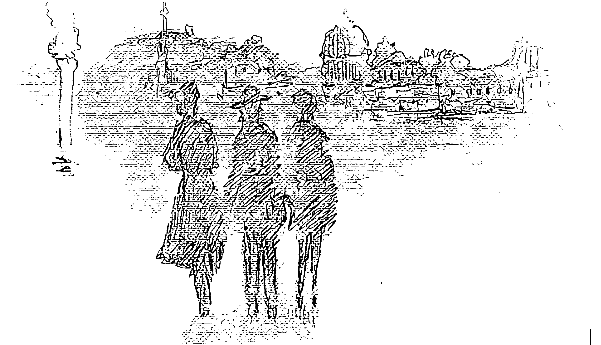
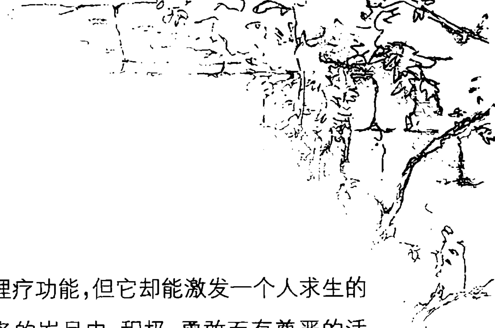
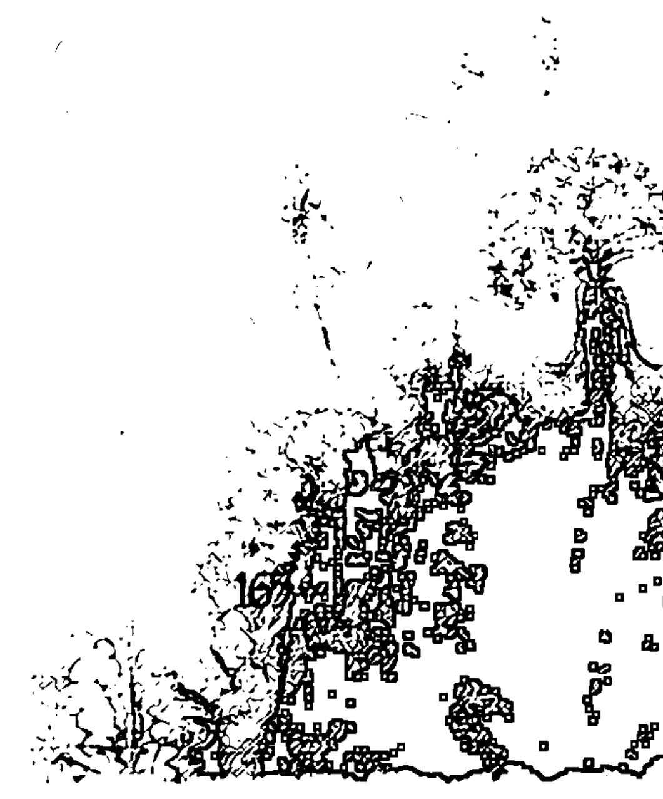
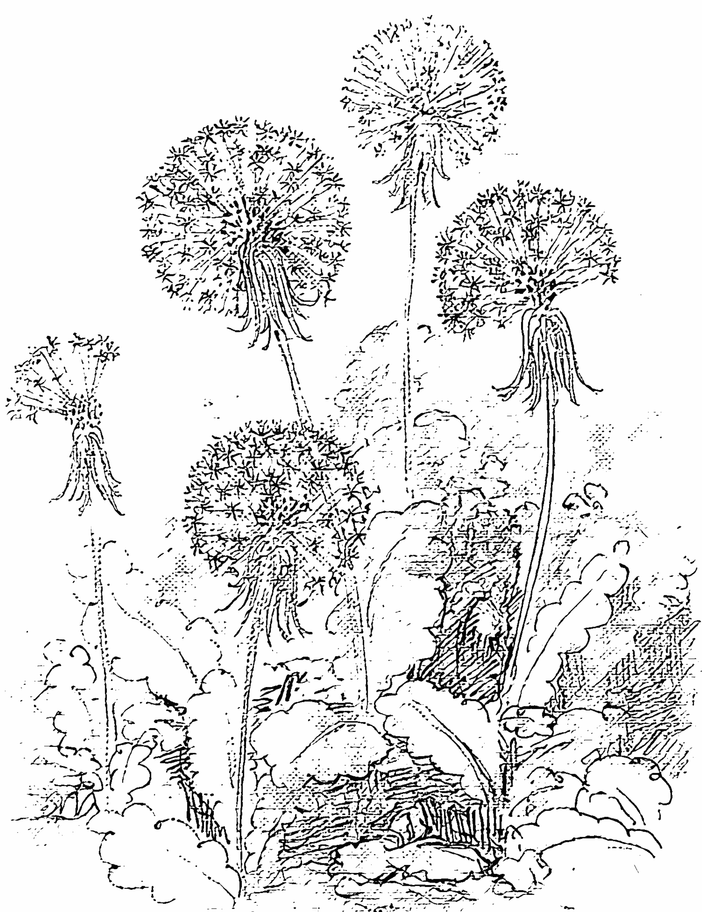
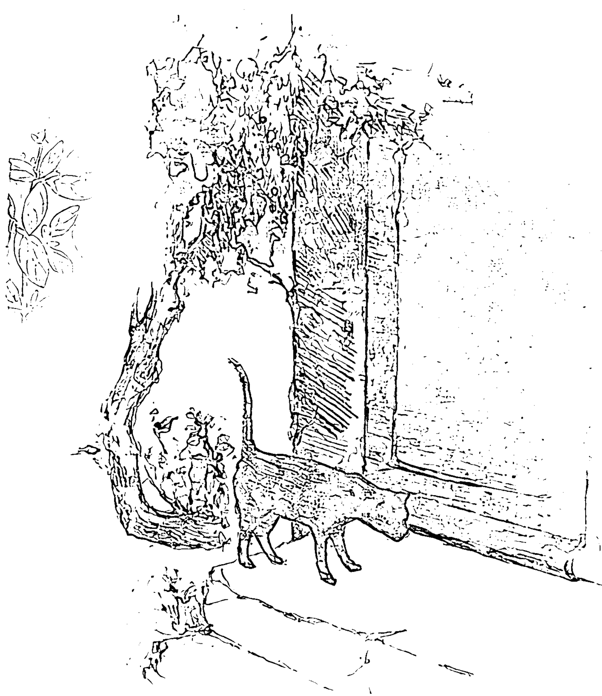

植物精油的美好
在于它的纯粹浓度以及它对身心灵的神奇效力

芳香疗法的魅力
在于它既是严谨的科学方法又是关乎美学的生活艺术

金韵蓉 [著]
黄敬懿 [插画]

## 幸福女人的芳香生活

中信出版社
CHINA CITIC PRESS

## 图书在版编目(CIP)数据

幸福女人的芳香生活 / 金韵蓉著. —北京：中信出版社，2007.5
ISBN 978-7-5086-0894-5
Ⅰ.幸... Ⅱ.金... Ⅲ.香精油-保健-基本知识 Ⅳ.R161 TQ654
中国版本图书馆 CIP 数据核字（2007）第064788号

## 幸福女人的芳香生活
XINGFU NÜREN DE FANGXIANG SHENGHUO

著 者：金韵蓉
责任编辑：符红霞
出 版 者：中信出版社(北京市朝阳区东外大街亮马河南路14号塔园外交办公大楼 邮编 100600)
经 销 者：中信联合发行有限责任公司
承 印 者：中国电影出版社印刷厂
开 本：787mm × 1092mm 1/24 印 张：8 字 数：100千字
版 次：2007年5月第1版 印 次：2007年5月第1次印刷
书 号：ISBN 978-7-5086-0894-5/G · 226
定 价：40.00元

版权所有 · 侵权必究
凡购本社图书，如有缺页、倒页、脱页，由发行公司负责退换。 服务热线:010—85322521
http://www.publish.citic.com 010—85322522
E-mail: sales@citicpub.com
author@citicpub.com

## 金韵蓉

Tammy Liu

曾经在医院从事心理咨询工作十余年，最初为儿童心理和行为治疗；接着是青少年的学校辅导；最后，专职解决婚姻问题。

暂别心理咨询工作之后，转而研习和心理治疗有关的艺术治疗领域。举凡牵涉到视觉治疗的色彩心理学，和听觉治疗有关的音乐疗法，以及目前投注所有心力，并决定借以安身立命的嗅觉治疗——芳香疗法，都是她将心理学专业应用到日常生活上的美好转换。

- ◎ 台湾省卫生部心理卫生中心心理治疗师。
- ◎ 英语专业翻译。
- ◎ IFA ( International Federation of Aromatherapists ) 国际芳香疗法治疗师学会大中华区首席代表、主任讲师、终身成就会员。
- ◎ 《时尚Cosmo》杂志《美丽笔记》专栏作家。
- ◎ 北京大学光华管理学院EMBA《女性领导人心理学》课程讲师。
- ◎ 电视节目《情感方程式》心理学顾问；《美丽俏佳人》时尚生活专家。
- ◎ 《香草地图》、《美丽笔记》、《芳香疗法》、《寻找32号》、《英国留学通》、《幸福女人的芳香生活》等书作者。
- ◎ 为多家国际企业举办员工“顾客心理学”、“减压管理”、“潜能开发”以及“表达技巧”的培训课程。

## 【内容简介】

有着IFA（International Federation of Aromatherapists）国际芳香疗法治疗师学会大中华区首席代表、主任讲师、终身成就会员，《时尚Cosmo》杂志《美丽笔记》专栏作家，北京大学光华管理学院EMBA《女性领导人心理学》课程讲师、电视节目《情感方程式》心理学顾问、《美丽俏佳人》时尚生活专家等诸多身份的金韵蓉女士，以其高度的专业素养和诗意感性的文字，奉献给读者一部极富女性特质的品质生活读本。书中既有专业芳香疗法、心理学知识、医学常识的传达，又有希腊神话、历史传说、动人好诗等人文知识的渗透，还有很具操作性的调油配方、心理测试等知识的展开。严谨而感性，全面而细致，自然动人。

## 【插画作者简介】

黄敬懿 Julie Huang
2004年毕业于台湾师范大学美术系，主修油画，之后取得伦敦大学亚非学院艺术史硕士学位。曾担任英国肯特郡 The Denys Eyre Bower Bequest 博物馆馆长特助。现就读于巴黎大学 Cours de Civilisation Française de la Sorbonne。
喜欢画画、喜欢旅游、也喜欢追求美的事物，希望借着绘画把在不同国家的生活经验和文化悸动，以自己独特的美感经验和笔触，传送给他人一同分享。

责任编辑：符红霞
装帧设计：印象迪赛
经　　销：中信联合发行有限责任公司

## 中信时尚生活系列

- 《衣仪天下》
  作者: 沈 宏
  定价: 48.00 元
  2005年4月出版
- 《顶级造型师唐毅的美妆秘诀》
  作者: 唐 毅
  定价: 48.00 元
  2005年6月出版
- 《奢华的“皮”气》
  作者: 钟岩 李岩
  定价: 48.00 元
  2005年9月出版
- 《美色实物链》
  作者: 李 炎
  定价: 48.00 元
  2005年9月出版
- 《我的化妆王国》
  作者: 毛戈平
  定价: 48.00 元
  2006年1月出版
- 《超级护肤经典》
  作者: 仇 明
  定价: 48.00 元
  2006年3月出版
- 《中国绅士》
  作者: 靳羽西
  定价: 39.80 元
  2006年9月出版
- 《四季美妆造型》
  作者: 张人之
  定价: 45.00 元
  2006年10月出版
- 《西蔓美丽观点》
  作者: 于西蔓
  定价: 39.80 元
  2007年1月出版
- 《现代职场形象设计》
  作者: 徐 晶
  定价: 45.00 元
  2007年1月出版
- 《中国淑女》
  作者: 靳羽西
  定价: 40.00 元
  2007年1月出版
- 《幸福女人的芳香生活》
  作者: 金韵蓉
  定价: 40.00 元
  2007年5月出版
- 《女人是一种态度》
  作者: 徐 俐
  定价: 39.80 元
  2006年3月出版
- 《修炼魅力女人》
  作者: 张晓梅
  定价: 48.00 元
  2006年3月出版
- 《下棋的女人》
  作者: 谢 军
  定价: 28.00 元
  2006年7月出版
- 《和儿子一起成长》
  作者: 杨 文
  定价: 28.00 元
  2006年3月出版

## 邂逅名家经典，阅读美丽生活

- 《超级美白全书》
  作者：仇 明
  定价：30.00 元
  2007 年 1 月出版
- 《美肌革命》
  作者：佐伯千津[日]
  定价：25.00 元
  2007 年 4 月出版
- 《办公室健康小动作》
  作者：雪莉·阿彻[美]
  定价：25.00 元
  2007 年 5 月出版
- 《结婚一年间》
  作者：胖星儿
  定价：26.00 元
  2007 年 1 月出版
- 《我想跟你走》
  作者：刘若英
  定价：25.00 元
  2006 年 1 月出版
- 《老徐的博客》
  作者：徐静蕾
  定价：25.00 元
  2006 年 3 月出版
- 《男人眼中女人的身体》
  作者：张晓梅
  定价：25.00 元
  2006 年 8 月出版
- 《双生水莽》
  作者：田 原
  定价：22.00 元
  2007 年 3 月出版
- 《我是谁的多宝鱼》
  作者：阿 琪
  定价：22.00 元
  2006 年 6 月出版
- 《落花流水》
  作者：阿 琪
  定价：25.00 元
  2007 年 4 月出版
- 《倾听你的荷尔蒙》
  作者：黄 颖[美]
  定价：20.00 元
  2006 年 1 月出版
- 《更年期的智慧》
  作者：克里斯蒂安·诺斯鲁普[美]
  定价：38.00 元
  2006 年 6 月出版[第二版]
- 《“坏”女人有人爱》
  作者：谢里·阿尔戈[美]
  定价：18.00 元
  2004 年 5 月出版
- 《“坏”女人有人娶》
  作者：谢里·阿尔戈[美]
  定价：18.00 元
  2007 年 1 月出版
- 《亲吻青蛙的法则》
  作者：苏珊·佩吉[美]
  定价：22.00 元
  2006 年 7 月出版
- 《从女孩到女人》
  作者：艾莉森·詹姆斯[美]
  定价：20.00 元
  2006 年 9 月出版

读者订购热线：010-85323366-8092

## 幸福女人的芳香生活

金韵蓉 [著]
黄敬懿 [插画]

中信出版社
CHINA CITIC PRESS

## 幸福女人的芳香生活

## 目 录

缘 起

入门篇

- 幸福女人的芳香生活 / [012]
- 身体和心灵的芳香传译 / [015]
- 大自然的恩赐——纯天然的植物油脂 / [018]
- 怎么选购好精油 / [020]
- 芳香收藏室 / [024]
- 美妙的神奇——体验精油 / [027]
- 最适合女性的媒介油 / [036]

- ◎ 紫苏 Basil / [044]
- ◎ 甘菊 Chamomile / [046]
- ◎ 鼠尾草 Clary Sage / [048]
- ◎ 丝柏 Cypress / [050]
- ◎ 茴香 Fennel / [052]
- ◎ 乳香 Frankincense / [054]
- ◎ 天竺葵 Geranium / [056]
- ◎ 生姜 Ginger / [058]
- ◎ 茉莉 Jasmine / [060]
- ◎ 杜松 Juniper / [062]
- ◎ 薰衣草 lavender / [064]
- ◎ 柠檬 Lemon / [066]
- ◎ 马乔莲 Marjoram / [068]
- ◎ 香蜂草 Melissa / [070]
- ◎ 没药 Myrrh / [072]
- ◎ 桃金娘 Myrtle / [074]
- ◎ 苦橙花 Neroli / [076]
- ◎ 黑胡椒 Pepper, Black / [078]
- ◎ 迷迭香 Rosemary / [080]
- ◎ 玫瑰 Rose / [082]
- ◎ 檀香木 Sandalwood / [084]
- ◎ 香水树(依兰油) Ylang-Ylang / [086]
- ◎ 逝珠之憾 / [088]

配方篇

- ◎ 青春期 / [094]
  - 青春痘
  - 头发和指甲的保养
  - 青春期的经期保养
- ◎ 生育期 / [102]
  - 脸部皮肤的芳香保养
  - 身体的芳香保养
  - 与情绪和平共处
  - 月经问题的芳香疗法
- ◎ 怀孕期 / [130]
  - 各种怀孕前期的症状和芳香疗法
  - 各种怀孕中期症状的芳香疗法
  - 为分娩做准备
  - 用精油做产后保养
- ◎ 更年期 / [144]
  - 更年期的生理症状
  - 更年期的情绪症状
  - 更年期的芳香疗法
- ◎ 夕阳期 / [154]
  - "Aging gracefully!" 的芳香疗法
  - 吸收不良综合症
  - 健康养护

- ⊙ 风过后，还在心中的香 / [168]
- ⊙ 合成香水 / [170]
- ⊙ 魅惑女人香 / [171]
- ⊙ 天然芳香 / [173]
- ⊙ 精油香水DIY / [174]
- ⊙ 和香水一样重要的芳香情事 / [177]
  - ⊙ 左脑香、右脑香 / [179]
  - ⊙ 测验你的香气EQ / [182]

## 缘起

女人的一生，该用什么来丈量？
用绵长的横亘一生的情感索带，还是用血液里流淌的女性激素？用每一个生命阶段的喜怒哀乐，还是用岁月年轮刻画的自然印记？

是的。
6岁时，我们急切地试穿妈妈的高跟鞋；
12岁时，我们惊恐地发现初潮的到来；
18岁时，我们凄美地享受不被祝福的爱情；
30岁时，我们惶惑地迎接另一个小生命；
50岁时，我们寂寞地告别伴随多年的“好朋友”。

可是，
如果这些都是生命历程中无法回避、无处回避又无需回避的必然片段，那么选择如何面对、如何调整、如何克服，如何美妙地活出精彩，却是操之在我的生命智慧。
《幸福女人的芳香生活》的构思即源起于此。在女人一生中几个重要的荷尔蒙变化阶段里，除了留意身体健康、饮食均衡和持续运动之外，其实还可以从大自然中得到帮助，不管是壮阔的大海、静谧的山峦、广袤的绿野或似锦的繁花，都能让我们敞开胸膛，抛开烦恼，得到身体和心灵的安顿与自在。

谨将这首我非常喜欢的小诗，送给天下所有幸福的女子：

> 活在当下
请让我捕捉这幸福的一刻，
把它包裹起来，
像秘密一样
藏在心里
等到明天醒来时，
把它打开，
送给我的灵魂

一个像所有女人一样的现代诗人 西莉亚·斯特芬斯(Celia Straus)

## 入门篇

植物精油的美好在于它的纯粹浓度以及它对身心灵的神奇效力；芳香疗法的魅力在于它既是严谨的科学方法又是关乎美学的生活艺术。

因此，请暂时摒弃纷乱的思绪，放下僵硬的肩膀，抬抬腿、伸伸腰，把沉重的身体丢进软软的沙发里，仔细地读读如何与它正确、安全而平和地相处，之后你就能愉快地享受和领略它的美好了。

## 幸福女人的芳香生活

女人注定喜欢美美和香香的东西！
我们会不断地买一本本很漂亮、很精致、很可爱，但完全不需要的笔记本；我们会因为阳光洒进窗帘的那一霎那感动而迷上一间咖啡屋；我们也会因为一抹不经意的微笑和凝视而挂念着一个人；我们更会明知不可以却仍然抵挡不了奶油蛋糕的诱人香味！没错！这就是我们：有着纤细的骨骼、细腻的心思、敏锐的感觉和温柔的情愫。

我之所以喜欢芳香疗法，喜欢精油，也喜欢推荐女人使用精油，就是因为它美美香香的特质非常符合女人的情感需求。这种特质使芳香疗法在众多的自然疗法中独树一帜，它不仅能以富含的天然化学成分帮助我们改善生理功能，也能从情感需求的角度来抚慰我们易感的心灵。

当然，精油绝不仅仅只有美美香香的浅薄功能，它是一种传承自几千年前古老埃及先民的生活智慧和生活艺术的现代科学，是利用萃取自植物的叶片、花朵、树干、种子等部位的芳香精华来治疗身心疾病的一种护理方式。自然界中，每一种植物精华都因为它特殊的化学成分、特性以及香气而有其独特的治愈能力，例如：天竺葵能调节身体的内分泌系统；杜松是一种完美的身心排毒利尿油；而香水树则是美丽的催情精油。

事实上，精油虽然称之为“油”，但它其实并非真正的油脂，在功能上它更像是植物的荷尔蒙。精油的芳香气味在自然界中形成了一个环环相扣的复杂系统（植物学家们早就告诉我们，植物是利用散发的香气来进行彼此之间的沟通的），在这个系统内，每种精油于一定的剂量下，各有其专司的治疗功能。因此，精油就如同植物的生命能量，蕴含了植物生命的原动力。

我很喜欢美国一位自然学家约翰·伯勒斯（John Burroughs 1837 – 1921）所说的一句话：

> I go to Nature, to be soothed and healed, and to have my senses put in tune once more.

我走进大自然，安抚和治疗受创的心灵，并且再一次地拾回我对美好事物的感觉。

是的，植物精油就是借着特定的香气来“唤醒”我们心灵深处那些沉淀已久的美好记忆：孩提时代对未来的憧憬、对生命的信任、对微小事物的欣赏、对大自然的满心欢愉。当这些清纯童稚的快乐情愫从尘封已久的心灵深处释放出来时，我们便能重新学习如何“舍得”、如何“悦纳”、如何“宽恕”、如何“身心安顿”。因此，芳香疗法的真正精神就是经由香气的作用，增强人的内在能量。它并不能直接治愈人的疾病，却能增进人们对疾病的抵抗力以及克服疾病的意志能力。

有人说，芳香精油是植物的荷尔蒙，是植物的血液，可我更喜欢的说法是：芳香精油是植物的灵魂。因为植物精油不仅可以改善体质、调节生理功能，更美妙之处在于从内在对人的心理、情绪、心灵的改善作用，最棒的是它能提高我们“对幸福的感受能力”。所谓感受幸福的能力，就是在情绪的基础上，一个人的思考方式和看待周遭人、事、物的角度。

其实，我们都曾有过纤细而敏锐的感受幸福的能力，但岁月的增长却使我们改变了面对幸福的角度，一点点丧失了这种能力却毫无觉察！小时候，我们喜欢下雨天，喜欢在雨后踩着水洼弄得一身泥巴。曾几何时，童年的乐趣被烦躁的生活取代，我们不再喜欢雨滴，不再踩水，不再为弄得满身的泥巴而开心。我们不再驻足路旁为一只受伤的小动物担心，也不再驻足路旁为一朵鲜艳的野花耽误了上课。我们害怕别人的看法，害怕无法达成别人的期望，害怕无缘拥有喜欢的事物，也害怕失去曾经拥有的美好幸福。因此，我们变得不开心，变得不再欣赏自己，变得不再相信别人，变得容易生病，变得容易受伤害。

还好，来自大自然的芳香精油是能让我们的心灵瞬间发生改变的“魔术师”。它可以帮助我们松开偏执僵硬的想法，豁然开朗地发现：“哦！原来还可以这么思考！”

对于已成为流行生活风尚，并且方兴未艾的芳香疗法，有些人以为可以用它来治疗疾病，也有些人以为它仅仅是种怡情养性的时髦产品。对于这些误解，芳香疗法其实有其更精致且深刻的内涵。被人尊称为“芳香疗法之父”的法国化学家加德弗塞（René Maurice Gattefossé），在解释芳香疗法的精神内涵和护理途径时说：“心理范畴对于香味的感觉，就像是一条心灵传译的道路”。当香味经由嗅觉神经被输送到大脑时，有一把神秘的“钥匙”会开启埋藏在记忆和情绪中枢深处被刻意遗忘的情愫，这个情愫也许是欢愉的，也许是不欢愉的，但是它们都会启动潜藏的能量，刺激大脑释放神经化学物质或荷尔蒙，来影响情绪、思想，甚至是身体器官的生物功能。

作为女人，尤其是生活在现代社会的女人，有时会不会觉得被必须扮演的多重角色压得喘不过气来？如果你想找个能让身心放松的角落休息一会儿，那么，就从来自大自然的神奇精灵——芳香精油的抚慰中开始吧！

## 身体和心灵的芳香传译

请闭上眼睛，想像走在才下过雨的青草地上，你闻到了还沾着雨露的青草香味吗？再请闭上眼睛，想像走在白浪拍岸的沙滩上，你闻到了略带咸味的海风的清新味道了吗？离家多年，还记得妈妈拿手的香喷喷的红烧肉吗？是的，我们记得。虽然我们不常经历，但是，一些美好的记忆伴随着美好的气味潜藏在我们内心深处，时刻抚慰着我们孤寂的心灵。

植物精油进入人体发挥疗效的路径有两条：一是透过嗅觉；另外，则是经由皮肤吸收。

## 「嗅 觉」

嗅觉是人类最原始也最古老的感觉方式之一，也是吸收植物精油最快的方法。当我们吸嗅精油时，植物精油的芳香分子会通过遍布于鼻翼两侧的嗅觉神经小体，被带入到鼻子的顶点，接着传递到大脑的嗅觉区，最后到达边缘系统(Limbic Center)。边缘系统又称为旧脑(Old Brain)，是负责储存记忆和情绪的地方。当植物精油分子中的物质到达边缘系统之后，会发出信号，开启储存在边缘系统里积极正面的情绪记忆“抽屉”，并促发神经系统中化学物质的释出，进而产生镇定、松弛、刺激或振奋的效果。这个过程看似复杂，其实只需要短短的几秒钟。

吸嗅精油不仅仅能达到心理和情绪的改善效果，也能透过对内分泌腺体和免疫系统的调节而达到生理上理疗的目的。比方说，吸嗅精油对于头痛、头晕、紧张、焦虑、恶心、鼻塞等生理症状就有非常好的效果。

### 影响嗅觉的因素

- **性别** 女性虽然看起来比男人敏感，但有趣的是，从生理功能来说，女性的嗅觉敏感度比男性低，尤其在生理周期期间更是明显地降低。但排卵期及妊娠期间敏感度则会升高。
- **年龄** 气味的辨认及敏感度会随着年龄的增长而逐渐迟钝降低。
- **时间** 一般来说，嗅觉会在 20 分钟之后出现疲乏的现象，因此随着时间的增长，嗅觉的敏感度会随之降低。
- **注意力** 嗅觉也会受情绪和注意力的影响，注意力越集中，敏感度就越高。
- **气温** 外界的环境变化也会影响嗅觉的表现，气温升高时，嗅觉的敏感度会增强，反之则会降低。
- **健康** 罹患急性呼吸系统疾病或慢性呼吸系统症状，如鼻窦炎、气喘，也会直接影响嗅觉的灵敏度。

### 吸嗅精油的方法有以下几种：

- 扩香热油皿
- 电灯泡环
- 泡浴
- 芳香桑拿
- 直接滴在面巾纸或手帕上
- 热水蒸汽法
- 熏蒸台
- 扩香石
- 蒸汽室
- 空气清香喷雾
- 加在干燥花里
- 滴在掌心直接吸入法

## 「皮肤吸收」

皮肤是另一个接受精油的途径。由于植物精油的分子十分细小，当接触到皮肤表面时，首先透过毛孔的吸收到达表皮的微血管，接着再被深入送进皮肤组织内到达身体的血液循环、淋巴循环,最后运送到目标器官。这个过程大约只需要 20 分钟。

精油一旦到达目标器官后,会停留在器官里工作 6~8 个小时,等器官利用完毕后,再透过排汗、尿液、呼气以及粪便的方式,将废物和多余的精油排出。

### 影响皮肤吸收的因素

- **皮肤性质** 干性皮肤的吸收能力比油性肌肤来得快。
- **健康** 健康皮肤的吸收比问题肌肤(如痤疮、皮肤炎、湿疹)速度快。
- **抽烟** 抽烟也会影响精油的吸收。烟抽得越多,对精油的吸收就越慢。
- **排汗** 由于精油的吸收靠的是毛孔的作用,如果排汗量太大,会影响精油进入皮肤的速度。
- **体温** 精油具有高度的挥发性，如果体温太高（例如刚蒸完桑拿或洗完三温暖),会促使精油的挥发速度加快,无法全部被皮肤吸收。

### 透过皮肤吸收精油的方法:

由于精油的浓度很高,以按摩方式来帮助皮肤吸收时,必须先将纯精油以萃取自植物、经由冷压法取得的媒介油(或称基础油、调和油)稀释,才能接触皮肤,否则极易造成皮肤的灼伤。

- 泡浴
- 按摩浴
- 按摩
- 制作润肤水
- 坐浴
- 漱口
- 冷、热敷
- 滴入乳液或乳霜中

## 大自然的恩赐——纯天然的植物油脂

自植物提炼出的“油”可分为两种：一种为媒介油(Carrier Oil)，又称基础油或底油(Base Oil)。例如大豆、葡萄籽、甜杏仁、核桃、酪梨、小麦胚芽以及荷荷芭油等。

由于大多数的纯精油都因浓度太强而无法直接抹在皮肤上（薰衣草和茶树除外），因此必须以基础油稀释后，才可以接触皮肤。

而基础油又称“媒介油”的原因，是因为纯精油的挥发速度极快，需要借着基础油将它锁住，并携带到皮肤里面，因此，媒介油就像是帮助精油进入身体的交通工具，同时也像是润滑剂，让按摩工作可以顺畅进行。

大部分的媒介油萃取自植物的种子或坚果，本身就具有很好的营养成分，里面所富含的维生素即便不与精油搭配也有很好的理疗功效。因此，如果能根据精油的特性及其成分，正确选择所搭配的媒介油，就能调制出具有“加分”效果的良好治疗油。另外，在调油时，如果某些媒介油属于质地浓稠的“重油”之类，则最好能与质地较轻的媒介油相互混合，并且最好是在使用的前一天混合，以使混合油保持最和谐的状态以及最佳的品质，同时也能维护精油成分的治疗功能。

用于芳香疗法的媒介油是在摄氏 60 度以下的低温环境中冷压萃取得来（烹饪用的食用油则是在摄氏 200 度以上的高温中炒榨而得），因此，冷压萃取的植物油，可以将植物中的蛋白质、矿物质、维生素、脂肪酸等营养物质完整地保存，给予皮肤除了芳香精油功能以外的滋养帮助。

常常有人误以为婴儿专用皮肤油是不容易引致过敏的温和油脂，因此也适合当做芳香疗法使用的基础油，其实不然。婴儿油是分子较大的矿物油，它的目的不是要让婴儿的皮肤吸收，只是希望停留在皮肤表面当做保护的油膜。矿物油是从石油里提炼出来的，它不但不含任何养分，还因为分子颗粒大、渗透力差而容易堵塞毛孔，造成粉刺与痤疮。试想，如果将纯精油滴入矿物油内抹在皮肤上，矿物油堵在毛孔外，不仅浪费了纯精油，还会因精油堵在毛孔外而造成皮肤的刺痒与不适。此外，绵羊油也是因为分子颗粒过大，而不适合芳香疗法的用途。

第二种来自植物的油脂就是精油，它可自植物不同部分萃取而得，是一种存在于植物的花朵、叶片、根茎、树皮、树干、树脂中的有机化合物。它们是纯天然的植物精华，没有经过添加、过滤或人工合成的过程。通常它们含量极少，所以需要大量的植物才能萃取出精油。植物精油含有超过 500 种以上不同的天然化学成分，因此它的属性极为复杂，具有高挥发性、含有芳香气味以及高浓缩度的性质，所以，除了薰衣草和茶树精油以外，绝对不可将纯精油直接接触皮肤。

目前已经被芳香疗法治疗师认可的纯植物精油大约有 100 种，但比较常用的则在 60 种左右。

## 怎么选购好精油

所有从事芳香疗法工作的专家，都无法举出一套既符合科学辩证手续，又简单易行的选购精油的方法，经验的累积仍然是目前最可行的方式。即便如此，对于初入门的朋友来说，选择精油仍然有一些可具体辨认的项目供参考。

### 「品名标示」

国际芳香疗法制造商协会严格要求，只有 100%萃取自天然植物，没有任何人工合成成分的精油才能标示“Pure Essential Oil”。如果产品中只添加了少量的精油成分，其他都是生化科技的产物，那么产品的名称只能以“Aromatherapy Oil”、“Aromatherapy Blend”、“Essence”等名称来标示。

### 「产品标签和说明书」

**拉丁文** 除了英文或法文的品名之外，产品必须有拉丁文品名。因为，同一“纲目”的植物家族里还细分了不同“属种”的植物，而这些细分的属种只能从他们的拉丁名称才分辨得出来。例如：桉树精油是公认具有良好清洁呼吸道功能的用油，但是在目前坊间能够买得到的四种桉树精油当中，只有拉丁文名称“Citriodora”含有柠檬味的桉树精油才是温和而适合幼童使用的。

**纯度** “纯度”是选购精油时非常重要的标准。有些昂贵的花香调精油，如玫瑰，30~40 朵的新鲜花瓣才能萃取出 1 毫升的纯精油，因此这些昂贵的花香调精油，如玫瑰、茉莉、橙花、紫罗兰、洋甘菊，就有两种不同的纯度——100%或5%可供选择，而这两种纯度精油的价差自然十分惊人，因此在选购时必须认明。

**产地** 在标签或说明书上必须标示产地。因为不同地方生长的植物所萃取出的精油，在品质和性能上会有极大的差距。比方说，最好的薰衣草精油品种来自法国南部的高地，法国其他地区虽然也生产薰衣草，但是在质量上却无法和南部高地的薰衣草相提并论。

**萃取方式** 说明书上必须说明该精油的萃取方式。有些精油成分非常脆弱，遇热后会失去它的理疗性能。例如所有柑桔属家族的精油都必须以冷压法萃取，而不是以最常见的蒸馏法。但是柑桔属家族的莱姆是唯一例外，必须以蒸馏法萃取才能得到更好的性能。因此，负责和专业的厂商都会说明萃取方法，以取信于顾客。

**萃取部位** 萃取植物部位的不同也会影响精油的性能和品质。例如：苦柳橙树的花瓣能制作出品质精良的橙花精油，叶片则制作出橙叶油；而甜柳橙树的果实所萃取出的甜橙油，则是养胃的良方。此外，极品檀香木精油是来自半晒干的白檀香树干的木心，如果将整株檀香木一起蒸馏，所得的精油量增加但品质却差了许多。

### 「装 瓶」

日光、灯光、高热、潮湿，都会破坏精油的成分，所以精油必须以深色的玻璃瓶装来保证它的品质。目前纯精油装瓶大多以深褐色、琥珀色、深蓝色、深绿色的玻璃瓶为主。其中，深蓝色和深绿色玻璃瓶的价格较贵，因为它对精油的保存期要比深褐色和琥珀色的长。此外，纯精油的装瓶还必须附上安全盖和滴头，因为纯精油的计量是以“滴”数而非毫升来计的。

### 「油液状态」

大多数的精油都呈清澈透明状，滴在白纸上，挥发干后不会留下任何的油渍残痕。拿起精油瓶对光目视，除了檀香木、乳香、没药等少数精油因蜡质成分高而有些浑浊，所有精油瓶内的液体都应该是清澈如水的。

### 「证书或保证书」

由于地球的生存条件日益恶化，许多精油制造商已开始生产有机精油，由于品质精纯，它们的售价比一般精油贵。如果购买有机精油，必须要认明由 "International Organic Soil Association"（国际有机土壤协会）所颁发的 "Soil Association·Organic Standard"（有机土壤证书）才算数，这个证书有效期只有一年，每年都必须更换一次。

### 「精油的价格」

精油的萃取方法和取得数量决定了它的价格。例如，从玫瑰花瓣中所萃取出的玫瑰精油数量非常稀少，因此价格非常昂贵；而从桉树的树干中所萃取的精油则因数量多，价格也相对的便宜许多。此外，萃取方式的繁复与否和所使用的萃取溶剂也是决定精油价格的因素之一。

另一种昂贵的精油是香蜂草，原因是香蜂草植物里所含有的精油极其稀少。全世界的精油制造商每年只能萃取出不超过 2.5 公斤的量。

除此之外，精油的价格相当程度地反映了它的品质和护理功效，所以，千万不要花低廉的价格去购买原本应该昂贵的精油，如玫瑰、茉莉、苦橙花、香蜂草。当然，价格昂贵的油不一定完全是好的油，但是，可以明确的是，价格低廉的油极有可能是人工合成、品质低劣或是纯精油含量极稀微的油。

通常，消费者甚至是芳香疗法治疗师，在购买精油时并不太容易辨识精油的质地和制造时间，所以具有职业道德的精油专业供应商，都会也应该清楚的标示和提供相关的资料。而向信得过、有良好信誉的供应商采购精油，是选购精油时的要诀之一。

### 「产品包装上的名称」

PURE ESSENTIAL OIL 纯精油
——表示它是精纯的，没有添加任何的人工化学成分或经过媒介油稀释。

AROMATHERAPY OIL 芳香油
——如果产品上标示的是这个名称，则表示它是与媒介油调和过的复方油，通常比较偏重在美容、美体的目的。

MASSAGE OIL 按摩油
——表示它也和媒介油调和过，而且纯精油的含量极少。

DIFUSION BLEND 薰香油
——这是专为调节室内空气或氛围所调制的复方混合精油，虽然并不是针对皮肤按摩使用，但因会经由嗅觉细胞直接进入大脑的边缘系统，因此也必须使用品质良好的纯精油来调和。

## 芳香收藏室

精油和幸福时光一样，也需要用心细细地收藏。如果你任意把它们放在浴缸边或梳妆台上，被冷落的精油会渐渐地失去芳华，失去鲜活的生命光泽，就像被打入冷宫的怨妇。等到你真需要她帮忙的时候，她已经失去了爱的能力和对生命的热情了。

### 「芳香收藏室」

纯精油非常容易受到湿热、光线、空气、水等因素的影响而变质。因此，所有储存精油的容器都必须是深色、有儿童安全瓶盖的玻璃瓶，并且最好保存在 15-20 摄氏度（61 华氏度左右）的常温环境中，因为，高温会造成精油天然化学成分的变化，也会破坏精油细致特殊的香气。此外，精油必须远离光线、热源和水渍的环境。

另外，最好给精油布置个温暖的家——把它们保存在 100% 纯松木、花梨木或樟木制作的木盒里。这 3 种木质不仅能保存精油的成分和香气，还能透过植物间的对话沟通（传香）把精油最美好的性质发挥得更完整。

### 「精油的保存期限」

所有的木香调精油（檀香木、紫檀木、杉木、松木）、麝香调精油（乳香、没药、安息香）以及广藿香精油都具有越陈越香，年代越久品质越好的特性（广藿香精油甚至有精油界的“女儿红”之称，20 年广藿香精油的香味、功能甚至是仅有一年年资的精油的好几百倍呢）。但是，柑橘属的精油（佛手柑、葡萄柚、甜橙、柠檬、莱姆、橘)却非常容易变质，所以最好每次使用后就立刻盖好盖子。薰衣草、佛手柑以及所有柳橙家族的精油都拥有新鲜清香的气味，因此，购买时如果气味浓重，就有可能表示已经变质了。

没有开封的纯精油的保存期限，根据精油种类的不同，可以长达 3~20 年；开封后的纯精油，如果储存情况良好，则可保存至少 2 年；而自己调的复方精油的保存期限，则因媒介油会变质的关系，保存期限较短，最多只能保存 6 个星期。

### 「某些精油的特殊习性」

1. 柑橘属的精油遇到低温时，会产生浑浊的云片状，但只要恢复到室温，它又会回复到正常的状态，不用担心，这个情形是正常的。
2. 玫瑰香脂在低于 16 摄氏度时，会产生凝固现象，这个情形是正常的。
3. 柑橘属、玫瑰、茉莉花精油由于光敏的性质和特殊脆弱的化学成分，最好储放在冰箱里，于需要使用前 1 个小时从冰箱里拿出，待回复到 16 摄氏度时再使用。

### 「会影响精油品质的因素」

**空气** 空气进入任何一种精油瓶内，都会破坏、改变它的化学性质，这个过程，我们称之为“氧化”。萃取自树脂的精油，如乳香、没药，接触空气后，会变得更粘稠厚重；柑橘属精油接触空气后，则会快速地失去气味并且变质。

**光线** 由于所有精油都含有叶绿素成分，因此极容易和光线产生光合作用。最好的方法是将存放在深色玻璃瓶中的精油，储存在松木制成的木盒中，完全避免阳光的照射，不仅可以延长它的保存期限，也可以确保它的理疗性能。

**水** 在玻璃瓶或其他容器里倒入调好的复方油之前，一定要确认容器是完全干燥的，否则复方油会在 24 小时之内就变质了！

### 「使用精油时的注意事项」

1. 调和好的复方油使用后必须立刻以面巾纸将瓶口擦干净，否则瓶口会出现氧化后的块状物质，不仅不容易去除，也会缩短复方油的使用寿命。
2. 绝对不可以在没有用完的复方油瓶中再加上新的调油，即使是完全相同的媒介油和纯精油配方都不行。因为剩余在瓶里的复方油已经开始氧化，加入新鲜的调油只会加快它变质的速度，并改变它的化学性质。
3. 柑橘属、玫瑰、茉莉花精油，如前所述，最好储放在冰箱里，于需要使用前 1 个小时从冰箱里拿出，待回复到室温时再使用。但千万不要利用热源去加速它的回温，这样绝对会破坏它的化学性质而影响理疗品质。

## 美妙的神奇——体验精油

精油是植物的生命、荷尔蒙、血液、灵魂。利用植物精油的芳香疗法，不仅提供怡人的香氛，更能产生奇妙的能量，帮助身体与心灵的健康。现在开始，您就可以在家中，根据自己的需要，尝试体验属于自己的芳香疗法。

## 「精油的使用方法」

精油可以利用许多不同的方法来达到它的疗效，薰蒸、泡浴、按摩是较为熟知也最为普遍的用法。实际上，精油可以和日常生活连接在一起，成为生活的一部分。

由于精油的浓度和强度很高，必须透过特定的“媒介物”来携带或稀释。这些媒介物可以是经冷压萃取的植物油，也可以是水，更可以是简单的空气。

### 空气

利用空气来吸入精油，是最简单、疗效也最快的精油芳香疗法。使用方法有许多：

- **滴在手掌心** 将一滴精油滴在掌心，搓揉双掌，再用手掌捂住鼻子，用力地深呼吸。这个方法可以随时使用，既简单，效果又好。适合鼻塞、头疼、恶心时使用。但是请记得，只有薰衣草和茶树精油可以直接滴在手掌心，其余的精油必须先经媒介油稀释后才可以接触皮肤。

- **滴在手帕上** 将 3~4 滴所选择的精油滴在手帕或面巾纸上，做 3 次深呼吸吸入精油，接着将面巾纸或手帕塞在衬衫、胸罩或睡衣里，如此可以借着身体的热度让精油持续蒸发，继续提供精油的疗效。

- **滴在枕头上** 这是帮助睡眠或减轻鼻塞、感冒的最好办法。滴 1 滴薰衣草或德国甘菊精油在枕头上，能改善失眠、帮助入睡。桉树精油则能清洁呼吸道，减缓感冒、鼻塞的痛苦。

- **滴在刚烧开的热水盆里** 将精油滴在刚烧开的热水盆里，用一条大浴巾盖着头和热水盆，深深地吸入蒸汽里的精油。水的热度会让精油里的分子蒸发得更快，也可增加蒸汽的强度。滴在盆里的精油可混合两种或单独一种使用，由于精油的气味很强烈，所以滴数最好少量。例如桉树，一脸盆热水最多只能滴6滴。此外，能治疗和缓解鼻窦炎、咳嗽等症状的精油，气味都比较辛辣，为了避免太过强烈而刺激黏膜组织，在利用蒸汽法吸入精油时，必须时常将覆盖的大毛巾暂时掀开，呼吸一下新鲜空气。另外，充满精油的蒸汽有时也会刺激眼睛，所以在吸入蒸汽时最好闭上双眼。

- **扩香器** 薰蒸法是营造室内氛围、调整情绪以及驱除室内异味的最佳方式。精油的选择取决于个人之需要，香茅可使房间充满清新的香味，紫檀木能营造温暖的木香，而薰衣草不仅能散发怡人的香气，还能在夏天驱除房间的蚊虫。扩香器的使用剂量是每5平方米大的空间滴入3滴纯精油，如果滴入混合精油，最多不能超过3种。扩香器的种类有利用蜡烛燃烧加热的熏蒸台；特殊石材制作、利用插电加热的扩香石热油皿；以及插电、里头有一个小风扇的扩香扇。扩香石热油皿是现在最流行也最常被推荐的方式，因为它很安全，不必担心水烧干了或蜡烛灭了的问题。此外，也能避免因为烛油的薰烟而影响精油的气味，或因为薰烟而造成呼吸系统的不适。

- **滴在任何热源上** 将精油滴在任何热源上，如暖气片或灯泡上，也可以达到薰蒸的效果。夏天，在冷气的出风口里塞入一个浸满了精油的棉花球，就能让满室清凉中弥漫着淡淡的芳香。

### 水

利用水做媒介物，是利用精油不溶于水的特性，使精油成分透过蒸汽和皮肤接触让身体吸收，能有效促进身体健康，为最受喜爱的精油使用方式之一。

#### 泡浴

泡浴是最豪华、最享受、也最放松的芳香疗法。泡浴借由蒸汽的挥发和水温的媒介，可同时达到生理与心理两方面的功能。

泡浴时的水温和功能

| 类型 | 温度范围 | 功能 |
| :--- | :--- | :--- |
| 冷水浴 | 0 ~ 21 摄氏度 | 刺激身体组织，活化生理功能。 |
| 温水浴 | 32 ~ 40 摄氏度 | 令人舒缓、愉悦。 |
| 热水浴 | 32 ~ 42 摄氏度 | 可以止痛、镇静，但浴后会使人乏弱无力。 |

可以依需要护理的部位和问题，选择上述的任何一种泡浴水温和所使用的精油。可以将精油加入媒介油调制复方的沐浴油，或将不超过 8 滴的纯精油加入洗澡水中。如果使用纯精油，一定要牢记精油的使用数量，千万不可滴入过多的纯精油在泡浴水中。也可将精油与一汤匙的牛奶混合，牛奶可以使精油与水混合得更好。

泡浴时，先在浴盆内装入半缸的水，然后加入精油，接着用手充分地搅和水，使精油完全散开。此外，泡浴的时间至少要超过 15 分钟，才会有更好的效果。泡浴后，只需以毛巾将身上的水分轻轻拭干即可，不需要再淋浴，那些仍然留在皮肤上的浮油，不仅具有芳香疗法的功能，还能在身上留下淡淡的香味。

一般来说精油会浮在水的表面，这并不表示精油就没有效用。精油在水中比直接按摩在皮肤上效果要快得多，为了不增加身体的负担，每周最多只能泡浴 3~4 次。此外，绝对不可以给 12 岁以下的孩子直接滴入纯精油泡浴，精油一定要与媒介油或牛奶混合后，才可加入浴缸中。可以用质地清爽的媒介油与孩童可使用的安全精油混合。如：橘。

#### 坐浴

在一盆水中滴入 5~6 滴纯精油，将肚脐以下部位浸泡于水中 15 分钟。这是改善任何下体局部感染，例如痔疮、膀胱炎、尿路感染、会阴炎等的最好方法。

| 坐浴的目的 | 建议用油 |
| --- | --- |
| 痔疮 | 桉树、没药、茶树 |
| 膀胱炎 | 杉木、桉树、绿花白千层、檀香木 |
| 会阴炎 | 丝柏、没药、茶树 |
| 产后恢复 | 苦橙花、薰衣草、乳香 |

#### 足浴

足浴是消除脚部肿胀、异味，疏解足部压力，保养双足的有效方式。也是舒缓头痛，减轻肌肉酸痛的保健方法。脚底容易出汗的人，出门前可先用茶树、佛手柑、丝柏或杜松等精油泡脚，保持足部的干燥与芳香。

足浴时，在温水盆里滴入 5~6 滴纯精油，放松心情将双脚完全浸入水中，盆内水的高度要没过足踝。如果现阶段有足部的问题需要改善，可以每天都浸泡一次，每次浸泡的时间至少 15 分钟。

| 足浴的目的 | 建议配方 |
| --- | --- |
| 足多汗 | 松木 2 滴、柠檬草 2 滴、丝柏 2 滴 |
| 脚酸痛、疲惫 | 欧薄荷 2 滴、薰衣草 2 滴、迷迭香 2 滴 |
| 脚气 | 茶树 8 滴 |

#### 淋浴

别担心，如果家里没有盆浴设备，你也一样可以享受芳香疗法。将 4~6 滴纯精油滴在打湿的洗澡海绵或擦澡巾上，在已淋湿的身体上来回用力地搓拭，海绵中的精油会随着热水的温度散发在空气中，皮肤也因为摩擦生热而将精油快速地吸收进去。

#### 按敷

按敷法可应用在身体的任何部位，并且视问题症状而选择热敷或冷敷。法兰绒、软布、棉纱、毛巾或任何可吸收液体的织物都可作为敷布。

**敷布的制作** 在盆内加入 200 毫升的水及 5 滴精油。将敷布浸泡于内，直到全部浸湿后将敷布取出，轻轻扭干，将之按敷于患部，再以干毛巾或绷带盖住敷布。可重复这个按敷程序直到敷布的温度降至与体温一致为止。

- **冷敷** 降温、消肿、减轻疼痛，适用于头痛、瘀伤、挫伤、肿胀、静脉曲张及关节发炎。
- **热敷** 适用于背痛、月痛经、腹痛、风湿痛、耳痛、牙痛及鼻窦炎。

**漱口** 利用漱口的方法可帮助除去口腔里发炎或发臭的粘液，可以使用约 150~300 毫升的玻璃杯，盛满水后，滴入 3 滴精油，充分的漱口后吐出。

**蒸汽浴** 以一小片湿棉花片滴上 8 滴纯精油，放在蒸汽房内蒸汽的出口上，当热水蒸汽喷出、弥漫整个浴室时，精油的芳香分子也会跟着释放出来。

### 植物油

按摩大概是运用精油最普遍的方法了，它可以让精油在很短的时间内进入血液循环。单从按摩本身的动作来说，已经具有松弛肌肉、平缓呼吸、使血液循环和淋巴循环顺畅的功能，而当这些按摩的功效再与有理疗功能的精油结合时，它的效果就更为显著。透过芳香按摩油的按摩，获得肌肉和精神的深度放松之后，能增强身体能量，减轻与压力相关的征候群，并且缓和疼痛，还能改善皮肤状况。

### 调油比例

芳香按摩油的调配大约是 20 毫升的媒介油加入 10 滴的纯精油。如果按摩的目的在减轻肌肉的疼痛，可将精油的滴数增加到 12 滴。至于脸部按摩用油，则维持在 20 毫升媒介油 8 滴以下纯精油的浓度。

## 最适合女性使用的植物油

### ① 脸部

**荷荷芭油 Jojoba Oil** 从荷荷芭果冷压萃取而得，颜色呈浅黄色。荷荷芭(Jojoba)是一种墨西哥原生的植物，虽然目前全球都有栽种，但仍以美墨交界处的沙漠地带最适合它的生长，品质也最优良。纯天然荷荷芭油是大自然的独特奇迹，所以又被称为“液体黄金”。它是很完美的护肤与护发天然保养用品，由于富含多种维生素和营养油脂成分，如维生素 D 和蛋白质，即使不与精油搭配，也可以成为功效良好的芳香疗法用油。

**玫瑰果油 Rosehip Oil** 萃取自生长于南美洲 3000 米高的安第斯山脉上的野生玫瑰种籽，其中含有高纯度的防皱物质，它绝佳的渗透滋润作用能帮助细胞加倍留住水分，润泽肌肤，消除干纹，软化死皮，加速皮肤更生，促进肌肤内胶原蛋白的新陈代谢。但要注意的是，粉刺和油性青春痘皮肤只能以 10% 的比例添加。

**杏核油 Apricot Kernel Oil** 高品质的媒介油，由冷压法从杏的果核中萃取制成，色泽呈浅淡黄色。杏核油含有丰富的矿物质、GLA 与维生素 A、B1、B2、B6、C，保湿效果强，有帮助舒缓紧绷、软化皮肤的功能，能使疲劳的肌肤恢复生机，适合成熟、干燥脱皮、过敏的肤质以及肤色蜡黄者使用。

**酪梨油 Avocado Oil** 自酪梨硕大的果核里萃取出的多脂油。富含维生素 A、B 和卵磷脂。酪梨油为深暗绿色，虽然质地浓稠，但非常容易被皮肤吸收，此外它具有滋润的油脂特性，非常适合干性和老化皮肤。但建议不要单独使用，可以 10%~15% 的比例和荷荷芭油混合使用。

**桃核油 Peach Kernel Oil** 清爽纯净的淡黄色液体，冷压萃取自水蜜桃的果核。是质地绝佳但价格又不贵的媒介油，非常适合脸部肌肤的保养，尤其是比较年轻或偏油性的皮肤。

**小麦胚芽油 Wheat Germ Oil** 来自冷压的小麦胚芽。小麦胚芽油含有非常丰富的维生素 E，能对抗自由基的活动，适用于成熟、老化、皱纹肌肤。唯一要注意的是，它的质地浓稠，气味浓厚，因此不适合单独使用，通常只以 10% 的比例和其他媒介油调和。

### ② 身体

**甜杏仁油 Sweet Almond Oil** 自开花的杏树果实萃取出来的冷压油，淡黄色液体，具独特的味道，富含矿物质、蛋白质、脂肪酸与维生素 A、B₁、B₂、B₆、E。易吸收，可促进细胞生长，适合干燥、敏感、发炎及无光泽的肌肤，是天然的润湿剂，也是保养皮肤及滋润效果极佳的植物油，适用于各种肤质。另外，它极为温和，连婴儿都可以使用。它还能有效地减轻皮肤的发痒现象，消除红肿、干燥和发炎。对于运动过度引起的肌肉疼痛，若以甜杏仁油按摩可加强细胞带氧功能，消除疲劳与碳酸累积，具有镇痛及减轻刺激的作用。

**葡萄籽油 Grape-seed Oil** 由葡萄种子提炼而成的质地清爽的媒介油，含有维生素 F 和亚麻油酸。可以抵抗自由基，抗老化，帮助维生素 E 和 C 的吸收，强化循环系统的弹性，降低紫外线的伤害，改善静脉曲张、水肿，预防黑色素沉淀。所含原花色素可使肌肤保持弹性和张力，避免皮肤下垂及产生皱纹，还具有保护血管弹性、防止胆固醇在血管壁上囤积及减少血小板凝固等作用。此外，具有良好的渗透力，油质较轻，黏着性低，用于肌肤感觉清爽舒服，极适合作为身体的按摩油。

**圣约翰草油 St. John Wort Oil** 圣约翰草在中国又称贯叶连翘、贯叶金丝桃。研究发现圣约翰草茎部含有多种活性成分，已被证实含有单胺氧化酶(MAO)抑制活性因子，能提高大脑中维持正常心情及情绪稳定的神经递质水平，抵抗忧郁，减轻神痛经，纾缓压力，缓和因忧郁焦虑所产生的不安、失眠和疲劳，是作用于中枢神经系统的良好媒介油。由于质地浓稠、价格较贵，可以 10%~15% 的比例和其他媒介油混合使用。

## 最适合女性的媒介油

能作为芳香疗法使用的植物油大约有二、三十种，其中葡萄籽油和甜杏仁油是品质良好，价格也相对便宜的媒介油，因此最常被芳香疗法治疗师使用，也最常被用来作为与其他较昂贵、但又拥有特殊功效的植物油调和时的基础油。

以下所列举的植物油就是针对的女性皮肤、头发、指甲，以及生理功能，有比较特殊功效的媒介油种类。

### 「脸部」

**荷荷芭油 Jojoba Oil / Simmondsia chinensis** 从荷荷芭树的深棕色小豆果冷压萃取而得，含有鲸蜡醇、维生素 D、蛋白质、微量元素。荷荷芭油颜色呈浅黄色，严格来说，它属于蜡质质地而非液体质地，只要遇冷就会凝结成含蜡质的固体，可是只要一接触皮肤，就能立刻融化成液体，被皮肤吸收。

由于富含多种维生素和营养油脂成分，渗透性强，分子细腻，在化妆品界广泛地被用来制作成抗老化的皮肤护理产品。荷荷芭油不具香味，除了是非常好的媒介油之外，即使不与精油搭配，也可以成为功效良好的芳香疗法用油。

荷荷芭油的化学分子排列和人类的皮脂非常类似，极容易被皮肤类化和吸收，此外，它的稳定性和延展性都很好，不容易变质，化妆品界已经把它视为取代抹香鲸油脂的最好的天然替代品。很适合各种性质的皮肤使用，尤其是油性敏感、成熟老化、干性缺水皮肤，此外，它也是很好的身体保养和头皮按摩油。

**杏核油 Apricot Kernel Oil / Prunus armeniaca** 富含 β-胡萝卜素，维生素 A、B1、B2、B6、C 以及矿物质。质地非常清爽细致，具有良好的渗透能力，对于肤色蜡黄或严重缺水脱皮的皮肤质地有显著的改善效果，也是安抚皮肤敏感、发炎状况的滋养油。由于价格并不昂贵，可以单独使用。

**酪梨油 Avocado Oil / Persea americanna** 自生酪梨压制萃取出的多蜡脂油，颜色呈深暗绿色，富含维生素 A、B1、B2、D、E，矿物质，蛋白质，卵磷脂。虽然质地浓稠，但极易被皮肤吸收，拥有快速的皮肤渗透能力，不仅能帮助表皮肌肤，还能深入到达皮肤底层，帮助细胞的修复和再生功能，延缓皮肤的老化速度，相当适合干性或老化皮肤。此外，酪梨油还具有过滤紫外线的功能，拥有良好的防晒效果。

酪梨油有 2 种质地可供选择：

- **粗炼油(Crude)** 是浓稠、带着厚重榛核香味的深橄榄绿色，含有非常高浓度的维生素 E 和矿物质，尤其适合成熟老化皮肤使用。如果使用粗炼油，最好先和质地清爽的植物油混合之后再使用，否则不容易推匀。
- **精炼油(Refined)** 是质地清爽的淡黄色，当然，所含有的天然营养物质不如粗炼油来得多，但也是高品质的脸部皮肤护理基础油。

**小麦胚芽油 Wheat Germ Oil / Triticum vulgare** 含有维生素 A、D、B1、B2、B6，泛酸，烟碱酸以及矿物质、钙、磷、铁、锌，亚麻油酸、亚麻脂酸、卵磷脂，以及大量的维生素 E。作为芳香疗法皮肤护理的用途时，小麦胚芽油能清除自由基，促进人体新陈代谢，预防老化，活化修复、减缓生理衰老现象、淡化妊娠纹。它的另一个功能是发挥高含量维生素 E 的抗氧化剂功能，添加在调油中，能对抗光线和空气的侵害，延长复方调油的保存期限，只要加入一小茶匙，或基础油总量的 10%即可发挥功效。此外，在调油中加入小麦胚芽油，也能兴奋活化其他基础油的营养价值。

### 「身体」

**晚樱草油 Evening Primrose Oil / Oenothera biennis** 又叫月见草，傍晚时开花，天亮即凋谢。是一种可以同时调和其他植物油和精油的基础油。由于含有 7%~10% 的 r-亚麻油酸(GLA)，铁、锌，维生素 C、E、B6，烟碱酸，因此具有多项治疗功能。

对于心血管疾病和女性更年期、生理期（尤其是经前紧张症）问题的护理最具疗效。西方人将它制作成胶囊内服，是许多前更年期女性必定服用的日常保健品。在芳香疗法的用途上，将晚樱草油和其他的植物油调和在一起（仅需加入 10% 的晚樱草），可以帮助调和油保存最佳的维生素品质；和纯精油搭配，则可非常有效地帮助改善湿疹、异位性皮肤炎、伤口愈合、经期情绪不稳定，延缓更年期以及用于更年期的保养等。

如果湿疹或异位性皮肤炎的情况严重，可以每天口服一小茶匙（约 2 毫升）的纯晚樱草油（请注意，是没有添加精油的纯晚樱草油）。

**玫瑰果油 Rose Hip Oil / Rosa canina** 萃取自南美洲智利海拔 3000 米以上，原住民栽种的无污染野生蔷薇的果实。它最重要的成分是高含量的 r-亚麻油酸（GLA），这种必需脂肪酸，对女性的生殖系统独具护理疗效；此外，它的脂肪分子排序方式和人类的皮脂极为相似，非常容易被人类肌肤类化而吸收，因此，对老化、皱纹、敏感的皮肤状况以及妊娠纹，都有很好的保养功能。

由于玫瑰果油价格昂贵，一般调油只需添加 10%~20% 即可；如果是非常干燥、老化的皮肤则可使用 100% 的玫瑰果油。

**琉璃苣油 Borage Oil / Borago officinalis** 完全无色透明的液体，含有高达 25%的纯 r-亚麻油酸(GLA)，是晚樱草含量的两倍之多，此外，还有维生素 A、E，脂肪酸。琉璃苣油虽是近几年医学界和芳香疗法界的重要发现，其实早在古罗马帝国时代的医书上就已经有使用它的记载。

由于 r-亚麻油酸(GLA)的含量丰富、品质又好，琉璃苣油促进乳汁分泌的效果极为显著，是很好的丰胸保养油；此外，它也拥有抗忧郁功能（古罗马帝国的医生仅仅让患者咀嚼琉璃苣的新鲜叶片，就能治愈他们的忧郁症）。将抗忧郁精油和琉璃苣媒介油搭配，是非常好的女性因内分泌失调而引起的忧郁症的疗养良方。

### 「头发及指甲」

**山茶花油 Camellia Oil / Camellia drupifera** 主要来自我国的长江流域，含有丰富的维生素 A、B、E 和磷、钙、镁、锰、钾等矿物质，以及不饱和脂肪酸。最显著的效果是能帮助修复受损的角质素细胞，用在脸部芳香疗法时，能帮助为干性皮肤提供水分；此外，对指甲的巩固和护理有非常好的效果，是极为优良的手部芳香疗法基础油。对于脱发、头皮屑的护理功能也为人称道。

**椰子油 Coconut Oil / Cocos nucifera** 萃取自椰子的果肉，含有多量的维生素 E、矿物质，冷压后植物油呈珍珠白色，略具椰子味。天然的椰子油在低温下为凝固状态，是质地最佳的头

## 精油篇

相传当年造物者从亚当身上取出一根肋骨创造女人时，特意吹了一股香气在女人身体里，以为日后辨别的标记。因此，女人天生具有弱水似的温婉、明月般的柔情和花儿样的芬芳。

大自然的植物中也有和人类一样的真性情，有的精油阳刚十足，有的精油却阴柔甜美，它们各自以自己的方式散发香气，也用特殊的精质成分来帮助人类。

现在我们就去看看这些拥有迷人的女性气质，香气芬芳馥郁，既能抚触女人细致的情感纤维，又能滋养女人生理系统的植物精灵们吧！

## 紫苏 Basil

拉丁文名 *Ocimum basilicum var. purpurascens*
家族科别 唇形科 Lamiaceae
精油外观 淡黄色液体

有的品牌把紫苏翻译成罗勒。但不管怎么变换名称，你都不会忘记它，因为它闻起来像妈妈炖红烧肉时使用的大料的味道。没错，紫苏精油就是从烧菜用的大料植物中萃取出来的，它是典型的辛香类精油，肚子饿时，闻了会更饿！

你也许会纳闷，这么个看似“脑满肠肥”的精油，怎么会和纤细柔美的女性联结在一起？似乎有点欺负人的感觉？

呵呵，别生气，紫苏对女性的帮助并不在于让我们看到食物就胃口大开，害我们大吃大嚼之后体重直线上升。它可是非常好的调经精油，尤其是能减轻年轻女孩行经量稀少、行经不顺的不舒服症状，是芳香疗法治疗师的配方中很喜欢使用的通经治疗油。

另外，紫苏精油是所有精油当中最好的脑神经营养剂。如果你睡觉时老是做梦，早晨起来后对昨夜做的梦还历历在目，有时甚至还能在第二天晚上接着上集剧情继续往下走，那么，这种情况表示你肯定有神经衰弱和疲惫不堪的烦恼。这时你就可以试试紫苏精油的功效。只要简单的滴 1 滴在棉花球上，把它塞在枕头底下、胸罩里、上衣的口袋里、袖口里……总之，让它从鼻腔进入呼吸道，进入大脑，进入主管情绪知觉的大脑边缘系统，就能发挥神奇的滋养疗效，让连轴转的脑神经安定舒缓下来。对女人来说，只要觉睡得好了，休息够了，脾气小了，皮肤和气色当然也就滋润漂亮了。

紫苏还有另一个为人称道的美好功能——提高记忆力。每一个销售精油的厂家或商店大概都知道，只要接近重要的考试期间，诸如中考、高考、托福考试、雅思考试等等，就得多备一些紫苏精油的存货，因为只要简单地把“1”滴紫苏精油滴在课本的书皮上，就能帮助念书的人提高脑神经细胞的活动能力，更好地理解和记住课本内容。

在此我得特别提醒各位读者，中国人说“过犹不及”，不过对于使用精油来说，我们宁愿“不及”，也远远要比“过”来得好。因为滴入精油的量少绝对比量多更有效、也更安全。因此，请你严守滴 1 滴的原则，千万不能求好心切，如果滴了太多，你反而会恶心半天，最后弄得啥也记不住哦！

## 甘菊 Chamomile

### 德国甘菊

**拉丁文名** Matricaria recutita / Matricaria Chamomilla

**家族科别** 菊科 / 紫苑科 Compositae / Asteraceae

**精油外观** 深蓝色、粘稠的液体

### 罗马甘菊

**拉丁文名** Anthemis nobilis / Chamaemelum nobile

**家族科别** 菊科 / 紫苑科 Compositae / Asteraceae

**精油外观** 淡蓝色液体，有时会转变成黄色

在植物精油这个领域里，甘菊可以算是其中比较家大业大的“派系”，因为光是这个家族就有3个有头有脸的亲戚在精油界“混”出名堂来：德国甘菊、罗马甘菊以及摩洛哥甘菊。其中德国甘菊和罗马甘菊分庭抗礼、气势不相上下，而摩洛哥甘菊在两个表亲的光环之下就显得暗淡许多，因此，多数的芳香疗法治疗师会选择性地忽略摩洛哥甘菊，当然我也一样！

我们先来说说常被人称为蓝甘菊、洋甘菊的德国甘菊精油吧！

德国甘菊的颜色和气味都会让接触过它的人难以忘怀：它的精油颜色极为深蓝、质地极为浓稠、气味极为厚重、价格极为昂贵，当然效果也极为强力。

大部分的人想到德国甘菊会直接浮现“抗敏”这两个字，我完全同意，也确认它具有这个功效，但我同时也很为它叫屈，因为德国甘菊有比抗敏更重要的生理功能，那就是它内含奥菊环烃(Azulene)的化学成分，对风湿、关节炎、痛风、痛经等，具有非常好的理疗效果，不仅能减缓疼痛，还能消炎、化淤和退肿。

当然它的抗敏和脱敏功能也值得称道。如果皮肤有因为神经系统失调而引起的皮肤炎症，例如湿疹、干癣、异位性皮肤炎、荨麻疹等等，也都可以将德国甘菊精油调在纯净水里当舒缓润肤的花露水使用。

那么罗马甘菊呢？根据我个人的经验，罗马甘菊除了也“略具”德国甘菊上述的理疗效果之外，有一个德国老大比不上的优点，那就是针对因为敏感而引致的睡眠问题有较好的理疗功效。这个敏感包含了心理的敏感（因自卑、恐惧、怀疑……而引起的噩梦）以及生理的敏感（螨虫过敏、花粉过敏……而引起的皮肤搔痒、鼻窦堵塞）。可以试着在睡前用罗马甘菊和其他减压的精油一起泡澡，或是单纯地把罗马甘菊滴在放在卧室墙角的热水杯里，就会发现它这美妙的宁神安睡能力。

## 鼠尾草 Clary Sage

拉丁文名 Salvia sclarea
家族科别 唇形科 / 薄荷科 Lamiaceae / Labiatae
精油外观 淡黄绿色近无色液体

鼠尾草的名字不太好听，似乎和在家里神出鬼没、让人讨厌的小动物有点亲戚关系。其实这真是冤枉了它。叫鼠尾草，不过是因为整株植物布满纤毛，凉风吹起时，像小动物的尾巴随着风儿摇摆一样。

大概是因为鼠尾草的名字太不讨喜，为了美化它的形象，许多人也管它叫“快乐鼠尾草”（因为“Clary”发音就像“快乐”），或“南欧丹参”。其实我颇喜欢“快乐鼠尾草”这个名字，因为它满足了鼠尾草精油极为核心的价值——让人快乐。

没错，鼠尾草精油能让人快乐，而且是那种迷幻般的快乐！哦哦，可别误会我的意思了，你可不能把它当做兴奋剂使用，它的迷幻功能是那种因深度的释然而引发的快乐，有着积极的情绪意义在里面。不过，严肃地说，鼠尾草精油在高比例情况下使用，或对某些神经比较敏感的人来说，是会让人产生幻觉的。

> 目前市面上销售的鼠尾草精油很多，由于某些厂商对精油的认识不够全面或疏忽，常将这两种精油的标示混淆。最常出现的错误是：将鼠尾草称作快乐鼠尾草，而将山艾称作鼠尾草。因此，务必在购买时，以拉丁文辨别认清这两种精油。此外，如果购买山艾，也必须确定它是西班牙品种的。

许多芳香疗法治疗师都有过这样的经验，如果以鼠尾草精油作为当次护理的治疗油时，有些客人在护理的过程中，会无预警地突然泪流满面。不是啜泣，也不是号啕大哭，而是安静地、像泉水自然涌出般地流泪。情绪一旦完全释放，洗涤干净后的心灵，就像无云的天空，晴朗而澄澈。我曾经见过一位中年妇女，在躺下接受芳香疗法护理前满眼沧桑，当以泪水“洗刷”过后，眼睛却像星星般的闪亮晶莹。所以鼠尾草的拉丁文名字 Salvia sclarea，就是“清澈的眼睛”的意思呢。

鼠尾草精油对女性的保养也是十分奇特的。它专门照顾“上了年纪的更年期妇女”。由于鼠尾草精油的成分与雌激素十分类似，能强壮子宫，因此对于因年龄老化而引起的经期与更年期问题非常有效，如更年期的周期紊乱、经量稀少、夜间燥热盗汗、心烦气躁，甚至因荷尔蒙失调引起的更年期躁郁症等。

但是必须提醒朋友们注意，请勿将鼠尾草与同一家族的另一种植物“山艾”Garden Sage (Salvia Oficinalis)搞混。因山艾含有大量的 Thujone(荆酮，某种对神经系统有毒性的化学成分)，不能用于精油，只有西班牙品种的山艾(Salvia lavendulaefolia)才是安全的。

另外，由于鼠尾草精油的深度减压功能，使用鼠尾草精油之后绝对不可以喝酒，因为它是天然的虚幻麻醉剂，会引起幻觉，开车也要小心。

## 丝柏 Cypress

**拉丁文名** Cupressus sempervirens
**家族科别** 杉科 Cupressaceae
**精油外观** 淡黄色近绿橄榄色液体

在这么多富有传奇色彩的女性化精油当中，丝柏一直默默地藏身在镁光灯照不到的阴影底下，以一贯的隐忍，为世间女子付出关怀。

不同于玫瑰、茉莉、香水树芬芳馥郁的张扬性格，也不同于苦橙花、天竺葵、檀香木精致优雅的沉静内敛，丝柏以它自己混合了木香、树脂香的中性香气和务实方式，独舞江湖。如果问植物精油当中，谁是真正的“卵巢守护天使”？丝柏绝对当之无愧。而且，它的守护，不是形而上的“感受”，而是真正意义上的在荷尔蒙调节上的帮助。

在讲述丝柏受到埋没委屈的功能之前，我们得先了解它的“历史地位”。远从公元前 15 世纪开始，它就出现在亚述人(Assyrian)各项敬拜天神的仪式的历史记载之中。希腊人用它来雕塑神像，原因是它的“再生”和“不会腐朽”的特质。此外，丝柏的拉丁文名字 Cupressus sempervirens 就是“永生”的意思。从这些证据确凿的历史记载中，您是否已经感受到丝柏精油和女性繁衍能力之间有多深刻的关系了？

好了，现在我们就来看看丝柏精油和女性生殖系统间的关系。

女性的卵巢需要 8 种激素的协同作用，才能健康正常地行使其功能。神奇的是，丝柏精油里所含有的天然化学成分含量能模拟这 8 种激素，因此能帮助卵巢正常地工作。请您注意，我所说的是“帮助”而不是“取代”。丝柏精油不会喧宾夺主地替卵巢激素工作，它只是在一旁引导、敦促、激励这 8 种激素好好地做好本职工作。

有些朋友担心，如果用了含有荷尔蒙或激素的植物精油，会不会造成机体本身内分泌的失调，或因为营养过度而加重器官的负担，甚至让器官内原本生成的纤维瘤长大？

我可以理解这样的担忧，但芳香疗法的神奇美妙之处正在于，植物精油不会漫无限制地刺激激素的分泌，它最主要的功能在于“平衡”和“调节”，也就是维持中道。这个特质不仅仅只有丝柏具备，所有的植物精油，不论是器质的、情绪的、心灵的，都具备这个中道平衡的特质。因此，也正是因为这个特质，造就了植物精油的芳香理疗传奇。

丝柏精油的美好之处还不仅止于上述模拟卵巢激素的能力，它同时还拥有良好的促进血液循环的功能，举凡脸色晦暗蜡黄、黑眼圈、静脉曲张、手脚冰冷、痔疮，以及因循环迟缓而形成的水性肥胖，都可以利用丝柏精油而得到显著的改善。

除了这些生理功能的关注之外，丝柏也有情绪理疗的功能。著名的芳香疗法治疗师帕特里夏·戴维斯(Patricia Davis)在她的书里对丝柏的解释是：“有效地帮助度过转折时期，如转换工作、搬家、做某个重要的决定、或改变一种信仰……等等，还有，失去亲人或是一段亲密关系的结束。”是的，当我们从一项挑战或体验转向另一项挑战与体验时，丝柏能给予我们强大的支持和保护，帮助我们在转换的过程中安全稳定地向前行但又不觉得孤独。

让我们一同为平静而不平凡的丝柏精油喝彩吧！

## 茴香 Fennel

拉丁文名 Foeniculum vulgare
家族科别 伞形花科 Umbelliferae
精油外观 淡黄色流体

同样属于辛香类精油的茴香，对女性的神奇理疗效果丝毫不输给同门的紫苏，只不过同门学艺，“师傅领进门，修行在个人”，因此练就的武林功夫各自不同，紫苏是帮助女性解决行经量稀少的问题，茴香却正好相反，帮助女性解决行经量过多的问题。

通常行经量过多和荷尔蒙分泌不平衡有关。如果遇此问题，在首先排出子宫肌瘤的可能性之后，就可以试着用茴香来调理。使用的方法和任何其他调经的精油一样，在月经来的前 7 天，每天晚上睡前按摩下腹部和后腰部。

在目前被所有专业芳香疗法教学机构和专家们认可的 100 余种精油当中，大概有接近 80%以上的精油都或多或少具有“通经”的功能，也就是通过帮助黄体激素的正常分泌，来促使月经周期顺畅进行。但唯有极少量的精油反其道而行，着墨在和黄体激素唱对台戏的泌乳激素上，也就是通过对泌乳激素分泌的刺激来抑制黄体激素，使行经量减少。

其中，茴香精油就是最功名显赫的大将。

不知道走笔至此，读者们从上面的描述中看出一点端倪了没有？既然茴香精油能刺激泌乳激素的分泌功能，那它和女士们最最关心的丰胸、美胸有关系吗？能用它来使乳房增大吗？

嗯，要回答这个问题得需要些技巧。严格来说，如果我们能帮助乳腺发达、乳汁分泌通畅，当然对乳房的尺寸是有帮助的。但对芳香疗法治疗师来说，丰胸不是我们最关注的问题，也不是接受芳香疗法的主要目的，但我必须承认，这确实是它“美好的附加功能”。不仅如此，如果规律地使用它来按摩胸部，还能使乳腺保持畅通干净，预防增生或减少产生纤维瘤的可能。

## 乳香 Frankincense

**拉丁文名** Boswellia carterii
**家族科别** 橄榄科 Burseraceae
**精油外观** 淡黄色近黄棕色液体

我该怎么来描述乳香?是像一般芳香疗法书上那样解析它对皮肤再生愈合的功能，还是像许多同好们述说的那样,赞美它对记忆和情绪的奇妙疗效? 可是我总觉得乳香对于我来说还有更美妙、更深一层的体认,因为我曾经经历过它的神奇之手,所以不想只用简单的话语来描述它。

我曾经带过一班年龄大约在 20~30 岁左右的女孩子们认识精油。记得那是个有着明媚春光的早晨，我让这十几个热爱精油的女孩子初闻乳香，并带着她们试着去“看见”乳香的颜色和画面。十几分钟之后，我请同学们一个一个告诉大家她看见了什么，感受到了什么。结果，大部分的同学都诉说着美好的画面和回忆，只有两个将将 20 出头的女孩告诉我她们的不愉快：一个看见了市场上陈列死鱼的摊子，极其恶心；另一个只觉得头痛欲裂，根本无法用心感受。之后，我才知道这两个女孩的童年经验十分伤痛，一个自小失去双亲，和哥哥相依为命在孤儿院长大；另一个从初初懂事的 12 岁开始，就受到继父卑劣的性侵害。

从那天之后，我带着这两个女孩在乳香精油的帮助下走出记忆的创伤。神奇的是，那尘封多年，不忍也不堪打开的记忆盒子，仅仅只用了 3 个多月就让她的主人能勇敢地面对并穿过它！

为什么要勇敢地面对并且“穿过”它？因为这些我们不忍也不堪打开的记忆盒子，虽然被我们选择性地遗忘了，以为过去了，或欺骗自己根本没有发生过，实际上，它却一直存在于某个阴暗的角落，不断地散发着讯号，影响我们现今的每一个判断、每一个选择。这些痛苦的记忆让我们看轻自己，相信自己不配拥有幸福或不能拥有成功，所以我们不敢期待、不敢尝试、不敢往前，也不敢放手去爱。最后，我们终于错失了美好的东西，也错失让自己快乐的权利。

那么，乳香精油能帮助我们吗？是的，它能！

乳香精油在好几千年以前就一直被赋予神圣而纯洁的意义，是由生长在约旦河谷一带粗壮、开小白花的乳香树的树脂萃取而得。它除了拥有高品质的天然芳香成分之外，在植物精油界，我们又叫它“基督的眼泪”，因为当工人把乳香的树皮切开，从树干中缓缓流出、滴在盆里的汁液，就好像一颗颗晶莹透明的泪珠，既象征着涤净，也象征着从死里复活的勇气和释然。

## 天竺葵 Geranium

拉丁文名 Pelargonium graveolens
家族科别 香叶草科 Geraniaceae
精油外观 淡橄榄绿色液体

谁能和个性鲜明的花瓣类精油摆在一起而不相形失色？谁又能和功效卓著的生理功能精油站在一块儿却不黯淡无光？答案应该只有天竺葵了！

天竺葵精油和那些大家耳熟能详的名门闺秀精油(如玫瑰、茉莉、苦橙花、紫罗兰)比较，确实既不昂贵华丽，也没有神秘的想象空间。它像个淳朴的乡下女孩，散发着健康快乐的气息。天竺葵有着玫瑰花般的甜美香气，但甜腻间又隐隐约约带着点辛辣的绿薄荷味道，让人乍见时感觉温柔可人，但相处之后又觉得泼辣而带劲儿。

可是你千万别因为这点而小看它，虽然它是如此的平凡朴实，甚至还有点野趣，可却是纯精油当中少数能调节全身内分泌水平的武林高手，尤其是攸关女性生殖能力的激素水平。所以在调节女性生殖系统功能时，我通常会选用丝柏精油来调节卵巢激素这个小环境，然后再搭配天竺葵精油来调节全身激素水平这个大环境。

除此之外，天竺葵也是平衡情绪反应的媒合剂。我喜欢把它用在那些情绪不稳定、容易情绪化、心思反复无常、优柔寡断的人身上，把它和沉稳的木香精油，例如杉木、松木、檀香木调和在一起，不仅能让人站稳脚步、稳定情绪、增加决断力，还能利用甜美馥郁的香气，驱散内心的消极杂质。

更厉害的是，它也是美化皮肤的花仙子，能平衡皮脂腺和汗腺的分泌功能，所以对各种性质的皮肤的保养都有帮助。

可惜的是，由于天竺葵精油有着和玫瑰颇为相似的香气，所以常被贪图利益的商人李代桃僵，用来误导消费者认为是价格昂贵的玫瑰，或在 99%的天竺葵里滴入 1%的玫瑰当做纯玫瑰精油销售。可就算是你真的误认了它，或多花了冤枉钱买了它，除了被欺骗的失望愤怒之外，我保证它也能让你毫不失望地爱上它的！（不过最好别在这样的情景之下初遇它！）

> 用天竺葵自制一瓶美丽的花露水吧。很简单，只要在 100 毫升的纯净水里滴入 10 滴天竺葵，带在身边，随时喷洒，你会惊讶地发现身边值得欢欣的事情会变得越来越多！

## 生姜 Ginger

**拉丁文名** *Zingiber officinale*
**家族科别** 姜科 *Zingiberaceae*
**精油外观** 淡黄色或绿色液体

早在好几百年前，生姜就是知识渊博的医生们用来医病的良药，尤其是生姜藤蔓似的地下茎被先民称为“河流”，由于外形和人类的消化系统非常相似，所以从事顺势疗法的医生们喜欢用它来治疗消化系统的疾病。

在课堂上，我喜欢让学生们用心地嗅闻生姜精油的味道，先感觉它的颜色，接着感受这股暖暖的、辛辣的气味往哪里去了。我那些聪明的学生们会眯着幸福的眼睛告诉我：生姜的气味走到肚子里去了！没错，它走到肚子里去了。然后呢，还有什么感觉吗？肚子里觉得暖暖和和的，感觉很舒服、很安全。

是的，这就是生姜精油。在生理功能上，它的温暖像早晨的第一杯热水，能帮助消化道的蠕动畅通，所以对胃寒、便秘、打嗝、胃胀气很有功效；它的温暖也像冬天和煦的阳光照射在腹部，能帮助年轻女孩减轻因宫寒而带来的痛经、经血量过多以及血块问题；它的温暖又像辛辣带劲的狗皮膏药，按摩在后腰能减缓坐骨神经和腰椎疼痛，按摩在肩颈，则能减轻肌肉的僵硬酸痛。

除了生理功能之外，生姜精油的神奇温暖魔力能让人敞开冰冷的心扉，让拘谨冷漠的个性逐渐释放开来。在芳香疗法的临床应用中，我常把它当做安全沉稳的低度油，调给那些因为个性害羞而影响人际关系的女孩，或是那些因为缺乏安全感和亲情而不敢接受爱情的女子。

曾经，在某个短期的研习会中，我遇见过一个身材高挑匀称、五官极其精致美丽、30 多岁了仍然小姑独处的女子，在练习调制精油的过程中，不管滴入什么香气浓郁的精油，她的调油都始终清淡如水，散发不出气味来。在同学们的起哄中，她满脸通红、惶惑地看着我，好像心底的秘密被揭穿了般地害怕。

当时，我没有立刻回应她的眼神，也没有当众解释她的现象，只是递给她一瓶生姜精油，让她调在自己的瓶子里，嘱咐她每天晚上睡觉前抹在腹部和肋骨间。那次研习会结束后，我一直没有再见过她，只是在两个多月后接到她的电子邮件，告诉我她爱上了生姜精油的气味，而且“神奇地”发现自己开朗多了。

我不知道她封闭自己的原因，也不知道她后来恋爱了或结婚了没有，但我能确定一件事，就是如果她持续使用生姜精油，生姜神奇的温暖力量绝对能帮助她打开紧闭的心扉、融化冷漠的态度，勇敢而开朗地去接受自己和别人。

## 茉莉 Jasmine

**拉丁文名** *Jasminum grandiflorum*
**家族科别** 木犀科 Oleaceae
**精油外观** 红棕色粘稠的液体

首先，我必须实事求是地替茉莉精油说几句公道话。在玫瑰精油甚至橙花精油的耀眼光环下，茉莉精油一直没有得到它该有的重视和公正评价。喜欢精油的女人们一想到香香美美、富有女人味的芳香疗法，首先浮出脑海的绝对是娇艳无比的玫瑰精油，至于茉莉，你只要从它的销售量就会明白它的地位——根据国内纯精油的销售数据显示，玫瑰精油的销售量是茉莉精油的至少 15 倍之多！

那么，茉莉真的如此不如它的好姐妹兼劲敌玫瑰吗？

其实，茉莉精油与玫瑰精油一样价格非常昂贵，因为制造精油时需要的花朵数量非常多，而且由于植株内部化学分子的改变，使得茉莉花的气味在夜晚特别强烈，工人必须在夜晚收集花瓣才能完整地保存花瓣的能量，当然，收集花朵的人工开销也随之增加不少。

由于茉莉花瓣采摘后会连续好几天释放精油，所以采收的花朵必须放在浸着橄榄油的棉布上，直到所有的精油都被吸收为止。接着还要用酒精把橄榄油分离抽取出来，才能得到精纯的茉莉精油。市面上还有等级较低、价格较便宜的茉莉精油，是用石化酒精直接萃取茉莉花瓣得到的。这种方法萃取的精油，由于酒精会立刻让茉莉花枯萎，所以无法将花朵中所蕴含的精油完全释放出来，因此香气很淡，品质也不好。

茉莉精油又称精油界的“花中之王”，虽然这个称号颇具阳刚形象，但它却对妇女生殖系统的调养有非常好的功效。在分娩过程中，茉莉能有效地减轻疼痛，加强子宫收缩以帮助生产。它还能帮助产后胎盘的清洁脱出及母体调养，也能促进乳汁分泌。除此之外，茉莉精油还能调节情绪，所以也能减轻产后抑郁症状。

当然，茉莉也和人称“花中之后”的玫瑰一样能增加女性化特质，也就是女人味。在临床护理上，我喜欢把茉莉精油调给那些个性羞怯、动不动就脸红、不敢直视别人、在公众场合手足无措的害羞女孩，因为它花中之王的阳刚霸气，能赋予女人带着自信和骄傲的妩媚，正适合过度内向的美丽女子。

除了对女性的帮助之外，让人讶异的是，茉莉精油的壮阳特性也相当有名，可能是因为它妩媚中带着霸气，又有温暖厚重、能疏解压力的香气，再加上特殊的天然化学成分组合，所以能改善男性阳痿以及体力虚弱的问题。如果男士需要这方面的帮助，可以试着把茉莉和香水树、黑胡椒或生姜与媒介油调和在一起当做按摩油使用，或滴入浴缸泡澡。

## 杜松 Juniper

**拉丁文名** Juniperus communis
**家族科别** 杉科 (Cupressaceae)
**精油外观** 纤黄或淡黄色液体

如果你赫然发现手里拿着的精油瓶子上写着“杜松莓 Juniper berry”，先别着急，你没有买错，卖给你精油的那个帅小伙子也没有骗你！

杜松具有理疗功能的精华绝大部分储存在它的浆果里，萃取精油时要先把成熟的浆果在阳光底下完全晒干，才送入蒸馏器里，所以杜松精油又叫杜松莓精油。

大部分的芳香疗法书籍对杜松功能的描写都会提到一个单词——“排毒”。没错，排毒是想起杜松精油时该有的关键单词。但我极为介意的是，我深怕人们把杜松精油界定为很好的排毒、利尿精油，所以只把眼光放在它的减肥、排水、促进淋巴循环的生理功能上，因而窄化了它其他的美好能力。

事实上，杜松是精油界里少数既有强力的生理理疗功能，又有强力的心理情绪理疗功能的精油。就拿排毒来说，它既有消除水肿、利尿、杀菌的生理洁净功能，又能消除心理的毒素，帮助排出自卑、苦涩、嫉妒、刻薄、仇视等等的消极心理。

我喜欢给因脸上长满的青春期痤疮而自卑痛苦的年轻孩子用杜松精油，因为一方面杜松能清洁毛孔里的污垢、抑止表皮细菌感染、控制皮脂过度分泌，一方面还能增强孩子的自信心，消除“丑小鸭”的自卑心理。当然，对那些身材臃肿、肥胖、皮肤粗糙的女孩子来说，我也常建议加入杜松的配方，原因和前述相同，在清除生理毒素堆积的同时，也一并把心理堆积的毒素给清洁掉。

其实，杜松的清洁功能还有更多的意义，它还有很好的“净化血液”功能。芳香疗法治疗师会把它和柠檬精油调在一起帮助预防脂肪肝的形成；把它和葡萄柚精油配在一起用来解决胆固醇和血脂高的问题；把它和茴香调在一起，解决下肢水肿、肠胃胀气的难受；或把它和桉树兑在一块儿，减缓因尿酸过高而形成的痛风疼痛。因此，它不仅很适合爱美的女生用来减肥，也很适合给女生那个好交朋友、爱喝酒、为事业操劳、中年有了啤酒肚的先生使用。

但是，虽然杜松精油有万般好处和妙用，可也千万别忘了它具有超好的利尿功能，所以要注意的是，如果有正在肾脏发炎的情况，不可以使用杜松精油，否则会因太利尿而扩散细菌，引发其他地方的炎症。

## 薰衣草 Lavender

**拉丁文名** Lavandula angustifolia
**家族科别** 唇形科 Labiatae
**精油外观** 无色或淡黄色液体

如果你从来没有听说过芳香疗法，也不知道任何一种植物精油，即便如此，你极有可能知道薰衣草，因为它常常不经意地出现在你的周围。例如：在超市货架上陈列着的薰衣草空气清香剂、薰衣草沐浴乳、薰衣草润肤霜、薰衣草花茶……总之，它是最容易出现在日常洗涤用品里的香料配方。

另外，如果你才刚开始对芳香精油有兴趣，是个不折不扣的门外汉，那么你所选购的第一瓶植物精油也极有可能是薰衣草。因为它的适用范围最广，知名度最高，香味最熟悉。同样的，价格也最平民化。

是的。所有学习芳香疗法的朋友都知道，如果你找不到一个适当的精油去帮助某一个人的身心问题，给他薰衣草就绝对错不了。薰衣草精油也许不能像其他精油对某一个症状那么具有针对性的理疗功能，但它绝对是个“万能博士”，任何问题到了它手里，都能大事化小，小事化无。

如果说起薰衣草精油和女性的关系，那就更是美事一桩了。
首先，薰衣草是最具功效的通经精油。但凡女性会遇到的各种月经失调问题，都可以从薰衣草精油这儿得到帮助。此外，由于薰衣草具有非常好的止痛功能，因此可以快速有效地缓解甚至消除痛经。方法是在月经来的前7天，每天晚上睡觉前，将薰衣草精油调和在媒介油里，按摩下腹部和后腰部。如果只是滴入薰衣草，比例是每10毫升媒介油滴入5滴纯薰衣草精油。如果要搭配其他精油，就请继续关注书后面即将介绍的配方篇。

其次，薰衣草也是很好的抗忧郁精油，因此，女性各种因荷尔蒙失调而引起的情绪问题，如经前紧张症、更年期抑郁症、产后忧郁症等等，也都可以利用直接吸嗅或按摩来改善症状。

其三，薰衣草有很好的镇定安抚功效。女性如果有因压力、情绪焦虑、荷尔蒙不平衡而引起的失眠症状，也可以利用它来帮助睡眠的问题（别着急，哥们儿，男士也可以！）。方法很简单，只要睡觉前在枕头上滴1滴的薰衣草精油就可以了（千万别滴多了，多了反而会影响睡眠）。

最后，薰衣草闻名遐迩的细胞再生、伤口愈合、消炎杀菌功能，自是不在话下。因此，不管是青春期因油脂分泌太多而造成的青春痘，成人期因情绪压力、便秘、激素水平失调而引起的成人痘，或更年期内分泌巨变、抑郁而引起的毒性痤疮，都可以用薰衣草精油制成花露水，当润肤水使用，或直接涂抹在发炎的红肿脓包上。

## 柠檬 Lemon

**拉丁文名** Citrus limon
**家族科别** 芸香科 Rutaceae
**精油外观** 淡黄绿色液体

柠檬精油是往往被人期待过高、却也往往让人失望的精油。但这个错误并不在它，而在于人们误解了它的美好功能。

一般人只要想到柠檬精油，就立刻浮起“美白、祛斑”这两个单词，以为柠檬果实里本身就富含维生素 C，如果萃取成浓度极强的精油，那更是强上加强，所以能起到快速的美白、淡斑作用。可根据我个人的实践经验，答案其实不然。把柠檬精油调在媒介油里按摩皮肤，或许能帮助清洁毛孔内的污垢、抑制油脂分泌和改善皮肤光泽度，但对已经形成的色素沉积却没有让人满意的显著效果。

你先别失望难过！虽然我说柠檬精油不具有美白祛斑的显著功效，可它却是很好的利肝、清肝、净化血液的精油。芳香疗法治疗师喜欢把它和杜松精油搭配在一起，用来针对脂肪肝、肝炎、高血脂、动脉粥化以及心血管疾病的早期预防上。而对付那些因为荷尔蒙和肝功能不好而形成的黄褐斑，它有蛮辉煌的纪录。

在芳香化学界极具盛名和有卓著贡献的法国的珍·瓦耐（Jean Valnet）医师在他所写的《芳香疗法的应用》（*The Practice of Aromatherapy*）中说到，柠檬精油里含有的主要成分为维生素 A、B（1,2,3）、C、PP，以及矿物盐、钙、铁、氧化矽、磷、锰化铜、柠檬酸盐及钾。碳酸盐、重碳酸盐化钾和钙是用于维持人体的酸碱平衡。此外，柠檬精油所含的成分使它对消化系统及任何的过酸性反应症状（如风湿症、关节炎及痛风），都有很好的作用。

柑橘属的水果精油家族，如佛手柑、葡萄柚、橘、甜橙、莱姆等，都有相同的开朗欢愉的个性：黄澄澄的颜色、圆乎乎的外形、油润润的手感以及清心凉的风味，柠檬当然也不例外。日本一些在办公大楼里的公司，会在下午两点钟左右，在空调出风口的地方塞个滴了柠檬精油的棉球，一方面让柠檬精油里的香气赶走污浊的空气污染，另一方面也能使下午昏昏欲睡的员工提振精神。

所以，你可以运用心思，巧妙地利用柠檬精油的这些优势。例如，可以将滴了柠檬精油的棉球塞在汽车的冷气出风口；塞在电脑键盘中间；放入上衣口袋……或者只是简单的把它滴在漱口水杯里，漱漱口，之后就觉得口气清香、吐气芬芳了！

## 马乔莲 Marjoram

**拉丁文名** Origanum majorana
**家族科别** 薄荷科 / 唇形科 Lamiaceae / Labiatae
**精油外观** 淡黄色近黄棕色液体

由于篇幅所限，只能在这本书里精选介绍比较和女性相关的精油。有些精油不必 PK 就能自然胜出，可马乔莲却是经历了一番苦战，才从和没药、绿花白千层、杉木的鏖战中脱颖而出。

为什么我会介绍它，而不介绍和女性雌激素分泌更为密切的绿花白千层呢？让我先说说马乔莲的故事给你听。

希腊人栽种马乔莲是因为他们相信马乔莲是由阿芙罗狄蒂（Aphrodite，也就是维纳斯）所创造，代表了女人爱与美丽的特质。此外他们也将马乔莲称为“山之欢愉”。因为马乔莲的名称起源于古拉丁名“Origanum maiorana”，而“origanum” 源自拉丁文的“oros”（山）和“ganos”（欢愉及壮丽）。

被称为“山之欢愉”的马乔莲生长在希腊及其他地中海国家的山峦上，有着浓郁宜人的香气，在希腊人及罗马人传统的婚礼中，会把用马乔莲做成的美丽花冠戴在新人头上，象征婚后生活的美满幸福。另外，除了婚礼的新生，马乔莲也常被栽种在坟墓上，寓意永生的适意和安乐。

这个故事美吗？是的，这就是我为什么选择它的原因。帮助生殖器官的再生功能和雌激素的分泌功能固然重要，但我坚信，拥有幸福、安适、欢愉的心境对女人来说更为重要。女人的一生，或者人的一生，肯定要经历无数次的跌宕起伏，如果在每一次的高潮低潮之间，我们能一直保持乐观而欢愉的态度，那么，即使脸上有皱纹了、胸部开始下垂了、月经完全闭止了，我们都还能在“逆境”中找到继续快乐的理由。

当然，马乔莲精油也不是只有无厘头的傻乐！它也有很好的生理舒缓功能。首先，针对现代白领因生活节奏太快、工作压力太大、饮食习惯不良、长期坐着缺乏运动而引起的“隐疾”——便秘，就具有很好的调理功效。你别小看便秘问题，它不仅仅会产生让人难受的腹胀气，让人腰围变粗，让人下巴一直冒痘痘，让人口气不好，还会影响到睡眠质量，让人因睡眠不够而精神恍惚、两眼发黑。

如果你正在为这个隐疾烦恼，试试看，把马乔莲、生姜、黑胡椒或茴香一起调在媒介油里，每晚睡前以顺时针方向按摩腹部。不久，你就会开始污染室内空气，浪费浴厕用水了！

## 香蜂草 Melissa

**拉丁文名** Melissa officinalis
**家族科别** 唇形科 Lamiaceae
**精油外观** 淡柠檬色液体

曾经，有个失婚的历史系女教授，母兼父职勇敢坚强地将年仅3岁的儿子教养长大。聪慧懂事的儿子终于即将大学毕业，有一天在英国的夜里2点，她接到一个来自南非的越洋电话，和同学一起到南非毕业旅行的儿子，在南非的高速公路上遭遇车祸当场去世。这位坚毅勇敢的女子没有失声痛哭，只是接电话的手再也没有停止过剧烈的抖动。

整个后事在巨大悲痛但出奇安静的过程中处理完毕，她自始至终没有掉过一滴眼泪，但控制不住剧烈抖动的手泄漏了她心底的巨创。70多个心如死灰的日子过去了，朋友们再也无法坐视干着眼睛但睡梦中仍无法停止抖动的手，他们把她送到了社区医院里的芳香疗法治疗师那儿。治疗师没有嘘寒问暖，也没有试图安慰，只是以一滴神奇的精油，默默地、悲悯地按摩她的双手。终于，在第4次沉静的按摩过程中，凄厉的哭声如山洪般突然爆发，那来自肝肠心肺的委屈、怨怼、不舍、伤痛，一并倾泻，抖动的手静止了，她终于在决堤的泪水中，俯伏于造化。

今天，她已将巨创埋藏在心底安静的角落，离开了触目皆是回忆的家乡，成为为历史系学生讲解欧洲中古世纪古堡历史的义务导游。她仍然安静，但眼神却祥和安定。那帮助她浴火重生的香蜂草精油，也成为贴近她心灵深处的朋友。

在大自然的植物精油中，几乎每一种精油都有帮助情绪的功能，有的拥有兴奋刺激的能力，有的能镇定安抚焦躁不安的状态。香蜂草精油却独树一帜，它既不兴奋也不镇定，只是深入到达心底，从内心深处激发“对生命的热情”，唤起“自我疗伤的能力”，它对情绪的帮助是深层而久远的，因此从中古世纪开始，就已经有人称它为“生命之油”或“长生不老水”(Elixir)了。

不仅香蜂草精油有“起死回生”的能力，就连香蜂草植物生命力也异常旺盛。它不但好种好长，即使已经看似枯萎，都还有可能在泥土里又顽强地冒出新芽。更神奇的是，只要摘下一片香蜂草叶片或幼茎插在土里，隔个几天，你一定会发现美丽的香蜂草枝芽破土而出。

对于因更年期绝经而情绪低落的妇女，因失婚而承受剧痛的女子，或因失去所爱而痛不欲生的人们，香蜂草精油都能提供深度的理疗效果，是植物精油界里最具有深层情绪问题治疗功能的完美配方。

如果利用香蜂草精油来帮助深度受伤的情绪，最好的方法是将 1 滴香蜂草精油滴入掌心，双手用力搓揉，之后将双手覆盖在脸上，缓缓地深呼吸，用力吸气。由于香蜂草精油有非常好的安神功效，因此晚上使用效果最好。如果白天情绪非常低落，也可以如此多做一两次。

由于香蜂草精油具有很好的治愈重度情绪问题的功效，再加上植物本身含水量多，含精油量少，因此价格相当昂贵，成为最常被“李代桃僵”稀释的精油，以降低成本或售价。通常用以稀释替代的精油为价格较便宜、气味相似的柠檬草、香茅或柠檬。所以，唯一的途径只有向信誉良好的商家购买。

## 没药 Myrrh

**拉丁文名** Commiphora myrrha
**家族科别** 橄榄科 Burseraceae
**精油外观** 有两种质地
1. 以蒸馏法萃取的精油颜色为淡黄色至琥珀色
2. 以溶剂萃取法萃取的树脂油颜色为深红色

还记得没药的家族兄弟，又称为“基督的眼泪”的乳香吗？没药也有个类似的美好传说。当萃取精油的工人将没药矮小壮实的树干做了个环形的切口时，没药的树脂汁液就从切口中缓缓地流出，滴入了下面承接的器皿里。让人震惊的是，那缓缓流出的汁液有着像鲜血般的红色，而滴入器皿后，鲜红的色泽又转为血液凝固后的深棕色，因此，萃取精油的工人在祈祷敬畏之余，又把没药称为“圣母马利亚的宝血”。

如果你能牢牢地记住这个故事，就不难记得没药精油的功能——针对女性生殖系统器官的修护和保养，而且这个修护保养还带着“再生”的意涵。

让我们先从纯生理的角度来说，没药精油已经被芳香化学家们认可其所含的天然化学成分具有杀死生殖器官感染病菌的功能，举凡阴道炎、宫颈糜烂、盆腔炎等等感染性发炎症状，我们都可以用没药精油来消炎和修复。

有趣的是，没药精油除了是生殖器官的保护神之外，对口腔的黏膜也有相同的功能。如果有牙龈溃疡、牙周病、鹅口疮等黏膜性感染症状，可以把没药精油滴在漱口的水杯里漱口，也能很有效地帮助这些炎症的消除。有些针对牙龈健康的酊剂和牙膏里就常有没药精油的成分。

好了，现在我们从性灵的角度再来认识没药吧！

欧洲的历史典籍中有记载，古波斯王常头戴以没药木做成的花冠，祈求来自母亲大地的力量；雅典的嫔妃们则使用没药香膏来防止皱纹产生和以异香来魅惑君王；此外，因没药香脂具有极强的收敛效果，希腊妇女将没药粉置于铁盘上加热，使没药的香气渗入灵魂和脸部皮肤中，以能返老还童、永葆青春。最后，还有点吓人的是，古埃及人在制作木乃伊时，会把包裹木乃伊的绷带浸入杉木和没药的精油中，杉木精油能完好地保存肉身不腐坏，没药精油则完好地保存他的灵魂和心智，以便坠入永生的轮回时仍保有最初的感动和爱。

你已经决定怎么使用没药精油了吗？请相信我，它会是安抚你生理、心理、灵魂的好帮手。

## 桃金娘 Myrtle

拉丁文名 Myrtus communis
家族科别 桃金娘科 Myrtaceae
精油外观 淡黄色至淡琥珀色液体

传说古代希腊的神祇中主管爱与美的女神阿芙罗狄蒂，也就是维纳斯的前身，是由大海中的纯白色泡沫冲积诞生的。她诞生时，赤裸着身子踩在一只荷叶般的贝壳之上。她的身材修长而健美，体态苗条而丰满，丰姿婀娜而端庄，一头蓬松浓密的散发与光滑柔润的肢体形成了鲜明的对比，烘托出肌肉的弹性和悦目的胴体。风神齐菲尔吹着和煦的微风缓缓地把她送到了岸边。粉红、白色的玫瑰花在她身边飘落，果树之神波摩娜早已为她准备好了红色的新装。碧绿平静的海洋，蔚蓝辽阔的天空晕染了这美好祥和的气氛，天地众神都满心欢喜，知道一个无与伦比、爱与美丽的生命诞生了！

可是这么美丽的维纳斯却没有察觉自己的美好。有一天，她又踩着海水到了有着长长白色沙滩的海边玩耍，远远走来一位英俊的猎人，猎人惊觉于维纳斯的美丽，深深地凝视着她，并为她倾倒，可是维纳斯却羞怯地躲在沙滩上的灌木丛后面，试图用树叶遮掩自己的身子……当然，故事发展到最后肯定是英俊的猎人和美丽的公主快乐地相恋并生活在一起……呵呵！我要说的并不只是这个浪漫动人的爱情故事，而是想告诉你，那个让维纳斯遮掩身体的灌木，叫做桃金娘。

不知道是这个神话故事启发了芳香疗法治疗师研究桃金娘精油的兴趣，还是桃金娘精油启发了希腊小说家的灵感编排了这美丽的故事？

总而言之，桃金娘精油拥有一个神奇的魔力，它能让看不见自己美丽的女子重新认识并喜欢自己，让那些老是觉得自己眼睛小、鼻子塌、个子矮、身子胖、处处不如人的女孩，发现自己的优点，欣赏自己的美丽。如果你也需要这个帮助，很简单，只要把桃金娘精油滴在媒介油或纯净水里，每天早上或晚上当做保养油使用，你就能在桃金娘的香气中，像维纳斯一样，勇敢地走出灌木丛来。

除了这个美好的功能之外，桃金娘精油也是很好的脸部皮肤保养油，对于各种性质的皮肤都有平衡皮脂和水分的功效。所以在临床护理上，我喜欢给自卑、不满意自己相貌的青春期女孩用桃金娘精油做化妆水用，也喜欢给即将迟暮的更年期女性作为脸部的保养油按摩。

另外，桃金娘也像桉树和绿花白千层一样，对呼吸系统的清洁、消炎很具功效。

## 苦橙花 Neroli

**拉丁文名** Citrus aurantium var. amara
**家族科别** 芸香科 Rutaceae
**精油外观** 浓厚的黄棕色液体

苦橙花是所有植物精油中，最能体贴女人心思的精油，能调节女性荷尔蒙、安抚内分泌失调引起的情绪躁郁，还能滋润保养皮肤。

可是，为什么叫它“苦”橙花呢？难道女人天生就该带着点悲苦？答案当然不是，称它为苦，只是因为它萃取自苦柳橙树所开的白色花朵。在为数不多的极品花瓣精油中，苦橙花一直以它细致温柔的芳香独具特色。

苦橙花虽然文雅低调，其实系出名门，大有来头。
苦橙花精油的名字 Neroli，来自于 17 世纪品位高雅的意大利女王乃萝莉（NEROLI）。乃萝莉女王喜欢在宫廷里举办舞会，当时正是古典、华丽、重视繁复装饰的巴洛克文化盛行的时代，乃萝莉女王的舞会装

饰却一反当时的流行，她的宫廷舞会大厅清新、甜蜜而又不失细腻华丽的风格，一时之间成为欧洲贵族竞相效仿的典范，并为 18 世纪中叶开始的洛可可文化产生了重大的影响。

为了增加舞会的气氛，乃萝莉女王将香味清新、甜蜜、细腻华丽的苦橙花精油擦在手套、衣服和披肩上，并用来薰香房间，她还请所有的女士在舞会之前用苦橙花精油入浴，在翩翩起舞间香氛漫漫。因此，当时她所钟爱的苦橙花精油舞会用手套（Neroli Glove），成为欧洲上流社会的最爱。

酷爱苦橙花精油足以和乃萝莉女王相提并论的是 18 世纪法国国王路易十五的情妇蓬巴度夫人。在那个时代，凡尔赛宫被称作“芳香的宫殿”，凡是获邀出席凡尔赛宫舞会的名媛淑女们，都必须以个人独特的香味来说明自己的个性和品位。当时，蓬巴度夫人是公认的最具有时尚品位的社交名媛，她将苦橙花精油作为香水使用，因此，带动了苦橙花精油再一次的独领风骚。

对抗忧郁，帮助睡眠，是苦橙花精油最好的功能。尤其是经期前后、怀孕期间、更年期间，总之所有和女人内分泌失调脱不了干系的忧郁症状，苦橙花都是最好的心灵鸡汤。

苦橙花体贴女人的心意还体现在它对皮肤的温柔呵护上。但凡皮肤干燥、敏感、老化，甚至只要觉得皮肤不舒服，苦橙花都能默默地为你付出它的植物精华。

## 黑胡椒 Pepper, Black

拉丁文名 Piper nigrum
家族科别 胡椒科 Piperaceae
精油外观 清澄的淡柠檬色

在几个辛香类的精油中（紫苏、豆蔻、肉桂、茴香、生姜等），黑胡椒看似和女人没有太大的相关。细查它的化学成分，也不会发现其中有刺激激素分泌的东西，更别提它辛辣的气味能唤醒什么女性化的特质。那么，为什么我要把它拿出来介绍呢？原因是除了它具有传统辛香类精油对消化系统的促进功能之外，它对脾脏的保养和激发功能也十分精到。

有些青春期的女孩初来月经时经血量偏多或时间拉得太长，不仅让她们下腹部不舒服，还会因失血、贫血变得气色和嘴唇苍白。由于黑胡椒精油能兴奋血液循环，刺激脾脏的造血功能，还有温暖子宫的热力效应，所以我常喜欢把它和丝柏、茴香、薰衣草这一类调经的精油搭配在一起，来帮助年轻女孩解决宫寒、贫血的问题。

另外，对于接近更年期的中年女性来说，因为缺乏铁而引起贫血是常见的现象，还有因荷尔蒙变化而形成的月经量突然增大的现象，都能利用黑胡椒精油扮演“脾脏造血功能推进器”。此外，对中年女性逐渐失去“性趣”的问题，黑胡椒精油也能扮演重要的“融化性冷感”的角色。

在芳香疗法的临床经验中发现，黑胡椒精油的辛辣气味不仅能融化女人的性冷感，对中年男士的性趣缺乏也同样有效，所以是夫妻增加情趣时的美好共浴精油。当然，把它滴在卧室的熏蒸台或任何热源上，也能温暖氛围，调剂床笫之间的情趣。

在我近 20 年的芳香疗法专业生涯中，我还发现黑胡椒精油对独居、寡居的女性别具功效。把它调在身体按摩油里，或滴在浴缸里泡澡，让精油的温暖传递到内心深处，不仅温暖缺乏拥抱呵护的身体，也能温暖缺乏滋养灌溉的心田。如果调油的目的是寻求这方面的帮助，那么可以和木香精油搭配（例如杉木、檀香木、松木），让木香精油提供安全厚实的依靠，而黑胡椒精油则提供温暖热情的环绕。

最后，需要提醒的是，黑胡椒精油性格热情洋溢，高剂量的使用下有可能引致皮肤发红、发热，所以敏感性的肌肤得严格控制在低剂量的情况下使用。

## 迷迭香 Rosemary

**拉丁文名** Rosmarinus officinalis
**家族科别** 唇形科 Labiatae
**精油外观** 无色至淡黄色液体

你别小看了这到处可以看得见，容易生长存活的迷迭香，它也有个美丽而神圣的传说。
传说迷迭香花朵为淡蓝色的原因，乃是圣母马利亚——耶稣的母亲，走过髑髅地（耶稣受难所在的山丘，位于耶路撒冷古城外）时，她的袍子碰触到迷迭香后，迷迭香的花朵就转变为蓝色，寓意着母亲的忧伤和关怀。所以至今天主教修士道袍的颜色仍是迷迭香花朵的淡蓝色。罗马人更是把迷迭香视为神圣的植物，在许多埃及寺庙的遗迹中都可以看见。

迷迭香在古老的民间传说中一直都是具有神圣奇妙能力的植物，能驱除邪灵及恶魔。在葬礼中，送葬者常佩戴迷迭香作为对死者的怀念，并将迷迭香撒在棺木上，意谓死去的人永远不会被遗忘。至于婚礼中也常使用迷迭香，在新郎新娘喝交杯酒前，人们会把迷迭香的嫩枝放入酒中，象征着忠贞及长久奉献的爱情。

好了，如果迷迭香拥有这么多神奇的传说，那么它的精油能做些什么呢？请你记得一个重要的关键词——“收敛”。迷迭香精油是最著名的具有收敛功能的精油。那么收敛又是什么意思呢？

收敛的意义被许多人直接解释为收缩毛孔、收缩肥肉、雕塑身材等等美容的意涵，这么说当然没有错，但有点简化了它的功能。“收敛”在生理的意涵上还代表了：

- 1. 收敛腺体的分泌：例如收敛过度分泌的汗腺、皮脂腺、肾上腺、消化腺等等。
- 2. 收敛松弛的纤维：例如神经纤维、四肢的肌肉纤维、血管壁的肌肉纤维、消化道的肌肉纤维等等。

所以，迷迭香精油能用来帮助改善注意力不集中的恍惚现象、松弛下垂的肌肉、低血压、皮脂腺分泌旺盛的油性痤疮皮肤、子宫收缩不好引起的痛经、脾气暴躁的焦虑症状等等。而且它不像是单纯的收敛成分，只知道一个劲儿地收缩，它还有母亲忧伤关爱的情感，在面对过度张弛的生理现象时，用她温暖而慈爱的手，抚慰孩子过动的心绪。

## 玫瑰 Rose

拉丁文名 Rosa centifolia / Rosa damascena
家族科别 蔷薇科 Rosaceae
精油外观 淡黄色液体或红棕色液体

哦，玫瑰！当然，玫瑰！提到女性的感性和妩媚，能遗忘玫瑰吗？

如果细数近 100 种纯植物精油的逸事，玫瑰大概是被歌颂、被神化、被美化、甚至被夸张最多的精油了！姑且不论它贵得吓人的价格，单是研究最完美的萃取方法，就把一干芳香化学师们折腾得人仰马翻。于是乎，从早期的溶剂萃取法、水蒸馏法，到中期的香脂法、二次蒸馏法，到近期的二氧化碳萃取法，以及许多还在实验室里酝酿的萃取方法，都只为了一个单纯而美好的目的：让玫瑰的灵魂精华更完美地展现，好帮助更多的女人！

这几年，许多人都听过、甚至接受过一个近乎离奇的美容神话——“卵巢保养”。许多主其事者宣称，使用玫瑰精油按摩（甚至饮用，可怕啊！）能保养卵巢，可以延缓更年期、可以不长皱纹、可以治疗各种妇科疾病、可以……因此，一时之间玫瑰精油成了城中最热门的女性话题，各种各样神奇的、有关玫瑰的奇闻轶事也漫天飞舞。

那么，玫瑰到底有没有保养卵巢的功能呢？

事实上是有的，只不过是以它独特的方式来进行。首先，但凡一个人生病，基本上都可以归类为两种因素：“器质性的”和“心因性的”。器质性指的是器官真正出了问题，如肌瘤、萎缩等等；而心因性则是器官并没有问题，只是受心理或情绪因素的影响而造成的失调不适，如：某些更年期的障碍、受孕困难等等。

在对女性生殖系统有帮助的精油中，有些精油具有器质性的生理功能，如：柏树、天竺葵、香水树、檀香木；有些则是心因性的理疗范畴，如：玫瑰、茉莉、苦橙花。而玫瑰在这些具心因性理疗功能的植物精油当中，是最能增进“女性化特质”的精油。我常半开玩笑地告诉学习芳香疗法的学生们说，只要你在滴了 8 滴玫瑰精油的浴缸里浸泡 15 分钟，起身时会有像杨贵妃般娇羞无力的美妙感觉，那种感觉是女人遇见心爱男人时才有的心灵悸动和婉转激情，是女人之所以成为女人最重要而原始的美丽情愫。

因此，玫瑰精油不能也不打算改变自然的生理规律，什么时候会有皱纹，什么时候应该绝经，玫瑰既不能改变也无法阻止，但它却能保证帮助你在面对这些自然生理变化时，有着良好的身心状态，能在生理逐渐老化衰退的同时，仍然保持年轻而积极的心态。

> 玫瑰精油的价格之所以如此昂贵，除了大家耳熟能详的奇妙功效之外，复杂的萃取方式和稀少含量，也是主要原因。此外，玫瑰精油还分有层级，性质和香味都略有不同。目前世上最好的，也是最贵的玫瑰精油产于保加利亚 Kazanlak 市的玫瑰谷的 Rose Otto“奥图玫瑰”（Bulgarian Altar of Roses），它是经过两道既费时又昂贵的萃取方式——“香脂法”和“二氧化碳萃取法”所萃取出的精油。由于玫瑰花瓣一遇热或光就会开始腐萎发黄，因此上述两道工序需要花费至少 8 个星期才能完成。也是玫瑰精油极品的 Rose Absolute“玫瑰绝对油”（Rose Damascena），则大部分取材自生长在土耳其的大马士革玫瑰。大马士革玫瑰花一吨的精油含量相当稀少，需要制造 3000 公升的精油，至少得使用一吨的玫瑰花瓣才行。

## 檀香木 Sandalwood

拉丁文名 *Santalum album*
家族科别 檀香科 *Santalaceae*
精油外观 淡黄、淡绿、棕绿色液体

该怎么形容我挚爱的檀香木精油呢？
是以深沉敦厚的木质香调来描绘它的香气，还是以安定宁神的成分特质来解释它的功能？是以纤细温柔的敏感个性来抒写它的善解人意，还是以神奇美妙的成分组合来诠释它的热情奔放？

是的。檀香木精油的美丽是无法以轻浮的三言两语来一一道尽的。我能不能先请你闭上眼睛想象一个画面——想象你现在十分疲倦，是那种来自身体和心灵的疲惫。你走到户外，来到绿阴深处的一棵大树底下，你脱了鞋，把疲倦不堪的身子倚在粗壮的树干上，身心安顿。这时，林间吹起了阵阵的凉风，你扬起脸望向天空，看见青绿浓密的树叶迎风飘扬……嗯，这就是木质精油的共同之处，既能提供大树般坚实的依靠，又能随风飘扬，让心灵获得自由。

檀香木精油和其它为数不多的木质精油（如松木、杉木）一样，是非常好的脊椎保养和泌尿系统感染的消炎配方，但檀香木精油更优于它们的是对抗抑郁、失眠和宁神的功能。另外，有趣的是，能放松心情、净化心灵、启发冥想的檀香木精油，竟然是所有植物精油里最有效果的催情剂，它改善女性性冷感、性无能困扰的能力无可匹敌，能在深度减压的同时，打开心灵的枷锁，让人在心灵的自由中，任想象飞翔，寻回最原始的情愫。所以，檀香木精油并不是消极地提振性器官的功能而已，它是透过内在心灵的自由，将人潜藏的能力抒发出来，让你在自信中展现原始的魅力，是一种积极而健康的催情方式。

还有，请你一定记得，具有催情能力的精油绝对是完美的皮肤保养油。相信你一定同意，一个恋爱中的女人绝对是美丽的。她的皮肤因热情而泛着红晕，眼睛因感动而溢着泪光，胸口也因快乐而澎湃地跳动起伏，她的动情激素分泌完好，因为随时准备迎接爱情的雨露。所以，任何皮肤可能发生的微小瑕疵，都会在美好的情绪中被隐藏甚至被遗忘。

所以，檀香木精油不仅能刺激动情激素的分泌，还具有极佳的保湿功能，能滋润、软化、轻微收敛皮肤，防止肌肤老化，适合老化缺水、敏感干燥以及毛孔粗大的皮肤使用。此外，它也有防腐愈合的功能，能消炎、杀菌和消毒，对痤疮、感染细菌的伤口也很有效。

不过有个让人不舍的消息得在此宣布：优良的檀香木精油必须萃取自树龄超过 30 年以上老树的心材。由于近几年被砍伐的老檀香木数量太多，因此热带雨林国家已下令禁止继续砍伐。当然，从精油发烧友的角度来看，这是个让人十分惋惜的决定，可是从保护地球生态的角度看，这又是个值得称道并且必须严格遵守的决策。因此，现在几乎所有芳香疗法学界的人士都有一个共识：趁着檀香木精油还没有完全断货之前，赶快储存一些。

## 香水树[依兰油] Ylang-Ylang

拉丁文名 Cananga odorata
家族科别 番荔枝科 Annonaceae
精油外观 非常清澈的淡黄色液体

它有两个名字，决定叫哪个，得看你当时的心情！正经八百研究精油的理疗功能时，你可以叫她“香水树”；春心荡漾、两情缱绻时，你就管她叫“依兰油”吧。可不管是香水树或依兰油，在植物精油界里它都是赫赫有名的催情油，能激发情感的热度，扩张情感的强度，并延伸情感的想象空间。

专业芳香疗法治疗师描述香水树的香调时，有一个特别贴切的形容词：Erotic Scent，直译成中文就是“色情的香味”！意思是置身在香水树精油的香气氛围中，人会变得“色情”和“好色”，性能力也会加强。所以有趣的是，香水树一直是制造男士用古龙水、须后水的常用配方，也在壮阳补品里长期担任香料的角色，据称 1 滴香水树精油的效力就可直比“伟哥”哦！

当然，香水树除了催情之外也有其他“正经”的功能。它是非常好的养心用油，任何和心脏功能有关的问题，如心悸、心脏衰弱、心律不齐等等，都可以寻求香水树精油的帮助。走笔至此，不得不赞叹大自然的奥秘，试想，一个男人要有情欲的能力，岂不非有强壮的心脏配合才行！

别着急！香水树除了对男人有卓越的贡献之外，对女士也一样尽心尽力。由于拥有催情的功能，所以它能刺激动情激素和雌激素的分泌，对成熟老化皮肤的保养极具功效。此外，在许多芳香疗法书籍中介绍香水树有“精神回春”的功能，也正是在于它能刺激动情激素的分泌，让女人对自己的女性化特质更有自信。

好玩的是，香水树虽然高达几米，精油却萃取自香气四溢、精致美丽的黄色花朵。对古老的原住民来说，“Ylang - Ylang”是花中之花的意思，只有酋长、山寨大王、王后妃子等有权力地位的人才能享用。时光的车轮滚滚向前，如今我们这些凡夫俗子也能享用这珍贵的奇花异草了。

> 使用香水树精油须知
一个规则：必须低剂量使用。由于它的香气过于浓郁，只要微小的剂量，就能散发出浓郁得化不开的香气，所以千万别贪好心切，反而弄巧成拙坏了兴致哦！
另外，享受香水树最好的方法是将它滴入浴缸，加入温热的浴缸中泡澡，只要短短的15分钟，就能达到身体和心灵兼顾的回春功效。

## 遗珠之憾

囿于篇幅的容量和必须聚焦讲述的重点，在介绍精油时我总是有遗珠之憾的痛苦心情，在选择精油的过程中难免牵肠挂肚，深怕错失了美好的伙伴。
因此，即便已经定案，我还是得利用少少的篇幅介绍几个被我无辜牺牲的精油们。

## 佛手柑 Bergamot, Citrus bergamia

佛手柑精油是精油界里的“好好先生”，拥有最高的人气指数。翻查专业芳香疗法书籍，你会发现它几乎是所有精油的协调油，其它精油和它调配在一起，功能会得以更好地发挥。佛手柑精油也最能快速改善室内氛围，如果觉得最近家里的气压有点低，大家心情都闷闷的，那么，把佛手柑精油滴在装了水的喷壶里（100毫升的自来水里滴入10滴），早晨起来喷洒在空气中，你会发现，金灿灿的阳光和清新的空气又重回身边。

## 杉木 Cedarwood Atlas, Cedrus atlantica

杉木精油拥有木香的醇厚气味，细闻之后又带着点儿花朵的清香，是个非常美丽知性的镇定安抚精油，能帮助改善睡眠质量不好的情况。我出差时总是会带着它，在舟车劳顿之后帮助我适应异乡的水土，因为它能非常好的增强呼吸系统和泌尿系统的免疫功能。另外，我也喜欢在雨天的夜晚用它搭配着柑橘属的精油来泡澡，能让我感受自己不必在外淋雨的简单幸福。

## 桉树 *Eucalyptus, Blue gum, Eucalyptus globulus var. globulus*

对得照顾家人的女主人来说，桉树精油，也就是尤加利树精油，该是家里的医药箱里不可或缺的东西。桉树精油含氧率高，是非常好的呼吸系统理疗油，对气喘、流行性感冒、上呼吸道感染（支气管炎、咳嗽）、淋巴腺感染等，都有很好的预防和理疗功效。如果家里有人感冒生病了，可以在孩子的房间墙角处摆放装了热开水的杯子，里面滴几滴桉树精油，就能净化空气，预防传染。

## 葡萄柚 *Grapefruit, Citrus paradisi*

照理说我该把葡萄柚摆进前面 22 款精油的介绍里，因为它是精油中少数具有燃烧脂肪、排毒减肥功能的精油。可我又不想这么强化它的功能，免得误导了姐妹们又把眼光聚焦在自己的身材上。但不管我怎么想，我都得实事求是地承认葡萄柚精油在这方面的杰出成就，这也使它在所有减肥的复方调理油里都占据着最重要的位置。此外，葡萄柚和其他柑橘属的精油一样，能让人拥有阳光般的美好心情。

## 橘 *Mandarin, Citrus reticulata*

橘精油也是柑橘属的一种，它既承袭了柑橘属的清香气味和欢愉心情，最重要的是，它的性质温和安全，是极少数可以让怀孕妇女、小孩及老人都放心使用的精油。如果家里有 6 岁以下的小朋友，不管有任何生理或情绪的问题需要芳香精油的协助，都可以选择橘精油为他泡澡。方法是在一大汤匙的牛奶里，滴入 3 滴橘精油，再把它倒入浴缸，让孩子浸泡 10 分钟就可以了。

## 绿花白千层 *Niaouli, Melaleuca viridiflora*

有人叫它“耐奥利”，是白千层（Cajput, Melaleuca cajputi）的堂亲戚。绿花白千层精油含有与人类雌激素类似的天然植物成分，因此常被芳香疗法治疗师用来帮助更年期和已停经的女性，一方面能“提供”缺乏雌激素的顺势疗法帮助，另一方面也借由它木香的性格，让丧失女性化自信的人得到安全和安定的力量。此外，绿花白千层精油也有非常好的提振免疫功能效果，尤其针对呼吸和泌尿系统。

## 甜橙 *Orange, Sweet, Citrus sinensis*

甜橙也是我常喜欢放在配方里的柑橘属精油，因为它对胃的安抚和滋养非常有效。现代女性由于生活节奏的压力很少有不闹胃疼、胃酸、胃胀气的，所以一方面用甜橙精油来宝贝呵护她们（当然“他们”也一样）的胃，另一方面也在胃里装满阳光底下般暖暖的快乐心情。可以试试把甜橙精油和生姜精油或黑胡椒精油调在一起，每天晚上睡觉前以顺时针的方向抹在腹部。

## 广藿香 *Patchouli, Pogostemon cablin*

广藿香精油有个娇艳而美好的名字——“精油界的女儿红”。因为你如果保存了一瓶广藿香精油，20 年之后再把它打开来，会发现它的香气和功能都美得无以复加。我曾经比较过 1 年内新鲜的广藿香和 10 年以上的陈广藿香气味，那是无法用言语形容的差别。新鲜的广藿香精油带着淡淡的土腥味，而 10 年以上的陈香则浑厚温良，直入心脾。广藿香精油是众所周知的抗老化配方油，对改善皱纹、增加皮肤红润光泽非常有效。

## 百里香 *Thyme, White, Thymus vulgaris*

其实百里香精油对女人来说是非常重要的，因为它不但能增加脑细胞的活动量，帮助对事物的理解能力（也就是变得比较聪明啦！），也能为头发和指甲角质素生长提供营养，常用来作为头发和指甲的保养油。但是，百里香精油有个小小的缺点，就是它的酮含量比较高，使用不当就容易形成刺激敏感，所以选择百里香精油时一定要买经过再一次蒸馏的“白色”百里香精油，而不是初次蒸馏所产生的“红色”百里香精油。

## 欧耆草 *Yarrow, Achillea millefolium*

欧耆草精油不是个常被人提及的精油品种，可如果你问问有至少 10 年以上经验的芳香疗法治疗师，他一定会竖起大拇指告诉你欧耆草精油有多棒。没错，欧耆草里含有高达 51%的奥菊环烃(Azulene)，是非常好的抗风湿、关节炎的消炎止痛成分。此外，它对更年期女性因荷尔蒙失调而引起的情绪狂躁症也有极佳的安抚镇定效果，再加上它有很好的抗皱成分，所以我常把它调配给更年期的中年女性当做脸部按摩保养油使用。

## 配方篇

是谁让灵动跳跃的香氛因子幻化为母亲温柔和蔼的纤纤抚触？是谁将大自然的灵秀之气编织成女人体内汩汩流动的温暖血脉？是谁使花朵、枝叶、果实、木干……浓缩为滴滴精露喂养它的孩子？

如果，我们能了解大自然的神奇能力于万一，那么，请让我们以最谦卑的姿态和心情，领受它美妙的赠与和祝福。

## The Teenage Years
青春期

> Now that the April of your youth
adorns the garden of your face.
—— Now that April, Lord Herbert of Cherbury, 1583–1648

此刻，犹如早春四月般亮丽的青春
装点着你盛放如花园般的脸庞
——四月，哈伯特·谢伯瑞王侯(1583–1648)

当原本和男同学打闹嬉戏的小女孩，有天，突然发现自己开始讨厌男孩，突然发现自己刻意绕道躲着男孩，突然发现自己喜欢议论男孩，又突然发现自己特别喜欢某个男孩，嗯，就表示那神奇美妙的一刻终于到来——小女孩身体里某个有趣的荷尔蒙开始发生作用了。

是的，当小女孩的第二性征——乳房隆起、月经来潮——出现时，她就逐渐从小女孩转变成小女人了！

可是历经荷尔蒙转变的小女孩，所经验的也许不一定都是愉快的：那波涛汹涌的雌性激素和其他那些互为作用的荷尔蒙，那讨人厌的青春痘或每个月都得承受一次的不舒服或疼痛，还有那说不出来、让人脸红心跳的青春情愫，以及父母的啰唆唠叨。

如果我们能事先预防，或在生理、情绪以及皮肤症状已经产生之后采取正确的护理措施，就能让正值青春年华的孩子，既能享受青春所带来的欢乐，又能免于因养护不当而产生的后遗症。

## 「青春痘」

青春痘大概是所有青春期的孩子最痛恨、也最容易遇到的问题。好消息是，青春痘会随着年龄增长而逐渐消失；坏消息是，如果护理不当，就会留下跟随自己一辈子的疤痕和凹坑，不仅日后要花好长的时间才能改善它们，而且一旦形成，就无法彻底消除。

## 芳香精油洁净保养3步骤

- ◎ 清洁乳液 选择不含任何添加成分的清爽水溶性基础乳液（只要是基础乳液就行，不一定需要含有清洁功能），在每30毫升的基础乳液内滴入迷迭香、薰衣草以及天竺葵精油各1滴，每天当做清洁乳使用。
- ◎ 洁净面膜 选择不含任何添加成分的基础乳霜，在每30毫升中滴入各2滴的杉木、杜松、柠檬精油，将它均匀地敷抹在脸上，停留10分钟后以凉水充分地洗净。这个程序可以根据皮肤油脂的分泌情况每星期使用1~2次。
- ◎ 净脂爽肤水 在50毫升的纯净水中（最好是将瓶装的纯净水在火炉上再烧开一次，晾凉后就是最干净的纯净水了），各滴入3滴的柠檬和天竺葵精油，以棉片蘸取，把它当做洗脸后或敷面膜后的洁净水来擦拭皮肤。这个方法可以在每天早晚洗脸后和每次敷面膜后使用。

## 自制芳香护理水

除了上述的洁净保养3步骤之外，青春期的女孩也可以自制一些适合肤质的芳香护理水，与现正使用的保养品搭配使用，也能有很好的效果。

- ◎ 芳香精油收敛水 适合护理油脂分泌旺盛，有黑头粉刺，但尚未出现青春痘的皮肤。
  配方 准备一个以酒精消毒后，完全干燥、干净的玻璃瓶，先装入50毫升的纯净水（方法同上），接着再滴入10滴薰衣草精油，充分摇匀后即可。
  使用方法 将薰衣草水倒在手掌心，轻轻拍按皮肤，当作每天早晚洗完脸后的收敛润肤水使用。
- ◎ 芳香精油理疗水 适合已经长出青春痘的皮肤理疗。
  配方 同样准备干净的玻璃瓶和煮沸后的纯净水。配方是在50毫升的纯净水里，滴入10滴薰衣草、5滴杜松。充分摇匀即可。
  使用方法 也是当做每天早晚洗脸后的洁净水使用，但最好用大片的棉花片敷在脸上，让精油接触皮肤的时间长些，以充分发挥杀菌和促进愈合的功效。

## ③ 去黑头粉刺水

配方 很简单，只要拿片干净的棉花片，先充分地打湿，接着在上面滴上2滴薰衣草精油就可以了。

使用方法 这个方式只适合小面积、情况恶劣部位的护理，如鼻头、下巴上，不可以满脸都贴，如果整个脸都有黑头的困扰，就使用第一种芳香收敛水的方法，慢慢调理。

## ④ 去痘仙丹

配方 纯茶树精油

使用方法 用棉花棒沾着纯茶树精油，“点”在正在发炎、尚未发炎、甚至只有红点的青春痘上。请注意，一定要用棉花棒而不是手指头，否则青春痘还没被消灭，痘痘旁边的皮肤就已经发红敏感和脱皮了！

> ### 除痘蒸脸法
> 在洗脸盆中注入刚烧开的热水，滴入大约4~6滴杜松精油，用毛巾盖住头、闭着眼睛，让蒸汽均匀地弥漫在脸上一直到蒸汽消失为止。这个方法可以清洁堵塞毛孔的污垢，不仅预防青春痘的产生，也能改善已经感染发炎的皮肤。但必须注意的是，由于蒸汽对表皮微血管有一定的刺激作用，所以不要每天使用，最好一个星期使用1~2次即可。

## 「头发和指甲的保养」

头发和指甲都属于表皮层角质细胞的一种，只不过皮肤的角质细胞是柔软的软角质细胞，而头发和指甲则属于硬的角质细胞。

青春期女孩的皮脂腺分泌很旺盛，因此常有头发油腻不堪或发尾干燥枯黄的烦恼。而指甲有时也会因面对考试、人际关系、情窦初开等焦虑情绪的影响或因节食造成的营养不良，而出现甲皮倒刺、分叉断裂的现象，或养成啃咬的习惯。

## 自制头发芳香保养用品

- ① 芳香洗发乳 在每 50 毫升不含香料的洗发乳中滴入 8~10 滴的纯精油。请不要使用婴儿洗发乳，因为它的基础成分是特别针对婴儿柔细的头皮和头发而设计的矿物油，并不适合成人使用。
- ② 芳香护发油 选择有头发保养功效的媒介油，例如椰子油、山茶花油来制作属于自己的芳香护发油。
  方法 在每 10 毫升的媒介油中滴入 6~8 滴的纯精油，在洗头发之前先以护发油按摩头发，使精油完全渗入发丝。至少让精油在头发上停留 1 个小时（如果喜欢可以停留一个晚上）。使用洗发乳清洁头发前，先用一块热毛巾包裹头发几分钟，然后搓揉洗发乳，再将头发浸湿，确保留在头发表面的精油被完全洗净。这个方法可以每周做 1 次。
- ③ 芳香头皮按摩油 即使是年轻女孩也有早期脱发的危机，尤其是现代因环境污染、饮食习惯以及人际关系、学习压力的原因，医学发现早期脱发的情况比以往更为严重。为了避免这个现象发生，年轻女孩可以用自制的头皮按摩油，每周按摩头皮 2~3 次，就可以很有效地避免它。
  在每 10 毫升适合头发、头皮的媒介油里，滴入 3 滴的纯精油，用它来按摩头皮，之后按照使用芳香护发油的方法完全洗净它。

## 头发的芳香保养

- ① 头发油腻 青春期女孩很容易因为头皮皮脂腺分泌旺盛而造成头发油腻，不仅难看，更容易在发际线上形成一圈讨厌的痤疮感染。
  针对这个问题，适合添加在洗发乳里的纯精油有：
  **杉木（雪松）** 杉木精油具有很好的抑菌和消炎功能，能预防和改善因头皮油腻而引起的头皮屑，此外，它也能帮助头发的生长。
  **杜松（莓）** 杜松精油也拥有很好的抑菌和消炎功能，对油腻的头皮和头发有洁净的护理效果。
  **柠檬** 柠檬精油不仅能抑菌消炎，还具有良好的收敛，能减缓头皮皮脂腺的分泌功能。
- ② 发尾干燥、容易断裂 首先，为了预防发尾干燥断裂，必须保持每个月修剪头发不超过 1 厘米的习惯，这样才能刺激新头发的生长和健康，长头发的女孩尤其需要坚持执行。
  针对这个问题，适合添加在洗发乳或媒介油里的纯精油有：
  **鼠尾草** 鼠尾草精油能帮助毛发的生长和保持毛鳞片的水分含量。
  **香水树** 营养头皮表皮细胞，滋养毛鳞片，帮助头发生长。

## ③ 预防早期脱发的头皮按摩油

**葛缕子(Caraway)** 葛缕子精油能刺激头皮毛囊，帮助头发的生长和健康，同时也能提供头皮表皮细胞生长的营养需要。

**迷迭香** 迷迭香精油一方面能抑制过多的皮脂分泌，一方面刺激毛囊，帮助头发生长。

## 自制指甲芳香保养用品

- ① 指甲的按摩油 选择适合头发按摩的媒介油，如：椰子油、山茶花油，因为它们都属于硬的角质素细胞。在每 10 毫升的媒介油中滴入 8 滴的纯精油，每晚睡觉前充分地按摩指甲周围的甲皮，最多 3 个月之后就会看见非常明显的改善效果。
- ◎ 芳香泡甲水 在泡甲盆中滴入 5 滴的纯精油，将手指浸泡在里面至少 10 分钟。适合改善甲皮粗硬、干燥、皲裂的状况。

## 指甲的芳香保养

指甲的芳香养护非常简单，你可以将精油直接抹在指甲上，调制成按摩油按摩甲皮，或滴在水盆里将手指甲浸泡十几分钟都行。

- ◎ 啃咬指甲 这是有焦虑、不安全感、自卑等等心理症状的行为表现。解决和停止啃咬指甲的方法很简单，只要在指甲上抹上纯的薰衣草精油即可。它不仅能杀菌消炎，预防因过度啃咬而造成的细菌感染，还能帮助甲皮的生长。最好的是，当你忍不住要咬指甲的时候，薰衣草的苦涩味道会提醒你立刻停止这个动作。
- ◎ 营养甲皮 柠檬、天竺葵、百里香以及薰衣草精油，都可以用来作为既预防甲沟感染，又营养强化指甲的好帮手。
- ◎ 任何指甲或趾甲的病变 任何手指甲、脚趾甲的感染、发炎，如甲沟炎、甲床炎、灰趾甲等，都可以直接用茶树精油涂抹在感染的部位。

## 「青春期的经期保养」

青春期的女孩儿最让妈妈心疼的时刻，大概就是每个月例假来时的疼痛和不舒服了！许多中学甚至小学高年级的女学生，一定都有这样的经验：班上总有某个同学今天来例假肚子痛没上学；或已经来上学，可课间又肚子痛给送回家了。

是的，每个月例行的行经期不仅影响孩子当时的生理状况，如果调理不好，甚至有可能影响她将来的受孕概率或生产情况，是特别需要关注的事。

不过值得庆幸的是，天然的植物芳香精油对女性雌激素和主导月经的相关激素有非常好的平衡功能，因此，以芳香疗法来调理月经很容易获得改善和达到预期效果。

## 芳香疗法

**调节月经问题的使用方法** 每个月月经来的前7天，每天晚上洗完澡睡觉前，把针对问题的调理油按摩在腹部和后腰部位。如果月经来时，调理油还没有用完，可以于行经时继续使用，只是按摩腹部的力度要稍微轻一些。

> **注意事项** 虽然纯精油本身具有非常好的杀菌防腐功能，但调油配方中媒介油的保存期限却有限，因此不要一次调太多，只要够当月的用量即可。另外，使用后的空瓶一定要重新用肥皂水、酒精洗过，晾干后才能再倒入新油，即使是完全相同的配方也一样，否则新油倒在旧油上，不仅会影响品质，也会缩短精油的寿命。

## ① 痛经

配方 准备一个以酒精消毒后，完全干燥、干净的玻璃瓶，先装入50毫升的媒介油（甜杏仁油或葡萄籽油皆可），接着滴入10滴薰衣草精油、8滴丝柏精油、7滴天竺葵精油，充分摇匀。

## ② 量太少或行经不顺

配方 以相同的方法准备玻璃瓶。倒入40毫升的甜杏仁油或葡萄籽油，10毫升的晚樱草油（又称月见草油），再滴入10滴紫苏精油、8滴丝柏精油、7滴迷迭香精油，充分摇匀。

## ③ 经量太多且行经时间长

配方 以相同的方法准备玻璃瓶。倒入40毫升的甜杏仁油或葡萄籽油，10毫升的晚樱草油（又称月见草油），再滴入10滴茴香精油、8滴生姜精油、7滴黑胡椒精油，充分摇匀。

## ④ 经前烦躁

配方 以相同的方法准备玻璃瓶。倒入40毫升的甜杏仁油或葡萄籽油，10毫升的荷荷巴油，再滴入12滴5%的苦橙花精油（或3滴100%的苦橙花精油）、8滴檀香木精油、7滴佛手柑精油，充分摇匀。

使用方法和注意事项与前述相同。但可以将此调理油倒入浴缸中泡澡（大约50毫升瓶子的一个瓶盖量），或滴适量于熏蒸台中。

## The Reproductive Years
生育期

> I own my life,
And only mine.
And so I shall appreciate my person.
And so I shall make proper use of myself.
——Ruth Beebe Hill, 1913

我拥有自己的生命，
而且只是我自己的，
所以，我必须学会喜欢我自己，
并且，学会如何善待她。
——茹丝·贝比·希尔(1913)

这是女人一生当中最长，从某个角度来说，也是最艰难的一个时期。在这段长达 30 几年的时间里，我们面对了许多让自己不安定的“变数”：找寻并遇见将厮守终生的男子；选择能满足自己成就动机的职业；欢喜但惶恐地迎接心爱的孩子；不断面对婚姻的挑战和磨炼。此外还有许许多多来自感情、家庭、工作、人际关系等等的压力和冲突。因此，在这个阶段，女人不论在身体、皮肤、心理以及心灵上所承受的“折磨”，远远要比任何一个时期都来得重，相对的，它所需要的呵护也会更多。

## 「脸部皮肤的芳香保养」

在生育期，因为每个月荷尔蒙的分泌变化，会对女性的皮肤造成若干影响。月经前一周，由于黄体激素分泌增加，皮肤的酸碱值会呈现比较酸的反应；排卵期间（月经之后两周左右），体内又因泌乳激素的分泌水平上升，皮肤逐渐往中碱性偏移。这样，月经周期之前，即使平日不容易长青春痘的皮肤也会冒出两颗痘子；而月经失调时脸上的黑斑好像看起来要比以前更明显。上述这一类例子我们可以举出好多好多，因此，有皮肤美容专家说，皮肤保养的黄金时间就在生育期这个阶段。

还好，让人开心的是，科学研究证实，来自植物的天然精油拥有很好的抗老化能力。因为大部分的精油都有帮助皮肤细胞再生的功能，并且最棒的是精油的分子极为细小，可以深入到达皮肤的真皮层，而真皮层又是新生皮肤细胞生长的地方。因此，利用精油来保养皮肤，是既符合皮肤生理学，又能通过心理健康让皮肤光洁美丽的妙方。

## 自制脸部皮肤芳香保养品

- ◎ 乳霜 将精油与不含香料成分的乳霜，以大约 6 滴精油配 30 克乳霜的比例相混合即可。选择不含香料的皮肤保养油也可以达到同样的效果。

除了可应用精油制作保养面霜之外，还可用精油制作具有治疗功能的药膏，如：茶树乳霜能用于治疗香港脚，没药乳霜能抵抗念珠菌。

### 制作方法

| 可用做洁肤乳、润肤液或护手霜使用 | 丰富滋养的面部乳霜 |
| --- | --- |
| 40ml 甜杏仁油 | 50ml 甜杏仁油 |
| 5ml 小麦胚芽油 | 5ml 小麦胚芽油 |
| 10g 蜂蜡 | 35g 可可油 |
| 40ml 玫瑰水（或橙花水） | 10g 蜂蜡 |
| 30 滴纯精油 | 45ml 玫瑰水 |
| | 30 滴纯精油 |

## 适合皮肤需要的精油选择

| 皮肤状况 | 精油选择 |
| :--- | :--- |
| 帮助补充干燥、脱水皮肤的水分，增加皮肤滋润度 | 罗马甘菊 12 滴、苦橙花 12 滴、玫瑰 6 滴 |
| 帮助减轻皱纹和细纹，使老化肌肤重现青春 | 乳香 15 滴、苦橙花 8 滴、玫瑰 7 滴 |
| 帮助已渐松弛下垂的老化肌肤 | 广藿香 12 滴、鼠尾草 12 滴、柠檬 6 滴 |
| 缓和容易敏感燥红的脆弱皮肤 | 德国甘菊 2 滴、薰衣草 16 滴、天竺葵 12 滴 |
| 清洁、中和油性肌肤多余的油脂 | 佛手柑 15 滴、杉木 8 滴、乳香 7 滴 |
| 适合青春期的男孩使用，对痤疮皮肤具有非常好的收敛功效 | 茶树 10 滴、迷迭香 10 滴、杜松 10 滴 |

1. 将蜂蜡细细切碎，和可可油放在一碗热水中使其融化。
2. 慢慢加入已预先加热温暖的基础油。
3. 加热玫瑰水，缓缓倒入碗中，并持续搅拌，直到玫瑰水全部倒入。
4. 依照需要加入所选择的精油，并用玻璃调棒将精油滴入融化的乳霜中。
5. 将做好的乳霜倒入已消毒的深色罐子里，置于冰箱内。

## 保湿乳液

除了膏体的乳霜之外，也可以自制具有保湿功能的乳液。方法是在不含任何香料和活性成分的基础乳液内，加入纯净的蒸馏水或经冷压萃取的天然植物油。

你只需要准备以下产品和用具就可以自制芳香保湿乳液了：

- ① 基础乳液
- ② 纯净水
- ③ 冷压天然植物油
- ④ 纯植物精油
- ⑤ 罐子
- ⑥ 调棒
- ⑦ 挖勺

### 制作方法

将纯净水或天然植物油一面缓缓地倒入基础乳液中，一面搅拌，充分混合后再滴入纯精油即可。

## 配方

| 皮肤类型 | 产品添加内容 |
| :--- | :--- |
| 油性痤疮 | 日间： 30 毫升基础乳液 3 毫升纯净水 3 滴纯精油  晚上： 30 毫升基础乳液 3 毫升榛果油 3 滴纯精油 |
| 干性老化皮肤 | 日间： 30 毫升基础乳液 8 毫升玫瑰果或荷荷芭油 3 滴纯精油  晚上： 30 毫升基础乳液 15 毫升莱姆果浸软油或香草浸软油 3 滴纯精油 |

## 精华液

利用精油的理疗功能和媒介油的营养特性而制作精华液，可以改善特定的皮肤问题。

能制作出最好的皮肤护理精华液的媒介油是：酪梨油及小麦胚芽油，因为它们富含维生素，对于对抗肌肤的老化极具功效，如果再将它们和具有修复、再生功能的精油混合，如：苦橙花、广藿香、乳香、檀香木或其他具有皮肤保养功能的精油，就能制作出非常好的皮肤保养精华液。精华液的配方比例是每 10 毫升的植物油中滴入 3 滴纯精油。

玫瑰精油与杏核油混合而成的精华液，能用于微血管扩张的敏感性皮肤；而对毛孔粗大的皮肤则可使用桃金娘精油与胡萝卜籽油的混合液。

## 润肤水

根据皮肤的需要，你可以用它取代平日使用的润肤水，也可以当做加强保养品，在洗脸后、一般的润肤水之前，以棉片蘸取擦拭。

### 制作方法

- ① 准备稍微温热的纯净水（一般饮水机的热水就够了）100 毫升，并滴入 10 滴纯精油。
- ② 稍微搅拌一下，盖好并静置 1~2 天等它冷却沉淀。
- ③ 用喝咖啡的滤纸过滤冷却好的水，将其中尚未分散的精油油滴过滤，就制成了精油润肤水。

每次使用前，记得还是要摇晃一下。

## 适合皮肤需要的精油选择

| 皮肤状况 | 精油选择 |
| :--- | :--- |
| 油性皮肤 | 葡萄柚 4 滴、杜松 3 滴、柠檬 3 滴 |
| 干性皮肤 | 广藿香 4 滴、天竺葵 3 滴、桃金娘 3 滴 |
| 老化皮肤 | 乳香 4 滴、檀香木 4 滴、鼠尾草 2 滴 |
| 敏感皮肤 | 玫瑰 2 滴、罗马甘菊 6 滴、薰衣草 2 滴 |
| 干性缺水皮肤 | 苦橙花 3 滴、檀香木 4 滴、天竺葵 3 滴 |
| 油性缺水皮肤 | 柠檬 3 滴、薰衣草 4 滴、桃金娘 4 滴 |
| 正常肤质 | 天竺葵 3 滴、掌形玫瑰 3 滴、薰衣草 4 滴 |

## 「身体的芳香保养」

有人说女人的美丽尽在举手投足之间的细节中，所以除了拥有细致的皮肤，她还应该拥有轻盈的体态、乌亮的秀发、干净健康的指甲以及光滑细嫩的身体肌肤。

## 自制芳香泡泡浴

虽然市面上销售的泡泡浴种类很多，但是如果你喜欢浸泡在属于自己的独特的香氛浴之中，那么就可以按照以下的方法来制作完全属于自己的、既芬芳馥郁又感性浪漫的泡泡浴配方。

你需要的产品：

- 1. 15 克无香精、不含碱性的肥皂
- 2. 120 毫升的热水
- 3. 8 滴纯精油
- 4. 伏特加（或白酒、苹果醋、蜂蜜）

### 制作方法

- 1. 将 15 克无香精、不含碱性的肥皂溶进 120 毫升的热水中，以调棒将它充分的搅匀溶化。
- 2. 加入伏特加酒(Vodka)(或白葡萄酒、苹果醋、蜂蜜)
- 3. 将 8 滴纯精油滴入上述溶液中
- 4. 顺着水龙头的温热水，将自制泡浴剂缓缓倒入浴盆内，并用手轻轻搅拌让它产生泡沫。

## 自制芳香泡浴配方

| 身体皮肤性质或需要 | 添加成分 | 纯精油 |
| :--- | :--- | :--- |
| 干燥、容易敏感的皮肤 | 15ml 蜂蜜 | 罗马甘菊 3 滴、薰衣草 3 滴、广藿香 2 滴 |
| 油性皮肤 | 15ml 白葡萄酒 | 杉木 3 滴、柠檬 3 滴、葡萄柚 2 滴 |
| 粗糙疙瘩皮肤 | 15ml 苹果醋 | 杜松 3 滴、丝柏 3 滴、柠檬 2 滴 |
| 湿疹或荨麻疹 | 15ml 蜂蜜 | 佛手柑 3 滴、天竺葵 3 滴、罗马甘菊 2 滴 |
| 水性肥胖(蜂窝性肥胖) | 15ml 伏特加酒 | 丝柏 3 滴、杜松 3 滴、茴香 2 滴 |
| 塑型瘦身配方 | 15ml 伏特加酒 | 杜松 3 滴、葡萄柚 3 滴、迷迭香 2 滴 |
| 体臭困扰 | 15ml 白葡萄酒 | 肉豆蔻 3 滴、丝柏 3 滴、柠檬 2 滴 |

## 自制身体按摩油

以适合自己需要的精油所调配的芳香按摩油来保养身体，不仅有美化皮肤的功效，最重要的是经由精油的舒缓呵护，能达到身心灵的整体保养，让饱受生活压力的女性在一天的忙碌紧张之后，在芳香的氛围中享受与自己独处的静谧。

此外，对于没有泡浴设备或忙得没时间泡浴的女性来说，准备一瓶属于自己的芳香按摩油，在沐浴之后当做身体保养乳液涂抹，是既节省时间又拥有芳香疗效的超值享受。

### 制作方法

非常简单，只要在 50 毫升所选择的媒介油中滴入 25 滴适当的纯精油就可以了。

### 适合的精油配方

| 问题 | 配方 |
| :--- | :--- |
| 各种脊椎或腰背疼痛 (当做全身身体保养油使用) | 1. 德国甘菊 5 滴、杉木 10 滴、薰衣草 10 滴 2. 黑胡椒 8 滴、生姜 10 滴、鼠尾草 7 滴 |
| 紧实松弛的肌肉 (针对水性肥胖问题) | 1. 葡萄柚 8 滴、黑胡椒 10 滴、迷迭香 7 滴 2. 茴香 8 滴、杜松 10 滴、葡萄柚 7 滴 |
| 血液循环不良，手脚冰冷 (当做全身身体保养油使用) | 1. 黑胡椒 8 滴、柏树 10 滴、天竺葵 7 滴 2. 生姜 8 滴、绿花白千层 10 滴、柠檬 7 滴 |
| 静脉曲张 (只需抹上，不可用力按摩) | 1. 德国甘菊 5 滴、柏树 10 滴、薰衣草 10 滴 2. 缬草 5 滴、绿化白千层 10 滴、迷迭香 10 滴 |
| 便秘、胀气 (以顺时针方向按摩腹部) | 1. 茴香 8 滴、生姜 10 滴、甜橙 7 滴 2. 马乔莲 8 滴、生姜 10 滴、黑胡椒 7 滴 |
| 下肢水肿 (包含腹部、后腰，仅按摩需要的部位即可) | 1. 天竺葵 8 滴、杜松 10 滴、葡萄柚 7 滴 2. 茴香 8 滴、柏树 10 滴、迷迭香 7 滴 |
| 皮肤保养 (当做全身身体保养油使用) | 1. 乳香 8 滴、天竺葵 10 滴、佛手柑 7 滴 2. 鼠尾草 8 滴、香水树 7 滴、柠檬 10 滴 |

妊娠纹或扩张纹（按摩需要护理的部位）

- 1. 苦橙花 5 滴、乳香 10 滴、薰衣草 10 滴
- 2. 掌形玫瑰 8 滴、广藿香 10 滴、柠檬 7 滴

头痛（按摩太阳穴、后颈、肩胛）

- 1. 桉树 8 滴、马乔莲 10 滴、薰衣草 7 滴
- 2. 罗马甘菊 8 滴、檀香木 10 滴、薰衣草 7 滴

失眠（按摩前胸、后颈、肩胛）

- 1. 罗马甘菊 8 滴、杉木 10 滴、橘 7 滴
- 2. 苦橙花 5 滴、檀香木 12 滴、缬草 8 滴

### 进行方式

❶ 先进行浴室的准备工作。
a. 准备一个插电的热油皿。热油皿能将按摩油加热并保持在身体能接受的最适当温度，不仅能帮助皮肤吸收，还能利用温热触感达到安抚神经肌肉的目的。
b. 将根据身体、情绪或皮肤需要，已经调好的芳香按摩油倒在热油皿里加热保温。
c. 热油皿会将温热的按摩油里的香气分子扩散开来，弥漫在浴室的空气中，达到嗅觉治疗的功能。

❷ 洗个舒服的热水澡。注意水温不要太高以免头晕。热水澡后身体皮肤的血液循环加快，毛孔张开，肌肉柔软，神经放松，是最容易吸收精油，并且达到按摩效果最好的方式。洗澡时，可以做几个深呼吸，将弥漫在水蒸汽中的香气分子吸进鼻腔内（也许你没有明显地感觉到空气中的香气，别担心，即使气味薄弱，香气分子仍然存在于浴室湿热的空气中）。

❸ 浴后将身体完全擦干。如果身上还残留着水珠，会影响精油的被吸收。

❹ 从热油皿里倒适量的按摩油在手上，先搓揉双手，让温热的按摩油伏贴在手掌心。

❺ 按摩需要按摩的部位。如腹部、后腰、胸腔或全身皮肤。

❻ 按摩后不需要再淋浴或泡澡，让精油成分充分地渗透进皮肤里（如果在夏季多汗季节，可以用干毛巾稍加擦拭皮肤表面的浮油）。

❼ 按摩后最好立即上床休息，让全身的肌肉、神经放松，使精油发挥更好的疗效。

## 帮助治疗发炎感染

任何有性生活的成熟女性，一生中难免都会经历不同程度的生殖器官发炎感染现象，它的表现症状可能是瘙痒、分泌物颜色变化、分泌物气味变化等。一旦出现这些现象时，首先应立刻去就诊排除异变或疾病的可能性，如果就医或检查之后，只是单纯的感染原因，那么除了谨遵医嘱之外，也可以用对生殖系统感染有理疗功效的精油来帮助和修复。

**没药(myrrh)** 是精油当中对任何生殖系统感染，如附件炎、盆腔炎、宫颈糜烂、阴道感染等等女性症状都具有修护、消炎、再生保养功能的消炎精油。

**茶树(Tea Tree)** 是精油界公认能杀死细菌、病毒、寄生虫、霉菌的抗菌精油，同时也有修复组织、增加免疫能力的功效。

## 使用方法

很简单，只要准备一个生理期使用的棉条，在棉条上稍微抹上一点媒介油让它润滑些，然后在棉条上滴上 1 滴没药、1 滴茶树，像生理期使用的方法那样塞入，更换的次数随自己的时间、方便和症状程度而定。一般来讲，早上出门前塞入，晚上回家后取出，就已经能达到很好的改善效果。

## 自制埃及艳后的护手秘方

- ① **浸手油** 将 50 毫升的植物油(最好是 40 毫升具有丰富营养素的荷荷芭油，加上 10 毫升抗氧化功效好的小麦胚芽油)，加入 10 克的蜂蜜，1 只鸡蛋清，3 滴玫瑰精油，在砂锅中文火加热至皮肤可接受的温度，将双手浸于其中 10 分钟，即可获得满意的滋养效果。用剩的护手油可以装在玻璃瓶内，放在冰箱里，隔两日再重复浸泡一次。每周调配一次护手油，坚持护理一个月，就会明显恢复年轻细滑的肤质。

- ② **护手油** 将 30 毫升的植物油(最好是 25 毫升具有丰富营养素的荷荷芭油，加上 5 毫升抗氧化功效好的小麦胚芽油)，加入 2 滴玫瑰、2 滴乳香、2 滴柠檬和半汤匙蜂蜜，调匀后装入小瓶，每天早晚抹在手背手指上，双手再用力互相搓揉以帮助吸收。

- ③ **养手膏** 将半条大黄瓜捣烂滤汁，在黄瓜汁里加入 1 只鸡蛋、1 汤匙荷荷芭油，搅匀。晚上入睡前涂在手背上，戴上手套，以免弄脏床褥。第二天清晨起床后，将双手冲洗干净，涂上护手油。皮肤马上变得细腻光滑。

- ④ **美手的营养素** 平日应充分摄取富含维生素 A、E 及锌、硒的食物，如绿色蔬菜、瓜果、鸡蛋、牛奶、海产品、杏仁、胡萝卜等，以避免肌肤干燥。此外，还应注意钙、铜等营养素的摄入，因为身体一旦缺钙、缺铜，会引起指甲暗沉、脆弱、容易折断，影响双手的美丽。钙含量高的食品有：奶类、豆类制品、海产品、绿色蔬果。富含铜的食品有：动物肝脏、贝类、硬果类、豆类制品及深色蔬果。

## 简单易行的护脚五部曲

跟随以下的护脚五部曲，每星期为脚部做一至两次全面护理，可使双脚轻盈柔软，白细动人。

- ① **去死硬甲皮** 由于脚部负责承载重量，所以角质层较厚，脚趾甲边特别容易积存死皮。可到美容用品店买一支柔软甲皮油，用来去除脚趾甲旁的死皮。用法十分简单，只要沿着甲边涂上，待10秒后便可用浸湿的棉花抹去死皮，立刻使脚趾看起来比较清洁。
- ② **去脚跟死皮** 脚跟部分是最经常与鞋磨擦的部位，所以容易聚积厚厚的死皮。去趾甲皮后，把双脚浸入滴了精油的温热水中5分钟，待脚跟皮肤泡得柔软时，就可使用浮石（磨皮石）去除脚跟死皮。可以选用3滴柠檬精油滴在水中，一方面杀菌，另一方面柔软皮肤。
- ③ **磨砂净色素** 如果脚面皮肤的色素不均匀，会使双脚看起来不干净。可用脚部磨砂膏全面为双脚做去死皮护理，可使双脚肤色恢复白细。
- ④ **按摩滋润** 其实脚部与手部一样，也需要用营养品给予滋润的关怀，以保持弹性和柔软。磨砂后，可以用自制的脚部按摩油按摩双脚。制作的方法是：在30毫升的媒介油里（最好是具有滋养效果、价格又实惠的甜杏仁油），滴入柠檬5滴、乳香5滴、薰衣草5滴，这个配方既能美白、滋养，还能预防脚气。
- ⑤ **棉袜深层护理** 按摩后，穿上厚厚的棉袜，让精油和植物油脂慢慢地渗透进皮肤，达到深层护理的效果。

## 「与情绪和平共处」

曾经有一个针对职场中男性、女性面对压力“不同反应”的调查，调查数据显示：男性与女性在诸如“容易疲倦，缺乏精力”、“与家人或朋友的沟通越来越少”、“容易忘事”等方面没有什么差异，但在情绪反应上却存在着明显的性别差异。

女性白领在“感到迷失”、“容易忧虑、发愁”、“容易急躁、发脾气”等方面的疲劳反应均值都明显高于男性，而且期间的差异颇为显著。事实上，女性的情绪像波浪，在个人生活领域里，自古就有“女人心海底针”的说法，让男人慨叹女人的喜怒哀乐难以琢磨；同样的，在工作领域里，当工作压力大的时候，女性也容易情绪波动，出现焦虑、急躁等情绪反应。

当然，女性波浪般的情绪反应与其特有的生理特点及每个月的荷尔蒙变化有关，有时是不由自主的无心之过，但如果女性任由这种情绪蔓延，受其折磨，不仅苦了自己，也会苦了周遭爱她们的人。

人类的感情由成长的经验累积而来，往往又会因生活中的种种遭遇而不断地发生变化，如愤怒、嫉妒、怨恨、悲伤、不满、担心、惧怕等等。除此以外，还有许多无法用言语表达的内心情感，也都在无形中影响了我们的生活态度。

人类的情绪是个复杂的系统，可以大分为两类：初级情绪（primary emotion）和次级情绪（secondary emotion）。

**初级情绪 primary emotion** 是原色的、与生俱来的情绪知觉，是我们遇到某种情境时自然而然产生的反射情绪，如害怕、生气、忧伤、快乐。恼人的是，初级情绪来得飞快但也走得飞快，很容易就衍生出其他的感觉而成为次级情绪。

**次级情绪 secondary emotion** 是被染色过的，是随着成长背景和生活经验所逐渐添加了颜色的，是随着初级情绪反应之后继发的情绪表现。例如，一个繁忙的周一早晨，你半睡半醒地在路上开车赶路，一个不留神突然和侧面插进来的车子撞上了。当时你心脏“咚”地一声往下沉，觉得全身鸡皮疙瘩都起来了。你惊魂未定、怒气冲冲地开门下车，看见对方也惊魂未定、怒气冲冲地站出车外。你们互相打量了3秒钟，接下来，你的大脑和肾上腺飞快地进行了意见交换，并做出了行动决定。你有可能：

- 1. 如果对方瘦弱矮小、行事猥琐，你估量自己身材和气势都处于优势，就可能采取“Fight、战斗”策略；
- 2. 如果对方二话不说上前揪住你的衣领，你向来斯文不好与人争斗，这时你可能吓得够呛，因此只能哆哆嗦嗦地“Fright、害怕”；
- ❸ 如果对方身材魁梧、状似流氓，还恶狠狠地打开行李箱，你估量一会儿可能横空出现一把开山刀，于是立刻钻回车里“Flight、逃跑”去也。

不管你最后做出上面三种反应中的那一种，都是从最初的害怕所衍生出来的继发情绪，而通常我们需要管理、调解或抒发的也就是这些情绪。

## 用芳香疗法来做情绪管理

植物精油更美妙的成就在于从内在对人心理、情绪、心灵的作用。因此，让我们现在就来用芳香精油帮助自己面对情绪和管理它们吧！

改善情绪的芳香疗法进行方式可以是：

- ❶ 滴 8 滴纯精油在浴盆里浸浴 15 分钟；
- ❷ 以每 10 毫升媒介油滴入 5 滴纯精油的比例配方制作成身体按摩油；
- ❸ 简单地选择一种纯精油滴 2 滴在棉花球上，然后塞在上衣口袋或胸罩里；
- ❹ 准备一杯刚烧开的热水或插电的扩香石，滴入 3~4 滴纯精油，改善室内的空气磁场和氛围。

## 生气

在所有的初级情绪中，生气是我们从呱呱坠地之后最早表现出来的情绪。我们饿了会哇哇大哭，尿湿了会哇哇大哭，被冷落了也会哇哇大哭……事实上，这种生气的情绪并不一定是消极的，有时我们需要利用生气来激发能量，也需要利用生气来消化内心的不安和恐惧。因此，如果一个人标榜自己从来不生气，那么他绝对不是个身心健康的人，因为他习惯用沉默来压抑情绪，久了以后，越来越压抑不住的愤懑情绪就会决堤，要不转而攻击身体器官或神经系统，要不就是如山洪暴发酿成更大的伤害。

对于女人来说，压抑生气的情绪是最常见的错误。我们的压抑，有可能来自于害怕面对比我们更强壮的人；有可能是我们从小被教导要学会如何甜美地取悦别人；也有可能是我们想表现出温柔优雅的气质；更有可能是我们单纯地不知道自己有生气的权利！

可是，如果我们不把这样的情绪表现出来，慢慢地会发现自己变得越来越尖酸刻薄，我们可能不用粗暴的言语攻击别人，但却棉里带针地刺伤别人或尽说些事后让自己后悔的话；我们也有可能把生气的情绪转化为怨怼，硬是把自己变成无辜受害的小绵羊，只看见别人对不起我们，却看不见自己悲苦的情绪压迫着爱我们的人。

更可怕的是，女人的愤懑也会写在脸上。在地铁或公交车里，如果你留心看看身边的女子，会发现有些人脸上的线条很柔软：她的嘴角微微上扬；眼尾像弯弯的月亮；即使有皱纹，皱纹也像浅浅流淌的小溪，静谧地躺在广阔的原野上。你还会发现另一种女子，她或许长得很好看，但原本弧线较好的嘴角因僵硬而下垂；原本圆亮的大眼睛因怨恨而干涩；她的下颚因倔强而紧绷；肩胛因愤怒而弓起；你看不见属于女子的柔软线条，只看见压抑着的满腔怒火蓄势待发。

你愿意成为哪种女人？

所以，让生气的情绪“适当地”发泄出来是好的。那么，该怎么做呢？

很简单！一定要让惹你生气的人知道你在生气、为什么生气，而且一定要清晰明了地让他知道，千万别玩“声东击西”或“累及无辜”的把戏。乍听之下，要做到这点好像并不容易，其实关键只在于明白自己“有生气的权利”。所以下回再遇见生气的情况，就照着我的方法来做：

- 1. 用力地呼吸 10 次，如果仍然气得发抖，就死劲地捶枕头、踢沙发、跳弹簧床、对着墙壁大骂粗话、或对着烂剧情片的剧中人叫骂，直到筋疲力尽安静下来。
- 2. 气消了以后，勇敢优雅地走到那个人面前，或发短信，或写封电子邮件，清楚明白地告诉他：“我生气了，但也已经原谅你了！”
- 3. 用植物精油来帮助自己，让自己更有勇气也更开心！

在芳香精油的使用上，可以选择兼具松弛和消炎功能的精油。松弛的目的自不待言，而消炎的目的则在和缓“内在的火苗”，并让它慢慢地释放出来。

具有这两种功能的精油有：紫苏、佛手柑、天竺葵、杜松、薰衣草、柠檬。你可以只选择上述其中一种精油，也可以将 2、3 种搭配在一起。

## 害怕

恐惧害怕大概是所有小朋友共同的记忆和经验。怕黑、怕高、怕鬼、怕警察、怕老师、怕坏人……还好，我们因为害怕，父母才能管教约束我们的行为！

可是有时候，孩提成长经验中的恐惧害怕，会转变成对自己的不信任、不安全、甚至裹足不前。由于害怕失去，我们不敢拥有；害怕失败，所以不敢尝试；害怕责备，所以不敢负责；害怕丢人，所以不敢向前……因为害怕，我们错失了许多美好的机会，也错过了原本可以拥有的快乐。

在身体的反应上，由于一直担心害怕可能即将要发生的坏事或恶运，我们的肾上腺素就一直保持在分泌高亢的状态中以备不时之需。所以，在肾上腺素的作用下呼吸会变得越来越急促、心跳和新陈代谢速率也逐渐加快，久了以后人自然变得焦躁和疲惫不堪，头晕头疼之外，注意力也无法集中，最后，人际关系当然也受到影响。

在芳香精油的使用上，可以选择兼具减压、止痛、帮助消化系统和呼吸系统的精油。具有这些功能的精油有：松木、欧薄荷、乳香、甜橙、黑胡椒。

## 焦虑

很多人把压力和焦虑（忧虑）混为一谈，其实它们是不同的情绪反应，不仅引起的原因不同，在情绪反应的阶层上也不相同。

压力的起因是持续的，和生活环境息息相关，繁忙的交通、拥挤的人群、无处不在的噪音、污浊缺氧的空气，甚至新转换的工作、搬家、结婚、新学校等等都是形成压力的来源。由此可知，所谓现代的生活方式正是形成压力的重要成因。但“适当”的压力也是激发能量、鞭策我们往前走的动力。如果生活在完全没有压力的环境里，一个人很快就变得萎靡不振，甚至还会有不知活着是所为何来的痛苦。

至于焦虑，它的成因和压力不同，是因为某种特定的诱因而引发的。例如下个星期就要面对的重要考试；明天就要付清的大笔账单；单位里色迷迷的男性领导；爱挑毛病的婆婆……这些像定时炸弹的事件让我们紧张、烦躁、厌恶，最后都转换成让身心疲惫不堪的焦虑。

焦虑的生理表现因人而异，大部分的人会有呼吸急促、胸闷、气喘不过来、失眠、吃饭速度变快、容易发脾气等症状出现。一般来说，如果触发焦虑的诱因消失，这些症状也会慢慢减缓，但如果诱因持续存在，或这些症状已经转换成习惯，那么不仅仅是心理和情绪受到影响，身体的器官，例如消化系统、皮肤、内分泌系统也会开始出现紧张失调的现象。

植物精油对缓解焦虑症状是非常具有功效的。它对神经系统的帮助功能有两个途径，一个是透过嗅觉器官，将芳香分子传送到位于大脑的边缘系统(limbic system)。边缘系统里储存了和情绪有关的记忆，芳香分子能帮助我们将储存快乐积极记忆的抽屉打开，继而产生乐观积极的动力，同时也安抚受创的心灵。另一方面，芳香分子会调节血液内的酸碱值和矿物质环境，帮助输送能舒缓神经冲动的化学物质进入神经纤维里。

在芳香精油的使用上，可以选择兼具减压、杀菌、排毒功能的精油。具有这些功能的精油有：绿花白千层、苦橙花、杉木、生姜、鼠尾草。

## 忧郁

在人类所有可能经历的情绪中，忧郁是属于“被动”、“无作为”、“消极”的底层情绪。它是典型的次级情绪反应，是长期恐惧、焦虑或巨大压力下的衍生情绪反应，当然也和个人的人格特质和遗传有关。如果我们让忧郁的状态持续下去，不仅心理和情绪问题会逐渐加重，身体器官也会受到压抑情绪的影响而产生失调的现象。

以下的自我测试题目能帮助你了解自己目前的情绪状态和忧郁指数，是心理治疗师常用来评估个案是否有忧郁情绪的量表。

请根据最近一星期以来，身体与情绪的真实感受，选出最符合你的一项。

| 每周会不会有以下情况出现 | 没有或极少 1天以下 (0分) | 有时候 1~2天 (1分) | 时常 3~4天 (2分) | 常常或总是 5~7天 (3分) |
|---|---|---|---|---|
| 我常常觉得想哭 | | | | |
| 我觉得心情不好 | | | | |
| 我觉得比以前更容易发脾气 | | | | |
| 我睡不好 | | | | |
| 我觉得不想吃东西 | | | | |
| 我觉得心里或胸口憋闷 | | | | |
| 我觉得不轻松、不舒服 | | | | |
| 我觉得身体虚弱、没力气 | | | | |
| 我觉得很烦 | | | | |
| 我觉得记忆力差 | | | | |
| 我觉得做事时无法专心 | | | | |
| 我觉得做事比平常效率低 | | | | |
| 我觉得比以前没信心 | | | | |
| 我觉得比较会往坏处想 | | | | |
| 我觉得想不开、甚至想死 | | | | |
| 我觉得对什么事都没兴趣 | | | | |
| 我觉得身体不舒服(如头晕、心悸或肚子不舒服等) | | | | |
| 我觉得自己很没用 | | | | |

将以上 18 题选项的分数相加，就可以知道你的情绪状态：

- 8分以下 情绪状态很稳定
- 9-14分 最近的情绪起伏不定，有些事情困扰着你，应适时地处理
- 15-18分 有许多事压在心上，肩上觉得很沉重，赶快找朋友聊聊，才不会陷入忧郁症的洪流
- 19-28分 现在的你相当不顺心，一肚子苦恼及烦闷，赶紧找专业机构或医疗单位协助
- 29分以上 你感到相当不舒服，会不由自主地沮丧、难过，无法挣脱，赶紧到医院找专业及可信赖的医生诊疗

在芳香精油的使用上，可以选择兼具减压、提神、兴奋、祛痰功能的精油。具有这些功能的精油有：茉莉花、佛手柑、檀香木、薰衣草、香蜂草、桃金娘。

## 自卑、缺乏自信

能让女人自卑的原因很多，外在的条件是重要的原因之一，诸如：个子不够高、皮肤不够白、眼睛不够大、身材不如人、家世不够好等等；此外，内在的心理因素也不少，例如小时候妈妈的批评总是比赞美多、和班上男孩相处的经验不愉快、某次班际舞蹈比赛没有入选为选手、暗恋某个男孩却没有结果……这些从小积累的“经验”让我们对自己有了定位和描绘，这就是心理学上所谓的“标签理论”，就是一个人会从过去的生活经验中不断地在自己的脑门上贴标签，最后自己都相信标签上所描绘的形容词——“傻大姐”、“丑小鸭”、“失败者”、“大笨蛋”……然后自己的行为就真的朝这些形容词去表现，继而更伤害和否定自己。

我比较担心的是，如果仅仅是纯粹的自卑或缺乏自信，它伤害的只是自己，可如果我们让这些消极的情绪一直在心里滋长发酵，最后就会转变成具有攻击性的尖酸刻薄和嫉妒。此时，它不仅仅伤害自己，还会影响人际关系，甚至演变成攻击他人的反社会行为。

所以，如果我们觉察到内心深处有这么个小小的幼苗在渐渐地长大，就要立刻做出消灭它的行动。有一个心理治疗师喜欢建议的方法：列出自己的晴雨表。

找个安静而安全的角落，静下心来面对自己，然后在一张 A4 大小的纸上列出你所有的优缺点。我相信自卑的人一开始很容易就用自己的缺点把 A4 纸填得满满的，没关系，你可以填，但最多不能超过一张 A4 纸。如果你真的填不下了，那就从头再检查一遍，看看哪些缺点可以“让位”给其他更重要的缺点。经过几番斟酌折腾，你可能会发现对自己也许太刻薄了，旁人看来微不足道的小缺点你可能都把它用显微镜放大了看。

填完了所有的缺点之后，把这张 A4 纸翻过面来，接着填上你的优点。填完了，空白太多？不行，你非得用自己的优点把这张 A4 纸填满。没有东西可填了！不可能，再想想，一定还有你没发觉的优点，反正你无论如何得把这张 A4 纸填满。

好了，现在深呼吸 10 次，感觉一下自己的心情有没有好一些？你是不是没有自己想象的那么糟？以后只要心情又跌到谷底，就把这张纸拿出来看看或者重新再做一次。

当然，植物精油肯定能改善这种消极的情绪。在芳香精油的使用上，可以选择兼具滋补神经、帮助血液循环、滋补心脏功能的精油。具有这些功能的精油有：紫苏、马乔莲、迷迭香、白的甜百里香、桃金娘。

## 「月经问题的芳香疗法」

我在前面篇幅中提到芳香精油对各种月经问题有非常好的理疗效果，事实上，它并不仅仅限于对青春期女孩的帮助，它对女人一生中将近 40 年的行经期内所发生的问题，不管是生理的、心理的、或情绪的，都可以给予有效的帮助和舒缓。

首先我们来认识一下伴随我们 30 多年的月经是怎么一回事。

## 月经周期的医学常识 ①

### 第一周（月经期）：乳房状态最放松

月经周期应该如何计算？
假设每月 1 日你的月经前来造访，那么到下个月它再次来潮的间隔天数，就是一个完整的月经周期。
每个月月经到来的第一天，我们体内雌激素和孕激素的水平就处在一个月当中荷尔蒙最缺乏、分泌最低的状态。
根据美国国家癌症研究中心的最新报告显示：乳房在月经周期的前两个星期状态最“放松”。如果想做乳房的仪器检查最好选在这段时间，不仅易于医生确诊，而且被检查的人也会感觉舒服些。这个现象对年轻女性来说尤为明显。

### 第二周（排卵期）：最性感的一周

月经结束一周后，大约在“周期”的第 14 天，我们卵巢里已经成熟的卵子从一侧卵巢摇曳而出。随它一起到来的还有一定数量的雌激素和雄激素。此后一两天内，这两种荷尔蒙水平又开始下降。这时，如果你感到腹部疼痛和轻微的烦躁，甚至少量出血都不足为奇，医生把这叫做“突破性出血”。这些都是伴随排卵而出现的正常反应。

这个时期也是女人一个月中最性感的时期，对于成熟女性来说，她比平常任何时候都更想做爱，这是体内性荷尔蒙充足的缘故。美国《爱与情欲》一书中提到，性激素最能刺激性欲，当女人自然生育能力达到最高时，也是她感觉最性感的时候，受孕的概率也随之增大，因此最需要注意避孕。

由于体内激素水平的缘故，这个时段最适合做一些创造性活动，因为脑子最活跃。美国科学家的研究认为：随着体内雌激素水平的升高，人的认知能力也随之升高。如果你的周期是 28 天，那么在第 12 天到第 14 天时是大脑最灵活，短时记忆力和工作效率也最强的时期。所以可以把重要的会议和谈判都安排在这段时间进行。

### 第三周(孕育期):爱娇的 7 天

排卵后体内的孕激素分泌水平上升，为子宫内膜的生成和受孕做准备。丰厚、结实的子宫内膜决定了成熟卵子着床率的高低。此时，不管我们心理是否期待着成为妈咪，我们的身体都会在这个时候洋溢着母性的光辉。这段时间性欲会跌至谷底，不再像几天前那样渴望性爱，对伴侣的主动进攻也懒得配合。

这个时段你也许会心情不好，而且特别渴望爱抚。医生的分析是：当体内孕激素水平高的时候，女性喜欢的性爱方式是温柔和暖的疼爱。

此外，一定要注意的是：这个时候的女人最容易被性传播疾病袭击。最近的几个科学研究报告显示：月经后半个周期女人更容易感染 HIV(爱滋病毒)和其他性传染疾病病毒。原因是这个时期生殖系统内的抗病毒细胞处在最“消沉”的状态，因此病毒也最容易“趁虚而入”。

### 第四周(经前期):躁动的性感女人

第 4 个星期时孕激素分泌水平达到了最高峰，而随着新一次月经的即将来临，子宫内膜终于“摆脱”了荷尔蒙的控制，开始枯萎并准备脱落。荷尔蒙的动荡使得我们不得不应付经前综合征（PMS 或 PMT）带来的诸多问题：情绪化、精力不集中、乳房肿胀、痤疮此起彼伏、喜欢大吃大嚼等等。

在这段时间里，我们会忽然发现自己又有了想做爱的念头。然而，与月经中期荷尔蒙导致的性欲旺盛有所不同的是，这个时期对性爱的渴望是由于月经前的烦躁不安和盆腔充血所导致的压力造成的。无论从理论上还是从实践上都认为经前性爱能给女性的身心带来无与伦比的愉悦。

### 20岁、30岁、40岁女人的月经

**20岁** 青春期的痛经如果随年龄增长越来越严重的话，很可能是得了子宫内膜炎，如果除了痛经还伴有性交疼痛的情况则更应注意。

**30岁** 是女人一生中月经最规律的阶段。和20岁时的痛经问题相比，30岁的女人更容易被PMS（经前综合征）困扰。每次月经之前都要度过几天难过的日子。30岁的女人出现痛经和月经量过多的情况可能是子宫内膜炎或子宫肌瘤的症状。

**40岁** 月经周期的长短开始发生变化，从21天的周期突然变成35天，然后又变成为27天都是正常的。另外，月经量可能会增多。40岁时出现的不规则出血可能是子宫息肉的症状。虽然卵巢与从前相比不再那么规律排卵，而且排卵频率也降低了，但也不能忽视避孕的问题。请注意，40岁的女人意外怀孕的比率和青少年意外怀孕的机会一样高。

### 衡量月经是否正常的4个指标

- **周期** 每个女人的周期都不尽相同，从21天到35天不等都算正常，关键是是否准时。定期的性生活（如：每周一次）可以帮助你梳理荷尔蒙，对月经的规律有很大的帮助。
- **血量** 女性在月经期间失去的血量应该在85克之内，持续3~7天。出血量最多的时候集中在前3天内（占总失血量的90%）。
- **血块** 月经期排出的血块是什么？医生的解释是：如果经血被阻塞在同一个区域而没有及时排出，囤积 5~10 分钟就会形成血块。血块通常在早晨刚起床或者久坐之后出现。
- **月经不再来** 不来月经首先要排除怀孕的可能。如果不是怀孕，就要检讨你的生活方式：旅行、压力、剧烈运动、减肥过度以及气候变化等都会影响月经周期。荷尔蒙和甲状腺的失衡也会导致月经周期的延长。另外，患有多囊性卵巢囊肿（PCOS）或者长期服用黄体酮类口服避孕药也会使月经周期变长。

建议每个女人都应准备一个“健康台历”，每天顺手在上面做个简单记录。例如：某天出现的异常出血、某天肚子痛等细微症状，以备日后检查身体时为医生提供线索。

## 帮助生育期女性月经问题的芳香疗法

### ① 月经不规则或时来时不来

除了荷尔蒙分泌的生理原因，临床上，这个症状通常极有可能和一个人的挫折情绪有关，例如：一直很想怀孕却无法受孕、正在为职业生涯而挣扎焦虑、转换新生活或新工作、情伤等等。因此，芳香疗法治疗师会比较倾向既给予抗忧郁的精油，又针对荷尔蒙问题的综合性调油配方。

**配方** 以与前述相同的方法准备玻璃瓶。倒入 30 毫升的琉璃苣油，20 毫升的晚樱草油（又称月见草油），再滴入 10 滴罗马甘菊、3 滴 100% 香蜂草（如果是 3% 纯度，则滴入 10 滴）、3 滴 100% 玫瑰香脂（如果是 5% 纯度，则滴入 10 滴）。

这个调油配方价格可能颇为昂贵，因为不管是媒介油或纯精油都是属于价格较贵的单品。不过，它们针对因荷尔蒙失调或心理因素而引起的抑郁和对月经的影响都有非常好的理疗效果。

**使用方法** 以顺时针方向按摩在腹部和后腰部。不过因为无法预测月经来潮的日子，可以在上一次月经之后的第三个星期开始按摩，看看效果如何。如果月经还是没有如预期般来到，那么就稍停 2 周，再继续一个为期 7 天的按摩疗程。

### ② 月经量少几近闭经，或已然闭经

在生理学的定义上，所谓闭经是指：女孩已年满 18 岁却仍然没有月经来潮，或已经行经，但连续 6 个月不见月经来潮。

为何等不到月经？这时需要考虑以下几个因素：

- ① 紧张、压力大。或是刚换工作环境、搬家，或是考试、得失心太重，都有可能会出现荷尔蒙失调，月经不规则的现象。如果确是因为情绪和环境引起的闭经现象，可以不用太焦虑，因为这种情况通常是短暂的，只要原因解除，或是做好情绪管理，适当的舒解压力，自然可以恢复。
- ② 减肥或节食。女性一个月内如果体重掉得太多（超过5公斤以上）营养不良或营养不均衡，都可能影响性荷尔蒙的分泌，出现月经迟迟不来的情况。如果让这个情况持续严重下去，还会变成无月经的状态。所以要注意就算进行减肥，也不要让自己的体重在短时间之内出现大幅度的变动，否则影响所及可能就是女性性征的消失。

月经迟迟不来的其他原因，有可能是因为卵巢功能不佳，或是因为荷尔蒙分泌不正常等，需要经过医师的检查、诊断才能确定。

**配方** 以相同的方法准备玻璃瓶。倒入30毫升的琉璃苣油，20毫升的晚樱草油，再滴入10滴黑胡椒、10滴绿花白千层、5滴德国甘菊。

**使用方法** 在月经来潮、或应该来潮的前七天，每晚以顺时针方向按摩在腹部和后腰部。

## 经前紧张症 / 经前期综合症

根据美国妇产医科大学的调查，全世界绝大多数的妇女（85%左右）都曾或多或少地遭受过经前期紧张症（PMT）的打击。因此经前紧张症是许多女性（不论从青春期到更年期前期）都有可能遇到的症状。这些症状可强可弱、可长可短，有的人因此产生了生理或心理的后遗症，有的人仅仅只是难过几天就熬过去了。可不管怎样，经前紧张症确实困扰着许多女人，也让所有芳香疗法治疗师把它当做重要的问题来看待。

PMT一般会在女性排卵期到经期第一天之间的这段日子里“大驾光临”，而且症状很不规律。有的人也许只持续一两天，有的人却长达一礼拜。通常，20岁至30岁的女性是有这种症状的高峰人群，在这个年龄段，不光“发病”的概率最大，而且症状恶化的概率也相对最大。

对于经前紧张症的形成原因，健康医学家们到目前为止还没有完全清楚的定论，不过一般相信是排卵期之后的8至10天内，体内荷尔蒙水平降低所造成的。经前紧张症的表现症状也和女性的人格特质、生活方式、饮食内容和压力指数有关。

### 各种经前紧张症状的芳香疗法

- ① 水肿 最容易发生的症状，包含腹部、足踝、胸部的肿胀，以及体重增加。
  **[配方]** 准备一个以酒精消毒后，完全干燥、干净的玻璃瓶，倒入 30 毫升的琉璃苣油，20 毫升的晚樱草油，再滴入 8 滴杜松莓、10 滴丝柏、7 滴天竺葵。
  **[使用方法]** 月经前 2 周，每天晚上按摩在自己最容易水肿的部位，也可以滴一瓶盖入浴盆中泡澡 15 分钟。

- ② 睡眠困难
  **[配方]** 以相同的方法准备玻璃瓶。倒入 30 毫升的琉璃苣油，20 毫升的晚樱草油，再滴入 10 滴罗马甘菊、10 滴檀香木、3 滴 100%香蜂草（如果是 3%纯度，则滴入 10 滴）。
  **[使用方法]** 月经来的前 7 天，每天晚上洗完澡睡觉前，把上述调理油按摩在腹部和后腰部位。如果月经来时，调理油还没有用完，可以于行经时继续使用，只是按摩腹部的力度要稍微轻一些。也可以滴一瓶盖入浴盆中泡澡 15 分钟。

- ③ 情绪暴躁或易怒
  **[配方]** 以相同的方法准备玻璃瓶。倒入 30 毫升的琉璃苣油，20 毫升的晚樱草油，再滴入 10 滴罗马甘菊、10 滴檀香木、5 滴乳香。
  **[使用方法]** 同上。

- ④ 情绪低落、疲倦、沮丧
  **[配方]** 以相同的方法准备玻璃瓶。倒入 30 毫升的琉璃苣油，20 毫升的晚樱草油，再滴入 10 滴鼠尾草、10 滴杉木、5 滴天竺葵。
  **[使用方法]** 同上。

- ⑤ 头疼、晕眩、恶心 将不加媒介油的纯欧薄荷精油、桉树精油（又称尤加利精油）、马乔莲精油或薰衣草油，任选一种，滴 2 滴在面巾纸或手帕上，只要感觉头痛或晕眩恶心，就拿出来吸嗅。也可以把手帕或面巾纸塞在胸罩里，让它随时飘散，进入呼吸系统内。这样不仅可预防头痛等症状，还能改善焦躁或沮丧的情绪。

## 月经期间的其他生理症状

根据个人体质的不同，月经期间也会伴随出现一些不舒服的生理症状，如便秘、头痛、腰背痛、下肢胀痛、疲倦等。

- **便秘** 20毫升的甜杏仁油，滴入2滴迷迭香、5滴生姜、3滴黑胡椒，月经期间每晚以顺时针方向轻轻按摩腹部。
- **腰背痛** 20毫升的甜杏仁油，滴入5滴薰衣草、5滴生姜，月经期间每晚以顺时针方向轻轻按摩腹部和后腰部。
- **下肢胀痛** 和腰背痛相同的精油配方，按摩在下腹部和大腿。也可以将薰衣草和生姜精油不加媒介油，各滴3滴进泡脚盆里，每晚泡脚15分钟。
- **头痛和疲倦** 将不加媒介油的纯欧薄荷精油或桉树精油，滴2滴在面巾纸或手帕上，只要感觉头痛或疲倦，就拿出来吸嗅。也可以把手帕或面巾纸塞在胸罩里，让它随时飘散，进入呼吸系统内。这样不仅可预防头痛，还能改善焦躁或疲倦的情绪。

## 女性在经期如何保养身体？

- **新观念：经期吃糖？** 很多人都说，吃甜食可改善经期的不适，于是乎红糖、甜饼干或巧克力，几乎已成为女性经期的“常备药”。事实上，营养专家们说，进食高糖类的甜食，会让血糖急速上升，的确具有稳定情绪的作用，但血糖一旦下降时，反而会造成更大的落差，让情绪更不稳定。

  此外，英国杂志也报导，经期期间刻意吃甜食，不但无法改善经期不适症状，反而可能因为血糖不稳定，影响体内荷尔蒙的平衡，加重不舒服的感觉。

- **月经期间不可以洗冷水澡** 改善经期的不适，除了必须注意日常饮食外，月经期间还必须注意保暖、避免受寒，以免因抵抗力降低，引起月经失调。除此之外，还要避免游泳、冷水浴、盆浴及剧烈的运动，充分地休息和睡眠，并且保持心情愉快。
- **不能吃生冷食物** 生冷食物会影响血管的收缩，造成腹部疼痛，并妨碍月经排出。这些食物包括：梨子、枇杷、香蕉、柿子、橘子、瓜类（木瓜、西瓜、香瓜、小黄瓜、苦瓜、丝瓜、地瓜）、柚子、苹果、萝卜、豆腐、鸭蛋、皮蛋、西红柿、大白菜、海带、紫菜、发菜等。
- **正确的饮食能改善月经失调的问题** 如果月经量过多、口干舌燥、失眠、头痛的人，平日就要少吃辛辣、上火的食物，多吃木耳、百合、绿豆、菊花茶等清凉食物改善体质。
  如果月经量少、腹痛、怕冷、拉肚子、月经迟来者，平日要忌吃生冷食物，多吃大枣莲子汤来补血。
  至于肥胖、月经迟来、量少、痰多的人，平日要少吃瓜果、冷饮、蜂蜜、甜食等。

# The Pregnancy
怀孕期

> For you created me in my mother's womb,
I praise you because I am fearfully and wonderfully made.
—— Psalm 139:13, The Holy Bible

> 在母亲的子宫里，你创造了我。
因此，我要歌颂，
为了如此的神奇与无惧。
——诗篇 139:13, 圣经

对女人来说，怀孕期间大概是一生中最特殊，最复杂，也最美好的阶段。当确知肚子里有一个小小的、可爱的、宝贝的爱情结晶正在慢慢的成长，作为准妈妈的女人，除了无限的骄傲之外，每天也都一定有着美丽的幻想，不知肚子里的他或她长得漂亮吗？健康吗？聪明吗？听话吗？

但在这一时期，女人除了被家人捧在掌心可以光明正大地撒娇或任性之外，其实也面临了身心两方面的考验。

生理方面，我们得应付体内因荷尔蒙变化而引发的诸多不适症状，如晨呕、恶心、便秘、失眠、水肿、甚至青春痘等等问题，到了妊娠末期，有些体质还得忍受背痛、心灼、尿频、心悸等症状。

而在心理方面，孕妇很容易从刚确知怀孕时的兴奋，逐渐转化为焦虑和忧郁。焦虑的原因通常来自于担心腹中胎儿的健康状况，或害怕生产的疼痛，有些甚至是担心胎儿的性别。而忧郁的成因则常是恐惧即将要负担一个小生命的责任，或仅仅只是单纯地害怕产后变形的身材和失去无忧无虑两人世界的亲密。

因此，对于怀孕期的妇女，如果能适当利用芳香精油所具有的全面性的身心灵功效，会是非常有帮助的。当然，也由于怀孕期的特殊性质使然，进行芳香疗法也必须非常的谨慎小心。

首先要注意的是，在目前为芳香疗法治疗师所认可的近 100 多种纯植物精油当中，大约有 95%以上的精油都具有很好的“通经”功能，也就是它们都或多或少能影响与月经相关的激素分泌，以帮助行经的通畅和顺利，其中，一般人最熟知、最安全的薰衣草精油更是其中之最，具有非常好的通经、调经功能。怀孕前期的妇女（头 3 个月）如果用了薰衣草精油，如果原本体质就弱，就很有可能发生出血的状况。

很多人对孕期使用精油有错误的认识，担心它们会影响胎儿的健康。其实，精油对孕妇的影响无关胎儿，只在于前述通经的问题。因此，如果在怀孕前用了精油，对怀孕绝对不会有任何的影响；如果在怀孕后“不小心”接触了精油，只要之后没有出现出血或流产的征兆，就表示它也没有带来任何的伤害和影响，完全可以放心。

那么在这么多的精油中，哪些才是孕妇可以安全使用的呢？答案是“柳橙家族”（Orange Family）的精油，也就是苦橙花（Neroli，Orange Blossom）、甜橙（Orange Sweet）、橙叶（Petitgrain）、橘（Mandarin）这几种，它们分别具有生理和情绪的良好功能，我们将在下面详细介绍它们的使用方法和用途。

至于媒介油的选择，荷荷芭油、圣约翰草油以及甜杏仁油都是很好的孕妇用媒介油。

## 「各种怀孕前期的症状和芳香疗法」

怀孕前期是整个孕程中比较辛苦的阶段。一方面是体内荷尔蒙水平尚未稳定，仍然处于震荡的状态，因此对身体和心理产生若干的影响；另一方面，即将为人母的女人，面对一个新生命来临的焦虑恐慌，也会造成身心的负担和压力。

### 晨呕

早上起床后出现的反胃和干呕，是许多孕妇最容易发生的症状。

**配方和方法** 请老公准备一大碗刚烧开的热水，滴入 2~3 滴绿薄荷精油(Spearmint)，放在靠近床头的地上，绿薄荷精油里的分子被热水蒸发后，悬浮在空气中，能很有效的被孕妇吸入，缓解头痛和呕吐。

**注意事项：**

1. 和绿薄荷属于同个家族的还有另一款精油——欧薄荷(Peppermint)，它的个性比绿薄荷强悍和辛辣，对孕妇的刺激性也比较大，最好不要使用。
2. 虽然绿薄荷有缓解头痛和抑制呕吐的效果，但千万不能直接接触皮肤，即使用媒介油稀释过或滴在浴缸里也不可以。只能借着热水蒸汽以吸入法吸入，才是安全的。
3. 怀孕前期，如果每天都有晨呕现象，可以天天都用上述方法帮助，不必有安全方面的顾虑。

### 恶心、心灼热

随着腹腔内小生命的逐渐长大，妈妈胸腔、腹腔器官的负荷也同时增大。

**配方和方法** 将佛手柑(Bergamot)或葡萄柚(Grapefruit)或甜橙(Orange Sweet)或山鸡椒(May Cheng)滴 1~2 滴在手帕上，塞在胸罩或上衣口袋里，精油的香气会随着体温而散发在接近头部和鼻腔的空气中，能很好地缓解情绪和预防恶心等不舒服症状。

**注意事项：**

1. 只能从上述所列精油中任选其一，而不是通通使用。
2. 也许有其他精油具有更好的止呕或情绪功效，但上述是对怀孕早期的孕妇比较安全的精油，拥有完美的安神、愉悦情绪的功效。
3. 不要因自己症状较严重或明显，而一次在手帕上滴入超过 2 滴以上的精油，虽然它们都是相对安全的精油，但仍然对处于敏感期间的孕妇的呼吸系统和神经系统有刺激，因此剂量不可太高。

### 睡眠质量下降

**配方和方法** 选择温和的木香类精油，如檀香木(Sandalwood)或杉木(Cedarwood)，滴 2 滴在插电的熏蒸炉或热油皿里，放在卧室墙角的地上，即可改变卧室内的空气氛围，改善睡眠品质。

**注意事项：**

最好不要用需要点燃蜡烛的熏蒸台，有时蜡烛的烟雾也会刺激孕妇，并影响精油分子的品质。此外，插电的热油皿通常设有安全的通电装置，只要油皿内的水干了，就会自动断电，夜晚睡眠使用较为安全。

此外，睡觉前泡一个温水浴，喝一杯加了一茶匙蜂蜜的温热牛奶，安静地听一会儿胎教音乐，也可以帮助改善睡眠品质，让人容易入睡。如果白天工作紧张，睡觉前半小时之内最好不要看书或看电视。

## 「各种怀孕中期症状的芳香疗法」

怀孕中期(4 个月至 7 个月左右)，是整个孕期中不舒服症状最轻微、胎儿也相对安全的阶段。在这一时期，一方面孕妇体内荷尔蒙的分泌趋于平缓稳定，不再容易出现剧烈的害喜症状；另一方面，腹部也还不至于隆起到增加脊椎负荷或影响平衡的地步。因此，这个阶段是准妈妈们最能享受怀孕的喜悦，也最幸福的时候。

如果对孕妇们做个抽样调查，相信会发现产后身材变形、乳房下垂或妊娠纹的出现，会是她们共同的梦魇。因此从相对稳定而身材又还没臃肿发胖的怀孕中期开始，是爱美的孕妇们利用芳香精油来进行保养的最好阶段。

### 妊娠纹的预防

**配方** 选择媒介油中最具有皮肤保养疗效的荷荷芭油(Jojoba Oil)作为此配方的媒介油。事实上，即使不加入任何纯植物精油，单是荷荷芭油就能起到非常好的皮肤保养功效。此配方的比例是：在 50 毫升的荷荷芭油中滴入 12 滴的橘(Mandarin)或苦橙花(Neroli)(调油比例为 1%)。苦橙花精油的价格较橘精油昂贵许多，准妈妈们可根据自己的预算来选择，或选用仅仅只有 5%精油浓度、其余 95%则为荷荷芭油的稀释油(比例则为 50 毫升的荷荷芭油中滴入 20 滴的稀释苦橙花精油)。

**使用方法** 每天洗完澡后，在胸部、腹部、臀部、大腿等容易发胖的部位，以轻柔的大螺旋动作将调好的配方油均匀地抹在皮肤上。这个护理步骤可以从怀孕的第 3 个月开始，一直持续到临盆前。

**注意事项：**

1. 如果担心自己的体质不适合使用精油，仅仅使用荷荷芭油涂抹，也能达到预防妊娠纹的保养功效。
2. 请切实遵守 1%的调油比例，不要增加稀释的剂量。
3. 在腹部和臀部的涂抹力度一定要轻柔，以免刺激子宫的收缩。

### 下肢水肿

**【配方】** 将橘(Mandarin)或橙叶(Petitgrain)或甜橙(Orange Sweet)精油滴在浴缸或足浴盆里泡浴或足浴。比例是：一个普通七分满的浴缸内滴入 5 滴纯精油；或在足浴盆里滴入 3 滴纯精油。

**【使用方法】** 如果泡浴，最好一周 1 次，或最多 2 次，每次泡浴 15 分钟。足浴则可每隔一晚一次，每次浸泡 15 分钟。

**注意事项：**

不管泡浴或足浴，水温都不可太高，最好保持在摄氏 32~35 度左右。太高的水温不仅会使孕妇血液循环加快、体温升高而产生兴奋性头痛，也会因心跳加速而导致晕眩的危险。

### 痔疮

由于隆起的腹部和子宫的重量压迫了身体其他器官，造成静脉血液循环不良，怀孕中期之后的孕妇很容易发现自己有或多或少的痔疮问题。

**【配方】** 由于是局部按摩，因此可以使用的安全精油范围可以稍微广一些。在 20 毫升的媒介油（甜杏仁油或葡萄籽油都是既经济又实惠的好选择）里，滴入 4 滴的纯精油（调油比例为 1%）。可以选择的纯精油有：橘(Mandarin)、生姜(Ginger)、苦柳橙(Orange bitter)，可在以上 3 种油中任选一种使用。

**【使用方法】** 每天晚上洗澡后将调好的油轻轻按摩在肛门部位。如果白天觉得不舒服，也可以用棉花片沾湿温热的水洗净患部后，轻轻地按摩。

### 便秘

一方面因为受逐渐隆起的腹部的压迫，一方面受紧张心情的影响，很多怀孕中期的准妈妈们会遇到便秘的困扰。不仅便秘，还可能伴随着胀气、口臭、食欲不好、心烦意燥的附加问题。

**配方** 在 50 毫升的荷荷芭植物油里，滴入 10 滴纯精油（调油比例为 1%）。可以自下列安全的精油中任选一种：橘、甜柳橙、苦橙花、生姜、马乔莲。

**使用方法** 以顺时针方向将调好的油轻轻按摩在腹部，按摩时间的长短以自己的舒服程度为依据，然后覆上一条厚浴巾。如果是冬天，还可以在厚毛巾上覆盖上一个暖水袋。

## 「为分娩做准备」

怀孕末期或已经进入产房准备待产的准妈妈们，对植物精油的应用可以不再考虑精油的“通经功能”所带来的流产危险，所以此时的选择范围就比前两期广泛得多。而且，精油对情绪安抚镇定的功效在产妇分娩的过程中也能扮演非常重要的角色。

### 帮助子宫收缩、减缓产痛

生产时的疼痛（尤其是头胎分娩的产妇），主要来自子宫颈肌肉的紧张和缺乏弹性，有时甚至会因子宫的剧烈收缩而撕裂。所以，在预产期的前 1~2 周开始用精油按摩腹部，能舒缓子宫颈肌肉的紧张进而帮助产程、减少产痛。

**配方** 在 50 毫升的荷荷芭植物油里，滴入 15 滴纯精油（调油比例为 1.5%）。可以选择具有放松肌肉功能的精油，如鼠尾草（clary sage）、丁香苞（clove bud）、肉豆蔻（nutmeg）、小茴香（aniseed）、薰衣草。

其中最好的调和配方是：先将 7 滴的薰衣草精油滴入 50 毫升的荷荷芭植物油里，接着再选择上述其余四种中的其中两种，各滴入 4 滴，充分混合均匀以后就是很好的“预产配方”了！

**使用方法** 每天早晚轻轻地按摩在腹部，按摩的部位可以向外扩展一些，从身体两侧到肋骨到耻骨，甚至到臀部两侧都行。

### 帮助产程顺利、减轻产痛

操作的方法很简单，只要在进入产房之前，请先生或家人帮你准备一条干净棉质的手帕，在上面滴 2 滴薰衣草、1 滴茉莉花、1 滴欧薄荷，当你在产房里“痛苦挣扎”的时候，只要在每一次宫缩阵痛之间用力的吸闻一下，你会快乐地发现更能忍受收缩的疼痛，下巴和脖子的肌肉也不会因用力推挤而疼痛痉挛。

如果你担心产痛让你顾不上吸嗅手帕，那么也可以将上述精油滴在媒介油里当做按摩油使用。方法是：在 10 毫升的媒介油里（任何种类都行），滴入 2 滴薰衣草、1 滴茉莉花、2 滴迷迭香，充分摇匀之后，按摩在颈部和胸前，同时也请先生帮你抹一些在后腰和臀部上。

## 「用精油做产后保养」

生产后的一个月之内是产妇相对来说比较辛苦的时间。一来，产后得承受子宫收缩、伤口愈合的疼痛；二来，许多老人家对“坐月子”的诸多禁忌，让产后的妈妈既不能痛快地洗头洗澡，又得吞下好多大油大腻的补品；三来，新生婴儿的夜里哭闹、喂奶，让初为人母的妈妈既疲倦又挫折；最后，看着自己仍然肥大隆起的腹部和涨得发疼的乳房，曾经窈窕的妈妈们内心深处多半都有青春不再的恐惧。所以，许多妈妈们都承认，当小宝贝在自己的臂弯里熟睡或吃奶时，打从心底里的爱漫溢着心间；可当夜里他的哇哇大叫，把你从热乎乎、香甜甜的被窝里叫醒时，又会气得咬牙切齿。

因此，在这么多矛盾情绪的搅和之下，产后女性的生理、心理和情绪健康，已经开始受到专家们的关注，也成为芳香疗法可以着力的领域之一。

### 产后忧郁症

从生理上解释，母体在怀孕期间会分泌出许多保护胎儿成长的荷尔蒙，但在产后 72 小时之内它们会逐渐消失，转而分泌帮助母乳供应的他种荷尔蒙。由于母体必须在这么短的时期内承受荷尔蒙的剧烈变化，因而很容易导致精神上的种种不安，产生头疼、轻微忧郁、无法入睡、容易掉发、手足无措等症状，这就是所谓的“产后忧郁症”。

女性在怀孕生产的阶段承受了极大压力，除了体内荷尔蒙的剧烈变化、生产过程的痛苦、体力的消耗之外，在社会心理方面也必须面对角色的转换以及生活适应的问题。这个时候，若没有给予产妇适当的照顾和支持，产后心理疾患的发生是很有可能的。

产后忧郁的症状轻重与个人体质及家庭的支持度有关。初产妇、原来就容易情绪化、个人过去曾有情感性精神病、或极度害怕变老变胖的人，都是产后心理疾患容易发生的对象。此外，那些家中没有其他家人同住或得到家人支持较少的产妇也是需要特别注意的对象。

根据产后心理不适应的种类和症状轻重程度，可以将它们大分为三类：

- **产后沮丧** 大部分的产妇或多或少都有第一类“产后沮丧”的情形发生。它的发生率大约是 26%~85%，是最常见的产后心理调适问题，不过它的症状很轻，只能算是一种轻度的情绪问题。有产后沮丧的人通常先会有一种失落、想哭、空虚的感觉，接着会产生激动、失眠、焦虑、疲倦、头痛、胃口减退的心理与生理症状。这种状况一般发生在产后第三天到第一周，多半是因为产后休息不够，疲劳没有消除所引起。治疗上仅需要心理上的支持与适当的病情解说，因此给予产妇情绪发泄的机会、情绪支持与保证很重要。
- **产后忧郁症** 第一次当妈妈的人比较容易产生第二类“产后忧郁症”，这是因为产后忧郁症中 50%~60%的比例与生产压力有关，因此首次生产发生的几率为 10%~15%。通常会在产后第二至第三周开始，产后第四至第五个月达到高峰，症状可持续六至九个月。产妇们会有忧郁症及神经衰弱的现象，心情低落，凡事都提不起兴趣，食欲减低，失眠，思考及注意力变差，有罪恶感、无助绝望感、虚弱无力感，身体不适，自我评价低。一旦发生，它的再发率是 50%。
- **产后精神病** 产妇罹患产后精神病的可能性是 1%~2%，一般发生在生产后的第一个月。产妇除了觉得无法照顾新生儿之外，有高达 50%的人会有不自觉想伤害婴儿的冲动。这种情况的发生与个人过去精神病史、怀孕期间的忧郁情绪、生活压力，以及配偶的支持（包括产前、产后的情绪与物质上的支持）有密切的关系。家人一定要尽力协助产妇排除环境中不利或不安的因素，解决其情绪障碍，使产妇安然接受母亲的新角色。医生建议如果因此而使用抗忧郁症药剂的话，千万不可以哺乳。

使用琉璃苣油(Borage Oil)作为配方的媒介油，因为它含有高达 25%的纯 r-亚麻油酸(GLA)，是晚樱草含量的两倍之多，此外，它的 r-亚麻油酸(GLA)浓度也是晚樱草的两倍。琉璃苣油虽是近几年医学界和芳香疗法界的重要发现，其实早在古罗马帝国时代的医书上就已经有使用它的记载。

由于 r-亚麻油酸(GLA)的含量丰富、品质又好，琉璃苣油促进乳汁分泌的效果极为显著，所以也是很好的哺乳母亲的胸部保养油。此外，它也拥有抗忧郁功能(古罗马帝国的医生仅仅让患者咀嚼琉璃苣的新鲜叶片，就能治愈他们的忧郁症)，将抗忧郁精油和琉璃苣媒介油搭配，是非常好的产妇忧郁症疗养良方。

在纯精油的选择上，苦橙花是最重要的不可或缺的精油，因为它对任何因女性荷尔蒙失调所引起的情绪症状都有理疗的功效。此外，如果产妇抑郁情绪状况比较严重的话，可以使用具有深度情绪理疗效果的香蜂草(Melissa)。

在 50 毫升的琉璃苣油里滴入 5 滴苦橙花(100% 纯度)、5 滴罗马甘菊、3 滴香蜂草(100% 纯度)。

当做身体按摩油，每天晚上按摩在从肋骨往下，一直到臀部和身体两侧的腹部部位。按摩完后，将仍然留有残余调油的双掌用力搓揉，之后将温热的双掌覆盖在脸上用力地深呼吸几次。

### 产后清洁和保养

产妇生产之后的健康保养也是必须关注的话题，因为生产过程中为了帮助胎儿顺利产出，产妇的身体难免有撕裂的伤口，产后如果清洁保养不得当，有可能产生比较严重的发炎症状。

## 哺乳妈妈的乳房养护

母乳喂养孩子的好处很多，除了大家都知道的营养和免疫功能之外，妈妈自己喂养宝宝还有很好的情绪疗效。对宝宝而言，这是安抚他的好方法，因为有时婴儿哭闹并不是饥饿，而是他需要吮吸妈妈乳房时的那份安全感；对妈妈而言，当宝宝紧紧依偎在自己的怀抱里，小嘴吮吸着、小手抚摩着乳房，会强烈地感受到自己和孩子之间无法取代的独特关系，强烈的母爱充盈心中。再从身材恢复的角度来说，哺乳也有助于妈妈恢复身材，在哺乳时释放的荷尔蒙可以促进子宫很快恢复到正常大小，而且乳汁的分泌会消耗妊娠期间积蓄的脂肪。

当然，母乳喂养也有它小小的“缺点”，除了有一些遗传病、传染病可能通过母乳传播给婴儿的担忧之外，妈妈疲劳、生病、精神紧张也会影响母乳的分泌，此外，也比较不易掌握婴儿每次的吃奶量。

但不论如何，只要身体的健康条件和外在情况许可，能自己喂养孩子绝对是女人生命经历中非常重要的记忆。那么能不能利用芳香疗法来帮助这个阶段的身心状况呢？

答案当然是可以的。那么有的妈妈可能会担心，乳房上涂抹的精油是否会影响乳汁和影响宝宝的身体或皮肤呢？

答案是：只要使用的方法得当，不仅不会影响宝宝，反而会对宝宝有很好的情绪帮助呢！因为小宝贝在妈妈的怀中，不仅能吸吮乳汁，还能感受妈妈的心跳、呼吸以及身上的气味，所以，如果妈妈的心情是稳定而愉快的、气味是芳香而美好的，那么宝宝在吃奶的过程中情绪也会是快乐而平稳的，对他的“气质”绝对有积极而正面的作用。

至于有人担心精油会不会掺进乳汁里影响宝宝，请放心，答案是否定的。精油只会经由血液循环运行，帮助乳腺分泌，绝不会跑到乳汁里去。

**妈妈正确使用精油的方法** 最好在喂完奶之后立刻涂抹配好的调油，这样可以有足够的时间在下次喂奶之前让精油完全被皮肤吸收，不残留在皮肤表面。如果担心，可尽量避免抹在乳头上。

**配方比例** 在 50 毫升的晚樱草媒介油里滴入 15 滴的纯精油。

**乳汁分泌不足** 50 毫升晚樱草媒介油里滴入 15 滴的茴香精油。茴香不仅可以促进妈妈乳汁的分泌，还能帮助宝宝排便正常以及预防胀气。

**乳汁分泌太多** 50 毫升晚樱草媒介油里滴入 6 滴欧薄荷、9 滴天竺葵，均匀将调油按摩在整个乳房，就能缓解过于旺盛的乳汁分泌。

**退奶、回奶** 如果不打算继续喂奶，山艾精油(Sage)是非常好的天然退奶剂，不仅不会造成乳房因急速回奶而下垂，也能避免乳房肿胀、疼痛和发烧。调配的比例和前述相同，在 50 毫升晚樱草媒介油里滴入 15 滴的山艾精油。

**乳腺炎** 经过医生诊断没有大碍或不需用药后，可以用精油来解决这个问题。配方是在 50 毫升晚樱草媒介油里滴入 3 滴德国甘菊、6 滴天竺葵、6 滴薰衣草。

## 尿布疹

如果小宝贝患了尿布疹，可以在他洗屁屁的温水里滴入 1~2 滴的橘精油，能缓解皮肤发炎湿红，同时增强抵抗力。

## 产后身材恢复

生产后的身材恢复大概是所有妈妈们最关切的课题之一。的确，除了无可避免极度扩张的腹部之外，坐月子的营养进补、长时间因卧床而缺乏运动、缺乏睡眠等等，都是让身材无法快速恢复或甚至不再恢复的元凶。因此，在还无法进行减肥运动的时期，如果能用具有利尿、减脂功能的精油当做身体保养油，确实能起到很好的身材维护作用。

> 配方：在 100 毫升任何种类的媒介油里，滴入 15 滴柠檬、20 滴杜松、15 滴葡萄柚，混合均匀后，把它当做身体保养油使用，涂抹时对比较松弛肥胖的部位可以多按摩几下。

当产妇恢复到已经被允许可以泡澡时，也可以把上述精油滴入浴缸里泡澡。比例是 3 滴柠檬、3 滴杜松、3 滴葡萄柚，至少在里面浸泡 15 分钟。

## 更年期

> Softly on the evening hour, Secret herbs their spices shower,
> Dark-spiked rosemary and myrrh, Lean-stalked purple lavender.
> ——The Sunken Garden Walter de la Mare, 1873–1956

在如许温柔的黄昏里，药草们秘密地散发着香气。
深邃如黑夜星空般穗状的迷迭香和没药，以及优雅修长的紫色薰衣草。
——桑肯花园 沃特·德拉莫尔(1873–1956)

所有人应该都同意现代的女人比起几十年前的同龄女人要显得年轻许多，一方面是现代女人懂得如何保养打扮，另一方面也是因为营养和生活的改善，让女人青春留驻的时间长了一些。可尽管女人比以前年轻漂亮了，但面对更年期的心理恐慌却比从前严重了许多。你很少听见 50 年前女人们聚在一起时谈论更年期的话题，可现在你只要留心听听中年妇女聚会时的聊天内容，就会发现“更年期”仿佛成了需要严阵以待的“洪水猛兽”，是年近中年的女人们最可怕的天敌。

许多人将“停经”视为“更年期”的同义词，事实上在细分之下，两者的意思并不完全相同。根据国际停经学会定义，“更年期”(perimenopause)指的是女性从有生育能力转变到无法生育阶段的过渡时期。“停经”(menopause)则是最后一次经期。

女性在 45~55 岁之间，因卵巢功能萎缩，女性荷尔蒙分泌逐渐减少，月经周期变得不规则，终至完全停止，且在一年内不再有月经，这种现象称为“停经”。停经所代表的意思是卵巢完全失去功能，不再排卵，也不再分泌女性荷尔蒙。更年期则是指停经前后的一段时间，在这段期间内身体会因为缺乏女性荷尔蒙而产生一些症状，这些症状被称为“更年期症候群”。

进入更年期，除了更年期症状，有些慢性疾病，例如高血压、糖尿病等等也有可能开始出现。因此，提前作好健康规划是相当重要的。此外，更年期女性在生理产生剧烈变化的同时，心理上也面临着重大的转变。儿女成长独立、自己和先生都从原本忙碌的工作中退休、生活作息必须重新调整，再加上现在儿女数目少，空巢期也提前来到，因此生理和心理的变化同时影响着生活的脚步。

想要达到延缓老化的目的，就必须了解更年期常见的症状和常见的身心变化，配合适当的治疗和保健步骤，您会发现留住青春的脚步并不是一件困难的事情。

### 更年期的生理症状

更年期是人类生命周期的一个阶段，对妇女来说是自然且必经的历程。

更年期的妇女，由于荷尔蒙在短时期之内由生育期的高峰一下子降到几乎没有的程度，因此身体会出现种种不适应的症状。其中有些症状在刚开始停经甚至停经之前就会出现，通常被称为“早发性更年期症状”；有些则在停经以后的一段时间才会出现，称为“晚发性更年期症状”。常见的更年期症状包括：

**早发性更年期症状** 热潮红、盗汗、心悸、失眠，有时会伴有呕心、呕吐、头晕及头痛。通常发作只有一、两分钟，之后就会自然消退。一般情形下，这种症状会持续数月或数年之久。

### 晚发性更年期症状

- ① 生殖器：外阴搔痒、干燥、分泌物带有血丝、性交疼痛。
- ② 泌尿器官：尿急、尿频、尿失禁。
- ③ 子宫：子宫脱垂。
- ④ 心脏血管系统：心绞痛、冠状动脉疾病。
- ⑤ 骨骼：骨质疏松、骨折、背痛。
- ⑥ 皮肤及黏膜：皮肤失去弹性、干燥、搔痒；头发断裂、干燥、脱落；口干舌燥。
- ⑦ 乳房：缩小、松弛、失去弹性。

除了必要时寻求医生的协助，学会充实生活内容、提升生活的质量、开阔视野、多参加社交活动、寻求家人和亲友的支持与关怀，是调适更年期生理症状的最佳处方。除此之外，还可适度增加户外运动与日晒时间，因为阳光能帮助身体产生维生素 D，维生素 D 可以加强肠胃道对钙的吸收，可使骨骼再造速度加快。更年期最好选择适合自己的运动（如游泳、太极拳、跳舞等），尽量避免需要碰撞或快速移位的运动，以免摔倒。多参加运动团体，一方面能持之以为恒，同时也能拓展人际关系。有些负重运动（如慢跑、骑单车、步行、提重等）能增加骨质，但患有关节炎者，则应避免负重运动。

### 更年期的情绪症状

情绪障碍确实困扰着许多更年期妇女。美国前总统布什的夫人芭芭拉在其回忆录中指出，她在更年期时，也曾经患有严重的情绪障碍，并且曾一度产生自杀的念头。她将忧郁症的原因归结于更年期身体缺乏荷尔蒙，以及布什当时担任公职的压力太大所致。可见更年期忧郁症是许多更年期妇女共同感到困扰的问题，只是大家比较少将问题说出来而已。

有些更年期情绪困扰的主要原因，来自荷尔蒙缺乏。例如：因为更年期热潮红的症状导致失眠，到了白天因为睡眠不足而感到倦怠、注意力不集中、对许多事提不起兴趣，并间接的影响到人际关系和家庭生活；也有些人因为热潮红，全身燥热忽然间就导致情绪失控。更年期尿道炎或阴道炎问题，也常使得夫妻的性生活出现问题。以上种种情形，自然容易引发精神的症状。

此外，对于停经或是迟暮的恐惧心理，对身材变形的沮丧心理，对失去先生关爱的隐忧，对患癌症或死亡的担心，或是空巢期的空虚感，都会令更年期女性产生很大的压力。

其实，更年期情绪障碍并不如一般人想象中那么可怕而无助。出现症状时，只要正视问题，寻求家人的支持，大多能很快走出阴影。对大多数人而言，更年期反而是一个重新发现自我、建立自我的时期。对于一个女性来说，更年期以后的生命，占了整个人生超过三分之一的长度，若是以受完教育，进入社会以后算起，更是占了将近二分之一。因此更年期以后的保健，事实上是关系到整个人生二分之一的生活，确实必须给予更多的重视和关注。

### 更年期的芳香疗法

事实上，更年期到底有没有传说中的那样可怕，倒不是芳香疗法治疗师们所关注的课题。我们更关注的是女人在面对无可避免的荷尔蒙变化时，该如何更好地度过或适应它所带来的生理上、心理上以及情绪上的冲击，安心享受人生的第二个春天。

### 热潮红

热潮红是更年期妇女最常见、也是最感到困扰的症状。根据国外医学周刊统计，大约有 85%的妇女,更年期时会出现热潮红的症状。国内则大约有一半的妇女,会有热潮红的症状。这些症状因人而异,有人可能很轻微,也有人可能因此对生活造成相当的困扰;有人可能经过一段时间就会慢慢恢复,但也有少数特殊案例,热潮红的症状持续长达十年或者更久。

热潮红发生的原因,可能是因为身体内荷尔蒙的改变,造成中枢神经里面一个控制体温的中枢失去平衡，使得身体的自律神经处于一种不稳定的状态，血管会突然之间收缩或是放松。有热潮红现象的更年期女性在饮食中要多摄取大豆制品，包括豆浆、豆腐等等，因为豆制品中含有丰富的植物性荷尔蒙，可以有效降低热潮红的症状；此外，中药中的当归，对此也相当有效。

**配方和使用方法** 准备一个能随身携带在皮包里的 100 毫升大小的带喷嘴的瓶子，先盛入 100 毫升的蒸馏水，接着滴入 4 滴鼠尾草、4 滴欧薄荷、4 滴松木，充分摇匀。每当你觉得有燥热的情况要发生时，就立刻取出喷在脸上和颈部，就能帮助缓解这个症状。另外，服用维生素 E 胶囊对缓解这个症状也有帮助。

### 盗汗

当热潮红症状产生时，身体的温度在突然之间急遽上升。为了排除这突如其来的热量，血管必须立刻扩张以便将热量散发，同时排出大量的汗水以降低体表的温度。因此整个脸或整个身体首先突然间红了起来，接着就出现盗汗的现象。通常发红的症状仅仅维持 1~2 分钟，但随后因为身体大量的散热，有些人除了盗汗，还会冷得发抖。

**配方和使用方法** 临睡前的芳香泡浴是最好的选择，因为能接触全身皮肤并进入血液循环，同时改善神经系统的紧绷和疲倦，进而避免夜间睡眠时的盗汗现象。

在注入七分满温水的浴缸内滴入 3 滴绿花白千层（耐奥利 Niaouli）、3 滴丝柏、3 滴鼠尾草。浸浴至少 15 分钟，与此同时最好还能听听音乐，或闭目养神。

## 失眠

根据医学统计，所谓“更年期失眠症候群”大约困扰着 40%的更年期妇女，多数都是因盗汗、热潮红或焦虑所引起。也有人就是没什么原因的睡不好，有可能是因更年期本身睡眠生理周期的改变所造成。当一周有超过 3 个晚上睡不好，并且已经影响白天的生活作息或日常功能受困扰时，在医学上就称为“更年期失眠症候群”。

“更年期失眠症候群”的特征简单的说来，就是睡睡醒醒、没有深度睡眠、醒来就很难入睡、而且特别容易早醒！

在治疗策略上，一段时间的荷尔蒙补充疗法还是目前医疗上首要的选择，因为有8至9成的失眠是由更年期激素分泌水平下降所造成。当然，进行荷尔蒙疗法需要经过妇产科医师诊治咨询，用何种方式和多长时期，都需要配合其他相关的检查。

除了上述的荷尔蒙疗法之外，如果失眠的问题是因热潮红所引起，那么可利用芳香疗法来改善热潮红，失眠情况会同时得到改善。但如果失眠是由焦虑引起，那么就必须找出形成焦虑的原因，以芳香精油来改善生活方式，进而减轻焦虑。

**配方和使用方法** 能帮助改善更年期失眠的精油有罗马甘菊、苦橙花、马乔莲、薰衣草。

- 1. 任选上述3款精油，维持总数9滴，滴入浴缸里，每周泡澡一次。
- 2. 在50毫升的圣约翰草媒介油里（由于圣约翰草油价格相对偏高，若要降低花费，可以在40毫升的葡萄籽油里兑入10毫升的圣约翰草油，也可达到效果），滴入6滴苦橙花、6滴罗马甘菊、8滴薰衣草，混合均匀后，每晚临睡前按摩在胸部和腹部上。
- 3. 除了用芳香调油按摩，最好能在睡前喝一杯加了一茶匙蜂蜜的温牛奶，也能起到宁神安睡的作用。

### 心悸

人过了50岁，尤其是女性，容易出现心悸症状。这当然和身体的新陈代谢减缓、脂肪堆积增加、老化，以及情绪和压力有关。只要定期作健康检查，排除器质性病变的因素，利用芳香精油来改善会是非常有效的方法。

**配方和使用方法**

**白天** 可以准备一个小棉花球，在上面滴入1~2滴马乔莲（marjoram），塞在左边的上衣口袋或左侧的胸罩里。马乔莲能安抚镇定，改善呼吸急促、心悸胸闷的心因性症状，同时预防更进一步的心脏疾患的产生。

**夜晚** 在50毫升的琉璃苣油或圣约翰草油里滴入5滴乳香（frankincense）、5滴马乔莲、10滴天竺葵，混合均匀后，每晚临睡前抹在胸口和腹部。

### 失去性趣

更年期性生活的障碍来自两个方面，包括心理和生理的因素。心理因素的成因相当复杂，生理因素则主要来自缺乏女性荷尔蒙所造成的后遗症。

生理因素是导致更年期妇女出现性生活障碍的首位因素。由于更年期妇女雌激素水平下降，使得阴道的黏膜变薄、分泌物减少、外阴和阴道萎缩，性交时会因而受伤、疼痛，性生活成为一种不愉快的经验，自然会影响到享受性生活的意愿和乐趣。

此外，心理因素也是必须考虑的原因。女性进入更年期后雌激素水平下降，某些神经兴奋物质，如雄激素、β内啡肽等分泌减少，因而容易出现精神疲惫、情绪抑郁、性欲减退、身材变形，这容易使她们产生自卑心理，以致在性生活过程中性激发及唤醒较慢，甚至使配偶丧失“性趣”而中断性生活。

**配方和使用方法** 面对这个情形，更年期女性可以使用含有天然植物雌激素以及能舒缓心情、刺激性欲的精油来帮助自己。这些精油分别是：玫瑰香脂、檀香木、香水树、甜百里香、欧薄荷、迷迭香。

- 1. 在客厅和卧室里分别放一个插电的扩香石热油皿，临睡前一小时从上述精油中任选一种滴入，就能改善心情和室内的氛围。
- 2. 更简单的方法是在装了100毫升自来水的喷壶里滴入5滴上述任何一种精油（如果选择香水树精油，必须留意它的气味颇为浓厚，可以考虑滴入香水树2滴、迷迭香或欧薄荷3滴，以稀释它的浓厚香味），同样的在临睡前一个小时喷洒在客厅和卧室。

### 皮肤保养

更年期女性由于雌激素的缺乏，会伴随皮肤变薄，表皮细胞增生率减少的问题。另外，由于皮肤原有的小汗腺到更年期后开始逐渐萎缩，汗液分泌量减少，影响皮肤的湿度；再加上中年以后皮脂腺分泌趋向减少，也使皮肤失去滋润；更重要的是随着更年期后年龄的增长，皮肤血管收缩，对皮肤各种营养物质的供应也较年轻时减弱许多。因此，更年期女性对于皮肤的保养除了注意皱纹、松弛的问题，也得加强保湿和营养供应。

**适合更年期皮肤保养的精油有** 乳香、广藿香(Patchouli)、玫瑰香脂、天竺葵、鼠尾草、柠檬。

**调油配方** 先将 20 毫升的玫瑰果油和 30 毫升的荷荷芭油倒入玻璃瓶中混合在一起，停留 24 小时之后，滴入：

- ① 比较奢华的配方 —— 5 滴乳香、5 滴纯玫瑰香脂、5 滴天竺葵
- ② 比较实惠的配方 —— 5 滴广藿香、5 滴鼠尾草、5 滴柠檬

**使用方法** 把调理油当做精华素，在洗完脸，以润肤水整肌之后，以及日、晚霜之前使用。

### 身材保养

更年期的另一个危机是身体的脂肪逐渐累积，体重上升，出现肥胖的问题。更年期肥胖的成因首先当然是年龄因素以及雌激素不足。由于年龄的增加，人体的肌肉组织会逐渐减少而由脂肪组织所取代，因此体脂肪的比例会随着年龄增加而增加；同时基础代谢率此时又偏偏逐年而下降，身体消耗的热量减少，体重自然逐年上升。如果这时再加上因生活形态趋于固定和静态，若没有适时调整饮食内容和习惯，体重更会因此增加。

利用精油来泡澡是维持身材最好的方法，只要每周或隔周坚持泡澡一次，除了能帮助情绪的稳定快乐，也能有效维持身材不致变形。

**配方** 在注入七分满温水的浴缸里，滴入 3 滴柠檬、3 滴丝柏、3 滴黑胡椒，浸浴至少 15 分钟。

### 维持“女人味”的保养

更年期女性在完全停经前都有可能会经历一段“恼人的”过程——月经时来时不来、经量突然增加或稀少、多年不见的痛经又开始造访。这些征兆虽然显示停经的日子不再遥远，但却也表示我们该更加注意自己的月经调养，为停经后的“美丽”预作准备。

利用精油作更年期月经保养的目的并不在于阻止停经的到来或拉长月经岁月。事实上，女性一生中实际排出的卵子数目约为 500 个，其余则随时间渐渐消亡。一般妇女在 40 岁左右时，卵巢大约只剩几千个卵子，等到 50 岁，大部分的卵子都已消失，卵巢所分泌的雌激素也逐渐减少，最后终至永久“停机”。因此我们不可能利用精油让卵子的数目增加或延长它们的寿命，但却能帮助我们在经历这些变化时仍然保持良好的生理、心理、心灵、皮肤以及身材的美丽状态。

建议您可以从下面 3 个不同的配方中做选择，可以每 1~2 个月替换一次配方，让身心一直保持在新鲜而愉悦的芳香体验中。

- **充满柔情、细腻奢华的配方** 100%纯玫瑰香脂 2 滴、檀香木 4 滴、天竺葵 2 滴
- **充满激情、温暖欢愉的配方** 鼠尾草 3 滴、生姜 3 滴、黑胡椒 2 滴
- **充满热情、浪漫雅致的配方** 杉木 3 滴、绿花白千层 3 滴、佛手柑 3 滴

**使用方法** 每周 1 次，或每 2 周 3 次。找个安静、温馨、静谧的时间，选一片喜欢的音乐 CD，把浴室的灯光调暗，在喜欢的烛台上点上一支蜡烛，在注入七分满温水的浴缸里滴入上述任何一种配方，放松地躺着浸泡 15 分钟。

## The Sunset Years
夕阳期

> To be seventy years young is sometimes far more cheerful and hopeful than to be forty years old
——On the 70th Birthday of Julia Howe, Oliver Wendell Holmes 1809-1894

> 像70岁一样的年轻，
有时要比像40岁一般的老
来得更愉快和充满希望。
——奥立佛·温德尔·赫默士(1809-1894) 写于茱莉亚赫默70岁生日

女性迈过更年期最主要的生理标志是卵巢功能退化，从此不再具有生育能力。但这并不表示身体的所有系统功能都与此同时立即衰老退化，从此进入悲惨苍白的黯淡岁月！因此，在我大部分已年过 70 的老师们之间，一直流传着一句话：“Aging gracefully！”翻译成中文就是：“优雅地老着！”

联合国规定 65 岁以后为老年期，国际老年学会亚太地区会议则将老年期界定在 60 岁以后。无论是从生命科学的角度，还是从社会角色的转变，把更年期后比作人生的第二起跑线是有道理的，它是女性生命过程中的一个新的起点。

“我又可以无忧无虑地穿上白裤子了！”是一些迈过更年期的夕阳期女性愉快的心声。是的，在年轻的岁月里，我们曾经为了孩子、家庭做出许多退让和妥协；为了成就更美好的未来而奋力拼搏；为了追求更多的使命而背负重任。如今，孩子大了、责任轻了，我们终于可以认真思考自己的需求，终于可以摆脱每个月定期报到的生理不适，终于可以海阔天空、无牵无绊、穿上纯白的衣裙，找寻自己下一个美好的春天！

在利用芳香精油为自己的夕阳期装点美好生活之前，我们先来看看会影响夕阳期生理、心理变化的原因：

- ① **心理适应障碍** 从繁忙和熟悉的工作环境中退居家庭，多年的生活规律发生了巨大的变化，个人价值、工作地位、社会威信的丧失，子女陆续组成新的家庭，会使老人产生无用感和被遗弃的感觉。
- ② **生活适应障碍** 几十年的紧张工作突然变为赋闲在家，大把无所事事的时间、过度缓慢的生活节奏，使身心防卫功能更加薄弱，一旦受到精神刺激和情绪压抑，疾病便会乘虚而入。
- ③ **社会适应障碍** 至亲好友逐渐离开人世，社会联系逐渐减少，若遇上丧失大半生相互扶持的配偶时心理打击更大，有可能带来短期情绪障碍，加重身心疾病以及衰老过程。
- ④ **人际关系障碍** 进入老年期后，记忆力下降、反应迟钝、缅怀过去时光、琐碎唠叨，都是常见的“毛病”，有时甚至变得固执己见、思维僵化、不易接受新事物，因而容易与其他家庭成员发生冲突，引起家庭纠纷。

所以，除了可以用精油来帮助自己的生理衰退问题和加强养护之外，还可以透过觉察自己的心理变化，利用精油来改善自己的情绪障碍。

## 「“Aging gracefully!”的芳香疗法」

由于芳香精油的气味甜美、性质温和，目前欧美国家的许多敬老院或老人疗养院里都大量采用芳香疗法作为主要的养护项目之一。它对夕阳期女性所容易罹患的身心疾病也确实有相当好的改善效果。

但是，必须要特别注意的是，由于年龄的老化，无可避免地也会造成器官、新陈代谢、血液循环等等的减缓和衰退，所以这个时期在使用精油的剂量上要根据身体承受状况而调整。一般来说，脸部芳香精油的调配比例是 0.5~1%，也就是在每 20 毫升的媒介油里仅滴入 1~2 滴的纯精油；而身体按摩油的比例是 1~1.5%，也就是每 20 毫升的媒介油里滴入 2~3 滴纯精油。至于泡浴的精油滴数则最好维持在 6 滴以内。

## 头痛、偏头痛

在一片折叠稍厚的纱布上滴入 2 滴甜马乔莲、2 滴香蜂草，轻轻地擦拭额头，可以减缓紧张性头疼和偏头痛。如果疼痛的症状持续明显，可以再滴入 2 滴罗马甘菊。

## 心血管疾病的预防

将拥有帮助血液循环、净化血液功能的精油调在媒介油或不含香料的身体乳液里，进行身体保养，是很好的预防心血管疾病的方法。如果选择使用植物油当做媒介，最好选用清爽而实惠的葡萄籽油，因为葡萄籽油含有两种重要的元素：r-亚麻油酸（GLA）和原花青素 Oligo proanthocyanidin（OPC）。原花青素具有增进血管弹性、预防血管粥化、降低胆固醇堆积的功能。对于皮肤，它也扮演了重要的角色，能抵抗紫外线的侵害、维持皮肤结缔组织的弹性、预防皱纹与下垂。

配方：在 100 毫升的葡萄籽油里滴入 5 滴柠檬、5 滴丝柏、5 滴迷迭香。如果本身已有高血压的问题，那么就将迷迭香改为 6 滴的鼠尾草。

使用方法：当做身体保养油，每天晚上或每隔一天晚上洗澡后涂抹全身。

## 关节炎、风湿以及骨关节炎的预防及保养

关节炎的最主要症状是关节僵硬和疼痛。如果是类风湿性关节炎，还会伴随着关节周围的红肿、发炎，通常多发生在指关节、腕关节、膝关节和足踝。骨关节炎则是关节炎的继发症状，多发生在髋骨关节。根据医学统计，女性罹患此症状的可能性要比男性多。

芳香疗法在关节炎和风湿的缓解护理上有很好的效果，能帮助减缓疼痛和增加关节的活动性。可以选用经冷压榨取的橄榄油作为媒介油，因为它含有丰富的单不饱和脂肪酸成分，对风湿、关节炎的护理效果极佳。此外，它也因良好的生理缓和作用，常被用于医疗用途。但是橄榄油也有个小小的缺点，因为油质粘稠厚重，使用时，最好能与其他媒介油混合，否则不容易延展推匀。

配方：首先将 50 毫升的葡萄籽油和 50 毫升的橄榄油混合均匀，倒入 100 毫升容量的玻璃瓶里停留 24 小时。接着滴入如下配方比例的纯精油：

- 1. 德国甘菊 6 滴、绿花白千层 7 滴、薰衣草 7 滴
- 2. 丁香苞 7 滴、马乔莲 7 滴、迷迭香 6 滴(注:配方 2 不适合有高血压问题者使用)

**使用方法** 每天两次，将调和油按摩在疼痛、僵硬的患部。如果关节有红肿、积水现象，可以在抹完油后，覆上一条厚毛巾，冬天还可以再加上一个暖水袋。

## 气喘、支气管炎

天然的芳香精油中有许多具有含氧量高的特性，能增强嗅觉器官以及预防呼吸道感染，在使用上也很方便，对体质弱、免疫力低的老人很有帮助。
含氧量高、消炎、杀菌的精油大多来自松柏科植物，其中松木(又称针松)和绿花白千层(又称耐奥利)因为香气清新、性质温和，是最被专业芳香治疗师推荐的两种既具有芸香科止咳化痰的清新香气，又具有松柏科杀菌抗痉挛能力的精油。

**使用方法** 在任何一款清爽、50 毫升的媒介油里(推荐经济实惠，对心血管有保养功效的葡萄籽油)，滴入 15 滴松木或绿花白千层，混合均匀后，可每天早晚涂抹在胸前。如果到诸如医院等容易感染病源的地方(对老人家而言尤其是肺炎)，最好带着调油，随时涂抹在颈部。

## 流行性感冒

对于容易被流感病毒传染的老年人来说，用精油来预防，或在早发症兆如喉咙痛、鼻塞一出现的时候就予以消毒压制，是确认很有功效的。
能杀死并抑制流感病毒的精油有：桉树(又称尤加利树)、松木、丝柏、柠檬。但要注意的是，桉树精油的品种很多，目前通行在市面上的有四种：

- 1. Eucalyptus, Blue gum, 拉丁文学名：Eucalyptus globulus;
- Eucalyptus, Lemon scented, 拉丁文学名：Eucalyptus Citriodora;
- Eucalyptus, Narrow-leaved peppermint, 拉丁文学名：Eucalyptus Radiata;
- Eucalyptus, Gully gum, 拉丁文学名：Eucalyptus Smithii

其中，性质和香气比较温和，不具刺激性，适合器官相对脆弱的老人使用的品种是 Eucalyptus, Lemon scented 和 Eucalyptus, Gully gum。

## 使用方法

**漱口** 在出现流感征兆之后或之前，在装了水的漱口杯里，从桉树、松木、丝柏、柠檬中选择任何一种，滴入 3~4 滴，混合均匀后反复漱口（千万别喝下去！），就能预防流感或快速消除刚出现的症状。

**熏蒸** 如果有鼻塞、轻微发烧的现象，就试试熏蒸法。在大碗里注入刚烧开的热水，滴入 3~4 滴上述任何一款精油，将脸对着大碗冒出的蒸气慢慢地吸嗅，直到热气消失为止。最好先准备好面巾纸或手帕，因为吸嗅之后，精油分子将鼻窦里的阻塞打通，会突然流鼻涕。此外，如果眼睛比较敏感，要注意避开蒸气对眼睛的刺激。

**涂抹** 在 10 毫升的媒介油里滴入 4 滴上述任何一种纯精油，混合均匀后抹在喉咙和前胸上。葡萄籽油是很好的媒介油选择。

## 「吸收不良综合症」

营养物质的吸收必须经过充分的消化作用。老年人容易发生吸收不良综合症，主要原因与老年人消化系统退行性变化有关，变化较显著的是胃、小肠和胰腺。人到老年期后，小肠茸毛变短，吸收面积减小，胰腺逐渐萎缩，间质纤维结缔组织增生，这些变化使得小肠细菌过度生长，消化道憩室炎和憩室病显著增高，加之退行性变化所引起的热量摄取不足和营养失调，均可促成或加重吸收不良综合症。

吸收不良综合症在临床上以腹泻、体重减轻为主要症状。因此，广义的吸收不良综合症包括消化不良与吸收不良。此外，中老年人由于结肠袋松弛、肠蠕动减慢，也多有便秘的现象发生。饮食中宜多摄取粗纤维食物，尤其需要多进食蔬菜、水果，既可通便又能改善肠道菌群，使食物易于消化，还能调节血糖、血脂。

## 消化不良、胀气

吃饭速度太急太快，吃得太多、太油腻，或有压力、焦虑、烦躁、挫折等等情绪问题，都会影响消化腺体的正常分泌功能和消化器官的蠕动、吸收功能。这个现象在因年龄老化而造成肠胃功能偏弱的人身上更为明显。

许多精油具有很好的强壮消化系统的功能，它们在帮助消化系统方面分别扮演了不同的角色。例如：

- **紫苏、马乔莲** 除了能帮助消化，还能减缓胃疼、排出胀气。
- **柠檬、欧薄荷** 在帮助消化之外，能抑制恶心、反胃。
- **迷迭香、甜橙** 除了能帮助消化，也能滋养肠胃，帮助提高消化腺的分泌功能。

在 50 毫升的媒介油里，根据情况需要选择上述任何一组精油，各滴入 5 滴，混合均匀后，在每一顿饭前 30 分钟轻轻地抹在腹部和胃部。

## 便秘、胀气

长期服用药物或情绪压力也是造成老年人容易便秘的原因。此外，年纪大的人喜欢缅怀年轻时的光辉岁月、固执、唠叨、不服输等心理症状也是引致便秘的重要原因。

能帮助刺激肠胃蠕动，改善便秘和胀气的精油有：生姜、马乔莲、茴香。

在 50 毫升的媒介油里，滴入 4 滴茴香、4 滴生姜、4 滴马乔莲，混合均匀后，每天早晚轻轻地按摩腹部至少 10 分钟。

## 习惯性腹泻

肠胃功能减弱、长期服用药物、恐惧终将来临的死亡、焦虑尚未成熟的孩子等等情绪压力，都使老人家的心理压抑极易转换成生理压抑，而腹泻则是最常见的情绪转移症状。

有安抚肠胃紧张性痉挛功能、收敛消化腺体过度分泌功能的精油有：天竺葵、柠檬、马乔莲、绿花白千层、欧薄荷。

**配方** 在 50 毫升的媒介油里，滴入：

- 1. 柠檬 4 滴、天竺葵 4 滴、薰衣草 4 滴
- 2. 马乔莲 4 滴、绿花白千层 4 滴、天竺葵 4 滴
- 3. 欧薄荷 4 滴、甜橙 4 滴、天竺葵 4 滴

**使用方法** 每天早晚轻轻地按摩腹部和胃部至少 10 分钟。

## 憩室炎

如果饮食中膳食纤维的摄取量太少，再加上原本憩室中无害的息肉发炎，会引致下腹疼痛、便血和慢性的便秘症状。

除了多进食含有粗纤维的蔬菜水果，利用具有消炎、帮助消化、预防便秘功能的精油按摩也是很好的缓解方法。

**配方和使用方法** 在 50 毫升的媒介油里，滴入 4 滴甜橙、4 滴生姜、4 滴薰衣草，混合均匀后，每天早晚轻轻地按摩腹部至少 10 分钟。

## 「健康养护」

## 失禁

这是让人最为羞愧和难过的事了！它意味着自己真的老了、不中用了、成为孩子的负担拖累了！这个时候的长者，不仅需要精油对生理器官的帮助，也需要精油对心灵的呵护抚慰，当然，更需要家人的理解、关心和支持。

女人生完孩子之后，容易因为产道扩大而形成膀胱括约肌的松弛现象，因此尿失禁的可能性也相对增高。可以适度的做些床上运动，如平躺在床上，轻轻地将臀部提起 10 至 20 次，以帮助训练骨盆肌肉的结实，改善失禁现象。

可以选用具有收敛效果的精油来解决这个问题。它们是：柠檬、丝柏、迷迭香、薰衣草。

可以进行坐浴。方法是在装了温热水的水盆里滴入 2 滴柠檬、2 滴丝柏、2 滴迷迭香（如果有高血压症状，则将迷迭香以薰衣草取代，滴数不变）。将水充分搅匀后，坐浴至少 15 分钟。如果情况许可，可每天如此坐浴一次。

## 褥疮

如果因故行动不方便，或需要卧床，那么患褥疮的可能性就会相对提高，尤其是臀部和大腿。除了尽量勤着起身走动、适度锻炼、或家人帮忙每隔几小时翻身一次之外，可以利用芳香疗法来预防和减缓症状。

- 1. 在 50 毫升的金盏花媒介油里，滴入 4 滴德国甘菊、4 滴乳香、4 滴天竺葵。每天早上睡醒后，轻轻抹在大腿、臀部和屁股上。
- 2. 如果褥疮有发炎濡湿现象，则将媒介油改为纯净水，比例是在 100 毫升的纯净水中，滴入 5 滴罗马甘菊、5 滴乳香、5 滴薰衣草，将调好的溶液装在小喷壶里，缓缓地喷洒在患部。可以每天重复 2~3 次。等发炎濡湿症状改善消失以后，再用调理油涂抹预防。

## 失眠

年纪大的人觉睡得越来越少是很正常的事，可是有时也会因睡觉时肌肉抽筋、风湿痛、痛风等身体症状而造成睡眠中断；或者因情绪忧郁、焦虑、烦恼、恐惧而难以入睡。如果有这些睡眠品质显著低劣的现象，就可以利用精油来帮助改善。

- 1. 最简单的方法是在枕头上滴 1 滴纯薰衣草精油。
- 2. 或者睡前在床头摆个玻璃杯，里面装上刚烧开的热水，在杯里滴入 1 滴薰衣草、1 滴香蜂草、1 滴罗马甘菊。

或者在 50 毫升的琉璃苣媒介油里，滴入 4 滴罗马甘菊、4 滴马乔莲、4 滴薰衣草，每晚睡觉前将调理油抹在整个胸前和腹部。

## 老年痴呆症 / 阿兹海默症(Alzheimer's)

注意力涣散、记忆力衰退、说话口齿不清、情绪失控、焦虑烦躁等等，是罹患老年痴呆和阿兹海默症的明显症状。这个现象是由因年龄老化而引起的神经细胞和纤维受损造成的。目前在国外的养老院或疗养所里，已经广泛地利用芳香精油来改善这个症状，并且颇具成效。

可以帮助的精油有：紫苏、丁香苞、马乔莲、欧薄荷、迷迭香。
使用的方法很简单，可以任选上述一种精油，滴 2 滴在衣领上或围兜上。此外，可以同时在房间的角落放一杯热水，滴入 2~3 滴除了滴在衣领上之外的精油。

## 帕金森氏症(Parkinson's)

帕金森氏症(PD)是一种主要影响运动的进行性发展的神经系统疾病，是由于大脑内一个称为基底节的结构内的神经细胞被破坏所引起的。帕金森氏症的病人会出现震颤和肌肉僵直，有些人还会出现认知(思维、判断和记忆)障碍。

目前已有实验证实芳香精油在护理帕金森氏症时能有比较好的改善效果，原因是它不仅不会造成身体的耐药性，也不会引发因用药而引致的恶心、失眠和便秘等副作用，因此在欧洲也已广泛地被疗养院使用。

有一项实验发现，每天给帕金森氏症病人按摩具有收敛肌肉功能的精油，并让他用精油泡澡，可以改善病人失眠、便秘、肌肉僵硬、说话迟缓、咬字不清的症状。

使用的精油是：鼠尾草、薰衣草、马乔莲、迷迭香。
按摩油的比例是在 50 毫升的媒介油里滴入以上任选 3 种、各 6 滴精油，当做身体保养油使用；以及任选 3 种、各滴入 3 滴在浴缸里泡澡。

## 癌症

芳香精油并不能治疗癌症，甚至不具有改善病情的理疗功能，但它却能激发一个人求生的意志，或给予人面对死亡的勇气，让病人在生命所剩无多的岁月中，积极、勇敢而有尊严的活着。此外，精油的香气也能驱散令人不快的味道，让病人不会因尴尬自卑而情绪忧郁。

使用的方法非常简单，只要选择任何一种具有抗忧郁功能的精油，我个人最推荐香蜂草、檀香木、杉木、薰衣草、杜松或天竺葵，滴 1 滴在病人的掌心，轻轻地为她按摩手掌，之后把手掌盖在脸上缓缓地吸闻。

也可以在房间的角落摆一个装满热水的玻璃杯，滴入 3~4 滴上述精油，让空气中悲伤负极的分子随着精油的神奇香气飘出窗外，再把窗外的蓝天白云带进屋里，漫溢在病人的胸膛间。

## 女人香

> 香水，
可以预告一个女人的来临，
也可以弥补她走后的空虚。

## 风过后，还在心中的香

> “我要告诉你一种香水，那是我的情妇。
从希腊三女神与爱的众神那里得来。
当你闻到时，将会请求上帝把你造为鼻子。”
——加塔拉斯

曾经，美丽的女人是懂得用身上的香气来掳获人心的。埃及艳后克丽儿·派翠以她的智慧和女人味征服了罗马两个最骁勇善战的大将——凯撒和安东尼。根据史学考究，埃及艳后长得并不美丽，但她却十分懂得如何展现自己的女人味。她有自己专属的香水工作坊，在初见凯撒大帝并决意进行魅惑攻击之后，她以香膏涂抹全身，赤裸着裹在上好的毛毯里，让仆人沿着水道抬进了他的卧房。当凯撒大帝打开毛毯，一股异香扑鼻而来，还没看清楚人就已经心驰神往了。且慢，她还有另一法宝——用特制的玫瑰香膏涂抹唇上，当她热烈地亲吻情人之后，留在唇上的香气让别后的凯撒大帝思念得痛不欲生！

是的，如果说服饰和化妆品是以视觉的形式展现一个女人的美丽，那么，香气就是以嗅觉的形式表达了她的性感和魅惑，透露了她的气质和品位，同时也隐藏着她的情感和渴望。试想，在幽暗中，蜷卧身边的女人还能以什么吸引男人？她的美丽只能以温柔的呢喃、细滑的肌肤，以及淡淡的幽香让人领略！

香气为什么拥有这样的魔力，能挑动男人的情欲、透露女人的心事？原因是那些跳跃的香气因子在每个美丽女人身上放置了许多小小的雷达：她因热情而升高的体温、因爱恋而快速的心跳、因想念而深沉的忧伤、因快乐而飞舞的灵魂，都能幻化为香氛精灵，在空气中飘散，以绝美的姿态驻留在爱人的心间。

没错，几乎所有的文化都记载着体味是最美好的催情剂。在莎士比亚时期，恋爱中的女人会将一个削了皮的苹果夹在腋下，令苹果饱浸体味之后，送给爱人，作为伊人情欲的象征。拿破仑写给情妇约瑟芬的情书中，有一脍炙人口的名句：“我将在明晚抵达巴黎，别洗澡！”

## 合成香水

自从芳香疗法席卷潮流蔚为风尚之后，天然植物精油似乎有凌驾合成香水的趋势。一时之间，大家都以为人工制造的香水是“次级的香料”，将它打入对皮肤或嗅觉器官有损的冷宫。其实不然，化学合成的香精有些反而比天然的精油更昂贵、更精致，也绝对不会引致任何的皮肤问题。

“Living flowers”是目前常用的香水制造技术。它是把新鲜花朵的芳香完全复制出来的新技术。利用超高敏感的仪器记录花朵芳香分子振动的频率，将它描绘出来，再与花朵的纯精油相比较，香水制造师便可清楚看见萃取出的精油哪一个部分在萃取过程中被遗失了。有了这个认知后，他们可以把这个被遗漏的部分“angel’s portion”放回精油里，重新组合成富有生命花朵真实香味的香水。Giorgio 的“Red”就是第一个使用这个新技术所制造的香水。

此外，合成香水的香料不仅仅来自植物精油，动物的天然香精由于气味持久，是制作香水时非常重要的定香成分。动物香精的来源有四种：取自雄性麝香鹿性腺的“麝香”（天然麝香极其昂贵，1公斤售价大约美金80万元）；取自抹香鲸排泄物的“龙涎香”；取自麝猫分泌物的“麝猫香”；取自海狸生殖器官的“海狸香”。这些动物性香精不仅是很好的香水定香底调，也因萃取自动物的生殖性腺，还是很好的催情迷药呢！

## 魅惑女人香

如果你打算以香水蛊惑男人，那么，就请先找到最适合自己个性的魅惑女人香吧！

| 香调 | 应用花材 | 魅惑特性 | 适合的个性 |
| :--- | :--- | :--- | :--- |
| 综合花香调 | 玫瑰、铃兰、茉莉、百合…… | 在浓浓的香味中，可隐隐嗅出层叠的花香，引人遐思。 | 非常女性化，温柔、秀气的女子。 |
| 果蜜花香调 | 茉莉、玫瑰、柑橘、水蜜桃…… | 混合清新水果甜香和馥郁花香的欢快调性，既捉摸不定又百闻不腻。 | 多重面貌和性格的神秘女郎。温柔婉约中带着洒脱和顽皮。 |
| 香甜花香调 | 花材为铃兰、玉兰、茉莉；再以檀香、麝香带出粉香。 | 甜腻的脂粉香气，浓得化不开的性感诱惑。 | 风情万种的成熟女性，尤其越夜越美丽的女子。 |
| 青绿花香调 | 白色的花朵、青草、茎叶或种子。 | 清冷而美艳的调性，时而冷冽，时而激昂，让人兴起征服的欲望。 | 性格冷漠的冰霜美女，冰冷中带着性感的杀伤力。 |

| 香调名称 | 主要成分 | 香味描述 | 适合人群 |
| :--- | :--- | :--- | :--- |
| 粉红花果香调 | 苦橙花、睡莲、野姜花、鸢尾花、甜橙、西瓜。 | 香味晴朗澄澈、天真无邪，在甜甜的稚气中散发着性感。 | 情窦初开的少女。 |
| 柑苔花香调 | 香水树、玫瑰、薄荷。 | 甜花与柑苔植物气味相调，散发成熟感性的韵味。 | 追求完美生活品位，感性而喜欢思考的女子。 |
| 柑苔清香调 | 橘子、佛手柑、橡树苔、香草。 | 清新如大自然清晨的草木香。淡定而从容，抚慰受伤、不安定的灵魂。 | 个性独立、清秀脱俗、善解人意的温柔女子。 |
| 柑苔果香调 | 橡树苔、薄荷、佛手柑、柠檬、柑橘、鸢尾花。 | 谨慎内敛、不张扬的调性，却在清香中透露着对梦想的渴望。 | 个性内向保守，外表安定、内心却炙热无比的女性。 |
| 柑苔动物花香调 | 麝香、抹香鲸、橡树苔、佛手柑、香水树。 | 浓郁强烈的香气，强度的浪漫煽情魅惑。 | 成熟而勇敢去爱的女性。 |
| 异国东方香调 | 茉莉、铃兰、香草、麝香、抹香鲸。 | 底调浓郁持久，香气温暖，含着浓浓的东方哲学意境。 | 年龄稍长，有着成熟风韵的女子。由于香气略带攻击性，不适合年轻女孩使用。 |

## 天然芳香

> 在擦身而过、脚步渐远之际，空气中飘浮着淡淡的女人香，让人忍不住再回头多看一眼，回眸中，那人就在灯火阑珊处……

如果说香水能挑动一个男人对女人最原始的生理欲望，那么，芳香精油则能更深层地让这个欲望成为身心灵的悸动。

让我先从一个颇为枯燥的科学话题为你解释纯天然芳香精油和合成香水的不同。有一位叫做基尔良(Semyon Kirlian)的俄国电子工程师，发明了一种基尔良照相术，能利用高压电流照相技术，以光圈或光亮的呈现方式，来记录环绕于有机生命体周围的气场。例如，刚摘下的一片新鲜叶片能散发出完整明亮的圆形彩环，并随着叶片逐渐枯萎而渐渐消失淡去。

于是，芳香化学师们将精油与香水放在基尔良照相机下做了个比较。当纯精油滴在照相纸上拍照时，有相当强而完整的气场场阈被放射出来，而且有明显的形状来呼应人们对香气的心理描述，如厚重、轻柔、温暖、刺鼻等；反观合成香水就无法呈现出完整的场阈和形状来。而这也就是芳香精油和其他任何形式的香水之间最重要的区别——生命的能量。这生命的力量是存在于生命体中心最深处的神圣火花，是生命体得以存续最重要的精神元素。

好了，如果你真对他动了真情，不打算只是感官的香气追逐，就请用纯精油调制一瓶专属于你的香氛密码，让精油的香气精灵伴着你，永远在他的心间驻留。

## 精油香水 DIY

如果商场上销售的香水已经无法满足你独特的品位和魅力，请试试用精油来调制属于你个人的“诱惑女人香”吧！

### 精油香水的分类：

**Perfume 香水** 仅以纯酒精和精油混合，不添加任何蒸馏水。在酒精中所含有的精油浓度称为“赋香率”，浓度介于 15%~30%，不含有任何蒸馏水的混合液体就叫做“香水”。香水的持久时间大约 5~7 小时。

**Eau De Toilette 淡香水** 5%~10% 的精油、80%的酒精，剩下的部分只要使用蒸馏水就可以简单的制作完成了。淡香水持续的时间大约在 3 个小时。

**Eau De Cologne 古龙淡香水** 2%~5% 的精油、80%的酒精，剩下的部分则为蒸馏水。香味持续时间约 1~2 小时。

## 精油香水 DIY 步骤

首先依据香水的种类计算出所需精油的滴数。如果怕麻烦，请参照以下公式：
当酒精是 10ml 时，精油的滴数为：

- 1. 制作香水 40 滴
- 2. 制作淡香水 20 滴
- 3. 制作古龙水 10 滴

## 准备材料

纯精油、酒精、蒸馏水、深色玻璃瓶、烧杯、试管、竹签。

## 工艺流程

- 1. 将纯精油放入烧杯中。
- 2. 用竹签充分地混合搅拌。
- 3. 将酒精倒入试管中备用（如果制作淡香水或古龙水，可在这个步骤将蒸馏水和酒精一起倒入试管中）。
- 4. 将试管中的酒精缓缓倒入烧杯里，并且不停的用力搅拌烧杯，直到调匀为止。
- 5. 将溶液倒入深色玻璃瓶里，扭紧瓶盖，停留大约 1 个小时左右就大功告成了。

## 建议配方

你当然可以根据经验和喜好调配自己的香味，如果需要一点专家的建议，请听以下分解：

**致命女人香**（适合所有美丽的女人）
檀香木 12 滴 + 佛手柑 20 滴 + 茉莉花 8 滴

**甜甜柑橘香**（适合活泼开朗的女人）
佛手柑 15 滴 + 柳橙 12 滴 + 杜松 13 滴

**蜜蜜甘甜香**（适合甜蜜爱娇的女人）
茉莉花 10 滴 + 香水树 10 滴 + 天竺葵 20 滴

**清凉绿草香**（适合炎炎的夏天）
葡萄柚 18 滴 + 欧薄荷 12 滴 + 檀香木 10 滴

**暖暖异国香**（适合寒冷的冬天）
香水树 12 滴 + 橘 18 滴 + 檀香木 10 滴

**原野森林香**（适合白天上班时）
薰衣草 15 滴 + 雪松 15 滴 + 杜松 10 滴

注：以上滴数是以 10ml 酒精、40 滴纯精油制作“香水”的比例，请依据实际制作情况。

### 调制自己的专属女人香

如果独特的你喜欢只属于自己的香水，那么，只要遵循调香的原则，就可以调出专属的魅惑女人香。

**前调** 在香水中属于最先、最快速挥发的前调，让香水的气味和个性鲜明，充满想象。在制作催情香水时，属于前调的精油有：甜橙、葡萄柚、佛手柑等柑橘属精油；以及豆蔻、黑胡椒、生姜等产生温暖感觉的辛香类精油。

**主调** 所有添加在香水中的主调配方几乎都是以花香精油为主。有催情功能的花香精油为：玫瑰、茉莉、香水树、紫罗兰、天竺葵。

**底调** 有定香功能，也是余香缭绕、让人回味无穷的魅惑关键。有催情功能的底调精油通常来自木香类精油和树脂类精油，它们是：檀香木、枞木、杉木、乳香、安息香。

## 和香水一样重要的芳香情事

### 柠檬水果蜡烛

初夏的午后，温暖的阳光洒进室内，你慵懒地蜷缩在沙发上，啜着香甜的柠檬冰茶，空气中回荡着淡淡的音乐和暖暖的柠檬香气，眼前的他目光迷离……

- 1. 将白蜡放在不锈钢锅中加热至溶解。
- 2. 将一条棉线放入蜡中浸湿过蜡。
- 3. 将黄色的油性染料和佛手柑精油放入锅中，与蜡液搅拌均匀（每 50 克白蜡加入 6 滴精油）。
- 4. 将新鲜柠檬一端切去 1/3，并将另一端削除 0.5cm，使它可以平稳站立。接着将柠檬果粒挖除干净，最后洗净擦干备用。
- 5. 用细螺丝起子在柠檬底部中心钻一个 2 厘米深的小洞（不可穿透），再将刚才过蜡的棉线插入。
- 6. 将柠檬放在一个玻璃杯口上固定，一手小心扶着棉线，另一手缓缓注入 85℃ 的蜡液，直至沿边为止。待蜡液完全冷却凝固后，剪去过长的棉线，就大功告成了。

## 浪漫爱情酒

夜晚，在爱人甜蜜的臂弯里，该以什么为我们浪漫的爱情助兴？一杯缀满香氛的美酒吧！让爱情在汨汨流动的酒精和香草中，进入绝美的境地。

- 1. 把 10 克的迷迭香、鼠尾草植物分别洗净后擦干，置入放在密封玻璃罐内的酒中浸泡（伏特加或威士忌是首选酒类），待新鲜的植物枯萎后（大约 3 天），再更换一次新鲜的香草。如此重复 3 次。
- 2. 将香草沥净取出。
- 3. 再把新鲜的香草放入已浸泡 3 次的香草酒中作为装饰，就有一瓶带着浓浓精油香气的浪漫爱情酒了。

## 凝脂花瓣皂

和爱人共浴，以浸溢着花香的柔软乳皂，滑过我凝脂般细致的肌肤，晶莹的泡沫，将我温柔的呢喃幻化为彩蝶，飞舞、颤动。

- 1. 将皂基（在化工原料店即可买到）放入不锈钢锅中，以小火（大约 60℃）均匀搅拌加热至融化。
- 2. 待温度降至 52℃时，将染料、维生素 E 油、小苏打粉、精油（玫瑰、茉莉、天竺葵、檀香木、香水树都是很好的选择），加入已融化的皂液中，搅拌均匀（原料的比例为：150g 皂基；5ml 维生素 E 油；50g 小苏打粉；5 滴纯精油）。
- 3. 将皂液倒入 0.2cm 高的锡箔纸盒中。
- 4. 等皂液即将凝固仍有余温时，用小刀切成喜欢的形状（心形、叶片形、花朵形等等）。
- 5. 皂液完全冷却凝固后，将锡箔纸剥去。
- 6. 将小皂片捏出美丽的弧度。

### 左脑香、右脑香

> “对男人来说，性带来亲密关系；对女人来说，亲密关系带来了性 —— 这就是左、右脑的区别。”
——美国心理学家杜纳的实验如是说

### 可以勇敢也可以温柔的现代女子

美国前阵子热播了一出很受欢迎的影片叫《三军统帅》(Commander in Chief)，故事说的是一位本来仅仅只是总统邀请来做副总统竞选搭档以争取中产阶级妇女选票的检察官，在总统突然因脑溢血去世之后，依宪法规定成为美国首任女总统，并在期间遇到种种困难，而其中最反对她的是已经担任了好几届众议院议长的大男子主义者。

这部影片之所以引人注意，除了跌宕起伏的剧情之外，还有它对女性掌握权力时细致的心理过程的描写。这位美国历史上第一位女总统在面对恐怖主义威胁、人质问题、示威挟持以及与朝鲜一触即发的核武战争等等一连串需要“像男人一样勇敢果决”的表现时，她当仁不让；可当夜晚回家为孩子阅读枕边故事时，又是温婉如水的好妈妈。

事实上，这部影片只是借着具有戏剧张力的“女”总统的故事，来说明现今在各行各业中已经有越来越多、既勇敢又温柔的女性精英。她们既能在职场里像男人一样、甚至比男人更英勇地冲锋陷阵，又能纤细柔美地发挥女性独有的感性特质。因此，就连向来被视为只属于男性职业角色的行业中，都开始出现女性 CEO 的身影。

可是，不同于以往的是，从前职业女性必须刻意地选择中性的职业套装或装扮来“弱化”自己的性别，但现今女人已经不再惧怕大声地向世界宣告：“是的，我是女人，而且我以身为女人而骄傲！”

### 女人——理性与感性兼具的尤物

话说当年男性大沙文主义者坚称夏娃是由亚当左胸的一根肋骨所吹出来的，因此，有关左边、右边，左脑、右脑的战争就一直没有停歇过 ——

根据神经学家的专业说法，左脑是“自身脑”，负责操作语言，人出生以后所学习、所体验的各种信息都储存在左脑里，有意识的行动也归左脑管。而右脑是“祖先脑”，有创造性，有直觉能力和辨别空间的功能，人的本能也属于右脑，就像婴儿一出生就会吃奶。至于那些心里明白，嘴上却说不出的状态也属于右脑。

那么女人呢？女人真是如男人们所称是所谓的小脑动物（换言之，就是没大脑）？是凡事都相信直觉，只会絮絮叨叨、伶牙俐齿、小肚鸡肠，但却分不清东西南北方向的神经质人种？

好在生物学家们为女性说了公道话：“女性大脑的沟通交流能力特别发达，她们细致、敏感，能够通过察言观色来了解对方的心理，直觉也很灵敏。从构造上看，女性左、右脑的脑梁粗于男性，因此左、右脑可以顺利地同时使用。”

没错，大部分的男性是根据右脑和左脑各自不同的分工来使用大脑的，但女性却可以同时使用左脑和右脑。不过可惜，原来可以灵活地同时使用左、右脑的女子们，却因为既要在职场上面对男性的竞争，又要面对家务、孩子的牵绊，因而不得不逐渐依靠左脑思考问题，使原本感性灵敏的右脑处于沉睡状态。再加上如今到处信息泛滥，如果大脑缺乏立体功能，就根本无法处理短时间内大量汹涌而来的信息，因此忙碌的生活让女人越来越难以有机会静下心来，感受身边微小但美丽的事物，而直觉和灵感也似乎离我们越来越远。

### 左脑香、右脑香

19 世纪英国唯美主义大师奥斯卡·王尔德在他最负盛名的第一本小说《道林·格雷的画像》中写了这么一段有关感官和情欲的美丽句子：

> “他了解，在感官生活中必定有心灵的对应之物，
也令自己去发掘两者的真实关系，
并揣想：是什么样的成分，
使得乳香将人变得神秘、龙涎香激起热情、
紫罗兰唤起逝去的浪漫、麝香叫人意乱神迷”

王尔德不愧是唯美主义的调情高手！没错，香气精灵是可以激发或唤醒不同的情绪记忆、心灵反应、甚至性感地带的。每个小小的香氛因子就像神奇的魔幻精灵，或兴奋、或安抚、或甜美、或妩媚，借着香气连结左脑与右脑、理性与感性、现实与梦想，把女人最美好的特质完美地呈现出来。

所以，为了达到完美的效果，在选择香水之前最好先认识自己的“香气 EQ”，再找出最能强化或平衡它们的香氛精灵，让香水成为你整体造型的一种工具。例如，如果你是个作风中性、中偏左脑思维的女强人，不妨用感性的香水加以平衡；如果你是个过于浪漫甜腻的右脑思维者，就可以用柑苔果香调的香水加以调剂，让它不张扬的调性，在清香中透露着对梦想的渴望。总之，用香味让你的个人风格更加完美吧！

## 测验你的香气EQ

- ① 你最喜欢穿哪种布料的衣服？
   a. 柔软的丝质衬衫
   b. 帅气的细麻衬衫
   c. 凉爽透气的棉布
   d. 温暖的安哥拉毛呢

- ② 你的化妆包中，口红多数是什么颜色？
   a. 鲜艳的正红色
   b. 浪漫的玫瑰色
   c. 甜美的粉红色
   d. 优雅的绛红色

- ③ 你目前的发型是？
   a. 及肩的中长发
   b. 长长的卷发
   c. 露耳的短发
   d. 飘逸的直长发

- ④ 你现在穿的？没错，此时此刻穿的是？
   a. 贴身的高领毛衣
   b. 厚棉布上衣
   c. 无领的厚毛衣
   d. 印花衬衫

- ⑤ 参加宴会时，你会怎么打扮？
   a. 柔软贴身的针织裙
   b. 简单性感的小洋装
   c. 潇洒脱俗的长裤装
   d. 前卫时髦的迷你裙

- ⑥ 你多数会选择哪种饰品？
   a. 高雅细致的珍珠
   b. 简单干净的银饰
   c. 华丽高贵的金饰
   d. 具有艺术感的手工艺品

- ⑦ 你希望你的男人拥有什么？
   a. 保时捷之类的跑车
   b. 奔驰、捷豹(jaguar)之类的高级房车
   c. BMW、凌志之类的吉普车

d. 小巧可爱的迷你车

+   ⑧ 你最喜欢那部电影？
a. 《罗马假日》
b. 《乱世佳人》
c. 《廊桥遗梦》
d. 《罗密欧与朱丽叶》

+   ⑨ 你追求的爱情是？
a. 轰轰烈烈的热恋
b. 理智冷静的感情
c. 绝美纯纯的爱情
d. 平稳踏实步入礼堂的爱

+   ⑩ 你喜欢在卧室里插什么花？
a. 随手摘来的不知名小花
b. 向日葵
c. 栀子花
d. 玫瑰花

## 答案

| A/Q | 1 | 2 | 3 | 4 | 5 | 6 | 7 | 8 | 9 | 10 |
|---|---|---|---|---|---|---|---|---|---|---|
| A | 7 | 7 | 7 | 5 | 5 | 3 | 5 | 3 | 7 | 1 |
| B | 5 | 3 | 3 | 7 | 1 | 1 | 7 | 7 | 5 | 7 |
| C | 3 | 1 | 5 | 1 | 7 | 5 | 3 | 5 | 3 | 5 |
| D | 1 | 5 | 1 | 3 | 3 | 7 | 1 | 1 | 1 | 3 |

45分以上 热情好强的享乐主义左脑思维者
37分－46分 活泼开朗的务实型中偏左脑思维者
28分－36分 冷静知性的才女型中偏右脑思维者
27分以下 无可救药的浪漫主义右脑思维者

## 热情好强的享乐主义左脑思维者

| 香调 | 应用花材 | 魅惑特性 |
|---|---|---|
| 香甜花香调 | 铃兰、玉兰、茉莉；再以檀香、麝香带出粉香。 | 甜腻的脂粉香气，浓得化不开的性感诱惑，让惯于左脑思维的你更能掌握人际关系的主导权。 |
| 柑苔动物花香调 | 麝香、抹香鲸、橡树苔、佛手柑、香水树。 | 浓郁强烈的香气，强度的浪漫煽情魅惑，可以中和或美化你有可能过于阳刚功利的个性。 |

## 活泼开朗的务实型中偏左脑思维者

| 香调 | 应用花材 | 魅惑特性 |
|---|---|---|
| 果蜜花香调 | 茉莉、玫瑰、柑橘、水蜜桃…… | 混合清新水果甜香和馥郁花香的欢快调性，既捉摸不定又百闻不腻。可以增加魅惑的深度，弱化像傻大姐般的直率。 |
| 柑苔清香调 | 橘子、佛手柑、橡树苔、香草。 | 清新如大自然清晨的草木香。淡定而从容，抚慰受伤、不安定的灵魂。藉此强化务实型中偏左脑思维者的善良和温柔。 |

## 冷静知性的才女型中偏右脑思维者

| 香调 | 应用花材 | 魅惑特性 |
|---|---|---|
| 青绿花香调 | 白色的花朵、青草、茎叶或种子。 | 清冷而美艳的调性，时而冷冽，时而激昂，让人兴起征服的欲望。把冷静知性、莫测高深的神秘诱惑发挥到最高点。 |
| 柑苔花香调 | 香水树、玫瑰、薄荷。 | 甜花与柑苔植物气味相调，散发成熟感性的韵味。藉此为知性美女增添女性化的特质。 |

## 无可救药的浪漫主义右脑思维者

| 香调 | 应用花材 | 魅惑特性 |
|---|---|---|
| 柑苔果香调 | 橡树苔、薄荷、佛手柑、柠檬、柑橘、鸢尾花。 | 谨慎内敛、不张扬的调性，却在清香中透露着对梦想的渴望。给无可救药的浪漫主义右脑思维者降降温，但又不失去对美丽想往的憧憬。 |
| 粉红花果香调 | 苦橙花、睡莲、野姜花、鸢尾花、甜橙、西瓜。 | 香味晴朗澄澈、天真无邪，在甜甜的稚气中散发着性感。是的，谁能抗拒混合了稚气与性感的致命吸引力？ |

是的。

6岁时，我们急切地试穿妈妈的高跟鞋；

12岁时，我们惊恐地发现初潮的到来；

18岁时，我们凄美地享受不被祝福的爱情；

30岁时，我们惶惑地迎接另一个小生命；

50岁时，我们寂寞地告别伴随多年的“好朋友”。

可是，

如果这些都是生命历程中无法回避、无处回避又无需回避的必然片段，

那么选择如何面对、如何调整、如何克服，如何美妙地活出精彩，却是

操之在我的生命智慧。

建议上架类别：时尚·生活

ISBN 978-7-5086-0894-5

定价：40.00 元