# 幸运石

## 序

一股来自地球深处的自然波动律能，一份凝聚大地矿物菁华的力量。自然界的能量通过晶石释放与吸收。从物理和化学上来看，结晶构造使晶石的不同组成物质紧密结合，各种化学成分的聚集形成不同的结晶组合，让晶石各具特性。从色彩学上来看，结晶的色泽让晶石在光线的照射下呈现五彩斑斓的颜色，晶石之光会为周围的环境、人的精神和情绪营造和谐的氛围。从心理学上来看，晶石的色泽、晶亮以及人们所赋予的文化意涵结合在一起时产生了促使心念转化的力量，对应着人的肉身、物质需求乃至精神意念。此外，晶石因其特性而被赋予的代表意义，给予人们许多提醒和点悟，具有充实内心和增益乐趣等作用。

从古至今，晶石对人们的生活有着重要的影响，其更丰富的内涵和意蕴还有待发掘。讲求根据、实事求是的现代科学，不仅利用晶体的压电效应产生的震荡或光波制造出许多高端的医疗仪器，而且利用传统中医以现代技法精炼出的特殊成分制成药品。此外，晶石的能量学对灵修疗愈有一定的辅助作用，它运用晶石的能量磁场感应力，加益于人体的脉轮运作，以提升冥想的境界。长久以来，人们相信晶石对情绪、精神、身体病症和周遭环境等有调节和保护的作用。

我从事与晶石相关的工作已经很长时间了，时常触摸不同形态的晶体或是刻面晶石，探试不同的晶石会和自己有什么样的互动。晶石让我有见物而思情的感受，它们的形体和色彩仿佛延伸了我潜意识里想要传达的心念。手指与水晶玛瑙通电的感觉，相信许多人都有过。人们可以试着用身体触碰晶体以进入与其对话沟通的状态。接下来，意识传达的信息成为正向频率的发射器，从大脑中发出电流，这股电流转化为信念，密切影响着身和心的互动。

《幸运石：影响命运的神秘石头》这本书将晶石学和能量说灵活地结合起来，清晰的彩图，流畅的文字，呈现了晶石的大地起源及形成过程。第二章介绍晶石的每一页里，不仅简明扼要地述说了各种晶石的名称来源及主要特征，足以让读者看完本书后拥有对晶石的基本鉴赏力和辨识力，还说明了每一种晶石被赋予的象征意义和幸运石寄语，这更促进了晶石与人的情感互动。此书行文流畅，彩图印制精美，是一本让读者能随时翻阅、提取信息的实用晶石书。

万物皆有灵，晶石是从大地的组织成分中淬炼的结晶，它那来自亿万年前的天然气息及其与自然界的联结，会促成人的身、心、灵的净化及转化，增强人体的生命力。晶石呈现的外观特质也常与人的官能产生联系，让身处都市丛林的人们看到矿石想到山林，感受其清新的气息而舒缓心情，看其缤纷的色彩而精神抖擞且动力十足。晶石正悄然散发着它们的能量，不同的晶石形态、不同的佩带及摆设方式，已经无声无息地改变了我们的生活。

杜雨洁

杜雨洁
瑞士宝石学院（SSEF）远东区代表

杜雨洁女士出生于中国台湾，取得德国宝石学院（FGG）、美国宝石学院（GIA）、英国宝石学院（FGA）及瑞士宝石学院（SSEF）的专业资质认证后，目前从事珠宝鉴定分级及鉴赏教学工作，同时任台湾《珠宝世界》杂志特约编辑。她在工作中尤其注意将珠宝的科学、理学与美学相结合，希望在传授珠宝玉石专业技能的同时，让人们体会到宝石之美和生活之美。

○主要著作
《宝石神奇的力量——佛教七宝的鉴赏与选购》，台湾晨星出版社出版；《宝石101问——我的第一本珠宝书》，台湾五南图书出版集团出版；《全球经典奢华珠宝设计200+》（合著），台湾城邦出版集团出版。

## 卷首语

大约 20 年前，日本兴起一股将晶石作为“幸运石”使用的风潮。晶石作为给人们带来好运，使人们拥有积极人生的护身符，深受各年龄层人们的支持与喜爱。

近年来，大家逐渐认识到晶石中蕴藏着各种不可思议的神奇力量，它们不仅能让人平心静气，保护自身不受外在因素的影响，有时甚至还能帮人治愈伤病、实现愿望。而“哪种晶石具有何种功效”、“各种晶石具有怎样的意义和能量”等，也成为大家关心的问题。不过，并不是只要拥有晶石，好运就会随之而来。

晶石不仅仅能护身，还能让人积极生活。将晶石作为“幸运石”使用，重要的是让它与你的精神（波动）相通。随着对幸运石的精心呵护和与幸运石的慢慢相处，你会发现自己与它已经难舍难分，也更能体会它所产生的效果。

本书中除了详细介绍 106 种幸运石外，还介绍了幸运石的历史、矿物特性、魅力、净化方法和活用技巧等许多资讯和秘诀，让大家能够更加深入地了解幸运石，更好地享受使用幸运石的乐趣。

如果本书能让更多的人认识幸运石的神奇与美好，从而拥有积极乐观的人生的话，我们将感到十分荣幸。

引领创新生活研究所
( Creative Room&Life Facilitation lab. )

## 第一章

## 幸运石的基础知识

### 什么是幸运石？

幸运石自古以来就深受人们的喜爱。那么究竟什么是幸运石？要想弄清楚这个问题，我们还得从它的由来说起。

形状各异的幸运石

所谓幸运石，是指能够帮助我们实现愿望、治愈身心，蕴藏着神秘力量的天然矿石。幸运石包括以水晶为主的石英类矿石，这类矿石总称为“晶石”(crystal)。(人们习惯将“crystal”翻译为“水晶”，而本书中为了将其与狭义的水晶——结晶较大、透明度较高的石英——相区别，将其翻译为代表广义水晶的名称——晶石。——译者注)

诞生于地球深处的晶石，具有各种各样的形状和触感。在形状上，它们有的是立方体，有的前端呈尖角状，有的呈块状，还有的呈簇状或扁平状。在触感上，有的晶石表面粗糙不平，有的则光滑且通透晶莹。

我们平时所见到的作为宝石和装饰品使用的美丽晶石，都是经过切磨、加工的成品。

### 形色各异，各有千秋

晶石作为幸运石，并不一定要经过加工才可以使用。晶石本身就由很多美丽的结晶体组成，如果是利用它们来治疗疾病或者帮助人闭目静思，大可保持其原来的形状。有时为了方便将晶石握在手里，人们会稍微打磨一下晶石。

幸运石能赋予人们正能量，同时它也具有吸收负能量的性质。幸运石在发掘、加工以及流通过程中很容易受到负面的影响。单从这一点来看，天然的幸运石由于没有受到人工污染，具有更加纯净的能量，因此受到更多人的喜爱。天然的晶石无论是颜色、形状还是大小都各具特色，触感也各不相同，因此即使是同一种晶石的不同类别，也都具有自己独特的魅力。如果我们能够亲自去挑选，在用眼睛观察的同时，也用手去触摸，用整个心灵去感受它们发出的信号，最终找到一块称心如意的晶石，那也是一种乐趣啊！

### 晶石的历史之于人类的历史

无论古今中外，晶石都被视为具有特殊力量的物质，用于各种各样的场合。虽然“幸运石”一词是近来才开始广泛使用的，晶石的意义和效果却一直都为人们所熟知。（power stone，直译为“幸运石”，是日本人创造的英语。在20世纪80年代，声势浩大、重视灵性回归的“新时代运动”扩展到日本，日本人开始对矿石的能量予以热切的关注，并将之命名为“幸运石”。——译者注）

晶石的历史可以追溯到史前时期。相传现已沉没在海中的一块大陆——亚特兰蒂斯的文明即为“水晶文明”。在柏拉图的著作以及后人的作品中，亚特兰蒂斯人注重精神与心灵的开发，强调对看不见摸不到的能量的应用。其中最引人注目的成就之一，便是将某种晶石作为日常生活的主要能源，就像我们如今使用电一样（这种晶石确切的名称为磁欧石，它是一种巨大的圆柱形玻璃状物质，能吸收阳光，将其转变为能源。据说一块巨大的磁欧石足以满足整个城市的能源需求）。此外，他们还将药草与晶石配合使用，治疗人们身体及心灵的疾病。

如果说亚特兰蒂斯人的故事具有传奇色彩，几大古代文明中的晶石利用显然更让人信服。在古埃及，晶石被视为众神赐予人类力量时所使用的媒介，用于各种仪式。据说很多祭司都会随身佩戴一块晶石作为守护石，用来辟邪挡煞。而生活在南美洲的古代玛雅人和美洲的印第安人不仅用晶石诊断疾病，还用它治疗疾病。在东方的印度和中国，石药以及石疗流传至今已经有一千多年的历史了。西方国家也很早就开始盛行“晶石疗法”(gem therary)等利用晶石医治疾病的方法。

由此看来，晶石自古以来就与我们的生活息息相关。形成于地底的晶石，可以说是地球孕育的宝物。希望在本书的引导下，你可以亲自体验一下它们的神奇能量。

### 晶石的形成

晶石是岩石经过日积月累的变化后形成的。不同的成因决定了晶石各异的内部构造及形态，以及是否容易被人们发现。因此，了解晶石的形成过程，可以加深我们对其所拥有的能量及其降临这个世界的时机的理解。

#### 晶石诞生于岩石的“轮回”中

晶石是矿石的一种，它是地球上的岩石或从宇宙中飞来的陨石经过很长时间的变化后才形成的。含有多种矿物的岩石在地球中不断变化：地表或经过地壳运动上升到地面的岩石经过风雨、河流等的风化与侵蚀作用，变成细小的颗粒，被带到江河湖海以及沙漠中，然后不断堆积再次形成坚固的岩石；有些在地壳中形成的岩石则会被高温熔化，之后就变成了岩石的前身——岩浆。

出地表后迅速冷凝而形成的岩浆岩被称为火山岩，岩浆在地下深处缓慢冷凝而形成的岩浆岩被称为深成岩。在这一过程中，岩石间的缝隙就形成了矿物的矿床。一般来说，深成岩的结晶较大。

【沉积岩】沉积岩是地表的岩石在经过河流、海洋的侵蚀作用以及风雨的风化作用后，变成细小的颗粒堆积在海底，受到地底的高温及高压固结而成的岩石。

【变质岩】变质岩是地壳中已存在的岩石（岩浆岩和沉积岩）受到温度、压力和地质运动的影响，内部成分发生改变而形成的别种矿石。

#### 矿石的母岩大致分为三类

形成矿石的母岩大致可以分为以下三类。

【岩浆岩】岩浆岩是岩浆在地下或喷出地表后冷凝形成的岩石，又称火成岩。其中，岩浆喷出地表后迅速冷凝而形成的岩浆岩被称为火山岩，岩浆在地下深处缓慢冷凝而形成的岩浆岩被称为深成岩。在这一过程中，岩石间的缝隙就形成了矿物的矿床。一般来说，深成岩的结晶较大。

另外，还有一些像琥珀、珍珠等由植物和贝壳类等生物形成的矿石。这些生物只有在变成化石后，才被认为是矿石。

### 地球的内部构造和运动

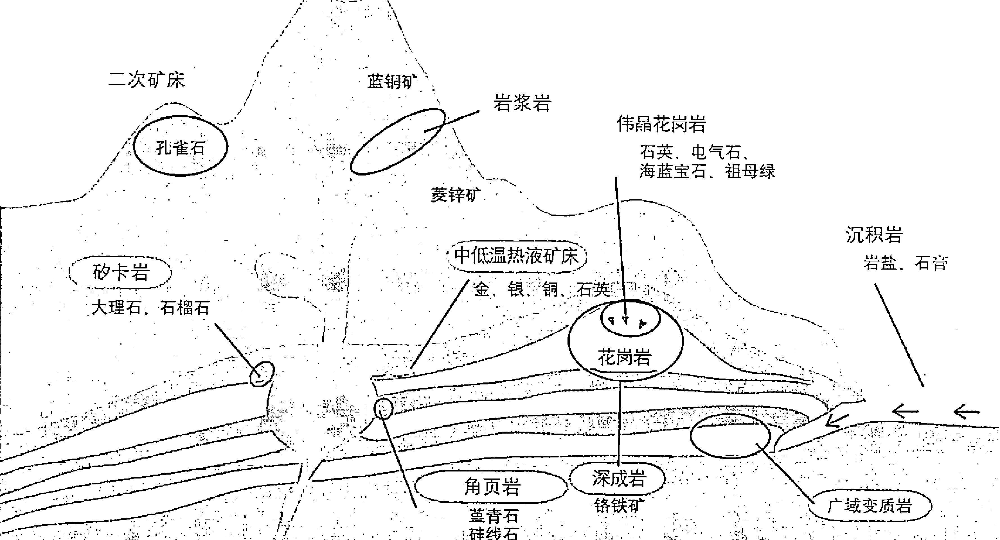

### 决定矿物属性的场所

矿床是“沉睡”在地壳中的矿物的聚集地。作为矿石生长的场所，矿床的不同使得矿石的质量、内部特征等也各不相同。下面将介绍几种不同种类的矿床及其形成的原因和特征。

【中低温热液矿床】由含有许多能够形成矿石的成分的热液渗入地底断层后所形成的矿脉，能够生成金、银、铜、石英等矿石。

【伟晶岩矿床】伟晶岩是岩浆侵入岩浆岩或围岩裂隙后冷凝并缓慢结晶而形成的，是深成岩的一种。当伟晶岩中的有用矿物或金属元素富集达到工业要求时，便形成了伟晶岩矿床。岩浆中的气体在岩浆冷凝时无法逃逸到岩浆体外，从而在伟晶岩上形成巨大的空洞，为矿石的生长提供了场所。岩浆中含有硅酸盐，因此能够生成以硅酸盐为主要成分的多种矿石，如石英、电气石、绿柱石家族中的海蓝宝石和祖母绿，还有托帕石等。

【矽卡岩矿床】矽卡岩是由珊瑚礁的残骸堆积而成的石灰岩等由于板块运动被搬运到地壳深处，与岩浆接触后生成的矿石集合体。以碳酸钙为主要成分的石灰岩与以硅酸盐为主要成分的花岗岩岩浆接触，能够形成以硅酸钙为主要成分的石榴石等矿石。

【角页岩矿床】角页岩和矽卡岩一样，是岩石与岩浆接触时，在热接触变质作用的基础上形成的变质岩。如果角页岩的母岩为含镁和铝的沉积岩，那么会形成以镁、铝为主要成分的堇青石等矿石。

【二次矿床】在岩浆的热作用和地壳的压力作用下，一些位于地底的矿石发生了变化，变成了其他种类的矿石，并在岩浆的作用下最终形成矿床。这样的矿床上移到地表，与地下水、海水和空气等发生反应后，能够生成孔雀石、蓝铜矿和菱锌矿等矿石。

【沉积矿床・砂积矿床・风化残留矿床】海水中的盐分和石灰等经过长时间的沉积，形成岩盐和石膏等沉积矿床。经过风化作用，岩盐内部的矿石不断积累，形成硅镍矿和铝土矿等风化残留矿床。另外一些经过风化作用的岩石，其内部的金、铂、金刚石等矿石在河水的作用下不断堆积，最终形成砂积矿床。

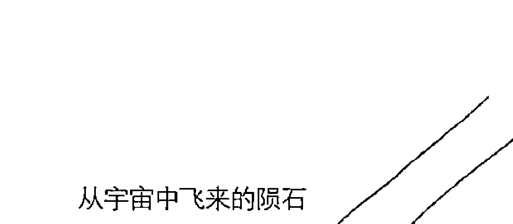

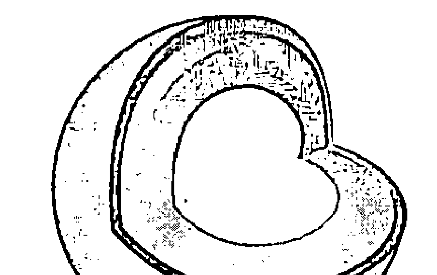

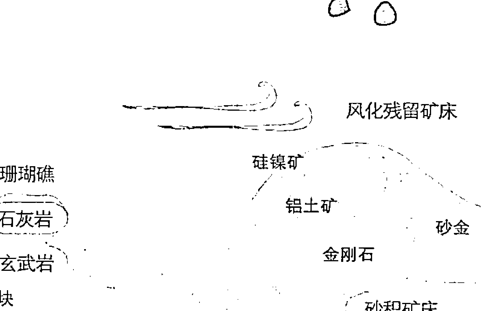

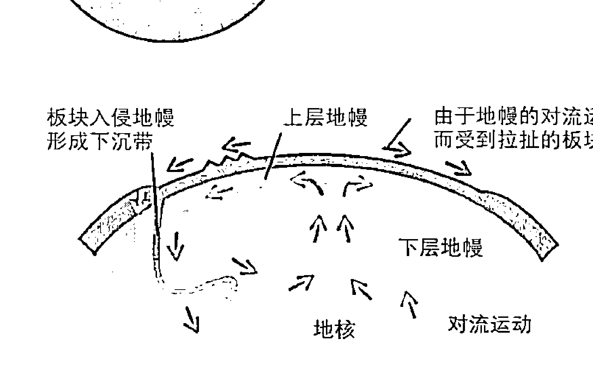

### 地球的内部构造和运动

地球内部分为三层：地壳、地幔和地核。矿石形成于地壳和地幔。在由地表向地核逐渐形成的高温、高压和高密度环境中，地幔在热作用下形成对流。这时，岩石被熔化，变成岩浆，并上升到地壳。岩浆喷出地表后迅速冷却凝固成火山岩，岩浆在地下深处缓慢冷却凝固成深成岩。

### 晶石的矿物特性

上一节中提到，晶石的形成原因及位置决定其内部性质。本书旨在讲解晶石的能量而非如何鉴赏晶石，因此将重点放在描述晶石的特性上，这一节将介绍晶石的基本矿物特性。

#### 以矿物的化学成分为依据的分类方法

这一分类方法是 19 世纪的化学家和矿物学家交流合作的成果，是现在普遍采用的一种矿物分类方法。矿物是由自然界中存在的 80 余种化学元素按照各种方式组合而成的，具体划分的时候还要考虑化学元素的组合状态。例如，该矿物是由一种化学元素构成，还是由多种化学元素结合而成。

| 分类 | 特性 | 代表性矿物 |
|---|---|---|
| 自然元素矿物 | 由一种化学元素构成的矿物 | 金、银、铜、铂、硫、金刚石等 |
| 硫化物矿物 | 由铁、铜、铅等金属元素与硫结合而形成的矿物 | 黄铁矿、方铅矿等 |
| 卤化物矿物 | 含有氯和氟等卤素元素的矿物 | 萤石、岩盐等 |
| 氧化物及氢氧化物矿物 | 含有氧阴离子和氢氧阴离子的矿物 | 石英、玉髓、欧泊、刚玉等 |
| 碳酸盐矿物 | 金属阳离子与碳酸根结合而形成的矿物 | 方解石、孔雀石、菱锰矿等 |
| 硫酸盐矿物 | 金属阳离子与硫酸根结合而形成的矿物 | 石膏、重晶石等 |
| 硅酸盐矿物 | 氧和硅结合形成的硅氧四面体与其他金属阳离子结合而形成的矿物 | 石榴石、托帕石、锆石、橄榄石、绿柱石、青金石、翡翠等 |
| 磷酸盐矿物 | 金属阳离子与磷酸根结合而形成的矿物 | 磷灰石、土耳其石、蓝铁矿等 |
| 硼酸盐矿物 | 金属阳离子与硼酸根结合而形成的矿物 | 钠硼解石、硼镁铁矿等 |
| 砷酸盐矿物 | 金属阳离子与砷酸根结合而形成的矿物 | 钴华、镍华、水砷锌矿等 |
| 其他 | 钨酸盐矿物、铬酸盐矿物、钼酸盐矿物、钒酸盐矿物、碲酸盐矿物等 | 钼铅矿、白钨矿、钒铅矿 |

#### 表示矿物组成元素的化学式

化学式是用化学符号表示物质化学组成的式子，用化学式能够表示矿物是由哪些化学元素组成的以及各种元素所占的比例。例如，黄铁矿的化学式为 “FeS₂”，这表示黄铁矿中所含的铁元素和硫元素的比例为 1:2。下表为常见的元素符号和元素名称。

| 符号 | 名称 | 符号 | 名称 | 符号 | 名称 | 符号 | 名称 | 符号 | 名称 |
|---|---|---|---|---|---|---|---|---|---|
| Ac | 锕 | Co | 钴 | I | 碘 | O | 氧 | Sg | 𨭎 |
| Ag | 银 | Cr | 铬 | In | 铟 | Os | 锇 | Si | 硅 |
| Al | 铝 | Cs | 铯 | Ir | 铱 | P | 磷 | Sm | 钐 |
| Am | 镅 | Cu | 铜 | K | 钾 | Pa | 镤 | Sn | 锡 |
| An | 锕系 | Db | 𨧀 | Kr | 氪 | Pb | 铅 | Sr | 锶 |
| Ar | 氩 | Ds | 𨨏 | La | 镧 | Pd | 钯 | Ta | 钽 |
| As | 砷 | Dy | 镝 | Li | 锂 | Pm | 钷 | Tb | 铽 |
| At | 砹 | Er | 铒 | Ln | 镧系 | Po | 钋 | Tc | 锝 |
| Au | 金 | Es | 锿 | Lr | 铹 | Pr | 镨 | Te | 碲 |
| B | 硼 | Eu | 铕 | Lu | 镥 | Pt | 铂 | Th | 钍 |
| Ba | 钡 | F | 氟 | Md | 钔 | Pu | 钚 | Ti | 钛 |
| Be | 铍 | Fe | 铁 | Mg | 镁 | Ra | 镭 | Tl | 铊 |
| Bh | 𨨏 | Fm | 镄 | Mn | 锰 | Rb | 铷 | Tm | 铥 |
| Bi | 铋 | Fr | 钫 | Mo | 钼 | Re | 铼 | U | 铀 |
| Bk | 锫 | Ga | 镓 | Mt | 鿏 | Rf | 𬬻 | Uub | * |
| Br | 溴 | Gd | 钆 | N | 氮 | Rg | 錀 | Uuq | * |
| C | 碳 | Ge | 锗 | Na | 钠 | Rh | 铑 | V | 钒 |
| Ca | 钙 | H | 氢 | Nb | 铌 | Rn | 氡 | W | 钨 |
| Cd | 镉 | He | 氦 | Nd | 钕 | Ru | 钌 | Xe | 氙 |
| Ce | 铈 | Hf | 铪 | Ne | 氖 | S | 硫 | Y | 钇 |
| Cf | 锎 | Hg | 汞 | Ni | 镍 | Sb | 锑 | Yb | 镱 |
| Cl | 氯 | Ho | 钬 | No | 锘 | Sc | 钪 | Zn | 锌 |
| Cm | 锔 | Hs | 𨭆 | Np | 镎 | Se | 硒 | Zr | 锆 |

注：Uub及Uuq均为人工合成的放射性化学元素，原子序数分别为112、114，目前尚无正式的中文名称。

### 解理——矿物晶体严格沿着一定的结晶方向断裂

矿物晶体在外力（如敲打、挤压等）的作用下严格沿着一定的结晶方向断裂，并能裂出光滑平面的现象称为解理。解理是构成结晶的原子在结合力较弱的地方发生断裂而引起的现象。它是矿石内部结构的性质之一，与矿石的硬度无关。容易发生解理现象的矿石有云母和方解石等。

不会发生解理现象的矿石中，最具代表性的是石英、石榴石等。解理后的矿石会裂出光滑的平面。不同矿物的解理有一向解理、二向解理、三向解理、四向解理、六向解理等。

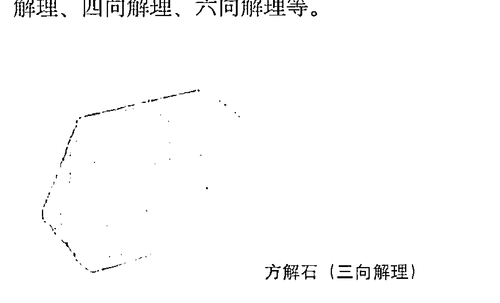

### 光泽——矿石发出的特有的亮光

矿物让人着迷的原因之一就在于它们有各种各样的光泽。根据矿物的透明度、折射率和反射率，矿物的光泽大致可以分为金属光泽和非金属光泽两种。

金属光泽指不透明矿物的光泽，如同金属抛光后的表面所反射的亮光。除了金、银等自然元素矿物，黄铁矿等大部分硫化物矿物也具有金属光泽。

非金属光泽可以分为以下六种。

【玻璃光泽】透明度高的矿物的光泽，如同玻璃表面所反射的亮光，如石英、萤石等。
【树脂光泽】由于矿物的表面不平滑，部分光发生散射而呈现的如同松香般的光泽，如琥珀、硫黄、滑石等。
【油脂光泽】如同油脂表面所反射的亮光，如玉髓、蛇纹石等。
【金刚光泽】透明度高的矿物折射了强光后发出的耀眼的光泽，如金刚石、金红石、闪亚铅矿等。
【珍珠光泽】如同珍珠表面所反射的柔和的亮光，如鱼眼石、白云母等。
【丝绢光泽】平行排列的纤维状结晶的集合体所发出的光泽，如丝光沸石等。

### 硬度——反映矿物的坚硬程度

反映矿物的坚硬程度的硬度取决于构成结晶的原子之间的结合力的大小。虽然矿物的硬度能够反映矿物抵抗外来机械作用力的能力的大小，但这并不是说硬度高的矿物就一定能够承受强烈的外来机械作用力。地球上最坚硬的矿石是金刚石，几乎没有什么东西可以在它上面留下痕迹，但是用锤子用力敲击会使它破碎。

测量矿物硬度的常用标准是 19 世纪初期德国矿物学家弗里德里希·莫斯（Friedrich Mohs）制定的“莫氏硬度表”。取 10 种常见的矿物作为硬度尺度，其他未知硬度的矿物可以依次和这些矿物比较，以确定其硬度。

#### 莫氏硬度表

数字越大，矿石的硬度就越大，但这并不是说硬度为 4 的矿石的硬度是硬度为 2 的矿石的 2 倍。

| 1 | 2 | 3 | 4 | 5 | 6 | 7 | 8 | 9 | 10 |
|---|---|---|---|---|---|---|---|---|---|
| 滑石 | 石膏 | 方解石 | 萤石 | 磷灰石 | 长石 | 石英 | 托帕石 | 刚玉 | 金刚石 |
| | 指甲 (2.5) | 铜 (3) | | 铁钉 (4.5) | 窗户玻璃 (5.5) | 普通刀具 (6) | | | 玻璃切割刀 (10) |

### 晶石的治愈力

在“什么是幸运石”一节中，我们提到晶石作为辅助的治疗手段已经拥有数千年的历史并沿用至今。本节我们将对此进行详细的介绍，并探寻晶石治愈疾病的原理。

#### 什么是传统的水晶疗法？

千百年来，世界各地的人们都借助水晶的能量来治愈疾病和调节身心平衡。关于水晶的疗效，很早以前就有人研究了。在公元前 1600 年，古埃及和古巴比伦就已经有了把水晶当做医药用品使用的记载。当时的人们将水晶放置在病人的颈部以治疗疾病，或将水晶研磨成粉末涂在伤口处以防止感染。此外，古希腊医学家盖仑（Klaudios Galenos，公元 129 ~ 199 年，通过对动物的活体解剖创立了实验生理学。盖伦著有多部医书，是 16 世纪前西医学的绝对权威。——译者注）也曾使用各种水晶治疗疾病。

除此之外，将水晶研磨成粉末后混入水中饮用的疗法从古代起便有很高的人气。由大地孕育的水晶内含多种矿物质，这种饮品就类似于现在我们所熟知的矿泉水。

#### 中医药方中的石药

世界各地的医学几乎都有使用石药的传统。石药是指将矿物研磨成粉末后制成的药剂。如今，无论是中国的中医学、藏医学，还是印度的阿育吠陀医学中，都保留着这项传统。在中医学里，

有数十种矿物都可以作为药剂使用，一些大家所熟知的中药，如葛根汤，也用到了矿物。人们认为孔雀石、黄铁矿、紫水晶等矿石与草药一样，都具有治疗疾病的功效。石药除了可以口服，还可以随身携带，或用胶带贴在身上，以发挥其疗效。

不过，实际上，要将水晶碾碎饮用很难。用水晶泡制的“水晶水”也具有一定药效，建议大家尝试这种方法。阿育吠陀医学认为，将紫水晶浸泡 24 小时后制成的紫水晶水可以改善人体的肝肺功能。此外，人们相信用珍珠泡制的珍珠水具有消除胃肠功能障碍和治疗血液疾病的效果，而用白水晶泡制的白水晶水则具有美肌和护发的功效，同时还能消除疲劳。

#### 增强人体内能量的矿物的波动

为什么这些用水晶泡制的“水晶水”可以治疗人体疾病呢？很多人认为这是由于水晶水中含有微量的矿物质成分，其实，融入水中的波动才是真正的原因所在。

所谓波动，是指包括矿石在内的地球上的所有物质所散发的极其微弱的能量。最前沿的物理学分支之一——量子力学的研究表明，物质之源不再是过去人们所认为的分子和原子，而是更小的基本粒子。所有的基本粒子都在不停地振动着，这种振动所产生的能量就被称为波动。东方医学中的“气”以及瑜伽等印度哲学中的“普拉那”实际上都属于波动的一种，它们又被称为生命能量。每一种矿石都拥有自己的波动，像“气”和“普拉那”一样，能够对人体产生影响。

近来风行于日本的岩盘浴和锗温浴等，通过对特定的矿物施加加热等物理刺激，使其产生远红外线和负离子。远红外线是一种具有一定频率的电磁波，受到物理刺激后的矿石所产生的电磁波能够传遍整个人体，有利于人体健康。

诸如此类的有关矿石的性质及其波动对人体

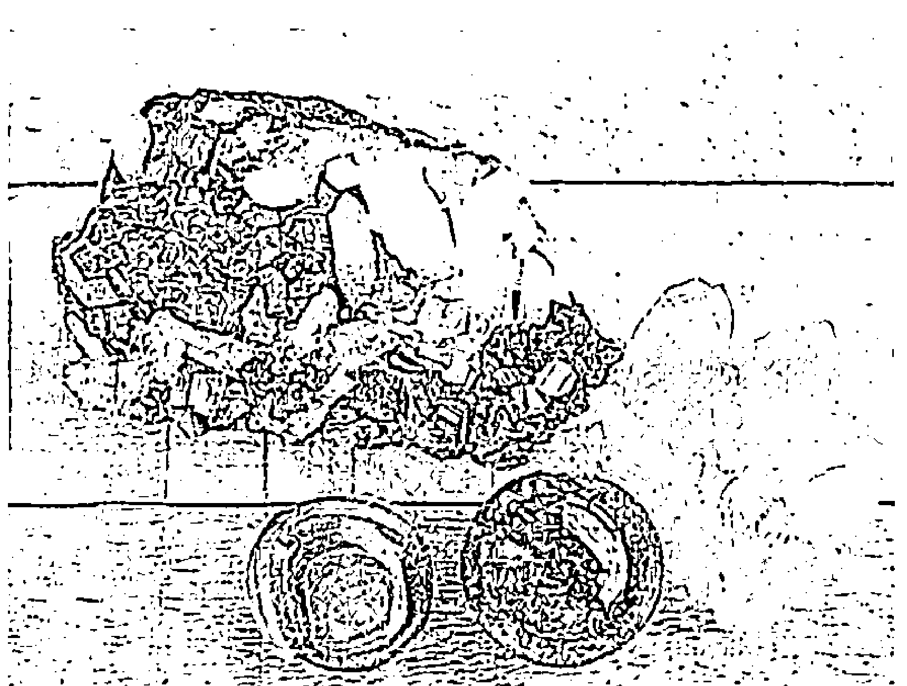

中国的中医学、藏医学和印度的阿育吠陀医学都把各种各样的水晶制成“石药”并广泛应用于疾病的治疗中。（图中所示：黄铁矿、紫水晶、孔雀石）

产生的影响，许多领域都有研究。作为揭开水晶治愈力之谜的关键，它们今后必将受到更多的关注。

觉有共鸣（关于如何挑选晶石，详见本书第三章）。

#### 为何晶石可以帮助人们实现愿望？

#### 颜色与治愈力的关系

晶石的波动除了会对人的生理产生影响外，还会对人的精神产生影响。这种影响的原理，简单来说，是“波动的共鸣与扩大”。

说到晶石的治愈力，就不得不提到另外一个重要的元素——颜色。近年来，色彩疗法和色彩心理学等领域都一再强调不同颜色对治疗人体疾病的作用和对精神的影响。所谓色彩疗法，是指一种通过解读人们挑选颜色的信息，利用不同颜色的刺激作用，控制人们的心情、身体和精神的方法。

什么是“波动的共鸣与扩大”？举例来说，我们常说和某人“臭味相投”，在某人身上“嗅到了同类的气息”等，就是两人的波动产生了共鸣。还有，近几年风靡全球的励志读物《秘密》（作者为朗达·拜恩，此书已于2008年在中国出版。——译者注）、《吸引力法则》（作者为迈克尔·劳赛尔，此书已于2008年在中国出版。——译者注）等书中也讲述了一个人的波动是如何吸引与其产生共鸣的人或事物的，由此来强调调整自己的想法是多么重要——当我们思考时，就会有能量在神经回路中流转（也就是“生物电波”），因此将想法看做一种波动一点儿也不奇怪。

晶石色彩缤纷，有红色、橙色、黄色、绿色、蓝色、紫色和粉色等颜色。从色彩学角度来说，幸运石所拥有的颜色，对人的肉体和精神都会产生影响。此外，颜色是人对可见光的感知，光与远红外线一样都属于电磁波。不同频率的可见光在人眼中所反映的颜色也不同，因此每一种颜色都反映了特定的波动。这些颜色所反映的波动，能够对人的肉体和精神产生干涉和影响，并由此产生各种效果。

而由于有特定的结晶形态，晶石可以保持特定的振动频率。它们就像收音机的天线一样，可以接收外界的波动，并将其扩大。不同晶石的频率不同，可以接收不同的外界波动。

对于晶石治愈力的科学性，还需要人们坚持不懈地进行研究。而代表晶石特性的矿物质元素（化学元素）、波动和颜色这三个方面，是揭开晶石治愈力之谜的关键要素，这一点毋庸置疑。这些要素错综复杂地结合在一起，就衍生了晶石各种各样的治疗效果。

从晶石助人实现愿望的原理也可以看出，如果本人不是真的想实现某个愿望，那么晶石就接收不到相关的“信号”，无法成为“幸运石”。人的心思何其复杂，有时说出口的愿望只是漂亮话，而真正的愿望或许连本人都没有意识到。当你十分明确自己的愿望时，可以参考本书第二章“幸运石图鉴”来选择对应的晶石，同时，也不妨多与晶石进行直接接触，看看哪些晶石可以让你感

如果晶石所蕴藏的波动能够与佩戴者自身的波动相通并产生共鸣，那么就可以提升佩戴者的能量，强健其身心。晶石不仅能够治愈人们肉体的伤病，还能解决人们工作和日常生活中的很多问题。

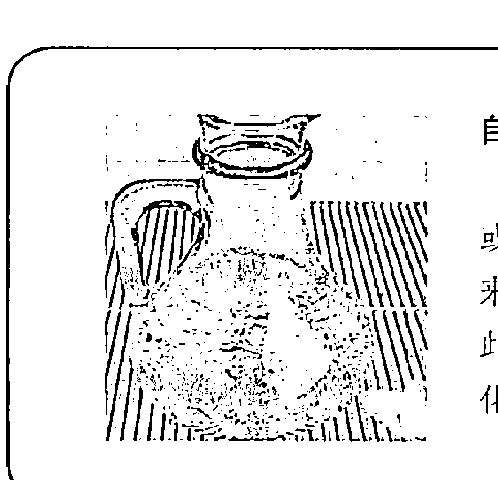

#### 自制水晶水

将水晶的碎片放入玻璃容器中，在容器内倒满水，静置一晚或一整天即可。水晶水和普通矿泉水一样能直接饮用，也可以用来沏茶或制作食物。水晶水的味道与普通的水相比更加醇香。除此之外，水晶水还可以用来洗脸、洗头发、浇灌植物等，或用做化妆水，还可以喷洒在屋内净化空气。

### 幸运石拥有怎样的魅力？

幸运石的魅力众人皆知，它那神奇的能量自古以来就吸引了无数人的目光。我们采访了一些珠宝店经营者、灵通师和矿物学家，请他们从不同的角度谈谈幸运石的无穷魅力。

#### 润物细无声 唯有“暗香”来

中国骨灰级晶石藏家 张力华

相信很多人都有过这样的困惑：晶石真的有能量吗，为什么我没有感觉到？我要说，晶石就如同生命中的一缕暗香，它悄悄地滋养着你的生命，这种“好处”有时显而易见，有时却要蓦然回首才会发现。

非常意外，说：“我这几天之所以没戴它，就是因为感觉到电流似的振动经过手臂，有一种麻麻的感觉！”

先生把这串钛晶手链拿去检测，检测报告出乎我们的意料——完全没有辐射。

从此，我对“晶石有能量”的说法虽然谈不上相信，但一直饶有兴趣地观察、试验，还阅读了大量的相关书籍、材料，并很乐意倾听朋友们无意中说起的有关晶石功能的故事。

##### 我的钛晶缘

我自小爱玩石，近 20 年来对天然晶石更是着迷。但同时我也是一个很理性的人，从来不会认可未经亲身验证的事物，包括晶石的功能。在这种情况下，我遇到了钛晶。

一串直径约 13 毫米的收藏级钛晶手链，本来是我先生戴着的，后来他不戴了。有一天，我戴着它去上班。坐在办公桌前，我突然感到戴着钛晶的左手从腕部到肘部一阵发麻，像有电流经过似的。我刚开始没在意，但是这种状况三番五次地出现，这让我不得不留神，更何况一连几天都是这样。于是，我跟先生说：“你把这串手链拿去检测一下，看是不是有什么过量的有害辐射。”先生问：“怎么了？”我告诉他我所经历的事情，他也感到

##### 不只是心理暗示

随着对晶石功能的了解不断深入，我越来越相信：“晶石功能”并不是“信则有，不信则无”，而是“信则有，不信也有”——只是人们常常把种种“有”归于偶然、心理暗示或者别的可以被自己理解的原因。

举例来说，众所周知，黄水晶有招财的功能。而有意思的是，有的晶友告诉我，招财与否不好说，她向来肠胃不好，戴上黄水晶后，不管是吃辣还是吃撑了，几乎都不会出现肠胃不舒服的情

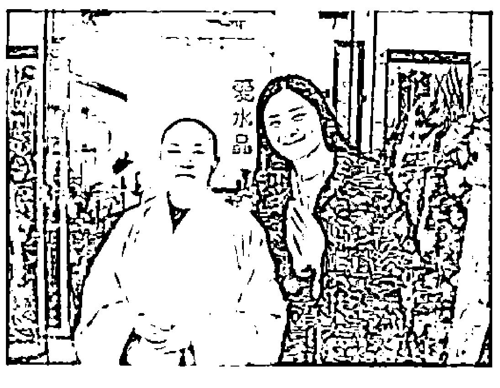

[小档案]
张力华
晶石收藏家，信仰并皈依佛教，因家中的猫亦喜爱水晶，故笔名为“爱水晶的猫”。从小喜欢玩石，对晶石有着近20年的爱好和收藏经验，著有集晶石简介与生活感悟于一体的《爱·水晶》，由武汉大学出版社出版。
新浪博客http://blog.sina.com.cn/ZLH101

### 珍惜与每一块晶石的相遇

况。表面上看这两者毫无关系，但只要知道黄色晶石对应着人体的脐轮就能明白：脐轮不仅照顾着我们的肠胃，还代表着行动力，有助于将“心动”层面的想法落实到“行动”层面，特别适合那些想得多、做得少，缺乏行动力的人和需要增强社交能力和行动力的场合。因此，说黄水晶招财是有原因的。如果只是想想而不行动，财从何来？

我们不妨放下晶石功能与心理暗示之争，抱着开放的心态去感受晶石、感悟生命。

而这本书对这些信息进行了归纳总结，有助于我们按图索骥。尤其是一句句幸运石寄语，随手翻阅，心灵触动的时候也许就是晶石在召唤你。

晶石功能与心理暗示如同一杯水与一把盐：分开放置时，谁都知道哪是水、哪是盐；当把盐撒进水里时，又如何能分清楚哪是水、哪是盐呢？

不过，尽管从感性和理性角度深入研究“晶石的能量”的人和机构越来越多，成果涉及物理、矿物、宗教、灵修、医学等各个方面，我还是得说“晶石的能量”在目前来说还是一个神秘的领域。

幸运的是，我们正处在一个包容、开放的时代，可以有更多的自由作出有助于灵性提升的选择。我想，最重要的不是进行一番争辩，而是敞开心胸、用心去感受晶石带给我们的信息。因此，

因此，把晶石带入生命中，就如同把盐撒入水中，虽然分不清谁是谁，但生命肯定会因此而发生改变。这种改变也许在当下的瞬间，也许要等到多年以后蓦然回首时才能恍然而悟。

无论是在繁华的商场还是在街角的小店，如果邂逅一块晶石，让你在佩带时感觉心情愉悦，就是一段美丽的缘分。请你善待晶石，这也是善待你自己。

### 水晶与人类一样在不断成长

灵通师 阿什塔（Ashta）

#### 与水晶的波动产生共鸣

一切生物都有波动，波动有正负之别。购买水晶时，你应该挑选那些看起来、摸上去能使你心情舒畅、爱不释手、没有生疏感的水晶，然后感受自己的波动是否与水晶的波动产生了共鸣，只有这样才能找到与自己投缘的水晶。

当然，时常对水晶进行净化，精心照顾水晶也至关重要。希望每个人都能珍惜与水晶初次见面的机会，并用心去感受水晶的能量。

另外，水晶与人一样在不断的相遇和分别中渐渐成长，它们是与佩戴者一起成长的。如果水晶离佩戴者而去，无论是被弄丢了还是佩戴者想将其赠予他人，都是因为佩戴者已经不再需要它们的能量了。

○龙之水晶
位于日本横滨中华街的天然石商店。销售以水晶为原材料的珠宝首饰和手工制作的饰品。店内由灵通师阿什塔（Ashta）提供的灵通咨询有很高的人气。

[小档案]
阿什塔（Ashta）
灵通师。1954年4月生于美国夏威夷州，从事读取水晶的个性和能量的工作。

[店铺资料]
日本神奈川县横滨市中区山下町188（元町·中华街站下车，步行3分钟）
电话：045-650-6205
营业时间：11:00-18:00（星期三休息）
http://lonmagic.biz/

### 极为纯粹，极为质朴，是永恒的存在

“K.C. 琼斯”珠宝店董事长 二宫直树

#### 来自音乐的“波动”

实际上，我以前是一个对晶石毫无兴趣而且完全不了解晶石的人。最初做生意时，我想销售的是与一支名为“光荣之死”(Grateful Dead)的摇滚乐队相关的商品，于是开了一家名为“K.C. 琼斯”(KC JONES)的珠宝店。店铺的名字就是这支乐队的一首歌的歌名。店铺开业后，有一次我去看“光荣之死”乐队的演唱会，当现场所有的声音、灯光和人都融合在一起时，我第一次体会到随着意识的完全解放，我与宇宙融为一体的感觉，直到现在我都清楚地记得这种感觉。无意间，我在演唱会上贩卖的一些商品中看到了一样东西。当时我心里想：这是什么啊？看起来挺有趣的，就买下它吧！这就是我与晶石的第一次邂逅。当我把晶石摆放在店铺里时，经常有一些客人询问“这是什么”，为了能为客人作详细的讲解，我开始自学有关晶石的知识，并一直持续到今天。意识的解放、冥想、最大程度的放松……音乐和晶石有着许多共同之处，可能正因为如此，经常会有一些音乐人或作曲家光临我的珠宝店。音乐和晶石都能释放“波动”，搞音乐的人似乎比一般人更能感受到这种“波动”，可能是因为他们更加敏感吧！

○ K.C.琼斯
位于东京代官山的矿石、天然石专卖店。以销售原石为主，同时也销售各种各样的天然石和珠宝首饰。每隔2个月，店主会亲自到海外进购一次水晶和珠宝首饰。

[店铺资料]
日本东京都涩谷区猿乐町3-17（代官山站下车，步行8分钟；涩谷站下车，步行12分钟）
电话：03-3463-3887
营业时间：11:00-20:00（全年无休）
http://www.kcjones.co.jp/

#### 一切由“意志”而生

如今，晶石再次受到大家的关注，我认为是由于“统一”的关系。就像地球变暖成为全球性问题一样，我们的地球正在向统一的方向发展。纯粹、质朴、永恒的晶石是地球的信使，越来越多的人想通过晶石与地球相连，从正面感受地球的波动。这一点是毋庸置疑的。
另外，不仅仅是晶石，人们认为一切物质都有“意志”。一切都诞生于“我想存在于世”这一意志，这种意志创造了万物。世界上没有两块完全相同的水晶，这并不是偶然，是因为水晶在内心一直默念着“我想变成这个样子”。也就是说，水晶由最纯粹的“意志”而生。当然，地球也是一种拥有意志的存在，而水晶就是一种传达地球意志的存在。

[小档案]
二宫直树
“K.C.琼斯”珠宝店的董事长。“K.C.琼斯”于1989年在日本东京下北泽开业，之后移至代官山，开业至今已有22个年头。他无比热爱工作和音乐，除了作为其开店契机的“光荣之死”乐队外，他对蓝调和爵士乐等也十分感兴趣。他开店的乐趣就是听到客人说“遇见了晶石，并且生活出现了很大的好转”。他的人生信条是“尊重自由意志”。

我们可以通过感受水晶的能量来改变自身的能量。水晶的能量能够连接我们的意识和内心深处，并最终反映在事物表面，如改善人际关系等。比如黄水晶，它的内部拥有强大的能量波动，这种能量能够提高我们的表现力，为我们的工作带来好运，还有增加财运的功效。另外，以一种怎样的意识拥有水晶是非常重要的，选择水晶时也不要有多余的杂念。首先集中精力感受从水晶内部发出的信息，然后再考虑水晶的意义和功效，这才是感受水晶能量的正确方法。

### 矿物是组成地球的最小单位

日本国立科学博物馆地学研究部部长 松原聪

#### 人类生活中不可缺少的存在

矿物是地壳中由地质作用形成的天然化合物和单质。广义上来说，天然气和石油等也属于矿物。现代矿物学中所说的“矿物”主要指固体物质，也就是我们所说的“石头”。其实，矿物是组成石头的最小单位。而矿物又是由“元素”组成的，一种或多种元素汇集成叫做“结晶”的固体，也就是矿物。各种矿物集合在一起才形成了形形色色的石头。

我们生活在土壤之上。土壤有一半是矿物，另一半是微生物等有机物。土壤之下较硬的部分全部都是由矿物构成的。也就是说，矿物是组成地球的最小单位。可以说没有矿物，就没有地面，更没有地球。

于水晶，终于水晶”这句话来形容再合适不过。人们迷恋水晶的理由大致有三个。第一，数量适当。水晶并不是绝世罕见之物，但也不是常见之物。第二，形状完整、开采方便。水晶的结晶造型完整，只要仔细寻找，在日本各地都能开采到，因此它们才会有那么高的人气。第三，从科学的角度来说，除去含放射性元素的水晶，虽然通过人为或者自然的力量（加热等）能够激发水晶的能量，但是也不能断言所有的水晶都具有能量。只不过通过与水晶接触，人们的心情可能有所改变。就像人们欣赏花卉或者绘画时能感到心灵被洗涤、身心放松一样。只要你的气息与水晶相协调，你自然就会变得精力充沛。

#### 自己寻找的“相遇”非常重要！

人类自古以来就被幸运石所吸引。在日本，很多人因为水晶而对矿物学产生兴趣或者从事和矿物学有关的工作。人们对水晶的喜欢，用“始

大家以本书为契机，找寻与自己投缘的幸运石吧！只要你能够享受亲自探寻幸运石和与幸运石相遇的乐趣，就一定能够找到心仪的幸运石，而它也一定能够使你心情平静，重新恢复蓬勃的朝气。

[小档案]
松原聪
出生于日本爱知县。1969年毕业于京都大学理学部地质学矿物学系。1971年完成京都大学研究生课程，同年进入日本国立科学博物馆地学研究部工作，现任研究部部长。理学博士，专业为矿物化学，尤其精通野外矿物学和记载矿物学。

○主要著作
《日本的矿物》，学习研究社出版；《新矿物发现物语》，岩波书店出版；《了解矿物不可思议之处的书》，成美堂出版。

### 不断被验证的“晶石的智慧”

中国地质博物馆研究院 李雯雯

作为一名科学工作者，尽管时常耳闻一些关于晶石的传说，但我始终对其所具有的超凡力量心存疑问。这种观点直到我写博士论文时才发生些许改变。

那时，我的研究对象是一种颜色多样、晶体透明、充满灵性而深受大众喜爱，被誉为“落入凡间的彩虹”的晶石——碧玺。它还有许多其他的名字，从这些名字可以看出人们对它的认识是如何转变的。

#### 从“巴西祖母绿”到“吸灰石”再到“电气石”

“碧玺”这一称呼始于中国清朝时期，它的英文名叫“托玛琳”。17世纪，碧玺开始在市场上大范围流通。当时，巴西向欧洲出口了一些深绿色长柱状晶体，其硬度比起真祖母绿来毫不逊色，因此人们称它为“巴西祖母绿”。直到18世纪，人们才偶然发现这些漂亮的晶体具有祖母绿所没有的奇特性质。

传说18世纪在荷兰的阿姆斯特丹，有几个小孩在玩荷兰航海者带回的石头（碧玺）时发现这种石头能够吸引或排斥轻的物体（如灰尘、草屑等）。从此，荷兰人把它叫做“吸灰石”。

随后，科学家们对碧玺进行了深入的科学研究。研究发现，碧玺是由于加热而产生电荷的（这种性质被称为热电性），而并非当时普遍认为的摩擦起电。1880年居里家族研究发现，碧玺是一种结构特殊的极性矿物，在其晶体的特定方向上施加压力或拉力，晶体对应的一些表面上会分别出现正、负束缚电荷，电荷的密度与施力大小成正比。至此，碧玺得名“电气石”。随着研究的不断深入，20世纪80年代末，日本学者久保哲治朗发现碧玺的一端可以吸引铜离子，并据此推断它可能存在永久性电极。

碧玺的这些特质表现在它可以诱发负离子、产生远红外效应、吸附效应、生物电性以及电磁屏蔽效应等，因此，它在工业上得到了广泛应用。

#### “晶石的智慧”等待每个人亲自验证

多亏现代科学技术发达，碧玺等很多晶石的“神奇之处”才能通过仪器得到检验，但关于晶石，还有很多不解之处有待人们去破解。

现在想来，写博士论文可以算做一种“契机”，或者说“缘分”。要想有所发现，首先要关心，而关心往往正需要这样一种契机。这本书不仅列举了晶石已经被验证的性质（晶石的矿物特性），还描述了晶石对大多数人可能产生的影响（晶石的能量）。读到这本书的人可以以此为契机，亲自与晶石接触，了解更多关于晶石的知识。

[小档案]
李雯雯
1974年4月生，博士，毕业于中国地质大学（北京）珠宝学院宝石学专业。全国注册珠宝玉石质量检验师（CGC）。中国地质博物馆社会教育部副主任。主要从事宝石学、岩石学、矿物学方面的研究。作为项目负责人及科研骨干，她先后参与国家自然科学基金及教育部专项科研基金等七项课题，发表科研论文十余篇。

# 第二章

# 幸运石图鉴

## 白水晶

适用于世间万物的万能治愈水晶

- 颜色：白色、乳白色、灰色、灰褐色
- 产地：巴西、马达加斯加、美国、瑞士、澳大利亚、加拿大、斯里兰卡
- 晶系：六方晶系
- 成分：SiO2
- 硬度：7

（关键词）
净化万物
提升潜在的能力与能量

### 晶石的特征

种类和形状具有多样性
名列各类矿物之首

在所有矿石中，水晶具有最高频率的波动。从矿物学角度讲，水晶是由二氧化硅（SiO2）组成的石英类矿石中结晶较大、透明度较高的那一部分。古人认为水晶是冰的化石，因此它的英文名“crystal”来源于古希腊语中的“krystallos”（冰）一词。

水晶在世界各地都很受欢迎，人们常用“始于水晶，终于水晶”的说法来表达对水晶的喜爱。对那些喜欢矿石的人来说，水晶无疑具有其他矿石无可比拟的独特魅力。此外，水晶的种类极其丰富，根据颜色、形状、花纹和成分等，它可以细分成不同种类。水晶家族中最具代表性的矿石有紫水晶、黄水晶和粉水晶等。

水晶可以保持稳定的波动频率，因此它不仅被人们当做珠宝饰品和观赏品，还被人们广泛应用在钟表、计算机等工业制品以及精密仪器等科技产品中。

做护身符佩戴在身上，也用它来治疗疾病、占卜和开发灵异能力等。白水晶的能量通常向顶端聚集，它的这种特性可以净化万物，引导事物向好的方向发展。白水晶还具有增强能量的作用。正是因为具备这些特性，白水晶才可以唤醒我们潜在的能力和能量，提升我们的品德与灵性。另外，形状不同或内包物不同的白水晶，其功效和能量都有所不同。

### 晶石的能量

能够净化和激活世间万物

水晶一直深受世人的喜爱，只要一说起幸运石，就不会不提水晶。而白水晶被认为具有很强的生命力，在许多场合都受到重用。人们将它当

### 何时使用

根据你的目的，挑选合适的白水晶

白水晶适用于所有的场合、地点和事态。当你希望祛除邪气，远离不利影响时，建议你使用球形白水晶；当你希望达成愿望时，建议你使用锥形或柱状白水晶。

[使用时的注意事项]
白水晶具有自净能力，所以通常不需要再进行净化。另外，白水晶耐水和耐阳光曝晒。
[速配幸运石]
所有晶石
[净化方法]
日光浴、流水、鼠尾草、盐
[对应的星座 & 脉轮]
狮子座 / 所有脉轮

> 幸运石寄语
“使心灵沐浴神圣之光，明确自己的志向和意图。”

### 各式各样的大师级水晶

自然形态不同，所蕴含的意义也不同

说起幸运石，人们通常最先想到水晶。根据形状、颜色和内包物，水晶可以划分许多种类。比如，按颜色可分为白水晶（见第 16 页）、粉水晶（见第 109 页）、红水晶（即石榴石，见第 42 页）、烟水晶（即茶晶，见第 63 页）、黄水晶（见第 55 页）、黑水晶、绿水晶、蓝水晶（即海蓝宝石，见第 27 页）和紫水晶（见第 33 页）等；按内包物可分为发晶（见第 106 页）、幽灵水晶、水胆水晶和钛晶等。另外，一些水晶因具有特殊的形态而拥有极强的能量，被称为“大师级水晶”（Master Crystal）。

大师级水晶除了其自身的性质，通常还蕴含着特殊的能量，如净化、治疗、开发精神能力等，下文将会对此进行详细的介绍。这类水晶不仅可以像其他幸运石一样在日常生活中用做护身符或幸运石，而且在你迎来人生中的重要机遇或强烈地想实现某种愿望时，都会像大师一样给予你强有力的指引。

需要说明的是，大师级水晶通常在水晶饰品市场上很难见到，它们多见于原矿市场，因此想入手的朋友需要到专门的水晶店去挑选。

#### 骸骨水晶
*Elestial*

#### 庭园水晶
*Garden Quartz*

这种水晶的特征是表面凸凹不平，带有像骨头一样的纹理，俗称骸骨水晶。它经由数千万年甚至数亿年的时间变化而成，结晶像年轮一样层层重叠在一起，被认为是睿智的拥有古代记忆的水晶。另外，骸骨水晶中所含的太古之水能够预示人类或地球的未来。

骸骨水晶是水晶的最终形态。它不会再继续成长，是已经长成的幸运石，适用于所有脉轮，具有净化、治疗疾病、活跃脑细胞等功效。当骸骨水晶与佩戴者的状态相适应时，它能够唤醒佩戴者内心深处的洞察力，为其开辟一条看清自己的本质所必经的变化之路，具有强大的力量。因此，当我们处于人生的十字路口时，或周围的环境发生变化时，不妨借助骸骨水晶的能量，找到一条明路。

多种矿物质以极高的密度被包裹在白水晶中，这样的水晶被称为庭园水晶。这种水晶的形成过程较长，其内部所包含的物质看起来像草原、森林和河流，整块水晶像一座小庭园一样拥有自然艺术之美，因此被命名为庭园水晶。根据内包物、颜色以及观察方式，它也被称为苔藓水晶、草枝水晶等。

庭园水晶还有“萨满水晶”（Shaman Crystal）之称，因为它可以像萨满巫师那样帮人们实现愿望，并保护那些容易受到邪气侵扰的人，使其精神振奋，不断前进。建议大家在会见比较难应付的人时使用。

庭园水晶具有调节身心平衡的作用，是治疗疾病效果极好的幸运石。它不仅能帮助我们治愈身体上的疾病，还能帮助我们解决精神上的问题。

### 教堂水晶
*Cathedral*

教堂水晶又被称为“教堂图书馆”（Cathedral Library），既有有神存在的“大教堂”之意，又有作为知识海洋和学习场所的“图书馆”之意。多个结晶互相重叠，形成一个尖顶的形状，与教堂的建筑形态非常相似，它也由此而得名。

教堂水晶很容易吸收和释放能量，它有多个顶尖，是净化作用非常强的水晶。教堂水晶呈现由多个小结晶穿插相连、合为一体的形态，蕴含了使多方面力量协调统一、齐心共同完成一个目标的能量，因而尤其适用于需要团队协作之时。

另外，教堂水晶具有强大的精神力量和灵力，能够让我们邂逅与我们的灵魂相契合的有缘之人。

### 水晶簇
*Cluster*

水晶簇指大小各异的尖形水晶集合在一起形成的晶簇原石。一块母岩四周聚集着形态各异的水晶，象征与周围的事物和谐共处，具有帮人组成团队、提高团体意识的能量。

水晶簇具有强大的净化作用。其顶端的形状能够使它的能量向各个方向发散，使其在更宽广的范围内释放能量，吸收负能量，净化场地，营造和谐的氛围。

需要强调的是，水晶簇还可以用于净化其他的幸运石和珠宝首饰。只要将需净化的晶石放在水晶簇的上面，水晶簇就可以净化它们，吸收停留在它们内部的负能量，最后将其转化为纯洁的能量。

### 松茸水晶
*Scepter quartz*

松茸水晶头部较大，形状如同蘑菇，与骸骨水晶的形状有几分相似。

松茸水晶中蕴藏着巨大的能量，尤其具有使人的灵力飞速上升的功效。它的能量被推压并凝缩在最顶端，因此它又具有打通阻塞的能量回路的力量，有助于人们打开新局面和强健内脏。

此外，松茸水晶能够使我们头脑清晰，帮助我们提高思考能力，激发潜在能力。同时它还能增强我们的自信心，赋予我们超凡的魅力，帮助我们作出沉着冷静的判断并采取正确的行动，引导我们实现梦想和目标，获得他人的信赖。因此，当我们需要增强领导能力或提高知名度时，松茸水晶是最佳的选择。

### 双尖水晶
—— Double Point ——

双尖水晶拥有两个锐利的尖端，又被称为“双剑水晶”（Double Terminated）。它是在宽松的环境中不受任何限制地成长起来的，所以具有理想的形状和能量。

水晶的能量通常都是从尖端部分释放出来的，双尖水晶有两个尖端，因此能够同时从两个尖端释放能量，并吸收外界的负能量，使混乱的气场逐渐安定下来。因此，当我们情绪激动或十分紧张时，可以借助双尖水晶的能量来调节身心平衡。当然，在我们心情平稳时也可以使用双尖水晶。就像其他水晶一样，它能够作用于我们的潜在意识，帮助我们提升灵力，与内心真正的自己合二为一。

此外，双尖水晶还具有提高我们的沟通能力，使沟通更加顺畅的力量。当我们遇到与恋人、家人或是职场同事沟通不畅的状况时，它能够助我们一臂之力。

双尖水晶还拥有使能量循环再生的治愈力。把它放在身体的疲劳部位，或者将其尖端贴近身体，向着手或脚的方向做推压运动，会收到很好的效果。

### 赫基蒙水晶
—— Herkimer Diamond ——

这是一种在美国纽约州赫基蒙地区开采出来的特殊水晶。和其他水晶相比，它的透明度更高，整块水晶呈现酷似金刚石的八面体结晶形状，因此又被称为赫基蒙钻石。但是与金刚石不同的是，它在原石状态下即会散发闪耀的光芒。赫基蒙水晶诞生于约5亿年前还沉没在海底的纽约地区。该地区所在的地层中有一种被称为白云岩的矿石，其内部含有空洞，赫基蒙水晶就形成于此。

赫基蒙水晶尖锐的两端汇集了宇宙的能量，这些能量从一端进入水晶内部，又通过另一端释放出来。这些能量能够帮助我们保持肉体、精神和感情的平衡，并加强这三个方面之间的联系，引导我们体内的力量向高次元逐步提升。另外，它还能够消除阻塞在我们体内的能量，因此我特别推荐给那些容易受到疲劳感困扰的人使用。不仅如此，赫基蒙水晶能够使我们更加明确自己的梦想，还能帮助我们及时发现实现梦想所需要的东西，因此也被称为“梦想水晶”（Dream Crystal）。

### 缝合水晶
—— Faden Quartz ——

缝合水晶是一种受到破坏后又再次形成结晶的水晶。过饱和硅酸盐溶液流进由于地壳运动而碎裂的细小结晶的缝隙中，再度形成整块结晶。缝合水晶的形状与双尖水晶类似，呈扁平的板状，不同之处在于缝合水晶的内部隐约可见白色丝线状物质。

缝合水晶的形成过程代表着能量的结合，因而被视为和平与重生的象征，它能够促进人体细胞再生，使人身心充满活力。一方面，它能够加快人体细胞的新陈代谢，激发生命能量。另一方面，它还具有让人重生的力量，能帮助人们从失恋或挫折的打击中重新站起来，赋予人们坚强的内心。

另外，缝合水晶能够加深人与人之间的联系，协调人际关系，营造和谐的氛围。因为缝合水晶拥有这些特性，所以我特别推荐给那些希望与恋人和朋友和睦相处的人使用。

### 幻影水晶
—— *Phantom Crystal* ——

“幻影”指的是水晶尖端形成的层叠状结晶体。这些结晶体层层叠叠，犹如幻想中的山峦一般，因此又被称为“千层山”水晶。这种层叠像树木的年轮一样，是水晶成长的痕迹。在水晶停止生长期，其他种类的矿物落在它上面并累积起来，此后水晶又重新开始生长，如此反复，最终形成幻影水晶。

这种水晶不断重复着生长与停止生长的过程，它作为“促进重生之石”，被认为能够在过去、现在和未来之间穿梭。幻影水晶能够改变事物的停滞状态，从而引导我们跨越人生路上的重重困难，使我们的身心健康成长。除此之外，幻影水晶也能够作用于人的情感，对那些祈祷让爱重生的人最为合适。同时，它还具有治疗伤病、促进人体新陈代谢的功效。

### 桥梁水晶
—— *Bridge Quartz* ——

一块水晶嵌入或贯穿另一块水晶，这种形状的水晶就被称为桥梁水晶，它表示联结内外世界的桥梁之意，在人与人之间起到桥梁的作用。桥梁水晶掌管联结的能量，联结着内在世界和外在世界、自我和高次元的自我以及自己和他人。

因为桥梁水晶具有理解他人内心的能量，所以它能够赋予我们与那些同自己性格不同之人相连的力量，例如联结孩子和成人、男性和女性等。又因为桥梁水晶能够消除隔阂，使事物合为一体，所以当你希望将自己的新想法传达给他人时，可以使用这种水晶。它可以创造利于沟通的环境，促使传达的一方与接受的一方能够互相理解，让人们能够充满自信地将自己的想法告诉他人。如果你需要在众人面前发表讲话，就使用桥梁水晶吧，它能够带来意想不到的效果。

### 彩虹水晶
—— *Rainbow Crystal* ——

彩虹水晶在形成结晶时发生了歪斜或产生了裂缝，可以对光线进行特殊的折射，从而发出七彩的光芒。彩虹水晶又被称为“艾丽斯水晶”（Iris Quartz）。相传，古希腊神话中的彩虹女神艾丽斯流下的眼泪具有纯洁的能量和出色的治愈力，能够帮助我们的意识回归纯粹，有利于冥想。

彩虹水晶的七色之光能够让我们认识到自己为何生在这个世界上，并了解自己的使命。因为这种水晶能够消除负面思想，带来积极的能量，所以当我们悲观失望时，当我们受某些突发事件的影响而变得意志消沉时，当我们厄运连连时，它都能够赋予我们积极向前、乐观向上的力量。

彩虹水晶还能够帮助我们找到心灵的伴侣。不仅如此，如果将彩虹水晶放在身体的伤痛处，它所发出的柔和之光能够抚平伤痛。

### 激光水晶
—— Laser Quartz ——

激光水晶的能量是所有水晶中最强大的，具有出色的治愈功效。这种水晶自然形成细长的形状，越靠近顶端越纤细，且顶端有一个微小的平面。另外，越靠近顶端，其内部分子密度越高，能够释放像激光一样的强大能量。你可以将它的顶端向外，以自己为中心画圆，这样能够形成一个结界，保护自己不受负能量的干扰和侵害。当你感到某些身体部位疼痛时，可以将激光水晶的顶端迅速指向疼痛部位，然后再快速移开，反复几次，就能够疏通身体内部停滞的气流，缓解疼痛，这与用激光治疗疾病有些相似。

激光水晶的能量非常强，它长时间接触人体可能破坏人的灵气，因此应尽量避免将其直接接触身体。

### 其他较为重要的白水晶

#### 双晶 —— Twin ——

两个独立的尖形结晶几乎平行地连生在一起，这样的白水晶被称为双晶。其中，两个结晶单体以一个明显而规则的接合面相接触的双晶叫做接触双晶（亦称透入双晶）；两个结晶单体相互穿插而成的双晶叫做贯穿双晶；由两个以上的结晶单体按同一种双晶律多次反复出现而构成的双晶群叫做反复双晶。双晶代表互相尊重、命运相连、共同生存，它能够加强恋人、夫妇、父母子女以及朋友等之间的联系。

#### 伊希斯水晶 —— Isis ——

伊希斯水晶的琢面呈五边形，接近底部的两边较短，上部较长的两边形成一个高而尖的顶端。五边形是神殿的形状，伊希斯水晶得名于古埃及女神伊希斯。它拥有终极治愈功效，能治愈一切伤痛，使处于痛苦中的人仍然能够看到希望。

#### 日本律双晶 —— Japanese Law Twin Quartz ——

结晶呈心形，产地为日本，也因此而得名。日本律双晶能够增强人的心脏机能，使爱的力量得到具体而充分的体现。另外，其结晶呈90°角不断延伸，象征着远大的志向。

#### 扁平水晶 —— Tabular Crystal ——

扁平水晶的6个琢面中有2个琢面非常宽阔，呈平板状，因此而得名。多数扁平水晶的侧面都有细小的刻痕，据说摩擦这些刻痕可以激活水晶内部所蕴藏的能量。它能够成为联结两个事物的桥梁和纽带，对平衡人际关系、调节脉轮有显著的功效。

#### 记忆水晶 —— Channel Quartz ——

这是一种顶端有微微隆起的正三角记号的水晶。古亚特兰蒂斯人认为它是一种能够记录知识等高级信息的晶石，正三角记号就是它的入口。它能够给我们传授智慧，并告诉我们每个人的过去和未来。通过接收这些信息，我们的意识也会上升到更高次元。

#### 含水水晶 —— Water in Quartz ——

含水水晶的内部含有水滴。在结晶生长的过程中，其表面会出现凹陷，于是水滴就残留在凹陷处，随着水晶的继续生长而被包裹在其中。据说，含水水晶所蕴含的纯净之水能够增强水晶的力量，使水晶释放更加强大的能量。

### 水晶和石英的区别

晶莹剔透的水晶、拥有美丽纹带的玛瑙、水润多彩的欧泊，你能想象它们其实都是具有相同元素的同类矿石吗？本节将梳理一下它们的“家谱”，进而探究是什么造就了它们如此不同的“性格”。

#### 二氧化硅“大家族”

众所周知，氧和硅是地壳中含量最多的元素，因此，二氧化硅类矿物也成了地表分布最广的矿物家族。也正因如此，不同的环境使得这些矿物拥有了不同的结晶状态、结构构造，以及不同的杂质或内包物。

虽然接下来的介绍中会涉及一些矿物学的专业知识（在书后的“幸运石术语”中还有更加详细的解释），但是不要紧，请抱着与朋友相处的轻松心情来阅读。每当你对这些晶石多一分理解，就能与之更好地相处。

#### SiO₂类晶石

##### 石英 (Quartz)
石英是以二氧化硅为主要成分的晶体。
根据其内部结晶的构成状态，又可分为单晶质的水晶与多晶集合体的玉石。

##### 石英质玉石
相对于单晶质的水晶，多晶集合体的玉石结晶较小，硬度（6.5左右）也略低于水晶，且多为半透明或不透明。

##### 非石英质硅类晶石
即以二氧化硅为主要成分、结晶状态为非晶体的晶石。主要分为两类：
- 欧泊：由极小的等大 SiO₂ 球体（150 ~ 400 纳米）紧密堆积而成，球粒间充满吸附水或间隙水。
- 天然玻璃：在自然条件下形成的玻璃。如黑曜石、玻璃陨石等。

##### 水晶 (Rock Crystal)
结晶较大、透明度较高的石英称为水晶。纯净的水晶是无色的，若其中含有杂质，则会呈现不同的颜色。
例如：
- 白水晶
- 紫水晶
- 黄水晶
- 烟水晶
- 黑水晶
- 发晶

#### 石英岩
（显晶石英质玉石）
石英含量在 85% 以上的变质岩，通常石英颗粒较小，直径不超过 0.2mm。
（本书中未对此部分进行详细介绍。）

#### 玉髓
呈半透明状、纹理较为模糊的玉石被称为玉髓。根据颜色和纹理的不同，玉髓的名字也各不相同。
例如：
- 色泽浓厚的红色玉髓——红玉髓
- 偏黄色或褐色的红玉髓——肉红玉髓
- 绿色的玉髓——绿玉髓
- 蓝色的玉髓——蓝玉髓

#### 玉髓类
（隐晶石英质玉石）

## 玛瑙
玛瑙是带有花纹（多为环带状或条带状）的玉髓。按照颜色、环带条纹和所含杂质或内包物的特点可细分为许多品种。
例如：
- 按颜色分：红玛瑙、绿玛瑙、黑玛瑙等
- 按花纹分：缟玛瑙、缠丝玛瑙等
- 按杂质或内包物分：苔藓玛瑙、水胆玛瑙等

#### 木变石
木变石是岩石中的青石棉由于交代作用变成了“半石棉半石英”，由于保留了原有的像木纹一样的石棉纤维结构，故得此名。
例如：
- 虎睛石
- 鹰眼石

#### 碧玉
碧玉是一种杂质含量较多（可达 20% 以上）、不透明的玉髓。可按颜色或特殊花纹来命名。
例如：
- 红碧玉
- 绿碧玉
- 血石

### 颜色与幸运石的能量

颜色是挑选幸运石的依据之一。色彩能够影响人的心理，有时甚至可以反映佩戴者的内心世界。让我们一起来了解各种颜色的幸运石所代表的意义和功效，然后根据自己的使用目的，挑选心仪的幸运石吧！

#### ⬛ 黑色
代表神秘与现实性的颜色。
黑色象征夜晚与黑暗，综合了所有颜色。黑色幸运石能够封印邪恶之灵，并且掌管着生命之源的能量，可以培养我们的行动力和脚踏实地的精神。它还能够保护我们不受负能量的侵害，彻底消除我们的迷茫和困惑。
[对应的脉轮] 第1脉轮

#### 🟢 绿色
代表治愈与和平的颜色。
绿色象征植物，能够治愈我们疲惫的身体和心灵，舒缓我们的痛苦与烦恼。绿色幸运石能够减轻压力，平静心灵，抚慰灵魂，促使我们与周围的人及环境和谐相处。当你希望创伤能够自然痊愈时，当你渴望安心时，绿色幸运石能够帮助你实现愿望。
[对应的脉轮] 第4脉轮

#### ⚪ 白色・透明
代表纯粹、无邪和纯洁的颜色。
白色象征神灵、光明和净化，能传送祈祷，增强人与守护神等高洁之物之间的联系。白色幸运石具有综合的净化能力，不仅可以净化气场，还可以传递来自高次元的能量。当你想使心情变得轻松愉快时，当你想一心一意、心无杂念时，白色幸运石能够帮助你实现愿望。
[对应的脉轮] 第8脉轮

#### 🟡 黄色
代表富贵、丰润与黄金之光的颜色。
黄色幸运石能够提高我们对事物的感知能力和对灵性的感应能力。另外，它还能够增强欲望与热情，不过，当你的欲念和野心太大时，它也能加以抑制。除此之外，黄色幸运石还能够赋予我们实现愿望的力量。当你希望心想事成时，当你想拥有正确的思路时，黄色幸运石能够帮助你实现愿望。
[对应的脉轮] 第3脉轮、第7脉轮

#### 🟣 紫色
代表灵性、艺术性、崇高与顿悟的颜色。
紫色幸运石可以提高我们的直觉力和判断力，赋予我们灵感和创造力。它能够增强灵性，给予我们察觉并躲避危险的能力。当你想提高意志力、直觉力和判断力时，当你想获得精神上的充实感时，紫色幸运石能够帮助你实现愿望。
[对应的脉轮] 第7脉轮

#### 🟠 橙色
代表喜悦与开朗的颜色。
橙色象征太阳，能够唤醒我们的活力、上进心和好奇心。橙色幸运石赋予我们积极性，使我们充满热情。除此之外，它还能够使我们的性格变得开朗。当你想变得更加富有创造力时，当你想向着目标不断前进时，橙色幸运石能够帮助你实现愿望。
[对应的脉轮] 第2脉轮、第3脉轮

#### 🔵 蓝色
代表才智、理性、寂静与真理的颜色。
蓝色幸运石能够活跃我们的脑细胞，提高我们的思考能力，提升我们的审美意识和品味。同时，它还能赋予我们客观思考的能力。当你想获得智慧时，当你想表现真正的自我时，蓝色幸运石能够帮助你实现愿望。
[对应的脉轮] 第5脉轮、第6脉轮

#### 🔴 红色
代表热情和生存本能的颜色。
红色象征火，能够提高人们的注意力、忍耐力以及耐力。红色幸运石能够增强血液循环，提高生殖能力。此外，它还可以激发我们的魅力，唤起我们的斗志。当你需要精力和行动力时，红色幸运石能够帮助你实现愿望。
[对应的脉轮] 第1脉轮、第2脉轮

#### 🔘 浅蓝色
代表协调、表现力、空气和水的颜色。
浅蓝色幸运石能够调节整个集体的状态，营造轻松的氛围。它能够整理我们的思绪和意念，丰富我们的表现力。此外，它还具有较强的净化能力。当你想洗涤心灵时，当你想振奋精神时，浅蓝色幸运石能够帮助你实现愿望。
[对应的脉轮] 第5脉轮

#### 🩷 粉色
代表爱情和奉献的颜色。
粉色幸运石能够赋予我们温柔和仁爱之心。它通过深厚的包容力，使我们萌生宽恕与慈悲之心，从而塑造良好的人格。除此之外，它还能够培养我们的防御能力。当你想展现女性魅力时，当你想提高恋爱指数时，粉色幸运石能够帮助你实现愿望。
[对应的脉轮] 第4脉轮

#### 🟤 茶色
代表大地和自然的颜色。
茶色表示脚踏实地的生活方式。茶色幸运石能够激发我们潜在的斗志，培养我们正确处理事情的能力，引导我们走向成功。
[对应的脉轮] 第0脉轮

## Iolite
堇青石

揭示事物的两面性与本质的梦幻之石

- 颜色：浅蓝色、蓝紫色、蓝灰色
- 产地：印度、斯里兰卡、英国、马达加斯加、缅甸、坦桑尼亚、加拿大、纳米比亚
- 晶系：斜方晶系
- 成分：(Mg,Fe²⁺)₂(Al₂Si)[Al₂Si₄O₁₈]
- 硬度：7 ~ 7.5

〈关键词〉
引导人们从本质上解决问题
消除迷茫与不安

### 晶石的特征

颜色随着观察角度的改变而改变
不可思议的晶石

堇青石的英文名 “Iolite” 来源于 “ios”（堇色）和 “lithos”（石头）这两个词语。透过阳光，从不同的角度观察堇青石，你会发现它能呈现不同的色彩，所以堇青石又被称为 “Dichroite”，意为 “拥有两种颜色的石头”。

堇青石以浅蓝色、蓝紫色和蓝灰色三种颜色为主。其中，呈纯蓝色且透明度较高的堇青石被称为水蓝宝石（Water Sapphire）。因其与蓝宝石相仿，而且价格适中，所以在晶石爱好者中拥有很高的人气。

堇青石含有呈六边形的柱状结晶，这种结晶在脱离原石后经过变质和风化作用，最终可能变成云母。由于堇青石的断面看起来犹如片片花瓣，所以，在日本它又俗称 “樱石”，是日本平安中期的公卿菅原道真的爱物。

另外，堇青石那幽静的蓝色可以帮助我们平复起伏的情绪。当我们感到焦躁不安时，它可以使我们内心安定；当感到他人对我们的期待过高时，它能缓和由此产生的精神压力，引导我们以乐观的态度不断努力。同时，蓝色的堇青石对应着脉轮中的眉心轮，象征洞察力与智慧。它能够帮助我们从不同角度分析事物，作出冷静的判断，并赋予我们以全新的姿态重新面对困难的力量。在生理层面上，堇青石还有助于清除身体中的污垢，如多余的脂肪，使我们神清气爽。

### 晶石的能量

消除迷茫
引导人们向正确的方向前进

据说在指南针还未发明的时代，纵横四海的维京人就利用堇青石的多色特性，透过云雾确定太阳的位置，以此来辨别方向。因此，堇青石被人们视为 “黑暗中的指南针”，能够为那些感到迷茫的人指引正确的方向。

### 何时使用

当你想抑制情感的沉浮，使心情变得更加舒畅时
当你感到困惑或不知所措时，当你需要客观的判断时，当你在拖延完成一项重要的任务时，当你正在减肥时，堇青石会助你一臂之力。

[使用时的注意事项]
如果你购买的堇青石的价格不是特别昂贵，那么可以用流水清洗1～10秒钟进行净化。
[速配幸运石]
海蓝宝石、菱锰矿、月光石、锂云母
[净化方法]
日光浴、月光浴、晶簇、鼠尾草
[对应的脉轮]
第6脉轮

> 幸运石寄语
“不要被别人的意见所左右，要学会倾听自己内心的声音。”

## 水光水晶
### 净化万物的万能晶石

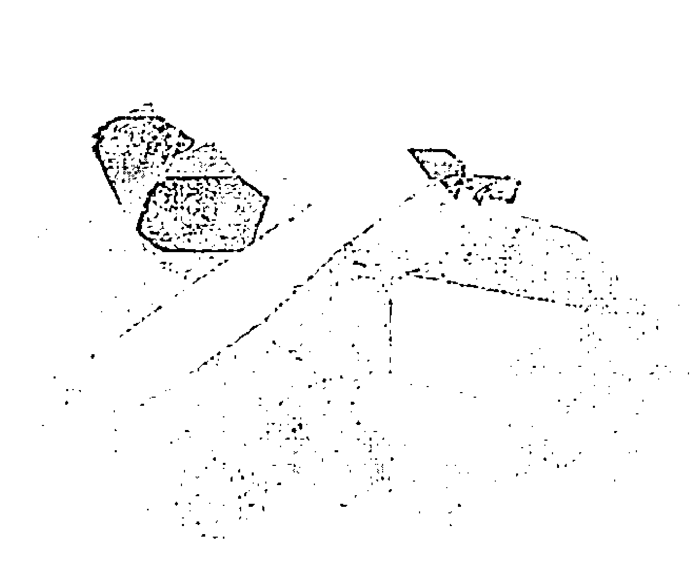

- 颜色：蓝色、红色、黄色、彩虹色
- 产地：美国、巴西
- 晶系：六方晶系
- 成分：SiO₂+Au
- 硬度：7.5 ~ 8

（关键词）
激发潜在能力
提高创造力，增强自我表现力

### 晶石的特征 用“现代炼金术”创造出的色彩

水光水晶是通过在天然水晶的表面蒸镀一层纯金来进行人工上色的晶石。把 A 级水晶加热至约 1600℃，使用真空蒸镀技术，利用电离原理将纯金附着在水晶上，采用这种方法形成的薄膜能使水晶在晕彩效应的作用下呈现金属蓝色。水光水晶会散发一股华贵的气息，而且价格便宜，因此具有很高的人气。

像水光水晶一样经过人工上色的水晶统称为镀膜水晶。蒸镀的金属不同，水晶所呈现的颜色就不同，名称也就不同。例如，镀银的水晶呈银白色，称为白水光水晶（Aqua Aura White）；镀钛的水晶呈半透明的蓝紫色，称为太空气息水晶（Cosmo Aura），另外还有镀铂、钴等金属的水晶，也可以蒸镀由几种金属炼制而成的合金。总之，这种人工上色的水晶拥有多种多样的色彩。

### 晶石的能量 修复能量场还是堵塞能量场 褒贬不一的梦幻水晶

镀膜水晶的英文中都会有“aura”一词，意为掌管一切生命活动的能量。镀膜水晶通常具有修复能量场的作用。有时，我们会想不出好主意，可能就是由于能量场受到了损伤。通过对其进行修复，可以最大限度地激发我们的潜能，带来新鲜的创意，并增强自我表现力。除此之外，水光水晶还具有和白水晶相同的功效，可以净化万物。其特有的梦幻般的金属蓝色不仅能够激发灵感，还能够在一定程度上帮助我们缓解精神压力。

需要提醒的是，对于人工上色的晶石是否具有强大的能量，历来颇有争议。如上所述，很多欧美晶石爱好者认为镀膜水晶有助于张扬个性，对其十分追捧，相反，也有不少晶石爱好者认为镀膜封闭了水晶原本的能量，致使水晶缺乏生气，并不能给使用者带来益处。孰是孰非还请各位读者亲自体验后作出自己的判断。

### 何时使用

当你想要跳出思维定势时
当你需要充分发挥想象力时，当你时常需要与众不同的点子帮助你脱颖而出时，当你想充分传达某一想法的妙处时，水光水晶都是你的理想选择。

[使用时的注意事项]
要注意不能让水光水晶受到猛烈的碰撞。水光水晶具有自净能力，所以不需要进行频繁地净化。

[速配幸运石]
白水晶

[净化方法]
日光浴、流水

> 幸运石寄语
“只有做真实的自己，才有机会改善目前的状况。”

## 海蓝宝石【蓝晶】
### 给予人类青春与力量的不老之石

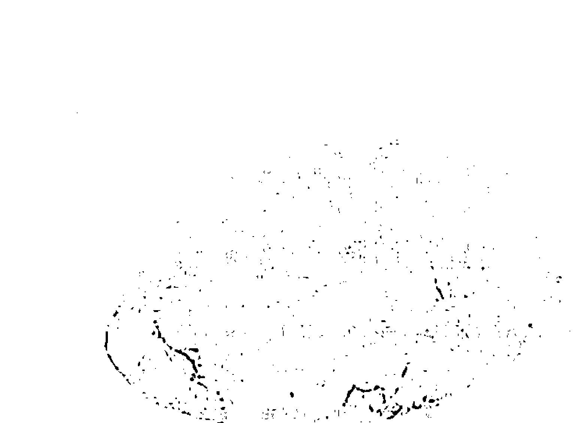

- 颜色：海蓝色、无色等
- 产地：巴西、巴基斯坦、马达加斯加、印度、纳米比亚、俄罗斯、斯里兰卡、尼日利亚、阿富汗、中国、美国、爱尔兰
- 晶系：六方晶系
- 成分：Al₂Be₃[Si₆O₁₈]
- 硬度：7.5 ~ 8

#### 〈关键词〉
静气凝神
培养慈爱之心

### 晶石的特征 以航海家的守护神而闻名

海蓝宝石是3月的生辰石，拥有海水般通透的蓝色。它的英文名“Aquamarine”来源于拉丁语中的“aqua”（水）和“marine”（海）这两个词语，代表大海的蓝色。这种晶石能让人想起风平浪静的大海，仿佛其中蕴含着海水的精华，因此很多航海家都将其当做护身符，用来祈祷航海安全。

海蓝宝石的原石略带一点绿色，经过加热处理后可以去除。海蓝宝石多呈现浅蓝色、深蓝色，不过也有带奶白色的，好似朦胧的浅蓝色玻璃，受到人们的追捧。海蓝宝石在矿物学中属于绿柱石一类，与祖母绿属于同种矿石。此类矿石富含多种微量元素，因而颜色千变万化，其中深绿色的被称为祖母绿，浅蓝色的被称为海蓝宝石。

为我们带来甜蜜的爱情与美满的婚姻。

在昏暗的灯光的照射下，海蓝宝石会呈现更加耀眼的光芒，因此又被称为“夜光宝石女王”。在我们产生负面情绪或陷入困境、一筹莫展时，它会为我们带来希望。另外，海蓝宝石在现代也被用做旅行时的护身符，保佑我们免遭不幸。

### 何时使用

当你希望找回那颗纯洁而和善的心时

当你在人际关系中感到身心疲惫时，当你因为恋人或夫妻关系而烦恼不堪时，当你因为不善于与他人沟通而感到筋疲力尽时，当你希望提高自己的情感素养和艺术素养时，海蓝宝石能够带来意想不到的效果。

### 晶石的能量 具有镇静安神之功效
可使人身心得到舒缓和放松

海蓝宝石象征着安宁、幸福、喜悦、勇气和财富。它汲取了大海的力量和精华，给人一种犹如身在大海般的清新畅快的感觉。一方面，海蓝宝石能够帮助我们去除杂念，使疲惫的心灵得到安慰；另一方面，它还能引导我们与人为善，帮助我们平心静气地、准确表达自己的心意，从而

[使用时的注意事项]
如果是原石，可在用流水冲洗后，上午时放在阳光下进行净化。如果是加工后的宝石，可利用月光或鼠尾草进行净化。

[速配幸运石]
蓝纹玛瑙、方钠石、方解石、缟玛瑙

[净化方法]
日光浴、月光浴、鼠尾草

[对应的星座 & 脉轮]
白羊座、金牛座、双子座、天秤座、巨蟹座、双鱼座 / 第5脉轮

> 幸运石寄语
“要想实现愿望，放下那些执迷不悟的想法吧！”

## 玛瑙
### 汇集大地能量的豁达之石

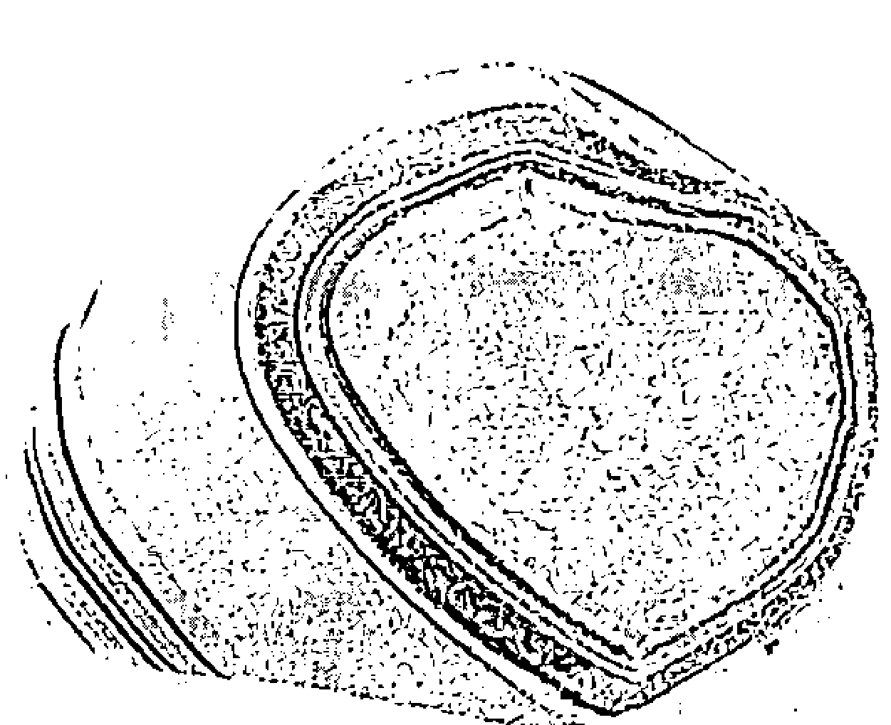

- 颜色：白色、灰色、褐色、红色、黄色、蓝色、绿色、黑色
- 产地：巴西、乌拉圭、印度、印度尼西亚、美国、中国、非洲各国
- 晶系：六方晶系（隐晶质）
- 成分：SiO₂
- 硬度：7

（关键词）
学会关爱他人，建立情感纽带
守护身心健康

### 晶石的特征 在世界各地都深受欢迎的晶石

这是一种带有条纹纹路的半透明的晶石。它的英文名 “Agate” 来源于世界最早的玛瑙生产地——意大利西西里岛——一条名为 “Achates”（阿凯提斯）的河流。玛瑙这种晶石在世界各地都能开采到，因为它质地坚硬、细腻且易被染色，所以经常被制成刻有文字或图案的饰品以及护身符，并受到人们的珍视。利用玛瑙颜色各异的丝缕絮纹加工而成的装饰物被称为 “浮雕饰物”，用贝壳做的浮雕饰物就是模仿玛瑙制成的。

玛瑙和玉髓的矿物成分均为隐晶质石英，它们在矿物学中统称为玉髓。宝石界将其中有纹带构造的隐晶质石英集合体称为玛瑙，而将无纹带构造的隐晶质石英集合体称为玉髓。

信任或是共同的目标而产生的紧密联系，从而放下不安与争执，学会关爱他人，协力合作。

在古代，人们认为玛瑙可以解蜘蛛及蝎子之毒，所以会将其磨成粉来治愈中毒的患者。中世纪，欧洲人还将玛瑙随身佩戴，用来防止被敌人的利剑刺伤，或从马上跌落。因此，玛瑙还被视为健康和长寿的护身符。另外，从古巴比伦时期起，人们便将玛瑙作为勇气和身心健康的护身符送给刚出生的男婴。

### 晶石的能量 建立牢固的情感纽带 守护健康

玛瑙的颜色和条纹多种多样，有的如崇山峻岭，有的如卷卷波涛，各有各的魅力。它们的共同点是，汇聚了如大地般豁达的能量，象征着亲人、朋友以及人与自然之间的 “坚韧的牵绊”。玛瑙有 “真实之石” 之称，它能在我们感到孤单无助时，或是人际关系出现问题时，给予我们精神上的强大支撑，让我们重新感受到与他人之间由血缘、

### 何时使用

当你希望以平静的心情待人接物时
当你和父母、朋友产生矛盾时，当你不信任团队的伙伴时，当你觉得无人可以倾诉心事时，都可以尝试佩戴玛瑙。当你希望能够与植物或者小动物进行沟通时，玛瑙也是你的理想选择。

[使用时的注意事项]
频繁接触阳光或者用流水清洗的话，玛瑙的色泽容易变得浑浊，石质也会发生变化。

[速配幸运石]
黄水晶

[净化方法]
日光浴、流水

[对应的星座 & 脉轮]
双子座 / 第0脉轮

> 幸运石寄语
“当你希望从精神压力中得到解放、获取全新的灵感时，就到大自然中充分放松身心吧！”

## 蓝铜矿
### 使人身心愉悦的神圣之石

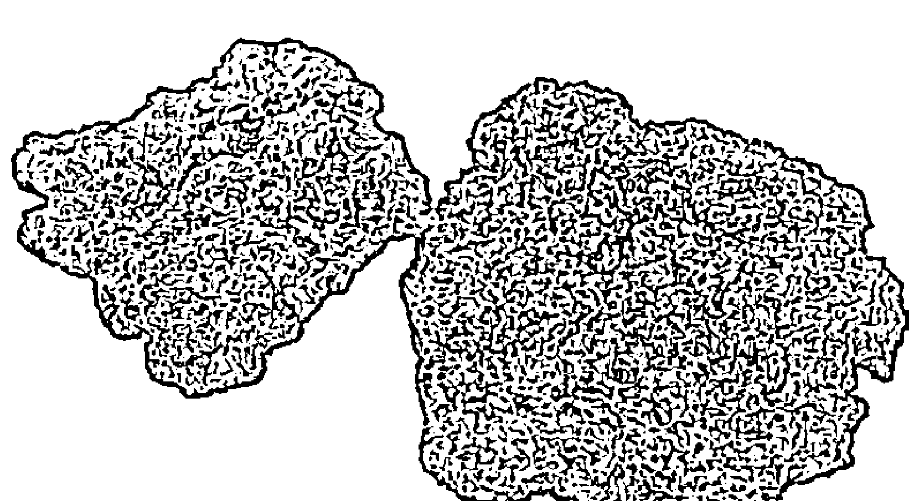

- 颜色：靛蓝色、蓝紫色
- 产地：美国（亚利桑那州）、纳米比亚、墨西哥、法国、俄罗斯、摩洛哥
- 晶系：单斜晶系
- 成分：Cu₃[OH|CO₃]₂
- 硬度：3.5 ~ 4

（关键词）
使人头脑更加灵活，洞察力更加深刻
放松身心

### 晶石的特征 曾被视为神圣之物的群青之石

摩洛哥和纳米比亚盛产优质的蓝铜矿。因为它通常与和其成分相同的孔雀石一起出现在矿床中，所以人们将二者的混合物称为蓝铜矿孔雀石，这种混合物的病理治疗效果很好。

另外，蓝铜矿还是磨制“岩绘具”（日本画中十分重要的一种颜料）时使用的材料。青金石也可以制成颜料，但它的蓝色之中带有琉璃色，没有蓝铜矿的蓝色深。蓝铜矿还有一种特殊的性质，即加水去除碳酸后会变成绿色的孔雀石。在西方，直到中世纪，人们仍然使用蓝铜矿作为绘画的颜料，因而这一时期画中的蓝色都略带一点儿绿色。蓝铜矿的硬度较低，很容易碎裂，因此不适合用来做首饰。

说话的石头”。

另外，蓝铜矿那精纯、细密的蓝色被认为具有强烈的消除压力的暗示效果。它可以同时作用于我们的精神和肉体，无论是强烈的还是轻微的疲劳感，都能够彻底恢复。

### 何时使用

当你想治愈身心疲劳时

当你想从教条化的思维方式中解放出来时，当你想冷静地重新审视自己时，当你想看清事物的本质时，当你想充分发挥自己的潜能时，当你想了解自己真正的追求时，当你因为劳累而毫无干劲时，蓝铜矿是你的最佳选择。

### 晶石的能量 提升意识的层次 让精神和肉体得到双重净化

在古代文明中，拥有神秘的靛蓝色的蓝铜矿被视为灵石，直至现代，蓝铜矿依然受到预言家、风水师的青睐，他们认为其能够作用于人的潜意识，开启“第三只眼”（心灵之眼），唤醒沉睡的智慧及才能，并提高人们的直觉力和洞察力。有“睡着的预言家”之称、曾成功预言了第二次世界大战的大预言家埃德加·凯西甚至称蓝铜矿为“会

[使用时的注意事项]
由于蓝铜矿的原石质地十分脆弱，应尽量避免携带其外出。如果想随身携带，可以使用加工后的晶石。由于蓝铜矿容易受到汗液的侵蚀，佩戴在身上时应格外注意。蓝铜矿不能放置在干燥的环境中，应尽量避免阳光照射。另外，蓝铜矿也不宜用清水冲洗。

[速配幸运石]
透明石膏、孔雀石、方钠石

[净化方法]
月光浴、鼠尾草、晶簇

[对应的星座 & 脉轮]
白羊座、射手座、摩羯座 / 第1脉轮、第5脉轮、第6脉轮

> 幸运石寄语
“不要被事物的表面所蒙蔽，要深入挖掘其本质，唤醒你的直觉。”

## 砂金石
### 带来和平与爱的柔软之石

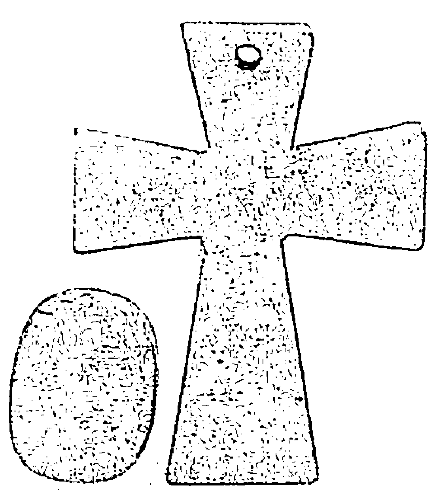

- 颜色：绿色、蓝色、褐色、红色
- 产地：印度、美国、巴西、津巴布韦、西伯利亚
- 晶系：六方晶系（粒状集合体）
- 成分：SiO₂
- 硬度：7

（关键词）
缓解压力，平复心情
集中注意力，增强记忆力

### 晶石的特征 闪闪发光
呈现绿色或红色的小小结晶

砂金石是一种内含闪闪发光的结晶，呈现绿色、蓝色或红色等颜色的石英亚种。砂金石之所以会闪闪发光，主要来自于石英内部包裹的铬云母，它不仅为石英铺上了一层油绿的底色，其细小的、呈鳞片状均匀分布的结晶结构还能够反射光线，使石英在有光线的地方闪烁星星点点的光芒。砂金石内部通常还含有微量的赤铁矿、针铁矿等物质，它们如星星点点的野花点缀在一望无际的大草原上，使得砂金石异常美丽。最受欢迎的砂金石种类是绿色的绿砂金石。除此之外，还有红砂金石、蓝砂金石等等。由于许多优质的绿砂金石都来自印度，它的色泽又与翡翠十分相似，因此，在日本人们又称它为“印度翡翠”。

看透真理，被用于制作佛像的眼睛。因此，砂金石也有“幸运之石”的称呼，据说它可以使人拥有先见之明。

另外，不同颜色的砂金石拥有的功效也不同。当你想要抑制自己焦躁不安的情绪、恢复平静的心情时，可以选择绿砂金石。当你想要释放受到压抑的感情、使自己变得强大、敢于直面困难时，当你想要获得崭新的构思和想法时，或是想要成为精力充沛的人时，随身佩戴红砂金石是最佳的选择。

### 晶石的能量 用其柔和的能量缓解精神压力

砂金石拥有柔和的能量，被称为“放松之石”。它能够帮助我们镇定心神，引导我们作出冷静的判断，还能帮助我们集中注意力和增强记忆力。

砂金石能够作用于我们的内心，丰富我们的情感，帮助我们以全面的眼光看待新事物，以宽广的胸怀接受新事物，最终引领我们找到圆满解决问题的线索。在西藏，人们认为砂金石象征着

### 何时使用

当你希望恢复平静的心情时
当你想要缓解压力、调整混乱的心绪时，当你希望提高自己的记忆力时，都可以选择砂金石。当胜负在此一举时，砂金石可以为我们带来重要的转机。

[使用时的注意事项]
长时间用水冲洗砂金石容易使其损坏，需要特别注意。

[速配幸运石]
黄铁矿、葡萄石、琥珀、藓纹玛瑙

[净化方法]
流水、日光浴

[对应的星座 & 脉轮]
白羊座、天秤座 / 第4脉轮

> 幸运石寄语
“应该时常振作精神，让疲劳的身心得到解放！”

## 鱼眼石
### 帮助人们解放自己，获得精神上的自由

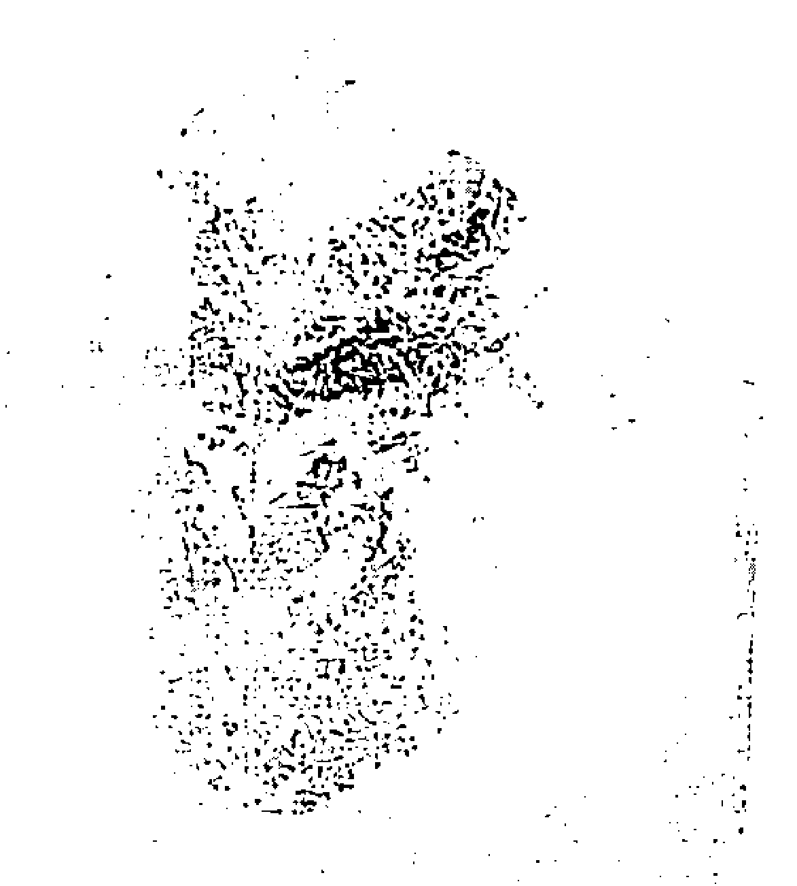

- 颜色：无色、白色、灰色、浅绿色、浅黄色、粉色
- 产地：印度、加拿大、美国、巴西、墨西哥
- 晶系：正方晶系
- 成分：KCa₄Si₈O₂₀(F,OH)·8H₂O
- 硬度：4.5～5

（关键词）
指引新的方向
赐予我们灵力

### 晶石的特征

与鱼眼相似
散发美丽的白色光芒

如果你变换观察角度，就能够隐约看到这种晶石闪耀着珍珠般的光泽，和鱼眼十分相似，因此被称为鱼眼石。

鱼眼石有无色、白色、灰色、浅绿色和浅黄色等颜色，其中以晶莹剔透的绿色鱼眼石最受欢迎。从形状上来看，因其结晶多为四棱锥形或柱形，整体形态呈现柱状的集合，或是顶端呈现金字塔状的水晶簇。鱼眼石由于水分含量较高，受热后会因为失水而呈叶片状碎裂。它的英文名就来源于古希腊语中的“apo”（剥离）和“phullon”（叶子）这两个词语。

鱼眼石在世界各地均有出产，其中印度产的鱼眼石以其高质量而特别受人欢迎。对收藏晶石的人来说，鱼眼石的知名度并不高，但它在幸运石爱好者中却极具人气。因为鱼眼石硬度低且容易碎裂，人们很少把它作为首饰的原材料进行后期加工。

暗的隧道中，鱼眼石的白色荧光吸引着一批又一批工人一探究竟，因此它被看做突破束缚，指引新的方向（或道路），并赋予人们勇气与挑战精神的晶石。

除此之外，由于鱼眼石本身具有极高的波动，加上其内部含有大量的结晶水，因此被认为可以连通肉体与灵界，并进行高效地波动传递。在印度，自古以来人们就将鱼眼石用于重大宗教仪式中，现在也有很多人将鱼眼石作为冥想时的首选辅助用具。对一般人来说，鱼眼石可以提高直觉力和洞察力，从而使人遇事沉着冷静，心平气和。

### 晶石的能量

用其纯净的能量引导我们走向精神的高次元

鱼眼石开始受到世人瞩目，源于19世纪中期英国殖民者在印度半岛为修建铁路而挖隧道时发现了大量优质的鱼眼石。在通往未知世界的幽

### 何时使用

当你向着目标勇往直前时
当你希望挑战新的目标时，当你感到人生停滞不前时，当你想寻求精神上的帮助时，当你想重新开始奋斗时，建议你选择鱼眼石。

[使用时的注意事项]
鱼眼石十分脆弱、纤细，需要精心呵护。

[速配幸运石]
土耳其石、虎眼石

[净化方法]
晶簇、鼠尾草

[对应的星座 & 脉轮]
双子座、天秤座 / 第4脉轮、第6脉轮、第8脉轮

> 幸运石寄语
“感谢目前的境遇，它让你发现事物的本质，从而获得感动。”

## 天河石【亚马逊石】
### 照亮未来之路的希望之石

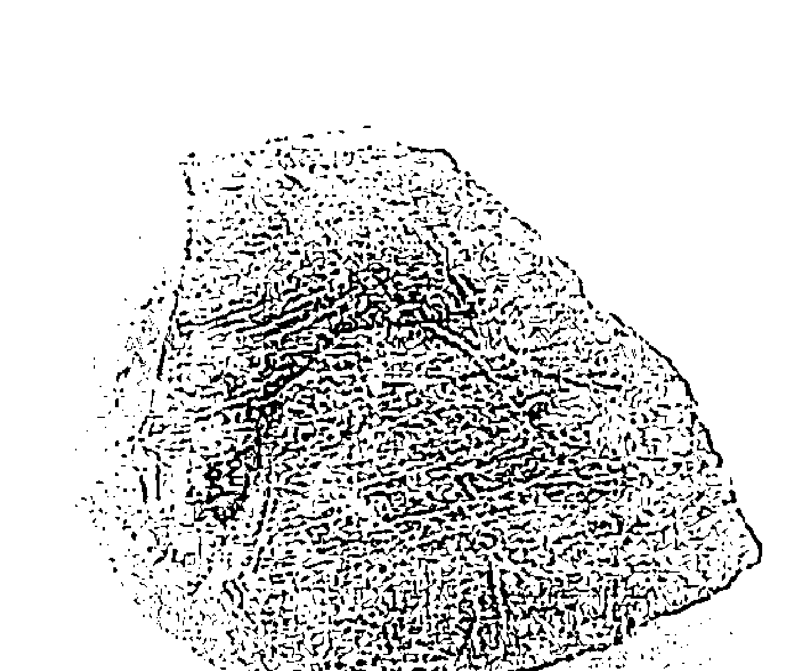

- 颜色：天蓝色、青绿色、绿色
- 产地：美国、巴西、加拿大、马达加斯加、俄罗斯、印度、巴基斯坦、坦桑尼亚、南非、撒哈拉沙漠
- 晶系：三斜晶系
- 成分：K[AlSi₃O₈]
- 硬度：6 ~ 6.5

（关键词）
帮助我们稳定情绪，实现自我
提升表现力和沟通能力

### 晶石的特征

颜色犹如缓缓流淌的大河
极富魅力

这种晶石所呈现的天蓝色使人联想到辽远深邃的大河。散布在亚马逊河流域的金矿山中曾开采出一些与天河石类似的青绿色矿石，人们错误地将二者混为一谈，将它们都取名为“亚马逊石”，并一直沿用至今。实际上亚马逊河流域出产的并不是天河石。天河石全身通绿，看起来与翡翠极为相似，因此也被称为“亚马逊翡翠”。纯色的天河石数量相对稀少，大多数天河石在蓝色和绿色中都会掺杂些许白色。因为“天河”本为银河之意，晶石中的杂质就被爱好者们看做银河中的点点繁星。

从矿物学角度讲，天河石与碱长石中的微斜长石属于同种矿石。微斜长石颜色多种多样，有无色、白色、黄色、粉色、红色和灰色等，其中仅蓝色和绿色的微斜长石被称为天河石。这种与众不同的颜色与其中所含的铅元素有关。

虑与绝望的心情中解放出来，回归平常心，对事物作出合理的判断。

天河石还能消除由于各种原因产生的萎靡不振的情绪，帮助我们调节身心平衡，拓宽我们前进的道路。由于它能提升沟通能力，因此对于加强人际关系也有一定的帮助。

### 何时使用

当你想带着自信和希望去实现自己的梦想时

当你想改变优柔寡断的性格时，当你在前行的道路上徘徊时，当你想整理自己的心情时，当你想尽快从失落中走出来时，当你想振奋精神继续努力时，当你想给自己一点儿自信时，当你无精打采时，天河石都是恰合时宜的选择。另外，当你想提升自己的表现力、恢复活力时，也可以佩戴天河石。

### 晶石的能量

消除迷茫
指引未来之路

天河石的蓝色给人一种力量感，因此它又被称为“希望之石”和“行动之石”。它能够作用于我们的潜意识，为我们消除迷茫，带来希望，指引我们在正确的道路上前行。它还能使我们从焦

[使用时的注意事项]
天河石容易受到汗液的侵蚀，所以在佩戴过程中需要时常擦拭。

[速配幸运石]
鹰眼石、发晶、青金石、粉水晶

[净化方法]
流水、日光浴、月光浴、晶簇、鼠尾草

[对应的星座 & 脉轮]
处女座 / 第4脉轮

> 幸运石寄语
“当你犹豫不决时，试着让自己安静下来，回忆自己做这件事的初衷。”

## 紫水晶
### 冷酷与热情兼具的高贵之石

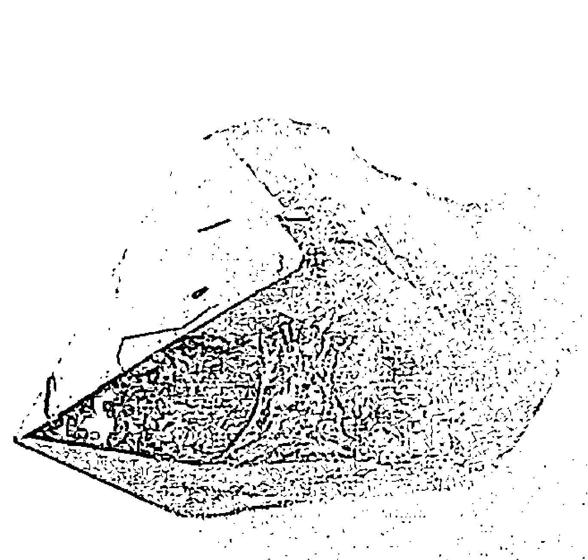

- 颜色：紫色（不同的结晶紫色的深浅程度也不同，有些还会掺杂褐色或灰色）
- 产地：巴西、乌拉圭、印度、俄罗斯、南非、墨西哥、美国、斯里兰卡、韩国、朝鲜、津巴布韦、坦桑尼亚、肯尼亚、马达加斯加、乌干达、加拿大
- 晶系：六方晶系
- 成分：SiO₂
- 硬度：7

（关键词）
提升判断力和直觉力
建立良好的人际关系

### 晶石的特征

用来防止醉酒的守护石
深受人们的喜爱

大名鼎鼎的紫水晶是2月的生辰石。作为紫色晶石的代表，紫水晶被世人所熟知，而作为首饰，它更是具有颇高的人气。相传希腊神话中的酒神巴克斯的一次恶作剧误使少女阿麦斯特（Amethyst）变成了水晶，紫水晶的名字便因此而来。它的英文名来源于古希腊语中的“amethystos”（不醉酒）一词，因此被认为具有防止醉酒的功效。

也被人们称为“爱的守护石”，能让情侣、家人和朋友之间的纽带更为牢固，赋予人们坚守真爱的力量。

热情妩媚的红色和高傲冷酷的蓝色杂糅在一起的紫水晶，可以使我们拥有强大的内心，不随波逐流，并提高我们的直觉力，使我们作出冷静的判断。另外，它还能帮我们稳定心绪，消除不安，抹平心中的伤痕，并带来安宁的心境。浅紫色的紫水晶则更有利于心神安定，可以帮助睡眠。

无色透明的天然水晶中由于渗入了微量铁元素，所以颜色呈紫色，这样的颜色在天然水晶中最为高贵。一般紫水晶的底色不均，因此整体颜色较深、色泽统一的紫水晶更为优质。除紫水晶外，还有一种水晶含有铁元素——黄水晶。现在市场上普遍流通的黄水晶大多是紫水晶经过加热处理后形成的。另外，黄水晶和紫水晶杂糅于一体的“黄紫晶”也非常受欢迎。

### 何时使用

当你想要寻求内心的平静和纯真的爱情时
当你想缓解因担心、恐惧和创伤所带来的精神压力时，当你想稳定心绪时，当你想抓住爱情时，当你想增强注意力、创造力和理解力时，当你想改善睡眠时，不妨借助紫水晶的力量来实现愿望。

### 晶石的能量

抚慰内心
创造灵感

紫水晶拥有象征高贵气质的紫色，被尊为灵性很高的晶石，因此人们常常在宗教仪式上随身佩戴它。紫水晶具有强大的灵通力量，可以帮人提高第六感，增强创造力、辟邪护身。同时，它

[使用时的注意事项]
紫水晶在阳光照射下极易脱色，因此要尽量避免使用日光进行净化。

[速配幸运石]
金刚石、舒俱来石、摩根石、发晶

[净化方法]
流水、晶簇、鼠尾草

[对应的星座 & 脉轮]
白羊座、射手座、水瓶座、双鱼座 / 第5脉轮

> 幸运石寄语
“问题的答案就在你的内心深处，让我们学会倾听自己的心声吧！”

## Aragonite
霰石

温柔而安静的暖色让人身心都得到放松

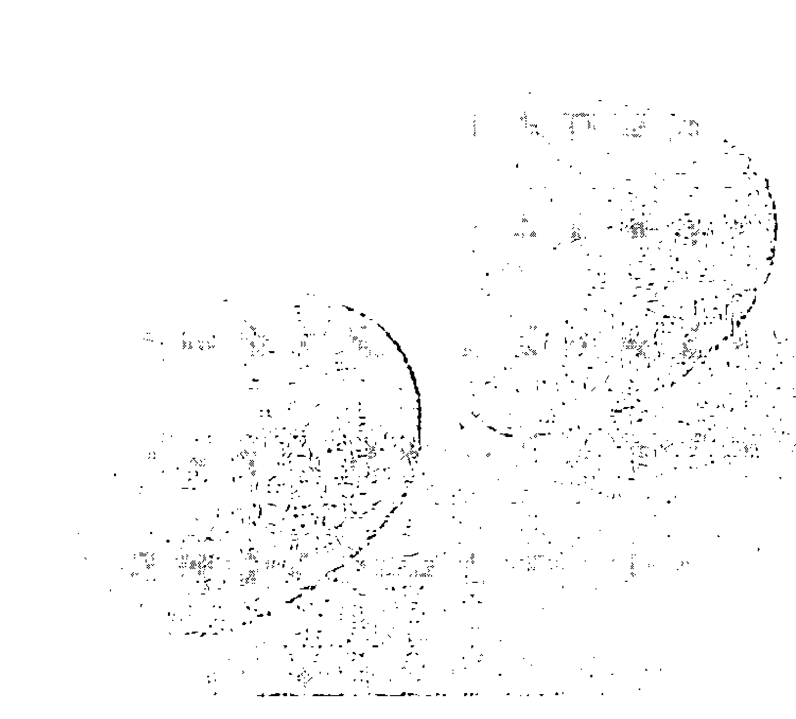

- 颜色：无色、白色、黄色、橙色、浅紫色、浅蓝色、灰色、绿色、褐色等
- 产地：西班牙、澳大利亚、英国、墨西哥、捷克、纳米比亚、意大利、秘鲁、智利、美国、中国（台湾）
- 晶系：斜方晶系（部分由拟六方晶构成）
- 成分：CaCO₃
- 硬度：3.5 ~ 4

〈关键词〉
维持身心平衡，培养克服压力的强大内心
传递难言的心意

### 晶石的特征 与海洋生物的成分相同

霰石和珊瑚、贝壳一样内含碳酸钙。它的颜色从无色到绿色，千变万化。由于霰石最早发现于西班牙的亚洛根（Aragon），因此人们将其命名为亚洛根石（Aragonite）。
而“霰石”这一名称来源于一次误会。日本江户时期的植物学家采集到一种霰状原石，于是将其命名为霰石。日本明治时期，人们认为这种霰状原石就是西方人所指的亚洛根石，因此“霰石”这个名字一直流传至今。后来人们才弄清楚实际上这种霰状原石有可能是另一种矿石（欧泊或方解石）。不过，尽管知道以前的认知不正确，人们仍然沿用了“霰石”这一名称。
与霰石含有相同成分的矿石还有方解石。不过，虽然两者成分相同，但结晶的构造不相同，霰石呈霰状或珊瑚状。

霰石以它柔和而温暖的能量让我们身处困境时仍然可以集中注意力，充分发挥自己的才能。因此，霰石对于那些一到紧要关头就因为紧张而无法发挥自己真实实力的人有很大帮助。另外，它在欧洲有“爱与友情的守护石”之称，据说和朋友或恋人同时持有，可以加深彼此的感情。霰石对言语很敏感，当你有心事需要朋友的支持却又难以主动开口时，可以将它轻握在手中，再试着与朋友进行沟通也许就没有那么困难了。

### 晶石的能量 平衡身心 恢复信心

这种晶石散发一种静谧的光芒，又被称为“温柔之石”，具有使人身心放松的功效。它可以消除由于压力而引起的身体不适和内心疲劳。当你辗转难眠时，可以将它放置在枕头下面或是握在手中，它可以帮你稳定心绪，使你安然入睡。

### 何时使用

当你希望战胜压力时
当你被压力压得喘不过气时，当你想提高自己的耐力和直觉力时，当你有难言之隐希望得到对方的理解时，都可以选择佩戴霰石。此外，当你希望在夜深人静的晚上平心静气时，也不妨借助霰石的力量，使自己安静入眠。

[使用时的注意事项]
霰石十分脆弱，容易受损，因此使用时应格外注意。
[速配幸运石]
白水晶、月长石
[净化方法]
日光浴、流水
[对应的星座 & 脉轮]
摩羯座 / 第5脉轮

> 幸运石寄语
“进行中的事情停滞不前，可能与你内心的紧张有关。试着放松身心吧！”

## 琥珀

由太古时期的树脂形成的万能晶石

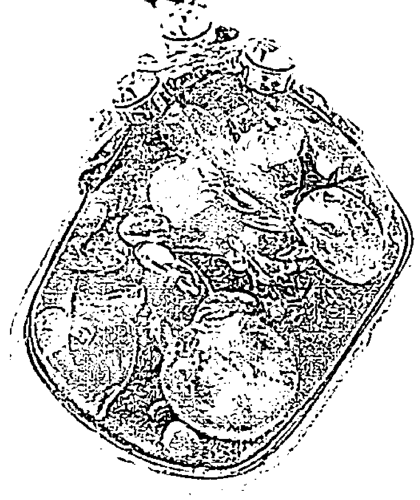

- 颜色：黄色、褐色、橙黄色、黄白色、红色、略带蓝色的黄色、蓝色、略带浅绿的黄色
- 产地：俄罗斯、拉脱维亚、立陶宛、爱沙尼亚、波兰、德国、丹麦、挪威、意大利、缅甸、英国、多米尼加、中国、墨西哥
- 晶系：非晶质
- 成分：C₁₀H₁₆O+H₂S
- 硬度：2 ~ 2.5

〈关键词〉
调整身心状况
提高交际能力，带来财富

### 晶石的特征

将远古的阳光尘封于其中的“时间胶囊”

琥珀是松树等树木的树脂凝固后形成的化石，大多形成于3000万年前。严格来讲，它并不算是矿石。琥珀多以黄色或接近黄色的颜色为主，也有一些因受到紫外线的影响而呈现红色、些许绿色和蓝色。
琥珀受热后会散发一种独特的香气，其名称源自阿拉伯语中的“anber”（龙涎香）一词，日本著名的琥珀产地岩手县久慈市的居民又称其为“薰陆香”，将其广泛应用于香料、杀虫剂、涂料等的加工制作中。琥珀中多包裹昆虫、植物等古代生物的遗体、遗物和遗迹，因此它不仅仅是名贵的晶石，也为地质学和生物学提供了极为珍贵的资料。另外，它作为治疗石也小有名气。

琥珀是健康和长寿的象征，在一些国家，它还是准妈妈们安全分娩的护身符；对孩子来说，它是防止生病的护身符。另一方面，琥珀具有强大的治愈力，它能够平复我们内心的失落，带来积极的能量。
在中国的风水学中，琥珀象征着四神兽之一的“白虎”，是增加财运、提高交际能力的晶石。另外，琥珀能帮助人们消除人际关系中的误解和分歧，使人与人之间的沟通更加顺畅。

### 晶石的能量

沉稳而灵动的能量
带来健康与财富

### 何时使用

当你希望身体健康、工作顺利时
当你想改善身体素质时，当你在工作中与人交涉时，当你想建立友好的人际关系时，琥珀都能够带来意想不到的效果。

自古以来，琥珀就被人们视为富裕和健康的象征。无论是作为守护石，还是作为治疗石，它都非常“称职”，是仅次于白水晶的万能晶石。琥珀所蕴含的温暖的能量能够保护我们的身心，为我们的生命注入新鲜活力。一方面，它能提高身体的免疫力和抵抗力，帮助我们调整身体不适，排除长年积聚在体内的毒素。对大人来说，

[使用时的注意事项]
琥珀属于有机质，所以容易受到高温和汗液的侵蚀。一旦沾上汗液，就要立即用水冲洗，然后用柔软的布擦拭干净。
[速配幸运石]
青金石、石榴石、珊瑚、黄水晶
[净化方法]
月光浴、鼠尾草、晶簇
[对应的星座 & 脉轮]
巨蟹座、狮子座、处女座 / 第5脉轮

> 幸运石寄语
“让自己从过去陈旧的思考方式和观念中解放出来吧！”

## 祖母绿

### 备受珍视的治愈之石

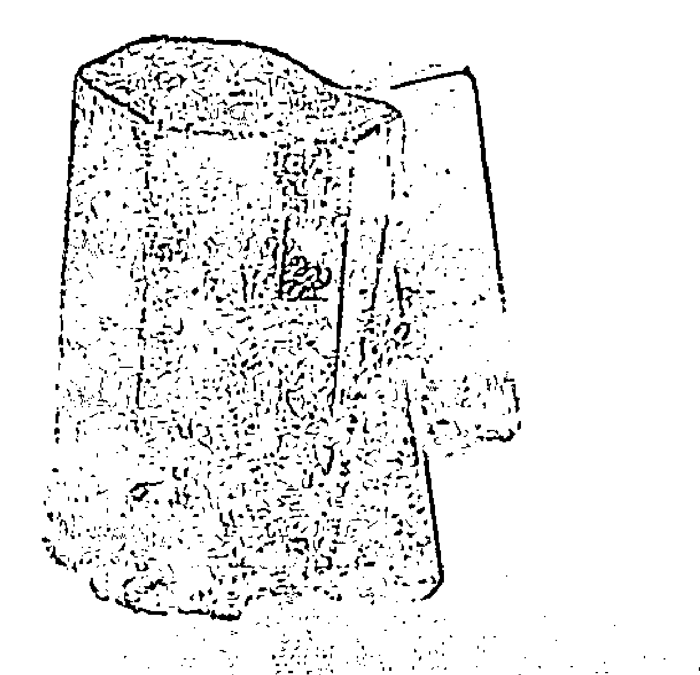

- **颜色**：绿色（部分祖母绿由于混杂其他成分而呈黑色或黄色）
- **产地**：哥伦比亚、阿富汗、俄罗斯、印度、巴西、巴基斯坦、澳大利亚、南非、津巴布韦、坦桑尼亚、莫桑比克、马达加斯加
- **晶系**：六方晶系
- **成分**：Al₂Be₃[Si₆O₁₈]
- **硬度**：7.5 ~ 8

#### 〈关键词〉
治愈自己及周围的人
守护爱情

### 晶石的特征 蕴藏于地底深处的宝石女王

祖母绿是5月的生辰石，闪耀着翠绿色的光芒。其英文名就来源于古代法语中的“esmeraude”（绿色的石头）一词。它与海蓝宝石一样同属于绿柱石。绿柱石的颜色变化多端，其中深绿色的那些被称为祖母绿。绝大多数绿柱石都形成于地表附近，唯有祖母绿蕴藏于地底深处，很难采集，因此产量较少，十分名贵。

散布在南美洲安第斯山脉的祖母绿矿山曾经位于海底，所以在那里采集到的祖母绿大多含有岩盐结晶和盐水。其中，含有气泡等物质的祖母绿被称为三相包裹体，在阳光的照耀下，这种祖母绿的内包物犹如草木茂盛的庭院般赏心悦目，因此又被称为“看得见天国的宝石”。

汲取大地之精华的祖母绿还被视为能够预言未来的神圣之石。相传当佩戴者遇到紧急情况时，祖母绿的颜色就会变浅。祖母绿充满了爱的力量，像母亲温暖孩子一样温暖着佩戴者。它使我们心境平和、与同伴之间相互信任，同时使我们领悟无私地为他人奉献的喜悦。也许正因如此，人们相信祖母绿可以使恋爱和婚姻关系持久，并将其定为仅次于钻石的、结婚55周年的纪念宝石。

### 晶石的能量 消除身心疲劳 赋予人们活力

祖母绿被视为生命和重生的象征，它那强大的治愈力可以同时治愈佩戴者及其周围的人。自古以来，祖母绿作为治疗石受到世界各地人们的青睐。据说祖母绿可以治疗眼病、使人的目光更加炯炯有神，还可以增强记忆力。埃及艳后就曾将一座祖母绿矿山定为自己专用，罗马大帝凯撒也曾收集了大量的祖母绿。

### 何时使用

#### 当你想加强与周围的人的联系时
当你发现很难得到同事的支持时，当你与伴侣之间出现较大的矛盾时，祖母绿都是最佳的选择。当你需要提高记忆力时，当你想放松身心时，祖母绿也可以给你帮助。此外，祖母绿对恢复视力，消除眼部疲劳也有显著的效果。

[使用时的注意事项]
祖母绿在紫外线照射下或受到撞击和压迫时十分脆弱，因此佩戴时应格外注意。

[速配幸运石]
舒俱来石、透明石膏、缟玛瑙、橙色托帕石

[净化方法]
流水、月光浴、鼠尾草、晶簇

[对应的星座 & 脉轮]
金牛座、巨蟹座、狮子座、天秤座 / 第4脉轮

> 幸运石寄语
“为了能更好地迈出下一步，请适当休息。张弛有度最重要。”

## Angelite
天使石
### 传达上天旨意的祈祷之石

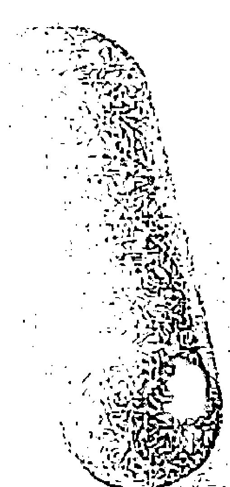

- 颜色：蓝灰色、淡蓝色、碧蓝色、天蓝色
- 产地：秘鲁、南非、英国
- 晶系：斜方晶系
- 成分：SrCaSO₄
- 硬度：3 ~ 3.5

〈关键词〉
理解深沉的博爱精神
最大限度且有效地利用机会

### 晶石的特征
#### 柔美的天蓝色让人想起善良的天使
#### 和平的象征

天使石来源于古希腊语中的“Angelos”（天使之石）一词。它是硬石膏的一种，内含锶元素。与之成分相同的矿石还有天青石。由于天使石和天青石具有相似的性质，所以也可以用天使石来代替天青石佩戴在身上。天使石和天青石都比较脆弱，不易进行研磨加工。相比之下，天使石更易加工，因此在市场上的流通量更大。不过，加工后的天使石颜色大多会稍显暗淡，原石或接近原石状态的天使石更能表现其柔和又不失光泽的神采。

执念，带给我们内心的平和与安宁。
另外，天使石也是连通神秘的精神世界的桥梁。对那些希望领悟宇宙间的真理和挖掘更深层的自我的人来说，天使石独具魅力。而对其他人来说，天使石可以提高他们的直觉力，引导他们作出正确的决策。
此外，自古以来，天使石都被尊为“五谷丰登和好天气”的守护石，人们相信它可以守护最重要的东西。天使石还具有消暑降温的作用，在中药里也常见到它的身影。

### 晶石的能量
#### 促使我们发现事物本质及爱的本质的“发现之石”

天使石正如它的名字一样，拥有如天使一般温柔的能量。它犹如传达天神旨意的天使，赐予我们博爱与崇尚和平的精神：大到对世界和平的祈愿，小到对幸福生活的希望。它还赋予我们发现人生宝贵之处的能力，并使我们领会爱的真谛。
天使石的另一大特性是“原谅”。它引导我们怀有一颗宽容之心，原谅别人带给我们的伤害，更重要的是原谅自己在过去所犯的错误。人在无法原谅自己和他人时会抱有潜在的恐惧和不安，天使石通过帮助我们逐步放下对已发生的事情的

### 何时使用

当你想变消极思考为积极思考时
当你在人生的道路上迷失方向时，当你感到恐惧与不安时，当你深陷于过去失败的阴影中无法自拔时，当你想提高自己的直觉力和上进心时，当你想把握机会时，让天使石助你一臂之力吧！

[使用时的注意事项]
注意不要用水冲洗。
[速配幸运石]
绿龙晶、拉长石、发晶
[净化方法]
月光浴、鼠尾草
[对应的脉轮]
第5脉轮

> 幸运石寄语
“闭上眼睛，把手放在胸口，感受爱的温度。”

## 缟玛瑙

使人远离纠纷困扰的除魔之石

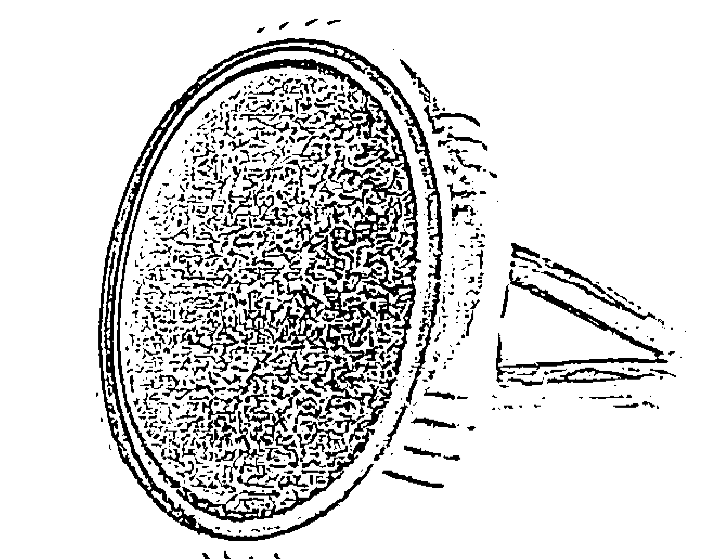

- 颜色：黑色、白色、灰色、绿色、黄色、红色、茶色
- 产地：印度、巴西、乌拉圭、中国、德国、捷克
- 晶系：隐晶质石英
- 成分：SiO₂
- 硬度：7

〈关键词〉
赋予我们决断力和行动力
使我们免受他人的影响

### 晶石的特征

拥有柔和色泽和纹带构造的魅力之石

缟玛瑙作为可以除魔的幸运石被世人所熟知，是8月的生辰石。人们原本将具有黑白相间的纹带构造的玛瑙称为缟玛瑙，后来又将具有红白相间的纹带构造的红缟玛瑙归入其中。在日本，缟玛瑙中最有名的当属黑缟玛瑙。

缟玛瑙的英文名来源于古希腊语中的“onux”一词（表示指甲），传说丘比特趁维纳斯睡觉时用箭射掉了她的指甲，指甲掉到印度河中变成了有黑色条纹的石头，即缟玛瑙。需要注意的是，“onux”除了特指“缟玛瑙”之外，还可以作为条纹矿石的统称。

缟玛瑙那没有一丝阴霾的纯黑色象征着没有一丝怀疑的坚定信念。它能够使我们心神安定，让我们从妄想和绝望中解脱出来。因此，对那些优柔寡断、意志力薄弱的人来说，缟玛瑙能够使他们的意志变得坚定，从而战胜邪恶势力的诱惑。另一方面，对已经拥有明确的目标的人来说，缟玛瑙可以增强他们的忍耐力，使他们度过人生中的艰难时刻，继续前进。另外，红缟玛瑙还可以作为增进爱情运势的幸运石，用来促成美满的姻缘。

### 晶石的能量

祛除邪气
带来新的邂逅

缟玛瑙是掌管相聚与离别的晶石。它可以让
我们与过去那些难以忘怀的感情一刀两断，鼓励
我们勇敢追求新的恋情。

因其漆黑的颜色，古人曾称它为“战争和灾难之石”。现在，缟玛瑙则被视为能够祛除邪气的除魔之石，有“自我防卫之石”之称。它具有阻挡他人恶意的功效，可以保护佩戴者免受伤害。当他人对我们产生嫉妒、怨恨等情绪时，它可以保护我们远离灾难。

### 何时使用

当你想要寻求新的邂逅或机遇时

当你不想受周围环境的影响时，当你面临离别时，当你想在艰苦的训练或难度较大的备考中坚持下来时，可以选择缟玛瑙作为护身符。

[使用时的注意事项]
缟玛瑙虽然不容易损坏，但是如果频繁借助日光或流水进行净化的话，它也很容易变色。

[速配幸运石]
石榴石、赤铁矿、翡翠、蛇纹石、青金石

[净化方法]
日光浴、流水、鼠尾草

[对应的星座 & 脉轮]
狮子座、处女座、摩羯座 / 第0脉轮

> 幸运石寄语
“当你在人生路上不知为何停滞不前时，试着改掉坏习惯吧！”

## Opal
欧泊【蛋白石】

闪耀亮丽七色，激发潜在能力

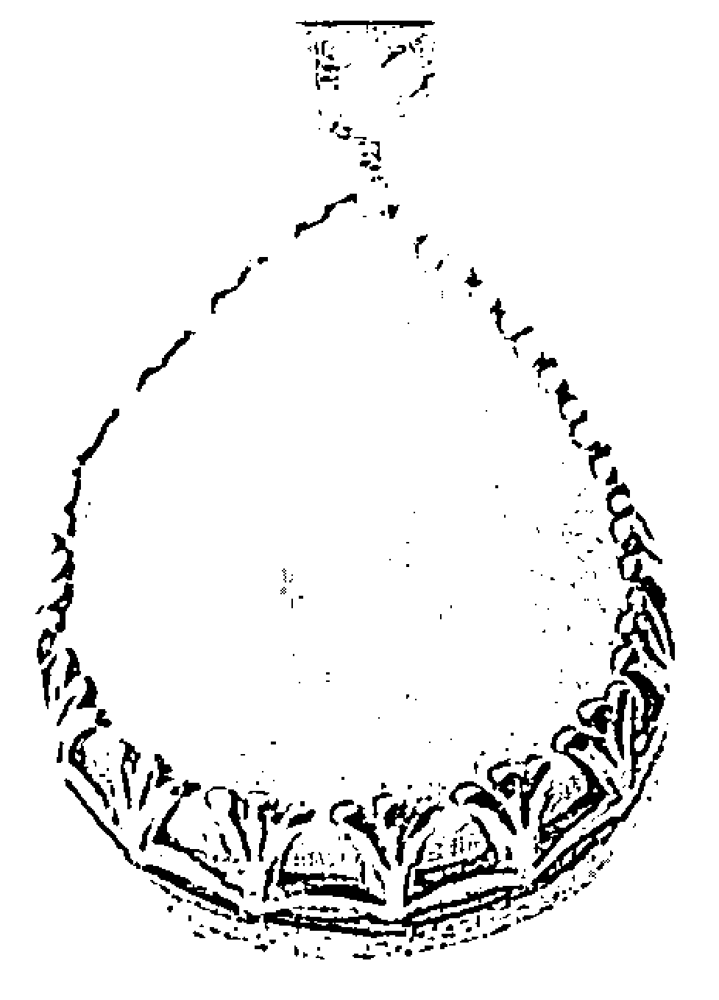

- 颜色：无色、白色、黄色、橙色、红色、粉色、黄绿色、绿色、蓝色、紫色、灰色、黑色
- 产地：澳大利亚、墨西哥、巴西、洪都拉斯、捷克、美国、印度尼西亚、秘鲁、坦桑尼亚、埃塞俄比亚
- 晶系：非晶质
- 成分：SiO₂·nH₂O
- 硬度：5.5～6.5

〈关键词〉
带来变化
有效激发潜能

### 晶石的性质
长时间炼造
具有水润的质感

欧泊是为数不多的含有水分的晶石之一，因而具有其他种类晶石所没有的丰富色彩和独特光辉，是10月的生辰石。在自然光的照射下，欧泊会散发变化多端的迷人色彩，这就是“变彩效应”。欧泊所含的水分可以散射光线，使它的色泽看起来如彩虹般绚丽迷人。没有“变彩效应”的欧泊被称为普通欧泊，有蓝色、粉色和黄色等颜色。
欧泊大致可以分为两种。一种是在砂岩中形成的砂岩欧泊，一种是在火山熔岩中形成的火山型欧泊。按照颜色又可分为白欧泊、黑欧泊、水欧泊和火欧泊。欧泊的英文源于梵文的“Upala”，意为“贵重之石”。

通过刺激我们体内具有艺术性的感性细胞，它能唤醒我们的艺术灵感。此外，它还能唤醒隐藏在我们内心深处的美，带来意想不到的邂逅。值得注意的是，如果我们处于精神安定、精力集中的状态，就可以用欧泊来唤醒感性情感，但是如果我们情绪高涨时使用欧泊，就可能导致感性情感过于丰富。
另外，欧泊还具有润泽肌肤的功效，可以用于美容养颜。

### 晶石的能量
丰富的色彩带来丰富的可能性

据说，拥有缤纷“表情”的欧泊可以为佩戴者带来多彩的变化。这种变化有好有坏，欧泊是通过聚焦并放大使用者的意识发挥作用的，因此，若想有好的改变，就需要让自己多想象未来的美好，而不是对未来的担忧和恐惧。在乐观的情绪下，欧泊会帮助我们为实现目标去付诸实际行动。
欧泊多变的色彩犹如一面明镜，映照出我们的内心，使我们注意到自己未曾显露的一面。比如，

### 何时使用

当你为了拓展自我发展空间而积极行动时
当你对现在的生活或人际关系感到乏味时，当你希望适应全新的环境时，当你期望获得启发和灵感时，当你缺乏自信时，当你想使肌肤和发质保持健康美丽时，欧泊会带来令你满意的效果。

[使用时的注意事项]
欧泊在有紫外线照射、强光及干燥的环境中极其脆弱，因此应将其保存在能够避免阳光直射且湿度较大的地方。
[速配幸运石]
蓝宝石、坦桑石、捷克陨石、橙色托帕石
[净化方法]
流水、晶簇、鼠尾草
[对应的星座 & 脉轮]
巨蟹座、处女座、天蝎座、天秤座 / 第7脉轮、第8脉轮

> 幸运石寄语
“当你自身发生改变后，就可以与他人建立新的关系了。”

## 黑曜石

激发未知潜力的除魔之石

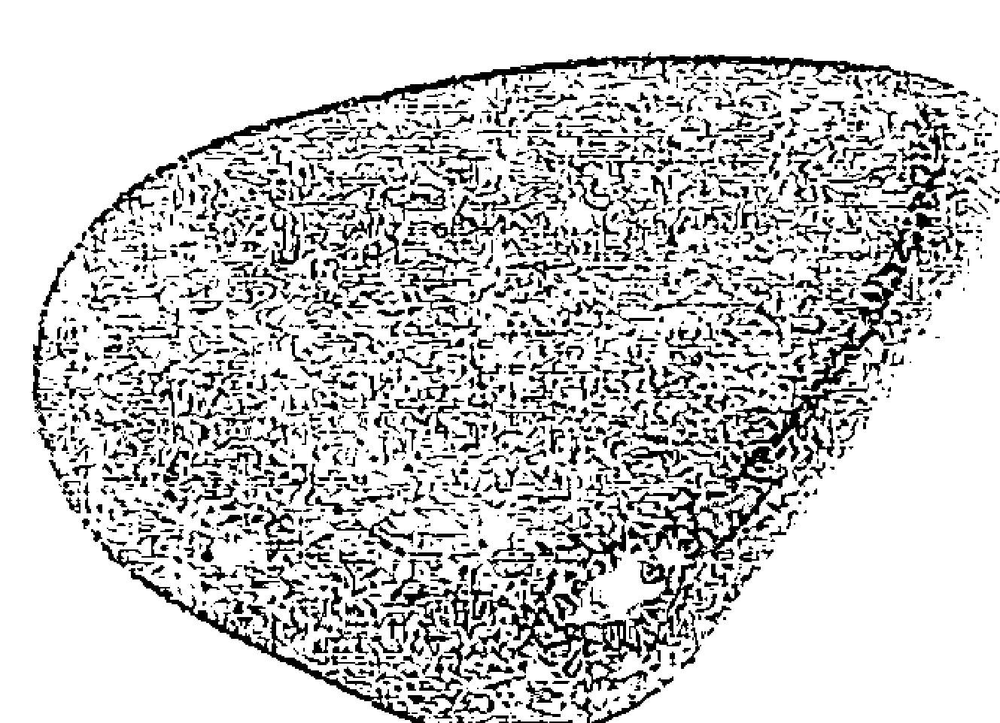

- 颜色：黑色、灰色、黑底中带红褐色或褐色的条纹、黑底中带白色或褐色的斑纹、褐绿色、绿色
- 产地：墨西哥、美国（加利福尼亚州）、冰岛、泰国、加拿大、秘鲁、新西兰、巴布亚新几内亚
- 晶系：非晶质
- 成分：SiO₂+CaO、Na、K 等
- 硬度：5

〈关键词〉
鼓励我们迎难而上
认识自己的阴暗面

### 晶石的特征 诞生于火山带的天然玻璃

黑曜石是黑色晶石家族中最具代表性的成员。位于地底深处的灼热岩浆本应在地下慢慢冷却变成岩石，却因地壳活动喷出地表，迅速冷凝后形成一种玻璃质的矿石，即黑曜石。它是岩浆岩的一种，内部不含结晶，属于非晶质固体（玻璃质）矿石。有些黑曜石的黑底中含有雪花状的白色结晶或灰色结晶，因此被称为雪花黑曜石，而散发彩虹光泽的黑曜石则被称为彩虹黑曜石。

黑曜石大多分布在世界各地的火山地区。当你敲击黑曜石时，它通常会呈贝壳状碎裂开来，形成锐利的“刀尖”，因此在古代，它常被用来制作石器、箭头和枪尖等武器。南太平洋的复活节岛巨人石像的眼睛也是用黑曜石制成的。

平衡。

在没有光的时候，黑曜石容易和缟玛瑙混淆，而在光线下，黑曜石的表面会出现层层反光，浮现出不可思议的光景，因而古人将其磨成镜子，用在除魔术和占卜中，有“映照阴阳的镜子”之称。它可以映照出我们的内心，尤其是我们平时注意不到的、脆弱而阴暗的那一面，帮助我们认清自己。虽然这并不是一个愉快的过程，但只有经此一役，我们才会拥有真正强大的内心。在此过程中，不妨搭配其他有助于平复消极情绪的幸运石。

### 晶石的能量 帮助我们认清自我 值得信赖的幸运石

黑曜石能够帮助我们走出黑暗的境地，向着光明阔步前行。就像所有黑色晶石一样，它具有避邪的功效，可以保护我们不受邪魔的伤害。而断面锐利、自古就作为武器的黑曜石，还能赋予我们面对恶意和困难勇往直前的积极心态与行动力。当我们遇到强烈的情感波动或是精神散漫松懈时，黑曜石能够帮助我们稳定情绪，保持身心

### 何时使用

当你希望认清自我、发现目标时

当你想逃避某件必须做的事情时，当你难以抵御诱惑时，当你经常胡思乱想、否定自己时，当你想获得奋斗进取的力量时，可以选择佩戴黑曜石。

[使用时的注意事项]
黑曜石相对来讲不易受到损伤，耐水和耐紫外线照射。
[速配幸运石]
碧玉
[净化方法]
流水、日光浴、鼠尾草
[对应的星座 & 脉轮]
双子座、狮子座、处女座、巨蟹座 / 第0脉轮、第1脉轮、第5脉轮、第6脉轮

> 幸运石寄语
“通过发现自己内心的脆弱，可以正视现实。”

### 结晶的形状和能量

大多数幸运石是由原子排列规则的结晶构成的（除了那些在晶系中标明为“非品质”的）。根据结晶轴的根数、长度及各个角度的不同组合，可以将结晶分成六大类。让我们一起来了解不同形状的结晶所潜藏的能量，从而更加有效地使用幸运石吧！

#### 正方晶系
【特征】
上下轴、前后轴和左右轴三根结晶轴互相垂直相交，其中前后轴和左右轴的长度相等。
（例如：鱼眼石）
【能量】
以创造与独立的能量为主、具有增殖的能量、转换与变革的能量以及增强意志与安定身心的能量。

#### 单斜晶系
【特征】
上下轴、前后轴和左右轴三根结晶轴的长度均不相等，其中两根结晶轴互相垂直相交，另外一根结晶轴与这两根结晶轴所形成的平面倾斜相交。
（例如：月长石）
【能量】
以创造与独立的能量为主、具有增殖的能量、转换与变革的能量以及增强意志与安定身心的能量。

#### 六方晶系（三方晶系）
【特征】
四根结晶轴中，只有上下轴的长度与其他三根不同，其他三根结晶轴长度相等且彼此呈 60° 角互相交叉。
（例如：白水晶、红宝石）
【能量】
具有促进繁荣和成功的能量以及协调和扩张的能量。

#### 等轴晶系
【特征】
上下轴、前后轴和左右轴三根结晶轴的长度相等，并且互相垂直相交。
（例如：金刚石、石榴石）
【能量】
以创造与独立的能量为主、具有增殖的能量、转换与变革的能量以及增强意志与安定身心的能量。

#### 斜方晶系
【特征】
上下轴、前后轴和左右轴三根结晶轴的长度均不相等，但互相垂直相交。
（例如：托帕石、橄榄石）
【能量】
具有增殖的能量。

#### 三斜晶系
【特征】
上下轴、前后轴和左右轴三根结晶轴的长度均不相等，且互相倾斜交叉。
（例如：天河石）
【能量】
具有促进繁荣与成功的能量。

## Garnet
石榴石
像果实一样，使人们的努力开花结果的晶石

- 颜色：红色、粉色、无色等
- 产地：印度、巴西、澳大利亚、斯里兰卡、坦桑尼亚、马达加斯加
- 晶系：等轴晶系
- 成分：Mg₃Al₂(SiO₄)₃ 等
- 硬度：7 ~ 7.5

（关键词）
带来努力的成果，指引我们走向成功
缔结爱与信赖的关系

### 晶石的特征 石榴石≠热情似火的红色？

石榴石是1月的生辰石，它像红色的石榴子一样美丽诱人。它的英文名来源于拉丁语中的“granatum”（石榴）一词。由此可见，无论是哪种名称，都与它酷似石榴子这一特点相关。《旧约全书》中描写的诺亚方舟当时就是用石榴石做照明灯照亮前行的道路的，这种说法至今仍然在民间流传。
石榴石是十几种矿石的总称，其中为人们所熟知的有深红色的铁铝石榴石和血红色的镁石榴石，此外还有包含橙色和绿色的锰铝石榴石，可见，石榴石的颜色多种多样。石榴石产量很多，所以价格也十分“亲民”，深受人们的喜爱。特别是绿色的石榴石，最近在日本具有很高的人气。

### 晶石的能量 增强意志力及精力
培养我们对爱的信赖

石榴石具有强大的力量，据说，它是最早受到人们青睐的晶石。古时候的人们把它作为护身符佩戴在身上，用以祛除积聚在体内的邪气，消除积压在内心的不安、恐惧等情感，使人身心舒畅。它所拥有的强大能量还能够消除仇恨、嫉妒等消极情绪，并赐予我们积极的力量。
红色的石榴石可以加强血液循环、提高生命能量。相传在古希腊和古罗马时期，很多士兵都将其随身携带，用于治疗与血液相关的疾病。除此之外，它还可以用于养精蓄锐，为人们孜孜不倦地努力奋斗提供体力与精神上的支持，帮助人们最终走向成功。另外，在中世纪的欧洲，石榴石还象征着贞节与友爱，人们更有互赠石榴石以见证友情天长地久的风俗习惯。从“缔结爱与信赖的关系”这点来看，石榴石对促成美满的姻缘也有一定帮助，尤其是在一对恋人分居两地时。

### 何时使用

当你想获得更多勇气、勇敢前行时
当你对目标产生怀疑或是因长久的努力得不到回报而感到沮丧时，可以选择佩戴石榴石。当你与朋友或恋人即将分别时，不妨把自己戴过一段时间的石榴石赠与对方，以加强彼此的牵念。

- [使用时的注意事项]
当你感到石榴石的能量过于强大时，可以暂时停止佩戴，或者和其他晶石一起佩戴。
- [速配幸运石]
天青石、蔷薇辉石、赤铁矿
- [净化方法]
日光浴、流水
- [对应的星座 & 脉轮]
狮子座、处女座、巨蟹座、射手座、摩羯座 / 第6脉轮

> 幸运石寄语
“当你放下那些总觉得缺点儿什么的空想时，才能真正感到富足。”

## Carnelian/Cornelian
红玉髓
激发干劲、创造未来的激励之石

- 颜色：红色、橙色等
- 产地：印度、巴西、印度尼西亚、乌拉圭、美国
- 晶系：隐晶质石英
- 成分：SiO₂
- 硬度：7

〈关键词〉
实现目标和愿望
激发好奇心和挑战精神

### 晶石的特征

令拿破仑爱不释手的象征勇气和胜利的护身符

红玉髓是玉髓的一种，由于其结晶中含有赤铁矿，所以氧化后呈现橙色和红色等颜色。红玉髓与同属玉髓类的红玛瑙最显著的区别是，它的表面没有清晰的条纹。红玉髓的名字来源于拉丁语中的“carnis”（肉）和“carneolus”（新鲜）这两个词语。

世界各地的人们尤其是统治者们多用红玉髓来做装饰品或印章。拿破仑平时所携带的著名的八角形图章就是用红玉髓制成的。人们在古埃及法老图坦卡蒙的墓葬遗址和美索不达米亚王侯的墓穴中，都曾发现过各式各样的用红玉髓制成的装饰品。

### 晶石的能量

带来看清事实的勇气与将决定付诸行动的力量

红玉髓从古至今都是非常受欢迎的幸运石。古时红玉髓作为象征幸运、驱除邪恶的护身符，备受古埃及人和早期基督教徒的崇敬。在今天，它更多的是作为赐予人们勇气和力量、带领人们走出迷茫的晶石而备受喜爱。

红玉髓可以给人带来希望，并不是因为它能给人们带来多大的抚慰，而是因为它可以带给人们直面现实的勇气，让人们看清使自己焦躁、停滞不前的原因，这也是解决问题的关键。在这个过程中，红玉髓还可以吸收人们内心那些使人止步不前的负能量，包括怯懦、痛苦和悲伤等，并将其转化成正能量，如对解决难题所持的乐观态度以及对新事物的好奇心。

除此之外，红玉髓中富含铁元素，除了能够像其他红色晶石一样净化血液，为倦怠的身体注入活力，令人重新燃起斗志之外，还能够帮助改善一些肌肤问题。

### 何时使用

当你不知所措或需要挑战新事物时

当你感到无精打采、不能集中注意力时，当你的工作或学习仿佛进入死循环而无法突围时，当你的事业刚起步或考虑转行时，红玉髓都是你的最佳选择。

- [使用时的注意事项]
频繁进行日光浴或用流水冲洗会导致红玉髓变色，应格外注意。
- [速配幸运石]
天河石、太阳石、萤石、缟玛瑙
- [净化方法]
月光浴、晶簇、鼠尾草
- [对应的星座 & 脉轮]
白羊座、处女座、摩羯座 / 第1脉轮、第2脉轮

> 幸运石寄语
“放下不安与恐惧，随心所欲地行动起来吧！”

## 蓝晶石

象征地球的灵感之石

- 颜色：蓝色、蓝绿色、白色等
- 产地：巴西、肯尼亚、印度、美国、缅甸、瑞士、澳大利亚、意大利、法国、尼泊尔
- 晶系：三斜晶系
- 成分：Al₂[O | SiO₄]
- 硬度：4 ~ 7.5

〈关键词〉
明确意向，消除混乱
破除因循守旧的思想

### 晶石的特征

坚硬度各不相同
拥有深邃而美丽的蓝色

蓝晶石拥有条纹状、碧蓝的结晶，层层叠叠，美不胜收。它的英文名由古希腊语中的“kyanos”（蓝色）一词而来。其实蓝晶石除蓝色外，还有白色、蓝绿色等颜色。
蓝晶石的特点是结晶以中轴为中心，各个方向上的硬度都存在差异，因此如果它受到与中轴平行的撞击就很容易损坏。相反，如果撞击的角度与中轴呈直角，蓝晶石则可能完好无损。因此，蓝晶石还有一个别名——二硬石，这恰当地体现了它硬度差异显著、受到相应的撞击极易碎裂的特殊性质。由于加工难度较大，所以那些经过完美切割后的蓝晶石非常名贵。其中，透明度较高、澄澈晶莹的蓝晶石更是凤毛麟角，价值连城，深受人们的宠爱。

### 晶石的能量

统合不同波长的能量
释放被束缚的情感

蓝晶石对于人们整理思绪特别有帮助。在能量的世界（相对物质的世界来说，称为高次元世界）中，人的各种思绪都被视为拥有不同波长的能量，虽然人的肉眼不可见，它们却左右着事情的成败以及与人交往时他人对待我们的态度。当一个人目标明确时，事情进展往往很顺利，是因为这个人散发的能量纯粹而强大。
蓝晶石由于各个方向上的硬度存在差异，所以可以传导不同强弱的波动，而且它像变压器一样，能将千丝万缕的思虑整合为拥有清晰、稳定的波长的能量。
不仅如此，蓝晶石还能引导我们培养向前看的态度，尤其是当我们被固有观念所束缚或是难以摆脱过去的羁绊时，它会帮助我们与旧有的繁杂思绪告别。

### 何时使用

当你想明确自己的前进方向时
当你看不清未来的路而无所适从或是因为想做的事情太多而难以取舍时，当你无法断绝前一段情缘时，当你需要创意时，蓝晶石都是你的好帮手。

- [使用时的注意事项]
蓝晶石顶端比较尖锐的部分很容易断裂，因此使用时须小心谨慎。
- [速配幸运石]
土耳其石、珍珠
- [净化方法]
日光浴、流水、鼠尾草
- [对应的星座 & 脉轮]
金牛座 / 第4脉轮、第5脉轮、第6脉轮

> 幸运石寄语
“你现在所面临的问题，就是要找到通往答案的路。”

## 方解石

颜色丰富且千变万化，能够带来很多可能性

- 颜色：无色、白色、灰色、黄色、橙色、粉色、绿色、蓝色、红粉色等
- 产地：冰岛、墨西哥、美国、西班牙
- 晶系：六方晶系
- 成分：CaCO₃
- 硬度：3

《关键词》
带来繁荣、成功与希望
补充能量，使人精力充沛

### 晶石的特征

主要由钙元素构成
我们身边的幸运石

方解石的主要成分是钙，它会呈现玻璃般的光泽。纯净的方解石呈无色透明状，其他的方解石则由于含有铁元素或锰元素，多呈粉色、黄色或绿色等，颜色多种多样。
在古埃及，方解石主要用做建筑材料或用来制作花瓶，法老图坦卡蒙的墓中就发掘出了很多用方解石制作的陪葬品。另外，这种石头也是大理石或石灰岩的成分之一，在生活中很常见。因为方解石具有沿特定方向碎裂的性质，受到撞击后极易损坏，所以能够切割出完美的断面。市面上流通的方解石大多像火柴盒一样呈现四四方方的形状。它的英文名来自于拉丁语中的“calcite”（石灰）一词。

### 晶石的能量

不同颜色带来不同的能量

方解石能够释放促进繁荣、成功、和谐和安定的能量。根据颜色的不同，它所释放的能量也有所不同，我们需要根据自己的情况选择合适的方解石。
橙色或黄色的方解石能够使我们的身体恢复元气，使我们由黯然神伤变得开朗乐观，使我们热情高涨。另外，它也是成功与繁荣的象征。绿色的方解石能够使我们精神安定，并在一定程度上缓解我们身体的疲劳。蓝色的方解石能够帮助我们冷静思考、开拓思路。粉色的方解石能使我们拥有慈爱之心和宽容之心，施爱于人的同时也能够得到他人的抚慰。无色和白色的方解石能够帮我们躲避纠纷，建立良好而和谐的人际关系。另外，它还能够促使我们集中精神，帮助我们重新审视自我。茶色和金色的方解石能够帮助我们放松心情，改变说话方式，从而增强说服力，它同时还具有提高记忆力的功效。

### 何时使用

当你心情沉闷或想使事情顺利进行时
当你想躲避纠纷时，当你想建立良好的人际关系时，当你想使思维变得活跃时，当你想增进与他人的沟通时，都可以借助方解石的力量来实现愿望。

- [使用时的注意事项]
方解石遇流水和阳光时容易变色或崩裂。
- [速配幸运石]
砂金石、海蓝宝石、查罗石、电气石、粉水晶
- [净化方法]
月光浴、鼠尾草
- [对应的星座 & 脉轮]
双子座、巨蟹座、狮子座、双鱼座 / 第2脉轮、第4脉轮

> 幸运石寄语
“改掉旧习惯，试着依靠自觉性。”

## 硅孔雀石【矽孔雀石】

让我们领悟到爱情真谛的所罗门之石

- 颜色：蓝色、蓝绿色等
- 产地：美国（亚利桑那州、内华达州）、墨西哥、智利、俄罗斯、刚果、以色列、秘鲁、英国、印度尼西亚、中国（台湾）
- 晶系：斜方晶系
- 成分：Cu₄H₄[(OH)₈|Si₄O₁₀]·nH₂O
- 硬度：2～4

〈关键词〉
唤醒女性魅力
勇于表达自己的想法

硅孔雀石呈现蓝色或蓝绿色，给人印象深刻。由于其外表酷似土耳其石，所以又被称为“绿色的土耳其石”。它的英文名源自古希腊语中的“chryso”（金子）和“kola”（胶质）这两个词，从前人们常常将其镶在金子上，久而久之就将它与另一种焊金物混淆。硅孔雀石十分脆弱，所以人们会先让树脂渗入其中再进行后期加工。

纯净的硅孔雀石呈现湛蓝色，含杂质的硅孔雀石蓝底中略带绿色、黑色或是茶色等颜色，变成不透明的晶石。在硅孔雀石中融合天然水晶后，晶石会呈现半透明的状态，被称为矽化晶石，并由于十分稀少而备受关注。只有秘鲁和美国出产这种晶石，特别是在美国，矽化晶石被视为高级晶石，具有极高的人气。

硅孔雀石能够帮助那些不善于表达内心情感的人勇于表达自己的想法，因此有利于建立良好的人际关系，这样不仅能帮助我们促成事业的成功，还会使爱情更加甜蜜、更加坚定。除此之外，硅孔雀石还能够激发我们的想象力，提高我们的审美意识，为我们带来奇思妙想。

硅孔雀石拥有和谐的波动，能让我们时刻感受到自己与大地之间千丝万缕的联系。它能够平复我们在内心受到刺激时产生的心烦意乱的情绪，引导我们无论做什么事都秉承一颗仁爱之心，并使我们最终得到双赢的结果。这种特质可以帮助人们培养细腻温柔的性格，尤其适合唤醒女性的魅力。

当你想获得恋爱和事业的双丰收时
作为女性，当你想吸引心仪之人的注意或者向对方表白时，当你想调节体内的女性荷尔蒙分泌、想在产后恢复身材时，都可以选择硅孔雀石。另外，无论男女，当你感到自卑时，当你急于求成而忽略了周围人的心情时，硅孔雀石都可以给你帮助。

- [使用时的注意事项]
硅孔雀石的原石随着时间的变迁可能变色。另外，这种晶石极易受到水的侵蚀，应尽量避免长时间接触水。
- [速配幸运石]
琥珀、月长石、白水晶
- [净化方法]
晶簇、月光浴、鼠尾草
- [对应的星座 & 脉轮]
双子座、狮子座、处女座 / 第1脉轮、第4脉轮

> 幸运石寄语
“用爱交流，用心沟通，才能传达你的想法。”

## Chrysoprase
绿玉髓

拥有能够让人看到希望的绿色，是实现目标的坚强后盾

- 颜色：浅绿色、绿色、蓝绿色、黄绿色
- 产地：澳大利亚、坦桑尼亚、巴西、美国（俄勒冈州）
- 晶系：六方晶系
- 成分：SiO₂
- 硬度：7

〈关键词〉
激发潜能
稳定情绪

### 晶石的特征
除了作装饰品外
作为治疗石也同样受人们的宠爱

绿玉髓呈现略带黄色的翠绿色，给人清爽的感觉。从矿物学角度来说，它与玛瑙、蓝玉髓同属于玉髓，我们把其中颜色为黄绿色或浅绿色的矿石称为绿玉髓。

绿玉髓中的点点黄色很容易让人联想到金子，因此它又被认为是“在金子中诞生的宝石”。它的英文名来自古希腊语中的“chryso”（金子）和对于治疗血液疾病和肠胃疾病有明显功效的“prason”（韭菜）这两个词语。绿玉髓的色泽和外表酷似翡翠，又因为其多产自澳大利亚，所以又被称为“澳大利亚翡翠”。在古罗马时期和维多利亚时期，绿玉髓不仅可以作为装饰品，还是功效显著的治疗石，被人们广泛使用。

### 晶石的能量
亚历山大大帝的爱物
平复愤怒

绿玉髓的绿色像早春植物的绿色，清新而柔和，但与之温顺的外表相反的是，其内部蕴藏着强大的力量。古希腊时期建立起横跨欧、亚、非大陆的庞大帝国的亚历山大大帝就对其宠爱有加，将其作为带来好运和胜利的守护石时刻绑在腰带上。传说正是由于在他洗澡时，一条蛇卷走了他的绿玉髓，才导致这位军事天才随后的征服计划没有实现，在32岁时便离开了人世。
尽管这只是传说，不过绿玉髓所拥有的治愈功效历来都为人们所称道。它那平静的绿色具有稳定情绪的力量，可以缓和焦躁、愤怒和紧张，还可以抚慰潜藏在人们内心深处的孤独感和那些没由来的不安。

绿玉髓还能带给人希望。它让我们意识到自己还有哪些不足之处，并且可以激发我们的潜能。另外，绿玉髓对于增强肝脏的解毒功能也有明显的效果，可以使你的身体不易感到疲劳。

### 何时使用

当你遇到挫折、需要重振旗鼓时

当你遇到不顺心的事，总是控制不住自己、不自觉地向身边的人发脾气，或是陷入抑郁、容易因小事而受刺激时，当你睡眠充足却依旧无精打采时，绿玉髓就是你的最佳选择。

- [使用时的注意事项]
绿玉髓不耐热，阳光的频繁照射可能使其变色。
- [速配幸运石]
虎眼石、查罗石、月长石
- [净化方法]
日光浴、流水、晶簇、鼠尾草
- [对应的星座 & 脉轮]
双子座、巨蟹座、双鱼座 / 第4脉轮、第5脉轮

> 幸运石寄语
“内心的平静可以使我们变得更加强大，并赋予我们自信和勇气。”

## Kunzite
紫锂辉石
教导人们给予的重要性的奉献之石

- 颜色：无色、粉色等
- 产地：巴西、阿富汗、马达加斯加、美国、缅甸
- 晶系：单斜晶系
- 成分：LiAl[Si₂O₆]
- 硬度：6.5 ~ 7

〈关键词〉
奉献无条件的爱
稳定心绪

### 晶石的特征 拥有受女性青睐的可爱粉色

紫锂辉石呈粉红色，娇小可爱，是近几年来开始流行的一种幸运石。它最早发现于 1902 年美国的加利福尼亚州，英文名由其发现者——首席宝石学家康滋——的名字而来。
紫锂辉石属于一种被称为锂辉石的矿物，主要成分为锂元素，作为锂资源和特种玻璃的原材料被人们广泛利用。锂辉石因颜色不同而有不同的名称，粉色或粉紫色的叫做紫锂辉石，绿色的叫做翠绿锂辉石。锂辉石对光照和热比较敏感，很容易出现脱色或碎裂等情况。

### 晶石的能量 唤醒无私的爱和纯洁的心灵

紫锂辉石在日本颇受欢迎，它最大的魅力就在于那粉中带紫的颜色，显得既成熟优雅，又天真无邪。人们试图用各种名字来描绘它，如珍珠粉、薰衣草粉、丁香紫等。它激励着人们在历经风雨后，找回最初那个纯粹无畏的自己。
紫锂辉石能够激发人们内心的能量，让我们深深感受到赠爱于他人的喜悦。它可以使我们四周都洋溢着爱与和平的气氛，促使我们拥有一颗细腻而宽厚的心。只有心中充满爱，我们才能够做到用爱和他人交流，用心和他人沟通。

此外，紫锂辉石还具有稳定心绪的力量，可以消除那些因失败而产生的悔恨或是对未来的不安等一系列消极的情绪，使我们拥有安定感。当你想成为一名成熟的女性、用浓浓的爱包围他人时，紫锂辉石可以帮助你实现愿望。特别是当你发现自己无法原谅他人的缺点或错误时，请佩戴紫锂辉石。它的力量可以平复你暴躁的情绪，使你用一颗宽大的心去包容他人。

### 何时使用

当你想成为一个爱别人的人和被别人爱的人时
当你无论做什么事都感觉无法满足时，当你想结交朋友时，当你想治愈曾经的恋情给自己留下的创伤时，当你总是用批判性的眼光去看待周围的人和事时，就选择佩戴紫锂辉石吧！

- [使用时的注意事项]
紫锂辉石受到阳光照射或受到撞击时极易碎裂，使用时应格外注意。
- [速配幸运石]
天青石、查罗石、锂云母、珍珠
- [净化方法]
月光浴、鼠尾草、晶簇
- [对应的星座 & 脉轮]
白羊座、金牛座、狮子座、天秤座、巨蟹座、射手座 / 第4脉轮、第5脉轮、第6脉轮、第8脉轮

> 幸运石寄语
“带着感激与喜悦的心情，开始做你要做的事吧！”

## 珊瑚

修养身心、丰富灵魂的海之晶石

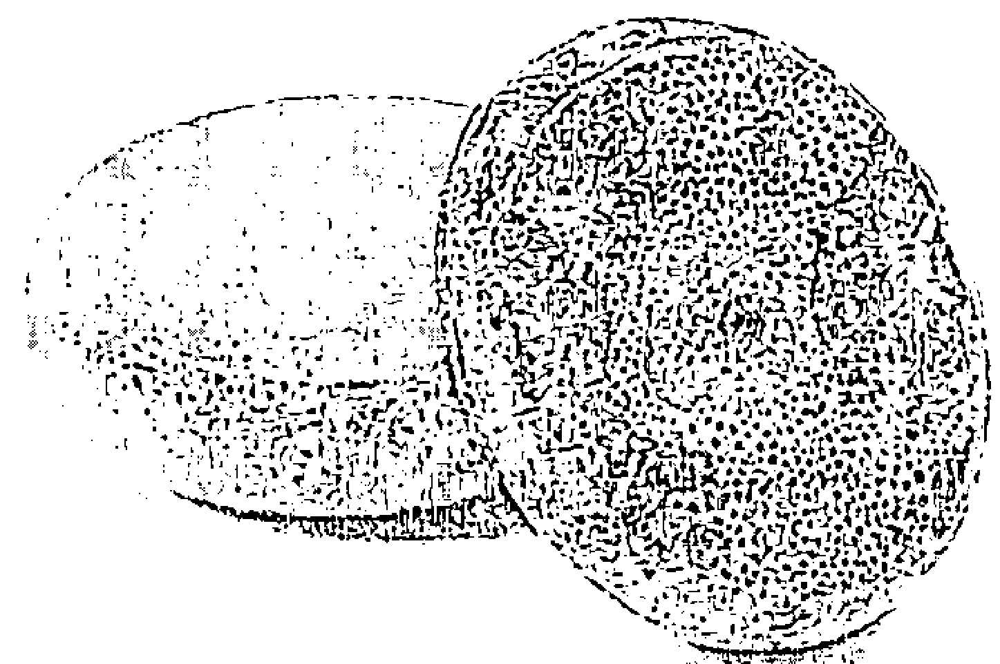

- 颜色：粉色、红色、朱红色、白色等
- 产地：地中海沿岸至非洲沿岸、中国（台湾近海和东海）、中途岛近海、夏威夷沿岸
- 晶系：六方晶系（粒状体）
- 成分：CaCO₃ + 其他有机物
- 硬度：3.5 ~ 4

〈关键词〉
增强生命力
远离危险

### 晶石的特征

作为护身符深受人们的宠爱
大海的馈赠

珊瑚和在大海中形成的珍珠一样同属有机质宝石，它是3月的生辰石。生活在深海中的珊瑚虫是海葵的同类，它的石灰质骨骼经过长年累月的积淀最终变成珊瑚。作为晶石被人们佩戴在身上的珊瑚属于“八射珊瑚”类，根据颜色的不同，它又分为红珊瑚、白珊瑚、桃红珊瑚和胭脂红珊瑚等。

珊瑚除了作为护身符受到人们的珍视外，从公元前开始，它就已经作为一种装饰品被广泛使用。在日本，珊瑚还被用来制作和服腰带的扣环或簪子。又由于它在日文中的发音与“产后”谐音，所以很多母亲都喜欢把珊瑚当做护身符送给自己的孩子。

自始至终守护人类的幸福之石。红色的珊瑚被视为生命力顽强之物，受到美洲印第安人的宠爱。它呈血红色，具有促进人体血液循环，使人精力充沛，有益人体身心健康的功效。据说红珊瑚还能为产后的妈妈和新婚的夫妇带来喜悦的心情，丰富他们的人生。另外，粉珊瑚能够提升桃花运；白珊瑚象征着纯粹和包容，不管你的内心有多么疲惫不堪，它都会给予你母亲一样的无私关怀。

### 晶石的能量

保佑我们身心健康
呼唤幸福的到来

### 何时使用

当你正在寻找一种能够带来健康与幸福的护身符时
当你想去海外旅行、进行水上运动或是乘船旅行时，当你想实现梦想时，当你处于分娩前后时（如果你是女性），可以把珊瑚当做护身符佩戴在身上。

珊瑚是一种汲取大海之精华并散发独特能量的晶石。大海是生命之源，珊瑚正是吸收了这样的能量，因此具有增强生命力的功效。

珊瑚作为守护石，还能够替佩戴者消灾解难。自古以来，珊瑚就被看做大海的守护神，很多渔民和船员都随身佩戴它，用以祈祷旅途平安。在中世纪的欧洲，人们坚信珊瑚是可以击退恶魔、保护安全。另外，相传珊瑚还具有守护逝者的功效，人们在古墓中也发现了许多作为陪葬品的珊瑚。

[使用时的注意事项]
珊瑚受热或遇酸性物质时很容易变色，受到撞击后可能被损坏，因此使用时应格外小心。
[速配幸运石]
琥珀、黄水晶、珍珠、孔雀石
[净化方法]
晶簇、月光浴
[对应的星座 & 脉轮]
金牛座 / 第1脉轮、第2脉轮

> 幸运石寄语
“与其忧心忡忡，不如将注意力集中在你的目标上，积极展开行动。”

### 研磨、切割后形状各异的幸运石所具有的能量

即使是同种幸运石，由于形状不同，其所具有的能量和功效也不同。下面就让我们一起来了解一下经过人工研磨、切割后形状各异的晶石所具有的不同能量吧！这可是挑选幸运石的重要参考标准之一。

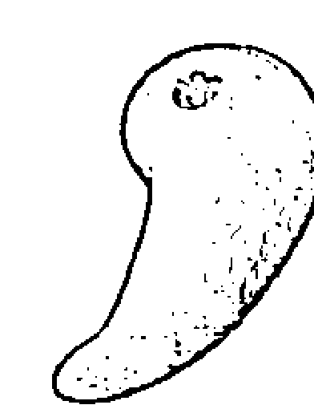

#### 勾玉形
勾玉形由牙齿、胎儿、鱼、太阳和月亮的形象重叠组合而成，关于它的由来众说纷纭。勾玉形幸运石自古以来就被用来驱魔辟邪。此外，它还能稳定心神，赋予人们十足的干劲和丰富的创造性。

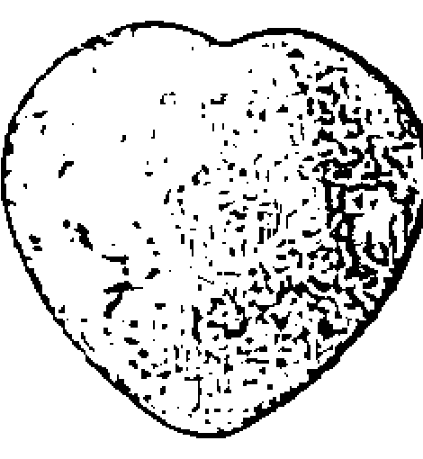

#### 心形
心形代表生命力与爱。心形幸运石能够加深爱情，使人性情和善，提高个人魅力。当你渴望恋爱或想了解爱情的真谛时，心形幸运石能够帮助你实现愿望。此外，它还具有抚慰心灵的功效。

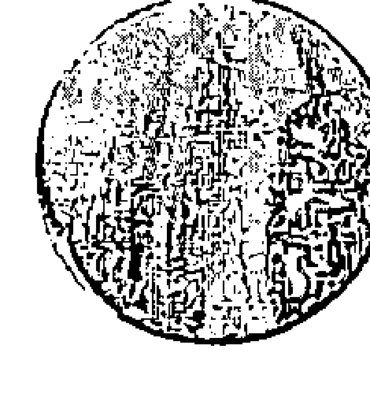

#### 圆形
圆形幸运石拥有无限增大的能量，能够释放稳定的能量。它能够赋予人们公正之心，使人更加富有同情心。将圆形水晶放在房间里作装饰，可以让房间内充满治愈的能量。

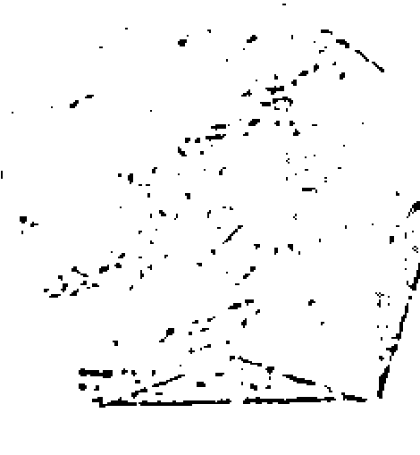

#### 五芒星形
五芒星呈五角星形，这种形状代表封印恶魔的禁区。五芒星形幸运石非常适合作为护身符佩戴在身上。

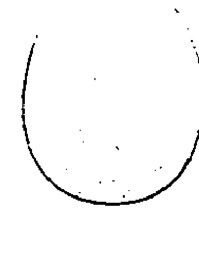

#### 卵形
卵形幸运石象征才智和重生，它能够释放柔和而平稳的能量。当你想让生活焕然一新或者想重新出发时，卵形幸运石能够给予你能量。

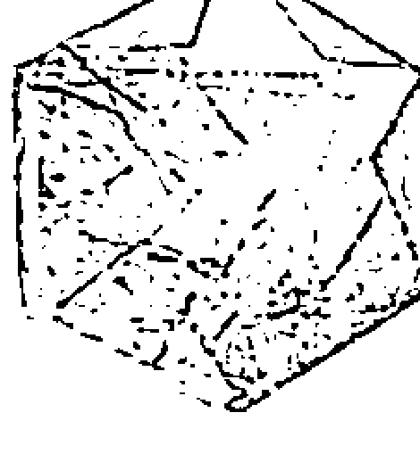

#### 六芒星形
六芒星形由两个方向互逆的正三角形组合而成，在所有形状中拥有的能量最强大。据说，六芒星形幸运石能够帮人实现所有的愿望。

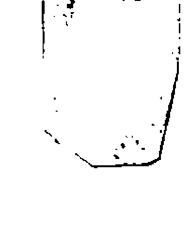

#### 六角柱形
六角柱形是自然界中最稳定的形状，是最大限度发挥能量的理想形状。六角柱形幸运石能够召唤幸运，激发我们的潜能。此外，它还具有出色的治愈力。

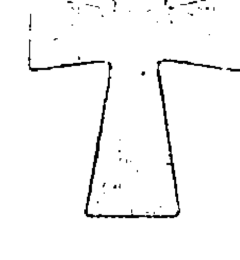

#### 十字架形
十字架形象征空间（纵）与时间（横）交错的宇宙。交错点象征当下的时间。十字架形幸运石能让肉体与灵魂、阴与阳保持平衡，能赋予我们能量，帮助我们调节身心平衡。

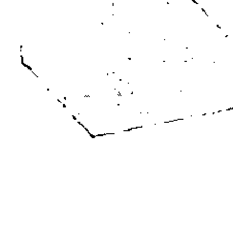

#### 金字塔形
金字塔形幸运石拥有开启宇宙与高次元大门的能量，它能够将能量集中于顶端的一点并不断向外释放。除此之外，它还能够帮人提高注意力，开发人的潜能和精神感应能力。

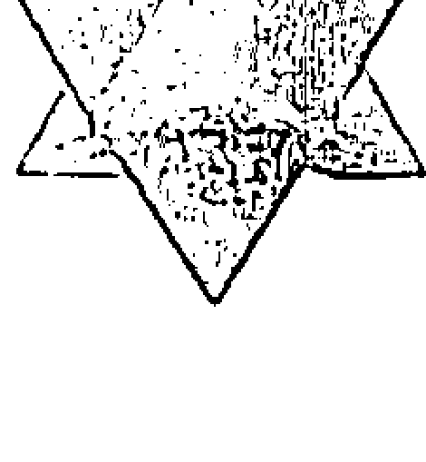

#### 大卫之星形
大卫之星形由两个正四面体组合而成。朝上的角象征男性能量，朝下的角象征女性能量。大卫之星形幸运石具有强大的治愈功效和平衡功效，能够帮助我们在精神上有所收获、找到真正的自我。

## 蛇纹石

被巫师用做占卜道具的守护之石

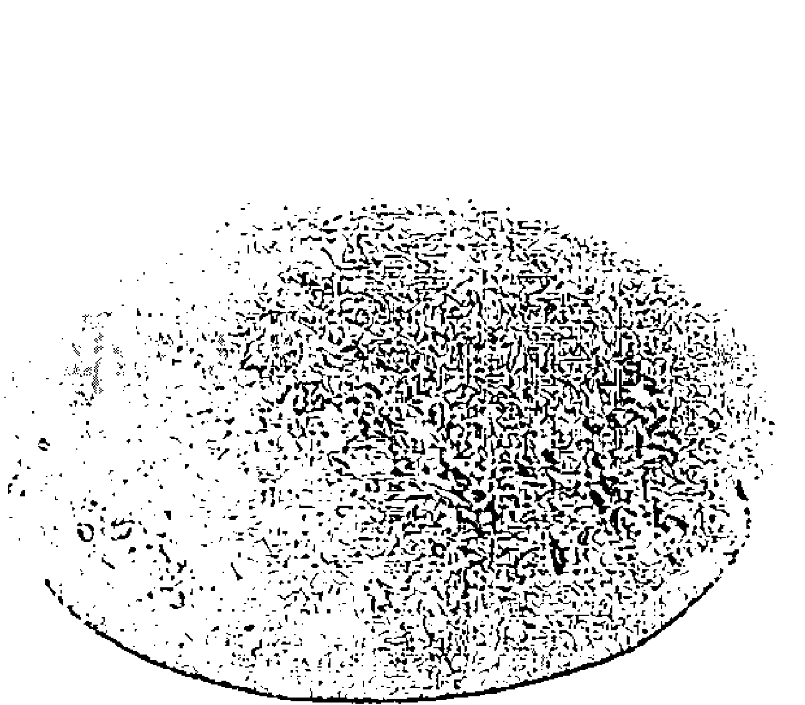

- 颜色：韭绿色、暗绿色、褐绿色、黄色、白色
- 产地：新西兰、中国、阿富汗、巴基斯坦、南非、美国（新墨西哥州、马里兰州）、希腊、意大利、韩国、埃及、印度、英国、澳大利亚
- 晶系：单斜晶系及斜方晶系（结晶用肉眼看不到）
- 成分：Mg₆[(OH)₈ | Si₄O₁₀]
- 硬度：2.5 ~ 3.5（结晶粒子的状态或集合方式不同，硬度也不同）

〈关键词〉
使肉体、精神和灵魂得到统一
提高注意力和洞察力

### 晶石的特征

具有光滑的触感
蛇的化身

蛇纹石有半透明的，有不透明的，颜色有黄色、绿色等，与翡翠有几分相似。它是块状结晶的集合体，硬度较低，很容易加工。经过后期研磨，蛇纹石能呈现独特的形态。从古代开始，人们就把它制成护身符随身佩戴。可能是由于蛇纹石的结晶集合在一起形成的花纹很像蛇皮，所以它由拉丁语中的“serpentinus”（像蛇一样）一词而得名。
“蛇纹石”准确来说并不是一种晶石的名字，而是一个矿物种类的名称。它还有叶蛇纹石、纤蛇纹石、利蛇纹石等不同的变种，其中透蛇纹岩酷似翡翠，人们经常用它来代替翡翠，并称其为“新翡翠”（New Jade）。透蛇纹石具有很高的人气，但它并不是翡翠。

蛇纹石的波动与地球相连，因此它可以提高我们的注意力和洞察力，适用于沉思、冥想或进行病理治疗。由于与大地相通，它还能够激活生命的能量，使我们的肉体、精神和灵魂得到统一。尤其是在我们遇到挫折时，蛇纹石可以帮助我们稳定情绪。它鼓励我们将挫折当做上天给予我们的成长的机会，通过迎难而上来促进灵魂的进化。

### 晶石的能量

祛除邪气
使我们远离危险

自古以来，蛇纹石就被视为能够保护我们不受蛇、蜘蛛和蝎子等有毒生物侵害的晶石。它能够帮助我们脱离危险，所以又被称为“旅人之石”，我们在外出旅游时可以将其佩戴在身上。据说古罗马人就把蛇纹石当做夜晚外出时的护身符，他们认为蛇纹石能阻挡看不见的危险，保护自己的安全。

### 何时使用

当你想抑制兴奋的情绪，使自己安静下来时
当你想消除不安与恐惧、充分休息时，当你的大脑经过高度运转、混乱不清时，当你想提高自己的注意力和洞察力时，当你想关心他人时，都可以借助蛇纹石的力量来实现愿望。除此之外，它还能够帮助我们脱离危险与灾难，是除厄之石。

[使用时的注意事项]
蛇纹石受到撞击时易损坏，应小心携带。
[速配幸运石]
缟玛瑙
[净化方法]
月光浴、鼠尾草、晶簇
[对应的星座 & 脉轮]
双子座 / 第7脉轮

> 幸运石寄语
“当你的想法与目标统一时，奇迹就会发生。”

## 蓝宝石

带来智慧和勇气的神圣之石

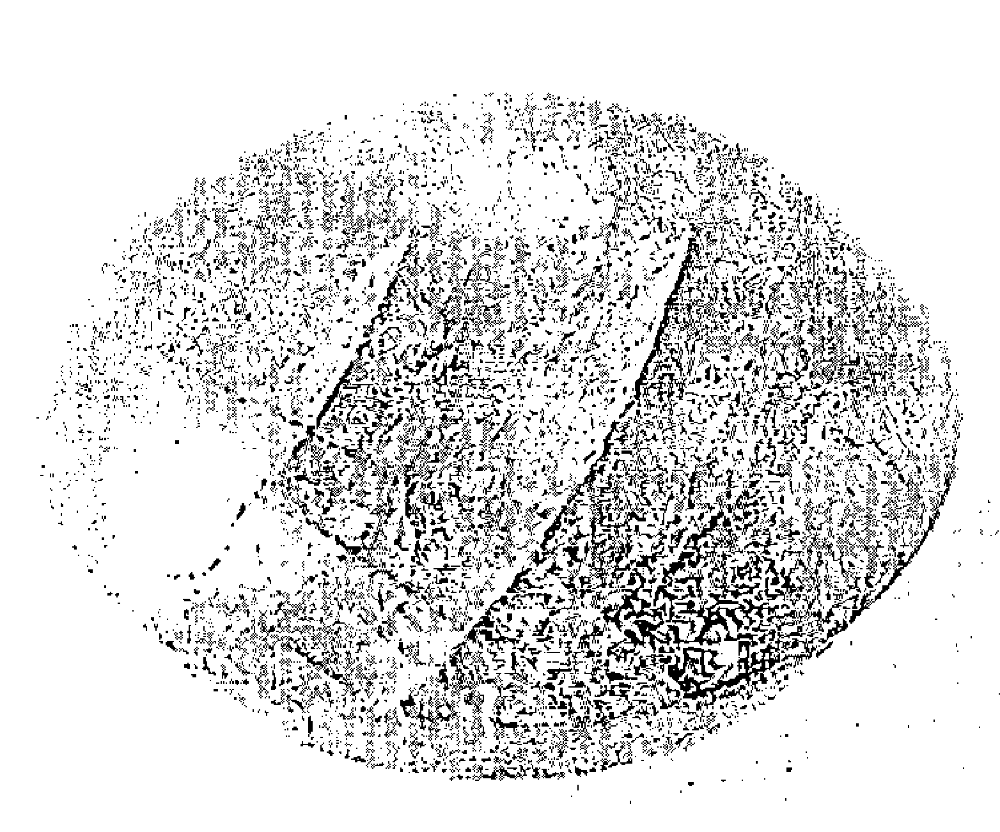

- 颜色：蓝色、蓝紫色等
- 产地：缅甸、斯里兰卡、泰国、柬埔寨、印度、澳大利亚、美国、非洲各国（坦桑尼亚、肯尼亚、马达加斯加除外）、俄罗斯、中国、阿富汗
- 晶系：六方晶系（三方晶系）
- 成分：Al₂O₃
- 硬度：9

〈关键词〉
使人头脑清醒
提升个人魅力

### 晶石的特征

世界第二硬宝石
拥有和红宝石相同的性质

蓝宝石作为9月的生辰石被人们所熟知，它是蓝色的代名词。蓝宝石和红宝石同属刚玉类矿石，只是颜色不同而已，红色的被称为红宝石，除红色之外的其他刚玉均被称为蓝宝石。
说到蓝宝石，最有名的当属蓝色，除此之外还有绿色、黄色等多种颜色。晶石内部含有的杂质成分不同，因此颜色也不同，完全无杂色的天然蓝宝石非常稀少。蓝色的蓝宝石中最上乘的要数产于克什米尔地区的“矢车菊蓝”，其次是产于缅甸的“宝蓝”。略带橙色的粉红色蓝宝石被称为“帕德马蓝宝石”。
蓝宝石的硬度仅次于金刚石，过去它曾被用做打磨其他宝石的磨刀石。现在，含杂质较多的蓝宝石作为研磨剂或路面防滑剂被广泛使用。

一方面，遇到难题时人都会有逃避的倾向，这时，拥有钢铁一般强韧的“心”的蓝宝石，可以在精神上给予我们支持，帮助我们跨越黎明前的黑暗。
另外，它的安定作用对那些容易感情用事的人来说，是再好不过的良药。蓝宝石还具有解毒、止血、治疗眼病等功效，自古以来就被应用于医疗中。

### 何时使用

当要求上进的你在难题面前裹足不前时
当你面临前所未有的巨大挑战、需要硬着头皮前进时，当你总是受他人的意见左右、无法拿定主意时，当你明知会有巨大的风险仍然决心坚持自己的信念时，当你被邪气或病魔缠身时，都可以佩戴蓝宝石，让它来帮助和保护你。

### 晶石的能量

干净纯洁
提升才智、增加理性

蓝宝石那一抹深邃的蓝具有强大的镇静效果。它能够平复我们灵魂和情感上的混乱，去除多余的妄想和杂念，提高我们看清事实的直觉力和洞察力。尤其是在事情进展不顺时，它可以帮助我们冷静下来，把精力放在思索问题的核心以及如何吸取教训上，从而从根本上解决问题。

[使用时的注意事项]
蓝宝石耐水和耐阳光曝晒，对邪气具有一定的抵抗力，因此不需要频繁地进行净化。
[速配幸运石]
海蓝宝石、紫水晶、橙色托帕石、拉长石
[净化方法]
晶簇、鼠尾草
[对应的星座 & 脉轮]
金牛座、双子座、处女座、天秤座 / 第4脉轮、第6脉轮、第7脉轮

> 幸运石寄语
“做你认为正确的事，前方的路会更加开阔。”

## 太阳石【日光石 / 日长石】

引导人们走向成功和胜利的太阳之石

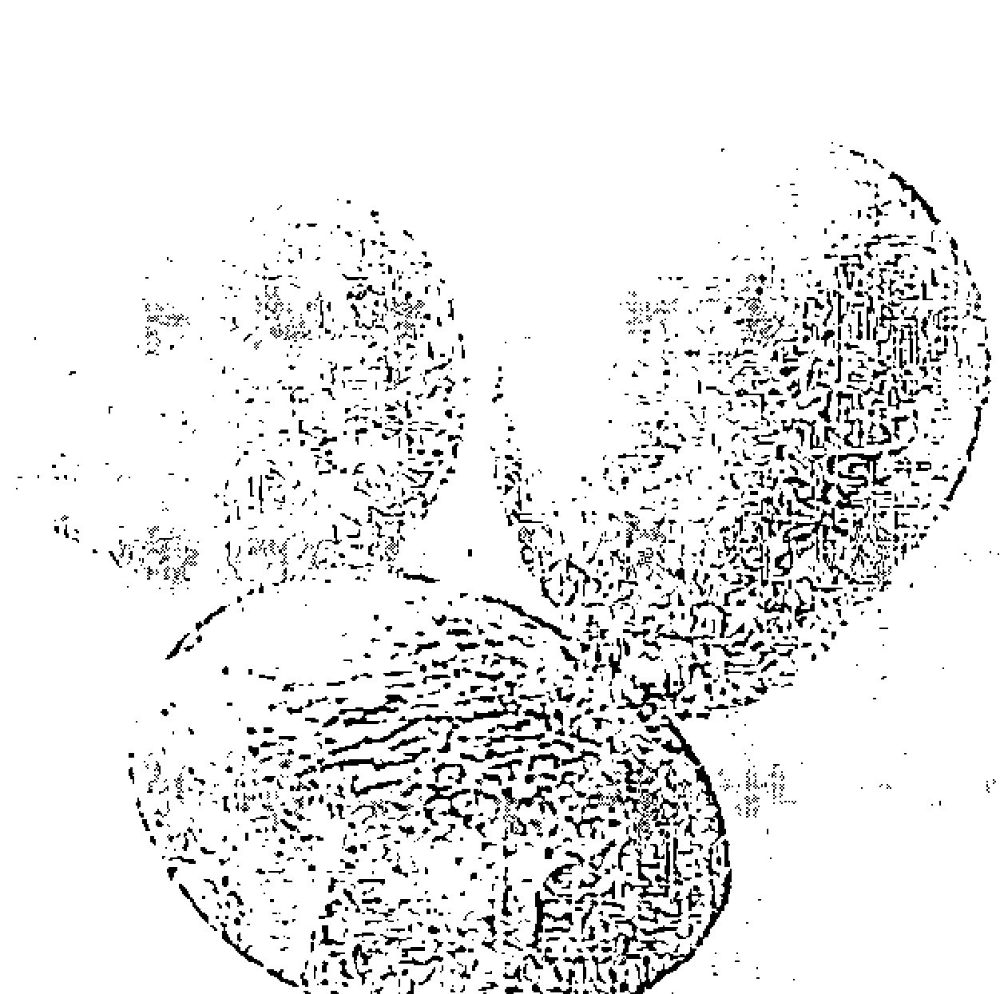

- 颜色：黄色、橙色、红色等
- 产地：印度、挪威、加拿大、美国、俄罗斯
- 晶系：三斜晶系
- 成分：(Na[AlSi₃O₈])₉₀₋₇₀ (Ca[Al₂Si₂O₈])₁₀₋₃₀
- 硬度：6 - 6.5

〈关键词〉
增强自信心和提高积极性
引导我们走向胜利和成功

### 晶石的特征

橙色中闪耀着温暖的光辉

这种晶石中好似含着珍珠和金线，闪烁着独特的光芒，这种光芒和月长石所散发的静谧之光恰恰相反，因此被命名为太阳石。除红色和橙色外，它还有黄色、褐色等。
太阳石中有闪闪发光的部分实际上是因为含有铁元素和铜元素。用放大镜观察太阳石，你可以看到它的每一层都黏附着许多天然的铜颗粒。与太阳石属于同一种类的矿物除月长石外，还有天河石和拉长石等矿石，它们同属于长石族。

太阳石可谓石如其名，给人阳光向上的印象，是喜悦和积极的象征。在古希腊，太阳石被尊为太阳神之石。它耀眼的光辉可以祛除邪气，消除迷茫，指引人们朝着正确的方向前行，因此作为护身符被广泛使用。
此外，太阳石还具有太阳般强大的能量，能够主动作用于我们的身体和意志，增强我们的自信心。对那些被困在过去的阴影中、感觉不到自己的价值，而不敢进行新的尝试或太过依赖他人的人来说，太阳石的光芒会照进你灰暗的记忆，帮助你学会肯定自我、学会自爱，从而一步步走向自立。
而对那些比较自信的人来说，太阳石则可以在激发领导才能方面助他们一臂之力。重点在于：比起如何借助他人的力量来成就自我，我们更要学会像太阳一样无私，利用自己的智慧和力量为他人的成长助力。只有这样，太阳石才能充分发挥其功效。另外，太阳石还可以使人的意志更加坚定，这也是领导带领团队实现目标的强有力的后盾。

### 晶石的能量

增强自信心
恢复积极进取的心态

### 何时使用

当你想战胜自我、更上一层楼时
当你陷入忧郁之中、想变得积极向上时，当你想变得独立自强时，当你想进一步扩大自己的影响力从而使更多的人获益时，太阳石能够赋予你神奇的力量。

[使用时的注意事项]
太阳石虽然容易碎裂，但它拥有强大的抗紫外线的能力。
[速配幸运石]
红玉髓、月长石
[净化方法]
日光浴、流水、鼠尾草
[对应的星座 & 脉轮]
天秤座、双鱼座 / 第2脉轮、第3脉轮

> 幸运石寄语
“不要做光想不做的空想家，试着向前迈出一步吧！”

## 翡翠【硬玉】

代表东方的奇迹之石

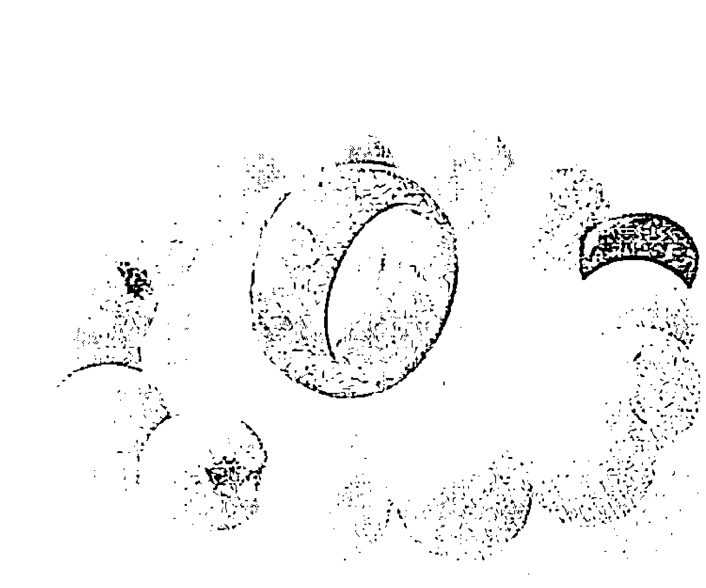

- 颜色：无色、白色、绿色、黑绿色、黄绿色、黄色、褐色、红色、橙色、紫色、粉色、灰色
- 产地：缅甸、俄罗斯、美国（加利福尼亚州）
- 晶系：单斜晶系
- 成分：NaAl[Si₂O₆]
- 硬度：6.5 ~ 7

〈关键词〉
赋予我们美好的品德
培养沉稳的气质

### 晶石的特征

产量极为稀少
玉的一种

无论在日本还是在中国，翡翠都深受人们的青睐，是东方宝石的代表。在日本，翡翠自古以来就被当做装饰品，人们在绳文时代的遗址中就曾经发掘出用翡翠制作的钩形玉坠。
玉是硬玉和软玉两种矿石的总称。约在 150 年前，人们才从矿物学上将二者区分开来，而在那之前，人们一直认为它们是同一种晶石。翡翠俗称“硬玉”，因为它和软玉相比具有更高的硬度。据说，“翡翠”这一名字源于与其原石颜色十分相似、有着艳丽羽毛的小鸟。这种鸟雄性称翡鸟，雌性称翠鸟，合称翡翠。
翡翠中含有细腻绵密的纤维，十分强韧，甚至胜过金刚石。翡翠的产量极为稀少。它因含有铬元素和铁元素而呈现绿色，除此之外还有美丽的黄色和红色。紫罗兰翡翠则呈现略带红色的紫色。

翡翠能够培养我们的慈悲之心，丰富我们的心灵，帮助我们在人生的道路上获得成功。它还能够平衡情感，赋予我们睿智和美好的品德，同时还能使我们形成冷静的性格和拥有长久的忍耐力，使我们得到他人的敬重和支持。
除此之外，通过培养我们沉稳的气质，翡翠可以增强我们的意志力，赋予我们战胜诱惑、谎言和虚伪的力量。当厄运和晦气降临时，翡翠能够保护我们不受周围消极能量的侵犯。把翡翠作为护身符佩戴在身上吧！

### 何时使用

当你想作出正确的判断时
当你想获得商业上的成功或实现梦想时，当你开创新的事业时，当你想躲避纠纷时，翡翠是最佳的选择。

### 晶石的能量

赋予我们五种美德
带来成功

在中国，翡翠被视为拥有“仁、义、礼、智、信”五种美德的宝石，它能给予我们善施恩泽之心，使我们受到他人的尊重，并用好的言行去影响他人。在美国和西班牙，翡翠被称为“奇迹之石”，并作为护身符受到人们的珍视。

[使用时的注意事项]
翡翠耐水和耐紫外线照射。
[速配幸运石]
天青石、舒俱来石、白水晶
[净化方法]
日光浴、晶簇、鼠尾草
[对应的星座 & 脉轮]
白羊座、双子座 / 颜色不同，其所对应的脉轮也不同

> 幸运石寄语
“你已经知道自己应该做什么了，怀着坚定的信念前进吧！”

## 黄水晶

使人身心渐渐放松，具有柔和的光之能量

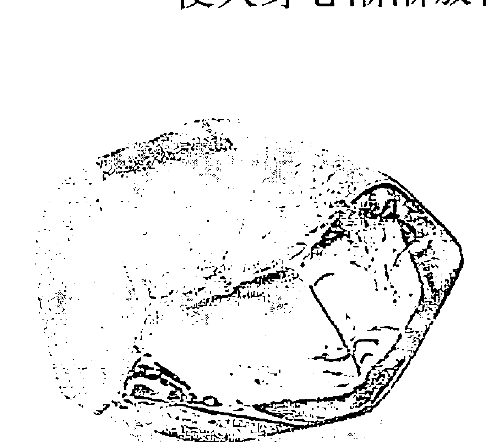

- 颜色：黄色、略带绿色的黄色、略带褐色的黄色等
- 产地：巴西、印度、智利、津巴布韦
- 晶系：六方晶系（三方晶系）
- 成分：SiO₂
- 硬度：7

〈关键词〉
解决人际关系的烦恼
带来财富，使生意兴隆

### 晶石的特征

具有淡雅而温柔的颜色
天然的黄水晶极为稀少

黄水晶作为11月的生辰石被人们所熟知，它是黄色的天然水晶。这种天然水晶由于含有铁元素而呈现黄色。黄水晶的颜色多种多样：由浅黄色至深褐色。大部分黄水晶产自巴西。
由于天然的黄水晶产量十分稀少，所以现在市面上流通的大部分黄水晶都是紫水晶经过加热处理后形成的，或是对无色天然水晶进行人工放射处理后形成的。黄水晶的英文名来源于“Citrus medica”（香橼），因为二者的颜色非常相似。

黄水晶光洁通透，拥有像太阳一样强大的能量，活力四射。这种巨大的能量可以增强我们的生命力，给予我们希望、勇气、自信和积极性。
黄水晶具有促进净化和重生的功效，所以自古以来就被当做一种出色的治疗石而得到广泛的应用。它那柔和的光之能量能够缓缓地注入我们的体内，使每一个细胞都得到放松，疏解身心压力。黄水晶还拥有豁达的能量，能够帮助我们消除紧张感，营造和谐的气氛，因而有助于我们改善人际关系。
此外，黄色是财运的象征，自古以来黄水晶就被视为能够汇集财富的“聚财之石”和能够带来繁荣和富贵的“幸运之石”，受到人们的青睐。论及其中缘由，其实并不仅仅是黄色让人联想到黄金这么简单。从脉轮来看，黄水晶对应躯干中间的脐轮、腹轮和根轮——可看做联结想法（脑）与行动（四肢）的中枢，因此这些脉轮能量的加强，有助于人们将想法付诸行动，而这种行动力才是财源广进的真正奥秘。

### 晶石的能量

拥有柔和而舒心的光之能量

### 何时使用

当你想消除压力和紧张时
当你想缓和职场、家庭、恋爱中的人际关系所带来的压力时，当你想增加经商运、事业运和财运时，黄水晶能够带来意想不到的效果。

[使用时的注意事项]
黄水晶如果长时间暴露在阳光之下，就容易褪色。另外，虽然黄水晶不易受损，但其顶端很容易出现缺口，使用时应多加注意。
[速配幸运石]
白水晶、青金石、土耳其石
[净化方法]
月光浴、鼠尾草
[对应的星座 & 脉轮]
双子座、狮子座、处女座 / 第1脉轮、第2脉轮、第3脉轮、第7脉轮

> 幸运石寄语
“你的愿望终究会变成现实，从现在开始明确自己的愿望吧！”

## 黑色方解石

美洲印第安人世代流传的太古之宝

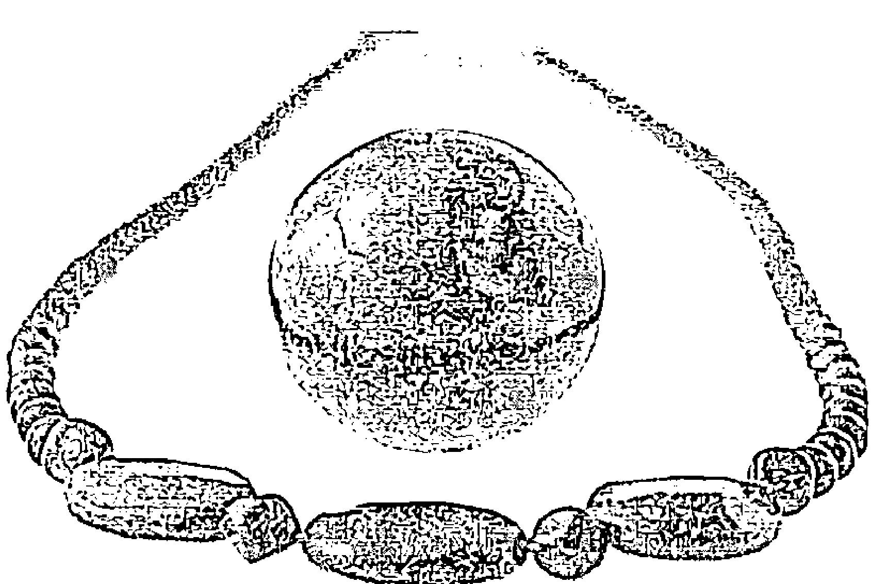

- 颜色：黑色、茶色、灰色等
- 产地：美国（科罗拉多州）
- 晶系：六方晶系
- 成分：CaCO₃
- 硬度：3.5 ~ 4

（关键词）
出色的净化能力
增强精神力量

### 晶石的特征 近年来发现的新品种晶石

这是一种让人感觉平滑、干爽，而且微微透出一点点暗淡光辉的黑色晶石，矿物学上称它为黑色方解石。相传很久以前，美洲印第安人就把它当做护身符佩戴在身上，或当做工艺品和装饰品摆放在家中。这种传说中的晶石于 2005 年重现江湖，人们在美国科罗拉多州的一个私人自然保护区内发现了它，从那以后，它就成为一大热点话题。现在，全世界只有美国的一些特定地区出产黑色方解石，因此它是十分珍贵的晶石。

黑色方解石的颜色有黑色、略带蓝色的灰色、茶色和灰色等。经过对黑色方解石进行成分分析，我们了解到，这种晶石中含有生活在前寒武纪时期（5.4 亿年前）的微小生物的化石。这种古代的微小生物以一种特殊的形式出现在人们面前，也让黑色方解石显得更加与众不同、弥足珍贵。

护力能够吸收所有的消极能量，保护我们不受他人嫉妒或愤怒之情的伤害。

此外，这种来自太古的能量还能够将存在于过去、现在和未来的意识紧紧相连。对擅长冥想的人来说，它甚至可以帮助人们回忆起前世的经历。这种对于过去的探究，目的不在于满足我们的好奇心，而在于让我们感受生命和自然的循环，理解今生各种际遇的含义，并明确人生中什么东西最宝贵、做什么事情最重要。这种豁达之心尤其可以治愈精神创伤。

### 晶石的能量 能够释放来自太古时期的积极波动的除魔之石

黑色方解石能够释放高频率的波动，因此近些年来受到许多水晶治疗师和心理治疗专家的关注。黑色方解石所释放的能量就像一层保护膜一样包围着我们，它被碰触时便会释放来自太古时期的积极波动，让我们感到温暖。这种强大的保

### 何时使用

当你想消除不安或负面的情绪时
当你想从过去的创伤或过错中走出来时，当你想消除由于环境的变化所带来的不安时，当你想回忆起曾经的经历时，就借助黑色方解石的力量来实现愿望吧！

[使用时的注意事项]
黑色方解石十分脆弱，应注意避免金属或硬物等将其划伤。
[速配幸运石]
白水晶、月长石
[净化方法]
晶簇、鼠尾草
[对应的脉轮]
第1脉轮

> 幸运石寄语
“闭上眼睛，关注你的内心，那里是问题和答案的所在。”

## Jasper
碧玉

以其强大的守护力给予人们希望和鼓励

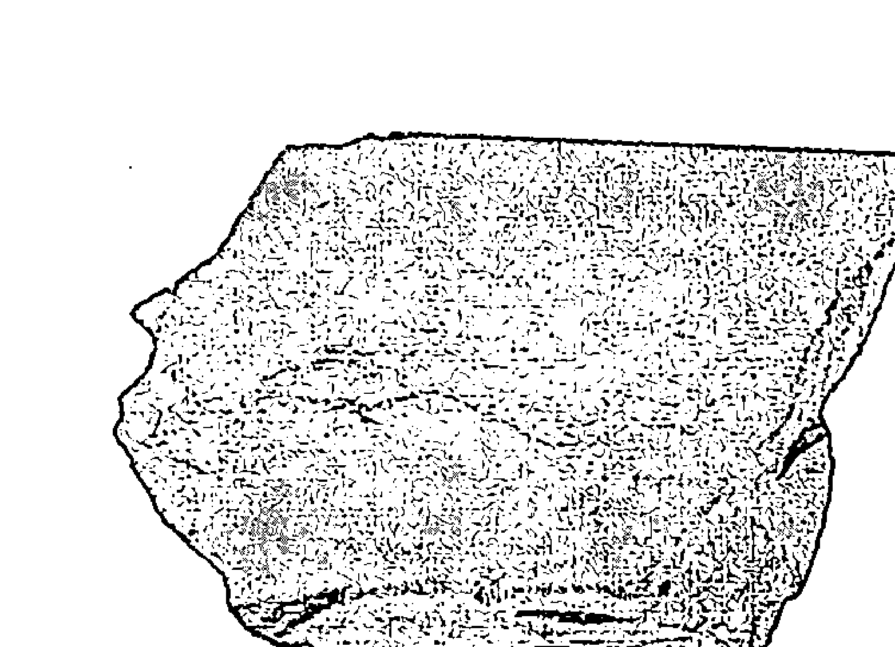

- 颜色：绿色、深灰绿色、暗深绿色（韭绿色）、黄绿色、红色、褐色、橙色、黄色、白色等
- 产地：印度、印度尼西亚、巴西、中国、美国、俄罗斯、澳大利亚、委内瑞拉
- 晶系：六方晶系（隐晶质）
- 成分：SiO2
- 硬度：7

（关键词）
抑制情绪的波动
提高客观判断力和行动力

### 晶石的特征
拥有很多不同的名字
是大自然的艺术品

碧玉是含有多种杂质的不透明的隐晶质石英的总称。一般来说，提起碧玉，人们首先会联想到绿色和褐色，实际上，碧玉的种类繁多。根据其所含杂质的不同，碧玉呈现红色、绿色、黄色、褐色等不同的颜色和纹理。而观赏型碧玉中最具代表性的就要数红色的红碧玉和深绿中带红色斑点的血石（见第84页）了。另外，人们将带有斑点花纹的碧玉叫做“豹纹碧玉”。碧玉的英文名“Jasper”便来自古希腊语中“斑点状的石头”一词。

玉能够让我们感受到现在与未来的联系；黄色的碧玉能够保护我们，并带来财富；红色的碧玉能够加快我们体内新陈代谢的速度，促进血液循环，赋予我们强大的精神力量；而绿色的碧玉则能够保佑我们平安。

碧玉自古以来就为人们所熟知。在崇拜太阳的印加帝国，红碧玉被视为生命之源，用于对太阳神的祭祀中，据说这样可以增强太阳神的守护力。此外，碧玉还具有治疗妇科疾病的功效，被古巴比伦尼亚妇女视为顺利分娩的象征。

《圣经》中经常能看到碧玉的身影，除此之外，以中国、日本为首的世界上很多国家自古以来都把碧玉加工成各式各样的珠宝饰品或日用品，有时还将其制成药材。

### 晶石的能量
带来活力
赋予我们强大的精神力量

### 何时使用

当你想消除负面的情绪时
当你想从消极的情绪或状态中解脱出来时，当你发觉自己的思想过于偏激时，碧玉可以助你一臂之力。另外，推荐那些容易生病的人佩戴碧玉。

碧玉能够帮助我们抑制情绪的波动，提高客观判断力和行动力，引导我们的人生向正确的方向发展。它还能够增强我们的生存能力，帮助我们提高警惕、躲避危险，并赋予我们活力与冷静的头脑。
不同颜色的碧玉具有不同的功效。蓝色的碧

[使用时的注意事项]
碧玉对流水、紫外线和意外撞击具有很强的抵抗力。
[速配幸运石]
黑曜石、青金石、孔雀石、黑电气石
[净化方法]
流水、日光浴
[对应的星座 & 脉轮]
白羊座 / 第0脉轮、第1脉轮、第2脉轮、第3脉轮

> 幸运石寄语
“试着看到自己与他人的不同，你也是一个才华横溢的人。”

## 锆石【风信子石】

帮助人们减轻痛苦、恢复宁静而平和的心态

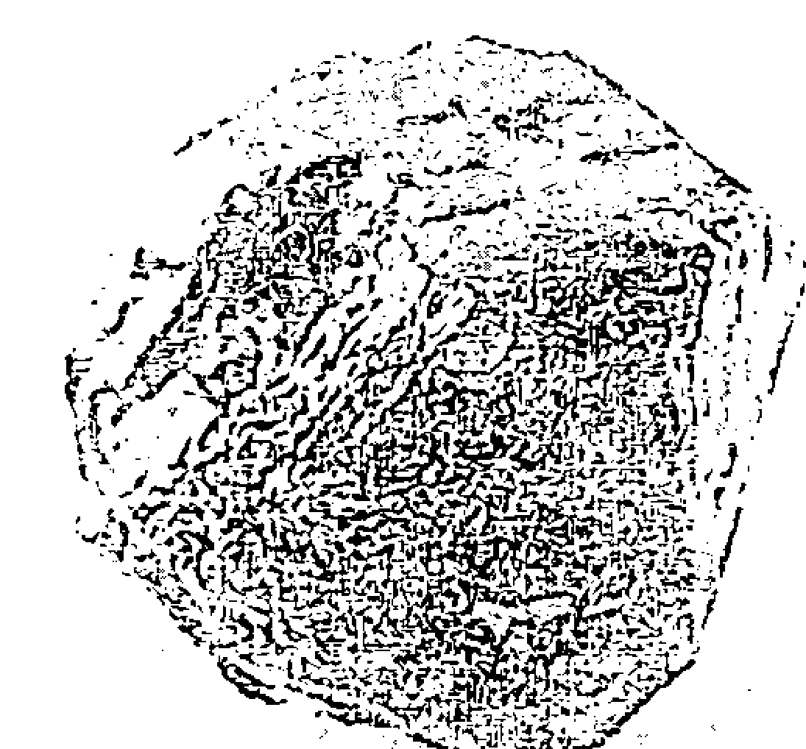

- 颜色：无色透明、褐色、黄色、橙色、红色、红褐色、黄绿色、绿色、褐绿色、黑褐色（多数白色、无色、蓝色的锆石是经过了加热等后续加工的）
- 产地：泰国、斯里兰卡、缅甸、越南、澳大利亚、坦桑尼亚、马达加斯加、阿富汗、美国、俄罗斯、法国、巴西、加拿大、德国、挪威、中国
- 晶系：正方晶系
- 成分：Zr[SiO4]
- 硬度：6.5 ~ 7.5

〈关键词〉
减轻精神和肉体上的痛苦
消除误会，激发潜能

### 晶石的特征 以金刚石的仿制品著称的晶石

经过人工研磨的锆石如金刚石般闪闪发亮，晶莹剔透。它作为12月的生辰石被大家所熟知。锆石的纯度很低，由于所含的杂质不同，其颜色也会发生变化。最常见的是无色透明的锆石，除此之外还有黄色、橙色、蓝色、红色、褐色、绿色等。锆石色彩缤纷，作为装饰品具有很高的人气。
锆石是由岩浆岩中的微小结晶组成的，由于其成分中含有铀元素，所以可以用来测定岩石的年份。据说其英文名来源于波斯语中的“zargun”（金色）一词。在古希腊，由于锆石闪烁着耀眼的光辉，会让人联想到古希腊神话中的太阳神阿波罗，因此锆石曾被人们称为“夏金多斯”，这是阿波罗所爱的一位美少年的名字。

被称为“真实之重量”，据说它可以帮人洗清冤罪，消除误会。并且，它还能够让我们发现自身的美。当你缺乏自信时，它可以帮你接受真实的自己，并激发你的潜能。除此之外，它还具有排出体内毒素的功效，对于治疗疾病、减轻分娩痛苦等都具有良好的疗效。红锆石是孕妇怀孕和分娩时的护身符，它也可以作为旅途安全的守护石，是旅行者的爱物。

### 晶石的能量 以其强大的治愈力量使人恢复平和的心绪

锆石拥有极强的治愈力量，可以平衡我们内心的情绪波动。正如它的别称“和平之石”所形容的那样，锆石可以消除负面的情绪，把我们从苦海中解救出来，引导我们向宁静而平和的状态发展。同时，它还能够消除我们的沮丧感和孤独感，提高我们的沟通能力。
锆石因其比重大，拿在手中会感到沉甸甸的，

### 何时使用

当你想拥有健康的身心时
当你的心灵受到伤害时，当你的心情沉闷抑郁时，当你经常失眠时，当你容易否定自己时，可以借助锆石的力量来改善现状。同时，也推荐即将分娩的孕妇和外出旅行的人佩戴锆石。

[使用时的注意事项]
锆石不太容易受损，但是它具有沿特定方向产生裂痕、易沿纵向碎裂以及易受酸性物质侵蚀的性质，使用时应小心谨慎。
[速配幸运石]
橄榄石、淡水珍珠
[净化方法]
月光浴、鼠尾草、晶簇
[对应的星座 & 脉轮]
摩羯座 / 颜色不同，其所对应的脉轮也不同

> 幸运石寄语
“你需要弄清楚自己的梦想和希望是否是你内心的真实想法。”

## 红锌矿

唤醒热情的复活之石

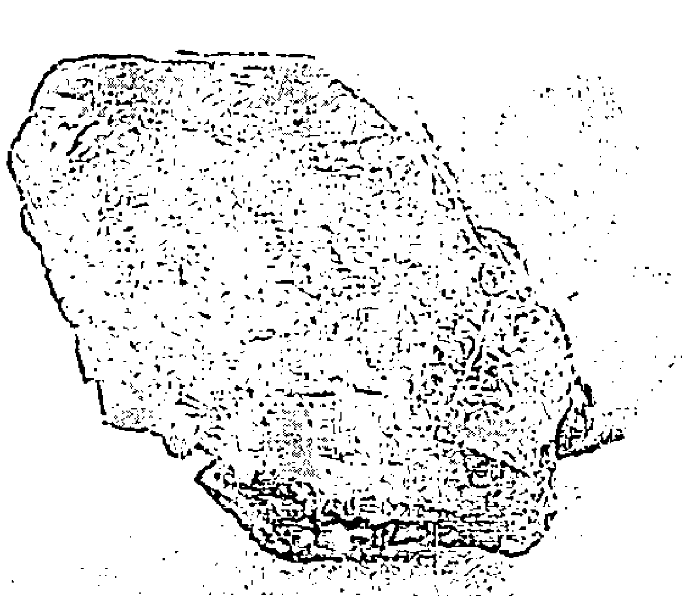

- 颜色：深黄色、绿色、橙黄色、橙色、橙红色、红色、暗红色等
- 产地：美国（新泽西州）
- 晶系：六方晶系
- 成分：ZnO
- 硬度：4 ~ 5

〈关键词〉
唤醒内心深处的热情
赋予我们积极向上的奋斗精神

### 晶石的特征

由于神的恶作剧而转世重生的晶石

光彩夺目、晶莹剔透的红锌矿会散发糖果般诱人的光泽。它是由氧化锌组成的矿物，英文名也由其主要成分“zinc”（锌）而来。

氧化锌这一成分虽然不少见，但能够形成结晶的，即天然的红锌矿却非常稀少，1988年封山的美国新泽西州的富兰克林矿山曾为其主要产地。现在市场上流通的大部分红锌矿都是从被称为“神的恶作剧”的锌涂料工厂事故或锌矿山火灾中偶然得来，之后经过人工加工而成的。沿结晶轴能够对红锌矿进行完美地切割，又由于它具有沿特定方向产生裂痕的性质，所以能够被切割出完美的贝壳状断面。另外，红锌矿的折射率较高，其所散发的光芒十分耀眼夺目。红锌矿本为无色，但由于其所含成分的比例不同，会呈现深黄色、橙色、红色、深红色等多姿多彩的颜色。

者的前进方向和层出不穷的创造性统一起来，因此特别推荐给那些从事创造性工作的人佩戴。

红锌矿的一大魅力在于其如钻石般炫彩夺目的光辉，配上橙黄色的色调，能释放强大而柔和的波动。这种波动能够带来希望与喜悦，赋予我们积极进取的态度和勇气，唤醒我们内心深处潜藏的热情。

除此之外，它的强大能量还可以使人体细胞更加活跃，加快新陈代谢，促进血液循环，缓解寒症和酸痛，调节身体平衡，保持人体健康。

### 晶石的能量

象征着创造性、个性和复兴
带来希望与喜悦

天然结晶曾一度几近绝迹，后又因偶然的事故而生成的红锌矿是象征创造性、个性和复兴的幸运石，具有强大的能量。相传它能够保持精神与肉体的平衡，并增强两者的能量，引导我们上升到更高的精神层次。此外，它还能够将能量与佩戴

### 何时使用

当你想开辟新的道路时

当你想以积极进取的心态努力奋斗时，当你无法融入新环境时，当你感到万分紧张时，红锌矿会是不错的选择。

[使用时的注意事项]
红锌矿极易受损，特别是在受到撞击时，使用时应格外注意。

[速配幸运石]
白水晶、黄铁矿

[净化方法]
月光浴、晶簇、声音

[对应的星座 & 脉轮]
金牛座、天秤座 / 第2脉轮、第3脉轮

> 幸运石寄语
“向你认为最宝贵最重要的事物中注入爱的光辉吧！”

## 舒俱来石【杉石】
### 代表东方的最强治愈石

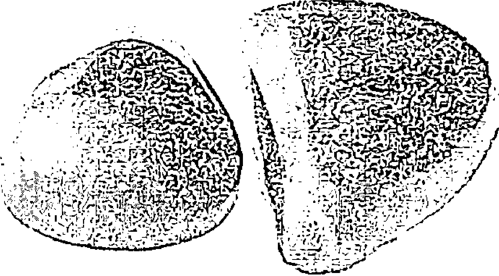

- 颜色：紫红色、粉色、浅黄褐色等
- 产地：南非、意大利、澳大利亚、日本
- 晶系：六方晶系（粒状集合体）
- 成分：KNa₂(Fe²⁺, Mn²⁺, Al)₂Li₃[Si₁₂O₃₀]
- 硬度：5.5 ~ 6.5

〈关键词〉
提高自然治愈力
开启通向高次元的智慧

### 晶石的特征 以日本人的名字命名的20世纪之石

舒俱来石带有白色和深紫色的大理石花纹，是不透明的美丽晶石。它于1976年在日本濑户内海的岩城岛被首次发现，经鉴定是一种新矿石。舒俱来石之所以会呈现紫色，是因为含有锰元素。它以薰衣草般的浅紫色到葡萄般的深紫色最为常见，紫红色、粉色和褐绿色的舒俱来石则较为稀少。
人们最初仅在日本发现舒俱来石，随后在南非等地也发现了大量舒俱来石，目前市场上流通的舒俱来石主要产自南非。由于它是由日本矿物学家杉建一博士发现的，所以在日本又被称为“杉石”，其英文名便来自“杉”的日文发音（Sugi）加上表示“石头”之意的后缀（-lite）。而“舒俱来石”是对“杉石”英文（Sugilite）的音译。舒俱来石被发现后不久，在美国的人气便扶摇直上，目前它属于三大治愈石之一，人气一直居高不下。

情六欲，无不引起他们精神上的剧烈波动。这些能量无处消散，久而久之，便会以疾病的形式表现在肉体上。这时，舒俱来石虽不能直接治愈疾病，却可以使人们放下“为何我会遭遇如此不幸”的想法，转而思考“老天是在暗示我会学到什么”。由此渐渐培养人们“不以物喜，不以己悲”的态度，这是舒俱来石强大治愈力的精髓所在。
在缓解压力的同时，舒俱来石还能刺激人们已经麻木的感官，使我们在单调的日常生活中重新获得感动，恢复充满新奇与活力的状态。

### 晶石的能量 与神圣的紫色相辅相成 具有出色的治愈力

在20世纪被发现的所有晶石中，舒俱来石被认为治愈力最强。它可以开启人的“第三只眼”，通过使我们的价值观超越现有物质世界的界限，来保护我们的精神不受污染。
对浸淫在物质世界的人来说，生老病死、七

### 何时使用

当你感到身心脆弱时
当你想振奋精神时，当你无法抚平内心的创伤时，当你想消除精神压力时，当你想提高艺术性和创造性时，建议你使用舒俱来石。

[使用时的注意事项]
舒俱来石虽然比较耐水和耐日光照射，但是仍然需要避免长时间被太阳照射。
[速配幸运石]
萤石、捷克陨石、蓝纹玛瑙、查罗石
[净化方法]
流水、月光浴、晶簇、鼠尾草
[对应的星座 & 脉轮]
处女座、射手座 / 第6脉轮、第7脉轮

> 幸运石寄语
“在心中保留一个可以做梦的空间吧！”

## 尖晶石

赋予我们好奇心与活力的热情之石

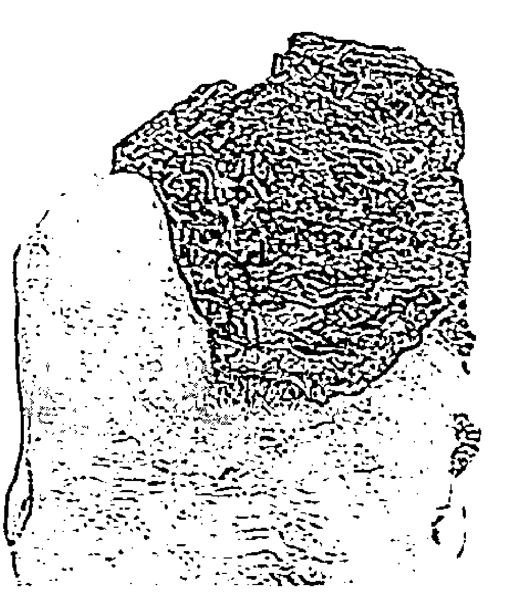

- 颜色：红色、粉色、紫红色、黄色、蓝色、褐绿色、紫色、橙色、褐色、无色
- 产地：斯里兰卡、缅甸、阿富汗、意大利、坦桑尼亚
- 晶系：等轴晶系
- 成分：MgAl₂O₄
- 硬度：7.5 ~ 8

《关键词》
突破停滞的现状，创造新的能量
强大的治愈功效

### 晶石的特征

古时被当做红宝石或蓝宝石广泛使用

尖晶石是一种晶莹剔透的美丽晶石。其结晶的顶端比较尖锐，由拉丁语中的“spina”（刺）一词而得名。尖晶石的颜色多种多样，有红色、粉色、橙色、蓝色、紫色等。产自缅甸的红尖晶石尤其漂亮，而且价值连城。蓝尖晶石也被称为钴蓝尖晶石，是十分稀少而且价格昂贵的晶石。

由于尖晶石外表酷似红宝石和蓝宝石，它们的产地又相同，所以长久以来一直被人们混淆。历史上把红尖晶石当做红宝石的事情常有发生。镶嵌在英国王室皇冠中央的那颗闪闪发亮的“黑太子红宝石”，实际上就是红尖晶石。

免疫系统的功能。

不同颜色的尖晶石，其功效也不同。红色和橙色的尖晶石能够激发我们的好奇心，赋予我们坚定不移的爱；黄色的尖晶石赋予我们知性的气质；绿色的尖晶石则能使我们成为一个富有爱和同情心的人。

### 晶石的能量

指引努力与发展的方向
激发好奇心

尖晶石拥有能够刺穿物体的锐利的尖端，象征着朝气蓬勃的力量和坚定的意志。它激励我们无论遇到怎样艰难的状况，都要坚持不懈地努力奋斗。同时，尖晶石这种汇聚于一点的能量流，还能突破停滞的现状，创造新的能量，适用于人们的工作、生活和恋爱等各个方面。

此外，尖晶石还具有强大的治愈功效，自古以来就被用来治疗感冒等疾病、强健肝脏功能，而且可通过活跃身体内的每一个细胞，增强人体

### 何时使用

当你想增强实力，充分发挥自己的才能时

当你向新事物发起挑战时，当你想坚持自己的主张时，当你为自己的目标努力奋斗却不断受阻时，当你的生活节奏长时间过快或者过慢而希望有所调整却摆脱不了惯性时，当你想推动恋情进入新的阶段时，当你想提高免疫力时，尖晶石能够带来意想不到的效果。

[使用时的注意事项]
尖晶石是非常结实的晶石，不易损坏，所以没有特别的事项需要注意。

[速配幸运石]
白水晶、海蓝宝石

[净化方法]
鼠尾草、晶簇

[对应的星座 & 脉轮]
白羊座、金牛座、双子座、巨蟹座、天秤座、射手座 / 第1脉轮、第3脉轮、第4脉轮、第5脉轮、第6脉轮

> 幸运石寄语

“如果你能坚定自己的志向，相信在不久的将来，它就会变成现实。”

## 菱锌矿

象征好感、信赖和智慧的古希腊王者之石

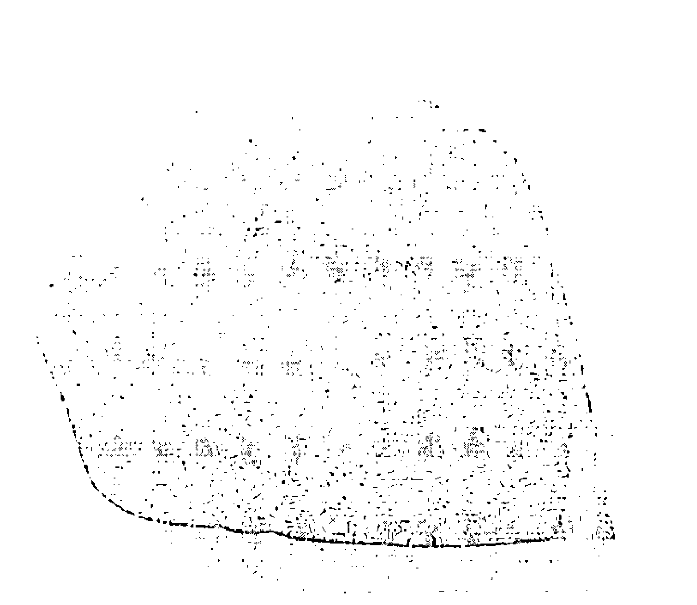

- 颜色：无色、白色、粉色、青绿色、浅蓝色、黄色等
- 产地：希腊、墨西哥、澳大利亚、纳米比亚、西班牙、英国、法国、美国、意大利
- 晶系：六方晶系（三方晶系）
- 成分：Zn [Co3]
- 硬度：4 ~ 4.5

（关键词）
抚平内心的创伤
信赖、智慧的象征

### 晶石的特征

葡萄状的结晶
与方解石属同类矿石

菱锌矿拥有玻璃般透亮的光泽和葡萄状的外形，与方解石属于同类矿石。其英文名由美国史密森纳研究院的奠基人、矿物学家詹姆斯·史密森（James Smithson）的姓名而来。又因为它呈菱形，中文名便由此而来。不过，实际上，菱锌矿出产时多呈葡萄状或钟乳状，菱形的结晶较为稀少。在古代，菱锌矿又被称为“卡德摩亚”（Cadmoa），来源于古希腊语中的“Kadmeia”，意思是“卡德摩斯（Kadmos）的泥土”（卡德摩斯是古希腊神话中重镇底比斯的创立者），深受历代古希腊国王的宠爱。

锌矿可以作为你的后盾，支持你去勇敢地敞开心扉，与外界进行真诚的交流。
同时，菱锌矿也是信赖、智慧的象征。它引导我们即使处在人生的低谷中，也要秉承一颗善良、正直的心，切不可为扭转眼前的局面而做出有违良知或伤害他人的事。如同大浪淘沙，能从容地应对危机的人，才能领悟到人生的大智慧。
另外，菱锌矿还是具有美容功效的晶石之一，将它置于身边，可以促进淋巴循环，消除水肿，改善皮肤问题。

菱锌矿原本呈无色或白色，由于其中含有不同的杂质而呈现粉色、绿色、黄色、灰色、褐色、紫色等多种多样的颜色。其中，透明的菱锌矿较为珍贵。菱锌矿主要作为装饰之用，也有一部分被当做已抛光但未刻面的晶石使用。

### 晶石的能量

外柔内刚的晶石

### 何时使用

当你想拥有沉稳而温柔的性格时
当你想拥有沉稳而温柔的性格时，当你想消除不安、恐惧和精神压力时，当你心绪不宁时，当你想治愈心灵的创伤时，菱锌矿是最佳的选择。

菱锌矿虽然外表柔和平静，却拥有不输给其他晶石的内在能量，有“母性之石”的称呼。菱锌矿所象征的母爱很无私，是以一个人是否需要爱为出发点的。因此，当你感到孤单无助时，菱

[使用时的注意事项]
菱锌矿比较脆弱，应该小心呵护。
[速配幸运石]
白水晶、方解石、葡萄石
[净化方法]
月光浴、鼠尾草、晶簇
[对应的星座 & 脉轮]
处女座 / 第3脉轮

> 幸运石寄语
“当你能够直视内心的痛苦和创伤时，那就说明它已经在慢慢愈合了。”

## 烟水晶【茶晶 / 墨晶】

联结大地能量的美丽水晶

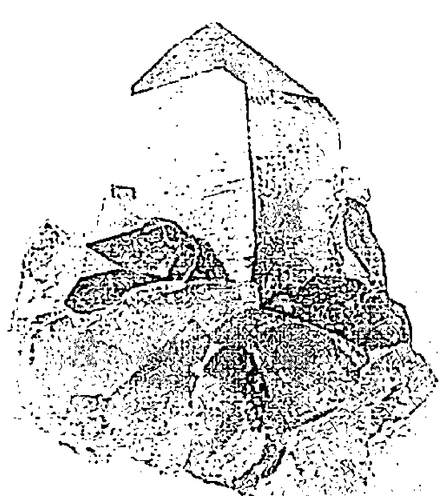

- 颜色：浅茶色、略带灰色的茶色、略带褐色的黑色
- 产地：巴西、美国各州（特别是科罗拉多州和缅因州）、英国、瑞士、德国、坦桑尼亚、斯里兰卡、西班牙、澳大利亚、中国
- 晶系：六方晶系（三方晶系）
- 成分：SiO₂
- 硬度：7

〈关键词〉
稳定心绪
强大的治愈力

### 晶石的特征 水晶内部飘着黑色烟雾

烟水晶充满神秘感，色泽犹如烟雾在空中飘逸，它和白水晶属于同种矿石。当白水晶中所含的微量铝离子受到来自自然界的辐射时，白水晶就变成了茶色的烟水晶。它分布在世界各地，十分常见，但大多都是不透明的。透明度较高的烟水晶十分罕见，而且价格昂贵。因此，首饰中常见的烟水晶大多都是经过人工加工后的，购买时需要仔细辨别。
这种水晶犹如透过篝火的烟雾所看到的阳光一般朦胧美丽，因此被命名为烟水晶，俗称“茶晶”。另外，因为苏格兰人常常用它来装饰五彩缤纷的民族服装，所以那些颜色浓重的烟水晶还拥有一个苏格兰名字——“凯恩戈姆”（Cairngorm）。

在古代，烟水晶被视为能够驱邪避煞、使种族生生不息的守护石。据说古罗马帝国的皇帝就将它用做印章，代代相传。大不列颠的凯尔特人则挑选近乎纯黑的烟水晶（称为黑晶，morion）作为护身符佩戴在身上，以防恶灵附身。
除此之外，烟水晶还以强大的治愈力著称，这和它内部保存了自然界的微量辐射有关。由于辐射量十分微弱，所以并不会对人体造成伤害，相反，若将其置于床下，将有助于患者大病初愈后的康复以及睡眠质量的改善。

### 晶石的能量 为空虚的内心注入活力

烟水晶具有与大地相连的能量，与透明的白水晶可以使能量扩散相反，它可以使分散的能量汇聚到一处。因此，它能够帮助人们稳定心绪，从幻想中走出来，集中有限的精力去脚踏实地地完成必须做的事情。在烟水晶的帮助下，若你能全神贯注地去做一件事，还很有可能激发你的潜能，发现自己并非不擅长做某事。

### 何时使用

当你想重新找到生活的热情时
当你缺乏朝气时，当你容易被当前的状况左右时，当你对自己的忍耐力毫无信心时，当你需要稳定心绪时，烟水晶能够带来意想不到的效果。

[使用时的注意事项]
烟水晶容易受到紫外线和强光的侵蚀，使用时应多加注意。
[速配幸运石]
虎眼石、萤石、橄榄石、乳石英
[净化方法]
月光浴、流水、盐、鼠尾草
[对应的星座 & 脉轮]
射手座 / 第0脉轮、第1脉轮

> 幸运石寄语
“回归自我，集中精力实现自己的愿望吧！”

## 沸石

可以净化整个地球、人类不可缺少的晶石

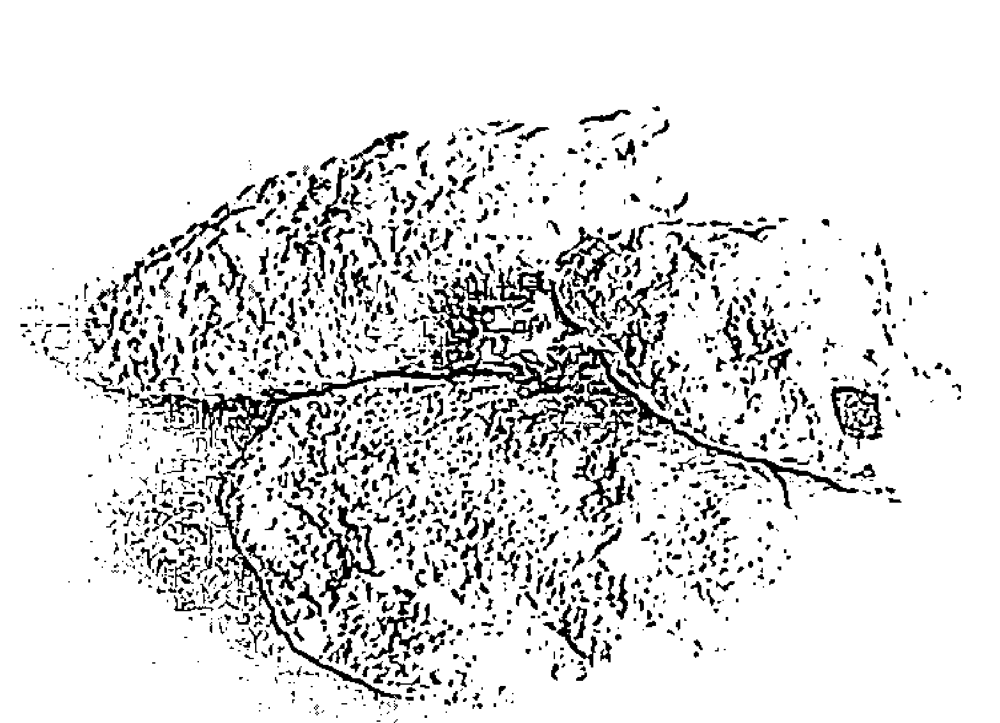

- 颜色：白色等
- 产地：印度、日本、美国、中国
- 晶系：单斜晶系和三斜晶系
- 成分：混合物不同，成分也各不相同
- 硬度：4 ~ 5.5

### 关键词
净化空气
消除负面想法

### 晶石的特征

种类有50多种
工业生产中重要的矿石原料

沸石的最大特征是具有海绵状的构造。沸石发现于冰岛的火山，加热后会膨胀发泡，像沸腾了一般，其英文名来源于古希腊语中的“zeo”（沸腾）和“lithos”（石头）这两个词语。
沸石是主要成分为铝、钠、钙等元素的矿石的总称，种类共有50多种。大部分为白色，一些地方也出产米色的沸石。其内部构造呈海绵状，大量的孔穴和通道使沸石具有强力吸附气体和水分的特性。这种吸附功能使沸石可被当做催化剂和吸收剂使用，成为工业生产中重要的矿石原料。特别是最近几年，地球环境污染严重，沸石的净化效果自然就受到了世人的瞩目。它通过吸附有害物质，可以净化泥土、水和空气。科学家们坚信，沸石作为十分有效的天然净化资源，今后必将受到更多的关注。

喉部不适等。在环境污染日趋严重的现代社会，沸石的用武之地则更加广阔。人类的很多疾病，小至失眠、脱发、贫血和过敏性皮炎，大到忧郁症、癌症，其不断增高的发病率都被证明与环境恶化带来的有害重金属和有害化学物质侵入人体有关。此时，人们可以在家中或办公场所放置一块沸石，让它净化空气、保护人的身心健康。
除此之外，沸石还可以用来净化人的思想及调整人际关系。不过，要真正地告别那些无形的有毒物质，还要靠人自身的决心与勇气。

### 晶石的能量

大地的恩惠
保护人体身心健康

沸石是大地的恩惠、自然的赏赐，它能使地球重获新生。沸石具有强大的吸附功能，可以用来净化农田的土壤，使农作物健康生长。这种吸附力对人体同样有效。
自古以来，沸石就用来帮助人体排毒、治疗

### 何时使用

当你想以一个新面貌生活时
当你感觉萎靡不振却未被诊断患有任何疾病时，当你沉迷于某事或某种情绪无法自拔时，沸石都是非常合适的选择。

#### 使用时的注意事项
沸石受撞击后容易损坏，因此应小心呵护。

#### 速配幸运石
白水晶、鱼眼石

#### 净化方法
月光浴、晶簇、鼠尾草

#### 对应的脉轮
第2脉轮、第3脉轮、第5脉轮

> 幸运石寄语
“请重新审视那些你认为存在于自己周围的有害的思想和人际关系吧！”

## 绿龙晶【斜绿泥石】

### 传递纯粹之爱的天使之石

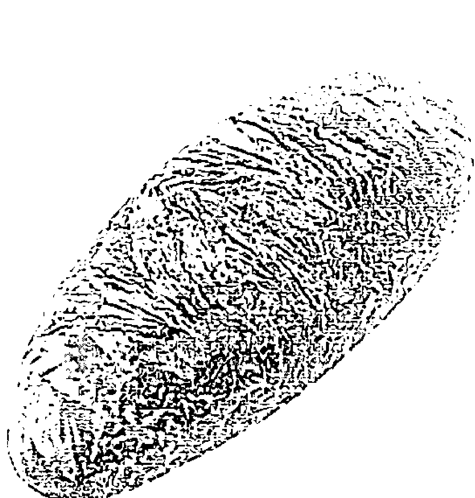

- 颜色：略带灰色的绿色、暗绿色、浅绿色等
- 产地：俄罗斯、美国
- 晶系：单斜晶系
- 成分：(Mg,Fe²⁺)₅Al(Si₃Al)O₁₀(OH)₈
- 硬度：2 ~ 2.5

### 关键词
建立良好的人际关系
引导我们的意识向高次元发展

### 晶石的特征

美丽的深绿色和银白色纹路让绿龙晶魅力无限

绿龙晶是一种散发玻璃光泽、神秘而美丽的绿色晶石，又被称为斜绿泥石（Chinochlore），在矿物学上属于绿泥石的一种，颜色从深绿色到黄绿色不等。

绿龙晶最显著的特征，莫过于那深绿的底色中浮现的银白色内包物了。这种荡漾在绿色间的银白色纹路犹如天使展开的羽翼般美丽，因此绿龙晶又被称为“炽天使”（Seraphim），这也是绿龙晶英文名的来源。俄罗斯的贝加尔湖附近是最有名的绿龙晶产地。

观的眼光来审视整件事：好的事情会发生，不好的事情当然也会发生，并且会发生在每个人身上。

绿龙晶常被人当做建立良好的人际关系的吉祥物，其深层原因也在于此：当你怀着一颗仁爱之心，少一些怨言，多一些解决问题的行动时，人们自然愿意和你亲近。

另外，绿龙晶可以在冥想时引导人们的意识上升至高次元，且它的能量可以深入细胞，使病细胞慢慢被治愈。

### 晶石的能量

引导人们爱自己、爱他人

绿龙晶是为数不多的能够和天使接触、打开高次元脉轮的晶石之一，它的名字就来源于天使，且是最高级别的炽天使。

炽天使的唯一使命便是展现神的纯粹而无私的爱，作为炽天使代言者的绿龙晶自然也继承了这种使命。它所拥有的能量能够渗透到人的灵魂深处，帮助佩戴者从以自我为中心的思考方式和执念中解放出来。比如，当事情发展不如意时，以自我为中心的人会想“为什么这种事会发生在我身上”，而在绿龙晶的指引下，人们将学会用客

### 何时使用

当你希望得到他人的鼓励时

当你无法与和自己性格不同的人和谐相处时，当你无法融入一个集体中，或是不知为何周围的人开始孤立你时，绿龙晶能够帮你认识到自己的问题，从而改善人际关系；当你想体验深层次的冥想时，可以借助绿龙晶的力量。

#### 使用时的注意事项
绿龙晶非常脆弱，受到撞击很容易碎裂，因此要特别注意。

#### 速配幸运石
藓纹玛瑙、粉水晶、天使石、绿帘花岗石

#### 净化方法
晶簇、鼠尾草

#### 对应的脉轮
第7脉轮、第8脉轮

> 幸运石寄语
“请将精力集中在人与人之间的关爱上吧！”

## 天青石

清凉的蓝色，美不胜收的天国之石

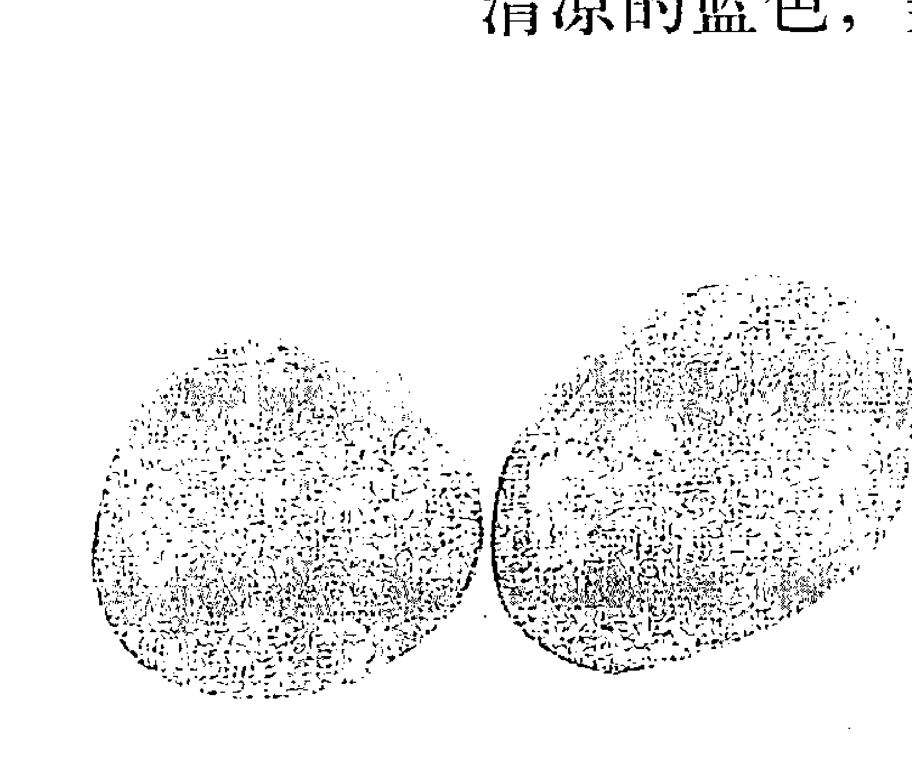

- 颜色：蓝色、浅蓝色、无色、白色等
- 产地：意大利、马达加斯加、墨西哥、美国、纳米比亚、加拿大、德国、法国、英国、澳大利亚、波兰
- 晶系：斜方晶系
- 成分：Sr[SO₄]
- 硬度：3 ~ 3.5

### 关键词
带来清爽与平静
净化灵魂

### 晶石的特征

能够制造出绚烂的红色烟火
透明的蓝色晶石

每次看见天青石那一抹淡淡的蓝，人们都会顿感清爽洁净。它于1781年在意大利的西西里岛被发现。它那种澄澈透明的蓝色让人联想到碧蓝的天空和遥远的天国，因此其英文名来源于拉丁语中的“coelestis”（像天国一样）一词。
天青石大多呈蓝色，也有无色、黄色和橙色等颜色。这种晶石十分脆弱，容易碎裂，因此很少被制成珠宝饰品。但是近年来，天青石作为一种幸运石越来越受到大家的欢迎，于是人们开始对它进行后期加工，使它更加坚硬，不易碎裂，然后再制成各种饰品。产自马达加斯加的天青石，结晶十分美丽，被视为天青石中的上品。另外，天青石还能用来制造烟火，因为它所含的锶元素燃烧时会呈现红色的火焰。

安稳。
随着头脑的放空和心灵变得清明，人们会意识到一件有意思的事：真正的“天国”并非真的在蓝天之上，而是——在自己的内心深处。这种智慧并非轻易得来，需要人们带着对生命、尤其是对灵魂的敬意去长时间地体会。而一旦觉察这一点，便能获得不可动摇的内心的安定。
对尚未深入修行的人来说，天青石可以帮助你平复内心的骚动，重新冷静下来。另外，天青石还有助于睡眠，让人们远离噩梦的侵袭。

### 晶石的能量

引导意识升华
带来内心的静寂与平和

天青石可谓石如其名，它拥有如广阔的蓝天一般的冰蓝色。若长时间凝视着它，有时会感觉自己在不知不觉间融入其中，成了蓝天的一部分。这正是天青石最大的特征：它释放柔和的波动，引导人们的意识远离杂念横生的大地（尘世），慢慢飘向一览无垠的天空。那里静寂、平和而又

### 何时使用

当你想生活在平和的空间中时
天青石质地柔软，其波动也相对平稳，你可以将一大块原石放在想要净化的空间中；当你想拥有香甜的睡眠时，可以将其置于床下。

#### 使用时的注意事项
天青石极易损坏和脱色，随身携带时建议用布将其包裹起来，并注意避免其受到阳光和流水的侵蚀。

#### 速配幸运石
石榴石、紫锂辉石、翡翠

#### 净化方法
月光浴、晶簇

#### 对应的星座 & 脉轮
白羊座 / 第8脉轮

> 幸运石寄语
“停下脚步，去感受围绕在你身边的祝福吧！”

## 透明石膏

用其细腻的能量净化灵魂，散发丝绢般的光泽

- 颜色：白色、无色
- 产地：墨西哥、美国、俄罗斯
- 晶系：单斜晶系
- 成分：Ca[SO₄]·2H₂O
- 硬度：2

### 关键词
抚平内心的创伤
转变观念

### 晶石的特征

如丝绢般细腻
令人爱不释手

透明石膏呈半透明状，色彩柔和，散发丝绢般的光泽。其英文名来源于古希腊语中的“selene”（月亮）一词以及古希腊神话中的月之女神“塞勒涅”（Selene）的名字。透明石膏的矿物学名叫“Gypsum”（石膏），其中白色透明的才被称为透明石膏。另外，透明石膏还有一个变种，被称为“沙漠玫瑰”。

透明石膏还因其柔和而清澈的美有“圣母玛利亚的玻璃”之称，经常被用来制作欧洲宫殿的烛台和灯饰。透明石膏非常柔软，用指甲轻轻一划就会在其表面留下一道印痕，它还容易受水、湿气和油脂的侵蚀，因此市场上流通的大多是透明石膏的原石或表面打磨光滑的透明石膏。它很少被制成珠宝首饰。

透明石膏的能量强大而细腻，犹如皎洁的月光般慢慢渗入人的内心，因而可以很好地净化心灵。小到内心的点点创伤，大到前世的灵魂之伤，透明石膏都可以将其治愈。当长时间积聚在内心的伤痛被治愈时，我们的人生就会出现更多的奇迹。透明石膏还能够慢慢破除我们顽固不化的思想，培养我们形成灵活的思维方式，从而避免思想僵化，帮助我们自然而然地接受世界的变化。

### 何时使用

当你的情感或思绪强烈而混乱时
当你遭遇强烈的情感冲击、靠自己的力量难以走出阴影时，当你无法理解为何亲朋好友或同一团队的人都仿佛与你作对般反对你的决定时，不妨借助透明石膏来疏通阻塞的能量。

### 晶石的能量

淡淡的微光
温柔地净化身心

透明石膏是一种能够帮人打破现实世界的限制，拓宽视野，带来新发现的晶石。拥有月亮女神之名的它，在古代被认为与月亮的阴晴圆缺有关，被古代中欧的凯尔特人和美洲印第安人视为圣物并加以祭拜。从古时起人们就已发现，尽管透明石膏的外表温和，实则蕴含着高频率的波动。

#### 使用时的注意事项
透明石膏易受湿气和流水的侵蚀，应该尽量避免用流水进行净化。

#### 速配幸运石
蓝铜矿、祖母绿、电气石

#### 净化方法
鼠尾草、晶簇、日光浴

#### 对应的星座 & 脉轮
金牛座 / 第8脉轮

> 幸运石寄语
“去探求更深层意义上的人生吧！”

## 方钠石

提高才智和热情，培养敏锐的洞察力

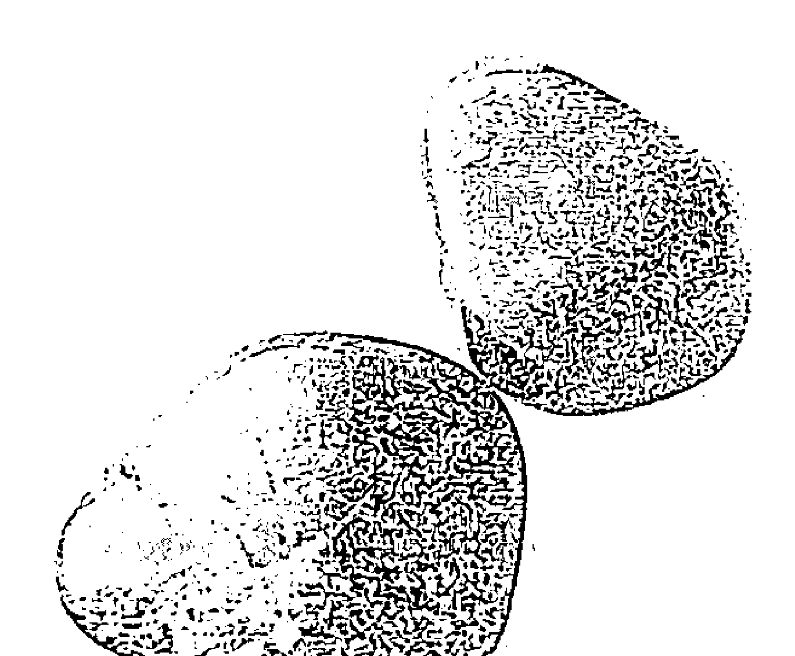

- 颜色：深蓝色、蓝色
- 产地：加拿大、巴西、纳米比亚、意大利、挪威、玻利维亚、美国、印度、格陵兰岛、俄罗斯、南非、朝鲜
- 晶系：等轴晶系
- 成分：Na₈[Cl₂|(AlSiO₄)₆]
- 硬度：5.5 ~ 6

### 关键词
冷静地判断
消除恐惧与不安

### 晶石的特征

拥有悠久历史的蓝色除魔之石

方钠石是一种深蓝色中交织着浅蓝色和白色的斑纹、从半透明到不透明且散发玻璃光泽的稀有晶石。它是构成青金石蓝色部分的矿物成分，与青金石极为相似，实际上，也经常被拿来冒充青金石。用肉眼区分这二者的重点在于，比起青金石，方钠石的黑色更重。这种晶石内部含有大量的钠元素，其英文名的意思是“含钠（soda）的岩石”。

古人坚信蓝色和红色具有除魔之力。相传很多王孙贵族和僧侣都随身携带方钠石，用来驱邪避煞。古埃及的墓穴中也曾发现许多用方钠石制成的装饰品。一直以来，意大利和挪威都是方钠石的主要出产地。近年来，在加拿大的矿山中也发现了方钠石的身影。由于方钠石被发现的时间正好是英国的玛格丽特公主访问加拿大的时间，因此它还有一个别名——“玛格丽特蓝”。

们的头脑排除干扰、集中注意力在需要应对的问题上；在冥想时，它也能起到同样的作用：使我们的意识从表面的纷乱转向潜意识，发现潜藏在我们记忆深处的诱使我们感到恐惧、不安的根源。

不善于与人沟通的人，往往有所顾虑，不敢表露真情。其实，沟通技巧还在其次，明确自己的想法和感情，将其正确地表达出来，便达到了沟通的目的。在这方面，方钠石的“增加理性”并不在于讲究说话的条理，而在于能够使人明确自己的真实意图，最大程度减少沟通中的误解。

### 晶石的能量

用理性与意志探寻深层情感与欲望

方钠石最显著的特征是其浓重的深蓝色，因此理解方钠石的关键词是“理性”和“意志”。具体来说，方钠石可以在冷静地判断、提高灵性及沟通能力方面帮助我们。它能够整理心绪，使我们

### 何时使用

当你容易情绪化、容易冲动时

当你面临考试、比赛、面试等重大场合时，当你总是抵挡不住购物、美食的诱惑而冲动消费时，当你想坦诚地表达自己的心情时，方钠石可以给你有力的帮助。

#### 使用时的注意事项
方钠石耐水和耐紫外线照射。

#### 速配幸运石
海蓝宝石、蓝铜矿

#### 净化方法
流水、日光浴

#### 对应的星座 & 脉轮
处女座 / 第6脉轮

> 幸运石寄语
“请仔细想一想，在这一瞬间，你正经历着什么？创造着什么？”

### 脉轮和幸运石

脉轮存在于我们的身体内部，与健康、思考和气场息息相关，是能量的中枢。每一个脉轮都有其对应的幸运石。

#### 什么是脉轮？
脉轮在梵语中意为“光之轮”、“车轮”，指身体内部的能量中枢，沿脊柱方向共有七处，头上与脚下还各有一处，它们各自拥有自己的颜色和意义。

幸运石拥有与不同脉轮相连的波动，能够激活脉轮，并由此提高人体的机能，改变人的精神状态。下面就让我们一起来了解一下脉轮和幸运石之间的关系，试着将宇宙中的能量汇聚到自己体内吧！

#### 第 7 脉轮（顶轮）
第 7 脉轮象征精神、感性和灵魂的力量，赋予我们理解力和开启灵力的能力。
[ 对应的颜色 ] 紫色、白色
[ 对应的晶石 ] 紫水晶、透明石膏、查罗石、舒俱来石、哈基马钻石、发晶等

#### 第 8 脉轮（高次元顶轮）
第 8 脉轮象征灵魂、宇宙和神佛之力，赋予我们无上的幸福和创造美好未来的能力。
[ 对应的颜色 ] 白色、透明
[ 对应的晶石 ] 紫锂辉石、绿龙晶、硅硼钙石、白水晶、白色缟玛瑙等

#### 第 5 脉轮（喉轮）
第 5 脉轮能够帮助我们提升表现力，协调人际关系，提高创造力。
[ 对应的颜色 ] 蓝色、浅蓝色
[ 对应的晶石 ] 海蓝宝石、天使石、蓝晶石、天青石、土耳其石、蓝色托帕石、蓝纹玛瑙、拉利玛石等

#### 第 6 脉轮（眉心轮·第三只眼）
第 6 脉轮与洞察力、智慧和第六感有关，赋予我们直觉力和灵感，增强我们的精神力量。
[ 对应的颜色 ] 蓝色、蓝靛色
[ 对应的晶石 ] 董青石、蓝铜矿、孔雀石、方解石、方钠石、捷克陨石、青金石、拉长石、锂云母等

#### 第 3 脉轮（脐轮）
第 3 脉轮掌管情感和意志，赋予我们认知能力。
[ 对应的颜色 ] 黄色
[ 对应的晶石 ] 黄色霞石、黄水晶、虎眼石、黄铁矿、葡萄石、橄榄石、孔雀石、月长石、发晶等

#### 第 4 脉轮（心轮）
第 4 脉轮象征慈悲、奉献和博爱，赋予我们爱、温柔、美丽与丰富的情感。
[ 对应的颜色 ] 绿色、粉色
[ 对应的晶石 ] 砂金石、天河石、硅孔雀石、绿玉髓、紫锂辉石、粉色电气石、粉色蔷薇辉石、萤石、孔雀石、摩根石、捷克陨石、绿帘花岗石、红宝石、粉水晶、菱锰矿等

#### 第 1 脉轮（根轮）
第 1 脉轮掌管生命力，赋予我们活力。
[ 对应的颜色 ] 红色、黑色
[ 对应的晶石 ] 红玉髓、石榴石、烟水晶、黑色电气石、血石、赤铁矿、彩虹黑曜石、红碧玉、红玛瑙、红虎眼石等

#### 第 2 脉轮（腹轮）
第 2 脉轮与创造性、生殖能力和社会息息相关，教给我们在集体中的生存之道。
[ 对应的颜色 ] 橙色、红色
[ 对应的晶石 ] 橙色方解石、橙色月长石、石榴石、红玉髓、太阳石、黄水晶、粉色欧泊、红宝石等

#### 第 0 脉轮（大地脉轮）
第 0 脉轮维系我们与大地的联系，赋予我们更加强大的生存能力。
[ 对应的颜色 ] 茶色
[ 对应的晶石 ] 缟玛瑙、黑曜石、海洋碧玉、雪花黑曜石、烟水晶、黑色电气石、彩虹黑曜石、蔷薇辉石等

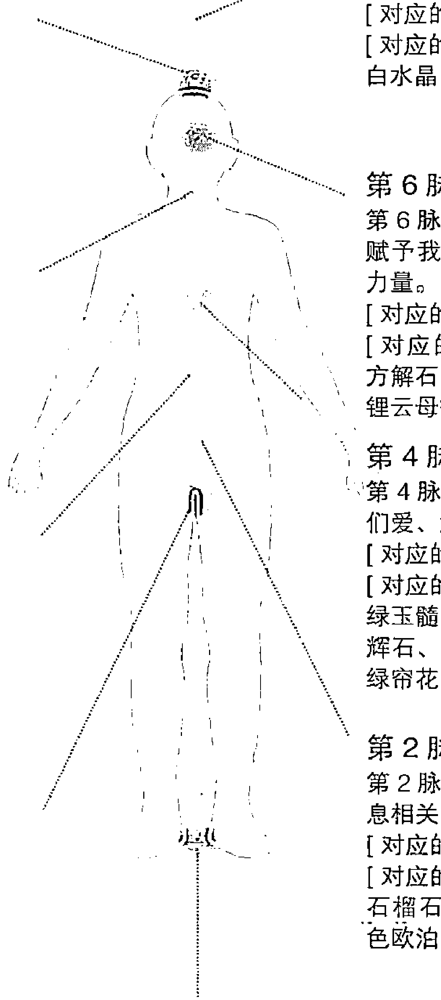

## 土耳其石【绿松石】

驱邪避煞，赋予人们勇气的天神之石

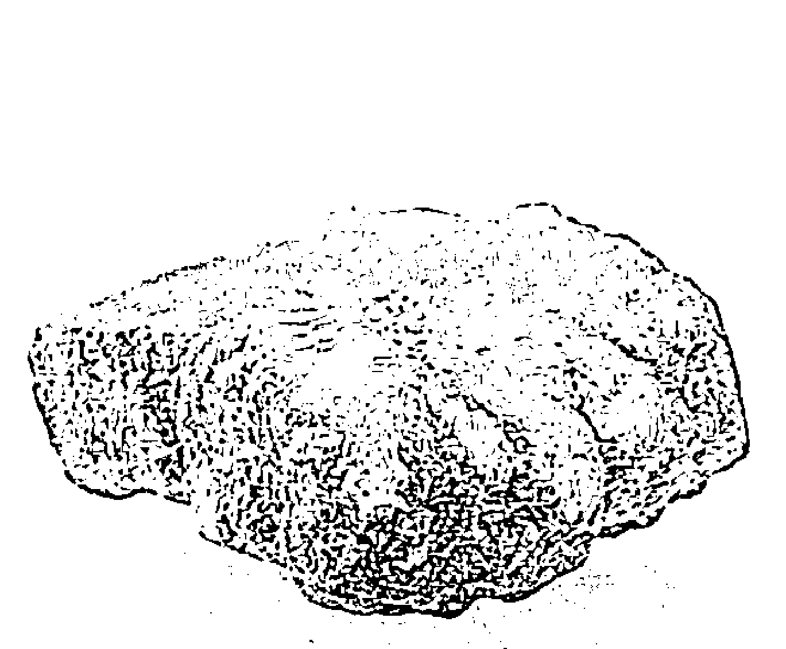

- 颜色：天蓝色、蓝色、蓝绿色、略带黄色的绿色等
- 产地：伊朗、美国（亚利桑那州、内华达州、科罗拉多州、新墨西哥州）、埃及（西奈半岛）、中国、墨西哥、巴西、澳大利亚、俄罗斯、英国
- 晶系：三斜晶系
- 成分：Cu²⁺Al₆[(OH)₂|PO₄]₄·4H₂O
- 硬度：5 ~ 6

### 关键词
促进自我的成长
强大的治愈力

### 晶石的特征

在土耳其无法开采到的“土耳其石”

土耳其石拥有鲜艳的天蓝色，美不胜收，是12月的生辰石。看到它的名字，人们往往会误以为它产自土耳其，其实不然，这种晶石的真正产地是伊朗（古时称为波斯）。从前，这种晶石在波斯和埃及的西奈半岛被开采出来后，经由土耳其运进欧洲，其名字也由此而来。

土耳其石从很早开始就被当做宝石而不断加以开采，是最古老的宝石之一。在古埃及初期的王侯之墓以及印加帝国埋藏在地下的财宝中都发掘出了许多用土耳其石制作的装饰品。它的颜色主要有天蓝色、蓝色、蓝绿色、黄绿色等等。土耳其石的最大特征就是拥有鲜艳的蓝色，不过由于这种天然形成的蓝色矿石非常稀少，所以市面上流通的大多是经过人工着色或仿制的宝石。

为护身符，在旅行时随身携带。同时，它也是人生之旅的守护石，深受人们的青睐。

除此之外，土耳其石还拥有十分强大的治愈力。西藏人民就将其视为三大治疗石之一。象征天空的澄澈之蓝可以包裹我们疲惫的身体，将因为带着伤痛而奄奄一息的心释放到广阔的天空中。它能够润泽我们焦虑而干渴的心，平静兴奋的情绪，消除所有的不安，使我们重新找回向着目标努力奋斗的勇气。

### 晶石的能量

带来勇气和无穷力量的神圣之石

自古以来，土耳其石就被人们誉为神圣之石。美洲印第安人认为，它能够带给人们心灵上的平静，引导人们的意识上升到高次元，让人们与神灵对话，从而更好地认识自我。这种力量能够保护佩戴者不受危险和邪恶力量的侵犯，为佩戴者带来勇气和幸福。因此，现在仍有很多人把它视

### 何时使用

当你想增强行动力，坚持自己的主张时

当你想获得勇气和积极性时，当你无法向新的目标踏出第一步时，当你即将旅行、留学、调动工作或出差时，土耳其石都能够作为护身符保护你。

#### 使用时的注意事项
土耳其石容易受到水和紫外线的侵蚀。

#### 速配幸运石
鱼眼石、蓝色托帕石、蓝晶石、孔雀石

#### 净化方法
月光浴、鼠尾草、晶簇

#### 对应的星座 & 脉轮
狮子座、巨蟹座、射手座、摩羯座 / 第5脉轮

> 幸运石寄语
“试着深呼吸，将所有的不安都抛向天空，快乐会重新回到你的身边。”

## 金刚石【金刚钻】

潜藏着无限可能性的晶石之王

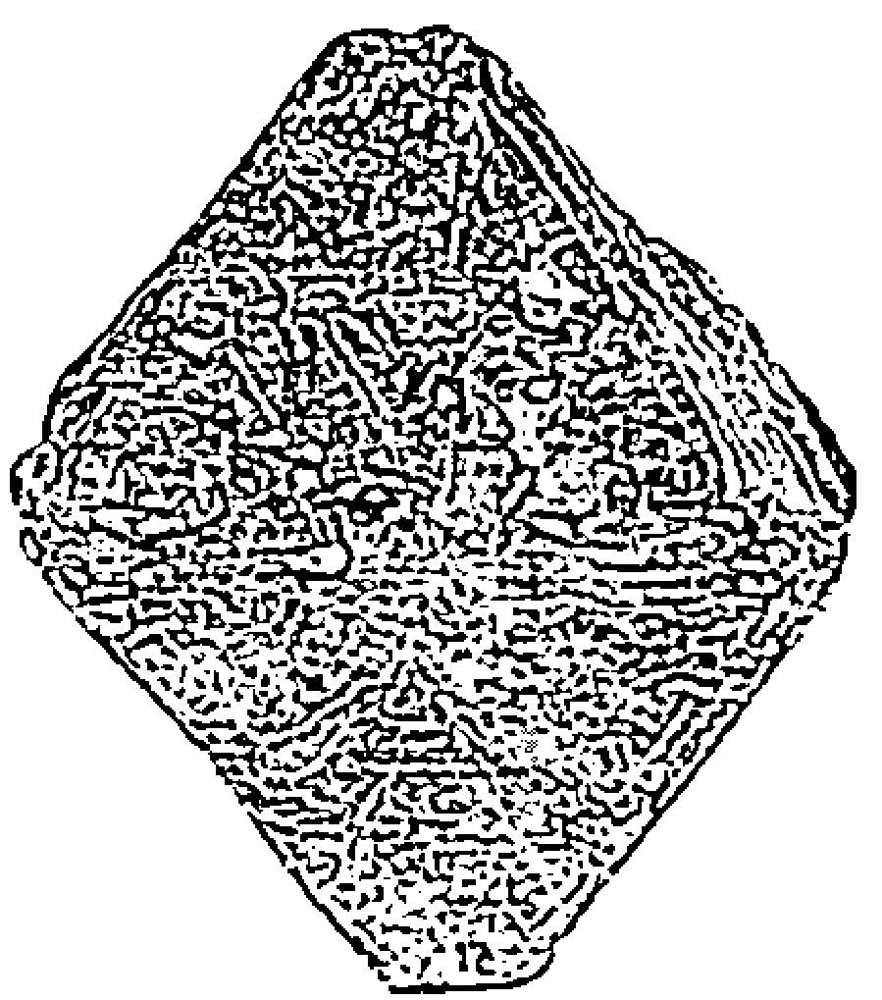

- 颜色：无色、黄色、褐色、粉色、蓝色、绿色、黄绿色、橙色、灰色、白色、黑色
- 产地：南非、巴西、澳大利亚、刚果、俄罗斯、加纳、纳米比亚、坦桑尼亚、委内瑞拉、中非、科特迪瓦、几内亚、圭亚那、中国、印度、印度尼西亚
- 晶系：等轴晶系
- 成分：C
- 硬度：10

### 关键词
协调人际关系
聚焦并增强能量

### 晶石的特征

最坚硬、最纯净的宝石

金刚石是4月的生辰石，散发着最闪亮的光辉，是公认的宝石之王。它的英文名来源于古希腊语中的“adamas”（无法征服）一词。其成分全部为碳元素，是所有天然矿物中最坚硬的一种，它也因此而得名。
比起无色透明的金刚石，人们更容易开采到略带黄色或褐色的金刚石。当然，无色透明的金刚石更加昂贵，但是蓝色、粉色和绿色的金刚石也较为稀少，因此价格有时甚至比无色金刚石还高。钻石（经过琢磨的金刚石）之所以能闪耀如此迷人夺目的光辉，是因为它具有较强的折射率，还因为人们利用“钻石切割法”将其切割成了58面体、82面体或144面体。

增强。因此，它可以帮助人们经营财富、爱情和必要的人际关系。但是，不仅是积极的能量，金刚石也能使消极的能量成倍地增长。若一个人对于某种事物过于执著，比如对金钱、权力、爱情极度渴望，或是怀有对他人的邪念，金刚石也许就会将其引向万劫不复的深渊，因此需注意避免过犹不及的情况。基于同样的道理，使用金刚石进行治疗时也尤其需要讲究方法。除此之外，金刚石还具有增强所有晶石能量的功效，因此应慎重选择和金刚石一起随身佩戴的晶石。

### 晶石的能量

协调人际关系
聚集能量并使之不断增强

金刚石象征的含义很多，如清晰的思路、健康、完美等，它自古以来就被视为最强大的护身符。相传金刚石那种无可比拟的光辉和脱俗的气质能够驱邪避煞，守护人们心中一生一世的牵挂，因此人们选择钻石戒指作为婚戒。金刚石的纯净之光还能够协调夫妻关系以及其他各种人际关系。
金刚石能够聚焦周围的一切能量并使之不断

### 何时使用

当你无法出色地表现自己时
当你想表现自己时，当你想吸引他人的目光时，当你容易受他人影响时，当你想增加灵气时，通过佩戴金刚石来实现愿望吧！

#### 使用时的注意事项
金刚石虽然硬度较高，但韧性不强，因此在受到强烈的撞击时仍有损坏的可能性。

#### 速配幸运石
欧泊、菱锰矿、青金石、蓝宝石

#### 净化方法
日光浴、盐

#### 对应的星座 & 脉轮
山羊座、金牛座、狮子座 / 第3脉轮、第7脉轮

> 幸运石寄语
“你想做的事，是否可以为你带来好心情？”

## Tiger's Eye
虎眼石
提高洞察力和决断力的成功之石

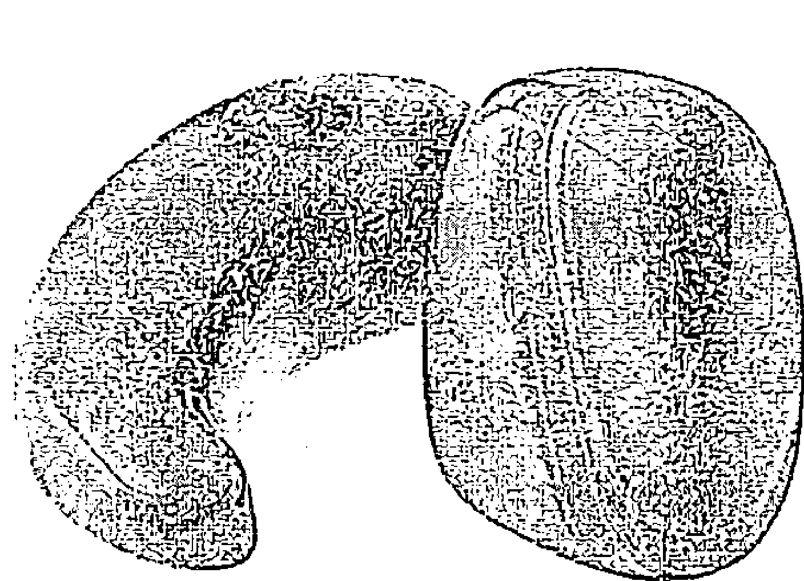

- 颜色：褐色、黄色、黄褐色
- 产地：南非、澳大利亚（西部）、纳米比亚、中国、缅甸、印度
- 晶系：单斜晶系（结晶纤维的部分）
- 成分：Na₂Fe²⁺₃Fe³⁺₂[OH | Si₄O₁₁]₂
- 硬度：6.5 ~ 7

〈关键词〉
提高洞察力和决断力
驱邪之石

### 晶石的特征
散发个性的光辉
“光之线”

虎眼石的主要成分是青石棉。青石棉在大地深处埋藏多年后，内部的绢纤维状结晶会逐渐酸化，被石英所取代，形成深茶色或金黄色的条纹，且会在光照下呈现明亮的光带。转动虎眼石时，光带也会随之移动，使人联想到老虎的眼睛，它也由此而得名。

在中国，虎是力量的象征，而虎眼石因其酷似虎眼的外表和金色的光泽自古以来就被视为力量和财富的象征以及除魔的护身符，受到人们的珍视。在日本，虎眼石常被加工成钩形玉坠等工艺品，作为首饰被人们佩戴。由于近年来研磨加工技术有了一定的发展，所以虎眼石也常被人们雕刻成大型艺术品摆放在家中。

虎眼石能够帮助我们看清潜在的风险。此外，虎眼石不仅能“识时运”，还能“识人”——能够吸引来值得信赖的合作者；并且“识善恶”——正因为虎眼石力量强大，所以只会满足使用者的真正所需，而不会帮人实现不当的愿望。

作为驱邪之石，虎眼石的威力也十分强大。据说它能防止“邪眼”的追踪，若感到自己周围有可疑的视线，可借助虎眼石的力量将其阻隔。

### 晶石的能量
看穿一切
充满力量的“虎之目”

虎眼石作为能够带来幸福、赋予我们灵通力量的神圣之石，受到世界各国人们的珍视。在古埃及，人们认为老虎的眼睛能够看穿一切，因此用虎眼石来制作众神雕像的眼睛。在东方，虎眼石则被誉为“聚财之石”。这不仅因为它的金黄色泽象征着金运，同样也因为它能给人带来敏锐的洞察力与决断力，帮助人们捕捉到好时机、避开潜在的风险。

### 何时使用

当你想抓住商机时

当你面临商务洽谈或开始新的工作时，当你准备创业或想扩大事业规模时，虎眼石能够带来意想不到的效果。另外，当你变得消极或缺乏自信时，虎眼石会将你引向正面思考。对于女性，虎眼石还是防止被偷窥、被性骚扰等的理想护身符。

#### [使用时的注意事项]
虎眼石对紫外线和水具有较强的抵抗力，但它的原石受到撞击时容易损坏，因此使用时应多加注意。

#### [速配幸运石]
鱼眼石、琥珀、绿玉髓、白水晶

#### [净化方法]
日光浴、流水

#### [对应的星座 & 脉轮]
狮子座、巨蟹座、射手座 / 第5脉轮

> 幸运石寄语
“请分清你需要的东西和你真正想要的东西。”

## 坦桑石

引导人们的灵魂和意识上升到更高层次的精神之石

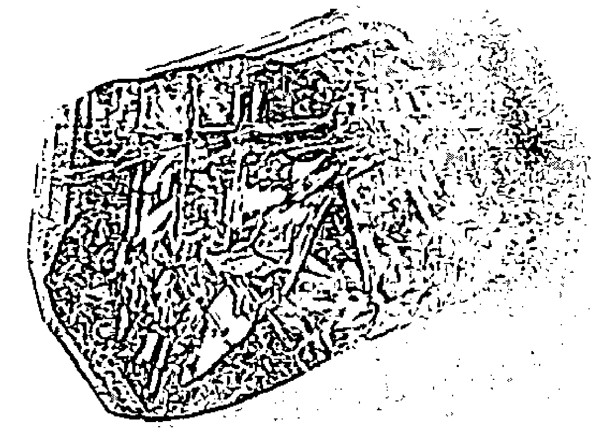

- 颜色：紫色、蓝紫色、蓝色等
- 产地：坦桑尼亚
- 晶系：斜方晶系
- 成分：Ca₂Al₂Al[OH | O | SiO₄ | Si₂O₇]
- 硬度：6 ~ 7

#### 〈关键词〉
带来灵通的神秘力量
引导意识上升到高次元

### 晶石的特征

拥有能够迷倒蓝色晶石迷的神秘蓝色

坦桑石是 12 月的生辰石，拥有华贵的蓝色和多向色性（Pleochroism，即晶石随着观察角度的不同而呈现不同颜色的特性），美丽绝伦。它是一种黝帘石（zoisite）晶石。在黝帘石中，从蓝色到紫色的均被称为坦桑石。

比起蓝宝石，坦桑石的颜色偏紫，不过它仍是一种透明澄澈的蓝色晶石。在自然光的照射下，坦桑石会呈现充满透明感的美丽蓝色，夜晚在人造光的照射下它又会呈现神秘的紫色。随着观察角度的不同，坦桑石会在蓝色和紫色间变幻，有时也会呈现紫色和红色的变幻。多向色性越强的坦桑石，价格越昂贵。

坦桑石 1967 年发现于非洲的坦桑尼亚，据说由于这种晶石的颜色与夜幕降临时乞力马扎罗山上方的天空的蓝色非常相似，因此它又被称为“坦桑蓝”。

通过感悟自身的存在与宇宙之间的关系，人们的直觉力与洞察力可以得到提升，并且，对于人生的目的的认识，会由原本狭隘的个人意识上升到奉献社会的高层次。

在治疗方面，坦桑石能够增强人体喉部的第 5 脉轮和眉心处第三只眼的机能，引导我们将能量用在正确的地方，并帮助我们摆脱抑郁的情绪，振奋我们的精神，敦促我们采取积极的行动。

另外，笑傲群芳的坦桑石也代表着独一无二的爱。最具代表性的就是电影《泰坦尼克号》中女主角佩戴的“海洋之心”了。

### 何时使用

当你对外界的事物感到麻木时

当你长期积累的疲劳无法得到缓解或内心的伤痛久久无法愈合时，当你为眼前的事感到焦头烂额而无暇顾及其他时，坦桑石都是理想的选择。

### 晶石的能量

拥有强大的治愈力
引导我们作出正确的判断

坦桑石象征灵通力量、治愈、爱和永远。古代的凯尔特民族将其视为灵通力量极强的幸运石，他们相信坦桑石能够引导人们的意识上升至更高的层次。

#### [使用时的注意事项]
坦桑石非常脆弱，比较容易受到水和紫外线的侵蚀，使用时应多加注意。

#### [速配幸运石]
欧泊、捷克陨石

#### [净化方法]
鼠尾草、晶簇、月光浴

#### [对应的星座 & 脉轮]
双子座 / 第7脉轮

> 幸运石寄语
“在再普通不过的日常生活中有真正值得你珍惜的东西。”

## 查罗石【紫龙晶】

帮人转换方向，使人充满活力

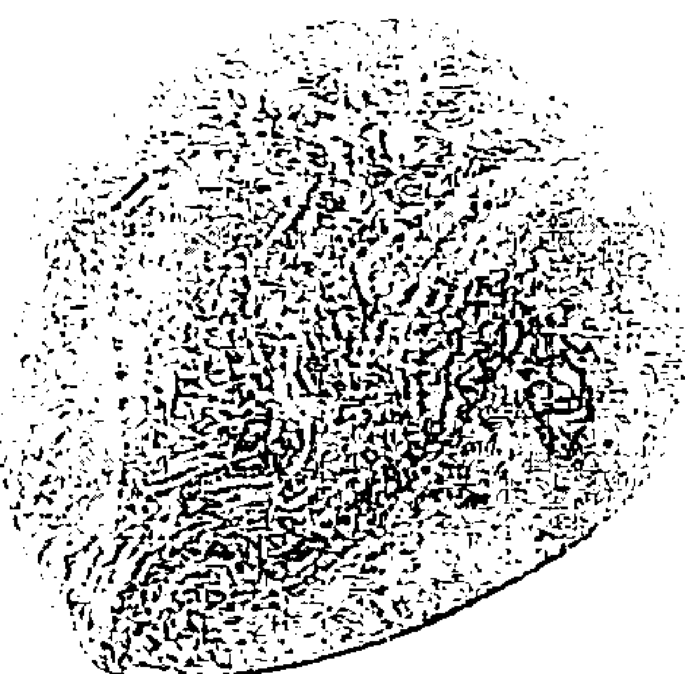

- 颜色：紫色、浅紫色、紫红色
- 产地：俄罗斯、俄联邦萨哈（雅库特）共和国
- 晶系：单斜晶系
- 成分：(K,Na)₅(Ca,Ba,Sr)₈[(OH,F)|Si₆O₁₆|(Si₆O₁₅)₂]·nH₂O
- 硬度：4.5 - 6

〈关键词〉
意识的投影
调节精神和情感的平衡

### 晶石的特征
让人着迷的大理石花纹

查罗石拥有艺术之美，是一种和舒俱来石非常相似的紫色晶石。这种晶石拥有不透明的艳丽的光泽和紫色、黑色以及白色交织在一起的奇特纹路，散发独特的气质。这种大理石花纹是由霓辉石、微斜长石和硅钛钙钾石的橙色部分等矿物交织而成的。这种晶石美不胜收，让人着迷，因此由俄语中的“charo”（魅惑）一词而得名。
查罗石发现于俄罗斯阿尔丹地区的查罗河畔，在1978年被认定为矿石的新种类，是市场上十分罕见的晶石之一。

查罗石象征光明的白色和象征黑暗的黑色巧妙地结合在一起，这告诉我们光明与黑暗同时存在于这个世界上，善与恶并不是完全分开的。它让我们意识到必须直视眼前所面临的问题和困难。
查罗石还能够调节精神与情感的平衡，帮助我们敞开心扉。它能够使我们充分发挥自己的才能，加强我们的创造性，激发我们的无畏精神，赋予我们克服恐惧心理和直面现实的勇气。当我们的人生正处于转折点或即将迎来新的机遇时，查罗石能够带来意想不到的效果。

### 晶石的能量
激发潜藏在我们内心深处的大胆的一面

查罗石和舒俱来石、拉利玛石并称为三大治愈之石。查罗石拥有较高频率的波动，这种能量主要体现在“意识的投影”上，并能帮助我们克服恐惧。当人们凝视着查罗石复杂的波形或漩涡状纹路时，会产生各种各样的联想。有的人会感到恐惧，有的人则会感到难以忘却的心痛……这就是“意识的投影”，可以看做大自然的罗莎哈测验（心理学中让人解释用墨点绘的图形以判断其性格的测验）。查罗石有紫、黑、白三色相间的纹路，潜藏着大自然的讯息。紫色象征意识，与象征光明的白色和象征黑暗的黑色巧妙地结合在一起，这告诉我们光明与黑暗同时存在于这个世界上，善与恶并不是完全分开的。它让我们意识到必须直视眼前所面临的问题和困难。

### 何时使用

当你需要挑战精神时
当你面临转业、搬迁、环境发生变化和整理人际关系时，当你面临决断或诀别时，当你想发现全新的自己时，当你希望克服不安的情绪时，建议你使用查罗石。

#### [使用时的注意事项]
查罗石容易受到热、酸和紫外线的侵蚀。

#### [速配幸运石]
柠檬晶、月长石、粉色方解石、绿玉髓

#### [净化方法]
流水、晶簇、鼠尾草、月光浴

#### [对应的星座 & 脉轮]
巨蟹座、射手座 / 第6脉轮、第7脉轮

> 幸运石寄语
“你的眼前只有一条路，所以勇敢地走下去吧！”

## 玻璃陨石

维系精神和肉体平衡的来自宇宙的使者

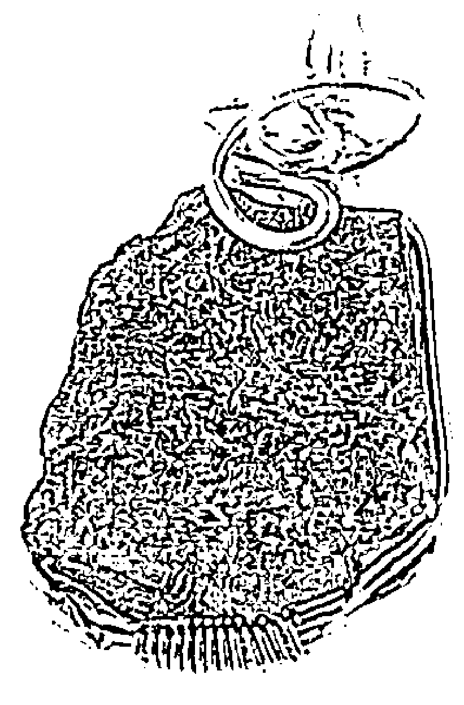

- 颜色：黑色、黑褐色、略带绿色的黑色、黄色、接近无色、绿色
- 产地：泰国、菲律宾、柬埔寨、印度、印度尼西亚、越南、中国、澳大利亚（塔斯马尼亚岛）、利比亚、科特迪瓦、美国（得克萨斯州）、哥伦比亚、捷克
- 晶系：非结晶
- 成分：主要是含量不等的 SiO2、Al、Fe、Ca、Na、K、Mg、Ti、Mn、Cu
- 硬度：5 ~ 6

〈关键词〉
增强精神和肉体的生命力
消除不安和孤独感

### 晶石的特征
神秘的“天外来客”
引发多种争论的晶石

玻璃陨石形状各异，有小圆盘形、算珠形、球形、液滴形、流线型等，多形成于地表附近。这种奇异的形状和出产方式引来人们的诸多猜想。有人认为它是古人的遗物，有人认为它是那些毁灭地球的远古民族引发核战争后的产物，有人认为它是陨石，总之一时之间众说纷纭，各执一词。现在，人们一般认为玻璃陨石是大型陨石冲撞地表，使地表的岩石很快融熔、迅速冷却后形成的天然玻璃。

地表受到强烈的撞击后，大部分四处飞溅的地表物质迅速蒸发，其中一部分冷凝后就形成了玻璃陨石。它的表面坑坑洼洼，这种特殊的凹陷被称为“凹坑”。它的英文名来源于古希腊语中的“tektos”（熔化后形成的固定的形状）一词。除了南极和南美洲之外，其他大陆均发现过这种晶石，因产地较多，它还拥有很多别称。

玻璃陨石拥有众多谜团，它独特的能量不仅能作用于我们的肉体，还能作用于我们的精神，提高灵魂的生命力。玻璃陨石是“天外来客”，它通过将其他行星的能量和地球的能量融合，帮助我们认识、理解和感受另外的世界以及异次元的存在。玻璃陨石以其宇宙般广阔的包容力包裹我们孤独的灵魂，抚慰我们不安、悲伤和孤独的心灵，使我们恢复活力。除此之外，据说它还能够帮助我们促进血液循环，活跃身体细胞，改善身体不适。

### 何时使用

当你想消除不安、悲伤和孤独感时
当你被周围的人孤立、感到孤独时，当你对未来一片茫然、内心不安时，当你感到生活艰辛时，当你身体不适时，玻璃陨石能够带来意想不到的效果。

### 晶石的能量
赋予我们来自宇宙的积极能量

玻璃陨石自古以来就被印度尼西亚、印度、中国等东南亚国家视为神圣之石，它被称为“天火带来的珍珠”，并被用做各种仪式中的道具和装饰品。

#### [使用时的注意事项]
玻璃陨石相对来说比较结实，没有什么事项需要特别注意。

#### [速配幸运石]
捷克陨石、缟玛瑙、黑曜石

#### [净化方法]
月光浴、晶簇、流水

#### [对应的星座 & 脉轮]
白羊座、巨蟹座、处女座 / 第1脉轮、第6脉轮

> 幸运石寄语
“不要幻想自己是孤独的，其实你的周围充满了宇宙之爱。”

## Desert Rose
### 沙漠玫瑰

带给人们柔和的治愈力的永不凋零的玫瑰

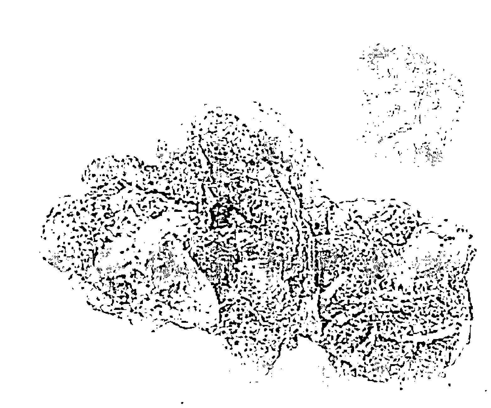

- 颜色：白色、浅褐色
- 产地：墨西哥、澳大利亚、突尼斯、摩洛哥
- 晶系：单斜晶系
- 成分：CaSO₄·2H₂O
- 硬度：2

〈关键词〉
培养宽容之心
断绝不必要的关系

### 诞生于沙漠之中
大自然的艺术品

这是一种在沙漠的沙砾中发现的像玫瑰一样美丽的矿石。其实，“沙漠玫瑰”描述的是“花瓣状的结晶”，任何一种具有这种形态的晶石都可以叫沙漠玫瑰，通常在透明石膏和玉髓中最常见。沙漠绿洲的水枯竭后，从地底蒸发上来的水渗到沙砾中，将它四周的矿物质溶解，最终形成像玫瑰一样的结晶。

沙漠玫瑰多生成于地表以下数厘米至数米处，它内含细沙，在阳光下会闪闪发光。沙漠玫瑰千姿百态，有的是由众多玫瑰状的小结块重叠交错在一起形成的结晶，有的则是一块硕大的玫瑰状的结晶。这种矿石十分脆弱，但由于其外形独特，所以是最具人气的晶石之一。

### 何时使用

当你想与某人或某事一刀两断时
当你想与恋人和平分手时，当你被坏朋友纠缠不休时，当你经常吃得过多、饮酒过度或是热衷于赌博、购物和上网等无法自拔时，当你做事情容易拖沓、不到截止期限无法完成时，沙漠玫瑰都是你理想的护身符。另外，当你想实现梦想或愿望时，沙漠玫瑰也能助你一臂之力。

### 帮助我们找到自己的位置

沙漠玫瑰的寓意是爱和才智。它能够帮助我们认识那些拥有深厚之爱的人。同时它所具有的柔和波动也能够培养我们的宽容之心，帮助我们即使在十分严酷的状况下自身也能够保持冷静与无私，与同处一种环境的人互相帮助。
而沙漠玫瑰的“才智”体现在它能引导人们为了长远打算而克服眼前的诱惑，断绝长久以来形成的不必要的关系或恶习。请记住：使你不能自拔、失去自我的关系或事物会消耗你太多的能量，无益于身心平衡。早些终止此类关系，才能找到自己的正确位置和真正属于我们的缘分。
另外，取其“让顽固的石头开出鲜花”之意，沙漠玫瑰还被人视为“实现愿望之石”。

#### [使用时的注意事项]
沙漠玫瑰外形非常精巧，即使受到微弱的撞击也会被损坏。我们可以把它摆放在房间内作为观赏之用。另外，沙漠玫瑰容易受到水和紫外线的侵蚀。

#### [速配幸运石]
鱼眼石、透明石膏、白水晶

#### [净化方法]
月光浴、晶簇

#### [对应的星座 & 脉轮]
金牛座 / 第1脉轮

> 幸运石寄语
“珍惜生活的每一天，你会慢慢改掉坏毛病和坏习惯。”

## 托帕石【黄玉】

提升感召力和个人魅力的光明的能量

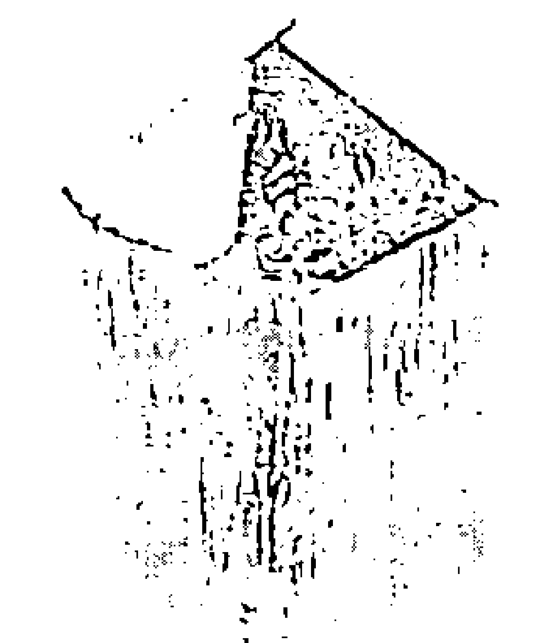

- 颜色：黄色、褐色、浅蓝色、蓝色、浅绿色、橙色、粉色、紫色
- 产地：巴西、墨西哥、美国（得克萨斯州、犹他州、科罗拉多州、加利福尼亚州）、俄罗斯、斯里兰卡、马达加斯加、尼日利亚、巴基斯坦、缅甸、津巴布韦、澳大利亚、纳米比亚、中国、巴西（欧鲁普雷图）
- 晶系：斜方晶系
- 成分：Al₂[(F,OH)₂ | SiO₄]
- 硬度：8

〈关键词〉
激发内在魅力
赋予我们自信和博爱之心

### 晶石的特征
散发耀眼的光彩
色彩丰富的晶石

托帕石作为11月的生辰石为人们所熟知。它澄澈通透，看起来犹如糖块一般。托帕石名称的来源有两种说法，其一是说它发现于红海的一座岛屿，因在大雾中难以发现，该岛被命名为“Topazos”（古希腊语中表示“寻找”的意思），而岛上出产的晶石就被命名为“Topaz”。根据另一种说法，“topas”在古印度梵语中意为“火”，托帕石因其耀眼的外形而得此名。

一般人印象中的托帕石的颜色为黄色至茶褐色，但是也有少量托帕石为蓝色或粉色。其中，颜色类似雪利酒，呈粉色或橙色的特级托帕石是最昂贵的托帕石种类之一，受到人们的珍视。另外，同样达到宝石级的蓝托帕石是利用射线对托帕石进行处理后形成的。而生辰石特指黄色或颜色类似雪利酒的托帕石。

托帕石那种光明的能量能够去除纠缠在我们内心深处的憎恶、嫉妒、恐惧和罪恶感，能够洁净我们的身心，使我们重新恢复活力。它在赋予我们金钱等物质财富的同时，还能够赋予我们自信和博爱之心，为我们带来精神上的富足。也正因此，托帕石还能够激发我们的魅力和精神力量，为我们的未来增加更多的可能性，拓宽我们的人生之路。

### 何时使用

当你希望获得精神与物质的双丰收时

当你已经获得一定的财富，想寻求内心的充实时，或是当你对生活感到满足，想进一步发挥影响力、为社会多作一些贡献时，托帕石都是你的最佳选择之一。另外，当你想改善脏器功能、缓解失眠症时，托帕石也能起到不错的效果。

### 晶石的能量
大地的象征和活力之源
激发我们的魅力

托帕石代表光明、繁荣、富饶，是一种能够增强生命能量的幸运石。在古埃及，它是太阳神拉的象征，能够驱邪避煞，被尊为拥有最强治愈力的晶石。在东方，托帕石是大地的象征和活力之源，能够保护人们免受灾难，为人们所珍视。

#### [使用时的注意事项]
托帕石极易褪色，应小心保管。

#### [速配幸运石]
祖母绿、欧泊、蓝宝石、土耳其石、珍珠

#### [净化方法]
流水、月光浴、晶簇、鼠尾草

#### [对应的星座 & 脉轮]
白羊座、金牛座、双子座、狮子座、处女座、天秤座、巨蟹座、天蝎座、射手座 / 第1脉轮、第2脉轮、第5脉轮

> 幸运石寄语
“要想创造出你所期望的现实，首先要明确你的目标。”

## 电气石【碧玺】

### 带来身心健康的带电之石

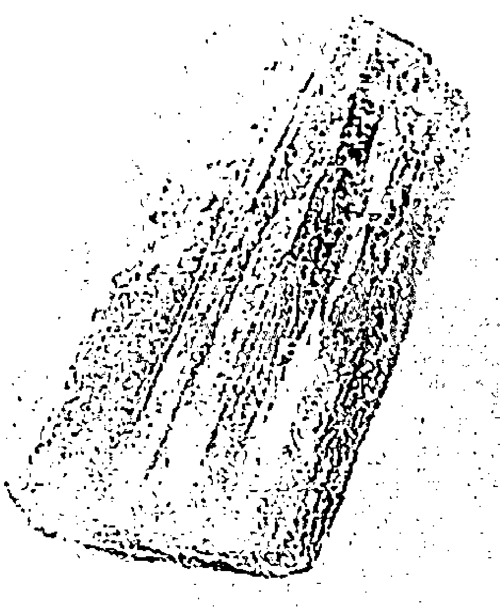

- **颜色**：无色、白色、黑色、绿色、蓝色、浅蓝色、粉色、红色、橙色、紫色、黄色、金黄色
- **产地**：巴西、美国（加利福尼亚州、缅因州）、坦桑尼亚、肯尼亚、津巴布韦、马达加斯加、莫桑比克、纳米比亚、俄罗斯、斯里兰卡、缅甸
- **晶系**：六方晶系（三方晶系）
- **成分**：颜色和种类不同，成分也各不相同
- **硬度**：7 ~ 7.5

#### 〈关键词〉
净化身心
吸收电磁波

### 晶石的特征
颜色多样
带电的晶石

电气石受热时会带电，是10月的生辰石，其英文名来源于斯里兰卡僧伽罗语中的“trumali”（拥有很多东西）一词。电气石结晶的两端分别带有正负电荷，经过摩擦或受热时会产生电。电气石中含有大量能够使金属离子化的钠、镁和铝等元素，所以可以释放负离子，这些负离子能够调节人体的离子平衡，有益身体健康。

电气石的颜色不同，名称也不同。绿色的电气石被称为绿碧玺，红色的被称为红碧玺，蓝色的被称为蓝碧玺。除此之外，还有很多含有两种颜色的电气石，其中结晶的周边部分呈绿色、中间部分呈红色或粉色的电气石被称为西瓜碧玺，受到人们的珍视。

绿色电气石（绿碧玺）的治愈力最为出色，能够治愈我们内心的创伤。黄色电气石能够提高我们的才智，增强我们的好奇心。粉色电气石能够激发我们的个性与魅力。紫色电气石能够赋予我们直觉力，帮助我们改善现状。蓝色电气石（蓝碧玺）能够培养我们拥有仁爱与慈悲之心以及正义感。黑色电气石在为我们带来新的构思和想法的同时，还能够活跃体内细胞，延缓衰老，使我们恢复青春和美丽。茶色电气石能够使我们改变优柔寡断的思考方式，明确自己的目标。西瓜碧玺象征着“阴阳平衡”，能够协调人的身体、精神及人际关系中一切不平衡的状态。无色电气石能够帮我们调节身体状态。

### 晶石的能量
吸收电磁波
使人身心恢复健康和活力

像电气石这种带电的晶石能够传递强大的能量。它能吸收影响我们身体和大脑的电磁波，保护我们的身体，还能够和其他晶石一起使用，增强其他晶石的能量。

### 何时使用

当你想让自己精力充沛、精神焕发时

当你想削弱电磁波的影响时，当你想缓解腰酸背痛、消除疲劳时，当你想缓和紧张情绪、恢复内心的平静时，电气石能够帮助你实现愿望。

#### [使用时的注意事项]
电气石耐水和耐紫外线照射。

#### [速配幸运石]
透明石膏、砂金石、方解石、硅硼钙石

#### [净化方法]
流水、日光浴

#### [对应的星座 & 脉轮]
金牛座、双子座、巨蟹座、狮子座、天秤座、摩羯座 / 第0脉轮、第1脉轮、第3脉轮、第4脉轮、第5脉轮、第7脉轮

> 幸运石寄语
“既非过去，也非未来，我们应该全神贯注于此刻。”

### 星座与守护石的关系

自古以来，幸运石作为守护石一直都受到人们的青睐。在占星术中，每一个星座都有自己的守护石，每一个月份也都有自己的生辰石。若二者组合在一起，将拥有无穷的能量。

### 星座守护石

占星术认为，人类的命运和其出生的那一瞬间天体的位置有着密不可分的关系。十二星座中，每一个星座都有自己的守护石。相传如果人们拥有一块自己的星座守护石，那么就能拥有较强的能量。

除了星座守护石之外，能够让我们的能量如虎添翼的就数生肖石了。如果你同时拥有守护石和生肖石，那么你将获得强有力的支持。

#### ◉ 星座与守护石

- **白羊座 (3/21 ~ 4/19)**
  [守护石] 红宝石
  [生肖石] 红碧玉、珊瑚、红玉髓、金刚石、蓝宝石、血石

- **金牛座 (4/20 ~ 5/20)**
  [守护石] 祖母绿
  [生肖石] 托帕石、青金石、玛瑙、翡翠、绿砂金石

- **双子座 (5/21 ~ 6/21)**
  [守护石] 玛瑙、翡翠
  [生肖石] 白水晶、海蓝宝石、珍珠

- **巨蟹座 (6/22 ~ 7/22)**
  [守护石] 珍珠、月长石
  [生肖石] 红宝石、土耳其石、海蓝宝石、玛瑙

- **狮子座 (7/23 ~ 8/22)**
  [守护石] 金刚石
  [生肖石] 琥珀、红宝石、红玛瑙、橄榄石

- **处女座 (8/23 ~ 9/22)**
  [守护石] 红玉髓、红玛瑙
  [生肖石] 粉色碧玉、菱锰矿、蓝宝石

- **天秤座 (9/23 ~ 10/22)**
  [守护石] 橄榄石、电气石
  [生肖石] 欧泊、蓝宝石、玛瑙

- **天蝎座 (10/23 ~ 11/21)**
  [守护石] 托帕石、欧泊
  [生肖石] 石榴石、珊瑚、红宝石、血石

- **射手座 (11/22 ~ 12/21)**
  [守护石] 托帕石
  [生肖石] 紫水晶、孔雀石、土耳其石、石榴石、青金石

- **摩羯座 (12/22 ~ 1/19)**
  [守护石] 土耳其石、石榴石
  [生肖石] 缟玛瑙、黑曜石、珍珠

- **水瓶座 (1/20 ~ 2/18)**
  [守护石] 紫水晶
  [生肖石] 蓝宝石、青金石、海蓝宝石、翡翠

- **双鱼座 (2/19 ~ 3/20)**
  [守护石] 海蓝宝石
  [生肖石] 金刚石、土耳其石、翡翠、电气石、血石

### 生辰石

生辰石是根据出生的月份进行划分的，相传它起源于犹太教的牧师佩戴在胸前的 12 颗晶石。各个国家的生辰石都不相同。建议大家选择佩戴代表自己出生月份的生辰石，除此之外，也可以佩戴该月的生肖石。

| 出生月份 | 生辰石 | 幸运石象征意义 |
| :--- | :--- | :--- |
| 1月 | 石榴石 | 友爱、忠实 |
| 2月 | 紫水晶 | 爱情、诚实 |
| 3月 | 海蓝宝石、珊瑚 | 幸运、幸福的婚姻、沉着 |
| 4月 | 金刚石 | 永恒的爱、纯洁无瑕的爱 |
| 5月 | 祖母绿、翡翠 | 爱的能量、健康、幸运 |
| 6月 | 珍珠、月长石 | 纯洁、长寿、富裕 |
| 7月 | 红宝石 | 热情、美丽 |
| 8月 | 橄榄石、缟玛瑙 | 和睦、和谐的恋情 |
| 9月 | 蓝宝石 | 诚实、贤明、德高望重 |
| 10月 | 欧泊、电气石 | 幸福、喜悦、忍耐 |
| 11月 | 托帕石、黄水晶 | 智慧、友情、希望 |
| 12月 | 土耳其石、青金石 | 成功、激起斗志 |

# 软玉

联结肉体和灵魂的神圣之石

- 颜色：白色、绿色、深绿色、黄绿色、浅黄色、褐色、黑色
- 产地：美国（怀俄明州、阿拉斯加州）、加拿大（不列颠哥伦比亚省）、新西兰、俄罗斯、中国
- 晶系：单斜晶系
- 成分：Ca₂(Mg, Fe²⁺)₅[OH | Si₄O₁₁]₂
- 硬度：6.5 ~ 7

（关键词）
守护肉体与灵魂
提高洞察力和思考力

### 拥有2000多年的历史
曾被视为最高等的宝石

软玉散发着珍珠光泽和玻璃光泽，是玉的一种。它的形状很像人的肾脏，因此其英文名来源于古希腊语中的“肾脏”（Nephros）一词。很早以前人们认为玉是单一品种的晶石，自1863年起，才将玉分为硬玉和软玉两类。

软玉的内部构造其实非常坚硬，又被称为“斧之石”，用于制作各种武器。除武器之外，在中国，软玉一直以来都作为玉雕工艺的材料被制成多种多样的工艺品。直到硬玉被发现之前，软玉都被视为最高等的宝石，深受人们的喜爱。浅绿色的软玉被称为青玉。现在市面上流通的玉大多是软玉。

肉体的不朽。软玉还象征智慧和平静，被称为“哲学之石”。它能够提高我们的洞察力和思考力，使我们心理上未成熟的部分逐渐成长，培养我们的人格魅力。同时，它也在我们难以解决某些问题时给予启示，帮助我们作出准确的判断。也许正因如此，中国的商人喜欢将软玉随身携带或置于办公桌上，用以保佑事业的成功。软玉和心轮（第4脉轮）有关，能够加深我们的慈悲之心，帮助我们建立良好的人际关系，吸引幸运和友情的到来。

### 增强生命力
提升心智的“灵石”

软玉象征成长与再生，是具有强大保护作用的幸运石。不论古今中外，软玉都被尊为联结肉体和灵魂并保护二者不受损害的神圣之石，用于各种重要的仪式中，或作为陪葬品，受到人们的尊崇和珍视。在中国古代，高贵的软玉就被视为“王者之石”，在帝王下葬时被置于其耳、鼻、口中，以祈祷其肉体与灵魂的再生。中国还曾出土过陪葬的“玉衣”，人们相信软玉可以保持

### 何时使用

当你感到面前有一道无论如何都无法跨越的障碍时
当你想拥有强大的精神力量时，当你想实现目标和梦想时，软玉能够助你一臂之力。

- [使用时的注意事项]
  软玉耐水和耐紫外线照射。
- [速配幸运石]
  翡翠
- [净化方法]
  流水、日光浴、鼠尾草
- [对应的脉轮]
  第4脉轮、第5脉轮

> 幸运石寄语
> “放下那些消极的顾虑，用心去追逐梦想吧！”

# 硅硼钙石【白纹石】

修复功能强大的纯洁之石

- 颜色：白色（带有黑色或褐色条纹）
- 产地：美国
- 晶系：单斜晶系
- 成分：Ca₂B₅SiO₉(OH)₅
- 硬度：3.5

（关键词）
净化身心
强大的灵通力量

### 晶石的特征
陶瓷般细腻的质感

硅硼钙石是白色晶石中十分罕见的不透明晶石，其特征是拥有陶瓷般细腻的质感。未经处理的硅硼钙石没有光泽，不过，稍加研磨就会显露出玻璃光泽。硅硼钙石多产于美国的加利福尼亚州，是一种类似于大理石的洁白而细腻的矿石，其英文名来源于其发现者——加拿大的科学家亨利·豪（Henry How）的名字。

天然的硅硼钙石白色底色中大多掺杂蜘蛛网状不规则的黑色或褐色条纹，由于其内部像陶瓷内部一样十分干净，所以很容易染色。硅硼钙石具有易加工、易上色的特性，因此人们常常将其染成紫色来代替查罗石，或染成蓝色来代替土耳其石。染成紫色后的硅硼钙石与查罗石有着异曲同工之妙。

已内心的选择。

硅硼钙石还具有出色的镇静效果。它能够平息我们由于不满而引发的愤怒之情，帮助我们恢复冷静。通过平定内心的混乱，硅硼钙石可以帮助我们保持身心舒畅。这种镇静效果对我们的睡眠和冥想也有一定帮助，通过为我们带来内心的平静，从而帮助我们进入深度睡眠状态或享受精神之旅。此外，硅硼钙石还具有强大的灵通力量。长时间凝视它，我们的意识就能够在不知不觉中穿越时空，进入另外的时间或空间。

### 何时使用

当你想变得心情舒畅时

当你对很多事情感到愤怒或不满时，当你想集中注意力时，当你想净化身心时，硅硼钙石能够帮助你解决问题。另外，硅硼钙石还具有活跃大脑的功效。

### 晶石的能量
释放纯洁能量的无瑕之石

硅硼钙石是净化作用十分强大的治疗石，它的白色干净而纯粹。虽然白色一直给人纯洁而柔和的印象，不过，实际上它是具有强大能量的颜色，能够驱走黑暗和邪恶，在保护我们不受外界不良事物的侵袭的同时，也可以让我们在陷入利益或情感纠葛时排除私欲与杂念，作出忠实于自

- [使用时的注意事项]
  染色后的硅硼钙石容易受到水的侵蚀，使用时应多加注意。
- [速配幸运石]
  孔雀石、碧玉、锂云母、血石
- [净化方法]
  月光浴、鼠尾草
- [对应的脉轮]
  第6脉轮、第7脉轮

> 幸运石寄语
> “放下争吵和纠纷，试着去祝福身边的每一个人吧！”

# 珍珠

伟大的大海孕育的生命之石

- **颜色**：白色、（深/浅）黄色、黑色、灰色、略带粉色的白色、略带绿色的白色、（浅）青灰色、橙色、（浅）紫色、粉色
- **产地**：[海产]澳大利亚、印度尼西亚、缅甸、泰国、法属波利尼西亚（塔希提岛）、美国（加利福尼亚州）、越南、中国；[淡水产]中国、美国（密西西比州、田纳西河等流域）
  ※ 仅限于养殖珍珠的地区
- **晶系**：斜方晶系（微粒状结晶的层叠）
- **成分**：Ca[CO3] + 有机成分（主要为贝壳硬蛋白：C32H48N2O11）+ H2O
- **硬度**：2.5 ~ 4.5

（关键词）
以强大的守护力保护我们
显著的治愈功效

### 晶石的特征

被称为“晶石中的贵妇人”
有着非凡的气质

珍珠是6月的生辰石，具有高贵的气质。人们所熟知的珍珠是十分名贵的宝石，但由于它生成于贝壳内部，所以严格来说并不属于矿石。一些贝类受到砂粒、寄生虫等异物的侵入刺激后会分泌珍珠质，将异物包裹起来，久而久之就形成了天然珍珠。根据这种原理，人们将异物放入贝壳内，也可以使贝类分泌珍珠质，这样形成的珍珠就是养殖珍珠。

珍珠又分为海水珍珠和淡水珍珠。海水珍珠有珠核，因受到珠核支撑而呈圆形，而淡水珍珠没有珠核，因此形状不定。

珍珠的品质由它的厚度、光泽、形状以及颜色决定。

大的精神压力，带给人克服苦难的忍耐力和勇气。另外，很多人都会在一些诸如红白事等仪式上佩戴珍珠，这是因为它能够驱邪避煞，吸引善良的神灵，以保护佩戴者免受邪气的侵害。

不仅如此，珍珠本身富含钙质及矿物质，有显著的治愈功效，是藏医学中入药的三大晶石之一；西医则常用珍珠与蜂蜜、葡萄酒等一起治疗胃溃疡和高血压等疾病，以及缓解精神紧张。

珍珠对于女性尤其有好处。它不仅赋予人青春的活力，还能培养女性外柔内刚的成熟气质。

### 晶石的能量

以其母性的能量包裹佩戴者

珍珠是一种生成于贝壳内、拥有活跃的生命能量的晶石。在古代，珍珠被认为是“月光之精华”或“凝结在贝壳内的人鱼的眼泪”。因为珍珠是在经历了异物刺激的苦痛、在贝壳的守护下慢慢成长起来的晶石，所以它具有强大的守护力量，象征着“保护受伤的心”和“渡过难关”，能够安慰那些饱经风霜的人，缓解佩戴者的苦闷和巨

### 何时使用

当你需要坚韧与豁达的态度时

当你四处碰壁、感到绝望的时候，当你想由内而外变得美丽时，当你想重新拥有一颗年轻的心时，珍珠能帮助你实现愿望。

- **[使用时的注意事项]**
  珍珠容易受到酸性物质的侵蚀，因此在佩戴后应及时用柔软的布擦拭干净。
- **[速配幸运石]**
  橙色托帕石、蓝晶石、粉水晶、珊瑚
- **[净化方法]**
  月光浴、晶簇
- **[对应的星座 & 脉轮]**
  巨蟹座 / 第0脉轮

> 幸运石寄语
> “你的目标越单纯，你离梦想就越近。”

# 黄铁矿

蕴藏着火山能量的金属水晶

- 颜色：金黄色
- 产地：世界各国（从样本来看，较为人熟知的产地有秘鲁、西班牙、意大利）
- 晶系：等轴晶系
- 成分：FeS₂
- 硬度：6 ~ 6.5

（关键词）
促进想法的实现
保护我们远离危险

### 晶石的特征
大自然创造的轮廓鲜明的艺术品

黄铁矿是一种闪闪发光的金黄色晶石，它的主要成分是铁和硫黄。由于黄铁矿互相撞击后能够擦出火花，因此其英文名来源于古希腊语的“pyr”（火）一词，后由拉丁语中的“pyrites”（火石）演变成现在的“Pyrite”。

由于火山活动而形成的黄铁矿，好像被刀剑切割而成似的，呈立方体或五角十二面体的结晶。其中，五角十二面体的断面被称为黄铁矿面，其独特的形状受到许多人的喜爱。日本的火山带经常出产这种矿石。由于产量较多，人们能够以较为便宜的价格购买到形状完美的晶石。有时，黄铁矿也可能包含于祖母绿、金刚石、蓝宝石和青金石这些矿石中。

发我们的灵感，并将其与逻辑思考相联结，从而促进想法的实现。古代的萨满巫医用黄铁矿做镜子，其中一个原因可能是它有灵通的力量。

另外，黄铁矿还具有出色的保护力，它可以在我们身体周围张开一张防护网，将敌对势力的恶意反弹回去，并在我们从事危险的作业时保护我们。

### 晶石的能量
火山赋予的连接大地的作用

黄铁矿是一种象征火山活动、具有上升能量的晶石。黄铁矿有连接大地的作用，它能够将来自大地的稳定的能量从人的脚底一直输送到头顶，在此过程中修正人体内错误的“气”的流动，使身体恢复原本的机能。

黄铁矿的波动还具有促进左脑与右脑、潜意识与意识之间的信息流通的作用。因此，它能激

### 如何使用

当你需要灵感来打破僵局时
当你感觉自己的能力发挥不出来时，当你需要把握时机或是迎难而上时，黄铁矿能够助你一臂之力。此外，当你想缓解腹痛、增强消化器官的机能，或是为血液提供更多的氧气、改善血液循环时，黄铁矿也具有一定功效。

- [使用时的注意事项]
  黄铁矿很容易变色或脱色，应尽量避免用流水进行净化。其所含的硫酸铁可能刺激皮肤，肌肤敏感的人应尽量避免皮肤直接接触黄铁矿。
- [速配幸运石]
  砂金石、月长石
- [净化方法]
  日光浴、晶簇
- [对应的星座 & 脉轮]
  双子座、狮子座 / 第3脉轮

> 幸运石寄语
> “让光照亮你心中最宝贵的东西吧！”

# 血石【血玉髓】

使人精力充沛、召唤成功的战士之石

- 颜色：深绿色底中带有血红色的斑点
- 产地：印度、俄罗斯、苏格兰、西伯利亚、澳大利亚、巴西
- 晶系：六方晶系（隐晶质）
- 成分：SiO₂
- 硬度：7

（关键词）
增添活力和增强斗争精神
培养宽大的胸怀和温柔之心

### 晶石的特征
拥有基督教血之传说的神圣之石

这是一种深绿色底色中带有红色斑点的晶石。因为红色的斑点看起来好似血滴，所以它又被称为“血石”。它与碧玉属同类矿石，与玛瑙、玉髓属同种结晶。

绿色代表大地的能量，红色斑点能够驱赶恶魔，因此血石被视为拥有绝对力量的晶石，很多人将其制成印章或首饰等随身携带。

关于血石的由来还有另一种说法。相传耶稣被钉在十字架上时，他的血滴在十字架下的碧玉上并渗入其中，于是碧玉就变成了血石。

据说血石最早发现于埃及的赫利奥波利斯（Heliopolis），它的另一个英文名“Heliotrope”来源于古希腊语中代表太阳之意的“Helios”（赫利俄斯）一词。

护身符随身携带。对怀孕的女性而言，血石也是防止流产的护身符。

从促进血液循环的角度来看，血石可以带给人活力，激发人的斗争精神和野心，使我们在逆境中也能奋勇前进。

此外，血石的“血”被视为耶稣为世人牺牲时流下的，因而血石也象征着献身精神。它能够培养我们的包容力和温柔之心，引导我们默默地、毫不吝啬地把爱给予他人。

### 晶石的能量
红与绿形成鲜明对比 增加活力

血石具有强大的补血功效。古埃及人就曾将血石磨成粉末，与蜂蜜混在一起制成补血剂使用。即使不经过调制，血石本身所具有的铁能量的波动也能被人体的气场所吸收，因此人们只需随身携带或将其置于身旁就可以补充血气。在中世纪的欧洲，很多即将奔赴战场的士兵就将血石视为

### 何时使用

当你想克服困难，不断前进时
当你无精打采时，当你痛苦、难受得想大声哭泣时，当你感到自己的能量明显减退时，当你所爱之人没有给你期待的回应时，血石能帮助你解决问题。另外，血石对于补充气血、使身体尽快康复、增进健康也具有明显的效果。

- [使用时的注意事项]
  血石对水和紫外线的侵蚀具有很强的抵抗力。
- [速配幸运石]
  碧玉、硅硼钙石
- [净化方法]
  流水、日光浴、鼠尾草
- [对应的星座 & 脉轮]
  白羊座、天秤座、双鱼座 / 第1脉轮、第4脉轮

> 幸运石寄语
> “目前最重要的是积极进取，勇攀高峰。”

# 蓝玉髓

赋予我们柔和之心的半透明晶石

- 颜色：蓝色、浅蓝色
- 产地：巴西、乌拉圭、印度、印度尼西亚、美国、中国、南非、纳米比亚
- 晶系：三方晶系
- 成分：SiO₂
- 硬度：7

（关键词）
培养豁达开朗的性格
去除内心的隔阂和偏见

### 晶石的特征
作为装饰品被广泛应用 与玛瑙属同类矿石

蓝玉髓是浅蓝色的玉髓。据说优质的蓝玉髓最早发现于古希腊的卡尔西登（Chalcedon），并因此而得名。最初人们说到玉髓，单指那些蓝色的玉髓，此后人们又发现了许多玉髓的变种，并根据颜色和纹理等不同特征给了它们不同的名称。例如，带有条纹的玉髓被称为玛瑙，红色较重的玉髓被称为红玉髓，褐色至橙色的玉髓被称为肉红玉髓，绿色的玉髓被称为绿玉髓等。自 2002 年起，德国的宝石生产者以卓越的技术制造出了一种名为海蓝玉髓（Sea Blue Chalcedony）的晶石，颜色比蓝玉髓更加清浅，颇受人们欢迎。

的联系。即使是自认为独立自主的人，在回顾自己所取得的成就时，也会发现离不开许多人有意或无意的支持与帮助，抑或是刺激与鞭策。发觉这一点，我们就会对自己的际遇——无论是令人愉快还是讨厌的——抱有一颗平和的心，学会领会其出现在自己生命中的意义，从而从根本上改变与他人的相处模式。

蓝玉髓还象征着润泽万物。在古罗马，蓝玉髓作为祈雨之石被用于各种祭天仪式中。人们相信守护植物的月神狄安娜喜欢这种石头，会保佑大地免遭干旱。

### 晶石的能量
推动事物稳步成长

蓝玉髓象征着信任与宽容，仿佛母亲那“轻摇摇篮的手”一般，拥有培养人们的仁爱之心，塑造健全的人格，并推动事物稳步成长的能量。生命的成长与事情的发展都有自己的节奏与周期，无法一蹴而就。当你为迟迟无法得到世人的认可而焦躁不安时，它会引导你意识到这种规律，从而静下心去完成自己可以掌控的部分，在积极的行动中耐心等待时机成熟。

同时，蓝玉髓还能够使人意识到自己与他人

### 何时使用

当你想让自己变得更加成熟、包容时
当你感觉不到自己的价值时，当你觉得自己相形见绌时，当你想作出一些改变却不得不打破安稳的现状时，当你遇到难以忍受的人或事情时，蓝玉髓能够帮你渡过难关。

- [使用时的注意事项]
  蓝玉髓容易受到紫外线的侵蚀，应尽量避免长时间被阳光直射。
- [净化方法]
  月光浴、鼠尾草、晶簇
- [对应的星座 & 脉轮]
  巨蟹座、射手座 / 第5脉轮

> 幸运石寄语
> “不要拘泥于小事，应该以宽大的胸怀去看待你所面临的问题。”

## Blue Lace Agate
蓝纹玛瑙

能够帮人建立良好人际关系的恬静的浅蓝色

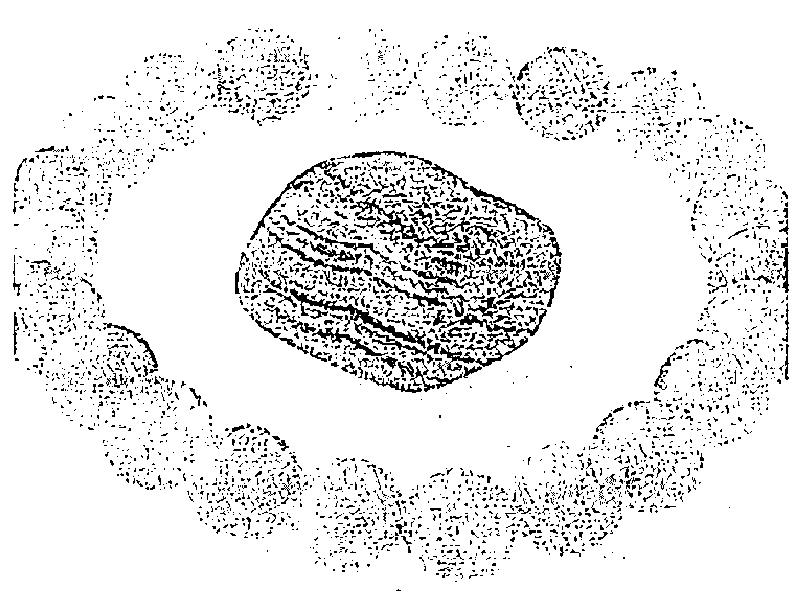

- 颜色：蓝色、浅蓝色
- 产地：巴西、南非、印度、尼泊尔
- 晶系：隐晶质石英
- 成分：SiO2
- 硬度：7

〈关键词〉
拥有平和的能量
促进人与人之间心灵的沟通

### 晶石的特征 浅蓝色的美丽蕾丝花纹

蓝纹玛瑙是一种拥有浅蓝色的蕾丝花纹、柔和而美丽的晶石。在所有的玛瑙种类中，人们将带有浅蓝色蕾丝花纹的玛瑙称为蓝纹玛瑙。由于蓝纹玛瑙漂亮、价格又不高，近年来被大量开采，现在在日本能见到的带有清晰条纹的蓝纹玛瑙越来越少，有时它们会被当成蓝玉髓销售。（玛瑙与玉髓的关系详见本书第23页。）
蓝色底中交织着的白色条纹如随风飘舞的蕾丝。在西藏，这种晶石被视为夜莲花的化身，因此被奉为“神之石”，受到人们的珍视。在古代，它还作为护身符被广泛使用。

当你与朋友发生争执后，它能够帮助你们消除误解，和好如初，使彼此之间的联系更加紧密。它还能缓和紧张的人际关系，放松我们的身心，使我们能够细致地观察他人，了解他人，做到待人处事大方得体，并懂得适时进退，从而帮我们建立良好的人际关系。当你必须和那些不好相处的人合作时，蓝纹玛瑙能够帮助你解决烦恼。
另外，蓝纹玛瑙拥有出色的躲避危险的能力，能够保护我们不受他人的攻击。不仅如此，蓝纹玛瑙还具有强大的治愈力，对喉部和肺部的不适有显著疗效，还能够预防感冒。

### 晶石的能量 拥有平和的能量 加深信赖感

蓝纹玛瑙蓝与白的柔和色调会让人想起雨过天晴后清澈的天空，使人感到平静、安心，还有一点怀旧。这种平和的能量能够帮助我们抑制过于兴奋的情绪、恢复冷静。将它握在手中或是放于办公桌、茶几等经常可以看到的地方，可以让我们时刻保持一种宠辱不惊的良好心态。
蓝纹玛瑙还是友情与纯洁的爱情之石，随身佩戴能够增进人与人之间心灵的沟通，加深彼此间的信赖感，特别是对于加深友情具有明显的效果。

### 何时使用

当你想改善人际关系时
当你想放松身心时，当你希望协调人际关系时，当你对他人的言行反应过激甚至忍不住做出一些不礼貌的行为时，可以使用蓝纹玛瑙。

#### [使用时的注意事项]
蓝纹玛瑙耐水和耐紫外线照射。
#### [速配幸运石]
红玉髓、粉水晶、缟玛瑙、珍珠
#### [净化方法]
流水、日光浴、鼠尾草
#### [对应的星座 & 脉轮]
射手座、双鱼座 / 第5脉轮

> 幸运石寄语
“放松心情，试着与自己对话吧！”

## 葡萄石

提高理解力的“葡萄”水晶

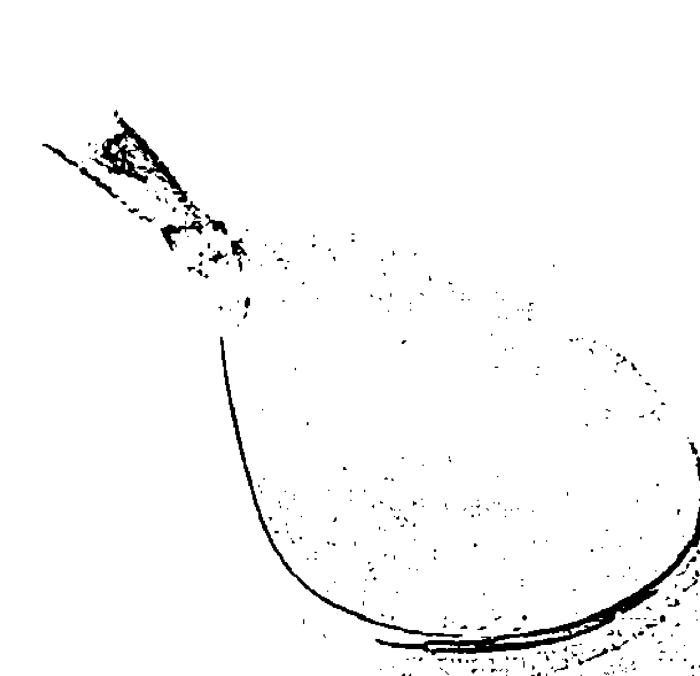

- 颜色：绿色、白色、黄色等
- 产地：澳大利亚、印度、英国、美国、南非、加拿大、法国、意大利、德国、俄罗斯、捷克、中国
- 晶系：斜方晶系
- 成分：Ca₂Al[(OH)₂ | AlSi₃O₁₀]
- 硬度：6 ~ 6.5

〈关键词〉
恢复与大自然的联结
释放体内不必要的能量

### 晶石的特征

由陆军上校发现的颜色和外形都酷似葡萄的晶石

葡萄石呈葡萄般的浅绿色，同时，它又是由葡萄般的块状结晶形成的。葡萄石由德国的矿物学家、之后成为世界著名地质学家的维尔纳（Abraham Gottlob Werner）首次向世人发布，但实际上它最早是由一位喜欢收集矿石的波兰陆军上校浦利恩（Van Prehn）发现的。因此，葡萄石的英文名就是用这位上校的名字来命名的。

葡萄石的颜色除浅绿色外，还有黄色、灰色和白色等，其特征是半透明且发出微弱的光芒。葡萄石常和方解石、沸石、针钠钙石等矿石一起从火山岩的缝隙中被开采出来。色泽荧绿的美丽葡萄石经过凸面切割后，可以被制成装饰品。

葡萄石正是与大自然联系最为密切的幸运石之一，它可以让人在室内仍然能感受到大自然的勃勃生机。

葡萄石的这种波动可以帮助我们释放体内不必要的能量，如愤怒、神经紧张、过度担心等，并补充体内不足的能量。在生理层面上，葡萄石也可以起到调节脏器、淋巴系统平衡的作用，排除其中不好的细菌与污染物，使人们恢复健康与活力。

### 晶石的能量

凝聚大自然的活力
引导我们将能量用到正确的地方

葡萄石是难得一见的结晶形状、颜色都与有机生命酷似的无机矿物，它象征着“恢复与大自然的联结”。

在现代社会，人们被众多人工制品包围，导致人体本来的机能衰退，引发各种疾病，人们有必要重新感受大自然的波动。这时，郊游、在居住空间内摆放绿色植物或是放置有自然能量的天然石，都可以帮助我们维系与大自然的联系。

### 何时使用

当你想恢复身心平衡时
当你很少有机会到郊外感受大自然时，当你想去疗养时，当你变得容易急躁、爱发脾气时，当你活动量不大却经常感到疲惫时，葡萄石能帮你解决问题。

#### [使用时的注意事项]
葡萄石耐水和耐紫外线照射。
#### [速配幸运石]
磷灰石、砂金石、蔷薇辉石
#### [净化方法]
流水、日光浴、晶簇、鼠尾草
#### [对应的星座 & 脉轮]
天秤座 / 第3脉轮、第4脉轮

> 幸运石寄语
“不要再拖延，看清问题背后的真相吧！”

## 萤石【氟石】

缤纷的色彩带来希望之光

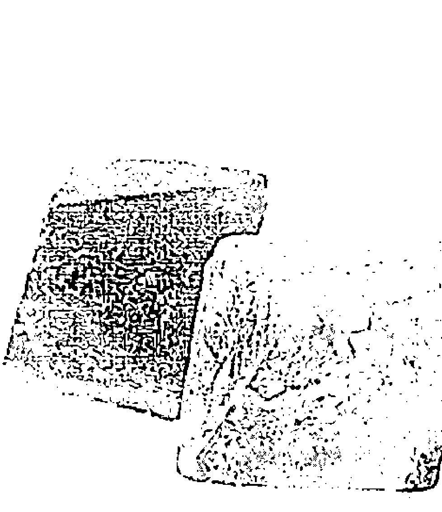

- 颜色：绿色、紫色、黄色、粉色、无色等
- 产地：美国、中国、英国
- 晶系：等轴晶系
- 成分：CaF₂
- 硬度：4

〈关键词〉
指引通向未来的路
提高直觉力，带来灵感

### 晶石的特征 为生活和艺术作出贡献的光之石

萤石是一种在紫外线照射下或受热后能发出奇异光芒的晶石（但请不要擅自加热）。这种晶石发出的光与萤火虫发出的光非常相似，因此被称为“萤石”。又因为它具有易溶解的性质，所以其英文名来源于拉丁语中的“fluere”（流动）一词。萤石的颜色丰富多彩，有绿色、粉色、紫色等，有的萤石黄色底色中含有带状条纹，非常美丽。
萤石不仅作为珠宝饰品受到人们的喜爱，还有许多其他的用途。萤石的成分氟化钙是提取氟的重要矿物，因此可以用来制作平底锅表层的特殊涂料，也是陶瓷、玻璃的原料以及显微镜等特殊镜片的原料，用途十分广泛。

萤石能够提高我们的才智和创造力。绿色萤石不仅能够支持我们在精神层面上成长，还能够帮助我们更加成熟地为人处世。并且，绿色象征着健康，尤其适合长时间用眼或用脑的人。紫色萤石能够提高我们的直觉力，带来新的灵感。蓝色萤石能够使我们脚踏实地。白色萤石能够使我们的心情平静而快乐。无色透明的萤石则和白水晶一样，有净化精神和肉体、祛除邪气的作用，适合做护身符。粉色萤石像其他粉色晶石一样，可以增强恋爱运。

### 晶石的能量 提高我们的才智和创造力 支持我们在精神层面上成长

萤石就好像以柔和之光照亮黑暗的萤火虫一样，充满希望的力量，为我们指引通向未来的道路。它能够帮助我们集中注意力，提高直觉力。当我们遇到难题却找不到解决的办法时，它能够指引我们找到突破口。当我们意志消沉时，它能够激励我们勇往直前。另外，萤石能够为我们带来新的想法和构思，激发出意想不到的灵感。
不同颜色的萤石具有不同的功效。黄色萤石能够提高我们的才智和创造力。

### 何时使用

当你想让自己尽快成长起来时
当你停滞不前时，当你感到压力过大时，当你感到自己不成熟时，当你想及时调整自己、恢复健康状态时，萤石能帮助你解决问题。

#### [使用时的注意事项]
萤石容易受到紫外线及强光的侵蚀，受到撞击后容易碎裂。
#### [速配幸运石]
红玉髓、舒俱来石、烟水晶、橄榄石、粉水晶
#### [净化方法]
流水、月光浴、鼠尾草
#### [对应的星座 & 脉轮]
摩羯座、双鱼座 / 第6脉轮

> 幸运石寄语
“远离感情用事，把自己交给时间，听任时光流逝吧！”

## 赤铁矿

能够反射光线、映照一切的战士的护身符

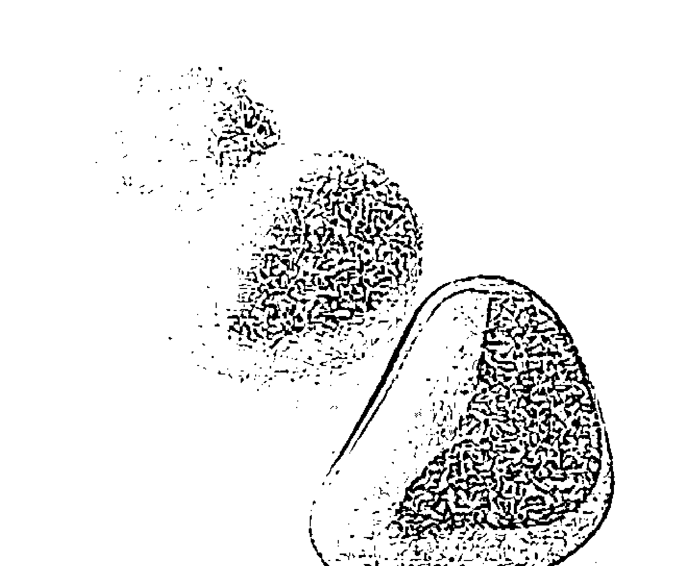

- 颜色：黑色、灰黑色等
- 产地：英国、意大利（厄尔巴岛）、巴西、澳大利亚、印度、墨西哥、古巴、加拿大、美国、德国、中国
- 晶系：六方晶系
- 成分：Fe₂O₃
- 硬度：5 ~ 6.5

〈关键词〉
保护我们不受危险和邪恶的侵犯
激发人的活力

### 重要的炼铁原料

赤铁矿是一种具有金属外观、偏黑色的晶石。将它切断或将它的结晶研碎后，断面或碎屑会呈红色，因此它的英文名来源于古希腊语中的“haima”（血）一词。赤铁矿含 70% 的铁元素，是重要的炼铁原料。由于赤铁矿研磨后会显露银色的光泽，古代的欧洲人曾将其加工成镜子使用。
赤铁矿大致分为 3 种。大多数赤铁矿具有红褐色的层状结晶；除此之外，还有一种赤铁矿具有呈鳞片状聚集在一起的结晶，被称为云母赤铁矿；另一种赤铁矿鳞片状的结晶像玫瑰花瓣一样重叠在一起，又被称为“铁玫瑰”（Iron Rose）。在古巴比伦时期，云母赤铁矿被称为“黑钻”，因为它就像黑色的金刚石一样光芒四射。

赤铁矿具有补血、止血、消炎的功效，可以改善并预防贫血、月经不调、生理期疼痛、眼部充血等疾病或症状。在精神层面上，赤铁矿可以激发人的活力，帮助我们将长期积累在心中的负能量转化为正能量，以减轻精神疲劳，重新充满斗志。
此外，赤铁矿又被称为“替身石”。据说当危险临近时，它能够闪现红光，代替佩戴者承受危险。

### 充满生命力
激发人的求胜心及斗志

赤铁矿被认为与古希腊神话中的战神阿瑞斯有关，又被称为“使战争走向胜利之石”，因此奔赴战场的士兵经常将其作为护身符佩戴在身上。在如今这个和平的时代，人们可以在体育比赛中佩戴赤铁矿，因为它可以起到激发人的求胜心，并帮助人们取得胜利的作用。
同血石一样，具有血色结晶的赤铁矿被认为能够激发人的求胜心及斗志。

### 何时使用

当你感到心有余而力不足时
当你长久以来都想做一件事，却不知为何总是无法迈出第一步时，当你对自己追逐的目标感到筋疲力尽时，推荐你佩戴赤铁矿。当你想选择一个保持健康、远离纠纷和危险的护身符时，赤铁矿也是不错的选择。

#### [使用时的注意事项]
赤铁矿耐水和耐紫外线照射，但是由于结晶的种类不同，也有一些赤铁矿比较脆弱。
#### [速配幸运石]
砂金石、发晶、红玉髓、绿帘花岗岩
#### [净化方法]
流水、日光浴、晶簇、鼠尾草
#### [对应的星座 & 脉轮]
白羊座、巨蟹座、狮子座 / 第0脉轮、第1脉轮

> 幸运石寄语
“当你感到能量不足时，试着去外面散散步吧！”

## 橄榄石

象征照亮心灵的太阳神

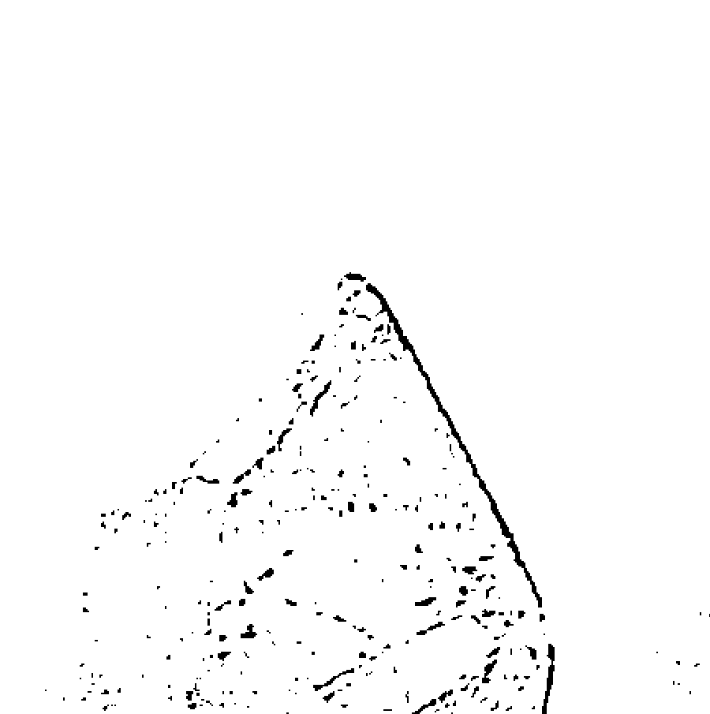

- 颜色：黄绿色、绿色、褐绿色
- 产地：美国（亚利桑那州、新墨西哥州、夏威夷州）、中国、缅甸、巴基斯坦、墨西哥、澳大利亚、挪威、巴西、肯尼亚、芬兰、俄罗斯
- 晶系：斜方晶系
- 成分：由 Mg[SiO₄] 和 Fe²⁺₂[SiO₄] 混合组成
- 硬度：6.5 ~ 7

〈关键词〉
赋予我们智慧和辨别能力
激发内在魅力

### 晶石的特征 曾被称为托帕石的橄榄色晶石

橄榄石通体呈美丽的黄绿色，是8月的生辰石。这种晶石的颜色与我们所食用的橄榄的颜色非常相似，因此它在矿物学中的英文名“olivin”就来源于拉丁语中的“oliva”（橄榄）一词。而在宝石学中，橄榄石的英文为“peridot”，在古希腊语中意为“黄金石”。

橄榄石具有双折射的特性，能够散发耀眼的光芒，因此又被称为“夜之翡翠”。在古希腊和古罗马时期，橄榄石主要产于红海的托帕岛，因此在这段时期，它被称为托帕石。从大约3500年前起至二战前，托帕岛（现称为扎巴贾德岛或圣琼斯岛）都是优质橄榄石的主要产地，该岛出产的一颗319克拉的橄榄石是世界上最大的橄榄石，现存于美国华盛顿史密森尼博物馆。

橄榄石能够消除“不是我的责任”这种逃避问题的想法，使我们勇于承认错误并努力向前。

橄榄石又被称为“可以打破黑暗波动的晶石”，自古以来都被视为能够驱赶恶魔的晶石而得到广泛应用。它能够消除我们对黑暗的恐惧，使我们远离邪恶之物，并赋予我们智慧与辨别能力。此外，橄榄石可以用它明亮的光辉激发我们的内在魅力，从而使我们得到异性以及周围人的关注。

### 晶石的能量 激发进取心 提高他人对我们的关注度和信赖度

在古埃及，橄榄石被尊为“太阳之石”，是国家的象征。当光照不足而导致农作物枯萎时，法老就会通过橄榄石向太阳神拉祈祷，希望借助太阳的力量使农作物复活。如同橄榄石能够照亮黑夜一般，人们相信它的能量也可以穿透心灵的阴霾，治愈人们身心的创伤，引导人们不断进取。

### 何时使用

当你想走出阴影、赢得世人的注目时
当你总是消极地思考问题时，当你感到失落、有挥之不去的罪恶感或恐惧感，或有自闭倾向时，当你心怀嫉妒、怨恨和愤怒之情时，当你想扩大自己的社交圈时，当你想发挥领导才能时，橄榄石能够为你带来意想不到的效果。

#### [使用时的注意事项]
橄榄石耐水、耐热。
#### [速配幸运石]
萤石、孔雀石、月长石、蔷薇辉石
#### [净化方法]
日光浴、流水、鼠尾草
#### [对应的星座 & 脉轮]
处女座、天秤座 / 第4脉轮

> 幸运石寄语
“点亮心灯，让它驱除你内心的软弱吧！”

## 鹰眼石

作为护身符受到人们宠爱的“开启慧眼之石”

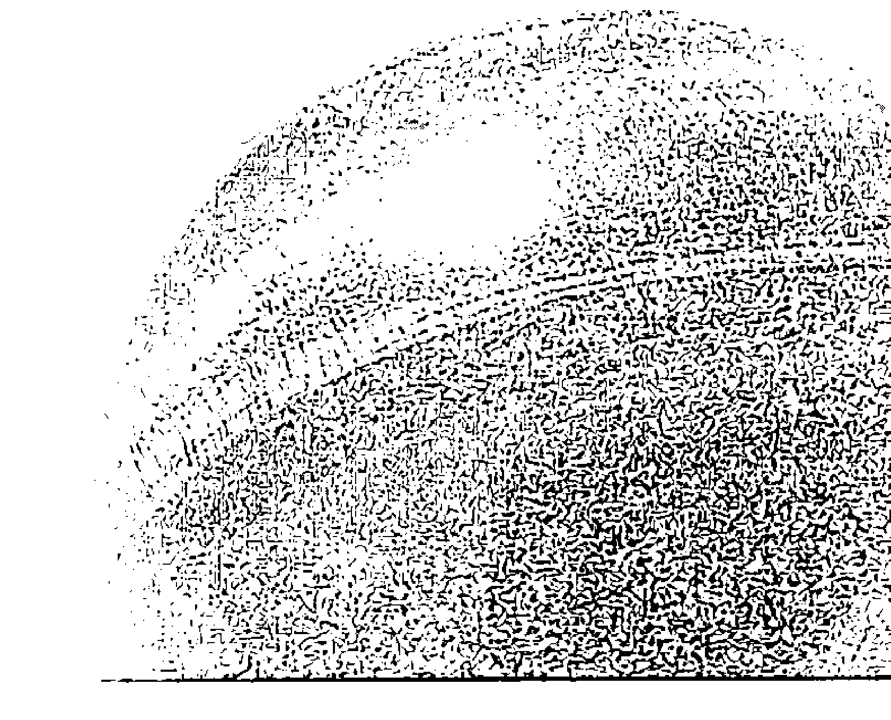

- 颜色：蓝灰色等
- 产地：美国、南非
- 晶系：六方晶系
- 成分：Na₂Fe²⁺₃Fe³⁺₂[OH | Si₄O₁₁]₂
- 硬度：7

〈关键词〉
培养细致敏锐的洞察力
驱除邪恶和负能量

### 蓝色的眼睛
光彩熠熠的神秘之石

鹰眼石是一种深蓝色与灰色交织在一起、像绸缎一样光彩熠熠的晶石。鹰眼石的主要成分是青石棉，与虎眼石属同类矿石，又名“蓝色虎眼石”（Blue Tiger Eye）或“年轻的虎眼石”。与虎眼石中的青石棉已经完全酸化不同，鹰眼石中的青石棉几乎没有酸化，因此保留了原本的颜色。其特征是在接近黑色的底色上，交织着苍蓝色的神秘带状条纹，并在光照下散发美丽的光泽。经过凸面切割后，鹰眼石反射的光芒似鹰的目光一般犀利，它的名字也由此而来。

鹰眼石具有镇静作用，当我们需要保持冷静、作出客观判断时，鹰眼石能够助我们一臂之力。
不仅如此，鹰眼石还能够赋予我们智慧以及躲避危险的能力。由于具有如此强大的能量，鹰眼石自古以来就被作为护身符广泛使用。鹰眼石所拥有的能量能够驱除邪恶和负能量，保护我们的身心不受侵害，而这也会进一步帮助我们心无旁骛地朝着目标果断地前进。

### 培养敏锐的观察力
培养冷静之心

鹰眼石又被称为“在天空翱翔的鹰”，是象征决断和前进的晶石。它可以让我们犹如翱翔在天空中追击猎物的鹰一般，用更广阔的视野观察事物，并用敏锐的观察力发现事物的本质以及自己的长处和短处，从而作出正确的判断。鹰经常被看做神的使者，因此，以鹰的眼光来观察世事，不仅意味着站在高处纵览全局，还意味着以灵性的视野来看待人世间发生的事：将现在发生的事放在因果的长河中，看到其发生的必然性以及对整个人生的意义。此外，深蓝色本身便具有镇静作用。

### 何时使用

当你需要保持冷静和提升对周围事物的敏感度时
当你想加深对自己和社会的了解时，当你因为复杂的人际关系感到困扰时，当你面临重大抉择或重大场合时，当你觉得事情有些失控时，当你埋头苦学时，鹰眼石能够为你带来意想不到的效果。

#### [使用时的注意事项]
鹰眼石耐水和耐阳光曝晒。
#### [速配幸运石]
天河石、拉利玛石
#### [净化方法]
流水、日光浴、月光浴
#### [对应的星座 & 脉轮]
水瓶座 / 第1脉轮、第6脉轮

> 幸运石寄语
“你要对发生在自己周围的事始终保持敏感。”

## 波吉石【堪萨斯神石】

调节阴阳平衡的“新时代”幸运石

- 颜色：灰色、茶色、黄褐色、黑色
- 产地：美国
- 晶系：斜方晶系
- 成分：FeS²+FeOOH
- 硬度：5.0～5.5

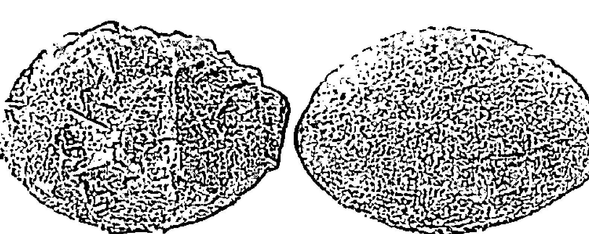

〈关键词〉
调节精神与肉体的平衡
增强身体能量

### 晶石的特征 来自圣地的贤者之石

波吉石是一种由化石形成的、从外观看酷似铁块的独特晶石，一般在作为美国堪萨斯州堪萨族圣地的山上可以采集到。它最初的发现者是美国波吉公司(Boji,Inc.)的凯伦·吉莱斯皮(Karen Gillespie)，她在1972年将其注册为商标“波吉”。此后，波吉石便成为众多水晶治疗师和心理治疗专家的珍爱之物，具有很高的人气。

波吉石是寒武纪中期（约5亿年前）海洋生物变成化石后，经过黄铁矿化作用形成的，含有微量的钯元素。它诞生于海底的淤泥中，饱经风雨的表面被酸化，形成了独特的纹理。

这种晶石分为阳石和阴石两种，阳石相对更耐侵蚀，保持了凹凸不平的形态，而阴石露出地表后多经风化作用被打磨得光滑平坦。通常，在1块阳石周围会围绕着20～50块阴石，形成一个包围圈。阳石和阴石通常是成对出售的。由于波吉石中含有酸性物质，很容易变色，所以现在市面上流通的波吉石成品大多表面发黑，并且经过了特殊加工。

波吉石是治愈力强大的晶石。它含有调节阴阳平衡的能量，阳石和阴石通常成对使用，阳石放在身体左侧，阴石放在身体右侧，这样可以调节气场的流动。如果将它们放在身体的特定部位，能够增强人体细胞的活力，减轻疾病带来的痛苦。

不仅如此，波吉石还具有平衡各种事物的作用。它能够调节精神与肉体、自己与社会、现实与灵性的平衡，还能使潜藏的问题表面化，帮助我们正视问题，从而解决问题。另外，波吉石能够培养我们积极进取的精神，使我们拥有平衡而丰富的人生。

### 晶石的能量 调节阴阳平衡
增强细胞活力

波吉石受到众多欧美治疗师的追捧，是一种治愈力强大的晶石。

### 何时使用

当你的生活只有一个重心时
当你很长时间不曾关注家人或自己的身体时，当你专注现实而忽视了自己的理想时，波吉石能帮助你解决问题。

#### [使用时的注意事项]
波吉石遇水和盐时极易受到侵蚀。
#### [速配幸运石]
白水晶、黑色方解石
#### [净化方法]
日光浴、月光浴、鼠尾草、晶簇
#### [对应的脉轮]
第1脉轮

> 幸运石寄语
“你应该注重自己对复杂问题的想法。”

### 出现在神话或传说中的幸运石

古人相信晶石拥有不可思议的力量，其中一大原因是它们与神话和传说有着密切的关系。在众神的故事和与人类诞生有关的传说中，总能看到各种幸运石的身影。

#### 被视为美丽少女化身的紫水晶

“紫水晶”这个名字的由来要追溯到古希腊时期的神话传说。相传有一天，酒神巴克斯为了消解酒后的愁闷，打算将自己见到的第一个人推到野兽面前。正在这时，美丽的少女阿麦斯特来到了巴克斯面前。在得知了巴克斯的打算后，受到惊吓的阿麦斯特只好向月神阿耳忒弥斯求助。阿耳忒弥斯见此情景，便施展法术将阿麦斯特变成白水晶以保护她的安全。
巴克斯醒悟之后后悔不迭，忏悔之际不小心将手中的葡萄酒洒到了白水晶上。于是，白水晶在瞬间变成了紫色。
由此，人们坚信紫水晶拥有驱魔的力量，它的英文名“amethyst”即来源于古希腊语中的“amethystos”（不醉酒）一词。据说，人们如果用由紫水晶制成的酒杯喝酒就不会喝醉。

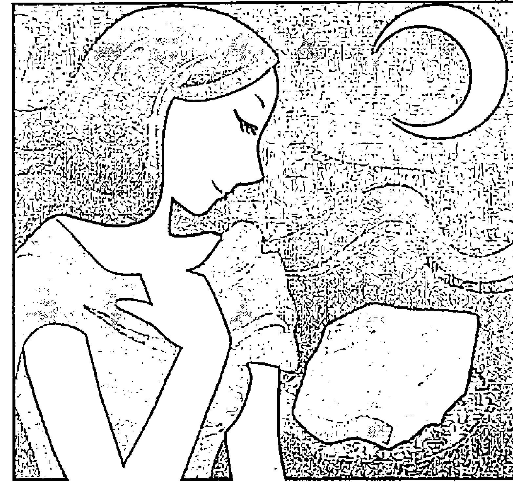

#### 爱与美丽女神孕育的粉水晶

相传古希腊神话中的爱与美丽女神阿佛洛狄忒诞生于大海的泡沫之中。为了赞美她的花容月貌，众神创造了蔷薇。阿佛洛狄忒所到之处，蔷薇盛开，因此，别名为“蔷薇水晶”的粉水晶又被称为“阿佛洛狄忒之石”。
另一种说法是，阿佛洛狄忒吐出的甘甜气息使白水晶变成了粉色，粉水晶由此诞生。

#### 因为猎人的梦境而被找寻到的欧泊矿山

相传古代有一位猎人在梦里见到一只如彩虹般闪耀着七彩光芒的袋鼠。猎人为了抓住这只美丽的袋鼠，手持长矛拼命地追赶。追赶了很久以后，他来到一座红色的山丘，终于抓住了袋鼠。已经跑得筋疲力尽、饥饿难耐的猎人立即生火，美美地饱餐了一顿。虽然袋鼠肉入口即化，鲜美可口，但猎人无法一顿吃完，于是他在山顶挖了一个洞，将袋鼠肉埋在里面，并把长矛立在那里作为记号。
此时，猎人突然惊醒。由于梦境相当清晰、真实，猎人认为这个梦在暗示自己某件事情。于是他凭着梦中的印象一路寻找，果然来到了与梦境中的山丘一模一样的山丘，山顶还立着作为记号的长矛。猎人立刻跑到长矛旁边挖掘，谁知从土中挖出来的不是袋鼠肉，而是光彩夺目的七色宝石。
这是一个在澳大利亚土著中流传的美丽传说，世界上为数不多的欧泊矿山就位于澳大利亚土著所居住的地方。

#### 象征天空之色的蓝宝石

古代波斯人称蓝宝石为“天之石”，他们认为天空的蓝色是由蓝宝石反射的美丽光芒的颜色。除此之外，在古希腊，蓝宝石又被称为“预言之神、太阳神阿波罗之石”。相传当崇拜者为了寻求帮助来到阿波罗的神殿祭祀时，阿波罗手中所捧的宝石就是蓝宝石。

## Malachite
孔雀石

具有解毒作用的治愈水晶

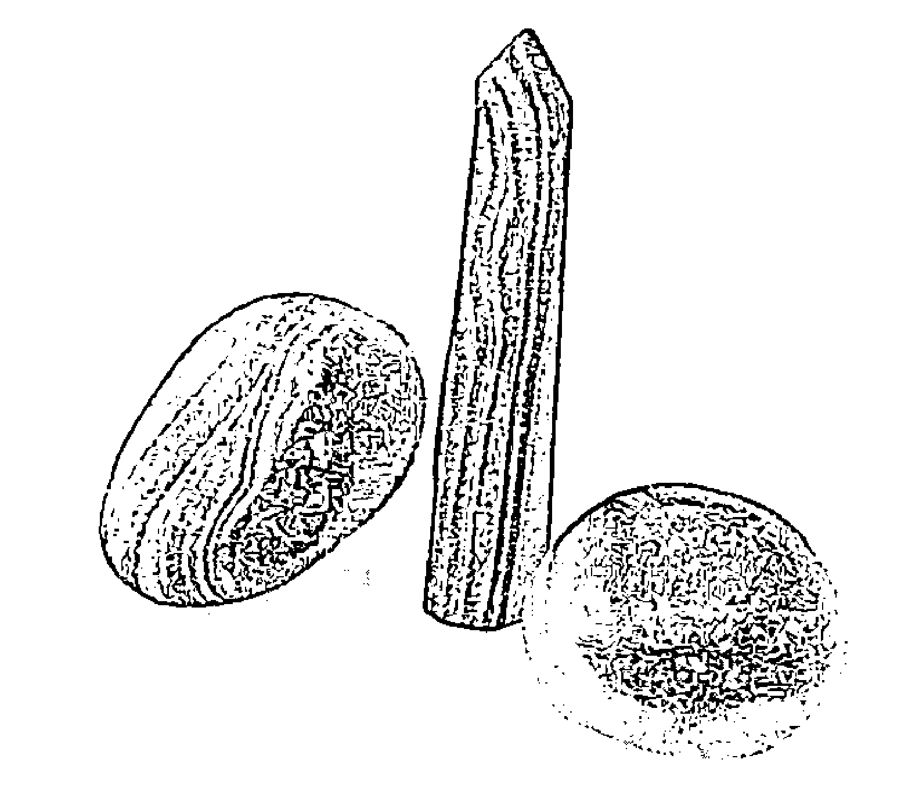

- 颜色：绿色、深绿色、浅绿色
- 产地：刚果、纳米比亚、俄罗斯、美国、墨西哥、赞比亚、澳大利亚、中国
- 晶系：单斜晶系
- 成分：Cu₂[(OH)₂|CO₃]
- 硬度：3.5 ~ 4.5

〈关键词〉
抚慰身心
提升读心力

### 晶石的特征

拥有孔雀羽毛般的纹理
自古以来就被广泛使用的晶石

从公元前 4000 年起人们就已经开始采集孔雀石了。孔雀石是一种绿色的、有着独特条纹的晶石。它那通透澄澈的绿色与锦葵叶子的颜色非常相似，其英文名就来源于古希腊语中的“malache”（锦葵）一词。而在东方，人们发现它的纹理和孔雀羽毛的纹理有异曲同工之妙，因此称它为“孔雀石”。

孔雀石是一种古老的玉料和颜料。早在古代，中国人就用孔雀石来制作玉簪等工艺品。孔雀石即使被研磨成粉末后也能够保持鲜艳的绿色，因此可用来做颜料，也被称为“石绿”。

成分是铜，涂在眼角可以避免小虫侵扰），还因为孔雀石拥有提高洞察力及直觉的准确性的能量，尤其是在解读人心方面。对处于权力斗争中心的埃及艳后来说，她大概也很想更多地了解古罗马皇帝心中所想吧。

孔雀石的纹理像动物敏锐的目光一般，具有强大的除魔能力。相传当危险临近时它会碎裂成两半。在欧洲，自古以来就有将孔雀石当做护身符系在婴儿摇篮上的习俗。

孔雀石能够感知危险，帮助我们远离灾难，也帮助我们与必要的人和事物保持联系。

### 晶石的能量

强大的解毒作用
提高洞察力及直觉的准确性

孔雀石是一种具有强大解毒作用的晶石。它那鲜艳的绿色具有出色的缓解精神压力和紧张情绪的能力，能够缓解我们身体的疼痛。它还有助于我们恢复体力、获得安稳的睡眠。在此特别推荐那些长期失眠的人使用。

孔雀石对眼睛尤其有好处。在古埃及，包括埃及艳后克莱奥帕特拉七世在内，许多贵妇人都喜欢使用由孔雀石粉末制成的眼影。这不仅因为孔雀石十分美观，具有实用价值（孔雀石的主要

### 何时使用

当你想察觉对方的真心时
当你想了解交往对象心中所想时，当你想提升销售能力时，当你想躲避危险时，孔雀石都是最佳的选择。

#### 使用时的注意事项
孔雀石容易受到水的侵蚀。
#### 速配幸运石
珊瑚、琥珀、粉水晶、蓝纹玛瑙
#### 净化方法
日光浴、晶簇
#### 对应的星座 & 脉轮
金牛座、巨蟹座、射手座 / 第3脉轮

> 幸运石寄语
“不应只顾自己，还应关爱他人。”

## Milky Quartz
乳石英

以平稳的能量营造和谐气氛的纯洁水晶

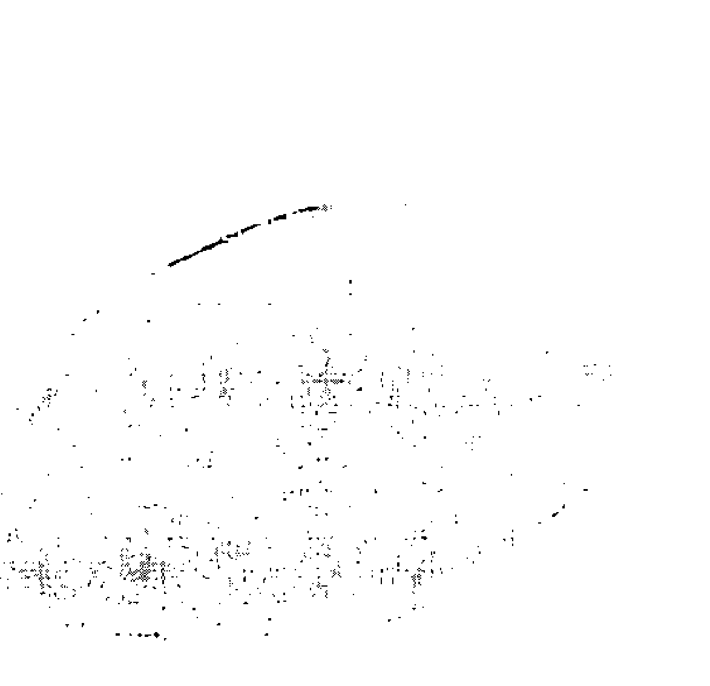

- 颜色：白色
- 产地：巴西、西班牙、智利、马达加斯加、俄罗斯
- 晶系：六方晶系
- 成分：SiO2
- 硬度：7

〈关键词〉
培养慈爱和温柔之心
营造和谐的气氛

### 晶石的特征 因所含杂质而呈现纯洁的白色

乳石英是一种呈乳白色或奶油色的不透明水晶。它的颜色像雪一样洁白，因此又被称为“雪石英”（Snow Quartz）。乳石英之所以呈混浊的乳白色，是因为其结晶中包含气态或液态的包裹体。另外，有些乳石英中含有针这种元素，因此会呈现“星光效果”（数条带状光线看起来像星光一样闪亮）。
除此之外，有的乳石英一个结晶中同时包含透明的部分和乳白色的半透明部分，经常和无色透明的水晶一起被开采出来。

事物的真诚赞美。这些对儿童成来说格外必要，由此他们才能成长为心智健全而富有魅力的人，因此特别推荐儿童将乳石英当做护身符佩戴。
除此之外，乳石英还具有给人补充“基本且绝对必要的能量”的作用，如同喂给宝宝的母乳一般。这种作用有助于强健体质，去除人体内的杂物，并提高人体的免疫力。
乳石英具有如牛奶般细腻而温柔的波动，即使是不适合佩戴水晶的人也可以安心使用。

### 晶石的能量 能够温暖所有人的温柔之石

乳石英是一种让人在疼爱自己的同时，毫不吝惜地向他人奉献自己的爱的晶石，充满了爱与和谐的能量。乳石英能够帮助我们通过向身边的人奉献爱而营造和谐的气氛，从而引导所有事物向好的方向发展。
乳石英又像镜子一样，具有映照人的内心的神奇能力，使我们接受自己与他人的不同，看到自己的长处，从而帮助我们消除自卑的心理。乳石英也能够引导我们拥有丰富的情感，使我们保持对他人的同情、对大自然的亲近，以及对美好

### 何时使用

当你想过平稳的日子时
当你想尽早适应新环境时，当你因为减肥而过分消瘦时，当你的体力和免疫力下降时，乳石英能够助你一臂之力。在此也推荐那些不适合佩戴透明水晶的人使用乳石英。

#### 使用时的注意事项
在利用月光进行净化时时间不宜过长。另外，乳石英很容易吸收佩戴者的负面想法，需经常进行净化。
#### 速配幸运石
烟水晶
#### 净化方法
月光浴、流水
#### 对应的星座 & 脉轮
巨蟹座 / 第7脉轮

> 幸运石寄语
“尝试着让光明驱走你心中那些不恰当的想法吧！”

## 月长石

含有月之光华与能量、象征女性的晶石

- 颜色：无色、白色、灰色、橙色、浅绿色、黄色、褐色、浅蓝色等
- 产地：斯里兰卡、印度、马达加斯加、缅甸、坦桑尼亚、美国、朝鲜
- 晶系：单斜晶系
- 成分：K[AlSi3O8]
- 硬度：6 ~ 6.5

〈关键词〉
提高女性魅力
激发对未来的信心

### 晶石的特征

与太阳石形成鲜明的对比
散发神秘的青白色光芒

月长石散发着柔和的青白色光芒。与珍珠一样，它也是6月的生辰石。它的表面所呈现的光芒犹如朦胧的月光，因此又被称为“月之石”。这种晶石正如它的名字一样，自古以来就与神秘的月亮息息相关，在世界各国都受到人们的青睐。这是一种从乳白色到半透明到无色的晶石，有些还略带米色、橙色、黄色、蓝色、灰色、绿色、粉色和黑色等颜色，色彩缤纷。其中，带有幽蓝色彩、透明的月长石尤为珍贵。

来看，月长石也适合作为远距离联系的守护石。此外，它对那些处于月经期、更年期和妊娠期以及刚刚生产完的女性尤其有益。

月长石又被称为“预言之石”，能够赋予我们预知未来的能力。相传在古印度，祭司会在满月之夜口含月长石，以此来获得神的启示。考虑到口含石头容易误吞，我们可以将月长石置于嘴角，面向月亮许愿，或想象一下计划能否顺利进行，能否看到清晰的前景。

月长石散发的光芒犹如淡淡的月光，这是两种矿物重合后形成的特殊结构所致。除此之外，有的月长石散发七色光芒，被称为“彩虹月光石”。

### 晶石的能量

用照亮夜空的“月光”召唤幸福

### 何时使用

当你想获得无法用肉眼看到的信息时
当你想开始一段新恋情或想加深与恋人的关系时，当你想对计划更有把握时，可以借助月长石的力量。此外，它还能够帮助女性消除身体上的不适，也可以作为旅行时的护身符。

月长石是一种蕴含月亮能量的神秘之石，与水晶相同，自古以来就拥有各种各样的治愈能力。月亮是女性的象征，所以月长石具有帮助女性的力量。它能够孕育温柔而伟大的爱，提高女性魅力，促成美好的恋情。在中世纪的欧洲，月长石是送给恋人的最好礼物。若是送给你心动的异性，可以促成恋情的萌芽；若是送给有好感的朋友，可以促使对方重新审视你的存在。另外，从月光普照大地这点

#### 使用时的注意事项
月长石耐水和耐紫外线照射，可在满月之夜进行月光浴，净化效果非常显著。
#### 速配幸运石
绿玉髓、太阳石、黄铁矿、藓纹玛瑙
#### 净化方法
日光浴、月光浴、流水
#### 对应的星座 & 脉轮
巨蟹座、处女座、天秤座、摩羯座、双鱼座 / 第4脉轮

> 幸运石寄语
“现在是重新开始的时刻。洗净心灵后，向前踏出第一步吧！”

## 陨石
### 跨越了几万光年才到达地球的宇宙能量

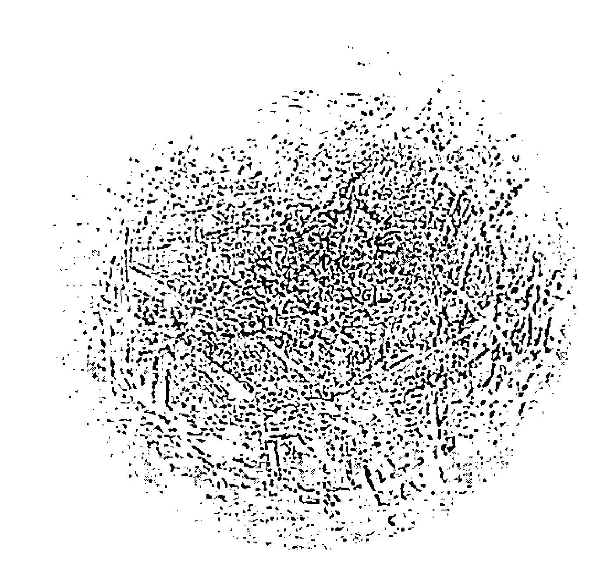

- 颜色：褐色、灰黑色、黑色
- 产地：澳大利亚、美国、墨西哥、中国、俄罗斯、南极大陆
- 晶系：大多数为岩石，晶系不定
- 成分：种类繁多，成分不定
- 硬度：硬度不定

〈关键词〉
提高灵性
赋予我们强大的意志

### 陨石的特征 由铁和镍等合金组成

陨石的英文名来源于古希腊语中的“meteoron”（从天空而来）一词。它形成于数十亿年前，被认为是太阳系诞生之初行星的残留物。
根据所含成分的不同，陨石可分为铁陨石、石陨石和石铁陨石 3 类。虽然陨石的外表看起来很像普通的石头，但因为其含有铁和镍等合金成分，切割后会闪耀金属光泽。其中，无球粒陨石从外表看酷似金属，切割后断面会呈现不可思议的几何图案，充满了神秘感，被称为“维斯台登图案”（Widmanstatten Pattern）。这种图案以人类目前的技术是无法制造出来的。因为稀有，它曾被高级腕表品牌劳力士用来制作表盘。陨石的成分与地核和地幔的成分非常接近，因此作为研究地球构造和宇宙之谜的珍贵资料受到矿物学家和物理学家的关注。

的物质，因而具有纯净的能量。它含有许多其他星球的信息，能够让我们认识人类和地球都是宇宙的一部分，从而使我们回归到人类原本的思考方式和生活节奏。此外，陨石能够提高灵性，赋予我们强大的意志。它给予我们犹如宇宙般高远的智慧，帮助我们消除杂七杂八的小烦恼，最终达成愿望。
陨石那不可捉摸的断面图案包含着“宇宙的信息”。就像唱片必须放进唱片机才可以播放优美的音乐，要解读这样的无字天书，必须依靠媒介——使用者本身——将意识专注于解决眼前的问题，陨石中的线索才会显现。

### 陨石的能量 传送神秘的信息 帮助人们实现愿望

陨石是一种来自遥远的外太空、经过很长时间才到达地球的神秘矿石。陨石之中包含着宇宙的真理、神的意志和理念等许多神秘的信息，自古以来就受到许多人的推崇。
陨石在穿越地球的大气层时燃尽了所有不纯

### 何时使用

当你拥有坚强的意志时
当你想实现愿望时，当你想增强自己的意志时，当你想提升灵性时，陨石能够助你一臂之力。

#### 使用时的注意事项
陨石中含有许多金属物质，应该避免用水进行净化。
#### 速配幸运石
缟玛瑙、白水晶
#### 净化方法
日光浴、月光浴、鼠尾草、晶簇
#### 对应的脉轮
第7脉轮

> 幸运石寄语
“从大的视角观察现在的状况，才能够发现解决问题的方法。”

## Moss Agate
藓纹玛瑙

具有如森林浴般治愈灵魂和肉体的能力的花园水晶

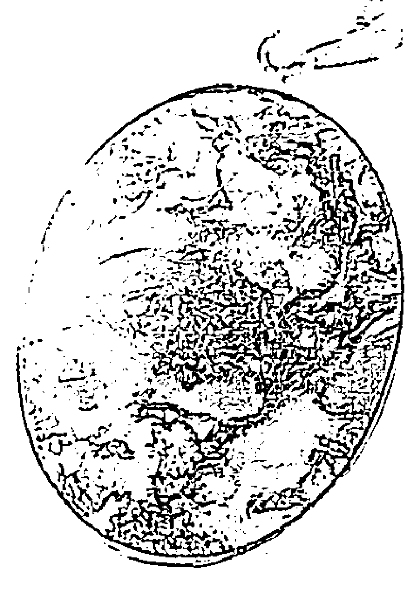

- 颜色：绿色等
- 产地：印度、美国（蒙大拿州、俄勒冈州、爱达荷州）、坦桑尼亚、中国
- 晶系：六方晶系
- 成分：SiO2
- 硬度：7

〈关键词〉
带来富裕和繁荣
控制情感

### 晶石的特征
犹如融入了植物一般的纹路
拥有极高的人气

藓纹玛瑙是一种含有苔藓或草叶形状纹路的绿色石英。它之所以能呈现如此特殊的纹理，是由于它含有绿泥石、铁和氧化锰等矿物。因为所含矿物的种类不同，有的藓纹玛瑙还带有褐色、黑色和红色等颜色。
在欧洲，除英国以外的其他国家都将拥有绿色纹理的玛瑙称为藓纹玛瑙，其他颜色的则称为苔纹玛瑙，但是在英国和美国，不同颜色的这种晶石在名称上并无区别。
藓纹玛瑙又被称为“风景玛瑙”和“草枝水晶”，其绿色的纹路犹如风景画一般美不胜收。它是大自然的艺术品，在世界上拥有极高的人气。

自然的一餐一饭、来自周围人的关心等，怀有一颗感恩的心才是接受大自然恩泽的最好方式。
藓纹玛瑙还具有调节精神平衡的能力，能够帮助我们舍弃执著之念和多余的自尊心，从而控制混沌的感情。它能够帮助我们自我反省，培养我们对周围人的仁爱之心，因此特别推荐那些表面很强势却无法与他人顺利沟通的人使用。它与森林浴具有相同的功效，能够帮助人洁净身心，消除闷闷不乐的情绪。

### 晶石的能量
富裕和生生不息的象征
调节精神平衡

在古代，藓纹玛瑙被作为“农业的守护神”用于祈祷丰收的仪式中。人们认为它含有植物的能量，能够促进农作物等各类植物的生长。在当时，粮食是否充足与一个民族的繁荣息息相关，因此它也是富裕和生生不息的象征。
藓纹玛瑙内类似植物的花纹还能够赐予我们自然的恩泽。它让我们懂得珍惜生命，同时教会我们对地球上的一切喜悦和美好心怀感激，比如来自大自然的一餐一饭、来自周围人的关心等，怀有一颗感恩的心才是接受大自然恩泽的最好方式。

### 何时使用

当都市生活令你疲惫不堪时
当你感到疲惫不堪时，当你想改善人际关系时，当你想变得和善时，藓纹玛瑙能够为你带来意想不到的效果。另外，从事农业生产的人可以将藓纹玛瑙当做护身符佩戴。

#### 使用时的注意事项
藓纹玛瑙耐水和耐紫外线照射。利用从树叶的缝隙照进来的阳光对其进行净化，效果尤其明显。
#### 速配幸运石
砂金石、绿龙晶、月长石
#### 净化方法
流水、日光浴、鼠尾草
#### 对应的星座 & 脉轮
巨蟹座、处女座 / 第4脉轮

> 幸运石寄语
“现在你最需要的就是调节身心平衡。”

## Morganite
摩根石

教会我们温柔之爱的母亲之石

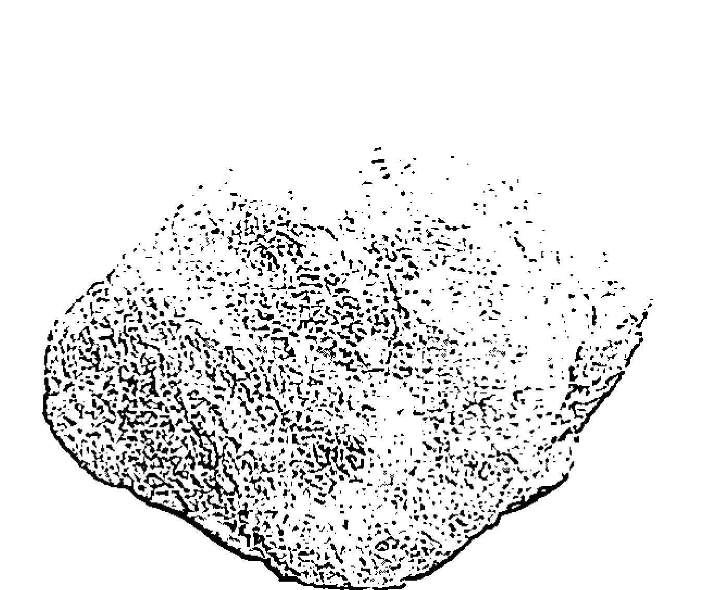

- 颜色：粉色、偏粉色的黄色
- 产地：巴西、美国（加利福尼亚州）、纳米比亚、莫桑比克、意大利、马达加斯加
- 晶系：六方晶系
- 成分：Al₂Be₃[Si₆O₁₈]
- 硬度：7.5 ~ 8

〈关键词〉
让我们领会爱的本质
激发潜在魅力

### 晶石的特征

成分的不同带来颜色和形状上的巨大差异
摩根石是一种呈浅粉色、散发玻璃光泽、透明或半透明的晶石，它是绿柱石的一种。摩根石之所以呈粉色，是因为它含有锰元素，这种柔和的色彩特别受女性的青睐。另外，在粉色的摩根石中，那些色彩浓重、有华贵之气的被称为“草莓红绿柱石”（Pezzottaite），是2003年新发现的晶石品种。
1911年，摩根石在马达加斯加被发现。它的英文名源自美国银行家、曾是历史上最大的美术品收藏家J.P.摩根（J.P.Morgan）的名字。
与摩根石同属绿柱石的还有绿色的祖母绿和浅蓝色的海蓝宝石等。和它们相比，摩根石更为稀少，却因人气不如祖母绿和海蓝宝石高，大多经加热处理后作为海蓝宝石出售。

我们无法爱自己的原因。摩根石引导我们意识到：与所爱之人的纠纷往往源于对自己的不认可，只有学会接受自己，认可自身的价值，才能真正地去接受别人、爱别人。
除此之外，摩根石还能够激发我们潜在的魅力，增强我们的自信心，让我们勇往直前。一旦我们拥有自信，自然就会散发迷人的魅力，成为一个高雅脱俗的人。摩根石也具有刺激女性荷尔蒙分泌的作用，对痛经和体寒等女性疾病具有显著疗效。

### 晶石的能量

以其深厚之爱提高人性的魅力
摩根石象征爱情、纯粹和优美。粉色本就拥有爱的能量，摩根石的粉色结晶微细而透明，与爱的根源——光——融为一体，散发出柔和而梦幻的波动。因而，摩根石可以唤醒我们内心最纯粹的部分，如单纯清澈的初恋记忆，让我们的心脱下层层防备的外衣，忘记竞争、喜恶等一切让

### 何时使用

当你想变得更加美丽、温柔且充满爱时
当你想让恋情持久时，当你的依赖心过强时，当你不够独立时，当你希望获得灵魂上的成长时，摩根石能够助你一臂之力。

#### 使用时的注意事项
应尽量避免让摩根石受到阳光照射。
#### 速配幸运石
磷灰石、紫水晶
#### 净化方法
月光浴、流水、鼠尾草、晶簇
#### 对应的星座 & 脉轮
双鱼座 / 第4脉轮

> 幸运石寄语
“光是爱的根源。当你迷茫时，试着用温暖的光照亮内心吧！”

## Moldavite
捷克陨石

促进意识的进化、超越时空的晶石

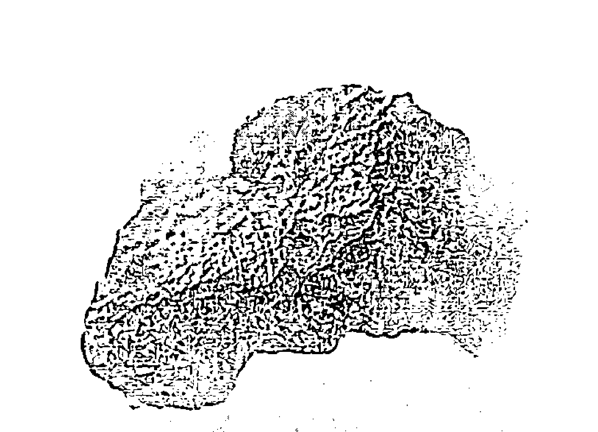

- 颜色：绿色、略带黑色的绿色
- 产地：捷克
- 晶系：非晶质
- 成分：SiO2+ 氧化铝 + 其他
- 硬度：5 ~ 6

〈关键词〉
与宇宙意识相融合
教给我们人生的意义

### 晶石的特征 发现于捷克摩达维河的陨石

捷克陨石是一种在光线照射下能够散发玻璃光泽的绿色或深绿色矿石。它是由距今约 1500 万年前掉落在德国南部城市诺德林根的陨石形成的。捷克陨石最初发现于在德语中被称为“Moldau”（摩达维河）的河流附近，因此其英文名为“Moldavite”。
想象一下，一块巨大的陨石撞击地球，地表物质向四周飞溅，和陨石一起熔化后形成玻璃状物质并在瞬间凝固，便形成了捷克陨石。捷克陨石独特而美丽的形状充满了神秘感，一般无需切割就可直接使用。它又被称为“玻璃陨石”和“暗绿玻璃”。

还有的人会有种回家的感觉。这是因为他们的灵魂根源本在宇宙中，而在地球上生活时被拘束在肉体内，因此感到格格不入，总会和别人发生摩擦或封闭自己的内心，而捷克陨石可以舒缓这种感受。
捷克陨石还可以帮助我们解决与轮回转世有关的问题，例如获知自己在前世有哪些未完成的夙愿，以此明确自己生存的意义。
由于捷克陨石能量强大且集中，刚刚接触的人可能感到莫名的兴奋、头痛等，这些都属于正常现象。还有很多人感觉不到任何变化，建议他们在佩戴前进行一周左右短时间的冥想，以熟悉捷克陨石的波动。

### 晶石的能量 促进宇宙与地球之间的和谐

捷克陨石是蕴含强大的精神力量的矿石之一。它蕴藏着无穷的宇宙智慧，能够促进孕育生命、被视为灵魂故乡的宇宙与地球之间的和谐，让我们意识到自己是宇宙的一部分。
在被认为治愈功效明显的所有绿色系晶石中，捷克陨石的治愈功能最为强大，它所发出的波动能能够与我们自身的波动产生共振，将我们的能量提高到更高的次元。每个人对这种能量的感受都不同，有的人会发现幸运的巧合增多，有的人会感到精神创伤被治愈，有的人在冥想时能进入更深的层次，

### 何时使用

当你无法适应每天的生活时
当你想消除对未来的不安时，当你想进行精神上的探求时，捷克陨石能够为你带来意想不到的效果。除此之外，它还具有去除体内毒素的功效。

#### 使用时的注意事项
捷克陨石容易碎裂，随身携带时最好装在厚布袋中。
#### 速配幸运石
坦桑石、红宝石、电气石、月长石
#### 净化方法
日光浴、月光浴、鼠尾草、晶簇
#### 对应的脉轮
第6脉轮、第7脉轮

> 幸运石寄语
“放下心中的执著，你将发现自己会发生巨大的变化。”

### 历史人物所喜爱的晶石

历史上喜欢晶石的美丽女子和名人不计其数，他们都被晶石的魅力所吸引。有时，它在提高人们的潜能的同时，也可能毁灭一个人。下面就来介绍几则有关历史人物的逸闻。

#### 埃及艳后所钟爱的祖母绿

祖母绿通透翠绿、光芒四射，很多人都为之着迷，其中最著名的崇拜者当属埃及艳后克莱奥帕特拉七世了。克莱奥帕特拉一生钟情于祖母绿，甚至拥有一座祖母绿矿山。她不仅自己经常佩戴祖母绿首饰，还会将它赐予她所宠爱的男性下属，或者赏给国家的功臣。

克莱奥帕特拉之所以喜爱祖母绿，不只因为它名贵而美丽，还因为祖母绿具有提高记忆力、使人善于辞令以及拥有敏锐的洞察力的功效。对一位强国的最高统治者、一个身为柔弱女子却保全了整个王朝的女人来说，祖母绿帮助她将其高超的政治手腕发挥到了极致。

直到 1818 年，这座长期以来一直披着神秘面纱的克莱奥帕特拉矿山才在埃及的红海附近被世人发现。但遗憾的是，矿山中的祖母绿已经被克莱奥帕特拉挖掘一空了。

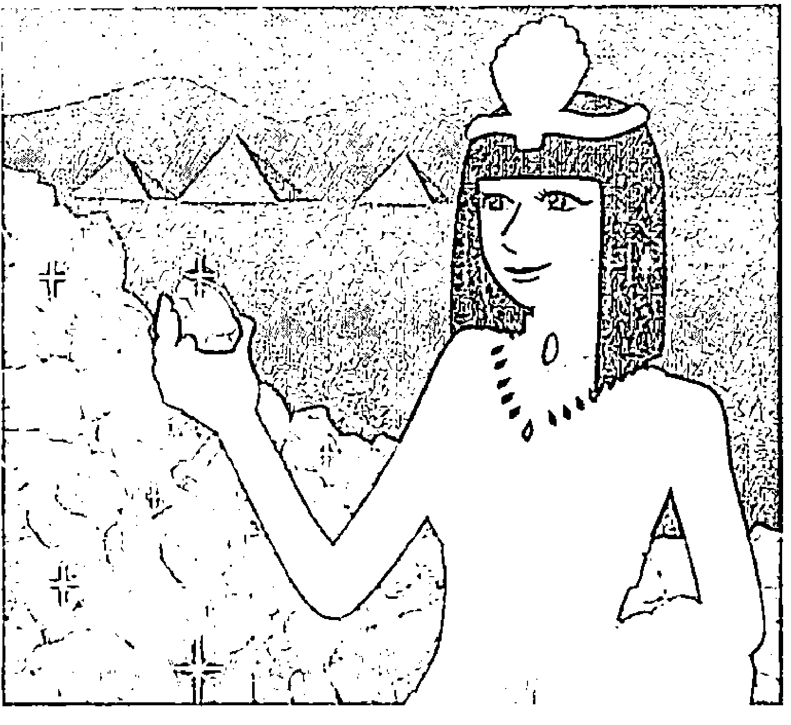

#### 将王妃逼入绝境的钻石

“如果不能买钻石，当王妃又有何用？”这句话是法国王妃玛丽·安托瓦内特的口头禅，由此可见她对钻石的痴迷程度有多深。据说她特别钟情于钻石和珍珠，曾让工匠为她打造了镶有 540 颗钻石的豪华首饰，引起国民对王室的不满，随后引发了法国革命。

相传这起“王妃的首饰事件”实际上是一场陷害玛丽的阴谋，并最终将她送上了断头台，而那件豪华首饰自始至终也没被送到玛丽手中，而是被人拆解后卖掉了。

#### 被时代愚弄的珍珠女王

16 世纪，苏格兰女王玛丽一世 5 岁时被选为法国王妃远嫁到法国。当时，她从继母卡特琳·德梅迪西那里获赠了 7 颗价值不菲的珍珠。玛丽对这些珍珠珍爱有加，此后，她和它们一起健康而快乐地成长。

然而 18 岁时，玛丽的丈夫不幸病死。成为寡妇的她带着这 7 颗珍珠回到了故乡。失意落魄的玛丽随后又嫁给了年轻、英俊的达恩利勋爵，但是由于不满他旁若无人的行为举止，玛丽最终和情夫一起密谋杀害了他。这件事成为后来英国国内暴动的导火索，玛丽也被逮捕，在度过了长达 19 年的幽禁生活后，她最终被处以死刑。玛丽所珍爱的那 7 颗珍珠最后由伊丽莎白一世获得，成为英格兰王室的财产。

#### 用名人的名字来命名的晶石

大文豪歌德（Goethe）是德国矿物学会的创始人之一，他尤其喜爱花岗岩，甚至发表了一篇名为《有关花岗岩》的论文。在日本被称为针铁矿的晶石，其英文名“Goethite”就来自歌德的名字。

另外，为了纪念从矿物中发现镭元素的居里夫人（Curie），人们将板铅铀矿的英文名命名为“Curite”。

## Unakite
绿帘花岗石【尤纳克石】
多种矿石的混合，带来平静与安宁

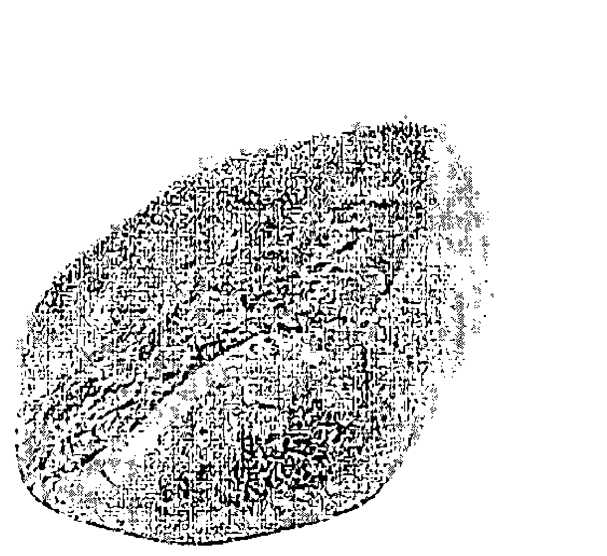

- 颜色：黄绿色、褐色、粉色、白色、深绿色等
- 产地：美国（南卡罗来纳州）、津巴布韦、爱尔兰、南非
- 晶系：集合构造（岩石）
- 成分：长石、石英、绿帘石等的集合体
- 硬度：6.5 ~ 7

（关键词）
治疗精神创伤和消除恐惧
具有显著的放松身心的功效

### 晶石的特征 来自尤纳卡岭的混合矿石

绿帘花岗岩是一种交织着白色、深绿色、橙色和粉色，散发微弱光泽，充满柔和能量的矿石。石英的白色、绿帘石的黄绿色、绿泥石的深绿色、长石的橙色和粉色等几种矿物的颜色集于一种矿石之中，色彩缤纷，展现出复杂而独特的个性。
绿帘花岗岩原产自美国北卡罗来纳州的尤纳卡岭（Unaka），并因此而得名。它因为具有丰富多彩的颜色和多样的纹路而受到人们的喜爱，多作观赏之用。

时候放下了……占矿石一半以上成分的黄绿色的绿帘石，具有强大的放松身心的功效，能够消除恐惧心理，让我们获得安全感，敞开心扉接受他人的爱和善意。粉色和橙色的长石能够将温暖的能量传递至人体全身。白色的石英和深绿色的绿泥石能够为我们带来安宁与平静。
通过这种想法的改变，我们的能量会再次调整到自由通畅的状态，使我们有勇气面对现实，并对未来保持乐观。

### 晶石的能量 能够治愈心灵的创伤 放松身心

由多种矿物混合而成的绿帘花岗岩，其能量并不仅仅是多种矿物能量的简单叠加，还由于矿物间的相互作用，具有特殊的能量。
这些能量结合在一起后便具有强大的治愈效果。凝视着绿帘花岗岩，我们会感到脑海中翻腾的念头、不断涌动的情绪逐渐平息，最后甚至会停止思考，只感到时间静静地流逝，这是杂念被幸运石吸收的表现。脱离了日常的思维定势，我们会忽然意识到有些理所当然的事也许只是我们自以为是。比如，看某个人很讨厌，但不一定偏要和他生气；以前受过的伤害虽然很深，也许是

### 何时使用

当你想培养自己永不屈服于困难的强大内心时
当你感到紧张时，当你在众人面前讲话时，当你无法从痛苦中解脱时，当你想摆脱消极的情绪时，当你没有勇气去做一件必须做的事情时，当你需要和气场与自己十分不合的人共处时，绿帘花岗石能够带来意想不到的效果。

- [使用时的注意事项]
绿帘花岗石耐水和耐紫外线照射。
- [速配幸运石]
烟水晶、绿龙晶、赤铁矿、粉水晶、菱锰矿
- [净化方法]
流水、日光浴、晶簇、鼠尾草
- [对应的星座 & 脉轮]
金牛座 / 第3脉轮、第4脉轮

> 幸运石寄语
“目前你所面临的问题是如何改变自己。”

## Lapis Lazuli
青金石

召唤幸运，是世界上最古老的幸运石

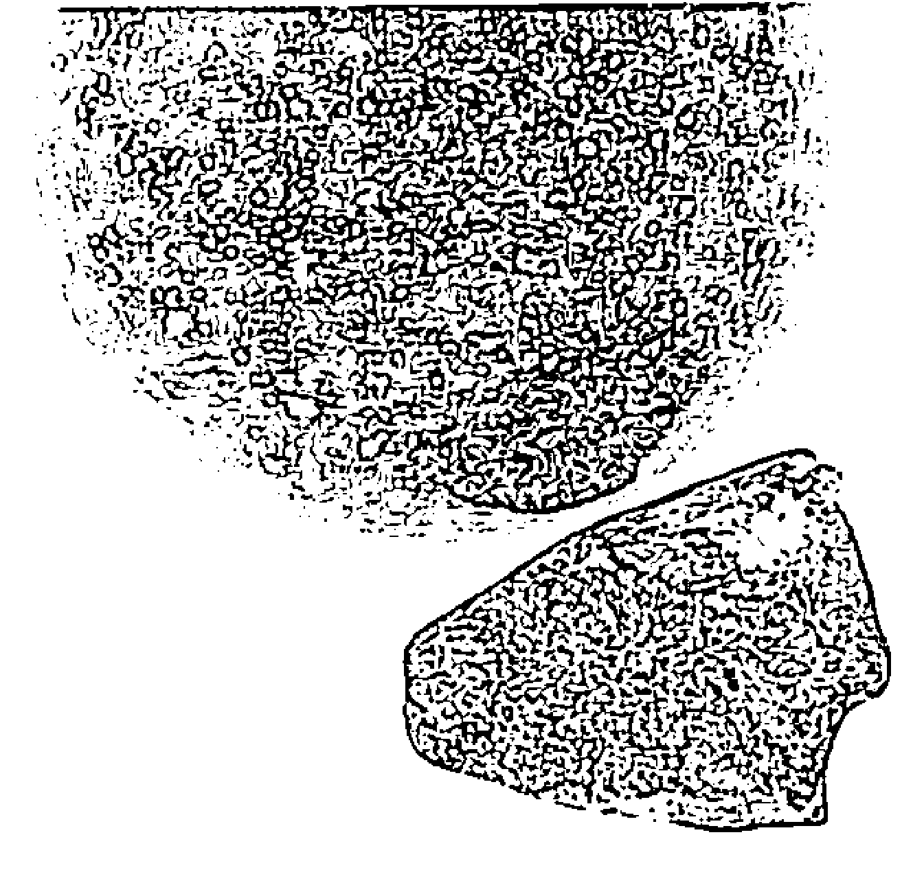

- 颜色：深蓝色，有的遍布由金黄色的黄铁矿和白色的方解石所形成的斑点
- 产地：阿富汗、俄罗斯、智利、缅甸、美国、安哥拉
- 晶系：下文提到的4种构成青金石的矿石都属于等轴晶系
- 成分：(Na,Ca)7-8(Al,Si)12(O,S)24[(SO4),Cl2,(OH)] 天蓝石
- 硬度：5 ~ 5.5

（关键词）
召唤幸运
打开“第三只眼”

### 晶石的特征 跨越海洋而来的神秘的群青色

青金石作为12月的生辰石受到人们的喜爱，是一种充满神秘感的群青色晶石。天蓝石、蓝方石、方钠石和方石这四种晶石交织在一起，造就了青金石美丽的蓝色。另外，有些青金石中还混杂着由金黄色的黄铁矿和白色的方解石所形成的斑点。
青金石的英文名来源于拉丁语中的“lapis”（石头）和波斯语中的“lazward”（蓝色）这两个词语。青金石可以用来制作群青色和绀青色的绘画颜料，绀青色有“从遥远的海洋而来的蓝色晶石”之意，这个词语在过去并不是指颜色，而是晶石的名称。

用，非常适合在重大场合佩戴。
青金石有助于打开掌管内心幻想和看清事实的“第三只眼”，使我们的意识与宇宙相连，重新审视周遭发生的事。
除此之外，青金石还能够让我们经受住人生必须经历的考验，从而积累各种各样的经验。并且，青金石能够引导经过考验后的我们向着正确的方向前进，帮助我们理解生存的意义，并为我们指明今后要走的道路。

### 晶石的能量 让人保持清醒 使人生向更好的方向发展

青金石又被称为“召唤幸运之石”。美丽的群青色代表夜空，零星的金黄色代表星星，因此青金石被尊崇为天之象征，出现在世界各国的神话中。自古以来，很多人都对它那神秘的力量心存敬畏，因此只有那些有权势的人或占星术士才会使用它。
青金石那幽深的蓝色可以刺激我们的大脑，提高判断的正确性及激发创造性。由于它自古以来便被认为具有祛除邪气、召唤所有好运势的作用，非常适合在重大场合佩戴。

### 何时使用

当你想让头脑更加清醒时
当你面临重大的考试、演讲时，当你面临重大的抉择时，当你感到自己的运势下降时，当你在前进的道路上迷茫不安时，青金石能够助你一臂之力。此外，也特别推荐那些想恢复精力和体力的人使用青金石。

- [使用时的注意事项]
对青金石进行日光浴时，应尽量在较短的时间内完成。
- [速配幸运石]
海蓝宝石、拉利玛石、虎眼石、粉水晶
- [净化方法]
月光浴、流水、鼠尾草
- [对应的星座 & 脉轮]
金牛座、天秤座、射手座、水瓶座 / 第6脉轮

> 幸运石寄语
“接受挑战吧，那是磨炼你灵魂的至宝。”

## Labradorite
拉长石【曹灰长石】

以幻想般的光辉激发灵感

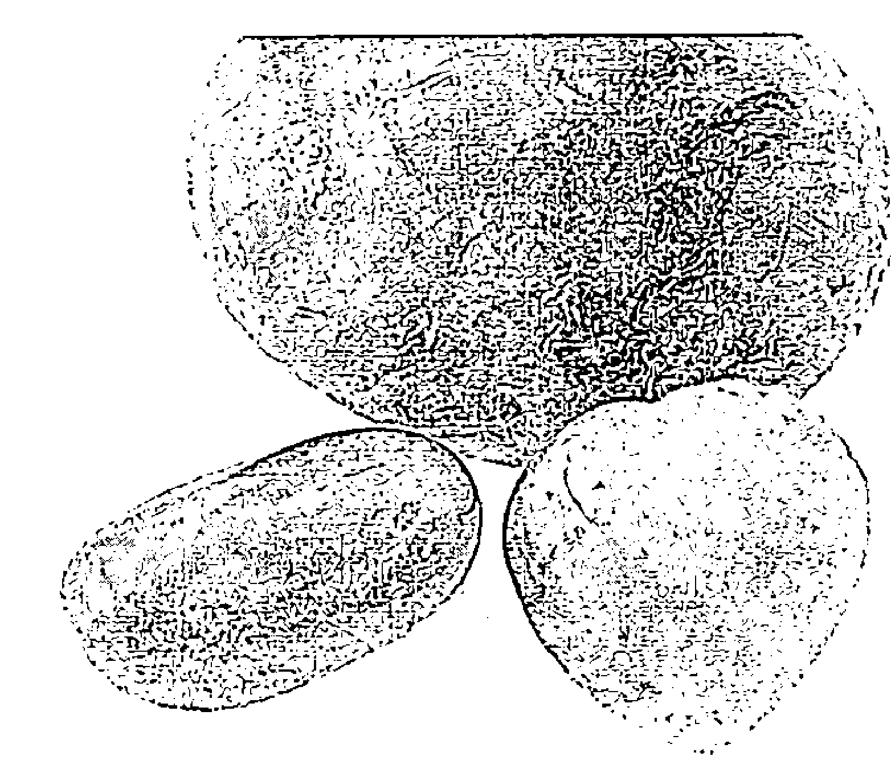

- 颜色：无色、黄色、橙色、亮粉色、浅青绿色、浅蓝色、黑色、青灰色（加彩虹效果）等
- 产地：加拿大、马达加斯加、芬兰、美国（俄勒冈州、犹他州、内华达州）、澳大利亚、墨西哥
- 晶系：三斜晶系
- 成分：(Ca[Al₂Si₂O₈])₅₀₋₇₀+(Na[AlSi₃O₈])₅₀₋₃₀
- 硬度：6 ~ 6.5

（关键词）
唤醒新的意识
重新缔结良缘

### 晶石的特征

像黑色凤蝶的后翅般闪耀着彩虹光泽
拉长石是一种随着观察角度的改变，能够呈现彩虹般七彩光芒的奇特晶石。它与月长石和太阳石等矿石一样，同属长石家族，最初发现于加拿大的拉布拉多半岛（Labrador），并因此而得名。
拉长石乍看上去像是一种黑色晶石，其实不然。在光线下转动拉长石，它能够呈现绿色、蓝色、黄色、橙色、粉色等多种颜色，这是一种晕彩效应——由于折光率不同的金属矿物层整齐地重叠在一起，光波因反射或衍射而发生干涉作用所引起的一种现象。自然界中具有晕彩效应的晶石并不多，人们把拉长石这种独特的晕彩效应称为“拉长石晕彩”（labradorescence，直译为“拉布拉多之光”）。

于巨大的变化中或人生的转折点之际，帮助我们从固有观念的束缚中解放出来，赋予我们踏上新征程的智慧与勇气。拉长石的这种特质也适合在日常工作中需要灵感与想象力的人以及灵能者加强自己的能力。
另外，拉长石作为拥有强大力量的除魔之石，经常被用在解除诅咒的仪式中。它可以帮助人们切断孽缘，也有“再会之石”之称，能够创造让人再次相见的机会。

### 晶石的能量

拥有让意识苏醒的能量
拉长石被认为是月亮与太阳的象征，它能够赋予我们月亮的直觉力和太阳的活力，让意识苏醒，激发潜能，并培养我们坚定不移地朝着目标奋斗的耐力与行动力。
拉长石那冰冷而神秘的光辉被认为来自银河系中的其他行星，对地球上的持有者发出的讯息。这种讯息可以转化为直觉力与洞察力，在我们处

### 何时使用

当你需要敏锐的直觉时
当你处于人生的十字路口时，当你想遇到真正的知己时，当你想与分手的恋人破镜重圆时，当你想祛除邪气时，拉长石能够带来意想不到的效果。

- [使用时的注意事项]
拉长石耐水和耐紫外线照射，但是在水中浸泡时间过长容易失去彩虹光泽。
- [速配幸运石]
粉水晶、月长石、天使石
- [净化方法]
月光浴、鼠尾草、晶簇
- [对应的星座 & 脉轮]
射手座、摩羯座 / 第4脉轮、第5脉轮、第6脉轮、第7脉轮

> 幸运石寄语
“在你犹豫不决时，静下心来，选出绽放最夺目光辉的那一个选项吧！”

## Larimar
拉利玛石
蕴含水与天空之精华的加勒比海之石

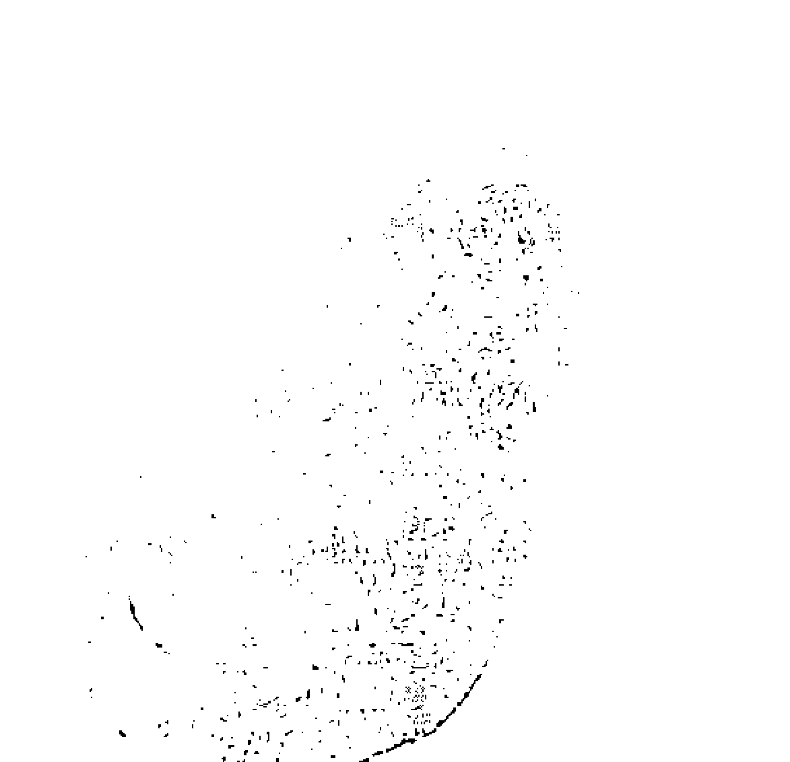

- 颜色：蓝色
- 产地：多米尼加
- 晶系：三斜晶系
- 成分：NaCa₂[Si₃O₈OH]
- 硬度：4.5 ~ 5

（关键词）
接纳自我与他人
带来平和与安宁

### 晶石的特征 近来被发现的亚特兰蒂斯之石

拉利玛石是一种能让人联想到加勒比海美丽颜色的浅蓝色晶石，从发现至今只有短短的几十年，是三大治愈石之一。它产自加勒比海上的岛国——多米尼加，是一种以钠和钙为主要成分的针钠钙石，其矿物名为“蓝针钠钙石”。

拉利玛石的英文名来源于发现它的地质学家的女儿的名字“Larisa”（拉莉萨）和西班牙语“mar”（海洋）这两个词语。世间还流传着这样一种说法，这种晶石原是消失的大陆——亚特兰蒂斯——的一部分，因此又被称为“亚特兰蒂斯之石”。又因为它色泽美丽，所以也被称为“海豚之石”。

通常为人们所熟知的拉利玛石呈略显白浊的蓝色，还有些拉利玛石略带白色和粉色。一般情况下，拉利玛石都带有白色斑点。

接纳自己，才能接受他人，建立良好的人际关系，尤其能提升爱情的和谐美满度。另外，蓝色也是治愈之色。当我们经历无法躲避的变故之时，它能够帮助我们减少痛苦和困难，赋予我们勇敢向前的力量，同时消除负面情绪和不安，带来平静的心情。

拉利玛石被发现的时候，正是国际环境保护运动高涨之时，因此它又被视为和平、和谐、与自然共生的象征。它所发出的和谐波动能够培养我们广阔的胸襟和充满爱意的温柔之心，为我们带来平和与安宁。

### 晶石的能量 象征爱与和谐 使问题和平解决

拉利玛石是一种释放爱与平静的能量，拥有极高频率的波动的晶石。蓝色是代表包容性和沟通能力的颜色。因此，这种晶石能够帮助我们理解自己身上的所有特质都各有其作用，如看似懦弱的胆小也意味着谨慎、善于避开危险等；只有

### 何时使用

当你想更加珍爱自己时

当你想理解他人、与他人产生共鸣时，当你想改变卑躬屈膝的态度时，当你想在大变故后尽快稳定下来时，拉利玛石能够助你一臂之力。

- [使用时的注意事项]
拉利玛石容易受到紫外线和强光的侵蚀。
- [速配幸运石]
鹰眼石、拉长石、舒俱来石、琥珀
- [净化方法]
月光浴、晶簇
- [对应的星座 & 脉轮]
狮子座 / 第5脉轮

> 幸运石寄语
“实现愿望所需要的不是战斗，而是接受。”

## Rutile Quartz
发晶
带来精力与活力的金光闪闪的水晶

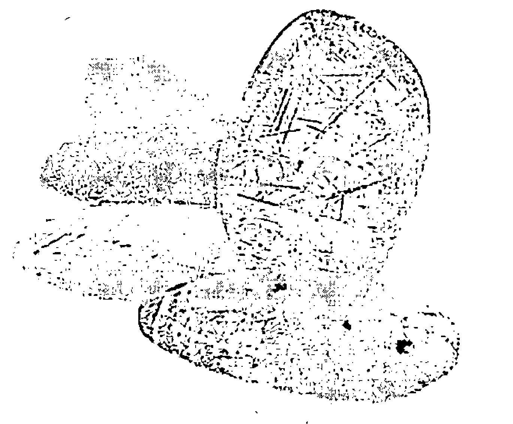

- 颜色：无色（内部含有金红石的包裹体，受其颜色与密集度的影响，发晶看起来会有颜色）
- 产地：巴西、澳大利亚
- 晶系：六方晶系（三方晶系）
- 成分：SiO₂（包裹体成分为 TiO₂）
- 硬度：7

（关键词）
使水晶能量增幅
提升财运、健康运、恋爱运

### 晶石的特征 包含针状的细线 闪闪发光的水晶

水晶在结晶时与金红石融为一体后会变成金光闪闪的晶石，这就是发晶。金红石是一种二氧化钛矿物，其结晶有红色、金色和黑色等颜色，通常呈针状或柱状，其中金色最受欢迎。金红石的英文名“rutile”在拉丁语中为“金光闪闪”之意。天然发晶的“发丝”多为平直丝状，也有呈弯曲状的，可谓变化多端。
现在，水晶中融入金红石之外的针状矿物所形成的晶石也被称为发晶，但发晶原本是指那些含有金红石的水晶。除此之外，有些黄色托帕石和烟水晶中也含有针状纹理，不过十分罕见。

注意力，二者相结合，可以大大增加胜出的几率，尤其适用于与别人一决胜负之时；红色的金红石使发晶看起来有种少女般的纯真可爱，其细针有“丘比特之箭”的别称，有助于增加与命中注定之人相遇的几率。和同样主宰恋爱运的粉水晶相比，它的能量更为积极，能帮助我们主动出击，展示自己的魅力；黑色的金红石在提升整体运势之外，还有强大的守护能量，能够保护我们不受负能量和邪气的侵犯。

### 晶石的能量 以强大的能量获得丰硕的成果

发晶是一种拥有除去一切障碍、加速事物发展的能量的晶石。水晶本就具有净化万物、增强能量的作用，针形的金红石像联结水晶与外界的天线一样，可以使水晶的能量以更高的频率释放到外界（持有者），进一步增强持有者的能量，使其充满无限的精力与活力。
水晶内部包裹的金红石颜色不同，其能量也会有所差异。金色的幸运石通常有助于提升财运，而细针能够召唤机遇，并提高我们的直觉力和注

### 何时使用

当你处于决定胜负的时刻时
当你在众人面前演讲或即将参加重要的考试时，当你想在抽奖中有好手气时，当你想增加收入时，当你想增强自己的精力和活力时，发晶能够助你一臂之力。

- [使用时的注意事项]
发晶耐水和耐阳光曝晒。
- [速配幸运石]
天使石、蓝宝石、舒俱来石、电气石
- [净化方法]
日光浴、流水、鼠尾草
- [对应的星座 & 脉轮]
狮子座 / 所有脉轮

> 幸运石寄语
“你所追求的真正变化由宽容而生。”

## 红宝石

象征胜利与爱、充满热情的女王之石

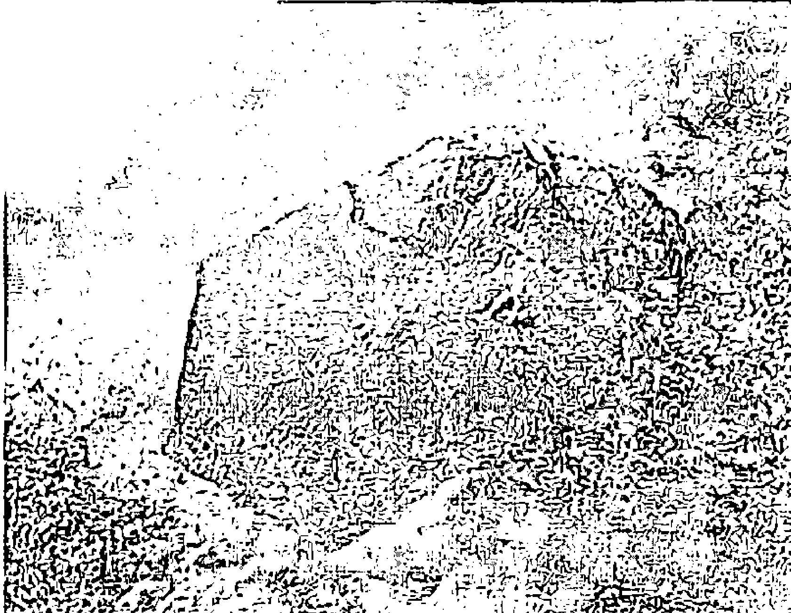

- 颜色：红色、略带紫色的红色
- 产地：缅甸、泰国、马达加斯加、坦桑尼亚、肯尼亚、越南、阿富汗、巴基斯坦、斯里兰卡、印度、俄罗斯、中国、尼泊尔
- 晶系：六方晶系（三方晶系）
- 成分：Al₂O₃
- 硬度：9

（关键词）
增强生命力和精神力量
使我们获得成功

### 晶石的特征

因内含铬元素而呈现深红色

红宝石作为7月的生辰石被人们所熟知，是红色晶石的代表，其英文名来源于拉丁语中的“rubber”（红色）一词，本意是指包括红宝石、石榴石和尖晶石在内的所有红色晶石，现在则专指红宝石。红宝石的红色越深，价值越高。最高级的红宝石又被称为“鸽血红”，拥有鲜艳而强烈的红色。

红宝石的硬度仅次于金刚石，是刚玉的一种，它与蓝宝石的差别仅在于颜色，二者属于同种矿物。因含有铬元素而呈现红色的刚玉被称为红宝石，除红色之外的其他刚玉则被称为蓝宝石。另外，还有一种内含针状钛结晶、金光闪闪的刚玉被称为星光红宝石。

世界上第一块人造宝石就是红宝石。如今，人造红宝石被广泛用于医疗和工业等领域的激光技术上。

来阻挡病魔、诅咒、恶习的侵袭。在很多故事中，红宝石会褪色以提醒佩戴者危险即将来临。

除此之外，红宝石还具有强大的促进人体健康的功效。它不仅如其他红色晶石一样具有提高心脏机能、促进血液循环、改善凉性体质的作用，在古代还被用于制作增强生存本能和生殖机能的药物。红宝石作为宝石界的女王，受到王公贵族的厚爱，在印度被尊为比钻石更珍贵的宝石。需要注意的是：强大的能量是柄双刃剑，若过于追求一己之私或想置他人于死地，反而会招致邪气与灾祸。

### 晶石的能量

指引我们走向胜利
促进人体健康

红宝石那浓烈的红色掌管不灭的火焰，是不死之躯的象征，自古以来便被当做拥有强大力量的护身符使用。红宝石有“胜利之石”之称，实际上不仅上战场杀敌的士兵钟爱它，人们还用它

### 何时使用

当你想拥有不屈服于困难的强大内心时
当你希望爱情美满时，当你面临考试时，当你想增强体力时，当你想延续现在的幸福时，当你希望自己魅力四射时，红宝石是最佳的选择。

- [使用时的注意事项]
红宝石耐水和耐阳光曝晒。
- [速配幸运石]
金刚石、月长石、珍珠、菱锰矿
- [净化方法]
流水、日光浴、鼠尾草
- [对应的星座 & 脉轮]
白羊座、巨蟹座、狮子座、天蝎座、射手座 / 第4脉轮

> 幸运石寄语
“将焦点集中在你内心所追求的目标和梦想上吧！”

## Lepidolite
锂云母【鳞云母】
以柔和的能量培养挑战精神

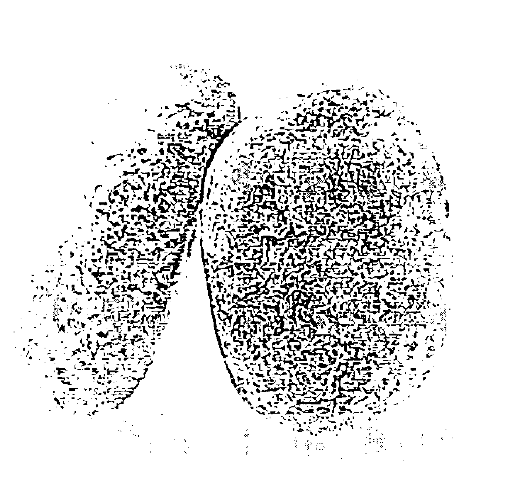

- 颜色：紫红色、紫色、略带灰色的紫色等
- 产地：巴西、美国（加利福尼亚州）、阿富汗、挪威、俄罗斯、马达加斯加、纳米比亚、津巴布韦、中国、加拿大、智利、意大利、莫桑比克
- 晶系：单斜晶系
- 成分：K(Li,Al)₃[(F,OH)₂|(Si,Al)₄O₁₀]
- 硬度：2.5 ~ 4

（关键词）
带来意识的变革
以积极的心态迎接新的变化

### 无数“鱼鳞”闪闪发光
云母类矿物的一种

锂云母闪耀着柔美的浅紫色光泽，是云母类矿物的一种，常与电气石等其他矿石共生于同一矿床中。锂云母内部含有锂、铝和硅元素，根据所含铝元素的多少，会呈现粉色、紫色或白色等颜色。

大型的锂云母结晶较为稀少，一般多是鳞片状的集合体，具有珍珠般的光泽。其英文名来源于古希腊语中的“lepidos”（鱼鳞）一词，在日本又被称为鳞云母或红云母。

过正。在锂云母的帮助下，我们可以学会感谢过去的经历，并且时刻准备着迎接即将发生在自己身上的改变。当思想上和精神上都作好准备后，巨大的变化便会以我们想象不到的速度降临在我们身上。

除此之外，锂云母非常适合与其他个性较强的幸运石搭配使用，它能起辅助作用，增强其他幸运石的能量。相传如果佩戴者的波长与锂云母相符，那么它的颜色就会变得更加鲜艳夺目。

### 开创全新局面的“变革之石”

锂云母具有打破现状、开创全新局面的强大力量，是变革之石。不过，这种变化不是凭空产生的。不仅是锂云母，所有的幸运石都是响应我们内心的呼唤而来的。被锂云母吸引的人，想必都有着强烈的改变现状的渴望，并为此做了很多努力。锂云母的变革力量能够在旧有的思考方式和行为模式阻碍我们前进时，为我们带来意识的变革，并赋予我们挑战新事物的勇气。

锂云母还拥有出色的治愈能力，能够帮助我们以积极的心态迎接新的变化。那些一味否定过去的想法或做法会分散我们的精力，且容易矫枉

### 何时使用

当你想改变现状时

当你想改变现在所处的环境时，当你谋求事业上的新突破时，当你想拥有新的人际关系网时，当你想让内心变得更加积极向上时，锂云母能够带来意想不到的效果。

- [使用时的注意事项]
锂云母容易受到水和紫外线的侵蚀。
- [速配幸运石]
堇青石、紫锂辉石
- [净化方法]
晶簇、鼠尾草、月光浴
- [对应的星座 & 脉轮]
天秤座 / 第4脉轮、第5脉轮、第6脉轮、第7脉轮

> 幸运石寄语
“改变思考的角度，才能够发现新的方法。”

## Rose Quartz
粉水晶

毫不吝惜地倾注爱与治愈能量的维纳斯之石

- 颜色：粉色、略带紫色的粉色、略带灰色的浅粉色
- 产地：巴西、马达加斯加、莫桑比克、纳米比亚、印度、意大利、德国、英国、美国、苏格兰、爱尔兰、俄罗斯
- 晶系：六方晶系（三方晶系）
- 成分：SiO2
- 硬度：7

（关键词）
教会我们爱惜自己
培养自信与气度

### 晶石的特征
因爱与美丽之女神所捧的蔷薇花而得名的晶石

粉水晶呈现细腻而柔和的粉色，是受到女性青睐的晶石，由爱与美丽之女神阿佛洛狄忒所捧的蔷薇花而得名。粉水晶是一种水晶类矿物，含有铝和氧化钛等细小结晶，所以呈现粉色，又被称为“蔷薇水晶”。

粉水晶多呈半透明状，其中透明度较高的可被制成珠宝首饰。在用凸面切割法切割成半球形的优质粉水晶中，有些含有细针状的包裹体会散发十字星光辉，因此又被称为“星粉水晶”。

的情绪涌上心头，这是粉水晶为了彻底地净化而进行的排毒作业，该时期过去后，便会感到彻底的放松与安定。

另外，粉水晶那柔和的波动还能滋养身心，提高女性魅力。它不仅能激发女性的内在之美，使女性的行为举止舒缓而优雅，还能够促进女性荷尔蒙的分泌，具有滋润肌肤并使其焕发光彩的美容功效。也许正因为如此，粉水晶在提高恋爱成功率方面向来有很好的口碑。它可以为我们带来美好的邂逅以及富有情趣的二人世界。

### 晶石的能量
提高女性魅力
给予我们爱的能量

粉水晶以无条件的爱为主旋律，象征代表爱与美丽的金星维纳斯。它具有“自我复原”的治愈效果，当我们的内心因为失恋而受伤时，当我们因为不安、恐惧和愤怒等负面情绪而想要伤害自己时，它会教我们爱惜自己。一个懂得自爱的人，才有自信和气度去谅解他人，像爱自己一样给予他人无限的爱。对他人发自内心的善意，也是改善并维持良好人际关系的基石。同时，自爱也让我们能更加坦率地接受他人的好意，意识到世界并不像自己想象中那般冷漠无情，并重新燃起生活的热情。在这个过程中，有的人会感觉有辛酸

### 何时使用
当你想让自己由内而外散发迷人魅力时

粉水晶可以作为恋爱护身符佩戴在身上。除此之外，当你想抚平失恋的创伤时，当你想让自己更加富有女人味时，当你想心平气和地与他人谈话时，粉水晶会带来明显的效果。

- [使用时的注意事项]
粉水晶如果在太阳下曝晒的时间太长，就会褪色。
- [速配幸运石]
方解石、紫水晶、萤石、绿帘花岗石
- [净化方法]
流水、月光浴、鼠尾草
- [对应的星座 & 脉轮]
金牛座 / 第4脉轮

> 幸运石寄语
“让我们学会发现身边的美好，让我们学会倾注无条件的爱吧！”

## Rhodochrosite
菱锰矿

让人生充满希望、华丽而细腻的晶石

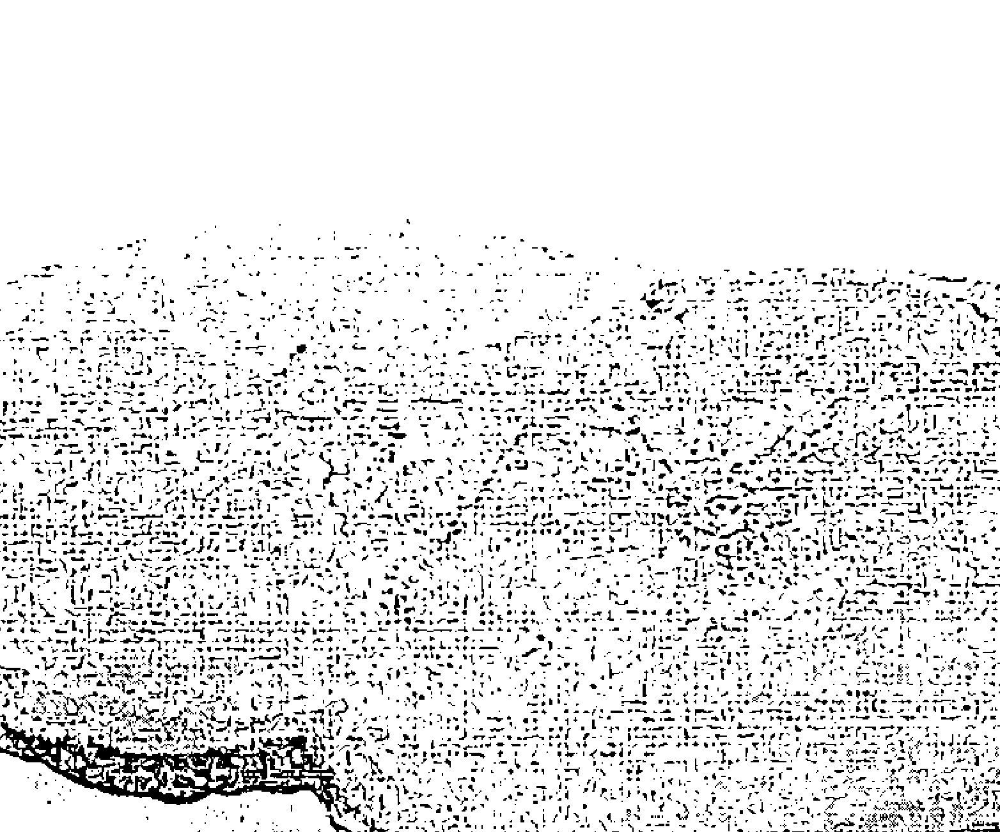

- 颜色：粉色、略带橙色的粉红色、褐色、略带灰色的黄褐色等
- 产地：阿根廷、美国（科罗拉多州）、南非、墨西哥、澳大利亚、罗马尼亚、匈牙利、印度
- 晶系：六方晶系
- 成分：Mn[CO3]
- 硬度：3.5 ~ 4

（关键词）
带来喜悦与幸福
解决纠纷的能量

### 晶石的特征 多产自中南美的“印加玫瑰”

菱锰矿是一种带有一圈圈玫瑰状纹理的晶石。它的特征是鲜艳的红色加上玫瑰状的纹理，因此其英文名来源于古希腊语中的“rhode”（玫瑰）和“chrom”（颜色）这两个词语。菱锰矿多产自古印加帝国的繁荣之地安第斯山脉，因此又被称为“印加玫瑰”。

这种晶石是锰元素的主要来源，其结晶呈菱形，因此被称为菱锰矿。它的颜色由纯红色、红色、粉色到灰色、褐色和黄色，有的散发玻璃光泽，有的则散发珍珠光泽。菱锰矿在被挖掘之初呈美丽的玫瑰色，但如果长时间放置在屋外或湿气较重的环境中，表面会变成黑色。

菱锰矿虽然柔弱纤细，容易损坏，但正是这种细腻才具备解决纠纷的能量。它用爱包裹内心受到伤害的人，赋予我们爱和梦想，在治愈创伤的同时增强我们的能量。当我们在恋爱中受到伤害，从此害怕与异性接触时，菱锰矿能够温柔地治愈我们心灵的伤痛，赋予我们对爱情重拾信心、开始一段新感情的勇气。当恋人或夫妇间的关系变得枯燥乏味时，菱锰矿能够带来一股清新之气。

### 晶石的能量 与大地和宇宙的能量相连 具备解决纠纷的能量

菱锰矿与大地和宇宙的能量相连，是一种能够让人敞开心扉、给人带来喜悦与幸福的幸运石。它被称为“热情的玫瑰”，其波动作用于人的生殖系统，使人更加性感，并赋予我们如火焰般燃烧的恋爱之心，帮助我们找到一生的伴侣并最终走进婚姻的殿堂，使我们收获美满的爱情和婚姻。同时，对那些希望在人生的长河中无论做什么事都能够饱含激情的人来说，菱锰矿也十分合适。

### 何时使用

当你想寻找新的邂逅或机遇时
当你想追求新的邂逅时，当你感到精力渐渐减弱时，当你想重新拥有激情时，当你想激发自己的魅力和个性时，菱锰矿能够帮助你改善现状，实现愿望。

[使用时的注意事项]
菱锰矿容易受到紫外线的侵蚀，应注意日光浴的时间不宜过长。

[速配幸运石]
橄榄石、土耳其石、绿帘花岗石、烟水晶

[净化方法]
日光浴、流水、鼠尾草

[对应的星座 & 脉轮]
狮子座 / 第2脉轮、第3脉轮、第4脉轮

> 幸运石寄语
“放下那些影响你的创造性的固有观念和模式吧！”

## 蔷薇辉石

教会我们爱的表达方式、具有母性力量的晶石

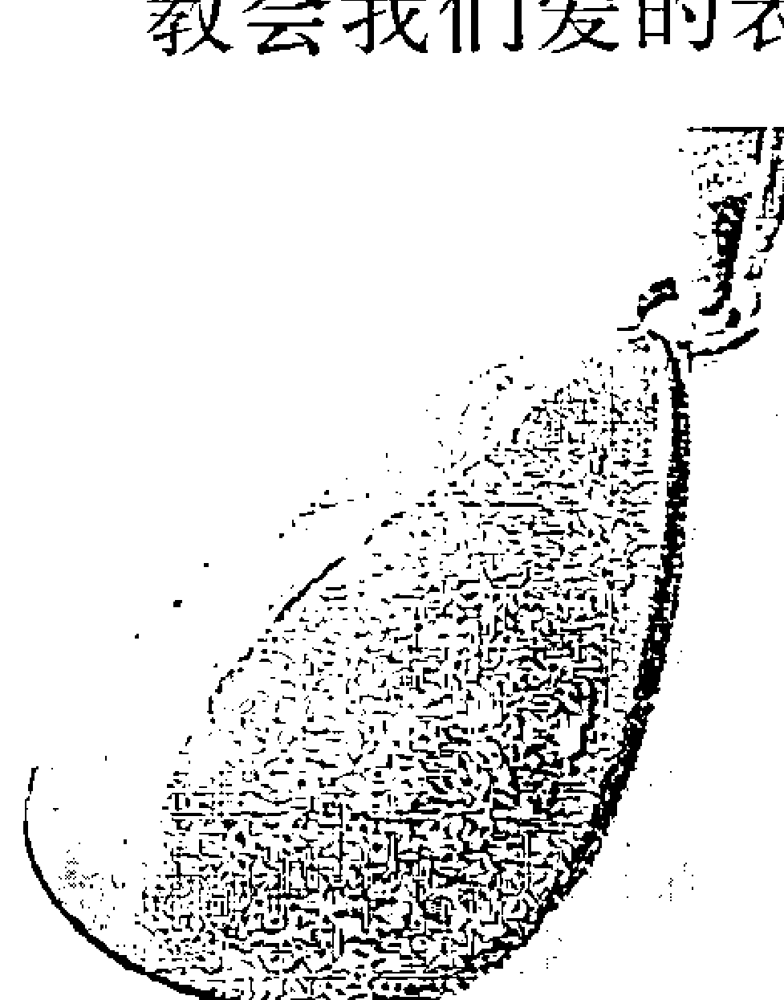

- 颜色：粉色、褐粉色、略带紫色的红色等
- 产地：澳大利亚、俄罗斯、瑞典、墨西哥、英国、南非
- 晶系：三斜晶系
- 成分：(Mn,Ca)Mn₄[Si₅O₁₅]
- 硬度：6

〈关键词〉
让爱得到充分体现
稳定心绪

### 晶石的特征

因花之女王蔷薇而得名的晶石

蔷薇辉石的红色与黑色交织在一起，美不胜收，是一种品格高尚的晶石。它的英文名来源于古希腊语中的“rhodon”（蔷薇）一词，意为“蔷薇花色的石头”。蔷薇辉石散发玻璃般的光泽，是深受人们喜爱的幸运石之一。

蔷薇辉石的颜色从浅红色到深红色，根据铁含量的不同，有的蔷薇辉石略带褐色，且因含有锰元素而呈现黑色的斑点和条纹。蔷薇辉石多呈不透明或半透明状，透明且呈柱状的蔷薇辉石较为稀少。

蔷薇辉石还具有稳定心绪的作用，能够帮助我们从不安、恐惧和愤怒等负面情绪的束缚中解放出来。当过度操心劳累导致我们的精力消耗殆尽时，它能够帮助我们恢复身体的能量，教会我们珍爱自己。另外，蔷薇辉石可以带给我们安全感，从而激发我们的潜在能力，尤其是提高我们的创造力。

### 晶石的能量

让爱得到充分体现
增强行动力

相比同属粉色系的粉水晶和菱锌矿，带有仿佛树干般褐色或黑色斑点的蔷薇辉石显得更加沉稳与质朴。并且，蔷薇辉石是一种兼具温柔和行动力的幸运石，它能够赋予我们积极去爱的力量。它使我们敞开心扉，充分表达感情，帮助我们将内心的想法付诸行动。当你无法向所爱的人充分展现自己时，当你害怕被他人厌恶而隐藏真正的自己时，使用蔷薇辉石再合适不过了。此外，它还能够治愈我们内心的感情伤痛，修复恶化的恋人关系及朋友关系。

### 何时使用

当你不知如何表达好感和感激时

当你与亲人、朋友或恋人吵架时，当你不知道如何向他们表达内心的爱时，当你经常与孩子、老人和病人相处时，当你想安慰他人时，蔷薇辉石能够带来意想不到的效果。除此之外，这种晶石还能够减缓过度操劳带来的衰老。

[使用时的注意事项]
蔷薇辉石虽然耐水和耐紫外线照射，但仍然不适宜长时间在阳光下曝晒。

[速配幸运石]
粉水晶、土耳其石、葡萄石、舒俱来石

[净化方法]
月光浴、鼠尾草

[对应的星座 & 脉轮]
金牛座、巨蟹座 / 第0脉轮、第4脉轮

> 幸运石寄语
“当你带着爱回归自己的内心时，灵感定会喷涌而出。”

### 稀有矿石
#### 拥有特殊能量和个性的稀有矿石

稀有矿石，顾名思义，就是极为稀少、罕见的矿石。由于产量和流通量较少，在晶石专卖店也很难购买到稀有矿石，因此它们是很多晶石收藏者的心之所想。

晶石中的稀有矿石大多价格昂贵，幸运石中的稀有矿石则不然。对众多幸运石的“粉丝”来说，稀有矿石的标准不单单是数量十分稀少，矿石所拥有的能量、能力的特异性和个性也是重要的衡量标准，因此并不是美丽而昂贵的矿石就一定会得到大家的青睐。

近年来新发现的矿石、产地在较为特殊的地区或是被拥有特异能力者发现的具有特殊能量的矿石等，都可以被看做稀有矿石。下面就介绍一些近年来成为人们关注焦点的稀有矿石。

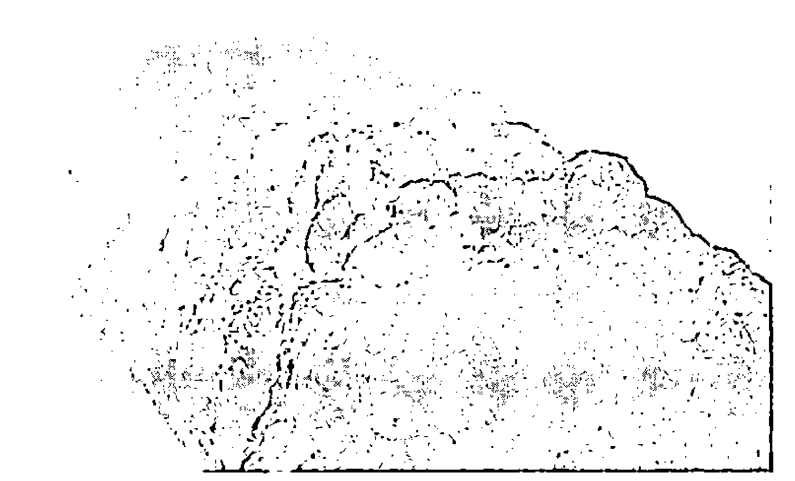

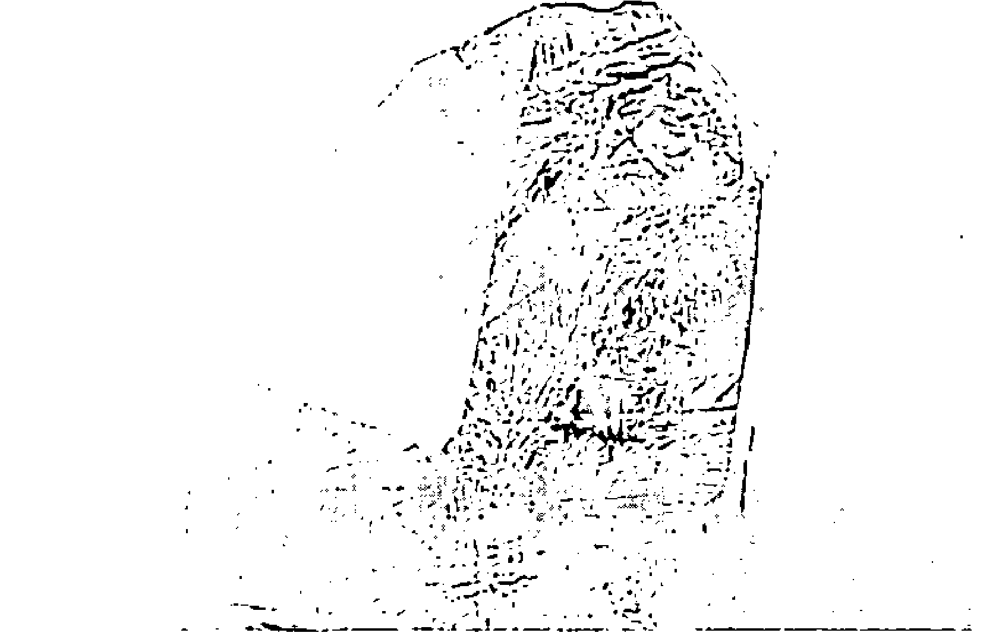

### 冰晶
#### Ice Crystal

### 橙色金红石
#### Orange Rutile

冰晶是整体呈半透明状的水晶，其特征是表面粗糙不平。它内含铁元素，因此微微发红。

冰晶 2006 年发现于喜马拉雅山脉，是还未上市出售的稀有水晶。冰晶发现于冰川遗迹中，结晶的形状与冰块相似，因此而得名。

冰晶发现于因气候变暖而融化的冰川的遗迹中，所以它被认为包含着地球传达给人类的重要信息，受到许多幸运石爱好者和水晶治疗师的关注。它能够激发沉睡在我们内心深处的才能，有助于冥想和治疗创伤。冰晶还能够带给我们精神上的顿悟，所以又被称为“涅槃水晶”。

橙色金红石只在巴西的矿山中有少量出产，是极其稀少且价格昂贵的发晶之一。这种晶石乍看之下呈橙色，这是由于纤细的橙色矿物纤维密集地排列在结晶中，使它看上去呈现鲜艳的橙色。

将橙色金红石放在阳光下，它会闪耀如太阳般耀眼的光辉。它所具有的强大力量能够净化一切能量。就像太阳为黑暗带来光明一样，橙色金红石能够消除负能量，赋予我们灵活的思考方式、行动力以及表现力。另外，橙色金红石还具有提升一切事物的能量，财运自不用说，它还能带来好姻缘。

### 星辉石
—— Super Seven ——

星辉石十分特殊，由7种矿石混杂而成。这7种矿石分别是紫水晶、黄磷铁矿、白水晶、针铁矿、烟水晶、发晶和纤铁矿。星辉石的这种特性使它拥有强大的能量，受到众人的瞩目。因为7种矿石混杂在一起后个性会保持和谐稳定，因此星辉石能够释放高频率的“爱”与“和谐”的波动。它能够协调包括人际关系、心灵与肉体等在内的所有事物。除此之外，它还能提升佩戴者的灵性，帮助人们感悟人类之爱和宇宙意识。

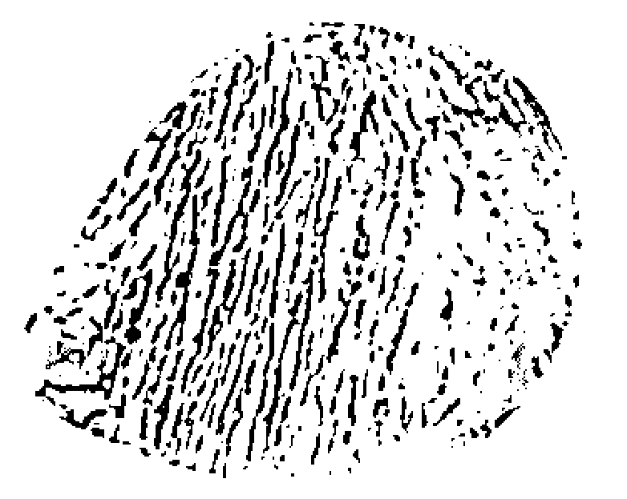

### 变透长岩
—— Metamorphosis ——

变透长岩呈乳白色，是水晶的一种，拥有水润的独特质感。变透长岩在伽马射线（γ射线）的照射下会呈现略带金色的绿色，因此美国著名的水晶治疗师A·麦乐迪（A·Melody）将其命名为“Metamorphosis”，意为“变化、变样”。

相传变透长岩能够帮助我们改变自己，将消极思想转化为积极思想，赋予我们改变现状的力量。此外，它还能帮助我们认识到自己的使命，一边引导我们完成使命，一边治愈我们灵魂的创伤。通过保持灵性的纯洁，它能帮助我们提高个人能力，实现自我。

### 喜马拉雅水晶
—— Himalayan Quartz ——

喜马拉雅水晶在世界各地都有出产，但不同地区的喜马拉雅水晶具有显著的差别。在深受人们喜爱的喜马拉雅水晶中，较为罕见、能量较强的要数西藏冈底斯山出产的水晶。这种水晶最初是由那些为了修行而登上冈底斯山的西藏喇嘛用双手一块一块挖掘出来的，因此，喜马拉雅水晶是神圣的水晶，具有特殊的能力。

喜马拉雅水晶净化力强，同时还能提升我们的潜能、判断力、创造力、洞察力和灵力。此外，它还具有帮助我们保持身心平衡的功效，可以让个人能力得到最大限度的发挥。

### 利莫里亚种子水晶
—— Lemurian Seed Crystal ——

利莫里亚种子水晶属于白水晶的一种，其特征是表面有类似条码的横条纹理。有纹理的一面摸上去犹如磨砂玻璃一般，触感十分特别。

这种水晶不像其他水晶那样呈晶簇状，它是一根一根整齐地排列在一起的，有一种说法认为这是人为掩埋的结果。正如它的名字那样，这种水晶被认为是古利莫里亚人转世后而生的水晶，也有人认为它是古利莫里亚人的意识结晶后的产物。

另外，产自俄罗斯的利莫里亚种子水晶有时也被称为“俄罗斯利莫里亚”（Russian Lemurian）。

### 与幸运石离别

#### ~幸运石不用时的处理方法~

好不容易才遇到的心爱的幸运石，随着我们的佩戴和使用，渐渐与我们的内心（波动）相通，就好像是我们的分身一样，与我们形影不离。我们都希望能永远和它相处下去，但是遇到幸运石损坏等情况时，我们不得不与它离别。有时幸运石在不经意间就不见了踪影，那也许是因为我们已经长大了，幸运石去了需要它的人那里。

不管怎样，遇到这些情况时，我们不要悲伤，也不要认为这是不祥的征兆。下面就让我们一边对幸运石抱有感激之心，一边来了解遇到各种情况时正确的处理幸运石的方法吧！

#### 变色时

随着使用时间的增加，幸运石可能由于疲劳或是能量逐渐消减而变色。当幸运石失去能量时，可以通过净化或让它休息来使其恢复原有的颜色。

另外，当幸运石替我们吸收了较强的负能量时，颜色变化会尤其明显。如果将幸运石埋在盐里或加强净化也不能使它恢复原有颜色的话，你可以将它埋在庭院或公园的土壤中一段时间。

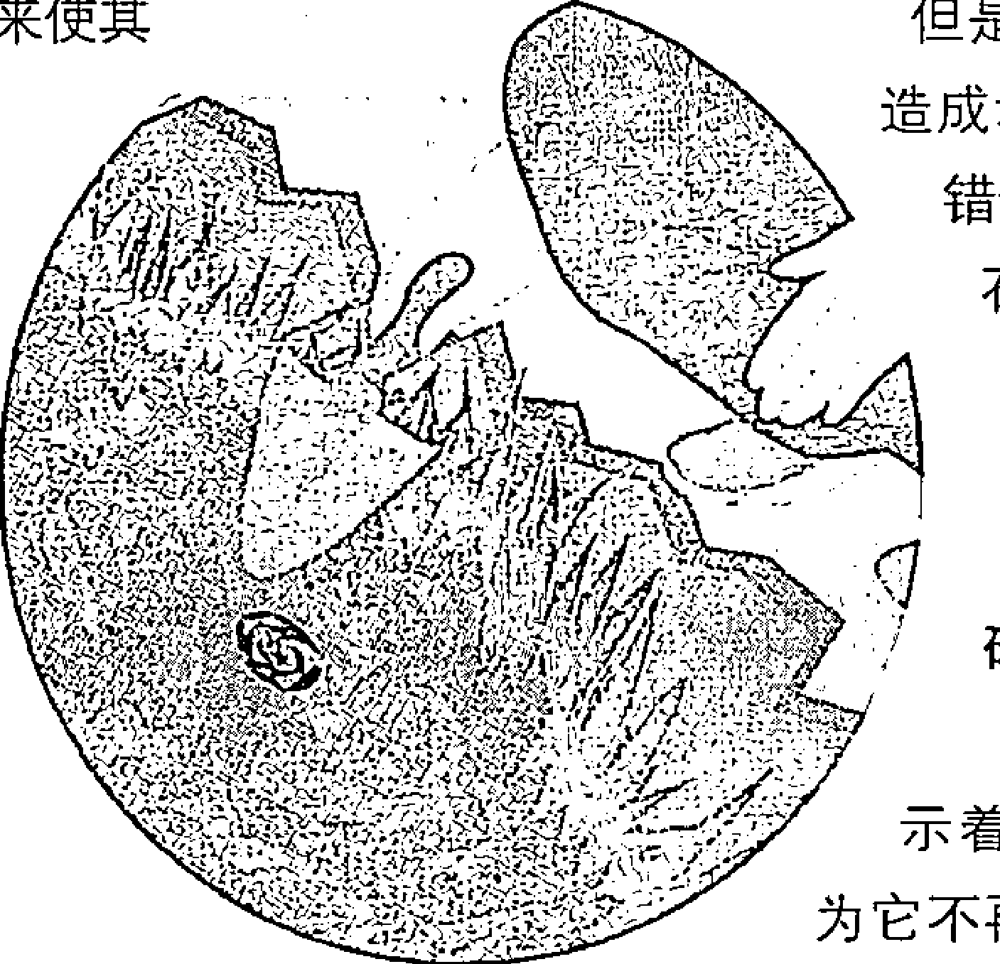

出现的时机尚早。另一种情况是，当幸运石替佩戴者截断负能量或是佩戴者的愿望得以实现时，幸运石都可能离佩戴者而去。

但是，如果是由于保管不当而造成幸运石丢失，佩戴者就可能错过好运。不管怎样，对幸运石心存感激最为重要。幸运石丢失时，让我们心怀爱意，祈祷它平安无事吧！

#### 损坏或缺角时

稍微受到一些损坏或缺角情况不严重的幸运石，其能量不会受到影响。小小的损坏可以通过净化来恢复。裂口较大或完全碎裂时，幸运石就可能从此失去能量。当你感到作为幸运石，它的职责已经完成时，可以把它好好保存起来，或是心存感激地将它重新掩埋到土中。

幸运石是有生命的东西。不要仅仅因为它受到一点儿损坏就将它和垃圾一起丢掉。

#### 碎裂时

幸运石碎裂并不一定预示着坏事即将发生。可能是因为它不再需要与你沟通，或是为了保护你而用尽了自己的能量。这时，你要心存感激地让它回到它的故乡——将它掩埋到土壤之中。

#### 丢失时

幸运石的丢失有几种情况。一种情况是幸运石和佩戴者之间不再需要沟通，或是幸运石

#### 赠予他人时

并不是说你佩戴的幸运石在能量用尽之前都是属于你的东西。当你已经长大时，当你的问题得到解决时，幸运石对你的支持就会终止，它会重新寻找需要它的人。

如果你感到对幸运石许下的愿望已经实现，问题已经解决，当别人赞扬你的幸运石并希望得到它时，你可以将幸运石赠予他。但要注意的是，一定要将幸运石净化后再转赠他人。

## 第三章

### 幸运石的选购方法和使用技巧

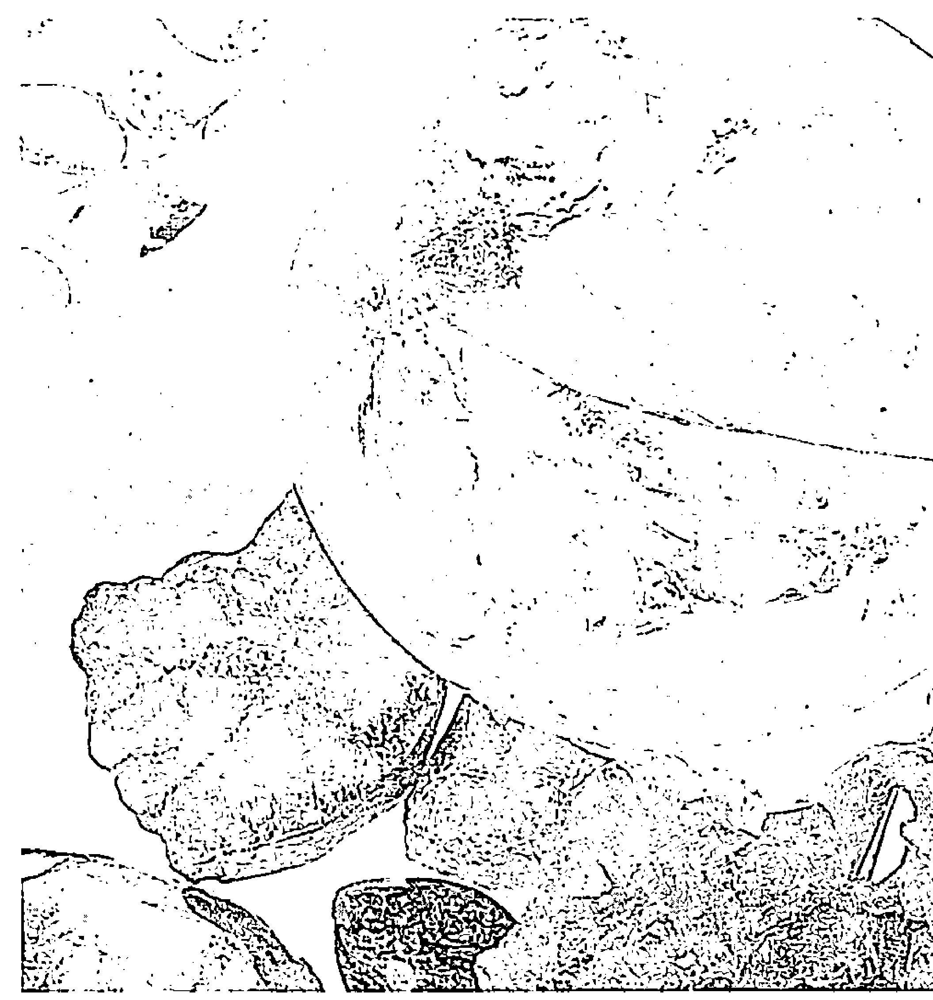

### 幸运石的选购方法和使用技巧

一开始选择幸运石时，常常会想听取别人的意见。当然，若有幸得到对幸运石十分了解或是专门从事水晶治疗的专家的指点固然有益，但这种情况极少。选择幸运石最重要的是自己的直觉。本书第二章的内容可以帮助你缩小选择的范围，但即使是同一种幸运石，每一块都会有些许不同，这时，本页所介绍的小技巧就能帮你确定自己的选择。

#### ※ 如何选择适合自己的幸运石？

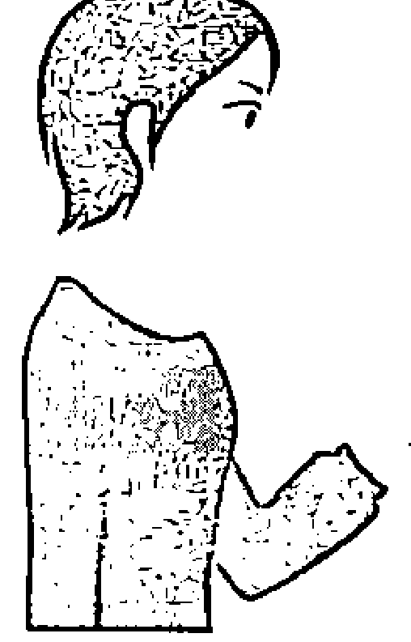

#### 选择店铺

除幸运石本身之外，店铺与你是否投缘也至关重要。有的人喜欢干净整洁的店面，有的人喜欢阴暗古旧的环境，这都不要紧。重要的是不要在意别人的眼光，选择那些走进去之后让你感到心情舒畅的商铺即可。其实，如果遇到与你投缘的店铺，即使不进入店内，你也会不由自主地被它吸引。另外，人有时会忽然留意起原来不太注意的事物来，如果你对不符合自己一向的喜好的店铺感到好奇，就请大胆地进去一试吧！

符的幸运石，但是凭自己的直觉进行选择更为重要。如果你“总觉得对它爱不释手”、“不由自主地想将它拿在手中”，那么这样的幸运石就很可能具有你所需要的能量。通过第一印象或内心的感觉选择的幸运石，一定能够助我们一臂之力。

#### 感受幸运石所发出的信号

橱窗中和店铺里的让你目不转睛的幸运石，会让你隐约感觉到它正散发迷人的光彩，这就是幸运石向你发出的信号。当你需要的幸运石就在眼前时，它会召唤你。请留意这些信号吧！

#### 凭触感选择

如果你发现一些幸运石能让你不由自主地想拥有它们，那么你就可以选择其中最漂亮的一块了。你可以用手触摸，选择让你心情舒畅的那块。像这样能和你产生心灵感应的幸运石，就是与你投缘的幸运石。请不要嫌麻烦，耐心地去感受每块中意的幸运石的能量吧！

#### 凭直觉选择

你可以事先做好功课，选择与自己的要求相

#### 肌肉反射测试

肌肉反射测试是一种判断食物或其他事物是否适合自己的方法。通过这种方法，你可以简单测试出自己所中意的幸运石是否适合你。

测试需要两个人配合进行。首先，将你右手的大拇指和无名指联结成圆圈，再将你中意的幸运石放在右手掌心。然后请

另一个人用两根食指将圆圈轻轻拉开。这时，你需要两指用力，尽可能不让手指松开。如果圆圈被轻易地拉开了，就说明这块幸运石不适合你的可能性非常大。相反，如果圆圈不能被轻易地拉开，就说明这块幸运石很适合你。

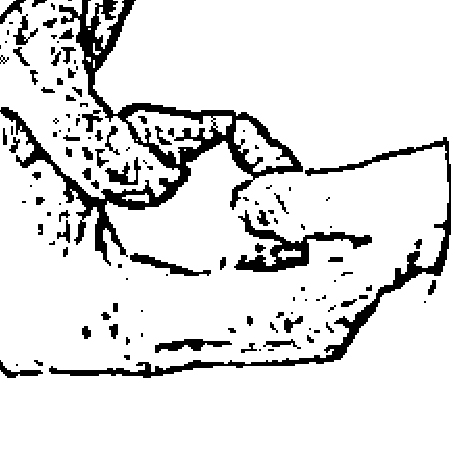

※ 无名指很难用力时，可以换中指或食指试试看。

### ※ 购入幸运石后

#### 第1步 净化

买到幸运石后，首先要对其进行净化

幸运石具有吸收人的思绪和各种能量的特质。它在来到你身边之前，一定遇到过很多人，走过很多地方。在这期间，幸运石可能吸收了许多负能量。需要注意的是，如果使用带有负能量的幸运石，你就可能受到负面的影响。因此，购入幸运石后，你应该立即对其进行净化，以除去负能量，最大限度地激发幸运石原有的能量。

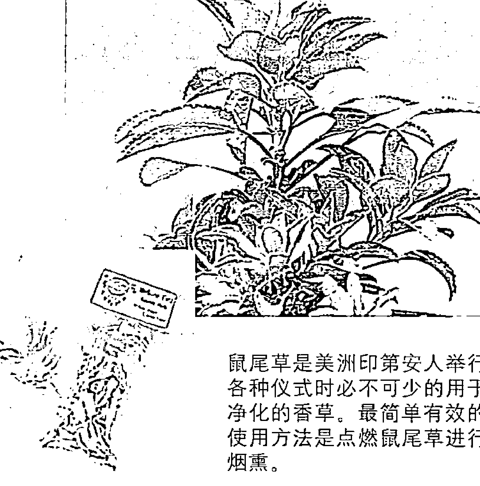

鼠尾草是美洲印第安人举行各种仪式时必不可少的用于净化的香草。最简单有效的使用方法是点燃鼠尾草进行烟熏。

#### 净化时的注意事项

购入原石或珠宝首饰后，要想让它真正属于你的话，就一定要立即对其进行净化。但是有些种类的幸运石不耐水，易受阳光的侵蚀，关于各种幸运石的性质已经在第二章里介绍过了。

不耐水的幸运石可以用鼠尾草的烟熏一熏，也可以埋在天然盐或土里进行净化。颜色较深、不耐阳光曝晒的幸运石可以尝试放在月光下晒一晚。其他更加详细的净化方法请参见下一节。

幸运石中。只有完成了这一步骤，幸运石才能为我们愿望的实现助一臂之力。注入愿望时，要先将净化后的幸运石拿在手中，再放在胸前，然后在脑海中清晰地勾勒出自己的愿望，并向幸运石祈祷。

比如，如果你想获得事业上的成功，就在脑海中描绘自己成为成功人士的形象；如果你有暗恋的对象，就设想自己与对方约会的情形；如果你有想实现的目标，就想象自己成功后的样子。完成这些以后，再将幸运石放在满月或太阳下晒一晒，这样你就能得到让你惊奇的结果了。

#### 第2步 补充能量

#### 补充能量

幸运石可以吸收佩戴者周围的负能量，长时间地佩戴会导致幸运石的能量消减，因此需要定期进行净化。一般较小的幸运石一周净化一次，较大的幸运石一个月净化一次，以便为其补充能量。

另外，当幸运石看起来有些暗淡、颜色变浅、毫无活力时，你可以对其进行净化。

#### 是否请专业人士来进行净化及注念更好？

首先请看这个问题：如果你刚买到一件新衣服，请别人来穿一下，是否会让自己穿的时候感觉更贴身呢？当然，答案是否定的。从“使事物熟悉自己的气息，并与之相融合”这一点来看，穿衣服和使用幸运石的道理是一样的。请别人来净化的人，想必希望借助别人的力量来获得好运，但请记住：能带来改变的只有自己。

同理，若想将幸运石送与他人，净化及注念是无法代劳的，务必请接受幸运石的人亲自来进行（但不应勉强）。不过，我们可以在注念时想象对方获得幸运石后更加幸福的场景。因为我们在一定程度上了解对方的处境，所以传递的能量很可能与对方匹配，这样会对对方有所帮助。

#### 第3步 注念

#### 将愿望注入幸运石中

对幸运石进行净化后，你需要让自己的波动和幸运石的波动统一步调，再将自己的愿望注入

### 幸运石的净化方法

当你随身佩戴幸运石或将其放在屋内作装饰时，幸运石会不断吸收人体和空间内的负能量，而其自身的能量会随之减弱。所以，当你感到幸运石开始“无精打采”时，就要对其进行净化，为其“充电”了。

#### ※ 要想保持幸运石的能量，必须定期对其进行净化！

要想保持幸运石的能量，定期的保养和净化是必不可少的。当幸运石看起来色泽暗淡、失去光芒时，就表示它的能量开始减弱了。这时你应该立即对其进行净化，以恢复它的初始能量。

通常来说，一个月净化一到两次即可。不过，如果你觉得幸运石不再光彩熠熠时，就可以对其进行净化，不必拘泥于时间。请你根据每种幸运石的性质和它当时的状态灵活选择净化时间和方式。

#### 日光浴净化法

太阳是一切能量的本源，通过日光浴，人们能够为幸运石补充能量。可以将幸运石放在日光下曝晒10 - 30分钟，光线充足的上午效果最佳。另外，只要将幸运石放在日光充足的地方，即使不受太阳直射也能够取得同样的效果。需要注意的是，紫水晶和天青石等在阳光照射下易褪色的幸运石不建议用日光进行净化。

[适合的晶石] 红玉髓、白水晶、绿玉髓等
[净化的频率] 每月1~2次

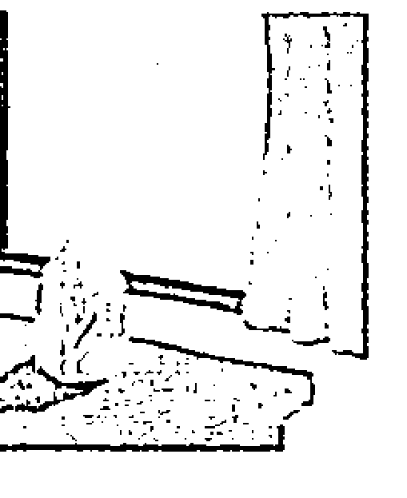

#### 月光浴净化法

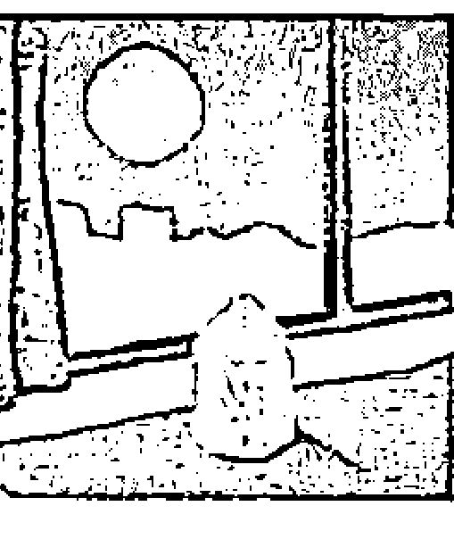

这是适用于所有幸运石的净化方法。新月和满月时的月光最为合适，特别是在满月之夜进行净化效果最佳。另外，满月的光芒最适合为幸运石补充能量。一般可以将幸运石放在庭院或阳台等能够直接沐浴到月光的场所，放置一晚即可。月长石、捷克陨石、拉长石等与月亮和宇宙联系密切的幸运石最适宜用月光进行净化。

[适合的晶石] 紫水晶、黄水晶、月长石、萤石等
[净化的频率] 新月或满月时1次

#### 流水净化法

利用流水可将幸运石所吸收的思绪和能量冲洗掉。将幸运石拿在手中用水冲洗十几秒到一分钟的时间。泉水等天然水最为理想，自来水也可以。待水蒸发以后，再进行日光浴或月光浴。蓝铜矿、透明石膏、土耳其石、菱锰矿等不耐水的幸运石不建议用流水进行净化。

[适合的晶石] 海蓝宝石、石榴石、水晶簇、白水晶等
[净化的频率] 每月2~3次

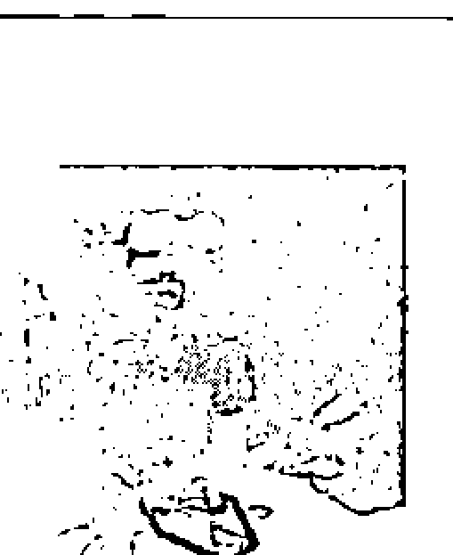

#### 晶簇净化法

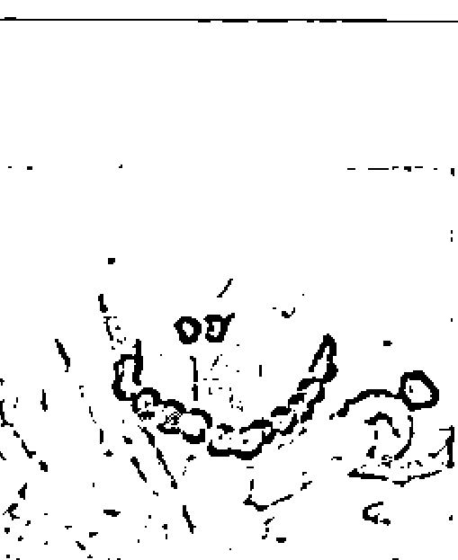

这种方法是指把幸运石放在水晶晶簇之上进行净化。把心爱的水晶或珠宝首饰放在晶簇上就可以轻松对其进行净化以及为其补充能量了。当然，净化用的晶簇也需要经常用流水或日光进行净化。

[适合的晶石] 多数幸运石都可以用晶簇进行净化
[净化的频率] 每月2~3次

### 烟熏净化法

这是一种由美洲印第安人流传下来的传统净化方法：点燃鼠尾草，把幸运石放在烟中均匀地熏2～3次。净化能力较高的白色鼠尾草最为合适。对不耐水的幸运石来说，烟熏是最佳的净化方法。你可以选择贝壳作为燃烧鼠尾草的器具，这样净化效果最佳。

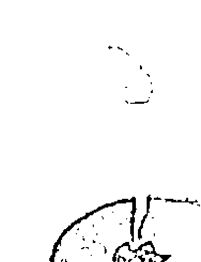

-   [适合的晶石] 多数幸运石都可以用烟熏进行净化
-   [净化的频率] 每月1～2次

### 植物净化法

这是适合所有幸运石的净化方法。植物能够吸收二氧化碳，净化空气。同样，植物也能够使幸运石的负能量转化为正能量。你可以把幸运石放在鲜花或绿色植物旁，也可以放在植物的叶子上。这是一种适用于所有幸运石的简单的净化方法。另外，你还可以将碎裂的幸运石放在植物根部，这样能够促进植物生长。

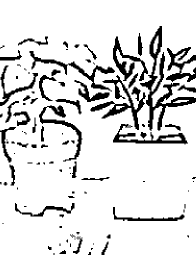

-   [适合的晶石] 多数幸运石都可以用植物进行净化
-   [净化的频率] 每月1～2次

### 土壤净化法

将吸收了过多负能量的幸运石埋入土中，会有显著的净化效果。当你无法让暗淡的幸运石重放光彩时，或者不能恢复它的能量时，可以尝试把它埋在土中进行净化，时间以24小时为宜，地点最好选择大自然中的干净土壤。

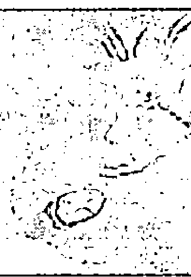

-   [适合的晶石] 多数幸运石都可以用土壤进行净化
-   [净化的频率] 每月1次或幸运石受到损坏时

### 粗盐净化法

粗盐具有使一切归零的能量，用粗盐净化是适合大多数幸运石的净化方法。你可以将能够用流水净化的幸运石放在粗盐水中泡一晚，对于不耐水的幸运石，可以直接将其放在足量的粗盐上，或埋在粗盐里。幸运石用粗盐净化后要用流水清洗一下，再用柔软的布擦拭干净即可。幸运石的负能量较强时，用粗盐进行净化效果最为显著。

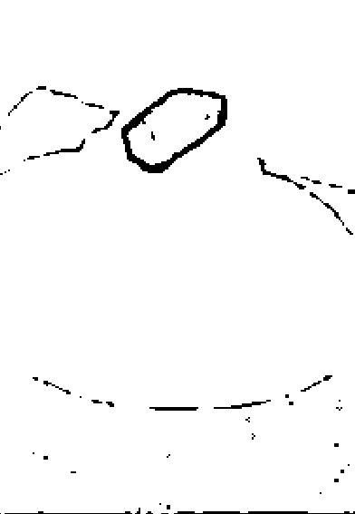

-   [适合的晶石] 白水晶、烟水晶、金刚石等
-   [净化的频率] 每月1次或幸运石色泽暗淡时

### 声音净化法

让幸运石聆听音叉、铃铛或民族乐器等发出的声音，可以对其进行净化。利用比较容易购买到的钹制造声音是日本现在流行的声音净化法。让幸运石聆听铃铛等发出的清脆的声音，能够使幸运石与铃铛产生共鸣，从而增强幸运石的波动，达到净化的效果。这种方法几乎适用于所有幸运石。

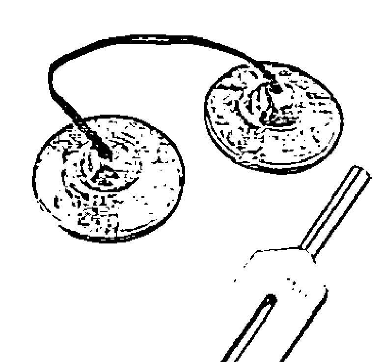

-   [适合的晶石] 几乎所有幸运石都可以用声音进行净化
-   [净化的频率] 只要觉得有必要，随时都可以进行

### 对护身符的净化要格外用心

要想保护自己不受负能量和邪气的影响，可经常使用缟玛瑙、黑水晶和烟水晶等偏黑色的幸运石，因为它们的吸收能力较强，能够替你吸收负能量和邪气，保护你不受伤害。另一方面，时常保护你的幸运石积聚了许多负能量，所以你要精心细致地对其进行净化。而作为护身符佩戴在身上的幸运石，你要尽量做到每天对其进行净化，如果不方便的话，至少每个星期要净化1～2次。

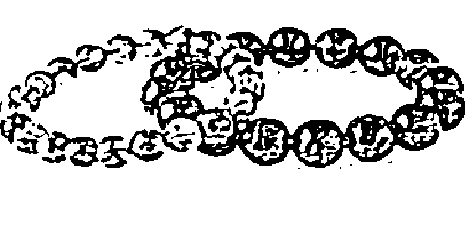

### 首饰的使用技巧

用幸运石制成的首饰既时髦，又能使佩戴者切身体会到幸运石的功效，所以深受大家的喜欢。下面将介绍一些这类首饰的功效和使用技巧。

#### 幸运石首饰

漂亮时髦的首饰深受大家的喜爱

近年来，许多幸运石都被加工成首饰，如戒指、手镯和项链等，这让人们切身感受到幸运石那无穷的魅力。前些年，说起用幸运石制作的首饰，人们想到的大多都是念珠一类的东西，根本谈不上时髦。但是近些年来，随着一股幸运石风潮的兴起，市场上出现了许多设计时髦的幸运石首饰，受到人们特别是女性的青睐。

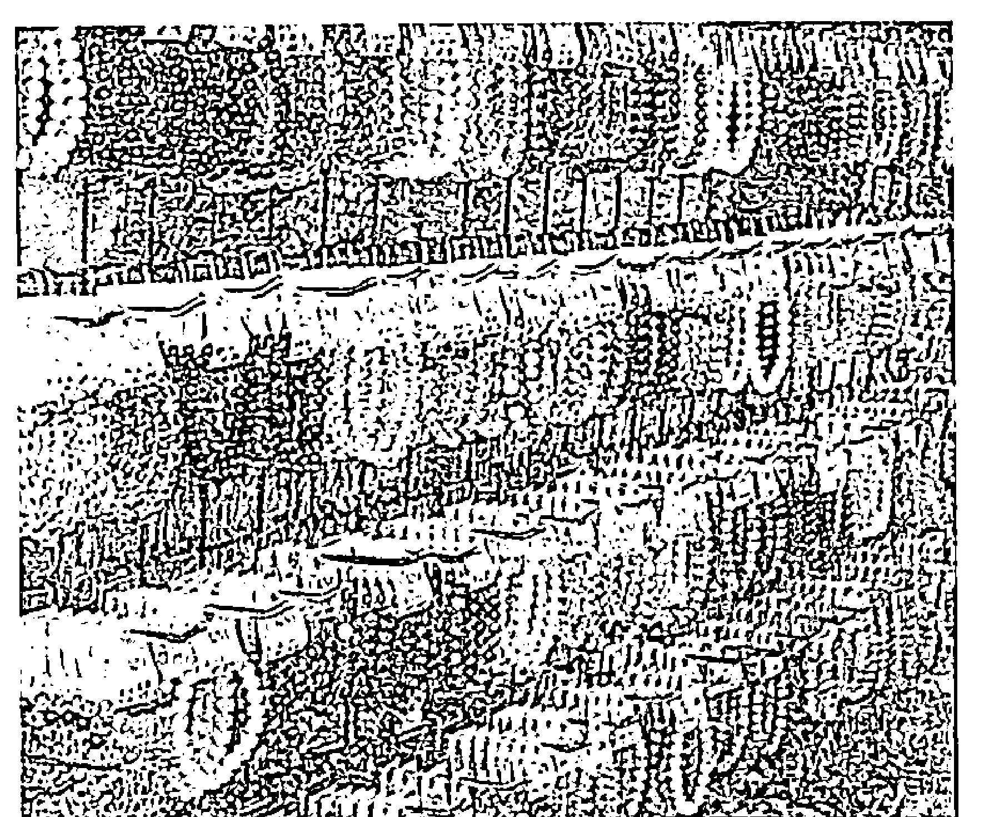

佩戴位置不同，含义也不同

用幸运石制成的首饰，因为长时间和肌肤接触，会与佩戴者的波动相通，也正因为这样，佩戴者更能切身地体会到幸运石显著的功效。

另外，即使是用同一种幸运石制成的首饰，佩戴的位置不同，含义也不同。了解幸运石和各个佩戴部位之间的关系，根据自己的目的和心情挑选合适的幸运石也是一种乐趣。有效利用幸运石首饰，让每一天的生活变得更加丰富多彩吧！

#### 幸运石与宝石有什么区别？

在日本，人们将具有神秘能量的矿物统称为幸运石，英语中并没有与之对应的词语，通常将其称为“Mineral”或“Gem Stone”。“Mineral”指矿物质。“Gem Stone”中的“Gem”有宝石之意。

全世界共有 4000 多种矿物，其中被视为幸运石的有 300 多种。作为宝石被开采出来的约有 70 种，其中被大家所熟知的只有 20 多种。宝石是幸运石的一部分，被称为宝石的矿物必须满足一定的条件。根据世界上最权威的珠宝钻石鉴定机构美国宝石学院（GIA）给出的定义，宝石指“美丽、稀少、耐久性强的矿物，或者作为装饰的有机物（例如珍珠和珊瑚等）”。其中，价值较高的被称为“贵重宝石”，价值较低的被称为“半宝石”。

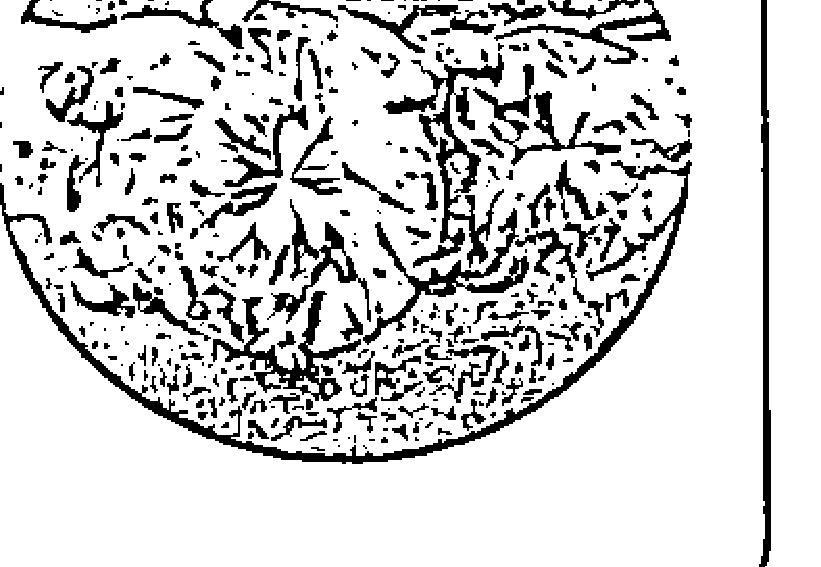

### ※ 首饰的佩戴位置和功效

佩戴位置不同，功效也千差万别
幸运石首饰由于种类、颜色和佩戴在身体上的位置不同，功效也千差万别。人体各部位都存在气等能量的流动，这与掌管生命能量的脉轮有着密不可分的联系。幸运石的波动能够刺激穴道和脉轮，从而改善能量停滞的状态，带来许多意想不到的效果。

颈部◎项链
可以去除内心疲劳，提升自我表现力。当你想消除不安、增强活力、安定精神、增进沟通、提高品位、稳定情绪时使用。

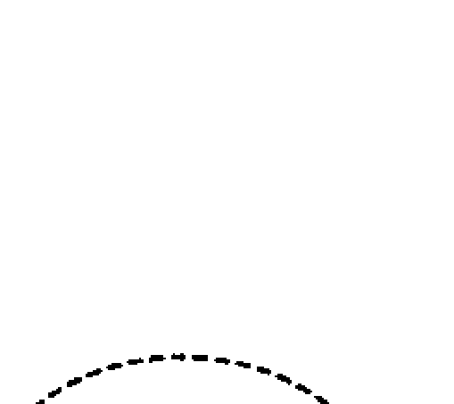

耳朵◎耳钉・耳环
可以提高直觉力和判断力，增加聪明才智。当你想使头脑清晰、召唤好运、保持稳定的情绪和内在美、增进沟通时使用。

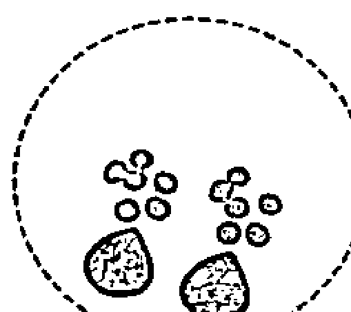

手腕◎手镯
佩戴在释放能量、经常使用的那只手上，能够激发魅力，提升自我表现力和自信心。佩戴在吸收能量、不经常使用的那只手上，能够提高直觉力和激发潜能。

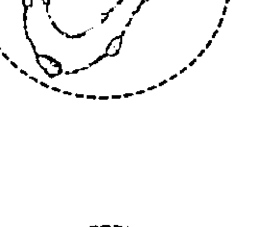

胸前◎吊坠
可以丰富内心，激发魅力，使人性情和善。当你想增加自信、丰富想象力、发挥创造力、从萎靡不振中重新振作时使用。

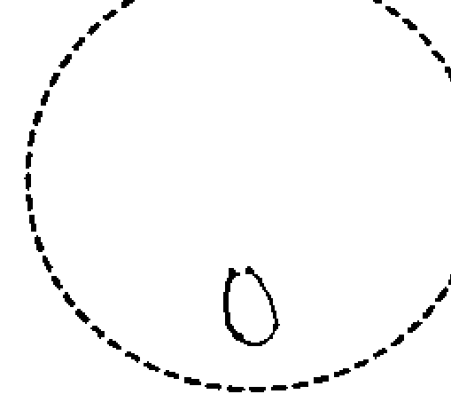

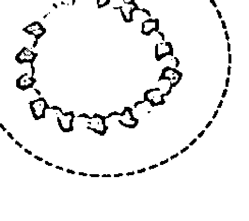

胸口◎胸针
可以平静内心，激发魅力。当你想改变散漫和优柔寡断的性格、与周围人步调一致、提高直觉力和行动力时。

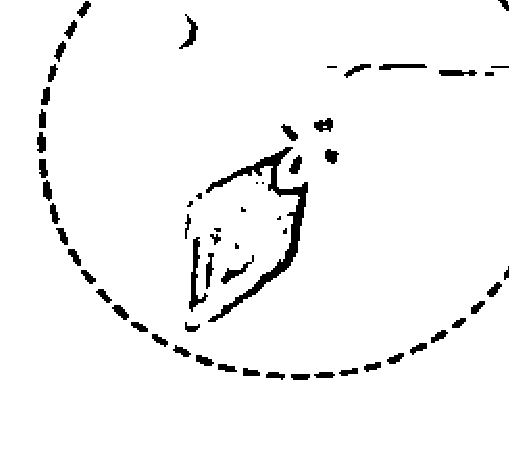

手指◎戒指
具有驱邪的效果。推荐那些想知道自己应该做什么，或者想获得强大精神力量的人佩戴。幸运石戒指的效果及其赋予十根手指的能量见下表。

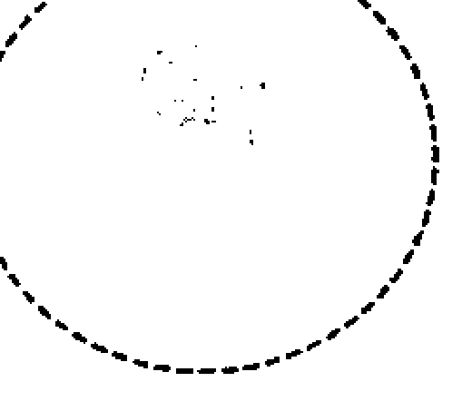

| 手指 | 功效 | [右手] | [左手] |
| :--- | :--- | :--- | :--- |
| **大拇指** | 影响他人，提升品德修养。当你想向着目标踏实地前进时。 | 增强克服困难的自信。 | 坚定信念。 |
| **食指** | 带来准确的判断力。当你想发挥领导能力、获得勇气时。 | 提高注意力。 | 提高感性认识、直觉力和积极性。 |
| **中指** | 带来与神灵相通的灵感。当你想获得他人的信赖、恢复自我时。 | 控制轻率的举动，使人更加理性。 | 增强意志力，获得强大的精神力量。 |
| **无名指** | 提高把握机会的能力。当你想获得更多关注、避开恋爱中的冲突、加深友谊时。 | 稳定心绪，恢复安定的状态。 | 加快恋情进展，加固友谊关系的纽带。 |
| **小拇指** | 实现愿望，获得成功。当你想愉悦心情、抓住恋爱机遇时。 | 提高社交能力，丰富表现力。 | 充分发挥自身的魅力。 |

### 活用幸运石（1）

珠宝店内会同时销售一些未被加工成首饰的原石。让我们一边享受原石带来的乐趣，一边了解佩戴原石的小知识吧！

#### ✦ 佩戴幸运石的原石

虽然珠宝店内有许多项链、手镯等既时髦又小巧可爱的首饰，但是，自己动手将中意的原石和天然石珠子制成精美的首饰也不失为一种乐趣，何不尝试一下呢？只要使用专门的工具，用皮绳或麻绳将珠子串起来即可，操作简单，而且还能随时替换珠子。让我们一起来制作体现自己的风格的首饰，尽情享受其中的无穷乐趣吧！

##### 选择1 使用串珠

串珠是相对而言最容易自己动手制作的饰品。它的种类多样，大小不一，既包括直径不到 10 毫米的小珠子，比如念珠，也包括大型项链上直径几厘米的珠子。

只要用绳子穿过珠子上的小孔，就能制作出手链和项链了，非常方便。试着随意组合自己喜欢的天然石珠子，尽情享受创造的乐趣吧！

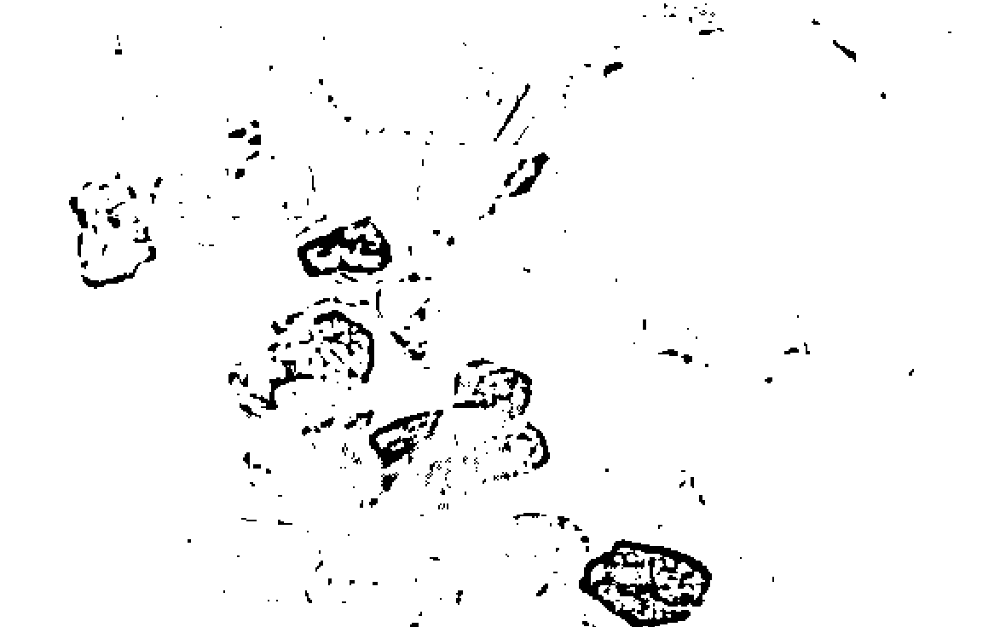

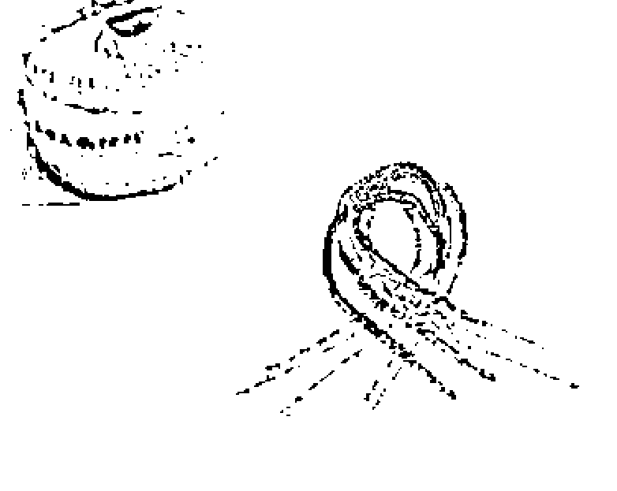

制作手链或项链需要使用天蚕丝线或橡皮绳。天蚕丝线用制作首饰专用的 2 ~ 4 号。另外，用具有伸缩性的橡皮绳制作手链更加方便，直径为 0.3 ~ 2 毫米大小的橡皮绳均可。这两种线绳的价格基本都在每根 6 元左右。

你还可以选用大颗的珠子制作项链吊坠。商店里出售的链子的长度一般为 40 ~ 60 厘米。要想让你的颈部看起来更加迷人，你可以使用 40 厘米长的链子。

##### 项链线绳的打结小窍门

将线绳穿过有孔的珠子就能制作出项链了。能够随意调节长度的打结方法较为实用。

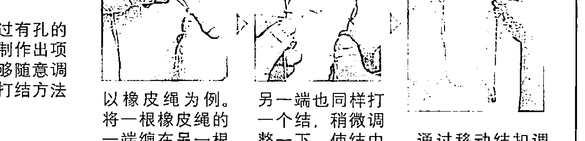

以橡皮绳为例。将一根橡皮绳的一端缠在另一根橡皮绳上，打一个结。

另一端也同样打一个结，稍微调整一下，使结中间的两根绳子长度相同。

通过移动结扣调节链子的长度。

##### 选择2 使用裸石

裸石是指被研磨或被切割出漂亮外形的原石。把裸石镶嵌在专用的戒托或底托上，就能够制作出简单的戒指和胸针了。戒指的戒托和胸针的底托在一些手工艺品店、珠子批发店都能买到。如果你发现了喜欢的裸石，就赶快动手制作一枚世界上独一无二的戒指或胸针吧。

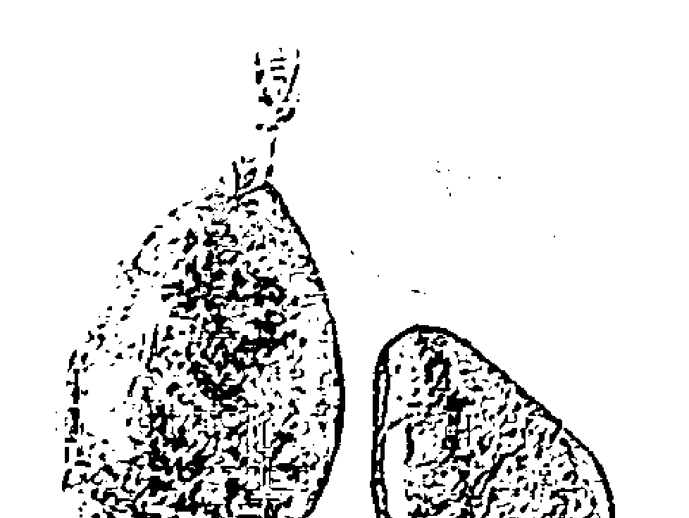

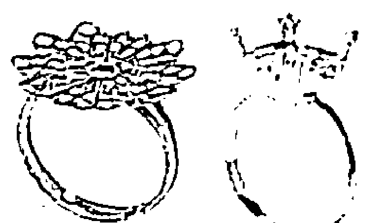

镀金的戒托价格约为每个35元，银质的戒托价格约为每个80元，风格款式多种多样。

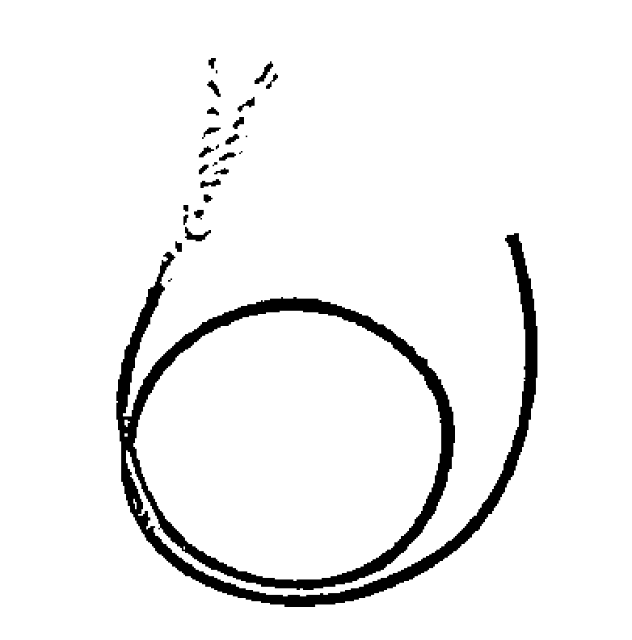

项链的长度一般为40厘米、45厘米、50厘米或55厘米，原材料有合成皮、麻或橡皮等，价格约为每根6元。

##### 选择3 使用翻滚石

翻滚石是指稍经研磨、表面光滑的原石。即使是同一种原石，其翻滚石也大小各异、各具特色。用手可以握住的翻滚石大小最合适，有些小一些的翻滚石也可作为护身符随身携带或制成首饰。用来制作翻滚石首饰的链子和装翻滚石的口袋各式各样，购买时不要忘记和翻滚石搭配着来选择。

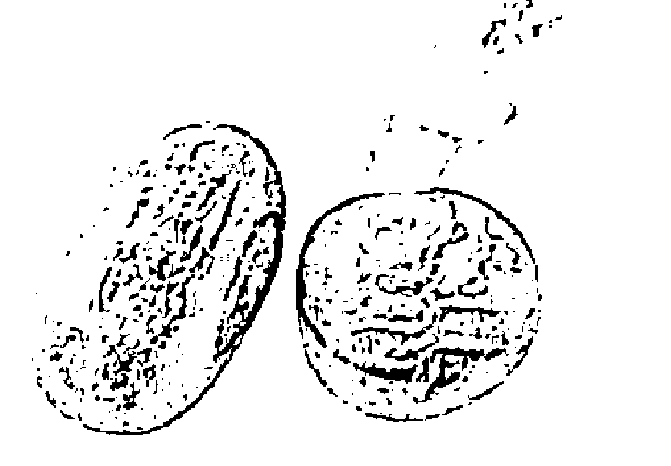

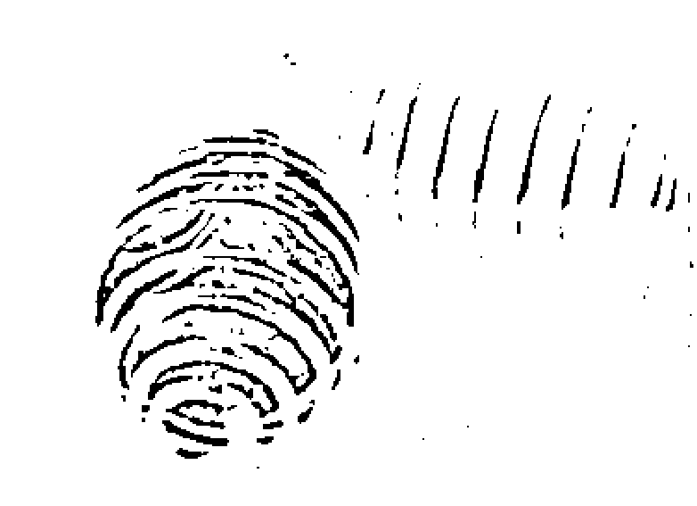

这是银质的翻滚石短项链坠，形状似弹簧的部分可以用来装翻滚石。银链或皮绳可以根据自己的爱好来选择。

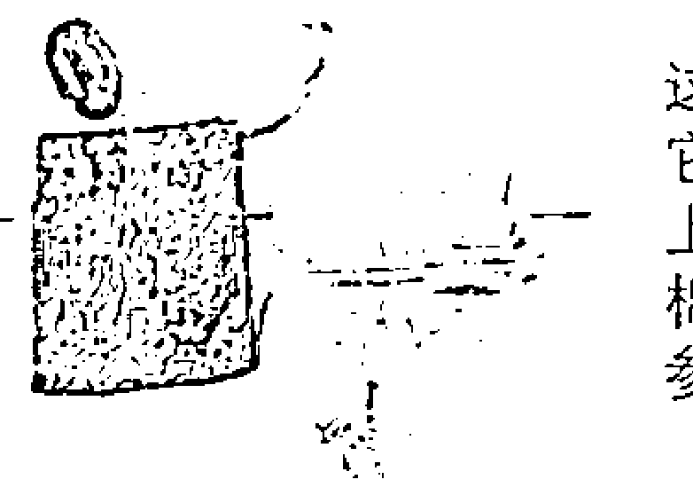

这是存放翻滚石或原石的小口袋。它很适合随身携带，可以挂在背包上或放在衣兜里。尤其推荐使用由棉、麻等天然材料制成的小口袋。参考价格：6元/个

##### 用麻编织链子佩戴在身上

麻具有极高的波动，是一种与幸运石非常契合的植物。有一种说法认为，早在古雷姆利亚时期，人们就培育出了麻，从那以后麻就被世人用于各种场合。在日本，麻被视为“神圣的纤维”，神社驱邪的神符和稻草绳等神具都是用麻制成的。使用波动极高的麻编织链子，能够增强幸运石的能量。

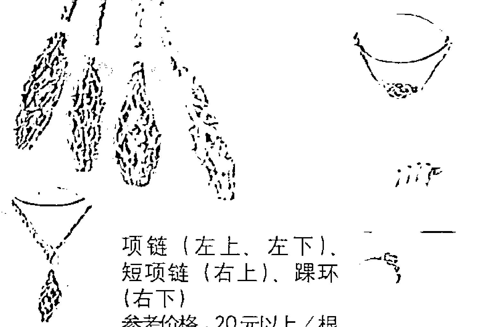

项链（左上、左下）、短项链（右上）、踝环（右下）
参考价格：20元以上/根

### 活用幸运石（2）

幸运石除了能制成首饰佩戴在身上外，还可以放在房间内作装饰，这样我们就可以在日常生活中时刻感受到它的能量。下面介绍一些幸运石的装饰方法和装饰要点。

#### ✳ 用幸运石作装饰的乐趣

##### 用大颗原石作装饰

幸运石被佩戴在身上时能够随时向人的身体和精神注入能量，你也可以将其放置在家中作为装饰，这样同样能够带来意想不到的效果。装饰房间的幸运石，最好选用晶簇或大颗原石。幸运石越大，能量越强，它能够使我们变得心平气和，消除迷茫和不安，治愈我们身心的不适。另外，在幸运石附近放置植物，可以成倍地增强幸运石的能量和治愈效果，其净化能力也会大大提高。

出售各式各样与幸运石的形状和大小相匹配的台座，建议你在购买幸运石时一并购买。另外，你也可以自己动手用布或麻等材料制作精美的台座。

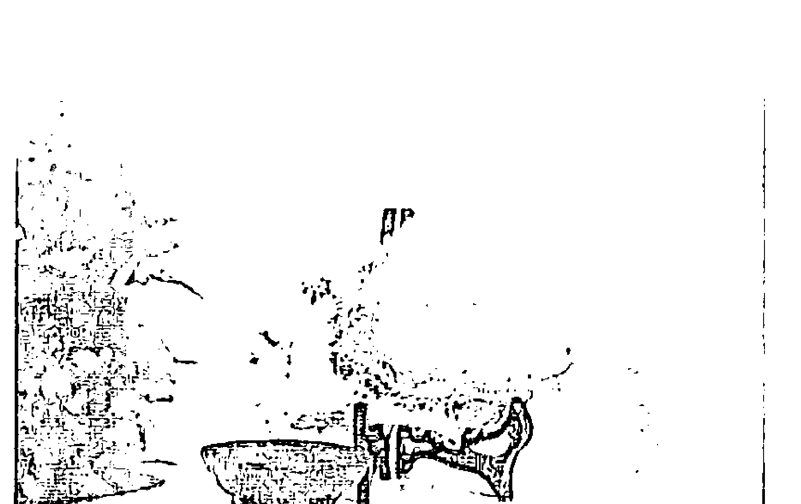

##### 多种多样的装饰方法

人们多用较大颗的原石、晶簇或球形、卵形、金字塔形的水晶等来装饰房间，以使房间内充满能量。

晶簇和球形、卵形水晶的能量不够稳定，因此最好将其放在专门的台座上。一般珠宝商店都会出售。

玄关和窗户是外界能量的侵入口。在玄关和窗户附近放置水晶晶簇等，可以抵挡外界的负能量。

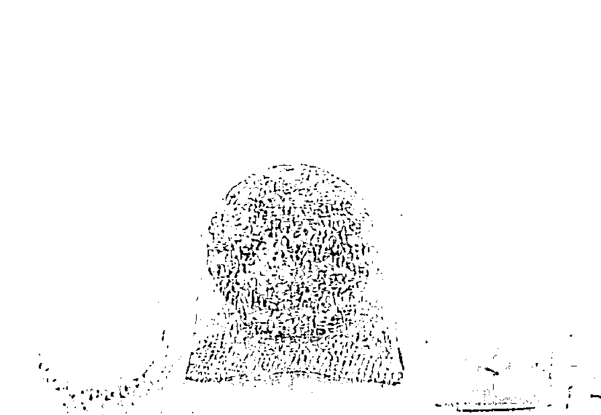

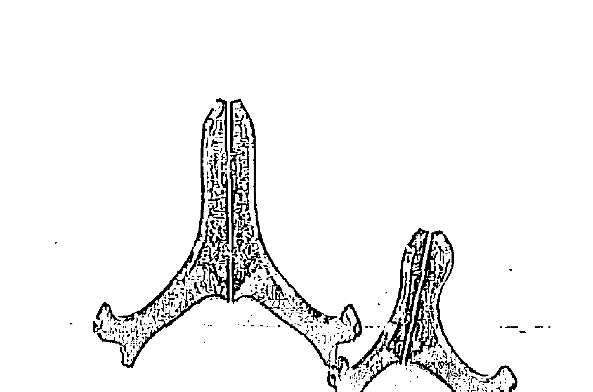

市面上有一些球形或卵形原石专用的展示台座出售。另外，自己动手制作小垫子或台座，也能够增添不少乐趣。

晶簇或板状原石专用的台座种类繁多。将原石直立在台座上，能够让它的能量传遍整个房间。

### ※ 让幸运石进入日常生活

幸运石在家中的摆放位置和方式不同，带来的效果也不同。下面列出了配合不同目的的幸运石的摆放位置，以作参考。除此之外，你也可以通过携带探测棒在各个房间走动来获知合适的摆放位置。

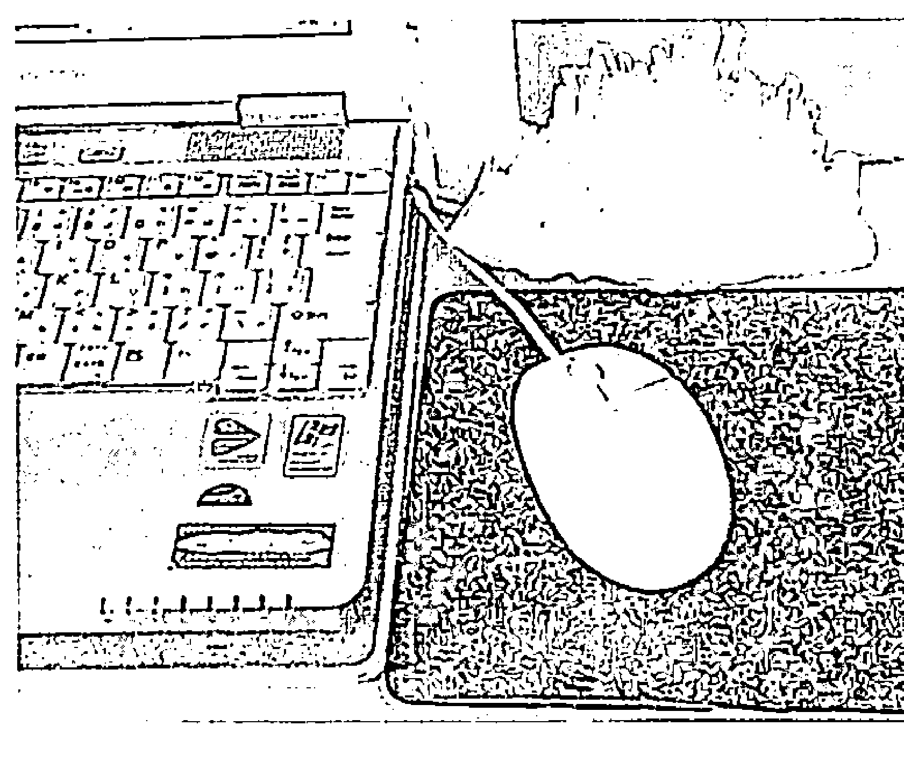

#### 放在电视机、电脑附近

电视机和电脑释放的电磁波能够造成人们精神和肉体上的疲劳感。在它们附近放置水晶晶簇，可以将电磁波分散至各个方向。需要特别注意的是，放置能吸收电子设备能量的黑电气石效果最佳。

#### 放在卧室

把紫水晶放在卧室，能够调节你睡眠时的气息。另外，在枕芯中放入几粒小块的紫水晶，会有助于你的睡眠。

#### 放在厨房

使用火和水的厨房是能量容易混乱的场所。通过放置水晶，可以提高你的注意力和做事效率。

#### 化妆时

化妆时，让粉水晶和你一起照镜子，能够激发你的内在魅力，同时还能增加妆容的质感。

#### 放在浴室

将水晶放在装满温水的浴缸中1个小时以上，然后和水晶一起沐浴吧！这时你会发现，浴缸中的温水变得柔和舒适，这是因为它在纯净的状态下吸收了幸运石的能量。

#### 提高房间的整体运势

把幸运石挂在墙上，这样它就能向房间的每一个角落释放正能量，同时吸收负能量。

#### 幸运石祈愿一览表

幸运石都有自己擅长的领域。下面介绍几种能够帮助人们实现不同愿望的幸运石。

-   [带来爱情的幸运石]
    -   使有情人终成眷属…粉水晶、摩根石、粉电气石、欧泊
    -   治愈失恋的伤痛…蔷薇辉石、菱锰矿、粉水晶、粉色方解石
    -   增加桃花运…欧泊、月长石
-   [带来富足的幸运石]
    -   丰富心灵…硅孔雀石
    -   旺财运…琥珀、黄水晶、虎眼石、托帕石
    -   召唤幸运…青金石、欧泊、发晶
-   [带来健康的幸运石]
    -   促进健康…黑色电气石、赤铁矿
    -   带来生活的喜悦…天河石、黄紫晶、橄榄石、菱锰矿
-   [带来轻松的幸运石]
    -   放松身心…海蓝宝石、绿玉髓、天青石、乳石英
    -   消除恐惧…紫水晶、骸骨水晶、碧玉、查罗石
    -   有助于睡眠…霰石、天青石、托帕石
-   [带来和谐的幸运石]
    -   提高沟通能力…海蓝宝石、天河石、蓝色方解石、拉利玛石
    -   建立人际关系…藓纹玛瑙、西瓜碧玺、玛瑙、蔷薇辉石、硅孔雀石、天青石
-   [适合用做护身符的幸运石]
    -   作为护身符…赤铁矿、激光水晶、黄铁矿、祖母绿
    -   保护人不受负能量的干扰…缟玛瑙、翡翠、软玉、黑曜石、黑色电气石

### 幸运石运用法

要想充分利用幸运石的能量，有很多种方法。下面介绍一些幸运石的运用法，方便大家与幸运石进行更深入地接触。

#### ✳ 与幸运石联结在一起

##### 触摸幸运石、心意相通
只要你有意识地积极与幸运石沟通，使你们的能量相通，你就能充分而有效地利用它的能量了。发现自己中意的幸运石时，尝试着感受并运用它的能量吧！幸运石运用法多种多样，除特别的水晶治疗外，其他运用幸运石的方式都没有特别的规定。不要认为运用幸运石很难，请试着用手触摸它，抱着一种和它玩耍的心态，静静地去感受它的能量。

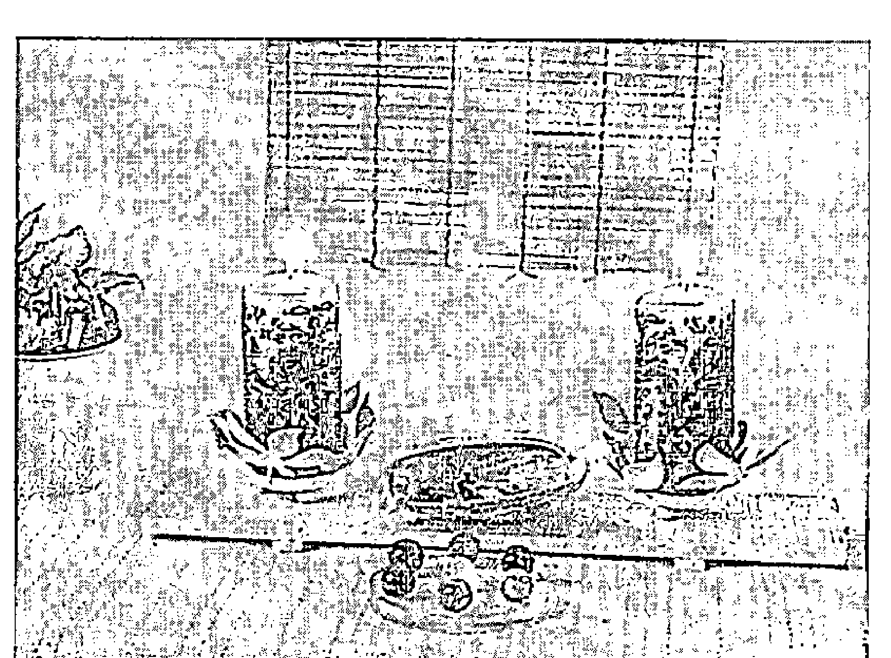

##### 建造圣所
当你集齐中意的幸运石时，为了能够和幸运石心意相通，你需要建造一处属于自己的圣所。不用特意设立祭坛，只需利用架子或房间里的角落，把幸运石整齐地放在架子上或角落里的布或托盘上就可以了，这时，这个场所周围就会形成一个特别的能量场。
不要忘记点燃蜡烛和香薰。这种火和烟的组合能刺激你的视觉和嗅觉，有利于你冥想。晚上睡觉前或早上起床后，利用5分钟的时间在圣所静心冥想，并形成习惯。坚持一段时间后，在圣所中你会自然而然地获得内心的平静。

#### 利用六角星形台架简单建造圣所

两个方向互逆的正三角形重叠，就组成了六角星形，自古以来，六角星形都被认为能够释放特殊的力量。把幸运石按照六角星形的形状放置，能够使它们各自的能量倍增，而幸运石所组成的六角星形则可以被视为一处特别的圣所。在六角星形的中心再放置一颗幸运石所组成的图形被称为“七星阵”，是一种最大限度激发幸运石能量的摆放方式。六角星形台架在市面上就能买到，将一些自己喜欢的幸运石组合在一起，享受它们所带来的乐趣吧！

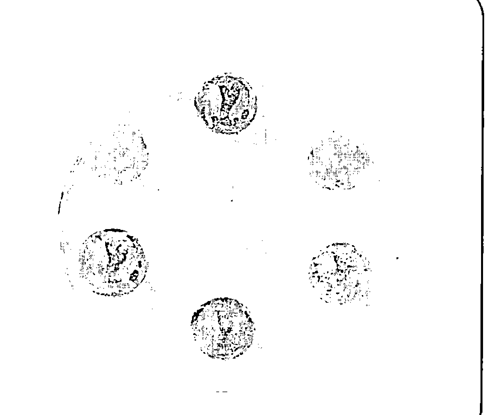

### 运用幸运石

### 静下心来，感受能量

这是一种能让人感受幸运石的能量、静下心来的简单的幸运石运用法。首先你全身放松，坐在地板上或椅子上，深呼吸3次。接下来左手握住根据自己的目的选择的幸运石，闭上双眼，慢慢呼吸。尽量用鼻子吸气和呼气。让你的意识作用于左手手中的幸运石，均匀呼吸，保持这种状态2～3分钟，慢慢地你就会感到头脑得到了放松，左手和身体内有一股暖流流过，心绪荡漾。这时，请继续让意识作用于幸运石，感受它的能量，5～10分钟后你就会感到更明显的效果。

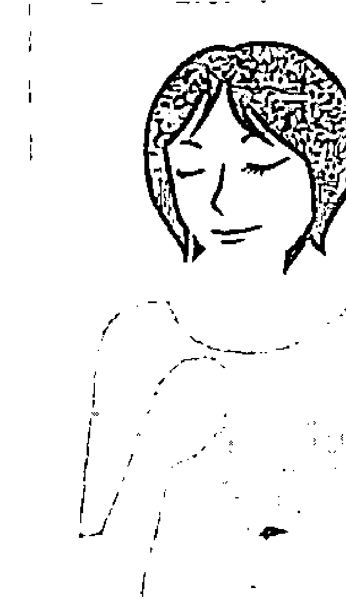

### 获得灵感

你仰卧在垫子上或地上，把获取信息的幸运石放在眉间，闭上双眼，慢慢地做深呼吸。一边呼吸，一边在心中默念问题3次。片刻后你的眉间会略感发麻，心情也变得愉快。这时你脑海中浮现的可能就是问题的答案或提示。如果你感到身体微热，那么脑海中的答案一定是正确的。

要尽可能选择那些与眉间脉轮（第6脉轮）相对应的幸运石放在眉间。相对应的颜色是从蓝色到蓝靛色。如果身边有白水晶，你也可以把它握在左手中，这样效果会更佳。

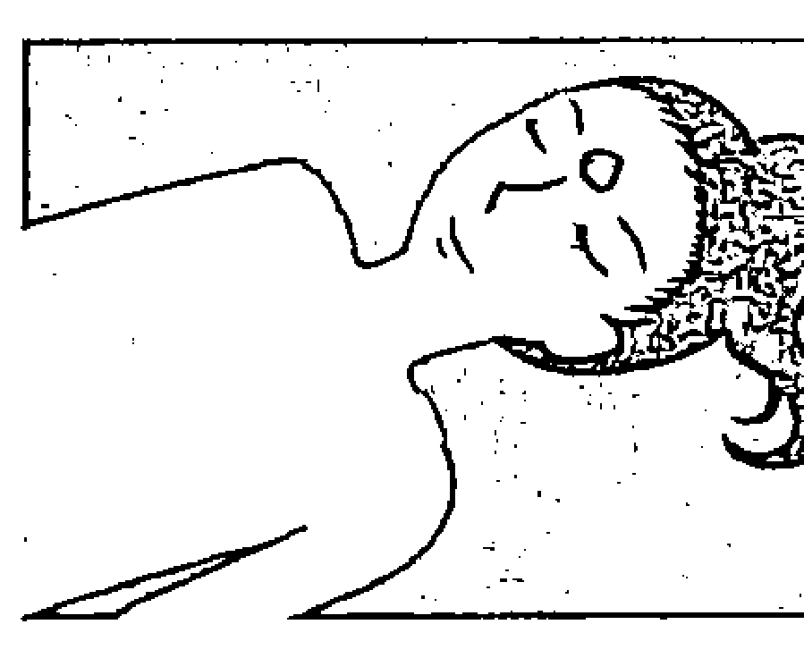

### 水晶疗法

治愈力是幸运石最出色的能力之一。下面将介绍一些用水晶进行脉轮治疗的方法。你可以在安静的房间内点燃香薰，播放舒缓的音乐，营造清净惬意的氛围，这样治疗的效果会更佳。

### 治愈步骤

- ①准备红色、橙色、黄色、绿色、蓝色、藏蓝色（或深蓝色）和紫色7种颜色的水晶。
- ②把水晶摆放在下列身体部位。
  - 红色→大腿之间
  - 橙色→肚脐以下5厘米
  - 黄色→肚脐以上10厘米
  - 绿色→胸前正中央
  - 蓝色→喉咙
  - 藏蓝色→眉间
  - 紫色→头顶
- ③两臂伸直，自然地放在身体两侧，掌心向上，闭上双眼。
- ④慢慢深呼吸，按照自下而上的顺序回忆水晶的颜色，想象每种颜色的水晶所带来的不同感受。让你的意识作用于各种颜色的水晶上，约1分钟后，再慢慢自下而上回忆。
- ⑤按顺序将各种颜色的水晶感受一遍后，想象有一根线连接着7种颜色的水晶的能量，静静感受3～5分钟。
- ⑥一段时间后，深呼吸3次，再慢慢睁开眼睛。
- ⑦睁开眼睛后，感觉一下你现在的心情与之前有何不同。你是否感觉心情舒畅、精力充沛呢？

### 晶石产地地图

晶石产自世界各地。同种矿石由于产地不同，个性也会有所变化。下面介绍一些主要的晶石产地。

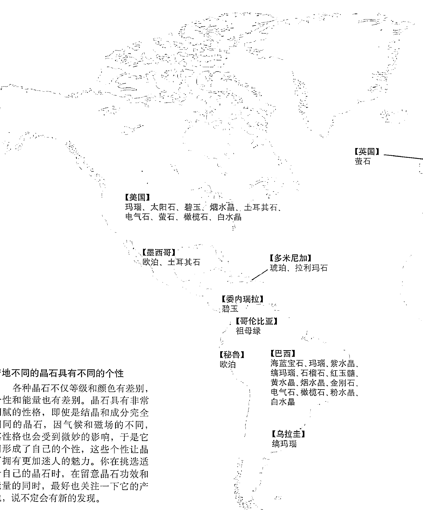

**【英国】**
萤石

**【美国】**
玛瑙、太阳石、碧玉、烟水晶、土耳其石、电气石、萤石、橄榄石、白水晶

**【墨西哥】**
欧泊、土耳其石

**【多米尼加】**
琥珀、拉利玛石

**【委内瑞拉】**
碧玉

**【哥伦比亚】**
祖母绿

**【秘鲁】**
欧泊

**【巴西】**
海蓝宝石、玛瑙、紫水晶、缟玛瑙、石榴石、红玉髓、黄水晶、烟水晶、金刚石、电气石、橄榄石、粉水晶、白水晶

**【乌拉圭】**
缟玛瑙

#### 产地不同的晶石具有不同的个性

各种晶石不仅等级和颜色有差别，个性和能量也有差别。晶石具有非常细腻的性格，即使是结晶和成分完全相同的晶石，因气候和磁场的不同，其性格也会受到微妙的影响，于是它们形成了自己的个性，这些个性让晶石拥有更加迷人的魅力。你在挑选适合自己的晶石时，在留意晶石功效和能量的同时，最好也关注一下它的产地，说不定会有新的发现。

### 其他特别的产地

一些晶石只有在特定的地区才能够开采到。

- 美国
  - 阿肯色州…阿肯色水晶
  - 俄亥俄州……天青石
  - 科罗拉多州……青金石
- 俄罗斯
  - 阿尔丹地区…查罗石
  - 西伯利亚地区…金刚石
- 加勒比地区
  - 多米尼加…拉利玛石
- 中国西藏
  - 喜马拉雅山…喜马拉雅水晶
- 缅甸
  - 抹谷地区…红宝石

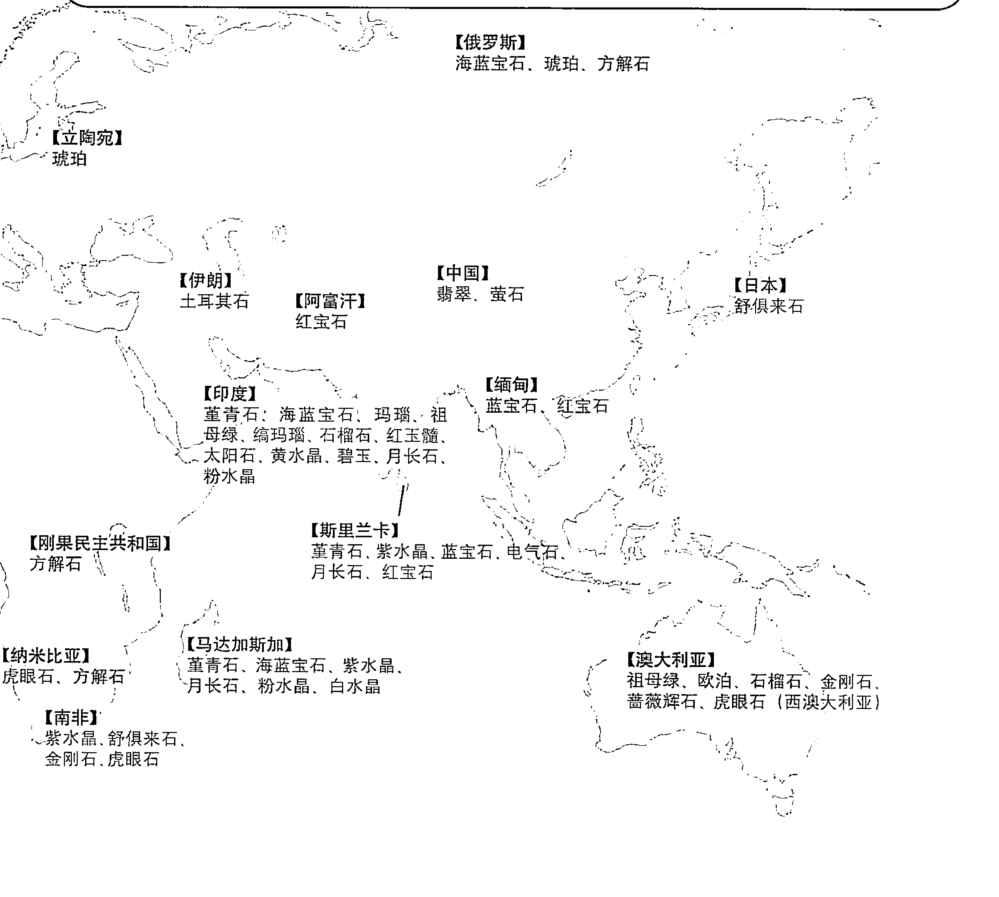

### 值得推荐的博物馆&展览馆

在博物馆和展览馆中，展示着许多平时很难见到的珍贵矿石。为了方便国内读者，我们在原书介绍的日本博物馆的基础上，特意访问了国内几家著名的晶石展馆，并有幸得到对方提供的展馆介绍和照片。此外，我们还收集了一些国外的知名博物馆的简介。如果你有机会到下列城市旅游，不妨亲自到这些地方去看一看，进一步领略晶石的魅力。

### 日本篇

#### 水晶博物馆

这里是晶石和玻璃的博物馆。人们在这里既能探索大自然的秘密，又能领略人类所创造的艺术的魅力。
博物馆一层不仅陈列着1吨多重的紫水晶原石和大师们创作的水晶雕刻作品，还展示了其他种类繁多的原石和水晶艺术作品。二层展示着施华洛世奇和摩瑟等品牌的玻璃工艺品。博物馆的商店里还销售各种珠宝和玻璃制品。

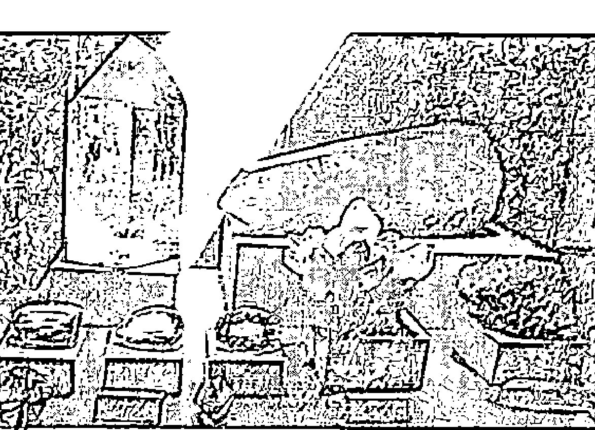

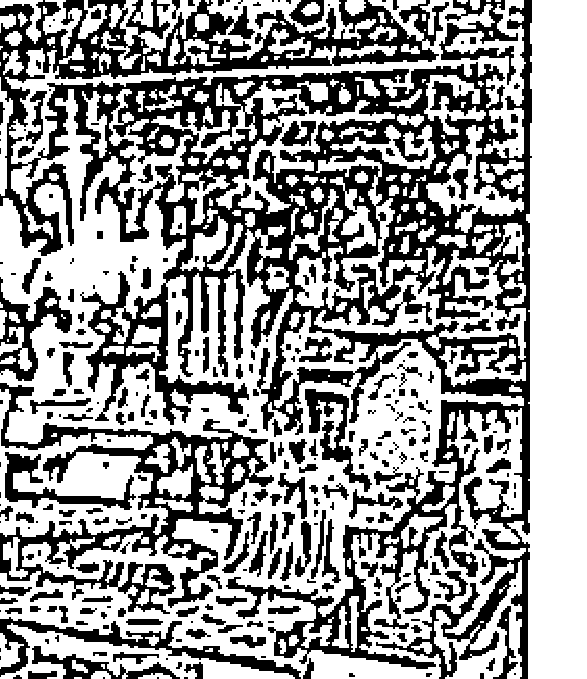

【博物馆 DATA】
地址○山梨县甲府市贡川1-1-7 营业时间○9:30～17:30(无休)
参观费○高中生以上40元，中、小学生24元（博物馆商店不需要参观费）
电话○055-228-7003

#### 水晶馆·水晶宫

这里是小到100克以下的水晶、大到数万克的水晶原石等齐聚一堂的天然水晶专卖店。水晶品种丰富，约有10,000种，直接从巴西腹地水晶矿山进口精美水晶。在这里你能够用便宜的价格买到优质的水晶。这里的工作人员都对水晶知识了如指掌，一定能够帮你挑选到既能解决烦恼、又能实现愿望的水晶。你也可以在这家水晶专卖店的网店购买心仪的水晶。

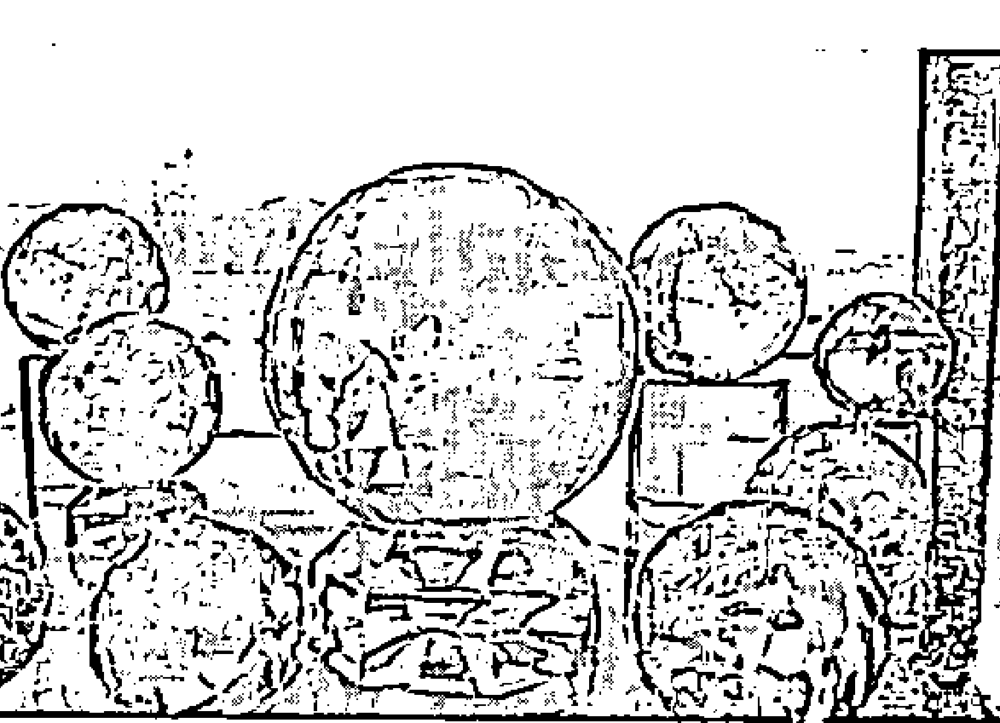

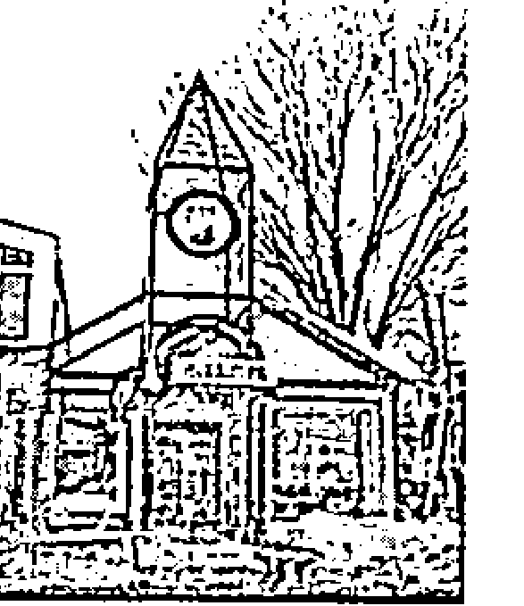

【博物馆 DATA】
地址○山梨县南都留郡山中湖村山中125 营业时间○9:00～18:00（无休）
电话○0555-62-1028 网址○http://www.crystal-palace.co.jp/

| 名称 | 地点 | 网址 |
| --- | --- | --- |
| 大地沟博物馆 | 新潟县糸鱼川市 | http://www.city.itoigawa.niigata.jp/fmm/ |
| 博石馆 | 岐阜县中津川市 | http://www.hakusekikan.co.jp/ |
| 久慈琥珀博物馆 | 岩手县久慈市 | http://www.kuji.co.jp/museum/ |
| 地球的宝石箱 | 长野县盐尻市 | http://www.shiojiri.ne.jp/~jwlbox/home.htm |
| 奇石博物馆 | 静冈县富士宫市 | http://www.kiseki-jp.com/ |
| 玄武洞博物馆 | �的库县丰冈市 | http://www3.ocn.ne.jp/~genbudo/ |
| 大步危宝石博物馆 | 德岛县三好市 | http://www.yamashiro-info.jp/lapis/ |

### 中国篇

#### 中国地质博物馆宝石厅

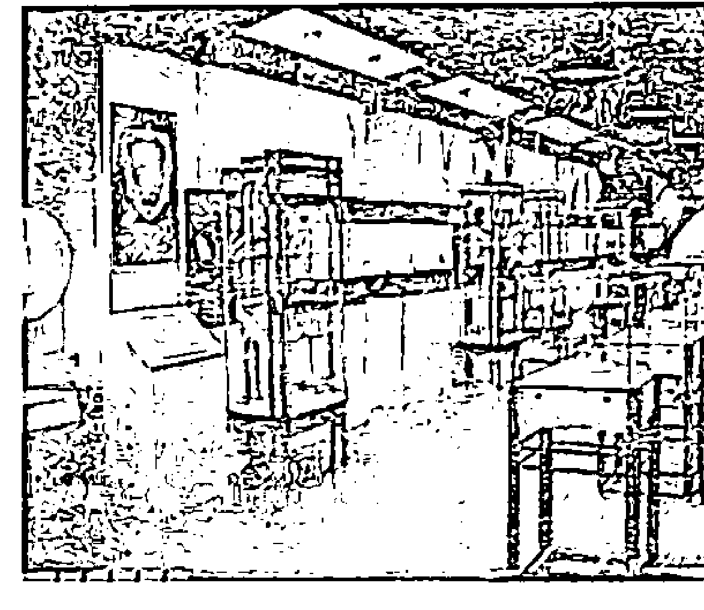

中国地质博物馆始建于 1916 年，经过近百年的风雨历程，积淀了丰厚的自然精华和文化遗存，如今已成为世界上负有盛名、亚洲规模最大的现代化地学博物馆。
其中，宝石厅以新颖的展陈、优美的文字，展示了宝石未经雕琢的天然之美，其展示融入了宝石鉴定、鉴赏、琢型、评价、成因、分布、开采、加工及文化等知识点和兴趣点，曾荣获“全国博物馆十大陈列展览精品奖”。

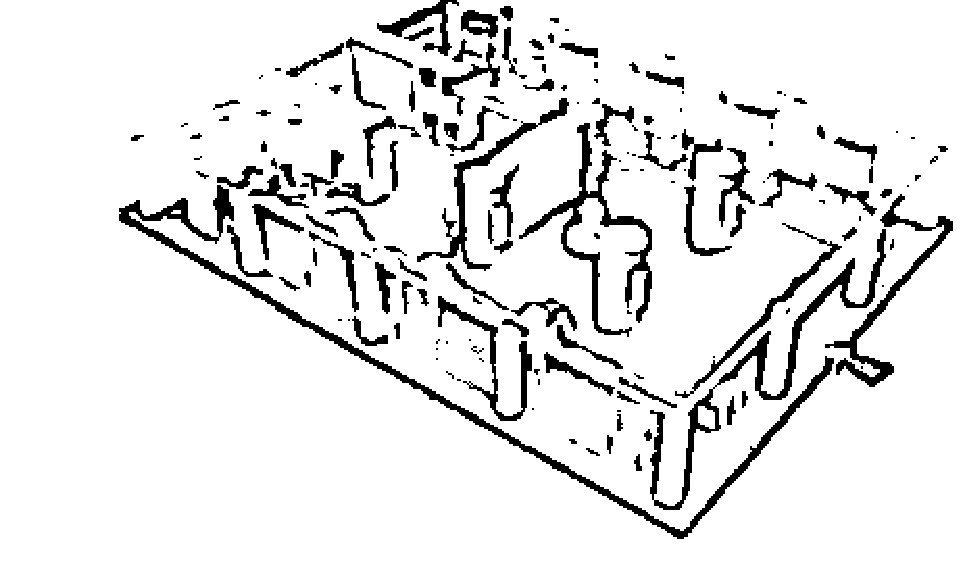

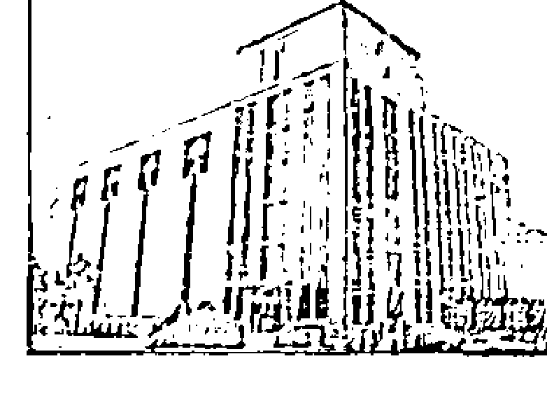

【博物馆小档案】
地址○北京西四羊肉胡同 15 号（西四十字路口西南角，广济寺对面）
营业时间○9：00 ～ 16：30（星期一休息）
参观费○成人 30 元，学生 15 元，团体参观优惠
电话○010-66557858
网址○http://www.gmc.org.cn

#### [江苏/东海县]圣时东海水晶博物馆

圣时东海水晶博物馆位于有“水晶之都”之称的江苏省东海县，是目前全国首家集水晶奇石展览和水晶文化传播为一体的大型水晶博物馆，于 2009 年 3 月 19 日试开馆。
博物馆建筑面积 5000 平方米，分为精品水晶陈列区、观音堂、水晶原石标本陈列区、游客体验区等八大展区，首期征集了由水晶收藏家呕心沥血从各地收集来的各种景石、精品奇石、怪石、观赏石、精品水晶制品、水晶艺术品等珍稀水晶 300 余件。其中有 2 件珍品举世无双：一件是业内专家估价市值逾亿的钛晶观音（高 1.89 米、宽 0.88 米，重达 1.69 吨）；另一件是单体重达 28.6 吨的“世界水晶大王”（体量巨大，但水晶的六柱体特征非常明显）。

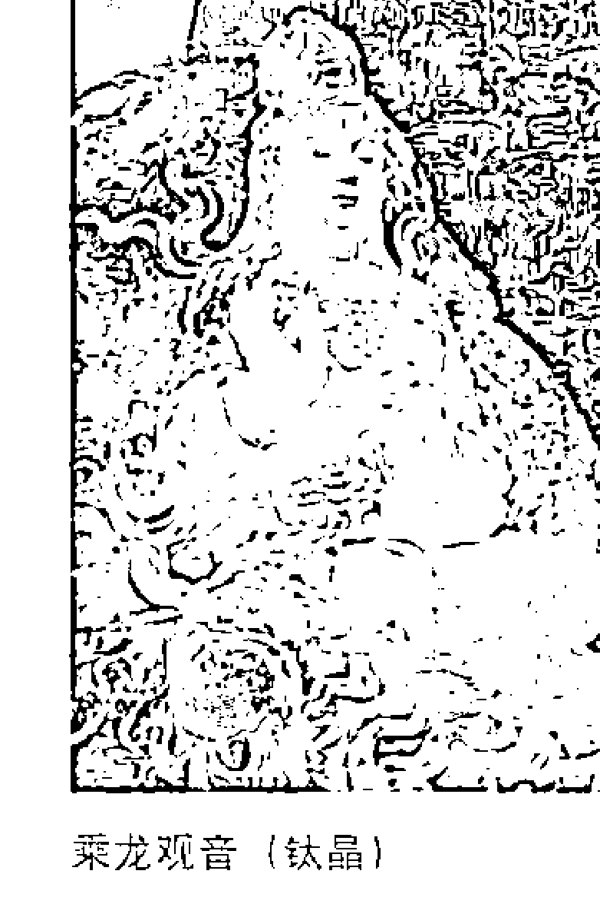

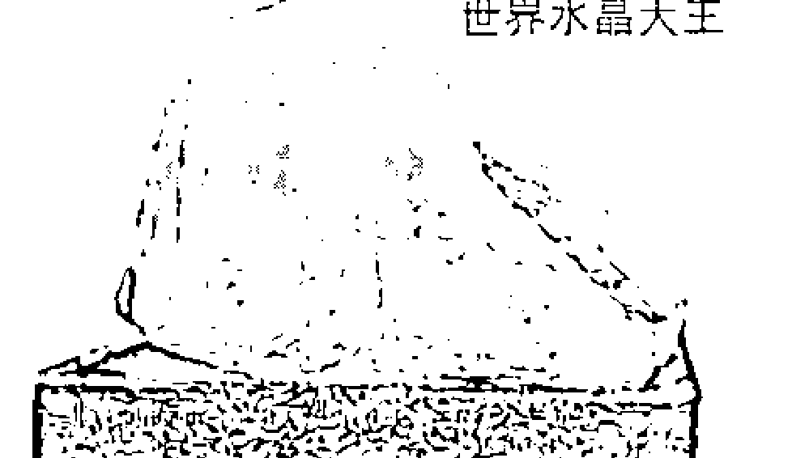

【博物馆小档案】
地址○江苏省东海县晶牛广场东北角，东海国际水晶珠宝城三层
营业时间○9：30 ～ 17：30（星期日休息）
参观费○免费
电话○0518-83014797
网址○http://www.sjmuseum.com/ch

#### [广州/花都区]花都石头记矿物园

花都石头记矿物园于 2009 年 8 月开园，占地面积 70 亩，是目前世界上首座以矿物为主题的游乐园。目前，矿物园展出的各类矿物品种超过 2000 种，数量达近万件之多。主办方希望让更多的人在休闲与愉悦中领略石头的魅力，真正与石头结缘。
http://www.istonepark.com/

### 欧美篇

#### [英国/伦敦]伦敦塔（Tower of London）

位于泰晤士河北岸的伦敦塔作为军事堡垒建于 1078 年，后来的历代君王将这里用做国库、铸币厂、宫殿、天文台、甚至是关押死刑犯的国家监狱。如今，伦敦塔已成为收藏御用文物珍宝的博物馆，保存有古代武器、历代王冠和皇室珠宝，世界上最大的钻石“非洲之星”也在其中（见右图）。

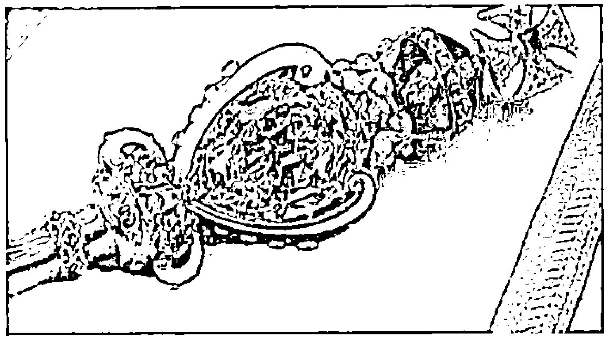

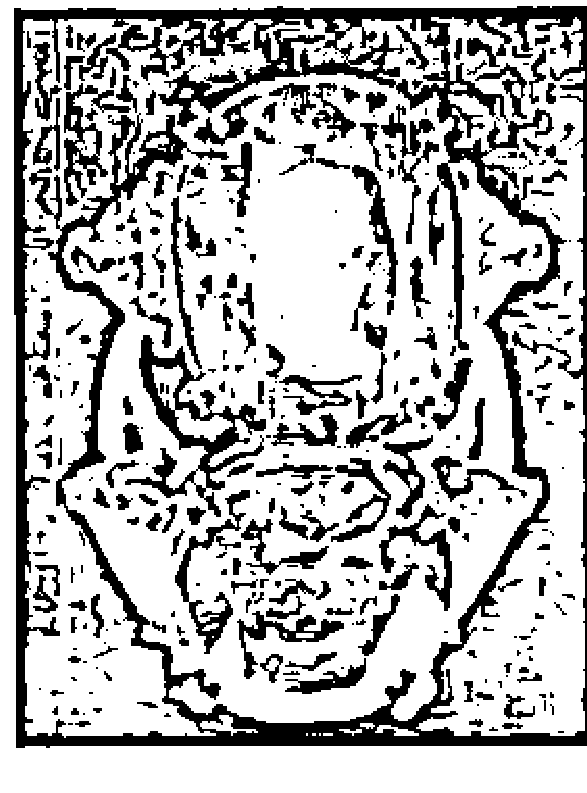

#### [美国/华盛顿] 史密森尼博物院（Smithsonian Institution）

史密森尼博物院包括 16 家博物馆，共有约 1.4 亿件藏品。该博物馆由英国科学家詹姆斯·史密森捐款，由美国政府资助，建于 1864 年。其中，矿物科学博物馆展出了许多世界上独一无二的顶级宝石和矿物展品，而美国国家自然历史博物馆则展出了世界最大的红宝石卡门·露西亚（Carmen Lucia ruby，见左图）。

#### [法国/巴黎]卢浮宫（Louvre）

这座始建于 1204 年的博物馆是人们去巴黎观光的必到之处，其盛名不言而喻。据统计，目前卢浮宫内共收藏有 40 多万件来自世界各国的艺术珍品，其中不乏许多顶级宝石展品。（右图为拿破仑的妻子约瑟芬皇后的全套珠宝，它在 1986 年以 600 万法郎被卖给了卢浮宫。）

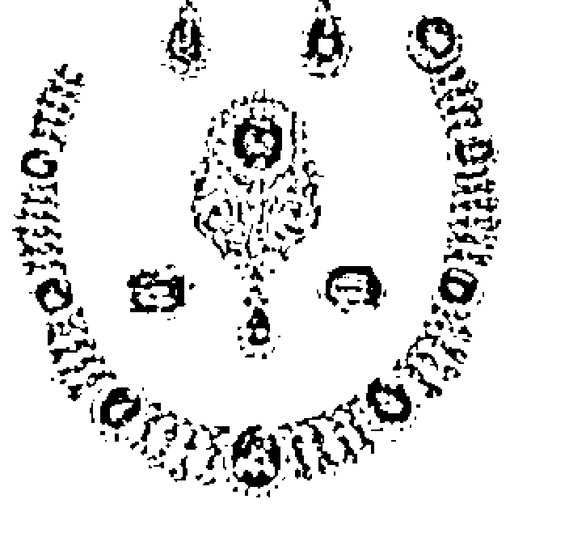

#### [俄罗斯/圣彼得堡] 艾尔米塔什博物馆（冬宫）（Hermitage Museum）

冬宫是世界四大博物馆之一，由俄国女皇叶卡捷琳娜二世于 1764 年创立，藏有约 300 万件藏品，宫殿本身即选用了孔雀石、碧玉、玛瑙等宝石装饰，十分华丽。它的宝石厅中藏有 1 万多座珍贵的宝石石雕。
www.hermitagemuseum.org/

#### [美国/宾夕法尼亚州匹茨堡] 卡耐基自然历史博物馆（Carnegie Museum of Natural History）

地质馆与矿物馆中的矿物、晶石的品种极其丰富，分类也十分清晰。
http://www.carnegiemnh.org/

#### [美国/马萨诸塞州波士顿] 哈佛矿物学博物馆（Harvard Mineralogical Museum）

该馆位于哈佛自然历史博物馆三层，创立于 1891 年，以其藏品的丰富性和稀有性跻身于世界最好的矿物学博物馆之列。
http://www.fas.harvard.edu/~geomus/

#### [美国/南加州橘子郡] 宝尔文化艺术博物馆（The Bowers Museum of Cultural Art）

用艺术品展示古老的美洲文明的博物馆。其中长期展有宝石收藏家迈克尔·斯科特（Michael Scott，苹果电脑公司前总裁，被称为“美国宝石收藏价值最高的收藏家之一”）令人叹为观止的私人收藏。
http://www.bowers.org/

### ✦ 与矿石有关的集会活动 ✦

日本各地每年都会举行矿石展销会，许多日本国内或国外的晶石界人士都会参加。会上从原石到用品石制成的首饰应有尽有，你说不定能在其中遇到幸运石中的珍品呢！

#### 东京矿物展

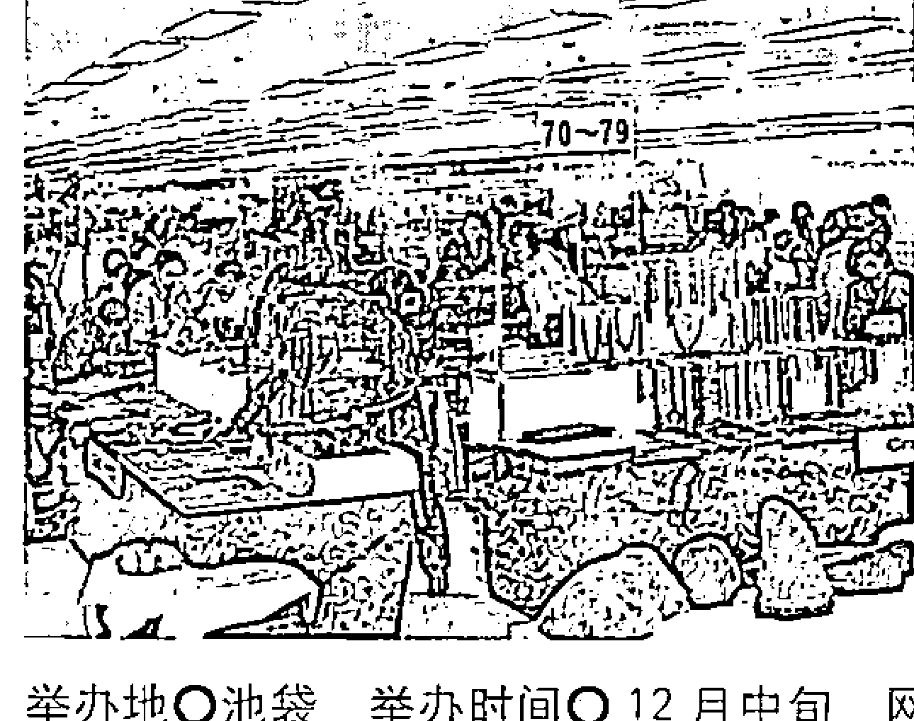

按照惯例，每年在东京举行的“东京矿物展”可以汇集世界各地的化石和矿物，约有 100 万件。日本国内的晶石自不用说，它还聚集了世界各地 200 多家晶石经销商的商品。除了结晶矿物、陨石外，矿物展上还展示和出售一些像红宝石、欧泊、金刚石之类的宝石的原石。它是日本国内规模较大的矿物展，与之同等规模的展览还有东京国际矿物博览会等。

举办地○池袋 举办时间○ 12月中旬 网址○ http://www.tokyomineralshow.com/

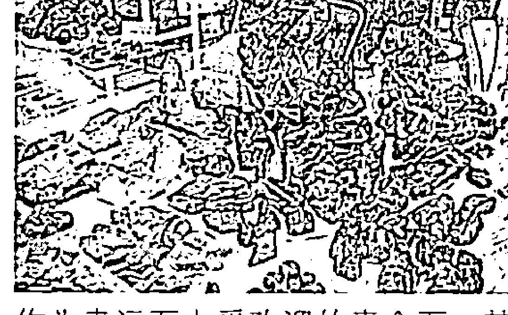

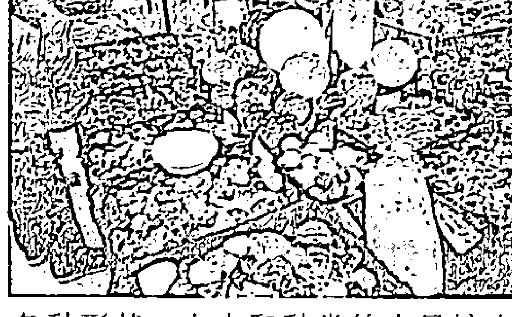

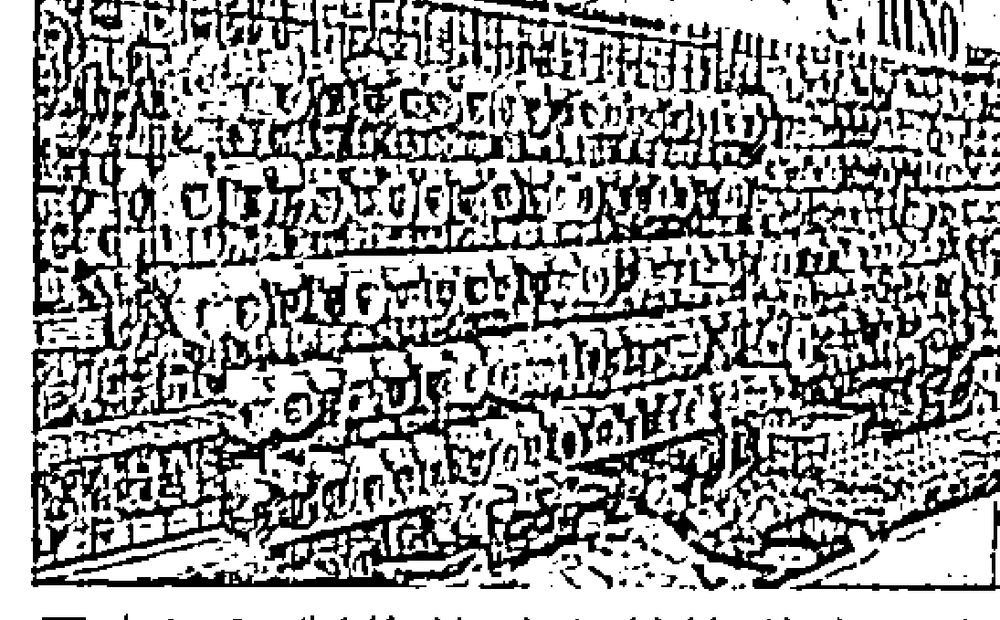

作为幸运石大受欢迎的青金石，其中还有直径为 50 厘米以上的原石。

各种形状、大小和种类的水晶按克出售，还有一些你意想不到的奇珍异宝！

用幸运石制作的珠宝首饰种类丰富，而且在展会上买比市场价更便宜。

#### 图桑宝石矿物展览会

美国亚利桑那州每年 1 月下旬至 2 月中旬都会举行世界最大规模的宝石矿物展览会。它是宝石界的流行风向标。买主们从世界各地齐聚一堂，采购商品，其中有许多日本的商家，因此在这期间，日本的许多珠宝店都会暂停营业。世界上大多数稀有、罕见的宝石都是在那里被买卖的。

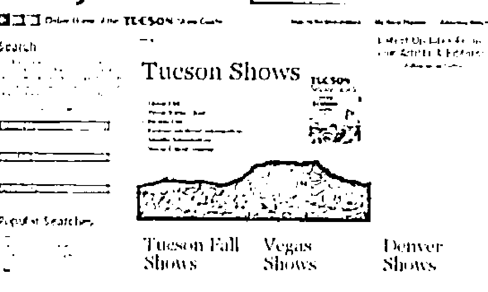

举办地○美国亚利桑那州 举办时间○ 1 月下旬～2 月中旬 网址○ http://www.jewelryshowguide.com/

| 名称 | 举办时间 | 举办地 | 网址 |
| :--- | :--- | :--- | :--- |
| 赏石新春交流会 | 1月下旬 | 京都 | http://www.masutomi.or.jp/ |
| 横滨宝石世界 | 3月下旬 | 横滨 | http://www3.plala.or.jp/mineral-world |
| 东京国际矿石博览会 | 6月上旬 | 新宿 | http://tima.co.jp |
| 矿石集市 | 6月上旬 | 饭田桥等 | http://homepage3.nifty.com/suisho-toge/ |
| 名古屋矿石展 | 8月下旬 | 名古屋 | http://www.nagoyamineral.com |
| “宝石庆典”札幌展览会 | 9月中旬 | 札幌 | http://www.matsumuro.com/sapporo/index.htm |
| 国际矿石艺术展 | 10月上旬 | 新宿 | http://www.tima.co.jp/image/ |
| “宝石不可思议的大发现”展览会 | 5月/10月 | 大阪/京都 | http://www.masutomi.or.jp/ |

## 附录

## 幸运石用语

当你想了解幸运石时，熟知矿物以及精神世界的相关用语能够帮助你更快地走进它们的世界。下面介绍一些本书中使用的基本用语。

| 用语 | 解释 |
| :--- | :--- |
| **B** | |
| 宝石 | 颜色美丽、有光泽、透明度和硬度高的矿石，可用来制作装饰品、仪表的轴承或研磨剂，一般价格较高。 |
| 变彩效应 | 当光线以不同的角度投射到衍射层上时，衍射颜色会发生变化，这种现象就是通常所说的变彩效应。 |
| 波动 | 生命能量，宇宙中普遍存在的用肉眼无法看见的能量。 |
| **C** | |
| 长石 | 占地壳总量50%的矿石，绝大部分包含于岩石中，多呈四棱柱状。 |
| **D** | |
| 第三只眼 | 第6脉轮。眉间上部凹陷处，可以帮助人们提高直觉力和才智，促进精神上的成熟。 |
| **F** | |
| 翻滚石 | 经过研磨后表面更加光滑的原石，大小为一只手可以握住，价格在幸运石中较为低廉。 |
| **G** | |
| 刚玉 | 自然界天然存在的氧化铝晶体，原本为无色，常因含有不同的微量元素而呈现不同的颜色。 |
| 高次元 | 凭借人类的五感和某些测量机器无法捕捉到的频率较高的世界，通常指五次元以上的事物。 |
| 高次元脉轮 | 身体中除了7个主要的脉轮外，还存在着与更高层次能量相连的脉轮，通常指第8脉轮及以上的脉轮。 |
| 铬云母 | 泛指含铬（一种金属）的云母。由于铬的着色作用，此类云母呈深浅不一的绿色。 |
| 硅酸盐 | 硅、氧与其他化学元素（主要是铝、铁、钙、镁、钾、钠等）结合而成的化合物的总称。 |
| **J** | |
| 金红石 | 二氧化钛矿物的一种，其特征是结晶呈柱状或针状。红宝石、蓝宝石和发晶中常含有金红石的结晶。 |
| 晶簇 | 矿物结晶在岩石的裂隙或空洞壁上聚生而成的簇状集合体。晶簇可由一种或几种矿物组成。每一个结晶的顶端都能释放强大的能量，可以净化事物、驱除邪气。 |
| 精神创伤 | 人的精神受到打击后所形成的创伤，长时间积聚在内心。 |
| 净化 | 祛除空间和身体内的邪气及污秽之物，吸收负能量，使能量消减的晶石恢复到初始状态。 |

| L | 裸石 | 指那些经过研磨或切割、尚未进行进一步加工的原石。 |
|---|------|--------------------------------------------------|
|   | 绿帘石 | 晶体常呈柱状、纤维状或厚板状，集合体呈粒状或放射状。 |
| M | 脉轮 | 人体内沿脊柱纵向排列的、控制生命能量的7个能量中枢。 |
|   | 母岩 | 在成矿过程中供给成矿物质或与成矿作用直接相关的岩石。在水晶商店经常能够看到带有母岩的矿石。 |
| N | 内包物 | 指矿物中所包含的成分，在结晶生成过程中深入结晶内部的物质。 |
| Q | 青石棉 | 通常产于由岩浆岩变化而成的变质岩中，为蓝灰色、细纤维状的结晶。 |
| R | 人造宝石 | 用科学方法制造的晶石，因此具有天然石所没有的化学成分和结晶构造。 |
| S | 守护石 | 相传守护石能够保护佩戴者免受灾难，帮助其实现愿望。 |
| T | 天然石 | 天然的石头，有时也指能够用自然的能量从多方面影响佩戴者的矿石。 |
|   | 凸面切割 | 其英文名为“cabochon”，意为“头部”。它是宝石切割中最古老、最通常的形式，将宝石切割成中凸或有半球状的顶的形状。 |
| X | 新时代运动 | 兴起于20世纪60年代后期至70年代，是一场有意识地促成人类心灵转变、使之进入更高存在形态的文化寻根运动或思潮。 |
| Y | 硬石膏 | 天然硬石膏主要由无水硫酸钙（CaSO₄）组成，又名无水石膏。 |
|   | 原石 | 泛指从矿山开采下来的岩石。可以指未经加工的不规则的块石，也可以指经过粗加工的块石。 |
|   | 云母 | 造岩矿物，主要成分是铝硅酸盐，呈白色、黑色或金黄色，带有深浅不同的褐色或绿色。 |
| Z | 自净能力 | 幸运石自行消除污染物达到净化效果的能力。 |
|   | 蒸镀 | 将待成膜的物质置于真空环境中进行蒸发或升华，使之在工件或基片表面析出的过程。 |
|   | 重晶石 | 多形成菱形、板状结晶的硫酸盐矿物。 |
|   | 针铁矿 | 氧化条件下含铁矿物的风化产物，是非常纤细的针状结晶的集合体。 |

## 后记

初次与幸运石邂逅，已经是10年前的事了。那天我偶然走进家附近的一间杂货铺，被角落里多姿多彩的幸运石所吸引。

神奇的是，每次路过这家店，我都能遇到一些爱不释手的幸运石。有时我会犹豫要不要买下它们，但是下次再来到店里时，那些幸运石就好像在等待我似的还在原地召唤着我。最终，我还是把它们一一买下带回了家。现在它们被我整齐地摆放在家中，就像我最亲爱的朋友一样陪伴着我。

本书中介绍了各种各样的幸运石，包括它们的功效和能量等。事实上，要想了解幸运石，这些只不过才刚刚开始。比如说同种类的矿石，每一块都有自己独特的个性，能量也各不相同。通过编写本书，我才切身体会到这一点。

在写到每一种幸运石所传递的信息时，我都会把那种幸运石放在桌子旁，通过实际触摸它，尝试着接收它所发出的能量和信号。我的感受是每一块幸运石都与众不同，比如说同是粉水晶或紫水晶，有的能说会道，有的沉默寡言；再比如，同是释放治愈身心能量的幸运石，有的像母亲一样给予佩戴者温柔的抚慰，有的则像父亲一样帮助佩戴者看清现实，并积极面对。

能说会道的幸运石会爽快地传递信息，而对沉默寡言的幸运石，我们则需要耐心等待它与我们沟通。有的幸运石能安静地治愈我们疲惫的身心，释放强大的能量，使我们精力充沛。不过，即使是相同种类的幸运石，其所传递的信息和释放的能量也是千差万别的。编写此书时，我几次切身感受到，原来这些幸运石都是有生命的，同时，我也重新认识到幸运石的深不可测。

这本书是经历了重重波折后才得以整理出版的。在这期间，出版社负责人、编辑部成员和我自己都感到焦虑不安，不过，功夫不负有心人，现在它终于出版了。

在编撰本书的过程中，我得到了多方面的支持，其中包括多家店铺和接受采访的朋友们，借这个机会，我再次感谢大家。
承蒙大家关照，这本书终于能够跟广大读者见面了。最后，我再次表示衷心的感谢。

引领创新生活研究所代表 津久井孝江

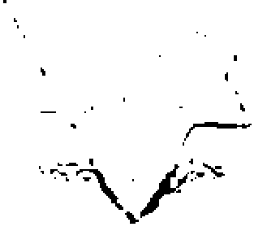