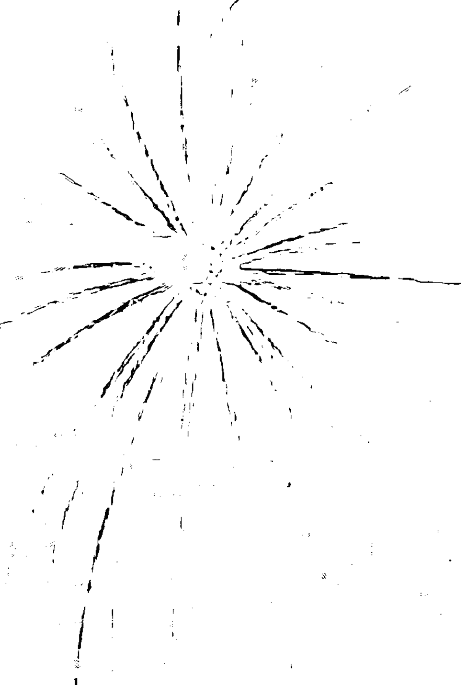
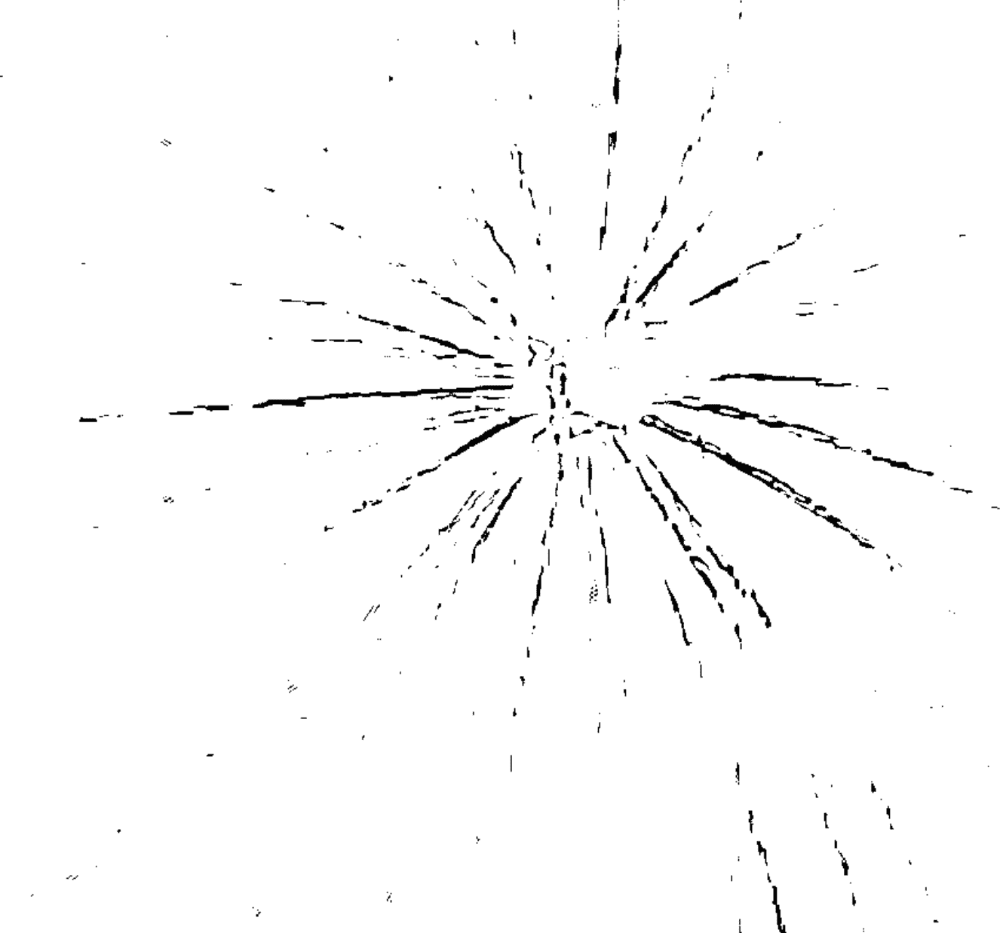
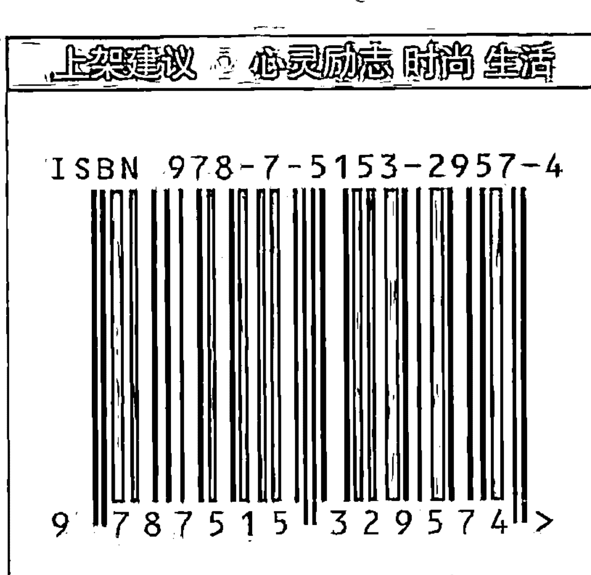

### 开悟者眼中的生命真相

[美] 杰德·麦肯纳 (Jed McKenna) 著
莫里斯 译 张德芬 审校

张德芬 激赏推荐

想知道开悟者的世界观、开悟者的生活状态？
本书带你一窥究竟！
《灵性开悟三部曲》作者最新力作，
彻底翻转你对一切事物的观点！

Theory of Everything:
The Enlightened Perspective

中国青年出版社

### 这本书是来“破”的！
破我们的信念，以及所知的一切！

语不惊人死不休的杰德，这回把宗教、哲学，还有一向被人信奉为神明的科学全部扫荡一遍，提出了让人不得不信服的一些观点……读了几遍之后，我愈来愈喜欢它的言简意赅，以及绝对直率、真实的表述。

> ——身心灵作家 张德芬

读者朋友们这样说杰德的书：

- 读来过瘾，说出很多人不敢面对的真相。
- 我读过许多灵修与宗教的书，但对我影响最大的就是杰德的“三部曲”。
- 穿越追寻的迷雾。
- 对灵性、灵修等有兴趣的人，他的书绝对可以让你少走很多冤枉路，少花很多学费。
- 我没想过还会再看到杰德的新书。这本书篇幅更少、语言更简洁，也比之前的“三部曲”更直指核心。
- 我发现这是一本很罕见、可以用一种令人愉悦的方式谈论真相和“开悟”的书。
- 对那些不熟悉杰德之前作品的人来说，这本书是自成一体的；至于那些看过“三部曲”的人，我不觉得有任何一个人会不想读这本书。
- 任何一个哲学家、科学家或老师都应该来看看这本书，看看它是会惹毛你，还是打开你的眼睛。

### 眼中的
生命真相

[美] 杰德·麦肯纳 著
莫里斯 译 张德芬 审校

Jed McKenna's Theory of Everything:
The Enlightened Perspective

中国青年出版社

(京)新登字 083 号
图书在版编目(CIP)数据

开悟者眼中的生命真相 / (美) 麦肯纳著; 莫里斯译.
—北京: 中国青年出版社, 2015.3
书名原文: Theory of everything: the enlightened perspective
ISBN 978-7-5153-2957-4
Ⅰ. ①开…… Ⅱ. ①麦…②莫… Ⅲ. ①人生哲学 - 通俗读物
Ⅳ. ①B821-49

中国版本图书馆 CIP 数据核字(2015)第 312143 号
© 2007 by Hypnotic Marketing and Dr.Ihaleakala Hew Len
All Rights Reserved. This translation published under license.
中文简体字由 John Wiley & Sons 授权出版。
中文简体 © 2014 中国青年出版社

版权所有，翻印必究
北京市版权局著作权登记号：图字 01-2014-5062

### 开悟者眼中的生命真相

作 者：[美]杰德·麦肯纳
译 者：莫里斯
责任编辑：吕娜 张瑾

出版发行：中国青年出版社
经 销：新华书店
印 刷：三河市君旺印务有限公司
开 本：700×1000 1/16开
版 次：2015年4月北京第1版 2015年4月河北第1次印刷
印 张：13
字 数：100千字
定 价：39.00
地 址：北京市东城区东四12条21号

中国青年出版社 网址：www.cyp.com.cn
电话：010-57350346/349(编辑部)；010-57350370(门市)

本图书如有印装质量问题,请凭购书发票与质检部联系调换 联系电话:(010)57350337

### 推荐序

#### 游乐场中的超级玩家

苏荷美学教育创办人 林千铃

只要踏上这条灵修道路，没有人不是备尝艰辛，一路进进退退，陷入仿佛没有尽头的追寻。向来只听说远方有一个香格里拉，虽没见任何人到过，依旧义无反顾地跟上前人脚步，因为经典都这么写，大师都这么教，想要开悟的人也都这么做。

杰德在他的第四本书《开悟者眼中的生命真相》里面说，开悟不仅不是一条灵性的道路，甚至无关信仰与宗教，更无关科学与哲学，有时，开悟正是阻碍本身。开悟其实很简单，只要切换按钮，把“宇宙主导”的想法，改成这个“意识主导”就行了。意识即一切，你就是意识，宇宙中没有谁在掌控你的命运。“开悟”无须做什么，哪里也不用去，多久都无须等——“开悟”就是你，就在此时此地。

这么简单的事，为什么做不到？就像鱼在海洋中努力寻找水，就像人在家却出外找回家的路一样，太简单了，反而令人难以置信。

杰德在前三本书中用离经叛道的论点，不只颠覆所有的灵性教诲，震撼我们充满信念的脑子，更毫不留情地揭发我们这些灵性族群“去找，但不要找到”的矛盾。他洞悉多半人其实野心不大，灵修只为经营宁静平安、康健富足的一生，做个人类成人而已，并没有那么认真地想要觉醒。

只有走投无路、濒临绝境的人，才会以必然一死的坚决，屠杀自己的龙——砍断自我形象、自我价值、自我感觉这些信念的锁链，弃绝一切。杰德才从开悟那里来，他说高处无所有，人生无意义。

了悟到自身的毫无意义，是获得解脱的关键。
无我才是真我，没有意义才是真正的意义。

这个无意义来自生命本身的矛盾，吊诡之处在于，阻挠真相的元凶，是这个想要了悟真相的我。而生命本就是为了追寻意义、创造意义，是为了建立“我”的定义而存续，但驱动生命，使这无意义人生充满意义的，就是信念交缠所衍生的种种情绪。情绪是喂养心灵觉受的重要食粮，但杰德又说：情绪是各种不同的意识状态，开悟却是没有状态的意识。

了悟真相，就是穿透这个世界表象的虚幻无意义，明白真相只是——存在／意识。存在就是存在本身，无法描述，不可思议，只是空无。它没有状态、没有内容、没有感知，连感知到“我在感知”以外的，都是信念，都是对纯粹存在的侵扰和掩盖。生命中所有的相信，都非真实，连“不信”也是信念。现在我们要做的，只是清理信念、排除干扰，回到意识的纯粹，此外不需要任何人事物，只需要纯粹的意愿。

杰德说，开悟不是为觉醒，而是为了享受梦境，直接点出“身在此世，却不属于这个世界”的真义。了悟真相没有任何好处，什么都不会改变，只是意识变了。我们还会留在游乐场里，游戏继续玩，好戏继续演，美梦继续做，但所有的质量都不同了，因为看穿了梦境的虚假，不为是非成败、恩怨情仇的光影迷眩，只是清醒觉察，因此才能在这场人生戏梦中，享受游戏之乐，成为游乐场里的超级玩家。

### 译者序

#### 在旷野上等待闪电

莫里斯

我经过零零散散的两个月，完成了《开悟者眼中的生命真相》这本书的翻译初稿。一开始是通过朋友介绍，才得知杰德出了第四本书，经过中间很多因缘，最后有幸成为它的译者。

在翻译和修行这两件事上，我只是新手——谦辞到此为止。幸好，从某种意义上讲，在后者上我们都是新手，因此，我可以再以同修的身份多谈几句。

杰德的第四本著作不改当年“三部曲”的言辞犀利，充满了时下流行的所谓“金句”。其中，“我想，既然你读到了这本书，应该不会潦倒到捡垃圾的地步，但这不代表你的生命没有被困在死胡同里”之类的句子，一般读者乍见，应该都不免汗颜，一方面为杰德的直接，一方面为他的“狂妄”。

但我想，杰德暌违多年再次出书的目的，并非提供我们“另一个概念的玩物”。请看看他在本书开头引述的笛卡尔的话：

如果你仿效当下流行的做法，懒得考虑我提出的论点的顺序，以及论点之间的关系，只是针对个别句子吹毛求疵，那么你不会从这本书中获得多少益处。那些断章取义者也许能找到书里的某些小漏洞，然后开始挑剔，但他们很难提出有力且真正值得回复的反对意见。

因为在初译前几章时没有读完全书，我一开始并不理解杰德为什么要把这段“免责声明”式的文字放在这本书前面。后来在翻译过程中才恍然大悟——原来，这正是杰德亲自给我们提供的导读。

那些断章取义者也许能找到书里的某些小漏洞，然后开始挑剔——杰德早料到，本书会有许多逻辑上的“小漏洞”，因此提前给了读者一颗定心丸。比如，他在书中提到，梵(意识)是没有属性的，但同时，他也反复提到，意识是无限的。在读者的概念里，“无限”显然是个属性，而且是个相当显著的属性。这样的自相矛盾在书中比比皆是，有时甚至出现在同一个段落中。

再往更深的层次看，杰德在书中的一些关键思想上，也有自相矛盾之处。他是质疑逻辑，以及作为逻辑基础的因果律的。在“山与兔子洞”这一章里，他提出了问题：“我们不了解兔子洞里的规则，因为根本没有规则。逻辑本身符合逻辑吗？”其中兔子洞代表这个世界，这个问题直指逻辑本身的不可信性。如果因果律成立，那么这个宇宙之因是什么？这是科学家和哲学家苦苦思索的“奥秘”。为什么存在某样东西，而不是空无一物？杰德对于这个问题的回应简单、直接：“在意识主导论中，这个问题不攻自破……没有之前，也没有之后；没有开始，也没有结束；没有彼时，也没有此时……”——否认了逻辑的存在，逻辑带来的棘手问题也被化为无效的问题。

然而，杰德又在本书中大量运用了逻辑手段，来阐述他的“解释一切的理论”。甚至在本书的第一章，他与卡尔的对话本质上就是一个三段论式的证明。他还声称，意识主导论是无法被证伪的，这里的证伪也是逻辑上的概念。

这岂不是一方面用逻辑证明自己，一方面又否认逻辑？

一个显然的悖论。

这个自称开悟的人怎么了？他昏头了吗？或者，他是在和游乐场中的读者开玩笑？

我无法代替杰德回答这个问题，只能给出我个人的理解。因此，下面的部分是我被本书引出的个人观点，与那个叫杰德的角色无关。

首先，请考虑下面这个包含两个前提的系统：

1. 所有黄色的东西都是好的。
2. 所有水果都是坏的。

在这个系统中，伟大的科学家和哲人都在思考这个问题：香蕉是好的，还是坏的？这是纠缠了他们数千年的问题，因为香蕉本身就很矛盾，但它又确实存在着，既是水果，又是黄色的。

让我们管它叫“香蕉系统”。在香蕉系统之外的人可以轻易看出，这个系统是有矛盾的，因为它不能解释香蕉的存在。香蕉在“香蕉系统”里是个谜团，并不是因为香蕉本身的存在有什么问题，而是这个系统的假设有漏洞。香蕉只是存在着——

Banana is.

看出我的比喻了吗？如果把“香蕉系统”放大千百倍，改名叫“二元世界”或“意识系统”，它不就成了我们这个世界的模型？

请先别发笑。我的“香蕉系统”至少包含了两项与二元对立的世界极其相似的特点：

1. 香蕉系统中，包含二元对立的标尺。在此比例中，是“好的”和“坏的”，以及隐含的“水果/非水果”“黄色/非黄色”。二元性是这个系统里事物的基本属性，在现实世界中同样如此，只不过标尺更多、更复杂。
2. 香蕉系统中，包含一些被不加怀疑地接受的假设。我给出的两项前提都是这样的假设，在现实世界中同样如此，只不过前提变成了“宇宙存在”“神存在”这样的真理性陈述。

在一个错误的系统中，一定存在漏洞。正如杰德在书中陈述的那样：“既然意识本身就是现实的基础，又怎么能被恰如其分地描述为物质世界的某样东西？”正如香蕉系统的漏洞就是它无法解释香蕉，意识系统的漏洞就是：它无法描述意识。并不是因为意识本身的存在有什么问题，而是这个系统的假设有漏洞。意识只是存在着——

Consciousness is.

让我们结束我提出的小例子，回到杰德。根据我在上文中提出的“逻辑”，他在书中的矛盾就可以理解了，甚至让人怀疑他是刻意为之。正是因为这个二元世界在描述意识的时候存在不可避免的矛盾，所以语言不可避免地继承了这些矛盾。

我所理解的故事是这样的：杰德透过他精心设置的“疏漏”，向我们指出二元世界的疏漏，就像指出一个系统的违和之处或一个机器坏掉的零件一样。

意识主导论的全部内容就是“意识即一切”。

我个人的看法是，“意识即一切”及逻辑，是二元对立的世界内含的自毁程序，顺着这两者继续推导，世界的虚假性会逐渐显露出来，最后这两个工具也会被毁灭。

意识即一切，那么……这里、这里、这里都说不通啊……

天哪！

从一个裂缝开始，一个虚假系统崩溃的过程开始了。所谓“千里之堤，溃于蚁穴”。

《开悟者眼中的生命真相》整本书都在讲道理，是极其智性的，结论却又导向智性的空无。我想，指出智性的“裂缝”存在，也许是杰德多年后选择重新执笔，向我们呈现“意识主导论”的目的，也是他在书中留下许多矛盾的目的。

当然，这只是我的故事，谁又能为杰德代言呢？杰德能为杰德代言吗？

为了避免我一家之言的气息太重，请让我提供另外一个人的故事。

我在外面翻译这本书时，偶然碰到一个朋友，便和他说起我在做的事，并给他看了几章我译好的稿子。

他看完之后摇摇头，问我，你相信这个人开悟了吗？

言下之意，他不相信。

我不予作答，把问题抛给他：你觉得他开悟了吗？

他表示否定。我问，你怎么知道他开没开悟呢？为什么你觉得一个没有开悟的人有能力评价一个人是不是开悟了呢？

朋友开始闪烁其词，只是告诉我，“还是存在一些标准的”。

他最后并没有接受我把剩下的书稿发给他的提议。

“存在一些标准”，真的吗？

杰德在这个问题上没有和我们开矛盾的玩笑，而是直接给出他的看法：“在梦境状态中，没有所谓‘开悟的人’，因为在一个虚假的背景中，你不可能是真实的。”

所以说，杰德开悟了吗？

根据他本人的说法，杰德没有开悟。

在这里，我只好玩一个在英文里才最有意思的文字游戏：No one can achieve Enlightenment.

没有人能开悟。

只有“没有人”才能开悟。

换句话说，在我们这些“灵性追寻者”的概念里，所谓的开悟只是幻相。因此，“追求开悟”也是幻想。杰德在书中多次表达了这个看法，他说，开悟是“只有傻瓜才想要的奖赏”。

在旷野中，一群人在等待闪电。

在闪电到来之前，没人知道闪电是什么样子。那些有幸被击中的人，有的再也没有回来，回来的那些告诉大家，只有真正体验过才能知道闪电是什么模样。

与此同时，人们之间有千百种描述闪电的理论——《追寻闪电三百六十计》。

于是，人们在黑暗的旷野中游荡，苦苦求索而不得。没有闪电提供的照明，周围是一片黑暗。

这时，一个被闪电击中的人回来了。他告诉大家，别再找了，在旷野中还有别的事情可干。

他说这件事叫“成为人类成人”。他说，“人类成人，是一切的起点。”

所以，我们也不妨先别等待闪电了，比起傻傻地等着、做没有意义的寻找，还有别的更有价值的事可做。

而且，说不定有一天……

一道雷霆从天而降——

轰！

真相。

### 导读

#### 这本书是来“破”的

身心灵作家 张德芬

如果你看懂了吕克·贝松最新的电影《超体》，而且很喜欢，那么，这本书也许可以同样获得你的青睐。

认为自己已经在《灵性开悟三部曲》中，把“该说的都说完了”，然后神隐起来不见人的杰德，又写了一本书。对他来说，没什么特别的，就是在一个偶然的机会里，他和他的狗在旅馆房间里一边看电视，一边打瞌睡，突然听到了“解释一切的理论”这样的说法，触动了他的心，觉得想写东西的感觉蠢蠢欲动。于是，这本短小轻薄，却可以解释一切的重量级天书，于焉而生。

语不惊人死不休的杰德，这回把宗教、哲学，还有一向被人信奉为神明的科学全部扫荡一遍，提出了让人不得不信服的一些观点，例如意识主导论(亦即一切均由意识组成，意识即一切)。其实，古今中外的各种圣典、经书，提到“最终实相”时，没有一个版本是违背“意识主导论”的。杰德的特点在于，意识主导论是他生活所在的基本范式，他活在一个流动的、意识为上、合一的、整体的世界里。要把他自己生活的实相，用言语表述给我们这些信奉“宇宙主导论”（宇宙是一切的中心、实相）的忠实信徒听，是有一定困难的。

所以这本书乍看之下，会有些艰涩和理论化，但读了几遍以后，我愈来愈喜欢它的言简意赅，以及绝对直率、真实的表述。比方说：“宇宙主导论只是对意识主导论的错误理解。我们都身处意识主导论的世界，所以很自然地，一个生活在宇宙主导论中的人偶尔会在某种程度上利用更高层次的运作，这些运作在意识主导论中是很寻常的——更高层次的知晓和引导、超乎寻常的感知、显化、超级好运、流动、可见的模式，等等。这些更高层次的运作一直都在那里供你取用，你无须证明自己配得上这些运作，也不必知道如何召唤它们，只须停止阻碍它们出现就够了。”

这段话说明了杰德自己的生活方式，其实也是所有灵性追求者想要的境界：心想事成。按照杰德的说法，意识主导论就是我们一直生活在其中的真相，无论你知晓与否。心想事成其实就是生活在这个真相中的常态现象，只是因为我们过于“宇宙主导”，所以一直用各种负面的思考方式和情绪来阻碍其间能量的自然流动。

如何才能“知晓”（不只是头脑上承认、知道）我们是生活在意识主导论中，而不是宇宙主导论里呢？杰德说：“意识主导论是唯一不需要信念的现实模型。事实上，它根本没有什么要你‘相信’的。停止相信每样事物，不再同意任何事，重整你的动力，砍除一切虚假，烧毁一切，你就会发现你从没真正离开过。你一直都在意识主导论中。”这和他在前面三本书中说的其实是一致的，那就是：抛弃驱动我们的情绪动力——恐惧——烧毁一切虚假的，剩下的就是真相了。而真相就是：“梵意识是一件真实存在，且你真正拥有的事物。梵意识也许是无我，但它是你的真实本质。”

最近结识一位灵性高人雅桐，和她探讨过杰德的书。她说，杰德基本上是来“破”我们的——破我们的信念，以及所知的一切，因为我们知道的一切都是建立在“错误的假设”上，不放下这些，很难在灵性成长方面有所突破。但是在这本书中，杰德还是说了一些很解放人的话：“从意识的角度看，现实是你感知到的一切。你的现实也许与共识相符，也许不是，无论如何，它是你的现实。无论存在的是什么，都是正确的。错误不可能存在，即使对错误的感知也是正确的。感知就是感知，怎么会有对错？”

此外，我也喜欢杰德在本书中提出的开悟(觉醒)三阶段：

- 见山是山＝宇宙主导论的梦境状态
- 见山不是山＝觉醒
- 见山又是山＝意识主导论的梦境状态(清明梦)

在梦境状态中，虽然我们见山是山，可是很多人会觉得“不踏实”，或“怪怪的”，因此需要哲学、宗教、科学来印证和支持梦境的真实性，好让我们安心地继续沉睡。杰德是来唤醒我们的，所以他在本书中花了一些篇幅拆解这几个领域的神话。会不会有些人被侵犯到？我不知道，我只知道他的话非常印心，正是我日常生活中观察到且感觉困惑的地方，这些就留待读者自己去印证吧。

如何从第一阶段过渡到第二阶段？（其实只要跨出第一步，后面的步骤就会自动发生与完成。）杰德的答案还是：“自我发现的旅程不是自我探索，而是自我毁灭。你必须照亮内在空间中那些阴影笼罩的地域，斩断把你困在人格和梦境状态里的情绪能量卷须。”其实他在《灵性开悟三部曲》中也提供一些具体方法，像是最有力量的“灵性自体解析”，以及“纪念死神”“自我观察”等。但是，第一步的发生必须建立在“对假象的憎恶超过了对无我的恐惧”之后，才有可能。所以，不需要人为造作去让它发生，就像雅桐告诉我的：“如果早知道后面的风景，我从一开始就会完全放弃掌控，自然地存在。”

杰德在最后，还是可恶地说了下面这些话，鼓励大家忘掉真相、别想开悟，做个人类成人是最好的：“忘掉那些灵性的胡说八道吧，光是要回到我们的本来面目，克服阻挠这个自然过程的恐惧，我们就够忙的了。人类成人不是什么崇高的灵性成就，在没有被盛行的恐惧破坏的情况下，这是一个人正常的成长过程。它是肉体的死亡与精神的诞生。”

关于人类成人，杰德的版本还是大多数人（包括现在的我）无法

### 目录

001 | 推荐序
游乐场中的超级玩家
苏荷美学教育创办人 林千铃

004 | 译者序
在旷野上等待闪电
莫里斯

012 | 导读
这本书是来“破”的
身心灵作家 张德芬

001 | 敢于知道

- 002 | 1.再简单也不过了
- 011 | 2.我们又开始了
- 021 | 3.你正在读的这玩意儿
- 025 | 4.点国的国王
- 028 | 5.吊床上的沉思
- 038 | 6.唐人街
- 047 | 7.定义意识
- 055 | 8.无须敬畏的奥秘
- 062 | 9.摩根德耶的故事
- 064 | 10.不是悖论的悖论
- 072 | 11.山与兔子洞
- 075 | 12.邪恶的魔鬼
- 081 | 13.阿格里巴的三难困境
- 084 | 14.我们之间的差别
- 086 | 15.月光奏鸣曲
- 094 | 16.科学：我们跟随的盲眼火炬手
- 105 | 17.宗教：那只神奇的乌龟
- 110 | 18.西方哲学
- 117 | 19.东方哲学
- 124 | 20.哲学意义上的僵尸
- 128 | 21.重大反对意见
- 134 | 22.童年之歌
- 138 | 23.理论与实践
- 141 | 24.意义与信念
- 146 | 25.感知的帷幕
- 154 | 26.推测与假装
- 160 | 27.摘自《宇宙尽头的餐厅》
- 166 | 28.楚门的世界
- 173 | 29.开悟的观点
- 181 | 30.最后的宗教
- 183 | 十谏

### 敢于知道

我并不期待大众的认可——实际上，我从没指望自己能有多少听众。正好相反，我不会推荐任何人读这本书，除非那个人有能力，也愿意跟着我严肃地思考，并且愿意抛弃一切感官体验与成见。据我所知，这样的读者非常少。如果你仿效当下流行的做法，懒得考虑我提出的论点的顺序以及各论点之间的关系，只愿针对个别句子吹毛求疵，那么你不会从这本书中获得多少益处。那些断章取义者也许能找到书里的某些小漏洞，然后开始挑剔，但他们很难提出有力且真正值得回复的反对意见。

> ——笛卡尔

## 1.再简单也不过了

苏格拉底：我想听他说，他技艺的本质是什么，他掌握和传授的东西又是什么。他可以如你提议的改天再展示。

卡利克勒斯：不如向他提问吧，苏格拉底。事实上，回答问题正是他展示的一部分，因为他刚才说了，这屋里的所有人都可以向他提问，他会给出答案。

苏格拉底：那我们真是太幸运了！凯勒丰，你来问他吧。

凯勒丰：我要问他什么呢？

苏格拉底：就问他，他是谁。

在三部曲中，我们看到了这句“再简单也不过了”是如何应用在觉醒过程中的；现在，我们可以来看看它是否同样适用于解析现实。

“你是说，这句话用在解析现实上也同样成立？”卡尔问道。

“嗯，我就是这个意思。而且，如果现实真的像我想的那样简单，把其中的道理展示给你看应该毫无困难。所以理论上，你会和我一样了解它。”

“理论上？”

“嗯，它对我来说是个活生生的现实，是我存在的范式，对你而言只能是个理论，因为你还没展开真实的旅程。抛开这点，我们可以一起看看它是不是真的非常简单，而且简单到不能再简单。”

“这要花多久时间？”

“我们现在可是在揭示世间万物的所有奥秘，你就不能在你的日程表里抽出一点时间吗？”

“可是，既然你说它很简单……”

“好吧，五分钟以内，如果你配合的话。假如你阻挠，就要花七分钟。”

“我为什么要阻挠？”

“玛雅。”

“你说那只狗？”

“另外那个玛雅②。”

“好，现在是两点四十七分。输的人出钱买啤酒，还要买好啤酒。”

“就这么说定了。你相信真相存在吗？”

“我可不会让你轻易得逞。”

“好，那我们换个问法：你相信真相不存在吗？”

“我怎么觉得这是个陷阱？”

“如果我们说真相不存在，就等于说‘真相不存在’这件事是真的。这是个自相矛盾的陈述，就像在说‘没有绝对的事情’一样。你同意我的说法吗？”

“嗯，应该同意。”

“到此为止，我们在说的和信念或个人感觉完全没关系，只是简单的逻辑而已。你能在这个逻辑中找到漏洞吗？”

“不能，我同意‘真相不存在’这个陈述有逻辑上的矛盾。”

“所以呢？”

“真相不能不存在，因为如果我们说‘没有真相就是真相’这句话为真，会显得非常荒谬。基于这个事实，我承认真相一定存在。我不知道真相到底是什么，但我知道某件事一定是真的。”

“所以，你同意一定有件事是真的。无论这件事是什么，真相一定存在，对吗？”

“是的，我同意。”

“我们太早达成共识了，我想确保我们之后不会再讨论同样的问题。你对‘无论如何一定有某件事是真的’这件事是否有任何保留？”

“我完全被说服了。因为‘真相不存在’不可能是真的，所以一定有件事是真的。还有四分钟。”

“好的。既然我们认定‘无论如何一定存在一个真相’，就来看看还能再讨论些什么。比如说，你觉得真相可以改变吗？有没有可能现在是一个样子，过了一会儿就变成另一个样子？”

“如果真相会改变，那它一定不是真的。真相必须是恒久不变的，就算时间走到终点，真相也要是真的，否则根本不是真相。”

“好吧。那么，就算真相已持久得超越时间的限制，它有没有可能是一样东西，而不是另一样？”

“请举例。”

“你觉得真相会不会是光啊，爱啊，或美啊之类的？”

“好像不是。这些东西似乎都是某个更大整体的一部分，不能单独存在。它们需要一个对立物。没有了黑暗，光明是什么？没有了邪恶与憎恨，善与爱又是什么？真相显然不可能是一样不能独立存在的东西。”

“所以，你同意无论真相是什么，它一定是恒久而完整的？”

“是的，我同意真相一定是恒久不变的，也同意真相一定是一个整体，而非一个部分。如果它是一个部分，那另一个部分是什么？一个不同的真相？显然不是。非真相？显然也不是。”

“好，那么，你认为真相会不会因观察角度的变化而变化？我的真相会不会不同于你的真相？真相会不会是相对的？”

“当然不会。我们已经确定真相一定是放之四海而皆准的，否则根本不是真相。”

“你认为真相是有限的，还是无限的？”

“我们都已确定，真相不可能是有限的。如果除了真相之外，还有其他某样东西，那么后者也一定为真，如此一来，两者都不能算是真相，而真正的真相会是比它们更大的、无所不容的东西。还有三分钟。”

“耐心点，解释关于一切的真实理论也许得花上六分钟。”

“那么，我不仅会得到那个理论的启发，还会得到你买的啤酒。你觉得我是在阻挠你表达吗？”

“不，你很配合，但是别太配合了，我不想错过任何一个你还在犹豫不决的地方。到现在为止，我们已经确定真相存在，对吗？”

“嗯，那是肯定的。”

“我们还确定真相不会改变。它不可能一会儿是这样，一会儿变成那样。真相一定是恒久不变的，对吗？”

“是的，我同意。真相一定是恒久不变的，否则它不会比鸟的鸣叫声或云朵的形状更真实。”

“无论我们找到的真相是什么，它一定存在于所有事物之中，没有特例，也没有什么是存在于真相之外的。这可能吗？”

“非常有可能。实际上，我很坚持这一点。真相一定存在于万事万物的本质中，没有什么能独立于真相存在。说某样事物的存在符合‘非真相’，是非常荒谬的。”

“还有，我们确定真相不会是某个更大的东西的一部分，或是某个整体的一半。这一点我们都同意吗？”

“我同意真相不可能是有限的或受限的。我可以直率地说，真相一定是放之四海皆准，没有限制，也没有边界。”

“所以真相一定是无限的？”

“嗯，一定是。”

“那么，真相也一定是绝对的，不会有部分的真相或某方面的真相，对吗？”

“当然。真相一定是绝对的，否则根本不是真相。两点五十了，还剩两分钟。”

“我只是要弄清楚，可能存在两个真相吗？”

“不可能！如果一件事绝对是真的，另一件事不可能也是绝对真实的；如果另一件事绝对是真的，第一件事就不可能为真。很简单。”

“谢谢。那么，你认为真相存在于时间和空间之中吗？”

“那就太可笑了。如果真相存在于时间或空间里，它就是有限的、充满变动的，而不是绝对的。所以，真相不存在于时间和空间之中，因为这两者都是变动的、暂时的。”

“照你的说法，亚哈船长是对的，他说真相没有界线。”

“当然。如果真相有界线，那么界线之外是什么？更多真相？真相一定是无限的。”

“那么，非真相又是怎么回事？你想把它归到哪里？”

“它不属于任何地方。很简单，非真相这种东西不存在。我不会假装理解它，也不能把它放到我所见的现实里，但这个逻辑非常清楚。毫无疑问，真相是绝对的，而非真相不存在。非真相不可能是真的，就像不存在的事物不可能存在一样。”

“那么，再总结一下：你同意真相存在，且进一步同意非真相不存在。你的思路还有什么需要厘清的吗？”

“没有。坐在这儿的几分钟里我了解了，因为真相是绝对的，事情就很清楚了。真相一定存在，非真相则不可能存在。滴答滴答，两点五十一分了，你还有一分钟，我都开始替你担心了。”

“呃，很抱歉，我要让你失望了，因为我好像说得太快了。现在我想花些时间点一支烟，再把脚翘起来，但是我不抽烟，而且我的脚已经翘起来了。”

“滴答滴答，还有五十秒。”

“但我们其实已经说完啦。我们确定了真相存在，而且是绝对的。还有什么比这个更简单？我们已经陈述了一个严密三段论的第一前提：真相即一切。你反对这一点吗？”

“任何理性的辩论都不可能反对这一点。真相存在，非真相则不可能存在，所以真相即一切。唯有真相存在，不可能有其他情况，这我完全同意。”

“所以，要决定真相是什么，只须找到那个绝对存在的事物。有什么是你可以绝对认定为真的？”

“很简单，这是基本的哲学。我可以说‘我在’（I Am），我知道我存在。还有十五秒。”

“那你存在的本质是什么？”

“我存在的本质？当然是意识。我是有意识的，而你的时间到了。我觉得我们谈的东西很有趣，想继续聊下去，但你欠我一瓶啤酒，一瓶好啤酒。”

“我也想继续聊下去，一边聊，一边喝你买的啤酒，因为我们刚刚在五分钟内解决了世界上存在的所有奥秘。”

“真的吗？那我怎么还不知道答案？”

“你知道的，你只是还没意识到，不过这不应该算进我的五分钟里，对吧？”

“如果现在的状况像你说的那样，的确不应该算进去，但我不觉得你做到了你所说的。”

“你熟悉三段论吗？”

“当然，逻辑而已：如果／而且／那么。如果所有人都会死，而且苏格拉底是人，那么苏格拉底会死。”

“嗯，这个例子很有名。‘所有人都会死’和‘苏格拉底是人’，这两个前提证明了一个命题：苏格拉底会死。如果前提为真，命题就一定是真的。”

“我们在刚才的五分钟里创造了一个三段论吗？”

“没错，一个严密、可靠、完美的三段论式证明。我们确定了真相即一切，以及意识存在，这两个结论都是肯定的，对吧？”

“是的，真相即一切。而说我存在就等于说意识存在，这也没错。”

“你能说除了意识还有别的事物存在吗？”

“没办法。我很熟悉‘我思故我在’、唯我论，还有你的书，所以对这一点完全心悦诚服。我唯一确定知道的一件事，就是我存在，也就是说意识存在。”

“那么，如果把这几点用三段论的方式陈述呢？”

“‘真相即一切’和‘意识存在’？我想应该这么说：如果真相即一切，而且意识存在，那么……呃，那么我欠你一瓶啤酒。”

“而且是一瓶好啤酒。”

△

再简单也不过了：

如果：真相即一切。
而且：意识存在。
那么：意识即一切。

① 作者杰德养了一只和幻相女神玛雅同名的狗。

## 2.我们又开始了

> 有时候，我坐着，并且思考。
有时候，我只是坐着。

——萨奇·佩吉

我曾经能记住一周中每一天的名字，不过那是在它们还很流行的时候。最近，我思考时只把日子分成两类：普通的一天，以及人们都不好好工作的一天。我记得，那是人们都不好好工作的一天，而我，一如既往地做着自己的工作。当天，我的工作包括把帽子拉下来遮住脸，然后躺在吊床里晃悠。躺在吊床里这件事我实在聊得太多，但之前我从来没有真的做过。

这就是本章最初的开头，我想它现在也是个开头。最初的版本里，我在这一章写了很多东西，但没有太多实际内容。所以，我把它削减成下面这个样子：

玛雅和我正在探访一片我曾经拥有的土地(虽然从来没人知道我拥有过它)。这片山丘起伏、丛林密布的土地有个特别的地方：

小溪边有一个石头和灰泥砌成的古老地基，上面布满了青苔和藤蔓。我觉得它曾经属于一所教堂，那时我就是这么想的。随着时间流逝，我一直照料着那块浅浅的地基。我将溪流改道，让它流进地基上方的窄小高台，经过凸出的岩架，注入下面宽阔的石头平台，创造出一个静水池。下层平台的积水流过我自己打造的三层石阶，重新回到溪流中。我当时很享受在地基附近闲逛，然后顺手整理那个地方。有好几年，我一直把它当作私人空间。那片地没有什么实际用途，更不会有人想买下它，所以在我离开那个区域时，决定把它送给一位熟人卡尔，希望他会喜欢，并且和他的妻子珊蒂及他们的双胞胎一起享受它。那是很多年前的事了。

我和玛雅这次出门就是想再去看看那个地方，于是把车开到州立公园——我从前的乐土就是要从这里进去的。一开始，我以为整个地方会完全回到自然状态，就像我将近二十年前找到它的时候一样。但是，我发现它变得比我离开时更好了。我没有预期会碰到什么人，但那是人们都不好好工作的一天，卡尔一家人碰巧在周末出来野餐。所以，就像经常出现的状况一样，我没有期待发生的事情意外地发生了，而且结果非常幸运。

△

在这趟周日怀旧之旅的前几天晚上，我和玛雅躺在一家旅馆的房间里，一边看着某个科普节目，一边打盹。就在那时，发生了一件好几年都没发生过的事，而且我很确定它不会再发生了。

在节目中，科学宣传大使加来道雄谈到了希格斯玻色子和大型强子对撞机，以及它们将如何帮助科学家把庞大复杂的“标准模型”简化为一个精巧的，可以解释一切的理论。就在那时，玛雅女神轻轻推了我一下，“解释一切的理论”这个词猛地闪进我的脑海。这是他们科学界的用词，一开始是一个物理学家杜撰出来的。但是，它太宏大了，而且说实话，宏大到远远超越科学领域。在半梦半醒间听到这个词，触发了我内在的某个东西。这个东西感觉像是个新的写作计划，我之前可没料到它会出现。

让我说点背景故事。几十年前，我走过了一段很少有人走的旅程，然后写了三本书。在这段旅程的终点，你会得到一些东西，其中之一正好就是全然的了悟——完整而确凿地理解一切事物。之前，我从来没解释过这个部分，我想，现在我要开始解释了。

所以，我听见道雄博士谈到解释一切的理论，虽然我之前也听过这个理论，但这一次，它激发了我心中的某个东西。我知道科学界现在显然没有解释一切的理论，以后也不可能有。同样显而易见的是，我一定有个这样的理论。我的意思是，我要不是有个解释一切的理论，它并非“理论”，而是确实适用于所有事物，且真实得无懈可击；不然，我就是从头到尾在扯淡。如果是后者，那事情的转变就好玩了——不过话说回来，后者不大可能发生。我会提到这一点，是因为这应该是你正觉得疑惑的事。任何真正了悟真相或开悟的人，应该都能提出一个完美、不涉及信念，且能真正解释一切的理论。毕竟这样的理论只有一个，找到它应该不太难。

然后我想到，我的确有个可以解释一切的理论，但从来没和别人分享过。现在，这件事真的让我感觉有点奇怪。现在，这辈子第一次，我觉得自己似乎应该把这个理论传达出去。所以现在，在结束《灵性开悟三部曲》之后，我第一次觉得好像还有别的话要说。

△

“你就写了这么点？”卡尔一边草草整理一小叠打印出的文稿，一边问我。

“我才刚开始呢。”我答道。

“你说的那个原始版本在哪里？”

“那个版本才三十多页，手写的，我已经烧掉了。”

“我敢说那个版本一定很棒，”卡尔说，“里头提到我们怎么在水池边找到孤独忧伤的你，邀请你进屋安顿下来，鼓励你再次开始写作，还嘱咐你要喝好的啤酒。”

“你说出来感觉就变了。”我说。实际上，无论什么话从卡尔嘴里说出来，感觉都会变。英语是他的第四或第五语言，他说英语的时候带着特别的口音。卡尔长期处于快乐的状态，且身材异常高大，仿佛是某个快乐而高大的物种的缩小版本。

我们正坐在卡尔家后院的户外起居室里。我和玛雅已经在他家一栋独立的小房子里住了几天了。

“你正在写的东西是关于一个解释一切的理论。”卡尔用一种不需要加问号的语气对我说。

“不仅仅是一个理论，”我说，“唯一能解释一切的理论就是真相。这不是很明显吗？我是说，我们可以知道的真相是什么？‘我思’，对吗？我们只能确认‘我存在’这个事实——我在。”

“我明白这一点。”

“所以，科学又能知道什么真相？”

“也只是这个罢了，我觉得。”

“没错。‘我在’是知识的基本通用常数，其他都只是信念罢了。光的速度不是一个真正的常数，但知识的常数是真实的。”

“为什么你说光速不是常数？”

“因为时间、空间和光都不存在。”

卡尔盯着我看了几秒，好像在等我抖包袱。

“这听起来可不是一般的有毛病。”他说。

“嗯，的确。”我同意。然后，我想到我们在之前的一本书里引述过的福尔摩斯的话：当你消除了不可能之后，剩下的不管是什么，也不管多不合理，都必然是真相。

△

此刻，我正躺在卡尔家后院的吊床里晃着，写着关于一切事物的“解释一切的理论”。这就是我在晚上该睡觉的时候看科普节目的结果。当然，我不是科学家，不是哲学家，不是宗教或灵性思想家，甚至不是特别聪明，对解释一切这件事也不是很热心。我只是了悟了真相。所以，如果你读过我的“三部曲”，就会知道可以信任我这个向导。但你同样也会知道，你并不需要我有多可信——如往常一样，你只须自己去探索。

如果你没读过那三本书，别担心，解释一切的理论是自成一体的。

我其实不应该说它是一个解释一切的理论。它不是随便一个理论，而是唯一一个解释一切的理论。此外，它也真的不能算是个理论，因为其中没有任何理论成分。任何一个大脑尺寸正常的人都可以直接、清楚地理解它，因为它是个显而易见的真相。想要亲自看见它，我们只须停止看见那些不存在的奥秘。

“所以，对你来说不再有什么奥秘了？”卡尔问。

“没有。”我答道，“如果对我来说还有奥秘，那我就不是真的‘完成’，而且必须走得更远。就像我希望在“三部曲”中说清楚的，完成就是完成了。完成是旅途的终点、疑问的终点、知识的终点。”

“这个我从你的书里知道了，”他说，“但我还是很难相信这种状态真的存在。”

卡尔和珊蒂邀请我住在他们家车库那边的一栋小房子里，告诉我想待多久都可以。这栋房子曾被改造成音乐工作室，但住起来还是很舒服。他们的后院有一个户外起居空间，里面有桌子、椅子、灯，还有一个吊扇和吊床。他们养了一只叫杜克的黑色的拉布拉多。

## 3.你正在读的这玩意儿

> 我没有时间写一封短信，所以写了一封长信。
——马克·吐温

与马克·吐温不同，我用了足够的时间写出一份短稿。第一稿花了我三个星期，在卡尔家写成。然后，我在两个月的时间里把它补充得更完整，又花了两个月将篇幅减半，花了另外两个月再减半。我本来可以早四个月写完这本书，把它的篇幅保留在是现在的四倍那么长的状态。但是，这本书并不像三部曲那样内容广泛，它从头到尾只说了一件事，只不过是从各种角度阐述而已。这本书要达成的跨范式交流本身是个非常复杂的任务，但就算我说得再多，也不会让它变容易。总之，言简反而意赅。

解释一切的理论的写作计划有一个问题：我之前从来不必把我的新世界观归纳成文字，这件事做起来有点古怪。这不是个小问题，这是涉及范式的问题，而实际上，每个人——先不管其他差异——都存在于同一个最高范式之中。你要如何向一个来自另一个现实的人解释你的现实？你能想出一则发生在一个不一样的最高范式中的故事或电影吗？我曾经绞尽脑汁想了好久，还是没能想出来。

作者和读者之间的范式鸿沟真实存在，且难以跨越。虽说我现在正在传达理论，但我并不是靠理论运作的。我试图拆解开悟者的观点，因为我必须把它解释给别人听，而且这是我生活中的现实。我想，所有不同于我们自身范式的其他范式，都会被视为疯狂。可是，如果这疯狂的道路通往真相，追寻者就必须走上这条路。

在彻底搜寻了一分钟之后，我发现，“范式”是我们从科学语言借来，然后发扬光大的词。在科学领域里，如果把你对宇宙的假设从牛顿物理改为爱因斯坦物理，你就完成了一次范式转移。在本书中，我所说的范式意味着最宏观意义上的世界观。因为每个人共有同一个最高范式——时间和空间、能量和物质、二元性和因果关系等——从来没有人需要把这些归纳为文字。大家都懂，我们已经达成了共识。

所以，我在写作过程中遇到的麻烦有两个：第一，我的范式对你们来说是完全未知的，而我要把范式中那个活生生的现实用非常苍白的语言归纳出来。第二，我必须把我这个未知范式用这些苍白的语言传达给身处一个完全不同范式中的人。我曾经存在于那个范式之中，但它现在对我而言完全是虚幻的——那就是你们的范式。

我曾经是那个可以写出《灵性开悟三部曲》的人，我很适合那项任务，但我本身没有任何更进一步的野心。我在这个解释一切的玩意儿上适度努力，但这真的是马后炮。现在我也许应该提一下：我不是个灵性人士，从来不是，而且我觉得寻求真相也不是一个灵性上的努力，从来不是。还有，事实上，真相真的是件无关紧要的事。它没有什么实际用途，无法应用在现实世界，也不会改变或改善任何事。我也许理解共识现实不是真的，甚至一点都不可信，但我就存在在这里。真相处于任何范式之外，我们却生活在范式之中。

我不想过度夸大我说这些的资格，也不想自谦。我居于那个唯一的非虚假的范式之中，看到现实存在的事物，而看不见那些不存在的，所以我不需要任何信念来掩盖某些部分或填补某些漏洞。然而，我已经退休了。我不再思考，因为思考其实是唯一的大规模毁灭性武器，而我不再需要它了。我已经用思考摧毁了宇宙。

在开悟方面，我是个完美的大师。我对真相的了悟是绝对的，也许有人可以达到和我一样的境界，但没人能超越我。至于传达想法，我做得还不赖，但我绝对不是沟通大师。那么谈到现在的话题，我在哪方面都算不上大师，我只是有一个清晰的观点。我没有心思关注科学、哲学或神学——这些东西对我来说简直无聊透顶——请考虑到这一点。我在这里说的任何东西都不是要让你相信它，而是要让你自己去探索。

除非以最宏观的角度观察，否则这一切都不合理。据说我是开悟了，而我正在写一本书，向你这个读者解释说我和你并不存在，而我们不存在于其中的世界——我在写、你在读的这个世界——也不存在。差不多就是这样。

但是在最宏观的意义上，这一切完全合理，而这本书从头到尾讲的都是这个最宏观的意义。解释一切的理论是一定要站在最高的地方来看的，所以，它不但是真实的，而且是开悟的观察角度。

## 4.点国的国王

(埃德温·A. 艾勃特在他1884年出版的《平面国》一书里讲述了一个发生在许多不同维度的奇幻故事。书中提到，二维世界的主角被一个来自三维世界的球体带入一个更广阔的现实，它们拜访了一个无维度的点，对这个点的自大非常轻蔑——这个无维度的点确信自己就是存在的全部，对此非常满意，且坚信不疑。这个点到底是全部，还是空无？它是充满智慧，还是愚蠢？本章内容节选自这本书。)

“向那边看，”我的向导说，“你久居平面国，但也曾见过线国(一维世界)的景象，曾与我一同飞升至立体国(三维世界)的广阔空间。现在，为了让你的体验更完整，我将带你降到存在的最底层，点国的国土，无维度的深渊。

“看看那可悲的生物，那个点是个与我们无异的存在，却被限制在无维度的深渊中。他就是自己的世界、自己的宇宙，对自身之外的其他事物毫无概念。他不了解长度、宽度和高度，因为他没有体验过这些；他甚至不认识数字‘二’，也没想过任何事物居然可以多于一。对他来说，他就是唯一的存在，是一，也是万物，虽然他其实什么都不是。然而，请你注意他是多么满足，并从中吸取教训：自我满足就是盲目和无知，拥有渴望总比盲目而无能为力地开心要好。现在，你听。”

他停止说话。然后，从那个嗡嗡响的微小生物那儿传来一阵细微、单调却非常清楚的叮当声，就像你们立体国的留声机发出的声音一样。我从那个叮当声中听到这些话：“存在的无穷恩典啊！它是唯一的存在，除它以外，绝无其他。”

“那个小家伙说的‘它’是什么意思？”我说。

“他说的就是他自己，”球体说道，“你之前没注意到吗？婴儿和某些幼稚的成人无法把自己和世界区分开来，所以会用第三人称称呼自己！小声点，继续听。”

“它填满了所有空间，”微小的生物继续自言自语，“而在它填满的空间中，它无处不在。它所想的，它便说出来；它所说的，它便听到。它本身就是思考者、说话者、聆听者、思想、言语和被听见的声音！它是唯一的，却也是全部的全部！啊，多么快乐，这存在的快乐！”

“你就不能吓唬吓唬那个小家伙，让他停止沾沾自喜吗？”我说，“跟他说他到底是什么，就像你告诉我的那样。让他意识到点国的狭隘，引领他到更高的地方去。”

“那可不容易，”我的师父说，“你自己试试。”

我随即用最大的音量，对那个点喊道：

“安静！安静！你这渺小的生物，你说自己是全部的全部，其实你什么都不是。你所谓的宇宙，不过是直线上的一个小点；而直线比起平面，也不过是一道阴影。”

“嘘！嘘！你说得够多了。”球体打断我，“现在，注意听听你说的话对点国的国王有什么影响。”

那位国王听了我的话之后，反而发出更耀眼的光芒，清楚显示出他依旧十分自满。我刚停下来，他又继续说：“啊！喜悦，思想的喜悦！它透过思想可以达成一切！它的思想对它自己展现出轻蔑，只不过是为了增强它的快乐！这一点有趣的反叛思想，最后增长了它的显赫威名！啊，万物归一的神圣创造力量！啊，多么快乐，存在的快乐！”

“你看，”我的老师说，“你的话发挥的作用微乎其微。那个国王就算理解那些话，也只是把它们当作自己说的话——因为他无法想象自身之外的任何事物。你的话只不过让他有机会以自身思想的‘多样性’而自豪，并以此作为创造力量的证据。我们就不要管这个点国的上帝了，让他沉浸在他的无所不在和全知全能造成的无知里吧。你我无论做什么，都没办法把他从自满的泥沼中拯救出来。”

## 5.吊床上的沉思

> 在自我的无限海洋中，出现了叫作“世界”的心智创造物。
——阿什塔夫梵歌

我依旧躺在吊床里，读着自己的笔记，试着归纳一下。几分钟后，我写下这些东西：

意识／超集／宇宙……宇宙／子集合／意识……我存在／意识＝真相……其他的一切＝信念……时间、空间和二元性＝信念……能量、物质和因果＝信念……生命、死亡和神＝信念……没有任何信念是真的……非真相不存在……唯有真相存在……意识是国王……意识主导论……

我盯着自己的笔记看了几分钟，然后叹了口气。看起来，我手上的确有个写作计划了。

“意识主导论？”卡尔问道。

“是的，意识主导论，意识是国王，不同于宇宙主导论，宇宙是国王——这是在人类之中盛行的范式，我们都很熟悉，且热爱它。”

卡尔慢慢地读完了我的笔记。

“不对，”他说，“我觉得不对。”

我们讨论了几分钟。

“意识主导论和宇宙主导论之间的区别很简单。”我向他解释，“想象有一张白纸，中间某处有个小点，而这张白纸无限大，往所有方向无止境地延伸。这样可以吗？”

“嗯，没问题。”

“现在，请为那张无限大的白纸贴上写着‘宇宙’的标签，那个点则贴上写着‘意识’的标签，好吗？”

“好的。”

“这就是我说的宇宙主导论，我们共有的现实范式。先不管其他，这就是每个人理解其现实的方式。我是有意识的，而我的意识是一个大得不得了的宇宙中的一样小东西，你同意吗？”

“当然。”他说。

“而宇宙呢，就如同我们了解的，包含了时间和空间、能量和物质，所有我们一直在体验的事物。宇宙里挤满了人、行星和恒星，它的广阔和复杂完全超出人类的理解。这就是我们所说的宇宙，不是吗？”

“嗯，是的。”

“这就是盛行的现实范式。宇宙是国王，宇宙主导论。你的意识不过是一个小点，是无穷宇宙中的一个小东西。”

“是的。”

“你还想着那张纸吗？”

“嗯。”他宽容地笑了，但眼里闪着智慧的光芒，“所以，我们该怎么到达你那个范式？”

“只要把标签交换一下。”

他的笑容停在脸上，但我看得出来他的内心正在激烈地思考。他将这种状态保持了好一会儿。

“不对，”他用他的笑容告诉我，“我觉得不对。”

△

哦，它当然是对的。意识主导论：意识是国王。意识是包含了宇宙的超集，而不是反过来或其他任何形式。一旦在思维中做了那个小小的调整，现实就会变得清晰无比。每个问题都将得到解答，或者被摧毁；每个奥秘都将被解开，或者失去意义。没有什么是无法解释的，也没有任何违反常理的事物存在。以这个新观点重新编译现实，也许会花上几年时间，但就解释一切的理论而言，事情就是这样了。意识主导论，意识是国王，这是唯一一个真实、全面，且无法被摧毁的、无论傻瓜或天才都能理解的，解释一切的理论。

△

“好，等一下，”卡尔说，“你知道你在说什么吗？你说得很简单，好像只要交换标签就好了，但你知道那么做代表什么吗？我的意思是，你真的知道交换标签意味着什么吗？”

“我想我知道。”我说。

“那意味着，根本没有宇宙，”他有些尖锐地说，“我们只不过是在想象有个宇宙。”

“差不多是这样。”

“你是说宇宙实际上不存在？”

“实际上，什么东西都不存在。”

△

那天晚上，我应卡尔的要求，向其他人简单解释了意识主导论。我们围着桌上那个煤气炉闪烁的火光而坐。大家在聊天的时候，珊蒂正在织毛衣。她的母亲也过来吃晚饭，拿着一杯红酒坐在她旁边，大家都叫她外婆。他们提醒我，我可能会不太喜欢外婆，但我本来就不是个喜欢人的人，多一个不喜欢的人应该不会有什么问题。

“真的有那么一个解释一切的理论？”克雷尔问道。她是卡尔和珊蒂的女儿，已经到了上大学的年纪。

“一个答案，解释一切？”克雷尔的孪生弟弟约翰问道。

“当然，”我答道，“就是真相。真相是那个唯一的答案，唯一可能解释一切的理论。”

“但是，真相是什么？”约翰又问。

“这可是个大问题。”克雷尔补充道。

“没错。”约翰表示同意。

“真相是绝对的，”我说，“恒久不变，没有属性。真相是唯一的存在，超越时间和空间，包含一切，它之外再无其他事物。符合这些条件的，一定是真实的。”

“而你说那就是意识？”克雷尔说。

我向他们简单说明交换标签的比喻，然后他们和父亲讨论了一下，我则继续写笔记。最后，外婆下达了她的裁定。

“简直胡说八道。”她说，而我很惊讶地发现，我很喜欢她。外婆说的一点错都没有，这就是一派胡言。我说的这个理论是你可以编出来的最不可信、最不合理的鬼话——尽管它是真实的，而且我平时一直生活在这个范式中。撇开这两个事实，我会和这位老太太一样，非常合理地认为它十分荒谬。

△

“我们为你准备了一个禅宗‘公案’。”约翰骄傲地宣布。那是很多年前，卡尔第一次把我介绍给他们姐弟俩。

“一个手掌击掌时，发出的是什么声音？”克雷尔提出了这个“公案”。他们当时只有八九岁。

“我不知道。”我答道，“两个手掌击掌时，发出的是什么声音？”

他们开心地窃窃私语了一番，然后拍了拍手，以回答我的问题，但那个问题其实一直没有被答复。我们不必假装聪明，好像完全明白自己提出的问题，以至于不敢过问自己假定的答案。两个手掌击掌时，发出的是什么声音？你只需要这一个禅宗“公案”。追根究底地探寻一个问题，你就回答了所有问题。随便找个问题，开始钻研吧。

△

“突然想出解释一切的理论时，你正在看电视，还一边想着自己的事？”那天稍晚，卡尔这样问我。我们正在附近的公园散步，玛雅和卡尔的狗杜克跟在我们后头，周遭还有其他人，以及他们的小孩和狗。

“差不多是那样。”我说，“其实，在看到那个提及解释一切的理论的科普节目之前，我从没想过要针对这个主题写些什么。是那个节目启发了我。我立刻想到，唯一可能解释一切的理论就是真相，而我就生活在真相之中。没有几个人对真相了如指掌，我算是一个，而且我还是极少数能够表达真相的人之一。科学界所谓的‘解释一切的理论’，其实很难说是在解释一切，所以我挪用了他们的说法，让这个词配得上它真正的、完整的意义。”

“这些东西有出现在之前的几本书里吗？”

“一定有，因为这就是我的世界观，我看待事物的角度。我可以从那几本书里举出一些例子，比如，我无法分辨世界末日和折断一根树枝的差别、我和我所见的一切合而为一、欢笑的婴儿和儿童烧烫伤病房里的孩子对我来说并无不同之类的。从大门外面看来，这一切好像很‘无执’，但是对门里面的人来说，‘无执’这个词没有意义。我提到的‘汝即彼’(梵我同一)，以及‘非二元性’，归结起来就是这个。我记得我说过，对懒惰的观察者而言，开悟状态看起来也许是邪恶或疯狂的。朱莉在某封信里提到，她知道我没说出来的那个部分，她指的也许就是这个。当然，我提到的梦境状态也是这个。我没有回头翻看那些书，但是这个世界观——意识主导论——一定渗透在字里行间，因为这是我的世界观。这就是我生活的状态。”

“朱莉说你不会遗漏任何东西。”

“没错，因为根本没有什么可遗漏的。我不是随口瞎编，只是说出我看到的一切。”

“那你为什么没有在那三本书里多说说你现在讲的东西？”

“有几个原因。其中之一是，我之前从来没把这一切翻译成文字。对某样事物的唯一准确描述，就是它本身，其他任何说法都会有所不足。实际上，无论人与人之间有多大的不同，每个人都生活在同样的宇宙主导论的现实中，所以根本不需要描述它，或为它辩护。没人觉得表达自己身在其中的那个现实很困难，因为根本没有一个‘外面的人’可以让他去说。就算是外星人或更高层次的存在，根据我们的猜测，也是宇宙主导论范式的居民。但是，当你试图向处于不同现实之中的人解释你的世界观时，你会发现很难把你的整个宇宙挤压成一口可以吃下去的尺寸。如果用文字写下来，这些东西看起来会很荒谬，但生活在其中可一点都不荒谬。”

杜克一直待在卡尔身边，玛雅不知道跑到哪里去了。

“最重要的是，”我接着说，“每个人似乎都很自然地相信除了自己的世界观之外，没有其他世界观存在。从某种程度上来说，我是独一无二的，因为我曾经先后全然地处于两种范式里。生活在宇宙主导论的时候，我觉得意识主导论荒诞不经，现在则恰恰相反。”

“但你之前确实生活在宇宙主导论里啊。”

“那也不代表它是真实的——就像昨晚做的梦一样。我从中醒来，然后当我回头看时，可以清楚地看见它根本不存在。”

“所以，你经历了一次范式转移？”

“呃……是的，但也不是。”

我们对“范式转移”这个词的运用非常不严谨。在较低的宗教、政治、科学和文化等层次，我们可以自由地在它们之间跳来跳去，但最高层次的范式超越一切、包含一切。我们最接近范式转移的经验，是从梦中醒来，但那也算不上最高层次。我们共有的最高范式是虚假的，而我们认为荒谬的另一个范式是真实的——这个概念不太可能流行起来。

卡尔和我边散步边讨论范式，不是我在指导他，而是我们两个人试图弄清楚这个东西，好让我在书里把它写明白。我们和其他夜游者一起走着，玛雅出现了一会儿，然后又跑到树林那边去了。

“你还想谈谈其他范式吗？”卡尔问道。

“从最高层次的意义来讲，”我说，“我甚至没法编出另外一个范式。也许有个范式，在其中，时间像空间一样有三个维度，而空间像时间一样朝一个方向流动之类的，我不知道。我们也许可以用‘X主导论’来称呼另一个可能存在的最高层次范式，但我实在没法凭空捏造一个出来，只能把它留给科幻作家了。”

“两种范式之间似乎有很多重叠的部分，”卡尔说，“你的意识主导论的许多元素，也存在在宇宙主导论中，例如你所说的更高层次的运作。”

“事实上，它们完全重叠，因为我们都在意识之中。宇宙主导论只是对意识主导论的错误理解。我们都身处意识主导论的世界，所以很自然地，一个生活在宇宙主导论中的人偶尔会在某种程度上利用更高层次的运作，这些运作在意识主导论中是很寻常的——更高层次的知晓和引导、超乎寻常的感知、显化、超级好运、流动、可见的模式，等等。这些更高层次的运作一直都在那里供你取用，你无须证明自己配得上这些运作，也不必知道如何召唤它们，只须停止阻碍它们出现就够了。”

玛雅冒险归来，看起来非常得意。她在某种极其恶心的东西里打了滚，迫不及待要与我分享。

“是啊，是啊，”我知道你在想什么，“但解释一切的理论此刻对我有什么用？我的状况是，我什么都不懂，而且就要死了，这些没完没了的科学、哲学、宗教和灵性就是正在淹没我的烂泥巴。我不在乎未来给我的承诺、不在乎事情发展的方向，也不在乎下个世纪有些什么。我不想变得快乐、容光焕发或充满喜悦，只希望自己不再当个傻瓜。下一顿晚餐之前，我也许就死了，而我不想在死的时候还像一头蠢猪。我想停止梦游，把眼睛打开，真正看见我是谁、我在哪里、我是什么。我正处于昏迷之中，每一刻都在向下陷落，但我有足够的证据相信我能把自己拉出来。我很可能失败，但还是存在成功的可能性。这很公平，而现在我必须决定我是要接受挑战，还是选择在麻木僵呆的状态中虚度人生。”

至少，这是我会想的事。

所以，答案是什么？这本书会把你从一个范式拖进另一个范式吗？不，当然不会。如果你不帮自己，意识主导论也帮不了你，它甚至不会让你在鸡尾酒会中显得更有趣。实际上，就像外婆好心指出来的那样，它也许会让你荣获“乡巴佬”奖项。所以，还是你自己知道就好。

## 6. 唐人街

> 经验从来都只是概念上的，而非真实的。无论什么经验，都不过是发生在意识中的事。
——拉姆西·巴西卡

如果我想成为超级肛门侠（老兄，我可不愿意为这个超级英雄设计服装，更不愿意穿），我就会让这本书充满星号，每个星号对应一个注释，就像这样*①，后面跟着冗长的解释。但我不喜欢注释，也不喜欢把读者当作幼儿对待。我建议你放轻松，了解跨范式交流的限制，然后信任自己有一天可以破解我传达的讯息。思考一下本书正文前面那段笛卡尔的话，然后让你爱挑剔的头脑放个假。理论的部分还算简单，重新编译几年，甚至几十年间的个人现实才真的困难。

接下来，我们会一再遇到这种情况。也许一个句子中会有五个明显的矛盾，而我的建议是，不要纠结于措辞。要关注其中的意义，而不是去质疑我的表达。别变成笛卡尔说的那种对文字吹毛求疵的人，那也太小儿科了。

如果我们现在同意这一点，就可以省下大量篇幅，因为我们不必用三个句子来解释每一个句子了。我所说的东西真的非常简单，但要表达它，就会出现内在矛盾。这不表示被传达的概念有多好，只意味着传达这个概念非常困难。享受整个阅读的过程吧，试着别想太多，否则你最后会聪明反被聪明误。

描述意识主导论的范式需要用到一些术语，生活在其中则不需要。文字只是意义的小小隐喻，我可以直接理解我的范式，无须借助这些小小的隐喻，所以假如我希望向一个无法直接理解的人描述我的范式，就需要确定我用的每个小隐喻对这个过程都是有帮助的，而不是在帮倒忙。如果我开始大谈唯我论、我思故我在和虚空，对我的需求毫无帮助，因为这些小隐喻长期被滥用和误用，外面已经产生了一层妨碍理解的硬壳，不如不用。所以，如果我不满足于使用那些老掉牙的旧隐喻，就要自己想出一些崭新的。

比方说，我觉得“解释一切的理论”这个词就不太好。同样，我也从来不觉得“灵性开悟”这个词有多好。它们不是我想用的词，但我不得不用，因为这些都是约定俗成的固有说法，能为我提供一个清晰的出发点。如果不用这些词，我就会把错误的东西传达给错误的受众。

例如，对于“了悟真相的状态”（truth realized state），我想出来最好的说法是“解除对非真相的了悟”（truth-unrealization），但如果我到处用这个词，还把它放在书的标题上，那我们还没开始就会被迫停止了。所以，我们先退让一步，使用“开悟”这个词，然后在书里把这个术语的意思解释清楚：

真相是绝对的，此外没有其他的了，所以如果有人说开悟不是了悟真相，那么他们贬低的是开悟，而不是真相。没有任何事物超过真相，而任何不真实的都是虚假，所以如果说开悟不是了悟真相，意味着你是在说开悟存在于幻相之中，这听起来不是很开悟。

对我来说，这清楚而确定，就像简单的算数一样。当我使用“开悟”这个词时，我想表达的是最高层次的状态，而没有什么比真相更高了。我不会说我开悟了，我会说我了悟了真相，然后指出开悟的意思就是了悟真相，否则所谓的“开悟”就只是较低层次的状态，是不真实的。

所以，我们会一直用“解释一切的理论”这个词，至少是为了初学者。

在宇宙主导论的范式中，宇宙是超集，时间、空间、能量、物质、因果、二元性都是宇宙的子集合，是它的一个部分、一个元素、一个方面。意识也是宇宙的一个子集合——我的意识、你的意识、无数分离的意识。简言之，宇宙主导论就是大家都熟悉的现实。它是如此明显且广泛被接受，以至于没有人认真地怀疑它。科学和数学奠基其上，哲学也肯定它，没有人会认真地提出反对观点。就连笛卡尔也说，任何神志正常的人都不会怀疑它。

宇宙主导论是我们所知道的现实，但是当我们想要说得精确，就用“共识现实”来称呼它。这是为了提醒我们一件很容易忘记的事：它没有任何事实基础。宇宙主导论的现实并不是真正的现实，而是基于最佳猜测的现实，是“让我们先同意了再说”的现实。然而，宇宙主导论就是我们理解的现实，是占有主导地位、无须争论的范式，每一个曾经生活在这个世界上的人从生到死都与它相伴。无论我们之间有什么区别，宇宙主导论是全体人类共有的范式，甚至是全宇宙共有的范式——可以这么说。

在宇宙主导论中，宇宙是包含意识的超集，而意识主导论只是把两者交换一下，让意识成为超集。做了这个小小的调整之后，一切都能得到清晰的解释。

意识主导论会导致一个结果：我们所知的宇宙将不复存在。完全不存在。这个部分可能难以意会：没有宇宙，没有时间和空间，没有物质或能量，没有二元性或因果关系。一切都消失了。万事万物都包含在意识中，没有什么在它之外。宇宙不存在，只有意识存在。

我想要重复最后一句话：只有意识存在。任何存在的东西都只是在意识中出现的事物。外面没有一个宇宙，根本没有所谓的外面，只有意识里面的宇宙。只有意识存在，其他任何说法都只是信念，没有一个信念是真的。

为了辨认意识主导论的真实性，我们必须认出宇宙主导论的非真实性。在宇宙主导论里，没有什么说得通，唯一说得通的一件事就是：根本没有什么说得通。而在意识主导论中，一切完全合理，就算是宇宙主导论中的宇宙令人信服的明显性也说得通。没有任何事物被排除在外或扫进地毯下面，没有什么神秘或隐藏起来的东西，没有什么事物需要爱因斯坦的智慧、超级对撞机或太空望远镜才能理解，也没有任何事情需要一个中间人或仲裁者来为我们翻译。一切都非常简单、明显，而且可以直接知晓。真相怎么会是除此之外的东西？

意识主导论不仅无所不包、无瑕、不依赖任何信念，而且还是唯一可以声明它有可能解释一切的理论。不像其他的现实模型或理论，意识主导论不需要任何信念或信仰。当所有的信念和信仰都消失时，剩下的就是意识主导论。如果把生命押在真相上，意识主导论就是你前往的地方。没有其他地方，没有其他真相可了悟，也没有其他的开悟。这就是真正的禅要带你去的地方，这就是“我是谁”这个问题要带你去的地方，这就是灵性自体解析要带你去的地方。这就是“完成”。

意识主导论是唯一不需要信念的现实模型。事实上，它根本没有什么要你“相信”的。停止相信每样事物，不再同意任何事，重整你的动力，砍除一切虚假，烧毁一切，你就会发现你从没真正离开过。你一直都在意识主导论中。

我称为意识主导论的现实模型，对我来说简单而明显。我不被信念所困，因此可以不透过错误认知那种混淆和扭曲的滤镜去感知。我不会看见不存在的事物，也不会看不见存在的事物。然而，我并非意识主导论的拥护者或传教士，不想劝服任何人相信任何事。我只是在描述我看到的，而且我认为，任何想要在理论上了解意识主导论，且愿意稍微放下相反信念的人都做得到。

或者，你可以选择走了悟真相这条路，那么关于意识主导论的一切都会自动变得清清楚楚。意识主导论是我现在生活其中的现实，就像宇宙主导论曾经对我的意义一样，但我不是透过概念到达这里的。我在“三部曲”中描述过，我经历了一次转变，而这就是我最后抵达的地方。实际上，没有其他终点，如果你不在意识主导论中，你的旅程就还没结束。

简单的事实就是，事实是很简单的。任何一个头脑可以正常运作的人应该都能相当轻松地从理论上了解存在真正的本质。任何人如果想要转变到意识主导论，并生活在这个现实中，都可以把三部曲和这本书当作我的证词：意识主导论的现实是一个可以到达并生活其中的范式。意识主导论不是又一个理论，而是开悟的观点，任何从梦境状态中醒来的人都会视其为“家”。

意识主导论是一个不需要信念的论点。你可以相信它，我想，当然也可以不相信。但是，让它与其他所有理论或模型区分开来的是，它可以直接被知晓，可以自我验证，不需要借助任何教义或信条、任何中间人或仲裁者。你不必相信它，只须停止拼命努力不相信。这超越了那些灵性发展中的流行概念。那些老旧的地图和车辆没法把你带到这里，所以现在该抛弃旧的、打造新的了。你唯一的路，就是你自己开辟出来的那一条。

> 无论多少实验都不能证明我是对的，但只要一个实验，就能证明我错了。
——爱因斯坦

意识主导论无法被客观地证明，没有什么能证明它。然而，你却可以做到相反的事：你可以证明一件事是不真实的，是虚假的。这就是“可证伪性”。我们也许无法证明某件事为真，却可以证明它不是真的。好模型的标准，就是可以轻易被证伪，而没有什么比意识主导论更容易被证伪了。

我发现，每当我打开冰箱门，里面的灯就会亮。我观察了这个因果关系一兆次，每次都一样，于是我提出一个假设：只要我打开冰箱门，灯就会亮。这是一个有效的理论。就像任何有效的理论一样，它无法被证明为真，但可以被证明是假的。它之所以无法被证明为真，是因为我不知道未来会发生什么，但只要有一次灯没有亮，这个理论就被证伪了。甚至只要灯有可能不亮，这个理论就被“杀死”了、驳斥了、摧毁了。因为灯泡可能烧坏，冰箱可能没电，太阳可能爆炸并消亡，还有其他一百万种可能性，以致灯泡也许无法在我开门的时候亮起来，那么我提出的理论就被证伪了。就算那个灯泡亮了一兆次，从没出现过例外，也无法证明任何事。这就是可证伪性。意识主导论是个模型，也是个理论，所以必须用同样的标准仔细检查。

那么，意识主导论可被证伪吗？

是的，意识主导论极易被证伪。它是如此脆弱，以至于最微小的灰尘就能粉碎它。我们只须证明这粒灰尘存在，意识主导论就被摧毁了。我们唯一要做的，就是证明有一样事物存在，然后就结束了，但我们做不到。没有客观的现实，没有物质宇宙存在的证据，没有任何事物可以被证明。意识主导论的模型极易被证伪，却无法被证伪。

闵希豪生男爵曾经在他的一个故事中声称，他有一次用自己的头发把自己和自己的马从沼泽中拉了出来。这和引导悖论很相似——这个悖论描述的是某样事物的基础由它本身提供的状况。比方说，共识现实支持我们相信所有人都存有这个信念，因为每个人都相信它。此类逻辑悖论有时被称作奇异循环或纠缠的阶层结构。想想艾雪那幅两只手互绘彼此的画，或是一家公司持有某家拥有它的公司的股份，或者先有鸡还是先有蛋的问题，或是《灵性的自我开战》其中一章的标题：这句子是错的。

当一段时间的旅行没有可辨识的开始或结束时，这类莫比乌斯环式的悖论也会出现。就像在电影《星际争霸战》中，史考特回到过去，把制造透明铝的配方交给别人，而这个配方最终会被交给他自己，所以他才能回到过去把配方交给别人，这意味着透明铝在被发明之前就存在了。

算了吧，杰克，这里是唐人街②。

① 尽管有内在矛盾（这是全书唯一的原注，其余皆为译注）。
② 这句话出自电影《唐人街》，大意是：我们无法改变或完全理解身边某些状况，不如算了吧，不要做无谓的挣扎。

## 7. 定义意识

> 存在，或者说意识，是唯一的现实。各种影像在意识这块银幕上出现又消失，银幕是真的，而影像不过是上面的幻影。
——拉玛那·马哈希

意识是什么？如果去问一百个公认的专家，会得到一百个不同的答案。我也许不是个公认的专家，但我的答案是唯一正确的。意识是感知者、感知与被感知者的联合，这三者是一体的，没有一个能单独存在。没有感知者，就不存在感知这件事，也没有什么事物能被感知；没有感知，就不会有被感知的事物，感知者也无从存在；而没有被感知者，就没有感知这件事，也没有感知者。这三者必须同时存在，它们是单一实体，不是三个部分，而意识就是这个单一实体。

现在，事情变得棘手了。实际上，有两种类型的意识：阿特曼（Atman）①意识和梵（Brahman）意识。阿特曼意识就是存在于“感知者——感知——被感知者”梦境状态中的那个“我在”，植根于梵意识中，后者是未分化且绝对的——没有感知者，没有感知，没有被感知者。非真实的阿特曼意识如何从真实的梵意识中产生？我不知道，去问玛雅吧。

其实，我知道。非真实的阿特曼意识并未从真实的梵意识中产生，因为非真相不存在，唯有真相存在。阿特曼意识是我们所生活的现实，梵意识则是我们的绝对本质。意识是真实的，而意识的内容不是。

梵意识没有属性或特质。它没有是非观念；它天生非善非恶；它不是道德的，也不是有灵性的；它没有爱好、没有偏见、没有喜好，不涉及任何事物；它不同于上帝或我们的希望和幻梦制造出来的那些神祇；它没有立场，不指望你做任何善行或让自己不断进化；它不靠人们的赞美和崇拜生存；它不评断，不在意任何事——爱不比恨好，善良不比邪恶好，快乐不比痛苦好。我们针对意识所做的任何“是这样，不是那样”的陈述一定是虚假的——它在这里，不在那里；它是热的，不是冷的；它是仁慈的，不是残酷的；它是X，不是Y，诸如此类。只要开始定义意识，我们就是在把它削减成有限且虚假的。

梵意识不仅是真实的，它就是真相。

苏格拉底说过，他唯一知道的就是他一无所知，但正确的陈述是：“我唯一知道的，就是我存在。我在。”而“我在”的本质是什么？意识。“我在”和意识是同义词，说出其中一个，等于说出另一个。在本书中，我们用“我在/意识”（I-Am/Consciousness）一词指出这个唯一确定的事实。我存在，我是有意识的。我就是意识②。

“我在”是知识的开始与终结，对任何一个有意识的实体而言，没有什么其他事物是它知道或可以知道的，无论何时何地都不存在这样的可能性。“我在”是知识的绝对通用常数，对任何事情来说，都不存在另一个绝对通用常数。

我们把“我在/意识”这个词当成某种灵性术语来使用。我存在是任何一个有意识的实体唯一可能知道的事，但“我在”的本质是什么？就是意识。“我在/意识”不是分开的两样东西，而是一样东西的正确表述方式。“我在”是那个存在者，而意识是存在的东西，你不能单独拥有其中一个，所以我们首次使用“我在/意识”这个准确的新词。这个词有时可能稍嫌冗长，比如当我们开始思索你的“我在/意识”或其他人的“我在/意识”时，但我认为最好还是不要简写它。

关于意识，我们还有什么其他可说的？没有了。这一点很重要。没有什么意识专家，没有一个实际存在或想象中的有意识实体可以知道“我存在”以外的任何事，无论是神、外星人，还是更高界域的居民都没办法知道更多。“我在/意识”的任何拥有者都是相等的，关于意识，每一个有意识的存在都是最高权威，没有人比你自己更了解你的意识。你不需要努力挣得意识，你不需要为了它去学校或教堂。你就是它，它就是你。如果你了解意识就是意识所意识到的东西，你就知道了作为一个人可以知道的一切，之后的任何进展，不过是透过解除由情绪赋予力量的错误认知——自我——来清理你的意识。

“我在/意识”就是确定的知识的全部了，其他的一切都是信念，然而，没有任何信念是真实的。在我为数不多且一直打瞌睡的几次关于意识本质的沉思中，只有一件事是我认为不可能的：知道“我存在”以外的任何事。这条规则不可能被任何界域的任何实体打破，永远不可能。再见，上帝。

说到灵魂（我们之前没有提及，但现在不妨谈谈），有这样的东西吗？或者，它只是一个应该与其他信念一起被抛弃的信念？假设有灵魂这样的东西，那什么能将一个灵魂与其他灵魂区分开来？怎样分别我的灵魂和你的灵魂？

“我在/意识”只是“阿特曼意识/梵意识”的另一种说法，“我在”的部分就是阿特曼意识，“意识”的部分则是梵意识。斜线之前是你认为的自己，斜线之后则是你的真实本质——无时间性、未分化的“无我”。所以好消息是，没错，你在意识层面是不朽的，坏消息是，你认为的那个你却不是。对那些在灵魂中寻求某种个人元素的人来说，这也许是个不太受欢迎的消息，但往好处想，梵意识是一件真实存在，且你真正拥有的事物。梵意识也许是无我，但它是你的真实本质。

对自我感强烈的人来说，这是笔不划算的买卖，但是在你拆解了一部分自我、看清楚它由什么构成之后，你会很欣慰地在那一层层虚假之下找到真相。真相如同一块拳头大小的冰雹中的一颗小小的灰尘——最开始，空气中的水分附着在这颗灰尘周围，形成冰雹。冰雹也许拥有过度膨胀的自我感，直到它开始迅速消融，快要一点也不剩，幸亏那颗小小的灰尘让它免于完全湮灭。那冰雹也许不再是一块独一无二的冰，但至少它存在，而不是一点也不剩。

被问到自己是谁时，《圣经》中的上帝答道：“我即是我存在。”③对你我来说，这样回答很不错，不过这个答案表明了应答者是“非上帝”。真正的上帝一定等同于真相与无限——梵意识——它不讲话，不参与，不将自己定义为梦境状态中一个有限的存在。

与了解什么可以被知道同样重要的是，了解什么不能被知道。明白没有人可以知道任何事，是通往知晓一切的大门。漫不经心的观察者很可能假定我们会知道各式各样的信息，科学界每天都在扩展人类的知识疆域，但认真的观察者会发现，人类知识的图书馆实际上寂静无声、空无一物。

我们显然知道时间是什么，但撇开“显然”这一点不谈，事实

## 8.无须敬畏的奥秘

> 请相信，这件事没有什么神秘的。如果它很容易，我们不是应该早就全都成佛了吗？这是毫无疑问的，但那个表面上的困难其实来自我们受到的制约。换句话说，某种制约反应让我们往错误的方向寻找，因而无法感知到明显可见的，才会有表面上的奥秘存在。
——为无为①

所以，那个大奥秘到底是什么？从我的角度看，一切都明显可见，都可以被理解，都说得通。没有什么被隐藏或保留，任何一个想要知道的人，都可以知道。我们一出生就被设定要相信我们的存在是一道解不开的谜，但如果努力思考一下，就会发现那个奥秘本身才是谜。难解之处不仅在于那个大奥秘到底是什么，还有：为什么会有一个大奥秘？为什么会由任何奥秘存在，如果没有呢？假如那个“令人敬畏的奥秘”只是我们内在的一个信念，没有外在的对应部分，会怎么样？

这正是我们所处的情况。除了你坚持强调的那个奥秘之外，没有什么奥秘可言，都是你制造出来的。没有一个制造无知的中介组织把你和“存在”的伟大答案分开来，那些答案就在你眼前，且丝毫无意被隐瞒或保密。

实际上，我的一生都致力于发现和消灭奥秘，而且已彻底成功。其实，我所做的不是解开奥秘，而是发现那些奥秘不过是本身并不神秘的信念。这就像我们提过的“无门之门”——一旦穿过那扇门，你就会发现根本没有门存在。但就“无门之门”来说，从理论上穿越它和实际穿越它的差别，就像桌子上的地球仪和地球这颗行星之间的差异那样大。

不实际走上旅程，只从理论上理解意识主导论，可能吗？当然，也许吧，为什么不？理论就是这样啊，如同我们互相赠送的明信片，可以欣赏上面的风景，而不必真的去任何地方。我可以在理论上理解所有我其实根本不了解的事物。我对全球卫星定位系统如何运作熟悉到可以在一张餐巾纸上画出草图，但从来没人花钱请我搭飞机去帮他修理坏掉的卫星导航系统。

只要开始检视“奥秘”这个东西，就会发现它不太对劲。早在着手处理奥秘之前，我就不太喜欢这玩意儿；真正开始采取行动之后，就发现我当初是对的。所有奥秘只存在于观者眼中，我们随时可以看见奥秘，只要我们决定打开眼睛，真正去看。这一点相当重要。我们必须仔细检视“奥秘”这件事，才能穿越它往前走。我们不加挑剔地接受了宇宙主导论，从此开始在洞穴中寻找太阳。也许这就是我们在宇宙主导论中可以做到的极致了，但宇宙主导论本身并不是我们能做到的极致。

△

我们坐在室外，享受着早晨清冽的空气。卡尔在看报纸，我在一本信纸簿上写东西。卡尔的双胞胎读了一些我的草稿，看上去有些迷惑。

“我们的现实看起来实在太真实了。”约翰用听得见的音量对克雷尔低语道。

“是啊。”克雷尔悄声回答。

他们抬头瞄了我一眼，以确认我是不是听到了，并且想要回应。

“和什么相比呢？”我问。

“什么？”克雷尔问。

“现实和什么相比看起来很真实？”

两姐弟同时做了个鬼脸，回头继续看他们之前在读的那一页。过了一会儿，约翰提出另一个问题。

“那么，这一切是从哪里来的？”

“这一切什么？”我问。

“整个宇宙，”克雷尔说，“星系、数十亿人类、中国、亚马孙雨林、猫、狗、星星、我们，我不知道，就是所有的东西。”

“还有那些小一点的玩意儿，”约翰说道，“整个次原子世界、夸克和轻子，以及他们在讨论的那个希格斯什么的。”

“是啊，”克雷尔说，“而且不仅是现在，在时间上延伸出去，还有过去和未来，直到永远。你不能说这些全都不是真的吧？”

卡尔从报纸后面盯着我们，不想漏掉这段对话。

“我同意，你们的话非常有说服力，”我说，“但你实际上意识到了多少东西呢？你真的意识到了无穷的宇宙，或者只意识到自己的那一小部分？一般情况下，我只能意识到我看到、经验到、想到和梦到的事物。我真正的感知能力其实非常平凡，现在我感知到的就很典型：一些人、一些声音、一小块区域。就算这样说都夸大了事实，因为我实际上只能感知到我将注意力集中其上的一小部分事物。你提到的其他东西，星系、原子之类的，我只能藉由图片或影片知道它们的存在，或许还可以透过特殊镜头看到它们，但在没有外物协助的情况下，一个人觉察到的不可能超过他当下正在体验的事物。所以，检查一下你的现实，看看它是不是真的上穷星际、下至次原子；或者，它其实只限于你现在所关注的东西，还有一些周边意识。我们或许会假设自己可以感知到宏观和微观尺度上的空间，而时间也向过去和未来无穷延伸，但我们的实际感知其实没有那么广博。”

他们看上去有些矛盾，但并未继续纠缠。在纸张和平板计算机前蜷缩了一会儿之后，两个人的头又冒了出来。

“我再问一遍，开悟是什么？”克雷尔问道。

“超脱虚假，”我说，“解除对非真相的知晓，只留下真相的过程。一层一层地剥下虚假的自我认同，摧毁虚构的伪装，直到剩下那无法被分割、无法被摧毁、无法进一步削减的——真相，我在／意识。真相终究是简单的，‘我在／意识’也一样，易于理解，没有破绽。”

“我认为很多人都会反对你的意见。”约翰说。

“反对什么？”

“意识，”克雷尔说，“整个意识主导论。”

“哦，是啊，一点都没错。”我说，“我同意很多人都会反对我，但如果你停下来想一想，就会发现其实没有什么可反对的。实际上，我什么都没说。我没有强调或宣称任何事，也不提供教导或信条。没有什么可争辩的，也没什么事实可以用来与我争辩。我们已经超越了意识形态、信念和思想学派的领域，不再需要任何才智、学问或辩论手段。你是对的，很多人会反对说意识包含时间和空间，但支持他们的只有信念。把信念去掉，剩下的就是意识主导论。”

“我觉得你把这些东西说得有点太简单了。”报纸背后的卡尔说道。

“一个只有一块拼板的拼图游戏，”我说，“能有多困难？”

△

一旦我们理解了——至少在理论上了解——所有知识都是信念，而没有任何信念是真的，摆脱信念就成了一件简单的事：把信念带到阳光下检视，使它们失去阴影的力量。本质上，这就是觉醒的过程。把这个过程进行到底，你会到达一个古怪而荒凉的地方，那里就叫“完成”。然后，你将回到一个以新的方式运行的新宇宙。在这个新宇宙里，一切都合乎情理，都可以理解，你可以和这个宇宙互动，获得它的响应，而且，它与你的自我之间不会有任何有意义的区别。

刚刚被解放的自我在其中找到它自己这个新宇宙，与之前的宇宙是同一个，唯一改变的，是对于“我存在”的误解——错误认知——被更正了。现在，意识本身被理解为那个宏大的超集，其他的一切都只是出现在其中的现象。这份理解并不是因为打开一个开关而出现，而是随着你透过一个新的处理器重新编译一生中的所有数据自然发生，直到那一天来临——到了那时，核战、蝴蝶、自杀、音乐、宗教、狗、记忆，以及你前面那张长椅背上的刮痕，对你来说真的都一样，显而易见，不需要任何信念。

很多足够聪明的人在探寻奥秘的答案，永恒的奥秘却依然保持着神秘——未经质疑的假设是这个现象的关键。当我们开始在某样事物可以被找到的范围之外寻找它时，它一定永远躲在我们身后，而我们也一定找不到。无论是个人在追寻意义，科学在寻找解释一切的理论，或是哲学在探索真相，都难以找到答案——不是因为答案隐藏得很好或本质上很神秘，而是因为我们从错误的假设开始，往错误的方向寻找从未隐藏起来或一点都不神秘的东西。

从意识的角度看，现实是你感知到的一切。你的现实也许与共识相符，也许不相符，无论如何，它是你的现实。无论存在的是什么，都是正确的。错误不可能存在，即使我们对错误的感知是正确的。感知就是感知，怎么会有对错？

归根结底，我们都漂浮在无边的海洋上，没有一个地方比另一个地方更好或更坏。然而，我们却使劲划水，想要移动。幻相女神玛雅非常好心地用“他者”的幻觉环绕着我们，好让我们对自己所处的地方不满意，渴望前往另一个地方。我们永远无法理解玛雅，但必须对她心存感激。没有她，我们会在哪里？

① 英国道学家泰伦斯·詹姆斯·史坦纳斯·葛雷的笔名。

## 9.摩根德耶的故事

很久很久以前，所有生物都灭绝了，整个世界只剩下一片汪洋——一个灰色、冰冷、雾蒙蒙的沼泽。只有一个老人从毁灭中幸存下来，孤身一人。他的名字叫摩根德耶。

他在死水中走啊走，精疲力竭，找不到可以藏身的地方，看不到任何生命存在的迹象。他深陷绝望，喉咙被难以表达的哀伤哽住。突然，不知道为什么，他回过头来，发现自己身后有一棵无花果树正从泥沼中长出来，树下有个正在微笑的漂亮小孩。摩根德耶停下脚步，惊讶得喘不过气来。他无法理解为什么这个孩子会在这里。

接着，小孩对他说：“我看到你需要休息，进入我的身体吧。”

老人突然无比蔑视自己的长寿。小孩张开嘴，一阵大风吹了起来，让人无法抵抗的狂风将摩根德耶扫向小孩嘴里。他身不由己地钻了进去，掉进小孩的肚子里。他在里面四处张望，看到了小溪、树木、成群的家畜，还看到扛着水的女人、一座城市、街道、人群和河流。

是的，在小孩的肚子里，摩根德耶看见整个地球，平静而美丽。他看到了大海，看到了无尽的天空。他走了很久，比一百年还久，都没有碰到小孩身体的尽头。然后，风又吹了起来，他感觉自己被向上拉去，从同一个嘴里被吐出来，发现那个孩子还在无花果树下。

> 小孩微笑地看着他说：“希望你已经好好地休息过了。”
——尚克劳德·卡里耶尔改编的舞台剧版《摩诃婆罗多》

## 10.不是悖论的悖论

> 上帝从空无中创造出一切事物，但一切事物都隐约透出其空无的本质。
——保罗·梵乐希

> 我们遇到一个悖论，太棒了，现在我们有了进步的希望。
——尼尔斯·波尔

那是另一个美丽的夜晚，我们刚用完晚餐，坐在户外起居室里，围着那个制造跳动火焰的玩意儿制造出的跳动火焰。约翰和克雷尔缩在一边讨论着什么，卡尔在看杂志，珊蒂在织毛衣，我则有一大摞书要努力啃完。卡尔放下杂志，抬起头来。

“你对时间旅行有什么看法？”他问道。
“不可能，”克雷尔回答他，“你不能在时间中旅行。”
“因为有悖论。”约翰补充道。
“因为你可以在你父母相遇之前就把他们杀掉。”克雷尔说。
“这样你的父母就没法把你生出来。”约翰补充道。
“所以就不会有一个你回到过去杀掉他们。”克雷尔说。
“你做的任何事都可能完全改变一切。”约翰补充道。
“以此类推。”克雷尔说。
“没错，”约翰补充道，“以此类推。”

“嗯？”卡尔对我说。
“嗯什么？”
“答案是什么？”
“问题是什么？”
“时间旅行。时间旅行可能吗？”克雷尔问道。
“当然可能。”我说。
“那悖论呢？”约翰问道。
“没有悖论。”
“这是个悖论！”克雷尔高声喊道，摆出一个夸张的“我控诉”的手势。
“因为如果我们回到过去……”约翰说。
“然后阻止我们的父母搞在一起……”克雷尔重复道。
“或者杀掉我们的祖父母……”约翰说。

珊蒂抬起头，皱着眉头看着他们俩。

“好吧，”我试图在他们的故事变得更可怕之前把它掐断，“你们得到的悖论是建立在一个错误的假设上。重新思考一下你觉得你知道的事。”

“比如说？”克雷尔问道。
“我们应该重新思考什么假设？”约翰也问。
“时间和时间的流向，先从这些开始。”我答道。
“所以，时间旅行真的有可能？”
“我不确定不可能是不是可能的。”我说。
“悖论！”约翰喊道。
“植入梦境呢？”克雷尔问。
“进入某个人的梦里。”约翰解释道。
“就像《全面启动》那部电影一样。”克雷尔说。
“进入别人的梦里，改变他们的思想。”约翰补充道。
“也许现在发生的一切就是这样，”克雷尔说，“一个被植入的梦境。”
“也许你正在我们的脑子里，搅乱我们的想法。”约翰补充道。
“或者，也许你正在自己的脑子里，搅乱你自己的想法。”我说。

克雷尔瞄了约翰一眼，看看他是不是正在干这件事。

“不过，植入梦境和时间旅行这种事，有可能发生吗？”卡尔问道。
“在梦里，有什么不可能？”我答道，“那只是你的意识在感知和理解事件，就像现在一样。昨晚我做了一个飞行的梦，它是如此真实，我醒来后费了好大力气才想起来我不能飞。还有，山缪·杰克森在他的椒盐卷饼车上敲诈了我五块钱，我醒了之后依旧觉得难以释怀。我想说的是，意识的内容是什么有何重要？飞行、植入梦境、时间旅行、空间穿梭、被外星人绑架、变成昆虫或星系的经验、体验到上帝意识或佛陀意识，诸如此类，没有限制。你是一个无限的宇宙，对你来说有什么不可能的？”

双胞胎姐弟悄悄地交谈了一会儿。

“那么，再请问一下，宇宙是什么？”克雷尔问。
“梦境状态，玛雅的幻相宫殿，一个巨大的游乐场。你可以挑一个比喻，或者自己想一个。”
“但没有一个真正的、实际的物质宇宙？”约翰问。
“当然没有。”我说，“他们会把这个宇宙放在哪儿？”
“所以那就是一个悖论了。”克雷尔说。
“不是。”我说。
“那它是一个不是悖论的悖论吗？”约翰问。
“呃，也许吧。”

他们看上去很满意。

“那柴法德的‘无限不可能性引擎’①是有可能的吗？”约翰问。
“那个引擎不是他的，”克雷尔纠正道，“他偷来的。”
“他是银河系的总统……”约翰辩解道。
“那他也没有权力偷……”
“黄金之心宇宙飞船是总统的……”
“不，那艘船是他抢来的，在……”

“别说了，”我说，“拜托。”

他们停了下来。卡尔在一旁看着，珊蒂则在织毛衣。

“好吧，”我说，“如果我说不可能性引擎是有可能的，你们是否就了解我对所有事物都会说有可能？”
“是的。”约翰说。
“是的。”克雷尔说。
“是的，它是有可能的。”我说。

他们咧开嘴笑了，看看我、看看对方，然后又看向我。他们看起来太满意了，所以我向他们皱了皱眉头，于是他们又缩了回去。姐弟俩在查阅平板电脑，希望——我希望——找出问倒我的方法。我回到我一开始在读的那堆书里，想看看吠檀多不二论或贝克莱主教或其他任何人有没有把意识主导论这件事说得够清楚，否则我就真的应该写一本关于它的书了。

△

既然已经说所有事物都是有可能的，我不妨也提一下这些非主流的东西：超感官知觉、不明飞行物、出体经验、濒死体验、隔空移物与心电感应之类的玩意儿、天使与魔鬼、大脚怪、预言、星座、奇迹、占卜——基本上就是所有能在新时代、神秘学和超自然的货架上找到的东西。宇宙主导论中的超自然现象，比如穿越时间和空间远距感知，在意识主导论中是很自然、很正常的。它们不过是感知而已，和其他感知没有什么不同。在梦境状态中，有什么是不可能的？有什么是没办法被梦见的？感知是唯一的现实，所以，如果你感知到某样事物为真，那它一定是真的，没有其他的判断标准。

意识是让一切变为可能的机制。以占卜为例，藉由茶叶、行星联机或鸡的砂囊来预测未来的机制到底是什么？在宇宙主导论中，没有任何机制可以解释这样的事，所以它们一定是不可能的；而在意识主导论里，那个机制就是意识，所以这样的事就和其他事情一样可能。现在再去看看那些超自然的、不寻常的现象，你会发现奥秘可以被同一把万能钥匙解开。既然说到这里，就顺便重新审视我们以为自己了解的种种自然、寻常的现象，因为它们的运作方式全都一样。

△

时间过去了一会儿，或者说，我相信时间过去了一会儿。

“意识是怎么从无意识中产生的？”约翰问道。

我从我乐意从中抬起头的一本书中抬起头。

“这个问题是从哪儿来的？”我问。
“我们在网络上找到的，”克雷尔说，“它应该是那几个深奥的哲学问题之一。”
“哦，好吧，如往常一样，这个问题的假设是错的，我们在问题中学到的东西比在答案中学到的更多，这一点你们已经知道了。意识并非存在于时间中，而既然意识就是一切，实际上也没有其他选项。没有‘非意识’这种东西，也没有意识之外的其他事物。存在于真相中的东西不可能同时不存在于真相里。你会问无限是怎么从有限中产生的吗？会问真相如何从谬误中产生吗？会问真实如何从虚假中产生吗？噗！问题被消灭了、奥秘被解开了。还有其他的吗？”
“为什么存在某样东西，而不是空无一物？”约翰问。
“这是另一个深奥的哲学问题。”克雷尔补充道。
“好问题。检查你的假设。”
“比如说什么假设？”克雷尔问。
“这个问题里只有两个假设。”我说。
“有某样东西存在。”克雷尔说。
“并不是空无一物。”约翰说。

他们讨论了一下，然后转向我。

“这一切都让人非常迷惑。”克雷尔说。
“非常难以理解。”约翰说。
“其实没有什么要理解的。”我说，“你们的困难来自试图让我所说的符合你们所知道的，但你们做不到，因为你们所知道的是错的。”

这几句话似乎没有为他们解惑。

“如果没有错误的知识，”我继续说道，“意识主导论会很简单、很自然，不需要耗费任何力气去理解。我说过，它对我来说不是个概念上的挑战，而是我目前存在之处。如果你从二维现实进入三维现实，一开始，一切事物都会显得新颖且让人迷惑，但你会逐渐习惯，然后它就成了你的新现实。对我来说就是如此，这是因为我就在这里，而不是因为我在概念上理解了意识主导论。明白我在说什么吗？”

他们看上去并不明白，但也没有开口明说。

“好吧，想象一下，你从二维现实转入三维现实，等到习惯之后，你回到原来的二维现实，向那里的人描述三维现实的状况。首先，你会发现这两个范式毫不相干；其次，如果对你而言唯一值得说的，就是告诉别人自己去三维现实看看，那么，向人们描述你的新现实就成了一项极富挑战，且终究非常荒谬的任务。这就是我们现在所处的状况，就是我说的话之所以让人困惑的原因，明白了吗？”

他们并未瞬间开悟。“让人瞬间开悟”这个领域真的只属于禅宗那帮人。

① 典出英国作家道格拉斯·亚当斯畅销名作《银河便车指南》，与本书后文引述的《宇宙尽头的餐厅》属于同一系列。

## 11.山与兔子洞

开悟之前，见山是山；
在开悟的过程中，见山不是山；
开悟之后，见山又是山。

当然，我们说的不是山，而是宇宙——宇宙一开始是宇宙，然后不是宇宙，最后又是宇宙。第一行是宇宙主导论，玛雅的幻相宫殿；第二行是宫殿之外，永恒的空无，一个奇怪而荒凉，名为“完成”的地方；第三行则是经过十年左右的重新编译和处理，而达到的意识主导论现实。

见山是山＝宇宙主导论的梦境状态
见山不是山＝觉醒
见山又是山＝意识主导论的梦境状态

第三行暗示，我们又回到一开始的地方，但又不尽然如此。进入第三阶段后，世界又回到它原本的现实，但现实本身永久改变了。第二部分，见山不是山的阶段，是永恒的空无。一旦所有由情绪赋予力量的错误认知被移除，剩下的就是永恒的空无。永恒的空无是真正的现实，而现在你所处的这个现实，则是虚拟的。从第二部分进入第三部分，并安定下来，以我的经验，需要十年左右。然后呢？山是山吗？当然，它一直是那座山，不过，并不完全是，因为没有人真正从永恒的空无回来。

进入见山又是山的阶段，观者会发现自己处于一种全新的现实中，其中的确存在一座山，但同时又没有山。同样的山，不同的现实。被感知者和感知没有改变，感知者变了。错误认知消失了，滤镜被移走了，情绪的连结被切断了，魔咒也被破除了。

△

在《黑客帝国》中，墨菲斯提议要向尼欧展示兔子洞到底有多深，话语中暗示他们会走得更深。他应该说的是，他会帮助尼欧离开他原来身处的洞。事实上，他们从来没有让尼欧离开，只是帮助他向上走了一层。

开悟之前，我在兔子洞里；
在开悟的过程中，没有什么兔子洞；
开悟之后，我又在兔子洞里了。

我们不了解兔子洞里的规则，因为根本没有规则。逻辑本身符合逻辑吗？一加一等于二吗？我在相信自己理智且清醒时，真的理智且清醒吗？身处梦中时，我相信梦境是真的，这就是现在的状况吗？

我自己曾经离开兔子洞，又重新进入洞里，但即使如此，我其实没有重新进来过，也办不到。即使身在洞中时，我也在洞外——对不起，说了句有禅意的胡言乱语。离开兔子洞时，我并没有发现自己到底是谁、是什么、在哪里，而是发现了我不是谁、不是什么、不在哪里。这其中不涉及知识，所以不太容易忘掉。

也许清明梦是理解见山又是山，又回到洞中的意识主导论最好的方法。就算没有体验过清明梦，也非常容易就能理解它：我们把平常醒着时的意识带进沉睡时的梦境状态，全然觉知自己是存在虚假现实中的真实人物。

- 见山是山＝做梦
- 见山不是山＝清醒
- 见山又是山＝清明梦

清明梦的梦者可以瞬间抽离，回到完全清醒的意识，因为他从来没有真正离开过。“清明”的意思是，我们不会像第一阶段那样完全处于梦中。我们不再穿着睡袍在疯人院里游荡，现在，我们带着访客证自由出入。

## 12.邪恶的魔鬼

> 我是如此依赖身体和感官，以至于没有它们我就无法存在吗？但我之前被说服而相信世界上不存在任何事物——没有天空和大地，也没有身体和心灵——这不等于说我不存在吗？错了！只要我被说服去相信某件事，我一定存在。然而，有一个我不知道是什么的存在体，它拥有至高无上的力量且无比奸诈，时时刻刻不留余力地欺骗我。所以，我无疑是存在的，因为我被欺骗了。那么，就让它任意欺骗我吧，只要我意识到自己是某样东西，它永远也不可能证明我不存在。

——笛卡尔

邪恶魔鬼的概念来自笛卡尔。提出“我思故我在”时，他同时推断出，有个邪恶的魔鬼可以在任何事情上欺骗他，除了“他存在”这件事。“他存在”这个事实一定是对的，他才能被魔鬼欺骗，所以这件事是魔鬼无法欺瞒的。

笛卡尔的邪恶魔鬼只是一个说明的手段，但事实上，真的可能存在这样一个魔鬼吗？我们有没有可能生活在它的影响下？电影《黑客帝国》中提到一种透过心智连结现实的虚拟现实技术，这技术有趣的地方在于，这本书问世之后的几十年内，我们也许就能把一个数字现实输入活的人脑中。也许三到四十年内，有意识的实体就可以体验到完整的感官现实，而不知道它们其实只是没有身体的大脑，过着预先录制或由计算机仿真的人生。

但是，计算机提供给人工现实的原材料是从哪里来的呢？也许来自心智连结技术被创造出来之前几十年的数字记录；也就是说，就在我写这本书的此刻，我们正生活在一段狭窄的时间带中，用来编译人工现实的数据将会从这里提取。生活在心智连结技术中的接收大脑不会体验到没有数字记录技术之前的世界，也不会体验到一个心智连结技术太平常，以至于谁也骗不了的未来世界，而是会经历我们现在所处的这一小段时间。用来收集现实感官元素的时间只有短短的一小段，我们就生活在其中。

这意味着，可能有一个被编译好的现实数据库，它将永久成为所有心智连结者的核心原材料，即使几千年或更久之后都是一样。就一个技术不断发展的社会而言，我们现在所处的这段时间是唯一适合收集人类原材料的“甜蜜点”。任何一个接收大脑都会发现自己生活在二十一世纪的前半段。

成为一个接收大脑，谁能抱怨？不是你，而现在应该很明显了，我们在说的就是你。你碰巧发现自己生活在这段时间里，这段将为所有人类的人工现实提供原材料的时间，是个难以忽略的巧合。你称为地球的这颗行星也许远古以前就被摧毁了，而你的模拟生活也许一直都是数字的。

这样说来，你的想法和记忆可能不是你的，而无论你认为自己是谁、是什么、处于什么时间和地点，都可能不是你想的那样。你也许不属于你以为的那个物种，也许你根本没有一个有机肉体。你也许从来没有行使过自由意志，没有自己思考过。也许在读这段文章、驳斥这个想法的并不是你，做这些事情的，也许是你接收到的那些原始数据。也许根本没有一个你。

《黑客帝国》中的每个大脑都是独立的个体，生活在一个由共享的计算机生成的环境中，但这不是最可能出现的情况。从信息技术的角度来看，这是个糟糕且毫无意义的计算噩梦。简单得多的做法是，你选择一个档案，点击播放，这样同一段人生就可以被输送给很多大脑。在这个情境中，你只是无数大脑中的一个，这些大脑都过着和你现在一模一样的人生，也都确信自己是独一无二的个体，但其实每个大脑都是同一个人——你。这才是最有可能的状况。你没有身体，只有一个大脑；你没有脊髓和感受器将外在世界投影到你内在的银幕上，只有一根与媒体播放器连接的电缆——这是笛卡尔邪恶魔鬼的数字版本。

△

对某些人来说，这不仅是可能的，而且发生的概率很高。牛津大学的哲学教授尼克·博斯特罗姆在《你生活在一个计算机仿真的现实中吗？》这篇论文里提出三种可能，其中之一必然是真实的情况。

1. 人类生存的时间不够长，不足以创造并执行“先人模拟”。
2. 即使他们有足够的条件，也可能选择不执行先人模拟。
3. 如果不是1也不是2，那么任何与我们有共通经验的实体几乎一定是生活在模拟现实中。

博斯特罗姆声称：

如果我们生活在模拟现实中，那么我们观察到的宇宙只是整个物质存在的一小部分。执行我们的仿真现实的计算机所处的宇宙，可能和我们观察到的宇宙有着类似的物理定律，也可能没有。虽然我们看到的世界在某种意义上是“真实”的，但它并非处于真实的基础层次。

谁是这个小小计谋的幕后主使，那个在乌龟塔①上站得比我们高一层的人？谁在看管我们的心智，他们又怎么能确定自己不是处于一个技术链的下游？他们不能。博斯特罗姆继续说道：

模拟出来的文明可能变成“后人类”，他们也许会在自己的模拟宇宙中打造强大的计算机，执行自己的先人模拟。这样的计算机会是“虚拟机”——一个在计算机科学里为人熟知的概念。虚拟机可以叠加，形成多层结构；也就是说，人们有可能运行一个虚拟机，而这个虚拟机又运行着另一个虚拟机，如此更迭下去，可以任意进行许多次。如果我们真的创造出自己的先人模拟，那么这会是强大的证据，证明1和2的情况不可能存在，如此我们就得出了结论：我们生活在一个模拟现实中。此外，我们也必须怀疑，执行我们这个模拟现实的自己，这个后人类也是被模拟出来的存在体，而他们的创造者可能也是。因此，现实也许包含许多层次。

没人知道自己是原件还是拷贝，或者是拷贝的拷贝，以此类推，这说明了“这种更迭可以任意进行多次”会逐渐降低真实度。同样，也没有人可以知道他所处的现实和“真实的”现实有多相似。博斯特罗姆进一步说明他的“邪恶魔鬼”情境：

除了先人模拟之外，还可以考虑进行更多只包含一小群人类或一个单独个体的选择性模拟的可能性。那么，剩下的人类就是僵尸或“影子人”——这些影子人只是为了让那些处于完全模拟状态的人类无法察觉任何可疑之处，所以模拟程度较低。

这意味着，你可能独自存在于这个世界。

还有这样的可能性：模拟者可以删除被模拟的存在体的精神生活的某些部分，然后给他们虚假的记忆，那些记忆是关于他们在那段被删掉的区间通常会经历的种种体验。

这意味着，过去的一万八千年来，你也许一直重复过着之前十八秒的生活；或者，你刚刚才开始存在。只要考虑到“操纵记忆”，任何事都可能发生。

当然，这些都只是在宇宙主导论中半开玩笑的猜测。博斯特罗姆本人宣称，“这其中的暗示并不是那么激进”，而且“它的目的不是要让我们‘发疯’，也不代表我们不必工作、不需要计划未来”。但是，它的确撼动了我们对现实真实性的信念，而任何做到这一点的，都是在往正确的方向前进。

① 将整个世界比喻为一个无穷的乌龟塔的说法(这个世界是被一只乌龟驮着，而这只乌龟又被另一只更大的乌龟驮着，如此一直驮下去)，但这个说法最初的出处已不可考。

## 13.阿格里巴的三难困境

> 幻相给我们很好的印象，因为它们让我们免于痛苦，继而享受快乐。因此，我们必须毫无怨言地接受幻相，就算它们偶尔会和现实的一部分相抵触，然后被撞得粉碎。
——弗洛伊德

“我存在”是知识的开始与终结，除此之外，一切都是缺乏可能性的猜测。哲学家可能同意，也可能不同意柏拉图对知识的定义：知识为“有理由成立的真实信念”，但没有任何信念是真实的，而且没有理由不去相信这一点。在“我存在”之外，我们无法知道、发现或明白任何事；除了“我在/意识”之外，没有任何其他知识是有可能的，就算是司掌最疯狂想象的神也无法知道得更多。

“但是，也许我们认为是真实的一切确实是真的。”把上一段文字念给她姐姐听之后，约翰说道。

“那不是一种可能性吗？”克雷尔问道，“也许一切都是真的。”

“不，不是真的，”我说，“但你可以说它是真的，因为那是你的现实。事实上，我们唯一能说的是……”

“我在／意识。”约翰厌烦地说。

“是的，”克雷尔说，“那个我们已经知道了。”

“但我们必须知道更多。”约翰说。

“很好，”我说，“疑惑和怀疑是很合适的反应。把意识主导论当成一个假设，试着摧毁它，用随便哪一个人告诉你的任何东西来摧毁它，尤其是用我告诉你的东西。‘我在／意识’和意识主导论经得起任何攻击，但只有亲自去攻击，你才能了解这一点。”

△

看看这枚鸡蛋，它来自一只鸡；看看这只鸡，它来自一枚鸡蛋。我们都知道问题是什么：哪一个先存在？那个之前又是什么？那个之前又是什么？那个之前又是什么？以此类推，直到永远。

在时空中，或者说在共识和宇宙主导论中，任何存在的事物一定有一个起点——在那个时间点之前，这个事物并不存在，而在那个时间点之后，它就存在了——以及一个来源，亦即源头或起因、前身或始祖。任何存在的事物一定是被创造出来的，也一定存在于另一样事物之上。任何结构都需要有一个基础来支撑，但如果去探究是什么在支撑我们这个现实的结构，会发现三样在逻辑上不可能的东西：无穷结构、自我支撑结构，以及神奇结构。

无穷结构是没有底的。没有一个最终且能支撑一切的支撑物，只有无穷无尽、无可支撑的支撑物。每添加一层支撑物来支撑上面一层的结构，都需要在下面插入一层来支撑它本身。这是一个无穷回归的过程，向下寻找支撑物的路上，只有一只乌龟驮着一只乌龟。

在自我支撑的结构中，基础本身就挂在它所支撑的结构上。例如，你可以说你知道上帝存在，因为《圣经》这样说，而《圣经》一定是正确的，因为那是上帝的话语。这就是循环论证的谬误：每只鸡都来自一颗蛋，而每颗蛋都来自一只鸡，以此类推，直到永远。

而神奇结构的意思是，我们干脆大喊一声“去他的”，我们都看到了那只蠢鸡，它显然来自某个地方，所以不如说有一颗“奇迹之蛋”，然后接受它的存在就好。这就是公理谬误，我们坚持有一个神奇的基础——上帝、宇宙大爆炸、最大的那只乌龟——然后不再考虑这个问题，继续前进。之后，我们会把这种逻辑称为“恼羞成怒的辩护”。

这就是让阿格里巴进退维谷的三难困境：无穷回归、循环论证和公理谬误。这三点证明了客观知识存在的可能性是虚假的。其困难之处在于，除非可以完全忽略存在的问题(像我的狗一样)，否则你就必须勉强接受三者之一，然后利用双重思想①来让自己忘记这个事实：你所知的一切都是基于一个谎言。

① 双重思想，典出乔治·奥威尔的《一九八四》，意指“既接受一个事实，也接受这个事实的反面”的思维方式。

## 14.我们之间的差别

(本章摘自 《灵性冲撞》。)

> “……(我们之间的)差别不在于我有什么而你没有，在于你相信那个什么，而我不相信。你觉得那是真的，我却看不到。此刻，我甚至记不得了。”

> “我觉得什么是真的?”

> “一切。你相信的一切，你绝对确定的一切，你敢赌上性命说它为真的一切。”

柯蒂斯敲敲桌子。 “我赌上生命说这张桌子是真的。”

> “很完美的例子，” 我说， “我完全不会想到这张桌子有真实性。我没有任何类似的念头，没有脉络让这样的想法存在。现实对我而言没有真实性。”

> “你是说没有桌子吗?”

> “我是说没有桌子的疑问。”

他一脸怀疑地看了我一分钟，想要弄清楚我是不是在说，我不认为我俩倚靠的桌子是真的。

“你是生活在全像甲板里。”他指的是《星舰》影集中的计算机虚拟现实，“不只是桌子，还有我、海洋，一切都是？”
我让他自己思索。他很快就想出来了。
“计算机，”他说，“结束程序。”①

> ①《星舰》电影中的台词，这句话是关闭整个虚拟现实的口头指令。

## 15.月光奏鸣曲

> 就算你得不到任何人的支持，真相依旧是真相。
——圣雄甘地

> 真相，就像光一样使人看不见；相反，虚假是美丽的薄暮，让笼罩其中的所有东西显得更美。
——卡缪

正如我试图在“三部曲”中讲清楚的，我个人对阐述这份知识没有太大兴趣，更无意充当灵性上师的荒谬角色。我会做我所做的事，是因为我和某个比我更宏大的玩意儿有着一种协同创造的合作关系，而我对它完全臣服与信任。并没有一个我在做决定、衡量结果、思考那些无法思考的事，或者为我的人生导航。如果我停下来想一想，也许会为自己的人生是往这个方向，而不是那个方向发展感到庆幸，但就算人生真的往那个方向发展了，我也会毫不犹豫地跟着它走。

仔细想想你就会同意，在这场清明梦里，没有什么事情比我正在做的更不合情理了。如果你在自己的梦中完全清醒过来，你会想要花时间告诉梦中的角色“你们的现实并不真实”吗？会去做这件明显毫无意义的事，只有两个理由；你要不是被设定／指定／注定要承担这个职责，不然就是，你只是梦到自己是清醒的——奇怪的是，后者是个并不罕见的现象。

摆脱了一层一层的虚假后，你会孤身一人、赤裸裸地站在一处我称之为“完成”的空无之地。“完成”是唯一不必走得“更远”的地方。在“完成”里，我意识到的一切，包括我自己，都没有任何实体或真实性。提问完成了，知识终结了，一长段噼啪作响、极度神志正常的疯狂期结束了。

灵性系统不推崇“完成”，甚至不知道有这个地方，它也不是灵性追寻者追寻的东西。如果我期待在灵修彩虹的尽头找到一罐梦幻般闪闪发光的金子①，我实际找到的东西会让我想要退货。但我从来不是个灵性追寻者，也知道踏出“第一步”之后会发生的一切，所以我发现自己身处一个古怪而荒凉，且被叫作“完成”的地方时，我既惊讶，又觉得一切都在预料之中。

关于我个人的经历，还有一点值得一提：我曾经有个工作。到达“完成”后十年，我才真正开始了解这一点：我是某个更大事物的一小部分，而这个更大的事物一旦被看见、被理解，就为组成它的所有部分提供了存在的背景与意义。“三部曲”就是那个更大的事物，一旦我了解这一点，剩下的就说得通了。在我作为一个人的故事中，“了悟真相”这件事没什么意义，换作别人的也是如此，因为了悟真相是极端非个人、超越个人的。但是，在“三部曲”现身后，我的人生就有了意义——呃，假如真的有“意义”这种东西的话。

我把表述我所理解的一切当作我在这世上的功能，那就是我试图在这本书里做的事。我的工作不是建构一份天衣无缝的法律文件，或发表一项数学研究成果，而是要告诉你们，唯一能解释一切的完美理论就在这里。这是它看上去的样子，这是它的道理所在，这是你推导出它的方法，而现在，如果你想要，它就是你的了。但你不会因为看了一本书，或者因为变得聪明、虔诚、有灵性而得到它，想要获得这个解释一切的理论，你必须剥除你身上所有虚假的部分。

△

“在那天晚上看到科普节目之前，你从没思考过你的新范式？”卡尔问道。

“没怎么想过。”

这是周五晚上，我和卡尔坐在外面，喝着他称为好啤酒的东西。

“听上去很奇怪。我的意思是，对你来说很奇怪。”

“也许吧，我不清楚。我其实已经不怎么思考了。以前有一段时间，我还算是想了很多事，但在那之后，我就不觉得思考有什么必要了。”

“未被珍惜的剑。”

“嗯，没错。”

“可你还是当了别人的导师，还写了书？”

“这不一样，你说的这两件事比较像是一种允许。也许创造性思考和破坏性思考有些区别，我不知道。思考太沉重了，我不会没事思考着玩，也不会因为好奇而思考。它根本不是我日常生活的一部分。”

“你不思考？”

“按照我对思考的看法，我的确不思考。在我看来，思考是——怎么说呢？原始而笨拙的。之前我只有思考这一件工具，所以它是好工具，但现在我有比它好得多的工具了。”

“意识主导论呢？那不是你必须思考的东西吗？”

“只有最近才开始思考，而且不是为了我自己。我所做的不是那种有趣的破坏性思考，只是一个转换过程。在我个人的转化结束后，我自然滑入意识主导论中，一切完全说得通，所以从来没有想要深入研究它的冲动。我们现在讨论的是把一个活生生的现实简化成单纯的文字，我对这件事没有半点兴趣，从来没想过要这么做。”

“直到你几个星期前看了那个科普节目？”

“嗯，没错。玛雅和我躺在床上，正准备打个小盹儿，然后我注意到她在对我使眼色，好像我忽略了什么东西。所以，我就在脑海里回放前几分钟发生的事，然后意识到电视里那个人在谈一个解释一切的理论。那就是她想让我注意到的东西，而我立刻明白为什么，随后就产生了进行现在这个计划的想法。”

“玛雅，那只狗？”

“对。”

“你是认真的？”

“对。”

“好吧，”他将信将疑地说，“在那之前，这一切对你来说都自然到你根本没怀疑过？”

“当然，就像你的范式对你来说非常自然，根本不需要怀疑一样。有些事情我们可以直接知晓、直接理解，这时，言语和文字就显得多余而无力。我不会试图把我对事物的理解翻译成文字，就像我不会想要以文字描述月光奏鸣曲一样。和音乐带来的体验相比，文字已贫弱到荒谬的地步。”

“所以，这个想法在你脑袋里蠢蠢欲动，你就开始动笔了？”

“没有，只是做了些笔记、查了些数据，实际动笔还要晚一点。一开始，我花了几天做功课。”

“怎么做？”

“主要是透过网络，还有一些书店和图书馆。我想知道是不是已经有人把我所谓的意识主导论讲得够清楚了，也想看看最近科学发展到哪里，还有哲学、宗教、东方和西方的灵性系统，以及新旧理论。我花了很多力气泡在各种数据里追进度，想要看看能不能在这个计划正式开始之前找到理由放弃。”

“你没有在现存的数据里找到类似意识主导论的东西？”

“现有的东西都表达得不够完善，它们的表达方式和我的直接体验没有任何相似之处。我认为，意识主导论必须由一个生活在其中的人来传达，而不是一个把它当理论研究的人。我找到的大部分数据都很巧妙，但缺乏真实性，让我意识到，描述某个幻想行星的理论和该行星居民的直接证词，有很大的不同。”

“所以你决定……”

“我不做决定。”

“哦，对了，就像第三本书一样？”

“就像全部三本书一样。”

“所以，这本书完全出乎你的意料？”

“对，我真的觉得我已经写完该写的东西了。完成三部曲之后的几年中，我从来没有想过要针对开悟这个主题再说些什么。”

“直到现在。”

“是，又不是。我不觉得这份材料是三部曲的一部分，它似乎跟它们是分开来的，但一开始动笔，我就发现我显然必须在某些地方谈到三部曲。不管怎样，我很开心自己又有一件小事可忙了，这显然是我应该做的。之前的五六年，我很高兴自己把这些灵性的玩意儿做完了，而当我完成现在这件事，我也会很开心。”

“除非还有别的事可做。”

“对，那是当然的，只要我看到——呃，怎么说？如果一件事有需要我做的迹象，我就会去做。”

“一方面，”他说，“你对意识的表述听起来非常复杂；但另一方面，意识需要被表述这件事似乎很奇怪。我想知道，为什么它没有成为人们对现实的普遍态度？为什么我之前从没听说过它？”

在回答之前，我思考了一分钟。

“嗯，从宇宙主导论的观点来看，”我说，“宇宙主导论显然是真实的现实，而意识主导论显然是荒谬的。此外，意识主导论没有任何好处。没有什么论据支持它，它也不会带你到任何地方。真相是傻瓜才会想要的奖赏，它不会有什么好处，也不会让任何事物变得更美好；它不提供意义，而且会把意义全部剥除；它把游乐场里的欢乐全都带走，一切都没有了意义，都不重要，早上也没有起床的理由了。意识主导论没有带来任何东西，宇宙主导论则创造出意义的幻相。我们需要一个背景，而宇宙主导论提供了这个背景。就算是虚假的，它依然是我们需要的背景。”

“所以，谎言比真相好，这是你想说的。”

“当然。真相也许让你自由，但紧接着，你就发现自己站在游乐场外无边无际的停车场，纳闷自己为什么出来了，又该怎么回去。真相是真实的，除此之外没有别的好处；而撇开‘虚假’这一点，宇宙主导论则非常值得推荐。”

“但你却来到这里。”卡尔说，“你在行动，你在参与，你在对这个世界做出贡献。”

“我们之间的隔阂在于，你觉得你在和一个跟你一样的人说话，但其实你没有。我是一个功能性零件，一台机器的一部分。我存在的目的只是为了完成一个简单的任务，我执行我的工作，扮演我的角色。我有身为人的体验，但我了解自己是一项功能。我对我的功能有共鸣，却对我身为人的特质没有丝毫感觉。我说的你能明白吗？”

卡尔盯着我看了很久。

“我不确定应不应该让你和我的孩子说话。”

“嗯，也许不应该。”

① 在西方的民间传说里，彩虹的尽头埋藏着宝藏。

## 16. 科学：我们跟随的盲眼火炬手

> 在你的头顶燎过夜空，
闪耀旋转的焰星千万。
在它们尽数熄灭后，
只剩深埋于你之内的永恒存在。

——里尔克

如果想要了解科学这一探索领域，首先要知道的重点也许是：科学本身被严格限定在它所处的范式里，实际上它是自绝于真相的。意识主导论完全超出科学的范围，因为有限的系统无法表达无限。科学是一个需要支撑的结构，而只有虚假的范式才能提供其所需的那种支撑。

没有物质宇宙——就这样，说完了。这也许是个荒谬的陈述，所以应该很容易证伪，但是，它却无法被证伪。客观知识本身是不可能存在的，这意味着，科学永远只能是个没有理由相信其可能性的猜测。因此，所有科学显然且不可避免地都会落入“伪科学”的范畴。

我们可以就此打住，但也不妨多走几步。

△

我本以为，当今持着火炬、站在人类追寻知识队伍前列的，应该是图像小说家和计算机游戏设计师，但史蒂芬·霍金和列纳德·蒙洛迪诺在他们合著的《大设计》中宣称：

> 哲学已死。哲学没能跟上现代科学，尤其是物理学的发展脚步。在人类探求知识的队伍中，科学家已经成为持着火炬、站在前列的人。

我猜霍金和蒙洛迪诺更想说的也许是宗教已死，被科学杀掉了，但他们很清楚，宗教不仅没死，还很有杀伤力，而哲学就不一样了，它手无寸铁。大肆攻击哲学最多只会让你在鸡尾酒会上被人瞪几眼，可是把炮火射向宗教，则会让你引火上身——讽刺的是，你会烧得像火炬一样。

哲学当过火炬手吗？呃，几个世纪以前，也许吧，在启蒙时代①，还有，在崇尚思考的古代东方。但现在如果随便找一个人，问问他认同哪个哲学门派或分支，他也许连编一个答案都做不到。

另一方面，宗教无论在哪个社会都是生命的关键面向，即使那些自我标榜的无神论者，也被禁锢在某种宗教特质里，他们的理性头脑都救不了他们——也许这就是为什么那么多人觉得有必要自我标榜，而没人想让自己闭嘴。

正确的认知开始于“我存在”，也结束于此。宇宙主导论这一普世宗教是错误的认知，且没有一项错误知识比其他任何错误知识更好。科学和宗教是错误认知的两个主要宗派，两者处于和平的对立状态，有时怀疑论者和信徒之间会产生小规模冲突；两个宗派各代表一极，抱持不可知论的大部分人则位于冷淡的中间地带，维持着一种不稳定的平衡。

哲学本来应该君临科学和宗教之上，现在却屈居失败者的地位，因为它回避了极端怀疑论。其实，无论怎样怀疑都不算极端，想要找出不会被烧毁的事物只有一个方法，就是把所有东西都放火烧了。不过，如果你确实把一切事物都烧了，就不会再待在宇宙主导论里了，因为那里面的每一样东西都会被烧毁——每一样东西，除了你的真实本质。

△

趁着还在谈论这个话题，我们再花些时间听听史蒂芬·霍金说了什么。光看《大设计》的第一句话，我们就能获得宝贵的见解：

> 我们每个人都只能存在于一段很短的时间，在那段时间里，我们只能探索整个宇宙的一小部分。

对大多数人来说，这句话似乎很合理，但是，任何一个认真探索的人都会将之视为不可原谅的过错，因为它与诚实的探究背道而驰。要是回到我想要自己把事情弄清楚的那个时期，读到这本书的第一个逗号，我就会把它扔到废纸堆里，顺便把作者也扔进去。

霍金是我们最尊敬的科学家，在这本书里，他声称哲学已死，而科学正在领导人类对知识的探求。如果科学不是全人类的火炬手，他这么说也许没问题，但情况正好相反，至少，很多人相信事情的确如此。现在，让我们看看霍金本人怎么说——他书里的第一句话就把毫无根据的信念当作明确的事实来呈现，简直毫无价值。我们最尊敬的科学人士沉浸在自己的信念中，以至于无法认清它们只是信念而已。只消半个句子，我们就扯下了盲眼火炬手的面具。另外，假如你在计分，让我告诉你刚刚发生了什么：还没死透的哲学把傲慢的科学赶到森林里去，然后自己回来了。基于共识的流行哲学也许好不到哪里去，只要被人大喝一声，还是会倒地装死，但极端的怀疑论——又叫作“诚实的探究”——毫不留情，它对虚假没有一点怜悯之心。

一如既往，我的建议是：你最好做自己的老师。

△

卡尔走出来，发现我和玛雅在草坪上打闹。

“你在做什么？”他问道。

“我刚刚解决了爱因斯坦定域性和量子纠缠之间的矛盾，现在正在教训这个毛小孩，让她搞清楚谁才是她老爸。”

“你还真忙。”

定域性原则指出，如果某件事发生在某物身上，唯一的原因是该物旁边的另一事物导致事件发生，就像多米诺骨牌效应。量子纠缠的意思则是，事物可以远距离影响其他事物，就像有时候，第一张骨牌可以碰倒最后一张骨牌，中间却没有其他骨牌可以传递这个影响力。所以，哪个理论是对的？

如果一开始的假设错了，之后的结论不可能是正确的。在意识中，没有定域性或非定域性这种东西，事物之间不存在时间和空间的分隔。你会问，我怎么可能昨天晚上出现在世界大战后的柏林？对你来说是不可能，但我昨天就在当时的柏林。好吧，其实我昨天不在柏林，但那感觉是真实的。

玛雅挣脱了我的钳制，回头警惕地盯着我。它的毛竖立起来，准备随时对我的动作做出反应。一瞬间，我们同时扑向对方。

下一局轮到它了。

△

我们期望物理学家提供一个解释一切的理论，也许是因为他们一直嚷嚷着这件事，但他们谈论的其实不是解释一切的理论，只是解释宇宙的理论，而宇宙远远算不上“一切”——不仅如此，它什么都不是。

加来道雄说：

> 原子是构成我们所见的一切的基本要素，所以，如果了解了原子，你就了解了宇宙。

这句话就像在说，如果我们了解组成一栋房子的砖块，就会了解住在这栋房子里的一家人。光从这句话，我们就能看出科学有多不足。我们为染色体制作图谱，研究神经网络和遥远的外层空间，因为比起思考“为什么我的狗能察觉我在盯着她”，这些问题比较不让人害怕。然而，和原子或上帝粒子相比，我的狗为何知道我在盯着她的答案更加接近构成万事万物的基本要素。

科学家非常重视实验结果的可重复性，将其视为确认实验有效的标准，以至于有时错把不可重复性当作无效。可重复性也许可以证实事物有效，但不可重复性不代表无效。正如时常出现的例子暗示的那样，一件事就算尚未被科学证明，也不能断言它已经被证伪了。

我生活的现实是由超越个人的动态交互作用所塑造，这种交互作用无法在受控条件下被检验或重复，但这并不代表它不真实。对我来说，我与现实之间有意识的互动绝不仅仅是偶然出现的机缘巧合，它是我行走在这个世界中的唯一向导。它恒久不变，从不出错，对我而言再真实也不过。这是我在世上运作的方式——我如何接受与拒绝、如何要求与允许、如何看见与知晓。我与现实就是这样连结的。我认识一些人，他们在现实中也存在相同的交互作用，而谈到事物“真正的运作方式”时，我们完全理解对方。尽管这种运作方式对我们来说很正常，按照正常的标准，它一点也不正常。我的经验证明了（当然，这样的证明只对我个人有效），意识和现实的确交织在一起，而任何表明情况并非如此的人（无论是积极的作为或消极的不作为），都不值得花太多注意力在他们身上。我认为，大多数人都对各种非寻常现象有足够的直接体验，所以应该很清楚：任何排斥这种现象的团体或意识形态都应该被拒之门外。

当那些持怀疑态度的无神论者和科学家在书籍、演讲和辩论中批评一神论的宗教时，他们就像在殴打一个戴着小丑皇冠的宫廷弄臣，以为把宗教的皇冠扯下来，就能推翻那个超越物质世界的王国。然而，他们的争论根本无法影响任何立足于融合的、共同创造状态的人，这样的状态是位于宗教马戏团之下的真正现实。

△

我跟一个不怎么关心科学的人一样喜欢科学，但问题是，科学不代表我们的利益——不代表我的，可能也不代表你的。它本来可以做到这一点，却没有。

我们可以找到堆积成山的主观报告，记述着你能想象到的所有超自然与非寻常的现象，其中很多都有相当完备的证据。除此之外，有许多内在世界的探索者，例如灵媒、神秘主义者、萨满，等等，他们提供了十分可靠的内在世界的报告，将其描述为比我们正常醒着时的现实还要真实。另外，还有吸引人们去探索却无功而返的无数谜题，它们神秘而复杂的结构远远超出我们现今的理解与重现能力。然后，还有那些很酷的、伟大的、有趣的、未知的东西，它们是这个人类经验的精髓所在。你真的在意那些遥远星系的漂亮图片吗？对你来说，希格斯玻色子、第十一维度或超弦到底有什么价值？除了在IMAX电影院里愉快而难忘的一小时，那些太空探索节目给了你什么？

然后，还有死亡。这世上很可能存在着超越肉眼所见的更广阔领域，不是吗？（提示：如果意识存在而时间不存在呢？）难道这个领域不值得科学界花些注意力认真研究吗？不再用药丸、解剖刀和放射线把它推得更远，不再利用我们对它的恐惧牟利，而是带着敬意探讨这个课题，好真正把事情弄明白。人们期待他们的火炬手在这个领域里挥洒汗水，而不是成为有企业影响力的小跟班。

只要科学肯承认“没有所谓的客观现实”这个显而易见的事实，就能摧毁自己筑起的高墙，参与游戏。科学啊，这是麦田圈，祝你和它玩得开心。如果你能想出比“欢乐搞怪族”②更好的解释，别忘了告诉我们。等你把这个问题解决了，我们还有大概八百个非常真实的问题，你也许可以回答。摆脱太空站、推倒对撞机吧，让我们去解决真正的奥秘——不是那些排斥意识，而是从意识出发的奥秘，只有它们才有可能真正帮助我们理解事物、让人们的生命变得更美好，或是促进对话。

真正的重点不在于科学应该或可以停止不务正业，认真起来，而是任何一个想要认真弄清楚自身状况的人，都应该把科学踢出咨询清单之外。无论我们多信任科学，让它代表我们的利益，现在都必须收回这份信任，才能继续向前走。

△

有一件很有趣的事随着意识主导论模型而来：事物的地位反转了。现在，那些有趣的、怪异的玩意儿从疯狂的边缘转移到中心位置，科学、哲学和宗教则回到它们应该在的地方：人类兴趣的模糊边缘。科学从严肃而受人尊敬，变成陈腐而无用，那些古怪的超自然玩意儿成了主流兴趣。我们有霍金这样的人宣称科学是人类的火炬手，在人类族群的层次上，那样说也许没错，但如果稍微远离核心族群，你就会发现真正的火炬手正在边缘和边缘之外，做着真正重要的工作，其中包括数量多得让人意外的开明科学家。

△

科学家是我们之中最伟大的心智吗？也许吧，但这种说法没什么实际意义。卓越的智力和有效的思考极少同步。事实上，科学家非但不是最好的思考者，经过多年高度专业化的教育和训练，他们很有可能是现代世界焦点最狭隘、被灌输了最严重的教条观念的一群人。科学家的思考必须高度专一，但这也让他们自动失去处理那些关于存在的最广大问题的能力。如同物理学家理查德·费曼所言，

> 一个研究非科学问题的科学家就像普通人一样蠢。

△

任何科学主张都应该附上一份免责声明作为前言，那样做看上去挺科学的。以下这份标准免责声明应该就足够了：

> 警告：
此处包含的科学发现是基于不加批判地接受共识现实为真正的现实，因此，请将这些发现与神话、民间传说、迷信和宗教等同视之。

然而，尽管这样的自我揭露很诚实，科学却支付不起承认它的运作假设的代价。这些假设是支撑科学的基础，没人愿意砍断自己正坐着的那根树枝。

我想，任何一个科学家都会把我的说法斥为可笑，但他们之中没有一个能用科学方法驳斥我。他们无法证伪意识主导论，也无法证明任何事，这让科学成为所有基本教义派宗教里最激进的一个。我们必须不留余力地直接理解这一点，因为科学正是引领人类知识的火炬手，在这个怪异的世界上，大多数人都在他们的教堂里屈膝跪拜。

我的本意并不是要发表反科学的争论，而是鼓励读者重新审视我们对科学的过度尊崇。如果你认为，这些“我在／意识”和意识主导论的东西只是非主流的胡思乱想，而谈到正事，责任还是要落在那些把玄妙的公式写满黑板、在老鼠脑子里接电线的人身上，那么，他们就是你的佛陀，就是你需要杀死的人。（我只是打个比方！别让我变成……哎呀，随便你吧。）

严肃的思考具有腐蚀性，会腐蚀我们用来隔离自己的层层谎言，包括我们的自我，而大部分人，就算是绝顶聪明的人，都会极力避免让自己长时间且重复地浸泡在强酸里。诚实的思想一定有毁灭性，并且最终会解除自己对非真相的了悟及意识主导论。无论如何，这些东西——真相、人类成人或意识主导论——都不需要超级聪明的头脑才能达到，只需要严肃的思考和意愿。

我们深入意识主导论这片未被探索的水域中，每个人都只为了自己，也只能依靠自己。我的工作不是要说服任何人相信任何事，这已经远远超越了那种程度的思考。我可以把它高高举起，但你要自己过来拿才行。在处理这件事时，你必须排除杂念，一心只想获得你自己对个人现实的理解。是的，很难相信科学家连在自己订立规则的小世界里玩游戏都做不到，但他们的确做不到，这是个科学事实。

① “启蒙”的英文是Enlightenment，与“开悟”是同一个字。
② 欢乐搞怪族，一个由嬉皮组成的松散社会组织，也是美国嬉皮青年的自称。有理论认为，麦田圈是他们的作品。

## 17. 宗教：那只神奇的乌龟

> 一个谬误不会因为成倍的宣传而成为真相，真相也不会因为没人看到就变成谬误。

——圣雄甘地

在我那个见山又是山的兔子洞里，有一件让我最难以相信的事，就是信念。如果和一个教徒共乘电梯，我觉得我会变成某种灵性化瘀剂，在30秒内把糊在他心灵上的黏液去除，恢复他自由思考的能力。当然，这不会是真的，但它说明了宗教信仰对我来说多么单薄而没有说服力。我无法妥协，无法相信居然有人真的相信那种事。

我确信，如果可以让最虔诚的信徒离开那个会助长信念的环境一个月，远离所有外在的形式、装饰品、宗教节目和仪式，远离与他互相依赖的同修及强化这种依赖的导师，远离一切触动他的机制和支持系统，远离种种用来强化那些本身没有力量的幻想的小伎俩，再加上与我在电梯里共度30秒，以及一些诚实自省的时刻，这个虔诚的信徒就可以回到没有被他的宗教残害的世界，而这会是他真正迈向人类成人的一步。

当然，以上全是胡扯，但这就是与真相站在同一边的古怪之处：你开始认为真相有某种价值。真相当然没有价值，但因为它比任何人编造得出来的任何东西都要好，你会错以为如果把真相释放到这个沉睡的世界之中，使它能够产生某种影响，好比你可以撬开人们的眼睛，他们就不得不去看。即使在我写下这句话的时候，我都晓得这不是真的，但我不知道为什么。

那就是最初的了悟对我产生的影响。它撬开了我的眼睛，让我看见一个简单明了的事实：这个永恒幻相的泥沼不可能是一切。一定还有别的地方，在那里，有某样事物是说得通的。那个地方就是真相，而“真相存在”这个简单到荒谬的了悟让我抓起一把十五厘米长的刀子，从我那艘快要解体的小船跳进翻滚着鲜血和泡沫的海洋，孤注一掷地去斩杀一头巨大而杀不死的怪兽。这就是为什么我会错误地相信，同样的了悟会对任何有健全心智和坚定心灵的人产生同样的冲击。你无法在泥沼中找到真相，但这并不代表没有真相。然而，在你被“真相存在”的了悟完全席卷之前，你必须了解，你并未拥有真相，而且它离你还很远，这就是信念阻止我们看见的那个让人兴奋的了悟。

△

一神论宗教无法靠自己存活下去，所以他们运用了一种经过时间检验的策略：完全抛弃常识，而且疯狂到任何理智的标准都拿他们没办法。这种方法对他们有效，但并不是他们发明或创造出来的。在迷雾笼罩、双眼紧闭，以恐惧为基础的梦境状态中，抛弃常识是生命的一个面向，而在游乐场里，这个部分的土壤十分肥沃，你种下的任何故事几乎都能长成一个适合居住的幻想。如果你独自生活在这样一个幻想中，你会被视为神经病；如果你和一小群人共同生活在那里，你就是被邪教洗脑了；而假如你身边有一大群人同样生活在这个幻想中，你就成了受人尊敬的虔诚信徒。

关于一神论宗教，我只能泛泛而谈，因为每当我俯身下去仔细研究，都会迷失在那堆烂泥中，然后不得不抽身出来。换一个不那么隐晦的说法，在宇宙主导论中，我只了解一件事：宇宙主导论中的一切都无法被理解。在这片漫无止境的泥沼中，清晰明了不可能存在，除了更多的泥沼，其他的一切都不可能存在。这就是为什么科学家、学者和哲学家可以不断地在里面又挖又钻又筛的，却一直无法到达尽头。你可以说这片泥沼的居民把眼睛闭上了，或者他们被迷雾遮住了双眼，不过结果是一样的：没人看得见任何东西，包括这个事实本身。

在这片泥沼中，永远没有任何事物说得通。所以，我们在本书中不和泥巴纠缠——在信念的层次和信念交手，没有任何意义。我们也不需要一方面借用信念的有效性，另一方面又证明它们无效。比如说，我们不必引用量子理论的元素来支持意识主导论，好让意识主导论推翻量子理论。

信念系统大致分为四个类别：哲学、科学、灵性和宗教。宗教是其中最强大的一个，因为它主要诉诸情绪。然而，它也是最不可靠的，而且需要最多外在材料来强化。很容易理解为什么有人会相信光存在，或者柏拉图是个穿长袍的摇滚巨星，或者静心沉思某个禅宗课题会带领人到某个地方，这些信念系统都可以自圆其说，但一神论宗教在智性上的贫乏，让它们只能藉由人为手段让自己屹立不倒。这个手段就是情绪，而这种情绪就是恐惧。

当然，归根结底，哲学、科学和灵性没有比宗教好到哪里去。没有“光”这种东西，柏拉图弹的是空气吉他①，静心也没法带你到任何地方，因为没有任何地方可去。科学家也许觉得他们是头脑最清楚、最不容易被骗的，因为事实站在他们这一边，但他们的事实全写在一只巨大的乌龟背上。

嗯，好吧，但这些和解释一切的理论有什么关系？

关系在于：一神论世界观的特征是“有一个全能的神”，而这种说法非常接近“这个全能的神就是解释一切的理论”——第一推动者，无因之因，支撑一切，本身却没有支撑物的神奇乌龟。是的，这说不通，但它根本不需要说得通，这就是其中的神奇之处。宗教无须自食其力，因为有数百万嗷嗷待哺的信徒用情绪支撑着它。

这并不是说，宗教那里什么都没有。如果，就像之前说的，所有宗教都包含一个核心真相，那么，支撑宗教体验的现实与支撑一切的现实一定是同一个——照亮一切的智慧、能量、流动和阻碍、共同创造，我们与那绝对且永无谬误的存在的直接连结。我们愿意臣服并将自我削弱到什么程度，就能被这个照亮一切的智慧引领、教导与滋养到什么程度。在圣书中，随处可以看到这种臣服。这是存在的根本现实，无论在上面堆积了多少自我，任何人都应该能够看到它。每个人都可以看到模式展开、愿望显化、祈祷被响应，关键在于看见到底什么是存在的，如此而已。只要关注存在的就够了，我们不需要利用它作为基础，建造蹩脚的信念系统。

这就是泥沼里的人不知道的事。他们不知道真相存在，不知道他们不需要编造一个出来。

① 空手做出弹吉他的动作。

## 18.西方哲学

> 当你没有站起来生活时，坐下来写作是多么徒劳无功啊。
——梭罗

> 光是站在那里盯着水面，你是没法穿越海洋的。
——泰戈尔

意识主导论是超级前卫的哲学，但从理论的角度来说，它不是什么新鲜的东西。我称作“意识主导论”的范式，在西方哲学中也许被叫作“一元唯心论”或“主观非物质论”之类的。一元论(Monism)的意思是只存在单一实体，唯心主义(Idealistic)则指这个单一实体就是思想，而反物质(Antimaterialistic)意味着，我们需要一个A开头的单字来打造这个巧妙的缩写词(好吧，它的意思是物质宇宙不存在)。

审视西方哲学时，我们只会看到一群坐在扶手椅上的学者，引导他们的不是真相，而是名望和事业。这些人没有什么可贡献的，所以他们能做的只是挑剔彼此的漏洞，同时否认自己的工作毫无意义。真正活生生的哲学是一段最极端的旅程：个人的炼狱，漫长且极为痛苦的冲突。在这段旅程中踏出一步，就意味着把成功和自我形象这类微不足道的顾虑永远抛下。所以，没错，哲学家都不是参与者，而是空想家。他们穿得像场上的球员一样，高谈阔论比赛的情况，却永远不上场。

△

我认为我在思考，但我真的在思考吗？我以为如此，但我不知道是否真的如此，而当我渐渐接受“我没有在思考”的可能性，它开始显得相当有可能，甚至非常确定。我只是感知到我在思考吗？我的感知，以及我对感知的解读，有没有可信的基础？当然没有。

印成文字之后，这一切看起来都太令人困惑了，仿佛没有人可以真的这样生活，但我就是，而且一点都不困惑。关于宇宙主导论，我看到和记得的是：一切都说不通，都很令人困惑。在意识主导论中则正好相反——没有任何事物令人困惑，一切都说得通，没有恼人的谜题、悖论或无法思考的事，没有什么是违背理性或常识的，也不需要任何信念。我不必思考意识主导论的观点，因为它只是未被错误污染的“如是”(is-ness)而已。没有矛盾，没有困惑的点，没有阴暗而可怕的角落。没有了虚假的信念和对先入为主的执着，一切都豁然开朗、都流动起来，且不断显现。

我每年大概只会将30秒花在思考这些有关真相和感知的事上。我的范式对我来说不是问题，就像你的范式对你而言也不是问题。最近发生的事让我坐下来，试图用二维的符号表达我的世界观，这就是我正在做的事，但我几乎无法在这些平面文字中辨认出我所生活的现实。我的现实听起来极度复杂、离奇，但当我回到对它的直接体验中，一切又变得简单明了。

△

唯我论，声称只有自我是可以确定的存在的理论，有时被称为西方哲学不可碰触的禁区，如果胆敢碰它，你的名望和事业就完了。这种现象一点也不奇怪，因为唯我论是哲学理论的杀手。哲学家不可能承认唯我论这个简单明了的真相，因为唯我论揭露了哲学永远只是没有理由相信其可能性的猜测。就算仅是与唯我论遥相呼应，都会让一个哲学家的事业和名望永远染上污点。当然，这不代表唯我论本身有什么问题，而是反映出西方哲学的问题：西方哲学无法冒险进入真相的领域，就像阴影无法走进光里。哲学存在的奥秘与阴影织就那个半明半暗的区域，在真相之光的照耀下，它将不复存在，因为在真相里，一切都清楚而简单，不再有什么可以哲学化的奥秘。

△

正如约翰和克雷尔指出的那样，在所有哲学问题中，最基本的一个就是：为什么存在某样东西，而不是空无一物？为什么会有万物？一如既往，我们不妨先质疑问题本身。我们怎么知道有某样东西存在？这个我们知道它此刻存在的东西是什么？当然，这只会让你绕回意识，不可避免地导向意识主导论。这个问题有一个隐含的假设：空无，或非存在，是原始状态，或者至少有可能是原始状态。宇宙论者声称大爆炸之前是空无，以此来支持这一观点。在那空无中，时间、空间、物理定律都不存在。这个大爆炸之前的空无就像梵意识，大爆炸之后的事物则与阿特曼意识相仿——开玩笑的，关于大爆炸的一切当然都没有道理，它只不过是用来说明第一推动者的权宜之计，就像印度教徒声称有一只乌龟支撑着一切，而那只乌龟本身却不需要被支撑，或是一神论者主张神就是那个无因之因。没有一个基础，什么都建立不了，所以我们必须为那些令人厌烦的无穷回归画上句点，即使必须利用双重思想。

所以，为什么存在某样东西，而不是空无一物？在意识主导论中，这个问题不攻自破。你可以说这是个无效的问题，因为实际上只有空无，不存在某样东西，或者，至少“存在某样东西，而不是空无一物”这个假设是没有根据的。不然，你可以简单地说意识存在——关于意识，这是你唯一能说的。如果把时间看作意识的子集，而不是相反，就不会再有“‘如是’之外的其他可能性”这种问题。没有之前，也没有之后；没有开始，也没有结束；没有彼时，也没有此时——只有那个无限的“如是”。

针对“为什么存在某样东西，而不是空无一物？”这个问题，有个比听起来好的答案：为什么不？它听上去像是一种逃避，但既然问题的正确说法是“为什么会有意识？”，那“为什么不？”似乎不比任何答案差。把球扔回给抛出它的人，让提问者回答问题，这能有什么伤害，不是吗？

另外一个常见的问题是：我们为什么有意识？这个问题就像在问为什么水是湿的。潮湿是水之所是，它们是不可分割的。意识是我之所是——是本质，而不是属性。问“为什么我有意识”，相当于假设自我和意识之间有区别，两者有可能独立存在，这就像是假设可能有脱水的水。(那不就和宠物石一样了！①)

意识存在，而意识之外的东西不存在，正如同真相存在，非真相则不存在一样。有意识并非某个更大的、独立的我的一个面向，而是我之所是，没有比这个更大的东西了。不是“我是有意识的”，我就是意识，即我在／意识。

△

在为本书做功课时，我阅读(浏览)了科学界和宗教界一些著名思想家写的书，也观看(跳着看)了这两个社群的代表人物进行的一些演讲、座谈会及辩论。那些发言的人都是备受尊敬的教育家和作家，但他们的辩论就像你会在酒吧里听到的那种信徒与非信徒之间的争论，前者并不比后者有见地。这个话题本来就没什么可谈的，所以那些名门大家的论点并不比普通人的看法更好。信徒相信他们的信仰，科学家相信科学，这两个巨人之间的冲撞却像是软绵绵的枕头战。在这些数量惊人的对话和辩论中，哲学家因为缺席而引人注意，让科学和宗教因为没有人过分要求理性，而得以互相挑剔。

形容这种情况时，我会用“让人伤心”这个词(“使人忍不住感到悲伤”听起来太蠢了)——在这些情况中，太多的潜在可能性被忽略了。尤其令人遗憾的是，信念这一派往往背负着“基督教”和“圣经”这两个沉重的名字，仿佛基督教是软弱的下腹部，科学则是锋利的解剖刀。然而，这个下腹部是巨人的下腹部，相较之下解剖刀则显得很小，因此在科学和宗教的斗争中，双方都只是消耗了些体力，并未真正受伤。如果能看到科学和逻辑的对决，会有意思得多，因为逻辑会逼迫科学说出它的假设，揭露它只是个没有根据的信念系统，与基本教义派最为相近。不过，我们没有机会看到这场较量，因为科学和逻辑根本不在同一个量级。笨重而行动迟缓的基督教已经是科学和无神论能够对付的最强大的对手了。

我探究各家之言的初衷，是想要看看有没有人反对我的观点。我并非特别在意是否真的有人反对我，但我的确有点担心，因为我无法确定自己是不是疯了。我想，我主要是在寻找有趣的洞见、有力的论点、实力相近的敌人或盟友、意料不到的坦诚、陈腔滥调之外的一点新意——但是，哎呀，不好玩。科学会承认它在某些假设之下运作，但不可能比这更诚实了。这才是使人忍不住感到悲伤的部分：西方世界最高层次的对话永久地卡在地下室里。

唉，我说这么多，不是因为我想说，而是为了让你去看。我们认为自己全然有意识，认为自己是清醒的，认为自己在思考，但这些想法都不是基于思考，而是基于不思考。我们从不去看，因为我们从不怀疑，而我们之所以从不怀疑，是因为接受了事物的表象，顺着共识的潮流而行。

我会建议你考虑一下是否该重新思考你对人类的看法。我知道从内部看上去的人类社会是什么样子，我们似乎安排了最聪明的人去处理最重大的问题——科学家正在弄清楚上帝粒子及解释一切的理论，哲学家正努力解开那些伟大的奥秘，魔法般神奇的宗教则提供了魔法般神奇的答案。整体的图景是这样的：我们聪慧且有能力，我们有最厉害的人致力于解决那些超大奥秘。这不过是我们逃避问题的方法——把责任推给外在组织，由他们代为处理。但是，如果真的想要取得进展，我们就必须自己把担子全部扛下来。所以，为了你自己好，首先要了解：外面没有人在替你搞清楚这些东西，你是唯一能代表你个人利益的人。你只能亲力亲为，否则就一事无成。你最好做自己的老师。

① 宠物石是一种概念商品，即把石头当作宠物来养。石头是完美的宠物，因为它不需要食物、饮水，也不会生病、死亡。此处的宠物石则借指“本质上不是宠物而被强行称作宠物”的东西。

## 19.东方哲学

> 唯一的真相就是“我在”——我存在。这是唯一的真相，其余的只是概念。

——拉姆西·巴西卡

> 长青哲学最简明的阐述，可以在“梵我同一”（汝即彼）这个公式中找到：阿特曼，那个内在的永恒自我，与梵，一切存在的绝对准则，是一体的。而每个人类的最终目标，就是发现关于他自身的事实，找出他自己的真实面貌。

——赫胥黎

我们可以在东方哲学中找到的最有价值的概念，是梵、玛雅和阿特曼。还有别的，但你最好别太贪心，免得变成一只因为不愿意放下香蕉，而无法把手从罐子里拔出来的猴子。只有真正的笨蛋才会在溺水时依然把金子塞在口袋里。

关于东方哲学，我们用在本书中最著名的概念就是“梵即一切”，而梵是没有属性的，因此和我们定义为没有属性的任何名词，比如真相或意识，正好是同义词。声称“梵即一切”不过是把用词从“意识”换成“梵”。我们在这里管那东西叫“意识”，因为我直接经验到意识，这个叫作“梵”的家伙，我完全不认识。

△

吠檀多不二论是东方思想的顶点(因此，也是世界思想的顶点)，但不二论在我看来有点像佛教和禅宗，一旦步入其中，那些诱惑我进去的事物就变成了其他东西。从外面看，它没什么问题，但随着深入其中，你会发现自己又回到了幻相女神玛雅的镜子屋。我很清楚地感觉到，很多不二论及非二元性的追随者和支持者完全误解了这是什么，以及这不是什么。

梵即阿特曼，阿特曼即梵。就是这样。真相没有教诲、不需要上师，也不是一种灵性追求。这句话值得重复地说：真相不是一种灵性追求。如果想要遵循某种教诲，那么你也许需要一位上师，但为了展开旅程，我们必须斩断一切，包括上师和教诲。我们可以坐在一起，但只能孤身上路。如果你觉得自己在不二论或其他任何教诲中看到了更多东西，低头看看吧：你的脚踝已经被藤蔓牢牢缠住了。

记住：没有什么东西是需要知道的。杀了你的上师吧，装满灵性知识的脑袋，或是摆满灵性书籍的墙，只会成为绑住你的枷锁。向前迈进需要的是放下，而不是获得。只有摧毁知识的知识才能帮助你前进。不要寻求外在的肯定，做自己的上师。学生不会真的踏上旅程，而旅者不会坐在教室里。这个小提醒值得再三强调，因为我们在灵性上有强烈的惰性，这就是为什么大多数在灵性上富有知识、受人尊敬且专心致志的人自己并没有觉醒。

如果想要理解玛雅，如果想要弄清楚梦境状态是怎么回事，如果想要调和那无法调和的，你等于是把自己的一生寄托在盲目的游荡上——就像之前数不清的人做过的那样。你可以每星期都相信一个不一样的新东西，或者一辈子只相信一件事，但你永远找不到一点真实知识的痕迹。话说回来，会有很多人陪着你——如果他人的陪伴有任何价值的话。

△

我想稍微离题一下。有时候，我觉得我所传达的讯息更适合放在三部曲中，而不是放在这本描述解释一切的理论的书里。这也许是因为我个人不是很买理论的帐。概念层次上的理解对我来说，就像梦中的梦，但我不知道为什么有人不想醒过来，而在做别的事。

好吧，其实我知道，但一如既往，我觉得与其说我在和读者交流，不如说我是在与读者内在那个小混蛋交流——它在尖叫，嘴巴却被堵住了；它是灵性上的无政府主义分子，想要发起一场政变，投掷燃烧弹，把梦境状态炸个稀巴烂。那个小混蛋就活在你之内，而且巴不得你赶快去死。我把它看作正面角色，一个困兽犹斗的失败者，也许有一天，它会让你抓起那把十五厘米长的刀，跳下你的小船，展开超越自我的旅程。

然而，再离题一点，我要重复我在三部曲中说过的话：人类成人才是大家都需要的真正奖赏，那是灵性追寻者真正想要的，而不是真相或开悟；那才是每个人都应该不计代价追求的东西。我可没有在扯淡。

△

在这里，我们以对“梵”的一项描述为例，把“梵”这个词换成“意识”：

意识就是“太一”(the One)，完整且唯一的现实。除了意识之外，其他的一切，包括宇宙、有形物体和个人，都是虚假的。

对意识的最佳描述是：无限的、无所不在的、无所不能的、没有实体的、非个人的、超然的现实，是所有存在的神圣根基。

意识经常被描述为“不是这个，也不是这个”(非二元)，因为它无法被正确地描述为这个东西或那个东西。事实上，意识永远无法作为经验的对象被了解，因为它就是去体验一切的主体。

意识是这个和那个的源头，是力量、物质和一切存在的起源，是尚未定义的，是一切的基础，是尚未诞生的，是根本的真相，是不变的、永恒的、绝对的。

既然意识本身就是现实的基础，又怎么能被恰如其分地描述为物质世界的某样东西？

意识是物质世界的基底，反过来说，物质世界是意识的虚幻变形。意识并非世界之果，而是世界之因。意识可以说是最纯粹的知识本身，如同一个无穷的光源般散发着光芒。

只有在无知中，意识才会如同物质世界及其中的物体一样为人所见。

意识没有属性和形体，它是自存的、绝对的、不朽的。

△

我们可以从东方哲学中借用的另一个重要概念，是“玛雅”——玛雅让我们看见不存在的，却看不见存在的。没有玛雅，就不会有宇宙主导论，不会有游乐场，不会有你和我。在这里，我们再次把“梵”这个词替换成“意识”：

玛雅是意识的一股复杂力量，旨在创造幻相，让意识以物质世界的分离形式为人所见。

玛雅有两个主要功能，其中之一是把意识“藏”起来，让寻常的人类感知无法察觉到它的存在；另一个则是把物质世界呈现为它现在的样子。

玛雅可以说是无法描述的，但或许也可以说，由于感官知觉之下的基本现实完全隐藏起来了，所有经由五种感官进入觉察的感官信息，都是玛雅。

另外，玛雅既不是完全真实，又不是完全非真实，因此无法被描述。玛雅居住在意识中，但意识本身不受玛雅影响，正如魔术师不会被自己的伎俩所骗一样。

玛雅是暂时的存在，一旦获得“真实的知识”，或是感知到更基本的现实，也就是充满于玛雅之中的意识，它就被超越了。

△

几十年前，当我还对各种无关紧要的事情持有毫无意义的看法时，我认为关于印度的一切有趣事物都来自索玛①，一种可能是迷幻蘑菇的神秘药物；而现在，没有了他们那些使用神圣药剂的前辈，印度只不过是一个属于绝迹人种的幽灵之国——那些人曾经是有史以来最酷的嬉皮。索玛让印度教变得合理，而且《吠陀经》也热烈赞扬索玛，因此，我们似乎可以将两者连结起来。此外，当我们审视当今的印度教，会发现它缺少了直接把它的追随者连结在一起的那个充满生气的神圣事物，只能提供一些二手或三手的，死气沉沉的“知识”。又一个死去的宗教，但这一个至少曾经活过，在勇敢意识的编年史上留下了一笔。

除了不二论之外，数学家及神秘学家富兰克林的毕生创作也值得一提，希望这同样能让读者免于“灵性空转”。梅里尔·沃夫把我们所谓的梵意识称作“没有客体的意识”，或者“大空间”。他针对没有客体的意识提出了五十六条格言，我们可以把第一条和第五十六条拿出来看，省略第二到第五十五条。

一、没有客体的意识是存在的。

## 20.哲学意义上的僵尸

妈妈老是对我说，
儿子啊，千万不能相信僵尸的话。
哦，可是，妈妈你也是个僵尸，
不能相信你，我又可以相信谁？
妈妈是个僵尸，我该怎么办？

我知道“我在/意识”，可我不知道“你在/意识”。除了感知到你以外，我对你一无所知。从这个意义上讲，你只是我意识环境中的另一项元素，和一个想法、一段记忆或一场梦一样真实，或一样不真实。我待你就好像我相信你拥有“我在/意识”，但我其实不知道。在这个兔子洞里，我活下去的办法就是随波逐流。我已经学到，如果不去踢大石头，我就不会承受因此带来的痛苦。入乡随俗，就是这样。暂且假设你的确拥有“我在/意识”，那么我之于你就如同你之于我：一份感知，从外表看是人的样子，一个哲学意义上的僵尸。

只有你知道你是否存在，但你无从知道其他人存不存在。在哲学中，这被称作“他心问题”，而哲学意义上的僵尸是个有效的工具，让我们了解，我们不能假设感知到的实体——也就是其他所有人——都拥有“我在/意识”。他们也许只是在我梦境状态的舞台上扮演某些角色的无知觉演员。就算我们感觉到群体和连结，其他人的存在也只是一个没有理由相信其可能性的信念。

我再说一遍——这一点说几遍都不嫌多——没有什么神秘学家、神明或位高权重的知情人士，能够知道“我存在”之外的更多事。无论你如何推断这个宇宙，无论你相信什么，没有人可以知道得比你更多。宇宙里没有比你更高的权威，如果你知道你存在，你就已经达到知识的顶点了。干得好！我确信你的父母会以你为傲——如果他们真的存在。

对我来说，支持其他人——其他“我在/意识”——存在的主要论据，来自那个我允许自己假装看不见的无限智慧，因为它强烈暗示。既然整个表象世界都是我的推测，而且那其实不重要，那么，如果我假装那个无限智能是真实的，不妨也假装其他有意识的实体是存在的。在兔子洞之外，远离玛雅的地方，绝对没有你、我或其他任何人，但在兔子洞里，如果你放轻松、配合一点，生活就会舒服很多。

好吧，那么，那些高等或进化更完善的存在体呢？更精妙世界的居住者呢？振动频率更高、比较不那么“物质”的存在体呢？在通灵感应中出现的家伙、高我、超灵之类的呢？它们存在吗？在真相中，答案是否定的；而在兔子洞里，答案是：我们无从知晓。我们可以为其他实体的存在赋予可能性，却无法为不可能的事赋予可能性，而不可能的事情是：有任何实体知道“我存在”之外的东西。因此，其他任何存在体——无论多精微、多先进——都一定和我们一样，生活在虚假的范式中，由虚假的信念定义。这对那些我们推测可能存在的高等实体来说，又意味着什么？这意味着，它们不过是生活在一个更大的游乐场里，如果它们真的存在，其本质应该与我们相同。它们甚至可能生活在一个不同的范式里，但那个范式如果不是意识主导论，就是虚假的。归根结底，只有虚假的知识才能把一个有意识的实体与其他任何有意识的实体区分开来，因为我能知道的只有我存在，我永远无法确定我不是唯一存在的有意识实体——那个唯一的观者。

除了虚假的知识之外，会不会还有别的东西能把两个假设的存在体区分开来？也许有，但我们已经走偏了，陷入无限蔓延的猜测——在这样的猜测里，每一步都会改变一切，什么都不确定，甚至连可能性都无处可寻。当我们试图调和那无法调和的，试图让“如果这样会怎么样”的状况显得合理时，就会发生这种事——在意识到自己走偏之前，我们就已经迷失了。我们看上去好像在讨论大家都同意的明显事实，但既然其他人的存在不过是没有根据的猜测，他们是否同意根本无足轻重。

真正的重点不在于更了解表象是怎么回事，而是明白表象什么都不是。所有感知都一样不真实，表象宇宙中的一切都拥有一个确切且可知的价值：“我存在”是一，其他都是零。

## 21.重大反对意见

> 这显然很荒谬，但任何想要成为哲学家的人都必须学会不被荒谬吓到。
——伯特兰·罗素

> 当真相昭然若揭，党派之分不可能产生。从来没有人争论正午有没有阳光。
——伏尔泰

对意识主导论的主要反对意见是：它太荒谬了，是彻头彻尾的胡说八道，只有傻瓜才会相信这样的废话、胡扯、垃圾、无稽之谈、胡言乱语——你知道的。说得对，意识主导论就是一连串的胡说八道。所以，我该如何回应这个反对意见？

我同意，完全同意。你要说它多荒谬都行，我和你站在同一边。我对这个反对意见没有反对意见，这个解释一切的理论——意识主导论——显然纯粹是扯淡。

我同意。

现在，在我们处理这个反对意见之前，还有别的反对意见吗？

除了认为意识主导论的模型过于荒谬，根本不值得认真看待这一点之外，还有别的什么可说吗？

没有了。这一点很重要。反对意识主导论的唯一论点就是：它很荒谬。就这样了，这就是反方论点的全部内容。没有事实，没有证明，没有科学或数学依据，没有无可争辩的知识或无懈可击的逻辑，有的只是“意识之外没有宇宙”这个概念的“极端不可信性”。

这太令人难以相信了。这就是唯一的反对意见。

了解这一点真的很有价值。一旦理解了，你就能明白为什么真相如此明显，却有那么多人尚未找到它。意识主导论因为全然令人难以置信，就使它无法被人察觉。相反地，宇宙主导论完全可信，每个人都毫无保留地同意它就是现实。

还有一点：没有所谓有理性的人。我们都是诉诸情绪的生物，只有一丁点象征性的理智。这个论点不是个别案例，它绝对适用于每一个人。

如同我之前说的，没有什么被隐瞒或保留，或让我们无法知道。不存在任何代理人或中介组织专门负责让我们对自己的本质一无所知，也没有人密谋让我们被蒙在鼓里。阻止我们意识到这个现实只是海市蜃楼的，是我们相信它具有真实性的信念。我们是诉诸情绪的存在体，而情绪正是信念的动力。

△

我想离题说几句跟“三部曲”有关的话。让我告诉你吧，我痛恨奥秘，痛恨到想出去追踪它们，一找到就格杀勿论，直到我再也找不到任何奥秘为止。我真的那么做了，而且大获成功。我用光与洞察摧毁了阴影与黑暗。这是觉醒过程的另一种说法，而关键问题是：你比较痛恨虚假的自我，还是比较恐惧无我？这就是参战的双方：对虚假自我的痛恨，以及对无我的恐惧。这个问题可以在你心里酝酿多年，当你给出答案那一刻，就是你踏出真正的觉醒旅程的第一步那一刻。拿起一把十五厘米长的刀子，跳进血红的漩涡中，去斩杀一只杀不死的怪兽——这不是你回答这个问题的结果，它就是你的答案。

△

关于意识主导论，你可以下两个结论：第一，它显然不是真的；第二，它是真的，无可辩驳。

事情就是这样。意识主导论的真实性不仅无可辩驳，它的无可辩驳还到了让人恼火的程度。塞缪尔·约翰逊博士在回应贝克莱主教时，如此反驳后者的观点：他用力踢向一块大石头，然后声称：“这就是我反驳它的方式！”①

我想，这就是“恼羞成怒的辩护”，就像把棋盘掀翻，然后声称自己将死对方了。我了解这种反应。人们想要前进，建造思想和哲学的主题公园，不希望被一个技术细节扯后腿，但事实上，这就是我们的关注之处——从范式的角度来看，意识主导论这个技术细节造成的影响会是毁灭性的。外面没有宇宙，没有任何证明，甚至也没有任何证据可以表明有宇宙存在，其他认为并非如此的说法都只是信念而已。

我在之前的一本书中说过，如果哲学教授了解“我思故我在”的真义，他们就不会成为哲学教授了。现在我说的其实也是同样的道理。每个看到那块石头的人都必须去踢它，因为它就在那里，而且无可辩驳。如果想进入游乐场，在今后的人生中免费玩遍里面的游乐项目，踢那块石头就是你要付出的代价——你必须踢“我思故我在”一脚，然后说：“这就是我反驳它的方式！”你可以在这个基础上自由发挥——约翰逊简洁有力地表达了他的观点——但其核心是不会变的。想要在游乐场里面玩，唯一的方法就是去踢那块石头，然后，用你自己的方式喊出：“这就是我反驳它的方式！”

当然，我们大多数人采用的方式是愚蠢、狂热或双重思想(也就是支撑幻相的三脚凳之类的)，但任何一个想要诚实审视自身境况的人都必须处理这个事实：除了“我在/意识”之外，其余的事物均不可知。

> 常识成了一切异端中的异端。可怕的不是它们由于你不那么想而杀死你，可怕的是它们可能是对的。因为，毕竟，我们怎么会知道地心引力发生作用了呢？怎么知道过去是不可改变的呢？如果过去和客观世界只存在于意识中，而意识又是可以控制的——那怎么办？
——乔治·奥威尔，《一九八四》②

一个模型对外在支撑的需求，与它的结构完整性成反比——牢固的模型几乎不需要外在的强化，脆弱的模型则需要很多。我们不需要大教堂、宗教仪式和酷刑折磨来说服我们，太阳是温暖与光的源头。但反过来，如果想要说服别人相信太阳散发出夜晚的寒冷与黑暗，可就需要很多戏服、仪式和拿火钳的家伙了。

比起太阳的温暖，意识主导论不是那么有说服力。实际上，除非解除你对挡在它前面的一切事物的“知道”，你是无法直接知晓意识主导论的。我可以告诉你，意识主导论是我生活中的现实，而且也可能成为你的，但它无法以你接受任何一个“已知主义”的方式，变成你的现实，你没办法像接受某个预先打包好的意识形态一样接受它。这些日子里，有太多人在兜售“范式转移”，市场变得有些混乱。除非是你生活的现实，否则意识主导论只是一个闪亮亮的心智玩具。在成为你的现实之前，它不过是充满古怪理论的宇宙中的另一个古怪理论。

别把这一切想得太严肃。首先，它并不重要；其次，时间是站在你这边的。你不必明天就跑去向你的博士论文口试委员会推销这个模型。这东西远远超出你们人类最伟大的头脑所能承受的舒适区，而你现在正直视着它，所以，干得好啊！玩得开心点，别太紧张，享受整个过程。让科学家、神学家和学者去认真对待解释一切的理论吧，你我没必要那么做。

我们可以非常严肃，不过，是为了自己。我们不必为了同侪审查而出版自己的著作，或是整天担心终身教职和研究资金。我们唯一要做的，就是跟随“诚实探究”的脚步。这是我们能做的事，那些满脑子为虚假目标打算的家伙可做不到。

① 贝克莱主教声称，物质实体并不存在。塞缪尔·约翰逊虽然不同意他的观点，却无法反驳，只好用“石头的反冲弄痛了我的脚，所以石头是存在的”来抗议。
② 本段译文摘自董乐山译本。

## 22.童年之歌

当孩子还是孩子时，
走路的时候会摆动双臂，
希望小溪可以成为河流，
河流可以成为急流，
这片水坑可以成为大海。

当孩子还是孩子时，
他并不知道自己是个孩子，
所有的事物都有灵魂，
而所有的灵魂都是一体的。

当孩子还是孩子时，
对任何事物都不抱看法，
也没有任何习惯；
常常盘腿坐着，
然后又匆忙跑开；
头发卷起来，
拍照的时候不会刻意做出任何表情。

当孩子还是孩子时，
会问这些问题：
为什么我是我，不是你？
为什么我在这里，不在那里？
时间从何时开始，空间又在哪里结束？
阳光底下的生活，难道不是一场梦吗？
我看到、听到、闻到的，
难道不是这个世界之前的另一个世界的幻相吗？
根据邪恶和人类之间的事实，
邪恶真的存在吗？
怎么可能，现在的我，
在我成为我之前并不存在，
而某一天，现在的我，
将不再是现在的我？

他曾经凭着想象清楚看见天堂的模样，
现在最多只能猜测。
他曾经无法想象空无为何物，
现在一想到空无就吓得发抖。

当孩子还是孩子时，
他只吃一颗苹果、一块面包就足够了，
现在，依然如故。

当孩子还是孩子时，
他因为手中抓满浆果而满足，
现在，依然如故。
新鲜的胡桃让他的舌头刺痛，
现在，依然如故。
站在每一座峰顶，
他都向往更高的山峰；
置身每一个城市，
他都向往更大的城市，
现在，依然如故。
伸手在最高的树枝上采到浆果时，他总是兴奋不已，
现在，依然如故。
他在陌生人面前会害羞，
现在，依然如故。
他总期待着每年的第一场雪，
现在，依然如故。

> 当孩子还是孩子时，
他以木棍为矛，掷向一棵大树，
至今，它还插在那里，颤动不已。
——彼得·汉德克

## 23.理论与实践

> 理论上，理论和实践没有差别；在实践中，却有。
——尤吉·贝拉

为了准确表达，我有时会把“灵性开悟”这个尴尬的用词换成更尴尬的“了悟真相”，甚至是最尴尬的“解除对非真相的了悟”。最后一个词最不会误导，因为一个人不会了悟真相。(你想要真相？意识即真相，而你即意识。就这样，恭喜。)相反，人会经历漫长的自我剥除过程，解除对不真实的一切的“知道”——除了“我存在”之外的一切。

我之所以指出这个区别，是因为很多人都在提出“了悟”这个虚假的承诺——比如说，开悟是一种了悟，你要做的就是聆听教诲、好好学习、努力练习，而且要非常刻苦、非常有耐心，然后你就会获得这个很棒的了悟，变得非常开悟。了悟并不是人们宣扬的最终目的，只是另一种信念罢了。它就像对一个地方的描述，如果那个地方不存在，描述的内容就是最好的版本；但如果那个地方确实存在，描述的内容就成了最糟糕的版本。我们满足于描述，因为我们假设那个地方不存在，或者我们没法真正到达那里；可是，如果那个地方是真实的，它就真的存在，我们也可以真正到达那里。而真相——它并非不言自明——是真实的。它不是一份了悟，而是唯一不是信念的东西。

勒内·马格里特的画作《形象的背叛》中描绘了一支简单的烟斗，下方用法语写着一行字：“这不是一支烟斗。”它是一支烟斗，却又不是烟斗，而是一幅描绘烟斗的画，是对某物的描述，而不是某物本身。

同样，关于一座山的电影并不是一座山，只是在银幕上变幻的光线。我在舞台上，却同时在观众席中，而从观众席看去，舞台上的一切都是一样的，正如同电影银幕上的一切都是光线。舞台上的每样事物——你、我、桌子、椅子、时间、空间，以及其他的一切——都只是在银幕上变幻的光线。这不是什么神秘的启示，只是没有被一层一层的虚假信念扭曲的感知。

法国哲学家尚·布什亚在1981年发表的文章《拟像与模拟》中，提出了一种他称为“拟像先行”的概念。他描述了我们如何逐渐远离对现实的真实、直接经验，进入一个以符号为基础的仿真现实——在其中，符号经过几个世代的演化，已经不再代表任何真实的事物，只代表上一次演化中的抽象概念。布什亚谈论的是过去一百年间的发展，有趣的是，他在微观尺度上探讨的结果，与我们在宏观尺度上所说的事情是一致的——地图成了领土，在现实中没有任何基础。

意识不需要描述。此时此刻，你正处于它的中心地带。与直接体验到存在相比，一个被削减成文字或符号的解释一切的理论有什么好的？唯一需要了悟的，就是追寻者所追寻的东西是他本身。存在的一切都是意识，汝即彼。

在“三部曲”中，我谈到了“第一步”，这是真正的觉醒旅程开始的地方。我从《白鲸记》作者梅尔维尔那里借用了第一步的例子：亚哈船长抓起一把十五厘米长的刀子，扑向一个巨大的敌人，尽管没有胜利的可能，但他已经无法忍受站在原地了。梅尔维尔只暗示了一件事：踏出第一步的动机——是什么让一个神志正常且受人尊敬的船长突然变得如此疯狂，以至于最终到达一种新的、未知的清醒？那是一段漫长的、缓慢的压抑，在那段时间里，一个人探索了各种可能的途径，慢慢发现根本没有什么可找的。他会体验到世界逐渐缩小，现实和自我逐渐收缩，愈来愈紧、愈来愈紧，直到压力大到无法忍受，于是他不得不踏出第一步——不由自主，无法回头。

我在这里稍稍谈到真正的觉醒旅程，以说明理论与实践的差别。觉醒不是一个理论，而是一段旅程。说服自己“我已经在那里了”无法帮助你到达意识主导论，你必须亲手摧毁任何一丁点让你认为“我不在那里”的幻相。

## 24.意义与信念

> 生命必须被赋予一个意义，因为它显然没有意义。
——亨利·米勒

> 生命没有意义，是你带给它意义。生命的意义取决于你把它归结于何处。
——约瑟夫·坎伯

> 没有一个大家共有的广大意义，只有我们每个人赋予自身生命的意义，个人的意义，个人的情节，就像一本个人的小说，那是每个人自己的书。
——安娜伊思·宁

生命的意义是什么？这就像是在追问最喜欢的生命颜色是什么。和你的一样，不然呢？你的生命对你来说意味着什么，生命的意义就是什么。

如果你不确定自己生命的意义为何，就去看看那些让你挣扎的事，探究你为什么会挣扎，挣扎的结果又是什么。检视你最强烈的情绪：爱、恐惧、恨。你想要创造什么、维持什么、摧毁什么？你能失去的最重要的事物为何？你能获得的最好的东西又是什么？也许，你的意义是最能定义你的事物，例如一项习惯或一件令你苦恼的事。它可能像“责任”一样笼统，也可能像“杀死敌人”一样具体。

也许，你的意义只是继续沉重缓慢地在生活中行走，日复一日。我想，既然你读到了这本书，应该不会潦倒到捡垃圾的地步，但这不代表你的生命没有被困在死胡同里(严格来说，我想我们的生命都被困在死胡同里)。

你的意义现在可能尚未显现。也许你只是还没看到它，也许你永远看不到；也许你的意义要等你沦落到进了收容所，或是被困在燃烧的汽车里，或是从高楼坠下时才会变得明显可见，也或许永远不会。既然不存在真实的意义，生活得毫无意义至少代表你活得很诚实。

没有客观的意义，因为没有客观的任何东西，只有你，以及你的主观意义。如果你像我一样，有个特定的目的或功能，那就是你的意义。也许你的一生都在把你引向一个简单的动作，比如按下一个按钮，而那个动作会让你的整个人生The request was rejected because it was considered high risk于从你脚下消失了。

你真的只是一堆信念组成的风滚草吗？从外面看，人格的确是这样的，但从内部看就没有那么简单。似乎有许多影响力和因素造就了你这片独一无二的小雪花——先天的、后天的、业力、法、前世、超灵、无限智慧等。这些只是信念吗？或者，它们是信念的来源吗？或者，它们是除了信念之外、定义你的因素吗？

我和你之间的差别是什么？任何两个人之间的差别又是什么？将两个存在体区别开来的只有信念吗？在宇宙主导论中，答案显然是否定的，但是在意识主导论里，答案很明显是肯定的。那看起来也许很荒谬，但是当迷雾退去、梦境消散，现实会蒸发得无影无踪，留下置身于一片荒芜的景色中的我们，此时，荒谬的事变得明显可见、平淡无奇。

表面看来，我们不仅仅是我们在人生的旅程中选择相信的那些信念的集合体，但是，让你成为你的无论是什么，都只是宇宙主导论(或X主导论)的现象。这一点在那些天赋异禀(或说有“特定任务”)的人身上最为明显。如果我们推测，曾经有过一个叫莫扎特的人，这个人和历史上说的莫扎特一样，那我们就可以合理断定，他不只是后天养育的结果；也就是说，我们不能把小莫扎特随便换成一个街上捡来的孩子，然后指望那个孩子也变成一个莫扎特。

但最重要的是：关于你自己，你能合理地得出什么结论？让你成为你的无论是什么，解决这个奥秘都不会引你走向真相。自我发现的旅程不是自我探索，而是自我毁灭。你必须照亮内在空间中那些阴影笼罩的地域，斩断把你困在人格和梦境状态里的情绪能量卷须。无法调和的就是无法调和，除了“我存在”，我们唯一能确定的，就是我们无法确定其他任何事。这一点值得重复：我们可以知道的最重要的事情之一，就是知道什么是我们无法知道的；而除了“我存在”，没有任何有意识的实体能知道任何事。关于我们是谁、是什么，我们所知的一切都是虚假的。

如果你和那个没有被错误认知毒害的你坐下来坦率地聊一聊，他会告诉你，你以为你所是的那个人和真正的你之间的关系，不会比你与其他任何人之间的关系更近。你非但不是你，你与你没有半点相似之处、没有半点关系。你可以轻易地成为另一个人，也许你就是那个人。实际上，你有可能是其他任何人、任何事物；实际上，你也许必须是。一旦你站在高一点的地方观看“个人认同”这件事，它会迅速瓦解，不是一点点地瓦解，而是完全瓦解。

## 25.感知的帷幕

> 唯一的现实存在于我们之内，这就是为什么许多人过着不真实的生活。他们认为外在的影像才是现实，从不允许内在的世界表达它自己。

——赫曼·赫塞

我们清楚而明显地感知周遭的世界是真实的，这就是阻止我们接受意识主导论的主要阻碍。这个世界怎么可能不是真的？我看到它、摸到它、听到它、尝到它、闻到它，这个世界一直在那里，永远坚实而稳固。在我清醒的每一分钟里，我都直接体验到周遭的世界，说它不存在实在太蠢了——也就是说，意识主导论的模型太蠢了。

我的回答一如既往：重新检查你的假设。在这里，“我们直接体验到周遭的世界”这个假设是不真实的。从来没有人直接体验到这个所谓的世界，也不会有人做得到。很奇怪，不是吗？

“多花点时间和你的手待在一起。”我向卡尔提议。

他满脸茫然地看着我。

“说真的，仔细思考一下你的双手。试着欣赏它们，动一动、观察一下，感觉它们真的与你连在一起。”

卡尔开始仔细研究自己的手，仿佛从未真正看过它们。或者，他只是在逗我。我没有察言观色的能力。

每当我想安定下来，提醒自己，我经验到我是一个身在时间空间能量物质游乐场里的肉体，就会仔细研究我的手。我每天这样做好几次。我的双手让我记起我在哪里、这件事有多棒，以及这种情况随时可能改变。

“在欣赏你的手时，”我告诉卡尔，“思考一下这个事实：你没有，也不能直接体验你的双手。”

他直接把两只手举起来给我看，因为轻易击败我的愚蠢陈述而自鸣得意。

“你不是直接体验你的手，”我说，“你直接体验到的只有意识，所以你直接体验的是你对你的手的感知。而对你的双手本身来说，你只是间接体验到它们，正如同你间接地体验你的大脑、啤酒和过去。”

“间接和直接的差别是什么？”

“你唯一可以直接感知的，是感知本身：意识。”

“就像我的手。”

“不，是你对你的手的感知。”

“而不是我真正真正的手？”

“其实不是很‘真正’。”

在哲学中，这被称作“感知的帷幕”，意思是：我们真正感知到的是对某物的概念，而不是该物本身。比如说，我的手并未被我直接感知，而是由感受器透过神经系统向大脑传递电化学讯号，然后在大脑里，讯号被解读，并创造出对双手的感知。但很显然，整个感觉系统，包括大脑，都只是个概念。无论我多么强烈地相信我的手和大脑是真实的，它们都不会超越“没有理由相信其可能性”的层次。我们体验到的宇宙永远只是一个信念，没有任何证明，甚至证据表明物质宇宙是真实的。“玛雅的幻相宫殿完全是由一缕缕梦境中的材料建造而成”这句话的意思就是这个。

被洗脑的宇宙主导论教派成员(我想也包括你)相信，外面存在着一个物质宇宙，但没有人曾经直接感知宇宙，今后也不会有。因此，出现了共识现实的奇特回路：我们都同意宇宙真的在那里，而那些同意我们的，自己也在那里。

在透过感官感知到事物的一瞬间，我们的经验就已经是二手的了，因为大脑并不能感知任何事物，它只是待在暗室里，把输入的感官信息翻译成感知。你所谓的大脑无法看、听、尝或碰触任何东西，你和外面那里的宇宙没有直接接触，感知到的只是一场内在的电影，是心智银幕上的投影。没有人可以直接感知外面那里的任何东西，这个清楚明了的真相似平应该被科学家放在他们的每项陈述之前作为前言，而不该被埋起来。然而，如果他们不埋了它，它就要埋葬科学家了。假如科学家在每项陈述之前都要加上“当然，本陈述只是没有依据的虚构内容，伪装成可靠的真相，不过呢……”他们的可信度也许会大大降低。

我们从出生起就被设定要暂时停止怀疑，假装现实是真的，但如果想要停止假装，搞清楚什么真的是真的，我们就必须重新启动自己的批判性信念解除系统，激烈地、狂热地、病态地怀疑一切。哲学管它叫“极端怀疑论”，我则称之为“把已知的和相信的分开”，这对我来说并不算极端。你必须在某处画一条线，而信念和知识之间似乎是个画线的好地方。

我可以坚称自己生活在二十一世纪，但那不过是个基于谣言和传闻的信念。或者，也许我生活在三十四世纪，昨晚参加了一场催眠活动，在活动中被指示要忘掉自己参加了那场活动。或者，我可能正在进行长途星际旅行，我的大脑悬浮在冷冻剂中，为了消磨时间，我往自己的大脑中输入了一部感官老电影。可能的情况有无数种，我有什么办法确定？就和我确定其他任何事情一样——我没办法。

乍看之下，意识主导论是不可能的，因为我们的现实太真实了，不可能只是一个类似梦境的现象。但是当我们开始审视自己真正知道什么、怎么知道的，以及知晓的本质，现实的不真实性便显露出来了。我们只能意识到意识，这是一句强而有力的提醒，告诉我们什么不能被接受为真。我并没有觉察到我的手，或者应该说，我、觉察和手三者是一体的：感知者——感知——被感知者。意识。

我们对物体恒存性的观念在两岁左右发展出来，但我们可能到现在还会怀疑，如果不再观察某个物体，它是否真的存在。我们也许成熟到不再考虑这种问题，但这并不表示我们已经回答了它。这依然是个有效的问题：当我看不到我的自行车时，我怎么知道它真的存在？答案是：我不知道。更好的问题是：当我确实看到我的自行车时，我怎么知道它存在？答案是：我不知道。而最好的问题是：我到底怎么知道有任何事物存在？答案是：我不知道。

如果我意识到某样事物，它是否就是真的？不是。意识是真实的，意识的内容则不是。我永远无法直接感知外在世界，但我的确直接感知到感知本身。我对一个起司汉堡的感知并未证明一个真实的起司汉堡的存在，但感知本身是完全真实而有效的——对我来说。起司汉堡看起来很真实，而感知的强度会有变化，所以，手中的任何一个起司汉堡看起来、闻起来、尝起来和感觉起来，都比想象中的起司汉堡更真实，但两个起司汉堡都只是感知——一个感觉上比较真实，但两个都不是真的。

“感知就是感知，”我对卡尔说，“它是它本身，不需要我们去证明它。我对一个起司汉堡的感知和我对星星的感知同样有效，但是，如果我依据这些感知去推导，宣称我拥有一个物质身体，存在于一个包含时间、空间、能量、物质，充满起司汉堡和星星的宇宙里，那我就已经走偏了，进入没有根据的推测，因为我试图用一缕缕的梦境材料编织出一个物质宇宙。”

“每个人都那么做。”他说。

“的确，每个人都那么做，如果真的有‘每个人’，而不是一堆缥缈的梦境材料的话。”

“喔，对，”被我叫作“卡尔”的梦境材料说，“当然啦。”

“但是，”被我叫作“我”的梦境材料继续说，“如果我不试图根据我的感知推导出一个物质宇宙，就不会有矛盾了。我的起司汉堡制造出感官觉察，在我的存在的感知三联体中，那就是一个事实，所以当那个感知存在时，它就是我的一部分，属于我的自我与当下。”

“所以，如果宇宙不是真的，”卡尔一边检查他的手一边问，“它是从哪儿来的？”

“它对你来说的真实度，正如它本身的真实度。”我说这句话时隐约有种自我剽窃的感觉，然后我意识到，我只需要说一串两个字母的单字，就能表达同样的意思。“它之于，呃，我，之所是，正如它之所是。”①我得意洋洋地说。

“呃？”卡尔说。

“当我没说。”我说，“在范式之间跳跃是件很复杂的事。意识主导论有很多难以用理论处理的分支，嘴上说说意识不在时间和空间之内很容易，但想要真正理解，你必须放下你那些被时间僵化，由情绪赋予力量，且告诉你事情不是如此的信念。你不需要任何新信念，但你会开始看见你的旧信念有多根深蒂固、不容变动。没有时间或空间，只有意识；没有之前或之后，没有此处或彼处，只有存在。所以，现在可以回答你的问题：宇宙从意识来，而意识存在。”

“这个答案让你满意吗？”

“完全满意。我已经在意识主导论里居住了二十多年，直接理解我所说的东西，不必经由言语、文字、概念或信念这种贫弱的媒介。在我目力所及的范围内，没有奥秘存在，也不可能有奥秘，我看不到奥秘可以隐藏的地方。我希望我传达了这一切的简单与显而易见性给你。试图表达无法表达的东西是愚者的差事，但我没有被这一点阻挡。”

这本来就是很简单的东西，为了得到它，你也要变得简单一点。相不相信意识主导论并不重要，如果意识主导论不是你的现实状态，那么它只是另一个概念玩物，你可以玩过就丢。但是，你已经走到这里了，为什么不亲自试试呢？把意识主导论当成一个镜头，透过它重新评估你的世界，看看一切如何变得清晰。到处看一看吧。看着每一样事物、每一个人，检视任何一个奥秘，问任何问题，仔细观察你最确信无疑的东西——你的手、你的大脑、一个起司汉堡——问问你自己，你怎么知道它们是真的。答案是，你永远无从知晓。

> ① 这句话的原文为 “As is as it is to me is as is as it is”，句中的每个单字都由两个字母组成。

## 26.推测与假装

> 如果能够避免，就别一直问自己：“它怎么会是这个样子？”
因为你总会陷入一个没人走出来过的死胡同里，在那里，你的一切
努力都是徒劳。没人知道它怎么会是这个样子。
——理查德·费曼

既然我们知道了什么可以被认定为真、什么不可以，现在，我们可以看看那些我们无从知晓，但也许还是会相信的事。这是关于回到兔子洞里，在那里，见山又是山，一切看上去都很真实，却没有什么是真相。诀窍在于：在真实和真相之间画一条线。除了“我在／意识”之外，我们无法接受任何事物是真相，但我们相信什么是真实的，它就是真的。

为了重新进入游乐场，我们得重新“暂时停止怀疑”，接受这个梦境状态的虚拟现实是真实的现实。比如说，我喜欢假装我神志正常，我拥有自由意志，何妨一试，不是吗？我还假装我就是我的角色，我的记忆是可靠的，时间、空间和世界就如同它们看起来那样。差不多是如此。

坦白说，为什么不？我没有什么要维护的信念、要追随的教诲、要说服的人，我已经完成了，彻底完成，我的行为举止或穿着打扮不必遵循某种方式。没错，我提过那个照亮一切的智慧，但那不过是另一个信念，就像假装我是神志正常的一样。

确定了这些，我们就可以仔细看看意识主导论中，有哪些推测是我们不妨接受为真的，这就像是为了让潜艇下沉，必须将压舱装满水。

如前所述，我假装为真的几件中最重要的事情之一，就是：有一个照亮一切的智慧，而我与之和谐一致。我推测，我与一个比我高出无数倍的智慧与意志有一种共同创造的关系。我观察到，我存在于一种像水流一样流动的能量模式中。我观察到，当我顺着这些精微的能量流动行事时，一切都会很顺利，愿望显化为现实，方向变得清晰，轻松和顺利成了自然状态。我观察到，我对这种能量展现出高度的敏感性，在任何重大的不顺发生之前，我就可以微调。

完美的智慧对我来说很容易相信。它几乎可以从逻辑角度证明，我不必经由感官就可以感知到它，而它对我来说是如此确定，我几乎要宣称它是真相了——我永远不会这样说其他任何事物。没错，一切都是推测，但我不妨推测我是神志正常的；而假如我的确神志正常，那么，完美的智能就是我的操作系统——完美智能操作系统。

我默认的另一件事是我的角色。一个演员怎么能没有角色？无我是真我，不过舞台上的演员需要人物设定、服装和背景故事来进行演出，这些东西我都有了，所以就顺着玩下去，山又是山了。我有别的选择吗？以无我的身份到处走动？那可不行。在梦境状态中，没有所谓“开悟的人”，因为在一个虚假的背景中，你不可能是真实的；在有限制的脉络中，你不可能是无限的。相反地，真相无法居住。没有人住在山不是山的地方，没有人处于梦境状态之外，你不是在玛雅的幻相宫殿里，就是哪儿也不在。

我还把这个“所见即所得”的宇宙当作真实的。我发现自己处于这个梦境状态现实中，除了它并不存在之外，我对它没有什么异议。因为这个原因，也因为不这样做真的太不方便了，我接受表象现实呈现出来的样子。在第一本书中，我说过我毫无分别地相信一切，就是这个意思。在梦境状态中醒着，我不必费工夫区分什么是真的、什么不是。梦中的一切都同样真实，有什么好区分的？

从我的表象大脑开始向外扩展的整个表象世界，其实很容易接受，而在梦境状态中生活，这是一个必须遵守的惯例。这个“所见即所得”的宇宙是我生活的地方，我的山在这里又是山了。我把这个宇宙叫“家”，但我从来不会把它和真相搞混。我也许住在梦境状态里，但我永远不会重新陷入不清明的状态中。

到目前为止，我们在“暂时停止怀疑”这件事情上还没有走得太远。我们只探讨了和周围环境有关的推测，而且大部分与我的直接经验有关，但现在，我们得大步飞跃，思考一下这个问题：你在／意识。我相信你存在吗？

如果不假装其他有意识的实体存在，我就成了宇宙唯一的居民，那个唯一的观者。这样说来，“我在／意识”就是全部，我判断为真的一切就是真实的一切。这是开悟的观点，知识的开始与终结，可知真相的全部，除此之外的一切都是没有根据的推测。这是底线。

但是，当我躲回兔子洞里，进入由混合的隐喻和无限的可能性组成的游乐场，我可以默认其他无数“我在／实体”的存在。这么做意味着我推测每个“我在／实体”都是它们自己梦境宇宙的中心，就像我一样。也就是说，我推测有无数像我这样有独立意识的实体，每个实体都在经验自己的宇宙，造成了无限多互不相连的宇宙：多重宇宙。

这就是事情看上去的样子，几乎啦。事实上，不仅有很多意识实体，这些实体似乎还共享一个梦境空间。这就是宇宙主导论中的景象，不是吗？就像只有一个现实，而我们一起身在其中？宇宙是那张无限大的纸，我们只是纸上一群不断生灭的意识小点。

嗯，在宇宙主导论中显而易见的事，在意识主导论中却是大胆的推测。就算承认在“你存在”的多重宇宙中，你和其他无数人都和我一样，是有自我意识的实体，这跟承认我们共享一个矩阵式的现实还是有很遥远的距离。如果我们推测这种情况存在，就等于是推测有无数个独立的意识在一个共享的时空环境中平行运作——平行宇宙。

重新定义这些名词：多重宇宙和平行宇宙之间的差别，就像单人计算机游戏和多人计算机游戏。多重宇宙的情况就像单人游戏，也许有数百万人在同样的虚拟环境中同时玩一款游戏，但他们是完全分离的，没有任何重叠，也没有共享的影响力。在我的单人宇宙中无论发生什么事，都不会影响你或其他任何人的单人宇宙。我用核弹轰炸我宇宙中的巴黎，你的巴黎还是好好的。平行宇宙的情况则像多人游戏，好几个实体从不同的角度经验同一个环境。我用核弹轰炸我的巴黎，所有人的巴黎都会遭殃。

卡尔和我坐在外面，一边喝着好啤酒，一边仰望星空。在意识主导论中，卡尔、啤酒和星星都只是我梦境状态中的元素。如果我推测多重宇宙存在，那么卡尔依然是我梦中的一个元素，但我承认一种可能性：意识的某处有一个真正的卡尔，他可能坐在一个我的“副本”身边，抬头看着类似的星空，也可能没有。而如果我推测平行宇宙存在，那么卡尔和我正在共享意识中的某个虚拟环境，从不同的角度感知同样的星空。最后一种情况，也就是卡尔的宇宙和我的宇宙分开但平行运作——平行宇宙——是最显而易见，也是最不可能的。

推测也许很好玩，不过我们无法凭空变出可靠而全面的解释一切的理论。我知道一个完美的解释一切的理论，也知道没有其他的了。真相是唯一可能的解释一切的理论，而尝试理解“我在／意识”之外的任何事，都只是虚拟游戏而已。

## 27.摘自 《宇宙尽头的餐厅》

……他的眼睛，尽管睁着，看上去却像闭上了。

（本章内容摘自英国作家道格拉斯·亚当斯的小说《宇宙尽头的餐厅》。）

急降的雨点在钢浪板的屋顶跳着舞，在那屋顶下是一间小小的棚屋，伫立于这片灌木丛生的土地上。在棚屋里，雨打在屋顶上的声音震耳欲聋，屋里的人却几乎没察觉，因为他的注意力正集中在别的事情上。那是一个脚步踉跄的高个子，他淡黄色的头发很粗糙，被漏雨的屋顶滴下的水弄湿了。他的衣服破破烂烂，背驼着，而他的眼睛，尽管睁着，看上去却像闭上了。

他的棚屋里放着一把老旧的破烂扶手椅、一张老旧且满是刻痕的桌子、一张破旧的床垫、几块软垫，还有一个火炉，虽然小，却很温暖。他站起来，在床垫旁边找到一个放在地上的玻璃杯，拿起酒瓶往杯子里倒了一点威士忌，然后又坐下。

“也许，有别的什么人要来看我了。”他说。

门打开了。

“你好？”男人说道。

“啊，对不起，”扎尼乌普说，“我有理由相信……”

“是你在掌管宇宙吗？”柴法德说。

男人对他露出微笑。

“我试着不要。”他说，“你身上湿了吗？”

柴法德震惊地看着他。

“湿了？”他喊道，“我们看起来没湿吗？”

“我是觉得你看起来湿了，”男人说，“但你对此有什么感觉又是另一回事。如果你觉得温暖能把你烤干，最好进来。”

他们走进棚屋里。

环视这个小小的棚屋一圈之后，扎尼乌普感到有些厌恶，崔莉恩看起来挺感兴趣，柴法德则很愉快。

“嘿，呃……”柴法德说，“你叫什么名字？”

男人充满疑惑地看着他们。

“我不知道。为什么，你觉得我要有个名字？替一团模糊的感官知觉命名似乎很奇怪。”

他邀请崔莉恩坐在椅子上，他自己坐在椅子边缘。扎尼乌普僵硬地靠着桌子，柴法德则躺在床垫上。

“哇哦！”柴法德说，“权力的宝座！”他逗了逗猫。

“听着，”扎尼乌普说，“我得问你一些问题。”

“好吧，”男人友善地说，“你可以唱歌给我的猫听，如果你愿意的话。”

“它喜欢听人唱歌？”柴法德问。

“你最好问问它。”男人说。

“它说话吗？”柴法德说。

“我不记得它说过话，”男人说，“但我很不可靠。”

扎尼乌普从口袋里掏出几页笔记。

“我开始问了。”他说，“是你在掌管宇宙，对吧？”

“我怎么知道？”男人说。

扎尼乌普在信笺纸上勾画了一笔。

“你做这件事多久了？”

“啊，”男人说，“这是一个关于过去的问题，对吧？”

扎尼乌普不解地看着他。他的回答和扎尼乌普的期望有些差距。

“对。”他说。

“我怎么确认，”男人说，“过去不是虚构的？或许，它的存在只是用来解释我直接体验到的身体感受与心智状态之间的不协调。”

“不，听我说，”扎尼乌普说，“人们会来找你，不是吗？他们乘着飞船……”

“我想是吧。”男人边说边把酒瓶递给崔莉恩。

“他们会要求你替他们做决定？”扎尼乌普说，“关于人们的生活、世界、经济和战争、外面的宇宙中发生的一切？”

“外面？”男人说，“外面是哪里？”

“就是外面啊！”扎尼乌普指着门说。

“你怎么知道外面有东西？”男人礼貌地说，“门是关着的。”

“但是你知道外面有整个宇宙啊！”扎尼乌普喊道，“光说它们不存在，你无法逃避你的责任。”

宇宙的掌管者思考了很长一段时间，与此同时，扎尼乌普一直愤怒地颤抖着。

“你非常确信你知道的事实，”他终于开口了，“我无法信任你这种人的思考，因为你把宇宙视为理所当然，假如真的有宇宙的话。”

扎尼乌普还在颤抖，但渐渐安静下来。

“我只为我的宇宙做决定，”男人轻声地继续说道，“而我的宇宙是我看到和听到的，其他的一切都是传闻。”

“难道你就没有任何相信的东西吗？”

男人耸耸肩，抱起他的猫。

“我不了解你在说什么。”他说。

“你不了解你在这个棚屋里做的决定会影响外面几百万人的命运和生命？真是岂有此理！太荒唐了！”

“我不知道。我从没见过你说的这几百万人，而且，我怀疑你也没见过他们。那些人只存在我们听到的话语中，你声称自己知道别人身上发生了什么，这才荒唐。只有他们知道，如果他们存在的话。他们有自己的宇宙，由他们自己的眼睛和耳朵组成的宇宙。”

“你相信其他人存在吗？”扎尼乌普坚持问下去。

“我没有任何看法。我能说什么呢？”

扎尼乌普继续说道：

“难道你不了解人们的生死由你的一句话决定？”

“那和我没有关系，”他说，“我和他人互不牵扯。上帝知道我不是个残酷的人。”

“啊！”扎尼乌普吼出声来，“你说了‘上帝’，那不是你相信的东西吗？”

“我的猫，”男人慈祥地说道，边说边抱起猫，抚摸着他的背，“我叫它‘上帝’。我对它很好。”

“好吧，”扎尼乌普还在主张自己的观点，“你怎么知道它存在？你怎么知道它知道你对它很好，或者，你怎么知道它在享受而且它认为‘你对它很好’？”

“我没办法知道。”男人微笑着说，“我毫无头绪。我只是觉得，在这只看起来是猫的存在体面前，某些行为让我很开心。你不也是这样？拜托别说了，我觉得我累了。”

扎尼乌普无比失望地叹了口气，向周围看了一眼。

“其他两个人呢？”他突然说道。

“哪两个人？”宇宙的掌管者坐回椅子里，往他杯里倒满威士忌。

“瘪头士①和那个女孩啊！他们刚刚还在这里！”

“我可不记得有什么人。过去是虚构的，它的存在只是用来……”

“闭嘴！”扎尼乌普打断他，然后冲向屋外的大雨中。

① 瘪头士是柴法德的姓。

## 28.楚门的世界

> 我们接受的往往只是呈现在我们眼前的现实。
——克里斯托弗

我向约翰和克雷尔姐弟提过《楚门的世界》这部电影好几次，但他们从来没看过。其实，我也没看过，所以在我离开前的最后一晚，我们租了这部电影一起看。卡尔和珊蒂也加入我们，把那天晚上变成了家庭观影之夜，外加我一个人。真温馨。

这部电影是幻相中的觉醒之旅的基本寓言。在旅程的终点，楚门·伯班克从最后一道大门逃出他从小生长的人工环境“桃源岛”，获得了自由。他穿过那道门，踏入一个更广大的现实，不过，这个现实和他以前所知的世界本质上是一样的，只不过规模大了点——一样的范式，一样的运作方式，所有事物真的都一样，只是高了一层。就像《黑客帝国》中的尼欧，楚门并未逃离幻相女神玛雅，他只是从一只乌龟背上跳到下一只乌龟背上。

“来，现在假装是你打开了那扇门，”看完电影后，约翰和克雷尔过来找我讨论，我这样对他们说，“你的一生都在为这一刻准备。你经历了一次又一次危机，打过一场又一场恶战，摧毁了一个又一个幻相。随着你的世界在你周遭分崩离析，你的内心经历了难以平息的情绪波动，你已经展开了一段伟大的旅程，现在，你马上就要揭开你存在的真相。你将离开你所知的唯一现实，步入一个新的、规模更大的现实，一个你从未见过，最近才开始怀疑它存在的现实。可以吗？”

“可以。”他们异口同声地答应了。

“好。在电影的比喻里，楚门只是从一个微型宇宙走入大家都知道的常规宇宙——这其实和他在桃源岛摄影棚里熟悉的那个范式并没有差别，只是规模不同。就好像他从一个牢房钻地道越狱，却钻到另一个更大的牢房里。我说的没错吧？”

我停下来等待他们响应，这是保证大家步调一致的好机会。他们很肯定地告诉我，已经跟上了。

“但假如他不是站在通往下一层的大门前，而是站在最终的大门前方，会怎么样？这扇门不是只把你送到下一层，而是超越所有层次，进入终极、永恒、无穷的现实。如果他杀掉他最后一个佛陀，在最后一次谢幕之后穿过那扇门，进入一片永恒空无的全然虚空中呢？之后，又会发生什么？”

他们把这个问题当成一个修辞性问句，愣愣地盯着我。

“在最后一扇门背后，没有时间或空间，”我继续说道，“没有能量或物质，没有动作，没有相对性，毫无他物。山不是山，没有任何人或任何地方，没有要扮演的角色，没有看表演的观众，只剩下真相，而楚门不存在。没有感知的对象，也就没有感知；而没有感知的对象和感知，又怎么会有感知者呢？”

“那是什么意思？”克雷尔问道。

“永恒的空无，”我说，“未分化意识的虚空。”

“但是，那意味着什么呢？”约翰问道。

“它不意味着任何事，”我说，“它只是存在。”

他们看了对方一眼，又看向我。

△

假设楚门到达了最后一扇门，之后呢？也许他会把手伸出那扇门，然后发现手不见了；或者，他向外一跃，然后降落在他起跳的地方；又或者……好吧，我们在此似乎把能用的比喻都用完了。很难把站在最后一扇门前比喻为任何事，这是一切的终局。最后的问题被摧毁了，最后一层帷幕被扯下来了，最后的大门打开了。他理解了一切。经由摧毁所有虚假的知识，他获得了完美的知识。在玛雅的宇宙中，只有他到达的这个地方没有“更远”，这是一个古怪而荒凉，名为“完成”的地方。现在，他能做的只有转过身，重新进入那个他曾经付出一切逃离的虚假现实。只不过，毫不夸张地说，他这一次完全清醒。

就这样，没有别的了。一个不讨喜的家伙有一天感到无比愤怒，怒气冲冲地跑出边界，又偷偷溜回来，因为他发现没有别的地方可去。现在，他被称作开悟者。我把开悟叫作“只有傻瓜才想要的奖赏”，就是这个原因。但是，了悟真相无法藉由渴求达到，所以只有达不到的人才会失望。那个无比愤怒的家伙不是想要变得真实，他只是不想变得虚假。后者是做得到的，而且是唯一可行的方法。

△

电影中，楚门在穿过那扇门之前做的最后一件事，是“杀佛”。他杀了上帝，他的上帝；他“杀死”其他每一个人，摧毁其他每一个幻相和谎言，只剩最后一道阻碍。对楚门来说，那道阻碍是克里斯托弗，他的创造者／导演／制片人。对任何人而言，杀掉那个最后的阻碍和打开最后一扇门，说的是同一件事——完成。

请注意，楚门并未走上什么灵性旅程。他没有修炼任何技巧或追随任何一条路，也没有老师或传承什么，他不过是在他周遭现实的织锦上发现了一根小线头，便开始扯那根线头。他拥有非常纯粹的意愿，使得他能够坚持扯下去，即使他试图拆解的是他自己。

△

旅程的尽头有什么？一路走来，你克服阻力、面对恐惧，扯下欺骗者的面具，烧尽一切，到达最后一扇门，杀掉了最后的佛陀，直接看见无限的真相。这一切之后是什么？

之后就是“完成”。之后，你把那扇门关上，让那些真相、虚空的胡说八道自生自灭。之后你就知道了。之后你就理解了。之后，观众席的灯光亮起，人间的整场悲喜闹剧展现在你眼前，而你将永远无法真正再次暂时停止怀疑。之后你会发现，你千辛万苦离开的那个人工环境看起来相当美好，逃脱则显得很蠢，就像冲出潜水艇或宇宙飞船一样。

电影中的楚门走到门外，把他的桃源岛抛在身后。但矛盾的是，我们这位真实的人①没有穿越那扇门。他走不出去，因为别的地方没有所谓的“他”。他发现自己是处于保护性监禁中的囚徒，一个全像甲板上的虚构人物，无法存在他的全像环境之外。他还在舞台上，不过，现在幻相被粉碎了，不再有什么意义，没有什么事情可做，只剩下一堆……管他是什么！

对我而言，在花了十年适应这个现在对我来说荒无人烟的星球之后，一个更大的模式显现出来，而我能够放松地顺应这个模式。那使得“三部曲”的问世成为可能——对这个有趣而迷人的消遣，我充满感激。

所以，在电影中，楚门穿过那扇门，然后银幕上就出现了演职员表的滚动字幕。但是在我们最后一扇门的版本里，他并没有出去，而是转过头，回到原地。

从最后一扇门回到桃源岛的广阔舞台的那个新人是谁？他被赋予了魔力吗？他成了一个神秘家吗？他有没有特殊能力？他能降福于人吗？他必须乘船回来，还是能在水面上行走？如果桃源岛某个没有觉醒的居民看着我们的楚门，他会在楚门身上看到人类最高理想的显现吗？或者，他只能看到一个与环境格格不入的人，似乎不属于这个地方？他的外表不会有任何变化；他不会闪闪发光，不会凭空悬浮，也不会放射出慈爱的能量；他不会口吐莲花，不会对每个问题都回应以智者般的答案；他不知道通往最后一扇门的快捷方式，也不明白为什么会有人想去那儿。他，就像庞居士说的，不是圣人或贤人，只是一个完成了他的工作的凡人②。

真实的楚门回到原地后，会发现桃源岛充满了演员。他曾经将他们看作和自己一样的人，现在他们不再是了，而成了某种令人困惑、与他毫不相关的东西。他只知道一点：这些人不知道他所知道的东西。他们不曾经历那些自我拆解，不曾站在最后一扇门前；他们没有走过终极旅程，那段旅程的返程本身就是一个幻相。

他们不知道自己在哪里。

所以，他们顶多能算得上什么呢？儿童、刍狗、僵尸。在这位真实的人全新而清明的眼睛里，他们没有一个比另一个更好或更坏。不好也不坏，往好的方面说，不过是睡着了；往坏的方面说，则是没有感情的游魂。他们只是舞台布景、道具、临时演员。真实的人不再是他们之中的一员，或与他们有任何关联，而且永远不会是了。

电影中的楚门离开桃源岛，进入爱和自由的新生活，但这位真实的人则被丢进一个他明知并非真实的世界里，独自行走，身上穿着他觉得与自己无关的皮囊和人格，身边围绕着正在演出一场无意义戏剧的演员。他用一切换来了一无所有，做了一笔划算的买卖。

+   ① 楚门的英文 “Truman” 的读音，与 “真实的人” (true man)接近。
② 原文为：“不是贤圣，了事凡夫。” 出自 《庞居士语录》。

## 29.开悟的观点

给人一根火柴，他可以用来取暖一个晚上；用火把他点着，他余生都会感到温暖。

被说服了吗？你不该被说服的。你怎么可以就这样被说服了呢？顶多，你对意识主导论的接受程度足够把你现有的模型搅得乱七八糟。也许，你可以在概念上领会意识主导论，并用它重新衡量你现有的信念。也许，燃烧的过程会慢慢发生，既然你已经接触到了，你会发现改变将在之后的几个月或几年里渗透进你的世界观。这只是我的猜想。除了藉由离开宇宙主导论，没人能真正进入意识主导论，但也许这一瞥会把你推向一个更勇于挑战信念的生活。

说到这一点，我的生活就是挑战既有信念的完美典范。我生活在一个上千亿人生活或曾经生活过的星球上，尽管我在各方面都不出众，我却要相信，在远远比我更聪明、更有勇气、更真诚的无数人中，我是为数不多的真正在灵性层面开悟的人。

我的意思是，不会吧，来真的？

谁会相信如此明显的幻想呢？我绝不是个好骗的人，但这就是我的生活，我能怎么办？我可以试着逃跑，但我已经把能逃的地方都逃遍了，才沦落到这里。那种感觉就像，你把《宇宙威龙》这部电影中阿诺的角色换成一个小老太太，让她接上那部心智机器，而现在，她相信自己是个超级星际间谍，功夫出神入化，正在拯救世界。一切都不搭调，完全不协调，简直太怪异了。像阿诺那样肌肉发达的大块头，当然适合这个角色，虽然他也许没法区别真实的和美瑞思①，但一个小老太婆应该知道自己是在现实中，还是在幻想里，我也应该如此。

难怪我会觉得宇宙是一只又大又贪玩的狗狗。明天我可能罹患“屁股癌”，然后认定宇宙是一只得了狂犬病的斗牛犬，但现在，我只是顺势而为，扮演这个有些令人难以置信的角色。人生不过是一场梦，所以干吗挑剔？在梦中，我可以梦到自己是个灵性开悟的家伙，写了几本书，热爱狗狗，喜欢在吊床上闲晃——为什么要打破这场梦？

△

我们在本书中使用的关于“意识”的定义（感知者——感知——被感知者），可以说和阿特曼意识是相同的概念。但是，关于梵意识，我们又能说些什么？我们可以说，梵意识是真相、是无限的，是阿特曼意识的根基，这些都没错，但它们其实什么也没表达出来。意识存在，除此之外，我们无话可说。因为梵意识是无限且不具属性的，我们只能说它不是什么，而不能说：这个就是梵意识。不是很令人满意，对吧？我知道，但规矩不是我定的，而且这一条无法被打破。当然，大家都试着打破它，试图为梵／真相／神／意识赋予种种属性，但是当你把所有属性拿走，最后剩下的那个无限、无他的存在，才是我们所谓的梵意识。

承认我们不了解，也无法了解梵意识，并不代表我们了解阿特曼意识。后者是我们经验到的，因而似乎可以确定，前者则好像只是干巴巴的理论。但事实上，我们可以确定梵意识存在，而阿特曼意识不存在。我们碰到了一个货真价实的悖论。

唯有真相存在，非真相不存在。这就是为什么“解除对非真相的了悟”是比较准确的说法，以及为什么没有“开悟的人”这种东西。事实上，没有感知者、感知或被感知者。事物之间的区别不存在，此处和彼处的区别不存在，当下和其他时刻的区别不存在，我和你的区别不存在。存在的只有无他、无属性的无限存在。

那么是不是可以说，梵／真相／神／意识具有分形或全像的特质，抑或两者皆有？当然，为什么不可以？但那不就是一个属性吗？不，这只是描述“无限”的一个说法：当你在无限中移动自己的视角，你会发现，无论怎么放大或缩小(拉近或拉远)，看到的都是一样的内容，放大或缩小的动作可以一直进行下去；也就是说，你看到的每个部分都等于整体。如果我们说的分形和全像是这个意思，当然没问题，不过这重要吗？你会考虑部分与整体，不过是因为你的“我在”让你成为整体的一部分。既然部分等于整体，你当然就是完整的整体。

让我们回到那个白纸的比喻：有一张白纸向各个方向无限延伸，现在，把纸上的圈圈点点都擦掉，剩下的是什么？完美无瑕的永恒空无，没有分割或区别，没有开始或结束，没有疆界或边缘。我们到达了真相，但到达的那个是谁呢？当然是：没有人。不是真我，而是无我。没有部分，只有整体。你从来不是纸上的那个点，你一直是那张纸。作为任何事物就是作为一切事物。没有其他可能性，也不可能再简单了。梵即阿特曼，阿特曼即梵。梵我同一(汝即彼)。

△

这些冗长的叙述都不足以描述我在意识主导论中生活的经验。本书的这个本质性缺陷是我个人的遗憾之处：我试着用一种有人会觉得有趣的方式表达这些东西，这是很有趣的挑战，但是当我把稿子从头读到尾时，我找不到我现实中那种干净、简单、毫不神秘的感觉。经过解除对非真相的了悟，我到达了一个更高的地方，但那并不是因为我拥有高于他人的知识——正好相反，我失去了所有知识，而这个没有知识的状态让我得以站得更高。我能看到一切、理解一切，但是我一无所知。

完美的智慧存在吗？我会投肯定票，但这只是我的想法，不是我知道的事。没错，我能感知到某个完美的智慧，但我可以感知到的疯狂玩意儿太多了。在我见山又是山的兔子洞里，我感知到的智慧把一切照得很亮，我则借光顺势而行。我也许不完全理解它，也可能会犯错，但二十多年来，这种顺势而行已经成了我行走世间的唯一模式，持久不变和没有偏差都不足以形容它——只有“神奇”这个词可以。对我来说，完美的智慧和意识是同义词，所以，我体验到的这种共同创造、更高的知晓的关系，不仅是我与上帝意识的连结，这关系就是我的上帝意识。

△

我们都会在自己相信的事和不相信的事之间画一条线，这条线对每个人来说都是不同的，且在一生中会产生很大的变化。而我们在这里所做的，只是在我们知道的事和不知道的事之间画一条线，这条线对每个人来说都是一样的，永远不会为任何人转移。在“知道”这一边，是“我在／意识”，另一边则是其他的一切。这条介于知识和信念之间的线，是存在的唯一底线。如果你直接知晓这一点，那么你就是生活在意识主导论中；假如你不是直接知晓这一点，你就是生活在——别太快下结论——意识主导论中。你只是相信你身处宇宙主导论里。

如果要在本书中谈及意识主导论模型和类似模型的支持者，包括过去和现在的，我可以轻易把本书字数增加一倍，甚至两倍。但是我说过，言简反而意赅。如果你感兴趣，可以自己去找相关的东西，但整个论点其实很简单，就像我们在第一章提到的那样：如果，真相即一切，而且，意识存在，那么，意识即一切。这与信念无关，你只要亲自去看就能明白，而且它就在你目力可及之处。我们不需要一百个专家来告诉我们背后有什么，我们只须自己回头看一眼。

被说服了吗？你不能被说服。既然我们正坐在这里观看整个世界，体验着它的多样性和复杂性，这个世界的真实性当然无可争辩，“一切都是梦”这种想法显然毫无道理。我同意，每个人都同意。时间和空间、能量和物质、因果关系和二元性，都真实得无可辩驳，只不过，它们并非真相。如果想要理解这一点，首先你必须领悟到，你只能靠自己，没有老师或教诲来帮你，没有朋友或同伴来安慰你，你必须自己把一切理清楚，因为你要理清楚的，正是你自己。那个大奥秘并不是可以用逻辑解决的问题，你要杀死的，是情绪组成的千头海德拉②。你可以管这只怪物叫玛雅，但它其实是你自己。

不过，为何要这么麻烦？把真相留给那些对它念念不忘的人吧。说真的，真相什么都不是，只是一个非常无意义的成就。在一群喝得烂醉的狂欢者中，谁愿意做那个唯一清醒的成年人？每个人都被虚假的知识灌得烂醉——上帝和先知、预言家和贤者、哲学家和科学家、国王和皇后、你的父母和老师，你认识的、景仰过的，甚至向他祈祷过的每一个人，全都迷醉在自己的信念里，而且，迷醉有什么不好？游乐场里没有位置给清醒，梦境状态中没有位置给清明。真相是无关痛痒的东西。

有一件事并非无关痛痒：摆脱我们强加在自己身上的稚弱，发展出我们本来就具备的全部潜能：人类成人。那是一切的起点。无论你是只要到达那里，还是要超越人类成人继续向前，这都是你唯一要做的事，没有第二条路。人类成人是一切的关键，如果你还没做到这一点，其他的事情完全不重要。你应该祈求自己成为人类成人，争取成为人类成人，就算要辞掉工作、抛弃家庭、赌上性命也在所不惜。这是非常严肃的工作，也许，你读这本书就是想要知道这一点：的确存在一个了不起的惊人成就，而且你真的能够达成它。如果你得透过宗教、戒酒无名会的十二步骤③、进监狱或扭断脖子才能做到，那么这些事情对你来说远比任何一本书都有价值。

忘掉那些灵性的胡说八道吧，光是要回到我们的本来面目、克服阻挠这个自然过程的恐惧，我们就够忙的了。人类成人不是什么崇高的灵性成就，在没有被盛行的恐惧破坏的情况下，这是一个正常的成长过程。它是肉体的死亡与精神的诞生，在一个调适良好的社会里，每个人都应该在青春期经历这个过程。这和灵性、宗教、哲学或科学都没有关系，只是我们没有腐败的自然发展，到达那里不是结束，只是开始。

人类成人就是那个清晰而普世的生命航向：到达那里，穿过那里，超越那里，发现你的本质和这个游乐场的本质，最重要的是，发现这两者之间并没有差别。了解意识主导论范式的真正重点不在于到达那里，而是意识到你从没离开过。你就是旅程，你就是终点。点，而当你真正了解这一点，就会明白，你不仅刚刚读完这本书，你还刚刚写完了自己的“解释一切的理论”。

- ① 美瑞思（Memorex）是一款美国品牌的播放器，在它的一则著名广告中，出现了广告语：“到底是现场音乐，还是美瑞思？”以此表达其产品音质之真实。
- ② 传说中的怪物海德拉有许多头颅，每砍下一个，就会再长出两个来。
- ③ 十二步骤是西方流行的戒酒方法，由十二个可执行的步骤组成。

## 30. 最后的宗教

> 神的名字叫真相。

——印度教谚语

唯一的一座
真正的教堂，
就是
真相的教堂。

ALETHEOLOGY
（Aletheia = 真相）
（Theos = 神）
（-logy = 研究……的学问）

“研究关于神的真相的学问”。
心智即殿堂，
思想即祈祷，
真相即是神。
无论如何极端地怀疑，
都不算过头。

汝即真相，
也终将回归真相。

### 十谏

思考，
不相信任何事，
怀疑一切，
拥抱恐惧，
变得真实，
憎恶汝之自我，
热爱汝之死亡，
杀掉所有佛陀，
焚毁一切，
更远。

投身真理之中。
把生命押在真相上。
欢迎。