# 算命

王亭之數字改編命運

徐文意◎著

天使神秘学院官方淘宝：http://strc.taobao.com
获取更多好书，请加微信：13641926204 或 QQ:715104687

# 開門

主宰數字，改變命運

徐文意◎著

# 目 次

- 【推薦序】調整人生步履的契機 王玉意 …………004
- 【推薦序】實現「全贏的人生」 陳春木 …………006
- 【推薦序】「知命」而後「立命」李富城 …………009
- 【作者序】打開心門，再創人生 …………011

# 第1章 數字會說話

- 數字的奧秘，深不可測 …………018
- 先天數、後天數與主命數 …………024
- 生命中的空窗期 …………027
- 主導權在自己手中 …………033

# 第2章 學會排命狀

- 排法說明 …………042
- 帶有使命的數字 …………047

# 第3章 數字的意義

- 數字密碼 …………050
- 數字是活的 …………071
- 如何突破障礙 …………073

# 第4章 單數與複數

- 數字的組合 …………078
- 連線法則 …………081

# 第5章 數字業務心法

- 感動式的行銷 …………094
- 自我探索業務特質 …………103
- 生命秘數活用實例 …………106
- 手機數字大解碼 …………114
- 一分鐘觀人術 …………128

# 第6章 家庭。兩性。親子

- 家庭是圓滿人生的基礎 …………144
- 把配偶當成最重要的客戶 …………148
- 親子教育 …………159

# 第7章 他山之石。實例分享

- 興哥：人脈愈廣，親子關係更好 …………178
- 雅玉：人生的蛻變 …………181
- 家瑜：學習、反省，改寫命運 …………185
- 琇俱：愈走愈明確，愈走愈開心 …………194
- 詠蕙：看到到底層的真相 …………198
- 菁楹：人生從黑白變彩色 …………201
- 香庭：從單打獨鬥到組織路線 …………208
- 結語 成就自己，造就他人 …………213

主宰數字，改變命運

# 【推薦序】

## 調整人生步履的契機

高雄市整體自然美容推廣協會秘書長
王玉意

與文薏初識在二○○三年三月，第一次見面就留下深刻的印象，心底有一個聲音不斷浮現：此人未來絕對不是泛泛之輩，在二○○八年，必定會有很大的突破，將有不可思議的成果出現……如今驗證，果然成真。

生命秘數可以幫助許多人解開心中的疑慮、困頓、不安，更可以使人真正認識自己、擁有自信。文薏自己就是一個最好的例子。

幾年的時間裡，看著文薏從一開始的好奇與興趣，到學習、研讀、解析、求證而至於教學，這一路艱苦的成長過程，我都看在眼裡；幾次在深夜裡試著打電話給她，她都在埋首研究，於是我更確定：文薏一定會成功。

不管是面相或是生命秘數，許多迷惘的學員在文薏的引導下了解自己的人格特質後，那如獲至寶般的喜悅，就是對文薏的辛勞最好的回饋；透過文薏的循循善誘、指點迷津，幫助許多學員清楚定位自己，重新找到事業和人生的新方向、新目標。

生命秘數的靈動與神準，確實妙不可言，而文薏的解說風格別樹一幟，字字實際，針針見血，一切只有一個目的：幫助提問的人、迷惘的人真正認識自己的特質，好好調整人生步履，在家庭、事業、感情、心靈各個層面，都有最好的發展。如果人人都能從生命秘數這門學問中得益，實在是整個社會的福氣。

相信文薏的這本書，不但對社會具有正面的教育意義，更能夠以此書為引，幫助更多人了解自己、認識自己，進而達到諸事圓滿的境地。

# 【推荐序】

## 实现「全赢的人生」

中华民国身心产业发展协会理事
高一福身心灵成长学苑顾问老师
陈春木

为本书执笔推荐序，对我来说意义非凡，心里有一种雀跃、激动，更有一种深深的感动。

回想起二〇〇三年初与文慧老师的几次深谈，在我的记忆中，那情景如同就在眼前：那时的她，刚经历先生因肝硬化而离开人世的打击，留下一对儿女——大的念小学三年级，小的刚念幼稚园大班——相依为命，还要背负庞大医疗费用和债务，光是利息每月就要二十几万元。

面对人生如此的难关，她曾经得过忧郁症，也曾经有几次自杀的念头，一位失去挚爱的单亲妈妈，要如何走过人生低谷？……听完文慧的际遇之后，我感到不舍，也用心与她沟通，鼓励她，人生总难免有低潮、困难，只要我们活着，就有无限的可能，无论如何都一定要珍惜宝贵的生命。

还记得当时我对她说：「只要您愿意，老师一定用生命力支持您直到成功。」果真这几年下来，我看到了文薏的彻底转变。在我教过的无数学生中，从未有一位能像文薏老师这般认真、用心、细心、投入、主动、积极、忠诚、真诚，有耐心、爱心、谦卑有礼。这些特质完全展现在这本书中，值得亲爱的读者们细心品味、深入体会。

本书文稿我重复看了三次，一再玩味、研究数字中的奥妙，我很惊讶地发现，从简单的数字里，确实能够看出一个人的职场特质、天份、个性、属性、适合的发展方向等，其中结合了西方的理论与中国的经验，真正融合了命理、佛学、哲学、心理学、管理学，加上文薏老师的亲身经历——在寿险公司、美容、美发学会、社教馆各种行业与场合的公益演讲中，以志工服务形式从事的个别咨询案例与实战经验中——更赋予本书深度而真实的生命，让更多人能够从另一个角度了解自己、成就自己，并进一步造就别人。

在这个知识经济、瞬息万变的时代里，自我学习、沟通表达是非常重要的一环，尤其「知」与「行」如何合一，是更为重要的课题。譬如说，我们要如何才能了解孩子、先生、太太、朋友、客户甚至陌生人的个性？以前的人说「知性就好逗阵」，如果我们不了解对方，如何能进行良好的沟通？如果不了解对方的需求、本质、属性，沟通起来会不会「鸡同鸭讲」？因此有人说，所有的问题都是沟通不良的问题。

阅读这本书，就如同打开了一扇智慧之门，也如同开启了亲子关系之门、两性沟通之门、业务行销之门、开创自我人生之门……尽可能地帮助更多人实现更丰富的生命，也是我们乐于为之努力的使命。

成立「高一福身心灵成长学苑」，正是为了让更多读者有一个互动、学习、成长的交流平台，期望各位读者能够实现「全赢的人生」：1、身体健康—学习健康知识与养生文化。2、事业顺利—学习成功的方法，掌握关键与重点。3、家庭幸福—要有良好的沟通、表达能力与感恩、惜福的修养。4、心灵成长—法喜自在，平和宁静。5、价值使命—成就自己，造就他人。以上都是我们可以共同探讨、不断成长的主题，也是我与文慧老师一生都愿意为之付出、奉献的价值观。

最后，真诚地期许这本书能够使广大读者受惠，并请诸位先进贤达不吝指教！

# 【推荐序】

## 「知命」而后「立命」

气象专家／世界华人讲师联盟讲师
李富城

近年来，以东西方命理、占卜为题材，探讨婚姻、家庭、事业及人生等各面向的书籍或电视节目，如雨后春笋般的进入大众媒体市场，而星座、塔罗等各类占卜，更是时下社交必备的流行话题。为什么？因为人人都渴望家庭幸福、子孙满堂，人人都想要在事业上功成名就，但是，究竟要如何成功地拿到通往金库的钥匙呢？

每个人与生俱来的生命课题不同，每个阶段需要克服的障碍不同，存在生命中挑战也是因人而异，如果我们能够对命运做预测，挖掘自己的潜力，了解此生学习的目的，是不是能够以更积极的态度，将负面的力量转化成正面的能力，将危机变为转机，开创未来的无限契机。

我是受科学教育出身的，在军中蒙受专业又严格训练的洗礼，在我的观念里，身为气象预报员，就得具备足够的判断力，有能力做出决策，这才是专业。军中退役之后，我仍然抱持着同样严谨的精神，转战气象新闻主播台。如果台风来了，我会透过缜密的判断，然后肯定地告诉观众「台风会由恒春上岸」，绝不模棱两可，因为假使我的预报失准，观众会舍弃我，收视率会下滑，这是我必须承担的结果。

预测气象是如此，磨练到最后，我几乎可以凭借着直觉，清楚了解天气状态与动向。而这份直觉来自于诸多科学论证的资料累积，以及不断尝试的丰富经验。用科学看世界，是一种冷静的态度，也是一种理性的思维，而生命秘数等的命理议题，也是经过数千年的逻辑推断与统计的结果，在科学的理论基础上，还多了一层沉浸于神秘色彩的乐趣。即便在这世上仍有许多科学无法解释的事件，但它仍然提供一条捷径，帮助我们寻求答案。

「天生我才必有用」，我始终相信，来到这个世界上的每一个人，个个都有上天赋予的特殊使命，了解『生命秘数』能够让你「知命」而后「立命」，徐文慧老师所著「开门：主宰数字，改变命运」，以浅显易懂的图解方式，让读者能够轻易的开启这扇神秘之门，进而去创造自己的命运，走出亮丽的未来人生。

# 【作者序】

## 打開心門，再創人生

「善治生者，先治其心；善治心者，先知其心；善知心者，先令知己」。生，就是成長、發展、展現，一個人要獲得完整的發展，必須先從自己的觀念、信念、想法開始著手，深入了解自己、剖析自己。「自我了解」對每一個人來說，是早知道早幸福。

例如：為什麼工作上無法突破？為什麼不懂伴侶的心？為什麼和孩子溝通不良？……都因為不了解自己，也不了解別人，所謂「知己知彼，百戰百勝」，「生命秘數」這套具有數千年悠久歷史的命理法則原本傳襲自西方，經過與中國老祖宗智慧的融合，再加上我們多年來親身見證的許多例證，可以幫助我們了解每一個人先天所擁有的特質（先天數），後天要注意的障礙（後天數），以及一生要圓滿的課題（主命數），讓我們能夠看到自己生命被卡住的地方在哪裡？當我們懂了，就是成就自己、創造命運的開始。

通常生命被卡住的地方，有著主觀意識的存在，也就是我執，無法放下，因此造成溝通不良，一味想把自己的想法丟給別人，無法接受別人。當真正能夠了解自己、了解別人，也就能夠覺悟了，於是是可以把卡住的鬆開，把遺忘的找回來。

覺悟之後，才能夠改變。生命的主宰是自己，所謂「知己」就是找內心那無限大的力量，轉變觀念，重新了解自己、與自己對話，並且建立正確的信念、自我價值，整個人生也將截然不同。

我過去從事業務工作十八年，曾經六個月沒有一件成交的case，吃過很多苦；和客戶從陌生到麻吉，可能要三個月、半年，甚至一年、兩年、三年；接觸命理後才發現，原來從面相、數字，可以把一個人看得一清二楚，八九不離十！確實可以有效縮短熟悉的時間。

例如，碰到比較理性的人，要怎麼和他溝通？對比較感性的人該怎麼溝通？個性喜歡追根究底的人，又該用怎樣的態度面對？……寫這本書的目的，是希望把自己所知道的，與所有業務人員分享，可以少走很多彎路，少吃很多苦。

每一個人身分證上所登記的出生年月日，是構成生命秘數的主要數字，這組數字從一個人出生起就跟著他一輩子，因而產生無比神奇的靈動力。

六歲定一生，小孩在六歲的時候，人格特質就定型了，父母的教養方式和人格特質對小孩具有決定性的影響力。如果父母的生命秘數裡表示個性的1打了三角形（也就是需要注意的障礙），孩子若剛好1也打三角形，那麼在這個磁場的影響下，孩子也會很固執。我在命理諮詢時遇到很多案主，一看命狀，我問：「你的個性是不是很像你的爸爸或媽媽？」通常答案都是肯定的。

學習生命秘數後，我才了解自己的個性為什麼那麼「大女人」，因為我沿襲了軍人父親固執、一板一眼的個性（我和父親的1都打三角形，磁場相合，必然相互影響），結婚後和老公相處，我也是處處要贏。

我是一個走過極度憂鬱的人。原本我有一個很圓滿的家庭，老公很疼我；後來我們生意失敗，老公又因為肝硬化走了，留下巨額負債和兩個還小的孩子，我從一個樂觀的人變得自怨自艾、意志消沉，度過一年憂鬱症的日子，眼睛哭得從遠視變近視，我曾經四度跳海……因為那時我不了解我自己，遇到這麼大的困難和打擊，人生觀變得很負面、很灰色，後來遇到生命中的兩位恩師——王玉意老師（帶我入門命理學）與陳春木老師（我的心靈輔導老師）——讓我找到生命的價值和使命，而且又學習了生命秘數，知道了自己生命裡的障礙和助力所在，開始能用正面積極的態度面對人生，才又重新站起來。

以前我很怨老天，為什麼我的人生那麼不順，什麼事都讓我遇到……學了生命秘數之後，知道自己一生的使命是要成為一個心靈治療師，才了解這條路實在太適合我了！因為我可以用生命秘數幫助別人打開心門、找到人生的方向，以熱情、自信的態度追求人生的夢想。

來尋求諮詢的人，每一個人的問題和困擾不一樣，有人是事業、人生的方向，有人是婚姻、感情，有人是親子教育……這時候我才深深感恩上天，過去讓我經歷了那麼多波折，這些問題我都遭遇過，所以我能夠了解，能夠用同理心去面對每一個來尋求幫助的人，我才了解，一切的安排是那麼奧妙，真的很感恩。

這本書的另一個初衷，是希望每一個家庭、每一對父母都能了解自己、認識自己，不要再把自己不好的個性和命運複製到孩子身上，孩子長大後又複製另一個家庭……這就是所謂的因果循環，其實令人十分不忍和不捨。

真心希望這本書的出版，不但可以幫助您在工作上有所突破和發展，也希望每一個父母能夠真的了解孩子，丈夫能夠了解妻子，妻子能夠了解丈夫。家庭的和諧美滿，是一切的基礎。

祝福大家，都能夠透過生命秘數這套方法，成就自己，造就他人。

# 第1章 數字會說話

## 數字的奧秘，深不可測

生命秘數從西方延續至今，已有四千多年歷史，在史料記載中，古代希伯來人將這套數字密碼作為生活的準繩，並由祭師、先知、賢聖以口耳相傳的方式代代傳承。希伯來人認為數字、字母都是神聖真理的化身，蘊含極大的奧妙，是來自宇宙、神靈的訊息。

人的命運有所謂的「定數」，這個「數」，就是數字。生命秘數是一套很好用的工具，幫助我們知己知彼；如何讓我們與客戶的關係更融洽？讓親子關係、夫妻關係更融洽？透過生命秘數，確實有跡可循。

生命秘數，秘數也就是「秘門」，如何找到那把開啟生命秘門的鑰匙？你的密碼是幾號？知道了，就有如中了第一特獎，早知道，早幸福。

數字的奧秘深不可測，一個數字有很多解釋，包括人物、健康、事業、婚姻、流年數……都看得到。多年來我從事命理諮詢公益工作，很意外的發現：幾乎每個人都走在他生命秘數所顯示的軌道上。只有兩種人不準，一種是做義工的人，一種是有宗教信仰、在修心養性的人，這兩種人會突破自己原來的生命格局。

謙卑是最大的奧祕。生命秘數學到最後就是謙卑。一個謙卑的人，沒有執著，了解人性，懂得尊重；真正能夠尊重他人，就不會再有衝突矛盾、你爭我奪，就能夠感動對方。

透過生命秘數的學習，可以幫助我們看懂人生，看懂生命，看懂所有現象：為什麼會成功？為什麼會失敗？為什麼有人能夠相處得很好？為什麼有人無法溝通？……

其實生命秘數的精髓只有一句話：知道對方是什麼樣的人，於是知道什麼是和他互動的最好方式。

## 從自己先做起

學習生命秘數，目的是「知命」，了解自己之後，盡量展現自己的優點，修正缺點，進而可以改變自己、幫助別人，也就是「立命」、「創命」，人生的方向和目標也將愈來愈明確。

要改變命運，一定要先了解自己，了解自己是一切的根本。人若不了解自己，生命沒有方向；若是不了解自己，無法解釋自己所遭遇的種種困難與迷惑。要先從自己做起。真正了解自己之後，才能與他人分享這份感受、感動，才能去認識家人、客戶和朋友，進一步影響他們。

生命的成長有四個階段：無知→自覺→自立→自信。要真正了解自己的障礙和必須要突破的地方，在「知」和「行」當中不斷的去驗證、去體會。願意改變自己，才能改變命運。「知己知彼，百戰百勝」，這句話絕對不是口號。

生命的提升和超越，一定要從自己先做起，自己改變了，我們的家人、家庭也會跟著改變。譬如說自己的個性很固執，一定就會複製個性也很固執的小孩；學了生命秘數之後，知道要改變自己，學會了「嘴甜腰軟」，懂得讚美孩子、鼓勵孩子，孩子也會改變。

從自己做起。當我們已經是一個高階的生命和磁場時，走出去自然有一種吸引力，散發出來的都是正面的能量。

如果抱持著急功近利的心態來學習生命秘數，學也無益，這是很奇妙的事，生命秘數確實是上天的智慧，若缺乏正念，就無法與這神秘智慧的磁場相應，一定學不起來。

為什麼？假設我們沒有先去真正了解自己，沒有去改變自己，只想透過生命秘數去改變別人，那是不可能的。

# 第1章 數字會說話

變自己，所學到的生命秘數，只是表面的理論，是沒有生命力的，講給別人聽別人也聽不進去。

人講自己的故事、自己的經歷是最真實的，也是最具有感染力和說服力的，如果我們自己沒有感受到自我改變、自我提升的那種甜美，那種既非想像也不是說理的收穫，又怎麼能夠以過來人的角色，說服別人，感動別人或幫助別人？

所以，學習生命秘數，一定要從了解自己、改變自己做起。「了解自己」這條路，是一條看不到盡頭的路，永遠會有新的功課、新的發現。

## 天時，地利，人和

所謂「天時、地利、人和」，「天時」是我們命格裡帶來的八字，占30%；「地利」指地理、環境、空間的磁場，也占30%；「人和」是與人的關係和互動、個人的努力，占40%。我們自己的行動和努力還是最重要的。

後天環境非常重要。命底欠缺的，可以靠後天去補、去培養；命底即使有，如果沒有環境，光有天時，地利、人和沒有配合，先天具有的特質也難以發揮。

## 主宰数字，改变命运

所以學習生命秘數，並不是迷信。命理的學問，其實是一種統計學，是一項客觀的工具，如果能夠用正確的態度來面對它、運用它，它可以是幫助我們的良師益友。

「性格決定命運」，但性格並不是不可能改變的。如果自己的1有很多圈，是很主觀的人，在團體中如果一味堅持主觀、唯我獨尊，與他人的互動一定會產生問題，在成功的道路上，「人和」這個要素就破壞了；在待人處世方面，如果無法接受別人的意見，無法與他人好好合作，如何讓一群人跟著你走？很多人在團體中被孤立，其實不是被別人孤立，是自己的態度、性格孤立自己，即使再有才能，也難免英雄無用武之地。

以前我自己月入百萬的時候，什麼人我都不看在眼裡，不要說富三代，富不到半代就沒有了，就是因為我的個性。

我自己有多年業務經驗，學了生命秘數之後，確實幫助自己順利拓展業務，也幫助了很多人。以前我也曾怨嘆客戶：我對你那麼好，為什麼你都不跟我簽單，還那麼堅持？我丈夫過世了又要養兩個小孩，為什麼那麼沒有愛心？……有時候也會很難過、很受傷。

學了生命秘數之後才知道：對方就是理性、實際的人，我必須要以專業打動他才行。於是我調整態度和方法，讓他感受到我的專業，我終於知道他要的是什麼，不再一味給他他所不要的，那個key馬上就對上了。

## 先天數、後天數與主命數

每一個數字有它代表的屬性、特質和意義，「先天數」是一個人「前世」的果報，也是與生俱來的天份、特質、優點、專長；有的人有創造的天份，有的人有領導的天份，有的人天份在於掌握機會……每個人的天份不一樣。

但後天的環境重於先天，與生俱來的天份若沒有得到啟發、培養，也得不到好的發揮。譬如說你有好幾圈1，但從小家庭環境讓你無法發揮1的領導特質，很可能你原本的領導天份就被隱藏了。

「先天數」用圓圈（○）來表示，沒有圓圈的數字，表示是隱藏的特質，需要後天去培養、開發。

不管是已有的或是隱藏的，任何數字過與不及都不理想，要恰到好處，也就是中國人說的「中庸」。圓圈圈一個或兩個，就是恰到好處。

「後天數」是一個人要注意的部分，也就是障礙，是「今生」的後天環境所造就、養成的特質。後天數有兩個意思，不是展現得過頭，就是完全沒有展現出來。

後天數為什麼用三角形（△）表示？就像車子在馬路上故障時要放一個三角形標誌，等於是提醒每一個人「要特別注意」的地方，必須要不斷反省的地方，看看這個打三角形的特質是否太過？是否不及？該如何去修正、調整？

「主命數」以正方形（□）來表示，是一個人這輩子的使命、方向和目標，也是為使「來世」圓滿，今生要做的功課。

每一個數字都有它代表的特質，每一個數字也都有低階、中階和高階的不同走向。當人生還在低階時，過強的數字特質（意指超過兩圈或打三角形）顯現的是偏負面的能量，而當人生不斷提升，就能夠跳脫、超越，轉化為正面的能量，並逐漸提升至中階的特質，最後圓滿的是高階能量的特質，到了那個階段，就是妙不可言，自然展現一股巨大的吸引力，真正是「魅力無法擋」。

剛開始學習生命秘數，可以這樣看待先天數（圓圈）、後天數（三角形）和主命數（正方形）。圓圈就是綠燈，是好的，是正向能量（以不超過兩圈為準。超過兩圈則太過，又成為障礙）。三角形是紅燈，是最主要、最致命的功課或障礙，表示該項特質不是太過就是不及，是負面能量。正方形是黃燈，像是燈塔，是一生的方向指引，也是此生要圓滿的功課。

以數字的磁場而言，打三角形的數字特質對個人而言，使用頻率會比打圓圈圈的數字特質多；圓圈圈超過兩圈，也表示使用的頻率偏多。過與不及都會有問題，若使用頻率過高，那一項特質就成了個人的障礙——這是生命秘數最吸引人之處，也是最值得探究的部分，非常歡迎各位讀者、賢達之士日後在這方面多予交流、切磋、指教。

學習生命秘數，要先有一個基本的正確觀念：圓圈圈的數字，是我們先天已經擁有的天份和優點；沒有圓圈圈的數字，是我們後天要補充、加強的；三角形的數字，是我們要突破、改進的部分；正方形的數字，是我們這一輩子的功課。若能掌握重點，就能事半功倍了。

## 生命中的空窗期

有時候我們會覺得自己好像被框住了，遇到瓶頸，無法突破，諸事不順……為什麼會被框住？以生命秘數來說，先天數（圓圈圈的數字，以不超過兩圈為主）是正面能量，沒有圓圈的數字，是潛藏的正面或負面能量，所謂「近朱者赤，近墨者黑」，端賴後天環境的影響；打三角形的數字可以說是毒素。當生命走到負面能量大於正面能量的時候，譬如說三角形數字的磁場（負面能量）大於圓圈圈或正方形數字的磁場（正面能量）時，就如同被框住，生命就產生了盲點。

## 靜下心來，反觀自己

以癌細胞來做比喻，我們每個人身體裡都有癌細胞，圓圈的數字（不超過兩圈）是好的癌細胞，三角形的數字是不好的癌細胞，當有一天我們事情不順、心情不好時，它就會發揮負面能量，使我們更困擾。

學習生命秘數，可以幫助人縮短邁向成功的時間和路程，因為你愈了解自己和別人，就愈不會被框住。譬如我有一個幹部，和我一樣都主修5，但他沒有4，是隨心所欲的人，而我的4打三角形，是很執著、責任感過頭的人，這樣兩個人共事，如果不是我學了生命秘數，我就無法引導他、帶領他。

如果是以前，遇到和自己很不一樣的人，很受不了、看不慣的人，我會想：我要改變你，我一定要改變你……到最後都傷到自己。現在我懂得順勢而為，我反思：還要這麼執著嗎？要不要修圓一點？容許別人犯錯不是很好嗎？多一點包容心不是更好嗎？

也因為了解了他的家庭和成長環境，我慢慢去思索和他共事、幫助他的方法。我想這也是很多主管的困擾，遇到這樣的部屬，怎麼辦？直接就放棄嗎？天生我才必有用，每一個人都有他的才能，如何去了解他的個性？如何適才適用讓他發揮才華？這都是考驗和成長。

我另外一個三角形打在1，1代表個性，表示我的個性也會是我的障礙，主觀很強，聽不進別人的意見。數字告訴我這個事實，我知道了，要不要去修正自己的個性？個性那麼好修嗎？它必須經過心靈的蛻變，借助從心靈發出的力量。改變自己要靠進修、內修，每天要有一段時間靜下心來反觀自己，慢慢讓自己沈澱、自我反省，自然就能悟出更多的人生智慧。以前我不會反省自己，都是反省別人。

## 「悟」的機緣，無法強求

人的成長、突破，很多時候不能強求，佛家說每個人都帶有前世的業力，很多人往往就是要經歷三十年、五十年，才有開悟的機緣。就像我若沒有遇到生命中的恩師、貴人，我也沒有這個「悟」的機緣，無法了解人生的道理。

在悟之前，我也吃了很多苦，自己也不知道為什麼自己的個性是這樣？就是要學了之後、悟了之後才知道：啊！人生就是這樣。

因為苦還沒吃夠，所以還很高傲，「我執」還很嚴重，就是因為「我執」才會有那麼多問題。如果人人都懂得放下，你也放下，我也放下……這個世界就不會有什麼問題；就是你也想贏、我也想贏，所以有很多煩惱和痛苦。真的要學中庸之道，家庭、事業都會圓滿。

我有一個朋友，她學了生命秘數之後，自己有很大的成長，她最擔心自己的老公，因為老公的特質、優點沒有展現出來，沒有走出自己人生的一番格局，她一直想說服老公改變，想說服老公也來學生命秘數，但老公反而愈是懷疑、抗拒，她因此很煩惱、很心急。

很多事不能急，一心急，反而會讓事情更不好處理。因為男人愛面子，妳愈是說他需要突破、需要成長，他愈會覺得：妳那麼行，那麼了不起，那都讓妳去表現、去出頭好了。愈愛面子、愈有能力的人，愈是需要一個舞台，可是往往這樣的人我執也很嚴重、主觀很強，那您就需要有了解、包容、等待的智慧。

## 皎然澄清，心無罣礙

真正成功的人生、富足豐裕的人生，一定要走入團體，要實際去經營、去實踐、不斷修正，不可能一個人躲在家裡獨善其身，就能擁有富足豐裕的人生。走入團體是使自己成長、改變最快也最直接的方法。在團體中建構自己的人際關係，在人際關係裡去碰撞、去磨，從中體會、接受種種矛盾與衝突的考驗，不斷學習、不斷累積，不斷使自己更成熟。

生命秘數告訴我們：這就是人性，這就是人生。經過這些磨練、體悟，才能夠擁有對世事處之泰然的智慧，否則永遠在同一個地方卡住、想不通。一定要走入人群、走入團體中，並運用生命秘數的學問和智慧，更深入地了解人性，使自己更成長、更圓融無礙。

這是一種知行合一的歷練過程。從這個歷練中走過來，就能夠真正的「知己知彼」，既能內觀自己，也能外觀他人，也就是達到「皎然澄清，心無罣礙」的境界。

「皎然澄清」是指每一個人的屬性、特質、他此生要學習成長的部分，透過生命秘數的指引，都能看清楚；清楚了，於是能接受，對方不是故意這樣，這是他的個性、功課；一切的存在、發生都有它的道理，於是能夠成全、理解，能夠包容，這就是「心無罣礙」，再也沒有障礙。

生命秘數是一門永遠也學不完的學問，從西方的阿拉伯數字去研究人性心理學，了解人性心理學之後，再加上一點點方法、技巧，人與人之間的對待關係，就能轉為很成功、圓滿的狀態。

從生命秘數裡，可以看到人性，看到生命的方向，看到種種人生百態……說穿了，生命秘數透露的其實是一種「積極的生命態度」——不斷去探索人生、面對一切、改變自己。

所謂「紙上無真經，真經不在紙上」，老師、書上所說的道理，不可能馬上變成你自己的東西，「知行合一」必須經過實踐、碰撞的過程，必須實際應用在你的真實生活裡，然後道理才具有生命，你「悟」了，才會成為自己的東西。

## 主導權在自己手中

我們的生命中有三個很重要的心態和角色，第一個是「學生」。當我們願意當一個學生，老師就會出現在我們面前，假如不想當學生，就遇不到可以教導我們、指引我們的人，即使遇到了，也會因自以為是而「視而不見」。

「遇到問題時，去請問三個人」。人生中時時有挑戰，時時有困難，遇到問題，不要只靠自己去想，應該要有學生的心態，至少去請教三個人的意見，聽聽別人的看法。同樣的問題，也許三個人的回答都不一樣，但綜觀下來，一定可以找到我們所尋求的答案。「知識」，就這樣傳承下來了。

即使是再有能力的人，也一定有不足之處。理性、有主見、有能力的人，如果還能夠接受別人的意見，那將是如虎添翼。因此學生、老師，知識是多麼的重要了。

## 選擇比努力重要

俗話說：「三思而後行」。知識和經驗的傳承，來自於學生願意問、願意學，不問、不學，就是自以為是了，遇到很多問題、境況，似懂非懂，於是就這麼錯過、跳過了——大多數人生命的問題，往往都是這樣混混沌沌地跳過去了。抓到重點，「那是我要的」，就不能讓它跳過，「不是我要的」，就讓它跳過，這就是「選擇比努力重要」的道理。

人都很難避免主觀，很難跳脫既定的框框，但愈是能夠跳出框框的人，會擁有更寬闊的視野和未來發展。

大家都聽過龜兔賽跑的故事，在原始的故事版本裡，兔子因為一跳就超出慢慢爬的烏龜太多，自認勝券在握，因此大意輕敵，在半路上睡覺，結果先抵達終點的勝利者是烏龜。

演變到今天的社會經濟型態，龜兔賽跑的故事可以衍生為三個版本：第一個是傳統版本，愛睡覺又輕敵的兔子輸了；第二個版本是兔子痛定思痛，反省自己失敗的原因，決定改變自己的個性和行為，不再輕敵也不再偷懶睡覺，於是第二次兔子贏了。

龜兔賽跑第三個回合，烏龜要如何扳回頹勢？不在靠腳力，而是靠腦力。烏龜把終點設在河的對岸，兔子跑得再快，到了河邊也只能坐困愁城，因為牠無法過河，於是第三回合是烏龜贏了。

心有不甘的兔子又約了烏龜來一場第四回合的比賽。這次烏龜和兔子都想，這樣下去不行。為什麼？

兩強競爭，為了爭勝負，兩邊都付出極大成本；如果能夠把競爭變成合作，化阻力為助力，共謀雙贏，是不是更好？在陸地上兔子跑得快，兔子就背著烏龜跑；到了河邊不會游泳的兔子沒辦法了，烏龜可以馱著兔子過河。

這是現今最新的管理經營新思維，也就是所謂的「藍海策略」，正是突破既定框框、具有前瞻性的思維。我們生活在群居的社會、團體的社會，單打獨鬥已不可取，唯有發揮整體團隊的力量，才能更靠近成功。

## 追求豐足富裕的人生

做業務就是學習和他人相處的學問，找到人和人相處的那個對的頻率，頻率找到了，人際關係一定沒問題；人際關係好，人脈就等於錢脈，而人生不是只要有錢就富足、滿足了，還必須要有「愛」的人際關係、心靈上的富足、健康等等。

當物質錢財富足了，要想想自己的生命秘數所揭示的人生道路：主命數是幾？要修的功課、使命、方向、目標是什麼？是不是要多去幫助別人、多做一些奉獻的事情？這就進入到人生的第二個富足層次——心靈的富足。

不論是追求成功也好，追求幸福也好，真正豐足富裕的人生，來自於「心無罣礙」的境界。當心還有罣礙的時候，就有衝突、矛盾，所有的痛苦和煩惱都從這裡產生。

如何化解矛盾與衝突？就是「藍海策略」的思維，而非「紅海策略」。如何與周遭的所有人、事、物取得平衡？首先一定要了解自己，以了解自己為基礎，進而去了解他人，這也正是「知己知彼，百戰百勝」的道理。

學習生命秘數有一個很大的好處：真正了解自己、了解別人之後，我們將容許自己和別人犯錯誤，不再堅持己見。其實，從錯誤中學習、成長，是件好事。

佛教經典《金剛經》中有云：「應無所住，而生其心」，「住」，就是罣礙，當心無罣礙時，也就沒有執著，沒有執著，也就不會有衝突、矛盾。不執著就是無所住，生命就不會被卡住。

如果我們以主觀、執著的態度面對他人，就是有了罣礙，於是很多事情會被障蔽，視而不見，聽而不聞，想也想不通……

學習生命秘數，就能了解：每個人的個性、特質不一樣，障礙不同，一生主修的功課也不同，也許和自己所想像、要求的不一樣，但這就是每一個人生命的獨特之處，對於一切我們看不慣的事情，就能夠理解、接受、成全。

當能夠「接受」，生命的「同理心」就浮現了；當我們能夠「接受」，就能夠融入對方的想法、感受和生命；因為融入，就會有所感受、感動；有了感動，自然就能了解對方的需求，終於一切都「懂了」。

## 只要「心」改變，沒有無法突破的瓶頸

佛家講業障、因果業力，其實業障是自己造成的，為什麼？因為不夠「靜」。如果沒有靜下心來去處理事情，愈處理事情會愈多；如果能夠靜下來，自然就會很有智慧，就不會因為說錯一句話、做錯一個決定而讓事情更麻煩。

「萬法唯心造」，我們的心，想好的就很好，想不好的就很不好，生氣，就是「自生毒」，毒素非常強。為什麼許多癌症患者是個性比較悲觀的人？長期處於負面情緒中，不但加速細胞老化、無法正常代謝，並造成癌細胞聚集。其實我們每一個人身體裡都有癌細胞，如果活得很快樂，癌細胞也奈何不了我們。

大家都聽過「一夜白頭」的故事，煩惱、憂慮之深，竟然可以一夜之間讓頭髮都變白，可見「心」的力量有多大！

「心」重於一切。所有事情乃至萬物，只要我們的心改變了，沒有突破不了的限制或瓶頸。

學習生命秘數，剛開始也許會有患得患失的心態，看到圓圈圈（優點、天份）很高興，看到三角形（障礙）覺得不舒服。有人說，一看到自己命狀裡的三角形，就覺得自己好像一輩子都被框住了、釘死了，怎麼辦？

其實，面對刺眼的障礙，都有補救、改進的方法，只要生命能夠提升，進階到中階、高階，三角形都會打掉、消失，轉變成為優點、正面的特質，也就是所謂的「逆轉勝」。也許一時之間你還無法釋懷，那麼，請記得這一點：

當下心念的超越，不再執著，放下，打開，就可以超越得失、超越時空、超越價值。心的力量無限大，生命在於當下的這一刻，不要活在過去的挫折感中，也不要活在未來的不確定裡，生命只在當下的呼吸之間，感恩、珍惜現在所擁有的。

心一轉，境就轉，就在當下，一切發生都有因由，不再找理由、藉口，為自己負責吧！心一旦超越，生命就不會被卡住，主導權其實在自己手上，無罣礙的走自己該走的路。

## 自省＋正面積極＝無往不利

自從學習生命秘數之後，我更了解自己，也決心改變自己。我每天寫日記，反省自己一天的言行舉止，有哪些地方是自己要去面對、要去調整和改進的？為什麼和客戶無法成交？為什麼和丈夫、小孩無法溝通？因為都從自己出發，沒有設身處地為對方想。

三角形是後天數，也就是說，如果從小我的家庭環境裡沒有親人是1打三角形的，那我就無法順利複製；如果親人中也有1打三角形的，因為我本身命格裡就有這樣的磁場，那麼一定一拍即合，絕對是複製這樣的個性。

很多問題要解決，必須靠「自省」的力量。這幾年我自己親身實踐，發現透過自省，的確情緒愈來愈安定、平穩。

# 第2章 學會排命狀

### 排法說明

這套生命秘數的排法，以身分證上的西元出生年月日為準，有人說，身分證上的出生年月日不對，其實是別的日子，這些因素我們都不考慮，因為數字自有它的奧妙，即使不是確切的出生年月日，但那個數字註記在身分證上，就跟著你一輩子，它就是磁場與你互動最強烈的一組數字。

「先天數」是西元出生年月日（以國曆出生年換算，請加上1911），以圓圈（○）表示，「後天數」是每個數字相加後得出的數字，以三角形（△）表示，「主命數」是後天數相加的個位數數字，以正方形（□）表示。

### 例一 基本型

小啟是民國60年12月20日生，換算西元生日為1971年12月20日，他的命狀排列如下：

※ ①+⑨+⑦+①+①+②+②+⑩（先天數）
= △2 △3 / □5
（後天數）（2+3）（主命數）

先天數：1，9，7，1，1，2，2，0，都是小啟的「先天數」，也就是他與生俱來的特質。相對而言，小啟沒有的4，6，8，就是他隱藏的、有待後天培養的特質。

先天數以圓圈（○）表示。圓圈數在兩圈以內（包括兩圈），都是正向的特質，若超過兩圈，就表示該項特質太強，反而有負向的作用。

後天數：小啟的八個先天數相加後的兩個數字，也就是2、3，就是他的「後天數」，以三角形（△）表示。後天數表示障礙、要特別注意的特質。

主命數：後天數相加後的個位數數字，就是「主命數」，以正方形（□）表示。小啟的主命數是5，也就是他這一生要圓滿的特質和功課。

### 例二 雙層後天數

正樹是1979年8月31日生，他的命狀排列如下：

※ ①+⑨+⑦+⑨+⓪+⑧+③+①（先天數）
= △3 △8 / △1 △1 / □2
後天數（3+8） （1+1）（主命數）

先天數：1，9，7，9，0，8，3，1，都是正樹的「先天數」，也就是他與生俱來的特質。正樹沒有的4，5，6，就是他隱藏的、有待後天培養的特質。

後天數：正樹的八個先天數相加後的兩個數字，也就是3、8，是他的「後天數」；而由於3和8相加後仍然是二位數的數字（11），所以必須再把1和1相加，才能得到最後的主命數2，因此，正樹是所謂的「雙層後天數」命格。一般人的後天數只有兩個數字，雙層後天數的人有四個數字。正樹的命狀有四個三角形，數字為3，8，1，1，也就是說，他的人生所需修練、奮鬥的目標比一般人多一層。

雙層後天數的人會比較辛苦，所擔負的責任比較多，人生中會遇到更多困難，需要付出更大的努力，但正如古諺所云：「天將降大任於斯人也，必先苦其心志……」這樣的人，如果能好好修生命的功課，所得到的突破也會愈大。

主命數：後天數相加後的得到的個位數數字，就是「主命數」。正樹的主命數是2，也就是他這一生要圓滿的特質和功課。

### 例三 卓越數

文煌是1965年3月18日生，他的命狀排列如下：

※ ①+⑨+⑥+⑤+⑩+③+①+⑧（先天數）
= △3 △3 / □6
（後天數）（3+3）（主命數）

先天數：1，9，6，5，0，3，1，8，都是文煌的「先天數」，也就是他與生俱來的特質。文煌沒有的2，4，7，就是他隱藏的、有待後天培養的特質。

後天數：文煌的八個先天數相加後的兩個數字，也就是3、3，是他的「後天數」。文煌的命狀是所謂的「卓越數」，兩個後天數是同一個數字，如11、22、33、44這樣的組合，都是卓越數，這是上天特別安排的，表示這一生必定有卓越之處。

主命數：後天數相加後的得到的個位數數字，就是「主命數」。文煌的主命數是6，也就是他這一生要圓滿的特質和功課。

### 帶有使命的數字

主命數（正方形框起來的數字）如果是3、5、9，是此生負有重任、帶有使命的人。

主命數3，表示要靠「口」才、說話幫助人，這種人的使命是要為眾人奉獻，致力於使人觀念轉變、傳承及開啟智慧的工作。尤其命狀是30／3的人，是所謂的「大法印」，使命更強烈，會無怨無悔的用口才、說話的方式開解他人，幫助他人由負面思想轉變成正面的思想。

主命數5（悟），使命是要用「心」靈治療、「心」理諮詢的方式幫助他人打開心門，使人開悟（以命狀中有1．5．9．0修行線者為主）。

很多主命數是5的人，都要在經過人生的大起大落、重新洗牌之後，才有了悟、頓悟的機緣，開始認識到自己的使命，走上和之前截然不同的人生。

主命數9，則是要用「行」動來幫助他人、為人奉獻，使他人開悟。主命數是9的人，一定要做為眾人奉獻、付出的事，這就是他的功課，如果沒有做，很奇怪，家庭或事業就不會順，會遇到很多磨考；相反的，如果依著命底去做相關的工作，家庭、事業自然會很順。前者叫「逆天而行」，當然不會順，後者叫「順天而為」，當然事半功倍。

知道了自己的命底，就要歡喜做、甘願受。當你真的謙卑、虛心，真的接受的時候，很奇怪，數字就會照著它所顯示的路徑，你的人生慢慢會愈來愈順遂、圓滿。

我自己的命狀裡有修行線，以前我不知道，人家勸我應該要有宗教信仰，要每天讀經、做功課，我也聽不進去；後來慢慢從心去了解自己、改變自己，也因為學習了生命秘數，知道自己的命底，必須要做修行、奉獻的工作，生命因此漸漸愈走愈順，愈走愈開闊，方向愈來愈清楚。

# 第3章 數字的意義

### 數字密碼

每一個數字，打圓圈圈（先天數）、三角形（後天數）或正方形（主命數），各有不同的意義。以下就針對每一個數字的意義，做初步的解釋：

### 1→個性

1：個性，好勝心，領導能力、開創性、主觀、獨立。
1是老大心理、老大哲學，永遠要走在前面，個性外向積極，勇於表達自己，不喜歡拐彎抹角，創意十足，理想很高，喜歡單獨行事。
有1代表聰明，如果你有1，卻覺得自己笨笨的，不是你的天份還沒有被啟發，就是聰明用錯地方了，聰明反被聰明誤。
1如果過多（二圈以上），就會堅持己見，自我主觀意識強。1超過兩圈的人，一定要用讚美、鼓勵的方式和他互動。
1打三角形的人，不是個性、領導能力太過了，太愛表現、太好勝，就是不願承擔，領導才能沒有得到應有的發揮或展現。

1有障礙的人，和父母親、原生家庭一定脫不了關係，家裡一定有一個人很固執，父母之中有一個是大男人或大女人。

數字集中在1的人也有很自卑的，為什麼？因為後天環境讓他無法展現自信、領導能力，被壓抑的結果就變成自卑，或懷才不遇有志難伸。

我曾經看過一位1打兩個三角形的家庭主婦，她就很自卑，為什麼？從小在她的家庭環境裡，做對事情是應該的，她從來不曾得到讚賞，所以她從來都弄不清楚自己是做對了還是做錯了？久而久之，她養成不去承擔、不去做事的慣性，連帶人也變得很自卑。

人生課題：學習謙恭有禮，傾聽他人，學習與他人分享、為他人付出。由於1號人個性獨立、不喜歡被依賴，所以也應該學習適度的依賴別人和被別人依賴。

溝通之道：要尊重他的感覺和意見，多讚美、請教他，絕不能用命令的方式。

適合的職業：發明家、藝術家、革命家、老師、領導者、運動家、高階主管。

### 2→感情

2：感情，伴侶，人際互動，細心，冷靜，分析辨識力，與人合作的能力。

2代表桃花、感情，以做生意來說代表合作。2的特質是善於與人溝通、相處，注重細節，感情豐富，依賴性強，親切溫和。2是老二哲學，不喜歡出鋒頭、帶頭主導，喜歡當協助者、幕僚。

2有一或兩個圓圈的人，在團體中很快就可以與他人融合；2沒有圓圈圈的人，對陌生人容易害怕，融合要慢慢來；2打三角形的人，可以與他人融合，但具有自我保護傾向，有選擇性的，對合得來的人就願意融合。

2打三角形的人，與人的互動不是太多就是太少。很多2打三角形的人是孤僻、悶騷型的人，感到熟絡、卸下心防之後才會打開心扉。另外，2打三角形的人，也可能是分析過頭，或分析能力完全沒有展現。

由於2代表桃花、感情，2打三角形的人，通常表示為情所困、情路波折；也許是曾經和意中人（對方很愛你或你很愛對方）有過刻骨銘心的交往，最後卻因為某些原因未能締結良緣、修成正果。

在情路上坎坷的人，事業上一般不會遇到太大的痛苦，因為上天很公平，家庭、事業、健康，每個人大概主要就考驗一項，不會每一項都被磨練，真的上天有好生之德；除非多行不義，壞事做太多，遭現世報，一般人不會遇到。

人生課題：學習獨立、果斷、積極主動的態度。

溝通之道：溝通再溝通。2號人不喜歡做決定，若你取得他的信任，他就會讓你決定。

適合的職業：分析師、檢察官、演員、律師、協助者、中階主管、記者、警察、法官、偵探、技術員。

### 3→溝通

3：口才，溝通表達能力，人緣，創意，求新求變，不按牌理出牌，理想主義，任性，正義感，美的化身。

3打圓圈的人，天真，喜歡把歡樂帶給別人，說話得體，嘴巴甜，口吐蓮花，很得人緣；如果再加上幾圈1，這樣的人大多都是當老師、講師的命格，因為1給人的感覺就是領導、權威，而3又代表溝通、表達能力。

如果3打三角形，心直口快，少根筋，說話很利，很有正義感，容易得罪人，或者是拙於表達。

我曾經看過一個孩子的命狀，他的3打圓圈圈，但孩子的母親卻說：「他哪裡嘴巴甜、說話得體？說話也是很毒很苛。」我一看孩子父母的命狀，兩個人的3都打三角形，在這樣的環境下，即使孩子先天命底有圓圈圈的3，但也會受父母三角形的3的磁場影響，他的3會從圓圈圈變成三角形。反過來說，即使一個孩子命底是三角形的3，但如果父母都是圓圈圈的3，嘴巴甜，總是說好話，孩子從小在這樣的磁場下成長，他的3也會從三角形變成圓圈圈。所以從小的教育、後天的環境，對一個人的影響還是最大的。

人生課題：要懂得世上沒有完美無缺的事物。

溝通之道：不要講太多，3的人有執著的一面，傾聽尊重。

適合的職業：美容師、溝通師、講師、心靈師、諮詢師、仲介、業務、律師、議員、立法委員。

### 4→理財

4：是財庫和處世態度的代表。4的特質是腳踏實地，一板一眼，責任感，安全感，組織力，管理規劃，投資理財。

有4的人（一圈或兩圈）規劃能力很好，安全感意識很強烈，不喜歡冒險，不喜歡當老闆，怕壓力、怕風險，不喜歡改變，有一種執著的個性。

有4的人，實實在在，不喜歡花言巧語，重視細節，有點龜毛。和有4的人相處，記得不要觸犯他的痛點；有4的人脾氣發完就沒事了，不會記仇。

有兩圈4的人基本上對財非常敏感，喜歡嗅到錢的感覺。

沒有4的孩子，怕黑、怕陌生人，缺乏安全感。

4打三角形的人，不是責任感過頭，就是缺乏責任感。很多4打三角形的人龜毛過頭，重程序，完美主義，無法接受別人的隨性而為。但在投資理財方面又很大膽，從事投機性的投資常會虧大錢，4打三角形的人在這方面要多注意，只要是正規的、非投機的投資，都不會造成傷害，如果想炒短線快速獲利，就很危險。

人生課題：學習承擔風險，願意接受改變。

溝通之道：眼見為憑，不隨便聽信人言，溝通時要鎖定主題講重點，不要隨意轉移主題。

適合的職業：1＋2的工作都適合。分析師、規劃師、顧問師、中高階主管、保險業、工頭、管理工作、會計師。

### 5→自我

5：自我觀念，潛力，愛好自由，喜歡冒險，行銷力，行動力，不喜歡被束縛，口齒伶俐，喜歡變化、四處結交朋友，重情重義，注重家庭，異性緣也好。

5這個數字處在中間位置，上下左右都有其他數字，是一個平衡的樞紐；沒有5的人容易失去平衡，缺乏自信。

5代表自由，有5的人在家待不住，一定要往外跑；不拘小節，大而化之，隨性，人緣好。有5的人從事業務行銷工作非常適合。

5打三角形的人過度自我，我執的力量比1還強；1的我執是來得快去得也快，5的我執比較是根深蒂固的。5打三角形也有另外一種可能，不是自由過頭，就是自閉；不是活動力太旺盛靜不下來，就是一點行動力也沒有——這是從小父母壓抑他自由天性的反向結果，值得再深入探究。

有5的人很適合做業務，但如果5打三角形，通常這樣的人自我觀念較強，會用自己的方法去做業務，不太聽主管的，一定要踢到鐵板才可能去請教別人。三角形正是提醒我們注意的地方，要學著接受別人的經驗和意見，不可以一意孤行自己做自己的。

人生課題：缺乏勇氣，容易在緊要關頭退縮。要學習承諾，透過責任與犧牲，才能實現自己的目標。

溝通之道：不要逼他承諾、承擔。因為5的人愛好自由，遇到限制或壓抑會反彈；以新奇特別的切入點引起他的興趣就容易溝通了。

適合的職業：自由業、旅遊業、心靈導師、冒險家、考古學家、業務、行銷。

### 6→感性

6：感性，愛心，同理心，耐心，持續力，為家人奉獻，療癒，不吝於給別人機會。

有6的人，非常需要他人真誠、公平的對待。6打圓圈圈的人（兩圈以上），他的愛心和奉獻比較多，6打三角形的人則較缺乏理智。很多6打三角形的人是濫好人，付出過頭，未必會得到相等的回報，就是俗稱的「做到流汗，人嫌到流涎」；一心為他人奉獻，有時自己的問題卻無法好好解決。

6打三角形的人，很需要公平對待，雖然喜歡付出、犧牲自我，但當付出或犧牲沒有回報時，會很不平衡、很痛苦。6打三角形有兩極化的兩種局面，一種是濫好人，無限量的供應，讓人予取予求，一種是自私自利，只顧自己，但後者比較少見，大半是前者。

什麼叫濫好人？就是盲目的付出。舉個例子，莊先生是個很有愛心的人，聽說哪裡有貧困家庭，小孩子沒錢念書，他親自送錢過去；那個貧困家庭的父親是個煙毒犯，知道莊先生心軟、樂善好施，之後親自跑到他家找他，說孩子沒有錢買參考書、沒錢吃飯，又向他要錢，要到了錢，這個父親去買毒品……莊先生的原意是好心，結果反而是幫助這個父親做壞事。

人生課題：先學會解決定自己的問題，再去解決別人的問題。要量力而為，學會適時的說「不」。如果無法說不，就要歡喜做、甘願受，要想得開。

溝通之道：感性的話語，讓他覺得你很需要他。

適合的職業：和美有關的行業、服務業、治療業、醫生、愛心公益行業、志工。

### 7→貴人

7：專業，貴人，理性，真理，真相，追根究底，質疑，好奇寶寶，智多星。

有7的人，會遇到很多貴人相助，也表示他常常幫助別人，善緣相續，貴人運不斷。

7代表專業，有7的人非常適合往專業領域發展。

7有好幾圈的人是「打破砂鍋問到底，還問砂鍋在哪裡」的人，理性，不憑感覺做事，但一旦認定之後，會比感性的人更持久、忠誠。他們不喜歡欺騙別人，也不喜歡被別人欺騙。具有研究精神，在專業領域裡想做到最好。喜歡獨處，對宗教、哲學有興趣。

7打三角形的人，為探求真理、真相，有時會過度會過度鑽研、鑽牛角尖、專業過頭，即使別人認為他已經夠專業，他還是覺得自己不夠，還要再深入、再鑽研……就像4的責任感，並不是不好，但過頭時有時會傷到自己。

7打三角形的人，質疑性格強，質疑自己，「我學得起來嗎？」「我做得好嗎？」「我能夠承擔嗎？」也質疑別人，「你比我懂得多嗎？我為什麼要聽你的？」這樣的人喜歡和有能力的人在一起。個性有時會白目，喜歡反其道而行，人家說東他偏偏要往西，人家說中山高塞車，他偏偏就要開中山高。

其實質疑並不是缺點，如果能夠加上小心求證的態度，有了更多的了解之後，把質疑轉變成有根據的信任，會是更理智、更完滿的。

7也代表貴人，如果打三角形，要注意遇到小人。

人生課題：學習接受事實，遇到挫折不能像鴕鳥一樣把頭埋進沙堆裡。不要等待機會從天而降，要積極主動。

溝通之道：多用反問法，借重他的專業請問他的意見。或反其道而行，如果要他往西，你故意說東，他就會往西走。

適合的職業：顧問、研究員、出版業、書店、心靈導師。

### 8→創業

8：創業，老闆命格，培育人才，追求財富，善於掌控機會，商業頭腦，自尊心，掌權，掌控慾，占有，警覺力，慾望。

有8的人活動力較強，閒不下來，所有事情都要掌控，屬於勞碌命的特質——老闆兼伙計。很有上進心，學習能力很好，喜歡做大事。

8有兩三圈或打三角形的人自尊心很強，就像十二星座裡獅子座的特質，非常需要他人的尊重，要特別注意不能傷害他的自尊心；8是要當老闆、創業賺大錢的人。

8打三角形的人比較自大、霸道，自尊心、掌控慾強，絕對不能讓他沒面子。

三角形的8比圓圈圈的8更想出頭、創業當老闆，可是有這樣的慾望，卻未必有當老闆的條件，會有障礙，需要突破。三角形的8不是太大意，就是警覺心過頭。

人生課題：對自己誠實，對別人誠實。

溝通之道：充分的尊重，以及強調商機、財源在哪裡。

適合的職業：當老闆、財經師、分析師、軍人、軍官、總統、總經理。

### 9→愛心

9：奉獻，服務，慈悲心，想像力，愛作夢，無法拒絕他人，靈通力，宗教緣，夢想家。

## 主宰數字，改變命運

9有好幾圈或主命數是9的人天生就是要來奉獻、服務的，這種特質比6還嚴重（9＝3＋6）。9號人也想賺大錢，但如果不去做奉獻的工作，很難賺到錢，愈奉獻財運愈好。

9有兩種局面，一種是奉獻，另一種是懶散，不是很愛睡覺就是很愛玩，尤其是小孩子，譬如一九九九年出生的小孩，9有好幾圈，這樣的小孩通常太愛玩，叛逆心重。

9也代表一種內心的慾望、夢想，結合8的話，就會想做大事業、賺大錢、活出精采人生，只是9的人不管是要做大事業還是想賺大錢，必須要先「捨」，會愈捨愈有、愈捨愈得。如果只想著要賺多少錢，不願去奉獻，想賺大錢不可能，愈是努力追錢，錢會離你愈遠，因為沒做奉獻的事。

9打三角形的人，對朋友、家人奉獻過頭，雞婆，什麼事都管、都願意幫，不分好壞無止境的奉獻，容易受傷。

另外，9也代表宗教，9打三角形的人，對宗教不是信到入迷，就是鐵齒不信，很排斥，或懶得去做奉獻的事，和宗教的緣會比較晚。有9的人，就是要去做奉獻的事，或走和宗教有關的路，如果愈是排斥、不接受，就是被這個三角形框住了，必須要去突破。

# 第3章 數字的意義

人生課題：調整對完美主義的追求，不要過度期待別人、要求別人。

溝通之道：真心相對，多談他的家人、朋友。

適合的職業：身心靈、宗教類、宗教文物類（天珠、金紙）、殯葬類、生命禮儀師。

## 0→機緣

0：機緣，機會，來自大自然宇宙間的無形靈感，靈動力，領悟力，自覺力。

0有圈的人，一生所努力的成果自己可以受用；0沒有圈的人較缺乏機緣、機會，較勞碌命，努力的成果自己未必能受用；0如果超過兩圈，機緣、機會太多，也是勞碌命。

0表示大自然的法則，一個人若愈有善心，就會形成愈善良、正向的磁場，就能接收善緣。

0沒有圈的人，心比較勞碌，比較容易形成後知後覺、白手起家的命格。在命狀裡，0是會飛的，可以飛出去補其他不足的數字，所以0沒有圓圈的人比較辛苦。

很多二〇〇〇年以後出生的孩子，命狀裡有很多0，有的甚至有四、五圈0，是活動力很旺盛、坐不住、無法專注、固執的孩子。而且過度集中在0，其他數字缺數多，父母就要幫助孩子培養他隱藏的特質。

我曾看過五個0的小孩，因為太好動，父母強力限制，結果孩子反而變得自閉，都不說話。這會損害孩子的健康，免疫系統一定不好，因為孩子原本是活動力很強、動個不停的人，父母卻不讓他動，逼得孩子往自閉的死胡同裡鑽。

這裡說的「活動力強」，並不等於「過動兒」。0很多圈的孩子，天生就是要像陀螺一樣轉個不停。

0打三角形的人，比較固執，也是勞碌命，比0沒有圈的人更辛苦一些，付出比不上回收，自己受用的有限，努力的成果大多是為了別人。

# 第3章 數字的意義

## 快速入門提綱挈領

| 項目 | 特質 | 對策 |
|---|---|---|
| 1 | 沒有主見，不想承擔責任，成全，附合。 | 贊美，肯定，認同。 |
| 1 | 稍有主見，有領導能力。 | 贊美，肯定，認同。 |
| 1 | 主觀、自我意識及領導能力強，勤勞，主管格局，資訊不落人後。若加上5（一圈）即是大男人／大女人主義。 | 贊美，肯定，認同。 |
| 1 | 比上述1（三圈）的特質更嚴重。若從小感受到很多愛，個性就不會那麼硬。 | 贊美，肯定，認同。 |
| 1 1 | 1有一個三角形→領導能力和個性有障礙（比較容易調整）。 | 父母應從小給予適當引導。 |
| 1 1 | 1有兩個三角形→領導能力和個性有障礙（比較不容易調整）。 | 後天自我學習、成長、突破、超越。 |
| 1 | 使命、方向、目標→當領導、主管、老師。 | 環境＋貴人（朋友）老師、團隊 |

## 快速入門提綱挈領

| 項目 | 特質 | 對策 |
| :---: | :--- | :--- |
| 2 | 人際互動、桃花還ok。 | 注意爛桃花 |
| 2 | 人際互動、桃花比較強。 | |
| 2 | 人際互動、桃花太強。 | |
| 2 2<br>2 2 | 與磁場相似的人較麻吉 | 從小父母的人際互動關係模式影響很大。 |
| 2 | 孤僻，悶騷。 | |
| 2 | 為情所困，執著。 | |
| 2 | 使命、方向、目標→與人合作、配合／為另一半付出。 | 先做將才，再學習創業當老闆。 |

# 第3章 數字的意義

## 快速入門提綱挈領

| 項目 | 特質 | 對策 |
| :--- | :--- | :--- |
| 3 | 人緣好，嘴甜，有創新力。 | 從小父母是否常說好話有很大影響。 |
| 3 | 人緣更好，靠嘴巴賺錢，對美的事物有興趣。 | |
| 3 (多個圖形) | 心直口快，有正義感，執著，理想主義。 | 從小父母常說好話就複製為優點，若父母心直口快則複製為缺點。 |
| 3 | 使命、方向、目標→具有出色的溝通表達能力。 | 後天環境培養 |
| 4 | 具責任感，一板一眼，有財庫。 | |
| 4 | 個性務實，按部就班，在理財置產方面有先天才能。 | |
| 4 (多個圖形) | 責任感過強，完美主義，潔癖。在理財方面因投機而大失血。 | 從小父母教育若開放民主，會降低障礙。謹慎投資勿投機。要容許別人犯錯。 |
| 4 | 使命、方向、目標→在組織、團體中發展。個性勿太過要求完美。投資、理財、置產。 | 走入組織團體 |

## 快速入門提綱挈領

| 項目 | 特質 | 對策 |
| :--- | :--- | :--- |
| 5 | 愛好自由，喜歡往外跑，異性緣佳。 | 從小若父母管教太嚴，將影響個性成為自閉。 |
| 5 | 自我比較強，對朋友重情重義，異性緣太旺。 | |
| 5 | 自我觀念強，我行我素。 | 學習成功者的方式，會少走很多冤枉路。注意爛桃花。 |
| 5 | 使命、方向、目標→用心使人開悟。走業務行銷。 | 接受命運的挑戰，臣服天命。 |
| 6 | 有愛心、耐心、持續力，願意付出。需要公平對待。 | 從小父母的不公平對待，會造成不良影響。 |
| 6 | 濫好人。承擔家中責任，也更需要公平對待。 | |
| 6 | 為家庭的付出更多，但若遭受不公平對待，個性將趨向另一極。 | 從小若父母公平對待，就不會有負面影響。 |
| 6 | 使命、方向、目標→為家人奉獻，無怨無悔。 | 歡喜做，甘願受。 |

# 第3章 數字的意義

## 快速入門提綱挈領

| 項目 | 特質 | 對策 |
|---|---|---|
| 7 | 有貴人運。智多星。追求真理、真相。理性。專業。 | 從小若父母不是過於理性，則影響不大。 |
| 7 | 追求真相，打破砂鍋問到底。質疑性格。太過理性。貴人運更旺。有長官緣。 | |
| 7 | 質疑自己也質疑別人是否夠專業。 | 適當求證，相信自己和別人。勿太過於理性、執著。 |
| 7 | 使命、方向、目標→成為別人的貴人 發展專業（一技之長） | 不斷學習、成長、改變。 |
| 8 | 創業當老闆。善於掌握機會、培育人才。有慾望、掌控慾。桃花旺。 | 從小父母的充分尊重很重要，否則對他人會有掌控慾。 |
| 8 | 慾望、企圖心更強，對賺大錢很有興趣。 | |
| 8 | 自尊心強，很需要他人的尊重，不可以在眾人面前沒面子。對伴侶的掌控慾強。 | 適當授權，尊重他人。 |
| 8 | 使命、方向、目標→ 創業，管理，培育人才。 | 多方面學習、嘗試。 |

## 快速入門提綱挈領

| 項目 | 特質 | 對策 |
| :--- | :--- | :--- |
| 9 | 有服務熱忱。慈悲。不懂拒絕。適合宗教、身心靈領域。 | |
| 9 | 對朋友、家人更熱忱、有奉獻精神，不求回報。 | |
| 9 9 9 | 對宗教、信仰不是十分虔誠，就是緣分很晚。對朋友付出甚多。不是很樂於奉獻，就是自私自利。 | 慎交朋友 |
| 9 | 使命、方向、目標→往宗教、信仰、身心靈領域發展，成為義工、志工。 | |
| 0 | 機緣，善緣，智慧，命受。對無形界的訊息具有感受力。 | 廣結善緣 |
| 0 | | |
| 0 0 0 | 較勞碌命。白手起家。付出的比回收的多。為家人或朋友奉獻。 | 臣服。歡喜做，甘願受。 |

# 第3章 數字的意義

## 數字是活的

了解自己的命狀之後，有一或兩圈圓圈的數字，是我們的優點，要多加發揮；沒有圓圈圈的數字，雖然先天沒有，並不表示後天一定也沒有，只要了解自己該加強的部分，用後天的努力，仍然可以補足原本命底沒有的特質。

只要我們自己願意改變，沒有的可以變有，太多的可以調整，障礙也可以突破。

譬如沒有5的人，比較缺乏信心、行動力，心裡知道這是自己的缺點，就要提醒自己，用心念去補，直到養成良好的習慣；即使先天數有5的人，如果缺乏後天環境的激勵，他也未必具有信心、行動力。

不久前我帶領一群美容老師，真的愈聰明、先天條件愈好的人愈是目標達成趨緩，不願意動。我給她們出一個課題，要她們每一個人都去外面蒐集一百張名片回來，結果是那個最膽小、平常上台都怕得要命不敢說話的人第一個達成目標。

這就像龜兔賽跑的故事。兔子很聰明，跑得快，結果卻輸給慢吞吞的烏龜。

## 主宰数字，改变命运

即使是命裡帶來的東西，也不是釘死的、不能改變的。自己的努力、後天補運、不斷充實自己……永遠是最重要的「決定命運」的因素。

每個數字都有初階、中階、高階，從初階到高階需要有後天環境，還需要不斷進修、學習。當我們還在初階時，只要願意接受挑戰、願意學習，就可以一步步跳到中階，最後跳到高階。學習生命秘數的過程，最重要的是「知」「行」合一；期望讀者能依照命盤的方式，試著為家人朋友算算看，箇中滋味就顯現其中了。

愈高階的人，腰彎得愈低，就像成熟的稻穗一樣，愈成熟、愈成功的人，姿態愈是柔軟謙和。

# 第3章 數字的意義

## 如何突破障礙

了解了自己的天份和優點，也了解了自己的障礙（後天數的三角形），光是了解可能並不夠，重要的是，要如何突破這些障礙？如何超越自己？

以下是提綱挈領的簡短歸納、整理和建議，可以做為原則性的思考和參考：

- ✧ 三角形打在1：個性強，我執太重。
  破解之道：學習授權，找人合作。
- ✧ 三角形打在2：孤僻。
  破解之道：在人際互動方面勿有選擇性。
- ✧ 三角形打在3：心直口快。
  破解之道：愛心，包容，體貼。
- ✧ 三角形打在4：責任感過頭或無責任感。
  破解之道：
  1. 事分輕重先後，分配工作，不要什麼事都不放心，什麼事都要自己做。
  2. 找出其優點、長處，給予適當引導，由小而大，慢慢培養並建立責任感。
- ✦ 三角形打在5：自我中心。
  破解之道：進入一個充滿愛與包容的環境，消融過強的自我觀念。
- ✦ 三角形打在6：濫好人。
  破解之道：設一個停損點，選擇性的而非一味盲目付出。
- ✦ 三角形打在7：質疑。
  破解之道：凡事多一點查證、印證，多一點信任。
- ✦ 三角形打在8：自尊心、掌控慾強。
  破解之道：適當的妥協，適當的成全與讓步。
- ✦ 三角形打在9：奉獻過頭或懶散、愛作夢（不切實際）。
  破解之道：
  1. 找到中庸之道。
  2. 腳踏實地，逐夢踏實。
- * 三角形打在0：勞碌命。
  破解之道：臣服，接受。

三角形（後天數）代表的是障礙，其實道理很簡單，所謂的障礙，意指該項特質不是過之就是不及。不及的去補足，太過的調回來；太強的讓它弱一點，太弱的讓它強一點，這就是中道——中庸之道。人若達到中庸之道的境界，走到哪裡都很順。

很多時候，人的成長與改變需要機緣，如果一時之間無法立刻突破自己的障礙，也不必太煩惱、太擔心，還有一個應對的絕招，那就是臣服與接受。

# 第4章 單數與複數

## 數字的組合

只有一個數字，所能起的作用有限，要比較全面、準確，還是要看數字的組合。

## 1和5的組合

（以三角形和兩圈以上為主）
管不住的野馬型，愛好自由，有自己的想法；個性強又自我，是大男人／大女人的命格，如果再加上8（三角形或兩圈以上），更是唯我獨尊。
說明：遇到這類型的客戶，一定要多稱讚、誇獎、請教，以退為進，絕對不要一開始就想說服他，更不可在別人面前讓他覺得沒面子。

## 28／10／1

這樣命狀的人，一生的主題和婚姻脫不了關係，很兩極化，不是配偶疼愛有加，就是得不到配偶的關愛，無論怎麼做總是被嫌棄。

說明：遇到這樣命狀的客戶，和他／她談感情、婚姻就對了。

## 貴人不斷的組合

27／9或25／7的人，貴人運不斷，也是別人的貴人。

說明：遇到這樣命狀的客戶，可勸對方隨時多種善因，就會時時得善果。

## 和宗教有緣的數字

後天數是（1．9）、（2．9）、（3．9）的人（19／10／1，29／11／2，39／12／3），或主命數是9的人（18／9，27／9，36／9，45／9）以及20／2、30／3命狀的人，一輩子和宗教有緣，如果生命未與宗教結合，或沒有去行善佈施、奉獻付出，人生路程走起來會比較不順，挫折多，不是考家庭（感情），就是考事業（財運）或健康。

說明：針對這樣的客戶，談話以宗教信仰、靈性領域、奉獻、志工等為主題是很好的選擇。

## 和投資理財有關的數字

4是理財財庫，8是創業財庫，有4的人（不管是圓圈圈、三角形或正方形），表示他的財庫是靠投資理財而得來的，所以一定要做投資理財。

說明：不管是有財有庫、有財無庫、有庫無財或無財無庫，投資理財都非常重要。尤其客戶如果命狀裡有4，更表示他所賺到的錢是來自於投資理財置產，一定要鍥而不捨得幫他做規劃。

1、4、7、8都是和財庫有關的數字，4和8是「先天財」，1、4、7是「後天財」，是指經過後天努力而得到的財富。

# 第4章 單數與複數

## 連線法則

每個人人生下來的命格不一樣，有的人不必太努力，有的人拼命做錢還是留不住。數字裡已經有先天數、後天數和主命數，三個數字即可組合成連線，又有不同的意義。

### (一) 1 . 4 . 7→物質利祿線

有此連線的人對工作很勤奮認真，為了物質利祿非常努力，閒不下來，一閒下來心裡會有虧欠感。如果連線中數字有打三角形的（愈多愈嚴重）會更辛苦，也就是俗稱的「勞碌命」。

### (二)2.5.8→感情桃花線／婚姻線／饒舌線

有此連線的人（以都是圓圈為正向），一般來說人緣好，感情、婚姻方面天生有很好的磁場，口才、表達能力好。

### (三)3.6.9.0→奉獻線／無上智慧線／空想線

有此連線的人很有愛心、慈悲心，較聰明，有智慧，想像力非常豐富。有這條連線的人，會為家人、朋友及他人奉獻。如果有這條連線而沒有做奉獻的事，不是家庭、感情有問題（女性為多），就是事業、財運有問題（男性為多），再不然就是考到健康，會不順。

有1．5．9．0（修行線）和3．6．9．0（奉獻線）這兩條連線的人，如果沒有從事奉獻、服務的相關工作或沒有宗教信仰，生命會遇到磨考，不是考到家庭（婚姻、子女）就是考到事業（財運）。

### (四)1．2．3→藝術美感／任性線

有此連線的人，對藝術方面特別喜好、特別有天份。如果這條連線上有三角形，就容易走向任性那一面。

### (五)4．5．6→組織線／完美主義線／家庭線

有這條連線正磁場的人（4、5、6都是一或兩個圓圈），在工作上能夠與同事、部屬良好互動，升遷順暢；在家庭裡與其他家庭成員的互動關係也很好。如果這條線是空的，就要靠後天去營造這個磁場。如果這條線上有三角形，就是在家庭或公司組織與人互動有障礙，或過於要求完美，過度潔癖。

沒有4．5．6這條線的人比較安逸，把工作和休閒分得很清楚，該工作的時候很認真，但不會把工作帶回家做，干擾自己的私人生活。

這一條也是家庭線，很多人4．5．6是空的，可能表示和家人的互動、融合度有問題，另外要看他的心性，如果他是一個願意體恤家人、包容家人的人，這條家庭線還是有磁場；如果這條線是空的，個性還很硬，也不會說好話、不懂得體貼，就真的沒有磁場，和家裡的人就格格不入。有一種人就是這樣，和外面的朋友感情很好，和自己的家人卻不投契，沒什麼話講，從這條連線就可以看出端倪。

### (六)7．8．9→權貴線

有此連線的人，貴人運不斷，失敗時也會有人拉他一把。但也要多付出、多幫助他人，多從事公益活動，勤於植福與造福，這樣自己的貴人運也會更旺。

### (七)1.5.9→事業／恆心線

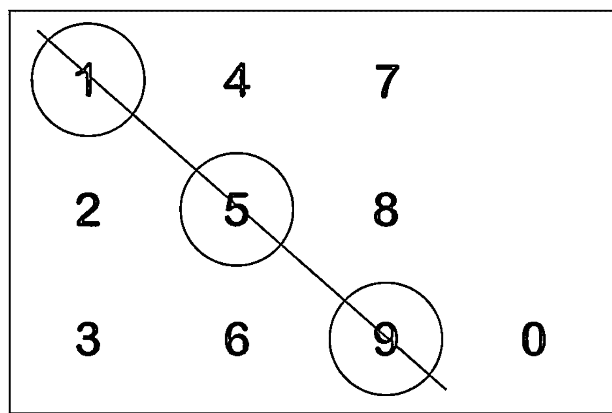

拚命三郎型，在事業上能夠有所成就。並不是有事業線的人事業就一定做得起來，如果三個數字都是圓圈，事業方面會比較順，如果三個數字裡有三角形、正方形，就會有比較多的磨練和考驗，起起伏伏大起大落。每個人生命的功課不一樣，這就要看我們在生命歷程中，如何發揮「心」的力量去突破困難。

命狀裡沒有5的人，做事業比較容易半途而廢。以事業線來說，1是起頭，5是中間，9是終點，我自己有事業線，但1打三角形，5是正方形，只有9是沒有障礙的圓圈，所以我年輕時並沒有什麼做事業的機會，是受僱於人；中間的正方形也是一個考驗，我的事業要好，要在9的這個階段，終點才會好，所以我屬於事業晚成型的人。

# 第4章 單數與複數

## 1.5.9.0→修行線

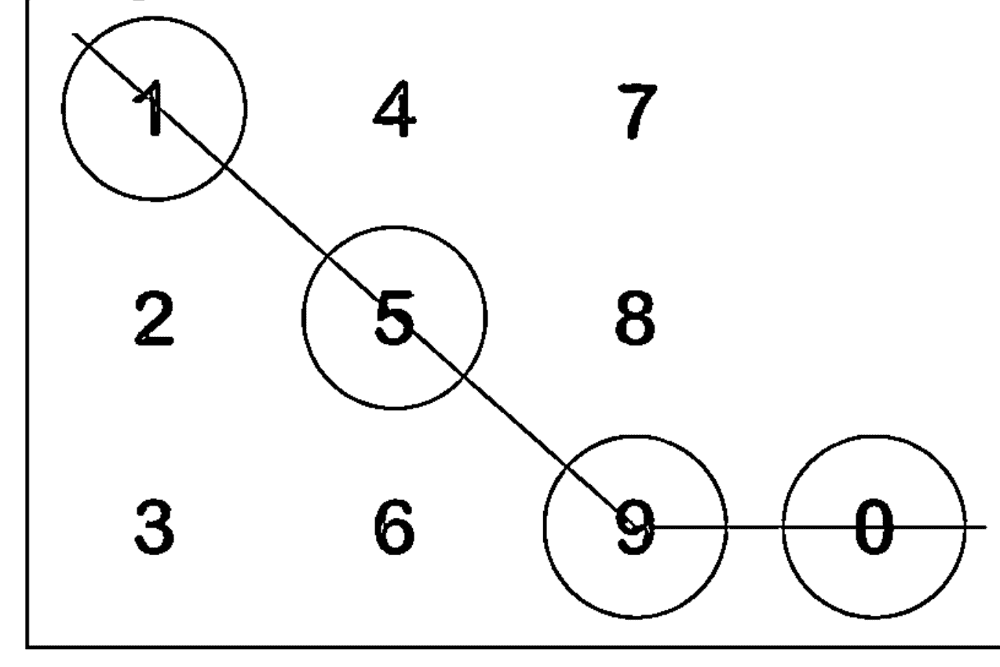

事業線再連到一個0，就是修行線，適合走修心養性、奉獻服務、宗教信仰的路。

有事業線又有修行線的人，最好能夠事業與志業共修，人生會更圓滿。

我曾經看過一位女性的命狀，她就是有1.5.9.0連線。她算過很多命，覺得自己命很苦，因為她任勞任怨，家裡家外做得要死，老公和家人對她卻都沒有一點讚美或肯定。我說：「妳是不是已經去很多地方算過，試過很多辦法都沒有用，感覺走投無路了？」她說對，我說：「妳今天可以把解開問題的鑰匙帶回家了。」我勸她找到自己的宗教信仰，做一些奉獻的善事。她是要修的人，因為她有修行線。後來再看到她，變得很快樂了，因為她照著自己的命格走，磁場就改變了，障礙就會少。

### (八)3.5.7→人緣線／小人線

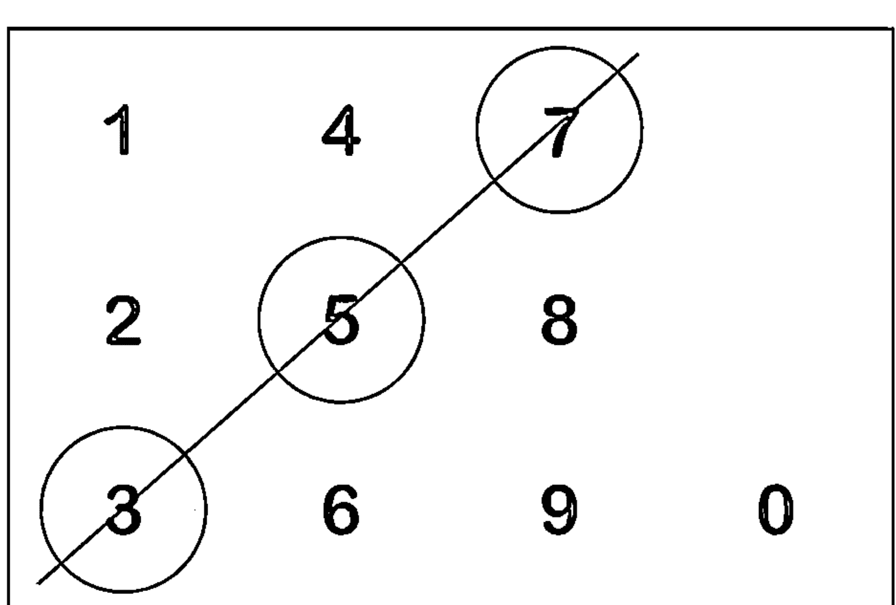

這條連線如果都是正面能量（圓圈），則人際關係好、親和力佳、有好人緣；若多負面能量（三角形），則人際關係有障礙，犯小人，總有人無事生你的是非。

譬如說35／8的人（後天數3、5，主命數8），兩個三角形打在3和5，主修8，這樣的人，說話很直，常常得罪人，自我觀念又強，聽不進別人的話，如果再加上三、四圈1，個性強又自大……你想，他的人際關係會好嗎？

### (九)2．4→聰慧線／詭詐線

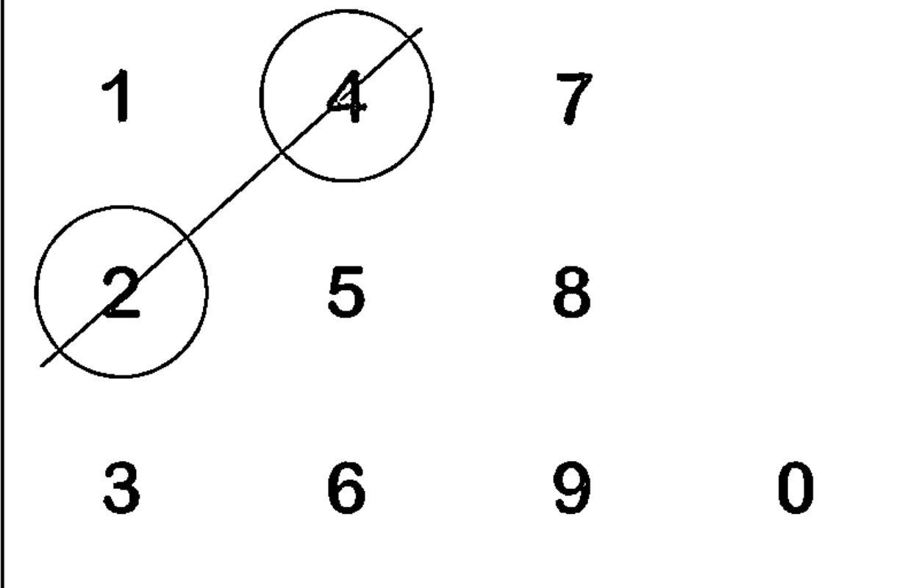

若是圓圈就是正面能量，聰明、分析力強，如果是三角形，不是聰明過頭就是傻得過頭，也可能是把小聰明用在負面方向，較多心計、詭詐。

### (十)4．8→努力線／焦慮線

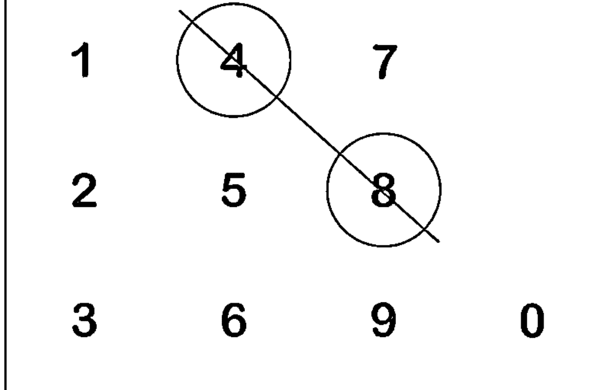

4和8都打圓圈，是為了賺錢非常努力的人，如果是三角形，則表示努力未必得到正面的回報，事與願違，因此呈現焦慮現象。

### (十一)2．6→和平線

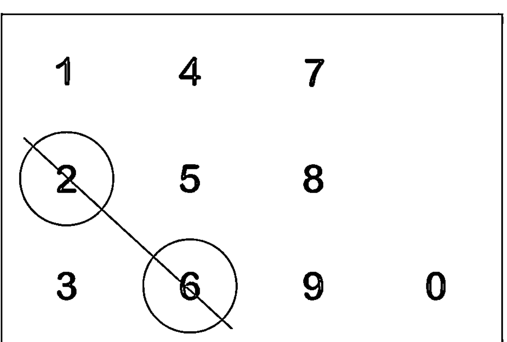

有此連線的人，不喜歡糾爭、吵鬧，一旦爭執發生，為求息事寧人，會先舉白旗投降，不會堅持己見到底。

### (十二)6.8→誠實線／隱瞞感受線

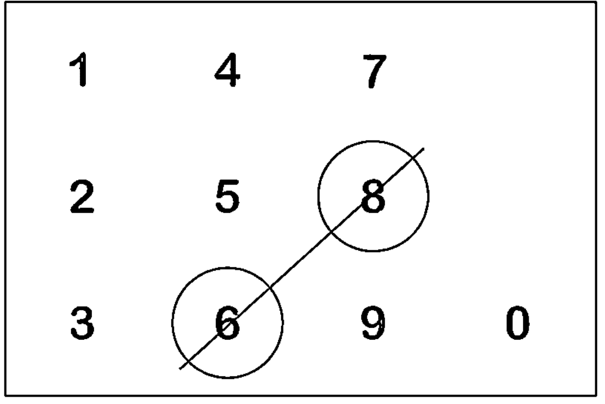

6和8若都是圓圈，是對人誠實的人，什麼都坦白說，若打三角形，則是會隱瞞自己的感受、默默去承擔一切的人，直到累積到受不了才會爆發。

每個人都有自己的障礙（後天數），如果三角形剛好又打在連線上，連動的能量會比單個數字打三角形更強，會更辛苦，也需要更努力；但相對而言，如果朝著連線的方向和使命去做，那麼連線上的三角形也會消掉、飛走，生命因此得到圓滿。所以說，同樣的命格，完全看我們面對的態度，如果消極、被動、悲觀，連線上的三角形會使我們的人生更辛苦、更歹命；如果是積極、主動、樂觀，連線反而是來救我們的三角形的契機。

# 第5章 數字業務心法

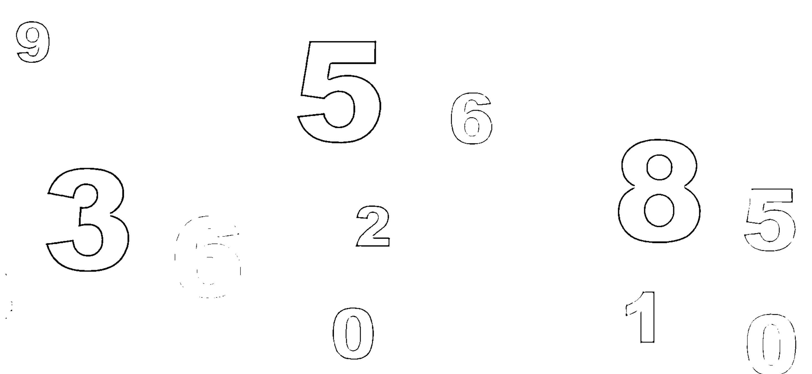


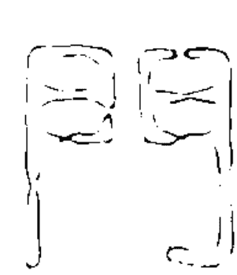

主宰数字，改变命运

## 感動式的行銷

做業務，和客戶話不投機是大忌，必須要了解客戶的特質、喜好。以前我做業務時，有些客戶在玩大家樂、談「明牌」，我都聽不懂，這不行，我就去學、去問；有的客戶愛看連續劇，我也多少要看，要了解，投其所好，慢慢和客戶有了共同話題，就可以融入他的生活中，而不是業務員和客戶的關係。我是做到去客戶家，對方把我當他們家的媳婦、女兒那樣。

業務人員一定要思考一個問題：你是為銷售而銷售，還是真正打開心去了解別人？掌握到和人相處的那個感覺、融合度，非常重要，如何用「心」去感動對方？而不是靠口才、靠產品有多好。要做到「感動式的行銷」，真正達到不銷而銷。

## 第一件事：打開話匣子

成交的關鍵是人，人與人之間需要有信任感。很多時候，我們會到某家店買東西，不是因為那家店的老闆讓我們感覺很信任，就是因為那家店的東西特別好、有獨特性。不可能剛見面就成交，對功力高強的業務而言，陌生市場要達成成交，也要一～三次。一定要多走幾次，因為彼此之間還沒有建立信任感。

真正高竿的業務，不是講產品、講他的本業，而是去交朋友；業務做到一個境界，就像一個富翁，他的腰比一般人更軟，因為他已經沒有得失心了，出去就是去交朋友。人為什麼會有感覺到壓力，怕自己做不好？就是因為得失心，「我去了就是要成交，一定要說服對方……」用這樣的心態去認識別人、和別人相處，別人都會怕，自然會有戒備心。

做業務，要讓自己對客戶而言充滿利用價值，讓他什麼事第一個都先想到你，什麼你都懂，什麼事你都能幫他解決，讓客戶覺得每次和你聊天，都有收穫、成長，喜歡你，相信你……這樣你就成功了。

當客戶對我們有了信任感，對於產品，我們還需要講那麼多嗎？當對方喜歡我們，了解我們的為人，相信我們的能力，更相信我們不會欺騙他時，我們為對方所規劃的產品，他會不接受嗎？這是人與人之間的信任。

問題是，很多業務在還沒有建立起與客戶之間的信任感前，就已經被對方打回票，因為不知道怎麼去打開話匣子，不知道怎麼持續營造彼此之間的互動和信任關係。

生命秘數就是一套非常好用、拓展人脈的工具，使彼此之間產生信任的延續性，至少讓我們有機會再跟對方談下去，不至於在第一關就出局了。

做業務，要廣結善緣，要比別人努力，只要有實力，走到哪裡都可以認識很多人，到處都是人脈，重點是要敢開口，不必想太多，就當做是練習也好；可是很多人就會自我設限，顧慮一大堆，不敢行動。

練到一個程度，和陌生人交談會變成很自然的事，搭個電梯也可以認識人，「小姐妳好，看到妳感覺很親切呢！我們的辦公室在六樓，妳也在這裡上班嗎？……」交談幾句就可以遞名片給對方，這也是一種禮貌。不管這次短暫偶遇的緣份之後還會不會有延續或發展，至少已經踏出第一步；如果不踏出第一步，永遠不會有第二步、第三步。

## 成為說話「投其所好」的人

業務做不好，原因是不了解自己，也無法了解客戶，因此難以「投其所好」；所謂的「投其所好」，其實就是人和人之間的頻率對上了，彼此投契；業務人員就是演員，不但能演，還要能導：怎麼去塑造情境，引導演員展現內心的力量？

今天我去拜訪一位客戶，我是以什麼樣的角色去與對方互動？第一次見面之後，是否還有延續？我如何把這一齣戲呈現得有聲有色？如何讓它圓滿地成交、落幕？……

生命秘數是業務工作一個很好的輔助工具。試想，有哪一個人對自己的命數不感興趣？有哪一個人，不希望自己的事業、健康、經濟、愛情婚姻或親子關係更好、更圓滿？我們如果能夠根據生命秘數，在對方需要的部份給對方一些幫助、解說，何必擔心和客戶沒有共同話題？

生命秘數也可以幫助我們更快了解客戶的個性和特質。我曾經碰到一個1有五圈的客戶，去了她那裡，我們完全沒有機會向她介紹我們的產品，只有聽她說的份；遇到個性這麼強、主觀這麼強的人，你不能把自己想說的對她說，要先聽她講。

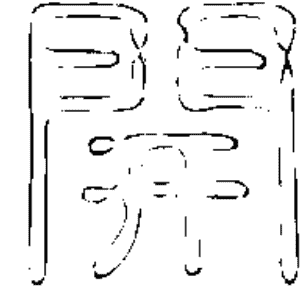

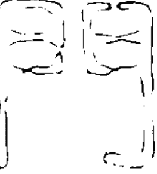

遇到有7的客戶，具有質疑性格的好奇寶寶，就要把產品解釋得很清楚，讓他沒有疑慮。

我認識一位周小姐，她已經四十幾歲，因為不幸罹患重症，原來的工作無法繼續，所以改業到壽險公司當業務。

有一次我去他們公司辦生命秘數的說明會，周小姐來報名上課了。後來她和我們分享，她學了生命秘數課程之後，別的業務員送給客戶的是建議書，她送的是財庫分析書，把客戶的命狀、優點和要注意的部分都做了一番分析，最後客戶和她簽約，因為她的用心感動了客戶——別的業務想讓他花錢，這個業務讓他了解自己的財庫、做好理財規劃，你想客戶會挑選哪一個？

原本周小姐的名字都沒出現在業績排行榜上，後來她業績大大突破，就因為她能夠活用生命秘數這套方法，別人問她：「周小姐，最近妳業績長紅，有什麼秘訣？」她說：「沒有啦，就是學了一套東西，很好用。」

## 「柔軟度」和「勇於挑戰」

當然首先也必須了解自己。有些業務遇到不好溝通的客戶，會想：「哎呀，那個是幺、客，不管他，找別人好了……」是不是因為自己沒有6，缺乏耐心、持續力，所以很容易放棄？如果知道自己是沒有6的人，一定要去培養自己的耐心、持續力和包容力，這就是進步和突破。

如果你是專業、理性型的人，遇到也很理性的客戶，對方稍微有一點質疑你的專業度或不夠尊重你，馬上雙方就會好像有點槓上了。有的業務磨得比較久了，心裡會想：「何必跟錢過不去……」表面上沒事，但那並不是發自內心的接受、臣服，其實彼此都還是感受得到那種怪怪的氛圍。

其實這一切都是因為不了解自己、不了解對方。遇到理性的人，要有同理心，我們一定要用理性、專業的話語和他溝通。理性的人通常也是有能力的人，並不是他們不給我們機會，關鍵是我們是否能夠與他溝通。

對業務人員而言，柔軟度非常重要。如果還很有自己的個性、自滿自大，一定會踢到鐵板。

為什麼有些剛開始做業務的人業績會比老資格的業務還要好？因為業績已經很好的人，有時候不知不覺地會比較驕傲、自視較高，所謂「高處不勝寒」的滋味，難免有時會有這樣的心態：「那個小case，不必我來做……」無形中喪失很多機會；而菜鳥卻是兢兢業業，珍惜每一個case，把握每一個機會。

要成為出色的人員，「勇於挑戰」是一項很重要的特質，失敗一百次，其實也表示有一百次成功的機會，沒有那一百次的失敗，怎麼能夠累積出成功的資本？一定要不斷去挑戰、不斷去面對失敗，從失敗裡累積寶貴的經驗，每個人都一樣。如果勇於接受挑戰，沒有一個業務會做不起來。

就好像每一個人都可以成為老師，問題是你願不願意先具有學生的態度。只要你不斷學習、成長、請教他人，任何一個行業你都會成功。

我認識一個剛做業務沒多久的保險業務員，他很熱心地幫別人檢視、健檢保單，即使對方不是向他買的保險，他也會說：「沒關係，我再幫你檢視一下保單，看看是不是完整，真正合乎你的需要……」就這樣，他也做出自己的一片天。

## 發自內心的真誠

有一次我去拜訪一位壽險的區經理，我雙手遞上名片，並說：「把全天下最好的祝福送給您，祝福您事業順利、身心快樂。」那位區經理就因為我這個遞名片的小動作，對我說：「妳一定會成功，因為妳和一般業務不一樣。」

我們要做什麼讓我們的客戶感動？讓客戶對我們印象深刻？很多小細節非常重要。如果去拜訪客戶，進門時脫了鞋，鞋子也不放好，走路的姿勢也隨隨便便……一舉一動人家都在暗中對我們打分數。

不管是從事業務工作還是與人交往，「真誠」是非常重要的特質，也可以說是無往不利。真誠可以感動任何一種人，可以融化冰山，用「心」去交朋友，就不會再固執、強求，不會讓人感覺到壓力。

做業務，主題不重要，重要的是人與人之間的感覺。感覺對了，銷售就是自然而然的事。

那麼，要如何成為一個真誠的人？如何讓客戶從心裡真正的信任、認同、感動？

這必須要經過心靈改造的過程。如果只是為工作而工作，並不是把工作和生命融合在一起，不是真正樂在工作，很難有那種令人感動的真誠和熱情。

當我們心中有愛，一舉一動、一言一行都是愛，都是放下、接受、包容，無怨無悔地與人交往；否則就會有很多煩惱、罣礙、怨言。如何達到這個境界？必須要不斷的進修，不斷的自我學習，從潛意識裡跳脫、突破，也就是要走入生命的高階，展現返璞歸真的大愛。

主宰數字，改變命運

## 自我探索業務特質

從事業務工作，你了解自己屬於哪一種業務特質嗎？只有真正了解自己，才能充分發揮所長、截長補短，並透過後天的學習而不斷改變、突破。

運用生命秘數，自我探索業務特質，透過數字分析自己，所謂「知己知彼，百戰百勝」，一定要先「成就自己」，才能夠進一步「造就他人」。

### 領導型：1.5.8

數字中1、5、8比較強的人，都屬於主管格局。1是領導能力，永遠要走在前面，不落人後；5是行動力，會以身作則帶頭做事；8是企圖心、機會的掌握者與創造者。

### 顧問型：1.2.4.7

7（專業、學習能力）、2（分析）、4（規劃）、這幾個數字都屬於顧問型。另外，數字1善於接收新訊息、多方涉獵、走在人家前面的特質，也是顧問型不可缺少的。

以下再進一步分析解說：

- 有8的人適合擔任財經顧問。
- 有4的人適合擔任理財顧問。
- 4．7．8的組合：理財、財經顧問。
- 3．6．7的組合：與「美」的事業相關的顧問。
- 1．2．3．4．7的組合：企業顧問。
- 2．4．7的組合：組織分析師、團體規劃師。
- 主命數為5和9的人，具有宗教方面的磁場，善於運用心靈的力量，感同身受，幫助他人開啟心門。5適合擔任心靈治療師，9適合在身心靈方面的磁場發揮。

### 死纏爛打型：5．6．9

5的行動力，積極主動鍥而不捨；6和9的感性、悲天憫人、軟心腸，「我是為你好，我一定要介紹你這件對你有益的產品……」

### 半途而廢型：沒有5

沒有5的人比較被動，比較缺乏信心，往往被自己的信心不足打敗。很多時候只要再堅持三天就可以成功了，有時候就是無法堅持下去。

### 溫馨感動型：3.6.9.0

3.6.9.0是奉獻線，有這幾個數字磁場的人，會運用同理心讓對方感動。

### 事業型（拼命三郎型）：1.5.9

1.5.9是事業線，有這幾個數字的人，工作起來會很勤奮、努力，雖然勞碌，但在事業上也會成就一番局面。

## 生命秘數活用實例

任職XX人壽公司的業務襄理莊錦珠小姐說：「之前我就接觸過生命秘數，但只是一個大略的概念，不是很熟，那時我覺得很難，學不起來；二○○七年底徐老師到我們單位講了一堂生命秘數的課，我聽了才知道：原來並不難，很好學。所以後來又接著學。」

莊小姐是單位裡經營委員會的業務襄理，「我把生命秘數安排在教育訓練的課程中，也應用在增員方面，確實對工作很有幫助。」

## 和客戶互動的敲門磚

「面對客戶，有時候很難一開始就和他講保險，太枯燥，而且會讓對方感覺你就是想賺他的錢；不妨先和對方互動，聊聊家庭、孩子、工作等等，把生命秘數帶進來。大家都很有興趣，因為每個人都喜歡算命，從這裡開始延伸。我覺得很好用，是和客戶閒聊、開啟可能性和發展性的一個敲門磚。」

不久前南台校園徵才，莊小姐也運用生命秘數，作為吸引陌生的年輕人過來聊聊天、做問卷的誘因，「那天從上午九點開始，我一連為二十幾個畢業學生講解生命秘數。」

「其實我一開始是帶著懷疑的心態學習生命秘數，可是慢慢發現，真的很奧妙，只是簡單的幾個數字，老師就能解得令人心服口服、大有啟發。數字本身其實沒什麼，每個數字的意義、特質，背起來並不難，關鍵在於解的人，這要靠經驗的不斷累積、印證，還要有興趣。我學了之後常常運用，愈用會愈有心得。」

「同樣的數字、同一個命狀，不同的老師會有不同的領悟、不同的解析。我覺得重點在於如何把數字解析得很生活化。」

剛學不久，莊小姐就為客戶李先生解析他兩個小孩的命狀，包括小孩是怎麼樣的個性、家長應該怎麼教……李先生說：「咦，妳怎麼那麼清楚？」 「我從數字上看出來的來……我才剛學，等我學得更深入了，我再進一步跟你分析。」

這位李先生原本存款都放在銀行定存，從全家沒有一張保單開始，半年後成為莊小姐年繳二、三十萬元保費的客戶。現在兩家人像是好朋友，「一般逢年過節的時候，業務員會送些時令的禮品給客戶，但逢年過節反而都是我收到李大哥送的東西，我都收到不好意思了。」

「保險賣的是無形的商品，客戶的信任非常重要。一般來說是這樣的步驟：首先是認識，其次有了信任，接下來他如果有需要就會找你。」

客戶也有不同的個性和需要，不是每一個都可以像朋友一樣閒聊，「有的客戶是『我需要什麼，你幫我規劃好，沒事的話就不要來找我』，有的客戶卻是希望三天兩頭就看到你。生命秘數在我和客戶進一步互動、提供服務時，是很好的工具。」

## 服務，和客戶交心

「做業務要熱心、敢講。我常常做DS（陌生問卷）、擺攤、陌生電話拜訪……就是要不斷嘗試。」

莊小姐曾經為一位要解除保單的先生服務，「他之前不是我的客戶，我建議他不要解掉，應該怎麼樣調整才是對他最有利的。」保單調整之後不久，那位先生因故住院，雖然不是自己的客戶，莊小姐還是為他服務、辦理。

# 第5章 數字業務心法

賠，從台南跑到高雄，「他會不會再向我買保險？我完全沒有去想這個。」

前後兩次住院，那位先生在莊小姐的協助下，順利得到比保單調整之前豐厚許多倍的理賠，因此深深體會到「服務人員很重要」，也對莊小姐產生信任，之後不但又向莊小姐買保險，並為她轉介紹客戶、引薦她到公司辦講座。

「其實業務就是服務、和客戶交心。」莊小姐學習生命秘數，出發點也是為了對客戶提供更多服務，「而且透過生命秘數，可以與客戶分享個人特質、生涯規劃等等。」

「每個人的個性、特質，自己是最清楚的，優點在哪裡、缺點是什麼，其實自己都知道，只是說不說而已。有的人就是怕面對，故意逃避。數字排出來一看，一清二楚，很奧妙。」

莊小姐的生日為民國51年9月20日，換算西元年生日為1962年09月20日，她的命狀排列如下：

※ ①+⑨+⑥+②+⑩+⑨+②+⑩（先天數）
= △2 △9 / △1 △1 / □2
後天數（2+9） （1+1）（主命數）

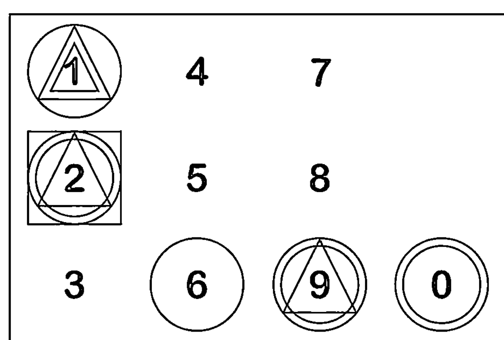

「做業務來說，我本身沒有3，是先天沒有口才的人，是靠後天環境培養的；有的人先天有某項特質，卻因為缺乏後天的環境而無法展現，就很可惜。」

莊小姐是雙層後天數／卓越數（29／11／2）的命格，是否感覺比較辛苦？「很辛苦……又卡在那個1。」莊小姐從小父親早逝，家中小孩多，她十六歲就出社會工作。結婚之後和老公一同打拚事業，也經歷風風雨雨；有很多年先生常常不在台灣，她一個人一邊帶小孩，一邊在工廠上班，也曾經深陷憂鬱症的痛苦孤單中……

回首這些人生坎坷，如今莊小姐開朗笑對：「學習生命秘數，首先對於了解自己有很大幫助。優點要盡量展現，自己的缺點、阻礙，要想辦法來調整，來補。譬如說我1有兩個三角形，脾氣比較差、太主觀，這就是我要修的課題。」

## 客戶命狀實例分析

莊小姐最近接觸到一位黃小姐，黃小姐的命狀排列如下：

※ ① + ⑨ + ⑤ + ② + ① + ① + ① + ⑩（先天數）
= △2 △0 / □2
（後天數）（2+0）（主命數）

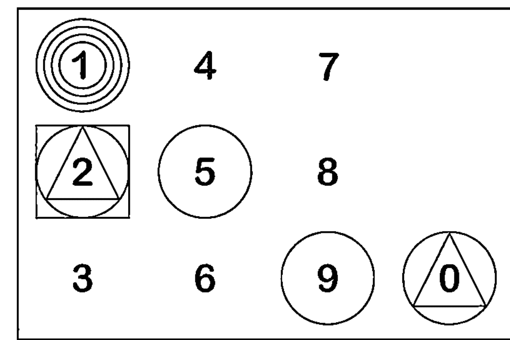

### 解析

黃小姐1有四圈，加上5也有一圈，是原本個性很強的人，後來經過自身的學習、修鍊，個性改了很多。另外，主修2的人，個性不會比主修1的人硬，主修2的人要與他人配合，而且黃小姐也沒有8，所以是比較是依賴型的人，不是要掌權的那種很強勢的人。

黃小姐沒有4也沒有8，理論上這樣的人是一定要做投資理財規劃的；但她沒有4，沒有4的人對錢是很沒有安全感的，如果要花費一筆錢，她的感覺會很強烈，會害怕，尤其如果錢投資在國外，距離愈遠、愈看不到的她愈沒有安全感。

她沒有4也沒有7，這樣的人耳根子軟，往往憑感覺做事；如果身邊的親友跟她說了一些關於某項投資的負面新聞或不看好的議論，她很容易受影響，加上又沒有8，缺乏慾望和掌控的動力。

黃小姐1有四圈，加上5，是比較執著的人，只要是她認定的事物，容易死腦筋不容易改變。如果要以投資報酬的利潤來說服她，因為她沒有8，這一點也不容易打動她。

黃小姐的1．5．9事業／恆心線很漂亮，是對工作、事業很認真的人，所以事業一定做得不錯。可以試試看投石問路，先說服她小額投資，不要因為她的財力而希望她一下子投資很多。小小的投資，即使獲利只有一點點，讓她眼見為憑看到了，相信了，之後再說服她加碼。

黃小姐的數字集中在2，加上5，這樣的人比較重感情，重情重義的人，人緣不錯，如果短期內無法說服她簽單投資，可以請她介紹其他有理財投資規劃需要的朋友，請她轉介紹。因為她1有四圈加上5，是愛面子的人，不妨多讚美她，如果她對你印象不錯，就可能幫你的忙，介紹其他朋友給你。

## 手機數字大解碼

一個人的個性和特質，從他常常使用、喜歡的數字裡都有跡可循，尤其手機號碼大多是自己選號，你不妨驗證一下，你的手機號碼，是不是和你的先天數、後天數或主命數有些雷同？

從事業務工作，對於第一次見面的客戶，對方的名片就已經透露許多關於他個人的訊息，這些都可以成為有助於成交的資料。

從對方電話號碼的數字裡，可以一窺對方的個性特質，對方是感性的人？還是偏理性的人？人緣如何？……這些都可以從電話號碼中看出端倪。

### 基本原理

電話號碼的數字有兩種解釋，一種是單個數字的解釋，一種是數字連線的解釋。和生命秘數的原則相同，一個數字超過兩個，就是偏強、太過的磁場能量。

譬如說，手機號碼中若有2．5．8連線，此人通常有好人緣，個性比較熱情，喜歡講話，樂於分享，是願意給別人機會、幫助別人的人。

我們許多業務員去做陌生開發，向店家拿名片，從蒐集回來的名片中，就可以分析哪些店家老闆比較熱情、願意給別人機會，這就是從2．5．8的連線看出來的。2．5．8是人緣、桃花線，也是饒舌線，只要你的東西不錯，他會多向別人宣傳。

一樣的道理，如果電話號碼中有6．9的數字，電話的主人就常常受到6和9感性、愛心、樂於助人等磁場的影響，只要你的產品得到他的認同，是對人有益的，他會願意幫你推廣。

有1．4．7連線的人比較理性，會針對產品本身的品質、功能做分析和思考，重視專業性。只要你的產品經得起他的分析，得到他理性的認可，他也將會是理性而忠實的好客戶。

如果電話號碼中有三個5，這樣的客戶喜歡跑外面，見多識廣，是喜歡交朋友的人，活潑主動。

電話號碼中0很多的人，因為機緣、機會很多，會有很多出去活動的機會，比較勞碌命。

在接過對方的名片時，花三秒鐘的時間，就可以大略了解對方的特質。如果數字集中1、4、7，是比較理性、主管格的人，一開始適合用讚美、請教的方式與對方互動；如果3、6、9、0等數字多，可知對方是比較感性、有愛心的人，只要我們秉持真誠、誠懇的態度，對方即使有防衛心理，也堅持不了幾分鐘，他會被我們的誠意打動，願意給我們機會。

### 實例解析 1

手機號碼：0921510999（黃先生）

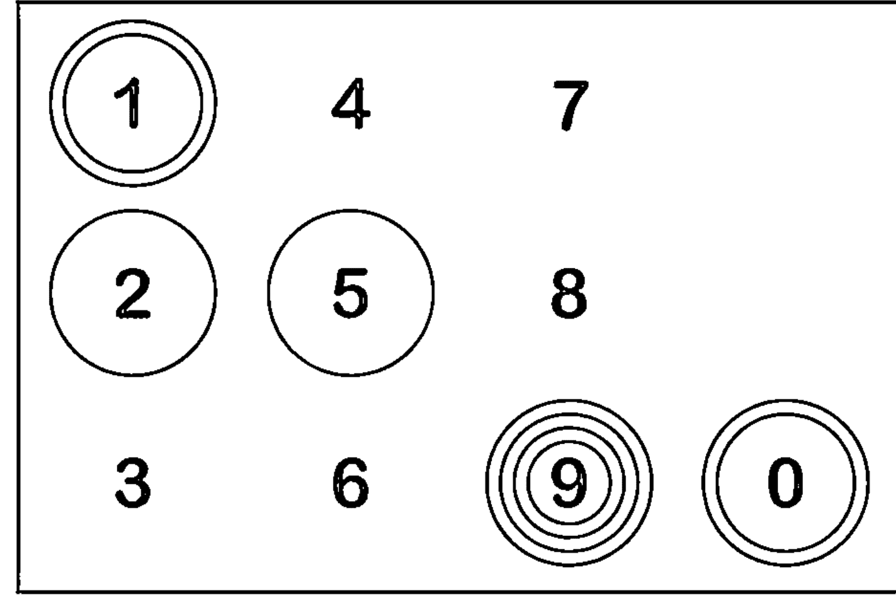

黃先生的手機號碼中，1有兩圈，0有兩圈，9有四圈，2、5各一圈，有1．5．9事業／恆心線和1．5．9．0修行線的連線，這個手機號碼對黃先生的事業、修行方面是有正面影響的。

雖然9有四圈，能量太強，但只要黃先生有往宗教、修行、奉獻的方向去走，這四圈9就不會對他有負面影響，他會更樂於付出、奉獻；如果他排斥宗教、修行、奉獻方面的事，這四圈9對他而言就是障礙，會產生負面影響，很可能變得很不願意付出，自私自利。

### 實例解析 2

手機號碼：0936902555（曾先生）

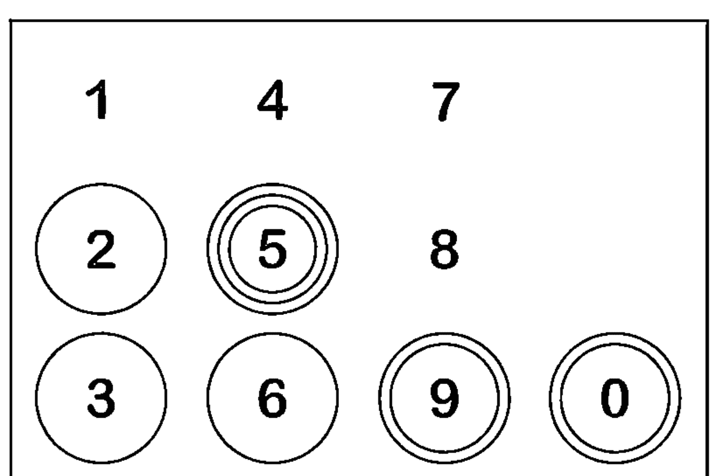

曾先生的手機號碼中，2、3、6各一圈，9、0各兩圈，5有三圈。其中1．5．9事業線沒有連線，曾先生自己當老闆，卻沒有1也沒有8，這個頭家做得頗辛苦，老闆兼夥計，自己要做很多事、操很多心；5三圈，常常在外面跑來跑去。

1、4、7、8都是和財庫有關的數字，這組號碼裡都沒有，由此也可以窺知，曾先生的生意並不是做得很順、賺大錢的那種。

但曾先生有3．6．9．0奉獻線／無上智慧線連線，所以如果他能多做一些奉獻的事，譬如說多少讓別人佔一點便宜之類的，他的事業就會順。

假設曾先生把手機號碼換一下，去掉一個5，改1，去掉一個9，改8，改成0936201558，這樣乾坤大挪移一下，你看這個手機號碼是不是很漂亮：

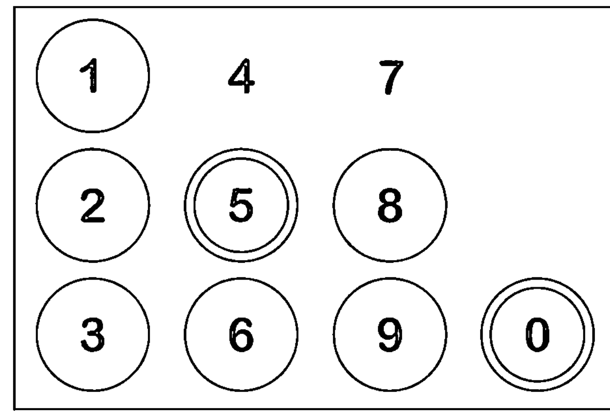

這樣1和8都有了，1．5．9事業線連線，2．5．8人緣線也連線，1．2．3藝術美感線也連線，加上3．6．9．0的奉獻線，多做奉獻的事，表示懂得用頭腦做生意，而不是用憨工做生意，會比較輕鬆，加上1．5．9．0修行線連線，會得到上天的幫助……對於曾先生做生意而言，這組號碼會為他帶來正緣，做老闆不會做得那麼辛苦。

### 實例解析 3

手機號碼：0963933343（趙小姐）

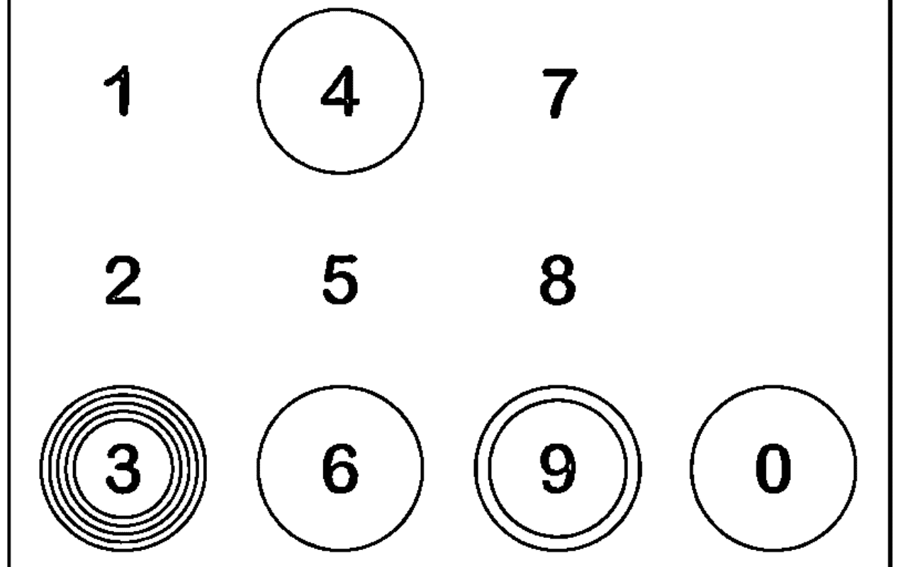

趙小姐的手機號碼中，3有五圈，4、6、0各一圈，9有兩圈。3代表口才、創新、鬼點子，3的磁場那麼強（五圈），這組號碼會補充趙小姐內心裡求新求變、創新的慾望，雖然有五圈，太多，但只要她不往心直口快、講話很毒那個方向去發展，就沒有什麼問題。

3很多的人，基本上都比較有正義感，只要注意溝通表達方面的調和就好。我有一個朋友，手機號碼有四圈3，就是很愛說話，可以從早說到晚。

趙小姐有3．6．9．0奉獻／智慧線連線，但因為她的3有五圈，能量太過，這條連線也會有負面影響。3．6．9．0又叫做空想線，就是想法很多，不一定會去做；想像力豐富，但可能有點不切實際，因為她沒有5，缺乏行動力。

假如我們是趙小姐的朋友，從她的手機號碼，我們可以建議她補充5的磁場能量，把3的能量降低；假如趙小姐是我們初次見面的客戶，我們可以從她的智慧線連線（3．6．9．0）切入，請她給我們的產品或專案，給予一些建議或指導，她因為想像力豐富，會開始幫我們分析，加上有4的規劃力，會給我們一些建議。

經過一次、兩次這樣的互動之後，她也愈來愈了解我們產品或專案的特性和內容，慢慢產生好感、認同感，然後再用一種以退為進、假設性、夾併的溝通方式，譬如說可以問她：「如果妳的家人能夠用到這項產品，妳覺得這對他們是不是有好處？」

3有這麼多圈的人，加上空想線，是會想很多、想很久的人，適當的時候我們必須讓她「醒」過來，這就需要用另一種模式帶動她，上面舉的例子是「假定」的模式，「假設這項產品可以幫助妳的家人，妳覺得這個價值高不高？」之前她已經幫我們的產品分析、規劃了一番，已經有了相當的認識和溝通，這時候再問她，這項產品有這些優點、好處，如果她自己和她的家人可以享用到，那是不是很好？……把她帶進我們的磁場裡。

### 實例解析 4

手機號碼：0939060904（潘先生）

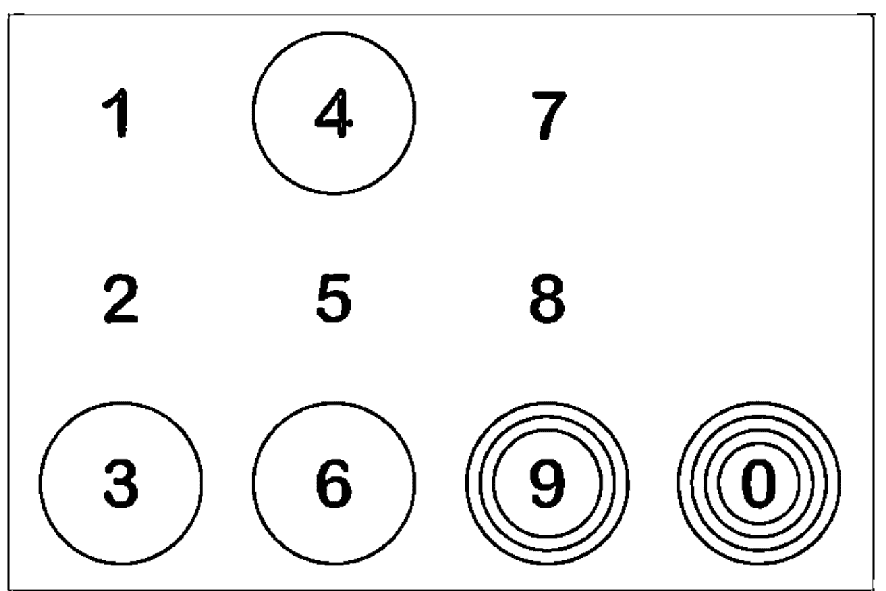

從事藝術方面工作的潘先生，手機號碼的數字集中在9和0，3．6．9．0（奉獻／空想線）連線，確實是會有很多靈感、很會作夢的數字磁場，只是0太多，表示他想得很多，不一定都能做出來；9有3圈，表示他具有服務熱忱和奉獻精神。

潘先生應該是桃花緣份比較薄，因為從這組號碼來看，桃花／人緣線（2．5．8）是空的，欠缺這方面的磁場。

1、4、7、8這幾個和財庫有關的數字，這組數碼中只有一個4，沒有賺錢的慾望，賺不到錢，只是喜歡做自己有興趣做的事。

### 實例解析 5

手機號碼：0982316878（徐文薏老師）

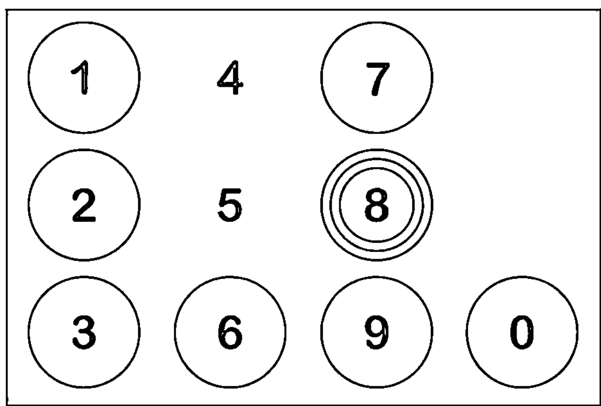

從徐老師的手機號碼看來，8有三圈，有創業、當老闆的慾望，對錢有興趣；其中1．2．3藝術美感線連線，7．8．9權貴線也連線，雖然3．6．9．0也連線，但因為都只有一圈，所以是正面的能量，屬於奉獻／智慧線，而不會走到空想線的局面，後來徐老師果然往心靈輔導、命理諮詢領域發展。

8代表慾望，9代表渴望、夢想，只要手機號碼裡有8和9，這樣的人渴望賺大錢，如果當老闆，這種人會想做大事業，不會只甘於做小生意，會向高收入挑戰。

### 實例解析 6

手機號碼：0937832017（黃先生）

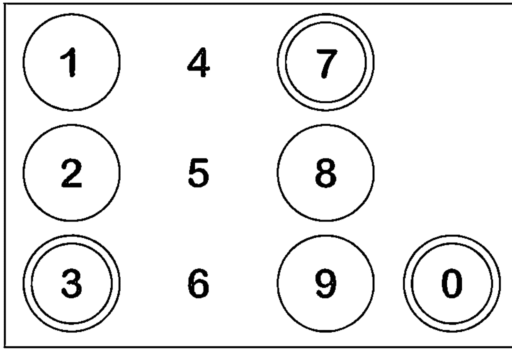

這組號碼有1．2．3藝術美感線連線，有7．8．9權貴線連線，有1有7有8有9，都是一或兩圈的正能量，對於當老闆、創業或經營公司等，可以說是蠻標準的一組號碼。

但這組號碼裡4．5．6組織線是空的，如果黃先生當老闆或主管，帶員工會有困難，但因為其他數字蠻平均的，有貴人，得人助，其他數字和連線多少可以補這方面，這支手機號碼還算是很不錯的。

如果第一次和黃先生見面，從他的名片看到他的手機號碼，我們就可以從這裡開始話題：「黃先生，您這個號碼，是一個主管格喔！」（有1．4．7的人，大多是主管格。雖然黃先生的號碼中沒有4，但1有一圈、7有兩圈，都是正能量，這個1．4．7會連動起來，7會飛過來補4。）

黃先生1．4．7算是連線，又沒有5，這樣的人理性，不喜歡變動，加上4．5．6是空的，可知這個人比較安逸，公私分明。

「喔，您的智慧高人一等喔！」雖然黃先生沒有6，但因為他的3．6．9．0連線中其他三個數字都是正能量，也可以說是連線了（3會飛過去補6）。因為有奉獻線／智慧線，所以黃先生也是個很聰明、有智慧的人。

### 實例解析 7

手機號碼：0938477977（吳小姐）

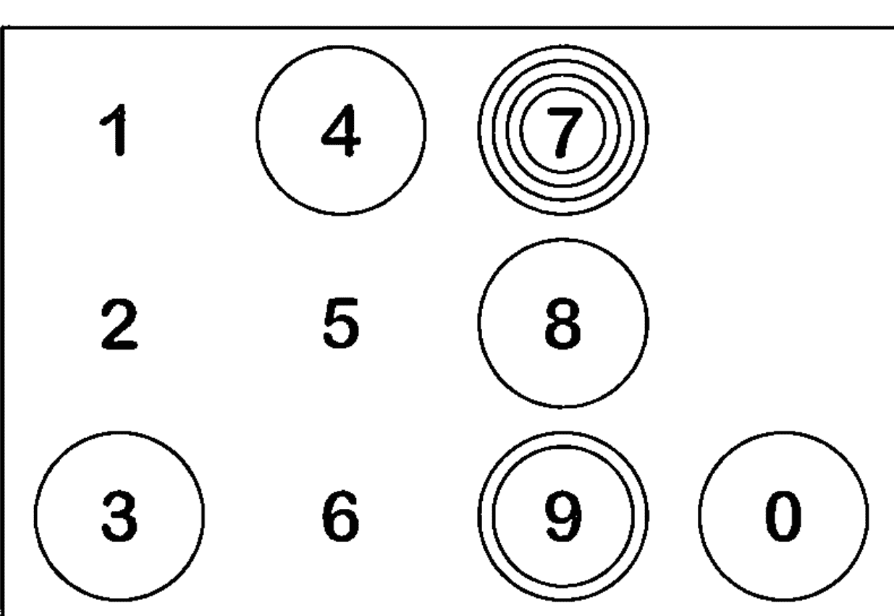

這位吳小姐是我的一位客戶，她的手機號碼集中在7（四個7），是很理性、喜歡探討真理、真相的人，所以我和她見過幾次面，每一次我都只是和她喝茶聊天，分析她的個人特質，如何掌握機會、改變人生等，從來不和她講事業或產品。

有一天她主動問我：「妳怎麼和別人不一樣？妳怎麼都不跟我講重點？」原來別人都會對她介紹產品，只有我不這麼做，反而引起她的好奇。

經歷過幾次互動，我評估她已經對我有了一定的了解和信任感了，就切入主題跟她談，但主要還是站在關心她的立場。即使是4或7很多、很理性的人，你如果很關心她，她還是會感動。

之後我再問她：「妳覺得這項事業怎麼樣？」她說：「是不錯啦，可是……」她是一定會有很多疑慮的，很正常。我說：「沒關係，妳把妳的問題全部寫下來，我們再來一一討論、釐清，好不好？」

下一次見面，我把她列出來的十個問題，都向她一一清楚解釋、說明，解決了她的疑慮之後，她立刻決定加入，成交了。

看到吳小姐的手機號碼時，我就知道她不是那種「一次成交」的人，所以我會把時間拉長。理性的人其實並不是麻煩的客戶，只要你能解決他的問題和疑慮，他的決定是理性而長久的；不像感性的人，他的感動來得快，去得也快。

### 小叮嚀

手機號碼只是一個入門點，生命秘數才是真正解釋一個人特質的重要不變依據，畢竟手機號碼可以隨時換，可能隨時變動。

對於業務來說，它幫助我們和客戶之間的互動多了一個可以切入的點，業務人員就是要和人有話題聊，要比較雞婆、熱情，對方的手機號碼，是一個很好的開頭話題，可以從單個數字來解釋，也可以從連線法則來解釋；如果要行銷，最重要的還是要看對方出生年月日排出來的命狀，那才是最準確的主軸點。

## 一分鐘觀人術

如何與客戶從陌生到麻吉？基本上結合面相的「一分鐘觀人術」，在第一次見面時可以大概知道對方的特質、磁場，畢竟我們不可能和第一次見面的客戶馬上聊到他的出生年月日，在運用生命秘數了解對方之前，基本的面相原理，加上對方的電話號碼，是非常好用的輔助方式。

做業務，主要就是「銷售」和「增員」兩部分，第一次見面，如果對方的面相屬於領導型、主管級的人，我們可以先將對方設定為增員的人才，這個心態就和設定對方為客戶不同，很快就可以有一個大概的分類。

面相是一種「觀心術」，相由心生，心生相。面相學也可以說是一門統計學。為什麼很多老人家不必學相學，一看人就可以看個八九不離十？因為閱人無數、經驗豐富。尤其從眼神，更可以看出一個人是否善心、真心，他的關注點在哪裡。

隨著一個人運勢、心態、健康狀況的不同，面相也會不斷有所變化，面相常常提供我們一些提醒、警告，甚至從面相可以預見未來運勢。

我有一個學員，自從上過面相課之後，短短時間內他的組織暴增四十幾位生力軍。他不懂面相之前，常常在不對的人身上耗了很多時間也沒有用，學了面相之後，哪一種人是他要增員的人才一看就知道，鎖定目標去進行，省了很多時間和心力。

以我多年的經驗，面相結合生命秘數，是了解對方、縮短成功時間最快、最好用的方法。

生命秘數是認識自己，面相是改變自己。業務要想成功，首先要改變自己、塑造自己，內外兼修，尤其外表是與他人接觸時的第一印象，更應該注意。

譬如說氣色暗沉，做什麼都不順，要不要去做些調整？或者眉毛稀疏，人際關係比較不理想、不熟絡，是不是考慮去畫眉或繡眉？……都是積極幫助自己改運的方法。

### 牧草原理

人與人相處，有磁場是否相應（合不合得來）的問題，我們不太可能和每一個人都很麻吉，遇到沒有共同話題、話不投機的客戶時，就需要一種隨緣的智慧：現在對方不認同沒關係，以後也許哪一天他的後天環境有所改變，就可能有需要了。

業務的客戶名單裡是有分 A B C 級的，C 是要慢慢培養、慢慢耕耘的，還在萌芽階段；B 是已經有了中等關係，客戶對我們有基本的認識，處於成長階段；A 是關係已經很麻吉了，客戶對我們很信任，是收割階段。C 要慢慢培養到 B，B 要慢慢培養到 A。

這也就是人脈耕耘學裡的「牧草原理」：為什麼一年四季都有牧草可以收割讓牛羊牲畜有得吃？正是運用這樣的策略，把牧草的種植分成 A B C D 四個區，D 區的牧草是剛發芽的，C 區的牧草已經成長到一半，B 區的牧草已接近成熟，A 區的是已經可以收割的牧草。A 區的牧草收割之後，再種植新的牧草，此時的 A 區變成了原先的 D 區（剛發芽的），原先的 D 區成了 C 區（牧草成長到一半）……生生不息，循環不已，於是一年四季都有牧草可收割。

和牧草原理一樣，面相、生命秘數，是幫助業務工作者對客戶進行分類、篩選的工具。想要快速銷售，可以先找數字兩圈 6 和 9 的人，或面相上山根低、大眼睛、大嘴巴、濃眉的人，這類人是比較感性、具同理心、有慾望的優質客戶，就像是A區的牧草，是最快可以收割的，可以說是我們銷售工作上的王牌。

但若想要永續經營，就不能永遠只有A區的牧草，不能只搶短線而不經營長線。上述的優質客戶，特別適合剛踏入業務工作的新兵，要想安然度過三至六個月的「陣亡期」，這些優質客戶是最好的救兵、信心部隊，但也往往是一次性購買的短期客戶。

也就是說，其實所有人、任何一種客戶，都是我們的牧草，都可以耕耘，只是收割時間的早晚而已。

再說到增員，當然要找有能力的人，數字為1、4、5、7、8的人，比較理性、有行動力，加上顴骨高、人中長、鼻梁高，這類人比較有主見、有原則，確定方向就會貫徹下去，是理想的工作伙伴。

### 快速入門

第一眼看到對方，要在幾秒鐘之內立刻大致掌握對方的個性、特質，以下三個要點是很好的參考：

1. 額頭高（超過四根手指橫放的寬度）
2. 鼻梁高
3. 小眼睛

有這樣面相的人，是理性、有主見的人，不容易快速成交，要有長期作戰的心理準備；這樣的人雖然不容易成交，但一旦得到他的認同，理性衡量後的決定也會是長久而穩固的。

鼻梁高的人其實很重心情的感受，會很重視你是不是很謙虛、態度很好、笑容親切，我看過很多理性的客戶都是這樣；如果你的態度謙虛，專業度也夠，基本上成交機率很高，而且他一簽不是小單，因為理性的人大多都是很有能力的人。沒有能力的人比較不會固執，通常都是有能力的人比較有主見、擇善固執。

### 容易銷售型

- 濃眉：重感情，個性阿沙力。
- 山根低：沒有主見，好講話。（註：山根指眉眼之間的鼻根處。）
- 大眼睛（雙眼皮）：感性。
- 顴骨高：可自己做主。（註：顴骨即「權」骨。顴骨愈高的人，愈喜歡掌權。）
- 鼻頭大：有正財的財運。
- 鼻孔大：出手大方，會花錢。
- 人中短（短於一根手指橫放）：感性，易衝動。（註：「人中」是鼻孔下方至上嘴唇的部分。）
- 嘴巴大：有慾望。
- 下巴圓：有同情心，好相處。

### 不易銷售型

- 額頭高（超過四根手指橫放）：理性、有主見。
- 眉毛稀疏：冷淡。
- 凸眼：心機重。（註：後天甲狀腺功能引起的凸眼不包括在內。）
- 鼻樑高：自傲、自我觀念強。
- 人中長（長於一根手指橫放）：固執、理性。
- 法令紋深：管理能力強。（註：法令紋是鼻翼延伸而下至嘴角邊的紋路。）
- 臉較小的人：較難溝通。

## 額頭

額頭表示祖先（上一代）遺留的知識與福份、事業、貴人、家庭運。

「額為天」，額頭高的人，擁有祖先遺留下來的福份與知識，許多繼承家業的企業家第二代、公子哥，仔細看看，他們的額頭都很高，很漂亮；額頭低的人大多要靠自己的努力，也可以透過後天的開運來補。

以相學而言，頭髮不宜遮蓋額頭，許多額頭被頭髮蓋住的女孩子都很愛玩，額頭被蓋住，會影響功名、貴人運，不容易專心在學業上。

### 額頭高（超過四根手指）

1. 適合自行創業當老闆。
2. 適合從事行銷業務工作。
3. 貴人運、事業運旺。
4. 青年創業運佳，多少年得志。

### 額頭低（短於四根手指）

1. 靠自己的勞力賺錢。
2. 多白手起家。

## 眉毛

「眉主心」，眉毛表示一個人的個性、健康、事業、親情與人際關係。

面相如何與業務工作結合？舉例來說，稀眉的人很多事都放在心裡，一定有心事，遇到稀眉的客戶，可以從這裡切入去關心他，第一步先讚美他的優點、長處，再慢慢視情況引導，「姐姐妳好像最近遇到了一些不順心的事喔？……」真心的關心對方，就是讓對方感動的最好方法。

稀眉的人做任何事情會想很多、考慮很多，是無法當下做決定的人，所以我們面對稀眉的客戶時要有心理準備，要給他時間，「我知道你需要時間考慮，沒關係，明天我再打電話給你……」並充分了解他的顧慮點，細心去找出他問題背後的問題，耐心地一一釐清，消除他的不安，讓他安心，誘發他的需求。

### 濃眉

1. 重感情
2. 個性阿沙力
3. 心腸軟
4. 桃花旺
5. 具有執行力
6. 心裡想什麼會講出來
7. 錢留不住

### 稀眉

1. 心裡想什麼會放在心上
2. 身體欠佳
3. 做事有氣無力
4. 兄弟姐妹的情弱

### 短眉

1. 親情淡薄
2. 做事有頭無尾
3. 三分鐘熱度
4. 身體欠佳
5. 犯小人

## 眼睛

眼睛表示一個人的心性、運勢的上升或停滯。「觀其眼，知其心」，一個人心性正不正，就看眼睛。

很多人問我：「老師，我不知道男朋友對我是真心還是假意？」

我說：「妳就直視他的眼睛。」

「那不是很奇怪嗎？」

「不會的。妳直視他的眼睛，如果他不敢正面迎接妳的目光，一定做了虧心事。」

很多去大陸工作的台商、台幹，老婆在台灣很煩惱，不知道老公在那邊有沒有包二奶？問我：「老師，怎麼辦？離那麼遠也沒辦法好好看管。」

我說：「妳不必天天盯著，等他回來，妳就說：『老公，好久沒有看到你了，我要好好看看你。』一樣直視他的眼睛。如果他做了虧心事，他的眼神會飄，他會覺得妳好像在窺探他的心事，眼神就會躲。這一招的靈驗度是百分之百，確實是「眼睛會說話」。

眼睛若無神，表示有心事，有障礙。

### 大眼

1. 慾望高
2. 企圖心強
3. 桃花旺
4. 幻想家的特質
5. 事事想得第一

### 小眼

1. 有耐性
2. 擇善固執
3. 按部就班
4. 責任心重
5. 實在

## 鼻子

鼻子表示一個人的行為模式，先天鼻子歪的人，處世態度恐怕也有問題，如果眼神也不正，遇到這樣的人要小心。
我有一些在銀行工作的朋友來學面相，因為很多人到銀行借錢，他們多少也要承擔風險，也很怕錢借錯人、被倒債，所以學面相觀人術。

有人問，怎麼會是學面相，而不是去調查借錢者的信用？調查信用有用嗎？這個時代，信用也是可以偽造、作假的。

鼻子也和一個人的身材成正比，鼻翼寬的人身材也不會太瘦，鼻翼小的人，怎麼吃也不會胖。

### 鼻翼寬

1. 能勞動
2. 能幹
3. 有財運

### 鼻翼小

1. 貪圖眼前小利
2. 好揮霍
3. 沒有偏財運
4. 切忌亂投資

## 嘴巴

從嘴巴可以看出一個人待人處世的態度。

### 嘴大

1. 生命力旺盛
2. 行動力強
3. 慾望大
4. 有財運、福份
5. 靠嘴巴賺錢

### 嘴小

1. 度量小
2. 膽小
3. 慾望小
4. 沒有主見
5. 無法充分發揮才能

## 顴骨

從顴骨可以看出一個人的擔當、魄力、企圖心和掌權的程度。

### 顴骨高

1. 雜事做得很多，事事都要掌權。
2. 個性強勢，不在乎別人的想法。
3. 即使是女子，個性也很強，有很強的意志力去挑戰環境、克服困難。

### 顴骨低

缺乏勇氣與鬥志。

## 下巴

下巴代表一個人的人際關係

### 臉圓

1. 人際關係好
2. 家庭幸福美滿

### 臉方

1. 穩重可靠
2. 顧家
3. 正直、直率

### 臉尖

1. 快樂的人
2. 適合將嗜好變成工作
3. 追求理想的人

## 耳朵

耳朵表示一個人的潛在個性、財運、福份。

### 耳大

1. 財運旺
2. 生活穩定
3. 愛情運好
4. 子女運氣好

### 耳小

1. 做事謹慎
2. 自私
3. 不擅理財

# 第⑥章 家庭。兩性。親子

## 家庭是圓滿人生的基礎

業務工作要做得好，要想有出色的成績，家庭重不重要？夫妻關係、親子關係重不重要？當然重要！

想想看，如果一回家不是夫妻吵架，就是小孩不乖，我們的心情會好得起來嗎？心情不好，煩得要命，面對客戶還能真誠，還能心中有愛嗎？又怎麼可能讓客戶看到我們就覺得很陽光、很快樂？

為什麼最親的人，在一起生活了幾十年的人，父母與子女或配偶之間，卻未必能真正了解，而要靠其他方法來認識自己、了解對方？

因為人都有盲點，「事不關己，關己則亂」，「當局者迷」，就是因為最親，就是因為天天生活在一起，於是會以為：「我怎麼可能不了解你？」但往往你真的就是不了解他。

人都有主觀意識，對親近的人，往往更主觀，要求更高，對一切更認為是理所當然，不知不覺失去了公平、客觀的角度。

愈是親近的人，我們往往焦點放在對方的缺點上，忽略了優點；愈是親近的人，溝通更是重要，但偏偏關係愈親密，溝通方式卻愈是粗略、不在乎、不夠用心——因為覺得是「自己人」，於是很多問題和衝突因而產生。

我也遇到很多來諮詢的人，問男女朋友之間的感情，很多時候，對對方的不安全感、掌控慾，其實根源的問題是自己缺乏自信。

長期下來，一錯再錯，不斷累積，很難再回到初衷、本質去看待關係。生命秘數是一個很好的輔助，它是客觀公平的一套方法和原理，生命秘數一攤出來，一切都清清楚楚，可以幫助我們回到生命的原點，擺脫個人主觀意識。

生命沒有絕對的對與錯。在每一個當下，以真以誠，判斷自己該扮演的角色，決定自己該採取什麼行動，才是真正生命的智慧。

要想事業成功，人生圓滿，必須由自己做起，從自己的家做起。

## 美霞的故事

我有一個客戶美霞，她的老公是開計程車的，原本美霞是家庭主婦，後來到壽險業當業務，慢慢和老公的距離愈來愈大，開始覺得老公不長進，價值觀愈來愈不同，美霞就想離婚，為了三個孩子一直忍著。

前不久美霞請我吃飯，她說：「老師，我很感恩妳，因為妳，我的生命第一次整個都通了。」為什麼？就是因為我跟她說生命秘數。原本她很怨老公，怨久了她的生活四周充滿了負面的能量，於是小孩也不乖……我告訴她，從她的命格來看，她的生命本來就是要接受這樣的磨練，通過這樣的磨練，她的生命才會成長。

美霞把我的話聽進去了，整個人改變，現在不怨老公了，打電話給老公都是輕聲細語的溫柔問候，夫妻關係、孩子的教育都愈來愈好。

## 亞娟的醒悟

亞娟開了一家服飾店，也想離婚，但離不成，在朋友介紹下來找我。

那天我看到亞娟，她整個氣色是黑的，知道她內心痛苦很久了；看了她的命狀，我問她：「妳為什麼要離婚？」亞娟說丈夫有躁鬱症，整天馬行空做夢亂想，「我已經忍耐很久了，沒有辦法了。」

我看了她的命狀之後說：「妳要離可以，可是妳的命底有修行線（磨考線），也就是說，人生中妳怎麼樣都會考到一項，不是婚姻就是親子，不是事業就是財運。今天妳若是離婚了，歹勢，就換妳孩子磨妳。」

後來有一天我有機會去亞娟的服飾店，她告訴我：「老師，我不離婚了。一樣是磨考，我已經被我老公磨考慣了，如果離婚，換小孩磨考我，我會更受不了！」我問她：「妳老公真的都沒有優點嗎？」亞娟說：「老師，請妳幫我看看我老公的命狀。」我一排，其實她老公沒什麼問題，只是時機不好，有志難伸，生活上又比較愛唸，所以被亞娟嫌惡；加上亞娟和她老公都是非常理性的人，理性和理性槓上去，沒有一個先讓，就麻煩了。

## 把配偶當成最重要的客戶

很多人都說，「夫妻是相欠債」，常常是一個1有三圈、一個1有四圈，永遠都是四圈的那個要戰贏三圈的那個。

即使是「相欠債」，也是要感恩對方，讓我們走過這條路，如果沒有對方這樣磨我們，我們還不知道我們的心性到底修到哪裡了，可能已經覺得自己很不錯了，修得很好了，為什麼遇到他／她還是有衝突、有煩惱？

這其實也是一個挑戰：你能不能把配偶當成一個客戶，用心去經營，盡力給予對方最正面的影響……你如果成功了，收穫也會很大。

## 為什麼溝通出問題？

我看過太多夫妻要離婚，其實往往夫妻兩個都沒有問題，問題出在溝通。

有一對結婚多年的夫妻，在他們的鑽石婚慶祝會中，大家欣羨不已地說：「現在婚齡有這麼長的夫妻很少見了，你們真是幸福啊！」

老婆卻是一臉的不高興，她說：「有一件事我忍了幾十年，今天一定要說出來！」她說，「我最討厭每天他一定要我吃雞腿，我一點也不愛吃，吃了幾十年，我快發瘋了！」

老公聽了流下眼淚：「我把最愛吃的給妳，以為妳愛吃，所以每天都為妳買一支雞腿……自己都捨不得吃。」

夫妻就是這個樣子，在一起生活了幾十年，卻不一定能好好溝通，永遠不了解對方。很多生活在一起多年的夫妻，抱怨配偶不了解自己，其實你不說出來，他怎麼了解？

也許很多時候，言語的溝通還是有限，透過生命秘數，你就能了解，就能知道了。

很多人學了生命秘數之後，開始成長、蛻變、突破，個性上改變，工作上有突破，人緣也變好了，於是，原本管老公管得死死的老婆，後來變成是老公囑咐老婆：「妳要早點回家啊……」因為老婆愈來愈有自信，愈來愈有吸引力了。

兩性之間，很多時候是愛有多深，恨就有多深。兩性之間溝通為什麼會產生問題？因為有期望值；期望值愈高，失望也愈大；如果沒有失望，也就沒有溝通上的問題。

簡言之，兩性的溝通之所以產生問題，根源在於對對方的失望。因為有期望而失望，於是產生矛盾、衝突。要避免矛盾、衝突，最好的方法是：期望自己，不要期望對方。

有成，就有敗，這是宇宙間的自然法則，有好，就有壞，若是沒有好也沒有壞，就什麼事也沒有。

伴侶的「侶」，有兩個口，夫妻會吵架，就是你大聲，我比你更大聲，於是沒完沒了；如果有一方能夠比較小聲，或用婉轉的語氣、說法，就吵不起來了。

夫妻之間很多是4在作祟。很奇怪，我看過很多夫妻，一個有4一個就沒4，都配得好好的；一個做事有條理、有責任感、一板一眼，一個隨性，大而化之，不拘小節……於是產生很多矛盾痛苦。

很多有4的老婆是這樣的，今天交代老公買一瓶維他命，如果老公忘了買，她會很抓狂，可以唸一個禮拜，可是沒有4的人會覺得：這件事有那麼重要嗎？真是莫名其妙。

## 衝突矛盾是成長的契機

夫妻相處，了解另一半的個性、特質非常重要；了解他／她哪一點不能碰，底線在哪裡，命門在哪裡，了解，尊重，包容，就不會因為小事情爆發大衝突。

有人講話就是很直、很氣人，如果你了解他就是3打三角形的人，就不必那麼生氣，他不是故意的，這是他後天的障礙。

我有一個有4的朋友，他老婆常常把碗盤留到第二天才洗，就為了這個，他整整氣了十年。

後來他想通了，看開了，老婆晚上不洗碗，沒關係，看不過去，「我自己來洗。去做就沒事了，做了彼此都快樂。」

還有一個客戶，和老公結婚已經四十年了，有一次她為老公下廚做菜，洗切燉煮忙了四個小時，只是因為一個朋友突然打電話，她老公就出去和朋友吃飯了。

整整忙了四個小時，在廚房裡又是汗又是油煙，結果老公隨隨便便一通電話就被叫出去了……如果你是這個老婆，你怎麼辦？

這時候，問問自己：要快樂還是痛苦？老公就是這樣。的人，是重視朋友、外緣很好的人，事情已經發生了，避免痛苦的方法，就是接受，轉念。

這並不是悲觀、認命的態度，相反的，它是積極、造命的智慧。這件事情發生了，其實也就是溝通的開始，要設法讓對方了解自己。溝通的重點並不是改變對方，而是讓對方了解自己，如果只是生悶氣、發脾氣，其實都不算是做到這一點。

如何把自己不舒服、痛苦的感受告訴對方？為他忙了四個小時，他因為朋友一通電話就出去了，沒有體會您的愛與心血……如果真正溝通了，他就了解你的感受了，下一次同樣的情形就不會再發生，即使他還是要和朋友出去，至少也會比較尊重你、體貼你，這就是成長，彼此關係的更進一步。

宇宙萬物是相互茲生、相互依存；宇宙萬物之間彼此都有禮物，每一個衝突矛盾的背後，一定有著我們可以成長、學習的契機。

生命秘數可以幫助我們，在衝突、矛盾、痛苦發生時，盡可能去除情緒的影響和阻礙，看清真相，讓一切往正向發展。

# 第6章 家庭·兩性·親子

### 夫妻都理性，要有一個先讓

宗瀚和美甄是一對夫妻，有一天他們兩個一起來找我諮詢。

宗瀚的出生日為1974年06月07日，他的命狀如下：

※ ①+⑨+⑦+④+⑥+⑥+⑦（先天數）
= △3 △4 / □7
（後天數）（3+4）（主命數）

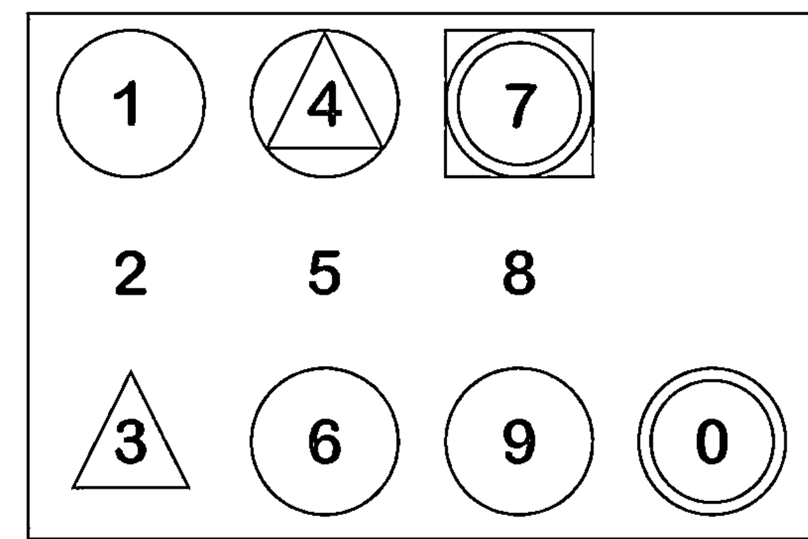

天使神秘学院官方淘宝：http://strc.taobao.com
获取更多好书，请加微信：13641926204 或 QQ:715104687


主宰数字，改变命运

美甄的出生日为1973年12月31日，她的命状如下：

※ ①+⑨+⑦+③+①+②+③+①（先天数）
= △2 △7 / □9
（后天数）（2+7）（主命数）

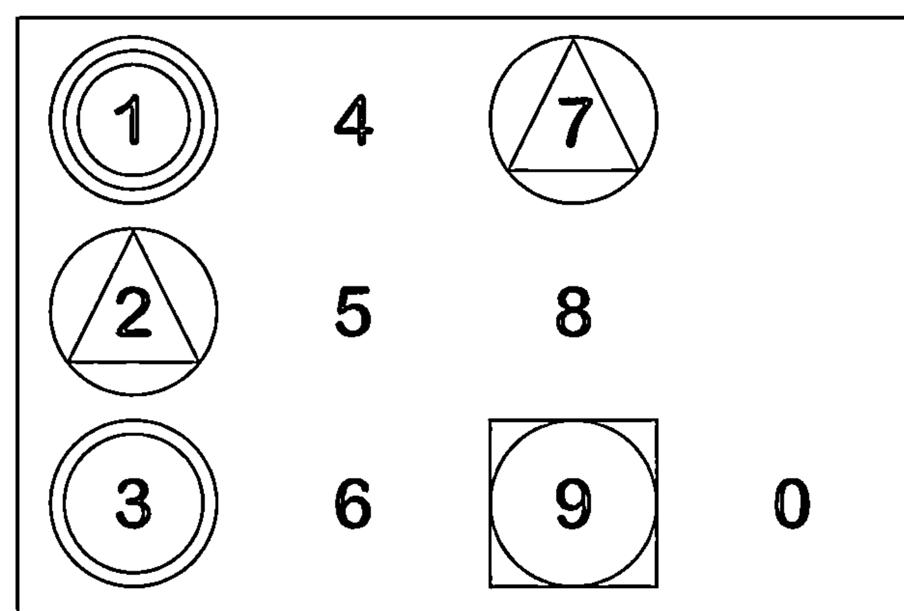

美甄的1有三圈，7有一圈，还打三角形，是很理性的人；宗瀚有1．4．7连线，也是理性的人，理性和理性在一起，很痛苦，为什么？有争执的时候，谁要先让？两个都那么理性，都很硬，很容易就损上了。

1有三圈的人，主观、自我意识强，还好美甄没有5，否则就是「大女人」了；1有三圈的人，比较男子性格，女性会比较外向、活泼，温柔体贴的甜蜜话语不太说得出来。

虽然美甄的3有两圈，应该是嘴巴很甜的，但美甄的父母亲是比较一板一眼的人，父母之间并没有什么美言、甜蜜的话，所以美甄的两圈3并没有得到发挥的环境。

從代表理性的1、4、7三個數字來看，兩個人都有四個圓圈、一個三角形，理性的程度不相上下；但因為丈夫的1只有一圈，又有3.6.9.0奉獻線連線（四個圓圈，只有一個三角形，正能量蠻強的），所以他會比較讓著老婆，任勞任怨。

另外，宗瀚的2.5.8感情桃花線是空的，沒有能量，這樣的人一旦遇到另一半會很珍惜，因為他在感情桃花方面機會很少。

宗瀚有1.4、7連線（物質利祿線），這種人很肯做，有後天財；4打三角形的人比較顧家、執著；他是7號人，靠專業賺錢。

美甄是家庭主婦，我看了她的命狀，覺得很可惜，因為她1有三圈，是有能力的人，又有1.2.3藝術美感連線，本身3有兩圈的人對美的事物就很有興趣，所以她學美容是很適合的。

看了他們兩人的命狀之後，我開玩笑對美甄說：「家都是妳在管喔，妳的個性要是發作起來，沒人拿妳有辦法。」她聽了就笑，宗瀚就說：「終於有人知道我的痛處了。」

美甄是9號人，在外面對朋友她不會顯現自己個性強的那一面，表現的都是好的一面，對家裡人就不一定了，她任性的一面會對最親的人展現。

### 相像裡的差異

偉德和小寧這對夫妻，是另外一個例子。
偉德的出生日為1972年03月27日，他的命狀如下：

※ ① + ⑨ + ⑦ + ② + ⑩ + ③ + ② + ⑦（先天數）
= △3 △1 / □4
（後天數）（3+1）（主命數）

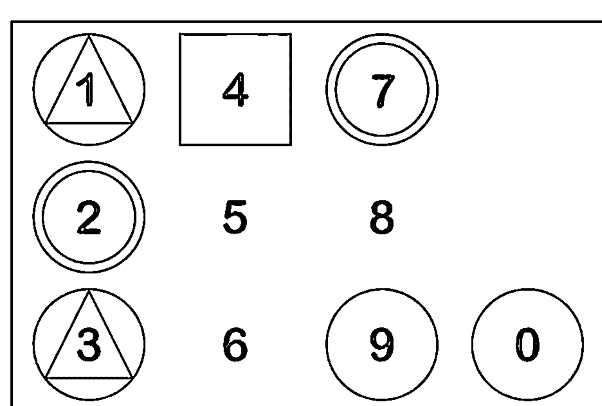

小寧的出生日為1973年12月22日，她的命狀如下：

※ ①+⑨+⑦+③+①+②+②+②（先天數）
= △2 △7 / □9
（後天數）（2+7）（主命數）

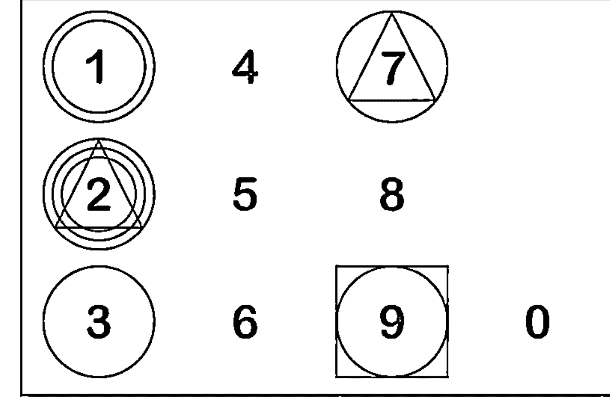

偉德和小寧都有1．2．3（藝術美感／任性）線的連線，有這條連線的人，個性比較像小孩子，而偉德這條連線上有兩個三角形，小寧只有一個，所以偉德會更任性一點。

兩個人的1．4．7都有能量，是理性的人；兩個人也都沒有6，都有7有9，命狀其實蠻相像的。差別在於一個是4號人，一個是9號人。

雖然小寧的1有兩圈，偉德的1只有一圈，但偉德的1有一個三角形，個性和我執會比小寧嚴重；加上他的3也有三角形，表示溝通上有障礙。

天使神秘学院官方淘宝：http://strc.taobao.com
获取更多好书，请加微信：13641926204 或 QQ:715104687

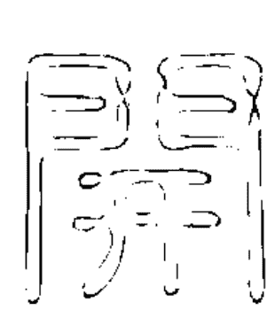


4號人一板一眼，重視程序、細節，遇上9號人，還算可以包容4號人的龜毛，但因為小寧也有任性線，所以有時也會不平：「為什麼都是我在退讓？」

還好小寧是9號人，如果她是1號人，那就會是煙硝瀰漫的局面：強對強，看誰會戰贏。

主宰數字，改變命運

### 親子教育

「種因在家庭，成長在學校，收穫在社會」，這是每一個孩子成長的三個階段，奠定基礎的家庭環境非常重要。

父母是影響孩子一生最重要的人，如果父母能夠真正、客觀的了解孩子的天份、特質和缺點、障礙，就知道怎麼幫助孩子，為孩子營造一個更美好、正面的人生。

親子教育裡，最重要的是父母之間的互動溝通模式。一對重視對重視溝通、溝通品質良好的父母，一個充滿愛與和諧的家庭環境，教育出來的一定是健康、自信、快樂的孩子。反之亦然。

所有父母都應該要了解孩子的特質和個性。孩子是愛好自由的個性？還是個性很倔強？如果孩子是這樣的個性，你硬要用規範管束他，他不是強烈反彈，就是被你壓制得失去自信、壓抑自我，這樣對孩子是好的嗎？

現代父母難為。很多父母為孩子的教養問題頭痛，現在的孩子愈來愈難教，被孩子整得冒煙、抓狂的父母大有人在。在這種情形下，父母更應該不斷充實自己，用心了解孩子，戰力十足地扮演好父母這個艱巨的角色。

#### 父母是孩子幕後最有力的推手

我有一個案主，她三歲的孩子有一天對她說：「妳去死好了！」她很傷心，我問她：「妳是不是在家裡常常說這句話？」果然，她和老公吵架的時候，就會叫老公去死……小孩今天也講出這句話，要怪誰？

所有的父母都愛孩子，但這個愛，是幫助，還是反作用力？這需要不斷成長的父母、有智慧的父母。現今很多父母為了孩子教養問題苦惱，首先要找出問題的源頭。有些父母一味責怪孩子，沒有反省到：自己其實責任最大。

不管是好是壞，父母是孩子幕後最重要的那隻推手，父母願意改，全家都跟著改。

我曾遇到有些父母說：「為什麼要我改？這個小孩太愛玩了，太不像話，我說一句他回應十句，晚上偷跑出去上網咖、去KTV……這樣的小孩不打怎麼行？」

我聽他講完，問：「你覺得你的孩子全部就是這樣而已嗎？就只有你剛剛說的這些？」

「當然啊！光這些我就煩死了，氣死了！」

我想，這樣的父母也是沿襲了他父母的個性和溝通方式，比較主觀、強勢，我執比較重；他只覺得小孩不聽話、頂嘴是不對的，卻沒想到：小孩為什麼會頂嘴？為什麼叛逆？為什麼老是想往外跑？回歸問題的核心，還是因為父母沒有給孩子適當的愛，讓孩子不想待在家裡，因為家不溫暖，父母親不了解他。

真正了解孩子了，你對他就會有愛、有包容，不管多久你願意陪著他。

#### 像我這樣的母親

以前我的女兒也很有個性，兩歲多她就會頂嘴保母，那時我們忙著做生意，沒時間照顧她，把她交給大姑照顧，六歲才把她帶回來自己照顧，個性已經定形了，苦的就是我們父母，怎麼跟她溝通？十幾年來我用了好多心血。

從她的生命秘數裡，我真的看到她的個性，鬼靈精怪，不受拘束，嘴巴不饒人。學了生命秘數後，我才真的放下，孩子就是這樣的命格，後天我要如何協助她突破？

#### 和孩子一起學習、成長

我的出生日為1967年09月18日，命狀如下：

※ ①＋⑨＋⑥＋⑦＋⓪＋⑨＋①＋⑧（先天數）
＝ △4 △1 ／ □5
（後天數）（4+1）（主命數）

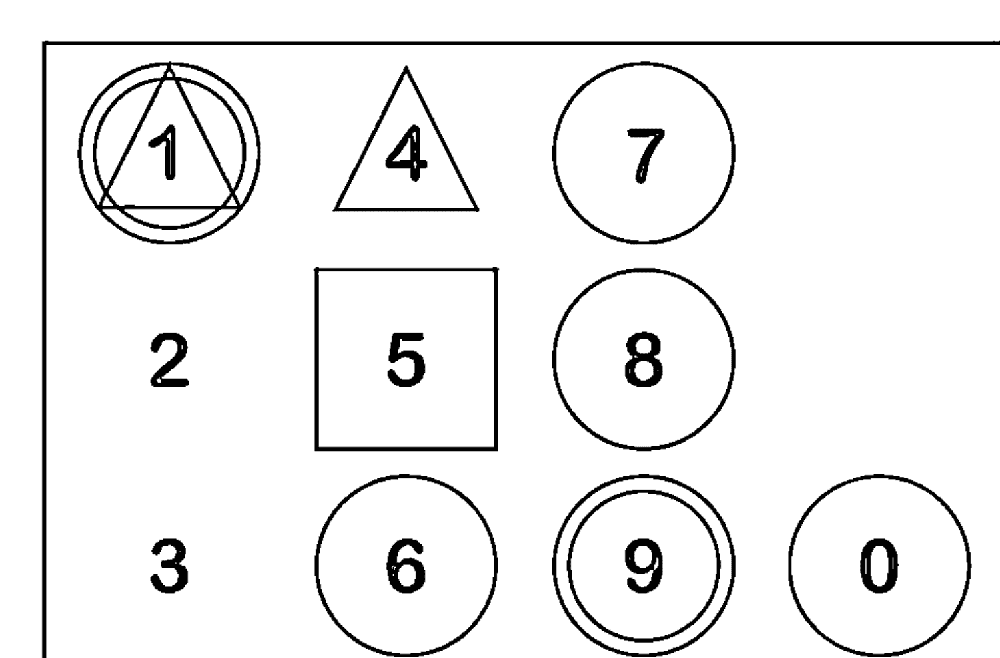

女兒的出生日為1994年05月20日，命狀如下：

※ ①＋⑨＋⑨＋④＋⓪＋⑤＋②＋⓪（先天數）
＝ △3 △0 ／ □3
（後天數）（3+0）（主命數）

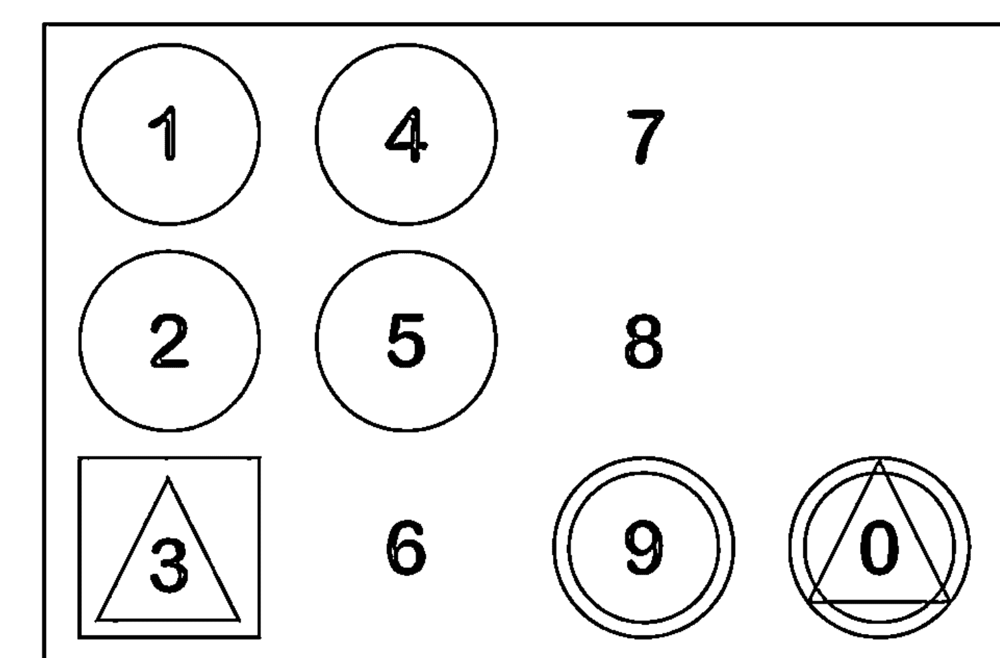

我女兒是3號人，3又打三角形，點子很多，很會創新；30／3的人比較執著、理想主義；她有2，人緣好，是很重視朋友的人。由於從小給別人帶，特別受寵，我們父母對她也有補償心理，假日去鄉下看她總是帶她去精品店買她想要的東西，所以養成她比較任性、為所欲為的個性。

3打三角形是說話很利的人，我說一句她可以頂撞十句。她又有5，愛好自由，必須適當地讓她往外跑。以前我不讓她去外面闖，因為我是1、4打三角形的人，比較理性、責任感很強，怕她發生意外，會比較緊張，顧慮很多，總是想掌控、保護孩子。

現在她的夢想是成為星光幫一員，站上舞台唱歌，所以每天在家裡練歌。若是以前我會反對，現在我能夠了解她，也懂得溝通了；我問她：「妳覺得要成為一個歌星，要具備什麼樣的條件和才能？」「妳現在是國中生，是不是要先做好學生的本份？妳看哪一個星光幫的歌手學歷不是大專以上？對不對？」

她現在執著於她的夢想，做父母的硬是不准、不看好，只會讓她愈執著。就順著她，盡量理解她、支持她，給她好的引導。我說：「那妳要不要去歌唱訓練班上課？媽媽支持妳。」其實我年少時也一心想唱歌仔戲，我媽媽偏不讓我去，所以我知道那種痛的滋味，不應該猛然潑孩子一盆冷水。

以前女兒看電視我會說：「看這個幹嘛？沒有營養，關掉，去讀書。」現在我會陪女兒一起看電視節目，選秀節目、偶像劇都看，時間到了她還會打電話催我：「媽媽快一點，某某節目就要播了，妳還不快點回來……」

#### 讚美、肯定、接受、認同

我女兒有一個很愛玩、蹺家的好朋友，我因為擔心她們，也了解了一下她那個好朋友的狀況，原來這個孩子不久前父親過世了，她的母親由於不安全感，整天把孩子關在家裡，不准她亂跑；這個女孩是5號人，是不可能讓別人管的人，她母親不了解，天天規定她必須幾點回家，造成孩子說謊、編理由，說是我女兒找她出去玩。對方母親打電話給我，感覺上有一點責怪我女兒帶壞她女兒，我覺得事態嚴重，有必要了解一番。

從小受我父親個性影響，我的個性也很強勢，以前甚至有「武則天」的封號，員工都很怕我，對孩子我也是一貫強勢作風，「你們就是小，就是要聽媽媽的話，媽媽就是對的！」接到人家媽媽興師問罪的電話，如果是以前，回到家什麼都不要多說，一定是開口先訓我女兒，現在我會心平氣和先和女兒溝通。

女兒對我說了一句話：「媽媽，我的朋友說謊是不對，但妳是這麼有愛心的人，難道連一個改過的機會都不給她？」我一聽也對，如果硬要女兒不再和她做朋友，並沒有真正幫助到她。

後來我和女兒一起分析，得到的結論是，她母親對她太嚴格，而且不夠了解、關心女兒，結果母親的愛對女兒造成一種束縛和壓力，而不是讓孩子自由發展，這樣很容易出問題。不管是教導孩子還是帶領部屬、和客戶溝通都一樣，彼此之間要有一個自由的空間，不能太超過。

以前我母親也管我管得很嚴，我是5號人，哪裡會被她管？半夜還是偷偷爬起來跑出去約會。也會被她抓到，她也是會唸，可是我要做的事還是照做。

現在每天清晨五點多，我都帶兩個孩子去運動，利用心靈的力量鼓勵他們：「孩子，你好棒，阿公阿嬤都誇獎你們，年紀這麼小就一早跟著媽媽出來運動……」以前我不會正面去鼓勵他們，現在我會了，多鼓勵、多讚美、多肯定，無形中他們就朝正面、積極去走，愈來愈有自信。

以前我對孩子說話，三句裡有兩句是負面的指責、約束、命令，現在，三句裡三句都是正面的讚美、肯定。即使孩子做錯了，也可以用「三明治」溝通法，把重點包夾在中間。譬如說孩子的房間一團亂，不要直接就責備孩子，「喔，你看你的房間，就像畢卡索的畫一樣，印象派，很有特色，很有個性！」然後再說：「如果你把房間收拾整齊、打掃乾淨，一定又是另一種不一樣的風格！媽媽覺得那種風格可能更棒，更適合你。你要不要試試看？媽媽很期待喔！」

親子教育其實沒有什麼秘訣或撇步，父母只要學會對孩子「讚美、肯定、接受、認同」四要心法，再叛逆、再難教的孩子都可以教得很好。

#### 感謝孩子來磨我

兒子的出生日為1997年10月18日，命狀如下：

※ ①＋⑨＋⑨＋⑦＋①＋⓪＋①＋⑧（先天數）
＝△3 △6 ／ □9
（後天數）（3+6）（主命數）

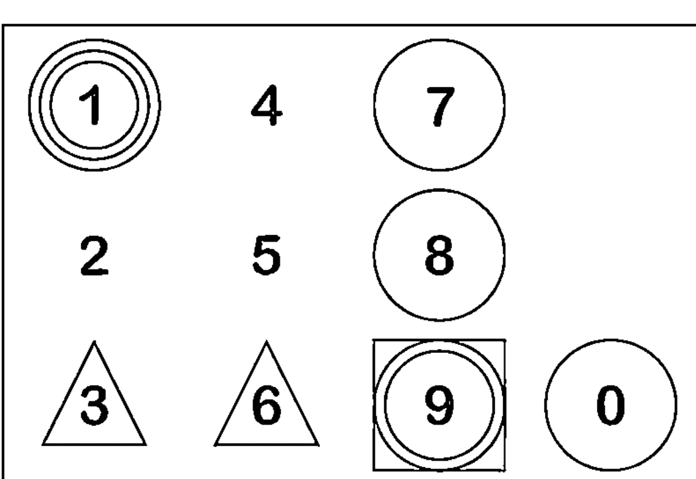

這個孩子有三圈1，又有7，是理性的人。我很感恩我的兒子1有三圈，不時給我考試、磨我，讓我知道自己的心性到底修到哪裡了；如果沒有他來磨我，我沒辦法不斷成長。

因為他，我才發現：原來3和6打三角形的人，竟然那麼有創意，能想出那麼多怪招來跟媽媽作對，想盡辦法跟我計較。

以前我會認為這個孩子不聽話，鐵腕教育，又打又罵，因為小時候我父母就是這樣教育我。如果我沒有覺醒，沒有改變自己，一定是複製下一代的不幸家庭。

現在的小孩都喜歡玩電腦，以前我會說：「給我關掉！」當然現在不會了。暑假時我看他整天在家不是玩電腦就是看電視，我問他：「寶貝，你認為只是玩電腦和看電視，會讓你將來成為一個很棒的人嗎？」他笑了，「很多有成就的人，從小就不斷學習，你是不是也應該多充實自己呢？」

我現在的做法，不會去約束、控制孩子，盡量讓他們自由發展，因為我自己也是5號人，很不喜歡別人管；對孩子的引導，最好用「心」去愛他們，了解他們，讚美他們，肯定他們，讓他們愈來愈有自信，往正面的方向去走。

因為學了生命秘數，我知道這兩個孩子都是帶使命的（主命數為3、5、9），所以我也盡早培養他們的奉獻心、佈施心。

他們兩個一個沒有6，一個6打三角形，這樣的孩子會很在乎「公平對待」，尤其是6打三角形的孩子，嫉妒心很強，什麼事都要和姐姐計較，譬如早上早起去運動，如果姐姐沒起床，他也一定不起床；姐姐暑假不必補習，他也不要補習。

為了不想早起去運動，他會演戲裝病，平常跑跑跳跳都沒事，早上五點他的腳就瘸了，「我腳抽筋啦……」要不然就是肚子痛。第一次我以為是真的，後來發現他每天早上都有不同的藉口。有一次碰到下雨，我和姐姐用跑的，他也跑起來了，我問他：「弟弟，你不是腳痛嗎？」他還說：「突然就好了。」

這個孩子真的是有創意，唱作俱佳，演戲演得有時候我都快要被騙，想帶他去看醫生，他就說：「不用，一下子就好了……」鄰居就被他騙了，覺得我這個媽媽太狠心，問我：「孩子的腳都這樣了，妳還要他去散步、運動……」

為什麼我這麼堅持要他們天天早起一起去散步？因為我要藉由一個持之以恆的習慣，培養他們的恆心與毅力，這很重要，因為這兩個孩子都缺乏耐心、持續力（一個沒有6，一個6打三角形），做什麼事都很容易半途而廢。

#### 4號媽媽和5號女兒

##### 我快得憂鬱症了！

有一天，一位媽媽帶著念國二的女兒小靜一起來找我諮詢。媽媽看起來是任勞任怨、顧家顧小孩的傳統女性，小靜一看就是很活潑外向的孩子。我感覺到，媽媽拿小靜沒輒了，不知道怎麼管教她才好。

天使神秘学院官方淘宝：http://strc.taobao.com
获取更多好书，请加微信：13641926204 或 QQ:715104687


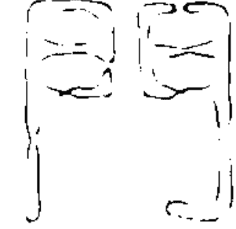

主宰数字，改变命运

小静是5号人，随性自由，重情重义，喜欢冒险；有2有3，在外面人缘很好；又有三个9，是爱玩、很重朋友的人，她很喜欢有一个舞台去展现，受到朋友的肯定和喜爱。

妈妈不了解小静，只是千篇一律的管她，要她好好读书、不要那么爱玩，限制她什么时候要回家，不准去哪里哪里……小静很生气：「我同学的父母都给他们很大的自由，为什么妳管我那么严？」

爱玩的孩子被关在家里，就变成一种负作用。后来小静跟我说：「老师，我快要得忧郁症了。」

妈妈当然是爱孩子，但因为不了解，用不对的方式对待孩子，常常造成反效果；如果真正了解孩子，就能采取适合、正确的对待方式，一切就会很OK。

我对妈妈说：「妳这个孩子，和我的孩子很像。」我把我自己的亲身经验告诉她，「5号的孩子，要让她适当的去多方尝试、去冒险。这个孩子应该是要冲出去的，我们硬把她压下来，结果不是孩子更叛逆、更脱轨，就是变得压抑、自闭。」

最后我赞美这位妈妈很棒，「妳今天带孩子来是对的，孩子有很多需要我们了解的部分，妳愿意去了解她，学习如何和她沟通，这是一个非常好的开始。」

#### 先接受，再規範

后来小静又带了五个同学来找我咨询，她还说：
「老师，妳比我妈妈还了解我。我妈妈如果像妳一样就好了！」

我跟她开玩笑：「妳的意思是，如果我是妳妈妈，妳就可以无法无天了喔？」

我告诉小静：「妳要体谅妈妈的苦心。老师也是妈妈，所以很了解。妳还年轻，还不能体会父母恩。妳觉得爸爸妈妈是不是很努力工作赚钱？」

「是啊。」
「他们为了什么？」
「为了我们啊。」

「妳可以静下来想一想，为什么妈妈不让妳出去？是不是妳没有准时回家？或妳做了什么事让她担心？所以她才会限制妳的行动，妳有没有想过这些？……」

其实这些话孩子都听得懂。孩子也「知道」父母是爱自己的，问题是孩子常常「感受」不到父母的爱，孩子对父母没有「感动」，就会觉得父母的管束是一种压力，就會叛逆。

這對母女之間的衝突，源自於女兒是愛好自由的5號人，而母親是要求完美、一板一眼、個性比較保守的4號人。如果母親了解女兒是和自己不一樣的5號人，又是9有三圈、很愛玩的個性，第二步要去尊重女兒的特質和個性。

當然尊重並不是放縱。在尊重的前提下，給女兒一條可以遵循的路線；先接受她的想法，再去規範她的做法，慢慢就可以走入正軌。如果沒有先尊重她、先接受她的想法，父母再有理，她也覺得沒有理。

後來，這位母親不再堅持己見，不再絕對不准女兒出去玩，願意給女兒多一點自由空間；透過生命秘數，小靜也知道自己是很愛玩的個性，對媽媽的苦心和擔憂有了多一點的了解，也慢慢願意多接受一點母親的管束。

彼此了解、彼此接受、彼此尊重，母女之間的對立、衝突自然也就漸漸化解。

## 二〇〇〇年以後出生的孩子

我常說，一九〇一年到一九九九年出生的人，是來還債的，有的人來還感情債，有的人來還經濟債；二○○○年以後出生的人是來享受的，他們出生在物資豐裕的社會和時代，家庭少子化趨勢下，每個孩子都像寶一樣被父母長輩捧在手心上。

二○○○年以後出生的小孩你仔細看，普遍都是額頭很高、很凸，這樣的小孩都是來旺父母的，但父母也要有能力承受孩子來旺你的運，所以會先經過一個考驗過程，這個考驗過程，就是孩子會來磨練父母。

好比一個人能夠當醫生，要經過多年的學習、實習才能成為一個醫生；父母親生到一個來旺你的孩子，也要有受得起的命，因為這些孩子無形界的磁場太強，父母未必受得起。

台南市有一家很有名的西點麵包，雖然不久前倒了，但曾經有很輝煌的歲月。當初起家的兩夫妻，生了一個智障的兒子，民間流傳著，這個孩子就是來考父母、旺父母的，如果父母能把這個孩子照顧好，他們的生意就會愈做愈旺，鴻圖大展。他們從一家小店面開始，漸漸擴張成兩家、三家……後來在安平工業區買下大廠房，業務更擴充到全台灣，有數十家加盟的門市。

很多殘障的孩子，其實都是帶福報來給父母的，否則父母哪裡有能力好好照顧這樣的孩子？但他在旺父母之前，會先磨父母，父母要有能耐經過考驗，才能接受孩子帶來的福報。其實每一個過程，都是生命中的禮物。

我在親子講座裡看到的父母，很多都被孩子整得瘦巴巴的，拿孩子沒輒。前一陣子我遇到一個小弟弟，才四、五歲，話多得不得了，好動得不得了，媽媽拿他一點辦法也沒有。

每次看到那個小弟弟，我都對他說：「弟弟，你好棒喔，你好聽話，老師好喜歡你，你要做好孩子喔……」慢慢的他會聽我的話了。

不管是怎樣難教的小孩，都要先肯定他、鼓勵他，沒有不可能的事，只有放棄的父母。如果每天都用正面的心念對待孩子，「孩子很棒，孩子愈來愈乖了……」只要我們的潛意識一發送出去，磁波、磁場就會改變。

二二〇〇〇年以後出生的小孩很難教，好動，難以專心，霸道，任性，固執，很不好帶，都是來考驗父母的。

那麼多的孩子，其他數字的缺數就多，甚至有缺7個數字或8個數字的，父母要用心幫助孩子。

譬如說沒有4的小孩，沒有安全感，父母要多抱孩子；沒有2的小孩怕生、怕黑，父母要陪著孩子多參加團體性的活動，讓孩子慢慢學習在團體中和他人互動；沒有3的孩子，缺乏溝通表達的能力，要靠後天培養……

「近朱者赤，近墨者黑」，二○○○年以後出生的小孩雖然缺數多，但並不表示就一定缺乏那些特質，關鍵還是在於父母的引導、培養。

# 第6章 家庭·兩性·親子

# 第7章 他山之石·實例分享

## 興哥：人脈愈廣，親子關係更好

目前任職於財富管理顧問公司的黃奕興先生說：「我在學生命秘數之前，個性很強。以前我在銀行服務，我只管把自己的工作做好，不管做人。家裡也差不多，我和大兒子的關係比較緊張，以前不知道為什麼，學了生命秘數之後才知道，為什麼小兒子比較聽我的話，因為他的1只有兩圈，我的1有三圈，我的大兒子1有四圈，個性比我還強，我才恍然大悟。」

「以前我用我父親對我的教育方式教育小孩，小孩都要聽爸爸的，現在我懂了，在家裡我和大兒子地位一樣。既然知道他的個性了，還要勉強他嗎？他的個性比我還強，不能強壓他。」

黃先生的出生日為1951年02月18日，命狀如下：

※ ①+⑨+⑤+①+⓪+②+①+⑧（先天數）
= △2 △7 / □9
（後天數）（2+7）（主命數）

「我的1有三圈，個性比較主觀；做業務工作，個性不能太硬，如果碰上1也很多圈的客戶，我的方法行不通。以前我都是用自己的個性去與人溝通，對方不接受，我覺得是對方的損失，我是為你好，你偏偏不認識我這個貴人，算了，我不差你這一個客戶……學了生命秘數之後，我開始了解自己，也懂得先了解對方的特質，從對方的立場來考量，避免使用對方無法接受的溝通方式，的確在工作上有很大的幫助。」

「有一次我看了一位客戶的出生年月日，看出她是家中四個兒女中最孝順的，為了父親的病四處求醫。我說了出來，對方很驚訝：『你怎麼知道？』運用生命秘數，不但可以更了解客戶，也讓客戶對我更信賴。因為我懂一點這個，有些朋友也喜歡找我看看他們親人或朋友的命狀，聽聽我的解說和建議，無形中人脈也愈來愈寬廣。我也僅僅懂得各個數字的特質而已，對我的幫助就已經很大了。」

## 雅玉：人生的蛻變

### 從內向到獨立

「我的個性原本很內向，喜歡固定的工作、熟悉的環境，穩定就覺得很安全，不喜歡變化和挑戰，畢業之後一直從事內勤文書工作。」原本是上班族的陳雅玉小姐，目前是台南永康A & B養生美容沙龍館的店長。

雅玉原本工作的公司後來要遷到台北，她不想上台北，於是離職；因為姐姐是專業美容師，當時對於生涯並無明確規劃的雅玉，就跟著姐姐學美容。

雖然轉業為服務業，但雅玉內向害羞的個性依然，學習生命秘數之後，整個人改變很多，有了勇氣和自信，「現在我不但不害怕和陌生人互動，上台主持也沒問題了。」

「我對人性的了解沒有那麼敏銳，在人際關係中比較被動、低調，也不知如何跨出第一步，這方面生命秘數真的給了我很大的幫助。從一個人的出生年月日，我就可以很快知道這個人的個性、特質，應該用什麼樣的方式和對方互動，不但對自己有益，也能夠幫助別人，是一套很好用的方法。」

「我的客人都是女性，女性都很喜歡算命，像我幫客人排命狀，做分析，如果客人覺得不錯，下次就會帶朋友來讓我分析命狀，進而可引導到技術服務。」

不久前雅玉因生命秘數的命理服務而認識一位老闆娘，這位老闆娘身體常常痠痛，因為雅玉剛好從事養生美容，就送這位老闆娘一次鬆筋療程，「她來做了之後覺得效果非常好，不但跟我買產品、介紹朋友來，還讓我們店的DM擺在她店裡打廣告，因此為我們帶進不少客人……」雅玉說：「生命秘數在幫助我開拓客源方面的效果最明顯。」

在與男友的感情方面，生命秘數也給雅玉許多幫助，「我從他的命狀了解他是愛好自由的人，不喜歡被人管。以前我的個性非常愛管對方，總是電話追蹤，掌控他的一切，也許是因為以前的感情經歷，對感情有一種不信任感、不安全感。」

「後來學了生命秘數，了解了自己和對方的個性、特質，老師也告訴我，我會這樣患得患失、不放心，其實是因為缺乏自信。一個女人只要獨立自主、有自信，就不必依賴感情、依附男友，也不會有那麼多不安全感。加上自己的成長和蛻變，現在自然而然就不會常常對男友電話查勤了。」

家人對雅玉的蛻變也很高興，從一個自小備受呵護、個性內向文靜的老么，變成一個自信獨立的人，爸媽對這個么女也放心許多。

### 命状解析

雅玉的出生日為1974年12月23日，命状如下：

※ ①+⑨+⑦+④+①+②+②+③（先天数）
= △2 △9 / △1 △1 / □2
后天数（2+9） （1+1）（主命数）

> 「我没有5，原本的个性比较被动，缺少行动力。2打三角形，人际互动方面有障碍，个性比较依赖，在人群中没有安全感。1也有障碍，以前内心常有矛盾。我有4，做事比较按部就班、一步一步来。虽然我有3，但后天环境的关系，我的表达能力没有发挥的机会，知道了之后慢慢去调整就好了。」

如何調整？「譬如說個性被動這部分，需要多督促自己。因為我是即使想主動走出去也沒有目標的人，所以一定要設定完成量，例如今天要打幾通電話、要拜訪幾個人……等等，因為我是一步一腳印的人，設定的目標我是會完成的。就用這樣的方式鞭策自己，才不會偷懶。」

以雅玉的命狀來說，沒有5、6和8，所以她要補的就是自信、信心（5），耐力、持續力（6）和主動掌握機會（8）。這需要有適合的環境，或說一個推手、靠山。

她的4是很漂亮的，沒有障礙，在團體裡一定會有很好的發展，而她又主修2，所以只要在團體裡與人合作，慢慢就會補充她不足的部分，補強她5、6、8的磁場。

## 家瑜：學習、反省，改寫命運

### 個性剛硬大女人命格

於錠嵂保險經紀公司任職區經理的張家瑜小姐，二○○七年十月左右開始學習生命秘數，「學了之後，可以更深層了解自己的個性，去補不足之處。」

張小姐的出生日為1968年11月15日，命狀如下：

※ ①+⑨+⑥+⑧+①+①+①+⑤（先天數）
= △3 △2 / □5
（後天數）（3+2）（主命數）

張小姐的命狀1有四圈，又有5，因為她多年從事業務工作，所以磨合、調整了很多，否則是那種個性很剛硬、無法無天的大女人。

「坦白講，我個性真的很不好！」張小姐爽快招認，小女兒在一旁低聲說：「妳也知道妳個性不好……」

「我媽以前就常常這樣唸我：妳啊，以後『嫁尪一定會給人離去海口吃番薯』……後來結婚了，她說還好我是嫁給我老公，不然一定是離婚。」

張小姐笑說，以前老公的同事曾說，以她的個性，如果她做業務能做得起來，「我的頭就剁下來當椅子坐……」

「他們都不看好我，說我個性太衝、太硬。」

雖然個性很硬，但張小姐的業務還是做出來了，「因為我畢竟也有自己的特點，因為我是一個很真的人。」另外一個更重要的原因是，「人一定要多方面接觸，多方面學習、吸收，才能改變自己。自己要反省，如果不懂得反省，今天就算有再好的東西擺在我們面前，自己也無法受用。」

「的確是從事業務工作，慢慢磨過來。以前很多事情我沒辦法忍，都是硬碰硬；現在不會了，當下先放下，不管它，不想那麼多。」

「我是一個很求真、說一是一的人，無法接受那種當面一套、背後一套的人，這種很假的人偏偏人緣還很好，我會很氣，很不以為然（有6.8誠實線，厭惡虛假）。後來去上課，聽老師說：每一個人個性不同，我們面對不同的人，要用不同的個性去與對方互動，才不會產生衝突……後來慢慢轉變自己的觀念，調整個性，比較能平心靜氣接受這種狀況了。」

「我在人際互動方面有障礙（2打三角形），總是獨來獨往，後來發現不可以這樣子，團隊很重要，需要彼此勉勵、互相激勵，才能好好完成工作目標。」

「我講話很衝（3打三角形），其實不是有意的，可是很容易就得罪人、傷害人。話說出口想再修正就來不及了，所以現在我時時提醒自己：講話之前盡量多想一想。有時候我對小孩子講話也很兇，但我自己也會思考，如果是我錯了，我會向他們道歉。」

### 生命秘數運用於家庭

「我老公的個性也不是很好，可是修養很好，比我有智慧多了（有3.6.9.0智慧線）。」

張小姐老公的出生日為1968年11月03日，命狀如下：

※ ①+⑨+⑥+⑧+①+①+①+③（先天數）
= △2 △9 / △1 △1 / □2
後天數（2+9） （1+1）（主命數）

張小姐的老公是雙層後天數命格，人生比較辛苦；從命狀來看，他很包容太太（因為主修2），他的1有三圈又有兩個三角形，兩人的婚姻能這麼好，可見他真的是很疼、很讓老婆。兩個人修養都很好，否則早就離了。

張小姐女兒的出生日為1996年05月06日，命狀如下：

※ ①+⑨+⑨+⑥+①+⑤+①+⑥（先天數）
= △3 △6 / □9
（後天數）（3+6）（主命數）

張小姐這個女兒是來奉獻的，主修9，有3．6．9．0奉獻線，1．5．9．0修行線很漂亮。因為她沒有2，所以在人群中會比較害羞，和熟的人話就很多。是感性的人（數字都集中在3．6．9．0，理性的數字1．4．7只有一圈）。

因為修行線很漂亮，最好讓這個孩子早點接觸宗教、信仰方面的東西，對她會有正面的幫助，會贏在起跑點；這個孩子個性很好，1和5都只有一圈，6和9都有兩圈。

她的媽媽3打三角形，爸爸3是圓圈，她的3是三角形，這要看她模仿、複製父親的3還是母親的3，不一定；她6（感性、愛心）有兩圈，本來就不是說話會很衝、很毒的人。

但她也不是一個沒有脾氣或個性的小孩。因為6打三角形，所以還是會很在乎是否被公平對待。

### 生命秘數運用於工作

張小姐說：「不管是面對不熟的人還是熟人，生命秘數都很好用。其實人都最關心自己的事情，除非一些頭條新聞或八卦消息，否則人幾乎都是以自我為中心的。今天如果沒什麼話題，可以用生命秘數與對方互動，不管你講他的個性、工作還是家庭，他一定很有興趣，會很注意聽你講。」

「運用生命秘數，也可以很快了解對方是怎樣特質的人？是理性還是感性？應該從哪方面著手進入？……運用在增員方面也一樣，可以很快了解對方的個性。今天早上我遇到一個1有三圈的人，領導能力很好，但是一個很固執、自我觀念很重的人，這樣的人不適合感性的溝通方式。我從他的優點切入，再慢慢分析，之後他同意到我們公司進行更深層的了解。」

「在帶領部屬方面，生命秘數也是很好的輔助，讓我們可以針對不同member的個性、特質去引導他，他有的優點幫助他多發揮，他欠缺的部分對他多包容，知人善任。」

### 實例解析1

張小姐部屬小慧的出生日為1984年09月09日，命狀如下：

※ ①+⑨+⑧+④+⓪+⑨+⓪+⑨（先天數）
= △4 △0 / □4
（後天數）（4+0）（主命數）

從命狀來看，小慧是有很多構想和計劃（集中在9和0），但比較缺乏行動力（沒有5）的人，像張小姐這樣四圈1又有5，個性很積極、總是衝在前面的人，一定很看不慣小慧的慢條斯理，還好張小姐一直在反省、成長，否則早就抓狂，三角形3的「毒舌」就會表現出來了。

帶這樣的部屬不容易，小慧的2、3、5、6、7都缺乏，帶起來很累。數字有所謂「十全十美」，十個數字裡小慧只有5個，叫「十全五美」，她要補充五個數字的特質。

其實小慧有很強的夢想（9）和慾望（8），想像力豐富；她的4有一圈，又有三角形和正方形，表示這個人比較執著、理性。這樣的年輕人要讓她去磨，對她不能用強硬的態度；她的0又打三角形，最好用慈母的態度對待她，多肯定她，慢慢引導她，適時給她表現的舞台。

她1只有一圈，沒有5，是缺乏自信的人，作為主管要多認同她、鼓勵她；你愈是肯定她，她的1和5就慢慢會補起來。

張小姐從這裡也要學會帶組織。因為張小姐本身沒有4的磁場，而小慧有4，兩個人可以說是互補：一個比較隨性，一個比較一板一眼。張小姐如果能學習小慧的優點，也是補自己的4的機會。

### 實例解析2

> 「我真的都遇到一些奇奇怪怪的怪ㄚ，還有一個部屬也讓我很傷腦筋。」張小姐說。

張小姐部屬文榆的出生日為1973年09月26日，她的命狀如下：

※ ①＋⑨＋⑦＋③＋⑩＋⑨＋②＋⑥（先天數）
＝△3 △7 ／ △1 △0 ／ □1
後天數（3+7） （1+0）（主命數）

文榆的個性很硬，7打三角形，1又打三角形，算是很嚴重；任性，比較孩子氣（1．2．3藝術美感／任性線，因有兩個三角形，較偏負向的任性能量），講話又很直（3打三角形）。但文榆的2．6和平線很漂亮，是他最大的優點。

文榆也是想像力豐富（3．6．9．0智慧／空想線）、行動力不足的人（沒有5）。對文榆這樣個性的人，主管要培養他對工作的使命感。

沒有4的主管很辛苦，總會遇到很難纏的部屬來磨，尤其張小姐的1那麼多圈，恨鐵不成鋼的急性子，雖然心裡想「我要包容他……」但是很多直接而細微的表情是無法控制的，正是因為如此，組織工作對張小姐而言會有一點艱巨，但只要她能提升到高階能量，一切就搞定了，沒問題。

## 琇俱：愈走愈明確，愈走愈開心

### 好學、入門快、超神準

目前是高雄市整體自然美容推廣協會開運老師的吳琇俱小姐，大約在二○○七年開始學習生命秘數，「運用生命秘數，在行銷方面很容易打進客戶的心，能夠知道他的困擾，了解他心裡確切的希望和需要是什麼，這些從生命秘數裡都可以看出來。」

在認識自己方面，「生命秘數幫助我更了解自己的人格特質，和未來要走的方向。因為我不喜歡往外跑，以前我總覺得，有一個自己的美容工作室，把自己的客戶服務好就好了，從來沒想過成為一名到外面授課的講師或其他可能性；學了生命秘數之後，更確切了解自己是適合往外走的，而且這是我人生要修的一個課程。」到現在，「愈走愈明確，愈走愈開心。」

琇俱原本對命理方面的學問就很有興趣，各門各派都有所鑽研，相比之下，「生命秘數是最好學、最快可以入門的，而且超神準。」重點不在於方法或工具，「只要是研究

# 第7章 他山之石·實例分享

得夠深入、道行高的老師，不管用哪一套都很神準。」

「命理其實是一種統計學，是從千千萬萬實際例證中歸納出來的公式，並不是什麼迷信或玄妙的東西，甚至可以說很科學，正因為它的客觀、準確，才能夠在人類社會中流傳數千年。從古到今，古今中外有那麼多種命理的方法和工具，只要算得準，不管用哪一套，排出來的結果都一樣。」

## 除了專業，還要懂得更多

對生命秘數有深厚學習和體會的琇俱，已經是老師級的功力，曾經有一次，她為一名小姐排命狀，「從她的外表完全看不出來她有任何痛苦，可是從她的生命秘數裡，就知道她為婚姻所苦，內心很煎熬……我只講了一兩句，她的眼淚就掉下來了，因為真的講到她內心裡隱密的痛苦。」

琇俱曾經遇到一位望子成龍的母親，她覺得念高中的小孩不用功，成績不理想，這個母親問：「小孩是天資不好，沒辦法念書嗎？」

琇俱排了命狀一看，「不會啊，這個孩子很聰明。」

母親問：「那為什麼他考試考不好？」

「他喜歡、在意的科目是不是分數很高？」

「對，他喜歡英文，英文幾乎都考滿分。」

「因為妳逼他，他就想能過關就好，應付而已，並不想好好努力。」

為什麼？因為這個母親在親朋好友的攀比下，為了面子，回家就要求孩子一定要念出好成績。從命狀裡看出來，這位母親就是很在乎別人的眼光和評價的人，但她的孩子是不能逼的人（也從命狀看得出來），自我意識很強，所以偏偏不照母親的期望去走。有時候用錯方法，反而適得其反。這位母親聽了，覺得很有道理，願意修正自己的心態。

有一次，一個從事保險的朋友帶著一個客戶的出生年月日來，問琇俱：「這個客戶說他沒有錢，我應該從什麼切入點切入？他適合什麼樣的保單？」

琇俱把那位客戶的命狀一排，說：「你這個客戶絕對不可能沒有錢。」

「對，其實他很有錢。但他說他已經買東買西買到沒什麼錢了。」

「不可能。因為他現在對你的態度，是幫你『捧一下場』而已，所以他都只買小小的，不會跟你買大的保單。他是重視利益、後續是否有發展的人，你應該規劃一張極為符合他的利益、可以讓他賺大錢的單子，他保證跟你買。」

後來那個朋友採納這個建議照做了，果然簽下了大單。

曾經有一個從事保險業的學員，只來上了一次課，下一週就成為公司裡的Top Sales。「她也是類似的做法，把客戶的資料拿來給我看，我根據生命秘數所透露的訊息，告訴她誰可以先去談，誰適合基金，誰適合壽險；誰適合用柔情攻勢，誰適合用理性專業的分析方式去談……等等。」

後來這位學員進一步將生命秘數運用在工作中，「她不只幫客戶打建議書，背後還會加上一張命狀，包括個人性格、特質的解析，以及各方面要注意的事項等。現在的社會，本來就是能提供愈多服務的愈好。做保險不但懂保險，還懂生命秘數，能夠更進一步關心客戶，了解客戶的煩惱和痛苦，給予分析和建議……這不是很好嗎？」

「同樣的道理，我從事美容業，如果我只會做美容，沒什麼特別；如果我會做美容，又懂得心靈輔導，又能提供命理諮詢……如果你是我的客戶，你會不會很開心？」

## 詠蕙：看到底層的真相

## 真正了解，真正釋懷

從事美容業已有十二年資歷的陳詠蕙小姐，對身心靈方面的學習一直很有興趣，大約在二〇〇七年初開始學習生命秘數，目前也是老師級的功力了，「最重要的是興趣，有興趣自然會不斷學習，不斷演練、印證。」

「生命秘數可以運用的範圍非常廣，對我來說，我最受用的部分是能更貼近、了解老公的想法。」詠蕙說，與老公雖然交往十年才結婚，但婚後的相處仍會發生許多觀念上的落差。「老公是我生命中的貴人，當我事業最失意無助的時候，是他陪伴我、鼓勵我，給我最大的支援，對我十分疼愛，也經常做出很貼心的舉動。但是兩人相處難免會有磨擦，每當我們對事情有不同見解的時候，我會覺得，他為什麼不了解我、不體諒我？為什麼這麼執著？甚至懷疑他是否愛我。」

學習生命秘數之後，「我終於徹徹底底了解他為什麼會生氣了。因為他是按部就班的4號人，我是隨性自由的5號人。我終於了解他的情緒反應，為什麼他會那麼激動。」透過生命秘數，「我看到到底層的真相。」

一板一眼，做事有系統、有規劃，重績效，不喜歡隨隨便便的4號人特質，再加上1又有好幾圈，是比較有自我想法的人，需要別人尊重他。遇上大而化之的5號人，常常產生落差、衝突，「有時候我比較粗心，會忽略他，不能細心的去體察、尊重、滿足他的感受。」

「每個人的生命都可能經歷從低階到中階、高階的過程，當我們都到了高階時，相信這些就不會再是問題了。我也檢討自己5號人的個性，也許過於隨性自由、不拘小節，也應該學習老公4號人的按部就班、有系統有計劃地做事。我自己的4是空的，沒有能量，所以在他看來，我做的很多事都是在浪費時間、缺乏績效。其實這正是他值得我學習的優點。」詠蕙笑說。

## 輔導幹部，因材施教

「生命秘數用在輔導幹部方面也很好用。以前我們沿用一般的系統和方法，但帶人的重點是有沒有帶到『心』，這一點很重要。學習生命秘數之後，讓我更了解每個人的特質，以及適合什麼樣的帶領、激勵方式。」

「我有一個幹部，6和9都蠻強的，還有1．2．3任性線連線，我就知道這個人百分之百吃軟不吃硬，所以在與她溝通時，不論是談業績、目標設定或任務達成，我都會先關心、問候、鼓勵她。一般如果幹部遲到或沒交報表，我的口氣多少會有一點責備、要求的意味，因為恨鐵不成鋼；學了生命秘數之後，就知道這套方法對她是沒有用的，一定是左耳聽、右耳出，她這種個性的人，不能用指責、給予壓力的方式。後來我對她都用鼓勵，她果然變得很聽話、很努力，對我很信服。」

「我另外一個幹部，她的2有很多圈，正方形也在2，是一個非常重感情、善於配合他人的人，個性很正直，一視同仁，你交代她做什麼，她都會照計劃完成，於是我知道：帶領這樣的幹部，適合的方式是一個口令一個動作。不要期許她會主動去做規劃或主動為自己訂定目標，你要為她規劃好目標，她會做得很好。」

「帶領部屬或輔導幹部，如果只是一味的要求再要求、不斷精神喊話，只停留在表面的領導，沒有一一去了解每個人的特質，不懂得因材施教、因勢利導，這樣帶人是帶不到心的，將會事倍功半。」

## 菁楹：人生從黑白變彩色

## 更了解孩子的天分和障礙

目前於高一福國際事業公司擔任美容師的岳菁楹小姐，大約兩年前開始學習生命秘數，「生命秘數對我的幫助是，讓我變得更有自信，也更了解孩子、老公。」

菁楹的女兒是個聰明的孩子，從小沒有讓父母太操心，不過，隨著女兒愈長愈大，菁楹發現，孩子的某些特質也慢慢顯現，學了生命秘數之後，把女兒的命狀排出來一看，「整個情況清楚很多。」

女兒的出生日為1996年11月29日，命狀如下：

```
※ ①+⑨+⑨+⑥+①+①+②+⑨（先天數）
= △3 △8 / △1 △1 / □2
後天數（3+8） （1+1）（主命數）
```

「從命狀來看，女兒是個很聰明的孩子，只是她的1有兩個三角形，個性上有障礙，很任性（加上1．2．3任性線也連線）。平常她各方面表現都很優秀，但一旦脾氣上來的時候，就非常固執、強硬。透過生命秘數，我更知道該怎麼去引導她。」

女兒的1有三圈，還有兩個三角形，「你如果罵她，她的嘴就嘟起來，翹得很高，可以吊三斤豬肉。」菁楹說：「這樣的孩子，她做錯事的時候，你如果用罵的，她不會接受，親子之間的關係也會愈來愈僵。」

菁楹說，如果是以前，遇到孩子不聽話，「我大多是用打罵的方法，現在我懂得用心去溝通，慢慢帶領孩子。」

「她沒有5，做什麼都比較慢性子，缺乏行動力。放暑假時她整天閒在家裡沒什麼事，我會要求她做家事，她當然不會都很聽話乖乖去做，以前我會罵她，現在我用另一個方法：如果她沒做家事，我說，沒關係，妳去樓上向觀世音菩薩說，為什麼妳沒做該做的事。因為她1有兩個三角形，你打她、罵她，她反而會任性，所以我借助佛菩薩的力量引導她。用這樣的方法確實比較好。」

「9有三圈的孩子很愛睡覺，她很會睡，早上鬧鐘都叫不起來，暑假她天天可以睡十二個小時。現在我不會看不順眼、抓狂了，因為了解這是她的特質。」

「從命狀可以看得出來，我女兒是對別人很好、不懂得對自己好的人。沒有4的人，容易因為愛一個人而大幅改變自己；她6有一圈，9有三圈，是心很軟的人；沒有0，為別人辛苦的勞碌命。所以我常常引導她，要對自己好一點，多疼自己一點。」

「現在的孩子很早就開始有經濟行為，譬如說信用卡，她的8打三角形，理財方面也有障礙，我也特別會在金錢、理財方面多培養她的正確觀念。」

「雖然她和弟弟年齡相差六歲，但因為兩個人1都有兩個三角形，個性都很強、很好勝，所以姐弟兩個總是爭來爭去，常常發生矛盾衝突；兩個人打來打去的時候，雙方都是一定要多打對方一下才甘願，一定要戰到贏，沒完沒了……有時候看得實在是好氣又好笑。」

兒子的出生日為2002年08月07日，命狀如下：

```
※ ②+①+①+②+①+⑧+①+⑦（先天數）
= △1 △9 / △1 △0 / □1
後天數（1+9） （1+0）（主命數）
```

> 「因為學了生命秘數，看到孩子的天份、能力，也看到孩子的障礙，知道要多給孩子一些正向的觀念，幫助孩子不受先天命格的負面影響。」

## 一個人改變，一家人幸福

菁楹的出生日為1967年10月04日，命狀如下：

```
※ ①+⑨+⑥+⑦+①+①+①+④（先天數）
= △2 △8 / △1 △0 / □1
後天數（2+8） （1+0）（主命數）
```

老公的出生日為1965年05月30日，命狀如下：

```
※ ①+⑨+⑥+⑤+⓪+⑤+③+⓪（先天數）
= △2 △9 / △1 △1 / □2
後天數（2+9） （1+1）（主命數）
```

菁楹和女兒、兒子、老公，一家人的命狀都是雙重後天數，「天將降大任於斯人也……我的任務很重。」

「以前因為家裡開店做生意，對小孩的教育方面比較疏忽，那時也不知道，孩子從小就要給他好的觀念，和孩子相處的態度也非常重要。」

「我是老么，哥哥姐姐比我大好幾歲，從小我都是一個人玩，父母也是比較內向、不善表達的人，所以我的個性也很內向，不懂得表達。我的3沒有任何能量，言語表達方面有所不足。以前我對自己沒有信心，也沒有什麼朋友。還好後來我開始上課、學習，不斷自我成長，生命慢慢改變、提升，人生也從黑白變彩色。」

「父母愛孩子、關心孩子，就是要表現出來。」以前菁楹不會表達，包括對老公的關心和愛，心裡想什麼不會說出來，都放在心裡；後來上了溝通表達的課程，「學習到很多，譬如說怎麼營造氣氛，如何表達自己的關心等。」

「我兒子因為沒有4，是缺乏安全感的孩子，又比較依賴、黏人（有兩個2），所以我常常擁抱他，在遊戲中多給他鼓勵……這些以前我都不會。很感恩學習到生命秘數，不但改變我自己的生命，也改變了整個家庭。」

### ◎延伸解析◎

菁楹的兒子0有四個圈，這個孩子很好動，關不住；雖然他沒有5，但那麼多0，也就取代了5「往外跑」的特質。孩子本身沒有5（自信），要注意培養他的自信。

4．5．6連線是空的，表示這個孩子內心缺乏安全感，從小要多給他擁抱、正面鼓勵，就可以幫孩子把4和5補起來。

他的3沒有磁場，近朱者赤近墨者黑，他若複製到姐姐三角形的3，說話就會很直很利；若複製到爸爸圓圈圈的3，表達能力就會比較好，嘴巴甜；若複製到媽媽（3一樣是空的），就沒有口才。

這個孩子2有兩圈，8有一圈，以後異性緣方面都不必煩惱（2．5．8感情桃花線）。

1、9、0都打三角形，這個孩子是很不好教的，很愛玩，是一個「過動」的磁場，要叫他靜下來很難，除非是生病。

## 香庭：從單打獨鬥到組織路線

## 利人利己，雙贏事業

過去經營貿易業多年，目前從事保險業與美容業的林香庭小姐，二○○七年開始學習生命秘數，「面相學和生命秘數都很好，對於我們常常在外面與客戶接觸的人來說，是與人互動很好的話題，在開拓客源方面有幫助。」

「在外面會遇到形形色色的人，而每一個人都希望生活更美好，也都難免有煩惱，不是男女感情就是婚姻，不是事業就是工作、財運，不是孩子的教育就是健康問題……等等。透過生命秘數，可以給予對方一些客觀的建議，這些建議中，有些會和我的專業有關，在幫助人的同時，也為自己創造業績。」

「我曾經遇到好幾位家庭經濟有困難的太太，想出來工作賺錢，可是沒有一技之長，又已經四、五十歲了，如果去做清潔工或去早餐店工作，一個月只有一萬多塊，賺的錢還不夠她看病買藥吃，怎麼辦？我可以根據她的命狀給她一些建議。」

譬如說發現對方很適合從事和美有關的事業，「我就會勸她學美容，把技術學起來之後，一個月賺一、兩萬元很簡單，而且時間比較彈性自由，她還是可以把家、把丈夫、把孩子照顧好。」聽了香庭的建議和幫助，有些人真的開始了新的生活和工作，日子愈來愈好過，「她們因為感謝我，會轉介紹很多客戶給我。利人利己，何樂不為？」

「學習生命秘數，也幫助我更了解自己的特質，障礙的部分提醒自己特別注意補強、改正。」以前她習慣單打獨鬥，現在知道培育人才的重要性，開始走組織路線。

香庭的出生日為1950年11月01日，命狀如下：

```
※ ①+⑨+⑤+⑩+①+①+⑩+①（先天數）
= △1 △8 / □9
（後天數）（1+8）（主命數）
```

「我的8打三形，以前要我教人、帶人、培育人才，教一遍兩遍我就沒耐心了，乾脆自己做。」所以過去多年她在事業上都是一夫當關，「覺得自己做一切都很簡單，奇怪，要教會人家做怎麼那麼難？我嫌累，想說算了，自己做就好，不要再複製、傳承經驗。」

「我是很有企圖心、想賺大錢、自尊心很強的人（1有四圈又有一個三角形），我的個性要改，不要那麼固執、那麼強，要軟一點……因為我做了很多年業務，其實個性早就磨過，跳出來了。」

## 靠自己就沒問題

1有四圈，又有5，是能力很強、有行動力、很適合發展事業的人，「我的個性外向，要我整天待在家裡當家庭主婦我受不了。」香庭從年輕時就做生意，在事業上發揮所長，唯一的女兒也很獨立，從小不必媽媽操心，「好像比我還獨立。」

「我很喜歡開發陌生市場，做起事業來衝勁十足。」從年輕起她就是天天早出晚歸，很少在家，「只有有錢可賺，多遠我也會跑去。我是典型的業務人，全台走透透。」

「現在還在外面跑的人裡面，我的年紀算很大了，可是我就還是做得很起勁，每天時間都不夠用。如果待在家裡沒出門，一兩天我就覺得頭昏腦脹；如果跑出去遇到一些人，講講話，有機會的話幫助別人解決一些疑難雜症，就很興。」雖然沒留住很多錢，1有四圈的人有大將之風，自信十足，「我的賺錢能力比人強，靠自己就沒問題。只要去做、去走，自然會有業績。」

「我的心軟，多年全心衝事業，錢賺很多，可是都留不住。」朋友只要來找她，說到自己的慘況、需要幫助，她都無法拒絕，不是借錢給人就是為人作保，「即使之前下了決心，絕不再借錢給人了，可是每次有人來借，還是又借給他。」

尤其，「有時候我自己的錢不夠，還去向別人借錢來借給他……學了生命秘數才知道，我是修9的人，沒辦法，一定要奉獻。」有時候去討債，「看到人家家裡沒錢，孩子沒飯吃在哭，我看不下去，債沒收回，還又掏錢給人家。」

這個特質要怎麼去修，怎麼調整？直爽幽默的香庭大姐說：「不必擔心，我的錢都差不多被倒光了。」大家笑完之後她說：「現在我奉獻都奉獻在對的地方了啦。」

因為0有兩圈，她也是會對自己好的人，不至於全都是為他人奉獻，「我不會虧待自己，享受的時候也很享受。」

## 結語 成就自己，造就他人

人生最重要的一件事，也是生命的基礎，就是「修身養性」。每一個人必須各自去學習、去完成自己的功課，在這個過程中，生命秘數是一套幫助我們的很好的工具。很多時候，我們對自己的了解，是主觀而片面的；數字所顯示的訊息，是一種很神秘、很客觀的訊息，能夠讓我們更快速的了解自己、了解別人。

自古以來，世界各地這樣的工具其實很多，中國有易經八字、紫微斗數，西方有占星學等等，這些工具入門的門檻比較高，沒有下過一番研究的功夫，往往不容易理解；從生命秘數入門，可以說是最簡單、最快速的方法，它容易理解、容易入門，而到了進階的程度，光從數字的命狀，也可以看出精確的流年。生命秘數是一套易於入門，也非常準確、實用的方法。

宇宙當中自有截長補短的平衡機制，所謂「陰陽調和，百病不生」。面對自己的優點和障礙也是一樣，宇宙中自然有調和、平衡的能量，我們要去找到那個能量，不足的補充，太多的洩去。

「調心」和「調身」的原理其實是一樣的，中醫的治病法則裡，講究「寒熱虛實」，「實症」就是過之，對治方法是「洩」（排除，減弱），「虛症」就是不足，對治方法是補（加強）。

宇宙是一個生生不息的運作，人的命運也一樣，是一直在變動的，不是硬邦邦、死的東西。「物來則應，物去則靜」，當事情發生了，接受它、回應它，事情過去了，讓它過去，關鍵是動靜之間，如何不斷的調和。

「我有明珠一顆，久被塵勞關鎖，今朝塵盡光生，照破山河萬朵」。祝福每一位讀者，都能夠重新發現自己的那顆明珠，了解自己的天份、特質，好好去發揮；面對自己的不足、障礙，勇敢去挑戰；對於自己未來要走的方向，清楚、堅定……讓自己的那顆明珠，發光、燦爛，成就自己，造就他人。

天使神秘学院官方淘宝：http://strc.taobao.com
获取更多好书，请加微信：13641926204 或 QQ:715104687

## 行家觀點03

## 開門——主宰數字，改變命運

作　者／徐文蕙
文字整理／劉湘吟
發 行 人／彭寶彬
出 版 者／誌成文化有限公司

地址：116台北市興隆路四段165巷13號1樓
電話：(02)2938-8698
傳真：(02)2938-4387
電子信箱：chihchen888@xuite.net
郵政劃撥帳號：50008810
戶名：誌成文化有限公司

企劃編輯／鄭雪如
校　對／陳圓婕、陳祥木、徐文蕙
封面設計／蔡志昇
印　刷／上鎰數位科技印刷有限公司
總 經 銷／采舍國際有限公司 www.silkbook.com新絲路網路書店

地址：台北縣中和市中山路二段366巷10號3F
電話：(02)8245-8786（代表號）
傳真：(02)8245-8718

初版一刷／2008年11月

ISBN：978-986-82844-9-4

◎版權所有，翻印必究

定　價／新台幣258元

Print in Taiwan ©

天使神秘学院官方淘宝：http://strc.taobao.com
获取更多好书，请加微信：13641926204 或 QQ:715104687

## 國家圖書館出版品預行編目資料

開門：主宰數字，改變命運 / 徐文蕙著
—初版—臺北市：誌成文化，2008.11
面；公分.--（行家觀點；3）
ISBN 978-986-82844-9-4（平裝）
1.占卜 2.數字

292.9 97018117

## 主宰數字，改變命運

行銷的過程，有時迅速促成，有時卻免不了踢到鐵板，不過，當你了解「數字」與人性的絕對關係，開啟：『生命智慧・親子關係・兩性溝通・業務行銷』之門，就能讓你行銷得更從容。

本書作者從事業務工作18年，與所有業務工作者有相同的行銷經歷，自從接觸生命秘數，並將其應用到業務工作中，成交機率十拿九穩，業績倍數成長。了解「生命秘數」的奧妙，不僅能夠更神準的幫助你知己知彼，並且在業務開發中從陌生拜訪、切入到締結，找出最佳時機，快速擴展人際關係，行銷業務無往不利，創造百分百成功幸福的人生。

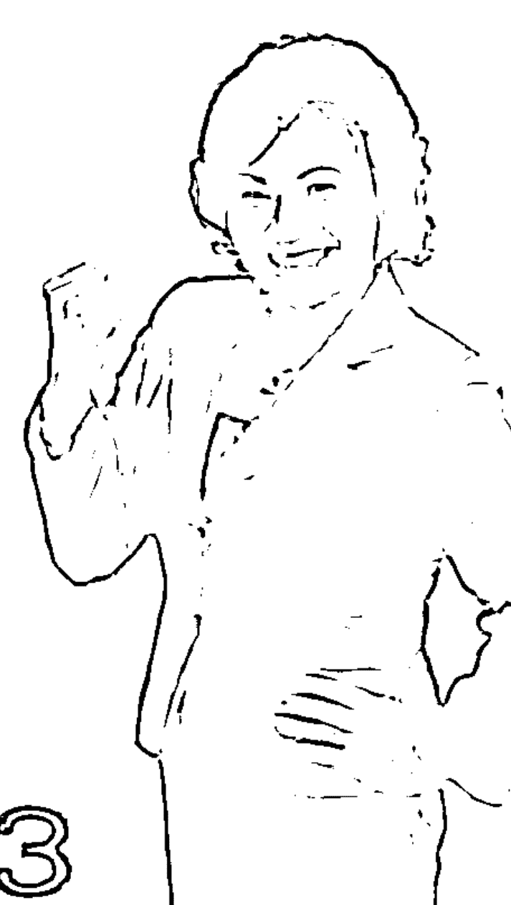

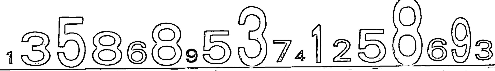

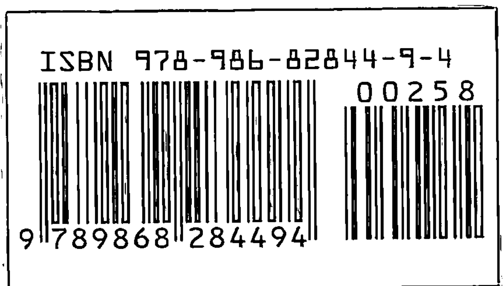

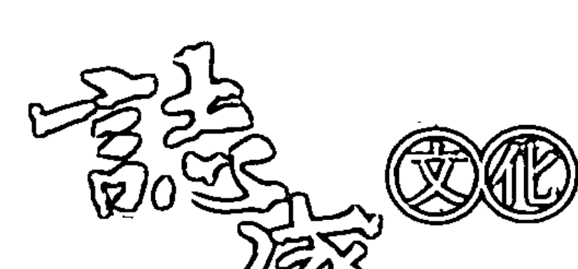

定價:NT 258元