# 開館人

# 紫微斗數 1

斗數高人廿年論命心得大披露

方外人。編著

# 開館人紫微斗數試讀

前言：

有人說紫微斗數易懂難精，以前我也這樣認為。但一經突破，方才發現其實不然。何以見得？試說明之！

紫微斗數的理則很簡單，它不外是：以星情斷吉凶、四化斷契機、卦位斷人事。

命宮之化曜（祿、權、科、忌）看心態、行為；官祿之化曜審吉凶禍福。命遷線為活動現象；父疾線主「運途」；兄友線看成就。

十二宮皆可為本宮，從而十二宮亦各有命遷線、父疾線、兄友線。各宮之成敗得失，皆以該宮的官祿（又稱第九位、氣數位）來決定。

上一級盤之化曜應於下級盤（如年對月），審跡象；下級盤之化曜入上一級盤（如月對年），斷吉凶，為陰陽合而數生。先審有跡象，而後論吉凶。

上下級命盤（命與限、限與年、年與月、月與日、日與時）之間如何交錯損益，雙綫交流，路綫搞通，則斷驗無不準。紫微斗數之底蘊如此而已，何必拜師「三冬五冬」！

學算命，要找一位高竿又肯放的明師，簡直可以說不可得！所以為什麼許多人學算命，幾經拜師以後，還是高山滾鼓——不通！不通！

不過這種明師難求的時代，已然成為過去。紫微斗數到方外人的時代，終見「濁水溪澄清」。我教算命一向不要學友發誓，我發誓，誓什麼？「知無不言，言無不盡！」

自古以來懂命理者，每都不肯輕易洩底。縱使說出去，也都刻意歪曲、保留，令人恍惚不明究竟，用意無非在自我標榜。終使命理學如一濁流，澄清無日！

向來教命理的老師，頗多是「蜜蜂的傳人」；老師是蜂王，學生為工蜂——長期供養者。

方外人不必再發願，『肯說』已獲得廣大同好的肯定。我不敢自許為『薪傳者』，惟願作吾同道之『指路人』。

『開館人紫微斗數』將一本過去的誠意，不炒回鍋肉，不熬『菜尾』，全部資料絕無片段抄襲坊間售書，或重抄過去已發表的資料，以充塞篇幅。設有引用他人資料之處，必說明出自何人大作；或有之將已介紹過的觀念，作更深入的探討，並一一舉命盤實例驗證說明。此外尚有早年收集的手抄秘笈，及個人獨見創獲的心得，務必洩底，絕不保留。

我敬命理，一向不讓好酒沉甕底，倒光！請盡！所以近年每在全省各地舉辦試聽，或純學術演講，頗受好評。與會學友有人說：『生平所僅見，最成功的一次演講。』『聽老師一次試聽，遠比在別地方補上三個月，所獲得的還要多。』『內容堪稱上乘之上乘，令人拍案叫絕，直呼棒極了！』上情句句真實，若有半點杜撰，方外人願受天譴。

# 編撰構想

紫微星有可能進入命盤之十二宮，命宮也可能進入命盤之十二宮，十二乘十二，產生一四四個命盤；命盤天干經五虎遁，復產生五種局數；陽男陰女大限順行，陰男陽女大限逆行，因此人類命型，可刻劃為：12×12×5×2＝1440 種命型。論命時再考慮出生地之坐標—地球之經緯度，及地理環境、民情風俗（民族性），及生年干系、月支系、時支系之副星，大體斷驗可以接近絕對。

換句話說「開館人紫微斗數」，將就人類命型，刻畫成一四四大係類，一、四四○命型逐一的講解，對命型心態、機遇作詳盡的敘述。同時為使內容更臻完整，將穿插論命時，所可能遇到的諸種問題底斷訣，舉實例說明之。

講授方法仍比照年初以來所舉辦之「紫微斗數擂台」一、二、三階段的辦法，每週寄發講義一冊。這一回計畫將每週編撰的資料，增為每冊九六頁，一階段五週次，註冊費壹仟元。預計全期分六階段講授完畢。

至於學友來信所詢問題，將另關「售後服務」專章討論，不另計價，免費解答。

# 紙上試聽

紫斗堂奧除前述之星情、四化、卦位之外，通常以官祿之化曜入本宮之三合方以定格局之高低；入父疾線審榮辱得失；入兄友線決成敗利弊。有關這方面的立論，我們已在「紫微斗數擂台」十五講裡詳加論述，在此不再贅言。

茲就上述之理則，試學實例加以驗證！

例：甲申年、九月、酉時生人，男命。

本造武貪在丑立命，酉時生人，命會昌曲，依一般之論斷，可成為相當有能力的政治人物，惟證諸事實，此間某政要為其親屬而已，其本人目前從事餐飲業，對政治絲毫不感興趣。

甲年生人，魁鉞入命遷線，武貪會魁鉞且左右夾，能成為大富翁，此亦為一般之說法；生年干甲使祿權科入三合方，為三奇佳會，也視為佳構。

其實際本造常年負債，祖遺之房地產變賣一空。為什麼？

星情只論吉凶，武貪守命不發少年，甲申年生人現年43歲，已屬中年。

| (官祿) 紫微七殺 己巳 天刑 | (奴僕) 庚午 | (遷移) 天鉞鈴星 辛未 | (疾厄) 地劫 壬申 |
|---|---|---|---|
| (田宅) 天機天梁 戊辰 | | | (財帛) 廉貞破軍天姚 (祿) (權) 癸酉 |
| (福德) 天相擎羊 丁卯 | 水局 | | (子女) 甲戌 |
| (父母) 太陽巨門右弼 (忌) 丙寅 祿存天馬天空 | (命宮) 武曲貪狼陀羅 (科) 丁丑 文昌文曲天魁 | (兄弟) 太陰天同左輔 丙子 | (夫妻) 天府火星 乙亥 |

命局左右夾，昌曲、魁鉞、祿權科齊會，視為好格局，絕對可以成立。但以今日之社會結構而言，職業自由，人人平等競爭，格局高並非即為好命。後天的努力，往往比命局好更具意義。

星情只是一部份而已，星要化始能變其質，質變而後顯象生。

本命的官祿宮（氣數位），已使武曲化祿入命，主工作有得做；同時文昌化忌也入命，官祿化忌入命表情勢所迫非做不可；祿忌同宮以雙忌論，更利害，好比牛被牽引，身不由己！出現在本命盤為一輩子的事。

生年干甲使太陽化忌入父母，表父早逝，酉時生太陽陷地更驗。生年忌在父母（文書宮），也表示本人累世的業障，使其失去光明。

父疾線主光明，兄友線主成就。官祿宮化出祿權科入此二線，主吉利，忌入為凶。

第二限陽男順行入父母位，大官庚使太陽化祿入本命的父母，顯象是這限很有光明。惟若考慮本命的星情組合「武貪不發少年」，即意味著青少年時代心性懵懂，武貪皆為財星，表一腦子要錢。本限有光明，充其量是伸手可以要得到錢，而不是勤奮好學。第二限為自我學習的階段，若不能積極好學，則終其生也就不足敬畏了。

第三限在卯，大官辛文昌化忌入命，非做不可，顯然開始在累；文昌為科星、貴人星，化忌表貴人有損。

第四限在辰，大官壬使武曲化忌入命，也是情勢所迫，非做不可，武曲為正財星，化忌表累在錢財。

第五限在巳，大官癸使貪狼化忌入命，依然是非做不可。

第六限在午，大官甲使太陽化忌入本命的父母（文書宮），主「光明失一，麻煩不免。

第七限在未，大官乙使太陰化忌入兄弟沖交友，主青黃不接，成就有損。

綜觀上述各端，本命盤星之組合顯示格局高，給人的感覺並非泛泛之輩，惟終其生除第二限頗為愜意之外，餘皆困窘不堪。從而可知單就星情論紫斗是不夠的，配合四化之運用，則更能精準的論斷契機，使論命更臻完盡。

# 論進財

一般論進財之兆，通常都以財帛之四化來斷，那是錯誤的，是缺乏求證的杜撰。

講財要化祿才管用。

財帛化祿入十二宮，不是用來看進財，是表示把錢用在什麼地方。茲試述個人之心得於次：

- 財祿入命—表有錢自己花用。
- 財祿入兄—錢花在家用（兄為田之財）。
- 財祿入夫—有錢就給配偶，配偶把錢放在家裡（夫妻為田宅的疾厄—一六共宗故）。
- 財祿入子—或投資大眾事業（股份、股票），或與人合夥，或投資在子女身上。
- 財帛自化祿—為大頭病，錢留不住，過路財神。
- 財祿入疾—有錢自己花，或投資生財之場屋、生財器具等。
- 財祿入遷─錢花在外面，用之於社會。
- 財祿入奴─為用於企業之營運，用於「上手」。
- 財祿入官─有錢就增資，或轉投資。
- 財祿入田─儲蓄、買進金飾、購置房地產。
- 財祿入福─很有得享，也有錢享。
- 財祿入父─為用於事業，或發員工薪資，或下包發放酬金（與祿入交友，同為用於事業，惟一用於上、一用於下，情形略有不同。）

審斷進財要以疾厄宮化祿來看：
疾厄為官祿的田宅；官祿為事業，事業的田宅即生財之場屋。因此從疾厄（生財之場屋）化出之祿才表示進財的宮位。

例如論流日，疾厄祿入夫妻、兄弟，主進財，頗為準驗。夫妻為田宅的第六位（一六共宗）故夫妻宮亦視同田宅；兄弟為田宅的財帛，對一個有謀生能力的人來說，此一公式表示今天人家把錢送上門來是不會錯的。

惟若你用這一項理則試推，而發現並不準驗，千萬不要一口否決掉。人事浩繁，每一個人獲得錢財的方法未盡相同，例如主婦的來財，有老公的薪水袋，有兒女孝敬的；老師給學生補習收學費；開館人給客人收潤金等，進財的路綫就有不同。上述的斷訣自然不能套用於任何命型。詳細的部份我們在「財官斷訣」「紫斗擂台」裡已作過剖析，日後將再作補述。

# 與名家談算命

初夏某日中午剛過，名家楚皇先生和黃師兄從台北來。我說：昨天老顧客來算命，一進門就嚷：「你可知道我今天為什麼來？」我推一下掌盤，流時在未，即以未宮之丁干使巨門化忌入田宅，於是我說：「田宅的問題」。

客說：「是！」流露出滿意的微笑。好一個是，給我不少信心，便接著說：「要搬了，不搬會有是非。」因巨門為口舌是非之星。

「對！廠房已被拍賣，要搬到那兒去？」

流時在未，丁干要我隔天去替他鑑定一下地理。

我跟楚皇和黃師兄說：「我如是斷，人家若也依樣畫葫蘆不一定會準，算命要有邏輯推理的頭腦，還要有靈氣，要掌握當時的契機。」

楚皇又聽我介紹了幾個觀念而後說：「你論命已達無訣的境界！」那怕是恭維的，我還是很愛聽。

我生來感覺敏銳，是因為命宮在子，巨門會陰煞之故。年初蔡明宏老師到新竹來，我們一群同好向他討教不少。蔡老師獲悉我是巨門會陰煞之後說：「說好的沒有，說壞的倒很準。」

聞言，我再硬著頭皮，以田宅宮的庚干天同化忌入子女，子女為田宅的對宮，因此答以：「要搬到對面，那裡有空地，附近有土地廟，在六百公尺之內。」

客極為興奮的說：「真仙！是在對面的山坡地物色了一處廠房，環境完全符合你說的。」並沒錯！我會斷命「準死人！」。

癸亥年仲夏斷一青年有血光，告訴他下月初一去捐血，或可解厄。二旬後消息傳來，青年被流氓誤殺致死。真是烏鴉嘴！

「紙上試聽」我們暫且說到這兒。行家比試，劍一出鞘，多少功力便見分曉，何必一定要過招三百回。

# 目 錄

- 開館人紫微斗數試讀
  - 前言
  - 編撰構想
  - 紙上試聽
  - 論進財
  - 與名家談算命

## 細說命譜

- 壹、諸星在子安命
  - 一、紫微在子安命
    - 甲年生人
    - 己年生人
    - 乙年生人
    - 庚年生人
    - 丙年生人
    - 觀念穿插
    - 辛年生人
    - 丁年生人
    - 壬年生人
    - 戊年生人

## 開館人紫微斗數(一)

# 開門見山說構想(代序)

## 觀念穿插

癸年生人

## 開館人紫微斗數(三)

紫微斗數的星王—命宮忌

五、天同太陰在子安命

- 甲年生人……一三三
- 乙年生人……一三五
- 丙年生人……一三七
- 丁年生人……一三九
- 戊年生人……一四一
- 己年生人……一四三
- 庚年生人……一四五
- 辛年生人……一四七
- 壬年生人……一四九
- 癸年生人……一五一

- 甲年生人……二一一
- 乙年生人……二一五
- 丙年生人……二一七
- 丁年生人……二一九
- 戊年生人……二二一
- 己年生人……二二三
- 庚年生人……二二五
- 辛年生人……二二七
- 壬年生人……二二九

附錄：學友通訊……一五三

排盤表……一六二

## 六、廉貞天相在子安命

- 甲年生人……一三八
- 乙年生人……一四一
- 丙年生人……一四三
- 丁年生人……一四五
- 戊年生人……一四七
- 己年生人……一四九
- 庚年生人……一五一
- 辛年生人……一五三
- 壬年生人……一五五
- 癸年生人……一五七

## 七、貪狼在子安命

- 甲年生人……一六七
- 乙年生人……一六九
- 丙年生人……一七一
- 丁年生人……一七三
- 戊年生人……一七五
- 己年生人……一七七
- 庚年生人……一七九
- 辛年生人……一八一
- 壬年生人……一八三
- 癸年生人……一八五

觀念穿插……一六四

方外人談客人求問一則……一八七

如何孕育智優男孩……一八七

## 開館人紫微斗數(四)

居室爲人倫之始（代序）

八、巨門在子安命

- 甲己年生人……一九四
- 乙庚年生人……一九五
- 丙辛年生人……一九九
- 丁壬年生人……二〇一
- 戊癸年生人……二〇三

九、天梁在子安命

- 甲己年生人……二〇五
- 乙庚年生人……二〇七
- 丙辛年生人……二〇九
- 丁壬年生人……二一一
- 戊癸年生人……二一三

- 甲己年生人……二一五
- 乙庚年生人……二一七
- 丙辛年生人……二一九

十、七殺在子安命

- 甲己年生人……三一九
- 乙庚年生人……三二一
- 丙辛年生人……三二三
- 丁壬年生人……三二五
- 戊癸年生人……三二七

十一、破軍在子安命

- 甲己年生人……三二九
- 乙庚年生人……三三一
- 丙辛年生人……三三三
- 丁壬年生人……三三五
- 戊癸年生人……三三七

- 甲己年生人……三三九
- 乙庚年生人……三四一
- 丙辛年生人……三四三
- 丁壬年生人……三四五
- 戊癸年生人……三四七

- 戊癸年生人……三四九

## 如何生育資賦優異的子女

## 學友通訊

## 開館人紫微斗數(五)

子女優劣以孕婦心理為最（代序）

十二、安命在子無主星

甲己年生人

乙庚年生人

丙辛年生人

丁壬年生人

戊癸年生人

## 從命盤看遺傳因緣

例一

例二

例三

## 諸星在十二宮安命之差異

方外人的話

細說乙級星

地空星

地劫星

台輔星

封誥星

天刑星

天姚星

解神星

23

- 天巫星 ………… 四三三
- 天月星 ………… 四三三
- 陰煞星 ………… 四三三
- 三台與八座 ……… 四三五
- 恩光星 ………… 四三七
- 天貴星 ………… 四三八
- 天官星 ………… 四四〇
- 天福星 ………… 四四一
- 天馬星 ………… 四四一
- 大耗星 ………… 四四四
- 天空星 ………… 四四五
- 天哭與天虛 ……… 四四六
- 龍池與鳳閣 ……… 四四八
- 紅鸞與天喜 ……… 四四九

- 孤辰與寡宿 ……… 四五一
- 蜚廉星 ………… 四五二
- 破碎星 ………… 四五三
- 華蓋星 ………… 四五三
- 咸池星 ………… 四五四
- 天德星 ………… 四五五
- 月德星 ………… 四五六
- 天才星 ………… 四五六
- 天壽星 ………… 四五六
- 天廚星 ………… 四五七
- 八字年柱起冬至或立春解說 …… 四七〇

## 開館人紫微斗數（一）

## 開門見山說構想（代序）

坊間紫微斗數的書籍，可約略區分為二種形態，一種是供初學者用的，我們姑且稱其為「概念式」；另一種具研究性質的，稱其為「遊擊式」，因缺乏通盤的介紹。前此公開的「方外人細說紫微斗數」，兼具上述兩種形態，仍不夠完璧。「開館人紫微斗數」將就人類命型區劃為一四四大係類，乘十天干，成一四四○命型，如老祖母細數家珍一般地細細道來，但願有助於同好參研。

## 細說命譜

壹、諸星在子安命

我無意一輩子靠命理討生活。所作的努力，是希望廿年研究命理的心血不致填溝壑！大約再花一年的時間，可以把所知的紫斗介紹清楚。我亦無心在五術界與人爭一席之地，待工作完成後，將隨老僧修行去。

年來有同道的朋友在罵我，管他是妒賢或酸葡萄，我都合十稱唸：「大德慈悲」。我命宮在子巨門守，命遷三方七煞齊會，吉星一個也不見。這說明了任何一項成就，都必須經過「一番寒徹骨」！罵我的人意在損我，但他那裡知道反而成就了我。我怎麼不為此心生感激，會心微笑。

## 下列月、時生人安命在子：

正月寅時、二月卯時、三月辰時、四月巳時、五月午時、六月未時、七月申時、八月酉時、九月戌時、十月亥時、十一月子時、十二月丑時。

命宮在子：兄弟在亥、夫妻在戌、子女在酉、財帛在申、疾厄在未、遷移在午、交友在巳、官祿在辰、田宅在卯、福德在寅、父母在丑。茲就十二宮在支之通性，概述於次：

命宮在子—大抵一生中很不安定，性情上看似浮露，惟處事頗為理智。

兄弟在亥—兄弟間淡如陌路，不期望獲得親情的慰藉，只顧自己求發展。

夫妻在戌—婚姻美滿，彼此能以禮相待，家庭充滿和樂的氣氛。

子女在酉—與子女間相處不很愉快，因子女有強烈的叛逆性，感情很冷淡。

財帛在申—顧此失彼，這邊認真賺進，那邊莫名其妙流失，永遠是過路財神。

疾厄在未—肝臟機能欠佳，因此常感疲勞，其次是胰臟的問題，是晚年糖尿病的來源。

遷移在午─遷移事頗具戲劇性，往往很情緒化的迅速作了決定。

交友在巳─很有人緣，本身也很懂禮貌，在朋友群中，被視為代表人物。

官祿在辰─可從事教育、宗教一類的工作，或礦業、介紹業等工作。

田宅在卯─可以有自己名下的房地產，但數量不多。胃口大者不容易滿足。

福德在寅─一生悠然自得，無憂無慮，為人大方、灑脫、不與人計較。

父母在丑─與雙親感情深厚、融洽，雖不免有代溝，但無礙於彼此間的感情。

## 一、紫微在子安命

命宮在子紫微坐守

紫微在子安命，個性獨立，脾氣暴躁。因係獨立，所以格外喜會六吉星。子宮的紫微不可能左右夾，只可能與左輔、右弼之一同宮。正因為如此，所以即使是六吉相輔，也嫌力量不足，如是不免雄心萬丈，而壯志難酬。若無吉星來會，而會煞星，則空有一肚子理想，卻無力實踐。不肯耕耘只期收穫，自不免牢騷滿腹，懷才不遇。

兄弟在亥天機坐守兄弟不多，感情不和，心志不一。但其中必有對學術研究有興趣而且很有成就者。加吉可望感情好，加殺有剋。

夫妻在戌七殺坐守七殺守夫妻宮，無論男女命，在感情生活方面都非常不順利。對方對家庭不甚關心，一心熱衷事業。加煞二次婚姻，加吉晚有剋。

女命丈夫十分頑固，亂發脾氣，足令人生畏，凡事不講情理。男命妻子精明厲害，眼大、顴骨高、神經質，經不起考驗，想自殺。

子女在酉陽梁坐守子女活動力很強，家庭中充滿活潑的朝氣。子女從小即能獨立處理自己的切身事務，不需父母操心，長成具有領導統御的能力。只是酉宮的太陽不甚得力，男子恐將懷才不遇，惟子女以孝順者居多，尤其女兒心向著娘家，晚年能得孝養。

財帛在申武相坐守

武曲為正財星，居財帛一生錢財不虞匱乏。多半為實業界的鉅子，握有極大的權勢，無論從政或從事財經企業，都擁有相當的耐力。出生豪門，一生與錢財結緣。會天相有貴人相助而成家立業，因喜結交上流人物，故可獲得政治家的援助而成為富翁。

加火鈴多浪費，財來財去；加羊陀為窮人；加空劫會破產；加左右、昌曲、魁鉞、祿馬，一生富豪，錢財不必擔心。

疾厄在未同巨坐守

天同臨疾厄一生少病，容易罹患的疾病為胃腸。巨門同宮主精神不正常，言語無度，行為詭異多端。加煞胃腸、耳疾、心臟血壓、神經系統，宜留意。

遷移在午貪狼坐守

喜好刺激性、變化性的人生，時刻都忙於奔波應酬，喜歡接近熱鬧的地方。在鬧區雖然不免於勞碌，但可以有發財的機會。

交友在巳太陰坐守
太陰臨交友，最容易和異性發生忘年之愛，事實上交友宮持太陰者也比較容易和異性相處，巳宮的太陰不得力，朋友、部下平庸無助。

官祿在辰廉府坐守
廉貞臨官祿即成官祿主，最能表現它的特性，富變化，能適應時代需求，從事政治、外交、行政工作很能稱職，適當的表露自己的才華。天府同宮在辰，不僅職位高，有實權，而且收入豐厚，加吉財官雙美；加左輔高級主官；加六煞職業不安定。

田宅在卯無正星
借對宮陽梁來照，不動產由多變少，加吉能保留一些，加煞不動產賣光。

福德在寅破軍坐守
破軍臨於福德終生奔忙，日日煩躁，心理上無法平靜，且有短命之虞。

父母在丑無正星
對宮同巨來照，表與父母感情較疏，偶有家庭爭執糾紛。

### 【甲年生人】

一般說紫微在子安命，甲己庚年生人較吉，真會是這樣嗎？茲試述於次：

生年干甲，化科、祿入財、官。生年四化為先天，祿、科入三合方，只能說「好看頭」。

家庭和樂而後可以安心工作。財為養命之源，財從事業來，若不能安心工作，等於生活沒有保障。

紫微在子，夫妻一定是七殺。七殺的夫妻本來就會吵架，加殺二次婚姻；會吉晚剋，配偶先死。

甲年生人命宮干丙，使廉貞化忌沖夫妻。我沖誰，表跟誰無緣。命宮為我，沖夫妻表與配偶無緣。廉貞是囚星化忌還可能有牢獄之災。從命宮化出者，表由於自己的懵懂所招惹。

| (奴僕) 太陰 己巳 | (遷移) 貪狼 庚午 | (疾厄) 天同 巨門 辛未 | (財帛) 武曲 天相 壬申 |
|---|---|---|---|
| (官祿) 廉貞 天府 戊辰 | | | (子女) 太陽 天梁 癸酉 |
| (田宅) 丁卯 | | | (夫妻) 七殺 甲戌 |
| (福德) 破軍 丙寅 | (父母) 丁丑 | (命宮) 紫微 丙子 | (兄弟) 天機 乙亥 |

夫妻宮甲，使太陽化忌沖田宅。太陽代表男人，如果是男命，一結婚表示與夫妻宮相應，甲干開始工作，不就是一結婚就倒霉（太陽化忌），夫沖我田宅，表配偶與我家無緣，這種情況，只好入贅妻家囉！紫微是帝王星，讓皇帝到外邦去和番，可能嗎？如果是女命，那還差不多。

但話說回來，女命坐紫微，不免奪夫權。值得安慰的是：可能被譽為女強人。「凡觀女命先看夫子二宮，次看福德。」夫妻殺破狼，為開創的格局，什麼事不好開創，開創老公!?

子女宮癸，使貪狼化忌沖命。誰沖我，表誰讓我累；子女沖命為子女使我很累。怎麼說「較好」！

福德為夫妻的事業，丙廉貞化忌沖夫妻，夫妻為田宅的第六位，依一六共宗的理則，六受沖則死一，亦即疾厄受沖，本宮難保。（此一觀念，在同步斷訣中已詳加論述，在此不贅。）如今夫妻宮受沖，視同田宅受沖，杜鵑沒有窩，不就要夜夜啼！

以上我們概略的一起探討了命宮、夫妻、子女、田宅，這幾個與組成小家庭有關的宮位，其次我們再一路從財帛宮起，反時鐘方向，逐宮地砌磋。財帛宮坐武相。從何宮化祿進來，表示錢財從那裡賺進。本式交友宮己使武曲化祿入財帛，武曲為正財星，為穩定的收入。交友是官祿的父母，為事業的上司，宜上班族或衛星工廠、代工之類。財帛宮壬使武曲自化忌，表所得守不牢，過路財神。

疾厄宮同巨的組合，兩顆星要同時考慮（詳情參照前述疾厄條）。
命宮丙化祿入疾厄，表過份關心自己，可能患得患失—疑心病。
遷移宮持貪狼，戲、食、色之星，庚干天同化忌沖父母，表出門有酒食，因此惹麻煩。
交友在巳，巳亥線主浪蕩，表示人緣很不錯，容易結交異性朋友。太陰獨坐在交友，更是容易和異性發生忘年之愛。若為卯、酉時生人，昌曲在父疾線，已使文曲化忌入此線，將因交友、桃花而惹事生非。另一方面交友己武曲化祿入財帛，為桃花帶財來。或說朋友能助我生財。
官祿宮持廉府，廉貞星臨事業的男性，對職業很能專注，有敬業精神，對工作很有耐力，能不屈不撓的獨當一面，宜上班族，女性宜工藝。天府的特性是缺乏獨創的能力，能適應環境，大多接受長者的提攜，從事安定的工作，如服公職或開小店。對工作自得自在，不與人爭名逐利。廉府兩星在官祿的組合，可以說是一種中庸型，能衝刺，也能守成。
河洛紫微斗數斷行業，是以財帛宮的天干，化祿、權、科、忌入我宮來決定，本式財帛壬紫微化權入命，紫微為高級的、珍貴的行業。

田宅無正星，表出生地之住宅空地很大。丁干使巨門化忌入疾厄沖父母（文書宮），巨門化忌就是活見鬼，倒霉事往往是莫須有的。田宅為家庭、房地產，巨門為暗星，化忌沖文書宮，可能因房地產事，莫名其妙生是非。

福德宮坐破軍，表一生奔忙，雖然不眠不休日夜辛勤，也不見起色，心裡煩躁，無法平靜。

父母宮丁干化祿科入兄友線，兄友線為成就線，也是官祿的父疾線（與光明有關），表能得到長輩的提攜而獲得成就。這種成就是表現在人與事上面，對錢財方面卻有損無利，原因是丁巨門化忌入疾厄，疾厄為財帛的兄弟，兄弟位主成就，忌入表對成就有損。

個人的成就以人、財、事為最重要，也就是命財官，次及六親。為什麼？

一個人若沒有成就，很可能妻離子散，故命盤以命財官為最重要，至少男命是如此。

今茲就命財官三項再作一探究：

成就可分三方面來說，一為人格的昇華，一為事業的成就，一為財富的積聚。斷此三項，需各以該宮為本位，以各該宮之第九位，亦稱氣數位，就其干所化之祿、權、科、忌相應之情形來決定。（此項理則在「紫微斗數播台」十五集裡已詳加論述）。

本式官祿宮戊使天機化忌入兄弟，沖交友。兄弟為成就位，忌入表沒有成就，沖交友為青黃不接，主所從事的工作有季節性，非常年看好的行業。命宮代表人，由其氣數位化出之忌沖交友，交友為事業的上司，引伸為事業主，沖表示跟他無緣，這種命式，所遇到的老板，往往是工作了一些時候，老板就維持不下去，情勢所迫非要另謀發展不可。

財帛宮以其第九位（命宮）的天干去四化，丙天同化祿入疾厄，疾厄為財帛的兄弟，兄弟位主成就，表其人在錢財方面有成就。

官祿宮以其第九位（財帛宮）的天干去四化，壬使天梁化祿入子女，子女爲官祿的交友，兄弟綫爲成就綫，祿入表事業有成。

以上我們綜合的來說，本式宜走財經、建設路綫（建設非指營造業，凡一切開發性質的工作皆屬之。）較具發展性，不宜走名的路綫，因官祿化忌入兄弟，表其人之社會評價必差，故若走文教、政治路綫，必然不能有爲。

論行運：就財官而言，要考慮命、財、官，三宮所化之忌，入何大限之父疾綫，表該限必然有事。過去一般言忌都說「坐忌不好，冲更凶。」但我的發現是「忌與冲要入父疾綫才以凶論。」這一點在「擂台」裡有過詳細的剖析。

本式最致命的是：命宮丙廉貞化忌入官祿冲夫妻丨死亡點。當大限入子田綫的時候，忌入的宮位成爲大限的父疾綫，倒黴就在這個限，發生在那一年，因命宮爲財帛的官祿，故事端與錢財有關。既然與錢財有關，那麼冲宮入流年的財帛、田宅，致命就在這一年，流年與大限重疊的時候，尚有餘波。

若論事業之行運，以官祿的氣數位（財帛）去四化，本式財帛壬武曲自化忌，只是財守不牢，對事業還不致構成重大傷害。

論人的機遇，要審官祿之四化。本式官祿戊天機化忌入兄弟沖交友，這只是青黃不接，還不致失業、倒店。前述之命宮化忌沖夫妻死亡點，才是會失業、倒店的格局。

那麼論行運，青黃不接應在什麼時候？

同理忌入的宮位，成為大限的父疾線，流年走到沖宮時，或沖宮成為流官或流疾時，比較嚴重。其理趣在什麼地方？

命代表我，流年入沖宮，表青黃不接的現象，與我相應產生關係之故。

又沖宮成為流官時，官為我之事業，表這一年事業青黃不接。

疾厄為官祿的田宅，為我工作的地方，生財之場屋。生財之場屋受沖，也表示青黃不接發生在這一年。

上述情況限、年逢，千萬要保守，逞強不得。沒事到渭水找姜老釣魚去！

### 【己年生人】

生年祿入財帛，權入遷移照命。依古書的說法叫「吉星佳會」，如今一般坊間售書也人云亦云的說「紫微在子安命，甲己庚年生人較吉。」不過我的心得是：生年四化是顯示先天命格，是父母所生，應是與祖德有關。生年祿入財帛，顯示命中註定一生錢財看好，權入遷移表出外可掌權。古代社會型態較少變化，今日社會一日千里變幻莫測，人人皆須憑本事與人爭分秒。要想靠祖蔭安享一輩子，事實已不可能。所以我呼籲：不要一直在故人的紙堆裡因循不前，我們要就今日之社會型態，重新立象。

十二宮的四化，我認為是後天的行為表現與因緣際遇，較優於生年四化。五年以前，一般論四化，幾乎都是強調生年四化較強，命宮四化為次；去年我聽過中和周清和老師（已去逝）的錄音帶，他說生年四化和命宮四化一視同仁，作用相同，力量相同。今天我說在此均富的社會政策，人人平等自由，凡人皆可在同一平等的立足點上，自由競爭發展，從而個人後天的行為表現，當重於祖先的庇蔭。所以主後天行為際遇的十二宮四化，要特別予以重視，先天四化姑且聊備一格，不必為它大作文章。千古一律人云亦云，說：什麼格局，某某年生人較吉。……就以本式來說：生年祿在財帛，又逢財帛宮自化忌，這種情況不能以祿忌同宮為雙忌論，這是二碼事。

| (財帛) 武曲 天相 祿 壬申 | (疾厄) 天同 巨門 辛未 | (遷移) 貪狼 權 庚午 | (交友) 太陰 己巳 |
|---|---|---|---|
| (子女) 太陽 天梁 科 癸酉 | | | (官祿) 廉貞 天府 戊辰 |
| (夫妻) 七殺 甲戌 | | | (田宅) 丁卯 |
| (兄弟) 天機 乙亥 | (命宮) 紫微 丙子 | (父母) 丁丑 | (福德) 破軍 丙寅 |

生年祿在財帛，表一生錢財看好；自化忌出為財守不牢。以今日之社會型態來說，好比過氣的土財主，從阿公時代遺留下來的田地，被耕者有其田處分掉了，換算回來的金錢，轉投資於事業，結果不善經營，反倒高築債台；或實業家，關係企業多所，真是「好看頭」，但其實際負債大於資產，造成騎虎難下之勢。

就以生年化權入遷移，謂之入四正位，表在外可掌權。古代的階級社會，在位者可掌權，下屬只有唯命是從。今日社會講平等，在位者需服務更多，而不是用來發號施令。權星在遷移，表出門多爭，而非掌權，背地裡人家還是不能心服。

綜上所說，古書所謂：紫微安命在子，甲己庚年生人較吉，實不能苟同，不是很清楚了嗎！

個人另有一項心得：凡生年干為己或辛，或三合方有己或辛，一生必然「才名受損」。
從民61～71，我經營整十年的補習班。學生能通過考試，榜上有名，是我的榮耀。由於職業上的習慣，很自然的會去關心學生的成就，從而會仔細的去研究他們的命盤，常年經驗的累積，終於有此領悟。
昌曲是證書星，不管落在什麼宮位，逢辛、己必然化忌。昌曲化忌為證書死，縱使才高八斗，也不能揚名於當世，所以說「才名受損」！
若立命在子午，卯酉時生人，昌曲在父疾綫，逢辛、己使昌曲化忌，這種人我稱他為「天才牧童」。昌曲入父疾為遺傳優異，天生有腦筋，化忌為懵懂，不知善用自己的天份，這一點絕對正確。從一個懂命理的文教工作者歷練出來的觀念，當然可信度可靠。請放心鐵口論斷！
那麼甲、己年生人，其十二宮之天干完全一致，一生之格調，行限之起伏（以下或稱「運波」）大致相同。所不同者，年干系之魁鉞星所落宮位

### 【乙年生人】

生年祿入兄弟，表生來人緣好。

生年權入子女，表子女不聽話。

生年科入命宮，表名聲好，人們對我的評估，遠比實際的成就為大。

生年忌在交友，表朋友不可靠，不能得到朋友的助力、恩惠。

※生年四化的先天命格造化，命宮四化為後天行為際遇。務請牢記。

命宮戊貪狼化祿入遷移，為一腦子想往外跑。

跑出去做什麼？要考慮星情，貪狼為桃花星，與食色有關。

命宮戊太陰化權入交友，表把權交給朋友，朋友一經交上，即對朋友死心踏地，有求必應，若為女命，容易吃虧上當。

命宮戊右弼化科，若為二月生人，科星入子女宮，可以肯定的說，會跟二個異性生小孩。

命宮戊天機化忌入兄弟，表對兄弟關心有，但煩心，說話不好聽，沖交友，表跟朋友無緣。

那麼生年祿入兄弟，為生來人緣好，命宮忌也入兄弟沖交友，又為與朋友無緣，怎麼解？

從不同天干化出的祿忌會於同宮，不以雙忌論，主兩種情況同時存在，應解為「你兄我弟」，結交無非是酒肉朋友，現實、不牢靠、不長久。

論人：以官祿之化曜定吉凶。

官祿化忌入疾厄沖父母，表一生是非麻煩多，惟乙年生人三方會魁鉞，主貴人尚有，惟不可能有聲望。

論事：以官祿的官祿，亦即財帛宮之化曜去定吉凶。財帛甲干，使太陽化忌入子女沖田宅，田宅為官祿的兄弟，沖則主事業無成。

論財：以財帛的官祿，亦即命宮干之化曜以決吉凶。命宮化祿入財帛的夫妻（遷移），權入財帛的子女（交友），就本命盤的財帛宮來說，較無效應。因即非財帛的三合方，也不是財帛的父疾綫、兄友綫。惟此祿權所入的宮位，成為大財的三合方時，則顯示此限錢財格調高。錢財格調高是很讓人瞧得起，人家以為他有錢，並非一定很賺錢。若此祿權入大財的父疾綫時，主錢財無風險；入大財的兄友綫時，則主錢財有成就。若為二月生人，右弼在子女位，此子女位為財帛的父母（主光明），命宮干戊右弼化科入財之父，則主一生錢財有光明，無風險。

綜觀本式，就人、事、財三方面，以走財的路綫較為平坦，想成就大事業或走名的路綫，則免談。

### 【庚年生人】

生年祿入子女為好色，疼子女；祿照田宅，也表照顧家庭。生年權入財帛，且是武曲正財星化權，表一生可掌財權，如會計主任職，或從事金融業之經理人員。財帛宮甲武曲自化科出，表能量入為出，或錢財失去了會「看破」。

生年科入交友，表朋友是我的貴人，結交的朋友溫文隨和。交友也是夫妻的疾厄，科入表配偶婚前曾與人花前月下，被擁吻過，但會是完璧。

生年天同化忌在疾厄，表有宿疾，為腎機能不健康，夜尿頻頻。此與生年祿入子女為好色當有關連。

論財路：疾厄（事業的田宅）癸破軍化祿入福德。破軍為耗星，化祿是財來財去。

論財，要財星化祿才有力。若非財星化祿，表看似風光而已。

疾厄祿入福德較無力，以祿入父母、兄弟兩宮最好。惟上天有好生之德，沒有命還有限，沒有限還有年，沒有年還有月，沒有月還有日、時。命有終生吉慶，限逢風光一時。若命歹又不逢時，至少還有年、月、日、時可用。故俗有：「一支草，一點露」「乞丐也有三年好光景」之說。愁什麼！？

### 【丙年生人】

生年祿入疾厄，應屬身材肥胖，惟命宮干庚亦使天同化忌入疾厄，則為壯型（非健壯）。

命宮忌入疾厄，除了表示會有宿疾之外，也說明了將因自己的行為而惹麻煩，因忌入疾厄沖父母文書宮之故，若順行運入父母宮時，表這一限麻煩多。惟天同為福星較不畏化忌，若為昌曲、廉貞化忌則以凶論。本式倘為酉時生人，文昌化科入父母，表父母長輩是我的貴人，當可幫我化解麻煩。

命宮庚太陽化祿入子女，命宮之四化不入夫妻而直入子女，一般為有桃花，惟祿是情，想而已，並非一定會發生。紫貪子午卯酉，好比紂王與妲己，很少沒有桃花的。更何況命化祿入子女，應是可以確定桃花必定會發生。惟若天刑入命者，能自律，倘及早接近佛道，是也可解。

命宮武曲化權入財帛，表喜掌財權。

命宮太陰化科入交友，表對朋友隨和好商量，所以是朋友的貴人。太陰在交友，結交的朋友中，頗多小白臉、娘娘腔；也有財務狀況不很好的朋友，原因是太陰財星在巳為陷地之故。

本式官祿的氣數位（財帛），丙廉貞（囚星）化忌入官祿沖夫妻（死亡點），當大限或大官入子田綫，流年入福德（寅宮）沖宮成為流年的財帛，將因錢財事導致官訟是非；流年入疾厄（未宮），沖宮成為流年的田宅，很可能有牢獄之災。

上情之造因，乃因不自量力，借貸投資，不堪利息之壓力的結果。

財帛丙廉貞化忌入官祿為借貸投資；官祿壬武曲化忌入財帛，也表示借貸投資。財忌入官，官亦忌入財，互交忌星，意味著事業與錢財糾纏不休。

借貸投資的含義：除向金融機構貸款，及借用民間高利貸之外，開出超過存款額的支票，也視為借貸投資，他如簽帳進貨亦屬之。

## 觀念穿插

生年有四化，十二宮也各有四化，限、年、月、日、時也有四化。四化何其多，對之有如置身蝴蝶谷，令人眼花撩亂，莫能辨其種別。其實它的理則很單純：物以類聚，同類之陽逢同類之陰，則互為媾合而生數。「羅漢腳」再怎麼急著想成家，也不可能去拜託猩猩幫他生兒子。同理可以理解，命盤猶如人倫，恆有一定的秩序，一陰一陽各有所屬，能明其章法，自可遊刃有餘。

### 【辛年生人】

前式談到財帛與官祿互交忌星為借貸投資，事業與錢財不甚糾纏乙節，辛年生人與丙年生人十二宮天干相同，故也有其雷同的地方。

借貸投資到底從什麼地方吸收銀錢，就看從那一宮化祿入財帛。若就原命盤來看，財帛宮天相不化祿，武曲由兄弟宮的己干化祿入財帛，表財由此來。

兄弟宮所代表的六親有：母親、兄弟、岳父（公公）；兄弟為交友的遷移，所以也可能是朋友出來的時候，向他商量借貸。

本式設為卯時生人，文曲在疾厄，兄弟己干使之化忌入疾厄沖父母，一祿一忌成隔宮，為「相欠債」，表兄弟、母親、配偶之父對我的幫忙，勢成越幫越忙，終至損及我的光明。

設為巳時生人，文曲在子女，子女為財帛的父母，子田線就財而言，主與財之「運途」有關。

兄弟己干武曲化祿入財帛，文曲化忌入子女，成為隔宮，也顯示「相欠債」。

所謂「相欠債」，看從什麼宮位化來，則表示該宮欠我，他將為我而蒙受損失。

兄弟化祿入財帛，化忌入財帛的父母，主兄弟支援的錢財，反而給我帶來麻煩。這般說法似乎有違情理，但就今日之社會而言，實不乏其例。如兄弟貸我資金，助我創業，結果事業越做越離譜，終至破財倒店。

就本式而論，若以配偶名義創業，讓配偶站在第一線，自己為幕後老闆，將較為妥善。如何證實？

命宮庚干化祿入子女，表「疼子兼顧家」，子女為夫妻的兄弟，兄弟主成就，命宮化祿入夫妻的兄弟，表我成就配偶，若為女命，當更有意思。

本式尚有值得一提者——

子女丁干太陰化祿入官祿的父母，科入兄弟宮，表示子女是我事業的貴人，能給我的事業帶來光明，成就我。子女宮也代表學生、徒弟，故若培養學徒幫我生財，也是一條頗為可行的道路。

另一方面子女丁使天同化權入疾厄，為子女關照我的身體，巨門化忌也入疾厄，則表子女為我的身體生煩。干丁化忌為活見鬼，化忌沖我父母宮，也表示子女將帶給我莫須有的麻煩。此麻煩發生在什麼時候？當大限入官祿，沖宮成為大限的子女，流年行抵沖宮時，為最應驗的年限。

### 【丁年生人】

命宮壬天梁化祿入財之父母，主錢財無風險，也是疼愛子女、好色。武曲化忌入財，命宮忌為癡情忌，忌入財帛，表對錢財癡情，故而不免吝嗇。忌入財則沖福德，此一沖除表示捨不得吃喝玩樂之外，也表示與子女相處並不很愉快，或緣薄，不常生活在一起。原因是福德為子女的交友，從我命宮化忌沖子女之交友，表我與子女之交誼無緣，因此謂之緣薄，或相處不愉快。

命宮化祿入子女為疼愛子女，忌沖子女的交友又為緣薄，如何解？

祿是情，只是想，可能的情況是常惦記著子女，沖其交友則不容易生活在一起。

論人，以命宮為體，以官祿為用。官祿甲干使太陽化忌入子女沖田宅，表一生倒楣事必與田宅有關。田宅所主包含：財庫、房地產、家族，不幸遭遇與這些有牽連。

論事，以官祿為體，以財帛為用。財帛戊太陰化權入官祿的父母，表認真打拼事業可以有成就；另一方面，財帛戊干使天機化忌入兄弟（官祿的疾厄），沖官祿的父母；如此一來則表示爭來的成就，到最後還會失去。

論物；以財帛為體，以命宮為用，這一項前面經已談過，就不再贅語。

### 【壬年生人】

命沒有絕對，即在陰陽五行中，就是有消長。試就本式一探得失！

疾厄（生財的場屋）丁太陰化祿入交友，順行運大限入福德，祿入的宮位成為大限的田宅，田宅為財之庫，生財的場屋化祿入財庫位，不是能有節餘嗎！？

惟若同時再考慮其他條件，官祿甲太陽（光明之星）化忌沖田宅，沖宮成為大限的父母，此時大父與本田重疊，顯示將有田宅（財庫）方面的是非。

若再審大限的疾厄，己武曲化祿入本命的財帛，限化入命主十年，又表示此一限財運頗為看好。

綜上各情，此限在動盪中生財，官訟是非不免，耗損破財也不可避免。

若就星情而論，大限走殺破狼，主開創，不一定發大財，破軍為耗星，縱使賺錢也少不得財來財去。大限的田宅守太陰在巳為陷地，也表財庫的守護神力量微弱。

### 【戊年生人】

生年祿入遷移，表好處在外頭，出外有貴人「賺有吃」。惟財從何處來？通常我是看誰化祿入財帛。本式疾厄己武曲化祿入財帛，以前我的老師說：「疾厄祿入財帛為用身體去賺錢，是為苦力，女命風月場中人。」但年來我一直強調疾厄為生財的場屋，為工廠、商店、辦公處所；疾厄為我宮，財帛也是我宮，從我宮祿入我宮，表示我能自力更生，我不是吃軟飯的。代客論命時遇疾厄祿入財，實不必硬把客人看得太賤，每張命盤皆有其可歌之處，吾黨何妨擇其優異處，給予適當的鼓勵。

算命什麼叫作高？能令失敗者不再灰心；荒唐者不再懵懂。鐵口什麼？多少鐵口自己損得莫名其妙！這種例子很多吧！

命宮甲廉貞化祿入官祿，表對事業用心；權入福德為對享受事海派；科入財帛表對錢財不過份執著，過得去就好；忌入子女沖田宅，經常在外活動。

## 觀念穿插

命宮所化出的祿忌，通常我如是解：命為精神生命，為意志之樞機所在。人類每有所動，必也尋求那最具有利者，此為人情之常；惟亦可能由於個性使然，對某事終身執著，情願為之吃苦受難者，此從命宮所化之祿忌可見一斑。

命宮祿為自由、豪放的意志；忌為執著、想不開之僻性。人類秉陰陽二氣所生，必也正負兼具，猶如吾人理智與感情，隨時皆在消長之間此起彼落。因此命宮所化之祿為我所欲之情，具伸縮性，「心猿意馬」「三心二意」都是「情」字的形容詞；忌則為終身信守，海枯石爛不渝之性。

探究了祿忌的含義：祿為我所欲之情，忌為我所執之性而後，茲就本式再作一伸述：

命祿入官，為把心思放在事業上，心思為可變的，因此對事業多所設想。忌入子女沖田宅，子女為生殖位，忌在子女表為色性操勞，人非農場的種豬，終生對色性執著，那還能成什麼好事。忌好比鼠屎，往往會壞一鍋粥。命祿入官，忌入子，是什麼體統？在賓館會情侶，卻滿腦子想「頭路」成嗎！？

子女又為夫妻的兄弟，兄弟為床位，命忌入子，表夫妻的床位有是非。人類有一種補償的心理作用，「這溪無魚，別溪釣。」夫妻不圓滿往往外求很尋常。

命忌入子女，斗數命家以桃花論。一般的說法是：夫妻為老大，逆去子女爲老二、財帛爲老三……。古代的帝王三十六宮七十二院，共一〇八，和斗數的星一樣多。宮有十二，要用九才能整除一〇八，不就要在斗數盤上繞行九圈，眞會昏頭轉向。不要信那麼多，子女宮不代表老二，看桃花永遠以命宮和交友二宮爲主，這一觀念，以前在「擂台」裡已經介紹過，在此從略。

命爲財之氣數位，命忌入子女爲忌入財帛的父母，主錢財麻煩多，不可與人合夥、來會、作保。沖田宅，爲沖財帛的第六位（疾厄），沖六則一死，所以沖田宅叫破庫。

田宅又爲夫妻的交友，交友宮受沖爲青黃不接，夫妻事青黃不接，自然失之桑田要取之東繳。

### 【癸年生人】

前式交友生年戊太陰化權，表配偶是二手貨。本式癸干太陰化科入交友，則是配偶被擁吻過，怎麼解？如果所交的女朋友是「純綿的」，遇到自己命盤權科入交友，乾脆婚前先下手，這檔事請人先代勞可不是滋味。洞房花燭夜，明知新婚已不純，但那一「狼」是自己也就「免怨嘆」。

生年祿在福德，表祖德不錯，很有得享，賺錢的機運也很不錯。前式和本式宮干相同，我們談過命忌入子沖田為破庫，和這裡所謂「賺錢機運不錯」，看似矛盾。請不要一看到忌，就談虎色變，上天有好生之德，不可讓你累一輩子。本命盤化忌應於大限，凶象只有一年，如果事先知所趨避，不逞強賭命，根本可以安然過關。

應在那一年？當大限入財福綫，流年入子位，沖宮卯位成為流年的田宅，或流年入未宮，沖宮成為流年的財帛，銀根較為緊縮而已。

## 二、天機在子安命

命宮在子天機坐守

天機在子為入廟獨坐，能將天機的特性表露無遺。天機為智慧之星，善計謀策劃。對宮巨門也是吉利的宮位，若巨門化科祿權，對天機幫助更大。無論男女皆主很有辦事能力，口才好，處理事務條理分明，反應敏捷。

若對宮的巨門若化權、化忌，表對我有壓力，從事文化事業或大眾傳播反而有表現，加會吉星更驗。戊年生人天機化忌在子午綫守命、身，為發明家。

天機星比較忌諱殺星，惟若加會六吉，再遇擎羊、地劫，可為別有建樹的專門技術人員。化科祿權可為律師、教師、外交官、工程師、醫師。大體上天機在子立命者性情很溫和，待人親切有禮貌。惟天機化祿者較工於心計，自持才華，招人反感。

女命清秀，臉型細長，有古典美，能旺夫益子，掌權，性情剛毅機巧，善理家務。

天機會左輔、右弼、天魁、天鉞、文昌、文曲等吉星，可財官順利亨通。加會六煞：擎羊、陀羅、火星、鈴星、天空、地劫，則孤獨、貧困，宜江湖術士。

兄弟在亥無主星，對宮廉貪來照。廉貪在巳亥為浪蕩多淫，容易被好很多命例兄弟一人，賭好色的兄弟朋友給帶壞。

一般的觀念總是以加會吉星視為吉利，加殺為不吉。巳亥的廉貞加吉反而桃花越嚴重。

夫妻在戊太陽坐守

戊宮的太陽為落陷，夫妻容易生離死別，可能一經結婚就分開，或到外地出差作業，或與夫家的人感情不合等情形。

值得一提的是戊宮的太陽對宮會太陰，配偶才貌雙全。

夫妻持太陽，加羊陀、火鈴任何一顆，女命丈夫的脾氣很大，到晚年會改。加左右，男命妻子會幫夫；加昌曲、祿存，娶妻名門閨秀，對文藝、家事頗具才華。惟夫妻加會吉星，一般都有桃花，再加化科二度婚姻。

子女在酉武殺坐守

會生有傷殘的子女，子女個性剛強固執，不願受人左右，做事沒有彈性，因此親子間的感情很淡薄，加吉可能有一子，加殺免談，領養的人數不限。

## 開館人紫微斗數(一)

財帛在申同梁坐守
同梁皆非財星，天梁為清高脫俗，多不以錢財為重，順乎自然，不喜汲汲以營利；天同則不以斂財為目的而辛勤工作，也不喜仰賴長輩，多為白手起家。不過兩顆都是福星，能得貴人相助自創事業，財富可望勝過祖先。申宮為四馬之地，守同梁事業的發展日有進境，向海外投資頗能獲利。

疾厄在未天相坐守
一生少病，加火鈴手足傷殘，加羊陀有外傷、疤痕、胃病。加吉一生少病。

遷移在午巨門坐守
出外勞心不安，與人多口舌是非，一動不如一靜，每有遷動，總是愈動愈差，加殺尤驗。加吉也僅平常而已。

交友在巳廉貪坐守
會犯法吃官司，加殺更為準驗。廉貪在巳的交友，同事朋友很多好酒色之徒，須防被利用。部下頑抗，

官祿在辰太陰坐守
太陰星是一顆浪漫多彩的星曜，有一股追求美好的心理。只是辰宮的太陰為陷地，較不能貴顯，宜早離家鄉到外地發展，從事領薪的工作，冒險投資不容易回收。

田宅在卯天府坐守
天府星原是田宅主，入田宅為適得其所，也可以說是財星入庫。可隨環境的變化逐步的發展。天府星較為保守，不宜採取主動，適合在別人的羽翼下開展，若自己獨當進行大手筆的買賣，一定會破得厲害。

大致上說，天府在卯不動產相當安定，不會驟得驟失，若向乾燥的地方發展，如南方，或山坡地、旱田頗為適宜。可隨年齡的增長逐漸加多，到晚年可望田園千里。

福德在寅無主星
福德無正星借對宮同梁來照，主一生可在清靜、安逸、快樂、幸福的日子裡過生活。會有一段美好的戀愛史。不怕凶危，女命宜偏房。加陀羅會發胖；加羊陀會做不道德的事；加天馬飄蕩；加吉貴顯，一生快樂福壽全。加四殺（空劫火鈴）孤寡、天折、內心忙碌。

父母在丑紫破坐守
紫破的父母擁有自己的事業，成就、聲望各方面皆受親友所推崇。為其子女者在物質方面，頗能獲得父母的恩惠。惟紫破的父母雖家境富足，只可惜父母不和，家庭紛爭不免。若加吉星左右、昌曲、魁鉞，則父母親間的感情極為融洽，也表示本身優生條件極佳。加羊陀、化忌則幼小體弱，健康狀況不良。

### 【甲年生人】

生年祿在交友，表智優、珍惜友誼。若想進一層瞭解朋友那方面能給我回饋，或損我什麼？就以交友轉化祿忌來看。交友己武曲化祿入子女，紫斗重本宮、對宮，祿入子女即照田宅，故交友祿入子女，表朋友照顧我的家，疼愛我的子女。本式設為卯時生人，命宮丙廉貞化忌入交友，交友己文曲轉忌入疾厄，那麼桃花的條件就成就了。交友忌入疾厄沖父母，表桃花一經發生，文書上的麻煩即接踵而至。如果你發現自己的命盤竟然和本式相同，千萬不可「頭毛試火」，當心仙人跳！縱使沒有這麼可怕，至少桃花一經發生，莫名其妙經常被開紅單子、被退票。

生年忌在夫妻，表配偶體弱，這是遺憾的一面。什麼地方可以獲得補償，以夫妻宮化祿入什麼宮位來決定。夫妻甲廉貞化祿入交友，表配偶能款待我的朋友。交友是官祿的父母，祿入主光明，所以生年忌入夫妻，夫妻轉祿入交友，應解為：配偶體弱很傷腦筋，好在一經結婚，就給我的事業帶來好運，且能善待朋友，使我很面子。

### 【己年生人】

生年祿在父母，表人緣好、好色、疼愛子女，腎機能特別好，感情豐富。子女宮轉祿入父母，表子女一經出生就行好運，權入遷移，為子女給我帶來壓力，從此很能激勵自己力爭上游。

生年權入交友，為對朋友「佔權」，朋友中有人比我強，但自己又不服輸。

生年科入財帛，表收入穩定，量入為出。

設如要瞭解誰使我覺得很累，看那一宮的天干使遷移宮的主星化忌。本式父母宮丁使巨門化忌沖命，表父親（長輩）使我覺得很累。兄弟宮乙天機化祿入命，是母親、兄弟、配偶之父對我有情，能給我恩惠。

命宮丙天同化祿入財帛，是對錢感興趣，財帛壬轉武曲化忌入子女沖田宅，為財沖庫。田宅為官祿的兄弟，主事業之成就，財帛乃官祿的氣數位，其干化忌來沖，表不可能成就大事業。

### 【乙年生人】

生年祿入命宮，主聰明、人緣好、口才好，生而帶財來。命宮戊化祿入交友，交友辛轉祿入遷移，表我對朋友情深，朋友也很關照我。

生年權入財帛，主掌財權，很會賺錢，有錢就想投資創業。財帛甲廉貞化祿入交友，破軍化權入父母（交友財），武曲化科入子女（交友的事業），主適宜與人合夥。

生年科入父母，主父母「名聲好」，忠厚傳家，也表示本人身體健康，遺傳不錯。父母已武曲化祿入子女，表父母疼愛我的子女，權入交友（或就錢），科入財帛，是我錢財的貴人。父母祿入子女除關愛我的子女外，也表示能給予我錢財方面的恩惠。

### 【庚年生人】

生年祿入夫妻，戌宮的太陽為落陷之地，化祿原可以生輝呈祥，但動星在夫妻宮化祿，表婚姻有波折。夫妻丙天同化祿入財帛，夫妻倒也可以助我生財。

生年武曲化權入子女。武曲在酉會七殺，化權又得七殺之助，力量更形增加，若單就子女而言，會生有缺陷的子女，這一點倒是不美，惟限年逢，多主在變化中進財。

生年太陰化科入官祿，工作平順宜上班族。科入官祿照夫妻，一般說法是與配偶感情不錯，若進一步就夫妻之化曜來看，丙天機化權入命為有爭執，廉貞化忌入交友，沖兄弟，主是非糾纏，不能成就我。

夫妻丙天同化祿入財帛為助我生財，忌入交友為是非糾纏不能成就我，看似矛盾，但證諸實際，人類社會這種現象倒也屢見不鮮。例如老公經營超級市場，此一行業目前已相當飽和，妻子雖然很辛勤地協助掌櫃收銀，但終不見起色而被迫歇業。

本式夫妻祿權入我三方，使我格調高，但忌入交友沖兄弟（官祿的疾厄），最後還是無濟於事。向來行家都一味地談三方，我不重三方，講父疾、兄弟線，乃順應時勢的說法，截至目前為止，已有上千的道友求證後，拍案叫絕。師兄何妨也來個親自查證，相信不會有人說我胡扯！

### 【丙年生人】

生年丙天同化祿入財帛，化祿星為財祿主，兩相守於財帛叫「福祿相扶」更能增加福氣與悠閒，會天梁尤佳主進取，男命事業可在順利中安步發展。

命宮庚天同化忌入財帛，為對錢財過份執著，好在財帛丙干也使天同自化祿出，又成為慷慨，生活品質高。財帛丙天機化權入命，權是偶而一整票，廉貞化忌入交友，忌是點點滴滴，原來生活品質高，是狠狠地花在自己身上，對朋友卻如拔毛，也不怎麼樣嗎！如若卯酉時生人，空劫在財福綫，則另當別論，慷慨大方可是遠近知名。

談到殺星令人生畏，其實許多知名的大企業人物，空劫出現在命遷綫、財福綫。試想拔一毛能利天下而不為，成什麼氣候！空是空出，劫是劫入；付出捨得，又會爭取，不是企業家的德性嗎？

千萬不可一見殺星就心生恐懼。時下很多問題少年，其命盤安命辰戊魁鉞夾；安命丑未左右夾。會吉、夾吉是助力大，祖蔭好。處此科技發達、聲色泛濫的時代，父母謀生容易，子女無所事事，長年以往不免優柔，茲生是非。若以存在價值論命譜，會殺不免坎坷，為求生存必需兢業，從而可以利他。所以會殺多，表示能幹、積極、創作，值得歌頌。

### 【辛年生人】

生年干辛巨門化祿在子午綫會天機，擁有取不盡的財源。太陽化權入夫妻照官祿主權威，惟太陽落陷為虛而不實。

命宮庚太陽化祿入夫妻，夫妻戊轉忌入命，一祿一忌互為交易，為糾纏；我化祿給你是多情，你化忌給我是嘮叨，這是那門子戀愛！我對你款款深情，你卻以怨報德，化祿的一方當然多怨言。

夫妻多怨言，通常總是公婆都有理。沒錯！祖母的話：「錢沒二圓撲不陳（響）！」一本式命祿入夫妻為多情，忌入財帛為吝嗇，沒有鈔包的愛情，妻子嘮叨倒也有理（夫妻忌入命）。夫妻戊天機化忌入命沖遷移，遷移是夫妻的財帛，夫妻沖夫妻的財帛，說明了配偶跟錢財無緣。一個吝嗇不給錢，一個跟錢無緣，皆在定數中。

### 【丁年生人】

太陰為財星，主富，守官祿在辰，逢生年化祿能增大對事業的順遂程度，顯現太陰柔美的特性。但辰戊幾的太陰，一般處事多困擾，易生是非。

丁年生人祿存在遷移，謂之雙祿交流。

天同為福星，化權能賦予開創能力，會天梁則主忙碌、奔波。其呈祥之處是辛勞而後有表現，適宜為他人的利益從事服務性質的工作。

天機為智慧之星，具聰明好學、冷靜、慈善的特性。化科則沒有心機，受人稱道名聲好。加會文昌、文曲、左輔、右弼、天魁、天鉞任何一顆星，可享文名。在子宮廟地化科，可增強辦事能力，居要職，出盡風頭。但因對宮巨門化忌，使其是非困擾增多。

官祿甲太陽化忌入夫妻，表事業變化大，配偶幫不上忙且要干涉。夫妻為官祿的遷移，因此官祿忌入夫妻，主事業做到外頭去。

命宮壬使正財星武曲化忌入子女（財帛的父母）沖田宅，顯示有生之年將有嚴重破損情事發生。財帛戊天機化忌入命，為情勢所迫非做不可。

### 【壬年生人】

天梁為清、貴之星，不喜化祿。本式生年與命宮干同為壬，吉凶力量加倍。天梁星化祿會由於意料之外的損耗，帶來許多困擾，成為一個沉重的精神包袱。流年逢天梁星化祿不主財，以饋贈居多。

父母宮紫微化權在丑未與破軍同宮，權威十足，在各方面均喜居領導地位。

左輔化科，設如二月生人入巳宮交友，表示很能發揮助人的精神，自己也能受益不少。

武曲本是財星，最不喜化忌。武曲星化忌時，在錢財、事業、感情各方面都可能波折不順。

命宮壬天梁化祿入財帛，武曲化忌入子女沖田宅。同一干之祿忌隔宮為「相欠債」；祿入財帛為一腦子想錢，沖田宅為破庫；以祿入之位為本宮，沖宮為其逆數第六位，祿入與忌之沖宮互為一六位，其破壞力較祿忌同宮為凶。

命宮為財帛的官祿，其干化忌之沖宮，為財帛的疾厄（田宅）主破耗。

男命大限順行入卯位沖宮，一般論法以限年逢沖為凶，我再三求證的結果，發現入沖宮只是種因而而已，要到次一大限始見吉凶。那麼種因在這一大限的那一年？大限入本宮的田宅逢沖，乃與田宅有關，大限的疾厄（生財之場屋）庚使武曲化權入酉，當流年抵午，權入的宮位成為流年的田宅，表這一年有購置房地產現象。購置房地產本是好事，怎麼會是日後困擾的種因呢？在我們父祖的時代，購置房地產要經「三代累積」，現在的人買房子、購地皮，是用貸款、拉債的方式去取得。本式設為31年次（壬午年生人），流年入午是67年（歲次戊午），那一年房地產看好幾達頂峯，隨後逐漸下坡，到下年（歲次壬戌）房地產不景氣已見眞章，這一年流年入戊，沖宮成為流年的交友，沖交友為青黃不接，若67年購置之房地產，非為自用住宅，而是意在炒地皮，期待增值，這一年勢必無法脫手。

次一大限入辰，沖宮成為大限的兄弟，主成就有損；流年入子，沖宮成為流年的田宅為破庫；流年入丑，沖宮成為流年的福德（來財的地方），這一年無處張羅；今年流年在寅，沖宮成為流年的父母（交友財），依舊是一籌莫展。

## 觀念穿插

宇宙萬象，都在易之洪範中。人秉天地之氣而生，紫斗依河洛而作，皆不離易。因此以人情來推紫斗，不難發現：四化飛星不離人倫之常軌，事寶紫斗也是推敲人類命運之學，故離人情而論紫斗，沒有意義。

衡之常情，祖之於孫，愛心眞實盡性。父之於子，在盡撫育之責，未必盡性，此從人一屆知命之年，即開始為自己之晚境打算，可見一斑，此其一。俗諺有「三代累積」、「好不過三代」之說；通常一個家族的盛衰，都是經過三代的接力，始達其極，此其二。子女孝養父母視為當然，養祖父則未必。

因是以推四化交錯之路綫，本命四化應於流年，大限四化應於流月，流年四化應於流時，猶如祖至孫三代見真章；大限上應本命，流年上應大限………，此為「陰陽合而生數」，亦猶如子女之成敗，父母首當其衝，榮辱立見。是故管見以為「天人合一」之說，似有待商榷。

### 【戊年生人】

生年祿入交友，表結交有錢的朋友，可得朋友的恩惠；交友宮為事業的上司，祿入主上司不錯，可以相處融洽；交友亦與遺傳有關，祿入主遺傳不錯。惟兼貪在巳同宮，原主貴，可在飄泊困頓中創出一番局面，化祿反成為累贅，徒增困擾，延遲成就之時日。

交友為他宮，為什麼跟本身之成就有關。我們知道命盤是以本人之生辰刻劃出來的，所以十二宮皆為自己所屬，與自己息息相關。交友固為他宮，其宮之星性只在說明結交的朋友是什麼類型；物以類聚，朋友對我亦深具影響力，所以交友宮亦視同我宮，在論朋友與我對待之得失利弊時，才有區分我宮、他宮之必要。

太陰主富，宜女命，守於官祿在辰，甚喜化權以生輝，助成其權威性，增長辦事能力，判斷能力，駁夫適得其道。男性較為不美，但於感情、世故方面能夠處置得體。

右弼為輔佐星，主踏實、忠厚、具包容力，化科可增加其輔佐的力量；右弼化科若不會主星，宜於服務性之工作，於人於己均深具好處。若得有力之主星同宮，則有錦上添花之效，主吉利發達，不惟可增加右弼之力量，且進而使同坐之主星也得到幫助。

天機為動星，對化忌很敏感。惟天機木，在子位為廟地，對化忌所受之影響較輕。

天機在子安命，逢化忌，性喜鑽牛角，可為發明家（在於身宮同論）。

綜述上情種種，尤以生年祿在交友，為上司可靠外，生年化權入官祿為老闆命，命宮甲化科入財帛的父母（子女宮），財帛庚武曲化權入官祿之兄弟線，顯示不宜上班族，可自創事業，為他人之衛星工廠、經銷商。

### 【癸年生人】

破軍星在父母化祿會紫微，可以名利雙收，與父母緣深，少年體弱多病。父母乙天機化祿入命，表父親很關愛。

遷移宮在午，巨門化權，講話頗具說服力，且言行一致。權星在遷移，在外格調高，很讓人瞧得起，在社會上具領導地位。遷移戊轉太陰化權入官祿，表權威表現在事業上。

官祿守太陰在辰為落陷，雖逢生年科，仍感力量不足。交友在巳，貪狼化忌與廉貞同宮，以感情上之紛擾居多。交友丁巨門化忌入遷移沖命，朋友講話不好聽，很衝也很累。

本式就命、財、官三項來審定，以從事什麼工作較為適宜——官祿丙廉貞化忌入交友沖兄弟，表自創事業難望大有成就。

命宮甲武曲化科入財帛的父母，忌星不犯財帛的父疾、兄友綫，顯示一生錢財平順無風險。

財帛庚武曲化權入官祿的交友，權入兄友綫為打拼就有成就。忌星不犯官祿的父疾、兄友綫，一生事業安定。

上情綜論：宜上班族，自己創業小局面而已，不能成大事。

男命逆行運，第二限大官乙使紫微化權入父母，第三限大官甲破軍化權入父母，第四限大官在父母紫微自化科，第五限大官甲破軍化權入父母，第六限大官癸破軍化祿入父母，第七限大官壬紫微化權入父母。父母為文書宮，凡大官化三吉入此宮位，表學業、考績頗為如意。天機坐命，若從事軍公教之幕僚人員，終老吃國家俸祿，可高枕無憂，官階可達特任職。

女命走順行運，較無表現，第三限，第四限從商，經銷進口車或飯店、美的消耗品，可望有收穫。

---

**命盤表格**

| (財帛) 天同 天梁 壬申 | (疾厄) 天相 文曲 辛未 | (遷移) 巨門 庚午 | (交友) 廉貪 己巳 |
|---|---|---|---|
| (子女) 武曲 七殺 癸酉 | | | (官祿) 太陰 戊辰 |
| (夫妻) 太陽 甲戌 | | | (田宅) 天府 丁卯 |
| (兄弟) 乙亥 | (命宮) 天機 丙子 | (父母) 紫微 破軍 丁丑 | (福德) 丙寅 |

**命盤表格**

| (交友) 廉貪狼 己巳 | (遷移) 巨門 庚午 | (疾厄) 天相 辛未 | (財帛) 天同天梁 壬申 |
|---|---|---|---|
| (官祿) 太陰 戊辰 | | | (子女) 武曲七殺 癸酉 |
| (田宅) 天府 丁卯 | | | (夫妻) 太陽 甲戌 |
| (福德) 丙寅 | (父母) 紫微破軍 丁丑 | (命宮) 天機 丙子 | (兄弟) 乙亥 |

**命盤表格**

| (財帛) 天同 天梁 (權) 甲申 | (疾厄) 天相 癸未 | (遷移) 巨門 壬午 | (交友) 廉貪 辛巳 |
|---|---|---|---|
| (子女) 武曲 七殺 乙酉 | | | (官祿) 太陰 (忌) 庚辰 |
| (夫妻) 太陽 丙戌 | | | (田宅) 天府 己卯 |
| (兄弟) 丁亥 | (命宮) 天機 (祿) 戊子 | (父母) 紫微 破軍 (科) 己丑 | (福德) 戊寅 |

**命盤表格**

| (財帛) 天同 天梁 甲申 | (疾厄) 天相 癸未 | (遷移) 巨門 壬午 | (交友) 廉貪 辛巳 |
| :--- | :--- | :--- | :--- |
| (子女) 武曲 七殺 乙酉 | | | (官祿) 太陰 庚辰 |
| (夫妻) 太陽 丙戌 | | | (田宅) 天府 己卯 |
| (兄弟) 丁亥 | (命宮) 天機 戊子 | (父母) 紫微 破軍 己丑 | (福德) 戊寅 |

**命盤表格**

| (財帛) 天同 天梁 (祿) 丙申 | (疾厄) 天相 乙未 | (遷移) 巨門 甲午 | (交友) 廉貪 (忌) 癸巳 |
|---|---|---|---|
| (子女) 武曲 七殺 丁酉 | | | (官祿) 太陰 壬辰 |
| (夫妻) 太陽 戊戌 | | | (田宅) 天府 辛卯 |
| (兄弟) 己亥 | (命宮) 天機 (權) 庚子 | (父母) 紫微 破軍 辛丑 | (福德) 庚寅 |

**命盤表格**

| (財帛) 天同 天梁 丙申 | (疾厄) 天相 乙未 | (遷移) 巨門 甲午 (祿) | (交友) 廉貞 貪狼 癸巳 |
| :--- | :--- | :--- | :--- |
| (子女) 武曲 七殺 丁酉 | | | (官祿) 太陰 壬辰 |
| (夫妻) 太陽 戊戌 (權) | | | (田宅) 天府 辛卯 |
| (兄弟) 己亥 | (命宮) 天機 庚子 | (父母) 紫微 破軍 辛丑 | (福德) 庚寅 |

**命盤表格**

| (財帛) 天同 天梁 (權) 戊申 | (疾厄) 天相 丁未 | (遷移) 巨門 (忌) 丙午 | (交友) 廉貪 乙巳 |
|---|---|---|---|
| (子女) 武曲 七殺 己酉 | | | (官祿) 太陰 (祿) 甲辰 |
| (夫妻) 太陽 庚戌 | | | (田宅) 天府 癸卯 |
| (兄弟) 辛亥 | (命宮) 天機 (科) 壬子 | (父母) 紫微 破軍 癸丑 | (福德) 壬寅 |

**命盤表格**

| (交友) 廉贞 贪狼 左辅 (科) 天钺 乙巳 | (迁移) 巨门 丙午 | (疾厄) 天相 文昌 文曲 丁未 | (财帛) 天同 天梁 (禄) 戊申 |
|---|---|---|---|
| (官禄) 太阴 42-51. 甲辰 | | | (子女) 武曲 七杀 (忌) 右弼 己酉 |
| (田宅) 天府 天魁 32-41. 癸卯 | | | (夫妻) 太阳 庚戌 |
| (福德) 壬寅 | (父母) 紫微 破军 (权) 癸丑 | (命宫) 天机 壬子 | (兄弟) 辛亥 |

**命盤表格**

| (財帛) 天同 天梁 庚申 | (疾厄) 天相 己未 | (遷移) 巨門 權 戊午 | (交友) 廉貪 忌 丁巳 |
|---|---|---|---|
| (子女) 武曲 七殺 辛酉 | | | (官祿) 太陰 科 丙辰 |
| (夫妻) 太陽 壬戌 | | | (田宅) 天府 乙卯 |
| (兄弟) 癸亥 | (命宮) 天機 甲子 | (父母) 紫微 破軍 祿 乙丑 | (福德) 甲寅 |

## 附錄

### 掌中排盤訣

十天干、十二地支要順背、逆背。

十天干：甲乙丙丁戊己庚辛壬癸。

十二地支：子丑寅卯辰巳午未申酉戌亥。

三合局 ─

將十二地支劃分成四大系類，可得：

- 亥卯未三合木局
- 寅午戌三合火局
- 巳酉丑三合金局
- 申子辰三合水局

四正位 ─

將十二地支劃分成三大系類，可得：

子午卯酉四沐地，主桃花，好觀光旅遊。

辰戌丑未四墓地，主孤獨，六親緣薄。

寅申巳亥四生地，主奔波，離鄉遊學。

### 安命宮訣

從寅上起正月，順數至生月止，再從所止的宮位定子時，逆回數至生時止，所落的宮位即是命宮所在位。

### 安十二宮

從「命宮」起，依下列順序逆佈：

- 命宮、兄弟、夫妻、子女、財帛、疾厄、遷移、奴僕、官祿、田宅、福德、父母。

### 五虎遁

十二宮套入天干：

甲己之年丙作首

乙庚之歲戊為頭

例：甲年或己年生人，即在寅上起丙，順行卯位立丁，辰立戊，巳立己……。

丙辛歲首尋庚起
丁壬寅順行流
戊癸之年起甲寅
起五行局 |
（利用食指、中指、無名指。）
餘類推。

凡見命宮天干是甲或乙，一律從金位起子丑，水位立寅卯，火位立辰巳；午未再回到金位，申酉復入水位，戌亥入火位。即甲、己年生人從金位起數至命宮地支所落位置，視其五行何屬，該五行即是五行局數。

### 起紫微訣一

生日數除以局數，求其商與負餘數之和（或差），定紫微星所在宮位。

例：金四局，27日生人

```
7
4)27
 28
---
 -1
```

逢負數為奇數，即從商數七減去一，餘六；然後從寅上起一，順數至未為六數，便在未宮立紫微星。

例：金四局，26日生人

```
7
4)26
 28
---
 -2
```

26被4除，餘數為「負2」，此時即以商數七，加負二，其和為九。從寅上起一至戊為九數所落宮位，便在戊上安紫微星。

註：凡逢餘數為負奇，即從商數中減去，其「差」即為紫微所在位；負為偶數，則負偶與商數之和為紫微所在位。

其他五行局，依例類推。

### 安十四主星訣一

101 · 開館人紫微斗數(一)

口訣：
紫機○陽武同，（隔二是）廉貞。
府陰貪巨相梁殺，（空三是）破軍。

紫微 天機 ○ 太陽 武曲 天同 ○ ○ 廉貞

（ 佈 逆 ）

天府 太陰 貪狼 巨門 天相 天梁 七殺 ○ ○ ○ 破軍

（ 行 順 ）

紫微天府恆處在斜角，請見下圖！

十四主星入四宮，實況舉例！

安年干系副星—天魁、天鉞—
甲戊庚牛羊，乙己鼠猴鄉；
丙丁豬雞位，六辛逢虎馬；
壬癸兔蛇藏。

安年支系星—祿存、羊、陀—
口訣：
甲祿寅，乙祿卯，丙戊巳，丁己午；
庚在申，辛在酉，壬在亥，癸在子。

前羊（双），後陀（羅）。
即甲年生人祿存在寅，乙年生人祿存在卯；丙、戊年生人祿存在巳，丁、己年生人祿存在午；庚年生人祿存在申，辛年生人祿存在酉，壬年生人祿存在亥，癸年生人祿存在子。

祿存的前一宮固定安擎羊星，後一宮固定安陀羅星。

安月系副星—左輔、右弼—

右弼從戌上起逆佈，一月一宮移。
左輔從辰上起順行，一月一宮行。

文昌星從戌上起逆佈，一時一宮移。
文曲星從辰上起順行，一時一宮行。

105。開館人紫微斗數(一)

### 安火鈴星

口訣：水一九，木九八，火丑二，金二九。

「水」代表申子辰年生人，「木」代表亥卯未年生人，「火」代表寅午戌年生人，「金」代表巳酉丑年生人。

一九、八九、丑二、二九解說：

| 4. | 5. | 6. | 7. |
|---|---|---|---|
| 3. | | | 8.酉 |
| 2.卯 | | | 9.戌 |
| 1.寅 | 12.丑 | 11. | 10. |

從寅上起一順行，卯為二，酉為八，戌為九。

安火鈴要考慮何年支與何時支，凡申子辰年生人，即從一位起子時，一時一宮順行，數至生時止，安火星；鈴星從九位起子時，一時一宮順行，數至生時止，安鈴星。

安火鈴星係根據生時支與生年支去決定所落的宮位。

亥卯未年生人，屬「木」局，「木八九」，是說凡亥卯未年生人，火星從八位起子時順行，數至生時安火星，鈴星從九位起子時，順行，一時一宮數至生時止，安鈴星。

其餘「火丑二」，「金二九」類推運用。

安火鈴因需考慮生年支與生時支，較為麻煩，得花一些時間去背誦記憶。

安時系星——空劫則較為簡單省事。

安空劫——

天空、地劫，均從亥上起，天空星逆佈一時一宮移；地劫星順行一時一宮行，此數至生時止安之。

安天刑、天姚——

天刑從酉上起，天姚恆在天刑的官祿位（丑），二星皆為月系星，順時鐘方向一月一移宮，數至生月安之。

### 安陰煞

陰煞為業力星，從寅上起正月，逆行，隔一宮子位為二月，三月在戌，四月在申，五月在午，六月在辰，七月復回到寅位，八月在子，九月在戌，十月在申、十一月在午，十二月在辰。

以上介紹之掌訣，堪稱為空前最簡易的方法，運用純熟以後，僅需二分鐘時間，即可完成排盤工作。

紫微斗數命盤，三合派一般安星有多達一○八顆或一一五顆者；河洛派大體上以前述之廿幾顆，或至多卅幾已足夠。算命「準」最重要，星多而不能運用自如，沒什麼意義。

以前我學三合派，也是用一○八顆星，單是排盤就得忙上廿五～卅分鐘，後來我設計一本「排盤表」，一○八顆星，只需七分鐘就可以完成，你相信嗎？

謹列於後，以供參用！（編者按：因限於版數，排盤表改編入下冊）

## 開館人紫微斗數(一)

## 天地人盤之我見（代序）

前年歲次乙丑孟冬，初借報紙刊登「紫微斗數同步斷訣」之內容說明，並敬邀八方高人蒞臨切磋，曾被譏為：「只能以果求因」。曾幾何時該資料寄達各地索購者後，不但受到諸多前賢的肯定，也廣被複印銷售。我很高興！

二年來，迄未間斷的發表資料，多少友好熱心建議：申請版權。但我的想法是：正因為所售資料沒有申請版權，才更容易被廣泛的傳抄推廣。

孫中山先生說：「大凡人類對於一件事，最先發出思想，思想貫通以後便起信仰，有了信仰便生出力量。同理我獨見創獲的觀念，能讓更多的人來肯定其價值，自然可以形成氣候，助長文化復興，不是很有意義嗎？何必斤斤計利。

同步斷訣之底蘊：一般言「忌」，以坐忌不吉，沖更凶。我的發現是最凶的宮位，不在忌與沖這一線上，而是沖宮的交友這一宮位。換句話說：原命盤化出的忌星，沖大限的疾厄時，才是真正的凶兆。

原命盤化出忌星應於大限，為什麼不言凶，而謂之「凶兆」？命、限、年盤，又稱為天、地、人盤。「天人合一」之說，似應以命盤之吉凶應於流年為真確；流年應於命盤以定吉凶似有待商榷。

命盤之吉凶應於流年，大限只是一個轉環。好比天氣對地球之造化，顯現在生態上，直接承受災祥禍福的則是人類。又例：豪門人家，祖代奠下的基業，至子輩悠遊豪放而已，還不致浪蕩，至孫輩始蕩盡家產；寒微人家胼手胝足，子輩再接力，至孫輩可發富貴。

宇宙萬象皆在易之洪範中，人秉天地之氣而生，紫斗依河洛而作，紫斗乃探究人類命運之學，所以理則相通。命盤應於大限只是徵兆，並非十年皆凶，須至所應之年始見吉凶。猶如天災，受創者唯人，於地何恙之有。

去歲（丙寅年）春節過後，續寫「紫微斗數擂台」，公開與各路高人切磋，發表的文字在補述「同步斷訣」未竟的觀念。其內容為：沖宮的交友為最凶的宮位，其次不吉的宮位有「沖宮的父母、沖宮的兄弟」，再次為「沖宮的疾厄」。

本集的構想：除基本觀念的闡述之外，將更深入的剖析「沖宮的父、疾、兄、友」，及吉凶應於何限、年。惟文字的敘述，只能是觀念的提示，更高明的地方，師兄您能發明。我從山上來，深知世外桃源之怡人，但卻無法盡述美景，只作個好心人向你指路，怡人的風光還是讓你一路去覽勝。

## 三、太陽在子安命

● 命宮在子太陽坐守
太陽星進入命宮，容貌給人圓滿的感覺，有威儀，主聰明，待人寬大、慈悲，具行動力，活力充沛；缺點是誇大、虛榮、浪費。
太陽星主貴，富較次，為官祿主。入官祿為適得其所，化權更吉利，為主管人員、老闆命。
太陽為男性的表徵，父在代表父親，父歿代表自己（女命代表丈夫），夫歿代表兒子。
太陽具有刑剋的特質，因此太陽坐命無論男女，皆主幼年剋父，男命中年剋己（女命剋夫），夫歿則刑剋兒子。
所謂剋，並非一定剋死人，緣薄疏離，不能互惠，感情不很融洽都算。多少人一聞剋字，就心生恐懼，其實剋有砥礪的功效在。人處在逆境，更能創作有為，自古以來人類的歷史都是如此。

太陽喜會六吉星，與左右、昌曲、魁鉞同宮主顯赫名聲好。與祿存同宮財官雙美，但終生不免操勞。

太陽星會煞，表男性近親變動較大，對自己來說只是稍加辛勞的程度而已，本身絲毫不變。

太陽另一特性是：男性豪放不拘小節，能言善道，慷慨大方，有辦事能力，說一不二，為達成目的能全力以赴，頗具敬業精神。女命雙重性格，軟硬兼具，聰明能幹，有丈夫之志；缺點是感情生活不美，由於個性積極，經常主動的接近男性，自不免心生動搖，影響夫婦感情生活。

◎兄弟在亥武殺坐守
武殺在兄弟，暗示兄弟少小離家，或同胞感情不睦，多屬性格激烈，不能團結，且有兄弟鬩牆之情事發生，給祖上帶來極大的羞辱。

◎夫妻在戊天同坐守
天同臨於夫妻，無論男女命皆宜晚婚。男命娶妻秀麗，內助賢美；女命丈夫性情溫和，永遠像個男孩。

● 子女在酉無主星
借對宮紫貪為用，主子女多才藝，反應靈敏、爽直、堅強；在文藝、音樂、語言方面頗具天份。

● 財帛在申無主星
借對宮機陰為用，能白手成家，終至富有。若加會煞星羊陀、火鈴、空劫，則高低起伏波動很大。會吉星尤其祿馬，在奔忙中可以生財。

● 疾厄在未廉殺坐守
體質好不容易感染疾病，會羊刃破相，臉上有傷痕。甲年生人，或命宮、官祿有甲干者，恐有高血壓或其他與頭有關的疾病。

● 遷移在午天梁坐守
天梁在遷移，主每有遷動總有貴人相助。如轉業、遷居、出國求學，都能帶來好運，機緣相當好。

● 交友在巳天相坐守
天相星臨交友，朋友對你會排斥，這可能與太陽坐命人喜諂大有關。惟年屆中年時，可望得到朋友的幫助而建立基業。因此若想與人合作經營，以中年以後為宜，青年期恐因權益問題起糾紛。

○官祿在辰巨門坐守
巨門臨官祿，最宜從事與口有關的工作，在言語方面能博得人們的敬重。如教師、律師、政治家等。女性宜教師、褓姆等工作。若會昌曲在命宮，說話的技巧異於常人，可從事外交官的工作。

○田宅在卯紫貪坐守
紫貪臨田宅在卯，房地產不多，若有祖遺的產業，也無法保留，有逐漸減少的趨勢。若生年化權入田宅，而田宅不自化忌則另當別論。

○福德在寅機陰坐守
機陰在福德，有強烈的求知慾，對文學、藝術、宗教均抱有濃厚的興趣。大體上說，機陰在寅守福德，是很有福享，但卻拋不開心裡的疙瘩，逃不出憂心的歲月。

● 父母在丑天府坐守
天府星掌財，在父母主家庭環境富裕，雙親待人和氣，性情保守持重，處事公平，對本身的教養採民主式，頗為溫和適中，所以父子間感情真摯深厚。天府保守好幣藏，故父母所做的努力，可達到自己理想的境地。

### 【觀念穿插】

命盤十二宮，代表本身的宮位為命宮與疾厄，父母乃與血緣有關的宮位。命宮為靈命，疾厄為色身。靈命主智慧精神，色身為可以目見觸摸的肉體。命宮為精神生命，官祿為其氣數位（第九宮），故官祿所化之祿權科忌，對其人之精神生活產生作用。兄弟為疾厄的官祿，其化曜在決定軀體的健康狀態。吾人之命質命能，恆受父係遺傳基因的影響，所以健康狀況，父母、福德（阿公位）也深具影響力，惟以父親為最接近。父母宮代表父親，交友為其氣數位，所以與父系血統傳衍有關的不明症，可由交友宮之化曜來追蹤。

人的本質類父系之血緣，心態像母親，體質深受祖代遺傳的影響，母系之血緣遺傳，對本身之種因較淺。我不是科班出來的醫師，只緣生性好五術─山醫命卜相，喜觀察眾生百態，自幼及長，長年累積而略有心得而已。

若前述之杜撰有其可信度，容我再作個大膽假設：命宮主精神、性格，受母親懷孕期間心態的影響殊深，一生之榮辱從命宮及其氣數位之星情及化曜可見一斑；疾厄為軀體，恆受有生之年每一時空環境氣候之影響，而有否泰的現象，故疾病由疾厄宮及其氣數位之星情與化曜來觀察；宿疾或不明症與父系之血緣有關，故以父母宮及其氣數位之星情與化曜來決定。

給好稱老大的長輩師兄進一言：

天地之運作，原就是無所為而為，人類自許為萬物之靈，卻給自己劃分界線，互爭勢力範圍，能者以領袖自居，庸者以附會勢力以求自榮，這就是人類社會。其實吾人若能法天地之無為，自強不息，必也清靜、逍遙，何苦之有。

### 【甲己年生人】

| 財帛 壬 | 子女 癸 | 夫妻 甲 | 兄弟 乙 |
| :--- | :--- | :--- | :--- |
| 疾厄 辛 | | | 命宮 丙 |
| 遷移 庚 | | | 父母 丁 |
| 交友 己 | 官祿 戊 | 田宅 丁 | 福德 丙 |

官祿戊天機化忌入福德沖財帛，倒黴事與錢財有關，天機具變動性，化忌加大變化之幅度。命宮丙廉貞化忌入疾厄沖父母，父母為財帛的交友，沖表示收入不穩定。此外命忌入疾厄，也表示很在意自己，自認為是有價值、身份的人；忌入疾厄即沖父母、文書宮，為「光明失」，理趣很簡單：自以為是必然目中無人，如是當然眾叛親離，損光明。財帛壬武曲化忌入兄弟沖交友（官祿的父母），事業麻煩多。本式就「人」的運勢來說，官沖財為「倒霉事必與錢財有關」。當大限行抵子田綫，流年入子或巳為應驗之年。究為驗於子或巳，須視該限所轄之十年中，以先逢之年為驗。

原因所在，試再申述於次：

官沖財，以大限入父疾為最忌，惟進一層衡量人生的過程，走順行運入父母為12～21，尚在學習階段，不可能有錢可損；逆行運入子女時，已有過失敗的經驗，至疾厄為52～61，對人生已有相當的歷練，眼睛雪亮不至再懷懂，故衡之人情事理以大限入子田為凶。

本盤之吉凶應於流年，此為「天人合一」，好比天賦予地，唯生態而已，天災地變，天地依舊是天地，真正承受禍福的是「人」。所以我說：天人合一是天盤（本命盤）原有吉凶，應於那一流年為驗，而不是人盤（流年）化入天盤以見吉凶。那是杜撰，倒果為因，猶如成語「人定勝天」一樣的荒謬。

命宮丙天同化祿入夫妻，很早就想結婚，能賦予子女光明；權入福德，會爭取享受，有享受時好稱老大，海派。

### 【乙庚年生人】

| 財帛 甲 | 子女 乙 | 夫妻 丙 | 兄弟 丁 |
| :--- | :--- | :--- | :--- |
| 疾厄 癸 | 遷移 壬 | 交友 辛 | 官祿 庚 |
| 命宮 戊 | 父母 己 | 福德 戊 | 田宅 己 |
| 太陽 | 天府 | 天機 太陰 | 紫微 貪狼 |
| 武曲 破軍 | 天同 | 巨門 | 天相 |
| 七殺 廉貞 | 天梁 | | |

官祿庚天同化忌入夫妻，忌星直入對宮不反沖，凶力較微弱。命宮戊天機化忌入福德，好吃懶做，與錢無緣。財帛甲太陽化忌入命，情勢所迫非做不可。本式仍以行限入子田線較為不利，理由是：官祿之忌星入大限的父疾線，主是非多；命宮忌沖大限的田宅，當流年入子、巳較為困難，不過只是窮而已，不至貧債累累。論進財：財帛無主星，化祿不入，用其氣數位（命宮）。官祿庚太陽化祿入命，官祿為我宮，從我宮化入表錢靠自己賺。疾厄癸破軍化祿入兄弟，表營謀所得用於生活。順行運大限入田宅，祿入的宮位成為大限的財帛；逆行運大限入財帛，祿入的宮位成為大限的田宅，收入較好。

前述行限入子田為凶，這裡又說順行運大限入田宅「較好」，好像很矛盾，惟苦海人生，原就是一波低落，必激起一波高起，平常得很。再說為了介紹方便，往往只是說單項，這樣觀念容易交待清楚，真正替人算命時要雙線交流：命盤之定數應於何限、年，應數之年再化回大限，大限化回本命，以審有沒有補救或加重。限化回命，年化回限叫「陰陽合而生數」。

此外十二宮之間相互生扶、牽制也要列入考慮。詳細以後再說。

命宮戊貪狼化祿入田宅，田宅為夫妻的交友，祿是情，所以化祿入田宅表示和配偶相處很甜蜜。天機化忌入福德為好吃懶做，沖財帛與錢無緣。沒有鈔包的愛情！田宅也是交友的夫妻，命化祿入也表示很想和朋友成就夫妻的行為。當大限行抵田宅位，交友甲太陽化忌入命，流年抵子位與此忌星喜相逢，或流年至巳，忌入的宮位與流疾重疊，桃花就發生了。

### 【丙辛年生人】

| 財帛 丙 | 子女 丁 | 夫妻 戊 | 兄弟 己 |
| :--- | :--- | :--- | :--- |
| 疾厄 乙 | 廉貞 七殺 | | 天同 |
| 遷移 甲 | 天梁 | | 武曲 破軍 |
| 交友 癸 | 天相 | | 命宮 庚 |
| 官祿 壬 | 巨門 | | 太陽 |
| 田宅 辛 | 紫微 貪狼 | | 父母 辛 |
| 福德 庚 | 天機 太陰 | | 天府 |

官祿壬武曲化忌入兄弟沖交友：青黃不接，倒黴事必因朋友而引起。
命宮庚天同化忌入夫妻沖官祿：對配偶很在意，但說話不甜蜜。
官祿不怕忌沖，逢忌謂之動。
財帛丙廉貞化忌入疾厄沖父母（官祿的子女）：用人不順。
行限入夫官綫，比較不利，問題是：官祿之忌星入大限的父疾綫，當流年入夫官綫，與大限重疊或處在對宮時，為應驗之年，主是非多。
論進財：財帛無主星，其官祿（命宮）太陽自化祿，都不可用。改看福德，福德持天機、太陰，疾厄乙天機化祿入福德，子女丁太陰化祿入福德，疾厄為我宮，化祿入福德，表錢靠自己營謀，子女為生徒的宮位，可辦補習收學費，或收徒弟幫我生財。

官祿壬天梁化祿入遷移，說話很好聽，雖是虛構不實，卻無傷大雅。

疾厄乙天機化祿入福德，福德為母親的田宅，表母在時，工作所得給母親；福德主享受的宮位，也表示工作所得，用於享福。

交友癸破軍化祿入兄弟，表朋友能夠成就我。

老運看福德，福德機陰的組合，顯示老運多奔波。福德的氣數位（遷移）甲廉貞化祿入疾厄（父疾綫主光明），表老運很順坦；權科入兄弟，兄弟綫主成就，表老來有成就。若遷移之祿權科入三合方，為老年格調高，應比入父疾、兄友更有意義。只緣晚年要享清福，入父疾兄友不免奔波。

廉貞化祿入疾厄，廉貞是血，化祿為血濃，太陽化忌入命，命主頭部，太陽也代表頭，化忌表示頭腦故障，所以老運（福德）的氣數位，甲廉貞化祿入疾厄，太陽化忌入命，表老運會高血壓。

### 【丁壬年生人】

| 交友 乙 | 遷移 丙 | 疾厄 丁 | 財帛 戊 |
| :--- | :--- | :--- | :--- |
| 天相 | 天梁 | 七殺 廉貞 | |
| 官祿 甲 | | | 子女 己 |
| 巨門 | | | |
| 田宅 癸 | | | 夫妻 庚 |
| 紫微 貪狼 | | | 天同 |
| 福德 壬 | 父母 癸 | 命宮 壬 | 兄弟 辛 |
| 天機 太陰 | 天府 | 太陽 | 武曲 破軍 |

官祿甲廉貞化祿入疾厄，太陽化忌入命：爲人有聲望，可從商，以文教、行政機構爲客戶最宜。本式無倒店失業的格局，官忌入命，應將「情勢所迫非做不可」改爲工作忙不完，或說工程不出來。

命宮壬天梁化祿入遷移，武曲化忌入兄弟沖交友：講話「眞白賊」，分明是花言巧語，別人聽起來以爲是甜言蜜語。和兄弟處不好，朋友交不牢。

財帛戊貪狼化祿入田宅，天機化忌入福德：有錢喜歡購置房地產，沒錢借貸也敢做。也是有錢沒錢都要享。

本式我們換個角度來說說看：命宮為財帛的氣數位，武曲化忌沖交友，男命順行運入福德，沖宮成為大田，沖田宅為破庫，流年入子女，沖宮成為流年的財帛，或入福德與大限重疊，沖流田，以該限所轄先行抵達之流年為應驗之年。

疾厄丁太陰化祿入福德，大限入田宅，祿入的宮位成為大限的兄弟，兄弟為田宅的財帛，表這一個限生活很充裕。且大疾庚太陽化祿入本命，限化入命為「陰陽合而生數」，主十年吉祥，此一限應可看好。

補述：命宮壬天梁化忌入命，除前述的情節外，也表示一腦子老想往外跑；武曲化忌入兄弟沖交友，交友為事業的上司，沖表無緣，所以命沖交友即是跟老闆無緣，亦即喜歡自己當老闆。沖交友為青黃不接時好時壞，所以自己創業不見得能夠看好。

命宮守太陽愛表現，壬干天梁化祿照命，愛說漂亮話，官祿巨門暗星，宜地下營業，不宜申請營利執照，作個「算命仙」最適合。

### 【戊癸年生人】

| 財帛 庚 | 子女 辛 | 夫妻 壬 | 兄弟 癸 |
| :--- | :--- | :--- | :--- |
| 疾厄 己 | | | 武曲 破军 |
| 遷移 戊 | | | 命宮 甲 |
| 交友 丁 | | | 太陽 |
| 天相 | | | 父母 乙 |
| 官祿 丙 | | | 天府 |
| 巨門 | | | 太陰 天機 |
| 田宅 乙 | | | 福德 甲 |
| 紫微 貪狼 | | | |

官祿丙廉貞化忌入疾厄沖父母：囚星化忌沖文書宮，小學階段功課差，長成後官訟是非難免。逆行運大限入夫妻，流年入午，沖宮成爲大田、流疾時，恐有牢獄之災。

財帛宮庚太陽化忌入命，天同化忌入夫妻沖官祿：財祿入命逢命宮自化忌，爲錢自己賺自己花，自化忌是財守不牢。財沖官表錢財與事業無緣「呆賺吃」。

另一來財的路綫可尋福德宮之主星，誰化祿進來。福德機陰，交友丁使太陰化祿，父母乙使天機化祿，父母也表示長輩，也代表交友財，故為可得長輩、朋友的恩惠。交友也是子女的財帛，父母為子女的官祿，因此交友與父母分別祿入福德，主顯示晚年可得子女的恩惠。

夫妻壬天梁化祿入遷移，出門時太太會電話追蹤，武曲化忌入兄弟，表對我的成就無助。兄弟為床位，化忌主是非，夫妻忌入兄弟為常常在床上吵架；沖交友，配偶不喜歡我的朋友。

紫微斗數陽宅：以田宅為房舍，子女為對面，官祿、福德為左鄰右舍，田宅的田宅（遷移）為臥室，兄弟為臥室的交友，所以是床位。此外十二宮各有所代表，星性為屋內之擺設，化忌表示某設施或某家電用品有故障情事。有關這方面的論斷方法，需要較多的篇幅始可交代清楚。留待日後再說。他如你方才從那裡來，什麼時辰回到家；待會兒你會發生什麼事，該如何處理，我都將把全部心得道破。務請期待。

本式尚有可說者：夫妻壬天梁化祿入遷移，遷移是夫妻的財帛，祿是想，故夫妻祿入遷，表配偶很愛錢。

## 四、武曲天府在子安命

- 命宫在子武府坐守
武曲为正财星，主刑剋，宜男命，其特征为秉直、果敢、善良，能包容有作为，惟婚姻较为不美。天府为聪明、温和，在子位立命与武曲同宫，可与武曲之刚健率直产生中和作用，稍挫其威力，于人之寿命颇为吉利，会吉助力大，会煞较辛劳。

- 兄弟在亥同阴坐守
同阴临兄弟在亥，表与兄弟姐妹缘分深厚，相处融洽，不会太早分家。兄弟有才华，对文学、艺术颇有造诣，尤其长兄的关怀、支持、扶助，受惠尤大。

- 夫妻在戌破军坐守
有独身主义的观念，喜追求没有约束的感情生活，而不爱设定婚姻关系，早婚的話會給配偶帶來極大的傷害。

- 子女在酉無主星
借對宮的機巨為用，主子女聰明，常借言語來表示內心的不滿。不喜歡傳統教育，其聰明才智是表現在課業以外的思考及見長於口才，對學校的課業成績則無所表現。

- 財帛在申廉貞坐守
出生於豪門人家，衣食無憂。可經商以致富，惟其過程波折不免，非如外人所想像的那麼如意，但最後的成果對自己頗為有利。

- 疾厄在未無主星
對宮日月來照，大體上一生少病。惟若父疾線加羊陀，太陽化忌則眼目頭腦有災。太陰化忌為腰腎、生理失調等疾病。

- 遷移在午七殺坐守
七殺臨於遷移，在家待不住，可能在學生時代就常年住宿在外，就業以後也以出外謀生居多。

- 交友在巳天梁坐守
天梁為文人星，熱心公益，臨於交友宮，主擁有很多崇拜、尊敬你的朋友，能全心全力的給予協助，形成一股力量，可以說相當得力。

- 官祿在辰紫相坐守
紫相臨於官祿，可望在實業界名利雙收，惟名的成就大於利。紫微善領導，天相為公正謹慎，官祿持此兩星視為好結構。一般而言一生職業相當穩定，不輕易改變工作，有敬業精神。

- 田宅在卯機巨坐守
天機、巨門同臨田宅在卯，不動產不計其數。

- 福德在寅貪狼坐守
福德主嗜好，貪狼為食色之星，也好神仙術，臨於福德會不安於現實，祈求過多之故，不免勞心勞力，無法享受歡樂的人生，但可以延年益壽。

- 父母在丑日月坐守
太陽太陰同臨父母在丑，主雙親開放明朗，心地善良，為人忠厚，情感流落自然，親子之間沒有任何隱瞞，不會有代溝。

### 【甲年生人】

武府在子安命，一般視為吉利，所持的觀念是甲年生人，生年化祿入財帛，化權入夫妻（入六強宮）照官祿，化科入命，祿存在福德，與財帛之生年祿交馳。寅、申年生人加會天馬更是吉利。

生年甲廉貞化祿入財帛，廉貞為桃花星，化祿不主財，是精神方面的享受，故不可輕易斷言財富看好。惟廉貞在申宮為獨坐，化祿使其更善於交際，特性益彰，對財務有所助益。

破軍為武將，主開創，具領導能力，化權恰似如虎添翼，可增強其領導與成就，不過權在夫妻為官祿的遷移，表權在外面，虛而不實。

武曲為財星，化科為文星，故武曲化科僅能生輝，而不主在文藝方面可以揚名。武曲與天府同臨，化科更增加武曲的光彩，使其剛毅耿直之特性益形彰明，而致提昇其辦事能力與工作效率。

| 甲年生人 | | | |
|---|---|---|---|
| 財帛 壬 | 疾厄 辛 | 遷移 庚 | 交友 己 |
| 廉貞 祿 | | 七殺 | 天梁 |
| 子女 癸 | | | 官祿 戊 |
| | | | 紫微 天相 |
| 夫妻 甲 | | | 田宅 丁 |
| 破軍 權 | | | 天機 巨門 |
| 兄弟 乙 | 命宮 丙 | 父母 丁 | 福德 丙 |
| 天同 | 武曲 天府 科 | 太陽 太陰 忌 | 貪狼 |

以上附會一般的說法：武府在子安命，甲己年生人吉昌。似與第一集之一「試讀」乙文中，三方會吉不以吉論之說相違背。我們知道命理是陰陽之學，陰陽恆在消長間此起彼落，所以命理沒有絕對，是相對的，永遠沒有究竟，沒有圓滿，但看從什麼角度去衡量。正因為如此，所以我一向只談觀念，而不鐵口斷言吉凶。太陽為陽性之表徵，代表父親、本身（或丈夫）、兒子。在丑位與太陰同守父母宮，會破壞父子之間的和諧或父早逝。太陽化忌在父母宮，除不利陽性近親外，也主眼目有災，因父母宮又為相貌宮之故。惟生年甲使父母宮之太陽化忌，不若官祿宮甲化忌入父母沖疾厄那麼嚴重。這一點留待「丁壬年生人」乙節在說。

命宮丙天同化祿入兄弟，天同化祿表好悠閒與享福，入兄弟為人緣好，使配偶有聲望，因兄弟為夫妻的文書宮之故，例如由於本身的成就而提昇了配偶的社會地位。兄弟為田宅的財帛，由命宮化祿入，祿是情，所以表對家庭的生活很關心。兄弟為子女的福德，也顯示能給子女相當的恩惠。兄弟是交友的遷移，祿入表朋友出來的時候，我很善待他，對朋友很友善。兄弟是官祿的第六位（官祿的疾厄），命化祿入表我想把事業做很大。

兄弟為母親位，是配偶的父親，是配偶的姐妹，是配偶的兄弟的福德，所以命祿入兄弟人緣好，其實是本身能善待一切人，必也得到相等的回饋。還有可說者：遷移為社會、活動空間，兄弟為遷移的交友，因此命祿入兄弟也表示在外與人交際往來都很融洽圓滿。子女是兒子，田宅為女兒，兄弟是女兒的官祿，命祿入也表關心女兒的事業（學業）。

### 【乙年生人】

| 財帛 甲 | 廉貞 | 疾厄 癸 | 遷移 壬 | 七殺 | 交友 辛 | 天梁 權 |
| :--- | :--- | :--- | :--- | :--- | :--- | :--- |
| 子女 乙 | | | | | 官祿 庚 | 紫微 天相 科 |
| 夫妻 丙 | 破軍 | | | | 田宅 己 | 天機 巨門 祿 |
| 兄弟 丁 | 天同 | 命宮 戊 | 武曲 天府 | 父母 己 | 太陽 太陰 忌 | 福德 戊 | 貪狼 |

天機星為浮動之星，化祿雖也主財，但不聚財，故生年乙天機化祿宜於為人作嫁，從事財來財去的工作較吉，與巨門同宮守田宅在卯，巨門易招惹口舌是非，此時巨門同時化忌，主於競爭中，經一番唇舌而後可以得財利。

觀念提示：命盤十二宮及星情，都是由本身之生辰刻畫出來的，故皆歸本人所有，因此生年干四化曜入十二宮其所化星性幾可同論，並非一定入三合方才是斷。例如天機化祿入田宅，田宅雖非命宮，但與我息息相關：田宅為財帛的疾厄（一六共宗）為財帛之共體，田宅是官祿的成就宮，田宅是母親的氣數位，人之秉性恆受母親的影響，田宅是命宮的護體，從而可知生年祿入十二宮可以一視同仁。

天梁為蔭星，善施惠於人，化權可典掌權柄，且能逐步提升加大權力。

交友為官祿的父母，與事業之文書有關，也主事業之光明，生年權入交友，暗示著有利事業之發展。

紫微與天相同臨官祿加化科，主某人對某一項技能或學術，具有相當的研究與獨到的見解。

太陰與太陽同臨父母在丑，別有一番和諧之氣氛，際此太陰化忌，不致產生嚴重的損壞，僅顯現於父母之緣份上有所減薄而已。

命宮戊使貪狼化祿入福德，福德是來財的地方，尤在寅宮的貪狼甚喜化祿入，有助於經商，若再加火、鈴任何一顆，更有突發之財利，火星來得較早，鈴星來得較遲。福德是享受、嗜好，祿是情，命使貪狼化祿入福德，殺破狼主開創，因此顯示也忙著交際應酬、享樂。

### 【丙年生人】

| 宫位 | 星曜 | 天干 | 备注 |
| :--- | :--- | :--- | :--- |
| 财帛 | 廉贞 | 丙 | 忌 |
| 疾厄 | | 乙 | |
| 迁移 | 七杀 | 甲 | |
| 交友 | 天梁 | 癸 | |
| 官禄 | 紫微、天相 | 壬 | |
| 田宅 | 天机、巨门 | 辛 | 权 |
| 福德 | 贪狼 | 庚 | |
| 父母 | 太阳、太阴 | 辛 | |
| 命宫 | 武曲、天府 | 庚 | |
| 兄弟 | 天同 | 己 | 禄 |
| 夫妻 | 破军 | 戊 | |
| 子女 | | 丁 | |

生年丙天同化禄入兄弟，主生来人缘好，母亲怀孕时健康状况良好，先天体质不错。兄弟为母亲位，对本身之性向颇具影响力。天同为福星，化禄为财禄主，两相扶持，能增加福分与悠闲，但于男命则稍嫌缺乏开创精神，女命易生感情困扰。

命宫庚亦使天同化忌入兄弟，这不叫「禄逢冲破」，是两码事，生年化曜为命带的，为与生俱来，命宫四化为后天的行為表现。生年禄入兄弟為生来人缘好，命宫忌也入兄弟，表由于自己的执着原可以很好的局面。命宮忌為癡情忌，過份執迷在這兒的意思。凡事宜中庸，固執則太過。

兄弟宮代表我的成就、夫妻的功名、子女的福德、財帛的田宅（護體）、田宅的疾厄的氣數位、遷移的交友、交友的遷移、官祿的疾厄（第六位）、田宅的財帛、福德的子女、父母（父親）的夫妻等，命忌入兄弟，表示對這一些在意、癡情、執迷。斷命重契機，就看客人問題在那裡，就以什麼為斷。

透露一點不傳的給你吧：流日盤與流時盤合參，但看命忌入何宮，即為來者今日之問題所在，或今日誰來沖我，或今日誰化權來壓我，都是癥結所在，所以為什麼叫作「仙」，客人一進門，便知來意，若能善用自己的時盤，根本不要客人的生辰，一樣可以替人算命，奇哉！五術之學。古代歷朝之國師，無非都是「算命仙」，但「算命仙」也有太多太多被市井所不屑的江湖術士！所以研究五術，還是以純學術，純清談的好。

本式命祿科入父母，表對父親情至義盡，相處融洽和諧，惟對母親雖特別關注，但又心煩，語意有欠敦厚。

### 【丁年生人】

| 財帛 戊 | 廉貞 | 疾厄 丁 | 遷移 丙 | 七殺 | 交友 乙 | 天梁 |
|---|---|---|---|---|---|---|
| 子女 己 | | | | | 紫微 天相 | 官祿 甲 |
| 夫妻 庚 | 破軍 | | | | 天機 巨門 | 田宅 癸 |
| 兄弟 辛 | 天同 | 命宮 壬 | 武曲 天府 | 父母 癸 | 太陽 太陰 | 福德 壬 |

太陰為財星，主富。化祿入父母與太陽同宮，在氣勢上太陰之影響力大於太陽，頗為吉美。父母宮主功名，生年祿入該宮，表得之於父母的優秀傳統，故聰明、智慧，可得父母長輩的恩惠，助力很大。

天同為福星，具制厄解化的功能，化權可賦予開創能力，使其在事業上有所成就。臨於兄弟（母系親位），表得之於母系遺傳的基因不錯，生來有前途。

天機星具聰明好學，冷靜機警，化科在事業上有所表現，但同度之巨門星化忌，巨門本多口舌是非之爭，化忌更是厲害，兩星同臨卯位田宅，不免家族多紛爭，或為田宅事糾纏不清。

命宮壬天梁化祿入交友，表常惦記著朋友（真惜情）。經常跑去找朋友，有錢可以與人合夥經營。天梁為清貴之星，不喜化祿，化祿反而會給自己帶來許多困擾，例如身兼廟會委員、社團委員、慈善顧問、義消顧問、民防顧問，或義工、義診等工作，不免辛苦吃力。武曲自化忌為慷慨、憨厚爽直（土直）。

交友乙天機化祿入田宅，表朋友很照顧我家，跟配偶很談得來（因田宅為夫妻的交友），且是款款深情，天機化祿工於心計；太陰化忌入兄弟——當心引狼入室，兄弟為床位，忌星具有粘，交友粘入自家的床位，開什麼玩笑，連慈善家都絕不施捨的事，輪到自家來施捨，那堪消受！

子女己武曲化祿入命，頭胎男孩出生後財運漸佳，自己訓練的員工、業務代表可以助我生財，挖角來的不可用。若為卯、酉時生人文曲化忌入父疾，則子女雖聽話，但經常作奸犯科，很頭痛。

### 【戊年生人】

| 財帛 庚 | 廉貞 | 疾厄 己 | 遷移 戊 | 交友 丁 天梁 |
| :--- | :--- | :--- | :--- | :--- |
| 子女 辛 | | | | 官祿 丙 紫微 天相 |
| 夫妻 壬 破軍 | | | | 田宅 乙 天機 巨門 忌 |
| 兄弟 癸 天同 | 命宮 甲 武曲 天府 | 父母 乙 太陽 太陰 權 | 福德 甲 貪狼 祿 |

福德宮的星情，在說明其人之興趣，對一生之行徑頗具決定性。貪狼具才藝、人緣之特性，懂世故，處事有條理，女命擅長家務，男命不免近酒色財氣。生年戊使貪狼化祿，會使應酬加多，也多進財物。感情方面也有所獲，惟加會殺星恐遭桃花陷阱，困擾多。貪狼在寅為獨坐，尤喜化祿同渡，有助於商務發展，若得火、鈴，可在一夕之間致富。太陰化權在父母主功名好。對女命頗為吉美，具權威、能幹之特性，可為女強人，馭夫有道。男命不免近酒色財氣。生年戊使貪狼化祿，會使其應酬加多，也因此多進財物。感情方面也有所獲，惟若加會殺星，恐遭桃花陷阱，困擾多。貪狼在寅為獨坐，尤喜化祿，有助於商務發展，若得火鈴同度，可能在一夕之間致富。

右弼具輔佐力，踏實、忠厚、能包容，化科可加大輔佐力量，若出現在命遷、三合方，有助於事業之發展。出現在父母可能有兩個老爹，在兄弟有兩個老娘或異胞兄弟，在夫妻主二婚，在子女「老婆不生，我請她生。」

女命暗渡陳倉，珠胎暗結，或再婚，無論男女，會跟兩個異性生小孩，很準，但碰到女命，少鐵口為妙。

天機化忌與是非星巨門同臨田宅，不惟是非多，也主變動頻繁，家族糾紛時起，尤其田宅為夫妻的交友，表與配偶紛爭難免。

夫妻壬天梁化祿入交友，表配偶善待我的朋友，天梁化祿多主饋贈，故表示配偶常送美食給我的朋友來增進友誼。交友丁化祿權入兄弟，表朋友能成就我，給配偶帶來幸運。

### 【己年生人】

| 財帛 壬 | 廉貞 | 疾厄 辛 | 遷移 庚 | 七殺 | 交友 己 | 天梁 科 |
|---|---|---|---|---|---|---|
| 子女 癸 | | | | | 官祿 戊 | 紫微 天相 |
| 夫妻 甲 | 破軍 | | | | 田宅 丁 | 天機 巨門 |
| 兄弟 乙 | 天同 | 命宮 丙 | 武曲 祿 | 天府 | 父母 丁 | 太陽 太陰 |
| | | | | | 福德 丙 | 貪狼 權 |

武曲天府安命在子，一為財星、一為庫藏。武曲財星化祿又得庫藏，頗為吉利。不過人類必須營群居的生活，設如夫妻、福德不吉，也會因而損及福份。福德為嗜好宮，性向與這一宮的星情有關，因此我看一則命式的性格時，通常以命宮、福德、官祿，以及命宮干所化之祿忌入十二宮的情形來作決定。貪狼佔有慾很強，加化權守於福德，添加光彩而已，並不能增大其能力。天梁在交友，交友是與遺傳有關的宮位（父母的官祿）。天梁主壽、主貴，有化吉成祥的力量。惟天梁在已為陷地獨坐，化解力量較為薄弱，加化科恰可助長發揮解厄呈祥的力量，堪稱吉兆，能有好的幫助。

文曲主科甲，為文星。化忌對錢財、票據、感情方面多生波折，另一方面在言語上每多有失，易招惹口舌是非。

命宮丙天同化祿入兄弟，表對兄弟多情，對母親孝順，對配偶的父親也很恭順；兄弟為夫妻的文書宮，命祿入兄又表配偶因我而榮，例如教授的妻子雖為文盲，但由於丈夫的關係，為當然「師母」；兄弟為子女的福德，祿入又表對子女的福利很在意；兄弟為遷移的交友，遷移為社會，祿入表與社會各階層人士能相處愉快；兄弟為交友的遷移，祿入為朋友來了我很善待他；兄弟為官祿的疾厄，祿入表我想把事業做很大；兄弟為田宅的財帛，祿入表我很關心家庭的生活費。

廉貞化忌入財帛，表對錢財很愛惜，沖福德為捨不得享福。綜觀祿忌各情可知本式友善他人，乃情施而非施財。

### 【庚年生人】

| 宫位 | 天干 | 星曜 | 四化 |
| :--- | :--- | :--- | :--- |
| 财帛 | 甲 | 廉贞 | - |
| 子女 | 乙 | - | - |
| 夫妻 | 丙 | 破军 | - |
| 兄弟 | 丁 | 天同 | 忌 |
| 命宫 | 戊 | 武曲、天府 | 权 |
| 父母 | 己 | 太阳、太阴 | 禄、科 |
| 福德 | 戊 | 贪狼 | - |
| 田宅 | 己 | 天机、巨门 | - |
| 官禄 | 庚 | 紫微、天相 | - |
| 交友 | 辛 | 天梁 | - |
| 迁移 | 壬 | 七杀 | - |
| 疾厄 | 癸 | - | - |

太阳化禄、武曲化权、太阴化科、天同化忌。

太阳主贵，富较不彰显，化禄主财禄，故太阳化禄可名利双收，不但得以扬名于外，也主财禄连绵不缺，但并非可以成为钜富，仅使其光彩夺目，让人感觉颇为富有。子位之太阳没有亮度，不免辛劳忙碌，化禄可以减少其辛劳的程度。

太阳在父母，又非命财官三方，为什么这么说？前面我们谈过十二宫皆由一己之生辰刻画出来的，故十二宫皆为我所有，四化入十二宫几可同视。

父母主光明，或说功名、荣誉、幸运。生年禄入，表命带的很幸运。

武曲本性刚强，化权更增大其韧性，具奋发进取精神，与天府储蓄之星同守坐宫，形成攻守同盟，颇为吉利。

太阴化科对女命甚吉，多带有自然高雅的气息。化科入父母，对学术之追求欲很强，但不是死K书，化科在父母，一般对学校课业但求六○分，不与人争胜，但对功课以外的智识追求很广泛，昌曲、魁钺、化科入父疾几者，一生求知欲恒不断，能活到老学到老。

天同福星有不畏化忌之说。天同化忌反而能动心忍性，在兄弟位化忌，当大限入官禄，会有夜尿频频的现象。

生年禄科入父母，忌入兄弟，显示得之于父亲的恩惠大于母亲，也表示一生幸运、顺坦，但成就较差。

官禄庚天同化忌入兄弟，冲交友，倒霉事必与朋友有关，行限入夫官线，流年入丑、午为应验之年。

### 【辛年生人】

| 宫位 | 星曜 | 天干 |
|---|---|---|
| 财帛 | 廉贞 | 丙 |
| 子女 | | 丁 |
| 夫妻 | 破军 | 戊 |
| 兄弟 | 天同 | 己 |
| 命宫 | 武曲、天府 | 庚 |
| 父母 | 太阳、太阴 | 辛 |
| 福德 | 贪狼 | 庚 |
| 田宅 | 天机、巨门 | 辛 |
| 官禄 | 紫微、天相 | 壬 |
| 交友 | 天梁 | 癸 |
| 迁移 | 七杀 | 甲 |
| 疾厄 | | 乙 |

辛年生人：巨门化禄、太阳化权、文曲化科、文昌化忌。

巨门化禄虽也主财，但所得不容易储蓄，从事服务性质的工作，协助他人获利，自己因此赚取佣金，不失为生财之道。巨门在卯与天机同临田宅，主吉利，虽不免于辛劳，但晚年却有收获，可积聚财富。

太阳主贵，化权在诸星中仅略逊于紫微星，在丑与太阴同宫，化权可以掌有实际的权力。权星入父母，一般打拼就有成果，也会认真。化权不若化禄，化禄为天赋异禀，福气天成。

文曲化科可以强化力量，在文艺、美术方面颇具才华。入寅、申、午、戌为浪得虚名，其余宫位都能充分发挥文曲星的特质，早年即赢得群众的激赏。

文昌化忌，可能因文字的使用，或文书方面出问题而招至困扰，学生时代表现于功课较差，常有不能解的难题，社会人士常有文书上的麻烦，如开红单，收到「巴拉票」，或「银行不到」等情形。

命宫庚太阳化禄入父母，禄是情，表与父亲相处融洽，孝顺父亲；父母为夫妻的田宅，故也表示对配偶的家族很好；父母为文书宫，主荣辱，命禄入也表示爱惜名誉，有荣誉感。父母为交友财也是官禄的子女（伙计）所以命禄入父也是关心员工所得。父母是财帛的交友，是银行，命禄入表对银行感兴趣，银钱喜欢在银行出入。

命宫庚天同化忌入兄弟冲交友，与兄弟、朋友处不好，交友为事业的上司，命冲交友是与事业的上司无缘，这种命式会自己做老板。交友为夫妻的疾厄，冲表与配偶无缘。交友是子女的财帛，冲表与之无缘。

### 【壬年生人】

| 财帛 戊 | 疾厄 丁 | 迁移 丙 | 交友 乙 |
|---|---|---|---|
| 廉贞 | | 七杀 | 天梁 禄 |
| 子女 己 | | | 紫微 天相 权 |
| 夫妻 庚 | | | 田宅 癸 |
| 破军 | | | 天机 巨门 |
| 兄弟 辛 | 命宫 壬 | 父母 癸 | 福德 壬 |
| 天同 | 武曲 天府 | 太阳 太阴 | 贪狼 |

壬年生人：天梁化禄、紫微化权、左辅化科、武曲化忌。

天梁不喜化禄，化禄会减弱其逢凶化吉的力量，若加会四煞（羊、陀、火、铃），则困扰越多。

紫相守于官禄在辰，为有领袖欲，但又缺乏实际的领导力量。此时化权可以将权威性十足的帝王星，更为提升其实力。可为主管人员，老板命。

左辅之星性，本就带有实际的辅佐力量，化科时更能发挥助人的精神，自己也能因此受益。

武曲财星不喜化忌，化忌时对钱财、事业、感情各方面都不顺利。若得四煞加会，可以产生制衡的作用，对各方面之不顺皆有缓冲之势而降低破坏力，在子位与天府同临命宫，天府好币藏，对财务之损失，可以避免。

命宫壬天梁化禄入交友，表对朋友有情，好比「水流破布」，常到朋友家一去坐很久。交友是夫妻的疾厄，也主欣赏配偶的身材，照顾配偶的身体。交友为事业的上司，命禄入表会巴结老板，跟老板相处愉快。

命禄入交友是对朋友好，好处儿子得到，因交友为子女的财帛，例如我对朋友好，奠下了良好的人际关系，日后有助于子女事业的发展。

官禄甲太阳化忌入父母，主「光明失」，夫妻宫庚使太阳化忌，结婚以后配偶会给我带来光明。另方面夫妻庚天同化忌入兄弟冲交友，表配偶与我的朋友无缘，解为不喜欢我的朋友，与命宫壬化入交友的禄成交战之局。

官禄甲太阳化忌入父母冲疾厄，为倒霉事必与身体有关，太阳化忌主眼目、头部之灾，疾厄也是生财之场屋，顺行运入官禄，甲干开始工作，冲宫成为大田，恐将因眼目之灾离职住院。

### 【癸年生人】

| 财帛 庚 | 疾厄 己 | 迁移 戊 | 交友 丁 |
|---|---|---|---|
| 廉贞 | | 七杀 | 天梁 |
| 子女 辛 | | | 紫微 天相 |
| | | | 官禄 丙 |
| 夫妻 壬 | | | 天机 巨门 |
| 破军 禄 | | | 田宅 乙 |
| 兄弟 癸 | 命宫 甲 | 父母 乙 | 福德 甲 |
| 天同 太阴 | 武曲 天府 | 太阳 太阴 | 贪狼 |
| | | 科 | 忌 |

癸年生人：破军化禄、巨门化权、太阴化科、贪狼化忌。

破军星恒与七杀、破军分处于三方，谓之杀破狼格，主开创。生年癸使破军化禄，虽也主财，但避免从事大规模的投资。以三合派论命法言：夫妻为六强宫之一，吉星入视为吉利——禄入夫妻就照官禄，视为佳构，但一般夫妻宫只宜守一主星，若有吉星加会，婚姻每多不美。

巨门化权讲话很能折服人，发挥口舌的威力，可收实际的效用，不致流于空言。在卯酉与天机同宫，化权更能增加其气势，在各方面皆有表现。

太阴星化科在丑位，由于与太阳同宫，故较易流于表面工作，而忽略实际的需要。例：重视明星学校、文凭而忽略自己之性向及日后之出路。

贪狼星是诸星中最喜会杀星，也最不畏化忌的一颗星曜，在福德化忌反能习正，且主多才多艺。

命宫甲廉贞化禄入财帛，命宫为我，从我宫化禄入财帛，表钱靠自己赚，廉贞星带有桃花的色彩，多主精神上的享受，虽然化禄也主财，但多表现在交际应酬上，又缘于具文艺才华，故与人谈笑应酬间可以获得财利。

太阳化忌入父母，父母为交友财，命宫忌为痴情、「疼惜」、执迷，成天想别人的荷包，这样格调怎么会高呢！命宫为财帛的气数位，其干之化曜，在决定财帛的吉凶成败，忌入父母则冲疾厄，疾厄为财帛的兄弟，兄弟主成就。好！今财之气数位冲财之成就宫，说明了钱财没有成就，命禄入财为对钱感兴趣，如此会是什么德性——好比古装连续剧里的街坊卖艺人。命冲疾厄，为我与生财之场屋无缘，故设营业场所不宜，以行商为佳。

## 附录 学友通讯

子、佳里林师兄问我今年多大年纪？开馆多久？

答：27年次现年五○岁，二月卯时生人。

特征：一头白发，是肯用脑筋所致，不是花前月下被露水冻坏的。

二月是春耕的季节，卯时为日出而作的时间。所以二月卯时生人都很勤劳，你替人算命时碰到二月卯时的，千万不可说「你是苦命的人」，要说「有你这个人，社会有福了。」这样人家才肯送你大红包。

我不曾开馆，从68年（丁巳）开始，到处随缘替朋友算紫斗合参四柱，至今正好整十年。算命一向不收费。

丑、左营苏师兄问：

天同在卯酉，有死于非命之说，酉宫尤甚！除守命外，其他十二宫在酉守天同是否也算？天同单守的，是否也将死于非命？天同在田宅、福德、父母的情形如何？

答：「死于非命」只是死亡方式之一种。一切物类皆有死，吾人实不必为此忧心，死于非命，远比缠病而死好过些。死于非命不一定是「半路死」，在外科医院过世的也算。

天同在卯酉死于非命的情况，如庚年生人，天同在酉，化忌又会擎羊，或辛年生人羊陀夹忌的情形。若仅天同单守，福星坐命可以长寿，尤其非为命宫而是田宅、福德、父母，当不忌。

天同在田宅，表示出生地附近有土地公庙，或闾里族人中有知易的人，在多少范围之内，看田宅宫的五行局，水局为二百公尺之内，木局为三百公尺之内……。

天同在福德，这种人会玩易，至少很喜欢算命，也表示好游山玩水，精于饮食之道。

天同在父母，表父亲像顽童，因天同为小孩星，也可能父亲为知易之人。

寅、北市江师兄问：金林文化公司有方外人编之紫微斗数事？

答：去年清明前后，各家秘笈相继公开，统被该公司收入紫微斗数①②③④集里。第二集之北派、便览、四化的部份是我发表的资料。命家便览，是癸亥年利用江宗明及潘子渔二位大师的作品加以剪辑，原是发给初学班的学友参考用的工具书。该书是一项旷古发明，将人类命型刻划成七十二大系类，十二宫资料统统纳入一纸命盘里，查阅颇为便捷。那些资料被翻印，我很高兴，能洛阳纸贵，表示我们的东西可用，不是很愉悦的事吗！最近登的「中国绝学」，神通手卦、现代八字、紫微斗数是我们的函授资料，该公司林董，给我陆万捌仟元的稿费。一般五术的书稿，每本稿费是一、二万的行情而已，人家肯将我们几经传抄的资料付给六万八的稿费，这说明了什么？

卯、永和吴师兄问四项：

1. 我在台北没有设班，若有兴趣，我可以借地方，讲免费的。
2. 我学紫斗以前，学过四柱、卜卦。四柱比较有心得。十一年前开始学紫斗，是读张耀文的南派；五年前和桃园吕理敬老师学北派；三年前和狮头山小南埔的徐老师学四化，他说是跟中和周老师学的。同步断诀及擂台十五集里所介绍的观念，是我独见创获的东西，跟任何门派没有关系。「秘仪」金林林董给我一本，但一直没有时间去看，所以我的东西不可能与三重的蔡老师有关。我没有什么派别，「海外散仙」。
3. 我开过阳宅班，那是「假会」，谈不上深入。
4. 命理是从易变衍出来的，所以师兄说斗数根据四化及宫之重叠即能论断一切事项，也能追溯易之源流，是正确的。又说另加入纳音、喜忌用神，使论断更臻完备，也对。

设我们能将古今中外的一切论命式，统统纳入一纸命盘里，一起合参，将更准，这是当然的，但问题是谁也没有那么大的生命去尽窥其底蕴。

辰、南港姚师兄来信：

答：师兄我很抱歉，前此工作的确很忙，没有依约替你择吉。对剖腹生产择吉，我的看法是：为人父母者，望子成龙，哪怕不信命的人，也会姑且相信，请算命仙择个良辰。但比择吉更重要的是，夫妇敦伦时的健康状况、气氛，乃至於孕期妇人的心态。另一方面祖德也很有关系，人为的选择，就是会有失误。命没有绝对，都在一得一失之间，什么时辰都好，就看从什么角度去衡量。例如：我家徒四壁，可以夜不闭户，了无牵挂；素封之家富可敌国要请人帮佣看守，又担心监守自盗，不免烦心操劳。所以什么叫做好，恒没有一定。

已、草屯张师兄来信：

1. (a) 禄转禄｜我想要的，好在什么地方。
(b) 禄转忌｜我想要的，在那里失去。
(c) 忌转禄｜失在什么地方，什么地方可以获得补偿。
(d) 忌转忌｜累在什么地方，结果困在那里。

例1 命宫化禄入夫妻，转禄入疾厄照父母，表我对配偶多情，配偶也很关心我的身体，也很关心我的工作（因疾为官之田，为生财之场屋。）对我的成就很有帮助。若夫妻转忌入财帛冲福德，表配偶来抓我的钱财，冲福德为使我没福享。

又例1 命忌入田宅，表家族让我我很烦，转禄入迁移为我出门时，家人对我很关心。忌转忌，如命忌入官表我对工作要求过高，不免难达理想而为此生烦，转忌入迁冲命，为工作的压力很大，累极了。

2. 寿元、疾病，一直没有交待，抱歉，我黄牛，为了表示歉意，细说紫斗将增补一集，专论这二项，敬请期待。

3. 论财的角度以疾厄禄入父母最便捷（日前寄上的开馆人说明里也有交待）。例，大疾禄入流父，主进财，这种进财式，为一般生意人，在金融机构周转交易。明年流年入卯位，表实得，收入为现金表我得到。流年入辰位，为我赚的钱给配偶以维家用。入巳位，大疾禄入的宫位成流夫，夫妻为田宅的第六位，故较能储蓄。若禄入的宫位逢自化忌，为过路财神，赚再多，到年底还是空空。

论钱的数目，我们一群人已努力了四年，还是没有结果，只能有个概数。师兄所说的星数、宫数之外，禄权科忌也可合参，由于目前还没有绝对可靠的公式，故无能奉告。

4. 论命若不准可以三时断，这是陈希夷说的。求证十二宫皆可用，通常我是用命宫的星情、宫位（十二支）来对照其人的长相是否吻合。或审田宅宫与其出生地的环境是否吻合。

5. 论合婚，原有一门专论婚姻的方术。用生年干及命宫干合婚，那是我偶然的发现，此外用四柱的喜忌神、克合来论婚姻也颇为可用。七星定点我不懂，故差异何在，无法比较。

6. 婚姻与寿元，及子息、兄弟男女数，论断每多不准，所以要论断来者已婚未婚，很难准验。以前介绍过的「断婚姻」运用纯熟以后不失为可求证的方法；梅花易也很好用，不过那是另一门学问。若用来客的日、时盘断契机，应可理出一道法则，师兄何妨尝试看看。

7. 坤造：辛丑、3、4、戊｜问身世、职业、姻缘。

身世看福德、父母。

本造与家族缘薄，得不到恩惠，自幼至今一路坎坷，惟贵人尚有。

命宫廉相会天魁（男贵人），主桃花。

夫妻在四马之地会两星，主二婚，七杀尤验。惟武曲（寡宿星）在官禄，戊干使天机化忌入疾厄，会修行，持长斋，对婚姻不美事可解，最好及早信佛。流年逢天刑、华盖之年，表佛缘到，可遇明师，宜受戒，在家修。

武曲的事业，宜金融、会计、五金之类。（详细请参阅「财官断诀」武曲条。）

| (兄弟) 巨门 癸巳 | (命宫) 廉贞 天相 左辅 甲午 | (父母) 天梁 乙未 | (福德) 七杀 右弼 丙申 |
| :--- | :--- | :--- | :--- |
| (夫妻) 贪狼 壬辰 | 辛丑、3、4、戊 | | (田宅) 天同 丁酉 |
| (子女) 太阴 辛卯 | 金四局 女命 | | (官禄) 武曲 戊戌 |
| (财帛) 紫微 天府 文曲 庚寅 | (疾厄) 天机 辛丑 | (迁移) 破军 文昌 庚子 | (奴仆) 太阳 己亥 |

## 紫微斗数排盘表

### 一、日光节约时间及时支起讫

#### 台湾废发夏令时间表

| 民国 | 阳历起讫日期 |
|---|---|
| 26年 | 26年10月1日起 |
| 34年 | 至34年9月30日止 |
| 34年 | 5月1日至9月30日止 |
| 35年 | " |
| 36年 | " |
| 37年 | " |
| 38年 | " |
| 39年 | " |
| 40年 | " |
| 41年 | 3月1日至10月31日 |
| 42年 | 4月1日至10月31日 |
| 43年 | " |
| 44年 | 4月1日至9月30日 |
| 45年 | " |
| 46年 | " |
| 47年 | " |
| 48年 | " |
| 49年 | 6月1日至10月31日 |
| 50年 | " |
| | 中间暂停使用 |
| 61年 | 4月1日至10月31日 |
| | 以后应该永久停止使用 |

含大陆时期
国民政府在大陆时也曾施行过夏令时间，然很少人注意及此。

| 时支 | 时间起讫 |
|---|---|
| 子 | 自夜晨零时起至上午一时止 |
| 丑 | 自上午一时起至上午三时止 |
| 寅 | 自上午三时起至上午五时止 |
| 卯 | 自上午五时起至上午七时止 |
| 辰 | 自上午七时起至上午九时止 |
| 巳 | 自上午九时起至上午十一时止 |
| 午 | 自上午十一时起至下午一时止 |
| 未 | 自下午一时起至下午三时止 |
| 申 | 自下午三时起至下午五时止 |
| 酉 | 自下午五时起至下午七时止 |
| 戌 | 自下午七时起至下午九时止 |
| 亥 | 自下午九时起至下午十一时止 |
| 子 | 自下午十一时起至午夜十二时止 |

### 二、安命宫及身宫

| 生时 | 生月 | 正 | 二 | 三 | 四 | 五 | 六 | 七 | 八 | 九 | 十 | 十一 | 十二 |
|---|---|---|---|---|---|---|---|---|---|---|---|---|---|
| 子 | 命 | 寅 | 卯 | 辰 | 巳 | 午 | 未 | 申 | 酉 | 戌 | 亥 | 子 | 丑 |
| 子 | 身 | 丑 | 寅 | 卯 | 辰 | 巳 | 午 | 未 | 申 | 酉 | 戌 | 亥 | 子 |
| 丑 | 命 | 丑 | 寅 | 卯 | 辰 | 巳 | 午 | 未 | 申 | 酉 | 戌 | 亥 | 子 |
| 丑 | 身 | 子 | 丑 | 寅 | 卯 | 辰 | 巳 | 午 | 未 | 申 | 酉 | 戌 | 亥 |
| 寅 | 命 | 子 | 丑 | 寅 | 卯 | 辰 | 巳 | 午 | 未 | 申 | 酉 | 戌 | 亥 |
| 寅 | 身 | 亥 | 子 | 丑 | 寅 | 卯 | 辰 | 巳 | 午 | 未 | 申 | 酉 | 戌 |
| 卯 | 命 | 亥 | 子 | 丑 | 寅 | 卯 | 辰 | 巳 | 午 | 未 | 申 | 酉 | 戌 |
| 卯 | 身 | 戌 | 亥 | 子 | 丑 | 寅 | 卯 | 辰 | 巳 | 午 | 未 | 申 | 酉 |
| 辰 | 命 | 戌 | 亥 | 子 | 丑 | 寅 | 卯 | 辰 | 巳 | 午 | 未 | 申 | 酉 |
| 辰 | 身 | 酉 | 戌 | 亥 | 子 | 丑 | 寅 | 卯 | 辰 | 巳 | 午 | 未 | 申 |
| 巳 | 命 | 酉 | 戌 | 亥 | 子 | 丑 | 寅 | 卯 | 辰 | 巳 | 午 | 未 | 申 |
| 巳 | 身 | 申 | 酉 | 戌 | 亥 | 子 | 丑 | 寅 | 卯 | 辰 | 巳 | 午 | 未 |
| 午 | 命 | 申 | 酉 | 戌 | 亥 | 子 | 丑 | 寅 | 卯 | 辰 | 巳 | 午 | 未 |
| 午 | 身 | 未 | 申 | 酉 | 戌 | 亥 | 子 | 丑 | 寅 | 卯 | 辰 | 巳 | 午 |
| 未 | 命 | 未 | 申 | 酉 | 戌 | 亥 | 子 | 丑 | 寅 | 卯 | 辰 | 巳 | 午 |
| 未 | 身 | 午 | 未 | 申 | 酉 | 戌 | 亥 | 子 | 丑 | 寅 | 卯 | 辰 | 巳 |
| 申 | 命 | 午 | 未 | 申 | 酉 | 戌 | 亥 | 子 | 丑 | 寅 | 卯 | 辰 | 巳 |
| 申 | 身 | 巳 | 午 | 未 | 申 | 酉 | 戌 | 亥 | 子 | 丑 | 寅 | 卯 | 辰 |
| 酉 | 命 | 巳 | 午 | 未 | 申 | 酉 | 戌 | 亥 | 子 | 丑 | 寅 | 卯 | 辰 |
| 酉 | 身 | 辰 | 巳 | 午 | 未 | 申 | 酉 | 戌 | 亥 | 子 | 丑 | 寅 | 卯 |
| 戌 | 命 | 辰 | 巳 | 午 | 未 | 申 | 酉 | 戌 | 亥 | 子 | 丑 | 寅 | 卯 |
| 戌 | 身 | 卯 | 辰 | 巳 | 午 | 未 | 申 | 酉 | 戌 | 亥 | 子 | 丑 | 寅 |
| 亥 | 命 | 卯 | 辰 | 巳 | 午 | 未 | 申 | 酉 | 戌 | 亥 | 子 | 丑 | 寅 |
| 亥 | 身 | 寅 | 卯 | 辰 | 巳 | 午 | 未 | 申 | 酉 | 戌 | 亥 | 子 | 丑 |

## 三、安十二宫

| 命宫 | 兄弟 | 夫妻 | 子女 | 财帛 | 疾厄 | 迁移 | 奴仆 | 官禄 | 田宅 | 福德 | 父母 |
| :---: | :---: | :---: | :---: | :---: | :---: | :---: | :---: | :---: | :---: | :---: | :---: |
| 子 | 亥 | 戌 | 酉 | 申 | 未 | 午 | 巳 | 辰 | 卯 | 寅 | 丑 |
| 丑 | 子 | 亥 | 戌 | 酉 | 申 | 未 | 午 | 巳 | 辰 | 卯 | 寅 |
| 寅 | 丑 | 子 | 亥 | 戌 | 酉 | 申 | 未 | 午 | 巳 | 辰 | 卯 |
| 卯 | 寅 | 丑 | 子 | 亥 | 戌 | 酉 | 申 | 未 | 午 | 巳 | 辰 |
| 辰 | 卯 | 寅 | 丑 | 子 | 亥 | 戌 | 酉 | 申 | 未 | 午 | 巳 |
| 巳 | 辰 | 卯 | 寅 | 丑 | 子 | 亥 | 戌 | 酉 | 申 | 未 | 午 |
| 午 | 巳 | 辰 | 卯 | 寅 | 丑 | 子 | 亥 | 戌 | 酉 | 申 | 未 |
| 未 | 午 | 巳 | 辰 | 卯 | 寅 | 丑 | 子 | 亥 | 戌 | 酉 | 申 |
| 申 | 未 | 午 | 巳 | 辰 | 卯 | 寅 | 丑 | 子 | 亥 | 戌 | 酉 |
| 酉 | 申 | 未 | 午 | 巳 | 辰 | 卯 | 寅 | 丑 | 子 | 亥 | 戌 |
| 戌 | 酉 | 申 | 未 | 午 | 巳 | 辰 | 卯 | 寅 | 丑 | 子 | 亥 |
| 亥 | 戌 | 酉 | 申 | 未 | 午 | 巳 | 辰 | 卯 | 寅 | 丑 | 子 |

## 四、定十二宫天干

| 本生年干 | 甲 | 乙 | 丙 | 丁 | 戊 |
| :--- | :--- | :--- | :--- | :--- | :--- |
| 十二宫 | | | | | |
| 寅 | 丙 | 戊 | 庚 | 壬 | 甲 |
| 卯 | 丁 | 己 | 辛 | 癸 | 乙 |
| 辰 | 戊 | 庚 | 壬 | 甲 | 丙 |
| 巳 | 己 | 辛 | 癸 | 乙 | 丁 |
| 午 | 庚 | 壬 | 甲 | 丙 | 戊 |
| 未 | 辛 | 癸 | 乙 | 丁 | 己 |
| 申 | 壬 | 甲 | 丙 | 戊 | 庚 |
| 酉 | 癸 | 乙 | 丁 | 己 | 辛 |
| 戌 | 甲 | 丙 | 戊 | 庚 | 壬 |
| 亥 | 乙 | 丁 | 己 | 辛 | 癸 |
| 子 | 丙 | 戊 | 庚 | 壬 | 甲 |
| 丑 | 丁 | 己 | 辛 | 癸 | 乙 |

## 五、定五行局

| 生年干\命宫在支 | 甲 | 乙 | 丙 | 丁 | 戊 | 己 | 庚 | 辛 | 壬 | 癸 |
|---|---|---|---|---|---|---|---|---|---|---|
| 子 | 水 | 火 | 土 | 木 | 金 | 水 | 火 | 土 | 木 | 金 |
| 丑 | 水 | 火 | 土 | 木 | 金 | 水 | 火 | 土 | 木 | 金 |
| 寅 | 火 | 土 | 木 | 金 | 水 | 火 | 土 | 木 | 金 | 水 |
| 卯 | 火 | 土 | 木 | 金 | 水 | 火 | 土 | 木 | 金 | 水 |
| 辰 | 木 | 金 | 水 | 火 | 土 | 木 | 金 | 水 | 火 | 土 |
| 巳 | 木 | 金 | 水 | 火 | 土 | 木 | 金 | 水 | 火 | 土 |
| 午 | 土 | 木 | 金 | 水 | 火 | 土 | 木 | 金 | 水 | 火 |
| 未 | 土 | 木 | 金 | 水 | 火 | 土 | 木 | 金 | 水 | 火 |
| 申 | 金 | 水 | 火 | 土 | 木 | 金 | 水 | 火 | 土 | 木 |
| 酉 | 金 | 水 | 火 | 土 | 木 | 金 | 水 | 火 | 土 | 木 |
| 戌 | 火 | 土 | 木 | 金 | 水 | 火 | 土 | 木 | 金 | 水 |
| 亥 | 火 | 土 | 木 | 金 | 水 | 火 | 土 | 木 | 金 | 水 |

## 六、起紫微星

· 167 · 開館人紫微斗數(二)

| 紫微星一覽表 | 舊曆生日 | 五行局 | 木 | 火 | 土 | 金 | 水 | 舊曆生日 | 五行局 | 木 | 火 | 土 | 金 | 水 |
|---|---|---|---|---|---|---|---|---|---|---|---|---|---|---|
| | 1 | | 辰 | 酉 | 午 | 亥 | 丑 | 16 | | 酉 | 午 | 酉 | 巳 | 酉 |
| | 2 | | 丑 | 午 | 亥 | 辰 | 寅 | 17 | | 午 | 卯 | 寅 | 卯 | 酉 |
| | 3 | | 寅 | 亥 | 辰 | 丑 | 寅 | 18 | | 未 | 辰 | 未 | 申 | 戌 |
| | 4 | | 巳 | 辰 | 丑 | 寅 | 卯 | 19 | | 戌 | 子 | 辰 | 巳 | 戌 |
| | 5 | | 寅 | 丑 | 寅 | 子 | 卯 | 20 | | 未 | 酉 | 巳 | 午 | 亥 |
| | 6 | | 卯 | 寅 | 未 | 巳 | 辰 | 21 | | 申 | 寅 | 戌 | 辰 | 亥 |
| | 7 | | 午 | 戌 | 子 | 寅 | 辰 | 22 | | 亥 | 未 | 卯 | 酉 | 子 |
| | 8 | | 卯 | 未 | 巳 | 卯 | 巳 | 23 | | 申 | 辰 | 午 | 申 | 子 |
| | 9 | | 辰 | 子 | 寅 | 丑 | 巳 | 24 | | 酉 | 巳 | 巳 | 未 | 丑 |
| | 10 | | 未 | 巳 | 卯 | 午 | 午 | 25 | | 子 | 丑 | 午 | 巳 | 丑 |
| | 11 | | 辰 | 寅 | 申 | 卯 | 午 | 26 | | 酉 | 戌 | 亥 | 戌 | 寅 |
| | 12 | | 巳 | 卯 | 丑 | 辰 | 未 | 27 | | 戌 | 卯 | 辰 | 未 | 寅 |
| | 13 | | 申 | 亥 | 午 | 寅 | 未 | 28 | | 丑 | 申 | 酉 | 申 | 卯 |
| | 14 | | 巳 | 申 | 卯 | 未 | 申 | 29 | | 戌 | 巳 | 午 | 午 | 卯 |
| | 15 | | 午 | 丑 | 辰 | 辰 | 申 | 30 | | 亥 | 午 | 未 | 亥 | 辰 |

## 七、紫微斗數之十二種基本命盤

| | | | |
|---|---|---|---|
| △ 太陰 | ○ 貪狼 | △ 天同 △ 巨門 | ○ 武曲 ○ 天相 |
| ○ 天府 ○ 廉貞 | 紫微在子 | △ 太陽 △ 天梁 | |
| | | | ○ 七殺 |
| × 破軍 | | ○ 紫微 | △ 天機 |

169 · 開館人紫微斗數(二)

| × 貪狼 × 廉貞 | ○ 巨門 | ○ 天相 | △ 天梁 △ 天同 |
| △ 太陰 | 紫微在丑 | ○ 七殺 ○ 武曲 |
| ○ 天府 | | △ 太陽 |
| | △ 破軍 △ 紫微 | ◎ 天機 |

| △ 巨門 | △ 天相 △ 廉貞 | ○ 天梁 | ○ 七殺 |
| :---: | :---: | :---: | :---: |
| ○ 貪狼 | 紫微在寅 | ○ 天同 | |
| △ 太陰 | | ○ 武曲 | |
| ○ 天府 ○ 紫微 | △ 天機 | ○ 破軍 | △ 太陽 |

· 171 · 開館人紫微斗數(二)

| ○ 天相 | ◎ 天梁 | ○ 七殺 ○ 廉貞 | |
| △ 巨門 | 紫微在卯 | | |
| △ 貪狼 △ 紫微 | | ○ 天同 |
| △ 太陰 △ 天機 | ◎ 天府 | △ 太陽 | △ 破軍 △ 武曲 |

| △天梁 | ○七殺 | | ○廉貞 |
| :---: | :---: | :---: | :---: |
| ○天相 ○紫微 | 紫微在辰 | | |
| ○巨門 ○天機 | | | ○破軍 |
| △貪狼 | ○太陰 ○太陽 | ○天府 ○武曲 | ○天同 |

173 · 開館人紫微斗數(二)

| ○ 七殺 ○ 紫微 | | | |
|---|---|---|---|
| ○ 天梁 ○ 天機 | 紫微在巳 | × 破軍 × 廉貞 |
| △ 天相 | | |
| ○ 巨門 ○ 太陽 | ○ 貪狼 ○ 武曲 | ◎ 太陰 ◎ 天同 | ○ 天府 |

| △ 天機 | ◎ 紫微 | | × 破軍 |
| :---: | :---: | :---: | :---: |
| ○ 七殺 | 紫微在午 | | |
| ◎ 天梁 ◎ 太陽 | | ○ 天府 ○ 廉貞 |
| ○ 天相 ○ 武曲 | △ 巨門 △ 天同 | ○ 貪狼 | ◎ 太陰 |

175 開館人紫微斗數(二)

| | ⊙天機 | △破軍 △紫微 | |
|---|---|---|---|
| ⊙太陽 | 紫微在未 | ○天府 | |
| ○七殺 ○武曲 | | ⊙太陰 | |
| ○天梁 ○天同 | ⊙天相 | ○巨門 | ×貪狼 ×廉貞 |

| ◎ 太陽 | ○ 破軍 | △ 天機 | ○ 天府 ○ 紫微 |
| :---: | :---: | :---: | :---: |
| ○ 武曲 | 紫微在申 | ○ 太陰 | |
| ○ 天同 | | ○ 貪狼 | |
| ○ 七殺 | ○ 天梁 | △ 天相 △ 廉貞 | △ 巨門 |

177 開館人紫微斗數(二)

| × × 破軍 武曲 | ◎ 太陽 | ◎ 天府 | ○ ○ 太陰 天機 |
|---|---|---|---|
| ○ 天同 | 紫微在酉 | △ △ 貪狼 紫微 |
| | | △ 巨門 |
| | ○ ○ 七殺 廉貞 | ◎ 天梁 | ○ 天相 |

| ○ 天同 | ○ ○ 天府 武曲 | ○ × 太阴 太阳 | × 贪狼 |
| :---: | :---: | :---: | :---: |
| ○ 破军 | 紫微在戌 | ○ ○ 巨门 天机 | |
| | | ○ ○ 天相 紫微 | |
| ○ 廉贞 | | ○ 七杀 | × 天梁 |

179. 開館人紫微斗數(二)

| ○ 天府 | × 太陰 × 天同 | ○ 貪狼 ○ 武曲 | △ 巨門 △ 太陽 |
| :---: | :---: | :---: | :---: |
| | 紫微在亥 | | △ 天相 |
| × 破軍 × 廉貞 | | | ○ 天梁 ○ 天機 |
| | | | ○ 七殺 ○ 紫微 |

## 八、安時系諸星

| 星級 | 本生年支 | 本生時 | 甲 | 甲 | 甲 | 甲 | 乙 | 乙 | 乙 | 乙 |
| :--- | :--- | :--- | :--- | :--- | :--- | :--- | :--- | :--- | :--- | :--- |
| | | | 戌午寅 | 辰子申 | 丑酉巳 | 未卯亥 | | | | |
| | | | 火鈴 | 火鈴 | 火鈴 | 火鈴 | 地劫 | 地空 | 台輔 | 封誥 |
| | | | 星星 | 星星 | 星星 | 星星 | | | | |
| | 子 | | △辰 | △丑 | ○卯 | ○戌 | △亥 | ○戌 | 午 | 寅 |
| | 丑 | | ○巳 | ○寅 | ×辰 | △戌 | ○子 | △亥 | 未 | 卯 |
| | 寅 | | △午 | △卯 | △巳 | ×子 | △丑 | ×亥 | 申 | 辰 |
| | 卯 | | ○未 | ×辰 | ○午 | △丑 | ○寅 | △子 | 酉 | 巳 |
| | 辰 | | △申 | △巳 | △未 | ○寅 | △卯 | ○丑 | 戌 | 午 |
| | 巳 | | ○酉 | ○午 | ×申 | △卯 | ○辰 | △寅 | 亥 | 未 |
| | 午 | | △戌 | △未 | △酉 | ○辰 | △巳 | ○卯 | 子 | 申 |
| | 未 | | ○亥 | ○申 | ○戌 | △巳 | ○午 | △辰 | 丑 | 酉 |
| | 申 | | △子 | △酉 | △亥 | ○午 | △未 | ○巳 | 寅 | 戌 |
| | 酉 | | ○丑 | ○戌 | ○子 | △未 | ○申 | △午 | 卯 | 亥 |
| | 戌 | | △寅 | △亥 | △丑 | ○申 | △酉 | ○未 | 辰 | 子 |
| | 亥 | | ○卯 | ○子 | ○寅 | △酉 | ○戌 | △申 | 巳 | 丑 |

## 九、安月系諸星

| 星級 | 諸星 | 本生月 |
|---|---|---|
| 甲 | 左輔 | 辰 |
| 乙 | 右弼 | 戌 |
| 乙 | 天刑 | 酉 |
| 乙 | 天姚 | 丑 |
| 乙 | 解神 | 申 |
| 乙 | 天巫 | 巳 |
| 乙 | 天月 | 戌 |
| 乙 | 陰煞 | 寅 |
| | 正月 | 辰 |
| | 二月 | 巳 |
| | 三月 | 午 |
| | 四月 | 未 |
| | 五月 | 申 |
| | 六月 | 酉 |
| | 七月 | 戌 |
| | 八月 | 亥 |
| | 九月 | 子 |
| | 十月 | 丑 |
| | 十一月 | 寅 |
| | 十二月 | 卯 |

## 十、安日系諸星

| 星級 | 諸星 | 安星方法 |
|---|---|---|
| 乙 | 天貴 | 從左輔上起初一，順行，數到本日生。 |
| 乙 | 恩光 | 從右弼上起初一，順行，數到本日生。 |
| 乙 | 天座 | 從文昌上起初一，順行，數到本日生再退後一步。 |
| 乙 | 八座 | 從文曲上起初一，順行，數到本日生再退後一步。 |

## 十一、安年干系諸星

| 星級 | 諸星 | 年干 | 甲 | 乙 | 丙 | 丁 | 戊 | 己 | 庚 | 辛 | 壬 | 癸 |
| :--- | :--- | :--- | :--- | :--- | :--- | :--- | :--- | :--- | :--- | :--- | :--- | :--- |
| 甲 | 祿存 | 寅 | 卯 | 巳 | 午 | 巳 | 午 | 申 | 酉 | 亥 | 子 |
| 甲 | 擎羊 | 卯 | 辰 | 午 | 未 | 午 | 未 | 酉 | 戌 | 子 | 丑 |
| 甲 | 陀羅 | 丑 | 寅 | 辰 | 巳 | 辰 | 巳 | 未 | 申 | 戌 | 亥 |
| 甲 | 天魁 | 丑 | 子 | 亥 | 亥 | 丑 | 子 | 丑 | 午 | 卯 | 卯 |
| 甲 | 天鉞 | 未 | 申 | 酉 | 酉 | 未 | 申 | 未 | 寅 | 巳 | 巳 |
| 甲 | 化祿 | 廉貞 | 天機 | 天同 | 太陰 | 貪狼 | 武曲 | 太陽 | 巨門 | 天梁 | 破軍 |
| 甲 | 化權 | 破軍 | 天梁 | 天機 | 太陰 | 貪狼 | 貪狼 | 武曲 | 太陽 | 紫微 | 巨門 |
| 甲 | 化科 | 武曲 | 紫微 | 天梁 | 天同 | 太陰 | 貪狼 | 太陽 | 文曲 | 左輔 | 太陰 |
| 甲 | 化忌 | 太陽 | 太陰 | 廉貞 | 巨門 | 天機 | 文曲 | 天同 | 文昌 | 武曲 | 貪狼 |
| 乙 | 天官 | | 辰 | 巳 | 寅 | 卯 | 酉 | 亥 | 酉 | 戌 | 午 |
| 乙 | 天福 | 酉 | 申 | 子 | 亥 | 卯 | 寅 | 午 | 巳 | 巳 | 午 |

## 十二、安生年博士十二星

不论男女命，寻禄存星起博士，阳男阴女顺行，阴男阳女逆行。

| 禄 | 博 |
|---|---|
| 存 | 士 |
| 力士 | 青龙 |
| 小耗 | 将军 |
| 奏书 | 飞廉 |
| 喜神 | 病符 |
| 大耗 | 伏兵 |
| 官府 | |

寻禄存星起博士
丙级星

## 十三、(1) 安年支系诸星

| 星级
诸星
本生年支 | 天马 | 大耗 | 天空 | 天才 | 天寿 |
|---|---|---|---|---|---|
| 子 | 寅 | 未 | 丑 | 命宫 | 由身宫起子，顺行，数至本生年支，即安天寿星。 |
| 丑 | 亥 | 午 | 寅 | 父母 | |
| 寅 | 申 | 酉 | 卯 | 福德 | |
| 卯 | 巳 | 申 | 辰 | 田宅 | |
| 辰 | 寅 | 亥 | 巳 | 官禄 | |
| 巳 | 亥 | 戌 | 午 | 奴仆 | |
| 午 | 申 | 丑 | 未 | 迁移 | |
| 未 | 巳 | 子 | 申 | 疾厄 | |
| 申 | 寅 | 卯 | 酉 | 财帛 | |
| 酉 | 亥 | 寅 | 戌 | 子女 | |
| 戌 | 申 | 巳 | 亥 | 夫妻 | |
| 亥 | 巳 | 亥 | 子 | 兄弟 | |

## 十三、(2) 上年支星 下流年星

| 蛩廉 | 天哭 | 天虚 | 破碎 |
| :--- | :--- | :--- | :--- |
| 白虎 | 龙德 | 岁破 | 小耗 |
| 指背 | 天煞 | 灾煞 | 劫煞 |
| 天喜 | | | 龙池 |
| 咸池 | | | 华盖 |
| 天德 | | | 官府 |
| 凤阁 | | | 红鸾 |
| 寡宿 | | | 息神 |
| 月煞 | | | 贯索 |
| 吊客 | | | 孤辰 |
| 亡神 | 岁建 | 晦气 | 丧门 |
| 病符 | 将星 | 攀鞍 | 岁驿 |

185 · 開館人紫微斗數(二)

| 龍天
池哭

官指
符背 | 小咸
耗池 | 天虛

歲月
破煞 | 天喜

龍亡
德神 |
| --- | --- | --- | --- |
| 貫天
索煞 | 丑 | 螽鳳
廉閣

白將
虎星 |
| 喪災
門煞 | | 寡宿

天攀
德鞍 |
| 孤紅
辰鸞

晦劫
氣煞 | 破碎

歲華
建蓋 | 病息
符神 | 吊歲
客驛 |

| 孤辰 | 龍池 | 天喜 | 鳳閣天虛 |
| :--- | :--- | :--- | :--- |
| 貫亡索神 | 官將符星 | 小攀耗鞍 | 歲歲破驛 |
| 天哭 | | | 破碎 |
| 喪月門煞 | 寅 | | 龍息德神 |
| 晦咸氣池 | | | 螽廉 |
| | | | 白華虎蓋 |
| 歲指建背 | 寡紅宿鸞 | 病天符煞 | 甲災客煞 | 天劫德煞 |

## 187 · 開館人紫微斗數(二)

| 破耗孤碎廉辰喪歲門驛 | 天喜貫息索神 | 鳳龍閣池官華符蓋 | 小劫耗煞 |
| :--- | :--- | :--- | :--- |
| 晦攀氣鞍 | 卯 | 天虛歲災破煞 | |
| 天哭歲將建星 | | 龍天德煞 | |
| 病亡符神 | 寡宿吊月客煞 | 紅鸞天咸德池 | 白指虎背 |

| 孤天辰喜晦劫氣煞 | 螽鳳廉閣喪災門煞 | 貫天索煞 | 龍池官指符背 |
| :--- | :--- | :--- | :--- |
| 歲華建蓋 | 辰 | 小咸耗池 | |
| 病息符神 | | 天虛歲月破煞 | |
| 天哭弔歲客驛 | 破碎天攀德鞍 | 寡宿白將虎星 | 紅鸞龍亡德神 |

## 189. 開館人紫微斗數(二)

| 鳳閣 | | 蓋廉 | 孤辰 |
| :--- | :--- | :--- | :--- |
| 歲建指背 | 晦氣咸池 | 喪門月煞 | 貫索亡神 |
| 寡宿天喜 | | | 破碎龍池 |
| 病符天煞 | | | 官符將星 |
| | 已 | | 紅鸞 |
| 吊客災煞 | | | 小耗攀鞍 |
| 天德劫煞 | 天哭白虎華蓋 | 龍德息神 | 天虛歲破驛馬 |

| 破碎 | | | 孤辰 |
| :--- | :--- | :--- | :--- |
| 病亡符神 | 岁将建星 | 晦攀气鞍 | 丧岁门驿 |
| 寡凤宿阁 | | | 红鸾 |
| 吊月客煞 | | | 贯息索神 |
| 天喜 | 午 | | 龙池 |
| 天德咸池 | | | 官华符盖 |
| 蜚廉 | | 天虚天哭 | |
| 白虎指背 | 龙德天煞 | 岁破灾煞 | 小劫耗煞 |

## 191 . 開館人紫微斗數(二)

| | | | |
| :--- | :--- | :--- | :--- |
| 弔歲客驛 | 病息符神 | 歲華建蓋 | 孤紅辰鸞晦劫氣煞 |
| 寡宿天攀德鞍 | 未 | 喪災門煞 | |
| 蜚鳳廉閣白將虎星 | 貫天索煞 | | |
| 天喜龍亡德神 | 破天碎虛歲月破煞 | 小咸耗池 | 龍天池哭官指符背 |

| 寡紅宿鸞 | 天劫德煞 | 甲災客煞 | 病天符煞 | 歲指建背 |
| :--- | :--- | :--- | :--- | :--- |
| 蟄廉 | 白華虎蓋 | 申 | 晦咸氣池 | 破碎 |
| 龍息德神 | | | 喪月門煞 | 天哭 |
| 鳳天閣虛 | 天喜 | 龍池 | 孤辰 | 歲歲破驛 |
| 小攀耗鞍 | 官將符星 | 貫亡索神 | | |

## 193 · 開館人紫微斗數(二)

| 破碎白指虎背 | 紅鸞天咸德池 | 寡宿吊月客煞 | 病亡符神 |
| :--- | :--- | :--- | :--- |
| 龍天德煞 | 酉 | 天哭歲將建星 | |
| 天虛歲災破煞 | | 晦攀氣鞍 | |
| 小劫耗煞 | 鳳龍閣池官華符蓋 | 天喜貫息索神 | 蛩孤廉辰喪歲門驛 |

| 紅鸞 | 寡宿 | 天哭 |
| :--- | :--- | :--- |
| 龍亡德神 | 白將虎星 | 天攀德鞍 | 甲歲客驛 |
| 天虛 | 戌 | 病息符神 |
| 歲月破煞 | | 歲華建蓋 |
| 小咸耗池 | | |
| 龍池 | 破碎 | 蟄鳳廉閣 | 孤天辰喜 |
| 官指符背 | 貫天索煞 | 喪災門煞 | 晦劫氣煞 |

## 195 · 陰陽人紫微斗數(二)

| 天虛歲歲破驛 | 龍息德神 | 天哭白華虎蓋 | 天劫德煞 |
| :--- | :--- | :--- | :--- |
| 紅鸞小攀耗鞍 | 亥 | 破碎弔災客煞 | |
| 龍池官將符星 | 寡宿天喜病符天煞 | | |
| 孤辰貫亡索神 | 蟲廉喪月門煞 | 晦咸氣池 | 鳳閣歲指建背 |

## 十四、安五行長生十二星

| 丙 | 星級 | 星名 | 順逆 | 五行局 | 陰陽男女 |
| :--- | :--- | :--- | :--- | :--- | :--- |
| 丙 | 星級 | 星名 | 順逆 | 五行局 | 陰陽男女 |
| | | 長生 | 順 | 水二局 | 陰陽男女 |
| | | 沐浴 | 順 | 水二局 | 陰陽男女 |
| | | 冠帶 | 順 | 水二局 | 陰陽男女 |
| | | 臨官 | 順 | 水二局 | 陰陽男女 |
| | | 帝旺 | 順 | 水二局 | 陰陽男女 |
| | | 衰 | 順 | 水二局 | 陰陽男女 |
| | | 病 | 順 | 水二局 | 陰陽男女 |
| | | 死 | 順 | 水二局 | 陰陽男女 |
| | | 墓 | 順 | 水二局 | 陰陽男女 |
| | | 絕 | 順 | 水二局 | 陰陽男女 |
| | | 胎 | 順 | 水二局 | 陰陽男女 |
| | | 養 | 順 | 水二局 | 陰陽男女 |
| | | 長生 | 逆 | 木三局 | 陰陽男女 |
| | | 沐浴 | 逆 | 木三局 | 陰陽男女 |
| | | 冠帶 | 逆 | 木三局 | 陰陽男女 |
| | | 臨官 | 逆 | 木三局 | 陰陽男女 |
| | | 帝旺 | 逆 | 木三局 | 陰陽男女 |
| | | 衰 | 逆 | 木三局 | 陰陽男女 |
| | | 病 | 逆 | 木三局 | 陰陽男女 |
| | | 死 | 逆 | 木三局 | 陰陽男女 |
| | | 墓 | 逆 | 木三局 | 陰陽男女 |
| | | 絕 | 逆 | 木三局 | 陰陽男女 |
| | | 胎 | 逆 | 木三局 | 陰陽男女 |
| | | 養 | 逆 | 木三局 | 陰陽男女 |
| | | 長生 | 順 | 金四局 | 陰陽男女 |
| | | 沐浴 | 順 | 金四局 | 陰陽男女 |
| | | 冠帶 | 順 | 金四局 | 陰陽男女 |
| | | 臨官 | 順 | 金四局 | 陰陽男女 |
| | | 帝旺 | 順 | 金四局 | 陰陽男女 |
| | | 衰 | 順 | 金四局 | 陰陽男女 |
| | | 病 | 順 | 金四局 | 陰陽男女 |
| | | 死 | 順 | 金四局 | 陰陽男女 |
| | | 墓 | 順 | 金四局 | 陰陽男女 |
| | | 絕 | 順 | 金四局 | 陰陽男女 |
| | | 胎 | 順 | 金四局 | 陰陽男女 |
| | | 養 | 順 | 金四局 | 陰陽男女 |
| | | 長生 | 逆 | 土五局 | 陰陽男女 |
| | | 沐浴 | 逆 | 土五局 | 陰陽男女 |
| | | 冠帶 | 逆 | 土五局 | 陰陽男女 |
| | | 臨官 | 逆 | 土五局 | 陰陽男女 |
| | | 帝旺 | 逆 | 土五局 | 陰陽男女 |
| | | 衰 | 逆 | 土五局 | 陰陽男女 |
| | | 病 | 逆 | 土五局 | 陰陽男女 |
| | | 死 | 逆 | 土五局 | 陰陽男女 |
| | | 墓 | 逆 | 土五局 | 陰陽男女 |
| | | 絕 | 逆 | 土五局 | 陰陽男女 |
| | | 胎 | 逆 | 土五局 | 陰陽男女 |
| | | 養 | 逆 | 土五局 | 陰陽男女 |
| | | 長生 | 順 | 火六局 | 陰陽男女 |
| | | 沐浴 | 順 | 火六局 | 陰陽男女 |
| | | 冠帶 | 順 | 火六局 | 陰陽男女 |
| | | 臨官 | 順 | 火六局 | 陰陽男女 |
| | | 帝旺 | 順 | 火六局 | 陰陽男女 |
| | | 衰 | 順 | 火六局 | 陰陽男女 |
| | | 病 | 順 | 火六局 | 陰陽男女 |
| | | 死 | 順 | 火六局 | 陰陽男女 |
| | | 墓 | 順 | 火六局 | 陰陽男女 |
| | | 絕 | 順 | 火六局 | 陰陽男女 |
| | | 胎 | 順 | 火六局 | 陰陽男女 |
| | | 養 | 順 | 火六局 | 陰陽男女 |

## 十五、安截路空亡星

| 丙 | 星級 | 星名 | 本生年干 | 截空 |
| :--- | :--- | :--- | :--- | :--- |
| 丙 | 星級 | 星名 | 本生年干 | 截空 |
| | | | 甲 | 申 |
| | | | 己 | 酉 |
| | | | 乙 | 未 |
| | | | 庚 | 午 |
| | | | 丙 | 辰 |
| | | | 辛 | 巳 |
| | | | 丁 | 卯 |
| | | | 壬 | 寅 |
| | | | 戊 | 子 |
| | | | 癸 | 丑 |

## 十六、安旬中空亡星

| 旬空位置 | 年支 | 年干 |
| :--- | :--- | :--- |
| 子 | 丑 | 寅 |
| 寅 | 卯 | 辰 |
| 卯 | 巳 | 未 |
| 辰 | 午 | 申 |
| 巳 | 未 | 酉 |
| 午 | 申 | 戌 |
| 未 | 酉 | 亥 |
| 申 | 戌 | 子 |
| 酉 | 亥 | 丑 |
| 戌 | 子 | 寅 |
| 亥 | 丑 | 卯 |

按本生年之干支丙级星

## 十七、安天伤、天使两星

| 丙 | 星级 | 星名 | 命宫 |
| :--- | :--- | :--- | :--- |
| 天使 | 天伤 | 子 | 丑 |
| 未 | 巳 | 丑 | 寅 |
| 申 | 午 | 寅 | 卯 |
| 酉 | 未 | 卯 | 辰 |
| 戌 | 申 | 辰 | 巳 |
| 亥 | 酉 | 巳 | 午 |
| 子 | 戌 | 午 | 未 |
| 丑 | 亥 | 未 | 申 |
| 寅 | 子 | 申 | 酉 |
| 卯 | 丑 | 酉 | 戌 |
| 辰 | 寅 | 戌 | 亥 |
| 巳 | 卯 | 亥 | 子 |
| 午 | 辰 | 子 | 丑 |

註：天傷永在奴僕宮。天使永在疾厄宮。

## 十八、起大限

| 命宫 | 兄弟 | 夫妻 | 子女 | 财帛 | 疾厄 | 迁移 | 奴仆 | 官禄 | 田宅 | 福德 | 父母 |
| :---: | :---: | :---: | :---: | :---: | :---: | :---: | :---: | :---: | :---: | :---: | :---: |
| 2-11 | 12-21 | 22-31 | 32-41 | 42-51 | 52-61 | 62-71 | 72-81 | 82-91 | 92-101 | 102-111 | 112-121 |
| 11-21 | 21-31 | 31-41 | 41-51 | 51-61 | 61-71 | 71-81 | 81-91 | 91-101 | 101-111 | 111-121 | 121-131 |
| 3-12 | 13-22 | 23-32 | 33-42 | 43-52 | 53-62 | 63-72 | 73-82 | 83-92 | 93-102 | 103-112 | 113-122 |
| 12-22 | 22-32 | 32-42 | 42-52 | 52-62 | 62-72 | 72-82 | 82-92 | 92-102 | 102-112 | 112-122 | 122-132 |
| 4-13 | 14-23 | 24-33 | 34-43 | 44-53 | 54-63 | 64-73 | 74-83 | 84-93 | 94-103 | 104-113 | 114-123 |
| 13-23 | 23-33 | 33-43 | 43-53 | 53-63 | 63-73 | 73-83 | 83-93 | 93-103 | 103-113 | 113-123 | 123-133 |
| 5-14 | 15-24 | 25-34 | 35-44 | 45-54 | 55-64 | 65-74 | 75-84 | 85-94 | 95-104 | 105-114 | 115-124 |
| 14-24 | 24-34 | 34-44 | 44-54 | 54-64 | 64-74 | 74-84 | 84-94 | 94-104 | 104-114 | 114-124 | 124-134 |
| 6-15 | 16-25 | 26-35 | 36-45 | 46-55 | 56-65 | 66-75 | 76-85 | 86-95 | 96-105 | 106-115 | 116-125 |
| 15-25 | 25-35 | 35-45 | 45-55 | 55-65 | 65-75 | 75-85 | 85-95 | 95-105 | 105-115 | 115-125 | 125-135 |

## 十九、起小限

199. 陰館人紫微斗數(二)

| 小限之歲 | 一 | 二 | 三 | 四 | 五 | 六 | 七 | 八 | 九 | 一〇 | 一一 | 一二 |
| :--- | :--- | :--- | :--- | :--- | :--- | :--- | :--- | :--- | :--- | :--- | :--- | :--- |
| | 一三 | 一四 | 一五 | 一六 | 一七 | 一八 | 一九 | 二〇 | 二一 | 二二 | 二三 | 二四 |
| | 二五 | 二六 | 二七 | 二八 | 二九 | 三〇 | 三一 | 三二 | 三三 | 三四 | 三五 | 三六 |
| | 三七 | 三八 | 三九 | 四〇 | 四一 | 四二 | 四三 | 四四 | 四五 | 四六 | 四七 | 四八 |
| | 四九 | 五〇 | 五一 | 五二 | 五三 | 五四 | 五五 | 五六 | 五七 | 五八 | 五九 | 六〇 |
| | 六一 | 六二 | 六三 | 六四 | 六五 | 六六 | 六七 | 六八 | 六九 | 七〇 | 七一 | 七二 |
| | 七三 | 七四 | 七五 | 七六 | 七七 | 七八 | 七九 | 八〇 | 八一 | 八二 | 八三 | 八四 |
| | 八五 | 八六 | 八七 | 八八 | 八九 | 九〇 | 九一 | 九二 | 九三 | 九四 | 九五 | 九六 |
| | 九七 | 九八 | 九九 | 一〇〇 | 一〇一 | 一〇二 | 一〇三 | 一〇四 | 一〇五 | 一〇六 | 一〇七 | 一〇八 |
| | 一〇九 | 一一〇 | 一一一 | 一一二 | 一一三 | 一一四 | 一一五 | 一一六 | 一一七 | 一一八 | 一一九 | 一二〇 |

| 本生年支 | 小限值宮 | 男 | 女 |
| :--- | :--- | :--- | :--- |
| 寅午戌 | 辰 | 卯 | 巳 |
| | 巳 | 寅 | 午 |
| | 午 | 丑 | 未 |
| | 未 | 子 | 申 |
| | 申 | 亥 | 酉 |
| | 酉 | 戌 | 戌 |
| | 戌 | 酉 | 亥 |
| | 亥 | 申 | 子 |
| | 子 | 未 | 丑 |
| | 丑 | 午 | 寅 |
| | 寅 | 巳 | 卯 |
| | 卯 | 辰 | 辰 |
| 申子辰 | 戌 | 酉 | 亥 |
| | 亥 | 申 | 子 |
| | 子 | 未 | 丑 |
| | 丑 | 午 | 寅 |
| | 寅 | 巳 | 卯 |
| | 卯 | 辰 | 辰 |
| | 辰 | 卯 | 巳 |
| | 巳 | 寅 | 午 |
| | 午 | 丑 | 未 |
| | 未 | 子 | 申 |
| | 申 | 亥 | 酉 |
| 巳酉丑 | 未 | 午 | 申 |
| | 申 | 巳 | 酉 |
| | 酉 | 辰 | 戌 |
| | 戌 | 卯 | 亥 |
| | 亥 | 寅 | 子 |
| | 子 | 丑 | 丑 |
| | 丑 | 子 | 寅 |
| | 寅 | 亥 | 卯 |
| | 卯 | 戌 | 辰 |
| | 辰 | 酉 | 巳 |
| | 巳 | 申 | 午 |
| | 午 | 未 | 未 |
| 亥卯未 | 丑 | 子 | 寅 |
| | 寅 | 亥 | 卯 |
| | 卯 | 戌 | 辰 |
| | 辰 | 酉 | 巳 |
| | 巳 | 申 | 午 |
| | 午 | 未 | 未 |
| | 未 | 午 | 申 |
| | 申 | 巳 | 酉 |
| | 酉 | 辰 | 戌 |
| | 戌 | 卯 | 亥 |
| | 亥 | 寅 | 子 |
| | 子 | 丑 | 丑 |

# 開館人指微斗數(二)

# 紫微斗數的星王—命宮忌（代序）

過去一般談四化，以生年為重，命、限、年為次。但命理乃古人的東西，是依當時的社會、民情統計出來的東西，而非現代人的創作。古代社會保守，少變遷，今日社會瞬息萬變，衡之實際，命理有待重新立象的必要。

古代社會，每多同一氏族成一聚落，五代同堂而居，且從事之行業頗多世襲，故祖蔭對一人之成就幾具決定性，因此論命重格局，限、年為次。

今日社會分秒必爭，一日維持現狀就要落伍，所以不能單靠祖業或長輩的提攜而坐享終生。因此論命：限重於命，年重於限。換言之，把握現在最重要。吾儕何可因循舊說，致論命每多不準！

生年四化是命帶的，天賦的，與祖德有關，用以定本命的格局。格局高表助力大、波折少。在順境中成長，不免優柔、誇大、主觀意識強，如是必與人格格不入，不能成大事。相反的，格局低者出生微賤，必也動心忍性，增益其處事的本領，爲人虛心謙讓，如此必能廣受愛戴，博取美譽，成一番事功。

以上是屬題外文章，下面試述「紫微斗數的星主—命宮忌」：

命宮干化忌，意味著其人終身「癡情」於斯，入十二宮即對該宮產生執迷。設以安命在子，命宮甲干太陽化忌入官祿爲例—

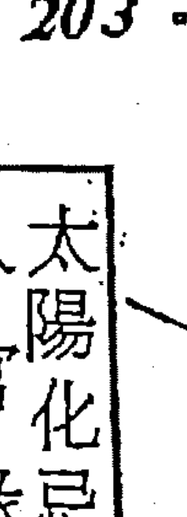

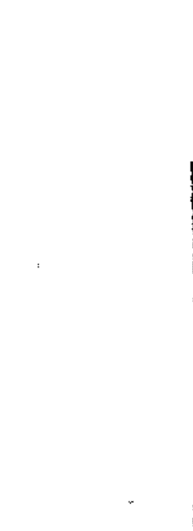

命宮在子，甲干使太陽化忌入官祿，表對事業相當執着，不管做任何事，總是求好心切，工作很賣力，假手他人的事，也必須親自過目才肯放心。

太陽好表現，命宮天干甲使太陽化忌，並非指甲干破壞了這一顆星，而是表示其人特別執着於此一星性，如自幼好習語文，表達能力過人，可為教師、代表、律師、外交人員。

附註：生年四化及官祿宮之四化，才能變化星的質能。命宮四化是顯示所執的是什麼？在那裡？

命宮化忌入官祿，官祿為田宅的父母，父母主文書、榮譽，故命忌入官祿主不利家族，不能顯耀親人，家人有是非麻煩事，不能為其解厄。

命忌入官則沖夫妻，夫妻為田宅的疾厄，疾厄不可沖，沖則損及本宮，所以命沖夫妻，表我損及田宅。田宅除代表房地產外，也代表家族，命忌入官即沖田宅的疾厄，亦即損家族的體，是為六親緣薄。

命沖夫妻，又表與配偶緣薄，緣薄古書解為「生離死別」，其實沒那麼嚴重，可能由於工作上的因素，常需在外差勤，或由於體質的因素、健康問題，夫妻間性的週期不能一致，某一方常有性的飢渴感而心裡生煩。

命沖夫妻：命為我，夫妻為子女的父母，父母宮主文書、光明、榮譽，沖表忙於事業而忽略了兒女的教養，或說沒能好好的教導子女。

夫妻是財帛的福德，福德是來財的地方，所以沖夫妻表財源困難，收入

## 紫微斗數入門(三)

不穩定，需經常多爭取。

夫妻是疾厄的田宅，田宅為護體，命沖疾厄的田宅，主不珍惜自己的身體，如酗酒、抽煙、日夜顛倒。

夫妻為遷移的官祿，遷移為活動空間，為社會，命沖夫妻即我沖社會的事業，表此人做事具革命性，好改革，喜走時代尖端。

夫妻為交友的交友（交誼），太陽好表現，命化忌沖交友的交友，表每多言詞過失而傷及朋友，尤命宮在子巨門守更驗。

夫妻為福德的財帛，命沖福德財，表多為嗜好、享受破財（花錢）。

夫妻為父母的子女，父母的子女即我之兄弟姐妹，因此命沖夫妻也表示兄弟不同住。

如此一顆忌星震盪了整一個命盤，猶如一片黃葉飄落，激起了一池的漣漪。接著試再以命宮化忌入福德設譬，解析之。

命宮在午巨門守，庚干使天同化忌入福德，表好吃懶做。巨門為品萬物之星，不挑食，天同為小吃，同梁臨福德，主好飲食、遊山玩水。命忌入福，則成天一腦子想弄點什麼吃吃喝喝。天同也代表羅經，若父疾、兄友綫會吉，生年干與命財官之宮干不逢辛或己，使文昌或文曲化忌入父疾綫，則反主此人好學，能把興趣投注於玩易，可望成為名堪輿家。因命宮忌為時刻執著於此，「精誠所至，金石為開。」一再地追求於斯，必成一股氣候，惟氣候有善惡，故對其人一生之成敗影響至鉅。

命宮為我，我化忌沖誰，表與誰無緣。（請牢記）

命忌入福沖財，表與錢無緣。

沖疾厄的父母，表身份低，人們的評價不高。

沖遷移的福德，福德主來財，表出外謀生困難。

沖交友的田宅，表我損朋友的財庫；也是朋友要賺我的錢很難。

沖官祿的官祿，主事業不安定。

沖田宅的交友，與家族緣薄，親人各自分居，同住則不睦。

沖父母的疾厄，與老爹少小別離。

沖兄弟的子女，與姪子輩無緣。

沖夫妻的夫妻（財帛），財帛為夫妻的對待宮位，命化忌沖，表男不利己，也不利丈夫。

沖子女的兄弟，兄友綫主成就，命沖子女的兄友綫，表不能成就子女，子女需白手成家。

綜觀上述兩例，命忌入官可望有所成就；命忌入福則一生較難發展，頂多像十二年前名噪一時的畫家洪通。

命宮忌對一生成敗得失極具影響力，惟命宮天干使何星化祿入什麼宮位，及何星化忌入什麼宮位，與祿忌入十二宮所處的角度，皆需合參詳審，要不即成斷章取義，差之毫厘失之千里，致論命不准事小，導人於錯誤的方面乃真罪過。

## 五、天同太陰在子安命

○命宮在子同陰坐守
天同臨於子位與太陰同宮，兩者均居廟地為富貴之格。男命易接近異性，風流倜儻，會天刑則能自律，反而變為嚴肅。白天生人加會煞星，較易有感情糾紛。女命秀外慧中，溫柔賢淑，為標準的賢妻良母，逢煞主感情波折。

同陰在子安命，三方會機梁，為機月同梁格，利夜生人，可居要職，有作為，有表現。丙年生人擎羊在午來會，宜武職。

○兄弟在亥天府坐守
天府臨於兄弟，表同胞兄弟姊妹眾多，且都心胸寬大、有雅量，擅長交際，在社會上頗具知名。惟兄弟不常相往來，只願各自發展，而不願彼此互助。

● 夫妻在戌無主星
借對宮機梁為用，暗示著老少配的情形，如男命娶比自己年長的妻子，女子嫁給比自己年小的男子。主要的原因是同陰在子安命的女性，一般都很美麗，樣子看起來比實際年齡小很多，故容易被比自己年小的男子所追求。婚姻美滿，彼此能夠相敬如賓，家庭中充滿和樂的氣氛。

● 子女在酉廉破坐守
廉破臨於子女，主子女稟性好動，學生時代容易與同學爭吵鬧事，結交一些狐群狗黨，會給你帶來很大的困擾。子女不喜歡在家承歡膝下，具強烈的叛逆性，故常有沒兒子的感覺。

● 財帛在申無主星
借對宮陽巨為用，主可因錢財而傳名於世，主要是太陽丙火在寅坐長生，晨曦微現，會巨門，象徵早年比較不順利，第五限步入中年後，太陽入午，主可以大發財利。陽巨的組合，從事的行業較為熱門，在眾多同業競爭中謀利。

○ 疾厄在未無主星
借對宮武貪為用，主幼年多災病，四肢或頭部、臉部容易受創傷，惟長成後身體健康狀況良好。

○ 遷移在午無主星
借命宮同陰為用，主一生為錢財在外奔波勞累，至為辛苦，對處事之決策，頗為戲劇性，常隨情緒起落而作出突發的安排，人際關係良好。

◎ 交友在巳紫殺坐守
朋友很得力，可因朋友的協助而獲取財力，開創美好前程，惟若會煞則不免於因朋友而起紛爭。

○ 官祿在辰機梁坐守
天機星機警、冷靜，處事有條理，在策劃運作方面能力不弱，與天梁同臨官祿主文武全才，宜宗教、慈善、福利等服務性質的工作。加吉權貴，加煞普通，過得去。

◎ 田宅在卯天相坐守
天相臨田宅視為吉利，惟財富的積聚，絲毫不僥倖，需經一番勤勞而後才有收穫。房地產的獲得，必須勞費很多心力，若會火鈴、空劫、羊陀，則主一生飄浮，不能指望有恆產。

● 福德在寅陽巨坐守
陽巨同臨福德，主生活忙碌，勞心又努力，年青時很打拼，中年後喜尋求一種較不勞力的工作，如代理、服務之類的工作。為人隨和、不計得失。加煞不能服公職、領終身俸。女命感情波折，也可能淪落風月場。加吉仍不免勞碌。

○ 父母在丑武貪坐守
武貪臨於父母，表雙親穩重嚴謹，雖說父母常會固執己見，但彼此間感情還是很平靜，不會有任何風浪、變化。

### 【甲年生人】

命宮丙使天同自化祿、天機化權入官祿、文昌化科、廉貞化忌入子女。

### 甲年生人

| 財帛 壬 | 疾厄 辛 | 遷移 庚 | 奴僕 己 |
| :--- | :--- | :--- | :--- |
| 子女 癸 | | | 官祿 戊 |
| 夫妻 甲 | | | 田宅 丁 |
| 兄弟 乙 | 命宮 丙 | 父母 丁 | 福德 丙 |
| 天府 | 天同 太陰 | 武曲 貪狼 | 太陽 巨門 |
| 破軍 廉貞 | | | 天機 天梁 |
| | | | 天相 |
| | | | 紫微 七殺 |

命宮化祿，表我所喜好關心的事。自化祿是二百五，花錢不心疼，做事五分鐘熱度，不能徹頭徹尾，心意常改變，好處是人緣好、自立、智慧。天同為福星，化祿為財祿主，能增加福氣與悠閒，於命垣自化祿，不免遊手好閒，不喜勞動筋骨。天機化權入官祿，主誇大，總認為自己所做的事業是最了不起的。與天梁同宮守於官祿，倒也可以趨吉避凶，從事幕僚的工作，可以很有表現。文昌本是科星，主文墨曲試，加化科，似如魚得水，相互為用，但看落入什麼宮位。化科主隨和，雖關心有限，但好商量。入兄弟幾主在任何人的心目中都是好好先生，因兄弟幾為與交誼活動有關的宮位。例如科入兄弟宮，兄弟宮所代表的六親有：兄弟、母親、岳父等，命宮化科入兄弟，即表對這些人很隨和，兄弟為交友的遷移，遷移的交友，故科入表與社會群眾很處得來。科是關心有限，又是很處得來，所以是標準的「君子之交，淡如水。」

文昌若入父疾綫，命宮丙化科入，主愛惜名譽，關心身體健康，因科是貴人星，例如命化科入疾厄，表我是身體的貴人，如此不就是我關心身體的健康嗎？我關心自己的健康，所以我自己就是身體的貴人。

命宮忌爲癡情，子田綫爲桃花綫，廉貞爲桃花星，在酉宮與破軍同守，衝勁很強，廉因化忌不免影響人生歷程之順遂程度，感情生活波折多，若得煞星同渡，反能解厄。

命爲財帛的氣數位，囚星化忌沖田宅（財之庫），主破財還逃不過官訟是非。行限入財福綫，流年入子或未宮時爲事發之年，原由在什麼地方？

試說明於次：

命宮爲財之氣數位，其干之忌在決定錢財損在什麼時候。命宮丙干使廉貞（囚星）化忌沖田宅，表原命已藏有破財的跡象，逆行運入財帛，沖宮成爲父母宮，父母宮主文書、榮譽，沖則有文書上的麻煩，故以大限入財福綫爲凶限，惟以逆行運者大限入財帛比較厲害。

### 【乙年生人】

| 財帛 甲 | 子女 乙 | 夫妻 丙 | 兄弟 丁 |
| :--- | :--- | :--- | :--- |
| 疾厄 癸 | | | 天府 |
| 遷移 壬 | | | 命宮 戊 |
| 交友 辛 | | | 太陰 天同 |
| 紫微 七殺 | 官祿 庚 | | 父母 己 |
| 天機 天梁 | 田宅 己 | | 武曲 貪狼 |
| 天相 | 福德 戊 | | 巨門 太陽 |

命宮戊干使貪狼化祿入父母、太陰自化權、右弼化科、天機化忌入官祿。

命宮戊貪狼化祿入父母，表爲人很「深緣」，與人相處越久，越能友誼深固。父母爲交友財，爲伙計的宮位，命爲我、祿是情，故命祿入父，主關心他人之所得，也是對長輩有禮貌。

父母爲遷移的疾厄，遷移是「我的世界」，所以命祿入父，表我關心社會的成長，很在意擴大生活的領域。

疾厄爲生財之場屋，命祿入父是照顧員工；祿入父則照疾厄，表員工照顧我生財之場屋，因此命祿入父者一般職位高，為主管、老闆人員。

太陰在命逢自化權，主為人霸道，雖可掌權，但不能持久，部下雖有而不能發號施令，原因是僱傭的伙計往往是臨時性質的，由於不能提供人家終身保障，故伙計對你這個老闆自然不怎麼很賣賬。

右弼為輔佐星，化科助力更大。命化科入交友，表能與朋友互惠，服務他人自己也能回收利益。命化科表我是人家的貴人，能施惠於人，若科入福德，福德主享受，右弼是多的意思，故科入福德為享受多，但能量入為出。福德持陽巨，加右弼化科，是經常忙於交際應酬，但不會是喝花酒。

天機化忌入官祿，天機為動星，對化忌很敏感，主諸多不順。忌入官祿表對事業很認真，但卻不很順利，因天機動星加忌入，則變動的幅度很大。

官祿庚天同化忌入命宮，與命宮化忌入官祿，成為互交忌星，互交忌星為糾纏，主情勢所迫非做不可。

財帛甲太陽化忌入福德，表對喜好的事沒錢也要想辦法得到。

### 【丙年生人】

| 財帛 丙 | 疾厄 乙 | 遷移 甲 | 交友 癸 |
| :--- | :--- | :--- | :--- |
| 破軍 廉貞 子女 丁 | | | 七殺 紫微 |
| 夫妻 戊 | | | 天機 天梁 官祿 壬 |
| 兄弟 己 天府 | 命宮 庚 太陰 天同 | 父母 辛 武曲 貪狼 | 天相 田宅 辛 |
| | | | 巨門 太陽 福德 庚 |

命宮庚干使太陽化祿入福德，武曲化權入父母，太陰自化科，天同自化忌。命宮爲我、祿是情，福德主嗜好、享受。命祿入福德表對自己感興趣的事，用心頗多。福德陽巨的組合本來就是愛說話，命使太陽化祿更主好表現。惟太陽爲光明、博愛之星，故其表現可以利他。命祿入福也表示謀生容易，賺錢輕鬆，很有得享。太陽本爲強星，並不需要四化星之輔助，化祿不能收到多大的效益，僅助長表現的能力，使其光彩更形奪目而已。命宮干使福德之太陽化祿，表常喜歡找朋友聊天。

武曲化權入父母，表會照顧父母，但態度隨便，不是很恭敬。

命宮太陰自化科，表名聲揚出去，人們對我的觀感，比實際的能力為大。

天同自化忌表對此星性的事不能持續有恆，自化忌有被擊出的意思存在。

例：天同為福星，自化忌則有福不知享；天同除代表小吃外，也是悠遊、羅經，此時臨於命宮逢自化忌，反主不講究飲食，不喜觀光旅遊，縱使能玩易也不能貫徹始終，往往半途而廢，但為人慷慨、率直。

官祿壬使武曲化忌入父母沖疾厄，為倒霉事必與疾厄有關。疾厄為軀體，也是生財之場屋，主有生之年身體必有大災，且設場屋以營利必不吉利。

若以家屬或他人名義設立登記，當不在此限。

財帛丙使廉貞化忌入子女，是為忌入財帛的父母，父母主榮譽，財忌入子即是錢財格調不高。沖田宅，田宅為官祿的兄弟，兄弟主成就，財為官之氣數位，其干之化曜在審官祿之吉凶，故財帛丙使囚星化忌沖官祿的兄弟，主一生事業難有成就。

### 【丁年生人】

| 七紫殺微 | 交友 乙 | 遷移 丙 | 疾厄 丁 | 財帛 戊 |
|---|---|---|---|---|
| 天天梁機 | 官祿 甲 | | | 破廉軍貞 |
| 天相 | 田宅 癸 | | | 夫妻 庚 |
| 巨太門陽 | 福德 壬 | 貪武狼曲 | 父母 癸 | 太天陰同 | 命宮 壬 | 天府 | 兄弟 辛 |

命宮壬天梁化祿入官祿，紫微化權入交友，左輔化科，武曲化忌入父母。

命祿入官，主忙碌。天梁清貴之星不喜化祿，化祿即增加困擾，天梁化祿主饋贈，命宮為我，我命壬干使天梁化祿，表我性喜饋贈美食於人，常為他人之事辛勤不休，例如當廟會的「頭家爐主」。

命宮壬紫微化權入交友會七殺，最能發揮帝王星的威力，在事業上有突出的表現，惟交友為他宮，權入他宮表示把權交給人家，雖然懂得選擇朋友，但朋友一經交上就對其死心踏地，男命倒也可以與人合夥，女命可就累了，對朋友有求必應會是什麼後果！？

命宮壬左輔化科能發揮助人的力量，若入他宮（命財官疾福以外的宮位），一般均能服務他人而受益。

命宮壬武曲化忌入父母，武曲為財星、寡宿星，最不喜化忌，化忌於錢財、事業、感情方面都不順利。命忌入父一般職位不高，宜上班族，當作業務員，在公務機構任職者，也只能是僱員、雇員之類的基層工作人員。命忌入父沖疾厄，疾厄為官祿的田宅，為生財之場屋，我沖生財之場屋，表不宜自設場屋以營業，故只宜上班族之原因即在於此。

疾厄是夫妻的子女（生殖位），命沖疾厄女命婚姻不美，借用別人的老公合夥一下，這種命例很多。疾厄也是子女的夫妻，所以此一沖又表與子女的配偶無緣。

疾厄為福德的交友，福德主享受，命沖疾厄等於沖福德的交友，故主此人絕不與人「你兄我弟」一不結交酒肉朋友。

### 【戊年生人】

| 財帛 庚 | 子女 辛 | 夫妻 壬 | 兄弟 癸 |
| :--- | :--- | :--- | :--- |
| 疾厄 己 | | | 天府 |
| 遷移 戊 | | | |
| 交友 丁 | | | |
| 官祿 丙 | | | |
| 田宅 乙 | | | |
| 福德 甲 | | | |
| 紫微 七殺 | 廉貞 破軍 | 天同 太陰 | 武曲 貪狼 |
| 天機 天梁 | | 命宮 甲 | 父母 乙 |
| 天相 | | | |
| 太陽 巨門 | | | |

廉貞為桃花星，臨於子女宮，子田為桃花綫，命干甲使廉貞化祿，主喜好精神上之享受，祿是想入非非，惟子女的桃花較單純，對方可能是單身之人。破軍化權也入子女，比較上破軍化權強於廉貞化祿，化權主態度強硬，意味著桃花具有侵占性，非要不可。武曲、貪狼同臨父母，命宮甲干使武曲化科，財星化科雖不主財，但能增添武曲的光彩。命宮化吉入文書宮，表此人愛惜名譽，對父母雖關心有限，但很聽話順從，不會給父母惹上麻煩。

命宮甲太陽化忌入福德，福德主嗜好，命忌入福為執著在自己的嗜好上。福德陽巨的組合，表經常與人抬槓。忌入福則沖財，表與錢財無緣。所謂「無緣」非指此人一定不會賺錢，也可能是不善聚財而已。本式疾厄（生財之場屋）己武曲化祿入父母，父母為銀行、配偶的財庫（夫妻的田宅），故顯示所得交與配偶或存入銀行。

官祿丙廉貞化忌入子女沖田宅，表倒霉事必與田宅有關，田宅主家族、房地產，即有生之年必因田宅事與兄弟親友相爭執。當大限行抵財福線，官祿之忌入大限的父疾線，主文書出問題，為相應之限，流年入財福線或入子沖流田、入未沖流財，為應驗之年。惟若為卯、酉時生人，昌曲入本命之父疾線，官祿丙干使文昌化科，主「貴人現」，事發之時當可適當的獲得處理，不致於太過嚴重性。

交友丁使守於命宮之財星太陰化祿，主宜上班族，因交友為事業的上司，財帛無主星，來財改看命宮，故宜上班族原因即在此。

### 【己年生人】

| 財帛 壬 | 疾厄 辛 | 遷移 庚 | 交友 己 |
| :--- | :--- | :--- | :--- |
| 子女 癸 | | | 官祿 戊 |
| 夫妻 甲 | | | 田宅 丁 |
| 兄弟 乙 | 命宮 丙 | 父母 丁 | 福德 丙 |
| 天府 | 天同 天陰 | 武曲 貪狼 | 太陽 巨門 |
| 破軍 廉貞 | | | 天機 天梁 |
| | | | 天相 |
| | | | 七殺 紫微 |

命宮丙使廉貞（囚星）化忌入子女沖田宅，表老是爲子女事煩心操勞。子女爲桃花緣，命宮之四化與夫妻、交友不相繫而直入子女，一生桃花不免，故命忌入田宅，一生桃花不免，故命忌入子也可能是爲色情事煩心操勞。命宮忌表經常執著於此。忌入子則沖田，除表經常出遠門之外，也主破庫。命是財帛的官祿，其干之化曜在決定財帛的得失。廉貞化忌主官訟是非，沖田宅則主因錢財事與人纏訟，或因纏訟而損財。發生之限年：大限入財福綫，流年入午或亥時爲驗，以該限先行走入的流年為事發之時。

命宮丙干使廉貞化忌入子女沖田宅，尚有可言者如次：

子女為財帛的父母，主文書，命為財之氣數位，化忌入子女表一生錢財多風險。

沖田宅為沖夫妻的交友，表與配偶不能和睦相處。

沖兄弟的官祿，表兄弟不共事，各自求發展。

沖福德的父母，表給祖上蒙羞。

沖田宅表與家族、房地產緣薄，經常出門在外，或家庭離異。

沖官祿的兄弟，與同行不相往來，可能經營冷門生意。

命忌入子，不宜與人合夥。

官祿戊天機自化忌，表經常變換工作，只宜服務、買賣，不宜生產業。

財帛壬使武曲化忌入父母沖疾厄，財帛為官祿的氣數位，忌沖疾厄（生財之場屋），主設場屋以營利不能有所成就。天梁化祿入官祿，化權入交友，表有賺就轉投資，且是一整票支付給人家（權入交友）。

### 【庚年生人】

| 财帛 甲 | 疾厄 癸 | 遷移 壬 | 交友 辛 |
| :--- | :--- | :--- | :--- |
| 廉貞 破軍 | | | 紫微 七殺 |
| 子女 乙 | | | 官祿 庚 |
| 夫妻 丙 | | | 天機 天梁 |
| 兄弟 丁 | 命宮 戊 | 父母 己 | 田宅 己 |
| 天府 | 天同 太陰 | 武曲 貪狼 | 天相 |
| | | | 福德 戊 |
| | | | 太陽 巨門 |

命宮戊天機化忌入官祿沖夫妻。天機爲動星，化忌則加大變動的幅度，與天梁同臨官祿，雖有遇難呈祥、化凶解厄的功能，但不免減弱天梁的力量，反使其人心神不寧，表現於事業上，主波折多，極爲困頓。戊使天機化忌爲好鑽牛角尖，命忌入官主事業多變動，惟頗能認眞、執着於事業。沖夫妻表與配偶緣薄，夫妻丙廉貞化忌沖田宅，女命尚可，男命夫妻沖田宅不吉，表配偶不同居。命沖夫妻，爲沖子女的文書宮，表不能給子女帶來光明，或說子女有麻煩的時候，沒有足夠的人際關係幫他解厄。

夫妻宮就斗數陽宅來說，為廚房位，命沖夫妻表所住的房子沒有廚房，或有廚房而放置不用。

夫妻為田宅的疾厄，命沖夫妻等於沖田宅的疾厄，第六宮受沖損及本宮，官祿為田宅的父母，父母主文書、光明、榮譽，故命忌入官也表示我不能光耀門楣。但並非表示此人「匪類」，而是難有大成就以聞名於當世，而惠及家族的意思。

官祿庚天同化忌入命，為情勢所迫非做不可。命忌入官，官復忌入命，此互交忌星謂之糾纏，亦即我執意於事業，事業又非我去做不可，故本式有生之年不免常為工作憂勞不已。

父母主榮譽，持武貪兩星，田宅已使武曲化祿入父母，福德戊使貪狼化祿入父母，表祖德流芳。官祿庚使武曲化權入父母，表本人也頗能勉力有為，爭取榮譽。命宮戊貪狼化祿入父母是愛惜榮譽。

### 【辛年生人】

| 宫位 | 天干 | 主星 | 宫位 | 天干 | 主星 | 宫位 | 天干 | 主星 | 宫位 | 天干 | 主星 |
|---|---|---|---|---|---|---|---|---|---|---|---|
| 财帛 | 丙 | | 疾厄 | 乙 | | 迁移 | 甲 | | 交友 | 癸 | 紫微七杀 |
| 子女 | 丁 | 廉贞破军 | | | | | | | 官禄 | 壬 | 天机天梁 |
| 夫妻 | 戊 | | | | | | | | 田宅 | 辛 | 天相 |
| 兄弟 | 己 | 天府 | 命宫 | 庚 | 天同太阴 | 父母 | 辛 | 武曲贪狼 | 福德 | 庚 | 太阳巨门 |

命宫庚使天同自化忌，天同福星主悠闲、福气，很有得吃，有得玩。在命宫自化忌出，显示原有这种福份，但自己又不懂得去享受。命自化忌表示为人慷慨、耿直，对十二宫较不构成妨碍，往往只是自我牺牲而不牵扯别人，比较没什么好说的，故本式换个角度来说说其他的东西。

若想知道谁使我很光彩、很体面，或说谁给我带来光明，就看父母宫。去年以前大家讲四化，提起贵人就看化科，那一宫化科入命迁线视为是我的贵人。其实科只是随和、好商量，但也是关心有限。所以他宫科入命迁线，还要交涉，不免有费周章，这一点我有独到的领悟，且来说说看！

父母文书宫，主光明、功名、文书、荣誉，本式夫妻宫戊使贪狼化禄入父母，即意味着一经结婚幸运就来，夫妻间绝对没有离异的情事。父母宫持两星，另一武曲星由兄弟之己干化禄而来，表母亲生我时很健康，心态很纯正，给予我一个很理性的头脑，不致作怀懂事，也可以说母亲是我的贵人。兄弟也是大哥、配偶的老爹，所以贵人也可以包含大哥与配偶之父。设本式为老大，此时兄弟宫视为大弟（老二），表大弟能给予我颇多的恩惠，武曲为财星，表恩惠显示在金钱的互助上，也可以说是大弟一出生，家庭经济情况逐渐好转。

他如迁移宫甲，使武曲化科入父母，表我出门在外颇为平顺。

福德宫（阿公位）庚使武曲化权入父母，权是禄的余气，其力量虽略逊于化禄，仍主得有祖先之余荫。福德看老运，迁移为其气数位，故迁移化科入父母，也表示晚年名声不错。

### 【壬年生人】

| 宫位 | 天干 | 星曜 |
|---|---|---|
| 财帛 | 戊 | 廉贞、破军 |
| 子女 | 己 | |
| 夫妻 | 庚 | |
| 兄弟 | 辛 | 天府 |
| 命宫 | 壬 | 天同、太阴 |
| 父母 | 癸 | 武曲、贪狼 |
| 福德 | 壬 | 太阳、巨门 |
| 田宅 | 癸 | 天相 |
| 官禄 | 甲 | 天机、天梁 |
| 交友 | 乙 | 紫微、七杀 |
| 迁移 | 丙 | |
| 疾厄 | 丁 | |

父母文书宫持武贪，命宫壬使武曲化忌入父母，命宫忌主痴情，父母为交友财，也是财帛的交友，不就，命使武曲财星忌入父母，不就是一脑子想赚人家的钱。要人家的钞票飞进自己的口袋，得要付出代价，不是想昏了头就能竟其功。

本式用什么技俩去营谋，且看命宫壬天梁化禄入官禄，命宫壬使天梁化禄就是「白贼」，原来是用胡盖的！忌冲疾厄是不宜设场屋以营业，从事叫卖、拍卖、行商最是适宜。上天有好生之德，但看有没有做对行。

命宫（财帛的气数位）壬使武曲正财星化忌，不宜大投资从事生产事业，只宜介绍、服务、买卖、代工之类的工作。武曲化忌必然的此人一生职业、财源不顺，也就是所从事的行业有季节性－大小月、大小日。

父母为夫妻的田宅，命忌入夫妻的田宅不免彼此多怨言，或缘薄疏离。

父疾线为财帛的成就线，命为财之气数位，故命忌入财帛的父疾线，主钱财没有成就，如此夫妻时起勃谿，乃导因于没有面包－贫贱夫妻百事哀。

财帛戊使天机化忌入官禄冲夫妻，表借贷投资而不能回收，终至债台高筑，当大限入子田线，必然经济拮据，流年入午冲宫成为流田主破库，或流年入寅，冲宫成为流财为损财，以该大限先行抵达之流年最凶。

兄弟辛干使巨门化禄、太阳化权入福德，表休闲生活颇能得到配偶的照顾。

庚太阳化禄入福德，表休闲生活颇能得到配偶的照顾。

子女己使武曲化禄、贪狼化权入父母，表长子一经出生即逐渐顺利，也表示日后子女的努力将提升其社会地位。

### 【癸年生人】

| 宫位 | 天干 | 主星 | 宫位 | 天干 | 主星 | 宫位 | 天干 | 主星 | 宫位 | 天干 | 主星 |
|---|---|---|---|---|---|---|---|---|---|---|---|
| 财帛 | 庚 | | 疾厄 | 己 | | 迁移 | 戊 | | 交友 | 丁 | 紫微七杀 |
| 子女 | 辛 | 廉贞破军 | | | | | | | 官禄 | 丙 | 天机天梁 |
| 夫妻 | 壬 | | | | | | | | 田宅 | 乙 | 天相 |
| 兄弟 | 癸 | 天府 | 命宫 | 甲 | 天同太阴 | 父母 | 乙 | 武曲贪狼 | 福德 | 甲 | 太阳巨门 |

福德阳巨的组合本就是好抬杠，命宫甲复忌入福德，表终日执迷于此。命忌入福冲财，称他为「钱无缘」最是适当，但并不表示此人一无成就。若以存在价值来说，很像个苏格拉底，「哈得要死」却成天在街坊与人高谈阔论，是也能成气候一名演说家。命宫甲太阳化忌入福德冲财，财帛为子女的兄弟线，兄弟线主成就，命忌入子女的兄弟线，主不能成就子女。财帛为夫妻的对待宫位，命冲财，男命不利己，女命不利丈夫。

福德为兄弟的田宅（财库），命忌入兄弟的田宅，表没钱到兄弟家去抓。福德为夫妻的事业，忌主是非、心烦，命忌入福为看到配偶就莫名其妙的一肚子不愉快。福德为父母的文书宫，命忌入福主不能使父母光彩。福德为田宅的兄弟，命忌入田宅的兄弟几，表不能成就我的家族。命忌入福冲财，财帛为官禄的三合方，三点恰有一平面一数学原理，一点动则鼎足失去平衡，故命冲财也主事业颇不平稳。一般斗数书刊都说「福德是来财的地方」，此一问题我一直很疑问，到底如何解？容我试着杜撰看看，师兄有更高明的见地希望能教我！第一限在命宫，是受父母养护的时期；第二限入父母、兄弟，是自我学习的阶段；第三限顺行运入福德，逆行运入夫妻，福德为大限的官禄，为创业的阶段，所以叫来财的地方，此是一说。但限盘、年盘也有福德又将如何解？另一种想法：迁移是活动空间，我的世界，福德为迁移的财帛，人们赚钱恒需往外求，福德是群众的钞票，所以福德为来财的地方。

## 六、廉贞天相在子安命

- 命宫在子廉相坐守
廉贞为一兼具桃花且多变的星宿，与谨慎、负责的天相同临命宫在子安命，相辅相成，两者之特性均能表露无遗，宜上班族，若无煞星相扰，在事业上能有一番表现。廉相守命三合方皆会有力之强星，一生对事业之开创铿锵非凡，若得左右权禄相加，更主可享富贵，名利双收。惟天机在疾厄，恐健康较差。

- 兄弟在亥巨门坐守
巨门临于兄弟，主兄弟相处不融洽，巨门为暗星，主是非、纠纷。亥宫的兄弟，原就是「兄弟各乡里」，各搞各的，彼此不能互惠，只要不形同陌路也就值得欣慰了！

- 夫妻在戌贪狼坐守
贪狼守于夫妻，一般都不能白头偕老，若非生离死别则是中途离异，晚婚可避免凶象。

观念提示：杀破狼为开创的格局。开创就是多变，入十二宫之任何一宫皆同论。例如入命官主其人多开创，入夫妻则是夫妻多开创，夫妻事只宜安定不宜开创，故杀破狼任何一颗星入夫妻皆主婚姻不美。

- 子女在酉太阴坐守
太阴临于子女，表子女才干、练达、接受能力很强，年少老成，小时候就能替父母分劳，相处愉快。文学、艺术方面颇有天赋，缺点是有些儿神经质。子女在钱财方面很有成就，惟较晚发。

- 财帛在申紫府坐守
紫府同临财帛在申，一生财运顺利，生活富足，加禄马以目前的币值论，可望是伍仟万以上的家伙。

观念提示：今日社会富庶，国民所得普遍提高，积存伍仟万只能算是小富，财富算亿的，才称得上是富翁，所谓伍仟万应是资产减去负债的净额。时下的生意人作法大胆，银行贷款外加吸收民间游资，绝对多数的商人，负债远超过资产，合理的说法，这叫赤贫。严格地说伍仟万以下的只算过得去，不能说是富翁。不过人总是喜欢听好话，「台湾好赚吃」人人都过得去，举债渡日的人，一样可以吃剩的才给人。所以代客论命时何妨说一些好听话来鼓励人家，算命只是心理治疗，但客人的心态是希望算过以后会变好，能振奋他人之士气就是行菩萨道。说正格的，真正的富翁百万人中不得其一，但人人都有发财梦，千万铁口不得，铁口有时候会「害死人」。举例来说——

小时候母亲带我去算命，那仙仔说什么我带六秀「目头巧」，跟书无缘，宜学技术，害得我国小一毕业就被送去学铁工，如果不是我好学，今天恐怕还在做「黑手」。其实我读书很内行，民国六十年代，我一直在院校当讲员，还经常接受各级学校的邀请，给老师们讲读书方法，讲联考猜题，给补习班上课，钟点费是一般行情的二倍。

又有一例：廿年前我去北埔问「磨水镜」，那仙仔告诉我二哥：我一辈子得「哈钱哈到死」，那时我的房东会四柱，也告诉我那婆子：我赚钱不够自己亏掉。其实我谋生能力很强，人缘也好得出奇，乙丑年最后一次台风的日子，我在高雄神圣阁办试听—讲紫斗。依旧是许多人挤不进教室，三年来面授紫微斗数的学友有三百多人，邮购资料的读者超过一千二百人，此间一家五术书局—竹林的老板娘，经常调侃我，书卖得比他们还多，怎么是胡言乱语的仙仔所说的那副德性。

算命是一种心理治疗，能使客人不再沮丧最重要，千万不可为期树立铁口的金招牌，毁人前程而不自知。

半路杀出这一段废话，乱了章法，我很抱歉，言归正题—

- 疾厄在未天机坐守
天机临于疾厄，主幼年体弱多病，容易罹患的疾病有：头晕、失眠、疲劳、食欲不振等。

- 迁移在午破军坐守
破军临于迁移，不免常须承受变动、奔波、劳困。纵无意转业或搬迁，仍有情非得已的情势，迫使非动不可，在转变的过程中，身心往往无法平静。惟破军在午为「英星入庙」，主能因转业而崭露头角。

## 237 . 开馆人紫微斗数(三)

- 交友在巳太阳坐守
太阳临交友在巳为庙地，主结交的朋友积极、热情，很活跃，性格强烈。可以与人合伙、投资股份公司。

- 官禄在巳武曲坐守
武曲临于官禄，其人工作有冲劲，能面对困难，有决断力，有信心。所以不论从事任何职务或自创事业都有所表现。善理财，男命可从事企业或金融方面的工作。女命是标准的职业妇女，在各行各业中都很有表现。

- 田宅在卯天同坐守
天同临于田宅，主早年不易取得房地产，晚年可因自己的努力与机缘，而获取大笔房地产。惟购置房地产的决策，宜避免亲友的牵涉或接受亲友对不动产经营的建议，否则将导致失败。

- 福德在寅七杀坐守
福德为享受的单位，七杀主开创，所以福德持七杀即暗示着一生忙碌辛劳，一切以工作为主，对己对人都是要求严苛，因此造成内心的不平衡，是道地的自寻烦恼者。

- 父母在丑天梁坐守
天梁临父母，表父母健朗、善良、细心。父亲很有责任感，是整个家庭的中心。双亲感情和谐，可谓是人见人羡的好夫妻，即使你已长大成人，还是打心里佩服他们，因而受父母的影响很大。

### 【甲年生人】

| 宫位 | 天干 | 主星 | 宫位 | 天干 | 主星 | 宫位 | 天干 | 主星 | 宫位 | 天干 | 主星 |
|---|---|---|---|---|---|---|---|---|---|---|---|
| 财帛 | 壬 | 紫微天府 | 子女 | 癸 | 太阴 | 夫妻 | 甲 | 贪狼 | 兄弟 | 乙 | 巨门 |
| 命宫 | 丙 | 廉贞天相 | 父母 | 丁 | 天梁 | 福德 | 丙 | 七杀 | 田宅 | 丁 | 天同 |
| 官禄 | 戊 | 武曲 | 交友 | 己 | 太阳 | 迁移 | 庚 | 破军 | 疾厄 | 辛 | 天机 |

命宫丙使天同化禄入田宅，天机化权入疾厄，文昌化科，廉贞自化忌。

命禄入田表会爱上比自己年长的人，或有夫之妇，不问已婚未婚，对方都是二手货。禄是情，故禄入田宅表示照顾家庭，田宅也是交友的夫妻，禄入表常想与朋友成就夫妻的行为。惟禄只是情，想而已，是心理的走私，不一定会发生，若真有桃花也会兼顾家庭。

天机化权入疾厄，主有傲气、擅舌辩、有谋略。权入疾厄则压父母，表对长辈不很恭敬，顶多把长辈当兄弟看待，自视甚高，总以为长辈的成就没有什么，有生之年一定会胜过他们。

文昌主科甲，化科更主考场如意，入父疾线主爱惜名誉。入兄友线表关心成就，此科为命宫化出，故主其人之心态及行为表现。

从官禄化出者，方主与运气有关。

文昌在财福线化科，主钱财能量入为出。

文昌化科入子田线，主居家生活朴素、随和，也主钱财平顺无风险。

文昌化科入夫官线，主桃花，常花前月下。

文昌化科入命迁线，主「名声好」。

命宫丙廉贞自化忌出，较不构成重大伤害，惟桃花星化忌仍不免多咎，感情波折，情绪不稳，困扰多。

官禄戊天机化忌入疾厄冲父母，父母主文书，官禄为命宫的气数位，其干之化曜在审命宫之吉凶，亦即有关「人」之吉凶，冲父母主一生是非麻烦多。幼年读书不认真，功课很菜，不听话。

财帛壬使武曲化忌入官禄，表一生好借贷投资。冲夫妻，当大限入子田线，会失业、倒店。顺行运入田宅，冲宫成为大疾，是为冲官禄的田宅（生财之场屋），是倒店的现象，因顺行运较多自创业者；逆行运入子女，冲宫成为大父，会有跳票或失业的现象。流年入未冲宫成为流田，谓之破库，或入寅冲财，谓之破财，是为应验之年，以该限所辖之十年中，先行走到之年为验。

财帛壬使天梁化禄入父母，表示钱财存于银行或发员工薪资。紫微自化权，表一生只宜服务、买卖，不宜从事生产事业。

### 【乙年生人】

| 宫位 | 天干 | 主星 | 宫位 | 天干 | 主星 | 宫位 | 天干 | 主星 | 宫位 | 天干 | 主星 |
|---|---|---|---|---|---|---|---|---|---|---|---|
| 财帛 | 甲 | 紫微天府 | 子女 | 乙 | 太阴 | 夫妻 | 丙 | 贪狼 | 兄弟 | 丁 | 巨门 |
| 疾厄 | 癸 | 天机 | | | | | | | 命宫 | 戊 | 廉贞天相 |
| 迁移 | 壬 | 破军 | | | | | | | 父母 | 己 | 天梁 |
| 交友 | 辛 | 太阳 | 官禄 | 庚 | 武曲 | 田宅 | 己 | 天同 | 福德 | 戊 | 七杀 |

命宫戊干使贪狼化禄入夫妻，太阴化权入子女，右弼化科，天机化忌入疾厄。贪狼多才艺，懂人情事故，男命近酒色，女命擅长家务。化禄入夫妻为交友的交友，主应酬多，进财多，感情方面也有所获。命禄入夫妻表对配偶情深，也表示对朋友多情，所以禄入夫妻视为桃花多。太阴化权入子女，表对子女管教严格，但讲理，有给子女商量的余地。命宫化忌入子女则压制田宅，女命主善理家，驭夫有道，感情处理很得体，即本地话所谓「精神厉害」。

右弼化科，益增辅佐的力量，入十二宫之显象为一

命化科入兄友线主成就自己，惠及配偶。

命化科入夫官线主成就兄弟，惠及子女。

命化科入子田线主成就夫妻，利于财帛。

命化科入财福线主成就家族，惠及父母。

命化科入父疾线主爱惜荣誉，光宗耀祖。

以上命科入某线之理则为：凡入某线之父疾线则主荣耀该线，入某线之兄友线则主成就该线。

命宫戊干天机化忌入疾厄，主其人自视甚高，因此对事业的开创及感情方面易生困扰。冲父母主得不到父母长辈的恩惠。惟乙年生人魁钺入三方，尚能由于「贵人现」而获得些许的改善，若为三、五月生人得左右夹，则更主吉利。

官禄庚使天同化忌入田宅冲子女（合伙宫），不宜与人合伙。

### 【丙年生人】

| 宫位 | 天干 | 主星 | 宫位 | 天干 | 主星 | 宫位 | 天干 | 主星 | 宫位 | 天干 | 主星 |
|---|---|---|---|---|---|---|---|---|---|---|---|
| 财帛 | 丙 | 紫微天府 | 子女 | 丁 | 太阴 | 夫妻 | 戊 | 贪狼 | 兄弟 | 己 | 巨门 |
| 疾厄 | 乙 | 天机 | | | | | | | | | |
| 迁移 | 甲 | 破军 | | | | | | | | | |
| 交友 | 癸 | 太阳 | 官禄 | 壬 | 武曲 | 田宅 | 辛 | 天同 | 福德 | 庚 | 七杀 |
| 父母 | 辛 | 天梁 | 命宫 | 庚 | 廉贞天相 | | | | | | |

命宫庚干使太阳化禄入交友，武曲化权入官禄，太阳化科入子女，天同化忌入田宅。太阳临官禄在巳，命宫化禄入，表交游广泛，且结交的朋友都是有身份、地位之人物，对待朋友颇为热忱，在朋友群中懂得表现自我，推销自我。武曲临官禄在辰，命宫庚使之化权入，武曲本具刚性，益增其强度，振奋精神，排除万难，最适宜从事军警人员。女命在社会，也能占有一席之地，对事业颇有表现。

太阴临于子女在酉，命宫庚使太阴化科，主子女聪明、俊秀，亲子间相处随和融洽，钱财平顺无风险。为什么「钱财平顺无风险」？因命宫为财之气数位，其干之化曜是给财帛宫来用，故科入财帛的父母（子女宫），主钱财贵人有、名声有，自然周转容易，少风险。

天同临于田宅，表居家生活很有得享，惟命宫庚使之化忌入田宅，则形成有福不知享，田宅为交友的夫妻，命宫忌入表其性之心态喜好毛手毛脚，喜经常更换新人，获取不同的爱抚动作，重量不重质，不需与对方先期建立友谊基础，有就好，七杀临于福德，更助长这种心理。冲子女，子女为夫妻的兄弟（床位），表会拒绝配偶的需求，真所谓「宁与盗寇不与家奴」，惟科入子女在酉来照，稍可解厄。

命宫庚使天同化忌入田宅冲子女，除前段之迹象外，也表示钱财之贵人差，因子女为财帛的父母，冲则凶，故主不利于财帛。

官禄壬天梁化禄入父母，主一生有功名，利于考试、就业，可为公教人员。天梁化禄主其人善表达。

### 【丁年生人】

| 宫位 | 天干 | 主星 | 宫位 | 天干 | 主星 | 宫位 | 天干 | 主星 | 宫位 | 天干 | 主星 |
|---|---|---|---|---|---|---|---|---|---|---|---|
| 财帛 | 戊 | 紫微天府 | 子女 | 己 | 太阴 | 夫妻 | 庚 | 贪狼 | 兄弟 | 辛 | 巨门 |
| 疾厄 | 丁 | 天机 | 迁移 | 丙 | 破军 | 交友 | 乙 | 太阳 | 官禄 | 甲 | 武曲 |
| 田宅 | 癸 | 天同 | 福德 | 壬 | 七杀 | 父母 | 癸 | 天梁 | 命宫 | 壬 | 廉贞天相 |

命宫壬干使天梁化禄入父母，紫微化权入财帛，左辅化科，武曲化忌入官禄。

天梁临父母，命宫壬使其化禄入，表由于自己的乐善好施而成为一种沉重的负荷。父母为文书宫，主功名、荣誉，命宫为我，禄是情，所以命禄入父，表我很爱惜荣誉，常用馈赠方式表达对长辈的孝思。

紫微帝王星，具权威性，命宫化权入，表权威性更盛。惟紫微主贵不主富，好在与库蓄之星天府同临于财帛，可望名利双收。

命宫壬使左辅化科，入十二宫之显象为一

科入兄友，主为人随和。

科入夫官，主不喜太劳累，预留一些时间谈恋爱，终生如是。

科入子田，为好花前月下。

科入财福，主钱财慾不大，过得去就好。

科入父疾，主爱惜荣誉，珍惜自己的身体，留意健康问题。

科入迁移，或在命宫自化科，表有名声。

武曲为正财星，临于官禄，命为财之气数位，使武曲化忌入官禄，冲夫妻宫之贪狼偏财星，颇为不美，夫妻为死亡点，冲则凶，主失业、倒店，当大限入子田线，冲宫成为大限的父疾线，流年入未冲田宅，入寅冲财帛，为应验之流年。

官禄壬太阳化忌入交友冲兄弟，兄弟宫主成就，官禄化忌来冲表知名度必差，不宜走名的路线，想在公营事业机构任职是不可能的事。兄弟为夫妻的父母，此一冲也暗藏离婚的危机。

### 【戊年生人】

| 宫位 | 天干 | 主星 | 宫位 | 天干 | 主星 | 宫位 | 天干 | 主星 | 宫位 | 天干 | 主星 |
|---|---|---|---|---|---|---|---|---|---|---|---|
| 财帛 | 庚 | 天府紫微 | 疾厄 | 己 | 天机 | 迁移 | 戊 | 破军 | 交友 | 丁 | 太阳 |
| 子女 | 辛 | 太阴 | | | | | | | 官禄 | 丙 | 武曲 |
| 夫妻 | 壬 | 贪狼 | | | | | | | 田宅 | 乙 | 天同 |
| 兄弟 | 癸 | 巨门 | 命宫 | 甲 | 廉贞天相 | 父母 | 乙 | 天梁 | 福德 | 甲 | 七杀 |

命宫甲干使廉贞自化禄，破军化权入迁移，武曲化科入官禄，太阳化忌入交友。廉贞为一带有桃花性质的星曜，在命宫自化禄，表好精神享受，意志不坚，做事不能彻头彻尾，惟五分钟热度，经常改变方针，惟好处是人缘好，能自立、聪明、智慧。与天相同临命宫，桃花性质更是显现，易有感情困扰，或流于风月场中。破军战将在迁移，主出外多奔波，具领导权，化权恰似武将佩剑，益增威仪，可增强其领导力与成就，增加其應變的力量與進展的時效。惟過於愛出風頭，故不免多與人糾紛。

武曲財星要化祿方主利於財祿，命宮甲使武曲化科入官祿，只能增加其光彩，使其剛強耿直的特性益形彰顯，增大辦事的能力與效率，對錢財的實際獲得，不很得力。

太陽臨交友在巳為廟地，命宮化忌入交友，並不表示壞了太陽的星性，而是表常去找朋友，忌具有粘性，好比「水流破布」，到朋友處，一去停留很久，或一住好幾天。忌在交友沖兄弟，兄弟是床位，是夫妻的文書宮，此種情況主婚姻不美，夫妻時起勃谿。交友丁巨門化忌直入兄弟，表朋友介入床位——「客兄帶入厝」。

官祿丙天機化權入疾厄，照父母，父母為文教機構，表可以自創事業，以文教機構、行政單位為客戶。

財帛庚使太陽化祿入官祿的父母，主事業平順，惟天同化忌入官祿的兄弟，表事業做不大。

### 【己年生人】

| 財帛 壬 | 紫微 天府 | 太陰 | 子女 癸 | 貪狼 | 夫妻 甲 | 巨門 | 兄弟 乙 |
|---|---|---|---|---|---|---|---|
| 疾厄 辛 | 天機 | | | | | | |
| 遷移 庚 | 破軍 | | | | | | |
| 交友 己 | 太陽 | 武曲 | 官祿 戊 | 天同 | 田宅 丁 | 七殺 | 福德 丙 |
| | | | | | | 天梁 | 父母 丁 |
| | | | | | 廉貞 天相 | 命宮 丙 | |

命宮丙天同化祿入田宅，表其人好悠閒與享福。田宅為夫妻的交友，祿是濃情蜜意，命宮為我，命祿入夫妻的交友，表與配偶相處如膠似漆，子田為桃花綫，若配偶招架不了，恐怕要「這溪無魚別溪釣」了。所以命祿入子田綫視為桃花。
田宅為夫妻的兄弟綫，主成就，故命祿入田，表能成就配偶。
田宅為福德的父母，父母主榮譽，命祿入田是福德（阿公位）的父母，表能光宗耀祖。
田宅是兄弟的官祿，故命祿入田也表我關心兄弟的事業。

天機化權入疾厄，疾厄為夫妻的子女，子女為生殖位，權入是霸王硬上，故命權入疾厄，其對配偶的性心態，常是不由分說，非要不可。

疾厄為財帛的兄弟，兄弟主成就，命為財之氣數位，故命化權入疾厄，表錢財有成就，權是爭來的，作多少努力，就能成就多少，也表示要有耕耘才有收穫，不可能「天送來」。

官祿戊天機化忌沖父母，氣數位忌沖文書官，表是非糾紛多。惟天機是動星而非科星（文昌）或囚星、暗星，化忌僅屬奔波困頓，影響事業之開展，向有關單位申報各項書表，頗費週章而已，還不致有官非。

財帛壬使武曲化忌入官祿沖夫妻貪狼星，為借貸投資，不能回收。財為官之氣數位，其干之忌在審事業的成敗，限入子田線，將因事業的因素導致失業、倒店，例如產品已成過氣（夕陽事業），或事業上出現強勁的競爭對手，或員工跳槽影響產品之正常產銷，或國際經濟萎縮、訂單青黃不接等情況所導致的破敗情形皆屬之。

### 【庚年生人】

| 財帛 甲 | 紫微 天府 | 子女 乙 | 太陰 | 夫妻 丙 | 貪狼 | 兄弟 丁 | 巨門 |
|---|---|---|---|---|---|---|---|
| 疾厄 癸 | 天機 | 遷移 壬 | 破軍 | 交友 辛 | 太陽 | 官祿 庚 | 武曲 |
| 田宅 己 | 天同 | 福德 戊 | 七殺 | 父母 己 | 天梁 | 命宮 戊 | 廉貞 天相 |

命宮戊天機化忌入疾厄沖父母，表由於自己的朦懂，自以為是，惹來許多麻煩、挫折。疾厄為兄弟的財帛，命忌入疾，表我向兄弟抓錢；沖父母，父母為兄弟的福德，故命沖父表兄弟得不到我的恩惠。父母為夫妻的田宅，命沖父，男命不能讓配偶掌財權，置田產；女命與配偶無緣，偏房命。父命為子女的事業，命沖父表不能協助子女創業。惟對子女之事業有激勵之效，可能的情況是由於自己的無能，子女意欲出人頭地而勉力有為。

父母為財帛的交友，命為其氣數位，故命宮忌沖財帛的交友最具威脅性，命沖父表財源不繼，在銀行開甲存，難免常被退票，跑三點半，或收到「巴拉票」，不可替人作保，參加互助會。

疾厄為遷移的父母，父母主文書、榮譽，遷移為活動空間，故命忌入疾表出外不順，與人多糾紛。

父母為交友財，命忌入疾沖父，表與交友財無緣，意即要賺人家的錢很難。不過其他條件要合參，不可斷章取義，致論命不準。

父母為官祿的子女，為伙計的宮位，命沖父為請人幫傭，傭人待不久，或說不可能請人幫傭，不是老闆命。此項說法同理要兼參其他條件。

父母為老人房，故命沖父母，表居家沒有老人房，父母不與我同住。此項說法應指兄弟分家以後。

父母是福德的兄弟，命沖父為我與阿公的兄弟無緣，也表不能光耀祖先不能與妻家之人相處愉快（父母為夫妻的田宅故）。

### 【辛年生人】

| 財帛 丙 | 紫微 天府 | 子女 丁 | 太陰 | 夫妻 戊 | 貪狼 | 兄弟 己 | 巨門 |
|---|---|---|---|---|---|---|---|
| 疾厄 乙 | 天機 | 命宮 庚 | 天相 廉貞 | 父母 辛 | 天梁 | | |
| 遷移 甲 | 破軍 | 田宅 辛 | 天同 | 官祿 壬 | 武曲 | | |
| 交友 癸 | 太陽 | 福德 庚 | 七殺 | | | | |

命宮庚天同化忌入田宅，表過分關心家族，對一家老少，一切家務事，要求過高，以致經常為此生煩、嘮叨，在家裡是一個不受歡迎的人。

田宅為夫妻的交友，忌是癡情、是非，命忌入田，說明了愛得很痛苦，與配偶之間每常是愛恨交加，真是「可愛的仇人」。

田宅為夫妻的兄弟線，命忌入田沖夫妻的兄弟，表不成就配偶，和配偶的兄弟無緣。

命忌入田沖子女，表親子之間感情疏離，晚年不與子女同住，至少長子是如此。

命忌入田沖財帛的父母，主錢財有麻煩，經常被倒錢，錢財的獲得頗費週章。設非如此，至少有生之年常常花費一些冤枉錢。

命忌入田沖子女，子女為疾厄的福德，表沒福享。

命忌入田沖遷移的田宅，表少出遠門，出遠門睡不安枕。

命忌入田沖交友的事業，不宜與人合夥，作股票買賣。

命忌入田沖官祿的交友，表與同行之間不能和平共存。

命忌入田沖福德的疾厄，表與阿公無緣，不能光宗耀祖。

命忌入田沖子女，為沖父母的財帛，表得不到父母、長輩的恩惠，尤其金錢、房地產的贈與，不能指望。

官祿壬天梁化祿入父母，表學校課業成績頗有表現，考試、就業均吉，宜文教、行政單位任職。第二限（順行運）入父母，大官在交友，癸干使巨門化權入兄弟，表此限有成就，權表示用實力爭取來的，第三限大官在遷移，甲干祿權科入三方四正，忌沖兄弟，表「看頭」大於實際的成就。

### 【壬年生人】

| 財帛 戊 | 子女 己 | 夫妻 庚 | 兄弟 辛 |
| :--- | :--- | :--- | :--- |
| 紫微 天府 | 太陰 | 貪狼 | 巨門 |
| 疾厄 丁 | | | 命宮 壬 |
| 天機 | | | 廉貞 天相 |
| 遷移 丙 | | 父母 癸 | |
| 破軍 | | 天梁 | |
| 交友 乙 | 官祿 甲 | 田宅 癸 | 福德 壬 |
| 太陽 | 武曲 | 天同 | 七殺 |

命宮壬武曲正財星化忌沖貪狼偏財星，為正偏財星皆死。命忌入官為執着於事業，沖夫妻為沖財庫（田宅）的疾厄，疾厄受沖則本宮受創。命宮為財之氣數位，故命宮化忌導致破敗，主造端於錢財，如資金短絀，被高利貸之利息吃垮，或被狠狠地倒去一大票，嚴重影響資金週轉而倒閉的情形。

命沖夫妻謂之沖「死亡點」，為失業、倒店的格局，當大限行抵子田線，頗為坎坷不順，順行運入田宅最凶，因沖宮成為大疾，疾厄為第六位，依一六共存亡的理則，沖六則亡一，故行抵田宅位視為凶限；逆行運入子女，沖宮成爲大父，沖父母則文書麻煩多，週轉困難，被退票、開紅單子，上班族容易失業，比較上逆行運者較好些。應驗之年，亦即最凶的一年，為流年也入子田綫，或沖宮成爲流年的田宅，或沖宮成爲流年的財帛時。

官祿為兄弟的交友，故命忌入官也表兄弟長期共事易有是非。

官祿為夫妻的遷移，故命忌入官也表配偶外出太久會心煩。

官祿為子女的疾厄，故命忌入官也表子女的身體令我心煩。

官祿為女兒（田宅）的文書宮，故命忌入官也表女兒的學業令我心煩。

官祿為父母的田宅，故命忌入官也表與父親同住，心有得煩。

命忌入官沖夫妻，大限入田宅沖宮成爲大疾視為凶限。有沒有補救，再看大官的祿權科忌，大官在未，丁干使巨門暗星化忌沖本命的交友，表與事業的上司無緣，工作青黃不接。又本命的官祿甲太陽化忌入交友，與大官之忌互成對宮，主事業糾纏不清，於事無補。

### 【癸年生人】

| 財帛 庚 | 子女 辛 | 夫妻 壬 | 兄弟 癸 |
| :--- | :--- | :--- | :--- |
| 紫微 天府 | 太陰 | 貪狼 | 巨門 |
| 疾厄 己 | | | 命宮 甲 |
| 天機 | | | 廉貞 天相 |
| 遷移 戊 | | | 父母 乙 |
| 破軍 | | | 天梁 |
| 交友 丁 | 官祿 丙 | 田宅 乙 | 福德 甲 |
| 太陽 | 武曲 | 天同 | 七殺 |

命宮甲干使太陽化忌入交友沖兄弟，對十二宮所構成的影響，試伸述如次：

命忌入交友為成天老想跑到朋友的地方窮磨牙，太陽為好高談濁論。

沖兄弟為沖官祿的疾厄，任何宮位沖疾厄皆視為凶兆，命沖官之疾為我不能成就事業。

兄弟為田宅的財帛，命沖兄弟為我不能照顧家計，生活困窘，常斷炊，柴米油鹽沒有着落。

兄弟為福德（阿公位）的子女，阿公的子女為我之伯叔，故命沖兄弟也表與族人不常相往來。

兄弟為父母的夫妻（母親宮），夫妻為田宅的第六位，視同田宅，故命沖兄弟也表不與父母同住，可能少小離家。

兄弟為母親位，命沖兄弟表與母親緣薄。

兄弟為夫妻的父母，父母主文書、榮譽，故命沖兄弟表與配偶的長輩無緣以外，也表使配偶顏面無光，嚴重可能導致離異。

兄弟為子女的福德，命沖兄弟表不能惠及子女；子女為配偶的兄弟，故命沖兄弟也表不能惠及配偶的兄弟。

兄弟為財帛的田宅、田宅的財帛，故命沖兄為無隔宿之糧，生活困苦。

兄弟為疾厄的官祿，疾厄為生財之場屋，生財之場屋的官祿（或說事業）為生產項目，故命沖兄弟表沒有產品，引伸為無常業，經常到處打游擊，工作有一天沒一天，一曝十寒，終其生不能成氣候。

兄弟為遷移的交友，故命沖兄弟表與社會群眾處不好。遷移為我的世界，亦即我活動空間，所以這麼說。

## 七、貪狼在子安命

- 命宮在子貪狼坐守
貪狼為桃花星，具才藝、有口才，為人圓滑、世故，佔有慾很強，近酒色財氣。喜會煞星，與火鈴同，從事較具活動性的工作能有所成就。加化祿可以橫發一時。

貪狼若化忌反能習正，會空亡可抑制貪狼的桃花性，只顯現才藝的一面。會空劫則持有專業技能，會羊陀較遜，以技藝謀生。

貪狼在子對宮為紫微星，主出門可逢貴，文采風流；女命善妒，與地空同宮可橫發，惟僅屬過路財神，與羊陀同因色破家。

- 兄弟在丑太陰坐守
太陰臨兄弟在亥，主兄弟姐妹緣份深厚，不會太早分家，且其中有長於文學、藝術者。太陰為財帛田宅主，在亥為廟地主兄弟經濟情況好。

- 夫妻在戊廉府坐守
廉府同臨夫妻宮，可偕老。廉貞星富變化，戀愛的過程多彩多姿，但婚姻每多不美，同會天府於夫妻，由於天府喜歡安定，精神重於物質，故夫妻間可以如膠似漆，時刻不分離。若加羊陀空劫，宜晚婚。

- 子女在酉無主星
借對宮陽梁為用，顯示子女精神充沛、健康活潑，使家庭生活充滿朝氣。子女早熟，從很幼小的年紀就能料理自己的事務，故不必為他們操心太多，親子之間很開放，沒有代溝。

- 財帛在申破軍坐守
破軍臨財帛，主具有獨立策劃的能力，對事務的觀察有獨到的見解。走時代尖端，能發跡，惟命宮持貪狼星，一般少年不發。

觀念提示一
以目前的社會型態，及國人的種性來統計，所謂晚發：是四十二歲以後，就台灣地理來說，嘉義（北回歸線）以南，似即自古以來命理學上所稱的南方或南人，地處熱帶的人一般山根較低，就面相學論，山根主四十一歲，四十二以後往下走向準頭，始逐漸看好，故以個人常年觀察在台灣地區生長的人們，所得的一點心得來看，晚發應在四十二歲以後。

- 疾厄在未無主星
借對宮的同巨為用。若加會羊陀火鈴（任何一個多算），主精神不正常，言語無度，行為異常。

觀念提示一
疾厄無主星，一般健康狀況良好，因忌星飛不進來。借對宮星情來照，好壞力量只有一半。惟仍有忌諱者——對宮之星化忌來沖。

又「會吉」「會煞」「加會」等語，以本宮會齊力量最大，本宮乃對宮會齊為次，三方會齊者不忌。講凶厄、講壽元，如巨羊火的組合，鈴昌陀武的組合，以出現於命遷綫（含本命、大限者）才算，會齊於三合方者不必然理會。講三合，是論及人事物，亦即命財官時，才需三方合參，這一點務請牢記。

我不是隨人補上一期三個月，就亂假會，塗鴉以賺取稿費的傢伙，而是的的確確徹悟了紫微斗數的理則以後，才開始動筆。立論除星情、格局務必仿古，由不得你新創的部份以外，其餘皆屬個人獨到的領悟，絕不剽竊他人之物。是故研究我的資料，歡迎求證後有以教我，但請不要懷疑，懷疑就是前進的絆腳石，嚴重將使學者裹足不前。言歸正題！

- 遷移在午紫微坐守
紫微臨遷移，表出外會遇到貴人，也主其人具有非常的活動力，雖然移動變遷大，但永遠有用不完的精力。態度積極，隨時創新求變。在遷移中，每能獲得良好的機緣。若加會左右，則更可得貴人的幫助，發展的機會更多更大。

- 交友在巳天機坐守
天機是智慧之星，臨於交友宮，主交往的朋友頗具才華，會是你的智囊團，能協助你策劃、參謀，助力頗大。惟天機最忌逢煞，若有煞星同臨，則暗示著彼此互相交惡。

- 官祿在辰七殺坐守
七殺是戰將，不怕苦，不怕難，在激烈的競爭中，越能嶄露頭角。具有固執、勇武的特性，越難的工作越感興趣。男命宜運動員、軍警等富挑戰性、突破性的工作；女命在社會上也很有表現，可為女強人。

- 田宅在卯陽梁坐守
陽梁臨田宅在卯，可有祖遺的房地產，也能自置。居家環境陽光充足，空氣清新，若天梁加化祿，居家周圍可能有森林。

- 福德在寅府相坐守
武相臨福德，早年辛苦，晚年可以享清福。武相性急、勤快，一生多操勞，因係一顆晚發之星，所以早期總是事倍功半，生活艱辛，難享清福。惟天相衣食之星且主長壽，可得安逸、舒適的日子。福德持此兩星，故而先勞後逸。

- 父母在丑同巨坐守
同巨臨於父母感情較疏離，偶有爭執糾紛。若得吉星左右、昌曲、魁鉞，或祿權科加臨，則能盡孝道。主要原因是父母宮與遺傳有關，吉星入表質能優異，生性光明理智。

### 【觀念穿插】

命宮干化忌，主癡情、極端。例如命忌入夫妻，則終生爲夫妻事耿耿於懷。同理忌入什麼地方，就執着在那兒，以此爲優先，其餘皆爲次要。所以影響一生心態的命宮忌，是「紫微斗數的星王」，是一生成敗的樞機。

一般而言，命忌入兄財疾官田比較踏實、認真，能貢獻一己之所能造福社會。此一觀念是就「存在價值」上着眼。若以富足倉箱、妻妾如雲視爲好命，這種世俗的論調，自然不能相提並論。

命忌入兄財疾官田者較能創作利他，就此一觀點，試述如次：

財帛與田宅互爲一六位，皆主與錢財有關。命忌入財或忌入田，其人必然對錢財感興趣，認真工作營謀，必也能儉用儲藏，爲人保守，不會製造社會問題。其努力的結果，自然可以造福社會群衆。

官祿與兄弟互為一六位，都是主事業。命忌入官或忌入兄，其人必對事業認真到底，一生為工作而工作，只求表現一己之能力，而不斤斤於利得之多寡，故其所作的努力，可以惠及人類社會。

命忌入疾為很在意自己，喜歡表現自己，為期能有足夠的本錢讓人們恭敬，勢必努力奔競，如是自然也能利群。

當然我們不能說命忌入其他宮位者皆屬庸人，只能說有這種情況者態度比較積極、踏實，肯活到老學到老，從不肯放過自己。其餘者較為樂天，福氣天成。若依古書的說法，命宮化忌入兄財疾官田者，是屬賤格，一生作牛作馬；忌入其餘宮位者酒色財氣，可以悠遊自適，反倒視為好命。

命宮化祿也頗具影響力，其與命宮忌所處的角度更是不可忽視，其餘星情也需合參，若單憑一忌「定江山」，如此斷章取義自不免有所漏失。之所以強調此一「命宮化忌」，是因此星對其人之性向頗具決定性，對一生之行止最具影響力，故稱其為「星王」。有關命宮化忌與化祿所入宮位之含義，及所處角度的差異，茲略舉一例於次：

設安命在子，宮干甲使廉貞化祿入兄弟，兄弟為官祿的疾厄（事業體），故命祿入兄弟表我想把事業做很大。太陽化忌入官祿為工作細心、認真，那麼想把事業做很大，又能認真細心，衡理應可以成就一番事功，但沖夫妻死亡點，為倒店的格局，所做的努力勢必成空。祿與忌（或沖宮）在鄰宮為「相欠債」，意即「辛苦得來的落入外人的家」，所做的努力造福群眾，卻不能得到合理的報酬。所以「相欠債」也可說是無緣！認真而沒有結果。以佛學的觀念來說，此為業力使然，業力即俗稱的前世債。

換個立場來講：命宮甲干使廉貞化祿入兄弟；命為我，祿是想，廉貞為桃花，兄弟是床位，所以命祿入兄弟表身體健康，感情豐富。巨門在子安命，疾厄在未守紫破強星，當然身體健壯。廉貞為次桃花，重感情，講究精神生活，非求感官的刺激，故命甲使廉貞祿入兄弟者為風流才子型，而非如貪狼化祿之低俗，但求滿足需求而不留情。命忌入官沖夫妻，表與配偶無緣，此祿與忌之沖宮成鄰宮，是也「相欠債」，對配偶一廂情，款款深情，配偶卻不能領情，是為例。詳細在下面的命式中再說。

### 【甲年生人】

| 財帛 破軍 壬 | 疾厄 辛 | 遷移 紫微 庚 | 交友 天機 己 |
| :--- | :--- | :--- | :--- |
| 子女 癸 | | | 官祿 七殺 戊 |
| 夫妻 廉貞 天府 甲 | | | 田宅 太陽 天梁 丁 |
| 兄弟 太陰 乙 | 命宮 貪狼 丙 | 父母 天同 巨門 丁 | 福德 武曲 天相 丙 |

生年甲干使廉貞化祿、破軍化權、武曲化科、太陽化忌。
生年祿入夫妻，主早婚，廉貞化祿表注重精神享受。祿入夫妻，夫妻為交友的交友，生年祿是先天的、隱性的，廉貞為桃花星，故生年甲使廉貞化祿入夫妻，表生來很有異性緣。
命宮丙使天機化權入交友，是對朋友「死忠」，忌入夫妻是對夫妻事時刻憂煩，也表示老惦記著與朋友交往事。
命宮丙廉貞化忌入官祿，命為財之氣數位，官為財之三合方，三足可以鼎立，欠一即失去平衡，行限入子田綫，將有錢財的風波，流年入申、丑為應驗之年；一為沖宮成為流田，一為沖宮成為流財，以該限所轄之十年中，先行會遇之流年為驗。

命沖官，表與長子無緣，因官祿為子女的疾厄，子女為長子位，故視為與長子較緣薄。惟當今之世，色情氾濫，頗多婚前有墮胎現象，所謂無緣也可能是墮胎，或頭胎有流產現象。

命宮丙天同化祿入父母，表愛惜榮譽，關心員工福利。廉貞化忌沖官祿為事業多變動。一祿一忌相隔四宮，主意外、變遷。若以父母當伙計（員工）的宮位看，官祿為伙計的田宅（財庫），那麼命祿入父母為有心照顧員工，沖官祿為不能讓伙計有保障。換句話說：由於自己事業的不穩定，故不能提供員工長久的工作機會。

官祿戊天機化忌入交友沖兄弟，表倒霉事與兄弟宮有關，除去兄弟宮所含蓋的六親關係不談，兄弟為官祿的疾厄，所以倒霉事也可能與事業有關。另方面也表示常有斷炊的現象。

### 【乙年生人】

| 財帛 甲 | 疾厄 癸 | 遷移 壬 | 交友 辛 |
| :--- | :--- | :--- | :--- |
| 破軍 | | 紫微 | 天機 |
| 子女 乙 | | | 七殺 |
| | | | 官祿 庚 |
| 夫妻 丙 | | | 天梁 |
| 廉貞 天府 | | | 太陽 |
| | | | 田宅 己 |
| 兄弟 丁 | 命宮 戊 | 父母 己 | 福德 戊 |
| 太陰 | 貪狼 | 巨門 天同 | 武曲 天相 |

生年干乙，天機化祿入交友，天梁化權入田宅，紫微化科入遷移，太陰化忌入兄弟。生年祿入交友，交友為父母的氣數位，生年干化祿入該宮，表本質得之於父系的遺傳優秀。太陰化忌入兄弟，兄弟為母親位，忌入表受之於母親的胎教（或胎育）較差，有待後天的再教育，使其心胸清靜光明。生年忌入母親位，尤其太陰化忌，可能的情況是與母親緣薄，非必然是胎育、胎教的問題。天梁化權入田宅，主可繼承祖業。若亥時生人文曲入田宅，己干自化忌則祖業雖有，但在長成以前就破掉，無緣承繼祖業。

紫微化科在遷移，主出外有貴人，名聲好。處理事務具才幹。才藝出眾，尤以學術、文藝方面的表現更為突出。或對某項專門學術研究有特異的表現。

命宮戊貪狼自化祿，為多才藝，善處事，近酒色財氣，應酬多。太陰化權入兄弟，主對事業之開創頗能爭競。

命權入兄弟為能敬業，原因是兄弟為官祿的第六位，視同事業之共體。權入表能爭取，命為我，故從我命化權所入宮位，表對此事很能爭取。惟命宮戊，化忌入交友，表示與事業的上峯（頂手）好鑽牛角；沖兄弟，為不利於事業之發展。命為財之氣數位，其干化曜在決定財帛之吉凶，故命沖兄弟對財帛而言，是沖其四正位，僅屬搖幌不穩。兄弟為財帛的田宅（護體），視同財庫，故「沖」只能是沒有盈餘，常需借貸週轉，對事業而言，尚非絕對的致命。

### 【丙年生人】

| 財帛 丙 | 疾厄 乙 | 遷移 甲 | 交友 癸 |
| :--- | :--- | :--- | :--- |
| 破軍 | | 紫微 | 天機 |
| 子女 丁 | | | 七殺 |
| | | | 官祿 壬 |
| 夫妻 戊 | | | 太陽 天梁 |
| 廉貞 天府 | | | 田宅 辛 |
| 兄弟 己 | 命宮 庚 | 父母 辛 | 福德 庚 |
| 太陰 | 貪狼 | 天同 巨門 | 武曲 天相 |

生年干丙，天同化祿入父母，天機化權入交友，表本質得之於父親的遺傳優異，可得父親的恩惠，若為卯酉時生人，昌曲入父疾，且文昌化科，更是錦上添花，智商一百八。

生年忌入夫妻，夫妻宮主桃花，廉貞為次桃花星，原主多變，化忌不免善妒、多咎，使廉貞的桃花趨於不美。

桃花為人緣，非必為色情，是桃花星遭受破壞時始主淫蕩。命宮庚太陽化祿入田宅，天同化忌入父母。同宮所化祿忌成隔宮為「見吉凶」，何以見得？命祿入田爲關心家庭，忌沖疾厄爲工作不穩定，或說雖堪稱穩定，但對晚境之保障不大。疾厄爲生財之場屋，命爲我，我命化忌沖生財之場屋，所以顯示工作不安定，工作不安定則收入不可靠，收入不可靠，徒關心家庭將形成心有餘而力不足，現實的人生，愛的真諦是！愛情加麵包，光憑心裡萬千個祝福是不會得到感恩的，我有愛人之心而人家不能同情，自然是矛盾的愛情，痛苦的愛情，所以祿忌成隔宮爲「見吉凶」，其理趣不是很明白了嗎！？

夫妻戊貪狼化祿入命，夫妻是她（他），祿是情、是想，命爲我，所以夫妻宮化祿入命，表「她很愛我」。戊天機化忌入交友，交友是夫妻的疾厄，命忌入疾厄是自以爲是，不給人商量的餘地。如此看來，本式的夫妻對我的愛是予取予求的，我只能像個階下囚聽其擺佈，或說像個牛郎任其使喚作弄。夫妻忌入交友即沖兄弟，兄弟是夫妻的父母（主光明），是床位，因此夫妻忌入交友，表由於配偶的自以爲是，每常導致床第失和。同宮化出之祿忌（含沖）成鄰宮爲「相欠債」。

### 【丁年生人】

| 財帛 戊 | 疾厄 丁 | 遷移 丙 | 交友 乙 |
| :--- | :--- | :--- | :--- |
| 破軍 | | 紫微 | 天機 |
| 子女 己 | | | 七殺 |
| | | | 官祿 甲 |
| 夫妻 庚 | | | 太陽 |
| 廉貞 天府 | | | 田宅 癸 |
| 兄弟 辛 | 命宮 壬 | 父母 癸 | 福德 壬 |
| 太陰 | 貪狼 | 天同 巨門 | 武曲 天相 |

生年干丁：太陰化祿入兄弟，天同化權入父母，天機化科入兄弟，巨門化忌入父母。父疾兄友為與遺傳有關的宮位，生年祿權科忌齊入，表胎育期父母之身心健康狀況良好，優生條件頗佳。惟同巨同臨於父母宮，天同在丑為陷地，其福無法發揮，再加上巨門化忌在父母文書宮，自不免增加其辛勞的程度，命帶的主一生是非多爭，口舌難免。同時也隱藏著不利於父的跡象。命宮壬天梁化祿入田宅，化忌入福德，為「相欠債」。天梁為大人星，命干使之化祿入田宅，表關愛家庭，對配偶的感情一廂情願，惟武曲化忌入福德（寡宿星忌入夫妻的事業），於錢財、事業、感情都不順利。尤以命之忌沖夫妻的對待宮位，男不利己，女不利丈夫。沖財帛，主財運不順，雖一腦子想好好經營，但由於自己的怠惰，致不能成事。

祿忌鄰宮謂之「相欠債」：例祿入田宅為顧家，忌入福德沖財帛，財帛為田宅的交友，命沖財即表我不能與家人和睦相處，或親情疏離，顯示愛心不能獲得同情，所以叫「相欠債」。

隔宮謂之「見吉凶」，例：夫妻庚使太陽化祿入田宅，表配偶很照顧我的家；天同化忌入父母，為一經結婚倒霉事即接踵而至，百般不順，做什麼都不成；沖疾厄，表與我的身體無緣，或是我工作不能安定。如此妻子即愛我家，但結婚以後偏又諸多不順，未免要讓配偶極端悲痛，所以祿忌成隔宮謂之「見吉凶」是為例。

疾厄是我的身體，是生財之場屋，誰來沖他誰就是煞星。夫妻宮庚使天同化忌來沖，表一結婚庚干即開始工作，那麼倒霉事也就接踵而來了。

### 【戊年生人】

| 交友 丁 天機 | 遷移 戊 紫微 | 疾厄 己 | 財帛 庚 破軍 |
| :--- | :--- | :--- | :--- |
| 官祿 丙 七殺 | | | 子女 辛 |
| 田宅 乙 太陽 天梁 | | | 夫妻 壬 廉貞 天府 |
| 福德 甲 武曲 天相 | 父母 乙 天同 巨門 | 命宮 甲 貪狼 | 兄弟 癸 太陰 |

生年戊：貪狼化祿入命，太陰化權入兄弟，右弼化科，天機化忌入交友。生年化祿入命，不叫自化祿，或祿出，十二宮之宮干使該宮之星四化始謂之自化。生年四化入十二宮的那一宮，即永遠停留在那兒，誰也震撼不了它。生年祿入命，表兒時家境良好，頗受溺愛，要不然是身體較弱，得到特別的照顧。二種情形可能有其一。生年天機化權入兄弟（母親位），表孕育期母親健康狀況良好，不害喜病，且承受了良好的胎教。女命善操持家務，理家得體，馭夫有術；男命雖較遜，惟於處事及感情生活頗適中。

右弼化科：入父母主二父；入兄弟主二母，或有異父（異母）兄弟姊妹；入夫妻主二婚；入子女會跟二個異性生小孩；入財帛為財多；入疾厄為有病可逢良醫；主遷移為出外多助；入交友為朋友多，且朋友中不乏儒雅之士；入官祿為多兼差（身兼數職）；入福德為多享福，但能量入為出。

天機化忌入交友，主交友不能長久，且朋友幾皆不甚安定，經年勞碌奔波，故而對自己不能有所助益。

生年干忌入交友，主朋友不吉，不吉在什麼地方？看轉忌入何綫。

交友丁巨門化忌入父母，父母主文書、榮譽、光明、功名。交友忌入父表所交的朋友都是損友，使我失去光明、失去榮譽。沖疾厄，害我不能專心於工作，因疾厄為生財之場屋，誰來沖它就是誰害的。

命宮甲廉貞化祿入夫妻，表很欣賞妻子的人品，太陽化忌入田宅，沖夫妻的兄弟，主不能成就她，這種情況也叫「相欠債」。

### 【己年生人】

| 財帛 壬 | 子女 癸 | 夫妻 甲 | 兄弟 乙 |
| :--- | :--- | :--- | :--- |
| 破軍 | | 廉貞 天相 | 太陰 |
| 疾厄 辛 | | | 命宮 丙 |
| | | | 貪狼 |
| 遷移 庚 | | 父母 丁 | |
| 紫微 | | 天同 巨門 | |
| 交友 己 | 官祿 戊 | 田宅 丁 | 福德 丙 |
| 天機 | 七殺 | 太陽 天梁 | 武曲 天相 |

命宮丙天同化祿入父母，天機化權入交友，文昌化科，廉貞化忌入夫妻。殺破狼格在斗數盤中永遠主變，惟貪狼星的波動性較七殺、破軍兩星為小，且其變化是表現於娛樂方面。命宮丙天同化祿入父母，主珍惜名譽與好悠閒，對貪狼星的多變性有減弱的效用，另一方面也能增加貪狼的桃花性。命宮丙廉貞化忌入夫妻，夫妻為桃花宮，廉貞為次桃花，化忌使其桃花性質趨於不美，主於情緒、感情方面多波折、困擾。夫妻又為交友的交友，命宮忌為痴情，所以命宮干使廉貞化忌入夫妻者，一生多色情，婚姻多波折。

命忌入夫妻沖官祿，官祿為田宅的父母，父母主光明、榮譽，故命沖官為所作所為使家族蒙羞。

官祿為父母的田宅，命沖官表損父母的財庫。使父母感覺不甚負荷。

官祿為交友的兄弟，兄弟主成就，因此命沖官也表不能成就朋友。

官祿為兄弟（母親宮）的交友，命沖官也表與母親緣薄。

官祿戊干天機化忌入交友沖兄弟，表倒霉事必與兄弟宮有關。兄弟宮代表母親、岳父、兄弟、生活費（田宅的財帛）等。

官沖兄弟，主倒霉事必與兄弟宮有關，官為命之氣數位，其化曜之吉凶應於人，亦即人事，與錢財、事業較無關。當大限入夫官線，官祿化忌入之兄弟線成為大限的父疾線，父疾線主光明，忌在這一限表損光明，因此大限入夫官線時為相應之限。流年入夫官線時為應驗之年。

命宮丙廉貞化忌入夫妻沖官祿，這是因財坐牢的現象。（詳日後再說）

### 【庚年生人】

| 財帛 甲 | 疾厄 癸 | 遷移 壬 | 交友 辛 |
| :--- | :--- | :--- | :--- |
| 破軍 | | 紫微 | 天機 |
| 子女 乙 | | | 七殺 |
| 夫妻 丙 | | | 官祿 庚 |
| 廉貞 天府 | | | 太陽 天梁 |
| 兄弟 丁 | 命宮 戊 | 父母 己 | 福德 戊 |
| 太陰 | 貪狼 | 天同 巨門 | 武曲 天相 |

命宮戊使天機化忌入交友沖兄弟，兄弟為夫妻的文書宮，此一沖隱藏著離婚的危機，導因於不能照顧生活，因為兄弟為田宅的財帛；交友為事業的上司，命宮化忌入，表對上司不會巴結，沖兄弟為沖官祿的疾厄，所以事業做不好。

命沖兄弟是由於自己生性懷懂導致事業做不好；官沖兄弟是命運很差，機緣不佳所以事業做不好；命宮是我，官祿是我的氣數位，兩者務請分辨清楚。

命宮庚天同化忌入父母沖疾厄，為書讀不好，不能設場屋以營業，理由是：父母主文書，疾厄為官祿的田宅—生財之場屋。忌入父母是我不利於文書，難有升遷，沖疾厄容易倒店，錢財沒有成就，故只宜上班族，職位不高，作業員而已。

夫妻丙天同化祿入父母，主結婚後一切可以趨於順坦。天機化權入交友，表配偶跟你的朋友、上司有商量。

財帛甲廉貞化祿入夫妻，表錢讓老婆經理，或說薪水袋交給老婆。

夫妻丙廉貞自化忌為老婆不善理財，很浪費。夫妻宮自化忌也可以說老婆不接受、不領情。

父母己使武曲化祿入福德，主幼年家境不錯，福德主享受，誰化祿入表誰給我恩惠，故如是說。

父母化權入命，表老爹講理，可以商量。

兄弟丁天同化權入父母，表母親會鞭策激勵我。

疾厄癸破軍化祿入財帛，表錢靠自己賺。

父母（官祿的子女—伙計）己武曲化祿入福德，表可以請人幫忙賺錢。

### 【辛年生人】

| 財帛 丙 | 疾厄 乙 | 遷移 甲 | 交友 癸 |
| :--- | :--- | :--- | :--- |
| 破軍 | | 紫微 | 天機 |
| 子女 丁 | | | 七殺 |
| | | | 官祿 壬 |
| 夫妻 戊 | | | 太陽 |
| 廉貞 天府 | | | 田宅 辛 |
| 兄弟 己 | 命宮 庚 | 父母 辛 | 天梁 |
| 太陰 | 貪狼 | 天同 巨門 | 武曲 天相 |
| | | | 福德 庚 |

官祿壬使武曲財星化忌入福德沖財帛，主倒楣事必與錢財有關。逆行運大限入夫妻，沖宮成為大限的夫妻，夫妻為田宅的疾厄，視為田宅之共體，田宅主財庫，故沖宮成為夫妻時，為凶兆之限，流年入丑宮，沖宮成為流財時，或入巳宮，沖宮成為流田時，以該限所轄之十年中，先行會遇之流年為應驗之年。應在何月？大限命戊干天機化忌入巳沖亥，當該年之流月入亥時為事發之月。財帛丙使廉貞化忌入夫妻沖官祿，四星化忌沖事業，主事業官非多。財爲官之氣數位，其干之化曜在審事業之成敗得失，逆行運入子女位，沖宮成爲大限的疾厄（生財之場屋），該限所轄十年中，先行進入申子辰之流年，亦即入原盤之命財官時，事業開始有動搖的跡象，爲時二年工作青黃不接，或工作頗多不順。

命宮庚使太陽化祿入田宅，天同化忌入父母，子田爲財帛的父疾線，父疾主光明、幸運，命宮爲財之氣數位，化祿入財的父疾線，主錢財無風險；化忌入財的兄友線，主錢財沒有成就，行限入財福線時，經濟情況相當窘迫。

本式財從何處來：交友癸干破軍化祿入財帛，交友爲事業的上司（頂手），這種情況可以經營衛星工廠、代工之類的工作。破軍爲耗星，在財帛，表賺來的錢不能常存——過路財神。

疾厄（生財之場屋）乙天機化祿入交友，表賺來的錢大部還得支付出去，因交友爲他宮，祿入他宮表給人。交友爲夫妻的疾厄，子女的財帛，若所得交由妻子理財，或投資到子女身上，不失爲一守財的轉移方式。

### 【壬年生人】

| 財帛 戊 | 疾厄 丁 | 遷移 丙 | 交友 乙 |
| :--- | :--- | :--- | :--- |
| 破軍 | | 紫微 | 天機 |
| 子女 己 | | | 七殺 官祿 甲 |
| 夫妻 庚 | | | 天梁 太陽 田宅 癸 |
| 廉貞 天府 | | | 武曲 天相 福德 壬 |
| 兄弟 辛 | 命宮 壬 | 父母 癸 | |
| 太陰 | 貪狼 | 巨門 天同 | |

官祿甲太陽化忌入田宅，沖子女表倒楣事必與子女有關。子女宮所包含的象意有：子女、長子、生理問題、生殖器、桃花、合夥事業等。

命宮壬武曲化忌入福德，命宮忌為痴情，表老是把心思放在那兒。福德主嗜好，也是夫妻的事業，命使武曲化忌入福德，主金錢、事業、感情事，總是讓他耿耿於懷，惟會天相情況較好，主辛勞而有成就。

財帛為夫妻的夫妻，是夫妻的對待宮位。命使武曲寡宿星化忌沖財帛，男命不利己，女命不利丈夫。當大限入子田綫，為夫妻感情陷入低潮的時候。順行運入田宅，忌入的宮位成為大限的兄弟（床位），沖宮成為夫妻的疾厄，主緣薄疏離。逆行運入子女，沖宮成為夫妻的父母，文書宮受沖，即失去光彩，意見相左。惟命宮持貪狼為好神仙，于壬使武曲化忌，表與佛有緣，若能持長齋，清心寡慾，則上述跡象可以化解。

命宮壬天梁化祿入田宅，田宅為夫妻的交友，天梁大人星，祿是情，命化祿入田宅原主對配偶一往情深，能細心給予照料，惟命宮忌入福德，與田宅成鄰宮，謂之「相欠債」，沖財帛—夫妻的對待宮位，也是田宅的交友，命沖田宅的交友，則顯示居家生活緣薄，相欠債亦即被愛得很痛苦。

財帛戊天機化忌入交友沖兄弟，此時以官祿為本宮，財帛即是官祿的官祿（氣數位），就事業的立場來說，等於官祿忌入父母沖疾厄，意即事業麻煩多，不利文書，所從事的事業不宜有文書介入，以人格擔保、口頭信諾為宜。不吉利的大限是本命的夫官綫，即大限入夫官綫時，財帛化出之忌入大限的父疾綫，故為凶兆之限。

### 【癸年生人】

| 財帛 庚 | 疾厄 己 | 遷移 戊 | 交友 丁 |
| :--- | :--- | :--- | :--- |
| 破軍 | | 紫微 | 天機 |
| 子女 辛 | | | 七殺 官祿 丙 |
| 夫妻 壬 | | | 天梁 太陽 田宅 乙 |
| 兄弟 癸 | 命宮 甲 | 父母 乙 | 福德 甲 |
| 太陰 | 貪狼 | 天同 巨門 | 武曲 天相 |

廉貞為帶有桃花性質的星，臨於夫妻桃花宮，命宮甲干使之化祿，表示把情放在这上面，好精神享受。夫妻事需建立在相互信任、愛慕的感情基礎上，沒有感情的買賣色情，或一廂情願的單戀，無法接受，激不起心理的興奮。這是安命在子，宮干甲者的心態。

命宮甲干太陽化忌入田宅（夫妻的交友），命宮忌主執迷於此，太陽為博愛之星，換句話說：命宮在子，甲干使太陽化忌入夫妻的交友，表「愛妳入骨」。

合起來說：命干甲使廉貞化祿入夫妻，太陽化忌入夫妻的交友，主其人對性的心態要求頗高，對配偶的愛心極為深切，同時配偶需是絕對沒有瑕疵之人，私生活不檢點者，絕不與之苟同，也絕不容許配偶有越軌的行為，是極端的愛情神聖者。

任何事極端就不好，愛之深必責之切，若配偶有爬牆的行為，必然恨之入骨，從而轉舵另結新歡。何以見得？

夫妻是交友的交友，祿是情，命祿入夫妻是我對妳多情，若妳膽敢到牆外找春天，我就把情轉到朋友那兒去（祿入交友的交友）。田宅是交友的夫妻，命忌入表和朋友成就了夫妻的行為。沖子女，子女為夫妻的兄弟（床位），此時配偶可就要空遺恨了。惟本式無離婚跡象，有之夫妻若有不忠實的地方，將導致日後床第失和，自不免遺恨終生。

夫妻壬天梁化祿入田宅，田宅是家，也是夫妻的交友，表配偶把情投到朋友身上，對朋友多情，也能顧家。武曲化忌入福德，處在鄰宮為「相欠債」。沖財帛夫妻的對待宮位，主夫妻間暗藏危機。

## 方外人談客人求問一則

與人談相論命，每常遇到「可有子命」或「子女日後可會孝養」等問訊。為此，方外願就一得之愚相授有道，願師兄能轉相傳授有緣，期有助於陰陽合和而均衡，以開萬世太平。

## 如何孕育智優男孩

七十三年（歲次甲子），春節過後，我想父母年紀老邁，且兄弟皆已相繼外遊，唯獨我留守故居，故而每常抽空伴爹娘話家常。

某日老爹好像要傳我什麼衣缽似地說：「阿雄，你可知道怎樣才會生男孩？」

我說：「生男生女無非是碰巧，那還有什麼學問？」

「怎麼沒有學問。」老爹放大了嗓門，信心十足的說。「宗明生了五、六個女兒，我告訴他怎樣才會生男孩，後來他真的生了！還有文宗，不也『狗母蛇』生了一番箕，我不忍心才跑去告訴怎樣才會生男孩的，後來果真也生了一個囝子；還有阿周仔，生那個囝子也是我把方法告訴他的。阿周那囝子很高興，做滿月的時候，請了二桌客，請我去坐上座，又當場向大家述說我教他怎樣生男孩，他又是如何地依樣畫葫蘆，才生了那個囝子，那回可真把我弄得很不好意思。」

## 開館人紫微斗數(三)

人，背地裡人家都稱他叫『羅漢腳仔』，一如今日女性人口偏多，造成許多卅出頭的女子嫁不出去的情形一樣。以前農業社會，作息時間都是跟著太陽走，日出而作，日入而息。且當時由於民生經濟艱困，許多人家早晚二餐都吃稀粥，佐以漬菜、醬瓜，男人因為得下田幹粗活，故主婦們常在稀飯剛煮熟的時候，撈出一碗公乾飯，添加獺肉給老公吃。這種男丁與婦孺在飲食上的差別待遇，與作息時間的合乎陰陽理則，造成了四十年前的農業社會，生男的機會居多。相反的，今天這個工商社會，除了學生與公務人員作息較為正常外，絕對多數的人們，都是過了子夜零時以後才肯就寢，這種日夜反背的生活習慣，要想多男子恐怕是很困難。」

記得廿年前新婚，為了能有一個真正屬於我倆的小天地，我跟母親商量，為了方便工作，我想到市區質屋而居。那一段歲月，真是夜夜笙歌，樂不思蜀。後來破天荒地，妻為我們這一個男性世家，添了一名女娃，鄉下的老鄰親朋，聞訊無不好奇的前來探望。過後不久，母親一再的給我建議：媳婦年少，看嬰兒沒有經驗，何不搬回老家小住一些時候。

鄉居的生活，沒有城市的喧囂，早睡早起是很自然的事，再加上母親的菜單每常是男女有別；母親還經常給兒媳們灌輸一些古老的觀念：說什麼男人工作辛苦，宜多進食魚肉，補給體力；女人不宜吃太油膩，葷腥吃得太多皮膚會粗糙，多吃素，才會「面肉水，性地好。」一如如今想來母親的做法與說詞，無非是默默地為我們這些子輩的，執掌著註生娘娘送麟兒的任務，只因為老一輩的人，對性的觀念比較保守，與兒媳之間絕口不提性的智識吧了。

前年初夏某日，我前去台北差勤，當晚趕往台汽北站，想搭車回家，不巧錯過了最後一班車。正猶豫間，有一位計程車司機前來攬客，我就搭了他的野雞車回家。

一路上我和司機搭訕——
「半夜開車不很悶嗎？」
「慣了！都已十幾年了，跑夜車較多長途的客人，比白天收入好。養家嗎！還怕什麼悶。」

「那你的子女想必女生較多囉？」我想夜生活的人必然多生女。司機先生聽我這麼說，有些兒憤怒：「什麼女生較多，我那『破笨』一氣給我生了四個女生，還說要再試，勇氣倒有，但我看是沒什麼運氣好碰了。」

眼看著司機先生那一臉無奈，我心有戚戚焉。於是把老爹生男孩的哲學，好心地給他數說了一番。隨後司機先生搖搖頭，嘆息著說：「真是得不償失，什麼跑夜晚『卡好賺』！」

朋友：生男孩的道理就是這麼簡單，在計畫生育的前期，妻子宜多素食，老公宜多肉食，晚上睡眠要早，養成早睡早起的習慣，以調整體質，晚上九點以後的性行為要絕對禁止。生男孩的方法固極簡單，但古往今來又有幾人知曉。有些人為了生男孩，找婦產科醫生調整體質的酸鹼度，所費頗鉅自不在話下，說穿了效果其實不如這種自然的調適。

前述男人吃補乙節，是由於早期農業社會較為貧窮、節省，除了逢年過節外，平時難得有魚肉可吃，為了維持男人的體力，偶爾用中藥方劑一八珍、十全等補品燉公雞、嫩鴨以進補。今日社會富庶，一般已不再有營養不良的現象。計畫生育的家庭，老公宜多進肉食，妻子宜多進素食（青菜、水果）；或居家之飲食平等對待，老公偶而到夜市打個牙祭，吃點麻油雞、薑母鴨、燒酒蝦等之小點心也就可以了，但千萬不可喝啤酒，喝多了不能人道，反其效果。……

兒時，常聽祖母說：我家的曾祖結婚卅年，傳下了五十個男丁，在坎頂莊算得是一個旺族，由於族人的繁殖快速，娶進的多，外嫁的少，故昔日竹塹人士，稱坎頂莊都習慣的說成「坎頂會」。我父親身份證上的記載是五男，我的伯叔家，每家各有五～八名堂兄弟，我家有七兄弟。為響應政府呼籲，我們兄弟都能巧妙地安排二個恰恰是男生，人為的努力可以巧奪天工，誰說命運是天註定的。

生男固可喜，若為魚肉鄉民的流氓地痞，或更甚而為漢奸走狗，然則生男適足以戕賊家邦，如是何益之有。如何生下資賦優異、品貌莊嚴的子女，我有一套長年統計的心得與技巧，其詳且待下集說分曉。

## 開館人紫微斗數(四)

## 居室为人伦之始（代序）

人伦最大的意义，是夫妇居室而代代传衍。道德教育，无非是维护此人伦之纲维。但饮食男女，饱暖不思感恩，反将邪淫当娱乐，造成严重的家庭问题，破坏了善良风俗。

科技文明带给人类奢华的物质享受，也制造了氾滥色情。世俗的人，以为际此时会，人间真是乐土，但紧接着浩劫将至却不知警惕。这是何等可悲的事！

五十年前，民智未開，普遍皆是文盲，當時的父母都能孕育出優秀的子女。如今的產婦，已接受了現代教育，應懂得如何教育子女，也確實地在教育子女。但年青的一代，卻排斥受教，問題少年，嚴重的給人類社會籠罩了一層陰影。你道這是為什麼？胎教。

本集的構想：闡述夫婦對待的看法，及如何生育資賦優異的子女。

## 八、巨門在子安命

### ● 命宮在子巨門坐守

巨門星主是非，一生總是與口分不開，對男命來說，巨門在子安命，視為吉美，能言善道，從事教師、律師、外交、代表等靠嘴吃飯的工作，頗能發揮長才。惟對女命來說，話太多不免有長舌之譏。

巨門為一操勞之星，不問會吉會殺，皆主少年坎坷。除非能夠再接再勵的勤勉奮鬥，否則要想成就一番事業，是很難期待的。

巨門星守命者擅於辭令，所言絕非空穴來風的胡言亂語，而是有內容、有深度、有條理的至理名言。

巨門對煞星的抵抗力薄弱。與羊陀同宮，主感情波折大；空劫同一生坎坷，甚至幼年有被遺棄的可能。巨門化忌相當可怕，加煞官非難免，躲都躲不掉，縱使自己有操守，也會飛來莫須有的官災。

命宮在子持巨門星的男性，主觀意識強烈，心機深沉，疑心病重，性情冷酷，若能從事多方面的學習，使智識淵博，則上情可以獲得改善。會羊陀、火鈴、化忌口舌爭端必多。

### ◎兄弟在亥廉貪坐守

廉貪臨兄弟在亥，主同胞兄弟姐妹，彼此間個性都太富變化性的緣故，若同住在一起，不免糾紛，感情時起浮沉，加煞感情不睦。

### ◎夫妻在戊太陰坐守

太陰在戊為廟地，主配偶貌美，是一對令人欽慕的夫妻。惟其實際，太陰在戊對宮守太陽，兩顆皆為動星，故夫妻間之感情生活，喜怒時時變；真可謂是歡喜冤家。

### ● 子女在酉天府坐守

子女在酉持天府，命中可有五子，均以才能著稱，長成以後也能孝養，頗受鄰里稱羨。

### ● 財帛在申無主星

借對宮同梁為用，天同好悠閒，天梁主清貴，故其謀生方式，不因錢財而工作，即不為五斗米折腰，也不喜仰賴父母，是白手起家者。對工作很有熱忱，中年以後財富漸增，老境可望悠遊自適。

### ● 疾厄在未紫破坐守

紫破臨於疾厄，會空劫，暗示著有先天性的心臟缺陷。會羊陀、昌曲，常有頭痛的毛病。

### ● 遷移在午巨門坐守

天機臨遷移，適於到外地發展。向海外投資、創業，頗具發展潛力。留守故居易與人發生糾紛，是非不斷。

### ● 交友在巳無主星

借對宮廉貪為用，有生之年必也有被朋友利用拖累的情事發生。

### ● 官祿在辰太陽坐守

事業宮持太陽，喜歡領導統御。辰宮的太陽頗具亮度，在職業的選擇上，寧為小老闆，而不願作大單位的幕僚。有魄力，能開發前人所未曾有的事業。從事的工作具競爭性。女性從事導遊、餐飲、服務頗為適宜。

### ● 田宅在卯武殺坐守

武殺守田宅在卯，表出生於鐵路旁，居家附近有鐵軌，或為礦區，或為台糖產業軌道邊。武殺臨田宅尚有一特色：經常搬家。對房地產的福份，想都別想，即使有也會很快的轉讓出去。

### ● 福德在寅同梁坐守

一生可在清淨、安逸、快樂而又幸福的日子裡討生活。

### ● 父母在丑天相坐守

雙親是明理人，可得父母的呵護及長輩的提攜，度過愉快的人生。

### 【甲己年生人】

| 財帛 壬 | 疾厄 辛 | 遷移 庚 | 交友 己 |
| :--- | :--- | :--- | :--- |
| 天府 | | | 太陽 |
| 子女 癸 | | | 官祿 戊 |
| 太陰 | | | 七殺 武曲 |
| 夫妻 甲 | | | 田宅 丁 |
| 貪狼 廉貞 | 巨門 | 天相 | 天同 天梁 |
| 兄弟 乙 | 命宮 丙 | 父母 丁 | 福德 丙 |

夫妻甲廉貞化祿入兄弟，表配偶講究精神生活，尤更在意夫妻之生活情調。兄弟為成就宮，夫妻甲使廉貞化祿入，也表配偶能成就我。太陽化忌入官祿，為對我的事業很熱衷，能徹頭徹尾的予以協助。夫妻甲破軍化權入疾厄，主配偶管束我的身體，經常為我的身體花錢。夫妻甲武曲化科入田宅，表配偶居家生活隨和。武曲在卯與七殺同，夫妻化科入，主因配偶的祥和而減少孤剋的力量。

命宮丙天同化祿入福德，福德為嗜好，天同是小吃，故命使天同化祿入福德，表好吃零嘴、點心。天同也代表羅經，若命遷、父疾會吉，且官祿、生年干不化忌入父疾線，主好學。可能是知易之人，對玄學感興趣。

天同小孩星，好悠閒，講究享福，福德為夫妻的事業。命宮丙干使之化祿，表喜歡配偶，體貼入微，永遠像個頑童。

廉貪在亥，原主浪蕩多淫，夫妻甲廉貞化祿入，表把情放在這兒。命宮丙復使廉貞化忌入，這不叫祿逢沖破，而是我抓住了你的情。祿是濃濃的情意，忌是無微不至。

天機主機巧，好舌辯，具謀略與外交才能。命宮丙使天機化權入遷移，是外出時頗能發揮領導、策劃、交際能力。辦事有效率，惟多勞碌奔忙。

命宮丙使文昌化科，主其人對文藝頗感興趣。若文昌出現於命遷、父疾、官祿，更主由於長年的愛好、勉力、修養而揚名。

文昌若出現於子田線，命宮丙使化科入，表居家好陳列古樸的詩詞、壁畫。言談溫文儒雅，與家人相處隨和。

### 【乙庚年生人】

| 財帛 甲 | 疾厄 癸 | 遷移 壬 | 交友 辛 |
| :--- | :--- | :--- | :--- |
| 子女 乙 | | | 官祿 庚 |
| 夫妻 丙 | | | 田宅 己 |
| 兄弟 丁 | 命宮 戊 | 父母 己 | 福德 戊 |

夫妻丙天同化祿入福德，表配偶關心我的所得，關心我的生活。權入遷移，是管束我在外的行動。文昌化科則表是我的貴人，入疾厄為：我生病能替我覓良醫，能悉心照料。廉貞化忌入兄弟沖交友，主配偶不歡迎我的朋友。子女乙天機化祿入遷移，表出門的時候子女很想念，會電話追蹤。天梁化權入福德，為子女的孝敬方式是偶爾送給一大堆美食，因為天梁主饋贈，權是一整票。紫微化科入疾厄，表子女是我身體的貴人，雖然平時不很在意我的身體，惟一旦有病，定能悉心照料。

子女宮乙干，祿入遷移，權入福德，科入疾厄。老運看福德，即以福德為本宮，遷移為福德的三方，今子女化祿權入福德的三方，說明了子女能使我老運格調高。子女化科入疾厄，疾厄為福德的交友，表老運子女雖不能晨昏定省，但能夠相處融洽。

若看本式的兄弟，丁太陰化祿入夫妻，天同化權入福德，天機化科入遷移，是祿權科全入我六強宮，表對我助力大。祿入夫妻則照官祿，權入福德則照財帛，科入遷移則照命宮。六親宮化吉照三方，比入三方更為吉利。六親宮化吉入三合方為使我格調高，例如兄弟為某名流，我因此被襯托出來。六親宮化吉入三合方之對宮來照，表助力。

兄弟宮丁巨門化忌入命，是對我關愛過度，故每以譴責的言詞來訓我。若考慮其化祿權科全照我之三方，則兄弟對我「愛之深，責之切。」更是明顯。

父母己武曲化祿入田宅，表關心我的家庭生活。

### 【丙辛年生人】

| 財帛 丙 | 疾厄 乙 | 遷移 甲 | 交友 癸 |
| :--- | :--- | :--- | :--- |
| 天府 | | | 太陽 官祿 壬 |
| 子女 丁 | | | |
| 太陰 | | | 七殺 武曲 田宅 辛 |
| 夫妻 戊 | | | |
| 貪狼 廉貞 | 巨門 命宮 庚 | 天相 父母 辛 | 天同 天梁 福德 庚 |
| 兄弟 己 | | | |

命宮庚太陽化祿入官祿，武曲化權入田宅，太陰化科入夫妻，天同化忌入福德。
命化祿科入夫官綫，表與配偶同在時相處融洽，配偶出去的時候，很想念她，會電話追蹤。
太陽代表電話，命為我，祿是想去的時候我很想念她，於是打電話找她。
武曲本性剛強，化權更增加其強硬性。故命宮化權入田宅，田宅為夫妻的交友，表與配偶相待之間言詞強硬。

巨門爲品萬物之星，好飲食，好抬槓。命宮庚又使天同化忌入福德，福德主享受，天同爲小吃，命宮忌是執迷，故命使天同忌入福德，表好酒食。成天一腦子老想弄點什麼來吃吃。

本式若爲辛年生人，且文昌入命或父母，表不明理。那麼祿科入夫官，權入夫妻的交友，本主夫妻可以相處愉快，惟文昌化忌使其人過份死心眼，頭腦轉不過來，外加命忌入小吃星天同，好吃懶做，故夫妻間將變爲格不入，這叫「一粒鼠屎壞了一鍋粥」。

夫妻戊貪狼化祿入兄弟，兄弟爲床位，夫妻是她，祿是情，故夫妻祿入兄弟，表她很色。天機化忌入遷移沖命，誰沖我即是誰讓我很累，今天夫妻化忌來沖即表她使我很累。這種累，非招架不了的累，而是另有因素。

巨門在子位守命，疾厄必爲紫破。紫破是強星，身體很健康，子位的巨門很色，巴不得越多越好，那會遜色。師兄你知道狗尚且要發情的時候才作事，更何況是人。有些夫妻彼此都健康良好，卻由於意志之不能溝通，致未能合作無間，怨偶就是這麼來的。

### 【丁壬年生人】

| 交友 乙 | 天機 遷移 丙 | 破軍 紫微 疾厄 丁 | 財帛 戊 |
| :--- | :--- | :--- | :--- |
| 太陽 官祿 甲 | | | 天府 子女 己 |
| 七殺 武曲 田宅 癸 | | | 太陰 夫妻 庚 |
| 天同 天梁 福德 壬 | 天相 父母 癸 | 巨門 命宮 壬 | 貪狼 廉貞 兄弟 辛 |

本式命宮壬天梁化祿入福德，不能和天同化祿入福德一樣地，說他好酒食。
天梁是蔭星，主清貴，好施恩於人。福德是嗜好，天梁為大人星，命宮為我，故命使天梁化祿入福德，表我生性好饋贈與人。
福德為嗜好宮，命宮壬使天梁化祿是「白賊」——講話雖不實在，但很好聽，不傷大雅。所以命宮壬干化祿入福德，也主沒事好與人胡扯。
紫破強星在疾厄，命宮壬使紫微化權入，益增紫破的權威性，主此人架式很大，容不得人家要老大。

疾厄是夫妻的子女，子女是生殖位。命宮壬使帝王星化權入夫妻的子女，表對配偶的需求態度強硬，不由分說。天梁化祿入夫妻的事業（福德），倒也會甜言蜜語——蓋仙。

命宮壬使左輔化科，入夫妻、子女皆主桃花。入夫妻恐二婚，入子女會與配偶以外的第三者生小孩。

武曲在田宅，命宮壬使之化忌入，主對錢財、事業、婚姻都不美。田宅為夫妻的交友，忌是心煩、是非。綜上各情：本式夫婦對待之間，定然啼笑時時變。

夫妻庚太陽化祿入官祿，表配偶關心我的事業，是用嘴巴講出來。我們要考慮，是什麼星化什麼（祿權科忌）。官祿是我的事業，太陽好表現，夫妻是她，故夫妻使太陽化祿入官祿，即是她關心我的事業是用講的。祿是想，並未實際參與。

夫妻庚天同化忌入福德沖財帛（夫妻的對待宮位），女命不利丈夫。

### 【戊癸年生人】

| 交友 丁 | 天機 遷移 戊 | 紫微 破軍 疾厄 己 | 財帛 庚 |
| :--- | :--- | :--- | :--- |
| 太陽 官祿 丙 | | | 天府 子女 辛 |
| 武曲 七殺 田宅 乙 | | | 太陰 夫妻 壬 |
| 天同 天梁 福德 甲 | 天相 父母 乙 | 巨門 命宮 甲 | 貪狼 廉貞 兄弟 癸 |

廉貞在巳亥，賦文說：浪蕩多淫。命宮甲使廉貞化祿入兄弟，表常常惦記著夫妻事。太陽化忌入官祿，又是緣薄「會哈死」！

為什麼？

夫妻壬使寡宿星化忌沖子女，子女生殖位，沖表拒絕同居，所以叫「哈死」！

夫妻壬使武曲化忌，可以作兩種考慮：武曲一方面是正財星，一方面也是寡宿星。可能是配偶持長齋，需求之週期較長，或可能是健康因素，致每常不能履行同居之義務。也可能配偶死要錢，把整個生活都投注於工作上，而忽略了家庭生活。

命宮甲廉貞化祿入兄弟，表夫妻緣薄。交友丁太陰化祿入夫妻，為朋友想當我的配偶，巨門化忌入命，是把我粘住了。這種命式很危險，可能一生感情多複雜。惟有例外者，評命不能斷章取義，如父疾線煞星不入而會吉多，或官祿化吉曜入父疾線，則主此人生性光明，不作懷懂事，可化悲憤為力量，從事學術研究，以消耗體力，並求情緒之得以安息。

疾厄持紫破強星，暗示著此人性氣高傲，命宮甲使破軍戰將化權入，更主威風八面。同理斷命要多方合參，父疾線顯象光明，可能其服人之處，確有了得的一面；若父疾線不會吉而會煞，則是狂妄之徒。

命宮甲武曲化科入田宅，田宅是夫妻的交友，花前月下。廉貞祿入兄弟是好講情調，破軍化權入疾是霸王硬上，忌入田宅沖夫妻的兄弟（床位）。

綜上各情，本式身體健康需求多，又是好講氣氛，無法一廂情願的片面索求，顯示除自家的老婆（老公）有相當感情基礎者外，無法做事。

## 九、天梁在子安命

### ● 命宫在子天梁坐守

天梁为一清贵、高寿之星，具有逢凶化吉、遇难呈祥的功能。为人温和善良，乐于助人。有原则，宜担任有清誉的工作，不宜经商，喜会左右、昌曲、魁钺，主于学术研究上有所表现。若会禄存或加化禄反为不美，易生波折、烦扰。
天梁具化解凶厄的力量，是以单会煞星而不加禄存、化禄为条件。若逢煞又逢禄，则对困厄之化解能力，颇为吃重。
安命在子，主一生多波澜、挫折。天梁守，则因其具解厄的功能，故能一一化解。吉星加会，一生可享财富地位，加羊陀空劫平凡。得文昌同宫，对宫坐禄存，主利于考试，谋职容易。火铃同宫，一生平凡无奇。昌曲同主贵。为一能够敬业乐群的好公职人员。

### ○兄弟在亥天相坐守

天相臨兄弟在亥，為廟地。顯示兄弟姐妹能夠兄友弟恭，彼此對學校課業及長成後在事業上，都能相互提攜、支援。兄弟在社會上很有地位。

### ◎夫妻在戊巨門坐守

巨門在夫妻，暗示著對異性包藏著一股強烈的佔有慾。因此不免產生嫉妒的心理，情感激烈，與對方不免常生口角。對女性來說，宜嫁給年紀較大的丈夫，較能獲得平靜的生活。

巨門守夫妻：男命喜歡艷麗的女子，女命喜歡富家子弟。

### ● 子女在酉紫貪坐守

紫貪是紂王與妲妃，臨於子女，表性生活過度，所生子女個性不好，加吉可有二子，具才藝，加煞無子或子女個性強烈善變。

### ○財帛在申機陰坐守

機陰臨於財帛在申，為白手起家，終至家財鉅萬。機陰皆為動星，守於財帛表須勞費心力，才能獲得錢財。抱著守株待兔的心情來經營，是無濟於事的。命格「機月同梁」會有助於財富的積聚，會煞財運的波動起伏頗大，有如峯谷之相連。

### ● 疾厄在未天府坐守

天府臨於未宮疾厄，為廟地，主一生少病，即使得病也僅屬容易醫治的小毛病。會煞的話較可能有心神失常的現象。

### ● 遷移在午太陽坐守

午宮的太陽是旺極之地，動星守於遷移，頗適宜到外地去發展，運勢相當的強盛，喜歡追求衝浪的人生，靜守一處是辦不到的事。

### ● 交友在巳武破坐守

武破的交友，少不得會被酸葡萄的朋友所陷害。朋友雖多，無非都是雞飛狗盜者流，雖也能獲得朋友的幫助，惟素質不良，終非美善。

### ● 官祿在辰天同坐守

天同臨於事業宮，對所從事的工作，不大提得起勁，宜從事較自由的工作，如文教、寫作之類。一般來講此命式敬業精神較差，自創業不能持續有恆。女性的話，從事服飾業者頗為適宜，可發揮設計的藝術才能。天同獨守事業，主此人樂於享受，因喜歡享福而難有大作為。三方會吉或父疾線化吉曜入上班族可以穩定工作。

### ○田宅在卯無主星

借對宮紫貪為用：能守祖業，加煞退祖，加吉可以增置。

### ○福德在寅無主星

借對宮的機陰為用：擁有強烈的求知慾與好奇心，對文學、藝術、宗教甚至未來的一切均抱有濃厚的興趣。因此年輕時生活不能平靜，主要的原因是不很踏實，想得多做得少，一直要到中年以後才能平穩，過安樂平靜的日子。

凡動星進入十二宮之任何一宮，皆主該宮變動激烈。—請牢記—

### ○父母在丑廉殺坐守

廉殺在丑守於父母，自幼年起即與父母緣薄。所謂「緣薄」非一定主生離死別。如寄養於婆家或請褓母託管等情形。

### 【甲己年生人】

| 財帛 壬 | 天機 太陰 | 天府 疾厄 辛 | 太陽 遷移 庚 | 交友 己 | 武曲 破軍 |
| :--- | :--- | :--- | :--- | :--- | :--- |
| 子女 癸 | 紫微 貪狼 | | | 官祿 戊 | 天同 |
| 夫妻 甲 | 巨門 | | | 田宅 丁 | |
| 兄弟 乙 | 天相 | 命宮 丙 | 天梁 | 父母 丁 | 廉貞 七殺 |
| | | | | 福德 丙 | |

命宮丙天同化祿入官祿，主對工作的心態是好輕鬆愉快，不喜太勞累。官祿是夫妻的遷移，祿是情，是為配偶出去的時候很惦記她。命宮化科入十二宮之顯象一入父疾線主榮譽、昇遷好。入財福線主不為五斗米折腰。入子田線主居家隨和好講話。入夫官線亦然不為五斗米折腰。入兄友線與朋友交和氣有貴人。入命遷線主名聲好，溫文儒雅。命宮丙廉貞化忌入父母沖疾厄，主工作不能稱心如意，婚姻生活

### 【乙庚年生人】

| 財帛 甲 | 天機 太陰 | 天府 疾厄 癸 | 太陽 遷移 壬 | 交友 辛 | 武曲 破軍 |
|---|---|---|---|---|---|
| 子女 乙 | 紫微 貪狼 | | | 官祿 庚 | 天同 |
| 夫妻 丙 | 巨門 | | | 田宅 己 | |
| 兄弟 丁 | 天相 | 命宮 戊 | 天梁 | 父母 己 | 廉貞 七殺 |
| | | | | 福德 戊 | |

紫貪臨於子女在酉，其人原已好色，命宮戊且化祿入，更色，需求多。命宮四化不與夫妻、交友相繫，而直入子田桃花綫，一般會有桃花。貪狼化祿的桃花，是求刺激，不需要感情基礎，所以買賣色情、歌舞、跳舞、酒廊、卡拉OK，會是經常光顧的地方。夫妻丙天同化祿入官祿，天機化權入財帛，廉貞化忌入父母。顯示配偶希望我有一悠閒的工作，用謀略賺取財富，卻不能協助我生財。如何解？

夫妻丙使福星天同化祿入官祿，此為希望我有一悠閒的工作；天機化權入財帛，天機主機巧、謀略、長於言詞，權是助長交際、策劃的能力，所以是用謀略以賺取財富；忌入父母沖疾厄是沖生財之場屋，誰來沖表與之無緣，所以是夫妻不能助我生財，或說不能參與工作。

錢怎麼賺來的，就看誰化祿入財帛——

子女乙使天機化祿入財帛，表子女出生後財運漸佳。子女是學生的宮位，所以也是賺學生的錢，或培養徒弟幫我工作。但天機是浮動的星，化祿也只是過路財神，財來財去。

財帛宮持兩星，另一顆太陰是財星。兄弟丁使太陰化祿入財帛，可以是兄弟助我生財，但考慮今日社會之習俗，兄弟各自發展的多，因此兄弟祿入財，只能是可得兄弟的恩惠。（兄弟宮包括母親、岳父。）

兄弟是官祿的疾厄、疾厄的官祿，所以兄弟宮是產品、貨物。兄弟祿入財，正確的說法是——錢我自己賺。

### 【丙辛年生人】

| 財帛 丙 | 天機 太陰 | 天府 疾厄 乙 | 太陽 遷移 甲 | 武曲 破軍 | 交友 癸 |
| :--- | :--- | :--- | :--- | :--- | :--- |
| 子女 丁 | 紫微 貪狼 | | | | 官祿 天同 壬 |
| 夫妻 戊 | 巨門 | | | | 田宅 辛 |
| 兄弟 己 | 天相 | 命宮 庚 天梁 | 父母 辛 廉貞 七殺 | | 福德 庚 |

命宮庚太陽化祿入遷移，是老想出去表現一下自己。這沒有什麼不好，一個人學有所成，就要把自己推銷給社會，所以能表現自己是好現象。
遷移是夫妻的財帛，因此命祿入遷，也可以說是老想配偶的錢財。命化祿入他宮，也會是我把好處給人（我給她錢）。
命宮庚武曲化權入交友，為把權交給朋友，交友是夫妻的疾厄，也是把權交給配偶，表示「先上車」。天同化忌入官祿沖夫妻，為無緣。這種命式，夫妻恩愛不會很長久。所謂無緣，非一定離異，也可能是「怨偶」。

命宮庚太陰化科入財帛，對夫妻之對待沒有意義。財帛是夫妻的夫妻，他的她（她的他）是我，我化科入我的宮位，所以說不具有對待的意義。

夫妻戊太陰化權入財帛，天機化忌同入，是她化入我宮，才具有對待的意義。

夫妻戊貪狼化祿入子女，表配偶很熱衷床第生活。天機化忌入財帛，說明了只顧自己痛快，不管別人感受如何。

命宮庚天同化忌入官祿沖夫妻，這不會離異，只是「怨偶」。夫妻戊天機化忌入財帛沖福德（夫妻的事業），這也只是夫妻不能給予享受，而不致於會離婚。

官祿壬使武曲化忌入交友沖兄弟，表倒霉事必與兄弟宮有關。兄弟為夫妻的父母（文書宮），武曲是寡宿星，化忌對金錢、事業、婚姻都不美。

故官祿忌沖兄弟就有可能會離婚。壬梁紫左祿權科均不入父疾線，沒有補救，更可以確定離婚很有可能。

### 【丁壬年生人】

| 宮位 | 天干 | 主星 | 宮位 | 天干 | 主星 | 宮位 | 天干 | 主星 | 宮位 | 天干 | 主星 |
| :--- | :--- | :--- | :--- | :--- | :--- | :--- | :--- | :--- | :--- | :--- | :--- |
| 財帛 | 戊 | 天機、太陰 | 疾厄 | 丁 | 天府 | 遷移 | 丙 | 太陽 | 交友 | 乙 | 武曲、破軍 |
| 子女 | 己 | 紫微、貪狼 | | | | | | | 官祿 | 甲 | 天同 |
| 夫妻 | 庚 | 巨門 | | | | | | | 田宅 | 癸 | |
| 兄弟 | 辛 | 天相 | 命宮 | 壬 | 天梁 | 父母 | 癸 | 廉貞、七殺 | 福德 | 壬 | |

命宮壬天梁自化祿，這種人慷慨、率直。紫微化權入子女（帝王星權入生殖位），表態度強硬，非要不可，是有些兒色情狂。

命宮壬武曲化忌沖兄弟，為沖夫妻的文書宮，這種命式，比前一式官祿壬化忌沖兄弟，更不利於婚姻，也是離婚的格局。

命宮壬使武曲化忌者，若接近佛敎、持長齋，可以修得很好。對婚姻之不順有化解的功能。又本式官祿化祿入父母，若且加天刑入命則能自律，對婚姻之不美也具有化解的功能。

夫妻庚太陽化祿入遷移，太陽是電話，遷移是外頭，所以夫妻庚太陽化祿入遷移，是我出去的時候，太太會電話追蹤。

夫妻庚武曲化權入交友，武曲具剛性，化權更強化。交友是交誼，她化權入我交誼宮，等於把權交給我，表示她來投懷送抱。

夫妻庚太陽化祿在遷移，也可以說，老婆在外頭等我。只要我出去她就把情施給我，這種命式老婆是從外頭帶回來的。

夫妻化科入財帛，表配偶是我錢財的貴人，不希望我賺錢太辛苦，過得去就好。天同化忌入官祿，為我的事業都是她替我經營的。

財帛戊貪狼化祿入子女，子女是交友的事業，為合夥宮。財祿入子女，表會拿錢去做股東生意。太陰自化權，天機自化忌，不宜從事生產事業，只宜服務、買賣的工作。

疾厄丁太陰化祿入財帛，表錢靠自己賺。交友乙天機化祿入財帛，宜上班族或與人合夥。

交友為事業的上司，化祿入財帛，一般宜上班族。

### 【戊癸年生人】

| 破武軍曲 | 交友 丁 | 太陽 遷移 戊 | 天府 疾厄 己 | 太天陰機 | 財帛 庚 |
| --- | --- | --- | --- | --- | --- |
| 天同 | 官祿 丙 | | | 貪紫狼微 | 子女 辛 |
| | 田宅 乙 | | | 巨門 | 夫妻 壬 |
| 福德 甲 | 七廉殺貞 父母 乙 | 天梁 命宮 甲 | | 天相 | 兄弟 癸 |

命宮甲廉貞化祿入父母，父母為交友的財帛，表我很想賺人家的錢。但廉貞為具桃花性質的星，化祿雖也主財祿，但財的成份不大。

命甲破軍化權入交友，交友為夫妻的疾厄，破軍為具破壞性的星，權入又會武曲，表婚前就上車了。

衡之今日時代，所謂「婚前上車」，是指八字連一撇都還沒有就偷吃禁果的那一種。訂婚後上車，視為正常，不可謂之「先上車」。

命宮甲廉貞化祿入父母（交友財），太陽化忌入遷移，表我想賺人家的錢就往外跑。忌是心煩沒貴人，所以出去也沒有結果！賺錢難。

夫妻壬天梁化祿入命，天梁為蔭星，入命為人善良，會照顧人家，夫妻化祿入，表配偶很欣賞我這種人。紫微化權入子女，表對你的性需求有求必應。武曲化忌沖兄弟，為寡宿星化忌沖床位，主聚少離多。命宮甲太陽化忌入遷移，為經常出門在外，更可以確定不常廝守。

夫妻忌沖兄弟（夫妻的父母），非離婚的格局。夫妻忌入疾厄沖父母，與命忌入交友沖兄弟，比較有可能會離婚。但仍需考慮是什麼星化忌。有些星化忌為粘住，不可一見「命忌入交友」就判為離異。

夫妻壬使左輔化科：入父疾線為文書的貴人；入兄友為事業的貴人；入官祿為事業的助手；入子田為居家生活隨和；入財福為金錢上的貴人；入命遷為提昇我的社會地位。

命宮甲廉貞化祿入父母，太陽化忌入遷移，當大限行抵遷移宮，會有頭腦的疾病，宜吃素，不宜飲酒。

## 十、七殺在子安命

- 命宮在子七殺坐守
七殺在子安命，對宮持天府星，謂之「朝斗」。若無煞沖破，無論男女在事業上皆有表現。在工作上頗具權威，工作能力很強。雖說可以獨當一面，但辛勞難免，且由於態度剛硬，容易有糾紛，招人埋怨。
七殺為將星，不喜聽令於人，好我行我素，無拘無束的自由行動，故以單守為宜，加會副星，反而成為累贅。具冒險患難的精神，獨斷專行。若吉星現於財官、遷移來照，可官居顯赫，頗適宜從事警政工作。
子位之七殺為旺地，能抑制煞星之威脅，甚至從對宮來沖的化忌對之亦無可奈何。個性獨立自滿，不喜聽令於人，所以很情緒化，每常喜怒不定。雖是如此，但為人執著、忍耐，故亦不致樹敵，僅招人不滿而已。
女命亦個性剛烈，從事職業，遠比當一個家庭主婦更為恰當。

### ◎ 兄弟在亥天梁坐守

天梁臨兄弟在亥，以獨生子為吉，有兄弟則不免於刑剋。天梁原為蔭星，惟七殺不喜人助，且亥宮的天梁主浪蕩，兄弟坎坷波折，難免拖累。惟值得欣慰的是兄弟之性情溫和，不與計較、爭執。

### ◎ 夫妻在戊紫相坐守

紫相臨夫妻，多屬早婚，夫妻能彼此尊重，生活美滿。究其原因：夫妻紫相為帝王得相輔，頗為穩固，在氣勢上優於七殺；惟七殺戰將亦有其威儀，故能彼此互重互信。

### ◎ 子女在酉機巨坐守

機巨臨於子女，主子子女聰明智慧。惟其腦力非用於學校之課業，兒女對傳統的教育具叛逆性。外表出色，能用言語表達對父母的不滿，在外亦能以言語見長，說明能力頗健。

### ◎ 財帛在申貪狼坐守

貪狼臨於財帛，工作的慾念很強。惟其工作乃是為獲取財貨之一種手段，初不計其是否正常，不惜一切巧取豪奪。申宮的貪狼為陷地，可能的情況，成敗常繫於一綫之間，當賣命工作，搞得頭破血流之際，須由至富而淪於至貧，終以貧窮結其一生。

- 疾厄在未日月坐守
日月守於疾厄，一般容易罹患的疾病為眼疾。加羊陀、化忌必然會有視力障礙，如近視眼。加昌曲、火鈴、空劫、化忌，也可能暗示著罹有頭及心臟方面的疾病。

- 遷移在午武府坐守
武曲原持有浮動的特性，臨於遷移更是無法安靜，必須一直在外勞心勞力。惟天府同臨遷移，則主每於遷動中都可獲得晉昇的機會，可以得到長輩的提攜而致成就事業。

- 交友在巳天同坐守
天同臨巳為旺地，主一生得朋友的幫助很多，朋友中不乏具有實力之，本身的人際關係相當良好。

- 官祿在辰破軍坐守
破軍星臨官祿，富有開創的精神，喜以個人之意志來處理事務。特性為勇敢、執拗。可以習藝以營企業，若為上班族宜選擇較為嚴肅的行業。一般而言：男命宜從事治安工作，以舒發其破壞的特性。破軍臨官祿，生性閒不住，即使女命亦必具有領導能力，可成為女強人，擠進社會與男性爭一席之地，所從事的工作以耗體力者為佳。

### ◎ 田宅在卯無主星

借對宮的機巨為用，不甚得力，祖先的產業不能守成。雖然開始時可能有一些，但終究得變賣出去。

- 福德在寅廉貞坐守
廉貞臨於福德，是天生的勞碌命，在工作中始能獲得心裡的快意。就存在的價值觀，此為頗具意義的人生。力爭上游的結果，可獲益。

### ◎ 父母在丑無主星

父母長壽，母親賢慧，加吉可得恩惠，加煞中年父母雙亡。

### 【甲己年生人】

| 財帛 壬 | 子女 癸 | 夫妻 甲 | 兄弟 乙 |
| :--- | :--- | :--- | :--- |
| 貪狼 | 天機 巨門 | 紫微 天相 | 天梁 |
| 疾厄 辛 | | 命宮 丙 | |
| 太陽 太陰 | | 七殺 | |
| 遷移 庚 | | 父母 丁 | |
| 武曲 天府 | | | |
| 交友 己 | 官祿 戊 | 田宅 丁 | 福德 丙 |
| 天同 | 破軍 | | 廉貞 |

七殺為掌帥之星，好冒險患難。命宮丙干天同化祿入交友，則為好與朋友悠遊飲樂。權入交友的事業（子女宮），子女宮機巨同臨，權入主於辦事上頗具條理，增進「機巨同宮」的威力。惟祿入交友，權入交友之三方皆屬他宮，表好處都拱手讓人。忌入福德，廉貞具嫉妒、多咎的性質，化忌入更是彰顯，且亦使桃花之性質趨於不美，變動之性質更形強烈，感情與情緒方面多波動、困擾；沖財帛，主不利於錢財。官祿戊天機化忌沖財之庫（田宅），更主一生不利於錢財。是故七殺安命者好衝浪，若非爲人作嫁，於己似未必有若何利益可言。

夫妻甲廉貞化祿入福德，福德爲夫妻的事業，廉貞具桃花性質，祿是情，因此夫妻祿入福德，主配偶善解風情。福德爲來財的地方，故夫妻祿入福德，亦表配偶對我生財事頗爲用心，惟化祿雖亦主財，然而廉貞化祿對財之成份並不大，是較偏重於精神享受。破軍化權入官祿，破軍主波動而具領導能力，夫妻權入，表配偶好於我之事業上掌權，增進事業之變化力量與進展。武曲化科入遷移，爲配偶能提昇我的財名，是我錢財的貴人。惟太陽化忌入疾厄（生財之場屋），表每對我的工作不能遂意；沖父母，主越幫越忙，於事無補。

子女癸破軍化祿入官祿，主子女對我的事業感興趣，或說子女能承傳衣鉢，惟破軍具衝動性，唯恐從事大規模的投資經營，太過冒險。

官祿戊貪狼化祿入財帛，也表示其本人有錢好轉投資。轉投資有沒有結果，但看忌入子女沖田宅，一祿一忌成鄰宮爲相欠債！只能是造福社會。

### 【乙庚年生人】

| 宮位 | 星曜 | 天干 |
|---|---|---|
| 財帛 | 貪狼 | 甲 |
| 子女 | 天機、巨門 | 乙 |
| 夫妻 | 紫微、天相 | 丙 |
| 兄弟 | 天梁 | 丁 |
| 命宮 | 七殺 | 戊 |
| 父母 | | 己 |
| 福德 | 廉貞 | 戊 |
| 田宅 | | 己 |
| 官祿 | 破軍 | 庚 |
| 交友 | 天同 | 辛 |
| 遷移 | 武曲、天府 | 壬 |
| 疾厄 | 太陽、太陰 | 癸 |

命宮戊貪狼化祿入財帛，貪狼為偏財星，具才藝，對女命而言，命使貪狼化祿入財為擅長理財，對家务之操持有條不紊；就男命而言不免於酒色財氣、應酬多，其應酬之始意，無非愛財。怎見得？命祿入財是為因。命宮戊太陰化權入疾厄，太陰為「陰」性之星宿，於女命最是吉美，命使之化權，主能增強其辦事能力，具判斷力，馭夫有道。男命利於辦事、理財，惟於感情之處理，繁雜叢生，易生不良後果。

命宮戊使貪狼化祿入財帛，財帛為我宮，於夫妻之對待問題，較不具意義。惟貪狼具才藝，懂人情事故，命宮干使之化祿，主於感情上頗有所獲。貪狼之於感情為純色慾，且七殺坐命好統御，幾可謂之「色情狂」。且命宮權入疾厄，疾厄為夫妻之生殖位，權是霸道；忌入子女沖田宅，田宅為夫妻的交友，表與夫妻交誼事漠不關心，更可以確定本式對感情相當「動物性」。

本式配偶與之對待心態如何？

夫妻丙天同化祿入交友：天同為好講悠閒與福氣，祿是情，故顯象是配偶好接受「疼惜」。

夫妻丙天機化權入子女：表對方把權交出來，隨你高興。

綜上夫妻所化祿權可知，真可謂「一個願打，一個願挨。」惟夫妻丙使廉貞化忌入福德（夫妻的對待宮位），表終究不能圓滿。

夫妻丙使廉貞化忌入福德（夫妻的事業），廉貞化忌為官訟是非，需大限入福德、夫妻，且該限之流年的夫妻越過忌沖幾始結婚，方為吉美。

### 【丙辛年生人】

| 財帛 丙 | 子女 丁 | 夫妻 戊 | 兄弟 己 |
|---|---|---|---|
| 貪狼 | 天機 巨門 | 紫微 天相 | 天梁 |
| 疾厄 乙 | | | 命宮 庚 |
| 太陽 太陰 | | | 七殺 |
| 遷移 甲 | | | 父母 辛 |
| 武曲 天府 | | | |
| 交友 癸 | 官祿 壬 | 田宅 辛 | 福德 庚 |
| 天同 | 破軍 | | 廉貞 |

命宮庚太陽化祿入疾厄，為老把心思放在自己身上。若就夫妻的對待言，主好色情。惟天同化忌沖兄弟，兄弟為夫妻的文書宮，這種情況暗示著離婚的危機。不過天同化忌來沖，凶性較不大。若為廉貞忌、巨門忌、文昌忌則凶。

夫妻戊天機化忌沖田宅，女命夫妻沖自家的田宅，跑去跟老公住，倒也合情理。若為男命老婆沖我的田宅，那就很不妥當了。

觀念提示｜疾厄為軀體，田宅為夫妻的交友，兄弟是床位，共合成三方。命宮或夫妻化祿權科入此三宮，而忌不來犯，視為佳構。

命宮之忌沖夫妻的父母，夫妻的忌沖父母，這種命式很累，往往會很戲劇化的說離婚就離婚。

續論本式：夫妻戊貪狼化祿入財帛，表錢財從夫妻那兒來，或說錢靠配偶賺取。女命視為當然，男命通常由配偶掌櫃。忌入子女沖田宅，祿忌鄰宮「相欠債」。夫妻祿入財帛為幫我生財，忌沖田宅為與我之庫藏無緣。亦即配偶與我胼手胝足，到頭來還是苦哈哈，貧賤夫妻自不免百事哀。所以叫「相欠債」。

夫妻戊太陰化權入疾厄，主配偶很照顧我的身體；疾厄為生財之場屋，太陰為財星，故也表示配偶在我經營的事業上掌財政。

官祿壬使天梁化祿入兄弟，表此人頗善言談且有成就。命宮庚天同化忌入交友沖兄弟，為好與朋友吃喝玩樂而自毀前程。

重要觀念再強調！命宮四化為行為表現，是顯象的；官祿四化為機運，是隱性的；生年四化是與生俱來（命帶的）。

### 【丁壬年生人】

| 財帛 戊 | 子女 己 | 夫妻 庚 | 兄弟 辛 |
| :--- | :--- | :--- | :--- |
| 貪狼 | 天機 巨門 | 紫微 天相 | 天梁 |
| 疾厄 丁 | | | 命宮 壬 |
| 太陽 太陰 | | | 七殺 |
| 遷移 丙 | | | 父母 癸 |
| 武曲 天府 | | | |
| 交友 乙 | 官祿 甲 | 田宅 癸 | 福德 壬 |
| 天同 | 破軍 | | 廉貞 |

命宮壬天梁化祿入兄弟，天梁化祿是「白賊」，祿入兄弟為人緣好，表朋友來很高興的熱情招待。兄弟為臥室的交友，天梁是大星，祿是情，命為我，故命使天梁化祿入兄弟，表居室能以配偶的喜樂為喜樂。紫微化權入夫妻，主以你為尊，卿家唯命是從就是「頗善體貼」。佛說：色即是空，意謂「一切美好的事，都是虛幻泡影。」一本式命使武曲化忌入遷移，武曲是財星，忌入遷移，表出外營謀沒有貴人。武曲也是寡宿星，表經常外出聚少離多。如是前述之善體貼，將因此一忌而遭損壞。

官祿甲太陽化忌入疾厄沖父母，必不利父。此外太陽為光明之星，忌沖文書宮，一生必不利於名。

財帛戊貪狼自化祿，疾厄丁亦太陽自化祿，可以確定其人收入青黃不接，且不善守財，從事的工作以冷門的較為適宜。

疾厄為生財之場屋，太陰自化祿，表從事的行業非日日進財，祿出看化權，丁使天同化權入交友，交友為前手，權是一整票，是故顯示，宜向人批貨，賺取毛利，做季節性的生意。

疾厄丁使天機化科入子女，主營謀所得，花費於子女身上過得去而已，不能太充裕。巨門化忌沖田宅，表不能剩餘。

觀念提示—錢財的分配利用，看財帛四化入十二宮以酌定。本式財帛戊貪狼自化祿，表不能守財；權入疾厄為偶爾一大票，狠狠的花在自己身上；右弼化科表花在這方面過得去而已（入任何一宮都如是論）；天機化忌入子女，主花費於子女身上點點滴滴。

### 【戊癸年生人】

| 財帛 庚 | 子女 辛 | 夫妻 壬 | 兄弟 癸 |
| :--- | :--- | :--- | :--- |
| 貪狼 | 天機 巨門 | 紫微 天相 | 天梁 |
| 疾厄 己 | | | 命宮 甲 |
| 太陽 太陰 | | | 七殺 |
| 遷移 戊 | | | 父母 乙 |
| 武曲 天府 | | | |
| 交友 丁 | 官祿 丙 | 田宅 乙 | 福德 甲 |
| 天同 | 破軍 | | 廉貞 |

福德為嗜好宮，持廉貞星，化祿主好精神享受。廉貞在寅申安命，賦文說「一鳴驚人」，守於福德，其對性之心態亦然「一鳴」而已。往往會對一個陌生生人驚為天人，幾度接觸以後，就索然無味，甚而形同陌路，不復記憶，對性之需求純屬動物性。

命宮甲使廉貞化祿入福德，福德為夫妻的事業，祿是情，廉貞在寅為「一鳴驚人」，故命使廉貞祿入福，表把情用於夫妻事，不能常久保鮮，為其配偶者，不免常需更換新綠帽。

太陽為光明之星，命宮甲使之化忌入疾厄沖父母，此為自以為是而損光明。疾厄為夫妻之子女（生殖位），命宮忌為執迷，故命宮化忌入疾厄，也表示縱慾。疾厄除代表夫妻的子女外，也是交友的福德，福德為夫妻的事業，因此命忌入疾，也可以是與朋友成就夫妻的事業。福德是夫妻的事業，也是交友的子女（生殖位），故命祿入福，忌入疾，也可以是祿入交友的子女，忌入交友的福德。所以好漁色者，往往除自己的配偶外，也經常在外打野食。

夫妻在戊臨紫相，主配偶溫文謹慎，樂意助人。夫妻壬復使天梁化祿入兄弟，天梁為蔭星，夫妻使之化祿，表配偶性好施捨於人。兄弟為床位，故夫妻使天梁化祿入兄弟，主配偶表現於居室生活，頗善解人意。

夫妻壬使武曲化忌入遷沖命，武曲為寡宿星，夫妻沖命，就配偶之立場言，表與命造無緣，真是「自古多情空遺恨」。

官祿丙使廉囚化忌入福德沖財，表倒霉事除錢財外，也可能有損夫妻之對待問題。命之氣數位使囚星化忌入福德，宜留意色情官司。

## 十一、破軍在子安命

- 命宮在子破軍坐守
破軍臨命宮在子，較諸十二宮之波動性爲小。加遇左右、魁鉞，男命利於武職，女命逢亦主相夫教子，家庭生活波折少。會劫空則不能十全，主增加破軍星的波動性。羊陀火鈴會照，主精神受壓抑，對創業產生阻礙。

一般而言破軍入命人，習性不良，殘暴、凶狠，好生殺奪取。例如窮小子一毛也不毛，卻敢大量吸收游資發展大衆事業（股份公司），等到維持不下去，留下爛攤子一走了之！經濟犯，很多是破軍在子午，卯或酉時生人（空劫入財福綫）。

破軍主變，非小小的波動，而是大幅度的劇變，每常在措手不及的情況下，垮下去，例如一時週轉不過來，而被情勢迫倒。不過破軍守命人，在動盪的時代裡，可是開創局面的功臣，這一點很值得激賞。

- 兄弟在亥太陽坐守
太陽是一具活動力的星曜，守於兄弟，表兄弟中必有人擅長交際，社會關係良好，能助你一臂之力。惟亥宮的太陽陷地，較不得力。若加會羊陀、火鈴，兄弟不免於衝突時起。

- 夫妻在戌武曲坐守
剛烈的武曲星進入夫妻宮，暗示著夫妻常相拌嘴，無論男女皆主配偶性格烈專制。惟武曲財星會魁鉞可因妻致富；加羊陀妻子不把錢當錢，很浪費。宜晚婚，年紀不宜相差太遠。

- 子女在酉天同坐守
天同臨於子女在酉，主能教養出溫順聽話的子女。若加會羊陀、火鈴、空劫，暗示著晚年子女已不在身邊。

- 財帛在申七殺坐守
七殺守於財帛，喜歡從事具挑戰性的工作，好冒險，一生成敗得失幅度很大，可能在一夕之間成為巨富，也可能瞬息一貧如洗。不過大體上說，申宮的七殺，一生財運不錯。會昌曲成敗的幅度加大；會空劫，強化七殺的暴烈性，常易為錢財事與人發生爭執。

- 疾厄在未天梁坐守
天梁在疾厄，一般易患的是肝氣侵犯到胃所引起的疾病。喜會左右、魁鉞、祿存，主少疾病。會空劫、羊陀，中年會駝背。

- 遷移在午廉相坐守
廉相在遷移，不宜久住家鄉，經常搬家、轉業才能帶來好運。若久住一地，易惹是非。加羊陀老死他鄉。

- 交友在巳巨門坐守
巨門臨交友在巳，朋友多半在政治、金融界任要職，助力頗大。本人也善於利用各種人際關係以發展事業。

- 官祿在辰貪狼坐守
貪狼臨於事業，好投機、冒險的工作，對各行業的分析能力很有心得，工作賣力，很能發揮長才。就男命而言，慾望強烈，對已決定進行的工作，決不輕言放棄。喜歡獨立做事，所以頗適合自己創業，或從事具領導性的工作——如導演人員。女命貪狼臨於事業，可以是一位優秀的演藝人才。從事影視工作，或充任模特兒，均能發揮所長。

- 田宅在卯太陰坐守
太陰為田宅主，入田宅為適得其所。惟太陰在卯為陷地，房地產不能指望太多，加煞無緣，加吉差強人意。居住的地方光線不好或採用有色的玻璃門窗。濕氣較大的地方最適宜，能使心情愉快。

- 福德在寅紫府坐守
為人勤勉、熱心，廣交遊，朋友眾多，且能獲得大眾的喜愛與信賴。紫府在福德年高壽長，視為吉利。

- 父母在丑天機坐守
父母健康長壽，平易近人，和藹可親。對你呵護備至，造成心裡的不耐，而嫌父母過於嘮叨。加殺宜為人養子或入贅。

### 【甲己年生人】

| 財帛 壬 | 七殺 | 疾厄 辛 | 天梁 | 遷移 庚 | 廉貞 天相 | 交友 己 | 巨門 |
| 子女 癸 | 天同 | 夫妻 甲 | 武曲 | 兄弟 乙 | 太陽 | 命宮 丙 | 破軍 |
| 官祿 戊 | 貪狼 | 田宅 丁 | 太陰 | 福德 丙 | 紫微 天府 | 父母 丁 | 天機 |

命宮丙天同化祿入子女，命為我，祿是情，天同好悠閒、享樂，子田為桃花綫，故顯示喜好色情。廉貞化忌入遷移，為外出。一祿一忌合參，表示想到色情事就往外跑。廉囚化忌主官非，恐出門獵漁而遭官訟。

夫妻甲廉貞化祿入遷移，主配偶好精神享受，我出遠門的時候，她很想念。太陽化忌入兄弟，表居室盡多「空閨怨」。

命宮丙天同化祿入子女，天機化權入父母，廉貞化忌入遷移，子女、父母為交友的三合方，祿權入表將好處拱手讓人。忌入遷移，遷移為田宅的田宅，廉囚化忌為是非多咎。

## 觀念提示一

破軍為一多變的星曜，主禍福，不利於錢財，暴躁易怒。一般的說法：破軍會昌曲以凶論。其實破軍守命者，為人粗獷容易衝動。會昌曲，反顯得斯文有禮。所以有破軍會昌曲以凶論之說，那是中了賦文的毒！食古不化所致。破軍會昌曲，賦文說「水厄」，那只是死亡方式之一種，壽元未到去海水浴，海龍王一樣不敢動他一根汗毛。所謂「水厄」，如死在浴室裡，或正在飲茶的時候去世，這種死法，總比得癌而死好過得多吧！

破軍會昌曲我有一些獨到的領悟：在疾厄易有皮膚病，尤其夏天飲用青草茶、啤酒會有過敏現象，搔癢而滄血水；在田宅，住家再怎麼修護也會漏水。本命、大限同論。

破軍在子位是波動性最小的宮位，大家都這麼說，究其原因是什麼卻沒有交待。師兄我告訴您：受福德宮的影響。詳細我們在第五冊裡探討。

### 【乙庚年生人】

| 宮位 | 星曜 | 天干 |
|---|---|---|
| 财帛 | 七杀 | 甲 |
| 子女 | 天同 | 乙 |
| 夫妻 | 武曲 | 丙 |
| 兄弟 | 太阳 | 丁 |
| 命宫 | 破军 | 戊 |
| 父母 | 天机 | 己 |
| 福德 | 紫微天府 | 戊 |
| 田宅 | 太阴 | 己 |
| 官禄 | 贪狼 | 庚 |
| 交友 | 巨门 | 辛 |
| 迁移 | 廉贞天相 | 壬 |
| 疾厄 | 天梁 | 癸 |

命宫戊贪狼化禄入官禄，主应酬多，亦主多进财物，感情方面也有所获。命禄入官，官禄为夫妻的迁移，禄是情，故主配偶出去的时候，很想念她。官禄为交友的兄弟（床位），桃花一经发生，心态会转移，表常想到情妇（郎）那儿去。命宫化权入田宅，表持家讲理。权代表争执，田宅是夫妻的交友，故亦显示「爱得很痛苦」。命宫戊使右弼化科。右弼具辅佐性质，踏实、忠厚、有包容力。服務他人頗為得體，於己亦能產生有利的回饋。入十二宮之顯象為——

入父疾線主生性光明。與夫妻之居室生活頗為融洽，父疾為夫妻的子田線（桃花線），科是隨和，所以有這種現象。

入財福線主理財保守。

入子田線主居家隨和。

入兄友線主社交圓融。

入命遷線主風評頗佳。

命宮戊天機化忌入父母沖疾厄，父母為夫妻的田宅，天機化忌是想不開，婚姻不美；沖疾厄為夫妻的子女（生殖位），沖則無緣。命忌入父者，頗多婚姻波折，與人同居。

夫妻丙天同化祿入子女，子田為桃花線，祿是濃濃的情意，天同是好悠閒、享福，表現於居家生活真有意思。惟廉貞化忌入遷移沖命，是配偶使或感覺很累。累在什麼地方？遷移為夫妻的財帛，夫妻忌入表死愛錢，遷移壬轉忌入夫妻，主配偶一輩子與錢財糾纏不清。

### 【丙辛年生人】

| 財帛 丙 | 子女 丁 | 夫妻 戊 | 兄弟 己 |
| :--- | :--- | :--- | :--- |
| 七殺 | 天同 | 武曲 | 太陽 |
| 疾厄 乙 | | | 命宮 庚 |
| 天梁 | | | 破軍 |
| 遷移 甲 | | | 父母 辛 |
| 廉貞 天相 | | | 天機 |
| 交友 癸 | 官祿 壬 | 田宅 辛 | 福德 庚 |
| 巨門 | 貪狼 | 太陰 | 紫微 天府 |

命宮庚使太陽化祿入兄弟，太陽主博愛，祿是情，入兄弟，為人緣好，朋友來，就海闊天空，說個沒完沒了。論夫妻對待，居室生活真會灌米湯。

命武曲權入夫妻，夫妻為交友的交友，武曲權入，表與朋友交誼之間，頗能堅持自己的主張，能排除萬難而達最後勝利。就夫妻之對待言，能講理，有商量。

命宮庚太陰化科入田宅，表家居好樸素、隨和，與配偶相處愉快，喜屋前屋後散步談心。

命宮庚使天同化忌入子女，子女是生稙，天同爲尿道，命宮忌表爲此煩心，半夜會起來尿尿。命忌入子，子女爲夫妻的床，命忌入表好色，天同忌入子，或忌入疾，都有夜尿的習慣，此現象當與好色有關丨敗腎。夫妻戊貪狼化祿入官祿，主配偶關心我的事業，頗懂人際應對之道。太陰化權入田宅，表持家有序，馭夫有術。右弼化科，入十二宮之顯象爲丨

入命遷線，是我裡裡外外的貴人。入兄友線，對待我的親人友好頗爲得體。入夫官線，爲我事業上之貴人。入子田線，表家居生活很民主，不強作主張。入財福線，主理財中庸，該用的用，該省的省。入父疾線，是我有麻煩事，她能替我化解。

命宮戊天機化忌入父母，主一結婚，倒霉事就來。父母爲文書宮，主光、榮譽，忌入即是是非來。沖疾厄，疾厄爲生財之場屋，沖表無緣，故主配偶不能幫我生財。

### 【丁壬年生人】

| 財帛 戊 | 七殺 |
| 子女 己 | 天同 |
| 夫妻 庚 | 武曲 |
| 兄弟 辛 | 太陽 |
| 命宮 壬 | 破軍 |
| 父母 癸 | 天機 |
| 福德 壬 | 紫微 天府 |
| 田宅 癸 | 太陰 |
| 官祿 甲 | 貪狼 |
| 交友 乙 | 巨門 |
| 遷移 丙 | 廉貞 天相 |
| 疾厄 丁 | 天梁 |

命宮壬天梁化祿入疾厄，說話好聽不實，但無傷大雅。疾厄為夫妻的生殖位，天梁化祿是能為他設想。武曲忌入夫妻，忌具有粘性，表常常跟老婆跟得牢牢的。紫微化權入福德是好稱老大，有所享受的時候「我請客」。夫妻庚，太陽化祿入兄弟，太陽博愛，化祿多情，入兄弟表關心居室生活。惟天同化忌沖田宅，表與我家無緣，女命丈夫沖娘家尚可，男命妻子沖我家，可就不很妥善。這種命式，可能配偶經常出遠門，回家小聚「勝新婚」。

論桃花：命宮壬天梁化祿入疾厄，疾厄為交友的福德，天梁化祿主好饋贈。故命祿入疾（天梁化祿），表平素喜贈送佳肴給朋友。忌入夫妻，夫妻為交友的交友，忌是纏得牢牢的。

交友乙天機化祿入父母，表朋友能提昇我的榮譽，為我服務。上班族利於升遷。若論桃花，表情婦不會給我帶來麻煩，如仙人跳。天梁化權入疾厄，為關心你的健康，會燉補藥給你吃！天梁是中藥，化權是管。

交友乙太陽化忌入田宅，表情婦會到家裡來。田宅是夫妻的交友，交友忌入，主夫妻爭吵是因朋友（情婦）而引起。

論進財：財帛宮七殺不化祿，看其氣數位（命宮），父母癸干使破軍化祿入命，父母為交友財，交友為事業的上司，所以父母宮視為上司的鈔票，顯示利於上班族。又父母為官祿的子女（伙計），表可以僱傭員工代我生財。父母代表長輩，故也可以是賺取長輩的錢。

父母祿入命表老爹很疼我，長輩照顧我。

### 【戊癸年生人】

| 財帛 庚 | 子女 辛 | 夫妻 壬 | 兄弟 癸 |
| :--- | :--- | :--- | :--- |
| 七殺 | 天同 | 武曲 | 太陽 |
| 疾厄 己 | | | 命宮 甲 |
| 天梁 | | | 破軍 |
| 遷移 戊 | | | 父母 乙 |
| 廉貞 天相 | | | 天機 |
| 交友 丁 | 官祿 丙 | 田宅 乙 | 福德 甲 |
| 巨門 | 貪狼 | 太陰 | 紫微 天府 |

廉貞為帶有桃花性質的星曜，命宮甲使之化祿入遷移，表老是惦記著出去找一些玩樂。太陽化忌入兄弟沖交友，交友為事業的上司，主不利於上班，這種命式通常是自己經商。若就夫妻的對待言！遷移為夫妻的財帛，故命祿入遷移，表配偶的錢財是我給的。太陽忌入命，主居室生活是非多咎。兄弟為夫妻的文書宮，命忌入為我使配偶蒙羞。

命宮甲武曲化科入夫妻，表關心有限，但隨和。命化科入夫妻也暗示著婚姻有變。若為戊年正月生人，生年干使右弼化科入夫妻，更主必然二度婚姻。

## 觀念提示一

二度婚姻有其可解的方法：例如先上車，此為有婚姻之事實，隨後再行公證結婚，過些時日再補行婚禮。

賦文有「無媒自招」之說，以現代人的觀念來講，就是不經友人介紹，自己認識戀愛的。這種命型亦即古代的小妾命。

## 言歸正題一

夫妻壬天梁化祿入疾厄，表配偶很照顧我的身體，經常表達對我的關愛，是給我進補。紫微化權入福德，為對我享受掏荷包，從不吝嗇。

夫妻壬武曲自化忌，顯示不利於婚姻。例如命宮甲使武曲化科入夫妻，科是好講情調，重精神感受，但夫妻自化忌出，為不接受一呆頭鵝。

命宮甲太陽化忌沖交友，交友為夫妻的疾厄，沖表無緣。故本式夫妻以聚少離多為宜。

## 如何生育資賦優異的子女

早年民智未開，主婦普遍都是文盲，卻都能孕育出優秀的子女。如今的產婦都已接受現代教育，為什麼反教育出問題少年，此無他！胎教。

天才兒童的母親，為什麼都是高齡產婦，且都是頭一胎？胎教。

五十年前的農業社會，女子是家族的附庸，有所謂「三從」從父、從夫、從子」之說。俗有「嫁雞隨雞，嫁狗隨狗。」的傳統觀念。男子謀生在外，女子理家於內。女子以于歸為究竟，婚後唯家族是賴，心繫著老公。且昔日社會經濟維艱，家庭生活困苦，婦女時刻企盼夫、子榮達，是其唯一的宿願。在這種心態下孕育的子女，所受的胎教，具向心力，有愛心，能奮發有為。當時的社會，沒有「家庭計畫」，來一個生一個，全聽命於自然的安排。一口氣生下五、六個孩子，還只是「小巫」而已，生十來個的也頗不乏人。當時謀生困難，多產人家的父母，只得把全部時間、精力用於工作。對子女的管教無暇兼顧，有之身教而已。但那一群缺乏栽培，缺乏教育的子女，卻能個個奮發有為，作今日社會的中堅，創造時代的尖兵。此非有待我們細細思量的地方嗎！？

今日社會富庶，國民所得逐年增高，社會中堅（四十、五十許人），由於謀生容易，工作時間大為縮短，應有餘暇以事教育子女。其實際，由於幼年深受寒微之苦，也頗知如何教養子女，但又為什麼少年問題何其多？教育歸教育，結果子女依舊排斥傳統，我行我素，嚴重妨礙社會治安。究其原因實亦胎教使然。

當今廿上下的青少年，當其父母生育他的時候，生活已很安定，飽暖之餘，自不免思淫慾；且女權抬頭，女子可以不必仰賴丈夫度日。產婦孕育期，飽食終日無所用心，不免心猿意馬，對老公已不再有新鮮感，胡思一通。「男女授受不親」的觀念，已然不存在，代之而起的是頻繁的男女社會接觸，如是這般的因緣影響下，產婦一再從腦際出現的，不再是當年的白馬王子，繼之而起的是成排的黑馬伯爵；尤其未及成年的產婦，情竇初開，即與人苟且、亂愛。等珠胎暗結，情非得已奉子女之命成婚，自然心有未甘！「死鬼都是你不好，要不然我還是小姐呢！」這種無奈的嘶吼，時刻纏繞在她的腦海裡。唾棄即將來臨的子女，痛恨小丈夫的不是。試想在這種心態下孕育出的子女，怎麼不會是「浪子」！唾棄社會、家庭，也不要自己的命。先是遊蕩、吸毒、大鍋炒（幾個男生姦宿一女生）；進而擄人勒索、搶劫，無惡不作。少年何辜？禍首者，其母也！

孕育資賦優異的子女，方法很簡單！等迫切需要擁有的時候，才生育，懷孕後要心繫著家，心繫著老公，如此必能生育出有愛心，有向心力的忠臣孝子。天才兒童的母親都是高齡婦，且都是頭胎，理趣不是很明白嗎？想擁有一個家已經很久了，結婚後必也能珍惜；婚後好好的生一個兒子，是她最大的心願，孕期的心理可想而知，是積極的，誠懇的。如是產育的子女，怎麼不會是「天才」。

什麼命型會產育資優的子女，什麼命型產育的子女不屑，且待下期揭曉。

## 學友通訊

一、將軍鄉林師兄問：第一冊第二篇丁壬年生人未述及生年四化，請補述。

答：「開館人」不是工具書，而是具研究性質的資料，其旨趣是希望能給已具相當基礎的行家作一點睛的工作。所刻畫的內容目的在讓學友能夠徹底的理解每一觀念，因理解而產生記憶，並能於實際論命時可以左右逢源。

吾人對任何一門學術，學習能夠達到融會貫通的階段，運用之妙始可存乎一心。填鴨式的死記每一情節，費時費力，且於論斷時不能靈活運用，索枯腸回憶每一公式，如此賺個紅包多少累！

去年十一月間公開「開館人」，曾接獲幾通電話，問有沒有「十二宮四化入十二宮」的資料。我的天！十二宮四化入十二宮一道來，條文之多真可比美六法全書，如果我是賺稿費的作家，逐條的書寫真可以大發利市。其實理則很簡單：誰化忌來沖，是我的煞星；我化忌沖誰，就是跟誰無緣；誰化忌入我宮，是誰來纏我；我化忌入何宮，那是我去纏誰。理則就是這麼簡單，學算命如果不求理解，只一味地死背公式，這樣越學頭腦會越冬烘。有人教算命，學生一帶三四年，永遠講不完，鈔票嘩啦啦；學生聽不完荷包瘦巴巴。問題是：單講跡象，竅門不點破，十二宮四化入十二宮慢慢道來，一年講不完，老師賣葫蘆，學生當它是乾坤袋，以為老師真有名堂。我教算命，只稍三個月，讓學者算命呱呱叫，十二宮四化入十二宮，口訣只一個，五分鐘交待清楚。有人看我這樣傳授，好心勸我不要傻，白花花的銀子不賺事小，嚴重恐將引起同道高人圍攻。但他那裡知道我心裡怎麼想：讓每一位跟我學算命的人，都讓他縮短一年的學習時間，三百多位面授的學友，一千兩百多位郵購的讀者，每一人我都讓他節省一年的學習時間，就相當於替人添福壽一千多年。如此我不是比給彭祖添福壽的八仙更仙了嗎！？其實做仙也很簡單！沒有我，你要的通通給，就成。

言歸正題：祿是情，權是爭取，科是隨便，我化給誰，誰化給我，其理趣如前述的化忌一樣。何必去死記十二宮化入十二宮。有關生年四化之介紹，第二冊裡已作了一些補述，願有助於參習。若我們把開館人擬欲刻畫的一四四○命式，逐一的將生年四化一一描述，勢必令人乏味，由於本資料不是工具書，而是研究性質的，所以每集介紹的觀念不能一樣，每一命式也不能一再地重覆相同的觀念。有 一再重覆的地方，是為考慮學習效果而作。我說過：以前我在院校講 學習方法，在補習班講猜題。所以我懂，人類作學習的理則｜書讀一 遍只能產生了解，不能達到記憶，要達到記憶，需一經學習以後的當 天，在不同的時間裡重覆溫習六次，第二天四次，第三天三次，第四 、五、六天早晚再溫習二次，第七天再作一次嘗試回憶，如此經過七 天的努力，便能夠在腦子裡保持長久的記憶。之所以開館人裡有些一 連幾個命式，都在重覆同一的觀念，那是一種刻意的設計｜反覆學習 而達到理解的記憶。

二、路竹鄉林師兄問：第一冊裡一再地提到某項觀念在「擂台」裡已述及：

## 開館人紫微斗數（四）

及請在開館人裡談談大限、流年。

答：同步斷訣及擂台裡所介紹的觀念，在二三冊裡已作更深入的剖析。惟若師兄經濟情況良好想收集，過去公開的同步斷訣、財官斷訣、紫微斗數擂台（全三冊），合計五冊酌收貳仟元（以前售價合計三千七百元）。同步斷訣及紫微斗數擂台所介紹的內容，是我獨見創獲的心得報告，內容絕對新鮮，可以說自陳希夷而後，迄未有人發現的新觀念。有關大限、流年的看法，第二、三冊裡已作了初步的介紹，但僅限於定數方面，即原命已具的吉凶。日後將逐步的深入，乃至於月、日、時盤的論斷。例如：你方才從那裡來，待會兒會發生什麼事，都將一一無遺漏的交待清楚，請期待。

三、鳳山市蔡師兄問：參加開館人還要購買那些參考資料？

答：方外人細說紫微斗數全五冊，含排盤表、星情、格局，及四化斷訣；同步斷訣專講失業倒店的看法；財官斷訣包含紫斗論命所可能遇到的諸種斷訣在內；開館人是將人類命型逐一的剖析。研究紫斗，想必只此一家介紹的最精簡、細密。坊間紫斗書刊可讀的也頗多，茲略舉一二於次：

陳希夷的「紫微斗數全書」一定要讀，這是一本最原始的資料，有集文版及竹林版，綠色封面，厚僅○。五公分，每冊六○元。再次慧心齋主的「紫微斗數新詮」，章節編排很適當，文筆也是一流的，讀她的書是一種享受。若想作專業研究，堃元寫的紫微斗數最全，共有六十餘冊，放眼古今中外，這一類書籍，要屬他發表的最豐碩。

四、嘉義姚師兄問：細說紫微斗數將增補一集，專論壽元、疾病，是否納入「中國絕學」裡面？

答：壽元、疾病尚未動筆，老學友都知道我講話絕不黃牛，只是每次寄件的時間較拖，慢一點我會寄贈。因為連寫都還沒有寫，所以不可能納入中國絕學裡。之所以壽元、疾病尚未動筆，有兩個因素：一是太多「有朋自遠方來」，嚴重影響工作；一是我生長在一長壽、健康的家族，所以壽元、疾病的問題，從來也沒有讓我煩惱過，因此也就不去研究，這是很自然的事。前些時候我曾到附近的南門綜合醫院，作了一個星期的統計（給病人算命），已經找出一則可靠的斷訣，再過不久就可以交差了。

五、姚師兄另一件來信問六項：

1. 平均太陽時、區域太陽時、真太陽時三者之區別？
2. 宇宙構成的四大要件「時空物能」對人命之影響及程度之淺深？
3. 陽男51. 8. 17. 巳時生；陽男45. 12. 19. 午時生；陽女53. 1. 29. 辰時生。問最高學歷幾何、考運、個性、習性、婚姻、合婚？
4. 同宮會幾顆星怎麼解？
5. 問八字之入門書有那些？
6. 姓名不佳是否要取偏名？行善多年亦不見佳，工作一直不順為什麼？

答：

1. 時間問題丨剪輯吳俊民老師的命理新論28、29頁以供參考丨一、天文上的廿四小時丨地球不斷的自轉，通常一日向背太陽各一次，一個地點自開始向太陽歷經背太陽，而至下次再開始向太陽，地球恰好自轉一週，地球自轉一週，就是一日之長，一日之長，通常劃分為二十四小時，每小時六十分，每分六十秒。這是我們計算時間的單位。

其實一日二十四小時，不過是一年三百六十五天餘的「平均太陽時」而已。因為地球受沿圓橢軌跡繞日公轉的影響，故自轉一週並不是天天都恰好二十四小時。根據天文學者統計的結果，地球自轉一週，一年當中，只有陽曆四月十五日，六月十四日，九月一日，十二月廿四日四天，恰好是廿四小時。其餘三百六十一天，不是多於二十四小時，就是少於二十四小時。時差最大的是陽曆十一月二日，多了十六分廿一秒；二月十一日少了十四分廿五秒（逐年尚有秒差）。

在一年當中的日子，有時長有時短，世間還不能夠用機械製成一個這樣時速時緩的鐘錶，所以大家只好勉強採用「平均太陽時」，一律以二十四小時來記載一日的時間並應用普通的鐘錶了。

二、命理上的十二時辰——一日的時間不分晝夜，本來都是連續不斷的，但是為便於研究或應用起見，命理學者向來就採用科學方法，把一日區分為十二時辰（每一時辰約合現在二小時），並且以十二地支分別代表十二時辰，所以有子時、丑時、寅時……等稱謂。同時不管一日時間的長短（即前述的時差），一律平均分配。這樣平均分配的結果，如以普通鐘錶計算，當然每一時辰的時間，不一定都是二個小時了，必然有時會多，有時會少。

至於區域太陽時，就命理言：以出生地的民曆及時間為準，不必去考慮什麼時區，每一時區之廿四節氣都不相同，所以不能以我們欽定的民曆去換算。出生時地之座標，與該一時空的割切，是決定其人命和運的地方，所以要以出生地為準。但嚴格地說：若在台灣懷孕，而在加拿大出生，其時空經緯差別很大，是須孕時地與生時地合參的必要。

宇宙構成之四大要件「時空物能」，對人命之影響及程度之淺深？研究此一問題，要以自然之演繹法來窮理索因，才能夠明白清楚。生命與時空，原有絕對密切的關係。生命之發生與消失，不能脫離空間，也不能逸出時間，此時空也就是宇宙，不能瞭解時空現象即難知命理。

且路經中橫到大禹嶺，肺部也會有被壓縮的感覺，呼吸困難，渾身不適。這是俗稱的「水土不服」。又如拉薩（西藏的政教中心），海拔一萬兩千呎，由於氣壓低，空氣清純、乾淨，視野可達五十多哩；東南沿海的低地，空氣厚重，一眼只能眺望十里。由於地理因素的差異，產生了二地特殊的種性：西藏人把眼光放到死去的將來，虔心於宗教，希望來生會更好；東南沿海的居民，奔向海外，無非想及身而發，衣錦還鄉。

除海拔高低會產生不同的種性之外。地理的經緯度（東西南北）也有差異。命理古書裡常提到南人、北人，到底以何線為界，這個我不懂。不過年青的時候對中國史地下過功夫，對各地的景觀、民俗風情略知一二。例如長城以北，農作年只一熟，為了過冬的需要，地處北方的人有儲藏食物的習慣，所以多富貴。北方天氣寒冷，為了保護肺部，空氣經過鼻孔需加溫，所以鼻子很發達（高聳肥厚多肉）—富相。反觀南人—台灣、東南沿海、中南半島人，地處亞熱，由於氣溫高，經過鼻孔的空氣不宜再加熱，所以多塌鼻露竅——「無財」。亞熱帶農作一年可三熟，但開窮的人很多，為什麼？由於謀生容易，反而不很在乎有以致之。回歸大前提——

宇宙之能量固不變，但天文現象恆在變。所以影響於人類的命運，亦恆在變動之中。何以見得？

太陽也是一個星球，就太陽系言，以祂為中心，視為恆星。其實祂也是行星，每秒繞行天培四（俗稱的織女星）運行，行一週天三百六十度越十二星座，計需兩萬年。地球繞行太陽一週為一年，太陽又帶著九大行星繞行織女星，每一千六百年始越一宮次（一星座），兩萬年始週遊一週天。然而織女星也不是恆星，祂又帶著一大群的太陽系，繞著銀河旋轉。從而可知，地球繞日在天體中成螺旋狀的運行，永遠沒有回歸（重疊）同一空間的時刻。因此天文現象影響地理現象，地理現象影響人文現象，恆在變數中。之所以古往今來，人類絕然沒有完全相似的二個人，只因為地球之任一座標，與天體諸星球割切的角度，永遠沒有重疊，道理真是明白。

## 答3.：

問最高學歷可至碩士或博士？及考運、個性、習性、婚姻、合婚？看學歷─最高能否至碩、博士，難說。

我手邊有三個同一生辰的命例，一位是國中訓導主任，國立大學畢業。一位是養鴨人家，一位木材商，初中程度。所以學歷有多高，不是絕對的。但上天很公平，這位國中老師成就在名，其他兩位成就在利。他們起伏、搬遷，卻又完全一致，例如壬戌年：養鴨人家蓋大樓，有喬遷之喜；國中老師搬進公家宿舍。

個性（表露於外者）看命宮─安命在什麼宮、持什麼星。例如我安命在子持巨門星，主好創造。巨門守，喜歡亂講話，您讀我的文字可以體會得到。我人生有歷練（壞命人），懂的也不少，但不要文墨，字裡行間常出現俚俗的話，往往一個情節還沒講完，就插入題外文章─語無倫次。

心態（隱藏於內者）看疾厄─例如我疾厄持紫破，紫破為一四四宮中最強的一個─皇帝帶兵權，對宮的父母持天相，只是個副官，表長輩比我小。很瞧得起自己，容不得人家在我面前耍老大。四海之內皆兄弟，大家一視同仁，高人長輩、小徒弟，一律稱師兄。客氣的人我特別照顧他，比自己還要緊，那是紫微星性的關係。雖瞧得起自己，但好在戊年卯時生人，昌曲魁鉞會齊於丑未父疾綫，官祿丙使文昌化科入疾厄，所以為人開明，不會是臭流氓。我常常這樣往自己臉上貼金，就是紫破在作祟。有幾位高人長輩、出版商，聚集研究我經營的策略：紫微斗數已近尾聲，多少作品已經流入廉價書攤，方外人住陋巷，怎麼能夠一枝獨秀？看他報紙廣告囂張得很，寫資料用語又很平實，為人謙讓不與人爭。真叫人想不通！此無他，紫破會昌曲魁鉞加化科在父疾有以致之─立場堅定，態度和藹。此非題外，是說斗數。附帶一提─紫破在疾厄，若不會吉而會殺，是地痞；會吉又會煞，是臭流氓，或把聰明用在不正經的途徑上。

心態除看疾厄的宮位及星性以外，命宮化出的祿權科忌，也要合參，這一項我們在命式中細說。

習性看福德！我同梁在寅臨福德，好遊山水，不喜鬧市，單騎跑野外最樂，對游泳池不很熱衷，喜歡獨自沐浴在山澗林泉中。老運看福德，就導因於此習性。師兄信得過，日後我會「觀白雲」去。

婚姻的看法！第一先看夫妻及命宮的星性，夫妻宮要有良性主星，不宜會吉凶副星，也不可有生年四化，有之婚姻多波折。主星不進夫妻而副星入也不美，此外孤寡、破碎入夫妻也不妥。

其次看命宮四化有沒有入夫妻、交友，有則表示我追她；沒有，再看夫妻四化有沒有入命疾，有表示她來投懷送抱。祿是你儂我儂，權是虐侍狂，科是馬殺雞，忌是盡在不言中。

大限夫妻的忌入流命或流疾，表上車。大限命化科入或照流命、流妻，為結婚之年，約六成準。婚姻為定數中之不定數，很難絕對準驗。

另有一法！流年鸞喜入命限年盤的命宮、夫妻也主喜慶，十二博士的青龍、喜神入流命也可用，但前項四化斷婚姻及本項，均以不會孤寡、破碎、地空為條件，有之煮熟的鴨子飛了。

合婚—對方的命宮干化吉入我命盤的命遷、父疾，視為佳配。這一項是我的曠古發現，以前「擂台」曾提過，以後還要深入探討。

師兄寫來的八字三則，我不老實的批，確實左右而言他，這一點我很抱歉。求電話算命、通信算命的件數越來越多，我實在招架不了，若我在這裡給您服務，過幾天又會飛來一大堆「有樣看樣」。若要好人做到底，真會「無鼎無灶」。

## 答4：

幾顆星同宮解析—紫微斗數一○八星，各有所司。同宮會幾顆星，星各有所主，不生化學作用，只有四化例外。命盤是一部機器，宮是一小單元，星是此單元中之組件，各司其職。例如夫妻有天同，表妻子玲瓏可愛，加入副星，表本人好打野食。又如天同在官祿，表工作輕鬆，加右弼，表兼差多，但都是輕鬆的工作。

## 答5.：

八字入門書一竹林版的「星命萬年曆」包羅萬象，一本才五十元。

## 答6.：

姓名不佳是否要取偏名？行善多年也不見佳，工作一直不順為什麼？

什麼生辰就會取什麼名字，這是定數。所以論命和斷姓名，結果答案是一樣，取偏名期改運，不見得有效。但如果很在乎，叫個偏名求心理安慰的也頗具意義。

所謂「行善多年」，那是有目的之作為，是希望獲得補償才去勉力的。繼續努力吧！等行得很自然一一是行善而不覺其善。換句話說：行善是應該，沒有企盼獲得善報之心，就是完人。

「不佳」「不順」很好，有大擔當的人皆如是，「孟子一告子下篇」不是說的很好一一天將降大任於斯人……。處逆境人才會靈巧，消災也才災得快。人生而帶「業」，命理叫「定數」。不佳、不順是在受業報，在應其數。行善者報盡則福生。能行順運而不以為善，走逆境而不以為憂，不怨天尤人，自然人間處處是天堂。

六、三重市沈師兄問五項：

答：問題1. 一、大官化入本命父疾綫，主光明，有解厄的功能。大官化入大限的父疾是否也有同等的功能。兩者之差異如何？

大官化吉曜入本命的父疾綫，主十年皆吉，此為陰陽合而數生。

大官化吉曜入大限的父疾綫，同斷。

流官也要考慮：化吉曜入大限的父疾綫，主一年平順，功名好。

官祿化吉入父疾綫，不論學生、上班族、生意人，皆主有成績，平順無風險。

問題2. 一、天干合化、地支六合，及三合局請說解？

天干合化好比調色或化學變化。試簡述如次：

甲己合化土 — 甲木變成陽土戊，己土仍為陰土己。

乙庚合化金 — 乙木變成陰金辛，庚金仍為陽金庚。

丙辛合化水 — 丙火變成陽水壬，辛金變成陰水癸。

丁壬合化木 — 丁火變成陰木乙，壬水變成陽木甲。

戊癸合化火 — 戊土變成陽火丙，癸水變成陰火丁。

合不一定就是好，合有時候是鬧起來的意思。例—

```
○  申
庚  戌
乙  酉
○  ○
```

日主月干乙庚合化金，地支三會西方金，此暗示著婚姻將亮起紅燈，會有第三者介入。

地支六合帶有一種暗合的含義。例—

| 奴巳 | 遷午 | 疾未 | 財申 |
|---|---|---|---|
| 官辰 | | | 子酉 |
| 田卯 | | | 夫戌 |
| 福寅 | 父丑 | 命子 | 兄亥 |

命宮在子，即與丑宮父母六合，表我與父親之間息息相關，好壞都很極端。

福德與兄弟寅亥成六合，表我的習性、愛好、享受，與母親、兄弟息息相關。同理好的一面，壞的一面都很極端。更詳細的說：若兩宮星之組合好，則一輩子與母親、兄弟、岳父很好。

夫妻與田宅六合，表示老婆跑不掉，一輩子沒機會「警告逃妻」。

子女與官祿六合，表示子女會承傳衣鉢。

疾厄與遷移六合，表示常在外投宿。

三合方是取十二生旺之「長生」、「帝旺」、「墓庫」而成局。例—

壬水長生在申，帝旺在子，墓庫在辰，故取申子辰合成水局。

甲木長生在亥，帝旺在卯，墓庫在未，故取亥卯未合成木局。

丙戊長生在寅，帝旺在午，墓庫在戌，故取寅午戌合成火局。

戊土附火在寅起長生，紫微斗數戊土附水在申起長生。

庚金長生在巳，帝旺在酉，墓庫在丑，故取巳酉丑合成金局。

三合局或稱三合方、三合、三方。好比聯盟，是一種團結的力量。

問題3. 一 生年祿入父疾線，及本官化祿入父疾線同主光明，問其差異？

生年祿權科入父疾線與祖蔭有關，是命帶的。大官化曜是後天的行為表現有以致之者，是個人之意志所導引。例—

生年祿入父母，大官忌也入父母，表此限有麻煩，但由於父親的人際關係，可以化解凶象，惟總是不美，只可大事化小而已。

生年化吉入父疾線，為生來資賦優異，得來全不費功夫。官祿化吉入父疾線表會打拼｜祿是自助天助，權是一分耕耘一分收穫，科是差強人意，忌是一籌莫展。

問題4. ｜命化忌入官沖夫，入子沖田，入福沖財均主凶。命為財之氣數位，問若入遷沖命是否也凶。兄弟為財庫，忌入交友沖兄弟，是否也凶？請詳分其凶象之等次，及為什麼？

命宮為財帛的氣數位，其干之化曜在審財帛宮的吉凶。命化忌入官沖夫，田為財庫，夫為田之疾，以財庫（田宅）為本宮，夫妻為田宅的第六位，依一六共宗的理則，第六宮受沖，受創最直接的是第一宮，亦即本宮。所以財之氣數位（命宮）化忌沖夫，視為破庫，終其生要想好好儲蓄是很困難的事。

命化忌入子沖田｜同理田為財之第六位，故沖田表損財。

命化忌入福沖財—是執迷於自己的興趣，因而「賺無吃」。

命忌入遷「沖命」—師兄請牢記，十二宮化忌入對宮，皆不反沖，表凶意直接在對宮相應（我與他糾纏之意）。命忌入遷是經常往外跑，出門在外是非糾紛多，沒貴人，鬼倒很多。

命宮忌入遷移是往外跑。跑出去做什麼？第三冊裡有交代。

兄弟為財庫，命忌入交友沖兄弟是否也凶？

命忌入交友，是我對事業的上司、上手、顧客不賣帳，兄弟為田宅的財帛，是生活費。沖表生活沒著落，經常要斷炊。

問題5. 丨從命盤可窺知，就人、財、事，宜走名或事，那麼財指的是什麼？

人的成就就可以分三方面來講：一是人很發達，名聲好。如孔子，做人很成功，自秦而後，其行為標準，一直是我們生活的楷模。但論其事業並沒有即身而發，以當今之民主社會論，過半數為通過，而孔老師週遊列國，列國的國君沒有人肯投他的票。年老了，看看沒什麼搞頭，回家開補習班，結果是沒有立案的。孔老師很窮，週遊列國，用的都是子貢的錢。有一回學生死了，家長要求他把座車賣了作喪葬費，孔老師不肯，我們不能說他小氣，只因為自己也是泥菩薩。此就人財事三端以審孔夫子一生之成就在人（名），事業與錢財則一生沒轍。

今日社會頗多工商鉅子，一人關係企業好幾家，事業很鼎盛，造福社會不少，但資產等於負債，此是成就在「事」。

就「財」而論，指的是錢財的成就。例如光復初期的大地主，耕者有其田分十年回收的地價款，收藏了起來，不懂得轉投資，也捨不得施濟他人，十足的守財奴。此為「財」之成就，於人與事則無可恭維之處。

官祿化吉入父母，主很幸運，入兄弟表有作為，皆顯現於「名」的成就上，不入父兄入疾友來照也差強，惟不若直入父兄的好。

財帛（官之氣數位）化吉入官祿的父母，主事業平順無風險，沒有事業上的官非糾紛。吉入官祿的兄弟是事業可以逐步擴大。化吉不入官之父兄，而入官之疾友也可用，惟力量較遜色。

同理命為財之氣數位，化吉曜入財帛的父母，主錢財無風險，不會被倒錢。吉入財之兄弟則主錢財有成就（有錢人）。命化吉不入財之父兄，而入財之疾友也以吉論，惟力量較次。

但重要的是：論人財事，限年更重要，命有限年不幫忙，等於松柏長於冰雪地，沒有生機。限年如何合參，我們在講義裡細說。

七、台中楊師兄，是老開館人，在台中頗具知名，來信不恥下問，我很惶恐。信上說：替人算命有錢賺真樂，更有一些客人自稱「慕名而來」，聽來心裡飄飄的。師兄自我揶揄的說：人有時候很可憐，看不破名利，「真藍神」！

又說：前日（二月十二日）踢到鐵板了！客人不滿意其論斷。很君子，不文過，提供該造命盤找我切磋，碰到這種精進的少年郎，真要「封劍」了，要不然怎麼招架得了那轉嫁的鐵板。

楊師兄提供資料：辛丑年二月廿八日卯時生，男命。事實一

| (奴僕) 左破武曲 輔軍 癸 | (遷移) 太陽 甲 | (疾厄) 文文天曲昌府 乙 | (財帛) 天太天空陰機 丙 |
|---|---|---|---|
| (官祿) 天同 壬 | 辛丑、2、28、卯、男<br>辛卯 丙子 壬辰 辛丑<br>23 己丑 13 庚寅 3 辛卯<br>土局 | (子女) 右貪紫弼狼微 丁 |
| (田宅) 辛 | | (夫妻) 巨門 25-34 戊 |
| (福德) 地劫 庚 | (父母) 七廉殺貞 辛 | (命宮) 天梁 庚 | (兄弟) 天相 己 |

1. 75年才開始有桃花。（客人說的，師兄覺是謊言）

2. 75年交一女友，花了百萬元以上。

3. 75年被女友控告！恐嚇及妨害自由，官司仍在上訴中。

4. 問官司之結果如何？已上訴到最高法院。

師兄的看法！其左手無名指已斷，剩下一小節，是官司敗訴之象。並提供其評斷如次：

1. 天刑的官祿庚，天同化忌沖大限命，且進流年的父母宮，主無福。
2. 丁卯年巨門化忌在大命，忌沖忌則凶象顯，主口舌是非。
3. 大夫丙干化忌入本父，又是廉囚化忌，是為桃花官司更是明顯，禍因應是種於74年才對。

方外人簡批丨

75. 年花百萬元以上在女人身上，那是鬼話，空劫入財福綫，「哈死」，賺再多也開窮。

官祿壬使財星武曲化忌沖兄弟，更主此造荷包經常開空城。也表示倒霉。

## 八、樹林陳師兄問紫微斗數飛星四化之氣數理象的意義？

答：氣指的是「太極」，是宇宙萬物生成的根源，自始存在於無限時空之中，其極限可以無限大，也可以無限小，但不等於零或沒有。例如整一個宇宙有一太極，一個單細胞也有一太極，甚至組成單細胞的每一個分子，也都各有一太極。

太極是氣，是宇宙萬有的能源，化成陰陽，陰陽交媾而化育萬物；萬物之中復皆涵蘊着太極。雖變化莫測，但又恆有一定的秩序與週期，即是理、數，亦即「氣含有理，數中有象。」

紫微斗數之「數」字，在影射大自然造化的理則，而不是指單純的數目而言。人類無非也是大自然的產物，所以人類性命恆受自然巧妙的安排，窮通禍福都在定數與應數之中。

命理是依大自然的理則，也就是「易」推演出來的理數之學，用以推敲吾人一生之運波，可以有預知的效用。紫微斗數的星，在影射來自天體諸星球的聲、光、電、熱、磁。命盤在說明出生當時在地球的某一坐標上，與天體諸星球割切的角度，所產生的磁場。此一磁場自生時起，在其一生的運軌中（限、年、月、日、時），復與每一時空的磁場磨盪、交感，而顯現出種種否泰變化。四化象徵四象，十干化曜星表示十八飛星中，磁場最強，最具影響力者，化入十二宮，說明了與該宮相應，也就是吉凶應在那裡。師兄此一問我很汗顏，所知有限不能圓滿解說，恐怕要貽笑大方呢！

## 九、台中廖師兄問初涉命理，對術語無法理解，應從何處著手，才有進境？

答：學習任何一門專門智識，都有一定的學習步驟。就命理言，其理則是從易演繹出來的。易是哲學，學哲學要先涉理則學（邏輯），學理則學以前要先經數的訓練（演算數學）。數的訓練旨在培養科學精神與科學方法，也就是一絲不苟的格物精神。

若就上述的條件來說，研究命理委實不簡單。命理是人類鑽研天地之化育，尋其理則，期有以利民生之學，所以數術之學又稱為國師之學。此學乃是一門很莊嚴的學問，不是一般人所想像的街坊術士糊口的勾當。

惟若研究命理的初衷，僅是玩易消遣的性質，那麼最笨的方法是先背熟六十甲子，然後詳干支之陰陽五行何屬，及陰陽五行之剋、合、制、化，再其次找一本白話易經瀏覽一遍，建立一點河洛易卦的概念，最後再專精一門數術之學，如：四柱推命、紫微斗數、七政四餘、奇門斷等……。

學紫微斗數，星情要先背熟，然後讀賦文、詳格局，再次十干化曜，及四化飛星路綫。

過去坊間星情、賦文、格局的著作，已相當豐足，唯獨四化沒有一本徹底介紹的書籍。二年來我所作的努力，立意在補述紫斗未竟的部份——四化斷訣。師兄一開始就從最深的部份「插班」進來，自然感覺困難，請不要氣餒。最好找個時間到舍下聊聊，當面切磋最省事，學算命一定要請人指點，自己「悶K」好比蒸年糕不加蓋，再蒸也不熟。

## 十、斗六黃師兄來信恭維我寫的資料「精彩絕倫」，哪怕是高帽子還是好聽，謝謝師兄打氣。

又說我談到算命要準得要有邏輯推理的頭腦，還要有靈氣。師兄說：靈氣卻非人人可得………？

答：師兄這麼說就不對了，靈氣人人有，那是人類的本能，問題是您肯不肯去用祂。根據心理學家的研究，人類使用腦力，僅只運用1/4，換句話說：有百分之七十五到八十未被利用，這是很可惜的事。靈氣是「日頭巧」，我們只要隨時觀察週遭的萬事萬物—多看、多聽、多想、多做，自然能提昇靈力。

提昇靈力的方法，除前述者外，佛道人士有以靜坐、啟靈的方式來開智慧，以期悟通許多人力所不能及的事物，與預知未來；持誦「準提神咒」也能開智慧，增進腦力的使用。下面茲剪輯該咒文以利參習，師兄何妨試試看，但先決條件是要有信心、恆心。

### 準提神咒

南無颯哆喃 三藐三菩陀 俱胝喃 唵 怛姪他 唵 折戾主戾 準提娑婆訶

預估顧客為何事而來？

先以來客的生辰排好命盤，然後就其命盤尋流日所入宮位，以該宮為命宮，其干化忌所入之宮位為今日之問題所在，例如忌入子女，則可能是子女的事，子女為生殖位，女命的話，也可能是生理病，子女為合夥宮，若為生意人，也可能是為股東事而來。子田為桃花畿，也可能是為桃花或婚姻問題而來。他如某宮化忌來沖流日，或某宮化權入遷移來壓流日，也可能是來客之間題所在。那麼角度這麼多，到底要如何適從，這就看各人的智慧了。

師兄又說：沒有參加「神通手卦」函授，不會靈動，可否讓來客靜息片刻後，在掌中任意點卦，以斷吉凶？
從這一段說詞裡可以想見，師兄很有靈氣，也有邏輯推理的頭腦。你說的情節就是觸機的問題。康節先生見一片樹葉飄落，就能斷事，師兄這種構想當然也可用！
此間有一位陰陽人，時而蓄鬍，時而塗口紅，別看他陰陽怪氣，占卜術可是遠近知名。所用的方法，如師兄所說的：用六組「籤詩」，讓客人任選一組斷事，預測未來吉凶，很少不應驗，有機會我們一起去找他見識見識。

## 開館人紫微斗數(五)

## 子女優劣以孕婦心理為最（代序）

為嚇阻少年犯罪，政府、教育機構、專家學者、輿論界眾說紛紜。有謂：少年犯罪，家長名姓一起公諸於報紙，如此真能挽狂瀾嗎？

當今五十許人，無可否認的，是創時代的尖兵，今日社會繁榮，其功可歌。論其父母百九是文盲，懂多少教育？卻能教養成勤勉的一代。

今日廿許青少年，論其父母幾皆接受完整教育，何以反不能教養出優秀的子女。少年問題何其多，是誰之過？

方外雖好鐘鼎山林，卻不忍世風日下，願以入渦流以拯溺之心情，略疏管見——

光復前後民生凋敝，男子謀生尚且困難，更何況女子。且當時民風未開，女子若有膽敢棄族外求者，無非自尋短路。由於當時之社會形態使然，故女子均能以家族為依歸，心所嚮往者，無非夫、子之榮達。長年心繫著家族，以生育優秀子女為其最大的心願與榮耀。因此當其懷孕時，均能殷切期待早生麟兒。可想而知，其對子女愛的呼喚，是打已知懷孕的那一刻起。以此愛心孕育而出的子女，必具向心力、肯力爭上游。

反觀今日社會，青少年問題何其多。其母之生彼也，適值光復有年，經濟已甚安定，人們豐衣足食，飽暖之餘不免思淫慾，際此時會所孕育出的子女，由於胎教的不衛生，所生者無非遊手好閒，滋生是非的不良少年。

基於上述的發現，方外每於代客論命時，遇有客問「子女孝養如何？」時，必先反問「但看妳懷孕期間的心理現象可知」，而後美言幾句。

本集的重點，將就這方面，作一分析，期能挽狂瀾於萬一。

## 十二、安命在子無主星

○命宮在子無主星
命宮無主星借對宮的星性為用，是屬外力的影響而塑造了自己的形象。惟若有副星進入命宮，或其他較具影響力的星性進入，應需優先考慮。
安命在子無正星，借對宮同陰為用，天同主福，太陰主財，在午宮為陷地，不免損色。其本性溫和善良，做事謹慎細心，不輕易得罪於人。講究生活品質與氣氛，對文藝美術有特殊的偏好。心情頗為穩定、持重，唯一的缺點是耐性不夠，興趣廣泛，多學少精，雖喜好學習、研究，但往往不能持續有恆，可以說是有奇志而無亢激之人。
一生容易遭遇小人，另一方面亦頗多貴人相助，故對其災難的化解多所助益，此乃得之於天同之具解厄功能之故。男命有卓越的辦事能力及超人的勇氣。女命面貌秀麗，反應靈敏，謹慎保守，且經常面帶微笑。

- ● 兄弟在亥紫殺坐守
紫殺臨於兄弟，主兄弟中必有堅毅果敢之人，作事有魄力，具統御的才能，足以倚靠。若遇煞星，則兄弟阻礙多，恐反受其拖累。

- ● 夫妻在戊機梁坐守
機梁臨於夫妻，主配偶之祖德頗佳，成長於善良敦厚的世家，具有謀略與特殊的才藝。一般老少配的情形居多，如男命娶年長於自己的妻子，女命嫁給年小於自己的丈夫，婚姻美滿。

- ● 子女在酉天相坐守
天相臨於子女，主本身的聲望將遺留給子女。子女誠實敦厚，但不很樂群，從事的行業必須自己感興趣的，故為其父母者，不可強予施加壓力，應任其自由發展。子女長成以後能愛惜榮譽，很有禮貌。

- ● 財帛在申陽巨坐守
陽巨臨於財帛，表人際關係良好，惟太陽在申，力量較為薄弱，又需分心費力去照顧巨門星，所以早年發展的過程較不順利，主要是從事的行業競爭對手多，需經過一番奮鬥，屆中年時可望積金堆玉。會祿馬雖多費心思，但終必可以獲取財富；會昌曲，可憑優異天賦與技術，賺取聲望與財富；加左右、魁鉞，可得朋友的幫助而立下鞏固的基業。

- ○疾厄在未武貪坐守
武貪臨於疾厄，一般健康良好，容易罹患的疾病為腎臟機能衰弱。加殺為神經衰弱症。生年忌，或官祿、兄弟使武曲化忌，死亡的疾病與肺有關，可能為肺癌，化祿、權仍主不利於肺部。

- ○遷移在午同陰坐守
同陰臨於遷移，一生多奔波，至為辛苦。加殺更是苦勞，且須留意車禍，若向海外發展，更主糾紛多。加羊刃反主能揚名於外，有富貴。加吉平常。

- ○交友在巳天府坐守
朋友的助力頗大，不乏有權勢、地位、背景的人。加會吉星更佳，會殺恐有背叛的朋友。

## 開館人紫微斗數(五)

- ● 官祿在辰無主星
借對宮機梁為用，為文武全才之人。身懷絕藝，機智聰敏，對事業之策劃、分析能力很強。天梁具有化解凶危的功能，可遇難呈祥，但必經一段艱難的歷程。宜從事的工作頗為廣泛，如服務性質的工作，可以發揮他的優點。他如策劃性質的工作，研究專門學術、辦雜誌、報社編輯、書法、設計等均很適宜，惟不宜經商或自創事業。

- ● 田宅在卯廉破坐守
廉破臨於田宅，縱有祖業也要賣掉再置，晚年可以獲得高級住宅。加煞蕩盡祖業；加吉晚運吉昌，房地產增置不少。

- ● 福德在寅陽巨坐守
陽巨臨於福德在寅，主有理想、有抱負，志向遠大，做事謹慎穩重。有風度，有修養，不宜經商，宜學術研究，早年辛勞，晚年享福，名利雙收。加煞一生單調乏味；加羊陀心態不單純。

- ● 父母在丑無主星
借對宮武貪爲用，表親子之間彼此性格剛強，須彼此互相忍讓，惟對父母尚能盡孝道。加吉本身愛惜榮譽，各項表現有其超人之處。加煞刑傷，主父母身體經常不適。

## 觀念提示一

命遷、子田四正位，與遷移（活動）有關。人於活動中恆易發生意外、桃花，所以命遷、子田用來看血光、桃花。

交友、父母、子女爲朋友的三方，男性命宮化吉入此三方視爲佳構，可以大有作爲，女命則不以吉論，嚴重可能會是大衆情人。

福德看性心理，命坐子午卯酉，福德在四馬之地，會廉貪、機陰，爲心態淫蕩，常思更換新人，縱無越軌行爲亦每常「心靈走私」。

任何六親宮，化吉曜照我三方比入我三方更爲吉利，照表助力爲實得，入表使我格調高，爲虛。

命盤以宮爲主，星爲賓，星之廟旺利陷，以生剋宮支爲依歸，而非以宮來生星爲究竟，亦即星來生宮氣才是正確。

### 甲己年生人

| 交友 己 | 天府 | 太阴 天同 | 迁移 庚 | 贪狼 武曲 | 疾厄 辛 | 巨门 太阳 | 财帛 壬 |
|---|---|---|---|---|---|---|---|
| 官禄 戊 | | | | | | 天相 | 子女 癸 |
| 田宅 丁 | 破军 廉贞 | | | | | 天梁 天机 | 夫妻 甲 |
| 福德 丙 | | 父母 丁 | | 命宫 丙 | | 七杀 紫微 | 兄弟 乙 |

命宫丙天同化禄入迁移，天同主福，化禄主财，对女命而言，福禄相扶，颇为吉美。天同在午，并得太阴相扶，于女命更主吉利，命宫化禄入迁移，表外向，能不讓鬚眉，有所作为。男命则稍嫌进取不定，缺乏开创的精神，惟颇易获得异性支援而得利。命宫丙天机化权入夫妻与天梁同坐，天梁星具化解凶厄的功能，又得天机化权之助，其趋吉避凶之势更显。若为申时生人文昌化科入福德，文昌主科甲，化科主利于文书事，如考試或申請各項書類，均很順利。

命宮祿入的遷移宮，權入的夫妻宮，科入的福德宮，皆為六強宮，主表現於外頗具格調。另一方面就夫妻的對待言，祿權科化入夫妻的三合方，表我把美好的通通獻給配偶。若為女命，表示隨時都能心繫著老公，像這種命型，通常容易生出具有向心力的子女。

不過同一母親所生的子女，往往有性格差距懸殊的情形，那是受到大限流年的影響。從每一大限的六十花甲納音及星之組合，可以看出一個人一生的心路歷程，他如流年四化入十二宮也能看出其人當年的心態，這一切對產婦心理影響頗鉅，因此對胎兒的胎教也直接產生影響，對子女人格的塑造及日後的發展，頗具決定性。故而吾人計畫生育優秀子女，可以在紫微斗數命盤上來擇吉。詳細在本集裡將會有所交代。

命宮丙廉貞化忌入田宅，廉貞具善嫉、多咎的性質。田宅為夫妻的交友，命忌入表夫妻之間的感情生活，不免情緒起伏多變。

官祿戊天機化忌入夫妻，表倒楣事與夫妻有關。

### 乙庚年生人

| 宫位 | 星曜 | 天干 |
|---|---|---|
| 财帛 | 太阳、巨门 | 甲 |
| 子女 | 天相 | 乙 |
| 夫妻 | 天机、天梁 | 丙 |
| 兄弟 | 紫微、七杀 | 丁 |
| 命宫 | | 戊 |
| 父母 | | 己 |
| 福德 | | 戊 |
| 田宅 | 廉贞、破军 | 己 |
| 官禄 | | 庚 |
| 交友 | 天府 | 辛 |
| 迁移 | 天同、太阴 | 壬 |
| 疾厄 | 武曲、贪狼 | 癸 |

命宫戊贪狼化禄入疾厄，疾厄为生财之场屋，禄是情，贪狼为才艺之星，与武曲同宫，表关心工作，宜于经商，其范围为与文艺有关连者。

武贪在丑未、辰戌，为十足的生意人，颇为势利。若把疾厄当夫妻的子女看待，那么命宫戊化禄入，表对配偶的需求，但求自己遂意而不问对方的感受如何。天机化忌入夫妻，主对配偶很挑剔。天梁与之同宫，具化解力，惟仍不免为夫妻事心神不宁。夫妻机梁坐守，命宫化忌入，冲官祿，除主不利於夫妻感情外，也主不能專一於事業，波折、困頓難免。加遇煞星更凶，加吉稍可化解，但不利於婚姻。

請牢記—夫妻宮永遠只宜守一主星，吉凶副星及化曜入皆不以吉論。

夫妻丙天同化祿入遷移，廉貞化忌入田宅，此為標準的『女子與小人—近之不遜，遠之則怨。』夫妻祿入遷移，為你出去的時候，她很懷念，忌入田宅，表你在家的時候，她又心煩。田宅廉破同守，若會煞反而對夫妻感情很不順，有化解趨吉的功能。

疾厄武貪同臨，命宮化祿入，主私心頗重，所生子女也頗善保護自己。

天道好還，『愛人者，人恆愛之；惡人者，人恆惡之。』親子之間也是如此，八字會遺傳，從命盤上可以看出來。命宮天機化忌沖官祿，官祿為子女的疾厄，沖更主緣薄。人生是苦海，說穿了沒有一張命可算的，所以為什麼真正對命理瞭澈的，後來都走佛道路線，渡過荒涼的晚年。

前此，為了介紹方便，往往只是說單項，但實際論命時要多方合參。例如本式所言之凶兆，若得父疾綫會吉多而無煞介入，則可化凶為吉。

### 丙辛年生人

| 宮位 | 星曜 | 天干 |
|---|---|---|
| 财帛 | 太阳、巨门 | 丙 |
| 子女 | 天相 | 丁 |
| 夫妻 | 天机、天梁 | 戊 |
| 兄弟 | 紫微、七杀 | 己 |
| 命宫 | | 庚 |
| 父母 | | 辛 |
| 福德 | | 庚 |
| 田宅 | 廉贞、破军 | 辛 |
| 官禄 | | 壬 |
| 交友 | 天府 | 癸 |
| 迁移 | 天同、太阴 | 甲 |
| 疾厄 | 武曲、贪狼 | 乙 |

命宫庚太阳化禄入财帛，武曲化权入疾厄，禄权皆入我宫，表能够自爱。科忌入迁移，主经常外出，外出与人相处随和。

子女丁阴同禄权入迁移，天机化科入夫妻，为化三吉入我六强宫，入夫妻之三合方。

综合上述两段之迹象显示：本身瞧得起自己，所生子女亦具有向心力。若为女命，则表示健康的心理反射，塑造了优良的子女。

子女丁巨门化忌冲福德，福德看老运，福德为子女的交友，显示老运与子女缘薄。

夫妻戊貪狼化祿入疾厄，疾厄為我宮，夫妻化祿入，表配偶關心我。太陰化權入遷移，為對我產生壓力，有壓力就有反彈，所以夫妻化權沖我，表我因配偶的關係，力爭上游。那麼也可以是：我在家的時候，配偶對我施加壓力，我出去的時候，他成就我。

命宮庚陽武陰同，祿權入我宮，科忌入遷移，主能自愛，經常外出與人相處隨和。官祿壬武曲化忌入疾厄沖父母，父母主文書，武曲化忌來沖，表事業、錢財、婚姻事，麻煩時時有。合起來說：我作人小心謹慎，但莫須有的鬼名堂還是經常有。這就是業力的問題，認真並不等於收穫，所以為什麼有人生來幸運，有人生來波折坎坷。

財帛丙廉貞化忌入田宅沖子女，財帛為官祿的氣數位，子女為交友的事業，廉囚化忌沖，主與人合夥，必遭官訟是非。

合夥事業包含：股東、互助會、作保等，凡與人有合約事。

官之氣數位丙，使廉囚化忌入田宅，須大限越過夫妻、福德以後始可自創事業。因一忌在大限的父母，一忌在大官的父母，故未越以前不宜。

### 丁壬年生人

| 財帛 戊 | 子女 己 | 夫妻 庚 | 兄弟 辛 |
| :--- | :--- | :--- | :--- |
| 太陽 巨門 | 天相 | 天機 天梁 | 紫微 七殺 |
| 疾厄 丁 | | 命宮 壬 | |
| 武曲 貪狼 | | | |
| 遷移 丙 | | 父母 癸 | |
| 天同 太陰 | | | |
| 交友 乙 | | 福德 壬 | |
| 天府 | | | |
| 官祿 甲 | | | |
| 田宅 癸 | | | |
| 廉貞 破軍 | | | |

命宮壬天梁化祿入夫妻，表示對配偶很用心，用得很累，成為一種負擔。夫妻是她，命為我，天梁是大人星，命使之化祿入，表我經常想去福蔭她，所以會成為一個沈重的包袱。

夫妻是交友的交友，故命祿入夫妻，也表示每好饋贈朋友，而成爲一種負擔（天梁化祿才算；若爲同坐之天機化祿，則成爲老好、耍詐。）

命宮壬天梁化祿入夫妻，除對配偶好贈與美食外，也表示常說不實的漂亮話。

命宮壬紫微化權入兄弟，紫微在亥與七殺同坐，兄弟為官祿的疾厄，權入表在事業上有突出的表現。兄弟為交友的遷移，權入也表明友來了，我成就他，或說朋友來了，我跟他有磋商。

左輔為帶有實際輔佐力量的星曜，命宮壬使之化科，表其人很能發揮助人的精神。若左輔現於兄弟，更主其助人的熱忱，表現得很澈底。左輔若現於夫妻，則可能因熱心助人而犯桃花。

命宮壬武曲化忌入疾厄沖父母。武曲在未與貪狼同守疾厄，武貪是十足的生意人，守於疾厄表生性如此，命忌入表此種心性更深，更在意。沖父母（交友財），主謀生困難，很不容易張羅到鈔票。那麼命祿入交友的交友（夫妻），忌沖交友財（父母），不就是「交友無益」。無益在那裡？

交友乙太陰化忌入遷移沖命，表我出去的時候朋友來死纏。交友沖命，主朋友讓我覺得很累。

本式心理現象大體可以說是正常。所生子女如何？己武貪梁曲，祿權入疾厄，科入夫妻，顯示子女能夠孝養。

### 戊癸年生人

| 財帛 庚 | 子女 辛 | 夫妻 壬 | 兄弟 癸 |
| :--- | :--- | :--- | :--- |
| 太陽 巨門 | 天相 | 天機 天梁 | 紫微 七殺 |
| 疾厄 己 | | | 命宮 甲 |
| 武曲 貪狼 | | | 父母 乙 |
| 遷移 戊 | | | |
| 天同 太陰 | | | |
| 交友 丁 | 官祿 丙 | 田宅 乙 | 福德 甲 |
| 天府 | | 廉貞 破軍 | |

命宮甲廉貞化祿，破軍化權同入田宅。子田為桃花綫，田宅為夫妻的交友，也是交友的夫妻，廉貞為桃花星，破軍好領導，命宮祿權同入並非表示其人對財利感興趣，而是表現於精神上之享受─居室生活軟硬兼施。

命宮甲武曲化科入疾厄，命宮為我，科是貴人，所以命科入疾，表我會照顧自己的身體。

命宮甲太陽化忌入財帛，原主對錢財很執着，惟財帛庚使太陽自化祿，又主不聚財，故而不可以吝嗇論。

命宮化曜祿權科忌，入財疾田，皆屬我宮，命為我，我化入我宮，生性較為自私，女命視為佳構，男命缺乏氣度，不能成大事，一生「賺吃人」。女命自私，所生子女亦不明理，何以見得？子女辛干文昌化忌。

辛使文昌化忌為不明理，非指其人頭腦「脫線」，往往是任性、意氣用事，以怨報德，不能體諒人們所給予的一份誠執。

夫妻壬使武曲化忌沖父母，為寡宿星沖文書宮，主一經結婚，事業、錢財、婚姻都不順。得不到配偶的恩惠。

財帛陽巨，子女辛化祿權入，表可賺取晚輩的利益，如收學費，或養成徒弟以協助生財。疾厄己武貪祿出權出，看科，疾厄為生財之場屋，己干化科入夫妻，表所得交給配偶很有限，夫妻壬使天梁自化祿，主配偶很快把錢花掉。

官祿丙使廉貞化忌沖子女，表倒霉事與子女、桃花、合夥有關。官祿為命之氣數位，其干化曜與人之禍福有關。丙干使廉囚化忌，倒霉事不簡單，必有纏訟情事發生。

## 編者按：

開館人紫微斗數，計分十二單元—諸星在子安命、諸星在丑安命……諸星在亥安命等逐次探討。每單元復分為十二大係類，每係類一二○命型。十二單元共計一四四大係類，一四四○命型，如此便可網羅人類所有命譜逐項研究。

本資料從第一冊起至此，第一單元之十二大係類一二○命型，幸不辱使命暫告一段落。第六冊起繼續將未竟的部份盡速殺青以饗讀者。惟有待說明者：本書是屬研究性質的資料，而非工具書，故每一命型之探討，觀念、角度各有不同，非如工具書之千篇一律，這一點敬請認明。

## 從命盤看遺傳因緣

設某造：壬年生人，天府安命在卯，女命。命宮癸使破軍化祿入夫妻—命宮化祿為我所發之情，夫妻為桃花宮，破軍具變化及衝動的特性。貪狼化忌入福德—命宮忌為忌為為忌為癡情，貪狼具才藝，

### 例一 壬年生人天府安命在卯 女命

| 宮位 | 星曜 | 天干 |
|---|---|---|
| 奴仆 | 天同、天梁 | 戊 |
| 迁移 | 武曲、七杀 | 己 |
| 疾厄 | 太阳 | 庚 |
| 财帛 | | 辛 |
| 子女 | 天机 | 壬 |
| 夫妻 | 紫微、破军 | 癸 |
| 兄弟 | | 壬 |
| 命宫 | 天府、天魁 | 癸 |
| 父母 | 太阴 | 甲 |
| 福德 | 廉贞、贪狼、天钺 | 乙 |
| 田宅 | 巨门 | 丙 |
| 官禄 | 天相 | 丁 |

福德主嗜好。如是命宮化一祿一忌，顯象是頗善於表現多變性的才藝，真是好個舞者的瑰才。命理恆沒有絕對，但看從什麼角度去衡量，本式從事演藝，必將是個紅人，人見人愛的大采情人。但討回來作新娘子，可就不很貪玩，除非有意經營「綠帽專賣店」！
若從星情來論，天魁男貴人星介入命宮，亦主桃花。福德守廉貞主多變，會貪狼「心神不寧」，可想而知心態喜新喜變，所生子女亦屬「奔放型」。

惟本式官祿丁干太陰化祿入父母，主光明，若父疾綫更會吉星而煞星不入，對前述的凶象應有化解的功能。

命宮癸貪狼化忌入福德，福德主興趣，貪狼善處世，命宮化忌入為對才藝之表現很在意，也能確實的表現出來。貪狼又為飲食之星，故命使貪狼化忌入福德之女性，喜以酸甜類小零嘴款待朋友，受其款待者，頗有初戀的味道。男命則好酒色財氣。

命宮癸貪狼化忌入巳宮福德沖財，語其好吃懶做絕對真確，惟魁鉞入命、福則一生頗多貴人相助，亦即每逢面臨困難時，適時的會得到人們的支援。可以算得是「好命」。

魁鉞入命宮、福德，外加官祿化祿入父母，應屬光明特異，一生前程看好，上班族利於晉昇。此時命忌入福沖財，不能說是與錢財無緣，而是錢財之漏洞很大，額外的支出多。

命宮癸巨門化權入田宅，表言談頗具說服力，田宅為夫妻的交友，巨門化權入，居家生活言語粗獷，不加修飾。

### 例二 癸年生人天府安命在卯 女命

| 宮位 | 天干 | 主星 | 宮位 | 天干 | 主星 | 宮位 | 天干 | 主星 | 宮位 | 天干 | 主星 |
|---|---|---|---|---|---|---|---|---|---|---|---|
| 福德 | 丁 | 天鉞、貪狼、廉貞 | 田宅 | 戊 | 巨門 | 官祿 | 己 | 天相 | 奴僕 | 庚 | 天同、天梁 |
| 父母 | 丙 | 太陰 | | | | | | | 遷移 | 辛 | 武曲、七殺 |
| 命宮 | 乙 | 天魁、天府 | | | | | | | 疾厄 | 壬 | 太陽 |
| 兄弟 | 甲 | | 夫妻 | 乙 | 紫微、破軍 | 子女 | 甲 | 天機 | 財帛 | 癸 | |

本式與前例同為「天府安命在卯」，所不同者生年干｜前例為壬，本式為癸。從而十二宮之天干亦各異。

本式命宮乙天機化祿入子女，天梁化權入交友，紫微化科入夫妻，太陰化忌入父母。命為我，天機好思考，子女是生殖；天機又為軸，命宮化祿猶如潤滑劑，故祿入子女，表為居室生活想得暈頭轉向。天梁化權入交友，天梁為「阿哥」，命宮化權入是「阿妹沒主張」。紫微化科入夫妻是對配偶關心有限，對朋友隨和。

太陰化忌入父母，表會做懞懂事。從上面的提示，您知道怎麼回事吧？剩下的，讓您去揣摩。不講明，人說我「老奸」，賣關子；要說，人家又要譏我方外人也不怎麼樣！花和尚一個。

師兄：您要諒解，說命理好比講「生理衛生」，若不赤裸裸，勢必無法將觀念交待清楚，情非得已，最近刻畫的資料，真有些兒「黃黃的」。但願您能體諒就好。

本式第三限入福德，先就星性論吉凶：廉貞多變化，貪狼具才藝，兩星同會於巳，在事業上頗有表現，但桃花亦伴隨工作而來，多有與異性接觸的機會！廉貞在巳亥，賦文說「浪蕩多淫」。

假如第三限之子年有懷孕情事，那麼我們考慮子宮之甲干化祿權科忌入何宮，便知當年之心態如何，也就是孕育中的胎兒所承受的胎教。

子年甲干廉貞化祿入巳，會貪狼在流年的交友宮，破軍化權入流父，武曲化科入流子，太陽化忌入流年的夫妻。廉貪臨交友在巳，命宮化祿入，表此流年心花花的，懷著胎兒假想無邊春夢，權科皆入交友的三方，顯示願將最美好的呈獻給朋友，忌入夫妻則是看到老公就心煩不已。在這種心態下所育成的子女，勢必會是個浪子，對家族不具有向心力。

或問：交友之三方亦即子女之三方，命化祿權科入交友之三方，謂之一將好處給人一，似也可以是把好處給子女。但我們要考慮，祿權科忌恆有等差，祿是濃情，權是賦與人，科是關心有限，忌是執著。流年干甲化祿入交友，且是廉貞化祿，所以盡想與朋友玩些新花樣；子女宮所得者為化科，是屬有限度的關心，衡其輕重，便可知曉其心理之所向。

人類之胎期為十月，故可能當年懷孕，當年生產，也可能越過次年生產。初夏生人，胎期跨越兩年，此前後年之氣候各得其半，是故兩個流年宮的天干化曜，入十二宮的分佈情形皆需合參。

設本式第三限之子年懷孕，其心理現象已如前述，若越次年生產，則次年之丑宮天干為乙，天機化祿入流兄，天梁化權入流疾，紫微自化科，太陰化忌入流田。祿入兄弟是朋友來了很多情，權入疾厄為自鳴得意，自化科是心飄飄，忌入田宅是跟老公在一起時心裡生煩，如此勢不利胎教。

### 例三 甲年生人天府安命在卯 女命

| 宮位 | 星曜 | 天干 |
|---|---|---|
| 奴僕 | 天同 天梁 | 壬 |
| 遷移 | 武曲 七殺 | 癸 |
| 疾厄 | 太陽 | 甲 |
| 財帛 | | 乙 |
| 子女 | 天機 | 丙 |
| 夫妻 | 紫微 破軍 天魁 | 丁 |
| 兄弟 | | 丙 |
| 命宮 | 天府 | 丁 |
| 父母 | 太陰 | 戊 |
| 福德 | 廉貞 貪狼 | 己 |
| 田宅 | 巨門 | 庚 |
| 官祿 | 天相 天鉞 | 辛 |

本式命宮丁太陰化祿入父母：命為我，祿是情，父母為交友財，太陰為財帛田宅主，命宮天府又為庫藏之星，故顯象是「對錢很感興趣」。

天同化權入交友，是對比自己更年輕的朋友一廂情願，同梁在寅申為「飄蓬」，好花前月下，郊遊旅行。命宮化權入是朋友邀約不拒絕，有求必應。

天機化科入子女，天機是智慧之星，命宮化科入反而「沒頭腦」！沒有心機也不思考。入子女為對子女關心有限。

命宮丁使巨門化忌是活見鬼，說話不好聽；忌入田宅，田宅為夫妻的交友，表跟老公講話沒一句好聽的。也可以泛指凡與其同一屋簷下生活的人，不論親疏，都會令其心煩，哪怕是短期寄居的姐妹、朋友也不例外。惟其「說話不好聽」只限於在她家，出門去的時候對朋友又是出奇的溫順，怎見得？權入交友對朋友「死忠」，祿入父母好講面子，科入子女為隨和，如此祿權科盡入交友的三方，當然對外很和氣。

這種命式所生子女，比較沒有向心力，經常往外跑，學生時代就喜歡到外地求學、住宿。惟人類之心理現象，恆受命盤十二宮之影響，而有否泰等差，若恰於具有光明的年份產育子女，是也可以生貴子。

什麼年份為具有光明的時候？

這個簡單，星之組合好的大限、流年，且父疾線沒有煞星來犯，而有吉星來會或官祿化吉曜入父疾線時，視為佳構，請善加利用，認真生育。

本式尚有可言者：官祿辛使文昌化忌，若入父疾或入命，則是不明理，頭腦冬烘，配偶善待不知珍惜，朋友花言巧語，她當是甜言蜜語。

以上女命心態對胎兒產育之影響，謹作此啟發性的提示。說得太多，嚴重被斷章取義，製造他人家庭糾紛，反不為美。

前冊談到「破軍為一具變化的星曜，安命在子為波動較小的宮位，乃受福德宮星性的影響」乙節，下面關一章節加以論述。

## 諸星在十二宮安命之差異

命宮的宮位及星情，為表現於外的性情；疾厄的宮位及星情，為隱藏於內的性格；福德的宮位及星情，為氣質（與祖遺有關）。三者對吾人一生頗具導引力。茲自紫微安命在子午起，受福德宮之影響，依序略陳於次——

紫微在子午安命者，個性獨立；福德持破軍，具奮鬥精神。

紫破在丑未安命者，幹勁十足；福德持天府，忠厚、勤儉。

紫府在寅申安命者，謹慎保守；福德持貪狼，好宗教哲學。

紫貪在卯西安命者，靈敏才幹；福德持天相，善為人處世。

紫相在辰戌安命者，溫文樂群，福德持七殺，好客、海派。

紫殺在巳亥安命者，堅毅果敢，福德無星，疾厄持同陰，不畏艱難。

天機在子午安命者，頗具條理，福德無星，疾厄持天相，為人端正。

天機在丑未安命者，較無表現，福德持太陰，忠孝、仁愛。

機陰在寅申安命者，四處奔波，福德持巨門，是非、多爭。

機巨在卯酉安命者，思慮快捷，福德持天梁，善良有福份。

機梁在辰戌安命者，機智聰敏，福德無星，疾厄持天府，性喜安定。

天機在巳亥安命者，辛勞操心，福德無星，疾厄持貪狼，佔有慾強。

太陽在子午安命者，喜好表現，福德持機陰，溫和、善良。

日月在丑未安命者，謹慎保守，福德持機巨，肯認真努力。

陽巨在寅申安命者，志向遠大，福德持機梁，善良、有謀。

陽梁在卯西安命者，求好心切，福德持天機，辛勞、操心。

太陽在辰戌安命者，正直機敏，福德持天機，奔競、操勞。

太陽在巳亥安命者，志向遠大，福德持天機，有才藝謀略。

武府在子午安命者，利於財經，福德持貪狼，好神仙佛道。

武貪在丑未安命者，頗善經營，福德持天相，很講究生活。

武相在寅申安命者，金融業者，福德持七殺，經常跑外勤。

武殺在卯酉安命者，聰敏有謀，福德無星，疾厄持太陰，心緒不穩。

武曲在辰戌安命者，大器晚成，福德持破軍，肯努力打拼。

武破在巳亥安命者，宜服務業，福德持天府，樂天知命者。

同陰在子午安命者，富貴雙全，福德持陽巨，肯勞心勞力。

同巨在丑未安命者，一生辛勞，福德持陽梁，忙中得樂趣。

同梁在寅申安命者，樂天知命，福德持太陽，積極且賣力。

天同在卯西安命者，平穩踏實，福德持太陽，勞而不覺苦。

天同在辰戌安命者，好逞口舌，福德持太陽，好高談闊論。

天同在巳亥安命者，講究生活，福德持日月，福份很豐厚。

廉相在子午安命者，宜服公職，福德持七殺，忙碌而辛勞。

廉殺在丑未安命者，艱辛困頓，福德無星，疾厄持機陰，心不安閒。

廉貞在寅申安命者，長於交際，福德持破軍，能循規蹈矩。

廉破在卯酉安命者，衝力十足，福德持天府，謹慎、辛勞。

廉府在辰戌安命者，宜文藝界，福德持貪狼，文采風流者。

廉貪在巳亥安命者，浪蕩多淫，福德持天相，安逸、舒適。

天府在丑未安命者，保守孤立，福德持紫貪，晚景有福享。

天府在卯西安命者，表面保守，福德持廉貪，內心貪瞋癡。

天府在巳亥安命者，辛勞保守，福德持武貪，早年很辛苦。

太陰在卯西安命者，自力更生，福德持巨門，終生勞碌命。

太陰在辰戌安命者，離家自創，福德持巨門，多勞、長命。

太陰在巳亥安命者，外出發展，福德持同巨，悲歡起伏大。

貪狼在子午安命者，文采風流，福德持武相，先勞後逸命。

貪狼在寅申安命者，氣質高傲，福德持紫相，壽高、安逸。

貪狼在辰戌安命者，發展困難，福德持廉相，高壽多福分。

巨門在子午安命者，口舌多爭，福德持同梁，好悠遊恬澹。

巨門在辰戌安命者，宜文教職，福德持天梁，人生多愉悅。

巨門在巳亥安命者，幼運坎坷，福德持天梁，勞而有福氣。

天相在丑未安命者，官場如意，福德持武殺，勞而多變化。

天相在卯酉安命者，保守多慮，福德持紫殺，早年多奔波。

天相在巳亥安命者，向外發展，福德持廉殺，勞碌奔波命。

天梁在子午安命者，恬澹慈悲，福德無星，疾厄持天府，性喜守成。

天梁在丑未安命者，秉性正直，福德持天同，終生無牽掛。

天梁在巳亥安命者，漂泊不定，福德無星，疾厄持武府，好求錢財。

七殺在子午安命者，個性堅強，福德持廉貞，用情不專一。

七殺在寅申安命者，能有表現，福德持武曲，發跡中年後。

七殺在辰戌安命者，艱辛萬苦，福德持紫微，熱心廣交遊。

破軍在子午安命者，頗能開創，福德持紫府，吉昌、高壽。

破軍在寅申安命者，耿直善良，福德持廉府，平靜過一生。

破軍在辰戌安命者，宜於武職，福德持武府，早年較辛勞。

以上諸星在命宮、福德，每組僅用九個字來概括其涵義，是很牽強，之所以如此比對，立意只在說明同一主星入十二宮，會產生不同的心理現象，從而導引出不同的際遇。那麼上面某些命型，福德無主星看疾厄，是何原因？

命宮是表露於外的性情，疾厄是孕藏於內的性格，福德為興趣。吾人一生之行止，恆受此三者之牽引，幸與不幸，說穿了無非都是自己做出來的，亦即與命疾福三宮的組合息息相關。

命宮無主星，通常較無主見，其情緒之起伏，常受外力的影響而變異。故命無主星者，可參詳其福德之組合以斷其性向，倘命宮與福德皆無主星，則詳疾厄以審其性格。惟欲究其詳細，合參命宮、福德、疾厄、身宮、及命宮化曜入十二宮之分佈情形，則準確性可幾近絕對。

前舉之「諸星安命在十二宮」皆為命宮安有主星者，下面續將「命宮無主星」之部份，試舉述如次——

安命在子午無主星（對宮持同陰），福德亦無主星，此時以疾厄宮之武貪審其性格：剛強、具才藝、吝惜錢財，對酒、賭有興趣。

安命在丑未無主星（對宮持日月），福德亦無主星，此時以疾厄宮之貪狼審其性格：主其人氣性高傲，喜研究政治問題。

安命在丑未無主星（對宮持武貪），福德臨廉破，主蠢蠢欲動，不能安定，所以必須勞神費力過一輩子。

安命在丑未無主星（對宮持同巨），福德亦無主星，此時以疾厄宮之武相審其性格：為人圓滑，處世頗為得體。

安命在寅申無主星（對宮持機陰），福德臨天同，表待人接物非常世故，且福份豐厚，遇難能夠化解。

安命在寅申無主星（對宮持陽巨），福德亦無主星，此時以疾厄宮之天相審其性格：保守、多慮，有個性而擅理財。

安命在寅申無主星（對宮持同梁），福德臨太陰，表思想浪漫，博學多能，一生可在寧靜、安逸中度過快樂的一生。

安命在卯酉無主星（對宮持紫貪），福德臨武破，表一生勞碌奔波，個性急躁，很難享受快樂安適的日子。

安命在卯酉無主星（對宮持機巨），福德臨天同，表待人接物頗為世故，且生來福份豐盛，一生順遂、愉快。

安命在卯酉無主星（對宮持陽梁），福德臨太陰，表精神方面無法得到寄託，必需凡事費心、操勞。惟物質方面頗有得享。

安命在辰戌無主星（對宮持機梁），福德臨同陰，表幸福洋溢，歡樂年年，一生倘佯在寧靜、安逸的生活中。

安命在巳亥無主星（對宮持廉貪），福德臨紫破，表福份微薄，勞心甚於勞力，惟有值得安慰的是晚年可享清福。

## 方外人的話

楠梓陳師兄來電：「請說小星」。

在紫微斗數擂台，及方外人細說紫微斗數裡，我們曾討論過一些星情，但只限於甲級主副星及小部份乙級星。計有：紫微、天機、太陽、武曲、天同、廉貞、天府、太陰、貪狼、巨門、天相、天梁、七殺、破軍、天魁、天鉞、左輔、右弼、文昌、文曲、擎羊、陀羅、火星、鈴星、地空、地劫、祿存、天馬、天刑、天姚、陰煞、紅鸞、天喜、孤辰、寡宿等卅五顆星，其餘尚有大部份乙級星，及丙、丁、戊級星，迄未詳述。

推命若能用最簡單的法則論斷，應是人人樂意尋求的。但人事浩繁，為期能鉅細無遺的捕捉每一事象，故而推命法則不厭其多。是故，除前述之卅五顆星曜以外，其餘之小星是也有待探討的必要。

前此對一些小星未加討論，主要的原因是鑑於坊間售書，對星情之論述已相當的多，故而不想多所贅語。今日即有多位學友建議「說解小星」，何妨就他人較少論及的幽微處，作更詳細的闡述。

一般論星曜，每多限於星情，而怎麼用，用在什麼地方，什麼時候（命盤、限盤、或年、月、日、時盤），則較少交代，因此為期博取師兄再度的喝采，極願提供更精緻獨到的解析。惟有待說明者——

74年歲次乙丑清明日起，方外陸續公開師承筆記，是年仲冬而後發表個人心得，曾介紹「星曜所代表的神明」，事後有某作家在其作品中調笑我剽竊他人之物賣錢。我們知道，文明是人類集體的創作，任何個人，都不可能一次完成最究竟的發明。今日載客五百人，重達數十噸的噴射客機，其前身是萊特兄弟的滑翔機。所以任何發明都是人類集體的創作，事實已很明白。

前此我在課堂上講述，及發表的資料中所談到的「星曜影射神明」，是71年（壬戌）從桃園呂理敬老師那兒承傳的秘笈；及甲子年徐靜觀老師口述的；另有些是我長年從古代相傳的卜筮書裡演繹而來的。無的放矢，不加考證，胡言攻訐者，嚴重將自壞形象，於我何損之有。意欲說明者，下面介紹的星情，勢必引用前人的論述，希賢者不要以「剽竊」之字眼相戲謔。

## 細說乙級星

### 乙級星

紫微斗數中乙級星曜，計有地空、地劫、台輔、封誥、天刑、天姚、解神、天巫、天月、陰煞、三台、八座、恩光、天貴、天官、天福、天馬、大耗、天空、天虛、龍池、鳳閣、紅鸞、天喜、孤辰、寡宿、蜚廉、破碎、華蓋、咸池、天德、月德、天才、天壽、天廚等三十六顆星曜，其中有吉星，也有煞星，本身雖各有不同的意義，但必須配合甲級主星，才能發揮力量。若乙級煞星與甲級主星同宮，而沒有六煞星同宮，對甲級主星不會造成影響，若乙級吉星與甲級主星同宮而遇六吉星，則有錦上添花之效。

地空星：乃空亡星，主多災（風險）、不聚財。古有「半空折翅」之說，一般的情況是錢財得而復失，在人生的旅途中，打擊相當嚴重。

地空坐命者，無論男女命，皆主幼年坎坷－失學、失怙、貧困、體弱多病、災厄連連，縱會吉星，乃不免於難。

個性方面較為獨特，頗有自己的想法與人生觀，不擅言詞、善變，有頭腦、肯思想，一生成敗多端、飄泊勞碌、不合群、六親無靠。不行正道，浪費錢財，但由於聰明、智慧，思考能力強，故研究玄學能有獨到的見解。有點神經質，這個沒有關係，思想家、美術家幾都有這種現象。

一般命身有四空（截空、旬空、地空、天空）者，淡泊名利，對宗教、術數之學較感興趣。空星古有「金空則鳴，火空則發，水空則泛，木空則折，土空則崩。」之說。除金空、火空可用之外，水空、木空、土空皆不可用（不吉利）。

有關金空則鳴，火空則發，個人有一獨到的領悟，師兄請珍惜，我是用了四十幾年艱苦的歲月才徹悟出來的。例如財帛宮在巳午或申酉，而有空星，則表示此人一生不聚財，惟每至急需要用錢的時候，認真去爭取，很快的可以獲取一大票，解決燃眉之急，但等錢賺夠了之後，再也沒有機會了，想再來一票好存些餘糧都不可能。好比天晴的時候挖一個池塘，天雨時很快的注滿一池水，等池水滿了以後，多下的就往外四溢，再也裝不進去了。為期使此一觀念能夠交待得更為清楚明白。茲敘述個人的際遇以供參考。

我的命盤財帛在申無主星，持旬空、地空，這是標準的「金空則鳴」，一生財運得失頗為戲劇化。65年夏只做了兩票生意賺了數十萬元，一時高興與自家兄弟合夥經營外銷工廠，未幾美匪建交，外銷訂單沒有著落，拖到68年底負債貳佰多萬元，支票被拒絕往來。一時情急，分別在新竹、宜蘭開設特考猜題班，只六個月時間貳佰多萬元連本帶利還得清清爽爽，隨後再也賺不到大錢了。

又前年（乙丑歲），清明日起，趕熱鬧公開秘笈，並分別南下台中、高雄招生「專講四化」，只三個月時間賺了百萬元，過年的時候一貧如洗，還向人家告貸六萬元。

從上面的這一段親身體驗，我徹悟了金空則鳴的意境。「鳴」字並不表示賺錢「嘎嘎叫」，而是當你負債累累的時候，償債能力很強；或者說，當你急需要用錢的時候，賺錢很有一手。但一點都不好玩，只是生活品質很高而已，一輩子不聚財。也好，這樣不必擔心人家來借錢。

地劫星：劫是劫財的意思，頗善爭取，惟每多因小失大。例如向人告貸，終必加付利息歸還。地劫除不利於錢財之外，也不利於感情。

地劫坐命者，生性頑劣，喜怒無常，敢做敢為，不行正道，邪僻、狂妄、不服輸。與凶星同度，一生多損耗，與人寡和是非多爭，與羊陀火鈴交並大不利。與吉星同度禍較輕。入命、財、田、夫、福，一生不免劫難。

空劫合論：空劫是同一組的時系星，所不同的地方是丨地空為空出，是得而復失；地劫為劫入，得來頗為辛勤。例地空臨於夫妻，每常婚後多波折；臨於財帛多浪費。地劫入夫妻，表婚前多磨；入財帛，則沒錢心裡不踏實，總會設法張羅一些放在身邊，也是很認真賺錢，對賺錢很感興趣。

空劫入命，一生貧苦飄泊；入財福，一生貧賤，多為錢財苦勞。限年逢定主破耗、損財。女命逢空劫，不利感情，宜晚婚。空劫同時進入財福綫，不管事業做多大，永遠是錢不夠用，借貸不免。

## 425. 開館人紫微斗數(五)

空劫均主不利於經商，宜政界、理工、術數之學。空劫羊鈴分守身命，或三方並見，多為九流術士。

空劫夾命為敗局，易遭小人，限年逢同論。夾夫妻主聚少離多，或婚姻多波折、離異等。夾財帛主破財。

子午時生人空劫在巳亥，主一生飄泊，少小離鄉背井。若更逢安命在巳亥，空劫同入命宮，定然一生不利婚姻與錢財。

命入子午，卯酉時生人，空劫入財福綫，或命入卯酉，子午時生人，空劫入財帛或福德，定然一生多浪費，財來財去。

羊陀、火鈴、空劫，有兩星以上入命或身宮，定主兩姓延生，不然破相難免。

限、年、月、日逢空劫，一律主財務拮据。

台輔星：此星是一顆錦上添花的星，能配合主星的成就，增加聲望與榮譽，有輔助的性質，主星有力量時遇台輔星更可生輝，上班族頗利於升遷，從商者亦視為吉利。

台輔星主貴，與左輔同宮，可使左輔的輔助力更為彰顯。

台輔星入命，其人眉目清秀，看起來很智慧，事實也是智慧能力出眾。

師兄：我們要有邏輯的頭腦，不必一一的去死記星情，「凡貴星入命，其人必然清秀；桃花星入命樣子艷麗；破敗星入命長相不怎麼樣。」

台輔星入命，除了智慧能力出眾，判斷能力、組織能力也很不錯，個性正直、剛強、意志堅決。女命台輔與桃花同宮，主感情專一，對象非常的好，此即俗稱的「內桃花」，多少纏綿，永遠只是獻給白馬王子。

不問男女命，台輔入命，主做事穩重、絲毫不苟、生活嚴謹、談吐高雅、善於穿著、文筆好。會左輔化科，學生時代功課很行，老運不宜，會招人嫉妬，在命或官祿，均作此論。究其原因，少年得志不免性氣高傲，成就太快遭人妒賢，是屬人我雙方面的因素。

封誥星：為封彰之星，以現代人的話來說，就是「記功、嘉獎、犒賞」等。入命有社會地位，喜逢右弼星。為人穩重、踏實、智慧、聰明、練達、世故。

封誥入命尚有可歌頌者：氣度沉穩，言詞含蓄，喜歡小動作（言語時唱作俱佳！表情動作配合得很適當。）令人賞心悅目，頗知投人所好。例！當你口渴的時候，適時的倒茶敬你，體貼入微，愛乾淨、有上進心、重感情，服務精神很好，推理能力很強，對藝術具有天份，也頗愛好。缺點是不夠積極。

天刑星：入命在寅卯、酉戌為廟地，主權威；申子辰、巳午亥為平和，丑未為陷地。個性孤獨、高傲、不很合群。並非不喜交朋友，而是對朋友的某些活動會拒絕參加。有才幹，一生多勞碌、性格剛直、脾氣不好，但不會記仇（無毒）。

天刑入命會有肢體災傷情事，例如「柱仔面」！青春痘的疤痕。居陷地有生之年要開刀。天刑主官非，入命人也可能是很高竿的司法黃牛、代書，或經常助人打官司。會廉貞、巨門，會有官訟是非。廟地掌刑殺大權，如任司法官。

主星落陷加化忌又逢天刑，主有官非、牢獄之災，其他星情要合參。例流年逢白虎從對宮來沖，或火鈴加會，或逢流年官符、貫索等，會有牢獄之災。那麼這些星是怎麼個組合才構成條件，以後再詳細交待。

天刑入命早年肢體刑傷，晚年孤獨易入空門。

「入空門」以現代的趨勢來論，應是在家居士，如修禪宗、密宗、淨土、道敎等，並非一定當和尚。

天刑加太陽可從事武職，或從事生產事業；天梁在卯酉戌亥安命或入官祿加天刑，能從事財務方面的監察工作；天刑會昌曲為訓導人員；紫貪在酉會天刑也頗為吉利；陽巨的組合會天刑宜司法界工作；天刑逢煞星或加化忌，除官非外，也容易有災傷。

對天刑個人有一項獨見創獲，由於信仰及研究玄學的關係，廿年來接觸不少佛道人士，而有此項發現：凡天機、太陽、武曲、天同、廉貞、天府、太陰、貪狼、巨門、天相、天梁等與宗教玄學較有緣份的星曜坐命者，流年逢天刑，往往會接受入門儀禮，或這一年對所接觸的佛道玄學（含命理）會更為精進，或有重大之突破。

天姚星：是一顆桃花星，臨於命宮或福德，加遇咸池、沐浴、紅鸞，一生容易接近異性，例如工作環境以異性同事居多，或從事服務異性的工作。天姚臨命在寅卯、酉戌為廟地，主其人多才藝，頗受異性歡迎，居陷地則才藝減少，桃花增多。

天姚臨命，善於應付，好歌唱、旅遊、飲酒，一生多飄蕩。與太陰、破軍、紅鸞同宮更驗。在廟地守於身命，主好學、有統御能力，但不免於貪花戀酒。陷地逢惡煞，因色破財，甚至因桃色糾紛而遭官訟。殺破狼會擎羊、天姚，古書說「天折」，事實據統計，早年肢體災傷而已，例如開刀或意外受傷。

紫微天姚同，謂之犯主桃花。紫貪在卯酉，左右、昌曲夾也叫桃花犯主。咸池、天姚、文昌與紫微同宮也是。

紫貪卯酉須防患感情色慾問題引起糾葛，加桃花星更驗。若廉貪會沐浴、天姚，且三合方有煞星，主一生感情生活很複雜。

文曲天姚同，在學術上很有成就，而所謂「學術」，指的是術數之學，或較冷門，或學術機構不列入研究的科目。一生財務不錯，若財帛宮好，更加如是斷。

女命化忌入命，只見天姚而不會其他桃花星還好。若加遇咸池、紅鸞、貪狼、廉貞，都很不利於私生活。天姚會廟旺主星入命，一般在學術上會有成就，感情也不會很複雜。反之若所會正星皆為陷地，一生必然飄蕩辛苦，不能在家安享。天姚臨福德，無煞沖，主異性緣不錯。大限流年逢天姚，主交往的異性朋友是自己認識的，進展速度很快，且會超友誼，與咸池的星性很類似。大小限逢天姚，且命遷線加會紅鸞、天喜，或其他桃花星，主會有一段戀愛史。天姚會驚喜，流年、小限逢，結婚的可能性很高。大限、流年逢破軍、天姚入限、年的疾厄，且又加會煞星於父疾線，這一年較有可能父母喪亡。

## 天姚在十二宮之狀況

- 入夫妻：容易重婚，加化忌、破軍、左右同宮（任何一個條件就成立），更是應驗。若加遇煞星於夫妻，離婚再結的可能性頗大。天姚單守於夫，情況好些，惟配偶在某一段時期會有外遇。
- 入財帛：因賭博或異性糾紛而破財，惟以財帛宮之組合不吉為條件。化忌或財福綫有流年的陀羅加入，火鈴或空劫夾財，定主破財，此非一定是因色破財，也可能是把錢借給異性而要不回來。
- 入遷移：主外出有貴人提拔。
- 入子女：主子女俊秀，加遇水性星曜，生女孩的可能性比例較高。
- 入官祿：主做事較沒有原則，不能持續有恆，常變換工作，調動職務等。
- 入田宅：女命不宜，男命不能得祖蔭。流年田宅有天姚，家中女人會生病，一般以家中最年長的女人為凶。是年家養小鳥或鴿子有解厄的功能。
- 入福德：主幻想多，一生忙碌，異性緣不錯，頗善交際應對。
- 入父母：主父或母之一方，有二度婚姻的跡象，加遇桃花星更驗。也表示幼小時由他人帶養，容貌俊美，頗具姿色。
- 入兄弟：姐妹比兄弟多。各奔前程，與巨門、貪狼同宮在兄弟，主有異父或異母兄弟。

解神星：此星喜與龍池、鳳閣同夾天府或天相，有排解的力量，可逢凶化吉，消災解難。如遇有力的主星效果更佳，對一些凶象的小星，如吊客、喪門等有化解的功能。又如七殺逢白虎、擎羊，主血光之災，遇解神可化解，若見福德宮之組合好，更可安然無事。

天巫星：加會有利之主星，可以發揮它的功能，否則沒有效用。天巫星通常是表現於流年，主晉升，若遇煞星沖破則無效。它僅是一顆拉拉隊，在一旁呼叫助陣。

天巫入大限、流年逢祿馬，謂之『天巫趕馬』，主調動、升遷，若不加遇吉星，則無多大作用。

天巫坐命人，對宗教較感興趣，與機梁同宮更是熱衷宗教。

天月星：主疾病，臨於疾厄宮主多病，逢有力主星或六吉星可化解。但入大限、流年的疾厄時，仍主疾病。天月入本命疾厄與煞星同宮，且命宮與福德之星性不吉，主帶疾延生。

流年逢天月，遇吉星主小恙；遇六煞或化忌，對健康有不良影響。

陰煞星：是一夥業力星，主小人多。所謂小人，通常是指對自己不利而言。例如流年遷移有陰煞，且福德會殺，則表示這一年會有小人扯後腿。陰煞所犯的小人都是潛伏的，事先無法預知。陰煞為小人，與魁鉞所代表的貴人正好相反。幸好陰煞的小人力量不大，只要加會魁鉞星之任何一個，當小人出現時，可因貴人之幫助而獲得化解。

陰煞入田宅也視為不吉，若再加遇天哭、天虛，或巨門、太陰等暗星，限、年逢家裡煩擾多，同樣的要以「敬拜好兄弟、地基主、補運」等方式來取得化解。不過最好的方法是平素為人公正，多積陰德，總比臨時抱佛腳要可靠的多。

三台與八座：為紫微的輔佐星，主司權，入命或會於三合方，主有社會地位，表現於學生時代主利於考試。其特性為嚴肅、耿直無私、心直口快、乾脆俐落、光明正大、富仁義心。好交朋友，且朋友都很不錯，人緣好，心地善良，喜歡排場。缺點是不耐靜，性急多疑，喜親自動手做事，不隨便請託他人。

三台入命人，喜怒哀樂不落於色，溫和、仁慈、善良、喜助人、直爽、乾脆、性急。

八座入命人，對宗教信仰較為虔誠。缺點是懶散，喜歡享受玩樂。

三台八座，由於本身的力量不顯，故喜會六吉星及甲級主星。與紫微、太陽、太陰同宮最是吉利。三台八座分開則沒有力氣。不喜入夫妻宮，加遇煞星有助紂為虐之慮。但其對婚姻之破壞力較左輔、右弼為弱。

三台八座入命，主早年離家，為有車階級。三台為大型車，八座為小汽車，會魁鉞主有君子之風。三台八座同會於夫妻，或分守於夫妻之三合方，主可以白首偕老，不合主動，為離異，會天相可解。

三台八座入財帛，合主聚財，分主破耗。（「合」表示並見於三方）

三台八座入遷移，主出外可逢貴人相助而平步青雲。同理宜合不宜分。

入官祿主清顯之貴，分守不佳。入田宅同論，以合為吉利。

觀念提示：通常同年月時生人，在一個月當中，會有二天或三天命盤完全同一式，其差別處即在日系星之「三台、八座、恩光、天貴」。故排立命盤時，宜特別重視此四顆日系星。換句話說：為期區別相同命盤之差異處，此四顆日系星有詳加研究的必要。

三台八座同臨於命宮或身宮，或分佈於三合方，或分立於命、遷，主頗有社會地位。一星單守，主在外不得人緣，會被孤立。三台是太陽的部下，八座是太陰的部下。此兩星會於本命之三方，且三方方有日月，則日月可因此兩星而生輝，主可提升地位、聲望。

若紫微會三台八座，也主社會地位相當不錯（指名貴而不主財富）。

三台八座也是一對出外遠行的星座，守於身命，較可能早年離家在外，出國的機會比較多。一般而言，三台八座符合前述之條件，多可能為有車階級。若本人無車，也主出門時總有車子代步，如叫計程車，或親友開車。

三台八座喜合不喜分，如三台守於命或身宮，八座臨於夫妻宮，這種情況，夫妻將因某種因素而分離一段時間。

三台八座與天相同宮，不管分合，均視為吉利，主不會離婚。

財帛宮有三台八座會合，表財富之積聚能力很不錯。若分守，不能並見於三合方或對宮（福德），主輕財、破耗。

補述：田宅臨三台八座，居家在馬路邊，往來車輛多。魁鉞守於身命，三方並見三台八座，為人君子風範，正直，名譽好。

恩光星：是輔佐天魁的星曜，與之同宮能增加天魁的力量。處事謹慎小心，為人光明正大，熱情樂觀，不帶邪氣，為善不欲人知，施恩不圖報，很有義氣，人緣頗佳，好學聰明，有服務熱忱，重視外表，好講面子，言談喜好修詞、重感情、文筆好、多才藝，一生易接觸上流社會人士。

恩光守於身命，或官祿宮，可得特殊的恩寵，名聲好。少年行運逢恩光，且三方加會昌曲、魁鉞，表課業成績不錯，可獲得獎賞。中晚年會遇，可得上司的禮遇。

恩光喜入命宮或官祿，如與廟旺的太陽同宮最吉。得左右夾有特殊表現，頗利於考試。

天貴星：是一顆利於考試與事業的星曜，但本身力量不強，與恩光同宮頗利於考試，即使會煞，只要主星廟旺有力，仍主利於考試。若與文昌、文曲、恩光合會，更主考場得意。

天貴是天鉞的輔佐星，與天鉞同主名聲好。入命眉目清秀，個性厚重篤實，講信用，言出必行，沉默寡言，自視甚高，與人相處較差。有聲望、才幹、偏激、孤僻。可得上司的恩寵提拔，為人理智，感情專一，較少變動，很豪爽。

命、身宮持天貴，少年求學成績頗佳，且能得到校方師長的重視。天貴臨於廟旺地（寅辰），主此人有相當的領導力，名望、地位俱佳，若且同宮之主星廟旺，更可確定。三合方加會文昌，主此人具英雄氣概，且聰明，可為政論家。

大限、流年逢天貴，少年考試不錯，中老年主升遷，或有地位、聲望，能得高階人士之幫助。

- 入兄弟：主兄弟無刑剋，正星吉，更主兄弟有名譽、地位。
- 入夫妻：主配偶長得不錯，為人也不錯。
- 入財帛：主錢財的獲得頗為幸運，不必耗費太多精力。
- 入子女：正星廟旺，主子女頗為成材。
- 入遷移：主在外可得貴人扶助提拔。
- 入交友：主朋友、部下頗為得利。
- 入官祿：一生職業固定，可為公教人員、上班族。
- 入田宅：可得祖業。
- 入福德：衣食豐足，居家、出門都很順利，可得貴人相助。

恩光、天貴會合守於身命，主重信用，言出必行，一生可得貴人相助，年事愈高德望愈重。

天貴守於身命或官祿，較可能服公職或上班族。

天官星：臨於命宮，主清貴、可顯達。天梁同宜服公職，或特務、情報人員、安全工作、調查人員。性格方面－做事有原則、有目標、穩重、踏實；聰明爽直，有先見之明，機智過人；好逸惡勞，喜歡清閒，感傷的事悶在心裡，不隨便吐漏，性情有些兒怪異。

大限、流年逢天官，主職位晉升，或名譽上揚，或職位有好的變動，生意人主發財。

天官與天梁同，主得享盛名後隱退。格局好，中老年喜好林泉。在學術、藝術方面可享有名氣。逢化忌或煞沖，主服情報工作，一生處於是非之中。

天福星：主福祿、有壽。為天同之輔佐星，同守於命宮最是吉利，主福壽雙全。與天同一起入福德，也能發揮力量，主更有福氣。臨於命宮，主有相當的享用以外，也主恩賜、名利。天福為中年的星座，故上述種種，通常表現於中年期頗為準驗。

女命天福入命會天同，表清靜端莊，雖不艷麗，但能旺夫益子。

天福臨於命宮，主性急、樂觀、誠實、直爽、好交友、樂於助人。與朋友交往，處事恰到好處。天福為多管之星，但能適中，不致令人生煩。喜運動，缺點是懶散，好享受，衣食無缺。以寅申巳為廟地，守於身命，主高壽，一生在外多逢貴人相助。早婚，夫妻偕老，不刑剋父母，一生可望名利雙收。

天福在十二宮皆以吉論，與天同同宮主高壽。

大限、流年逢，主升遷，少年考試順利，生意人很賺錢。

天馬星：天馬有用年馬，有用月馬者，據考證，以年馬之力量較顯，故以下所述諸端，以年馬為準。

天馬五行爲陽火，主奔馳、遷動、遠行。坐命一生多動少靜，限年逢主遷動（變動或升遷）。個性好動、外向，不安於現實，變化多端，一生勞碌奔波，喜戶外活動。

天馬入命，頗多少小離鄉背井，在外創業。性急，喜會祿存或化祿於命身宮。祿馬同會或現於命遷綫，皆主利於錢財。限、年逢亦吉，主名利雙收，頗爲看好。

「同會」同指的是同宮，會是現於三合方或遷移。例如天馬在財帛，祿存在三合方，或臨於福德來會；或一守於命宮，一守於三合方，或一在遷移。總之：祿馬分處於三合方，要不然得祿馬成對宮，始謂之「會」。

祿馬同宮守於命宮，主在外可逢貴，愈動愈有財利。

賦文說「天馬遇空亡，終身奔忙。」一是指天馬與空亡星同宮而言，以會截空最厲害，天空、旬空較次。天馬遇旬空或在死絕之地叫「死馬」，主一生奔走，且做事往往沒有結果。

天馬守於夫妻，與太陰、祿存交馳於廟地，可得妻財，加煞則無。

天馬臨於夫妻，男娶遠方之女，女嫁遠方之夫。天馬與動星（機梁）同臨夫妻，主配偶經常出遠門。

天馬在疾厄，容易罹患流行性疾病。

紫府遇天馬，謂之「扶輿馬」，主在外奔波有貴人扶持，名利雙收。少年考試如意，中老年人利於升遷，或有好的發展。

天馬逢日月叫「雌雄馬」，表做事積極、講究效率、肯負責，在廟旺地成功容易。

天馬在巳與太陽同宮，稱為「貴馬」又叫「雄馬」，主名聲上揚。在申亥做事拖延不順，結局也不好。

天馬遇太陰叫「雌馬」，做事穩紮穩打，被動的，不做冒險事。守於廟地有好結局，臨於亥宮叫「財馬」，主財運好，很有鈔票。臨於巳宮，做事拖延、曖昧，易招小人。

天馬與紫殺同臨在巳亥叫「權馬」，主大權在握。與火星同宮叫「戰馬」，有衝勁，勇猛好戰，會吉商場如意。與陀羅同，為「折足馬」，一生做事拖延不順，阻礙多，受人牽制，易招小人破壞。

天馬與七殺同宮加擎羊，為「貧屍馬」，做事徒勞無功，白費心機。限年逢加白虎，而無吉星化解，主外傷車禍，加遇凶星，死於外鄉。

戰馬、折足馬、貧屍馬，在限年逢羊陀、白虎於命遷綫，主創傷血光，逢祿馬可解。

天馬遇劫空，流年逢而無吉星化解，容易出車禍或跌傷。

天馬遇劫空在本命盤，一生做事拖延，前途暗淡。

大耗星：歲前大耗叫「破星」，博士十二星之大耗叫「天耗」，小耗叫「地耗」。

大耗星主耗財，也會耗長上。性格：浮華、輕財、幻想多，六親緣薄。

大限逢大耗，若落入父母，主父母不吉，流年喪門、白虎、吊客加會，主該年喪親。

大耗會吉多，主進財多於支出，好客、慷慨、度量大，不分好壞，不別是非，皆大歡喜。

大耗會惡煞（擎羊、殺破狼）或同宮，且正星落陷，主此人寒酸刻薄，貪飲下流之輩。

大耗入命視為不吉，限年逢大耗亦主破財。入田宅、財帛亦不吉。流年大耗入田宅，這一年易遭盜賊。大耗、火星、巨門，同會於田宅，要防火災。紅鸞與大耗在財帛，主破財。

天空星：入命主有理想、有抱負、善思考。喜會有力主星，如紫微、太陽、貪狼，可增加光輝，能實現理想。與紅鸞同宮無論男女皆主受歡迎的人。與落陷的天機星同宮，空有一肚子理想，不切實際。此星雖亦為空星，惟對錢財不構成威脅，以吉星論。

天空星坐命，有宗教信仰，有特殊感應，聰明、幻想多。有創作能力，能吸收他人之經驗。同宮加會之主星不吉，主多學少成。

命身逢天空，淡薄名利，主孤，晚婚。加華蓋、孤辰、寡宿，更是晚婚或終身不結婚。

空星有一通性：逢吉不吉，逢煞不惡。如天空逢祿存，或逢天同福星，

## 天哭與天虛

天哭主刑剋，與巨門同渡主是非，守於命宮，一生哭哭啼啼的事特別多。天哭入命，幼年特別愛哭。

天虛為虛耗之星，與破軍同，會增大其力量。

天哭入命，經常一臉煩悶憂鬱的樣子。個性孤僻、不合群。思想灰色，悲觀消極。受打擊時容易厭世。女命幻想多，感情衝動，尤以廉破在卯酉會地劫，感情不順時，會想自殺。

天哭坐命六親緣薄，奔波勞碌。入丑卯申廟地會吉星，豐衣足食，聲名外揚，加祿存或化祿時更驗。除丑卯申三宮以外，逢天哭均主刑剋破敗，尤其加遇巨門暗星，限年逢有哭喪事。天哭與喪門同渡，主有喪事，不然破耗。

天哭會煞星，早年離鄉背井。天哭、天虛又稱黃泉星，主破財。

限年逢天哭，且三方有天刑、擎羊，主有喪亡、血光之事發生。

天虛星入命，容貌孤寒，好吹噓、好欺瞞，陽奉陰違，華而不實，六親無靠，一生在外飄泊。天虛在福德同論。晚運逢天虛，會看淡世事。天虛主消耗、破敗、空亡，虛花不實。入命成敗多端，限年逢同論。限年逢哭虛，容易發生虛驚事。天虛加祿存、化祿，豐衣足食。加天刑、羊刃，刑傷不利。哭虛夾大限、或分守大限、流年（含小限），定主破敗、孝服等事。哭虛臨夫妻，主夫妻間經常會有不順。正星廟旺，加會祿存、天馬可以化解，若不得化解，不順事絕對準驗。哭虛同臨子女宮，幼兒請別人帶。哭虛在財帛，主破耗。哭虛在疾厄，身體不健康，再逢大限入疾厄，定然破耗不安寧。哭虛在遷移，少小離家。哭虛在官祿，華而不實，天虛尤驗。哭虛在福德，勞碌。哭虛在父母加煞，主父母早喪，或本身破相。

龍池與鳳閣：主貴，為文星，獨坐難以發揮力量，兩星同宮較為得力。夾命或夾官祿最吉，喜會左右、昌曲，夾天府、天相頗佳，能充份表現文藝方面的才華，不加遇煞星，很有突破性的成就。龍池臨於命宮，表示可接觸高階層社會人士，本身的聲望也因此提昇。一生財務狀況不錯。龍池守於身命，逢煞沖破，主會有耳部的毛病，若且疾厄宮的組合不好，晚年很可能耳聾或重聽。鳳閣安命人，喜歡修飾外表，風度優雅。女命舉止高雅、貴氣。缺點是好粉飾、享受。無論男女，皆講究穿著，有文士的風度，文筆好，對文學藝術頗具天份。對異性的誘惑不易擺脫，會貪狼、咸池、天姚，感情發展迅速。命宮持鳳閣，對繪畫頗具天份，加會甲級科星，表聲名日隆。女命長相好，志節高，秀外慧中。鳳閣與天相同宮，主物質享受頗為富裕。天相在卯酉、巳亥為平和、陷地，雖為衣食之星，實亦無濟於事，惟加會鳳閣而後，則有衣祿可享。

鳳閣臨身命加煞，主牙齒不健康，口腔病或牙周病。

鳳閣臨夫妻巨門同，主配偶大嘴巴，大嘴唇，食量大，不挑食。

少年逢龍池、鳳閣（同宮、三方、命遷會合都算），主考試順利。中年運逢，會府相，可接觸上流社會之人士，若福德再好，很有得享。

龍池、鳳閣臨命，好五術之學（山醫命卜相）。

龍池會貪、巨、機、梁（任何一個都成），主口才不錯，靠嘴巴吃飯，可為人師表。

紅鸞與天喜：主婚姻喜慶，在命盤中永遠成對宮，任何一個入命，男命相貌堂皇，女命容貌秀麗，幼年很逗人喜歡，成長後頗具吸引力。與煞星同宮，仍主五官中有其美觀之處。

紅鸞星臨於命宮或福德最能發揮它的功能。紅鸞會府相等較穩定的星，主利於婚姻，入流年命宮及夫妻宮，有嫁娶喜慶之事。流月、流日逢，每有宴會、愉快的事情。

紅鸞臨於命宮，男命俊秀，眉目分明，唇紅齒白。女命貌美秀麗之外，個性活潑、溫和善良、直爽、隨和、易與人接近、人緣好、開朗樂觀、充滿活力、喜戶外活動、團體生活。一生機遇特殊，或多吉慶之事。

紅鸞星與桃花星會合，更增加桃花星的色慾程度。如紅鸞與天姚同渡，男命好飲花酒、賭博。女命嫉妒心強。不論男女皆主異性緣佳。

紅鸞與大耗同渡在本宮或大限，或財帛，皆主意外之破損多。流年逢更是斷。惟若正星廟旺，破耗較輕，主星落陷則破損得很厲害。

## 紅鸞入十二宮之情況

- 入命宮：早婚，約廿～廿五之間。
- 入兄弟：表兄弟感情融洽。
- 入夫妻：主夫妻情意濃。男娶美妻，女嫁俊郎。
- 入子女：生女較多。
- 入財帛：來財旺，單守喜投機生意，好賭。
- 入疾厄：有血光之災。

## 孤辰與寡宿

孤辰為孤獨之星，臨於命宮，形貌孤寒，兩頰陷落。加煞有破相之事。性格固執，不近情理、消極。一生喜在外遊蕩，六親緣薄。加煞心理不正常、怪僻。

孤辰入命不吉，尤以男命最忌。入父母，不論男女命，皆主母親早亡，父親落單。限、年逢較多遠遊，夫妻聚少離多。

寡宿星臨於命宮，相貌怪怪，一看就令人生厭，性孤獨，不近人情，心理變態。無主星同宮，或會煞，更是神經質、多疑，自以為是，對別人所做的事，總是不滿。

女命不喜寡宿星入命及夫妻宮，有之婚姻相當不美。

入遷移：主出外營謀可得財利，也主可得意外之財。

入官祿：小學階段功課好。限年逢同論。

入田宅：主可得祖產。住宅喜用鮮豔的顏色。

入福德：有吃有穿，生活過得很好。會桃花星有豔福。

孤辰也忌入財帛宮，不管財帛之主星廟旺與否，皆主暗耗。若正星落陷，不管怎麼賺，到最後還是分文不留。

身命三合逢孤寡，主晚婚，再加華蓋，晚婚更是絕對的。

孤寡與空亡同（截空例外）在命身宮，幼年與父母緣薄，由別人帶養。

孤寡在夫妻，主一生中會有一段時期與配偶分居，不然分房。原因有多端，或由於工作，或由於感情，或由於健康等。

孤寡入子女，主多生女孩。

孤寡入福德，主孤獨感，不合群。

蚩尤星：此星不喜臨命身及父母。主孤剋、孤僻，無吉星化解，必如是。加遇凶星，主血光、車禍、橫禍等。有吉星同宮則主威權。

蚩尤亦是小人星，且帶有桃花及口舌，若得有力之主星或六吉星同宮，則可以獲得化解，難顯其破壞力。若有六煞同宮，再加上化忌、紅鸞、咸池、沐浴、天姚等星，當流年、流月、流日會遇之時，其凶象就發生。

蚩尤入六親宮，即表與該宮之六親較多口舌之爭。

破碎星：此星是一顆破壞財運的星曜，最不喜入財祿及命宮。若與財星武曲、天府、太陰、祿存、化祿同宮，會削減財力，實不如想像之富足。會魁鉞，主凡事將成的時候，復成泡影，也表凡事拖延不順。破碎入命，臉或身上會留有傷痕。若得吉星入廟同宮，表其人英俊，不怒而威。個性方面：坐立不安寧，不合群，做事反覆，工作效率，一生勞碌是非多，起伏成敗多端。破碎入命加煞同宮：巧言令色，心狠手辣。入六親宮，主該親等中，有這種德性的人。破碎代表孝服，又稱白衣煞。在丑宮的破碎，有長上親人早亡的可能。若限年逢，加喪弔、巨門、大耗來會，主長上親人或姻親有去世的可能。破碎會魁鉞，主凡事將成而後敗，做事拖延沒有效率。破碎入夫妻，表示有一段感情或婚姻，有爭執、聚散的情形發生。破碎與殺破狼同宮，此人握有相當的權柄，軍警人員，可掌生殺大權。華蓋星：主威儀。女命清秀。男命不性格、性情孤獨、傲氣、不合群、自命不凡。惟喜助人，扶弱濟貧，愛出風頭，說話直言無忌，君子遠之，小人畏之。

華蓋入命人，性質孤高不群，故不論那一顆星曜，都表示中、晚年孤獨，至少精神方面會有孤獨落寞的感覺。會合孤辰、寡宿，則男鰥女寡，不然晚婚。

華蓋入命，一般有宗教信仰，加旬空、天空同宮，則對宗教有濃厚興趣。

華蓋主文章科名，如會化科或昌曲、魁鉞等科名之星，主文筆好，善修詞。華蓋為藝術之星，煞星同渡，定然挾術走天涯之流——以特殊技藝立身，靠口舌之能謀生之人，與日月同宮，更能增加其知名度。不會日月，而與三台八座同宮亦作此論。

華蓋臨於命宮，主聰明、具才藝，思想獨特，有出世之心及孤芳自賞的心理現象，若得紫微、破軍同宮，可為宗教領袖。

咸池星：為桃花星，又叫敗神，五行為癸水（主桃花），表邪淫，為實質色慾關係。面色白裡透紅，一副嬌羞狀，漂亮、艷麗，臉方圓，下額略尖細，中矮肥胖，瘦不見骨，肥不見肉，身段真個恰到好處，容貌輕佻浮華，臉上略有美人癡或美人痣，好一個美人胎，直令『和尚也瘋狂』。

咸池與水性之星——天同、天相、太陰同宮，都很艷麗。

咸池入命，個性浮蕩虛花，天生好色、虛榮、見異思遷、好沉迷於歡樂場中。輕財、愛花錢。會煞敗家，不留祖業，喜歡喝酒、賭博。女命若因咸池導致流落紅塵，格調很高，會是吧嫖、酒女之流，因酒量很好之故。

有煞星沖破，則會有不正常嗜好，喜到處遊蕩，如『落翅仔』。若會祿存、天同、天梁等星來會，表私生活很差。

男命咸池入命，與祿存同，會得女性的幫助或錢財支援起家。

女命咸池得左右、魁鉞等貴人星同宮，表依附男人過活。

財帛宮有咸池遇煞沖，可斷為因吃花酒或賭博而破財。

貪狼會咸池主一生中定然會有外遇。女命亦然。

## 天德星

此星能化凶為吉，對任何煞星、化忌有抵抗的能力，最喜居命宮或身宮。大限、流年逢天德亦吉，對桃花星尤有抵制的功效。若命宮星曜皆不吉，有天德星同宮，可以抵消一半的凶象，若命宮中有一、二煞星，則天德星可以發揮力量加以制化。

月德星：此星臨於命宮，主仁慈慧敏，道德高尚，利物濟人，逢吉錦上添花，逢煞可以化解其威力。

天才星：主才能，與天機同宮，多才藝、聰明外露、機警、反應快、正派、仁慈、對環境之適應能力很強。能攻能守、能屈能伸、有才幹、口才好、略帶神經質、有點傲氣。

天才星入命身宮，會昌曲、魁鉞等科星，主才能不錯，有名氣。臨於財帛、官祿、遷移、福德四個宮位比較得力，其餘宮位，效用不大。

天才臨於疾厄，主其人神經衰弱，男性工作容易疲勞，精神緊張，有陽萎、陰虧的可能。

天才守於田宅，亦頗為吉利。

天壽星：主增壽，與同梁同渡，南方生人長壽，容貌忠厚溫和，性格敦厚老實，不計得失，待人溫和謙恭。做事認真負責，正直勤奮，不厭倦，能力強，智慧高，深謀遠慮，安於現狀，對部屬要求不刻薄，不重名利，喜助人，不喜吵雜環境，有孤獨感，情感方面為理智型人物。加空亡，早年不活潑，孤獨死寂，中年後由於能學到不少經驗，故而變為相當活躍人物。

天壽在酉戌亥為廟地，其餘宮位亦不失陷。天才、天壽在命身三合方與機梁會合主高壽、高智慧，老運安祥亨通。

天廚星：天廚是一顆俸祿之星，居命宮或事業宮，多為終身公職，與貪狼同宮，主擅烹調，若有祿存、化祿、武曲、天府等財星同宮，從事餐飲業甚吉，財源滾滾。若加會化科、六吉星，更是著名的烹調能手。

※丙丁戊級星留待下集再說※

編者按：以上星情介紹，係以桃園呂理敬老師承傳之北派手抄秘笈為籃本，並合參慧心齋主之紫微斗數新詮，及本人論命之心得而作。在此謹向兩位高人長輩致敬。

## 命例：44.（乙未）11. 3. 戊 男命

| 遷移 甲 | 奴僕 癸 | 官祿 壬 | 田宅 辛 |
| :--- | :--- | :--- | :--- |
| 廉貞 | | 七殺 陰煞 | 天梁 |
| 疾厄 乙 | | | 福德 庚 |
| | | | 紫微 天相 |
| 財帛 丙 | | 土局 | 父母 己 |
| 破軍 | | | 天機 巨門 |
| 子女 丁 | 夫妻 戊 | 兄弟 己 | 命宮 戊 |
| 天同 | 武曲 天府 右弼 文昌 25～34 | 太陽 太陰 | 貪狼 左輔 文曲 |

問卜時間：丁卯、2. 24. 申
本造之父、姐、妻今日前來問卜，主要問題是：今年打一開始就諸多不順，問是何原因？又其現有廠房之土地為其六伯所有，伯母索價貳佰多萬催迫買下地皮，或遷廠以便興建住宅，惟其目前無力收購土地，問何去何從？
解：這個簡單，流年田宅在午會陰煞，就是家裡有鬼，這是魔障的問題，「拜好兄弟、地基主」可解。這由不得你說迷信，是累積多年的心得，這麼做準沒錯，且要多化「金紙」。

魔障又叫業障，乃佛家語，為前世的業因，今世受果報。報什麼？讓你諸多不順，損財或罹疾。那麼不順顯現在那方面？看流官！流年官祿在未，干癸使貪狼化忌沖流年的交友，沖交友主工作青黃不接；不然員工問題多，情緒不穩定，嚴重影響作業。

論今年之財運：疾厄乙天機化祿入大限的田宅（流年的命宮）；流年的疾厄癸破軍化祿入本命的財帛（流年的疾厄）；流年的疾厄丙天同化祿入大限的兄弟（流年的財帛）。疾厄為生財之場屋，命限年之疾厄化祿皆入我宮，表進財有，惟化祿之星皆非財星，故主來財「發也虛花」，這是第一考慮。大限命（財帛的氣數位）戊天機化忌入流命，表今年將為錢財絞盡腦汁；流年己文曲化忌沖大財，主今年有損財現象。

本造今年大田己文曲化忌不沖流田，流田壬武曲化忌不沖大田，故今年沒有遷廠搬家的現象。搬家看大田忌沖流田，或流田有自化忌。本造今年大田己文曲化忌不沖流田，流田壬武曲化忌不沖大田，故今年沒有遷廠搬家的現象。

有沒有購房地產的跡象？但看今年錢用到什麼地方去？流財在亥，丁干使太陰田宅主化祿入流年的夫妻，夫妻為田宅的第六位（疾厄），視同田宅，故可斷為今年可以置產。

通常斷購屋或買車，是以大疾（生財之場屋）化祿入流田，且流田沒有自化忌的現象，表「賺有錢」而增置屋或車。惟本造意欲解決燃眉之急，故不能期待！大疾祿入流田。而以流年的財帛，祿入什麼宮位為斷，亦即今年把錢用到什麼地方。

前述斷訣絕對正確，假若有人說我的觀念錯誤，那是「酸葡萄心理」，師兄千萬不可受其影響而成為自己前進的絆腳石。我研究命理廿有餘年，鑽來鑽去就是鑽財官、功名，如此專業研究，若還不可靠，那——這個腦袋瓜不就是豆腐渣了嗎！

本造今年沒有搬遷的跡象，而廠地勢非買下不可，但又荷包不靈光，你道如何是好？亮點新鮮的讓你瞧瞧！

父母宮在卯，以它作本宮，命宮即成為老爹的兄弟，為大伯父的宮位。逆去數至酉宮，是為六伯父。再以六伯父的宮位立為本宮，未宮即成為六伯的夫妻（六伯母）。

六伯母的宮位在未，宮干癸使破軍化祿入戌，戌為五伯父的宮位，也是三伯母的宮位。表六伯母與五伯父、三伯母很要好。因祿是情，誰化祿給誰，就是誰關照誰。於是我向三位來客說明：「請五伯或三伯母去關說『通融一下』，一定行得通。六伯母跟這二人很要好。」

「不錯，是很要好，但都已去世。」本造的老爹和姐姐異口同聲的說。

六伯母的宮位無正星，化曜飛不進去，五伯、三伯母已去世。於是我就大伯、二伯、三伯、四伯的宮位一一過濾。果發現以大伯父的宮位（即命宮）最為有利。於是又說：

「用分期付款！你們回去研究看看，一個月的支付能力有多少？然後請大伯父去說情，六伯母很服大伯，他們之間講話很和氣，就說『年青人肯打拼，值得鼓勵，請多培植，地價不要一次拿，以後按月將所得盈餘分期攤付。』六伯母心再硬也得通融，日後還債有困難再講，反正自家人好說話，付不出來就賴皮。」客人聽我這麼說，頻點頭嘆「絕」！說我料的很準，確信此一構想可行。怎麼看？

大伯父的宮位在寅，戊干使太陰化權入丑沖未，顯示大伯權壓六伯母，六伯母很服大伯即在此；右弼化科入子宫，右弼為輔助他人之星，科是隨和好講話，子宫是六伯母的交友，故表示大伯與六伯母很談得來。

師兄：六親對待就是這麼看的。以後還要多作舉例。非要讓你完全貫通不可。

別地方學算命，學費十萬廿萬，出去「高山滾鼓—不通」。多少人只讀我的資料，興奮的來電說「準死人！好學又好用。」你說，我怎麼不高興！

## 學友通訊

前此，我們在講義及通訊裡，一再地提起「胎教」對吾人一生成敗，幾具絕對之重要。胎期孕婦之心理現象，為子女一生行旅之導航。

通訊資料一則，與胎育之觀念有關。茲附錄於後，以利參習。

師尊道席：

奉讀講義，覆益良深，其中獨到之處，尤多啓示。第以術數，雖屬小道，大儒不言，但涵養極深，非淺學者所能窺其功也。受業於讀易之餘，曾習命理與六壬課命，以資質駑鈍，知之殊淺，至推斗數，則根本不知。爰就命理與六壬中，所知者講義，略有出入處，分別陸續提請師階指正，勿勞答復，以免刊載限路，免勞虛耗時間，俟他日有暇面謁再叙、前此嘗陳，敬頌道安！

附學弟桂起予之或立來談解
餘容續陳

受業
耕莘
敬叩
七十五年
十二月六日

## 從年柱起冬至或立春說解

我國曆法，根據史記曆書記載有四：

1. 夏正建寅
2. 商正建丑（夏曆十二月）
3. 周正建子（夏曆十一月，以冬至為年始）
4. 秦正建亥（夏曆十月）

現所謂農曆，即為夏曆，系孔夫子根據黃河中游天時地利，符合我國國情所鑑定，而採用之夏朝曆法，故稱夏曆。

以干支紀年，黃帝以前，無考，始有夏禹廿年為甲子，沿襲至今。

命理一術，流傳極久，史無記載，據周朝一代，當必有之，以冬至為年始，則節推推起冬至，乃順理成章之事，但不足為八字年柱起冬至之理論根據。

干支五行，乃代表天地陰陽之氣，干支陰氣之盛衰，五行別氣之剛柔，均為論氣之變化，天地陰陽之氣，天陽地陰，兩氣在一年大成之中，易經以十二辟卦象其消長（盈虛）之態，茲列圖說明之。

天地陰陽之氣，在一年之中，陽氣始於十一月冬至，即所謂冬至一陽生，極於四月，陰氣始於五月夏至，所謂夏至一陰生，極於十月，故就一年中，氣化消息，以冬至為陽氣之始，其論至當，蓋乾卦初九曰潛龍勿用，氣之始生也，而不足以言用，猶人之為胎也，不能為用，命理為術數之用，以用為主，初陽未離言用，故以冬至起年，推其說未嘗不可論之處，待去春後，陽息陰消，成為平衡狀態，熊陽氣大壯，兩氣均衡，可以言用也，如嬰兒已成體，有用可期，方可言用也，且十月冬至，後天卦位坎，擊辭曰勞乎坎，言須坎水滋養，以陽而稱也，王玄春，卦位艮，成始成終也。陽已成終，故能成始。如果子尚未成熟，則不能成為種子，再行繁殖，故必成終，始能成始。冬至之陽，尚未成終，故不能成始也。此以立春為并柱之說，故以冬至為并柱說，為有力之理論根據也。

師尊道席：
奉讀講義，獲益良深，其中獨到之處尤多 啟示，第以術數，維屬小道，大儒不言，但涵蘊極深，非淺學者，所能竟其功也，受業於讀易之餘，曾習命理與六壬課、命，以資質篤鈍，知之殊淺，至於斗數，則根本不知，愛就命理與卦中，所知與講義，略有出入者，分別陸續提請吾師指正，勿勞答復，亦不必刊載服務，免勞虛耗時間，俟他日有暇面謁再敘
肅此彙陳，敬頌道安！

受業
耕萃堂敬叩
七十五年
十二月十九日

附八字年柱起冬至或立春說解
餘容續陳

## 八字年柱起冬至或立春說解

我國曆法，根據史記曆書記載有四：

- 1. 夏正建寅
- 2. 商正建丑（夏曆十二月）
- 3. 周正建子（夏曆十一月，以冬至為年始）
- 4. 秦正建亥（夏曆十月）

現行所謂農曆，即為夏曆，係孔夫子根據黃河兩岸天時地利，符合我以農立國國情所鑑定，而採用之夏朝曆法，故稱夏曆。

以干之紀年，黃帝以前，無可稽考，始自夏禹廿一年為甲子，沿襲至今。命理一術，流傳很久，史無記載，想周朝一代，當亦有之，以冬至為年始，則年柱應起冬至，乃順理成章之事，但不足以為八字年柱起冬至之理論根據。

干支五行，乃代表天地陰陽之氣，干支明氣之盛衰，五行別氣之剛柔，均爲論氣之變化，天地陰陽之氣，天陽地陰兩氣，在一年大化之中，易經以十二辟卦，象其消（落）息（長），茲列圖說明之

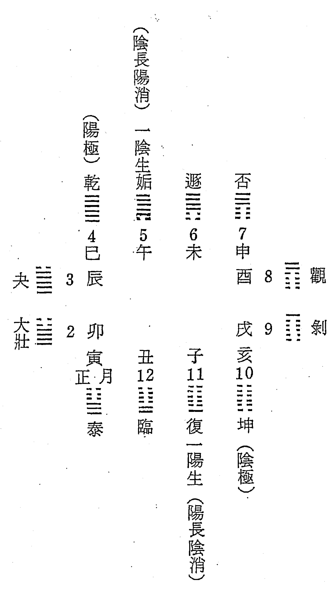

天地陰陽之氣，在一年中，陽氣始於十一月冬至，即所謂冬至一陽生，極於四月，陰氣始於五月夏至，所謂夏至一陰生，極於十月，故就一年中，氣化消息，以冬至為陽氣之始，其論至當至是，乾卦初九曰：「潛龍勿用」，氣之初生也，尚不足以言用，猶人之為胎也，不能為用，命理為術數之用，以用為主，初陽不能言用，故以冬至起年柱，其說不無可論之處，待立春後，陽息陰消，成為平衡狀態，陽氣大壯，兩氣均衡，可以言用也，如嬰兒已成體降生，有用可期，方可言用也，且十一月冬至，後天卦位坎，繫辭曰：「勞乎坎」尚須坎水滋養，以陽尚稈也，至立春，卦位艮，「成始成終也」，陽已成終，故能成始，如果子尚未成熟，則不能成為種子，再行繁殖，故必成終，始能成始，冬至之陽，尚未成終，故不能成始也，此亦以立春為年柱之說，後以冬至為年柱說，為有力之理論根據也。

> 【答】：耕萃堂主人：師兄寫得一手好行書，確是一幅臨摹的好字帖。弟珍惜師兄之才華過人，故不顧「不必刊登服務」之交代，仍公諸同道鑑賞。

就來函所示『八字年柱起冬至或立春說解』乙項，從師兄之深闢分析，可見絕非泛泛之輩。今非弟之意欲逞強，就個人生性好觀眾生百態，及研究命理之心得，再略疏一、二與師兄切磋，有違理則之處，尚望不吝教正。

貴書：『以冬至為陽氣之始……氣之初生也，尚不足以言用，猶人之為胎也，不能為用……待立春後，陽息陰消，成為平衡狀態，陽氣大壯，兩氣平衡，可言用也，如嬰兒已成體降生，有用可期，方可言用也。……』茲就所述理趣，試伸管見於次─

自然人之初生也，始自夫婦之敦倫：交媾之當時，地理經緯，寒暖燥濕，與出生之時刻、座標（出生地），決定了一則命造之命質命能。受精卵有如鋼質，胎期如火候，生辰如淬火過程，吾人之質能乃此三元之總成，一生之運軌，為此命質命能導引出的拋物線。

就生辰以推吾人一生之運程，實不若以受孕之時辰以推一生之起伏精準。

民七十一年（歲次壬戌） 弟授業於 恩師西林山人門下，曾習得以生辰追溯受孕期之公式，嘗屢以受孕時辰以推命例，果遠比就生辰以推人命更為準驗，倘若以孕日與生日合參論命，則更為確實。吾人一生之壽夭窮通，嚴格地說：始自夫婦交媾之時刻，健康與心緒決定精子與卵子的品質，精子與卵子結合之時分，及受精卵着床日，及十月孕育期母體之健康狀態，與胎教（孕婦心態）有以致之，出生時與生地之座標，乃次要之條件。人類係大自然之造化，故大自然之理數，可由人身去回溯演繹其理趣，由是以觀：以冬至為年干支交換日，似亦有待商榷的價值，此其一。

設地球不動，太陽動：冬至為太陽行旅地球之終點（南回歸線），過冬至而後復又北上，一年之新氣候由冬至始，故次年干支之交換日，可自冬至始，此其二。

民五十九（歲次庚戌） 賃屋設廠，房東懂命理比鄰而居，朝夕得其啟蒙。是年復得其介紹拜師寶山古老先生習米卦、斷易、四柱，前後歷經整十載，一直相沿舊說：以夜十一時為次日之始，立春為年之交脫。及至庚申歲（民六十九），至宜蘭經營「考前猜題班」期間，由於遠去家門，較少瑣事，課餘研讀吳俊民老師之「命理新論」作消遣，始知以零時分早子、夜子，以冬至日為換次年干支之說。日後每逢冬至～立春日期間出生者，嘗合參以冬至換次年干支及以立春為年之交脫，以審原命之喜忌與行運之搭配，究以何為驗，果發現以冬至日換次年干支較準驗。故近數年來，每與好友論命，每逢冬至～立春間出生者，向以兩式合參，以決可採之一方以定去就。此以冬至為年干之交換日，有其可信者三。以上不成理趣，意不在自我辯解，唯對學術之一絲誠摯耳，尚祈師兄費思驗證。

## 紫微斗數系列

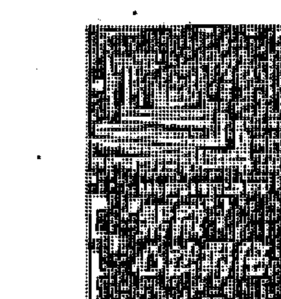

**紫微心法揭秘**
天翊居士 著/A461-1/25K/平裝/264頁/280元
有一種從來沒有人著書公開的斗數秘法，不需生辰八字，只要隨機取數，再根據所取之數排出命盤，即可看出任何人的運勢、事業、財運、健康、住宅吉凶、合夥……等等情況，涵蓋的層面比易經卜卦更多更廣、更細微，凡事皆可問，且準確性令人拍案叫奇。

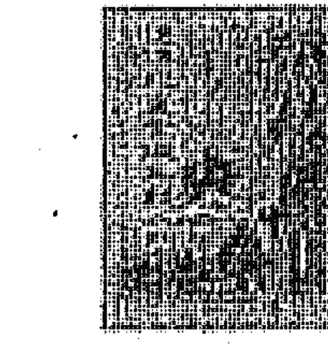

**道傳飛星紫微斗數入門**
陳憲明 著 A635-1 / 25K / 平裝 / 200頁 / 220元
作者才華橫溢，天賦異稟，研究斗數多年，實證萬千，頗有心得。其論命之準確性，常令人驚訝萬分；其神奇之斗數推命法，常令人心服口服。有此奇才異術，豈容埋沒，今公開其獨門要訣，擁有此書，再詳加研究，必可使你的斗數更上層樓。

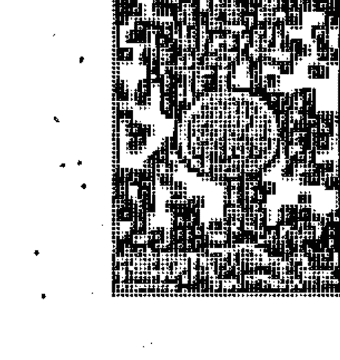

**紫微隨筆(元、亨、利、貞集)**
鍾義明 著 A093(元)A116(亨)A117-1(利) A118(貞)/25K/平裝/431頁/各300元
《紫微隨筆》分為四集：元集《斗數明燈》、亨集《斗數古文精解》、利集《斗數拆招》、貞集《斗數批命實務》；元、亨二集闡發斗數的基礎理念，利、貞二集公開斗數的推廣方法。

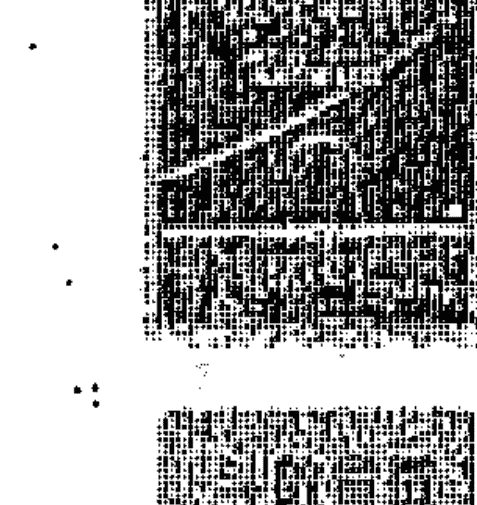

**紫微斗數流年秘斷**
邱聖智 著 A442 / 25K / 平裝 / 286頁 / 250元
流年之論斷，為斗數難題之一，流年、小限、斗君...，孰重孰輕，無以究理，斗數書籍雖多，並無一完整者可循。作者於感嘆之餘，又在朋友之鼓勵下，經多年之蒐集和研究，屢有新的發現和創見，特編此書與同好切磋。

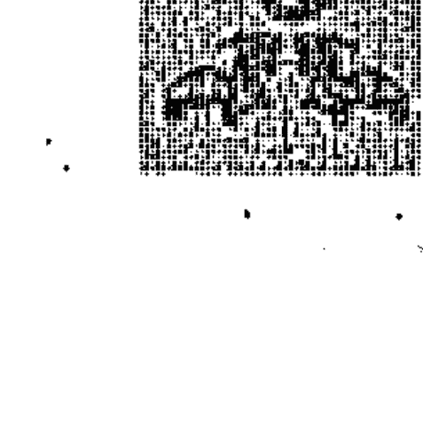

**斗數宣微**
王栽珊 著 A488-1 / 25K / 平裝 / 248頁 / 220元
作者於陳希夷紫微斗數一書頗諳旨趣，遂引申舊說，參考實驗，對原書脫落訛字，悉心訂正，析其是非，闡明奧理，頗見真機。談命之外，特列「陰陽二宅」之論，以備堪輿家研究，又「斗數雜論」更是作者數十年之研命經歷，閱者切勿河漢視之。

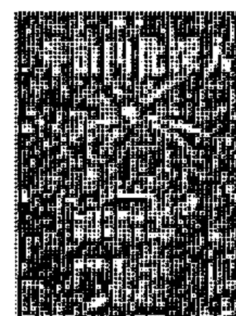

**斗數四化深入**
謝武藤 著 A393 / 25K / 平裝 / 320 頁 / 320 元
如果您能掌握趨吉避凶之道，便可以去創造、改變，減少人生道路上的阻礙。多看、多驗證，是學習命理的不二法門。本書收入事業、財利、災疾與官司之命造百餘例，說明事實與發生的原因，並附有八字及大運，故亦必可知命掌握運，早登陸門。

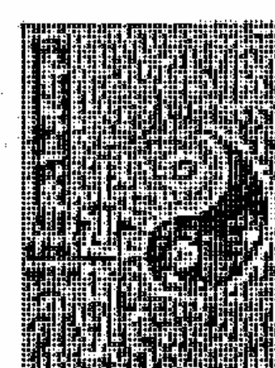

**紫微斗數流年速斷法**
王士文 著 A495-1 / 25K / 平裝 / 317 頁 / 250 元
在中國命理學中，對事情的演變具有高度解析力的，當推紫微斗數。紫微斗數可推一件事的起因、發展的過程、可能的結果，能對未知的事情做出常、變的推測，而人一生的命運，操控在常、變之中，只要善加利用，這門學問必能成為生活上的最佳顧問。

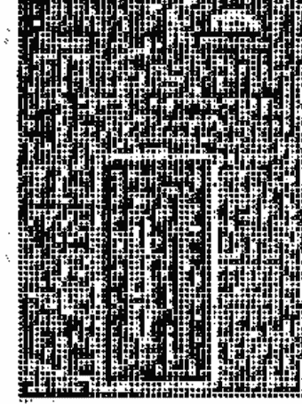

**紫微一得**
鍾義明 著 /A235/25K/平裝/656 頁/500 元
本書詳明簡要解說的斗數基礎應用表格。提出現行斗數推命中，具有爭議性的問題，予以追根溯源，配合實例驗證。探討斗數古籍內容的真義、訂正錯誤，並有相關的推命技巧及作者精心製作的推斷應用表格。

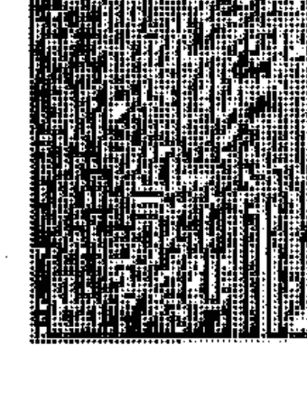

**星系導讀(上下)**
緣生 著/A606 A607/25K/平裝/各 304 頁/各 280 元
『星系』是紫微斗數的靈魂！只要能掌握星系的奧義，就等於科學家能掌握 DNA 的秘碼一樣，同樣可以創造人生的未來。研究星系，不僅是發掘斗數中的精華，更是開發一切命理秘法的關鍵。

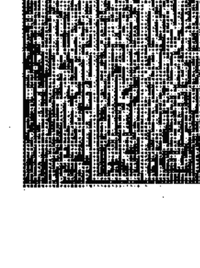

**紫微斗數四化實證**
郭文嘉 著 A503-1 / 25K / 平裝 / 304 頁 / 250 元
紫微斗數在論斷人物對待方面，有其獨到之處，而四化更堪稱為斗數之神，如果只熟悉星曜特性而不懂四化對待，將如菜式千百樣而不知如何烹調，因此不但要熟知星曜性質，更須詳審四化對全局之影響，如此在論斷吉凶的準確度必可大為提高。

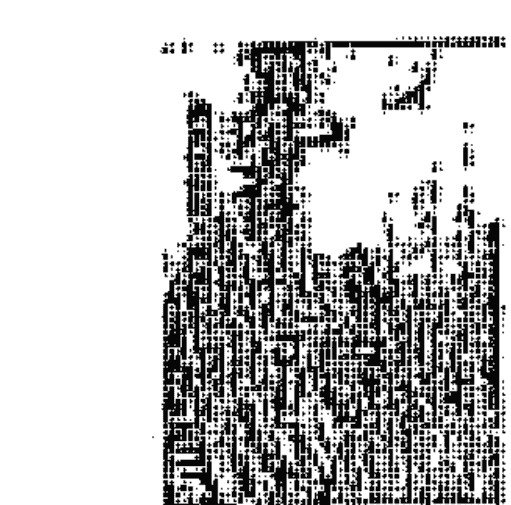

**九千飛星**
九千 著/A673/25K/平裝/368 頁/380 元
「九千飛星」是經過作者多年資料搜集和研究的成果，把「飛星派紫微斗數」這門一直被命理界視為秘笈的論命法門公開。本書輔以百多幅圖表和論命實例，以深入淺出的方式，有系統地講解「飛星派紫微斗數」中最關鍵的原理，讓想窺探箇中奧秘的人，憑藉此書，掌握正統紫微斗數論命的法門。

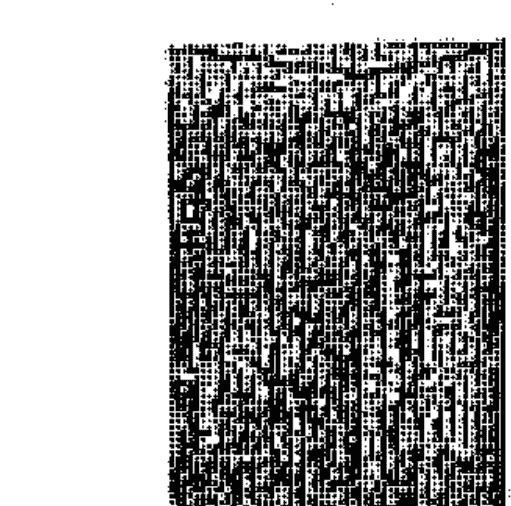

**紫微斗數太微命判**
黃進長 著/A684/25K/平裝/312 頁/400 元
失傳千年的紫微斗數真訣大公開，首次提出「論個性不看命宮」「命宮無用」的看法。「太微命判」有理論有邏輯，可在短期內學會，讓您有勝讀十年書之感，是學習紫微斗數不可多得的好書。

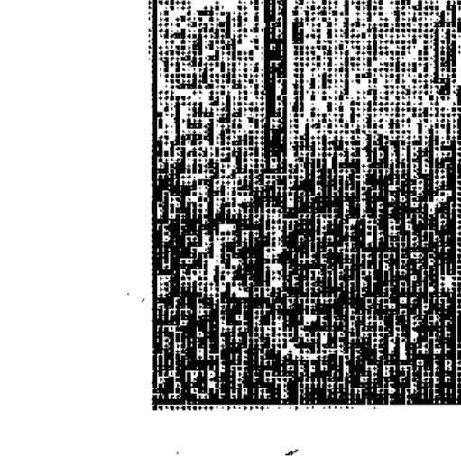

**紫微講義**
陳雪濤 著/A101/25K/平裝/480 頁/450 元
紫微斗數是一門易學難精的祿命之學，近數年更在中港臺等地掀起成為一股熱潮，很多人都購書自修去暗中摸索。譽滿中港臺的術數泰斗陳雪濤老師將部份過往授課的「內部講義」整理，且直接名為《斗數講義》，即為針對目前斗數界的現象而寫成的專書，勢必再度帶來一番衝擊和啟示！

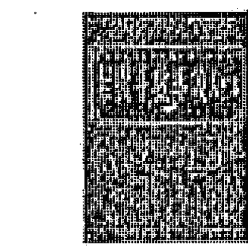

**紫微斗數導讀入門篇**
陳世興 著 A522-1 / 25K / 平裝 / 256 頁 / 250 元
如果您想找一本斗數入門書，或曾研習斗數而覺深奧難懂，本書會令您耳目一新，手不釋卷。作者以現代的時空為背景，重新詮釋十二宮及星曜賦性，並以燒飯做菜來比喻星曜間之關係，心得全部公開，毫無保留，易學易懂。

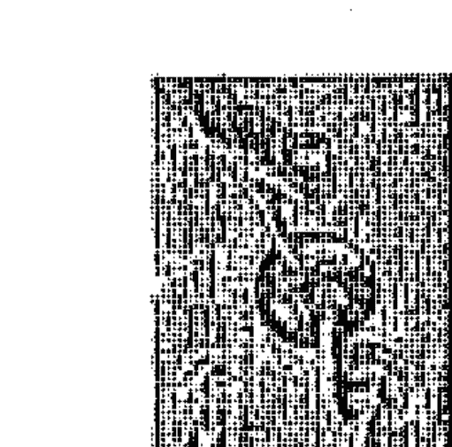

**紫微斗數全書**
陳希夷 著 A216-1 / 25K / 平裝 / 220 頁 / 250 元
宇宙星辰的變化，與人有著因果存在和影響的關係。人生前程難測，若欲論斷大局和小事，則須靠紫微斗數的預知未來滿足需要。欲探紫微斗數的世界，則須有一本完整工具書指引。熟讀本書內章節，即可探知箇中深奧的學問。

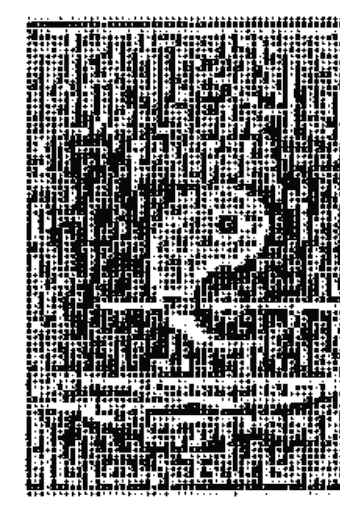

**陸斌兆紫微斗數講義評註**
陸在田 著 A407-1 / 25K / 平裝 / 512 頁 / 450 元
陸斌兆先生，乃數十年前香港紫微斗數界的大師級人物，著有「紫微斗數講義」。其門人陸在田先生，加作評註，仔細閱讀本書，可以將你帶上紫微斗數的更高境界，批斷命運準確如神。凡是紫微斗數的愛好者，這本書不可不讀。

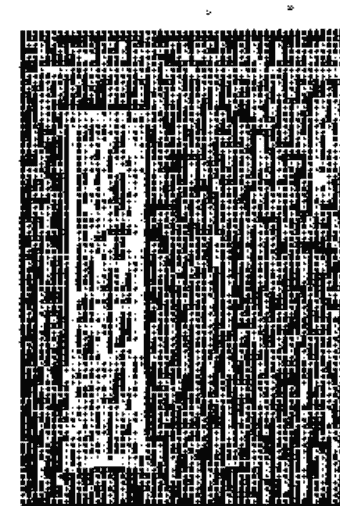

**紫微斗數夫妻宮秘傳真訣**
陳雪濤 著 A334-1 / 25K / 平裝 / 355 頁 / 450 元
本書乃陳雪濤先生深入研究斗數的成果。夫妻宮是紫微斗數重要的宮垣，與人生息息相關。此宮垣可影響一個人的事業成敗與及一生幸福。有些人會跟配偶反目，有些人適合與配偶合作經營，有些人必然離婚...，這些都可從書內找到答案。

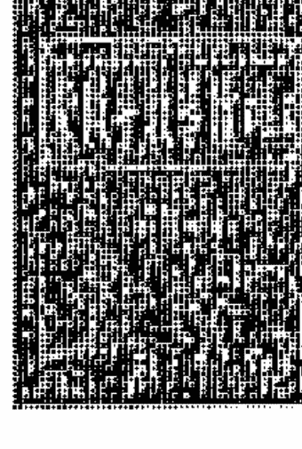

**紫微斗數導讀解盤篇**
陳世興 著/A501-1/25K/平裝/304 頁/280 元
坊間有關斗數論命的書何其多，但似乎都很難入門。作者亦曾身受其苦，故今特地將苦讀研究的心得，編成這一套真正讓讀者易懂易學的斗數書籍。本書〈解盤篇〉以紫微、天府在寅宮立命為主題，透過不同的生辰八字，來說明各類型之星曜組合，經過對比分析，自然能領悟。

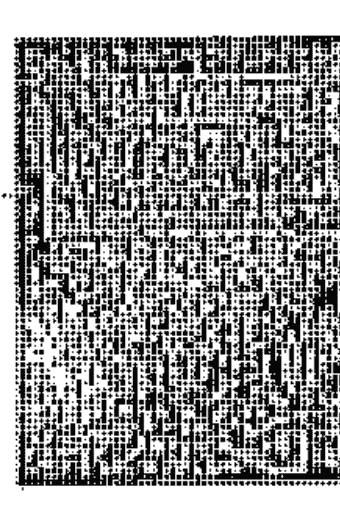

**紫微斗數導讀進階篇**
陳世興 著/A663/25K/平裝/288 頁/280 元
想要學好斗數者所撰述，讀者最好以研讀〈入門篇〉、〈解盤篇〉，甚至〈獨身篇〉、〈外遇篇〉，這樣看十二宮之實例解盤才不會吃力。十二宮說明是本書之重點，筆者將以實例來說明十二宮可能面臨的問題，每一冊不限宮位、字數構成一冊，集結出版，專談命身宮。

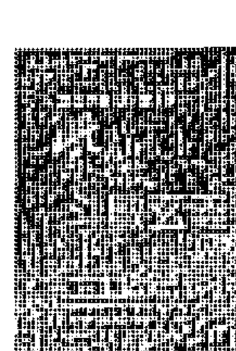

**紫微斗數玄義**
劉軍凌 著/A459-1/25K/平裝/304 頁/300 元
書中要告訴你：如何才能改變命運，使你心想事成。用最淺白的字句，教導你趨吉避凶的竅門，引領你啟動無往不利的命運助力的方法，使你迅速邁向成功的康莊大道。絕對是一本值得你一讀再讀、永世珍藏的好書。

## 開館人紫微斗數(一)

國立中央圖書館出版品預行編目資料

開館人紫微斗數/方外人著. -- 二版. -- 台北市 : 武陵, 1998[民 87]印刷 面; 公分

ISBN 978-957-35-0239-5 (第一冊 : 平裝) ISBN 978-957-35-0240-1 (第二冊 : 平裝)

1. 命書

293.1

87006037

著 者 方外人
發 行 人 林輝慶
出 版 者 武陵出版社
社 址 台北市基隆路二段 125 號七樓之二
電 話 (02)2735-9985
傳真號碼 (02)2735-7993
郵撥帳號 01050635
E-mail woolin@ms16.hinet.net
網 址 http://www.woolin.com.tw
法律顧問 王味爽律師
印 刷 者 佩蓁印刷有限公司
裝 訂 者 忠信裝訂廠
登 記 證 局版臺業字第 1128 號
二版六刷 2013 年 6 月
定 價 300 元
缺頁或裝訂錯誤可隨時更換
版權所有。翻印必究
ISBN 978-957-35-0239-5