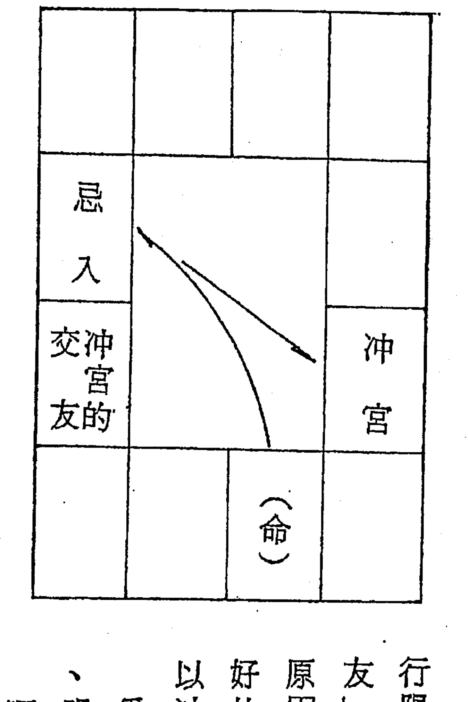

# 开馆人紫微斗数 2

# 命不可尽信(代序)

根据专家的统计，成功者只占全人类的百分之三，其余的百分之九十七，都是庸庸碌碌，毫无可恋的渡过了他的一生。当其即将步入人生的尽头时，不尽埋怨道：在我的一生当中，从来就没有过机会，你叫我如何成功。真会是这样吗？

命运掌握在自己的手里，当机会来临的时候，要适时的拥抱他。研究命理的价值，祇在「知进退」，使能确实的掌握机会，而非屈服于命运之神的摆布，随波逐流，甚或在漩涡中载浮载沉。

命理如果尽可信，为什么同一时间出生者，有的成功，有的失败？我们不能在五行中迂腐终生，务必冲出方外，用客观的态度来顾盼自己的命运，当有一线生机可趁时，要紧紧的抓住它。命盘只是考验的模式，犹如故事中的十八铜人阵，要你去通过考验，而非要你终生遵循的轨迹。人类并非生而注定，谁是成功者，谁是失败者。如果是这样，那么吾人不就打一出生就被判死刑了吗？千万不可尽信命运，视命盘为一生行旅的「线路网」，人类非比机械，何可如此刻板。吾人若尽信命运，不期突破，视命盘如操纵机器人的电脑，那么世界将成为一片灰色，了无生机！

美好的讯息已经来临，请留意并研究每日的新闻报道（包含分类广告栏），人们刻意攻讦、曲扭的行业，就是即将崛起的「尖端事业」，那是你致富的大好机会。不要盲从群众，已然一片看好的行业，很快的会成为「夕阳工业」，不可步人之后尘，而给自己带来不可收拾的烂摊子。「台湾钱淹脚目」、「台湾没有三年好光景」，能认识此一时势就是成功者。

# 十二宫说解

## 【命临子午卯酉】

子午卯酉为桃花地，安命在这些宫位的人，比较好酒色、人缘好、朋友多，如是自然也就多飘荡。由于接触面广泛，所以会多受考验，因此人很发达，很能吸引人，感情生活也跟着复杂起来。但要配合星情来看，始可确论命临子午卯酉者的通性。

安命子午卯酉为什么会飘荡？福德宫在寅申巳亥四马之地的关系。若安命在四沐之地，机巨临命迁线，财福线必守同梁。同梁守财福者，好游山玩水，不为五斗米折腰，你说其人怎么不飘逸。

阳梁临子午卯西安命者，财福线必守机阴。天机是机车，太阴是进口车，所以阳梁在子午卯西安命者，经常不在家，好观光。跑的里数比同梁临福德者更远，出门有车代步。

机阴临财福好旅行，同梁临财福好远足。所以里数有远近之差别。
同阴临子午卯酉安命，财福线必守阳巨。太阳爱表现，巨门喜胡扯，所
以同阴临命在子午卯酉者，其飘荡的情形要比前述两者保守些，通常是在
半径三公里之内找父老兄弟聊天，所以可称之为「乡亲型」，最宜服务工
作─选里长、当代表，替别人忙碌。
就上举三种类型作一比较：阳梁临命迁者，因财福持机阴，所以这种命
型从小好玩车子，迫不及待的盼到法定年龄马上去考驾照。同时想尽办法
购买一部最拉风的机车。成年后好开轿车。格局高的开车好玩，格局较次
者开车服务他人。女性可能从事随车服务人员，或乘车赶场作秀的演艺人
员，或富人家出门有车。
机巨临命迁，财福持同梁者，较多搭人家的便车，或乘铁公路的班车、
计程车到处行旅。因福德为享受的宫位，同梁是福星，所以由别人开车，
自己可以毫无负担的安享乐趣。
同阴临命迁，财福持阳巨者，则每多骑机车穿梭于街坊巷道之间找朋友

# 饮茶聊天

所以衡量身价，不能以车乘作评估。有车者，颇多只是个人之喜好罢了。真正的有车阶级，应是没有负债，请得起司机的才算。多少有车人家负债累累，却用一流的进口车来充面子，我没有说假，到处公路旁有汽车贷款的招告，就是最好的写实。

附带一提——左辅入命者，亦一生与车结缘。格局高的，人家替他开车；较次的自己开；又次者为司机，司轮（开船的）。

左辅、右弼都是辅佐星，但辅佐的性质有差别。右弼是对事，左辅较偏跑腿。更高明处，希望你能发明。

其余命临子午卯酉桃花地者尚有——

廉贞、天相、破军临子午卯酉命迁者，财福线必守紫微、天府、七杀。

紫微、贪狼临子午卯酉命迁者，财福线必守武曲、天相、破军。

武曲、天府、七杀临命迁者，财福线必守廉贞、贪狼。

以上三种类型，每多因婚姻波折，为感情生活而飘荡。

## 【命临寅申巳亥】

寅申巳亥为四马之地，安命在这些宫位的人，比较劳碌奔波，自寻苦恼，若加遇动星，则这种趋势更为明显。

紫微、天府、七杀临寅申巳亥命迁线，财福线守武曲、贪狼。紫微为官禄主，七杀为战将主开创，其余天府，武曲、贪狼皆为财星，从而可以联想，其「劳碌奔波，自寻苦恼。」无非为「财」。紫微、天府为帝王，为令星，守于命迁线，必然自鸣得意，好粉饰，替这种人算命简单！奉承他，红包有你赚的。如若你对其人格有所批评，那累了！反驳的言论说的比你还多。师兄：放高明一点，人类是「最不可理喻的动物」。

天机、太阴在寅申巳亥命迁线，财福线守天同、巨门。除太阴为财星之外，天机光想不做，天同好享乐，巨门「爱吃鬼」。如是其「劳碌奔波，自寻苦恼。」可不一定是为钱财，许多时候可会是为了吃喝玩乐。机阴临命在寅申，男命易接近女色，且颇善体贴，很懂得女性心理；女命柔中带刚，很有女性味道，如果是别人的老婆，欣赏一下可真不错，设若为自家

的老婆，朋友争相欣赏，可就很不是滋味啰！同巨在财福很可能会饮酒、打牌，怎么不奔波、苦恼。

太阳、巨门临寅申巳亥命迁线，财福线守天机、天梁，这种命型很像孔子、苏格拉底，看不惯时代黑暗，挺身出来讲话，很有哲人、行者的风范（行者：修行的人）。就财运来说，很不怎么样，纵使能逢禄，也只是虚花一时而已。惟其存在的价值必然优于生意人。太阳主博爱，巨门聪明善表达，天机心思细密，天梁心地善良，故其奔波、苦恼，乃是为利他而引发。

武曲、天相、破军临寅申巳亥命迁线，财福守廉贞、天府、七杀。武曲刚毅果决，天相保守，破军喜开创；廉贞善变，天府爱惜钱财，七杀好冲刺。两种不同性质的星曜组合在命迁线、财福线。性格方面较为折衷，喜欢在安定中求进步，故其奔波、苦恼的趋势可以获得减轻。

命入四马之地，持比较稳定的星曜，如天府、天相，便会产生平衡的作用，劳碌的情况便会减少。若会动星，如天马、天机、太阳、太阴，或杀

破狼，则增加劳碌的程度，不眠不休的日夜辛勤。

命坐寅申巳亥，或福德临此四马之地，且同会两颗主星，其人必同时进行两种行业。例如白天上班，晚上兼差。青少年期也可能是半工半读。又若夫妻临寅申巳亥，且同会两颗主星，比较会二度婚姻。

二度婚姻的解法，除以前谈过的「先公证，再结婚宴客。」分二次进行即是等于二次婚姻。若已婚夫妇，婚姻亮起红灯，去拍个结婚纪念照，或可解厄。我们且不必管它这般做法，是否在冥冥中果真具有一股不可名状的力量在牵引，或是心理约束，有效就好，吾侪何必费尽心思去追求其所以然的原因，玄学本来就不可能「拿出证据来」。硬是要钻牛角尖实在没意义，我用这种方法替人解厄已有多年，效果相当良好，比起江湖术士动辄替人「祭一祭」索价若干，要慈悲得多了。

婚姻亮起红灯的看法有多端，生年科入夫妻，或命宫化科入夫妻，或夫妻宫有左右、昌曲、魁钺，或夫妻宫化忌冲兄弟、冲父母，或官禄冲父母，冲兄弟，都很有可能。

另有一种夫妻吵得死去活来的情况。兹列述如次：
台北洪尊和老师提供：刑煞夹夫妻，吵得很凶，莫明其妙怀疑配偶不贞。绝对正确，我验证再三。此外，刑煞夹流年之任何十二宫，皆表该宫问题多。亦即有「刑煞夹」的命局，一生多是非。
个人心得：单一阴煞入兄弟也表床第失和，吵得很凶。师兄没忘记吧，兄弟是卧室的交友，为床位，阴煞是鬼（业力灵）。解法：床下铺红地毡，或床脚垫四块红布，有效。此项解法为高雄潘永进老师所提供。另有一法徐静观介绍：大限的夫妻化科所入的卦位，夜晚睡觉脚向该方位，亦即脸向科方可解。

# 言归正题

傍晚（76.4.1.）饭后，在附近漫步，邻家茶行有位青年招呼我进去喝茶。谈起下午到对面海鲜（地下酒家）饮酒的事。说：某君很会调侃女生，某君毛毛手毛脚，且是几个女生一团抱，来一个毛一个，所言启发了我的灵感。此二君爱吃豆腐，我很同情，他们的命盘随时刻画在我的脑子里，为

什么会这样？跟星性有关。

机阴在寅申巳亥安命或立于福德，对性之心态犹如蜻蜓点水了无痕。打野食纯属一时兴趣，事后不留情。因此桃色纠纷往往是一场云雾过后，不理人。对方不甘受愚而起报复心理，绯闻因此被揭穿。

同梁在寅申巳亥安命或立于福德，则是多情种，买卖行为做不来，对感情事很认真，桃花持续时间很长，一直到被识破了才肯罢休。也很有可能根本没有夫妻的行为，而彼此常相恋爱，究其原因同梁的组合希望获得照顾，也能替对方设想，感情建立在彼此的互惠上。

廉贞在寅申巳亥安命或立于福德，好求新鲜、刺激，很动物性，不需感情基础，朋友一经认识，很快的会有爱抚的动作，往往在热恋中还会旁惊其他的异性朋友，像「溪哥仔」，保鲜时间很短。这种命型在婚前就有婚变征兆出现，赋文说「嫁三夫而不足」。究其原因贪狼花样多，廉贞善变，所以男子爱「做皇帝」，女生喜应召（使个眼色就跟人走）。

见到女生就油腔是天梁，毛手毛脚是廉贞，这下你明白了吧。

以上的描述只在对学术忠实，并非蓄意传授骗色的伎俩，学算命要有匡正社会的愿力才好。桃花的后遗症很累人，是无形的，不可目见，只能凭感受。造恶业并非不报，等恶业成熟的时候才报。

## 【命临辰戌丑未】

辰戌丑未为四墓之地，主孤。孤的意思并不代表人丁凋零，一般的情况是亲子、同胞各自发展，不互相依存，最明显的是一家人用餐、作息的时间不一致。个性方面较为保守孤立，一生中每常与家人分离。尤以杀破狼入四墓之地，或日月在丑未交会，或日月在辰戌反背更验。

辰戌为天罗地网，其飘荡流离的特性比丑未更甚。紫相在辰戌对宫持破军，或紫破在丑未对宫持天相，赋文说「为臣不忠、为子不孝、凶恶胥吏」。究其原因紫微帝王星好称老大，在辰戌与天相同宫，做事细心有计划，为领袖格；在丑未紫微会破军，为皇帝师权，一样是高高在上的调调。所以对上司便会产生反抗的心理，想自己当头，不愿受制于人下，每常有委屈的感觉，对上司怨恨不满，就是这心理的反射。为子不孝，并非一

定对父母不恭顺，颇多是在外的所做所为给父母带来极大的困扰。或令父母极为痛心。比较轻微的现象是有代沟，总认为父母跟不上时代。「凶恶胥吏」如鱼肉乡民的地痞，或偷斤减两的商贩，或利用职权压榨百姓的公职人员，不用正当手法赚钱而用拉债的经济犯。

紫微、破军、天相在辰戌丑未命迁线者，财福线守武曲、七杀、天府，皆为财星，我们可以联想得到，其一生的活动与财有关。

天机、天梁在辰戌安命，较为孤独，一般容易接近宗教，加会截空、旬空、地空、地劫，更可确定若非和尚，至少是在家居士，所以赋文说「善荫逢空，天竺僧。」机梁本来就不是财星，再加上空星，孤苦贫寒是很自然的事，因此容易走宗教路线。

太阳、太阴在丑未安命，一生操劳不停，主要原因是两颗都是动星，在丑未为日月交接之地，所以相当忙碌，一生事业亦成败多端。急性、好动、多飘泊。

武曲、贪狼在丑未安命，颇具决断能力，做事勤快，凡事速战速决。十

足的生意人，为求达到目的，不惜一掷千金。
天同、巨门在丑未安命，性情温和，待人接物相当成功。聪明、善于言词、记性好，很适合从事外交工作。惟天同好逸恶劳，巨门是非多争，所以家庭生活很不和谐。一般的说法「女命偏房多」，尤其甲戊庚年生人魁钺入命迁线，更加是说。但所谓「偏房」，以今日一夫一妻的社会形态来讲，作偏房的可能性并不大，一般的情况是先上车，或与已婚者有过「苟且」的行为而已，胡乱说人家偏房命会造「口业」。
廉贞、天府在辰戌安命，钱财是点点滴滴慢慢赚来的，肯打拼。有人说「廉府是出名的守财奴」，我们换个语气，赞美人「勤俭起家」不更好。廉府安命者尚有一特色——社交圆满。缺点是婚姻不美满，因夫妻宫持破军的关系。三方会紫、武、相，一生走财经路线。
廉贞、七杀在丑未安命，对创业很感兴趣，爱好文艺，会昌曲很有礼貌。廉杀的「孤」是为事业奔驰，由于官禄持武破，所以事业心很大；紫贪临财帛，对钱财的欲望也很大。廉杀在丑未，对宫必守天府贵人星，主出

外多贵人相助，雄心万丈，甲戊庚年生人魁钺入命迁线，更加是断。

以上「十二宫说解」，其旨趣在接续第五册介绍之「诸星在十二宫安命之差异，期师友能对各种命型产生整体的概念，以利日后作精深的研究。

# 笑谈一则

前日好友刘氏夫妇与早期学友林师姐相邀爬狮头山，回程走狮尾到竹东，半路上林师姐说：「老师，我今天流日在酉会天相—有口福。」我说：「天相逆去二宫是贪狼，要七点（戊时）以后才吃得到。」坐在驾驶旁的刘大嫂插嘴说：「不会吧！我们六点以前就可以到达竹东。」……

到达竹东后，刘大哥领我们到他朋友家，请一起饮酒去。而他的朋友已经喝得差不多了，说：「我泡个澡去，让头脑醒醒再跟你们一道去。」结果这位朋友进去一泡就是一个多小时。

等我们从朋友家起身往外走的时候，我看一下墙上的挂钟是七点三分。便说：「没错吧！就是要七点以后才吃得到。」大家不禁大笑。

在馆子里用餐的时候，刘氏夫妇及林师姐直向这位陌生的朋友介绍我算命有多准。这位朋友便说：「帮我算一算」。我一向做任何事都很认真专一，心里面想「喝酒就喝酒，还算什么命。」不过碍于情面还是说：「几月，什么时生的。」 「肖虎的，三月上午五点多。」 「我心里想「和我同一生肖，比我老些，一定是丙寅年生人，今年62岁。」 于是答说：「去年生了一场病」，这位朋友闻言跳了起来，兴奋的两手将衣服往上一提，露出一道刀痕从胸口直到肚脐，大叫道：「什么生病！开了个大手术。」 与座的人又是一场爆笑；并异口同声的说「妙！妙。」

师兄：您知道怎么看的？这个简单！

三月卯时命落丑宫，去年会红鸾，年青人主喜庆，老年人身体有灾，不然破财，如此而已。

通常与人聚餐，碰到求算命的，我都是只问月时，就替人算命。用月时定命宫，命宫入十二宫有其一定的通性，妻财子禄皆可断。再配合流年星，如魁钺、禄马、流昌、流羊陀，及廿四流年支星，断起来妙不可言。如

果再配合长相、气色、语调、吃相，无不准验如神。有关语调、吃相的断命法，去年发表的「擂台」里有一段描述，是我个人独见创获的心得报告，师兄有兴趣何妨再作一回顾。接着我们一起来探讨上集未竟的小星。

# 续论星情

## 丙级星

丙级星原则上力量较甲级主星及乙级星为次，若会有力主星及六吉星，能发挥优点，失去缺点。倘加会之主星无力，且逢煞冲破，缺点就显现出来。基本上丙级星以会遇相同性质之星曜为佳。遇不同性质之强星会失去力量。

长生：表示「发生」之现象，入十二宫皆以吉论，不喜与空亡同宫。入

命主温良敦厚，寿命长。与天机同宫最能发挥力量。幼年行运最宜逢长生，老年逢不吉。

沐浴：为桃花地，喜入夫妻宫，主闺房和谐，或与空亡同守亦以吉论。入身命宫、财帛、田宅、官禄主破财失职，限年逢同论。入酉宫不吉。沐浴之破败通常与异性有关。入命一生感情纠纷多，职业不安定。「生年逢败地发也虚花」，即指命入沐浴地而言。

冠带：主喜庆，入任何宫位皆吉。入命宫主好胜心强，对自己要求很高，喜欢批评人家，对事要求苛刻，有名，有威权，事事先为自己打算。

临官：主喜庆，入十二宫皆以吉论。入命宫早年不顺，白手起家，中晚年有成。若为巨富之命，主早年丧妻，不富有则主高寿。

帝旺：入十二宫皆吉。入命主其人气傲，做事一意孤行，不依赖人，独来独往，全凭自己的喜好去创造，不向人低头，由于太过自傲，易得罪人，成功得来颇为艰辛。身体强健。

女命帝旺入命，有男子气，贞洁。

衰：入命身宫，表其人没有一点生气。少运限年逢，喜吉星化解，要不然不活泼。入命外表沉静，内心急躁，没有耐性，宜守成，不宜创业，自创业艰难困苦多。

女命逢「衰」入命，外貌文静、秀气，内心刁钻。

病：主疾厄，不喜入命宫及疾厄宫。少年大限逢，不吉。入命、疾表名声不响亮，喜欢幻想，做事没有恒心，老少运逢皆主疾病。入命很可能二度婚姻，早年若无婚变，中年夫妻失和。

死：并非表示死亡，不喜入命宫、父母、兄弟，忌老少运逢，入命限主官讼是非，破财、疾病。加吉好些，否则带病延年。个性优柔、固执，喜欢钻牛角尖，惟仍需考虑加会之主星始可确论。

墓：主暗藏，没有明显的表现，惟暗中具有力量。喜入财官两宫。

绝：入命身宫，主孤独。

胎：为吉星，主增益，不喜入旺运（中年），忌逢空亡。

养：利于培养孕育，主希望无穷，入任何宫位皆吉。

博士：入命主聪明、含蓄、智慧，思想城府，有权有寿。很有文人的气息，会昌曲、化科有成就，与左右、魁钺同守命宫，颇能发挥长才。

力士：为权星，可操持权柄，遇陀罗讲话俗不可耐。会擎羊考场不如意，赋文说「李广不封」，居中晚年费尽心机仍不见有成就。若得同宫之主星化权则吉。

青龙：主喜事或进财，适婚年龄流年逢主可以结婚。入命个性善变，一生多酒色。

小耗：又称地耗，入命主不聚财，耗财较小。不宜与人合伙，会庙旺主星较为吉利，惟仍不免被偷盗。流年或流月之命宫、财帛逢「小耗」，再加会其他煞星，有遗失财物之可能。

将军：主威权，入命个性暴躁、性急。流日逢主得意。

奏书：主福禄——因文书或撰述得意。如投稿被刊登，或受人赞赏；流年、流月逢申请案件容易过关。

喜神：主吉庆喜事，其力量较天喜星小，且不带桃花。大限逢加桃花星，主感情事可以持續，且能夠結婚。

病符：主災病，入命或疾厄宮主病危纏身。流年逢主災病。加煞流月逢之亦不吉利。

大耗：是破耗之星，難承祖業，入命宮主時有失物或較無整理物品的習慣。若與桃花星同宮，因色破財或煩擾。流年逢「大耗」最好動土，否則夫妻恐不圓滿。小限遇之，易遭盜賊破財，不會受提拔。

伏兵：主口舌是非，星性與陀羅近似，惟力量較弱。

官府：主官非訴訟，不喜加會七殺、白虎、喪門、弔客，流日逢較有口舌是非，不然破財損耗。

截路：有攔截之意，不利錢財、事業。行限或流年逢截路，有受阻的現象，但若同會之主星得力再加吉星，則不忌。

空亡：為財星之剋星，不喜與祿存同宮，主對錢財有破損力量，對事業有削減力量。逢有力主星，力量不顯。

旬空：與截路性質近似，但力量較弱，通常現於流月、流日且加煞星時始發生力量。

天空：與空亡相類似，但力量較弱，應於流月、流日。

天傷與天使：必夾遷移宮，平時力量不明顯，老年人不喜兩星相夾。

## 丁、戊級星（廿四年支星）

丁戊級星共有二十四顆，係依流年地支排定，力量微弱，若同宮之主星力強，且加遇六吉星，則吉利之丁戊級星有錦上添花的效用，不吉利之丁戊級星不會構成威脅。若有煞星同宮，且主星力量不足，入本命或限、年逢皆主不吉。丁戊級星通常是應於流年、月、日、時。

將星：主武貴，不論從文從武逢之皆以吉論。

攀鞍：喜入命身宮，主利於考試，升遷。

歲驛：即流年天馬，入流年之命遷線，主奔忙、遷動。

息神：入命為人靜默，不活潑。加煞在十二宮皆不以吉論。

華蓋：主科名，加昌曲、魁鉞、化科，主文筆好，善修詞。華蓋又叫術藝之星，加煞江湖賣藝人。靠口才、特殊技藝立身，日月同宮更能增加知名度。與三台八座、祿存同宮，亦主名聲好。

劫煞：主不利於工作、錢財。

災煞：主遇小人而損財。

天煞：女命不利父親、丈夫，是一種無形的現象。

指背：主有人誹謗，或訴訟情事。

咸池：比天姚更糟，惟若所居宮位吉利，則主文采風流。

月煞：男命不利母親、妻子。通常是遠行或分居。

亡神：主錢財破耗。

歲建：主流年吉凶，會吉一年吉慶，會煞不利。

晦氣：主不順利，嚴重影響心裡的安寧。

喪門：主遭遇不幸之事。三方四正會齊哭虛主該年有喪事。

貫索：有被困的情事，如住院，困在電梯中，門被反鎖。

官符：主訴訟，流年與本生年支之官符、貫索會齊，有牢獄之災。

小耗：與丙級星之小耗相同，但凶象較弱，應於流月、流日。

大耗：與丙級星之大耗相同，但凶象較弱，應於流月、流日。

龍德：主有逢凶化吉的力量。

白虎：主不吉，會喪門、吊客、官符等更凶。

天德：對煞星、化忌具有化解的功能，喜入命身宮，限年逢主吉慶。

吊客：會有喪事或不順事，通常流年逢，主該年訃音較多。

病符：年、月逢主有小災病。

## 學友通訊

一、為期加強服務學友，自本集起至卅冊撰述完畢，每月配合巡迴各地與師友當面切磋。故自即日起通信解答問題改為面授。

二、中和廖葉山先生，已屆「從心」之年，是一位高人長輩，來信鼓勵我「內容確有獨到之處，但未列實例命盤驗證，美中不足」。為了表敬意，而事實也有此需要，故以次我們一起來研究命盤實例。

## 命盤實例

自古以來行家高人，千篇一律的講格局優劣，皆以會吉為佳，會煞為凶。但人們忽略了置之死地而復生的道理。中產階級終生庸碌，只緣日子好過；赤貧人家反能以沖天之勢在短短的數十年中，邁入高產階級，成為社會的領導人物。例如眾所週知的吳火獅、王永慶、何國華，幼年貧無立錐，如今卻是家喻戶曉的產經鉅子。茲引述一則沒有格局，然而事實卻是一員成功者的命例以證實所言不假。

實例一：民國廿七年（歲次戊寅）二月廿七日卯時生 男命

巨門在子為「石中隱玉」，要以三方四正會吉，而無煞星進入為條件。本造巨門在子安命，三方不會吉，也無吉照，而七煞齊入三方四正及福德，無可置疑的一生極端的坎坷，但可喜的是，一個人處在逆境裡容易獲得歷煉，增進處世的本領。

本造之事實—童年被遺棄，十三歲起當童工，完全憑自己的毅力完成高等教育，歷任大專院校教席，是台灣「速讀」的拓荒者。目前正為籌畫建設一座佛教叢林而努力，此項工作固非一人之力所可為，但假若你回想一下武訓的故事，實也不是困難的事。

本造有值得一提的地方是：以父母（文書宮）為定點視其三方，六吉星齊會，表與生俱來的，有一副清靜光明的德性。

| (財帛) 庚申 | (子女) 辛酉 | (夫妻) 壬戌 | (兄弟) 癸亥 |
|---|---|---|---|
| 天馬 天空 天空 句空 | 右弼 天府 | 太陰 | 貪狼 廉貞 |
| (疾厄) 己未 | | | (命宮) 甲子 |
| 紫微 破軍 天鉞 文昌 文曲 | | | 巨門 |
| (遷移) 戊午 | | | (父母) 乙丑 |
| 天機 天梁 鈴星 羊刃 (忌) | | | 天相 天魁 |
| (奴僕) 丁巳 | (官祿) 丙辰 | (田宅) 乙卯 | (福德) 甲寅 |
| 祿存 左輔 | 太陽 陀羅 火星 | 武曲 七殺 | 天同 天梁 地劫 |

命宮持巨門者，有遭遺棄的現象，例如棄嬰、養女，或兒時被視為病故而遭棄置，結果又復活起來，或離家出走。

本造幼年家境清寒，生逢八年抗戰期間，舉家流離失所，這與初運在命宮，會齊七煞有關。

第二限入父母宮，三方四正會齊六吉星，父母宮主文書，且會科名之星，所以十三歲而後遠離父母北上當童工，在無人照料的情況下，仍能珍惜每一分可以利用的時間努力習藝，工餘也絕不浪費時間，認真讀書、寫字。稍長能夠自立，索性跑去讀夜校。痛心的是，當時的工讀生，不受老闆的歡迎，只好到處打零工。此限之所以會出外，是大限干乙使太陰化忌沖大田，表不在家。

第三限入福德，福德為來財的地方，主開創。在四馬之地會同梁，主多旅遊。會空劫，主多爭取。綜上各情，所以表現於此限的生活頗為複雜。

廿四歲服完兵役，廿五歲入台大法學院修習法律，一腦子想當律師。其志願是一背熟了六法全書，面對著社會萬般邪惡，作一個堂堂正正的君子。

惟畢竟命格很「菜」，未幾乃兄堅請返鄉協助經營工廠，情非得已，學校課業只好改以通學方式，每日來回奔波於新竹—台北之間，白天工作，晚間讀書，通車時間在車廂溫習功課。

何以此限如此奔波，大限命入寅宮四馬之地持天同、天梁，主多旅遊；地劫同入大限命為多爭取，所以這種旅遊好比玄奘天竺遊，是有使命的，一點兒也不好玩。之所以每日奔馳於新竹—台北之間，為大限庚天同化忌入大限命，表出去很快又回來。

第四限入田宅，會武殺主多變動，改從事文教工作、辦雜誌，同時經營補習班，所開科目有「讀書方法、考前猜題、時間管理（即今日「經理訓練班」、「魔鬼訓練營」的前身）。這期間混出了名氣而被工商團體、大專院校聘請為「時間與動作」科目之講員。

此限之有此成就，乃大限之六強宮會齊六吉星—左右、昌曲、魁鉞而不見煞星的關係。惟另一方面由於所作投資過鉅，經不起高利貸的壓榨，於本限交脫前「倒店」違反票據法。原因何在？

本命宮（財之氣數位）甲干太陽化忌入官祿沖夫妻，成為大限的疾厄，疾厄為生財之場屋，所以此限藏伏着失業倒店的格局，42. 歲流年入未，沖宮成爲流田，爲破庫——違反票據法。何以破敗與錢有關？

命宮爲財之氣數位，其干之忌在決定錢財的損耗，當大限入卯田宅位，命宮忌之沖宮爲大財之兄弟，主錢財沒有成就。流年入未，命宮忌在流財的父母位，主錢財有文書麻煩，沖流田所以破庫。

從上面的描述，我們可以理出一個概念——論斗數，只用會吉會煞來憑定吉凶是不夠的，還是要以四化來評斷契機。

第四限的最後一年（43. 歲）流年入申，只半年六個月時間，貳佰多萬元的債務，連本帶利償還清楚，爲什麼賺錢那麼快，此即前面所說的「金空則鳴」——地空、旬空在申。若以四化的觀念來追蹤，本命的疾厄已使武曲化祿入大限命，大限34. ～43. 從子年至酉年，祿入的宮位爲子年的田宅，辰年的兄弟，巳年的夫妻，未年的財帛，申年的疾厄，錢財表這幾年比較看好。

本造一生謀事好走時代先鋒，你道是為什麼？巨門坐命一生好賭之故。惟其父疾綫吉星齊會，且得官祿宮化科入疾厄，主光明，一生正派，只賭正當事業，而不賭錢、賭命。

## 觀念提示！

好賭的星有—殺破狼、廉貞、天同、巨門等。但我們替人算命時不能一口判定「你會賭博」「玩大家樂」。通常父疾綫、兄友綫會吉而不會煞者生性光明，都能積極表現於事業。上述好賭之星入命，三方會吉又會煞，或父疾綫會吉又會煞較有可能賭錢財，賭命（流氓）。

一般而言，三合方會吉主聰明，加煞則把聰明用在不正當的事物上去，父疾綫有此現象同論，惟仍需視所會主星而定。例如破軍會昌曲、魁鉞，又加煞，會是流氓頭。若是府相等較穩定的星曜，則較為不忌。又若廉貪的組合會吉又會煞，則是把聰明用於邪淫事。

## 實例二：民國廿一年（歲次壬申）四月十一日巳時 男命

| 命例：21. 4. 11. 巳 男命 | 財帛 戊 | 廉貞 | 疾厄 丁 | 左輔 右弼 | 遷移 丙 | 七殺 | 奴僕 乙 | 天梁 文昌 53-62. |
|---|---|---|---|---|---|---|---|---|
| | 子女 己 | 文曲 | | | | | 官祿 甲 | 紫微 天相 |
| | 夫妻 庚 | 破軍 | | | | | 田宅 癸 | 天機 巨門 |
| | 兄弟 辛 | 天同 | 命宮 壬 | 武曲 天府 | 父母 癸 | 太陽 太陰 | 福德 壬 | 貪狼 |

吾人一生行運，每十年越一大限，每一大限之干支納音，及星之組合、化曜，即是其人一生之心路歷程，這是我個人的獨見創獲，相當準驗。

本造命宮壬子，納音為「桑柘木」，表為人老實、優柔，容易受他人影響，因此吃虧上當。

官祿甲太陽化忌沖疾厄，表倒霉事必與身體有關。疾厄無主星，此時化忌之太陽對身體之疾厄最具威脅性。

太陽代表頭、眼睛。當大限53～62.入交友，沖宮成為大福，是為病厄之時，53. 歲流年入子，與本命重疊，沖流疾為病發之時！糖尿病導致視力障礙，55. 歲流年入寅，沖宮成為流年的交友，因醫師誤診而完全失明。為什麼沖宮成為流年的交友會被誤診？

交友為事業的上司，就學生而言，代表老師，上班族代表上司，店家為上門的顧客，求醫診治時代代表醫師。

官祿忌沖疾厄，表此生最致命的是身體的問題，當沖宮成為大限的福德時，主有災。流年入寅，沖宮成為流年的交友，此時就病厄的人而言，則是醫治我的人！醫師。沖表與之無緣！沒有貴人，所以會被誤診。

進一層以大限干乙使太陰化忌沖本命疾厄言，顯示我命（大限）與身體（本疾）無緣，這也是一項不利的考慮。大限命之沖宮，成為流年的交友，不也可以說是我和醫師無緣。

大限入交友，官祿成為大限的兄弟，兄弟為疾厄的氣數位，大限沖本命（小沖大）主十年不祥，故而表示此十年求醫難逢貴人。

觀念提示！本命之凶兆應於大限為「大沖小」，凶象只應一年。

## 星情卦位斷鬼神

紫微斗數之星情、卦位可以用來影射鬼神。茲引述如次——

子宮為坎卦，影射北方水傍沒溺之亡魂，或血疾而死之鬼。

丑寅為艮卦，影射東北之山林、土石之鬼怪作祟。

卯宮為震卦，影射東方木下之妖怪，或雷劈之鬼作惡百端。

辰巳為巽卦，影射東南方自縊、枷鎖致命、山難之亡魂。

午宮為離卦，影射南方勇猛之神，灶司、焚燒、熱病而死之鬼。

未申為坤卦，影射西南曠野之鬼神，山神土地，或先亡親人。

酉宮為兌卦，影射西方陣亡、刎頸或惡疾而死之鬼。

戌亥為乾卦，影射西北方兵刀之鬼，為正之邪神。

此外尚有以方位區分上、中、下界神明之說——

巳午未輕清在上為「上界神」。亥子丑重濁在下為「下界神」。寅卯辰及申酉戌則為「中界神」。

上界神：指稱以「帝、君」之字者，如三官大帝或太陽星君之類。

中界神：指稱「王、千歲」者，如三山國王，五府千歲等。

下界神：指稱「將軍、神、公、夫人」者，如福德正神，有應公等。

一般以天梁為神界的總代表，以陰煞為靈界的總代表。

天梁為蔭星，意味著保佑的意思。因此凡能福蔭我的神明或祖先皆可以天梁星為代表。通常我對神明的斷法，是當客人有難題時，且其流年盤之遷移、子女有出現陰煞，再以大限的福德化科，視所化之星及所入之宮位來替客人指迷，告以應至何方求何神明解厄。

他如武曲代表王爺公，太陰代表女神，巨門代表有應公。至於神之性別，是根據「紫微斗數的故事」裡所影射的人物性別來推定的。

天同代表土地公。吊客為吊死鬼，如陰使七爺。貫索為八爺。喪門則為虛驚事。天虛為精神恍忽。一般論法：以上述與鬼神有關的星加會煞星時視為不吉。但有一項原則務請認明，凡命局會有強星，命盤組合好者，一輩子鬼神不侵，吾人實不必去妄斷人家「沖犯什麼」。

下面剪輯高雄陳啓銓老師的鬼神之說，以供參考——

宮位之應，以化忌沖動為應：

-   ① 在命盤父母宮所應之鬼為家神不安。
-   ② 在疾厄宮為其病因是陰鬼作祟。
-   ③ 田宅宮為居家不寧，或風水造葬不安。
-   ④ 在遷移宮為在外沖犯到的遊路好漢（飄忽不定之鬼）。
-   ⑤ 在官祿宮為工作場合所遇到的鬼魂。
-   ⑥ 在兄弟奴僕，主兄弟有人夭折，要求繼承香火。
-   ⑦ 在夫妻宮為前世夫妻，女鬼作祟或求婚。
-   ⑧ 在子女宮為子女沖犯陰靈而不安。
-   ⑨ 在財帛宮為錢財是非之爭，或小鬼討路費。
-   ⑩ 在福德宮，求土地公得福，祖先餘殃。

## 紫微斗數的故事

星情可以影射人物、鬼神之長幼、性別，是根據下舉模擬的故事而設定。為期便於論斷，務請將每一星曜所代表的人物背記清楚。

## 紫微斗數的傳說

### 一變成小白兔的貴公子

三千多年以前，我國正是殷朝的時代，有一位暴君叫做紂王。他是一個專橫暴虐的國王，但是究竟使殷朝滅亡。

有一天，紂王率領兵馬去打獵。剛要回來的時候，突然下起了一陣大雨，使他不得不跑進附近的廟裏避雨。這所廟裏所奉祭的是九天玄女。

原來好色又粗暴的紂王看見這尊女神的木像，覺得美麗異常，彷彿是仙女下凡。他抑制不了自己心中的艷火，竟想把她娶來當後宮。紂王立刻下令：

「把九天玄女帶回宮中，當我的宮女吧！」

本來，國王的命令是要絕對服從的，但是對象卻是一位女神，萬不得冒瀆神的尊嚴。因此，士兵們就好心苦口勸告紂王取消原意。紂王雖然打消主意，但是心裏覺得很不愉快。

九天玄女本是一位非常慈悲的女神，可是聽到紂王這般無天無理的失禮亂言，則極為憤怒，發誓滅亡殷朝。她便叫了部屬的一個狐狸妖精來，命令說：

「你變作一個天下無比的美女，去戲弄紂王，把殷朝滅亡吧！」

奉命的狐狸妖精答應了，就變身為歷史著名的妲己，接受紂王，成為紂王的愛妾。

當時，天界的神很少，掌握宇宙諸事甚忙，玉皇大帝經常大傷腦筋。玉皇大帝知道九天玄女發誓滅亡殷朝，便覺得特別高興。因為在亂世可出現許多的英雄忠臣，為國犧牲。

玉皇大帝派遣太白金星到天地界的南天門，留意殷朝的大威脅。如有英雄忠臣死亡，即召來天上當神，永駐天界各星座。

殷朝西方有個部落叫周。這部落的居民，很早就從事農業，生活水準相當高，是對殷朝的一大威脅。紂王想把這個周的部落滅亡，就偽稱商談政事，而招見該部落的酋長文王。

周文王精通於易和八卦，聰明超人。他奠定農業社會生活的基礎，統一部落，倡導文化。所以他的存在自然引起紂王討厭。紂王想如果去掉文王，周的部落也不會再強盛起來。不但如此，也許會自然崩潰的。

文王應邀拜訪殷的紂王。趁這個機會紂王就下令逮捕文王，把他投入獄中。為了避免各部落人民的反感，紂王便偽稱文王背叛。

冤枉被捕入獄的周文王，家中還有好幾位公子。其中，大公子的伯邑是一位絕世的美男子。他的學問很好，又善於彈琴，更是聞名部落的孝順公子。心底清正的伯邑不知紂王的險惡陰謀，以為父親被捕完全出於誤解。他便決心直接向紂王辯清父親的冤罪，而離開了周部落。

伯邑訴請無罪，懇請釋放父親。紂王又提不出背叛的證據，只好請伯邑留宿於宮中二、三天，再來談這一件事情。

寂靜的半夜，經過一個多月的長途旅行，到了殷國宮殿來，又不能馬上見父親一面，伯邑的心裏悶悶不樂，想睡也睡不着。他只好拿起琴來彈，想用來安慰自己。美妙的琴音，飄在宮殿四方，有如清溪流水，透出動人的情調。

聽到這美妙的琴音，驚醒了甜睡中的妲己。她傾聽一會兒，認為這琴音不是一般人所能彈得出的，真想看清究竟是誰在彈的。於是，她裸着身體只蓋着一層絲綢的薄衣，就溜出來，一步一步地走向傳出琴音的方向。不久，她走到伯邑的睡房前面來。從門縫兒偷看房間裏面，她竟懷疑自己的眼睛。彈琴的青年好像是天上派來的瀟灑貴公子。妲己把九天玄女託她的重要使命忘掉，淫佚的狐狸精本性漸漸地抬起，終於悄悄地走進伯邑的房裏。伯邑專心彈琴，還不知道妲己走近旁邊，仍然託琴傾訴苦衷。

妲己看到旁邊沒有人，就百般擺出她的嬌態，盡情誘惑伯邑。伯邑對於突來的美女覺得驚訝，但是想起自己今天的真正使命，死心不動於一切的誘惑。他又不忘自己是名門的貴公子，勸告妲己恢復冷靜。但是妲己從未見過這麼高貴瀟灑的美男子，愈演愈淫。悶悶不樂的伯邑，竟然動起肝火，大罵妲己為淫婦。

一場騷擾之後，伯邑便被衛兵所捕。暴君紂王迫妲己說明真相。妲己原是個狐狸妖精，把一切罪惡都拋在伯邑的身上。她淫惡的眼睛早已迷惑了紂王。便說：

「我聽到美妙的琴音就走到伯邑房間前面去。伯邑一看我，就強行拉住我，毛手毛腳地想要非禮。真氣死人。」

紂王聽到這裏，肝火衝天，不管三七二十一，立刻下令殺死伯邑。殘虐成性的紂王又下令把伯邑的身體切成很多塊，用他的肉做成肉丸子送給他的父親文王吃。

在牢獄中的文王，熟悉占星術，已推算出如此驚人的大事件，眼裏流了不少的眼淚。到了早上，送來的早餐裏裝有自己最親愛骨肉做成的肉丸子。文王假裝不知事件而吃下這些肉丸子。

紂王聽到文王很高興地吃光肉丸子，便認為文王並不算什麼了不起的大相士、大賢哲，連自己親生骨肉做成的肉丸子都不知道而吃掉，還是一個不足以敬畏的人物。於是把文王釋放。

被釋放歸國的文王，以悲喜交織的心情走過長途的旅程。當他走到大草原的時候，他就想應用神力把吃下的親生骨肉變形再世，開口吐出那些肉丸子。一瞬間，他吐出肉丸子變成一隻可愛的小動物。全身雪白，長耳紅眼，活活潑潑地在草地上跳躍。傳說這是世界上最初出現的小白兔。也就是說，這小白兔是伯邑的變身。小白兔轉過身來，向文王行個禮，就向草叢中溜走了。

文王的兒子伯邑的肉體，雖然變身為小白兔，但是他的靈魂卻被駐在南天門的太白金星把他帶回天界。他是九天玄女企圖滅亡殷朝的第一個犧牲者。他的靈魂被召回天界後，受封為紫微星，是個掌握「尊貴」之神，永駐於紫色的薔薇園中。

※紫微星

伯邑所住的『紫色的薔薇園』，稱為『紫微星』。以這紫微星為主，推算人的命運，這方法叫做紫微斗數或紫微推命術。

紫微星在推命術中掌管『尊貴』，含意為善良高貴。

回到周部落文王，誓天復仇，努力養馬練兵。但是他的努力尚未達到目的，他的病死。伯邑的弟弟繼承父王的遺志，立為武王，提倡農耕，訓練兵士，富國圖強，並且得到一個偉大的軍師姜尚，而打敗殷軍，滅亡殷朝。武王所以能夠打倒紂王，稱霸天下，建立周朝，可以說完全得力於大軍師姜尚。

（附註）按紫微推命術的原書有二種；一為『紫微斗數全書』，另一為『紫微闡微錄』。

### ※天機星

姜尚又名姜子牙，居住於崑崙山的深山裏，向元始天尊學習仙道，獲得甚多的智慧。運氣未到以前，無論那一個英雄、賢哲、軍師都和凡人完全一樣。姜尚到老年一直過著懷才不遇的生活。他的不幸，可以說受到了配偶的影響。因為他和一位姓馬的小姐結婚，所以一輩子赤貧如洗。

但是到了老年，他倆彼此同意離婚，各走各人的路。從那個時候起，姜尚才開始走了紅運。他每天一人在湖邊垂釣，偶而被文王發現他的才能，任周國軍師。姜尚一向愛國忠王，文王死後也仍然輔佐武王，竭力強國富國。因為他的智慧超人，可以預測未來，適應現在，所以他才被任命為周國的軍師。

武王稱霸天下以後，姜尚受封為齊國諸侯，不幾年他終於逝世了。他的靈魂被太白金星撈回天界，永住於天機星。從此，天機星掌管紫微斗數中的『智慧』。

（註）姜尚的垂釣在於修心養精，不在於魚類。至今在日本以『太公望』而敬稱他。

## ※太陽星

殷末的紂王雖然是一個殘虐的暴君，但是他的周圍也有不少的忠臣。其中有一位最著名的盡忠志士名叫比干。紂王正寵愛妲己，不顧政事時，比干便挺身相勸。但是一旦迷於色香的紂王，裝著馬耳東風，置之不理。比干不怕暴君生氣，經常苦口勸他為民施政。因此，反被紂王疑為奸臣。這時，比干仍是不怨不恨地說道：『如果陛下不相信我，只好把我的心獻給您看。』說罷，拔劍刺胸，挖出自己的心臟給紂王看，然後從容死去，太白金星非常感動比干捨生取義的忠烈精神，便召回他的靈魂永駐天界的太陽星，並請他掌管天地間的『光明正大』。

## ※武曲星

武王就位後，一面積極從事滅殷復仇，一面施行德政，使人民安居樂業，自己也享天壽後才去世。太白金星很佩服武王討紂的英勇武功，便請他的靈魂永住武曲星，掌管『財富』和『武勇』。因為他在世期間武功既好，又積極謀求人民的財富。

## ※天同星

武王所以能夠討紂成功，稱霸天下，原是託父親文王的福氣貢獻甚多。後來，幫助武王，揚威四方的許多軍師，將軍、忠臣、都是文王所聘用的。就是說，文王善於調和融合，使部屬們忠心愛國。所以雖然壯志未酬，但文王去世後，太白金星便請他的靈魂永留『天同星』，掌管『融合溫順』。

## ※廉貞星

假如紂王的周圍全都是盡忠愛國的志士，可能也不會導致殷朝的滅亡。也可以說，是許多奸臣助長他害人害己的。其中有一個叫費仲的大奸臣，誣害了不少朝內的許多忠臣賢士，奉承紂王，專橫權勢。

殷朝滅亡後，費仲被姜尚所捕。姜尚非常厭惡這種非人的畜牲，於是下令斬首費仲。太白金星知道天界的神不足，即召費仲的靈魂去住廉貞星，封為邪惡之神，專管「歪曲」。這等於基督教中的所謂「魔鬼（Satan）」。

## ※天府星

紂王還沒娶妲己為第二夫人以前，有個正式的姜皇后。姜皇后是一位賢慧的婦人，具有才能，協助夫君治好殷朝一時。不過，自從妲己已奉九天玄女的命，混進宮中後，紂王的寵愛自然傾向妲己一人身上。姜皇后也無形中失去權力，後來又受了妲己嫉妬心而慘遭殺害。

姜皇后的家鄉，物產豐富。當她任皇后以後，她除慈悲待人外，還貢獻自己優越的才能和地方豐富的物產。因此，姜皇后死後，她靈魂被召去永駐天府星，掌管「才能」、「物產」、「慈悲」。

## ※太陰星

紂王手下有個盡忠的黃飛虎將軍。黃飛虎的妻子年輕貌美，在殷朝的天下是唯一能和妲己相比的美人。因此，妲己心裏很不高興。黃飛虎的太太又被稱賈夫人。

殷朝時代，每逢過年那一天，諸大臣和將軍都必須夫妻同行，進宮向君主拜年。這是一種傳統的慣例。賈夫人也跟隨黃飛虎將軍進宮拜年。這時，妲己頓起邪念，懇請紂王准許她和賈夫人留宮聊天。黃將軍便獨自先回家了。

妲己誘賈夫人登上宮中高樓，然後造成機會，使賈夫人單獨和紂王面對樂宴。紂王一喝酒，便失去理智，起了好色的本性，想非禮這位絕世美人。貌美的賈夫人又是一位貞節聞名的女性，當然推辭拒絕紂王的淫言亂行。紂王憑藉酒勢，東追西抓，使賈夫人奔跑躲開而失足墜落。貞節拒淫的賈夫人一墜便死。太白金星見她貞節超人，就把她的靈魂帶回天界。

賈夫人除貞節外，還具有潔白的個性。無論給她那一星座，她總是不表示同意。太白金星不得不請她住在清幽的月球上，把月球叫做太陰星。在月球上的『太陰』神賈夫人便從此掌管『清潔』和『住宅』。

在本故事中已經出現了不少的重要人物，而他（她）們都升上天界，永駐各星座，可是最重要的，還是要算妲己。因為她是本故事中的女主角。

妲己原是九天玄女的部屬，也是一個狐狸妖精。她奉命擔任毀滅殷朝的重要使命後，潛入諸侯蘇護的女兒體內，藉體再生。她變得又甜又可愛。蛋形的臉兒，細膩紅潤的皮膚，豐滿的雙乳，尤其那媚人的雙眼和櫻桃般的香唇，是足以迷住任何男性的心的。紂王一見鍾情，召她入宮，日夜纏住，百般寵愛。他再也不理姜皇后，更不理國家政事。凡有得他和妲己之間的情感的，都變成他的刀下鬼。從來就暴虐的紂王，愈來愈殘暴，滅忠擁奸。

九天玄女的本意在於滅殷，但是妲己卻發揮狐狸妖精的本性，演出許多貽害他人的惡作劇。

## ※貪狼星

當殷朝滅亡，妲己也被姜尚所捕而處死，太白金星召來妲己的靈魂，讓她永住貪狼星，掌管「慾望」。妲己本來是個狐狸妖精，險奸又狡猾，是不應該被奉為女神的。但是當時天界少神，所以給她一個女神的神位。

太白金星又怕她做出許多害人的事，所以特地選擇由兇狼所圍住的貪狼星作為她的永住地點，不讓她走出外面，可見太白金星早有先見之明。

## ※巨門星

世界上，往往有破壞丈夫運勢的女性，這種女性經常以懷疑、嫉妒、爭吵對待別人，竟與丈夫的知友、親戚傷感情的。所以沒有人再幫她的丈夫，她的丈夫便畢生走不了好運。

名軍師姜尚的太太是屬於這種人。自從馬千金嫁給姜尚以後，姜尚一直走不幸的命運，連年連日沈吟於貧窮，經常不得一金。何談千金呢？

馬千金平日常發牢騷，屬姜尚，不幫助丈夫的一切。到了六十八歲時，竟忍不住「赤貧的生活」而請求離婚。姜尚也認為有道理，就在彼此諒解之下離了婚。但是他倆離婚之後，姜尚就走起紅運來了。他在望湖垂釣中，被文王欣賞他的智慧、修養和才能。文王聘請他擔任周國的軍師。知道這個消息以後，馬千金後悔萬分，竟自縊而盡。

這位馬千金性情好動多嘴，經常要干涉姜尚的所作所為，對姜尚的好友更是冷眼看待，使他失去了一切。她如果遇到了什麼不高興的事，就用力打門柱。

太白金星看到馬千金自縊之後，召她的靈魂上天界，要她永駐巨門星，掌管「紛擾」。

（註）巨門星上有大門，有如馬千金常開大口亂叫亂罵，所以有此稱。

## ※天相星

紂王手下有許多忠臣，其中有一位聞太師，卻是不能被遺忘的存在。「太師」即為首相，如我國的行政院長。聞太師不但掌握全國行政，而且兼任大元帥。

可是聞太師在殷、周最後一場大決戰中，被周軍攻擊而戰死。太白金星感動他的忠勇精神，就引魂到天界，請他永住天相星。

## ※天梁星

上述各星座的主人，都是在死後被太白金引導上天界的。其中只有一位在沒有死以前就上天任神的。他就是周軍的元帥李天王。李天王經過百戰，還沒有戰死，但是因缺少天神，太白金星就把未死的李天王帶回天界，請他留駐於天梁星。

## ※七殺星

貞節拒淫的賈夫人（太陰星），有個英勇無比的丈夫黃飛虎將軍。黃飛虎拜年回家之後，聽到美麗的愛妻被紂王迫死的消息，怒髮沖冠，率領部下，前往周國，誓死滅殷，想報復愛妻之仇恨。

黃飛虎屢次率兵攻殷，每戰必勝，但不幸在最後一戰中，於澠池縣戰死。太白金星立刻把他的靈魂召上天界，請他永住七殺星，專管戰爭的事。

## ※破軍星

那麼，男主角的紂王究竟怎麼樣？

紂王就位不久，有了比干、聞太師等忠臣百般協助，所以殷國也一時和平安祥。等到妲己出現以後，他的性情就變了。他整日飲酒貪色，不顧政事，殺死許多忠臣，人民的生活也一日比一日困苦。

一方面，周國因文王，武王的德政，日趨強盛，終於攻敗殷軍，竭盡邪惡淫亂的紂王，自知大勢已去，便登樓放火自燔。

紂王死後，太白金星即召他的靈魂到天界，要他永駐破軍星，專管「破損」之事。

以上十四星座都是紫微推命術上的重要角色。依照他（她）們生前的所作所為，而掌管各種有關的工作。

綜合前述各星座諸神的任務詳列於后：

- ①紫微星——伯邑（文王的長子）——尊貴、高尚。
- ②天機星——姜尚（文王的軍師）——智慧、精神。
- ③太陽星——比干（紂王的忠臣）——光明、博愛。
- ④武曲星——武王（文王的次子）——武勇、財富。
- ⑤天同星——文王（周部落酋長）——融合、溫順。
- ⑥廉貞星——費仲（紂王的奸臣）——歪曲、邪惡。
- ⑦天府星——姜皇后（紂王的皇后）——才能、慈悲。
- ⑧太陰星——賈夫人（黃飛虎之妻）——潔白、住宅。
- ⑨貪狼星——妲己（紂王的愛妾）——慾望、物質。
- ⑩巨門星——馬千金（姜尚的妻室）——疑惑、是非。
- ⑪天相星——聞太師（紂王的忠臣）——慈愛、服務。
- ⑫天梁星——李天王（武王的忠臣）——有恆、領導。
- ⑬七殺星——黃飛虎（紂王的忠臣）——威嚴、激烈。
- ⑭破軍星——紂王（殷末的暴君）——破損、消耗。

## 附錄 (一)

## 同步斷訣

對紫微斗數我有一項突破：過去一般言「忌」都說「坐忌不好，沖更凶」。但我的發現是：最凶的宮位除沖宮外，還有一個比沖宮更凶的宮位，即沖宮的交友。怎麼講？依「一六共宗」的理則，以命宮為一，逆數疾厄為六，疾厄受沖命保不住。故凡命、財、官所化出之忌，其沖宮我們都要把它當第六宮來看，再尋其第一宮，最凶的宮位就是這裡所謂的「第一宮」。換句話說：一顆化忌至少會產生三個倒霉的宮位—坐忌、沖宮、沖宮的交友。請參閱下圖：

設命宮化忌入官祿，那麼當行限入官祿時叫「坐忌」，表對事業比較認真執著，有麻煩而已，行限入夫妻為「沖宮」，表夫妻不合或聚少離多；行限入田宅位，為入「沖宮的交友」，表這一限會失業、倒店。原因是沖宮成為大疾，疾厄受沖好比中了子彈，命保不住了，所以沖宮的交友是最凶的宮位。

為期使這一觀念能夠更為深入、明暢，再舉例說明之：

順行運，大限入田宅為「坐忌」，表居家是非較多而已；逆行運入子女位坐「沖宮」，表子女問題多或為桃花問題而煩惱；只有順行運入福德位，是為入「沖宮的交友」，也即是沖宮成為大疾，表這一限很凶，會失業，什麼都不順，很累的一個大限。

有待說明的是，為期介紹方便，我們只談「忌」，事實上三方的祿權科也要合參，例如限入沖宮的交友，表此限有問題，惟若此限之大官化祿入本父，又顯示「有光明」，應有救援之效用。

過去方外在院校講「時間與動作」，近十數年被補習界譽為「台柱老師」，專講「考前猜題」，怎麼樣用最少的時間來完成最大的事功，是我的專長。目前（歲次乙丑）大家飛四化飛得很熱，不外是以大限去上應本命，下應流年；原盤看「定數」，活盤應流年；原命盤化給大限用，大限化給流年用，流年復化回去給原命盤用，叫「天人合一」，這種「天地人」盤的理則是正確的，「同步斷訣」只在尋求一種更快捷俐落的論斷方法，以利節省時間。

（行限）看「應數」；原命盤化給大限用，大限化給流年用，流年復化回去給原命盤用，叫「天人合一」，這種「天地人」盤的理則是正確的，「同步斷訣」只在尋求一種更快捷俐落的論斷方法，以利節省時間。

天地人三盤四化的軌道，茲繪圖示之：

| | | | |
|---|---|---|---|
| | | | |
| | | | |
| | | | |
| | | | |
| | | | |
| | | | |
| | | | |
| | | | |
| | | | |
| | | | |
| | | | |
| | | | |
| | | | |
| | | | |
| | | | |
| | | | |
| | | | |
| | | | |
| | | | |
| | | | |
| | | | |
| | | | |
| | | | |
| | | | |
| | | | |
| | | | |
| | | | |
| | | | |
| | | | |
| | | | |
| | | | |
| | | | |
| | | | |
| | | | |
| | | | |
| | | | |
| | | | |
| | | | |
| | | | |
| | | | |
| | | | |
| | | | |
| | | | |
| | | | |
| | | | |
| | | | |
| | | | |
| | | | |
| | | | |
| | | | |
| | | | |
| | | | |
| | | | |
| | | | |
| | | | |
| | | | |
| | | | |
| | | | |
| | | | |
| | | | |
| | | | |
| | | | |
| | | | |
| | | | |
| | | | |
| | | | |
| | | | |
| | | | |
| | | | |
| | | | |
| | | | |
| | | | |
| | | | |
| | | | |
| | | | |
| | | | |
| | | | |
| | | | |
| | | | |
| | | | |
| | | | |
| | | | |
| | | | |
| | | | |
| | | | |
| | | | |
| | | | |
| | | | |
| | | | |
| | | | |
| | | | |
| | | | |
| | | | |
| | | | |
| | | | |
| | | | |
| | | | |
| | | | |
| | | | |
| | | | |
| | | | |
| | | | |
| | | | |
| | | | |
| | | | |
| | | | |
| | | | |
| | | | |
| | | | |
| | | | |
| | | | |
| | | | |
| | | | |
| | | | |
| | | | |
| | | | |
| | | | |
| | | | |
| | | | |
| | | | |
| | | | |
| | | | |
| | | | |
| | | | |
| | | | |
| | | | |
| | | | |
| | | | |
| | | | |
| | | | |
| | | | |
| | | | |
| | | | |
| | | | |
| | | | |
| | | | |
| | | | |
| | | | |
| | | | |
| | | | |
| | | | |
| | | | |
| | | | |
| | | | |
| | | | |
| | | | |
| | | | |
| | | | |
| | | | |
| | | | |
| | | | |
| | | | |
| | | | |
| | | | |
| | | | |
| | | | |
| | | | |
| | | | |
| | | | |
| | | | |
| | | | |
| | | | |
| | | | |
| | | | |
| | | | |
| | | | |
| | | | |
| | | | |
| | | | |
| | | | |
| | | | |
| | | | |
| | | | |
| | | | |
| | | | |
| | | | |
| | | | |
| | | | |
| | | | |
| | | | |
| | | | |
| | | | |
| | | | |
| | | | |
| | | | |
| | | | |
| | | | |
| | | | |
| | | | |
| | | | |
| | | | |
| | | | |
| | | | |
| | | | |
| | | | |
| | | | |
| | | | |
| | | | |
| | | | |
| | | | |
| | | | |
| | | | |
| | | | |
| | | | |
| | | | |
| | | | |
| | | | |
| | | | |
| | | | |
| | | | |
| | | | |
| | | | |
| | | | |
| | | | |
| | | | |
| | | | |
| | | | |
| | | | |
| | | | |
| | | | |
| | | | |
| | | | |
| | | | |
| | | | |
| | | | |
| | | | |
| | | | |
| | | | |
| | | | |
| | | | |
| | | | |
| | | | |
| | | | |
| | | | |
| | | | |
| | | | |
| | | | |
| | | | |
| | | | |
| | | | |
| | | | |
| | | | |
| | | | |
| | | | |
| | | | |
| | | | |
| | | | |
| | | | |
| | | | |
| | | | |
| | | | |
| | | | |
| | | | |
| | | | |
| | | | |
| | | | |
| | | | |
| | | | |
| | | | |
| | | | |
| | | | |
| | | | |
| | | | |
| | | | |
| | | | |
| | | | |
| | | | |
| | | | |
| | | | |
| | | | |
| | | | |
| | | | |
| | | | |
| | | | |
| | | | |
| | | | |
| | | | |
| | | | |
| | | | |
| | | | |
| | | | |
| | | | |
| | | | |
| | | | |
| | | | |
| | | | |
| | | | |
| | | | |
| | | | |
| | | | |
| | | | |
| | | | |
| | | | |
| | | | |
| | | | |
| | | | |
| | | | |
| | | | |
| | | | |
| | | | |
| | | | |
| | | | |
| | | | |
| | | | |
| | | | |
| | | | |
| | | | |
| | | | |
| | | | |
| | | | |
| | | | |
| | | | |
| | | | |
| | | | |
| | | | |
| | | | |
| | | | |
| | | | |
| | | | |
| | | | |
| | | | |
| | | | |
| | | | |
| | | | |
| | | | |
| | | | |
| | | | |
| | | | |
| | | | |
| | | | |
| | | | |
| | | | |
| | | | |
| | | | |
| | | | |
| | | | |
| | | | |
| | | | |
| | | | |
| | | | |
| | | | |
| | | | |
| | | | |
| | | | |
| | | | |
| | | | |
| | | | |
| | | | |
| | | | |
| | | | |
| | | | |
| | | | |
| | | | |
| | | | |
| | | | |
| | | | |
| | | | |
| | | | |
| | | | |
| | | | |
| | | | |
| | | | |
| | | | |
| | | | |
| | | | |
| | | | |
| | | | |
| | | | |
| | | | |
| | | | |
| | | | |
| | | | |
| | | | |
| | | | |
| | | | |
| | | | |
| | | | |
| | | | |
| | | | |
| | | | |
| | | | |
| | | | |
| | | | |
| | | | |
| | | | |
| | | | |
| | | | |
| | | | |
| | | | |
| | | | |
| | | | |
| | | | |
| | | | |
| | | | |
| | | | |
| | | | |
| | | | |
| | | | |
| | | | |
| | | | |
| | | | |
| | | | |
| | | | |
| | | | |
| | | | |
| | | | |
| | | | |
| | | | |
| | | | |
| | | | |
| | | | |
| | | | |
| | | | |
| | | | |
| | | | |
| | | | |
| | | | |
| | | | |
| | | | |
| | | | |
| | | | |
| | | | |
| | | | |
| | | | |
| | | | |
| | | | |
| | | | |
| | | | |
| | | | |
| | | | |
| | | | |
| | | | |
| | | | |
| | | | |
| | | | |
| | | | |
| | | | |
| | | | |
| | | | |
| | | | |
| | | | |
| | | | |
| | | | |
| | | | |
| | | | |
| | | | |
| | | | |
| | | | |
| | | | |
| | | | |
| | | | |
| | | | |
| | | | |
| | | | |
| | | | |
| | | | |
| | | | |
| | | | |
| | | | |
| | | | |
| | | | |
| | | | |
| | | | |
| | | | |
| | | | |
| | | | |
| | | | |
| | | | |
| | | | |
| | | | |
| | | | |
| | | | |
| | | | |
| | | | |
| | | | |
| | | | |
| | | | |
| | | | |
| | | | |
| | | | |
| | | | |
| | | | |
| | | | |
| | | | |
| | | | |
| | | | |
| | | | |
| | | | |
| | | | |
| | | | |
| | | | |
| | | | |
| | | | |
| | | | |
| | | | |
| | | | |
| | | | |
| | | | |
| | | | |
| | | | |
| | | | |
| | | | |
| | | | |
| | | | |
| | | | |
| | | | |
| | | | |
| | | | |
| | | | |
| | | | |
| | | | |
| | | | |
| | | | |
| | | | |
| | | | |
| | | | |
| | | | |
| | | | |
| | | | |
| | | | |
| | | | |
| | | | |
| | | | |
| | | | |
| | | | |
| | | | |
| | | | |
| | | | |
| | | | |
| | | | |
| | | | |
| | | | |
| | | | |
| | | | |
| | | | |
| | | | |
| | | | |
| | | | |
| | | | |
| | | | |
| | | | |
| | | | |
| | | | |
| | | | |
| | | | |
| | | | |
| | | | |
| | | | |
| | | | |
| | | | |
| | | | |
| | | | |
| | | | |
| | | | |
| | | | |
| | | | |
| | | | |
| | | | |
| | | | |
| | | | |
| | | | |
| | | | |
| | | | |
| | | | |
| | | | |
| | | | |
| | | | |
| | | | |
| | | | |
| | | | |
| | | | |
| | | | |
| | | | |
| | | | |
| | | | |
| | | | |
| | | | |
| | | | |
| | | | |
| | | | |
| | | | |
| | | | |
| | | | |
| | | | |
| | | | |
| | | | |
| | | | |
| | | | |
| | | | |
| | | | |
| | | | |
| | | | |
| | | | |
| | | | |
| | | | |
| | | | |
| | | | |
| | | | |
| | | | |
| | | | |
| | | | |
| | | | |
| | | | |
| | | | |
| | | | |
| | | | |
| | | | |
| | | | |
| | | | |
| | | | |
| | | | |
| | | | |
| | | | |
| | | | |
| | | | |
| | | | |
| | | | |
| | | | |
| | | | |
| | | | |
| | | | |
| | | | |
| | | | |
| | | | |
| | | | |
| | | | |
| | | | |
| | | | |
| | | | |
| | | | |
| | | | |
| | | | |
| | | | |
| | | | |
| | | | |
| | | | |
| | | | |
| | | | |
| | | | |
| | | | |
| | | | |
| | | | |
| | | | |
| | | | |
| | | | |
| | | | |
| | | | |
| | | | |
| | | | |
| | | | |
| | | | |
| | | | |
| | | | |
| | | | |
| | | | |
| | | | |
| | | | |
| | | | |
| | | | |
| | | | |
| | | | |
| | | | |
| | | | |
| | | | |
| | | | |
| | | | |
| | | | |
| | | | |
| | | | |
| | | | |
| | | | |
| | | | |
| | | | |
| | | | |
| | | | |
| | | | |
| | | | |
| | | | |
| | | | |
| | | | |
| | | | |
| | | | |
| | | | |
| | | | |
| | | | |
| | | | |
| | | | |
| | | | |
| | | | |
| | | | |
| | | | |
| | | | |
| | | | |
| | | | |
| | | | |
| | | | |
| | | | |
| | | | |
| | | | |
| | | | |
| | | | |
| | | | |
| | | | |
| | | | |
| | | | |
| | | | |
| | | | |
| | | | |
| | | | |
| | | | |
| | | | |
| | | | |
| | | | |
| | | | |
| | | | |
| | | | |
| | | | |
| | | | |
| | | | |
| | | | |
| | | | |
| | | | |
| | | | |
| | | | |
| | | | |
| | | | |
| | | | |
| | | | |
| | | | |
| | | | |
| | | | |
| | | | |
| | | | |
| | | | |
| | | | |
| | | | |
| | | | |
| | | | |
| | | | |
| | | | |
| | | | |
| | | | |
| | | | |
| | | | |
| | | | |
| | | | |
| | | | |
| | | | |
| | | | |
| | | | |
| | | | |
| | | | |
| | | | |
| | | | |
| | | | |
| | | | |
| | | | |
| | | | |
| | | | |
| | | | |
| | | | |
| | | | |
| | | | |
| | | | |
| | | | |
| | | | |
| | | | |
| | | | |
| | | | |
| | | | |
| | | | |
| | | | |
| | | | |
| | | | |
| | | | |
| | | | |
| | | | |
| | | | |
| | | | |
| | | | |
| | | | |
| | | | |
| | | | |
| | | | |
| | | | |
| | | | |
| | | | |
| | | | |
| | | | |
| | | | |
| | | | |
| | | | |
| | | | |
| | | | |
| | | | |
| | | | |
| | | | |
| | | | |
| | | | |
| | | | |
| | | | |
| | | | |
| | | | |
| | | | |
| | | | |
| | | | |
| | | | |
| | | | |
| | | | |
| | | | |
| | | | |
| | | | |
| | | | |
| | | | |
| | | | |
| | | | |
| | | | |
| | | | |
| | | | |
| | | | |
| | | | |
| | | | |
| | | | |
| | | | |
| | | | |
| | | | |
| | | | |
| | | | |
| | | | |
| | | | |
| | | | |
| | | | |
| | | | |
| | | | |
| | | | |
| | | | |
| | | | |
| | | | |
| | | | |
| | | | |
| | | | |
| | | | |
| | | | |
| | | | |
| | | | |
| | | | |
| | | | |
| | | | |
| | | | |
| | | | |
| | | | |
| | | | |
| | | | |
| | | | |
| | | | |
| | | | |
| | | | |
| | | | |
| | | | |
| | | | |
| | | | |
| | | | |
| | | | |
| | | | |
| | | | |
| | | | |
| | | | |
| | | | |
| | | | |
| | | | |
| | | | |
| | | | |
| | | | |
| | | | |
| | | | |
| | | | |
| | | | |
| | | | |
| | | | |
| | | | |
| | | | |
| | | | |
| | | | |
| | | | |
| | | | |
| | | | |
| | | | |
| | | | |
| | | | |
| | | | |
| | | | |
| | | | |
| | | | |
| | | | |
| | | | |
| | | | |
| | | | |
| | | | |
| | | | |
| | | | |
| | | | |
| | | | |
| | | | |
| | | | |
| | | | |
| | | | |
| | | | |
| | | | |
| | | | |
| | | | |
| | | | |
| | | | |
| | | | |
| | | | |
| | | | |
| | | | |
| | | | |
| | | | |
| | | | |
| | | | |
| | | | |
| | | | |
| | | | |
| | | | |
| | | | |
| | | | |
| | | | |
| | | | |
| | | | |
| | | | |
| | | | |
| | | | |
| | | | |
| | | | |
| | | | |
| | | | |
| | | | |
| | | | |
| | | | |
| | | | |
| | | | |
| | | | |
| | | | |
| | | | |
| | | | |
| | | | |
| | | | |
| | | | |
| | | | |
| | | | |
| | | | |
| | | | |
| | | | |
| | | | |
| | | | |
| | | | |
| | | | |
| | | | |
| | | | |
| | | | |
| | | | |
| | | | |
| | | | |
| | | | |
| | | | |
| | | | |
| | | | |
| | | | |
| | | | |
| | | | |
| | | | |
| | | | |
| | | | |
| | | | |
| | | | |
| | | | |
| | | | |
| | | | |
| | | | |
| | | | |
| | | | |
| | | | |
| | | | |
| | | | |
| | | | |
| | | | |
| | | | |
| | | | |
| | | | |
| | | | |
| | | | |
| | | | |
| | | | |
| | | | |
| | | | |
| | | | |
| | | | |
| | | | |
| | | | |
| | | | |
| | | | |
| | | | |
| | | | |
| | | | |
| | | | |
| | | | |
| | | | |
| | | | |
| | | | |
| | | | |
| | | | |
| | | | |
| | | | |
| | | | |
| | | | |
| | | | |
| | | | |
| | | | |
| | | | |
| | | | |
| | | | |
| | | | |
| | | | |
| | | | |
| | | | |
| | | | |
| | | | |
| | | | |
| | | | |
| | | | |
| | | | |
| | | | |
| | | | |
| | | | |
| | | | |
| | | | |
| | | | |
| | | | |
| | | | |
| | | | |
| | | | |
| | | | |
| | | | |
| | | | |
| | | | |
| | | | |
| | | | |
| | | | |
| | | | |
| | | | |
| | | | |
| | | | |
| | | | |
| | | | |
| | | | |
| | | | |
| | | | |
| | | | |
| | | | |
| | | | |
| | | | |
| | | | |
| | | | |
| | | | |
| | | | |
| | | | |
| | | | |
| | | | |
| | | | |
| | | | |
| | | | |
| | | | |
| | | | |
| | | | |
| | | | |
| | | | |
| | | | |
| | | | |
| | | | |
| | | | |
| | | | |
| | | | |
| | | | |
| | | | |
| | | | |
| | | | |
| | | | |
| | | | |
| | | | |
| | | | |
| | | | |
| | | | |
| | | | |
| | | | |
| | | | |
| | | | |
| | | | |
| | | | |
| | | | |
| | | | |
| | | | |
| | | | |
| | | | |
| | | | |
| | | | |
| | | | |
| | | | |
| | | | |
| | | | |
| | | | |
| | | | |
| | | | |
| | | | |
| | | | |
| | | | |
| | | | |
| | | | |
| | | | |
| | | | |
| | | | |
| | | | |
| | | | |
| | | | |
| | | | |
| | | | |
| | | | |
| | | | |
| | | | |
| | | | |
| | | | |
| | | | |
| | | | |
| | | | |
| | | | |
| | | | |
| | | | |
| | | | |
| | | | |
| | | | |
| | | | |
| | | | |
| | | | |
| | | | |
| | | | |
| | | | |
| | | | |
| | | | |
| | | | |
| | | | |
| | | | |
| | | | |
| | | | |
| | | | |
| | | | |
| | | | |
| | | | |
| | | | |
| | | | |
| | | | |
| | | | |
| | | | |
| | | | |
| | | | |
| | | | |
| | | | |
| | | | |
| | | | |
| | | | |
| | | | |
| | | | |
| | | | |
| | | | |
| | | | |
| | | | |
| | | | |
| | | | |
| | | | |
| | | | |
| | | | |
| | | | |
| | | | |
| | | | |
| | | | |
| | | | |
| | | | |
| | | | |
| | | | |
| | | | |
| | | | |
| | | | |
| | | | |
| | | | |
| | | | |
| | | | |
| | | | |
| | | | |
| | | | |
| | | | |
| | | | |
| | | | |
| | | | |
| | | | |
| | | | |
| | | | |
| | | | |
| | | | |
| | | | |
| | | | |
| | | | |
| | | | |
| | | | |
| | | | |
| | | | |
| | | | |
| | | | |
| | | | |
| | | | |
| | | | |
| | | | |
| | | | |
| | | | |
| | | | |
| | | | |
| | | | |
| | | | |
| | | | |
| | | | |
| | | | |
| | | | |
| | | | |
| | | | |
| | | | |
| | | | |
| | | | |
| | | | |
| | | | |
| | | | |
| | | | |
| | | | |
| | | | |
| | | | |
| | | | |
| | | | |
| | | | |
| | | | |
| | | | |
| | | | |
| | | | |
| | | | |
| | | | |
| | | | |
| | | | |
| | | | |
| | | | |
| | | | |
| | | | |
| | | | |
| | | | |
| | | | |
| | | | |
| | | | |
| | | | |
| | | | |
| | | | |
| | | | |
| | | | |
| | | | |
| | | | |
| | | | |
| | | | |
| | | | |
| | | | |
| | | | |
| | | | |
| | | | |
| | | | |
| | | | |
| | | | |
| | | | |
| | | | |
| | | | |
| | | | |
| | | | |
| | | | |
| | | | |
| | | | |
| | | | |
| | | | |
| | | | |
| | | | |
| | | | |
| | | | |
| | | | |
| | | | |
| | | | |
| | | | |
| | | | |
| | | | |
| | | | |
| | | | |
| | | | |
| | | | |
| | | | |
| | | | |
| | | | |
| | | | |
| | | | |
| | | | |
| | | | |
| | | | |
| | | | |
| | | | |
| | | | |
| | | | |
| | | | |
| | | | |
| | | | |
| | | | |
| | | | |
| | | | |
| | | | |
| | | | |
| | | | |
| | | | |
| | | | |
| | | | |
| | | | |
| | | | |
| | | | |
| | | | |
| | | | |
| | | | |
| | | | |
| | | | |
| | | | |
| | | | |
| | | | |
| | | | |
| | | | |
| | | | |
| | | | |
| | | | |
| | | | |
| | | | |
| | | | |
| | | | |
| | | | |
| | | | |
| | | | |
| | | | |
| | | | |
| | | | |
| | | | |
| | | | |
| | | | |
| | | | |
| | | | |
| | | | |
| | | | |
| | | | |
| | | | |
| | | | |
| | | | |
| | | | |
| | | | |
| | | | |
| | | | |
| | | | |
| | | | |
| | | | |
| | | | |
| | | | |
| | | | |
| | | | |
| | | | |
| | | | |
| | | | |
| | | | |
| | | | |
| | | | |
| | | | |
| | | | |
| | | | |
| | | | |
| | | | |
| | | | |
| | | | |
| | | | |
| | | | |
| | | | |
| | | | |
| | | | |
| | | | |
| | | | |
| | | | |
| | | | |
| | | | |
| | | | |
| | | | |
| | | | |
| | | | |
| | | | |
| | | | |
| | | | |
| | | | |
| | | | |
| | | | |
| | | | |
| | | | |
| | | | |
| | | | |
| | | | |
| | | | |
| | | | |
| | | | |
| | | | |
| | | | |
| | | | |
| | | | |
| | | | |
| | | | |
| | | | |
| | | | |
| | | | |
| | | | |
| | | | |
| | | | |
| | | | |
| | | | |
| | | | |
| | | | |
| | | | |
| | | | |
| | | | |
| | | | |
| | | | |
| | | | |
| | | | |
| | | | |
| | | | |
| | | | |
| | | | |
| | | | |
| | | | |
| | | | |
| | | | |
| | | | |
| | | | |
| | | | |
| | | | |
| | | | |
| | | | |
| | | | |
| | | | |
| | | | |
| | | | |
| | | | |
| | | | |
| | | | |
| | | | |
| | | | |
| | | | |
| | | | |
| | | | |
| | | | |
| | | | |
| | | | |
| | | | |
| | | | |
| | | | |
| | | | |
| | | | |
| | | | |
| | | | |
| | | | |
| | | | |
| | | | |
| | | | |
| | | | |
| | | | |
| | | | |
| | | | |
| | | | |
| | | | |
| | | | |
| | | | |
| | | | |
| | | | |
| | | | |
| | | | |
| | | | |
| | | | |
| | | | |
| | | | |
| | | | |
| | | | |
| | | | |
| | | | |
| | | | |
| | | | |
| | | | |
| | | | |
| | | | |
| | | | |
| | | | |
| | | | |
| | | | |
| | | | |
| | | | |
| | | | |
| | | | |
| | | | |
| | | | |
| | | | |
| | | | |
| | | | |
| | | | |
| | | | |
| | | | |
| | | | |
| | | | |
| | | | |
| | | | |
| | | | |
| | | | |
| | | | |
| | | | |
| | | | |
| | | | |
| | | | |
| | | | |
| | | | |
| | | | |
| | | | |
| | | | |
| | | | |
| | | | |
| | | | |
| | | | |
| | | | |
| | | | |
| | | | |
| | | | |
| | | | |
| | | | |
| | | | |
| | | | |
| | | | |
| | | | |
| | | | |
| | | | |
| | | | |
| | | | |
| | | | |
| | | | |
| | | | |
| | | | |
| | | | |
| | | | |
| | | | |
| | | | |
| | | | |
| | | | |
| | | | |
| | | | |
| | | | |
| | | | |
| | | | |
| | | | |
| | | | |
| | | | |
| | | | |
| | | | |
| | | | |
| | | | |
| | | | |
| | | | |
| | | | |
| | | | |
| | | | |
| | | | |
| | | | |
| | | | |
| | | | |
| | | | |
| | | | |
| | | | |
| | | | |
| | | | |
| | | | |
| | | | |
| | | | |
| | | | |
| | | | |
| | | | |
| | | | |
| | | | |
| | | | |
| | | | |
| | | | |
| | | | |
| | | | |
| | | | |
| | | | |
| | | | |
| | | | |
| | | | |
| | | | |
| | | | |
| | | | |
| | | | |
| | | | |
| | | | |
| | | | |
| | | | |
| | | | |
| | | | |
| | | | |
| | | | |
| | | | |
| | | | |
| | | | |
| | | | |
| | | | |
| | | | |
| | | | |
| | | | |
| | | | |
| | | | |
| | | | |
| | | | |
| | | | |
| | | | |
| | | | |
| | | | |
| | | | |
| | | | |
| | | | |
| | | | |
| | | | |
| | | | |
| | | | |
| | | | |
| | | | |
| | | | |
| | | | |
| | | | |
| | | | |
| | | | |
| | | | |
| | | | |
| | | | |
| | | | |
| | | | |
| | | | |
| | | | |
| | | | |
| | | | |
| | | | |
| | | | |
| | | | |
| | | | |
| | | | |
| | | | |
| | | | |
| | | | |
| | | | |
| | | | |
| | | | |
| | | | |
| | | | |
| | | | |
| | | | |
| | | | |
| | | | |
| | | | |
| | | | |
| | | | |
| | | | |
| | | | |
| | | | |
| | | | |
| | | | |
| | | | |
| | | | |
| | | | |
| | | | |
| | | | |
| | | | |
| | | | |
| | | | |
| | | | |
| | | | |
| | | | |
| | | | |
| | | | |
| | | | |
| | | | |
| | | | |
| | | | |
| | | | |
| | | | |
| | | | |
| | | | |
| | | | |
| | | | |
| | | | |
| | | | |
| | | | |
| | | | |
| | | | |
| | | | |
| | | | |
| | | | |
| | | | |
| | | | |
| | | | |
| | | | |
| | | | |
| | | | |
| | | | |
| | | | |
| | | | |
| | | | |
| | | | |
| | | | |
| | | | |
| | | | |
| | | | |
| | | | |
| | | | |
| | | | |
| | | | |
| | | | |
| | | | |
| | | | |
| | | | |
| | | | |
| | | | |
| | | | |
| | | | |
| | | | |
| | | | |
| | | | |
| | | | |
| | | | |
| | | | |
| | | | |
| | | | |
| | | | |
| | | | |
| | | | |
| | | | |
| | | | |
| | | | |
| | | | |
| | | | |
| | | | |
| | | | |
| | | | |
| | | | |
| | | | |
| | | | |
| | | | |
| | | | |
| | | | |
| | | | |
| | | | |
| | | | |
| | | | |
| | | | |
| | | | |
| | | | |
| | | | |
| | | | |
| | | | |
| | | | |
| | | | |
| | | | |
| | | | |
| | | | |
| | | | |
| | | | |
| | | | |
| | | | |
| | | | |
| | | | |
| | | | |
| | | | |
| | | | |
| | | | |
| | | | |
| | | | |
| | | | |
| | | | |
| | | | |
| | | | |
| | | | |
| | | | |
| | | | |
| | | | |
| | | | |
| | | | |
| | | | |
| | | | |
| | | | |
| | | | |
| | | | |
| | | | |
| | | | |
| | | | |
| | | | |
| | | | |
| | | | |
| | | | |
| | | | |
| | | | |
| | | | |
| | | | |
| | | | |
| | | | |
| | | | |
| | | | |
| | | | |
| | | | |
| | | | |
| | | | |
| | | | |
| | | | |
| | | | |
| | | | |
| | | | |
| | | | |
| | | | |
| | | | |
| | | | |
| | | | |
| | | | |
| | | | |
| | | | |
| | | | |
| | | | |
| | | | |
| | | | |
| | | | |
| | | | |
| | | | |
| | | | |
| | | | |
| | | | |
| | | | |
| | | | |
| | | | |
| | | | |
| | | | |
| | | | |
| | | | |
| | | | |
| | | | |
| | | | |
| | | | |
| | | | |
| | | | |
| | | | |
| | | | |
| | | | |
| | | | |
| | | | |
| | | | |
| | | | |
| | | | |
| | | | |
| | | | |
| | | | |
| | | | |
| | | | |
| | | | |
| | | | |
| | | | |
| | | | |
| | | | |
| | | | |
| | | | |
| | | | |
| | | | |
| | | | |
| | | | |
| | | | |
| | | | |
| | | | |
| | | | |
| | | | |
| | | | |
| | | | |
| | | | |
| | | | |
| | | | |
| | | | |
| | | | |
| | | | |
| | | | |
| | | | |
| | | | |
| | | | |
| | | | |
| | | | |
| | | | |
| | | | |
| | | | |
| | | | |
| | | | |
| | | | |
| | | | |
| | | | |
| | | | |
| | | | |
| | | | |
| | | | |
| | | | |
| | | | |
| | | | |
| | | | |
| | | | |
| | | | |
| | | | |
| | | | |
| | | | |
| | | | |
| | | | |
| | | | |
| | | | |
| | | | |
| | | | |
| | | | |
| | | | |
| | | | |
| | | | |
| | | | |
| | | | |
| | | | |
| | | | |
| | | | |
| | | | |
| | | | |
| | | | |
| | | | |
| | | | |
| | | | |
| | | | |
| | | | |
| | | | |
| | | | |
| | | | |
| | | | |
| | | | |
| | | | |
| | | | |
| | | | |
| | | | |
| | | | |
| | | | |
| | | | |
| | | | |
| | | | |
| | | | |
| | | | |
| | | | |
| | | | |
| | | | |
| | | | |
| | | | |
| | | | |
| | | | |
| | | | |
| | | | |
| | | | |
| | | | |
| | | | |
| | | | |
| | | | |
| | | | |
| | | | |
| | | | |
| | | | |
| | | | |
| | | | |
| | | | |
| | | | |
| | | | |
| | | | |
| | | | |
| | | | |
| | | | |
| | | | |
| | | | |
| | | | |
| | | | |
| | | | |
| | | | |
| | | | |
| | | | |
| | | | |
| | | | |
| | | | |
| | | | |
| | | | |
| | | | |
| | | | |
| | | | |
| | | | |
| | | | |
| | | | |
| | | | |
| | | | |
| | | | |
| | | | |
| | | | |
| | | | |
| | | | |
| | | | |
| | | | |
| | | | |
| | | | |
| | | | |
| | | | |
| | | | |
| | | | |
| | | | |
| | | | |
| | | | |
| | | | |
| | | | |
| | | | |
| | | | |
| | | | |
| | | | |
| | | | |
| | | | |
| | | | |
| | | | |
| | | | |
| | | | |
| | | | |
| | | | |
| | | | |
| | | | |
| | | | |
| | | | |
| | | | |
| | | | |
| | | | |
| | | | |
| | | | |
| | | | |
| | | | |
| | | | |
| | | | |
| | | | |
| | | | |
| | | | |
| | | | |
| | | | |
| | | | |
| | | | |
| | | | |
| | | | |
| | | | |
| | | | |
| | | | |
| | | | |
| | | | |
| | | | |
| | | | |
| | | | |
| | | | |
| | | | |
| | | | |
| | | | |
| | | | |
| | | | |
| | | | |
| | | | |
| | | | |
| | | | |
| | | | |
| | | | |
| | | | |
| | | | |
| | | | |
| | | | |
| | | | |
| | | | |
| | | | |
| | | | |
| | | | |
| | | | |
| | | | |
| | | | |
| | | | |
| | | | |
| | | | |
| | | | |
| | | | |
| | | | |
| | | | |
| | | | |
| | | | |
| | | | |
| | | | |
| | | | |
| | | | |
| | | | |
| | | | |
| | | | |
| | | | |
| | | | |
| | | | |
| | | | |
| | | | |
| | | | |
| | | | |
| | | | |
| | | | |
| | | | |
| | | | |
| | | | |
| | | | |
| | | | |
| | | | |
| | | | |
| | | | |
| | | | |
| | | | |
| | | | |
| | | | |
| | | | |
| | | | |
| | | | |
| | | | |
| | | | |
| | | | |
| | | | |
| | | | |
| | | | |
| | | | |
| | | | |
| | | | |
| | | | |
| | | | |
| | | | |
| | | | |
| | | | |
| | | | |
| | | | |
| | | | |
| | | | |
| | | | |
| | | | |
| | | | |
| | | | |
| | | | |
| | | | |
| | | | |
| | | | |
| | | | |
| | | | |
| | | | |
| | | | |
| | | | |
| | | | |
| | | | |
| | | | |
| | | | |
| | | | |
| | | | |
| | | | |
| | | | |
| | | | |
| | | | |
| | | | |
| | | | |
| | | | |
| | | | |
| | | | |
| | | | |
| | | | |
| | | | |
| | | | |
| | | | |
| | | | |
| | | | |
| | | | |
| | | | |
| | | | |
| | | | |
| | | | |
| | | | |
| | | | |
| | | | |
| | | | |
| | | | |
| | | | |
| | | | |
| | | | |
| | | | |
| | | | |
| | | | |
| | | | |
| | | | |
| | | | |
| | | | |
| | | | |
| | | | |
| | | | |
| | | | |
| | | | |
| | | | |
| | | | |
| | | | |
| | | | |
| | | | |
| | | | |
| | | | |
| | | | |
| | | | |
| | | | |
| | | | |
| | | | |
| | | | |
| | | | |
| | | | |
| | | | |
| | | | |
| | | | |
| | | | |
| | | | |
| | | | |
| | | | |
| | | | |
| | | | |
| | | | |
| | | | |
| | | | |
| | | | |
| | | | |
| | | | |
| | | | |
| | | | |
| | | | |
| | | | |
| | | | |
| | | | |
| | | | |
| | | | |
| | | | |
| | | | |
| | | | |
| | | | |
| | | | |
| | | | |
| | | | |
| | | | |
| | | | |
| | | | |
| | | | |
| | | | |
| | | | |
| | | | |
| | | | |
| | | | |
| | | | |
| | | | |
| | | | |
| | | | |
| | | | |
| | | | |
| | | | |
| | | | |
| | | | |
| | | | |
| | | | |
| | | | |
| | | | |
| | | | |
| | | | |
| | | | |
| | | | |
| | | | |
| | | | |
| | | | |
| | | | |
| | | | |
| | | | |
| | | | |
| | | | |
| | | | |
| | | | |
| | | | |
| | | | |
| | | | |
| | | | |
| | | | |
| | | | |
| | | | |
| | | | |
| | | | |
| | | | |
| | | | |
| | | | |
| | | | |
| | | | |
| | | | |
| | | | |
| | | | |
| | | | |
| | | | |
| | | | |
| | | | |
| | | | |
| | | | |
| | | | |
| | | | |
| | | | |
| | | | |
| | | | |
| | | | |
| | | | |
| | | | |
| | | | |
| | | | |
| | | | |
| | | | |
| | | | |
| | | | |
| | | | |
| | | | |
| | | | |
| | | | |
| | | | |
| | | | |
| | | | |
| | | | |
| | | | |
| | | | |
| | | | |
| | | | |
| | | | |
| | | | |
| | | | |
| | | | |
| | | | |
| | | | |
| | | | |
| | | | |
| | | | |
| | | | |
| | | | |
| | | | |
| | | | |
| | | | |
| | | | |
| | | | |
| | | | |
| | | | |
| | | | |
| | | | |
| | | | |
| | | | |
| | | | |
| | | | |
| | | | |
| | | | |
| | | | |
| | | | |
| | | | |
| | | | |
| | | | |
| | | | |
| | | | |
| | | | |
| | | | |
| | | | |
| | | | |
| | | | |
| | | | |
| | | | |
| | | | |
| | | | |
| | | | |
| | | | |
| | | | |
| | | | |
| | | | |
| | | | |
| | | | |
| | | | |
| | | | |
| | | | |
| | | | |
| | | | |
| | | | |
| | | | |
| | | | |
| | | | |
| | | | |
| | | | |
| | | | |
| | | | |
| | | | |
| | | | |
| | | | |
| | | | |
| | | | |
| | | | |
| | | | |
| | | | |
| | | | |
| | | | |
| | | | |
| | | | |
| | | | |
| | | | |
| | | | |
| | | | |
| | | | |
| | | | |
| | | | |
| | | | |
| | | | |
| | | | |
| | | | |
| | | | |
| | | | |
| | | | |
| | | | |
| | | | |
| | | | |
| | | | |
| | | | |
| | | | |
| | | | |
| | | | |
| | | | |
| | | | |
| | | | |
| | | | |
| | | | |
| | | | |
| | | | |
| | | | |
| | | | |
| | | | |
| | | | |
| | | | |
| | | | |
| | | | |
| | | | |
| | | | |
| | | | |
| | | | |
| | | | |
| | | | |
| | | | |
| | | | |
| | | | |
| | | | |
| | | | |
| | | | |
| | | | |
| | | | |
| | | | |
| | | | |
| | | | |
| | | | |
| | | | |
| | | | |
| | | | |
| | | | |
| | | | |
| | | | |
| | | | |
| | | | |
| | | | |
| | | | |
| | | | |
| | | | |
| | | | |
| | | | |
| | | | |
| | | | |
| | | | |
| | | | |
| | | | |
| | | | |
| | | | |
| | | | |
| | | | |
| | | | |
| | | | |
| | | | |
| | | | |
| | | | |
| | | | |
| | | | |
| | | | |
| | | | |
| | | | |
| | | | |
| | | | |
| | | | |
| | | | |
| | | | |
| | | | |
| | | | |
| | | | |
| | | | |
| | | | |
| | | | |
| | | | |
| | | | |
| | | | |
| | | | |
| | | | |
| | | | |
| | | | |
| | | | |
| | | | |
| | | | |
| | | | |
| | | | |
| | | | |
| | | | |
| | | | |
| | | | |
| | | | |
| | | | |
| | | | |
| | | | |
| | | | |
| | | | |
| | | | |
| | | | |
| | | | |
| | | | |
| | | | |
| | | | |
| | | | |
| | | | |
| | | | |
| | | | |
| | | | |
| | | | |
| | | | |
| | | | |
| | | | |
| | | | |
| | | | |
| | | | |
| | | | |
| | | | |
| | | | |
| | | | |
| | | | |
| | | | |
| | | | |
| | | | |
| | | | |
| | | | |
| | | | |
| | | | |
| | | | |
| | | | |
| | | | |
| | | | |
| | | | |
| | | | |
| | | | |
| | | | |
| | | | |
| | | | |
| | | | |
| | | | |
| | | | |
| | | | |
| | | | |
| | | | |
| | | | |
| | | | |
| | | | |
| | | | |
| | | | |
| | | | |
| | | | |
| | | | |
| | | | |
| | | | |
| | | | |
| | | | |
| | | | |
| | | | |
| | | | |
| | | | |
| | | | |
| | | | |
| | | | |
| | | | |
| | | | |
| | | | |
| | | | |
| | | | |
| | | | |
| | | | |
| | | | |
| | | | |
| | | | |
| | | | |
| | | | |
| | | | |
| | | | |
| | | | |
| | | | |
| | | | |
| | | | |
| | | | |
| | | | |
| | | | |
| | | | |
| | | | |
| | | | |
| | | | |
| | | | |
| | | | |
| | | | |
| | | | |
| | | | |
| | | | |
| | | | |
| | | | |
| | | | |
| | | | |
| | | | |
| | | | |
| | | | |
| | | | |
| | | | |
| | | | |
| | | | |
| | | | |
| | | | |
| | | | |
| | | | |
| | | | |
| | | | |
| | | | |
| | | | |
| | | | |
| | | | |
| | | | |
| | | | |
| | | | |
| | | | |
| | | | |
| | | | |
| | | | |
| | | | |
| | | | |
| | | | |
| | | | |
| | | | |
| | | | |
| | | | |
| | | | |
| | | | |
| | | | |
| | | | |
| | | | |
| | | | |
| | | | |
| | | | |
| | | | |
| | | | |
| | | | |
| | | | |
| | | | |
| | | | |
| | | | |
| | | | |
| | | | |
| | | | |
| | | | |
| | | | |
| | | | |
| | | | |
| | | | |
| | | | |
| | | | |
| | | | |
| | | | |
| | | | |
| | | | |
| | | | |
| | | | |
| | | | |
| | | | |
| | | | |
| | | | |
| | | | |
| | | | |
| | | | |
| | | | |
| | | | |
| | | | |
| | | | |
| | | | |
| | | | |
| | | | |
| | | | |
| | | | |
| | | | |
| | | | |
| | | | |
| | | | |
| | | | |
| | | | |
| | | | |
| | | | |
| | | | |
| | | | |
| | | | |
| | | | |
| | | | |
| | | | |
| | | | |
| | | | |
| | | | |
| | | | |
| | | | |
| | | | |
| | | | |
| | | | |
| | | | |
| | | | |
| | | | |
| | | | |
| | | | |
| | | | |
| | | | |
| | | | |
| | | | |
| | | | |
| | | | |
| | | | |
| | | | |
| | | | |
| | | | |
| | | | |
| | | | |
| | | | |
| | | | |
| | | | |
| | | | |
| | | | |
| | | | |
| | | | |
| | | | |
| | | | |
| | | | |
| | | | |
| | | | |
| | | | |
| | | | |
| | | | |
| | | | |
| | | | |
| | | | |
| | | | |
| | | | |
| | | | |
| | | | |
| | | | |
| | | | |
| | | | |
| | | | |
| | | | |
| | | | |
| | | | |
| | | | |
| | | | |
| | | | |
| | | | |
| | | | |
| | | | |
| | | | |
| | | | |
| | | | |
| | | | |
| | | | |
| | | | |
| | | | |
| | | | |
| | | | |
| | | | |
| | | | |
| | | | |
| | | | |
| | | | |
| | | | |
| | | | |
| | | | |
| | | | |
| | | | |
| | | | |
| | | | |
| | | | |
| | | | |
| | | | |
| | | | |
| | | | |
| | | | |
| | | | |
| | | | |
| | | | |
| | | | |
| | | | |
| | | | |
| | | | |
| | | | |
| | | | |
| | | | |
| | | | |
| | | | |
| | | | |
| | | | |
| | | | |
| | | | |
| | | | |
| | | | |
| | | | |
| | | | |
| | | | |
| | | | |
| | | | |
| | | | |
| | | | |
| | | | |
| | | | |
| | | | |
| | | | |
| | | | |
| | | | |
| | | | |
| | | | |
| | | | |
| | | | |
| | | | |
| | | | |
| | | | |
| | | | |
| | | | |
| | | | |
| | | | |
| | | | |
| | | | |
| | | | |
| | | | |
| | | | |
| | | | |
| | | | |
| | | | |
| | | | |
| | | | |
| | | | |
| | | | |
| | | | |
| | | | |
| | | | |
| | | | |
| | | | |
| | | | |
| | | | |
| | | | |
| | | | |
| | | | |
| | | | |
| | | | |
| | | | |
| | | | |
| | | | |
| | | | |
| | | | |
| | | | |
| | | | |
| | | | |
| | | | |
| | | | |
| | | | |
| | | | |
| | | | |
| | | | |
| | | | |
| | | | |
| | | | |
| | | | |
| | | | |
| | | | |
| | | | |
| | | | |
| | | | |
| | | | |
| | | | |
| | | | |
| | | | |
| | | | |
| | | | |
| | | | |
| | | | |
| | | | |
| | | | |
| | | | |
| | | | |
| | | | |
| | | | |
| | | | |
| | | | |
| | | | |
| | | | |
| | | | |
| | | | |
| | | | |
| | | | |
| | | | |
| | | | |
| | | | |
| | | | |
| | | | |
| | | | |
| | | | |
| | | | |
| | | | |
| | | | |
| | | | |
| | | | |
| | | | |
| | | | |
| | | | |
| | | | |
| | | | |
| | | | |
| | | | |
| | | | |
| | | | |
| | | | |
| | | | |
| | | | |
| | | | |
| | | | |
| | | | |
| | | | |
| | | | |
| | | | |
| | | | |
| | | | |
| | | | |
| | | | |
| | | | |
| | | | |
| | | | |
| | | | |
| | | | |
| | | | |
| | | | |
| | | | |
| | | | |
| | | | |
| | | | |
| | | | |
| | | | |
| | | | |
| | | | |
| | | | |
| | | | |
| | | | |
| | | | |
| | | | |
| | | | |
| | | | |
| | | | |
| | | | |
| | | | |
| | | | |
| | | | |
| | | | |
| | | | |
| | | | |
| | | | |
| | | | |
| | | | |
| | | | |
| | | | |
| | | | |
| | | | |
| | | | |
| | | | |
| | | | |
| | | | |
| | | | |
| | | | |
| | | | |
| | | | |
| | | | |
| | | | |
| | | | |
| | | | |
| | | | |
| | | | |
| | | | |
| | | | |
| | | | |
| | | | |
| | | | |
| | | | |
| | | | |
| | | | |
| | | | |
| | | | |
| | | | |
| | | | |
| | | | |
| | | | |
| | | | |
| | | | |
| | | | |
| | | | |
| | | | |
| | | | |
| | | | |
| | | | |
| | | | |
| | | | |
| | | | |
| | | | |
| | | | |
| | | | |
| | | | |
| | | | |
| | | | |
| | | | |
| | | | |
| | | | |
| | | | |
| | | | |
| | | | |
| | | | |
| | | | |
| | | | |
| | | | |
| | | | |
| | | | |
| | | | |
| | | | |
| | | | |
| | | | |
| | | | |
| | | | |
| | | | |
| | | | |
| | | | |
| | | | |
| | | | |
| | | | |
| | | | |
| | | | |
| | | | |
| | | | |
| | | | |
| | | | |
| | | | |
| | | | |
| | | | |
| | | | |
| | | | |
| | | | |
| | | | |
| | | | |
| | | | |
| | | | |
| | | | |
| | | | |
| | | | |
| | | | |
| | | | |
| | | | |
| | | | |
| | | | |
| | | | |
| | | | |
| | | | |
| | | | |
| | | | |
| | | | |
| | | | |
| | | | |
| | | | |
| | | | |
| | | | |
| | | | |
| | | | |
| | | | |
| | | | |
| | | | |
| | | | |
| | | | |
| | | | |
| | | | |
| | | | |
| | | | |
| | | | |
| | | | |
| | | | |
| | | | |
| | | | |
| | | | |
| | | | |
| | | | |
| | | | |
| | | | |
| | | | |
| | | | |
| | | | |
| | | | |
| | | | |
| | | | |
| | | | |
| | | | |
| | | | |
| | | | |
| | | | |
| | | | |
| | | | |
| | | | |
| | | | |
| | | | |
| | | | |
| | | | |
| | | | |
| | | | |
| | | | |
| | | | |
| | | | |
| | | | |
| | | | |
| | | | |
| | | | |
| | | | |
| | | | |
| | | | |
| | | | |
| | | | |
| | | | |
| | | | |
| | | | |
| | | | |
| | | | |
| | | | |
| | | | |
| | | | |
| | | | |
| | | | |
| | | | |
| | | | |
| | | | |
| | | | |
| | | | |
| | | | |
| | | | |
| | | | |
| | | | |
| | | | |
| | | | |
| | | | |
| | | | |
| | | | |
| | | | |
| | | | |
| | | | |
| | | | |
| | | | |
| | | | |
| | | | |
| | | | |
| | | | |
| | | | |
| | | | |
| | | | |
| | | | |
| | | | |
| | | | |
| | | | |
| | | | |
| | | | |
| | | | |
| | | | |
| | | | |
| | | | |
| | | | |
| | | | |
| | | | |
| | | | |
| | | | |
| | | | |
| | | | |
| | | | |
| | | | |
| | | | |
| | | | |
| | | | |
| | | | |
| | | | |
| | | | |
| | | | |
| | | | |
| | | | |
| | | | |
| | | | |
| | | | |
| | | | |
| | | | |
| | | | |
| | | | |
| | | | |
| | | | |
| | | | |
| | | | |
| | | | |
| | | | |
| | | | |
| | | | |
| | | | |
| | | | |
| | | | |
| | | | |
| | | | |
| | | | |
| | | | |
| | | | |
| | | | |
| | | | |
| | | | |
| | | | |
| | | | |
| | | | |
| | | | |
| | | | |
| | | | |
| | | | |
| | | | |
| | | | |
| | | | |
| | | | |
| | | | |
| | | | |
| | | | |
| | | | |
| | | | |
| | | | |
| | | | |
| | | | |
| | | | |
| | | | |
| | | | |
| | | | |
| | | | |
| | | | |
| | | | |
| | | | |
| | | | |
| | | | |
| | | | |
| | | | |
| | | | |
| | | | |
| | | | |
| | | | |
| | | | |
| | | | |
| | | | |
| | | | |
| | | | |
| | | | |
| | | | |
| | | | |
| | | | |
| | | | |
| | | | |
| | | | |
| | | | |
| | | | |
| | | | |
| | | | |
| | | | |
| | | | |
| | | | |
| | | | |
| | | | |
| | | | |
| | | | |
| | | | |
| | | | |
| | | | |
| | | | |
| | | | |
| | | | |
| | | | |
| | | | |
| | | | |
| | | | |
| | | | |
| | | | |
| | | | |
| | | | |
| | | | |
| | | | |
| | | | |
| | | | |
| | | | |
| | | | |
| | | | |
| | | | |
| | | | |
| | | | |
| | | | |
| | | | |
| | | | |
| | | | |
| | | | |
| | | | |
| | | | |
| | | | |
| | | | |
| | | | |
| | | | |
| | | | |
| | | | |
| | | | |
| | | | |
| | | | |
| | | | |
| | | | |
| | | | |
| | | | |
| | | | |
| | | | |
| | | | |
| | | | |
| | | | |
| | | | |
| | | | |
| | | | |
| | | | |
| | | | |
| | | | |
| | | | |
| | | | |
| | | | |
| | | | |
| | | | |
| | | | |
| | | | |
| | | | |
| | | | |
| | | | |
| | | | |
| | | | |
| | | | |
| | | | |
| | | | |
| | | | |
| | | | |
| | | | |
| | | | |
| | | | |
| | | | |
| | | | |
| | | | |
| | | | |
| | | | |
| | | | |
| | | | |
| | | | |
| | | | |
| | | | |
| | | | |
| | | | |
| | | | |
| | | | |
| | | | |
| | | | |
| | | | |
| | | | |
| | | | |
| | | | |
| | | | |
| | | | |
| | | | |
| | | | |
| | | | |
| | | | |
| | | | |
| | | | |
| | | | |
| | | | |
| | | | |
| | | | |
| | | | |
| | | | |
| | | | |
| | | | |
| | | | |
| | | | |
| | | | |
| | | | |
| | | | |
| | | | |
| | | | |
| | | | |
| | | | |
| | | | |
| | | | |
| | | | |
| | | | |
| | | | |
| | | | |
| | | | |
| | | | |
| | | | |
| | | | |
| | | | |
| | | | |
| | | | |
| | | | |
| | | | |
| | | | |
| | | | |
| | | | |
| | | | |
| | | | |
| | | | |
| | | | |
| | | | |
| | | | |
| | | | |
| | | | |
| | | | |
| | | | |
| | | | |
| | | | |
| | | | |
| | | | |
| | | | |
| | | | |
| | | | |
| | | | |
| | | | |
| | | | |
| | | | |
| | | | |
| | | | |
| | | | |
| | | | |
| | | | |
| | | | |
| | | | |
| | | | |
| | | | |
| | | | |
| | | | |
| | | | |
| | | | |
| | | | |
| | | | |
| | | | |
| | | | |
| | | | |
| | | | |
| | | | |
| | | | |
| | | | |
| | | | |
| | | | |
| | | | |
| | | | |
| | | | |
| | | | |
| | | | |
| | | | |
| | | | |
| | | | |
| | | | |
| | | | |
| | | | |
| | | | |
| | | | |
| | | | |
| | | | |
| | | | |
| | | | |
| | | | |
| | | | |
| | | | |
| | | | |
| | | | |
| | | | |
| | | | |
| | | | |
| | | | |
| | | | |
| | | | |
| | | | |
| | | | |
| | | | |
| | | | |
| | | | |
| | | | |
| | | | |
| | | | |
| | | | |
| | | | |
| | | | |
| | | | |
| | | | |
| | | | |
| | | | |
| | | | |
| | | | |
| | | | |
| | | | |
| | | | |
| | | | |
| | | | |
| | | | |
| | | | |
| | | | |
| | | | |
| | | | |
| | | | |
| | | | |
| | | | |
| | | | |
| | | | |
| | | | |
| | | | |
| | | | |
| | | | |
| | | | |
| | | | |
| | | | |
| | | | |
| | | | |
| | | | |
| | | | |
| | | | |
| | | | |
| | | | |
| | | | |
| | | | |
| | | | |
| | | | |
| | | | |
| | | | |
| | | | |
| | | | |
| | | | |
| | | | |
| | | | |
| | | | |
| | | | |
| | | | |
| | | | |
| | | | |
| | | | |
| | | | |
| | | | |
| | | | |
| | | | |
| | | | |
| | | | |
| | | | |
| | | | |
| | | | |
| | | | |
| | | | |
| | | | |
| | | | |
| | | | |
| | | | |
| | | | |
| | | | |
| | | | |
| | | | |
| | | | |
| | | | |
| | | | |
| | | | |
| | | | |
| | | | |
| | | | |
| | | | |
| | | | |
| | | | |
| | | | |
| | | | |
| | | | |
| | | | |
| | | | |
| | | | |
| | | | |
| | | | |
| | | | |
| | | | |
| | | | |
| | | | |
| | | | |
| | | | |
| | | | |
| | | | |
| | | | |
| | | | |
| | | | |
| | | | |
| | | | |
| | | | |
| | | | |
| | | | |
| | | | |
| | | | |
| | | | |
| | | | |
| | | | |
| | | | |
| | | | |
| | | | |
| | | | |
| | | | |
| | | | |
| | | | |
| | | | |
| | | | |
| | | | |
| | | | |
| | | | |
| | | | |
| | | | |
| | | | |
| | | | |
| | | | |
| | | | |
| | | | |
| | | | |
| | | | |
| | | | |
| | | | |
| | | | |
| | | | |
| | | | |
| | | | |
| | | | |
| | | | |
| | | | |
| | | | |
| | | | |
| | | | |
| | | | |
| | | | |
| | | | |
| | | | |
| | | | |
| | | | |
| | | | |
| | | | |
| | | | |
| | | | |
| | | | |
| | | | |
| | | | |
| | | | |
| | | | |
| | | | |
| | | | |
| | | | |
| | | | |
| | | | |
| | | | |
| | | | |
| | | | |
| | | | |
| | | | |
| | | | |
| | | | |
| | | | |
| | | | |
| | | | |
| | | | |
| | | | |
| | | | |
| | | | |
| | | | |
| | | | |
| | | | |
| | | | |
| | | | |
| | | | |
| | | | |
| | | | |
| | | | |
| | | | |
| | | | |
| | | | |
| | | | |
| | | | |
| | | | |
| | | | |
| | | | |
| | | | |
| | | | |
| | | | |
| | | | |
| | | | |
| | | | |
| | | | |
| | | | |
| | | | |
| | | | |
| | | | |
| | | | |
| | | | |
| | | | |
| | | | |
| | | | |
| | | | |
| | | | |
| | | | |
| | | | |
| | | | |
| | | | |
| | | | |
| | | | |
| | | | |
| | | | |
| | | | |
| | | | |
| | | | |
| | | | |
| | | | |
| | | | |
| | | | |
| | | | |
| | | | |
| | | | |
| | | | |
| | | | |
| | | | |
| | | | |
| | | | |
| | | | |
| | | | |
| | | | |
| | | | |
| | | | |
| | | | |
| | | | |
| | | | |
| | | | |
| | | | |
| | | | |
| | | | |
| | | | |
| | | | |
| | | | |
| | | | |
| | | | |
| | | | |
| | | | |
| | | | |
| | | | |
| | | | |
| | | | |
| | | | |
| | | | |
| | | | |
| | | | |
| | | | |
| | | | |
| | | | |
| | | | |
| | | | |
| | | | |
| | | | |
| | | | |
| | | | |
| | | | |
| | | | |
| | | | |
| | | | |
| | | | |
| | | | |
| | | | |
| | | | |
| | | | |
| | | | |
| | | | |
| | | | |
| | | | |
| | | | |
| | | | |
| | | | |
| | | | |
| | | | |
| | | | |
| | | | |
| | | | |
| | | | |
| | | | |
| | | | |
| | | | |
| | | | |
| | | | |
| | | | |
| | | | |
| | | | |
| | | | |
| | | | |
| | | | |
| | | | |
| | | | |
| | | | |
| | | | |
| | | | |
| | | | |
| | | | |
| | | | |
| | | | |
| | | | |
| | | | |
| | | | |
| | | | |
| | | | |
| | | | |
| | | | |
| | | | |
| | | | |
| | | | |
| | | | |
| | | | |
| | | | |
| | | | |
| | | | |
| | | | |
| | | | |
| | | | |
| | | | |
| | | | |
| | | | |
| | | | |
| | | | |
| | | | |
| | | | |
| | | | |
| | | | |
| | | | |
| | | | |
| | | | |
| | | | |
| | | | |
| | | | |
| | | | |
| | | | |
| | | | |
| | | | |
| | | | |
| | | | |
| | | | |
| | | | |
| | | | |
| | | | |
| | | | |
| | | | |
| | | | |
| | | | |
| | | | |
| | | | |
| | | | |
| | | | |
| | | | |
| | | | |
| | | | |
| | | | |
| | | | |
| | | | |
| | | | |
| | | | |
| | | | |
| | | | |
| | | | |
| | | | |
| | | | |
| | | | |
| | | | |
| | | | |
| | | | |
| | | | |
| | | | |
| | | | |
| | | | |
| | | | |
| | | | |
| | | | |
| | | | |
| | | | |
| | | | |
| | | | |
| | | | |
| | | | |
| | | | |
| | | | |
| | | | |
| | | | |
| | | | |
| | | | |
| | | | |
| | | | |
| | | | |
| | | | |
| | | | |
| | | | |
| | | | |
| | | | |
| | | | |
| | | | |
| | | | |
| | | | |
| | | | |
| | | | |
| | | | |
| | | | |
| | | | |
| | | | |
| | | | |
| | | | |
| | | | |
| | | | |
| | | | |
| | | | |
| | | | |
| | | | |
| | | | |
| | | | |
| | | | |
| | | | |
| | | | |
| | | | |
| | | | |
| | | | |
| | | | |
| | | | |
| | | | |
| | | | |
| | | | |
| | | | |
| | | | |
| | | | |
| | | | |
| | | | |
| | | | |
| | | | |
| | | | |
| | | | |
| | | | |
| | | | |
| | | | |
| | | | |
| | | | |
| | | | |
| | | | |
| | | | |
| | | | |
| | | | |
| | | | |
| | | | |
| | | | |
| | | | |
| | | | |
| | | | |
| | | | |
| | | | |
| | | | |
| | | | |
| | | | |
| | | | |
| | | | |
| | | | |
| | | | |
| | | | |
| | | | |
| | | | |
| | | | |
| | | | |
| | | | |
| | | | |
| | | | |
| | | | |
| | | | |
| | | | |
| | | | |
| | | | |
| | | | |
| | | | |
| | | | |
| | | | |
| | | | |
| | | | |
| | | | |
| | | | |
| | | | |
| | | | |
| | | | |
| | | | |
| | | | |
| | | | |
| | | | |
| | | | |
| | | | |
| | | | |
| | | | |
| | | | |
| | | | |
| | | | |
| | | | |
| | | | |
| | | | |
| | | | |
| | | | |
| | | | |
| | | | |
| | | | |
| | | | |
| | | | |
| | | | |
| | | | |
| | | | |
| | | | |
| | | | |
| | | | |
| | | | |
| | | | |
| | | | |
| | | | |
| | | | |
| | | | |
| | | | |
| | | | |
| | | | |
| | | | |
| | | | |
| | | | |
| | | | |
| | | | |
| | | | |
| | | | |
| | | | |
| | | | |
| | | | |
| | | | |
| | | | |
| | | | |
| | | | |
| | | | |
| | | | |
| | | | |
| | | | |
| | | | |
| | | | |
| | | | |
| | | | |
| | | | |
| | | | |
| | | | |
| | | | |
| | | | |
| | | | |
| | | | |
| | | | |
| | | | |
| | | | |
| | | | |
| | | | |
| | | | |
| | | | |
| | | | |
| | | | |
| | | | |
| | | | |
| | | | |
| | | | |
| | | | |
| | | | |
| | | | |
| | | | |
| | | | |
| | | | |
| | | | |
| | | | |
| | | | |
| | | | |
| | | | |
| | | | |
| | | | |
| | | | |
| | | | |
| | | | |
| | | | |
| | | | |
| | | | |
| | | | |
| | | | |
| | | | |
| | | | |
| | | | |
| | | | |
| | | | |
| | | | |
| | | | |
| | | | |
| | | | |
| | | | |
| | | | |
| | | | |
| | | | |
| | | | |
| | | | |
| | | | |
| | | | |
| | | | |
| | | | |
| | | | |
| | | | |
| | | | |
| | | | |
| | | | |
| | | | |
| | | | |
| | | | |
| | | | |
| | | | |
| | | | |
| | | | |
| | | | |
| | | | |
| | | | |
| | | | |
| | | | |
| | | | |
| | | | |
| | | | |
| | | | |
| | | | |
| | | | |
| | | | |
| | | | |
| | | | |
| | | | |
| | | | |
| | | | |
| | | | |
| | | | |
| | | | |
| | | | |
| | | | |
| | | | |
| | | | |
| | | | |
| | | | |
| | | | |
| | | | |
| | | | |
| | | | |
| | | | |
| | | | |
| | | | |
| | | | |
| | | | |
| | | | |
| | | | |
| | | | |
| | | | |
| | | | |
| | | | |
| | | | |
| | | | |
| | | | |
| | | | |
| | | | |
| | | | |
| | | | |
| | | | |
| | | | |
| | | | |
| | | | |
| | | | |
| | | | |
| | | | |
| | | | |
| | | | |
| | | | |
| | | | |
| | | | |
| | | | |
| | | | |
| | | | |
| | | | |
| | | | |
| | | | |
| | | | |
| | | | |
| | | | |
| | | | |
| | | | |
| | | | |
| | | | |
| | | | |
| | | | |
| | | | |
| | | | |
| | | | |
| | | | |
| | | | |
| | | | |
| | | | |
| | | | |
| | | | |
| | | | |
| | | | |
| | | | |
| | | | |
| | | | |
| | | | |
| | | | |
| | | | |
| | | | |
| | | | |
| | | | |
| | | | |
| | | | |
| | | | |
| | | | |
| | | | |
| | | | |
| | | | |
| | | | |
| | | | |
| | | | |
| | | | |
| | | | |
| | | | |
| | | | |
| | | | |
| | | | |
| | | | |
| | | | |
| | | | |
| | | | |
| | | | |
| | | | |
| | | | |
| | | | |
| | | | |
| | | | |
| | | | |
| | | | |
| | | | |
| | | | |
| | | | |
| | | | |
| | | | |
| | | | |
| | | | |
| | | | |
| | | | |
| | | | |
| | | | |
| | | | |
| | | | |
| | | | |
| | | | |
| | | | |
| | | | |
| | | | |
| | | | |
| | | | |
| | | | |
| | | | |
| | | | |
| | | | |
| | | | |
| | | | |
| | | | |
| | | | |
| | | | |
| | | | |
| | | | |
| | | | |
| | | | |
| | | | |
| | | | |
| | | | |
| | | | |
| | | | |
| | | | |
| | | | |
| | | | |
| | | | |
| | | | |
| | | | |
| | | | |
| | | | |
| | | | |
| | | | |
| | | | |
| | | | |
| | | | |
| | | | |
| | | | |
| | | | |
| | | | |
| | | | |
| | | | |
| | | | |
| | | | |
| | | | |
| | | | |
| | | | |
| | | | |
| | | | |
| | | | |
| | | | |
| | | | |
| | | | |
| | | | |
| | | | |
| | | | |
| | | | |
| | | | |
| | | | |
| | | | |
| | | | |
| | | | |
| | | | |
| | | | |
| | | | |
| | | | |
| | | | |
| | | | |
| | | | |
| | | | |
| | | | |
| | | | |
| | | | |
| | | | |
| | | | |
| | | | |
| | | | |
| | | | |
| | | | |
| | | | |
| | | | |
| | | | |
| | | | |
| | | | |
| | | | |
| | | | |
| | | | |
| | | | |
| | | | |
| | | | |
| | | | |
| | | | |
| | | | |
| | | | |
| | | | |
| | | | |
| | | | |
| | | | |
| | | | |
| | | | |
| | | | |
| | | | |
| | | | |
| | | | |
| | | | |
| | | | |
| | | | |
| | | | |
| | | | |
| | | | |
| | | | |
| | | | |
| | | | |
| | | | |
| | | | |
| | | | |
| | | | |
| | | | |
| | | | |
| | | | |
| | | | |
| | | | |
| | | | |
| | | | |
| | | | |
| | | | |
| | | | |
| | | | |
| | | | |
| | | | |
| | | | |
| | | | |
| | | | |
| | | | |
| | | | |
| | | | |
| | | | |
| | | | |
| | | | |
| | | | |
| | | | |
| | | | |
| | | | |
| | | | |
| | | | |
| | | | |
| | | | |
| | | | |
| | | | |
| | | | |
| | | | |
| | | | |
| | | | |
| | | | |
| | | | |
| | | | |
| | | | |
| | | | |
| | | | |
| | | | |
| | | | |
| | | | |
| | | | |
| | | | |
| | | | |
| | | | |
| | | | |
| | | | |
| | | | |
| | | | |
| | | | |
| | | | |
| | | | |
| | | | |
| | | | |
| | | | |
| | | | |
| | | | |
| | | | |
| | | | |
| | | | |
| | | | |
| | | | |
| | | | |
| | | | |
| | | | |
| | | | |
| | | | |
| | | | |
| | | | |
| | | | |
| | | | |
| | | | |
| | | | |
| | | | |
| | | | |
| | | | |
| | | | |
| | | | |
| | | | |
| | | | |
| | | | |
| | | | |
| | | | |
| | | | |
| | | | |
| | | | |
| | | | |
| | | | |
| | | | |
| | | | |
| | | | |
| | | | |
| | | | |
| | | | |
| | | | |
| | | | |
| | | | |
| | | | |
| | | | |
| | | | |
| | | | |
| | | | |
| | | | |
| | | | |
| | | | |
| | | | |
| | | | |
| | | | |
| | | | |
| | | | |
| | | | |
| | | | |
| | | | |
| | | | |
| | | | |
| | | | |
| | | | |
| | | | |
| | | | |
| | | | |
| | | | |
| | | | |
| | | | |
| | | | |
| | | | |
| | | | |
| | | | |
| | | | |
| | | | |
| | | | |
| | | | |
| | | | |
| | | | |
| | | | |
| | | | |
| | | | |
| | | | |
| | | | |
| | | | |
| | | | |
| | | | |
| | | | |
| | | | |
| | | | |
| | | | |
| | | | |
| | | | |
| | | | |
| | | | |
| | | | |
| | | | |
| | | | |
| | | | |
| | | | |
| | | | |
| | | | |
| | | | |
| | | | |
| | | | |
| | | | |
| | | | |
| | | | |
| | | | |
| | | | |
| | | | |
| | | | |
| | | | |
| | | | |
| | | | |
| | | | |
| | | | |
| | | | |
| | | | |
| | | | |
| | | | |
| | | | |
| | | | |
| | | | |
| | | | |
| | | | |
| | | | |
| | | | |
| | | | |
| | | | |
| | | | |
| | | | |
| | | | |
| | | | |
| | | | |
| | | | |
| | | | |
| | | | |
| | | | |
| | | | |
| | | | |
| | | | |
| | | | |
| | | | |
| | | | |
| | | | |
| | | | |
| | | | |
| | | | |
| | | | |
| | | | |
| | | | |
| | | | |
| | | | |
| | | | |
| | | | |
| | | | |
| | | | |
| | | | |
| | | | |
| | | | |
| | | | |
| | | | |
| | | | |
| | | | |
| | | | |
| | | | |
| | | | |
| | | | |
| | | | |
| | | | |
| | | | |
| | | | |
| | | | |
| | | | |
| | | | |
| | | | |
| | | | |
| | | | |
| | | | |
| | | | |
| | | | |
| | | | |
| | | | |
| | | | |
| | | | |
| | | | |
| | | | |
| | | | |
| | | | |
| | | | |
| | | | |
| | | | |
| | | | |
| | | | |
| | | | |
| | | | |
| | | | |
| | | | |
| | | | |
| | | | |
| | | | |
| | | | |
| | | | |
| | | | |
| | | | |
| | | | |
| | | | |
| | | | |
| | | | |
| | | | |
| | | | |
| | | | |
| | | | |
| | | | |
| | | | |
| | | | |
| | | | |
| | | | |
| | | | |
| | | | |
| | | | |
| | | | |
| | | | |
| | | | |
| | | | |
| | | | |
| | | | |
| | | | |
| | | | |
| | | | |
| | | | |
| | | | |
| | | | |
| | | | |
| | | | |
| | | | |
| | | | |
| | | | |
| | | | |
| | | | |
| | | | |
| | | | |
| | | | |
| | | | |
| | | | |
| | | | |
| | | | |
| | | | |
| | | | |
| | | | |
| | | | |
| | | | |
| | | | |
| | | | |
| | | | |
| | | | |
| | | | |
| | | | |
| | | | |
| | | | |
| | | | |
| | | | |
| | | | |
| | | | |
| | | | |
| | | | |
| | | | |
| | | | |
| | | | |
| | | | |
| | | | |
| | | | |
| | | | |
| | | | |
| | | | |
| | | | |
| | | | |
| | | | |
| | | | |
| | | | |
| | | | |
| | | | |
| | | | |
| | | | |
| | | | |
| | | | |
| | | | |
| | | | |
| | | | |
| | | | |
| | | | |
| | | | |
| | | | |
| | | | |
| | | | |
| | | | |
| | | | |
| | | | |
| | | | |
| | | | |
| | | | |
| | | | |
| | | | |
| | | | |
| | | | |
| | | | |
| | | | |
| | | | |
| | | | |
| | | | |
| | | | |
| | | | |
| | | | |
| | | | |
| | | | |
| | | | |
| | | | |
| | | | |
| | | | |
| | | | |
| | | | |
| | | | |
| | | | |
| | | | |
| | | | |
| | | | |
| | | | |
| | | | |
| | | | |
| | | | |
| | | | |
| | | | |
| | | | |
| | | | |
| | | | |
| | | | |
| | | | |
| | | | |
| | | | |
| | | | |
| | | | |
| | | | |
| | | | |
| | | | |
| | | | |
| | | | |
| | | | |
| | | | |
| | | | |
| | | | |
| | | | |
| | | | |
| | | | |
| | | | |
| | | | |
| | | | |
| | | | |
| | | | |
| | | | |
| | | | |
| | | | |
| | | | |
| | | | |
| | | | |
| | | | |
| | | | |
| | | | |
| | | | |
| | | | |
| | | | |
| | | | |
| | | | |
| | | | |
| | | | |
| | | | |
| | | | |
| | | | |
| | | | |
| | | | |
| | | | |
| | | | |
| | | | |
| | | | |
| | | | |
| | | | |
| | | | |
| | | | |
| | | | |
| | | | |
| | | | |
| | | | |
| | | | |
| | | | |
| | | | |
| | | | |
| | | | |
| | | | |
| | | | |
| | | | |
| | | | |
| | | | |
| | | | |
| | | | |
| | | | |
| | | | |
| | | | |
| | | | |
| | | | |
| | | | |
| | | | |
| | | | |
| | | | |
| | | | |
| | | | |
| | | | |
| | | | |
| | | | |
| | | | |
| | | | |
| | | | |
| | | | |
| | | | |
| | | | |
| | | | |
| | | | |
| | | | |
| | | | |
| | | | |
| | | | |
| | | | |
| | | | |
| | | | |
| | | | |
| | | | |
| | | | |
| | | | |
| | | | |
| | | | |
| | | | |
| | | | |
| | | | |
| | | | |
| | | | |
| | | | |
| | | | |
| | | | |
| | | | |
| | | | |
| | | | |
| | | | |
| | | | |
| | | | |
| | | | |
| | | | |
| | | | |
| | | | |
| | | | |
| | | | |
| | | | |
| | | | |
| | | | |
| | | | |
| | | | |
| | | | |
| | | | |
| | | | |
| | | | |
| | | | |
| | | | |
| | | | |
| | | | |
| | | | |
| | | | |
| | | | |
| | | | |
| | | | |
| | | | |
| | | | |
| | | | |
| | | | |
| | | | |
| | | | |
| | | | |
| | | | |
| | | | |
| | | | |
| | | | |
| | | | |
| | | | |
| | | | |
| | | | |
| | | | |
| | | | |
| | | | |
| | | | |
| | | | |
| | | | |
| | | | |
| | | | |
| | | | |
| | | | |
| | | | |
| | | | |
| | | | |
| | | | |
| | | | |
| | | | |
| | | | |
| | | | |
| | | | |
| | | | |
| | | | |
| | | | |
| | | | |
| | | | |
| | | | |
| | | | |
| | | | |
| | | | |
| | | | |
| | | | |
| | | | |
| | | | |
| | | | |
| | | | |
| | | | |
| | | | |
| | | | |
| | | | |
| | | | |
| | | | |
| | | | |
| | | | |
| | | | |
| | | | |
| | | | |
| | | | |
| | | | |
| | | | |
| | | | |
| | | | |
| | | | |
| | | | |
| | | | |
| | | | |
| | | | |
| | | | |
| | | | |
| | | | |
| | | | |
| | | | |
| | | | |
| | | | |
| | | | |
| | | | |
| | | | |
| | | | |
| | | | |
| | | | |
| | | | |
| | | | |
| | | | |
| | | | |
| | | | |
| | | | |
| | | | |
| | | | |
| | | | |
| | | | |
| | | | |
| | | | |
| | | | |
| | | | |
| | | | |
| | | | |
| | | | |
| | | | |
| | | | |
| | | | |
| | | | |
| | | | |
| | | | |
| | | | |
| | | | |
| | | | |
| | | | |
| | | | |
| | | | |
| | | | |
| | | | |
| | | | |
| | | | |
| | | | |
| | | | |
| | | | |
| | | | |
| | | | |
| | | | |
| | | | |
| | | | |
| | | | |
| | | | |
| | | | |
| | | | |
| | | | |
| | | | |
| | | | |
| | | | |
| | | | |
| | | | |
| | | | |
| | | | |
| | | | |
| | | | |
| | | | |
| | | | |
| | | | |
| | | | |
| | | | |
| | | | |
| | | | |
| | | | |
| | | | |
| | | | |
| | | | |
| | | | |
| | | | |
| | | | |
| | | | |
| | | | |
| | | | |
| | | | |
| | | | |
| | | | |
| | | | |
| | | | |
| | | | |
| | | | |
| | | | |
| | | | |
| | | | |
| | | | |
| | | | |
| | | | |
| | | | |
| | | | |
| | | | |
| | | | |
| | | | |
| | | | |
| | | | |
| | | | |
| | | | |
| | | | |
| | | | |
| | | | |
| | | | |
| | | | |
| | | | |
| | | | |
| | | | |
| | | | |
| | | | |
| | | | |
| | | | |
| | | | |
| | | | |
| | | | |
| | | | |
| | | | |
| | | | |
| | | | |
| | | | |
| | | | |
| | | | |
| | | | |
| | | | |
| | | | |
| | | | |
| | | | |
| | | | |
| | | | |
| | | | |
| | | | |
| | | | |
| | | | |
| | | | |
| | | | |
| | | | |
| | | | |
| | | | |
| | | | |
| | | | |
| | | | |
| | | | |
| | | | |
| | | | |
| | | | |
| | | | |
| | | | |
| | | | |
| | | | |
| | | | |
| | | | |
| | | | |
| | | | |
| | | | |
| | | | |
| | | | |
| | | | |
| | | | |
| | | | |
| | | | |
| | | | |
| | | | |
| | | | |
| | | | |
| | | | |
| | | | |
| | | | |
| | | | |
| | | | |
| | | | |
| | | | |
| | | | |
| | | | |
| | | | |
| | | | |
| | | | |
| | | | |
| | | | |
| | | | |
| | | | |
| | | | |
| | | | |
| | | | |
| | | | |
| | | | |
| | | | |
| | | | |
| | | | |
| | | | |
| | | | |
| | | | |
| | | | |
| | | | |
| | | | |
| | | | |
| | | | |
| | | | |
| | | | |
| | | | |
| | | | |
| | | | |
| | | | |
| | | | |
| | | | |
| | | | |
| | | | |
| | | | |
| | | | |
| | | | |
| | | | |
| | | | |
| | | | |
| | | | |
| | | | |
| | | | |
| | | | |
| | | | |
| | | | |
| | | | |
| | | | |
| | | | |
| | | | |
| | | | |
| | | | |
| | | | |
| | | | |
| | | | |
| | | | |
| | | | |
| | | | |
| | | | |
| | | | |
| | | | |
| | | | |
| | | | |
| | | | |
| | | | |
| | | | |
| | | | |
| | | | |
| | | | |
| | | | |
| | | | |
| | | | |
| | | | |
| | | | |
| | | | |
| | | | |
| | | | |
| | | | |
| | | | |
| | | | |
| | | | |
| | | | |
| | | | |
| | | | |
| | | | |
| | | | |
| | | | |
| | | | |
| | | | |
| | | | |
| | | | |
| | | | |
| | | | |
| | | | |
| | | | |
| | | | |
| | | | |
| | | | |
| | | | |
| | | | |
| | | | |
| | | | |
| | | | |
| | | | |
| | | | |
| | | | |
| | | | |
| | | | |
| | | | |
| | | | |
| | | | |
| | | | |
| | | | |
| | | | |
| | | | |
| | | | |
| | | | |
| | | | |
| | | | |
| | | | |
| | | | |
| | | | |
| | | | |
| | | | |
| | | | |
| | | | |
| | | | |
| | | | |
| | | | |
| | | | |
| | | | |
| | | | |
| | | | |
| | | | |
| | | | |
| | | | |
| | | | |
| | | | |
| | | | |
| | | | |
| | | | |
| | | | |
| | | | |
| | | | |
| | | | |
| | | | |
| | | | |
| | | | |
| | | | |
| | | | |
| | | | |
| | | | |
| | | | |
| | | | |
| | | | |
| | | | |
| | | | |
| | | | |
| | | | |
| | | | |
| | | | |
| | | | |
| | | | |
| | | | |
| | | | |
| | | | |
| | | | |
| | | | |
| | | | |
| | | | |
| | | | |
| | | | |
| | | | |
| | | | |
| | | | |
| | | | |
| | | | |
| | | | |
| | | | |
| | | | |
| | | | |
| | | | |
| | | | |
| | | | |
| | | | |
| | | | |
| | | | |
| | | | |
| | | | |
| | | | |
| | | | |
| | | | |
| | | | |
| | | | |
| | | | |
| | | | |
| | | | |
| | | | |
| | | | |
| | | | |
| | | | |
| | | | |
| | | | |
| | | | |
| | | | |
| | | | |
| | | | |
| | | | |
| | | | |
| | | | |
| | | | |
| | | | |
| | | | |
| | | | |
| | | | |
| | | | |
| | | | |
| | | | |
| | | | |
| | | | |
| | | | |
| | | | |
| | | | |
| | | | |
| | | | |
| | | | |
| | | | |
| | | | |
| | | | |
| | | | |
| | | | |
| | | | |
| | | | |
| | | | |
| | | | |
| | | | |
| | | | |
| | | | |
| | | | |
| | | | |
| | | | |
| | | | |
| | | | |
| | | | |
| | | | |
| | | | |
| | | | |
| | | | |
| | | | |
| | | | |
| | | | |
| | | | |
| | | | |
| | | | |
| | | | |
| | | | |
| | | | |
| | | | |
| | | | |
| | | | |
| | | | |
| | | | |
| | | | |
| | | | |
| | | | |
| | | | |
| | | | |
| | | | |
| | | | |
| | | | |
| | | | |
| | | | |
| | | | |
| | | | |
| | | | |
| | | | |
| | | | |
| | | | |
| | | | |
| | | | |
| | | | |
| | | | |
| | | | |
| | | | |
| | | | |
| | | | |
| | | | |
| | | | |
| | | | |
| | | | |
| | | | |
| | | | |
| | | | |
| | | | |
| | | | |
| | | | |
| | | | |
| | | | |
| | | | |
| | | | |
| | | | |
| | | | |
| | | | |
| | | | |
| | | | |
| | | | |
| | | | |
| | | | |
| | | | |
| | | | |
| | | | |
| | | | |
| | | | |
| | | | |
| | | | |
| | | | |
| | | | |
| | | | |
| | | | |
| | | | |
| | | | |
| | | | |
| | | | |
| | | | |
| | | | |
| | | | |
| | | | |
| | | | |
| | | | |
| | | | |
| | | | |
| | | | |
| | | | |
| | | | |
| | | | |
| | | | |
| | | | |
| | | | |
| | | | |
| | | | |
| | | | |
| | | | |
| | | | |
| | | | |
| | | | |
| | | | |
| | | | |
| | | | |
| | | | |
| | | | |
| | | | |
| | | | |
| | | | |
| | | | |
| | | | |
| | | | |
| | | | |
| | | | |
| | | | |
| | | | |
| | | | |
| | | | |
| | | | |
| | | | |
| | | | |
| | | | |
| | | | |
| | | | |
| | | | |
| | | | |
| | | | |
| | | | |
| | | | |
| | | | |
| | | | |
| | | | |
| | | | |
| | | | |
| | | | |
| | | | |
| | | | |
| | | | |
| | | | |
| | | | |
| | | | |
| | | | |
| | | | |
| | | | |
| | | | |
| | | | |
| | | | |
| | | | |
| | | | |
| | | | |
| | | | |
| | | | |
| | | | |
| | | | |
| | | | |
| | | | |
| | | | |
| | | | |
| | | | |
| | | | |
| | | | |
| | | | |
| | | | |
| | | | |
| | | | |
| | | | |
| | | | |
| | | | |
| | | | |
| | | | |
| | | | |
| | | | |
| | | | |
| | | | |
| | | | |
| | | | |
| | | | |
| | | | |
| | | | |
| | | | |
| | | | |
| | | | |
| | | | |
| | | | |
| | | | |
| | | | |
| | | | |
| | | | |
| | | | |
| | | | |
| | | | |
| | | | |
| | | | |
| | | | |
| | | | |
| | | | |
| | | | |
| | | | |
| | | | |
| | | | |
| | | | |
| | | | |
| | | | |
| | | | |
| | | | |
| | | | |
| | | | |
| | | | |
| | | | |
| | | | |
| | | | |
| | | | |
| | | | |
| | | | |
| | | | |
| | | | |
| | | | |
| | | | |
| | | | |
| | | | |
| | | | |
| | | | |
| | | | |
| | | | |
| | | | |
| | | | |
| | | | |
| | | | |
| | | | |
| | | | |
| | | | |
| | | | |
| | | | |
| | | | |
| | | | |
| | | | |
| | | | |
| | | | |
| | | | |
| | | | |
| | | | |
| | | | |
| | | | |
| | | | |
| | | | |
| | | | |
| | | | |
| | | | |
| | | | |
| | | | |
| | | | |
| | | | |
| | | | |
| | | | |
| | | | |
| | | | |
| | | | |
| | | | |
| | | | |
| | | | |
| | | | |
| | | | |
| | | | |
| | | | |
| | | | |
| | | | |
| | | | |
| | | | |
| | | | |
| | | | |
| | | | |
| | | | |
| | | | |
| | | | |
| | | | |
| | | | |
| | | | |
| | | | |
| | | | |
| | | | |
| | | | |
| | | | |
| | | | |
| | | | |
| | | | |
| | | | |
| | | | |
| | | | |
| | | | |
| | | | |
| | | | |
| | | | |
| | | | |
| | | | |
| | | | |
| | | | |
| | | | |
| | | | |
| | | | |
| | | | |
| | | | |
| | | | |
| | | | |
| | | | |
| | | | |
| | | | |
| | | | |
| | | | |
| | | | |
| | | | |
| | | | |
| | | | |
| | | | |
| | | | |
| | | | |
| | | | |
| | | | |
| | | | |
| | | | |
| | | | |
| | | | |
| | | | |
| | | | |
| | | | |
| | | | |
| | | | |
| | | | |
| | | | |
| | | | |
| | | | |
| | | | |
| | | | |
| | | | |
| | | | |
| | | | |
| | | | |
| | | | |
| | | | |
| | | | |
| | | | |
| | | | |
| | | | |
| | | | |
| | | | |
| | | | |
| | | | |
| | | | |
| | | | |
| | | | |
| | | | |
| | | | |
| | | | |
| | | | |
| | | | |
| | | | |
| | | | |
| | | | |
| | | | |
| | | | |
| | | | |
| | | | |
| | | | |
| | | | |
| | | | |
| | | | |
| | | | |
| | | | |
| | | | |
| | | | |
| | | | |
| | | | |
| | | | |
| | | | |
| | | | |
| | | | |
| | | | |
| | | | |
| | | | |
| | | | |
| | | | |
| | | | |
| | | | |
| | | | |
| | | | |
| | | | |
| | | | |
| | | | |
| | | | |
| | | | |
| | | | |
| | | | |
| | | | |
| | | | |
| | | | |
| | | | |
| | | | |
| | | | |
| | | | |
| | | | |
| | | | |
| | | | |
| | | | |
| | | | |
| | | | |
| | | | |
| | | | |
| | | | |
| | | | |
| | | | |
| | | | |
| | | | |
| | | | |
| | | | |
| | | | |
| | | | |
| | | | |
| | | | |
| | | | |
| | | | |
| | | | |
| | | | |
| | | | |
| | | | |
| | | | |
| | | | |
| | | | |
| | | | |
| | | | |
| | | | |
| | | | |
| | | | |
| | | | |
| | | | |
| | | | |
| | | | |
| | | | |
| | | | |
| | | | |
| | | | |
| | | | |
| | | | |
| | | | |
| | | | |
| | | | |
| | | | |
| | | | |
| | | | |
| | | | |
| | | | |
| | | | |
| | | | |
| | | | |
| | | | |
| | | | |
| | | | |
| | | | |
| | | | |
| | | | |
| | | | |
| | | | |
| | | | |
| | | | |
| | | | |
| | | | |
| | | | |
| | | | |
| | | | |
| | | | |
| | | | |
| | | | |
| | | | |
| | | | |
| | | | |
| | | | |
| | | | |
| | | | |
| | | | |
| | | | |
| | | | |
| | | | |
| | | | |
| | | | |
| | | | |
| | | | |
| | | | |
| | | | |
| | | | |
| | | | |
| | | | |
| | | | |
| | | | |
| | | | |
| | | | |
| | | | |
| | | | |
| | | | |
| | | | |
| | | | |
| | | | |
| | | | |
| | | | |
| | | | |
| | | | |
| | | | |
| | | | |
| | | | |
| | | | |
| | | | |
| | | | |
| | | | |
| | | | |
| | | | |
| | | | |
| | | | |
| | | | |
| | | | |
| | | | |
| | | | |
| | | | |
| | | | |
| | | | |
| | | | |
| | | | |
| | | | |
| | | | |
| | | | |
| | | | |
| | | | |
| | | | |
| | | | |
| | | | |
| | | | |
| | | | |
| | | | |
| | | | |
| | | | |
| | | | |
| | | | |
| | | | |
| | | | |
| | | | |
| | | | |
| | | | |
| | | | |
| | | | |
| | | | |
| | | | |
| | | | |
| | | | |
| | | | |
| | | | |
| | | | |
| | | | |
| | | | |
| | | | |
| | | | |
| | | | |
| | | | |
| | | | |
| | | | |
| | | | |
| | | | |
| | | | |
| | | | |
| | | | |
| | | | |
| | | | |
| | | | |
| | | | |
| | | | |
| | | | |
| | | | |
| | | | |
| | | | |
| | | | |
| | | | |
| | | | |
| | | | |
| | | | |
| | | | |
| | | | |
| | | | |
| | | | |
| | | | |
| | | | |
| | | | |
| | | | |
| | | | |
| | | | |
| | | | |
| | | | |
| | | | |
| | | | |
| | | | |
| | | | |
| | | | |
| | | | |
| | | | |
| | | | |
| | | | |
| | | | |
| | | | |
| | | | |
| | | | |
| | | | |
| | | | |
| | | | |
| | | | |
| | | | |
| | | | |
| | | | |
| | | | |
| | | | |
| | | | |
| | | | |
| | | | |
| | | | |
| | | | |
| | | | |
| | | | |
| | | | |
| | | | |
| | | | |
| | | | |
| | | | |
| | | | |
| | | | |
| | | | |
| | | | |
| | | | |
| | | | |
| | | | |
| | | | |
| | | | |
| | | | |
| | | | |
| | | | |
| | | | |
| | | | |
| | | | |
| | | | |
| | | | |
| | | | |
| | | | |
| | | | |
| | | | |
| | | | |
| | | | |
| | | | |
| | | | |
| | | | |
| | | | |
| | | | |
| | | | |
| | | | |
| | | | |
| | | | |
| | | | |
| | | | |
| | | | |
| | | | |
| | | | |
| | | | |
| | | | |
| | | | |
| | | | |
| | | | |
| | | | |
| | | | |
| | | | |
| | | | |
| | | | |
| | | | |
| | | | |
| | | | |
| | | | |
| | | | |
| | | | |
| | | | |
| | | | |
| | | | |
| | | | |
| | | | |
| | | | |
| | | | |
| | | | |
| | | | |
| | | | |
| | | | |
| | | | |
| | | | |
| | | | |
| | | | |
| | | | |
| | | | |
| | | | |
| | | | |
| | | | |
| | | | |
| | | | |
| | | | |
| | | | |
| | | | |
| | | | |
| | | | |
| | | | |
| | | | |
| | | | |
| | | | |
| | | | |
| | | | |
| | | | |
| | | | |
| | | | |
| | | | |
| | | | |
| | | | |
| | | | |
| | | | |
| | | | |
| | | | |
| | | | |
| | | | |
| | | | |
| | | | |
| | | | |
| | | | |
| | | | |
| | | | |
| | | | |
| | | | |
| | | | |
| | | | |
| | | | |
| | | | |
| | | | |
| | | | |
| | | | |
| | | | |
| | | | |
| | | | |
| | | | |
| | | | |
| | | | |
| | | | |
| | | | |
| | | | |
| | | | |
| | | | |
| | | | |
| | | | |
| | | | |
| | | | |
| | | | |
| | | | |
| | | | |
| | | | |
| | | | |
| | | | |
| | | | |
| | | | |
| | | | |
| | | | |
| | | | |
| | | | |
| | | | |
| | | | |
| | | | |
| | | | |
| | | | |
| | | | |
| | | | |
| | | | |
| | | | |
| | | | |
| | | | |
| | | | |
| | | | |
| | | | |
| | | | |
| | | | |
| | | | |
| | | | |
| | | | |
| | | | |
| | | | |
| | | | |
| | | | |
| | | | |
| | | | |
| | | | |
| | | | |
| | | | |
| | | | |
| | | | |
| | | | |
| | | | |
| | | | |
| | | | |
| | | | |
| | | | |
| | | | |
| | | | |
| | | | |
| | | | |
| | | | |
| | | | |
| | | | |
| | | | |
| | | | |
| | | | |
| | | | |
| | | | |
| |

「冲宫的交友」是最凶的宫位，为方外之独见创获，旷古大发现。惟需要说明的是：人类的「思路」往往会「同步」，例如二年前（癸亥）我为了授课的需要，设计了一个「起五行局」的掌诀，一年后很意外的发现陈怡魁的五行局掌诀，竟然和我的方法不谋而合，这不就是人类的「思路」往往会「同步」的最好说明。冲宫的交友是最凶的宫位，前此若有人发现，那是不谋而合。

我们学算命的有一个通病，就是自己有独到的领悟舍不得说出来，却又巴不得多多吸取他人的东西。对此我有一个建议，由于人类思路会同步，你想得出来的，同时别人也想得出来，所以秘而不宣实在没有意义。有东西就把它说出去，谁先说就是「祖师」，您说是吗？

## 化忌与财官的关系

财为养命之源，命盘以财帛宫为中心。若以财帛为本宫，逆数到命宫为第九位，九为气数位，其干之化曜在决定本宫之吉凶晦吝。故命宫化出之忌，在主钱财，主那一个大限以后开始发财。命宫是财帛藏气的地方，故命宫化忌导致事业失败，必与钱财有关。

命宫化忌导致事业破败，一般的情况是资金短缺，靠借贷创业，结果好比滚雪球，越滚越大票，入不敷出，周转不灵。

官禄宫是命宫的气数位，故官禄宫化出之忌，是用来「看运途」。官禄若化忌入子女冲田宅，倒霉事必与迁移有关；官禄忌入兄弟冲交友，倒霉事必与交友有关，如好朋友整自己老婆。

官禄化忌之凶兆是一种人为因素，原因是：命宫是我，我为人，官禄是我之气数位，故官禄化忌导致事业失败，必是人为因素；一般的情况是：由于自己估计错误或个性问题而导致失败。

财帛是官禄的气数位，故财帛化出之忌在应事业。通常由财帛化出之忌导致事业失败，为事业出了差错；例如出现强劲的竞争对手，或订单少，或营业部主任离职也带走客户等情况。

## 实例一：一颗忌有多大威力

依一六共宗的理则，六破一亡。本造阳男顺行，大限行抵福德位，冲官成为大限的财帛，表赚不到钱。行限抵田宅位，这一限会失业、倒店，那一年倒？情况如何？我们用「同步断诀」一一的来加以说明：

官禄宫是我的事业，疾厄为官禄的田宅，是生财的地方，如店面、工厂、公司、办公室等。疾厄也是我的躯体，躯体（疾厄）受冲，命是难保了。

命宫化忌入官禄，表对任何事都必须亲自处理才放心，也就是说，对事认真到底。忌入官禄冲夫妻，夫妻是「死亡点」。怎么说夫妻是死亡点，我们知道财是养命之源，田宅是财帛的疾厄，是财之库。田宅是我寄身的地方，不可破，而夫妻是田宅的疾厄，那么我们要看 34. ～ 43. 这一所统的十年是从什么宫位开始，若 34 岁从子位开始，流年入丑位，如果是合伙事业，这一年是要分家了，因为命宫的忌之冲宫，成为流年的子女宫，子女为合伙宫之故；流年入寅宫，冲宫成为流年的财帛位，这一年钱财必然受损很大；流年入卯位，与大限重叠，这一年会失业、倒店；流年入辰坐忌，这一年所做的决定，会给日后带来再一次倒店的厄运。流年入巳，冲宫成为流年的交友，冲交友表没搞头，青黄不接；流年入午，冲宫成为流官，这一年事业败定了，但会打拼，不会「土」到底；流年入未，冲宫成为流田，田宅是财之库，这一年很穷，要跑路了。

一颗忌有多少可说的，命宫化出的忌，我称它为「痴情忌」，为什么叫痴情忌？因为命宫为我，忌是执着，命宫化忌所入的宫位，表我执着在那儿，对那一个宫位我很痴情，故命宫化忌入官禄，为我对事业很执着认真。行限入官禄坐忌，表那股对事业的痴情，在这一限里表露无遗，故命宫忌叫痴情忌，命宫忌入其他十二宫皆如是。忌入官冲夫妻，表夫妻缘薄；冲夫妻，夫妻为兄弟的子女，我父母的子女就是我的兄弟，也表示不能得到兄弟物质上的恩惠；冲夫妻，夫妻是福德的财帛，表为嗜好损财；冲夫妻，夫妻是田宅的疾厄，表这人没有自己的房子，住家是租来的，且搬来搬去，住家都没有厨房，纵有厨房也因某种因素而不能用（夫妻为厨房位，冲就没有）；冲夫妻，夫妻是田宅的疾厄，田宅是财之库，冲夫妻坏了田宅，也表示不能有储蓄，与钱财无缘。

一颗忌所激起的涟漪会波及十二宫，会产生多少凶兆，可以一步步地审查下去。什么时候赚钱，什么时候赔钱，祸福荣枯都在命盘里。

## 实例二：

甲申年，8月，卯时生，男命。

官禄宫之化曜在决定「运途」，官禄宫化忌冲田宅，表倒霉事必与田宅有关，例如兄弟分财产的纠纷，或与人有侵占土地的纠纷等。

| | 庚 (命) | 冲父母 | |
|---|---|---|---|
| | | | |
| 使太阳化禄入子女 | | | |
| | 疾 忌 | | |
| | 厄 入 | | |

命宫忌入疾厄冲父母表损财，损在什么地方看化禄，禄是情，本造命化禄入子女，子田为桃花畿，子女为福德的疾厄，故损财与享受、色情有关。

财帛丙使廉贞化忌入官禄，表借贷投资。

大限在田宅，大财己使武曲（正财星）化禄入本财，且本财丙使天同化禄入大官（财禄入官表投资事业），命财官化禄入三合方，表格调高，故本限「看头」不错。但财帛化忌入官禄冲夫妻，还是会「坏看相」。

冲宫成为大疾，疾厄受冲命不保，故上述「看头好」，被这一忌冲，最后大限入田宅位，所管辖的十年，从午宫起顺行，到44岁入卯位止。我们一年一年的来分析：

35岁流年在午，冲宫成为流田的疾厄，田宅为财之库，流田的疾厄受冲，表这一年财库有问题；36岁流年入未，冲宫成为流福的疾厄，福德是夫妻的事业，这一年恐怕要贫贱夫妻百事哀了；37 岁流年在申，冲宫为父母的疾厄，父母是交友财，是文书宫，会因钱财事与人发生文书上的麻烦；38 岁流年与大限重叠，冲宫成为流疾，疾厄是官禄的田宅，为我生财的地方，今生财的地方受冲，表会失业或工作青黄不接或结束部分公司的业务；39 岁流年入本官，是大限的父母（文书宫），文书宫有廉贞囚星，流官丙使廉贞化忌，表这一年仍有文书上的麻烦；40 岁流年入亥，冲宫成为交友，冲交友表没搞头，工作青黄不接，41 岁流年入子位，冲宫成为流官，事业恐怕会出现强劲的竞争对手，或重要干部的离职而影响公司作业；42 冲宫成为流田，田宅为财库，财库受冲，会失业倒店，冲田宅也表示人不在家！坐牢。

42 岁流年的父母（文书宫）丙使廉贞（囚星）化忌冲田宅，这一年八月十九日，流月在辰，流日在戊，被法院判刑五月通知入狱！侵占他人土地案。

方外人的「同步断诀」是利用本命盘的命宫来断财运；官禄宫的忌来看「运途」，财帛宫的忌来断事业。财运也罢，运途也罢，事业也罢，无非都与赚钱有关。

## 实例三：

戊寅年，二月，卯时生人，男命。

命宫在子巨门坐守。命宫干甲使官禄宫之太阳化忌冲夫妻，夫妻为死亡点，表容易失业、倒店，常常换工作。

| | | | |
|---|---|---|---|
| | | | 大限 |
| | | | 化使忌贞 |
| 流田 | 冲大疾 | | |
| (文书宫) 流年丙 | 流乙年丑 | | |

命宫干甲使太阳化忌入官禄冲夫妻。命宫为财帛的气数位，其干之化曜在决定财帛之吉凶，故这种失业倒店的格局与「钱」有关，最好上班。倒店的原因通常是吃高利贷，长期入不敷出以债养债，利息越滚越不可收拾，最后免不了被迫收摊。

戊年生人阳男走顺行运，第一限是成长阶段，第二限是学习阶段（从略），第三限命宫忌之冲宫（夫妻），成为大限的财帛位，大财坐冲宫，表这十年财运不怎么样，行限入田宅位，冲宫成为大疾，这种情况很累，表十年间一直一筹莫展，再怎么努力，到最后还是白忙一阵。下面再就本限所辖的十年，逐年加以分析：

34岁，流年在亥，为大限的财帛位，这一年所表现的都与钞票有关，「钱」的脑筋动得很勤。冲宫成为流年的兄弟位，兄弟是田宅的财帛，为家里生活的费用，田宅的财帛受冲，表生活费常会没有着落，经常寅吃卯粮，有时还会断炊呢！

| 40. | 41. | 42. | 43. |
|---|---|---|---|
| 太阳 39. (忌) | | | |
| 38. | | | 冲夫妻 |
| 37. | 36. | 35. (命) 甲 | 34. |

35岁，流年与本命重叠，力量加倍，冲宫在流年的夫妻位，表夫妻缘薄（聚少离多），命忌入官，表冲动事业，这一年较勤劳认真，冲宫为田宅的疾厄，依一六共宗的理则六破一亡，故这一年意味着财库有损，破财不免，更谈不上会有储蓄。

36 岁，流年入丑，冲宫成为流年福德的疾厄，福德是夫妻的事业，表夫妻不很融洽。

37 岁，流年入寅宫，流年的福德坐生年忌，命宫干的忌冲流年的财帛，冲宫的交友为流年的父母（交友财），上情综论，这一年财运很「菜」，夫妻时起勃谿，只因为缺少钞票的爱情，不免多怨言。

38 岁，流年入卯位，与大限重叠，好坏力量加倍。命宫忌之冲宫在流年的疾厄宫，疾厄为官禄的田宅，为生财的地方（公司、工厂、办公室、店面等），不可冲，冲则容易失业、倒店，或店开不成。据命造本人描述，这一年，整一年什么事也没做，一直到年底好友捐资十万重起炉灶，未几全泡汤了。上述事象，完全符合方外人的旷古发现！最凶的宫位为「冲宫的交友」。凡限年进入原盘的命、财、官的化忌之「冲宫的交友」，很可能失业、倒店，绝对准。有待说明者，倘该限大官化吉曜入本父或本疾，表此限有光明，当有救援之效。

39 岁，流年入辰，坐忌。这一颗从命宫化来的「痴情忌」，表命造本人完完全全把「情」放在忌星所入的宫位，终其一生痴情在那儿。本造 39 岁流年坐命干忌，而这一个宫位为本命的官禄宫，官禄宫坐命干忌，表此人痴情在事业，当大限或流年行抵官禄位，那种对事业的痴情也就在这一限里表露无遗，也即是对事业极端的认真。

官禄宫不怕忌星入，忌入官禄表冲动事业，会认真打拼。这一年命造投资一所全自动设备的外销生产工厂，原想此后机器人就是滚滚财源，但做归做，命归命；40 岁流年入巳，美匪建交影响外销中断，观望了一年（冲交友表没搞头）；到 41 岁流年入午，冲流官，表冲动事业；42 岁流年入未，冲田宅（财之库），支票拒绝往来；43 岁冲流年的福德（来财的地方），再也张罗不到钞票，只好出外打拼，还清债款贰佰多万只花一年工夫，真是奇迹，怎么看，以后再说。

说到这儿，您对外人的「同步断诀」是否已有一整体的概念，为期尽快的深入，我们再来做一点加强：

上面谈到一颗忌，至少会产生三个倒霉的宫位！坐忌、忌冲、冲宫的交友。那么这三个宫位要考虑是处在大限的什么宫位，流年的什么宫位，会产生什么迹象，『同步断诀』的窍门就这么简单。一窍通窍窍通，不要太相信什么秘笈、套书，近年方外人传授命理混得一点虚名，说穿了无他！肯放而已。去年（岁次乙丑）我在高雄办试听巧遇台风，依旧有很多人挤不进教室，您知道为什么吗？听我演讲一次二小时所获得的观念，远比在别地方补上一期三个月管用，如此而已。

如果您对我介绍的观念还差那么一点通，随时欢迎莅舍切磋。

以上资料为期介绍方便，彻头彻尾只述及命财官之忌，其余禄权科三吉曜及诸星情，迄未兼参，故有出入者当是原因。例如：

命宫干化忌入官禄冲夫妻，当大限行抵田宅位，冲宫成为大疾，表此限上班族会失业，『头家人』会倒店。惟该限大官若化吉曜入本命父母（文书宫），主光明，没有文书的麻烦。因此失业、倒店之凶兆应有补救之效用，是须详加合参者。又命宫干化忌之冲官，成为流财或流田之年为应验之年，倘该年之流官若化吉曜入大父，是也有解厄之效，论断时实有兼参之必要。

## 附录(二)

## 财官断诀

紫微斗数论命法，以星情论吉凶；四化决契机；卦位断人事。故紫微斗数论命法，应是合此三者为一体，始可称得上是完壁的紫微斗数。

紫微斗数以命宫为首，逆布十二宫；命宫为一，逆数疾厄为六，是为「一六共宗」，再逆数官禄为九，是谓「气数位」。气数位，也就是官禄宫，其宫干所化出的禄权科忌，在应本宫的吉凶晦吝，这一点是紫微斗数最为重要的观念。务请深植脑海。

### 断行业（从事什么工作？）

三合法断行业，通常以官禄宫的星情来作决定，并兼参命宫。设巨门安命在子，官禄在辰必有太阳。太阳是博爱之星，好表现；巨门口舌是非多，合参研判：适合从事老师或代表的工作。但巨门是暗星，所以这种老师往往不是政府认许的合格老师，而是一种代用的老师，如补习班老师、代课老师、师傅；若为代表，可为民意代表、业务代表，想在行政官署当科员或行政首长比较不可能。

河洛法断行业，以财帛宫的天干去四化，优先顺序是忌禄权科。财帛宫为官禄的官禄，或说气数位，或说第九宫都是一样。财帛宫的四化，入命、兄、财、疾、官、田，准度绝对，百分之百，若断验不准，那是学艺不精，不能怪陈老师（希夷）。

下面我们来举一些例子：

设某造辛年生人，命宫在子同阴坐守，财帛宫天干为丙，使天同化禄入命，那么天同的行业可以是小吃店，天同也代表易与八卦，故从事地理师、占卜的工作也很适合。

大桃花星，紫微是帝王之星，古代帝王，六宫粉黛，三千嫔妃，真正能够「弱水三千，吾取一瓢饮。」者，又能几人。皇帝与酒色结合在一起，因此紫贪的组合也可以是酒吧、舞厅的工作。

前些日子一位年青人，约卅光景，跑来给我算命。他的命宫在酉，阳梁坐守，第三限的财帛宫，宫干甲使太阳化忌入本命宫，太阳是电话，天梁是「白贼七」，我思索了一下，告诉他说：「您是不是利用电话做生意」

本造财帛宫癸使贪狼化忌入官禄，官禄宫为紫贪的组合，两颗星要同时考虑。贪狼甲木，引伸为原料、原始，紫微是珍贵的、高级的；贪狼原料是朴拙的，再加上紫微高贵的，合而成爲一种高级的雕塑品。紫贪的组合也可以是高级酒店，因为贪狼也是癸水，那青年笑了起来「嘿！真仙，我在做电话亭。」「真绝，原来是搞应召站的家伙，人不可貌相，模样长得清秀，却做那不三不四的勾当。

河洛紫微斗数，使用的星一共是十八颗。十四颗主星外加左、右、昌、曲，兹列举十八星所代表的行业如次：

紫微星：珍贵的饰物、高楼大厦、高级家具。紫相同梁为寿星，不发少年，故宜服公职，上班较好。一般谈紫微，都说紫微是官禄主，正确的说法是紫微要入官禄宫，且要化权或会左右、会昌曲，才会贵显。若没有上述的条件配合，只宜上班，想当大老板，主官恐怕很累。

天机星：与轴有关的行业，如汽机车材料行、汽机车保养厂、车床加工厂。天机是动星、驿马星，因此时时变，资金回收快的行业颇为适宜。如渔市生意、菓菜市生意，或切货生意、批发商等。

太阳星：太阳丙火，为天干第三位，富有三阳开泰之意。故太阳喜欢「强出头」、好表现，不免要劳碌奔波。太阳也象征光明、博爱，因此替人跑腿的代表、律师、外交官较相宜。太阳大方、大度，不适合从事财务工作，只因为太慷慨不重视金钱之故，太阳与太阴都是驿马星，若会于同宫或对宫，心性都不稳定，故考虑工作时要以短暂性，见好就收者较适宜。太阳也代表能源、动力（马达、引擎、发电机），与电有关的行业。

武曲星：五行属辛金，为正财星。宜金融机构、财政单位，或为生意人，但以不化忌才算。设生年干为壬，或命宫干为壬，使武曲化忌，表示与钱财无缘，想谋求长程计划，远程投资不能有所成就。武曲星单守时与钞票、会计有关；若会天相，很多从事拉保险的工作；会破军，好博禽捕猎，可当兽医；会七杀、武杀皆为肃杀之星，做事果敢，斩钉截铁，平时不爱说话，设想这种德性的人不就是外科医生最好的人选吗？武杀的组合是大外科，例如分割连体婴、换心手术、肾脏移植等大手术的外科医师。裹伤、打针那种小外科是廉杀的组合。武杀也颇适合军警。

天同星：为流动之水，可以饮用的，是福星、小孩，喜欢人家照顾。故天同的事业是小吃、零食业，如小吃店、饼干糖果店等。天同亦宜从事服务性质的工作，如服公职、教师、地理师等较自由、轻松的工作。他如百货、服饰、观赏物、装饰品等。天同如果坐命，此人比较不主动，若不受鞭策，或到山穷水尽的时候总不肯动。故大手笔、大担当的工作，他是不会去做的。假设给他一个大班的工作，他反倒情愿当个吧台小弟来得轻松，没有压力。

廉贞星：丁火，属阴，主静。故其营业状态为门市，而非跑外务。廉贞也是精密仪器，如电视、电脑、影印机、录映机、电子计算机等，举凡带电的、精密的仪器皆是。故选择仪器买卖的行业颇适当。

丙年生人操作仪器，故障率偏高，盖丙使廉贞化忌之故也，流日逢丙，最好少开车，电子、电路组件的部份特别容易出毛病。

廉贞是血，刀伤的流血，会七杀（肃杀之星），格调高者可为护士，格调低的是马杀鸡小姐，也有在菜市场杀鸡鸭的。

廉贞为艮土，为山坡地，旱田、水果园，故廉贞的事业也有从事水果买卖。

有一回，此间一新竹新宛饭店老板有急事寻找其妻，特前来相询，当时我查对他流时的夫妻宫，宫干为丙使廉贞化忌入酉宫，酉宫的组合是廉破，于是我大胆的假设：「可能去西门市场的猪肉店或水果店。」事后追踪，果然料准。想当年中和周老师（已去世）料事如神，用的就是这一招吧！

天府星：戊土，禄库之星，禄是薪俸，过得去，足够生活而已，并不表示很有钞票。因此天府乃薪水阶级。又天府阳土，个性自负，好管闲事，爱面子，若受雇于人颇易展其长才，薪俸不低，是高所得的上班人。

天府阳土，为土之表面，故与畜牧业有关。如养鹿、牛、羊、鹅等吃草的动物。猪狗四脚动物是破军。种香菇、竹笋，或收购卖香菇、竹笋的捐客也可。

太阴星：饭店、弹簧床、垫被、套房出租业、化粧品、与爱美有关的消耗品，如裤袜、洗洁精、化学材料。凡日月均为驿马动星，故又与出租业有关，如计程车、游览车、货柜车。还有渔人、船员等。

贪狼星：甲木，为造化之始，故贪狼的行业颇多国小教师。甲为始，引伸爲原料，故與工業有關者：如原料行、材料行、木材行、紙業等。貪狼又是癸水桃花星，主多才藝，可從事演藝、藝術工作，或棋藝、樂器。與酒有關，如貪狼入亥子且是命宮，很可能從事吧檯的工作。廉貞在亥加陀羅爲走私。

巨門星：暗星，表沒有執照，沒有身份許可，頗多從事地下營業者，如符仔仙、乩童、赤腳仙（密醫）等。巨門也是科目多而雜的綜合醫院。專科醫院不屬於巨門，是天梁。出版、印刷、律師、醫師、教育界，與口才有關的工作，惟絕大多數是搞地下的，不繳稅金，若登記營業反倒做不成。巨門是賭博星，縱使不會賭麻將，性情方面也會賭命、賭事業、走私。

天相星：吏人之命、衣食之星，男命服公職，女命做裁縫、成衣加工。天相亦可爲自助餐、高級餐飲業、攝影服飾。

天梁星：戊土，凡五行屬土之星，皆與政府機構、薪俸有關。天梁是大人星，可從事照顧人的工作，如高級單位、養老院、有執照的診所、中醫藥材等。他如紅歌星，或歌廳領班、舞廳大班、餐飲經理、高級幹部皆屬天梁的事業。

七殺星：七殺為肅殺之星，宜從事軍警較有發展，從商不利，受僱於人比較安定。七殺是爬蟲類、恐怖狀態者，如列車、台車、一長串的金屬器連接在一起的，具有殺傷力的東西，又如碼頭成排的船隻也是。考慮七殺的行業時不妨從這方面去設想。

破軍星：為癸水、大海水。為破耗之星，引伸為雜亂的地方，如市場、堆積物、貨櫃車、雜貨店。先破壞後建設的工作，如水電、拆船業、拆屋工作、推土機、怪手等。

破軍又為遠洋航運事業。天同、太陰、天相、破軍五行屬性同為水，惟破軍是鹹水，太陰是淡水，天同是自來水，天相是池水。判斷行業時，應就這些星的五行屬性加以區分。如太陰、破軍同是行船人，但太陰是江河、近海，是漁人，破軍是遠洋貨輪、商船或遠洋漁業，太陰是化粧品，破軍不屬於化粧品。

左輔：與方向盤有關的工作，如司機、司輪。或轉環性的工作。

右弼：為傳令之星，雞婆，圓融，從事承上啟下的中間人職務頗適當。

文昌：文書、毛筆、禮品。可從事靠嘴交涉的工作等。

文曲：代書、文具。與口才有關的工作，如算命仙。

昌曲合論：作者、攝影、公教、圖書、飲食業。

## 論進財

什麼時候有進財之兆，進多少？這是誰都關心的事。我們幾乎可以肯定的說，每一個算命仙，隨時都在替自己推算何時進財，但又有幾人真正的給自己算準過？之所以算不準的原因，且讓我來作個剖析：

人事浩繁，絕非任何一則進財的理路，可以套入任何的命譜。每一個人的謀生方法不同，收支情形各異，這是癥結所在。設營業所、門市生意，讓客人上門的，與經營外務推銷的，進財的路線就是有別。就拿在家開店的來說，有自己獨自經營的、有夫妻檔、有兄弟檔、有父子檔，收銀的是我或是他，進財之兆各異；現金買賣與掛帳生意是也不同。

疾厄化祿入父母，可以是一則進財的公式，交友祿入兄弟也可以是一則進財的公式，那麼論斷時當如何取捨？除了這二則公式之外，是不是還有其他的法則，答案是：當然有。

疾厄宮是官祿的田宅，是我生財的地方，如公司、工廠、辦公室、營業所等，我設場屋，讓客人上門的生意。疾厄化祿入父母是進財之兆，那麼是以本盤為用，還是上一級盤化給下一級盤用，或下一級盤化給上一級盤用，這其間各路高人各說各話，莫衷一是。我們實不必捲入舌戰筆伐的漩渦，徒增困擾。且讓我們一起來探討那最可靠的經驗之談——

某造經營補習班，錢財由其妻經理出納。

大限在辰，大友在酉，干辛巨門化祿入本命，表這一個大限財運好。當流年走入丑宮，是本大限中最風光之一年。

問題探討：本盤子女宮辛巨門化祿入命，表賺取學生的學費或靠晚輩、部屬賺錢。當本子成為大友時，是為大友祿入本命，大友為大子的財帛，為學生的錢財；祿入命，表學生的錢我得到。流年在丑，祿入的宮位成為流兄，兄弟是財帛的田宅，也是田宅的財帛，視為庫位，祿入流兄（流年的兄弟宮）叫入庫，表丑年大發利市，財運頗佳。從另一個角度來看，流年在丑，流夫在亥，祿入的宮位成為流夫的父母，父母宮是財帛的交友，交友宮有交易、接觸、授受的意思。本造由其妻理財，祿入的宮位成為流年夫妻的父母，視為進財之兆。

一般而言，疾厄祿入父母是為進財之兆。因為疾厄是官祿的田宅，是生財的地方，父母則為財帛的交友（授受交易之意）。惟本造只負責上課，不管財務，銀錢收支由其妻受理，故以祿入兄弟（夫妻的父母）為進財之兆。其來財的地方（化祿的宮干）不在疾厄而在交友，是因為其生財的方式，不是設場屋營業而是收學生的束脩，故以交友宮（子女的財帛）為其來財（化祿）的宮位。又祿入父母為進財，而本造非祿入父母，而是祿入兄弟，原因是本造財務由其妻經理，故以祿入兄弟為進財，兄弟為夫妻（配偶宮）的父母，這一層您可理會得到嗎？

就河洛紫微斗數來說，最難斷驗的部份，要屬進財與婚姻二項。

論進財，先要劃清我宮與他宮。我宮是屬於我的宮位，包含命、兄、財、疾、官、田，其餘的宮位則稱為他宮（不屬於我的宮位）。他宮祿入我宮表給我，我宮祿入他宮表我給人。

講財，祿權科忌都用。祿最管用，表源源不斷，一筆接一筆；權是祿的餘氣，表一整票，如上班族，一個月薪水一袋。可想而知，論財要以祿最可愛。科只是「貴人」，是我差錢用的時候，適時的有人伸出援手，與其靠人救濟，不如自己會賺來得愉快。科也可能是一種低收入，很平順，過得去的現象。

父母為交友財，父母宮的天干化祿入命，表示我獲得朋友的錢財。

父母化祿入兄弟，兄弟為田宅的財帛，表明朋友把錢送到我家來，在家開店的，這是一則進財的路線。

父母化祿入疾厄，是朋友把錢花在我身上，或我把賺來的錢花在自己身上，也可以是我把賺來的錢放在身上。

父母化祿入田宅，田宅為財之庫，表收入的鈔票可以儲蓄起來。田宅為財之庫，兄弟也叫財之庫，一樣是財之庫，其實不一樣。祿入田宅，表收藏；祿入兄弟是收入的錢放在家裡做零星支出之用，是過路財神。田宅宮是財帛的疾厄，乃財之體，被視為庫，有收藏之意，用會計學的觀念來說，是提存不用的公積金。兄弟宮是財帛的田宅，也是田宅的財帛，我們把田宅當家庭，那麼兄弟是田宅的財帛，不就是我家裡的錢嗎？

河洛派用四化斷契機，講「天人合一」是一種三級跳的飛法，以大限為媒介，上應本命下應流年，年化給命用，月化給限用，為天人合一；「陰陽合而數生」，是從原命盤的干化出一顆祿忌，一路追蹤到限、年、月，因此我的論命式，恆沒有一定模式，但求快速、精準。學算命，最要緊得要有邏輯推理的頭腦，還要有靈氣。所謂「靈氣」，似如常語說的「心有靈犀一點通」的意味。命理服務時，往往來者所提的問題並非完完全全可以在命盤上找到答案，卻靠著一點靈通在幾分之一秒的瞬間，杜撰出一個絕對正確的答案，這就是要有靈氣的原因所在。

言歸正傳，命、兄、夫、子、財、疾……等十二宮，各可為本宮，論「財帛」以「財帛」為本宮，命宮即成為財帛的官祿（氣數位）。官祿宮所化出的祿權科忌，在應本宮的吉凶晦吝，這一點是河洛紫微斗數最重要的一環。設命宮（財帛的氣數位）化祿權科三吉入子田線，子田線為財帛的父疾線，父疾線又稱為文書線，主光明、好運、昇華、晉昇。財之官化三吉入財之父疾線，主錢財方面「貴人現」，可以很順暢。若財之官三吉不入財之父疾線，而為忌入則凶。尤其是命宮（財之官）忌入子女（財帛的父母）沖田宅（財帛的疾厄），我們可以肯定的說，這個人一生跟錢財無緣，只宜上班，求財不如求名，魚與熊掌之間能捨其一，何嘗不是勇者。

再假設：命忌入父疾線（原命盤的），也就是財帛的官祿化忌入財帛的兄友線，兄友線又叫成就線，忌入這一線，表示此人一生錢財沒有成就，一樣還是走求名的路綫要來得聰明，上班較安定。

這一段剖析，是我獨到的領悟，是曠古的大發現，誠為河洛紫微斗數最高層次的理則，務請再三琢磨，這一層理通了，其餘十二宮的吉凶晦吝亦可依此理則類推運用。為學之道貴在明白道理，做學問能夠達到融會貫通的階段，運用之妙自可存乎一心。

前節借某老師之命造論進財之兆乙節，茲再以該造設譬論生財的觀念——錢怎麼賺來的，看誰化祿給我，換句話說，何宮化祿入財帛，就表示錢從那兒賺來。錢怎麼賺來，看何宮化祿入財帛，與前節祿入兄弟，祿入父母為進財之兆，似有矛盾，其實不然，這是二碼事。進財之兆是看什麼時候有進帳，這一節講用什麼方式賺錢，乃謀生的方法，這一點要劃分清楚。

那一宮化祿入財帛，表錢怎麼賺來，本造財帛宮無主星，就看其藏氣的地方（財帛藏氣的地方是命宮）。財帛藏氣的地方坐巨門，誰使巨門化祿，子女宮辛使巨門化祿。化祿來的宮位為子女，表錢財子女給我，但一般青壯年人賺錢養育子女有之，子女給我錢財事實為不可能，子女祿入命應此大限十年財運頗佳。流年走入丑宮，祿入的宮位成為流田的財帛，表這一年很風光，家裡的生活費用很富足。有待說明的，祿入兄弟（田之財）是過路財神。祿入田宅比較可能儲蓄起來，或購置房地產。

流年入寅宮，祿入的宮位成為流夫，財運似不若丑宮那麼好，惟上天有好生之德，且看流年的交友化祿入本命的田宅，祿入的宮位且是大田的財帛（大兄），故展望這一年財運仍是不錯。若要進一層了解那幾個月較好，那麼以卯宮做定點（化祿的宮位），當流月入卯、辰、申、亥、子，是財運比較看好的月份。又斗君所在的宮干，化祿入流年的命、兄、財、田等我宮時也表示進財之兆。但有一個大前提千萬要斟酌，即是祿不可犯忌，祿被忌沖為吉處藏凶。吉處藏凶的界說是「看看美景已在望，又成空。」好比收割的前夕偏遇颱風。

## 升遷的看法

升遷最重要的二個宮位，一是父母、一是官祿。本盤的官祿化祿入父母，此人一生前途光明，學生時代功課好、模範生、領獎學金、公費生；權入是認真打拼即功課好，科入是「生平無大志，但求六十分。」考試的時候同學會幫忙，或老師送分數，蓋「科者貴人也」，忌免談。三吉入父母宮固佳，但化忌若同入本宮或對宮沖破，也無濟於事。行運看大官化三吉有無入本父，有則此限十年「有光明、運途好」。若流官再祿入大父，這一年升定了。人事浩繁，升遷的斷法不只局限於一則，上述不過是斷法之一種而已。

官祿化祿入父母主晉升，若父母無主星，或主星不四化看疾厄，祿入疾厄視同入父母，惟祿入疾厄照父母較虛，直入父母較實。在行政官署任職者，以祿入父母最管用，若為公營事業機構，以祿入兄弟或入交友較有利。父疾為文書綫主晉升，兄弟為成就綫表提拔。晉升與提拔較不盡相同，晉升如登梯，步步高升，提拔是一夜成名，套一句四柱推命的名詞來說，叫「異路出仕」，如姜子牙。

升遷又一則：大命化權入本命或本官，流年或流官行至照地主升遷，加化祿更驗，表升官又加薪。

設某造陽巨坐命在寅，大限行抵巳宮，干辛使太陽化權入本命，當流年入辰位，流官在申，是為入命之對宮，這一年有升遷的跡象，或流年入申也表升遷，但要審大限管轄的十年，其流年或流官，何者先行走進照地（對宮），就以先行進入之年優先考慮。

## 外銷的看法

外銷看遷移宮與夫妻宮，以遷移做本宮，夫妻成為遷移的官祿。要先審這兩宮的星情。星情的資料坊間售書說的頗為詳盡，在此不多贅述，僅就河洛四化的部份加以說明：

流年的夫妻宮化三吉入大限的父疾綫，表今年與人簽約順利。設如祿入父母，表七分天成三分努力就可以成事；權入打拼多少成就多少；科過得去，沒有麻煩，忌入有文書上的麻煩，不可與人簽約。三吉入命財官三合方（大限的）顯示格調高。外銷「利頭」如何，賺不賺錢，看流年父母化祿有無入大限盤的命、兄、財、田，有則吉，忌沖這些宮位則凶。

沖遷移今年外銷不好。
沖子女今年沒有訂單。

※失業倒店請參閱「同步斷訣」。

## 論合夥

先審交友宮，視其星情是否吉利，再以交友的官祿（子女宮）去化三吉，若祿權科入我父疾、兄友、父疾線，表可以合夥，如子女化忌入兄友、父疾線，合夥萬萬不可行。忌入父疾線有文書上的麻煩，忌入兄友線沒搞頭，不能成事。子女宮化三吉入命財官三合方，忌沖官祿可以合夥；或忌入三合方，而三吉在夫、遷、福照三合方，也可以合夥。忌不一定是凶，忌入官或沖官，表沖動事業，顯象吉利。忌具有粘性，有時候要把它當結合看。例如子女忌入官祿，表交友的事業與我的事業結合在一起。

父母是文書宮，生年干忌入或官祿宮忌入，一生文書是非多，不宜與人合夥，跟互助會、與人作保都不可以，好心絕對沒有好報。

父母化權入命宮，表示命造本人出技術股，大限、流年四化要兼參。

合夥人數看交友宮的五行局，水局二人，木局三人，金局四人，土局五人，火局六人。股份有限公司乃大眾事業，不以合夥論。

資金額看父母宮（交友財）。

營業項目以財帛的祿權科忌入我命、兄、財、疾、官、田，視其所着之星性斷行業，其法與前述斷行業同推。

## 論選舉

大限的官祿宮，其干所化出之祿權科入本命的父母、疾厄這一線，二宮任何一宮都算，表示這一個大限「功名」有望，是黨提名的，可以當選。

切記這一個理則，父疾線又叫文書線，與功名有關，主升遷、晉升、昇華，是按步就班得來的，例如公務人員靠考績升等。他如讀書、考試，或與公務機關接洽，如申請專利、申請移民都很順利。

大官化祿入父母，與權入科入各有等差；祿入父母是高票當選，輕鬆得來。權入要打拼，當選沒問題，科入是拜託！拜託！賜給「同情」的一票。「科」叫貴人，是求助於人，而人家給予同情，很隨和，好商量。忌入不宜，沒有希望。

流官也要考慮，競選的這一年，流官化祿權科有沒有入大限的父疾線，有則更可以確定，穩當選，但絕不能犯忌沖。

「黨外」是官祿化祿權科入兄友線，忌入免談。

## 出國

遷移（泛指命限）化祿入寅申巳亥四馬之地，表出國深造，忌入是出國工作。

遷移化祿入子午卯酉桃花地為出國觀光。

遷移化祿入辰戌丑未是拿綠卡、移民國外。那一年出去？大限化忌之沖宮，當流年走到這一年出國。簡捷的說：大遷沖流年表出國之年。又三合派的看法是利用星情，當流年入寅申巳亥動星（機月同梁、殺破狼、太陽會天馬主出國，小限同論。

## 考試與智商的看法

昌曲入命，賦文說：不讀詩書也可人，原意是即使沒讀多少書，但給人的感覺也頗有學問。通常我的解釋與原意略有出入：「也可人」的上面是「不讀詩書」，表腦子很好，能舉一反三，聞一知十，說話很好聽，但學習態度並不積極。說說話喜歡套用古人的詩詞，給人的感覺很可愛，那是第一印象，真正和他相處久了，將會發現不很實在，根基膚淺。昌曲夾命遺傳的基因很不錯，聰明。但真正有內涵的是昌曲魁鉞入疾厄。昌曲入命或夾命，給人的感覺好比中午的太陽，真個「金燦光輝」，但日漸西斜，越往後就越不怎麼樣了，昌曲魁鉞入疾厄的，好比是上午的太陽，和他相處越久越覺其明亮照人。這是看智商高低的方法，當然其他的星情也要考慮。

昌曲入田宅是家裡書很多，卻不愛讀書。

本官化祿入父母是書唸得很好，很輕鬆。權入是認真而後功課好，科入是「生平無大志，但求六十分」考試的時候「眼明手快」，同學打「派司」。忌入表功課很「笨」。

智商高低，功課好壞，要考慮昌曲魁鉞與官祿之祿權科是否入父疾、兄弟、友綫。

本宮四化不入父母（無主星或主星不四化）看疾厄，入父母才華較外露，入疾厄較深藏。不入父疾看兄弟。為什麼看智商要涉及父疾、兄弟、命宮這些個宮位？父母又稱相貌宮，是老爹的宮位，與遺傳基因有關；奴僕是父母藏氣的地方；命宮是意識生命、精神生命；疾厄是軀體，本能的生命。兄弟是我的軀體（疾厄）藏氣的地方。因此與智商高低、功課優劣有關的宮位包含有命、兄、疾、友、父這些宮位。以上的敘述「絕對準」。

早年我服務教育界，從逢甲學院到新埔國小，從台肥公司高幹訓練班，到國小課業輔導，學生的對象有兒童、青少年、中年人；且本身前後參加高普特考十八年，可謂是「老考棍」所以我想以我的閱歷來分析這一層，算得是世界級的強人「穩準」。

坊間多產作家的套書，永遠讓人收集不完。他一面摸索一面爬格子，說穿了恐怕連作者本人都沒有搞通的作品，我們費時費力的去研究，不就是和作者一起玩「迷宮」嗎。

我研究命理廿載，有四位老師，多年來收集的命理書籍長達八公尺，秘本四大箱。從而我有這樣的感想：不要太相信什麼高人、秘本，學算命好比學書法，比方：想盡快學好書法，一三五找張老師補習，二四六找章老師補習，今天臨摹張的字體，明天臨摹章的字體，長此以往，永遠也不可能有自己的筆力。學書法只稍補上一期三個月，知道怎麼落筆、拉筆、收筆就可以了，隨後自己要不斷的苦練、用功，日久自然可以自成一家。學算命也是這樣，從師學只是一種啟蒙，重要的是自己要勤快的去替人算命，多利用流日流時去求證每一時空所發生的事象，假以時日自然有一套自己的法則。台北有一位聞人，他的學生中有人前後跟他補了四年的，像這樣自己不去創作，一味地「填鴨」老師的東西，這樣的學習方法，學得再久我想也是「冬烘」。

我有一位師友，壬戌年經商失敗，窮極無聊找周老師算命八次，很佩服其功力，後來以臨淵羨魚，不如歸而結網的心情買書自己研究。癸亥年學債跑路，隨時駭怕撞上債主，真是草木皆兵，連睡覺都在捏掌盤，以辨吉凶。就這樣「因而知之」，到甲子年，論年資實不足二年，初次和我會上，切磋的結果功力竟然比我高。這說明了與其死勁地去拼裝、去填鴨別人的東西，不如認真地去求證，去明白道理要來得實際。

## 跑三點半與借錢

十二宮分為八方（卦）：子宮坎卦正北方，午宮離卦正南方，卯宮震卦正東方，酉宮兌卦正西方，丑宮艮卦東北方，未申坤卦西北方，辰巳巽卦東南方，戌亥乾卦西北方。

流日化科所落的宮位就是貴人方，試想該方有那些朋友會是貴人。

流日的財帛化權入流日，沒有意義。講財要用化祿，無祿用科，無科用魁鉞（以流日干遁之）。

祿是情是錢。設交友祿入命，表朋友對我有情，向朋友張羅三點半，借錢很樂觀，祿入命、財、田皆可用。命宮是財帛藏氣的地方（財之第九宮），田宅為財帛的疾厄，以財為本宮，田宅為財帛的第六位，依一六共宗的理則，故祿入財、祿入田應同視。

## 票據官司

昌曲是證書星，設官祿干為辛或己，使文昌化忌或文曲化忌，易有文書是非，尤其昌曲在疾厄化忌沖父母更驗。

人事浩繁，論斷的法則可以有多端，重要的是每一觀念須融會貫通，運用之妙自可存乎一心。

官祿化忌沖父母較多麻煩，流年的父母沖大限的父母也表示這一年會有文書的問題。他如流年的父母宮化忌入大限的父母沖大疾，大疾且為流田，這種情況會因官司而坐牢。

廉貞是囚星，出現在父疾綫官祿，易有官非。

## 標會

財帛化祿權科入父疾兄友跟會有利，忌入表凶，不可參加互助會。

## 討錢

父母（交友財）化忌入遷移沖命，討不到。父母化忌入命，分期討回，不順；祿入，順利；科入，好言商量可討到；權入，惡臉相向，不一定可以討得到。

## 開館人紫微斗數(七)

## 前言(代序)

乙丑季春清明，始陸續公開師承筆記，含「北派秘笈」「四化斷訣」「小限斗君秘笈」及個人獨到設計之「紫微斗數命家便覽」。是年仲冬發表「同步斷訣」，這是一項曠古大發現，前此迄未有人談過，乃個人之獨見創獲。其內涵係從本命盤之化曜，吉凶一路直應至限年月日，至今二載，頗受各路高人之稱頌。

丙寅歲初春，發表「河洛紫微斗數」。初夏起至歲末，以函授方式撰述『紫微斗數擂台十五集』，後合訂成三鉅冊，及『方外人細說紫微斗數』。至此大體已將紫微斗數的一些大原則描繪清楚。丙寅歲另發表『現代八字』及個人在一次靜坐時頓悟之千古失傳『神通手卦』，此二項與紫斗沒有關連。

今年（歲次丁卯）年初起即陸續發表『開館人紫微斗數』預計花一年的時間刻畫卅集，每集九十六頁，以函授方式分六階段撰述，每階段五集。惟至第一階段五集交寄完畢止，從各方學友的來信顯示，去年以前購閱資料，或參加函授的學友，已經能夠完全融會貫通。繼之而來的新學友，基礎較淺，所詢問問題頗多前此已為舊學友解答過，或曾在資料中徹頭徹尾介紹過的觀念。思想前後，為期有助於新進學友的學習，實有待按步介紹的必要。因此——

本集的構想：讓我們一起來回顧一些紫微斗數的基本觀念及星情的描述。不過請不要灰心（指舊學友），我開倒車很有技巧，絕對不會使你嘔心。

## 名詞說解

紫微斗數中有許多專有名詞，代表特定的意義，為便於讀者研究，解釋於後。

十二宮位：包括命宮、兄弟姊妹宮、夫妻宮、子女宮、財帛宮、疾厄宮、遷移宮、交友宮、事業宮、田宅宮、福德宮、父母宮其代表意義如下：

命（身）宮：命宮為先天運勢，身宮為後天，研究命盤時，以命宮為主，身宮為輔，配合遷移宮、事業宮、財帛宮、福德宮，可瞭解終生命運。

若代表先天的命宮較差，身宮較吉，則後天的努力，可以改造命運。

若先天運勢較好，後天較弱，則雖遇困難，亦能努力克服。

兄弟宮：看同胞兄弟姊妹的德性及其發展性，與自己之間的恩怨如何？

能給予恩惠或拖累。

兄弟的排行：以兄弟宮為老大，如自己是老大，那麼兄弟宮是大弟（老二），逆數一宮一行次。設自己是老二，那麼兄弟宮老大，夫妻宮為老三，將自己的行次省略一宮。

姐妹從父母宮起老大，順行一宮一行次，其排行之推法與兄弟同。所不同者，求兄弟即從兄弟起逆佈，求姐妹從父母起順行。

兄弟宮也代表母親宮、子女的福德、岳父、岳母的福德、夫妻的姐妹；也是官祿的疾厄，田宅的財帛，交友的遷移……。

夫妻宮：由宮位、星性可看配偶的儀容、性格、發展的程度，夫妻之生活及對待問題。但要配合四化才真確。

夫妻宮是官祿的遷移，也可以是事業在外的活動情形。

一般講紫斗都是重本宮、三方，我專講命遷，把十二宮分成六線，每一線的星情要集合在一起論定，所以夫妻宮也視為官祿的一部份。

夫妻也是交友的交友，這一層很重要，關係人我之間的接觸情形，配合四化則更可準確斷驗。

子女宮：從宮位所落位置及星性，可詳子女之多寡優劣，及日後之成就與孝養情形。

子女宮也是與性生活、桃花、合伙有關的宮位。其干之化曜尤說明了子女與本人之對待問題，及合伙之利弊與可不可行。實際上會不會因子女或合伙而獲利或破損，皆在定數中，而非「可不可行」的問題。

財帛宮：以宮位在支及星性論財運，及適合從事什麼行業，與進財現象。財帛也是夫妻的對待宮位，田宅的交友，交友的田宅，所以財帛宮的優劣，與六親對待之得失影響最鉅。「有錢可使鬼推磨」「貧賤夫妻百事哀」，無非都是財帛宮在作怪。

疾厄宮：一般只用來看身體的健康狀況，我不很苟同此一論調。與健康有關的宮位還有「福德宮」，及兄弟宮與官祿宮的天干化曜，綜合研判才是決定健康狀況的真確條件。疾厄宮的支位及星性，無非只是觀察有生之年較常發生的一些疾病（或說宿疾）而已。

遷移宮：為活動空間，主行旅、搬遷、遠遊之半徑里數，甚至方位，停留久暫。我這般說法，未曾聽說吧！例如一命忌入遷，表常外遊，遷移有自化忌，則出去停留不久。當然星情也要合參。

交友宮：可詳其人際關係，及人我之間互惠的情形。交友宮一如其他十二宮，牽扯得很廣，例如可為事業的上司、子女的財帛、夫妻的疾厄，也是與遺傳有關的宮位之一。

官祿宮：主宜從事何行業。其干之化曜更是決定一生運程起伏之關鍵。官祿亦為夫妻之遷移，可詳配偶之活動情形。也是子女的疾厄，兄弟的交友。

每一宮位，皆可如此廣泛的衍變。或有人持反對的論調，認為不合情理，但只要明「體」、用「一」之間的關係，用之無不在在切合實際。可悲的是：人們總是喜歡用自己有限的知識，及先入為主的觀念，去曲扭他人艱辛的發現。

田宅宮：主居家生活緣份的厚薄，及房地產之增損有無，祖業之得失有無，乃至居家環境，搬遷情形，庫藏之盈虛。夫妻之精神與物質生活及對待等，亦與田宅息息相關。他如子女之優劣，田宅也具有外力的影響，尤其田宅是代表女兒的宮位，可詳女兒的性情。

福德宮：一生辛勞費神或優裕享受，與此宮位有關。此外老境之生活及壽夭情形也由本宮來作決定。

福德宮的優劣，但看支位與星性就夠了，福德的天干化曜對命造本身，或說對命盤不具有意義，除非將福德當六親宮看待時，始具有意義。

父母宮：可詳幼年時能否得到父母的照顧，及父母的種種狀況。也可瞭解一生的行止，究係平坦或坎坷；才智方面，聰明或愚蠢。此一宮位亦係與遺傳有關的宮位。

主星與副星：主星與副星的界說，各家所言不相一致。茲分述如次——

十四主星說：含北斗紫機陽武同廉，及南斗府陰貪巨相梁殺破。

十六主星說：除前述之南北斗十四主星外，另加祿存、天馬為十六星。

廿八主星說：此說見於慧心齋主之紫微斗數新詮，共包含一紫微、天機、太陽、武曲、天同、廉貞，天府、太陰、貪狼、巨門、天相、天梁、七殺、破軍、祿存、天馬；左輔、右弼、文昌、文曲、天魁、天鉞，火星、鈴星、擎羊、陀羅、地空、地劫等廿八顆主星。其餘乙、丙、丁、戊級星曜皆為副星。

主副星如何劃分，我認為並不重要。要緊的是得記熟每一星性的功能，用在什麼地方，什麼時候；雞司晨，狗守夜，各有其職司，師兄你懂這個道理。

六吉星：天魁星、天鉞星、左輔星、右弼星、文昌星、文曲星等六顆星為甲級吉星。

六煞星：擎羊星、陀羅星、火星、鈴星、地空、地劫等六顆星為甲級煞星。

四化星：四化星指的是化祿星、化權星、化科星、化忌星四顆星，係由甲級星中演化而來，依甲級星的性質而變化，亦屬甲級星。

本宮：是一種代名詞，如果研究命宮，則命宮為本宮，若研究夫妻宮時，則夫妻宮為本宮，隨研究主宮位而變化。

對宮：以一宮位固定後，與其相對的宮位，是為對宮，在命盤上以一子午、丑未、寅申、卯酉、辰戌、巳亥各成相對宮位，是即「對宮」。

三方：三方指的是以本宮為主，按時鐘方向順數至第五宮位，逆數至第五宮位的宮位，以及對宮，共三宮位，稱為三方，若以命宮為本宮，則命宮的三方為事業宮，財帛宮及遷移宮。

若以事業宮為本宮，則事業宮的三方為原命宮的財帛宮，原命宮以及原命宮的夫妻宮。

四正：四正所指的是以本宮加上三方，合稱四正，統稱三方四正。研究命盤無論察看終生、大限、流年、流月、流日等任何宮位，皆需參看三方四正。

三方四正之界說，另有一種說法是「以命、財、官為三方，加遷移合成四正。」

惟前此三年我陸續介紹的資料裡，是以命、財、官為三合方，以命、遷、子、田為四正位；其餘十二宮亦各有三合方與四正位。此外我更強調十二宮分成六綫，即命遷綫、兄弟綫、夫官綫、子田綫、財福綫、父疾綫。

這種劃分法是為「河洛紫微斗數」的界說。

但怎麼劃分都好，殊途同歸，彼此在那兒唇槍舌戰，同樣地沒有意義。

好比種植蔬菜，用堆肥、水肥、化學肥都可，頂多在品味上略有差別而已。

大限：任何人一生皆可分為若干大限，每十年為一單位，每一單位皆稱為大限，根據個人出生資料，因五行局的不同，分別由二、三、四、五、六歲起大限。

此外，大限尚有順逆之分，即「陽男陰女順行」「陰男陽女逆行」。

流年：當年的運氣，皆稱為流年，若在民國七十六年時則可稱為「今年流年」，七十五年論七十六年運勢，則可稱為明年流年。

會照、逢、遇、加遇：以上四名詞意相同，只是就星曜互相關係表現的意義敘述上作詞藻的運用，皆指以本宮為主，與三方星曜的關係。惟更重要的是本宮與對宮的組合。

入廟（簡稱廟）：指星曜的亮度，是在最光亮的情況下，一般而言，任何星曜皆以入廟為佳，能將其優點完全發揮，遇吉星可以增加光輝，逢煞星時，因本身力量強，也不會受太多影響。

旺或旺宮：指星曜的亮度比「廟」稍弱，歸為中等。

地或得地：星曜的亮度比旺稍弱，歸為中等。

利：指星曜的亮度，比「地」又弱些，如遇吉星，可增加其力量，但不能增至「廟、旺」的程度，如遇煞星，則會對其優點有影響。

平：指星曜無力，這種情況下，其本身力量易受其他星曜影響，若同宮星曜為廟或旺，則在推研命理時宜多考慮其性質及意義。若逢吉星，稍能增加力量，逢煞星，易受煞星影響。

落陷（簡稱陷）或不得地：指星曜的亮度全無，其本身亦無力量，容易使缺點顯現，逢吉星時稍可補救，遇煞星較不吉。

閒宮：是曜的優缺點及力量是中性的，必須要依其所會照的其他星曜，來決定它的性質或力量。

天羅：指的是命盤中的辰宮。

地網：指的是命盤中的戊宮。

殺、破、狼：指的是七殺、破軍、貪狼三星，永遠互相會照，逢七殺必會照貪狼、破軍，逢破軍亦必會照貪狼、七殺，逢貪狼亦必會照七殺、破軍，行運或流年逢之，機運多有變化，稱之為殺、破、狼。

竹籬三限：意指七殺、破軍、貪狼三星，永遠互相會照。如果逢煞星，稱之為竹籬三限。

陽男、陰女：甲、丙、戊、庚、壬年生人為陽男及陽女，乙、丁、己、辛、癸年生人為陰男及陰女，陽男及陰女行大限時為順行，陰男及陽女行大限時為逆行。

格局：一群固定的星曜，呈固定的配合，而會有固定的現象發生，都稱之為格局，格局有許多種，所代表的意義也不同，例如「馬頭帶箭」格，表示在千辛萬苦中，終會脫穎而出。「石中隱玉」格，指凶中藏吉，必有揚眉吐氣之時。關於多種格局所產生的現象，茲擇要舉述如次——

善蔭朝綱格：指的是機梁同臨於辰戌兩宮安命者而言。若不考慮四化及加會之吉煞星，一般以辰宮較戌宮為佳。特點是心地善良、樂善好施，能設身處地為他人設想，算得是慈善家，對宗教、玄學感興趣。口才極佳，擅長策劃、聰明靈敏，分析能力頗強、會有特殊之技藝賴以營生。女命情緒化、多愁善感、喜鑽牛角尖。機梁在辰戌會空亡，賦文說「天竺僧」，晚年孤獨，容易接近佛道。

機巨同臨格：機巨同臨卯西安命之謂。以卯較酉宮為吉利。特點是富究心，能言善道，主觀意識很強，不服輸。替這種人算命很累，徹頭徹尾都說不準，奇怪的是臨走時紅包特別大，為什麼？「死鴨仔硬嘴」。因此容易招惹是非麻煩。不守祖業，縱使有也會變賣掉。早年辛苦，白手成家，晚年發達。一生感情生活複雜，最宜投身事業，少來兒女私情。

日月夾命格：武貪在丑安命，太陽在寅，太陰在子相夾者是。特點是太陽主貴，太陰主富，兩相立於旺地相夾，可以名利雙收，可望成為工商鉅子。另武貪在未安命者，亦日月相夾於左右，惟太陽在申，太陰在午為陷地，故富貴較不足。但武貪財星有日月相夾，一生在錢財方面均有表現，至少給人的感覺並非泛泛之輩。

馬頭帶箭格：七殺、破軍、貪狼、同陰在午安命，加會羊刃於命宮者，是即馬頭帶箭格（另有一說是羊刃在巳者，始可稱為「馬頭帶箭格」）。

這種格局的人，的確是時代的先鋒，不怕苦、不怕難，永遠是朝著前方邁進，很多經濟犯是這種格局的人。短視者，視其為社會的害蟲，但若就「犧牲少數人的利益，而能成就大我的利益。」這種人無非是時代的功臣。

可悲的是，舉世皆庸庸碌碌者，真正的人才百不得一。此格局者，一生辛苦倍嘗，事業永遠在驚濤駭浪中邁進。如果你就是這種格局，請不要氣餒，奮鬥的過程，人們如何非議都不重要，深信有朝一日，終必衣錦還鄉，到那時，鄉親父老必然「翹首公歸」。

七殺朝斗格：七殺安命在寅、申、子、午，且沒有煞星沖破，謂之「七殺朝斗」，「朝斗」的意思是，紫微或天府帝王星出現於遷移宮而言，主出去的時候會遇到貴人。換句話說，他的社會層面，比自己了得的人很多，能夠給予提攜。也因為其所接觸的人際關係，皆屬名流，因此提升了他的社會地位，十足權威。事實上其本人也頗有作為，能夠獨當一面，成就一番事功。惟辛勞波折，是非糾紛不免。

英星入廟格：破軍星臨子、午安命為廟地，為「英星入廟格」，惟以沒有煞星沖破為條件，（「煞星沖破」是命遷線出現七煞、羊、陀、火、鈴、空、劫、忌的意思），上述條件具備，必可發富貴。破軍在子、午與文昌同守命宮，並不理想，相當的叛逆性。初次見面給人的感覺很不錯，但與之言談卻格格不入，不過這種人很有建設性，能造福社會。一般而言，此格局者為人膽大，喜好投機冒險，成功失敗都極為迅速，故有「橫發橫破」之說。無論男女命，都是性急果斷，富開創精神，一生環境變動很大，生於當今這個瞬息萬變的進步時代，我認為是社會功臣，值得喝采。

武貪同行格：武曲、貪狼臨於丑、未安命，稱為「武貪同行格」，此格局亦即前稱之「日月夾命格」，主晚發。「晚發」一般都說卅歲以後，那是古人的說法，如今醫學發達，人類之平均壽齡已達七十歲，證之今日事實，晚發者是越過四十一歲，四十二歲以後才漸入佳境。這種命型，不能承襲祖業，到外地發展較為理想，例如經營外貿或外銷工廠，或服軍職立汗馬功勞於前線。一般均能他鄉得意。

金燦光輝格：太陽臨於午宮安命為「金燦光輝格」。太陽為丙火，丙火從寅上起「長生」，至午為「帝旺」，是為太陽在最強烈的時候，猶如「日正當中」，給人的第一印象是頗為了得，事實上此格局者志向遠大，交遊廣潤，無論男女都主少年得志，頗有一番建樹。（少年得志，指的是在「而立」之年，事業已有相當的成就。）命持此格者，無論男女才華卓越，性格堅強。但由於過旺之故，難免孤傲，與人寡合，由於過份的自滿得意，而引人反感，大體上此格立命人五十歲以後就不怎麼樣了。也沒有關係，做人風光過就好，何必追嘆「昔日的繁華，猶如一場春夢。」

觀念提示一

> 子曰：「吾十有五而志於學；三十而立；四十而不惑；五十而知天命；六十而耳順；七十而從心所欲，不踰矩。」

【語譯】孔子說：「我在十五歲時，就一心研究學問。到三十歲，便自己有所成而自立了。到四十歲能通達一切事理，沒有疑惑。到五十歲，能知道自然道理的精微。到六十歲時耳朵一聽到什麼，心裏就明白其旨意；七十歲則隨心做去，而不會超出法度。」

從上面「論語為政第二」的孔子語，引伸而為——

- 「而立」指的是三十歲。
- 「不惑」指的是四十歲。
- 「知命」指的是五十歲。
- 「耳順」指的是六十歲。
- 「從心」指的是七十歲。

言歸正題——

石中隱玉格：巨門在子、午安命，為廟地，會吉星而沒有煞星來攪和為條件，為「石中隱玉格」。若不會吉星而會煞，謂之「反格」，亦視為佳構，惟中年以前辛苦倍嘗，至晚年開始「枯木逢春」。一般而言，命持此格者，縱使會吉多，早年也一定辛勞，是巨門在子午的特性。所以必然的要經歷一段相當艱苦的歲月，才能夠有所收穫。猶如一塊玉的原石，要經過一段相當工夫的琢磨而後，才能成為耀眼的寶玉。

石中隱玉格和前面的金燦光輝格，正好相反，若同年齡的兩個人，一為前者，一為後者，那麼以石中隱玉格的人，是當金燦光輝格的人，已經風光過而沒落的時候，石中隱玉格者才開始崛起。其界線是什麼時候？四十歲。以前談過了，南方人山根低陷，山根在面相學裡，是主四十一歲，因此以此年歲為界。

巨日同宮格：太陽、巨門同宮安命，稱為巨日同宮格，此格之特性為富有但很操勞。從事的行業都是很熱門的，競爭相當激烈。能言善道，又熱心公益，所以很適合當代議士，或慈善事業，如托兒所、養老院等。

巨日同宮格和前面的石中隱玉格，有其異同之處。隱玉格是專走時代尖端，從冷門開始做到熱門的時候就收攤了，好比陳有諒——打天下的。巨日格是專找人家已經炒熱的行業，他才來湊一腳趕熱鬧，好比朱洪武——撿便宜的。這是兩者不同的地方，相同的地方是兩者的人生觀都很積極不畏艱難。

機月同梁格：指三合方會齊天機、太陰、天同、天梁四顆主星者而言。其通性是保守持重，具有企劃能力及處事的本領，是最佳的幕僚人員。不管從事軍、公、教或經商，都能有所表現。惟若細分安命主星，則有其差異處。試舉例說明如次——

紫微在未之機月同梁格有三式，1. 天機在午安命，2. 同梁在寅安命，3. 太陰在戌安命。

天機在午安命者：本身是個人才沒錯，如果當參謀、秘書，最好不過了，點子特別多。缺點是面臨決斷的時候，每多考慮再考慮而錯失良機，所以不能當主官、決策人員。這種人即俗語說的「一暝專頭路，天光無半步」。

同梁在寅安命者：思考能力比前者差，好處是同梁都是福星，福氣天成，自己雖不善創作，但人們卻都能心甘情願的提供最美好的成就獻給他，讓他去守成。

此兩者（天機在午及同梁在寅），和石中隱玉格及巨日同宮格差別很大，隱玉、巨日是即知即行，是知行合一的實踐家，是王陽明的信徒。天機生命及同梁坐命的比較優柔，面臨抉擇的時候，猶豫再猶豫，以羅丹的雕像「思考」來影射其人最是恰當不過了。

太陰在戌安命者：情況和天機、同梁又有差別。太陰為動星、財星，在戌為旺地，為天涯海角，所以比較奔波，不若前兩者安定。太陰的動是身不安閒，為財而奔忙，同時也介入色情。天機的動是頭腦的動。同梁的動是「偷得浮生半日閒，且看楊柳隨風飄。」

雄宿朝元格：廉貞在寅申安命者。此格立命人，賦文說「一鳴驚人」。這是講好聽話，在古代社會或許真的很不錯。在今天這個競爭、多變的社會，「一鳴」只能是「晨雞一唱」，白天靜悄悄。所以這種格局的人要放聰明一點，見好就收。一鳴驚人，其語意是在影射有生之年必然會有橫發一時的機會。

雄宿朝元格之特性，為能言善辯（為自己辯護），擅長交際，每多接近酒色財氣。能在工作上執掌權威，擔任要職，也很有表現。女命不宜，感情波折多，最好晚婚。

月朗天門格：太陰臨於亥宮安命者是。男命小白臉，斯斯文文；女命可會是窈窕淑女，才貌俱佳。特性是聰明過人，好學術研究，性情溫和，有禮貌，做事細心，早年得意，富貴雙全。從事文化、藝術方面的工作，可望成為婦孺皆知的名流。

太陰為財星，也是田宅主，所以月朗天門格者，一生與錢財與房地產頗有緣份。太陰在亥四馬之地，對宮會天機，因此也表示奔波。

日月照璧格：太陽、太陰兩星同會於丑未田宅宮，是為「日月照璧格」。主富，一生擁有很多不動產，包括繼承、自置、炒地皮、房地產買賣等之所得，都極為幸運，能因此而成爲鉅富。

紫府同宮格：紫微、天府同臨寅、申安命者，爲「紫府同宮格」。這種命型主孤，個性方面具孤獨感，內心常感空虛、苦悶，且呈週期性的起伏。一般婚姻較晚，早婚者易有變化，此格臨於命或夫妻，皆如是論。惟一生財運狀況不錯，衣食無缺，財物不虞匱乏。

日照雷門格：太陽、天梁臨於卯宮安命，是即「日照雷門格」。特性是積極好動，說話爽快，說做就做，反應快，好施捨，所以朋友多，人緣好，能受到廣大群眾的肯定而聲威日隆。若同宮加會祿存、三台、八座，則有如「及時雨」給大地帶來一片欣欣向榮之象，可望飛黃騰達，名噪一時。

命無正曜格：命宮無主星，要以遷移宮來看。為什麼要以對宮的星性來看？個人的心得是：命宮無主星的人，本身的立場較不堅定，喜怒哀樂常易受外力的影響而起落，遷移爲其活動空間，所謂「外力」指的是遷移宮的支位及星性爲其接觸的環境，由所接觸的環境而影響其性格。

命無正曜者，其本身之真正德性爲疾厄的星性，前此我們談過，疾厄爲隱性的性格，另外福德宮也是合參其人心理現象的宮位。

命無正曜格，一般若遇凶星臨命（指副星及小星而言），則為六親緣薄，如非少小離家，即幼年由他人帶養，倘若父母宮同時也沒有主星，則更是如是斷。

明珠出海格：太陽在卯、太陰在亥皆為廟地，而安命在未，得此日月來照者，是即「明珠出海格」。主為人心地善良，興趣廣泛，處世光明磊落，有才華，早年在社會上就能獲得才名。此格命無主星，最忌擎羊入命，為破格，虛名虛利而已。若得昌曲在三方或遷移來照，則成就更為可觀。

日月並明格：安命在丑而太陽在巳，太陰在酉者是。又太陽在寅而太陰在子，得三方日月拱照者也是「日月並明格」。此格與前述之「明珠出海格」相同。

月生滄海格：天同、太陰同臨命宮在子，稱為「月生滄海格」。無論男女皆主聰明秀氣，有幽默感，人緣極佳，注重生活情趣及享受，喜歡自由無拘束的生活。一生運氣都很不錯，在社交與娛樂生活中成就了自己的名聲，例如成棒、少棒的領隊等。女命此格，雖說聰明秀麗、端莊、氣質好，但感情生活較易發生波折，故不宜，晚婚為佳。

府相朝垣格：指的是天府出現在官祿宮，而天相臨於財帛宮。這種命型共有十二個，即從子到亥各有一個「府相朝垣格」。這種格局的特性是人際關係良好，且一生衣食無缺，各方面都能獲得朋友協助，不會有太大的困難。其福份深厚的原因，若從所會的星去分析，就不難發現：天府是財星，天相是衣服，對宮貪狼是口福。一般縱使非此格局者，流日逢，一樣表示今天有人請客，不然家裡加菜。從而我們可以聯想，擁有此格局者，一生不虞匱乏，且是相當的寬裕。大限、流年逢亦作此論。

此外，另有一些也被視為格局的，我們以「名詞解釋」來作一探討！

三奇佳會：生年干化祿、權、科入三合方，即謂之「三奇嘉會」。祿表示豐足，權表示出人頭地，科表示美好，能夠名利雙收，縱使格局較差，也能得祿權科會，也有遇難呈祥的功用。祿權科入三方（一入遷移同論），一般表助力大，為先天的，命帶的。命宮化三吉入三方四正，乃後天的心態，一般以吉論，但我的心得是『未必佳』。

天乙拱命：指的是安命在丑未，甲戊庚年生人，魁鉞入命遷綫。或壬癸年生人，安命在卯、辰、巳；或壬癸年生人，安命在酉、戌、亥，得魁鉞坐命或夾，皆為『天乙拱命』。持有這種格局的人，一生頗多貴人相助。在事業上經常得享現成之贈與或特殊的榮寵，遇到困難時可得朋友的協助而化險為夷，成功得來容易。

文桂文華：文昌、文曲同守命垣，或現於三方四正者是。得之主聰明好學，博記廣通，面面俱到，對事物之分析能力很強，自幼即能表現出自己特殊的才華，從事學術、藝術方面的工作頗有成就。此格仍與天乙拱命者類似，得來很幸運，是人家給予的，再加上自己的努力而更上層樓。

祿馬交馳：祿存、生年祿與天馬交會與命遷、三方，是即『祿馬交是即『祿馬交馳』。祿存與化祿是鈔票，天馬是運鈔車，得之表財源滾滾。錢財的獲得，勢必經過一番忙碌，所以得此格者一生多動少靜，每多奔波在外，其事業的經營是國際性的，忙碌必有所得，必然富有。

祿合鴛鴛鴦：祿存與化祿同守於命宮，或一守於命一守於身宮，是為「祿合鴛鴦」。得廟旺主星同宮，最是吉利，主福厚，一生可望名利雙收。若不得廟旺主星亦主一生衣食無缺。

雙祿朝垣：指祿存、化祿，得其一在命或財帛，另一顆從三方來拱照，得之主富。此格最忌與空亡同宮或空亡現於對宮，主對事業或錢財有破損的力量，使原該有的優勢難以發揮出來。

## 論斷技巧

前此我們研究「斷訣」，是以星情論吉凶，四化斷契機。此外斗數論命法尚有許多法則。茲引述如次：

五行局與行限之比對，亦為論斷之範圍。其法係以限、年入其五行局之十二生旺位以定榮枯吉凶。

水局（含土局）人限、年入申宮長生位，及亥、子臨官、帝旺位，辰宮墓庫位，一般以吉論，主利於財利或升遷。

本局人限年入亥、寅、卯、未，為木長生、臨官、帝旺、墓庫位，以吉論。

金局人限、年入巳、申、酉、丑，長生、臨官、帝旺、墓庫位，以吉論。

火局人限、年入寅、巳、午、戌位，長生、臨官、帝旺、墓庫位，以吉論。

他如「冠帶」限、年入該宮位，亦視為吉利。入絕、死、衰地縱會吉星也損色。

另有一法是方外近日走訪高屏地區友好時，由青年道友慧明居士所提供，經驗證再三，頗覺有其參考價值，茲提供與諸學友研究！

1. 以五行局之五行屬性與卦位之五行屬性，相生剋以決大限之吉凶。
2. 以五行局之五行屬性與小限之五行局之五行屬性相生剋以定小限之吉凶。

此一斷法係由他人所提供，本人尚欠乏心得，只知道斷起來頗為便捷快速，更高深的部份，請師兄自行求證。

病符入命、身宮加會煞星，一般的說法是：限、年若也逢惡煞必凶。但我們不要忽略「負負得正」的原理。反格的人（命遷、三方有煞無吉者），限、年逢煞反倒看好。

命、身宮除了主副星以外，任何小星的跡象也都會顯示出來，尤其第一限在命宮時。例如天哭入命宮者，小時候天天莫名其妙的哭個沒完沒了。有生之年也每常會有傷心事。

大限、小限、流年同時進入疾厄與交友，也就是天傷、天使位，定然多險厄。

限行生旺之地發達過，接著進入死絕之地不是好現象。

限行死絕地發達過，入生旺地時不見得好。

辰戌為天羅地網，倘若火星或陀羅進入，而命宮之主星陷弱，當限、年入辰戌時不吉利。

限、年遇空劫，主耗損錢財，他如大耗、破碎逢也主損財。這些星適用於限、年、月、日、時。師兄何妨作個驗證，往往花錢的時候，會是日、時遇到這些星曜。祿存或化祿與這些星結合在一起叫「祿倒」，不見得好，若非暴敗還可能有生命危險。限年逢殺破狼，不能以吉論，通常是突然認真、忙碌起來，但所作的努力只能是造福他人。

## 星情答問

在「方外人細說紫微斗數」裡，我們對星情四化已有過詳細的介紹。那些資料是早年師承的筆記之整理。本文的旨趣是就個人之心得再作一些補述。

紫微星：是整一個命盤的樞機，主宰人生。現於命、身、疾、財、官，這些個宮位較為得力，主其人能夠堅定自己的立場，或說有骨氣。但必需會六吉星之任何一組為條件，例如會左右，或會魁鉞，或會昌曲，其中以會左右或左右夾最吉。否則過份的堅持自己的立場，不免形成孤傲，那時就不叫「有骨氣」而是「狂妄自大」。

有這麼一句俗語「財助人威」，是很實際的事。長期的貧窮，會令人心生嚴重的自卑，有錢則可以壯大膽子。所以紫微星要同時加會祿存與天馬，才算成格。

行家論命，方法都極為簡單，初學者一○八星通通刻畫下去，卻不知從何下手，你也和我一樣有過這種經驗吧！其實斗數命盤只要有紫微入三方且加會左右又得祿馬，大體上此人一生頗有作為，縱使加會煞星，也只能是奮鬥的過程較多阻力，與其人較多心術而已。

帝王之星要輔弼相佐，天相昌曲為扶持，魁鉞為傳令，得日月為分司，或得天府幣藏之星相助力，都視為吉利。若得煞星同宮或會照，這叫「君子在野，小人在位。」主其人不行正道，平生多積惡；與廉貞同宮而沒有左右相佐，必定是上班族；紫微入父疾、兄友一生勞碌多作少成，縱得吉星相佐也不見得能好到那裡，不過這種人有其可歌的地方，就是「造福社會」，若從存在價值以衡量其人，是也有其偉大處。

紫微會昌曲，且大限吉美，會是從事文教、行政方面的工作。與七殺同宮，且得吉星相輔，權柄特大，會是公私企業機構的領導人物。

帝王星入財帛、田宅得左右扶持，且會武曲、太陰等財星，為從事金融、會計方面的工作，但以沒有煞星攪和為條件。

帝星入子女，具備上述有利條件，表子女優異；入夫妻宮也主子女優秀，夫妻偕老。若得不利條件則適得其反。

帝星入福德，女命吉利男命不以吉論，惟仍需視吉煞星加會之情形始可確論。

陳老師（希夷）說：紫微帝王星，在十二宮都具有制厄解化的功能，如制火鈴為善，降七殺為權，得府相左右昌曲加會，沒有不貴顯，要不然也富有，縱有四煞沖破，也會是中產階級。在辰、戌、丑、未與破軍同，主為臣不忠為子不孝，女命逢作貴婦論，加煞沖破也作平常論，不為下賤。

上述諸端，為期利於誦記，謹列歌賦一則於次：

紫微原屬土　官祿宮主星　有相爲有用　無相爲孤君
諸宮皆降福　逢凶福自申　文昌發科甲　文曲受皇恩
僧道有師號　快樂度春秋　眾星皆拱照　爲吏協公平
女人會帝座　遇吉事貴人　若與桃花會　飄蕩落風塵
擎羊火鈴聚　鼠竊狗偷群　三方有吉拱　方作貴人論
若還無輔弼　諸惡共欺陵　帝爲無道主　考究要知因
二限若遇帝　喜氣自然新

天機星：天機的特性是善良，對宗教虔誠，能孝友六親，好林園生活（喜歡山水、園藝），可以當和尚或爲居士，以上以會諸吉星爲條件。腦子靈光，不會謀害人家，女命逢視爲吉昌，加吉則吉，加煞不利。

天機若守於身命，加會天梁，必有獨到的技藝在身，例如五術界的高人。天機守於身命，主高壽，與天梁、左右、昌曲交會，賦文說「文爲清顯，武爲忠良」。若居陷地加四煞沖破，則爲下局。見七殺、天梁當和尚可享清閒安適的生活。大限、流年逢，可以有一番欣欣向榮之象。女命加吉拱照，主丈夫、兒子都很優秀，加祿權會是貴婦；若為羊陀火鈴諸煞沖破，主下賤、殘疾、刑剋等。男命眾煞湊合，自立門戶，不與父母、兄弟一起生活。

歌賦：

天機兄弟主　南斗正曜星　作事有操略　稟性最高明
所為最好善　亦可作群英　會吉主享福　入格居翰林
巨門同一位　武職壓邊庭　亦要權逢殺　方可立功名
天梁星同位　定作道與僧　女人若逢此　性巧必淫奔
天同與昌曲　聚拱主華榮　辰戌子午地　入廟有功名
若在寅卯巳　七殺并破軍　血光災不測　羊陀及火鈴
若與諸煞會　災患有厄驚　武暗廉破合　兩目少光明
二限臨此宿　事必有變更

太陽星：有貴氣，能文能武，或說多才多藝，加吉禎祥，遇煞則凡事費心努力。守於身命在廟旺地，相當不錯，在事業上很有表現加祿權科更好。守於官祿男命代表父親，女命代表丈夫，加諸吉星守照，更得太陰加會，富貴全美，可為單位之高級幹部。

太陽若臨於夫妻強宮，男命加吉會照，可因妻致富，或因妻而貴顯；陷地加煞傷妻不吉。

在子女宮得八座同宮，會照諸吉在旺地，必生貴子，且是權柄不小。

在財帛宮守於旺地會吉，富貴綿遠，不忌巨門同宮。但講財要留意空劫，空劫同臨財福綫，就是「過路財神」。

在田宅旺地會吉可得祖先的福蔭，加諸吉逢大限、流年重疊在田宅，必有突來的佳音，一下子暴發起來。

行限遇太陽會天刑、鈴星、化忌於同宮，主刑剋父母，或官訟是非，上班族工作出問題。與羊陀同宮，主疾病。與火鈴合，精神受創。

太陽臨於遷移，情況與立於命身宮大不相同，主不能承襲祖業，到外地自求發展。限年逢也有遷動的現象。女命太陽在遷移不吉。惟若福德宮吉美，可以嫁個好丈夫，則另當別論。

太陽在父母，成局則美，不成局表父不利。

就原則性的探討，太陽星會左右及得祿存之助。所忌的是逢巨門，所喜的是會廟旺的太陰相助，以會吉為佳，會煞為忌。

太陽守於身命，為人忠梗，不較是非，居旺地加權祿，可以貴顯。若得左右、昌曲拱照，事業、財富方面很有成就。加四煞小康人家，當和尚有名氣。女命旺地加吉，丈夫、兒子很有成就，加權祿，可當選模範母親，加煞平常。

歌賦：

太陽原屬火　正主官祿星　若居身命位　稟性最聰明
慈愛量寬大　福壽享遐齡　若與太陰會　驟發貴無倫
有輝照身命　平步入金門　巨暗不相犯　升殿承君恩
偏垣逢暗度　貧賤不可言　男人必剋父　女命夫不全
火鈴逢若定　羊陀眼目昏　二限若值此　必定賣田園

武曲星：為財帛主，與天府同守於子、午安命主高壽，很有個性，有決斷力，可以是吉象，也可以是險象，因決斷有正確，有錯誤。喜怒都很明顯，原因是疾厄宮無主星，沒有內在的性格，所以很表面化。

武曲與貪狼同宮在丑未，古書說「慳吝之人」，其實也沒有什麼不好，好鑽營有什麼不對，總比沒有理想，沒有懷抱，一生行屍走肉高級得多。與破軍同宮在巳亥守於財帛，為過路財神，會凶煞必作禍害論，逢諸吉可以呈祥。

武曲喜會的星有：祿存、太陰、天府、天梁等。臨於田宅、財帛為適得其所，錢財方面頗有成就。限、年逢武曲單守，主進財。

武曲在卯與七殺同，加惡煞恐遭木壓、電擊。加火鈴，因財被劫。

武曲遇羊陀孤剋，遇破軍難以貴顯。單守猶可，與破軍同宮，限、年逢定有是非。武貪的組合，加遇火星同宮，為貴格。遇四煞沖破，孤貧無依，破相延生。女命會吉為貴婦，加煞沖破主孤剋，不利夫、子。

武曲與咸池同宮守於財帛，橫發，加空亡因色破家。命坐武破在巳亥，財帛廉殺，古書說「敗祖喪家」，用現代人的話說，是青少年時代，家庭突起變故。這種命格一生相當勞碌，或說每天工作時數很長。

武曲與天貴同宮，從事財政金融工作。與七殺、擎羊會於命遷線，會有血光之災。武曲單守於身宮或田宅，可承祖業，與大耗同，蕩盡家產。限年逢耗殺，有官訟是非。若不會耗殺，流年逢，主橫發。

武曲在子女旺地會吉，晚年可得孝養。陷地不吉，反而有害。

武曲在夫妻，遇吉得妻財，遇凶反因妻破財。

武曲最忌破軍同宮，更是怕空亡星，在疾厄與巨門、羊陀同宮，主常年有病。

武曲是一顆很極端的星，好壞只一線之隔，眾吉湊合，到外地自謀發展，可望在財經方面很有成就。惟臨於陷地即可能被劫奪，破損難免。「劫奪」有如：錢被倒，或收受之支票不能兌現，或遇到金光黨等情事。

歌賦：

武曲司財壽　最喜帛宅宮　平陷嘆災厄　忌遇煞劫空
破軍乃其制　廉貞火刑沖　羊陀同度禍　甲己亦不榮
守命三無煞　衣足食豐隆　與殺共值妻　因婦得成富

天同星：為福德主，入福德宮為適得其所，喜會吉曜以助福添祥，為人廉潔，容貌清爽，有機謀，不偏激，不畏諸殺相侵。限、年逢，縱遇眾煞沖照，有災禍也不嚴重。在十二宮中與任何星同宮都好，若不逢破定主吉祥。

天同喜化祿，會吉，守於身命，為人謙遜，稟性溫和，慈祥耿直，文墨精通，有奇志。遇左右、昌曲、天梁可以貴顯。在巳亥守命，庚年生人天同化忌入命不吉。居卯辰不美；酉戌守命身，常痛悔過去所做的錯誤。會四煞於巳亥，主殘疾孤剋，女命逢刑夫剋子。同陰或同梁的組合，女命偏房，當尼姑則不忌，可享清福。

廉貞星：代表職務、權柄。也代表囚禁，故而不宜與官府及官符同宮，遇之主為人心狠性狂，不習禮儀，作禍作殃。廉貞逆去第五宮，也就是財帛宮必會紫微星，若得祿存會照，有富貴，遇文昌好禮樂，昌曲合照可以減輕凶象。

廉貞與七殺同臨於丑未，從事的工作較具活動性。例如很多廉殺坐命的女性，從事護士、馬殺雞、指壓、三溫暖的工作。廉殺臨於官祿，主事業上可職掌威權。

廉貞守於身命為次桃花，居於旺宮，因賭博、迷花戀酒而遭官訟，陷地更是爭訟連連。廉貞與財星會合加耗星，必破祖業。廉貞化忌血疾難免。遇白虎刑仗難逃。在陷地遇耗劫之星，主投河自縊。大體上說，廉貞除了在官祿，或守於身命遇吉可用者外，逢凶或立於其他宮位，都不很好。

歌賦：

廉貞已亥宮　遇吉福盈豐　應過三旬後　須防不善終

天府星：為財帛之主宰，它具有兩方面的意義，一是司福，一是司權。司福指的是一生衣食住行頗有得享，司權是好管閒事。會吉定主富貴。能制羊陀為從，能化火鈴為福。入命相貌清奇，稟性溫良，端雅寬宏。

上述天府「好管閒事」，又說「端雅寬宏」，看似矛盾。天府是兩面人，對外講面子，裝模作樣，所以是端雅寬宏，對內（在家裡），成天鬼叫鬼叫，什麼事都要嘀咕，真叫人受不了，所以是好管閒事。

天府會昌曲或魁鉞，是模範生，成人後在任職單位裡也是很有表現，甚至利於競選活動。逢祿存、武曲，相當有錢。會煞福薄、貴減，惟仍可安適過日。

天府入財帛、田宅為適得其所，入交友、父母為弱地，在兄弟平常。入命得吉星相輔，夫妻子女不缺；會空亡為孤立之命。但論斷時不可斷章取義，應多方兼參。大抵此星多主吉利。女命得之清正機巧、旺夫益子，縱使遇煞沖破亦以善論。為僧道、居士頗有名號。

歌賦：

天府為祿庫　入命終是富　萬頃置田莊　家資無論數
女命坐香閨　男人食天祿　這是福吉星　四外無不足

太陰星：為田宅主，廟旺利陷，顯象差別甚大。為人聰明俊秀，稟性端雅純祥，上弦月生人較吉，下弦月生人較差。以入酉戌亥，太陽在卯辰巳為吉地，可有富貴，加吉享福。陷地加煞不宜。

太陰居於身宮，為隨母繼拜，或離祖過房。守於身命加煞交沖，必作傷殘論，若為僧道反作禎祥。與文曲同居身命，定為九流術士。男命太陰代表母親、妻子。它雖是一顆純和之星，但落陷在父母，且流年遇白虎，通常表示母親有災。遇白虎、喪門、吊客，對妻子也是不利。太陰與天刑同宮，終身孤剋，財散人離。在子女有上述情況，有制則吉，無制有剋則損。太陰在夫妻宮，男命可得妻財，女命不算。居廟地主妻子美麗，逢羊陀剋妻。

太陰在遷移，可為行商（跑單幫）。

太陰在福德，最宜當和尚、尼姑，或在家居士。

貪狼星：是一顆具有雙重人格的星，一方面它是甲木，為造化之始，可以為人師表，一方面為癸水，又是大桃花王，所以不免於浮蕩。為什麼會是這樣子，道理很簡單：文教工作者，工作時必須擺出一副道學的模樣，長期的嚴肅生活而後，他比誰都更需要調劑，那麼調劑最令人心曠神怡的，莫過於花前月下，開始是也風流，等捨不得讓煮熟的鴨子飛走就下流了！就拿算命仙來說吧，給人指點迷津要講道，講道要裝出一副道貌岸然的樣子，其實客人來算命是「逢忌」才來的，你得化祿去解他的忌，不免糾纏，所以外傳有同道「騙財騙色」之說。

道中人有很多貪狼坐命的，未免於造口過，茲引用一段陳老師的話，有不是的地方，我沒有罪。

希夷先生曰：貪狼為北斗解厄之神，陟明之星，其氣屬木亦屬水，化氣為桃花，乃主禍福之星，在數則樂為放蕩之事，遇吉則主富貴，遇凶則主浮虛，並主人矮小性剛威猛，機深謀遠，隨波逐浪，愛憎難定。居廟旺遇火星，武職權貴，戊己生人合局。遇軍相延壽，會廉武巧藝，得祿存僧道宜之，破殺相沖飄蓬度日，女人刑剋不潔，遇太陰則主淫佚。

巨門星：為陰星、暗星，守於身命，一生口舌是非不斷。指的是常遭他人之毀謗，也常因一句無心的話而令人痛恨終身。

巨門在兄弟，則骨肉相殘，手足相侵。
在夫妻於隔角，主生離死別，即使夫妻尚可，也不免於汙名失節。
在子女，雖有若無。
在財帛，有爭競。
在疾厄，巨門化忌，主眼疾之災，加煞有殘疾。
在遷移，在外是非不斷。
在交友，朋友多怨逆。
在官祿，招刑仗。
在田宅，祖業破蕩。
在福德，稍好，但福輕。
在父母，遭遺棄。
在命宮，上述諸端，似乎都集於一身，很累。

巨門也有它的好處，就是有口福，不挑嘴，古書說「品萬物」。

巨門尚有其特性：暗昧多疑，進退兩難，奔波勞碌，一般縱有富貴亦不耐久。會太陽吉凶參半。與七殺分守身命主刑傷。六親寡合，交友不長久，什麼都不順利。若與貪耗分守身命，恐因色情事纏訟坐牢，逢祿存可解惡，遇羊陀男盜女娼；對宮遇火鈴白虎，不得祿存化解，配外島管訓。三方煞多必遭火厄。巨門為孤獨、剋剝之星，除為僧道、九流術士，能看破命運是定數，否則痛苦難免。限、年逢巨門加凶曜必然有災難。

天相星：為印星，為官祿主，是紫微之輔佐。入命言語誠實，不虛飾；很會保護自己，因此不免會排斥他人，難有惻隱之心，對人常抱不平之氣。入官祿為適得其所。與紫微同宮好爭權，加會左右則助長威權，在閑弱之地，也作吉利論。限、年逢主富貴。大體天相入命人，一生衣食豐足，加昌曲左右，為高級單位之機要人員。陷地貪廉武破羊陀煞湊，靠技藝營生，火鈴沖破殘疾。女命聰明端莊，志氣不亞於男子，三方得吉星拱照為模範婦女。為僧道清高。

歌賦：

天相原屬水　化印主官祿　身命二宮逢　定主多財福
形體又肥滿　語言不輕瀆　出仕主飛騰　居家主財谷
二限若逢之　百事看充足

天梁星：主福壽，為大人星。「化蔭」指的是很會照顧人家。天梁有一特性，別人家的事情永遠比自己的更重要。

天梁入命，性情磊落，厚重溫良，耿直無私，臨事果決，利於自己也福蔭他人。及子孫。

天梁在寅與天同同臨於命宮，財福綫得太陽、太陰居旺地，且得昌曲入財福綫，若且再獲得行限幫忙，職位可望是部長級以上的高官。

天梁在辰戌丑未會天機，若逢耗星宜於僧道，可以受到政府的褒獎。

天梁與貪狼分守身命，作事不守章法，亂倫。

天梁在遷移也頗為吉利，主高壽。

天梁為父母宮主，善識兵法，得昌曲、左右加會，可在行政單位擔任要職。入父母宮則主厚重威嚴。天梁入命會奏書，每多意外之榮，見青龍有文書之喜，遇大耗小耗願望不能達成，與病符官符同宮不忌。女命入旺地，丈夫兒子頗有成就，加昌曲左右扶持可得模範婦女的殊榮，遇羊陀火忌冲破主刑剋，招惹是非，有宗教信仰則不忌。

歌賦丨

天梁原屬土 南斗最吉星 化蔭名延壽 父母宮主星

田宅兄弟內 得之福自生 形神自持重 心性更和平

生來無災患 文章有聲名 六親更和睦 仕宦居王庭

巨門若相會 勞碌歷艱辛 若逢天機照 僧道享山林

二星在辰戌 福壽不需論

七殺星：為將星，會紫微可化為權，遇火鈴則增長它的殺氣。遇凶星在生旺的宮位定為屠宰業者。會昌曲在旺地為人囂張，在陷地一生沉吟沒有福氣。不問入命或身宮必然歷盡艱辛，作事進退維谷，喜怒無常。限年逢也不是好現象，惟遇紫微則可化解凶象，若加遇流年煞星定主不利。得左右昌曲入廟在三方拱照，可掌生殺大權，富貴出眾。若為煞星沖破，平常人家，靠技藝營生。陷地殘疾。女命旺地為女強人，成就不亞於男子，四殺沖破則主刑剋，最好要有宗教信仰。

七殺在官祿為得地，可化禍為祥。

在子女宮主孤單。

在夫妻宮主同床異夢。

會刑囚在田宅宮，主刑傷父母，蕩盡祖業。

會煞在遷移、疾厄終有殘疾，若非孤獨，必然壽命不長。會廉貞、耗星在遷移，死於道路或外科醫院。

歌賦——

七殺寅申子午宮　四夷拱手服英雄　魁鉞昌曲輔弼會　權祿名高食萬鍾

殺居陷地不堪言　凶禍猶如抱虎眠　若是殺強無制伏　少年惡死到黃泉

破軍星：代表夫妻、子女、交友，入子午為廟地，本質上具有肅殺的特性，實質上具有一種耗損的現象，為人凶暴狡詐，生性奸滑，與人寡合，動輒損人，不成人之美反助人為惡，視六親為寇仇，對父兄無仁義，古書上說「六癸六甲生人富貴，陷地加煞沖破，巧藝殘疾，不守祖業，僧道宜之。」

女命破軍逢煞沖破，沒有羞恥觀念，頗為淫蕩。遇紫微情況好些，身宮逢天府言行奸偽，會天機鼠竊狗盜。

破軍與武曲同臨財帛，東傾西敗；文星同臨，兩袖清風；會煞多破敗；

與廉貞、火鈴同度恐有官非；與巨門分守身命，一生口舌是非多；與化忌同殘疾。

破軍在陷地禍害多，惟天梁可以解厄，祿存可以減弱凶性；若逢流煞交井，破損一空，與文曲同守於亥宮殘疾離鄉，遇文昌在卯，加吉拱照可發貴；在子午立命揚名海內外；與武曲同居巳宮任要職於公務機構。女命破軍臨命，對男生採取主動「落翅仔」。

破軍臨陷地守於身命，離祖棄宗。

在兄弟，骨肉相殘。

在夫妻，行為不檢，沒有貞操觀念，婚姻多波折。

在子女，頭胎有流產可能，或未生育前有避孕、墮胎情事。

在財帛，好比水倒入沙丘，來去空空。

在疾厄，有難纏的小毛病。

在遷移，奔波勞祿而沒有成效。

在交友，被朋友坑了還要毀謗。

在官祿，主清貧（小康人家）。

在田宅，陷地破盡祖業。

在福德，多災多難。

在父母，主破相，且刑剋父母。

## 觀念提示一

看來破軍似乎一無是處，但我們決不能斷章取義，任何一顆主星入命者，都有絕佳人選，也有窩囊的人物。同樣的任何一個人也都有他的是與非之處。我們的祖師陳教授，十八歲上山修道，一生好觀白雲，三朝皇帝邀請，他都不感興趣，可見得他佬對「服務社會」並不熱衷。之所以如此，或許有其時代意義，但無可否認的命理是研究人生現象之學，必也深入人類社會去作觀察、驗證才是的確，在小山屋閉門杜撰出來的東西，無非如今日靠通靈寫書的作者描繪出來的作品一樣，可信度仍有待商榷。

我這麼說，或許道學先生要下我於罪。文明是人類的一場接力，若只許在古人的腳底下打轉，那麼我們可以肯定的說，當今普天之下的中國人都有罪，理由是我們今日的生活方式已然不是古人的模式。發明也有罪！師兄你苟同嗎？

近數月來，我對性格、情趣有一重大發現，那就是上集所談到的「命宮看心情，疾厄看性格，福德看興趣」合此三者始可確論一個人的真正德性。自古以來類書所介紹者，無非是為了方便描述，通常只是「說單項」，實際論命時要旁通博引，同時要有邏輯推理的頭腦，更重要的是自己要去徹悟命理的真跡，單靠學來的理則而夢想博通，那是「天方夜譚」。師出名門外加豐富的人生歷練，及自己悟通的理則，合此三者始為究竟。前此多少人恭維我，這個不重要。有人說我的方法不準，這才是值得探討。

堯是聖明的皇帝，狗見了他還是會叫，君子做事但求心安而已，小人之無理叫囂，我們可以不予理會。再說命理是玄學，很抽象，我所作的努力，只能是個指路的人，我老實告訴他路怎麼走，結果他不能理會而迷路，這干我什麼事！等迷路的人多轉幾圈，最後證實我沒有亂指點，真象也就大白了。

此間有位少年郎—富貴堂主，四柱很行，一看我的八字就說「好造反」

不錯，我是好造反，所幸我對社團活動不感興趣，不會造政治的反。我只是不能苟同前賢因循古人的論調，食古不化，頭腦冬烘！古今社會結構截然不同，思想觀念差異甚大，古人以為是者，今人或以為非。例如古人好求「多福多壽多男子」，今人則講究生活的意義，存在的價值，以服務社會，回饋社會為時尚，重視優生而不主張多產，追求的是品質的提升，而不是量的增加。古代為階級社會，今日法律之前人人平等。古代文明之賴以進步，有農奴代事生產，貴族因此有更多的時間從事文化活動，此農奴間接促成了文明的提昇。富有人家終日悠遊，寒微人家得卑躬屈節，故而視富人為好命，視窮人為歹命。反觀今日社會，提倡均富，官吏為公僕。古人之視為好命者，今人視為寄生蟲，古人之視為歹命者，當今則是創時代的尖兵。吾人何可以古人的模式來作為評定今人的標準。今日時代進入資訊，以電腦操作機器，取代人工大量生產，此機器人即相當於古代的農奴代替貴族生產。因此我們可以說今日人人皆貴族，人人皆有更多的時間去從事自我建設，命格低者好勞碌，從而可以競存於今日社會，成為一員成功者。命格高者好悠遊自適而終生碌碌，最後終被時代所淘汰。

因此我的理論基礎，是發現古人三方會吉為佳構之說，並不切合今人之命型，反倒是三方無吉有煞，而吉星入父疾、兄弟為佳，若且命宮與官祿之祿權科三吉更入父疾兄弟而忌星不入，則此命必定是創時代的巨人。何以見得？

三方（含四正）無吉有煞，表此人必受煎熬，此即彈簧的原理——越受擠壓則越具彈力。父疾兄弟無煞有吉則生性光明，不因受壓抑而自暴自棄，鋌而走險，必也愈挫愈奮，終至成就一番事功。

論命群體共業要優先考慮，今日社會已然甚為富庶，貧富之間生活品質差距不大，人們仍有叫苦者，絕對多數是自作孽，例如不先期自我充實，而好高騖遠，指望一步登天而高築債台，其失敗猶如飛蛾撲火，自取滅亡，怎麼能盡怪命運！

探討命運的意義，只在知進退，無運的時候要自我充實，有運的時候要把握機會。而今人的作風每多是有運的時候，多方借貸吸收遊資，無運的時候償債無力而宣佈倒閉。代客論命的任務，最要能開導與勉勵，使來者竭盡所能向善向上，而非以算準人家的隱私為高明。是故，吾儕宜自勉，研究命理的範疇要以能夠鼓舞民生士氣的前提，而不可以如何扒光客人的荷包為能事。

## 論命訣要點滴補述

論命：先看命宮所坐主星是什麼，這與其人一生的行止頗為有關。例如武相主財權，入命表所從事的工作與財經、金融有關；紫相、天府較可能是上班族。所以論命第一要優先詳審命宮所坐之星情。
其次看紫府落在什麼宮位，北斗紫微系及南斗天府系，好比兩組政黨，誰入三合方即表由誰來主政，不入三方者即是在野黨。如紫府守於五、九宮位，表兩黨政治，或說合議制，一般視為最貴之命。

他如宮位「暗合」也頗為重要，但少有人知道它的妙用。暗合指的是子丑合、寅亥合、卯戌合、辰酉合、巳申合、午未合。例如命宮在子，此時即產生：命與父母合、兄弟與福德合、夫妻與田宅合、子女與官祿合、財帛與交友合、疾厄與遷移合。十二宮之任何兩宮有暗合時，即表示這兩個宮位好壞都緊密的結合在一起。

最後要合參身宮，例如破軍守於身宮，那麼破軍所主的是：疏親遠離，巧藝營生、六親刑剋、不守祖業。逢地劫則主奔馳，火鈴為沖破等。以上是就本命盤論斷而言。

## 限年的看法

限年逢紫微，所表示的通常與工作財利、考試榮譽、夫子等問題有關。逢天機主交際應酬、宗教玄學、問題解決及考試榮譽等問題。

太陽所主為工作財利、考試榮譽、與夫子之問題。

武曲主爭執傷害、錢財、旅遊、健康等問題。

天同為交際、色情、夫婦、健康、遊樂等。

廉貞為工作、色情、夫婦、健康、財利等。

限年逢天府，所主者為工作財利及不動產等問題。

太陰主妻女、財利、恆產。

貪狼主夫妻、色情、健康。

巨門主是非、暗昧、健康。

天相主仕途、丈夫、學問。

天梁主旅遊、健康、學問。

七殺主工作、健康、傷害。

破軍主夫妻、健康、財利。

昌曲主學問、榮譽。

火鈴主財利、健康。

魁鉞主仕途、地位。

羊陀主爭執、傷害。

左右主仕途、交際。

祿存主財利、恆產。

## 財帛的看法

財帛包含本命及限年的，這三級盤的財帛宮對賺取那方面的錢財具有影響力，因所歷時間較長之故。月日時盤通常所主的是事象發生在什麼時候，例如與財利有關時主何時進財。

下列星情，表在公務機構發展：紫微、太陽、天梁、天同、天相、化科、魁鉞、昌曲、左右等。這些星曜入身宮、官祿時頗具決定性。尤以會魁鉞、化科者，更利於服公職，不然至少也是大民營機構，如台塑、新光、國泰等全國性或國際性的公司裡任職。會昌曲者頗多從事文教工作。

命宮的位置及星情，是很重要的一環，例如守貪狼，會把桃花的性質表現出來。

小限所主爲精神生活，會空亡、華蓋，及其他具有孤剋性質的星曜，如武曲等，通常表示該年精神受壓抑。反之如守同梁則較多吃喝玩樂，逢府相則表衣食豐足等。

## 論進財

一般與文敎、政治有關的星情：

1. 陽巨的組合，如寅申巳亥的陽巨。
2. 太陽在卯辰巳守於廟旺地。
3. 巨門會太陽在三方者。
4. 紫貪的組合。
5. 貪狼獨守。

走財經路綫的星情：

走財經路綫應含一從事私人企業或公營事業機構，或行政、政治、文敎機構之財務人員等，一切與銀錢有關的工作。所含蓋的星有：武曲、廉貞、天府、太陰、貪狼、七殺、破軍。

上列諸星以入何宮位較為吉利：

殺破狼入廟不可小看，如紫殺在巳亥，七殺在寅申朝斗，或在辰戌朝斗，或殺破狼入子午線，一般頗為能幹。太陽與左右同宮者。天府入命者。

武曲入辰戌丑未四墓之地者。以上諸星發起來相當威猛。

行限及流年逢太陽，較容易接近與政治有關的事務。

祿存在財帛會有力主星在廟地，主來財穩當，踏實而有錢，加會左右在財帛宮時，更主有不勞而獲之財。逢火鈴空劫，則需耗費相當辛苦才能有些許的財利。

太陽在巳，發起來也很可觀，但因武破夾，故而有錢就「大頭仔」。太陰化祿在廟地，發起來也很大票。

一般情況：財帛宮較強者，走財經路線者多；官祿宮較強者，容易成名。限年走成格運，即使財帛、官祿不吉，仍可取富貴。若且官祿化吉曜入父疾、兄友，則更顯吉利。

行限發貴或發富，得看本宮會成什麼局，例如武貪化權祿加火星，則可望暴發；日月昌曲同，賦文說「出世榮昌」，是主發貴；限年逢天府是錢財收支穩定，或有購屋購車等情事。

破損倒店的看法：

損財、失業、倒店，我們的「同步論訣」最是簡易精準，其理則經過了前後三年的考驗，確實獲得各方高人的肯定。惟若尚有出入者，那是不懂得合參星情，絕非「同步斷訣」有問題。那麼星情要看那些宮位？

與破損或進財至關緊要的宮位有：財帛宮、田宅宮、福德宮，前兩者為最要，福德為兼參。何星入何宮會破財？

廉貞化忌、太陽化忌、天機化忌、武曲化忌、貪狼化忌、巨門化忌、文昌化忌、太陰化忌等，最是忌諱。以什麼宮位來的化忌為應驗？

命財官之忌，沖大限的夫妻，且沖宮成為流年的財帛或田宅時為破損最凶的時候。又大限命化忌沖本命的夫妻，沖宮成爲流年的財帛或田宅時也破損得厲害。（方外人的口訣，務請背記。）

上舉星曜化忌主破損，除破損外且有刑訟官非者有：廉貞、巨門、文昌。

此外——祿存會陷落主星，或祿存單守會空劫；主星化忌會空劫，或會四煞（羊陀火鈴）；命宮主星陷弱或無主星，且財帛、田宅也不見佳。以上情況通常主錢財破損很嚴重。

看財運最要留意空劫兩星。空爲空出，表得而復失。劫爲劫入，表經常不足必須爭取。

武破、武殺的組合入命宮或財帛；廉貪的組合、太陽陷地、祿存單守會空劫入財帛，皆主破財。

「星情定吉凶，四化斷契機。」前此我們一直重提此一觀念。前述與破損有關的星之組合，只能說有此跡象而非絕對，真正破敗的時機在什麼時候，要以四化來確定，這一點絕對不能含糊。

## 刑訟官非的看法

就宮位來說，與刑訟有關者為命遷綫及官祿。命遷看星之組合以定凶危，官祿飛四化入父疾以斷契機。單看任何一方皆非徹底，例如星之組合凶，然而官祿化吉入父疾則主有光明，必可解厄。構成凶危的條件是本命之星性原已具有凶象，且官祿又化忌來犯才算。

就星曜之組合來看，與刑訟有關的有：太陽、廉貞、七殺、巨門、天刑、官符、火星、天相、文昌、白虎等。太陽化忌或太陽居陷地加煞，如與天刑同宮。廉貞與白虎同宮。廉相會擎羊。廉貞化忌或廉貞會擎羊在官祿。巨門會火鈴白虎，或巨門陷地化忌。七殺會流羊官符。流年官符入本命或大限命等。

以上與刑訟有關的星曜，要審其輕重，需參看三合方的組織如何。例如魁鉞入命遷或入三合方者，五十歲以前都很幸運，縱使官祿化忌入父疾綫，一樣可以化解，只是一場是非而已，不致於真正構成刑訟事。

構成刑訟的確切條件，除星之組合外，仍需配合四化來斷其契機，也就是發生在什麼時候，其口訣請參照前述「破損倒店」的公式。

## 出國的看法

就星曜之組合言，有日月會照逢天馬、三合方日月照、對宮日月照、本宮坐日月、機陰在寅申巳亥會天馬、天梁會天馬、武貪同行格、三台八座會照、三台八座夾、三台八座對照、天馬會天巫在命遷綫、天巫會科祿權、好的格局加會天巫在命遷綫、天馬入福德等。

就化曜方面言，命忌入遷，或命忌入子沖田，這種命式很可能經常出國，限年逢同論。

命宮化曜是其人心性的寫照，前此我們曾探討過這方面的觀念。祿是情、權是爭取、科是隨便、忌是粘住。例如命祿入遷是一腦子老想出去，權入是出去的時候每常與人爭執，科入是出去與人相處愉快，忌入是一出去就停留很久。忌入子女沖田宅是「我不在家」，表出遠門的時間很長。命忌入遷或忌入子沖田，容易出遠門，惟若遷移宮有自化忌，表在外留不住，這種情況是經常做短期的旅行，例如週一至週五到外地作業，週六、日回家渡假。

## 子女的看法

子女宮持巨門、太陰、貪狼及桃花星者，生女的可能性較大。

子女較少者：子女宮日月同宮或對照在辰戌丑未；夫妻宮或子女宮持紫府、孤辰、寡宿者；華蓋、空亡入命宜僧道的格局，入子女同論；祿存、七殺、破軍、空劫入子女宮。

子女宮持空劫四煞者，有夭折或損胎情事。

華蓋、白虎、哭虛在子女，每見子女不孝。

流年旬空入子女表不生了。空亡入子女宮較不喜生育子女。

天狗在子女多生少養。（天狗是歲後二宮，如巳年生人，卯宮即為天狗）。

那一年生育看流星：流年鸞喜入本宮及子女，流魁鉞、流祿、流昌、子女宮化科祿權，或流年子女宮星情明亮者。以四化斷生兒育女：如流年子女宮化忌沖夫妻，或流年子女化祿入田宅者亦頗為準驗。其餘更高明的部份，希望你能發明。

## 拾零

火鈴夾命，小人；火鈴夾遷移機會被奪；魁鉞夾遷移出外逢貴；魁鉞入命遷主環境大變動，限年同論，入夫官綫主單位變動。截路空亡在財帛，表錢財分給別人。

## 疾病血光

廉府加四煞或地劫主外傷，也可能是精神方面的疾病。太陰加空劫同論。同陰會羊陀主多病。破軍入命或疾厄與羊陀會於本宮對宮，主外傷或手術。火鈴加羊陀有驚險事。破碎在巳酉兩宮，遇破軍、擎羊、地劫，發生血光、破相的可能性很高。

買賣田宅及搬遷：田宅在寅申巳亥四馬之地時常搬家或人常不在家。武破或機陰在寅申巳亥會天馬更驗。同梁加化祿（生年）不搬。

拾零：空劫入六親宮不宜，惟若主星廟旺可保無虞，主弱煞旺必受其累。

身命最忌羊陀七殺，遇之必凶。限年逢貪破巨廉，必然有禍。命持天魁、文昌主得貴人相助。限年逢紫微、天府主多財利。

古書說：凡觀女命，先看夫、子二宮，若值殺星定主三嫁，而心猶不足；逢羊陀需啼哭而淚流不乾。三嫁指的是跟多位男人有接觸，而不是一定結婚三次。三可以無限循環，所以中國人常以三來代表很多的意思。

觀看男命首重財福綫。

## 論命次序又一說：

1. 先看命宮入什麼宮位持什麼星曜。
2. 次看身宮入什麼宮位持什麼星曜。
3. 看三方四正之組合拱照、會吉會煞情形。
4. 看夾拱如何（即父母、兄弟兩宮的星情）。

一般而言：命身宮得廟旺主星，三方、遷移又得眾吉在廟地，且無四煞空劫、天刑、廉貞、大耗、化忌交會或沖照或夾，不問命身坐何宮位，大體一生平順。若成格又得生年化祿權科拱照或夾，都是美好的。會魁鉞或魁鉞夾同論。

官祿宮結構好主發貴，財帛宮結構好主發富，兩者皆吉主名利雙收。惟富貴雙全者，必是原命盤三方成格為條件。如三奇佳會、將星得地、明珠出海、日照雷門、雄宿朝垣等格是。不成格且三方會煞定主一生憂勞。

煞星入財帛主財利不順，入官祿主工作不順，入遷移主出門不順。

三方見殺破廉貪四星視為凶象，惟較四煞為輕。主個性剛強，意志堅定，從事較具活動性的工作反而吉利。

古書上常見「武人」「武職」的字眼，此「武」字，用現代人的話來說即「動態的工作」，或說「較具活動性的工作」。命遷線持七殺，一般縱使入廟，也很累。命坐長生、臨官、帝旺，又得眾吉守照，終必發達。從事武職的工作，喜見博士、將星同守於命身宮。

## 婚姻與桃花的看法

夫妻宮的星性可看配偶的形貌及精神生活狀況，緣份厚薄，可否偕老，妻財有無。

夫妻宮持廉貞貪狼化權祿，較易談戀愛。化科入夫妻宮，主當年會談戀愛。本命的夫妻宮有科星，表公證結婚。限年逢桃花的格局，或有桃花的組合，不必看夫妻宮，可以直斷這一年會有感情事發生。

本命的夫妻宮有紅鸞天喜、魁鉞，或日月坐命者，通常比較早婚，惟若同時加會孤辰寡宿，則適得其反。

考慮紅鸞、天喜、青龍、喜神、太陽、太陰、天同、祿存這些個與婚姻有關的星曜，有沒有入夫妻宮的三合方，如若沒有，且會有煞星，創下離婚記錄的可能性頗高。

紅鸞、天喜、青龍、喜神入大限三方，主婚姻喜慶。

流年鸞喜入命身、大限，或本命的夫妻與福德，表這一年可以結婚。鸞喜出現於上舉諸宮的六合宮也算。

六合宮有桃花星，通常會有暗戀或有不公開的桃花。

大限命的科權入流命或流年的夫妻，往往也是結婚之年。

流年逢鸞喜，而又逢煞沖破，或會孤寡，是美夢成空，留下一段傷心的戀愛史。

適婚年齡通常以第三限為準，一般命宮旺，夫妻宮吉，定然可以在此限成婚。

女命限年逢太陽、破軍、紫破、日月反背、廉貞、天同、祿存、命宮化祿入夫妻，結婚的可能性頗高。

## 169. 開館人紫微斗數(七)

夫妻刑剋：命宮或夫妻宮持巨門、七殺、破軍、白虎、擎羊，容易喪偶或夫妻鐵石（常常吵架）。

男命夫妻宮不吉且太陰落陷，三合方會煞，主夫妻不能偕老。女命亦如是斷，所不同者為太陽落陷。

本命的星曜平和，或廟旺加煞，而夫妻的組合好，表婚姻相當不錯，可得妻財，也表示配偶的家世比自己好。上述條件若加一二桃花星入命，表會有桃色糾紛介入，對本人的婚姻產生不利。

本命盤有桃花的格局，一生較易發生爬牆事。若本命無桃花格局，而限年逢，主夫妻感情濃蜜，不可妄斷桃花。

女命的桃花表示在命宮、身宮、福德。夫妻宮有桃花的組合，是老公花而不是本人。

命宮與夫妻宮都好，而夫妻宮的三方四正會煞，主夫妻是非多，以空劫為最，火鈴次之，羊刃、白虎亦不吉。這種情況往往是外來的因素。內在因素導致夫妻是非多，是命宮與夫妻星情好，但大限命或夫妻化忌冲本命或本夫。

所谓「夫妻是非」应含分离、住院、开刀等，究以何者为是，如七杀、破军通常主开刀。

紫府临夫妻，主太太不讲理，没有小孩，夫妻失和，宜晚婚。

男命太阴，女命太阳入庙守于命宫，异性缘多，有外遇。陷地主虽有桃花，但得不到慰藉，加杀分离。

机阴在申，阳巨在寅入命或夫妻，主是非多。

夫妻宫桃花星多，如天姚加化权，贪狼化禄（生年），表配偶有外遇。

夫妻宫格局好，如天同左辅同、天相右弼同，表配偶的环境不错。夫妻宫无主星，中途会变卦。夫妻宫不成格局，而主星庙旺最好，如天府、天相、天梁、廉贞单星守于庙地。杀破狼在夫妻又加煞，大限复见不吉时，主分离。

论合婚，以夫妻宫的主星，出现在对方命盘的命宫或三方为吉，例如夫妻守天梁而对方的命宫正好也是天梁。或本命宫干化禄之星正好是对方命宫的主星，堪称绝配。

男命夫妻宫持南斗星曜，宜配阴女；北斗星曜宜配阳女。

女命南斗星曜入夫妻宜配阳男，北斗宜配阴男。

夫妻宫宜主星庙旺单守，有煞主分离。又如空劫夹、火铃夹、羊陀夹、刑煞夹，皆非吉美。

夫妻宫持两颗主星，每多二度婚姻。两星成格者不忌，加煞冲破不吉。

不吉分先后，北斗星主前半生，南斗星主后半生。

杀破狼的夫妻，由于性刚，故不论庙陷皆主分离。

桃花的组合有精神与肉欲的分别，一是重感情，一是单求感官的刺激。

廉贪的组合，紫贪加咸池、天姚，贪狼加咸池、天姚等，在命宫、福德、夫妻，是行动派的，机阴的组合也是，喜好露水姻缘。同梁则是精神派的，或说幻想型的。男命有上述组合对女性特别体贴，女人很喜欢接近他。

天姚逢武曲、天相的桃花，会损财损精神。

昌曲在夫妻男命在外与人同居，文曲是公开的，不怕老婆知道，文昌是偷偷摸摸。女命通常是先与人有一段情，然后再结婚。

机阴会昌曲在夫妻，主多妻。

女命太阳化禄在夫妻，表老公容易犯桃花。

沐浴、咸池的桃花是实质的，廉贪巳亥加煞的组合合同论，会主动的对异性表示好感。女命很好骗「落翅仔」，赋文说「泛水桃花」。

女命廉贞会桃花星，很骚，但不见得有桃花。

廉贞会咸池、文曲是最佳红粉知己，纯友谊，不介入色情。

贪狼会陀罗，古书说「风流彩仗」，会酒食，桃花为实质的。

同巨会文曲主精神桃花，女命不吉。

廉贞、巨门、红鸾会天姚都不吉，表实质的桃花。

天梁化禄、权，贪狼化权在夫妻宫，会有额外的感情生活。女命尤不利，婚前会遇到已婚的男子。

女命魁钺、化科入夫妻，感情生活复杂。日月守于夫妻不吉，加煞落风尘。日月守命或天梁在夫妻，嫁年长者。天梁化权禄入夫妻亦主感情复杂。

## 诸星入十二夫妻宫

杀破狼逢禄马在夫妻不吉。杀破狼逢桃花星为妓女。

天梁、巨门分守身命在陷地，一生劳禄，感情不顺。

女性命宫在寅无主星，对宫同梁来照，主婚姻波折。会昌曲，嫁已婚人。

阳梁在夫妻加煞不吉。女命晚婚，感情发展不顺。

天梁在夫妻加煞主别离，尤以子位更验。

夫妻在子午持天梁，对宫太阳化忌来冲，娶妻二度梅，至少非处女。

紫微临子午守夫妻：一般有晚婚现象，会左右更晚，甚至有抱独身主义的可能。男命妻较年长的可能性颇高，或曾经交往过比自己年长的女性。

女命主夫长（年龄相差较大）。

禄存入夫官线，显示夫妻宫旺，夫妻宫旺并不是好现象，主感情多，设如本宫不旺，可能二度婚姻。

紫微临夫妻在子：卅岁以前能经人介绍而成婚。男命加会魁钺昌曲可得妻助，且配偶家世不坏。不会吉，表妻子不美丽。

紫微在子午几守夫妻，加左辅、右弼、天魁，必因妻致富。命宫在寅申持破军，性需求多。破军无吉制为淫欲之星。

紫微单守夫妻会空劫，主配偶浪费而导致经济困难。

紫破临丑未守夫妻：会吉得贤助，会煞不合分离。

紫破守夫妻，主配偶不俊美，惟气质不错。好动、情绪化、善变化、喜热闹。遇羊陀加左右同宫，会感情走私，娶年长之妻较易偕老。煞星多主二婚，先上车后补票，彼此个性很不容易协调，虽能得妻助，但在外另结新欢，对后来的比较欣赏。

紫府临寅申守夫妻：过旺故宜晚婚，三方会煞夫妻不合。男命妻子情绪化，拿不定主意，惟心地善良，孤独感，得不到娘家的恩惠及翁姑的照顾，夫妻每多意见相左。

紫相临辰戌守夫妻：婚期较不一致，早婚者有结婚于第二限，迟者三、四限有之，晚婚的原因是受创伤而灰心。男命妻子善理家务，但脾气很大，做事热度三分钟，长相清秀不艳丽。配偶在他自己的生活圈里很活跃。

子女宫持机巨，所以生女多。

紫贪临卯酉守夫妻：会吉多，主配偶善于交际，能帮夫，但不好驾驭。外表美丽，健谈。男命可惜老，但在外藏娇，妻子感情复杂，或曾是风尘中人。

紫杀临巳亥守夫妻：配偶家世不坏，个性豪放，较偏于七杀者个子高，偏紫微者个子较矮，稳重，得不到内助。会昌曲魁钺，婚前交游复杂。善交际，人缘好，不善持家是其特性。

天机临子午守夫妻：宜晚婚。会吉配偶苗条个子高，多与外地人或外族结婚。会煞且命迁线有羊刃者，每多婚变。天机与煞星同临夫妻，男命妻子拿不定主意，做事多犹豫，情绪不稳定。女命丈夫较年长则吉，配偶是知识分子，有专长。对宫若同会羊巨来冲，婚姻必不美，且是凶象相当厉害。

天机临丑未守夫妻：卅以后结婚为宜，早婚持续力差，容易婚变，不问会吉会煞皆如是。男命妻子体型瘦小，家世不很好，加煞不利，本身感情生活也复杂。

机阴临寅申守夫妻：男命妻子貌美，有气质年纪较小，相差约三～五岁之间。申宫的配偶性急好动、情绪多变、神经质，惟对家务之操持颇有条理。女命机阴入夫妻，主丈夫幽默风趣。

机阴在寅申的夫妻宫，加会昌曲、魁钺同宫，不但娶妻貌美，且是多妻命。

机巨临卯酉守夫妻：妻子能干，但不懂得体贴入微。容貌不艳丽，会吉人缘好。命宫组合若不吉，表妻子不好相处，在家好争权，派头不小。加煞妻子头发乌溜溜。会魁钺可得妻助。忌桃花星介入，主配偶不安份。文曲同，婚姻波折。

机梁在辰戌守夫妻：会吉好内助，虽不美，气质好。「惊某」，本身不很健康。

在辰：性格善良内向，加昌曲魁钺因妻致富。

在戊：不会吉而有煞冲，主妻早夭。吉煞同临聚少离多（因本宫无主星，机梁对宫来照主飘泊。）

夫妻在巳亥持天机：在巳宜晚婚，配偶聪明机智，善理财，能精打细算，理家井然有序，做事激进。男命家庭纠纷不免，女命早婚会爬墙。在亥：男命妻子健谈、精明、有专长，会煞多长舌妇。

太阳临子午守夫妻：午宫太阳在庙地，妻子精明干练，事业心重，丈夫必受压制。女命丈夫优秀，家庭生活幸福。

观念提示：太阳越是庙旺的宫位，配偶越是独裁。太阳在夫妻最忌羊陀同，陷地尤忌，主丧偶。三方见羊陀较轻，体弱而已。若太阳同时化忌更主不利。

子位的太阳加煞同宫主生离死别，会吉二度婚姻。太阳在陷地守夫妻，表妻子性情急躁，不明理，不识大局。女命加煞配偶早丧。

夫妻在午持太阳，命宫在申必守机阴，机阴在寅申主飘蓬，桃花多，一定未婚先上车，宜晚婚，早婚不离也丧偶。在外有女人。

机阴在申的男命，夫妻太阳在午金灿光辉，主妻子风度好气质佳，高鼻梁鸡蛋脸，加魁钺结婚对象是公教人员的女儿。加煞不离也被冷落。

日月临丑未守夫妻：在丑不宜早婚（卅以后），妻子年纪轻，加煞若不早丧则体弱，双妻命者比例很高。在未婚期早晚不忌，惟若加煞则主配偶早丧不然体弱，或二次婚姻。

阳巨临寅申守夫妻：妻子能干，可为职业妇女，寅宫尤吉，无煞冲可惜老，与巨门同，故宜晚婚，早婚生离死别。申宫妻子外向，作事认真，但粗心大意，爱出点子。加煞有离异的倾向，尤在申宫与陀罗同宫，每多婚姻不美，离婚率颇高。

太阳临辰戌守夫妻：家务纷争多，婚姻不美。在辰妻子艳丽丰满白细。戊宫较胖，肤色不白。会一二煞星很糟。女命夫妻在辰太阳化禄，老公会有外遇，大限逢同论。

太阳临巳亥守夫妻：在巳早婚，妻子性急、明理；在亥逢煞配偶身体欠佳，或破相。

武府临子午守夫妻：中等身材，外表沉静，内心急性，宜晚婚。女命会吉，如左右、禄存，表丈夫不错，事业很发达。

武贪临丑未守夫妻：妻子个性独立、好胜、善持家务。早婚波折多，可能双妻。

武相临寅申守夫妻：彼此各想各的。因命坐七杀个性刚强，武相的配偶也是，所以彼此互不相让。火星同宫尤甚。

武杀临卯酉守夫妻：由于命在巳亥无主星，对宫廉贪来照，表容易分居，晚年不好。在卯位武杀的夫妻，配偶可能因血光而死于非命，加擎羊、白虎尤验。会吉多，再婚的比率很高。在酉宫的夫妻，禄存、左右同宫，妻子不安于室，有外遇。武杀临夫妻，配偶性情古怪，脸上有疤痕。

武曲临辰戌守夫妻：配偶声音高大，体壮结实，性格刚强，精明能干。

女命丈夫事业很有发展，惟感情不很好。会禄存、文昌、文曲、天魁、天钺可因妻致富。会四煞空劫纷争多。

武破临巳亥守夫妻：奉父母之命成婚。在巳妻子美丽端庄，善理家务，家庭生活美好。因天府坐命，喜欢稳定，故夫妻宫不忌陀罗，惟甚忌火铃，恐导致离婚。无火铃又恐犯桃花。在亥的夫妻，长相不美，会吉夫妻和顺。有禄存可能再婚，因羊陀夹破军之故，惟需加火铃，条件才算具全。

同阴临子午守夫妻：不论男女命，多主配偶举止平稳、和蔼可亲，福相。男命内助贤美，女命丈夫温和感情融洽。禄存同因妻致富，加煞失和、生离。

在子，配偶俊美，性情温和，仪态好，人缘佳。

在午，不喜禄存同宫，有羊陀夹，恐与公婆不和。

同巨临丑未守夫妻：巨门主刑克六亲，上半生定然婚姻不美，是绝对的，命坐巨门者同论。同巨的夫妻长相平常，太太明理、贤慧、晚婚和顺。

加羊陀配偶视力不佳，子女人数少，加煞离婚，每多再婚者。

同梁临寅申守夫妻：内助贤美，温和伶俐。喜得禄存同，不忌羊陀夹，不忌煞星，女命丈夫温和稳重。比较上女命同梁在夫妻不如男命好，由于命守太阳之故，若有桃花星介入命、夫、福，则婚姻不美。不加桃花，命坐辰宫者感情复杂，由于本人的问题，导致夫妻失和。

天同临卯酉守夫妻：男命妻子身体结实，长相好，人缘好，喜交游，兴趣广泛。晚婚吉，早婚会有一段时间要分离。女命由于命宫在巳持太阳星，更主有一段时间会分离或离婚。

天同临辰戌守夫妻：福星不宜入天罗地网，对宫巨门来会主生离死别。

男命好些，但仍不免感情风波。女命二婚或嫁再娶的男人。

天同临巳亥守夫妻：妻子美丽，瓜子脸，中年后微胖。会煞不能偕老，因命临日月之故。会桃花星多，行为不检。女命不吉，禄存同、文曲同，或遇天姚、咸池、红鸾，不安于室。

廉贞临子午守夫妻：女命不会煞星、桃花星可清白自守。男命婚姻也不坏，配偶能干，只是彼此生活清淡，不够体贴而已。如与文曲、天姚同宫，则可能有桃花。午宫的婚姻美满，配偶性刚掌权，外表柔和。

廉杀临丑未守夫妻：早婚二度，婚姻波折，男命娶妻二手货。女命加羊陀、化忌，有婚姻官司。会昌曲，有第三者介入「讨客兄」，不会昌曲晚婚。未宫好些。

廉贞临寅申守夫妻：妻子清秀贤淑，风度好，有助力。不会桃花星一般情况良好。寅宫配偶性格比较暴烈。

廉破临卯酉守夫妻：加煞必有问题。在卯加左辅吉。在酉纵会左辅、禄存也无法解厄，不离婚也分居。

廉府临辰戌守夫妻：言语风趣，好内助、子女多。天府厚重温和，不爱出风头，与廉贞在夫妻视为吉美。

廉贪临巳亥守夫妻：不宜早婚。在亥妻子美丽，身材修长。在巳中等身材，长相平常。廉贪的夫妻喜欢新鲜事，有煞再婚。

天府临于夫妻：天府令星会反抗，好面子，所以理家讲究摆设，能守财，肯帮夫，会藏私房钱，子女多，外柔内刚，会发胖，贵妇型。在丑未会煞，性情古怪。在卯酉配偶性刚，可惜老，固执，事业心重。在巳亥不加煞可惜老，但有外遇，加煞二婚。

太阴临于夫妻：可得妻助，可惜老，只是桃花重了些。清秀丰满、文静，做事讲究效率。青年时太太美丽可爱、幼稚。中年后配偶脸似满月。在卯辰巳，太太和顺善良，风度好，会吉更佳，主婚姻美满。在酉戌亥，可因妻致富，或说能得配偶的帮助。

文昌文曲临于夫妻：男命对异性很具吸引力，女命家世好。机阴文昌同宫，妻子美丽，且会是双妻或多妻。昌曲会空劫，婚姻多波折。

机巨卯酉的夫妻，加遇空劫、文昌，波折大，再婚二三次。

文昌、文曲任何一颗临于夫妻宫，卅岁以前就应验，有第三者介入，是本人的桃花，而非配偶，文昌为金屋藏娇，文曲为明目张胆。

机阴与文曲同临夫妻，很累，精神困扰，婚姻生活几无宁日。加空劫，再婚。

女命昌曲在夫妻，与人同居不然再婚。

左右、魁钺临夫妻：左辅可能再婚，不然有情人也是公开的。右弼同论，惟情人是秘密的。左右同入夫妻双妻偕老者多。

昌曲与左右同，或机阴与左右同，皆主妻子美丽清秀。左右与廉贪同宫，妻子年纪轻，女命嫁年长的老公。

左右入夫妻宜晚婚，早婚二度。

左右最不宜会日月、机巨、武杀，加火铃生离。

左右入夫妻，好处是配偶颇为得力，缺点是本人花心，多多益善。

魁钺入夫妻，主配偶家世不坏，若除去桃花不谈，魁钺入夫妻为入六强宫，对本人来说很幸运。

化禄权科入夫妻：生年化禄入夫妻，表异性缘颇佳。化权科入夫妻，主交往很久才结婚。权入夫妻你追他，权入官禄他追你。

化忌入夫妻，太太情绪变化大，胡闹。化忌入对宫，配偶追踪得很紧。

禄存入夫妻，宜晚婚，妻子年纪轻，可因妻致富，加火铃空劫波折多。

女命禄存入夫妻，偏房或再嫁，加空劫更验。

天马入夫妻，会禄存表嫁妆多，加吉快乐，嫁远地人或「外销」。结婚会带来好运。

四煞入夫妻，以子午卯酉比较不利，其余宫位不见得一定很不好。与好星会合主配偶身体差一点。陀罗是冷战，羊刃是闹一闹。火铃主缘分好，配偶性刚宜晚婚。会南斗诸星较差，尤杀破狼忌与四煞同而已。

## 四化曜星

生年四化与命宫四化其实质能相同，所不同的是生年四化为天赋的，命宫四化则为后天的行为表现。兹就十天干化曜入各宫略举如次——

## 甲廉破武阳

廉贞星原具权柄，生年化禄入命宫，表将持权的性质显现出来，一生中经常有机会领导统御群众。廉贞又具桃花性质，化禄即把桃花的性质带出来，此时有如会昌曲、天姚、咸池、沐浴这些桃花星一样，不能「清白自守」。

设如命宫甲使廉贞自化禄，这种情况仍具有权柄，惟禄出显示守不牢，虚而不实，例如登山的领队。生年禄入命则可为事业的主管人员。

生年甲廉贞化禄入大限命迁线，或大限命甲廉贞化禄入小限、流年命迁线，主恋爱及喜庆事。

夫妻持廉贞，生年化禄入，表娶妻出身娱乐界，非「纯绵的」。

财帛宫廉贞化禄在旺地，主财旺，赚取公务机构的钱财，也可以是应收帐款过期，支票过期不急于收回兑现，亦即财务状况良好。陷地化禄不见得好，例如帐款回收困难，期票长达半年之类。

入官禄类似入命，吉地主权贵，陷地华而不实。

入田宅，住家装潢是一流的，且是经常改变室内设施，对家电新产品很感兴趣，住家生活很电气化。

破军化权的迹象是变动，在旺地机会更好，主动求变。在寅申巳亥陷地变动没有好结果，会是每下愈况。

破军为耗星，化权入财帛在旺地，是先支付而后期回收。陷地化权不见佳，花费多而收获少；加煞周转困难，资金回收困难。

入官禄在旺地为好的变动，陷地失职丢官。

入迁移，表示将有重大的变迁。若且三方会天马，或命忌入迁，或命忌入子冲田，有这些条件之任何一项来配合，必然应验。上情指的是：生年化权或命宫化权应于限年而言。

破军化权入流田，表今年整修房舍。

武曲财星化科入命，主可得财名，可在财政金融机构任职，陷地为华而不实。

武曲化科入财帛，主富足，来财平顺。在巳亥与破军化权同宫，表财来财去。陷地不以吉论，加煞不聚财，钱出借要不回来。

入事业在旺地宜军职、财政金融，有名利，事业发达。陷地虚名虚利，家用由妻子理财。

太阳化忌入命，主一生辛势而后有所得，宜律师、代表、命家等工作。陷地口舌纷争。

太阳化忌入财帛，来财辛苦，要经一番争兢。陷地经常会破财，是可以明见的破损，在申宫与巨门同宫化忌，损财还扯不清。

入事业在旺地，做事多反复，计划好的事情会变化，不如意事颇多。陷地一事无成。

太阳临于卯辰巳旺地，主光明。但化忌有损，入命除卯宫较为吉利外，辰巳安命者言行表里不一，此与三方会合之星情有关。不过论命不能断章取义，我们一再地强调此一观念——凡父疾线会吉而没有化忌来犯，主光明，此时三方之组合纵使不吉利，也可获得补救。

太阳化忌入亥子丑安命，女性婚姻不美。

## 乙机梁紫阴

天机化禄入命，主心思敏锐，连想力强，但不免烦心操劳，所计划的事可以实践，环境有好的转变。机阴在寅申化禄，可以移居国外。陷地华而不实，难如愿，导因是天机星每多思考而缺乏魄力实践。

入财帛主钱财流动性大。陷地过路财神。

入迁移主远行迁动。

入官禄主外调。

入田宅也主迁动。

天梁化权入命见解独到，但不合群，虽善言词而不能令人折服。陷地多管闲事，好打抱不平。

天梁化权入财帛，劳而有得。陷地不受欢迎，所得少。

入官禄可掌大权，惟事业多反复。陷地必差，好赌，入命同论，加煞更验。

## 丙同机昌廉

天同化禄入命主不劳而获，一生安享快乐。陷地化忌颇为用心，有福不能享。

入夫妻主配偶贤慧。

入子女主儿女贪玩。

入财帛主财富可以预见，如赠与、承传。陷地不理想。

入事业在旺地，坐收渔利。陷地劳心劳力。

入田宅住花园洋房，居家摆设幽雅。

天机化权入命，善精打细算，经常外出，会天马发财远乡。限年逢天机化权有家务纷争。陷地流落他乡，居无定所。

入财帛，旺地财旺，逢贵人星来财容易。陷地借贷投资，周转困难。

入官禄，职业变动，高所得。陷地难如理想，加煞因动而遭凶。

入迁移主远行，加天马出国。

入田宅主室内布置更动。

入福德主心神不宁。

文昌化科入命，主智慧聪明，才华出众。陷地虚有其名。

入财帛，因文书而得财，如股票买卖，放高利贷（兑票）。陷地文书是非，如被退票。

入事业，功课好，名声好。陷地劳碌，华而不实。

廉贞化忌入命，很凶，尤在水乡亥子丑。主官非、桃色纠纷。此二者究以何者为是，要考虑加会之星曜，是与法律有关者，或与桃花有关者始可确定。

## 丁阴同机巨

生年丁太阴化禄入命在旺地，一生快乐，必然的有钞票有房地产。陷地劳心，有钱一下下就溜走。

太阴化禄入财帛，在旺地主赚取远方的钱财，或异性的钱财。陷地不如理想。

入官禄，旺地主晚成，同一种事业可以持续经营，亦即事业可以作长程发展。陷地成就更晚。

入迁移，多旅游，常接近大自然。

入田宅，为适得其所，可增置房地产。

入福德，旺地精神开朗。

天同化权入命在旺地，一生安享，不劳而获。陷地有福但享不到。

## 戊貪陰右機

貪狼化祿入命，主桃花艷遇多，經常有意外的收穫，享受多。陷地因色破財，或桃色糾紛。

入財帛，會有意外之財，有暴發的機會。陷地收受不義之財，如擅用職權魚肉百姓之公職人員；商人不擇手段賺錢。

入官祿在旺地，有奇蹟似的賺錢機會，可得異性的幫助，能逐漸提昇職位。陷地做冷門事業，或不務正業，不如意事多。

入福德，口福、艷福多。在亥對異性頗具吸引力。

太陰化權入命，好享受，自得其樂。陷地沒福享，且有是非。入財帛在旺地，善理財，晚成。陷地浪費錢財，加煞財留不住。入官祿在旺地，有不勞力的工作機會，掌暗權，如幕後老闆。陷地濫用職權，不該管的事也管，有小人。入夫妻在陷地，有不可告人的曖昧色情。右弼化科入命，可得貴人相助而得名，善思考策劃，默默助人。同宮之主星落陷，效果較差。入財帛，旺地得貴人相助而獲取財利。陷地錢財是借來的。入官祿，事業可獲得朋友的幫助。陷地不得力，反而去幫助別人。天機化忌入命，做事常失算，多反覆；家務紛爭。陷地變動不利，加煞會倒店。限年逢天機化忌主變動，現於命遷線主此限年多家務紛爭。天機化忌入財帛，計算失誤，借貸多。陷地主破財，加煞更凶。

## 己武貪梁曲

武曲化祿入命，富統御能力，財旺並能牢守，越入晚年越發達。陷地外華內虛。

入財帛主多進財利，武曲正財星，故主長程發展的事業，利得可源源不斷的進來。陷地小錢而已。

入官祿，可從事會計工作，也利於軍職，有實權。陷地出納會計人員。

貪狼化權入命，主表達能力強，能言善道，可得意外之財。好客、風流，喜接近女色，在巳亥好吃。

入財帛，橫發、財旺、好客。陷地財小，花費在女人身上。

入官祿，有意外的機會，掌暗權。陷地遊樂業。

入夫妻為本人犯桃花，男女同論。限年逢生年貪狼化權，必有桃花。大限、流年所化者不忌。

天梁化科入命，心地好，正派，因此名聲頗佳。陷地較差一點。

## 庚陽武陰同

太陽化祿在旺地，主人緣好，聲威遠揚。陷地只能一度風光。武曲化權入命，一生勞碌奔忙，煩神多，宜武職，會有成就。女命晚婚或守寡，或獨身者。

入財帛主財旺好客，可從事金融業，如股票買賣，保險經紀人等。入官祿，有外遷的現象，宜軍職。

入財帛在旺地不勞而獲，陷地幫助別人（施捨）。

入官祿主名聲好，但不具權柄。陷地有小人，因愛出風頭而吃虧。

文曲化忌入命，講話人家不愛聽，名聲「很菜」。陷地有文書麻煩，如契約、票據等糾紛。

入財帛，不利錢財，資金受凍結，如應收帳不能如期收回，房地不易脫手等情事。陷地更慘，如收到「芭樂票」，被退貨等。

入官祿，辛勞而少成。陷地會收到壞消息。

入夫妻，有小老婆。

入田宅，經常在外留宿，例如住校舍、工地。

太陰化科入命在旺地，因女人而成名，不然為仲介人、中盤商。

入財帛，富足，陷地虛名（看似有錢而已）。

入官祿，善理財，陷地華而不實。

天同化忌入命，有福不知享。入財帛加煞主破損。入官祿一生事業很不怎麼樣。

## 辛巨陽曲昌

巨門化祿入命主一生有口福，旺地名聲好，陷地是非多。

入財帛在旺地，想盡辦法競爭得來的錢財，宜經商。陷地因口舌是非而破財，例如毀謗人家，請客道歉是。

入官祿，宜武職，開中求財，從事較具競爭性的行業，或當教師。陷地辛勞而無成。

太陽化權入寅卯辰巳午，威風十足，好勝心強，固執。在陷地表現不出來，加天刑有官訟事。入財帛在旺地，動腦筋賺錢可以遂意，經常進財是一整票。陷地小財而已，加煞頗不利。

入官祿，可掌權，當代表（代議士、業務員）。陷地有小人，是非多。文曲化科入命，可得財名，宜財經金融工作，陷地外華內虛。入財帛富足，來財容易。陷地錢被借要不回來。入官祿，宜財政、軍職。事業發達，名利有。陷地有財而無權，如由妻予理財。

文昌化忌入命宮，表此人不明理，頭腦冬烘。在福德作事過份，如人家不接受他的愛，就殺人洩憤。

## 壬梁紫左武

天梁化祿入命，善於言詞。若為命宮壬使天梁化祿，則是「白賊七」，話好聽，但很不實在。在陷地會有虛驚事，但無險。

入財帛，為不勞而獲，惟需用心思，或說「心機」。例如初涉堪輿學，就冒充博通，去替人做風水改陽宅。陷地白費心機。

入官祿，旺地吉，陷地不宜。

入田宅，旺地可安享晚年，陷地在榮家、養老院。

紫微化權入命，具統御領導才能，會左右無往不利，權威十足。在陷地或不會左右，自鳴得意而已。

大限逢紫微化權在命遷線，得會左右、昌曲、魁鉞任何一組，必有好的轉變。

紫微化權入財帛，主財旺，賺取公務機構的錢財，如電力公司的包商、榮工處的包商等。陷地來財略有損失，例如被驗收的官員坑了一些。

入事業，加會左右為老闆命，陷地小領班。

左輔化科入命，可得貴人相助，善策劃。陷地效果不大。

入財帛，得貴人助而生財，陷地錢借來的。

入官祿，得貴人助而興業，陷地幫助別人。

武曲化忌入命，一生事業、錢財、婚姻不如意。陷地破損。在寅申巳亥會破軍，常有孤獨感，靠技術營生。

入夫妻加煞，不合或分離。

入疾厄，有肺疾，老後很可能死於肺癌。

入官祿，職位每下愈況。

入福德，悶悶不樂。

## 癸破巨陰貪

破軍化祿入命，環境變化大，陷地越變越差。

入財帛，可得意外財，橫發一時。陷地走當舖，或互換支票以利軋票，或貸款等。

入官祿，主外遷，陷地降級或操賤業。

巨門化權入命，說話頗具威力，能折服人，從事競爭性的工作。陷地遭人非議。與陀羅同入命宮，男女邪淫，婚姻波折。會天刑有官訟是非。

巨門化權入財帛，靠口才吃飯，宜「作中人」。陷地加煞因財惹是非。

入交友在陷地，因朋友的關係帶來困擾。

太陰化科入命，旺地有才名，可得女人的幫助，或作中盤商。

入財帛在旺地富足，陷地虛名。

入官祿在旺地善理財，陷地華而不實。

貪狼化忌入命宮、夫妻、福德，不利感情、婚姻。時常改換工作。在夫妻離婚的機率頗高。在命宮可能再婚，大限逢同論。

貪狼化忌入財帛，財破損得莫名其妙，因係暗星之故，例如被仙人跳。

入官祿，不是很理想的工作，宜娛樂業。

貪狼化忌有「反能習正」之說，事實也是如此，一般情況是：貪狼的才藝能表現出來，而桃花減少或沒有。

入田宅加煞，特不利女命，是非、病痛多。

入福德，精神生活空虛。

入父母，主父母婚姻不順或再婚。

## 開館人紫微斗數(八)

## 前言(代序)

乙丑歲清明前夕，秘儀被公開，確是一大福音，對紫微斗數學理的貢獻，深具歷史價值。兩年後的今天，同道經過廢寢忘食而後，在境界上已然大為提昇，當再次回顧這份千古難得的秘笈時，已具有明辨真偽的能力，因此我們有責任再作接力，使此一醞釀期的筆記更臻醇化，實深具時代意義。

研究命理者，要有前瞻的眼力，始能光大命理底奧秘，利濟民生。在前人描繪的圈子裡故步自封，不是作學問的態度，願同道共勉。

本集之前段，試就金林版秘儀一～七頁逐項作一闡述，以示拋磚引玉。

## 紫微斗數秘儀新議

秘儀：男命看妻對我好不好，要看財帛宮。（財帛為夫妻之夫妻，為對待宮位。）

新議：夫妻象徵愛情，財帛代表荷包，兩者都是維繫婚姻生活的要件。「財帛為夫妻的夫妻」，將財帛擬為人物，似有待商榷！夫妻如魚，財帛若水，如此比擬似較切合實際？

秘儀：夫妻化忌入財帛，主夫妻不睦。（財帛為男）……男女對待問題。

新議：夫妻忌入財帛沖福德，表配偶很在意我的錢財、又不能助我生財。如是貧賤夫妻不免百事哀。例如：夫妻使天機化忌入財帛，在旺地表因配偶之估計錯誤而損財。在陷地，表因配偶之需求而借貸費盡心思。

夫妻使太陽化忌入財帛，在旺地表為配偶之需求奔競辛勞。陷地為配偶而破損，很明顯的看得見。

夫妻使武曲化忌入財帛，表婚後錢財、事業、婚姻每多不如意。若本宮及夫妻宮更會孤寡則更可確論。

夫妻使廉貞化忌入財帛，在旺地為破財、週轉困難。陷地錢財破損了還有後遺症，牽扯不清。

其他各星化忌可以類推演繹，統計驗證。

秘儀：夫妻化忌入命宮為晚婚現象，不然就是婚姻不美滿。（命宮化忌入夫妻同）

新議：夫妻忌入命為被愛得很痛苦，命忌入夫妻為太在意配偶。忌來忌去皆表纏縛。這種現象說晚婚未必，除非有孤寡、空耗、陀羅入夫妻，或孤寡入命來破壞，通常可以確定在適婚年齡的第三限成婚，婚期限算得是合乎標準。

夫妻化忌入命，或命化忌入夫妻，同時要考慮是什麼星化忌，才能確定現象的型態及輕重。例如天機化忌是歇斯底里，想不開。巨門化忌是關心過份而生煩，老是用譴責的語氣相向。

夫妻化忌入命，或命化忌入夫妻，表示粘住，不會離異，只是被愛的很痛苦，或對配偶過份在意而時時生煩躁。

秘儀：若夫妻化忌入財帛為婚後對待問題、感情問題。（或財帛化忌入夫妻同）財帛化忌入夫妻，主男（丈夫）凶。夫妻化忌入財帛，主女（妻子）凶。

新議：「財帛化忌入夫妻主夫凶，夫妻化忌入財帛主妻凶。」財忌入夫則沖官，表錢財與事業無緣，亦即有錢不投資事業，但要兼考財帛化忌入什麼宮位始可確論。夫妻忌入財沖福，為配偶死要我的錢財而吝嗇對我的嗜好作點施捨。同理不能單憑一忌就遽下論斷，而需兼考星情。

財帛宮是貨幣的單位，而不是代表人物的六親宮，其干之化曜在表示錢財的分配利用情形。因此財帛化忌入夫妻為本人的行為問題，而非夫妻的對待問題，充其量只能是由於自己的作法，而影響配偶的福利。

夫妻化忌入財帛，才是配偶與我之間的對待問題。

秘儀：生年干化忌入六親，主愛惜，疼惜。

新議：上情說法可信，但生年干化忌意未免心煩、執着。所以這種「疼惜」一點兒也不可愛。試就諸星化忌入六親宮略述如次：

天機化忌入命身宮，宗教信仰相當虔誠，加煞殘疾或當神工（如乩童）；入子午線為發明家，可為命學宗師，算命「準死人」；入丑未陷地不開朗，好鑽牛角尖，讀書不認真，喜扮神弄鬼。

天機化忌入六親宮不利男命，主兄弟有損，入兄弟尤驗。

天機化忌入子女宮，主子女難養，宜拜契（認乾爹娘）。

太陽化忌入六親宮，主不利六親，有損傷。幼年不利父，中年不利己，晚年不利子女，女命不利丈夫。

武曲化忌入命，幼年難養，要給神做兒子或過繼或拜契。

武曲化忌入夫官線，不論男女都主婚姻不順，或婚後不合、離異。

天同化忌入命，懶惰成性，縱然有機會賺錢也不肯工作，有福不知享。

天同化忌入六親宮，主該六親辛勞而無福享，且可能身體不好。入交友宮，主交不到好朋友。

廉貞化忌入命、疾、福，有難治的疾病，通常是與血氣有關的病患，如心臟病、婦人病等。

廉貞化忌入子田線，主家中是非糾紛多。入夫妻、入父母同論。

太陰化忌入命，主破財。不利女命，入疾厄、福德主多災病。

貪狼化忌入父疾線，主身體有暗疾。入福德多災難，身體不健康。

貪狼化忌入命，主好神仙術，有出世的潛意識。

巨門化忌入命主是非，人生境遇困難重重。入父疾線為長舌婦，身體有痼疾。

秘儀：宮干化忌入六親宮，主爲管束。

新議：「宮干化忌」究係指何宮之干，語意欠詳。似應為六親宮化忌入六親宮而言。設為命宮化忌入六親宮，是為我管束六親，我管束六親必使六親生煩。管束有時候要解為粘住，例如命忌入交友，就是「水流破布」，經常停留在朋友家，令朋友心煩；交友忌入命，表朋友常來找我，幾形成車輪戰，去了一個又來了一個，每因訪客太多而心煩。

秘儀：生年干化忌入官祿宮，主因愛惜事業，故不愛變動，喜固定。

新議：生年干化忌入官祿，表對事業執着，作工很仔細，很適宜從事藝術工作；別人代工不很放心，非要親自過目不可，所以也很適合從事品管人員。「不愛變動，喜固定。」之說有待商榷，例如太陽化忌入官祿主事業多成敗，所以可能會換工作；天同化忌入官祿主奔波，且得不到貴人相助，想固定也辦不到。說「愛惜事業」倒是很可信。

秘儀：1.生年干化忌入財帛，主為愛惜錢財，故看錢很重，自己享受花用。2.宮干化忌入財帛，主錢流去，守不住。

新議：第一項觀念可信第二項究竟指何宮之干，語意欠詳。設為命宮干化忌入財帛，那是頭號的吝嗇鬼，對錢財愛惜得可愛，你想讓他請客，準是「切仔麵免加貢丸，豆干切五元！」像這麼節省的人，說「主財流去」實有待商榷。

秘儀：女命看丈夫對我好不好，要看夫妻之官祿，即福德宮。

新議：古書說「凡觀女命，先看夫子二宮，次及福德。」此處所謂「福德」，指的是星情。本題觀念交待不清，「看夫妻之官祿」究竟指星情或四化？女命婚姻好壞要詳命宮、夫妻、福德的星情。對待問題只限於命宮與夫妻之四化，其餘宮位之四化與之無涉，這一點務必認清。福德為夫妻的官祿，其干之化曜只對夫妻生效用，究其理趣，福德為夫妻的氣數位，設福德化吉入兄弟線（夫妻的父疾線），主配偶有光明、很幸運，化忌入則適得其反；福德化吉曜入子田線（夫妻的兄友線），主配偶有成就，化忌入適得其反。

福德為夫妻的氣數位，其干之化曜只對夫妻宮產生效用，對本命沒有意義，是故「福德看丈夫對我好不好」之說有待斟酌，孰是孰非，驗證才是正確，舌戰筆伐無益！福德對本命來說，是就該宮的星情來判斷其人之嗜好，及審老運的福澤，與祖先的遺蔭，乃至身後仙方何處，與六親之對待無涉。故福德就本人而言只看星情就夠了，四化則是對夫妻產生吉凶而已。

秘儀：官祿化忌（自化忌），沖夫妻，可能有生離死別情形。

新議：官祿宮化忌直入夫妻，表今生最倒楣的事必為夫妻事。「生離死別」之說要詳審星情，不能單憑一忌定吉凶。「星情論吉凶，四化斷契機」。隨時要合參兼顧，欠一皆不究竟。

官祿宮自化忌，不構成沖夫妻。任何十二宮之自化忌皆意味被「三振出局」，如文曲便佞之星在疾厄自化忌，即表被忌出，主此人說話絕對真實，若且生年干、命宮干、官祿干不逢壬使天梁化祿，則此人絕不「白賊」更是可以確定。

秘儀：男命若財帛宮化忌入官祿沖夫妻，主男凶。

新議：本題「主男凶」之說，與夫妻之對待沒有關係。問題在本身不自量力，做超越自己能力範圍的事。「財帛化忌入官祿」是借貸投資，資金回收困難，長期利息負擔導致負債累累。「沖夫妻」表示會失業倒店，當大限進入子田線，流年入福德或疾厄，以先行會過之流年為驗，是為倒店之年。化忌之星若為太陽、廉貞、昌曲，還可能違反票據法。

秘儀：男命若夫妻宮化忌入福德沖財帛，主妻凶。

新議：「夫妻忌入福德」表妻子經常為我的喜好事操心。「沖財帛」是與我的錢財無緣。「主妻凶」並非絕對，若妻為職業婦女，通常是表示各花各的薪資或營利所得。

秘儀：
1. 女命福德宮化忌入遷移沖命宮，主丈夫待我不好。（大限同用）
2. 女命福德宮化忌入財帛沖福德，主丈夫不大賺錢給我用。
3. 女命福德宮化忌入官祿沖夫妻，主夫婦不相助，各自照顧自己。
4. 女命福德宮化忌入夫妻沖官祿，主丈夫自私，自賺自花。

新議：以夫妻為本宮，福德為其氣數位，其干之化曜以入夫妻之十二宮論定吉凶；更明白一點說，以夫妻為本宮，再逆去子女為兄弟，財帛為夫妻……兄弟為父母。那麼福德為夫妻的官祿，因此福德宮化出之祿權科忌，只對夫妻產生效用，對其他宮位沒有意義。

1. 福德化忌沖命為：沖夫妻的福德，不叫「沖命」。
2. 福德化忌入財帛：直入對宮的忌不反沖，所以不能說「沖福德」。
3. 福德化忌沖夫妻：表配偶常對工作生煩。
4. 福德化忌入夫妻：表配偶工作做不完。

秘儀：未婚女命：若本命疾厄宮化忌入夫妻宮，而夫妻宮又自化祿時，為祿忌相戰剋，主婚後丈夫必死，其死期不超過夫妻之沖宮流年。（未婚男命主婚後妻死）有名份即應驗。若配偶命硬剋不倒時，主剋祖母（因福德為祖父，祖父之夫妻即我之命宮）。

疾厄宮化忌入命主命硬，六親無靠。

流年命宮化忌入流年官祿沖流年夫妻，主夫妻糾紛。

所謂沖破庫即發，乃是必須田宅（流年）在辰、戌、丑、未宮，而田宅自化忌才能橫發（大限田宅同）。

大限宮干化忌入疾厄沖父母，主坐車要小心注意（父母也要注意）。

：為劫數。

命宮干乙太陰化忌沖夫妻，妻之身體不好。

斷生死：……先化祿後找忌。

用流年命宮干化祿，再以化祿坐宮干化忌，若沖大限命宮時主死亡。（注意沖命，坐命不足死）若祿化之忌沖四正之位，也是本身之劫數。

如大限命宮化祿入田宅，而田宅化忌入遷移沖命，而遷移或命宮為大限財帛時，主破財。其應之年為本大限內之沖宮（忌沖之宮位流年）。

看不良（損財、損官……）之後遺症，以其不良發生之流年宮干化忌，以其沖宮為後遺症之年限，以其坐或沖之月令宮。

壬武曲化忌入財帛沖福德，主沖宮月令以前不好。

本命田宅宮化忌入某宮，其某宮之年即為分產之年。

方外人的話：我研究命理一向只限於錢財事業、考試升遷、人際關係，亦即財官、功名、六親對待等問題。至於疾病、血光、壽元，迄未作專題研究，所以無能闡述，很抱歉「秘儀」中有關這方面的問題請恕從略。

新議：「疾厄忌入命，主命硬、六親無靠」。六親對待，我的心得是：以六親宮—命宮、兄弟、夫妻、子女、交友、田宅（直系親屬）、父母為用。例如看子女與我之間的對待，如上表所示：

| 辛子女 | 化文忌昌 |
| --- | --- |
| 巨門化祿 | 沖父母 |

子女辛干化祿入命，表子女常惦記者我。化忌入疾厄沖父母，表損我的光明，使我顏面無光，尤文昌忌，更主將帶給我文書上的麻煩。

「命硬」之說，要先詳命宮的星情，守孤寡、破耗、刑殺、武曲、巨門、反背之日月等，一般每多命硬之人。命硬是孤單的意思，疏親遠離，並非一定人口伶仃。若就四化來看，對待問題只限於六親本宮之化曜，與某一六親之十二宮去作比對，任何六親的宮祿與其他的六親不產生效用，橋歸橋、路歸路，務必涇渭分明，何可四化亂飛一通，嚴重導人於歧路，自已擔罪業，何益之用。為期使此一觀念能夠明暢易懂，試以夫妻與本命之間的對待問題列述如次——

夫妻宮化忌入命，表示我被愛的很痛苦，在配偶的心目中，我是她「可愛的仇人」。

夫妻化忌入兄弟沖交友，表配偶對我的成就沒有幫助，配偶不歡迎我的朋友，我的工作機會經常受到她的破壞。

夫妻自化忌，表配偶不領情。

夫妻化忌入子女沖田宅，表緣薄，女命尚可，男命主妻子在家待不住，與家人寡合。

夫妻忌入財帛沖福德，表配偶很在意我的錢財，而不關心我的福利。

夫妻忌入疾厄沖父母，表配偶看我討厭，損我光明，一結婚倒楣事就來，若且命、夫、福之組合不利婚姻，離婚的機率很高。

夫妻忌入遷移沖命，表配偶使我感覺很累。究係那方面使我感覺累要看什麼星化忌，若夫妻丁于巨門化忌沖，表多爭吵。

夫妻化忌入交友沖兄弟，男命表妻子對我的事業無助（因兄弟為官祿的第六位），女命表丈夫不能照顧家庭生活（兄弟為田宅的財帛）。

夫妻化忌入官祿，表配偶對我的工作很在意，越幫越忙。

夫妻化忌入田宅沖子女，表配偶不溫純，每常拒絕敦倫。

夫妻化忌入福德沖財帛，表配偶與我的錢財無緣，女命得自己討生活，男命太太得不到丈夫的錢，也得靠自己工作過活。

夫妻化忌入父母沖疾厄，表婚後是非多，彼此精神都很痛苦。

以上化忌的諸端情況，若改以祿權科入，顯象則是好的一面。

其餘本命與其他六親之對待，或其他六親與我之對待，皆可以我的本宮化曜入他的十二宮，及他的本宮化曜入我的十二宮類推運用。

「流年忌入流官沖夫妻，主夫妻糾紛。」命忌入官表熱衷事業而忽略了家庭生活，因夫妻是田宅的第六位，依一六共宗的理則，六受沖則損及一。所以這種夫妻糾紛若為男命，可以肯定的說是妻子「八珍」，命忌入官表老公認真事業，這有什麼不可以！問題是妲己型的女人，不免會有微詞。

「大限命化忌沖父母，要小心坐車。」大限命主的是「這十年的我」，「沖父母」表自損光明，怎麼扯到「坐車（血光）」上去！？

「命宮乙太陰化忌入夫妻，主妻身體不好。」從何說起？命忌入夫妻是對配偶過份關心。疾病的看法要另詳星情。「秘儀」徹頭徹尾星情與四化分別論述，那是天大的錯誤。畢竟「秘儀」是醞釀時期的產品，設沒有前賢的釀造何來今日過濾醇化的工作。吾儕捫心自問，「秘儀」之始作者，確是當代一大功臣，願同道合十齊誦「大德：功德圓滿」。

十天干化曜各具有特殊的意境，務必要與所入的宮位一起合參。

## 觀念提示

紫微斗數以一六九十之用最為重要。以命宮為一，反時鐘方向逆去數至疾厄為六、官祿為九、田宅為十。第九位官祿宮是為「氣數位」，其干之化曜入本命的十二宮，只對本人產生吉凶，對其他宮位不具有意義。同理十二宮皆可自成本宮，再重立十二宮，凡各該本宮之氣數位，只對其本宮產生吉凶其理一致。六親對待只限於本宮與他宮之間底四化交錯以詳其彼此間的恩怨。例如官祿化曜入父疾幾主光明，入兄弟幾主成就，入其他六親之父疾、兄友即不產效用，不具有任何意義。

講六親對待時，一定要用本宮去比對，不能用氣數位去應他宮。例如夫妻化祿權科入父母，表示一經結婚就很幸運，化忌入則倒霉事一大堆。命宮化祿權科入夫妻的父母（兄弟宮），表配偶一經和我結婚就提升了她的榮譽，例如本來是作業員，一結婚就變成老闆娘。命宮化祿權科入夫妻的兄弟（子女），即表我成就她，官祿化入則不具有意義。

星情論吉凶，四化斷契機。因此論命要先審命宮所落位置及星之組合，以定吉凶；次詳四化以決吉凶應於何限、年、月。三方成格會吉而無煞星介入，表助力大，生性光明；三方吉星煞星混雜，表聰明，但不行正道；三方會煞不加吉星，主命途多坎坷。但三方只在觀察其人之際遇幸與不幸而已，真正成就好壞大小，要兼參父疾兄弟，及命財官之化曜。

以命宮為一，逆去疾厄為六，是即一六共宗位。以財帛為一，逆去田宅為六，是即一六共宗位。以官祿為一，逆去兄弟為六，是即一六共宗位。命財官皆在言財，故命疾、財田、官兄，都視為「我宮」。其餘宮位皆為「他宮」。

以命為一，逆去官祿為九，第九位所化之忌星，不能沖六，沖則一生運蹇澀，學業、功名受損。九之忌沖八（即交友宮）為青黃不接，成就受損。九之忌沖十（即田宅宮），主破損，再多的財富終必成空。

以財帛為一，逆去命宮為九，命宮化忌不能入子沖田，沖即財之九沖六，主一生財運蹇澀，經常有損財情事。命宮化忌入疾沖父，即財之九沖八，表錢財沒有成就。命宮化忌入奴沖兄，即財之九沖十，表不能照顧家庭生活。

以官祿為一，逆去財帛為九，財帛化忌不能入兄沖友，沖即官之九沖六，主事業蹇澀，不利升遷。財之忌入子沖田，即官之九沖八，表事業無成。財之忌入父沖疾，即官之九沖十，為沒有事業。

以上命財官之九沖六、沖八、沖十皆不吉。初涉四化飛星者，勢必費時費力始能融會貫通，其實理則很簡單，命財官化出的忌星，入父疾、兄友、子田都不好。換句話說，一五九化忌入偶數宮位不吉而已。

同理，六親宮也可以運用同樣的理則去套用。如此六親之間究竟誰的成就較好，誰的成就較差，便可一目瞭然。

上舉情節，只在說明基本觀念。真正論斷時要與限年之化曜合參比對，才能夠正確的評斷一個人的命運。

秘籤：本命子女宮甲，廉貞化祿入疾厄，太陽化忌入命宮，主不易結婚，要晚婚，而又主婚前已有與人同居之現象。

本命子女宮化祿入夫妻宮，而化忌入命宮，主晚婚（不易結婚），且婚前已有與人同居之現象。

子女宮化祿入命宮，而化忌入田宅沖子女，主同居，且多不願生孩子。

子女宮化祿入遷移沖命，而化忌入官祿沖夫妻，主因在外有桃花而離婚。

子女宮化祿入夫妻而化忌入疾厄沖父母，不要結婚，同居較好。

子女宮自化祿，而化忌入福德沖財帛，吵架情形多。

子女宮化祿入田宅，而化忌入夫妻，同居婚姻，且對方為有配偶之人。

子女宮自化祿，而化忌入夫妻者，主離異之命。

子女宮化祿入夫妻，而化忌入疾厄沖父母，主為風塵女或偏房命，男主風花雪月，風流亂來。

子女宮化祿入疾厄沖父母，而化忌入命宮，男主二妻，女主二婚。

子女宮化祿入父母，而化忌入田宅，主為偏房。

子女宮化祿入財帛，而化忌入兄弟，主為怨言夫妻。

子女宮化祿入兄弟，化忌入官祿沖夫妻，主男娶離婚婦，女為細姨命。

子女宮自化忌，而化祿入官祿沖夫妻。夫妻吵架，但不會離婚。

子女宮自化祿，而化忌入兄弟沖奴僕。主因桃花而夫婦吵架。

以上之方法為本命斷法，若看大限或流年以其公式套入即可。

子女宮化祿入夫妻，而化忌入奴僕，主夫妻吵架。

子女宮化祿入官祿沖夫妻，而化忌入遷移沖命，主夫婦不合。

子女宮自化祿主性慾強盛，喜好性行為。

子女宮化祿到奴僕，而化忌入田宅，主因桃花而吵架。

子女宮化忌入命為劫數，若無反常現象，必主二婚，或入贅。

## 斷吉凶：

- 1. 巨門化忌，主卡車事故。
- 2. 文昌、文曲化忌，主轎車事故。
- 3. 天姚入田宅宮，主養鳥。
- 4. 巨門在田宅，主住大溝邊或鐵道邊。
- 5. 太陰主溝池。
- 6. 天梁在田宅，主住家附近有廟。

新議：桃花的看法，通常我是以命宮、夫妻、福德三宮的星情來確定可有桃花的格局。然後以本命宮與交友的祿忌去比對，權科兼參。之所以用本宮與交友的祿忌去比對，道理簡單，桃花必然從交朋友開始，兩情相悅才能成就好事。子女就是子女，跟本人的桃花扯為一談，似有待斟酌。

子女宮代表子女，子女從生殖而來，因此子女宮引伸為生殖器。生殖器產生興奮，是由腦發出訊息，因此生殖器是處在被動的地位，道理很明白。祿是相思，忌是粘住，相思、粘住是由頭腦發出的意念在指揮，而不是生殖器具有眼腦的功能，可以從褲襠裡透視外界，而對異性產生喜悅。對異性產生喜悅有三類：相思─第一類接觸，目視─第二類接觸，體觸─第三類接觸。

由子女宮化祿忌來決定桃花，其由來有謂：子女是老二的宮位，那麼財帛是老三、疾厄是老四，……許多人自己到底荒唐過幾回都數不清，那麼十二宮不就都可以用來做桃花宮了嗎？

講桃花一如六親對待，要以命宮和交友去比對才具有意義。例如命宮化祿入交友，表常想念朋友，疾厄化祿入交友就沒有意義。試想軀體在想念朋友可能嗎？同理，子女為交友的官祿，那麼以子女化祿忌來決定桃花，不就是朋友的事業在跟我談愛了嗎？

子女宮具有雙重的意義，一代代表子女，一代代表交友的官祿。設以交友為本宮，子女化祿權科入交友的父疾線，表示能結交益友，入兄友線表示結交的朋友都很有成就。朋友以那一類型者居多，看星情。

那麼那些星情在命夫福較可能有桃花，及發生在什麼時候，我們在「紫微斗數擂台」及第一階段裡已分別作過討論，在此從略。

## 【看婚姻】——夫妻宮

秘儀：夫妻宮化忌入田宅或入命宮，主晚婚，可白首偕老。早婚離異。

新議：夫妻忌入田宅沖子女，是有晚婚現象。設命宮在子，夫妻在戊，夫妻宮壬使武曲化忌入田宅沖子女，此一現象顯示配偶經常會拒絕敦倫。

論適婚期：順行運第三限入福德，沖宮成為大限的疾厄，表與配偶無緣。惟該限流年入巳或亥（以先入者為準），且當年流月的夫妻也越過沖宮，則可以結婚。夫妻忌入命通常仍可在第三限結婚。

秘儀：夫妻宮化祿入田宅或入命宮，而化忌入夫妻之田宅（即父母宮），主不會離婚，但女人有外遇，男有姘頭。

新議：「夫妻祿入田」表配偶和我的家人相處得很融洽。「入命」表配偶欣賞我的人品。「夫妻化忌入父母」有外遇倒也公道！忌入父母表配偶損我的名譽，沖疾厄表示緣薄，失之桑田，取之東橡怎麼不合理。

秘儀：夫妻宮化祿入命宮，而化忌入田宅，主夫妻不合，吵架頻。

新議：夫妻吵架是好現象，通常對夫妻不合的客人我都是這麼說的：夫妻太相好會短命，還有他死了你會想不開也跟他去，夫妻吵上廿年，彼此都很「看破」，不怎麼來電，夫妻少魚水之歡，老運身體會硬朗。吵得比較凶的，通常是夫妻宮干為壬、丙、己、丁等。

秘儀：夫妻可否偕老，最主要看夫妻宮之化忌是否入命宮。夫妻宮化忌入命宮，主晚婚，早婚不利。

新議：夫妻偕不偕老，要以星情來斷。夫妻忌入命，表配偶抓住我，互相纏縛，怎麼不偕老。問題是彼此有業障，爭吵不休。

秘儀：夫妻宮化忌入遷移沖命宮，主不易結婚（雖有桃花也不易有結婚之可能）。且婚前有外遇，或作人偏房。

新議：夫妻沖命，表配偶使我很累。婚前有外遇，作偏房之說，以今日的社會型態來說，是先上車後補票的情形居多，不一定是二手貨。

秘儀：夫妻宮化忌入福德沖財帛，而化祿入財帛沖福德，或同入財帛沖福德，主剋死（祿忌戰剋）。為女命硬，沖剋我之福德。

夫妻宮化祿入遷移，沖我之命宮，主早婚。

夫妻宮化忌入官祿，自沖夫妻，主配偶之命不好。
夫妻宮化忌入財帛，而財帛又自化忌，較無關係。
夫妻宮化忌入命，而化祿入遷移沖命，主婚後配偶之運不好。

祿、忌入命看早婚晚婚。
祿、忌入財帛宮看夫妻對待問題。
祿、忌入其他宮位，以夫妻關係而言，較無嚴重性。

同類主運，化忌不可沖同類。
如大限命宮不可化忌沖本命宮
- 大限田宅不可化忌沖本命田宅
- 大限官祿不可化忌沖本命官祿
- 大限財帛不可化忌沖本命財帛
- 大限夫妻不可化忌沖本命夫妻
- 大限福德不可化忌沖本命福德
- 大限子女不可化忌沖本命子女

- 流年命宮不可化忌沖大限命宮
- 流年田宅不可化忌沖大限田宅
- 流年官祿不可化忌沖大限官祿
- 流年財帛不可化忌沖大限財帛
- 流年夫妻不可化忌沖大限夫妻
- 流年福德不可化忌沖大限福德
- 流年子女不可化忌沖大限子女

大限遷移不可化忌沖本命遷移
大限疾厄不可化忌沖本命疾厄
大限父母不可化忌沖本命父母
大限兄弟不可化忌沖本命兄弟
大限奴僕不可化忌沖本命奴僕

流年遷移不可化忌沖大限遷移
流年疾厄不可化忌沖大限疾厄
流年父母不可化忌沖大限父母
流年兄弟不可化忌沖大限兄弟
流年奴僕不可化忌沖大限奴僕

新議：夫妻祿入遷，表出門的時候配偶很想念。化祿星若為太陽，表出門時配偶會電話追蹤。

夫妻忌入官，表配偶會幫忙事業。忌入對宮的忌星不反沖。

夫妻忌入財帛自化忌是兩碼事，前者表示很在意我的錢財，自化忌表示不聚財。

夫妻祿入遷而忌星入命，同宮所發之祿忌成對宮，叫祿逢沖破。夫妻忌入命表被愛得很痛苦，祿入遷主會追蹤或相思，若為男命，妻子是標準的女人，近之則不遜，遠之則怨。

同類宮位不可互沖。但互忌不忌，如大命忌入本命為不忌。

秘儀：如大限命宮化祿入財帛，主賺錢。但大限田宅化忌入子女沖本命田宅，主雖賺錢，但因無庫，故不存錢。

新議：大命祿入財，不主來財，是表示此一大限對鈔票很感興趣，感興趣就會爭取。大田沖本田表此一大限有出售房地產的現象。大田沖流田，或流田沖大田則主該年賣房地，不然搬家。

秘儀：沖破庫而後發，必須要田宅宮坐四墓之位，而又自化忌，沖對宮墓庫。

新議：田宅自化忌主不聚財，經常搬家，不然常出外。

秘儀：本命田宅化忌沖大限田宅，主被沖之當年不好。大限田宅化忌沖流年田宅，主被沖之當月不好。

大限田宅化忌沖本命田宅，主十年無庫（到沖宮年）。流年田宅化忌沖大限田宅，主一年無庫（到沖宮月）。

田宅主家務事。

夫妻之四正，父母、疾厄、夫妻、官祿，看夫妻（配偶）之事。（論事之角度要分清楚，不可混談。）

本命之田宅化忌入遷移沖命，主無祖業。

本命之田宅化忌入命，要再看田宅化祿到何宮才可斷有無祖產。

文書宮（父母、兄弟）主讀書時期。

新議：本節七項所言都很合理，從略。

方外人的話：

以前在「紫微斗數擂台」裡曾提過：學命理不要太相信什麼秘本、名師。從師學只是一種啟蒙，書本只可參考，重要的是自己要去領悟。

以前我替人算命每感所學不足，因此四度拜師並大量收集秘笈，結果片面的接受人家的東西，越學越雜，一直到乙丑年冬天大病一場，苦思經月始告領悟紫微斗之理趣，才明白秘本、名師實不足信，自己突破才要緊。

## 考試與留學

一年一度的考季即將來臨，幾位老友分別前來為其子女求問考試及留學事。此一問題是開館人常需面臨的，實在有必要作一研究。

考試能不能錄取，讀什麼科系為宜，從命盤上可以查其消息。有錄取的希望要全力以赴，沒有錄取的希望也要全力以赴。人類有預知未來的好奇心，但是預卜考運，放眼國內的命相家能夠真正窺其堂奧，準確占驗者並不多。所以好奇所得的答案，並非一定可靠。「仙仔」對客人的求問甚至有「努力就會考取」的說詞，真會是這樣嗎？古來多少狀元的老師，就是長年考場不如意的老考棍，所以俗有「有狀元學生，無狀元老師。」之說。

畢竟考試的機運頗受命運的安排，能夠榜上有名，本身的實力固然重要，但還得靠幾分僥倖，也就是命運。

斷驗考試，我算得是行家，之所以有此火候，導因於青少年時參加高普特考十八年，及經營重考班、猜題班，由於職業上的習慣，偏好這方面研究而有所得。

## 開館人紫微斗數(八)

考試的看法，命學先賢是已替我們創下了許多定理，明定那些是極品之貴，那些是累試不第……等。但時代遞嬗演進至今，社會型態複雜，考試的種類繁多，勢非有創新的定理不足以斷驗當代的新形式。例如古代社會，女子以柔美順從為佳，能相夫教子為德，不拋頭露面為福。現代社會女子參與社會工作視為常態，甚至女權受到禮遇，能不讓鬚眉者號稱女強人。因此，古書以夫子二宮看女命之說，已不適用於今日命學。故而男女論斷有一視同仁的趨勢，論考運得一理同推。

考試，通常在好運的時候考取，日後的修業、升遷未必為佳；在壞運的時候考取，日後再行好運必可青雲直上；壞運加倍努力也能回黃轉綠。個中微妙要作專題研究，始能登堂入室，實非不學無術者所能信口雌黃。

欲得考場如意，獲清顯之職，條件略可分為三端，一是三方會吉，一是父疾幾會吉，又一是兄友幾會吉。有吉無煞為清顯，吉煞混雜較不行正道，例如考試作弊，花錢買證書，走後門送紅包等。

吉煞混雜若把題外問題列入一談，好比時下好玩大家樂者。把聰明用在不正當的途徑上去。

留學的看法，除了要具備考試的條件外，還要加進有遠行的條件。

## 命盤實例探討

### 實例一 27.（戊寅）5. 25. 午 男命

事實：國小教師，於民國58.年決定參加中學教師檢定考試，選定科目為工藝科。58. 59.連續兩年沒有考上，而於60.年（辛亥）初夏考取國中工藝教師，在師大受訓四個月後分發任職。

解析：同陰在子安命，擎羊在午對照，從事活動性的工作很有發展。一般情況幾多喜會吉，但命坐天同福星，有煞星同臨本宮或在對宮沖照反而是一種衝激，加大開創力。另一方面陀羅入官祿，主對工作要求極苛，打破砂鍋問到底，頗利於學術、藝術工作。本造選定工藝教職正符合其命型。生年權科入命遷綫，主可掌權、名聲好。化忌入官祿不以凶論，生年忌入官祿表執著於事業，頗富敬業精神。

機月同梁格是一種安定的組合，利於上班族，三方介入羊陀只是做事多反覆，成功得來費時費力，表現於本造的情況—先是國小教師，後來再經三次應試中檢，始成為國中教師。

本造利於文教、考試的要件，是魁鉞入父疾，雖介入煞星，但火貪同行亦屬佳構；另方面三方、本宮加會左右、文昌、權科也是頗為得力的條件。

青少年期讀書、任職，所持的就是得力於這些星情的組合。

第三限在寅，大官戊干使貪狼化祿入父母；第四限在卯，大官己干使武曲化祿入父母；第五限在辰，大官庚使武曲化權入父母。父母為文書宮，主光明、榮譽，官祿為氣數位，化吉入表利於科考、升遷。

觀念提示：大限化回本命盤叫「陰陽合而數生」利弊皆主十年。

現在我們來回顧一下，辛亥年34歲中檢考試高分錄取的有利條件是什麼？

34歲所屬大限在卯，除上述大官已武曲化祿入父母主利於升遷、考試外，流年入亥為大限的官祿位，流官在卯乙干機梁化祿權入大限的父母，又多一層「陰陽合而數生」的吉象，所以這一年考試可以高分錄取。

### 實例二 31.（壬午）9. 3. 寅 男命

請先翻閱下頁命盤。

廉貞喜會文昌，安命在申頗能發揮廉貞的特性。文昌守於命宮，主學習能力強，能舉一反三，聞一知十。惟父母、兄弟無主星，化曜不入，只能借對宮的疾厄、交友來照，化吉力量減半，化忌凶力加倍。

官祿在子，宮干壬，化梁紫左武，祿權科忌皆不入父疾、兄友，表本命除命守廉貞、文昌具有相當的學習能力外，沒有特殊的功名成就，與破敗損名之事。

第二限入父母在酉，本官壬干使紫微化權入大疾，照大父文書宮，表學業成績尚差強人意。

第三限入福德在戌，本官壬干使天梁化祿照大父，且大官在寅，天干也是壬，復使天梁化祿入大疾照大父，顯示此限較利於功名。

| (命宮) 廉貞 文昌 戊申 | (兄弟) 丁未 | (夫妻) 七殺 文曲 丙午 | (子女) 天梁 (祿) 鈴星 天鉞 乙巳 |
|---|---|---|---|
| (父母) 天空 己酉 | 31. 9. 3. 寅 | | (財帛) 紫微 天相 (權) 甲辰 |
| (福德) 破軍 陀羅 庚戌 25-34. | 土局 | | (疾厄) 巨門 天機 火星 天魁 癸卯 |
| (田宅) 天同 祿存 辛亥 | (官祿) 武曲 天府 (忌) 左輔 擎羊 (科) 壬子 | (奴僕) 太陽 太陰 地劫 癸丑 | (遷移) 貪狼 右弼 壬寅 33. |

## 萬金斷訣說破不值錢

論功名，先從三方、父疾、兄友的星情來瞭解資賦優劣。然後再以本官、大官、流官之化曜入父疾兄友以詳考運、升遷如何。現在我們就命限年四化的部份作更深入的探討！

官祿的化曜以入父疾兄友定本命的先天條件。不入本命再審入何限之父疾兄友。以同時進入大限、流年的父疾兄友較具影響力。

次詳大官之化曜有無入本命的父疾兄友，以入父母、兄弟兩宮為最，入疾厄、交友為次，化吉可用，化忌不可用，不入本命父疾兄友，入大限父疾兄友也可用。

又次審流官之化曜有無入大限的父疾兄友，化吉入主吉，化忌入主凶。

論考試、升遷、選舉，及至榮辱得失、官非訴訟等等，無非只是這一套理則而已。我「激破頭腦」發現的理則，就這麼幾句話「說破不值錢」。還有「天人合一」「陰陽合而數生」之理則，在決定相應時間之久暫，這一點以後再說。接下來我們再來討論命盤實例！

## 實例三 55.（丙午）4. 28. 丑 男命

本造六強宮—命遷、財福、夫官會齊六煞，若依前賢的說法實在無可恭維。但我一反這種陳腔，主張這才是真人才，其實不是主張而是發現。從許多類似的命型中，長年觀察而有所得。

三方會齊六煞、七煞，或六強宮會齊六煞、七煞，說明了有生之年將遭受許多不幸。但這種人絕對不因環境惡劣而氣餒或怨天尤人。相反的心態出奇的坦蕩，原因是父疾、兄友會吉而無煞攪和，所以是標準的君子，且是愈挫愈奮，命軔得很！

巨門在辰宮安命—是落陷獨坐，和其他宮位的巨門最大的差別是甚喜與地空、地劫、擎羊、火星、鈴星、化忌等同宮，尤其是地空、地劫。主要的原因是巨門星在辰戌二宮，因受天羅地網的侷限，尤其辰宮的巨門會照落陷的太陽，本主辛勞異常，難有真正表現，但有煞星同宮，助其衝出天羅地網，反成大貴之局。所以我們要拋棄傳統的說法，會吉就是好，會殺就是凶的觀念，要從實際的論命中去獲得經驗。

巨門在辰與陀羅同宮，從事學術研究很有成就，很多大學教授是這種格局。陀羅的特性是打破砂鍋問到底，所以利於學術研究。

本造是一位好友蘭姐的子女，甲子年斷他必可考取國立大學，果然應驗，那年十九歲，流官在辰，壬干天梁化祿入大父，主是年利於考試。惟本命官祿化吉不入父疾兄友，第二限大官在酉，化吉亦不入本命父疾兄友，只天同化權入大友照大兄，力量較不顯。所以考取後讀書並不認真，乃母去年前來探問究竟，我斷他一入廿二歲態度會變得積極，因緣是廿二大限入福德，大官在戌，戊干使貪狼化祿入本命兄弟宮。日前蘭姐前來告知果然今年春節一過就打拼起來，並詢問明年考研究所可有希望。明年流年在辰，流官在申，干丙使廉貞化忌入大限父母，似不甚樂觀，惟大限官祿看好，何妨加倍努力作一嘗試。設如明年畢業後，先服兵役，待七十九年歲次庚午，流官戊使右弼化科入大限的父母，似較為樂觀，惟化科顯示過得去而已，故不可能高分錄取。

## 出國留學

留學一如考試，要官祿化吉入父母、兄弟外，同時要合參有沒有出國運。通常大限逢機陰在寅申主跋涉他鄉，會天馬更主奔波；遇殺破狼主開創也容易遠行；太陽、太陰主飄泊，在外居多。同梁在寅申巳亥也主外出遠行。還有天馬，限年逢每多遠行，惟忌空亡，遇之則奔走無成，白費工夫。

若以四化論留學，可視遷移宮化祿有沒有入寅申巳亥，有即表可出外學習。

## 十二宮化曜的含義

過去一般談四化，都是宮星分家，各說各話。事實上兩者原為一體，茲為期論斷之能更臻明確，試解析如次！

## 命宮化曜入兄弟

命宮化祿入兄弟，主待人親切、人緣好。對母親、兄弟、姊妹、朋友有情，能給配偶帶來光明，很在意子女的福利與前程。因為兄弟宮除代表兄弟外，也引伸為母親、夫妻的父母、子女的福德、交友的遷移，所以命祿入兄弟即產生上述等情！待人親切、人緣好，惟上情命造本身究竟係如何表現，此時必須考慮命宮是什麼天干，使何星化祿入兄弟？

命宮甲使廉貞化祿入兄弟：較富變化，善察顏觀色，能投人所好，迎合群眾的利益，建議朋友經營事業的方針，帶動家族興業。

命宮乙使天機化祿入兄弟：天機為諫議之星，在人主兄弟、朋友、近親、平輩。祿入兄弟主智慧，對六親一視同仁無分長幼，其愛心的表現是提供他人建設性的建議，導人於善，其對事物的分析頗富哲理。

命宮丙使天同化祿入兄弟：天同為福德主，命宮干使之化祿表好享受，入兄弟能與六親皆大歡喜，一起玩樂，頗為性情。

命宮丁使太陰化祿入兄弟：主好與人合夥，其對朋友親人愛的表現，通常是給予金錢上的支援，例如贊助互助會，給六親融資等。

命宮戊使貪狼化祿入兄弟：貪狼主禍福，化為桃花，祿入兄弟，主對六親懷柔，好請客，對異性情感的流露太美好了些。

命宮己使武曲化祿入兄弟：主對六親剛正不阿，能替人主持公道，對賺錢很感興趣，可由於對事業的熱衷與成就而帶給人們許多好處。

命宮庚使太陽化祿入兄弟：主其人相當博愛，通常對朋友頗善以言詞來表達其內心的關懷。好與人合夥經營。在旺地可當老大。

命宮辛使巨門化祿入兄弟：主對朋友多情，通常是以請客的方式來表達口才好，能蓋得頭頭是道，很有原則，能替朋友主持公道。

命宮壬使天梁化祿入兄弟：天梁可以說是雞婆星，別人家的事情比自己的還重要，祿入兄弟表能福蔭他人，其對感情的表達方式，通常是饋贈禮物。命宮持壬干者有一共同的特性─好吹噓、誇大。

命宮癸使破軍化祿入兄弟：表與朋友之間頗能互惠，對朋友慷慨，朋友對其本人的助力也很大。

其他命宮化權、科入兄弟，可類推運用。所不同者：權為爭執、爭取，例如用強硬的態度表達對朋友的關愛，所以不很受歡迎。化科則是關心有限，但很隨和，例如平素並不主動的向朋友表示友善，但朋友需要幫忙的時候又能給予適當的幫助。

命宮化忌入兄弟，情況比較特殊，往往是愛得很痛苦又不能看破。詳細試列述如次─

- 太陽忌入兄弟：表六親有損傷，因此心煩不已。沖交友主不喜受雇於人，事業波折多。最明顯的一點是夫妻不合。
- 太陰化忌入兄弟：表常為六親損財，尤其女性的親屬。
- 廉貞化忌入兄弟：主與上級或六親之間有是非糾紛。
- 巨門化忌入兄弟：不利六親，是非爭端特多，尤不利女命，多管閒事。
- 天機化忌入兄弟：六親有損，兄弟間煩心事特多，男命尤不吉。
- 文曲化忌入兄弟：主對親朋好友不善言詞，或說話很不中聽。
- 天同化忌入兄弟：主為兄弟朋友辛勞而損自己的福利。
- 文昌化忌入兄弟：表經常因親友間一些文書上的問題心煩不已。
- 武曲化忌入兄弟：表經常因六親寡合而心煩不已。
- 貪狼化忌入兄弟：常為色情事煩惱，或夫妻不能妥協。

## 命宮化曜入夫妻

夫妻宮除代表配偶外，也是田宅的疾厄，交友的交友。命宮化祿入夫妻表對配偶多情，也是很照顧家庭，對朋友熱情。是何星化祿入夫妻，一如化祿入兄弟，要詳審星情。隨著星情的不同，表達關懷的方式亦各異。

權入則表示想法比配偶高，總以為自己比他（她）行。

科入是雖不熱情，但能予以適當的關懷。

忌入不免多是非，尤以陰星、暗星化忌更加如是斷。

## 命宮化曜入子女

子女宮所涵蓋的範圍，除代表子女外，也是交友的事業、事業的交友、福德的疾厄。一般以命宮化祿入子女視為桃花，究其原因祿入子女可以是關愛子女、朋友的事業、自己的事業，乃至享受事，能如此必是充滿活力，也是在商場上很活躍的人物。因此語其「命祿入子女為桃花」，其實際是由於接觸面廣而多桃花的機會。試想不善於經營的人，衣食尚且堪憂，又何來桃花？

論桃花一般以命宮化祿、忌直入子女或田宅者視為桃花格局。但先決條件得看星情及所處宮位，不可單憑一祿或一忌而下憑斷。

命宮化祿權科忌入子女者，有一通性，即每多與人有合夥行為。

## 命宮化曜入財帛

命宮化祿入財帛，表經常想錢，也表示錢要靠自己賺。要知道錢怎麼賺來的？看誰化祿進來。命宮、兄弟、疾厄、官祿化祿入財帛，表錢靠自己賺的。若從田宅宮化祿入財帛，即表其人生財的方式是一種家族式的事業；上班族則是全家人只要有工作能力的都會認真去工作；要不然也會是三代同堂的大家族，金錢、財產集中管理。

如果進一層考慮是什麼天干化什麼星入財帛，當更可確認其來財的方式。試再就命宮十干化祿入財帛，作一探討！

- 廉貞化祿入財帛：較多變化，也就是想盡辦法爭取到底。喜歡做公家的生意，如果官祿更化吉入疾厄，公家生意可以做得很好。
- 天機化祿入財帛：主其人設想賺錢的花樣特別多，但實踐乏力。套一句本地話說「一暝專頭路，天光無半步」。
- 天同化祿入財帛：喜歡鈔票又不肯認真，盡想錢財從天上掉下來。
- 太陰化祿入財帛：好現象，太陰原是財星，入財帛、田宅皆主富，命宮干化祿入，表想賺錢也能踏實的去經營。
- 貪狼化祿入財帛：喜歡從事財經工作，換句話說喜歡經商賺錢。貪狼具才藝，所以帶有投機性，是一種偏財。

觀念提示：正財是薪資所得、長程投資的生產業；偏財是服務、介紹、買賣業；橫財是受贈與或中獎券、大家樂等。遺產是正財，凡可預見，可期待的皆為正財；事先無法預估的是偏財；錢從天上掉下來是橫財。正財是合理的收入，所得與努力的支出等值；偏財得來有點僥倖，橫財是不勞而獲，一定要回饋社會，不然會受業，倒霉事跟在後頭，很明顯的例子，時下一般上班族的子女比較正常，生意人的子女問題多多。偏財、橫財有賺要拜地基、好兄弟，以保平安。

- 命宮己使武曲化祿入財帛：很會賺錢，賺的都是正經、合理的錢財，很踏實的營謀，不是空想發財而已。
- 太陽化祿入財帛：好掌實權，自己當老闆。喜歡以唇舌賺錢，例如當老師、代表、展業工作等。
- 巨門化祿入財帛：主靠嘴巴賺錢，介紹買賣、外交官、經紀人、教師、歌星、演戲的。
- 天梁化祿入財帛：並不表示努力賺錢，有一種僥倖的心理，想用賭的方式賺錢，例如玩股票，炒房地，屯積居奇等手法。
- 破軍化祿入財帛：很實際，肯用努力賺錢，為工程人員或勞動者。

至於命宮化權入財帛，則主好掌財權，科入表對金錢的慾望不大。忌入是守財奴，惟命宮、財帛有自化祿，或空劫入財福者另當別論。

## 命宮化曜入疾厄

命宮化祿入疾厄，一般的通性是患得患失，太在意自己的身體，神經質，每常疑慮犯有疾病，稍受一點創傷即驚叫不已。

命宮化權入疾厄，一般的通性是自視甚高，不過疾厄只是心態，自以為是而已，還不至於很囂張的隨時表露於外。

命宮化科入疾厄，表示很能照顧自己的身體，起居飲食正常化，能給自己設計菜單，找適當的醫師保養身體。

命宮化忌入疾厄，自以為是，因此很不得人緣，也可以是常為自己的身體操心煩惱，有宿疾。

同樣的究係何星化祿權科忌要同時列入考慮。

## 命宮化曜入遷移

祿是多情，權是爭取，科是隨便，忌是執著。命宮代表意志，從而可以聯想命宮化祿權科忌入遷移會是一種什麼情況？

- 命祿入遷，是常想出去，而不一定出去。
- 命權入遷，是出去爭取一點什麼。出外與人多爭。
- 命科入遷，是出去很隨和，得人緣，人們對其觀感不錯。
- 命忌入遷，是江湖中人，經常出門在外，在家待不住。

## 命宮化曜入交友

命宮化祿入交友表對朋友多情。茲就各星化祿入交友作一探討：

- 廉貞祿：帶有桃花、賭博的性質，交遊廣泛而多變。
- 天機祿：對朋友有些兒「老奸」，但不失為好人，能給朋友諫議。
- 天同祿：找朋友無非為了玩樂，天真得很「爽就好」。
- 太陰祿：找朋友談生意，做股東生意。與朋友相處溫和柔順。
- 貪狼祿：找朋友談賺錢，也可以是談色情、談戀愛。
- 武曲祿：找朋友談賺錢，性情剛正不阿，與朋友相處能夠恰到好處。
- 太陽祿：找朋友天南地北「海口好」，有愛心，好與人合夥做生意。
- 巨門祿：也是「海口仙」，說話爽直，多吃喝，找朋友無非想蓋想吃。
- 天梁祿：找朋友會順便帶禮物，對朋友的關懷很熱心。
- 貪狼祿：酒色財氣，好客，對朋友善懷柔（施小惠）。

命宮化權入交友，表示把權交給朋友，對朋友「死忠」。

命宮化科入交友，表示對朋友隨和，是朋友的貴人。

命宮化忌入交友，是「水流破布」經常卡在朋友家。

## 命宮化曜入官祿

命宮化祿入官祿，是想工作，不一定會去實踐，可能只是空中樓閣。茲就命宮干化祿入官祿，試作探討！

- 甲干廉貞化祿入官祿：廉貞是囚星，引伸為圍牆、室內、內部，在官祿主營業狀況，賺錢狀況。廉貞也是多變之星，因此命宮化祿入表在事業上求新求變，例如重新裝潢，改變作業程序，改變營業項目。
- 乙干天機化祿入官祿：不是好現象「一夜千條路，天亮依舊磨豆腐。」聽他的展業計畫會是一流的，但永遠無力實踐，或虎頭鼠尾不了了之。和廉貞星正好相反，廉貞是「這溪無魚，別溪釣。」不過若為上班族，天機會是很傑出的幕僚人員。
- 丙干天同化祿入官祿：並不是好現象，不求上進，只圖檢便宜。
- 丁干太陰化祿入官祿：好現象，一腦子想錢，想錢就會打拼，必然富有。女命一樣可以當老闆。
- 戊干貪狼化祿入官祿：也是想賺錢，不過想歸想，武貪不發少年。不發少年一般的說法是卅歲以後，那是頭腦冬烘，天天給人家算命，難到體驗不出來，非要一直依著古人的說法不可。古人是年過四十就萬事休，現代人是四十才開始，所以不發少年，指的是四十以後。
- 己干武曲化祿入官祿：喜歡作長程發展，賺取合理的利潤，一生在錢財方面很有成就，惟一般多較晚成。
- 庚干太陽化祿入官祿：表示喜歡掌權，也能確實的握有權柄。太陽與教育、功名、學府有關，故太陽在官祿者宜文教工作。
- 辛干巨門化祿入官祿：巨門口才，雖無大學問，但能蓋得頭頭是道。做事別有一套。命宮使之化祿特別愛說話。
- 壬干天梁化祿入官祿：並不主認真賺錢，好僥倖之財，如股票、大家樂、賭博等，宜向外地發展。
- 癸干破軍化祿入官祿：主六親緣深，好衝刺，從事較基層的工作，例如承包商、小包工，宜自己經商。

命宮化權入官祿：主好掌權。十干化權入官祿如次——

- 甲干破軍化權有驛馬現象，如得令旗，好衝鋒。
- 乙干天梁化權有長輩的風範，有德有能，善於領導。
- 丙干天機化權主為事業、家庭操心，能力強，有宗教情操。
- 丁干天同化權可在財經方面掌大權。
- 戊干太陰化權主可掌財權，女命勞碌為事業奔忙。
- 己干貪狼化權主好掌財權，管理金錢支付，理財方面固執己見。
- 庚干武曲化權主管理事業不受拘束，好發展個人長才。
- 辛干太陽化權可為主管人員，好自創事業。
- 壬干紫微化權必可在事業上掌大權，官越當越大。
- 癸干巨門化權講話很能折服人，在事業上頗能發揮長才。

命宮化科入官祿：從事適合自己能力範圍的工作。十干化科如次——

- 武曲化科，主從事財政金融工作，掌權不大。
- 紫微化科，表現於工作上很隨和、斯文、不與人計較。
- 文昌化科，有解厄的功能，事業平順，利於文書。
- 天機化科，主聰明踏實，不喜歡用腦筋。
- 右弼化科，利於服務性質的工作，以成就他人換取利益。
- 天梁化科，從事監督工作，如督學、督察。
- 太陰化科，善提存公積金、保險金，預作緊急準備。
- 文曲化科，利於文書，講話恰到好處，宜從事代書工作。
- 左輔化科，喜歡從事跑腿的工作，以服務他人換取利益。
- 太陰化科，癸干太陰化科較喜從事與女性有關的工作。

命宮化忌入官祿：表對事業相當認真執著，十干忌入官顯象如次——

- 太陽化忌，對言語學習很認真，出口成章，頗善表達。
- 太陰化忌，緊守財庫，但仍不免為錢財操心煩惱。
- 廉貞化忌，常喜因事業的問題與人爭訟計較。
- 巨門化忌，由於對工作求好心切，因此每常與人發生糾紛。
- 天機化忌，好鑽研開發，宜從事發明工作。
- 文曲化忌，反而不會便佞，常常搬家（沖田宅的疾厄）。
- 天同化忌，主為事業奔波與勞碌，不容易獲得貴人協助。
- 文昌化忌，常為文書事絞腦汁，常常搬家。
- 武曲化忌，不利婚姻，夫妻經常吵架，也可能生離死別。
- 貪狼化忌，適宜經營婚姻介紹所，好神仙、五術。

## 命宮化曜入田宅

命宮化祿入田宅，表關心家族、家庭，與配偶相處融洽，惦記子女在外生活。對存錢、購置房地產很感興趣。

- 廉貞化祿入田宅，喜歡四合院或田字型或有圍牆的房子。
- 天機化祿入田宅，喜歡馬路邊的房子，家住在公路旁。
- 天同化祿入田宅，喜歡有山有水的地方！小橋流水人家。
- 太陰化祿入田宅，相當富有，廣廈連田，旺地更驗。
- 貪狼化祿入田宅，喜歡鬧市生活，住家附近有聲色場所。
- 武曲化祿入田宅，會七殺家住鐵道旁。一生不愁金錢。
- 太陽化祿入田宅，旺地喜歡住家光線好。可以自己當老闆。
- 巨門化祿入田宅，住家附近有大水溝或綜合醫院，好飲食之道。
- 天梁化祿入田宅，喜歡林園生活，住家附近有森林。
- 破軍化祿入田宅，家住海邊或大水旁，會昌曲更驗。

以上僅就住宅作一說明，他如六親對待，田宅是一個關鍵的宮位，也可用來論斷對待情形。茲試就命宮十干使諸星化祿入田宅簡述之——

廉貞感情豐富喜怒變化大，天機好用心機，天同好與人吃喝玩樂，太陰喜歡豪華生活，貪狼情調好，武曲嚴肅，太陽有愛心，巨門好飲食，天梁善照顧人家，破軍好施捨。

命宮化權入田宅居家生活霸道，化科隨和，化忌夫妻吵吵鬧鬧。同理要考慮星情才能明其究竟。

## 命宮化曜入福德

福德主嗜好，命宮化祿入表示把情放在嗜好上，惟嗜好多端，非一定吃喝玩樂，究竟興趣在那方面，要詳星情。

## 命宮十干化祿入福德

- 廉貞祿入福德，生活多彩多姿，好色情、賭博。
- 天機祿入福德，以動腦筋作為休閒娛樂，有心機。
- 天同祿入福德，好吃懶做，遊戲人間，或說「真好命」。
- 太陰祿入福德，一腦子想錢，想當老闆，女命也會當老闆。
- 貪狼祿入福德，酒色財氣，性生活需求多，會賭博。
- 武曲祿入福德，想賺錢，一生不愁衣食，必有富貴。
- 太陽祿入福德，好與人天南地北，懂得自我表現。
- 巨門祿入福德，好飲食之道，能吃也能講，會賭博。
- 天梁祿入福德，好當老大，喜歡送禮物給人，很有愛心。
- 破軍祿入福德，會賭博，很慷慨大方，喜吃喝玩樂。

命宮化祿入福德，好稱老大，有所享受時，好請客掏荷包。

命宮化科入福德，有所享受時，能量入為出。

命宮化忌入福德，好吃懶做，一輩子窮愁潦倒。

## 命宮化曜入父母

- 命宮化祿入父母主愛面子。
- 命宮化權入父母主爭面子。
- 命宮化科入父母主有面子。
- 命宮化忌入父母主沒面子。

## 命宮自化祿權科忌

命宮自化是宮干化曜正好落入命宮的情形，當然命宮自化對其人也有重大的影響。除化科情形較好，主考試、名聲、發表外，自化祿忌力量最大，自化權主是非多爭。

凡命宮有自化者，做事的持續性較弱，動口不動手，好發號施令。

- 命宮自化祿其人較率直。
- 自化權善為自己辯護。
- 自化科談吐文雅風度好。
- 自化忌性情不穩定、不領情。

## 兄弟宮化曜

兄弟宮除了代表六親—兄弟、母親、配偶之父外，前此一般行家也都把它當疾厄的官祿，用來飛化以詳壽元。不過我求證了三個整年，一直沒有確實的答案。又有一說：不明症以交友去飛化以詳其先天宿疾所在。我的心得是兄友綫與父疾綫皆與遺傳有關，所以兄友這兩宮的星情是可以用來看先天的體質，但用兄弟宮當疾厄的氣數位，用交友宮當父母（先天遺傳）的氣數位來飛四化，以詳疾病、壽元，似有待商榷？

對疾病，我的看法是：嚴重到已不能過正常人的生活，或需長年住院的情形，才值得去探討，偶而小病患、小創傷，人人有生之年都有可能遭遇。的事，實在不必太過憂慮，替人算命時實亦不必講出來讓客人預作擔心。
尋求重疾病的路綫，最近我有所領悟——官祿宮化忌之沖宮，表示有生之年倒黴事必與此一沖宮有關，因此官忌入父沖疾厄者，有生之年較可能有重病罹身，尤其疾厄無強星來抵制沖力者尤甚。所以——
用兄弟宮之化忌用來觀察病因、壽元，似有不妥。命宮為一、疾厄為六、官祿為九，九沖六才是致命，二沖六（兄弟沖疾厄）只能是六親緣薄，與身體之健康似較不構成傷害。因此我的見解是「兄弟宮化出的祿權科忌只當六親對待用，而不作疾厄的氣數位用」。

- 兄弟祿入夫妻，表家人與配偶相處和諧融洽。
- 兄弟祿入子女，表六親善待我的子女。
- 兄弟祿入財帛，表親人關心我的收入。
- 兄弟祿入疾厄，表親人關心我的身體。
- 兄弟祿入遷移，我出門在外，親人惦記着我。
- 兄弟祿入交友，表親人喜歡我的朋友。
- 兄弟祿入官祿，表親人關心我的事業。
- 兄弟祿入田宅，表親人關心我的家庭。
- 兄弟祿入福德，表親人有福與我共享。
- 兄弟祿入父母，表親人是我的貴人，能給我帶來榮譽。
- 兄弟祿入命宮，表親人很愛護我。
- 權是爭執，科是隨和，忌是執着，兄弟權科忌入十二宮依此理趣推論。

## 夫妻宮化曜

- 夫妻祿入子女，夫妻感情好，捲得像蛇一樣。
- 夫妻祿入財帛，配偶幫忙賺錢，也可以是想要你的錢。
- 夫妻祿入疾厄，配偶欣賞你的身材，照顧你的身體。
- 夫妻祿入遷移，出門的時候配偶很懷念。
- 夫妻祿入交友，配偶善待你的朋友，對事業有幫助。
- 夫妻祿入官祿，配偶對你的事業很有興趣。
- 夫妻祿入田宅，配偶與家人相處融洽。
- 夫妻祿入福德，配偶會幫忙賺錢，嗜好相同。
- 夫妻祿入父母，一經結婚萬般皆順利。
- 夫妻祿入命宮，配偶很欣賞你的為人。
- 夫妻祿入兄弟，一經結婚事業逐漸有成就。
- 夫妻化權入十二宮，即表示把權交給此一宮位，對此一宮位死心踏地。
- 夫妻化科入十二宮，表配偶是此一宮位的貴人。
- 夫妻化忌入十二宮，表婚後此一宮位之事讓你很頭痛。例如——
- 夫妻忌入兄友綫，表婚後床第生活很不愜意。忌入子田綫同論。
- 夫妻忌入財福綫，表夫妻間常為錢財事爭吵，沒福享。
- 夫妻忌入父疾綫，表婚後倒楣事一大堆，很不順利。
- 夫妻忌入命遷綫，表配偶讓你覺得很煩，壓力大。
- 夫妻忌入夫官綫，表配偶越幫越忙，或說愛管事又幫不上忙。

## 子女宮化曜

子女宮化吉—祿權科入父母，表示子女一出生，即步入坦途，一切都很順利。祿是得來全不費工夫，權是爭來的，科是有意外的幸運。若化忌入則主子女一出生倒霉事就來，或說有生之年必為子女事蒙羞。子女化忌若入疾厄沖父母，顯象比直入父母為凶。

祿權科忌有一通性，化吉—祿權科以直入為吉利，化忌以沖為凶，直入凶力較次，是非而已，沖是破損尚有後遺症。

設某造立命在子，子女在酉守天府，古書說五子成器，但事實未必有這麼好，子女辛干巨門化祿入命，表子女對我親情夠，惟辛使文昌化忌入疾沖父，則經常為子女犯過失跑學校、分局、法院。

同理，設子女化祿入兄弟，亦即表示子女一經出生，逐漸有了成就。化祿入財帛即表示賺錢，祿入命、祿入田宅同論。

設如子女化權入官祿，表子女將會承傳衣缽，科入疾厄則表示子女是我身體的貴人，日後有疾難，子女必可代覓良醫。

祿是興趣濃，權是爭到底，科是不拒絕，忌是抓得緊，六親化曜入十二宮可依此理則類推，百無一失，絕對準。

## 財帛宮化曜

財帛宮化曜顯示錢財的分配利用。財帛宮化出的祿，表示經常性投資，或說經常支付的部份；化權是偶而一大票用在這方面；化科是該用的時候斟酌花費；化忌是在這方面沒錢也借來花用。

設某造財帛在申，宮干為庚——陽武陰同；太陽化祿入官祿，表經常性的花費，是投資在事業上，也可以說有錢就喜歡投資在事業上。投資非一定指投資工廠、商店、生財器具，他如繳學費、購閱專業知識的書籍等，凡與生財有關者皆是。

武曲化權入田宅，對家族或房地產的投資，為不定期投一票。

太陰化科入夫妻，表示給妻子的錢財，過得去而已。

天同化忌入福德，天同是小吃，福德是享受，財帛化忌直入即表沒錢吃喝就用簽帳的，亦即「有錢沒錢都要享」。同樣的我們若將財帛宮的四化與星情一起考慮論斷，是比較有意思得多了。例如：

- 甲廉貞化祿，是喜歡購置生財器具。
- 乙天機化祿，是喜歡投資交通工具。
- 丙天同化祿，是好投資餐飲娛樂或陰陽學。
- 丁太陰化祿，是喜歡投資房地產。
- 戊貪狼化祿，是好投資娛樂業，或神仙術。
- 己武曲化祿，是喜歡投資五金、金屬器具。
- 庚太陽化祿，好投資學費、購書，或為了表現自我而投資。
- 辛巨門化祿，好投資醫療設施、藥材，或投資當「赤腳仙」。
- 壬天梁化祿，好投資公共事業、慈善事業。
- 癸破軍化祿，好投資卡車或水產事業，或水電業。

## 疾厄宮化曜

疾厄宮化曜不表示情感、心態。因疾厄是疾厄是軀體，軀體只有體能的活動，例如呼吸、血液循環、消化功能等，而不可能有發出思想、意志的功能，所以疾厄宮之化曜就本命而言，不具有意義，例如命祿入夫妻，表對妻子情深，合乎理則；疾厄祿入夫妻，說我的身體在愛妻子，實在不合邏輯。

有人說「疾厄忌入命是六親緣薄」，荒謬得很。

疾厄宮除代表身體外，通常我是把它當生財之場屋來看，其干化出的祿入何大限以詳其所得的狀況。這一層以前已作過很多討論，在此不贅。

## 遷移宮化曜

遷移宮化曜顯示外出活動的利弊得失。設某造遷移在午，干戊貪狼化祿入兄弟，主出外有成就；太陰化權入夫妻（照官祿）主在外可掌權；右弼化科入子女照田宅，主出門在外即專心於工作，不操心家事。天機在遷移

## 交友宮化曜

設某造命宮在子，交友在巳干丁，太陰化祿入夫妻在戌，天同化權入福德在寅，天機化科入遷移在午，是交友化三吉入我六強宮，表朋友很得力。一般論交友只以星情下斷語不夠徹底。交友丁巨門化忌入命表經常很多朋友找我吃喝聊天（巨門與口有關）。

他如交友化吉入父母，表可交益友，忌入父母表交損友。

交友化吉入兄弟表朋友來成就我，例如免費給我補習功課。

交友祿入夫妻，並非朋友都在愛我老婆，而是關心我的事業。

交友化吉入子女，是喜歡和我合夥，也是關愛我的子女。

交友祿入財，是從事二手工作，例如代工、包商等（非生產業）。

交友化吉入疾厄，表朋友對我很照顧。

交友化吉入遷移，表出門在外有可靠的朋友。

## 官祿宮化曜

官祿宮化曜只在決定本人的吉凶禍福，對其他六親不產生效用，這一點務請認明。例如：

- 官祿化祿入父母主光明，成功得來很幸運，權入是打拼爭取來的，科入主得貴人相助，忌入表示損光明、很倒霉。
- 官祿化曜入命，表工作有得做。
- 官祿化曜入兄弟，與成就有關。
- 官祿化吉入疾厄照父母主光明，惟力量較遜於直入父母。
- 官祿化吉入交友照兄弟主成就，惟力量較遜於直入兄弟。
- 交友自化忌，表朋友不領情，交友不牢靠。
- 交友化吉入官祿，表朋友關心我的事業，可以與人合夥做生意。
- 交友化吉入田宅，表朋友照顧我的生活。
- 交友化吉入福德，表朋友常請客，對我施捨多。
- 官祿化吉入六強宮－命遷、財福、夫官，主格局。
- 官祿化忌所入宮位及其沖宮，表有生之年倒霉事必與其有關。例如－
- 忌入父疾線，表做事情懵懂，損光明，自毀前程。
- 忌入兄友線，表倒霉事之遠近因，必因兄弟、朋友而引起。
- 忌入夫官線，表倒霉事之遠近因，必與配偶、事業有關。
- 忌入子田線，表倒霉事之遠近因，必與桃花、家族、房地產有關。
- 忌入財福線，表倒霉事之遠近因，必與錢財及自己的個性有關。
- 忌入命遷線，表裡外不順，進退維谷。

## 田宅宮化曜

田宅宮的化曜，可以用來看直系血親的通性，人類恆受祖先遺傳的影響，所以用田宅宮的化曜斷個性準確性頗高。例如－

- 甲干廉貞化祿，主其人善變，常因多話惹是非。
- 乙干天機化祿，絕頂的聰明，心術高明。
- 丙干天同化祿，其人終老也是個老頑童，好吃喝玩樂。
- 丁干太陰化祿，有潔癖、女性化，熱衷銀錢房地產。
- 戊干貪狼化祿，多才藝，好賭，非一定賭錢，賭命、賭事業也可能。
- 己干武曲化祿，剛正嚴肅，對金屬器感興趣。好穩定發展。
- 庚干太陽化祿，好表現，熱心博愛，急功好義。
- 辛干巨門化祿，好逃漏稅，做地下生意，赤腳仙。
- 壬干天梁化祿，慈悲善良，好施濟，熱心公益。
- 癸干破軍化祿，表富有衝激的人生，敢作敢為，大方。

## 福德宮化曜

福德是夫妻的氣數位（官祿），其干之化曜配合夫妻宮的星情，用來瞭解配偶會是何許人，其干之化曜對本命實不具有效用。例如福德化忌沖父母，並不主離婚，忌沖夫妻的父母也不主離婚。
離婚以人為因素居多，並非絕對，一般離婚的情況是命化忌沖父母、兄弟或夫妻化忌冲父母、兄弟者居多，且需命宫与夫妻有辛使文昌化忌冲，丙使廉贞化忌冲，或壬使武曲化忌冲较凶，女命庚使太阳化忌冲等，其餘凶性较次，吵闹而已。從而可以證得，離婚是人為因素。設官祿化忌冲父母、兄弟，或福德化忌冲父母、兄弟，導致離婚的命例偏高，那麼我們可以說離婚是命定的、逃不掉。

離婚是人為因素，也是天運，是今日社會的通病，如果不是這樣老一輩子的人為什麼少離婚，年青的一輩離婚率却又偏高。所以離婚與地域之風俗、祖德、教養在在有關，論斷實宜謹慎。

## 父母宮化曜

父母宮的化曜可以用來看父母、長輩與我之對待問題。其法如同前述之六親－兄弟、夫妻、子女、交友等對待情形。

父母也是子女的氣數位，交友的財帛，但看推論時之角度何屬為斷。例如論財，父母祿入財表上班族或請伙計協助生財。

## 十二宮自化

凡命宮有自化者，多半比較率直、不領情、多變性，做事不能持續有恆。善於自我解嘲，找藉口、找下台。

- 命宮自化祿出，為人「土直」，善演中立派，說話頗為得體。
- 命宮自化權出，好爭奪，惟爭到最後還是一場空，好掌權而不具實權，易有糾紛，牆裡牆外界限分明。
- 命宮自化科出，談吐文雅，頗有儒者的風範。內向、溫文、名聲好，外在的評價比實質的成就為高。
- 命宮自化忌出，性情不穩定，軟硬不吃，自以為是。惟多半慷慨大方。

十二宮自化皆與本人有關，因為命盤是由其人的生辰所排定。只在講對待時才分我宮他宮。命盤十二宮皆無自化者，較無社會性，自立門戶。有自化忌二三以上者為人慷慨好施濟。

兄弟為田宅的財帛，有自化忌，表經常缺少生活費。

## 李達威論十二宮自化

### 命宮自化

凡是命宮自化的人，多半經不起考驗，做事也只有五分鐘的熱度。這種人比較善於原諒自己，遇到挫折會為自己找藉口，找下台階。

任何六親宮有自化忌出，皆表不領情，有自己的看法，這是一個共同的特性。

疾厄宮單守一星，且逢該星有自化忌，不易得流行病（傳染病）。

遷移宮有生年忌，表經常停留在外，若且逢自化忌，則是停留不久，事情辦完馬上回家。

有關十二宮自化，當前最佳作品為李達威的九九秘儀刻畫得最是詳盡，就這方面，我領悟的實不及人家，為饗讀者，下面我們剽一下李老師的大作，一起來研討。

- 命宮自化祿的人（或坐有生年祿星），做人比較善演中間派，說話較有技巧，又能言之有理而不得罪他人。使人感到他斯文有禮不粗俗，講話也懂得分寸。
- 命宮自化權的人（或坐有生年權星），比較會為自己或自己人辯護，內外分得很清楚。而且喜歡專權，任何事都不信任他人，非要親身過問或插手不可。惟恐大權落入他人手中，也易生糾紛。
- 命宮自化科的人（或坐有生年科星），談吐文雅，舉止有風度，不會有脫口「三字經」的情形。這種人多半也比較內向，外表文質彬彬，令人喜歡與他接近。
- 命宮自化忌的人（或坐有生年忌星），他的脾氣不穩定，可以說是「晴時多雲偶陣雨」；情緒容易受外來因素影響或刺激。而且潛意識裡不太信任他人，有猜忌心過重的傾向。而命坐生年忌星也具有勞碌或人生運途多災阻的現象。
- 命宮坐生年科又自化祿的人，感覺上他說的話有條理，又風度翩翩，可說是極其有修養的人，但看所化之星的星性如何方可論斷。
- 命宮坐生年祿又自化忌的人，乃是為人心性忠厚，但卻又不太信任他人，對別人說的話總是抱著懷疑的態度。
- 命宮坐生年權又自化忌的人，一生自我困擾，易惹是非禍端。

### 兄弟自化

兄弟宮有自化星時，都與命造本人有關連，好壞除了四化外，仍要看所化為何星，就其星性配合解釋，必然精準。

兄弟宮自化祿，因為兄弟位乃我財帛宮之「田宅」自化祿者指先天俱來的開我「財庫」與人共享，主好客，對兄弟或親近的朋友很好。只要我有錢，朋友開口借，絕對一聲「歐開」（OK！）沒有問題。假如沒有抵押或借據也沒有關係。

兄弟宮自化權，因為疾厄宮主我之身體，疾厄之氣數在兄弟，故我要掌權乃與兄弟、朋友會有爭執，又奴僕之遷移位在兄弟，因此出外時最好讓朋友出出風頭；若是在我家中，則我大可當仁不讓。千萬不要在外強出頭，否則不免會有金錢上的爭執。又兄弟自化權，也主所結交的朋友多半亦是有社會地位的人士。

兄弟宮自化科時，因為乃我身體的氣數位，故我的外表穿著讓人感到溫文儒雅，而我的朋友也多為有學識、有修養的人，我與他們之間的往來，講求信義、涵養，也就較無利害關係或衝突。

兄弟宮自化忌時，基本上已有「欠債忌」的味道，乃我與朋友之間最好避免錢財的交流，以免產生糾紛，甚至朋友的交情也差不多了。而兄弟為我之一「財庫」一位，乃是所賺的錢留不住，會花出去的意思，而這種情形多半也和朋友有關。

若是兄弟宮坐生年祿星又自化忌，乃是我對朋友很好，有酒肉與友共分享，可說仁至義盡；但朋友並不感謝我，相反的又希望從我這裡「挖」更多的錢出去。有此命格的人要注意，很可能這是你一生最大的敗筆，甚至因而傾家蕩產。

### 夫妻自化

夫妻宮的自化，除了與另一半有關外，因為對宮是我的官祿宮，故對我的事業有很大的影響。因此中國人很重視夫妻關係，認為賢妻才是男人在社會上成功的一大要素。

夫妻宮自化祿，主夫婦有很深的緣份，所謂「五百年修來的福」，夫婦互相恩愛、幫忙。又因夫妻照官祿，主事業吉利且出外賺錢多。而此祿因在夫妻宮之中，未結婚前很難見其功效，起碼有多年感情的異性朋友才會有較明顯的助力。

夫妻宮自化權時，主夫婦互不相讓、有爭執。看其宮干化忌化往何宮位，若在子女宮主第三者介入的困擾；若是在對宮官祿主為工作問題起紛爭。一般而言夫妻宮看配偶，故化權乃對象喜歡來管我，如我讓他（她）就沒事，若我不同意對方的看法或意見時，便會常有不愉快的現象發生在夫婦之間。

夫妻宮自化科時，主配偶有涵養、風度好，家世清白且多為書香門第之家庭。因為科星主貴，除了表示對方出身外，亦說明了對方本人乃一斯文或清秀之人。同時主夫婦能「百年好合」，是讓人欽羨的一對，也是使人稱道的一對。

夫妻宮自化忌是，乃表示一種「相欠忌」，但因不是命宮化入，故其意義不同，並不是不會離異，而是夫婦之間常因小事吵架，可說是一對「冤家」，若再加煞則其爭吵更嚴重，甚至對簿公堂之上。

若是夫妻宮已坐有本生年化祿星，而又自化時：

1. 再自化祿，主我對配偶好，但配偶認為這是「天經地義」的事，不感謝我，也不會珍惜我。
2. 再自化權時，主我對配偶好，而配偶也能體諒我，且也很能幹，對我有幫助，可協助我的事業。
3. 再自化科時，主我對配偶好，而配偶家世修養也不錯，能為我分憂解勞，對我關心入微。
4. 再自化忌時，主我對配偶依舊很好，但配偶卻不見得對我好，而且因祿忌相沖，對我的異性朋友交往大加限制，會吃醋。

若是夫妻宮本已坐有本生年之權星時，而又自化：

1. 自化祿，乃我本身能力夠，而配偶又協助我，使我升遷或成功的機會更大，雖然彼此仍有爭執，但不會影響兩人的情感。
2. 自化權，乃我想管配偶，而對方也想管我；我能力強，配偶也能幹；我個性強，對方個性也強。彼此可說是半斤八兩。
3. 自化科，乃我發脾氣時，配偶忍讓我，不理我，不與我計較。因為有科星自化，乃配偶修養好。
4. 自化忌，乃我想管配偶，而對方乃發脾氣，與我起爭吵，沒有讓步的餘地，這種情形或持續一生，便形成了「冤家」。

若是夫妻宮本已坐有生年之化科，而又自化時：

1. 自化祿，主夫妻能白首偕老，恩愛對待過一生。
2. 自化權，主我對配偶溫柔體貼，對方卻非但不知愛惜，反而對我約束，
3. 自化科，主配偶不知珍惜感情，不痛不癢，好壞不分，對我不很重視，事事不顧及我。
4. 自化忌，主配偶常對我發脾氣，我對配偶好，他（她）卻常無風起浪，與我爭吵不休。

若是夫妻宮中已坐有本生年忌星，而又自化時：

1. 自化祿，此種情形乃我對配偶不好，時常藉故爭吵，而他（她）非但不生氣，反而對我好，使我自覺對不起配偶。
2. 自化權，主我對配偶沒有好臉色，而對方又想約束我、管我，因此互不相讓，爭吵不休，甚至大打出手。
3. 自化科，因科之力量不及忌的力量，而依然會有爭吵的情形，或配偶有意協助我，好言相勸，而我卻不信、不理睬。
4. 自化忌，乃形成雙忌現象，彼此都不好；我對配偶凶，配偶也不甘示弱，往往不會白首偕老。

### 子女自化

子女宮自化，對本宮而言，並沒有太大的意義，但在另一層面的意義便就大有文章了。

子女宮自化祿，乃子女太旺、太多，不想再生了，若是有孕的話，會墮胎拿掉。但子女宮也主桃花異性，此宮自化祿必然會有桃花多的情形，而這種情形又主不需花錢的。

子女宮自化權，乃主不想生太多小孩，而有意少生，但若是一旦有孕想拿掉，會比較麻煩，不會很順利。而自化權另一面的意義，乃是跟異性交往要小心，以免發生不合分手時，產生許許多多的糾紛，甚至造成家庭糾紛，鬧進法院。

子女宮自化科，主子女清秀聰明，若是不想生太多小孩，要拿掉的話比較順利，對健康也沒有太大的影響。另外也主異性桃花不會影響到家庭，婚前的交往能自我約束，不會超過友誼。

子女宮自化忌時，主生產不順利，會有流產或剖腹生產的情形，觀看其化星之星性及宮內是否有煞星，有則其禍難當。又化忌在子女沖田宅，除了異性交往不順外，更有破財之慮。

子女宮自化忌時，當大限行官祿宮（陽男陰女），則子女宮為大限之奴僕宮，自化忌主非吉也，有劫數。

子女宮自化除了與子女有關外，桃花問題及財的問題也很重要。子女宮若有自化的情形，則一生在男女問題上煩惱，不是桃花扯不清就是桃花交不住，找不到理想的對象。

### 財帛自化

財帛宮自化祿，因為財帛乃為本命之三合，影響本性很大。自化祿主財，很會賺錢且精於成本觀念；但從另一角度來看則亦主看錢不重，也很會花錢。

財帛宮為夫妻宮之夫妻宮也可看命造自己，若財帛自化祿，主用錢不愁，身邊不會缺錢用。

財帛宮自化權，看何星自化，若是武曲自化權，主掌管大財政，可在銀行、合庫等機關當經理、主管。若是貪狼化祿，則非常適合餐飲業或演藝事業。若是破軍化祿，則適合汽車、機車業或演藝事業。

財帛宮自化權也主賺錢不輕鬆，要經過一番奮鬥與競爭才會成功。

財帛宮若是自化祿又自化權，如武曲貪狼在丑同宮，乙年或庚年生人己干（己丑）武曲化祿，貪狼化權，命宮辛巳坐紫微七殺，必然是一個擁有多家企業的大忙人。

財帛宮自化科，對金錢不會刻意去追求，但也不會浪費。若是「武星」化科，則為武官文職的錢（收入），若是「文星」化科，則利於從事文化事業，如出版社、雜誌社、圖書公司等。

財帛宮自化忌，一生為財奔波，也是比較重視金錢主義，但卻又很會花錢，口袋裡存不住錢。

因為財帛自化忌沖福德宮，會因為享受把錢花掉了。又財帛為奴僕的田宅，有自化忌，表朋友來我家吃喝，我得花錢請客。

## 疾厄自化

疾厄宮乃與命宮為一。六同道，疾厄主身體，主修養脾氣。因此疾厄宮自化的情形也主心性修養。

疾厄宮自化祿，主為人心性有度量，不善與人計較，能得朋友之尊敬。

疾厄宮自化祿，看何星自化，可看出此人身體有何毛病，大半與胃腸有關。

疾厄宮自化權，主為人心性趨向計較是非，不甘被人欺詐或吃虧，脾氣較暴躁。

疾厄宮自化權，主身體生病時比較麻煩，不容易治好，要經長時間的治療與休養。

疾厄宮自化科，主心性忠厚，談吐有風度，不會隨便發脾氣，是好好先生，能自我修身，不會與人同流合污。

疾厄宮自化科，也主對疾病的抵抗力較強，遇疾病比一般人恢復的快，遇災難時，有貴人相助。

疾厄宮自化忌，主心性善猜忌，自我矛盾，不相信他人，心胸狹窄，做事自私自利，有時為了本身利益，不惜損傷到他人。

疾厄宮自化忌，也主身體有慢性疾病或暗病纏綿的情形，看何星所化而斷，如破軍自化忌，必沖天相，主心臟不好或血液有問題，如高低血壓、血管硬化等等。

疾厄宮化祿化忌或化權都不是好現象，凡命盤中疾厄宮有自化的情形，都必須小心驗斷。

## 遷移自化

遷移宮與命宮乃相輔關係，從命宮可看出一個人的外個性，遷移可看內個性，不能少看任何一宮位，即不可單從一個宮位來判驗。

遷移自化除了與命宮自化之類似情形外，尚有以下之情形。

## 交友自化

奴僕宮自化的情形與兄弟宮自化的情形相類似。

奴僕宮自化祿，主對朋友很夠意思，即使借錢不還也不會在意。

奴僕宮自化權，乃朋友會與我爭權，跟我抬槓，扯後腿。

奴僕宮自化科，乃是朋友修養好，與我不甚計較，也無甚利害關係。

奴僕宮自化忌，乃主我與朋友之間相欠債的情形，糾纏不清。

## 官祿自化

在官祿宮自化的情形和命宮的自化，有其相似之處。

- 1. 自化祿——主出外賺錢，到他鄉遠地較有發展。
- 2. 自化權——出外不可與人爭強好勝，否則多是非糾紛。
- 3. 自化科——宜出外求學或離開家鄉從事文職工作較有升官的機會。
- 4. 自化忌——出外不安寧，一心掛念家庭，沖命出外要小心。

官祿宮自化祿，為人穩重，到處受歡迎；做事比較不會得罪人。

官祿宮自化權，為人喜歡專權，容易與人產生糾紛。

官祿宮自化科，為人做事較有風度。

官祿宮自化忌，不能成就大事業，眼光較短小。

官祿宮自化權的人較有衝勁，適合從政或經商。

官祿宮自化忌之人，適合領固定薪水的上班工作。

## 田宅自化

田宅宮自化與子女宮有連帶關係，都與桃花有關。

田宅宮自化又主錢財之用法。

田宅宮自化祿，乃是對金錢不愁，即很有錢不在乎花一些。

田宅宮自化權，乃是對金錢很重視，一毛都不捨得花。

田宅宮自化科，乃是中庸型，當省則省，當用則用。

田宅宮自化忌，乃是不論多少，到最後因為不節制，花得差不多了。

## 福德自化

福德宮自化主與財有關，也主本身福份與享受。

福德自化祿，乃祖上有產業，花錢不愁，又很捨得為享受而花錢。

福德自化權，乃不關心他人，自私自利，只圖自己的安適。

福德自化科，是有修養的人，凡事按理而行，不偏激。

福德自化忌，乃天生的憂慮型或勞碌型之人。

## 父母自化

父母宮的自化對疾厄宮有影響，父母宮也主心性脾氣。

父母宮自化祿，為人度量寬大，是當主管的最標準人選。

父母宮自化權，為人做事有魄力，是商場上的名人。

父母宮自化科，為人安份守己，是理想的上班族。

父母宮自化忌，乃主心胸狹小，常因小事起疑心，會記恨找機會報復。

父母宮自化忌，不適合當主管人，不容易與上司和下屬相處。

## 開館人紫微斗數(九)

## 前言（代序）

研究紫微斗數，最先要背熟星情、格局，其次要貫通四化的理趣。星情的部份自古遮壇承傳，資料已夠翔實，有待加強的是如何將這些星情重新立象以適應時代，期論斷更臻準確。四化的部份目前尚未有一標準本，各家所作的闡述，無非只是探索而已，每一立論之可信度，不免尚有存疑求證的必要。同樣的，個人介紹的觀念，固已極盡慎重，但仍有待諸賢達高明再作更精確的驗證。

本集的構想，將作命盤研究。開始時，讓我們一起來回顧一些重要觀念，以便於後頭舉例研究。

命盤分天地人，各級命盤皆可自成十二宮，各宮都化有一忌星，而這些化忌星有一通則，即同類宮位互忌不忌，互沖則凶；一五九宮互忌為糾纏，沖則互不相應。試申述如次——

## 同類互忌與互沖：

設大限的財帛化忌入本命的財帛，或流年的財帛化忌入大限的財帛；本命的財帛化忌入大限的財帛，或入流年的財帛，是為同類互忌，不以凶論。其餘宮位凡化忌入同類宮位同論——互忌不忌。

相反的同類宮位不能互沖，例如大財沖本財，流財沖大財，或大疾沖本疾、流疾沖大疾等，必然有事。

## 一五九宮互忌與互沖：

命宮化忌入財帛，表愛惜錢財——人與財糾纏，死要錢。

命宮化忌入官祿，表工作認真——人與事糾纏，肯打拼。

財帛化忌入命宮，表為財辛勞——財來糾纏人，非賺不可。

## 命盤研究

摹擬命式一：

甲年二月寅時，紫破在丑安命。

財帛化忌入官祿，表借貸投資，資金回收困難。

官祿化忌入命宮，表工作辛勞，「會做死」。

官祿化忌入財帛，表「無利潤」，白忙。

命宮化忌沖財帛，表不認真工作，故無所得。

命宮化忌沖官祿，表工作不穩定，所得不多。

財帛化忌沖命宮，表每為錢財生煩。

財帛化忌沖官祿，表資金短缺，營運困難。

官祿化忌沖命宮，表工作很累，壓力大。

官祿化忌沖財帛，表辛勤工作而無所得。

| (疾厄) | (遷移) | (奴僕) | (官祿) |
|---|---|---|---|
| 天同 天梁 | 天相 | 巨門 | 貪狼 廉貞 |
| 文昌 天空 | 天鉞 | 文曲 | 左輔 |
| 壬申 | 辛未 | 庚午 | 己巳 |
| (財帛) | | | (田宅) |
| 武曲 七殺 | | | 太陰 |
| 右弼 | | | |
| 癸酉 | | | 戊辰 |
| (子女) | | | (福德) |
| 太陽 | | | 天府 |
| | | | 羊刃 |
| 甲戌 | | | 丁卯 |
| (夫妻) | (兄弟) | (命宮) | (父母) |
| | 天機 | 紫微 破軍 | 祿存 地劫 |
| | | 天魁 陀羅 | |
| 乙亥 | 丙子 | 丁丑 | 丙寅 |

甲年、二月、寅時

局

紫破在丑未安命，是紫微斗数的大格局，相当极端，会吉好得很，会煞糟透。不过就本质上来说，不管会合好坏，紫破的组合是皇帝带兵权，有独立的个性、且领导力、果断、多思虑、耿介率直的特性，也因此而易与人杯葛。喜创新，宜为人作嫁，从事具活动性的工作，不然常会换工作，不宜自力经营。

本式甲年生人禄权科齐入三合方，左辅、右弼会于财官，魁钺入命迁线，必可大发富贵。陀罗入命，表做事多反复，只这一点煞星搅和，对此一优异的组合无伤，充其量做事会用点手段而已。

昌曲分别入疾厄、交友，表资赋优异。

命宫丁太阴化禄入田宅，表能照顾家庭，对房地产很感兴趣。田宅是夫妻的交友，禄是情，因此命禄入田也表示与配偶相聚浓情蜜意。子田为桃花线，故而命禄入田也表示桃花多。另方面紫微坐命者，一般不能守一而终，古人为多妻，今人为绯闻多。

天同化权入疾厄：从命宫化入，表我把权用在这儿。疾厄主隐性的性格，天同化權對男命而言，主內心仍有好逸樂、講求悠閒的一面。

命千天機化科入兄弟，表為人隨和，與人交往不強作主張。

命千巨門化忌入交友，表經常找朋友吃喝聊天，會令朋友心煩。

官祿己使天梁化科入疾厄照父母，表遇麻煩事可逢貴人。文曲化忌沖兄弟，表成就受損，恐與朋友有文墨上的糾紛。

本式有一較忌諱的地方，為財帛癸干使貪狼化忌入官祿沖夫妻；財忌入官是借貸投資，本錢回收困難。困窘的時段顯現在什麼時候？

大限入于田線，順行運財帛化忌之沖宮入大疾，流年入卯沖宮在流財，或流年入申沖宮在流田為凶年，以該一大限所轄之十年中先行會遇之年為驗，必然很不順利。惟順行運大限入田宅在辰，大官在申，千壬天梁自化祿在本命父疾線；逆行運大限入子女在戊，大官在寅，千丙天同化祿入本命父疾線，均主光明，應有貴人，可望有驚無險。

寫到這兒，突然想起有一招不用生辰便可論命的絕學，很願意寫下來承傳有緣。

## 曠古不傳心法

洩不傳的，我從來沒有捨不得，人類永遠有太多學習不完的東西，何必為一點江湖雜要敝帚自珍，知而不放那是井蛙心理——膚淺！

去年在「擂台十五集」裡談過：「觀吃相可以論命」，今天要談的比這一招高明多了。師兄只要看完這篇短文，便可行走江湖去！

今年歲次丁卯，干支木火相生，十二月令干支分別是：壬寅、癸卯、甲辰、乙巳、丙午、丁未、戊申、己酉、庚戌、辛亥、壬子、癸丑。上半年一～六月木火偏旺，下半年七～十二月金水偏旺。影響所及，八字喜木火者，今年上半年特別好，相反的八字喜金水者，上半年諸事不順，且精神萎靡。藉此一現象，來說明個人一項曠古論命奇招，根本不需對方生辰八字，只要向對方探詢幾句，就可以精準的探其運程起伏明晦。

凡八字金水偏旺，喜用木火者，有早起的習慣，上午時段精神抖擻，至下午三時以後漸感疲勞，入夜即思睡眠。

相反的八字木火偏旺者，有晚睡的習慣，經常早起精神不振，頭腦發脹，至下午三時以後即精神抖擻，入深夜仍不思眠。

基於這種時空磁場對人類生理現象所產生的變化，論命不是很簡單嗎？

晚睡型的人喜金水，69.庚申、70.辛酉、74.乙丑這三年必然風光。只稍向客人略作探詢便可下斷言，去年丙寅（丙火坐長生）以來漸走下坡，尤其今年入春而後比去年更差，因為上半年月令干支木火專旺，但下半年一路金水旺相，對流年「丁卯」應有調候作用，續延伸至明後年，歲次戊辰、己巳，土能生金，且辰為水庫，巳為金長生地，對忌木火而喜用為土金水者當可漸入佳境。

反過來說，八字喜用為木火者，庚申、辛酉、乙丑等年，必萊！去年丙寅、今年丁卯木火形成氣候，必然風光，明後年土晦火制木，對喜用木火者較為不利，惟辰為丙火冠帶、巳為臨官，喜用火者仍不至差到那裡去，對喜土金者助力當較大。

至於終日康泰，情緒無多大變化者，通常是五行週流者，一生無多大變化，也沒有什麼建樹，每多為上班族，或安份的小生意人、小店家。流年、流月及日夜流時，對他不產生特殊的影響。

以上概略提示，對陰陽五行有涉獵者，當可舉一反三。例如——

命式非一定偏金水或木火，有專持一種喜用者，有可兼用多種喜神者，如何損益，有待各自推敲，如若一定要逐一的列下數條，備作持誦之經典，不然就無法明其究竟，那麼方外有一個建議——去吃飯！

此外，還有一套絕學，例如客人一進門便知來意（學術的、不是神通），不用客人的命盤，便可細密的代客算紫微斗數，比上述者更為深入、微妙，後頭再說。話正題——

## 摹擬命式二：

乙年正月丑時，天機在丑安命。

| (疾厄) 七殺 甲申 天鉞 | (遷移) 天梁(權) 癸未 | (奴僕) 天廉相貞 壬午 | (官祿) 巨門 辛巳 文曲 |
|---|---|---|---|
| (財帛) 天同 乙酉 文昌 | 乙年、正月、丑時 | (田宅) 貪狼 庚辰 左羊輔刃 | (田宅) 貪狼 庚辰 左羊輔刃 |
| (子女) 武曲 丙戌 天右空弼 | 火局 | (福德) 太陰(忌) 己卯 祿存 | (福德) 太陰(忌) 己卯 祿存 |
| (夫妻) 太陽 丁亥 | (兄弟) 破軍 戊子 地天劫魁 | (命宮) 天機(祿) 己丑 | (父母) 紫微(科) 戊寅 天府 陀羅 |

天機為動星，惟其動非指人生的波動、變化，是用腦的動而非身體的動。其特性是多才藝，偏重於運動、外交、分析方面。天機對煞星較為敏感，不喜與之同宮，對化忌是也很排斥，與煞星同會時，若得吉星加遇多少可得補救，但為人不免「老奸」。天機在丑獨坐為陷地，難以表現其特性，若得左右相夾則助力大。惟本式正月生人左輔、右弼入子田線。乙年生人若得左右夾且逢文昌、文曲加會，雖主幼年不順，但少年創業可以有成，本式僅得昌曲加會於財官三合方，力量較遜，惟命遷化祿權且無煞攪和堪稱佳構。天機在丑未，若與火星、地劫、擎羊、陀羅諸煞加會，易生波折。天機有一通病，即設想得多而實踐乏力，因此不宜自創業，宜為上班族或服務業，或合夥事業為佳。本式昌曲現於三方，命宮己干官祿辛干使昌曲化忌，是為「才名受損」，雖能舉一反三，聞一知十，學習能力強，但在學術方面無法揚名於當世。機月同梁格並不主財，但本式命宮（財帛的氣數位）已使武貪化祿權入子田線，是即有財名，也是張羅錢財很容易。

惟若就整體觀察，其「財名」只是「風聲的」，並非真有鈔票，試觀——

命宮己文曲化忌入官祿，表每常為文書事操心。

官祿辛文昌化忌入財帛，表借貸投資而麻煩多。

究其「操心」、「麻煩」從何而來，且看其錢財之分配利用情形——

財帛乙天機化祿入命宮，表對自己很慷慨。

財帛乙天梁化權入遷移，表好做老大，常送禮物給人。

財帛乙紫微化科入父母，表銀行存款有限。

財帛乙太陰化忌入福德，表沒錢也借貸投資房地產，或花在女人身上。

本式最大的致命為不自量力借貸投資於房地產。倒霉事與錢財及個人的嗜好有關。

其餘各宮對本式有那些影響，我們單就各宮祿忌作一探討——

父母、兄弟同為戊干，化祿入田宅化忌入命，表父母、兄弟很照顧他的小家庭，也對命造本身心煩不已。

夫妻丁太陰化祿入福德，巨門化忌入官祿，表配偶對其增置房地產的興趣頗有同好，結果是幫倒忙。

子女宮丙天同化祿入財帛，廉貞化忌入交友沖兄弟，表子女盡想不勞而獲，結果對我的成就不但無助且有損。

疾厄甲廉貞化祿入交友，表所得大部份支付給人家。化忌入夫妻，表身體與配偶四化有相繫，必定有婚姻運。

遷移癸破軍化祿入兄弟，表出外營謀成就比較好。化忌入田宅，表出門常爲家心煩，或說很快回家。

交友壬天梁化祿，表出門朋友很熱情，常饋贈禮品給他。忌入子女沖田宅，表朋友損我錢財。

田宅庚太陽化祿入夫妻，表其人得之於祖系遺傳，頗具愛心，也可以是其族人很善待其配偶。忌入財帛表族人來抓我的錢（借錢）。

福德己武曲化祿入子女化忌沖夫妻，表配偶很有成就，工作壓力大。

## 摹擬命式三：

丙年三月卯時，日月在丑安命。

太陽在丑安命，必與太陰同坐，喜會吉星，男女皆主保守，處事謹慎。

女命尤佳，主兼具女性之柔美與男性陽剛之特性，可為職業婦女，家庭、事業均能兼顧。

丑宮之太陽若遇六煞、化忌，會破壞與太陰之間的和諧，而致有固持己見、空有抱負之象，且對財物較為重視。不宜經商，遇六吉有意外發跡的機會，可當主管人員。

命宮辛巨門化祿入福德，文昌化忌入遷移，表經常想到吃就往外跑，可能因與朋友豪飲而後，一時講義氣作了某項簽署而惹上麻煩。

兄弟庚太陽化祿入命，天同化忌入夫妻，表兄弟常惦記著我，卻對我的配偶有些兒不諒解。

夫妻己武曲化祿入兄弟，文曲化忌沖命，表配偶好床第生活，使我感覺很累。天同化祿入夫妻加天魁，女命必有外遇。

| (疾厄) 廉貞 忌 天右 丙申 空弼 | (遷移) 文文 曲昌 乙未 科 | (奴僕) 七 殺 羊左 甲午 刃輔 | (官祿) 天 梁 祿存 癸巳 |
|---|---|---|---|
| (財帛) 天鉞 丁酉 | 丙年、三月、卯時 | | (田宅) 紫微 天相 陀羅 壬辰 |
| (子女) 破軍 戊戌 | 土局 | (福德) 天機 巨門 權 辛酉 | |
| (夫妻) 天同 祿 天魁 己亥 | (兄弟) 武曲 天府 庚子 | (命宮) 太陽 太陰 辛丑 | (父母) 貪狼 地劫 庚寅 |

子女戊貪狼化祿入父母，天機化忌入福德沖財，表子女是我的貴人，能提升我的名聲，但卻得不到子女錢財的恩惠。

財帛丁太陰化祿入命，巨門化忌入福德，表只對自己慷慨。

疾厄丙天同化祿入夫妻，廉貞自化忌，表所得歸配偶，常換工作環境。

遷移乙天機化祿入福德，太陰化忌入命，表出門賺有錢，卻待不久。

交友甲廉貞化祿入疾厄，太陽化忌入命，表朋友屁股長，一來坐很久，多少損我光明，但也給我帶來精神上的慰藉。

官祿癸貪狼化忌入父母，表經常為錢財事損光明。

田宅壬天梁化祿入官祿，化忌入兄弟沖交友，表可以在家開店，但顧客不很多。也表示與家人相處不愉快。田宅壬使武曲化忌也表錢財、事業、婚姻之不順，每因家族而引起。

## 摹擬命式四：

戊年正月子時，武相安命在寅。

| (遷移) 破軍 庚申 | (奴僕) 天鉞 己未 | (官祿) 紫微 羊刃 戊午 | (田宅) 天機 祿存 丁巳 |
|---|---|---|---|
| (疾厄) 辛酉 | 戊年、正月、子時 | | (福德) 七殺 陀羅 文曲 左輔 丙辰 |
| (財帛) 廉貞 天府 文昌 右弼 壬戌 | | 局 | (父母) 太陽 天梁 乙卯 |
| (子女) 太陰 天空 地劫 癸亥 | (夫妻) 貪狼 甲子 | (兄弟) 天同 巨門 天魁 乙丑 | (命宮) 武曲 天相 甲寅 |

武曲在寅宮安命與天相同坐，得天相星誠懇穩重、謹慎、正義之助，減輕其剛強、孤剋的程度，使趨於圓滑，對宮破軍星加會不免於辛勞。主宜從事服務性質的工作，如保險經紀人、中小企業銀行（合會），為輔佐人才。武相的組合不喜會照煞星，易影響其福澤，使武曲星孤獨之特性顯現出來。如會照煞星眾多，主健康有問題，甚至有殘疾之可能。會文昌文曲其人才智聰明過人，有特殊之技藝。

斗數命盤有一通則，非一定三方會吉就好。我有一項發現：紫微星以會或夾左右、昌曲、魁鉞為得力。因此不問紫微落在什麼宮位，就以紫微坐宮為本宮，視其三方四正可有加會吉星或夾，如果紫微入三合方或入疾厄更是論，六吉之任何一組可有同會的情形。如若紫微坐宮之三方四正不得六吉之任何一組加會或夾，可以肯定的說此人必孤傲、自以為是，難得知交的朋友，絕對正確。

本式紫微在官祿，得右弼、文昌會於財帛，也差強，惟不如同會左右、昌曲、魁鉞任何一組來得好。

一紙命式終其生究以何項最為不利，除各宮之星情要優先考慮之外，可進一層就各宮之化曜加以審察，惟最重要者為命宮與官祿，其餘宮位較次要。命宮化曜為性向，一生行為表現由此導引而出，人為因素所生之禍福，以命宮化曜為最；官祿化曜在決氣數，努力不等於成就，吾人每多辛勤經營的結果反遭不測之災，幸與不幸官祿化曜至關重大。

下面試就十二宮化曜作一探討——

命宮甲廉貞化祿入財帛，表對錢財的獲得頗為用心，且經常改變營利手法（廉貞主多變性），惟太陽化忌入父母沖疾厄（財帛的兄弟）則顯示財富方面沒有成就，原因是由於自己的錯誤決定而破損。

官祿宮戊貪狼右，化祿權科皆不入父疾兄友，表初運功名與成就不顯。天機化忌入田宅沖子女，主有生之年倒霉事必與合夥事及財庫、子女有關。不宜與人合夥或參加互助會。

順行運第二限入卯位，大官己天梁化科入父母；第三限入辰，大官庚太陽化祿入父母；第四限入巳，大官辛巨門化祿入兄弟；第五限入午，大官

## 摹擬命式五：

甲年九月子時，安命在戌無主星對宮機梁。

本式命宮無主星，文昌、陰煞入命。文昌入命是有禮貌，雖不認真學習，卻能舉一反三、聞一知十。例如擬從事某項生產事業，沒有耐心從學徒做起，只到人家的工廠略作觀摩就自行摸索起來「半路出家」。陰煞入命是小人多！好人指點坐失良機，壞人唆使拼命跟從。

命宮甲廉貞化祿入兄弟，太陽化忌入官祿，表對儀器、機械感興趣，對工作認真細心，頗善於品管。廉貞是儀器、器械，兄弟是官祿的疾厄，引伸為事業體—產品、營利項目，故命宮使廉貞化祿入兄弟，主對器械產品興趣濃厚。

官祿丙廉貞化忌入兄弟沖交友，主將因朋友之牽連而犯官司。男命順行運入福德，沖宮成為大限的田宅，恐有牢獄之災，且大限丙復使廉貞化忌沖大田，表本限經常不在家。當本大限所轄之流年入申，廉貞忌之沖宮成為流疾時，表這一年官司就到，一路經酉、戌、亥流年，將有纏訟或被通緝情事，直至子年沖宮成為流田為入獄受刑時，為期四年，至流年入卯，該年之六月流月入子與大限重疊而後始能被釋放。

女命逆行運大限入夫妻位，官祿丙化忌之沖宮成為大疾，也主該限有官司，惟女命之官訟較可能是色情官司。原因是女命命宮甲廉貞化祿入兄弟，表好床第生活，太陽化忌沖夫妻主夫妻緣薄，這種情況即表非正當之女子。其官非及牢獄之災仍如男命，自申年起至卯年止，始能完全脫離危險期。

惟本式陰煞入命，天刑入疾厄，遷移機梁會旬空照命，這些條件很有可能因一度荒唐受苦受累而後覺醒，從而好佛道之學，期能因修行以補昨非。

命宮甲太陽化忌沖夫妻，夫妻壬武曲化忌沖子女，原主緣薄多爭而已，惟由於官司事，可能陰錯陽差而致分離。以大限入福德、夫妻時為離異之時。

財帛庚太陽化祿入官祿，主有錢會轉投資。天同化忌入福德，表錢用於吃喝事頗為浪費。

交友丁廉貞化祿入兄弟，表朋友能成就我，對我助力大。巨門化忌入官祿，表朋友會教唆從事違法的事業。祿與沖在鄰宮，顯示朋友能夠成就我，也會損我，例如教唆我仿冒商品，結果我賺錢也惹上官司。又如收購贓物等。

## 摹擬命式六：

42.（癸巳）11. 7. 辰，男命。

破軍在申安命，受對宮武曲、天相的影響，為人耿直善良，有俠義精神，樂於助人。會文曲智慧、鬼才，城府極深，破軍對環境之適應能力很強，具波動性，離鄉背井出外發展。

官祿甲太陽化忌沖父母，主初運乏善，身心交瘁，與父親格格不入。

第二限入未，大官在亥，癸干巨門化權入交友照兄弟。

第三限入午，大官在戌，壬干天梁化祿入疾厄照父母。

第四限入巳，大官在酉，辛干巨門化祿入交友照兄弟。

第五限入辰，大官在申，庚干太陽化祿入疾厄照父母。

第六限入卯，大官在未，己干天梁化科入疾厄照父母。

以上就本命及行限官祿之化曜入本命父疾、交友的情形加以斟酌，表先天的福蔭不大，後天的努力可以帶來極大的成就。原因是第二限至第六限，每一大限的官祿化吉均入疾厄照父母，入交友照兄弟，顯示利於功名與成就。惟本命父母、兄弟皆無可化之星，僅得疾厄、交友之星曜化吉來照，故其功名與成就皆非出自正統的學府及國家考試及格，而是出自推廣教育、補習教育。成年以後的成就就是得之於本身的努力而被社會肯定，例如民選的代議士，而非經正規學校畢業，並經國家就業考試及格，而躋身於行政官署任職者。

## 摹擬命式七：

32.（癸未）2. 6. 申，男命。

天梁在未獨坐，對宮天機在陷地，反而減弱天梁星的力量，且會煞多，天梁需負起解厄、呈祥之責，不免頗費週章，平添無數困擾。這種格局看似很差，但會是大企業家。由於命守天梁好施濟，地劫多爭取；財帛會地空，且太陰自化忌出，主錢財流量大。

空劫同會於三方四正者，通常都以從商者居多，錢財流量大，過路財神、橫發橫破。

本式致命的地方是官祿癸使貪狼化忌入子女沖田宅武曲星，為正、偏財星皆死，沖田宅為破庫，主必有破產情事。

時下不少自豪的青年頗善於搞貸款，大興土木、建廠房、購汽車，轉眼間企業雛型即已完成，未幾又被選為傑出青年，但好景如朝露，以償養廠如滾雪球，越滾越大，終因負債超越自己所能週轉的範圍，而宣告倒閉，負債幾千萬，存貨被處理、電話被切斷、汽車抵債、違反票據法被通緝，弄得頭昏腦脹，一貧如洗如喪家犬。這種情況，我們就本式命盤來作一探討。

官祿癸干化忌沖田宅，表必損財庫，陰男逆行運入夫妻，沖宮成為大限的交友，主青黃不接。例如能源危機、美匪建交、台幣升值等國際性的不景氣之衝擊，導致產業蕭條者是。民國64年（歲次乙卯），流年入卯位，沖宮成為流年的疾厄（生財之場屋），是為倒店之年。

人類的命譜，各有其致命的地方，例如多病者恆多病，多血光者災禍不只一次，會失業倒店的命同樣一生可能倒店多次。

本式倒店應不只一次，第五限入財帛，官祿癸干化忌之沖宮成為大限的疾厄，又是沖生財之場屋，當流年入寅沖宮成為流財、入未沖宮成為流田，是又逢破損時。惟此一限情況較輕於第三限。

第三限入夫妻，官祿沖大限交友主青黃不接；同時大官辛使文昌化忌沖本命的父母（大限的田宅），文昌星、父母宮皆與文書有關，所以這種「青黃不接」，終必導致違反票據法，但不會坐牢，因本命的三合方及大限的三合方均不見丙使廉貞化忌沖田宅、父母。

第五限本官化忌沖大疾，為失業倒店，惟大官已化祿權入大限的父疾線，主光明，有救援的效果。文曲化忌沖兄弟（大田），仍有破損，生活困難，有斷炊之虞。

原盤凶災應於流年，大限只是個轉圜，逢凶災時大官化吉入本命父疾線，有補救的功能，同理所應之流年仍需視流官化吉有無入大限的父疾線，有之可化險為夷，一理同推。

第五限 46. ～ 55. 從丙辰年至乙丑年，破敗之年應於己未年與本命重疊，流官在亥宮，癸干貪狼化忌入大限父母，復沖大疾（流田），是大官化吉救援復遭流官化忌破壞，死定了！

## 十干化曜

十干化曜祿權科忌的含義，以生年干及命宮干化出者爲準。若論及六親對待時，由六親宮化出者，即表該一六親有此跡象。其餘宮位化出者，不具有下述的象意，這一點務請認明。

## 化祿星

化祿主財，也是情，守於命宮主其人擅長交際，加會吉星於三方，上班族頗有成就。若更得權科加會當更顯達。化祿會空劫、七殺、破軍，效果較差，惟仍有名利。化祿與祿存夾命在錢財方面頗有成就；若且加會空劫、化忌等損耗之星，多主財運起伏、聚散無常。

化祿居子午守命，文筆不錯，守於財帛、官祿、福德、田宅為適得其所。化祿臨於命宮，宜從事場面較大的事業；女命為職業婦女，頗有表現，且可貴及子孫。

命持化祿居辰、戌、丑、未，主其人懦弱，非大器。

## 化權星

化權主多爭，臨於命宮主為人處世嚴謹、好掌權，可得貴人相助，科祿加會利於上班族，更得魁鉞、昌曲必為文人雅士，無煞沖破可揚名於當世。大限逢主該限平順。

化權加羊陀、火鈴、空劫主官非貶謫不免。

女命化權臨於命宮，主性格剛烈，可因夫而貴，惟過份逞能故必奪夫權。

## 化科星

化科主文墨典試，才華洋溢，頗有名譽。得權祿加會職位不錯；逢煞或加忌星，雖不能貴顯，也可揚名於文壇。化科會空亡星主懷才不遇、孤獨無依，惟對宗教、玄學頗具天賦。與廉貞、七殺、破軍、貪狼、空劫、大耗、化忌、死、絕、沐浴同守於命宮，不利考試。化科入命在陷地為寒儒，得權祿加會則可補助陷地之科星而成佳構。

女命化科入命，加會吉星、祿權主貴，可為女強人，或名流之妻。

化科入命宜於學術、公職。具文藝才華，加昌曲會照能揚名於學術界。

宜上班族，可滿足其統御的慾望，發揮發號施令的長才。會空劫會抵消權星的力量。祿權同入財福綫主少年得志。權星入命，化祿入交友主勞祿奔忙。

## 化忌星

化忌主是非多咎，臨於命宮主其人一生多災不順，發不耐久。若得吉星會於三方，則可抵消化忌星之凶象，若與煞星同會，必一生多奔波勞累，貧病交加。與紫微、天府、文昌、文曲、左輔、右弼、化科、化權、化祿同守於命宮，而三方或對宮會照擎羊、陀羅、火星、鈴星、地劫、地空等煞星，主其人一生遇事進退維谷，倘有所表現亦不能持久。

太陰在亥子逢化忌較不為凶。安命丑未逢化忌，則忌星之凶象表露無遺；巨門在辰安命逢化忌，辛年生人以吉論；化忌與太陽同守巳、午，為害不大；化忌在酉與太陰同守，太陽在巳均為入廟，化忌之凶象隱晦不彰，故以吉論；化忌與天同同臨於戌，丁年生人吉；化忌入命宜從事學術研究，或特殊技藝、法界職務。女命化忌入命一生貧困刑剋，易招口舌是非。

## 甲廉破武陽

### 廉貞化祿

廉貞爲桃花星，守於桃花宮主其人之性心態多變，好尋求新刺激，事後不留情。財星化祿主財，桃花星化祿則偏向於精神享受，財之成份反而不大，故廉貞化祿不可輕斷於財富方面有所表現，應詳審三方會照之星情始可確論。

廉貞在子午與天相同宮，得化祿頗有助益，惟桃花之性質亦因而顯現，易有感情之困擾，甚或流於風月。

廉貞在丑未與七殺同宮，化祿主擅長理財，經商或從事財務工作均有建樹。

廉貞在寅申爲獨坐，化祿能使其擅長交際之特性益彰，又緣於具文藝才華，故經營與藝文有關的事業頗為適宜。

廉貞在卯酉與破軍同宮，此時甲干使廉貞化祿破軍化權，而破軍之威力壓抑廉貞，使其化祿之長處不彰，故僅止於精神享受而已，於財利方面反而沒有表現。

廉貞在辰戌與天府同宮，此時廉貞化祿主少年不發，需俟中年後始漸嶄露頭角，晚年安享。

廉貞在巳亥與貪狼同宮，賦文說：浪蕩多淫，此時廉貞化祿適足以助長其桃花的性質，易生感情困擾，婚姻波折不免。

### 破軍化權

破軍為戰將，主波動，具領導統御能力。化權恰如魚之於水，可增長其領導能力與成就。

破軍在子午為廟地，最能發揮破軍的特性，加化權益增其氣勢，在事業上頗有表現。

破軍在丑未與紫微同宮，化權可減少破軍之波動性，助長二星變化之能力，彰顯其決斷與領導之特性，可使之趨向好的變化。

破軍在寅申為陷地獨守，其特性不顯，此時化權恰可激發其特質，補其落陷之不足，而助長破軍的威力。

破軍在卯酉與廉貞同宮，此時破軍化權而廉貞化祿，二者相互為用，宜於上班族，可為主管人員，而不宜於經商自創事業。

破軍在辰戌為獨坐，化權可增長其掙扎的力量，衝破天羅、地網之束縛，雖不免於辛勞，卻能發揮其勇猛之氣概。

破軍在巳亥與武曲同宮，不免於波動、辛勞，化權稍可抑制其波動的幅度，頗適於較具活動性的工作。

### 武曲化科

武曲為財星，化科則為文星，武曲化科僅能增加光輝，財運穩定發展，於文藝方面則無多大助益。

武曲在子午與天府同宮，化科可增添武曲的光彩，使其剛強耿直之特性益形彰顯，以增進其辦事能力，提高工作效率。

武曲在丑未與貪狼同宮，不發少年，晚年有成。武曲化科恰與廉貞化祿、破軍化權形成科祿權會照，頗能發揮互助、相輔相成之效。

武曲在寅申與天相同宮，天相具包容、忍讓，更得化科之影響，雖仍不免於辛勞，但於事業上卻很有表現。若且會照文昌、文曲，則可得文名且能掌權。

武曲在卯酉與七殺同宮，七殺可減少其孤剋之不吉，加化科使其更具開創性，可居要職。

武曲在辰戌為獨坐，化科較無影響力，僅增其光彩而已。

巳、亥之武曲與破軍同坐，此時破軍化權、武曲化科、加會廉貞化祿，相輔相成，將有突破性的成就。

### 太陽化忌

太陽代表男性，男命為父親、本身、兒子；女命則為父親、丈夫、兒子。化忌主是非多咎。太陽化忌不利陽性近親，不利眼目。

太陽在子為陷地，若化忌加煞必不利眼目。

太陽在丑與太陰同宮，化忌會破壞太陽與太陰之間的和諧，致不能伸展抱負，與父母緣薄。

太陽在寅與巨門同宮，因受巨門星之影響，致邁向成功的腳步稍緩，但亦具欣榮之象，化忌會導致與父母情薄，且多口舌是非。

太陽在卯與天梁同宮，主邁向成功之路，驚險多端，太陽激進，化忌恰可減低其急躁，對其一生歷程稍具助益，但與父母仍為無緣。

太陽不喜逢化忌，惟太陽丙火在辰為冠帶位其影響力不大，僅於父母之情份較薄而已。

太陽居巳，因其本身光芒耀眼、強烈，此時化忌對它影響不大，但仍屬不吉。

午宮為太陽光芒最強烈的宮位，因其獨坐而有孤寂之失，此時化忌乘虛而入，會減低太陽之威力，而使事業成敗之間，無一定數，不長居一穩定之狀況，與父母情份淡薄。

未宮之太陽漸趨落陷，又逢同坐之太陰亦居陷地，兩相牽制而趨保守，此時不喜化忌星之牽扯，而生不良影響，與父母之間緣份淺薄。

太陽在申宮有西沉之勢，又要照顧同坐之巨門，有顧此失彼之態，此時太陽化忌，對感情、婚姻易生不良影響，有多困擾或晚婚之可能。

太陽在酉與天梁同宮，此時化忌主人生歷程徒增坎坷，雖不致於有害成果，其間卻多驚險，婚姻不宜太早，與父母之關係較為淡薄。

太陽在戌與太陰對宮而立，且均為落陷而成「日月反背」，此時太陽化忌，主不利於眼目，且與父母無緣。

亥宮之太陽化忌，亦應防眼睛之疾病，與父母之緣份亦不深。

## 乙機梁紫陰

### 天機化祿

天機具浮動性，利於服務工作，化祿雖亦主財，但因其具「動」之特性與為人作嫁之本質，致不能聚財，不宜於經商。

天機在子午為入廟獨坐，此時化祿使其本性更能發揮無遺，錢財之波動性較小，能有所節餘，小有積蓄。

天機在丑未雖亦為獨坐，此時化祿受其「動」之特性影響，錢財之流動性頗高，若再與煞星同宮或加會，則有破敗耗損之情事，財來財去甚或有入不敷出之情形。

天機在寅申與太陰同坐，此時天機化祿在錢財之處理上，易造成寅吃卯糧、造成赤字，惟於損耗之後，往往又能迅速的回收，而使收支得以平衡。

天機在卯酉與巨門同宮，主有口才，但易因而招惹是非，此時化祿表需經一番口舌之爭，方能得財，雖亦有所節餘，但仍不免於錢財之波動。

辰戌宮之天機與天梁同坐，天梁雖具呈祥之力，但必先逢難始能解厄。天機化祿與天梁同坐，易生金錢上之煩惱，雖不致窮困潦倒，惟財務狀況仍屬不穩定，多端變動。

天機在巳亥主本身力量不強，化祿可增其威力，此時其對宮之太陰又逢化忌，對天機化祿反而有好的影響，使之有所作為。尤以天機居巳，太陰在對宮為入廟，雖化忌而能有變景之妙，較之天機坐亥，而對宮為落陷之太陰又逢化忌，能有更好的表現；天機在巳亥化祿，若得天馬同坐，而無煞加會，其表徵更形吉美。

### 天梁化權

天梁化權能增加遭遇困難後的化解力量，以及事業上的權力。

在子、午二宮，化權能發揮上述二種力量，甚吉。

在丑、未二宮化權最吉，以未宮較次，能在事業上增加權力，亦能增加天梁的化解力量。

在寅、申二宮，有天同同宮，多感情困擾，但也能化解，以在寅宮較易化解。

在卯、酉二宮，有太陽同宮，甚吉，雖不免有驚險，但多能化解，且甚利於公職以及考試，也能創立事業。

在辰、戌二宮，有天機同宮，請參閱天機化祿。

在巳、亥二宮，女命多有感情糾紛，男命多漂泊，化權可增加化解力量及事業上的權力。

### 紫微化科

紫微為諸星之首，化科主更具處理事務之能力，才藝出眾，尤以在文藝方面的表現更為突出。

紫微在子午為獨坐，宜於學術、文藝界發展，化科對學術研究方面有特異之表現，能大放異彩，或為專家、或為名學者，尤以在午宮之紫微為入廟，更形吉美。

丑未宮之紫微均為入廟，與破軍同坐，主為人熱情正直、有作為，化科頗為吉美，可使其表現更為完好、令人滿意。

紫微在寅申與天府同坐，化科主聰明才幹、具領導能力，事業、工作均能有好的表現。

卯酉宮之紫微與貪狼同坐，表其人多才多藝、且在事業上能嶄露頭角，化科可增強其才幹與能力，不惟有表現之機會，且會因此獲得利益。

紫微在辰戌與天相同宮，雖均不居廟位，但亦主其人有特殊之技能，此時紫微化科，主其人對某一專門技術或學問有特別的研究或獨到之見解，頗為吉美。

巳亥宮化科之紫微與七殺同宮，表其雄心與獨立性格得以充分發揮，成就上尤以亥宮更是吉利。

### 太陰化忌

太陰為陰性之表徵，男命代表母親、妻子與女兒；女命則為母親、自己和女兒之表徵，多咎之化忌會使其不利於陰性之近親，發生不吉之影響。

太陰在子宮化忌與天同同坐，此時太陰為入廟較不怕化忌之侵，主事業有表現，與異性接觸頻繁。

丑宮之太陰與太陽同坐，此時之太陰與太陽在互相牽制之下，別有一番平和之象，化忌並不能對它發生嚴重之威脅，而致產生不良後果，僅於父母之緣份上有減薄之勢而已。

太陰在寅宮化忌時，與之同坐之天機恰為化祿，主其人不善理財，致有捉襟見肘之現象，借貸度日。

太陰在卯宮為獨坐且居陷地，化忌雖對它影響不大，但亦主刑剋，男命不利母親、妻子、女兒，女命不利於母親、自己或女兒，不論男女均宜晚婚。

太陰在辰宮亦為獨坐，化忌易生不良影響，若與煞星加會主離鄉背井。

巳宮之太陰為落陷獨坐，化忌不吉，主遠離鄉土。

午宮之太陰與天同同坐，化忌主奔忙勞累、離鄉漂泊，若能得煞星與之同坐，反可抑制化忌星之凶芒，尚稱吉利。

未宮化忌之太陰星，因得同宮太陽星之協助，並不因化忌而生敗端，尚

## 丙同機昌廉

### 天同化祿

天同爲福星，化祿主財，兩星恰爲福、祿相扶，天同化祿頗爲吉美，能增加福氣與悠閒，但男命則稍嫌缺乏開創之精神，是以天同化祿較宜於女命。

子午宮之天同與太陰同坐，二者一主福一爲富，同坐爲富貴、福祿兼得。此時天同化祿，且得太陰星之影響，對女性較爲有利，能不讓鬚眉，男命則主易得異性之另眼看待，頗多與異性接觸之機會，於命亦頗呈吉兆。

天同在丑未與巨門同坐，此時化祿可減少天同與巨門之辛勞與是非，而增加事業上之成就，尤以天同在丑宮化祿更爲吉美。

天同在寅申與天梁同宮，化祿可促其向上，增進對事業之進取。男命事業發展順利，在毫不費工夫的情況下獲取財利；女命則易生感情困擾，婚姻波折不免。

天同在卯酉爲獨坐，化祿可使其三方所加會之星曜光芒增強，使其相互間之影響力得以改善，趨於吉地。

辰戌宮之天同因受對宮巨門之影響，易生是非，而天同星此時化祿，非但未能對其有所助益，反而使其受制於天羅、地網之束縛，增加其口舌是非，而於事業之開創反有減弱之趨勢。

巳亥宮之天同星均爲入廟，此時化祿頗吉。女命主外貌清秀、賢淑、人緣好，但易生感情困擾，宜注重自身修養，男命雖亦呈吉，但於人生歷程上略嫌缺乏開創、進取之力量。

### 天機化權

天機主機巧，入命主其人善舌辯、具謀略、能外交。化權可助長其領導、交際、策劃之能力，提高辦事效率與管理之才能，但不免於辛勞。

天機在子、午二宮甚喜化權，可以增加上述的力量。

在丑未二宮亦喜化權，但辛勞不免。

在寅申二宮有太陰同宮，亦喜化權，較天機化祿有力量。

在卯酉二宮有巨門同宮，甚喜化權，能發揮天機的辦事能力，更增加「巨機同宮」的力量。

在辰戌二宮有天梁同宮，天機化權可間接增加天梁星化解的力量，直接增加本身的領導力量，能爲「機月同梁」格增輝。

在巳亥二宮亦喜化權，可使較無力的天機星增加變化的力量。

### 文昌化科

文昌是科甲之星，甚喜化科，能使之增添光輝以及文藝方面的才華。

文昌在子、丑、巳、申、酉、亥等宮位化科，與吉星同宮，主有文名，在文藝方面得以發揮而有表現，大限流年逢之，利於考試、表演及競賽。

文昌在寅、午、戌宮化科，較諸其他宮位，其威力稍遜，若同坐之星曜具足夠之力量，尚可因而有所表現，倘同宮無有力之星宿幫助，主虛有其表，僅止於表面上之光彩，其實可能無深厚、穩固之基礎，但心情上仍屬愉快開朗。

### 廉貞化忌

廉貞爲次桃花星，爲一多變之星曜，化忌主是非、多咎，易使廉貞星之桃花性質趨於不美，亦使其變動之性質更形強烈，廉貞化忌，主感情與情緒方面多波動、困擾。

子、午宮之廉貞與謹慎、負責之天相同坐，此時天相之輔佐使廉貞趨於吉美，故較不忌化忌星。

在丑未二宮有七殺星同宮，化忌較易有波折麻煩，丑宮較吉利。

在寅申二宮爲獨坐，不喜化忌，心情多易困擾或陰情不定，遇事計較。

在卯酉二宮有破軍星同宮，化忌影響人生的順遂及感情，若又有煞星同宮，反爲吉利。

在辰戌二宮有天府星同宮，辰宮喜化忌星幫忙，反可使廉貞、天府二星不受天羅地網宮的侷限。

在巳亥二宮有貪狼星同宮，不喜化忌，不但影響容貌，亦使人生較不順遂。

## 丁陰同機巨

### 太陰化祿

太陰爲財帛田宅主，化祿可使財源順遂，男命增加對異性的吸引力，女命可增加本身的女性美。

在子午與天同同宮，甚喜化祿，若更得對宮祿存會照，謂之雙祿交流，且得天同化權、天機化科，三寄佳會的「機月同梁」格，頗爲吉美。

在丑未與太陽同宮，喜化祿，但不免有口舌是非，男命可娶美妻，易有豔運，女命有感情糾紛。

在寅申與天機同宮，也是極佳的「機月同梁」格，一生頗爲平順。

在辰戌爲獨坐，得對宮太陽來照，化祿使其順遂程度加大，若更得吉星加會，對太陰化祿之助益更大。

在巳亥爲獨坐，化祿尚稱吉美，尤以女性更佳。比較上太陰在亥爲廟地，當較巳宮爲吉。

### 天同化權

天同爲福星，具解厄的功能，化權可賦予開創能力。女命頗佳，能開創且有福享；男命較差，稍嫌開創力不足，講究悠閒生活，好逸樂而致難有成就。

天同在子午化權，恰與化祿之太陰同宮，男女命均吉，可增加事業之成就。

在丑未化權爲陷地，較難有表現，且與多是非之巨門化忌同宮，不免辛勞是非多。惟男女命均可獲得美滿姻緣。

在寅申與天梁同宮，主忙碌奔波，工作有表現，宜從事服務性質的工作，無論男女皆有感情困擾。

在卯酉爲獨坐，事業穩定且有發展。

在辰戌爲諸宮中最喜化權的宮位，宜學術研究工作，女命較吉利，但不免辛勞。

在巳亥二宮亦喜化權，主事業有表現，但一生多變化、是非多。

### 天機化科

天機化科，加會昌曲、左右、魁鉞可得文名；不會昌曲等星仍可因工作機會而出風頭，爲人們所稱道。

天機在子午化科甚吉，以午宮較佳，子宮是非多，惟具前述的優點，且能擔任要職。

在丑未加會昌曲、左右、魁鉞，化科也能發揮力量，從事傳播事業頗有表現。

在寅申與太陰同宮爲很好的「機月同梁」格。

在卯酉與巨門同宮，在事業上表現很出色，惟口舌是非不免。

在辰戌與天梁同宮，宜於大眾傳播事業，不論男女皆宜晚婚。

在巳亥獨坐，得對宮太陰化祿之助力，可望名利雙收，惟較爲晚發。

### 巨門化忌

巨門爲辛勞之表徵，且又是非多咎，化忌更助長其是非、異動，尤以女命，每多感情困擾，宜晚婚。惟巨門星擅長口才，從事靠口營生的工作頗能有所表現。

巨門在子午獨坐，以子宮之巨門較不嫌化忌，化忌時反具激發之力，而增強其力量。午宮化忌相加則徒增是非、困擾而已。

巨門在丑未，雖得天同化權同坐，仍無福可言，辛勞、爭執不免。

在寅申與太陽同宮，不喜化忌，易與父母親不合，多口舌是非，在工作單位亦時與同事、上司意見相左。

在卯酉與天機同宮，得天機化科之化解，能有所表現，惟仍不免辛勞。

在辰戌爲獨坐，化忌反較吉利，若更得煞星同宮，反能使巨門的特性表露無遺。

在巳亥獨坐，化忌不生激發之效用，反增口舌是非，感情波折。

## 戊貪陰右機

### 貪狼化祿

貪狼爲才藝之星，善爲人處世之道，男命酒色財氣，女命擅長女紅。貪狼化祿主應酬多、多進財物、多友誼之慰藉。若化祿又逢煞加忌，則每多因應酬而破財，且有桃花，不免困擾。

貪狼在子午爲獨坐，與火鈴同宮謂之「火貪同行」格，加化祿主有突來之財。

在丑未與武曲同宮，武貪皆爲財星，甚喜化祿，宜於經商，惟其範圍仍脫離不了與文藝有關。

在寅申爲獨坐，化祿有助於經商，得火鈴有突發之財，頗爲吉美，惟不在子午之吉利。

在卯酉與紫微同宮，因受紫微星的影響，對文藝、音樂、語言方面興趣濃厚，化祿可助長貪狼的力量，宜於財經工作。

在辰戌爲獨坐，貪狼在天羅地網，無法完全發揮貪狼的特性，但其掙扎的結果反能激發出一番新氣象。此時化祿不以吉論，因受制於辰戌之天羅地網，無法飛揚。

在巳亥與廉貞同宮，化祿反增困擾，有「畫蛇添足」之象。

### 太陰化權

太陰化權較利於女命，主能增加判斷能力、辦事能力及駁夫的能力；男命雖不如女命吉利，但也能增加辦事能力，且對感情的處理較有理智。

太陰在子午與天同同坐，化權有助於事業之發展，惟其奮鬥之過程仍多坎坷，且事業亦多變化。

在丑未與太陽同坐，化權事業反多困擾，心緒難以平靜。

在寅申與天機同宮，因同坐之天機化忌，易生不良之影響，故不作全吉論，感情多困擾，多學少精，事業多變等現象。

在卯酉獨坐，化權可增加事業之發展，尚可稱吉，宜遲婚，不然感情多困擾。

在辰戌亦爲獨坐，以辰宮較差，不免於財來財去。

在巳亥也喜化權，太陰在亥爲「月朗天門」格，化權可增加財福，亦主有作爲。

### 右弼化科

右弼爲「對事」之輔佐，化科可增廣服務的層面，可因服務他人而獲取利益。得有力之主星同宮，錦上添花十分吉利。

右弼化科與紫微、天機、武曲、天府、天相、文昌、文曲等星同宮或會照，在文藝方面有表現。

若與武曲星化權及破軍、七殺等星同宮，在事業上亦有表現。

右弼化科與文星同宮，於文人有利；與利於武職之星曜同宮，於武人有利；與利於經商之星曜同宮，於商人有利。總之，化科可使該宮主星得右弼的輔助而更有收穫。

天機化忌在任何宮位都不吉利，會有虛驚事，惟命身在子午幾天機化忌，會是發明家。

天機在子午化忌不免於奔波忙碌，容易因一時情感的不平衡造成突發事，故而生悔恨。加煞宜注意肢體健康。

在丑、未二宮亦嫌化忌，多有感情困擾，事業難以開展，且十分辛勞；若有左輔、右弼相夾，再逢天魁、天鉞等吉星，可有幫助。

在寅、申二宮有太陰星同宮，請參看太陰星化權。

在卯、酉二宮有巨門星同宮，雖有才華，但難以真正施展，而易有懷才不遇的現象，若有紅鸞、咸池、文昌、文曲等星同宮，在娛樂界工作，反可趨吉避凶。

在辰、戌二宮有天梁星同宮，會間接增加天梁星的麻煩，因天梁星必須就近照顧天機星，化解它的化忌，不逢吉星，多主人心神不寧，事業易遇波折。

在巳、亥二宮亦嫌化忌，不逢吉星，事業多變化，感情亦多困擾。

## 己武貪梁曲

### 武曲化祿

武曲爲正財星，化祿可增長財、祿方面之優點，兩者相會爲絕佳之搭配，宜於經商。

武曲在子午宮與天府同坐，一爲財星、一爲庫藏之星，化祿主財源不絕，且得庫儲，頗爲吉美，但若福德宮、夫妻宮不吉，也會因而影響其吉美之象。若命宮坐煞星，流年逢之宜力求開創、圖進步，必能有所表現。

在丑未宮與貪狼星同宮，且二星均爲入廟，主其人多才多藝，惟有晚發之勢；此時武曲星化祿、正逢同坐之貪狼星化權，不惟使二星同坐之力量增添不少，且亦使其晚發之情況得以改善，使其成就提早，且可減低其辛勞之程度。

在寅申宮之武曲與天相同坐，得天相包容之助，其不吉之象可以減輕。化祿主於財祿方面平添吉象，但若與文曲化忌同宮，則會受其影響而致成就受損。

武曲在卯酉宮與七殺同坐，因受七殺星制厄之影響，於事業上頗能開創大局，此時化祿頗吉，可增加財祿上之後援力和本身之財力，宜於財經單位服務，可有一番作爲表現。

在辰戌宮之武曲爲獨坐，此時反而不喜化祿，化祿相加會使武曲星無力衝出天羅地網之束縛，而徒增辛勞。

武曲與破軍同坐巳亥，有波動、辛勞之現象，此時武曲星化祿，可減少辛勞程度，並增加財力與表現，可於軍旅中擔任財務工作。

### 貪狼化權

貪狼多才多藝與佔有慾強之特性，化權沒有多大影響，僅能增強其既有之力量、添加光彩而已，而無明顯之左右能力，若於入廟之宮位，則可增加其競爭之力，脫穎而出。

在子午宮之貪狼爲獨坐，其性質可完全發揮，但卻不免於聲色酬酢，主進財或應酬頻繁，但若逢化忌星或煞星，反有破財之象。

貪狼在丑未宮與武曲同坐主晚發，此時貪狼星化權，而同宮之武曲星正逢化祿，兩相加惠，使其發展之力大增，而成就提前完成，辛勞之程度亦可減低。

貪狼在寅申喜化權，男性得幹練且擅於理財之妻子，女命婚姻宜遲，配偶事業有成。

在卯酉宮之貪狼與紫微同坐，此時貪狼星化權甚吉，若與火星或鈴星同坐，主事業有成、物質生活優裕，命象更爲吉美。

貪狼在辰戌宮爲獨坐，化權最具影響力，有如甘霖之於旱地，可助長其力量以脫出天羅、地網之約困。

在巳亥之貪狼與廉貞同坐，二星主貴，宜於政界發展，貪狼化權可增加其表現，使利於從政之特點，一變而成爲宜於工商界奮鬥。

### 天梁化科

天梁主壽，爲清貴之星，有逢凶化吉、遇難呈祥之功能，化科更增其力量，並能於化解之後有所進步。

在子午宮之天梁爲入廟獨坐，此時其特性完全展露無遺，甚喜化科，考試順利常可金榜題名，倘不會照文曲星化忌，工作上亦頗有表現。

天梁在丑未宮亦爲獨坐，但因對宮之天機星落陷，使其力量因而削弱，此時天梁星化科尚吉，能增強其力量，但不若於子午宮時有力。

在寅申之天梁與天同同坐，是爲蔭福相聚之象，此時天梁星化科，主在文藝方面能有所成就。

在卯酉宮之天梁化科，其力量、特點可完全發揮，頗稱吉祥，同時亦能促動武曲星化祿、貪狼星化權的力量，而互相呈吉。

在辰戌宮之天梁與天機同坐，此時喜天梁星化科，主於文藝方面能有多方之表現，交游廣闊，宜大眾傳播或文藝界工作。

在巳亥宮之天梁爲落陷獨坐，其化解能力較爲薄弱，此時化科恰可助其發揮解厄呈祥的力量，堪稱吉利。

### 文曲化忌

文曲主科甲是爲文星，化忌主錢財、票據及感情方面多遇折，宜注意言多有失得罪於人。

文曲在子、丑、卯、辰、巳、未、酉、亥宮爲入廟，較不畏化忌相加，受其影響不大，在寅、午、申、戌宮則不喜化忌，易生不良之影響，尤以居午、戌宮爲甚；若得有左輔、紫微、天魁、天鉞諸星同宮，尚可稍趨吉地。

## 庚陽武陰同

### 太陽化祿

太陽主貴，雖亦主富但不顯著，化祿使其「富」得以宣揚於外，財祿連綿不缺，但力量有限。一般而言：太陽不需四化星之輔助，是以化祿之於太陽，並無多大效益，僅可使其光彩更行奪目而已。

太陽坐子光度全失，爲落陷失輝的宮位，其特點爲辛勞忙碌，化祿可減少辛勞提昇呈祥。

午宮之太陽爲「金燦光輝」，化祿於事業之成就更形美好，惟美中不足者：幼年不利於父或年幼失怙，或主健康不佳；若命宮坐煞星，流年逢主事業有成而災病難免。

太陽在丑未與太陰星同坐，因受太陰星光芒之扼制，而少有發揮之餘地，此時化祿頗吉，使其辛勞程度稍減，頗稱吉美。

太陽在寅申與巨門同宮，須分心照顧巨門星，致其力量稍弱，化祿可助長表現，減少其辛勞程度。

太陽在卯酉與天梁同宮，化祿非但無助，反增添無數困擾。

辰戌宮之太陽爲獨坐，主困苦奮鬥，辛勞不免。化祿辛勞程度稍減，亦稱吉美。

巳亥宮之太陽化祿，也可減弱其辛勞程度，使其人生歷程趨於順遂。

### 武曲化權

武曲性剛強，化權可增強度，具奮進的精神，適合任職軍旅。女性命宮武曲星化權，多在社會上佔有一席之地，事業頗有成就。

武曲在子午有天府星同坐，喜化權，武曲星本是一顆財星，天府爲財庫，化權能增加得財的力量。

武曲在丑未化權，主錢財方面略有所得。

武曲在寅申與天相同宮，由於天相星穩重又逢財星化權，多主在穩定中成長，在穩定中得財。

武曲在卯酉與七殺星同坐時，多喜化權，它的威力因七殺和化權的力量而增進，大限或流年逢，表示在多變中進財。

武曲在辰戌化權，最能顯示它的威力，排除萬難獲得最後的勝利。

武曲在巳亥和破軍同坐，化權可以使它的威力大增，也能在極端困難的環境下，完成別人所不能完成的事。

### 天同化科

天同福星，化科能增強其福份和提升感受滿足的程度。

天同在子午和太陰同宮化科，有逃避現實，尋求悠閒生活的傾向，男女都主性情剛烈。

天同在丑未與巨門同坐化科，會有口舌紛擾。

天同在寅申和天梁星同宮化科，無論男女交際的機會都會增多。

天同在卯酉化科，女命美麗、溫和。

天同在辰戌化科，煩惱特別多。

天同在巳亥化科，男命具文藝氣息，女命體態圓滿。

### 太陰化忌

太陰化忌主不利妻母和女兒，女性也對自己不利。

太陰在子宮、丑宮、亥宮入廟，較不畏化忌，在亥宮化忌的話，影響性更小，就事業而言，不過是一段小波瀾，仍有美好的遠景。

太陰在寅宮、申宮、酉宮、戌宮爲旺宮，化忌影響也不大，不過有一番艱困的奮鬥過程，在外地努力，備嘗孤寂滋味，仍有所成。

太陰在卯宮、辰宮、巳宮、午宮、未宮時落陷，逢化忌破壞性很大，做事每多是事倍功半。

## 辛巨陽曲昌

### 巨門化祿

巨門化祿雖主財但力量不強，錢財不易長存，宜從事服務工作。

巨門在子宮或午宮化祿，力量增強許多，如果和太陽星化權及天機星同宮的話，擁有取不盡的財源。

巨門在丑宮或未宮時，有天同星同坐，不需特別勞苦就能進財，也能提升地位。

巨門在寅宮或申宮與太陰星同宮，在演藝圈很有發展，可爲知名的演藝人員。

巨門在卯宮或酉宮和天機星同坐主吉，雖然一生不免於辛勞，但晚年卻有所獲，錢財多聚。

巨門在辰戌，最能展露化祿星的特性，在錢財方面大有收穫。

巨門在巳宮或亥宮化祿，對宮又有太陽來會甚吉，名利可雙收。

### 太陽化權

太陽主貴，其威儀僅次於紫微星，其他各星皆不能與之相比。化權更增強其特性，在旺宮主掌有實權，陷地虛名而已。

太陽以卯辰巳爲最吉之宮位，化權主可掌實權。

太陽在酉戌亥爲陷地，化權主虛名。

### 文曲化科

文曲化科可強化藝文方面的才華。

文曲在寅申午戌化科爲浪得虛名，實際成就遠不如「風聲」。其餘子丑卯辰巳未酉亥化科可充份發揮文曲星的特性，早年即可贏得人們的讚賞。

### 文昌化忌

文昌化忌，可能因文書事招惹麻煩，學生有課業上的難題，入旺地麻煩程度可以減少。

文昌在寅午戌化忌，文藝才華受損，意即縱有才華也不能揚名於當世。其餘宮位化忌較不爲凶，只是要經過一段較長時間的努力，始能展露出來。

## 壬梁紫左武

### 天梁化祿

天梁爲清貴之星，不喜化祿，化祿主饋贈，會帶來許多困擾，例如受贈與而欠人人情，或饋贈與人而增加負擔。

天梁化祿時會削弱其逢凶化吉的力量，入廟旺地尚佳，加羊陀、火鈴增多困擾。

### 紫微化權

紫微爲帝王星，權威十足，最喜化權，但主貴而不富。

在子午宮化權，可增加其威儀，但較爲孤僻、自立。

在丑未宮化權與破軍同宮，主各方面均可居於領導地位。

在寅申宮化權與天府同宮，主事業有成，且錢財收入不錯。

在辰戌宮化權與天相同宮，有領袖慾而缺乏實際的領導能力。

在巳亥宮化權與七殺同宮，最喜化權，主事業有突出的表現。

### 左輔化科

左輔爲輔佐的星曜，其輔佐的性質是代爲跑腿，例如我替人開車或人替我開車。化科時更能發揮助人的精神，自己也因此蒙受利益。

卯酉時生人昌曲同宮，加化科表青少時即有文名；與武曲、天同同宮，主進財有方。

### 武曲化忌

武曲爲正財星，最不喜化忌，化忌時表一生錢財、事業、感情各方面每多不順。加羊陀、火鈴任何一個，表其破壞力會減低、減緩。

武曲在子午與天府同宮，化忌可以避免財物之損失。

在丑未與貪狼同宮，也不畏化忌，因貪狼喜逢化忌，故可分解其凶象。

在寅申與天相同宮，主辛勞而已，事業仍有成就。

在卯酉與七殺同宮，化忌主奮鬥的過程相當艱苦。

在辰戌化忌，主困擾頗多。

在巳亥與破軍同，化忌不忌，惟辛勞不免。

## 癸破巨陰貪

### 破軍化祿

破軍爲具變化與衝動的特性，因此在錢財的處理上較多缺失，因此破軍縱然化祿，仍宜避免從事大規模的投資。

破軍在子午，能擔負重責大任。

在丑未與紫微同宮，化祿可名利雙收。

在寅申化祿，能在艱苦的環境中建立事業。

在卯酉、辰戌、巳亥等宮位化祿，從事金融機構之職務，頗能發揮長才。

### 巨門化權

巨門化權時，最能發揮語言上的威力，言之有物、具說服力。

巨門在子午宮化權，言行一致，無往不利。

在丑未與天同同宮，化權可在困苦的環境中力求更生，其表現爲人所稱羨。

在寅申與太陽同宮，化權在文教方面有所成就。

在卯酉與天機同宮，化權可增加其氣勢，各方面皆有良好的表現。

在辰戌宮爲陷地，化權有補強其功能的效用，突破不利的際遇。

在巳亥化權，言語對他人頗具拘束力。

### 太陰化科

太陰化科最利於女命，氣質高雅，好學術研究。

太陰在子午宮化科，宜服公職，生活平靜，愛好文藝。

在丑未與太陽同宮，化科主重視表面而忽略實質，例如選熱門科系而忽略了自己的性向與稟賦。

在寅申與天機同宮，化科可加強其氣勢，減少感情紛爭。

在卯辰為陷地，化科力量不顯；在酉戌化科，各方面都有優異的表現。在巳宮化科，暗示著重視外表，尤以女命為甚。在亥化科為廟地，主可獲得實際的名聲，從事新聞或演藝工作頗為適宜。

## 貪狼化忌

貪狼為諸星中最不畏煞星及化忌的星曜，貪狼化忌時，主多才多藝。貪狼在子宫化忌，主擁有多項才能；在午宮化忌每多周旋於異性之間。

在丑未與武曲同宮，化忌表依靠技藝營生。

在寅申化忌，女性擅長料理家務事，男命靠某項專技營生。

在卯酉與紫微同宮，化忌主辛勞，惟事業有成。

在辰戌化忌，對某項專門技術會有突破性的成就。

在巳亥與廉貞同宮，化忌以感情上的紛擾居多。

# 開館人紫微斗數(十)

## 說明。

開館人紫微斗數(十)，以附錄「江湖算命術」為本集的內容，其緣起為：新近此間出現一家命相館，用「翻書的」，替人服務，生意看好，有意授人，學費是參拾萬元。其實說穿了無非只是一套「江湖術」多少師友研究命理長達二、三十年，尚謙稱「不通」，但也有三日速成開館的！人不得時利運不通，生意好非一定高明，有運翻書也迷人，羨慕不得！本集限於篇幅，僅列兩式「江湖算命術」以供參考。

# 宮度式江湖算命術

## ○預知命運檢查說明

欲預知一生命運之貴賤得失，必須先問卜者所生之年月日時，然後照下列表中之宮度，按數查考。其法先查生年，次查生月，後查生日，最後查生時。將四項查出之宮度，合成總數。（即十度為一宮），乃查觀以下之命詩，便知此人一生之貴賤貧富也。例如生年為（辛亥年）（豬）三宮四度。（六月）三宮二度。（初十）三宮二度。（巳時）上三刻亦為三宮二度，合成總數為十三宮。便知其為『發達之命』，即可向發達命下，查觀其命運詩，及妻財子祿可也，其餘照此類推。

# 歲次宮度檢查表
（十度爲宮）

| 歲次 | 生肖 | 度數 |
| :--- | :--- | :--- |
| 子年 | 鼠 | 三宮八度 |
| 丑年 | 牛 | 一宮六度 |
| 寅年 | 虎 | 二宮 |
| 卯年 | 兔 | 二宮六度 |
| 辰年 | 龍 | 一宮八度 |
| 巳年 | 蛇 | 一宮四度 |
| 午年 | 馬 | 三宮二度 |
| 未年 | 羊 | 二宮四度 |
| 申年 | 猴 | 一宮二度 |
| 酉年 | 雞 | 二宮八度 |
| 戌年 | 犬 | 三宮 |
| 亥年 | 豬 | 三宮四度 |

# 月計宮度表

| 月份 | 正月 | 二月 | 三月 | 四月 | 五月 | 六月 | 七月 | 八月 | 九月 | 十月 | 十一月 | 十二月 |
| :--- | :--- | :--- | :--- | :--- | :--- | :--- | :--- | :--- | :--- | :--- | :--- | :--- |
| 度數 | 一宮二度 | 一宮四度 | 三宮六度 | 一宮八度 | 一宮 | 三宮二度 | 一宮八度 | 三宮 | 三宮六度 | 一宮六度 | 一宮八度 | 一宮 |

# 日計宮度表

| 日期 | 初一 | 初二 | 初三 | 初四 | 初五 | 初六 | 初七 | 初八 | 初九 | 初十 | 十一 | 十二 | 十三 | 十四 | 十五 |
| :--- | :--- | :--- | :--- | :--- | :--- | :--- | :--- | :--- | :--- | :--- | :--- | :--- | :--- | :--- | :--- |
| 度數 | 一宮 | 二宮 | 一宮六度 | 三宮 | 三宮二度 | 三宮 | 一宮六度 | 三宮二度 | 一宮六度 | 三宮二度 | 一宮八度 | 三宮四度 | 一宮六度 | 三宮四度 | 二宮 |
| 日期 | 十六 | 十七 | 十八 | 十九 | 二十 | 廿一 | 廿二 | 廿三 | 廿四 | 廿五 | 廿六 | 廿七 | 廿八 | 廿九 | 三十 |
| 度數 | 一宮六度 | 一宮八度 | 三宮六度 | 一宮 | 三宮 | 二宮 | 一宮八度 | 一宮六度 | 一宮八度 | 三宮 | 三宮四度 | 一宮四度 | 一宮六度 | 三宮二度 | 一宮二度 |

| 時 | 子時 | 丑時 | 寅時 | 卯時 | 辰時 | 巳時 |
|---|---|---|---|---|---|---|
| 辰 | 上三刻 | 上三刻 | 上三刻 | 上三刻 | 上三刻 | 上三刻 |
| | 下三刻 | 下三刻 | 下三刻 | 下三刻 | 下三刻 | 下三刻 |
| 鐘點 | 十二點 | 一點 | 二點 | 三點 | 四點 | 五點 |
| | 一 點 | 二 點 | 三 點 | 四 點 | 五 點 | 六 點 |
| 度 | 三宮二度 | 一宮二度 | 一宮二度 | 一宮四度 | 一宮四度 | 一宮 |
| 數 | | | | | | 二宮 |
| | | | | | | 一宮八度 |

| 時 | 午時 | 未時 | 申時 | 酉時 | 戌時 | 亥時 |
|---|---|---|---|---|---|---|
| 辰 | 上三刻 | 上三刻 | 上三刻 | 上三刻 | 上三刻 | 上三刻 |
| | 下三刻 | 下三刻 | 下三刻 | 下三刻 | 下三刻 | 下三刻 |
| 鐘點 | 十二點 | 一點 | 二點 | 三點 | 四點 | 五點 |
| | 一 點 | 二 點 | 三 點 | 四 點 | 五 點 | 六 點 |
| 度 | 一宮八度 | 一宮六度 | 一宮六度 | 一宮二度 | 一宮二度 | 一宮 |
| 數 | | | | | | 二宮 |
| | | | | | | 三宮二度 |

# 四宮四度—行乞之命

身單影隻苦零仃
命中注定他鄉走
奔波度日不自由
與人作揖到白頭

【妻宮】若論妻房。高親自必難求。糟糠之妻可得。但亦以遲娶為佳。如早年行婚。難免中途分折。年齡更須高低相配。最好能各自謀生方可安寧。

【子息】子息一道。如果早得。無論多生少育。總然難以久留。須待四旬左右。得子可以不憂。將來送老歸山。兩子可卜傳後。而且幫父無緣。骨肉分離。

【財運】正財有限。偏財尚多。初限奔波碌碌依人。事多勞而無功。中運交進。漸漸步入青雲。路無叢棘。平坦可行。但須做事耐久。異邦定可置業。

【祿位】詩書無緣。功名難求。自做生意。恐防不利。出門營謀。東南兩方最宜。幸而為人圓通。可以博人歡迎。但中年頻受波折。衣食自謀。壽登耳順。

# 四宮六度—孤獨之命

【妻宮】若論婚姻。終身不利。四旬之前結禍。總無美滿之結果。待等行年四五。方可成家論親。尙且還有沖尅。能苟兩強兩硬。每日反目吵鬧。庶幾可以長久。

【財運】正財極少。偏財難得。如能不辭辛勞。節衣縮食。或可略能積蓄。而且祖無遺業。所靠自謀。初運交進。東西奔波。無非糊口。待等末限交來。可勝前頭。

【子息】命中子息無分。無論多生少育。以及早生遲得。總成空虛。一場空歡。無非徒勞心血。到得髮白鬚蒼。難免依然孤獨。若能廣積陰功。亦能貽求嗣息。

【祿位】詩書無緣。功名難得。在家不利。遠離則宜。東北兩方。格外穩利。自做生意。無人欺侮。幫他人者。大權可操。衣食自謀。遺產難受。可壽登古稀。

> 初限交來運平平
春蠶作繭都自縛
中年辛苦受盡艱
到老還須自營謀

# 四宮八度—輕薄之命

奔走勞碌過生平
六親骨肉亦無靠
營謀作事難稱心
門庭困苦總難營

【妻宮】婚姻早締防剋。雖然遲娶。亦有刑傷。如果夫東妻西。各自分離。方可久合。最好配兩強兩硬。夫刀妻劍。唇舌不讓。貌合神離方能白頭偕老。

【子息】三旬之前抱子。十有八九難收。待等三紀生育。生男育女都安。然而子息雖云滯遲。幸得幫父之緣甚早。可以共謀田疇。將來歸山。四子送終。

【財運】正財微微。偏財亦有。但一年願沛。終不能大展懷抱。宜靜待時機。切勿嗟怨丁年。待到四旬上下。作事漸漸順手。杏花出牆。總可放紅吐艷。

【祿位】詩書可讀。功名難成。出外經商。尚屬相宜。然而命中蹇滯。須要靜心耐守。不可因偃走險。自去招尤。衣食無虧。祖業難受。壽紀亦高。

# 五宮○度—破財之命

生平福量不週全
命裏破敗受辛苦
祖業難招根機淺
早歲晚年總無長

【妻宮】若論婚姻。無論早娶遲婚。難得美滿結果。而且妻房好遊。幫夫又無緣分。須要含氣忍受。否則見面相詰。屬次反目是非成家之道。四旬交進。要防沖剋。

【財運】正財甚微。偏財亦少。生成奔波勞碌。庶能平安過度。如果安順坐享。便生疾病受殃。中限交進。雖然經濟稍舒。但是操勞難免。暮景漸佳。大勝青春。

【子息】嗣息三子可望。但二十之外。無論生男育女。均屬難留。須待年交三十。定然有佳兒可得。而且幫父有緣。友愛亦屬可風。如能善種心田。將來定能成器。

【祿位】詩書無緣。功名難成。出門營謀難得。衣食自謀。祖業難受。壽登六十。可以預辦後事。

# 五宮二度—勞碌之命

此命生成勞碌多
早年辛苦中年佳
財來財去好安然
晚歲運至樂陶陶

【妻宮】妻房如果配大。定然難到白頭。最好小配四春。方能免剋。命中有美賢之妻可得。如能隨夫遠出。分事可資共謀。將來齊眉到老。定然鴻案相莊。

【子息】如果家鄉抱子。命中定然難留。無論早生遲育。終不能免去沖剋。最好離家出門。生來兒女聰穎。而且幫父有緣。將來送老。預卜三子傳宗。

【財運】正財平常。偏財尚有。初限之間辦事未見順手。在家願沛。出外方能順吉。中限交進，漸入佳境。東奔西成。南通北亨。此時在外可以大置一番事業矣。

【祿位】詩書可讀。功名難成。出門營求。須走西南兩方。自有貴人提攜。四十左右。大權可得。十年宏運。能爭大業。五旬之後。退守則宜。衣食無虧。壽屆花甲。

# 五宮四度—無靠之命

營謀作事不如意
六親骨肉皆無靠
勞苦奔走過生平
風燭殘年尚須憂

【妻宮】若論妻房。最好配大二歲。故鄉聯姻不利。他鄉結婚最吉。而且幫夫有緣。內外亦能敬肅。隨夫到處奔波。可免意外之慮。將來齊眉偕老。苦樂亦能同甘。

【財運】正財平平。偏財不多。中運交進。作事諸多顛沛。東營西謀。一事難成。中限雖不甚佳。但亦無破無礙。暮景漸入青雲。正可大置一番事業。

【子息】命中子息偃蹇。早得終然難育。待等年交三旬。先花後果可留。將來養老送山。兩子可以傳後。焉能訓誨得當。自然可望跨竈。

【祿位】詩書無緣。功名難得。出門經商南方大利。東西兩方。走之不吉。為人長厚。恐防有人暗謀。大權可操。險路莫走。衣食無缺。祿壽又高。

# 五宮六度—艱難之命

【妻宮】婚姻配大不利。早娶亦要防剋。二旬之外結稿。自有賢慧之妻房來助。而且幫夫有緣。最好隨夫出門。非但能夠贊助一切。兼能易地順利。定可百年偕老。

【財運】正財不多。偏財尚足。初限到處不吉。三旬之外。漸漸稱心。此時只要潔身自守。便能大置事業。老運交來。可以大展奇才。但須順時之潮流。不可呆守。

【子息】若論嗣息。命中有三四人可望。皆因先人之德太厚。兒孫他日均能大顯門庭。但教子要有義方。自然都能成器。幫父之緣亦有。異地生育。格外順利。

【祿位】詩書無緣。功名無分。在家不宜。出門最利。東南兩方。定有高人接手。西北切忌勿走。防有小人暗謀。衣祿自去奔謀。壽元五旬可屆。

忙碌一生事難謀
難得祖業家可立
何日重開見日頭
中年衣食尚可週

# 五宮八度—顛沛之命

祖業無遺門庭微
辛苦終朝無人問
一生衣祿苦中求
顛沛流離運不濟

【妻宮】婚姻顛沛。高親難求。二十之外。自有賢妻可得。而且內助得力。幫夫之緣亦有。但三十交進。依然難免刑剋。如能出門遠離。或可避忌災星。

【財運】正財有限。偏財無分。財來財去。到手便空。初限交進。不能稱心。中運之間。漸漸步入青雲。作事要有恆心。老運平平。一得一失。退守則安。

【子息】若論子息。命中孤單。定然難求。雖然中年得子。總歸無一結果。一生零仃。自度光陰。若能廣積功德。善修心田。或能將功補過。以延嗣續。

【祿位】詩書無緣。功名難成。如出遠門。防人暗欺。幫人作傭。恐亦難逞大功。但四旬之外。略可發展。十年之後。便可退守。衣祿自謀。壽限五旬可屆。

# 六宮○度—和尚之命

衣祿僧道門中求
姻緣好似花間露
看破紅塵最相宜
三次婚娶兩次難

【妻宮】論到婚姻。終身無緣。雖然遲娶。命中亦有刑剋。而且幫夫無緣。內助不立。夫妻若能強硬配合。最好兩地相離。各自謀生。方可免去災星。

【財運】正財平平。偏財有限。初運交進。無非依人為活。作事勞而無功。祿祿奔波過度。中運暮境。亦是百事難成。若能主張分明。有點恆心。足以自立基業。

【子息】命裏孤單前定。雖然生有十子。到頭一無結果。不但難延嗣續。而且徒增悲哭。若能廣積陰德。善種心田。或可眙留後福。延接嗣續。

【祿位】詩書無緣。功名莫求。出門離祖。尚屬相宜。東南兩方。任君奔走。經商雖可。但終不能博取大利。而且大權難得。無非替人做事。衣祿奔求。壽元花甲。

# 六宮二度—離家之命

離鄉背井事自謀
骨肉之情如冰炭
祖宗產業狂費心
遷居異地方無憂

【妻宮】命中賢妻可求。高貴之親難攀。雖然困苦。猶能安貧爲樂。且能隨夫彈唱。亦屬婦道之難能。幫夫之緣雖有。不離祖鄉。斷難發展。鴻案相莊。齊眉到老。

【子息】命中二紀可得。先花後果可收。如果先實後蕊。十歲上下須要留心。免得非災來侵。將來養生送死。預卜三子可傳。而且幫父之緣亦有。兄弟之間相儔。

【財運】正財有限。偏財不足。初運交進漸順。投機之事不可做。以免失利。最好耐心安守以聽天命。倘若妄求。容易招尤。

【祿位】詩書可讀。功名無緣。如果出門經商。四旬左右。定有大權可得。走西南兩方。自有高人提拔。不可朝秦暮楚。做事要有長心。衣食無缺。壽元四九。

# 六宮四度—清貴之命

平生志氣運不通
正是淺水困蛟龍
有朝一日春雷動
得會風雲上九重

【妻宮】命中一妻一妾。早經注定。二十之外。自有高親可攀。四德兼有。女工亦能。幫夫有緣。可惜白頭。四旬左右。倘有美妾進門。上下和睦。內外亦是雍肅。

【子息】嗣息尚旺。平安收留。幫父有緣。可置田畝。弟兄和好。可傳箕裘。是父是子。不愧人後。如能濟孤拯貧。胎福後人。將來教子成人。可成大器。

【財運】正財平平。偏財不足。初限交進。不見順手。諸事小心。中運之間。漸漸順境。東西奔走。作事稱心。進款雖多。出賬亦大。財來財去。無非過手。

【祿位】詩書可讀。功名雖有。恐不能作高官厚祿。如果經商營求。定然有人幫助。生成意氣和平。到處得人歡迎。末限交進。可以大置一番事業。

# 六宮六度—鋼鐵之命

【妻宮】若論婚姻。非但高親難配。而且顛倒難成。待等行年廿四。方可配親。妻房不宜大配。免得中途分折。最好小配二年。夫罵妻詈。常常反目。唱隨到老。

【財運】正財尚有。偏財極微。初限交進。做事難得稱心。東奔西波。無非謀圖口腹。中運之間。漸漸可以順境。不義之財。切勿妄求。經商營謀。可以獲利。

一生作事自辛苦
夫妻鐵石方為佳
祖宗產業在夢中
否則終難到白頭

【子息】命中子息三人。兩子遊蕩不羈。祇有一子成器。幫父之緣雖有。但不肯多而賢者少。恐亦不能共謀家業。如能諄諄教誨。積點心田。庶可以進福於兒孫。

【祿位】詩書可讀。功名無緣。親戚無依。奔走自圖衣食。中運交進。漸漸衣食能週。生成天性高傲。不肯低頭事人。但須心烈志堅。自能大振家基。

# 六宮八度—風波之命

【妻宮】妻房須小配八九春。自然凡事大吉。而且幫夫緣足。家事不用自己操勞。將來魚水相得。定然齊眉偕老。倘若配大。恐防中途分折。

【財運】正財有限。偏財無分。為人作事無主。祇好東西飄零。中限之間稍佳。然而結果平平。四十之外。作事逐漸順境。不過積財有限。無非勉強過度。

【子息】子息尚多。安順可收。然而生育太早。恐防命中難留。將來養老送山。預卜四子傳後。幫父之緣亦有。弟兄之間和睦。如能善種心田。兒孫定能吉祥。

【祿位】詩書無緣。功名難求。出門營求。東方尚利。其餘三方。恐防不利。如走東向。途遠愈佳。如果在家。大不吉利。骨肉無緣。衣食苦謀。祖業難受。

> 風裏楊柳無定期
或時茂盛或時稀
若得手藝為根本
自然紅杏出牆柯

# 七宮○度—飄泊之命

命運生來自主張
離祖出宅宜早計
親朋之中少商量
後來衣祿庶無愁

【妻宮】若論婚姻。二旬交進。自有美滿之良緣可結。如能隨夫出門格外得法。在家則無非平平。內助亦尚得力。鴻案定然相莊。悠然娛樂。可到白頭。

【子息】子息無多。三旬之內得子。命中難得收留。如能先花後實。或者可免沖剋。三紀之後得子。定然可望崢嶸。將來養老送山。兩子可受。

【財運】正財平平。偏財六分。須要受得苦中苦。將來方做人上人。但初限之間。作事願沛。雖然碌碌奔波。無非依人作嫁。且等四旬之後。漸漸步入青雲。

【祿位】詩書可讀。功名無分。出門經商。東南西三方均宜。惟走北方。防有小人暗中打算。作事要有恆心。如作手藝。尤屬相宜。衣食無虧。壽元亦足。

# 七宮二度—後發之命

早年命運雖然好
中運又見勝幾分
晚景猶好中秋月
自然榮耀起家門

【妻宮】婚姻有美滿之妻房可求。無論早婚遲娶。均屬無關妨礙。而且幫夫之緣甚足。內助之力又多。女德兼全。鴛盟之誼亦篤。中年之間雖有暗沖。終能偕老齊眉。

【子息】命中子息不多。本身弟兄。各分東西。親族難憑。骨肉無依。得子又遲。收成尚佳。將來養生送死。預卜三子送終。

【財運】正財尚旺。偏財亦有。初限交進。作事平平。中運之間。漸漸步入青雲。

【祿位】詩書無緣。功名難求。經商須遠離為宜。如走南北兩方。自然有人幫助。自三旬以至四十。可以大展宏謀。為人存心公正。壽元可居古稀。

路無荊棘。人事有成。五旬左右。日進紛紛。可置田畝。

# 七宮四度—立業之命

事業微微難靠親
創業異地人欽佩
營求買賣踏紅塵
聲名遠揚遍地聞

【妻宮】婚姻有美滿之親事可望。且等行年二十。自有高親可攀。惟須小配年紀。倘若妻宮配大。難免中途分折鴛鴦。而且幫夫有緣。夫妻之間亦得安然。可惜白頭。

【子息】嗣息太遲。三旬之外得子。可以傳宗接嗣。而且幫父有緣。弟兄亦和。將來成龍成犬。須看君家命運。如果生子過早。中途防要摧折。

【財運】正財十分。偏財平平。初限交進未見稱心。須要靜心苦攻。以期將來發展。中運之間。漸漸得風。作事順遂。名亦可通。四旬之外。可步青雲。

【祿位】詩書可讀。功名亦有。但須待三旬之外。方得青衫披身。秉心不私。官運長通。如若出門經商。宜走東北兩方。自有吉人相幫。壽元亦足。

# 七宮六度—移改之命

【妻宮】妻房小配大利。自有良緣美締。而且有高親可攀。內助定然得力。幫夫之緣亦足。但四十左右。恐防有傷尅。如能出門避忌。自然可免憂愁。

【財運】正財六分。偏財亦足。初限平平。出門大利。中運交進。漸漸步入佳境。路無叢棘。然而財源雖旺。不能積受。待等五十左右。方可大置田畝。

【子息】命中後嗣必多。兄弟骨肉亦旺。必過靠人不易。幫父之緣雖足。亦屬力薄難助。所幸兄弟友愛。家常安樂。他日養老歸山。預卜五桂傳宗。

【祿位】詩書無緣。功名難得。在家不宜。出門可以發展。如走東南北三方。到處有人扶助。不義之事。不可顧問。以免意外是非。衣祿無虧。祿壽亦足。

離開祖宅出外謀
過繼入贅最稱心
六親骨肉各東西
衣祿榮華有餘糧

## 七宮八度—剝雜之命

命中生來剝雜多
初限奔波家不足
祖產難招待如何
交進末運始隆昌

【妻宮】若論婚姻高親難求。糟糠之妻命中能受。而且幫夫有緣。雖貧亦安。貞德俱備。操持安然。患難可共。但中年之間。須防沖鬥。如能遷移。定然格外吉利。

【子息】嗣息尚多。骨肉可聚。但是依賴不易。只好各顧自身。幫父亦無緣分。將來送老歸山。可卜三子傳宗。然而兄弟之間。恐不能協得安然。

【財運】正財極少。偏財無分。平生辛苦難積阿堵。最好財來財去。可以免點憂心。箇中命裏生成。如果經濟寬舒。不是生病。定有禍殃。

【祿位】詩書可讀。功名難得。為人潔己安貧。非分之事不幹。經商者。須近金木兩行。方向以南北可走。生成意氣和平。到處難佔便宜。衣食自謀。壽登六九。

## 八宮○度—剛強之命

勞心費力未成功
出外經營逢貴助
直待花開一樣紅
終須還自改門風

【妻宮】若論妻房。須要兩強兩硬。時常反目。自然平安。如果坤命太柔。難免中途分折鴛盟。一至四旬左右。沖剋尤加利害。此時要安太歲。以免災星來侵。

【財運】正財平平。偏財有限。命中財氣雖少。只求克勤克儉。或可略積銀錢。但不義之財。切勿妄求。中運交進。作事稍能稱心。但須有恆心方能立業。

【子息】命中子息尚多。兄弟骨肉亦和。若想倚人為活。除非以十換一。但二十之外得子。恐防不能久留。而且幫父有緣。將來送老歸山。預卜三子傳後。

【祿位】詩書可讀。功名無分。在家不利。出門得宜。如走東北二方。自有貴人幫忙。西南切不可走。防有禍事臨身。將來大權可得。衣食無虧。壽元亦足。

## 八宮二度—勇敢之命

【妻宮】婚姻不可配大。恐有刑傷。最好小配二歲。自然可惜白頭。幫夫之福亦有。離祖隨夫出門。自然格外順吉。待等年交五十。正可收帆回鄉。而且魚水相得。

【財運】正財平平。偏財尚足。初限交進。雖然處境不見甚利。幸而作事勇毅。尚稱平順。但生成喜歡交友。財源恐難積受。四旬左右。漸入佳境。作事順遂。

【子息】早得兒郎。命中不能長留。最好先花後果。自然百事可消。但子息不多。將來送老歸山。至多兩子傳宗。幫父之緣亦有。弟兄和睦可聚。

【祿位】詩書之緣雖有。功名亦不甚高。如願出門經商。須走南北兩方。自有貴人扶助。衣食奔走自謀。為人勇練能守。祖業難承。祿壽有花甲可望。

> 浮圖矗立出重霄
拾級行來步步高
但到半途須努力
要登顯頂莫辭勞

## 八宮四度—豪爽之命

此命推來志向高
樂善好施人欽佩
孟嘗第二意氣豪
逍遙度日福無邊

【妻宮】婚姻有美滿可望。惟東西之親事最宜。結禍遲早。均屬不妨。而且內助得力。幫夫之緣亦足。家事勿庸顧問。如能隨夫出門。定卜家基興隆。魚水至樂。

【財運】正財尚有。偏財亦足。初運之間。雖然進款紛紛。但生成豪爽。樂於拯濟。所以進賬。無非財來財去。過手便空。四十交進。作處順境。正可大置事業。

【子息】本身豪施宏濟。子息世代必昌。先人種德。後人成祥。而且弟兄和樂。孝悌可風。幫父有緣。將來定成大器。世事循環。於此可見一斑。養老送山四子可傳。

【祿位】詩書可讀。功名可望。但高官難求。出門經商須走西南方。自有貴人幫助。衣祿無虧。祖產亦有。獨自暮運。大勝青春十倍。壽元亦高。福壽全享。

## 八宮六度—生財之命

初限命中有變化
若得貴人來扶助
中運可比錦上花
晚年成業享榮華

【妻宮】初說婚姻定有關節。但等二十交進。正可乘機說親。正東方之親事最佳。南北兩方平平。西方切忌對親。命中美妻可得。幫夫之緣亦有。

【子息】命中嗣息。祇有二人可斷。無論先生後育。收成僅留一對。兄弟和好。骨肉如意。幫父緣足。為人亦厚。如能教訓得宜。將來能成大器。

【財運】正財不多。偏財尚足。初限之間作事雖不十分稱心。所幸生成靈敏。做事可以捷足。然而操勞太甚。難免奔走。中運漸入佳境。暮運更佳。大勝青春。

【祿位】詩書可讀。功名不高。出門經商算。衣祿辛苦自謀。幫人者有大權可得。東西兩方大利。如走南北。恐防小人暗幫力之人亦多。壽登半旬。難越關山。

## 八宮八度—敦厚之命

生成家業多田園
心平氣和好安然
榮華富貴可長守
時來運至在暮年

【妻宮】樂善好施令名遠近共欽。待等二十左右。定有高親可攀。而且四德俱備。幫夫之緣亦有。四十交進家內謹防口舌。須安家堂。庶幾齊眉。可以偕老矣。

【子息】若論嗣息。結禍二年便能抱兒。但長次兩子。命中恐難久留。如果先花後果。定然可免沖剋。將來幫父有緣。若論送老歸山。預卜三子傳後。

【財運】正財八分偏財亦有。初限交進作事雖不十分順境。但亦不走逆境。只要細心穩步自然可以毋憂。中運直至暮運一路平順。平坦可行。爾時正可大置事業。

【祿位】詩書可讀。功名雖有不高。如欲出門經商。須走南北兩方。自有高人幫助。為人意氣和平。到處能博人歡心。衣食無虧。壽元亦足。

## 九宮○度—聰穎之命

【妻宮】婚姻有美滿之親事可望。東方之親事更佳。如求北之親。不見順利。幫夫雖然有緣。但是暗中有沖。四旬之外。尚有沖剋。最好出門遠離。可以避忌災星。

【財星】正財尚有偏財亦足。初運交進做事處處機警。然而幫助無人。全賴自身營謀。中運之間。漸漸步入青雲。一路順境大膽可行。老運更佳大可置業。

> 久坐塵埃以待時
書窗寂寞有誰知
一朝運到人相敬
富貴還須有定期

【子息】若論嗣息。待等三十。如果早生終難收留。最好先花後實。方可無慮無憂。將來送老歸山。預卜三子傳後。幫父雖然有緣。中途顛沛甚多。

【祿位】詩書可讀功名亦有。顯官難做須防對頭。出門經商須走東北兩方自有貴人扶助。如走西南定有小人欺弄。為人意氣聰敏。作事均有先見。祿壽亦高衣食無缺。

## 九宮二度—雙妻之命

【妻宮】命中有雙妻注定。婚姻無論早婚遲娶。中年定有傷剋。四十交進。方有良緣可締。高親可攀。妻房尚屬賢淑。幫夫之緣亦有。操持家政有方。

【財運】正財有限偏財無分。祖無遺業。親族難依。自幼到老難交好運。東西奔波。勞碌過度。作事顛倒。百無一成。如能耐性苦守。可免奔波之苦。

【子息】命中子息全無。雖然生男育女。一場歡喜。結果依然空空。伶仃一身奔馳。含苦如飲黃連。若要延嗣傳宗。除非德厚功堅。

【祿位】詩書無緣功名無分。出門經商亦要留意。東方可走他向不利。衣食須辛苦自謀。祖業定然難承。勤樸辛勞一世到老仍然如故。祿壽五旬有餘可以自辦後事。

> 妻宮配合不相儔
恐有刑剋難白頭
兩強兩硬同為侶
久後還須終別離

## 九宮四度—早發之命

【妻宮】廿歲之內完婚。須防身經重婚。待等二十四歲後。自有美滿之姻緣可攀。而且良緣巧締。幫夫有緣。持家亦有條理。四十交進。須安太歲。以迎吉慶。

【財運】正財尚旺偏財平平。初運交進作事順境。南通北達。東作西成。及至中限之間。須防否泰不一。作事務要循軌而行。切不可意外妄求。以免失利。

【子息】命中子息繁衍。自然兒孫滿庭。將來蘭玉芬芳。定成商界巨子。而且弟兄和睦。骨肉常親。幫父之緣亦有。他日養老送山。預卜五子可留。

【祿位】詩書可讀。功名雖有但無高官可做。經商營謀定可占利大有。如走東南兩方自有貴人扶助。然西北兩方要防有人暗欺。壽元五十之外。可辦後事。

> 生 成 餘 利 便 無 說
福 祿 自 然 衣 食 好
借 問 此 君 命 若 何
早 歲 大 運 更 亨 通

## 九宮六度—清高之命

志氣高昂量其寬
更堅貞爽性天然
六親手足如冰炭
末限交來始得安

【妻宮】早配婚姻定然難得美滿。但等年交三八。自有高親可求。而且內助得力。家事無論大小。不必親身顧慮。將來鴻案相莊。百年鴛盟偕老。

【子息】若論子息且待三十可得。倘若得子太早。恐防不能久留。中年得兒。可免災星。將來養老送終。不過二子已足。幫父之緣雖有。可惜弟兄不睦。

【財運】正財不多偏財尚可。初運平常。作事雖非逆境。然而亦非十分稱心。中限交進漸漸走入順境。做事平坦可行。經商可占大利。但不義之事。切勿妄行。

【祿位】詩書可讀。功名雖有可惜官運不久。出外經商營謀東南兩方最利。如走西北須防有人欺侮。生成衣食無虧。祖業亦自恆足。為人主張欠足。作事難免反覆。

## 九宮八度—安逸之命

【妻宮】婚姻美滿。高親可攀。然而早婚不利。最好二十結稿。命中內助得力。把持家政有餘。而且淑德均備。女工尤精。非有夙根者。斷不能享此艷福。

【財運】正財平平偏財尚多。初運交進祿祿奔波。作事須要留意。免得多招是非。中限之間。漸交宏運。作事有成。積財可收。年交五十。正可大興家業。

【子息】論子息三十之內抱兒不能收留。但等四十左右。方可無沖無剋。子孫雖少孝友可風。苟能施敎得當。他日可卜成器。幫父之緣雖有。可惜收成太遲。

【祿位】詩書無緣功名難求。出門營求須走正北大利。自有吉星照命。東西兩向亦屬平平。南方大忌。防有訟事臨身。衣食辛勞可給。祖業難受。壽元難屆花甲。

初運駁雜瑣碎傷
直交中年未運好
喜氣榮華晚運強
門閭改換姓名香

## 十宮○度—耀祖之命

此君生成命不群
自創基業人敬佩
為人能幹異凡庸
榮宗耀祖更無邊

【妻宮】婚姻可以早配。自有華胄可聯。妻宮淑慧兼全。幫夫之緣甚足。姬妾可得。上下大小。雍容和睦。但末限不順。最好出門遠離。可以避忌剋星。

【子息】命中嗣息不多。生育恐難盡留。將來送老歸山。至多兩子可受。雖然骨肉和睦。幫助之緣極慳。教子須要義方。將來亦能跨竈。是父是子要看本身做事。

【財運】正財與旺偏財亦多。初限平平勤勞可守。中限之間正可大振門楣。此時求名求利可以任君前行。無阻無礙。到處成功。但不義之財切勿妄求。

【祿位】詩書之緣甚足。功名有官可得。經商可占大利。幫人可得大權。四十交進定能大置田園。而且為人和平。自然人人欣欽。衣食無虧。若論壽源難屆花甲。

## 十宮二度—壽考之命

衣祿豐登壽元足
祖基產業自高隆
生平享受逍遙福
老來後福更安樂

【妻宮】婚姻有美滿可望。無論早婚遲結，均無妨礙。而且幫夫之緣甚足。內助得力。中限之間難免口角。如能出門。或安太歲。自然可以避忌。

【子息】子息不早。如果少年抱子。定然不能久留。四十交進得子可以順手。將來送老歸山祇有一子可受。幫父雖然有緣。然而得子太遲。不能共振家業。

【財運】正財平平偏財尚足。初限未見順境。作事顛沛不寧。中運之間。漸入佳境。出門經商。可得大利。東南最利。西北不宜。末運更佳。大勝前頭。

【祿位】詩書可讀功名難望。經商順利可獲大利。為人意氣和厚到處不受人欺。衣食無虧祖業亦多。如果所行非分。難免要招是非。壽元可望耄耋。一子送終到老。

## 十宮四度—吉祥之命

【妻宮】婚姻配大中途防要沖剋。最好小配兩週。可以無沖無傷。而且內助得力。操持有方。幫夫有緣。共謀家業。五旬左右。暗中尚有刑傷。爾時須安家堂。

【財運】正財尚足。偏財難求。生成福澤毋須苦謀。經商出門。須走西北兩方大利。如走東南恐有禍事臨身。暮運交進。作事稱心。東謀西就到處成功。

【子息】若論子息早得難留。祖地生育不能長久。如能離祖遠居。生子可成大器。然而命中嗣息不多。除非上代陰德甚厚。兒孫或可繁衍。最好做點好事以貽兒孫。

【祿位】詩書可讀功名不高。如果出門經商須走西北為妙。大權可得。幫助之人必多。生成厚福衣食不要自謀。祖有餘業須要安守妄動易於招尤。壽命亦高一子送老。

青年快樂晚年來
不受人欺性自乖
在外求財皆有望
晚歲福祿稱心懷

## 十宮六度—興隆之命

【妻宮】如果早結絲蘿。難到白頭。初限命中。剋傷甚重。直待二十之外。方可完姻。此時有美滿之親事可望。而且無沖無門。內助得力頗多。幫夫成家立業。

【財運】正財尚足偏財亦有。初限平平作事不能稱心。中運交漸入佳境。做事順遂幫襯有人。經商出門南方最利。東西兩方無非平平北方不宜。末限更佳大勝青春。

【子息】子息興旺骨肉團圓。兄弟親族相愛相惜。幫父之緣雖有可惜出山太遲。所幸兒孫和睦上下一氣。亦屬家門之慶。如能教誨得宜定可大振家風。

【祿位】詩書可讀。功名雖有。恐不甚高。經商營謀利占大有。衣食豐足。祖業亦多。為人意氣和平。到處受人歡迎。壽登花甲。可以預辦後事。

求取名利不用焦
早年辛苦受艱勞
若交中限運漸佳
晚年運來更亨通

## 十宮八度—守舊之命

【妻宮】妻房須要小配方能齊眉偕老。如配大恐防中途分折。內助可以得力。最好出門遠離。或能避忌沖剋。四十交進。尚有姬妾進門。上下相得。內外安肅。

【財運】正財尚有偏財亦多。為人勞碌勤求。到處有人援手。初運交進作事不能稱心。如能操作工藝。自然格外順吉。暮限更勝青春。可以大置事業。

【子息】嗣息衍多骨肉亦和。抱子極早。四旬之外。便有兒福可享。幫父之緣甚足。可以共同贊謀。是父必有是子。如能教訓得宜。自然顯宗耀祖。

【祿位】詩書無緣功名難望。出門營求東南兩方最利。自有高人扶助。但作事須要耐性可以得享大權。衣食祿祿可求。祖業亦是難受。壽登五旬可以預辦後事。

> 年來安穩謝蒼天
百尺竿頭饒進步
守舊惟憑心地堅
平安吉慶本相連

## 十一宮○度—翻覆之命

【妻宮】若論婚姻。須要配大兩歲。方可安靖無事。如果妻房配小。可防中途分折。而且幫夫無緣。兩強兩硬。難免時常反目。四十交進。要安太歲。虔祭祖先。

【財運】正財平平偏財不足。初運作事尚可。惜乎此時年輕人微。不能大置事業。中限交進。雖然作事不逆。然而一輪明月尚帶幾點浮雲。末運甚佳可以大興事業。

【子息】命中子息預卜三子傳宗。但二十之外生來兒女難留。待等三十之後自有佳兒來投。將來兩賢一遊。好歹可以分嘗。骨肉無緣手足分離。全仗自立。

【祿位】詩書雖然有緣。要想上進卻難。出外經商尚屬相合。如走東南兩方定然有人扶助。西北兩向切忌勿行。以防不吉。四十之外大權可得產業可置。

> 命蹇時乖運不如
還同涸轍困窮魚
死灰尚有燃機在
降氣平心待展舒

## 十一宮二度—振家之命

生成福澤振家門
中限運來家漸興
田產留得與兒孫
骨肉團圓喜氣新

【妻宮】若論婚姻。可攀高親。早配不利遲則安吉。幫夫有緣相助得力。鴻案相莊。齊眉可以到老。而且四德俱尊。婦德足式。非有艷福者。端不能得此賢淑。

【子息】命中子息不早。如果早得麟兒。定主一場歡喜一場空。須待三十交進生育可以久留。而且幫父之緣甚遲。兄弟之間尚屬和連。他日養老送山預卜三子傳宗。

【財運】正財平平偏財有限。初運交進祿碌奔波。為人作事一無收場。中限之間機運漸佳。但作事要恆心。否則一曝十寒依然是舊。末限更佳大可爭業。

【祿位】詩書可讀功名難求。出外營謀西南兩方可走。定有暗中提拔之人。衣食奔走自謀。祖業無福承受。中限之間預防病魔。壽有花甲可望。後事可謀。

## 十一宮四度—後福之命

得寬懷處且寬懷 何用雙眉皺不開
若使中年命不濟 那時名利一齊來

【妻宮】無論早婚遲娶。均屬相宜。而且妻房賢淑。幫夫之緣亦多。最好出門離祖。自然各事順吉。然而中限交進。命中恐有剋星。務要謹慎提防。庶能齊眉到老。

【子息】若論嗣息。生育雖多不能如數可留。將來送老歸山多則兩子傳後。幫父之緣尚有。可以共爭田畝。如能善種心田。將來可望成為商場中之大器。

【財運】正財八分偏財不多。初限中運祿祿奔走。此時須要耐心作事。靜待時機切不可非分妄求。自招禍事。暮運交進大有一番順境。東作西成到處稱心。

【祿位】詩書無緣功名難得。出門謀利須走西北兩方。自然格外稱心。如走東南兩處。恐怕凶多吉少。衣食豐足。祖業亦有。壽到耳順。陽關難越。

## 十一宮六度—寒修之命

人事由天莫苦求
當年財帛難如意
須知福祿勝前途
晚年欣然便不憂

【妻宮】妻房配大不利。恐防中途分折。最好二九配親。方可無沖無剋。內助賢淑。操持家政有餘。魚水相投。可卜齊眉偕老。如能出門遠離。自然格外順利。

【子息】嗣息繁多。早生遲得均能得良好之結果。而孝悌可風。如能教導得當自然上行下效怡然可樂。一朝成器可望顯祖耀宗。但須廣積陰德以種善根。

【財運】正財十分偏財不多。初限平平守之則吉。動則不利。三十交進漸入佳境。作事順遂處處稱心。經商營謀可獲厚利。如要出門須走東南。自有貴人扶助。

【祿位】詩書有緣功名可望。出門經商亦屬相宜。但交友須要慎擇以免受人暗欺。作事生成精敏。大權亦可獨得。意氣溫和人人共欽。惟要善修心田以增祿壽。

## 十一宮八度—光耀之命

骨肉光華氣象輝
安居樂享康寧福
家財興旺富崔巍
末限人揚有遠威

【妻宮】如果妻宮小配。定然難到白頭。須要配大二週。方可避忌沖剋。內助賢淑。幫夫之緣亦足。中運之間須防口舌。最好出門遠離。可免災星纏臨。

【財運】正財極盛偏財亦有。但不義之財切勿妄求。免滋意外之不測。中限交進財氣日進紛紛。此時須安太歲。以迎吉祥。經商營求。定下一本萬利。

【子息】命中子息滯遲。早生恐防難守。須要救貧扶困廣積陰德。庶能延接嗣續。將來歸老送山。至多兩子可得。幫父緣慳。全仗本身自爭。

【祿位】詩書緣足功名亦高。生成富貴骨格定然不凡。官運長通祿運亦足。衣食無虧。祖產豐盈。五十交進沖剋重重。此時退守得宜可免災星。壽登古稀關山難越。

## 十二宮○度—安康之命

安康之命足衣糧
善用心田壽命長
立志溫和忠孝道
榮華快樂過時光

【妻宮】若論婚姻有鳳求鳳之徵。而且淑貞雙全四德兼備。幫夫之緣甚足。惟恐中年防有沖剋。最好出門遠避。或安太歲。亦能吉慶。魚水雖樂。終不能同偕白頭。

【子息】生子早則難育最好先花後果。待等三十之外。得子方可久留。將來養老送山。兩子可卜傳宗。而且孝友可風。相安亦樂。如能教養得宜他日能成大器。

【財運】正財尚足偏財不多。初限交進即可大展宏圖。作事到處稱心。經商謀利自然利市三倍。投機事業此時無往不宜。然而交到暮運。一得一失。退守則安。

【祿位】詩書可讀功名難成。出門經商北方最利。生成意氣和平到處可博人歡。而且衣食豐足家業亦裕。壽元古稀可望。如能積德無量。額外尚能加紀。

## 十二宮二度—福厚之命

不須勞碌過平生
獨自成家福不輕
早有福星常照命
任君行去百般成

【妻宮】若論婚姻。無論早配遲娶。均屬無妨。出門遠別。恐有意外之慮。最好在家安守。或可就近謀事。較為得宜。中限交進有艷妾送上門第。妻賢妾義。

【子息】嗣息尚多。幫父之緣甚足。田畝可置。弟兄和睦。足傳箕裘是父是子。不愧良家之後。如能善種心田定然怡福於兒孫。將來教訓有方。自然能有大器。

【財運】正財尚足偏財雖有不多。初限之間作事雖不順遂。如能鑒貌辨色見風使帆到處不受人欺。中年宏運亨通。步步走入青雲。從此前途平坦大膽前行。

【祿位】詩書可讀功名亦有。但所得官位不高。出門經商定得大利。生成意氣和平。自然到處春風。但須安分守己。不可貪求橫行免招是非。壽元可到花甲。

## 十二宮四度—顯揚之命

顯揚門庭命不凡
手握大權作干城
安邦定國是奇才
威靈四海遠近聞

【妻宮】婚姻配大不利。中途大有傷剋。最好小配二歲。可減少剋害。然而命中強硬。須得兩硬方合。而且內助得力。幫夫之緣亦有。將來魚水相得定卜偕老百年。

【子息】子息甚多三五可收。長子得力。次幼平庸。幫父之緣尚足。如能同心一意群策群力家門定然興旺。倘若教育失宜難免弟兄失和。眾志歧途難立家計。

【財運】正財尚旺偏財亦多。東西南北到處春風。作事順境件件可稱心曲經商能占大利。如能救貧濟急廣種陰德。不難大顯門庭。光宗耀祖。指顧可期。

【祿位】詩書有緣功名可望。求名定列魁首。奇才定可安邦。求利到處可獲。福至財亦同來。衣食恆足祖業甚多。然而壽源不足。最好積些陰德。以延祿壽。

## 十二宮六度—達貴之命

此命威權不可當
功名高標列朝堂
榮華富貴誰能及
積玉堆金滿儲倉

【妻宮】妻房須配小。凡事均能安順。如若配親過大。不但常生是非。而且要防傷剋。中運交進於夫妻之間。防要反目不安。最好出門避忌或安太歲。可求吉慶。

【子息】嗣息不多早生難育。先花後果可免憂心。中限交進得子可留。養老送終兩子斷定。幫父有緣跨灶可期。最好積點陰德。以延子孫之興旺。

【財運】正財興旺偏財尚足。初限交進財帛紛紛可進。東西營謀任君去做。處處順境萬事稱心。中運之間不過平平。邇時須要耐守。暫等待時而鳴。

【祿位】詩書可讀功名定列高魁。生成滿腹經綸定卜出人頭地。經商謀求亦能獲利。幫人為夥定得大權。出門以東北最利如走西南方恐防有人暗欺。衣食有餘。

415 • 開館人紫微斗數(十)

## 十二宮八度—宏福之命

此格生來福自宏
田園家業最高隆
平生衣祿豐盈足
一世榮華萬事通

【妻宮】早配婚姻不利。待等三八自有美滿姻事可望。內助賢慧持家不紊。幫夫緣足可以共謀。如能離祖遠出。定卜興隆福吉。如果不離祖地。慎防兒息難育。

【子息】命中得子滯遲。如果早時恐防不能久留。最好過繼可延長壽。將來送老歸山兩子可以實受。幫父緣少。須要教誨嚴肅。免得兒孫浪遊。

【財運】正財極旺偏財無分。經商尚利有幫助。出門不宜恐防有人欺弄。初限之間無非財來財去。中運交進。財源日進紛進紛紛。邇時可以退守田園。

【祿位】詩書可讀功名難求。生成福澤何必自謀。祖業殷厚衣食恆足。但須要種點福田以延本身壽源。如果所行非正要防災殃來侵。五十之外可以早預後事。

## 十三宮○度—發達之命

早歲晚年事事通
福祿財源安排定
興家發達在命中
果是人間一財翁

【妻宮】早配婚姻須防傷剋。但等三八可以攀親。高親可結相莊齊眉。自然魚水和樂。四十交進要防分折。最好出門遠離。可以避忌災星。否則不免絲蘿重結。

【財運】正財十分偏財不多。初限平平守之則吉動則不利。三十交漸入佳境。作事順遂處處稱心。經商營謀可獲厚利。如要出門須走東南。自有貴人扶助。

【子息】嗣息繁多。早生遲得均能得良好之結果。而孝悌可風。如能教導得當。自然上行下效怡然可樂。一朝成器可望耀祖顯宗。但須廣積陰德以種善根。

【祿位】詩書有緣功名可望。出門經商亦屬相宜。但交友須要慎擇以免受人暗欺。作事生成精敏。大權亦可獨得。意氣溫和人人共欽。惟要善修心田以增祿壽。

## 十三宮二度—榮華之命

【妻宮】婚姻定有美滿可望。無論早婚遲結構均屬順利。而且幫夫之緣甚足內助得力。家政可以勿庸內顧。然而伉儷雖篤。艷福雖有。而於中限之間亦屬難免口角。

【財運】正財十分偏財亦多。宏運長生作事順境。經商營謀最好守舊。如做投機營業。恐防失利。暮運交進。東作西成。到處受人歡迎。週時退守爲宜。

【子息】得子雖早。須要善育方可無妨。弟兄誼篤。子息亦多濟濟一堂團圞至樂。幫父有緣孝悌足式。但要教之以義。將來可以成器。三子送老。備享兒福。

【祿位】詩書可讀功名不高。出門最利如走南方得人提攜。爲人和氣不受人欺。衣食恆足祖業亦多。末限交進到處成春。五旬左右即宜安守。壽命亦高齊眉到老。

一朝金榜使題名
衣祿定然源足裕
顯祖榮宗立大勳
田園財帛更豐隆

## 十三宮四度—豐盈之命

此格推來禮義通
甜酸苦辣皆嘗過
一生福祿用無窮
滾滾財源穩且豐

【妻宮】婚姻美滿。以西南方之親事更佳。如求北向之親不見順利。幫夫雖然有緣。但是暗中有沖。四旬之外。尚難免有剋傷之慮。最好出門遠離。可以避忌災星。

【子息】嗣息甚旺子孫滿堂。無論生男育女個個可以久留。幫父之緣亦足。異地立業增光。是父是子無人不欽。如能教訓得當。將來可望成器。永久吉昌。

【財運】正財七分偏財尚足。初運交進未見順手。財來財去到手便空。中限交進做事稱心。到處受人歡迎。正可大置宏業。但冒險之事。做之須防失足。

【祿位】詩書緣淺功名難望。經商最利可以大置事業。祖業難承全仗自去爭謀。生成仗義疎財。春風自有夏雨。大權可得。處處精敏。壽登古稀。五子送終。

419 · 閉館人紫微斗數(二)

## 十三宮六度—大富之命

君是人間衣祿星
總然富貴由天定
萬全家計不須謀
安享榮華過一生

【妻宮】婚姻美滿。高親可攀。然而早婚不利。最好二十結構。命中內助得力。把持家政有餘。而且淑德均備。和藹可親。非有夙根者。斷不能享此艷福。

【子息】子息早得。恐防留招。若能先花後果。方可無憂無虞。蘭玉芬芳。將來一子傳後。可望光榮祖宗。

【財運】正財極旺偏財亦足。但初運交進未見順手。及至交進中限南通北達。無往不利。經商營謀。大展鴻圖。定卜一本萬利。暮運更佳。大勝青春。

【祿位】詩書可讀。功名可得。出門謀利。自能大獲厚利祖業豐盈。爲人和平到處受人歡迎。壽登古稀。關山難越。

## 十三宮八度—大貴之命

生平福祿自然來
雁塔題名爲貴客
名利兼全福壽偕
紫袍金帶走金塔

【妻宮】早婚遲娶均屬相宜。而且妻房賢淑。幫夫之緣亦多。最好出門離祖。自然各事順吉。中限交進有艷妾送上門第。妻賢妾義。上下一氣。家政內外毋須顧慮。

【子息】子息早得恐防難留。如能先花後果。方可無憂無慮。蘭玉芬芳。將來三子可收。孝友可風。定卜顯親耀祖。但須要教導有方。自然能成大器。

【財運】正財極旺偏財亦足。但初運交進未見順手。財來財去無非江上之流。及至交進中運。南通北達。到處春風。經商營謀。大占利有。暮運更佳。大勝青春。

【祿位】天資聰穎詩書可讀。求名定中魁首。經商亦成陶朱。幫人可得大權。衣食豐足。祖業亦多。爲人意氣和平。到處受人歡迎。壽登古稀。關山難越。

• 421 • 開館人紫微斗數(十)

## 十四宮○度—官祿之命

【妻宮】命中一妻一妾早經注定。二十之外有高親可攀。而且遇事賢淑有事共商。四德兼備。幫夫有緣可偕白頭。四旬左右尚有美妾進門。上下和睦內外亦是雍肅。

【財運】正財十足偏財亦多。初限之間即可大展鴻圖。作事到處順手。中限以至暮運財帛日進紛紛。經營事業可得厚利。出門須走東北方。自有貴人扶助。

【子息】子嗣繁多。無論早生遲得。均有良好之結果。將來養老送終。兩子斷定。如能教誨得宜。定可大振家風。

【祿位】詩書緣足。功名列高位。生成聰明。滿腹經綸。將來高官進爵。出人頭地。定卜大權可操。如能善種心田。壽元亦有花甲可望。

命主為官福祿長 富貴得來實非常
名題金塔傳金榜 定中高科天下揚

## 十四宮二度—富貴之命

此命生來大不同
公侯卿相在其中
一生自有逍遙福
富貴榮華萬世隆

【妻宮】婚姻自有華胥可聯。妻宮淑慧兼全。幫夫之緣甚足。姬妾可得。上下大小雍容和睦。相愛相敬內助得力。但末限不順防有傷剋。最好出門遠離。

【財運】正財十分偏財八分。終生鴻運吉利。財帛紛紛進門。經商營謀任君做去無往不利。處處順境萬事隨心所欲。暮運交進更覺稱心。週時可以坐享富貴。

【子息】子息之間以遲得為宜。早歲得子恐防刑沖。最好先花後結。待等廿五歲生子方可無憂。將來送老歸山預卜三子傳後。而且幫父有緣定成大器。

【祿位】詩書可讀功名保得高官。如出外經商亦有大利。幫人定得大權。三十歲後可以廣置田園。豐衣足食享盡人間福祿。為人靜氣和平。壽元有花甲可望。

## 逐年月日時江湖算命術

◎甲子年生：【屋上之鼠】
為人多學小成，有始無終，心性暴躁，幼年見災，重拜父母保養，兄弟骨肉小靠，子多刑，男人妻大，女人夫長，可謂伶俐聰明賢能之命。

◎乙丑年生：【海內之牛】
為人慷慨，喜愛春風，見事多學少成，幼災父母重拜，九流中人，夫妻無刑，兒女不孤，六親少靠，女人賢良，純和之命。

◎丙寅年生：【山林之虎】
為人多學少成，心性不定，口快舌硬，身閒心直，手足不停不止，利官近貴，女人賢良，曉事聰明伶俐之命。

◎丁卯年生：【望月之兔】
為人手足不停，身心不閒，衣祿不少，性巧聰明，作事有頭無尾，女人稟性好靜，一生安允有幸，男人福份之命。

◎戊辰年生：【清溫之龍】
為人喜氣春風，出入壓群眾，利官近貴，骨肉刑傷，兒女不孤女命，女人溫良賢達

己巳年生：【福氣之蛇】
為人聰明伶俐，有功名之分，夫妻和順，作事如意，牛田有分，女人衣食不少，賢良待人，男人多出風頭，善於計謀，英敏之才，福厚之命。

庚午年生：【堂裡之馬】
為人口快心直，利官近貴，衣祿豐盈，男人權柄持家，女人榮夫益子，秀氣之命格，男人有帶固執之性格，注重欠點，受人敬佩之命。

辛未年生：【得祿之羊】
為人有志氣，一生性寬，少年多災，頭見女吉，男人有刑，夫妻和順，女人持家興旺，男人有建家立業，名顯榮華之命。

壬申年生：【清秀之猴】
為人性巧聰明，機謀多變，和氣春風，功名有分，更招賢德之妻，男人多受人敬愛，姿性英敏，女人美容艷麗，富貴之命。

癸酉年生：【棲宿之雞】
為人心直公平，一生口便舌能，有藏衣祿，平穩足用，六親冷淡，須事不中，為人平等，不貪不取，晚景旺相，女人助夫興家立業之命。

甲戌年生：【守身之犬】
為人快口舌便，身閒心不閒，有權柄智謀，為名聲遠播，福祿有餘，女人旺夫，生財之命。

乙亥年生：【過往之豬】
為人和順，幼年之災，父母有刑，重拜無害，夫婦和合，諧老齊眉，存心中正，中年未歲，財穀興旺，子女有剋，見遲方好。

丙子年生：【田內之鼠】
為人膽大，有權柄及謀略，早年平平，中年成就，晚景大好，作事按機，女人饒舌絮聒之命，言多必失，守己安分，幸福之命。

丁丑年生：【湖內之牛】
為人和睦，衣祿不少，初年有財祿常在，晚景有剩骨肉，頭女無情遲好，夫妻和順，女人旺夫，持家賢良之命。

戊寅年生：【過山之虎】
為人猛烈，易快易冷，反目無情，早年勤儉，離祖發達，主有聰明伶俐，守其和平，以禮待人，晚年大有良幾，幸福之命。

為人風流，一生衣祿豐足，自然善閒遊，嬉戲不受人欺，六親冷淡，骨肉難為，妻招年長，配偶和合，女人與鄰和睦，親族賢達，長壽之命。

## ◎庚辰年生：【恕性之龍】

為人春風和氣，勞碌雪霜一生，利官近貴，名利雙全，衣食足用，中年平順，晚年大興，女人勤儉，操持之命。

## ◎辛巳年生：【冬藏之蛇】

為人有機謀，多隨機應變，志氣過人，衣食足用，貴人扶助，中年而已，老運發財發福，長壽之命。

## ◎壬午年生：【軍中之馬】

為人勤儉，父母刑傷，災厄可折，早年有財物不聚，晚景旺相，事應積蓄，防備乏早，女人興家，賢能之命。

## ◎癸未年生：【群內之羊】

為人心急口快，遇事伶俐，救人無恩情，反招是非多，只好休管他人事，有財無庫，財來財去，重物質，造基礎，女人賢德持家，初年起晚景平安之命。

◎甲申年生：【過樹之猴】
為人衣祿不少，心性溫柔，出入壓眾，初年顛倒，晚歲利達，興家豐隆，夫妻和合，兒女見遲，女人操持興旺，榮隆之命。

◎乙酉年生：【唱午之雞】
為人口快心直，志氣軒昂，衣祿足用，福祿雙全，兄弟雖有，難為得力，六親和睦，女人與財綿遠，平穩之命。

◎丙戌年生：【自眠之犬】
為人豪傑和順，招財得寶，自立家業，前途勤勞，晚年榮華，清榮高氣，女人老年尚好，血財旺相之命。

◎丁亥年生：【過山之豬】
為人性巧聰明，自立自營，兒女有刑，見遲方好，生平好做善事財源旺相，女人衣祿平穩，主有天財之命。

◎戊子年生：【倉內之鼠】
為人計算聰明，心通文武，早年兒女剋，遲生保平安，夫妻和順，有財益之命，晚

己丑年生：【欄內之牛】
為人口快心直，通文藝有才能，衣祿不少，男女有再娶，花燭重明之嫌，後來夫妻和睦，百年偕老，晚年發福之命。

庚寅年生：【出山之虎】
為人心性急，有口無心，有事大藏，易好易怒，反復無情，衣食豐足，財物早年耗散不聚，晚年豐隆，女人有內助旺相之命。

辛卯年生：【蟾窟之兔】
為人口快心直，有志氣權柄，利官近貴，身閒心不閒，六親少靠，自立成家，少年勞碌，晚年大利，女人操持家庭興隆之命。

壬辰年生：【行雨之龍】
為人勞碌，手足無時停，早年難守，財來財去，不聚財寶，有虛無實，晚景發財發福，女有操持旺相之命。

癸巳年生：【草中之蛇】
為人伶俐聰明，財谷聚散，主近貴人，中年風霜，春風之徒，守己暫發福，三勝時敗，被人反睦，晚景榮華賢良之命。

◎甲午年生：【雲中之馬】
為人和氣，喜好春風，交朋群友，利官近貴，遇凶不為凶，逢凶化吉，骨肉少靠，女人口快能言，多出風刺之命。

◎乙未年生：【敬重之羊】
為人容貌端正，少年勤儉，初年平順，兄弟少靠，子息不孤，立家興隆，晚年大有聚財，女人持家相夫益子之命。

◎丙申年生：【山上之猴】
為人衣食足用，交易買賣，利路亨通，自有生財，牛田有分，早年勞碌，晚景興旺，女人犧牲血財，持家旺相發達之命。

◎丁酉年生：【獨立之雞】
為人好春風，多情重恩，利官近貴，初年勞碌，身閒心苦，晚景家道興隆，女人清秀之命，半夫半財，老歲吉昌之格。

◎戊戌年生：【進山之犬】
為人和氣，自營自立，早年顛倒，財谷耗散，晚景得財，宜拜師學藝，工夫之命，立業怕戊力，財原貧佳，剛洛亨通，女人憂有中下之命。

◎己亥年生：【道院之豬】
為人巧計伶俐，衣食安穩，骨肉少力，六親冷淡，兒女早見刑剋，夫妻和順，女人清閒，晚年發達之命。

◎庚子年生：【梁上之鼠】
為人尊重安穩，一生衣祿無虧，主妻賢明，持家有權柄，須知能通達，遇凶化吉，貴人提拔，女人興旺，蔭家之命。

◎辛丑年生：【路途之牛】
為人心性溫和，初限有驚恐之厄，雖有衣祿財帛，進退骨肉少力，晚景福壽延長，女命喜血財旺相之命。

◎壬寅年生：【過林之虎】
為人口快心直，有事不藏，男女早婚不宜，夫妻刑剋，兒女見遲，初年作事顛倒，中年與晚年財帛足用，女人養畜如意發福之命。

◎癸卯年生：【出林之兔】
為人酒食不少，福祿有餘，凶中化吉，早年財帛不聚，多收入多支出，晚景興隆，女人中年與晚景多犧牲利益，保持之命。

◎甲辰年生：【伏潭之龍】
為人衣食豐足，一生清閒，早年平平，中末豐厚有餘，骨肉相親難靠，對自己所想事業經營，二十年間可以發達之命。

◎乙巳年生：【出穴之蛇】
為人氣象端正，喜好春風，只帶指背煞，救人無功，做好不說，早年子女刑剋，晚得安寧，女人有發達，相夫益子之命。

◎丙午年生：【行路之馬】
為人清閒，初年財帛耗散，主心不憂不住，宜做手藝工夫生意，不利求名，兄弟各自成家，後運發財興旺，女人清奇巧妙之命。

◎丁未年生：【失群之羊】
為人喜怒不常，一生口舌能便，名利有分，衣祿皆足，骨肉疏遠，子息遲見，女人晚景興旺，助夫益子之命。

◎戊申年生：【獨立之猴】
為人性急，作事反覆，一生勞碌辛苦，利官見貴，兒女刑傷，財帛足用，女人賢良瑣事，針指精能，子息不孤之命。

◎己酉年生：【報曉之雞】
為人心性聰明，衣祿有足，六親難靠，兒女早見，作事如意，百事皆通，凡事寬量，心重為吉，女人計較多變，無災厄之命。

◎庚戌年生：【寺觀之犬】
為人快活，丑年有災，利官近貴，作事敏捷，百事如意，勤儉勵業，福在晚年，犯指背煞，救人無義，女人心賢能事，興旺之命。

◎辛亥年生：【圈內之豬】
為人不喜惹閑事，百事謀求，早年不聚財物，晚景慶良機，可謂榮華富貴之命，女人豐福，立業之命。

◎壬子年生：【山上之鼠】
為人幼年有災，中年衣食足用，男招好妻，身閑心苦，多喜多憂，兄弟少力，六親冷淡，凡事自作自為，女人賢能之命。

◎癸丑年生：【欄內之牛】
為人衣祿不少，財帛早年不聚，一生尊重，不惹是非，父母難為，骨肉少靠，夫妻和順，兒女見遲，早宜過房之命。

◎甲寅年生：【立定之虎】
為人誠實，一生利官近貴，家道興寧，衣食足用，財帛多招，父母有刑，重拜雙親，女人管夫，男人怕妻，命硬三分，子息長。

◎乙卯年生：【得道之兔】
為人志氣軒昂，計謀巧妙，求一生近貴，百事如意，文武皆通，女人福壽無虧之命。

◎丙辰年生：【天上之龍】
為人聰明兼伶俐，四海春風，一生衣祿無虧，身閒心勞，好交朋友，中年事業興隆，晚景財旺，女人賢能之命。

◎丁巳年生：【塘內之蛇】
為人利官近貴，稟性剛強，不順人情，兄弟居長，事業顯榮，女人容貌美麗，衣食豐足，賢達起家之命。

◎戊午年生：【廄內之馬】
為人志氣寬宏，一生衣祿自然，容貌端正，溫良性格，少年多災，骨肉有刑，女人

己未年生：【草野之羊】
為人口快舌便，衣祿自來，前程顯達，得貴人欽敬，財帛旺相，百事榮昌，強公勝祖，朋友尊重，旺相之命。

庚申年生：【食果之猴】
為人一生手足不住停，名行清高，利官近貴，命犯指背煞，做好不得好，救人無功勞，女人立志興家，六親冷淡，晚景興隆之命。

辛酉年生：【籠藏之雞】
為人一生伶俐，精神清爽，口能舌便，高人敬重，財帛足用，六親冷淡，骨肉情疏，女人賢德，操持興家之命。

壬戌年生：【顧家之犬】
為人一生好行善事，東來西去，不住不停，多勞多管，衣食不缺，貴人提拔，百事稱意，早年平常，晚年興旺，女人善能操持賢良之命。

癸亥年生：【林下之豬】
為人剛直，不順人情，財谷如意，六親疏遠，自立權衡，晚景勝前興，創家之命，女人持家牲畜旺相，享福延壽之命。

## ◎正月生人

此月生人，前年四月受胎，立春節後出生，為人忠厚，富有義俠心，仁德待人，同情心深，成人之美，犧牲自己，具帶神經質，而對事干難，亦重感情破前程，近官吏敬重，富貴增榮，大事小成，凡事仔細，能招四方財，幼年平常，中年運開，晚年榮富，無剋之命。

> 詩曰：相貌端正是前緣，早年衣祿自安然，貴人接引鴻運路，夫妻團圓過百年。

## ◎二月生人

此月生人，前年五月受胎，驚蟄節後出生，性情溫良，為人誠實，出言無毒，善作陰德，諸事謙尊，六親少靠，成功如登梯，貪急失敗，隨機行事，萬事安然，初限辛苦，中年發達，四十興榮，終年利路亨通，假虛半真之命。

> 詩曰：平生良善自有持，衣祿增榮盛有餘，錢財家樂中年好，貴人提拔上雲梯。

（二）

此月生人，前年六月受胎，清明節後出生，人心不凡，內心強固，腦智明斷，交際巧妙，寬宏大量，事應忍耐與奮鬥，乘得良機，重色情破前程，為情色害良緣，宜要謹慎得榮幸，三十歲前逢盛運，有虛無實，財來財去，四十歲後運到自然安。遇事順步，不可焦急，福祿永在。

詩曰：為人心性自寬懷，平生招得四方財，一旦時來當發福，猶好枯木遇春天。

## ◎四月生人

此月生人，前年七月受胎，立夏節後出生，廣交朋友，學藝術能成功，多才巧智，欲望過大，心性難定，宜奮鬥終得發達，義俠心強，犧牲自己，敗強助弱，常造敵城，後果逢貴提拔，聲名揚振，卅七歲發達，為頭之人。

詩曰：一年喜樂一年憂，無須怨恨與憂愁，最宜持濟行方便，夫婦快樂得團圓。

## ◎五月生人

此月生人，前年八月受胎，芒種節後出生，為人善良，心情溫和伶俐，有權有勢，行而正道，自為成功，恐對事虎頭鼠尾，無忍耐性，遇良機不能得，離祖成家，婚遲為吉，夫婦半途，卅一歲或卅五歲後，可能大得利益。

> 詩曰：自出常遇見橫財，上人接引笑顏開，田園產業家富豪，榮華富貴步金階。

## ◎六月生人

此月生人，前年九月受胎，小暑節後出生，為人遠達，心巧伶俐，藝術多能，思慮緻密，肯努力與堅定心者，終為大發達，貪小利失大財，勿剛情失和平，為色情破家庭，難得祖業，白手成家，初限難為，中年平順，晚年富貴。

> 詩曰：一生衣祿人安康，為人顯達有文光，三春快樂蓄家富，夫妻同居松柏長。

## 七月生人

此月生人，前年十月受胎，立秋節後出生，心地慈善，作事仔細，外剛內柔，為人親切，意志堅固，作事始終，少年辛苦，初緣破敗，對子女煩惱，陰人小心，中年後開泰，晚年家庭圓滿，財源大旺。

> 詩曰：為人一生不須憂，少小定心有根由，家安田園宜主管，方知福祿不待求。

## 八月生人

此月生人，前年十一月受胎，白露節後出生，眼力光輝，文章顯達，記憶機敏，創造有巧妙，四方多藝，獨立不宜，合夥成事，正直無私，初限幸福，中年離亂，不意中失敗，晚年福祿濟美。

> 詩曰：為人端正貌堂堂，皆因前世性溫良，生年宜多行善事，自然福祿壽綿長。

## ◎九月生人

此月生人，前年十二月受胎，寒露節後出生，廣招四方財，智慧銳敏奇，恐怕聰明誤，失去得人和，宜養溫柔心，自然貴人扶，檢討過去事，努力前程福，自得有權柄，子孫亦興隆，四十而大發，事事順利到，晚景大有機，幸福天相臨。

> 詩曰：此人生後得大財，錢財寶進又送來，八字好星家富豪，衣祿自然稱心懷。

## ◎十月生人

此月生人，本年正月受胎，立冬節後出生，為人意志剛，技術有巧妙，男女多相剋，夫妻難和睦，心情易變動，招來失敗路，矯正橫逆理，自然得人尊，初限不理想，晚景安逸棲。

> 詩曰：為人年年慶豐餘，免得災殃禍其身，更宜持齋行善事，一生衣祿勝三春。

此月生人，本年二月受胎，大雪節後出生，性急秉伶俐，近貴多計較，易招障害至，只好得人和，作事可安居，自得名譽位，初限有難爲，中年多認真，恐怕色情災，勤儉有慶餘，晚運大有慶，是在子孫福。

> 詩曰：自宜早年成立家，生平衣祿有榮華，親戚兄弟全無靠，交接好友勝有他。

## ◎十二月生人

此月生人，本年三月受胎，小寒節後出生，爲人心直口快，兄弟難可靠，自愁自憂悶，出外風光好，自得四方財，衣祿有足餘，多管他人事，愛顧他人心，朋友如鵠羣，抱貧如天大，志氣像大海，貪者貧字壳，失敗之根本，初年有其福，中年多辛勞，晚景大吉昌，此是人間福。

> 詩曰：初限勤勞受苦辛，自然末後不求人，好運來時福祿至，夫婦團圓壽百春。

## ◎初一日生

此日生人，福祿雙全，財星拱照，受人引進，事業發達，大有良機，初年平常，中年運到，利路亨通，春風虛榮，晚景榮幸，女人旺夫，發福之命。

## ◎初二日生

此日生人，性格善良，與人和睦，身體健康，離祖成家，青年辛苦，兄弟難靠，獨立生計，中年運開，財源廣進，男主清奇，女主聰明，成功之命。

## ◎初三日生

此日生人，夫妻和睦，不能偕老，子息有乏，修身佈德，初年多磨，二十餘慶，受人提拔，幸運到達，四十盛運，左作右中，環境良好，榮華之命。

## ◎初四日生

此日生人，為人多學，才智出眾，少年不宜，中運財至，在家是非，出外逢貴，夫妻和順，家庭圓滿，財源活潑，晚年吉祥，快樂之命。

## ◎初五日生

此日生人，為人聰明，衣祿有餘，心靜伶俐，早出社會，六親無倚，兄弟和順，特

## ◎初六日生

此日生人，多學少成，清閒快樂，初限富貴，中年平平，末運大旺，分別大小，與人親睦，貴人提拔，發達成功，父母無靠，白手成家之命。

## ◎初七日生

此日生人，性格複雜，多變易動，浮沉未定，波瀾風霜，二五享福，保持佳運，兄弟如意，女命福祿，守之平和，身體健全，長壽之命。

## ◎初八日生

此日生人，性情伶俐，幸福可多，才能良器，一生安樂，平常無憂，中年成功，父母無緣，離祖成家，出外逢貴，將見樂亭，榮華之命。

## ◎初九日生

此日生人，身體健全，性格清朗，受人敬愛，遇事勉勵，勤儉行善，德被鄉黨，中年平順，晚景千鍾，福分無量，名利長存，慈悲之命。

## ◎初十日生

此日生人，為人伶俐，忠誠待人，家族緣薄，離祖成家，緣和四海，少年辛苦，中年開發，晚景大興，事業通達，藝術成功，安樂之命。

## 十一日生

此日生人，富貴智力，意志堅固，事有決斷，運遲開發，至中年苦，雖有橫財，不能料事，空放幸運，宜要謹慎，財源循來，福分之命。

## 十二日生

此日生人，為人溫柔，刻苦耐勞，善好勤儉，多積蓄物，少年不宜，中年大吉，將見名揚，福祿雙至，晚年餘慶，家門興隆，福祿之命。

## 十三日生

此日生人，命運可開，福祿有餘，遵守道德，受人敬愛，貴人提拔，命運通達，大有成功，獲得幸福，福祿雙收，女命富貴，金運之命。

## 十四日生

此日生人，環境良好，為人厚重，沉靜不動，男人清秀，女人聰明，貴人得助，青年平常，努力前程，中年運開，事得順調，晚年發達，厚分之命。

## 十五日生

此日生人，夫妻敬重，子孫刑剋，好爭好鬥，破害前程，為人溫柔，將來餘慶，男者離祖，他鄉發展，女人剋夫，必犯硬命，百年偕老，平常之命。

## ◎十六日生

此日生人，為人聰明，藝術超群，琴棋達人，書詩出眾，青年勸功，中年藝精，成功發達，祖業不宜，被人批評，身閑心勞，憂悶之命。

## ◎十七日生

此日生人，為人聰明，智力平凡，忍耐力強，少年障害，難關重來，善理措置，對兄弟薄，六親無靠，自力更生，中年大發，大有良機，發達之命。

## ◎十八日生

此日生人，智能可畏，料事從優，自作聰明，不容他人，破害前程，性情剛過，與人不和，獨立自好，父母無緣，中年平平，晚景大運，普通之命。

## ◎十九日生

此日生人，名利雙收，成功異常，社會出眾，色情強破，桃唇小心，身有暗病，苦煩自嘆，防止未然，中年平平，末運福祿，榮華之命。

## ◎二十日生

此日生人，少事多勞，心身多煩，波瀾重見，苦苦得曉，男人離祖，祖業難當，親朋無靠，出外得財，刑剋上下，有貴人助，晚景大幸，昌盛之命。

## ◎廿一日生

此日生人，內助得力，衣祿和順，受人拔起，特有金運，喜好投機，意高膽大，不服他人，中年平平，事無全心，末運發達，晚福之命。

## ◎廿二日生

此日生人，一生聰明，信義可靠，作事無虛，先難後易，少年千難，苦中得甘，五運到，良好前程，加添努力，晚景大興，名利之命。

## ◎廿三日生

此日生人，住址常換，作事不定，多變多動，易生爭鬥，勤鬥，勤勵事業，矯正缺點，衣祿有餘，中年平平，末運福到，榮華富貴，平安之命。

## ◎廿四日生

此日生人，為人伶俐，大有器才，作事專心，有頭至尾，對人親切，四處朋友，受人敬愛，好積財寶，出外逢貴，刑剋妻子，盛昌之命。

## ◎廿五日生

此日生人，為人忠實，善好公益，巧料家庭，專心經營，事業發達，多管他事，懼易生敗，心生未定，可尋內助，免手後憂，大王之命。

## ◎廿六日生

此日生人，為人仁德，慈悲風態，受人愛慕，長上提拔，立身出世，先苦後甜，作事無虛，勤儉積蓄，金運滿載，幸福無疆，榮貴之命。

## ◎廿七日生

此日生人，為人奇巧，金運緣薄，多收多出，變動無常，居所未定，出洋成功，努力奮鬥，前程有餘，身體強壯，勤儉勵業，成功之命。

## ◎廿八日生

此日生人，青年薄運，幼年病難，獨立意志，認真作事，中年運到，積蓄金錢，自得良焉，親朋難靠，早婚刑剋，晚婚平靜，求得溫和，金運之命。

## ◎廿九日生

此日生人，為人忠厚，肯作肯勞，重義信用，與人豪傑，慷慨待人，廣積社會，妻財有餘，初限平順，中年運到，晚年餘慶，幸福之命。

## ◎三十日生

此日生人，性格聰明，為人活潑，春風待人，易快親睦，中正不偏，作事輕快，益助他人，犧牲自己，前途無憂，末運隆興，大旺之命。

## ◎子時生：【下午十一點起至上午一點止】

子時生人，性急剛過，富有勤儉，須事未定，有謀欠勇，多端是非，父母得力，妻子相助，早年發達，白手成家。

凶年：十一歲，十八歲，卅六歲，四九歲，五八歲，八八歲壽終。

適業：藝術，政治，建築，屬金水事業可，忌土類。

### △子時頭生：時頭生人剋母命，十成九敗多進退，醫術僧道總皆吉，首妻難招六親冷。

又曰：生子先兒郎，子息不過雙，兄弟不和順，末景管田庄。

### △子時中生：時中生人無剋破，一生作事硬倔強，七倒八起後興旺，離祖成家得清閒。

又曰：天祿雖興旺，時值活離宮，前程防小失，作事得亨通。

### △子時末生：末時生人先剋父，六親無靠勞碌夫，有財無庫宜積蓄，子息兩硬逢過房。

又曰：子未先喪父，子孫有三個，好子只一個，老景三十秋。

## ◎丑時生：『上午一點起至上午三點止』

丑時生人，家族緣薄，離鄉成功，上官近貴，父母難靠，性有短氣，二十開運，四五興旺，晚年齊福。

凶年：十八歲，廿三歲，卅一歲，四六歲，七二歲壽終。

適業：商業，技師，教員，官吏，學者，飲食，加工，忌木類。

### △丑時頭生：時頭生人無剋破，一身衣祿多有餘，榮華富貴兼安閒，子孫繁榮得顯名。

又曰：晚景主大好，三子命中存，兄弟皆得力，衣祿總無虧。

### △丑時中生：時中生人剋父命，為人誠實進田庄，夫妻和合子得力，老景財帛慶豐餘。

又曰：丑正先防父，頭子總難招，須要防妻損，爺娘亦虛驚。

### △丑時末生：時末生人先剋母，為人孤獨心中善，先苦後甘為僧道，晚年交來貴人扶。

又曰：丑末先剋母，女命主妨父，先男後有女，晚景貴人助。

## ◎寅時生：『上午三點起至上午五點止』

寅時生人，六親相剋，少年多勞，艱難受苦，不守祖業，浪走異鄉，十七敗害，四十發福，晚景逢貴。

凶年：廿六歲，廿九歲，卅三歲，卅九歲，四九歲，六六歲壽終。

適業：醫師，音樂家，藝術家，藝人，流浪職業，忌金類。

### △寅時頭生：時頭生人先剋父，為人聰明兼伶俐，一生衣祿自可求，時常勞神心未休。

又曰：寅初進田庄，兒女喜雙逢，財祿中年旺，晚景慶安樂。

### △寅時中生：時中生人父母全，為人作事有權柄，六親有分衣祿全，離祖揚名進宅田。

又曰：宅舍風光好，生來大吉昌，子息二三隻，一生常快樂。

### △寅時末生：時末生人先剋母，六親無力頭子難，兄弟不和少苦勞，卅六遇歲宜發財。

又曰：寅時末事交，身安心又勞，一生多疾厄，小船水上漂。

## ◎卯時生：【上午五點起至上午七點止】

卯時生人，福多累少，父母難靠，出外經營，利路亨通，夫妻相剋，先難後易，立身成功。

凶年：十六歲，二十歲，五五歲，七二歲壽終。

適業：機械，演戲，文學，美術，宗教，奉職，忌火類。

### △卯時頭生：時頭生人先剋母，為人作事無始終，兄弟小力六親難，離祖過房最安寧。

又曰：卯生剋子息，為作最辛苦，衣食隨時度，悲喜迭相生。

### △卯時中生：時中生人父母全，男子居官女有福，一生富貴慶有餘，六親兄弟皆如意。

又曰：住居大廣堂，兄弟有商量，一生享福祿，文武近貴人。

### △卯時末生：時末生人先剋父，十成九敗不皆通，初限不遂苦勞碌，老年枯木再生花。

又曰：時至走途程，辛苦有勞神，六親皆冷淡，獨立積家財。

## ◎辰時生：【上午七點起至上午九點止】

辰時生人，聰明伶俐，意志強固，資性熱烈，衣祿光輝，女人孤獨，自信過重，與人不合，宜之戒之。

凶年：十九歲，廿七歲，卅六歲，卅九歲，六六歲壽終。

適業：實業家，政治家，仲介人，教員，鑛業，忌木類。

### △辰時頭生：時頭生人父母在，六親有力兄弟休，心慈心急宜手藝，四十二後漸漸好。

又曰：衣祿自當來，長子難得招，父母雖刑剋，晚景福自來。

### △辰時中生：時中生人先剋父，為人公道性直急，兄弟六親情疏遠，離祖成家貴人扶。

又曰：衣祿得人抬，先苦後甘來，六親雖冷淡，末限足銀財。

### △辰時末生：時末生人母先卒，為人聰明財祿聚，兄弟有顧六親旺，近官益夫福祿全。

又曰：衣食自然生，朱紫作宦人，一朝時顯達，富貴有名聲。

## ◎巳時生：『上午九點起至上午十一點止』

巳時生人，智能非凡，自成家業，六親無緣，離祖成家，快樂待人，女人虛華，難得良緣，好飲酒癖。

凶年：卅一歲，卅六歲，四七歲，四九歲，八九歲壽終。

適業：評論家，刺繡，請負業，鑲業，加工業，忌水類。

### △巳時頭生：時頭生人先剋母，兄弟難靠六親疏，早婚不宜害婚子，末限衣祿女益夫。

又曰：宅舍風光好，雖有文章學，男命近官廷，女人有權柄。

### △巳時中生：時中生人父母在，一生近貴財祿全，兄弟子息多和順，宜作師術有頭分。

又曰：為人多慷慨，一生有錢財，因公得財物，出外好安排。

### △巳時末生：時末生人先剋父，作事一成兼一敗，兄弟妻子六親冷，早年奔波苦勞碌。

又曰：要行千里路，心急馬行遲，圍棋好天大，放下不能知。

## ◎午時生：『上午十一點起至下午一點止』

午時生人，伶俐敏速，不守祖業，好喜出外，自作聰明，女人妖嬌，緣在遠方，極端主義，多浪費用。

凶年：六歲，十二歲，廿四歲，卅三歲，四五歲，五四歲，八五歲壽終。

適業：政治，明星，技藝，料理店，油業，忌金類。

### △午時頭生：時頭生人父母在，為人利害近貴人，兄弟六親皆有靠，子息三五衣祿歸。

又曰：午時自有威，出入有人隨，一生常受用，出外得顯貴。

### △午時中生：時中生人先剋父，衣祿平平苦奔波，三十歲後漸漸好，先難後益得安然。

又曰：生來不自由，衣祿待時週，波杏憂惱至，浪子度春秋。

### △午時末生：時末生人先剋母，聰明伶俐秉性急，兄弟六親難可靠，頭子難招多奔波。

又曰：妻兒父母憂，財帛不能留，前程雖有分，心是苦中求。

## ◎未時生：【下午一點起至下午三點止】

未時生人，父母難為，刑剋妻子，兄弟無靠，中限驚恐，女子多智，合作事業，多變易動，心身未定。

凶年：十九歲，廿六歲，五六歲，七十歲壽終。

適業：土木業，電氣商，建築業，木器商，酒類商，忌水類。

### △未時頭生：時頭生人父母全，一生安樂六親榮，男有頭目女益夫，知輕識重有操持。

又曰：出世好良將，威權自有餘，命中身帶貴，必到鳳凰池。

### △未時中生：時中生人先剋夫，為人性寬衣祿平，兄弟有情剋首妻，六親少力子息難。

又曰：少年走千里，衣祿自然隨，眼下要維持，文章須有貴。

### △未時末生：時末生人母先卒，三勝三敗自安排，六親少力衣祿平，兄弟反睦子息強。

又曰：財祿隨時求，人情好便休，悲憂連一喜，晚景勝豐融。

## ◎申時生：『下午三點起至下午五點止』

申時生人，財來財去，宜離祖業，父母無靠，夫妻和偕，女人破婚，宜養操節，心情未定，多情破敗。

凶年：十九歲，廿二歲，廿八歲，三十歲，四二歲，五四歲，七二歲壽終。

適業：仲買人，料理，金融界，五金商，鐘錶，銀樓，忌木類。

### △申時頭生：時頭生人父母全，為人聰明近貴人，能文能武皆有恩，六親有祿進田置。

又曰：生來命運高，家中多富豪，子息多得力，福祿自天來。

### △申時中生：時中生人先剋父，六親不和兄弟疏，一憂一喜離祖吉，早妻刑剋總多勞。

又曰：卻是有名人，親疏弟無情，自來時運到，依舊改門庭。

### △申時末生：時末生人先剋母，六親兄弟多冷淡，早年辛苦身多病，三十歲平四十益。

又曰：衣祿自然興，機謀件件能，為人好計較，作事有謀成。

## ◎酉時生：【下午五點起至下午七點止】

酉時生人，幼年辛苦，兄弟分離，父母無緣，乏子宜養，女人厚情，多守機密，自尊心強，暴食好爭。

凶年：十九歲，廿五歲，卅二歲，四九歲，七八歲壽終。

適業：化學，採訪，教員，文藝，新興事業，加工業，忌土類。

### △酉時頭生：

時頭生人父母全，文武皆知近官貴，六親有靠兄弟離，財祿勝前子又難。

### △酉時中生：

時中生人先剋父，兄弟不利離祖居，夫妻刑剋子又遲，早年不遂末限好。

### △酉時末生：

時末生人先剋母，兄弟少力衣祿平，夫妻刑剋子又遲，女人淫亂宜守德。

又曰：衣祿好安排，人情事可諧，為人心性好，三二七就發財。

## ◎戌時生：『下午七點起至下午九點止』

戌時生人，富有膽力，獨行奮鬥，福祿有進，歡樂一生，女人虛榮，合有短氣，不忍耐性，不重金錢。

凶年：十六歲，廿六歲，卅五歲，四四歲，四九歲，五七歲，七八歲壽終。

適業：詩人，作家，投機，五金，農林，米穀商，機械，忌火類。

### △戌時頭生：時頭生人先剋母，為人性急心慈悲，手足難靠六親平，三八發財有權柄。

又曰：慈心行公道，浮財入手來，且有自作力，常得貴人抬。

### △戌時中生：時中生人父先卒，六親兄弟少幫助，夫妻長子帶刑剋，四十二後好安排。

又曰：平等心無漏，生來本有防，膽有天來大，開口作顛狂。

### △戌時末生：時末生人父母全，文武皆通性焦急，六親兄弟多有靠，手藝精巧夫妻和。

又曰：衣祿自然安，平生福自寬，出外如心意，壽享未錦人。

## ◎亥時生：『下午九點起至下午十一點止』

亥時生人，意志強固，沉着熱心，不交際人，手藝特徵，女人性剛，易怒易解，天祿勤勞，財帛大旺。

凶年：十一歲，廿六歲，卅九歲，四九歲，五六歲，七八歲壽終。

適業：外科醫，僧侶，旅社，支配人，藝術，古董，五金，忌火類。

### △亥時頭生：時頭生人先剋母，性寬手足情疏遠，六親少力初年苦，子息二三衣祿歸。

又曰：命帶苦煞關，初年限未通，一旦時運至，白手整家風。

### △亥時中生：時中生人父母全，為人聰明性情急，親戚兄弟多有分，女秉男權末限興。

又曰：有事會謀旅，生來福自餘，心好存公道，衣祿更無虧。

### △亥時末生：時末生人先剋父，性躁心慈六親疎，兄弟難為早年勞，男娶雙妻女剋夫。

又曰：衣祿自難量，男女帶刑傷，夫婦無良德，二姓子相當。

## 論十二宮各人命運

## ◎命宮對照便覽

| 月生時 | 正月 | 二月 | 三月 | 四月 | 五月 | 六月 | 七月 | 八月 | 九月 | 十月 | 十一月 | 十二月 |
|---|---|---|---|---|---|---|---|---|---|---|---|---|
| 子 | 寅月 | 卯月 | 辰月 | 巳月 | 午月 | 未月 | 申月 | 酉月 | 戌月 | 亥月 | 子月 | 丑月 |
| 丑 | 卯月 | 辰月 | 巳月 | 午月 | 未月 | 申月 | 酉月 | 戌月 | 亥月 | 子月 | 丑月 | 寅月 |
| 寅 | 辰月 | 巳月 | 午月 | 未月 | 申月 | 酉月 | 戌月 | 亥月 | 子月 | 丑月 | 寅月 | 卯月 |
| 卯 | 巳月 | 午月 | 未月 | 申月 | 酉月 | 戌月 | 亥月 | 子月 | 丑月 | 寅月 | 卯月 | 辰月 |
| 辰 | 午月 | 未月 | 申月 | 酉月 | 戌月 | 亥月 | 子月 | 丑月 | 寅月 | 卯月 | 辰月 | 巳月 |
| 巳 | 未月 | 申月 | 酉月 | 戌月 | 亥月 | 子月 | 丑月 | 寅月 | 卯月 | 辰月 | 巳月 | 午月 |
| 午 | 申月 | 酉月 | 戌月 | 亥月 | 子月 | 丑月 | 寅月 | 卯月 | 辰月 | 巳月 | 午月 | 未月 |
| 未 | 酉月 | 戌月 | 亥月 | 子月 | 丑月 | 寅月 | 卯月 | 辰月 | 巳月 | 午月 | 未月 | 申月 |
| 申 | 戌月 | 亥月 | 子月 | 丑月 | 寅月 | 卯月 | 辰月 | 巳月 | 午月 | 未月 | 申月 | 酉月 |
| 酉 | 亥月 | 子月 | 丑月 | 寅月 | 卯月 | 辰月 | 巳月 | 午月 | 未月 | 申月 | 酉月 | 戌月 |
| 戌 | 子月 | 丑月 | 寅月 | 卯月 | 辰月 | 巳月 | 午月 | 未月 | 申月 | 酉月 | 戌月 | 亥月 |
| 亥 | 丑月 | 寅月 | 卯月 | 辰月 | 巳月 | 午月 | 未月 | 申月 | 酉月 | 戌月 | 亥月 | 子月 |

## ◎子宫安命歌【天贵星】

命在子宫得天贵，事业亨通如秋桂，意志不凡出人众，安然自在性明通。
『主人富贵清吉，大事难成，小事不拘，乃有地位之名，有剋害，重妻悲离，审成晦昧。』

## ◎丑宫安命歌【天厄星】

命在丑宫身主困，谋为事件为得温，此人带疾方延寿，还须劳碌不见奇。
『主带暗疾，作事迟延，一生啾啾唧唧，只宜离祖远行，他方自然，多灾多病，须防未然，晚年丰庆。』

## ◎寅宫安命歌【天难星】

命在寅宫到天难，为人出外得平安，坚心学成文武艺，平生一诺有人从。
『主聪明大器，富贵之命，一生得人钦仰，有操权荣，中年更好。』

## ◎卯宫安命歌【天破星】

命在卯宫逢天破，堆金积玉亦多磨，夜眠计算图家富，钞袋谁知无半文。
『主人财帛聚散，祖业稀，作事浮浪不实，芳有权威，不可横作。』

## ◎辰宫安命歌【天如星】

命在辰宫最命轻，佛口蛇心两刀面，奸狡狼谋阴阳毒，意多翻覆最难调。
『主人作事才巧，机谋多能，莫人能测，心怀多计，利己损人，指东道西，言而不行。』

## ◎巳宫安命歌【天文星】

命在巳宫志气清，聪明百慧冠群英，男和女和身逢吉，满腹文章锦绣生。
『主人聪明伶俐，志气轩昂，作事多美，科名显达，必登显名地位，女命主招好夫。』

## ◎午宫安命歌【天福星】

命在午宫得天福，根基滋润性灵乐，宽宏厚重心明朗，财帛丰盈家运兴。
『主人清雅，谋为出众，根基坚固，官田华厦，食禄齐美，富贵荣华之命也。』

## ◎未宫安命歌【天驿星】

命在未宫逢天驿，移居离祖过城营，生来那得一时静，走遍天涯始得宁。
『主人离祖，奔走他方，一生劳碌，心如女性，作事心不定，六亲冷淡。』

## ◎申宫安命歌【天狐星】

命在申宫逢天狐，兄弟亲朋有枯苦，男人犯此多伤子，女人犯此必刑夫。
『主人孤单，男女寡居独宿，剋陷刑伤，子息难为，晚婚即吉，不宜早配，只好修身养德，作善人。』

## ◎酉宫安命歌【天厄星】

命在酉宫性过刚，他非我是要争强，拈刀弄斧雄心重，好做将军入战场。
『主人性气刚硬，不屈服人，作事单独而行，不肯让人之语言，强辩自己意见，自作聪明，多为失败。』

## ◎戌宫安命歌【天艺星】

命在戌宫心性平，一生遇贵得贤能，指东作西机变巧，四方艺术有献名。
『主人多雄多智，秀气有奇巧，但逢诸事，一目就知，只是多学少成，为人不俗。』

## ◎亥宫安命歌【天寿星】

命在亥宫寿命长，上尊下重性温良，一闻自悟心慈善，愁散之时喜气扬。
『主人寿长康健，心慈好善，作事公平，存心诚实，有为人之心，无伤人之意。』

## 紫微斗数系列

### 斗数论名人
紫云 著/A770/25K/平装/376 页/300 元
国泰蔡家父子三人(蔡万春、蔡辰男、蔡辰洲)在事业上所曾经展现过的风云际会，不管人们是否以成败论英雄，他们在事业上的兴衰起伏、大起大落，透过斗数命理的分析，正可依理寻其道理及轨迹，全书只写三个命例，是一次新的尝试和挑战。

### 紫微斗数夫妻宫秘传真诀
陈雪涛 著/A334-1/25K/平装/355 页/450 元
本书乃陈雪涛先生深入研究斗数的成果。夫妻宫是紫微斗数重要的宫垣，与人生息息相关。此宫垣可影响一个人的事业成败与及一生幸福。有些人会跟配偶反目，有些人适合与配偶合作经营，有些人必然离婚...，这些都可从书内找到答案。

### 紫微斗数导读解盘篇
陈世兴 著/A501-1/25K/平装/304 页/300 元
坊间有关斗数论命的书何其多，但似乎都很难入门。作者亦曾身受其苦，故今特地将苦读研究的心得，编成这一套真正让读者易懂易学的斗数书籍。本书〈解盘篇〉以紫微、天府在寅宫立命为主题，透过不同的生辰八字，来说明各类型之星曜组合，经过对比分析，自然能领悟。

### 紫微斗数导读进阶篇
陈世兴 著/A663/25K/平装/288 页/300 元
想要学好斗数者所撰述，读者最好以研读〈入门篇〉、〈解盘篇〉，甚至〈独身篇〉、〈外遇篇〉，这样看十二宫之实例解盘才不会吃力。十二宫说明是本书之重点，笔者将以实例来说明十二宫可能面临的问题，每一册不限宫位、字数构成一册，集结出版，专谈命身宫。

### 紫微斗数玄义
刘军凌 著/A459-1/25K/平装/304 页/300 元
书中要告诉你：如何才能改变命运，使你心想事成。用最浅白的字句，教导你趋吉避凶的窍门，引领你启动无往不利的命运动力的方法，使你迅速迈向成功的康庄大道。绝对是一本值得你一读再读、永世珍藏的好书。

## 紫微斗数系列

### 九千飞星
九千 著/A673/25K/平装/368 页/380 元
「九千飞星」是经过作者多年资料搜集和研究的成果，把「飞星派紫微斗数」这门一直被命理界视为秘宝的论命法门公开。本书辅以百多幅图表和论命实例，以深入浅出的方式，有系统地讲解「飞星派紫微斗数」中最关键的原理，让想窥探箇中奥秘的人，凭借此书，掌握正统紫微斗数论命的法门。

### 紫微斗数太微命判
黄进长 著/A684/25K/平装/312 页/400 元
失传千年的紫微斗数真诀大公开，首次提出「论个性不看命宫」「命宫无用」的看法。「太微命判」有理论有逻辑，可在短期内学会，让您有胜读十年书之感，是学习紫微斗数不可多得的好书。

### 紫微讲义
陈雪涛 著/A101/25K/平装/480 页/450 元
紫微斗数是一门易学难精的禄命之学，近数年更在中港台等地掀起成为一股热潮，很多人都购书自修去暗中摸索。誉满中港台的术数泰斗陈雪涛老师将部份过往授课的「内部讲义」整理，且直接名为《斗数讲义》，即为针对目前斗数界的现象而写成的专书，势必再度带来一番冲击和启示！

### 紫微斗数导读入门篇
陈世兴 著/A522-1/25K/平装/256 页/250 元
如果您想找一本斗数入门书，或曾研习斗数而觉深奥难懂，本书会令您耳目一新，手不释卷。作者以现代的时空为背景，重新诠释十二宫及星曜赋性，并以烧饭做菜来比喻星曜间之关系，心得全部公开，毫无保留，易学易懂。

### 紫微斗数全书
陈希夷 著/A216-1/25K/平装/220 页/250 元
宇宙星辰的变化，与人有着因果存在和影响的关系。人生前程难测，若欲论断大局和小事，则须靠紫微斗数的预知未来满足需要。欲探紫微斗数的世界，则须有一本完整工具书指引。熟读本书内章节，即可探知箇中深奥的学问。

## 紫微斗数系列

### 斗数论求财
紫云 著/A757/25K/平装/248 页/300 元 紫微斗数
时代演变，已非昔日可比，不管是大老板或上班族，只要有正确的理财观念和妥善的理财方法，再透过适当的投资途径，照样在不大动干戈经营备尽艰辛的企业下，也是可以挣得巨大丰厚的财利。

### 紫微斗数导读 - 高级篇
陈世兴 著/A760/25K/平装/352 页/300 元 紫微斗数
巨门、天机是刚?是柔?是动?是静?命身同宫与身宫在财帛，有何不同?何谓隐性命宫，作用为何?禄权、禄忌、权忌、... 又该如何解释?本书内容丰富，请用心阅读。

### 从斗数谈官禄主
紫云 著/A758/25K/平装/296 页/300 元 紫微斗数
一生事业的发展与否及其兴衰起伏，都是根据命身宫或是先天事业宫的吉凶状况来探讨。然而作者发现，具有官禄主作用的星曜，也具有左右命造一生事业兴衰起伏的关键性作用。请看作者如何采行官禄主卦象的推论方法，把紫微斗数发扬光大。

### 斗数论命
紫云 著/A761/25K/平装/240 页/250 元 紫微斗数
斗数命理，既然是一种理，就应该跟其他学术一样，有其可循的道理和条理。对初学者而言，可以在文章中撷取到正统的斗数命理要诀。这一系列的文章里，在适当的个案中讨论一些悬案，这些悬案的推论方法都极其简单，初学者可在不断的思索中求得进步。

### 紫微斗数导读-星曜篇
陈世兴 著/A762/25K/平装/544 页/450 元 紫微斗数
本书依基本赋性、基本星曜关系、吉煞星影响、四化星影响、诸宫独坐立命...等单元，完整论述每颗主星，最后附上相关赋文，并加以注解说明。只要用心仔细阅读，对十四主星一定有更完整之认识。

## 紫微斗数系列

### 斗数看人际关系
紫云 著/A749/25K/平装/232 页/300 元 紫微斗数
社会文明愈进步，人际关系不只愈重要也将会更复杂。笔者深入运用太岁入宫法来说明斗数命理在人际关系方面的探讨法则，运用个别差异的理论，使不同层面的人际关系能突显其在整体命理上所显现的作用。

### 斗数论疾病
紫云 著/A751/25K/平装/312 页/300 元 紫微斗数
命与医是中国五术中之二术，作者在本书中提供了异于传统的独特见解，将斗数与医学结合，突破性的以斗数命理格局做基础，另以纯医理的方式谈论疾病，不但剥掉了斗数的神秘外衣，也把命理功能脉络分明的落实在理性的学术思维中，使之标准化及普遍化，让命理得以发挥更多功能。

### 爱爱爱不完
程溪和 著/A752/25K/平装/408 页/250 元 紫微斗数
这是一本对爱情婚姻抽丝剥茧的精辟深论书籍，更是紫微斗数的秘笈，无论你是不敢爱或者爱你千万遍也不厌倦，不管您是初涉紫微斗数或是老手，这本书都值得您细心阅读。

### 斗数论田宅
紫云 著/A753/25K/平装/288 页/300 元 紫微斗数
作者尝试以四种角度来探讨田宅宫对现代人可能引起的命理作用，及对一个人所造成的影响。此四因素包括:置产，即有恒产者，则有恒心。田宅，即居家生活。投资，即土地及房子，二者已成为赚取财利的手段。方位，即堪舆的思想及观念。

### 斗数论子女
紫云 著/A755/25K/平装/344 页/300 元 紫微斗数
紫云在本书中收集丰富的命例，以有别于传统的角度，把这个古人少谈，今人不知怎么谈的冷门宫位详加说明，也诠释了不少古传的疑惑，更提出子女宫的创新运用。作者在本书中，首次发表其发现的「生年太岁」用法，运用此项观念，斗数命理更开展出另一个层次的视野。
