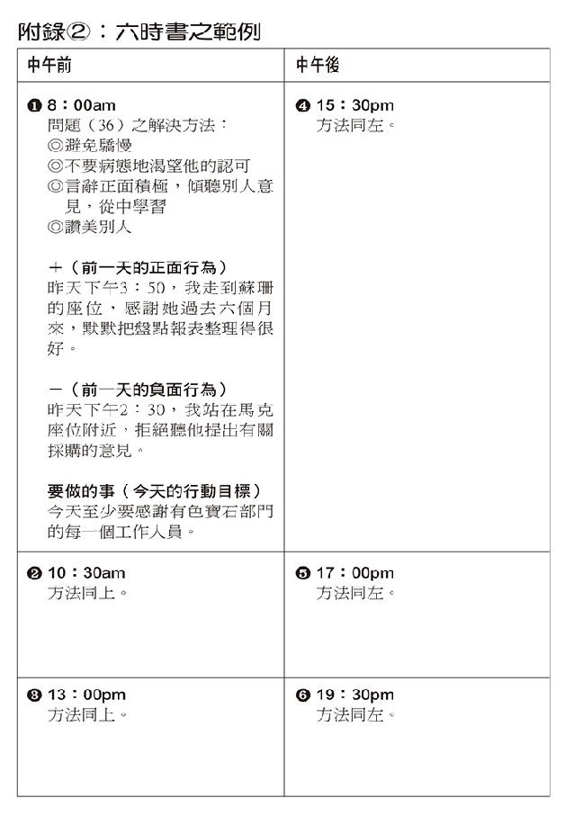
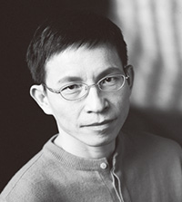
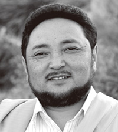
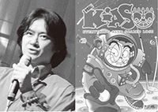
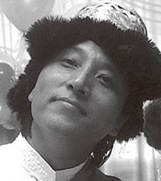

# 当和尚遇到钻石1（增订版）

# 〈推荐序〉应无所住而生其心

麦可．罗区先生，我不认识他，但是看了他写的《当和尚遇到钻石》这本书以后，令我对他产生由衷的敬佩之意。他外现在家相，内修菩萨行，身在商业界，实修清净行。特别是他具有高人一等的智慧，将《金刚经》融会贯通，运用万法潜能，发挥在商场的经营上，这是菩萨最高的修行──以无所得为方便，也就是汉译《金刚经》里的「应无所住而生其心」。

罗区先生的道心坚定，虽然事业经营成功，但内心从来没有忘记自己是一位修道者，他尊师重道，对师父的指示从不敢疏忽或违背，在穿着上保持着端庄的形象。他奉行六度波罗蜜，布施财物，主持「亚洲经典机构」、「亚洲经典输入计画」、进行色拉寺的重建。他持清净戒，恪守师父的慈示。他行忍辱，在钻石切割区的环境中，安然克服，而且乐在其中。他行大精进，初期、甚至长期，每天大约凌晨一点后睡眠，六点起身，前往工作，由此可见，事业的成功，不是光凭智慧就足够的。他修行襌定，注重内在潜能的开发，静坐禅观时，可以完全忘记了时间，忘记千笔的交易，忘记「歌剧院」心定和尚……他不断提升空性智慧──万法潜能的发挥。

这是一本值得所有企业家、实业家、特别是金融界的人士所阅读的一本好书，当然，更是所有佛教徒应读的一本好书，对于强调人间佛教的信徒来说，也是非常值得参考的。我认为，所有信仰西藏佛教的佛教徒，以及对西藏佛教好奇的人士，最最需耍看这一本书。

佛教有所谓的三藏法师，精通佛经、戒律、论典的法，但如通某部分，就称经师、律师、论师、禅师等等，比较难得的是「譬喻师」，罗区先生可以说是一位譬喻师，在本书中，他运用的一些譬喻，可以做为讲经说法的参考。佛陀说法之所以那么让人容易接受，就是运用譬喻，像《百喻经》、《法句譬喻经》、《法华经》之中的一品等等，总之很多就是。

传说《金刚经》有两系不同的解说。一、玄奘大师说：般若是能断的智慧，金刚是所断的烦恼。烦恼的微细分，到成佛才能断尽，深细难断，如金刚的难于破坏一样，所以译为「能断金刚（的）般若」。二、鸠摩罗什大师以金刚比喻般若。般若能破坏一切戏论妄执，不为妄执所坏；它的坚、明、利，如金刚一样。依本书的说明，罗区先生以及西藏佛教教区，可能都是以玄奘大师这家系统的解说为主。

空性以万法潜能来解释，则对于《金刚经》里的经文，也很容易理解，一切法并无好与坏之差别，只是凡夫妄执才产生分别好坏对待，因此所谓佛法即非佛法，或所言一切法者，即非一切法，以及无法可得，于法无所得等，都能以此论义模式加以理解。

第五章说明完美世界与理想的事业，就可以理解《金刚经》里所说的，所谓庄严即非庄严。庄严是无自性的。

最令我感到高兴的是，罗区先生解释业力的无表业，或对第八意识（阿赖耶识）的譬喻与说明，和我平时用全方位、全自动化的录影机的比喻说明一样。对于未深入佛法者，这种说明应该很容易令人理解与接受。总之这本书，应该是很具说服力的。我会介绍更多的人，来看这本书。

佛光山寺住持　心定合十

# 〈导读〉切开迷蔽，发现清亮坚实的本质

刘婉俐（本文作者为华梵大学外文系助理教授，研究藏传佛教，并从事相关译述，本书即为其所推荐。）

您是因何种动机而翻阅这本书的？是被封面的标题所吸引？对作者的身份感到好奇？还是试图为某种烦闷、愁困找寻解答？……或者仅是顺手掀开书页？不管是显意识或潜意识的动作，在那背后，一定有某种幽微的网络在牵系着、拨动着。这些在脑海中、冥冥中飘忽闪逝的意念，能否以某种隐约的概念浮现，进而清晰地显影、落实，在于我们能否「清楚」洞见与掌握这些念头。

两年前，初次接到亚马逊网路书店的书讯，介绍这本由藏传佛教格鲁派格西麦可．罗区所着的《当和尚遇到钻石》（*The Diamond Cutter: The Buddha on Strategies for Managing Your Business and Your Life*）时，对映入眼帘的作者身份与题目之间的「落差」，感到十分新鲜、有趣。印象中，从未见过由僧侣所写的商业专书……尤其是作者罗区格西并未还俗，仍是以出家僧人的身份，跻身于纽约大都会中、经营着竞争激烈的钻石行业。在好奇心的驱使下，加上长久以来思考「结合世法与佛法修行」的问题，便迫不及待地想了解这本书和作者的来龙去脉。

在一篇由亚马逊书店记者布莱恩．布雅（Brian Bruya）所做的专访中，罗区格西提及他出家学佛的因缘、以及从一名僧人成为杰出钻石商人的经过。一九七四年，他在普林斯敦大学毕业前夕，母亲突然过世，不久后父亲与兄弟也相继往生。亲人的骤逝，让他对生命的意义产生了莫大的疑情，在亟于探索生、死问题之下，他离开美国、放弃原本打算继续深造的学业，到印度达赖喇嘛驻锡的达兰莎拉，进入了着名的色拉寺，研读佛学。

早先，罗区曾在纽泽西州一所蒙古寺院，跟随汪贾格西（Geshe Wangyal）学习了八年的藏文，娴熟藏语，因此能顺利进入佛学院就读。这位启蒙老师汪贾格西，是最早赴美弘扬藏传佛教的格鲁派僧人，以慈爱、宽博接引了不少当今美国藏传佛教界的着名学者，如哥伦比亚大学教授 Robert Thurman、维吉尼亚大学教授 Jeffery Hopkins 等人，都是他早期的入门弟子。

之后，罗区于一九八三年在达兰莎拉落发为僧，经过多年的学习、并通过各级考试后，一九九五年获颁相当于佛学博士的格西学位。他在印度待了二十一年之久（一九七四至一九九五），其间在上师的建议下，于一九八一年回到美国接受「经商」的另一种人生与修持考验，并持续往返于印度与美国两地。几经波折、历练，成为纽约首屈一指的钻石商人。在事业成功的背后，有着长年研修佛法的精神力量，和随之而培养出的严谨、专注、诚信等特质做为支柱，这些人格特质，即是他在书中教导读者用以自我训练、成功致富的锁钥。

### 「切割钻石」的喻旨

《当和尚遇到钻石》这本书的特别之处，或者说，它值得推荐与阅读的原因，在于罗区格西跨越了世俗概念的鸿沟，将积极、正面的起心动念付诸实践，并指出了宽广、可行、充满建设性的商业经营方法。这个实践的过程，也同时涵摄了双重的层面：一是就罗区格西个人对上师的承诺、面对挑战与理想的层面而言，他弭和了世俗与出世生活的界域，将佛法融入商业生活中；另一方面，就书写目的、内容铺陈与章节架构来说，他也兼顾了理论与实践的部分，藉由叙述以僧侣身份，从事饶富竞争、压力的钻石行业，到获致成功的历程，来道出经商之路上所蕴含的空性、业缘道理，将佛法的修持与商业经营融合在一起。「钻石与僧人」，乍看之下，虽易让人联想到又是一则商场传奇，但其实箇中深藏玄诣。

从原文书名看来，「切割钻石的人」指的似乎是作者──罗区格西在俗世的职业。但事实上，在佛教、尤其是藏传佛教（金刚乘）的传统中，钻石（金刚石）具有其丰富、深奥的象征意义──坚定稳固、无坚不摧却又清透明净的特质，代表了众生本具的佛性，也就是究竟空性的本质。因此，「切割钻石的人」，在内在的意义上，也就意味着洞澈本性、直见本心之人。这般的开悟者，在世间能无入而不自得，一如钻石般清明、稳定，不被任何环境所挠阻。

值得深思的是，这些「清楚、明晰、坚定」的现象，却是建立在「空性」的基础上，也就是「不执着」的态度上。这和书中前半部仔细描述的钻石行业特质，缜密、信实的职场运作法则，岂非自相矛盾？然而，最为奇特、奥妙的地方，也就正是在此显╱空不二的互倚互成！在日常生活中，处处透显出佛法的奥妙与深意；而商业经验的佐证，也可确知空性不可捉摸的「存在」。

在此书中，罗区格西便巧妙地融合了这「实际」的商场现实法则，与「变动不居」的起心动念，将之适时、适切地纳入佛法的空性、因缘法则教授中。他也一再地表明，只要掌握以简御繁、以空置实的道理，诚信地待人接物，在激烈竞争的商场上，便能悠游、踏实而无往不利。

更进一步，有了对空性的认知和禅定修持的帮助，让原本受到僵化概念桎梏的创意与行动力，能够畅流、挥洒开来，更能增进效率、达到预设的目标。由于空性的广大、无碍，让蕴藏的心理铭印有了孵化的空间，而成形、展现，这便是此书后半部主述的焦点，亦是主导「钻石能否被成功、完美切割」的关键。

空与显、虚与实、出世与入世相辅相成，并行不悖；而罗区格西的经商范例与佛法修持也得以互相参照，提供了世人一个自我解套的蹊径──在物质世界中，同样拥有灵性修持的可能性；而在追求精神成长的同时，也可以善用眼前的物质媒介，使其成为助缘。

为此，罗区格西援引了一个兼具世俗与宗教寓意的象征──钻石，来阐明内在的观点和潜能，其实比外在的现象有着更高深莫测的影响力，端看如何发现那足以切割钻石的（空性）力道，借力使力而已。从前半部详实的钻石行业描绘、到后半部的空性禅修指引，从日常生活到习性的转化，罗区格西仔细铺陈了一条引介读者自我修炼、超越外在冲突与挑战的道路，妥善地融合了佛法与商业的经营，将积极、良好的心念，转化为促使事业成功的主要动能。

### 僧人与商人、出世与入世

从僧人的身份，跨足诡谲多变的商场，这一路走来，罗区格西也历经自我调适、学习与磨练的各种阶段。他坦言一开始，在面对上师提出经商的建议时，也曾多所抗拒。因为在经济上，他承袭自父母留下的遗产，并不虞匮乏。但是，经商并非是为了赚钱或谋生而已，「上师要我经历一般人在日常生活所遭遇的困难，这样才能了解他们，进而运用佛法来帮助人们。」最后，在一次上师给予的特殊教授中，他终于了解到经商的积极意义，决心进入商界。

「我曾经在一九七五年的某次禅坐中，观知自己未来会从事钻石行业，因此就试着找钻石买卖的工作。」这是他投身钻石行业的缘起。但因不懂行规，他屡吃闭门羹，始终不得其门而入，直到遇见一位创业的老板，才蒙录用。「我无心赚钱，只想找到一个栖身之所就行了。」无心插柳的结果，累积了多年丰富的从商经验后，罗区格西在此书中综理出他「商场佛学」的心得结晶。

他认为经营商业之道有三：一是赚钱，二是乐在其中，三是以此创造有意义的人生。而乐在其中指的是身心的和谐与快乐，也就是此书援引《金刚经》「缘起性空」的道理，来说明、举证、指引如何在瞬息万变的商场中，觅得喜悦、和乐的祕诀所在。许多人为了赚取金钱，付出了莫大的代价，失去了身心的健康和快乐，这样的人生又有何意义？

因此，罗区格西表示，真正的成功，来自于对心灵的关注，也就是对身心调和的重视，他以自己为例，指出妥善运用时间、开发心灵的力量，益能事半功倍。近年来，他更设立了一个名叫「证悟商业机构」（Enlightened Business Institute）的组织，专门教导商界人士如何透过禅修，来增长创意与智慧、加强「铭印」（imprint）的良善力量，《当和尚遇到钻石》亦是这个机构的参考用书之一。

在书中，罗区格西先引藏文《金刚经》的经文精华，阐明空性的「中性」特质，指出我们所有的概念与行动，皆受到「业力」──即心理铭印的深刻影响；并以钻石行业为例，说明铭印、相互关系（因果）的作用，这些作用是决定商业成功与否的背后主因。在第七章中，则详细罗列出读者可能面临的各种职场难题与改善的方法。接着，更以身体力行的「六时书」──自我检覈、追踪的方式，来导正心念、维护内在的清明与安定。从理论到实践，从概念的厘清到可行的建议细则，《当和尚遇到钻石》提供了一个具体、有效、且融会「快乐、积极、有意义」的赚钱之道。

罗区格西融合经商与修持的成功事例，对许多认为两者互相矛盾的人来说，不啻是一种鼓舞和解脱。认为世法与佛法不能相容的观点，也可能仅是某种偏执的概念而已。此外，虽明知「佛法不离世法，离世觅佛法，犹如觅兔角。」但要如何真正在生活中实践佛法，以日常生活为道，甚至将认定为本是互相扞格的事物，融洽地治于一炉，往往不是「知」难，存在着认知上的盲点或偏见；就是「行」难，理论上虽了解，但实际上却做不到。尤其是在面临压力、挫折和矛盾时，要如何切实地运用佛法，来自助助人？在艰难的挑战和抉择当前时，又要如何保持清晰的思绪、平和的心情，做出最好的判断并勇于承担？

在《当和尚遇到钻石》中，从「空性」的见地出发，到「禅修」方法与「六时书」的自我心念检覈等实践的修法，格西罗区提出了一套完整的见、修次第，将佛法的修持与商业体系的成功法则熔于一炉，对于许多盼望能在日常生活中修行、寻访积极营生之道、或探求心灵深度与静谧的人来说，都是一个宝贵而重要的参考。希望有缘阅读此书的您，能从中获得许多启发和帮助，开创有意义、美好的人生！

# 〈增订版序〉助人成功者，自己更成功

距离当初撰写《当和尚遇到钻石》，已有十年之久，本书即将发行第十周年纪念版，我们藉此机会回顾一番，看看之前的努力带来什么样的影响。

撰写任何书籍，目的都是以某种方式影响他人、帮助世界。当时我们把《当和尚遇到钻石》的原版稿件交送给双日出版社令人敬爱的编辑崔斯．墨菲之后，再过数日就会展开为期三年三月三日的西藏传统闭关。如果闭关日期延后一、两周，《时代杂志》愿意采访报导本书，但是我们日期已定，打算依照原订计画进行。

因此闭关这三个年头，我们不晓得世界发生了什么事──九一一事件发生的几年过后，我们才有所耳闻，甚至连《当和尚遇到钻石》有没有抵达出版这一关，我们都不知道。出关之后，我们得知本书确实不负所望改变了世界。如果《金刚经》的心识种子理论真实不虚，那么可以说三年的禅修、三年来让心更为慈悲清明的努力，确实「创造」了本书的成功。

麦可．罗区格西与克莉丝蒂．麦娜丽喇嘛

二○○八年七月闭关于摩洛哥柏宙（Bzou）

# 〈前言〉佛陀与生意

从一九八一到一九九八的十七年间，我很荣幸能有机会与安鼎国际钻石公司（Andin International Diamond Corporation）的拥有者，欧佛和尔雅．何兹瑞蓝夫妇（Ofer and Aya Azrielant）共事，并与公司的核心干部，一起创立全世界规模最大的钻石珠宝公司。

公司刚开始营运时，只有五万美元的贷款和包括我在内的三、四名员工。到了我离开公司，全心投入我设在纽约的训练机构时，我们的年营业额已经超过一亿美元，分布在世界各地的员工更已经超过五百人。

### 最佳的实验室

在我投身钻石事业的这段期间，一直过着两种不同的生活。在进入这行业的七年前，我以优等成绩自普林斯敦大学毕业。就读大学期间曾前往美国白宫，接受由总统亲自颁发的总统学术大奖章，还曾接受由普林斯敦大学威尔森国际事务学院所颁发的麦肯奈尔学术奖。

这所学院给我的一笔奖学金，让我有机会前往亚洲，在达赖喇嘛的座前向西藏喇嘛学习。就这样，我开始接受西藏古老智慧的教育。到了一九九五年，我成为第一位获得「佛学博士」，也就是「格西」[[1]](#Foreword3.xhtml_fnX-1)这个古老学位的第一个美国人。

这个学位得之不易，必须花上二十年的时间接受严格的训练与考验。从普林斯敦大学毕业之后，不管身在美国或是亚洲，我就一直都住在寺院里，并且在一九八三年受戒成为比丘。

当我的比丘训练有了扎实的基础之后，我的上师堪仁波切（Khen Rinpoche，仁波切意为珍贵的住持师父），便鼓励我进入商业界。他说，虽然寺院是学习佛教智慧的理想场所，但忙碌的美国办公室却是在真正生活中，试验这些智慧的最佳「实验室」。

有段时间我无法接受这样的想法，对于要离开小寺院的宁静生活颇为犹豫，对于一般美国商人贪婪、无情的形象更是耿耿于怀。然而有一天，师父对一群大学生做了一场特别有启发性的开示，我听完之后，便告诉他我愿意依照他的指示找份商业界的工作。

在那之前几年，我曾经在某次日常打坐中，有过某种灵视（vision）。从那时候起，我就知道我会选择何种行业，那行业必然和钻石有关。那时我对宝石没有什么概念，珠宝对我来说真的也没有吸引力，家里更是没人从事过这行业。所以我必须开始一家家拜访钻石饰店，问他们愿不愿意收我当见习生。

以这种方式试着加入钻石业，有点像是报名加入黑手党。天然金刚石这个行业是个非常祕密而且封闭的圈子，传统上都仅限于家族成员参与。在那些日子里，比利时人控制着一克拉以上的大型钻石市场，小型钻石是以色列人的天下，而美国国内的批发市场，则是纽约四十七街钻石区犹太教哈西德派教徒（Hassidic）的地盘。

之所以有这种传统是因为，就算是最大间钻石饰店的所有钻石加起来，也只消用几个装皮鞋的包装盒子就能全部装完：上百万元的钻石要真被偷了，也根本没办法查得出来。你只要用手抓上一、两把放口袋里，连所谓的金属探测器也无法查出来。所以大部分的公司都只敢雇用亲戚，更别谈雇用一个只想玩玩钻石的古怪爱尔兰男孩。

### 跨进钻石业门槛

我还记得我拜访了差不多十五家的店铺，应征最基层的职位，结果没有一家成功。附近的小镇里有一个老钟表匠，建议我先去纽约的一家美国宝石学院（Gemological Institute of America），修几门宝石鉴定的课程。有一纸文凭会比较容易找工作；而且说不定上课时，还能遇上贵人。

我就是在宝石学院里遇见欧佛．何兹瑞蓝先生。他也在那里上课，学习如何鉴定一些所谓「投资级」或「证书级」的超高品质宝石。要能分辨出哪些是价值极为昂贵的真正证书级钻石，哪些是假钻或是加工品，就要能看得出针尖般大小的细微缺口或瑕疵。更麻烦的是，许多微尘常会附着在这些钻石的表面甚至是显微镜本身，从而造成辨识上的困扰。所以实际上我和他可以说都在那里学习如何平心静气。

欧佛所提出的问题，和他检验、挑战每个既有观念的方式，立时教我折服。我决定请他帮我找份工作或着干脆要他雇用我，于是我刻意去认识他。几个礼拜后，当我在宝石学院的纽约实验室考完期末考后，我找了个藉口去他的办公室找他，跟他要份工作。

幸运的是，那时他正巧有家分公司在美国开幕（本店在他的家乡以色列）。我于是试着说服他让我进他的分公司，并且拜托他教导我钻石这门生意。我说，「只要给我一个机会，我愿意遵照你任何的吩咐。我会把办公室弄整齐，把窗户洗干净。你怎么说，我就怎么做。」

他说，「问题是我没有钱雇用你！这样吧，我跟这办公室的屋主谈谈。他名字叫艾力克斯．罗森豪尔，看看他可不可以和我分摊雇用你的薪水。如果可以，你就帮我们两个做些杂务吧。」

我，一个普林斯敦大学的毕业生，就这样从一个一小时七块钱的小弟干起。每天背着一个普通的袋子，里面装满了待铸造或镶戒的金银珠宝，徒步从纽约热得冒烟的夏日，走到时有暴风雪的寒冬。

欧佛的太太尔雅、一个安静却极为聪明的叶门珠宝匠艾力克斯．盖尔还有我，会一起围在租来的唯一一张办公桌前，做钻石分级归类的工作、描绘新饰件，以及四处打电话找顾客。

我的薪水拿不到几次而且还不时被拖欠。欧佛常得打电话给他的伦敦朋友，拜托他们多借点钱给他。尽管如此，我还是很快就攒够了一笔钱，买到了我的第一套西装。之后有好几个月我每天都穿着这套西装上班。

我们常常工作到深夜，下班后我还得走一大段路，回到位于郝威尔亚洲佛教社区（Asian Buddhist community of Howell）寺院里的一个小房间睡觉。过不了几个小时，我又得起床搭乘巴士前往曼哈顿上班。

在我们的生意小有进展之后，我们将公司搬到了上城，那里比较接近钻石区。我们很大胆的雇用了一位宝石工匠，在我们所谓的「工厂」，一个大房间内，镶制出我们的第一批钻戒。

过了不久，我获得了足够的信任，让我如愿以偿能够坐在一袋散钻前做分级归类。欧佛和尔雅还问我愿不愿意负责新成立的钻石采购部门（那时这个部门除了我之外，还有另外一个员工）。这个机会让我非常兴奋，马上就投入了这份工作。

### 内圣外俗的生活

对于我的俗世工作，我的上师曾告诫过我，叫我不要张扬我的佛弟子身份。我得蓄着和常人一般长的头发（而非光头），衣服也得穿得和别人一样。而且不论应用何种佛教义理，都得悄悄地做，不可浮夸和虚张声势。内在虽然是个佛教圣者，外表却必须和一般美国商人没有两样。

就这样，我没有告诉任何人，便开始应用佛教的义理来经营我的部门。在这之前我已经和何兹瑞蓝夫妇就责任问题达成共识。我负责管理这个部门的所有事务，以宝石来赚取稳定的利润。相对地，就员工的聘用或解雇、薪资与升迁，以及工时与职责等问题，我也有绝对的决定权。我的责任是准时交货并为公司赚取可观利润。

这本书就是我如何撷取古老佛教义理，将安鼎国际公司的钻石部门，从一无所有建立成一个年盈余数百万美元的跨国公司的故事。这家分公司不全然是我只手建造的，它的政策也不完全只遵照我一个人的意思。但是我可以说，在我任职副总裁期间所做的大部分决定和政策，都是依据你即将在本书看到的佛教原则而来的。

那么，到底我所说的是哪些原则？我们可以把它们分成三项来谈。

**第一个原则是，要做生意就要成功，就得赚钱。**在美国及其他西方国家里普遍存在着一个观念，认为一个追求精神生活的人总好像不应该赚钱、事业顺利。

其实在佛教教义里，钱本身并没有罪过。何况拥有较多资源的人要比没有的人更能多行善事。问题是，我们是用什么方式赚钱，我们了不了解钱从何而来、如何能叫它源源不断，以及我们是否以健康的态度去面对它。

整件事的症结在于，要用干净诚实的方法赚钱；要清楚了解钱的源头才能取之不尽；以及要用健康的态度来看待拥有金钱的这项事实。只要能做到这些要求，赚钱和修行这两件事情绝对不冲突。事实上，它也可能变成修行的一部分。

**第二个原则是，我们应该能够享用金钱。**换句话说，我们应该学会如何能一边赚钱，一边还能保持身心的健康。创造财富的过程不应该让我们身心俱疲，以致无法享用财富。一个为了做生意弄坏了身体的商人，根本失去了经商原有的目的。

**第三个原则是，一个人应该能在最后回顾自己的事业时，告诉自己这些年来的经营是有意义的。**每个事业就好像每个人生，一定都会有个尽头。

在我们事业里最重要的时刻，也就是当我们最后回顾既有的成就时，我们应当能从经营事业与经营自己的方法中，看到一些永恒的意义，为我们的世界留下一些好榜样。

总之，无论是商业活动、古老的西藏智慧、甚至是人类所有的努力，都是为了富裕自己的生命，达到自我内在与外在的丰盈。要能享受这份丰盈，就要能经常保持高度的身心健康才行。

除此之外，我们更必须要时时刻设法扩大这份丰盈的意义。这就是安鼎国际公司钻石部门的成功所给予我们的启示。任何人，不论背景、信仰，都能学会并应用它所启发的道理。

1.  Geshe，在西藏传统中，格西相当于佛学博士。

# 第一部分致富之道

## 第一章智慧的来处

在印度的古老语言里，这部经典称为《尊贵能断的金刚大乘般若波罗蜜多经》。

西藏语称它为《帕洛度　钦巴　多杰　初巴　谢嘉瓦　帖巴　千波　读》。

英语则称它为《能断金刚者》。

在印度的古老语言里，这部经典称为《尊贵能断的金刚大乘般若波罗蜜多经》。[[1]](#Ch01.xhtml_fnX-1)

西藏语称它为《帕洛度钦巴　多杰　初巴　谢嘉瓦　帖巴　千波　读》。英语则称它为《能断金刚者》（*The Diamond Cutter, a High Ancient Book from the Way of Compassion, a Book which Teaches Perfect Wisdom*）。这是一本远古的典籍，源自于慈悲之道的教法，是一本教导圆满智慧的经典。[[2]](#Ch01.xhtml_fnX-2)

到底这本书和其他商业书籍有何不同？它的独特之处在于它所探讨的内容，是源自于一本充满佛教智慧的古老经典《金刚经》。而上述的引文即是本书的伊始。

《金刚经》所蕴含的古老智慧，让安鼎国际钻石公司成为年营业额超过一亿美元的大企业。为了方便阅读，我们有必要让读者先略为熟悉这本重要经典，了解它在整个东方历史中所扮演的角色。

### 金刚经的历史

《金刚经》现存版本并非以手抄写，它是印刷史上可考的最古老典籍。大英博物馆所藏的版本，据考证为西元前八六八年所印，大约是在「古腾堡版圣经」（Gutenberg Bible）出版前六百年左右。

《金刚经》记载两千五百年前佛陀所作的开示。原先是透过口耳相传，在书写系统发明后，便记载于贝多罗（long palm leaves）叶上。他们先用针在这些耐久的叶片上刮写出书的内容，再将炭粉用力涂抹在刮痕上。在南亚某些地区，我们仍然能发现用这种方式所写出的书籍，上面的文字还算清晰可辨。

要把这些零散的叶片编整起来有两种方法。有些先用椎子在整堆的叶子中间钻孔，再用细绳穿孔固定；有些则只用布来包裹。

《金刚经》本来是释迦牟尼佛以梵文所作的开示，这个古老的印度语言有四千年的历史。该佛典约在一千年前传到西藏，并译成了藏文。在之后的数个世纪里，西藏人将其刻写于（印刷用）的木版，再将油墨涂于版上，覆上手制纸张以滚筒压出字型。印好的长条纸张最后以亮鲜的橘黄色或褐红色布裹保存，这种方式让人想起贝叶经典的时代。

《金刚经》也传到亚洲其他大国，包括中国、日本、韩国、蒙古等。在过去的两千五百年里，《金刚经》以这些国家的语言重复印刷过无数次，而它的智慧也透过师徒代代相传。

在蒙古，家家户户都会小心供奉一部《金刚经》，其重要性由此可见一斑。而每年中总有一、两次，他们会恭请当地和尚来到家中，为全家读诵《金刚经》，期待能从中获得智慧的加持。

《金刚经》中的智慧并非唾手可得。一如许多佛教经文，《金刚经》的原文奥祕难解，必须由法师依据流传百世的论释来解读。在西藏，对本经所作的论释尚存三部。论着时间约在西元一千六百年到一千一百年前之间。

然而更重要的是，我们最近发现了另一部论释。这部论释不但着述时间更近，内容也更容易理解。

在过去的十二年里，包括我在内的一群同事，投入一项名为「亚洲经典输入计画」（Asian Classics Input Project），致力于保存载有西藏智慧的古老典籍。

在过去的千年里，这些典籍由于喜马拉雅山的屏障，得以免受战火的洗礼与入侵者的掠夺，而保存于西藏的寺庙与图书馆内。然而随着飞机的发明，西藏终于还是在一九五○年遭中共入侵。

紧跟着入侵与占领的脚步，保有这些伟大经典的五千多所图书馆与寺院亦遭摧毁。仅有极少数经典，经由逃难者徒步跋涉危险的喜马拉雅山埃弗勒斯峰山区而得以幸存。想要了解这次灾难的严重性，只消想像如果有某个强权国家攻击美国，放火烧毁所有大专院校和他们图书馆里几乎所有书籍的景况，就能知道。幸存的书籍仅能靠少数的逃难者步行千里徒手带出。

### 邱尼来的喇嘛

「亚洲经典输入计画」在印度某个流亡藏民聚居处里，训练了一批西藏难民，不但教他们将这些濒临失传的典籍输入电脑，还将它们制成 CD-ROM 或上传网路，免费提供给全球数千名学者使用。目前我们已经用此方法，储存了十五万页的木版原稿。也寻遍了西藏各地，找出未曾流传外地的典籍。

在苏俄圣彼得堡，我们幸运地在一堆满布灰尘的手稿中，找到一部《金刚经》的论释。这部论释是由早期的探险家从西藏带回苏俄，名为《通往自在之道上的阳光》（*Sunlight on the Path to Freedom*）。它的作者是一位伟大的西藏喇嘛邱尼喜得拉普（Choney Drakpa Shedrup），生年约在一六七五到一七四八年之间。

巧合的是，这位喇嘛常住的寺院正是我毕业的地方：色拉寺。几个世纪以来，人们为这位喇嘛取了一个外号，叫做「邱尼喇嘛」或是「邱尼来的喇嘛」，因为「邱尼」原本是西藏东部的一个地方。

在接下来的章节里，我会不时引用《金刚经》及《通往自在之道上的阳光》。在本书中，这部重要论释首次被译成英文。除了这两部经典的引文，我还会引述透过口耳相传的一些注释。

这些注释有两千五百年的历史，我的上师就是以此种方式传法给我。最后，我还会加入我在国际钻石事业的神祕世界里，个人在生活上所遭遇的事迹，来说明如何能藉由这部古老典籍的智慧，成就自己的事业与生活。

1.  依梵文 Arya Vajra Chedaka Nama Prajnya Paramita Mahayana Sutra，直译应为《名为尊贵能断的金刚大乘般若波罗蜜多经》。依中文习惯语法，求译文通顺故，于本文中暂将「名为」二字省略，以避免与前文同义语「称为」重复。
2.  即汉译之《金刚经》，后文一律称此名。

## 第二章金刚微妙义

梵文书名中每个字的意义是：Arya 的意思是「高贵的」；vajra 指的是「金刚」；Chedaka 是「能断」；而 prajnya 代表「智慧」。

Param 意指「彼岸」，ita 是「到」，两者合起来意为「圆满」；Nama 是「名为」；Maha 谓「大」，是就慈悲而言；而 yana 指「道」；Sutra 则译为「经」。

《金刚经》这部经的经名本身就含有高度的奥妙智慧。在说明如何运用这份智慧获致成功之前，我们不妨先讨论经名的含意。

让我们先看看邱尼喇嘛自己对于这个长标题的解释：

文章的开头是这么写的：「在印度的古老语言里，这部经典称为『尊贵能断的……』」。梵文书名中每个字的意义如下：Arya 的意思是「高贵的」；vajra 指的是「金刚」；Chedaka 是「能断」；而 prajnya 代表「智慧」。Param 意指「彼岸」，ita 是「到」，两者合起来意为「圆满」；Nama 是「名为」；Maha 谓「大」，是就慈悲而言；而 yana 指「道」；Sutra 则译为「经」。

就解释如何获得事业与生活的成功而言，这里最重要的字就是「金刚」，也就是钻石。在藏文里，金刚代表万物的潜能，通常以「空」来表示。**一个生意人若能清楚觉知到这种潜能，就能了解事业或生命的成功关键。**

在以下的章节里，我们会进一步讨论这种潜能的细节，但是目前我们只需先了解这万物的潜能与金刚的相似性即可，这相似性表现在三个重要方面。

### 万物潜能似金刚

首先，纯钻大概是最接近完全透明的物质。我们就拿玻璃，那种通往阳台的落地窗上的一大片玻璃来做比喻。从正面看，它完全透明。透明得几乎看不见，以致来拜访的邻居因为不知情，而撞破玻璃的情况时有所闻。然而从玻璃的上方往下看，你会发觉大部分的玻璃都有着深绿色。这颜色其实就是玻璃成分里细微铁屑层积的结果，在厚玻璃上尤其明显。

纯净的钻石就不一样了。在我们这行里，钻石的价值首先是看它的颜色程度：颜色越重，价值越低，完全没有颜色的钻石最稀有也最珍贵。这种珍品钻石我们目前用Ｄ来代表其评等，这大概是以往错误的一个反效果。

在现代的钻石分级系统发明之前，已经有许多其他系统盛行着。字母Ａ被广泛用以代表非常精纯、无色的钻石，次等的则以Ｂ标等，其余的就以字母顺序类推。

不幸的是，以前不同公司对于Ａ级或Ｂ级有着不同的认定标准。对消费者当然也会造成困扰。同样一颗Ｂ级钻石，甲公司鉴定为几近无色，乙公司却可能认定为中等带黄。所以新系统的设计者决定用相反的字母顺序来做评等，也就是用Ｄ来代表极品、几无颜色的钻石。

如果有像落地窗玻璃一般大的Ｄ级钻石，看起来会像是完全透明一样。就算是从上往下看，依然一般透明。这就是完全纯净事物的本质。如果在你和另外一个人之间有一道数尺宽的钻石墙，而且墙面不会反射光线的话，你根本无法看到有面墙存在着。

在《金刚经》这部经里所能发现的成功潜能就像是这面钻石墙。它一直都在我们左右，围绕在我们身旁的所有人、物都有这份潜能。

**如果驾驭得当，它便会是让我们获致个人与事业成功的源头。讽刺的是，虽然它充斥于我们周遭的人事物中，它却像是隐形的，我们就是看不见。**《金刚经》这部经的目的，就是教我们看见这份潜能的方法。

### 宇宙最坚硬的物质

钻石重要的第二个原因是，它是全宇宙最坚硬的物质。除了钻石本身，没有任何其他物质能够琢磨钻石。如果按照一种名为「努普」（Knoop）的量表来测量硬度，钻石要比硬度仅次于自己的红宝石硬上三倍。而且就算要拿钻石来琢磨另一颗钻石，也要那颗被磨的钻石有一面是所谓的「软面」。

其实这就是琢磨钻石的方法。虽然钻石很难琢磨，却可以像用斧头劈木头般沿着切面劈开。为了能琢磨钻石，我们得先搜集其他钻石切割后所留下的碎钻，或者找颗纯度不足、不值得加工琢磨的生钻，加以劈开、磨碎为细粉。

这些粉末必须先用筛子或铁制滤网重复过滤，一直到只剩下非常细微的粉末为止，再装入小玻璃瓶里。我们得接着准备好一个厚重的钢制平盘，在上面交叉刻出一条条细痕，再在圆盘上涂上一层好油。这油一般以橄榄油为主要成分，不过每个人通常有他自己不同的祕方成分。

钢盘中会焊着一根轮轴，轮轴的另一头接着一部马达，马达则固定在一个用坚实铁架支撑的厚重桌面上。这是为了避免钢盘在开始旋转后震动，因为旋转的速度快达每分钟数百转。油面上跟着会被洒上一层钻石粉末，形成一层灰色的糊状物。

生钻看起来不会比一般的石头亮上多少，有点像是灰绿色的洗碗水里夹杂着些许透明冰块。万一运气不好，整块生钻可能内外都是这种颜色。果真如此，这表示你钻磨了半天，才发觉花了一大笔钱，购买了一颗毫无价值的生石。

生石会被固定在一个称为「DOP」的小杯子里，杯子上装着像是留声机唱臂般的提把。将生石固定在 DOP 里面的是一种特别的胶糊，这种胶糊即使在钻石切割加热时也不会软化。

当我跟着一位名字叫山姆．旭姆洛夫的钻石琢磨师傅见习时，他用的是一种石绵加水作成的胶糊固定生石。生石一变热，石绵就会干燥缩水，把生石紧紧地锁在 DOP 里。原本我们会细嚼石绵来制作胶糊，后来才知道即使只是一小口石绵也会致癌。我记得有一位琢磨师傅就是因为这样子，在喉咙附近长了一大块肿瘤。

马达一启动钢盘开始旋转后，就不容许任何一点点震动。有时光是将钢盘装上较老的钻石钻磨机定位，就得耗上好几个钟头。定准了位之后，钻磨机会被放在一张像儿童椅一样的高椅上，钢盘就悬在底下。师傅接着就会拿着装有生钻杯子的提把，轻轻地碰触高速旋转的钢盘。

钻石远比钢盘硬多了，所以如果钻磨机太用力压着有凸角的生钻，结果将会使钢盘本身遭受磨损。你必须要轻轻地拿生石划过钢轮，然后将提把往自己眼睛的方向提起。另外一只手里则拿着称为「强力扩大镜」的放大镜。

有经验的琢磨师傅会利用生石磨过钢轮划向自己的时候，顺势检视「切割」（其实是琢磨）的进度，生石即刻再往钢轮划去，形成一个平顺的周期，这样子每分钟可以有几次来回。

看起来就好像啦啦队长挥舞着指挥棒一样。

### 钻石爆炸化为尘沙

当你提起生石检视时，还得顺道拿着它往你肩上挂着的毛巾擦净。这能去除掉黏着在它表面的油渍和钻石粉末。过了一、两分钟的处理后，钢轮会在生石上磨出一个小小的平面，这就是你检视生钻内部的「窗户」。

透过这个窗户，你可以用强力扩大镜检视内部是否有任何斑点或裂缝。这是因为你得设法在钻石琢磨成形的过程中将这些瑕疵定位，以便于将它们磨除，或至少能尽可能无害的将它们放置于钻石的边缘。

举个例子说，钻石顶尖的一个黑点，透过底层钻面的反射，会让整颗钻石看起来像是有一堆的黑点，即使实际上就只有单单一点。这会使得琢磨好的钻石几乎没什么价值。

透过窗户检视钻石内部，想像成品到底会有何模样的这个过程，与充分利用大理石的天然色泽和纹路，构思雕像的过程颇为相似。

决定一颗大型生钻琢磨方式的过程，有时候会包括在生石上磨出几门窗户、花上数周甚至数月的时间研究生石，以及绘出数个几何模型，期能从生石中琢磨出最大尺寸的成钻。

你在钻石内部偶尔看到的小黑点，通常是其他正在形成中的微小钻石结晶，被困在较大结晶内的结果。钻石原本只是普通的碳，经过火山通管的极高温融化，又因埋藏于地球深处承受极为巨大的压力，导致生碳产生原子变化而形成。

这些微小钻石实际上可能在各种不同的环境下形成。举例来说，它们可能因为带碳陨石撞击地球，在地球表面撞出一个巨大的火山口，而微钻就在这撞击点的正中心产生。

这个可爱的「钻中钻」可能以前述的小黑点出现；如果位置恰巧位于轴线上，也可能在钻石内部形成一个隐形的小凹洞。无论是以哪种方式出现，它们对于钻石匠而言都是个大麻烦。它们会在钻石内部形成有压力的小区域。当钻石匠按设计切割钻面，拿生钻依着钢轮琢磨时，生钻几乎就会像抗争一般不肯合作。

尽管抹着一层油，生钻依着钢轮琢磨时还是发出尖叫声，像是复仇女神般嘶吼着。纽约四十七街钻石区上的钻石切割店铺，通常座落于大厦的高楼层，灰暗、灯光黯淡的房间里。那里成天有价值数十亿的钻石进出于钻石制造商与美国之间。

且想像一排排的钻石匠，每个人屈身对着钢轮琢磨生钻。一颗颗生钻像是差劲的煞车尖叫着。在这个吵杂的暴风圈中心，钻石匠们神色宁静地坐着，全心融入工作，早已习惯这一切的混乱。

生石与钢轮间的摩擦造成温度急遽上升，使生钻烧成一片通红，像是火炭一般。当热度传到内部，带着压力的凹洞就会使整颗钻石爆炸。钻石碎片随即会以极高速度飞向四面八方。如果这是颗大钻石，你就只能眼睁睁的看着几十万美元化成一堆尘沙。

### 终极自性无物不具

为什么钻石是最坚硬的物质这么重要？最高、最短、最长、最大：**「最」这个字到底是什么意思？**我们心里面一直抗拒着这个观念，因为事实上没有东西「最」高，高得你一寸不能再加；也没有东西「最」短，短得你一丝无法再减。

我们前面所谈的潜能却是绝对的，这种绝对性是一般实体物质所难以达成的。它是任何物质的最高本质，也是所有人、物的终极真实。钻石的硬度是宇宙所有物质中最能接近绝对性的性质：它的硬度绝无仅有。所以钻石的意义在于它对于终极真实所能做的比喻。

现在让我们回想那些爆裂后散落一地的钻石尘末，因为它们让我想起钻石的第三个重要特质。每颗钻石的原子结构都很简单：都只是纯净不掺杂质的碳。而一支铅笔里的铅，实际上也含有和钻石没有两样的碳。

铅里碳原子的键结合有着松散的结构，一层层像是页岩或松软的糕点。当你用铅笔在纸张上画线时，铅的碳原子就会一层层地剥下，散落在纸张的表面上。对你们而言，这叫做用铅笔写字。

钻石的碳原子结合的方式就不一样了。它的键结合不管在哪一个面向都是完美地对称着，使结构不致松散，也让钻石成为我们所知道的最坚硬的物质。有趣的是，不论在哪里、不管是任何一颗钻石，它们都有着同样的原子架构，同样简单的碳键结合。这表示每一颗钻石，小至分子的阶层，都和其他钻石一样有着相同的内部结构。

这和物质的潜能又有何关系？我们之前说过，宇宙中的所有物体，不论是小至石头、大至行星的无情众生[[1]](#Ch02.xhtml_fnX-1)或是蚂蚁、人类等的有情众生，皆有自己潜在的能力、终极的自性。重点是，这里所举的潜能和终极自性无物不具。就这方面而言，**万物的潜能就如同钻石，能带给人内心的德行与外在的成功。**

这就是书名中带有「钻石」二字的原因。钻石清澈透明，透明到几乎无法看见；我们周遭事物的潜能亦同样难以见到。钻石无与伦比的坚硬性近乎绝对；而万物的潜能本质亦为绝对。

宇宙里任何一处的任一细片钻石，和其他地方的钻石都一样是百分之百的纯钻。万物的潜能亦是如此，潜藏在任何物质里的能量，和所有其他物质同样具有纯净与绝对的本质。

那么为什么他们称这部经为《金刚经》呢？将这本经典译为英文的一些早期译者，事实上把经名的第二部分给节略了，因为他们不晓得这部分经名对整部经典的意义有多重要。

### 用心才能体会

这里我们还是要简短的说明，其实明白事物的潜能、它们的终极自性有两种方法。第一种是藉由阅读像本书一样的解说以「明白」这种自性，然后坐着用心思考它的解释，一直到能够了解并且使用这份潜能为止。第二种方法则是进入甚深禅定，以心灵的眼，亲「眼」目睹这份潜能。

依第二种方法亲「眼」目睹潜能要有力量多了。然而任何人就算只能明白它的原则，也能成功地运用它。

曾经亲「眼」直接目睹这份潜能的人，很快就了解他们所见到的正是事物终极的自性，于是他们在内心搜寻着可与之比拟的事物。世俗中最为接近这份终极潜能的物体，正是俗世中最坚硬的物质──钻石。

虽然钻石是尘世中最接近自性的物质，它其实很难与前面所提到的万物潜能相提并论。这份潜能我们会在下面章节做更详尽的介绍，因为它才是万物的终极自性。

这么说来，钻石实在不是个非常恰当的比喻，因为它还能被终极自性的力量所「断」、所切割。这就是为何这本载有古老智慧的经典被称为《能断金刚者》的原因：因为它教导的是一种比尘世中最坚硬、最接近绝对自性的钻石更为终极的潜能。

如果这听起来有些困难，别担心。《金刚经》的目的就是帮助你了解它。无论是事物运作的祕密，或是从日常生活中或是事业经营的过程里，获取成功的祕诀都很深奥，需要用心才能理解。

1.  原文为 inanimate things。「众生」意为「众缘合和而生」，亦即此地的「生」非限定于有生命者。

## 第三章金刚经的缘起

世尊。善男子。善女人。

发阿耨多罗三藐三菩提心。

应云何住。云何降伏其心。

佛言。善哉善哉。须菩提。如汝所说。

如来善护念诸菩萨。善付嘱诸菩萨。

汝今谛听，当为汝说。善男子。善女人。

发阿耨多罗三藐三菩提心。

应如是住。如是降伏其心。

唯然世尊，愿乐欲闻。

我们即将展开一段重要的旅程，进入一个完全崭新的领域；我们将探讨一些前所未闻的方法，来管理你的事业和生活。

我想，在开始说明之前，对这份智慧起源的时间与地点有些基本认识，会对读者有些许助益。

### 从经典本身开始

让我们先从《金刚经》这部经典本身开始。时间发生在两千多年以前，地点在古老的印度。有一位富有的悉达多王子掳获了全国人民的心，那景况就如基督教的耶稣一般，只不过时间早了五百年。

他在奢华富裕的宫廷中长大。但是在目睹人民受苦，了解任何人迟早都会失去他们所爱亲人与一切所有的必然性之后，他毅然地抛弃了奢华的生活，独自开始找寻众生受苦的原因以及解决的方法。

他找到了苦受的根本原因，并且开始教导人们离苦得乐的方法。许多人离家跟随他，出家成为比丘，愿意从此过着朴质的生活，不再拘于身外物，思考也因少了人事的烦恼而变得清澈。

多年以后，有位弟子记述《金刚经》首次宣讲的缘由。他称呼佛陀为「世尊」：

如是我闻。一时佛在舍卫国祇树给孤独园。与大比丘众千二百五十人俱。[[1]](#Ch03.xhtml_fnX-1)

「如是我闻。一时……」是经文常用的起始句，因为多数经典都是佛陀灭度之后许久才做集结。当时的人们善于当场记诵师父所做的开示。

「一时」这两个字意涵丰富。首先它指的是古印度的朴实人们所拥有的高度智力：他们能够在听闻佛法的同时，记诵并且了解其深意。其次它也指出《金刚经》说法只有一次的事实，说明经中所含的万物运行法则，是世上稀有而珍贵的智慧。

邱尼喇嘛解说经文时，也对经典的缘由做了说明。底下引文中括号内的字代表《金刚经》中原有经文：

这些字代表着佛陀说法的时空；经文叙述者即为以文字记载本经者。他首先说明底下的经文是「**如是我闻**」。「**一时**」，意思是某个时候；「**佛在舍卫国祇树给孤独园**」这个地方，「**与大比丘众千二百五十人俱**」，也就是在一起。

那时候在印度有六大城邦，包括这里所提的「**舍卫国**」。这地方是波斯匿王的领土，风景秀丽的「**祇树给孤独园**」就是位于这个国度内一座极精致的花园。

有一次，在世尊成道的几年后，有一位名为给孤独的长者下定决心要建造一座宏伟雄观的寺庙，以供佛陀及其弟子常住。为了这个目的，他找上祈陀太子，用足以铺满整座花园的数千枚金币向他购买花园。

祈陀太子也把原本作为该地产管理人宿舍的一笔土地献给了世尊。给孤独长者藉由舍利弗的能力，指导人天两界的工匠把该笔土地建造成一座无与伦比的花园。

当这座花园完工时，世尊了解祈陀太子的心意，便将园中主要寺庙以其名名之。而另一位主角给孤独长者其实是位圣者，刻意选择自己的出生以护持佛陀。他能透视水中或土里的宝石与金属矿物，随心所欲地运用这些天然资源。

《金刚经》的起头字句有其深意。佛陀当时正准备作开示；听经的群众是一群类似于基督门徒、决心要离家全心学道的僧侣。然而，之所以有此机缘亲闻佛陀法音，都靠这些有钱有势的护法挺身护持。

### 优雅王子的智慧

古印度的君主制度是该区域政经生活的主要推动力量，说他们是现代西方社会的翻版一点也不为过。今天当我们一谈及佛陀和佛教思想时，浮上心头的印象往往是（如果恰巧看到的是一尊中国佛像）一个相貌奇特、头顶上长着肉髻、脸上挂者微笑、挺着个大肚皮的东方人。

其实我们心里面该想到的，应该是一位高挺而优雅的王子，从其智慧、自信与慈悲中发出言语，让人们得以在生命中受用，教生命有了意义。

对于跟随他的弟子，也不要认为他们只是坐在地上盘着腿、唸着经的光头托钵僧。在古代有些伟大的法师也许还是皇室成员，个个有着治理国家与经济的才干呢。

举个例子来说，有名为「时轮」（Kalachkra, Wheel of Time）的佛陀教法，在过去的数百年间，一直在每位西藏达赖喇嘛的特别法会里代代相传着。其实刚开始时，这些训诲是由佛陀传授给古老的印度国王们，以及一些有天赋异禀与远见的弟子们的，这些弟子再将其传给其他国王，就这样传了好几代。

我之所以提出这件事，目的是为了说明人们对于佛教经常产生的误解，以及一般人对于内在精神生活的错误认知。佛教一向教导，每一个人都可以在适当的时机出家成为僧侣，因为出离世间，才能够学习如何服务众生。然而，**我们必须服务众生，而为了服务众生，我们必须置身滚滚红尘之中。**

在我任职于安鼎国际钻石公司期间，几个顶尖的商界人士显露出非凡深刻的内在精神生活，令我深受感动，特别是来自印度孟买的钻石交易商狄如．沙（Dhiru Shah）。如果你在纽约的甘迺迪机场瞥见沙先生步下飞机，你对他的第一印象可能是：一个身形矮短、肤色黝黑的男人，戴着眼镜，头发稀疏，脸上挂着腼腆的微笑。他穿过拥挤的人群，领取一只破旧的小行李箱之后，搭乘计程车前往曼哈顿的一家普通旅馆。在他下榻的旅馆之中，他吃几片妻子凯琪亲手烘焙，深情地安置于袋中的面包，做为他的晚餐。

沙先生是世界上最有权势的钻石采购商之一，每一天为安鼎国际钻石公司收购数千颗钻石。而他也是我所见过心灵最深邃的人之一。数年来，他悄悄地向我揭露了他内在生活的充裕富足。

### 「歌剧院」

沙先生是一个耆那教徒（Jain）。耆那教（Jainism）是印度的一种古老信仰，在两千多年以前，与佛教在同一个时期诞生。我们曾经在静谧的傍晚，一起坐在沙先生住所附近寺院的沁凉地板之上。

那寺院是一座造型简单，但结构精美的石造建筑；它在孟买的扰攘喧嚣之中，寻了一个僻静的角落安身立命。在幽暗凉爽的内部圣堂之中，耆那教教士在神坛前静静地移动着；他们在神面前点燃的小小红色油灯，照亮了他们的脸庞。

身着轻软丝质服饰的妇女默默无声地进入寺院，带着敬畏之心碰触地面，然后静静地坐着祈祷。当孩子们经过一尊尊的塑像之时，他们轻声耳语，仰望着一千尊圣者的塑像。商人在通往寺院的阶梯之处放下公事包，脱下鞋子，怀着虔敬之心抵达寺院大门，步入寺院，然后坐下，静静地和摩诃毘罗[[2]](#Ch03.xhtml_fnX-2)交流。

在寺院之中，你可以心神贯注地坐着；在那里，你可以完全忘了时间，忘了今夕何夕，忘了何时该起身回家，忘了当天上千笔的交易，忘了「歌剧院」（Opera House）。

「歌剧院」代表印度的钻石业界；大约有五十万人在泥砖造的家中，以及耗资数百万美元的办公室大楼之中，辛勤地切割琢磨全世界大多数的钻石，供应美国、欧洲、中东，以及日本的客户。

事实上，「歌剧院」只是两幢破旧不堪、濒临倒塌的老旧建筑，其中一幢有十六层楼高，另一幢有二十五层楼；之所以把它们命名为「歌剧院」，灵感是来自于它们所在位置的附近，也就是孟买市中心，有一座老旧斑驳的歌剧院。

要造访这两幢建筑，还得花一番工夫，通常你得驾着一辆老爷车，驶入人山人海的停车场；一大群新进的钻石交易人员互相大声地讨价还价，手中挥舞着只装了几颗小钻石的破旧纸袋。出价的人面对彼此，用代表最高成交价格的手势比划着。你必须突破人潮，把车驶入停车位。

停车还算小事一桩。接下来，你得奋力穿过人阵，搭上今天唯一能够搭载乘客的一部老旧电梯。（人生总是有各种不同的选择；你可以选择搭乘电梯，甘冒电力突然中断，被困电梯数小时的风险，或是在孟买的燠热和湿气之下，爬上二十段左右的阶梯，崭新的衬衫被汗水浸溼地抵达你的楼层。）然后，你得打开古色古香的印度大锁，通过电子侦测器以及精密的声音感应器的侦测，才得以登堂入室。

### 钻石的旅程

在此处，原本破败不堪的面貌完全改观。在较大的办公室中，地板铺了大理石，墙上铺了大理石，浴室里全是大理石，还有从比利时的分公司运送回来，置放在大理石台座上巧夺天工的雕刻名作。马桶上的装置似乎是镀金的，而马桶本身则是一个奇妙的组合，它保留了西式马桶座，并在马桶座旁边多做了一对瓷制的翅膀，如此一来，人们可以随着自己的喜好，攀上马桶座，用印度旧有的方式蹲伏其上如厕。

在由内反锁的门后面，是一间间安静、有空调设备的房间。在每一个房间之中，坐着一长排一长排年轻的印度小姐；她们身着流传了数千年的印度妇女传统服饰纱丽服。她们静静地坐在发出柔和萤光，具有特定波长的灯光之下；在她们每一个人面前，放着一堆大约价值十万美元的钻石。

那一双双从纱丽服伸出的手上，握着尖端精密细致的镊子，从那一堆钻石中夹起一颗，放在用另一只手紧贴着她们眼睛的珠宝强力扩大镜之前，然后轻抛钻石，以优美的弧度越过一叠白色便条纸簿，落在五种不同的钻石小堆之中。这五种不同的钻石堆，代表了不同的钻石等级与价格。

镊子触碰纸张刮擦声，以及钻石分级落入小堆的啪答声，是房间中唯一的声响。在世界各地的钻石分级室中，无论它是在纽约、比利时、俄罗斯、非洲、以色列、澳洲、香港或巴西，这景象都一再重复上演。

有一次，我们离开市中心，前往乡间去实地了解钻石是如何被切割琢磨的。大量的钻石在乡人的家中进行切割琢磨，其过程由一大家子的人共同协力完成。每一天，未经切割琢磨的钻石圆粒，透过由随身携带小背包的信差所组成的绵密网络，用搭乘火车、公车，或骑乘脚踏车，或徒步的方式，从孟买输送至乡间。每一天，完成切割琢磨的钻石也以相同的方式，从乡间返抵孟买某处的钻石拣选分级室，然后被放置在一个金属盒中，在宝力克保全公司快递的层层护卫之下，搭乘当天夜航班机前往纽约。

在孟买北方，位于古哈拉省（Gujarat State）境内的拿撒里（Navsari）是一个典型的钻石切割城镇，拥有最密集的钻石工厂。在印度，钻石切割这个行业，算是几个比较稳定的工作之一，因此工人从印度的各个角落蜂拥至拿撒里，希望能够谋得一份差事。这些工人订下六个月的工作契约，而且通常订在重要的宗教假期届临之前为限，然后他们领取假期津贴，于隔天出城，赶回千里之外的家，探望妻儿数个星期，把工作赚来的薪资投资邻人的农作。之后，他们打包了一个小小的行囊，返回工厂再进行为期六个月的工作。

### 攀越内在的圣山

迥异于世界其他各地，在拿撒里选购钻石别有一番风情。你不妨想像一下，在这个印度小城中央，尘土飞扬的村道上满是人潮，足足绵延了一、两英里。人潮之中的每一个人高声叫喊着，手里抓着一个小小的纸包；纸包内，装着一、两个仅仅比放在文句末的句点稍稍大一点的钻石。那些钻石的外层仍然包覆着切割琢磨所使用的油脂，呈现单调的灰色；由于在大太阳下，无法判断它究竟是一颗价格高昂的纯白钻，抑或是一文不值的黄钻，因此只有笨蛋，或是一个训练有素的印度钻石交易商才会掏腰包购买。

车辆从村道的两端试图通过密实的人群，喇叭声大作。毒辣的太阳直贯你的头顶。你的衬衫覆满了细细的尘土，混合了汗水之后，转为褐色的泥糊。街童在人群中爬来爬去，更白地说，他们是在交易商的两腿之间爬行，希望能够寻获不小心掉落地面的碎钻，有如鸡只上下来回搜寻谷物一般。

在印度的钻石王国之中，最偏远的边陲之地接近一个名叫巴纳迦（Bhavnagar）的地方，紧邻着西部海岸以及阿拉伯海；此处也是拉迦斯坦（Rajasthan）沙漠，以及绿宝石交易商活跃的粉红沙岩城市迦布尔（Jaipur）的起始之地。沙先生曾经带着我一起乘坐一架摇摇晃晃的飞机抵达此地，然后再驾车前往耆那教教徒心中最神圣的圣地──巴利塔那圣山（Palitana）。

我们在最后一座钻石工厂停了下来；从外观看来，那工厂只不过是座落于沙漠边缘的一幢住宅。我们喝着气味浓郁厚重的印度香料茶的时候，孩子们和妇女们从砖墙后面，从头纱后面偷偷地窥视打从此地经过的第一个白种人，着实让他们咯咯发笑或瞠目结舌好一阵子。我们离开那座工厂的时候，彷彿也把世俗生活遗留在身后，去寻觅我们的内在生活。

我们在位于山脚下的一间设备普通的旅馆下榻过夜。这旅馆是钻石工厂的工作人员建造的，专供朝圣使用。拂晓之前，沙先生静悄悄地带着我前往一个特别的庭院；此处即是通往圣山路径的起点。在庭院的石墙上，雕刻着两千五百年来的祈祷文；我们把脚上的鞋子脱下，留在此地。为了表示对圣地的敬畏，我们必须赤脚走上山。

在黎明前的黑暗之中，我们和数千名的朝圣者一起行走；周围的空气沁人心脾，脚下被磨得凹陷的石子述说着许许多多世纪以来，每一天早晨，数百万双脚掌就是这么以相同的方式、相同的路径攀上圣山。攀爬耗时数小时，然而，我们被如脚下岩石般鼓舞人心的心念和祈祷文环绕着，丝毫不觉时间之漫长。

终于，我们抵达了山巅，进入一个由石雕的寺庙、圣堂以及神坛组成的网络之中；置身其中，比外面漆黑的夜色还更加幽暗。我们盲目地摸索前进，直到我们感觉对了，便随遇而安地席地而坐，在凉爽的石地上冥想禅修。此时，没有一丝光亮，但几近无声的吟唱声暗暗浮动着。你感觉自己被数千人的呼吸和心跳环绕着，你也感觉了数千人的殷殷期待。

### 商人印象今非昔比

我们所有人面向东方，眺望印度平原。在我们闭着双眼冥想禅修之际，漆黑的夜色开始细微的转变；很快地，天空被染为玫瑰红，接着转为橙黄，最后金黄色的太阳升起。我们留在那里，所有人都沈浸在冥想之中，每一个人思考着自己的人生，以及返回世间之后，该如何度过人生。

没有人携带水或其他任何食物；在这圣山之上，携带水和食物几乎是一种亵渎。时候到了，我们起身，向圣山致敬，开始半走半跳地下山。此时，整个气氛从肃穆转为欢乐，孩子们在前头又跑又笑。当你的双脚开始肿胀龟裂的时候，你生平头一遭感谢发明鞋子的奇迹与美好。

正是在此时，我才知道沙先生，这个身形短小、肤色黝黑、幸福快乐的钻石交易商，在早年曾经在同一座山上追随他心灵的上师。后来我才知道，他每一次前往纽约参加国际主管会议的时候，等于是展开了一段心灵的斋戒之旅；他在小小的旅馆房间内，面对着时代广场耀眼的灯火祈祷，直至深夜。他在孟买的办公室里散发着热情强烈的家庭温暖；他关爱每一个人如同自己的亲生子女，不论婚丧喜庆，他都慷慨相助。每一天，他经手数百万美元的交易，但他绝对小心谨慎，分文不取。

他也用相同的态度持家。在我和沙先生紧密合作的数年期间，他们居住在位于三楼的安静小公寓之中。沙太太在嫁给沙先生之前即出身富裕，现在沙先生和他的儿子维克澜（Vikram）则锦上添花，使家庭更加富裕，因此周围的人一直不断怂恿他们换一个更大的住所。那些人说，孩子们越来越大，需要自己的房间。然而，他们一大家子仍然待在小公寓里。爷爷住在厨房边的舒适房间，受到所有人的敬重与关爱；其他人在就寝时间，则全部到阳台上，把床并排在星辰之下，享受夜晚的空气，闻嗅着树花绽放的芬芳。即使当他们在孟买的高级地段，买下一个有着许多房间的大套房，但他们最后仍然全都睡在一个小房间里；他们很幸福、很快乐。

此处的重点十分简单。在美国，包括我自己在内的人们，对于「商人」这种动物总是存有愤世嫉俗的想法。在我成长的六○年代，指称某人为商人几乎是一种侮辱。人们对于商人的刻板印象是，一头披着光鲜西装外套的狼，说话速度很快，只为了钱而活，为达目的不择手段，忽视周遭人的需要。

然而，毫无疑问地，现今的商业界人才荟萃，全国最优秀、最具才华的人皆聚集于此。他们具有冲劲，也具有为人所不为的能力，去完成必须完成的任务，以成就其他的事业。他们像上紧发条的装置一般，大量生产价值数亿美元的商品与服务，持续地改良产品，持续地缩减制造的时间与资本。创新与效率是一种生活方式；没有其他的行业比从商更需要创新与效率。

商人深思熟虑、精力充沛、为人仔细、具有深刻的洞见。若非如此，便无法在商场上生存，因为商场自有其拣选淘汰的过程：在任何公司之中，如果你不事生产，没有人能够容忍你太久。如果你没有任何贡献，无法从事生产，你的老板与资方，甚至你的同事都将把你排除在外。对我来说，这种过程已经司空见惯，它正如同你的身体排斥外来的抗体一般。

### 为商人量身订做的法门

**最伟大的商业家具有深刻的内在能力；他们如我们所有人一般，都渴望真正的精神生活，只不过他们的渴望更加强烈。**他们比我们多数人见识过更多世间的大风大浪、风风雨雨；**他们知道，世俗世界能够给予什么，也知道它不能够给予什么。**他们要求具有逻辑的精神生活；他们要求方法，以及清晰可见的结果，如同商业交易的条款一般的条理分明。

**他们经常从活跃的精神生活中半途而退，不是因为他们贪婪或是懒散，而仅仅是因为他们没有找到一条通往目标的道路。**《金刚经》正是为了这些才华洋溢、不屈不挠、具有悟性的人们所量身订做的。

千万不要以为，你置身商场，你就没有机会，或没有时间，或没有从事真正心灵生活所必须具备的人格特质。你也不要认为，拥有深刻的内在生活与经营事业之间有任何冲突抵触之处。《金刚经》的智慧指出，深受商业活动吸引的人，正是那些具有内在力量，能够理解并且实行更深奥的修行法门的人。

《金刚经》的智慧可以利益大众；不害臊地说，对于从商也大有利益。这完全符合佛陀的法教。在美国，商业社团正静静地引领变革，使用古老的佛教智慧经营人生，经营事业，以达成现代生活的目标。

因此，在本章末尾，让我们看一看佛陀在宣讲《金刚经》那一天，如何起身，开始一天的工作：

早晨，世尊穿上他的僧袍和披巾，执起托钵，走入舍卫大城，挨家挨户地乞食。他在城中乞食完毕之后，返回住处享用食物。

当他吃完食物，佛陀把托钵和披巾放置一旁，因为他遵循过午不食的戒律，以保持心的清晰明澈。他清洗他的双足，然后坐在铺好的坐垫之上。他双腿交盘呈莲花坐姿，挺直背部，把心思专注于冥想。

然后，一大群僧人走向世尊，当他们走到世尊身旁之时，他们躬身顶礼，以头触世尊的双足。他们恭敬地绕着世尊行走三次，然后在一旁坐定。此时，世尊的弟子，年轻的僧人须菩提也坐在这群僧人的旁边。

然后，须菩提从座位上站起来，稍稍解下僧袍，露出一边肩膀以示尊敬，并且右膝着地。他面对世尊，合掌恭敬地向世尊行礼。接着，须菩提对世尊说：

喔，世尊，佛陀──如来，邪念摧毁者，全然证悟者──曾经给予修持慈悲之道的善男子善女人，以及诸菩萨许许多多殊胜的开示。佛陀，你给予我们的所有开示，都有巨大的利益。无论你给予什么开示，喔，世尊，都是非常好的。喔，世尊，那是非常好的。

接着须菩提提出了以下疑问：

喔，世尊，那些修持慈悲之道的善男子善女人应该如何生活？他们应该如何修行？他们应该如何保持正念？

然后世尊说了以下的字句，以回答须菩提的问题：

喔，须菩提，很好，很好。喔，须菩提，正是这样的，正是这样的：如来一向给予具有利益的开示，以爱护垂念菩萨们。如来的确用最清晰明白的开示，指引他们方向。

既然如此，喔，须菩提，你现在就注意听我说，而且务必将我所言谨记在心，因为我将宣讲那些修持慈悲之道的善男子善女人应该如何生活？他们应该如何修行？他们应该如何保持正念？

「是的，应该如此，」年轻僧人须菩提回答。他坐着聆听世尊的开示。世尊用以下的字句做为起始……[[3]](#Ch03.xhtml_fnX-3)

1.  此段经文之意是：「我曾听到佛陀如此说。那时，世尊与一千二百五十名大比丘住在舍卫国的祇树给孤独园。除了一千二百五十名大比丘之外，也聚集了无数具备菩萨品质、修持慈悲之道的弟子。」
2.  Mahavir，摩诃毘罗为耆那教之开祖，约与佛陀同时代，三十岁出家，经十二年苦行而大悟。
3.  鸠摩罗什译本（以下所引之经文，皆出于此译本）为：

    「尔时世尊食时着衣持钵。入舍卫大城乞食。于其城中。次第乞已。还至本处。

    饭食讫。收衣钵。洗足已。敷座而坐。

    时长老须菩提。在大众中。即从座起。偏袒右肩。右膝着地。合掌恭敬。而白佛言。

    希有。世尊。如来善护念诸菩萨。善付嘱诸菩萨。

    世尊。善男子。善女人。发阿耨多罗三藐三菩提心。应云何住。云何降伏其心。

    佛言。善哉善哉。须菩提。如汝所说。如来善护念诸菩萨。善付嘱诸菩萨。

    汝今谛听，当为汝说。善男子。善女人。发阿耨多罗三藐三菩提心。应如是住。如是降伏其心。

    唯然世尊，愿乐欲闻。」

## 第四章万物的潜在可能

尔时须菩提白佛言。世尊。

当何名此经。我等云何奉持。

佛告须菩提是经名为金刚般若波罗蜜。

以是名字。汝当奉持。所以者何。须菩提。

佛说般若波罗蜜。则非般若波罗蜜。

须菩提。于意云何。如来有所说法不。

须菩提白佛言。世尊。如来无所说。

现在是我们认真面对事实真相的时候了。承认吧，你希望事业有成，人生顺遂，但是在你的内心也有一个强烈的直觉告诉你，除非拥有充实的心灵，否则人生就了无意义。你想要挣得百万财富，也渴望禅坐修行。

### 「空」之中有其深意

事实上，为了获致事业的飞黄腾达，你将需要伴随灵修生活而来的，一份深刻观察洞见之能力。如此一来，两全其美，既能坐拥物质的财富，又能兼具心灵的丰足。在此一章节中，我们将探讨万物的潜在可能，也就是佛教徒所谓的「空」，但是现在请先不要理会「空」这个陌生的名词，也不要急着理解它的含意。所谓「空」，完全不是字面所暗示的那般；简而言之，它是获致各种成就的祕诀。在佛陀及其弟子须菩提（Subhuti）[[1]](#Ch04.xhtml_fnX-1)之间所发生的一段精彩对话，倒很适合做为探讨「空」之含意的起点。

须菩提怀着极大的恭敬心对世尊说：

喔，世尊，这特殊教授的名称为何？我们应该如何看待它？

世尊回答须菩提：

喔，须菩提，这是关于「圆满智慧」的教授，你应该如此看待它。

何以如此，喔，须菩提，因为如来所教授的圆满智慧从不存在，而事实上，正因为它从不存在，所以我们能够称它为圆满智慧。

告诉我，须菩提，你认为呢？如来可曾给予任何教授？

须菩提恭敬地回答，

喔，世尊，没有，完全没有，如来从未给予任何教授。[[2]](#Ch04.xhtml_fnX-2)

这一段从《金刚经》节录的对话，似乎让人产生「世间一切事物皆无意义」的感受。很不幸地，这也正是西方社会对于佛教的观感。然而，事实并非如此。

让我们再仔细研究世尊和须菩提这段对话的内容，以及世尊和须菩提之间为什么出现这样的对话。然后，我们再努力尝试，是否能把对话所阐释的意义应用于商场之中。事实上，这段对话确实蕴含了获致成功人生的祕诀。上述的对话可以用另一种方法来做解释：

须菩提：我们该如何称呼这本书？

世尊：我们称它为《圆满智慧》。

须菩提：我们应该如何看待这本书？

世尊：把它视为圆满智慧。如果你纳闷何以如此，那是因为我所撰述的圆满智慧从不存在。这也正是我决定把这本书命名为《圆满智慧》的原因。须菩提，你认为这本书是一本书吗？

须菩提：当然不是。我们知道您从未写过这本书。

「你可以称此书为一本书，你也可以把此书视为一本书，因为它从来就不曾是一本书」；这段陈述是上述对话的要点，也是说明万物潜能的关键。这段陈述包含了一个非常具体实在的意义；它并非莫名其妙的胡言乱语；你想要获致人生、事业成功所必须知晓的事物也尽在其中。

### 创业维艰乐趣多

让我们从商场中撷取一个十分常见的例子，来阐释潜能的含意。这是一个关于房地产的例子。

当我们刚刚着手成立安鼎国际钻石公司的时候，我们向位于帝国大厦附近的一家珠宝公司，承租了一间大办公厅之内的一、两个房间做为办公场所。公司拥有者欧佛和尔雅坐镇于一个小房间之中；紧邻在小房间隔壁，有一个稍微大一点的隔间，则是我、钻石匠乌迪、珠宝匠艾力克斯，以及专司电脑的雪莱女士的办公室；我们四人围坐在一张大桌子旁一起工作。钻石被分级归类地摆放在桌子边缘；在另一个角落，雪莱女士把帐目输入电脑。在此同时，我则坐在桌子的另一角忙着打电话，试图找出城内大珠宝采购商的祕书的姓名，如此一来，我们就能够直接向买主接洽，做出买卖的决定。

安鼎一整个系列的产品大约包括十五种造型的戒指；每一种造型的戒指都被拍摄成照片，一页一页地装订成册，如此一来，欧佛和尔雅可以随身携带，向客户展示。为欧佛和尔雅工作是一件愉快有趣的事情，因为他们对美国的商业活动一无所知。但是，正也因为他们不知道在美国的商场有哪些事情根本行不通（后来却被他们弄得有声有色），有哪些事情不能做（例如，穿着印有达拉斯牛仔队字样的足球Ｔ恤，会见全世界最大百货连锁公司的高级主管），他们反而比其他人更富创意。

欧佛会走进我们的办公室，询问我们关于美国的古怪问题，例如，「日历上写着明天是土拨鼠节（Groundhog Day），那是国定假日吗？你们那天该放假吗？我们应该付你们那天的薪水吗？」有时候，我们告诉欧佛，是啊，在美国，那是一个「非常重要」的节日。

另一方面，他们无法理解为什么有人想要在晚上十一点以前回家，因为我们大部分时间都工作到十一点，有时候甚至更晚。我通勤往返寺院与公司之间，来回各需将近两时的车程，因此我回到寺院大约是凌晨一点左右，然后于清晨六点起床，动身进城。

钻石和珠宝从位于以色列的工厂输入美国，然后直接送交客户。我想，人们可能认为我们拥有自己的生产设备，其实，我们经常得跑到座落于第五大道和四十七街的宝力克保全公司（Brinks Armored），把刚刚从台拉维夫（Tel Aviv）运抵纽约的包裹上的标签撕下，贴上写有客户姓名的标签，再把包裹送到保全公司楼上一层的办公室。

我记得一次惊险的意外。那一次，我必须打开如前面所叙述、从以色列运来的一个包裹，把包裹中的钻石珠宝分装给两位客户。打开包裹之后，我看到包裹内有一大堆红铜钻戒。我带着那只包裹从四十七街跑回三十街的办公室，弄得大家急如星火地频频致电中东。问题就出在制作十四Ｋ金，有太多不同的方法了。在表示金子纯度的开拉系统中〔karat，简称Ｋ；钻石系统则以「克拉」（carat）为单位〕，二十四Ｋ金代表纯金，它的质地太过柔软，而无法用来制作珠宝；在一般穿戴的情况下，一只二十四Ｋ金的戒指戴一戴就损坏了。因此，我们混入其他的金属，增加金子的硬度。

如果在金子与其他金属的混合比例之中，其他金属占了四分之一的比例，那枚戒指就成为十八Ｋ金戒，以此类推。在美国，合法的Ｋ金单位包括十八Ｋ金、十四Ｋ金，以及十Ｋ金。你为了使戒指更加坚硬而混入的金属，也决定了戒指最后的颜色：如果你加入的是镍，那么金子就会呈现较浅的黄色；如果你加入的是铜，金子就会呈现铮亮的红色。各种混合产生不同的浓淡色度。美国人偏爱中间至较浅的黄色；一般来说，亚洲人偏好深浓的金色；而欧洲人则喜爱几近红铜的颜色。我们收到的那箱钻戒被误铸为欧洲人偏爱的颜色。

### 汗水交织的成长期

以下的故事是安鼎创立的最初几年，最令我珍爱的记忆之一：我们三、四个人一起冲到一家位于市区、雇用非法移民、工作量重但工资低廉的电镀工厂，试图说服工厂厂主赶工，在带红色的金子外面再镀上一层昂贵的黄金。我和这些未来的千万富翁，以及大约十五名波多黎各籍的女孩围着一张桌子坐着，欧佛和尔雅用希伯来文大声交谈，那些波多黎各女孩高声用西班牙文一来一往，没有人能够理解为什么我们要以金镀金。很快地，我们所有人达成共识，肩并肩坐在一起，弓着背，在那些钻戒外层、不需要镀上黄金的部分漆上特殊的化学药品，做为防护措施。

然后，我们孤注一掷，开始经营属于自己的工厂。这个工厂的设施和三十街的办公室几乎如出一辙；它是一个小房间，座落于曼哈顿的一条街上，地面砌着阴冷的水泥，有着一大片一大片的铁闸门，还有我们第一个存放贵重物品的保管库。从老地点迁移至新工厂的期间，也有许多愉快的回忆：搬离老公司的那个晚上，我们把地毯撕成碎片，双手双脚地在地上爬着，搜索过去几个月工作期间，掉落地面的细小钻石碎片（这些碎片加起来，总共有好几百片）。一名员工不小心把自己锁在那个新的保管库中，锁了一整夜；她的丈夫纳闷我们究竟可以工作到多晚。而我自己则在热气蒸腾的纽约夏日，穿着一套羊毛西装大汗淋漓，因为我的上师坚持，我必须衣着得体，称职扮演我的工作角色──我必须每天穿着它，绝不能脱下西装外套，或是松开领带。

在我考虑六个月之后，该是决定从这个新成立不久的小工厂搬到其他地方的时候了。我们是否应该冒险搬到钻石区？如果我们租了一个大场地，到时候订单下滑该怎么办？如果我们租了一个小地方，结果大宗订单涌入，我们该怎么按时出货？

因此，我们就在钻石区外围的一幢破旧寒酸的建筑中，承租了一个小楼面的一半──这是在承租一个较大空间的风险和较便宜租金的稳当之间，所做的折衷办法。我独自地坐在称为「钻石部门」的小房间办公；有时候，我在「系统部门」工作（那是一个极小的房间，面积只有一间等候室的两倍），要不然就是在保管库（它是一个直立式的小东西，可以容纳两名工人，有点像一具石棺葬着两具木乃伊）。而所谓的工厂则是一个较大的房间，一名抛光匠孤零零地坐在厂房的一角。

大约在一年之内，我们的销售额双倍成长（大约有十年的时间，几乎每一年都有如此的销售成绩），当初担忧承租一个大空间所面临的风险，而决定租赁较小的场地，如今则成为一个不利条件。毫不夸张地说，我们是手肘顶着另一个人的手肘工作。有一个笑话说，你每领一千美元的薪水，你的办公桌的空间就增加一英寸；如此计算的话，当时我的办公桌大约有十五英寸了。

### 扩张经营版图的潜在危机

为了安全起见，我们不能领着生钻供应商进入办公室，因此我们只能站在介于门厅（称之为「人阱」）与等候室之间的走道进行交易，如此其他的钻石交易商就听不到我们所开出的价钱。你不妨想像如此的景况：你站在一条狭小、昏暗朦胧的走道上，满是数千颗细小钻石的手上握着一张小纸头，身后的工厂传来阵阵嘈杂的声响，你努力扯着嗓门说话，但又不想让坐在你前方等候室的人听到你们的谈话内容；你们计算着购买不同等级钻石的总金额、利率，以及物价顺应率（sliding payment arrangements，将工资、税等配合物价指数的高低适当予以调整时的用语），好像两名剑客挤在一个衣橱里面进行一场决斗。

顺便一提的是，所谓「人阱」是指钻石公司里面的一块特别区域，内部人员见有外来访客，哒的一声开启第一道门。访客进入，第一道门关闭之际，电视摄影机开始监测，或由公司内部的人员透过一面防弹玻璃监看来者何人，然后再由公司内部按下电钮，开启第二道门，访客才算真正「登堂入室」，进入公司重地。一个电子机械装置可以防止第一、第二道门同时开启。尤其当你在晚上最后一个离开公司，你通过了内门，也就是第二道门，却忘了带打开第一道门的钥匙，这可就好玩了。

当公司的营运到达此一阶段，我们采取稳当的措施，向房东租下另一半的楼面。当我们的办公桌宽度大约又多了二十英寸的时候，我们租下另一个楼面；两层楼之间架了一个楼梯做为连接。之后，我们的办公桌又宽了二十英寸，销售成绩总是双倍成长，我们又租了另一层楼，不过可惜的是，那个楼面和先前租的两个楼面之间隔了两层楼。

接下来，到了我们需要更多空间的时候，同一幢楼之中，再也没有闲置的楼层可用。我们立刻查看隔壁楼层数较少的建筑，但一无所获。因此我们租下距离两幢楼远的一个楼面；那幢楼的高度足以不受介于两个办公地点之间较矮楼层的干扰，我们可以把那些完全违规的电线悬挂于两层楼之间的半空中，连结电脑网路。这些悬在半空中的电线，看起来就像悬挂在布鲁克林区廉价公寓之间的晒衣绳一般，只不过这一次是发生在曼哈顿市中心的钢筋玻璃帷幕高楼之间。

此时，我们面临了一个棘手的情况。为了在分别位于两幢楼的宝石分级室做拣选分级的工作，我们必须经常带着一大箱一大箱的钻石、红宝石、蓝宝石、紫水晶，以及其他许多宝石在街道上来回穿梭。这种做法非常危险，而且钻石区的范围已经扩张到我们承租楼面的区域，租金不停地上涨。我们必须决定如何解决公司地点的问题。此时安鼎每年的营业额已达数百万美元，大约拥有一百名员工。因此，我们又回到房地产和万物潜在可能的问题。

### 相同行动，不同结果

在纽约有一种商人，每天早上必定买一份《华尔街日报》（*The Wall Street Journal*）。不论他读或不读（我觉得，几乎很少有人真正地把那份报纸看完），对于在许多公司工作的人而言，每天早上让其他人看到你臂下夹着一份《华尔街日报》，神采奕奕、步履匆忙地步入公司大门，是很重要的一件事。更好的是，每天都有一份《华尔街日报》直接派送到你的办公室──每天早上九点左右，那份报纸就塞在你办公室门缝底下，而且还要塞得恰到好处，让从走道经过的人都能看到《华尔街日报》这几个字。另外，为什么得在九点塞报纸呢？那是因为报纸可以一直躺在门缝底下，直到你在九点三十分左右步履从容地步入公司为止。在九点三十分之前，每一个职位较低的员工经过你的办公室门口，都会看到那份《华尔街日报》。那份报纸不仅证明你确实还没有进公司，也提醒他们，你是老板，不需要在九点五分之前打卡。

有极少数的几次，我的的确确把《华尔街日报》读了一遍；那种经验总是非常惊异。在头版右边的版面上（因为从这个版面一直到左边的版面，都被美国本土新闻及国际新闻的摘要占据），总会刊登一篇大力推崇诸如索罗斯（George Soros）之流的商界人士的文章。索罗斯曾经大胆从事风险较大的投资，名利双收，成为商界翘楚。凡是登上此一版面的商界人士，都被推崇为「具有远见卓识的人物」；他洞烛机先，远远走在其他人前面；当缺乏企图心，较为保守的商人裹足不前的时候，他具有勇气与自信迎头向前，获取较高的利润。

大约在《华尔街日报》第四版的地方，则会刊登一篇文章关于一家企业因为管理方式老旧过时、不思突破，而面临失败瓦解的命运；董事会叫所有的副总裁卷铺盖走路，总裁也由新的人选担任。一个星期或一个月之后，我会再拿一份《华尔街日报》来瞧一瞧（事实上，我过去时常偷偷地把塞在另一位副总裁办公室门缝下的报纸拿走，在他进公司之前，再放回原处）。这时候，在头版就会有一篇文章赞美一家经年遵循旧制的公司，在这一季缔造了巨额的利润。他们是一家「绩优股」公司，由一个具有忠于过去经营智慧的领导人物掌舵。接着在第四版，有一篇文章激烈批评一名愚蠢的资本家，轻率鲁莽地以公司的股票做为投资的赌注。

《华尔街日报》让我印象深刻的是，在某个月，被称为投机天才的人物，几个月之后，却被讥为投机白痴；在某个月，被认为是守旧笨蛋的人士，几个月之后，却被人赞美为作风稳健传统的英才。或许那些投机天才仍然继续飞上云端，或许那些行事保守的傻瓜仍然每况愈下。无论如何，**似乎没有人注意到，同样一个人或同样一家公司所采取的相同行动，几乎产生各种不同的结果。**

### 房地产的抉择

我们如何把这个道理应用于房地产？它又如何展现「潜能」？想一想，当安鼎经历了数年租或不租、扩展经营或不扩展经营的不确定之后，开始仔细考虑拥有一幢属于我们自己的办公大楼的时候，我们会思考什么问题？我们是否应该大刀阔斧地采取如此重大的行动？

面对此一问题，每一个生意人都有自己的考量与盘算，并且评估其中的利弊。一幢崭新的大楼将使我们的顾客感到耳目一新，同时加深顾客与供应商对我们的印象。或许，他们将认为，我们扩展的程度超过我们的能力范围──或许，客户们担心，我们将提高价格来支应新的开销；或许我们的供应商将认为，他们以前卖给我们的宝石价格太过低廉，他们金钱上的损失反而让我们买了新大楼。

如果我们迁离钻石区，当我们需要宝石的时候，或许会增加宝石供应商运送货品的困难，也提高许多风险。或许我们承租办公室所省下的费用，可以让我们支付供应商更高的价格，也将吸引更多的交易商，赚取更多的利润。

或许迁移新址将使员工上下班更加麻烦；或许多了半个小时的通勤时间，将促使优秀的员工离职，在靠近钻石区的地点另谋高就。也或许，人们会喜欢新公司的环境；它座落于西格林威治村（West Greenwich Village，指纽约或其他城市的文人、艺术家等的聚居区），比较安静清幽，拥有许多精巧雅致的店铺，餐厅供应的食物分量也比市区来得多。

或许，在我们搬迁至西格林威治村之后，当地房地产的价值将迅速飙涨，我们投资房地产的报酬率也随之提高。也或许，纽约的房地产将经历另一次的剧跌重挫，使我们无法负担高额的抵押借款。

或许从经济的角度来看，把所有的生产制造过程全部集中在一幢大楼之中，将使我们得以降低产品的价格，在市场上攻城掠地，大发利市。或许，维持一个大规模制造工厂的开销将逐渐压得我们喘不过气来，尤其在生意淡季的时候，更是严重。

那些在商场上打滚多年、真正诚实面对自我的人都明白，在这个节骨眼上，正反好坏两种情况都可能发生。如果你买下大楼，一切蒸蒸日上，那么你就是一个天才，买下大楼就是一个非常棒的决定。如果你购置大楼，结果事业走下坡，那么你就成为一个冒险投机的糊涂虫。如果你没有买下大楼，公司营运仍然稳定健全，或是你没有购置大楼，结果公司运转不良──这下子，你可知道其他人会怎么说你了吧。而你也明白，不管其他人赞美你是天才或批评你是白痴，你都是同一个人。

这个道理将谨慎稳当地带领我们通往「空」──也就是万物潜能──的境界。

### 是好是坏全凭个人观点

如同安鼎国际钻石公司，在曼哈顿西区添置一幢九层大楼的房地产交易，即是说明潜能，或佛教徒所谓的「空」的良好示范。

此处必须了解的重点是，不论是那幢大楼本身或是添置那幢大楼，都同时包含了各种变好或变坏的潜能。

如果我们购置了那幢大楼，然后突然之间，纽约的房地产价格下滑（在我们买下那幢大楼之后，我的担忧果然成真），那么对于我们的老板欧佛和尔雅来说，添置大楼就成了一件坏事。

如果我们购买那幢大楼，所有的经理人员一下子比以前多了许多办公空间，那么对于经理人员来说，买下大楼就是一件好事。

如果我们添置那幢大楼，所有从纽泽西州来纽约上班的员工，通勤时间又得多上半个小时，对他们而言，添置大楼就是一件坏事。但是，对于所有住在布鲁克林的人而言，可是美事一桩，可以省下许多通勤往返的时间。

如果我们购买那幢大楼，而使我们的供应商认为，我们拥有雄厚的财力，那么对我们来说，购买大楼是有利的。相反地，如果供应商因此认为我们剥削了他们的利润，对我们而言，购买大楼就是不利的。

然而，如果我们不考虑「对我们而言」或「对他们而言」，那又如何呢？如果我们试图评估那幢大楼或购买那幢大楼本身是好是坏，那又如何呢？如果你仔细考虑，甚至只消思考片刻，你就可以得到一个显而易见的答案：购置大楼本身既不是一件好事，也不是一件坏事；是好是坏全凭个人的观点。对于从中获益的人来说，它是一件好事。对于购置大楼而招致损失的人来说，它就是一件坏事。购买大楼本就没有「天生的」好处或坏处，它本身不具有如此的特质，它缺乏如此这般的特质。

**这正是「空」的含意：所有的事物都有利有弊，有好有坏，而大楼本身则没有好坏利弊，全凭我们看待那幢大楼的观点而定。这正是事物的潜能。**

### 空白的萤幕

此外，这个世界上的每一件事情都是如此。前往牙医诊所，接受根管治疗手术（root canal operation）是一件坏事吗？如果它是一件坏事，那么对每一个人而言，根管治疗都是一件坏事。但是，你仔细想一想，无论根管治疗对我们来说有多么糟糕，对其他人而言，它可能是有益的。一个没有医德的牙医师可能认为，替病人施行根管手术，是为就读大学的孩子赚取一季学费的绝佳机会。对于为病人安排诊疗时间的祕书而言，它可能代表了诊所有新生意上门，进帐充足，确保她可以继续受聘。对于销售牙医医疗器材的业务员来说，它可能代表了销售另一盒皮下注射器的机会。根管手术甚至不是一个令人疼痛难耐、具有任何好或坏等「天生」特质的治疗过程。不论人们对于根管手术有多么不同的看法，根管手术本身没有好或坏的本质；它既不好也不坏，它是空的或中性的。简而言之，它拥有「空」；而根据深奥的西藏古老智慧典籍所言，「空」是隐藏的无上潜能。在我们周遭的人们也是如此。想一想在你的工作场所，最令你恼火的人；他们似乎拥有一种「令人恼火、令人厌恶」的特质或天性。他们似乎把他们的「恼火」往你的身上倾泻。仔细思考这个问题。或许某个人（另一个同事，或他们的家人、妻子，或儿女）认为他们非常慈爱，非常讨人喜欢。当他们（另一个同事，或家人、妻子，或儿女）看着令你恼怒的人，甚至在同一个房间，和你一起看着那些人做着或说着相同的事情，他们会认为那些行为、话语是令人愉悦的。

很明显地，那些讨厌鬼没有投掷任何不愉快，到另一个同事、家人、妻子或儿女的身上；这也证明了，那些人没有「令人恼火」的特质。**他们本身没有如此的特质，而特质本身也不会自动地在他人面前展现出来。或许应该说，他们如同空白的萤幕，不同的人从萤幕之中看见不同的事物。**这是一个非常简单、证明「空」或「潜能」之无可否认的明证。世界上的其他事物亦是如此。

现在，我们可以回过头去了解佛陀所说的话：「你可以称此书为一本书，你也可以把此书视为一本书，因为它从来就不曾是一本书。」针对购买大楼而言，「你可以说添购大楼是一件好事，你也可以认为添购大楼是一件好事，因为购买大楼本身从来就不是一件好事，也不是一件坏事；也就是说，好坏与否，全凭我们如何看待它。」

然而，「空」和事业之间有何关联呢？这种潜在可能如何能够成为通往成功人生与事业之钥呢？因此之故，我们必须明白运用潜在可能的原则。

1.  佛陀十大弟子之一，以论证「诸法皆空」着名，故又叫「解空第一」。诸法皆空之「法」，意指「事物」，故诸法皆空意指万事万物皆空幻不实。
2.  尔时须菩提白佛言。世尊。当何名此经。我等云何奉持。佛告须菩提是经名为金刚般若波罗蜜。以是名字。汝当奉持。所以者何。须菩提。佛说般若波罗蜜。则非般若波罗蜜。须菩提。于意云何。如来有所说法不。须菩提白佛言。世尊。如来无所说。

## 第五章潜能运用原则

须菩提。

若菩萨作是言。

我当庄严佛土。

是不名菩萨。

何以故。

如来说庄严佛土者。

即非庄严。是名庄严。

在上一个章节，我们讨论了万物的潜能，也就是佛教徒所谓的「空」。我们清楚地了解，我们所遭遇的每一件事，就事件本身而言，没有所谓的好或坏，因为如果它是一件好事（或是一件坏事），那么其他人对于此一事件，也会有相同的感受。

举例来说，在工作场所，那个令我们感到不愉快的人，也同样会惹得公司其他同事恼怒不堪。然而，几乎总是会有一个人认为那个人十分良善讨喜。

事实上，这个例子蕴藏了两个重要的含意：

⑴那个人既不具备「令人不愉快」的特质，也不具备「美好宜人」的特质。他本身是「空白的」或「中性的」或「空的」。

⑵那个人之所以让我们产生恼怒的感受，必有其他的原因。

那么，令我们恼怒的原因从何而来？

这个问题的答案在于揭开万物潜能的某些原则，以及运用潜能获致人生事业成功的原则。在《金刚经》中，世尊（即佛陀）曾说了一段话，关于创造一个理想的事业，以及一个圆满的人生──一个完美的世界，一个极乐世界。

世尊说道：

喔，须菩提，假若一些修持菩萨慈悲之道的弟子说：「我正在设法创造一个完美无瑕的世界。」那么，他们所言不实。[[1]](#Ch05.xhtml_fnX-1)

针对上述含意深奥的字句，伟大的上师邱尼喇嘛做了如下的阐释：

佛陀希望藉由以上的字句指出，为了使一个人企及我们先前所说的最高境界，那么他或她必须先创造一个完美无瑕的世界，在此一完美无瑕的世界之中，成就最高的境界。因此之故，世尊对须菩提说道，假若一些修持菩萨慈悲之道的弟子说，或自认：「我正在设法创造一个完美无瑕的世界。」而在此同时，如果他们也相信，完美无瑕的世界是存在的，是自生的，那么，他们所言不实。

在《金刚经》中，佛陀继续解释道：

何以如此？因为如来曾经明言，这些完美无瑕的世界，我们设法创造的完美无瑕的世界从不存在，这也正是我们能够称它为「完美无瑕的世界」的原因。[[2]](#Ch05.xhtml_fnX-2)

在本书之中，你可以把一个「完美无瑕的世界」视为一个「理想的事业」。此处必须说明的第一个要点是，「一个理想事业本身是存在的」的说法是错误的。

不论是一本书、购买一幢大楼，或工作场所，坐在你旁边的讨厌鬼，就他们本身而言，没有一个是好的或是坏的。如果它（他）是好的（或坏的），那么每一个人之于它（他）都会产生相同的感受。

但是，人们的感受各异。因此，这些事物是空白的，是中性的，或是佛教徒所谓的「空」。然而，我们确实认为某些事物是好的，也确实认为某些事物是坏的，如果好与坏的感受并非来自事物本身，那么它从何而来？如果我们能够解开此一谜团，或许我们就能够「心想事成，万事如意」。

### 心之铭印

显然，我们只要自我观照片刻就会明白，**我们看待事物的方法其实源自我们本身。**不论我们把一个同事看做一个讨厌鬼或是一个开心果，都系于我们自身的观感。

这一点，从其他同事以不同的角度，甚至完全相反的观点看待你眼中的讨厌鬼（或开心果），就可以获得证明。

事物的好坏利弊源于我们自身又怎么样呢？我们如何能够运用此一现象，做为我们的优势呢？

我认为，首先要讨论、也最重要的事情是：为什么事物的好坏并非源自我们本身。要说我们看待人事物的方法，源自我们的心（mind）或我们的观感，十分容易，但非常明显的是，这不表示我们只要许下愿望，我们就能够控制自己看待事物的方式。

在这个世间，没有一个商人「想要」失败，想要破产，想要感受希望破灭的员工、欠收帐款的供应商、心灰意冷的伴侣子女所承受的痛苦。

从某种角度来看，破产倒闭的想法来自我们的心，或许是真的，但并不表示，只要我们希望不破产，它就不破产。无论是什么原因使我们用某种方法看待事物，那个原因正迫使我们用那种方法看待事物。

从这个段落开始，我们必须探讨「心之铭印」（imprint）的佛教观点，即「业」的真实意义。不过，由于人们对于「业」充满了许多误解，那么我们就使用「心之铭印」的概念来做讨论。[[3]](#Ch05.xhtml_fnX-3)

把你的心想成一台录影机，你的双眼、双耳，以及身体其他的部分是录影机的视窗。几乎所有决定录影品质的旋钮和开关全系于你的动机──你想要录下什么，以及你为什么要录影。那么，影像是如何被记录下来的？事业成功或失败的印记是如何烙印在你的心中？

让我们先探讨心之铭印的整个概念。把心看做一块非常敏感的油灰（混合了白垩粉和亚麻籽油的软团，有一点类似黏土），无论何时，无论那块油灰接触了什么事物，那件事物都会在那块油灰上留下印记。除此之外，油灰（即心）还拥有其他惊人的特性。第一，它清澈透明，不具实体──它完全不像我们的身体，完全不是由血、肉、骨所构成的事物。

虽然在某些方面，心（识，意识）属于脑的一部分，但佛教不接受脑即是心的概念。心（识）的范围也扩展至指尖，例如你可以察觉某个人触碰你的手指，而正是你的心察觉了那个人的触碰。此外，如果我问，在你家的冰箱里面，有没有什么好吃的东西，你的心之眼就回到家中，也就是说，你从记忆之中拉出几件从今天早晨到现在，可能仍然留在冰箱中的物品。

就某种意义来说，你的意识经由推理与记忆的媒介，已经远远穿越了身体的束缚，到达你身处之地之外的另一个处所。如果我说，想一想天上的星辰或更遥远的地方，那么你的心会在何处呢？

心的油灰具有另一个有趣的特质。把那块心的油灰想成一个长条，然后像从袋中拉出一条义大利面一般，记录了你生命的最初时刻，一直到生命的最终时刻。〔或许它的长度更长，包括了过去的生生世世（前意识），以及未来的生生世世（后意识），但在此我们不做讨论。〕换句话说，它的长度随着时间延展。在你读一年级的时候，你所学的注音符号、英文字母铭印在心，然后一直跟着你上了二年级；这也是为什么你到了二年级，也包括现在，你就能够读字了。

### 身语意的种子

在西方国家，我们不习惯把学习称为「蓄意植入印记」，但如果你仔细思量，那正是我们送孩子去学校的原因。我们希望一年级的老师能够在孩子的心中烙下一些印记，也希望到了孩子上了医学院，那些印记仍然存留不退，如此一来，我们就不必单单仰赖社会福利所提供的保障养老了。虽然我们极少思考整个心理铭印的过程是如何运作的，但我们都相信心理铭印的概念。举例来说，为什么随着年龄的增长，我们的脑子里装了各式各样的东西，却不见脑袋越来越大？

让我们来谈一谈那些迫使我们把「中性」「空白」的事物做了好坏区分的铭印。（截至目前为止，我相信各位读者已经对「空」这个字有了足够的认识；「空」不代表「了无意义」，它和「黑洞」毫无关联，也不是「努力不去想任何事情」；诸如此类的想法都不是「空」。「空」表示的意义只不过是：我们遭遇了一些好事或坏事，但那些事情本身并无好坏的特质。）

**这些「好」「坏」感受的铭印有三种不同的植入方式：无论何时，当我们行动（身）、说话（语），甚或思考（意）的时候，就植入了铭印（身、语、意的种子）。**那台嵌装在我们内部的录影机，也就是我们的心，全天候开机；心的某一个层面持续地录下经由我们的眼睛或耳朵，以及包括思想本身等身体其他部分的「镜头」所感知的每一件事情。当你看见自己伸出援手帮助一位陷入困境的员工，一个好的铭印就烙进你的心中。当你看见自己对一名客户或一位供应商撒了一个小谎，你的心中就留下一个坏的印记。

**录影机上的「动机旋钮」是决定铭印深浅强弱的最重要因素。**如果你帮助那名员工，不是因为你非常关心他、在乎他，而是因为他面临的难题将影响你的产量、利润，那么良好的铭印几乎没有在你心中留下痕迹。如果你伸出援手是因为你察觉到，那个难题使员工非常不快乐，那么良好铭印的痕迹就深刻许多。如果你提供协助，是因为你认清划分「你」「我」之间的那条界线是人们自设的；那个伤害我们其中一人的问题，将伤害我们所有的人──简而言之，你看见自己迎战人类共同的敌人，为人类的不快乐而奋战──那么，那将是你所能植入最强而有力的铭印之一。

另有几个因素也决定了铭印的深浅强弱。首先是情绪。举例来说，如果你出于强烈的愤怒，而对供应商撒了一个善意的谎言，那么恶劣的铭印在你心中留下的痕迹就非常深刻。

其次，如果你误读了电脑萤幕显示的商品价格，而向顾客收取超额的费用，相较于明知价格有误，仍然将错就错的情形，前者所制造的恶劣铭印就弱了许多。当你对某个人采取行动时，那个人所面临的情势或环境也是决定铭印强弱深浅的重大因素。

### 钻石商的化名与招牌

大约在我进入大宗熟钻（指已经完成切割琢磨的钻石）贸易这一行的头两、三年，我暗自思量，如果我明白钻石的切割过程，我就会更懂得评鉴钻石。因此，我挨家挨户地拜访那些隐密的切割钻石小店，试图找到一个人教授我钻石切割的技术。在这些小店工作的钻石切割匠身怀绝技，琢磨钻石的技术远远超过在四十七街兜售钻石的小贩。

我找到一个非常出名的钻石切割匠；我记得，他当时正在切割全世界最大的、已经被切割过的钻石。那是一颗超过四百克拉、「Fancy」的淡黄色钻石，由萨尔丝珠宝连锁店收购（Zales jewelry chain）。那位钻石切割匠说，我有空可以过来瞧一瞧，就不了了之了。〔「Fancy」是一种钻石的名称，专指带有天然色彩的钻石，例如亮黄色或褐色的钻石，或如被命名为「希望之钻」（Hope Diamond）的蓝色钻石。〕

我偶然发现几个南非籍的钻石切割匠，并且花了几天的时间求教学习，只不过他们工作的地方实在太嘈杂了。另一个问题是，当时我们仍然每天疯狂地工作到晚上十一、二点，以扩展安鼎的营运，因此我必须找一个人愿意在大半夜教授钻石切割的技术。于是，我在无意中碰见了山姆．舒缪洛夫（Sam Shmuelof）。

我们都称呼他「舒缪」。在钻石交易圈中，舒缪是另一个具有绅士风度的正人君子。他的妻子瑞秋（Rachel）是我在安鼎不可或缺的得力助手，也是我们部门营运如此出色的大功臣。舒缪答应在夜间以及星期日教授钻石切割的技术。

在纽约，之所以有那么多钻石交易商是正统教派的犹太人（Orthodox Jews），同业尊重犹太教安息日（Shabbat，从星期五晚上开始，于星期六晚间结束，期间必须停止工作）的传统是原因之一。在四十七街上，如果有人是虔诚的教徒，没有人会强迫他（或她）在星期六上班。

我第一次踏进舒缪的钻石切割店的时候，有点像义大利诗人但丁（Dante）被维吉尔（Virgil）领进地狱一般。舒缪拉着我的手臂，带我走进挤在四十七街两幢大理石外墙的摩天大楼之间、一个极不显眼、几乎令人察觉不出的出入口，然后领着我进入一个小小的电梯。那电梯吃力地上到十楼左右；电梯门外是一条灯光昏暗的狭窄通道，通道的两侧是有着一道道窄门的房间。

每一道门都是一种奇异的组合：斑驳的油漆、破旧的外观，却配上一把把闪亮簇新、又大又沈、外国进口的钥匙和门闩。大多数的门上都挂着五到六个价格便宜、手写的小招牌，后来我才知道，那些小招牌是同一个小钻石商的不同「化名」。例如，一个叫做班尼．阿希塔（Bennie Ashtar）的人，他的门上可能挂着以下不同公司的招牌：

「阿希塔国际钻石股份有限公司」（他所谓的国际钻石股份有限公司，可能只是一个小鞋盒，盒子里装满了过去几个月进行切割所剩余下来的散钻，以及数年前某个人付不出欠款，为了抵债所留下来丑得卖不出去的宝石。）

「班──阿希全球珠宝制造公司」（这个珠宝制造公司可能只生产了几个用宝石做成的古怪耳环。他听说，珠宝制造商比做钻石这一行更容易赚钱，而且赚得更多。当然啦，他那些奇奇怪怪的珠宝一个也没能卖出去。）

「赛泽国际钻石切割暨修补工厂」（这可能是他的正业。工厂的摆设就是一张有着钻石切割轮的桌子。工厂的名称不外乎是用两个孩子赛门和泽瓦的名字命名，尽管如此，每一个人还是称它为班尼的钻石切割店。）

「班哲明奇石异宝有限公司」〔这可能只是两公斤、呈立方体的粉红合成锆（zirconium），或俗称的「粉红冰块」（pink ice）。一九九三年，粉红合成锆风行一时，他被人劝说打动，买了两公斤。粉红合成锆只流行了六个月，但是班尼囤货囤了七个月，希望粉红合成锆的价格继续上扬。如今，保险人员一直抱怨那袋粉红合成锆占了保险箱太多空间，他应该把它扔了算了。〕

### 苦痛与混乱中的珍宝

当我们两人走在那条奇异的通道上，我们开始听到声量越来越大的尖锐嘎嘎声响，有如接近一个困了几百万只蚊子的巨大山洞，洞中的蚊子疯狂地飞绕打转。那道门是一块巨大、暗灰色的金属玩意儿，门上没有号码，也没有任何招牌。在天花板的角落、距离门的远远上方，一架监视录影机往下盯着我们。

舒谬按了按门铃。

我们等着，但门内没有动静。

舒谬又按了一次门铃，再按了一次，总算从门内传来一声叫嚷：「欸，是谁呀？」（那台监视录影机老是故障。你瞧，没有人有闲工夫或有那个兴致去把它修好。）

「我是舒谬啦！」

「好啦，来了，来了。」你听到一个接着一个门闩被打开来，然后解下几条链条，最后门咯吱咯吱地开了。

噪音迎面炸了开来，你的头、耳被嘈杂的声响团团围绕──你在纽约街头散步半个小时所听到尖锐刺耳的声音、警笛呼啸而过的声音，以及手提电钻钻凿地面所发出的声音，这下子全压缩在几秒钟之内爆开。在店主上下打量之下，舒谬在前面一边带路一边说着「他没问题，他跟我一道来的」，并且拉着我通过同样也失灵的人阱，进入店内。

一、两个人从噪音的暴风圈边缘，探出头来查看究竟发生了什么事──没有抢匪，也没有未来潜在的客户──然后立刻把头缩了回去，看看刚才把头伸出去的时候，切割轮切下来的一微米钻石是否切了太多了。

在房间之中，大约有五张长桌像肋骨排列的方式一样地摆放在一起。每一张桌子嵌入三、四个金属转轮；每一个转轮面前坐着一个切割匠；切割匠坐在一张高椅上，弓着身子切割钻石。为了节省全世界房价最昂贵地段的宝贵空间，每一张桌子的两侧都安置了座椅，因此每一个切割匠面前都坐着另一名切割匠，而与坐在身后的切割匠之间的距离也只不过几英寸而已。如果你一天坐在椅子上工作十到十四个小时，抬头看到的就是坐在你对面那位老兄的脸，那么你可真会希望他是一个风趣的人。

钻石工厂内的灯光独一无二，再也找不到任何一个地方有类似的灯光。当未经雕琢的钻石的褐色外层被磨下，露出水晶般清澈透明的镜面之后，随着金属切割轮的转动，钻石的细小微粒剥落，与金属切割轮上纯净无杂质的油脂混合在一起。以极高速度转动的切割轮，把混合了钻石细小微尘和轮上油脂的微粒甩入空气之中；这些胶黏微粒随着空气漂浮到距离最近的墙面，或距离最近的人身上，然后附着在上面。

因此，钻石工厂内的每一寸地方都是灰色的，而且是昏暗单调的灰色。墙壁是灰色的，地板是灰色的，灯具是灰色的，切割匠的手和脸是灰色的，衬衫、裤子、鞋子是灰色的，甚至连窗户也是灰色的。你可以把工厂设在一千英尺的地面下，或是矗立于纽约市、一幢有着晶亮玻璃帷幕的摩天大厦的第四十层楼，但是从灰色晦暗的窗子看进去，你根本看不出其中有任何分别。

每当我看见这些幽暗如地底王国的工厂所制作的、巧夺天工的宝石，总是让我眼睛为之一亮；这种心情有如我在印度寺院附近的一方池塘，看着一朵粉红色的莲花从唯一能够滋养它的一团烂泥和垃圾中亭亭而立。佛教徒十分珍爱此一隐喻：**我们能够如同莲花一般吗？我们能够接受生命中的苦痛与混乱，在苦痛与混乱之中成长茁壮，进而成为世间稀有的珍宝──一个真正慈悲的人吗？**

### 绝无仅有的杰作

舒谬先说明了几个要点，然后要我坐在一张摇摇欲坠、嘎吱作响的高椅上；坐在我对面的是切割匠纳丹（Natan），另一边则是霍格斯（Jorge s，即西班牙文的「George」）。纳丹是一个来自布鲁克林哈西德教派的犹太人。他每天搭乘一辆特殊的公车来上班；公车上，女人坐一边，男人坐一边，走道中间用一个布帘隔开。当那台老旧、大黄色、原本载送学生上下学的公车穿过布鲁克林桥，上行至中国城、抵达钻石区的路上，车上分坐两边的男女各自做着祷告。

纳丹很幸运，他有一纸合约，固定为一家大规模的珠宝制造厂商切割二十五分的宝石或四分之一克拉的钻石。通常来说，这不是一个能够赚大钱的差事──他切割宝石所投入的时间和技术成本，几乎接近或多过完成切割之宝石的成本──但珠宝制造商做的是精致珠宝的生意，同时提供稳定的切割数量，纳丹也开出一个合理的价格。因此，如果纳丹工作得够勤快，温饱就不成问题。

霍格斯的境遇则截然不同。在钻石切割琢磨这个行业之中，有许多波多黎各籍的工匠，霍格斯也是其中之一。他傲慢自大，反覆无常；有时候出去纵饮狂欢，好几天不见人影，有时候回波多黎各好几个星期，然后突然回工厂上班，好像他只是出去喝个咖啡一般。

但是，他的才华真是令人激赏！没有人的手如他这般灵巧，如蜻蜓点水般轻巧地穿梭在切割轮之下，把最难处理、未经加工的宝石切割成一件绝无仅有的杰作。人们把全世界品质最佳、未经琢磨的宝石交托给霍格斯。此刻，他正不慌不忙，以平稳的手法把一颗十二克拉、发出绯红色光芒的钻石对着不停呼啸的切割轮。一旦完成切割，那宝石可以卖到超过五万美元的价格。

舒谬从他的工作台边缘拿了一把老旧、但绝对经用的钻石抓撑器给我。那张工作台的边缘有数个孔洞，插满了各式各样奇特的工具；它的年代追溯至钻石切割业的初期，还真是一个古董，或许舒谬就是坐在这张工作台前学习钻石切割的技术。那把钻石抓撑器的握臂是用上好的硬木制成的；在握臂的末端有一块颈状的厚铜，颈状厚铜的另一端是一个铅球。

舒谬把一盏小酒精灯放置在他的手肘上方，然后把铅球的一缘放在小酒精灯上加热，直到铅软化为止。接着，舒谬迅速地把一块未经加工的生钻放在铅上，再用指甲快速地把生钻往下压紧固定。

钻石完美无缺的原子结构不仅使它成为宇宙中最清澈透明的物质之一，也使它成为传导热与电流的最佳导体。把一小块正方形的钻石置于一个敏感的电气接头上，例如卫星的一个小开关，可以确保电气接头不会过热，也不会故障失灵，因为没有其他任何物质如钻石般具有吸收热源的功能。

事实上，在美国航空暨太空总署的众多产品之中，都能发现钻石的踪影。我记得，美国航空暨太空总署曾经向附近一家公司购买了一颗巨大的钻石──它必须几近完美无瑕，其直径的大小必须恰到好处──用来覆盖送往火星的卫星摄影机的镜头，因为钻石几乎可以阻挡任何种类的酸性物质或其他的腐蚀物质。他们甚至切了另一块钻石做为备份，以免第一块钻石出了差错。

我无法想像，这两块钻石花了太空总署多少经费。无论如何，舒谬必须快速移动，因为钻石传导热源的功能甚至比金、银之类的金属更好，可以在你手上留下一块小小的严重灼伤。

### 亲手琢磨不简单

舒谬交给我一块沈甸甸的「圆粒金刚石」（boart），做为我生平第一次切割的金刚石。圆粒金刚石是大自然创造钻石的失败产品之一。它的生成是因为构成钻石的原料没有完全结晶化，使钻石的内部像一块混浊、呈坦克绿的果冻，而不像一块冰。这些圆粒金刚石的唯一好处就是磨成粉末，用在切割轮上；或者当切割轮的铁轮被一块「难以驾驭」的钻石凿出一道刻痕，就可以把圆粒金刚石放在刻痕之处，做成一个平坦的面。

那块未经处理的圆粒金刚石重一、两克拉，但价值不超过十美元，因此如果我把每一个角度都切坏了，也不会对我们造成任何损失。钻石切割的角度必须完美无瑕。在宇宙的自然生成物质之中，钻石具有最高的折射率（或折光率）；此一特性同样归因于钻石完美的原子结构。所谓「折射」是指物质让光线进入，再把光线从一个琢面或内镜曲折穿过正对面的琢面，然后折射回到观者眼睛的能力。

如果钻石底部的角度或钻石尖端太窄，那么光线将从钻石背面或侧面折射出去，使钻石显得单调呆板，连外行人都看得出来。如果钻石的底部切得太平，那么光线将一路从钻石的顶端穿过底部，如同穿过一只玻璃水杯的平板底部一般，钻石根本闪耀不出任何光芒。对于初学者来说，最困难的切割技巧之一，就是把钻石底部琢面的角度切得分毫不差，即四十又四分之三度，不能多也不能少。

此时，钻石切割名家舒谬根本不打算让我使用可以自动设定角度的仪器；我只能把圆卵形的金刚石固定在一个铜柄末端的铅块上。为了取得正确的切割角度，我把铜柄弯了一弯，然后把它定定地置于切割轮下。几微米的钻石被刮了下来，接着我必须迅速地把金刚石移到珠宝放大镜（宝石或钟表商人所使用的强力扩大镜）下，用一个形似铁蝴蝶的奇特工具查看角度是否正确。

那只强力扩大镜的焦距大约一英寸，也就是说，大约有半天的时间，我都必须把我的脸贴着我的手掌工作。我用我的鼻头维持支撑强力扩大镜的指状物的稳定；如此一来，即使没有用手支撑，在你使用强力扩大镜检查金刚石内部的碳斑的时候，也足以保持稳定，避免晃动，这有点像地震发生的时候，你把自己关在一个小橱柜之中，用显微镜寻找跳蚤一般。

大约过了半个小时我才发现，我看了半天，看的竟然不是金刚石内部的碳斑，而是我手指皮肤上的毛孔。我支撑着角度测量仪、强力扩大镜，以及固定金刚石的仪器，努力试着不让我的手指抖动；我从正确的角度查看光线；我屏住呼吸，努力不去听周围切割轮所发出尖锐刺耳的声音；这还真有点强人所难。我用一只眼睛的余光瞧着钟面的指针滴滴答答、缓慢地向下班的时间移动；指针越接近下班时间，它似乎走得越慢。

### 落下一颗钻石

突然之间起了一阵小骚动，我看见霍格斯──倒不如说我看见霍格斯的臀部（他有点圆圆胖胖的）──双手双脚连同鼻子贴在地面上到处爬行。我后来才知道，在钻石业，当某个人把钻石掉在地上的时候，就会出现像霍格斯四处爬着找钻石的动作。在其他地方不会有如此的景况：一屋子的大人，他们之中有许多是上流社会的千万富豪，双手双脚地在地面上爬着，把地毯上的每一个小毛球扯下，小心翼翼地撕开毛球，试图找到从切割轮下弹出或从某人的钻石镊子落下的一颗钻石。

在钻石分级学院，如果有一颗钻石不翼而飞，我们非得找到不可，否则谁也甭想回家。有一次，我们足足留在学校三个小时。那颗璀璨美丽的大钻石像子弹一样飞过教室，落在任课教师的讲台一角；我们一次又一次地搜寻每一寸地板，最后才在讲台上找到了它。

霍格斯原本是静悄悄地趴在地上四处寻找，然后搜寻的声音渐渐大了起来，并且开始用西班牙文轻声地诅咒着；接着纳丹也趴在地上，加入搜寻的行列。此时，霍格斯情急地看了舒谬一眼，意思是说：「我们这儿出了状况，你可不可以过来帮帮忙？」几分钟之内，店里的每一个人都发挥兄弟同胞之情，放下手边的工作趴在地上，留着几颗价值数十万美元的钻石在高速转动的切割轮下等待切割。霍格斯弄丢了一颗钻石，一颗十二克拉的钻石；它是店里难得接手的最大钻石。

我们一直搜寻至深夜。刚开始，我们趴在地板上一寸寸地找，然后是窗台（幸好那些窗子已经好几年都没打开了，因此我们不必担心那块钻石从窗户飞了出去，落入某一个幸运的宝石交易商手中；过去在四十七街，类似的情况屡见不鲜）。接着是每一个人的衬衫口袋（一个钻石最喜爱的藏身之所），然后是裤脚的翻边、鞋子、袜子，再来是皮带底下、裤子里、内衣里、袋子里、盒子里以及裂隙破洞里。

我们甚至检查每一个人的头（如果他顶上有毛的话），因为小颗的宝石通常会卡在头发里面，然而还是一无所获。然后，我们又把每一个地方重头找了一遍，然后又一遍。店里的每一个人都留下来帮忙搜寻，也清查了每一个角落、每一处口袋，仍然不见钻石的踪影；每一个人都摸不着头脑，纳闷钻石怎能不翼而飞。在我们放弃搜寻之前，几乎已经快要天亮了。

这件钻石失踪记是一个例子，说明一个人亟需旁人援助的时候，你所付出的慈善宽容或落井下石的行为，可以在你的心中留下多么强大的铭印。在钻石界，诸如此类的意外发生的时候，你可以运用一些保险政策，赔偿意外所造成的损失，但是几乎没有人能够负担得起。霍格斯可能得花一整年的时间去清偿丢失钻石所欠下的债务，而你也大可以放心，他绝对会清偿债务，因为那是每一位钻石切割匠所奉行的规范。在这个意外之中，每一个人放下手边的工作，寻找失踪的钻石，帮助一个亟需援助的人；如果我们停下来伸出援手，或忽略他的需要，那么铭印（好的或坏的）就深强多了。

### 诚信系于一心

隔天早晨，那间钻石切割店的店主接到一名切割匠打来的电话。那名切割匠的店面位于隔幢楼的楼下；他问我们有没有丢了一颗大钻石？他在地板的一个角落发现了那颗钻石。这是我第一次见识到，在钻石切割业，几乎每一个人都光明磊落，正直诚实，使我深深动容。

我们认为，那个钻石大概是从切割台的金属包角弹跳了出去，平飞穿过地板，钻入一个装饰板条的细小裂缝之中，一路穿过墙壁底下的一个缺口，从装饰板条另一端的裂缝中冒了出来。不用说，霍格斯自然是感激万分。

当你出手协助或忽视一个亟需援助的人，你的心中将留下较强烈的铭印（好或坏的铭印）；同样地，当你帮助或忽视的对象是一个曾经鼎力支持过你，或是一个性格特殊的人物，铭印也因此而增强。

轻率无礼地开除一名只在公司服务一段很短时间，没有特殊贡献的员工是一回事，但是解雇一个长期以来，胼手胝足一起扩展公司业务的员工，只因为他即将届临领取特别退休福利的工作年限，又是另外一回事。迟缴电话帐单是一回事，但是某个人出自一片良善真诚之心，把一箱价格高昂的钻石交托予你，而你却违反了你们之间的口头约定，又是另外一回事。

在宝石这个行业，立下了许多协定。在传统上，整个钻石大盘交易商圈奉行「吗左」（mazal）这个概念。「吗左」是意第绪语（Yiddish，犹太人使用德语、希伯来语等的混合语言）「mazal un b'rachah」的缩写，意指「健健康康地过活」。在钻石商之间，「吗左」是指「成交」。

在钻石行业最高层级之中的大多数人，把「吗左」或口头承诺的概念发挥得淋漓尽致。他们透过电话买卖交易价值数百万美元的宝石；有时候买卖双方素未谋面，光凭「吗左」这一个字，就完成交易。一旦「吗左」说出口，无论买卖价格高低，你就得保持信誉，兑现这笔交易。

重信守诺是钻石业界的核心精神。在钻石业界，违背诺言之事闻所未闻。在经过一场强硬激烈的谈判协商之后，买卖双方都说「吗左」，那么交易就拍板定案，诚信全系于一心。买卖双方之间没有契约，也没有签字画押。你将支付当天你所同意，并且承诺支付的金额，因为你说了「吗左」。

你可以想像，当你漠视「吗左」的精神，或反对一个具有优秀卓越人格的人，那铭印在你心中留下的痕迹就深强许多。关于这一点，有一个被称为「掉包」、违反钻石业另一个神圣传统──「寄卖」系统的例子。

假设钻石交易商Ａ君，递送了一个装了三百颗一克拉钻石的包裹或小纸盒，给交易商Ｂ君寄卖。Ｂ君花了几天的时间，小心翼翼地检查每一颗钻石，决定是否买下所有的钻石，或只买一部分，或一颗也不买。如果他决定买下所有的钻石，他肯定希望能拿到一些折扣。而他所希望的折扣将成为双方你来我往、谈判协商持续发烧数星期的焦点。

如果Ｂ君决定只买一部分Ａ君提供的钻石，那么依照惯例，Ａ君有权力针对Ｂ君打算购买的钻石，索取更高的价格。这是因为在一个盒子里最好钻石的价格，通常比在同一个盒子里面，最难看的钻石高出许多。因此，当你从盒子里面挑选出最好的钻石，你自然得多付一点。

如果Ｂ君是一个寡廉鲜耻、不讲道义的人，他可以在几天之后打电话给Ａ君，并说：「我刚刚抽空看了看你送来的钻石，我真不敢相信，你竟然送给我这种垃圾（drek）。立刻叫你的保全人员过来，把它们带回去。把这些烂货放在我的珠宝里，真是丢人现眼。」

（在意第绪语中，drek 意指垃圾。如果你找碴的对象是一个印度籍钻石交易商，你就得用 karab 这个字眼。如果对方是俄罗斯人，你说 musor。不论是用哪一种语言都不打紧，反正你已经明白这中间是怎么一回事了。当你向其他人购买钻石的时候，那些钻石就是「垃圾」。相反的，当你出售钻石给其他人的时候，即使那些钻石跟今天早上某人提供出售的「垃圾」一模一样，它们就是品质优良、物超所值的钻石。）

在那几天之中，Ｂ君检查了Ａ君的钻石，而且是十分仔细地检查。他从中挑出一、两颗最有价值的钻石，再从他自己的存货里面拣选几颗品质较差、但重量相等的钻石放进盒中，鱼目混珠。那一盒子的钻石如雪片一般，没有任何两颗钻石是一模一样的，也没有人有那种记性，可以分毫不差地记住每一颗钻石的模样，尤其像安鼎所拥有的钻石存货，就拿二十五万颗钻石来说吧，根本没有人会注意到哪几颗钻石被调包了。

### 心如同敏感的底片

我们确实得想出几个法子，来查出我们是否成了骗人把戏的受害者。由于钻石硬度的关系，我们无法在钻石表面留下任何刮痕；它可不像拿一只别针，在石头上刻下你的姓名缩写那般轻松容易。如果你真想在钻石上留下记号，钻石业界已经发展出极为精准细腻的雷射技术，可以在钻石的一面烙下一个微小的识别号码（但是此一手续十分昂贵，除非是更有价值的物品，才值得投下这笔花费）。我们也使用Ｘ光去鉴识伪钻和用来滥竽充数的钻石。我们的厢型车里也放了一台可携带式的Ｘ光机，在不同的地点即可随车检验，一次能够鉴识数千颗钻石。

事实上，把钻石调包的交易商少之又少；钻石调包之类的事做多了，迟早会露出马脚，让人发现他的欺骗行径。〔不诚实和愚蠢常常伴随出现，如同钻石和石榴石（深红色宝石）的存在一般，当采矿者看见红宝石之际，就知道附近可能开采得到钻石。〕而且这种消息传得很快，一、两天之内就人尽皆知了。当他再要求其他的交易商递送钻石包裹的时候，他所得到的答覆千篇一律，肯定都是：「没有，我们今天没有这类的钻石。」

此处的重点是，Ｂ君亵渎了Ａ君神圣庄严、全心信赖的对待：Ｂ君伤害了一个信任他的人，他践踏蹂躏了重信守诺（mazal）所代表的荣誉体系。而他的所作所为也在他的心中留下更深的铭印。

**行善作恶的方式也影响了心之铭印的强弱程度。**例如，你不仅没有及时付清钻石供应商所应获得的款项，你还编造了一连串的藉口做为搪塞。在商场上，我听过几个出名的推托之辞：

「支票上星期已经寄出去了；你也知道纽约的邮递系统的嘛！」

「我们处理帐目的经理搬到大楼的另一间办公室去了；不知道，我们还不知道他的分机号码。」

「我们更动了我们的会计软体，支票只有在隔周的星期五才能做出来。」

「我知道期限是九十天，但我们以为是我们完成钻石的分级归类之后的九十天。」（钻石的分级归类工作可以拖个几星期才做得完。）

「即使像可口可乐这种大公司都得多花个几天的时间，这有什么大不了的？」（多花几天是没什么大不了的，只不过你说这话的时候，其实已经晚了两个月了。）

「我们现在真的忙不过来；我们会在一、两天之内把你的支票准备好。到时候你过来一趟怎么样？午饭过后好吗？」（意思是说，我们的会计部门已经接到指示，在星期五下午银行关门之后十分钟，再把支票交给你，如此一来，我们又可以多赚三天的利息。）

当然，最出名的方法就是「避而不见」。把会计部门的电话线全部拔掉；或如果你够狠的话，就在电话里加装一段声音甜美娇柔的录音：「你的来电对我们十分重要！敝公司的主管正在服务其他重要的客户，请稍后几秒钟！」每隔三十秒左右就重新播放一次，并且录一段令人厌恶的音乐做为背景音乐。由于你所使用的方法如此不堪，这个负面行为所留下的铭印就深强许多。

最后一个影响铭印如何植入心中的因素，与思想（意）、语言（语）、行为（身）的结果有关；也就是说，**你庆幸自己做了那件事吗？你会再做一次吗？你执着于它吗？如果答案是肯定的，那么无论你是作恶或行善，铭印的作用都因此强烈许多。**

这些都是心理铭印的原则。我们的心如同一张非常敏感的底片，无论我们拍摄了什么──特别是无论我们看见自己善待或恶待他人──都会在底片上留下影像（在心中留下铭印），如同一只鸽子或一匹狼走过刚刚下了新雪的雪地上所遗留下来的痕迹。

这些铭印如何影响我们的生活？我们能够善用这些铭印吗？我们能够让所有的事物依照我们所想望的方式发生吗？为了让读者了解，我们必须在潜能的原则和潜能本身之间做一联系。

1.  须菩提。若菩萨作是言。我当庄严佛土。是不名菩萨。
2.  何以故。如来说庄严佛土者。即非庄严。是名庄严。
3.  业即行为，有身的行为、语的行为、意的行为三种，即身业、语业、意业。每一种行为皆有善、恶、舍（即不善不恶）之分。本书原是针对西方人士所着，故作者用心之铭印来解释，以方便西方读者理解。本地的读者可以把铭印想成种子。

## 第六章如何善用自性潜能

须菩提。于意云何。

若人满三千大千世界七宝。以用布施。

是人所得福德。宁为多不。须菩提言。

甚多。世尊。何以故。是福德。

即非福德性。是故如来说福德多。

若复有人。于此经中。

受持乃至四句偈等。

为他人说。其福胜彼。

此刻，我们已经掌握了解开谜题的所有线索，也拥有了运用古老西藏的深奥知识于生活事业所必须通晓的每一件事情。现在我们只需要把它们融会贯通即可。

首先，我们已经了解每一件事物都蕴含了一种潜能，一种成就各种结果的易变与无常。在我们所遭遇的人群之中，没有一个人本身是令人不悦的，因为总是有某个人认为他们具有迷人的风采。无论在我们眼中，他们是充满魅力或讨人嫌恶，这种印象的好坏都非来自他们本身。那么它从何而来？显而易见地，它来自我们本身，来自我们的心。

### 将铭印转成优势

如果每一件事物的好坏都源自我们的心，那么我们是否能够就此决定，把所有降临于自身的厄运都看做一件好事？把每一笔吃亏的交易视为有利的交易？你明白这种做法根本行不通。你无法光靠「希望」去买一幢房子或送孩子上大学。很明显地，不管是什么因素影响我们看待事物的方式，我们都不断地受到那个因素的支配左右；也就是说，无论是什么因素促使我们认定事物的好坏，那个因素都一直强迫我们用那个方式看待事物的好与坏。

这所有的一切，全都源于前一章节所探讨的心理铭印。而佛教智慧的艺术就在于把心理铭印转而成为你的优势。为了达到此一目的，你必须先了解铭印运作的方式。让我们回头向《金刚经》请益。

世尊说，

喔，须菩提，你认为呢？如果有善男子善女人以盛满三千大千世界[[1]](#Ch06.xhtml_fnX-1)的七种珍宝来行布施，那么，这般的善男子善女人将因如此的布施而获得大量的福报？[[2]](#Ch06.xhtml_fnX-2)

佛陀的开示有些深奥难解，或许我们最好请邱尼喇嘛就每个偈诵加以阐释说明：

在《金刚经》中，佛陀希望藉此段文字说明一个确凿无疑的事实。在先前的段落之中，我们已经讨论了企及最高境界的行为，以及传授他人此一法教的行为等等。

事实上，这些行为，以及宇宙的其他任何事物，都不存在。但是，它们的的确确存在于我们的观感之中。因此之故，任何行布施之人确实创造了善业，积聚了福德。但任何细察这些事物背后原则（即《金刚经》所传布的法教）的人，任何精进思惟、进而修行的人，则创造了更伟大无限的善业，累积了更多的福德。

为了传达此一要点，世尊问了须菩提以下的问题做为起始：「你认为呢？如果有善男子善女人以盛满三千大千世界的七种珍宝来行布施……」

针对此段经文中的「大千世界」，《俱舍论》（*Treasure House of Higher Knowledge*）一书有以下的描述：

每一千小世界为一「小千世界」，

每一小世界由四大洲组成（即东圣身洲，南赡布洲，西牛货洲，北俱卢洲），

世界中央有一座山系（即须弥山），

每一界居住着特殊的众生，

一域净土在此世界之上。

每一千「小千世界」为一「中千世界」，

每一千「中千世界」为一「大千世界」。

佛陀进一步宣说，「如果有善男子善女人以盛满三千大千世界的七种珍宝来行布施，即金、银、水晶、琉璃、珍珠、玛瑙、车渠七宝。那么，这般的善男子善女人将因如此的布施而获得大量的福报吗？」

让我们回到《金刚经》：

须菩提回答，

喔，世尊，是的，福报甚多。这般善男子善女人由于这种布施的因缘，所得到的福报是很多的。喔，世尊，他们所得到的福报是很多的。何以如此？喔，世尊，因为这些福德不具实体，从不存在，因此之故，如来便说「福德甚多，福德甚多」。[[3]](#Ch06.xhtml_fnX-3)

邱尼喇嘛解释此段经文：

须菩提回答，福德甚多，而这些福德仅仅存在于我们的观感之中，仅仅如梦幻般存在：这些福德本身是不存在的。就事物的表象而言，如来所说的「福德甚多，福德甚多」，就不是真正的福德，所以才名之为福德。

这段文字包含了各种不同的论点。过去所行的善业与恶业，以及未来将行的善业与恶业，即是在过去已经终止的善业与恶业，以及未来尚未造作的善业与恶业。

### 每一件事都是中性的

因此之故，这些善业与恶业并不存在。然而，以更广义的角度来看，它们确实存在。我们也必须承认，这些善业与恶业留存在造业者的意识之中，未来将产生善或恶的业果。在上述的经文之中，包含了这些以及其他难懂的议题。

《金刚经》又指出，

世尊说，

喔，须菩提，如果有善男子善女人以盛满三千大千世界的七种珍宝来行布施。又如果有善男子善女人遵循维护这部经典，哪怕只念四句偈，并正确地为他人解说，正确地教授他人，那么这种人所得的福报，将远胜于那些布施的善男子善女人。这种人将成就无量无边的功德。[[4]](#Ch06.xhtml_fnX-4)

邱尼喇嘛针对此一偈颂的解释如下：

首先，我们应该先谈一谈「偈颂」的含意。虽然藏译本的《金刚经》不是以偈颂的方式呈现，但《金刚经》的原始梵文版本却是以偈颂的方式写成。遵循维护这部经典的「遵循维护」意指，「将这部经典的教授谨记于心」或「背熟记住」。它也可以解释为「手中握住一部《金刚经》，大声朗读经文」。

「正确地为人解说」意指念诵经文，并且正确地解释清楚经文的含意。「正确地教授他人」意指，正确地教授经文的含意；这也是最重要的一部分。

假若有人遵循维护这部古老的经典，正确地为人解说，正确地教授他人，而非只以盛满三千大千世界的七宝来行布施，那么这种人将成就无量无边的功德。

因此就某种意义来说，**我们所遭遇、经历的每一件事都是「中性的」或「空的」。**换句话说，**无论我们从事件中获得令人愉悦或令人厌恶的感受，那感受并非来自事件本身。更确切地说，那些感受来自我们本身，而且非我们所能控制。**

心理铭印的奥祕即在于此。如我们先前所述，当我们行善或作恶之时，心理铭印透过我们的自觉，被植入于心。心理铭印植入于心的强弱程度，依各种不同的因素而定，包括我们的动机、情绪的强弱、我们对于自身行为的觉知程度、我们的行为方式、我们对于自身行为的执着程度，以及我们采取行动之对象的背景──他（她）亟需援助、他（她）曾经对我们施予慷慨的协助，或他（她）拥有特殊的人格特质。

### 在心的跑道等待起飞

接下来我们要讨论心理铭印如何左右我们对周遭事物的认知。根据佛教的古老经典，心的录影机或摄影机在一弹指之间，可以记录大约六十五个分离、不连续的影像或铭印。你可以说，这些铭印进入了我们的潜意识之中。它们在潜意识之中停留数天、数年或数十年，并于心缘起生灭的每一个剎那之间一再地重现，如同电影一格格的画面一般，因为放映的速度之故，使我们把原本分隔的影像误以为是连续的影像。

如同自然界的种子一般，种子被植入心中之后，呈指数般不断成长。心理铭印被植入心中第一个月之后，到了第二个月，其强度增加为两倍；到了第三个月，其强度增为四倍；到了第五个月，其强度已是原先强度的十六倍。

如果你仔细思考，此一原理并无惊人之处。把一粒几公克重的橡实，对照于几公吨的成熟橡树，每一公吨的橡树，其实就是一公克的橡实。西藏的古老智慧指出，心的种子也是如此。同样地，如果你把现今美国联邦政府庞大的官僚体系，对照于西元一七○○年代，美国开国元勋心中所构思的新政府，其实是相同的。你不妨想一想，从你小时候第一次了解金钱为何物开始，一直到之后的岁月中，你花了多少时间，多少心思追求财富。

我们接下来所要谈论的一个概念，西藏人称之为「堪延千波」（kenyen chenpo），即获得利益的大潜能和招致损失的大风险同时兼具之意。我们之于他人所做的行为，即使再微不足道、再无心，都会在我们的心中播下种子；待种子成熟开花之时，原本微不足道的行为已经长成巨大的经验感受。那么，那些种子是如何成熟开花的呢？其中运作的规则为何？

我们的心如同一个巨大的容器，容纳成千上万个心理铭印。这些心理铭印就像在机场跑道上排成一列，等待起飞的飞机一般。根据我们先前所讨论的原则，较强的铭印先起飞，较弱的铭印则远远落后，等待起飞。然而，当较弱的铭印在心的跑道上等待起飞的时候，它的强度每一分每一秒都在增强。无论何时，当我们又对某个人做出某种行为，那行为在心中所植入的铭印比先前存在的铭印更强烈的时候，这个新植入的铭印就移到等待队伍的前面，如同机场的控制塔台呼叫一架飞机先行起飞一般。

当铭印的飞机起飞的时候──也就是说，位于潜意识的印记到达了意识层面──无论当下我们正在从事何种行为，它都影响左右（甚至决定）我们的整个观感。例如，在你的面前出现了一个油桶状物体，其上有着四条不停移动的肉色圆柱体，然后一个铭印从潜意识层面到达意识层面，要求你把这个全新的物体当做一个「人」。

在那个油桶形物体上方的蛋形物体中央，出现一个粉红色的椭圆形物体；然后在粉红色椭圆形物体之内，有一个红色闪亮的圆柱形物体开始快速地前后颤动。在红色闪亮圆柱体周围的分贝强度迅速改变，夹杂着以特定方式混合的音节和母音。在此同时，于过去几天植入潜意识层面的负面铭印升至意识层面，指示你把眼前的新情境解释为「老板对着我大呼小叫」等等。

### 铭印如何开花成熟

有四个规则影响过去的铭印如何在心中开花成熟，从而左右你看待事物的方式：

**⑴经由铭印所生成的感受，必须与铭印的内容相符。**

换句话说，经由一个负面行为──你伤害他人──所植入心中的铭印，最终只能够促使你把伤害他人的行为视为一个不愉快的经验。同样地，经由一个正面行为──你帮助他人──所植入心中的铭印，最后只能够促使你把帮助他人的行为视为一个愉悦的经验。简而言之，一个负面的行为只能导致负面的结果，一个正面的行为只能导致正面的结果。我们可以假设，当耶稣基督说出「葡萄绝不会从刺中生长，无花果也绝不会从蓟中生长」这句话的时候，祂心中也有相同的想法。

**⑵铭印停留在潜意识的时候，它的强度持续不断地增强；直到它茁壮成熟，迫使我们经历一些好的或坏的感受。**

我们已经探讨此一现象。其要点在于，即使是十分微小、几乎出自无心的行为都能够在未来引发巨大的经验感受。

**⑶从来没有任何感受的存在，除非引发感受的铭印已经先植入心中。**

重点在于，我们所经历的每一种感受，都是由先前的铭印引发出来的。我们周遭发生的每一件人事物，甚至我们自己的思想，都起于从潜意识升至意识层面的铭印作用，使我们意识到人事物的发生。

**⑷一旦铭印被植入于心，它必定产生一种感受；没有一个铭印是白白不起任何作用的。**

第四条规则有点像第三条规则的反题。的确，从来没有任何感受的发生，除非先前的铭印引发了感受；同样真确的是，一旦铭印被植入于心，必定导致一种感受。铭印从来不会被白白浪费；它们总是产生作用，总是使我们产生一些感受。

顺便一提的是，第二条规则引自本章节一开头节录的《金刚经》片段。而在本书所提出的所有要点之中，它是获致事业成功、人生圆满的最重要规则：如果我们了解铭印使我们对原本「中性的」「空的」世界产生错误的观感，那么我们所造的业即使微不足道，也将导致巨大的后果。

### 自觉的创造

为了说明此一真理，佛陀告诉他的弟子须菩提，与其给予一个人整个世界，甚或十亿个覆满珍贵珠宝的世界，倒不如阅读《金刚经》，哪怕只是念四句偈。这是因为一个人如果仔细了解铭印如何影响我们看待世界的方式，那么我们就能够有自觉地创造一个圆满的人生，一个完美无瑕的世界。我们越是了解铭印作用的过程，那么植入心中的种子──即使是无足轻重的行为（身）、语言（语）、思想（意）的种子──越圆满有力，改变我们周遭世界与内心世界的效力也越强大。

我们目前要做的就是确定我们所追求目标的种类，然后运用第一条规则去辨识可以使我们达成目标的特定铭印。我们称之为「相互关系」，意思是说，**如果你渴望达成特定的结果，你可以反向运作，找出可以使你看见结果的特定铭印。**

大体而言，**为了创造人生或事业的特定目标所需的特定铭印，往往与人性的本能相反。**举例来说，假设你的公司在市场上奋力挣扎，资金短缺已成了一个问题。几乎任何一个陷入此一困境的人或公司，出于本能的反应，都会削减开支；公司致赠的礼品首当其冲，其次是短期出差搭乘商务舱机票的津贴。

接下来遭到削减的不完全是津贴，也不完全是薪资的项目，例如载送加班晚归的员工回家的服务。然后是休假津贴；接着是加薪的幅度调降；最后完全不加薪，而且还拿福利开刀──「我们发现了一个更好的健保计画」是一家陷入困境的公司所做的宣告，它让资深的员工感到不安，因为它通常意味着现有的福利即将遭到删减。这种渐进削减支出的方式，也削弱了公司从上层主管至基层员工的士气，引发各种缺乏宽容慈善的话语：

「目前资金十分吃紧，因此我们必须停止加薪几个月。」

「公司甚至不给我们加薪，我们为什么要做牛做马地加班？」

「没有一个人认真工作，我们这一次仍然不加薪。」

「如果他们一直不替我们加薪，我们为什么要努力替公司省钱？」

「我们能够删减的开支都已经毫不留情地删减了，但资金短缺的问题似乎更加严重。」

因此，当你面对困难的时候，提防你的本能反应是很重要的。本能的反应可能只会使问题一直存在，无法解决。在藏文之中，这种现象被称为「扩瓦」（korwa），或「永不停息的恶性循环」。你的公司银根吃紧，因此你开始采取行动，拒绝给予他人所需要的援助；你也开始削减开支；而最重要的是，你的想法从开创转变为守成。

### 宽容大度的心态

这每一个反应都在你的心中植入新的铭印，而且是负面的铭印。每一次你拒绝给予资金或拒绝提供援助给那些仰赖你的人，你就等于植入了一个铭印；该铭印将使你看见自己和公司被拒绝给予资金和援助。这个现象逐步增强扩大，因为根据铭印的第二条规则：铭印在潜意识停留的时间越长，铭印的力量越大（业力）。接着，当先前资金短缺的问题引发另一波新的财务问题之际，你的反应甚至比之前更强烈，更加一毛不拔，因而制造了第三波的问题。在营运陷入窘境的公司之中，这种每况愈下的情境屡见不鲜。

在我们目前所探讨的内容之中，蕴藏了一个显而易见的含意：面临财务压力的时候，我们应该避免删减开支，以及小气吝啬的想法。对此，我必须多做解释。

我们先前提及，植入铭印有三种不同的方法：透过行动、语言，以及思想本身。截至目前为止，在上述三种方法之中，最重要的是透过思想植入铭印；也就是说，**光是「态度」就可以制造最深刻的铭印。**

总而言之，当我们面对财务压力（无论是公司或个人）之时，我们必须避免吝啬的心态。或许公司真的无法像以往一般，可以提供资金做为员工津贴；或许公司眼前确实没有资金，而必须删除津贴补助，但极为重要的是，千万不可思想浅薄，满脑子都是钱；不可失去创造力；也不可在财务困难的侷限之中，丧失了宽宏大度的眼界。

如果你的心态沈沦，眼界狭窄，即使在目前的财务状况之下，你仍然有能力帮助他人，但你拒绝提供协助，那么你所制造的强大铭印将影响你的事业是否能够起死回生。

此刻，我们应该提出另一个重点。我们不是在谈论态度（意，思想）如何影响你对财务状况的观感。更确切地说，我们正在把一个过程的细节摊开来；而事实上，这个过程将决定你对周遭事物的观感。我们不是在讨论你无法支付帐款的感受，而是在讨论你的感受实际上决定了你是否能够支付帐款。此一前提十分深奥，但把它放在如何经营事业的系统之中，却空前的简单直率：**金钱本身是经由维持一个宽容大度的心态所创造而来的。**

### 找寻钻石矿脉

让我们随便举一个例子。

平心而论，钻石根本一文不值。那些丑陋变形的小钻石、褐色和黑色的圆粒金刚石，或工业用钻石不比碎石来得高级，却在经济的世界中扮演了举足轻重的角色。诸如汽车引擎、飞机的重要零件，都必须用碳钢制成。碳钢本身必须被削尖磨利，而钻石是世界上唯一的，也是最佳的削磨工具。

因此之故，人们过去把钻石、铀、钸等物质一起视为战略上重要的矿物，也是现代工业绝对必需的矿物。许多年来，美国政府储备工业用钻石，以因应战争或类似大灾难发生时所需的用量。当时，只有在非洲少数国家的河底矿床之中，才找得到工业用钻石。

在冷战期间，美国政府甚至采取行动，以确保工业用钻石不再输入类似苏联等东欧联盟国家。讽刺的是，美国此举迫使俄国人在苏联境内全面搜寻，以寻找属于自己的钻石矿脉脉管。

钻石矿脉脉管有如一条巨大的胡萝卜，其范围可以从矿脉脉管露出地表之处，往下延伸数英尺至数百码。我们在钻石矿脉脉管上向下钻挖数百英尺、数千英尺，越挖越深，钻石矿脉脉管也随着深度越来越窄，也越难开采钻石。

事实上，钻石矿脉脉管是古代熔岩从地心冲上地表的管道；在熔岩往地表上冲的同时，也携带了尚未生成的钻石。这些管道之中充满了名为「kimberlite」的绿色矿石；你可能必须挖出一吨绿色矿石，才能找到如铅笔顶端那块橡皮擦大小的钻石。因此，与一般人所认为相反的，钻石之所以价格高昂，是因为它真的需要投入许多成本去开采提炼。

在地球上，钻石矿脉脉管的分部位置也是支持五大陆曾经连结在一起的证据之一，而分隔各大陆的海洋，则是大陆板块漂移之后所形成的裂隙。

如众人所知，第一流的钻石矿脉脉管分布于南非，世界知名的狄毕尔（DeBeer）矿脉脉管即是一例。当时，人们在一对赤贫的波尔（Boer，波尔人，即荷裔南非人）农人狄毕尔兄弟拥有的田地中央发现了狄毕尔矿脉脉管；在同一块土地上，还有一片金柏利矿区（Kimberley Mine）。

大约在一八七○年左右，狄毕尔兄弟以极低廉的价格出售农地之后，狄毕尔矿脉脉管至今已经开采了数百万克拉的钻石。而狄毕尔矿场也把它的名号出借给全球知名的狄毕尔钻石联合企业（DeBeer diamond cartel）；该企业是一个握有权势、作风强硬的组织，一百多年以来，掌控了大部分的生钻市场。

关于钻石，有一件十分有趣的事。当熔岩从地心携带尚未形成的钻石冲出地表的时候，在地表形成一个圆锥形的熔岩小丘，有如从皮肤底下冒出来的青春痘一般；那圆锥形的熔岩小丘需要历经一两百万年风吹雨打、热胀冷缩的作用，才逐渐地被侵蚀磨平到与周围地面同等的高度。

此时，未经琢磨的生钻从「蓝岩」（blue rock，或矿层）中「破岩而出」，大量涌入小溪流之中，然后随着小溪流进入河川，最后流入海洋。

### 钻石的传奇之旅

在所有的矿物之中，钻石和金拥有同等的重量，是最重的矿物之一。由于钻石比一般的石头坚硬许多，它们很容易从河底的床岩中掘起一个个小小的矿囊。无可避免地，有一些钻石冲破河底床岩，随着川流进入大海。只有那些最精纯的钻石──甚至连最微细的裂隙或裂痕都没有──才能从数十亿年的旅程中留存下来。在所有发现钻石的地区之中，最为人津津乐道，最富传奇色彩的，或许是位于非洲西岸，橘河（Orange River）流入大西洋的区域。

当钻石从钻石矿脉涌入橘河，出了海洋之后，经过几个世纪强大洋流的推动，那些钻石被推上了海滩。这些如同爆米花般散落海滩的钻石，全是品质最优良、最精纯的钻石。在一九○八年，一群德国探勘人员发现了这批钻石。最深得我心的照片之一，就是那群德国探勘人员双手双脚地爬在那片后来称之为「禁区」（Sperrgebeit or "Forbidden Zone"）的海滩上，捡拾巨大、完美无瑕的钻石。

在南美的巴西，也有几个地区的河床布满丰富的钻石，例如靠近岱门提那（Diamantina）的荷昆丁霍纳河（Jequitinhonha River）流域；岱门提那是一个充满瑞士风貌、精巧雅致的小城，位于米纳斯格瑞斯省（Minas Gerais）境内。然而在巴西境内，根本没有钻石矿脉，这些分布于河床的钻石从何而来？同样的情形也发生在印度西部的冲积层或河川的矿床之中。早在人们发现非洲的钻石矿床之前，印度已经出产了历史上最初几颗品质优良的大钻石，其中经典之作包括「科－依－诺尔钻石」（Koh-I-noor，献给英国维多利亚女王之后，成为英国国宝），以及欧洛芙钻石（Orloff）。

拿一张世界地图过来，把南美洲和印度的末端兜在一起，兜成大陆板块尚未漂移分离的模样──当时南美洲和印度分别连接着南非的两侧──那么蕴藏于河床矿床的钻石从何而来，就一目了然了：位于非洲底部边缘的巨大矿脉，历经了日晒雨淋等侵蚀作用之后，穿出矿层，并且在各大陆尚未漂移分离之前，散落至巴西境内的河川之中，以及印度的德干高原（Deccan Plateau）。

在许多方面，南非巨大钻石矿脉周围土地的地质，与西伯利亚地区的地质相类似。而且正是在美国居中搞鬼，使得苏联难以取得非洲供应的工业用钻石的那几个年头，俄国杰出的地质学家伏拉狄米尔．苏伯列夫（Vladimir Sobolev）发现了此一事实。在苏伯列夫的带领之下，一组组的地质学家被派遣至天寒地冻的西伯利亚冻原，寻找钻石矿脉。

可惜的是，当时几乎没有可以在空中探测钻石矿脉位置的工具，也没有其他的办法。你必须得站在一个矿脉上方，才能知道底下蕴藏了钻石，而且雪上加霜的是，矿脉可能被覆盖在经过数世纪堆积而成、好几码的泥土之下。

在钻石界流传一则传说，一名女性地质学家在了无人迹的西伯利亚冻原上，四处寻找苏伯列夫梦想中的钻石矿脉；有一天，女地质学家出外打猎，看看能不能打到一些新鲜的野味，让同组的地质学家尝尝鲜，打打牙祭。

她看到远方出现了动静，一只红狐隐入灌木丛之中。她举起来福枪，用枪上的望远镜对准了那只红狐。然而，有如天助般幸运的是，她没有触动板机。她瞥见红狐身体一侧的皮毛上沾满了青色的斑点，而那青色正是出自矿脉的钻石矿的颜色。女地质学家一路追踪至红狐栖身之洞穴，并且发现那洞穴一直延伸至一处钻石矿脉。它是俄国人发现的第一座矿脉；俄国人将此一伟大的发现命名为「和平矿场」（the Mir or "Peace mine"）。

### 冻原上的矿城

四十年之后，俄国人成为钻石世界中最强大的势力之一。在北方浩瀚无垠的西伯利亚冻原内地，布满了新发现的钻石矿脉。在冻原上，有许多「矿城」，整座城市的居民都是矿工。他们居住在悬浮于永久冻土层上方的平台上；平台下方则巧妙地运用打桩的方式，把桩基深深打进冻土之中，用以支撑平台。而空气调节装置必须持续地把刺骨的冷空气吹送至平台城镇和下方冻原之间的空隙，以防止冻原的冰雪融化，也避免平台上的城镇塌陷至半冻半融的泥泞之中。

当俄国人首度把钻石倾泻至全球钻石市场之际，全世界钻石商的心头不禁涌起一阵惊恐。我在普林斯敦大学唸书的时候，曾经研究过俄国的国情，再加上得自于英国伦敦附近从事研究的狄毕尔工业部门人员的协助，以及时了解俄国钻石的最新发展状况。

从一九七五年开始，我就对所有关于钻石的事物充满了贪恋不已的兴趣，亟欲了解关于钻石市场的每一个环节，因此我自愿把各种俄国科学期刊上关于钻石的文章翻译出来。

我们深感不安，因为我们明白，俄国人已经知道如何在实验室中制造完美无瑕的钻石。在此之前，这项技术已抢先被美国奇异公司（General Electric）的科学家研发出来。他们利用巨大、异乎寻常的活塞，使一小片一小片的石墨（铅笔芯）长期保持在高压状态之下，同时进行加热；整个过程如同钻石在地底深处的脉管中形成一般。

幸好，利用这种方式生产一克拉生钻所需要的电量，相等于供应一个小城镇几个小时的电力；用这种方法制造钻石，比起从一吨绿色矿石中提炼钻石来得昂贵许多，因此一般认为，人工生产钻石太不划算。钻石界也可以松一口气，免于完美假钻的威胁：一颗人造合成或实验室制造出来的钻石，无论在哪一方面，都和真钻一样精纯美丽。

或许俄国人已经找出一个方法，可以便宜地生产人造合成钻石──如果我们了解钻石矿脉的开采过程，那么这似乎是唯一的说法，可以解释为什么突然之间，大量的生钻从西伯利亚倾泻至全球钻石市场。

根据我们所知的技术，把生钻从青色矿石中释出的过程，需要大量的水。传统的做法是，利用巨大的齿轮把钻石矿压碎成特定大小的石块（往往也把难得的大钻石连带压成小块）。

然后，把压碎的较小矿石混入水中，混成一大团软糊，散在一张覆满类似轮轴润滑油的厚厚油膏的宽桌上。同样地，由于钻石完美的原子结构之故，钻石容易黏附在覆满油脂的表面上，没有其他的矿石具有此一特性。那团水和钻石矿混成的泥浆落在油脂上之后，钻石会附着在油脂上，剩余的泥水则从桌边流走。接下来，人们把那一层轮轴润滑油刮取下来，集中放置在一个大容器中加热，使润滑油融成液体，如此一来，生钻就集中在容器底部。

然而，我们知道，在北极圈的内陆地区根本无法取得储存如此大量的水──一旦水接触了冷空气，马上就会结冰。由于钻石是制造汽车、飞机、飞弹、坦克等产品不可或缺的物件，因此在当时，关于苏联钻石工业的详情，被列为国家机密；泄漏机密的人依法被判处死刑。

### 钻石恒久远，人却不行

因此，我们无法得知，在西伯利亚的冻原之下，确实蕴藏了钻石矿脉；我们也无法得知，俄国人已经研发出一种聪明精巧的新方法，分离钻石和剩余的废矿。你瞧，大部分的钻石在Ｘ光的照射下，散发出微弱黯淡的光芒。有时候，即使只有一点点的太阳光，都能够让钻石发出萤光，因而产生了关于「蓝白」（blue-white）钻石的神话。那些被压碎的矿石被摊放在一张布满小孔的桌面上，每一个小孔下方，都有一个强力的空气喷嘴。Ｘ光一波波地扫过矿石，感应器测出发出微弱光芒的钻石，并且启动空气喷嘴，砰的一声把它射进下方收集钻石、有着玻璃托盘的特制箱槽之中。当然啦，他们有非常精良的锁，可以锁住托盘；一名警卫也坐在附近，保卫钻石的安全。

由于人们对于俄国钻石工业的发展一无所知，钻石商一方面非常疑虑，一方面又非常担心俄国人已经获得突破性的进展，可以大量制造人造钻石。我们知道，这个结果可能引发钻石价格的暴跌；在钻石业界，我们称此为全世界经过切割处理的钻石的累积总数的价格暴跌。

尤其在过去六十年之间，已开发国家的中产阶级形成一种风气，把足够的钱购买钻石戒指，做为订下婚约，承诺共度一生的象征。而在全球各地新发现的钻石矿脉，增加了钻石的供应量，得以跟上中产阶级成长的需求。

你不妨想一想，一旦钻石从青色矿石中开采出来，被制作成一颗光彩夺目、拥有五十八个璀璨琢面的宝石，那么它在一个家族宗谱的地位就确立了。没有人会把一颗钻石给扔了；人们宝爱它、呵护它，把它一代一代地传承下去。人们可能因为流行时尚的演变，而把钻石重新镶在不同的戒指、或垂饰、或其他珠宝首饰之上，然后交送给女儿或孙女儿。做为宇宙中最坚硬的物质，钻石似乎注定生生世世地在人间流转。西藏智者开了个玩笑说，钻石是那种故主老死之后，迟早都要被迫出门寻找新主人的东西。钻石能够恒常久远，但我们人却不行。

### 微妙棘手的赌博游戏

相对于它们在工业界的超级大哥大而言，一般用做珠宝首饰的老钻石根本没有任何价值。让我们面对现实！有许多玻璃珠子，其美丽的程度与钻石不相上下，甚或比钻石更加漂亮；而且钻石的价格完全依照市场的需求而定。目前一般大众大量持有的钻石价值，只是一个认知的价值，是消费者相信钻石稀有珍贵所创造出来的价值。

如果俄国人真的发展出便宜的人造钻石──在实验室生产制造的真钻石──那么势必发生钻石价格暴跌的情况。从过去六十年来，全世界私人收购的钻石突然之间大量涌入市场；钻石的持有人惊惶失措，希望赶在钻石变得如糖果一般稀松平常之前，至少把祖母留下来的钻石戒指卖个几块钱。这是钻石交易商的梦魇，幸好它从未成真。

对于散钻市场而言，这尤其是一个敏感的议题。一家像安鼎这样的公司，可能在任何特定的时候，提供数千种不同的珠宝设计，每一种款式设计的钻石配置都有些许的不同，例如一只手镯，中间镶了一颗一克拉的钻石，旁边缀着几颗二十五分的钻石，然后再镶上足够的星星点点的碎钻，以使整件手镯符合两克拉的法定最低限额。

但是，你从来不知道哪一天会从诸如潘妮百货（J. C. Penney）、梅西百货（Macy's）等大公司手中接到什么样的订单。潘妮百货公司和梅西百货公司是我们的两大客户。类似潘妮百货公司的客户，可能会突然订购一千件先前所描述的钻石手镯，并且要求在十五天内进货，上百货公司的专柜。然后我们公司钻石部门的采购人员便开始玩一种微妙棘手的赌博游戏──一种比试胆量游戏的另一个版本。在我青少年时期，这种比试胆量的游戏在我的家乡十分风行。两个疯狂愚蠢的孩子在路的两端各驾一台车，车头对着车头，以全速冲向对方，直到其中一个人胆怯手软，把车掉头为止。

在这个游戏之中，我们必须制造一种印象，让钻石供应市场认为我们不需要进购钻石，或让他们认为，我们不急着购买钻石，那么钻石交易的价格就不会被抬得离谱。钻石供应市场则必须采取观望的态度，不立即进行交易，直到确定我们亟需孔急，而且会在当天以最高的价格买进钻石为止。然而，如果两造双方僵持过久，那么游戏就到此结束，钻石不再具有任何价值，因为此时购买的一方可能已经取得钻石，或供应市场的钻石价格高得离谱，令人罢手却步。

现在这个年头，一家钻石公司必须提供客户各种不同款式的珠宝，因此根本不可能有那么多种钻石的存货，以备客户的不时之需。昨天，我们或许不需要任何特定大小、特定品质的钻石来制作那只手镯；但此刻，我们却需要两千颗左右的钻石，而且时间极为紧迫。

如此大的钻石需求量，全世界没有一个钻石供应市场可以一次供足。因此我们必须通知分布在全球各地的工作人员，在我们需要特定钻石的风声走漏之前，悄悄地收购钻石。如果消息走漏出去，钻石的价格就会窜升。而我们已经和潘妮百货谈妥手镯的价格，没有任何涨价的空间。

### 潜能和心理铭印的力量

有一个非常真实的例子，可以说明潜能和心理铭印的力量。这个实例，我已经亲眼目睹几百次几千次了，你可以相信它的真实性。我们在纽约一个名叫齐山（Kishan）的采购人员嗅出了这笔订单别有苗头；他福至心灵地从纽约市众多的钻石交易商中挑了一个，并且拨了一通电话给他。

因缘巧合的是，这家公司刚刚才收到从香港分公司运抵的一大批钻石，其大小、品质恰巧符合我们的需要。事实上，那位钻石交易商下星期也需要一大笔款项，向位于伦敦的狄毕尔公司购买一批未经处理的钻石。而另一家座落于四十九街的珠宝公司刚刚才打电话进来说，他们尚未收到某某百货连锁公司的帐款，所以手边的现金有些吃紧。因此那位钻石交易商就对齐山说，今天下午你可以过来把这批钻石带走，大概有两、三千颗，我会给你一个很好的价钱。

在另一个大陆、另一座城市的采购人员──我们在印度孟买的朋友沙先生──也拨了几通电话。在沙先生那一边，事情进行得不如齐山这边顺利，但每几个小时，就有小批小批的钻石从孟买市内的钻石交易商手中涌入沙先生的办公室。沙先生费了九牛二虎之力，以及你来我往的激烈讨价还价之后，很快地购齐了他负责收购的部分。另外，在纽约的总公司已经运用了手边大部分的现金，支付购自纽约的钻石，因此经过了这场劳心劳力的采购过程之后，沙先生还得等一段时间，才有足够的现金支付孟买的钻石交易商。

在以色列台拉维夫的采购人员约澜（Yoram）先打了几通电话给固定有生意往来的钻石供应商。但由于全球时差的关系，在约澜连络那些供应商之时，他们在纽约的分公司早已经对以色列方面发出通知，安鼎正在寻找特定的钻石。突然之间，钻石的价格上扬，约澜越是打电话四处询问，那些钻石交易商越是觉得约澜急着收购钻石。他们可以嗅得出来，约澜接到一笔订单，必须在极短的时间内出手交货，因此他们再次抬高钻石价格，心想约澜迟早会投降就范，不论他们价钱出得多高，他都会收购，好及时出货。

如此一来，约澜方面的订单就迟了，价格也高了，他也得等上好一段时间才收到纽约方面支付的帐款。更别提，潘妮百货公司在周末打电话到安鼎老板欧佛家中，询问欧佛，宣传促销那只手镯的广告已经如火如荼地打了两天，为什么百货公司里还看不到那些手镯之后，约澜年终奖金才有着落了。

此处关键的问题在于：为什么三个采购人员有如此不同的结果？为什么纽约的采购人员齐山毫不费力地完成任务？他比较有技巧吗？他运用了什么策略？他需要收购特定大小的钻石的数量，比其他大小的钻石充裕？或只是误打误撞的好运气？针对上述的问题，潜能与心理铭印原则所做的回答是：跟这些因素都扯不上关系。

### 不错的一天

在任何一天，任何一座城市的任何商品的市况行情，都只不过是另一个说明事物本身无好坏之分的范例。如果事物本身有好坏之分，那么在那一天，那座城市的每一个交易商、每一个采购人员都将同样轻而易举地买卖商品，或同样费力地进行交易。但是你知道事实并非如此。

有一些钻石交易商会说，今天是「不错的一天」（「okay day」是钻石业界的一个委婉的说词，代表「今天棒透了」。之所以如此委婉，是因为没有人愿意在任何一个人面前承认，当天的生意十分兴隆，否则在一个星期之内，城内每一个和他有生意往来的人，都会提高交易价格）。有一些钻石商人则会说，今天是一年当中运气最背的一天，其实他们的情况还算不错。

因此，市况行情是「中性」的；以佛教用语来说，它是「空」的。市况行情本身没有所谓的好坏；它是好是坏，完全出自钻石商人本身的观点。市场对我们仁慈或残酷，几乎是随机的。然而事实在于，**对于任何具有正确心理铭印的钻石商人而言，他眼中的市况行情是好的，那么市况行情就会是好的。**

两名钻石交易商可能在同一天，在同一个市场替相同的公司寻购相同的钻石，但最后的结果可能天差地别。如此迥异的结果不是因为在同一天同一个时间，有两个市场分别在两个不同的世界，而是两位钻石交易商既有的心理铭印，驱使他们用两种截然不同的方式看待市场。而这两种不同的方式，都是真实不虚的。一个钻石交易商将完成他的订单，另一名交易商则否。

这个结果也带出了本书的关键要点：我们如何运用此一事实，获致人生和事业的成功？答案显而易见：**我们只要植入一个正确的铭印，一个可以让我们「看见」充满利润的市场的铭印。**而铭印的植入，主要取决于保持某种心态，持续某种特定的行为，以及如何祈请「真诚行为」的力量。

1.  三千大千世界简称大千世界，泛指世界万物。七宝又称七珍，指供佛的七种珍贵的宝玉，其说法不一，一般指金、银、玛瑙、珍珠、琉璃、车渠、水晶等。布施，有财布施、法布施与无畏布施。
2.  须菩提。于意云何。若人满三千大千世界七宝。以用布施。是人所得福德。宁为多不。
3.  须菩提言。甚多。世尊。何以故。是福德。即非福德性。是故如来说福德多。
4.  若复有人。于此经中。受持乃至四句偈等。为他人说。其福胜彼。

## 第七章走出商场的黑暗森林

闻是章句。

乃至一念生净信者。

须菩提。

如来悉知悉见。

是诸众生。

得如是无量福德。

在前一章节的结尾部分，我们探讨了市场之「空性」。三名采购人员在市场上收购特定大小、特定品质的数千颗钻石；一名采购人员「福至心灵」，拨了一、两通电话，就轻而易举地达成使命；另一名采购人员必须多打几通电话，多费一些力气，但最后还是完成任务；第三位采购人员基本上是失败了。在这个范例之中，三名采购人员分别位于不同的城市，但即使三人身处同一座城市，其结果也不受影响。

### 跟随本能直觉

根据古老西藏的思惟，带领成功商人走过市场交易之黑暗森林的「福至心灵感受」或「本能直觉」，正是心理铭印成熟茁壮的直接结果。这种类型的人面对一个商业困境的时候，他们能够迅速地、清楚地知道，应该采取哪些正确的行动。在他们的心中，没有丝毫犹豫，没有任何疑问。此刻，你或许已经获得了一个概念，了解一个强烈的铭印从潜意识进入意识层面的时候，究竟是什么样的状况了。

人们认为他们「聪明绝顶」或「拥有深刻的洞见」或「具有神来之力」，例如有些人在商场上叱咤风云，赚进大笔财富；一名经常击出全垒打的棒球选手说，就在他挥棒猛击之前，那颗棒球看起来像西瓜一般大。没有什么事比成为这种类型的人更精彩有趣的了。然而，也没有一件事比曾经拥有正确的本能直觉，如今却不复存在来得令人沮丧失望──这比一开始就没有福至心灵的感受还糟糕。不论如何，如果我们知道如何获得这些本能直觉，可是美事一桩。

让我们再回到《金刚经》，寻找关于本能直觉的见解：

喔，须菩提，假若有人一听到经中的话语章句，而在一念之间生起信心，喔，须菩提，如来确知这般之人，喔，须菩提，如来见到了如此这般之人，喔，须菩提，这样的人已经积聚了不可思量的福报与功德。[[1]](#Ch07.xhtml_fnX-1)

本能直觉从何而来？在上一个章节中，我们提及「相互关系」，意指行为或思想的种类和特定的铭印之间有所关联，或行为或思想的种类导致特定的铭印，而这些铭印把我们的人生和事业导向我们所希冀的特定结果。此刻，我们应该确认这些行为，因为如果我们在行动的时候，了解铭印以及潜能的运作过程，那么我们就能够积聚庞大的能量，使我们的事业如愿地发展。根据此一了解做为行动基础的人，容易吸引其他的人采取同样的行动方式，然后他们的生意就如同滚雪球一般越滚越大。

关于「相互关系」最闻名的一段说明，可能出自印度博学之士龙树大师（Nagarjuna）[[2]](#Ch07.xhtml_fnX-2)之作。以下的偈文摘录自龙树大师的着作《宝鬘论》（*String of Precious Jewels*）；它们首先指出了我们可以植入心中、最令人向往、拥有的铭印：

我将简述修持菩萨慈悲之道的人所具备的美好品质：

布施、持戒、忍辱、精进、禅定、智慧、慈悲等等。

布施是给予你所拥有的事物，

持戒是善待他人，

忍辱是放下瞋怒，

精进是增长所有美好事物的喜悦，

禅定是全神贯注，远离邪念，

智慧判断何谓真理，

慈悲是一种融合了对众生之爱的高度智识。

接下来的偈文则说明了这些美好品质的相互关系：

布施带来财富，美好的世界来自持戒；

忍辱带来美好，卓越的成就来自精进；

禅定带来宁静，自由来自智慧；

慈悲成就我们所有的愿望。

最后的这一段偈文，揭示了培养这些铭印的最终结果：

一个具备这七种美好品质之人，

并且臻至完美之人，

将获得如梵天所拥有的不可思议的知识。

这些偈文或许是针对特定行动、行动所造成的铭印，以及铭印如何影响我们对事物的观感三者之间的相互关系，所做的最为人所知、最简短的说明。（除了这些偈文之外，在其他许多地方也就数百种铭印及其造成的结果加以讨论。）针对上述的偈文，我们可以总结如下：

⑴为了「看见」自己的事业飞黄腾达，财源广进，你必须保持慷慨大度的心态，以在潜意识中植入正确的铭印。（布施）

⑵为了「看见」自己置身一个幸福快乐的世界，你必须遵循伦理道德的生活态度，以在潜意识中植入正确的铭印。（持戒）

⑶为了「看见」自己身体强健，充满吸引力，你必须避免愤怒，以在潜意识中植入正确的铭印。（忍辱）

⑷为了「看见」自己在私人生活和工作场合中担任领导人物，你必须乐于利益、帮助他人，以在潜意识中植入正确的铭印。（精进）

⑸为了「看见」自己能够心思专注，你必须进行深度的禅修，以在潜意识中植入正确的铭印。（禅定）

⑹为了「看见」自己心想事成，你必须了解潜能和心理铭印的原则，以在潜意识中植入正确的铭印。（智慧）

⑺为了「看见」自己和他人事事满愿，你必须培养慈悲心，以在潜意识中植入正确的铭印。（慈悲）

我知道，此刻你开始纳闷，如何把这所有听起来十分崇高伟大的论调应用于真实生活之中。为了解除你心中的疑惑，我将叙述一个真实的情境，你就能够理解潜能的原理以及铭印如何在你自己的工作场所中运作。

### 刻下引导成功的铭印

举例来说，我已经在安鼎国际钻石公司工作好些年了，在这些年之中，我把截至目前所陈述的原则应用于工作之中：我刻意去做那些能够在我心中留下铭印，引导我看见成功的事情。

我走进安鼎位于曼哈顿西侧新大楼的大门；那幢大楼的正面铺着一层令人愉悦的花岗岩板，如水晶般清澈透明的玻璃门通往门厅。当我打开那扇玻璃门的时候，来自哈德森河（Hudson River）的阵阵冷风从我身后扑来，冷得我直打哆嗦。进了门之后，在大厅保安岗亭的警卫约翰．法卡罗（John Vaccaro）朝我友善地点了点头。法卡罗原是一名剽悍的地下铁警察；他之所以闻名，是因为即使在一名哥伦比亚帮派份子的虎视眈眈之下，他也能够安全无虞地把一盒钻石从一幢建筑送往另一幢建筑。这些帮派份子经常在四十七街上游荡闲晃，等待一个粗心大意的钻石商人松懈警觉，伺机下手。

我们刚刚所描述的景象之中的人事物，都拥有相同的潜能──每一个人事物都是易变无常的，都有可能成为正面或负面的事物。我喜欢那片花岗岩板；它们映照着晨曦中波光粼粼的哈德森河，使整座建筑透着一股气派。然而，对于站在九楼高的狭小通道上清洗窗户的清洁人员来说，同样的花岗岩板则暗藏了威胁生命的危机；他们可能宁愿我们使用一般的砖造外墙。

对我而言，我对花岗岩板所产生的观感，是我先前把一个良好的铭印植入心中的一个结果。此刻，我们涉及了一个非常深奥的层面──铭印以及我们对事物所产生的观感之间的相互关系，超越了一般人所能理解的范围。然而，在久远的年代，许多伟大的修行大师所撰述的古老典籍之中，已有关于相互关系的文字记载。在我眼中，这片花岗岩板之所以光滑细致，源自对人说话和缓轻柔的铭印。

窗户清洁工把同一片花岗岩板视为危险的物品；而可以理解的，这种铭印源自过去轻视生命的结果。对于西方人而言，单单只是因为自身文化的迷思与偏见，使得我们的心智完全不习惯这种思惟方式，而把这种解释视为没有事实根据的观点。然而，在西方的文化背景之中，这种解释正好是耶稣基督针对遵循伦理道德的生活方式所提出的论点；耶稣基督坚持主张，一个不道德的行为无法导致良善的结果，如同蓟或荆棘的种子无法结出甜美的果实。

佛教经典继续阐释此一真理背后的含意；而此一真理正是主宰铭印，以及影响我们如何看待类似花岗岩板等「中性」事物的法则。简而言之，它是一个聪明有效的方法，能够使事情如我们所希望的情况发展；安鼎国际钻石公司钻石部门出类拔萃的表现，正是此一真理的有力明证。如同佛陀所言，你总是可以稍做尝试，观察事情的发展，而最糟糕的情况也可能只是你多付出了一些宽容与慈爱，没有什么吃亏的。

当我们说，窗户清洁工人曾经轻视生命，所以他们才把那片花岗岩板视为危险的事物，并不表示他们曾经做出危害他人生命的可怕举动，而在心中植入了铭印。如我们先前探讨的，所有的铭印在潜意识层停留的时候，其强度随指数成长。**在商场上失利的原因**，例如造成资金逐渐短缺，以及员工在一、两年之后跳槽，转而投效竞争对手的原因，**通常是许许多多微不足道的负面行动与思想累积起来的结果**，例如小小的善意的谎言、吝啬等负面情绪的爆发，原本微小的铭印，最后长成巨大的铭印，如同盘根错节的橡树。而这正是一个大型企业失败的原因。

### 真理的法则

十分重要的是，我们此刻不是在探讨尔虞我诈、你不仁我不义的社会或心理现象。我们把这种现象称为行为与结果之间的「表面」相互关系，并不是本书的重点。

别人对你不义，仅仅是因为你不仁在先的情况是不存在的；这种行为与结果的关系，必须从「铭印留存心中，然后开花结果」的过程来解释。换句话说，你之所以认为某个人撒谎，是因为先前植入心中的铭印成熟茁壮，使你认为那个人在说谎。没有一个人会好端端地开始对着你说谎。没有人能够对你说谎，除非你不知不觉、无法控制地透过自欺的行为，而在心中植入铭印。你的行为方式，不是影响你如何看待事物的因素。确切地说，**所有的事物都是经由你的铭印制造产生出来的**；你周遭的世界、周围的人，甚至你自己，都是过去好或坏的行为、语言以及思想的产物。

当我们从真实的商场之中，列举一些关于相互关系（因果关系）的典型实例的时候，务必把上述的观点谨记在心；它不是你在小学一年级的时候，老师所说的童话故事──「强尼，如果你去踩一只虫，你以后就会变成一只虫，遭人践踏」，而是公认的、具有稳固基础的真理。在过去两千五百年的岁月之中，许多地位、学识出众的智者已经亲身试验这些真理，并且成功地运用这些真理。简而言之，这些真理确实有其功效，而且毫无失误。

西藏的智者曾说，无论何时，当你觉得这些真理法则似乎不起作用的时候，那是因为你并没有切实遵循这些法则；我相信，如果你真诚地面对自己，你将会发现事实的确如此。为了获致事业的成功，你必须遵守奉行这些法则一段时间，并且带着全然的自我诚实，以及对上述原理的敏锐理解。如果你只尝试一段时间，然后中途放弃，就有点像你运动了三天之后，因为身上没有长出任何肌肉，你就不再继续健身了。

你必须使用相同于成为一名优秀的钢琴家或一个球技精湛的高尔夫球员所需要的热情与坚持不懈，来遵循奉行这些可以导致人生圆满、事业成功的原则；但是，奉行这些原则并不是一件易事。少了一些热情或少了一分坚持不懈，都无法成事；如果你无法如此努力不懈，那么你现在就可以把这本书放到一边。顺便一提的是，这些相互关系的原则直接源自亚洲两本最重要的智慧典籍：一是西藏大师宗喀巴大师（Tsongkapa the Great, 1357-1419 A. D.）所着的《菩提道次第广论》（*The Great Book on the Steps of the Path*）；二是印度智者法护（Dharmarakshita, 1000 A. D.）所着的《刀中之王》（*The Crown of Knives*）。

### 在黑暗中前进

我们以下将根据《金刚经》的智慧，针对四十六个典型的商业问题，提出真实可行的解决方案。

问题⑴：公司财务状况不稳定，处于长期支出的状态。

解决方案：把你获得的利润，多多分享给那些帮助你创造利润的人。哪怕只是一分一毫，绝对不取不义之财。切记，你分享利润的多寡，不是决定铭印强度的因素；你愿意分享才是关键，即使分享的数量不多。

问题⑵：诸如生产仪器、电脑，或交通工具等投资性事物，似乎很快地老旧过时，或品质不稳定。

解决方案：停止忌妒或羡慕其他商人或他们的事业；把你的心思集中在公司的创新、创造力，以及乐趣。不要因为他人的成功而郁郁寡欢。

问题⑶：你在公司的地位摇摇欲坠，似乎即将失去你的权势。

解决方案：你必须十分小心谨慎，绝对不要趾高气昂地对待周围的人。你必须放下身段，移樽就教地倾听同事的意见。

问题⑷：你发现自己无法享受千辛万苦挣来的财富和事物。

解决方案：绝对不要忌妒或羡慕他人努力的成果；停止比较，做你自己，尽情享受、欣赏你所拥有的事物。

问题⑸：无论你的事业扩展得多大，或多么吸引人，你总是觉得不够，觉得被一股不满足感驱使着。

解决方案：与问题⑷的解决办法相同。

问题⑹：公司的员工和管理阶层人员似乎总是在闹意见。

解决方案：你必须小心谨慎，绝对不要发表任何挑明或暗示的言论来挑拨离间。这种言论可能是真的，也可能是假的，但只要你最原始的动机是促使两个人更加分化疏离，就不是一件好事。「你有没有听到她是怎么批评你的？」「你知道他对你上一次处理的案子的真正想法是什么吗？」你知道诸如此类的言辞会造成什么样的后果。

切记，我们此处讨论的铭印，不一定是上个星期或上个月所发生制造的；它的时间可能更加久远，想当然尔，它待在潜意识的时间越长，就扩张得越大。重点是，你可能已经戒除了挑拨离间的行为，但你至今仍受过去行为铭印的困扰。但是无论如何，解决问题的方法都是相同的。

你必须努力避免一而再再而三地做出这种行为，即使它们是如此的微不足道。尤其这个问题一直困扰折磨着你，你必须比其他人更加小心翼翼，避免制造分化的言论。

你是否注意到，这个问题的解决办法不在于说服失和的人言归于好？这个办法的奥妙之处在于：那些人在你的眼前，在你的世界中争执不休，完全起因于你心中的铭印，因此你必须经历它。你必须先解决你自己的问题，才能改善你的人生，你的事业，以及你的世界。

问题⑺：你老是对你的生意伙伴心生不满；不论你如何改变他们，你们之间总是一再地发生争执。

解决方案：与问题⑹的解决办法完全相同。

问题⑻：你发现自己在事后怀疑自己的决定；你越来越无法做出商业决策。

解决方案：这个问题源自两个不同的原因：一是没有关照爱护你的员工以及管理阶层人员；二是你在你的顾客和供应商面前夸大其实。在现今充满尔虞我诈、虚华不实的商场中，人们很难避免夸大其实，但是如果你能够实实在在地表现自我──简而言之，如果你能够维持高度的正直诚实──那么你的心，以及你的商业决策将会清晰俐落、坚定果断，并且充满效力。

你必须谨记在心，问题的关键不在于你的顾客将慢慢地发现你是一个坦白正直、光明磊落的人，进而对你越来越加信任。事实上，当坦白正直、光明磊落的铭印从你的潜意识层面升至意识层面的时候，它也创造了一个真实世界，在这个世界之中，人们是坦然正直的，你的决策明快俐落，轻而易举地赚进大笔财富。

有一些人认为，这种心理层面的真实（业），不比他们原本所认为、亲身经历的真实来得真实，然而，心理层面的真实本就是如此。例如，你在街上被一辆车撞倒了，或许是你过去伤害他人的心理铭印成熟的结果（业果成熟），但在生理方面，你的腿还是被车给撞断了。因此，即使是心理的铭印，也会在身体方面造成真实的结果。你必须习惯此一事实。

问题⑼：你想要买下另一家公司；你看见一个一定能够获致成功的商机，你需要一些现金，但筹措起来有些困难。

解决方案：办法很简单。停止在商场交易和私人生活中扮演一个一毛不拔的吝啬鬼。你必须不停地付出、给予，达到双赢的局面。同样地，所谓付出，达成双赢的局面，并不牵涉金钱的多寡，而是真诚地慷慨大度、极富创造力，以及乐见每一个人成功昌盛的心境。在美国的历史上，富兰克林（Ben Franklin）或许是人格最伟大崇高的政治家、科学家，以及商业家；他面对竞争的方法是，邀请所有的竞争对手加入一个名为「商会」的新兴社团，共同为扩展市场寻找出路，让每一个参与社团的成员越来越富有。

这种想法本身，为所有参与的成员创造了强而有力的铭印。一群彼此互助合作的商人，可以在每一个商人心中制造铭印，看见诸如扩张市场的共同事实。然而，这并不表示铭印可以分享或从一个人的心中转移到另一个人心中──铭印无法分享，也无法转移。更确切地说，一群人共同以慈善宽容的态度行事，其创造的铭印开花结果，成为一个共享的经验，例如一家成功的公司，或更加繁荣昌盛的国家。事实上，这也是为什么有一些国家比其他国家更加富饶昌裕的原因──这个题目有一点太大太广，我们在此不做讨论。无论如何，如果你仔细思考其中的原则，你就能够获得关于富裕的惊人理解。

问题⑽：外在的因素损害你的事业。所谓外在的因素，即人们所说的「不可抗力的天灾人祸」，例如恶劣天候等自然因素，或城市公共建设、电力短缺等问题。

解决方案：坚守你的承诺，尤其是如何进行商业交易，如何经营人生的特定原则，你必须更加坚持。

即使外在因素如天候、城市的交通流量等，都可能是我们自身行为模式的结果；我们的心对于这种说法感到十分反感。然而，根据古老智慧的法则，事实的确如此。切记，天候、交通流量等因素，都是「空的」或「中性的」。即使在某些路段交通最混乱的时期，有些人还是会从其他的路段平稳顺畅地进入市区。当天降大雪、下大雨的时候，有一些人就大发利市，例如处理滑雪坡道的技工、雨伞制造商。

无论事件为你带来正面或负面的影响，其影响都并非源自事件本身；很明显地，如果你稍做思考，你就会发现，正面或负面的影响其实来自你的观感。这些观感并非无中生有；它们经由你自己过去的行为模式，在你身上起了作用，使过去的行为（例如你的标准不一）产生了外在的结果（变幻莫测的天气，以及频频出状况的公共建设）。

问题（11）：你发现自己面对充满挑战的商业状况或商业决策的时候，无法专注心神。

解决方案：每一天花一些时间，把你的心平和地安住在生活中较大的问题之上。如果你知道今天晚上就是自己的死期，你还会把时间花在你手边正在处理的事情上吗？在你的生活之中，所有的事情都有轻重缓急的顺序吗？你是否躲避关于如何过日子、如何享受人生的重大问题，而把大量的时间花在进行大笔的交易之上？

退一步审视你的生活，看看哪些事情才是重要的。每一天花一些时间审视生活的铭印从潜意识升至意识层面，成为一个帮助你全神贯注的强大能力。此处引出一个十分重要的论点是：留存在你心中的老旧铭印开花结果之后，不只创造了外在的事件以及周遭的人物，你的心和思维的运作方式，也是过去的行为和铭印，从潜意识层面突破进入意识层面的结果。

问题（12）：你发现自己无法掌握粗略的商业概念，或市场模式，或整体制造生产过程或系统的动态。

解决方案：勇敢地面对自己对于全球重大事件发生的起因缺乏概略见解的事实。在这个世界上，所有事件的发生，例如全球温室效应、或这个月在某某个国家发生战事、或生死大事本身，都只有三种基本的解释；对于我们为什么置身此地、我们如何身处此地、为什么事件如此演变，也只有三种基本的解释。

我们无法在忽视世界何以如此运作的同时，又期待自己能够理解事业何以如此变动（或不这么变动）。世界运作的方式或事业变动的方式，与信仰、宗教等诸如此类的事物毫无关联，如同一颗核子弹要爆炸，它不会因为你是爱尔兰人或塔司马尼亚人就不爆炸。

在三种基本解释之中，第一个解释是：万物皆无中生有，都是随机、无规则可循的，事件发生的原因和方式完全没有模式或逻辑可言，如同科学界的「大霹雳理论」（big-bang，或称宇宙起源的大爆炸理论）。「每一件事情的发生都有一个起因，而科学方法仰赖因果的一致性；除了诸如万物起源之类的重要事物是从无到有之外，每一件事的生起都有其因果。」你之所以置身于此，是因为很久很久以前，某种事物爆炸的结果：某些电子撞击其他的电子，形成某种原子，进而组成各种不同的分子；这些分子凝结聚集的数量足以形成种气体，该气体四处旋转的时候，撞上其他微小、不知名的物体，使得气体变成固状的物质。物质因而形成，其中的一小部分变成太阳，一小部分成为陆地、海洋；一些小生物出现了，你的祖父祖母（指祖先）也在那儿。你瞧，每一件事都是随机、不规则的。如果你看了这段描述而捧腹大笑，那么你就等于是在嘲笑你看待世界的文化基础，而它的确十分滑稽有趣。

第二种解释是：在你周遭世界中的每一件事物，都是一个超出我们的经验范围、强而有力的存在本质（例如，神）有意识地推动的结果。这个解释并未说明此一存在本质从何而来（或由一个更强大的存在本质的意识所创造？），也未指出人生何以如此残酷，令人难以理解，例如幼龄儿童被窜升至廉价公寓高层的火苗吞噬；有些人终其一生，逃不出寂寞孤独、忧愁焦虑的牢笼；在我们的一生之中，我们什么也留不下，注定和心爱的人生离死别。

第三种解释是：没有什么事是随机的，没有什么事是偶然发生的意外，我们必须为自己的人生负责，不应该归咎任何人。我们的境遇，完全取决于我们如何对待周遭的人，而不是由外人决定。而爱人者人恒爱之的道德法则，如同地心引力法则一般明确可靠、无可否认，并且残酷无情。无论如何，每隔几天花几个小时诚实地观照自省，思考整个宇宙，以及宇宙中的人事物究竟从何而来。这种观照自省将发挥极大的利益，帮助你从更宏观的角度、更大的格局了解市场和商业活动，使你成为一个更有成就，更加圆满的人。

问题（13）：租金太高！你找不到一个大楼做为新成立分公司的位址。

解决方案：当其他人需要一处地方落脚的时候，务必帮助他们寻找住所。同样地，如果说，你无法替价值数百万美元资产的分公司找一个办公地点，可能是因为上一回你的姨妈进城度假的时候，你连一张睡觉的床都不愿意提供，那就有点把事情过度单纯化了。然而，它却完美地符合此处陈述的规则。在潜意识的一个小铭印，经过一段时间的成长之后，进入意识层面，使你眼中所见的，也是所需空间的缺乏。切勿把这种说法视为无稽之谈而弃之不顾，你不妨做一番尝试，看一看会发生什么样的事情。但是切记，我们此刻所谈论的，是努力为其他需要的人寻找一个空间，以及连续不断地用理智审视本书所铺陈的原则：当你清楚地知道自己的所作所为的时候，行动的铭印将更加强而有力。

问题（14）：在你眼中，特别具有良好声誉、才华出众的公司团体或个人，对于和你建立关系，似乎犹疑不决。

解决方案：这种特定铭印的形成，源自拙于选择合伙人。在商场中，典型的例子是，我们倾向寻求能够在财务上给予最大援助的人的合作联盟；这些人能够提供大量的支持与援助，或其他必需的资产，特别是技术或人脉。然而在我们特殊需求的束缚之下，我们可能忽略了潜在合作伙伴身上显而易见的问题，包括他们的声誉、诚实，或其他类似的特点。

到了最后，一个缺乏道德的合伙人总是会损害了商业利益，但是具有道德的合伙人将有助于事业的发展，获致大量的财富。我们在此区分强悍、诚实交易，以及欺诈不实三者之间的差别：安鼎国际钻石公司的董事长欧佛是你最不愿意面对、最强悍难缠的谈判协商对象之一。我记得，公司早期的一名经理人员曾经向我询问，我是否能够代替她，在欧佛的面前做年度检阅报告。对于她的提议，我有点措手不及，于是我问她究竟为了什么，希望我去做年度报告。

「因为他总是给我加薪加得少得可怜；他是那么的具有说服力，等我离开他的办公室的时候，我已经完全同意我为什么不配再多加一点薪！」

此处的要点是，虽然欧佛谈判协商的时候，如同一头猛虎，但我知道欧佛从不食言背信。我认为，安鼎之所以成功，与欧佛的信守承诺大有关系。

问题（15）：竞争对手残酷无情，当你们面对面交锋之时，竞争对手似乎总是取得优势。

解决方案：对他人口出恶言是这个特殊现象生成的主要原因之一。对于「恶言」，古老的佛教典籍提出了一个有趣的解释。他们把恶言分为两种类型：一种是言辞本身就很刺耳、不中听，二是言辞本身动听悦耳，但却口蜜腹剑，含有伤人的意图。因此，你在数名同事之前，严责数落一名员工，很显然地就在你心中植下了对他人口出恶言的铭印；同样地，你明明知道一名业务员刚刚从一名客户的办公室做完简报，没有拿到任何一笔订单而羞愧沮丧地夹着尾巴回到公司，却说了一句表面上毫无恶意的赞美之词，也在你的心中留下了相同的铭印。避免任何一种类型的尖苛言辞，时时提醒自己避免植入许许多多的铭印，然后轻轻松松地坐看竞争对手在商场上起伏打滚。

问题（16）：无论你和哪一个人进行深入的交易，对方似乎总是暗箭伤人，在背后捅你一刀。

解决方案：这种铭印之所以植入心中，来自我们对待他人的特定态度：当我们看到某人把一件事情弄拧搞砸的时候──无论是一个同事不小心把咖啡泼了自己一身，或是一个竞争对手因为客户破产倒闭而损失了数百万美元──我们暗地里微微地感到幸灾乐祸或沾沾自喜。这种人心的怪癖是如此的司空见惯，以致古老的西藏典籍把它列入十大烦恼障碍之一。我们似乎有一种病态的习惯，对于周遭人们的灾难与痛苦特别感兴趣；最严重糟糕的情况是，你可以从大众疯狂乐见知名人物陷入困境的心态中，看见这种不健康的癖好。

为了避免此一铭印，你必须努力去感同身受陷入困境者的苦痛，甚至竞争对手的苦痛。拥有友善的竞争对手，甚或每隔一段时间，各个公司的总裁一起外出聚餐，其中的乐趣比起落井下石地嘲笑失意对手，要大得太多了。记住一句格言：「在你意气风发的时候，善待他人，为自己失意时留一条后路。」

对于那些聪明博学之士，特别是年轻的经理管理人才，有一句话必须谨记在心：尊重每一个人，包括居于同一位阶的经理人员、最基层的员工、最激烈的竞争对手。我曾经目睹许许多多的经理人员折磨作弄手下的员工，最后这些员工得势，地位往上窜升，原先的经理人员反而屈居其下。你可以想像这些失势的经理人员将受到什么样的待遇。

问题（17）：你构思出一个重要的企划，规划每一个细节，努力地推动整个企划，结果却一败涂地。

解决方案：这种结果同样源自于一个非常特殊的铭印：不了解事物真正运作的方法。你要知道，不只是因为你不了解本书所探讨的原则，才让你把事情搞砸，还包括每一次你实行一个计画的时候，你对事物如何运作所拥有的错误概念，例如，你认为只要够努力，多投入几个小时的时间，每一件事都会成功，如此一来，你在心中植入了一个铭印，继续误解事物运行的方式，继续承受失败的结果。

你的企划失败，与资金多寡无关，因为许多资本充裕的计画也以失败收场。参与企划的人员也不是因素，因为许多优秀人才参与的计画，也失败了。市场也不是原因，因为在同一个市场上，某些人正顺顺利利地实行他们的企划。计画成功与否，也无关勤奋努力的程度；因为当其他人没日没夜地加班、牺牲周末假日拚命工作，仍然频频滑铁卢的时候，某些人不费一丝力气就成功了。更明确地说，成功的关键在于一种心态，一种了解前述原则的状态。如果你以这种知识、这种了解来执行计画，一定能够成功。就这么简单！正确、条理分明的思考所植入的铭印，未来将从潜意识进入意识层面，再度形成条理分明的思维。

问题（18）：当你最需要协助的时候，在你周围的人都不愿意伸出援手，助你解决困境。

解决方案：同样地，这种情况是幸灾乐祸的结果。因此在你能力所及的范围之内，尽可能地帮助他人──无论是给隔桌犯了头痛的人一颗阿斯匹灵，或是在最后一天挑灯夜战，为一名重要客户准备业务简报的深夜，贡献你的力量，和其他工作人员一起卖力工作。或者至少时时仔细观照你的心，避免以他人的不幸为乐的变态行为。

问题（19）：你发现自己无法控制情绪；你对员工、供应商、顾客、天气、电话、任何一件事情大发雷霆。

解决方案：在潜能和铭印的世界中，这种类型的愤怒是一个耐人寻味的问题。同样地，它是希望他人遭遇困难的结果，或至少是乐见某些人陷入窘境的结果。对于我们憎恶的对象，这是十分常见的心理现象。如果你仔细思考，你会发现，这种现象是人心最丑恶刻薄的部分之一。我们为什么希望某个人大难临头，甚至希望那些等着看我们倒楣的人陷入痛苦的困境？在我们的生活中、事业上、家庭中所面临的纷扰困境，是我们所有人共同的敌人。它如同爱滋病、癌症一般，是一种对任何人都没有利益的苦难，以及对整个世界的破坏摧残。

如果我们真心希望在任何层面都能获得成功，我们必须努力试图消灭人们心中、每一种形式的不快乐，甚至包括竞争对手心中的不快乐。

问题（20）：市场一片混乱，起起伏伏，没有任何道理和逻辑可言。

解决方案：同样地，这种混乱是紊乱无章的意图的一种结果，也是希望别人失败的结果。全球的动乱、市场的失序、事业的紊乱（无论是你的事业或竞争对手的事业），以及个人的骚动，都只是另一种形式的不快乐。而我们必须臻至一种境界，希望每一个人都无灾无难。从祝愿周围的每一个人都健康安好，甚至经由祝愿竞争对手如意顺遂所植入的铭印，创造了一个稳定的市场；在这个市场之中，经济持续成长，提供每一个市场玩家多于原先所期望的利益。

此一经济观点所蕴含的意义十分深奥：资源有限不是正确的说法，在任何情况下，只有某些人能够致富的观念也不是真实的。想一想那些发明个人电脑而创造的新的、更多的财富；想一想发明电话所产生的附加财富；想一想个人电脑用户之间和公司电脑用户之间所形成的庞大电脑网络，为全球所带来的财富。

根据潜能和铭印的观点来看，新的财富是新铭印所带来的结果。每一个拥有新铭印的人，都受到铭印的影响；这些铭印从潜意识进入意识层面，产生了为大量的群众创造新财富来源的概念。「日渐增多的人口共享有限的资源」这件事本身，自有其原因；如果铭印不同，那么资源和人口可能以同样的速度成长，或资源增加的速度微微快过人口成长的速度。我们必须具有足够的远见卓识，创造大量的新财富，不要把自己和我们的未来侷限于现状之中。

问题（21）：你的事业出现了堕落腐化的问题；这个问题存在于公司行政管理的规章，公司与公司之间的互动，以及个别员工的行为态度。

解决方案：同样地，解决这个问题的办法十分讨喜，那就是：为周围的每一个人的成就胜利感到欣喜──无论是你公司的小成就或大成就，或竞争对手的成功，你都要为之欣喜。钦佩夸奖一项成就，无论缔造此一成就者为何人；切勿因为他人的幸运和快乐而产生忌妒的情绪。人生十分短促，你和你的竞争对手都将死去，并且迅速地被人们遗忘，而快乐也如人生一般稀有短暂。

当公司的某一个人表现出色或贡献卓越，你应该把握机会分享他们的成就来增加自己的快乐，而不是去忌妒人生的美好时刻；因为人生是如此难得，又稍纵即逝！

当一个竞争对手创造了一个了不起的新概念，你应该在商展或慈善晚宴上，对他的伟大成就表达钦佩和欣喜之意。这种行为所制造的铭印将从潜意识进入你的意识层面，使你再一次获得一个绝妙、成功的商业创意！这比起枯坐在家中，为他人的幸运而郁郁不乐来得有趣多了。

问题（22）：在你经营事业数年，业务蒸蒸日上之际，你发现健康出了一点小状况，而且开始变得越来越严重。

解决方案：针对此一问题，有一个非常特别、结果令人满意的解决办法，那就是用一个全新的眼光、全新的角度巡视公司：你从公司的一个走廊穿梭到另一个走廊，偷偷地瞥一眼各个部门，努力找出可能对员工的健康造成负面影响的状况。办公室的光线是否充足？桌椅摆放的方式，是否仔细地考虑到员工的舒适与健康？你是否如实地遵守所有防范火灾和职业安全的指导方针？或只是随便挂几个政府特别严格规定执行的标示而已？你可曾花一些时间确实去了解公司的经理和员工是否工作过度劳累？而且，你不只是要确定他们没有因为你的缘故而过度劳累，还要确定他们自己没有过度加班。关心他人的铭印在你的意识层面成熟茁壮，其结果就是你的健康因而改善。

同样地，健康改善不是一朝一夕的结果。你可记得在此之前，我们曾经以学习弹奏钢琴，精通高尔夫的例子来做比较，说明铭印产生的结果，需要时间的促成。为了自身的健康，你对公司员工福祉的关心必须自自然然地成为你生活中的一部分，也就是说，这份关心必须出于自然，如同你弹奏一首练习得十分充分彻底的曲子，你不用注视着键盘，手指就能够自然而然地在琴键上滑动飞舞。

问题（23）：过去奏效的市场策略，如今再也行不通。

解决方案：如果你已经在商场经历过一段时间，你就知道问题产生的原因。你带着新创意或新产品打入市场，财源滚滚而来，你唯一的大难题在于如何处理所有的订单，以及公司极其迅速地成长之际，如何训练新加入的员工。你站在世界的顶端，你不能犯下任何差错，而你也开始纳闷，你的事业如此成功，为什么在你之前所成立的其他公司不援用你的经营方法。

一、两年过去了，有一天，你最重要的客户给你看了一张其公司向供应厂商下订单的明细，而你在供应厂商中，接获订单的数量排名第二。你甚至听都没听说过那个名列第一的公司的名号。你派了一些员工到商店购买那家公司的产品，探探竞争对手的底细，努力找出该产品拔得头筹的原因。你认为你从中想出了一些法子，于是你召集了公司的成员，发表了一篇内容坚决的谈话，关于当年可口可乐让百事可乐在市场上占了一席之地的下场。然后，你要求每一名主管全力以赴；这些主管们也都了解情况，知道该怎么因应；他们开始依照惯常的做法行事，而你们所有的人都相信，这种做法将如往常一般奏效。

然而日复一日、一星期接着一星期过去了，你们的策略破天荒地失效，你们如同在一条漫长、满地泥泞的村道上行走那般艰难。以往可以依靠的成功策略，如今一个接着一个失去效用。公司的士气大受打击，首次出现信心危机；人们开始明白今非昔比，也开始了解过去拥有的神奇魔力，已不若以往那般唾手可得。

此时，你可以把失败归咎于许许多多的事物：市场的竞争越来越激烈；当初用来打入市场的商品，如今已不再容易做出突破性的进展；一些真正能够推动经营的关键成员如今已离开公司；或某个外国制造厂商正在倾销他们的产品等等。你知道所有的理由和藉口，你把他们当做搪塞之词已经用了千百遍了。

此时，你必须了悟的重点是，你尚未找出旧有策略为什么不再奏效；你所做的，只不过是在声明老旧的策略如何地不管用。真正的问题不在于威胁你的传统策略的因素为何，而在于为什么这些因素现在能够威胁你的事业。同样地，这是过去植入心中的铭印，如今在意识层面开花成熟的结果。你必须了解，你的失败，不是商业策略本身失去了原本的效力。有时候，一个策略可以维持数年的效力，有些维持数月，有些根本起不了任何作用。有时候，改变策略是明智之举，有时候以不变应万变才是精明之道。不断在改变的不是外在的情况，而是你自己的观感。你将不断依时依势地改变策略，直到你发现真正不断改变的是你的观感为止。

无论如何，导致你的观感改变的铭印──也就是实际说明为什么你认为你的传统策略受到威胁的铭印──不比你赚取金钱所使用的欺骗、不诚实的手段来得复杂。同样地，我们不是在说你在贩售根本灭不了火的灭火器，或你明明知道它们灭不了火，却照卖不误，或诸如此类不诚实的行径。那些让我们陷入困境的铭印，其实都是我们每天不断植入的、小小的铭印。例如，为了敲定未来潜在客户的第一笔订单所说的、小小的夸大之词；向现存客户解释订单迟了所撒的、小小的无伤大雅的谎言；为了筹资推动实行你的企划，而在交付给银行的资产负债表上稍稍动了手脚。避免诸如此类无关紧要的「小恶」，甚至避免最微不足道的吹嘘和不诚实，你将发现，因袭的商业策略仍然持续发挥它的效用。

问题（24）：你发现无论事业顺利与否，你比以往更经常觉得情绪低落。你开始觉得沮丧、意气消沈，或开始自我疑惑、缺乏自信。

解决方案：这个现象也有一个非常简单直接的解决方法。你必须检视自己和属下共事的方式。你是否鼓励他们欺骗、捏造事实？你是否有任何言明或未加言明的政策，可能使员工认为你可以宽恕容忍针对客户、供应厂商、员工、甚或竞争对手所做出的负面或不诚实的行径？

在钻石业界，一名雇主鼓励一名员工为了自身的利益而欺骗客户或竞争对手的行为总是令我惊愕不已。我们偶尔接触一些公司；这些公司的拥有者训练他们的员工如何欺骗顾客，或如何提供查帐稽核人员不实的报告，甚至捏造宝石的重量。我们曾经有一个供应厂商，供应我们数批钻石达数星期之久；他用塑胶泡绵把宝石包裹起来，如此一来，我们无法把所有的宝石混合在一起，很难确切地计算宝石的重量。

他曾经提议供应我们一组组事先搭配好的红宝石，以节省我们拣选、搭配宝石的时间。例如，我们需要五颗两头尖的椭圆形宝石或五颗船形宝石镶成一列的手镯，那么一套套事先配好的宝石就省事多了。通常来说，要确定五颗宝石拥有同样的色泽，拥有同样的外形，特别得花许多工夫，也需要一个训练有素、具备一双鉴识色泽、色度的高超眼力的「配对师傅」。对大数人来说，这种鉴识色泽、色度细微差别的眼力，通常无法持续到四十之龄，而对于色彩的感知能力早在四十岁以前就开始逐渐退化，因此一个经验丰富的宝石配对专家实在难寻。

无论如何，我们非常感激供应厂商的提议，事先把宝石搭配成套；我们也认为，对供应厂商来说，这也是一笔很棒的交易，因为以后若有大笔订单，我们将优先向他下订单。我们没有事先没有考虑到，宝石被装进塑胶泡绵之后，我们就无法适切地衡量宝石的重量，但我们仍然依照往例地随机抽出几个宝石，检查它们的重量。

那个供应商行骗的方式十分巧妙：他虚报了每一套宝石的重量，而且每一套宝石多报重量的百分比都一模一样；尽管他虚报的百分比是那么的微不足道，但却十分有利可图，因为在钻石这个行业，每一笔交易的利润也就只有百分之一或百分之二。你瞧，在任何一笔牵涉了数千颗宝石的交易之中，转手的金额是如此的庞大，销售的速度如此迅速，即使每一笔交易只省下百分之一的利润，到了年底，你的获利可能就增为两倍。因此那个供应商把虚报的重量，平均分摊在每一套宝石之上，而不冒险地大大虚报几套宝石的重量。

我们只字不提，想看看这名供应商是否食髓知味，故技重施，而他的确如此。因此我们很快地记录了虚报的重量，小心翼翼地保管每一张嵌压了数百颗红宝石的塑胶薄板。最后，我们邀请供应商前来公司，一起重新检查宝石的重量，把不合重量的宝石从发货单上删除，结果一路检查下来，他的订单数量被删得精光，一点也不剩。

这个部分所提出的要点是：教导属下欺骗不实的愚蠢行为，以及一个人天真地相信，经他调教如何行使欺骗的人往后不会反过来摆他一道。

多年之后，这名供应商面临了公司出现内贼的严重问题，在某一天失窃了一万美元。而该公司的兄弟档老板每一年越显落寞寡欢，饱受诸如痛苦婚姻等事件的困扰折磨。

这种悲伤或失意是鼓励属下为了你自身的利益，进行不诚实的交易，而在你的心中留下铭印的直接结果。而工作的信心和喜乐则来自你从上至下，支持公司的每一名员工诚实不欺的结果。

问题（25）：即使你说的是实话，你周围的人，无论是同事或主管，顾客或供应商，从不采信。

解决方案：大多数人都曾因为对工作场合的伙伴撒了一个小谎而感到内疚；我们偶尔撒谎被人识破，也的确令人尴尬万分，但如果那只是个无伤大雅的小谎，人们也不会太在意。然而，此处我们却是谈论另一种情况：你实话实说，但没有人相信你。你知道这种情况是多么的令人沮丧，有时候你越是抗议，人们越是觉得你不诚实。

重要的是，你必须了悟，人们对你所产生的不诚实的印象，并非来自你目前的真诚行为。关于铭印的一个规则是：铭印的内容必须和铭印的结果相一致，也就是说，你绝对无法从一个正面的铭印（坦然真诚的行为所制造的铭印），得到一个负面的结果（某个人认为你撒谎）。更确切地说，他们对你的不信任，来自你过去的欺骗行为，即使那些不实行径是如此的微不足道，但欺骗的铭印已经植入你的心中。

用字遣词精确无误是解决问题的方法。切记，所谓谎言是指，你使某人对某件事物所产生的印象，不同于你对相同事物所产生的印象。因此，你的说词全然真诚，就等于是在确定你的言辞促使其他人对某件事物所产生的印象，必须与你对相同事物所产生的印象完全相符一致。这比我们平常所认为的诚实还要困难多了！但是，如果你持续一段时间，你将发现，你获得整个公司和整个商业界的信任和敬重。那是一种非常美妙的感受，也能够带来利益。

问题（26）：无论何时，只要你从事任何一种合作关系──团体计画、为了某种商业目标所形成的合伙关系、或公司与公司的合并──似乎都无法成功。

解决方案：解决这种问题的办法，和你的预期有些许的出入。出人意料地，你不怎么需要把相关的人事全都召集至一个房间，努力说服他们彼此同心协力，反而是你自己必须非常小心谨慎，必须全然地诚实。你必须一直留意自己描述事物的方式，给予人们完全相同的印象──相同于你看待同一件事物的方式。换句话说，你的说词必须使聆听者对特定的事物或事件产生相同理解。

人们说：「真理永远站得住脚，谎言则否。」内在全然的诚实，特别是你察觉自己完全真诚坦然，将使你的心获得大平静，并在你的潜意识植入坚实的铭印，假以时日进入意识层面之后，形成大团结的概念，使你在任何一种合作关系中，都能获致成功。

问题（27）：在你的工作环境中，人们尔虞我诈，彼此欺骗。

解决方案：我相信，你一定经常从各行各业的人们口中听到相同的牢骚：「我已经厌倦了对簿公堂；在这个行业里我见过的每一个律师，包括我的顶头上司，都非正直诚实之辈。」或「在音乐界，每一个人都剥削你。」或「做珠宝生意的人都是不折不扣的讼棍。」

如果你完全正直坦率、童叟无欺地从事所有的交易，你就能够避免此一状况。然后渐渐地，你遭遇向你或其他人行骗使诈的人的次数将越来越少，因为每一个你所接触，企图欺骗的人，其实是你自己过去没有完全诚实，所植下铭印的结果。

问题（28）：你的上司经常对你出言不逊。

解决方案：每当愤怒的情绪出现的时候，例如，上司羞辱你的时候，小心谨慎地控制愤怒，就可以避免这个特殊的问题。如果你认认真真地研读西藏的古老典籍，其中宣说的一个观点将使你有醍醐灌顶之感：对于一个负面经验所产生的自然反应，将留下一个铭印，使你再一次经历相同的负面经验。简而言之，你的上司出言伤人，使你心生愤怒，留下了一个铭印；在未来，无论你的上司说了什么，先前的铭印将再一次使你认为，你的上司极尽羞辱之能事。

如果你想要从这种冲突中撤退，你必须先放弃冲突。我们经常目睹，世界上的个人、团体或国家拒绝打破以牙还牙、以眼还眼的暴力循环，而使小冲突逐渐增强扩大为重大冲突。此处提出的概念是：即使对方尚未达成化干戈为玉帛的共识，你先弃绝暴力。你一而再再而三地拒绝冤冤相报，你拒绝一次，两次，甚至一百次，如此一来，你移除了存留心中、以牙还牙的铭印，终止了暴力的循环。

我经常开玩笑地对朋友说，这正是解决办公室里的讨厌鬼的方法；你不需要拔枪射杀他们，或使用任何类似的方法，你只要停止彼此攻击冒犯即可。如果你长期用一颗仁慈宽容的心对待那些侮辱你的人，如果你拒绝一再地以牙还牙，那么你将发现，这些人逐渐远离你的生活。他们突然之间被调职到另一个城市；他们提早退休；他们被其他公司挖角等等。我可以很坦白地说，我在安鼎国际钻石公司亲身实践了此一原则数年之后，我所掌管部门的每一个员工，每天朝夕相处得十分融洽愉快。这种气氛使得工作成为一大乐事，也为我们的部门创造了极大的利益：才华洋溢的人们只要和谐融洽地齐心工作，那么阻碍一个公司发挥真正潜能的一半因素都消失无踪了。

问题（29）：你发现，在商场打滚数年之后，你的外表变得令人憎恶。

解决方案：把它列入商业问题似乎显得既愚蠢又无聊，但是任何一个曾经在商场打滚一段时间的人都可能会告诉你──无论公允与否──在决定你的职位高低、薪资多寡的过程中，你的外表扮演了重要的角色。

你也知道，如果你曾经长期在一家大公司任职，该公司的价值观和文化似乎对员工的外表造成负面的影响。刚从商学院毕业的学生，相对看起来比较生气勃勃，充满魅力；然后在商场上经历了几年真枪实弹的严酷搏斗之后，头发灰白了，肚皮圆了，臀部也宽了。你开始把外表的变化归咎于生活的沈重压力，例如在许多个深夜赶订单出货，经常出差，情绪随着事业的起伏而大起大落。你猜想，如果情况稍微冷静下来，你可能会回复原本较英俊姣好的面貌，然而你从来没有机会去证实这个想法。

这个解决办法有点出人意表，但非常有效。你必须十分勤奋精进地观察自己的心，是否对他人产生出最最细微的愤怒情绪。古老的西藏典籍指出，如果你认真地采用此一方法，你必须从愤怒的情绪中退一步，谨慎努力地避免愤怒；甚至在引发愤怒的因素有机会聚集起来之前，你就必须避免愤怒。就在你开始生气之前，你对某件事物所产生的烦乱情绪正是引发愤怒的特定因素。

如果你真的想要成为一个避免愤怒的专家，你必须先成为一个不因任何事物而心烦意乱的专家。藉由避免愤怒的前奏，来避免愤怒本身。所谓愤怒的前奏是指，你的心境因为某些事件而失去了平和宁静，生起烦恼。例如重要客户的订单出了小差错，或在前往一场重要会议的路途上，出乎预料地碰上了交通阻塞。长时间持续地避免愤怒有其成效；一些有趣的铭印将植入你的心中，使你自己和自己眼中的他人都认为，你的外表具有相当的吸引力。在工作职场的岁月一年年地流逝，但你的外貌似乎不会随之衰老。相较于把金钱投资于国外进口的乳霜、健身计画、或各种不同的整容手术，这个方法容易又经济实惠多了。

问题（30）：无论你的工作表现多么出色，来自周围人士的批评声浪总是不断。

解决方案：你必须十分敏锐地留意，你的言行举止如何影响周遭的人。换句话说，在言说、行动之前，你必须谨慎思考，你的言行可能会对工作场所的其他人员带来什么样的冲击。在一本于十六世纪之前着述完成、名为《俱舍论》的古老佛教经典中提及，每一个善行都有两个不同特征中的一个特征做为基础：你若不是以自己引以为荣的方式谨慎行事，就是用他人引以为傲的方式小心行事。换言之，当你小心翼翼，努力谨言慎行的时候，你就等于是在心中植入有益的铭印；这种做法将为你自己和你周围的人带来健康、正面的影响。

在美国人的心目中，一个轻率无礼，年纪轻轻即担任经理级的主管人物的形象是：敏锐机警、孜孜不倦、机智风趣，以及不停地嘲讽能力不及于他的人。很要紧的是，我们必须了解，这种类型的人是在依恃着，消耗着过去累积下来的良善能量，而老旧铭印所产生的老旧能量已经一天天地被消耗殆尽。他们现在所表现出来的骄傲自大、玩世不恭的行径、乐此不疲地忽视自身言行对周遭人物所造成的影响，只会种下招致批评的种子；当他们在职业生涯中有所成就发展之际，他们将看见自己遭受越来越多人的苛求和非难。

切记，尽管看似如此，但蔑视他人的感受不是招致批评的直接因素。真正的原因是，轻蔑他人感受的行为在年轻经理的心中留下了铭印，该铭印进入潜意识层面，停留了一段时间，聚积了强度和力量之后，重返意识层面，使他经历遭人非难苛求的困境。相反地，如果你经常遭受他人的批评，你所能做的最要紧的一件事，就是时时刻刻留意自己的一言一行可能会对周围的人造成什么样的影响。

问题（31）：你交给部属执行的企划，从未被完成。

解决方案：藉由特别用心地协助公司其他人员完成工作的行为，可以终止引发此一问题的铭印。例如，公司的某位员工需要资讯管理系统方面的资源，即使你自己的部门必须支付提供资源的费用，你也鼎力相助，解决他们的需要。如果其他的部门需要借调几名员工，以便在当周内完成一项企划，那么你就欣然同意，而且得派给他们最优秀得力的员工，而不是一些酒囊饭袋之流。如果某个人希望你提供一些数据，以完成手边的报告，那么即使你得牺牲自己工作的时间，也务必提供数据，帮助他完成报告。

这种行为所制造的铭印十分强大，在短时间之内，你就可以看到自己交代部属执行的计画，都能够以出乎意料的品质，在不超出预算的情况下准时完成。

问题（32）：你执行的商业企划最初进行得十分顺畅，但后来的进展却令人失望。

解决方案：截至目前为止，我们已经描述了许多商业问题，但是现在你可能猜不出究竟是什么样的铭印造成上述的问题。不过，你只要稍做思考，你就会发现答案合情合理。在古老西藏的传统学问中，你可以修习一种称做「感恩禅修」（gratitude meditation）的特殊修法。

你可以坐在公司一处僻静角落的一张座椅之上（虽然在公司之中，真正安静的地方很少，但你一定知道它们的位置，而且那些地方一定不会受到干扰至少五到十分钟），一件一件地回顾生命中的美好事物，并且想一想那些伸出援手，成就这些美好事物的人们。或许，今日你在工作上所运用的特殊技能，是过去另一个人花了九牛二虎之力栽培训练的结果。或许那些都已经是陈年旧事了，然而你不认为，当初费尽心思训练你的伯乐，在许多年之后收到一封感谢栽培之恩的短笺，将感到十分欣慰？

在你的家中，是否有人──你的配偶、父母等等──打理一切家务，让你无后顾之忧地专心于事业？你最近一次感谢他们是在什么时候？事实上，在你的周围，难道没有一大群人共同协助你成就事业？难道不包括干洗店、牙医、邮差、杂货店的店家、银行的行员、每天早上递送晨报的送报生？你可以说：「喔，他们也是领薪水做事的。他们又不是每天早上起床，白白为我做这些事情。」

如果你这么认为，那你就搞错了。他们领薪水吃饭没错，然而，他们付出了生命中的宝贵时光，以及一生中少数几年身强体壮的珍贵时刻来帮助你成就心愿，也是无可改变的事实。疏于认清其他人给予的支持，以及对于我们的成就，其中大部分唯有透过周遭人士的仁慈宽厚才得以促成的事实，也不心存感激，是现代西方思维的一大弱点。

在「我们感激他人的程度」和「我们的人生有多么幸福快乐」两者之间，也有直接的关联：非常幸福快乐的人比较容易强烈地意识到，正是因为其他人付出了许许多多的心力与协助，他们才能够享有幸福和舒适（一个心灵真正快乐的人不会去在意，那些人是否因为接受付费才有付出的行动）。换句话说，真正快乐的人比较容易去感谢成就他们的喜乐的每一个微不足道的仁慈善行。相反地，郁郁寡欢的人则倾向于规避其他人为了促成他们的幸福快乐而付出了多少，牺牲了多少的想法，而加深了自己的不快乐。

因此，如果你真的希望你的计画顺利推动，而不是虎头蛇尾地草草收场，那么你必须小心谨慎地植入可以使愿望成真的正确铭印：不间断地投入时间和关怀，对于那些支持鼓励你的人表达诚挚的谢意。同样地，虽然行动的铭印十分强而有力，但是铭印的植入不一定得透过具体的行为。最主要的是，你时时心存感激；每天早上你看着餐桌上的一碗麦片的时候，你真心感谢成百成千的人们牺牲短暂人生的宝贵时光，准备餐桌上的食物。在现代社会中，这种时时心存感激的想法十分缺乏，一旦你开始心存感激，你将拥有十分美好的感受。试一试吧！

问题（33）：为了工作的缘故，你经常置身不愉快的环境之中，例如你必须前往街道肮脏污秽的国家出差工作；在空气污染非常严重的地区上下班通勤；在一个需要使用有毒化学药品制造某种产品的工厂工作等等类似的情况。

解决方案：这是一个十分典型的办法，虽然出乎你的料想之外，但所有的古老典籍对于解决此一问题所必须采取的行动，都有一致的看法。你必须巡视你的公司或你的部门，实地了解是否发生任何种类、任何层次的性骚扰或淫荡下流的行为，然后加以扫荡肃清。

在安鼎国际钻石公司任职最令人感到舒适愉快的部分之一，就是许多工作场合可见的、对女性的各种形式的骚扰，在安鼎几乎完全不存在。上至公司所有人，下至基层员工，每一位女性都因其贡献而受到尊重，完全享有加薪、升迁、晋升高阶职位、独立作业的等同资格。从公司所有人以降，没有一名经理人员善用职权之便，对女性员工做出令人嫌恶的触摸、不怀好意的打量、吹口哨、出言猥亵等卑鄙下流的行径。

全面禁绝粗俗猥亵的行为十分重要，而且令人耳目一新，精神为之一振。例如禁止涉及性和女人的黄色笑话；禁说下流的粗话；不鼓励有妇之夫、有夫之妇背叛自己的配偶，进行办公室婚外情。

然而，把外在环境的脏乱，归因于自身言谈或思想的卑鄙污秽的想法，或许显得过度单纯化。对于西方人来说，这种概念过于格格不入，几乎像是说给黄毛小儿听的童话故事。但是，请仔细思量：所有的事物都有其成因。为什么一个国家的某些区域饱受污染之苦，有些地区不受其扰，其中自有原因。现在你在心里自顾咕哝着：「当然有原因啦，有些地方车子比较多、工厂的烟囱比较多，但严格管制污染的法律条文比较少。」

古老的西藏思维严格地界定「如何」以及「为什么」两者之间的区别。如果说某个地区污染较严重，因为该地区有较多的污染源，仅仅只说明了污染如何被制造出来的过程，而完全没有陈述为什么这些污染源会在这个时间、这个地区出现。我们知道烟囱制造污染；这不是问题的所在。真正的问题是你一直想问、却像小孩子一样被告诫制止询问的问题：为什么烟囱设在这里，而不设在其他地方？

你的心再一次反叛地说：「这是一个多么愚蠢的问题。事情就是如此。」但是，科学不是指出每一件事物都有一个起因吗？难道「每一个事件都有一个合理的解释」的说法，不是我们整个西方社会的基础吗？显而易见地，烟囱是污染的起因。但是，烟囱一开始就设在那儿的原因又是什么？难道我们不该找出这个原因吗？「烟囱一开始就设在那儿」本身不也是一个事件吗？所有的事件不是都有触发的原因吗？

事实真相是：烟囱之所以在那儿，是因为一个从潜意识进入意识层面的铭印迫使你看见烟囱──你被迫意识到烟囱的存在。你藉由一个行为制造了污染，以及产生污染的污染源；那个行为⑴先于该行为所引发的结果，⑵行为的内涵类似于结果的内涵。在世界的另一端，由杰出非凡的思想家所累积的数千年智慧指出，性的淫乱正是污秽的、充满恶臭的环境的起因。

对于这个说法，你不必相信，也不必不相信，只要试一试即可。彻底根除如前所述、可能损及公司员工士气和道德的事物，然后观察公司的环境是否变得更加美好宜人。一切眼见为信。

问题（34）：在你周围的人不可信赖。你交代他们一个工作，你从来不放心他们是否会替你完成。你必须把每一个任务交给三个不同的人去执行，以确保任务圆满达成。你也必须事事躬亲，紧盯每一个细节，既耗人精力又缺乏效率。

解决方案：为了确定你周围的员工足以信赖，你可以采取主要的行动之一是：在你的婚姻关系中，或类似的家庭义务中，保持忠贞不渝、信赖可靠的态度。在现代的社会中，已经不时兴谈论关于婚姻和家庭的忠诚与倚赖，然而根据万物潜能的法则以及行为铭印的法则，这是我们所能采取的一个最重要的步骤，以确保私人生活与工作生涯的稳定。

我成长的时期，正值越战如火如荼地进行，以及伴随战争而来，反对上一世代对于发动战争、婚姻关系中一方对另一方的拥有权等等的愚蠢观念。在我居住的城镇上，我自己的母亲是头几个离婚的人之一。我记得，她为自己的决定付出了代价，不但引来街坊的指点和议论，而且做为一个单身母亲，她必须努力挣扎地谋生。

然而，一时兴起闪电结婚，加上日后轻率离婚的行为──常常是在两人生儿育女之后；孩子是离婚过程中最大的受害者──在当事人心中留下了极其恶劣的铭印，巨大地影响了人们对于周遭世界的观感。满载西藏智慧的伟大典籍明确地指出，缺乏西方文化所谓的社会秩序，是我们无法信守彼此之间的承诺的产物。最简单的实例是，在美国一座城市的街道上，一个人随地丢弃一个纸杯，丝毫不考虑此一举动将对下一个行人造成什么样的影响。如果你希望你的员工可信可靠，你必须先成为配偶子女可以倚赖的人。

问题（35）：你的财务状况不独立，你无法自主，特别是没有征询他人的意见，你无法做出任何关于财产方面的决定。

解决方案：你必须非常严格地尊重他人的财物和空间，才能够化解问题。例如，在一个公司之中，你必须小心谨慎，在未获其他部门或经理明确的同意之前，不可擅用他们的财物和资源。或者，当其他人有所需求，而你又有职权和能力满足他们的需求的时候，你应该释出你所拥有的资源；简而言之，为了达成共同的目标，你应该和其他的经理人员分享资源。

此处所提出的是一个「一体」的概念。大约着述于十三世纪之前的亚洲，一本名为《入菩萨行》（*A Guide to the Way of Life of a Warrior Saint*）的佛教典籍滔滔陈述了「一体」的概念。想一想「我的身体」或「我自己」这个概念；我们通常非常强烈地把包裹身体的肌肤做为分别「你」「我」的边界，也就是说，如果我们两人握手，即使有肌肤的接触，但「我」的范围止于我的手指，「你」的范围始于你的手指。

当一个母亲有了孩子之后，显而易见地，「我」就有了一个全新的定义：此时，「我」的边界向外扩展，把孩子纳进了边界之内，如果有人伤了孩子一根汗毛，就等于伤了反应如母狮一般的母亲。在你买了一台新车，意味着每个月都要从薪水中支付一大笔购车分期贷款之后，你对于「你」的定义也扩大了。在纽约，「你」的定义随着添购新车而扩大这件事，真真实实地在生活中上演。如果是在昨天，你看见一群十来岁的毛头小伙子从街上走来，摸摸车门把柄，从车窗探看后座，你可能认为这群小伙子实在讨厌，在进大楼之时，向警卫提了一提；但是今天，他们走向你的新车，那可是一件令人义愤填膺的恶行，你可能冲到街上制止他们，或慌张激动地报警。

「我」也可能缩小。举例来说，一名外科医师告诉你，你的一颗肾脏染上癌细胞，必须切除。经过了一番自我挣扎之后，你开始「切断」你和肾脏之间的关联──你经历了「你自己」和那颗肾脏一刀两断的过程，直到进行手术那一天，你完全听从医师的指示，把肾脏从「我」身上切除。

在一个大企业中，以「我的利益」来定义的「我」可以缩小，也可以扩大。一个健全的公司的象征是：每一个部门经理的「我」的定义向外延伸扩展，把每一个其他部门的经理也纳入在内──对你的部门有利益的事物，也利益我的部门，因为大家是在同一个公司，是一体的。体悟上述的现象并非虚构作假是很重要的；因为如果要说矫揉造作，那么在某一天，某个人说，你是某某部门经理的时候，你把「我」的定义扩展到这「一个」部门的做法，其实和你把「我」的定义从自己的部门延伸至三个部门之间是没有差别的。

所谓的「我」，其实是生活中每一个剎那的一个决定，「我」的范围随着每一个决定而变动。然而，根据古老的西藏智慧所指出的，把「我」的范围仅仅侷限于「你切身的利害关系」，是引发所有个人和团体问题的根源。千万不要误会了，这可不是什么伟大崇高的观点。相反地，它非常切合实际。所有的人都极力主张财政和组织体制的独立自主，此一目的可以藉由完全把自己拥有的资源，与组织内部的其他人共同分享来达成。慢慢习惯、接受这个概念。天底下，没有什么是凭空而来的。无论你达到何种程度的独立自主，都是你快乐地、会意地分享资源的行为，在心中留下铭印所形成的观感。

问题（36）：在每天的商业交易之中，你周围的人──包括客户、供应厂商、员工──都有欺骗误导你的倾向。

解决方案：这又是一个你料想不到的方法。我们深深明白，在商言商的时候，我们不确定自己究竟能够相信对方几分的情境是多么令人泄气。例如，一名客户保证，我们将在某个日期之前，收到一笔款项，然而我们后来才知道，那名客户自始至终都在睁眼说瞎话，我们根本不可能在接近约定日期的前后收到帐款。

一名供应商向我们保证，我们所需要用来完成一位重要客户的一笔重要订单的原料，一定准时送达；结果我们发现，那名供应商所属的公司根本没有那批原料，或者更糟糕的是，他们的确有那批原料，但是却把原料给了在同一天出价较高的竞争对手。在一场会议中，你把一个大计画的主要部分交由一名员工规划；该名员工和其他共同执行任务的人员以往表现优异，因此你只是偶尔稍微盯一盯进度，而每一次的结果都让你非常放心。但是，到了呈交企划的那一天，你才发现，整个进度延迟，因为他们尚未完成企划，而且事实上，从一开始到现在，完全没有任何进展。

你可以采取两种行动，停止这种欺骗模式。第一，敏锐地觉察任何骄慢情绪的生起，避免成为自身骄慢的受害者。商场瞬息万变，残酷无情，一个人可能以极快的速度窜升，成为熠熠之星，然后摔得一文不名，因此你可能认为在公司之中，骄慢是极为罕见的问题。在西方社会，商人是最聪明理智、最具才干的一群人之一，然而在面对骄慢的情绪时，似乎都有一个盲点，无法加以控制。在一时运气不佳，就可以让一个高高在上的部门副总裁，降为一个四处征求基层行政职务的过气经理的商场之中，骄慢是一种不必要的情绪。

或许，骄慢所制造的最严重问题，不是引起你周围人士的多大不悦，而是对你自身的发展所造成的伤害。西藏牦牛牧人有一句格言说，在夏日，牧草总是先从较低处的草地长起，然后才慢慢长到覆满冰雪的山峰上。这句格言的重点是，一个谦卑、无骄慢情绪的人，是一个较佳的倾听者；他倾听来自公司各个阶层员工的心声，从中学习撷取迈向成功之道──获取更多的牧草。

只要我们愿意洗耳恭听，在每一个工作天，我们都有可能从每一个相遇的人身上学习到一些事物。这不意味着你必须接受每一个轻率的意见；毕竟，你今天跻身高位，正是因为你能够做出成果令人满意的决策。尽管如此，如果你每天巡视经过你的部门的时候，都能保持机警敏锐，仔细倾听部属片段不完整的意见，你多半都能够从中获益，因为，即使他们心中所想的、片片段段的方案尚未具体成形，但集思广益的结果，应该能够让你思考出一个更全面的策略。

第二个方法是，你必须避免落入为了博取他人认可而活的陷阱。在商场和私人生活领域中，每一个人必须成熟到一个境界，不要为了赢取他人的感谢和赞美，才去从事良善、正确的事物，而应该只是单纯地在能力范围内，当人不让地行所当行、为所当为。事实上，一个越是优秀的经理或行政管理人员，越不需要任何来自他人的认可。母亲照顾幼弱的婴儿，是在正确的时期所做出的适切行为，并且从中学习不冀求孩子的任何感谢或认可。

在一个公司之中，真正能干称职的经理人员应该别具慧眼，而且能够赏识、认可他人。赏识他人不仅仅只是一个行政管理策略，而是经理人员对于周遭情势的精确洞察。他们非常敏锐地洞悉周围人员的贡献；而他们赏识表彰人们的贡献，不是因为那是一个激励人员的好办法，而是由衷地赞赏工作人员，而且认可每一个人在公司迈向成功的过程中，所扮演的重要的、不可或缺的角色──即使他们只是毫不起眼的机械技工或门房警卫。

戒除希望获取他人的认可或赞美的习惯；养成努力寻求机会赏识表彰他人的习惯，然后突然之间，在你的生活中，再也没有人──包括客户、供应商或员工──欺骗你误导你。同样的，这也是诚挚地认可周围人士的贡献，所留下的铭印的结果。

最后我们必须强调，无功不受禄，你不必言不由衷或刻意地赞美或认可一个不值得赏识的人。重点是，不管你任职公司的规模大小，如果少了一群默默耕耘、鞠躬尽瘁的核心工作人员，公司的营运将难以推动；而你甚至可能已经忽略了这群长期表现出色、专心一致的员工，对你所做的贡献。无论在工作场合或私人生活中，对于越是亲密、越是长期相随的人，我们似乎越吝于赞赏、回报他们的付出。你只要想一想，最近一次你捧着一束玫瑰、一盒巧克力回家给心爱的人是什么时候，你就能够明白其中的道理。

问题（37）：在公司中，没有一个人尊重你的言论；你所提出的每一个意见，都被忽略或被视为愚蠢可笑。

解决方案：任何一个曾经在公司的会议厅尝过坐冷板凳滋味的人，一定都会喜欢这个办法。有时候，你真担心自己会发疯；在星期一，你参加一个六小时的董事会会议（会议从早上一直延续到中午用餐时间；老板说：「会议结束之后，你可以休息休息，到街上的那间餐厅用餐，我请客。」然而，就在你开会六个小时，无法抽身的期间，你主管的部门出了一个乱子──你知道怎么回事了，但这不是重点。）

重点是，在会议期间，老板询问如何在这一季节省开支的意见。（以下你即将阅读的对话，来自真实的情况。）一个老板跟前的红人说：「让我们把一面列印一面空白的电脑报表废纸当做便条纸来使用；鼓励员工不要拿影印机里面的新纸来做笔记。我们可以把用过的电脑报表纸装成一箱，放在影印机旁边，供员工使用。」

老板的眼光扫过每一个围坐在桌边的与会成员，似乎每一个人都同意「红人」的提议。此时，虽然大多数人的脑子都在想，如果每一天，某个人都必须在公司内穿梭，发配回收再利用的纸张，其实真的省不了多少钱，但是这个提议还不错，至少它的精神是正确的。

「好主意，」老板说，「其他人呢？有没有意见？」

我举起手来，「我们要不要在电梯的地板上铺一层特制的垫子，人们搭电梯外出的时候，垫子可以沾黏住从鞋上掉落下来的碎钻？我每天搭电梯外出的时候，我都会在电梯地板上看到一大堆碎钻。每天晚上清洁工人来的时候，都用吸尘器把它们全部清了扔了。」

你瞧，我们经常处理数千颗的钻石，在这些钻石之中，有些真的很小很小，好像你打了一个惊天动地的喷嚏，或是你坐在椅子上往后一靠，电话线轻轻掠过一堆钻石，可能就会有一大堆的钻石飞落地面。当钻石跌落地面之际，它们经常神祕地弹过、滑过、或急速「奔」过整个房间，到达一个你怎么找也找不到的地方。

如果从桌面跌落的是一堆小钻石，你首先小心翼翼地站起身来（因为部分钻石可能落在你的大腿上），接着蹑手蹑脚地走到房间的角落拿一柄小扫帚。你踮着脚走路是为了避面落地时，尖端朝上的钻石嵌入你的鞋底之中，然后带着它们出了设有保全装置的房门，进入洗手间或电梯，而且不知何故，很多嵌入鞋底的钻石都在鞋主进了电梯之后，从鞋上跳了下来。这也是我建议在电梯内放置一张特制垫子的原因。

你取来小扫帚之后，你整个人趴在地板上匍匐前进；没有人会笑你傻，因为每个人掉了钻石的时候，都是如此。你小心翼翼地扫起钻石，或者把身体伏得更低，使得那个角度可以让你的眼睛看到落在几英尺之外的「遗钻」反射出来的光芒。就人类所知，钻石是最坚硬的物质，拥有最高的折射率，以及把光线从钻石表面抛射出去的绝佳能力；因此，当微亮的头灯照射钻石之际，每一个钻石匠都能够敏锐地察觉钻石发出的独特闪光。

你也可能在高级主管办公室所在的区域之中，沿着铺设地毯的走廊行走，然后瞥见一个角落发出闪光；你弯下身子，啪答一下，把一颗小得可怜的钻石送入掌中。这一连串的动作只是一种反射动作，一种本能反应。我记得，座落于四十五街和美洲大道交界的国际纸业大楼（International Paper Building）的前方，有一条十分特殊的人行道；人们在铺设路面的水泥阴干之前，在水泥上洒入闪闪发光的粉末。在过去一段时间，每当我从公司回家，经过这条人行道时，我的「地上钻石亮晶晶的本能反应」便开始发作，弄得我抓狂。我总是不由自主的弯下身去，试图捡起那些「可怜的、迷途的钻石」。

然而，钻石不一定总是恰恰好以适当的角度对着头灯，对着你的眼睛发出闪耀的光芒。因此你必须非常小心、非常缓慢地用小扫帚清扫整个房间。接着，你把从地上扫起来的一团东西全都集中到一个角落，然后你蹲下来，仔仔细细地检查那团东西──从每一个人身上掉落地面的毛发、头皮屑（它们看起来还真有一点像细小的钻石）、昨天吃过的薯条碎末、一大堆回纹针、订书针（钻石可能藏身于下），以及大约三星期之前，你遍寻不着的钻石。但是，你绝对无法找回所有丢失的钻石；有些钻石遗落在电梯之中。

老板坐在旋转椅上左右转动着（他自然是唯一一个坐旋转椅的人；我始终想不明白，为什么只有他一个人能坐旋转椅），咆哮着说：「罗区，这是我所听过最愚蠢可笑的提议。」在会议厅开会的时候，有一些技巧可以让你变得像隐形人一样，不被人注意到；老板发出咆哮之后，我也开始如法炮制，想把自己给藏了起来。

「我有一个主意，」当月老板跟前最红的红人兴高采烈地说，「你们知道那些印着『安鼎第一』、逢年过年致赠供应厂商和客户的巧克力条？它们真的太粗了。要不等那些巧克力条送来的时候，我们把外层包装打开，刨下薄薄一层巧克力，然后用这些巧克力重新制作巧克力条，怎么样？」

老板带着得意洋洋的神态朝着座椅向后一靠，不断地凝视着「当月最红的红人」。我们其他人都不确定，她是不是在开玩笑（她是说正经的），因此我们努力保持中立，坚不表态，直到老板说「笨蛋」（我们就点头附和），或「聪明」（我们就表现得更加热烈，点头如捣蒜）。

你知道，这整件事如何收场。一个星期之后，工友在电梯中铺放了一张布满细致纤维的黑色橡皮垫。你正要回家，你累得精疲力竭，头向下垂着，如同一只落败的狗，但仍然出于本能地扫瞄电梯的地板，寻找失落的钻石。

「嘿，你们在做什么？」你问。

「在电梯里铺放一些新垫子。这真是一个好主意。你知道，每天都有一些小钻石沾附在鞋底，被人们带进电梯？这些垫子可以沾住从鞋底掉落的钻石；每天晚上，我们把垫子翻转过来回收钻石，而不是每天晚上被清洁工用吸尘器清了扔了。」

「哇，」你说，「这主意真是太棒了。是谁出的主意？」

「喔，是老板呀。他真行！」

这种沮丧失意的感觉，源自一种特殊的铭印；而这种铭印的植入，来自毫无意义、毫无价值的言辞。有趣的是，在数千年前撰述而成，充满智慧的古老印度和西藏典籍描述，所谓无用的言辞是指「乐意地、快乐地从事关于性、犯罪、战争、政治等无用的谈话」。人们经常询问，我怎么有时间处理安鼎在世界各地着手进行的计画。我的回答是，我刻意避免无用的谈话。人们往往花数小时的时间，一边看着报纸一边喝着咖啡，谈论着在世界上发生的种种事件，以及不相识的新闻人物，而这些事件和人物不可能对他们的生活造成举足轻重的影响。

你谈论从电视节目、报纸、杂志上获知的新闻事件；你谈论电视或广播的娱乐节目；你在某某人面前谈论某某人；然而事实上，你谈论的内容不是重点，你之所以谈论，仅仅是为了听自己说话。有一个「三天测验」恰好可以检验刊登于报纸上或杂志上的新闻，是否对你意义重大。在你从头到尾仔细阅读一份大报（因为你的飞机误点等等类似的事件，你终于有时间阅读整份报纸）之后三天，试着坐下来，写下所有你仍然记忆犹新的资讯。

你将发现，你不记得超过一或两篇的报导，也几乎不记得任何细节。那么，为什么要看报纸呢？心的力量是伟大的，但不是永无止尽的，如同一台电脑，你的头脑容纳资讯的空间是有限的。

佛教哲学赋予「沈默」极高的评价；其原因非常切合实际。我们有一位客户（在稍后章节，我将着墨更多）即将闭关数天至数星期；在闭关期间，应该刻意禁语。在美国或其他西方国家，大多数人从未尝试诸如闭关禁语等活动；除了一些特殊的情况，例如喉头炎、独自卧病在家，在你一生之中，没有交谈的时间可能不超过一或两天。当你尝试一次禁语闭关之后，你将了解，大多数的交谈都不必要，而且分散了你的注意力。

独自静默一段时间是获得洞悉商业情势的眼光的特殊方法──我们稍后再多做说明。此处的要点是：即使你的意见出色，你仍然遭受忽略，完全是从事无谓谈话的铭印的结果。如果你的生活充满此一问题，你必须比其他人更加努力避免无聊琐碎的谈话。

问题（38）：你发现自己缺乏信心。你曾经充满自信，如今恰恰相反。

解决方案：同样地，避免无意义的谈话是解决问题的方法，但是此处应避免的无谓谈话，不仅仅包括上述关于性、犯罪、战争、政治等内容，还包括另一种十分重要的类型。这是一种非常典型的无谓谈话，在商场十分普遍；商人天花乱坠地提出各种伟大崇高的计画，但从未真正落实。这种现象在公司召开业务会议，制定未来一年的计画时，尤其明显──一个小时接着一个小时，每一个与会人士提出明知不可能实行的空头计画和方案。

我必须厘清，这种无谓的谈话不包括一个真正的企业家许下的、令人兴奋激昂的承诺；也不包括那些充满远见、深知如何从单调乏味的苦差事之中，把不可能的梦想变成事实的稀世人物脑中，源源流泄的炽热创意；而是一再重复的、浪费资源、耗人心神的幼稚计画和言论。

为了确定你在未来的一年充满信心，你必须努力尝试，只说你真正有心去实行的事物；切勿浪费人生的宝贵时光，尽谈论一些无关紧要的话题。一般来说，在梦想和远见之间，在空幻和希望之间，存在着微妙的平衡，其中的差异仅仅在于你是否把梦想化为真实。

问题（39）：你发现自己无法好好地休息；你不知道如何放松，从未真正悠闲地享受假期。

解决方案：如果你知道如何在心中植入正确的铭印，你就能够获得放松身心的能力，以及放下工作，尽情享受悠闲安逸的技巧。这种能力和技巧不是自然而然的，也不是与生俱来的，更不是只有某些人能够拥有的福份。

在你心中植入这种特殊铭印的主要方法，即是小心谨慎地只谈论具有意义、具有利益的事物，并且避免言之无物或言不及义，包括流言蜚语，或绝对不会付诸实行的愚蠢主意或计画等等。换句话说，「谈话的目的和用意」是此处贯穿的重点。当你有一个理由，有一个目的，有一个行动必须付诸实行的时候，才值得开口说话；其结果是，你实现了你的人生，履行了你的诺言，你从中获得了满足感和成就感。

切记，如果你已经是一个「惜言如金」、言之有物的人，绝不意味着在你的潜意识中，完全没有过去妄言妄语所遗留下来的、较老旧的铭印，或以前尚未成熟的铭印。这些铭印停留在潜意识中养精蓄锐，蓄势待发，让你觉得自己是一个无法享受宁静悠闲的可怜虫。

你必须了解，如果你无法享受悠闲，那么在你的潜意识中，的确存在了妄言妄语的铭印。但是，如果你小心翼翼，不再发表任何无用的、无意义的话语，就可以阻挡妄语铭印的势力。如果特定铭印所引发的特定问题，让你深感困扰，那么你就必须避免重蹈覆辙，再度制造铭印。

问题（40）：你面临了无法「掌握时机」的大问题。你在市况行情攀上高峰，正要下滑之前投入市场；你在景气一片繁荣兴盛，后续仍然持续畅旺之际，中途撤资，退出市场。你的新产品上市的时机，似乎总是碰上竞争对手也在同时推出品质稍稍取胜的商品，形成难分轩轾的局面。你向一个主要供应厂商所下的订单，在该厂商提高价格之后几天才送达。

解决方案：同样地，问题出在你浪费资源、人力和心神去讨论规划一些你根本无心付诸实行的计画。你必须确定，你言出必行，切勿言不由衷，乱开空头支票。

问题（41）：没有人听从你的要求。

解决方案：这个问题和问题（37）如出一辙。如你所预料的，引发问题的铭印即是不断地谈论一些无关紧要的事物。因此在你开尊口之前，必须三思；你的言谈必须充满意义，能够利益周围的人，如此才能留下正确的铭印，解决你的问题。

问题（42）：你公司的员工似乎总是争斗不休。

解决方案：你深深明白，在一个公司之中，存在于个人之间的小小争斗，将使公司的整体营运付出何种代价。一个员工互相支持鼓励的部门几乎可以自行营运；反之，一个员工相互争吵、反对彼此的部门，既无法创造利润，也造就了一个令人心力交瘁的环境。艰难费力的工作激励人心，团结彼此；尖酸刻薄的言辞则立即耗尽一个部门和该部门每一位员工的活力与干劲。我在安鼎国际钻石公司那段期间，几乎每一个中午用餐时间都用来扮演和事佬，排解员工之间的不满。而安鼎每个月支付我一笔多得吓人的薪水，就仅仅为了我扮演和事佬这个角色。但是，如果我能够居中协调，让员工相处融洽，那么一切都自然而然地水到渠成。

如我们在问题⑹所提及的，一个公司的内斗──无论是你和另一个人争斗，或其他两个人互相争吵──源自包藏祸心、使人渐行渐远的挑拨言辞或流言蜚语所种下的铭印。当事人双方可能原本就是朋友、敌人、甚或互不熟稔的同事，却因为你对其中一人或两造双方嚼舌根，使得两人的距离更加疏远。为了抵消此一铭印，无论何时何地，只要你能力所及，你都必须特意地帮助他人言归于好。

除了时时刻刻居中调停，帮助他人恢复友好融洽的关系，你还必须避免对公司的任何一个人心怀恶意。在一个公司之中，每一个高级主管都会碰到其他的高级主管来找碴的时候，因此当你听说其中一个高级主管遇上一些麻烦，甚至最后可能殃及公司的其他成员，包括你自己，你仍然感到一阵痛快。

正是这种铭印蛰伏于潜意识层，壮大声势之后，浮上意识层面，形成一种观感──你周围的人们彼此争闹不休。他们互相争吵；他们反对你；见他们陷入困境，你幸灾乐祸；这种幸灾乐祸的心态又在你心中种下一个新的铭印，使你面临周围人士争执不休的情境。

你现在可了解铭印的运作过程了吧。你原本想避免先前的铭印所引发的问题，但是你一再种下的恶劣铭印，又使你面临相同的问题。

问题（43）：在你置身的商业和社会环境之中，好人吃亏，光明磊落一文不值；只有笨蛋才会信守伦理道德。

解决方案：这个问题触及了所有商业问题中最严重棘手的部分；这些问题涉及了所谓的清净的「世界观」。相较于其他的领域，商场或企业领域的确比较重视道德，任何一个经验丰富的企业家都会告诉你，在一个高度重视道德的企业中工作，的确令人振奋；相反地，在一个把良善仁慈视为愚蠢可笑的眼界狭窄的工作环境中辛苦卖命，则令人自惭形秽。而只有铁石心肠、无动于衷的人才感受不出其中的分别。

如果你发现自己身处一个鄙视道德的环境之中，你必须了解，寻求外在的方法来避免周围环境的堕落腐败，不是当务之急；换句话说，就算你改变外在的环境，你可能也无法摆脱鄙弃伦理道德之人的包围。更确切地说，这一切都来自你自己的铭印。在过去数十年之间，我雇用了数百名担任各种职位的员工；在这段期间，有少数几名员工突然向我提出辞呈。

我们之间的对话通常如下：

「我已经决定离开公司。」

「为什么？出了什么问题？有没有什么事我可以帮得上忙的？」

「没有用的。某某人（此时员工谈话的对象，往往比他口中的某某人稍微位高权重）把我搞疯了。我没有办法再与他共事；他真的很不称职。我觉得，到另一家公司，为一个较具聪明才智的上司工作，我的表现会比较好。事实上，我已经参加了面试，并且接受了那家公司的职位。这是我离职前两周的预先通知。」

「那好吧，我看我也留不住你了。我们还是继续保持连络，让我知道你在新环境的情况。」

在钻石业界，你（雇主）通常很感谢即将离职的员工提出两星期的预先通知；你要求那名心怀不满的员工待在座位上，然后你拨了三通电话。其中一通电话要求安全部门派遣一名警卫，站在即将离职员工的座位旁边，看着他（或她）清理办公桌（以免他工作的时候，因为不满的情绪节节高升，而「不小心」地把一些宝石「顺手」收进抽屉之中）。第二通电话告知人力资源部门取消他的门禁识别卡，他就无法再进入库房重地。最后一通电话通知支付薪资的部门开立一张即期支票，事先支付该员工最后两星期的薪水，要求他立即离开公司──这种做法比起他顺手牵羊带走几颗琢磨完成的小钻石来得划算。

无论如何，大约三星期之后，你和先前离职的员工取得联系，询问他另谋高就的状况；反正，从中打探一些竞争对手的底细也无伤大雅。结果多半是，他似乎很满意新的职位，新的工作环境。于是你要求他在六个月之后再连络。结果几乎千篇一律的，你开始听到他对新公司发出相同的抱怨和牢骚。

你瞧，你的周围满是恶劣人士的铭印，无法经由操纵外在的环境而改变。西藏人说，当大多数人走进一个有着十个人的房间，我们发现自己非常喜欢其中三个人，非常不喜欢另外三个人，至于剩下的四个人，我们既不喜欢也不讨厌。如果我们再进入一个有着十个人的房间，结果也是一样。即使我们从三、四个相同的房间中选出十个深受我们喜爱的人，把他们全部集中在另一个房间，结果我们开始喜欢其中三个人，讨厌另外三个人。

这不是外在现实世界起的作用；事实上，根本没有这回事。我们心中的铭印才是问题的症结。切勿从你身处的企业向外寻求另一个更加健全的企业。你必须改变自己的铭印，使用强而有力的道德逻辑严格地培养诚实正直的人格，然后坐赏企业的转变。你的新铭印促成了企业的改变；逃离一个恶劣的环境，其实于事无补。

问题（44）：你发现自己失去了商业的敏锐度。你的脚步似乎赶不上商场的瞬息万变。当你面对错综复杂的商业挑战的时候，你的表现已不若以往灵敏迅速。

解决方案：截至目前为止，我们已经大量探讨了各种铭印，影响了你每天面对的环境，以及每天接触的人物。但是你的心，你的思惟呢？古老的西藏智慧典籍指出，清澈明晰的思惟能力也是过去植入心中的铭印的结果。它们说，如果你一直不信守「种善因得善果」的生活原则──也就是说，你一直没有了悟此一深邃真理的存在──那么你将失去清明的思维。

曾经有幸亲炙西藏上师的人，都有一些令人津津乐道的故事，关于这些伟大的上师处理生活中最平凡的事物之时，所展现的神祕而不可思议的洞察力。我的一个朋友偕同一个甫自西藏流亡出来的上师驾车旅游印度。这位上师是一个上了年纪的僧人；流亡至印度之前，他居住在喜马拉雅山区的偏远地带，一直到最近才坐过车子。那辆车抛了锚，驾驶下车掀起车盖检查引擎。

那位上师也下了车。如同古老典籍所说的，观察别人做一些你还不知道如何处理的事情是好的，因为你可以从中学习一些事物，在未来帮助他人、利益他人。他靠了过去，躬身看着他之前从未见过的汽车引擎，然后使用他仅知的几个英文字，询问汽车引擎的几个零件如何运作。接着，他指着交流发电机说：「你得把这个玩意儿修好。」

问题果真出在交流发电机上。我经常把这位上师的心想像成一台速度超快的电脑，根据他所了解的几个零件的功能，迅速地推演出每一个零件的可能功能──换句话说，当他凝视着引擎这个新奇的玩意儿，观想引擎内部的运转过程的时候，几乎等于是在心理重新制作了一具炽热运转的引擎──然后经由周密的逻辑思考，获得一个结论──引擎哪一个部分出了问题。

这种比寻常人快速、清晰地推断出问题症结的高等思惟能力，不是基因遗传、营养、甚或训练出来的结果，而是过去铭印所造成的结果。而了解铭印如何运作，创造了我们眼中的世界，并且依照这层了解，遵循诚实正直的道路，便是植入这种铭印的最强而有力的方式。

问题（45）：在你的生活之中，公义似乎不复存在。无论何时，当你受到同事或竞争对手的冤枉或无理的对待，有关当局（指你的顶头上司或法官）似乎从不提供援助，以及你所希望得到的保护。

解决方案：你无法从任何当权人士身上获得应享的协助和保护，代表了事物最基本的秩序已经混乱瓦解。在生活之中，或许没有一件事比自身受到侵害，进而寻求正当合法的补偿，而没有获得公平正义的对待来得令人心灰意冷。这种特别感受的产生，自有其特殊的肇因：你不愿意认清事物运作的秩序，尤其不认同铭印运作的第一条法则，而在心中种下了铭印。铭印运作的第一条法则指出，透过有意识地、蓄意地伤害他人的负面行为所种下的铭印，只会导致一个负面的结果，包括负面的感受，以及面临外在世界或内心世界的负面经验。

每当你的信念和行为违反铭印运作的第一条法则的时候──更实际地说，每当你刻意伤害他人，却希望获得善意的回报的时候，你轻蔑此一法则，弃法则于不顾。例如，你撒了几个小谎（负面铭印），希望生意能够成交（令人满意的结果）；你不实报税（负面铭印），希望能够为自己留下更多的金钱（令人满意的结果）；寻找不用支付货物进口税（负面铭印），以降低商品的价格，使商品更具竞争力（令人满意的结果）。你必须了解，就行为的内容来说，一个负面的肇因（例如伤害或欺骗他人）不可能导致正面的结果（例如个人与事业的成功）。

换句话说，若想要从一个负面的铭印获得一个令人满意的结果，简直是天方夜谭。每当你产生这种错误的想法，每当你暗示地或直接地否认万物的自然秩序，你又在心中种下了一个铭印，迫使你经历外在社会秩序的翻覆。即使你是「对」的，你的上司或法庭也将予以反对。

解决的办法非常简单：花一些时间，不厌其烦地熟悉此处所提出的新概念（对于西方人士来说，它的确是一个新的概念），以及熟悉「你的诚信与否创造了你的世界」的概念。文化的怠惰使我们拒绝思考整个世界和宇宙的由来，以及充斥于世界中的恶劣事物从何而来；这种怠惰将招致危险，我们必须加以克服。在商场上，当每一个商人基本上采取相同的行动的时候，为什么会出现几家欢乐几家愁的局面？负面的结果必定源自负面的行为；你必须了解导致负面结果的原因和过程，然后你就可以坐观龙争虎斗。

问题（46）：在商场经历了一段时间之后，你逐渐地发现，你的诚信水准已经显着地下滑。

解决方案：这是一本关于商业诚信的书籍；本章节最后一个问题的解决方式，可能完全出乎你的意料之外。你今天失去诚信，是过去蔑视诚信的结果。简而言之，长期以来，你一直抱持着在商言商，无关诚信的想法，如今你必须面对自己失去诚信的事实。最糟糕的是，曾经使你功成名就、飞黄腾达的潜能，将反过来对抗你，因为使你误解事物的真正起源的铭印，恰恰是最难以克服的铭印。为什么呢？因为你必须了解铭印，才能克服铭印。它是一个循环；如果你无法了解获致人生事业成功的方法，那么你将困在「误解」的循环之中。

### 审视自身的信念

你必须努力克服对于本书提出的观点所产生的天生的抗拒。如果你仔细思考，你将发现，许许多多关于成功从何而来的主张和信念，早在你极为年幼的时期，就已经植入你的心中。你对于人生的许多见解，其实是小学一、二年级的老师所灌输的；如果现在你们见面交谈，他们可能反倒认为你荒谬可笑。

为了获得真正的圆满成功，你必须学习去战胜过去数十年来，老是导致不良后果，或充其量，偶尔让你尝到甜头的思考和行为模式。在每一个时代，在世界的每一个角落，真正权倾一时、一呼百诺的人物，必定一再地审视伴随他们成长的信念。

切勿让存在于国家与文化中的偏见，以及未经检视的假设，主宰了人生和事业的成数。记住，你的文化所定义的好、坏、对、错、成功、失败，会随着时代的变迁而有所改变，甚至在你有生之年，你都能够亲眼目睹其中的变化。我成长于美国的西南部，当时有一种叫做「跑数字」的活动，是危害最巨、涉及犯罪的活动之一。

我不知道「跑数字」是什么意思，于是我问我的母亲。她说，只有坏人才会去玩；这种勾当通常在穿过城镇的铁轨的南方进行。他们在手臂上注射海洛因，在酒吧买醉，并且跑数字。他们走进一个漆黑的房间，把钱交给一个男人，换一个数字。等到参加的人数够多，累积的金钱够多，每一个人都拿到号码之后，那个男人就闭上眼睛，抽出一个号码；被抽中号码的人可以独得所有的奖金（那个男人已事先拿走一部分的赌金，做为他的「服务费」）。

今天在美国，人们称它为「乐透」，由政府来经营。那些跑数字的人违法犯纪，被送进监牢，但玩乐透的人，则是在帮助社会大众；然而，跑数字和玩乐透其实是换汤不换药，半斤八两。在一九二○年代的美国，私藏酒精或使用酒精是触犯了联邦法令的罪行；如今已经合法化，而且蔚为风尚。那些优秀杰出的美国开国元勋赞同蓄养黑奴；数十年来，人们不停地辩论黑人究竟是动物还是人种。在纽约，虐待宠物是非法的，因为人们推测，宠物大概也有感觉。然而在美国，每年却有数百万头的动物遭受屠宰，用来祭人类的五脏庙，嗯，想必这些动物是没有感觉的囉？

上述的言论无关赌博、种族主义、食肉或不食肉；它只有一个用意，便是在说明人们相信文化所告知的每一件事。无论是小学老师、父母、或教堂、寺庙教导你这些「文化信条」，你就是不能盲目地相信，盲目地成长。你就是不能盲目地接受那些广为流传、被大众认可、合法的事物，或接受那个被你称之为「家」的小世界所相信的事物。你不能仅仅因为其他人都遵循同样的经营方法，你就盲从奉行。

### 理解成功与失败之因

有一件事总是令我感到惊讶。每隔几个月，安鼎国际钻石公司的所有人欧佛就会把我们召进会议室，得意洋洋地挥舞着一本书说：「就是这个！瞧瞧我搭机前往达拉斯途中，在机场的书店发现了什么！这是解决我们所有的商业问题的答案！它是一本关于如何做生意的最新畅销书。」

「欧佛，你知道这本书的作者吗？」

「喔，知道，当然知道，他在全美各地发表演说，谈论事业成功之道，非常鼓舞人心。」

「那你知道他一年赚多少钱吗？」

「这我就不知道了。让我瞧一瞧。他一年大约赚个八、九万（美元）。」

「那你一年赚多少钱？」

「嗯，我一年赚几百万（美元）。」

「那么你为什么要读这本无聊乏味的书？那个作者一年赚的钱，只不过是你赚的钱的零头而已。你有没有发现，这个人所陈述的成功之道，和去年他在另一本书中所说的完全相反？」

你既然投入了如此大量的时间从商，你应该也愿意花一点点的时间思考，事业究竟是如何运作的。如果你真的能够理解事业成功或失败的基本原因，到了最后，你可以省下许多宝贵的光阴。无论是个人或事业的圆满成功，都是一个结果，而所有的结果都有一个起因。当你一再重复相同的「因」，你就会得到相同的「果」。如果你从商的方法，没有一直让你获得相同的结果，那么你尚未找到获致成功的因。如果你不知道什么是迈向成功的因，而你又不断地尝试一些你明知行不通的方法，那么你就太怠惰了。因此，如果你没有功成名就，也不用太惊讶。

在古老典籍之中，一致同意心的能力；心的潜能是无限的。我建议大家阅读本书，而且是一遍又一遍地阅读，特别是「相互关系」和特定商业问题的解决办法等部分。你不一定要记住每一个问题对应的解决办法，因为你只要打开书本，顺着题号就能够轻易地找到答案。然而，你必须开始深入地了解，每天行善作恶所种下的铭印，如何决定了事业的成功或失败。然后，你就可以好好地规划未来，静待梦想成真。

1.  闻是章句。乃至一念生净信者。须菩提。如来悉知悉见。是诸众生。得如是无量福德。
2.  Nagarjuna，印度大乘佛教中观学派创始人。

## 第八章真诚行动，如愿成真

藉由胜者的加持，藉由潜能的力量，藉由事物最深本质的力量，藉由内心深深祈求的真诚力量，愿我们所祈求的，皆如愿成真。

藉由胜者的加持，

藉由潜能的力量，

藉由事物最深本质的力量，

藉由内心深深祈求的真诚的力量，

愿我们所祈求的，

皆如愿成真。

西藏人用以下的两行文句表达了真诚行动的意义：

假若我的所作所为是真诚的，

那么，愿我的祈求皆能成真。

让我们单刀直入，把话摊开来说。我们屡见最为良善正直、真诚坦率的人，经过了商场冷酷无情的蹂躏之后，变得一无所有；而那些自私自利、贪得无厌、泯灭道德的人，却平步青云、飞黄腾达。这些事实不是违反先前所陈述的铭印法则吗？

### 因果法则及运作过程

「何以邪恶之人繁荣昌盛，」如《圣经》所说，何以不见廉正诚实之人繁荣昌盛；这其中有个非常简单的解释，包含了以下几个基本原则。

**⑴因先于果**

显而易见地，我们彻底遗漏了最明显的事物。根据我们先前所描述的法则，如果某人坐拥万贯财富，那必定是因为他过去待人慷慨宽厚，所留下铭印的结果。那么他眼前享有的功成名就，便是源自过去慷慨大方的心态。

这并不意味着，目前享有成就的人拥有慷慨宽厚的心态；如同厨房餐桌上有一盘苹果派，不代表在厨房下方的地底，正有一棵苹果树开始发芽成长。苹果派是苹果树开花成熟之后的结果；而目前开始成长的苹果树，则是未来结成苹果的因。

如此一来，每一件事都变得合情合理。一个成功的商人享受过去慷慨铭印的果实；同时，他也因为目前的贪婪或吝啬，而种下了引发未来金融灾难的新铭印。

**⑵因小于果**

切记，在特殊的情况下植入的铭印──例如满怀强烈的慈悲心所做出的一个微小善行，或在一个人亟需孔急的时候，所给予的一个小礼物──具有无限强大的力量。而所有的铭印蛰伏于潜意识的时候，以指数成长的速度养精蓄锐。一个享受巨额财富的人，可能在过去，于类似的特殊情况下，对他人做出了微小的善行。

**⑶因的成熟需要时间**

毋庸置疑地，铭印运作的方式如同植物的成长。没有人在星期一，在花园播下一些花种之后，隔天一整天就站在花园里等待花开，如果到了傍晚，花朵尚未绽放，他们就变得愤怒沮丧。

我尽可能的以现代的方式呈现书中的讯息，但仍然严谨地固守古老经典的原意。然而，有一点我必须事先提出说明；尤其在事事讲求快速功利的速食文化时代的思维之中，它可能不太受人欢迎。我必须声明，种植和照料铭印需要时间和耐心。

我已经教授许多人这个方法，但总有一些人半途而废。你必须连续好几个月，不间断地遵循书中的原则，才能获得具体的成果。

没有从中获益的人不外乎有两个原因：第一，他们遵循书中法则的时间不够长久；第二，他们的方法不对（他们总是认为自己的方法是对的，直到他们停下来思考，才发现自己是错的）。记住，铭印植入的速度是每一弹指六十五个铭印，也就是每一秒六十五个。在一整天面对周围人事物的烦恼之中，偶然生起的几个善念其实不会产生显着的结果，而你也不应该有所期待。

西藏早期的佛教徒，也就是为人所熟知的噶当派（kadampas），是一群非常单纯朴实的人们；他们有的是牧人，有的是木匠，有的是小农民。他们用简单却敏锐的方式，欣喜地接受崭新的佛教观点，如鱼得水。他们随身携带一个装了一半白色鹅卵石一半黑色鹅卵石的小袋子。每当他们心中生起一个非常良善的念头，或对某人说了一些非常正面的话语，或行了一件善行，他们就从袋中取出一粒白色鹅卵石，放进左边的口袋。每当他们心中生起邪念，或口出恶言，行为残酷苛薄，他们便从袋中取出一粒黑色鹅卵石，放进右边的口袋。

一天结束，临就寝之前，他们从两边的口袋掏出所有的鹅卵石，清点白色鹅卵石与黑色鹅卵石的数量。他们立即发现──你也将有相同的发现──黑色鹅卵石的数量远远超过白色鹅卵石的数量。这不意味着我们所有人都是恶魔，或应该时时感到内疚或自惭形秽，而是我们的心大多如此运作──恶念多于善念。尽管如此，我们的心具有一个非常非常重要的特质：它是可以训练的。只要一点点的练习，你的心几乎可以学习任何事情；而其中的关键仅仅在于你是否专注精进。

**⑷追踪记录系统及六时书**

安鼎国际钻石公司的钻石部门原本座落于曼哈顿一幢建筑的四楼。从该幢建筑的地下室一直往上几层楼曾是一个大规模的珠宝制造场所，后来大部分的制造设施都移往海外。制作珠宝不若生产一台有着数千个零件的汽车；制作一件珠宝通常只需要两样东西：镶座，以及宝石。

然而，一只钻戒在铺货进入百货公司的专柜之前，所必须经历的步骤多得令人吃惊。首先始于促销规划；某个人构思出一个新款的设计，大略描绘出一个草图之后，交给设计师。然后设计师依据草稿，画出一个完整、具原尺寸大小的设计图，让重要的相关人物过目之后，稍作调整修正，再转给工程设计人员。

工程设计人员从工程学的角度检视设计图：那只钻戒的戒身（shank）是否足够坚韧，可以经受一般的撞击伤害？（有一次，我们收到一个客户退还的一只戒指。那只戒指面目全非，整个扁掉了。那名客户原本声称那枚戒指有瑕疵，但经过我们施压之后，她才坦白承认，那枚戒指是在她清洗马桶的时候，被翻落下来的马桶座给砸烂的。不管怎样，我们还是换了一枚新的戒指给她。）戒指的镶座足以防止钻石的脱落吗？戒指的样式可以顺利地进行大量生产制造吗？是否有足够的光线可以从钻石的侧面和后部进入，使钻石发出闪耀的光芒？工程设计人员必须考量诸如此类的问题。

接着由计算成本的人员从经济的角度来评估生产制造的可行性。购买这只钻戒的顾客会感到物超所值吗？镶在戒指上的钻石看起来和原本的大小一样大，还是更大？相较于市面上类似款式的商品，这只戒指的价格如何？我们能不能去掉一些金子的份量，而不影响戒指的外观和耐用的程度？大量制造、存有现货的风险是什么？

经过以上的程序之后，工匠制作一、两件实物，并进行测试。自从数千年前，埃及的金匠发明了戒指镀金的方法以来，镀金的程序几乎没有任何改变。为戒指镀金的手续，被称之为「脱蜡过程」（lost-wax）。首先，制模匠依照设计图样，小心翼翼地从一块质地特别精纯、经久耐用的蜡上雕刻出戒指的原版模型。

然后，这块原版蜡模被浸入一个方形的液态橡胶之中；液态橡胶包覆蜡模，形成坚硬的外壳。接着，模型切割师傅拿着一把外科医师用的精密解剖刀，小心谨慎地从橡胶方块的一边横切进去，如同切一个汉堡面包一般，直到他们能够挖出原版蜡模为止。然后再从橡胶方块的一个表面挖出一道沟，直通戒指形状的凹槽。这块橡胶就成了一个模型，师傅可以把蜡从那道沟灌入凹槽，制作蜡戒。

注蜡的技师用一条坚韧的橡皮圈，把新制橡胶模型的两半绑在一起，再把一台机器的乳头状喷嘴塞进沟槽之内，注入热蜡，填满戒指形状的凹槽。当热蜡冷却之后，取下橡皮圈，轻柔地取出蜡戒。如果蜡戒上有任何的刮痕或瑕疵，整蜡匠（wax finisher）会拿一把小刷子，把蜡戒的表面刷得平整光滑。修整蜡戒比稍后修整一枚金戒指简单多了。

接下来，一个制作戒树的工匠（tree maker）利用制作蜡戒之时，在灌注热蜡的沟槽所形成如细枝状的蜡条（称之为「浇注口」），把一堆蜡戒一个一个地黏在蜡柱之上，如同一棵圣诞树。整棵戒树以底部朝上的方式，放入一个满是熟石膏的小缸。

等到熟石膏硬化之后，放入一个特殊的烤炉烘烤。蜡质戒树遇热溶解，只留下一个布满注蜡沟槽与戒指状凹槽的石膏模型。此时，铸造师父带来装满纯金块或银块的小布袋，开始混合制作赋予戒指适当颜色与硬度的合金。

铸造师父面临的挑战，绝不仅仅限于制作正确外观与硬度的合金，更重要的是金与其他合金分毫不差的比例，以获得真正的十四Ｋ金或十八Ｋ金，金的比例不能多也不能少。一家珠宝公司获利的关键之一，即在于此。在全球主要的珠宝市场，工资基本上是相同的，金子的价格也完全固定，每个人或许也支付相同的货物税等等。

因此，唯一的差别仅仅在于你控制戒指含金量的百分比，能够到达多么精细的程度。如果你销售的是十四Ｋ金的戒指，那么戒指的含金量必须符合法定的百分比，即二十四分之十四，否则将落得声誉扫地的下场。另一方面，你必须紧密控制，不要让含金量超过二十四分之十四，哪怕只是一分一毫，否则你可损失大了。目前在宝石业界，有一种价值数十万美元的高度精密分析仪，可以用来分析戒指成品的含金比例，准确度极高，即使含金量超出万分之一，也能够检测出来。

我们曾经使用一台分析仪来检验一批由泰籍供应商供应的货物，是否含有足够的金量。当我们显示了分析仪分析的结果──货品含金量过高，他损失了多少金钱时──他显得有点震惊。你瞧，你希望你的供应商也能够获利，否则他们将提高货品的价格，你的商品在市场上的竞争力也因此降低了。

铸造师傅混合了合金，把合金融成液体之后，强力注入熟石膏模型的各个沟槽之中。当金子冷却之后，铸造师傅把熟石膏模型敲碎，留下一棵金光闪闪的圣诞树，只不过树梢上挂着的是一枚枚的金戒指，而不是圣诞饰品。接下来的工作由珠宝匠接手。在珠宝制造业，珠宝匠和经营一家珠宝店扯不上关系；他负责在珠宝饰品完成铸造程序之后，为它们进行削剪或锉光。

珠宝匠使用厚重的锡剪，或一把能够剪下一大厚块金子，同时也能够把你的手指分家的气压切具，开始把戒指从戒树上剪下。切剪的诀窍十分简单：剪得越接近戒指越好，不要在戒指上留下一块突出的金块，可浪费了。另一方面，你也不要剪得太靠近戒身，免得在史密斯小姐的订婚戒指上留下一个缺口。现在戒指已经正式成为「铸造品」，准备放进转筒待一个晚上。

当金戒树在熟石膏模型内冷却之际，金戒树的外层呈现些许氧化，丑陋得像一层树皮。因此，铸造品看起来一点也不像闪耀着亮丽光芒的金戒指；它们黯淡无光，像是一些烤焦的玩意儿，因此得剥下几微米（一微米等于百万分之一米）的外皮。你不是把这些小玩意儿放进令人作呕的酸液或砷（即砒霜）之中泡个澡，或把它们丢进一个持续翻转的机器之中。

那个转筒是一个圆柱状滚筒，或是一个布满特制金属或塑胶珠子的转轮，混入液体的泥浆。你把一堆从戒树上剪下来的铸造品扔进转筒，启动转筒之后，一直让它运转到隔天清晨。任何可以在夜间完成，不需要旁人监督的手续是最好最受欢迎的，因为你把戒指完成，交给客户的约定时间，往往紧迫到以小时来计算，而不是用天来计算。

把闪着黯淡光芒的铸造品从转筒取出之后，由宝石镶嵌匠接手。宝石镶嵌匠异于常人，似乎源自其他种族。他们往往身形巨大，个性友好善良，坐在仅仅离地面一、两英尺的小凳子上（这迫使他们工作的时候，挺直背脊）。在他们的前方，有一张伸着木舌的桌子；桌子的上方布满了各种大小尺寸钻头的钻头支架。

宝石镶嵌匠从钻石部门取来一小包裹的钻石，一股脑地倒进一个小杯子中。然后他执起一把钻头，在铸造品上开出一个小小的、漂亮的、镶嵌宝石的空间。这个空间可能是一个新开的凹洞，要不然就是原本即已存在的分岔，宝石镶嵌匠只依照原先的设计，在上面雕出刻痕。接着，他拿起一小块圆锥形的蜡，把一颗钻石的上端慢慢地放置在圆锥形蜡的尖端，如同把一粒苹果放在一根甘蔗的顶端，努力保持平衡。他戴着特制的眼罩，敏捷熟练地把圆锥形蜡翻转过来，把钻石塞进凹洞之中，俨然一个心脏外科医师。在这个行业，宝石镶嵌匠非得有一双最稳定的双手不可。

然后，他拿起一把状似小开罐器的工具，把钻石紧紧地嵌入金戒指之中。这个步骤仅仅需要蛮力；因此，有很多宝石镶嵌匠从腰部以上的身形，活像一只大猩猩。尽管如此，在这个过程之中，仍然要「刚柔并济」，既需要蛮力，也需要轻巧的技艺，因为光光使用蛮力，可能会压碎钻石，那么宝石镶嵌匠就必须赔偿一部分的成本。有一些宝石镶嵌匠的薪酬较高，只因为他必须承受镶嵌某种宝石的风险。例如，在所有的宝石之中，祖母绿（绿宝石）是最软的一种。在珠宝制造工厂所使用的绿宝石，超过四分之一的数量会在镶嵌阶段遭到毁损。

完成镶嵌之后，轮到抛光匠把戒指擦亮，显露出细致的光泽，并且处理宝石镶嵌匠不小心在戒指上留下的凿痕。然后戒指被放入沸腾的、由超音波震动的溶液之中，洗去残留自抛光轮的碎末，并且撞击震动戒指上的钻石数千次。超音波撞击钻石，其实是在模拟戒指若是被一个活动过度的青少年买去，在穿戴的头几个月所可能受到的震动。如果钻石没有脱落，那枚戒指大概就可以戴了。

虽然制作一枚钻石戒指的过程比你料想的还要繁复，但事实上，一枚钻石戒指需要组装的部分仍然不超过两个。因此，令人惊讶的是，一般工厂所生产制造的戒指之中，大约有三成品质出了问题，必须回到某个生产步骤，重新处理。一枚戒指的利润大概只有几美元，而每一次，一枚戒指必须重回生产线，再加工处理，所耗费的成本可能多过销售一枚戒指所赚取的利润；比起说你是在免费奉送那枚戒指给购买的顾客，这是一种客气的说法。

想像你自己和十二位副总裁、公司所有人一起围坐在会议厅的桌边，桌上覆满数百只镶着各种颜色的宝石、光彩夺目的美丽戒指；有黄宝石戒指、红宝石戒指、电气石戒指、钻石戒指、珍珠戒指，以及紫水晶戒指。每一枚戒指都有一些刮痕，完全丧失了上市销售给顾客的价值。会议桌上的每一枚戒指都将作废。那是一个令人心碎的过程；每一件动人的创作，以及生产制作所投入的血汗，全都被丢入沸腾的酸液之中。酸液融化金子，留下宝石；然后再过滤出酸液中的金子，重新使用。

经过几个小时热烈激昂的讨论（没有人愿意承认是他们管辖的生产部门弄出了那些刮痕），你很清楚地知道，那些刮痕是打哪来的。然而，现在那个部门恰好有几个非常顽固的员工，如果你公开谴责他们工作品质恶劣，他们可能会想办法在新一批的戒指上，再多弄出几道刮痕。因此在安鼎国际钻石公司，我们想出了一套办法，简单称之为「数数」。

你把话传给部门之中，不负众望、经其他员工私下认同推举的带头人物（这些带头人物和那些不受部门员工欢迎、经由行政任命的中级主管恰恰相反，能够影响多数的其他员工），要求他们提出一个数字，看看有多少戒指的刮痕是他们部门特有的刮痕。你只是要追踪记录刮痕的来源和数量。没有指责，没有责备，也没有惩罚，只要让我们知道，每一个星期有多少只戒指出现刮痕。

你知道接下来会发生什么事了。一旦开始追踪记录，几天之内，刮痕就不再出现了，而且没有人觉得不痛快。你获得了你所希望的结果，同时也没有人感到罪恶内疚，因为罪恶内疚往往引发新的问题。然而，这和铭印有什么关联？

万物具有任何发展的潜能，而经由过去行为所种下的铭印运用此一潜能，并且决定了人们看待每一件事物的方法，甚至决定了人们的思想。你或许能够彻底地了解此一理论，但遵循此一理论，获致事业的成功却完全是另一回事。实践此一理论的最好方式，便是建立一个追踪记录系统。你只要持续记录自己的状况即可，其中没有任何评断，也不必为自己感到内疚。

在西藏，这个追踪记录系统称为「吞读」（tundruk），即「一天六次」之意；我们称它为「六时书」。如果你奉行此一系统，你将获得成果；反之亦然。这是本书最重要的一个要点，如果你真的想要功成名就，就得仔细听从。

你出门去买一本可以塞进口袋、用来规划每天行程的日志。然后浏览上一章节所陈述的四十六个商业问题，从中选出最切身的三个问题。那些是你最大的三个问题，也是你必须全神贯注的三个问题。当其中一个问题消失解决了，或达到某种程度的改善，再从问题清单挑出第四大的问题替补，如此类推。

把几页日志分别画出六个框框，每一个框框可以写下五、六个句子。把框框编上编号，然后在头三个框框（第一号至第三号）分别写下几个字，提醒自己解决每一个问题的办法。然后在第四号至第六号框框重复此一步骤。头三个框框在中午前使用，后三个框框在中午后使用。

每天早晨，在你出门上班之前，检查第一个框框的解决办法。例如，你面临了问题（36）：公司里外的人似乎都在欺骗你。解决问题的方法是，你必须小心翼翼地避免骄慢，以及病态地渴望他人的认可；言辞正面积极，倾听每一个人的意见，并且从中学习；赞美认可值得赏识的人。

现在，在框框的左边放上一个小小的符号「＋」，并在符号的旁边写下前一天你曾经想过（意）、说过（语）、做过（身）最接近解决问题的行为，例如，你花了一些时间想了想某位员工的好处，然后表达了你的感激之意。你不需要长篇大论，否则你将感到厌倦，而放弃追踪记录系统。你只要做几秒钟诚实的自我反省，做简短快速的记录即可。

然而，空洞无物的泛泛之谈也不在记录的范围之内，因为它们起不了作用。我们不需要记录「在工作场所，我是一个非常正派的好人」之类的句子，而是「星期二下午三点十五分，我走到苏珊的座位，在每一个人面前感谢她过去六个月来，默默地把存货盘点报表整理得如此妥善完好。」这种记录你的小成就的举动，创造了一个非常强烈的铭印；很快地，你也将发现，人们欺骗你的问题甚至在你发觉之前就消失了。

在符号「＋」下面，划下一个符号「－」，然后回想前一天你所做的负面行为。例如你可能写下「昨天下午两点三十分，我站在马克座位的附近，拒绝听他提出关于采购政策方面的意见。」同样地，当你做记录的时候，必须明确具体。这是六时书唯一能够发挥效用的做法。切记，在蛰伏于潜意识期间，铭印不断地成长，即使是一个微不足道的铭印，也将产生巨大的结果，但前提是，它们必须明确具体。

最后，在符号「－」的下方写下「要做的事」的字样。在这个项目底下所记录的事物，是当天的行动目标；它非常简单，但也是你想要改变自己的强烈象征。它可能简单如「想一想罗勃曾经提出的两个好意见」或「今天至少要感谢有色宝石部门的一个工作人员」。这些「要做的事」不要太多太大；事实上，你在六时书所记录的每一件事情，都必须以轻松简短为宜。你是一个大忙人，如果你事事长篇大论，到最后你会精疲力竭，失去兴致。

最重要的是，你必须记得你为什么持有、记录六时书。持有六时书的用意不是在提醒你做错了什么，使你感到罪恶愧疚。事实上，在藏文中，没有用来表达「罪恶愧疚」的字眼，最接近的意义也只不过是「理性的懊悔，下定决心改头换面」。改变你的未来，使你的未来更加丰足更有意义，是一个非常彻底、非常慎重的尝试。

这种尝试没有什么不对，尤其你的充实未来来自你宽厚慈善待人的结果，就更加无可厚非了。现在，你又多了一件「心灵园艺」的工作：你研究哪一种铭印可以帮助你达成目标，然后在心中种下那个铭印或种子。你有意识地播下那些种子之后，便可以坐享未来的非凡成就。

在一天之中，大约每隔两个小时就追踪记录一次。你独自在办公桌前静静地记录（每一个人都会认为你是一个大主管，正在检视忙碌的行程）；如果周围人声鼎沸，或电话应接不暇等等，你可以暂时离开座位，走到一个较安静的角落，记录你的六时书。我就曾经以上洗手间的名义，于会议进行期间离席，记录我的六时书。

把记录的项目分散在一天中执行是很重要的；这也是它被称为「六时书」的原因。它的用意在于，在任何负面的、巨大的铭印种入心中之前，持续地或每隔几个小时地审视自己。如果你在上午八点做了一次记录，那么在上午十点三十分休息喝咖啡的时候再做一次。然后午休的时候做一次，下午一次，或许在回家的路上再做一次。在晚间完成最后一次的记录，然后于就寝之前，回顾所有的纪录，把一整天之中，你所从事的最好的三件事和最糟糕的三件事做一区隔。切记，不要评断自己，或感到罪恶愧疚；你只是记录一天的身、语、意的行为。藉由追踪记录，你不知不觉地脱胎换骨。藉由自身的改变，你的世界也随之改变，成为你所向往的世界。如果你持续记录一段时间，你将获得令人惊讶的成果。

**⑸了解使铭印更强大**

现在你应该可以了解，为什么有人诚信从商，一生奉行不渝，却没有及时获得善报！你必须一整天，持续不断地行善，即使它是多么的微不足道。你也必须持续好一段时间。最后，你必须让植物有生长的时间──这正是因果法则（cause and effect，业果）的本质，以及铭印潜能的本质。

此外，另有几个细节可以显着加速铭印运作的过程。当你追踪记录六时书的时候，如果你了解铭印运作的方式，那么六时书将发挥更大更好的效能。也就是说，每当你进行记录的时候，停下来仔细真诚地反省观照。在事业方面，你正面临了一个难题，然而许多人置身同一个市场，同一家公司或同一个部门，却没有遭遇相同的难题，这是因为你心中的铭印使你用异于他人的观点看待事物。因此，你必须找出心中的铭印，并且种下相反的铭印，使原先的铭印丧失功能。

彻底了解铭印的运作过程，并且把心专注于其上，可以使铭印的运作更加迅速，力量更加强大。这同时也说明了，为什么有些人在商场上待人以真，处事以诚，事业却始终不见起色。然而，如果你在商场上严格遵守伦理道德规范，只是因为本能直觉，或出于法律的束缚，企业的文化习俗，同侪的行为举止，或他人的强烈建议，是不够的。你之所以奉行伦理道德的生活形态或从商方式，必须是受到一个清澈的、有意识的觉知驱策的结果；你清楚地知道，你的行为将在潜意识植入何种铭印，而铭印将如何影响你的事业发展。

**⑹真诚的行动**

为了获得人生和事业的圆满成功，你必须为人真诚坦白。然而，分分秒秒，日复一日地身体力行却是另一回事。清楚地明白获致成功的铭印的运作过程，则又是另一个更高的层次。为了使铭印立即发挥它的力量，让你改头换面，以新的眼光看待世界，还缺临门一脚。

而真诚的行动即是所谓的临门一脚。在一天结束之后，或许是在回家的途中，拿出你的六时书，仔细审视在过去二十四小时之中，你所记录下来的正面行为。想像每一个正面的行为在你的心中留下了多么强而有力的铭印，使你看见一个崭新的未来，并且在事业和生活上获得超出目前你所能想像的圆满成功。尽情享受你每一个正面行为所带来的成就，即使那些成就是如此的微不足道，都能够激励你继续奉行全然真诚的道路。

然后想一想这种真诚所包含的深意。回顾一整天的言行举止，你可以诚实地说，在这一天之中，每分每秒你都全然真诚──你真诚地待人（身，行为），你所说的一字一句都经过深思熟虑（语），即使是最深层最隐密的思惟（意）都充满了真实诚恳。你善待周围的每一个人，你待人以诚，生活以诚，然后你回顾所有的一切，你可以说，是的，这是全然真诚的一天。

无论何时，当你拥有这样的一天（它需要时间来练习），或拥有类似的一天，那么请继续临门的一脚，即所谓的真诚的行动。你祈请一个真诚行动的力量赋予当天种下的所有铭印一个全新层次的效用。祈请的方式如下：

在这一整天之中，如果我确实时刻留意自己的身、语、意，以全然的真诚对待每一个与我结缘的人，那么我祈请一个全新力量的展现。愿藉由此一崭新的力量，我及所有其他众生都能够获得快乐与繁盛。

当西藏人祈请真诚行动的力量之时，他们也观想无数道的金黄色强光从心间射出，彷彿太阳在他们的胸膛之中一般。他们观想从心间射出金黄色光芒触及周围所有的众生，例如先触及那些同坐在公车上的人，每一个在同一个时刻回家的人，以及每一个在家中等待亲人返家的人。

然后你祈愿他们之中的每一个人都能够在生活和事业上，获得你所希冀的成就。如果本书所提出的潜能与铭印的原则是真实的，那么每一个运用这些原则的人，都能够同时获得繁荣昌盛，而且可能是满溢的充裕富足。

### 附录①：六时书记录原则

一、找出目前最切身的三个问题（可参考第七章所列举之常见的四十六个商业问题）：例如，问题（36）：公司里外的人似乎都在欺骗你。

二、在随身的几页日志中，画出六个框框，并加以编号，一天中分六次使用。

三、早上出门前检查问题的几个解决方法，分别以加减符号表示前一天的正负面行为，并明确、具体记录之。

四、在加减符号之后，写下「要做的事」，做为当天的行动目标。

五、就寝之前，回顾所有的纪录，将你所做的最好与最糟的三件事做一区隔。

六、记录要诚实、简短，追踪自己的身语意，但不加以评断。

# 第二部分享受财富，安顿身心

## 第九章【在宁静中安顿生活】

在每天的静默时光中，你独自静坐，理清你的思绪，为一天做好准备。

观想自己达成目标，成为你希望成为的人。

现在你应该已经了解《金刚经》的精髓要义；你明白，没有一件事物本身具有某种特定的本质，否则每一个人对同一件事物都会产生相同的看法与感受。既然对事物所产生的观感不是源自事物本身，于是你也认识到，你自身即是事物观感的源头。然后你领悟到，过去所从事的身、语、意三方面的善业或恶业，在你心中种下了善的或恶的种子或铭印，支配左右了你对事物的观感。

最后你了解到，只要持续追踪记录每天的行为、思想，你就可以规划自己的未来。这么做的结果是，你企及了历史上每一个人，以及商业史上的每一个人所希冀的目标：你掌握了自己的命运，你知道如何获致成功。

### 静默，开始一天生活

在此，我想要进一步介绍几个不同的方法，让你享受成功的最大欢悦。佛教思想家言道，获致成功是一回事──以获得物质的、有形的成功来说──享受成功却完全是另一回事。在这个章节以及接下来的几个章节，我们将要探讨，在追求成功的同时，每天保持快乐的各种方法。首先，我们必须学习如何「安顿日子」。

西藏智者称安顿日子的过程为「偏巴汤」（penpa tang），意指在每一天早晨，花一些时间静默独处，来安顿一整天的身心状态；在藏文中，「偏巴汤」这个字句，与另一个表达「射箭」含意的字句意义相近。**在每一天早晨的静默时光之中，你独自静坐，理清你的思绪，为一天做好准备。**这一段静默的时间如同六时书一般重要；在你创造未来的生活与事业成就的过程中，它扮演了不可或缺的角色。这个静坐的修行法门源自佛陀的教授，例如两千多年前，由佛陀宣说的《金光明经》（*Book of the Golden Light*），即是其中之一。尽管现今的世界有了些许变化，不同于两千多年前的世界，但是如何安顿一天的基本原则却不曾改变。数十个世纪以来，这些基本原则经由上师完整地、不间断地传承给弟子，做为一种深奥的、个人的终身修行。每天早晨，你也可以依法修行。方法如下。

有一种十分深邃殊胜的传承指出，事实上，这种修法应该始于前一天晚间。在你上床就寝之后，首先依照我们先前所描述的方法，回顾一整天的作为。审视一天之中，你所做的（身）、说的（语）、想的（意）最好的或最坏的三件事；尤其把你的心思专注于最好的三件事之上。在你入睡之际──也就是进入梦乡之际；伟大的西藏上师指出，在许多方面，睡梦阶段近似所谓的「中阴」阶段，即介于人死亡之后、再度轮回转世之前的那段时间──先想一想隔天早晨闹钟响起的那一刻，先想一想隔天早晨醒来的第一个念头，先想一想你伸懒腰、打哈欠、睁开眼睛的最初时刻。或许你早已经注意到，这几分钟静默观照的时间──事实上，也包括接下来的一个小时左右──是安顿一天，开始一个正面积极的一天的重要关键。而**获得一个好的开始的最佳方法，即是花一段时间独处静坐，自我反思观照，以达到安顿身心的目的。**

独处静坐有几个基本的技巧；这些技巧是由西藏的伟大上师历经了数世纪发展出来的成果。如果你知道这些静坐技巧，并且加以遵循奉行，那么即使每一天只花短短数分钟的时间来修持静坐，它都将成为你生命中最重要、最珍贵的一个部分。这些技巧始于寻找一个处所，即在你居住的房子或公寓之中，寻找一个静坐的地方。

在一个独立的、分隔的地方进行晨间静坐是很重要的。这么说吧！你一觉醒来，就在床上静坐是一个很糟糕的主意。你刚刚才在那张床上睡眠了好长一段时间；那张床──那个处所──仍然布满了困倦和黑暗的氛围。在你的想法之中，床就是一个安安静静，让人进入梦乡的场所。因此，如果你在床上进行静坐，你可能感到昏昏欲睡。离开你的床，活动活动是很重要的。

### 辟一方静谧圣地

在西藏，僧侣起床之后，先用水把脸泼湿，然后使劲地擤鼻涕，如此一来，他们在晨间静坐之时，就能够极为安静，不发出任何声响地呼吸调息。在我们的寺院之中，每天早晨一大群僧人用力地擤着鼻涕，那此起彼落的声响彷如一曲以鼻子吹奏的交响乐。接着你刷牙，如此在静坐时，就能够保持清新愉悦的口气，也可以避免注意力分散。然后你取来可以补充身体水分的饮料，例如茶、果汁等等。如果你习惯喝咖啡，也可以喝一点点。你一边啜饮，一边清理你即将静坐的一方处所。

这一方处所是你家中或公寓中的一个特别角落；你总是固定在此进行晨间静坐。首先，它必须是一个静谧的处所，而且家中其他成员都达成共识，当你在此处静坐之时，不得受到任何干扰。我认识一些商界人士，在地下室清出一小块地方，好好地整顿安排之后，做为静坐的场所。有些人的居住空间较为狭小，则添置了一些精致优美的日式隔帘，隔出一个角落。有些人和家中成员打好商量，可以在早晨的某一段时间，例如七点至七点三十分，独自使用客厅，进行静坐。你可以随意选择一个场地，只要确定其他人将尊重你静坐的空间与时间即可。你也必须移除所有可能造成干扰的物品。

所谓移除所有可能的干扰来源是指：暂时切断电话线；确定其他人不会在附近高音量地收听收音机或观赏电视节目；把来自外界的噪音减低到最小的程度，例如关闭迎向喧闹马路或街道的窗户。静坐的时间和空间应该尽可能地保持静谧，散发一种特殊的氛围。如果在七点，家中或外界的噪音太多太嘈杂，那么你可能要把时间再往前挪一点。然而，为了达到理想的静坐成果，良好的睡眠品质也是非常重要的；你可以依照自己的需求，满足自己的睡眠时间。

如果静坐的角落使你产生特殊的感受，几乎如同一方圣地，那么静坐的效果会更好。它必须保持整齐清洁；事实上，每天早晨，我们静坐之前的第一件事，即是清洁打扫，或撢去灰尘，或清理整顿一番。即使它已经非常整齐干净，我们还是得稍作打扫，如此可以活动活动筋骨。**西藏智者言道，当你慢慢地干活、清理打扫之际，你应该观想，这是在清净你的事业、你的生活，以及你的心。**

如果你把清洁打扫变成一种固定的习惯（你必须如此，否则收不到任何成效），你将发现，没有多少东西是需要清扫的；或许只有一些灰尘或零星的纸屑。那么我们可以接着进入一个更细微的层次，扫除地面上任何的微小污物。这个过程意味着，你的事业与人生已经臻至如此完善圆满的境界，只需要做一些些维修保持的工作即可。当你进行维持的工作之时，别忘了思考此举在事业上所象征的意义。

如果你静坐修持的处所干净整齐，将使你的心更加宁静。下一个步骤是寻找一个舒适的座位；在那个座位之上，你可以进入宁静的状态。进入宁静的状态，有如进入一场白日梦之中，或倾听着你最喜爱的音乐。你的身体微微后靠，闭上双眼，或凝视着眼前的虚空。在你的身体保持静止不动，完全放松的同时，自由释放你的念头。

要点是，你必须找到一个可以如此「泊靠」（安住）身体的座位，让你深深地进入心的宁静。换句话说，你静坐的处所与姿势，必须使你感到舒适，直到你和你的心决定结束静坐为止。

### 把心系于一呼一吸

在西藏的古老教授之中，如果静坐的姿势能够包含几个要点，那是最好不过的。最重要的一点是，你的背脊必须保持挺直。西藏人说，背部挺直与神经系统的内部运作有关；坐姿挺直，则神经系统的运作较佳，并且能够帮助你专注心神。此外，坐在一个柔软，但稍微坚硬稳固的物件上是有助益的；并且用一块枕头稍稍垫高你的尾椎骨，可以帮助你保持背部的挺直。如果舒适的话，你可以双腿交盘（即呈莲花坐姿）。不过，如果你想要维持平常的坐姿，即双腿下垂，双足置于地面，也是可以的。

把你的双手轻轻地放在大腿之上，掌心向上，试着放松全身。进行一连串缓慢但深层的呼吸是放松全身的好方法。这种呼吸调息的方法，有一个滑稽古怪的藏文名字，叫做「乌炯固」（ook joong-ngoop），至少在十六个世纪以前，就已经出现在一部名为《俱舍论》的经典之中。这种呼吸调息的作用在于，把心系于一呼一吸之上，阻绝其他的念头和感受，使内心专注。

只不过，我们呼吸调息的时候，必须先呼气，再吸气！你把心集中于两个鼻孔的深处，想像自己是一个站岗的哨兵，在这两个小小的洞穴之中，监看是否有闲杂人等进出。当你一呼一吸之际，努力试着去觉察在鼻内流动的空气的触感：吸进的空气比较凉爽干燥，呼出去的空气则温暖湿润。切记，你必须紧守岗哨：你的心必须专注于鼻子内部，以及呼吸空气的触感；你的心不可偏离。如果有人猛地关门，或大声喧哗，你可能因而稍微分心，但你必须尽快地收摄自己的心思，重新专注于一呼一吸之间。

依据古老的惯例，你应该重复数息十次（一呼一吸算做一次，数到十）。如果你大大地分心而乱了数目，你必须从一再开始数起。例如，你呼出一口气的时候，你数「一」，吸进一口气的时候，你再数「一」，算做一次，以此类推。

据说，这种数息方式（它恰恰与我们平常的呼吸方式相反。例如，我们游泳的时候，我们先吸气，然后屏气，最后呼气，算做一次）具有额外的力量，可以把我们的心带入内在的层次，专注于内在的念头。如果你经常发现自己在数到十之前，就乱了数目，表示你很难凝神专注。这个现象将影响你事业各个层面的表现。因此，你应该更加固定地于每天早晨，特别留心地静坐修持。

你可以闭上双眼或睁开眼睛，只要你不被分心，睁眼或闭眼都无关紧要。如果你闭上眼睛，你可能发觉自己感到昏昏欲睡；同样地，这也是一睡觉，眼睛就闭起来的习惯的缘故。如果你睁开眼睛，你或许发现自己东张西望，心思散乱。古老的西藏经典指出，如果你张开眼睛，你应该努力尝试，不要把眼睛专注于任何事物之上，只要凝视面前的虚空，彷彿大做白日梦一般，不去看任何地方。不过，如果你的眼睫毛能够稍稍下垂，眼睛微微往下注视，是很好的。

### 每天，同一时间

此刻，你正保持着正确的坐姿，接下来该如何静坐呢？该静坐多久？我们先回答第二个问题。如果你每天能够静坐十五至三十分钟，那是再好也不过的了。**「每天」是一个很重要的部分；诸如此类的修行，如果不是每天持之以恒，从不间断地修持，根本无法发挥作用。确保自己每天静坐修持的最佳法宝，即在每一天的「同一个时间」静坐。**在过去，我每天早晨都在同一时间，从纽泽西州中部通勤前往纽约曼哈顿；在最后半个小时的车程中，公车在高速公路上直驶前进，最后几分钟绕行环路之后，进入林肯隧道（Lincoln Tunnel），然后抵达曼哈顿。在通勤途中，我总是打盹片刻，而且每一天都在同一个时间，就在公车驶入林肯隧道之前醒来，打上领带，穿上西装。

在返回纽泽西途中，我先小睡一番，藉以从忙乱异常的一天中恢复体力，并且补充前一天晚上的睡眠不足。而我几乎总是在相同的时间──六点十五分──开始打起盹来。这种习惯持续超过十年，因此即使我休假不上班或在度假期间，无论置身何处，只要六点十五分一到，我便昏昏入睡。同样的情况也发生在中午用餐时间。许多年来，我们都在下午一点开始用午餐，因此无论我在世界的哪一个角落，无论我在从事何种工作，只要美国东岸的下午一点一到，我就开始觉得饥肠辘辘。相同的原则也适用于静坐。

每天在同一个时段，为自己挪出一些时间，例如每天早上七点。刚开始，静坐对你来说有点困难。你既不习惯静坐，对静坐也一窍不通。但是，如果你持之以恒，每天在同一时间静坐修持，它便开始成为一种反射动作，如同吃饭或睡觉一般。然后，你静坐修持的工夫越来越成熟，过了一段时间之后，它就会成为你一天中最喜爱的时光。

那么，我们该如何静坐？当你端视着达赖喇嘛在晨间静坐修持的法照之时，你可能会认为，达赖喇嘛只是坐在那儿，什么也没做一般。然而，事实并非如此。**从开始静坐一直到结束静坐，你经历了一连串非常特殊的心智锻鍊活动**，很像一名足球选手固定上体育场健身一般。到了你娴熟静坐修持的境界，你的心，以及经营事业的反应能力，都将如同职业运动选手般强健、敏捷、坚定。

当你坐定之时，务必感觉舒适。如果你不是真正地感觉舒适，静坐的时间一久，你必定开始不断地扭动身体。调整你的坐姿，背脊务必挺直，然后坐一、两分钟、让自己习惯周围的静谧。尽可能让身体保持安静，试着不要乱动。你慢慢地把心带到呼吸之上，开始深呼吸，慢慢地数息至十。当你深呼吸之时，不要屏住气，或做不自然的呼吸。有意识地关闭所有的感官：眼睛不注视任何物体，耳朵不听任何声响，鼻子不闻嗅在餐桌上等着你享用的早餐等等。当你数息至十，你便已经准备就绪，可以开始把心专注于当天所选择的问题之上。在整个静坐过程之中，如果你单单只是观察自己的呼吸，是没有任何助益的，因为观察呼吸只能暂时平静你的心，一旦你面临了当天工作上的头号棘手问题，平静的心立即崩溃大乱。

### 解铃还需系铃人

静坐之时，你应该积极谨慎地把大部分的时间用来处理阻碍你获致人生或事业成功的难题。例如，你发现自己经常得费尽心力处理本书先前章节所描述的问题（18）：在你亟需援助的关键时刻，整个公司，上至管理阶层，下至一般员工，没有一个人愿意挺身而出。**把你的心平静下来，数息至十，然后停留在此一境界之中，享受静谧，接着有意识地把宁静的心转向你所面临的问题。**

首先，回想大约上个星期左右，同样的问题重演的实际情况（这一点也不难）。你必须小心留意，切勿概化问题。事实上，你必须回想，当你需要援助被拒之时的具体情境。在你的心中，观想事件发生的那一天，那一个地点，以及那一段时间；例如你观想当天你置身的房间，坐在你身旁的人，以及站在附近的其他人。回想你如何请求协助，仔细观想你如何遭到拒绝。回想那些拒绝提供援助的人的面孔和话语，回想你当时的感受。此时，你恐怕需要一些自我克制，才不会再次感到沮丧失望或怒火中烧。因此，当你回想之时，必须小心谨慎。

接着回顾整个事件所显现的空性或潜能。切记，在你回顾的过程中，你也必须思考人们对于同一个事件会产生多么迥异的观感。显而易见地，那个拒绝伸出援手的人，根本不在乎你面临了一个困境，事实上，他们可能完全不认为那是一个难题。然而，你认为如此，你把它视为一个大问题。

这意味着，那个问题并非出自问题本身，否则每一个人都会认为它是一个问题。事实上，那个问题本身是空白的，是空的，是中性的。有些人把它视为一个麻烦，有些人则否。这代表了这个问题的本质源自他处，而非问题本身。如同我们先前所提及的，这个**问题无非来自我们的心。**

如此一来，你是不是无中生有，凭空制造了一个问题？完全不是如此。仅仅因为你的心把它视为一个问题，并不代表它不是一个问题。事实上，正是这种想法把任何事情都变成了问题。同样地，如果你决定不把它当做一个问题，也不意味它不会成为一个问题。求援被拒或许真的只是一种观感，然而这种观感及其结果却相当真实：你无法完成你的工作，而老板也不会放你一马。你可以花一整天的时间许愿，希望那个问题不是一个问题；你也可以下定决心，不把那问题当做一个问题，然而，它就是一个问题，它会把你给害得惨兮兮。

接下来，你进入静坐的静谧，把你的心转向问题的根源。现在你明白，问题的根源是你过去为其他人制造了相同的问题，而在心中烙下铭印的结果。铭印种入心中之后，在潜意识中泅泳，如同一尾贪婪的、狼吞虎咽的鱼逐渐肥大，待时机成熟之际，浮上意识层面。在你求援被拒之时，此一铭印影响，甚至创造了你的观感。拒绝提供援助的坏蛋不是某某经理或某某员工，而是你自己，因此解铃还需系铃人。

### 角色扮演游戏

现在，有意识地把你的心带到未来，试图参与一个可能发生的类似情境。努力去观想你可能坐在何处，身旁可能有哪些人，以及当你寻求援助的时候，对方可能说些什么话来加以拒绝。接着，在你的心中，玩一玩角色扮演的游戏。观想你过去如何应对类似的情境。在过去的一个经验中，某某经理不愿意帮助你解决困境，因此你暗自打定主意，他们将来也休想获得你部门的支援。

然而此刻你已经明白，「正常」或「人之常情」的反应，恰恰与「正确」的反应背道而驰。在你拒绝伸出援手，以挟怨报复自己求援被拒的那一刻，你已经在心中烙下了一个新的铭印。此一铭印将使你在未来尝到被人拒绝，孤立无援的结果。因此，当他人拒绝提供协助之时，你最不应该产生的反应即是以牙还牙。事实上，你应该以德报怨；你应该种下一个新的铭印，使你自己在未来享受他人鼎力相助的果实。而享受此一果实的唯一方法，即是主动协助他人，即使你曾经求援被拒，也要提供他们所需要的援助。想像一下，如果这个世界上的每一个人都能领悟此一绝妙的道理，那么世界将有多大的改观！

在你静坐期间，这种心理的角色扮演游戏并非崇高伟大、遥不可及；它是一个非常合适的练习，可以带来人生和事业的成功。在接下来的一或两天，你所想像的情境将真实地上演。当它真的发生之时，你已经胸有成竹，准备就绪。透过情境的逻辑推理，以及事先盘算如何应对所建立的行为模式，几乎成为一种自动的、不自觉的反应。然而事件发生之后，又开始因循旧有的习惯，使用正常的老方法来应对。因此，在静坐期间的持续练习，可以使你停止沿袭旧习，提醒自己用新的、正确的方法来应对。你拒绝人生的失败一再上演，你拒绝种下一再尝到求援被拒的苦果；使用正确的方法来应对，打破了原本的恶性循环。

你可以了解，这一段静坐独处的时间，对于你即将展开的工作天，具有多么大的利益与价值！**在古老的西藏，人们在问题实际发生之前，即未雨绸缪，练习处理问题**，这是多么聪明的想法！有助于静坐的气氛和地点，可以在你心中植入强烈的铭印（种子），做出正确的反应。因此，**每天早晨数分钟的静坐，便成了接下来数个小时的无价投资。**

### 成为你希望成为的人

在西藏的传统中，有一个十分特殊的步骤来结束静坐。**在静坐最后，你观想自己达成目标，成为你希望成为的人。**例如，观想你已经研读本书，熟习潜能与铭印的原则，并且从中获益，财源滚滚而来，最棒的是，你知道如何获致财富，也通晓如何使财富源源不绝的祕诀。除此之外，你也知道享受财富的所有方法。你小心谨慎地记录六时书，并且在晨间静坐修持，立即处理新的问题，避免制造新的问题。

但是，别就此打住。请你仔细思量：那是你所有的想望吗？我不相信，一个有血有肉的人不会希冀更多。你除了拥有万贯财富之外，何不也成为一个出色的慈善家；你赚进大笔财富，也布施大量的金钱；全世界的人景仰你、钦佩你，因为你不仅创造财富，也知道如何正确地运用财富，知道如何使用金钱帮助他人，从中获得最终极的满足。嘿！你何不观想自己如二十岁的年轻小伙子或妙龄女郎一般青春健康？因为，只要你照料他人的生活和健康，所种下的铭印就可以让你获得青春的果实。最后，就我个人来说，我也观想自己拥有许多伟大的人格特质，例如忠诚、灵敏、关爱、诚实、人见人爱的朋友、所有孩童与商业家的榜样、好丈夫或好妻子、好父亲或好母亲；你知道嘛，就是童子军的所有美好德行嘛！这正是我们所有人内心深处的真正想望。

西藏智者指出，在静坐修持的最后，应该尽可能地观想自己是一个最有成就、最有智慧、最具慈悲的人。在结束静坐起身之前，保持几分钟的静默，努力观想自己成为自己所希望成为的人。它将在你心中留下深强的铭印，在未来达成你的目标。请拭目以待。现在，赶快起身去上班，你可能已经迟了！

## 第十章保持心灵的清澈明净

何以故。须菩提。

如我昔为歌利王割截身体。

我于尔时无我相无人相

无众生相无寿者相。何以故。

我于往昔节节支解时。

若有我相人相众生相寿者相。

应生瞋恨。

如果你持之以恒地记录六时书，并且在晨间修持静坐，很快地，你将发现，你的工作情况逐渐有了转变。你拒绝负面行为不断循环的做法，将缓慢但稳当地清净你的周遭世界，一点一点地，从一个角落到另一个角落。

首先，你所面临的问题一个接着一个地远离消失；原本令你恼怒的人转而成为朋友，或调职或另谋高就。最后，你的周围都是自己所喜爱的人，在工作上互相激励，共创成功。晨间静坐除了提供应付工作困境的方法之外，也能够使你的心更加满足，更加平静沈着。

### 照顾你的心

在本章节以及下一章节之中，我将进一步介绍享受成功最大愉悦的方法。更确切地说，即是在功成名就之后，如何获得身心健康的法门。在商场中，一个令人感到黯然神伤的事实是，许多人牺牲自己的健康和家庭，换取事业的飞黄腾达。

在此，我们将略加探讨兼顾事业与健康的方法；也就是如何在公司中，成为最出色的经理人员，同时拥有最强健的身体。而保持身体年轻强健的最佳方法，即是悉心照料你的心，保护它免于受到西藏人所说的「烦恼」的侵袭。

在古老的佛教哲学之中，「烦恼」的定义是指「任何干扰一个人平静心境的情绪」。你也可以称它为「邪念」。烦恼有成千上万种，但总括来说，有六种烦恼为害最大，包括用错误的方法喜爱事物（贪）、用错误的方法憎恶事物（瞋）、不了解事物真正运作的过程（痴）、骄傲（慢）、怠惰怀疑真理（疑），以及错误的见地（恶见）。

所谓贪、瞋有其特定的含意。相反于一些对于佛陀思想的错误理解，喜欢或憎恶事物并非是错误的。例如，你应该喜爱你的家人、上师，以及本尊。佛陀喜欢看见我们快乐，不喜欢我们常常把自己弄得郁郁寡欢。

如果你喜欢某件事物的方式，到了令你心烦意乱的程度，或为了得到你喜爱的事物，而不择手段地伤害他人，那么这就是一种烦恼，我们称之为愚蠢的喜爱，因为伤害他人来达到自己的目的，正是自己无法达到目的的因。

本章的要点即在于了解烦恼将一分一秒地危害你的健康。保存于喜马拉雅山区的祕藏之中，描述了更多关于烦恼的细节：烦恼（负面的念头）如何影响身体健康；而衰老过程本身，与烦恼密切相关。

换句话说，在工作场合，每当你感到心烦意乱，每当你感到愤怒或恼火，每当你心生忌妒的时候，你体内的某些部分受到压抑，或灰白了一、两根头发，加深了脸上的皱纹，心脏抽紧等等。最后，这些负面情绪造成的身体变化全部加总起来，使你变得衰老，失去年少小伙子的旺盛精力。这些祕藏也指出，烦恼甚至是死亡的肇因。

本章的目的在于提供一些方法，帮助你处理负面的念头。我们先回到《金刚经》；在此，佛陀描述了他多生多世之前所经历的一个遭遇。故事内容大略是，佛陀曾是一名僧侣，以「忍辱之师」的名号为人所熟知。有一天，他在森林中，用背部倚着一棵大树禅坐修法。这座森林是歌利王（Kalingka）[[1]](#Ch10.xhtml_fnX-1)及其随从出游狩猎之地。那天，王后及其随从也一起出宫，在她的丈夫和猎手寻找猎物之时，在林中采摘鲜花，四处闲逛。

王后走着走着，进入了林间一片空地，发现了正在静坐修法的僧侣。王后极为虔诚，一直在等待时机，询问一个具备各种优秀品质的上师关于灵修方面的问题。因此，她打断了僧侣的修持，而僧侣也竭尽所能地解开王后的疑问。

在此同时，国王及其猎手正在追猎一头野鹿；那头野鹿也闯入了同一片空地。国王从坐骑上往下看，瞥见王后和僧侣正在热切地交谈；他心想，他俩之间必有不可告人的奸情。于是国王命令手下，把僧侣绑在木桩上，四肢大开地置于林地之上。然后国王慢慢地，一个关节一个关节地切下僧侣的手指、脚趾，以及身体其他部位。

### 人相、我相、众生相、寿者相

佛陀在《金刚经》中描述了此一事件。这段文字有些晦涩难懂，不可思议，但别紧张，我们将一一详加解释说明，到了本章结束之际，你将获得透彻了解。

何以如此？喔，须菩提，因为歌利王曾经一节一节地割下我的肢体，我的手指与脚趾。在那个时刻，我的心中没有产生自我的概念（我相），也没有众生的概念（众生相），也没有永生不灭的概念（寿者相），也没有他人的概念（人相）。[[2]](#Ch10.xhtml_fnX-2)我的心中完全没有任何概念（无想）。不过，我的心中也不是没有任何概念（非无想）。

让我们请邱尼喇嘛解释这段经文：

为什么会这样呢？因为很久以前，喔，须菩提，歌利王心中产生邪念，怀疑我与他的妻子有染。因此他一节一节地割下我的肢体，我的手指与脚趾。

在那个时刻，我修持忍辱，把心安住在三要素的非真实存在。当我专注于「我」的表象之时，我的心中没有「我」真实存在的概念；因此，我的心中没有一个真实存在的「自我」的概念（我相），也没有一个真实存在的「人」的概念（人相）。

在那个时刻，我完全没有「事物是真实存在」的概念。同时，我也不是没有其他表象的概念。

于是须菩提说，我确实有必须修持忍辱的念头；我确实有忍耐痛苦的念头，而不去怨恨伤害我的人。而我确实拥有「没有任何存在的事物是独立真实存在」的概念。

佛陀继续加以说明：

何以如此？喔，须菩提，假若我在身体被一节一节割下的时候，心中存有我相，那么我的心中便会生出瞋恨，生出伤害他人的念头。

如果我的心中存有众生相、寿者相、人相，那么我的心中便会生出瞋恨，生出伤害他人的念头。[[3]](#Ch10.xhtml_fnX-3)

邱尼喇嘛解释这段经文：

为什么呢？假若我在身体被一节一节地割下的时候，心中存有我相，认为「我」是真实存在的。或心中存有人相、众生相、寿者相，那么我的心中便会生出瞋恨，生出伤害他人的念头。然而，我心中没有任何概念。[[4]](#Ch10.xhtml_fnX-4)

这段文字的意义大约可以总结如下：

那国王切下我的手指、脚趾，以及身体其他部位，做为莫须有罪名的惩罚。如果当时我把我们两个都视为人，我可能因此而发怒，生起伤害他的念头。但我没有把我们视为人，因此我能够避免瞋怒的情绪。

这段文字非常难解。而且，这段经文的内容，与不要因为工作的负面情绪而伤身之间，有什么关联？首先，我们先探讨人们对这段文字可能产生的误解（数个世纪以来，误解这段文字的人不计其数），然后再解释它的真实含意。

人们对于诸如此类的佛教典籍，以及否定「自我」或「个人」的存在的佛学书籍，都产生了错误的认识。人们误以为，当自己面临了一个困境之时，可以进入一个空虚的虚空之中；在此一虚空之中，人们可以视每一件事物为不真实存在的，然后困境就会消失，或不必执着于困境。

例如，拥有这种错误认知的人会说，你和某人相处不愉快，那个人生你的气，你可以假装那个人不存在，或者忽视那个问题，那么你就不会问题缠身了。他们认为，这就是所谓的「无我」。在《金刚经》的这段文字中，佛陀把「无我」的意义延伸为「没有众生，没有永恒不灭，没有人」。

上述错误的认知完全不符合佛陀「无我」的教授，也无法助你解决工作的负面情绪。例如，想像那些负面情绪不存在，或你并非真实感受了负面的情绪，或不执着于负面的情绪，都于事无补。

当你坐在牙科手术椅上，接受根管治疗的时候，牙医师手上的电钻不小心碰撞了一条神经之时──或你如佛陀于多生多世之前所遭遇的经历一般，四肢大张地被绑在地上，被人慢慢地切下手指、脚趾，以及身体的其他部位──你光只是想像牙医师不存在，或你自己不存在是没有用的，你还是会痛彻心扉。你不妨亲身一试。这并非佛陀教授的真义。

关于「没有概念」（无想）这一部分，也很容易遭人误解。人们读了类似的文句之后认为，佛教徒解决困境的方法即是打坐，以及不去思考任何事情；他们试图清空心中所有的念头和想法，或坐视念头的生起，而不加以理会。这也不是佛陀的本意初衷。

下一次，当牙医师拿着电钻钻你的牙齿的时候，你也可以试一试，验证情况是否真的如此。

你将发现，这种错误的认知一点也不管用，也无法止住疼痛。那么，佛陀所宣讲的真义为何？

### 钻石战场

让我们引用钻石业界的一个真实情境。由于会议室或工厂将成为你的战场，因此我们援用一个商业实例。当我在安鼎国际钻石公司担任副总裁的时候，我经常出差至亚洲，花一些时间在西藏寺院中研读学习。我和老板达成协议，我将停留在可以使用电话联系，并且随时可以从孟买（距离寺院不远）或比利时采购钻石的处所。

在当时，「保持联系」可不是一件容易的事。我们的寺院座落于南印度的浓密森林之中；刚开始，所谓的寺院只是几座帐篷，而寺院中的一百名僧人是中国政府入侵西藏期间，越过喜马拉雅山区，逃亡至印度的幸存者（我们的寺院原本拥有八百多名僧人，大多数人遭到杀害或被迫还俗）。

到了我进入寺院就读之际，已有数百名僧人，一座简约的会堂，以及供僧人居住的简陋小屋。距离寺院最近，可以拨打长途电话到美国的电话亭位于马达凯利（Madakeri），大约三小时的车程。如果电话能够拨通的话，打一通「保持联系」的电话，几乎得花上一整天的时间。

因此，我在座落于印度森林的高山顶端的一座小土屋之中，弯着身子，努力地想从那具老旧的电话中，听到电话那一头，坐镇于舒适玻璃帷幕办公室，可以眺望世界贸易中心的通明灯火，以及哈德逊河的欧佛的喊叫声。

「我们需要钻石！我们收到大笔订单！在十年之内把一万克拉的钻石送到纽约！跟孟买那边连络！跟安特沃普（Antwerp）那边连络！快去办！」

此时此刻，一万克拉的钻石可能代表了一百万颗小钻石；也就是说，你从市场采购回来的每一颗钻石，是从两、三颗钻石中捡选出来的。因此，购买一百万颗钻石，意味着在十天之内，你必须检查数百万颗钻石。假设你拿起一颗钻石，用放大镜检视需要十秒钟，那么六颗钻石就需要一分钟，三百六十颗钻石就是一小时。假如你每天可以持续捡选的工作达五小时，而不伤了眼睛，那么你每天最多可以拣选两千颗钻石。如此一来，你至少需要一千个工作天，才能接近完成订单。于是，我又问了欧佛一次：

「一万克拉，对吗，欧佛？你确定，一万克拉？」

「对，立刻去办；今天晚上就去，不停地打电话，就算把全世界都叫醒也无所谓！祝你好运！」卡哒（欧佛挂上电话）。

我在日志上记录了钻石的数量和种类，然后花几个小时连络世界各地的钻石采购人员。当我离开马达凯利的电话亭之际，天色几乎一片漆黑。我们出了电话亭，走上一个可以俯瞰一座美丽的巨大山谷的小花园，尽情享受夜晚的气息，闻嗅着印度野花的芳郁，观赏天上的星辰。我感到畅快，不顾一切困难忠人所托的畅快。然后，我们挤进属于寺院，摇摇晃晃的老爷车中，返回寺院，亲炙世界上最伟大的几位上师，做为期一星期左右的密集学习。

### 空性中的混乱与美妙

当钻石从世界各地涌入纽约的总公司之际，我也正风尘仆仆，全身晒得红通通地抵达纽约。欧佛唤我到他的办公室；我信心满满，从容自在地步入办公室。我坐定，静待欧佛赞许我完成不可能的艰巨使命。

「这究竟是怎么一回事？」他劈头就问。

「什么怎么回事？」

「那些钻石是怎么回事？你知道你这么一搅和，现金周转出了什么乱子？你是怎么了？疯了吗？」

你知道那种感觉，那种虚脱低沈的感觉。那不只是另一次的沟通不良或商业疏失，也点出了整个世界，我们所身处的世界的状况。为什么事情出了差错，不能圆满完成？

「等一等，欧佛。是你吩咐我去买那些钻石，你说你需要一万克拉的钻石，越快越好！」

「一万克拉！你有没有搞错！我说一千克拉！你胡说些什么？我要一万克拉的钻石做什么！」

「但你确实要我去买一万克拉的钻石。我记得我问了你两、三次。我甚至在日志上做了纪录。你看，就写在这儿，一万克拉！」

「我怎么知道你是什么时候写上去的？搞不好是今天早上才写的！我从来没有说要一万克拉，谁会说一万克拉？」

在关于负面情绪的研究中，此时此刻便是训练自己，避免产生让自己未老先衰的负面念头的关键时刻。大体来说，从事商业活动需要敏捷的思考和快速的反应，但是，没有一件事比控制自己的负面念头更需要敏捷快速的反应。在你受到强大的愤怒、痛苦的情绪袭击之前，你大约有三秒钟的时间采取防卫的行动。在这三秒钟之内，你必须采取积极的行动，强而有力的行动，否则就太迟了。而这行动，关乎佛陀所宣讲的「无我」「无想」的教授。不过，我们必须先理解佛陀所谓「无我」「无想」的真实意义。让我们借用上述的实例，并且援用佛陀对须菩提宣讲自己被歌利王节节支解时，所提及的三要素来加以说明。

这「三要素」是指此刻正在发生的情况所包含的三个部分：咆哮的老板（欧佛），被怒斥的副总裁（很不幸地，那个人就是我），以及正在上演的整个事件。**每一个要素都有其空性，即本书一直提及的「潜能」**。事实上，这个情境充满了空性：**这空性制造了混乱，也显露了万物蕴含的空性何以如此美妙。**

### 思考铭印的运作

老板欧佛所蕴含的空性为何？此刻，他面目可憎，但切记，如果他的合作搭档，也就是他的妻子尔雅走进办公室，她可会说欧佛看起来俊呆了；他把公司从一个不负责任、发疯买一大堆我们不需要也支付不起的钻石的笨蛋手中拯救出来。因此，欧佛本身既不是一个龇牙咧嘴的怪物，也不是一个拯救公司的天才；他是怪物或天才，端赖观者自身的观感。如我们之前一再重复指出的，他本身是空的。此刻，无论他看起来是良善或邪恶，全凭我过去在心中种下了何种铭印。

另外，我们必须谨记在心的是：虽然此刻欧佛的良善或邪恶是由心造的，但不意味我只要祈愿，他就会变成一个好人。这是因为我（不同于他的妻子）心中的铭印，强迫我把他视为一个非常心烦意乱的上司。而此刻，我所能做的唯一一件事，即是小心翼翼地避免植入新的铭印。

我们应该避免哪一些新铭印？如何避免遵照老板的指示，却遭怒斥的铭印？一个人如何种下诸如此类的铭印？事实上，只有一个方法，即如老板欧佛一般，认为他的副总裁（也就是我）确实犯了滔天大错，而对着副总裁大吼大叫。那么，在你遭受上司怒骂的当下，最愚蠢的反应是什么？你应该已经心知肚明了，那就是顶撞回去。

在沮丧挫折与愤怒横扫而至之前的三秒钟期间，如果你能够思考铭印运作的过程，甚至只是大部分的过程，将产生几种后果。首先，你避免种下日后将带来诸多祸端的铭印。想像你正要端起置于桌缘的一杯咖啡，却不小心拿起一杯盐酸（在珠宝制造工厂，如果你够粗心大意，这种疏失真会发生）。当时，你正和某人热烈地交谈，因此你没有注意到自己误拿了一杯盐酸。你举起杯子，把它凑到嘴边。在千钧一发之际，你碰触到一点点盐酸，迅速地放下那只杯子，大大地松了一口气。在最后一刻，停止你的沮丧和愤怒──在那三秒钟之间，你击败愤怒，避免种下负面的铭印──也同样可以让你松一口气。

切记，片刻的愤怒，或在心中植入类似的铭印，将使你在未来经历数天、数周、甚或更长时期的业果。**当你能够运用古老的智慧平息一剎那的愤怒**，那么你为了了解本书的内容所作的努力便值得了。**你拯救了自己免于无量的痛苦；你选择了不同的道路，避免了原先应遇的灾祸。**

那么，什么是「无我」？什么是「无想」？透过上述的真实例子，现在了解何谓「想」就容易多了。「无我」是指，即使在咆哮的时刻，老板欧佛也不具有任何「做为一个大吼大叫，令人厌恶的人」的自我本质──他没有本质天性，没有与生俱来的本质天性。如果他真的具备了令人厌恶的本质天性，那么他的妻子也应该认为他令人厌恶至极，然而，他的妻子却不认为如此。所谓「无我」是指，无论你对老板的观感为何，那观感都来自你本身，而非来自老板。这不意味着老板欧佛并不存在，或者你应该假装他不存在。

「无想」是指，你停止用错误的方法来看待老板；也就是说，你停止认为，他的恶形恶状来自他本身，而应该把他视为一面空白的萤幕，在他的妻子眼中，萤幕播放的是一部热门电影，在你眼中，则是一部恐怖片。而你的心，自然是影片投影机；「过去行为的铭印」则是让投影机运转的电力。

记住，**整个事件、你眼中和他人眼中的自己，以及你眼中和他人眼中的老板三个要素，的的确确是真实的**。真实的人会痛苦，真实的公司会遭受损失，真实的副总裁的假期奖金会泡汤，**然而，引发这些事实的原因，都不是你习惯认为的原因，它完全源自你过去的行为。**

### 化愤怒为力量

那么，我们现在该怎么办呢？有一件事，我们必须获得透彻的了解：如果那三秒钟结束之时，你采取负面的反应，你将种下相同的、新的负面铭印，然后在未来自食其果。关于这一点，我们已经有所探讨。现在，让我们谈一谈负面行为的立即后果。我们不妨面对现实，愤怒根本于事无补。

在一本古老的印度佛教经典之中，记载了一个非常着名的偈颂：

假若困境可解，

何必心烦意乱？

假若困境无解，

郁郁寡欢又有何用？

从这个段落开始，我们要探讨拒绝愤怒的立即利益。你已经通过了主要的挑战；你拒绝负面的反应，因而避免日后旧事重演。接着，你进入你的心，拒绝发怒，即使那怒气是如此微弱。

事实上，你必须更进一步，努力地把你的心导向一个正面的态度。不要争论采购一万克拉的钻石，孰对孰错；也不要为了扰乱了资金的周转而吵闹不休；你应该立即把心转向解决当下情境的方向。

在本章中，最重要的要点在于：甚至在愤怒的情绪占满你的心之前，你已经击退了愤怒，因此你将发现，你能够立即「化愤怒为力量」，解决眼前的问题。你的心清晰明澈，你的面容平静沈着，你的心跳正常，你的呼吸平稳。

当你面临一个严重的困境之时，这正是你所希望拥有的态度。而且**对于身体以及长远的健康来说，平静沈着的心境无异是最佳的助益**。

每当你拒绝发怒或避免任何负面情绪的时候，你的健康与快乐也随之延长。当你的心清澈明净，平静沈着的时候，你也能够用更聪明更理智的方式解决商业问题。

最后的建议是，你或许已经注意到，本书提供的修行法门非常类似园艺。我们的前提是，所有的问题都是过去植入的铭印或种子的产物。

一旦这些铭印蓄积了某种程度的力量，就会长成一株植物，此时再做亡羊补牢的工作，为时已晚。相反地，如果你认为，你可以在早晨播下一粒种子，然后在傍晚即可丰收，那也太天真了。

重点是，你应该训练自己，事先观察行动可能导致的立即结果。你或许能够立刻平静下来，用冷静理性的头脑处理问题，但这不表示在你周围的人也能够冷静下来，也不意味你提出的解决方案可行。

别忘了，结果完全系于你过去播下的种子。然而，你的确如同养花莳草的园丁一般，悉心照料你的未来；这意味着，事态紧绷的情况将越来越少。

1.  古印度波罗奈国王，被认为是无道暴虐之王。
2.  何以故。须菩提。如我昔为歌利王割截身体。我于尔时无我相无人相无众生相无寿者相。
3.  何以故。我于往昔节节支解时。若有我相人相众生相寿者相。应生瞋恨。
4.  即心中不存我相、人相、众生相、寿者相四相。

## 第十一章圆圈日的寂静

当你坐在圆圈之中，你正使用稀有、珍贵、不可取代的时光，进入心的宁静。

脱离工作常轨与单一心态，暴露于创造力的源头，准备就绪，再创一个新世界。

在前一个章节中，我们已经了解到观照自心的方法，以及避免负面情绪的产生，不仅能够创造更光明美好的未来，也能够为你带来立即的与长远的身体健康。更别提如果你能够继续奋斗，最后完完全全地战胜所有的负面心态，那么每天的工作气氛就更加宜人、更有乐趣了。

在本章节中，我要介绍长期以来，伟大的西藏智者维持身体强健、心智拥有高度创造力的窍门。如果你发现西藏僧人在六、七十岁之龄，仍然展现了持续增长的、对于智识的爱好与好奇心，并且保有西方人到了四十岁就失去的半走半跳下楼梯的体力，一点也不稀奇。这个窍门称之为「藏」（tsam）。

### 寻求灵感的圆圈法则

在藏文中，「藏」意指「边界」或「界线」。这个字用来形容每隔一段时间，暂时放下手边工作的技巧；就某种意义来说，你离开工作的场所，前往另一个地方，在你的周围划下一个圆圈（范围，界），你可以安安静静地坐在圆圈之内进行思考。

在我任职于安鼎国际钻石公司的十五多年期间，我一直奉行「圆圈」的法则。我和安鼎的老板达成了双方必须严格遵守的协议，那就是每逢星期三，我非得休假不可。如此一来，我可以暂时离开办公室，寻求灵感。刚开始，我要求并且同意公司扣除星期三缺勤的薪资。后来，当遵循圆圈法则的利益清楚显现的时候，我的薪资急起直追，超过那些每天上班的人。

我之所以选择每逢星期三休假，那是因为星期三最不会中断我的行政工作的需要；我总是用连着两天的时间，星期一星期二，或星期四星期五，处理生意协商或需要一天以上时间的私人问题。

从切合实际的角度来衡量，我也在部门中培养出能力优秀的第二把交椅；这赋予了我去「圆圈」的自由，也为公司带来了新的力量和新的贡献。它也为我们的部门创造了高度的行政效能，尤其在生产制造的高峰期最有助益。在有重大决定的时候，部门成员已经习惯接受我或我的助手（第二把交椅）的指令，如此一来，无论何时，部门的劳力突然扩增了两成，甚或三成，我们的行政负担也不会如此吃紧。

顺便一提的是，在钻石和珠宝工业，由于圣诞假期的销售量大约占了总销售量的百分之六十左右，因此这种劳力突然扩增的现象司空见惯。在秋季，我们每星期生产制造八千枚或一万枚的戒指；新年过后，每星期的制造量则缩减到一千或两千枚。这意味着，你必须具备随着季节变化，大幅扩增或缩减人事的能耐，并且拥有足够的领导能力，统御比六个月前扩增两倍的部门。

虽然每周三的圆圈日对于纾解我每天通勤于纽泽西州和纽约曼哈顿之间，往返各两个小时，身体所承受的紧张压力确实有所助益，但不要把圆圈日视为休假，或勤勉工作的高级主管享受的一种福利，是很重要的。更确切地说，为了获得最大的利益，圆圈日必须严谨地规划和执行。**圆圈日的主要目的在于打破惯例，利用一些时间思考「为什么」，而非「如何」执行工作。**这段时间是用来计画、用来反思的；它或许也是获得新的灵感来源的最重要时刻。

### 闲暇时间测验

在我任职于安鼎国际钻石公司期间，我面试并且雇用了数百名员工；他们之中，大多数都相当成功。我在雇用员工之时，自然也希望从他们身上找到一般的人格特质，例如诚实、忠诚、注重团队精神、设身处地为他人着想，以及聪明理智。老实说，我倒不十分重视他们的技能和才干。

根据我的经验，人类的心是如此强而有力，你可以在相当快速的时间内，教导任何人，使他们驾轻就熟于任何工作。然而，要戒除个人的陋习，以及诸如说谎、漠视他人等性格，却需要经年累月的时间。对于工作者来说，这些不良的习惯和性格，比缺乏才干更具破坏力。

尽管如此，我仍要分享一个识人雇人的技巧，称之为「闲暇时间测验」。我发现，你可以问应征人员最重要的一个问题是：他们在空闲的时候，都从事些什么活动。在安鼎国际钻石公司上班很不容易，尤其碰上忙碌的假期，每天工作的时数十分吃紧。你顾了这边，就顾不了那边，时间根本不敷使用。而且经年累月下来，你能够从同一部门同一批人身上学习的新事物实在有限。

如果你从不涉足其他场所，从不观看新的事物，从不与新鲜的人交谈，那么你的创造力肯定会受到扼杀。毫不夸张地说，几分钟的创意所创造出来的新制度，比投入数个星期或数个月的时间，固守旧有的制度更有利益。如此一来，你花一些时间去发现未来的员工具有何种创意，便是值得的；而他们的创造力通常显露于他们如何运用工作之余的闲暇。

根据我个人的经验发现，几乎每一个回答「大部分时间都在看电视」的人，都是非常平凡的员工。而那些博览群书（不包括言情小说）的人，往往深思熟虑，创意十足。那些撰写散文，尤其是写诗的人，具有绝佳的想像力，能够轻易地构思出新颖的解决问题方案。

顺便一提的是，你应该避免询问年轻的父母，因为他们的答案清一色都是全心照料子女；而孩子是最伟大的创意来源之一。最后，那些挪出空闲时间，全心服务奉献他人的人，无论是在教堂帮忙，或指导参加少年棒球联盟的小孩打球，或周末在当地医院担任志工，是最稳定、最具创造力的员工。

无论如何，其要点在于，为了获得新的创意来源，一个高级主管拥有工作以外的第二种生活，第二种炽烈的热情是很重要的。这种热情可以是写作、摄影、运动、或担任志工。举例来说，我记得有一次，我从一段较长的圆圈日返回公司之后（我于稍后章节再多加描述），端坐在一只钻石储存盒之前（那只盒子有点像一个鞋盒，内有价值一百万美元的钻石），盯着包裹钻石的纸张，彷彿我从未见过这些纸张一般。

### 全新的构想

数个世纪以来，人们一直用这种小块的、摺叠的纸张来包裹钻石。如你所猜想的，摺叠这些纸张有一定的技巧，钻石才不至于从中滑落。我猜想，几个世纪以来，那纸张摺叠的基本形状应该都不曾改变，在纸张外面注记包裹内容的方式也不曾改变。

在纸张的上方，大略描述了包裹在纸张内部的物品，例如，「四分之一克拉，圆形钻石」。大约在中间部位，标明了钻石的品质，例如，「white naats，J color」。在右下角，则注明了钻石的重量，精细到百分之一克拉的程度，例如，「一○．二七克拉」。当然，在纸张内部摺口的某个地方，有一个小小的、标明钻石价格的代号，例如，ZLD4 可能表示「要价两千美元，售价一千八百美元，无论在任何情况下，都不能低于一千六百美元」。

在过去，珠宝公司立了一条规定，如果某人从钻石包裹中取走一颗钻石，就得在内部摺口处加以注明。例如，「某某某在八月四日取走三颗钻石，制作戒指样本」。当纸包内的钻石用罄，某个人会粗略地计算钻石的数量，看看是否合情合理。除非那个数目差得离谱，钻石可能不翼而飞，否则几乎没有人会太去留意数目究竟对或不对。

因此，我用一个从每周圆圈日所获得的新角度，盯着这些包裹钻石的纸张；它给了我一个全新的构想。

这个想法一直在我脑中盘旋了三十六个小时左右；我无法入睡，并且持续加入更多的细节。其基本的概念是：那些纸张在被摺叠之前，都事先印上了特殊的、一行一行的线条，因此无论钻石存货记录人员想或不想，一看到这些线条，就会自动在行间做一些登录，写下剩余钻石的数目。当那些行间都用完了，就必须更换纸张，并且检查钻石的数目和重量。我刻意加宽线与线之间的距离，如此一来，纸张换得更勤，经手的人越多，检查的次数也更加频繁。

此外，我们也想出了一个主意，用各种颜色来区分包裹在纸张内的宝石，于是在几个星期之内，我们的部门中，充满了如彩虹般的七彩纸张。如此一来，你不需拿起纸包，看一看上面所注明的钻石品质和形状，而且人们很轻易地就能够记得，不要把不同颜色的纸包混在一起（当你在处理许多形状仅仅只有些微差异的钻石的时候，把它们混在一起，无异是一场灾难）。

几个小时之后，我们又灵机一动，想出了一个办法：在印制这些纸张的时候，事先在纸张上打孔；使用过之后，可以摊平，放入文件夹中保存。如此一来，我们就有了一个永久的纪录，上面载有取用每一颗钻石的人的亲笔签名；而且万一电脑的存货清单不准确，我们仍有备份。

接着，我们试验纸张的大小、不同的线条，以及许许多多其他的新方法、新制度，使我们的存货盘存和损失控制的系统，成为宝石界最精密的系统。

由于在国际钻石工业的领域中，未经切割琢磨的宝石大部分都被垄断企业所独占操控（没有所谓议价的空间），而且技艺纯熟的切割琢磨工匠的工资，全球的水准大约一致，因此在获利空间有限的情况下，拥有精密的存货盘存与损失控制系统，肯定可以使你比其他同业赚取更多的利润。

### 身体力行圆圈日

当我日后坐在世界各地的宝石公司中，看着他们模仿（往往加以改良）我们所发展出来的存货盘存与损失控制的系统，实在是一种非常令人欣慰的经验。过去这些年来，如果这套系统曾经为安鼎所有的钻石省下百分之一的成本，那么就等于多赚了数百万美元的利润。而这些全都来自一个暂时远离工作的圆圈日，所获得的清新灵感。

我总是感到惊讶，其他公司如何无所不用其极，分分秒秒地压榨经理人员，让他们一刻也不得空闲，然后才吃惊地发现，他们如此精疲力竭，以致无法产生任何新颖的构想，或每天只待在办公室中埋头苦干，从不接触任何可以启发新鲜灵感的事物。此刻，你已经明白了圆圈日的意义，接着让我们看一看该如何身体力行。

规划圆圈日有几个基本的规则。最重要的是，你必须在每一个星期或每两个星期的同一天定期地实行，而且那一天绝不可以挪做他用。换句话说，如果你选定星期三做为你的圆圈日，那么你绝不可以破坏规定，在星期三从事一般的工作。

其中的道理十分简单。在公司中，大多数具有才干的人都是工作狂。无论必须与否，他们都会拚命工作；而这些工作往往超出他们能力所及的范围。这种挑战使得日子变得有趣，也使得肾上腺素不断地分泌，在体内流窜；任何一个经理级的高级主管都深深明白，肾上腺素可以让人心醉成瘾。

在安鼎国际钻石公司，即使人们工作多年之后，能够轻易地在其他地方获得更高的薪酬，而仍然愿意继续留任，正是因为安鼎总是不断地成长，每一天都充满了挑战。你可能认为，圆圈日这个主意棒极了；你也可能连续两、三个星期，都挪出星期三做为圆圈日，但很肯定的是，到了那个月的最后一个星期，你一定会用一些「真的很重要」的紧急事件做为回到公司上班的藉口；从这次开始，就前功尽弃，藉口越来越多。

如同本书所描述的许多其他高深的修行方法和概念，除非你持之以恒，从不间断地实行，否则圆圈日不会发挥任何作用。很重要的一点是，刚开始，你必须相信，如果你在一星期的工作天中，停止工作一天，你将会为公司带来许多绝妙的创意，而这些创意将为你休假一天所损失的薪水，带来超过数百倍的报偿。

**在圆圈日之中，你必须保持静默，才能听到这些绝佳的创意在你的心中窃窃私语。**圆圈日的上半天，例如下午两点以前，你必须静默独处。你不接电话、不看电视，以及任何使你分心倾听内心绝妙创意的噪音；不听收音机、音乐，不看报纸、杂志、小说，没有孩子、配偶、修理工人或宠物的干扰。到你从事晨间静坐的处所，独自安安静静地坐着。

对于大多数日理万机的高级主管来说，安安静静地坐着过一天实在令他们感到仓皇无措。他们的第一个自然反应是：这简直是在浪费时间。当他们坐在那儿，什么事也不做的时候，其他人却在公司里做牛做马地埋头苦干，忙进忙出，电话应接不暇，处理各种紧急状况。雪上加霜的是，隔天早上你得完成一个大案子，现在来看，根本不可能如期完成，而你此刻正坐在这儿，让处理案子的时间白白消逝。

### 给身体特别的一天

或者，你的配偶、朋友，以及孩子知道你要一整天待在家中，而开始要求你替他们跑跑腿办办事。「如果星期三早上，你只是光坐在那儿，我不明白你为什么不能到银行一趟，在家等一件包裹。这些事情也不会花掉你超过半个小时的时间。」告诉他们休想。

那个圆圈必须是一个完全静谧、完全集中专注的空间；如果你受到干扰，即使那只是短短几分钟的干扰，圆圈就起不了任何作用。**当你坐在圆圈之中的时候，你正使用生命中稀有、珍贵、不可取代的时光，进入心的宁静，寻找人生和事业挑战的深沈答案。**

绝不要犯下错误，认为花一段时间静坐独处一点也不值得。在这段时间之中，你不仅仅开启了存于心中更深奥玄妙的创造力，你也因为具备了破除旧有模式的先见之明，而预防了许多可能产生的健康问题。这种旧有模式将使你落入何种田地，已昭然若揭，不需要明眼人来一探究竟。你不妨翻看任何一期《纽约时报》刊登的讣闻，看一看有多少精明干练的商业家操劳至死。别以为你不会是下一个。

在静谧之处静坐一个小时到一个半小时左右之后，开始做一些轻微的运动。古老的西藏典籍指出，在一种非常细微深奥的程度上，身与心是相互连结的；你的身体越沈重，越不挺直，那么心的念头的细微能量越加难以流动。在美国，商人惯常从事的运动不外乎打打高尔夫球、慢跑，或轻量的举重等等。这些运动都是很好的选择。

找一个最适合你的运动；如果你喜爱这项运动，你比较可能持之以恒。记住，我们不是为了运动而运动，或只是为了虚荣心而运动。如果你的身体健康强壮，你的心越清明，你的事业也将蒸蒸日上。一个真正清澈的心，能够超越一般从商动机的限制；换句话说，你超越没头没脑赚钱的境界，进入一个有目的、有意义地赚钱的境界。

你可能想要尝试一些更特殊的运动；比起其他运动，例如绕着跑道快跑，它们能够为你的心带来更加强而有力的影响。我曾经认识几个商界人士，在最近几年突破「难为情」的障碍，参加瑜珈、太极、甚或现代舞蹈的课程。

他们参加的可不是百货公司所设计的课程，仅仅浅尝涉猎几个星期就完事，结果没有一样是精通的。投入一些时间，花费一些金钱，去找一个真正精通这些艺术的大师，收你为门生，做一对一的训练教学。

追随一个真正的专家，维持一段亲密长久的师徒关系。你必须学习应用经营事业的纪律，使你的身体运作顺畅。同样地，此举不是为了拥有一个美好的外表，而是为了更高深的目的。

在圆圈日，你也必须改变你的用餐习惯。例如，试着在下午一点或两点以前，只喝一些液体，你晨间静坐和运动的效果会更好。在你享用第一顿餐点之前，静静地坐一会儿，阅读一些谈论人生更崇高意义、引人深思的书籍；它可以是甘地（1869∼1948，印度民族运动领袖）或史怀哲（1875∼1965，哲学家、医师，毕生在非洲从事医疗工作）或教宗或达赖喇嘛的着作，也可以是《圣经》，或任何诸如此类的书籍。但是，**这些书籍必须阐扬人类生存的目的，而非生存的手段，或如何谋生。**

在静坐期间，与伟大的思想家共处是圆圈日的宗旨之一；你远离了工作环境，跳脱了井底之蛙的浅薄侷限，把自己的心沈浸于数世纪以来，最伟大的思想家的思想之中。**你所置身的静谧，使你能够听闻自心的窃窃私语，而不断地阅读伟大思想家的精神与见解，使心中的低语更加意味深长。**

享用一顿清淡简便的午餐之后，如果你有需要，可以小睡片刻，别觉得难为情。在伟大的古印度经典之中，顺应个人需求所采取的适量睡眠，与饮食、静心专注等事物，一并被列为四类生理需求之一。在你的圆圈日期间，补足睡眠的需求不仅可以清新你的心境，也能够重振你的体力，补偿工作的紧张压力所造成的身心耗损。

### 带离自我中心的焦点

在下午晚近时分，从事一些具有实际功用的学习研究；它可以是学习摄影或操作电脑或园艺，但它不应该与你所从事的职业有直接实际的关联。换句话说，你不能花时间钻研如何应用电脑的资料库，以备隔天的工作需要，然而你却可以投入一些时间，把配套元件组装成一台家用电脑。

如果你能够走出家门，与真正精通这些技艺的人共同学习研究，那是最好的情况。无论他们娴熟的是各种花朵或音乐或工艺，一个活生生、精通某项事物的人即是最佳的灵感来源。要点是，**去接触具有创造力、优秀杰出的人物；**而学习一个大师的思考方式，拥有一个大师所具备的热情所获得的利益，远远超过精通他或她的教授所获得的利益。

在傍晚，刻意安排出门帮助他人。你协助的对象可以是一支儿童运动队伍，可以是一位年长的邻人，可以是你的配偶或家人。在一个家庭之中，一个负担全家生计的人往往产生自我中心的心态，也就是说，如果你每天出门工作养家，那么你就不需要帮忙柴米油盐酱醋茶之类的俗务，例如陪伴家人、处理家务、或服务社区等等。

那种一个小时赚进数百美元的人觉得，在傍晚接送老者到杂货店购物，简直是大材小用、浪费时间，让那些领取最低工资的人来做就可以了。他们比较喜欢服务地方的大型慈善团体。

然而，这种想法就失了重点。我们休假一天，**进入圆圈的目的，即在于脱离日常工作的常轨与单一的心态，进入各种不同的方向和领域。**我们刻意地把心抽离工作的技术细节，而**把心暴露于清新创造力的源头，即静默，以及过去的伟大思想；**其中最重要的，或许是**把我们的心带离自我中心的焦点**。

换句话说，我们不仅仅藉由投入一天的时间，远离反覆使用的思考模式来鼓舞我们的灵魂和才智，也透过扬弃自我中心的心态来重振我们的心灵和思维。

**没有一件事比服务需要帮助的人，更能鼓舞我们的心灵。**贯穿历史，这是所有伟大人物获得内在力量与创造力的最伟大的来源。你应该了解此一事实，欣赏此一事实，并且努力扬弃自我中心的心态，不求任何感激回报地，帮助周遭因为衰老或贫穷或寂寞等等原因而需要帮助的人。根据东方的智慧，没有一件事比不求回报地帮助他人，更能在隔天的工作中，赋予你更多的力量。

在圆圈日的最后，你即将就寝，整座房子以及家人都陷入寂静之际，你再回到静僻之处，花一些时间静静地独处。这时，你回顾一整天的种种，审视你的思想念头，并且完成你的六时书。

试着不要去想公事，以及隔天早晨你将面对的事物。这个技巧的用意在于，让圆圈日的寂静，以及来自外界的创造力（阅读、跟随专家大师学习）在夜晚以及你处于睡眠期间，影响你的心。隔天，当你需要灵感的时候，它就会出现在你面前；而灵感的种子也需要宁静（你睡眠时所提供的宁静），才能够完全地成熟茁壮。

关于圆圈日最后需要留意的是：圆圈日似乎像是休假，安安静静自我观照的时光；在其后的一或两天，它赋予了你创造的能力。然而，在我们了解了《金刚经》所蕴含的所有智慧之后，我们明白，我们隔天所涌现的灵感，其来有因。

**灵思泉涌是保持完全的宁静，接近伟大思想家的精神与思想，以及愿意服务周遭人物所种下铭印的结果。**这与我们先前所探讨的种种原则没有任何不同；事实上，除非过去所做善行的铭印，使你得见善果的成熟茁壮，否则善果不会凭空出现。我们都是园丁，一直在栽培照料我们的未来。

### 森林圆圈日

这就是我们所谓的每周圆圈日。另外一种圆圈日，着实是我在安鼎国际钻石公司担任副总裁期间，最佳的祕密武器之一。它叫做森林圆圈日，你一定得试一试。没有一种方法，比森林圆圈日更加强而有力，能够深入洞察你事业生涯的未来远景，能够让你在事业上大步迈进，迅速达成最终的目标。

为了实行森林圆圈日，首先，你必须远离工作至少两个星期。这两个星期不是一般的休假，而是休假之外的两个星期。我们如何取得这两个星期的时间？

首先，你必须明白自己为什么需要这段时间。例如，我们一天三餐，不是因为我们需要一天吃三顿饭，而是我们真的想要吃三餐。在佛教传统中，僧人立誓过午不食，一天中有绝大部分的时间不进食。在西藏寺院之中，这项传统不但没有使僧人变得虚弱或削瘦，反而使大部分的僧人强壮、轻灵，并且心思敏锐。我们挪出时间吃三顿饭，我们寻找食物、地点去吃三顿饭，仅仅是因为我们相信我们要吃三顿饭。**如果你相信森林圆圈日的价值，你将想尽办法挪出时间去实践它。**

让我先说明在森林圆圈日该做些什么，然后再讨论取得两星期时间的策略。首先，你必须确定，时间到了，你一定得放下手边的工作。如果你是主管级人员，第一次实行的时候，可能难如登天。你今天之所以居于高位，即是因为你知道如何把工作做好，而且你喜爱工作，而你安排的企划，全都依照你所要求的速度进行。把所有正在进行的计画交由他人执行，或把时间表延迟两个星期，或在你离开办公室，实行森林圆圈日的最后一个小时，从容优雅地终止所有的计画，需要极大的智慧。

当星期五下午来临，你将展开森林圆圈日之时，把工作完完全全地抛诸脑后，不去想也不去做。绝对不要落入「只不过是再一天」甚或「只不过是再一个小时」的陷阱，去完成企划中非常重要的最后一个步骤。

一直到工作的最后一分钟，你都必须透彻地思考，清楚地了解你去实行森林圆圈日的原因。你为什么要去实践森林圆圈日呢？那是因为，如果圆圈日圆满成功，你将为工作带来新的构想、新的创意、新的活力干劲，足以补偿你丢下工作，而延误几个企划的小小损失。

为了实行森林圆圈日，你必须寻找一个完全静谧，容你一人独处的处所。例如位于林间或淡季海滨的小屋。远离城镇的处所是最好的，你可以散步，但不碰见任何人；没有人敲你的门；也没有车辆喧嚣、人声鼎沸等等。

当你抵达处所之际，清除所有的刺激来源：把书籍、杂志、报纸打包收进箱子；把电视、收音机放进一个得费一些劲儿才能取出这些物品的橱柜之中，以避免意志力薄弱之时，观看电视或收听收音机；并且不收任何邮件，不见任何访客。

这是森林圆圈日发挥效用的关键。你必须拥有全然的静谧，一种你全然独处而进入你心中的静谧。事先规划，如此一来，你就不必会见任何人，不必与任何人谈话；你必须确定，你的家人亲友清楚地了解这一点。切断电话线，或最好找一个没有电话设施的处所。购买足以维持整整两个星期的日常用品，并且不要进城。

实行森林圆圈日的最佳场所，即是不见人烟之处──没有车辆，没有孩童，甚至没有任何露营者之处。切记，**森林圆圈日不是度假日；它是一个企及内在较高层次的认真企图，它也是一段由你自己完成、最强而有力的旅程。**

### 迎接内在灵光的洞见

此刻，你独自在你所选择的处所，接下来你应该怎么做呢？如每周圆圈日一般，你安排布置一个安静宜人的角落──房子或房间中一个特别的角落，只供静坐之用，别无它途。你最好不要在那个角落进食，也不要太靠近你睡觉的处所。那个角落必须只有一个用途，即是专心一致，投入全副精力地静坐。在那个角落，你不必摆置正式的禅坐坐垫，或诸如此类的物品；一张舒适、有着可以强迫你挺直背脊的靠背座椅就足够了。

在森林圆圈日期间，最基本的作息是：大约一个小时的静坐，仅仅思考人生与事业的重大事件；一个小时安安静静地研读伟大思想家的精神与思想（或许也包括本书阐释的空性原则，特别是关于商业问题及其解决办法的部分）；一个小时静静地出外散步，或从事其他运动；一个小时吃一顿简餐，稍事休息；如此交替进行。

重要的是，你必须摄取非常健康，非常清淡的饮食──大量的青蔬，富含蛋白质的食物，避免削减或抑制创造力的糖分与碳水化合物。如果寂静使你感到焦虑或头昏眼花，务必从事足量的运动，并且摄取一些诸如起士通心粉、奶油爆米花或义大利千层面等油腻的食物。

经过了一天之后，你可能对森林圆圈日产生相同的疑问，如同你怀疑每周圆圈日的功用一般。对一个忙碌的主管级人员来说，你很难去克服你无所事事、白白浪费时间的感觉。在这些怀疑的时刻，你必须提醒自己实行森林圆圈日的真正目的──静谧以及全然抛开工作促使所有内在创造能力的开展。

在此之前的成人生活之中，你从未如此做过，从未刻意地避免外在的刺激，以开启内心的创造力。你将发现，在处理工作与家庭问题方面，你的心更富创造力，更有力量。在静默独处之时，问题的答案在意识之下隐然形成；过了五天或一个星期之后，那些答案如同灵光一闪般出现在你面前。

**放松自己，并且信任此一过程；**在过去数千年来，千千万万个东方智者遵循此一过程，成效非凡，同样地，它也适用于你。但是，你得放手一试。

记住，随身携带一本小小的笔记本，做为日志或札记。多多使用你的笔记本，记录于森林圆圈日开始之初所涌现的所有微小构思，并且准备在第十天至第十二天之后，迎接排山倒海而至的灵感与深刻的洞见。同样地，你也必须准备面对实行森林圆圈日一周左右，所产生的低潮；这是正常的现象，也是此一过程的一部分。

在森林圆圈日期间，心的正面和负面的力量都增强了，因此你将发现自己开始迷恋家人的美好，又深受主要供应厂商延迟交货的困扰。此时，你必须学习把心专注于前者，并且放下后者，不要因此而产生烦恼。

在森林圆圈日的最后三、四天，你应该针对人生与事业做总体的检讨回顾。在这三、四天的每一天中，你挪出一段特定的时间，写下你想到的所有绝妙的企划构思，然后开始规划新的日程表，包括一个简短可行的生活解决方案。

在静谧的影响之下，你的心将比以往更加清晰强壮，而你的生活形态、事业，以及家庭状况将自动地有所改变。重要的是，你必须了悟，这可能是你一生之中，心境如此清澈细腻的唯一几个时刻之一；你必须认清此一事实，信任此一事实，即使在森林圆圈日结束、返回日常生活之后，你仍要信赖在圆圈日期间所形成的决定和解决方案。

稍后，当你坐上返回家庭与事业生活的特快火车之时，你在森林圆圈日所做的人生与事业的决定，将显得不切实际，甚至幼稚天真。别相信这种感觉。当你的心重返喧嚣扰攘的世间之时，在静谧时刻诞生的洞见，本就显得不切实际。**森林圆圈日的主要目的，即在于准备就绪返回喧闹的世界，再创一个新世界。而创造一个新世界，都需要一点点的冒险与勇气。**

### 为了帮助每一个人而做

最后你必须谨记在心的是，在森林圆圈日所获得的绝妙构想，如同外界的事物一般，都来自过去善待他人而在心中种下的铭印。有益于静坐和自我反思的气氛，以及独自置身自然，而产生的宁静心思，使得善的铭印更快速地浮上意识层面。

在你进入森林圆圈日之前的一、两个星期，特别体贴友善、开诚布公地处理你与同事、家人之间的问题，一点损失也没有。相反地，你却带着这些正确的铭印进入你的森林圆圈日；而这些铭印肯定会在森林中成熟茁壮。

在此，我们依照原先的承诺，提供一些如何取得额外两个星期休假的建议。坦白来说，唯一的方法就是花钱买时间；也就是说，你提议从薪资中扣除同等或超过两星期薪水的薪资。相较于公家机关，在私人公司中，这个方法简单容易多了，但总归一句话，如果你自己愿意做一些牺牲，并且拥有足够的决心，你就会找出解决之道。

你必须记住，不仅仅是你的事业陷入危急，还包括你的健康、你平静的心、你的幸福快乐，以及你的创造力。用一、两个星期的薪水来换取时间，再值得也不过。而且，如果你下定决心，你的老板或上司也将能够体会你的严肃认真。

无论何时，特别当我需要请假以实行森林圆圈日的时候，我都提议公司扣除请假时期的薪资，而公司也仁慈地同意！无论如何，它向资方传递了一个讯息──你深信你能够从森林圆圈日中获益。你也必须获得家人的许可。无论是在家庭或事业两方面，你都必须慎重考量，担负责任，才不至于构成同事或配偶子女的不公平的负担。

每一个人了解你的目标，每一个人全心全意地支持你实行森林圆圈日是很重要的；如此一来，你将拥有更佳的能量，也更可能成功。

但这不意味，如果你在开始遭遇一些阻力，你就应该放弃森林圆圈日的活动。森林圆圈日不是一种奢华享受或一种休闲，而是决定你的人生和事业是否圆满成功，是否能够利益所有的人的内在活动。刚开始，他们都不认为如此，因此**你必须坚定果决。你是为了帮助每一个人而做。**

关于森林圆圈日，仍有一些细节需要学习，而且最好跟随上师一起学习，如同在运动领域，最有效率的方法就是向经验丰富的教练学习。

## 第十二章化危机为转机的空性

你认为那是一个问题，它就是一个问题。

一件事物好坏，全是你自身的观感。

是问题还是新契机，要专注凝神，敞开心胸来转化，痛苦带领我们遇见最美好的事物。

在讨论如何创造财富，又兼顾身心健康的方法之时，一个被称为「化危机为转机」的古老佛教技巧是不可或缺的。这个技巧分为两个层面：立即的或终极的层面。

你记得在第十章，我们购买了一万克拉的钻石，几乎使公司破产的故事吗？那个故事的要点在于如何成功地处理来自老板毫不留情的批评与指责；在被怒斥的头几秒钟，如何平息愤怒与挫折，甚至在它们有时间形成之前，即平息愤怒与挫折。

此举的立即结果是，你带着清晰明澈的心境离开老板的办公室，胸有成竹地准备处理手边的问题。而长期的结果是，你停止植入新的铭印──再次面对暴跳如雷的老板的铭印。从此以后，你的工作生活将越来越平顺流畅。

### 问题或是新契机

假设我们能够冷静沈着地走出办公室，那么一万克拉的钻石该怎么处理呢？你应该立刻把你的想法专注于每一个问题所蕴含的空性之上，此举的立即结果是你保护了你的心，免于伤害；长期的结果是你避免身体受到新的损害。此处的**空性意指，只要你的铭印使你认为那是一个问题，那么它就是一个问题。当你了解了空性的意义，你就能够化任何危机为转机。**

此时此刻，了解一万克拉的钻石可以被视为一个问题或一个新契机的开端是很重要的。把它视为一个问题，已经让你感到紧张不安；它使你心生防卫，压抑你的创造能力。你应该做如是想：上个星期，我有一个绝妙的主意，才需要一万克拉的钻石；只是现在我想不起来罢了。那么，仔细想一想那是什么样的好主意吧！

在安鼎国际钻石公司，我们常用的一个策略是：利用我们不小心购买过剩的钻石，重新设计一种产品。在这种情境之下，保持镇定，不要惊慌失措，即能够避免创意遭到压制（创意遭到压制，将阻碍解决问题方法的产生）；它也能够防止负面铭印在接下来的数天或数周，从潜意识浮上意识层面，促使你把机会视为问题。

因此，保持冷静沈着，并且专心回想处理一万克拉钻石的好主意，是很重要的。假设所有的钻石都是混合了各种形状及各种切割的小钻石，想要在市场上出售难上加难。在足智多谋的印度钻石交易商想出一个价廉的切割方法，把它们切割琢磨成为着名的「一克拉心型钻」之前，这些小钻石最后的命运都是被镶嵌在油井钻的钻头之上。

对于拥有一大批混合了各种形状钻石、苦于无法脱手的钻石交易商与珠宝公司来说，一克拉心型钻的出现无异是天赐之物。在安鼎国际钻石公司，我们把此一概念发挥到极致。

首先，我们把所有的钻石（一百万颗碎钻）一股脑地扔进钻石筛网，经过附有细小金属条的圆柱形钢筒一整天不停地击打之后，钻石被迫通过一连串细小的洞孔，最后大小相同的碎钻则自成一堆。然后，你用一个灵敏度极高的钻石秤盘，衡量每一堆钻石的每一颗钻石的平均重量（记住，每一颗钻石的重量大约只有百万分之一磅）。

在你面前，大约有五堆钻石，每一堆钻石的大小仅有些微的差异。然后你取来一个有着五十个呈心型排列的杯状小孔的金制垂物，把碎钻放进每一个小孔之中；在金制垂物的衬托之下，原本不起眼的钻石更添璀璨。你坐在那儿，用一只计算机计算哪一种组合可以使选自五堆钻石的五十颗碎钻，完美地达到百分之九十九点五克拉的重量，即当时一克拉钻石的合法的最小重量。

那天结束之际，整个事件的处理结果令人激赏；由于你精密准确地控制金子与钻石重量，那些璀璨耀眼的钻石商品因此可以卖出一个好价钱。最后的结果是，当这些钻石商品在商店热卖，造成一股旋风之时，你已经把购买一万克拉钻石的疏失，转化成一个出乎意料的成功之举。你知道在此之后的发展了。你的老板嘱咐你再去购买一模一样的一万克拉钻石回来如法炮制，而你可能还无法如前一次一般顺利达成使命。

### 困境开启新道路

这个练习的要点显而易见。在这个世界上，每一个存在的事物皆是空的。换句话说，在这个世界上，没有一件事物本身是好的或坏的；一个人眼中的蜜糖，可能是另一个人眼中的毒药。**一件事物的好坏，完全取决于你自身的观感；而过去种入心中的好的或坏的铭印，则支配了你对事物的观感。**问题本身不是问题；更确切地说，你心中的铭印促使你把问题视为一个问题。因此，**每一个问题都能够被转化为一个契机。**

你不妨尝试这个练习。下一次，当你面临了一个商业困境，当竞争对手抛给你一个难题之时，你假装你的竞争对手是一个爱护你的公司，试图让你成功的贵人。为了让你获得成功，他们认为，他们必须推动你往不同的方向前进。为了让你走上不同的方向，他们必须阻挡你在旧有方向的进展。当事情的进展不尽人意的时候，不要担忧或心烦意乱，相反地，你应该**完全地敞开心胸，迈向新的方向**──试着去探看他们希望你走上的新的陌生道路，不要频频缅怀过去熟悉的道路。

这种看待事物的态度切合实际吗？或许是，或许不是。切合实际与否，真的无关紧要。无论如何，最终的结果如出一辙。担忧、心烦意乱，只会在心中留下负面的铭印。当你的心被烦乱占据的时候，代表解决问题的创意空间相对减少了许多。烦乱担忧只会使情况恶化。**专注凝神地思考如何去发掘潜藏于问题之中的契机，不但能够鼓舞你的心，也种下了正面的，享受成功未来的铭印。**因此，用这种态度看待事物，十分合情合理。

在本章的开头，我们提及化危机为转机的两个层次：立即的层次与最终的层次。而每一个问题的最终契机，即是深刻地洞见所有事物的空性。

何以见得？问题本身，即是我们所能拥有的最重要的契机。古老的西藏智慧指出，如果事事顺遂，那是最糟糕也不过的了。因为，如果事事称心如意，我们就不会对人生的境遇有所疑问。你绝不会看到一个好运当头的人搥胸顿足，哭着问：「为什么是我，为什么这种事发生在我身上？」**只有面临了烦恼苦痛，我们才会思考何处是幸福与痛苦的源头。**

没有什么比一个自满、坐享成功太久、太稳定的公司或高级主管，更令人伤感、更棘手的了。世事变化无常；而深入艰困地寻找痛苦与快乐源头的人们，无法从自满中找到答案。因此，问题本身即是最佳契机的说法，不是曲高和寡、遥不可及的论调。痛苦敦促我们去寻找所有事物的源头；如果痛苦也带领我们去发现空性与铭印的法则，那就是我们所遭遇的最美好的事物。

# 第三部分回首前尘，了悟价值

## 第十三章万物皆有尽时

学习看清依缘而生之万物

如同星辰，如同你眼中之困境，如同一盏油灯，一个幻象，如同露珠，或如同泡沫；如同一场梦境，或如同闪电，或如同一朵云彩。

截至目前为止，《金刚经》的智慧已经引领我们进入了两个深奥奇妙的领域。一个是潜在可能与铭印的领域；在此一领域之中，周遭世界是由一面空白的萤幕组成，我们完全仰赖过去行为的铭印，把对事业与人生成败的观感投射其上。简而言之，我们已经了解金钱财富的真正来源，以及获致财富的方法。

如果我们无法享受财富，运用财富，那么金钱本身完全丧失了意义。同时，我们也必须学习如何保持强健的体魄，以及清晰明彻的心境；如何维持朝气蓬勃的活力与创意，长长久久地经营事业以及事业以外的人生。

尽管如此，我们终究必须论及一些无可避免的必然事物；也就是说，无论你的事业多么成功，并且维持清澈明净的心去享受财富，你的事业，甚至你的人生终有结束之时。

在佛教传统之中，一个赚进巨额财富的人，并不算是一个真正成功的商人；甚至一个赚进巨额财富，并且熟谙享受财富之道的人，也不算是一个真正成功的商人。最终的结果与起头和中间的过程同等重要；你必须能够走到尽头，走到一个不可避免的、必然的尽头，然后回顾前尘往事，可以俯仰无愧地说，这一生活得有意义、有价值，所有的努力都有了某种真实的意义。

然而，**除非你能够从万事万物皆有其尽头的观点来审视你的人生与事业，否则你不会决心让你的事业发挥某种意义，造福世界。**除非你能够时时练习，假设自己已经到了生命尽头，回顾一生的所作所为，你才会猛然觉醒，决心让生命充满意义。因此之故，本章的内容将环绕一个名叫雪莱（Shelly）的女士。

### 无常之诗

为了介绍雪莱其人其事，我们必须回到《金刚经》。在《金刚经》中，最为着名的部分或许是最后的几行文字；这些文字被称之为〈无常之诗〉（*Verse on Impermanence*），在佛教界具有举足轻重的地位，每逢满月以及新月之时，西藏僧人必须完整、毫无失误地吟诵此一诗文。〈无常之诗〉的内容如下：

学习看清依缘而生之万物

如同星辰，

如同你眼中之困境，

如同一盏油灯，一个幻象，

如同露珠，或如同泡沫；

如同一场梦境，或如同闪电，

或如同一朵云彩。[[1]](#Ch13.xhtml_fnX-1)

邱尼喇嘛对此一诗文的阐释如下。你将发现，邱尼喇嘛不仅认为此一诗文在探讨无常，也强烈地蕴含了万物空性之理。

以下的结论显示了**依缘而生之万物**的空性，以及万物之无常。而这一切的道理全都蕴藏于此段诗文之中。

我们可以援用人身五蕴，[[2]](#Ch13.xhtml_fnX-2)例如身体（色）等等，或其他诸如此类的事物做为例子。这所有的事物都将在下列的隐喻中加以描述。

星辰于夜幕低垂之际闪耀天际，于白昼降临之时消失退隐。一个人的身体部位或其他依缘而生的事物也是如此。如果一个人的心充满黑暗无明，那么星辰或其他事物将因而存在显现。假若太阳升起──觉知没有任何一件事物是自生的智慧之光出现──那么这些事物将不复存在。如此，我们应该把这些事物视为**星辰**。

假设你的眼睛被**困境**所蒙蔽──被尘土或诸如此类的物体所蒙蔽，那么你试图观看的事物便失去了它真实的面貌，更确切地说，你对它产生了不同的观感。心之眼也是如此；当它被无明所蒙蔽之时，心便不再认为万事万物皆依缘而生。

一盏**油灯**的火焰藉由一根纤细的灯芯才得以燃烧闪烁，待灯芯烧尽，火焰也随之熄灭。每一件依缘而生的事物，皆依靠各种不同的因与缘才得以生成；当缘起之时，事物依缘而生，当缘灭之时，事物也随火焰之熄灭一般不复存在。

一个**幻象**不同于它原本真实的面貌。如此，一个错误的心境将误认依缘而生的事物是自生的。

**露珠**稍纵即逝；依缘而生的事物亦是如此，迅速地止息消逝。

当水被搅动或类似情况发生之时，**泡沫**迅速生成，又突然地破裂消失。依缘而生的事物也是如此；当各种不同的缘聚合之时，它们生成，随之迅速消逝。

**梦境**是一个由睡眠引起的错误认知的例子；被无明影响的心，误认依缘而生的事物真实存在。

**闪电**来去无踪。依缘而生的事物也是如此，迅速生起迅速消灭，完全依靠缘的聚合而生。

天上**云彩**的聚集消散，全凭天龙的旨意。依缘而生的事物亦是如此，端赖生起灭尽的铭印的支配影响。

上述每一个隐喻的用意，都在于揭示依缘而生的事物，无一是自生的。

前述的说明是以「所有依缘而生的事物」为解释范围；以下引自龙树大师所着经典的一段偈颂，则针对较狭小的范围加以阐释：

**色**如泡影，

**受**如浪潮尖端之白沫，

**想**如海市蜃楼，

**行**如空心杖，

**识**如幻象──

佛陀如是说。[[3]](#Ch13.xhtml_fnX-3)

这些即是前述的人身五蕴。

迦摩罗什罗大师[[4]](#Ch13.xhtml_fnX-4)把最后三个隐喻──梦境、闪电、云彩──指为「三世」，即过去世、现在世、未来世。这种说法与此处的解释稍稍不同，但两者不相抵触。

简而言之，佛陀指出，我们应该「把每一件依缘而生的事物视为无常，事物的本质是空的，如同上述的九个例子一般。」我们也应该认清，人不具有任何与生俱来的本质，事物也不具有任何本质。

龙树大师的偈颂，主要点出了人之无常。身为一个人，我们必定会走向事业的尽头，走向生命的尽头。再更深一层地说，这个偈颂也可以用来说明铭印与潜能；也就是说，我们心中的铭印创造了我们对周遭世界的观感，甚至创造了我们对于身体与心灵的观感。这些铭印如同其他形式的能量，也是在各种因缘之下，不停地生起灭尽。

### 缘起缘灭，有生有死

具有「生命」的、流动的事物，或如同铭印一般的事物，必有停止灭尽的时候，如同缘起缘灭，有生便有死一般。根据佛教的观点，万物生灭的过程是一样的。当你用球棒击出棒球的时候，你知道，球一定会在某个地点落下，在某个时候停止转动。

同样地，你展开了事业，那么事业必有结束之时；你一旦出生了，便一定会面临死亡。你必须努力让你的事业与人生在面临不可避免的尽头之时，充满意义。

那一天，当我走进安鼎国际钻石公司接受我第一份正式的工作之时，我遇见了雪莱；遇见她一点也不难，因为她是当时公司唯一的一名员工。那时，我刚刚从一座小寺院结束为期八年密集地追随上师学习禅定，纽约市的喧嚣与恶臭，使每天早晨从纽泽西州搭乘将近两小时公车进入纽约市的我感到厌恶作呕。然而，看着雪莱，让我的心情豁然开朗。

雪莱是一个坚强、自豪的牙买加女人，有着一头平顺滑润的黑发，以及一脸灿烂的笑容。她在亚利桑那州长大成人。在此之前，我从未遇见任何一个来自岛屿的人；当我看着雪莱如灿烂的阳光般在走廊上穿梭，用愉悦动人、轻快活泼的英国节奏唱着美丽的歌曲之时，我为之陶醉狂喜。我和雪莱及其丈夫泰德（Ted）很快地打成一片，情同家人。

当安鼎国际钻石公司的营运有了起色，销售量双倍或三倍成长之时，我们和安鼎的老板欧佛与尔雅患难与共，直到创造了目前每年超过一亿美元销售额的成绩为止。最后，雪莱和我掌管公司的两大部门，雪莱负责铺货销售，我负责钻石部门。

雪莱不受任何事物动摇影响的好脾气与愉悦心情，以及她对所有周遭人士所倾注的爱是出了名的。有时候，我们工作到凌晨一、两点，雪莱仍然如一天之始那般兴高采烈，满面笑容。她的唇上总是跳跃着音符，即使在指挥将近一百名员工，赶在指定交货日期之前，每天包装运送一万件精致的珠宝首饰的压力之下，她仍然歌不离口。

在早晨，她第一个进公司；在晚间，她最后一个离开公司。雪莱愿意为部属赴汤蹈火，两肋插刀；这个特点以及其他的特点，使她赢得了部属炽烈不渝的忠诚和爱戴。从她眼中流露出来的内在力量，以及对于基督教深刻不移的信念，使她成为我们所有人的中流砥柱、坚固磐石。

我记得第一个问题发生的情景。人们说，雪莱的身体出了毛病，我们要不要到医院去探望她。当某个你认为强壮不屈的人突然间倒下，那是多么深刻的震惊！当我的母亲的胸部出现一个巨大的肿块之际，或当我的父亲外出打猎，突然间昏了过去，开始从山上滚落，而我一个十来岁的男孩拚命试着不让他巨大的身躯跌落山崖之际，便有了这种深刻的震惊。

我们探病的结果是，雪莱罹患了十分严重的糖尿病，但是，如果她能够稍稍放松，注意营养，饮食规律，每天在固定的时间服用一些药丸，她就会没事了。

你必须了解，我们的公司在市场上独领风骚，所向披靡，无往不利。每一个小时，在雪莱和我手中处理的是数十万美元，甚至数百万美元的生意。我们的薪资疯狂地往上飙涨，其上涨的程度如同我们的产品与员工人数一般失了控地成长。

我们成为事业王国之中的小小神祇，在中午用餐时分商讨一个人的未来，或一整个房间的人的未来，彷彿他们是我们手中玩偶或玩具兵，我们一时心血来潮，要他们往东，他们就得往东，要他们往西，他们就得往西。

对我们来说，安鼎国际钻石公司是一种炽烈的激情，也是一名情妇，提出种种不可能的要求，驱策我们使出浑身解数，完成远远超出我们能力之外的表现，并且以做梦都想不到的财富做为报酬，因此雪莱深深着迷，开始加班至深夜，而且越加越晚。

工作第一，没有什么事比工作重要。刚开始，雪莱忙得忘了吃午饭，要不就是忘了吃晚餐，后来这种情况变得越来越频繁。有时候，她记得按时吃药，有时候不记得，然而，送给潘妮百货公司的巨额订单可一分钟也等不得。

长期虐待身体的结果，使雪莱付出了无可避免的代价，但是，她仍然拒绝停下脚步。我想，大约就在这段时期，我获得了一个最重要的职场教训，那就是：**真正优秀的员工会不断地驱策自我，直到他们的身心受到伤害为止，而经理人员必须具备极大的智慧以及自我控制，才能够知道何时应该强迫员工停下脚步，即使公司的营运会因此而受到影响。**

后来，到了雪莱的身体状况无法带领一大群员工的时候，欧佛与尔雅出于纯粹的爱惜之情，特地为雪莱成立顾客服务部门，让她能够以较缓慢的步调继续工作。之后，雪莱离开公司，移居至新罕布夏州休养，并且开始接受昂贵的洗肾治疗。安鼎国际钻石公司的业务蒸蒸日上，我们每天忙碌得很难与雪莱保持联系。

尽管雪莱的生活步调逐渐缓慢，但每一天，我仍然忙进忙出，彷彿以每小时一千英里的速度前进一般。有时候，我一次得同时处理三、四通电话。每一天，我的部门得经手成千上万颗、用垃圾袋、垃圾桶盛装的宝石，而非装在小小信封中的数百颗宝石。

### 死亡冥想

有一次，我致电雪莱，恰好碰上她做完双腿截肢手术，从医院返家；那也是我们俩之间最后一次的谈话。她一如往常般的兴高采烈，充满慈爱，谈论我的时间多过谈论自己。那也是雪莱头一次对自己的未来充满困惑。不久之后，雪莱便过世了。

当我们面对雪莱的死讯，面对一个多年来长相左右，共同分享喜乐哀愁的人已不在人世的事实，我们第一次用一个已经离世的人的眼光来审视我们的工作生涯。无可避免地，我们开始自问，这一切是否值得。

在安鼎国际钻石公司工作乐趣横生；它不只是充满乐趣，而且耗人心神，然而，面对死亡的事实，面对雪莱永恒的离世，所有荣华与显赫的假象立即消失无踪。追逐金钱财富的欲望战争也不如从前了；现在，它是严肃认真的，它是真实的，无可退换的。

我们把人生投注于此，最后也耗尽于此。无论我们的公司在市场上的势力逐渐壮大，无论我们的职位随着安鼎的扩张所累积的权势与财富，没有人能够再忽视此一事实：在我们退休之后几天，这些荣华富贵都将成为不堪回首的恶梦。我们被迫自问，我们在安鼎工作究竟是为了什么？

就佛教的观点来看，面对工作有一个方法，那就是每天早晨，我们应该带着一个疑问走进办公室：「**如果我今天晚上即将死去，我要如此度过我生命的最后一天吗？**」如此自问的目的不在于让自己抑郁消沈；它也不是某种病态的想法。它非常切合实际；它自由地释放了你；它成就了伟大的事业，当你的事业生涯走到了无可避免的尽头之时，蓦然回首，真正能够让你引以为傲的事业。那么，我们应该怎么做呢？

在西藏寺院之中，有一种修持法门称之为「死亡冥想」（Death Meditation）。当你听到「死亡冥想」的时候，你的脑中可能出现一种想法：想像自己平躺在冰冷的人行道上，鼻子插满了许许多多的管子，亲人在一旁呼喊哭嚎，心跳监测器发出哔哔声，显示心跳停止。这完全不是重点所在。简而言之，死亡冥想是指，每天早晨你清醒之时，不要起身，双眼睁开地躺在床上，然后你对自己说：「我今晚即将死去，我应该如何度过余生，才是最好的选择？」

此时，在你的脑中立即浮现一些想法。你可能想毫无预警地休假一天，反正你今晚就要死了。或者，你想要尝试一些你一直想要去做，但有点疯狂甚至有点危险的举动。如果你今晚就要死了，即便有点疯狂危险，又何妨呢？因此，我猜想你可能亟欲尝试特技跳伞（由飞机跳下时先自由坠落一段时间后再张开降落伞），或到卡拉ＯＫ疯狂欢唱，或购买最昂贵的票去观赏百老汇的剧目（假设有日间场次的话）。

死亡冥想必须持之以恒地修持，而且是长时期的修持才能够产生强大的效果。**修持死亡冥想的一个立竿见影的成果是：你简化了你的生活，舍弃你所拥有的事物，放慢你的生活步调。这是一种获得身心自由的开端。**你拥有多少双鞋子？你过去度假时拍摄，如今全都束之高阁，不再翻阅的照片在哪儿？当你听到这些问题之时，你开始想像各种不同款式的鞋子；你的心进入橱柜，看着你最常穿的那双鞋子。然后你的心走进衣橱，寻着一叠装了相片的封套；你的心进入一、两个封套，大略地看了看其中几张照片。

这所有的一切证明了，在某种程度上，在你的心中，有一张存货清单，记录了你所拥有的所有事物。这也意味着，你的心的某些空间被这些细微末节给占据了。切记，你的心如同电脑的硬碟，它就只有那么些空间，它是有限的。你知道，当电脑硬碟的空间几乎全满的时候，电脑是如何运作的；所有的电脑程式停摆，运作的速度变慢，电脑系统当机。你也知道，使用一台拥有大量硬碟空间的新电脑是多么的有趣，执行的速度飞快。

死亡冥想的概念，即是把速度缓慢的心转变成速度飞快的心。一个迅速省事、能够达成此一目标的方法，即是丢弃家中不需要或不使用的物品。如此一来，你大约可以丢弃家中大约百分之七十五的物品。一个很好的丢弃物品的基本原则是：在过去六个月，我曾经使用过它吗？如果没有，就把它给扔了吧。

### 今晚即是大限之日

当你修持死亡冥想更长一段时间之后，你将开始调整你的作息。如果你今晚真的就要死去，你还会坐在那儿，把整份报纸或你订阅的杂志看完？你还会坐在电视机前面，急切地搜寻任何让你略感兴趣的电视节目？你还会出门，花一、两个小时用餐，到处说其他经理的闲话？你必须痛下决心，在你离世的那一天，不把光阴虚掷于这等事物之上，那么此时此刻亦是如此。因为坦白说，今天可能真的就是你的大限之日。

在此一过程之中，你将开始审视你的事业。如果你今晚即将死去，它仍旧是你真心想要从事的工作吗？你是否宁愿从事其他工作，却害怕尝试，因为你不确定你是否能够从中赚取足够的金钱，或因为你怯于尝试新事物，或只是因为你懒得尝试？人生真的苦短，你的工作年龄──最精力充沛，最健康，最敏锐的时期──也十分有限。**如果每一天你能够从事一些你真正感觉十分重要的工作，那么少赚一些钱也是值得的。**

到了死亡冥想的最后一个阶段，「今晚即是大限之日」的想法将触发你的本能，开始深受人生最美好、最饶富意义的事物的吸引。透过内在思考与冥想的过程，你已经把思维往前推进，从万事万物皆有尽头的角度来看待你的人生与事业。

你或许已经拥有了可观的财富；你已经满足了生活的基本需求，甚至过得优渥舒适，并且提供家人同等的享受。在工作方面，即使你的体力与精神已不若巅峰时期的强健敏锐，你仍旧拥有丰富的经验，足以成功地完成任何的工作挑战。

就在此时，一些成功的商业家在晚年开始醉心于慈善事业。这不是因为他们无所事事才投入慈善工作，而是因为他们经历了人生的风风雨雨、点点滴滴之后，具备了某种智慧，得以准确地看出，慈善事业是运用累积多年的财富、权势以及经验，所能从事的一个最有意义的工作。这种类型的人，即是我们先前所谈论的，从事业有其尽头的观点回顾他们的事业，然后开始了无可避免的过程，自问：「这么做值得吗？」

死亡冥想的要点在于，事先预期未来几年的演变，并且在当下做出一些决定，以便在未来能够以欣喜满足的心情回顾过往。此举不仅仅使最终的目标更加有趣，也使得整段旅程──你的整个事业生涯──更加乐趣横生、更加愉悦。因此之故，你不妨立即尝试死亡冥想。我相信，最后你将获得一种心境；我们在下一个章节将加以描述，此一心境被称之为「自他交换」（exchanging self and others）。

在死亡冥想的过程中，你的心态必须前进至未来，如此你才能够用万物皆有尽时的心境回顾人生，并且带着欣慰满足之情，明白自己已经完成了整个事业生涯中最重要、最具意义的事情。公司与人之间没有任何差异；如万物的本质一般，它们被成立、被创造，它们拥有自己的生命，经历种种过程，然后它们走下坡，最后结束营运。你必须用评价人生的观点来评估你的事业；你必须走到事业的终点，然后加以审视回顾。

而事业却有终了之时。一个商业家即使在事业登峰造极、如日中天之际，也能够真正认清世事无常，繁华皆有落尽之时的事实，那么他在商场上将站得更稳、更强。这种**「万物皆有尽时」的态度，使你的头脑保持清晰明澈，人生的优先顺序、轻重缓急也了然于心。**佛陀清楚深入地洞见了他事业的尽头──佛教的尽头（即末法时期的来临）──并且经常提及佛教的衰亡，以保持自身和信众的清明。《金刚经》包含了佛陀对于佛教衰亡的宣讲；这段文字以须菩提向佛陀提出一个疑问为始：

喔，世尊，在未来，佛陀殊胜的教法即将被摧毁殆尽的最后五百年之中，将发生什么？任何一个在末法时期的人，如何能够正确地了解如《金刚经》这般的古老经典的含意？

世尊回答，

喔，须菩提，你不应该问如你刚才所问的问题：「在未来，佛陀殊胜的教法即将被摧毁殆尽的最后五百年之中，将发生什么？任何一个在末法时期的人，如何能够正确地了解如《金刚经》这般的古老经典的含意？」[[5]](#Ch13.xhtml_fnX-5)

此处的争议在于，在未来是否有任何一个人相信如《金刚经》这般阐释佛之身相本质的古老经典，或有任何人对如此的经典产生极大的关注与爱好？为了提出此一争议，须菩提以「喔，世尊，在未来，佛陀殊胜的教法即将被摧毁殆尽的最后五百年之中，将发生什么？」做为问题的起始。

世尊回答：「喔，须菩提，你不应该问如你刚才所问的问题。」佛陀如是说的意义在于，须菩提不应该抱持不确定的心态，怀疑未来是否有任何人相信如《金刚经》这般的古老经典；而且，如果须菩提从未有此怀疑，他绝不会提出此一问题。

于是佛陀又说：

喔，须菩提，在未来，在末法时期的最后五百年，当佛陀殊胜的教法趋于毁灭殆尽之时，将出现伟大的胜者；他们持有戒律，持有美好的品质与智慧。

这些胜者伟大崇高。喔，须菩提，他们不仅仅恭敬地供养承事一位佛，或仅仅从一佛处积聚福德资粮，相反地，他们恭敬地供养承事无数无量、千千万万的诸佛，从无数无量、千千万万诸佛处积聚了福德资粮。在那时，如此伟大的胜者将来到世间。[[6]](#Ch13.xhtml_fnX-6)

《金刚经》记载，喔，须菩提，在未来，当佛陀殊胜的教法趋于毁灭殆尽之时，将出现伟大的胜者。他们将持有无上的戒律；他们将修持无上的禅定而拥有美好的品质；他们将持有无上的智慧。

这些伟大崇高的胜者不仅仅恭敬地供养承事一位佛，或仅仅从一佛处积聚福德资粮，相反地，他们恭敬地供养承事无数无量、千千万万的诸佛，从无数无量、千千万万诸佛处积聚了福德资粮。世尊说，这是我目前能够洞察的事实。

针对「末法时期的后五百年」，迦摩罗什罗大师的阐释如下：

此段经文中的「五百」是指一群五百，即如一句着名的话所指：「世尊的教授将持续五五百。」

就迦摩罗什罗大师的阐释而论，「五五百」意指佛法将在世间延续两千五百年。

单单是「佛法将在世间留存多久」这个问题，就有来自各种古老经典的不同解释与评注，其中包括佛陀的教授将延续一千年，或两千年，或两千五百年，或五千年。当我们仔细思量这些阐释与评注背后的含意，就会发现其中并无冲突相悖之处。

不同的阐释互不牴触的原因在于，有些经典把「五五百」解释为：人们将持续修持佛法的长度；其他的经典则解释为：佛教经典实际留存世间的长度；最后还有一些经典则认为是佛法在证悟者之地（Land of the Realized，即印度）流传的时间长度。

在经典之中，关于各种胜者的描述不胜枚举。在证悟者之地印度，有所谓的「赞布洲六胜者」（Six Jewels of the World of Dzambu），以及其他类似的胜者。在西藏，则有班智达（Sakya Pandita）或布汤仁波切（Buton Rinpoche）或三位国王──父亲宗喀巴（Je Tsongkapa）及其两位嗣子。

对于西方人士而言，阅读此段经文，知悉世界主要宗教的创始者在该宗教创立之时，即预言他的宗教将在两千五百年之后从世间消失，是多么令人瞩目。所有的机构，包括企业、政治团体、家庭，以及个人，皆普遍深信，任何成功运作的事物，其荣景将持续下去。

然而，佛教哲学却指出，万事万物皆受我们心中铭印的驱使，以及铭印所造成的观感的驱使。而铭印如同树木──树木的种子被播入土中，发出嫩芽，长成树木，开花结果；当种子的能量消耗殆尽之时，树木不可避免地枯朽死亡。既然周遭世界及我们自身都是受到心的种子的力量（业力）驱使所形成的观感，那么我们自身与周遭世界，也将如同树木的种子一般发芽茁壮，最后步入无可避免的死亡尽头。

即使我们的事业发展如日中天，即使我们的公司在市场上所向无敌，我们必须时时谨记万事万物皆有终了之时的道理。为了能够从最清晰透彻的角度经营我们的人生与事业，我们在心理上，必须先行至我们退休的那一天，行至我们死亡的那一天，以及行至我们的公司告终的那一天，然后审视回顾我们的所作所为。它值得吗？它充实而有意义吗？它是我们度过短暂又难得的人生的最佳方式吗？

在下一个章节中，我们将提供几个审视人生是否充满意义的方法。别担心，事情一定能够两全其美，你既能坐拥财富，又拥有丰足的心灵。你的目标在于：⑴赚取巨额的财富；⑵保持强健的身心，如此才能够享受财富；⑶用日后你将引以为傲的方式善用你的财富。善用金钱的最佳方式，往往也是经营公司、经营家庭，以及经营人生的最佳方式。

1.  《金刚经》最后的偈语为：「一切有为法，如梦幻泡影，如露亦如电，应作如是观」，宣讲世界上的一切事物皆是空幻不实的，故世人不应对世界有所执着。
2.  色、受、想、行、识五蕴，即类聚一切有为法的五种类别。
3.  原偈颂为：「观色如聚沫，受如水上泡，想如春时焰，诸行如芭蕉，诸识法如幻。」
4.  Master Kamalashila，大乘佛教中观学派衍化出之瑜珈中观派创始人寂护之弟子，于西元八世纪，应聘入藏从事译经，宣扬中观思想。
5.  世尊。颇有众生。得闻如是言说章句。生实信不。佛告须菩提。莫作是说。
6.  如来灭后。后五百岁。有持戒修福者。于此章句。能生信心。以此为实。当知是人。不于一佛二佛三四五佛而种善根。已于无量千万佛所种诸善根。

## 第十四章终极的经营法门

佛告须菩提。诸菩萨摩诃萨。

应如是降伏其心。所有一切众生之类。

若卵生。若胎生。若湿生。若化生。

若有色。若无色。若有想。若无想。

若非有想非无想。

我皆令入无余涅槃而灭度之。

如是灭度无量无数无边众生。

实无众生得灭度者。

我不相信，在美国，有哪一个经理人员不清楚地明白「意义非凡」与「毫无意义」之间的差异。我们的心时常被财物或自私的人际关系所占据，但是很快地，我们的心又开始对这些事物感到厌倦──对于任何有思想的人而言，这些事物的毫无意义是必然的。古老的佛教典籍指出，在每一个人的内心深处，都藏有发掘「什么是真正的充满意义」的欲望，而唯有找到答案，否则我们无法获得幸福快乐。对于何谓真正的、终极的意义，《金刚经》有相当清楚的说明。

我们先引用《金刚经》中的一段文字做为起始：

须菩提，那些在菩萨道上，拥有追求无上正等正觉的心愿的善男子善女人应该如此思惟：

我将使所有的一切众生进入涅槃，[[1]](#Ch14.xhtml_fnX-1)诸如依卵而生的生命；[[2]](#Ch14.xhtml_fnX-2)在母腹中受形成胎的生命；[[3]](#Ch14.xhtml_fnX-3)因温暖潮溼而形成的生命；[[4]](#Ch14.xhtml_fnX-4)无所依托，仅因其业力而形成的生命[[5]](#Ch14.xhtml_fnX-5)等等；有色、[[6]](#Ch14.xhtml_fnX-6)无色；[[7]](#Ch14.xhtml_fnX-7)有想、[[8]](#Ch14.xhtml_fnX-8)无想、[[9]](#Ch14.xhtml_fnX-9)非有想非无想等等。

尽管有许许多多的众生，不管是哪一界的众生，只要有「众生」之名者，我将把他们全数带入无余涅槃，[[10]](#Ch14.xhtml_fnX-10)断除他们的所有烦恼。

然而，即使我救度了无量无数无边的众生，把他们带入无余涅槃，但是实际上，没有一个众生真正地获得救度，进入涅槃。[[11]](#Ch14.xhtml_fnX-11)

这段文字背后的观点是清晰的，但是其中许多用语却不容易明白。让我们看一看邱尼喇嘛如何解释，以及如何应用于公司管理：

《金刚经》说道：须菩提，那些在菩萨道上，拥有追求无上正等正觉的心愿的善男子善女人应该如此思惟：

尽管有许许多多的众生，不管是哪一界的众生，他们是无数无量无边的。如果有人依照出生的形态来区分众生，那么可以分为四种：依卵而生的生命；在母腹中受形成胎的生命；因温暖潮溼而形成的生命；无所依托，仅因其业力而形成的生命等等。

同样地，还有欲界与色界的有情众生：有色。另有非物质之实体：无色。

此外，「有想」是指除了居住在大果天[[12]](#Ch14.xhtml_fnX-12)和有顶天[[13]](#Ch14.xhtml_fnX-13)之外的众生。「无想」是指居住在大果天的众生。再者，生于有顶天之众生，属于没有粗略想的非有想，以及仍然存有细微想的非无想。

简而言之，只要有「众生」之名者，我将把他们全数带入无余涅槃，断除他们的所有烦恼。在涅槃之中，没有障碍，没有痛苦。

总结来说，诸菩萨为了众生立下誓愿，带领众生进入没有生死的涅槃，成就佛的法身。[[14]](#Ch14.xhtml_fnX-14)

基本上，发此誓愿的人分为两种。第一种人修持慈悲之道，发愿保护众生远离三苦，这使得他首次感到要带领众生进入最终涅槃。第二种人早已立下带领众生进入涅槃的愿望，因此他把心专注其上，持续增强其誓愿。

别去理会世间有多少种众生；根据佛教古老经典的记载，在整个宇宙之中，有许多界以及许多生物是我们无法知晓的。这段经文的重点在于，佛陀描述一个人立下誓愿，要使宇宙中的每一个生物都获得究竟的快乐，也就是最高层次的涅槃。

在佛教中，这种誓愿被认为是所有快乐的源头，然而，这跟经商之间有什么关联呢？这段经文的末尾又如何解释？在末尾，佛陀说，即使我能够把每一个众生带进涅槃，获得全然的快乐，但是没有一个众生能够真正获得涅槃之乐；这是怎么回事呢？

### 自他交换

切记，我们一直在谈论赋予生命意义，包括你的事业以及私人生活。在前一个章节，我们探讨了死亡，或尽头的概念：事业的尽头、公司的尽头，以及你生命的尽头。死亡是生命的一个事实；我们将从生命的尽头回顾我们的人生，评价我们的人生。你必须能够回顾人生，而且不仅仅说你赚取了财富，不仅仅说你能够尽情地创造并且享用财富，你也必须能够说，**在你赚取金钱的同时及其后，你改变了世界，你让世界有了些许不同。**

这或许是佛教经典最深奥伟大的祕密：一个简单、每天实行的法门，使你的生活与事业充满意义，而不仅仅只是权力、财富、活力逐渐崩溃瓦解，迈向衰老与死亡。这个法门也是最佳的管理工具。

在安鼎国际钻石公司的钻石部门，十多个不同国籍的工作人员在同一层楼一起工作是常有的现象：来自泰国的红宝石和蓝宝石专家；斯里兰卡的黄宝石专家；印度籍的绿宝石分级师；来自中国的珍珠拣选人员；来自波多黎各以及多明尼加共和国的宝石配对师；以色列的钻石采购人员；来自越南和柬甫寨的宝石镶嵌师傅；巴贝多籍的品质控制与有色宝石采购人员；来自南美盖亚那的采购协调人员等等。

你可以想像，在一个宝石拣选分级室中，同时听到十种不同的语言，该是什么样的景况了；还有在中午用餐时间，十种不同国家的食物的味道从微波炉中散发出来；而且同时尊重十种文化的礼仪规范，例如，双脚不可对着泰国人；不要给来自印度古哈拉省的人任何长在地底下的食物；在广东人的婚礼上，别忘了买一点金饰送给新娘当作礼物。

然而，钻石部门运作得如同一个一人部门般和谐；我可以坦白地说，和他们每一个人共事真是人生一大乐事。尽管部门人员的背景悬殊（最令人沮丧的是，每一次一说美国笑话，没有人觉得滑稽好笑，而且没有人在美国土生土长，所以你把一些老的电视节目、老歌等等拿出来大谈特谈，也没有人搞得清是怎么一回事），尽管存在于我们之间有明显的代沟，但最后我们之间建立了深刻的爱与尊重；这份情感，使得钻石部门的运作如同上了润滑油的机器一般顺畅。而其中绝大部分的原因，仅仅是原本应该出现的私人问题从未发生。

我认为，我们之所以有此成就，主要是因为我们秉持部门成立之初即奉行的哲学；而这套哲学的精髓即是古代佛教徒所修持的法门──自他交换。如果你真心希望事业或部门成功，我建议你尝试这个修行法门。它非常简单易行，十分强而有力，而且不花费任何金钱和时间。它只是一种态度，从上往下开始──从你开始，然后往下传给所有的员工。不需要写在备忘录上，不需要通知布告，也不需要开会宣布。

稍早佛陀提及证悟成佛的誓愿，自他交换即为其核心要义。它包含了三个主要的步骤，而第三个步骤则解答了佛陀何以说「当你带领众生进入涅槃，事实上，没有一个众生进入涅槃」。这个深奥的修行法门已经超过两千五百年的历史，我们将用古典的方式呈现，同时援用现代的、真实生活的范例。

### 从自我中抽离

我喜欢把第一个步骤称为「蒋巴法」。蒋巴是一个年轻羞涩的西藏僧人；他住在位于纽泽西州的小小蒙古寺院之中，我也曾在同一个寺院完成许多训练。蒋巴是一个厨子；他也清理草皮，照料年纪较长的喇嘛，并且持续不断地、默默地、无私忘我地处理上百万件工作。

每当访客出现在紧临住持房间的小小厨房时，他便开始修持蒋巴法。他对着你修持，但你浑然不觉。当他带着满满的笑容打开门，随着笑容所辐射出来的阳光覆满你的脸庞的时候，他已经是在修持蒋巴法了。到底什么是蒋巴法？

蒋巴是在色拉寺的主寺接受的训练；我们的寺院原本位于西藏，但自中共入侵以来，迁移至印度色拉寺。蒋巴受教于两位最杰出的高僧──罗萨格西（Geshe Lothar），以及图登天津格西（Geshe Thupten Tenzin）。

当你踏进厨房那一刻，蒋巴便要你挨着厨房餐桌边坐下，然后慢慢地架起炉子，从冰箱翻找食物，在你说明何以造访寺院的同时，为你张罗吃的喝的。当他在厨房内穿梭之时，他注视着你的眼睛，以及你的身体语言。当你的眼睛扫视厨房的时候，你的眼光是否停在炉上的水壶，或者当他触碰冰箱的门把之际，你的眼中是否流露迟疑之色；他就是这么观察，知道你想要喝点热的，或是喝点冷的？在厨房餐桌上有一碗糖果，较远的地方放了一叠饼干，炉上则是供应不断的汤，你的眼睛最常走到哪一种食物？

在几分钟之内，蒋巴就把你摸得清清楚楚的了。他知道你喜欢茶或咖啡，冷的或热的，加牛奶或加糖或什么也不加，饼干或面条，以及一大箩筐关于你的喜爱与憎恶。下一次你再出现的时候，你将发现，在你开口之前，蒋巴已经把你最喜爱的饮料放在桌上了，为什么？因为他记得，他把它当做一件重要的事来记得。他把它当成一件重要的事，完全是因为他真的希望给予你所想要的事物。

简而言之，蒋巴法就是**学习如何敏锐地观察其他人的需要与喜好**。如此一来，你就能够给予他们最想望的事物。这听来有一点天真，但是花一些时间训练自己去观察他人的喜好和需要的简单练习，将为你的整个事业带来深刻的影响。

商业的本质，以及公司生活的本质在于，经理主管人员倾向为了自己的利益，而全神贯注于手边的、立即的议题；他们总是各自寻求表现，各自邀功。最近一次，你和另一位副总裁一起合作，表现出色而共享假期奖金是什么时候？自我中心的结果，使我们把焦点放在自己身上，而忽略他人。

蒋巴法，自他交换的第一个步骤，即是把我们从专注于自我中抽离，开始关心他人。这个练习将为工作流程及财务状况带来立即的利益。它也在你的心中植入了最强大、最具利益的铭印。以下的段落说明如何把蒋巴法应用于工作之中。

### 由造作变成第二天性

当你在部门内行走之时，观察你的员工。我们大多数人都认为，成为公司营运的财务专家是很重要的；通晓影响事业的重要职业规章是很重要的；以及熟悉提供我们所需生产原料与服务的供应厂商的状况是很重要的。

现在，你必须刻意训练自己成为另一种专家，那就是察言观色，洞悉周遭人士的喜好与憎恶的专家。你必须知道每一件事，每一个可以让他们开心快乐的细节，例如，如何调制他们的咖啡；他们喜欢哪一种椅垫；他们偏爱哪一种钢笔；他们有几个孩子，孩子们的名字，以及孩子们的近况；他们上一次度假是什么时候，去哪里度假，他们玩得开不开心等等。

然后你回办公室坐着，记忆每一个亲近的人的细节。如果你必须做笔记，那就做吧。我发现，有一台笔记型电脑很管用；在你下班返家途中，你可以再把档案叫出来，重新回顾你所记录的内容。

无可避免地，这个练习将改进你对待别人的方式，即使只是在他们盛注咖啡的时候，你递给他们糖精而非糖的小小举动，在人们内心深处，都会有所留意。我们所有人就如同家中豢养的狗一般，当一个爱狗的人走进屋子的时候，牠知道，当一个厌恶狗的人走进屋子的时候，牠也知道，甚至在那个人有所行动或言语之前，牠便明白，而牠也依照客人的喜爱或厌恶采取行动。

人们具有一种直觉；那直觉告诉他们，你不在乎他们的喜好或需要，反之亦然。刚开始，这么公然地发掘他人的喜恶似乎有点矫揉造作，然而，这本就是过程的一部分，刚开始，就是这么的造作。稍后，它之所以变成你的第二天性，也是你在一开始矫揉造作的结果。

如果你给予六个星期的假期或双倍的薪水，大多数的员工都会欢天喜地。但是，我们所谈论的喜好与憎恶并非属于此一类型。我们不是在建议你采取任何重大的财务或人事的更动。你只要静静地观察，然后在你能力范围之内，给予周遭人士最喜爱的事物。此举的必然结果是，你的员工将投桃报李。想像一下，整个部门的员工都以相同的态度彼此对待，是多么美妙的感觉啊！

我在安鼎国际钻石公司任职期间，有一次，我清楚地理解到，公司之所以支付我高得如此离谱的薪资，主要原因在于，我能够让员工们融洽共事。我了解到，我所扮演的最重要的角色，仅仅是在部属之间调停仲裁。而中午用餐时间是我一整天之中最重要的时刻，我几乎总是被两个水火不容的管理阶层人员带出去，解决他们之间的问题。

主管甲对主管乙有一点点不满，但除非有绝对的必要，否则主管甲将尽力避免开诚布公；这种冲突静静地侵蚀着、伤害着公司。一个小小的问题，如果能够尽早处理，那么就很容易解决，但是如果事情拖久了，那就会演变成大灾难。

主管甲在星期一就知道了那个问题，但是他在主管乙面前只字未提，否则主管乙早就可以轻易地解决问题。它不是那种应该在星期一全体职员会议中提出的问题，而是主管甲和主管乙偶尔一起在饮水机前面喝着饮料闲聊的时候（如果他们有此习惯的话），就这么谈开的事情。我真正想要说的是，存在于员工之间的一点点的善意，比你所梦想的金钱财富更有价值。而蒋巴法就是第一个步骤。

### 美丽的刺探

你不需要当着全公司宣布或发表政策声明，你只要亲身实行，其他人就会如法遵循。我记得，达赖喇嘛造访我的家乡亚历桑那州，发表一系列的演说的时候，我高中时期的一个老朋友问了达赖喇嘛一个问题：什么是教导年轻的孩子过着道德生活的最佳方法？「在那个年纪，」达赖喇嘛说，「你告诉他们做什么，一点也不重要。他们会观察你、模仿你；你做什么，他们就跟着做，因此你面对了最艰难的课题──你必须以身作则，行事合乎道德。」你必须开始暗中监视你的部属；**那是一种非常美丽的刺探，去探看他们的喜好，以及他们生命中的重要事物，然后帮助他们取得心中向往的事物。**

自他交换练习的第二个步骤是：假装把你的心放进他人的身体之中，然后打开你的眼睛，注视着自己，看一看你（他们）想从你（你）身上获得什么。如果你认为，这听起来实在令人困惑，那么试着想像一下，把这个法门从梵文或藏文翻译过来有多么多么困难！

这个步骤称为「身体互换」，比起观察周遭人的喜好，这个步骤的确有一点深奥，有一点困难。我记得，我曾经把这个方法用在一个来自盖亚那、刚刚加入钻石部门的年轻男子。他母亲的一个朋友在安鼎任职，那个年轻男子就是受了母亲朋友的引荐而进入公司（从事宝石这一行的人，总是经过推荐介绍；你根本没有任何法子可以阻止他们哪一天顺手牵羊，摸走几百美元，因此他们必须经人介绍，让人清楚他们的背景底细）。第一天，我们要他坐在一大堆的碎钻前面，要求他数出几百个或几千颗碎钻，做为特殊戒指订单之用。

那一天结束之时，我已经知道一点关于他的为人：他讨人喜欢、学习的速度很快、安静、谦虚、手脚快得要命。在我离开办公室的时候，我又发现了另一件事：我注视着他的脸，我看见了混合着欢喜与痛苦的表情；他喜欢安鼎，但是一想到接下来几年，他必须每天坐在椅子上数着小小的宝石，便感到痛苦绝望。

于是我做了身体互换的练习；我把自己放进他的身体之中，注视着我的脸，问我自己，我希望我（我）对我（他）说些什么。因此我说：「明天早上到我办公室来，我们看看是不是能够让你做一些更有挑战性的工作。」说完，我觉得我的眼睛害羞地稍稍垂了下来，笑容在我的（他的）脸庞绽放。

从那一刻开始，我不断地把我的心放进他的身体，并且发现了我（他）一直以来的梦想──学习操作电脑。我们让他跟着公司最好的电脑程式设计师学习，在他证明了他确实一心向学之后，我们帮助他通过一连串的大学课程。在钻石业界，上夜校是一种禁忌。在生产旺季，每一个人工作至深夜；即使是在淡季，你也不希望一个身心疲累的员工弄乱了存货盘存系统，或一堆一堆的钻石。

然而，每当我看见他，每当我看着我的（他的）脸，我就知道，上学是我（他）想要的，我也知道从中获得的成就感，于是我们想出了他去上学、不在公司时的工作方法。最后，他成为安鼎最杰出的电脑程式设计师，更重要的是，身为一名员工，他知道，即使公司因此而有了些许损失，仍然为他着想，帮助他完成梦想。如此一来，我们造就了一个在关键时刻挺身付出的员工，一个竭心尽虑帮助公司与周遭人士的员工。

这样的员工是无价的；他们在部门之中，不断地费心寻求解决订单、体制或人事等等问题的方法，甚至在你有所耳闻之前，即有所行动。当那一天结束，当你自己的事业到了尽头之时，你回顾过往，映入心帘的不会是你缔造的业绩，或你完成的企划，或你记得的盈亏得失。你将看到一张年轻的脸庞注视着你的面容，知道你曾经给予他一生中最珍贵的事物。

如果你持续这种想法，持续把自己的心放入员工的身体，注视着寻求协助的自己，你将发现，有一种深邃的满足在你心中滋长。这种深刻的满足，只有在非常难得、非常特殊的时刻，才得以感受；不过，如果你越是练习，你就越能拥有此一满足的感受。事实上，这种深刻的满足，正代表你的工作具有了真正的意义。

我认为，身体互换的想法不仅仅是一种正确的想法，也是最具利益的想法。在这种想法之下，你的部门，你的公司开始自行运转，开始被一些真正在乎公司、在乎部门的人经营着，因为你关爱他们如同关爱自己。你既赚了大钱，又获得了幸福快乐，一举两得。

### 泯除你我的区别

你已经准备就绪，接受第三个步骤了吗？这个步骤需要一些练习，而且在你尝试之前，先练习第一和第二个步骤是很重要的。它是自他交换练习的最后发展过程；事实上，根据古老的佛教经典，它是人类的心性（heart）与心识（mind）的最后进程。它很难去做，甚至连想去做都很难。然而，在这个世界上，没有什么比第三个步骤更可以使你成为一个更成功的主管，成为一个更圆满的人。

我们称第三个步骤为「绳索特技」（Rope Trick）。它适用于任何一名员工；你只要在某一天，走到该名员工的桌边站着即可。你假装你手上拎着西部牛仔使的大套索，然后把大套索扔在地上，环绕着你们两人。现在想像，你们两个人合而为一。

你瞧，在前两个步骤之中，我们学习去观察，去思考周围人士的真正喜好，我们甚至互相交换身体，注视着自己，看看我们（他们）最想从我们（我们）身上获得什么。然而，这其中仍然存在「你」「我」的区别。前两个步骤是「我」观察「你」，「我」试图进入「你」的身体。藉由第三个步骤，我们可以把自他交换的练习带入更彻底的层次：你是你的员工，而他或她（员工）是你，你们是同一个人。

在第三个步骤之中，你的心完全脱离了许多经理主管级人员拥有的自我中心模式；那是一个多么自私的模式，却一直受到公司奖赏制度的推波助澜。现在的问题不再是我领到奖金，或那个人领到奖金，而是我们如何获得我们的奖金？

此刻，你进入了员工的心坎，你把自己的福利与员工的福利等同视之，如同你们是一对连体双胞胎一般。现在，你的头上有两张嘴嗷嗷待哺；现在你有两双腿，要买四双鞋（或许一双翼波状盖式男鞋，一双高跟鞋）；现在你有四张耳朵，如果其中有一张耳朵忘了订购半克拉的公主切割（princess-cut）钻石，那么就是四张耳朵一起听大老板的咆哮。

如果你是一般的美国商人，这种思惟方式可能令你吃不消。「绳索特技」的含意深远；你的心中立时出现两个问题。第一，自他交换的过程到了第三个步骤，完全变得矫揉造作──你怎么能够实际成为另一个人；更精确地说，你们两个人怎么能够成为一个人？然而，它完全是可能的，它是可能发生的。而让它成为可能的关键，即隐藏于本章之初，佛陀的开示之中：「有一天，我将带领所有的众生进入涅槃，获得大乐，但是没有一个众生能够真正地获得大乐。」

为了理解佛陀的开示，让我们回到关于创造财富的讨论；回到你何以面对某种境遇的原因。我们一再地说，围绕在我们周围的事物是中性的，如同空白的萤幕一般；这便是所有事物的潜能。

对你来说，一个咆哮的上司是令人不悦的，但是对于坐在你身旁的人来说，上司或许是讨人喜欢的；这其中存在了上司的「空性」或上司的潜在可能。换句话说，上司基本上是中性的，无论我认为他讨喜或讨厌，无论我认为咆哮的声音是好是坏，都并非源自上司本身。

更确切地说，那是我心中铭印发生作用的结果；是我过去对他人所行之善业或恶业，留存在潜意识的铭印所造成的结果。现在这些铭印进入意识层面，影响了──不，事实上，应该是创造了──我看待世界的方法（那个大吼大叫的上司，只是我眼中世界的一小部分）。

暂时忘了那个咆哮的老板，让我们回头看一看那个被骂的可怜虫，那个可怜的我。如果事物的潜能是真实的，铭印的影响是真实的，那么我和那个咆哮的上司不就一模一样。换句话说，我看待自己的方式，以及我看待咆哮上司的方式，都受到相同原因的驱使。我看自己的方式，以及我看他的方式，都源自相同的原因。我对自己的观感，源自心中的铭印；当铭印从潜意识进入意识层面之后，开花结果，影响支配了我对自己的观感。

此处的重点在于，**你必须了解铭印不仅仅决定了你看待自己的方式，也使你不断地注视着自我。**换句话说，仅仅因为过去的习惯以及留存心中的铭印，你界定自己是什么样的人，然后在你自己，以及其他人事物之间划下界线。在你过去的思惟之中，你把包裹在身体皮肤之内的部分界定为「你自己」，日后，这种思维所种下的铭印，再度促使你用相同的观点看待「你自己」──把包裹在身体皮肤内的部分界定为「你自己」。「你」的范围在它终止的地方终止，不是因为那是它自然终止的范围，而是你习惯把你自己终止在那个范围。

### 把别人看成自己

在先前的章节之中，我们曾经稍稍探讨了「自我」的定义。任何人只要稍加思考，就可以了解，「我」的范围结束之处，即「他们」的范围的起始，是多么不明确的说法。例如，母亲生育子女之后，「我」的范围立时扩大，延伸至孩子身上。当一个母亲说，别伤害这个孩子的时候，你可以预期，如果你攻击孩子，就如同攻击母亲，那么母亲的反应会有多么激烈。罹患严重糖尿病的人的反应则恰恰相反。例如，糖尿病患的双脚生疮，接着疮形成坏疽；医师告诉他们若不截肢，就只有等死。

在你决定失去双腿好过失去生命的那一刻，你已经把「我」的定义或范围缩小了。这证明了，你有能力把「我」扩张或缩小至更大或更小的范围，因此别说「绳索特技」是不可行的。把套索抛出去，圈住彼此，直到你们合而为一。

人我之别的产生，仅仅是过去的铭印、过去的思考习惯的结果。想像一下，如果全世界每一个人思想行动之时，彷彿每一个其他人都是自己一般，那会是什么样的景况。**我们能够带领每一个人进入涅槃，进入全然的快乐，但是「没有单单一个人」能够获得全然的快乐，因为每一个人都只是我们的一部分。**

你心中的第二个问题是：假设我真的实行「绳索特技」的练习；假设我真的把「我」的范围扩大，延伸包含了另一个人，甚至更多其他人，那么我应该在何处划下界线？它的限度、它的范围是什么？

人生够艰难的了，光光是要满足一个人身体的与心灵的需求──也就是我的需求──已经几乎不可能了。如果照顾我自己都如此艰难；如果努力保持我自己的身体健康，免于衰老疾病都如此艰难；如果呵护自己的心灵免于崩溃都如此艰难，那么我如何能够再把另一个人或更多人当成真正的我来照顾？我哪来的办法，哪来的能力？

讽刺的是，**能力来自每一次你扩张自己，接纳他人的举动；**也就是说，当你决定，在身体上与情感上照料他人如同照料自己的时候，你便获得了能力。如果潜能与铭印创造了我们眼中的世界，那么无人我之别地共享财富，便是创造财富的最佳方法。

简而言之，如果布施一分钱所种下的铭印，是我能够「看见」一美元的唯一方法，那么确定在我周围的所有人，都拥有金钱财富，如同我们是同一个人一般，将为我带来无穷无尽的财富。**想像每一个人都把其他人当做自己，当做自己的责任的世界！**我们没有任何理由，不把其他人当做自己，当做自己的责任。

一个聪明理智的人读了这些段落之后，能够感觉到，我们切入了重点。克服忽略他人的习惯；把「我」的范围扩大，纳入所有的员工以及围绕在你身旁的每一个人；**不要为了他人而工作，而是彷彿没有他人一般，不分人我地工作，这就是真正的快乐，真正的满足。**

在内心深处，你知道这是对的；你知道，现在开始去做是对的；你也深深明白，如果你用这种方式经营你的事业，经营你的人生，如同为了自己的利益一般，努力地为所有人的利益而奋斗，那么你就能够带着骄傲与自豪回顾你的人生，因为这便是难得人生的真实意义。这就是最终的财富。

1.  涅槃为梵语，意为「灭」、「灭度」等，佛教徒修行所要达成的一种最高理想。涅槃的分类很多。
2.  卵生，佛教认为六道众生有四种形态，即卵生、胎生、湿生、化生。
3.  胎生。
4.  湿生，由潮气阴腐中所生，如腐肉中生出的虫等。
5.  化生。
6.  佛教所指，在欲界和色界中的有情有色身者，一般指有血肉有情感的人和物。
7.  指非生命、非物质之实体。
8.  具有感觉、认识、意志、思考等意识作用，或指具有此等作用之有情众生。
9.  指全无想念之状态，或指入灭尽定，证得无想果者。
10.  无余涅槃与有余涅槃相对，指生死的因果已尽，不再受生于世间三界者。
11.  佛告须菩提。诸菩萨摩诃萨。应如是降伏其心。所有一切众生之类。若卵生。若胎生。若湿生。若化生。若有色。若无色。若有想。若无想。若非有想非无想。我皆令入无余涅槃而灭度之。如是灭度无量无数无边众生。实无众生得灭度者。
12.  色界十八天之一，位于第四禅天之第三。
13.  又名「色究竟天」，乃色界四禅天之第九天，为有形世界之最顶峰，故称有顶。
14.  指佛所说之正法，佛所得之无漏法，以及佛之自性真如如来藏。

## 第十五章财富之源，无限经济

何以故。

若菩萨不住相布施。其福德不可思量。

须菩提。于意云何。东方虚空。可思量不。

不也。世尊。须菩提。

南西北方四维上下虚空。可思量不。不也。

世尊。须菩提。菩萨无住相布施。

福德亦复如是不可思量。

如果你仔细思考经济学，以及从资本主义、社会主义到共产主义等各种经济制度，你将发现，其整个思想概念可以总结为：我们如何分享我们的资源，如何分享我们的财富，以及分配资源与财富的规则。如果你再做更深一层的思考，你将发现，我们所有的制度，都有两个相同的前提。第一个前提是，区分「你」「我」来「分享」事物；第二个前提是，我们必须想出一个分享事物的制度，因为物资是有限的。如本书所揭示的，你现在可以把这两个前提都抛诸脑后。让我们回到《金刚经》，看一看来自佛陀的醍醐灌顶之语：

何以如此？喔，须菩提，想一想菩萨行布施，却不执着事物的表面现象而行布施所积聚的功德。这种功德，喔，须菩提，是你无法轻易思量的。[[1]](#Ch15.xhtml_fnX-1)

如往常一般，让我们求助于邱尼喇嘛，解释这段经文的意义。我们必须承认，一个执着于事物本身具有一些与生俱来的特质的人，仍然能够透过类似布施等行为，累积功德。

但是，如果一个人已经从「事物本身具有一些与生俱来特质」的锁链中解脱，并且继续从事布施等行为，那么他所积聚的功德，肯定比以前更广更大。为了强调这一点，于是佛陀说，何以如此？喔，须菩提，想一想菩萨行布施，却不执着于布施所受的福德，而积聚的功德。这种功德，喔，须菩提，是你无法轻易思量的；事实上，它很难去思量。

然后，佛陀继续宣说：

喔，须菩提，你认为呢？东方的虚空广大，我们可不可以思量得到呢？

须菩提回答，

喔，世尊，不可以。

世尊又说，

那么，南方、北方、上下、四维的广大虚空，我们可否思量得到呢？十方的广大虚空，我们可否思量得到呢？

须菩提回答，

喔，世尊，不可以。

最后，世尊说，

那么，须菩提，菩萨不执着于事物表象所行的布施，其所获得的福报功德也如十方虚空那般不可思量。[[2]](#Ch15.xhtml_fnX-2)

这段经文传达的某些概念十分明显，但至少有一个概念不明显。佛陀首先想要传达的思想是，「功德」或善业或特定铭印的力量（业力）是无边无际的。第二，为了获得不可思量的功德或力量，我们「行菩萨道的生意人」必须「不执着于事物的表象来行布施」。「不执着于事物的表象来行布施」究竟是什么意思？「菩萨」又是什么？这两个问题的答案，正是所谓无限经济的整个基础。

### 财富的真正来源

我们先说明何谓「不执着于事物的表象来行布施」。这其实只是综合了本书所有思想的一个简单概念而已。任何一个称职的生意人都会承认，「商业策略是不可测的，是谁也拿不准的」的事实。

有时候，一个保守稳健的财务政策失败了；有时候，非得稳健保守才行得通。有时候，一个冒险的财务政策成功了；有时候却一败涂地。不论你是精明干练的生意人，或才干平庸的生意人，结果如出一辙：有些精明干练的生意人飞黄腾达，有些则一败涂地；有些才干平庸的生意人失败了，有些却成功了。

如果我们真诚地面对自己，没有一种标准是安全可靠的。对于一个佛教徒来说，这个事实明确指出了，我们尚未找到财富的真正来源，我们真的不知道如何创造财富。

如果你仔细思考，你将能够发现，世间的财富分配所蕴含的深奥真理。财富随着个人的得势与死亡而来来去去；随着国家帝朝的兴衰起落而来来去去；在繁荣昌盛的时期，财富散布整个世界，在经济萧条或战乱时期，则普遍贫穷。个人的发明，例如盘尼西林或枪枝或个人电脑，能够有效地增加或减少全世界人口的财富，然而尽管效力再大，也不过几年的光景。

我的意思是，财富的量不是固定不变的，而它从来也不是固定不变的。**财富的量是不停变动的。**这也使我们开始怀疑「财富是有限的，资源是有限的，我们必须发展出分享财富资源的优良制度」的概念。或许还有另一种可能。或许我们可以找出财富的真正来源，那么我们就能够增加整个世界的财富；也就是说，或许每一个人就能够拥有足够的财富，或更多的财富。

我们已经证明，一个咆哮的上司是我们自己的观感所创造出来的产物。在此，让我们再次运用相同的逻辑。就技术层面，以及严格的科学层面来说，一个咆哮的上司，事实上只是一大团颜色（主要是红色！）、形状（大部分时候，在你面前舞动）、分贝（高分贝），以及母音与子音（abc、ㄅㄆㄇㄈ，不断地向你飘来）。你的心，在过去种植的铭印的影响之下，把这些形状、声音解读为一个令人厌恶、大吼大叫的老板。

切记，那个坐在你身边的人（他可能不是很喜欢你）或老板的妻子，可能认为同一组形状和声音十分讨喜可爱。如此一来，「令人厌恶」以及「讨人喜欢」就不会是老板具备的特质；这种特质必定源自他处，否则我们所有人都将一致认为老板令人讨厌或讨人喜欢。

而事实上，这个现象的唯一解释是：**老板令人厌恶或讨人喜欢，皆由心造。此外，显而易见的是，尽管一切皆是心的作用，但却不是出于自主。**一个咆哮的上司或许是心创造出来的观感，但是我们似乎没有任何力量，可以打开或关闭心的作用。在我们的心中，有一个东西迫使我们产生那样的观感；那是铭印从潜意识进入意识层面的结果。

显然，无论一个咆哮的上司是否完全是自生的，或只是一个特定观感所造成的结果，都不影响他存在的事实。我的意思是，他生气了，他将要扣除我的假期奖金，无论他的愤怒是与生俱来的特质，或是我心中铭印成熟的结果，他都会扣除我的奖金。

「他是我的观感」的想法，确实有所助益，但却无法改变当时的情况，因为事情已经发生了。然而，在我决定如何面对咆哮的上司的时候，「他是我的观感」的想法确实助益良多；也就是说，我问自己，我真的想要再看他大吼大叫吗？因为，如果我同样用大吼大叫的方式回敬我的上司，那么我种下的铭印，将在未来迫使我再经历相同的情境。

只有种下一个迫使你面对咆哮上司的铭印，才能够制造一个咆哮上司的观感；而唯有顶撞上司，才能在心中种下面对咆哮上司的铭印。然而，这个原理跟经济学有何关联？

### 扩展布施的层次

如果铭印的理论是正确的（的确如此），那么如果我了解其中的来龙去脉，拒绝用大吼大叫的方式回应上司，那么在理论上，我就能够阻止类似的情境再度发生。然后在未来某一个时候，当老板走进办公室的时候，我们两个人──我和坐在我旁边的人（记住，那个人很不喜欢我，看着我被老板斥责，他高兴得很）──都会觉得老板很可爱，很讨人喜欢。

如果你仔细思考，你就会豁然开朗：那个办公室中的财富、快乐或福利，在没有人牺牲，没有人受到损害的情况下加倍了。我的快乐并非建立于同事的损失之上。此刻，我们拥有了双倍的幸福快乐。同样地，金钱也以相同的方式运作。

当你布施之时，用双手、用时间、用金钱帮助任何一个生命之时，你在心中种下了一个特殊的铭印；你的布施行为被意识记录下来。你的意识总是开启着，分分秒秒地记录着你的一言一行。这个布施的铭印停留在潜意识，如同植物或树木一般，不断地蓄积力量，成长茁壮。待时机成熟，铭印进入意识层面，影响──甚至创造──你对周遭世界的印象，甚至对自己的观感。

商业交易和商业决策如同一面空白的萤幕，无论它们是否发挥作用，无论它们是否获致成功，诸如商场趋势、聪明才智、冒险的程度等等外在因素都不是关键，过去的铭印迫使你对买卖交易或决策产生的观感，才是真正的决定因素。事实证明，外在因素不是决定交易或决策成功失败的关键。例如，使用相同的策略，不一定都能过关斩将；或一些新产品炙手可热，一些旧商品开始被淘汰。

另外，为什么人们突然认为，画家安迪．沃荷（Andy Warhol）绘着的漫画书的一个场景具有非凡的价值？为什么任何一个孩子都可能涂鸦完成的毕卡索的画作，会成为无价之宝？为什么一些白痴歌曲或电视节目大红大紫？而一些经过认真推敲，富有思想的歌曲或电视节目，甚至更白痴荒谬的歌曲或电视节目却惨澹收场？这其中必有原因。决定成功与否的因素，完全非我们所能想像。

如果所有的理论是正确的，那么任何成功的冒险事业（不论是聪明的或愚蠢的投机冒险）以及创造巨额财富，都仅仅是善的铭印（善业）的结果。换句话说，**那些成功人士之所以能够获致财富，仅仅是因为他们在过去，种下了致富的铭印。而这种特殊的铭印，唯有透过布施的行为才得以种下。**如我们所了解，这种布施始于，也应该始于一种有限的形式，例如，你先从你的公司或家庭着手，仔细地观察他们的期望与需要而行的小善。

然后，布施逐渐扩展到更大更广的层次。例如，在财务方面，以公司的每一个部门为对象，给予更大量更实质的布施；你也可以贡献你的时间，给予情感与专业的支持，提供各种意见来协助他人。当慷慨大度发挥到了极致，你将认真把个人的及公司的所有财富、情感、专业资源以及能力，投注于一个完善周虑的计画，为你的家庭、公司、社区、甚至整个世界带来幸福快乐，因为**你已经有意识地把「我」的范围扩大，把所有的「他们」也包含在「我」的范围之内。基本上，你只是在照顾一个更大的「我」罢了。**

切记，除非你投入时间去了解潜能与铭印的真实意义，否则自他交换的最后一个步骤是无法圆满达成的，你也无法真正获得本书所描述的、最终的财富与人生的成功。唯有了解潜能与铭印的真实意义，你才能真正地领会，布施可以创造无限财富的道理；也唯有到了那个时候，你才能真正地认清，「我」必须超越目前极其有限的自我。

### 种下无量的财富种子

假设一个人了解了所有的理论，并且加以应用，获致了金钱财富；假设这个人把所有的理论传授给另一个人，后者加以应用之后，也因此致富。那么，他们两人便如同我先前所描述的两个人，并肩坐着，一起看着原本咆哮愤怒、如今却异常美好的老板。于是，原本只有一个富翁，现在却有了两个富翁。

由于财富是铭印的结果，由于本身是中性的、空白的或具有各种潜在可能的商业交易或商业决策突然获致成功，那么我们可以说，新的财富的产生，不需要牺牲或损害原先存在的财富，也就是说，现在的财富是之前的财富的两倍。假设现在那两个富翁，把致富之道传授给第三个人……嗯，你应该知道结果了。

更深入地说，目前有些人富有，有些人贫穷的事实，证明了**每一个人都能够致富**。换句话说，**由于现下的财富是有限的，所以世间的财富可以是无限的**。你可以扬弃分享有限资源的想法，你也可以弃绝贫穷的观念。**富有是一种观感；这种观感来自过去慷慨大度的铭印。**因此，每一个人都能够拥有财富。

心，那个受到满怀善意的双亲传承下来的文明神话摧残的心，对于所有众生都有可能获得绰绰有余的财富的观念感到畏怯。这种心态在过去的历史上不曾有过，那么现在也不可能存在。我们曾经听说此一论点；过去它不是真实的，现在也不会是真实的。

小心，哥伦布，你会从地球的边缘掉下去，因为地球是平的。钢铁绝不可能在天上飞翔或飘浮。全世界的每一个人不可能拥有相同的管道，接收由玻璃管线输送，或从远超过飞鸟能及的天际发送的全球资讯。哥伦布是如何发现地球不是平的？钢铁如何在天上飞翔？全世界的人们如何接收相同的资讯？难道这些发明没有改变世界财富的绝对数量吗？新的财富从何而来？你现在已经知道答案了。

于此，我们在稍稍讲述无限经济的机制，然后你就可以把书本放下，亲身尝试书中的理论。如果你了解潜能与铭印的运作原理，那么创造新财富的过程将顺畅多了。换句话说，你应该一再重复阅读本书，直到你清楚地了解潜能与铭印一起运作的过程。有了这层认识之后，再行布施，即佛陀说「不执着于事物的表象而布施」的真实含意。古老的智慧经典指出，你必须对这些理论具有深刻坚定的信心，你才能够投注所有的时间与精力，亲身实践理论。古老的经典也指出，你亲身研究理解这套理论，从逻辑的观点，知道它确实可行，即是建立深刻坚定信心的唯一方法。

你还记得什么是「菩萨」吗？答案很简单，可能简单得令你吃惊。菩萨就是任何经历了自他交换修行法门的三步骤的人。它合情合理，不是吗？

**一个没有人我之别（即没有分别心）的人，才是真正唯一能够行布施，在心中种下铭印，于未来获得大量财富的人。**一个人若发现了人生最大的祕密──所有快乐的最大来源；一个人若发现，只为一个「我」、一张嘴、一个肚皮工作，是在浪费人生、是极其无聊、大错特错的，那么他便拥有了真正慷慨布施的绝佳机会。

把「你自己」的范围扩大，把其他人一起纳入范围之内，然后照顾他们，是一种未经探索的、无尽的喜悦，你将发现其中乐趣横生。如果潜能与铭印的理论是真实不虚的，那么**照料他人的最佳方式，即是教导他们如何致富，如何享受财富，以及如何使财富充满意义。**

如果你仔细思量，你将发现，**以教导他人如何创造财富的方式来分享财富，是在心中种下获致无量无边财富种子的最殊胜深奥的方式。**

财富有各种形式，超乎我们的想像，如同我们走进一座花园，寻找一朵花，最后却始料未及地满载宝藏而归。

1.  何以故。若菩萨不住相布施。其福德不可思量。
2.  须菩提。于意云何。东方虚空。可思量不。不也。世尊。须菩提。南西北方四维上下虚空。可思量不。不也。世尊。须菩提。菩萨无住相布施。福德亦复如是不可思量。

# 第四部分成功故事集

过去十年来，《当和尚遇到钻石》已翻译成十五种语言，在世界各国出版，从巴西到波兰，义大利到蒙古，中国到保加利亚，都可以看到本书的踪迹。十年之后，本书在美国及全球的年度销售额持续上升。书中概述的经商之道与经营人生的方法，全世界有超过一百万读者身体力行，不管你是在巴西里约热内卢的市长办公室上班，或是在台北的警察局工作（或只是在纽约大学上一门商业课程），你都可能必须阅读《当和尚遇到钻石》。

计画出版《当和尚遇到钻石》的十周年增订版时，双日出版社询问是否有任何部分要修改，我们表示没有，本书依然是我们想要呈现的模样，不过却想新增一个部分。

阅读成功指南之类的书籍是一回事，即便作者确实在生活中使用这些诀窍而达到非凡的成就；但是得知全世界的一般人确实阅读本书，并且在生活与工作上实践执行，又是另一回事。

### 三十八位成功人士故事分享

如果看到世界各地有许多跟我一样的一般人应用书中道理而获致成功，我自然会想起而效尤。如果他们做到了，我也能做到，只要告诉我需要采取什么行动就好。

因此，我们在本书最后新增了「《当和尚遇到钻石》成功故事集」。你将读到一手资料，看看来自大约二十五个不同国家、遍及世界五大洲的读者，如何利用《当和尚遇到钻石》这个工具，达到财务和个人方面的成就。我们收到这些成功实例而开始为新版编辑时，注意到本书在帮助读者方面是有一些模式、一些倾向的。

有些模式不出我们预料：许多人利用《当和尚遇到钻石》的原则而财源广进，虽然有些例子高达几十亿美元，连我们看了都颇为震惊。不过其他人更进一步使用这些原则，以下将分享我们对于这些优秀人士的观察。

首先，你将会从这里与放在网站上的访谈故事，看出使用本书而获致成功的人「的确是」卓越优秀的。他们在各自的领域建立了世界最大的企业〔麦可．葛登（Michael Gordon）、黄晋、琳达．凯普兰．萨勒（Linda Kaplan Thaler）、罗苹．科瓦尔（Robin Koval）〕；他们是大学毕业典礼致告别辞的学生代表〔安．琳赛（Anne Lindsey）〕；他们达到艺术颠峰〔英国皇家芭蕾舞团的伊娃．娜坦雅（Eva Natanya）〕；他们撰写过畅销书〔肯代尔．马丁（Kendall Martin）〕；他们是先进医疗研究的主要科学家〔周业苹（Yat Peng Chew）、彼特．乌林兹（Peter Ulintz）〕；他们是世界顶尖企业的主管，同时也是受人尊敬的黑带高手（杜邦化学公司的左智仁）；他们是星巴克的高层主管，是微软的资深职员。

他们是荣获奥斯卡提名的影星〔琳赛克罗斯（Lindsay Crouse）〕；他们帮忙发起世界主要货币〔欧元推手穆罕默德．萨勒姆（Muhammad Salam）〕；他们在管理整个城市方面扮演关键角色〔科泉市（Colorado Springs）的嘉芮．桑佳娜达妮（Charae Sachanandani）〕；他们以一项发明装置而拯救了数以万计的生命〔发明烟雾侦测器的艾蕾佳．阿奎斯特（Allegra Ahlquist）〕；他们在战场上拯救士兵的性命〔在伊拉克与阿富汗服务的吉儿．墨菲（Jill Murphy）〕。

他们在世界飞行〔「美国航空」的威廉．麦可麦克（William McMichael）〕；他们拯救世界〔冈嘉．皮诺兹（Concha Pinos）〕。

坦白说，从这些访谈故事来看，很快就会发现要能真正实践《当和尚遇到钻石》，需要高度的聪明才智。理由很简单：本书的单一要旨是唯有把钱财布施与人，才有可能赚钱获利。

这跟现存的所有经济学理论完全牴触，因此需要高度的智慧，才有办法在真实的事业或生命中身体力行。我们努力反抗人类五万年活动所累积的世俗智慧──我们坚强地独自矗立在那里，抵抗人类历史、人类失败的涛天巨浪。

而这些成功人士都是这么屹立不摇。你将会看到以下所有成功故事还闪耀着另一个特质，也就是坚持不懈、勇往直前的良好态度──即便主流世界嘲笑、质疑、甚至谴责，也愿意采用新的世界观来突破障碍、达成目标，只因为「洞悉了万物真正的运作方式」。

愿意采纳截然不同的新世界观，似乎常是因为碰到困难、悲剧或灾难。这里所列举的成功人士，皆亲自体会到世界的运作并不如预期，而我们从小就被灌输世界是如此运作的。纽约世贸中心被撞毁而倒塌时，他们坐在对街的公寓里；他们在客机紧急迫降之后，手脚并用地钻出裂缝而逃出燃烧的客机；她们熬过乳癌的痛苦折磨；他们经历忧郁的谷底，并且服用药物来「治疗」忧郁；他们得到又失去财富、名声、配偶和孩子。

他们各自以自己的方法，努力寻求更完美的万物运作模式──看看要是愿意尝试崭新的方法，世界的痛苦与穷困会不会彻底消除。

### 运用书中智慧改变人生

我们在整理这些访谈资料时，还注意到一件事：他们运用《当和尚遇到钻石》而获致成功──不只是财务状况改变，连内在也改变了。他们的事业在《当和尚遇到钻石》出版的过去十年来历经转变，我们只是「捕捉」万道霞光中的一剎那──他们利用书中的古老智慧而在事业或人生上有所突破，而这里所列举的成功故事只能呈现他们一周或一个月内所经历的转折，彷彿他们就此停格。但是这些人绝对没有停止不前。他们最让我们惊奇的特质，就是他们继续前进，超越世界所界定的成功。

也就是说，他们的故事一再出现以下这类模式：一个人寻寻觅觅，希望找到更好的方式来赚钱、经营人生，结果因缘际会碰到《当和尚遇到钻石》（你很快会读到非常奇异的经历）。不少人一开始没办法跟书中的道理相应，于是摆回书架上，有时候一放就是好几年，不过书中的想法却在心里酝酿。

然后在改变未来的那一刻，他们第一次实际「应用」书中的道理，了解到自己现在得到的，正是之前为他人所付出的。他们成功了，而且成就往往超乎梦想。他们得到一辈子希冀的财富，遇到梦想中的伴侣，甚至连身体都变得更强壮年轻。接下来必然发生的，就是他们明白自己始终想要的不只是如此。

我们一旦成功，也许是「唯有」达到成功，就必然会明白最为快乐圆满的事情是帮助和服务他人，帮助「他们」同样获得成功。

你在这里读到的成功之士，几乎人人都继续迈向这个更高层次的成功。他们发现了一种人生意义，现在他们视为活着的真正「理由」。《当和尚遇到钻石》的成功，不在于它为全世界的读者带来几十亿美元的收入，而在于它让几百万的人在内心发现了真正的知识与智慧。而与他人分享这种智慧、这种更高层次的生活方式，是这些人内心的渴望。

你在这里读到的人士，几乎每一位都开始从事某种形式的教学工作，许多是在正式研讨会上教学分享──透过美国的证悟商业机构（Enlightened Business Institute）或业力管理团队（Karmic Management）、中国的慧匠文化传播（Witway Broadcasting）、香港的小风琴训练（Harmonium Training）、台湾的金点文化事业（Enlightened Business Management），或是欧洲的三昧耶顾问公司（Samaya Consulting）及全球财富促进会（Global Wealth Initiative）等等机构，来辅导他人、担任顾问或讲授课程。

不过更常见的，似乎是跟朋友一起喝星巴克咖啡或茉莉花茶或母马奶时，透过口碑这种最佳方式推广《当和尚遇到钻石》的道理。就我们观察，正式的训练课程若没有这种触及个人层面的沟通，是不可能成功的。

或许推广《当和尚遇到钻石》智慧的方式当中，最有趣的是参加「当和尚遇到钻石讨论小组」（Diamond Cutter Discussion Groups）。这是全世界许多国家在毫无协调筹画的情况下，自动发起的简单小型聚会。我们只有在去年才试图追踪这些小组的所在地区，或是让他们互相联络。如果你有兴趣，请查询他们的[新网站](http://ww35.diamondcuttergroups.com/)。

另外还有其他几个要点。大众对于钻石行业，原本是崇尚它代表富有人士的光彩魅力，近年来则有所转变，开始顾虑到钻石生产过程所带来的伤害，比如不安全的钻石矿场、环境的破坏、童工问题，以及利用钻石来为国际间的暴力行动筹募资金。这样的顾虑是非常正确的。

我们想藉此机会，对于改正这些弊病的努力表达全心的支持，这些弊病是我们数十年来在安鼎国际钻石公司努力对抗的。现在，重新发现的钻矿藏区所开采的钻石，加拿大政府已发展一套认证模式，我们非常支持。通过这项检定的钻石，较大颗的会用雷射把极微识别标记雕刻其上，证明其生产过程安全无虞、给付员工优渥的薪资，以及全心关注环保问题。最后，我们的民众要以金钱来说话，只购买这些具有道德保证的钻石，这会迫使商人拒绝出售其他不符资格的钻石。

《当和尚遇到钻石》也预测将来会出现实验室制造的商业性人造钻石，价格不贵，而且是完美的纯钻。这种方式迷人可行，能够替代整个开采钻矿的过程，要是民众愿意透过要求购买这种钻石来支持它的生产，那就太美妙了。

### 跨越国界藩篱，重建新的世界秩序

这些成功故事是怎么挑选出来的？你读到后面，可能会纳闷为何有那么多成功人士来自亚洲，尤其是中国大陆。原版的《当和尚遇到钻石》发行两个中文版（分别是简体字版和繁体字版），在新加坡、香港、台湾和中国大陆等以华语为主的地方，是最畅销的商业书籍之一。几年前我们开始收到诚挚的邀请，欢迎我们造访该地，我们很高兴在中国各地及其邻近国家巡回演讲。

拜访期间，我们碰到并认识愈来愈多的中国人。尤其在美国，我们对于中国的印象多是来自报章杂志和媒体新闻，现在我们和那么多中国人结为朋友，相信中国只是被大多数媒体误会了。中国具有深邃奥妙的古老文化，这个文化的思维方式跟我们西方人大相迳庭：请想像随时都用类似微软视窗的图示来思考，会是什么样的感觉──中文是象形文字，每一个中文字都长得像微软视窗的图示，历经五千年微妙的意义演变过程。

此外，请记得全世界每五个人当中就有两名是中国人。我们逐渐明白当初撰写《当和尚遇到钻石》的本意，就是希望帮助全球，而非东方或西方。这是新的世界秩序，这是更为平衡的世界观。从全球来看，亚洲占有真正卓越的地位，我们也在这里呈现其光彩。

每个人都不一样，这样的差异是值得庆祝而非害怕的。中国是地球上最古老又是最新兴的超强大国，我们有很多地方可以向它学习。对于未来世代，我们有责任在世界两大经济领域的介面试着团结合作，学习彼此的语言和习俗，共同开创更美好的世界。

原版中文的《金刚经》是全球历史最悠久的印刷书籍，而《当和尚遇到钻石》是西方商业书籍，有了这本书，我们找到了一个理由来与中国人和亚洲其他民族密切共事，超越所有国界的和谐未来是指日可待的。我们只需要种下试着认识彼此、试着互相聆听和学习的心识种子。

这样的世界愿景是《当和尚遇到钻石》与《金刚经》两者的终极目的。如果周围的世界以及居住其中的人类，确实是我们照顾他人而在心中种下的种子所呈现的，那么人与人或国与国之间，就不再有发起任何一种冲突的动机。只要我们每个人能够宽厚慈善待人，石油及其他自然资源的供应、市场的大小与供应状况，以及世界联合经济的实际净值，都将充满弹性，可以无限扩张而永不冲突。

为《金刚经》提供基础的古老西藏法本里头，具有描述高层次心识状态的字眼，但是在世界的现代语文中却找不到对应的词汇。以下一些朋友也认为，书中的道理可以促进一个与现在相反的未来。也就是说，《当和尚遇到钻石》和类似着作的基础原则一旦发扬到全世界，「贫穷」、「种族主义」或「战争」（也许「死亡」）等字眼，就会从地球上的语言消失，因为这些字眼所指称的事情将从我们的经验中消失。

这种思维转变，这种看待世界、观其运作的方式的转变，已经开始了。最让我们心满意足的，就是《当和尚遇到钻石》有所贡献。《纽约时报》最近报导一篇关于本书作者的文章，不经意地用到「业和空性」这样的表达方式（而在《当和尚遇到钻石》中，我们用「心识种子」来指业，用「万物潜能」来指空性），彷彿该报的几百万名读者早已熟悉这样的概念。没错，大家愈来愈熟悉了。

事情绕了一圈又回到原点。《当和尚遇到钻石》虽然不是宗教书籍（世上几乎所有宗教信仰，都有人成功使用这本书上的道理），但是它的根源来自佛教，尤其是西藏佛教。最近有一群来自西藏的商人代表团来拜访我们，表示这本书在藏人之间非常热门，许多藏人觉得本书把古老真理用如此实际的方式呈现，是在当今这个时代身体力行的绝佳方法。

整个亚洲以及西方的商业与精神领袖，都响应这样的观点。商业主管慈悲待人的时代来临了，这些主管运用古老智慧、禅修闭关的艺术，以及合乎伦理道德的生活方式，做为物质与内在两种世界的「成功之道」。等一下你将会读到，不少极为成功的人士看了《当和尚遇到钻石》之后，发现书中的原则，自己早已凭直觉执行多年了。本书只是让他们更清楚且有系统地了解原本就觉得真实正确的道理。

因此，为他们的智慧举杯祝贺吧！请运用这样的智慧，为我们下一次的周年纪念撰写你的成功故事。我们想藉此机会，正式感谢这些朋友分享自身故事的善意和勇气，这些故事有时候涉及个人隐私、看了叫人难过心碎；其他所有寄来故事的朋友，我们也由衷感谢。这些故事没办法收录在实体的书籍里，但是可以在线上版的「《当和尚遇到钻石》成功故事集」看到，[网站](http://ww35.diamondcuttergroups.com/)。

书中没办法收录全部的成功故事，部分原因是空间有限。此外，我们在书中试着呈现丰富多元的故事，好让每篇蕴含的不同道理都能够对读者有所帮助，因此具有部分雷同的故事就放在网站上了。我们也试着呈现各式各样的职业（从企业界大人物到艺术家到母亲）与地理区域，比如有些城市似乎人人都使用本书的道理，因此来自这些城市的故事，我们就不全部收录于书中了。

最要感谢的是过去十年来让我们有这个荣幸分享所知所学的读者，所谓「教学相长」：我们在教导你的同时，你也教导了我们。祝福你事业成功、人生圆满。

荷兰阿姆斯特丹

乔治．萧登（George Schouten）

电影导演

乔治为佛教广播基金会（Buddhist Broadcast Foundation）制作了四十余部纪录片，该基金会的节目影片在网际网路与荷兰公共电视上播放。过去十四年来，他也执导过荷兰最红的电视节目之一。

### 人人皆钻石

我第一次阅读《当和尚遇到钻石》是在二○○五年，当时正准备为佛教广播基金会拍摄麦可．罗区格西和克莉丝蒂．麦娜丽喇嘛的纪录片。他们来到阿姆斯特丹向商业界讲授书中的原则，一些片段会收录在纪录片里。我们的片名为「钻石、老师与学生」，到现在过了这么多年，还是有人会过来跟我表示影片教授的内容与呈现的氛围，是多么触动他们的心。

我在工作上应用了《当和尚遇到钻石》的三个道理。第一是书中带给我们的开放、愉悦的感觉。这两位作者在拍摄过程中对着镜头说话时，也是散发这样的能量。这种正面态度会突然开启空间，让创造力得以发展。

第二，他们在书中一再强调植入于心中的每一个铭印是多么重要。我们所做、所说、甚至所想的每件事情都会留下纪录，而纪录的每一个影像都会在之后成熟，成为我们世界的一部分。这就像电影里的每个步伐、每个动作、每个念头都有份量。制作影片说穿了，就是时时刻刻都要勇敢面对业力定律，而在剪接电影时（电影制作过程的最重要阶段），这点又特别贴切。因此读了这本书之后，我学会不断觉察自己在心里种下什么种子。

在制作纪录片时，我惊讶地发现麦可．罗区格西和克莉丝蒂．麦娜丽喇嘛投注大量时间担任「学生」，他们参与其他老师开设的课程来继续自我教育。这样的作为，是与共事的人毫无距离、合而为一的最佳典范──能够增长我们的慈悲心。人人皆学生，人人皆老师，人人皆钻石。

西班牙巴塞隆纳

冈嘉．皮诺兹（Concha Pinós）

人道组织甘地基金会拥有三万名左右的附属会员，在六十四个国家从事救助工作，总部设于西班牙，职员共有四百名。最近缅甸遭热带气旋侵袭，我们筹募了两百万美元从事救援工作。

### 边界的终结

几年前，我坐在巴塞隆纳的一间咖啡馆里，心里祈求得到心灵上的帮助，这时一名男子走过来，给我一本《当和尚遇到钻石》。我看着这本书，跟他说：「这应该不是给我看的。我对商业一窍不通，我做的是人道事业。」他只是丢下一句话：「你得看这本书。」然后就消失了。此后我再也没有碰到他，有时候不禁纳闷这名男子是人是仙？

最近几个月，我特别留意《当和尚遇到钻石》所讲的一个概念：周遭的人物与事件，皆是来自我如何对待他人而在内心种下的种子所呈现的。我们当时在缅甸从事非常艰巨的任务，帮助受到最近这一个热带气旋影响的受害者，将近十万人身亡，而政治局势又动荡不安。

我们被挡在边境，不准入境分发救援物资。我仔细思考该国的独裁者、军事将领，以及容许单一个人的贪婪而使人民丧命的普遍心态，到底是从何而来。这所有的观感想法，我都尽量思维是来自我内心的种子。我一直在「六时书」中（我的内在日记）写下要如何对抗内心的负面情绪和心态，而非外在的人事物。

突然间边界开了，我大大方方地走过去，彷彿是个隐形人。然后真正的工作展开了：把救援物资带给人民、努力拯救他们。当时，我从《当和尚遇到钻石》习得的智慧是至关重要的，没有这样的智慧，我大概会命丧黄泉，如此一来，就什么人也帮不了。

《当和尚遇到钻石》是结束战争的关键，是为世界带来和平的钥匙。

美国纽约曼哈顿

马克．崔培帝（Mark Trippetti）

特福广告与行销公司（Turf Advertising & Marketing）创办人暨董事长

马克的公司最近赢得业界人士梦寐以求的图标奖（Graphics Logo Award）。他就像本书的一些读者，会在办公室里放着一叠《当和尚遇到钻石》，每天分送给访客。

### 为彼此工作

多年来，我是典型白手起家的纽约商人──过着精彩丰富的人生、经营忙碌的公司。然而，到了一个阶段，我发现自己大多时候都是痛苦愁闷的，记得有一年，我严重到从耶诞节到新年的整个假期都躺在床上，比早年母亲过世的那段日子还痛苦。

朋友一直建议我阅读《当和尚遇到钻石》。终于，我在某个春天的一个美好周日午后，心血来潮骑着摩托车去联合广场的邦诺书店。读了这本书之后，就知道该怎么做了。

在此之前，我自认为是地球上最自私、最自我中心的人，而且还以此为乐。我一直觉得身为公司的老板，就是让员工替你做事。大家普遍有个错误概念：你在一个团体里的职位愈高，就有愈多人替你做事，而他们唯一的职责就是帮你达到你的目标。

但是读了这本书之后，我恍然大悟，了解到身处高位，原来是帮助和影响更多人的大好机会。也就是说，就一方面而言，替「他们」工作是我的责任。想当然尔，我们整个公司的文化开始巨幅转变；现在的问题是，我们大家要如何为彼此工作？

让这则故事与众不同的，是我们接下来采取的行动。我们愈是认同照顾他人的重要性，就愈难替产品或服务不益于人的公司做大型广告活动。

于是特福公司展开第二次的公司文化转变运动。几年过后，我们整个客户名单简直是脱胎换骨，换成对世界有正面影响的公司，尤其是努力改善世界生态环境的「绿色」组织团体。我们不想只是当个有责任感的广告公司，还想替有责任感的公司提供服务。

因此当纽约布伦菲市长办公室要找人制作轰动纽约的「绿色苹果」广告运动时，你猜他们找谁来做……

伊拉克巴斯拉（Basra）

吉儿．墨菲（Jill Murphy）

美军护士兵团之注册护士

吉儿主要在美国的华特里德医院（Walter Reed Hospital）陆军医学中心服务，照顾因中东冲突而受伤的士兵。目前她在伊拉克的美军加护单位服务，主要处理罹患心脏病及重度烧伤的一般民众。她早先到阿富汗服务，不畏战火拯救生命，并担任士官，挑选计画改善巴克迪卡省（Paktika）三百万居民的生活品质，因而受到表彰。我们很荣幸收录了这段访谈故事，以此支持像吉儿这样的人士，他们尤其为了帮助战争的受害者而展现无比的勇气、做出极大的牺牲。《当和尚遇到钻石》这类的原则道理更为广泛流传世界时，我们就能期待有朝一日大家不再以暴制暴。

### 战争的终止之道

目前我在伊拉克南部这间大拘留营服务；他们把这个地方彻底转变，真是不可思议。几年来，这里出名的是暴力动乱、攻击警卫、外来攻击，以及大多数被拘留者的死命反抗。

大约一年前，高层人士〔可能是陆军少将史东（Major General Stone）〕决定改变拘留营的风气。之前，暴力是以更强大的武力、更严格的规定和纪律来制伏，但是道高一尺、魔高一丈，拘留营的乱象不减反增。高层决定制订政策，规定被拘留者应受尊重，为他们提供教育、健康照护、技能训练；此外，任何一位美国军事人员若无端挑衅或举止无礼，将不被宽容。

许多人认为采取这样的措施，拘留营将沦落为十足的疯人院，但是结果恰恰相反；利用武力制伏动乱的情况减少了，反而令拘留营内外的暴力行为大幅降低。我在这里已经待了五周，没有发生一起攻击事件，而这里容纳的伊拉克俘虏多达两万名！营内的暴力事件减少为一周一、两起案例，而之前则是这个数字的好几倍。

有人认为动乱应以武力扑灭，实证显示这个想法是错误的。他们表示如果松绑控制，美军人员将有危险之虞。其实，美军人员目前在被拘留者周围活动时，反而更为安全。一开始，以暴制暴的冲动需要抑制，因为心识种子往往不会立刻成熟，这是我们在《当和尚遇到钻石》里学到的概念。不过有那么多人同心协力，又那么坚决地克制自己，使得被拘留者开始更尊敬美国人，而非藉此机会占尽便宜。

请不要以为我赞同强行进入别人的国家，然后把他们的人民拘留一处。光是给予他们人类应得的尊重，并不代表当初引发如此冲突是可以接受的。不过以上例子显示，过了一段时间，你的行动所种下的种子会以同样的方式回到你身上。我真心相信这样的模式能够结束这场战争，以及未来的所有战争。

中国上海与美国纽约

洁西卡．孔（Jessica Kung）

国际活动筹办者

二○○四年，洁西卡以优等成绩毕业于耶鲁大学。她和一名朋友为了实现美国与中国人民合作交流的愿景，成立了世界观亚洲之旅（Worldview Asia Tours），接待美国讲者造访亚洲，为成千上万的亚洲人开设课程，其中包括《当和尚遇到钻石》的课程。今年，第一批中国讲者来到美国交流，向美国民众发表精彩演说。

### 种子自然而然地成熟了

《当和尚遇到钻石》利用园艺种植的概念来说明道理：透过在自心内留下铭印，而刻意种植自己想要的未来，方法是帮助他人达到自己所追求的目标。

就像大多数确实「使用」本书道理的人，我把自己的财务状况扭转干坤，银行帐户的数字原本是起伏不定，现在则是后面多了好几个零，这全是透过非常刻意地为他人服务。

同时我在寻找既能当我生命伴侣又能当我事业伙伴的理想对象，但是似乎找不到，真的是遍寻不着。后来灵光一闪，发现《当和尚遇到钻石》里关于得到财务保障的原则，也可以应用在这方面。

根据这样的逻辑，如果我走出去，积极支持其他人的爱情婚姻关系，我就会找到我的伴侣。因此接下来这一年，我以各种方式朝这个方向行动。有时候只是很细微的动作，比如每当看到一对快乐夫妻或情侣走过去时，我有意识地在内心微笑；或是我刻意挪出时间，跟目前在情感方面碰到困难的朋友坐下来谈。

后来到洛杉几出差的旅程中，我突然找到了最美丽的伙伴关系，真的是踏破铁鞋无觅处，得来全不费工夫。这是非常有趣的现象。我非常努力地创造这样的铭印，但是当铭印确实开花时，感觉却是那么自然，彷彿水到渠成，让我几乎没有注意到。

自己让梦想成真，而没有采取一般认为会「造成」我们遇见心上人的任何行动，真是美妙极了。并不是我跟他说了什么，并不是我写了什么，也没有在什么网站上放照片，而只是这些心识种子默默地开花成熟。

台湾台北

杨锦聪

风潮音乐国际股份有限公司主要创办人与总经理

锦聪创立了台湾具领导地位的独立唱片公司之一。风潮音乐在以下两方面皆扮演重要角色：保存中国古典音乐，以及提升全世界的现代艺术家对中国古典音乐的了解与诠释。

### 不再自我中心

几年来，我一直使用《当和尚遇到钻石》的道理，本书作者来台湾巡回演讲时，我有幸参与几场。我深深赞叹书中阐释的原则，而其中一项令我特别刻骨铭心，也持续影响着我。

书中有个部分讲到禅修的力量是多么强大，尤其当你希望把关怀和祝福送给亲朋好友时。

我每天都把这种思维与禅修方式应用在生活中。早上起来我通常会先打坐，把心专注于当天所选择的问题之上。如果有些朋友面临个人方面的问题、困难或特殊情况，我就会在打坐时送出善念祝福他们。

比如朋友的父亲最近往生，我知道她正在经历人生一段艰辛悲痛的旅程。身为朋友的我，决定透过禅坐，用心念送给她平静与祝福，我相信我的禅坐对她有重大的影响。

这么一来，我觉得自己不仅对她表示关怀，也扩张自己的人生视野。我扩大自己的眼界，不再以自我为中心。这样的训练增长了我的慈悲心，让我可以关怀更多朋友、更多的人，这对我而言意义重大。如果在工作上备感压力，这些禅坐和分享的原则也让我更有能力维持平静愉悦的心情。

捷克共和国布拉格

汉娜．希乐洛娃（Hanna Hillerova）

艺术家

一本当代艺术季刊的评论家最近形容汉娜的装置艺术为「具启发性及……前卫大胆，未来将会呈现更为独特精湛的特质」。

### 通往成功的疯狂道路

我从《当和尚遇到钻石》所得到的体会，是自己想要达到什么目标，就得帮助他人达到相同目标。

我的美国首展是在休士顿的非营利艺术家空间举办，期盼透过这次的呈现，找到一家不错的商业性画廊代表并销售我的画作，但是并没有一家画廊的老板前来参观展览。

展览开幕的几天后，我买了一张机票飞去布拉格，为一些朋友和不认识的人筹办演讲和研讨会。我的艺术家朋友认为最好的「商业决策」，是取消这项行程、留在休士顿，在剩余的展览期间努力帮「自己」推销。我在事业上如此关键的时刻离开展览地点，把时间和精神投注于其他人的事情上，而非努力扩展自己的事业，似乎是疯狂之举。

然而，我仍然决定离开。我前往布拉格，替这些人宣传，展现他们的技艺，让他们的努力受到欣赏与肯定。几周后，我回到休士顿，展览刚好结束，我正准备把画作拿下来收好时，看到休士顿两家最出色的画廊老板正在门口等候！现在我的作品在我最喜欢的画廊展示与销售。

美国亚历桑纳州包威镇（Bowie）

苏珊．史敦夫（Susan Stumpf）

基层医疗照护医师助理

苏珊在医疗界已有二十五年之久，过去这八年来经营自己的疗护诊所，以针灸为主要疗法。她曾在香港研究学习，目前也在大学教导中医理论。

### 更为可靠的获利之道

我在经营诊所方面如何使用《当和尚遇到钻石》的原则，有个非常单纯但重要的例子可以分享。我在仔细研读这些原则后跃跃欲试，想在自己的针灸诊所做个实验，于是通知所有客户，表示以后的治疗全部免费。如果他们觉得有效，而且希望我继续照护他们，就要给予诊所财务上的支持。也就是说，我开始以自由捐献的方式提供医疗服务。

有些人无法了解这样的举动，不太愿意再度回诊；另外一些人捐献得很少，而且没有再度回诊。然而，我的针灸事业在那一年的营利，比以往任何一年还多，每天不再为营业有无获利而苦恼，压力减轻了许多。

美国德州休士顿

巴尼．琼斯（Barney Jones）

石油产业主管

巴尼是全球工程软体最大供应商「奔特力系统公司」（Bentley Systems）的计画经理。他目前为加拿大的一家石油与瓦斯大公司监管精鍊厂与输油管的主要设计团队，该公司供应全美汽油的百分之十。如同巴尼所说：「要是我们的系统出状况，你家的瓦斯价格就会提高。」

### 让他人听取你的意见

二○○○年时，一位朋友向我推荐《当和尚遇到钻石》，从那时起，我就一直在工作上运用书中的道理，现在有许多成功故事可以分享，但是以下这则我印象最深。

《当和尚遇到钻石》讲到无聊琐碎的谈话，而这种无意义言谈的业力果报之一，就是大家不会用心听你说话。大约五年前，我发现在开会场合中，我要是发言，其他人似乎都充耳不闻，或是听取他人而非我的意见，好像他们不信任我似的。

因此我决定在「无谓的谈话」方面下工夫，做为转变的开始。我检视自己，发现我习惯打断同事手边的工作，闲聊电视节目或体育方面的话题。

于是我开始加强练习不以无意义的闲谈来浪费他人的时间。如果他们想讲话，尤其是关于我所负责的人事问题，我会洗耳恭听，不过我尽量不单是闲聊八卦或岔开话题。

上星期开会时，我提出三项建议，问了一个问题。这个团队的队长表示：「好问题！」彷彿我提到的每件事情对他们都很重要，好像他们对我的意见很感兴趣。这种转变是过去这一、两年来逐渐发生的，周围的人很明显地因为我的建议而有所改变。

中国西部康定藏族地区

罗安（Ang Luo 音译）

「跑马山度假村」共同创立者及所有人

罗安是西藏商业界的领导人物，曾经担任中国西部政府的领导职位。他在四川成都的一家书店看到《当和尚遇到钻石》，读了三十余遍，许多部分皆倒背如流。

### 给予西藏的甜美甘露

从大学到现在，我博览群书，在经商方面也饱经风霜。这些年来我非常辛勤地工作，但是对于这个人生和我们西藏的古老教法，我一直百思不解，觉得太复杂了！我找不到人生的意义。

我开始觉得信仰和智慧是高高在上的东西，深藏于西藏的寺院庙堂里，远非我伸手可及的地方，而且学习这些教理，跟我的日常生活毫不相关。我认为住在这些寺院里的慈悲智者有不少原创的想法，但是觉得这些道理只是在处理生命问题的症状，是治标而不是治本。

然而，读了《当和尚遇到钻石》，突然间，我豁然开朗，这辈子第一次彻底了解事物的运作之道：我心中的铭印是如何创造我所看到的世界，而空性的意思是我们有无限的成功潜能。书中所教导的禅修和「六时书」让我脱胎换骨，我到达一个境界，能够真正欣赏和体会生命与事业之美。

我觉得这本书对藏民无比重要，尤其现在西藏的经济正在发展。我们旅馆的股份，我原本只拥有二成，但是读了这本书之后，我知道有个新方法能够增加我的股份比例，那就是采取另一种待人处事之道。我开始在同事身上使用心识铭印、业力种子的法则；我认真留意什么对他们最有益。

现在，「照顾到他人的需求，自己就会得到所有想要的结果」这个道理，成了我人生的基本原则。如此与人为善的方式，让我现在拥有公司的八成股份，而我们度假村是藏族地区数一数二的旅馆。我的成功事迹传遍西藏，许多本地的商业学校与大专院校邀请我对学生与教职员演讲，而我演讲的重点与道理都是来自本书。我把这本书送给许多生意上的朋友和同事，呼吁他们思考这本书可以为西藏带来什么样的帮助。

我们种下的善种子确实会结成好果实：希望有朝一日西藏的每个人都能尝到《当和尚遇到钻石》的甜美甘露。

美国芝加哥

威廉．麦可麦克（William McMichael）

美国航空（American Airlines）商用飞行员

朋友都叫他比尔机长〔译注：威廉（William）可以简称为比尔（Bill）〕，他的飞行时数已达一万小时，驾驶过各式各样的喷射机。他也是战斗机飞行员，此一技能让他成为美国空军的教师机师。

### 愉快程度大幅提升的工作场所

曾经一度，我在美国航空的驾驶员座舱里总是神经紧绷，问题不是出在操作技术，而是与我共事的人。每天我在大型商务客机的控制板前坐下来时，前十分钟都会打量坐在身旁的另一位飞行员，暗自判定接下来跟这个人一起飞行会是轻松愉快，还是事事不顺。

不消说，我的那种心态开始在心里种下种子，种子成熟之后，就是让我看到其他人评判我的工作表现，造成一个不必要的竞争氛围。《当和尚遇到钻石》出版没多久，我就阅读了这本书，对于这点，书上阐释得很清楚，于是我决定使用书上的道理。

我开始刻意帮助同一座舱的另一位飞行员，试着不打量评判他们。不到一年，我彻底改变了周遭的现实环境：令人头痛的飞行员就是会被派到其他飞机，或是他们的个性完全改变。我的工作场所变得愉快许多。

美国纽约市

阿纳托尔．阮（Anatole Nguyen）

营养师兼主厨

阿纳托尔是纽约最受学生欢迎的瑜珈老师之一，不久之前在全市瑜珈体位法的调查上排名第一（这点他自己绝对闭口不提）。他的外烩事业在纽约时髦新颖的健康饮食潮流中独领风骚。

### 持续向上的再投资：让好事不断

我的成功故事，跟应用《当和尚遇到钻石》的其他许多读者是类似的。但是这里要分享两点，应该会让大家的了解更为深入。

几年前我生了一场小病，本能地开始新的饮食习惯，只吃生菜和水果，期望让自己好转。采用这种饮食法的第三天，我不只病痛痊愈，还发现整个人进入了另一个新境界。我的身体轻盈无比，彷彿靠着晶莹剔透的能量运作。在精神方面，我神清气爽，洋溢着对生命的热情。光是在纽约市里走动，就带给我难以抗拒的欢愉。

我自然想影响朋友，让他们也踏上这个不可思议的发现之旅。有些朋友开始采用这种饮食方式，立刻得到同样效果。其他朋友起先得到美妙经验，但是后来美妙的感觉消失，因而半途而废。还有一些朋友完全没有体验到任何正面的改变。

这样的情况让我烦恼纳闷了好一阵子，直到看到《当和尚遇到钻石》所谓的「潜能」或「空性」，觉得可以解释这一点。我发现不是生食本身带给我如此强大的活力，因为同样的食物甚至会让有些人作呕。「我」从生食得来的能量，其实来自于我每天帮助和服务他人的工作。也就是说，我的心识种子在让「中性」的健康食物为我带来健康。

这就要谈到我读《当和尚遇到钻石》的第二个发现。许多人利用本书获致成功，得到原本没有的事物和人际关系，但我认为明白以下这点也非常重要：我们生命中已经发生的美好事情也来自种子，而且是先前种下的种子。

比如就我自己的例子而言，我对生食的反应极好，生食让我神采奕奕。然而，这种反应是来自之前种下的心识种子，因此会出现一个问题：当种子耗尽所有能量而消失时，这样的反应也会停止。就连我练瑜珈而强健的身体，也面临同样的情况。

因此，要为已经得到的好事情继续播下种子，了解这点非常重要，如此才会形成持续向上的再投资：我透过分享食物而得到美好食物，然后再把这些美好食物与人分享。想法、道理也可以这么分享！

美国加州好莱坞

琳赛．克罗斯（Lindsay Crouse）

奥斯卡提名女星

琳赛在百老汇的首演剧目是「无事生非」（Much Ado about Nothing），后来在备受好评的「赌场」（House of Games）一片担任女主角，因「心田深处」（Places in the Heart）的角色而荣获奥斯卡提名。

### 毫无畏惧

我人生中有段时期，工作少得可怜。在这之前，我的演艺事业如日中天，从没想过会有失去工作的一天。失业一词不在我的剧本里，我晴天霹雳。演戏是我的天职，是我的整个存在。试镜机会只剩一、两个，我不禁惴惴不安而陷入忧郁。不管做什么事情，似乎都不能减轻这样的痛苦，于是我开始服药。

此外，我教导和指导演员已有三十余年的经验，现在也停止了。我无法忍受把这些天生敏感的演员送进出头机会寥寥无几、痛苦煎熬不胜枚举的世界。

由于无法入睡，我通常会阅读到深夜。一天晚上，我在一家小书店闲逛，看到《当和尚遇到钻石》，我拿起来看了第一段，买了下来，然后去一家咖啡厅从头读到尾。

这本书启动我内在的深层转变，我开始思考事情的真正原因──业力原因。为什么我的事业开始萎缩？是因为我没有支持他人的演艺事业吗？我要怎么改善呢？我决定回去教学，确实推展他人的事业，即便他们是玩世不恭的菜鸟。我为三分之一的学生提供奖学金。

我开始质疑何谓专业人士。我确定演戏这一行的重点是给予付出，但是我从没想过当自己「没有在」演戏时，也应尽可能地给予付出，这么一来，才会为表演「做好准备」。这是新的职务说明，范围无边无际。

给予就会快乐，快乐时就会付出更多，一切都是有原因的。《当和尚遇到钻石》教导我如何在人生和专业领域上应用这些原则。现在我在教授演戏技巧时，融合了这本书所阐释的东方古老智慧。我告诉学生站在他人面前时，要把自己当成国宝级大师。他们问我：「要怎么做到而不害怕？」我回答：「过得清净，不造成伤害，以他人的利益为先，就『没有什么』好怕的了。」

摩洛哥卡萨布兰卡与法国巴黎

穆罕默德．萨勒姆（Muhammad Salam）

AC 控股公司（AC Holdings）副总裁暨外国债券资深策略分析师

金融市场分析师皆知穆罕默德年纪轻轻即事业有成。他在《商业周刊》（*Business Week*）和美国有线电视新闻网 CNN 等杂志新闻上，成功预测欧元及其最终币值，让全球投资者净获惊人的红利。他曾在安联银行（Alliance）、巴黎的里昂信贷银行（Credit Lyonnais of Paris）和德意志银行（Deutche Bank）担任重要的策略分析师，所管理的资产总值超过百亿美元。

### 收成慷慨大度的果实

我甚至还没阅读《当和尚遇到钻石》，就已经运用书中的原则，只是没有真正意识到。因此实践书中建议的一开始，就觉得所有想法都很有道理、天经地义。

我一直深信自己的职责是帮助较为不幸的人。我先是帮助家乡摩洛哥的亲朋好友。当时，他们许多人非常贫穷，依然住在贫民窟里。我的第一个慈善计画，是「借」钱给一位远房表亲，他需要盖一栋房子，好脱离卡萨布兰卡困苦的居住环境。对我而言，借钱给穷困人士显然是世界运作的唯一方式，但是银行对此不感兴趣。

从那时起，我持续把个人基金导向贫民窟住屋兴建计画。《当和尚遇到钻石》帮助我更明确地看到这种作为如何帮助我在金融市场上获致成功。我的确发现这些给予付出的行为，跟我的红利和股票期权固定增加有直接的关系。我也了解到这样的布施，正是让我过去几年不用工作赚钱的原因。这让我有余力深入古老智慧，目的是藉着这番努力，把古老智慧与全世界分享：成立一个基于《当和尚遇到钻石》原则的商业谘询与训练公司。

英国伦敦与美国加州柏克莱

伊娃．娜坦雅（Eva Natanya）

英国皇家芭蕾舞团（Royal Ballet）专业芭蕾舞者，联合神学研究院（Graduate Theological Union）神学研究者

真是不可思议的专业组合！伊娃担任过纽约林肯中心纽约市立芭蕾舞团和伦敦柯芬园皇家芭蕾团的女舞者，在舞蹈界，这样的成就等于达到成功的颠峰。她最近也在联合神学研究院完成了天主教神学的硕士学位，目前已开始教书。她曾在白宫荣获美国总统颁发的总统学者奖。

### 空前的体会

第一次阅读《当和尚遇到钻石》的感受，现在依然记忆犹新。我读了这本书之后，知道自己对于世界的看法从此转变，知道找到了一位对于现实世界如何运作具有空前体会的人。

印象中，自己一辈子都在努力追随基督的呼唤，成就一个宽厚慈善及纯净心灵的人生。从这方面来看，我一出生就在跟父母学习《当和尚遇到钻石》的深奥道理。

的确，我在舞蹈领域的任何成就，都应归功于从小在精神灵性方面的培养：精勤不懈地投入真正热爱的事情而产生的纪律，加上一股自发性的热切感，渴望帮助他人达到目标。记得青少年时，我学习为别人的成就感到欢喜，试着尽我所能地帮助他们，即便这表示要克服自己的嫉妒感受，而在这个竞争激烈的芭蕾训练世界里，嫉妒心特别容易产生。

这种用心投入工作与热心帮助他人的本能直觉，支持我多年的舞蹈专业生涯：我之所以能够度过自己的人生关卡，正是因为向其他舞者伸出援手。许多次，我之所以能够咬紧牙根忍着疲累和伤痛跳舞，纯粹是出于对观众的热爱。我只需要自问：「我怎么能让他们失望？」然后神的启示就会赋予我力量，让我做到几秒钟前自认为不可能做到的事情。

台湾台北

左智仁（Jeffrey Tzuoo）

杜邦公司（DuPont Corporation）亚太区事业部经理

智仁监管杜邦公司分布于十七个国家的钛白科技事业部，目前处理总收入超过两亿美元的产品开发计画。他是合气道的黑带高手，现任文化大学合气道社副会长。

### 静谧幽室──我的特别空间

我是在机场书店看到《当和尚遇到钻石》的，当时正准备飞往美国参与公司协商会议，于是就在这段长途旅程中反覆阅读本书，以下故事呈现我如何利用书上的道理。我在家是不看电视或报纸的，而是练习西藏智者所称的「偏巴汤」（Penpa Tang）：设定日子。我在家里有个静谧的角落，每天早上趁家人还没起床，我会在这里坐上半个小时，这是我静默独处的时候。我家人称这个地方为「静谧幽室」，没有人会进出或打扰我。

我透过数息的方式（反覆从一数到十）观照呼吸的进出。这个练习会净化心灵，让我能够集中精神，为目前碰到的任何问题找出解决之道。我发现整体工作、家庭和健康都会反映在心灵的品质上，新的想法一一出现，解决我的问题。每天晨坐结束时，我都会看到崭新的生命即将开始。

我随身携带着小型笔记本，也就是《当和尚遇到钻石》提到的六时书，在上头把每天划分为六个时段。我会停下工作，老老实实地在六时书上做纪录。我把重点放在事业问题（－）以及已经采行的实际解决之道（＋），还为接下来的时间列出特别工作清单。

使用《当和尚遇到钻石》的原则，大幅影响了我的生命，让我更有能力在家庭上幸福快乐，在事业上圆满成功。

美国纽约市曼哈顿

琳达．凯普兰．萨勒（Linda Kaplan Thaler）

凯普兰萨勒集团（The Kaplan Thaler Group）之共同创办人、执行长及创意总监

有多少人有机会白手起家，打造十亿美元的公司？如果你曾经看过艾佛拉克鸭（Aflac Duck），或是听过「我不想长大，我是玩具反斗城小子」广告歌，如果你曾经看过宝侨公司（Procter & Gamble）、美国合众银行（US Bank）或大陆航空（Continental Airlines）的广告，那么你很可能早已认识凯普兰萨勒广告传播公司。

### 种植你的未来

在美国具有如此规模的广告公司里，只有我们这家是由女性成立及经营的。对于我们打造的事业，以及办公室里相亲相爱、团结一心的气氛，我感到非常得意。我们的职员超过两百人，大伙儿就像个美好的大家庭，每天早上我都期待见到他们。

我和罗苹．科瓦尔（Robin Koval）写了两本畅销书，分别是《一鸣惊人》（*Bang! Getting Your Message Heard in a Noisy World*）及《善意的力量》（*The Power of Nice*）。我们在为第一本书搜寻点子时，我刚好看到《当和尚遇到钻石》，觉得书中的智慧洞见不可思议。我们非常赞叹书中的道理，因此在第一本书中引用，在第二本书中则详细说明其中一些主题。

我们公司的成功，大部分要归功于《当和尚遇到钻石》所提到的信念，我觉得非常幸运，能够在最需要的时候找到这本书。

对我而言，《当和尚遇到钻石》最有力量的主题，是在生命中创造正面铭印的重要性。我全心相信那些正面铭印种子，是造就我们成功的推手，而其中有许多种子是在多年前种下的，以意想不到的方式开花结果。那些铭印开花成熟，带给我们成功和商业信誉，帮助我们公司创造出具有滋润能力的工作环境。

我喜欢告诉年轻人，要确保未来成功，现在能做的最重要事情，就是今天即开始种下成功种子！

中国宁波与加拿大温哥华

黄晋（Jin Huang）

爱文易成文具（Aiven On Stationery）董事长，慧匠文化传播（Witway Culture Broadcasting）董事长，皮尔兹科技（Peelz Technology）董事长

中文版的《当和尚遇到钻石》一出版，黄晋就买来阅读，感动得搭飞机前往美国学习如何运用书中道理，然后在中国发扬书中的商业智慧。目前他的「爱文易成文具」年度销售额超过两千万美金，员工大约有一千人，在一些办公室用具类别上，是世界最大的供应商。每当你去文具大厂「史泰博」（Staples）或「办公总汇」（Office Max）购物，出来时很可能袋子里就有爱文易成的产品。慧匠的主要服务是以《当和尚遇到钻石》的方式给予商业谘询，这家公司在整个中国相当活跃。皮尔兹供应创新的电脑和居家娱乐产品。黄晋实践他所宣导的理念：成功。

### 种下让心识更为敏锐清晰的种子

我应用《当和尚遇到钻石》而经商成功的故事不少，但是有件事情我觉得更为重要。我们都明白为了在财务方面获致成功，需要种下「帮助他人事业」的心识种子。然而，让我觉得值得玩味的，是个截然不同的问题：商业人士需要种下什么种子，才能够了解心识种子这样的概念？如果说我们对于心识种子的了解有多深，就有多么成功，那么我们需要做什么，才有办法确实改变心智能力而了解这些想法？

我从《当和尚遇到钻石》学到的第一个且最重要的道理，是我们自己想要什么，就要先给予别人或为别人那么做。我很快地明白这样的了解是我最需要的，于是我知道给予别人智慧，是我所能做的最好的事。

于是我开始筹办工作坊，帮助其他人在生活中应用《当和尚遇到钻石》的原则。我教导了十几梯次的工作坊之后，可以清楚看到自己的心是如何变得更加清明有条理。我明白自己种下了让心更有智慧的心识种子。

在事业上运用《当和尚遇到钻石》所得到的结果是可以衡量的：我们的年度营业额巨幅增加，利润率提升了许多百分比。不过「我们的体会」提升了多少，要用数字来衡量就困难多了，因此我透过爱妻莉莉来衡量我的进步，她在许多方面都比我聪明。

她总是说我对于工作或生活上的复杂情况，没办法快速看到解决之道。我教导他人《当和尚遇到钻石》的原则约一年之后，她突然表示我的心智能力巨幅改变：我新得到的决策能力令她惊奇，而且所做的决定带来极为成功的结果。

一天晚上，我埋头苦干地阅读艰涩难懂的古老中文手写稿，彷彿那是史蒂芬金的恐怖小说，结果抬头一看，发现莉莉正不可置信地望着我。我突然意识到自己正在做什么，结果自己也觉得不可思议。因此这是我给大家的建议：为自己的心种下心识种子！

美国亚历桑纳州土桑市

金柏莉．文赫芙（Kimberley Veenhof）

瑜珈研究学院（The Yoga Studies Institute）常务董事

金柏莉曾担任星巴克咖啡整个北美地区营运的训练部门主管。星巴克风靡全球、员工训练有素，如此的成就，多少仍可归功于她的影响，实在不可小觑。她成立的新事业「瑜珈研究学院」仅营运四年，已在五大洲训练超过一万名学生。

### 这辈子许多问题的解答

我二十几岁那几年，跻身企业界的顶端；二十七岁时，已经达到所有让自己快乐的成就。我拥有享负盛名的事业，以及快乐洋溢的「时髦」生活方式。

但是总觉得少了什么，而且是严重缺乏。我很快地发现自己虽然在攀爬企业晋升阶梯，但是阶梯靠在错误的墙上。我已经达到主管阶级、享有此一地位的成就，不过现在所要的，是发现生命的意义。

一九九九年我在亚洲旅行时，一直听到《当和尚遇到钻石》和其作者的消息。我在那里参加作者给予的一场演讲，开始的十分钟就听到这辈子许多问题的答案。

阅读这本书时，我立刻发现可以怎么样把经商技巧与灵性的心结合在一起，激发我带着新找到的知识回到商业界。我生平第一次带着真诚实在与正直高洁的心穿上上班套装。以下是我们如何在瑜珈研究学院运用书中道理的故事。

打从成立之初，学院董事会所做的决定，就完全以《当和尚遇到钻石》的纲要为基础。我们首先决定非营利取向最适合我们的目标。我们制订政策，规定要把一半的收入捐助给穷困人士。我们用了极大的心思，发展工读计画以及奖学金专案，让每一位有心认真学习瑜珈的人不用担心有无能力负担，都可以参与我们的训练。

我们从学院成立之初到现在，不断仔细追踪这类行动的影响力，现在我们认为这样的举动是目前财源滚滚的根本原因。例如光是去年，我们全世界的参与人数就增加了百分之三百七十八。

墨西哥墨西哥市

拉斐尔．塞万提斯（Rafael Cervantes）

墨西哥中央银行（Central Bank of Mexico）外汇交易员暨分析师

拉斐尔在哥伦比亚大学得到国际事务及企业管理双硕士，创立三昧耶顾问公司（Samaya Consulting），这家商业谘询团体活跃于欧洲和拉丁美洲。他另外创立的「正见与正向」（Vision y Sentido）是在西班牙语系人口中推广智慧教法的入口。

### 改变九一一事件

墨西哥中央银行资助我到哥伦比亚大学攻读硕士学位。当初的协议是如果我决定不回去替他们工作，那么奖学金就会变成贷款。基于个人理由（主要是为了灵修的关系），我决定在完成学业后留在纽约，因此面临六年内需偿还十二万美元的财务负担。

我向往在联合国工作，但是财务现实让我不得不在华尔街找工作；为了如期偿还债务，这是唯一的可行之道。我并不想在华尔街工作，因此一开始非常痛苦。此外，金融界正面临史上最残酷的危机之一：我就在九一一事件的前一个月被雇用。

再跟银行协商一番，并非明智之举，一切似乎都悬在一条线上。这时我已经买了《当和尚遇到钻石》，投注相当的时间学习书中的原则。有一天我心想：「债务也好，变化无常也好，或是其他任何情况也好，都不值得搅乱我内心的平静。如果我真的相信这些道理，就知道可以当自己人生的建筑师：我可以透过转变自己，来转变周遭的任何人或情况。」

别忘了，我们这个业界是以暗算他人和心狠手辣闻名的。但是在两年的时间内，我藉着刻意注意到别人的需求，而碰到完美的上司、拥有良好的同事，以及得到称心如意的工作时间表。别把人生浪费在与上司抗争、与伙伴勾心斗角，或跟周围情况搏斗上：只要改变他们就好。

美国加州河滨市（Riverside）

布莱恩．K．史密斯（Brian K. Smith）

一名生活单纯的佛教和尚

布莱恩〔现在又名苏马堤．玛鲁喇嘛（Sumati Marut）〕在哥伦比亚大学的巴纳学院（Barnard College）和加州大学任教了二十余年，着有两本学术书籍，皆由牛津大学出版社出版。此外，他曾经把一卷古老梵文文本翻译成英文，该译本成为享负盛名的企鹅经典系列（Penguin Classics Series）之一。

### 具足力量转变生涯

当时我即将五十岁，在学术界享有令人羡慕的地位：终生职教授，一辈子都保证有薪水可以领；着作丰富，由世界顶尖的学术出版社出版。我过得快乐。

大约在十年前，我开始研读《当和尚遇到钻石》、该书根据的《金刚经》，以及其核心原则。我当然开始在事业上实践这些道理，结果达到前所未见的财务保障程度。

重点是我现在清楚了解钱到底从何而来，亦即我可以放十万颗心，知道自己永远有足以满足需求的金钱。也就是说，我突然明白我自由了，可以转换跑道，从事任何想要的新事业──这个意思是，我可以实现长久以来的梦想。

我在神学和宗教史上已获得高学位，我明白要是可以随心所欲，我真正想做的是出家为僧。于是我向目瞪口呆的同事宣布，我将辞去终生职教授一职，以及这个职位所保障的薪水。我接受藏传佛教的僧侣训练，并在二○○五年受戒为僧。

现在我以佛教老师的身分，在整个北美地区和国外弘扬佛法，享受紧凑的行程。我从快乐变成快乐至极、心满意足。我的意思当然不是每一位阅读《当和尚遇到钻石》的人都应该遁世离俗、出家为僧，但是我可以说，这本书具备所有你需要的知识，以得到真正的财务保障──来自布施给予的保障，然后放下一切，从事你一直向往的事业，甚至延展到你的人生。

南非德班市与加拿大多伦多

夏蒂．摩加戴姆（Shadi Mogadime）

行销与募款集团（The Marketing and Fundraising Group）之创办者与所有人

夏蒂因朋友推荐而买了《当和尚遇到钻石》，可是放了两年都没有阅读。二○○五年，她以前在《多伦多生活杂志》（*Toronto Life Magazine*）工作时的主管说服她参加麦可．罗区格西和克莉丝蒂．麦娜丽喇嘛的演讲。夏蒂这么描述：「我同意参加，但是心不甘情不愿。那是演讲的前一天，我突然想起自己已经买了他们的一本书。我晚上七点左右从书架上取下来，结果后来抬头时，发现太阳已经升起。我整晚毫不间断地阅读，知道找到了一辈子在寻求的答案。」

### 一个种族和谐的世界

我想分享两则《当和尚遇到钻石》的应用心得。

我来自种族问题严重且持续已久的南非。如此带有种族主义之恶的背景，污染了我整个人生观和人际关系。《当和尚遇到钻石》表示，我们在世界上所碰到的经验，皆来自于过去对待他人的方式。

我在检视种族歧视的后遗症时（在我身为黑人女性的世界里，种族主义的遗留问题似乎完全定型、根深柢固），以这番道理来思考，结果开始为自己的经验负责。我从无可奈何的受害者，摇身一变成为具足力量的人生创造者。

我不能说已经达到生活中完全没有种族歧视的阶段，但是藉着视自身经验「来自」自己而非「针对」自己，我学到了「设计」自身经验的秘诀。我努力平等地对待周围的人，不管我喜欢或讨厌他们，或是既不喜欢也不讨厌。因为我卸下心防、不再一副随时要跟人打斗的模样（我单方面地解除武装），我对他人的恐惧感不再那么严重，他人也待我更好。

我觉得《当和尚遇到钻石》的道理，可以把世界转变成和平与种族和谐的地方。这本书确实彻底改变了我和他人的互动，一开始只是小小的改变，比如不管到了哪里，都和他人（包括陌生人）分享微笑。现在我的人际关系里都有真正快乐所带来的更大程度的喜悦。我的内心感到平和宁静，内在的力量也更强大。

以上是关于我的个人生活。而《当和尚遇到钻石》也在我的事业上发挥效用，以下只是其中一例。我成立的公司于二○○六年六月开始向休士顿歌剧院提供商业谘询服务。当时他们的票房收入不好，岌岌可危，而票房营收在他们的年度预算一千八百万美金里几乎占了三分之一。我们查帐之后，认为他们的制作、表演空间或市场行销都没有问题，照理是能够缔造票房佳绩的。

今天有这样的情况，一定有较不明显的原因存在。我们根据《当和尚遇到钻石》，探索他们的最大业力利益中心：他们如何对待观众和职员。我们提升职员的训练机会与奖赏报酬，把我们觉得对顾客不公平的政策删除，结果票房营收增加百分之二十五，顾客满意度提升，行销团队斗志高昂、更为快乐。顾问工作结束时，休士顿歌剧院的一位董事跟我说：「你们要我们做的，我不是事事同意，但我们还是照做了，结果不只是让我的工作出现转机，我也因为做了这些改变而成为更好的人。」

美国纽约市

安琪拉．普雷威特（Angela Prewitt）

美国休闲服饰品牌诺帝卡（Nautica Jeans）部门设计总监

安琪（朋友都这么叫她）在设计圈内相当有名，是耐吉（Nike）的明星，开创了美国职篮（NBA）和美国大学篮球联赛（NCAA）今日球服的酷模样。

### 重写我们的人生故事

我固定使用《当和尚遇到钻石》做为标准的经商工具，但是它真正帮助我的地方，应该就跟其他许多人一样，是让我了解早在阅读本书之前就已经踏上的人生道路；也就是说，这本书让我重新诠释或重写我的人生故事。

我在美国中西部长大，父母拥有一家小型的家族商店。附近有位伯伯叫做鲍伯．包特（Bob Bott），我很小的时候他就八十几岁了。他甲状腺肿大，使得一边的颜面永远瘫痪。他的背驼得厉害，总是拄着柺杖，人行道上有人挡住他的去路，他就会用柺杖打人。

鲍伯住在仅有一间卧室的小屋子里，总是穿得像个乞丐。我们家几乎是收养了他，尤其是我父亲和祖父纯粹是出于好心肠，每天都帮忙照顾他。他会来我们家吃晚餐，我会跟他作伴，我们会一起坐着看电视，看看谁能先喊出电视益智节目「高潮迭起」的答案。

后来要申请大学了，由于高中时荒废了课业，现在尝到了苦果：没有大学录取我。还记得当时坐在家族商店前父母的车子里，为自己的命运啜泣流泪。虽然我总觉得自己注定会做更有成就的事情，但是现在发现终究还是会跟镇上其他所有女孩一样，挺着大肚子在当地的饲料厂或药房当收银员，令我晴天霹雳。

突然间，鲍伯开着车在我旁边停下来，按按喇叭。看到我正在哭泣，他示意我靠近他车子的窗户，我给他看这封刚收到的拒绝信，上头盖着红色的大字「申请未通过」。他一把抓过去，仔细看了一会儿，把窗户摇上后开走了。

隔天鲍伯到我家，把那封信还给我，只不过现在上头盖着绿色大字「申请通过」。原来鲍伯是名百万富翁，曾向那间大学捐献巨额款项。我整个受教育期间，他继续支持我。现在回顾生命的所有好运转机，明白那些种子都是来自家人助人为乐的身教。

作者按：想要更深入了解《当和尚遇到钻石》核心原则的读者，可以参考我们以下对安琪故事所做的补充。我们谈到万物充满各种潜在力量时，去真正感受这种潜能让周围现实世界的可塑性变得多么高，是非常有帮助的。安琪一家人认识鲍伯之初，他很可能还不是百万富翁，他也许真的只是一位贫穷的老人，并没有也无法向大学捐款。不过在安琪一家人的善行之后，那样的现实状况确实改变。我们用心识种子这枝笔，以非常颠覆的方式书写我们的人生故事。现在一切都有可能。

中国北京

刘宾（Liu Bing 音译）

东软集团公司（East Soft Company）资深销售经理

刘宾任职的东软公司生产企业套装软体，全中国共有一万三千名员工，在美国、日本、阿拉伯联合大公国、匈牙利和印度皆设有子公司。

### 功夫熊猫：一切都不是偶然的

我在北京的一家书店不小心看到《当和尚遇到钻石》，基本上是书名引发我的好奇心。后来我有机会参加麦可．罗区格西和克莉丝蒂．麦娜丽喇嘛在北京举办的讲座，他们开示本书的原则。没错，本书会为你带来财务上的成功，但是也会为你的生命带来一点神奇力量，这是我想与你分享的。

我心里惦记着要去着名的历史圣地普陀山一趟。普陀山位于中国外海的一座岛屿上，那里将举行一门个人成长课程，是受到《当和尚遇到钻石》启发的，我非常想参加。课程为期一个月，但我只有三周的假期。我请上司让我多放一周的假，这让他非常不满。我朋友认为我疯了，为了多上一星期的课而冒着丢掉饭碗的风险。

「可是工作的目的是什么？」我问他们。

「赚钱啊！」他们回答。

「那赚钱的目的是什么？」我问。

「享受更好的生活。」他们说。

「那更好生活的目的是什么？」

「幸福快乐。」他们回答。

所以，我跟他们说，我要学习怎么过得更快乐，做更有价值和更有意义的事情，于是我前往参加那门课。其实原本火车已经没有剩余座位了，渡船买不到位子，课程人数爆满，旅馆房间一个也不剩──许多人没办法报名进去。但是我坚决要学习，要帮助人，甚至睡在门外也在所不惜。

突然间，火车、渡船、课程和旅馆都各有一人取消，于是我出发前往，人生就此改变。我开始大规模地种植慷慨宽大的种子。课程结束回来后，一天下午我接到父亲朋友的一通电话，他想来北京找我，因为他的孩子也在北京，他要替孩子办些事。

他只是来我的公寓跟我打声招呼，看我在忙就没有久留。我陪同他下楼，他突然塞给我一大叠钞票；他是长辈，我当然拒绝了。他坐进车子里，我们继续推让这笔金钱，于是他转个弯，把钱丢出窗外，然后头也不回地开走了。

我站在那里觉得相当诡异，直愣愣地望着覆盖在我身上和人行道上的纸钞，突然间我心中冒出电影「功夫熊猫」的一句话，那是乌龟大师跟他徒弟说的：「一切都不是偶然。来到你身边的不是偶然，而是你应得的。」我爱极了这句话！信任你在内心留下的铭印──奇迹也会发生在你身上。

以色列特拉维夫市与美国纽泽西州贺威尔镇（Howell）

黛薇拉．兹瓦利（Dvora Tzvieli）

和平之心基金会（Heart of Peace Foundation）创办人与董事

黛薇拉在美国路易斯安那州攻读博士学位，领域是双回路式网络最佳化的数字与组合结构，只有她会把这样的学问形容为「类似看进上帝的眼睛」。这样的经历并不是她公众教学事业的主因。此一事业始自与一些朋友喝咖啡聊天，最近则发展成和本书作者一起面对满堂的九百位听众演讲，地点在特拉维夫市雅法城的历史名地格歇尔剧场（Gesher Theater）。

### 中东冲突的解决之道？

有一天我拿起《当和尚遇到钻石》，一口气把它读完！我自订个人任务，要把书上的原则让愈多人知道愈好，尤其是以色列的乡亲父老。我把本书翻译成希伯来文，由以色列最大的出版商发行。

接下来我辛苦翻译数千页相关的古老教法，然后免费放在网站上供大家浏览。我开始举办演讲，不久之后，就有数以百计的以色列人前来聆听。以色列最大报社之一也定期刊登我的专栏，数一数二的商业顾问公司也请我开设课程。

想到这些道理如何散播发扬，就觉得不可思议：我与他人分享，他们也自然与别人分享，如此一传十十传百，形成极具规模的开悟连锁反应。不过我最为得意的，是我们如何采用书中的道理来达到中东和平的目标，这个目标是每一位以色列人一天二十四小时都放在心上的。

如果我们事业上的每日事件都来自我们选择种入自心里的种子，那么暴力和战争从何而来？和平从何而来？

因此我们的工作逐渐扩大，成立了「和平之心基金会」。试想阿拉伯人和以色列人聚在一起，参加为期十天的《当和尚遇到钻石》研习营，一起满身大汗地练习瑜珈，地点在黎巴嫩沿海附近的中立岛屿塞普勒斯。我们刚办完这样的研习营，而这只是个开始。

阿根廷布宜诺斯艾利斯

汤玛斯．嘉西亚．拉瑞多（Tomas Garcia Laredo）

巴塔哥尼亚房地产公司（Patagonia Real Estate）创办者与所有人

汤玛斯拥有剑桥大学的企业管理硕士学位，在成立自己的公司之前，在世界最大的再保险公司之一「通用再保险」（Gen Re）担任十年的主管。

### 筹募资金的真实之道

二○○五年，我试着筹募一千万美元，以便在阿根廷开设新的保险公司。当时我婉拒了「通用再保险」把我从阿根廷调回欧洲的要求。离职没多久，想要自行创业一番，因为我一直梦想拥有自己的公司。除了保险公司之外，我也在南阿根廷的巴塔哥尼亚地区从事房地产计画，但是事情进展得非常缓慢。

我读了《当和尚遇到钻石》，然后在事业上的这个关键时刻，有机会参加麦可．罗区格西和克莉丝蒂．麦娜丽喇嘛在布宜诺斯艾利斯的商业演讲。我请教他们如何让我的计画发展得更快速。

他们建议我找出另一位同样想创业的人。没错，我要给他财务上的支持，但是更重要的却是在他旁边亲手协助每日的工作。

我遵照这样的建议，为一位打算自己开设小型事业的人研拟商业计画。我帮他租了一个场地，花了许多时间帮忙整修，也提供全额资金。

不久之后，一位朋友突然寄给我某外国集团在阿根廷扩展业务的提案。我仅仅去了该公司的总部一趟，就与对方达成协议，开始着手进行。不到七个月，我们就开始营运，不到一年之后，我们拥有两万名客户。同时，我继续帮助那位朋友的小型事业，这是我们成功的真正来源。

噢，顺道一提，这笔收入让我能够实现经营自己公司的梦想，让我拥有足够的资金在巴塔哥尼亚投资，单单一年就得到双倍的报酬，而且我完全没有多花一个钟头做多余的工作──报酬就是有一天出现在我的办公桌上。目前，我们新保险公司的文书作业已经完成并交送出去，预计在本月开幕。

《当和尚遇到钻石》的确有效！我们需要做的只是放手一试。

中国香港

克丽丝缇娜．宝．郑（Kristina Pao Cheng）

小风琴商业顾问公司（Harmonium Business Consulting）共同创办人

克丽丝缇娜毕业于普林斯顿大学，既是企业顾问，也是国际瑜珈老师。在任何一个月，你可能会看到她在亚米茄学院（Omega Institute）教授进阶瑜珈训练课程，或是为香港四百位顶尖企业领袖主持商业研讨会。

### 跟一般作为恰恰相反

我几年前就读了《当和尚遇到钻石》，当时我住在美国中部怀俄明州的小镇杰克森霍尔（Jackson Hole），从事瑜珈教学，课堂小而温馨。我是该瑜珈教室的新老师，所以得到的都是不讨好的时段。但是我相当努力，很快地成为顶尖老师，为瑜珈教室带来许多收入。

几年过后，瑜珈教室的拥有者亟欲转让该教室，当时我已经成为资深老师，但是老板却让给一位我觉得不是很适任的同事。我认为这项交易并不公平，心里相当难受，因为这时我的班级是该教室的主要收入。

就在这时，麦可．罗区格西和克莉丝蒂．麦娜丽喇嘛刚好在纽约开示《当和尚遇到钻石》的原则。我最要好的朋友报名参加，觉得震撼且受用，每天晚上都把演讲内容打成文字档，用电子邮件寄给我。我记得他们讲到「最后一块甜甜圈」的故事。

也就是说，你进去一家甜甜圈店，想要买你最喜爱的口味：枫糖甜甜圈，可是只剩下最后一个，而你排在第一位。然而，你听到排在后面的人说枫糖甜甜圈也是他最喜欢的口味。因此，「为了得到枫糖甜甜圈」，也正因为你喜欢这个口味，你点了另一种口味，让后面那位顾客买下唯一剩下的枫糖甜甜圈。因此有两件事发生了：你让这个人如愿以偿，而你也种下许多心识种子，确保你未来能够吃到许许多多的枫糖甜甜圈。

我打电话给那位朋友，问她如何把这个道理应用在我的问题上，她的答案简短而刺耳：「帮那位新老板成功，帮她的瑜珈教室成功。」这个答案似乎非常不合常理，但是又绝妙无比，完全不是我会想到的解决之道，但是心里却觉得非常正确。于是我们坐在那里，两个人透过电话，格格笑着重复以下四个字，彷彿是一首歌：「助她成功，助她成功，助她成功。」

我放下电话时，想到要把这个道理化为实际行动就非常兴奋。在这阶段，我的一位学生愿意买下同一条路上的另一间瑜珈教室，帮助我与新老板打对台，但是有这样的新动机，出于对事情的彻底了解，我拒绝了这位学生的好意。我为新老板努力工作，试着化解我们之间的任何分歧。

有时候这么做很困难，但我坚持不懈。突然间，我自己的事业起飞了：我之前录制的一张瑜珈音乐专辑被一家大型经销商看中，教学的邀约开始从全世界各地排山倒海而来。此后事业愈做愈大，而这全都来自做出跟平常恰恰相反的作为。帮助他人成功，就是种下自己成功的种子。

印度普那

席央．西恩（Shyam Singh）

国际教练辅导老师

以下也许是遇见本书的故事里最奇怪的际遇。席央在心中预见《当和尚遇到钻石》这本书，飞过半个地球寻找它。

### 数世纪的规模

我与合伙人克莉丝汀在世界各地针对情侣夫妻发表启发性的演说，讨论他们的关系，这是我们的谋生方式。我们广泛利用《当和尚遇到钻石》的原则，帮助他人更为健康、财务更有保障，以及建立持久的爱情婚姻关系。我们有许多成功故事可以分享。

但是，我来自印度，我们是个非常非常古老的文化，我们以更为宏大的规模来看待事情。我的意思是，达到这些各式各样的成功是好事，让我们的人生安适快乐，而透过《当和尚遇到钻石》，我们「能够」拥有这样的人生。

在我看来，本书博大精深，也许你也感受得到。世界有更庞大的力量在运作──关于地球从何而来、为何我们全都站在地球表面，以及经过了几百万年，人类应该何去何从等问题。

进化将把我们带向何方？

我认为在《金刚经》的古老智慧里，透露着人类达到圆满境界的更庞大的游戏计画。因此，让我们看看能否在臻至圆满的路途上，也成就许许多多的小功绩。

美国纽约曼哈顿

卢梭．赛门斯（Russell Simmons）

企业家与慈善家，德弗．詹姆唱片公司（Def Jam Records）与派庞嘻哈服饰（Phat Farm Clothing）创办者

我们在纽约举行《当和尚遇到钻石》的演讲时，卢梭参加了几场，我们问他能否在这里收录他的故事──他属于早在阅读这本书之前，就利用这些原则而大获成功的人。卢梭当然是开启嘻哈运动这种文化革命的有功人士；《今日美国报》（*USA Today*）最近描述他为「过去二十五年最有影响力的二十五人」之一，他的个人身价净值估计超过三亿美元。他也是目前美国最活跃的慈善家之一，根据《当和尚遇到钻石》，这当然不是巧合。

### 「钱不会让你快乐，但是快乐会让你有钱。」

这里的意思是，在我们的各项事业中，都有一个元素是能够让你开心、充满希望的。在我们的钻石事业里，我们成立了「钻石力量慈善基金会」（Diamond Empowerment Fund），创立「赛门珠宝」公司（Simmons Jewelry）。钻石是非洲的天然资源，我们发起「钻石力量慈善基金会」，目的是找到方式，让整个珠宝业对于非洲人民的苦境更为敏感。

于是我们成立了一间学院，得到一些钻石业人士的捐款，但是还需要筹募三千两百万美元。于是我们贩卖绿色宝石，推出绿色行动系列、绿色力量系列，促销最为出色的一件饰品──绿色孔雀石手镯，我们出售这些饰品是为了筹款。成立学院的计画一推出，我们的生意便迅速扩大，让「赛门珠宝」从一百五十家分店在一年内迅速扩展，成为今日的两千一百家分店，这是非常令人震惊的改变。我们很高兴，事业也因为我们的给予布施而不断茁壮。

我们最终都是呼吸相同的空气。我们快乐吗？事业具有启发性吗？善有善报，这是显而易见的。

所有圣典经文上都是这么写的。所有宗教所提倡的成功科学都是相同的，都是鼓励人们成为更大的布施者。给予愈多，得到的就会愈多。有些人是受者，但是最终他们得不到什么。因此我们追求的是提供良好、稳定、持久的服务，人们需要的服务。你要是能够敞开心胸，就会发现人们需要的东西。当然，如果你帮助某人赚钱，你就会得到钱；你帮助某人得到什么，你就会得到那件事物。你帮助他人得到你想要的任何事物，你向他人推广那件事物，你就会得到那件事物。

想想毒贩，他们比瘾君子还早死。没错，推广快乐的人会得到快乐，推广幸福圆满的人会得到幸福圆满，推广他们明知有害的事物，就会得到伤害。你得到的就是你给予的，你贩卖的东西也是同样道理。

你给予世界什么，就会得到什么。如果给予的是快乐与良善，你就会得到快乐与良善，以及成立快乐的好公司──钱不会让你快乐，但是快乐和良善会让你赚钱。这是真的。

我藉着帮助他人赚钱而帮自己赚钱。在这世界上，以某种方式来衡量，我是有钱的。我让世界许多人富有，透过帮人赚钱而赚钱，我因为让别人富有而自己富有。周遭所有人都得到他们想要的一切，这就是我的工作。我让别人有力量，这就是我得到力量的方法。

越南河内

阮氏秋莺（Nguyen Thi Tu Oanh）

太河书籍出版社（Thai Ha Books）编辑

秋莺具有河内人文社会大学（Humanitarian and Social University of Hanoi）的学位；她帮忙成立的太河书籍出版社，于今年发行《当和尚遇到钻石》的越南文版。

### 创造接下来的一天

《当和尚遇到钻石》中我觉得最受用的，是早上先利用一段静默时间来「设定日子」。这对我很有帮助。我养成早起静坐的习惯，帮助我把当天从事例行公事的速度放慢。

首先，我花点时间把打坐空间整理一番，然后以舒服的姿势默默坐着，试着数息，从一数到十，不让自己的心胡思乱想。

接着，我设想接下来在办公室的这一天，可能会碰到的一个明确问题。我观想自己（George Schouten）利用《当和尚遇到钻石》的原则处理问题，然后清楚想像今天结束时会克服这个问题。

这一小段的静坐结束时，我会发愿成为最慈悲有智慧的人，期许自己一整天都有力量把慈悲关怀带给周遭的每一个人。这个每日的静坐习惯带给我极大的平静祥和之感。我的梦想是把《当和尚遇到钻石》介绍给越南所有人，我很高兴这个美梦即将成真。

美国纽约市华尔街

侯道禹（Rob Hou）

加拿大帝国商业银行（Canadian Bank of Imperial Commerce）信用组合管理部门主任

加拿大帝国商银是加拿大最具影响力的银行业务机构之一。瑞伯在其曼哈顿中心的职责，包括监管二十至三十亿美元的企业贷款欧洲投资组合，以及四十至五十亿美元的企业及房地产贷款的美国投资组合。

### 真诚行动

《当和尚遇到钻石》里有个概念叫做「真诚行动」。首先你思考一件希望发生的事情，然后回想自己曾经做过什么事帮助别人，然后在心里说：「如果我以前确实做了这件事帮助别人，那么希望我现在的愿望成真。」以下分享一则故事。

我参加麦可．罗区格西在纽约的演讲，开始研读《当和尚遇到钻石》的原则，大约同时开始替加拿大帝国商银工作。我在银行仅工作了几个月，就听说麦可格西将在亚洲展开为期近六周的巡回演讲。

我觉得参加这一次的巡回演讲非常重要，会加强我对《当和尚遇到钻石》原则的了解，如果我真正学会如何应用这些道理，就不只能够为自己和公司服务，还能为其他许多人贡献己力。但是要如何说服我的新老板呢？

我花了许久的时间思考，最后以「真诚行动」来面对这个问题。首先我非常确定自己的动机：如果我能学会如何成功，就能够和他人分享成功之道。如果我的发心是纯正的，动机也够高昂的话，就不用在意会发生什么事，比如会不会丢了饭碗，或是被其他人嘲笑。于是我抱持这样一个心态去找经理，告诉他我需要请假六周。

我一心只能想到这件事情的真理──总觉得这趟旅程会设定我余生的方向。我的经理不仅没有为难，甚至连询问我的目的都没有，就回答：「好啊，我来问问罗力塔。」罗力塔是我们部门当时的主管。我愣了一下，嘴巴开了又合，合了又开，想要说出早已准备好的理由，但是一句话也说不出来。于是，我参加了巡回演讲，故事就这样发生了。

新加坡

刘强尼（Johnny Lau）

微思动画科技（Vasunas Animation Technology）执行长

强尼最着名的是他创造了卡通人物怕输先生（Mr. Kiasu）。在新加坡，怕输先生家喻户晓的程度，可媲美霸子辛普森（Bart Simpson）在美国的知名度。

### 结合心识种子

好几年前，我在新加坡参加麦可．罗区格西《当和尚遇到钻石》的演讲。离开演讲场地时，我清楚觉得格西对于「有什么付出，就有什么收获」这番道理是那么的肯定，听众中要是有人跟他打赌，看看能否创立任何一种事业，并且在一定时间内达到多少收入，格西一定会同意下这场赌注，而且一定会赢。因此多年来，我认真实践书中的道理。

或许我的体会当中，最能够利益他人的，是结合不同心识种子以达到明确目标。比如在我的动画科技领域，我们寻找的是创意，而且是能够卖钱的创意。有许多创意十足的动画家连一毛钱也赚不到，也有许多像新力或迪士尼的大型娱乐公司，他们资金充足，但是绞尽脑汁、死命地想创造出下一个畅销卖座的大点子。

因此读了《当和尚遇到钻石》之后，我打算双管齐下。老实说，促使我这么做的动力，一方面是希望透过奉献自己而帮助他人，二方面是这么一来，自己的需求就会自行解决。

在金钱方面，我听说有个志工计画，专门帮助食物不足的独居老人。我刻意联络筹办人，问他们我可以帮什么忙。他们说米粮的捐助最难取得，因为这是他们计画中最昂贵的部分，于是我承诺负责这部分。此外，我还记得书中说要亲身参与，于是我打定主意要「身体力行干粗活」。因此过去三年来，我载着米粮在市内到处分送，有时候多达九十或一百大袋。

在创意方面，年轻的动画家会来找我，询问我对他们的作品有何看法，是否可以帮他们拉关系。我们一般会把这些后起之秀视为竞争对手而有所保留，但是就像这本书所建议的，我刻意做出相反的行为。不久之后，我周围出现一群群创意十足的年轻新秀，我给他们免费的帮助和建议。

我开始种植这两种不同的心识铭印之后不久，一件「怪」事发生了。一个重要的政府机关跟我联络，问我愿不愿意撰写提案，刺激本国娱乐产业。事情接二连三地出现，现在我签了获利丰富且为期多年的合约，而且是做我最喜爱的事情：提拔新秀，让他人发挥创意和获得成功。

美国纽约曼哈顿

詹姆士．康那（James Connor）

詹姆士集团广告代理商（The James Group Advertising Agency）之创办人与执行长

詹姆士如何找到《当和尚遇到钻石》，是最精彩的故事之一。他看了电影「骇客任务」之后，每晚都回去电影院观赏，着迷于该电影所呈现的现实转变。一、两周之后，他前往参加一场商业会议的路上，看到一名女子带着一本封面很有意思的书──封面上有个曼达拉图案，虽然他当时不知道「曼达拉」这个词。他内心震荡了一下，前往书店一本一本地浏览，直到发现这本书就是《当和尚遇到钻石》。现在他拥有几百万美元的品牌策略与广告公司，对于提升其顾客的营收，他有百分之九十五的成功率。他撰写的经商书籍《完美行销》（*The Perfection of Marketing*）于今年问世。

### 什么最有利于人

广告业极具挑战，也是最主观的行业之一，创意人士各有各的脾性，而客户也是各有各的自我。然而，每天还是得做出几十个创意与策略方面的决定，我们如何做出正确的抉择？

根据我阅读《当和尚遇到钻石》的体会，以及十三年来经营自己的事业、为两百名以上的公司所有人提供建议的经验来看，发现所有的经商错误总归于一个问题，也就是应该要为顾客的利益着想，却先考虑到自己。

我若是想以自身的利益为先，或是手下的创意人士考虑的是自己有兴趣的，却不利于客户，或是客户考虑的是他们喜欢什么，而非顾客需要什么，我必能立刻察觉，这点我已成为专家。我学会把这样的想法一刀两断，通常方式温和，但必要时坚定果决。我的成就要归功于这项关键。

俄罗斯圣彼德堡

阿旺嘉增（Ngawang Khetsun）

俄罗斯科学院（Russian Academy of Sciences）东方学研究所（Institute of Oriental Studies）圣彼德堡目录（St Petersburg Catalog）负责人

阿旺是西藏人，曾在印度赛拉梅西藏寺院（Sera Mey Tibetan Monastery）受过训练。他与俄罗斯科学院圣彼德堡分所（St Petersburg Branch）的庞大计画「亚洲手稿典藏」（Asian Manuscript Collection）的研究员携手合作，负责「圣彼德堡目录」的建立，无间断地在该地工作了十四年之后，目前已功成圆满。这是附有评注的电脑资料库，收录科学院拥有的十二万五千份以上的藏文手稿细节。这个目录是在五千年的亚洲文献里，同类系统中最大型的一个。

### 支持我们自己撑过最漫长的冬季

圣彼德堡还称为列宁格勒时（苏维埃共和国才刚瓦解，政局动荡危险），我就来到该市从事「圣彼德堡目录」的编制工作。当时，俄罗斯科学院于不久前同意开放其无价的藏文手稿典藏，这是几百年来的第一次。几世纪以来，俄罗斯国王和探险家收藏的无数手稿，都堆叠在众多房间里布满灰尘的架子上。我们完全不晓得整理这些手稿会耗费漫长的十四年时间，因为每一份都要辨明内容、编成目录。

我在印度藏传佛教的寺院长大，从来没有住过都市，只会说藏语，而俄罗斯的冬天天寒地冻，实在漫长难熬啊！手稿收藏在着名的冬宫博物馆（Hermitage Museum）附近的一栋古老建筑里，这栋建筑像是仓库，完全没有暖气设备。早期那几年，市内的食物和其他基本必需品严重短缺，政治与社会动荡不安，有一次甚至还得付出巨额赎金，拯救一名被帮派绑架的职员。

有人问我是如何成功的，是如何能够持续从事这项计画那么多年，看着它圆满结束？对我而言，这是我从《金刚经》学到的第一课。还记得早年时和麦可．罗区格西在寺院里，一起坐着唸诵《金刚经》的光景，以及当时经常谈论的内容。

《当和尚遇到钻石》的主题是个人事业上的成功，它教我们如何在心里种下种子，好让周围的现实世界彻底转变。对于接受古老西藏佛教训练的我们来说，这个道理的终极应用称为「菩提心」：成佛开悟的愿心。支撑我度过俄罗斯这些年头的，就是这种菩提心。

这是个单纯的愿心，是个简单的修持法。怎么说是修持呢？譬如我们坐在圣彼德堡的一个小房间里，身上裹着毛皮大衣、戴着连指手套，活像爱斯基摩人，在一台古旧的电脑前叮叮咚咚地敲打着键盘，以便保存来自十五世纪西藏、写在破破烂烂纸张上的智慧经典的名称。

我们知道未来几百年内，世界上可能没有人会再次阅读这本经典，甚至连看都看不懂。大家做的工作都是不具永恒价值、稍纵即逝的，因此很容易感到沮丧，认为一切都没有意义──我们工作是为了养活自己或是家人，同时也知道所做的事情在如此短暂的时间内就会全部失去作用。不过有了菩提心，事情就不同了。

我们把经典的名称打出来，在键盘上按下「输入」，这是我们采取的一个行动，这么一来，资料立刻传到世界，传到宇宙。我现在做了某件事，是抱持着真正的菩提愿心来做这件事，希望能够为这个世界、无数世界的每一位众生带来快乐与福祉。突然间，我的生命、我在世界上的存在，就变成一件有意义的事。

也许一、两千年后，有人拿起那本小书，然后为它写了一本《当和尚遇到钻石》，结果改变世界的运作方式。

波兰毕斯科－比亚拉（Bielsko-Biala）

史黛拉．卡科斯基（Stella Karkowski）

资深居家照护者

史黛拉目前住在加拿大温哥华。除了提供老人照护及独自养育十六岁的女儿之外，也即将完成加拿大西部雷麦克斯房地产（Remax of Western Canada）的房地产经纪人训练。

### 给予自己一些时间，是个极大的奢侈享受

大约五年前，我上网搜寻免费的英译版《金刚经》，结果看到麦可．罗区格西讲授的免费录音课程，巨细靡遗地讲解《金刚经》。以下是《当和尚遇到钻石》帮助我的故事。

朋友开始经营一家小型的家庭事业，我为她工作了三年。每天虽然工作得疲累，时数又长，但是私底下我会非常刻意地把所有的努力和力量回向给她的客户，祝福她这逐渐茁壮的新事业迈向成功。我在种下种子。

后来我身体受伤，不得不离职，并且必须大幅减少工作时数，这时我开始接到从未谋面的私人客户直接打来的电话。他们请我替他们服务，薪资是我之前的两倍，而且工作时数很短。

很神奇地，我现在具有充足且高品质的家庭时间，也有时间从事个人发展。一天早上我在练瑜珈时，不禁泪如雨下。那是平日的早晨，过去这个时候总是要面临冗长又辛苦的一天，而现在竟然能够站在瑜珈垫上练瑜珈，真不敢相信。如此奢侈的享受，以前只有在梦中才能实现。

美国纽约曼哈顿

亚当．罗桑提（Adam Rosante）

历史频道（The History Channel）制作总监

亚当监管二十四个独立制作公司，这些公司每个月提供数百小时的电视节目给「历史频道」播放，预算高达几百万美元。

### 加快速度

我是《当和尚遇到钻石》的忠实使用者，有许多成功故事可以分享，比如我如何闯入梦想中的公司而得到梦想中的工作；比如有一天恶名昭彰的坏主管竟然交给我一大叠钞票，说：「带你太太去吃大餐吧！不够的话再跟我说，我可以跑去自动提款机提领！」

但是对于你们这些认真看待结果的读者，我想分享三个加快速度的方式，是成功的速食版。

法则一、自从听到本书作者建议把十分之一的所得用来布施之后，我就老老实实地照做不误。真的是全部所得，不管是薪资，还是赢得了乐透，还是在路上捡到的钱，就是十分之一。我特地为这笔钱开了一个银行帐户，每六个月计算一次。期间我会随时思考各式各样的好方式，看看可以如何运用这笔钱帮助某人，而我每一次这么思考时，就会确实种下种子，因为意念是成功种子的最大要素，虽然我还没有实际采取行动。我发觉思考这种事情的最佳时机是「零碎时间」，比如沿着街道走路时、搭乘地铁上班时，或是去买午餐时。

法则二、俗话说得好，给人一根玉米吃，不如教他怎么种玉米。我不只是把钱捐助给穷困人士，我还会坐下来认识他们，从容不迫地分享我使用的成功原则（通常不会提到这本书）。我定期和一位游民坐下来喝咖啡聊天，现在他拥有自己的公寓和工作，而且还准备创立自己的小公司。如果你要成功种子更快速地成熟开花，就要帮助他人使用这些原则，让他们能够自给自足。

法则三、这点至关重要。书上说「你愈是了解」种子如何运作，它们就会成熟得更快。我一再重复阅读《当和尚遇到钻石》，次数多得你无法相信，现在封面已经破旧不堪。然而，我保留这本书，因为它让我启动飞驰……

中国香港

刘江浚（Will Senn Lau）

八月造有限公司（August Productions Ltd）创办者与所有人、商业电视导演

江浚不只制作和拍摄了香港市场最具创意的一些电视广告，也是造诣不凡的译者，译作可见于《当和尚遇到钻石》的全球线上影音课程当中。

### 了解布施给予的机制，过着一个奇异美好的人生

当我领会《当和尚遇到钻石》的原则、开始身体力行之后，各式各样出乎意料的收入开始源源不绝。首先要了解我们大家是多么息息相关：每个人都跟我一样想要快乐。

我就像大多数人，一直想要给予付出，但是并没有真正了解箇中道理，因此我做得不是很好。我就像大多数人，偶尔会赞助孟加拉的一名小孩，或是给路上的乞丐几个铜板，定期捐助红十字会、联合国儿童基金会等组织机构，总之，就是让自己的良心过得去。

我愈是了解心识种子的原则，我的慷慨布施就更有深度。真的是种瓜得瓜、种豆得豆，我们想要别人怎么对待我们，就真的要怎么对待别人。因此在布施方面，我做得更加认真、更有条理。

每当有慈善机构请我捐款时，我会把他们观想成健全良好的慈善机构，以强烈的意念在心里种下种子。我开始非常慷慨地帮助非常贫穷的有缘人士，他们除了当游民之外没有其他选择。

公司附近有一名乞丐总是坐在街灯旁边，我特别开始和他建立密切关系。每当我看到他，都会固定给他不少金钱。我看着他的生命逐渐改善：他买得起一张床铺睡觉，也买得起医药治疗跛脚的关节炎。

慢慢地，从这些布施的小小努力，我自己的生命开始有所转变。客户突然打电话给我，愿意「提高」我早就为他们拍摄的广告制作费用。邮寄过来的书面通知表示，我制作的其他广告，专利权税也提高了。新的工作案子也一个个出现。

因此我到达生命里这种「非常奇怪」的阶段，也就是收入比以往更多，这表示我有更多可以布施。可是每一次口袋被我掏空，似乎又自动填满，而且是填得更多。过着《当和尚遇到钻石》的人生，不仅奇异又美妙。

美国亚历桑纳州土桑市

朱莉亚．弗甘奇克（Julia Ferganchick）

阿肯色大学（University of Arkansas）退休大学教授

朱莉亚在一九九九年六月搭乘美国航空一四二○班机前，是极为成功的大学教授，在阿肯色大学担任技术性与说明文写作硕士课程的主任。然而飞机当晚紧急迫降，机长与其他十一名人士因而身亡。朱莉亚从燃烧飞机顶端的一个裂洞爬出来，滚落到地面上，头部严重受伤。接下来几年，她深受解离症、恐慌症及创伤后压力症候群的折磨，丢了工作，试着用酒精和药物逃避梦魇。后来她发现《当和尚遇到钻石》……

### 战胜创伤

飞机紧急迫降之后的好几年，我只要到机场附近就会感到恐慌，有时候严重到被送去急诊室。我还是继续搭飞机，但是得吞下足够的药物好让自己不省人事。整个飞行期间我简直昏了过去，醒来时无力得需要轮椅协助才能离开机场。

我决定把《当和尚遇到钻石》的原则拿来做最高的测试，看看能否应用这些原则学习再度搭乘飞机。我开始撰写如何疗愈自身创伤的文章，我尽力帮助感到恐惧的人。我甚至解救被虐待的动物，以此来克服自己的恐惧。

这么做之后，几乎是过了整整十个月，我搭乘飞机前往洛杉几，完全没有服用任何药物。我相当害怕，但是完全没有过去可怕的恐慌症状，这简直是奇迹。

我把生命奉献于教导他人如何利用《当和尚遇到钻石》的智慧来克服悲剧与痛苦，因此，我原本一直活在忧郁和恐惧之中（遭遇飞机迫降事件之后，我因为忧郁与恐惧而住院治疗），现在变成能够享受每日生活所赐予的美好礼物。

印度孟买

狄如（Dhiru）与维克澜．沙（Vikram Shah）

海外宝石出口钻石公司（Overseas Gem Exports Diamond Company）创办者与所有人

狄如是原版《当和尚遇到钻石》的明星之一，身为商人的他也维持同样成功的精神生活，他的儿子维克澜追随他的脚步，走得相当好。狄如一开始是在另一家钻石公司担任会计助理，后来他成立自己的公司，每年营业额高达几千万美元。

### 机会的源头

印度每年出口约一百七十亿美元的钻石，钻石业在印度僱用的员工超过三百万人。孟买的钻石大厂竞争激烈，市内歌剧院地区方圆一英里内就有几百家钻石公司。我们如何一枝独秀？

《当和尚遇到钻石》常讲到公司的核心是员工。如果我们善待员工，留意提拔他们的机会，就会在心里种下种子，后来会以非常特别的方式成熟：我们自己会开始看到商机，而其他大多数公司却看不到。

印度钻石业的人员流动率一般很高：切割工厂和钻石分类场的环境条件通常不合标准；工作艰辛、工时漫长，在许多店面里，只有年轻人才熬得过去。不过在我们的办公室，我们非常努力让工作愉快、环境舒适，尽量在我们和员工之间营造一家人的感觉。

国外的客户来访时，可能每五年或十年才参观我们的钻石分类室一次，但是跟他们打招呼的员工，很可能是上一次来参观时就已经在的。我们开始营运的头一、两年的员工，有些现在还替我们工作。

我们关心雇员的家庭生活：若有印度式大型婚宴，我们会包红包；我们支付费用让员工出外度假；印度宗教五花八门，各有各的庆祝节日，我们仔细留意复杂的日历，才知道何时何地要分送甜食盒或红利。只要有机会，我们就会找到方式提拔员工，比如让一名安全警卫成为钻石分类者，进而成为采购助理。

然而，好处不仅是员工融洽共事、工作效率更高、气氛更为愉快；也不只是他们忠心耿耿，比如最近有一笔庞大的订单，需要他们协助处理成千上万颗的钻石，他们就心甘情愿地一整个月熬夜加班，而是我们看到心识种子成熟了：我们真的发现机会就是一再地掉入我们怀里，就连整个业界都在挣扎度过的那几年也是如此。我们知道机会其实从何而来，我们知道如何让机会持续出现。

# 〈后记〉后续行动

你可能已经察觉到，本书第四部分的许多道理，都是几百、几千年来，在西藏与印度的佛教寺院里，主要由老师口授给学生的智慧。这是有原因的。如果有一位活生生的老师指导，你在实践本书所有技巧时（尤其是进行每周圆圈日与森林圆圈日的细节方法上），才会更得力。你需要老师检查你对这些道理的了解正确与否，你需要老师帮忙检验你有无进步，你需要一只活生生的手来微调你的前进方向，就像方向盘之所以能让汽车维持直线前进，是因为一只手放在方向盘上的均衡作用，不停地微微往左及往右转动。

就像你在「《当和尚遇到钻石》成功故事集」看到的，全世界有许多商人确实使用本书的方法来达到目标。一个核心团体已经成形，目的是与你分享他们的知识与心得，因为这种知识是想要被分享的。如果这套道理确实有效（安鼎国际钻石公司从五万美金贷款，成长为年度营业额超过一亿美金的经验证明这套道理确实有效），那么更多人真正了解如何让这套道理在他们身上发挥效用，就会导致愈来愈多人的人生与事业更加繁荣兴旺。

我们想来教导你，因此成立了几个团体，分别是证悟商业机构、业力管理团队，以及当和尚遇到钻石讨论小组。证悟商业机构是我们原本的组织，后来扩大成一个入口，让大家能够自行取得遍及全世界的各种服务，请查询[网站](http://diamondcutterinstitute.com/)。业力管理团队是其中一项服务，总部设在曼哈顿，帮助全美各大城市以及海外许多国家。业管团队提供免费的线上协助服务平台，帮助你解决和解答事业问题，此外还举办入门讲座、周末研讨会、完整训练课程，以及师资训练课程。更多资讯请洽：

info@karmicmanagement.org

[网站](http://ww1.karmicmanagement.org/?pid=9PO844006)

邮寄地址：PO Box 144, New York, NY 10276, USA

「当和尚遇到钻石讨论小组」是线上论坛，让全世界的人讨论自己如何应用书中道理而成功。这个地方给你一个良好机会，能够与思想类似的人结识交流，看看你们结合在一起能否改善世界，同时确保自身的成功与快乐：diamondcuttergroups.org

最后还有一项资源，你一定要试试看，也就是《当和尚遇到钻石》最新出版的续集，书名是《当和尚遇到钻石 2：善用业力法则，创造富足人生》（*Karmic Management: What Goes Around Comes Around in Your Business and Your Life*）。这是一本本简短的「报告摘要」式书籍，让你搭飞机时一次就可以看完，从中学得实用秘诀，好让《当和尚遇到钻石》的原则立即发挥效用。

在结束之际，我们想祝福你在应用《当和尚遇到钻石》方面顺遂如意，不管是在生意事业上，还是更重要的，跟许多读者一样，应用在人生方面。我们由衷希望你不只是阅读本书，更让它成为你忠实的朋友与伙伴，就如世界上的许多其他读者也都这么做。