# 当和尚遇到钻石2

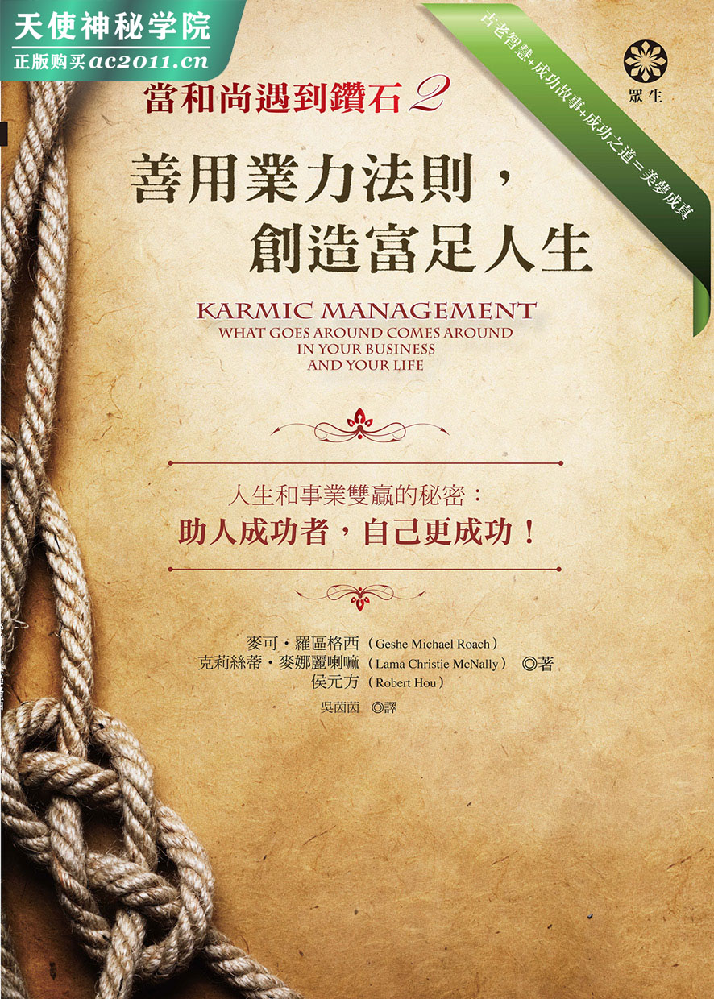

## 成功，是必然的

大家期待已久的《当和尚遇到钻石 2：善用业力法则，创造富足人生》是《当和尚遇到钻石》的续集。《当和尚遇到钻石》是世界最热门的商业书籍之一，翻译成十五种语言以上，书中的道理被全世界几百万位读者应用实践。《当和尚遇到钻石》叙述的是纽约市史上最成功的一家公司的成功故事，而现在《当和尚遇到钻石 2：善用业力法则，创造富足人生》将告诉你成功之道。本书所讲的秘诀来自古老、却又先进的智慧，以下人士都觉得非常受用：

※琳达‧凯普兰‧萨勒（Linda Kaplan Thaler）打造了产值十亿美元的广告公司，所撰写的商业书籍《善意的力量》（The Power of Nice）畅销热门。她表示：「我们公司之所以成功，大部分要归功于《当和尚遇到钻石》所提到的信念：我们一心帮助他人成功，而在内心种下成功的种子，因而确保了自己的成功。」

※在伊拉克服务的美军护士吉儿‧墨菲（Jill Murphy）表示：「《当和尚遇到钻石》阐释的原则，我们单位应用得颇有心得，我真心相信这样的模式能够结束这场战争，以及未来的所有战争——我们发现尊重他人能够大幅降低暴力冲突。」

※美国航空（American Airlines）飞行员威廉‧麦可麦克（William McMichael）表示：「以前我在驾驶员座舱里总是神经紧绷，读了《当和尚遇到钻石》后，运用里头所说的道理，就不再对同事抱持成见；现在工作场所变得愉快许多。」

※荣获奥斯卡提名的女星琳赛‧克罗斯（Lindsay Crouse）说：「我买了这本书，去一家咖啡厅，从头读到尾……现在我在教授演戏技巧时，融合了这本书所说的东方古老智慧。我现在知道成就他人的事业，就是成就自己的事业。」

※美国「大联资产管理公司」（Alliance Capital）的副总裁班‧葛米（Ben Ghalmi）发现：「《当和尚遇到钻石》帮助我更清楚地认识到，对穷困人士慷慨布施，是如何地让我在金融市场上获得成功。」

※嘻哈运动先驱卢梭‧赛门斯（Russell Simmons）个人身价高达三亿两千万美元，他是运用《当和尚遇到钻石》哲理的大师。他说：「我让世界许多人富有。我藉着帮助他人赚钱而帮自己赚钱；我因为让别人富有而使自己富有。」

※专业神学研究者暨伦敦皇家芭蕾舞团（Royal Ballet）的首席女舞者伊娃‧娜坦雅（Eva Natanya）表示：「第一次阅读《当和尚遇到钻石》的感受，至今依然记忆犹新。我读了这本书之后，发现自己对于世界的看法从此转变，知道自己对于世界到底如何运作有了空前的体会。我向其他舞者伸出援手，藉此帮助自己度过难关。」

※奔特力工程软体系统公司（Bentley Systems）的石油产业主管巴尼‧琼斯（Barney Jones）表示：「公司同仁以前总是不听我的话或采用我的建议。一位朋友要我阅读《当和尚遇到钻石》，我遵照书上的建议，避免说长道短，结果周围的人很明显地开始受到我建议的影响。」

现在，请你亲自看看业管法则如何在你身上发挥效用！

## 工厂、大学与银行

老板召集了十二个人，成立一个专案小组，任命你为专案经理。

任务：在半年之内把十万份新产品销售完毕——就从今天开始。

或是你的配偶要你负责厨房的改装工作，期限一个月。

也许你才刚下定决心，要在下周一之前减重五磅。

那十万份产品可能是书籍或披萨或线上软体服务，是什么并不重要；重点是有一个特定的专案或任务必须在一定期限内完成，而事情能否准时完工，将由你负责。

承认吧，生命是由一长串的工作组成的。我们需要一个把工作做好的方法，需要一个必能获得成功的诀窍。我们当然希望事业飞黄腾达——这就是本书的主题。但是同时，我们也要做人成功：当个好人、真正快乐的人、身心健康的人。如果我们做得正确，也会同时帮助到周围所有人，也就是全世界。

这本小书将教导你一个全新的方法来完成任务和计画。你以前从没听过这种方法，但是很有效，屡试不爽，请试试看。你所要投入的，只是一个小时。我们相信一个想法若是正确，简单几句就能解释清楚；至于要不要身体力行，就看你了。

我们会让你了解业力管理的八大法则，证明在事业和生命这两方面，的确是「做善得福，做恶得祸」。每项法则的一开始，我们都会引用古老智慧典籍的一句话。这些典籍是业力管理学的源头，来自许多不同的地方，但是最终都流传到西藏，一千年来帮助西藏建立无价的智慧文化。我们教导的是一个历经千年考验而依然存在的崭新经商之道。

因此每个法则的一开始，你首先会看到这样一句至理名言。

以下是第六世纪的佛教大师月称（Chandra Kirti）所说的话：

###### • 古老智慧 •

所有事情的成功机率是百分之百。

然后我们会解释这句引言将如何帮助你及时把十万份披萨卖出去，让你成为公司的明星（或是成为你家的英雄，这有时候比较困难）。

我们认为阐明成功之道的书籍，应该由成功人士来撰写，因此你不时会看到以下这样的一个小框框，里头的真人真事是我们应用业管法则而达到目标的实例：

##### 真人真事 克莉丝蒂喇嘛

我在纽约「亚洲经典机构」（Asian Classics Institute）学习时，第一天就练习业力管理学的八大法则。我的梦想是贡献一己之力，建立一种新型的、能够让世界确实有所不同的大学；结果业管实现了我的梦想。

我们一开始完全没有资金，而现在位于美国亚利桑那州南部山麓丘陵上的钻石山大学（Diamond Mountain University），在占地一千英亩的美丽校园里井井有条地运作着。我们的学生来自世界五大洲，共有几百位，校外课程也有成千上万的各国学生修习过。业管原则的确让我梦想成真，而跟我年纪相仿的人，大部分才正要从研究所毕业。

##### 真人真事 胡方元

我在业管原则方面的学习，跟克莉丝蒂喇嘛截然不同。我经商生涯的一开始，是在纽约市经营一家小餐馆。有一天我发现人生跟外面世界严重脱节，于是毅然决定离开工作岗位一年，去其他国家见见世面。我去了中国、缅甸、泰国、孟加拉、印度、巴基斯坦和尼泊尔。

这趟旅程并不是原本期待的美好经验。我不管走到哪里，都看到人们经历各种痛苦：老、病、飢饿、穷困、战争。我明白就连像我这样有足够金钱到世界各地旅游的人，都会逐渐衰老、迈向死亡。我明白如果没有试着帮助较为不幸的人，最后，人生将无多大意义。

起先我甚至动了出家为僧的念头，但是后来觉得要是进入一家大公司工作，也许能够更接近商业界的大人物而帮助世界，于是我在华尔街一家美国历史最悠久的私人银行找到工作（小布希的曾祖父曾在该银行服务，是该银行的合伙人）。

后来我进入加拿大帝国商业银行（CIBC），帮助他们增设一个新部门，管理超过两百亿美元的投资组合。我在银行业界的成就几乎是靠直觉本能，是来自旅行世界的体悟；后来我才知道自己所使用的原则，正是业力管理学的道理。

##### 真人真事 麦可格西

我的经历介于克莉丝蒂喇嘛和胡瑞伯之间。我花了多年时间在藏传佛教的寺院学习，当然把各式各样的古老智慧典籍（也就是业力管理学源自的佛教典籍论释）都读遍了，但是从来没有人和我们坐下来，教导我们如何把智慧实际应用在家里和工作场所的日常工作和计画上；我们照理是要自行找出方法的。对我而言，这是一个不断摸索的过程，但是最后要怎么做是很清楚的。身为安鼎国际钻石公司（Andin International Diamonds）的创始人之一，我利用业管原则让这家钻石生产公司的年度销售额从零窜升到一亿美元。

最后，你会看到另一个框框，里头写了一个明确的任务，你若是希望业管原则在你身上奏效，就得老实去做。我们可以告诉你成功之道，但是有没有认真看待这些不起眼的「工作清单」，是你的责任。例子如下：

###### 你的工作清单

● 不要只把这本书拿起来快速浏览一遍，心里只是模模糊糊地想要成功。现在，在我们进入下一步之前，请先选定一件明确的任务或计画，好做为业力原则的测试案例。如果奏效，这个案例就会成为你一辈子的业管朋友，然后你就可以继续把业管原则应用在大大小小想要完成的每一件工作上。

● 首先，我们以「静坐」做为开始。「静坐」算是正式禅坐的暖身，我们稍后会谈到禅坐。走出家门，去一个你认为轻松自在、可以坐在那里独自思考的地方。可能是附近公园里的一张长凳、附近咖啡厅里的一张桌子，或只是你喜欢沿着散步的某条道路。

● 携带一本口袋型小笔记本和一枝笔。内心平和宁静，自问：在人生现阶段，我真的想要完成的一个工作或计画是什么？我想在什么期限内完成？要是这件事确实成功了，确切的情形会是什么样子？

在你投入业力管理学之前，要彻底想清楚上述问题。我们会教你美梦成真之道，也就是实现梦想的方式；但是要做什么梦，由你来决定。

## 业管法则 1 事情行不通 不要继续做

###### • 古老智慧 •

一切失败来自错误的认识。

——《六趣轮回经》（The Wheel Of Life）西元前五百年

##### 一赌胜算

这部分，我们原本打算称为「五万年的失败」。据估计，地球上有组织的人类活动大约进行了五万年。所谓有组织的活动，就是人们试着合作完成某个工作或计画，比如从远处拖来巨大石块建造金字塔，或是创造与供应十万份软体。

无数大大小小的工作都是人类用手完成的。我们做过无数笔交易：你帮我移动那块岩石，我就给你这根玉米。每一个行动都是为了「完成」某事。

但是全都失败，没有一件事情是成功的。

怎么会这样？金字塔明明还矗立着，软体还在电脑上运作啊！

不过你再仔细瞧瞧。任何曾经参与创业计画的人，都可以告诉你在新成立的创投事业当中，十个之中有九个在头三年内便失败或逐渐没落。假设引自《六趣轮回经》的那句话是正确的，就可以说，我们所有人对于如何把事情完成，几乎都认识错误。

但还是有人成功啊！谷歌、微软和沃玛百货该怎么解释？

啊哈，事情开始有趣了。这里得先定义所谓的「成功」。你做某件事情「获得成功」，这是什么意思？我们会说你从事的工作或计画如期进行，结果令你满意，「因为」你「进行」的方式得当。这么一来，我们就要谈谈「胜算」。

过去五万年来，我们地球人是一个奇怪的族群。都过了这么久了，我们还是不太清楚事情为何成功。

今天要出门上班时，车子会发动吗？如果你对自己诚实（在业管法则 1，你「一定」要对自己诚实），就得回答：「我想会的。」因为你知道你不能回答：「我『知道』一定会的。」就算你昨晚熄掉引擎时，车子还是好好的，但是经验告诉你，今早汽车能否正常运作，你并不能「断言」。

因此我们一赌胜算。我们的一生就是一场机会游戏。我今天去上班的路上，有死于车祸的可能性和机率。就算我安然无恙地抵达工作场所，今天还是有被炒鱿鱼的可能性。而且今天在工作方面不管做了哪些决定，其中一些就是有可能行不通。

过去五万年来，我们是一个可悲的族群。大型企业的成功，定义通常不是事情是否如你所愿，而是你「临机应变」的程度为何：事情「不」如预期进行时，我们能够多么快速地转变方向。我们认为一个人若有智慧，就会知道事情不会「一直」如你所愿，因为事情本来就是不断变化，不管对谁都一样。

重点是，五万年的经验证明了一点：我们依然不晓得如何心想事成（我们依然不知道「为什么会」心想事成），因为要是知道的话，世上就不会有失败这回事了。真正成功的人少之又少，他们会告诉我们如何百战百胜——但是就连「他们」也在一赌胜算。就连「他们」也不能确定早上车子会不会发动，或是确保他们下一个重大的商业抉择，不会成为让他们一败涂地的主因。不管成功或失败，我们所有人依然是在赌胜算，只能在心里期待出现最好的结果。

##### 一赌胜算的个人耗损

因此，我们每个行动都是在赌胜算。「就我所知」，现在采取这个行动，心想事成的可能性才会最大，但我心知肚明失败的风险（失败的可能性）也是存在的。

这是什么样的人生？我们谈的不只是小事情，不是改装厨房，也不是车子无法发动而上班迟到半小时。我们一生所做的种种决定，终究会判定我们是生或死。一辈子都在赌胜算，让我们全部人都苦不堪言——面对人生一再出现的抉择，心里晓得不管做什么决定，都「无法」预知事情会如何发展，知道自己只是在做「希望」会成功的事情，这时候内心是多么煎熬啊！

试想（想像一下就好）这整个胜算游戏要是完全没有必要，会是什么光景：之前陷入悲剧，后来脱离，然后心就自由了。世界上有多少百分比的痛苦与不幸（我们有多少百分比的思考时间）是浪费在担心所做的事情「能」或「不能」奏效上？要是我们就是「确定」事情会成功，会是什么情况呢？ 事情确定成功，就是业力管理学的保证。

##### 一赌胜算的社会代价

一个人跌跌撞撞地度过一生，单打独斗地一再做决定，不确定任何一项决定是否能带来如意结果，就只能一赌胜算，这样的确很辛苦。现在试想全世界六十亿个个体「试着一起合作」，但是大家都不太确定该怎么办才好；也就是说，以下这句话，大家一天会互相说好几百次：「要是你帮我做那件事，而我知道你不确定那件事会不会成功，那么我就帮你做这件事做为回报，但这件事我也一样不确定会不会成功。」总而言之，大家就是帮彼此安排人生的种种不如意。

不可思议的是，我们已经习惯在这片变幻无常的汪洋大海里漂浮，只是默默地接受，像骡子一样痛苦地被轭头束缚，步履艰难地往前跋涉。我们永远活在不确定当中，直到死去那天才结束。对于这样的变幻无常，我们只能「尽力」应付。

这是什么样的人生？古老的西藏典籍指出，有个办法肯定能让一个人不会逃出监狱，那就是他从来不知道自己活在监狱里。我们的监狱，就是不确定所做的事情是否会成功。让我们逃出监狱，重获自由吧！

###### 你的工作清单

● 之前在哪里「静坐」，就继续再多坐一会儿，或是换个地方让心思更清明。

● 把口袋型小笔记本和笔拿出来，写下这星期要完成的五件事情。

在这五件事情旁边，分别写下能够如愿完成的机率：

星期三之前写完这一章。

成功机率：70%。

● 稍微思考这些机率、这种不确定性，带给生活的压力有多大。现在回到那五项，把所有机率改成「100%的胜算」。改完之后再坐一会儿，看看感觉有何不同。

##### 真人真事 克莉丝蒂喇嘛

我在家乡洛杉几唸了几间优良的私立预备中学。我喜欢上学，课业和体育方面都表现不错。对于要去纽约上大学，我兴奋不已；到了纽约之后，也开心地咬下这颗「大苹果」。四年后，我拿到学位，继续进入研究所攻读。我想成为教授，也许是英文文学教授，这是前途光明的事业。

后来我突然明白这条路是行不通的。我的意思是，学校照理是要帮我们做好准备面对人生的——让我们的人生更成功，当个更快乐的人。但我已经发现哪里不对劲了。有些人在学校表现出色，后来也功成名就，不过其他人在学校虽然也表现出色，出了社会后却走下坡。有些人辍学而找到快乐，其他人辍学却每况愈下。有没有完成学业，似乎没有造成太大的差别。

因此我在即将进入研究所就读时，做出了大胆的决定，一个永远都让我高兴的决定。我环游世界——埃及、泰国、澳洲……，凡是你想得到的地方，我几乎都去过，目的是想找到一条更好的路。

最后我抵达尼泊尔首都加德满都，在山丘上的西藏小寺院研读和修持佛法，这让我认识业管法则，而业管法则是让我们大学兴办成功的原因。

这则故事的涵义是，有时候你就是得承认正在做的事情行不通——尽管你长久以来都这么做，尽管你做起来得心应手，尽管大家还是继续这么做，虽然大家都明白这其实行不通。

有时候，我们只需要足够的勇气跳出窠臼。

## 业管法则 2 找出根本原因

###### • 古老智慧 •

有那样的因缘，才有这件事情发生。

——佛教，西元前五百年

##### 真正的原因

让我们回顾一下之前的内容，简单说就是：

如果事情行不通

你一试再试， 还是行不通

那么行不通的事就不要继续做。

所以该怎么办才好？你早上出门，转动汽车钥匙，结果车子发动不了，这时你会怎么做。碰到行不通的事情时也是这么做——寻找各种原因背后的主因。以汽车为例，你要掀开车盖，看看电池是否没电。

因为人生就像一台车。佛陀只说一件事情要能发生，另一件事情一定得先发生，科学也证实了这点。

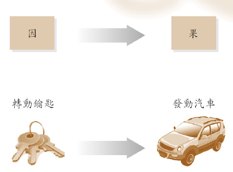

非常简单，纯粹两个维度，我们往往是这么看待事情的。我转动钥匙，一秒钟过后，汽车发动。或者，我藉着转动钥匙让汽车发动。钥匙造成汽车启动。

只不过钥匙没办法发动车子时，我们会进一步承认第三个维度——算是在钥匙和汽车的下面一层，也就是真正原因所在的地方。隐藏在车盖下方的，是让汽车发动的电池：

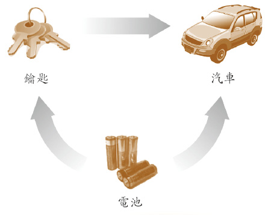

注意刚才提到了「真正原因」，这就是我们所谓的「根本原因」——你的钥匙造成车子发动，但唯有电池正常运作，才能「造成」钥匙发动汽车。

##### 「看似真实」相对于「确实真实」

真正的差别在这里。真正让汽车发动的并不是钥匙，虽然看起来的确是如此，我们也绝对是这么认为。

当然，「真正」让汽车发动的是电池。

因此，你可以画一条虚线，把汽车的例子分成两个层次，一是「看似真实」（看起来像是真正的原因），二是「确实真实」（是真正的原因）：

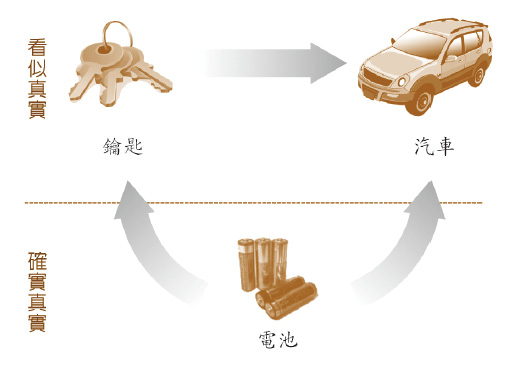

这跟永远不确定事情行不行得通，有什么关系？让我们回到十万个——什么来着？冰箱吗？总之，是你的专案小组要运送和销售完毕的产品，现在还有，噢，只剩五个月了。

你想知道这些冰箱要怎么样才「卖不掉」吗？

那就是卡在两个维度的思维里，卡在「看似真实」的层次上。你开始打电话给顾客，因为大家都知道：

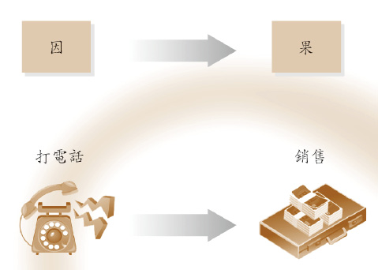

当你采用这种方式时，最后可能会疯掉。为什么？因为有时候打电话能带来销售，但有时候则不行。而且我们已经承诺不做行不通的事，因为这种事情不是「每一次」都行得通。太大的不确定性、太大的压力、失败的可能性，就像一再转动钥匙，但是引擎连「卡嗒」一声都没有。

找出根本原因，也就是业力；因为种什么因，得什么果。

##### 业力如何运作

我们得赶快说明业力是什么，免得你开始想起所有听过的错误解释。「业」就是指你所做、所说、所想的任何事情。如果你觉得称它为「我所做的一切」比较自在，那就这么称呼吧！

每一次我们决定做什么、说什么，或甚至只是想什么时，都会在我们内心深处记录下来，因为，嘿，当你决定那么做时，你人可是在场的啊！心是一个极为灵敏的巨大硬碟，具有几近无限的储存空间，其中某个地方存放着你所做的「一切事情」的记录。不管什么时候，只要稍微有个起心动念，或做出什么最微细的动作，都会在我们心里种下一颗种子：它会启动一股微小能量，有一天会「从内心发芽生长」，决定我们如何看待世界。

因此，现在我们可以画出这样一幅图：

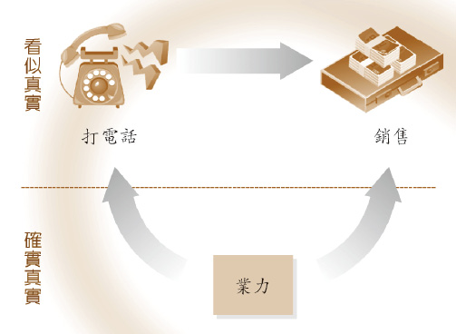

如果一通电话让你卖出物品，这并不是打电话的关系；如果钥匙发动汽车，这并不是因为钥匙。那只是「看似」真实，事情只是「看起来是」那样。但是真实的、真正发生的，是电池发动了车子，因为有电池，才能让钥匙发动车子。同理，每一次你打电话卖出物品，都是业力「让这通电话成真」，以及「让这通电话卖出物品」。

业力是「确实真实」的层面：业力在一切之下，有如大地之母的泥土在周遭一切事物的下方，支撑着建筑物，让树木生长。泥土是根本原因。现在，让这个道理在你身上发挥作用。

##### 真人真事 麦可格西

你可以说世界的三个重要事件，帮忙创造了适当的条件，让安鼎国际钻石公司大发利市。重大的社会转变不是我们任何一个人可以预测的，更不可能是我们造成的……或者在当时「看似」如此。

首先，美国的女性涌入职场，数量惊人。在那之前，大部分的珠宝都是由男性买给女性的，因为赚钱的是男性。现在，上百万的女性突然间拥有可以任意使用的收入，可以「冲动」买下轻型钻戒，上班时当成装饰品来配戴——这种钻戒是我们公司的特色。

第二，印度骤然成为切割钻石的主要中心。在这之前，几乎所有的钻石都在纽约或阿姆斯特丹或以色列的特拉维夫市切割。忽然间，我们公司买得到价格范围负担得起的钻石来制作轻型钻戒，省下极大的成本，并且能提供顾客价格大幅降低但品质依然良好的产品。

最后，中国政府突然放宽该国商业投资的限制，让我们可以把许多比较简易的饰品样式送到中国制造，让位于纽约曼哈顿的生产设备专门制造高档货品。

有一天，我们全部坐在桌子旁，试着了解为何这三件事情在恰到好处的时候发生，让我们大获成功。有人说：「依我看，说美国的女性让我们成功，倒是满有道理的。毕竟在纽约，安鼎一直让女性拥有同等机会争取经理和主管级工作，当上主管后，也得到跟男性主管同等的薪水。」

「还有印度那边也是，」另一个人说：「我是说，如果你真的相信业力或类似的概念，就会觉得真的很奇妙。我们安鼎这家珠宝制造商，是真的敞开心胸僱用新移民的印度裔美国人。一开始是僱用孟买的奇祥，然后就出现印度那套作风——朋友啦，兄弟啦，表兄弟堂姊妹啦，一个拉一个。光是宝石部门，肯定就有二十位员工来自印度。」

「还有中国也是，」第三个人说：「我们之前和『华埠人力中心』合作，帮忙训练新移民的华裔美国人制作珠宝的技巧，直到他们的英文能力赶上为止。」

上述三点几乎可以说是让我们成功的深层力量和根本原因，从我们脚底下汩汩冒出，改变世界的商业气候，为我们带来不可思议的收益。

###### 你的工作清单

● 回到「静坐」。现在你可能已经发现自己竟然开始享受这些独处的安静时刻。点一杯热可可，把业管口袋型笔记本拿出来，放在桌子上。现在，瞪着一张空白页面就好。

● 在心里写下这辈子最成功的三件事情，然后试着回想过去是否曾经帮助别人得到类似的成功，即便当时规模较小（因为心识田中的业力种子成熟时会比较大）。

● 也许在热可可送来之前，你会想到一个自我嘉勉的理由。也许对于成功销售十万份产品的真正原因，你会逐渐有新的想法。

## 业管法则 3 认出业力事业伙伴

###### • 古老智慧 •

业力定律一

你想从人生得到什么， 首先就得为别人那么做。

——宗喀巴（一三五七年～～一四一九）第一世达赖喇喇嘛的老师

##### 回音的效应

如何让业力事业在你身上发挥效用？

记得我们说过，业力是指我们做的任何事情：我们所做、所说、甚至所想的任何事情。但现在，我们要稍微澄清并补充：「任何我们『为其他人』所做的事情」，因为我们只能透过从别人身上弹回来的业力，来把业力种入自己的心识田里，少有例外。这就是为什么古老西藏典籍常把业力比做回音：你可以站在海洋边缘，把嗓子喊破，还是没有回音；最好找个洞穴，里头有很多石墙，这样才能够让声音回弹。也可以说，其他人就像古时候用来种植农作物用的棍棒，我们用它来把业力种子推入我们的心识田中。

没有其他人，就没有种子种下土壤；没有种子，就不会成功，因而又回到赌胜算的游戏。我们「需要」其他人。

##### 公平对待万物的业力

业力的运作方式（亦即要怎么收获，先怎么栽），其实是业管学的世界观中最令人满意的原则。我们内心深处「渴望」世界具有某种公平正义：事情如何进行「总得」有个道理；成功不只是随机发生的，人生不只是乐透；利益别人者，应得好果报。

如果一报还一报是万物的运作方式，那么应该永远如此。也就是说，不可能百分之五十八的成功人士是因为业力而成功，因为他们先助人成功，而剩下百分之四十二的人只是因为幸运才成功，这么一来，又是在赌胜算，而我们玩胜算游戏已经玩腻了。

现在应该暂停一下，提醒自己业管学的概念并不是空中楼阁，不是不切实际的慈善家的绮丽梦想，而是真实不虚、切合实际、脚踏实地的经商策略，能够带来显着的财务报酬，而这样的报酬一定会带来个人的成就感和快乐感。你利益别人，然而不仅如此，你利益别人，是会得到报偿的，这就是业管原则的运作方式。因此你利益他人的同时，也一直在帮助「他人」成功，这让他们快乐，也让你很有成就感，让大家喜欢你：每个人都快乐，每个人都成功。让我们开始做吧！

##### 业力事业伙伴

现在正式进入业管法则 3：认出你的业力事业伙伴。业力事业伙伴是业力管理学的核心，他们即是「把你所付出的再回报给你」的人，是会把你的业力弹回到你身上的人。他们会把业力种子种入你的心里，因此后来当业力以成功机会的样态出现时，你会看得到，但别人（没有造善业的人）却会错过。

对于每一位业力事业伙伴，你都要做一件事：帮助他们成功。这点请铭记在心。你将集中所有力气帮助这些人成功，然后你的事业就会成功（对于自己的事业，你不用担心，甚至也不需想太多）。让你所有的业力事业伙伴成功，于是十万个（什么来着？排球吗？）就会在一周之内销售完毕，让你的公司赚取最高利润。

所以，谁是你的业力事业伙伴呢？一共有四组，你需要让他们全部人都成功。

##### 1.同事

你的同事或职员是第一组业力事业伙伴。请记得，老板派了十二个人到你的专案小组，以便销售十万份产品。也许你过去几乎把这些人视为工具：雇员，是你「僱用」或使用以便完成工作的人。

不过来到业力管理学，事情就得有所转变，你和周围同事必须进入一种新的关系，你「必须」从你这边送出业力，「送给」他们。你「必须」留意，好让这件专案帮助「他们」成功。为了卖掉十万份产品，就需要这样的业力，而助人成功是种下这种种子的唯一方式，因为我们在寻找回音。

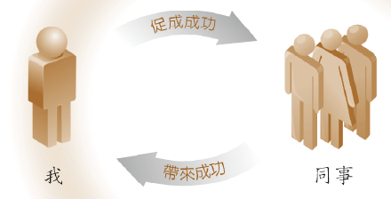

在运送和贩售这十万份产品的整个过程中，你必须让专案小组的十二个成员都成为公司的英雄，让他们更好、更有能力和更快乐。

##### 2.顾客

一份工作或专案的目的，显然是提供某人某样物品或服务：这个某人可能是顾客，但在这里也可以指上司或股东。你可能会认为替顾客服务并不是什么了不起的概念：你早就知道了，要不然那十万份披萨你以为是给谁吃的？

但我们说的不是这点。

如果你要业管原则在你身上发挥效用，就得百分之百迷恋以下这个想法：真正让你的顾客「成功」。你销售完十万份产品时，你的主管在「她」上司的眼中将成为天才；投资的股东将因为这次的专案而获得额外的利润；同时你得想办法让顾客以更便宜的价钱买到每一份披萨，而且还要降低每一片披萨的胆固醇含量。

好，你刚刚启动了多少回音？

##### 3.供应商

假设你认为你之前对「员工」的看法是不好的，请看看你如何对待供应商——肯定是单向关系：他们要给我最低价的高品质面粉和番茄酱，随叫随到，一次送齐。他们是如何办到的，以及为了这么办到而采取什么行动，是他们的问题，那是供应商份内的事。

在业管法则里，这样的想法也要彻底转变。任何一项专案（几乎是所有的成功或失败），有很大一部分的业力来自我们待人的方式，尤其是让专案成为可能的人——也许是为冰箱制造马达的公司，或是帮我们家油漆厨房的承包商，或是熬夜替软体写最后程式码的电脑怪胎。

你必须利益他们，你要关心他们，你得为他们留意，务必让这项专案也为他们带来成功。你帮我制造冰箱马达，利润够多吗？（啥？从来没有人问我这种问题！）我帮你找到另一个案子：我邻居的厨房也要油漆。你写电脑程式一定要每九十分钟休息一次、做些瑜珈伸展运动，如果没办法证明你有做到，我就扣你下星期的工资。

##### 4.世界

你的最后一种事业伙伴相当庞大，也就是外头的整个世界。前三种伙伴都是离家近的，虽然他们通常是与你共事的人，但依然是跟你很像的个体。也就是说，不管你做了什么帮助他们，就已经算是在帮助自己了，因此回音不会那么响亮，就像是往家里的一个空橱柜吶喊一样。

我们必须走到外头，到更大的地方，远离自己的地方，以得到响亮的业力回音。要在这个世界成功，就要采取让世界成功的行动。我们的专案必须为世界做点事情。

请不要以为画大饼、做大梦或对人友善，就等同于公司捐助一笔小善款给可靠的慈善机构！然而，爽快地开出一张一千美元的支票，捐赠给「联合劝募协会」（United Way），然后把这件事忘得一干二净，也从来没有让任何公司成功过。你要集中所有资源（你和整个团队的所有才能和创意，以及专案经费中的一大部分），用来从事专案之外的另一个计画──帮助努力完成类似事情且真正需要协助的人。

「如果」你帮助邻居，让「他们」的厨房装修成功，或更好的是，如果你先和一个为镇上贫穷家庭做免费厨房装修的组织机构接洽，那么你的厨房装修计画就会成功。如果你走到这一层楼的另一头，帮助广告团队寄出他们的冬衣清仓大拍卖的广告传单，或更好的是，如果你的小组能够说服管理阶层制造额外的一万件泳衣，然后捐给第三世界国家的一名企业家，帮助他成立自己的事业，那么你们生产小组的十万件泳衣，就一定会成功运送出去。

奇怪吧？忘掉你自己，为别人做事，一切就会如意顺遂。但凭心而论，你不是本来就一直希望世界这么运作吗？

##### 真人真事 胡元方

在加拿大帝国商银，我们部门发展了最为成功先进、且前所未见的方法来分析银行贷款的风险和收益性。现在回顾，我发现部门的成功是因为我建立了四种业力事业伙伴：

###### 同事

打从一开始，把同事视为业力事业伙伴就是我们银行的公司文化。我依然记得第一次参加会议的情况。我们坐在会议室里，加帝商银权力最大且最资深的高层职员高霍克先生（Mr. Goldhawk）忙进忙出。雪白的头发梳得很有品味的他，以前曾是投资银行的业务主任。他是我上司的上司的上司，因此跟他共处一室让我有点紧张，也在纳闷他为什么那么忙。

然后他来到我身边询问：「你想喝什么饮料？我来帮你拿。」这句话就像个秘密武器，像颗炸弹在我脑中爆炸：为了成功，我们必须为人服务。

后来在纽约市的一个下雪的晚上，主管请我帮忙行政助理处理一件专案。助理没有完成大学学业，但是正在开展人生的新一阶段，也开始组织家庭。

这件专案涉及一些复杂的计算演练，将会决定不同经济方案的投资组合结果。我大可以下班回家，让助理自行完成，但我留下来了。我们工作了整个晚上，隔天办公室同仁来上班时，我们刚好完成。我完全没想到要先行离开，因为那时我已开始了解业力管理学的运作方式：我们必须希望他人成功，程度就跟希望自己成功一样。后来助理的确成功了，不管在银行业务上或养儿育女上都是。几年后我回顾一番，发现自己能够那么快速地爬上企业晋升阶梯，是因为我总是把帮助同事当成分内之事。

###### 顾客

你通常不会把公司的高阶管理阶层视为你的顾客，也不会认为他们是地位同等的工作伙伴，但我们银行正是如此。

我们新部门的成立，是为了提供情报给组织的资深委员会，让他们知道银行处理两百亿美元企业贷款的细节。关键在于，虽然这些人是我们的顶层上司，但我们尽量把他们视为业力事业伙伴；也就是说，我们知道必须让他们成功。

我们提供给他们的报告相当精确，而且遥遥领先市场的分析，不久之后，所有高层主管都明白这样的资讯能够帮助本银行的其他许多部门。

于是我们每周固定制作报告，提供给整个机构的所有投资银行业者和交易缔结者参考；上司和银行成为我们的顾客，也是我们的业力事业伙伴——我们的确让他们成功。

###### 供应商

我们其实有两种不同的供应商。一是提供我们信用分析资料与即时市场数据的主要软体厂商；二是投资银行业者，他们每年延续数百亿的贷款，而把大笔金钱投入我们的投资组合。

我们厂商发展了一个新方式，能够分析并整合各家公司的概况，所以一家公司如果即将拖欠贷款，我们能够提早在同行发现之前就预测出来。但由于技术新颖，软体故障的次数颇多，使得有数百个小时的工作时间浪费在维修上。

但同样的，我们明白他们是我们的业力事业伙伴，我们也要让他们成功，因此我们继续支持他们，投注大量时间让他们的软体运作正确。最后他们的确获得成功，改变了整个业界对于信用风险的看法，软体也被银行业最大的信用分析机构购买下来。

我们和投资银行业者的关系比较复杂。我们的工作是保护银行和股东免于安隆（Enron）、通用汽车（General Motors）或雷曼兄弟控股公司（Lehman Brothers）等金融风暴的伤害，不过投资银行业者的目标只是得到炒得最热、金额最大的交易。

我们努力找到一个解决之道，让我们银行和投资银行业者双方皆成功，而非一赚一亏。我们训练银行业者使用一项新产品——信用衍生性商品，使得借贷双方都能够得到保障。庞大的安隆企业破产时（我们部门早已预测且警告商银了），这项措施让加帝商银免于损失几千万美金。

###### 世界

帮助公司的同事、顾客和供应商是一回事，业管法则表示，为了成功，我们也得踏出公司，尽量帮助整个世界成功。

我当时就知道我必须找机会服务更大的群众。我非常幸运，得到社区中心的董事长一职，该中心面积一百英亩，原本是成立联合国儿童基金会的墨利斯‧培特（Maurice Pate）的宅邸。他奉献自己的生命帮助全世界的小孩，最后拒绝接受诺贝尔和平奖的提名，认为光荣应归联合国儿童基金会所有，我从他身上得到很大的启发。

经年下来，本中心为世界大众提供教育课程、举办全球和平活动。我发现愈是贡献自己及承担社区中心的责任，工作时就愈快乐，事业也变得更加如意顺遂。

我开始练习瑜珈，当我的同事看起来愈来愈老、服用药物以应付生命的各种压力时，我却觉得自己愈来愈年轻快乐。虽然社区服务让我更没有时间实现所有的度假美梦，然而，把所有空闲时间奉献给社区中心，让这位最大的业力事业伙伴（世界）成功，我得到的回馈是更健康、快乐、平衡的人生。

在这四则跟业力事业伙伴有关的成功故事里，有一个共同主题——无所求地帮助他人成功。

###### 你的工作清单

● 接下来要做什么，你应该很清楚了：又是跟自己去咖啡厅的时候了。把业管口袋型笔记本拿出来，在四张页面的顶端，分别写下四组业力事业伙伴的名称：同事、顾客、供应商、世界。

● 接下来，当然是在每一组项下写上一个人的名字——你为了创造回音而需要的那个人；你从事业管计画时，将助其成功的那个人。

● 在名字后方，清楚描述你帮了他之后，他会得到什么样的成功。也许不是什么丰功伟业，但是非常明确。

## 业管法则 4 从自己开始

###### • 古老智慧 •

你我之间的界线是人为的造作。

——寂天大师，西元七百年

##### 温馨的业力巢穴

你想一想，就会发现你与所有业力事业伙伴的关系，可以用以下这幅简图清楚表示：

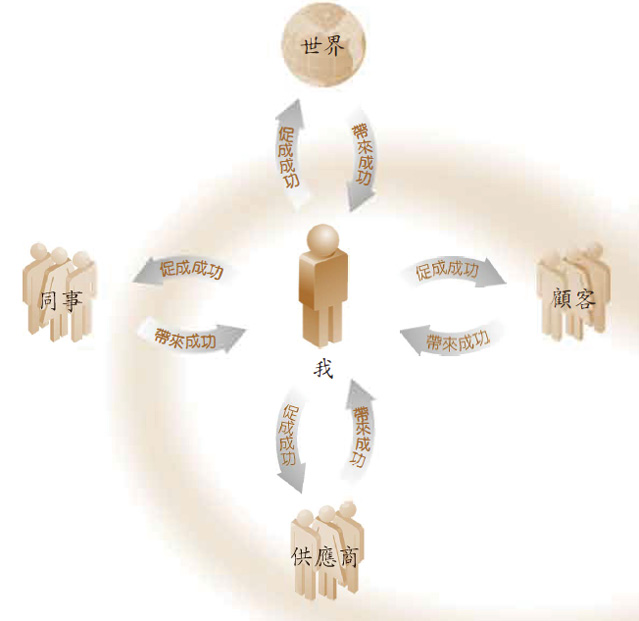

我在中间，四组人在四周。为了完成我的专案，为了让我们公司的有线电视增加十万个订户，其实我需要「停止」把焦点放在「我的」专案上，开始把焦点放在如何让业力事业伙伴成功，然后我自然就会成功。西藏农民总是说：「种玉米的人，自然会得到干草。」意思是，你每次种玉米时，就让玉米杆之间的草自然生长，这是免费的，而且让你养的所有牦牛整个冬天都有食物可吃。

因此，业管经理如果做得正确，就会坐在这个温馨的业力巢穴里往四个方向送出成功，然后沐浴在传回来的回音里。

##### 中间的我

为了让业管原则发挥神奇力量，我们必须注重业力温馨巢穴中央的小「我」。你立刻发现一切都得从你这边开始。如果我不发出哔声，就不会有回音弹回来。在业力管理学里，所有成功都始于自己。你要率先行动，单方面地开始让业力事业伙伴成功——由你这边踏出第一步。

但还有一点也绝对至关重要。再看一下中间的那个小我，其周围似乎有一个圆圈，一条界定我的范围的界线——「我」从这里停止，「你」从那里开始。

在非常粗糙的层次上，这条线就是我们的皮肤边缘：这个皮囊里头的一切都是我，外头的一切都是其他东西或别人。不过，一般的「我」当然是稍微比这个还大。妇女有了孩子之后，她的这条线会扩大而把婴儿囊括在内。超市停车场的一台车子被刮伤了，我们不会过度在意，除非那是「我的」汽车。

因此，是什么决定线条延伸到哪里？可以说，「我」延伸到任何我有强烈情感的人、事、物上。如果你伤害这个范围之内的人、事、物（戳刺我的皮肤、推挤我的小孩、刮伤我的汽车），就是在伤害「我」；如果你帮助这个范围之内的人、事、物（帮我按摩、夸赞我的小孩、修理我的汽车），就是在帮助我。

于是你可以发现，以这样的角度来看，你的业力事业伙伴「就是」你。如果他们失败，你就失败；如果他们成功，你就成功。现在要画出新的「我」：

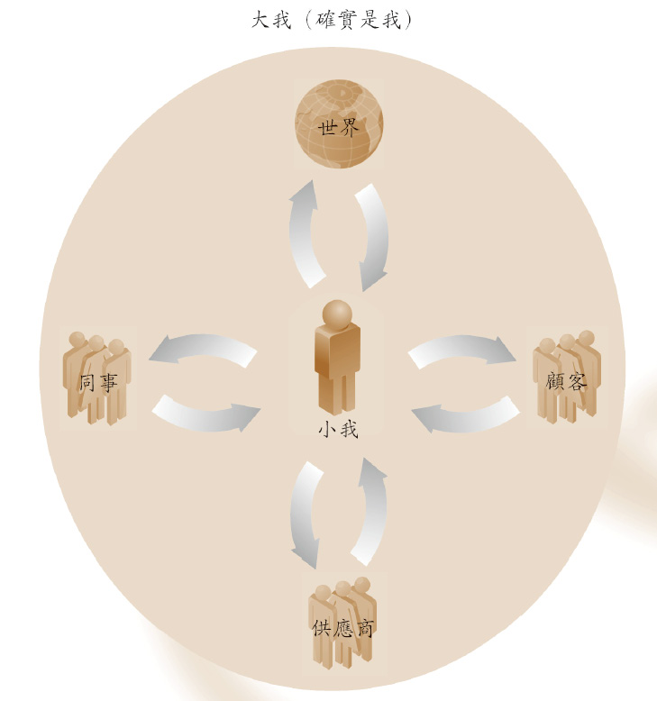

你看，我们又融入「看似真实」和「确实真实」的概念。活到现在，我看似是与同事、顾客和供应商分开的，跟更大的世界也是有分别的。他们的问题，我能放下；他们是否成功，我没办法特别注意，因为对我其实没有直接或重大的影响。

但现在请重新思考。如果业力是真实的——如果发生在我身上的任何一件事，都是来自我曾为别人做的事情的回音，那么你「就是」我。请不要把这当成空中楼阁、世界大同的哲理！我们是在讲真正的数字，真正的事业。「真实」的我是大我，包含周围所有人的我。请习惯这点。「他人跟我是分开有别的」这个障碍一旦突破，就比较容易用心让别人成功。

##### 关于竞争

看一下图表里写着「世界」的那个圆圈。那个圆圈也只是一条线，现在我们知道那可能是一条混淆视听的线。对于没听过业管法则的人（对于人生依然在赌胜算的人）来说，看到的世界自然是他们碰到的情况，而非他们创造出来的情况。

公司聘请了一位聪明开朗的新主管，请我训练他从事我的工作——突然间，我觉得自己在公司地位不保。海外某个国家的工厂开始大量制造我们公司花费庞大成本生产的微波炉——突然间，我觉得我的工作或我的公司或甚至我的国家受到了威胁。

你错了，而且错得离谱！你得穿透看似真实的原因，找出确实真实的原因。业力所阐明的是，发生在我身上的所有事情皆来自「我」，因此我可以让任何想要的事情发生，但首先要为另一个人这么做。

业力的道理应用在竞争上，不管是跟隔壁的办公室竞争，或是跟地球另外一端的公司竞争，又是什么意思呢？请系好安全带，我们即将炸毁你内心深处已经定型且有五万年历史的制约反应。

当公司请你训练年轻的新主管时，请用尽全心去做，尽力把他变成顶尖一流的企业超级明星。海外产品推出而击败你的产品时，请自己去买一个回来，同时呼吁所有认识的人都去买一个，因此所有的外国员工可以开始享受跟你同样的舒适生活水准。

「我为什么要那么做？」你怒气冲冲地问。因为你得那么做，别无选择。你「必须」让他人成功，即便是你的竞争对手。你知道接下来会发生什么事吗？所有的业力都会弹回到你身上而「炸开市场」。

你的小徒弟表现得太优异，使得上级做出了你之前担心的事：给他你的工作。他们非常佩服你处理这件事情的方式，结果创造了一个新的副总裁职位，让你直接升职。

突然间，你的办公桌上放着一大笔订单（其实是你见过最大的一笔订单），因为某国政府要买「你们」公司的微波炉，要在他们国家的每座火车站的厨房里各放一台。

这就是世界的真正运作方式，我们讲的是「确实真实」的层面，我们讲的是唯一确定的成功之道。放弃「我」与「你」的对立，放弃「我们」与「他们」的对立，为每个人创造赢面。

最后一个要点是，当你确实放下界线，为大家的成功而努力时，你生平第一次与统理宇宙的法则和谐共事，第一次与创造万物的力量之流同步进行，这时你自然会开始感受到深层的平静与满足。

难道世界上的一个国家理当兴盛繁荣，而其他所有国家穷困潦倒都是活该？事情注定要这个样子吗？

##### 母亲的责任

再看一眼那幅图，还有最后一个重点你必须明白。你的伙伴就是你——没错，现在我了解了。但「你」也是「你的伙伴」。这是什么意思？ 一切都由你发起：你采取行动，然后整台机器就开始运转。如果你不行动，或者行动得不是很有效率，那么其余的人就得受苦了。「为了世界的利益着想」，你随时都要尽你所能地工作；我们「需要」你。

现在要反方向思维。你不只是在为自己工作，业管经理是整天为大家服务的。你就像个母亲，有四个儿子要照顾，要帮他们准备食物、穿戴衣服，让他们成为好人。你要随时保持在最佳状态，因为很多人都依赖你。我们需要妈妈健康无恙，更重要的是，我们需要妈妈「心思清明」。

为什么？因为业管的世界观就像上了油的猪一般滑溜。你一疲累或分心，你一感冒或早餐时跟另一半吵架，所有这些业管道理就会飞出窗户，你会纳闷到底是什么让你觉得把自己的工作白白送给别人是好事？ 简言之，我们要维持你的身心和情绪上的健康——你得维持自己的健康，否则当五万年历史的文化训练巨浪威胁到你幼嫩的业管世界观时，你会招架不住。我们要你随时都「心灵清澈明净」，否则你心情一低落，又会成为胜算游戏的奴隶。

因此，现在你要认真投入「让心思清明的七点计画」。

##### 七点计画

###### 1.练习瑜珈

我们三位的共通点是长期以来固定练习瑜珈。瑜珈经过数千年来的设计，能够对体内心念所游走的精微气脉造成最大的影响。这表示如果你瑜珈练得正确，就会确实开始思考得更清楚，就更有能力把业管做得成功。两千万的美国人已经在练瑜珈了，因为他们体会到瑜珈对工作表现有多大的助益。

练瑜珈最困难的就是第一次要去上课的时候，接下来自然会水到渠成。瑜珈有许多不同的种类，幸好几乎都是来自良好真实的基础，将会带来你想要的结果。大方地尝试几间不同的瑜珈教室，然后再选定一家。找一个容易到达的地方，选择适合你的瑜珈类型。以下是我们整理出来坊间教授的几种瑜珈系统：

● 阿斯坦加瑜珈（Ashtanga）

力量、结构、传统 〔也称为八支串联瑜伽（vinyasa）、麦索练习（Mysore）、史文森动瑜珈（Swenson Flow），有时候也称为强力瑜珈（power yoga）〕

● 艾因嘉瑜珈（Iyengar）

正位、技巧、了解身体

● 哈达瑜珈（Hatha）

缓和、伸展，从这里开始不错

● 希瓦难陀瑜珈（Shivananda）

传统、灵性，练一辈子的瑜珈

● 热瑜珈（Bikram）

加热的房间、精确的流程、专业

● 阿努萨拉瑜珈（Anusara）

从调心开始、有效、细节取向

● 吉瓦木克堤瑜珈（Jivamukti）

灵性、有效、带来启发

● 芙芮丝特瑜珈（Forrest）

阴性能量、力量、自信

● 法友瑜珈（Dharma Mittra）

宗师瑜珈、灵性、深层

● 西藏心瑜珈（Tibetan Heart Yoga）

瑜珈的业力管理、古老、智慧

● 静瑜珈（Restorative）

适合有旧疾的人

● 双人伸展瑜珈（AcroYoga）

与同伴一起练的瑜珈、有趣、健康

● 产前瑜珈（Pre-Natal）

让生产与产后复元更为容易、健康、安全

###### 2.开始禅坐

我们三位长期以来皆有非常固定的禅坐练习，我们会说禅坐的影响最大，你会更加沉稳、思考犀利、看到机会、破解问题。

几乎所有热门的瑜珈类型都来自同样真实的根源，但有时候很难找到真正专业的禅修训练。你可以在当地的瑜珈教室或佛法中心学到基本技巧，比如数息、观呼吸、平静地观照念头的来去。请不要以为你得相信任何一种哲思教理，才能够开始练习瑜珈和禅坐。利用瑜珈和禅坐来达到我们这里所讲的业管目标，如果人生后来出现转变，让你想要更深入地探索，也是由你作主。

禅修老师的工夫有多么深厚，很难判断，但至少可以说，如果他们的禅修法门是有用的，他们会是沉静、仁慈、头脑清楚的，因此请寻找这样的禅修老师；同样的，可以大方地先到处看看。如果到某个阶段，你觉得真的想认真练习打坐（这会让你在人生和事业两方面都更有能力和清明），我们推荐亚洲经典机构的课程，以及本书最后一章推荐阅读的书籍。

###### 3.遵循个人的伦理守则

我们每日与他人的应对有多么符合伦理道德，是决定我们如何思维（随时随地的起心动念）的一个非常特别的业力。同样的，不见得要遵循特定灵修传统的规定——这是你的事。但是不管你选择遵守哪种个人伦理守则，都应包含以下四种或五种要点：

● 保护生命

当然不要对其他人或其他生物造成肉体伤害，甚至也要尽量避免具伤害性的言语或念头。

● 尊重他人的物品

永远不要偷东西，或做出近似偷窃的行为：上班时不打私人电话、不在帐单或税务上动手脚。

● 尊重他人的关系

永远不做出会威胁到夫妻或伴侣之间具有承诺的关系。

● 诚实

不要说谎。说谎的意思是你知道不是真实的事情，却让别人误以为真。

许多灵修传统会加上第五个要点，也就是小心不要陷入酒精或毒品滥用的状况。简言之，酒饮和毒品不仅浪费金钱和时间，而且终究会毁灭任何心思清明和成功人生的希望。

###### 4.不断学习

书籍的发明是很美妙的一件事。我们习惯于只听同代人说什么，现在只要你愿意，就可以去书店花掉一、两个小时的薪资，把过去两千五百年来的所有伟大心灵带回家，然后拨出下午时光沉浸在其中。

某些书籍历久不衰是有原因的，它们讲的道理可以让你的人生更加顺遂圆满；至于最精彩的部分，是业力管理学所根据的那些先进的古老智慧——现在首次即将普及大众的智慧。我们同样在本书最后为你列出书单。

永不停止地学习——什么都学，可能是新的电脑程式，或是外国语言的几句话，或是不同国家的烹饪风格。学习新事物能保持心的年轻、清明、锐利。

###### 5.服务

每天没有刻意为别人至少做一件好事，人生就不会圆满。学习了业管原则，你在这部分当然没有问题。请继续努力。你会发现没有什么事情比帮助他人带来更大的满足感，你付出愈多时间，就会得到愈多时间，完成的事情也会更多，这就是业力。

###### 6.善巧地进食

啥？要怎样善巧地进食？吃东西需要多高的技巧？

很高。

我们住在富饶国家的人，从小就被训练吃得没营养又过量，这让我们慢了下来，也让整个文明慢了下来，让我们既疲累又心思鲁钝。我们需要很大的智慧才有办法对抗潮流，重新训练自己如何饮食。

至于饮食过量的问题，如果你七点计画的其余要点都进行得不错，就不需要做出英雄般的努力来节制饮食。瑜珈调伏体内的气脉，这些体内通道也负责掌管你想吃多少食物的渴望。维持两、三个星期的瑜珈练习，即便是非常基本的也好，一周只要一、两次就可以，你会突然发现自己就是不再想吃一大堆的食物了。

继续进行七点计画，过了一阵子之后，你会自动发现让你感觉健康和清明的食物愈来愈有吸引力：新鲜的蔬果，以及脂肪和碳水化合物低的高蛋白食物。

同样的，这不是什么新世纪的饮食主张。你加班时靠甜食和咖啡提神，前几年的确不会有什么大问题，但是后来这种习惯就会开始找你算帐——你的身体会虚胖松弛，你的心也跟着软弱无力，然后具有突破性的想法（比如让竞争对手成功是让自己成功的策略）就会让你嗤之以鼻。

关于食物还有最后一点——现在能做多少就算多少，但请保证在想法上要努力朝这个方向前进。如果你真的希望拥有清澈澄明的心智，就需要有清澈澄明的良知，比如遵守之前提到的个人伦理守则，这表示我们得开始避免混有许多恶业的食物。所有肉制品的生产过程，都会造成无数毫无自卫能力的生物巨大的痛苦和煎熬，而且是每天都在发生。当然，不管我们怎么辩解，我们都明白动物感受痛苦和喜悦的程度，跟人类一模一样——这就是为什么我们宠爱家里的狗，怀抱家里的小猫。

请以自己的速度，逐渐断绝肉食。跟素食朋友谈一谈，得知如何明智地运用植物蛋白质取代肉类蛋白质。我们可以从个人经验跟你说，你吃素之后，会变得更强壮（肌肉张力变得更好）、更苗条、更敏锐、更灵巧和更快乐。

###### 7.休息和放松

如果饮食是个技巧，那么休息就是个艺术。真正知道怎么好好休息的人，实在太少了。但你的业管要做得好，就需要正常健全的精神机能、休息充足的精神机能。

睡眠要充足，这端视你个人的需要而定，每个人都不同。由于我们大多数人都得定时起床上班，这通常表示需要准时睡觉；也就是说，醒着的时间要明智运用，才能够如期睡觉。获得更多时间好准时睡觉的一个好方法，就是简化生活。

你可以先从非常浪费时间的事情开始，比如看电视和上网，这通常是指阅读不必要的电子邮件，而报章杂志也是有罪的一方。你不见得要知道总统今天早餐吃了什么，或是你伯父对他的孙子有什么看法。所有这些资讯和多余的刺激，都会让你的心神负担过重而难以放松与入眠。如果晚上多出来几分钟，别去浏览网路，到外头走走，看看树木，欣赏星星，或者在屋内走走，顺便把过去半年来没有用到的物品丢掉。这些东西都会占据你心里的空间，让它阻塞而无法放松。

看看你有没有办法坐下来，静静地跟自己相处十分钟，默默地思考生命和世界的美好良善。学习放松，让自己休息。我们所有人都需要神清气爽、头脑清明的你。

##### 真人真事 克莉丝蔕喇嘛

许许多多的人促成钻石山大学的成功，但我要很得意地说，我认为我们成功的基石是「下午一点的政策」，而说服大家这么做的人是我。

在钻石山大学的任何一天，课程或教学性活动都不可以在下午一点之前进行。我们鼓励学生（以及教职员）把早上的时光投注于个人的发展，也就是练习业管的七点计画。

学生起床时，一般会享用一杯花草茶，然后以禅坐做为一天的开始。禅坐可以十五分钟，也可以一小时以上，看他们在禅坐方面的经验多么丰富。

大部分学生都有学过数种不同的禅坐技巧，这能保持禅坐的新鲜有趣。他们可能练习以解决问题为目的的禅坐，试着了解朋友这周为何生他们的气；或是练习观禅，观照禅坐会碰到的八个典型障碍，把体会铭记在心；或是练习止禅，把注意力放在胸口的一个静默点上。

接下来就要起身练习瑜珈。顺道一提，我们发现和一位伴侣或朋友练瑜珈比较容易：其中一位想偷懒时，另一位会说服他。团体练习也很有趣，钻石山大学的学生可以选择早上跟大家共修或练瑜珈。

我们不强迫学生练特定一种瑜珈，每个人都不一样。有那么多不同类型的瑜珈存在，就是因为每个人适合的不同。

我们也不会规定瑜珈要练多久，这也是依每个人的程度而不同。但我们会特别叮咛你的禅坐和瑜珈练习必须固定：每天练习十五到三十分钟，会比一日勇猛精进，尔后休息三日来得好。

瑜珈练完之后（瑜珈和禅坐最好是空腹练习），大家会进食当天的第一餐。同样的，我们不规定任何特殊饮食（每个人的身体都不同），但有些食物显然是让每个人几乎都觉得很棒。一是现榨果汁：买一小台电动柳橙榨汁机，养成每天早上现榨四颗柳橙份量的习惯。一周之后，你就能体会来自新鲜水果的生命力，有如巧克力那般甜美，让你的身体充满了从小就没有的精力。

开始戒掉咖啡，然后是有咖啡因的茶类。开始用杏仁奶的纯蛋白质取代牛奶的脂肪，渐渐的，你也可以现做杏仁奶。可以在杏仁奶内加一些早餐谷片，但请养成检查谷片包装盒上营养标示的习惯，避免糖份过高的谷片。

早餐之后，学生一般会自习。我们鼓励采用西藏的传统学习方式。这时还不能用电脑，因为（我们之前提过了吗？）你整个早上都要努力维持禁语和心智的沉静。

好，所谓的西藏方式，是你首先把要读的书拿出来，花几分钟浏览目录，比如前五章的章名。然后闭上眼睛，看看能否在心里对自己重复这五章的章节名称。大约一周之后，你就可以按照顺序快速背诵所有章节的名称，这表示你自然而然对于整本书的全局有了个概观。

这样的概观就在你的脑袋里，你可以随时随地拿出来思考反刍——不管是在前往上班的途中，或是吃午餐时，或在某个地方等候时。

然后开始阅读今天要读的部分，结束时思考这部分如何融入整个大局，以及可以怎么应用在今日的生活中。

之后，学生可能会花一、两小时的时间从事教导或助人计画。几乎每一位钻石山大学的学生都参与这样的计画，这也是完全自愿的。钻石山大学的课程甚至是不收费的。

你得想让自己成功：没有人可以帮你做这部分。

好，如果你不是全职学生，你可能早在下午一点之前就得去工作，但你了解这个原则──你会按自己的行程表调整七点计画。我真正要你从这里认识到的，只是拥有清明的心感觉是多么美妙。我们大学的「下午一点政策」确实有用：让学生和教职员成为健康、平衡、思路清晰的个体。把这样的一群人凑在一起，然后放入教室里（我们在下午和晚上上课），看看会激发出什么样的活力——学习带来的纯然喜悦，时速一百英里。

我曾和几位钻石山大学的学生搭飞机，空服人员停下来说：「你们容光焕发！是怎么做到的？」事实上，这样的情况一再发生，这是让做老师的最得意的一件事。

这把我们带入最后一点。没错，你是我们的母亲，我们指望你强壮健康，因为你是让我们成功的人。但你想一想，就会发现母亲就算没有在做什么特别的事情，也在做一件事：担任模范。

大家整天随时都在看着彼此。要是你因为心灵清澈明净而开始容光焕发，工作时表现得像超级巨星，大家会注意到的。他们会想办法知道你在做什么，然后开始照做，这么一来，大家又往成功更前进一步了。

###### 你的工作清单

嘿，我们刚才想到一件事。现在我们要这本新书大获成功，要所有的业管课程大获成功。这表示你要开始进行七点计画了，也就是说，在工作清单方面我们会更严格了。今天有两个要点：

1. 你要上网搜寻三家位于附近的瑜珈教室，这星期你至少要去试一堂课，此后是每周一堂，直到你找到喜欢的教室和老师为止。然后你一周要去那里上一次瑜珈课。

星期天下午是大多数瑜珈教室的悠闲时光，那里会有一群像你这样的人，平日工作的人。我们还记得第一次上瑜珈课的情况。我们是班上筋骨最硬的学生，而且一上完课就马上冲去一家餐厅，把肚子填满煎饼。接下来两天，我们走路像鸭子般一跛一跛的，全身无处不痠痛。

但我们为自己感到得意，而且也愈来愈得心应手。别难过，你现在毕竟还是初学者，但不出几个月，你就会在班上所有的新手面前炫耀自己柔软的身体了。

2. 你要找人教导基本的禅修技巧。去瑜珈教室时到处打听一下。在找到真正契合的老师之前，请努力不懈地试验与寻找。然后周一到周五，你要开始每天打坐十分钟（每天的时间、地点完全相同会容易许多）。

现在开始吧！生命稍纵即逝，这个新的业管学会是你成功圆满的大好机会。为我们而行动吧！

## 业管法则 5 停止做决定

###### • 古老智慧 •

不是这个，也不是那个。

——智者庞树，西元两百年

##### 决定只会生出更多决定

现在你神清气爽、心思敏锐，也真心想帮助别人成功，所以该是讲解技巧的时候了。所谓的技巧，就是停止做决定。

决定衍生自胜算的不确定性。你已经习惯必须做出决定，因为你从小到大都在赌胜算。事实上，你等一下上班时，就得做出一个重大决定，否则十万份巧克力礼盒显然不会在所剩的四个月内全部售出。

你要决定的，就是要继续采用旧式的邮寄广告，或是尝试新的网路广告？（当然，你手头很紧的老板编列给你的预算，只够你尝试其中一种，而不是两者都采用。）

我们依照惯例画出选择，这确实会让你更容易拿定主意：

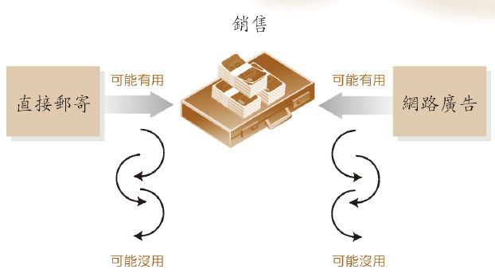

画好了，情况果然清楚了些。必须做出决定，只因为不「确定」哪一个方法行得通。

你思考一番，就会发现有幸得到管理阶层的青睐而升为经理，一直是关于：谁有胆量（或傻劲）坐在这小小的主管座椅上，指示所有的专案成员往哪个方向前进？尤其是任何人即使只要短短一秒钟诚实，也会承认我们不晓得尝试的方法是否有用。

但不只如此。问题在于决定会衍生出更多决定，因为我们这些可怜的小专案经理头上的不确定性和压力，往往会因为变数而呈倍数增加。也就是说，你英勇地决定采用网路广告的那一剎那，小组中就会有人建议采用「极简主义」的网路广告：「跟你说，这就像苹果电脑设计的 iPod 包装盒，上头完全没有说明！所以说，广告上只会有我们巧克力礼盒的图案，这是重点——连我们公司的名字也不用放，任何一个地方都找不到，要去哪里买巧克力也只字不提！然后跟你说，整个网路就会炒热一个问题：这些巧克力要去哪里买？」

这时，当然另一名成员会翻白眼的说：「我看图案最好是某人津津有味地舔去手指上的巧克力，然后红色心型礼盒下面来个超大的 0800 免付费专线。大家都知道这种广告百战百胜，永远都是赢家配方。」

因此，你的人生现在是这个样子：

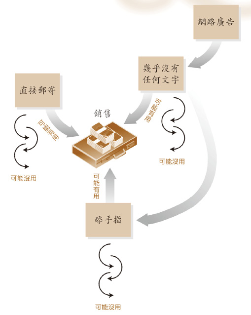

##### 优缺点

在这幅凌乱的小图表上方，我们现在要加上优缺点清单，因为每一次要做出重大决定时，就会衍生出一长串正反两方的意见。这里我们为极简主义的网路广告列出简短版的优缺点清单：

问题是，这份优缺点清单会立刻在你脑中衍生出「另一份」清单——「优点变成缺点」的清单。也就是说，我们打从心底明白就算是优点也不可靠，它们很有可能变成缺点。我们还是得提前规划备用方案，免得到时候措手不及。

极简主义网路广告提案

| 优点 | 缺点 |
| 1 同样成本涵盖更多人口 | 1 如果更多人到处都看到这些网路小广告，可能会让我们的巧克力看起来廉价质劣，不再是高级的独家精品 |
| 2 生产成本较低 | 2 电子广告虽然比平面广告便宜，但是一流的网页设计师很快就会把价码抬高，而目常会半途而废，又找不到人取代 |
| 3 结果出来时容易调整修改 | 3 唉呀！网路广告有多么成功，到底该怎么测量？每个人和他们的母亲都知道，网路点击次数是会灌水的，比如寻找巧克力颜色麂皮乐福鞋的人，不小心点进迁个广告。而巨记传吗？网页设计师在上星期就辞职囉！还是你要跟他商量，用双倍的薪资把他请回来，只为了修改一个广告？ |

你知道这份新的清单不只是笑话。如果你已经是个主管，你每一次列出优缺点清单时，一定会发生这种事情。因此，现在请看以下这幅图，你在做一个小决定时，心里的过程是这个样子（我们很慈悲，不把内容写上去）：

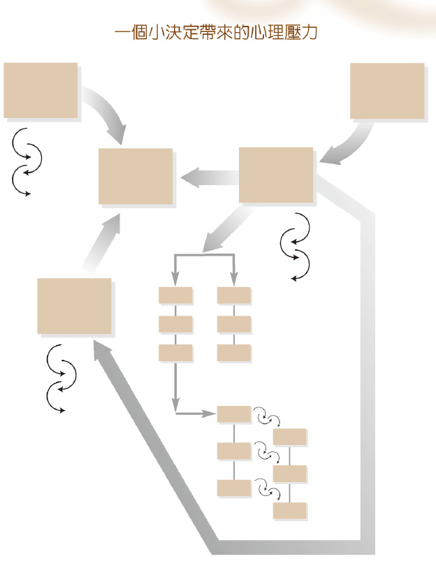

你领导专案小组把十万份产品卖出去时，就得做出几百个大大小小的决定，所以这样的图表会有几百个。你想知道大企业的中阶主管为何薪资那么高吗？因为活在这样复杂的不确定感之下，心里是如此痛苦，薪资少一点就没有人要做了。你知道这是真的，因此该是停止做决定的时候了。我们来看看要如何脱离做决定的困境。

##### 真人真事 麦可格西

我们公司成长之快（好几年来规模和销售额每年都成倍成长），使得工作场地一直维持顶级的环境。我们一再承租更大的地方，权衡了许久，终于在曼哈顿买下自己的一栋九层楼大楼，俯瞰哈德逊河，视野美极了。问题是，要得到一间开有外窗的办公室，差不多要征得副总裁同意才行。

约翰‧艾斯波西多抢在我之前向副总裁征得这样一间办公室，害我每次经过他的门前总是妒火中烧。别以为拥有外窗没什么了不起，你不只是拥有自己的一片阳光，还有自己的办公室，可以把门关上，享有一些隐私！更令人眼红的是，《华尔街日报》总是从他门口底下露出来，那是信件室主管每天早上亲自送过去的。

于是一天早上，我沿着走廊走到约翰的办公室门前，若无其事地弯下腰，顺手把他的报纸拿过来，带去我那小小的办公隔间。我把脚搁在桌上，背往后一靠，开始气定神闲地读了起来，彷彿我理当这么大牌似的。结果怪事发生了。

头条新闻讲的是一位华尔街投资银行业者，他未经上级授权，就拿公司的全部避险基金做了风险极高的投资，结果输得精光。他试着逃到香港，结果遭到逮捕。报纸放了一张醒目的照片，戴着手铐的他正被带离空桥。备受推崇的分析师为此做了大篇幅的评论，表示他采取如此高风险的行动是多么愚蠢。到目前为止，怪事还没发生。

不过到了第二页，出现一篇跟乔治‧索罗斯（George Soros）相关的长篇报导，他用客户的钱来玩英国汇市，风险比前一个例子还高。一天下来，他净得十亿美元（了不起的纪录），同一批备受推崇的分析师赞扬他的果敢之举。

更后面（也就是第二版）才开始真正的财经新闻：不只是分析师的看法，还有各家公司的真实数据。IBM 被打败了，看来甚至得把整个个人电脑事业卖给某家中国公司。分析师大声呼吁他们别再墨守成规，要创造一番作为！ 再翻过几页，有一则长篇报导赞扬「惠普」在产品和事业方面皆采取绝对可靠的保守策略，因而继续成为数一数二的蓝筹股公司。

就在这时——就在这一剎那，我突然明白重点不是作风大胆或保守。你做什么决定似乎无关紧要：一个决定可能行得通，也可能行不通，而《华尔街日报》「之所以」有那么多页，只是为了报导这个放诸四海皆准的道理。

但好像没有一个人注意到。分析师继续辩论优缺点，所有的优缺点在大多时候听起来的确是非常合理且具说服力，但终究还是一样——你「每次」做出决定，都丝毫不能确定是否行得通。

这太令人震惊了。突然间，我不想继续看《华尔街日报》。我沿着走廊回到约翰办公室的门前，轻轻地把报纸塞回底下的门缝，这时刚好听到里面有两个人正在讨论是否要冒险采用新的产品系列，还是维持现有但样式保守的产品种类。

###### 你的工作清单

这次你的工作清单有三个新项目。

1. 带着你的业管口袋型笔记本去静坐一会儿。翻到你写下这周应完成的五件事情的那一页，每件事情旁边应该都已写下成功机率。现在，替每件事情各列一份优缺点清单，各写三项优缺点就好，然后写下优点可能会如何变成缺点。用五分钟把这些密密麻麻的文字看在眼里，试着感觉一定有什么更好的方法。

2. 我们要开始改变你的饮食方式。有个十足简单方法，而且不需要有所节制。反正你已经随身携带业管口袋型小笔记本了，现在每次吃完正餐或点心之后，都要拿出笔记本，写下你吃进去的食物中含有许多糖分或脂肪的是哪些，或是任何一种刺激物，如咖啡因（或尼古丁）。就这样，我们只是观察，不是改变。然后你会发现观察会成为改变。试试看，这很有效。

3\. 静坐时花点时间写下让你为人更好的个人伦理守则，总共不超过五项。

每天睡觉之前，拿出笔记本，想想看今天这五项当中哪一项做得最成功，然后用一句话描述，如：「今早本来想用上班时间打一通私人电话，但我刻意等到午餐休息时间才行动。」这会创造出各式各样的背景回音，让你的专案或计画获得成功，包括销售十万份产品。

## 业管法则 6 装满钉书针

###### • 古老智慧 •

业力定律四

从来没有一样行动是没有影响力的。

——宗喀巴（一三五七～～一四一九）
第一世达赖喇嘛的老师

##### 真实真事

● 访问者：你们三位都非常成功。想请你们回想一下，在事业上曾经采取什么行动是最成功的，并请告诉我们为什么决定那么做。

● 克莉丝蒂喇嘛：我根本不用想，只觉得那么做是对的。

● 胡方元：我只是有关于人生更高目的的灵感、这个直觉，然后就跟着直觉走。

● 麦可格西：我只是一直觉得事情就该那么做。

##### 转换到直觉这一边

我们知道你现在心里在嘀咕什么：「你们三个人坐在那里叫我停止做决定，倒是容易。我是很愿意听你们的话，因为做决定的确让人气馁，但我还有什么选择呢？我要怎么跟上司说？难道说我决定停止做决定？」

请冷静下来，我们不是那个意思。你今天当然会去上班，会做出一些决定，而且是发挥最大的智慧来做，但同时也要开始停止做决定。怎么办到呢？

跟任何在自己的领域有成就的人谈一谈，可能是商人、音乐家或一位母亲，问他们「为什么」总是在适当的时机做出正确的举动。你听到的回答会是：「我说不上来为什么，只是一种直觉罢了。」

我们多多少少都有本能直觉。你今天又坐下来翻开这本书时，心里不会想：「在我开始阅读之前，要先决定一件事：坐在这里时，要多久『呼吸』一次？」你不会担心要多久呼吸一次，因为呼吸是自律的、自动的，是一种本能。

想像一下，要是你（一整天到处走动时，做你一整天会做的那些事情时）得一直决定「这」一刻要不要呼吸，以及呼吸多少，会是多么麻烦的一件事。没错，每分每秒都在想着要不要呼吸，会完全阻塞你的心，占据许多心智空间，而我们宁可把心力用在手边的工作上。幸好呼吸属于头脑的本能部分，就让它待在那里吧！我的脑干在没有我的参与下，似乎就能正确决定该呼吸多少。

现在的问题在于：为了卖掉十万台脚踏车所做的决定，其中有许多（或全部）都能利用直觉本能吗？我们有办法把这些事情推出脑袋负责做决定的区块，然后推入直觉本能的那一边吗？所有这些天才商人和艺术家只是「凭感觉」就知道怎么做最好，而且屡试不爽，百发百中，这是怎么回事？现在我们就来告诉你。

##### 全都在于钉书机

你看，在业力管理学里，每一次你来到十字路口，必须为专案或人生做出决定时，「你就已经失败了，就算你做出行得通的决定」。如果你一直正确执行业力管理，事情「不用你决定」，就已经自行解决了。

所以要怎么知道业管执行得正不正确？这就要来谈谈钉书机。

把你办公桌上的钉书机拿起来，走去同事的办公桌旁，问他这钉书机能不能用。他会用怪怪的眼神看着你，然后把一张纸放到钉书机中央，压一下钉书机。如果钉书针穿过纸张，他就会说「看起来没问题啊」，当你转身走回座位上时，他会暗自摇头。

这里的教训是如果钉书机装了钉书针，就可以用；若没有装钉书针，就不能用。如果你亟需使用钉书机，你不会跑遍整间办公室，把同事桌上的钉书机都拿来比较一番。你不会站在那里，一只手拿着红色钉书机，另一只手拿着绿色钉书机，试着「决定」哪个颜色的钉书机才能用。

因为钉书机的「颜色」并不重要。站在那里决定要用哪个颜色的钉书机是没道理的，也没这个需要。你只要知道哪个钉书机已经「装满」，因为装了钉书针的「那一把」才能用。

如果你知道两把钉书机都装了钉书针，你就「知道」两把「都」能用。这时，你就可以「顺着自己的第一个直觉」，看你想用哪一把就用哪一把，「因为不管选择哪一把都可以」。

之前你为了卖掉十万盒巧克力，在苦恼着要采用哪一种广告，现在我们回过头去，放下做决定这回事。如果你选择采取的行动是「装满好种子」的，那么不管是邮寄广告或网路广告都行得通——你两个都可以「选」，全凭你的直觉怎么说。如果你选择采取的行动「没有」装满好种子，那么「同样的」那两个行动都会失败（这就是《华尔街日报》的教训，记得吗？）。

你可以「停止」做决定，因为做决定永远没帮助。你可以「开始」把行动装满善因，这「永远」有帮助，因为在业力管理的世界里，从来没有哪个行动是没有影响力而白白流失的。你踏出的每一个业力步伐，肯定都会带来它的结果：怎么做怎么收获。

现在有个很简单的方法，让你知道这是什么样的感觉。回到那个箭头很多的凌乱图表，看一阵子后阖上书本，然后看着本书封面。这就是做决定和装满善因（善果是必然的）的压力程度差别。

##### 如何把行动装满善因

好极了！那我要怎么样把行动「装满好种子」呢？唉呀，这点我们早就讲过了。发动车子的是电池，而不是钥匙。帮助你业力事业伙伴成功的任何行动，必定都会为你带来成功，不管你另外还做了什么，不管你另外还决定了什么。到时候你会怎么做，都只是凭直觉的、自动发起的：「我就是『知道』该这么做。」

因此，现在我们把那幅复杂的抉择图去芜存菁，简化成良好、清爽、快乐的经商之道：

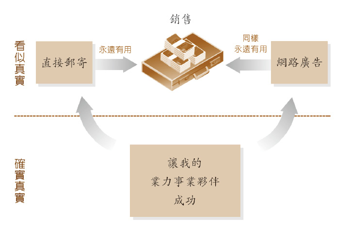

我们再次把事情分成「看似真实」和「确实真实」两个层次。当上司兴奋得把你办公室的门撞破，冲进来恭喜你把十万盒巧克力销售一空，而且还剩下多久时间？三个月？你知道他首先会说的是：

「所以你怎么知道网路广告会有效？」

你会停顿一下，然后回答：「就是觉得那样做是对的。」

然后偷偷跟自己眨眨眼，因为你知道为什么这么觉得：你照顾到你的业力事业伙伴。

###### 你的工作清单

回到工作清单最重要的部分，回到七点计画最重要的部分，回到业力管理最核心的部分：你的业力事业伙伴。你把业管口袋型笔记本翻开来，就会发现自己已经在四组业力事业伙伴每一位的旁边，写下他们成功时会是什么样子。现在要开始做正事了——赶快把你的专案「装满善因」吧！

● 每天开始工作之前，写下你将采取的一个明确行动，好让这四个伙伴每一个都成功。不用是什么大事——可能也不该是什么大事。只是你今天确实能做到，而且会促成他们成功的一件事。

这项工作，这项对你至关重要的工作——把你的钉书机装满钉书针，我们不会对你耳提面命。如果你真的想成功，就从今天开始，让这成为你余生的习惯。要做到什么程度，由你决定，这是你唯一要做的事。

## 业管法则 7 让问题成为成功推手

###### • 古老智慧 •

你的问题就是你的道路。

———西藏老师格西波托瓦(Geshe Potowa) 约西元一〇二七～～一一〇五年

##### 跑道上的飞机

曾经有位名叫堪仁波切（Khen Rinpoche）的西藏大喇嘛表示：「问题是好事，因为那让你知道你的问题出在哪里。」这就要来谈跑道上的飞机。

只要是商人，终究还是得出差做生意，因此我们花很多时间往飞机的窗外观望，纳闷是否真如机长所说，再等两架就轮到我们起飞了；至于这代表还会延误多久，可就难说了。

问题是，业力的运作就像飞机。在我们听到业管学之前，已经把许多力气放在忽视同事、供应商、顾客和世界，或甚至努力要「打败」他们。所有这些业力种子都还在我们心里，不管是好种子还是坏种子，都不会流失。

这些种子种下去的时间较早，自然会先起飞，就像今天跑道上排在我们前方的一号和二号班机。总是会发生什么事情，耽误了我们销售十万个冲浪板的时间。

问题不只如此；没有人是完美的。你依照业管八大法则所进行的第一个专案，将会非常类似你小学时写的第一篇论说文。在你刻意让业力事业伙伴成功的每个行动之间，你会再采取另外三个行动，好让他们没那么成功。没办法，积习难改啊！好，没关系，现在这个正面行动是我们过去所做的一倍，足以创造比以往更多的成功。但其他的负面种子将很不识相地在专案进行时冒出来造成问题，就像以下法兰克的例子。

##### 为什么有些「坏」人会成功

在继续讲下去之前，这里先岔开一下。在某个阶段（可能就是现在），你会问说有些人显然是没有努力让同事、顾客、供应商和世界成功，但他们为什么看似功成名就？而有些人确实努力帮助他人成功，却为什么好像没有功成名就？这里你要记住业力的三个特点，以便了解为何有这种现象。

1. 没有什么是「显而易见的」。业力的真正本质——任何行为的业力后方的真正东西——是当事者内心深处所想的事情。许多经理在工作时「显然」是狠角色，但他们内心深处是真的想让公司和每一位同事成功。这就是为什么他们对属下的要求是那么高，态度是那么严苛。

还有许多经理待人友善，但并非因为他们内心真正想让每个人成功，而只是希望轻松过完一天，麻烦愈少愈好。第一种类型的经理的专案会成功，第二种会失败；也就是说，人心高深莫测，不管评判谁，都是困难棘手的事情。

2. 之前说过，我们不知道一个人的心识里已经有多少架飞机（多少个其他的业力种子）在排队等着起飞了。我们看到他人种下的好种子绝对已经在队伍之中，但是排在多么后面，我们并不清楚。

3\. 你要知道「业力定律二」：

业是不断增长的。

也就是说，一名小气鬼可能在几个月前，有那么一次真心慷慨待人，只是我们不知道而已。就业力而言，这样的一颗小种子，以后绝对能发展成一项完整全面的成功专案。唉呀，一棵三吨重的橡树也是从一盎司重的橡实长成的啊！内心的种子也是如此。

简言之，宇宙的确有公理存在，的确是善有善报、恶有恶报。现实为了要让每个人在恰当的「时机」得到确切的「果报」，而必须这么回溯回去，这就是「空性」的概念，本书不会谈到，不过很不可思议吧！好，我们回到法兰克。

##### 解僱法兰克是没用的

你专案小组的成员爱丽丝提议采用极简主义的网路广告，而你新找到的直觉也告诉你这么做，但有个家伙表示这样绝对行不通，此人就是法兰克（虽然你没听过他的名字，但你将会记得他）。此外，法兰克还尽量让极简主义的网路广告行不通，虽然他可能自己都没发觉。在广告方面，他可以做的工作都拖泥带水，他的抱怨也威胁到你好不容易在专案小组里建立起来的合作精神。简言之，法兰克是你的头号问题：

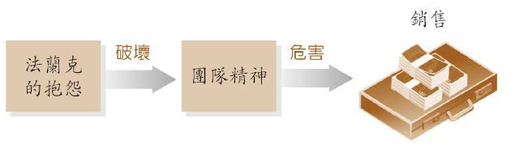

好，下一步请注意了。在处理工作上的问题时，这会是你学到的最重要的一课，也就是以业管方式（正确的方式）来处理问题。上图看似是简单明了的因果关系，要怎么处理也很明显。

把法兰克炒鱿鱼，这么一来，就不再有抱怨了，团队精神将恢复生气，销售将不受威胁。

问题是，这只是在看似真实的层次上解决问题，而且你早就知道是如此，因为以前解僱员工时，偶尔会造成反效果，让团队更不和谐。原因如下：

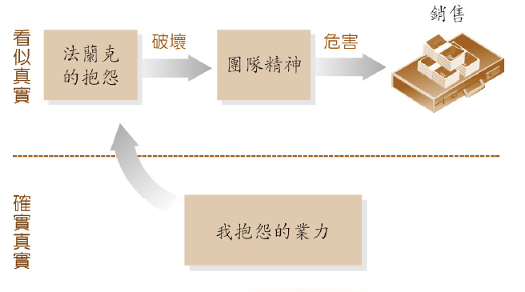

道理还是一样。法兰克的抱怨不是毫无来由的：它有它的业因——当初主管给我这个专案，我也是抱怨连连，因为她要我在两个月内卖掉十万个回纹针座，这简直是天方夜谭，她为什么不派一些真正得力的助手给我？ 所以好啊，去把法兰克炒鱿鱼吧！但如果你不去除造成法兰克成为现实问题的业因，两周之后事情就会变成这样：

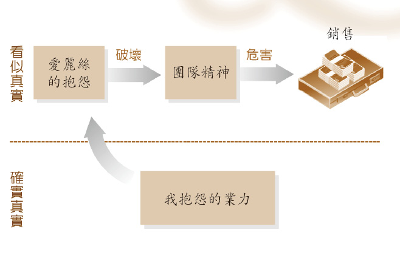

你猜对了，结果爱丽丝非常欣赏法兰克的作风，即便法兰克当初批评她的极简主义广告点子。现在，爱丽丝对于小组缺乏发言自由而抱怨连连。

爱丽丝的抱怨也不是无缘无故冒出来的。唉呀，你小时候难道从来没去梅伊阿姨家，花一整个星期六的时间除草吗？你难道不是两周之后又得回去一趟，因为你斩草没有除根吗？杂草又冒了出来，而且还长得更高了些，看起来跟上一批有点不同。

所以怎么办呢？当然是去掉业因，就不会冒出爱丽丝「或」甚至法兰克了；也就是说，你再也不用开除法兰克，因为他突然变成团队的啦啦队队长，因为「你」使用了关闭阀门来处理抱怨的业力。

##### 业力的关闭阀门

这个业力关闭阀门需要稍作解释。如果你做得正确，就算第一次的业管计画做得粗糙散漫，也会大获成功；如果做得不正确，就会产生问题，所以你得把它做好。

我们说过，就算是微不足道的念头和行为，也会在潜意识里滋生蔓延，过了很久之后才会来势汹汹地出现。也就是说，我们全都随身携带着大型业力口袋，里头全是大小不一的随机种子，这些种子随时都可能发芽，让我们的专案小组出现十二个抱怨连连的法兰克。

你一周前所做、所说、甚至只是所想的每一件事情，你确实记得多少？至于几个月或几年前的事情，你更是不记得了。我们真的无从得知种下的种子什么时候会发芽。

也就是说，要等到种子发芽，我们才会知道之前种了什么种子。抱怨连连的法兰克在我们小组里冒出来的那一剎那——你开始发现出现法兰克问题的第一天，甚至只是萌芽阶段，就得采取行动，而且动作要快，因为你现在知道一个随机的负面种子即将成熟，如果不赶快让它停下来，它就会毁了你的专案。

如何让种子停下来？关闭阀门在哪里？早在认明业力事业伙伴的那一章，我们就提到业力定律一：「你想从人生得到什么，首先就得为别人那么做。」这条定律所隐含的意思是，一个业力行为和它的后果一定会内容相似，亦即善有善报，恶有恶报。

定律一的这部分，有个很重要的意涵：我们可以看着问题出现，然后推论必定是什么样的行为种下了这颗种子，就算我们不记得自己做过。用法兰克的例子来说，这表示我自己一定曾经抱怨某人，打乱了另一个人的工作。因此在业力上移除问题的第一步，只是辨认过去大概做出什么样的行为，才会种下这个问题种子。

幸好从这里开始，要把这项业力关闭起来（让法兰克回归团队，完全没有想到要解僱他），就很直截了当了。关闭业力的方式，就是「现在要非常小心，不再种下新的种子」。

也就是说，旧的种子已经种下，要解除已经来不及了。橡树一旦从橡实长出来，宇宙中便没有任何力量可以把它推回橡实里，然后让橡实不见。现在已经来不及阻止法兰克昨天的抱怨，也来不及拿掉造成他抱怨的种子。

##### 拥抱问题

不过你有没有发现，法兰克的抱怨是有意义的——他的抱怨「让我知道」我的问题出在哪里。既然你现在已经知道要在业力事业伙伴身上种下成功种子，你思考一番，就会发现只有问题能够阻止专案的成功。在现阶段，造成成功与失败的主要原因在于一点，而且只有这一点：你能够快速辨认问题，然后关闭它吗？

所以，为你的问题感到「欢喜」；把焦点「放在」问题上，「拥抱」它们。不要转移视线，或是避免处理它们。它们是你的朋友，它们将把你推向成功。

你已经辨认出问题的原因：你之前一定抱怨过。如果从现在开始你不再抱怨，如果你「非常小心」，毫不透露半点怨言，就会带来所谓的共鸣力量。你因为要停止「法兰克」的抱怨而「不去」抱怨，跟选择性黑洞极为类似。你愈是努力不去抱怨（尤其是不抱怨法兰克的怨言），这个业力黑洞就会更庞大、更有力量。黑洞会与你潜意识中所有旧有的抱怨「共鸣」：黑洞会吸引旧时的抱怨种子，将它们吞没、关闭。因此，业管不只是给你力量创造自己的成功未来，也给你力量选择性地锁定工作或生活上的任何问题，让问题停止。

生命里再也没有法兰克这样的人。这里有个要点请注意：对于法兰克的抱怨，我们完全不用对「他这个人」采取什么行动或说什么话，否则又会回到以前的胜算游戏，而你也知道结果会如何——跟他对质可能有用，也可能让事情更糟，如同某人曾经说过的：「从自己开始。」

###### 自然反应：叮咛之语

于是我们进入最后一个重点。身而为人，我们玩胜算游戏已经玩了五万年之久；对于问题，我们已经内建了各种「自然」反应机制。在我们举的例子里，对于团队里有人抱怨的自然反应，就是开始抱怨他们，最后只会回归到旧时的动物本能：以暴制暴。

现在你了解业管，就能清楚明白以暴制暴是错得多么离谱。「让法兰克继续抱怨、扰乱专案的最佳且唯一的方法，就是自己也抱怨法兰克，而种下新的抱怨种子。」这就是所谓的「业力回馈回路」，需要为全世界的混乱负责。你破坏我的专案，因为我之前破坏过别人的专案，而种下这样的种子。然后现在呢？我要因为你伤了我而「把你伤回去」吗？

太蠢了吧！五万年来只有一个「蠢」字可以形容！

##### 真人真事 胡方元

问题的确能成为最佳良机。问题发生时，要这么看待的确有点困难，但这就是你禅修、练瑜珈和清净生活所产生的澄明心灵带来的益处。

二○○一年九月十一日是纽约所有民众刻骨铭心的一个日子，对于金融界的冲击尤大，因为一些最受尊崇的金融大企业都位于世贸中心。

几年前我住的地方跟双子星大楼隔着哈德逊河，还记得当时满心期待有朝一日可以在那高楼里工作。但是那天早上去上班的路上，我很感激自己的心愿从未实现，而避开了那场震撼世界的大灾难。那天早上我搭地铁去曼哈顿，途中列车停了下来。由于一心赶着上班，使得这段等待的时间彷彿永恒。我们等待列车长宣布耽搁的原因，但是却没有任何解释说明，大家笼罩在谜团之中。

我抵达公司时，一切变得如梦似幻。大家一脸迷惘，我打开电脑浏览当天的财经新闻时，上头写道：「世贸中心遭飞机撞击……世贸中心爆炸起火……」大家都不知道该怎么看待——这是恶作剧吗？但是慢慢有人上传影音画面，平常显示图表和财经报表的电视和电脑萤幕，突然被怵目惊心的画面取代，那些画面在我脑中永远无法磨灭。

市区封锁关闭，我们部门聚在一起研拟紧急应变计画。很明显的，世界从此永远改变。我们快速列出树状图的联络清单以及安全程序，以确保每个人都安然无恙。团体里的每一个人都会对另一个人负责，我们确保家属也包括在计画之内。

我回顾并省思九一一事件，觉得我们工作上互相照顾的业力种下了种子，让我们看到纽约市的每个人互相照顾。当天下午，地铁和火车停驶，大批群众第一次全程走路回家，但是街上大家彼此帮忙、互相陪伴，拿出水和食物跟他人分享。

纽约这个大都会的特色原本是冷漠无情、人与人之间隔阂严重，突然间全面瓦解，大家明白要同舟共济。没有什么比守望相助的感觉更好了，灾难变成一种加持。

###### 你的工作清单

你知道现在要做什么了。对于如何帮助周遭的人成功，你一直在研拟非常明确且审慎的计画。现在你前往你的静坐场所，把你用得破破旧旧的业管口袋型笔记本掏出来，写下你觉得确实会或可能会发生的三个问题，阻碍你和专案小组卖掉那十万个通马桶的厕所塑胶吸盘。

接下来就简单了，你只需要依照业力的最后一条定律（定律四）来做就行了：

不喜欢的事如果发生在自己身上，就要停止对他人那么做。

——宗喀巴（一三五七～一四一九）第一世达赖喇嘛的老师

然后在每个己所不欲的问题旁边（比如抱怨），写下三个步骤，好让自己不施于人。

## 业管法则 8 业力再投资

###### • 古老智慧 •

业力耗尽即消失。

——世亲，印度大师，西元三百五十年

##### 波浪下的水

专案大功告成！联邦快递的货车刚把第十万份披萨送往内华达州东部的保龄球馆。上司跟你一起站在装卸月台上，她转身交给你一张支票，上头是优渥的奖金。就算出现了法兰克问题，你的专案还是提前三周完成。专案会结束，就像我们的生命也会结束，但业管在这方面也有答案。

由于我们累积了五万年的恶习，我们学会忍受结束，就像我们学会忍受失败的随机性。事情必须结束，所以尽力而为就好，也就是说，尽量不要想太多。不要想甚至连成功的专案都有结束的一天；不需要想你把奖金花掉买更多物品，而这些物品到头来还是留不住。

事情不见得必须如此。让我们来看看一家公司的典型生命周期，然后你就可以把学到的道理应用在工作和人生上。以下图表是每一家成功公司终究会走过的历程。

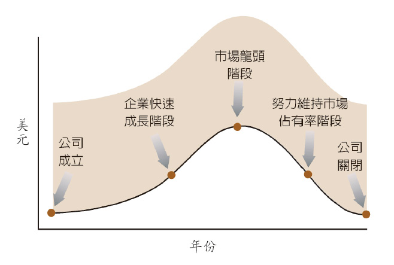

但是让这股波浪摆动的力量在哪里？你现在知道答案了。力量位于事件的下方，是所有原因的根本原因。事件下方的业力，就像波浪下方的大海，时时刻刻支撑着整个公司的存在：

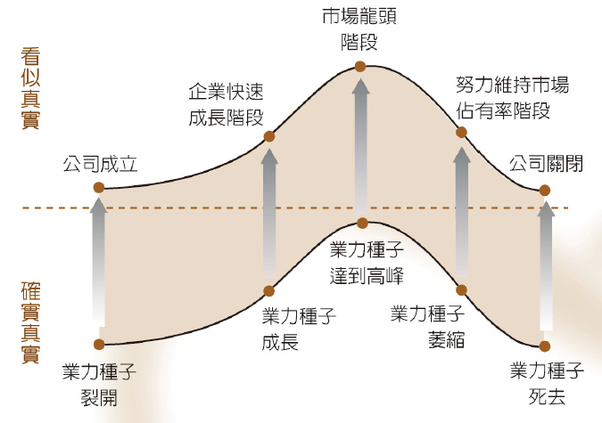

因此，公司的生命周期并不是由左向右移动，虽然看起来总是如此，但那只是看似真实的层次。同理，我们要是陷于这种表象层次（其实就是虚妄层次），那么必死无疑。但这种事情不会发生在我们身上，因为现在我们知道位于一切下方的确实真实层次：实际上，事情是由底下往上移动的。

所以要怎么利用这个道理来克服看似无法避免的结束呢？现在我们明白公司和我的专案，以及我的事业和生命都有结束的一天，因为支持它们的业力种子正在萎缩消失。不过光是明白这一点，似乎没什么帮助。

这些种子肯定是随着我们工作的分分秒秒、呼吸的分分秒秒而逐渐消失的，因为所有种子必定会发芽长大、开花结果而后鞠躬尽瘁。你手中能够捧着一颗水果，是因为产生这颗水果的「种子」耗尽自己以便结成果实，因此种子早就消失了。

##### 保留一些种子

这么一来，就要靠业力再投资来拯救生命。以前所有农作物都是用手来种植时，不管情况多么糟糕、不管家人多么飢饿，有个原则是农夫绝不能破坏的——今年的作物要保留一成，作为来年作物的种子。没有人会笨到把来年作物的种子吃掉。

我们也是一样。好，大型专案结束了，十万份披萨卖完了，手上有上司给你的奖金支票。

你接下来要做的，是最为关键的一件事。你要立刻把收成作物的百分之十用来投资下一个专案计画。

你很清楚要种在哪里：在你业力事业伙伴身上。你把奖金支票兑换成现金，然后带着小组成员和他们的眷属到高级法国餐厅用餐。这样的庆祝、这样的感恩心，在业力管理上是根本之道，因为你真正在做的，是庆祝让业管运作的那个概念：你们助我成功，因为你们准许我助你们成功，现在我们（其实是大我）都因此而成功。庆祝这种成功，能带来力量最强大的业力种子，所以来庆祝吧！

你们在外头庆祝的同时，上司当然正在家里阅读你为小组成员写的表扬信，同时大略记录每个人展现的明确长处，以做为公司未来专案之用——薪水当然会提高。你甚至还向上司明确指出两、三位展现领导潜力的成员，表示可以多加栽培以取代你专案经理的位置。（别慌喔！你明知找人取代你的旧职位，是你升职的唯一方法——这就是业管啊！）

当然，你还买了一本美丽、昂贵的大本精装书籍，并附上更多奖金，邮寄给番茄供应商和他的妻子。那本书里满是有机美洲南瓜和四季豆的性感照片，还夹着一封信，上头写说你们公司将会购买这家供应商的番茄，好制作额外的一千份披萨。噢，这些披萨是你说服管理部门生产并捐赠给世界的，也就是跟办公室隔两条街的游民收容所。

十万名顾客的其中一位将会在披萨盒里找到一张小字条（假设没有放进微波炉而烧掉的话），上头表示你有多么感谢他们的支持，并附赠一张两人行的周末度假折价券。

##### 业力回馈回路

我们来看看，如果你持续把自己的一些成功再投资到周遭人身上，之前那张看了就难过的死亡图表会如何。

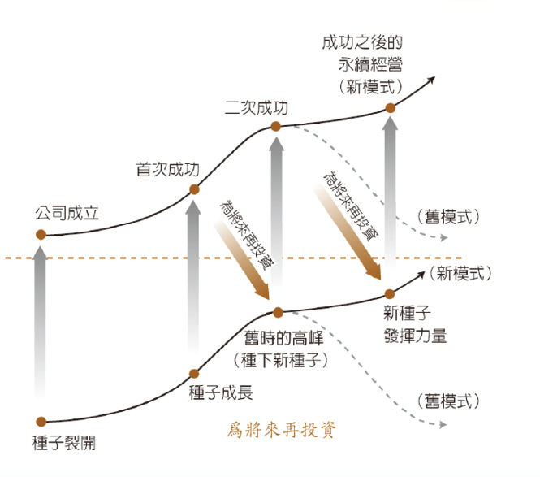

你看清楚了，又是业力回馈回路，只不过这次是正面的。你把工作上首度成功的回报，拿出丰厚的一部分散播给业力事业伙伴，以便庆祝一番，表达谢意。虽然造成首度成功的业力种子现在已经萎缩消失（因为它们鞠躬尽瘁地创造成功），但是庆祝所产生的新种子已经取代它们，甚至比以往还更强壮，因此这是一个不断往上的循环。这个概念可以应用在生活各方面：工作、健康、人际关系、生命。

##### 真人真事 克莉丝蔕喇嘛

钻石山大学的成立，是我们从事的众多其他计画所促成的，比如教导西藏难民使用电脑，然后付钱请他们把西藏重要古老典籍数位化，好跟全世界分享。

当时，这些计画的资金，大多是由一些支持我们理念与行动的富有人士慷慨解囊的。我们也指望他们在大学开始营运之后提供资金，但是后来因股市泡沫而破灭。富有人士的所有收益，一直都是靠股票投资赚来的，突然间我们学校面对一百万美金的抵押贷款，而且毫无奥援。

我们的主要董事大卫‧史敦夫博士（David Stumpf，当时在亚历桑那大学担任助理研究员）想到「一天一美元」的点子。虽然较为富裕的赞助人没有多余的收入可以捐献，但我们还有数百位小人物，他们对钻石山大学是真心乐见其成。于是我们发出信函，一一询问是否愿意一天捐助一美元，直到我们还清贷款为止。

几个月下来，我们得到够多的人持续捐助，让每个月的贷款几乎刚好可以付清。我们认为造成这首度成功的种子，是钻石山大学学费全免而种下的：虽然课程相当严格，毫不松懈马虎，但任何学生都不用缴学费。

大卫的妻子苏珊‧史敦夫（Susan Stumpf）担任医师助理，也是钻石山大学的董事，她认为这样还不够。有一天，我们其余董事都收到苏珊寄来的一封电子邮件，内容相当奇特，她表示既然我们大学教导业力管理原则，就应该下定决心，大规模地加以应用。

苏珊提议寻找一群人，他们愿意承担我们的抵押贷款，收取的利息比银行还低，但比他们的其他投资还高，这对双方是双赢局面，也是我们董事能够立刻接受的。不过让我们所有人担心的是苏珊提议找来这群人的「方式」。

她建议的其实不是「寻找」这群人，而是「创造」他们。我们会把每个月从「一天一美元」得来的收入，挪出一大部分捐给世界某地的另一个团体，他们也在努力从事类似的计画。

我们立刻想到两个问题。一、非营利机构要争取资金，竞争已经愈来愈大，而苏珊明确指出要把钱捐给我们的「对手」。二、捐出大笔金钱，会让我们偿还贷款受到风险，很可能失去我们正试图购置的地产。

好吧，所以这个举动并非完全是凭直觉做出来的。我们有勇气、有那个「慧眼」，能够看清筹款成功的唯一方式，就是帮助他人筹款吗？但我们很快便了解苏珊的建议，于是董事会全体一致同意这个想法。

几个月过去了，我们捐款帮助遭受水患蹂躏的纽奥良市的几间教育中心修复场地；加州的两间闭关中心得到意外的补助金；第三世界国家的一个儿童夏令营办得很辛苦，结果收到一封意外的信；其他资金则捐给海啸的救援工作。然后，老实说，我们全都有点焦虑地等待。

突然间，我们以前从没真正谈过话的两名人士挺身而出（一位来自欧洲，另一位来自纽约），愿意担下我们全部的贷款，风险由他们承担。

因此，业管发挥了效用，但董事会并没有停止伸出援手，我们每个月继续送出支票。突然间，一位匿名的施主买下毗邻校园的一块一百英亩的土地，未经我们要求，就主动送给我们大学。

一名我们从未谈过话的商人把一张字条偷偷放进我们的公事包，表示愿意负担供水系统（现在已经大功告成）的全部费用，供应五十间已规划好的学生住所的用水，而那张字条我们几周后才发现。此外，突然有另一名商人捐款兴建三幢住所，而一位匿名的海外赞助人提议（并提供资金）建造一幢学生中心，让钻石山大学的学生可以在里头交际联谊，以及熬夜读书完成课业（这幢大楼目前正在建筑规划阶段）。

还有许多类似的事情继续发生，而大学董事会依然积极地再投资；这些意外的成功没有理由就此停止。

###### 你的工作清单

好，你的七点计画几乎完成了。我们要进一步确认你的心是清明的，这样你才有办法看到「让专案成功的方法，就是不把焦点放在自己的专案上」这个疯狂新点子背后的微妙逻辑。

因此，我们要你务必得到足够的休息和放松，而方法就像善巧的饮食。我们不会跟你说教，叫你准时睡觉，也不会叫你下定决心不顾一切地去散步，就算一位亟需协助的顾客打电话来你也不管，就让整间办公室的电话继续闪着灯示，因为我们知道这种决心总是不了了之。

我们不说教，只是要你追踪发生的事情，然后追踪就会带来改变。继续进行七点计画的其他要点会有帮助：瑜珈已经让你部分的心灵清明澄澈，这会让休息与放松更加容易。

压力（应该放松时却无法放松）是个奇怪的状态。忙于专案时，会激发肾上腺素而让身体上瘾，沉醉于那种程度的肾上腺素；如果没办法达到那种程度，就会开始寻找方式来得到其他刺激。然后不晓得是什么因素作祟，你脑袋的某一部分就会骗你说需要再读十封电子邮件，因为你不忙碌的话，就落伍了。

因此，我们需要让自己深信，愈来愈忙不等于愈来愈成功。如果真有忙碌的需要，你要学会忙碌时保持非常清明的心；而需要想像和创意时，你能让自己不忙碌，好尽情发挥创意与梦想，这么一来，你的业管肯定会成功。

所以学会如何休息和放松，并不是终极目的，而是自动发生的：如果能够大幅降低白天对于过多刺激的渴望，就能够真正得到一夜安眠，醒来时神清气爽、精神饱满。

现在你要做的，只是计量所做的事情。每天在业管口袋型笔记本写下以下三项的其中一项：

1. 我今天花多少时间在电脑上？（我们要精确的时数和分钟，而不是估计。你可以下载一个计算上网时间的免费小程式。）我每隔一个半小时，有刻意休息不用电脑吗？

2. 今天我读到、看到或听到多少新闻（电视、报纸、广播、杂志、网路）？同样的，我们要以分钟来精确计算。

3\. 今天我花了多少时间讲电话？其中有几成是真正必要的？

同样的，睡前半小时是追踪日子过得如何的好时机。你真的希望有个全然运作、犀利清明的心智，就必须投资这段时间。透过观察自己整天让心受制于多少刺激，就能够一夜安眠，而让你的业管快速成功，然后你就可以扔掉所有的安眠药，反正它们从来不会让你醒来之后神清气爽。

## 别就此打住 业管更深入

恭喜！一小时到了（或是不管你花了多久时间），你已经把业力管理学的八大法则储存在脑海里了。的确，你已经准备好带领我们进入演化的新阶段，准备好在下一个五万年有个良好的开始。你对于设定要达成的所有计画和工作，现在已具备足够的知识，能够百发百中。

业力管理学就像你的新手机。现在你当然已经知道要怎么用它来打电话给朋友，甚至已经把每个人的电话号码储存下来，而且能够很快地找到这些电话号码。

但你知道手机还有另外五十种功能，有时候的确能派上用场。这关乎你有没有决心学习这些额外功能，还是觉得会用基本功能、能够拨打电话就足以应付了。

业管也是一样。我们真心鼓励你不要就此打住，要继续增长知识，以便了解使用业管的所有不同方式——能够让你更深入且更快速应用业管的所有方式。因此我们提供一些选择，让你成为业力管理学的真正专家，因为这么做只会为你带来更多成功。接下来要怎么做，这里有八点不同的建议。

###### 1.购买《当和尚遇到钻石》，这本书开启了一切

阅读这本书，使用这本书。为了庆祝本书出版第十周年，我们刚完成特别的增订版，在全球发行。

新版增加了一个特别部分，收录了在工作与生活上应用《当和尚遇到钻石》以达成目标的实际成功故事。这些成就高达数十亿美元，来自世界各个角落，以及各行各业的人士——小至银行出纳员，大至铁路巨子。

我们分析每个成功故事，精确了解业力管理法则如何带来成功，这么一来，你就知道如何把这些成功原则应用在自己身上。

###### 2.留意业力管理学书籍系列的出版

我们还会再出版三本对你有帮助的小书，阐释如何把业管应用在三个明确的目标上：1.开创自己的事业或重大计划；2.企业成长时成功经营；3.把事业和生命转变成持续向上提升、服务整个世界的螺旋力量。

###### 3.参加《当和尚遇到钻石》的讨论小组

《当和尚遇到钻石》出版后，世界各地的读者开始应用书上的道理时，小型读书会如雨后春笋般冒了出来，从香港到纽约的布鲁克林都有。这个必定带来成功的新式经商之道，让这些人兴奋不已，想跟其他有同感的人切磋讨论。

因此我们架设了一个网站，透过网站，你可以联络到你那一区的读者，也许只是偶尔聚餐，互相比较笔记，看看自己在业管方面进展得如何；或是一个自动形成的小组，渐渐改成定期聚会。总之，大家可以随喜进行，但绝对是精彩有趣的。

或是你想加入钻石山的线上聊天室，同样是透过以下网站：[diamondcuttergroups.org](http://diamondcuttergroups.org)

###### 4.联络「业管协助服务台」（KM Help Desk），得到免费建议，以便了解如何把业管应用在自己的专案或工作上

「协助服务台」是免费的，我们有位职员负责安排「业管助理」（KM Associates）给予协助，全年无休。你只要写电子邮件给我们，不管在应用业管方面有任何问题或需要什么建议，我们都会竭尽所能帮忙。

你会开始和线上的业管团队建立关系，会得到以业管经营人生的信心。时机成熟时，你就会准备好参加业管的实作训练。以下是业管实作训练的方式。

###### 5.出席业管入门讲座

业管的职员到世界各地举办免费入门讲座，介绍业力管理学的八大法则，给予大家切身的触动与启发，这是唯有到现场聆听事业有成的经理级人物描述业管，才能体会得到的。请到我们网站查询你的地区即将举办的讲座，或是聆听讲座的样本录音档。

###### 6.参加二日业管研讨会

我们也在全世界举办为期两天的业管研讨会，通常是在周五晚上的业管入门讲座之后，于六、日举行。研讨会规模不大，你有机会和一位业管助理更深入地学习业力管理学。这是个大好机会，可以把跟专案、生意或事业有关的问题问得更详细，并得到当面的回答。同样的，这一定比线上的建议更能带来影响和力量。

###### 7.参加完整的业管训练课程

一旦你在较小的工作和计画上应用了业管，就可以接受正式训练，更上层楼。业管提供精选的十二个课程，关于任何一种事业或生意的不同层面；先试试看其中一个课程，然后其余十一个课程你都会想参加。

修习业管训练课程有三种选择。最好的是参加现场的业管课程，会在大城市举办，由住在该市的业管助理带领，而且他们可以继续在那里帮助你。现场课程一般为期一个月，每周两次晚间课程，最后会得到业管结业证书。公司若想为职员提供内部的业管课程，可以安排在上班时间于公司场地举行现场课程，同样请查询网站。

第二个训练课程选择是参加业管推广班，通常是在比较小的城镇举行，由客座的业管助理指导。业管推广班通常是连续两个周末，中间的工作日再选一、两个晚上上课。课程内容跟现场课程相同，只不过在较短的时间内呈现，因此你要确实认真上课。业管推广课程也可以在公司内部进行。

第三个选择是业管线上课程。这是「现场直播」的课程，由一位线上的业管助理同步领导，团体里的其他人可能正坐在爱沙尼亚或哥斯大黎加。或者你可以下载资料，以自己的速度私下用功，并透过电子邮件缴交课堂作业给指定的业管助理。在资源非常有限的情况下（比如业管原始课程曾在许多监狱里开过），你可以安排所有的功课都用纸本邮件进行。跟我们联络就对了。

###### 8.成为业管老师

如果你是父母，你当然知道学习使用新手机所有功能的最佳方式是什么。你刚买了新手机送给女儿，她问你是否可以教她使用所有的功能，你当然会回答：「当然囉，宝贝，明晚我就有空教妳了。」然后你整晚熬夜研究手机，最后还翻开手册阅读。

业力管理学也是一样。「唯有教导他人，才能真正完全学会一件事情」这个道理，跟「你就是我」这个事实息息相关。教导他人如何成功，然后看着他们身体力行，带来的成就感是无与伦比的。因此，我们非常鼓励你「教导」他人业管。

你可以跟朋友或同事在附近的咖啡厅里一对一教学，一边享用咖啡（可以换成热可可了吗？或甚至花草茶？）。《当和尚遇到钻石》增订版收录的成功故事当中，有许多就是这么发生的。我们确实要你成功，这就是我们「所做」的事情。因此我们和你分享这个秘密：成就业管的最快速方法，就是坐下来和别人分享。

如果你愿意，可以踏出最后一大步，亲自取得业管助理证书。这包括完成全部十二个业管训练课程，以及通过最后的考试，你就能够成为有证照的业管助理，以此身分教导各式各样的业管课程。

以上课程请洽询：info@karmicmanagement.org

[www.karmicmanagement.org](http://www.karmicmanagement.org)

###### 你的工作清单

什么？你还没完成七点计画的最后一点，而你以为我们没注意到？你还要多加「用功」，否则你欠我们喔！

至于该如何用功，我们要用老方法——西藏的方法。下个礼拜，你要把业管八法「记住」，好让这些原则深深印入脑海，能够整天随时取用——没有什么比这种学习方式更有效了。

接下来四个星期，你每天要翻开这本书一次，至于什么时候则无所谓，可能是坐下来用午餐时，读一页就好，增强脑海中对于八法的记忆，让你深刻到可以灵活运用。

祝你好运。接下来的五万年将会大放异彩，等着瞧吧！

## 致谢

我们想趁此机会感谢一些挚爱的朋友，他们的努力造就了本书的问世。我们第一本商业书籍《当和尚遇到钻石》能够出版，要感谢美国双日出版社（Doubleday）的编辑崔斯‧墨菲（Trace Murphy）对我们的信心。现在全世界有几百万的读者应用该书的道理，而这本续集也得到他非常大的鼓励支持。

琼‧希尔（Jon Sheer）非常照顾我们，耐心且亲切地指导我们处理合约和商业事宜。海瑟‧葛登（Heather Gordon）仔细校订完稿，提出许多良好的建议，帮我们做第二次全面校订的凯萨琳‧特拉雪（Catherine Thrasher）也是。蕾贝卡‧维纳克尔（Rebecca Vinacour）和格兰特‧伯恩兹（Grant Burns）在做最后一次的校勘时，提供他们向来水准一致的专业建议，而不畏艰辛的罗伯‧雷辛格（Rob Ruisinger）再次为书籍的版面设计施展神奇力量，尤其图表制作是那么困难。史帝夫‧海特（Steve Hiett）设计别出心裁的封面，罗宾‧萨德曼（Robin Saidman）贡献那张照片。班‧嘉尔米（Ben Ghalmi）与胡瑞伯（Rob Hou）努力发展全球性的线上课程与影片，而上海的慧匠文化传播（Witway Cultural Broadcasting）的黄晋（Huang Jin）给予无限的支持与灵感，让本书和我们的其他着作普及东方世界。