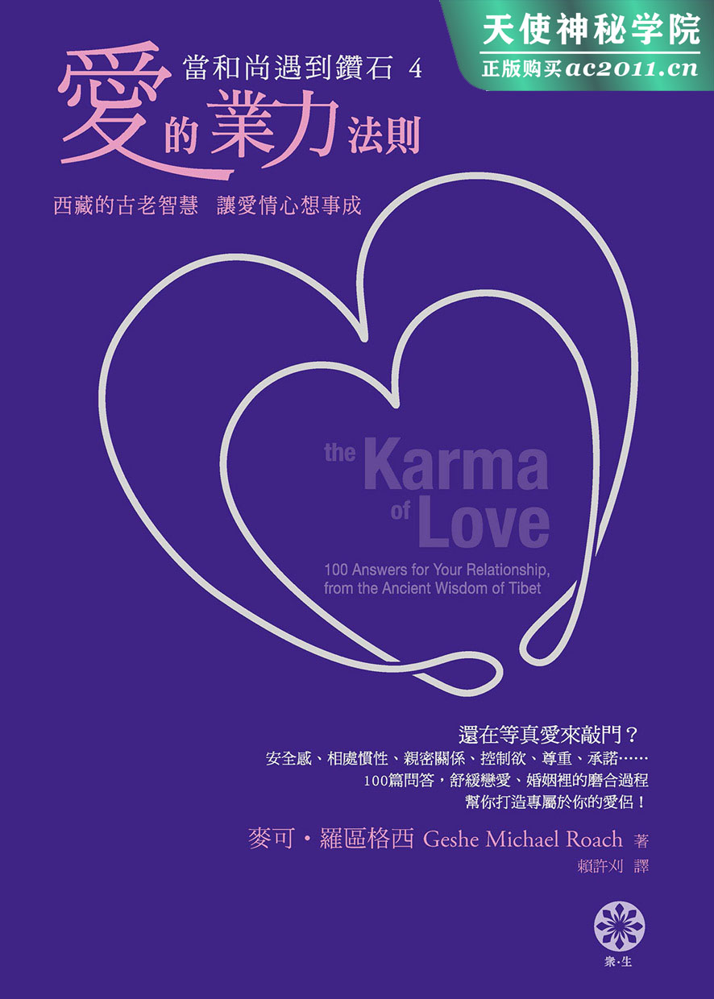

# 当和尚遇到钻石4

## 前言

我在亚利桑那州长大，像其他美国孩子般度过寻常的年少岁月，也和异性交往。高中毕业后，我到西部去念普林斯顿大学。我的课业成绩优异，甚至荣获白宫颁给的学术成就总统奖章。我的人生似乎福星高照，我的将来肯定不同凡响。

然后，一切在一夜之间全都变调。

当时我人在学校的礼拜堂里，参加一个协助解决世界飢饿问题的志工会议，牧师接了一通电话，走过来碰碰我的臂膀，请我随他到他的办公室去。在那里，他告诉我，我的母亲刚刚走了。

我那福星高照的世界瞬间瓦解。

接下来的日子里，我又接到两通电话。一通说我弟弟走了，另一通说我父亲也走了。在悲恸的汪洋之中，继续念书、继续我原本预期的人生似乎显得没什么意义了。我离开学校，到印度旅行，寻求解答。

我有幸结识了一些西藏喇嘛，而且自己也循序渐进地成为喇嘛。我在西藏的喇嘛寺一住就住超过了 25 年，还是六个世纪以来第一位从赛拉梅寺院拿到「格西」(Geshe)学位的西方人，相当于佛学博士。

为了完成学位，我必须通过许多考验，例如一场为时三周的公开口试，全程以藏语进行，考官包括成千上百位僧侣。寺院里主要负责指导我的喇嘛堪仁波切还额外提出一项考验：我能否到纽约开办一家钻石公司，赚到一百万，证明我已将寺院教给我的业力法则融会贯通？ 之后我们要把赚来的钱捐给西藏难民，协助他们解决饮食等各方面的需求。

重回俗世，尤其是纽约市的花花世界，而且还要投身钻石事业这门有可能很肮脏的生意，是我最不愿意做的一件事。所以，我排斥这项提议排斥了好几个月。然而，到头来，上师的话还是占了上风，我无可回避。

我确实协助创办了一家叫做「安鼎国际钻石」(Andin International Diamond)的公司，也协助让它的年度业绩爬到两百万的高额。世界首富之一的华伦•巴菲特(Warren Buffett)最近买下了这间公司。有了这些我在这家公司赚得的金钱，我也得以帮助难民及其他许多人。

我们公司是纽约历史上发展最快的公司之一，自然而然地吸引了一些注意。双日出版集团(Doubleday Publishers)主动与我接洽，请我写一本谈我们如何运用业力法则──助人法则──获致成功的书。

于是我写了一本叫做《当和尚遇到钻石》的书，书名取自一部着名佛经 1，该佛经的内容是在阐述业力及其另一面，亦即佛家对于「空性」的观点。这本书成为畅销全球的商业书，被翻译成 25 种语言，数百万人读之用之，中文版尤其受欢迎。它帮助了许多人达到财务上的独立。

不可避免地，大家开始邀请我去演讲，谈这本书的内容。在本书写成后，年复一年，我和金刚商业学院(the Diamond Cutter Institute)的同仁在许多国家为成千上万的大众带领商业讲座与禅修活动。在这些课程当中，我们常会让学员分组进行我们称之为「日常生活智慧」的小组讨论，让参与者有机会提出关于自家公司与自身职业生涯的问题。

某一天，在中国开的一堂课上，其中一位参与小组讨论的女士问我能否回答非关事业的问题，她想征询她和老公的关系。金刚法则(the Diamond Cutter Principles)，即业力种子法则(the principles of karmic seeds)也适用于她的家庭生活吗？ 我回答说当然适用，在我们心识里的业力种子，要为我们身边的所有人事物负责。

话匣子突然打开了，小组里的每个人开始把藏在内心最私密的感情问题都掏出来求教，无论是关于配偶的，还是关于伴侣的。当下我体认到，照顾人们的精神需求，乃至于居住、金钱与食粮的需求还不够，我们的亲密关系说不定是人生中最大的幸福来源，同时也可能是最大的痛苦来源。如果我们想要幸福，如果我们想要这个世界幸福，那么我们就必须摆平感情这件事！

出人意料地，佛家传统中有许多关于伴侣关系的古老智慧可以提供给我们。首先，成千上万本无与伦比的知识典籍公开供大众阅读，这些书告诉我们人生中的一切从何而来，包括关于我们伴侣的一切。这些，是针对业力的教诲。

此外也流传一个传统密法，叫做「金刚法」(the Diamond Way)，已有数千年那么古老。它提供我们非同一般的与伴侣交流的新方法，让爱升华，让我们能与伴侣达到不同凡响的美好境地。传说中，就连佛陀自己都是透过提拉陀玛(Tilottama)获得了开悟──提拉陀玛是一名女子，在宇宙最至高无上的灵魂要求之下成为佛陀的伴侣。他们在新的一天曙光乍现时，在彼此的臂弯中达到完美的精神结合。有关这段故事的描述，是世界文学中最动人的篇章之一。

至于我本人有什么资格写一本关于爱的业力法则的书？ 我觉得我在所有同侪僧侣当中是特别幸运的一个，因为我在成为僧侣之前有过感情的经历(多数西藏僧侣在 7 到 12 岁之间就出家了)，我知道女人是怎么一回事，我知道感情的喜悦，也知道它有哪些极其痛苦的问题。我自己的父母就走过一段令人心力交瘁的离婚过程，那是一种相爱却无法相守的可怕纠结。

再者，我想最重要的是，我也曾经有过一段我认为很神圣的感情。在那段感情里，我得以一窥佛陀和提拉陀玛、但丁(Dante)和贝缇丽彩(Beatrice)、耶稣和抹大拉的马利亚(Mary Magdalene)之间的奥妙──我得以一尝伊甸园的箇中滋味。

在那之后的岁月里，在西藏 12 位最伟大的上师数千小时的教诲之下，我强化了那段经历，甚至获得了更深刻的体会。我还获准私下与一位伙伴开始共修这些密法，我也花了许多年翻译、研读成千上万页有关这些密法的古老文本。

我很诚挚地力图追随这些密法，但有时会引来媒体不必要的关注或挑起寺院高层的怒火，因为有些人认为这些知识不宜对大众公开。但我绝对相信有完美世界的存在，我相信我们可以一起创造出那个世界，而且我相信那个世界始于也终于完美的亲密关系──藉由认识爱的业力法则。

所以我很乐于与你分享我的所学，帮助你解决自身的感情问题。许多年来，全球各个角落有无以计数的人捧着他们的感情问题来请教我。我试着选出一百个最常见的问题，藉由我心中上师的珍贵加持，从西藏的古老智慧中为大家提供解答，愿能帮助你以及你人生中的完美伴侣。

麦可•罗区格西
2012 年感恩节
写于彩虹屋

* * *

## Part.1 最重要的问题 The Most Important Question of All

##### 1.问题

我在六年级时交了第一个女朋友，当时我十二岁。我数不清自那之后已有过多少段感情，反正一定很多啦，而且几乎全都结束得很不愉快，尽管一开始我总是满怀希望，觉得这次这个不一样。

我试过听从各式各样的建议，也读过各式各样的书籍，但我有一种悲伤的预感，觉得一切都没有用。所以，你可不可以开门见山言简意赅告诉我，这么多办法都没用，为什么这个爱的业力法则会有用？

我知道你为了觅得良缘，什么办法都试过了，或至少试过很多办法──你没试过的，也看别人试过了，而且看到别人试的也没用。我想我们可以说，如果爱的业力法则这个办法有用，那它一定有什么和你听过的其他办法不一样的地方。而它确实如此。

首先，爱的业力法则有用，而且每次都有用。你瞧，几乎在做人生中的每一件事时，我们都明白我们所做的可能有用，也可能没用。即使只是为了头痛吃一颗阿斯匹灵，我们吞下药锭，坐在那里等着，希望会有用。然后这药可能有用，也可能没用。可惜我们每一个人都已经习惯了事情有时候就是没用，从来没人会想到要拿空的药罐去药局讨回一半的钱，因为有一半的药锭在头痛时没发挥效用。我们已经习惯失败，或至少有时候我们会预期事情不一定成功。我们内心深处相信这是人生的一个事实，我们无法改变。

但是业力永远都有用，如果你真的懂得如何运用。要明白箇中真意得需花费好一番工夫。如果你还没准备好要迎接一些新的概念、要好好思考这些想法，并且付诸实行，那么这本书在你身上也不会有用。你将第一次学到你身边的世界究竟从何而来，然后你将运用你所学到的东西，创造出你一直以来梦寐以求的感情关系。所以现在就直接开始吧，你所需要知道的新概念当中，最基本的一个就是「空性」。我举起手里的笔问你：「这是什么？」

「一枝笔。」你很快答道。

「现在如果有一只小狗走进这个房间，我把这件物品拿到牠鼻子前挥舞，牠会怎么样？」

「唔，我不知道，我猜牠很可能会咬它吧。」

「所以，在这只小狗眼里，这枝笔是什么？」

「呃，我们可以说，牠把它当成磨牙玩具。」

这是你认识「空性」的第一步，现在我们再更深入一点。

「好的，那么，谁是对的？ 人是对的，还是狗是对的？这东西是一枝笔，还是一个磨牙玩具？」

「嗯，我想两边都是对的。对我而言是枝笔，对狗而言是磨牙玩具。」

「很好，很好，动物也有牠的权利是吧！ 所以，两边都是对的，从不同的观点观之，这件物品既是一枝笔，也是一个磨牙玩具。现在再来一个问题。如果我把这件物品放在这里这张桌子上，你和那只小狗都离开房间，那么这件物品是什么呢？ 一枝笔，还是一个磨牙玩具？」

「唔，如果双方都不在这里从这个或那个观点去看它，那么我想我们必须说它什么也不是──在这个当下，它不是笔也不是磨牙玩具，但它有成为其中一种的潜质，端看是人或是狗走进这个房间。」

好的，现在你懂了；你已经明白「空性」这个莫测高深的概念了。如果你要创造出自己的完美伴侣，这个概念是绝对必要的。试着想想「空性」在这里的意义。它的意义不在于一切都是黑的，或者没有就是没有，又或者什么都不重要。人和狗离开房间后，放在桌上的物体是「空」，因为它是一片空白的，就像在电影开演前的空白银幕。我们身边的一切，我们生命中的所有人，也都一样是空，是空白，是有待论断的。你可能觉得上一个和你有感情的人很糟糕，但或许很多人都觉得他人还不错。他和那枝笔是一样的，一切端看你怎么看，端看是谁在看。

「所以，现在，用一只手举起一枝笔，把笔举到你面前，然后用另一只手示意，告诉我这枝笔是来自于它本身，还是来自于你。如果你认为这枝笔是来自于它本身，就把你的手从笔朝你的眼睛挥。如果你认为它是来自于你，就把你的手从眼睛朝笔挥。」

几乎所有人都会把手从自己这边朝笔挥过去：「它取决于我怎么看它，肯定如此；而磨牙玩具则是来自小狗的观点。」

「这就对了。如果这枝笔来自于这枝笔本身，那么小狗就必然会把它当成一枝笔，于是牠就会试着用爪子抓住它，然后说不定会试着写一首诗给牠的狗女友说：『你的尾巴好美啊！』」

那么，我们明白了：这枝笔来自于我。就它本身而言，它既不是一枝笔，也不是一个磨牙玩具。它是一片空白的，是有待论断的。所以，当我看到一枝笔时，笔的概念必然是来自于我自己的心。

那么，我们能不能闭上眼睛，希望这枝笔是一只大钻戒？ 我们不妨现在就试试看──你知道这样是行不通的。你的心识里或许有一个超级男友，但这并不意味着你可以闭上眼睛，凭藉意念就让他真的存在。我们可以想要或希望或祈祷得到一切我们想要得到的，但这样不会让美梦成真──世界上每一个孤单的人都「但愿」有个伴，但这样的愿望并不会让那个伴出现。那么，我们为什么看见一枝笔？ 它是如何从我们的心产生？

我们的心识里有种子，也就是业力。这些业力深埋在潜意识里，在心识深处，当时机成熟，就会像一棵树的种子那般迸裂开来。我将一枝黑色的柱状物举到你面前，在那万分之一秒的时间里，一个业力在你的心识里裂开了，冒出一个闪闪发亮的「笔」的概念。在千分之一秒的时间里，这个「笔」的小小概念跳到那枝黑色柱状物身上──如此迅雷不及掩耳，迅速到你从来不曾意识到，它就发生了──然后你看到了一枝笔。

而那「真的」是枝笔。心像(mental picture)就是这么厉害。你可以把那枝笔拿起来写字。

你看出要如何以此类推下去了吗？ 如果你是一个正在找伴的女人，这时有个俊男走进星巴克的大门，朝你这桌走了过来，他就和那枝笔一样。他来自于你心识里的一个种子。啊哈！ 现在我们要做的，无非就是学会怎么种下那个种子！ 一言以蔽之，我们只能和另一个人一起种下。无论我们想要的是什么，都必须先看见别人得到。当我们帮助别人得到他们想要的，这就会在我们的心识里种下一个种子，让我们自己日后也能得到一样的东西──当这个业力像种子般成熟、裂开时。

这意味着你可以「种下」未来的伴侣，或目前的伴侣有任何你想改变之处，你都可以如愿──因为一切来自于你。你只需要知道怎么做。想成为一位好农夫，你需要学会如何正确地播种，并以正确的方式好好照顾种子。然后你要什么就有什么。

所以，第一个问题的答案，所有问题当中最重要的一个的答案是：没错，你可以拥有任何你想要的伴侣、任何你想要的情感关系，只要你学会如何种下正确的种子，而这正是你在本书将读到的一百个问题所涵盖的内容。每次看我们回答别人的问题，你都会学到更多耕耘业力的技巧。所以，我首先要你做的，就是坐下来从头到尾读完这整本书，即使某些我们所探讨的部分是你目前可能并未面临的问题。

在这个过程中，你会学到所有关于爱的业力法则的一切。

接下来再回到与你切身相关的问题上，届时你将能把从这本书找到的答案付诸实行。这是一个来自古西藏的新系统，一个全新的系统。一旦真的参透了这个系统，它便能随时随地都发挥作用，而这正是它和其他你试过的办法不一样的地方。

顺带一提，几乎所有你在本书会读到的问题，主要都和传统所谓的伴侣关系有关──亦即男女朋友和夫妻──因为来自于世界各地向我提出的问题多半是这样的。不过，你从本书学到的原则已经被许多人成功应用在其他的人际关系上：家人、朋友、生意伙伴、同事，乃至于同性之间的关系。所以，尽可能将爱的业力法则自由运用在你和其他人的往来互动上吧！

## Part.2 众里寻他 Finding Them

##### 2.问题

我应该到哪里去找我的伴？

几年前，小安来找我，提出一个怪怪的请求。(如同本书其他篇章，这是一个真实的故事，或将几个真实故事融合起来，并且为了尊重隐私把人名改了。)

小安来自亚洲，所以她以我的传统头衔称呼我：「格西拉(GesheLa)，您是一位僧侣。在中国，我们都说佛教僧侣法力无边，你们特别灵通。我知道很多僧侣会占卜，会为需要知道一些事情的人算命，然后现在有一件事情我需要知道。」

「什么事？」我问。小安看起来有点不好意思，她说：「唔，我想给自己找个男朋友，但不知从何找起。我在想，如果你可以看一下我的未来，直接告诉我会在哪里遇到他，我就可以省下很多时间和麻烦。」

我有点错愕。我预期的是像「这周我应该进行哪一种禅修」之类的问题。我设法拖延一点时间。

「那么……你觉得你可能会在哪遇到他呢？」

「我在想是要上网找，还是参加舞蹈俱乐部。问题是，我觉得网路上遇到的不管是谁，一定都是宅男──花在电脑上的时间比花在女朋友身上还多的那种。然后呢，我在俱乐部遇到的任何男孩子就……呃，就是那种会去参加舞蹈俱乐部的男孩子。他们恐怕不会在一份关系里长久定下来。」

我通常不做这种算命活儿，但在其中一间我住过的西藏僧院──这一间不偏不倚刚好就在纽泽西的中间──有很多从蒙古来的老僧非常在行。我跟在他们身边看了几年，所以我知道要怎么好好演一齣戏，如果能够帮助人的话。

西藏僧侣算命是用一对骰子，但蒙古僧侣比较擅长只用一颗。

他们取羊的关节骨来用，这些关节骨本身就几乎是方块状，然后再煮到变成纯白色。僧侣把骨头往桌上一丢，看看它落定时是什么样子，再告诉来人之后会发生什么事。于是，我就这么把羊关节骰子一丢，弯下身去看，一副煞有介事的认真样。

「唷！」我说。「嗯！」我又说。接着我再额外加点戏，念了两句经文：「嗡嘛呢叭咪吽，嗡嘛呢叭咪吽！」

这之后则要大喊一声：「啊！ 有了！」小安朝关节骨俯身过来，问道：「怎么样？ 格西拉，网路上找得到吗？」

「找不到，找不到！」我肃穆地说：「不在网路上！ 网路上不可能！」

「喔！」她高呼：「那一定是舞蹈俱乐部！」我缓缓朝关节骨弯身过去，详加检查一番，说：「不对，也不是，你不会在俱乐部找到他。」

「那不然是哪里？」她问。

我停顿一下，倾身再瞪着关节骨一会儿，接着慢慢坐直，看着她的眼睛。「你必须要去……去养老院找！」

「养老院？」小安瞪大了双眼，不可置信地看着我，停顿了好一阵子才说：「可是，格西拉，你不懂。」

「我不懂什么？」我沉声问道。

「我是说……我的意思是，格西拉，我要一个年轻的男朋友。」她脸都红了。我笑了。我告诉她：「不是我不懂，是你不懂。告诉我，你为什么想交男朋友？」

「唔，」她立刻回覆道：「看看我是怎么过生活的。我在曼哈顿这里的办公室，有一份不错的工作，一天工作很长的时间，我还满喜欢我的工作的。然后我下班回家，大概花四十五分钟为自己弄点晚餐。然后我一个人坐下来吃晚餐，大概花五分钟。然后我把碗洗了，洗个半小时左右。您瞧，晚餐总共花我超过一小时，只是为了让我一个人坐在那里吃饭，没有人坐在餐桌对面和我一起吃、一起享受我的厨艺、问问我今天过得怎么样。」

「所以你很孤单。你想要的是有个人和你在一起，你想要某个你爱的人的陪伴。」我说。

「正是。」她彷彿如释重负地叹了口气。

「正是！」我重复道：「这正是为什么你需要去养老院。你要的是陪伴，所以首先你要在自己的心识里种下陪伴的业力种子，这个种子会迸裂开来，你会遇到那位男士，无论是在哪里。种下陪伴的业力种子的方式，首先就是去给予他人陪伴。而其中一个给予他人陪伴的最佳方式，就是去养老院。

「去养老院探访老太太，探访某个老人，某个没人想见的人，某个一口烂牙嘴巴很臭的人，某个又皱又没人记得的人，某个会坐在那里、每次你去就一遍遍告诉你『我有没有跟你说过我高中时那个男朋友？ 他可帅了』的人。

「你不用每天都和她黏在一起，只要每隔一段时间去看她一次，例如每周，或者每两周。送些花给她，偶尔带她出去吃顿晚餐，帮她填老人年金的表格或整理她的房间。但最重要的是给予她陪伴，听她说她的人生故事，即使她已说过一百次；同时也和她分享你自己的故事。你会从她的人生学到很多，她也会对你的人生有一些忠告。

「这就会种下一个陪伴的业力种子，当那个业力像种子迸裂开来，你就会遇到你的那位男士。只要这个种子存在，到哪里去找他就不重要了──在网路上，在俱乐部，或只是坐在自己家里──他会出现，他势必要出现。但如果你不种下这个新的业力种子，只是到网路上或俱乐部去找，你可能会找到，也可能不会，因为可能有一个旧的种子存在你的心识里，也可能没有。」

这个小安，你瞧，她和几乎所有我给过建议的人完全不同，因为她回家后还真的照我说的去做了。

几个月后，她打来一通电话。

「格西拉！ 天大的消息！」

「怎么了？」

「唔，探访老太太的事，我照你说的做了。后来我去旧金山玩，在那里教了堂瑜伽课。整班学生一个接一个进到教室里来，我一直在找他，你知道……」

「嗯哼？」

「然后呢，唉……你知道，绝大多数来上瑜伽课的反正都是女生，他也没有出现！」

我有点迷糊了。「然后呢？」

「然后呢，门打开啦，就在我们已经开始上课五分钟后，这位先生才站在门口，因为他迟到了。」

「嗯哼？」

「然后，唔，他的视线越过全班看着我，你知道……就像电影演的那样，就像是，完全就是，一见锺情！ 他对我，我对他。我们只是坐在那里一动也不动，全班彷彿都在等我说些什么，而我能做的只是看着这位可口的男士。」

六个月后，我又接到一通电话。「格西拉，我是小安。所以……您是一位僧侣，对吧？ 佛教僧侣？」

「我确实是。」我肯定道。

「唔……佛教僧侣有没有……他们主不主持婚礼的？」有的，他们有，我就主持过，而且是个很美的婚礼，白色蕾丝、黑色西装，就在曼哈顿。

你抓到重点了。小安没有「找到」伴侣，而是「创造」了一个伴侣。当你遵循爱的业力法则，也就是金刚法则(Diamind Cutter Principles)，就没有一件事是意外发生的。显然，我们决定自己要什么，接着我们先帮助他人得到一样的东西，以种下一个业力种子。在那之后，事情便会自然发展。不用担心，不用猜疑。他出现了，而且他给予我们陪伴，因为我们已经先给予他人陪伴。

所以不要只是坐在那里试图决定要去俱乐部、网路，还是瑜伽课。找出那些孤单寂寞的人，一旦开始找，你会发现这些人到处都是。不只是孤单老人，还有父母太忙的孤单孩子，甚至是办公室里或公车上就坐在你旁边的孤单同事或同行者。和他们做朋友，给予他们陪伴，并且持续不懈，把这件事当成你的任务。业力种子将会种下，伴侣将会出现，无论你去到何方。

##### 3.问题

我应该找一个什么样的伴？

凯伦，一位听过我许多演讲的常客，在某场于西南部举行、听众人数颇具规模、为时一整晚的漫长演讲过后，在前往停车场的途中堵我。我实在是筋疲力竭了，但我的助理告诉她，她可以「收买」我们走向车子的那段路。我们称之为「边走边聊」，一路上也幸好有他们护送我俩穿过人潮。

我大概知道她想聊什么。凯伦和一个满不错的男孩子──不错的工作，和善的个性──感情满不错的，但他似乎不想继续下去了。

于是，她抬头看着我，脸上的痛苦不只一点点，说：「格西拉，事情没有结果，我想你已经听说所有血淋淋的细节了。他走了。现在我又要开始寻寻觅觅。但首先我想请教你，你觉得我这次应该找一个什么样的伴，才会比较好呢？」她的声音越来越微弱，我很同情她。

「听着，凯伦。」我回覆道：「你知道我是一位僧侣，我也知道你知道，所以我知道你预期我会说什么──『找个善心的人，挑个好人。不要管他长得怎么样、做什么工作，或头脑多聪明。』」

她点了点头，彷彿理当如此，而这或许是她所有问题的一部分。

「唔，你可以抛开这种想法了。」我开始切入正题：「如果你不知道自己在做什么没关系──如果你一直在『寻找』对的人，而不是去『创造』对的人。

「如果对的人是你『找来的』，那你就一定要做出一些妥协。如果你必须『找到』一个伴，那你找到的肯定要嘛是个又帅又聪明，但不是那么稳定、善心的人，要嘛是个稳定而善心、但不是那么帅、那么聪明的人。

「接下来你就要伤脑筋了，你要决定自己想不想和一个『只有百分之七十五是你真正想要的样子』的人共度余生。」

她什么都没说，但我能感觉到凯伦开始有点不自在了──她的整个人生，一直在玩这样的机率游戏。

「所以，我有什么别的选择吗？」

「你必须明白金刚法则的系统不是这样运作的。在这里，你要『创造』你的伴侣，你要种下正确的业力种子去成就出一个伴侣。

「在你要创造出人生中的其他东西时──无论是一幅画还是一块蛋糕──你必须先坐下来决定好你要它是什么样子。你仔细想想，拟出一张清单，列明你想要的一切，然后你按照自己要的样子去把它的各个部分创造出来。

「创造出对的人也是一样的。列一张你想要什么的清单，但是要小心！ 你将百分之百得到自己所想要的一切，所以一定要确定你知道自己想要什么。喔，你也可以之后再改变他，如果你决定这么做的话，但为什么要那么麻烦呢？」

我停下来，在停车场立定不动，然后转头看着凯伦的眼睛，说：「要就要个百分之百的！ 用业力种子创造出一个完全是你要的样子的人！ 你以为我花这些时间都在教你什么？」

「好啦，好啦！」她嚷嚷道：「告诉我从哪里开始。」

「好的。姑且说你要的是个具备了我刚刚提到的一切的人：善心、聪明、有份好工作……然后呢，看起来还完全是你梦中情人的样子，有何不可？

列出你的需求清单

「列出你的清单，为你想要他具备的每一项特质，在你的心识里种下业力种子。每一项特质都需要一个不同的业力种子，因为每一项特质都和其他特质不一样。」

这本书从头到尾将涵盖差不多所有你会想要你的伴侣具备的特质，但在一开始，我们何不先把凯伦想要的涵盖进来？

我说：「好的，首先呢，如果想要身边围绕着聪明人，你就需要种下聪明的业力种子。那可容易了，因为在这世上最聪明的一件事，就是了悟这个世界究竟是怎么运作的。而这个世界正是透过在你心识里那些小小的业力种子运作的，这个世界从那些业力种子冒出来，就像我们看见一枝笔的那个例子一样。

「切记这一点，常常思考这件事，当你走在街上或开着车时想它一想。只要有人好像有兴趣或需要帮助，就和他谈谈这个道理。这一切都会种下聪明的业力种子，当这些种子迸裂开来，你会发现自己被一个比一个还聪明的人包围──包括你的伴侣在内。

「懂了吗？」我问。我们已经站在我的车旁，我满怀渴望地望着前座座椅。

「懂了。」凯伦微笑道：「接下来呢？」她这下还真的拿出一本小笔记簿，做起笔记来了。每当看到人们这么做，我就会受到激励，因为我知道他们很有可能真的按照我的建议去做。

「好。如果你也想要一个有份好工作的伴侣，你显然必须帮助别人找到他们想找的工作──这是无庸置疑的。你得帮助多少人呢？ 需要帮多少人就帮多少人。当你遇到对的人、而他有一份好工作时，你就知道你帮的人够多了。」她一边点头，一边振笔疾书。

那么，外貌的部分呢？ 我们之后在问题八会再多谈一点，但对凯伦，我说：「姑且这么说吧，简而言之，祕诀在于你在紧张或心烦的情况下越能保持冷静，越能淡然处之，就能种下越多美好的业力种子，让你遇见一个美好的伴侣。」

「至于善心呢，嗯，基于很好的理由，这真的是一个伴侣所要具备的首要特质了。善心的人随时随地都在帮助周遭人们，而这意味着他们随时随地都在自己的心识里种下善业力种子。如果和一个持续不断种下善种子的人生活在一起，那自然也会泽及于你。」

「善心当中最好的一种，则是一颗明白为什么要向善的心。否则，当情况变得艰难，在压力之下的善心或许就不再向善。而为了要遇见明白为什么要向善的人，你必须尽全力试着让自己先明白这一点。」

「您可以说得更具体一点吗？」她问。

「意思是，尽可能常常想着业力种子。想想一切是如何从对待他人的好而来。有一天，你会参透一切从何而来，你会明白是善支撑住你现在所在的这个房间的四面墙，不是木头、钢铁、水泥。善让世界运转，因为我们所做的一切都会回到自己身上。」

她大笔一挥，写完最后一句话，啪一声合上笔记本。「没问题！」然后她打开车门把我送走，没再多说一个字。

那段在停车场的小小交流有个很圆满的结局。凯伦去耕耘她的种子，创造出一盘不同凡响的天菜──比原本的还更高大，更温柔体贴，也更忠实专一。当人们得到想要的一切时，我真的觉得很高兴。对我而言，感觉起来就像我们值得这一切，所有人都值得。就像一种天赋人权。

## Part.3 时间压力 Time Pressure

##### 4.问题

我先生和我真的很相爱，但我们两个都忙得不可开交。有些日子里，我们唯一会碰到彼此的时候，就是跑出门或冲进门的时候。我们要怎么挤出多一点在一起的时间？

我说，时间这件事对多数人都是一个重大课题，但其实又没有重要到在本书的一开始这里就要探讨，若不是我们之后要用它来解释种下业力种子的「技巧」的话。这个技巧，我们称之为「星巴克四步骤」(Four Starbucks Steps)，你必须把这个技巧运用在本书一百个问题的每一个上。

所以，让我们直接进入这四个步骤吧。

其实并不是我本人被问到这个「时间」的问题，而是我的朋友越阳。金刚商业学院在越南的一次巡回演讲由他和太太以利沙带领，演讲地点包括河内和胡志明市。我们一行大约七人围成一个半圆，坐在舞台上回应观众的问题。

只见越阳毫不犹豫地抓过麦克风讲了起来，幸亏我们的口译员就坐在我旁边，告诉我越阳在说什么，让我了解状况。我的意思是，越南话肯定是世界上最难的语言之一。我努力过了，但我甚至学不会怎么说「你好」！

越阳像从前的牧师般，身体向前倾对着观众说：「所以，如果你想赚更多钱，你该怎么做？」

「帮助别人赚钱。」观众喃喃回应。越阳露出微笑：「而如果你想要有更多时间，那么你该怎么做？」观众把嘴巴打开又合上，四处张望看别人有没有答案。一位勇敢的青年有。

「帮助别人得到更多时间？」他大声说。

己所欲，施于人。

「没错！」越阳满脸容光，展露他惯有的阳光笑脸。「这意味着你要给别人一些你的时间。」

提问的女士脸有点臭。我不需要翻译就知道她接下来要说什么：「可是我没有任何时间可以给别人，这就是为这个问题啊！」

越阳毫不让步。

「你不明白吗？ 这和金钱是一模一样的事情。我们以恰当的技巧给予别人金钱，这就种下了让金钱回到我们手上的业力种子──比我们给出去还多更多的金钱。当我们没有时间──没有时间和伴侣共度黄金时光，那么我们就必须给出时间。」

臭脸女士看起来还是不太开心。越阳说：「听着，如果你想要以一个新的方式、以金刚法则的办法来处理你的问题，那么你就必须考虑种下业力种子，无论你想要从人生得到的是什么。这么说来，你要如何种下时间的业力种子，得到更多时间呢？ 你能给谁一些你的时间？」

臭脸女士看着天花板，一副认真考虑的模样，然后再把注意力回到越阳身上。

「或许我能帮我姊的忙？」

「你姊？ 她需要你帮什么忙？」

「她有两个小孩，你懂的，除了顾小孩、扫地整理家里、为家人煮饭什么的，她还有份全职工作要保住呢！ 她老是疲惫不堪，从来没有足够的时间。」

「好极了！」越阳眉开眼笑道：「那就给她一点时间！ 说不定可以提议哪天傍晚帮她看小孩，让她和先生出去约个小会！」

臭脸女士的脸更臭了(如果还有可能更臭的话)，她说：「我来这里问你我和我先生怎样可以多点时间，结果你要我牺牲仅有的时间去帮我姊看小孩？」

「没错！」越阳微笑着说。他俩看来活像一对宝，笑脸配上臭脸刚刚好。「只要几小时就好！」

现在，这位女士看起来摸不着头脑了。「给我姊几个小时，我就可以得回几个小时？ 那我何必呢？ 干嘛不把那几小时留给自己就好？」

「啊，」越阳叹道：「现在我知道你的问题出在哪里了。听着，关于业业力种子，有件事你要明白。你把仅有的一点点宝贵时间给你姊，然后你会得回多出十倍的时间！」他停顿一下，也看了看天花板，再补充说：「这是说，如果你有技巧……」

「技巧？」臭脸女士不解地问，但你可以看出来，就像许多提出关于金刚法则的难题的人一样，她其实很有慧根，而且很想知道答案。这些人正是学习这个新概念的最佳人选。他们在亲身尝试之前，想要确切知道它究竟是怎么运作的。而当他们真的亲身去尝试时，他们可厉害了，因为他们已经把所有不清楚的问题都厘清了。

「好，」越阳绞尽脑汁要为她解惑：「假设你拿一颗西瓜种子去种，而且是颗很好的种子，那它会长出西瓜来吗？」

「当然囉！」兴味盎然女士说：「如果你把它种下。」越阳朝舞台地板比划：「种这里也行？」

「不行啦，」她说：「我的意思是，你要种在对的地方，你要知道自己在做什么。然后如果你要它长得很好，你还得知道很多别的事情，例如特别针对这种植物而言，多少水算太多或太少；要多少日照；要哪一种肥料，肥料要多少分量。」

越阳一脸招牌阳光表情地点着头：「那就对了。这在金刚法则的系统里，我们称之为『技巧』(technique)。如果你知道正确的耕种技巧，那么一颗西瓜种子将会为你长出一大篮好西瓜，而且这种子会长得很快。『有技巧地』花几小时帮你姊带小孩，你会得回一整天又一整天可以和伴侣共度的自由时间。」

臭脸女士摇身一变成为跃跃欲试女士。她拿出一枝笔和一叠纸，抬起头来满脸期待地看着越阳。以他为豪的感觉在我心中油然而生，看着我们金刚商业学院的老师在世界各地工作的模样时，我常常也有这种感觉。

「好，听着。」他说：「种下业力种子的技巧叫做星巴克四步骤。」跃跃欲试女士表情困惑。

「呃，我们稍后再解释为什么扯上星巴克。」越阳说。

「好，星巴克步骤一，我们称之为『一句话』。言简意赅一句话说出你要什么。」

「我要有更多时间和我先生在一起。」她答道。

「很好。现在是星巴克步骤二，我们称之为『计画』。计画有两个部分，首先你要计画种下种子的地方，就像当你种下花草树木的种子时需要选择一块土地那样。

「就种下业力种子而言，你还需要另一个人；其他人就是你种下种子的土地。只在自身种下业力种子几乎是不可能的，你需要把它种在别的地方、别的人身上。所以，步骤二的一部分，『计画』的一部分，就是选定这个人。

「那应该是个想要的东西和你一样的人。」

「但我们已经完成这件事了。」她打断道：「我们选了我姊，她也迫切需要一点时间。」

「没错。」越阳说：「所以现在你的计画的第二部分，就是决定要在『哪里』帮忙她。」

「唔，就在她家啊。」她答道：「我可没有要让那些小野人在我家跑来跑去，把我家拆掉。」

「当然！」越阳微笑道：「但我说的是，你要在哪里和她坐下来，一起讨论帮她为自己争取到一点时间的想法，而这就是要扯上星巴克的地方了！

「打个电话给你姊，问她能不能花几分钟到星巴克和你喝杯咖啡──先跟她说你有事需要她帮忙，跟她说她可以带着孩子一起来。」

臭脸女士一脸狐疑：「那些小鬼……好啦，但我不觉得他们会乖乖坐在那里。上次我和我姊带他们一起去星巴克，本来是想让我们两个可以说说话，结果他们跑去把一袋袋人家要卖的咖啡全部拖下来，堆到地板中间。」

「好的！」越阳说，彷彿这就是计画似的。「星巴克步骤二完成：我们已经有了计画，也选好一个人以及一个我们要在那里帮助她的地方。

「顺带一提，这是为什么我们要说『去星巴克』，而不是只说『去咖啡馆』。如果你要你的业力种子长得又快又壮，你的计画就要尽可能具体：你要帮她顾小孩的几小时在接下来一、两个月之内变成你可以和伴侣共度的几天时光。

「所以不要只说：『我选择帮我姊，我会试着找时间联络她聊聊这件事。』我比较想听到你说：『我选择帮我姊，我会打电话给她，跟她约这周五下午两点带她到第四街的星巴克。』」

「了解。」满怀希望女士说。她从刚刚就一直振笔疾书，这是聪明人听到星巴克四步骤时的典型表现。他们已经看出这整套方法非常有道理，它让世上一切事物顿时茅塞顿开。而且这样「感觉起来」才对──我们一切问题的解决方案，应该要对身边每个人来说都是双赢的才对。「步骤三呢？」她问。

越阳皱了一下眉，接着只是反问她：「你觉得呢？」

她已经有答案了：「带她去星巴克！ 和她聊帮忙顾小孩的事，然后我要真的帮她顾小孩！」

「完全正确！」越阳滔滔不绝地说下去：「我的意思是，单单只是计画要去帮助别人也能让你种下业力种子，但这些种子不会很强。你必须真的把计画付诸实行，才能得到你要的结果。而星巴克步骤三很简单，就是这么一回事。打电话给她，和她见面聊一聊，看能怎么样帮她获取一些时间，然后真的帮她得到那些时间。」

「至于最后一个步骤，星巴克步骤四，我想……」越阳的视线越过舞台，淘气地看着我说：「我想麦可格西可以为我们说明！」观众赞赏地为他大力鼓掌，接着大伙儿安静下来看着我。麦克风沿着一个个座位传了过来。

「啊，好的。」我开始说明：「星巴克步骤四很简单，那就是『咖啡禅修』！」我看着观众听口译员翻译最后那个关键词。越南历经许多改变，但说到佛教，人们的反应还是很敏锐。他们没有听过咖啡禅修，而且这听起来不像是个能让大家得到多一点时间和伴侣共度的东西。眼前有无数张怀疑的脸庞。

「好的。」我在椅子上坐好，再继续说：「我的西藏老师是这样教我咖啡禅修的。

「他是一位超级严格的上师，是在古西藏完成所有训练的最后一批大喇嘛之一。在我那位老师的年代，西藏完全和外界隔绝。说他没看过汽车就罢了，他连脚踏车都从来没骑过。我是说，他的寺院距离最近的城镇可就不只一英里，如果人们需要什么东西，他们得要空出大半天，徒步走到那里再回来。

「后来他必须逃离自己的国家，在印度度过几年流亡岁月，最终在美国落脚。到美国之后，他有许多年都在教导来向他寻求帮助的人，一切完全免费。他也知道如何放松，这是一门我们所有人都要学的重要技能。

「所以呢，我的上师发现了电视，还发现了棒球。然后基于某种原因，他爱上了纽约大都会队，这支球队有好几年的时间都在缔造棒球史上最烂的成绩。」我没有要在越南的观众面前大肆渲染这件事，但都要多亏我的喇嘛狂热念咒，一九八六年对上休士顿太空人队的冠军争霸赛第五场，「草莓先生」史卓贝瑞的直球才会奇迹似地飞越全垒打墙。

「然后呢，我在纽约的办公室工作了十二小时之类的，再经过两小时地铁和公车返回寺院，筋疲力竭终于到家的我会听到他在楼上，看球赛。

「现在我不是那么爱看电视或棒球赛了，但或许你们当中有很多人都懂，当你工作一天累爆了回到家，能够脑袋放空地坐在电视前面，真的还满舒服的，对吧？」

很多人点头，很多人微笑──越南是一个充满笑容的国度。

「于是，我拖着沉重的步伐走进前门，把大衣和公事包一丢，听见他在楼上他的房间观赏一场球赛。然后我就暗自在想，要怎样才能上楼去和他一起看电视？ 你知道，因为我们这些乳臭未干的小僧侣是不能看电视的。

「可是我有一个可以用来混进他房间的老招。西藏人爱喝酥油茶，有时一天喝上十五、二十杯，而一个学生若是调制一杯酥油茶送到上师的房间，这么做绝对错不了。

「于是我倒了水，把水煮沸，剥下红茶砖的一角丢进去，加进盐巴和酥油，用勺子舀起来再倒回去，反覆个五十次，将茶和酥油混和均匀。又或者就把它倒进搅拌器里，嗖嗖抽打一番，最后全部倒进杯子里，端着杯子跑上楼敲门。我已经可以听到我最爱的纽约大都会队播报员提姆•麦卡佛令人心旷神怡的声音了。上师听到敲门声，应了一声「欸」，意思大概是「滚进来吧」之类的。我走进去，按照古礼跪下，将酥油茶放在他的安乐椅前方的小桌子上。我往上偷瞄一眼，确认他是不是专注在球赛上──他的确是，右手还一边焦急地捻着念珠持咒，就像高速运转的洗衣机。我保持低伏的姿势，默默移到他椅子后面一点点，坐在地板上他看不见我的地方。有时候，上师可能半小时或更久的时间都不会注意到我──或者至少他看起来似乎没在注意我。可是那晚上师立刻就开口了，他以他那粗哑低沉的嗓音问道：「你今天禅修了没？」

「唔，没，上师，您知道的，我今天早上五点半就得起床，赶快冲进浴室冲个澡，然后跑去赶公车，从那之后我就没停下来过，而且我才刚回来。」

「你还是要禅修啊！」他沉声说，同时目光没离开过棒球赛。

「现在？」我哀号。

「现在。」我起身，准备回到楼下我的迷你小房间去。他抓住我的手，朝他的金色沙发一挥，又沉声说：「那里！」一边还很明显地推我一把，免得我挡了下一场球赛的电视画面。「坐那里去！」

我说各位看官，关于上师的沙发，有些事您要知道。那是一位很有钱的施主孝敬他的，而且是手工做的，花了整整一年才完成。扶手和椅脚是光滑的深色实木，衬垫是某种很高贵的、淡黄色的、丝绸一般的质料，上头还绣了金线呢！

沙发摆在他房间那边好几年了，从来没有人坐上去过，甚至是上师自己。只除了一次达赖喇嘛尊者来我们寺庙待了几小时，唯有他坐上去过。

有时候，上师会故意叫你做一件不对的事，试探看看你会不会真的蠢到照做。当你真的照做了，他们就对你大吼大叫，或者──在寺院里，如果那真是一件天大的错事，你就会得到念珠伺候。

你还以为那些佛教念珠只是拿来念咒的吗？ 找时间来我们寺院逛逛，见识一下西藏版的「不打不成器」吧。你会听到使尽全力甩念珠串的咻咻声，接着就看到一个小和尚惨兮兮地揉着头走出门来。

所谓念珠伺候，就是你真的太皮的时候，老师用念珠串鞭你脑袋几下。在你头上会留下一排玫瑰色的红点，接下来几小时所有的朋友都会嘲笑你──「哈！ 哈！ 哈！ 瞧瞧是谁被念珠伺候了！」

我若无其事地摀着头，就像在搔痒之类的。「没关系，上师，我可以下楼到我房间去打坐。」

「坐到沙发上去。」他又沉声说。现在，除了坐下别无他法，如果上师必须把话讲三次，那你反正都要换来念珠伺候。

我坐到沙发上，等上师专心看完一局特别重要的比赛，然后他说：「躺下！」

大事不妙。在亚洲，事情扯上人的双脚时可不是闹着玩的。在许多位于这里的国家，你可不能拿双脚来对着任何东西。我记得在曼谷参观玉佛寺，寺里到处都有告示写着：「切勿以双脚对向佛陀！」躺在沙发上意味着我的双脚必须搁在上师的其中一件物品上，而这是另一个会换得念珠伺候的大逆之举啊！

「呃，上师，我现在打莲花座完全没问题了，我都有练习。」

「躺下！」我躺了下来。上师摇了摇铃，他的另一个徒弟──一位年轻的西藏僧侣──跑上楼来。

「给麦可一杯咖啡。」上师沉声说。咖啡马上来了。

「喝咖啡。」我的手在抖。我努力要躺着喝咖啡，而且我知道万一滴出一滴来，下场可不是念珠伺候那么简单。

「现在开始禅修。」我起身要坐起来，但上师摇摇头，双眼还是直盯电视，他说：「躺下。

躺着禅修。」从没碰过这种事。上师向来要我们坐着禅修，而且腰杆要打得超直。

「要禅修什么？」我躺回去问道。我把头枕着手臂，眼睛瞪着天花板。还不赖嘛，我想我能习惯，感觉起来真的很舒服也很平静。

「星巴克。」上师闷声说：「想星巴克。你今天带谁去星巴克了？」

我知道他是什么意思──我今天带谁去喝茶或喝咖啡(或是水果思慕昔当然又更好)？ 我今天倾听了谁的问题？ 我试着帮助谁了？ 重点在于只要做了星巴克四步骤的前三步，你就在心识里种下了很多业力种子。

决定你的人生要什么便足以为你种下一些业力种子，计画帮助别人又种下更多种子，接下来真的去帮助人则会在这些种子上种下更多。但最重要的是这最后一个步骤：咖啡禅修。

夜里在床上躺着，想一想你今天为了助人而做的所有事情，这绝对是种下业力种子最强大有力的方式。如果你想知道我用了什么祕密武器来打造一家亿万公司，答案是咖啡禅修──如此而已。答案看似太简单了，因为我们总以为必须受苦受难才能达到人生的远大目标，但真相或许恰恰相反。或许最强大有力的业力种子，是我们透过放松以及对我们为他人所做的微小善事感到满足而种下的。这不是一种骄矜自满，而只是乐于见到我们能为他人所做的一切。

我们没有人是百分之百的善，也没有人是彻彻底底的恶。夜里就寝时，我们可以选择是要想想人生中的问题，还是要想想光明的部分。人在疲累时容易有夸大问题的倾向，「禅修」这个字眼意味着我们将油然而生的思绪扭转成正面的思维，比方在这个例子里，将入睡前担心自身问题扭转为想一想「我今天尝试去帮助谁了」。这正是禅修的目的：控制思绪的流向。

所以，下班回家，煮饭，洗碗，如果你真的很想看就看点电视，或着收一下电邮、玩一下脸书，然后洗澡，换上睡衣。

坐在床上，或者靠着枕头半躺下来，或者用手撑起下巴，盯着天花板，让脸上浮现做白日梦的表情，就像高中时想着男朋友或女朋友、想着下一次约会是什么时候那样。

说来或许奇怪，不过做白日梦的状态和真正的禅修还满接近的。

不要以为你一定得双脚打结盘腿坐好才能进入意识的深层。

接着就遁入咖啡禅修──星巴克四步骤的最后一步，耕耘心识中业力种子的真正技巧。以这四个步骤种下业力种子，你人生中期待的事物就会水到渠成，而且来得又快又强劲。在之后阅读本书的过程中，以及在你接下来的人生中，都要谨记这四个步骤。

星巴克四步骤

一、言简意赅一句话，说出你人生中想要的是什么。

二、计画你要帮助谁获得一样的东西，以及你要带对方去哪一家星巴克谈这件事。

三、实际采取行动帮助对方。

四、咖啡禅修：上床睡觉时，想想你为了助人所做的善事。

## Part.4 承诺 Commitment

##### 5.问题

要找到愿意和我约会的男人没什么困难的，但他们从来不想进行到下一步，和我保持长久的关系。我要种下什么业力种子才能换来一点承诺？

有许多我给人们的建议，似乎都是在一场会谈过后，一边穿越人群一边扭过头去，对着紧跟我身后的求教者喊出来的。这次是在巴黎，我刚结束一顿晚餐餐叙，参加者是一群商界人士，他们来自四面八方──香港、中东、德国。凯西迈着果断坚定的步伐朝我走来，彷彿一个正在执行任务的人。我还记得前一年在美国的一场谈话中见过她，但不知什么事急迫到让她飞过大半个地球，前来寻求后续帮助。之前在美国时，她已经彻底单身一段时间了，迫切想要一个男朋友，任何一个都好，于是我跟她讲了小安去养老院的事，我知道她会去试试，她是个很有决心的人。

「好的，格西拉，所以……嗯，您的办法真的有用，但也太有用了！ 我不但吸引到异性，还吸引到一大票！ 有可爱的男孩，也有性感的猛男！」说到这里，她脸都红了。

她的抱怨让我有点错愕，我挑眉问道：「凯西，我不懂，那所以问题在哪里？」

「一大票异性，没有一个要给我承诺。」她哀号：「我是说，我们出去约会几次，当我开始表达出一点要长久交往的意思，他们就变得很紧张，然后就开始退缩。我要种下什么业力种子，才能找到一个听到要定下来会很高兴的男人？」

一如往常，我们需要想想你要的东西本质是什么。我们需要想想「承诺」这个概念。承诺的本质是什么？ 我们来问问弥勒菩萨。

我们都知道很久很久以前佛陀生在印度──确切说来，是两千五百年前──但有很多人不知道，这位佛陀只是许多位应该要降生到世上的佛陀之一。西藏人说下一位转世佛陀会是个名叫弥勒的人，而且他已经预先发送了一些讯息。在比十六个世纪还更久之前，这些讯息就以经文的形式向一位圣哲显现了。

这些经文当中的一则教法，说的是某种西藏人称之为「哈拉克什喃答喀」(hlaksam namdak)的精神。它意味着为事物负起完全的责任，有点类似「责无旁贷 2」的态度，但格局又更宏大许多。它意味着无论我们置于何种处境之中，从早到晚、时时刻刻，都要负起责任让周遭的人得到他们想要的，并且不要遭逢不想要的。它意味着即使是在知道没人会帮助我们的时候，也要为他人负起责任。

「凯西，听着。」我们漫步经过河边几间美丽老宅，煤气灯在一片黑暗中闪闪烁烁。我解释道：「你必须抱持这种想法，你必须将他人的需要当成自己的责任，有点类似『我会是那个让事情实现的人』，为你身边许许多多的人们。这就会种下业力种子，让你遇见一个愿意承诺长久关系的好青年。」

我说啊，抱持照顾他人需求的想法是很好，但在这里我们需要一点协助。首先，要长久信守这种承诺并不容易。我们都知道助人是美事、是善行，但正如同许多人都曾向我提出来的一样，多数人根本无暇他顾，大家都要付帐单、打扫家里、在上班前把衣服洗好……如果我不为身边人们的需求负起责任，或许就真的找不到一个愿意给我承诺的男人。但我如果光是照顾自己的需求就已经疲于奔命，哪还顾得了别人呢？ 这个问题的答案非常之美妙。有一个地方是照顾自身需求和照顾他人需求能够合而为一的地方，有一个地方是这两件事会成为同一件事的地方。

想一想我们探讨过的那枝让我们对事物改观的笔。如果我想在我的世界看到一枝笔(而不是一个磨牙玩具)，那么我就需要先提供笔给其他人。如果我自己想要有人陪，那么我就必须先提供他人陪伴。

凯西和我在左岸边上一个景色宜人的地点停步，这里俯瞰塞纳河以及对岸沿河散步的人们。

我说明道：「假设，我想要的无非就是得到一个甜甜圈，一个我最爱的口味，一个涂满枫糖的甜甜圈。表面上看来，好像我是走进甜甜圈店、结帐付钱，得到了甜甜圈。表面上看来，甜甜圈是在店里后头烤出来的，是用面粉、鲜奶和糖做成的。但现在我们知道以上这一切都不是甜甜圈真正的来处。你或许有钱，你或许走进了一家甜甜圈店，但他们说不定卖光了。然而，某个朋友却可能在这时送你一个免费的甜甜圈。

「如同那枝笔让我们看到的，甜甜圈真正的来处在于过去我曾经给了某人像甜甜圈这样的东西。换言之，如果我想吃甜甜圈，那么我就需要先帮助别人吃到甜甜圈。意思是说，在看见甜甜圈从我的嘴巴吃进去之前，我必须先让甜甜圈从另一个人的嘴巴被吃进去。如果我不去让甜甜圈进入你口中，我嘴里就也得不到甜甜圈。

「我们所有人都很习惯将『我的』嘴巴和『你的』嘴巴看成是不一样的，因为当你吃进甜甜圈时，并不意味着我也吃进了甜甜圈。但现在我们都明白甜甜圈真正的来处是：让某人得到一个甜甜圈是让另一个人也得到甜甜圈的方法。视觉上，你的嘴巴看起来和我的嘴巴不同。但就作用而言，这两者没有差别。所以区分这两者不再有意义，你的嘴巴就是我的嘴巴，因为除非你的嘴巴得到一个甜甜圈，否则我的嘴巴得不到。

你的嘴巴就是我的嘴巴

「针对从男人那里得到承诺这一点而言，如果你明白承诺真正的来处，要种下对的业力种子就变得容易许多。从伴侣那里得到承诺的业力种子，在于从早到晚、时时刻刻都将周遭人们视为你个人的责任。某人在赶时间，他需要这个车位，你就确保他得到他要的。餐桌边有个人的披萨上没有他要的橄榄，你就是那个起身去找一些橄榄回来的人。高速公路上，某辆卡车掉了一大箱货品，你就拿出手机打给警察，通报说路上有障碍物。

「如果你想要男人给出一点承诺，你就必须以他人为己任。而现在要这么做可是易如反掌，因为你已经明白了业力种子是怎么回事：你知道照顾他人实际上就是在照顾自己。你无法不顾他人而只顾自己，也无法只顾自己而不顾他人。

「因为你就是他人。」凯西停顿了好一会儿来消化这一切。我知道这需要一点时间，所以我保持安静(有时这对我而言是个挑战)。然后我从她眼里看到她反应过来了，我知道她懂了。我知道她准备要问那个最重要的问题了；我已经看到它出现了。

「好吧，格西拉，我懂，但是……就实际层面而言，您究竟建议我怎么做呢？」好的，我们就实际一点吧。如果事情不够具体，你也没办法着手去做。所以，接下来一到两周，要为每个与你一起用餐的人的快乐负起责任，确保所有人确实得到自己想要的，如果有什么不合意，就帮他们解决。你要为每个人负起责任，并且让自己习惯「为他人负责，其实也是在为自己负责」的想法。

让这种餐桌边的承诺变成习惯，然后等着看男人给你承诺。

没错，结果凯西现在拥有一份我所见过最美好的感情。他们已经在一起好几年了，这位男士稳定而专一，默默为她付出，每天持续不断关怀备至、体贴入微地照顾着她的需求与渴望。她也继续种下相同的业力种子，好让他对她忠贞不渝、始终如一。

##### 6.问题

我的伴侣老是收到旧情人的电子邮件，而且她和其中某些人似乎有点过从甚密。

什么业力可以让她对我更专一？

某天夜里，一个名叫卡尔的年轻人突然问我这个问题。我认识他好几年了，那晚我们坐在学校教职员宿舍的壁炉前；我们那所大学位于亚利桑那州东南方一隅僻静的角落。我很惊讶，也很难过，因为(就像常有的情况那样)我一直以为他和乔安娜感情好得很。

「嗯，」我开口道：「我明白你的问题从何而来。我的意思是，『专一』的业力大概是所有感情里最基础的业力之一。因为前提是你们两个之间要真正有感情，要有专属于你们两个独有的连结，否则你也不需要任何有关你们的关系的建议了。」

他迫不及待地点头；看得出来他也在想一样的事情。我也点头回应：「那好吧，西藏传统中有一个极其简单也极其有效的办法，可以确保伴侣对你专一。那就是你自己要极其专一，不管你的伴侣现在在做什么。

「伴侣的言行举止是你自己在过去某个时候种下的负面业力种子所造成，为了摆脱这些业力种子，你必须保持自身高度的忠诚──一种很有自觉的、单方面的忠诚。」

卡尔看来有点困惑。「确切地说，您说『单方面的』是指什么意思？」

「好的。嗯，这是金刚法则系统里很令人兴奋的一点。如果我们碰到伴侣收到旧情人来信这种问题，一般我们正常的反应是想去找伴侣谈谈，弄清楚这个问题有多严重，并让他们知道我们有多担心。」

卡尔点头。「没错。事实上，我今晚就打算去问乔安娜。」我举起手来。「慢着点！ 你和我都知道，找她谈或许有用，也或许没用。我要你做的是开始去怀疑那些可能有用也可能没用的办法。因为如果它们『可能有用，也可能没用』，那事实上它们就是没用的。别白费心机了，找个『每次都有用』的办法吧。

找个每次都有用的办法

「听着，最棒的是你根本不需要找她谈，因为『谈』不是一个『每次都能解决问题』的办法。

别谈了，别在那边兜圈子绕来绕去谈到三更半夜。这样是无法种下业力种子的。

「我们要做的是件能够种下业力种子的事，而且不需要你的伴侣就能做到。因为业力种子是深植在你的心识里，而且就是你把它种下的。我们需要把这可疑的电子邮件或手机简讯转化成绝无二心的业力种子，而种下这个种子的地方在我们的心识，不在伴侣身上。如此一来，就能在不把乔安娜扯进来的情况下改变她的行为。有道理吗？」他点头；看得出来他暗自在脑子里做笔记。

「那么，以下就是西藏人说的我们必须要做的事。每天从早到晚，无论去到哪里，无论和谁在一起，务必切记一件事。

「任何当乔安娜就在旁边看着、听着时你不会说、做或想的事情，也绝对不要对别人说、做或甚至是想──就连你脑海最深处的意念都要注意。

「有个女的在你工作时朝你走来，或在杂货店里走过你身边，她对你使个微妙的眼色，而你无论如何就是不给她回应。你表现得绝无二心，如同乔安娜就在那里仔细观察你的眼神一样。」卡尔点头，但点得很慢，我可以看到他脑海里冒出来的问题。他认为接下来的人生他都要被关进某种心理监狱去了。

「不是那样的。」我向他保证：「如果你真的让自己进入这种忠诚的状态，你会有无比幸福、焕然一新的感觉，你不会觉得负担沉重，也不会有受到控制或限制的感觉。

「你周遭的女性会很高兴，因为她们知道在这个房间里有个尊重她们、会以高尚的方式对待她们的男人。男人则会对你感到完全的放心与信任，因为他们内心深处感受到你是多么敬重他们的关系。

「当然，这一切从女性的角度说来也是一样的。你打造了一整个信任的人际圈，并深深种下了种子。你甚至都没注意到，乔安娜就突然不一样了，她变得只想收到你的消息。」

卡尔确实种下了这些业力种子，并且──如你所料──这些种子以出乎意料的方式得到了回报。乔安娜失去了对电子邮件和手机简讯的兴趣，改成到脸书去贴照片和消息与朋友分享，这种公开的方式让卡尔不只能亲眼看到，还能实际参与其中，一天好几次。他成为存在于她这些讯息中的伴侣，而不再是个有点提心吊胆的旁观者了。

##### 7.问题

我的伴侣想结婚，但我不确定自己想不想许下这样一个终生承诺。

我们该怎么办？

一天晚上，一位名叫尔博的老友问我这个问题。我们正站在亚利桑那州郊外一栋杂乱无章的乡村农舍外的泥土路上，他和伴侣艾琳即将一起在这里闭关一小段时间。

我真的很喜欢他们，也很希望看到小俩口永远在一起。但我个人有个不代替他人做决定的原则，我宁可提供一些很酷的想法让他们自己去咀嚼，并以他们自己的方式实践这些想法。就由他们为自己种下业力种子，我知道结局对他们来说会很美满，也会是一个我乐于见到的结果。

「听着，尔博。」我开口道：「我们的人生中没有很多做出这种决定的机会──这种关于我们究竟想不想和一个自己真的很在乎的人共度余生的决定。我们都知道，我们都感到，人生中有那种我们应该放手一搏的时候。如果不放手一搏，反倒可能铸成终生大错。而当你在这里苦恼要不要放手一搏时，艾琳被晾在那里太久，可能就会永远摧毁存在于你俩之间的魔力了。

「另一方面，我们又不想不经过深思熟虑就许下这种承诺。正式立下一个长久誓约之后又毁弃它是一种非常糟糕的业，那样可能也意味着我们的整个人生都再也找不到一个真心对我们许诺的人。」

尔博是个很有慧根的人，我看得出来他已经懂了。他点点头，静静望着地平线那端荒凉、黑暗的远处。他赞同道：「正是如此。这就简单扼要地说明了一切。所以接下来我要怎么做？」

不是我说，佛教那些和尚真的很爱立誓。他们立无数的誓，而且会在立誓之前认真研究这些誓约牵涉到什么，然后他们也被训练要终其一生谨守誓约。我自己就立了不下五百一十八个誓，有二十二个是一进入寺院就得立下的基本誓约，成为出家人之后再立两百五十三个誓，此外有一百二十个关于照顾他人的誓，最后还有一百二十三个是必须获得自己的指导上师特准才能立的誓。

关于立誓，我想我的上师告诉我的第一件事，就是谨守誓约是一股很强大的业力。当时我们在讨论我要不要立誓不再吃肉。我第一次到寺院去的时候，有个晚上我做了个很奇怪的梦。梦中，我在乡下的一座农场，那里有只母牛正要被宰来做成牛肉。

母牛的脖子被一条绳子牢牢绑住，绳子另一端拴在一根粗木桩上，木桩则钉在地里。还没有人拿刀要来割开母牛的喉咙，但不知怎地母牛知道即将发生什么事。母牛在惨叫，叫得很大声，而且那叫声是人的叫声，不是牛的叫声。就连在梦中，我也觉得毛骨悚然，牠叫得我颈背上的寒毛都竖起来了。我在一片漆黑的寺院里惊醒，周围分散着躺在地上睡大觉的僧侣。我永远忘不了那个梦，每次吃下一块肉，我就会问自己如果在这一餐之前我必须亲手杀了那头动物，我还会不会吃下这块肉。就在那时，我决定不再吃肉了。

于是我的上师告诉我，如果我要这么做，那就应该考虑立誓守戒，许下一个不再吃肉的承诺。他说这样的业会比我单纯只是决定不再吃肉来得强大许多。顺带一提，这个特定的誓约所种下的业力种子，是要让你自身的生命受到保护而强壮牢固。从我立誓不再吃肉以来的三十年间，我几乎一直都是身强体壮、健健康康。

身体的健康不在于蛋白质本身，就好像一枝笔成为笔不在于它本身；是我们要透过保护身边的生命来将力量注入蛋白质之中。肉类之所以有那么多胆固醇，而胆固醇之所以残害这么多人，不是没有原因的。

所以，如果你和伴侣有心相守，那就立下一个正式的誓约。在往后的岁月里，你们的关系都将因此拥有无穷的力量与喜悦。

上师说，在立下任何这种誓约之前，尤其是像婚姻这么庄严的誓约，我们首先必须知道自己究竟承诺了什么。所以，在决定要不要立下婚姻的誓约时，你要做的第一件事是和伴侣一起确定这个承诺应允些什么。

真的是「直到死亡将我们分开」吗？ 你们真的不管「是疾病、是健康」都将对彼此不离不弃吗？

这是一个绝对没有例外的承诺，还是会视情况允许有例外？ 无数婚姻之所以失败，是因为双方到头来对自己在一开始究竟承诺了什么想法不一致，或许事先写下一张你俩都同意的清单会有帮助。

在西藏，信守誓约被认为是一种人际互动的艺术形式。一开始是要先了解誓约的具体内容没错，但接下来也需要许多的帮助与支持来让我们守住诺言。西藏僧侣最常对他们一生中最亲近的上师立誓，这位上师了解他们的过去，知道他们的强处与弱点，而且承诺要终其一生留在他们身边，指导他们度过每一天，尤其是在遇到难题不知如何信守誓约时。

传统上认为，如果你对某个与你关系已经很密切的人立誓，那么你会更慎重地谨守诺言，因为如果被他们发现我们毁约，那可不只是难堪而已，还会伤他们的心、让他们失望。所以，相较于随便从电话簿上找个牧师、神父或和你一样的立誓者，我们宁可找一位更能建立长久关系的人──在面临挑战时，你能找他帮忙；从一开始，这人就在你身边。慢慢来，审慎评估这个人是否忠诚正直，是否有智慧。

如果你们双方有尊重这个誓约的亲戚朋友，要信守誓约也会比较容易；这在佛教僧侣之间被认为非常重要。两千多年来，佛家鼓励弟子在生活中要有价值观类似的朋友彼此陪伴。我们必须每月会面两次，互相切磋在守誓上可能遭遇的任何问题。

这一切早在月历或时钟发明之前就开始了，所以如果你在晚上到外面去，看到月亮是满月或朔月，就知道今晚是会面切磋的日子。倘若你在考虑婚姻大事，那就向尊重这种誓约的朋友──无论何时碰上难题都能找他讨论的朋友寻求支持。

但我想对你做这个决定最有帮助的，是一种西藏人称之为「沛永桑帕」的东西。

「尔博，听着。」我补充道：「在你给艾琳任何长长久久的承诺之前，我要你看一看自己的内心，问问自己为什么要立下这个誓约，以及你期望这个誓约为你俩和他人带来什么。

「或许你可以试试我们在寺院里的作法。在正式立誓出家之前，上师会要我们先立下婴儿期的誓约。」

尔博有个习惯，他对某件事有很严肃的问题要问时，整张脸都会皱成一团，所以他出现了那个皱脸的动作，然后问我：「婴儿期的誓约是什么？」

「好的。我们刚到寺院时，前辈僧侣会给我们几个月，尝试一些比较基本的誓约，看自己合不合适。一旦我们觉得很如鱼得水了，就能获准在之后立下完整的誓约。在这段等待期，我们被鼓励要每天一个人静静地坐在那里，暗自在心中罗列关于为什么想立誓出家的清单。如果我们接受所有的誓约，有哪些好事会降临在我们身上？ 我们要把自己预期的好事全都列出来。

「听着，尔博。」我承认道：「我的指导上师不确定一个生活在现代世界的西方人能不能谨守成千上百条古老约定，而他实际上让我在婴儿期试炼了八年，才同意让我成为一位真正的僧侣。

「所以你慢慢来吧，坐下来列一张清单，想清楚婚姻能为你俩、你们的人生以及周遭人们带来什么。等到你知道自己已经准备好，能够信守你决定要立下的任何誓约为止。」

尔博停顿一下，点点头，表现出他会有的那种沉思的样子。然后又抬起头，看看我还有没有什么要说。

我补充道(核心关键来了)：「还有别忘了，我们在这里谈的一切都只是立意良善的建议而已，你还是需要针对业力种子来努力，那才是具有决定性的重点──那永远都是最重要的一件事。

「如果你仔细想想，归根结柢，问题不在于你们两个应不应该结婚，而在于如何种下做出正确决定的种子。

「你要的是能清清楚楚而且轻而易举地领悟到什么才是好的决定。现在想必我们都已充分明白到，要想做出迅速、清楚、正确的决定，在于看看我们周遭，找出本身也面临了困难抉择的朋友、家人或同事。

「给他们机会和你坐下来聊一聊，付出一些宝贵时间谈他们所面临的重大决定。如果你种下这些种子，那么你自身的决定也会自然而然变得清楚，不用再多做什么。

「你不用焦虑，不需在要或不要向艾琳求婚之间七上八下来回犹豫。」我保证道：「只要种下业力种子，然后就可以坐下来好好放松了。正确的决定自会清楚浮现，就像一棵植物从土里的种子中冒出头来，你丝毫不用担心。」

是的没错，尔博和艾琳确实决定结为连理。我不会说这件事在第二天或甚至第二个月就发生了，因为一颗种子的成熟是需要时间的，即使你已好好种下了它。但我知道最后会有个圆满的结局，因为他们一切都做对了。每次看到他俩在一起，知道我帮上了忙，而且知道他俩都切实明白事情为什么会成，都真的让我很开心。我太乐于看到他俩手指上的戒指了！

##### 8.问题

每次我们走在街上，我老公都会痴痴地看着每个经过的正妹，实在让我很火大。

我要种下什么种子，才能让他光是看我就满足了？

在中国中部的郑州，金刚商业学院的一场讲座上，我被问到这个问题。那是一次很令人振奋的行程，因为整期课程都在少林寺旁边举行。少林寺是功夫的发源地，天一亮，你就可以听到大约两万名的青年男女边吶喊边操练。我不喜欢被吵醒，但我很欣赏他们展现的热血。

无论如何，问这个问题的人是爱萍，她的名字恰巧有个「爱」字。她先生辉志是个成功的生意人，此刻正趁着休息时间到处走动，和人攀谈、交换名片。很幸运地，我有一位很好的翻译。而且如同许多中国人，爱萍对于金刚法则的智慧有很高的领悟力，因为那也是深受喜爱的中国经典。

「这牵涉到两种不同的业力种子。」我开始说明：「一种让你看见自己的美，一种让辉志看见你的美。」爱萍微笑写下笔记，龙飞凤舞的中国字从她笔下冒出来。

「因为这完全不同，你瞧。你可以说你只想变美，但没有这种事。我最爱的一首不朽好歌是尼尔•杨(Neil Young)的……」此时翻译岔出去一会儿，描述了一下这位摇滚歌手。我等她说完再继续。

「唔，我有一位要好的朋友称他是『那个尖叫的太监』……」翻译再费了番唇舌。「我认为这首歌是杰作，他认为这首歌是灾难，我们两个都是对的。你瞧，狗没有错，那根柱状物是磨牙玩具；人也没有错，那根柱状物是笔。就它本身而言，它两者都不是──没有这回事。」我停下来看看爱萍是否跟得上，她猛点头，完全跟得上。

「你也是一样的，爱萍。我们要种下让你觉得自己很美的业力种子，也要种下让辉志觉得你很美的业力种子。没有你们两个，就没有美的存在──这又是另一种空性。」

听到翻译发出「空性」的音，我笑了──中文里有一个代表这种「空白萤幕状态」的完美字眼。

「意思是，如果你想想看，任何人事物都可以是美的，因为情人眼里出西施。这个道理的证据俯拾即是，无论是脸上有颗大痣的超级名模，还是面包箱形状的车子，大众都为之着迷。顺带一提，如果他『觉得』你很美，那你就真的很美，因为你本来就是这个样子，既没有多一分，也没有少一分。」

「所以要让人觉得很美的业力种子是什么？」爱萍问。

美来自于不生气

我点头。「就是要避免在那些容易让你动怒的情况下生气。比方说，老板来到你的办公室，为了某个不是你犯的错对你咆哮。你因为别人做的事成了『我所用过最蠢的员工』，但他才是蠢蛋，蠢到连解释的机会都不给你。」

爱萍抬起头，眼里是了然于心的神情。「没错，没错，我听过这种说法：生气有强大的负面能量，会把好的业力耗损掉。古老的经文上说，短短几分钟的狂怒足以让成千上万的善因化为灰烬。」

「正是如此。愤怒对于让我们觉得自己很美的业力有奇特的效果。持续对某个人抱着愤怒、怨恨或苦涩的心情，接下来的日子里，你将可以看到你的脸上长出皱纹，你的头发变得灰白。

「就像笔的概念一样，皱纹和白发来自于我们自己，而这个过程完全是可以逆转的。如果我们能学会在几乎任何人都会生气的情况下不要动怒，渐渐地，美就会回到我们的容貌和外型上。然后，辉志就会忘了要看街上的其他人。」

听起来容易，但你我都知道实则不然。在一个很糟糕的状况中不要生气简直不可能，我们需要一些很厉害的帮助。

业本身就提供这种帮助。一旦你明白业力何在，一旦你明白事情真正的根源，你就几乎不可能对人动怒。我喜欢称之为「浴室地上的水症候群」。

冬天，你家地板冷冰冰，而你只有一双厚羊毛袜可以穿着在家里走来走去，因为只有这一双没破洞。你睡眼惺忪地爬下床，半梦半醒地走到浴室刷牙。你站在镜子前，突然间，你的双脚被冷冰冰的水浸湿了。又有人淋浴时没把浴帘拉上，地上到处是水。这是这个月的第十次了吧。

你听到家人在楼下围着餐桌吃早餐，你下楼去找人算帐。你的先生和小孩正在享用谷片圈圈，大家看到你脸上的表情，顿时鸦雀无声。

「好吧，是谁？」

「什么东西是谁？」

「是谁没把浴帘拉上，搞得地板都是水？」你把仅剩的一双好袜子拎到他们面前，说不定还滴了点水到谷片圈圈里。

你先生直视你的眼睛：「不是我，亲爱的。我今天早上还没淋浴。」你儿子一脸无辜地抬起头来，他连嘴巴都还没张开，你就已经知道他是无辜的了。「妈，不是我。」所有目光集中在你女儿身上，她瞪着地板──这不是个好预兆。「妈咪，有人今天一大早就起来冲澡，不是……你吗？」

谁把水溅到地上？

然后你想起来了──你忘记今天星期六，一大早就起来准备上班。你冲了澡，忘记拉上浴帘，把水溅到地板上，接着才想到今天是周末，于是倒回床上继续睡。你给他们三人一个心虚的表情，然后默默溜回房间去。你那位怒吼的老板也是一样。并不是他决定要对你咆哮，也不是说你如果对他生气，他就会决定住口或鬼叫更久。他的行为来自于你，就像笔的概念来自于你。今天稍早你把水溅到地上，现在你自己踩进了那摊水里。

一旦能够透彻地明白这件事的道理，你就百分之百不可能对老板生气。你不会回到浴室对着镜中的自己咆哮(像你可能会对你女儿咆哮那样，如果罪魁祸首是她的话)，因为那没有意义。你知道是自己把水溅出来了，于是你只是平静地下定决心不要再犯，并且把袜子挂起来晾干。事情到此为止。

以老板这个情况来说，你看着他一阵嚷嚷，然后暗自决定以后会小心不要在日常琐事上生气(或许是不对孩子生气)，因为一定是这样才种下了让他生气的业力种子。如此一来，下个星期老板的怒吼就会渐渐销声匿迹，就像把浴室的水龙头关掉，看着最后几滴水从水龙头滴出来。

接着，新的业就会改变你的容貌。同样的，请明白并不是你「真的」看起来怎么样，或者因为你心情很好所以看起来很棒。你的容貌完全就是业迫使你呈现的样子，而且不可能是别的样子。

准备迎接镜中的美人以及你老公眼中的美人吧！

顺带一提，回到这个问题一开始的地方。以美丽的一面去回应从早到晚的挑战，将能为你种下觉得自己很美的业力种子，这点我们很容易就能明白。但这个业的作用不只如此，它还能让你以你老公看你的方式看自己，也于是你就会看见他眼里的你是很美的。并不是你在老公的心识里种下了一个业力种子，因为我们每个人都只能种下自己的业力种子。而是同样的业力种子既让你看见自己的美，也让你看见他觉得你很美。

你就这样变美囉！

* * *

## Part.5 爱 Love

##### 9.问题

当我和我的伴侣在一起，有时感觉就像人在天堂，傍着一个真正的天使。我只想知道要种下什么业力种子，才能让这种感觉时刻常在。

我们偶然会有那么一剎那置身天堂的感觉，这种感觉是千真万确的，因为它就像其他的一切，来自于我们心识里的业力种子。如果能想清楚它究竟源自什么种子，那么我们就能种下这种种子，让生命中更常有这样的时刻──甚或分分秒秒都是。为此，我们需要的种子是对全世界的善念，而且要有善念并不困难。

古西藏人说，这种强大的种子始于家里的一场灾难。幸运的话，这在我们人生的早年就会发生。或许是母亲死于乳癌，或许是兄长自我了断。

像这样的悲剧迫使我们面对人间百态。如果有生之年一切顺遂(这实在不太可能)，那么我们或许可以有份好工作，有个好情人，有栋好房子，有个好家庭。但接下来，这些好东西一个一个被夺走，人世间的法则就是如此。你变老，你们俩都变老。随着每个逝去的日子，你越来越衰弱，越来越接近终点。

内心深处，我们都知道(甚至是从小就知道)，事情就是如此。这让我们为自己感到悲伤，为世间感到难过，但在其中也自有温馨。

我还是个青少年时，有一次搭飞机从凤凰城到华盛顿，我们被安排在芝加哥转机。

那是一趟很平常的航程，机上放了一部大家都抱怨很难看的电影，也发了一小包一小包大家都抱怨很难吃的花生。接近芝加哥时，我们被浓厚的云层包围，似乎要很久才会落地。

突然间，飞机像子弹似地直上云霄，接着又像云霄飞车般往下俯冲，触底之后又往上直冲，如此反覆了三、四次。一位空服员从驾驶舱走出来，看起来不太舒服。对讲机传来机长的声音。

「大家好，本机出了一点小问题。我们试图放下起落架，但驾驶舱里显示机轮放下的灯号没亮。这可能是灯号问题，也可能是起落架卡住，我们不知道。

「我们从塔台旁飞过几次，想请他们帮忙看看机轮放下了没，但云层太厚，塔台人员无法确定。我们尝试以高速俯冲的力道让起落架放下，但灯号仍未亮起。我们似乎只能冒险降落，实际看看机轮能否支撑得住。」

一阵令人神经紧绷的停顿……

「啊，我们要绕场几圈，让他们把跑道准备好。我们会随时报告情况。在那之前，请遵照本机空服员给您的指示。」

他们关掉了电影，没人在乎电影或花生了。大家看来有点茫然，彷彿纳闷着现在该做什么。坐我旁边的先生抽出一张纸，在上头写了一会儿字，然后小心翼翼地把纸折起来，放到他前面的椅背置物袋里。

他注意到我在看他。「我读过一则飞机失事的新闻。」他解释道：「只有一两个人生还，但有些死者在生前留了给家人的字条，这些字条后来被发现了。」

机舱里的紧张气氛升高，空服员又去了驾驶舱，她再次出现时看起来更糟了。她拿起麦克风，开始广播。

「各位女士，各位先生，如您所见，我们此刻在芝加哥上空盘旋，这是为了给予地面工作人员在跑道上喷洒泡沫的时间，以防万一机轮没有放下，或机轮没能站稳。我们……我们也试着将机上多余的燃油耗光，以防落地时发生状况……」接着她按捺不住啜泣起来。另一位空服员带她到空着的座椅上，扶她坐下。我们所有人都历历在目地想像着燃油溅满跑道、机身陷入火海的画面。

大家一阵沉默，接着一件奇妙的事情发生了。走道对面，我前面那排靠左的女士，转过身来抱了抱她旁边的女士，另外有个人则起身去抱在哭的空服员。陌生的人们把手伸出来互握，每一排都抱成一团。突然间，暖流像电流流遍整架飞机，机上满溢人性的善良。而且我们每个人都领悟到，人类灵魂的原始状态正是如此，我们本来的面貌应该要是这个样子。

因为在人生中的每一天，飞机永远在下坠，我们不知道离落地还剩几分钟或几小时。

最后，他们叫我们把身上的珠宝拿下来。如果不幸起火，这些珠宝会引火焚身，烧完了肉再烧骨头。不适合让我们从机上跳下或迅速跑开的鞋子，也应该要脱掉。

接着，就在进入终端跑道之前，是最糟的一件事：双手抱头，身体前弯，面部朝下，默默想着你的人生，也默默想着你的死亡。

机轮碰触到地面，而且站稳了。我们就像滑雪的人似地，从柏油路面上的泡沫当中滑了过去，穿过两排停在两旁的车辆。左边是一排救护车，等着载送生还者。右边是一排黑色灵车，等着清运死者。我们顺畅地滑到登机门前，安全带警示灯随着一声「叮」灭掉了。

大家纷纷从座位上跳起来。「我要赶下一班飞机！」一个男的边推挤边大叫，手肘还撞了我肋骨一下。人性的温暖回到它平常躲藏的地方，也就是我们的内心深处；等着下一个让人大彻大悟的时刻。

飞机永远在下坠

但我从未忘记在那班飞机上大家心里的那份温情，那股在我们之间传递的人性之善，而且我认为在场的任何一个人都忘不了。那是一种生命都有尽头的感觉，我们都会死，而且此刻我们患难与共，无论我们之间有什么其他事情发生。

这种感觉还酝酿出另一种甚至更深刻的感觉，那就是我们想要彼此扶持。在内心深处，我们都莫名地希望能有机会帮助其他人，尤其是合力对抗这个大家的头号公敌──让人生走向死亡的无情力量。在每一个生命体的内心深处，都有一股想要帮助所有其他生命体的熊熊欲火。

每当兴起这股甜美的欲望、这份帮助世人的渴盼，我们就在心识里种下了一个非常特别的业力种子。这种渴望是一个天使时时所抱有的，渴望在心识里种下让我们常伴天使身边并让自己也成为天使的种子。就是这样的种子，让我们的人生中有那些彷彿置身天堂、身边傍着天使的特别时刻。这种种子不难找到，只要看看这架我们称之为「人世间」的飞机，然后去爱护那些生命和我们一样脆弱的人就可以了。

##### 10.问题

我先生从不对我流露任何情感。我回到家，准备迎接一个大大的拥抱，但他只是说声「嗨」，然后坐下来查看电子邮件。什么业力能让他对我温暖一点？

种什么种子才能让先生流露更多情感，你要先懂得欣赏橡树。我的很多训练是在纽泽西州正中央一间小小的传统佛寺完成的，这间佛寺由第二次世界大战时来自蒙古的难民所建，建筑是固有的蒙古风格，屋顶很高，一路往上延伸，顶部是以传统金色椽梁盖成的尖塔。佛寺周围环绕着高大浓密的老橡树。

某天夜里刮起强烈暴风，吹倒了佛寺边的一棵树。那棵树倒在屋顶上，离地三十呎左右。第二天早晨，我们那小小一群的僧侣全都跑到人行道上抬头看。

「我们要把树顶砍断。」住持宣布道：「然后把树干慢慢移下来，免得它撞破玻璃或穿过墙壁。」

众僧一致点头。这是一群奇特的僧侣，他们来自中亚大草原，几乎全都年逾七十五，就像从十五世纪走出来的人。我们很少看到他踏出禅房半步的隐士苍古沉静地说：「当然，这棵树得要辈分最小的僧侣来砍。」

我叹了口气。「辈分最小的僧侣」简直是我在那里的别名，我比这群僧侣当中最小的还要再小上五十岁。这一带的蒙古青少年可没有排队抢着要出家，毕竟只要在周六下午跳上车，不到两小时车程就是纽约下东城的舞厅。

「我来砍。」我边说边伸手去拿那把模样狰狞的老旧锯子。我单手扶着梯子爬得老高，停在寺庙屋檐，拉了拉绳索，小心不要把自己发射到外太空。接着我把自己吊上更高的树枝去，双脚塞进一根枝桠和树干的中间，站起身开始砍。过了大约三分钟，我就又累又怕，双脚直抖。我讨厌爬高。

「哈哈！」远在下方地面上的苍古说：「看看皮克皮克先生。」

我赏他一个白眼。「皮克皮克」是西藏话的「果冻」，他在笑我双腿发软，像果冻一样。

三小时后，大功告成。我们安全地把树滑下去，我则沿着梯子爬回地面。落地后，我在人行道上看到一颗小小的橡实。我把它捡起来，让它在我手心里滚了滚，突然间，我彷彿看到它长成大树的模样，或许是距今一百年后，成了一棵高大、耸立的橡树。

我还看到未来的另一场暴风，看到这棵新长的树倒在寺庙屋顶，看到我自己，一世纪之后，依然是那个辈分最小的僧侣，爬上梯子砍下它来。我哼了一声把那棵橡实丢到马路中央，它在那里永远别想生根。

试着感受一下橡实和它有潜力长成的那棵树两者间重量的不同：半公克和数百吨的成树，这结果是那颗作为起点的种子的千万倍之重。

所有的种子都是如此，无论是在我们体内或体外的种子。我们的身体由几兆几亿的细胞所组成，这些细胞日复一日不断繁殖个五十年、六十年或七十年，而它们全都来自母亲的一颗卵子与父亲的一颗精子。

心识的种子也是一样，事实上，微小的几颗心识种子产生的结果比任何具体的种子都强大，这可是个好消息了──如果你希望先生对你流露更多情感的话。

因为我们不要他只热情个一晚或几天，我们要他终其一生都能如此。每次出门去上班，每次回到家，我们都要一个大大的拥抱，一个真心的、把肋骨都压碎的、延续好几分钟的、满足而沉默的拥抱。每天从早到晚还要不时地这里抱一下、那里抱一下。

关键在于我们需要的只是一些微小的、谨慎种下的业力种子。再一次地，请学着去看你想要的东西的本质，并根据这个本质琢磨你的种子。归根究柢，在这里我们要的是真诚的温暖，而为了得到，我们必须先付出。

一天下来，试着更有自觉地对所有你所遭遇的人们友善以待。这不需要花费很大的力气，只需要多用心一点。工作上，当有人做得很好时拍拍他的肩膀。在店家的结帐柜台，谢谢收银员的帮忙。进入大楼时，为走在你后面的人把门扶住。最重要的是，不时对街上或店里经过你身边的路人投以微笑。尤其如果你很用心地在做我们在问题四提到的咖啡禅修，这些小小的种子会长成一棵雄伟的大树：一份延续一生的深情。因为出乎意料的温暖是最甜美的温暖，而你先生则会找到新的方法对你流露这份温暖。

## Part.6 同在一个屋檐下 Living Together

##### 11.问题

我们家大部分都是我在下厨，而到了要擦桌子、洗碗盘时，我先生就像变魔术般消失，在客厅的电视机前出现。什么业力种子能让他帮忙家务？

这要涉及有关业力种子的另一个重要问题了。当我的指导上师给我一个挑战，要我到纽约成立一家成功的公司证明自己已领悟业力种子的法则时，我首先去找了一位年长的上师寻求一些建议──这是在海外的一间西藏寺庙。

他说：「创办公司时，你要同时成立一家慈善机构。这家慈善机构会带动你的生意，它将是你公司获利的引擎。」

我点点头，记下笔记，他又再给我更多其他诀窍，接着我问了那个关系重大的问题。

「所以这要多久？ 我是说，如果我照您说的种下种子，多久能看到真正的成果？」

他看看我，愉快地笑了笑，满心欢喜地宣布道：「下辈子！」

我凄惨地摇摇头，说：「下辈子不行啦！ 仁波切，听着，您知道的，我是美国人，我们喜欢既成的速食，我们是全世界到处都有的那些麦当劳。如果一个麦当劳员工炸一批薯条花比两分半钟还久，那他就要被炒鱿鱼了。我得在像是几个月或甚至几周之内就让这些种子展现成果。」

这对你来说也很重要，瞧，我得让你看到如何种下业力种子，并且很快看到成效。

如果你去养老院帮助某个人，过了三年真命天子才出现，那我们就会碰到一个很基本的问题：万一花的时间太久，你就无法确定去养老院是不是为你带来真命天子的业力种子了。于是你将不会相信这回事，金刚法则便也不会对你往后的人生有帮助。

回到你先生碰到要洗碗时就消失的事情上。单单种下业力种子是不够的，因为如果不种在对的地方，种子就不会长成对的样子。我们都看过很慷慨的人，他们帮助很多人，但付出的越多，却似乎只让他们益发拮据困窘。在许多情况中，他们种下了正确的种子，但却种在错误的地方。

让你先生变得会帮忙家务的业力种子，在于花几周时间专注于让自己对他人来说更有帮助，而且是很有自觉的帮助法。举例来说，基于害怕被老板开除而去帮助同事就是将种子种错地方，无异于把种子种到石地里。确实，你帮助了坐你隔壁座位的那个人。确实，你种下了一个种子。但说真的，这人反正是你领取酬劳而去帮助的人。如果能挑一个更有分量的种下业力种子的对象，选一块更肥沃的土地让种子快速生长，那才最好不过。

所以，有哪些好地方可以种下帮助的业力种子？

选择种下种子的好地方

古西藏人说有三种非常肥沃的土地。第一种是任何一个急难当头迫切需要帮助的人，尤其如果你是他眼前唯一能依靠的对象。他可以是某个在街上跌倒的人，而你是离他最近、能把他扶起来的人。他也可以是你的一个朋友，如果今晚无法多凑一百块租金，明早可就没了住处。又或者是在世界另一端某个难民营里的人，你听说他们现在就需要一些食物。

第二种肥沃的土地是某个在过去曾经给你很大帮助的人。如果我问你，人生中对你帮助最大的人是谁，应该花不到一秒，母亲的影像就会在脑海浮现。无论你现在和她的关系如何，铁铮铮的事实是她教你走路，教你说话，教你穿衣，教你在这世上的一言一行应当如何。

在现今的时代，她通常可以选择要你或不要你，而最终她决定冒着生命的危险，将你的生命赋予你。父亲也几乎是一样的，此外还有其他所有到目前为止为你指引人生的老师、家人与朋友。你所给予他们的任何帮助，你所回报他们的任何善意，都是一个种在最好的土壤中的种子。

第三种是那些能够去帮助很多人的人。还记得有一次朋友给我一万美金，要我分配给我们其中一个西藏难民营里的病人。我远行到印度，抵达那个难民营，找到一个可以当成办公室的小房间，放出消息说我们第二天会发放药品和医疗照护的补助金。无论是买药还是看医生的花费，你只需要带一张在过去一个月内的收据来就行。

当然，我们规划得很缜密。我们没有给人充分时间就近找个居心不良、愿意开收据拿回扣的医生。我们准备了印章和红色墨汁，核发过津贴的收据就涂销报废。我们甚至在每个领了补助金的人左手上盖章。

那天可是大排长龙！ 开门前两小时就有一列整齐的队伍，难民沿着营里的泥土路排了不只一哩长。接下来我们发钱发了足足七小时，当中穿插一些有关买驴子算不算医疗花费之类的激烈争论。到了太阳低垂在地平线上的时分，我们已经用光了那一万美金，而队伍却像刚开始时那样长。

我飞回美国，心里觉得应该有更好的办法。我们及时找到一位愿意来难民营开免费诊所的法国护士，诊所提供捐赠的西药，这些药品已经过期但仍然可用。那次我学到的一课是要去帮助一个能够帮助很多人的人，而不是试图照顾到每个有需要的人。西藏人说：用皮革把全世界包起来还不如穿上鞋子。我们将一而再、再而三地回到这个主题。谨慎挑选你要种下的业力种子，以一个能够迅速获得丰厚报偿的方式种下它，搭配运用我们在问题四提到的星巴克四步骤。透过聪明而有效的方式去帮助他人，你的先生就会突然爱上双手浸泡在洗碗水里的滋味了。

##### 12.问题

当我和伴侣搬去住在一起时，他(事先毫无预警地)带着一只猫出现。我喜欢宠物，但我自己不养，因为我觉得养宠物就没法抽身去任何地方了。一切正如所料，现在当我家那位必须回老家拜访家人时，我为了喂猫哪儿也去不了，而且我还发现我对猫毛过敏。我该怎么办？

创办安鼎国际钻石时，其中一家给予我们启发的公司是新力集团(Sony Corporation)，以及它的创办人之一盛田昭夫。我们钻研他的畅销书《日本制造》(Made in Japan)，亦即新力的成功故事。这本书里最重要的一个想法可以用来解决你的猫咪困境，乃至于其他任何你和同住者之间可能会有的问题。

盛田先生说，新力创社的其中一个理念，就是要提供顾客他们真正想要但还不知道自己想要的产品或功能。观察大众，细心留意他们的需求，如此一来，你才能提供对他们真正有帮助的东西，即使他们连想都还没想到过。我称此为「强巴之道」。

许多年来，跟在我最主要的西藏老师堪仁波切洛桑达钦格西身边，我的角色包括厨子、洗碗工、司机、洗衣工、佣人和园丁。协助创立钻石公司之后，我天天出门在外，只得找个人来代替我做这些差事。很幸运地，我找到强巴‧ 隆日。

强巴是个开朗、安静又相当虔诚的年轻西藏僧侣，扮演起这些角色来是游刃有余、适得其所。我们最重要的工作之一是安排好那些上门请求面见上师的人潮，确保每个想见他的人都见得到，同时又不能让他负担过重。庙里的厨房就充当等候室，那里往往挤满了想见上师的信徒。我们必须泡茶给他们喝，在有时会很漫长的等待时间里让他们不要太无聊。

就是在这样的时间里，强巴教我僧院里的僧侣被训练出来的殷勤待客之道──这在西藏被认为是很重要的一项技巧。雪域里，客人真的就是上宾，我家真的就是你家。

强巴说：「客人到来前，就要在厨房餐桌上放满一盘盘的点心。那里放饼干，这里放水果，桌子那头或许再放一堆糌粑。

「这里一壶水，那里一壶果汁，这里一壶茶，那里一壶咖啡；到处都要有很多的杯子。

「门上响起敲门声时是关键时刻。打开门，迎接客人，然后后退一步，请他们进来厨房。当他们走进来时，用心看着他们的眼睛。

「当你迎接客人时，对方会和你有一些眼神接触。但接着他们的目光会环顾房间，并且落在餐桌上，这才是你真正必须注意的时候。

「我们将点心摆在餐桌上各个不同地方，这样就能看出客人的目光落在何处。当客人看到自己爱吃的东西时──或许是糌粑──目光就会停在那里，流连个一下下。

看着人们的眼睛，观察他们需要什么。

「这时你要做的是请对方坐下，然后你直接就去拿糌粑，端起盘子送到他面前──『趁还在等的时候，您要来一点吗？』接着看对方的目光落在哪一种饮料上，就倒一杯给他。

「看看他的糌粑，看看他的杯子，一边持续观察他的眼睛，一边透过交谈多认识他一点，了解他为什么要来见仁波切。杯里的饮料只剩三分之一时，赶紧再多倒一点。

「持续观察他的眼睛，预先料中他的需求，这就是殷勤待客之道的精髓。」对待伴侣之道也是如此。你和他之间的问题，本质在于他对你的需求不够敏感。或许他让你和一只掉毛的猫困在一起，或许他在三更半夜邀了吵闹不休的朋友来家里，或许他留了一堆脏碗盘在洗碗槽里。重点在于，如果你希望他察觉到你的需求，那么你就得唤醒你自己的敏感神经，敏锐地察觉到身边人们的需求。

就从「看眼色」开始，猜猜看人们可能想要什么或需要什么。熟练这件事，并且如同前面所说，挑一块肥沃的土地来种下这些业力种子。选择像是你的父母或某个在你的人生中真正帮助过你的人，每天花一点点时间想想他们的需求，想想你能为他们做什么。不需要是什么大事，只要是某件用心想出来的事情即可，因为这样会创造更多的业力种子。选择一天当中你通常能静静独处的时间来思考这件事，像我就喜欢在吃早餐时为他人计画安排。在一天终了的咖啡禅修中，「已有具体计画」是另一件能让业力种子长得超快的事情。相较于和同住者把话说开，相较于讨论、争吵或提醒，我们这才是针对一开始创造了真正的业力种子在努力──那个让我们看见一枝笔或一堆脏碗盘的业力种子。一旦学会观察、照顾他人的微小需求(而这对你自己和他们来说都已经是人生一大乐事)，你将发现和你住在一起的人突然变得体贴多了。

也许那只猫有一天就被送给某个家中小孩很爱宠物的表亲，而你连开口请求都不用。

##### 13.问题

我先生完全不知道什么叫做「个人卫生」，他总是一身发臭的衣服、一脸没刮干净的胡子，在家里晃来晃去。我要种下什么种子才能让他稍微多注意自己一点？

这问题是美国中西部一对老夫妻提出来的。他们来听我在底特律的一场讲谈，那场讲谈的对象是面临工厂关闭危机的汽车工。我能理解杰克和克莉丝，他们是一九六○年代的产物，但在许多方面，当时的反文化风潮中好的部分丧失了，坏的部分却保留下来摆脱不掉，像是嬉皮的卫生习惯。

「你现在已经知道怎么实践金刚法则了。」我对克莉丝说：「首先，你要认清问题的本质，你觉得是什么呢？」

她想了一下，说：「唔，我想这个问题真正的症结在于，杰克不会去想『他的外貌』对别人有什么影响，他活在自己的世界里。事实上几乎我们每个人都是这样，他不会去顾虑我的感受。」

「嗯哼，听起来就是这样没错。所以，以这个特定的例子而言，你需要种下的业力种子还满酷的。如果看到某个和我们很亲近的人，他忽略个人卫生到一种让我们日子很难过的地步，那我们就需要种下与此相反的业力种子，事情就会有所改变──不需讨论，没有争吵。这就要牵涉到西瓜和土拨鼠的主题。」

克莉丝一脸困惑，我正希望看到这种表情，因为那意味着她接下来会注意听。

「瞧，我们藉由种下同类型的正面种子来抵销负面种子。比方说，如果觉得孤单，那就去给予他人陪伴。如果想摆脱卡债，那就找出在经济上需要帮助的人，以一个明智而面面俱到的方式给予他们帮助。」

她点点头。

「但我要你明白这里会有一些误差。就在昨晚，有人问我能让他在人生中得到更多巧克力脆片冰淇淋的业力种子是什么。他想知道他是不是得到处去分送这个特定的口味，好在日后得到更多一样的东西。」

「有道理。」克莉丝说：「每个人有自己偏爱的口味，但有时候我们就是得不到。」

「没错。所以，一般而言，业力法则四定律的其中之一说，如果你想要得到某样东西，就得先给出类似的东西：种瓜得瓜，种豆得豆。

「如果你想一想，这其实是生命中一个未受重视的小小奇迹。如果你希望你的菜园今年夏天有西瓜，你只需要挑一颗浑圆饱满的西瓜，从里面挖出一些种子来。

「这些种子一定会长成西瓜，绝对不会长成芒果或仙人掌。想想看，若非如此，人生会成什么样？ 你能想像餐厅里一群农夫围坐在一起，讨论今年可能发生什么状况吗？『今年春天我种了玉米种子，希望不会像去年一样长出竹笋来！』

「所以，让杰克稍微注重仪表一点的业力种子，在于你也要更加注重仪表──不过这当中会有点误差。有一本书叫做《俱舍论》，由大约十七个世纪前的一位世亲论师所写成，他在书中就论及了这个巧克力脆片冰淇淋的问题。

「有人对世亲论师说：您瞧，假设我来生应该要投胎当熊，但我刚好在夏天来临前过世，熊在这个季节是不繁衍下一代的。论师说：没问题的，你只会稍微有点误差，投胎成一只土拨鼠。

「这个答案有争论，不过你懂它的意思。你决定自己想要得到什么结果，然后尽可能种下最接近的业力种子，但它不需要丝毫不差地就是相同的东西，只不过，在你心目中将这个种子『献给』某个特定目的是很重要的──比方说让你家那口子整洁一点这种目的。」

「所以和这个目的接近的业力种子是什么？」她问。

「唔，我们来想想。你要你的先生穿着体面，现在他不体面的原因就藏在你身上，我要建议你献花给世界。」

「什么意思？」

「意思就是，下个星期有三次，当你出门时，我要你花点时间让自己看起来美得冒泡。就像一朵花似的，人们都爱看。

「而且你必须这样想：这不是为了我，不是为了我自己。你要看起来美得冒泡，是为了让这世界上的人们在街上走的时候，多一件美丽的事物可以欣赏。

「意思是，你做的是一件反正你本来就可能会想为自己做的事情──让自己走在街上时看起来很美──只不过你现在改变一下动机。你能否有自觉地试着为别人漂亮起来，让人们看了开心？

「这是看待个人仪表的新概念：做好你的部分，让世界成为一个他人眼中的美丽所在。『美』变成一件美好的事情，而不是一件自私的事情。『美』变成一抹路人在你脸上看到的微笑。『美』变得干净而纯粹。一朵花儿走在路上。」

不断献出花朵

「持续不断地向世界献花，养成──不只是为别人这样打扮、也要为别人这么想的习惯。要让这个业力种子更快成熟，也别忘了就寝前做你的咖啡禅修。有一天，种子就会迸裂开，你的先生会从浴室冒出来，胡子刮得干干净净，衬衫又白又挺。」

「很好，我喜欢。」克莉丝笑着说：「而且这整件种下业力种子的事情还有一个我喜欢的地方──听起来很好玩啊！」

##### 14.问题

我的工作很辛苦，下班回到家都疲惫不堪，而且觉得需要找人谈谈工作上的问题。但我先生实在没兴趣听我说那些，更不会帮忙我解决。我要种下什么业力种子才能换来他的同理心？

这问题也是在中国被问到的，只不过这次没有少林寺那次那么有趣。金刚商业学院获邀到中国哈尔滨的一所大学，在研讨会上向专业的心理学家讲解金刚法则的概念。

我们说当然了，我们很乐意去一趟，但没人费事去查一下地图。结果原来哈尔滨就在西伯利亚旁边，而且当我们一步出机场时气温是零下十五度。三更半夜，人们在雪地里跑来跑去。对这里的人来说，所谓的找乐子就是在人行道边打造三层楼高的冰雕，一整个冬天都不会融化。我真心认为我眼珠里的水分都要结冰了。

但人情很温暖，问的问题也很真诚。遗憾的是，佳莉问我的这个问题，我在全世界都听到过。

「所以，首先，告诉我你觉得这个问题的本质是什么？」我开始引导她。佳莉想了一想，说：「我猜主要症结在于永清就是没在听我说话。」

「这样的话，我们需要种下的业力种子可是再清楚不过了。

你需要开始更用心地倾听他人说话。」

「那要做到这一点，怎么样才是最好的方法？」

「根据古书，这完全只是禅修练习的延伸，因为禅修就是倾听一己内心的声音，持续让注意力固着于一件事之上。

「一旦熟练了禅修，感觉就会像是你的思绪沿着任何你试图要专注于其上的事物滑行，就像溜冰鞋沿着冰面滑行一哩而完全不会脱离冰面。

「一开始会是件苦差事。你隔着桌子坐在某人对面，努力倾听对方说话而不分心，试着让思绪扣紧每一个他所发出的音节。

「你的思绪会飘到口袋里的手机上，或晚餐要煮什么，或在跟你讲话的人背后窗外有什么动静。」

「但这样似乎是很自然的啊，有什么祕诀可以不要这样吗？」佳莉问道。

我点头。「有的，在脑袋里装一个思绪监视器，监看自己的思绪有多专注于倾听。当思绪飘走时，监视器的警铃就会响，你再把思绪拉回来。这可能很累，就像要用绳子控制住一只不配合的大狗。

「但最后你就学会了倾听，而且能用心地倾听。你对于对方所说的话的专注力，强到在他挑选遣词用字时就能感受他话语背后脑袋里的思绪。你开始能稍稍感觉到置身在他的处境，这代表你正在变成一个很好的倾听者──比你之前能做到的都要更好。」

「那么，这样究竟要怎么让永清听我说话？」

把种子送到你要它们去的地方

「在倾听时或倾听完之后，暂停一下，把你正在种下的种子『送去』给他。有自觉地导引种子的去向，种子的力量就会在你的心识里强化，并且确保结果会回报在你要它去的地方。

「继续保持，直到有一天，你打开家门，不需要任何催促，永清就会问你今天的班上得如何。」

顺带一提，关于倾听的艺术，还有另外一件事。爬着倾听之梯往上一步，一些美妙的事情就会开始发生。如果你持续去做本书目前为止所谈到的功课，你的整个人生故事都会改写。

这是因为我们总是在制造种子──每一天，每个意念，每一瞬间。截至目前，我们对自己种下的种子尚未有所自觉，所以这些种子种得有点随意，就像有个人拎着一袋野花种子跑过原野，不小心到处乱撒，结果就住在一片什锦大杂烩里。这片大杂烩里的东西多半是不好的，不是因为我们是邪恶的人，而是因为我们随时都倾向于产生负面想法：房间里太热了；我不喜欢她今天这件衣服。不是什么大事，但显而易见的事实是：就是这些微小的种子主宰着我们的人生。试着学会分辨苹果籽和苹果树在规模上的差异，要相信人生种种高低起伏都自有很好的原因，就一点儿也不困难了。当我们第一次开始有自觉地种下善因，我们的「善种子比例」就会立刻产生巨大的改变，因为我们通常不会种下很多的善种子。以倾听来说，这意味着我们立刻就会开始听到人们说出一些绝妙好事，这些绝妙好事是之前没有善种子去让我们听到的。

持续倾听，持续用心倾听，你甚至可能调到以前从来不曾意识到的频道，就像动物听见人类听不见的声音那样。或许你会从人们身上学到出乎意料的事情，或许有一天你会和天使说上话呢！

##### 15.问题

我太太真的是一团乱，只是从房间当中走过，她就可以沿途留下各种残骸：一件毛衣、一只咖啡杯、她的笔电，还有她的手机(之后她又会到处跑来跑去找的东西)。什么业能让她整洁一点？

在现今的世界中，「整洁」并不是那么受欢迎；几乎不曾听说过某位电影红星因为整洁得到很高的评价。然而，在西藏传统中，整洁因为它对心灵所起的作用而被认为是件大事。

就实务层面而言，保持整洁其实花不了多少时间。我们回避洗碗和折棉被，但那纯粹是因为懒惰。我的意思是，最近我一起床就计时看看自己花多少时间折棉被，结果根本花不到一分钟。洗碗也是一样的，即使是一顿茱莉亚‧ 柴尔德(Julia Child)3 豪华大餐吃下来残留的一整槽碗盘，也花不了五、六分钟收拾。

养成当东西还在你手中时就把它们收好的习惯。

为什么一回到家要先把大衣脱下丢在沙发上，之后还得再回来把大衣捡起挂好呢？ 不如就在脱下时直接挂起来。

这么做还有另一个很大的好处，那就是在你需要时便能立刻找到东西。不要随手把手机丢在流理台上，等到要打电话时再跑来跑去找翻天。给它一个固定的地方，比方说放在包包里的皮夹旁边，每次讲完手机就把它放回那里。

西藏僧侣有个传统的修行功课，是在早晨起床后巡视屋子一周，把东西收好，把环境整理干净。这是以令人愉快的方式让身体暖活起来，准备好迎接新的一天。僧侣甚至会丢两块软布在脚底，踩着它们把房间地板擦亮，同时活动活动筋骨。

我们不是要一间无菌无毒或一尘不染的客厅，我们要的只是清爽、素雅而不凌乱。当你从像这样的一个房间中走过，它对你的心灵会有安定的作用，你的思路会更清晰，尤其是关于人生中的要事，你会想得更清楚。关于整个人生从何而来的课题，关于业力种子这件事，我们并不是轻而易举就能领略。它需要一颗明净的心，而保持生活的整洁有助于守住那份明净。

要知道，当你切实做好整洁的功课时，纵使只是每天早上做一点，你其实正在以最有效的方式让你太太变得更整洁。你会发现比起和她长谈之类不会有用的方法，这才真的能够让她成为一个整洁的人。这是什么道理呢？ 我们可能需要一点解释。

假设你要登机了，这次搭的是以前从未搭过的航空公司。一位自信满满的空服员在门前见到你，拿出一块写字板。

「先生，不好意思，可以请您在登上今天的飞机前签一下这张单子吗？」如果你像我一样，曾在人生中花过任何一点时间跟生意合约打交道，那你就会弯下腰来，试着阅读她要拿给你的那张纸。这时，她略微往后退了一点。

「不是什么大不了的东西，只是一点形式。」她说。

「什么样的形式？」

「唔，是弃权书，保险弃权书。」

「保险弃权书？ 为什么要我签保险弃权书？」

「这个嘛……」她一脸高傲的笑容说：「您知道的，我们是一家新的航空公司，很多我们的人员也是新手，他们越来越熟悉怎么开飞机了，而且多数时候我们都能顺利抵达目的地，不出一点儿差错。」

「多数时候？」你问。

「嗯，您知道的，我们偶尔会出点小意外……唔，您也知道，罹难者的家属可能很……很囉唆！」

她又把弃权书递了过来，但你已经回头朝票务柜台走去，想找一家「所有时候」都知道怎么开飞机的航空公司。

这样懂了吗？ 本书一开始时我们谈过一点点。以这架你要把性命交托给它的飞机来说，有时候顺利飞行和不顺利飞行是一样的。只有傻子才会冒生命危险搭上一架只有某些时候才顺利飞行的飞机，但我们所有人每天每时都在冒一样的风险。我们做可能有用也可能没用的事，这意味着我们并不真正知道事情如何发挥作用。要是知道的话，我们就会只做有用的事了──这点毫无疑问。

那么，这一切和你太太的整洁有什么关系？ 和太太谈她的紊乱，试图让她明白她的东西四散在家里有多么困扰你，这方法就像那架飞机一样，而且你知道的，从过去的经验，你很清楚和太太谈可能有用，也可能没用，而这就意味着那不是一个有用的办法。

种下业力种子就不同了。每天早晨做这个僧侣打理自家的修行功课，就会种下一个让她变得整洁的业力种子，尤其如果你还会在上床前做咖啡禅修，那就更加分了。没有马拉松式的长谈，没有紧绷的火药味，而且不会没有用。这意味着这个方法「所有时候」都会有用。这是业力种子解决法──我们这整本书中称之为「金刚法则」──厉害的地方。

一旦你娴熟了箇中道理，人生中就不用再有任何猜测。没理由你不能得到所有你想得到的东西，没理由必须让自己不断忍受失望。

当某个方法只是有时候有用，那它就不是个有用的方法。

* * *

## Part.7 性爱 Sex

##### 16.问题

业力有没有任何办法能让我男友做爱时温柔一点？他为了挑逗我所做的努力，有一半都只让我觉得很痛。

再一次地，首先我们要看看你男友对你做的事「本质」是什么，而我想我们都同意，那叫做「无心的伤害」。同样地，我们也可以请他坐下来，和他谈一谈，有可能他听得懂，但也很有可能他无法理解你试图传达的意思，于是他可能会不高兴(因为所有男人都乐于认为自己的调情技巧前无古人、后无来者)，又或者他可能在床上会变得很紧张，这样甚至更糟了。

所以，我们就别再做可能没用的事情，直接求助于业力种子吧，因为这才是每次都有用的办法。

我们最常对别人造成的无心伤害，是我们说出口的话。一般而言，业力种子可以透过三种不同的方式种下：或好或坏的行为、言语或意念。在几乎所有的情况中(只有少数例外)，为了种下业力种子，我们都需要别人将业力反弹回来，有点像是需要一面墙来制造回音，或者需要地板把篮球弹起来。

行为和言语被认为是意念的副产品，我们在「做」或「说」之前会先「想」，所以意念是业的「原料」，是业最基本的层次。

存心故意伤人的言语是一条路通到底的恶种子──既包含了一开始的意念，也包含了动念之后说出口伤害人的话。无心伤人的言语确实会创造一些负面的种子，尽管比起故意伤人的言语来说力量没那么强大，而就是这些种子造就出一个想要取悦我们，却反倒伤害了我们的男友。

接下来几周，你要很注意自己对人说了什么。试着敏锐地去察觉自己的话语如何影响他人，和人说话时仔细观察对方的表情，看看他们对你所说的话有什么反应。我们很难控制每一句说出口的话，但透过练习与自觉可以让我们进步很多。我在猜你可能有时候会对人说一些有点小恶毒的话，你自己认为很可爱或很有趣，但或许你会发现有些人因此觉得很受伤。问一问你最要好的朋友──那些你知道会对你坦诚的朋友──你所说的话有些是否伤到人了。我自己也有这种问题，我常常会突然觉得当下处境很讽刺，于是就下一些带点酸味的注脚，比较是针对这个世界，而不是针对眼前这个人。但就曾有好朋友告诉过我，我往往就是这样伤到了他人的感受。所以，小心点，试着更和缓地对人说话，并且有意识地将种子导向你的男友，他就会变得更温柔了。

##### 17.问题

我太太对性爱已经没兴趣了，但是我还有啊！什么业力能让我俩打得火热？

据传佛陀在两千五百年前说了不下八万四千大册的智慧话语，写下这每一大册所用的墨水量要神象才背得动，一头神象的尺寸大概就像现今的十八轮卡车。

这每一大册都长达数千页，每一本则只针对单单一个负面想法，一个常人脑袋深处各式各样的负面想法就多达八万四千种。

佛陀当然明白，我们多数人忙于应付这些负面情绪，已没有余裕去注意全部多达八万四千种的念头。所以祂帮我们稍微浓缩了一下，列出前十大榜单──非常类似犹太教和基督教传统上的十诫。那么，如果你的坏念头荣登前十大，要知道你并不孤单，就算不是每小时或每一分钟，我们多数人至少每天都会有这些坏念头。前十大恶念之一，就是我们人类幸灾乐祸的奇怪天性。想想我们有多爱看电影明星和政治人物出事情，或者我们老是有在车祸现场停下来旁观的癖好。

为了唤回你太太对亲密行为的兴趣，这是其中一个你可以下工夫的业力种子。问题的症结在于，你得不到某个你很想得到的东西，而这意味着你心里希望别人得不到他们想要的东西，就是这种意念形成的业力种子害了你。

这会儿你或许会说，你对别人没有这样的念头啊，你其实对他人的不幸并不特别感到幸灾乐祸。但如果你得不到某种满足，事实是在你的心识里某个地方一定有着这种种子。既然一点微小的种子就会不可避免地产生强大的后果，也有可能是在过去几年的某个时候，你恶劣地对别人的灾难幸灾乐祸了一、两个小时，现在后果以更强大的力道回应在你身上了。

这类型业力种子里很常见的一种，是在前一段关系里和前任所种下的种子。当我们还和前任在一起时，我们对对方有着强烈的感受，无论是什么导致分手，都可能创造出一些甚至还更强烈的感受。

几乎所有人都很难对前任保持善意。我们往往在内心深处对他们抱着天崩地裂般的激烈情绪，隐隐约约(或不那么隐隐约约)希望他们的新人生中有哪里过得很失败。所以，听来或许奇怪，但你若想让夫妻关系重燃热情，就要小心注意自己是否有任何的意念，是在希望别人得不到他们想要的东西。

花一点时间在家里或咖啡馆里安静度过，一一细想所有你认识的人，前任、同事或家里其他人。想一想如果你听说他们中了乐透或丢了饭碗，你会作何感想。检验当下你内心深处所涌现的感受。

人生不好过，如果没有他人的支持还会更难过。不要吝于支持他人，如此一来，他人就不会吝于给你爱与温情。

##### 18.问题

在卿卿我我的时候，我的伴侣和我对于「如何最能取悦彼此」似乎有沟通上的困难。什么业力能让我们更自在地谈论这档事，并且让彼此都能听进去？

我们多数人之所以有谈论性爱和性需求的困难，甚至连亲密爱人之间也是如此，是因为在内心深处我们将性爱视为龌龊或不洁的。不可否认，性冲动是人类的身心灵里最强大的驱力之一。性欲能让最理性的人变成最不理性的人，而致欺骗自己也伤害他人。

然而，就像所有强大的力量──例如火的力量既能烹煮食物，也能烧毁房屋──人类的性欲可以被导引上极其美好的方向，被称之为「金刚法则」的高阶佛法便肯定了此一事实。佛法中说，人有个与外在肉体平行存在的内在体系。

微小的内在管道交织成这个内在的体系，而这些微小的管道则是由「光」本身所构成，管道中流通着一股奥妙的能量，这股能量不只为生命提供基础，也为我们的意念提供基础。就是在这里，身与心相遇，如同微风拂上铁砧 4。

正常来讲，这个体系当中最深层的管道，尽被不断涌现的八万四千种负面情绪所堵塞，而处于动弹不得的状态。由于在这些管道中流通的能量是意念的基础，所以除非疏通这些管道，否则我们永远无法产生某些意念。更有甚者，这些意念是最高贵的意念，例如对全世界的爱的感受、对实相的洞察。

在一个常人身上，这些最深层的管道终其一生只有两种情况下会疏通开来。一是在死亡的那一刻，当全身不由自主放松，所有管道洞开──这也是为什么人在临终时会大小便失禁。此外，这些最深层的管道在做爱达到高潮时也会遽然顿开。

古西藏经文说，在以上两种经验中有几秒钟的时间，我们会接近两种最高贵的意念：慈悲与宽容。如果我们知道要寻找什么，而且有强烈的意图要找到，那么在肉体之爱最深沉的时刻里，甚至能一窥造物主的存在。

或许这有助于解释性冲动本身的力量。一旦尝到性爱的滋味，或许我们就会感受到在这当中有着某种更深刻的东西，某种将人类灵魂提升到最高处的潜能。所以，就像火一样，我们可以从正反两面看待性爱：做爱时若无爱与疼惜，性爱就是摧毁与贬低的力量；反之，则性爱是让人类灵魂升华的坩埚。性爱，乃至于人世间其他所有的经验，都像我们谈到的那枝笔，可以从两种截然不同的角度观之，一切端看我们的心识里有着什么样的种子。所以，我们要种下能让双方体验到升华的肉体关系的业力种子。如此一来，要与彼此谈论最私密的问题时，我们就不会有所迟疑。

要种下这种种子有一个简单的办法，就是想想，如果你们两人的心因为肉体结合而更紧密的话，有没有什么你们能够为他人做的事，是携手同心去做要比独力而为做得更好的。

亲密行为必然会让你们关系更紧密，而携手同心能做到的更多。有所自觉地计画你们要一起做什么来帮助他人，种下更多让你俩如胶似漆的业力种子，比方若能一起去探望我们前面谈到的老太太，就是一个很好的例子。此外也别忘了，最后要来点咖啡禅修。这些业力种子一旦成熟，你们要和彼此谈论在床上的需求时，就会感到益发轻松自在。

携手同心，做得更多。

##### 19.问题

做爱完大概十秒钟，正当我想要一点最后的爱抚与拥抱时，我先生却呼呼大睡。

如何能让这位仁兄醒着？

想知道如何让先生不要做完就睡，你需要更清楚业力种子是如何种下的，以及这些种子不同的成熟方式。

还记得吗？ 每个习题一开始都要辨别一下，我们想要的东西「本质」是什么。这一次，我们要的是先生更有精神，或者更贴切地说，是要让我们看见他更有精神。你或许会认为办法在于给他更多活力，但业力种子不是这样运作的。

一般而言，我们无法为他人种下业力种子，他们只能靠自己，这是种子的本性。纵使再怎么想替别人种下种子，我们也无法将自己的种子让渡出去。古西藏人有个有趣的方式能证明这一点。

只有自己能为自己种下业力种子。

他们说，首先，世上有无数人们已成功种下最高贵的种子，也已成为拥有无穷力量的天使。

如同你已体认到的，越懂得如何种下种子就会变得越慈悲──这是一个乐于助人者的天性。所以，天使是最懂得如何种下业力种子的人，也是最善心的人。

由此可以想见，如果有任何办法能将自己的业力种子让渡给别人，甚至能从自己的心识里把种子拔出来种到另一个人的心识里，这些天使老早就这么做了。而像你我这样的人，在一开始就不会和配偶产生任何问题，因为那些大善人早已万分乐意地在我们心识里种下让我们的配偶精神百倍的种子。

所以，要让你先生精力旺盛似乎是不可能的任务了，除非我们懂得种子成熟的四种方式。这四种方式称之为「四朵花」。

第一种是我们到目前为止谈得最多的，也就是让事情如我们所愿地发生。如果我们给予他人陪伴，我们自己就会得到陪伴。如果我们亲切友善，真挚的情谊就会降临。如果我们帮助他人达到经济上的独立，我们自己也会获得独立。

所以，如果我们想要有精神，如果我们想要维持或增进自己的活力，那就要帮助他人也有这样的成果。其中一件最耗神的东西就是任何一种负面的情绪：愤怒、嫉妒、恨不得别人一败涂地、为了得到自己想要的而存心伤害别人。如果我们希望更有精神，那就需要努力终结自己的这些负面情绪，并帮助周遭人们也终结他们的负面情绪。

办法很简单。只要记得「笔」的概念来自我们自己，任何一句出自别人口中、让我们听了难过的话语，也必然源于我们自己，因为我们在过去曾经说过什么伤人的言语，无论是上个星期、昨天，还是今天早上。而一旦我们停止，他们也会停止。

第二种业力种子成熟的方式在于我们的习惯模式：第一次撒下漫天大谎时，我们或许还会犹豫，但第二次就容易得多。很快地，说谎变成一种习惯。

第四种种子成熟的方式要到之后才会有果报──当我们死的时候。在死亡的过程中，我们终其一生最持之以恒种下的种子会发挥最强大的业力，在前方造成一个新的现实，我们接下来便朝着那个现实迈进。也是与这一样的业力种子创造出你下五分钟的人生，以及你将从这本书上读到的下几行内容。

当我们死的时候，我们内在某些业力种子的力量增强了千万倍，强到足以在我们前方创造出一个新的世界，所以这种种子被认为是另一种等级的种子。举例而言，如果我们持续不断地对身边的人们说谎，我们就是在进入一个周遭人们也会持续欺骗我们的世界。

但以你先生而言，我们要把握的是第三种方式，也是前面在问题三已经提到过的，我们可以称之为业力种子的环境效应。举例来说，如果我们频频对人撒谎，那我们就会开始看到谎言包围我们。旅行途中，我常常碰到有人想知道何以在他们的国家政府是如此腐败，而这就是答案。

我们甚至不必将自己的种子让渡给他，就能改变你先生的精神状况，方法在此：要让我们自己更有精神的种子，来自于运用我们对种子的理解，而终止自己的负面情绪，并帮助他人也终止他们的负面情绪。等我们在这方面的努力越来越有进展时，以上所描述的各种种子成熟方式自会开花结果。

你将不再看到自己被越来越多谎言包围，你将看到身边的人们越来越有精神──包括你先生。

那么，现在你知道要从何下手了。最后一点小提示。如果我们有可能在另一半的心识里种下种子，那么在我们觉得他越来越有精神的同时，他自己也会觉得越来越有精神，因为我们的种子已经改变了我们所生活的世界。而事实上，如果他确实透过帮助他人克服负面情绪，来让别人也变得更有精神，那么他自己也会觉得自己更有精神。

但情况也完全有可能是，因为我们在帮助他人，因为你先生是你那个「越来越有精神的世界」的一部分，所以我们看见他越来越有精神了，但他却觉得自己越来越累。这一切都和笔的概念一样，而你必须习惯。

四朵花

一、给予什么就得到什么回馈。

二、行为变成习惯。

三、你的所作所为，创造出周遭的人们与你的世界。

四、也创造出你接下来要进入的世界。

* * *

## Part.8 信任 Trust

##### 20.问题

刚在一起的时候，我的伴侣不会管我，也很好相处，但不久前他开始变得疯狂爱吃醋。每当我的手机收到简讯，他就穷追猛打；而且最近我觉得他偷开我的电子信箱查看邮件。什么业力能创造出一个始终一直信任我的伴侣？

我不知道你怎么样，但我的上师告诉我说，我有一个很糟糕的习惯，就是从早到晚不断评断别人。举例来说，有个工作上接触到的人，我一直觉得她不喜欢我，因为她老是对我口出恶言。

后来我发现她的背有严重的问题，导致她几乎时时刻刻都在背痛，而她心情不好跟我一点儿也没有关系。

所以，是我自己在脑袋里编了一个关于这个人的故事，关于她是一个什么样的人，关于我们的关系怎么样，但这个故事是错的。并不是我要把她想得很坏，只是脑袋里一直隐约有个琐碎地评断人的背景噪音。这就要谈到低剂量辐射的概念了。

有一次去香港出差，我看到一颗新的宝石，很漂亮，有着罕见的天蓝色，散发水晶般的异光。我问珠宝商这是什么，他回答说那是一颗蓝色拓帕石。

在此之前，我看过各种色调的拓帕石──棕色、黄色、橘色，有时候还会是某种近乎无色的状态，像水一样。但这些宝石都会有点浊浊的，或者雾雾的。我知道有蓝色拓帕石的存在──没错，它的色调有点蒙──但它真的很稀有，因为必须是一颗无色拓帕石还埋在地底时，偶然暴露在辐射源之下数千年，才会形成这种颜色。

珠宝商告诉我，有人发现了把无色拓帕石变成蓝色的方法，只要刻意将它们暴露在核子反应炉所制造的辐射之下就可以了。他说处理过程是机密，发现这种方法的人在市场上海削了一笔。所以，很自然地，我们公司决定要想办法自己做。

接下来是一连串的实验与失败。我们找到一家核子工厂，付费请他们帮忙。历经许多尝试之后，我们终于能够做出很漂亮的蓝色拓帕石。

为了安全起见，每颗宝石出炉时都要经过盖革计数器的检测，而且我们必须懂得如何避免让宝石受到过度辐射──剂量不能高到要花数十年才能让它的放射性降低到当局认为「合理」的范围。

我开始质疑，何谓合理范围的放射性。我打了几通电话给相关单位的对应窗口。

我说：「听着，我要搞清楚这个放射性的事情。我是说，我要怎样确定一颗宝石是安全的？」

技师向我保证：「喔，没问题的。我是说，应该只有那么一次，我们碰到的案例是有颗宝石稍微超标，结果戴着那个宝石戒指回家的女士皮肤烫破了一个洞。」

我问：「但那是怎样发生的？ 辐射到底怎样造成伤害？」技师说：「哦，就是辐射扰动了宝石里的分子，这些分子在很偶然的情况下从宝石里飞出来。它们非常强大，足以穿过木头、塑胶或人体，就像穿过空气一样轻松。有时候，它们在穿过人体的途中撞击到一个小小的基因链里的某个细胞。基因链遭到破坏，细胞开始过度分裂，然后演变成肿瘤，演变成……癌症。」

我问：「所以这些分子有多少是在『合理范围』内？ 我是说，我的员工里有孕妇，公司里的人有没有任何危险？」

这位科学家说：「没有，没有。我们的意思是是，真的很少量的溢出分子。」

「可是你刚刚才告诉我说宝石里溢出一个分子就能导致罹癌，如果单单一个就能杀人，怎样是『合理范围』内的数量？」

技师恼羞成怒了：「当然我们工厂没办法做出任何保证，而且我们不负任何责任。我们反正是按照政府的规定，你知道的。」接下来，他告诉我一包低剂量辐射的宝石，如何变成高剂量的辐射来源，纵使每颗宝石的剂量都在法定范围内。

当心低剂量辐射

低剂量辐射的概念之所以和你先生的偏执狂之间有所关联，道理在此：你并不是因为编织了一点点关于一、两个人的故事，或一大套毁掉某个人的故事，而造就出他吃醋的习惯的。关键在于你日复一日、从早到晚不断对人妄下一些小小的评断，这些微小的业力种子综合起来的力量，全部装进你的潜意识里变成一整包，造就出你先生的吃醋癌，让他拒绝信任你。

一如往常，只要做得对，这件事的业力解决法实在很有意思。我要你想三、四位工作上固定会接触到的人，深入你的思维，揪出你所编造的、关于他们的故事──这里一点、那里一点，组成了整部小说的各个虚构情节。

举例来说，我曾和一位名叫哈萨德的钻石商合作。他来自伊朗。我把他想成一个无可救药的物质主义者，他对金钱的追求终将让他因过劳常会导致的心肌梗塞而住进加护病房，他的家人则会涌进他的公司，瓜分他的生意，卖掉所有他努力得来的成果。

然而，有一天，他问我想不想和他一起去他的清真寺。我有个机会和许多在那里朝拜的人谈话，因而得知这整座清真寺几乎算是哈萨德盖的，并且他也负责带领所有的朝拜。他之所以经营宝石生意，一方面是要为他的同胞打造并保有一个朝拜的场所，一方面是为了达成他在传统上的职责：定期将一定比例的收入捐献出来。

他是个伪装起来的天使，这就带出下一个主题，我们要来谈编造神圣故事的艺术。

那些尽管微小但永不停歇的评断性思绪，造就出你先生的醋劲。历经几世纪的修行，西藏人想出一个将这种思绪转向的办法。首先要练习把三、四个工作伙伴的故事收集起来──那些你所编织出来、与他们外在表现吻合的故事。

现在，我要你将这每一个故事改写，改成史诗或罗曼史，充满骑士精神和高尚情操，就像资本家哈萨德变成激励人心的回教领袖暨慈善家。

谁晓得呢？ 搞不好新版故事才是真的。这便是整个练习的重点所在：向自己承认我们无论如何就是从来不曾真正知道别人心里想什么。你需要明白的是：新版的美好故事就像旧版的负面故事一样，都和那些表面上观察得到的线索相吻合。

公司里某个人似乎会酗咖啡，你认为他输给了自己的紧张情绪，才养成这种坏习惯。现在，把这个故事改写。这人有个武士道师傅，在家训练他剑术，好让他去修理城中治安败坏的区域里各种各样的罪犯。某些夜里，他和其他的祕密武士练剑练到天亮。某些晚上，他则外出保卫像你和你家人这样的小老百姓。喝咖啡是让他撑过二十四小时超级英雄任务的唯一办法。

别怕你的故事会像我们刚刚编的故事一样夸张。西藏人有一种修行法叫做「塔克培　耐恩加」，意思是「信以为真的瑜伽」，概念是如果我们编织一套美丽的想法，并且在其中想得够久，这就会在我们的心识里种下业力种子。

时间一到，种子就会成熟，让想法成真。

注意，这和前面谈到过的「愿望」不同──前面谈到过，尽管笔的概念来自我们的心，但我们也不能闭上眼睛，愿它变成大钻戒。把一个被我们妄下论断的人想成史诗英雄时，则切中了业力种子发挥作用的方式：一个成为习惯的想法将为之后真的会发生的事情种下种子，当种子在我们的心识里成熟的时候。

愿望是好的，但只有在种下了必要的种子时才会成真。而为了达到这个目的，我们必须做点什么来帮助他人，即使只是愿他们好，愿他们比目前呈现在我们眼前的样子好。

##### 21.问题

我的伴侣感觉好像有很多事都不会和我分享。有时候我进到房间，他正在用手机传简讯，如果我问他传给谁，他就会变得很防卫。我不是要刺探或控制他的生活，只是希望他能对我更敞开心扉。我需要收集什么样的业力？

这个问题是从我一位名叫蜜雪儿的朋友口中冒出来的，当时我们正沿街走向纽约的联合公园，要去见她那位有情人。

她继续：「我是说，我们俩都会为工作或朋友传很多简讯，但他似乎和某人有暧昧。」我问：「怎么说？」她说：「唔，就好像……他会直瞪着他的手机，狂按按键，脸上挂着大大的傻笑。」

「傻笑还好吧。」我指出。

「是啦，可是……他真的很离谱。像是那天我老板打来，说他考虑把我开除。我挂掉手机，焦虑得肠子都打结了，然后我望向餐桌那头，他竟然一脸傻笑在传简讯。

「我跟他说，你知道吗？ 我快被炒鱿鱼了，我们会付不出房租，他甚至连听都没听到我说话。没错，这真的让我很火，他看起来那么快乐，但不是为了我们的事快乐，毕竟作为一对情侣，我们没有那么要好。但当我真的很需要他的时候，我的伴侣虽然就坐在对面，心却不在这里，这……让我死了吧！ 我真的觉得很需要他给我回应啊！」

我以我一贯的方式开始，也就是星巴克四步骤：「好的，那你用一句话告诉我，你想要什么？」(你会很惊讶有多少人回答了十句话之类的。)

「我只要他告诉我实话，让我能做点什么，我可以接受，我也可以去找别人，但我实在受不了不知道真相。」

「好的，那么，办法很简单。」

「怎么说？」

「你想要一颗西瓜，就种下一颗西瓜子。你要人们告诉你实话，你自己就必须说实话。」

蜜雪儿看起来松了口气。她说：「好吧，那我就开始对每个人都说实话。」我摇摇头。啊，要是这么简单就好了。我说：「先等一等。你觉得什么叫做『说实话』？」她说：「呃，你知道的，就是……不要说谎。」我说：「那还不够。西藏的古书有关于『说实话』的说明。假设有人──比方你那个坏老板──在工作上对你说了什么，他的话有点不加修饰。」

「嗯，这不难想像。」她冷笑了一下。

「在那之后，你想告诉办公室里另外一个人你刚刚和老板发生的小摩擦。你在咖啡机那里拦住那个人，开始告诉她发生了什么事。每当我们告诉某人某件事时，我们的脑海里会有个小萤幕拨放着事发经过，也就是我们对那件事的记忆。」

蜜雪儿想了一下，说：「是，没错。」我说：「好。那当你告诉某人事发经过时，你其实是在描述这个你在自己脑海中看到的画面。」她说：「是。」

我说：「好，现在，这里就要谈到『说实话』的真谛了。当你在告诉别人老板做了什么的时候，对方脑海里的小萤幕也会开始播放事发经过。」

蜜雪儿再想了一下，说：「是，没错，我从来没想过，但是没错，我们之间有两个平行的小萤幕：一个在我脑海里，一个在对方脑海里。」

我说：「这就对了。现在问题来了，她脑海里的萤幕上和你脑海里的萤幕上，画面有多一致？ 和她聊的时候，你选择遣词用字，你的遣词用字帮助她形成她的画面，也就是她对事件的印象。『说实话』意味着你谨慎选择遣词用字，好让她脑海里的画面和你脑海里的一模一样。」我继续说：「而且，不要以为这没什么大不了。这很不得了，因为当你在和人聊某件事，尤其是某件让你感受强烈的事、某件让你不开心的事，你就是在为接下来几周人们将如何对你说话种下业力种子。你种下的种子将决定别人有多在乎你是否知道他们所知道的──你是否知道他们眼中所见的真相。

「包括你的伴侣。」我结语道。然后我就不再多说了，人们需要时间消化箇中道理。

「啊。」她说。我知道她明白了。「如实传达──设法猜测别人把你的话听成什么样，努力确保他们得到的印象和你脑海里的一模一样，这可难了。」

我点点头，说：「但这才是『实话』，而且如果你接连几周谨慎种下实话的种子，例如对你工作上接触到的每个人，那么当你回到家，他将诚实地对待你。用不着谈判，用不着吵架，也用不着问他。」

蜜雪儿点点头。这时，她让我有个感觉──或许她并不真的想听实话。我们抵达灰狗咖啡馆，看见她的伴侣在某张餐桌前，已经点好咖啡在等我们了。我补充道：「顺带一提，你也可以藉由种下业力种子，让他讲的实话是你乐于听到的话──例如他根本不是在传简讯，而是在为你下载音乐，准备下周你生日时要放的。但为了达到这个目的，你需要知道如何种下让他对你专一的种子……」我把我在问题六所说的告诉她，也就是让伴侣的心时时刻刻都在你身上的业力种子。

## Part.9 外貌 Looks

##### 22.问题

我爱我老公，但老实说，我知道有点蠢啦，我老是觉得他的耳朵太大了。我想业力大概不能改变这种事吧？

关于这个问题，我所听过的最佳(或最糟)版本，是有一天和一位名叫杰夫的朋友在靠近沙滩的海里涉水时听到的。那次我受邀到一个度假村，为一大群商界人士演讲。

我问：「所以，杰夫，你什么时候要和瑞塔结为连理啊？ 我是说，你们都在一起几年了，而且我知道她想结婚。」他一脸不好意思地说：「啊，她是个很棒的女孩子，可是……呃，我只是一直觉得我会和一个更……」说到这里，他就支吾其词含糊带过。

「更什么？」我问。就我所知，他不是个会害臊的人。

「唔，你知道的……」他边说边望向沙滩，瑞塔正在那儿做日光浴。「我一直觉得会和一个更……就是，你知道的……更能把比基尼撑起来的女孩子。」

我以全新的眼光审视瑞塔。「杰夫，我就直说了，你要放掉这个耀眼又迷人的女孩子，只因为她罩杯的尺寸？」

「唔。」这大概是他唯一能给我的回应。我实在对他很失望。

但同时我也突然明白到，在伴侣之间这种问题或许屡见不鲜，只是人们不会跟我聊这个。我是说，和成千上万对伴侣聊过以后，我发现要嘛男方、要嘛女方，常会希望对方这里或那里长得有那么点不一样，即使他们处得很好，即使他们深爱彼此。再一次地，我知道你期望我说什么。毕竟我是一名佛教僧侣，我们最不应该做的就是以貌取人。除非……你可以随时任意改变那个容貌。

一切都能改变

我可以听到你脑袋里在想什么：这下子他真的太扯了。要我相信我能让我老公的耳朵小一点？ 或者让我老婆的胸部大一点？

拜托！ 我们不是谈过笔的事情了吗？ 你必须明白一点：周遭一切所呈现的样子都来自于你，而不是它们本身，这也包括了你伴侣的样子。如果你老公的耳朵来自于它本身，那么，不，你永远无法改变它的样子。但如果你老公的耳朵来自于你心识里的种子，那么，你当然就能改变它。事实上，你确实可以。

「杰夫，听着。」我要开讲了。为了他也为了你，这套道理我得好好说一说。

「如果我手中有枝笔，一只狗进到房间里来，牠会把它当成一枝笔，还是别的东西？」

杰夫点点头。这枝笔的事，他已经在我的谈话中听过不下五百次了。「在人的眼里是枝笔，在狗的眼里是个磨牙玩具，两者都是对的。」

「因为……」我说。

「因为人和狗怎么看它，来自于他们自己。事实上，人和狗把它看成不同的东西就证明了这一点。否则这只狗会去写小说，或者这个人会吃了他的笔。」

「这也证明了……」我说。

「证明了你怎么看某个东西是可以改变的──这个东西是什么，你可以改变──只要你在心识里种下不同的业力种子。」我在那里等着，等他领会过来。杰夫脸上露出大大的笑容，他瞥了一眼沙滩上的瑞塔，说：「不会吧……真的吗？」

「就像所有一切。」我说。

「好吧，那……我要怎么种下这个……这个大咪咪的业力种子？」他问。如果你觉得这是一个愚蠢或不可思议的问题，那么我要辩驳一下。在你周遭的一切真的都来自于你心识里的种子。一切的一切。而这意味着，一切都能改变。奇迹绝对是有可能发生的，只要你知道自己在做什么，只要你知道业力种子是怎么一回事。不久前，我在网路上看到一段很酷的影片，是一个朋友推荐我看的，这朋友有时会去夜总会表演讲笑话。我不记得那段影片中的表演者是谁了，但愿他不会因为我在这里借用他的桥段而来告我。这桥段实在太棒了，我一定要分享一下。

两位男士搭上一班飞机，因缘际会之下，他俩坐在彼此旁边。飞机起飞了。飞到空中之后，空服员宣布道：「很荣幸通知各位贵宾，本公司是有史以来第一家在飞行中提供无线上网的航空公司！ 祝各位上网愉快！」

机上一片「喔」、「啊」的惊叹声，不出十秒钟就凭空冒出三十台笔记型电脑。

大家纷纷连上网，包括那两位男士其中一位。另一位呢，则试图要读他的报纸。

「靠！」有笔记型电脑的男士说：「我不敢相信，速度也太慢了吧！ 这样他们也敢说是无线网路？」

报纸男缓缓抬起头来。

「我就直说了。天底下没有第二家航空公司在飞机上提供无线上网，你还抱怨速度太慢？」

「我他妈的就是。」电脑男说。

「所以……上百年来，数不清有多少人搭乘民航机，而你搭到了史上第一架有无线网路的飞机，有办法和几乎世界上的任何人即时沟通，这还是免费的，你却不高兴它速度太慢？」

「还真是这样。」电脑男坚持道。报纸男有点激动了起来。「我是说，我简直不能相信！ 听着！」他揪住电脑男的衣领，指着天空说：「你知不知道那个微小的讯号要传多远才能抵达它要去的地方？ 我们说的是人造卫星，这个人造卫星距离我们头顶上面一百五十呎，你那封小小的电子邮件要先传到那里再弹回来，而你不高兴它花了两秒钟去做这件事？ 老兄，你有什么问题啊？」

电脑男这时惊恐地瞪着报纸男，像是他旁边坐了个神经病。他什么都说不出来。

报纸男又说：「再说了，你难道对现在正在发生的、不得了的奇迹没有一丝丝的感动吗？ 你明不明白你正坐在一张椅子上，这张椅子是用坚硬结实的铁打造的，但你却能坐着这张铁椅飞越稀薄的空气，像只鸟儿一样，还比鸟儿飞得快上一亿兆倍？

「你正在做有史以来──两千五百万年之类的？ ──人类所梦想的事情，飞在天空中耶！ 尊重一下奇迹这两个字好吗？ 老兄！」然后他不屑地松手放开电脑男的衣领，回去读他的报纸了。

我们就像那位电脑男。实际上，我们没有意识到周遭几乎所有一切都已经是奇迹。水是奇迹。

生命是奇迹。

奇迹时时在发生，在我们身边发生。而业力种子──我们心识里的种子──让奇迹持续。

这意味着再来一个奇迹没什么大不了的，只要种下对的种子。

若能善用业力种子，奇迹可能发生。

好的。那么，以这个案例来说，它的业力有点出乎意料。到头来，它是有道理的，但它不是那么直截了当，你或许无法立刻想到。

你要为你现在不觉得美的地方种下一个美的种子，无论那是耳朵或胸部。而为了得到「美」，你得先把一点「美」给出去。要这么做，其中一个办法在于你和人说话的方式。

从早到晚，把握每一个能够对人说好话的小机会。鼓励你身边的每个人，用心找出他们做得好、做得妙的地方，然后让他们知道；而不要去找缺点、挑毛病。你也不需要造假，既有的奇迹已经够多了，只要你开始注意。

让这个正面肯定他人的行为变成你人生中一个坚定的习惯。让它变成你的第二本能。不间断地想着你正在种下的种子，并且持续把它传送到你想要觉得美的人身上。

他们将会改变。但有件事还满挫折的。我把以上的一切告诉杰夫，大概隔了六个月之后吧，他打电话给我，问我能不能去参加婚礼。

「什么婚礼？」我惊呼。

「我和瑞塔啊。」他有点讶异地说：「我的意思是……我们早该结婚啦，谁都看得出来。」

「可是那件事……」我不太知道该如何启齿，只好迂回地说：「我是说，你记得今年稍早我们去小小游了个泳吗？」

「当然记得。」

「那……你还记得……你告诉我瑞塔穿比基尼怎么样？」

「当然记得！ 我从来没看过穿比基尼这么美的女孩子！ 但那只不过是她身上一百万个我爱的地方之一。」

「是啦，杰夫，好吧。」我叹了口气，但我知道这是怎么回事。当你改变业力种子，当你做对了的时候，不只是伴侣现在在你眼中的样子会改变，就连他们在你记忆中的样子也会改变。对杰夫而言，他认为──就某方面来说他是对的──他一直以来，就都觉得瑞塔的身材很完美。改变业力种子的力量强大到就连它过去的样子也改变了。

我对此唯一的不满就是从来没人归功于我。大家甚至不记得，在我们谈改变业力之前他们有过什么问题。

喔，好吧，这只是一点职业伤害罢了。除此之外，我所从事的仍旧是份愉快的工作──看见人们得到所有他们企盼的东西。

## Part.10 忽略沟通 Communicating

##### 23.问题

每当我老公和我交谈的时候，百分之九十都是他在说，甚至连我的百分之十他都要插嘴。我已经多次向他指出这一点，但他只要一张嘴巴就似乎忘得一干二净。我要如何从业力着手这件事？

在圣地牙哥探望继母，也顺便上点解剖课(以助我的瑜伽教学)的某一天，一位名叫玛莉的女士问我这个问题。首先，我当然是试着把她想要得到的东西浓缩成一句话。

「基本上，玛莉，你先生聊得浑然忘我，甚至没有意识到都是他在讲，也丝毫没想到或许你有话要说，而这也是为什么他会在你讲话时打断你。如果我们针对他打断你这件事来努力，就能起连带的效应，让他意识到自己太浑然忘我了。

「所以，一言以蔽之，我们可以说，你想要改变的是你先生打断你的习惯。」

「是的。」她轻声说：「我的意思是，你知道我真的很爱他，我也真的很有兴趣听他想说什么，我只是希望他能敏锐一点地察觉到：我或许也有话想说。」

「好的，那么，就让我们从四种食粮开始。」我说。

「食粮？」她问。

「是的！ 西藏的古书上谈到四种不同类别的食粮──四种我们为了健康快乐所不可或缺的养料。」

「而它们是……」她应道。很显然，她在想这接下来要带出什么。

「好的。唔，其中一个版本的四种食粮是这样的：第一种叫做『可吃的』食物，意思很简单，就是指实质的食物，任何你能咬能嚼的东西，例如一片苹果。我们显然需要实质的食物，作为保持身体运作的燃料。

「第二种养料是睡眠，剥夺掉某个人的睡眠超过一、两天，他就会开始秀斗。身体和心灵肯定都需要规律的睡眠。

「第三种食粮是希望。古书上是这么描述希望的：一匹马困在撒哈拉沙漠当中，几天下来，牠四处晃荡寻找水源。就在快要渴死之际，牠闻到了水的味道。牠四膝跪地爬过一座小丘，看到底下是个有着甜美小湖的绿洲。

「重点在于，无论距离有多远，这匹马一定会去到水边。牠不会看着即将拯救牠的水源死去。

牠的身体或许承受不住了，但光是希望就足以支撑牠最后这一百码路。希望支撑牠继续，也支撑我们所有人继续。」

玛莉想了想，点点头，若有所思地说：「或许我们从未这样看待过希望，但它确实是一种食粮。」

我说：「现在是第四种食粮，那就是不间断的专注。我们都乐于忘我地投入某件事，从中得到深沉的平静与安宁。无论是专注地聆听一首歌、阅读一本我们很喜欢的书，或坐在亲密爱人的怀抱里。

「每当这样的时刻受到阻碍，每当聚精会神的专注力受到搅扰，因为老板冒出来又派了一件工作要做，或哪个孩子哭了起来，那真的会伤害我们，身心双方面皆然。一个老是被打断的人会变得毛躁易怒，就像几天没睡觉的人一样。

「所以我要说的是，你真的必须「需要」在被你先生打断前说完你想说的话，这不只是礼貌的问题，也对你的身心健康很重要。」我结论道。

玛莉又点了点头。听起来很有道理，她再度眼里透着疑问地看着我。我继续说：「我们都会这样，我们都会犯打断别人的错，可能是工作时让某个人说不下去，或只是在晚餐中间别过头去用手机传简讯，又或者在一开始就打了太多简讯或电邮。甚至只是我们从地板上走过时鞋子发出的声响，或我们把门关上时关得有多轻，还是我们和人交谈时某句话的语调和音量。」玛莉说：「所以我要非常小心别打断了任何人，因为后果会透过我先生回到我身上。」我点点头。她继续说：「即使是在微不足道的小地方，因为我得到的严重干扰是这些我造成的小小干扰所导致的……种子会长大！」我同意道：「没错，没错。而且还有一件事。」

「什么事？」

「你也需要从积极的面向着手。藉由不打断他人以停止种下恶种子是一回事，创造和谐与安宁的时刻、让人全神贯注地投入又是另一回事。

「举例而言，想一件你每天都能从事的活动，创造出让你的孩子有机会在静默中深刻享受某件事的情境。或许是养成习惯一起走出户外，到某个有草有树、有湖有水、或有开阔的天空与微风的地方，看能否慢慢地让孩子静下来休息一段时间，远离电视和 MP3，单纯地享受片刻安宁。这其实很接近禅修了。」

她沮丧地说：「为此，我也得学会三不五时就让自己静下来一会儿。」我赞同道：「就是这样没错。」

##### 24.问题

基于某种原因，我先生有时候就是会进入「忽视」模式，死不回应我说的任何一句话。能让我们之间沟通流畅的业力种子是什么？

大概所有和人有过任何一种密切关系的人，都曾发现自己落入这种处境。或许双方当中有一人前一天晚上没睡好，第二天早晨在吃早餐时，你就可以感觉到某种「收讯不良」的状态，彼此之间不太能有什么愉快的交谈。

到了中午，你们可能已经互相口出恶言起来，下午则吵得更久、更凶。接下来，其中一方就生气或沮丧到不肯讲话。「我不想再说任何可能伤害你的话了。」但事实上，我们知道，不讲话往往是另一种伤人的方式。

如果我们真正地开始去了解眼前状况的前因后果，就能疏通我们和伴侣间的沟通障碍。表面看来，睡眠不足造成了吃早餐时第一次的沟通不良，接着战火升温，演变成下午的脣枪舌战，乃至于傍晚时的冷战。所以为了停战，我只需要更多的睡眠，对吗？

不尽然。看看前因后果是如何在一棵树身上作用的。一棵树按照各个阶段拔地而起，循序长成。首先，种子在土壤中迸裂开来。接着，树芽冒出头，再来是一根小树干，以及最底下的几根树枝，然后是比较高的树枝，最终是叶子和果实。

想想看，在一棵树上，低处和高处的树枝之间有什么关联。确实，高处的树枝在低处的树枝之后长成，两者与同样一根树干相连──就像在同一天里，下午的争执先于傍晚时的恶意沉默。

但就一棵树的生长而言，我们不能说低处的树枝导致或长成了高处的树枝。是有一连串一个接一个的事件没错，但低处的树枝长它自己的，高处的树枝也长它自己的。它们彼此相连，但这当中还透过了树干，而树干本身是来自于「最开始」的那颗种子。我要说的是，当我们的伴侣在傍晚拒绝交谈时，我们必须跨越我们对于「怎么会这样」的猜想。

也许原因不在于下午的争执或早上的词不达意，也不在于前一晚的睡眠障碍。

也许一切都来自于某个埋在深处的种子

也许这所有的事件──也许这所有的树枝──实际上都来

自于一个在它们底下、最主要的大种子。也许早上发生的事情并未引发傍晚发生的事情。也许这两者都源于某一件旧事。

而这就是爱的业力法则的重点。有某种更大、更久远的业力种子，引发了如今一天下来所发生的每一件事。不要怪你先生，也不要怪你的床垫，它们都来自于某个更深处的东西，某个你自己之前种下的东西。

现在呢，你大可针对让你睡饱的种子去努力，又或者你可以针对导致某人拒绝与你交谈的种子下工夫。学着区分所有这些促成某个情况的种子，逐一着手解决，不要试着一口气对付全部，这当中有太多因素了。养成习惯挑出一个来处理，处理妥当再继续下一个。

到头来，所有这些种子都是相连接的，它们都源于一个原始障碍，那就是我们不明白这一切的事件从何而来。而这又意味着，消灭其中一个问题的种子，便已削弱了所有其他种子的力量。

你现在已经知道怎么着手进行了。我们先来处理冷战的部分吧，因为就某方面而言，这比没睡饱还严重。(而且现在我们知道，不见得是没睡饱造成了其他的后果，你是否曾有彻夜未眠和好友厮混通宵，到了第二天早晨还是吃着可颂、配着咖啡、聊得很愉快的美妙经验？)

西藏的古书极力强调要给人立即而周全的答案，无论这人的问题是晚餐要吃什么，或宇宙从何而来。接下来几周，就把「无论何时，都要仔细聆听任何人，关于任何事的问题，并且给对方一个深思熟虑的答案」。当成你要努力的重点。我们会回避掉某些问题(包括电邮或简讯当中的)，因为那些问题太难回答或太强人所难。也有些问题是因为在我们看来太愚蠢或没意思，所以我们不予理会。但我可以肯定地告诉你，对于提出问题的人来说，他的问题很重要，而且值得好好答覆。

然后还要记得，晚上回家之后针对这些你新种下的种子做咖啡禅修。

一旦肯花时间去倾听，你将发现几乎在任何人拿来问你的每一个问题背后，都有一些有价值的讯息存在。好好地给予答覆，你先生就会停止恶意的冷战──不用要求，而且没有任何压力。

##### 25.问题

女友无视于我所提的每一项意见，无论是个真的很好的意见，或只是个小小的意见。我要种下什么业力种子才能让我的意见被当成一回事？

就算你不认识我的朋友东尼，你也一定认识像他那样的人。你不需要是天才就能看出他的种子哪里出了问题──你可以从早到晚一直讲，但他就是没在听。而当然了，这意味着我也没在听。

「嗯，或许你没好好去听别人的意见。」我开始发表看法。

「像是什么意见？」他不假思索、语带责备地反问。

我叹了口气。好吧，我们姑且试试看。我暗自提醒自己，今天要以更开放的态度面对所有意见，或许这样能为我种下让他稍微打开耳朵一点的种子。

「听着，东尼，你知道这整套关于业力种子的事情，对吧？」我知道他知道，他来听我的讲座都十多年了。

「是啊。」他承认道。

「所以，为了让某个人开始去听你的意见，你必须种下什么种子？」

「我猜是我自己必须停止忽视他人的意见吧。」他答道。嗯哼，我尝过足够的教训，知道不能就这样丢下他。我们必须要有一个计画，一些具体的细节，而且动手做点事比起什么都不做要有意思多了。

「你在你工作的部门是个主管，对吧？」我开始引导他。

「我是。」他说。

「好的，那我们要采取三个步骤。有什么重大计画是你们现在正在进行的吗？」我问。

「有。我们正在做宣传影片，关于要用哪种软体来剪辑，大家吵得可凶了！」他答道。

「好的，步骤一来了。我不会叫你别再忽视他人的意见。我要你一一去询问你的组员，对于可能有帮助的软体，他们有没有任何想法。」

「好啊，没问题。」东尼说。但他回答得太爽快了，听起来像是他的上司已经请他去征求过组员的意见，说不定都跟他讲一百次了；而我大概猜得到他征求来的意见下场如何。

我继续说：「下个星期，我们要在星巴克碰面，你要告诉我三个你觉得相当不错的意见。这是步骤二。」

「好啊。」他说。他的前额隐约皱了一下，我看得出来，他不太有认真考虑组员意见的习惯。

我补充道：「然后是步骤三。再下个星期，你就要开始执行这些意见当中的一个。」

我看得出来，这样已经太超过了。该是重新确认一下的时候了。

「我是说，你真的希望女友能听一听你的意见，对吧？」这招似乎奏效了。他说：「好啦。」

说完他拱起肩膀，彷彿比较有决心地再说了一次：「好！」他以为我们谈完了，但我们还没。

「至于功劳嘛……」我继续补充。

「什么功劳？」

「我是说，你想在这里种下一个很强大的种子，你真的想让女友开始用心去听你的意见，所以你还有最后一件必须要做的事。不要只是向他人征求意见，不要只是审慎考虑他们的意见，也不要只是采纳这当中最好的意见。

「当你真的尝试了某个人的意见，而且结果很有用，那么我要你确保功劳会落在这人身上──所有的功劳。」

因为，我们所有人都会自然而然地抗拒这整个过程。首先，对于在我们的人生中要怎么做，对于决定要做什么或不做什么，每个人都有自己的一套逻辑。很有可能，别人给我们的意见，我们已经考虑了很多，也已经判定这些意见不管用，基于这样或那样的原因。

但也有一些意见，我们之所以回避，只是因为不想费事去处理，或不想费神去考虑。如果我们真的想让他人更开放地采纳我们的意见，那么我们就要向自己承认，过去曾经有些别人给予我们的意见，在我们的实际尝试之下，结果是非常有用的。

至少，我们还是可以体贴地试一试别人某个意见的第一步，或者看看要如何把别人的意见融入我们原本的计画当中。开始去寻找你和别人合作的方式，尤其是那些为你工作的人──那些照理说要被你管理的人。

并且不要害怕把全部的功劳都归给意见奏效了的人，这是一个让你的功劳受到上司认可的善种子──所谓「上司」，也包括你的女友。

## Part.11 紧张 Tension

##### 26.问题

我似乎和每个交往对象都会重复这种模式，就好像感情势必会自然腐坏或衰老那样。起初双方都很热烈，彷彿终于遇到完美对象了。然后渐渐地，我们开始在对方身上看到一些问题，这状况越来越严重。一阵子之后开始吵架，最后终于发自内心地彼此讨厌。有没有什么业力可以停止这种不断重复的向下循环？

这个问题，一开始并不是由别人向我提出来的。看着父母的婚姻破裂，然后又在高中和大学历经了对感情初步的尝试，这是一个我曾一次又一次问我自己的问题。感情好像就是有一个自然而然、在所难免的老化现象，一如我们周遭的一切都会老去，无论是一棵树、一辆新车，或人的身体。

唯一的不同在于以感情而言，这个过程往往格外痛苦。结果并不只是感情走下坡了，也不只是事情变得没有意思了，或我们对彼此不再感兴趣了。你和我一样清楚：很多时候，我们会对曾经爱过的人由爱生恨，而且比对什么都还恨。

这个不断重复的向下循环始终深深困扰着我。事实上，这是其中一个让我决定出家的原因。有些人由衷相信所有感情都注定要消逝、一直都很甜蜜的感情只发生在电影里，当时的我已经变成这些人的一份子了。某部分的我甚至认为──如同某部分的你可能也这么认为──我一定有什么问题，或许在内心深处我就是不具备维系一段感情的能力。

一旦真的明白金刚法则之后，你就可以把这些包袱都丢掉。感情的消逝并非在所难免，你也不是一个有问题的人。让感情腐坏的不是你，而是业力种子。一旦疏于照料，任何感情的业力种子都会衰老，以致于感情本身势必要衰老，就像树木或人体的老化那样。

生即是死

西藏的古书说得很直率：生即是死。你可以把一个刚从子宫里生出来的孩子直接锁进银行的地底金库当中，终其一生都喂他有机蔬菜和维他命。他的年龄还是会增长，外貌还是会一天一天变老，最终他也还是会死。让他死亡的正是他的诞生。

但这整件事是有一条出路的，这条出路叫做「重新灌溉业业力种子」，我这里就有一个活生生的例子。

我们现在已经知道，有一个非常成功的办法可以让我们得到一份感情。由于我们不想再孤孤单单，我们想要有人陪伴，所以我们必须先为他人提供陪伴。在问题二，我们已经看到这个办法奏效了。小安去探望老太太，为新恋情种下业力种子，也创造出她未来的老公。小安的故事停在曼哈顿的婚礼上。

但事情还没完。

我朝正在接待客人的小安走去。我们在她父母家的客厅，典礼结束后，大家都在用点心。我低头看看我的蔬果鸡尾酒，说：「所以，小安，探望老太太，也就是泰勒太太，真的有用，对吧？」她不假思索地说：「喔，太有用了，格西拉，我太感谢你了。」

我给她我一贯的回应：「嗯，让我们感谢代代相传的每一位上师吧，是他们在过去几千年将智慧传承下来。」小安环顾一下婚礼上的宾客，心满意足地点点头。是时候提点她一下了，我要在这段婚姻一开始就先确保它不会过个一、两年就玩完。

我若无其事地说：「那，泰勒太太最近好吗？」

小安顿了一下，看起来有点羞愧。「唔，格西拉，您知道的……要忙婚礼什么的，我有一阵子没机会去看她，而且……」

我问：「而且什么？」她有点心虚地说：「而且，呃，你知道的……我的意思是，到头来您的办法确实有用，现在我有了约翰。」我听明白了，而且我料到会是这样：现在我有了约翰，我已经有一个和我共度人生的人，一个陪伴我的人。所以我没有时间，而且也不再有必要去看那位老太太。

我直言道：「天大的错误。没错，和泰勒太太共度的时光为你种下遇见约翰的种子。但你和约翰共度的每一刻钟都会把这些种子用掉一点。就好像和泰勒太太共度的时光将你的感情储值卡储满了点数，现在，当种子成熟而造成约翰站在你身边的结果时，你就把点数用光了。

「如果你任由事情发展下去，这些种子将会一个一个消耗殆尽。然后就会有一天，约翰一早起来忘记要亲亲你；有一天，约翰没有回家吃晚餐；有一天，你们第一次吵架；有一天，你们最后一次吵架。小安，我们不希望发生这种事。」

现在我得到她的注意力了。她忧心忡忡地看着我。「你是说业力种子会耗尽？ 而且是一定会耗尽？」

我答道：「是会耗尽，但不是一定。如果你重新灌溉种子，就不会那样。」小安问：「重新灌溉？」我说：「没错。」接下来，我越说越急，越说越激动，因为你也知道，我花了好长时间把这部分弄明白，而且它对我们所有人来说都很重要。「我们举个不同的例子吧。你想为自己的人生谋求经济上的保障，那你就得种下种子，先投资一些时间帮助他人得到保障，之后你的财源就会滚滚而来，甚至想挡都挡不住。

「但是要明白，种子是会耗尽的，每一份工作、每一家新的公司、每一个扶摇直上的事业都会归于尘土，除非……」

「……除非重新灌溉种子。」小安说。从她的表情，我看得出来她听懂了。

「把你所获得的财富拿一些出来，再帮助一些不同的人得到保障。创造出一个向上的循环，在旧的种子耗尽时，才有新的种子取而代之。」

我说：「正是如此。而且这就是让你和约翰的感情不要衰老、不要消逝的办法，你要用你的种子再去创造新的种子……」我等着，让她自己接下去想清楚。

小安想了一想，说：「好，我懂了。藉由陪伴泰勒太太，我为自己创造出约翰的种子。现在我和约翰要让这些种子延续，这次要我们两个人一起。如果不想看见这份爱耗尽，我们需要种下一些新的种子，而且要持续地种。」我等着灵光在她脑海乍现，结果还等不到一秒钟。

「在接下来的人生中，我都必须持续拜访泰勒太太。」她轻声说。我点点头。

「而且约翰要和我一起去。」

她答对了。

重新灌溉你的种子

##### 27.问题

情况是这样的：我们在杂货店里排队，我太太对结帐小姐说了不礼貌的话，结帐小姐恶狠狠地瞪着我俩。我不能开口道歉，否则我太太会对我不高兴。但我如果什么都不说，就会被归类为和我太太同一类的奥客，即使我不愿意。

这种场面天天上演，一次又一次，我越发都更加觉得自己像是关在一个小监狱里，就好像我在自己的人生中再也没有置喙的余地。我要如何种下让我重新拥有自我的业力？

咖啡馆里，我看着桌子对面我的朋友安东尼。我对他的处境感同身受。我也是过来人。事实上，我看我什么处境都经历过了。但我想，这也正是我为什么会写这本书。

我开始回答：「安东尼，告诉我『反其道而行』是什么意思。」他说：「唔，比方说你碰到一个问题，有人给你解决问题的建议，而那或许是一个和你本来预期的完全相反的办法，这时候你就会说这个办法是『反其道而行』。」

我说：「没错。所以，基本上，你的感觉是──我懂那种感觉──你太太剥夺了你的独立人格，抹煞了你身为一个个体的存在。无论去到哪里，你和她都是一体的。无论她做了什么好事坏事，你都变成她的同伙。你觉得几乎没有自我了。」

「就是这样。」他轻轻地说，表情充满那种终于碰到有人懂得他的问题的感激。

我继续说：「并不是说你要当老大，你很乐于身为她的『另一半』，和她同进同出也不成问题。

但你希望你们共同出现时，你仍旧是个个体，以你本来的样子，有你自己的希望和需求。」

「你说对了。」他一边感激地说，一边还倾身向我靠近一点，想听听要怎么解决这个问题。

「好的。」我吸了口气，再说：「接下来是反其道而行的部分。为了拿回部分的自我，变得更有主控权，你必须放弃一些你已经拥有的权力。我想……」这时我突然记起一件事，那是在中国南部某一场演讲当中发生的。

「听着，安东尼，去年我在广州。」

「嗯……」看他的样子显然不确定广州是不是芝加哥西边某家新开的多国料理餐厅。

「广州是中国的一座城市，就在香港的另一边。香港的有钱人创立公司，制造出世界上大多数的产品，而他们生产这些产品的工厂呢，在广州到处都是，因为那里的一切都比较便宜。你可以跳上香港市中心的地铁，在一小时内直达广州巡视你的工厂。」

「嗯……」他重复道，语气有点不解。

「我们到广州为一大群大企业的老板办一个大型的商业讲座，我向他们说明，何以如果他们想赚更多钱就得先帮助他人赚更多钱。这个座谈会进行了两天，每个人都开始懂得箇中奥妙了，每个人都很兴奋，这时有位女士举手发问了。」

安东尼又说：「嗯……」

「她说：『格西拉，我不是来这里学怎么帮别人赚钱的，我是来这里学怎么为自己赚钱的。』」

安东尼和我都笑了。

你旧有的直觉想法是错的

我继续说：「这就是反其道而行的地方了。如果你想得到某样东西，那么你必须先把一样的东西给别人。即使这东西你自己有的也不多……尤其如果这东西你自己有的也不多。

「所以，以你的状况而言，你必须赋予他人权力：给别人一个机会，表现一下他们能做什么；给别人一个做自己的机会，然后你太太就会让你做自己。

「听着，你在工作上的压力很大──我知道，因为你无时无刻不在说。反正就是有做不完的事情，例如每天都有三百封邮件要回，还有一堆财务报表要核对。我也知道你有一些很厉害的下属，而且他们当中有些人其实觉得有点无聊，因为每天都在做一样的劳务活。

「所以，试试看反过来，给他们一个挑战，也从你自己身上卸下一些重担。划分出你的下属可以主导的小小责任区：其中一人负责代替你回覆关于产品谘询的邮件，另外两人各自独立地帮你检查财务报表，然后你再看看他俩会不会在这些数字里抓出一样的错误。」

安东尼清了清喉咙，说：「这有两个问题。我的意思是，首先，这些邮件和财务报表之所以到我这里来，就是因为我是唯一一个能够妥善处理的人。」

我微笑道：「安东尼，老兄，这是一种我称之为『事必躬亲症候群』的症头──没人像我做得那么好，别人只会把事情搞砸，之后我还得替他们收拾。「听着，没有人是不可取代的，你所做的每一件事都可以交由别人来做。如果你今天辞职了，不出一个星期就会有别人坐在你那张椅子上，读着一样的邮件，检查着一样的报表，而且他们有可能会做得很好。」

安东尼做了个鬼脸，说：「唔，嗯，事实上……这就是第二个问题。」

「什么问题？」

「唔，有某些我在做的工作，如果我把真正的责任交给别人，要不了多久，管理阶层就会发现他们不是真的需要我。」

我笑了笑。又一个事必躬亲症候群的症头。

「听着，安东尼，假设公司是你的，假设你有一位资深员工，他很显然总是在为公司好，例如他会去训练其他人做好他们的工作，让公司更有实力与资本，也因而让公司赚更多钱。突然有一天，副总裁的缺空出来了，你想你会把这个位置给谁？ 有谁身边有充足的后备人员，而他本人则可以更上一层楼了？」安东尼望向闪着希望之光的前景，笑着说：「我！」我说：「正是。所以，在公司或在家里，把权力授予给身边的人，给他们机会做自己，然后……」

「然后……」他从桌前站起来说：「在杂货店排队结帐的时候，或许我就不用活在太太的阴影里。」

##### 28.问题

我太太要求我随时都要在家，不能离她太远，而且不要和别人多交谈，我和别人交谈好像会让她很没有安全感。我要怎么改变这种让我在自己家，却感觉更像是困在一个箱子里的业力？

我们有很多创伤都是自找的。我在一家披萨店里，试图要和我的朋友查尔斯聊他这个箱子的问题，但我很难得到他的注意力。他时不时就埋头玩手机，飢渴地搜寻着网页，但奇怪地始终没有找到任何能满足他超过几分钟的东西。我抓住他的手臂。

「查尔斯，听我说。你可以挣脱这种处境，你不需要不快乐地度过一天又一天。」我的另一只手则把他的手机推到桌子底下。「你知道业力种子这档事，对吧？」他点头。他终于回神一点了。

「那么，几乎是时时刻刻没有例外，我们都需要藉由帮助别人来种下心识的种子。」我开始说明。我们提到过，在问题十六，我们将种子与回音或篮球相比拟：你需要一面墙壁或一块地板将它反弹。「把你周遭的人们想成土壤，想成你用来种下种子的沃土。西藏人说你不能把一颗种子种在稀薄的空气里，必须是土里才行。」

查尔斯点头，尽管我敢说他终其一生搞不好从来没在土里种过一次东西。

「但还是有例外。」我继续。

「什么例外？」

「古书上再再强调，你的身体和心灵就像一座圣殿──一座弥足珍贵的圣殿，一个让你攀升到人类灵魂最崇高的境地的媒介。没有一副强健的体魄，没有一颗清楚的心，我们无法在世间行走，我们无法去做那些『为了升华成一个真正的好人，而需要去做的事』。」

「所以？」

「所以如果我们伤害了那个身体和那颗心──尤其如果是故意的──那么我们实际上就是在伤害他人，伤害那些有机会被好人帮助的人。

「所以？」

「所以，你可以透过伤害自己的心，而在自己的心识里种下一个种子。我想这就是你太太这个状况的关键所在，你那种困在箱子里的感觉源自于此。」

「那所以我是怎么伤害自己的心了？」我瞄了一眼他的手机，这玩意儿又神奇地回到桌面上了，就在几块残存的披萨饼皮旁边。简直像是这支手机有自己的意志。但处理棘手的事情时，态度温和一点总是比较好的。

我说：「听着，你接受过一些禅修的训练，对吧？」查尔斯点头。在我们的商业讲座里，有一门课是教导经理人如何运用禅修图培养更深刻的专注力，这张禅修图上画满猴子和大象。

「那么，猴子代表什么？」

「猴子是你的心，当它太过分心的时候；当你试图要专心，但有太多东西分散你的注意力时。」

「例如什么？」查尔斯低头看桌面。桌面上，他的手机就依偎在一块黏呼呼的披萨边。他心疼地把它拿起来，擦掉上面的番茄酱。

「例如当你想要专心传个简讯给老板，朋友却把一块披萨推到你鼻子底下。」他对我笑了笑，说：「于是你试着忽视其他一切，你奋力抵抗，想把注意力拉回你正在打的简讯上。」他朝桌面弯下身来，对着他的手机，边说边示范。

我点头。「这就对了。专注可以是一个好的状态，也可以是一个不那么好的状态。在好的状态里，感觉会是欢喜又快活，例如当你在看一部真的很棒的电影或听你最爱的音乐时。

「但如果太勉强……」我停下来，伸出手指戳戳他两道眉毛之间的深沟，说：「就会落入不那么好的状态。这并不是说你从所专注的事情上脱身了──你还是在那里看着你的手机，没有看着披萨──而是你花了很大的力气要投入其中，搞得你的心疲惫不堪。

「而因为你的心累了，它进入某种关在箱子里的状态，并且停在那里，半死不活似的。你可能只是一直盯着萤幕，你可能逛了二十个不同的网站，却没有达成任何目标。

「而这种粗浅的、含糊的专注会伤害你的心，因为你变得习惯于不那么深刻地投入，也不真的享受当下你所在之处，即使你的视线还停留在萤幕上。」

「所以这和我太太有什么关系？」查尔斯问。

「这个嘛……」我说：「你一直努力要把你的心挤进一个小箱子里，你过度地勉强要专注，过程中弄得自己心力交瘁又一无所获。到头来不是你伤害别人而种下坏的种子，相反地，你伤害的是自己，而重点在于，你一样还是种下了坏的种子。

「然后，你太太就……」我停下来，让他自己接下去。

「然后，我太太就把我关进箱子里，逼迫我待在那里。」查尔斯点点头说。

我看得出来，他现在看手机的眼光不同了，彷彿它不再是他以往认为的好伙伴。

「所以要怎么办？」他抬起头说。我回覆道：「你需要种下相反的种子。你需要给你的心一点空间，让它更宽敞、更辽阔。」我又说：「我曾经为达赖喇嘛尊者的医生担任过一阵子翻译，一天，他给某个人开了一帖最巧妙的处方。对方的问题跟你一样：在一个太狭隘的地方花了太多时间。他等着医生开个什么药给他，但医生只是翻了翻一本以木头刻字、印在藏纸 5 上的医学古书，直到翻到某一页。

「然后他说：『我要你服用的处方，就是每天夜里走出户外，抬头看看天空。看看天空多么宽大，看看有多少星星在那儿。站定不动五分钟，除了有多少星星、在宇宙里可能有多少别的星球之外，什么都别想。』亲爱的查尔斯，我想你可以试试一样的处方。」

事实上，事情最后的结果是除了抬头看着天空，查尔斯还需要更多一点的刺激。我们弄了个不太贵但很不赖的小型望远镜给他，还弄来一张夜光天体图。

他也确实养成习惯，几乎每晚都会走出户外，单纯地欣赏夜空的宏大。他太太也彻底改头换面了；现在，在他们之间取得了美妙的平衡，一方面既能享受彼此密切的陪伴，另方面又能独自外出，和他们各自的亲朋好友共度好时光。

* * *

## Part.12 抑郁 Depression

##### 29.问题

有时我就是会没来由地觉得感伤或陷入忧郁，发生这种情况时，我的伴侣就会很不高兴，好像我故意要这样似的！在这种时候，我如何能够获得一点支持？又到底是什么业力藏在这种难过情绪的背后？

回到问题二十三，我们谈过为了活下去所需要的四种食粮，或养料，而其中之一是希望。我们对希望的需求就像我们对进食的需求一样大。忧郁的人失去了希望，他们的灵魂在挨饿。

琳达是世界上最有钱的人之一。我和她已是多年的朋友，我们一起进行了一些帮助穷人的计画。我去过她家成千上万次，但她家大到还是有很多我没看过的房间。她先生法兰克也是一个很好的朋友，他们夫妻俩看起来感情好得很，然后有一天她突然对我抛出这个问题。

她静静地说：「我是指，有时候我甚至整天都不下床。我的情绪糟到我不知道起床有什么意义。这样已经够糟了，他还要到房里来，鬼吼鬼叫地说我怎么什么事都不做，这只会让我更忧郁而已啊！」

在我这个位置上──有点像是牧师的角色，只不过教区是全世界──你会习惯各种出乎意料的自白，你已经听过这么多掏心挖肺的故事，多到这些故事已经开始重复出现了。所以，很幸运地，我的心灵工具百宝箱里也已经有答案准备好了。

「你知道业力种子吧……」我起头道。琳达露出坚定的微笑，猛力地点点头。你不可能在我们的朋友圈中混上个几天，却还没听过关于业力种子或深刻或热烈的讨论，有时甚至一天好几次呢。

我继续说：「那是让忧郁成为最棘手的问题的原因。为了种下种子，你首先要做什么事？」

她很快地说：「唔，首先你要对自己想要什么有个清楚的想法，因为，为了种下业力种子，你必须先给别人一样的东西。」

这不是我打算要引导她去的方向，不过我顺着她的话头。我说：「对，从一句话开始，这是星巴克四步骤的第一步。你必须要能用一句话来表达你要寻找的是什么。」

琳达顿了一下，然后她反应过来了。她说：「我猜这里有两个不同的问题，所以需要两句话。」

我认同地点点头，等她给我那两句话。她说：「一来，我要种下对抗忧郁的种子。二来，我要种下让我先生在我正处于风暴中心时，对我的感受表示一点关怀的种子。」我说：「对，那么我们一个一个来。忧郁的反面是什么？」

「希望。」琳达想都没想，立刻脱口而出。

「所以我们需要把希望……」

「送给别人。」她把我的话说完。

「是，但问题来了。」我说：「之所以那么难种下对抗忧郁的种子，是因为忧郁的人完全彻底沉浸在自身的需求和负面感受里。除非他们真的明白怎么会这样，除非他们把金刚法则学得很好，否则他们不可能对别人的需求产生一丝兴趣。

「所以，你首先要克服这个障碍：这种甚至连想到别人都不愿意的抗拒。要做到这一点，有个很简单的办法，就是切记星巴克四步骤的第二步：计画要和谁、在哪里种下你的种子。」

琳达看起来有点不太确定。「呃，提醒我一下，这个步骤二是怎么样？」我点头。「你知道为了种下种子，你需要别人。别人是我们种下种子的土壤。

想不藉由为他人做点事来种下种子，就像想在半空中种下西瓜的种子一样疯狂。」

「了解。」

「所以，当有人请我给予他们的人生某种协助，我喜欢告诉他们说，他们应该为自己想要的东西种下种子。然后我会请他们带人去星巴克，因为这是确保他们有块土壤可以种下种子的简单方法──藉由和另一个人合作。

「了解。」

「很好。所以我们也会要你带人去星巴克，那你要和对方做什么呢？」

「我不知道，给他某种协助吧，帮他克服忧郁的情绪，我猜。」

我别开目光一下，再回来看着她说：「这样也无不可，但如果我们能正面一点，我觉得比较好。」琳达顿了一下。她也是我所认识的聪明人之一。「要正面一点的话，那就是帮他找到希望囉。」

「很好。说希望还太客气了，我会说『梦想』。让我们找个需要梦想的人。」她又停顿了一下，才说：「我有个姪子。我们家族里的人倾向于有个问题，就是我们都有足够的钱去做任何想做的事，或得到任何想得到的东西，甚至是在年纪还很小的时候。即使我们决定要工作，其实也是不必工作的，所以我们通常对工作没有太强的动力──心里没有一个大的目标。」

我附和道：「没有梦想。那所以，就这样囉，当你陷入忧郁时，这些就是我会去进行的步骤。

首先，排除万难拨开情绪的迷雾，让自己可以去看见别人的需求，试着想出一个你可以帮助的人，挑一个似乎不知道要拿自己的人生怎么办的人。和他聊一聊，帮他厘清自己的梦想是什么，即使是个连他自己都还不知道的梦想──尤其是连他自己都还不知道的话。

「你不需要解决他所有的问题。只要和他聊聊，给他一点支持，一周一次或几周一次。小种子会长成大树。」我已经能看见了，琳达种下的种子如此强大，之后她甚至不会记得自己曾经忧郁过。琳达清了清喉咙，拉回我的注意力。

「那法兰克呢？」她问。

「用一句话来说。」

「我要他注意到我的感受。当我感觉那么糟的时候，我要他体贴一点，而不是在那边批评我。」

「基本上，你是要他让你感觉好过一点。」

「没错。」

「好，所以这里需要的种子是你要养成让别人感觉好受的习惯，日复一日，每一刻钟。」我想了一想，又接着说：「听着，那天我把我的车送修，修车师傅太棒了。他和我一起坐下来，一步一步地讲解问题所在，确定我清楚知道车子出了什么差错。然后他再以不会太复杂的方式告诉我，为了修好车他所要做的每一件事。

「他真的很在乎我感觉好不好受、能不能让我放心。要让人感觉好受，其中一个最好的办法就是告诉他们『我们要做什么』，在任何有机会的时候，事先说清楚。

「这就种下了『感觉好过一点』的业力种子──这种子让别人会来在乎我们的感受，而不是斥责我们怎么没心情配合他们那天的计画。」

「了解。」她说。在我看来，光是想着要帮助他人，她心中的乌云就已经拨开了一点。

## Part.13 酒精与毒品 Alcohol & Drugs

##### 30.问题

有时候我先生和我会在晚上喝杯小酒，这样好像真能让我们俩放松一点，尤其是在亲热之前。但我看过酒精摧毁这么多的感情和家庭，有时真的让我很害怕。

您对此的看法是？

这个问题对我个人来讲意义重大。我在酒精的阴影底下长大，它摧毁了我父母双方的人生和健康，也摧毁了我们的家。

有一次佛陀和弟子坐在草地上对他们讲道，弟子问及酒精的问题。他拔了一根草，指着草尖说：「任何人若是喝下这一截草尖所能容纳的酒量，或是将这样的酒量倒给别人喝，便不能说自己是我的弟子。」

这是因为就连很少量的酒都会让人上瘾，其力量之强大，远超过我们对用餐时小酌一杯的想像。而且这很合情合理，酒精确实会让我们感觉比较好过，它似乎能将一天下来的疼痛与苦楚都带走，它似乎能卸下人和人之间的隔阂，让我们很快建立起感情。人们喜欢在晚餐时配上一杯酒是有原因的。

现在呢，我可以在这里唠叨一堆喝酒的坏处。它不只让人上瘾，而且不健康。你可以开玩笑说酒精对你的肝做了什么，但当损害真的造成，你每天行走坐卧时内脏都持续疼痛，每周还要花一大笔医药费，笑话就没那么有趣了。

酒精不只对人体造成负担，也对荷包造成负担。就像那些名牌时装，酒精也有人为炒作出来的迷思，靠酒精赚钱──也是靠别人的不幸赚钱──的人赋予酒精莫须有的价值。一卡车一卡车腐烂的谷物就这样装进昂贵的瓶子里，又请来身价昂贵的电影明星打广告，再到昂贵的高级餐厅里供应给民众。

所以，如果有什么办法让我们不靠酒精也得到一样的放松效果，那就真的太好了。或许我们可以从我有一次和达赖喇嘛尊者的谈话中得到一点灵感。那时我还在念大学，刚听说家母得了乳癌，行将就木。她的乳癌是抽菸、喝酒所致，这两件事凑在一起，完全就是致命的组合。我向学校请了假，出发到印度旅行，想寻求有关人类处境的智慧。结果我跑到喜马拉雅山脚下去和西藏僧侣一起修行。一天，我收到家母一封信。她是一位充满热忱的教师，信中她说病情已经严重到上课时会痉挛发作的地步。学校请她不要再回去教课，我和她都知道，这对她而言就跟死了没两样。

我的其中一位上师鼓励我带她来印度，达赖喇嘛尊者的医生可以治疗她(我一开始就是这样认识他的)，如果病情严重到没得救，那么尊者也可以指点她如何度脱生死，达到一个更好的境地。

我写信给家母，她很快就同意了，尽管她从未出国过。

我南下到新德里的机场和她碰头。航警不让我进入行李区协助她，但我找到一个可以透过窗户看着我妈的地方。我看见她挣扎地拖着地上的行李，站都站不稳，在一堆吵吵嚷嚷的典型印度乘客当中推来挤去。她走出来，跌进我怀里，我把她扶上计程车后座，然后把我身上剩余的钱花掉一大半，请司机日夜不休地直奔达兰萨拉──尊者所居住的喜马拉雅小村庄。她花了几星期才从旅途的劳累恢复过来，我们也真的去看了那位医生，医生出来告诉我，她已经病入膏肓了，我们应该去看一位前辈僧侣，他可以教她如何好好上路。于是，家母就在一个小房间里，靠墙而坐，展开一段异常勇敢的每日修行课程。到了下午，我们会将她的床铺移到太阳底下，不多久就聚集了一群每天都来跟她学画画的小朋友。她当然带了一大袋的蜡笔和纸张，她知道难民营里满满都是小朋友，她的教室可以重新开张。

到了最后，我最亲近的上师鼓励我们去见尊者，聆听他的训示。早期他还不像现在是个名人，你可以直接走到他家，他会出来前廊和你谈话。能和我在这世上最爱、但从没想过他们会谋面的两个人一起坐下来，这对我实在是个奇迹。但家母立刻让我吃了一惊，她从包包里拿出一个十字架送给尊者。我羞愧万分，但他只是神态自若地收下十字架，彷彿那是一件他每天都用得到的物品。接下来，轮到我让家母大吃一惊了。

尊者顿时转向我，他的第一个问题是：「那么，你吸过毒吗？」我偷瞄我妈一眼。我没有毒瘾，

但当然在大学里和朋友一起试过大麻。另外也有一次，我靠一种叫做「梅斯卡灵」的美国本土迷幻药寻求心灵的解脱。所以，基本上，我处于一种要嘛就对达赖喇嘛尊者说谎、要嘛就在他面前让家母蒙羞的处境。我决定诚实为上策。

「吸过。」我承认道。家母射来锐利的目光。

「哦。」他以他一贯的慈爱语调说道：「感觉如何？ 你看到什么？」我分享了一些嗑药后续反应的经验，从微微的兴奋感，到在亚利桑那州(我在那里长大)沙漠里一个隐密峡谷中的一些美妙时光。他大叹道：「很好！ 很好！ 现在你应该继续走在这条道路上，学习禅修！ 这样你不必嗑药就能到达一样的境地！」家母点头赞同，尊者推荐了一位特别适任的上师给我，我和这位上师共度了接下来的二十五年。

这个故事的重点在于，我们可以享有和喝酒、嗑药一样兴致高昂的感觉与特殊的体验，却没有上瘾的不良后果，身体和荷包也不用蒙受损失，更不必摧毁我们和伴侣、家人的关系。现在，我知道你期待我告诉你：只要学习禅修，禅修就像喝酒一样美妙，但事情可没有那么简单，我们要更深入一点。让我们从一个关键的想法开始：你从一杯酒所得到的美妙感受，并非来自这杯酒。

这杯酒里面没有能让你快乐的东西；这需要一点解释。

美妙的感受并非来自这杯酒

我们举另外一种药品当例子可能更清楚──阿斯匹灵。我喜欢用「甲星球」和「乙星球」的说法来谈这件事。

现在，听着，我实际上是来自于一个叫做「甲星球」的地方。很久以前，我们的星际航行技术就已臻于完美。我们有效能绝佳的望远镜，而且我们对银河系里的其他居民深感好奇。我们将你们的星球命名为「乙星球」，一直以来，我们都在观察你们。贵星球的「母亲」此一族类所表现出来的某些行为，格外引起敝星球人类学者的兴趣。他们还没能研究清楚，于是派我亲自来一探究竟，但愿你们不介意。

透过我们的望远镜(可以穿透贵星球房屋的屋顶，但别担心，有人在更衣时，我们从不窥看)，某个特定的场面在我们眼前上演。一名母亲和她的两个小孩在房间里，突然间，小孩开始鬼吼鬼叫，彼此打闹起来，很像你们称之为「土狼」的那种生物。

那名妇女对他们说了一些话，看起来是要试着跟他们讲道理。他们安静了一会儿(尤其是坐在一个里面满是会动的图片的大箱子前时)，但通常又会开始像土狼那样鬼吼鬼叫。而当母亲的往往就会扶着额头，发出奇怪的抽抽噎噎的声音。

情况就从这里变得匪夷所思。母亲接下来会溜进一个小房间里，就我们所知，这个小房间平常是用来排泄秽物及清洗身体的。她打开镜子后面的柜子，拿出一个瓶子，瓶子里装满白色的圆形片状物。

她拿出一片那种白色物体，配一口水吞下去。然后，她坐在那个人们坐上去排泄秽物的椅子上，不过她没有把上面的盖子打开，而是直接坐在盖子上，坐了一会儿。我们不确定为什么。有时，一会儿过后，她额头上的皱纹渐渐舒展开来，她不再抽抽噎噎，也不再按住她的额头。接着她站起来，振作一下精神，走出去再度面对两只小土狼，这时的她平静多了。但也有些时候，她还是持续不断揉着额头。然后她站起来，再次打开镜柜，拿出同一瓶白色的圆形片状物，又拿一片或两片出来。接着她又坐到那个椅子上等着，有时她似乎放松下来了，有时又似乎并没有。

我们的科学家很想知道这是怎么回事，我们可以聊聊吗？

「那些白色的圆形片状物是什么？」

「是药。」

「在你们的星球上，『药』这个字是什么意思？」

「药就是用来治病或止痛的东西。」

「所以那些白色的圆形片状物是什么药？」

「是头痛药，我们头痛时就吃来止痛。」

「这种药要坐在马桶上才能发挥作用吗？」

「不用，不用。她只是坐在那里等药效发挥，直到头不再痛了为止，然后她就可以心情不那么糟地面对她的小孩。」

「那……为什么有时候她坐在那里一次，有时又变成两次？」

「有时候第一颗阿斯匹灵把头痛止住了，有时候则没能止住。如果没能止住，你就再吃更多片。」

「那又为什么有时候她回去面对鬼叫的小孩时，还是扶着她的头？」

「唔，有时候阿斯匹灵一点用都没有。」来自甲星球的使者停顿了好一会儿。

「我不懂。你是说有时候这药一点用都没有？」

「没错。」

「所以，这些药有的一定有缺陷，对吧？ 我是说，在制药厂，他们没把药做好，他们漏了某些成分？ 可是，从我们的望远镜看出去，我们从来没看过任何人因为吃了没效，而把那瓶药拿回药房，要求退费。」

「不，不。」你笑了笑，说：「我们的政府有相关单位负责检查。所有的药片都是做成一模一样的，它们全都有相同分量的活性成分。」

「活性成分？ 你说活性成分是什么意思？」

你又笑了。你拿出一瓶阿斯匹灵，塞到我面前来。「瞧，就在瓶子的这里，上面写着：阿斯匹灵，三百二十五毫克。这个就是活性成分。」

「然后这种药每一片都有这个活性成分，含量也都一样？」

「是。」甲星球的人又停顿了一下，再说：「所以……这个成分是怎么个『活性』法？」现在你对我好像有点不耐烦了。「活性成分就是发挥作用的成分，也就是把头痛止住的成分。『活性』是指『有效』或『起作用』的意思。你不需要一整片的活性成分，所以那一片里面还有一些反正不会伤身的中性成分，这部分等于只是填料而已，然后他们把完全一样剂量的活性成分放进每一片药锭中。他们是很严谨的。」

「所以……有时候这个活性成分是有效的，有时候又不是？ 我是说，有时候这种药会起作用，有时候又不会？」

你脸上那抹得意的微笑似乎收敛了一点。「唔，你知道的，还有很多其他可能的因素……」

「但基本上，我们是不是能说阿斯匹灵有时有效，有时无效？」

「是能这么说。」你承认道。

「你这是在告诉我，阿斯匹灵没效的时候，接下来一整天，那位可怜的女士都要头痛欲裂地面对那两个吼叫的小孩？」

「没错。」

「所以你这是在告诉我，贵星球的人不知道怎样才真能止住头痛，我是说，确实可以不再头痛，而且每一次都可以。」

「是啦。」你说。接着，你责备起贵星球整体的进化程度：「我是说，没有什么是永远都行得通的。阿斯匹灵、汽车、飞机、经营策略或一段感情，都不尽然。」

这让甲星球的人目瞪口呆。「你的意思是，贵星球还搞不清楚活性成分是怎么个活性法？」

情况越来越混淆了。「不是啦，活性成分就只是……它本身是活性的而已。」

阿斯匹灵里没有任何有效的东西

现在轮到甲星球的人失笑了。「喔，我懂了。你以为阿斯匹灵里包含止住头痛的东西。」

「呃，当然啦，就是那个活性成分啊。」

甲星球的人难过地摇摇头。这么多的人，这么多的痛，不必要的痛──一整个星球、全星球有史以来不必要的痛，从最开始一路到现在。在这里，我们要绕回那杯酒上。想想看，如果阿斯匹灵里包含了止痛的作用，那么阿斯匹灵就应该每一次都有效。你每一次服用阿斯匹灵，你的头痛就应该消散于无形。而如果一杯酒里包含了让我们放松的作用，那么每当我们喝下一杯酒，就一定会放松下来才对。

但并非如此。事实上，有时候喝酒也会让我们头痛。一定有什么别的关键存在。这一切就要追溯到业力种子上头。这一切就要追溯到我们在问题一讨论过的那枝笔。我们看见一枝笔，是因为我们的心识里有让我们看见一枝笔的种子。看着同样的一件物品，一只狗看见的则是一个磨牙玩具，因为牠们的心识里有那样的种子。有些人服下阿斯匹灵，头痛便止住了，因为他们的心识里有让这件事发生的种子。其他人则不然，因为他们没有这样的种子。酒也是一样的道理。

现在，问题只在于如何种下让酒有用的种子。然后我们或许就不一定要喝酒，也不一定要因为喝酒而对健康和荷包造成负担了。我需要种下什么种子，才能感觉放松一点？ 我和伴侣间才不会觉得有隔阂，尤其是在亲热的时候？

找个活在压力底下的人，一个基于某种原因压力很大的人。这是何以我举了有两个小孩的母亲为例，在工作、子女和配偶间疲于奔命，几乎每位父母都觉得有很多压力。用心找寻你能帮忙有子女的人减轻压力的机会；越用心，种子就越强大。

当你自己要去购物时，提议说顺便帮他们买些东西。拜访他们时带一袋水果，这么做到头来可以帮他们省一点钱。此外也带一本漫画书(内容健康的那种)，让你有藉口陪孩子静静坐下来，让妈妈休息个半小时。

结果会怎样？ 因为你种下了消除压力的种子，因为你种下了放轻松、放宽心的种子，除了酒之外，你将开始从更多地方找到开阔与平静。一杯好咖啡将给你一样的陶醉感。种下更多种子之后，一杯花草茶也能发挥一模一样的功效。再之后，只要花几分钟安静地坐在一棵美丽的树下就行了。

## Part.14 群众 Community

##### 31.问题

我太太和我关系紧密、感情很好，但有时我觉得我们家好像自成一座小小的堡垒，我们变得远离人群、与世隔绝。如何能够与外界多接触一点？对于要做这种尝试，我们赶到有点紧张。

这个问题在我其中一位挚友和他太太刚结婚的初期浮现。双亲离婚后，我们兄弟两边跑，家父住在圣地牙哥，所以我们都在很小的时候就开始玩冲浪。我这位朋友吉姆和我曾经很爱在工作后一起浪里来浪里去。

这是直到他结婚为止。然后，突然间，一切都变了。没错，他们家的确变得像一座堡垒。她不赞成他每天耗几小时坐在沙滩上等我们，等到天色越来越黑，短短的时间里，天气也会很快变冷。吉姆和我渐行渐远。

当我们和另一个人建立起紧密的关系时，两人世界和外界之间似乎会筑起一道墙。我注意到当我独自出国旅行时，人们很可能会来接近我，协助我搭火车或学习当地语言之类的。但当我和另一个与我来自同一个国家的人一起旅行时，我们和其他人之间就会形成某种无形的墙，人们倾向于和我们保持距离。一样的状况发生在两个人变成一对伴侣之后，那感觉就彷彿我们失去了什么，失去某种与周遭其他人的接触。

运用业力种子来处理事情时，其中一个基本的人生真相是没有什么必须是它「通常」的样子；我们都认识一些进入一段感情，但反而还更加拥抱周遭世界的人。我们只需明白一旦我们和某人结为一体的时候，有什么种子能卸下隔开两人世界和外界的那道墙。关于金刚法则，最美好的一件事或许是它必然会让我们卸下隔阂。一天，吉姆和我坐在他家后院，而不是到我们以往一起鬼混的沙滩上，把事情推敲清楚。

「所以……」吉姆说：「你想我能怎么解决这个堡垒的问题？ 这件事真的开始困扰我了。不只是我无法出门去见老朋友，大家似乎也越来越少登门拜访了。」

我想了一会儿，开口道：「好吧，让我问你一个问题。」

「什么问题？」

「这个嘛……在最开始，你还在寻寻觅觅、还没遇到艾咪的时候，我们针对业力种子的事情费了好一番工夫。」

「是没错啦。我要澄清一下，不要认为我对这一切毫不感激，一个人独自坐在家里要糟糕多了，现在我都觉得没有她活不下去了呢！ 只不过……唔……关于针对种子下工夫，整个的重点在于我们不只要用种子来创造出一位伴侣，在得到那位伴侣之后，我们还要能持续用种子来让对方更完美，让这份感情成为我们所想望的一切，我说的对吧？」

「对，完全正确。」我说：「一旦懂得运用种子让事情按照我们的心意发生，那么我们再也不用降低标准，接受不够称心如意的东西。」

「所以卸下隔阂的种子是什么？」

「唔，这就是为什么我要去回顾最初几个月，当我们先把你送去拜访米勒太太，种下让艾咪出现的种子时。我想问你一件事，是关于在咖啡馆的第一天，我们在谈种子的事。」

「好。」

「是这样的，我要你回头想一想，当我第一次提出藉由陪伴一位长者来为自己种下受到陪伴的种子时，这个主意有没有任何让你觉得不对劲的地方？」

吉姆不假思索就说：「喔，有啊，而且，老实说，我现在有时候还会想起来。」

「所以那是……」

「老实说，是这整个系统似乎有一个很严重的瑕疵。我的意思是，从小我的父母师长都说要做善事，但他们也总是强调做善事应该要不求回报，最纯粹的付出就是你不期望自己能从中得到任何好处。然而，整套金刚法则似乎就是以得到回报为目标，就某方面而言，这套法则好像真的很自私。」

「没错。」我点头道：「它确实看似很自私，助人好像沦为某种交易：我会去拜访你，你就不会孤单，但我这么做全是为了讨个老婆。」

吉姆狂点头，他看起来简直松了口气，因为我自己提出来了，而且他不是唯一这样想的。世界各地的人都来问我一样的问题，就某方面而言，这还满令人欣慰的。世界各地的人都认为他们的付出应该要纯粹，而不应该是另一种自私的行为。

「好的。」我说：「让我按照这条思路继续问你一些问题。」他点头同意。

「你去养老院，拜访米勒太太，让她觉得不孤单。

「这在你的心识里种下了种子。如果你以正确的方式去种──如果你懂得如何以正确的方式去种──接下来，在某一次逛书店的时候……」

「艾咪出现在我身旁，开始在同一个书柜上浏览一样的书，就好像我为自己创造了一个和我一样热爱美国历史的伴侣，是不是很神奇？」

「是。」我笑着说。很高兴他懂得赞赏种子的发芽茁壮是多么神奇。「接着，三个月之后……」

「我们准备结婚了，而你是我的伴郎！」

「没错。」我又笑了。「但后来发生一件事，史帝夫……」在两方面，史帝夫是我俩共同的朋友：我们三人(以前)常常一起玩冲浪，也喜欢窝在一起玩吉他。

「嗯，是啊，在婚礼上，史帝夫来找我，他想知道我的祕诀，像是我怎么找到这么棒的女孩子──我在哪里买衣服？ 我做哪一种运动练体格？ 还是我发现了哪一款新的古龙水，在酒吧搭讪时的效果比别种古龙水都好？」

「然后呢？」

「然后，嗯哼，你知道的，我把种子的事情教给他，于是呢……」吉姆露出一脸贼笑，就好像接下来要描述某个男的在电影院排队买爆米花时怎么搭讪他老婆一样。「于是呢，他居然跑去拜访米勒太太，而不是自己找一位老太太去陪伴！」

「然后……」

「然后他种下了种子，这就是他怎么会遇到法兰希丝的。」他下结论道。

「是。」我说：「但你不知道……」我尴尬地犹豫了一下，就好像我即将告诉我最好的朋友他老婆红杏出墙一样。「他找了詹姆士强森去照料她的花圃，还找了艾瑞克‧ 席特曼帮她做日常采买。」吉姆看起来有点吃惊，但他还是平复过来，只说了一声：「唷！」我可以想见，米勒太太这周会比上周得到他更多关注。我问：「但你看到发生什么事了吗？ 你有勇气去尝试全新的东西、找到你想要的对象，你一举得分，然后我们所有人的反应是：哇！ 这家伙怎么了？ 我的意思是……」

「是啦，我知道。」吉姆说：「你们大概都很纳闷，这个逊咖三年来都找不到一个像样的女孩子跟他约会，突然就讨了一个长得漂亮、心思细腻、又有头脑的老婆。」

该是改变话题的时候了。「呃，是啦，但……吉姆，你明不明白？ 因为你有开放的态度，因为你愿意尝试种子，所以我们有大概六位朋友现在都拥有很棒的感情。你是带头的那一个，你是大家的榜样，其他人都如法炮制！」

吉姆抬头挺胸了起来，一副骄傲的模样──显然他还没这样想过。我赶紧把握良机说：「而且，听着，任何运用种子让好事在生命里发生的人都是这样的榜样，他们成为周遭人们的某种模范。你运用种子，于是某件妙不可言的好事发生在你身上，其他所有人都看到了，便也开始来尝试种子。

「你自己都还浑然不觉，就已经成为一场幸福大爆炸的震央。你的朋友效法你，他们的朋友又效法他们，要不了多久……」

「要不了多久……」吉姆沉声道：「看望米勒太太就像要抢购热卖的冰淇淋，他们会按照时段发号码牌，分半小时给你种下自己的种子。一个人照料她的花园，一个人买她的日用品，一个人负责安排她看医生，还有一个人处理送她去看电影的种种事宜。」他一副彻底被打败的模样，恐怕没人猜得到这个让他争风吃醋的主角是位八十五岁的老太太。

我抓住他的肩膀，说：「是，你可以这样想，但这只是让你种下嫉妒的种子，然后每一次你只要对任何异性说『你好』，艾咪就会找你麻烦。吉姆，你必须明白一件事。你说你厌倦了困在堡垒中的感觉，但你其实已经有一个种下相反的种子的办法。

「每天只要一次，花几分种想一想自己所掀起的革命──我会建议是在一天终了、准备上床的时候。这种做法，我们称之为『咖啡禅修』。我是说，这件事影响甚巨。你都不知道一个绝佳的成功案例将新的想法散播开来的速度有多快。

「你不需要到处苦口婆心地宣扬种子的道理，试图说服人们去对孤单的长者付出更多关心。艾咪就是活生生的铁证，见证着你那套新的世界观，亦即世界来自于你心识里的种子──你刻意种下的种子。

「单单是用种子去达成你的梦想，单单是尝试一个最终必然有用、每一次都会有用的办法，就能改变你身边无数人的生命。他们也会去尝试看看，而他们的尝试会有用，这个办法会带给他们幸福快乐。

「你要这样去想，试着这样去想。如此一来，帮助一位老太太的举动同时就会是帮助身边无数人的举动。

「而这并不自私，反倒是自私的相反。这是你所能做的最不自私的事情了。你为了帮助这个世界而采取的行动同时也让你找到自身的幸福快乐，这感觉起来有任何的不对劲吗？ 你一直以来不都认为应该要这样吗？」

吉姆若有所思地点点头。拯救世界的感觉是很好的。卸下隔阂的种子就在那里，一直都在。

只要对人人皆有助益，便不是自私的行为。

## Part.15 安全感 Security

##### 32.问题

我的感情很圆满，但我不觉得幸福，有时反而还极度不安，彷彿这整件事太顺利了，注定随时会破灭似的。如果我想要有安全感，而且是恒常都有安全感，我需要种下什么种子？

我在温哥华的朋友安迪和妮娜在一起六年了。他们来码头接我时，妮娜问了这个问题。码头的事，容我说明一下。

我其他的一些朋友在进行一次为期三年的禁语禅修，当时正进行到六个月左右。他们请我来指导他们如何更深入(我们在他们避居的小木屋中，坐下来靠纸笔交谈完成这件事)。禅修的地点在温哥华外海一座太平洋小岛上，他们说我可以搭飞机过去，于是我就答应了。

他们没告诉我要搭的是哪一种飞机，只说安迪和妮娜会开车载我去温哥华国际机场。但他们没有右转开向机场的停车场，却是左转开到河边一处破旧的码头附近。

「好喽，他们马上就到，我们可以在车上等。」妮娜愉快地说。

「唔，什么意思？『他们』是谁？」我四处张望，困惑地说。

安迪指了指天空，我看到一架迷你飞机在河那边兜圈子。突然间，它俯冲而下降落在河面上。现在我知道了，它是那种底部有浮筒而没有轮子的水上飞机。

很快地，飞机朝码头滑行过来，我们就在螺旋桨的轰隆声中扯开嗓子说话。

「你回来之后，我可以问你一个问题吗？」妮娜嘶吼道。

「当然！」我尽量不流露一丝担忧地回覆道。我摇摇晃晃地迈出步伐，把自己挤进座舱。

驾驶是一名疯狂的德国老嬉皮，喜欢表演放开双手开飞机。当我们航向对岸的海湾时，他要求我和他一起唱路易斯‧ 阿姆斯壮(Louis Armstrong)的「多么美好的世界」(What a Wonderful World)。就在天快黑前，我「飞」回来了。妮娜正在等我，我们坐到他们的车上聊。

我的双手还因为那趟飞行颤抖不已──我只好把手藏进大衣口袋里。她说：「是啊，就……就是都很棒。我们的感情很好，但正因为很好，才冒出另一个问题。我担心万一我们分手会怎么样，担心到我都不能享受在一起的时光了。」

我望向西边的窗外，浑然忘我地深深赞叹着水面洒满金色阳光的美景，近海的陆地上还有一座座被深绿色树林覆盖的苍翠山峰。但我还是颇为了朋友把我送上惊魂飞机的事恼火，现在那可算得上我的一次濒死经验了。

一如往常，我从星巴克四步骤的第一步开始：「所以，用一句话说。」

「我要安全感。我想让自己知道安迪明年以及之后的每一年都还会跟我在一起。我不想要因为执着于『万一他离开了，我会有多么不幸』，而毁了我们已经拥有的幸福。」好像有点超过一句话了，但还是可以接受啦。

因为那就是问题所在。即使我们奇迹似地得到了一份圆满的感情，也还是无从得知一年后我们的伴侣还在不在。我们永远不会知道。而在内心深处，这就造成了终其一生的焦虑不安，因为我们也无从得知其他任何事将会如何。要知道世上还有七十亿人口和你一样，活在这种不确定的状态中，这样或许你会觉得比较宽慰。

如此看来，我们都是山顶洞人。好的，所以农作物的栽种已有远远超过一万年的历史，但请试着欣赏当史上第一批农作物种下时是一个多么突破性的发展。飞机或电灯的发明也很厉害，但农耕的发明要了不起多了，而这件事是这样发生的……

有史以来最伟大的发明

一天早晨，山顶洞人沃克洛克在他们的山洞洞口和妻子布克杜克吻别，出发去工作。当然，对沃克洛克而言，「工作」意味着在森林里遍寻他找得到的任何食物──他是一百个世纪以后的历史学家称之为「狩猎采集者」的那种工作者。

如果你认为自己工作压力很大，试着想像一下沃克洛克的压力。

除了太太对他施加的压力(这点从古到今没有丝毫改变)，基本上，光是想要不饿死，他就有很多压力了。每天他在森林里徘回，试着在所有植物当中找出偶然的一株野生稻。如果他从这里那里找到足够的稻子，他和他的家庭就能再多活一天。如果没有，他们都要饿死。在这特别的一天──后来，这天也成为人类史上最重要的日子之一──沃克洛克很幸运。他捧了满手的稻子要回家，但接下来，灾难发生了。在离山洞不远的小径转弯处，他迎面撞见一只恐龙。恐龙也是个狩猎采集者，现在，他要追猎沃克洛克。

沃克洛克丢下稻子，为他宝贵的性命与恐龙对战。最后，恐龙决定这么一小口浮浮躁躁的食物不值得牠这么麻烦。问题是，恐龙离开后，沃克洛克找不到被他丢掉的稻子了。因为刚才战况激烈，激起的尘土掩盖了稻子。

当然，他得被老婆修理了。她不想听恐龙的故事。在她认为，他就是回家途中跑去酒吧，拿所有要给儿子们吃的稻子去换了啤酒。

五个月后，沃克洛克沿着同一条小径，出发去工作，眼前迎面就是他在一块土里所见过最大的一片稻子丛。他弯身摘下稻谷，然后他想起来了，这正是他上次和恐龙对战的地方啊！ 他在稻子旁蹲了下来，沉思了一番，然后脑袋里一个灵光乍现。那天，结束狩猎采集返家之后，他在山洞外撞见了老婆大人。

「你看这个！ 我刚刚发现一大片稻子，就在我上次海扁恐龙、把稻子弄掉的地方！」他兴奋得喋喋不休。

布克杜克翻了个白眼，说：「恐龙的事，你可以省省了。之前我不信，现在我也不信。」

沃克洛克只得作罢。他举起今天的收获喊道：「好啦，可是你看！」眼前又是满手的稻子。

布克杜克点点头，说：「嗯哼，所以这有什么大不了的？」

「你看我！」沃克洛克骄傲地说。他把稻子丢到地上，踢了一些土盖过去。

「你疯了吗？」老婆大人海扁他一顿，差点没要了他的命。那晚直到睡觉前，她只赏他一截冷掉的香蕉吃。

我说呢，尝试新事物的人必须持之以恒。他们得要有胆识，还得要有点顽固。沃克洛克等了五个月，然后带他太太出去看那片已长满整个前院的好稻子。

他得意洋洋地说：「看！ 成功了！ 现在我们自己有米了，要多少有多少，什么时候要都行，只要我们去种它！」

「我就跟你说吧！」他太太说。如此这般，男人锄禾日当午、女人把米煮成饭、双方再互相争执谁该洗碗的历史，于焉展开。

这故事的启示，你明白的。农耕真的是在某个时间点发明出来的，而且它彻底改变了地球人的生活。试着体会一下在森林里徘回、希望能够找到一些野生稻、知道万一找不到一家子都要饿死的焦虑。接着，史上第一位农夫沃克洛克大人出现了。突然间，我们变得可以预知明年能有多少食物。要多少，去种就对了。

更有甚者，除了不再挨饿，担忧也免了。「不知道明年会怎样」的疑虑一扫而空。

有了金刚法则的智慧，我们生命中其他各方面的忧虑，也可以免了。我们的收入来自种子，我们的健康来自种子，我们的感情来自种子──全都准时报到，就像稻子五个月之后收成、宝宝九个月之后出生。如今，我们每天早上进城去，就像沃克洛克离开他的山洞去找野生稻。或许我们找到一些，或许我们找不到。或许老板给我们加薪，或许公司经营不善。或许安迪还在，或许安迪跟别人跑了。孩提时候，我们就学会与这份不确定共存。随着年纪渐长，最能顺应这一点的人被认为是我们当中调适得最好的。但或许这里面有错误存在。

或许我们被制约要接受偶然的失败，或许我们被洗脑要相信预知人生将会如何是不可能的。

这意味着我们对任何事永远也不会有一丝安全感。难怪妮娜无法享受和安迪在一起的大好时光，因为她内心深处知道一切随时可能分崩离析。

「所以我们需要种下一些安全感。」我告诉她。

「怎么种？」

「你知道我们的实际演练法──决定你要什么，整理成一句话，再来是星巴克步骤二：打开你的雷达，侦测一下你认识的人当中有谁需要跟你一样的东西。你要钱，就帮别人得到钱。你要健康，就帮别人得到健康。你要安全感……」

「我就得找到一个需要安全感的人，一个和我一样觉得没有安全感的人。」

「没错。然后是星巴克步骤三──帮那个人找到安全感。听着，这要从单纯倾听开始。只要找到某个人去倾听，等你朋友觉得你还满可靠的、觉得你们的友谊还满可靠的，你再告诉他怎么和他认识的某个人一起种下安全感的种子。」

我们停顿下来。妮娜朝夕阳望去──在地平线上方，还剩一点点隐约可见──然后她发动车子启程回家。上路之后，我又再补充了一些。

「如果你普遍来说都很靠得住，如果大家都能倚靠你，也会对这件事有帮助。接下来的三星期内注意一下：不论你应该出现在哪里，都要准时赴约。如果你跟某人说要和他共进午餐，那你就要确实做到。如果你要送生日贺卡或节日贺礼给人，那你就要确保他们准时收到。一旦你承诺会回信，那你就务必在承诺会回的时间回信。你要帮助别人让他们的生活更可预测一点。」

「了解。」妮娜说。而我有一种微妙的感受，这种感受几乎随时随地都会出现──就好像她刻意编造出这整段对话，好让我面对自己对水上飞机的恐惧，并厘清这份恐惧从何而来。

回程的一路上，我们各自默默地沉淀下来。

## Part.16 爱巢 A Home

##### 33.问题

我认为我先生和我是时候买房子了，但他很怕要担负一个这么大的责任。什么业力能让他对和我共筑爱巢多一点兴趣？

这个问题有各种不同的版本，我从世界各地的人们口中都听到过，尤其因为这里面有许多人对于精神生活的追寻很感兴趣。这不只是一个关于买不买房子的问题，也是一个关于财产在我们人生中扮演什么角色、物欲代表什么意义的问题。

在其中一次远赴越南的教学之旅中，我们正在享受难得的片刻宁静，凯伊问了这个问题。她和她先生艾力克斯是这一趟的工作人员，我们三人坐在一间小小的咖啡馆里，咖啡馆则坐落在一片浓密森林当中一座美丽的湖畔。我们看着当地人把他们的小孩送到这些家庭租来玩一天的小帆船上。

我转头面向艾力克斯，想听听他的说法。

他开口道：「不是我不想负责，而是我对拥有这么大的一个东西有严重的质疑。我是说，麦可格西，是您教导我们，佛陀对于睡觉的地方和诸如此类的东西是怎么想的。」

我点头。佛教发展的早期，在印度，佛陀相当坚持人应该过得简朴，尤其是僧侣。你之所以会看到西藏僧侣穿红袍，是因为袍子在夜里也可以充当睡袋。经文中规定僧侣应该「到了要睡觉时，就在任何一棵他刚好经过的树底下安歇」。艾力克斯又说：「还有记忆体的那件事，以及要把任何你已经六个月没用到的东西丢掉的事。」

这是我试图要引起大家兴趣的一个简朴生活练习。如果我问你，你有多少双鞋子？ 你的心思会飘回家里的衣橱，尤其是衣橱的深处。

在你脑海里，一双双鞋子浮现出来──颜色、款式、新旧──即使你已经很久没穿过。而它们之所以会这样浮现出来，是因为在你心里有一张所有鞋子以及其他物品的存货清单，就彷彿这张清单存在电脑的记忆体中。

你的记忆体并非没有上限

而心灵的记忆体就像电脑的记忆体一样是有上限的。可以储存的空间就只有这么多。这是为什么我喜欢和朋友分享「抛弃六个月没用到的物品」的主意，不然的话，你的心也没有足够的空间容纳我们许多人都在追寻的开悟。

至少，在第一阶是如此。我答覆艾力克斯：「这一切都从戒律而来，也就是佛陀为和尚和尼姑订下的规矩。」我停顿一下，又说：「许多试了这个抛弃练习的人都带着一样的问题回来找我。」

「这问题是？」

「我的意思是，他们可能无意间发现什么已经六个月没用到的东西，但他们觉得迟早有一天会用到，所以就还是放在家里。」

「比方什么东西？」

「比方说……我也不晓得，像是只有在一年当中最冷的那三天你才会围的羊毛围巾之类的吧。

当这些日子真的到来时，你会很庆幸自己没有把它丢掉。

「听着，让我们回到戒律上──于是乎，僧侣只准有两件袍子，不能再多。但除此之外，还有附加条款。僧侣有超过两百五十条戒律，每一条都有附加条款。这意味着在一开始并没有哪一条戒律规范某件事，但接着发生了某个状况，他们就必须再附加条款上去。

「比方说，如果你只准有两件袍子，但其中一件已经穿到都要散了，这时有人给你足够的布料去做一件新的，你怎么办？ 你应该要物尽其用，也就是把袍子穿到真的散了再说。我的意思是，既然知道袍子可能在一、两个月内会散掉，你可以把布料保留到你需要做新袍子的时候吗？」

「唔，佛陀决定怎么样呢？」

「佛陀的定夺是：如果准许和尚和尼姑开始储藏日后可能需要的物品，恐怕太危险了。所以，正常来讲，你必须等到真的需要一件新袍子的时候，到时候你则必须在十天之内把布料缝制成袍子。不然，你就应该把布料送给某个有需要的人。否则你会开始习惯囤积物品，保留你认为你想要或你认为你可能需要的东西，然后这些东西就会占据你的心思，也占据你的家。」

「是嘛！」艾力克斯说着朝凯伊挑挑眉毛。「而且，光是拥有一间房子本身就是心里最大的负担了。」

在寺院修行时，我们每天有长达四小时会待在外头的一座园子里，这座园子叫做「辩论场」，我们在那里又吼又叫地对彼此提出质疑，动作简直像练武。事实上，有一天我在辩论场时，就有一位路过的农夫报警说僧侣暴动了。不管怎样，反正我们学会迎接有挑战性的问题。

我静静地说：「啊，可是永远都有第二阶。」我对凯伊使个狡猾的眼色，要她安心。

「第二阶叫做『行菩萨道』，行菩萨道以利乐众生为首要之务。这件事往往是在俗世人间实践，而不只在闭关禅修中进行──尽管闭关禅修是很重要的，因为它能支持、辅助在俗世的工作。

「行菩萨道的人有另一套戒律──依据出家人的戒律另外再建立一套。在这些戒律当中，有一条规定菩萨不能拒绝接受可用来利他的物质赠礼。和尚或尼姑不准留着一小块布超过十天而不用来做成自己的袍子，但受戒要行菩萨道的任何人则必须接受一整个仓库的布料，如有必要就囤积个几年，直到他们能将这些布料用在穷人身上。」

「所以我们应该买房子！」凯伊欢呼道。

「是也不是。」我回应道：「房子可以是心灵和精神的沉重负担，这一点艾力克斯绝对是正确的，除非这房子献给了一个更崇高的目标。在买房子时，你们两人若能立下要将房子用来帮助他人的宏愿，整个情况就会扭转过来了。当菩萨坐拥整个仓库打算要用在别人身上的布料时，每天每天，大量的善种子都会在菩萨的心识里种下，即使还没实际拿布料来做任何事。」

「立下帮助他人的宏愿？」凯伊看起来有点迟疑。我猜她以为我要他们把新家弄成一个救济站或庇护所之类的。

「第三阶。大概是像愿景那样的东西。」我简短地说。

「愿景？」

「这叫做『行金刚道』──所有道行之中最高深的一种。你从戒律开始，学习过简朴的生活。这为你打下基础去行菩萨道，也就是训练自己利益众生。练成之后，则进入金刚道。」

「那金刚道和买房子的关系是？」艾力克斯问。

「行金刚道时，房子变成一个总部。」

「什么东西的总部？」凯伊问。

「超级英雄的总部──超人、神力女超人、钢铁人、蜘蛛人……还有女神。」我答覆道。

「女神？」他们异口同声说。

「行金刚道的女人可以把那块布料裁一部分下来，做成美丽的衣裳穿上，在家里走来走去，假装自己是天使。」

「这……这样也能帮助别人？」艾力克斯问。

「有点像是以目标为途径。她第一次走进新房子时……」

(凯伊笑了。)

「……慢慢地在屋里四处走来走去，心里怀着她和老公已经把屋子当成服务据点的愿景，这个据点是众人温暖而和乐的家。」

「我想，这意味着为邻近地区的街友煮一顿晚餐，每周一次之类的。这是天使与他们的房子能做的事。」凯伊轻柔地说，她看起来已经散发出女神的光芒了。

艾力克斯点点头。看来，大局已经底定了。

## Part.17 志趣相符 Doing Things Together

##### 34.问题

我对瑜伽产生了兴趣，而且我觉得如果能过更长寿、更有活力的生活，对我和我老公真的会很有帮助。但他就是不感兴趣，连跟我去体验一堂课都不肯。我需要种下什么业力种子来提起他的兴趣？

伊莉莎白在她家客厅问我这个问题。我去拜访她和她先生杰若米，他俩都已超过六十岁了。事实上，拜访他俩多半拜访到的是伊莉莎白，因为杰若米只会在你刚踏进他们家时挥手说声「嗨」，然后就继续回到电视机前了──近年来，他在那里可悲地度过大半光阴。要杰若米做个十分钟的瑜伽都会是极大的挑战。我想了一下要怎么迎接这项挑战，也回顾了一下以往当我认识的人感情出问题时，我在判断哪一方有错这上头犯过天大的错误。我想到尼克和谭美，我们都知道尼克的脾气很差，有时他就是会彻底失控。谭美离开了他，后来有大约一年的时间，他无一刻不暴怒，胡言乱语说她背叛了他。我们没看见任何突然冒出来的男人，所以我们假设他只是怀恨在心罢了。但大概过了两年左右吧，谭美向我坦承说她确实背着她的伴侣出轨，而我则学到了关于如何评断他人感情关系的一课。

这堂课给我的教训：电视机前的杰若米可能不是危害这段关系的罪魁祸首。

或许错永远都不在表面有错的那人身上。

我带着伊莉莎白朝星巴克出发。我问她：「所以，总结一句话。用一句话告诉我，你想要什么？」

「我要他态度更开放地尝试新事物，尤其是我们能够一起从事的活动。我要怎么让他听话？我应该对他强硬一点，例如叫他站到浴室的体重计上，对他吼说他吃得很不健康？ 还是我应该贿赂他，跟他说如果他肯跟我去上瑜伽，就带他去吃冰淇淋？」

我暗自笑了笑。典型的钻石交易。这需要一点解释──关于钻石产业中的投机分子。

全美钻石产业的中心在纽约市的第四十七街，多半是在第五大道和第六大道之间。沿街有各种名牌精品店，例如萨克斯百货、蒂芬尼、波道夫‧古德曼百货。大部分进入美国的钻石交易，都会经由第五大道五八○号上面的楼层。这栋楼位在第五大道西北方一角，底下一楼的店面就是那些投机分子。

投机分子靠「这条街以楼上的大宗钻石交易着称」来取巧。他们会站在人行道上，堵住没有防备的游客，让他们在这个全世界最大的钻石交易中心贸然拿出大把钞票。

当一对年轻情侣走进店家，想买订婚戒指，钻石交易的把戏就上场了。销售员给他们看一颗明显偏黄的钻石。准新郎眼神呆滞，沿着整条街看了两百个订婚戒指之后，此刻的他正受男性购物症候群发作之苦。他根本没认真看一下，立刻就说这颗钻石是好货。

新娘向来是稍微严谨一点的顾客。她立刻注意到那偏黄的色泽。销售员笑着说：「喔，你要一颗白色的钻石。」

「没错。」她正气凛然地说。销售员递给她另外一颗钻石，这颗虽然是白的，里面却有一粒一粒粗大的黑点。她看到这些黑点了，但还来不及开口，销售员就高声说道：「所以你要哪一个？ 颜色比较白的还是比较没有杂质的？」

不要上钻石交易的当

这次她成功把嘴巴张开，但也还来不及说话，销售员就塞给她另一项抉择：「你要付现金还是信用卡？」紧接着又问：「你要装在红色的盒子里，还是蓝色的盒子里？」

瞬间面临一堆抉择，多数人只会一头栽进去，勉强做出决定，问都不问一下自己是否真的必须下决定。切记一件事：在金刚法则的系统里，几乎每个我们所做的抉择都涉及两个不好的选项。

于是，我问：「伊莉莎白，当你指责杰若米时，每次都会得到你要的结果吗？」

「唔，不是每次，不过有时候有用。」

「那如果你给他一点甜头，贿赂他去做你要他做的事，每次都会有用吗？」

「不是每次，但也一样是有时候有用。」这个议题我就留待之后再谈。

「所以，听着，这两种选项在我看来都不是很好。我们何不直攻问题的根源？」

「杰若米的电视瘾？」

「就某方面而言，是的。」我说：「你觉得他为什么会这样？ 为什么你必须把生命耗在某个宁可看新闻也不愿问你今天过得如何的人身边？」

「我不知道。」她诚实地说：「刚认识他时，我们在一起有很多好玩的事。我们常常出游，多数时候他都笑得很开心。」

「那你觉得你的心识里可能有什么种子，导致你身边这个人对和他共处一室的任何人都提不起一丝丝兴趣？ 我是说，你可能做了什么让他表现出这个样子？」

伊莉莎白想了一想，说：「嗯，有一件事是肯定的。那就是我这辈子从来不曾在电视机前坐上一整天。」

我笑了笑，说：「一颗西瓜比它的种子要大上许多。在你的生活中，有没有任何你做的琐碎小事可能和忽略周遭的人有关？」伊莉莎白又停顿了一下，这一下还满久的。她说：「老实说，一天下来，我在很多微不足道的地方都忽略了周遭的人。

「比方某个同事跟我讲她老公的事情讲很久，我就开始精神恍惚了。我是说，我很注意礼貌，我不会在她第一百遍跟我讲她老公从来不洗碗的事情时立刻走人。我会坐下来，看着她，努力专心要听她讲话。」

「可是？」

「可是……我是说，几分钟过后，我就是不想再听别人的问题了，我自己的问题就够多的了。所以，我会坐在那里，我也会听，但有时候注意力就飘走了……或者，我可能会开始想下班回家途中要顺便买什么。」

我在心里偷笑。我们在问题十四谈过一点点。要专心听别人说话真的很难，因为他们通常是在谈他们想要的东西，而我们对自己想要的东西比较感兴趣。伊莉莎白这席话不自觉地点到了两个禅修时最大的障碍：一是分心──在努力要专注于某件事(朋友的问题)上时，分心去想别件事(买东西)；二是恍惚──开始觉得无聊、昏昏欲睡，完全丧失对关注对象的注意力。要对抗这两个障碍有一个好办法，藏语称之为「达克什．嘉瓦」，我们来看看能不能让伊莉莎白试一试。

我说：「伊莉莎白，听着。种下种子的关键，在于我们想要什么就得先把一样的东西给别人。为了这么做，我们则要找出别人要的是什么。为了知道别人要什么，我们就需要倾听别人的心声，而且是认真仔细地听。

「当你刚开始尝试种子这个办法──当你刚开始带人到咖啡厅倾听他们的需求──你会很明显地对倾听他人的问题感到抗拒，这是很自然的。而西藏人有个聪明的办法，可以对付这种抗拒感。」

「什么办法？」她问。

「把它变成某种游戏。你那位想要谈她老公的同事叫什么名字？」

「玛莉。」

「好，她叫玛莉。现在，听着，我们对自己都比对别人感兴趣得多。这是个几乎无法破除的习惯。所以，连试都别试了。

「你就继续把焦点放在伊莉莎白要什么，只不过要先和玛莉交换名字一下。」

「交换名字？」

「是，交换名字。现在，伊莉莎白是玛莉，玛莉是伊莉莎白。换了名字之后，你只要把焦点放在伊莉莎白要什么就好了，这会让坐在那里仔细听同事说话变得轻而易举。」

「嗯……感觉满怪的。」伊莉莎白挑了挑眉毛说。

「很怪但有效，试试看吧。」我说。

「那……如果我很认真很专心地听……听『伊莉莎白』说话，也就是上班时间和我坐在咖啡馆里、讲她和老公的问题的那个人，这样怎么种下让杰若米突然想和我去上瑜伽课的种子？」

「就是这样种没错。换言之，最后他就会听你的。因为你藉由听别人说话，种下了让他听话的种子。」

伊莉莎白点点头，彷彿这一切很有道理。这一切也确实很有道理。接着，她的表情闪过一抹乌云。

「但如果我能藉由改变自己的行为来改变杰若米对我的态度……」她停顿一下。

她吞了口口水，才接着说完：「那就表示他的行为，他成天坐在电视机前的表现，一直以来都是因我而起。」

「是。这就是说，任何时候，我们身边的所有人事物都源自于我们：一切都是我们自己的错。但这也意味着，一切好事也都源自于我们。这又更进一步意味着，我们每个人都有改变全世界的力量。」

## Part.18 睡眠问题 Sleep Problems

##### 35.问题

我先生和我喜欢睡同一张床，但我们常常无法整夜好眠。他需要起床上厕所，或(根据他的说法)我会抢走他的被子，又或者我们其中一人会鼾声大作。业力种子能改变这件事吗？

种子能改变一切，而且除了种子之外，没有什么能改变任何事。

到了这个节骨眼，有一个道理你真的需要掌握到，而那并不容易。种子能改变一切，而且除了种子之外，没有什么能改变任何事。这是说，除非有种子让它发挥作用，否则没有任何东西造就得了任何事情。而如果我们没有让它发挥作用的种子，就没有任何东西造就得了任何事情。这是一定的，一切的一切皆如此。这意味着我们当然能让你们两个在同一张床上获得一夜好眠。没问题的，只要种下必要的种子。接下来则要从针对问题的本质、用一句话说出来开始。这是我给菲莉丝的挑战。她和她先生杰西和我在法国中部布里夫的一家小咖啡馆会面。他们刚从法国乡间度假回来，在几乎三周无法好好睡上一觉之后，这对暴躁的夫妻再也受不了彼此，这次假期因此提早结束了。

如果你有过一样的处境，就知道在当时你甚至看不清情况有多糟，因为睡眠不足让你连自己的头脑有多混沌都不知道。在一段感情当中，睡眠不足不只麻烦，还会在双方都没有察觉的情况下，危害你们的整个伴侣关系。

菲莉丝停下吃巧克力酥皮面包的动作，杰西则礼貌地盯着自己的可颂，但他的耳朵显然竖了起来──他肯定希望问题能解决，最好就从今晚开始。

她开口了：「我猜，你可以说我想好好睡一整晚，不要被打断。但说真的，重点无非在于『不要被打断』。」

问题二十三已经谈过何以我们都需要一些不被打断的时间。我们说，一段时间不间断的专注就像健康的食粮一样重要，它能维持内心状态的快乐与平衡。但现在让我们特别针对谈话的进行来探讨这一点。

我说：「睡眠一直被打断是很严重的。长此以往，谁都会不高兴，谁都会变得不讲理。」杰西立刻抬起头来，但他有把话吞回去的智慧。

「是。」菲莉丝回应道。

「所以，让我们来找出原因：某件比较轻微的……」我引导她。

「某件比夜复一夜被吵醒还要轻微很多的小事。」她附和道。

「对。」当一个人停下来，眼神放空出神地找某件事真正的原因，接着他想到自己可能就是原因，脸上因而出现心虚的表情时，你就知道他开始明白业力种子是怎么回事了。菲莉丝瞄了杰西一眼。

「我常常打断别人。」她说。

「事实上，我们俩都会。」我看到她脑海里又闪过一线灵光。

「两个人能一起种下种子吗？」她问。

「能也不能。我是说，没有人能为别人种下种子。如果那是可能的，我上星期就不用让牙医钻我的牙齿了。」

「怎么说？」杰西问。我看得出来，他越来越投入这个话题了。

「我是说，截至目前为止，世界上有过很多好人，对吧？」

「嗯，当然。」

「我是说，在这个世界上，一定有一些很好的人，已经参透了业力种子的道理，比方很久很久以前就有人说：己所不欲，勿施于人；种瓜得瓜，种豆得豆；诸如此类的。

「而如果有可能把自己的种子给别人──从你的心识里挖出一个种子，交到别人手里──那这些好人早就这么做了，对吧？」

「似乎是这样没错。」

「而如果这些活在过去、或者现在活在我们周遭、心地真的很好的好人，从我们的心识里把『被牙医钻牙齿』的种子挖出来，或者把『健康牙齿不需要被钻』的种子种到我们的心识里，那我上周就不用去看牙了，对吧？」

「对。」

「但我确实得去看牙，这就证明了他们不能那么做，谁都不能，种子不能共用。」我下结论道。

「但事实上我们俩的睡眠都被打断了，这难道不意味着我们共有一样的种子吗？」菲莉丝问。

「你们可以双方都有一样的种子，但那并不表示你们共有同一个种子。我的意思是，假设有个朋友来家里和你们吃晚餐，想要告诉你们她上次度假的事，但你们俩都一直打断她。最后她终于放弃了，而且被迫要听你们想谈的任何东西。

「我是说，假设你们甚至没有注意到她有话想说，而且是没有一起注意到。

「那你们就都各自在心识里种下了类似的种子，之后这个『受到严重干扰』的种子成熟了，接下来……」

「接下来，他就半夜爬起来上厕所，或者我就把他的被子抢走。我们在同一时间各自种下的种子，让我们各自发生被打断的情况。」

「没错。」我停顿一下，再说：「所以，你们或许可以从和别人交谈时全神贯注地注意对方表情开始。不要放过任何他们可能试着要说什么的线索，并且在他们很显然已经把想说的话都说完之后，你再开口讲自己的事。如果你们很有自觉地种下这个种子，这个新的『不被打断』的种子将深植在心识里，让导致睡眠被打断的种子发生短路。」

他们双双沉默下来，我看得出来菲莉丝和杰西都受够睡眠不足的疲累了，他们很愿意有自觉地努力不要在别人讲话时打断对方。看起来，他们也像是准备好可以做感恩禅修了──那是西藏一种古老的修行法，是治疗失眠的妙药。

于是，我说：「还有一个祕诀能让你们晚上睡得非常之好。」

「什么祕诀？」他们异口同声问。我指着他们面前的两张空盘子，刚刚那两种销魂的法式点心现在只剩碎屑。

「只要想想这两种点心花了哪些工夫。你们知道，几个月前，我听人说巴黎有一家叫做『圣母磨坊』的甜点店，他们有世界上风味最佳的可颂食谱，而且他们刚刚出了本法式烘培食谱书，里面就有介绍。做可颂似乎太难了，连茱莉亚•柴尔德的食谱都不敢尝试去教。

「于是，我搭上一辆计程车，把地址给司机，我们开了将近一小时才抵达这个地方。我问他能不能等我一下，他说好。进到甜点店，他们把那本书卖给我。我把书塞进我的肩背包里，顺手外带了两个可颂。

「回到计程车上，我本来想把其中一个可颂给司机，但他给我一个很不高兴的眼神。他拒绝收下可颂，开始长途跋涉开回去，还嗤之以鼻地说：「你知道巴黎还有其他甜点店，你把我一路弄到这里只为两个可颂？」

杰西笑了，他说：「讲得好像巴黎每个转角都有一家甜点店。」

「是啊。于是呢，我回到家，很想试试这个可颂食谱。但首先我必须把那上面的法文一句句打进谷歌翻译器，变成英文我才看得懂。然后我坐下来，为我的早餐做一个可颂。

「只不过，它变成了我的晚餐。」我转头面向杰西，说：「我的意思是，你知道你刚刚花五分钟解决掉的可颂要多久才做得出来吗？ 我们说的是花一小时在杂货店买齐所有材料。你回到家，把面团揉出来，坐着等它发酵，等两个小时。然后，你把面团移到冰箱里，再等半小时。

「把奶油摊平，弄成一大片扁平的方块状(喂，我们这里说的是超过四分之一磅的奶油，一炉的可颂就要用掉这么多)；把面团杆开，沿着刚刚摊平的奶油卷起来，折成一个特殊的样子──再放回冰箱里，等半小时。

「再把面团杆开，切成三角形，揉出可颂来，刷上一层蛋汁，坐下来再等一小时，让它再发酵一点。

「坐在那里等可颂烤好，因为你要看它们是否变成不对的颜色，若是如此，你就得试着调一下温度。出炉之后，坐在那里等它们冷却。我和这些可颂搏斗了六小时之久！」

「哇！」杰西说。他看起来有点为自己那么快就吃掉而害臊。

「所以，这家店里有个人……」我伸出手朝四周概略地一挥说：「天还没亮就起床烤你这个可颂。有个人到店里去把新鲜的材料买齐。有个人把这些材料从送货车上卸下来；有个人负责把送货车从仓库开过来；有个人在仓库那里把货搬上车子。

「有个人开了一辆卡车把小麦从磨坊运到仓库，在那之前则是农场；有个人在烈日或大雨之下收割小麦；有个人把小麦种下；有个人犁田；有个人浇水施肥。

「而这只是面粉的部分而已，其他所有食材也是如此。我是说，你刚刚狼吞虎咽吃掉了其他人一年的苦工，想都没想过他们。」

杰西歪着头。

「所以这跟禅修有什么关系？」菲莉丝问。我点点头，说：「所以，例如在上床睡觉前，你一屁股坐到一张躺椅上，或直接坐到床上，心里想一件你今天吃过或用过的东西：可颂啦，车子啦，房子啦，都可以。

「然后一个个去回溯所有花了苦工把这个东西带给你的人。在你心里，感谢一下销售员，站在车行外头的太阳底下展示车子给你看。感谢一下驾驶员，开那种很危险的、载运汽车的大货车，把这辆车送到车行。感谢一下作业员，成天站在车厂生产线前，把汽车的每一个零件拼凑起来。感谢一下做出那些零件的人。感谢一下铁工，看着各个零件赖以铸造的铁镕化。感谢一下矿工，冒着生命的危险把铁矿挖出来。」

「可是他们都领了薪水啊……」杰西开口说。我不耐烦地打断他。

「他们都付出了一小时又一小时的生命，做出你需要的这个东西。」我轻声说：「不管是谁，不管多少钱，都不能把这些时间还给他们。他们为我们贡献自己的生命，我们才能过生活，才能坐在这里享受一块面包。

「所以这是一种禅修，而且是真正的禅修。就这个禅修而言，你不需要盘腿坐在那里瞪着墙壁。只要在床上放松地慢慢回想，几乎是很奢侈地回想，一个个贡献生命让你今天能过日子的人。

感谢他们每一位。

「当你熟练以后，这条人物鍊会越变越长。要做出这个可颂，相关的人不只一打，而有成千上万：有工人铺路，送货车才有路可行驶；货车的引擎要有人维修；一开始要有人买下这台车。

「而心怀感激的态度除了是人类最高贵的情操之外，它本身也能带来很大的平安。每一次你停下来谢谢某个人，你的心就会变得更柔和，更充满平安。

「接下来就把头靠上枕头吧。你甚至可以在枕头上继续感恩禅修，但想不了太久，你就会平静地沉沉睡去，一觉到天亮，醒来时觉得内心安宁、思绪清晰。」

「所以一共有两种种子。」菲莉丝看出来了。「一个是睡眠不被打断的种子，一个是让你睡得安稳的种子。」她瞄杰西一眼，杰西已经满面笑容了。我们点了更多点心，好让他们有更多人可以感谢。

感恩的心让我们非常、非常快乐

##### 36.问题

我先生和我睡同一张床，但我们的睡眠周期不同，所以常常很麻烦。我喜欢晚睡晚起，他喜欢早点上床、日出即起。他不想吵醒我，但在我想起床之前，我很难不听到他在用电脑或在家里走动的声音。就业力而言，我们要怎样让双方的睡眠时间更一致？

如果这是一本一般的两性关系建议书，我要嘛会告诉你，你应该塞耳塞而他高兴什么时候起床就什么时候起床；要嘛就是他醒来后应该在床上乖乖躺着，直到你想起床为止，他甚至可以利用这段时间禅修一下，例如我们刚刚谈到的感恩禅修。

但这样无非又是一笔钻石交易：两个不好的选项。我要你习惯从一个全新的角度看待问题。不要假设问题在那里，而你们俩必须做出艰难的决定，看是谁能按照自己的意思，谁又要好心一点对另一个人让步。

爱的业力法则完全不是这种爱人法。

话说回来，几乎每星期，全球各地都有人问我这个问题。我猜很多人真的很喜欢晚上睡觉时旁边有个温暖、深情的伴侣，即使两人的睡眠不同调。我们含糊应付这个问题，因为夜里随时有人可以抱抱值得牺牲掉一、两小时我们真的很想要的睡眠。

「但为什么不两者兼得呢？」我问克莉丝。我看得出来她麻烦大了，她的黑眼圈又深又浓。

「什么意思？」

「意思是既有汤姆整夜睡在你身旁，又能好好睡上一整夜。」

「可是，我是说，睡眠周期的问题……他喜欢早起，我喜欢晚睡。」

「所以我们要让你们俩接近一点。」我说：「我们想让他晚点起床；我们想让你早点上床。」

「可是我不想啊！」他们异口同声说。我们三人都笑了。我很高兴他们笑得出来，因为这代表问题还没严重到他们开始互相怨怼的地步。他们只想解决问题。

「但如果有什么办法能让你们俩的作息合作无间，问题不就解决了吗？」我坚持道。

克莉丝和汤姆看看彼此，点了点头。

「好的。所以如果必须用一句话说……」

「我们要作息互相搭配，就这么简单。」汤姆把我的话接完。

「好的，所以这是一个时间的问题，对吧？」我回覆道。

「是的。」克莉丝说。

「所以你们两个必须种下让时间更刚好的业力种子。而由于正常来讲，我们唯一能够种下种子的地方就是藉由和别人合作，所以你们两个都要更注意你们和别人的时间。」

「了解。不过，可以给我几个例子吗？」汤姆说。

「我喜欢称之为『把你的天线立起来』。你们俩都要去注意，

就时间上而言，有什么可以帮助别人的地方。某个同事今天需要准时回家，因为他的小孩要打一场重要的棒球赛，你就在老板要他加班时提议帮他代班。

把你的天线立起来

「和人约见面时，要让对方知道你什么时候到；要准时，一坐下来之后，则要试着找出对对方来说什么时候离开最好，这样他才能去做今天接下来要做的事。

准时或提早一点缴帐单。为你所做的每一件事或每一趟车程多留一点时间，这样如果别人需要赶在你前面，你就可以让他们先走，或如果有人在路途上碰到问题，你就可以停下来帮个忙。

「和人谈话当中，也要很注意时机。如果有什么他们现在就需要知道的事，你就现在说。如果有什么事他们晚点知道比较不会受伤，那你就先等一等。﹞

我停下来，想了一下，再说：「说到底，这一切都和古西藏一种很酷的禅修脱不了关系。这种禅修叫做『吉密丘，达密苏』(Je Michu，Dun Misu)，意思是『活在当下』。」

「那是怎样的禅修？」克莉丝问。

「好的。一开始，就像所有的禅修活动一样，你要先让心静下来，注意自己的呼吸一会儿。有点像是你要从车道上倒车出来，刚把车打到倒车档，在换到前进档之前，需要让它暂时停在空档至少一秒钟，否则……」

「否则就会熄火。」汤姆哈哈大笑说：「我弟有一次开我妈的车就出这种包。我们开在高速公路上，他猛地一推排档杆，车子就动弹不得了。场面可不太好看。」

「没错。」我说：「如果你想改变方向，就要先把车打到空档。

如果你要转向内在、进入禅修，就要先把心思放空。所以，首先你要数息，这只是暖身，它本身不是目的。」

「为什么不是？」克莉丝问。

「这里我们谈的是『内容』。禅修的重点在于无论你的脑海浮现什么人事物，都是在心之镜很平静的状态下映照出来的。画面在那里显现，就像你把相机拿稳时，镜头打开把画面捕捉下来。

「把心思放在呼吸上，有助于让念头慢下来、渐渐放空，但目的并不是要把呼吸的画面捕捉下来，终其一生留在心里。你让心思慢下来，然后再转移到别的地方，别的更强而有力的地方。」

「像是什么？」汤姆想要知道。

「心思随着呼吸平静下来之后，就转换到另一个甚至更有帮助的禅修活动上。为了这么做，你要把心思分一小部分出来。就个人而言，为了有助于这么做，我会想像这一小部分的心思往后退几吋，退到脑袋后面一点，这一小部分的心思就可以开始观察大部分主要的心思。」

「观察什么？」

「以目前而言，你只要学会退开来观察你的心在想些什么。就像看着两个人对话，其中一人正在听另一人说话。这时，你不用对自己的心思做任何事。不下论断，也不试着以任何方式改变它。

只是看着你的心在想些什么。

「进入状况之后，就开始做问卷调查──类似在街上挡住路人，问他们要投票给共和党还是民主党。只不过在这里我们要调查的是心里浮现的念头，看看我们的心在想之前已经发生的事，还是之后即将发生的事。

「你会发现──至少我发现是这样──任何时刻，我们很大一部分的心思不是飘到过去，就是飘到未来。如果前一晚我们看了部电影，那么我们会看见自己很大一部分的心思都在那部电影上，也就是都在过去。如果今天下午上班时我们要和老板开个麻烦的会，那么我们会看见自己很大一部分的心思都在未来。

「就彷彿我们持续不断地活在对未来的预期或对过去的伤怀里，我们很少活在此时此地。」

「所以这和让汤姆晚点上床有什么关系？」克莉丝问。

「继续听我说下去。我们看着自己的心思几分钟，看看哪边赢得选举：关于过去的念头比较多，还是关于未来的念头比较多。让我们试着厘清自己哪一边的问题比较严重，是困在过去，还是忧虑未来？

「然后我们就知道要先解决哪一个。如果今天──而且这是每天都在变的──我们担心下午、下周或明年比较多，那么我们就需要练习斩断关于未来的念头。要做到这一点，有一个办法是来点小小的观想。

「把注意力放在前额，想像用迷你砖块在额头前方盖一堵墙。砖块是透明的，就像你有时会看到有些办公大楼用的那种玻璃帷幕。如果你用的是泥土或水泥，挡在墙壁后面的心思就会一片漆黑，你也会开始觉得有点灰暗。让这堵墙可以透光，让一些光线从前方照进来。

「这堵墙挡住所有在此时此刻之后才会发生的事情。任何时候，只要关于下午与老板开会的念头试图冒出来，你就到墙的这一边躲好，把念头丢在另一边，挡住。现在，当你那一小部分的心思在看大部分主要的心思时，只会看到它想着当下或者过去。

「现在，把关于过去的念头挡住──对很多人而言，这些念头往往是卡在很久很久以前某人对我们造成的伤害。我们一样要盖一堵透明的墙，就盖在脑袋后方。

「如此一来，你只留下关于当下的念头。你在这里，在这个房间，只意识到现在这个当下。接着，一件很奇妙的事情发生了。」

「什么事？」汤姆问。

「这件事就是：你会突然发现『当下』是一个我们几乎从来不会待在那里的地方，尽管实际上我们一直都在那里──至少人在那里。我们总是在苦恼之前某个人对我们做的某件事，或担心未来的某件事会不会发生。

「一旦把前面、后面都挡住，我们突然就可以只在此时此地了，而且这是一个很令人放松的地方。突然间，我们从期待与忧虑中被释放出来。突然间，我们可以只沉浸在此刻眼前的爱与美当中。

「这个禅修一样只是暖身，我们需要把它再带到别的东西上，和一些真正的内容结合起来。以你们的情况来说，我们要把它和时间结合起来。因为一个百分之百活在当下的人，肯定能更敏锐地察觉在他眼前的人需要什么，乃至于什么时候需要──什么时候需要我们开口，什么时候需要我们安静，什么时候想与我们碰面聊一聊，聊完之后什么时候想回家。

「很奇妙的是，一个真正活在当下的人，也更能真正地活在过去与未来。他对别人的时间更敏感，更能配合那个时间来让别人觉得自在。而这就是让你们的时间互相搭配的种子，你们会看到睡眠周期的问题自动获得解决。」

克莉丝问：「我们到底会看到什么？ 种子成熟时的情况究竟怎么样？」我微微一笑，说：「这就是最酷的部分了。不用去猜种子要怎么成熟、时间要怎样突然之间搭配得天衣无缝，你们大可把这些都忘掉。我是说，我知道我们谈过改变你们各自的作息──克莉丝早一点，汤姆晚一点──但事情不需要这样解决。

「关于这些种子，其中最令人振奋的一点就在于：一个种子成熟时，会在其他无数种子所织就的脉络中开花结果。这些种子都早已等在那里，一旦成熟就会奇迹似地完美配合在一起。这是种子的本性。当这个时间的种子成熟时，过去无数时刻产生的无数条线，将会织就出崭新的、截然不同的克莉丝与汤姆。

「所以，只要放轻松，不用试着猜测或预测新种下的种子要怎么解决你们的问题。只要知道它会解决就可以了，什么都阻止不了。种子通常会在你们的关系中长出一个尽善尽美又出乎意料的篇章。不用知道奇迹将如何来到，享受这种蒙在鼓里的状态。只要等着看它显露出来──它一定会显露出来。」

学着跳开来看你的心在想什么

## Part.19 控制 Control

##### 37.问题

我太太是个十足的控制狂。我们在外面吃饭时，她甚至会把菜单从我手里抢过去，坚持由她来点菜，我要吃什么也由她决定。什么业力能让她松绑一点？

这真的是一个令人无奈的经典问题。经常有人问，但我记忆最深刻的是山姆和唐恩。我的意思是，情况严重到山姆和我根本没办法私下约去咖啡馆聊一聊，唐恩想要「加入」我们的谈话，「给一点建议」。而我们都知道，结果会演变成山姆咬牙切齿地保持沉默，唐恩则在一边解释这何以没什么大不了的。一如往常，我先让他进入星巴克步骤一。

「山姆，用一句话说。」

「唔，她就是想要控制……一切。每一件小事。而我也不是要把她控制回来，只是想让我们两个可以……你知道的，民主一点，各自为政一点，双方都有机会表达自己的意见。我是说，就拿菜单的事来说好了，我甚至不记得点我自己想吃的菜是什么感觉──很久很久以前，我就投降了。现在我都自动让她去点我的菜，但同时我从头到尾一肚子怨气。然后一天当中有很多时间，我都在消化那股怨气，尽力不要对她发作。」

「你想和一个不会试图控制一切的人在一起。」

「正是。」

「好的。那么，我们要来找出你为自己种下了什么种子，导致这种情况发生。就某种程度而言，我们要来当一下侦探，因为让她这么做的种子会是比她的行为微小很多的事情。

「所以，告诉我，在你的人生中，有没有试过要在任何方面控制任何人？」山姆出神地思忖起来，停顿了好一阵子，这通常代表已经想到了什么。

「有，有啊。」他点头道：「我是指在工作上。我会很频繁地叫人向我回报状况，当他们在帮我执行计画的时候。老实说，我只是觉得有点受到威胁，如果他们做得很好而我没怎么参与到的话。

「所以接下来要怎么做？」山姆接着问：「比方说，我要去跟唐恩忏悔说我自己也有一模一样的行为吗？」

「你可以这么做，但没有必要。」我说：「金刚法则的系统很棒的一点就是我们不需要和对方正面交锋，便能解决我们和对方的问题。

运用第三人回圈

「相反地，你可以运用我们称之为『第三人回圈』的概念。唐恩是个超级控制狂，让我很伤脑筋，于是我对自己的人生稍事调查一番，看看我对别人──也就是除了我和唐恩之外的第三人──而言，是不是个小小控制狂。我很努力地改变我和这个第三人的互动，业力就会回向到唐恩身上，改变她对待我的方式。

「这最好的是不用和她正面交锋。你不需要和她谈，因为她对待你的方式根源不在她身上，和她谈不会有帮助。我是说，你也可以试试和她讨论她想控制冰箱门架上要摆什么的问题，但这恐怕只是白忙一场。

「不只如此，你也不需要选择任何其他种做法。意思是，说不定你想其他办法已经想了好几年，比方你该不该从她手中把菜单抢过来，大叫说你完全有能力自己点一个蔬菜汉堡；或者默默地传送一波波恶毒的念力给她，希望她突然就能察觉到你的感受。

「在金刚法则的系统里，我们不理会另外的两种选项：两种都不好，因为两种都不一定有用。

我们只管藉由小心不要去控制我们身边的其他人，来为自己想要的结果种下种子。好好种下，悉心照料，这个种子势必会长成一个平等对待我们的唐恩。

「很酷的一点是，针对她的过度控制，我们本来要在两种可能的应对方式间苦思，现在可以省掉那份情绪拉扯与精神折磨，把我们的时间和心里的空间留给更有建设性的念头。」

「例如想想我的午餐要吃什么。」山姆满脸笑容地伸手拿菜单。

##### 38.问题

在凤凰城，我们和一些穆斯林朋友举行的一个敬拜活动上，凯莉问了我这个问题。不用说，她费了好一番唇舌和她先生亚瑟商量，才争取到来这里的机会。亚瑟现在则站在点心桌那边。

回到问题十七，我们谈过人的负面情绪大概有八万四千种之多。我们也提到佛陀把这些情绪浓缩成前十大榜单，以便我们关注这当中最严重也最普遍的问题。凯莉的问题排名第八。

「什么意思？ 第八名是什么？」凯莉问。

「是我们所有人都有的一个奇怪习惯。古西藏人说，第八名的情绪问题严重到在多数人身上一天到晚都会以某种形式出现。

「比方说，你听说一个朋友刚获得升迁，这下子他有更多钱可以负担自己和家人想要的东西。

他们可以把汽车贷款付一付，还可以不时到外面餐厅享用一顿晚餐。

「然而，你非但不为他们高兴，反倒还觉得不太高兴呢！」我停顿一下，出神地想了一想，轻声说出我心里的疑惑：「为什么会这样呢？」

「为什么看到别人发生好事会让我们不高兴吗？」凯莉问。

「是啊。」我说：「我是说……为什么会这样呢？ 当别人有办法在这个苦海无边的世界上找到一点点幸福时，为什么我们不为他们高兴就好了？」

凯莉耸耸肩，开口道：「我猜我们嫉妒吧。」她的声音越说越微弱，然后她又想了一想，再说：「就某方面而言，这牵涉到一个更根本的问题。我是说，如果我们因为自己得不到而别人得到了就不高兴，那一定是因为我们觉得别人和我们没有关系。」

「怎么说？」我问。她沉思地说：「我的意思是，如果我在根本上把你当成『外人』，我才会不高兴你得到了某个东西。如果我把你当成自己人，甚至如果我觉得我们是一体的，那么我不认为我还会产生排名第八的情绪。

「也就是说，我和你关系越密切，或者越把你当成我，那么每当有好事降临在你身上时，我就会越为你高兴。如果情况反过来，我不高兴你发生好事，那就代表我把你视为和我切割开来的人。」

我点点头。我自己都还没想到这一点。而这又让我想到十二个世纪以前的一个古老概念──一个关于公敌的概念。

我说：「古时候有个来自印度的佛教圣者，名叫寂天菩萨。他说我们和别人关系越紧密，就越会将世间之苦视为公敌。如此一来，任何时候，在这个世界上若有任何人能多出一丝丝的生之喜悦，对折磨着所有人的苦难而言都是一记重击。

「能这样想真的很好──随时随地，我们都在和伤害着所有人的那个大大的『苦』字搏斗。」

凯莉玩味着说：「而以『敌人』来称呼它，也暗示着有一天可以击倒它。为每一个人。」

「正是。」我点头道。

「所以这要怎么让我和姊妹淘出去混一晚，回家又不用看到一个闹别扭的老公？」她问。

「你知道要做什么功课。」我答道：「无论你想得到什么，都要透过先为别人提供一样的东西来种下种子。无论你不想得到什么，都要透过停止对别人做一样的事情来消除种子，而且这指的是一件比表面上细微很多的小事，因为无论在你身上发生了什么情况，那都源自于你在过去种下的一个小小的种子。」

凯莉想了一下，才说：「所以，一定是在一些很小的事情上，有时候我会因为别人得到他们想要的东西而不高兴。于是，亚瑟会因为我得到我想要的东西而不高兴，也就是『和姊妹淘出去玩一晚』。」

「没错。」

「所以我得好好注意平常的生活，看看我自己有没有在什么时间、什么地方也做了这种事。」

我赞同地说：「你可以试试，但我认为如果能从正面一点的角度着手，事情往往有趣得多，也有效得多。在西藏那边，他们有一种叫做『庆祝禅修』的东西，我想那正是你需要的。」凯莉皱皱鼻子说：「禅修──在冷冰冰的地板上放一个蒲团，盘腿坐在上面，搞得膝盖又痠又麻。照理说应该要静下来，但却更加搅动你的罪恶感：喔！ 我是个坏人！ 我今天早上没有乖乖禅修！」

我笑出声来；她说的太对了！「这种每天严格执行的禅修自有它的好处，就像规律运动一样。

事情是，如果是你热爱的运动，就比较有可能乖乖去做。或许你可以强迫自己每天做五十个伏地挺身和五十个仰卧起坐，但你会觉得一直重复动作很无聊。也或者你可以和好友到一条美丽的乡间小路上骑单车，得到的是一样的运动量，而又有趣得多；『庆祝禅修』就像这样。

「上床睡觉之前，有很多种真的很美妙的禅修活动可以做，这就是其中之一。所以，没错，我们常会因为别人得到了什么我们没有的东西而不高兴，但这只是一种习惯，一种旧的、习惯性的思维，我们可以扭转它。

「所以，把蒲团和冷冰冰的地板忘掉吧。下班回到家，好好吃顿晚餐，洗个澡，接下来如果你愿意，也可以看点电视。准备要上床睡觉时，坐在床垫边缘或干脆靠坐在床上，盯着天花板，让思绪漫游。

「只不过，这趟漫游要漫游到最近几天发生在别人身上的好事上。你很高兴安妮有一次很棒的约会、尼克在他的职训课程上表现不俗，还有假期将至，全国人民都可以放一天假。

庆祝他人的成功

「只要一周拨几天做一点庆祝禅修，你会发现为他人高兴变成一个新的习惯了。你会逮到自己在杂货店里冲着一个和妈妈逛得很开心的小孩微笑。你会很享受听到便利商店店员和买啤酒的工人嘘寒问暖。你会变成一个比较快乐的人。

「你会睡得很好，因为当你进入梦乡时，你的心处在一个快乐的境地。

起床的时候，你也会觉得内心很安宁。在入睡之际，我们的心格外脆弱而易感。现在，当我们把头靠上枕头时，我们有意识地在为他人的好运高兴，而不是在为今天哪里不顺利烦忧。

「这会种下一个让别人为我们的好运高兴的强大种子。亚瑟……」我们看到他离开点心桌，走了过来。「……会开始欣赏姊妹淘之夜所带给你的快乐。如此一来，等你回家之后还会更开心呢！」

凯莉对亚瑟露出笑容。看来，睡前禅修会比我们预计的更值得庆祝囉！

##### 39.问题

我知道这听起来很怪，但我太太看我陶醉在某件事情上时，似乎会变得很嫉妒，不管我是在读书，还是在用电脑。然后她就会想办法来干扰我，搞得我实在很烦。当我沉浸在某件我很享受的事情上时，要怎么藉由业力让她为我高兴？

和刚刚凯莉的问题非常类似，但这给我们一个机会更深入一点探讨如何耕耘这一类的种子。如你所能想见，这个问题相当普遍，逛街的时候也会发生──伴侣之一想去美食街吃午餐，另一个却想再花半小时书店看看书或逛窗帘。事实上，就是在一次金刚商业学院的日本行程中，我和提姆正坐在一家百货公司里的长椅上，他的伴侣克莱儿则专心在附近一桌花车商品中挑选手套，他问了我这个问题。

「做过任何禅修吗？」我问他。这时我们靠墙而坐，后面铺天盖地都是 Hello Kitty 的俗气装饰。

「很久以前学过一点超觉静坐(TM)，现在偶尔也会做，帮助我让思绪平静下来。也接触过一点禅(Zen)，这确实教我坐得很定。最近则尝试了一点内观，这让我在心情开始沮丧时能够缓一缓，例如在工作的时候。」

「好的。」我说：「这些都是好的开始。根据我的观察，有过诸如此类经验的人，要衔接到传统的禅修时绝对会做得比较好；传统的禅修更着重在内容上。

「所以，我建议种下让克莱儿知道你正陶醉于某件事时会由衷为你高兴的种子──即使当下令你陶醉的不是她或她正在做的事。你可以藉由一种很传统的西藏禅修来种下这个种子，这种禅修叫做『施与受』。」

「好……」提姆说。但他慢吞吞的说话方式告诉我，他是那些对禅修不太起劲的人之一。我觉得很可惜──我是说，一开始，我们西方人彻底没有禅修这种东西，接着有一些关于禅修的教学传到我们国家，但不知怎地，禅修只是变成我们异常忙碌的生活中另一件要忙的事。在这个节骨眼上，我觉得需要向提姆澄清一些事情。

我说：「但首先请了解一件事，关于所谓的禅修，不要把它和燃香、坐在地板上、努力忽视膝盖痛联想在一起。我们要做的是营造一种对你来说很享受的氛围，让你可以把思绪放掉──让它翱翔。

「说到『禅修』，我要你去想当你背靠枕头坐在床上，读你所读过最好的一本书中最好的部分时是什么感觉。又或者是在电影院里，看到你最爱的电影中最棒的一幕，你整个人投入得都坐到椅子边缘去了。喂，所以你最爱的电影中最棒的一幕到底是什么？」

「喔，这简单了。」提姆说：「有一部剧情离奇的电影，叫做《天使之约》。某一幕当中，男主角在森林里昏倒，被这个天使救起来，当他在医院醒来的时候……」

提姆突然停住，一脸傻笑盯着天花板，回味他看过最棒的电影片段。

「就是这样！」我大叫道。克莱儿瞄过来一眼，看看我们是否没事，然后又继续埋首在那堆手套当中。

「什么就是这样？」提姆问。

「禅修就是这样！」我热血沸腾地说：「你是这么乐在其中，你的心深深地投入进去，让你甚至忘了自己前一秒在说什么。」

盯着天花板就可以是禅修

「我们刚刚在说什么？」提姆问。他瞬间回到 Hello Kitty 的粉红世界来。

「在说要怎么让克莱儿乐于见到你很投入某件事，而不会想从中作梗。」

「好的，是啦，某种禅修……」

「没错，『施与受』。其中『施』的部分能帮助你种下改变克莱儿所需要的种子。

「所以，话说回来，让我们在你家弄一个舒服的地点。你下班回到家，换上轻松的衣服，吃过一点东西，白天的压力一一卸下，你坐到你最爱的躺椅上。

「往后靠着，以任何你喜欢的方式把脚缩起来，头枕着手，盯着天花板──管他的，反正放松就好，让脑袋天马行空一下。

「一一把你的朋友或同事想一遍，直到想到某个迫切需要某种东西的人。」

我停下来，让提姆可以想一下。

「好，想到了。」他说。

「你介意我问一下是谁吗？」

「没关系，我不介意。是我认识的一个正在待业、感情也暂时空白的人。他似乎真的不知道该拿自己怎么办。他变得很厌倦、很毛躁不安，然后开始担心一些没必要担心的事情。」

「好的。很好。那么你认为他的人生需要什么？」

「他需要有目标的感觉──一个能让他忙得很快乐的目标，一件能利益他人的事情。」

「好的。让我们针对他做一点『施』的禅修：把他需要的给他。」

提姆在长椅上坐挺，我趁他翘起脚来之前抓住他的手臂。我说：「睡觉时间到了，你要让头脑放松，淡淡地想起这个人。不需要像在喜马拉雅山上洞穴中打坐的人那样正经八百。」

提姆露出微笑。他懂了。他把手肘放在长椅的扶手上，身体微微歪靠着，凝视天花板的方向。

我说：「脑海中浮现你朋友的画面，那位需要活着的理由的朋友。他在卧室里，准备上床睡觉。他坐在床铺边缘，轻轻望着天花板，想着自己的人生。

「你也在那个房间，坐在他对面的椅子上，但你是隐形的，他看不见你。

「现在想像一下，在你的胸腔内、心脏里，有颗迷你小钻石散发着柔和的白光。每次你呼出一口气，这团光球的一道光芒就会上升到喉咙，跟着你的气息经由鼻子呼出去。专心呼出长长的气息，这会让心思平静下来，进入禅修。」

提姆点点头，闭上眼睛。他的呼吸明显慢了下来。我说：「专注在胸腔里那团柔和的钻石光上头。」有一会儿，他很安静，接着点点头。

「现在想像看看，在那道光里面，有一份你要给这位朋友的灵感──一个关于他的人生要何去何从、又要如何去到那里的美好想法。」

提姆安静了好一会儿，然后再点点头。

「现在，只要呼吸就好，长长的、放松的呼吸。那道融入了人生灵感的钻石光，随着你呼出的气息上升到喉咙。专心想着它从你的鼻腔离开。」

提姆无视于百货公司里的人声嘈杂，跟随我的指示完成步骤。我说：「好的，现在呼出长一点的气息。在呼吸的时候，我们通常会想像空气在鼻腔与肺脏之间进出，但不太会想像空气离开身体、重新回到我们大家都一起呼吸着的外在空气中。

「现在我要你专注在那上头。注意那道钻石光从鼻腔出去，进入你面前的空间中。试着呼气呼得更深、更沉。如果能想像着每次呼气时那道光就在面前慢慢往前延伸一点，你自然而然会呼得更深、更沉。那道光带着能助你朋友脱困的灵感──过程中，记得时时保有这个念头。」

提姆甚至更安静了；我很为他过去试过的所有禅修高兴。

「现在，最酷的部分来了。想像那道光随着气息从你的鼻腔呼出去，一路穿过房间，慢慢延伸到你朋友的鼻头前。就在那个瞬间，当那道光触及他的鼻子时，他刚好吸了一口气。于是，这口具有疗效的气息进入他的肺部。

「从那里，这道柔和的光芒散开，包住他的心脏。突然间，他知道自己究竟想要什么，又该拿自己的人生怎么办了。这就是『施与受』的禅修中『施』的部分。

「现在，眼睛保持闭上，试着体会他的感觉。这么久以来第一次，他感受到知道要拿自己的人生怎么办、知道能做什么来利益他人的喜悦。

「而就是这个部分将有助于让克莱儿乐于看到你陶醉在你很享受的事情中。这就是：花一点时间由衷地乐在为朋友带来喜悦，再很安静地为他们的幸福高兴一会儿。就这样。」

我尽可能安静地坐着。我能感觉到提姆更进一步地沉静下来。我几乎能看见种子正在他的心识里种下。克莱儿好奇地看过来，她的眼神不知怎地已经透露出赞许的意味了。

## Part.20 姻亲 In-Laws

##### 40.问题

我太太常拖我去家族活动，我被迫要和她的父母、兄弟坐在一起，东扯西聊好几个小时。什么业力能让她明白这对我来说有多累，并且偶尔可以让我待在家就好？

十七号公路上介于凤凰城和旗竿镇之间，某个荒凉的地点有家小小的墨西哥餐厅，我在那里被问到这个问题。山谬和他的伴侣薇芙从芬兰来参观大峡谷，几年前他听过我在欧洲的一场讲座。

餐厅老板是我的一位老友，来自瓜地马拉，名叫荷西，他对着我的耳朵讲悄悄话：「这两位阿米哥 6 不是本地人，对吧？」我微微一笑。

我对山谬说：「有几个不同的办法可以用在这里。比方说，你可以单纯种下体贴的种子──让某个人能体贴你的感受，每当你们在一起做任何事的时候。

「但我觉得如果我们试试另一种角度会更有意思。你知道种子的概念，对吧？」

山谬点头。一如常有的情形，薇芙一听到居然会有这个问题，就显得有点不太高兴。但我知道一旦我们的谈话进入状况，她会发现她一样也能运用种子。这件事美妙的地方在于：如果双方都明白如何种下和照料种子，那么他们就会奇迹似地得到各自想要的东西，即使他们想要的东西看似互相牴触。

我说：「那么，让我们以『美』为例。美的种子是什么？ 什么种子让我们看见周遭的美，也让我们在他人眼中是美的？」

山谬说：「嗯，就我的理解，一般而言共有两大类不同的种子。当你想要某件事在你的人生中发生时，多数时候你要种下的种子道理很明显。你想赚钱，就先帮别人赚钱。

「然后还有另外一种道理不那么明显的种子。以『美』来说，它的种子就很出乎意料：要看见美并且被视为美，我们需要注意自己的脾气。在一般人容易生气的处境中，我们越能按捺得住，美的种子就会越强大。」

我点头说：「对。还有，要记住，美是透过种子回到我们身上的──我们在说的不只是一个人少生气一点，脸上就少一点皱纹。而是围绕着我们的整个现实世界实际上都跟着改观了，之前不美的现在都变得真的很美。」

薇芙点点头，从她的表情看得出来，她已经掌握到其中的差异了。山谬不太确定，但他会跟上来的。

我继续说：「所以，现在告诉我，想要『听见』话语的美和意义，你们猜得到种子是什么吗？」

「我不知道你在说什么。嘴巴中说出来的话要嘛很重要，要嘛就是鬼扯淡。哪个是哪个，界线很清楚。」山谬气呼呼地说。显然，他很怕我试图要说服他好好享受和亲戚闲聊的乐趣。

我什么也没说，只是从口袋拿出一枝笔，在他面前晃了晃。

「这是关于种子一个很酷的部分，也是我真的很喜欢的部分。」薇芙突然插进来说：「我是指，那意味着每一件事物在我们眼里的样子完全来自于我们自己。

一切的一切都来自我们自己

「我们俩可能在听同一个人讲话，我身边的人可能觉得那个人讲的话没营养又没意义。于此同时，那个人说出的每一个字在我听来却可能很深奥、很深刻。很酷的一点在于──也就是『空性』，我想你可以这么称呼它，这些话语本身只是一些声音，既不是有意义的，也不是没意义的。」她突然打住，一脸敬仰的表情。

她慢慢地说：「也就是说，甚至没有什么东西是……它本身，或只以它本身存在。你甚至可以更进一步说一枝笔不是一枝笔。」她望着我，看看我觉得如何。我点点头，但点得很小心──你可能会产生很多的误解，这些误解则可能导致很多有欠考虑的行为，如果你没能把最后这部分参透的话。

我补充道：「让我们不要产生偏差的重点在于：直到我们的种子让它成其为一枝笔之前，一枝笔还不是一枝笔。而种子永远都是来自与他人分享、对别人好。」

回到山谬──从他的表情看得出来他跟上了我们。他微微一笑，说：「我试试看对不对喔──照这样推下去，如果我平常注意好好跟人说话，我在生活中听到的其他话语和声音就会是美好的、有意义的。每次觉得亲戚的闲聊快让我窒息时，都是我的错。

「如果想要改善情况，我需要注意自己每天的生活中有没有什么地方可以对周遭的人说好话，说话当中多一点鼓励、多一点体贴。」我感到我们这桌的气氛整个都变了，变得充满正面能量。

当伴侣们真正明白了种子的道理时，就会发生这种状况──大家开始为自己的人生负起责任，也有了将人生导上崭新而美好的轨道的能力。就连在此刻，那份智慧是如此强大，我们这桌的种子每一瞬间都在改变，变得越来越甜美、越来越温馨。

荷西从柜台后面走过来，砰一声放下一大盘油炸蜜糕，这是一种淋满蜂蜜的墨西哥甜点，吃它的人没一个不滴得到处黏答答。

「本店招待！」荷西笑得可甜了。

##### 41.问题

我花了很多工夫让公婆满意我和我们的关系，但我先生从来不懂回报。尤其是对我妈，他从来不会表现一点尊重和关心。我需要什么业力才能让他看见我们双方都有自己在乎的家人？

你或许已经注意到这些问题有很多是在餐厅里提出来的，但我不希望你对我有错误的印象，我可不是成天都在吃。我只是觉得当有人需要谈自己的感情问题时，配上一杯热可可或一碗好沙拉往往会比较放松。而且在外面可以接触到人群，我们可以欣赏并感谢一下生命中有他们的存在。

无论如何，我是在乌克兰的基辅一家很棒的户外阳台咖啡厅，被米娜问了这个问题。我们到基辅去举办金刚商业学院的课程。我把两位助理赶到另一桌，好让我们可以坦白地聊一聊。米娜的先生罗柏则和地面工作人员外出，去找那晚讲座上的音响系统需要的一种怪电线。我的视线越过米娜，享受着户外风光。

「那么，米娜，听着。关于业力种子，写得最好的书是哪一本？」

她露出笑容。米娜有个特质，就是她知道自己的专业──她真的下苦功自学，把事情学好、做对。

她迅速答道：「世亲菩萨的《俱舍论》。而我们谈的主要是第四章的内容。」我点点头，说：「那么，在心识里种下种子有哪两种最明显的方式──一个让我们看见罗柏对令堂多尊重一点的种子？」

「我们所说的任何话或所做的任何事，这是种下种子最明显的两种方式。」她倒背如流地一口气说出来。

我说：「是。而在这里，我们想种下的种子是……」

「让他表现出一点尊重的种子。当然，这就意味着，我自己要先表现出一点尊重。」

「对谁呢？」

「唔，可以是对任何人。不一定是对某人的父母，或特别是对罗柏的父母。举例而言，如果我在工作上注意对主管表现出尊重，那就会种下让我看见罗柏对我妈尊重一点的种子。」

我点点头。基本概念她都懂了。但我们还能更进一步。

「是，所以你想一些对他人表示尊重的话来说，或者想一些对他人表示尊重的事来做。但是什么让你会去这么想呢？」

米娜眼珠子往上转，盯着罩住我们和桌子的户外大阳伞。她说：「这个嘛，我猜就像世亲菩萨书里说的。我们所说的话、所做的事，都会在心识里种下种子，让我们之后看到一样的事物在身边发生。

「但在做某件事或说某些话之前，总是先有某种思维状态：我们『想』怎么说，或者我们『想』怎么做。有点像是一个意图，或者一个动机。」

「而这个『想』的动作种下的种子……」我提示她。

「……是最强大的。」她把话接完。她看着我，眼里带有疑问。「所以您是什么意思？ 您要我怎么……『想』？」

我望向外面街上，看着基辅市中心的建筑──苏维埃政权冷战时期不成样的建筑，混杂着现今新冒出来的一些酷地方，和那些真的很老的古典建筑完美融合在一起。

我说：「你说对了。做某些事、说某些话，种下的都是次要的业力种子，但它们很容易执行。

我们可以立定目标，每天至少一次，当主管要求我们做事时给予热情的回应。我们也可以打包票说在接下来两周，每天上班都早到十五分钟，并且主动询问主管当天有没有特别需要我们做什么。

「这些都是我们看得见的事或听得到的话，很容易就能注意自己有没有做到。而且，确实，如果你说那些话、做那些事，你渐渐就会看到罗柏对待令堂的态度不一样。」

米娜歪着头，问道：「那有没有……任何方式……可以比『渐渐』快一点？」我点点头，说：「你刚刚说的没错。认真想一下就会发现，任何时候，当我们做任何事、说任何话，都会种下两个层面的业力种子。因为首先我们要『决定』做什么或说什么，而这个决定的动作本身就种下了强大的种子，即使我们甚至没有机会真的按照自己的决定去做、去说。

「意思是，如果我们先有个意图，然后按照那份心意来行动，这样的种子当然强大得多──就某方面而言可以说是加倍的。但当我们修正行动的意图时，这个动作本身就是一个发生在心识深处的行动。

所谓的『心识深处』是一个很接近意念核心的地方，种子本身都存放在那里。」米娜指指她的头，但我指指我的心。「西藏人说种子的仓库、意念的核心，在这里，在心里，就在脊椎前面、沿着脊椎而行的一条通道里。在那地方的深处有一个小小的宇宙，一个不比针头大的小圆点，佛家称之为『不坏明点』，里面存放着所有我们已经种下但还没开花结果的种子。

「每一年，你大概会在那个迷你空间里创造出二十亿个种子。而在有机会开花结果之前，每一个你所创造的种子每二十四小时力量都会加倍。所以，在那里有成千上百亿的种子，就存放在核心里。当你『决定』要说某些话或做某些事时，在采取行动之前的瞬间，无数新的种子就会直接注入那个迷你仓库当中。

「所以，你何以采取某种行动的『理由』实际上比你的行动更强而有力。」米娜点点头，说：「有道理，而且这也解释了其他许多事情。表面上看来，人们做了正确的事，但我们不知道他们内心是怎么想的──为什么他们会做自己正在做的事，即使他们做的是正确的事。」我点点头，等着她继续推敲下去。她开口道：「所以我……我必须想清楚，每当我表现出尊重的时候，是什么『引发』了我的尊敬，这才是让我在身边看到尊重的根本种子。」

我补充道：「至于比『渐渐』快一点，现在让我们回到这个特定的种子，这个能让我们看到罗柏对令堂多一点尊重的种子。你对他的父母表现出尊重会是一个好的种子吗？」

米娜点头，但她已经体会到更深一层了。她的眼神亮起来，我知道她明白了。

「对他们表现出尊重是很好，比方说，在他们生日时送个很不错的礼物。在跟他们说话时表现出尊重也很好，比方每次见面都很亲暱地以『爸』、『妈』来称呼他们。但我怎么『想』他们……」她张口结舌地停在那里。

「可是我不尊敬他们啊。」她脱口而出道：「我想要表现得很尊重他们，我想要看起来像是尊重他们的样子，但内心深处我并不真的尊敬他们。」

她出神地望向阳台后方的一排树，轻声下结论道：「而这是罗柏不尊重我妈真正的原因。」

我说，认清真相是好事，但如果我们不加以运用，真相的意义就不大。

我问：「为什么你不尊敬他们？」

「呃……我猜……我猜我没认真想过。」米娜招认道：「我是说，如果我认真想一想，他们其实有很多值得尊敬的地方。但我想最主要的一件事是他们有多慈爱──我很赞赏他们对每一个人的慈爱。」

这就是了，我们终于找到了。尊敬的根源就在于爱。「所以，米娜，你有什么行动计画？」

她微笑道：「什么计画呢？ 嗯……我猜我要继续去想他们令我尊敬的原因──真正由衷的尊敬，出于对他们的爱而产生的尊敬。我必须『爱』我公婆，真心的爱，不只是口头上或行动上的爱，而是在我最私密的念头里，在种子的针头型迷你仓库里。

「我必须像爱我妈一样地爱他们……然后罗柏就也会爱她，而我就会看到他尊重她。」

我们把拿铁喝完。我把助理集合起来，大伙儿一起朝基辅的市中心广场走去。我要买点特别的小东西，回家后献给那位让我种下种子的老太太。

* * *

## Part.21 平等 Equality

##### 42.问题

我觉得我和我伴侣的关系完全是不对等的。就财务面而言，他可以问都不问我，就这样出门去买了一台汽艇。但如果我没先跟他商量就带一件新衣回家，他会很生气。我瞄都不能瞄一眼餐厅里坐在邻桌的帅哥，但他随时都能叫我看走在人行道上的某个迷你裙女郎。在一段关系里想要有对等的权利，需要的是什么业力种子？

在金刚商业学院的一次拉丁美洲之旅中，胡安娜问我这个问题。我们坐在墨西哥瓜达拉哈拉一个半开放式礼堂的等候室里，工作人员正在外面排一千张座椅……我们历来最盛大的讲座之一。

我看着外面开满紫色花朵的巴西紫葳，想了一会儿。

「让我问你一件事。」我先这样开场。

「好啊。」她看起来已经有点防备了。我姑且慢慢来。

「你们俩最近去旅行了吗？」她抬起头来算了算，说：「差不多在过去两年内旅行过三次。」

「你们去了哪里？」

「一次去墨西哥城，然后是哥伦比亚海边，上次是跑去巴亚尔塔港。」

「为什么特别是这些地方？」

「墨西哥城是为了看那些古典殖民风格的围墙花园，门廊有拱门和门柱的那种。我很爱这些地方，也爱通常会在那里出没的街头乐队。至于哥伦比亚，我们在靠加勒比海的那一边，参加了一个瑜伽体验营。再来是巴亚尔塔港，我们出城往北，开到其中一个小型海滩，坐着发呆，游游泳，在那种有户外厨房的小屋煮了很多东西吃。」

「所以……你们是怎么找到这些地方的？」

「这个嘛……墨西哥城是因为我姊在那里。哥伦比亚是因为我有一次去纽约，认识了那位瑜伽老师。巴亚尔塔港纯粹是因为我在网路上看到。」

「然后是你做了所有去这些地方的安排？」

「我安排的啊！」她有点骄傲地说：「有时候很花工夫呢！」我点点头，顺水推舟地切入我真正要问的问题：「所以，这些地方都是你挑选的，对吧？」

「当然！ 向来都是我挑的。」她不假思索地答道。我沉默了一会儿。大致上来说，让人自己意识到问题所在是比较好的做法。胡安娜突然有点不好意思的样子。「你的意思是，度假地点、餐厅等诸如此类的地方都由我挑选，种下了某种业力种子，导致……」

「导致你看到古斯塔沃有权决定你们两人当中谁花钱，以及谁可以看街上某个赏心悦目的路人。」

胡安娜停下来想了一想，又问：「但已经好几年都是由我决定度假地点，这样是多少种子？这些种子的效力会持续多久？」

她真的很聪明，而且有副好心肠，所以我就直言不讳了：「好吧，听着。一回，有个人问佛陀本人，在一定的时间里，我们种下了多少种子。二十五个世纪以前可没有时钟之类的东西，所以一个弹指大概就是你能轻易向人展示的最短的时间。

「佛陀弹了一下他的手指，说：『像我这样弹一下手指，大概花了六十五个极其短暂的瞬间。每当你做任何事或说任何话时，每一瞬间就种下六十五个种子。』

「所以，想想看，在过去几年，你或许花了三到四个整整八小时的时段，在古斯塔沃没得发表意见的状况下，决定度假的细节。我猜你种了大概……」我停下来，心算了一番，再说：「超过十万个种子吧。」

「这些种子会结成……？」她挑起一边眉毛。

「结成不用问过你、由他决定怎么花钱的业果。」我清了清喉咙，补充道：「但这样不一定就结束了。」

「什么意思？」

「意思是，心识种子很像地里的种子。种下去之后，假设有水和其他需要的东西，种子就开始发芽、滋长、扩张。西藏经文说，一个种子在种下去到结成你生命中的经历(例如古斯塔沃怎么对你！)为止，期间的每二十四小时，它的力量就会增加一倍。」

「所以我会怎么样？」胡安娜焦急地问。

心识种子的力量每二十四小时就会加倍

我和缓地说：「唔，这意思是……从过去的几次假期，你的心识里现在大概有一亿个种子游来游去，让古斯塔沃在接下来的数十年左右都能决定你生活中发生的事。」

胡安娜有点目瞪口呆，接着她问了我一直在等着的问题。

「呃，所以有没有任何办法可以……像是……取消这些种子？ 把它们从我的心识里拔除之类的？」

我摇摇头说：「佛陀很坚持没人能够取消心识里的种子。金刚法则的系统是公平的──完全公平，也彻底正义──不论好坏，你得到的永远都是你应得的。」

我停下来让她消化一下，再静静地补充道：「除非……」

「除非什么？」胡安娜迫不及待地追问。

「除非有个办法可以……有点像是扰乱你的种子，让它短路那样。我的意思是，它还是会爆发，但威力没有本来那么强大。」

胡安娜摇摇头，彷彿在说：好吧，说来听听。我滔滔不绝起来：「典出一本叫做《开示四法经》的古书，二十五个世纪以前由佛陀亲自口授。佛陀的教诲中有四个步骤──所谓的『四力忏悔』，你可以用来对付旧有的恶种子。

「第一力叫做『回顾力』。你只要回顾一下你所知关于种子的一切──种子如何发挥作用？ 如何创造出你周遭的世界和人们？ 如果再注入一点坚定的意念，第一力甚至还会更强大。要这么做很简单，你只要想着：『如果我想出能用什么正面的方式来改变古斯塔沃，那我所有的朋友都会从中得到启发，学我用种子来改变他们的伴侣。最后的结果，就是我会活在一个所有伴侣都平等对待彼此的世界！』

「第二力叫做『追悔力』。你已经具备这种力了！」我开心地向她宣布。

「怎么说？」

「意思是，一旦意识到心识里根植着像癌细胞一般增生扩散的恶种子，你马上就会后悔──希望自己当初没有种下它。

「但这种后悔并非某种罪恶感情结：『喔，我真是一个糟糕的人！』而是一种很明智的后悔：『我搞砸了，我在心识里种了这些恶种子，现在我要冷静地做任何能让它们短路的事情。』

「这就接续到第三力：『遮止力』。对于打击恶种子而言，这是作用最大的一股力，所以务必好好记住。而且这只是要你暗自下一点决心，向自己保证今后都不会再种下这种种子。也就是说，你承诺自己下一次在规画假期时不会遗漏古斯塔沃的意见。」

「嗯……」胡安娜思忖道：「以后所有假期都要这样吗？」

「最好是。」我点头道：「但并不是所有你想削弱的种子都能以此类推。比方说，如果你时不时就会对古斯塔沃生气，这种下的种子当然一点儿也不好。但如果你针对这个种子立下太超过的誓──如果你发誓从此再也不会对他生气……」

「那你只会种下另一个恶种子，因为你迟早一定会违背誓言。」胡安娜苦笑道。

「没错。」我说：「所以，历史上的伟大修行者们──那些将四力忏悔的教诲代代相传下来的修行者──总是告诉我们要设定时限，立下比较实际可行的誓言，例如：『接下来的二十四小时，无论古斯塔沃做了什么，我都不会对他生气。』

「而这又让我们来到第四力，也是最后一力：『弥补力』。」我想了一下，再继续说：「胡安娜，我不知道墨西哥这边的规矩怎么样，但在美国，我们的小学有一种制度叫做『留校察看』。」

胡安娜摇摇头，说：「没有，那是什么？」

「嗯，这样啊……我整个初等教育阶段碰到的老师都好得不得了，只除了一位：雷利先生。

「雷利先生是我念十二年级时的老师，他是最糟的老师了！ 他教美国史，我们必须每天听他上无聊透顶的课，听他说美国如何发明了世上从没发明的一切，还有我们国家何以在有史以来每一场战争中都完全是正义的一方，诸如此类的。

「我很受不了，所以他讲话的时候，我就在书桌底下折纸飞机。」我拿出一张纸，动手把它折成一架飞机的样子。

「他嗡嗡嗡地说个没完，而我在想我摺出来的小小喷射机好酷啊！ 我忘记自己还在上他的课，只是自我陶醉地想：我打赌它真的会飞！

「突然，就在南北战争打得如火如荼时，我站起来把纸飞机朝教室前方射过去，正中雷利先生的胸膛。他顿时目瞪口呆，下巴都掉下来了，全班同学的下巴也掉下来了。

「现场一片鸦雀无声。然后雷利先生怒气冲冲瞪着我，说了四个字：『留校察看。』

「意思是，放学后，我必须到雷利先生的办公室报到，像犯人被拘留一样，待在那里一、两小时，做一些他叫我做的蠢事。

「以那次来说，他罚我在黑板上写『我再也不会在课堂上射纸飞机』两百次。然后他要检查写得好不好，检查完之后擦掉再写两百次，一遍又一遍，直到我的手都快断掉了。」

胡安娜点点头，说：「我们在瓜达拉哈拉这里也有类似的做法，但这跟让古斯塔沃对我公平一点有什么关系？」

「啊，是了。」我努力回到主题，有时这对我而言要绕一段长路。「你需要做一点事后弥补的动作，做一些把已经种下的负面种子给平衡过来的事情。

「请注意第三力是要立誓不再做某件事，我们决心将来会约束或控制自己不再做这种事。

「第四力则是要立誓去做某件事，把恶种子给平衡过来。你已经决心下次假期不再忽视古斯塔沃的意愿。现在你必须想一件正面的事，来将你之前的作为平衡过来。

「还有别忘了『第三人』──你用来将恶种子平衡过来的事情，不一定要对古斯塔沃本人做，而可以是对任何人。因为好的种子一样会回向到你和古斯塔沃的关系上，只要你怀着将它导向过去的意念。所以……有什么想法吗？」

胡安娜想了想，眼神就像禅修或发呆时那样凝定地放空。

「有了，我想到了。」她果决地说：「我每周会去看我妈两次，通常会带点我煮的东西给她。

但仔细想想，通常都是我决定煮什么。不如这样吧，接下来三个星期，我先在前一天打电话给她，问她要我煮什么。」

「好极了。」我说。我瞥了瞥窗外，看到外面的空间正在迅速填满。很快我就要站在一千名西班牙听众前，试着谈一些会对他们人生有所帮助的东西。我不由得紧张起来。「还要记得把这个种子传送给古斯塔沃，你才会看到他开始对你公平一点。

「还有什么问题吗？」我问。胡安娜微微一笑。她看得出来我的心思已经飘到外面了。她说：

「祝你好运！」

我知道这是给我们双方的祝福，我们俩都有份，很公平。

终止恶种子的四种力

一、想一想笔的概念。回顾一下一切从何而来。

二、下定决心趁种子在心识里增生之前阻止它。

三、立誓不再犯一样的过错。

四、采取一些正面的行动来把种子平衡掉。

## Part.22 亲密关系 Sex

##### 43.问题

我男友真的很喜欢口交，但有时我会觉得那很脏，而且我不确定口交到底好不好。从业力的角度怎么看这件事？

罗苹是来自内华达州的一位护士，她来参加我们在北亚利桑那州森林里的十日密集僻静会。通常我没时间一对一和每个参加者会面，但我会试着顾及任何认为自己人生遭遇重大挑战、现在就迫切需要谈一谈的人。听完她的这个重大挑战，我微微一笑，开始说道：「如果我们聊一聊西藏传统中的是非观念，或许会有帮助。接下来，我们可以试着把它应用到你这个特定的问题上。」

「听起来很合理。」罗苹赞同道。

「好的。所以你知道业力种子，对吧？ 任何我们做过的事、说过的话、动过的念头，都会以种子的方式记录在我们的心识里。」

「这点我还满清楚的。」罗苹是个直截了当、头脑清楚的医护人员，下次有需要时你会想指名她的那一种。

「好极了。西藏人断定是非好坏的方式很有趣。如果你做的事种下的种子之后会结成伤害你的业果，那做这件事就是错的。如果你做的事种下的种子之后会结出让你幸福快乐的业果，那做这件事就是对的。

「所以，一个决定是否合乎道德，直接关系到幸福本身。如果某种作为到头来会带给你幸福，那它就是道德的。如果某个举动不可避免会为你带来痛苦，那它就是不道德的。」

罗苹的额头皱了起来，她试着体会这当中的奥妙。「很有趣。」她开口道：「一般而言，你会认为当某种行为伤害到别人时就是不道德或有违伦常的。但现在你说的是，如果我受到伤害，那才是不道德的。」

「没错。」我点点头说：「但当然这两者间是彼此相关的。根据金刚法则，做了任何伤害别人的事都会种下伤害你自己的种子。帮助他人也是一样的。我猜重点在于，如果你知道做不道德的事──伤害别人──只是在伤害你自己，要做合乎道德的事就会比较容易。」

「有道理。」她点点头，停顿了一下，我可以看到她脑中浮现的问题：「所以这怎么应用到口交上头？」

「好的。」我说：「所以，要判断和男友口交到底好不好，端看口交会不会种下一个将为你带来伤害的种子。」

「这很难说。」她立刻推敲出来：「要看这个种子种下时有没有伤害到别人。」罗苹坐在那里想了一会儿，然后直接切入诸如此类的讨论中最重要的要点之一：「我不认为我男友觉得口交会为他带来伤害──这一点很清楚。他觉得口交很美妙，他真的很享受这件事。但有很多事情，像是喝酒啦、暴饮暴食啦，做的人虽然感觉很好，但同时也在伤害自己。

「所以，我猜我真正要问的是：我男友很爱的这档事有没有什么坏处？ 如果没有，那我很乐意配合，只为了让他高兴，即使我自己没有很高兴。」

我想了一会儿。在接受格西训练的许多年中，我有机会从我亲爱的老师那里学习成千上万页古籍。人们往往会假设，如果在西藏传统中有超过十万册的精采古书，那你所能想到的每一个问题一定都包含在内了。但要从古书上找出对口交的看法有点困难，有时你需要自行把背后的大原则套用在特定的案例上，或者仔细想想你自己的老师可能会怎么解答这个问题。我决定结合这两者。

「我想是有好处的。」我开始说明：「同时我也认为可能有坏处。意思是，我认为在某种情况下为你伴侣口交──只因他喜欢──能种下善种子，并且在之后为你带来更多幸福。但我也能想像在别种情况下，一样的行为能种下恶种子，并且在之后为你带来痛苦。

「这是指，经文上说我们要小心会让人上瘾的活动──而性爱让人上瘾的威力很强大。这不是说它是错的，只是说它威力强大。我们必须小心注意自己做这件事的动机。它的考验在于，我们会不会因为强烈想要某种形式的性爱而不惜伤害别人，只为了得到它。

「所以，让你男友高兴可以是件好事，但如果你加强他的欲望，让他变得对口交上瘾，那就是坏事了。到头来，你可能要注意让他在想要时能保持风度和体贴，并且帮他保持这样──协助他不要为自己带来伤害。」

我想了一下，觉得罗苹已经准备好更进一步了。「但再让我问你最后一个问题。你知道业力种子，也知道出现在你生命中的人和遭遇都是种子创造出来的。」

她点头。

「所以，要想看见你男友以尊重而享受的方式看待口交，要种下的种子是什么？ 又是什么种子会让你看见他上瘾，并且很不客气地向你索求？

我看见她眼里闪现明白了的光芒。「如果我看见在我生命中有某个人对某件事上瘾，那是因为我自己也有这样的迹象。而如果我看见他们只是很单纯地真心享受某件事，那也是基于同样的原因。」

我说：「意思是，如果有必要，你可以透过改变自己要求别人的方式，来改变他要求你的方式。也就是说，在你要别人满足你的希望和需求时，要注意自己和他们的互动。要确定你不是单方面地在利用他们，要确定你们为了彼此着想。

「现在，给我个例子吧。」我看了看手表。「然后我们就该去上课了！」罗苹想了一下，说：「我办公室有位女同事，我是她的主管，所以她当然应该要完成任何我交办给她的工作。但我想有时我逼她逼得有点太超过了──超过为她好的程度，也超过她应该负责的范围──只因我想在我自己的老板面前有好的表现。

「所以，就某方面而言，有时我让她置身在不愉快的处境中……正如同我男友让我置身在不愉快的处境中。」她了然于心地微笑道。我点点头。我们开始朝教室飞奔。她已经知道接下来要怎么做了。

##### 44.问题

从业力的角度来看，最好的节育方式是什么？

毫不令人惊讶的，这是世界各地的人们最常问我的问题之一。

西藏喇嘛──至少训练我的那几位──以一种纯粹务实的角度看待这个课题。在我看来，他们的观点也颇为合乎逻辑。这一次，问我这个问题的是一位名叫史帝夫的朋友。我们正行驶在瑞士乡间的弯道上，要前往苏黎世一场为银行家举办的讲座。他和苏珊已经结婚了。我知道孩子不在他们的计画当中，至少接下来几年是如此。

我开始回答：「我要告诉你我自己的上师是怎么回答这个问题的。我想这是一个很个人的问题，每个人都必须为自己做决定，而这样的决定很大一部分取决于你的文化养成和宗教背景；每个人的答案或许各不相同。但我可以告诉你西藏人是怎么看的，我也确实认为那能给你一些想法。」

「成交。」他点头道。

「首先，我的上师说避孕没有错──预防孩子的形成没什么不对。西藏人相信我们在轮回中活过无数世，每次死亡，我们就进入一个他们称之为『中有』的灵界，或『中间地带』。

「我们死后可以在这个情况待上四十九天，接着，如果我们要转世为人，灵魂就会进入妈妈的子宫，就在受孕的当下进入，当父亲的精子与母亲的卵子相遇时。」

史帝夫想了一下，说：「根据这种观点，生命就是在受孕的当下开始。」我点头说：「对。所以如果你要采取什么节育措施，那你就必须避孕。在已经受孕之后做任何终止妊娠的动作，都是在扼杀一条生命。」(我们会在问题七十四有更多的讨论。)

「所以，让我们来看看有哪些选项。保险套？」

史帝夫笑了出来。「就避孕而言，一开始就不要怀孕的话，我想保险套是可以考虑的。」

我点头，等他说下去。

「但不是很可靠。」史帝夫继续说：「我的意思是，保险套在实际使用上的失败率大约是两成，无论是男方使用，还是女方使用。顺带一提，所谓『失败率』是指使用一年之后，两成的女性会怀孕，往往是因为用这个方式用得有点马虎。

如果保险套破裂或松脱──这在性交过程中一般会有百分之五的发生机率──那你同时也会暴露在罹患爱滋病或其他性传染病的风险之下。我是说，值得为几分钟的快感赔上性命吗？

「而如果保险套避孕失败，真的出了什么事的话，你就得面临到是要扼杀一条新生命还是组一个家庭的抉择。」

「这是一个很重大的抉择。」我赞同道：「养小孩──照顾一个人二十年左右的时间──可能是所有灵修形式当中最深刻的体验之一。但显然那不是你想选择的方式，尤其不想意外走上那条路。还有别的选项吗？」

「口服避孕药呢？」史帝夫问。

「也可以。」我答道：「就避孕而言，一开始就不要怀孕的话。至于失败率，如果苏珊愿意选择规律服药(你也有义务先确认她愿意)，失败率只有百分之三那么低。

「但避孕药对女性的影响甚巨，而我认为男性有责任了解这一点，并做出对的事情。避孕药首先会影响她的荷尔蒙，她会因此情绪不稳，而且对她而言，生命就比较没那么舒坦。

「许多女性会因为避孕药增加体重，这在许多方面则会影响她的自信心。但最重要的，是避孕药和某些癌症互有关连，也关系到血栓。

「有些女性反映说有胸痛和头痛的现象；此外，当然，这个方式无法预防像爱滋病之类的问题。

「所以，一样的，就避孕药而言，你必须考虑值不值得让苏珊承担这些坏处──你必须为你们双方着想。」史蒂夫点点头。「子宫内避孕器呢？ 我听过这种东西，但我不是很清楚那是什么、要怎么用。」好的。所以你大概在想我怎么会懂这些东西。我觉得自己还满幸运的，在出家之前，我过的是一般美国人的生活，一路直到高中和大学。所以除了有 Google 的帮忙(而且我在这里提供的答案经过了审慎的研究)，我自己也并非毫无个人经验。

于是，我答道：「这样啊，子宫内避孕器通常多半是一种绕上铜线的小小 T 形杆，由专业医疗人员置入女性的子宫。科学家不是完全清楚它怎么作用，但它似乎能杀精，并且彻底预防受精。

子宫内避孕器的失败率大约是百分之一。

「依照西藏人对受孕的观点，子宫内避孕器是在事前阻止怀孕，所以用这个不会伤害小生命。

但还是会有得爱滋病之类的机会。还有别的方案吗？」

史帝夫看来有点不太确定。「安全期避孕法？ 试着非常小心地计算做爱的时间？」

「即使真的很小心，失败率也有一成或甚至更高。」我做了个鬼脸，说：「成功率不是很理想。但肯定能预防受孕，因为有几周的时间她是不会受孕的。」

「体外射精？」史帝夫试探地问。

「典型的失败率是大约两成五──一年内，用这个方法的人当中，每四人有一人会怀孕。此外，这也无法预防爱滋病和其他性传染病。」

「事后避孕药？」他又问。

「这个嘛，医生建议在事后尽快服用。它们通常是一组两颗的药丸，里面含有高剂量的避孕药成分，在发生不安全性行为或像是保险套破裂的状况之后，预防不愿发生的怀孕。如果正确服用，八个本来可能怀孕的女性当中，有七人不会怀孕。科学家不太确定，但它们的作用似乎是扰乱排卵，在还没受精之前，这样是可以避孕的。也有可能它们的作用是拒绝让受精卵着床。」

史帝夫开始显得有点泄气了。「体外性爱？」

「那是什么？ 没听过耶。」我问。

「你知道的，就是在外面磨蹭。」他说：「不是真正的性交，所以没有机会怀孕。」

「任何接触到阴道外面的精子，即使隔着衣服渗透过去，只有微乎其微的机会进入子宫、导致受孕……所以，要这样做的话，小心点就是了。

「当然，你知道的，永远都有干脆禁欲这个办法。」我忆起一次和我在钻石公司的老老板的对话。我们在飞机上，正要飞往日本去和一些客户合作，他突然转过头来对我说：「麦可，我可以问个隐私问题吗？」

「当然。」我说。我们已经密切合作有个十年了吧，但他向来很周到地不多加过问我的私生活。

「唔，你知道的，在珠宝制作部门有个很漂亮的女孩子──安妮，我知道她一直想设法约你出去……」他起了这个头。

我转转眼珠子。

「是啦，嗯，你好像一点儿兴趣也没有。」他继续追问：「我只是在想……就是……你是不是同性恋之类的？」

「老板啊，只不过不和某个美女出去不代表就是同性恋。」我答道：

「我是说，人生还有别的选择，你知道的。」

他停了好一阵子，然后眼睛一亮，说：「喔！ 所以是……比方说……你选择不要有性爱？」

「没错。」我微微一笑。如果你能发现禁欲的美妙，这也是一种选项。我说的不是因为异性让你吃过苦头，所以你很挫折、很辛酸地拒绝接受异性。我说的是有自觉地选择清心寡欲一段时间──或许一周，或许一、两个月──你有机会做爱，但选择不要。这能成为精神和体力上不可思议的泉源，也可以是一段从内心整顿自己、在内心找到安宁的时间。禁欲不是唯一的选择，但只要做得对，它肯定是相当具有启发性、成果会很丰硕的一个选择。这是我个人何以这么有精神去做我向来想做的事的其中一个原因。

所以我在这个主题上稍微逗留久一点，温和地向史帝夫推销了一下禁欲，指出这也可以是一个选项。我想，如同多数人一般，他已经开始欣赏禁欲能让他一阵子不要消耗内在力量的好处，以及如果他可以有一、两个月不必去想性爱这档事，他的注意力就能集中得多。

所以，这些就是我对节育的看法──没有显而易见、轻而易举的答案，但关于什么可能会或可能不会伤害另一份生命，有一些很清楚的指导方针。我们正要停在苏黎世市中心一间温馨的餐馆前，我要在这里对银行家演讲。我丢给他最后一点我的上师爱用的想法，作为这场谈话的结尾。

「仁波切说过，节育没有错，只要你是在受孕前就避免它发生，而不是扼杀一个已经形成的宝宝。」我补充道：「但他也说了别的。」

「他说了什么？」史帝夫问。

「他说虽然防止一份生命的形成没有错，但那仍旧是否决掉某个灵魂获得生命的机会。他说生命无比可贵，这个机会是无价的。身为一对伴侣，如果准备好要有小孩了，那么迎接另一份生命来到世上是最大的善行之一。」

史帝夫点点头，微笑道：「苏珊和我会对这个选项抱持开放态度。」

##### 45.问题

每次和我先生做爱，他都只顾满足自己，几分钟就射了，彷彿无视于我需要多一点时间的事实。什么业力能让他也稍微注意一下我的需求？

我在凤凰城每月一次的讲座中，珊蒂趁中场休息问我这个问题。我们认识很久了，我和她先生史提夫也很熟。他们双方都不介意和我谈，而同样的问题，我已经被不同的人问过上千次了。

我开始娓娓道来：「还记得我人生第一次去印度，那时印度的环境很艰苦，贫穷到了极点，处处都在挨饿，什么都不能用。我和一些西藏难民住在喜马拉雅山脚下，冷得要命又没有燃料，没有木头，没有煤炭，没有油，而且到处的交通运输系统都行不通，有物资也送不来。

「你找不到一片面包或任何诸如此类的东西。但你能买到未经加工的天然面粉，西藏人每天早上教我揉面团、蒸面包，用的是一个锡罐和几枝木柴。

「我就这样过了大概三个月，学习什么都没有地过生活，直到回美国的飞机到期前一天，我才赶去新德里，搭乘人力车到机场。我记得登上飞机之后，优雅的空服员送来丰盛的餐点，一切显得好不真实。

「一回到凤凰城我妈家，我就去杂货店买东西。还记得我慢慢走在货架间的走道上，各种牌子的面包、数百条的除臭剂，看得我目瞪口呆。

「我走回家，到我妈的房间，她在看电视。怪异的事情发生了，我透过最出乎意料的方式得到了天启。我妈那时生病，得了癌症，我坐在她床铺旁边的地板上陪她。

「电视上有位基督教传道人，通常我看到这个就会把音量关掉，但那天我偶然捕捉到他在说的话，而他的话听在我耳里彷彿天启，他说：『神不在乎你的心情。神只要你做正确的事』。」

珊蒂很有耐心地看着我，但我看得出来她希望我讲重点。我试着加快速度。

我说：「我想，你这个问题的底线是几乎所有问题的底线。从某方面来说，史提夫在利用你。如同世上每一个活着的人类，他想满足自己的渴望，而和你做爱满足了他的渴望。

「我们和别人一起做的每一件事几乎都是这样，几乎所有的人类互动目的都是要从别人那里为自己得到什么。

喜欢某件事物并没有错，想要得到你喜欢的事物也没有错。

「为自己获取想要的东西并没有错。就像享受站在海边的时光或欣赏一朵向日葵一样，从伴侣身上享受到片刻强烈的快感并没有错。重点是我们『如何』享受。」

「怎么说？」她问。

「两个人可以感受到一样的快感，但对它却有两种截然不同的体会。这些对快感的体会决定了快感能持续多久，以及它有多令人满足。」

苏珊哀怨地微笑道：「对我来讲通常并不很久──从未久到令我满足。」

「是。」我同意道：「所以，情况是史提夫很享受和你在一起的时光，而且老实说，他可能某种程度地意识到自己应该试着让你达到和他一样的高潮。但做着做着，他忘记了，结果变成他单方面为了自己的享受而利用你。这就牵涉到那位基督教传道人在电视上说的话。」

「怎么说？」

「你觉得受到取悦的业力种子是什么？ 你要种下什么业力种子才能让你受到取悦？」珊蒂皱眉道：「这就是整个问题所在。您知道的，我来听您的讲座很久了。我觉得我还满清楚星巴克四步骤的。我知道我需要为自己想要得到的东西种下种子，我也知道当中的技巧──四步骤让种子长得更快、威力更强。

「反省一下我的人生，说实在的，我敢说我很乐于照顾他人的需求。我一向很乐意。我知道如果我照顾他人的需求，我自己的需求就会得到满足。我也确实会去照顾我的父母、朋友，以及与我共事的人。但好像就是没有回报到我身上啊，这让我开始怀疑种子的整套观念。」

我想了想，说：「或者，我们能不能说业果回到你身上了，只是不够彻底？ 我的意思是，以史提夫这件事而言，你确实享受和他在一起的时光，是吧？ 只是从来不足够，没有到满足你的地步。」

「完全正确。」

「所以，我认为答案就在传道人所说的话当中。你说你乐于照顾他人的需求，但你总是很乐意吗？」

珊蒂想了想，说：「这个嘛，不是耶。我的意思是，我也不过是个平凡人。就拿我妈来说好了，多数时候我确实乐于照顾她，但有些日子里，起床之后我可能有点累，就不太想去她家了。」

「这种时候，接下来会怎么样？」

「唔，我会打电话给她，编一些委婉的藉口，告诉她我得帮某位同事跑跑腿之类的。」

「那她的感受如何？」

「呃，她当然会觉得失望喽。我的意思是，整体而言，我们感情很好，而且我知道她对自己的女儿很满意，她很满意我这么照顾她。但只是有时候，她不能得到自己想要的一切……」珊蒂的声音微弱下来，瞪着天花板沉思起来。

「真的吗？」她接着问。我点点头，说：「好啦，这就是关键。你想到了一个你只稍微取悦某个人的小例子──你持续地满足她的需求，但这种持续性时而会中断。中断的情况不严重，但确实会中断。

「然后呢，你知道的，种子会增长。你给某人一些小小的中断，你自己就得到大大的中断──和史提夫上床永远得不到彻底的满足。而为了改变这一点，我认为你需要想一想那位传道人说的话。」

她引述道：「『神不在乎你的心情。神只要你做正确的事。』我不太懂这要怎么套用到我和史提夫的事情上。」

「重点在于，服务他人是好事，而且一定会将我们所希求的回报给我们，但如果想要得到彻底的满足，我们就必须注意自己『为什么』去为他人服务，否则可能变成会被……」

「被中断。」她把话接完。「所以如果想要有彻底的满足回报到我身上，我应该如何服务他人？」

「你说你乐在服务，但有时又不太乐意。而当你不乐意的时候，你就不做了。这让令堂觉得如何？」

「不晓得。我猜她应该满失望的吧。」

「那你希望她觉得如何？」

「这个嘛，我当然希望她快乐囉。」

「那你希望她快乐，就像你希望自己快乐一样吗？」一阵长长的沉默……我几乎能听到她心里的排档杆在转向。

「老实说，不一样。」她承认道。接着又是一阵长长的沉默。

「我高兴的时候就去她家，让她开心一下。」她慢慢说：「我有心情的时候才去。也就是说，这是一件好事，这是一个善种子，但我只有自己想去的时候才去──当我有心情，以及当我去看她能带给我好心情的时候。」现在我看到她脑袋里灵光大现。

我点点头，坦承道：「一直以来，我都在想这件事，想了很多，因为我自己也有一样的问题。我到世界各地去，教导大家如何得到快乐，如何得到成功。但三不五时，我需要自我检查一下。我需要确认我是在为他们服务，而不是因为我当下刚好想要这么做。

「我的意思是，做你想做的事没有错，只不过有时候可能在你不想的时候，别人却需要你为他做某件事。而你无论如何就应该去做，因为我们有责任让别人快乐。

「所以就是这种为别人好的感觉，做别人需要或想要你去做的事(基本上，只要是件好事就行)，因为这么做是正确的，无论你自己当下想不想。

「有时候，当你独处时，当生活静下来时，好好想一想。想想身边的人想要么，想想满足他人需求的喜悦。考虑把取悦他人当成你的任务，并且为此负起责任，无论你现在是不是『有心情』让他人快乐。做正确的事，不管你的心情怎么样。」

「然后史提夫就会跳脱出他自己，在床上不只是关注自己的需求而已。」珊蒂微笑道。

「我会试试看。」

做正确的事，不管你的心情怎么样。

## Part.22 自尊 Self-Esteem

##### 46.问题

我男友和我大致上处得真的很好，但他时不时会对我说一些很讽刺的话，像是如果我掉了一个盘子在地上，他就会说：「喔，还真行啊你！」短短的一个瞬间，他就让我掉进自我怀疑和自信心低落的深渊。我如何能终止这种业力？

我在保加利亚共和国首都索菲亚的一间室外咖啡馆，写这本书的这个部分。前一晚，金刚商业学院的教师群和我在城里一家大戏院举办讲座。这天下午，我们则要动身前往乌克兰。在忙着签书和回答保加利亚经济问题的短暂空档，一位名叫米兰娜的小姐问了我这个问题。

我开始娓娓道来：「本来我也有一样的问题。缺乏自信，深怕在众人面前出错，旁人随便一句评语就能让我接下来一整天过不下去。

「有一次，我接到一通电台的来电，结果导致我自信低落的症状大爆发。那段时间，我们在当地小学进行一个教学计画，内容是把西藏寺院里一种叫做『促帕』的有趣习俗教给小朋友。

「促帕是一种问答活动，西藏僧侣藉以迅速而透彻地学会一件事。对小朋友来说，这种教法比较好玩，因为当你提问和回答的时候要拍着手，前后跳来跳去。

看起来几乎像功夫，只不过不会打起来。

「我觉得如果能在一所现代的美国学校试试看，那就太好了。而且我们从政府那里得到补助，可以试行几个月。一家电台听说了，一个谈话节目的主持人没有事先告知，就突然打来给我。

「罗区先生，您现在正在 KSBU 节目线上！ 跟我们谈谈您把古西藏教学法引进纽泽西一所公立小学的计画吧！」

我的下巴掉了下来，我的嘴巴一开一合，却怎么也说不出话。

「罗区先生，您在线上吗？ 谈谈您的计画吧！」嘴巴还在一开一合，还是没有一个字吐出来。

「好的，各位乡亲父老，看来我们收讯不太好，稍后再回来听这个故事！」电话喀嗒一声挂上。

我深受重创，在床上坐了好一会儿，觉得自己什么也做不了。米兰娜点点头，说：「就是这种感觉，连地点也一样。我会去我们的卧房，坐在那里。一坐说不定就是一小时，内心充满绝望，觉得自己什么也做不好，甚至试都不想试了。」

当场，我真的能感受到那股绝望，一波又一波地从米兰娜身上散发出来。「所以，是啊，最后我站起来，爬到楼上，跟我的上师说刚刚发生什么事。我以为他会对我不高兴，因为我们很努力地推动这个计画，而且还试着要募集一些款项，把孩子们写的东西印成书。但上师没有不高兴，他带我做星巴克四步骤……」

我上上下下地挑动眉毛，试图提示米兰娜。她振作起来，喊道：「喔！ 就是你刚刚在台上讲的。步骤一是……呃，我猜你想要更多的自信、更高的自我价值，所以这就是你的一句话。」

「是。那步骤二呢？」

「你要在心里把家人、亲戚、朋友、同事统统想一遍，从中找出寻求的东西和你一样的人，也就是想要让自己更有自信的人。」

「完全正确。步骤三？」

「带他们到星巴克！」说完她就笑了，因为前一晚听众中有人问了一个老问题──问我是不是持有星巴克的股份。我说没有，但依照金刚商业学院在这么多城市活跃的情况看来，我考虑不久的将来要买一点。

米兰娜继续说：「带他们到星巴克，帮助他们解决问题，提供一点建议。」

这时，她停顿了一下，接着说：「可是这样不会有用，还记得昨天晚上另一个人问的问题吗？」

我记得，因为是个很好的问题。听众中有位小姐想知道我为什么说带人到星巴克去、给对方一些关于找伴的建议，就能为她自己种下找到一个伴的种子──因为如果她知道怎么找到一个伴，她就应该已经有个伴了啊。而直到她有伴之前，她怎么有资格给别人建议、帮别人找伴？

「那所以……」我慢慢地说：「笔有用吗？」米兰娜点头表示肯定。

「即使你不明白它为什么有用，它还是有用吗？ 如果你甚至从来不曾听过业力种子？」

米兰娜想了一下，说：「当然。世上到处都是不知道笔来自于自己心识里的一个种子，但照样在使用笔的人。」

「所以，如果你带朋友到星巴克，给他们一些关于如何更有自信的建议，这些建议会有用吗？」

米兰娜认真想了一想，说：「我不确定，但我想答案会是：如果他们有对的种子，那么我的建议在他们身上就会有用。如果他们没有，那就不会有用。」

「是。」我赞同道。这就是昨晚听众中那位小姐碰触到的症结：好吧，假设我不是业力种子这门学问的专家，但我还是尽力在星巴克给我的朋友一些支持。我提出建议，但这些建议不一定有用，因为它们不一定有业力种子当作基础。而假设接下来我的朋友没能得到他们所希求的，以这个例子来说，也就是没能得到一个伴侣，那我自己的种子会怎么样？

「无论如何，你的种子都是善种子。种子有九成的力量在意念上，如果你尽最大的努力帮助另一个人更有自信，那你自己就无可避免地会开始觉得更有自信。

「这一点很重要，必须记得。否则我们可能会大失所望，或者不再相信这一套。我们试着帮助别人，因为那不只助人也助己，这是一种双赢的局面。但如果别人拒绝接受帮助，甚至如果因为我们试图伸出援手而惹恼了他们，又或者因为他们自己的恶种子而让我们的帮助起不了作用，那么我们应该放松下来，心里知道自己已经尽力了就好。我们已经为自己种下了种子，总还会有其他我们帮得上忙的人──需要帮助的人无止无尽。」我们在这里打住，看着彼此。

「步骤四……」我们不约而同脱口而出，但我感觉这个步骤她不会有问题──步骤四：欣赏自己。

星巴克四步骤，又来了！

一、言简意赅一句话，说出你人生中想要的是什么。

二、计画一下你要帮谁得到一样的东西，以及你要带他去哪一家星巴克聊这件事。

三、实际采取行动帮助他。

四、咖啡禅修：上床睡觉时，想想你为了助人所做的善事。

## Part.24 乐趣 Fun

##### 47.问题

在我们的感情生活中，我和伴侣以前会有很多火花，但最近一切都显得索然无味、一成不变。什么业力能把火花找回来？

金刚商业学院的周末密集课程中，有很多时间是花在分组讨论，由我们的资深教师带领每个小组。一间小小的旅馆房间里，可能要塞进十到十五名我们的工作人员，大家一起筹画这些小组讨论。而教师群的最高指导原则就是：如果你不确定怎么回答学员的问题，只要说「种子」就对了。

任何问题的答案都可以是：「业力种子！」

所以，当我在法国一座叫做蒙彼利埃的小城，被一位名叫克劳德的朋友问到这个问题时，我就说：「业力种子！」那次，我们受邀去为一千多名年轻企业家演讲。

克劳德皱眉道：「但要让一段关系产生火花的种子是什么？」之前在问题二十六，我们谈过种子如何变老、变旧。「首先，你或者约瑟芬都不必为激情退去感到难过。这不是因为你有问题，或者她有问题，或者你们俩在一起有问题。

「一棵树长大后，长出它来的种子就没了。你们刚在一起前几年的火花燃烧起来后，制造出这份火花的种子就没了。很不幸地，这是有史以来每一份感情自然的发展过程。置之不理的话，每一段关系都一定会变老，一定会变得无趣。

没有任何事物是来自于它本身

「但也别忘了，这种状况并非来自于它本身，就像一枝笔并非来自于它本身。

而这又意味着，你们的状况不必如此。如果你知道自己在做什么，那么一段关系可以一年比一年更有趣，而不是更贫乏。有可能约瑟芬还是能令你悸动，而你也还是能令她悸动，甚至是在一起十年之后还比第一年更有火花。只不过，你需要种下对的种子。」

克劳德看着我，脸上的表情很有耐心但礼貌地向我暗示着：他很清楚种子和星巴克四步骤的一整套道理。他需要知道的是关联性。我们之前在问题四十谈到过，只不过没有用「关联性」这个字眼。它的意思是我们需要厘清什么种子可以带来我们想要的东西，当这个种子不是那么明显的时候。这让我想到奥斯陆。

金刚商业学院的工作小组到汉堡的民俗艺术馆演讲，我们的朋友约翰和力扬从挪威打电话来，问我们能不能抽出一天飞到挪威，出席一场晚间的讲座活动。

那天晚上，我们讲了星巴克四步骤，然后让大家问问题。

一个年轻人问：「我要亲子！ 什么种子可以？」我歪着头，试图理解他说的「亲子 7」是什么意思。

「你是说孩子？ 你想知道什么种子能让你有孩子？」我问。在中国，很多人问这个问题，但在欧洲没那么多。我开始构思我的答案，想着我要怎么帮他区分生小孩的有形种子(这比较没那么复杂)和无形种子(这让有形的种子发挥作用)。

「不！ 不是孩子。是亲子！ 我要亲子！」

「那是什么样子？」我问。

「亲子！ 你知道的，女生的嘴唇贴在我的嘴唇上，然后……」

「好，好，我懂了。」我急忙说：「你想知道怎样能让女生『亲吻』你。」

「对啦！」他顿时眉开眼笑。他还以为这是过去几千年每一本佛教经书上常会见到的问题。我开始绞尽脑汁要想出一个答案。

「有了！ 管它的，我知道答案！」他咧嘴大笑，说：「我去卡纽汉斯街上的大饭店，走进他们的餐厅，看到女生就亲！ 这样我就种下很多亲亲的种子，我的女朋友就会亲我了！」听众一片欢呼大表赞赏。

「呃，恐怕不是那个样子。」我说。至于对克劳德，我则说：「你要想想你所寻求的东西本质是什么。你和约瑟芬之间先前有的火花，本质上是『乐趣』。说穿了，你要的就是乐趣。为了种下这样的种子，你则需要为别人带来乐趣──随时随地，为你周遭的人。」

克劳德看起来半信半疑。「我是觉得这有道理，但要怎么做？」

「听着。」我说：「我们多数人的周遭随时都有人。不论是朋友、父母、孩子，还是商店里工作的人，或者我们去了什么地方接触到的人，而我们和他们会有互动。

「以到商店里买东西来说，我们和收银员有淡淡的互动。我们从推车里拿出商品来，放在柜台上，收银员照理说会抬起头来问候一声：『你好！』等我们付完钱之后，收银员则应该会说：『谢谢光临！』

「但这样的互动中谈不上有什么『乐趣』。我看不如你告诉我好了，在这种情况下，你要怎么给收银员一点乐趣，为你和约瑟芬种下乐趣的种子？」

趁克劳德在想的时候，容我提一下一件事。我们一直在谈星巴克四步骤，当你尝试用这套办法达到人生中某个目标时，最好是针对特定一个目标，在特定的某一家星巴克，和特定的某个人合作。

然而，有时你也可以试试不同的策略：随时随地和许多人种下许多小种子。一天当中，让自己不断、不断地回到「种下善种子」这个功课上。

「有了，我想到了。」克劳德突然冒出一句。

「说来听听。」

「收银员在刷我买的东西时，我靠在柜台上，告诉她今天晚上我想带老婆去看电影，我想知道她最近看过什么好电影，可以推荐给我们。不管她推荐哪部电影，我都说：不行，不行，我们要的是一部无聊的片子，因为我们要在电影院里面亲热，不想被任何东西分散注意力。」

「啊，我猜可以吧。我想这样对收银员来说会比较有趣，可以让她的日子有点意思。」我迅速回覆道。不晓得为什么我这周要听这么多亲来亲去的事情。

「然后我可以问她我要挑哪一排的座位，如果我想……」

接下来的谈话内容就不必逼你听完，你已经知道重点了。一段感情渐渐失去火花是人之常情……我的意思是，一旦熟悉了伴侣的一切，而对方也都听过了你那些故事和笑话，你们的对话可能就会变得有点乏善可陈，更别提亲密关系了。

如同许多精神层面的事情，这个问题的解决之道在于让这件事本身就有乐趣。如果你想让感情重新燃起火花，只要种下对的种子，永远不嫌迟。从早到晚随时随地，每一次你和任何人有所互动，都要努力让你们双方有点乐趣。

接下来，在上床之前，别忘了做咖啡禅修，回顾一下你今天散播的乐趣的所有细节。或许你甚至可以拉你的伴侣一起，到处散播一样的乐趣。更何况，无论是想种下什么种子，趁着夜里的咖啡禅修，提醒彼此你们在这一、两天内看到对方做了什么好事，都能让你们双方获益良多。

这是说，如果你们没在忙着做别的事的话。

##### 48.问题

我很喜欢出门去──去看看新奇的人事物，尤其是到新奇的地方旅游。但我的伴侣只觉得很麻烦、很干扰。我要怎么让我家的懒鬼更有冒险的精神？

佛教有一种很酷的东西，叫做「善巧之道」。基本上，它的意思是拐人去做好事，而当安娜问我这个问题时，我脑海里浮现的就是这个。

那天，我们在布宜诺斯艾利斯现代美术馆的等候室里，趁我演讲前，她和电视工作人员刚拍完我的访谈，她还逗留在那里，想问我她私人的问题。这种状况似乎常常发生。

「我要怎么在他身上种下让他想出门的业力种子？」她问。我开始回答：「关于种子有一件事，就是你无法在别人身上种下种子。所以，就某方面来说，你无法让任何人做任何事，他必须种下自己的种子。」

安娜皱眉道：「可是我以为他来自于我。如果他来自于我，那么我就能种下让我看到他更积极好动的种子。」这次换我皱眉了。「你可以改变自己怎么看他，但当你说要在路易士身上种下种子时，我们说的是他要怎么看自己。」

「这两件事不是一件事吗？ 这两件事不是相辅相成的吗？」

「一点儿也不是。某位电影明星或政治人物在我们眼里可能从容不迫得很，但在他们眼里却觉得自己整天都在恐慌发作。」

「所以他觉得自己有多积极好动是我改变不了的？」

「我没这么说。你不能为他种下种子，但你可以教他如何为自己种下种子。」安娜大力摇头。

「这种事永远也不会发生。我试过好几次要让他对业力种子产生兴趣，但他就是不吃这一套。」

「那就拐他啊。」

「拐他？」

「是。前阵子我碰到一个类似的状况。有位太太的儿子智能不足，她想知道怎么帮助他，但当我告诉她，他必须自己种下种子，她脸上就浮现绝望的表情。

「我跟她说，没问题的，他只要去帮助其他有一样问题的小孩就行了。说不定可以收集一些玩具，带到医院，分给其他小朋友。

「她说他连自己去医院都办不到，更别提分玩具了。我告诉她，只要带他到医院，让他坐在别的小朋友面前，用她的手去抓住他的手，一起拿着玩具交到那位小朋友手中。接下来，再换另一位小朋友。

「他会种下一些种子。不是出于他自己的意念，之后也没有咖啡禅修来让他回顾一下自己的善行。但却有实际上的行动，而这在种下种子上占有一大部分。

「每一个透过这种方式种下的种子，都让他的心、心智和生活能力起一点点变化。这些种子不断累积，每一次的医院之行都变得更有觉知、更有目的。等时候到了，他的心智就会有进展了。」

安娜点头说：「对路易士，我也用一样的做法？ 用我的手抓住他的手，拐他去做好事？ 那他应该做什么事呢？」

「他是个电脑高手，对吧？」

「是，这也是问题的一部分，他几乎整天都挂在网路上。」

「好的。那就找出一个要和家人去度假的朋友，告诉路易士，这朋友是个电脑白痴，而你答应要帮忙她。然后你就开始用电脑，用一会儿之后，你开始发一些牢骚，表现出很挫折的样子。

「要不了多久，路易士就会坐到你旁边，和你一起浏览一页又一页加勒比海浪漫假期和夏威夷潜水之旅的网页。」

「你的意思是，浏览一些吸引他注意的网页，然后他就会求我带他去玩？」安娜怀疑地问。

「不是这样的。」我说：「就种子而言，把表面上正在发生的事和实际上正在发生的事区分清楚是很重要的。如果他对度假没兴趣，拐他和你一起看网路上的度假资讯不会有太大帮助。这不会影响种子，但主要是种子在主宰一切。

「不，我们要的是路易士自己开始种下一些新的种子，就藉由帮助别人计画他们的小冒险。同样的道理，事前不是出于他自己的意念，事后他也不会为自己做的事高兴。但他确实在种下种子，而这会开始一个向上循环：一个接一个的种子会不断累积上去。

「要不了多久，你就会看到他上网查资料，安排他自己的巴西假期。」安娜抬起头来，一脸惊讶地说：「可是我想去的是巴黎！」

##### 49.问题

大约每周一次，我先生的一票朋友就会来我们家，瘫坐在电视机前面三、四个小时，一起看足球、喝啤酒。这真的让我觉得被冷落，因为我不喜欢啤酒，也不喜欢运动，何况我根本看不懂那些球赛是怎么回事。业力能改变这种状况吗？

我也不希望他们丧失乐趣。

我在乌克兰被问到这个问题。我们在基辅城外一个叫做伊尔平的地方办僻静营。而当娜塔莎说「足球 8」时，她指的当然不是橄榄球，但在美国要这样说反正也行得通。

「欧洲杯进入决赛的那段时间情况更糟。」她补充道：「到了那个节骨眼，安德鲁基本上希望球赛开打时我不要在家。」

「那么，你知道种子的事。」我开始引导她。

「知道。」

「你也知道星巴克四步骤。」我补充道。

「知道。」她答道：「对美国经济很有帮助！」这是一个我在鼓励大家带人到星巴克时偶而会说的笑话，而我们所造访的地点附近几乎全都有家星巴克。

「好的。所以，步骤一，首先用一句话告诉我你要的是什么。这能帮助我们厘清问题的本质，厘清本质则能帮助我们厘清该怎么做。」

「我想，简单来说就是我不想要被冷落。」

「步骤二。」

「你是指，我认识的人中谁想要一样的东西？」我点头。

娜塔莎想了一下。

「有了。有个同事。我常常和办公室里固定的两、三位女同事一起去吃午餐，我们有位名叫奥尔嘉的同事，有时会在附近晃来晃去，希望我们开口邀她似的。但我的朋友塔妮雅──她有点像是我们这群的头头──不喜欢她，所以我们从来不曾邀她一起，但我知道她很想参加。」

「那就行啦，你知道你想靠着帮助谁来种下种子了。步骤三呢？」

「接下来嘛，或许是时候告诉塔妮雅我要带奥尔嘉一起，如果她不同意，我就自己带奥尔嘉出去囉！」

「非常好。你要带她去哪呢？」

「我们那栋楼的一楼有家义大利餐厅。」

「那你们什么时候要去呢？」

「嗯，今天是星期五，不如星期二如何？ 这样我星期一可以问她，她也有时间想一下要穿什么。」

「好的。所以要怎么做都计画了，如果要种下善种子，我们需要这些具体细节。那你的愿景呢？」

娜塔莎犹豫了一下。「唔，可以再讲给我听一次吗？ 昨天晚上的讲座，我好像没听到这个部分。」

「没问题。奥尔嘉和你一起去吃午餐时，你心里要有一个特定的愿景，这很重要。你想处理的问题是世界上千千万万的人都有的问题：他们的伴侣热爱足球或某个电视节目，球赛或节目开播时，他们觉得自己被冷落、被晾在一边。但又如同你说的，他们也不想剥夺伴侣的乐趣。

「如果世界是表面上那个样子，如果万事万物不是来自于种子，那这个问题就无解。我的意思是，情况永远不可能是安德鲁继续和他的朋友一起享受球赛和啤酒，同时你又不觉得被冷落。

「但事实上，世界就是来自于种子，万事万物都来自于我们在过去怎么对待别人。而如果你把种子搞定，事情自然会获得解决；它自己就会解决。

「带奥尔嘉出去，而且今后都要持续让她融入，这就会在你的心识里种下让你永远不会被排除在外的种子，即使是在足球赛期间。」

娜塔莎苦笑道：「你是说突然之间我会变得爱喝啤酒，而且爱在我们那队得分时吼到把脑袋都轰掉？」

我摇摇头。「没那么简单。你还是卡在『问题来自于它本身』的思维里，所以你以为解决之道也来自于它本身。在你眼里，情况非此即彼：要嘛我喝啤酒，要嘛我不喝；要嘛我和他们一起坐在电视机前，要嘛我不和他们一起。

「但你的种子会顺应所有相关人等的种子，你的种子和他们的种子都绑在一张巨大的、错综复杂得超乎想像的种子之网里。就在你和奥尔嘉一起步出公司大楼的当下，世界上的千千万万种子便随之起了变化。

「我不可能具体说出你和安德鲁双方要如何都能得到自己想要的，但我完全可以告诉你这真的会发生。你甚至无法想像事情将是什么景况，但它真的会发生。安德鲁会继续和朋友一起，从足球和啤酒中获得最大的乐趣。而你又能以某种很神奇的、出乎意料的方式，完全融入他们之中。一点儿都不用担心，只要种下种子，然后翘起脚来放松心情，等着看奇迹自己发生。」

「听起来还不赖。」她说。

##### 50.问题

我们俩在一起会有一些随兴所至的欢乐时光，我知道这种乐趣就该是随兴的，但有没有什么业力能让它更常发生？

我们都知道，大多数的感情并非时时刻刻都像被施了魔法。问题是，如同其他许多事情，「我们都知道」的事可能是完全错误的。

如果坐下来好好想一想，每个人都能想起一些出乎意料、妙趣横生的神奇时刻，那种出其不意地降临、让我们倒在彼此怀中捧腹大笑、笑得眼泪都流出来的开怀时光。

像是或许在刚认识时，你们一起去加州南部的滨海小镇拜访一位远亲。你们穿着半休闲的正式服装，因为梅宝阿姨喜欢你们穿那样和她喝茶。你们开车经过一家卖冲浪用品的小店，你的小甜心突然对你说：「亲爱的，我们能不能在这里停一下，逛一下那家小店？ 不知道为什么，它很吸引我。」你猛然一个右转，刚好有人很神奇地从一个车位退出来，平常在海水浴场简直不可能找到停车的空位。你把握机会赶紧开过去。你们俩下车走向小店。有两个傻小子在看店，他们说服你们现在就租两片冲浪板，穿他们店里刚好有的 T 恤和短裤，下水玩一玩。

很快地，你们俩就到水里了。水温比这个季节该有的温度要暖一点。海浪恰到好处，不会太大，也不会太小。而就像车位的奇迹一般，水里还有另一个奇迹：现在刚好完全没有其他冲浪客。

正在西下的太阳演出一场红通通的光影秀。你们俩踩在冲浪板上，一下子站起来，一下子又跌下去。就是这样的时光。你们把自己从水里拖出来，无法控制地笑闹着。夕阳只剩最后一丝光线，你们湿漉漉地抱着彼此拥吻起来。

最棒的是，回到小店之后，那两个傻小子算不出要收多少钱，他们笑笑说：「嘿，大哥，不如我们这次就算了。」你们换回本来的衬衫，开回公路上，朝旅馆驶去。

问题是，为什么我们不能一直拥有这种不在计画中的魔幻时刻？ 答案是，只要想清楚夕阳冲浪时光为什么会发生就知道了。如同西藏人所言：「明白一个道理就能贯通一切事理。」

我跟黛比和她的伴侣大卫说着以上这席话。他俩都是我的老朋友，但最近才彼此看对眼──那种让我和周遭朋友觉得怎么几年来都没想过把他们凑成对的奇妙缘分。如果你不介意我打个比方，这两人碰在一起就像天雷勾动地火，比《铁达尼号》还浪漫。总而言之，我们坐在圣多娜镇上一家三明治小铺外面聊，他俩都来自西岸，很能欣赏冲浪这个例子。

大卫说：「是，我们一样也有这种时光，但大概一个月只会发生一次吧。我们就是想请教你，怎样可以让它更常发生？」

我答道：「我个人认为你们不应该满足于『更常』发生。如果能明白为什么会有任何一个这种神奇时刻，那么就应该能重复它。而且我认为应该要能随你们高兴尽情重复它，就像……或许整个人生都可以是长长的一段在计画之外的神奇时刻，如果你们真的明白是什么让某一个神奇时刻发生的话。

「好啊，这我可以接受。」黛比笑着说。我开始娓娓道来：「所以我们要寻找让某个时刻变得不可思议的种子。针对这一点，古西藏经文里有一种特定的修行法，叫做『假装路途即目标』。

「在西藏，所谓目标就是指成佛，成为一个能同时身在许多地方、帮助许多人的佛陀。当我们还走在前往这个目标的路途上时，我们试着假装身边每一个人都是已经开悟的佛陀，他们对我们做的每一件事、说的每一句话，都是要引导我们在这段旅程上更进一步。

「所以，你们要怎么开始这样做？」我问他们俩。

大卫抬头看看人行道那头──有位穿着深绿色连身裤的老先生东修修、西剪剪，充满爱怜地弯身照料一丛玫瑰。大卫说：「好吧。那边那位先生就是伪装起来的悟道者。他知道我们在谈什么，而且他试着要给我们一些美丽的启示，指引我们走在正道上。」我们全都定睛在那位老园丁身上。

突然间，他伸手折下一枝长长的玫瑰茎，顶端有着一朵盛开的玫瑰。他抬头一看，注意到我们的目光。接着，他缓缓朝我们这桌走来。

他大动作地把玫瑰献给黛比。「我今天要把这些花丛都修好。」他朝一整排的玫瑰花丛挥挥手，生涩地说：「丢掉就浪费了。」他拖着步伐踱回去，继续他的修剪任务。

黛比微笑地看着大卫。他说：「所以只要假想当下是个神奇时刻，这就是让接下来的时刻变得神奇的种子，这不难嘛。」

看见神奇，就能播种神奇。

我点点头。「挑战在于当事情并不顺利的时候。你和同事闹不愉快，他在老板面前说你坏话。

「这里面的启示是什么？ 他试着要告诉你的是什么？ 你可能一下子无法立刻想出来，而且这说真的也没有正确答案。但只要假想有件特别的事情正在发生，就能种下种子让你……」

「在夕阳下冲浪。」黛比又笑了，她靠向大卫，揽住他的手臂。

* * *

## Part.25 窥看未来 A Look Into the Future

如果能认识「坛城」(Mandala)—完美世界的愿景，这整本书对你来讲更能发挥作用。所以，就在本书的中间这里，让我们暂停一下，先把海边那对完美伴侣留给他们的冲浪板。

任何时候，即使是做最微不足道的事情，只要心怀愿景，你所创造的种子就可谓是无穷无尽，而这是因为你希望自己的作为影响无数人的生命。任何时候，在运用星巴克四步骤来得到任何想要的东西时，都不妨谨记这个愿景，事情的进展就会加快许多。事实上，任何时候，当你藉由星巴克四步骤来让美梦成真时，冥冥中也是在帮助每一个人美梦成真。

如果你对这当中的道理保持觉知，你人生中的每一部分都会是一位超级英雄拯救无数生命的故事。而如果你仔细想一想，这无异是至高无上的爱。

所以，让我们举个实际的例子吧。距你上一次交男朋友至今已经五年了，喔，偶然也有一些约会，但并不深刻，谈不上真正的温暖，谈不上是真爱。然后你拿起这本书来读，决定要种下一个男朋友，而不是去寻寻觅觅。

你在社区里查询了一番，找到一小间吸引你的养老院。你克服害羞，走了进去，和接待柜台的人谈话。你提议每周来这里一小时，陪伴一位没有家人来看她的老太太──一位格外孤单的老太太。你持续了几个月，为自己种下遇见新男友的种子。每天夜里上床之前，你也不忘进行咖啡禅修。当然，结果奏效了，你交了一个无与伦比的新男友。现在，是超级英雄出动的时候了──为了拯救全世界。打电话给你的三、四位姊妹淘，告诉她们你要给她们一个惊喜，问她们能不能在明晚七点到一家餐厅和你碰面。接着，打电话给你的新男友，问他能不能在明晚七点到你家接你。他抵达你家的时候，倒满三大杯水，请他马上喝掉。如果他有任何疑问，就说你之后再解释，然后一起去餐厅。当然，你们大概会迟到半小时左右，但这也是计画的一部分。你的姊妹淘已经都在桌旁坐好，纳闷着是什么绊住了你。当你勾着新男友的手臂从大门走进来时，她们全都看着你。

「这小帅哥是谁？」其中一人问另一人。

「不知道，但我看不是男朋友吧。毕竟她都多久没认真谈恋爱了，五年吗？」

「说不定是她表弟啦。」另一位姊妹淘追加道。和他一起走到桌边，停下脚步，在坐下来之前，一把将他拉过来激吻一番。

我们说的是正牌的法式热吻，要伸舌头，还要流口水。

「肯定不是表弟。」其中一位姊妹淘目瞪口呆地耳语道。你知道接下来会怎么样。你们坐下来，彼此介绍一番，菜单传来传去，每个人考虑着自己要点什么。与平常不同的是，这次会有很多目光偷偷从菜单后面飘过来，飘到你的新男友身上。

差不多就在餐点要送上桌时，你男友向大家告辞去了厕所──这是那三大杯水的用意。趁他不在的时候，你要迎接一票呛辣的问题和花枝乱颤的窃笑。

「你是在地球上的哪里找到他的？」其中一位姊妹淘尖叫道。

「对啊，你参加了什么社团？ 舞蹈社吗？」另一位问。

「不对，一定是交友网站吧！」另一位大喊。餐巾纸丢到你面前。「把网址写给我们，快！」

你冷静地写下「养老院」三个大字，把餐巾纸传下去。

「蛤？ 这什么意思？」她们异口同声地问。接着，你把种种子的事娓娓道来、细说分明。绝对不能漏掉星巴克四步骤，好吗？

现在，桌旁的姊妹淘不是每一位都相信你，相信你的也不是各个都愿意试一试，但其中一、两位真的会。

当然，她们都会为自己找到一个无与伦比的新男友，因为种子总是有用。接下来呢？ 嗯哼，不需要是天才也猜得到。她们会带新男友去别的餐厅见她们的其他朋友，这些新男友们会告辞去厕所，养老院的事情会在她们的朋友圈传开，再传到她们的朋友的朋友圈。

很快的，年轻男女在养老院外大排长龙，争相进去陪伴老先生或老太太。说不定有好些男女就这样在队伍里认识了彼此。

不多久，每个人都有了梦想中的伴侣。伴侣们一起探访养老院，让种子历久不衰。不多久，世界上再也没有落单的人。到处都没有。

每次你用种子来得到想要的东西时，试着明白这当中是怎么回事。你会成功，其他人会看到你的成功，然后也来尝试种子。而他们也会成功，更多人将起而效法。你将改变世界。单单是决定要运用种子，就已经改变了世界。未来将有一个完美的世界，一个坛城，而你会是起点。

所以，有时候让自己暂停一下，窥看一下未来──一个你为每个人所创造出的未来。

## Part.26 家庭暴力 Abuse

##### 51.问题

我有一位朋友的先生好像会对她家暴。你觉得我应该鼓励她离开他吗？还是要叫她坚持到底？

在中国南部的深圳，一位名叫丽芳的朋友问我这个问题──但我从世界各地其他国家的女性口中都听过，而且令人难过的是，她们老说是帮一个「好像」被家暴的「朋友」问的。

我说：「只要是任何稍微与暴力沾上边的状况，她首先第一要做的就是立刻脱离这种处境──去和她的妈妈、姊妹或者朋友住在一起。」我又继续说：「至于永久解决这个问题，你需要停止做决定。」

停止做决定

这个概念，我们在问题七已经谈过一些，但现在是时候更深入一点了。

「怎么说？」

「你让自己面临了一个……我是说，『她』让自己面临了一个抉择：该走还是该留？」

「嗯，不然还有什么选择？」丽芳问。我想了一下，说：「听着，你猜她觉得自己的处境怎么样？ 当她想到要做这种决定时，她的感受如何？」

「她一定觉得很糟糕。他们在一起都超过二十年了，她依然爱他，而且他们还有个女儿在家。她的离开会让他们心碎，但又好像不可能留下。她面临的是一个很糟糕的抉择。」

「而且在做出抉择之前，她的处境也一样很糟糕。」我附和道：「光是那种不确定感可能就是最大的痛苦──不知道怎么做的不确定感。」

「没错。」丽芳叹气道。

「所以，你也看到了，问题就在于抉择本身。」我说：「如果根本没有选择呢？」

「可是确实是有选择的啊。」

「再描述一次那个选择。」

「她留下，冒着被她先生打的风险。她离开，然后她的女儿失去双亲。」

「但如果她知道事情会怎么样呢？ 如果决定已经做出来了呢？」

「仍旧是一场悲剧。总有人要受伤。」丽芳说。

「我是说，如果她知道会有一个决定──一个不会伤害任何人的决定。」

「如果这是有可能的，那当然很好囉。」她说：「她就可以放心了。恐惧不再，焦虑停止。」

「好的，那就让我们营造出一个不会伤害任何人的决定吧。用星巴克四步骤说说看。」我知道她知道星巴克四步骤，我们才刚在深圳一栋时髦、簇新的摩天大楼三十楼的金融服务办事处，和一群女性企业家谈完。我也知道她知道星巴克，上周我们的工作人员才在上海的一家星巴克开过会，就在附近的上海证券交易所演讲完之后。

她引述道：「步骤一，她要的是再也不必面对这种不可能的选择，也就是关于去留的抉择。」

「步骤二？」我问。

「她要从周遭找出一个人，这人也面临了不可能的抉择，说不定还是一样的抉择。」

「好。还有呢？」丽芳皱了一下眉，然后突然一个大跃进，顿时有了另一层领悟。我常在中国见识到这种惊人的领悟力。

「但她的问题不只是抉择的问题。」她深思熟虑地说：「这个抉择是她要面对的一件很糟糕、很煎熬的事情，但在它背后是暴力。针对抉择下工夫的同时，她也要针对暴力。」

「很好。」我说：「我们先继续处理抉择的部分，接着再来处理暴力。」

「那所以……步骤二，她找到一个面临类似的困难抉择的人，接下来呢？」

「步骤三向来是到星巴克去。她会和另外那个人坐下来聊，试着帮她解决她的难题。」

「她必须成功解决吗？」我问。丽芳想了想，说：「她或许会成功，或许不会，那要看她朋友的种子。但无论如何，只要提供任何她能给予的建议，她都种下了让自己做出抉择的种子。」

「又或者是让她要做的抉择消失的种子。」我说：「如果根本没有暴力的存在呢？」

「喔，那就再好不过了。若是如此，那么，是的，她就不必抉择了。」

「这样的话，要如何终止暴力呢？ 暴力从何而来？」我转着手中的一枝笔，但丽芳不太需要这种暗示。

「就像笔一样。」她说：「她丈夫、她女儿、她的整个人生，一切都来自她自己的心，来自在她心识里的种子。」

这里先暂停一下，让我说几句话。家暴是一个很敏感的课题，人们最不想听到的就是：从某种角度而言，这是受暴者的错。如果想要保持政治正确，我宁可彻底回避这个问题；但那就不是真相了。

真相是，我们周遭的一切，或好或坏，都来自于我们，都来自于我们在过去如何对待他人。

你就是不能说人生中发生的事某些比例来自于我们，某些比例则来自于他人。我们需要谨记这一点：在我人生中的一切都是我的责任，甚至包括家暴在内。而这同时也意味着我是有力量终止它的，只要藉由改变我自己，藉由改变我的种子。负起责任同时也带来了改变事情的力量。

「所以，如果就像笔一样，那要如何改变它呢？」我说。

「从我心识里移除让我看见它的种子。」她轻而易举就答了出来。「如果我想要某件事物，例如一个自动获得解决的抉择，那我就必须先给别人一样的东西。如果我不想要某件事物，那我就必须停止把一样的东西加诸在别人身上。」

「一模一样的东西？」我问。丽芳明白我要说什么。她说：「不尽然。持续发生的家暴可能来自于──或者应该说，必然来自于──我自己犯下的一些较轻微的暴力行为。而为了遏止这种种子，我必须回顾一下自己的人生，试着找出我对别人做了什么比较不起眼的小事。

「完全正确。」我说：「这是双管齐下的招数。创造新的善种子，让我们可以看到必须要做的抉择甚至在浮现之前就已经拍板定案了；移除旧的恶种子，让我们不会再在人生中看见暴力。接下来会怎么样呢？」

「打斗停止。」她说：「在此同时，必须要做的抉择和伴随着这个抉择而来的严重焦虑也消散于无形。」

「加油吧！」我简单说道。

##### 52.问题

和妻子多年的相处下来，我体认到虐待不只是肢体上的，也可以是精神上的。

我变得很怕做自己，因为她可能会不喜欢。现在我觉得自己越来越渺小，小到缩进角落里去。我要如何终止这种微妙的虐待，找回我的人生？

非常多人都问我这个问题，版本包罗万象。此时我人在台拉维夫 9 城外的一个周末商务僻静会，这次是摩西在问这个问题。他是一位好好先生，你也知道这种人，他会为你做任何事。而且他努力为伊莉特做尽一切，她则似乎得了便宜还卖乖。这是一种如同肢体暴力一般确实存在的虐待，也如同肢体暴力一般会让人变得软弱退缩。这里，一百个问题大概进行到一半的地方，是时候在回答的过程中正式介绍另外三种四个一组的法宝了。

「所以你也会做一样的事情吗？」

「什么一样的事情？」他反问。

「你会让自己占上风，居于支配地位，慢慢侵蚀掉别人的自我吗？」

我们都知道答案。这是摩西最不可能对人做出的事情。他是我所认识最谦卑、最委曲求全的人之一。如果金刚法则是这个宇宙完美正义的展现，如果我们总是得到与自己给出去的一模一样的东西，那么摩西最不该得到的就是被摆布。

抑或不然？ 我决定挑战他看看。

「摩西，你知道四定律，对吧？」

业力法则四定律

一、种什么因，得什么果。种下西瓜籽，就得到西瓜。

二、得到的果一向比种下的种子大出很多、很多。

三、不种因，不得果。

四、种因必得果。

他点点头，说：「业力法则。是，我知道。」

「那好，让我们倒过来复习一下。四定律的最后一条是什么？」

「如果你没有种下种子，就什么也不会发生。」

「第三条？」

「如果你种下了种子，就一定会有事发生。」

「好。现在告诉我，有事发生了吗？」

「有！」他答道：「摩西正在消失！ 他一点一点被伊莉特蚕食鲸吞，很慢，但很有进展！ 他以前拥有的特质：考虑周到、认真负责、体贴入微，全都慢慢消失了。现在他只做她要他做的，即使违反了本来的他很好的一面。」

「那么，第四条说……」

「事出必有因。」

「而第三条说……」

「我一定做了什么才得到这种果。」

「那第一条说……」摩西想了一下，我看得出来他费了一番工夫把这四条融会贯通，因为他都答得相当肯定。他说：「一定是一样的。发生在我身上的事情一定和我自己做过的事情一样。」

但接着他一脸困惑，他也应该要困惑。霸道绝非他的个性，恰恰相反，而我们都知道这一点。

「没道理啊！」他大声说了出来：「我不是那种人呀！ 我不会到处去在精神上欺压别人，直到他们没了自我而只有我。」

「但种子的第二定律？」我静静地问。

「种子会增长。」他说：「种子一在心识里种下就会开始以倍数生长。当它静候在心识深处时，每一天它的力量都会加倍。」

我点点头，说：「你在上班，你的小组必须做出一个决定。你真的很希望能按照你的意思，所以你稍稍施压了一下，这不过是几分钟的事情。」

摩西从这里接了下去，说：「在那迫使同事接受我的看法的三分钟里，我种下了……多少？

大概两百个种子？ 假设那是星期一的事，到了两周后的发薪日，这两百个种子已经变成……」「他拿出手机来帮忙计算，然后倒抽一口冷气，说：「超过一百万个种子。」他又再计算了一番。「上百万的种子持续以每秒六十五个的速度，长成眼前的伊莉特，把我牢牢控制住。这意味着上班时控制某位组员三分钟，演变成伊莉特不让我做自己三或四小时。」

他结论道：「重点不在于我是否经常强迫他人按照我的意思，只要一周发生一、两次，即使是在很小的事情上，那么根据种子的第二定律……以及第四……第一和第三……」他看起来有点不知所措。「我会有一个随时随地都不让我做自己的太太，只要是我俩在彼此身边的时候。」

我看着他的眼睛，很是以他为豪。就在那里，我看得出来他已经整个想通了。业力法则的第二条定律说，即使一天当中只有三分钟不让别人做自己，也足以构成让他太太全面控制他的种子。

第四条定律则说，如果他上班时没有去控制他的组员，这一切都不会发生。

业力法则的第一条定律说，受到控制一定来自于相同的行为，也就是控制别人。而第三条定律则保证只要他不停止抹灭工作上每一位组员的个体性，这种事就会持续发生。

「所以，会是谁呢？」我问。摩西点点头。他知道我现在从业力法则跳到星巴克四步骤了，这个部分我们在前面五十个左右的问题里已经一再谈到。四步骤的步骤二是要摩西想一个工作上受到他支配的组员。他想了一会儿，这一会儿就算得上是禅修了，因为他有目标地掌握住自己的意念，强迫它考虑某一个特定的想法：在工作上，有谁因为摩西的行为而把自己压抑住了？

「有一位席蒙先生。」他点着头说：「一直提到他想从事这个产业当中比较偏创意发想的部分，但他很擅长会计，而且如果把他留在那个岗位比较符合我的需求。所以，某种程度而言，我逼迫他扮演一个他很不感兴趣的角色，因为这才合我心意。」

现在，摩西已经明白来龙去脉了，让我们看看解决之道为何。之前在问题三十四，我们谈到和别人交换名字，以便学会像重视自身需求般地关注他人需求。这是说，如果你名叫约翰、我名叫麦克，而我想要学习当一个更好的人，我只要把我的名字黏在你身上、把你的名字黏在我身上，然后就从这里开始，依照我往常对麦克的想法照顾麦克的需求，只不过现在你才是麦克，所以你从我这里得到比以往多出很多的关注。

这个特定的修持法要归功于一位我们前不久才打过照面的上师──生在十三个世纪以前的寂天菩萨。他称之为「自他交换」。他也说，为了准备做这种修持法，我们可以先练习「自他平等」。

这意思只是要我们试着很民主地对待别人。我们承认他们有权在工作上与组员的互动当中保有自我，就如同我们有权在与伴侣的互动中保有自我一样。

所以，我说：「这就对了。你确保席蒙在工作上能按照自己的意思，接下来，到你下班回家时，你就已经种下一些新的种子，让你能看到伊莉特尊重你做自己的权利。这不是说你就不从伊莉特身上学到一点东西；从彼此身上学习是任何一段关系中最重要的目标之一。但你的个性和做事方法确实得到了平等的权利，包括当你和她一起从事某件事的时候在内。」

摩西解脱地轻叹一口气。我们站起来，走回大礼堂。即使是个害羞的人，也会想要做自己。

* * *

## Part.27 同甘共苦 Emotional Support

##### 53.问题

今年我在工作上碰到一些很严重的问题，个人也碰到一些重大挑战。每当我向太太寻求帮助与支持时，似乎都得不到什么回应，而要我独自面对又很难。我需要种下什么业力种子才能感觉我们同甘共苦、互相扶持？

我从一位名叫泰瑞的朋友那里得来这个问题。最近，他和他太太小黎跟团去玩时参加了一个自费行程，参观了亚利桑那州南部的一些景点。这趟行程中，泰瑞接到公司来电，通知他不幸的坏消息。他立刻就告诉小黎，希望得到一些安慰，但她正忙着用手机传简讯，甚至似乎听都没在听。显然，这种情况已经好一阵子了。

「你知道四朵花，对吧？」我问。

泰瑞想了一下，说：「知道。金刚商业学院第二级的课程有教。」

「告诉我学这一课有什么好处。」泰瑞说：「对我来讲，这是训练课程中最重要的部分之一。在成长过程中，我们被灌输某种关于『业』的概念：『小子，连只虫都不要踩死，不然有一天就有人会伤害你。』圣经上甚至也有类似的东西：『要怎么收获，先那么栽。』

「但我们多数人不会真的照做，因为不清楚『业』或者『栽种』究竟是怎么一回事。我做的事到底记录在哪里？ 对太太吼感觉好像是件坏事，但它是怎么个坏法？ 又怎么回到我身上？

「我对她说的话像回力镖一样飞到空中，飞到冥王星绕一圈，过几个月之后又飞回来打中我的脑袋吗？ 还是圣彼得的传说是真的？ 他真的守在天国之门，记录我有生之年每天所做的每一件事？ 然后到最后他给我看那本册子，再来决定要把我怎么样？

「回力镖也好，圣彼得也罢，要怎么想任君选择。但对我而言，四朵花的要义和其他我所被教导的一切相符──在我听来有道理。」

四朵花小复习

一、给出什么就得回什么。

二、行为变成习惯。

三、你的所作所为创造出周遭的人们与你的世界。

四、也创造出你接下来要进入的世界。

「你觉得为什么我们要称它为四朵花？」我问。

「我确实花了点工夫搞懂这件事。依我看，四朵花要讲的其实是业怎么回到我们身上，亦即种子怎么开花结果。就我举的例子：对伴侣吼叫而言，当我看到、听到、感觉到自己大动肝火时，当那些关于我的言行举止的印象透过眼睛、耳朵和知觉传来时，种子就种下了。

「这些印象印在我的心识里，印在潜意识深处，潜伏在我有意识的思维底下，就像种子埋藏在土里。莫名地，种子在那里成熟了。种子是怎么酝酿的实在是个谜，但接下来，当时机和条件对了，种子就会裂开，冒出芽来。

「只不过，从心识里长出来的芽是光做的──不是反射出来的光，而是它本身就是光，像是灯泡里面或蜡烛的火焰那样。它是一个小小的、由光形成的影像。它没有尺寸，我们不能说它这么大或这么小，但一个非常敏感而潜心禅修的人真的能够看见种子打开，让影像从中出来。这影像在他们的感觉里大约有半吋高，而且感觉起来像漂浮在靠近后脑的某个地方。

「然后，关于四朵花，我最喜欢的部分来了：那个发光的小小影像从我的眼睛跑出来，黏在我眼前的色彩和形状上。」

「为什么是色彩和形状？ 为什么不是一件物品或一个人？」

「这部分很酷。」泰瑞说：「想想看。你的肉眼──你的『眼球』──只能察觉到颜色的深浅和形状的轮廓。眼睛后面有一些很敏感的组织，由一些柱状体和圆锥体组成，它们会随着眼前的影像改变，就像老式相机的底片。

「一个红色的圆形在我眼前出现，在这个圆形里面还有另一个一开一合的圆形。第一个圆形是我老板对着我吼叫的脸，第二个圆形是他吼叫时在动的嘴。但并不是我的眼睛把这两个圆形解读成生气的老板。眼球后面的柱状体和圆锥体无法做出这种判断；它们没有那种功能。

「真正发生的事情是种子在我的心识里绽开，光影飞出来，跑到那两个圆形上，盖住它们，赋予它们意义。被这些影像盖住的形状──无论我是看到老板对我吼，还是看到老板说我做得很好──都来自我心识里的种子，而这样的种子在一周前我对太太吼时就种下了。

「所以，就某方面来说，种子和那些小小的光影完美解释了何以我所做的事会回到我身上。」

泰瑞总结道：「我不必盲目地相信这一套，我只需要去领会箇中奥妙。一旦明白过来了，要当一个好人──要在对小黎吼之前阻止自己──就变得容易得多。

「种子和光影──四朵花的实质内容──恰恰解释了宇宙间何以有完美正义的存在。而对我来说，这真是令人欣慰得要命啊！」

我疼惜地对泰瑞笑笑，高呼道：「就是如此！」史上最有名的佛经《心经》里有个地方写到，佛陀听一名弟子阐述笔的事情，弟子说得很好时，佛陀基本上会脱口而出说：「善哉！」我真的很喜欢这个部分。

「好。」我深吸一口气。「让我们来解答你的问题吧。心识里的种子有四种开花之道，第三种是什么？」

泰瑞默数了一下，答道：「周遭世界──每天的生活中，我们在周遭看到的人事物。在家对太太吼不只会创造出一个在公司对我吼的老板，我在商店里、电视上，还有走在路上的时候，都会看到对彼此吼叫的人们。」

他想了一下，问：「你是说如果从第三朵花着手，我就能看到一个不同的小黎？ 她是周遭世界的一部分，如果我改变自己的种子，她和其他每一个我遇见的人都会随着改变？」

「没错。」我肯定道。「但我想的其实是其他这些人。我是说，我把它想成一个业力回圈，就像你用麦克风讲话的时候站的地方不对，你所说的每一个字都音量加倍地从扩音器又回到麦克风，一遍又一遍，而且速度非常快，结果就弄出那种超尖锐的杂音。

「依我看，近来我们的文化有了很大的转变。每个人都有手机，而且每当接到电话或收到简讯时，我们就把手机拿出来，即使眼前正在和某人面对面交谈，我们也会立刻忽视正在交谈的人，转而迎接手机上想要跟我们联络的人。

至于桌子对面那个正在跟我们谈话的人，就默默地自动退位，静候一、两分钟，因为他们知道自己必须等。

「根据第三朵花，像这样突然忽视正在和你交谈的人，将会在你身边创造出很多彼此忽视的人。听着，最近我到中国中部的杭州，在一家咖啡厅里，有四名少女围坐一张桌子，她们全都在传手机简讯，彻底忽视彼此长达四十五分钟之久吧。

「离开咖啡厅时，我的中国老师拿她们谁也不理谁的情况来揶揄，但她们却全体笑了起来，告诉她说她们就是在传简讯给彼此呢。你想像一下吧！

「无论如何，针对这种业力回圈，佛教有一个专门用词，叫做『轮回』(sansara)。基本上，它是指一种巨大的、不断自我重复的、无止境的向下循环。你对太太吼，老板就对你吼。你对老板吼回去，种下了让他日后再对你吼很多次的种子，然后这整个轮回又重来一遍。我们这些听过种子的人都很熟悉这种轮回的道理。

「但还有其他很多种轮回在发生，第三朵花则真的能帮助我们对付其中一种。所以，假设你把笔电带去度假，某时某刻，你坐到旅馆房间的床上，埋头用笔电，忽略小黎的存在……」

种下种子，打破轮回。

泰瑞立刻就懂了；他的脸色开始有点泛红。

「然后你看到公司寄来的电子邮件，里面写了一些坏消息。现在，我们都知道忽略小黎去查看电子邮件的时间大可种下让她忽略你几星期的种子。在这段时间里，你试图为自己遭遇的困难争取她的同理心，但她不理你。

「更有甚者，第三朵花说一样的种子也会创造出你周遭那些彼此忽视的人，像是那几个在咖啡厅里围成一桌的女孩。而这又是另一种业力回圈，你看其他人在谈话当中岔出去读刚传来的简讯，于是你开始认为这样没关系，然后你也对小黎和其他很多人这么做。

「每一次这么做，都会再创造出让你看见周遭人们彼此忽略的种子。而或许对他们而言，你也是他们的种子创造出来的，于是你也在他们面前忽略别人。然后这又让他们认为在社交方面这么做没关系，很快的全体人类社会都彼此忽视，进而创造出保证会让『可接受的忽略』持续存在很久的种子，乃至于形成一整个忽略文化。

「不过，你可以逆向操作第三朵花，这也是我想请你用来处理你和小黎的状况的办法。不要因为看到身边其他人都彼此忽视，就接受了这种忽视。相反地，当你看到周遭人们彼此忽视时，你要去接近他们，温和而有技巧地鼓励他们彼此互动，让他们的互动更有温度，也更能彼此倾听、彼此着想。

「这种尝试会创造出另一种轮回，而这种轮回是正面的。它会种下让你在周遭看见一个不同的世界的种子，在这个世界里，人们在和别人面对面交流时收到简讯或接到电话会先等一等，等到他们『真正的』谈话顺利结束时才去查看。」

「然后当我真的有需要时，小黎就会在身边支持我。」泰瑞微笑道。然而，他的双眼还是忍不住飘到他的电脑包上，我知道他的电邮瘾又犯了。喔，慢慢来吧，这恐怕需要一点时间。

##### 54.问题

我向来很健康，和伴侣的关系也是活力充沛──无论是在床上，还是一起出去骑单车。但最近我病了几周，他非但没有表现出担忧，还一副好像我很碍事的样子，真的让我感觉很糟。什么种子能让伴侣更懂得为我着想？

一天，我在我们位于美国西南部的免费大学「钻石山」被问到这个问题。我从山姆(她是女生)的脸上看得出来，情况真的很令她担忧──甚至可以说痛苦。这或许是人生中会遭遇到的最痛苦的处境之一，伴侣在我们生病时非但不伸出援手，甚至问都不问我们觉得怎么样。

「那么，山姆，你知道笔的事情，对吧？」(顺带一提，我们在问题一就谈过了，因为……嗯哼……它是最重要的一件事。)

「我知道。」她说：「你举起一枝笔，在人眼中它是笔，在狗眼中它是磨牙玩具。这证明了笔一定来自于我，也证明了一切都来自于我。」

「很好。然后，你也听过『五道』吗？」她又点点头。「听过，而且我很喜欢这套想法，它们是修道者在修道之路上赖以依循的里程碑。

当你从凤凰城开车到洛杉几时，几乎一整路都有标志告诉你还要走多少哩路。

「精神层面的东西则没有那么简单。你旧有的嗔怨还残存多少百分比？ 在一到十的量表上，你量出来的慈悲有多少？ 还要多久才能开悟？我喜欢这五道，因为它们让你知道自己已经走了多远，又还有多远要走。」

「好的，那接下来让我们看看五道和笔的事情有什么关联。」我说：「五道的第一道是什么？」

山姆想了一下，说：「它叫做『资粮道』。基本上，在这个修行的阶段，我们为之后的大突破收集足够的善种子；大突破则发生在第三道。」

「很好。但在一开始，是什么促使你走上第一道？」山姆苦涩地笑了笑，说：「我也喜欢五道的这个部分，因为简直完全说中我。根据古西藏人，让你走上第一道的是人生中某个天崩地裂的苦难──心爱的人命丧黄泉、和交往了很久的情人分手、医生说你得了绝症，诸如此类的。这让你开始去想人生真正的目标是什么，又要如何达成目标。」

我们静静地坐在那里，因为我们都想起了山姆怎么会踏上修行之路。多年前，她母亲自杀了。

她努力回过神来。我们继续下去。

「第二道呢？」我问。

「加行道。」山姆回答：「第二个里程碑。你的人生中出现某个人，他向你展示笔的事情──笔是怎么来自于你，来自你的心识，而非来自它本身。某方面而言，这代表着没有任何东西是它本身，或至少不是我们向来认为的它。

「哈！」她突然说：「我从没想到过，但我想你可以说，就是在第一道努力种下许多善种子，这指的是比之前更去照顾别人，创造了那个出现在你人生中、向你解释笔的事情的人。」

我点点头，试着装出一副很有智慧的样子。但老实说，我之前也从没想到过。尝试解答别人的疑难杂症所种下的种子，有时会开花结果变成别人解开了一些你的疑惑。

「那么，『加行道』是怎么个加行法？」我问。

「你需要这一道去衔接到下一道，也就是第三道。在第三道的大突破中，你『见』到某种终极的现实，或甚至可以说是上帝，也所以第三道被称为『见道』。」

「对。」我同意道。「不过，我认为你也可以用一般的语汇去表达它，无须带有宗教意味──虽然这样也很好，只要你觉得合适的话。我是说，整个的『见道』为时不超过一天，尽管你可能要花几年通过前两道，来到这一道。

「再者，见道有两个部分。第一部分是你刚刚谈到的：与一个崇高境地的某种交流。而这部分只会占个二十分钟之类的，尽管当你置身其中时可能不会很确切地意识到经过了多少时间。

「如果更深入地探讨，笔的事情重点不在于狗看见某种东西而你看见另一种东西，而在于笔本身有多么成其为笔。我的意思是，当厨房里只有身为人类的我坐在椅子上看着一枝笔时，我可以说当下它是一枝笔──一枝来自于我的笔。

「但当有狗走进门来，来到桌前，事情就变得比较复杂了。那一小根柱状物必然同时既是笔也是磨牙玩具，技术上来说……

「你真的想听完全部吗？」我问山姆。我突然想到她可能不想。

「麦可格西，别这么客气。」她咧嘴一笑。「大家就想听那些囉嗦的细节。这样才能融会贯通，也对把这一切运用到真实人生很有帮助。」

我受教了，不禁低了一下头。「好吧，那么，技术上来说，在同一时间、同一间厨房里，当下有两种现实共同存在。那只狗正确无误地经验到一个在人类手里有个磨牙玩具的世界，牠的经验是真实的，因为只要想像嘴里啃着它，牠就会流口水，而牠也确实能啃它。

「在另一种现实里──在我的现实里，在人类的现实里──那根柱状物也真的是枝笔，因为我能拿起它来写字。

「但假设现在我带狗去散步，我们把那根柱状物独自留在餐桌上，这个时候，它是什么？ 是笔还是磨牙玩具？」

山姆笑了。「我知道这题的答案。我听你说过好多遍了。这个时候，它不是笔，也不是磨牙玩具。它什么也不是。它有待成为某种东西。它可以成为某种东西。佛家所说的『空性』，又或者说是『潜质』比较好。如果那只狗走回厨房，它就变成磨牙玩具。如果人类走回去，它就变成笔。

但就它本身而言，单单只有它的话，它还什么都不是。」

「好。」我微笑道：「现在谨记这个想法。在五道的第二道，我们渐渐习惯笔来自于我们的概念。笔来自于从心识里的种子蹦出来的小小光影之一，或许是上周，藉由对某人好、借某人一枝笔，我们种下了这个业力种子。

「但在第三道，也就是见道，这个概念要无限扩张到极致了。我是说，山姆，现在，就在此刻，请你在这个房间里，指出一个不是来自于你，而是来自于它本身的东西。」

山姆举起手来，伸出她的食指，扫视整个房间，突然笑了出来，耸耸肩说：「没有。一件也没有。」

「好。现在抓住这个想法，让思绪停留在我们两人的周遭此刻『什么也没有』。这就是在见道见到的道理，只不过要比这又更深入许多。这就是所谓『终极的现实』，就某方面而言，它或许也就是上帝。任何人事物的本身都什么也不是，而这又意味着，运用正确的业力种子，它们可以是任何东西。这世界可以变成天堂，如同厨房里那柱状物可以变成一枝笔一样。」

我可以看见山姆眼里的兴奋，但接着她稍稍皱了皱眉。「所以……这要怎么让菲尔(她老公)在我人不太舒服的时候给我一点温柔的关怀？」

「喔……对……」我结巴了一下，强迫自己回到主题上：「嗯，好的，这只是见道的第一部分──终极现实的部分。二十分钟过后，在接下来的一整天，你开始看到其他一切惊人的事实。其中一件你看到的事实，就是自己一直以来有多么自私──我们全都多么自私，无时无刻不自私。我们所思、所言、所做的一切，都是出于利己的目的。即使是在祷告时，即使是在帮助他人时，即使是在向人解释业力法则时，总是带有利己的成分：我能从这当中得到什么？」

一生当中至少要有二十分钟看见终极的现实

我停下来，山姆抬头看着天花板苦思。「所以，我想你也可以把这个部分和前面的那个部分结合在一起。我是说，看见上帝──或不管你怎么称呼它──或许也让你看见自己真实的样貌。」

这层见解让我哑口无言。我们又沉默了一会儿，山姆才催促我道：「所以关于菲尔……」

「关于菲尔，当他自私得甚至体认不到你生病了、更别提帮助你的时候，你要明白这背后究竟怎么回事。你要反观自己的内心，找出是什么业力种子在这个充满人类的星球上创造出此等程度的自私──不只是菲尔的自私，也是你自己的、我们全部人的。为什么我们都这么只为自己想？」

山姆一步一步慢慢推敲。「如果我们刚刚说的正确无误，那么唯有在第三道──见道──我们才终于彻底觉悟到我们所做的每一件事有多自私。而第三道的本质，就是我们不能在周遭指出任何一件不是来自于我们的东西。」

她的眼睛亮了起来。「知道世界来自于哪里的认知，将我们从全球性的自私病当中摇醒。不知道世界来自于哪里的无知，则种下了自私及看见自私的种子。

「菲尔在我生病时没给我我需要的关注，因为……」她的眼睛睁得老大。「因为我没有完全体认到他来自于我，而且只来自于我。」

「这怎么办呢？」我赶紧问道。

「唔，我想很简单。下次他又显得很自私的时候，我可以……比方说，去浴室待个一、两分钟，想一想我的人生中是不是有任何其他事，看看我是不是做了什么创造出他的自私，并且延续了他的自私。因为尽管『不去想』的本身并不自私，但它却是自私的根源，也是我何以会在周遭看到自私的原因。」

我好好看了山姆一眼，然后决定再推她一把。「好极了，我们有个计画了！ 但如果想要更进一步地处理这件事……」

「准备好了。」她欣然说道。

「我是指，运用业力法则解决菲尔的自私是一回事，但根据我们刚刚说的，问题似乎比这更庞大。全世界都很自私。全世界的所作所为几乎时时刻刻都是出于利己的目的。这我们怎么处理呢？」

山姆想了想，说：「我猜可以发起大型的教育推广运动……我是指，到全世界巡回，教导人们明白一切事物真正的来源何在。那么，自私就会绝迹了。因为大家都会明白，一切的一切来自于自己。如果想要好事发生，就要种下相对的业力种子。种下种子的唯一办法，则是藉由把你所想要的东西一模一样地提供给别人。而这就是自私的彻底消失。」

我陶醉地微笑着，因为我们俩都知道，我有大半生就花在这种推广教育上。

「另一方面……」她淘气地笑着说：「若能想想第三朵花──业力种子是如何创造出周遭人们──你的教育推广运动效果会好得多。把第三朵花的道理套用到这里的话，要在周遭世界中看到自私被消灭，你自己就要先做好榜样──以身作则运用业力法则处理人生中的每一个问题，如此一来的影响会扩及身边每一个人。」她意味深长地看着我。

「我会试试。」我说。我们起身朝门口走去。她说：「啊，你是不是忘了什么？」我回头看看自己是否忘了什么东西没拿。

「不是啦！」她笑了出来。「我们没谈到第四道和第五道。」

「喔，对。」我边走边说：「第四道叫做『修道』，这是指你习于这种对于种子本质的新领悟，并且运用这份领悟永远地去除你最后的一丝负面情绪──愤怒、嫉妒、欲望和任何诸如此类的东西。」

「这么说来，那些情绪就某方面而言必然是基于无知的自私。至于第五道，我假设它根本算不上一道吧，因为它就是当你完全不自私时所达到的境界。到了这时，你完全没有不用种子的时候。」山姆很快就能触类旁通，我真的越来越欣赏她了。

我点点头，说：「他们就称它为『无学道』，或者有时也称它为『涅槃』。」

山姆点头说：「在我听来还不赖。」

##### 55.问题

回顾我俩的关系，我感觉我太太似乎一向对我很挑剔──总是在抱怨，几乎从来体认不到我的好。什么业力能让人对你多一点欣赏？

好的，这个问题也是在巴黎被问到的。先澄清一下，我是个巴黎迷，但不是巴黎的常客。我们会编一些藉口到巴黎办金刚商业学院的课程，即使不甚合乎经济效益。我只是想要沾染一点高贵优雅的气息。

所以反正呢，我在蒙马特区，和玛莉－艾莉丝以及她的老公乔治坐在露台上，看着西下的太阳发出暗红色的金光，衬着那片独一无二的浅蓝色天空。艾菲尔铁塔在我们左下方──完美呈现的城市风情犹如好莱坞电影里的一幕。

我开始娓娓道来：「一如往常，一切都和那枝笔有关，也跟钻石有关。我们就从钻石说起吧。」乔治对我投来怀疑的眼神，但耐住性子听我说。

「当我们的钻石公司在纽约做起来的时候，生意很旺的日子里，一天大概要做三千件首饰。我们处理的多半是很小颗的钻石，所以平均一件首饰里大概会有十颗。

「这意味着我们要买进三万颗钻石来完成当日订单。这些钻石是一袋一袋买卖的，这又意味着如果要买三万颗符合需求尺寸的钻石，连带也要带回两万颗尺寸不符当天所需的钻石。

「好的，所以今天你要买五万颗钻石。为了买这五万颗，你可能需要从五个不同的供应商那里，各买一袋(事实上，我们称之为一个『混合包』)一万颗的钻石。

「只不过，没有人的混合包里会是一万颗颜色一模一样的钻石。一批用在同一颗戒指上的钻石必须颜色一致，所以为了最后能有一万颗钻石，一般典型的做法是采购一袋一万两千颗的混和包。

「这一万两千颗钻石当中很多会有裂痕或斑点，所以除了这一万两千颗，我们还得再多拿三千颗，也就是总共要五个每袋有一万五千颗钻石的混合包。然后要有人坐在那里挑出每一颗小小的钻石──一颗接着一颗──检查它们的颜色和纯度对不对。

「所以，为了完成当天订单，摩天大楼里有一整层的人要一手拿着镊子、一手拿着切工镜，挑出将近七万五千颗碎钻来检验。」

听到这里，玛莉－艾莉丝脱口说了句「Mon Dieu」(法文：我的天啊)。

「那么，姑且说每一个混合包里不合格的钻石约占三分之一，和供应商交涉的采购人员从中采样，并决定买方能够退回多少不合格的比例。接着，采购人员去找筛检单位的主管，请他们告诉负责筛检的员工说要拿出三分之一的钻石，剔掉那些颜色偏黄的、有斑点的，或有裂痕的。

「一大群的筛检员在那堆七万五千颗的钻石前坐上大半天，一颗一颗挑出来，剔掉两万五千颗。这两万五千颗钻石分别再用包装纸包起来，退回去给供应商。而五万颗精挑细选的钻石也包了起来，送去库存，再从仓库送到楼下的珠宝加工厂。

「只不过有时候可能有人在连续几小时瞪着成千上万颗钻石之后，眼花撩乱地把一包合格的钻石一不小心丢回待验箱，筛检单位的主管又误把这包纯白无瑕的钻石再交给同一组筛检员，并指示他们从中剔除三分之一颜色偏黄或有瑕疵的钻石。

「你们知道接下来会怎么样吗？」我最后问道。乔治挥挥手，说：「那还用说！ 筛检员看了几颗就立刻发现品质都很好啊，然后他们通报主管说搞错了。」

「不是耶。」我说：「筛检员会把他们刚刚检验合格的五万颗钻石再检查一遍，再挑出三分之一颜色偏黄或有瑕疵的钻石。而如果你又把这些钻石再给他们一次，他们也还是会从中剔掉三分之一。」

玛莉－艾莉丝有点不耐烦了──或许我们可以说，她已经在心里抱怨了起来。「所以这和乔治认为的问题有什么关系？」

「好的，在钻石公司，我们为这种现象起了一个名字，叫做『相对作用』。在古西藏的经文里也能发现一样的概念。」

「那是怎样？」乔治问。

「神圣的典籍上说，如果有个人走进一间有十个人在里面的房间，在一小时内，他会喜欢其中三人、讨厌其中三人，剩下的四人则不喜欢也不讨厌。

你所遇见的人当中永远都有十分之三会被你讨厌，所以问题不在他们身上。

「但接着，你把他喜欢的十个人集中到另一间房间，同一个人再进入这第二间房间，在这十个他之前喜欢的人当中，他一样也会喜欢三个、讨厌三个，不喜欢也不讨厌四个。」

玛莉－艾莉丝先反应过来了，她说：「有道理，无论哪个房间，如果实际上是你的意念决定了你会怎么看待房间里那十个人的话。这就像那些钻石筛检员，不是一袋钻石里有三分之一劣质品，而是在筛检员的脑袋里有某种意念要他们看见任何一袋钻石里都有三分之一劣质品，即使他们刚刚才检验确认这些钻石没问题。」

「很好。」我紧接着说：「我们和伴侣的相处也是如此。如果我们的心识里有从他们身上挑出三分之一毛病的种子，那么我们就会这么做──我们会抱怨他们，而且抱怨得有凭有据、头头是道。如果突然间他们同意要改了，那么第二天我们又会挑出另外三分之一的毛病。而且我们抱怨得没错，因为我们确实从他们身上看到百分之三十三值得抱怨的地方。」

玛莉－艾莉丝洋洋得意地看乔治一眼，但他可没有要买帐。「可是为什么她老是从我身上看到百分之三十三的毛病？」

「啊。」我露出微笑。「这很简单。对另外某个人来说，她的一言一行也有某些比例，比方说百分之五之类的？ 让那个人看不惯。这种下的种子就演变成你的一言一行在她眼里总有百分之三十三令她看不惯。」这次换乔治看他太太一眼。我必须立刻导正他们这种思考的方向，不然我们就要发生焗烤料理的僵局了。焗烤料理的僵局要追溯到我从一位年轻同事那里听来的故事。她出生时，她母亲是某个新时代团体的一分子──听她这么说，我真的觉得自己老了，因为我在当时也知道那个团体，而当时还是个小ㄚ头的她现在可是亭亭玉立地站在我眼前。

无论如何，在来自印度的大师的屋子里，母亲大人曾经帮忙煮东西。如同常有的状况一般，学员之间彼此有点竞争心理，每个人都想负责煮大师最爱的一道菜。

于是，母亲大人走下楼梯，手里端着一盘大师要的焗烤料理，那盘料理还热腾腾地冒着烟。

走到最后一阶时，她绊了一跤，整盘料理全都倒在地上。

「这是你的业！」一位怀着竞争心理的学员得意地说。大师走到那位学员身边，抬起脚来往她的大脚趾踩下去，微微一笑说：「这是你的业！」所以，这里要提出一个小小的警告。当你开始学习业力种子时，不要让它带你掉进业力游戏里。所谓「业力游戏」，就是当乔治告诉他太太，无论是用言传，还是用意会，因为她在他身上看到的一切其实来自于她，所以一切都是她的问题，他不必听取任何她要他改进的建议。玛莉－艾莉丝也可以玩一样的游戏，她可以反过来说是乔治的问题，因为无论在任何时候，都有百分之三十三的比例是他自己造成了她的抱怨。

于是，我赶紧带到笔的概念。「现在我们要怎样终止这个循环──这个特定的小型业力回圈？

乔治并非百分之三十三、百分之九十或百分之十有毛病，就像那袋纯白的钻石没有什么颜色偏黄的劣质品。我们要找到一个实际可行的办法，让玛莉－艾莉丝停止种下那『百分之三十三有毛病』的业力种子。

「我们不妨从四朵花的第一朵下手。」我提议道。

「意思是……」她说：「我可以停止对其他人做『乔治对我做的事』。也就是说，我可以很小心让自己的一言一行不要惹恼他人，这就会断绝让我在乔治身上看到令我恼怒之处的种子。」

「是。这是其中一个选项。」我赞同道。「还有别的选项吗？ 四朵花的第二朵呢？」

「这是指习惯的部分。」乔治提高音量说。「一旦开始看见任何人事物都有百分之三十三的毛病，接下来就会持续地看见百分之三十三的毛病，无论这些人事物是不是真的有毛病。」

听到「真的」二字，玛莉－艾莉丝和我都对乔治翻了个白眼。但究竟怎样叫「真的」，你可以有自己的判断。

「很好。」我肯定地说。「我是说，一旦我们明白，是自己的意念迫使我们看见一切的一切都有百分之三十三的毛病，我们可以试着用另一种习惯来对付这种习惯。」

「怎么说？」她问。

「很简单。」我说：「我小时候加入过合唱团，指挥是个慈祥和蔼老爷爷型的人，他会挑出一些很古老的歌要我们学，像是一整首韩德尔的《弥赛亚》。但也有一首歌，茱蒂•嘉兰(Judy Garland)把它唱红的……」

「你是指《绿野仙踪》里面那个小女孩。」玛莉－艾莉丝笑着说。

「 对。总而言之呢，这首歌名叫〈寻找银光闪闪的云边〉(Look For The Silver Lining)，超老套的，但寓意很深，主要的歌词是这样的：

我发现了一种看事情的角度可以抚平每天的磨难；

所以在我心里，

我会不断重复：

「寻找银光闪闪的云边。」

看着两双茫然的眼睛，我明白到必须解释一下，让法国人也听得懂。「意思是你可能会碰到暴风雨，天上可能布满不祥的乌云，但如果仔细看，你总能看到某一朵乌云的边缘闪着动人的金光或银光，代表太阳还在背后闪耀，只等破云而出。

「在乔治身上或在任何情况中，总有真的极其美好的地方。我们只需养成习惯专注于那百分之六十七的纯白钻石，而不看那百分之三十三颜色偏黄的。」

「听起来不像种种子思考法。」乔治埋怨道：「比较像正面思考法。我还以为我们不是要学习如何因应困境，而是要确保困境一开始就不会存在。」

我想了一下，说：「是，我承认，听起来确实满像的，但我谈的是第二朵花。在伴侣的种种言行里，我们已经看到一定比例的毛病。即使他们不再有那些毛病，到了明天，我们又会在他们身上看到一样比例的毛病，因为在我们的心识里就是有那么多比例的恶种子。

「但即使是在伴侣令我们很不高兴的一天，他们身上还是有一些相当吸引我们的美好特质，这也是我们一开始之所以会选他们为伴的原因。」

乔治和玛莉－艾莉丝互换深情的一眼，只有法国人知道怎么使出这种眼神。看来情况已经拨云见日了。

「所以，我们就得抓住自己的思绪──就很像抓住一头野生大象和它搏斗一番，强迫它专注在伴侣的美好之处，而不要专注在我们此刻觉得很受不了的毛病上。事实上，这种搏斗就是禅修的要义：学会将我们的意念导引到我们要它去的地方，而不是让它任意游走，把我们带到它想去的地方。

「在刚开始几天，这会是一个很勉强的练习。伴侣身上那三分之一的毛病实在很强大，不断呼唤着我们。但每当看到负面的东西，就把它当成一个提醒，提醒自己要去想想正面的东西──想想银光闪闪的云边；而且正面的东西真的很多。

「每当看到伴侣令我们喜爱之处，我们的心识里就会种下一个种子，即使它和生起不健康的恼怒时种下的种子比起来是既小又弱。

「第二朵花说，就算是颗弱小的善种子，也能绽放成习惯。不出几天，每一个关于伴侣的恼怒念头都会引发第二个念头，也就是寻找他们值得欣赏之处。每一个善种子都促成种下更多善种子的习惯。很快地，我们就会回到相识之初，当我们真的只看到对方的好的时候。」

这时，乔治的手臂已经揽住玛莉－艾莉丝的肩头了，而且他俩一脸梦幻的神情。但她还有最后一个问题。

「好，但恼怒的种子难道不会也创造出更强大的恼怒习惯吗？ 为什么弱小的欣赏种子比强大的恼怒种子更能造就习惯？」

「因为它们奠定在真理的基础之上。」我说着站起来，但乔治抓住我的手臂，把我拉回去。

「究竟是什么道理？」他问。我点点头。

「好。唔……那是西藏寺院僧侣生涯其中一个最动人的时刻了。我们花了大概二十五年密集地学习、打坐、思辩，最后要历经几周相当严格的口试，口试在全寺院的所有僧侣面前进行，而当时在我的寺院有超过一千名僧侣。

「如果通过这最后一关，你就能领到那种很大一顶的黄色格西帽，看起来就像古希腊战士的头盔。事实上，在结业口试那天，他们会发给每个人一顶，连寺院里最年幼的小沙弥都有。

「每个人都戴上帽子，接着有个人站起来，问你在这二十五年的修行里最后、最后的一道考题，而题目永远都是同一个。」

「哦？ 什么题目？」玛莉－艾莉丝问道。

「他们问你：『人世间的苦有没有尽头？』」

「那答案是什么？」乔治问。

「答案是『有』！

「接着他们又问：『为什么？』而答案永远是：『因为真理大过谎言。』也就是说，在人世间，每一个人迟早都会明白，要得到自己想要的东西，唯一的办法就

是先帮助别人得到。接着，『自私』这个从来不会有用的谎言就会破灭。

「接下来，每个人都抓起头上的格西帽丢到空中，像丢飞盘似地，然后发自肺腑地欢呼。场面超酷的！」

「真的很酷！」他们赞同道。

##### 56.问题

我们的关系已经勉强维持好一阵子了，每个月都越来越辛苦。但我们真的深爱彼此，很希望能一起走下去。我在想或许专业的谘商会有帮助，您认为呢？

这个问题是在祕鲁首都利马沿着山崖散步时聊到的。我的一边是艾丝特拉，另一边是她的伴侣卡洛斯，我们一起走着。艾丝特拉说话时，我感觉到卡洛斯紧张起来。如同这个问题常有的情况，我看得出来这成为他们之间的痛处已经有段时间了。

「但问题是……」卡洛斯立刻反驳道：「我们要怎么知道一个谘商师是好还是不好？ 我认识的所有谘商师最近一个个都离婚了。我们怎么知道他们会不会拿了钱，然后把事情搞得更糟糕？」

这牵涉到某种我称之为「空壳老师的魔法」的东西，而且这又是一次谈谈第三朵花的好机会；这朵花真的很重要。

我开始回答：「所以，你们去找婚姻谘商师，从网路上找，或者四处打听。只不过……真的找到了吗？」

卡洛斯和艾丝特拉在附近的太平洋大学(Universidad del Pacifico)已经上了够多我教的课，他们知道答案。艾丝特拉说：「不尽然，因为其实是没有人可以。」

「怎么说？」

卡洛斯接口道：「他们来自于你，来自你心识里的种子。事情并不是有个婚姻谘商师站在他办公室门口，而你们走上前开始和他谈话。在他办公室外的走道尽头，有一幅小小的谘商师的影像从你的心识里蹦了出来。等你沿着走道走去站在他门前时，就有一幅大大的谘商师的影像从你的心识里蹦出来了。

「这当中有一个沿着走道走去的错觉，但你的心识是真的在送出越来越大的谘商师，直到你站在他面前，和他握手。

「所以，我们能不能说你不是『找到』一个婚姻谘商师，而是『创造出』一个婚姻谘商师，就像创造出一个伴侣一样？」

「能。」他们一致回应道。

「所以，你创造出这个人，但你是否也创造出他所说的话？」

「我想是吧。」艾丝特拉说。她显然很认真在想，但接着她的额头皱了一下。

「你去找婚姻谘商师，让他来帮助你解决婚姻问题。」她说。

「是。」

「如果他要为我们俩『谘商』，按照这个词的定义，他应该要知道一些我们还不知道的事情吧。」

「那倒是。」卡洛斯也看出问题了。「所以……如果他来自于我，我要怎么创造出一个知道的比我多的谘商师或顾问？」

「业力法则的第二条。」我答道。艾丝特拉回想道：「等到开花结果时，种子总是已经膨胀了无数倍。」

「正确。所以，假设我教公司里的同事某种技能，比方如何使用某个电脑程式或手机 app，藉此我种下了得到一个顾问的种子。我种下的种子在我心识深处以倍数增长，直到最后它迸裂开来，发芽开花结成一个顾问，或婚姻谘商师。」

「所以我们就需要去找婚姻谘商师。」艾丝特拉满面笑容地下结论道。但卡洛斯想得更进一步。「我看不出来为什么。

我是说，如果和人分享我们的知识所种下的种子够强大，它难道不能直接从我们的心识里开出顿悟的花朵，让我们只靠自己就知道需要做什么才能把感情维系好？ 为什么必须透过一位婚姻谘商师来让业回报到我们身上？」

我点头。「非常好的问题。这要谈到『模式』和『媒介』的概念。和别人分享一件我们知道要怎么做的事情所种下的种子，确实能──而且比我们想像的更常──以一份顿悟回报到我们身上，让我们自己就对如何与伴侣相处有新的洞见。

「但这个来自分享的种子种下去时所用的方式，却往往意味着它开花结果的方式有一定的模式。以得知某件我们需要知道的事情来讲，它的模式往往要透过另一个人回报到我们身上，也就是要透过一位指导者。

「这位指导者确实是我们创造出来的，而原来的种子膨胀了无数倍，创造出他分享给我们的想法，这些想法是我们自己本来怎么也想不到的。这个特定的模式是一个很典型的模式，所以我们的所学所知绝大部分都要透过一个媒介来回报到我们身上，也就是『指导者』这个媒介。

「不妨把这个媒介想成一种运送系统，类似将上网购买的东西从店家送到我们门前的那一套系统。」

卡洛斯微笑道：「但这个媒介──种子藉以开花结果的那位指导者──也来自于某个种子。」

「没错。」我赞同道。「这就要谈到第三朵花了。我们不只要一位婚姻谘商师，还要一位言之有物的婚姻谘商师。我们要在周遭世界中创造出这个人──这是第三朵花。但第三朵花的另一部分是我们也创造出他对我们说的话，也就是从外在世界进入我们耳朵的话语。

「所以，这位婚姻谘商师是否真的有帮助，也取决于我们的业力种子，这是车子和额外配备的道理。」

一阵沉默。最后艾丝特拉说：「呃，我不记得您讲过这个部分。」

我搜索枯肠，想找个例子。我问：「如果你没伴，根据金刚法则的系统，你要怎么找到一个伴？」

「这个嘛，你不是用找的，而是创造出一个。」卡洛斯说。

「对。」我更正道：「你怎么创造出一个？」

「这个嘛，你可以透过到养老院『认领』一位长者来种下种子──每隔一两周，固定去探望他。在那边给予他陪伴，就会种下让伴侣出现在你身边、带给你陪伴的种子。」

「对。所以，你瞧，这就像订购一辆新车。但接着，你要想清楚这辆车要有什么配备。你要它漆成红色或蓝色？ 你要哪一种音响？ 你要有免手持电话，还是不要？

「你的伴侣也一样。你用第三朵花创造出你希望他有的特质：专情、敏感、对你有帮助。每一个特质都有它的种子，这些种子不同于那个创造出一位基本款伴侣的种子；基本款伴侣就是单单只有车子，没有你要的配备。

卡洛斯把这套用到他们的婚姻问题上：「所以，创造出一位给我们建议的谘商师是一回事，创造出一位『给我们好建议』的谘商师又是另一回事。」

「对。和别人分享你的知识──把你会的事情教给同事，即使将来他们可能和你竞争──是创造出一位指导者的种子。确保同事知道怎么做得和你一样好，则是创造出一位配备齐全的婚姻谘商师的种子，这位谘商师会给你好的建议。

「那么……」我结束道：「现在你们告诉我，你们两位应不应该去找婚姻谘商师？」

他们一起回答道：「如果他是我们种下的谘商师，那就应该。如果不是，那就不应该。」

非常好。

## Part.28 忠贞 Fidelity

##### 57.问题

我最近发现伴侣背着我偷吃。我觉得很崩溃，不确定该怎么做。他说他爱我，而且不会再犯，我该离开他或相信他？两种选择都让我难以取舍。

很遗憾地，这个问题或各种版本的类似问题，是我最常被问到的问题。它牵涉到很多层面，但既然我们在谈四朵花，那就先用四朵花来看，尤其我们还没机会谈到的第四朵花。

我正在穿越一座小型度假村的绿草地。度假村位于马拉西亚一个叫做「新山」的地方附近，新山则位于从马来西亚往新加坡的路线上。新加坡人常常到这里度海滩假期，我们则是在这里举办关于寻找人生热情的周末僻静会。问我问题的是依玲；我们能看到附近户外餐厅的桌旁坐着她先生小李，他知道我们在试着解决这个问题。

我开始回答：「所以，人生当中有一些关键时刻。你有两条路可走，而往后的人生都取决于这个决定性的时刻。」

「现在感觉确实像这种时刻。」依玲同意道。

「但甚至还有更关键的时刻，像是在此生终了时。」我补充道：「我想，如果我们能看一看这些关键时刻，就能对你和小李接下来该选哪条路有一番领悟。」

「听起来有点奇怪。」依玲说：「但我走投无路了，所以，好吧，就这么办吧。」

「好。你知道四朵花，对吧？」

「知道。」她说：「去年你在新加坡谈到过。一个业力种子有四种在我们的人生中开花结果的方式。」

「对。所以我想和你复习一遍四朵花，看看怎么用它来决定你和小李在这个分岔路口要往哪走。」

「太好了，感谢你。」

「好。四朵花可能是最难真正理解的了，让我们从头开始。现在，当我们走过这片草地时，种下任何种子了吗？」

「我想是吧。」依玲说：「我们正试着要解决一个还满严重的问题。如果成功了，这对两个人接下来几年的人生意义重大。肯定有一些很强大的种子种下去了，而且是好的种子。」

「好。现在，刚刚在草地上走的十步里，已经在谈这个问题的我们种下了多少种子？」

「唔，我知道每秒有六十五个种子，假设每步一秒，我们已经种下超过六百个种子了。」

「好，那么，业力法则的第二条说，这些种子在我们心识的土壤里多久，就会不断以倍数增长，直到发芽成熟为止。每二十四小时，它们就会增加一倍。」

「了解。」依玲说。

「那等到它们准备好要开花结果的时候，每一瞬间会有多少个冒出芽来？」我问。

「也是六十五个。」她答：「我们的人生就像一齣电影，种子以每秒六十五个镜头的速度绽放，所以我们会有周遭世界和时间在运转的错觉。」

「那么……你觉得这种算法有没有任何问题？」

「有问题！」她点头道：「如果种子以每秒六十五个的速度形成，已经形成的种子又持续不断地增长，直到在我的生命中成熟，而我的生命又在每秒六十五个种子当中度过，那我生命中的每一天都会堆积出成千上万个多余的种子。」

「完全正确。」我赞同道。「那这些多余的种子会怎么样？」

「唔……」依玲说：「业力法则的第四条说，种子一旦种下，绝对不会消失无踪。我们所种下的每一个种子都不可思议地存放在心识里，有必要的话，它会在那里待上好多年，直到结成我们生命中的某种经验，但这样会有问题。」她一边心算，一边说。

「对。」我同意道：「我们的心识里永远会累积一堆种子的存货。当我们来到生命的尽头，当人体这台汽车故障时，这些种子会怎么样呢？」

「我知道你说的人体汽车是什么意思，我们之前谈到过。」依玲说。

「那是指……我们看见一台汽车停在公路边，它很显然出了什么状况，没再继续行进。但当我们看到一台汽车动也不动地停在路边时，没有人会假设车上的驾驶一定死了。只因这台车再也不能动，并不代表驾驶再也不能动了。」

一台车故障，并不代表驾驶死了。

「正是。所以，人体会丧失功能，从此一动也不动，但那不尽然说明了心识的状况。我们无法确定心识是否也停止运转了，只因它再也无法透过说话的嘴或比划的手和我们沟通。也可能心识还活着，只是卡在故障的身体里面，就像驾驶卡在故障的车里一样。

「好吧，那到了这时，种子怎么样呢？」

「唔，我想这是四朵花的整套道理最有意思的部分之一。」她说：「第四朵花说的就是这一刻。

我花了整整一生储存多余的种子，这些无法摧毁的种子都在我的心识仓库里。当身体停止运转，它们也不会凭空消失。它们还是在那里，而且会赶在我前面开出一个新世界。」

「举例来说？」我只这么问一句。

「就像看电影。」她说：「我们倾向于认为放映室里有一整齣电影。在每一个经过的瞬间，放映机抓住下一个影像，投射到银幕上。

「但真实的情况是种子在我的心识里打开，以它们一般的速度──每秒六十五个。它们把下一分钟的电影丢到我前面，就像让你踩着穿过院子的石头。」

依玲在这里提到了一个我常举的例子。就像其他许多我用的例子，这个例子也来自我和西藏喇嘛同住一个屋檐下、为他工作也向他学习的二十五年。

即使就和上师生活在一起，有许多年我还是觉得我需要知道的一切都在那些排满他房间整面墙壁的典雅古书里。而我会把握每一个可能的片刻，捧着一本经书窝起来。每当我舒舒服服地窝了起来，上师就会从厨房叫唤道：「喂！ 麦可，你能不能出来帮我一下？ 一下就好？」

当然，不会只有一下就好，常常是一小时，或者一整天。这天，仁波切决定他想要一条石板铺的小径。

他站在前廊，指着外面的草地，说：「你看，麦可，每次下雨(我们住的地方几乎老是在下雨)，我们走过草地都要弄得满脚泥泞。如果有一条小径通往车道，岂不是太好了吗？」

我缩了一下，想起最近一次沿着整栋屋子和相邻的大殿盖人行道的计画。拿着铲子绕着水泥车打转，体会到为什么铺水泥的时候都要戴手套的辛劳。

「喔，不，不是水泥。」仁波切愉快地说：「我在想我们可以用石板。」这听起来通情达理多了。买个二十片左右的石板，砰一声把它们丢到前廊和车道之间，然后就可以回去啃我的西藏古书了。我从上师那里得知他要的细节──哪种石头，什么颜色──然后出发去园艺用品店。

不出一个小时，我已经弯身从前廊抛出第一块石板了。我瞄准台阶前方，把它丢下去。然后我踩在那块石板上，朝草地弯身，丢出下一块。要不了十分钟，我已经站在车道前，满意地回头看着新铺的小径。现在我要做的就只是踩着一样的石板走回去，穿过厨房门，进入我房间，回到仁波切突然决定要一条石板路之前，我正在读的十五世纪作家。

事实上，我现在就能看到他在屋子那头，从前廊跨出去踩到第一块石板上。他没有踩着石板越过草地，而是僵在第一块石板上，把身体的重量换到左脚，又换到右脚，低头看了看，眉头皱了起来。

我们已经相处了这么多年，我几乎可以读他的心了。「仁波切，怎么了吗？」

「唔，麦可，这块石板晃来晃去的。我在电视上看过一个介绍义大利的节目，那些人在石板下面铺了沙子，石板才不会晃。」他期待地看着我，我二话不说就到屋子里去，打电话给砂石公司订沙子。

如此这般，大半天就这么没了。我一边巴望着去读我的经书，一边把石板撬起来，铺好沙子，再把石板放稳，一片接一片。我踩在石板上，弯下身来抚平前面的沙子，然后抛下下一块石板，再站到那块石板上试试，有点晃，仁波切瞪我一眼，我再把石板拿起来，调整一下沙子，让沙子符合石板的轮廓。每块石板大概要花个半小时，才能达到仁波切的标准。

最后，终于来到尽头了。我站在车道前的最后一块石板上，心里不可否认地满意。把事情做对的感觉真好，现在我可以奔向书本的怀抱了。只不过天已经暗了下来，是帮仁波切煮晚餐的时候了。但是没关系，之后我可以有一点安静的时间。

仁波切在昏暗的天色底下来到前廊，踏上第一块石板，把身体的重量换过来又换过去，满意地笑了。「不会晃！」他对我吼道，吼声穿过院子。

但接着他弯下身来，凑近看石板，然后站到旁边，蹲下来，像高尔夫球选手要判断挥杆角度似的。「喂！ 麦可！」他吼道。我对于明天将如何度过有不祥的预感。

他指着第一块石板，说：「问题大了！」

「怎么了？ 仁波切。」我试着不要哀号。

「沙子把石板垫高了！」他高呼道。

「呃，是的，仁波切。」我努力不要表现出不耐──在西藏传统中，这是很要不得的态度，尤其面对的是你的上师。

「在这片草地的这个部分除草时，割草机的刀片会撞到石板。」我弯下身来看了看。一如往常，他完全正确。

「嗯，明天早上你可以把石板路稍微挖起来一点，把沙子再铺一次。」他宣布道。上师的话就是圣旨，第二天早上我就是这样度过。

这份活儿我大概忙了四天吧。我一定在那片草地上来回了一百次，踩在一块石板上，丢下下一块，调整一下，再踩上去抛出下一块。

过程中，我突然领悟到，就像仁波切和我之间的其他许多事情一样，这件差事也为我上了一课。我们的整个人生充满摆好下一块石板、踏上去、再摆好下一块。业力种子在心识里成熟，把下一刻丢到我们前面，然后我们踏上去，步入周遭有形世界的下一刻，来到下一刻要接触的人当中。在下一刻，又有更多种子成熟，把人生的下一部分丢到前面。这就是依玲谈到的在公路边抛锚的汽车。

「所以，肉体死亡后，种子还会开花结果吗？ 在汽车抛锚后？」我问她。

依玲想了一下。「我们刚刚谈到，到了那时，你的心识里已经堆积了几千几百万个种子。我们也谈到，它们绝对不会凭空消失，而是迟早会发芽开花，结成我们周遭的人事物，只不过……」

突然间灵光一现，她的脸上浮现那种有了大发现的兴奋表情。「我们都知道，心识里的种子随时随地都在创造出你周遭的世界和人们，但是什么创造出让我们看见这个世界和这些人的心识呢？」

就是为了这种问题，我的口袋里一向随身准备着一枝笔。我把它拿出来挥了一挥，张大嘴作势啃它。

「喔，我的心识也来自于种子。」她只这么说了句。我点头。

「所以……即使在身体死后，心识里的种子依然持续把下一刻丢到我前面……从我的心识产生的、我的下一刻……」

我又点头。

「然后，我心识里所有多余的种子开始绽放，我的心识也开始看见……新的事物、新的地方、新的人──一个新的世界。」

我三度点头，结语道：「而那就是第四朵花。」我已经把她的思路导引到我要的方向，现在我等着她的下一个问题。

「那么……这和决定留在小李身边，或因为他对我不忠而离开他，当他说不会再犯时应不应该相信他，有什么关系？」

「你为什么会看到他背叛你？」依玲脸红了。「因为我的心识里有一个让我看见他背叛我的种子开花结果了。这意味着我一定种下了那个种子，也就是说过去我一定曾经背叛某个人。

「可是我没有啊！」她喊冤道。

「业力法则的第二条是什么？」我问。

「种子以倍数增长……喔……」她想起来了。「我是说，我们只不过互通了几封电子邮件……真的没有发生什么。

「但种子会增长……」她叹了口气。

「那我现在怎么办？」

「你能做的很多：清除业力种子，帮助别人修补他们的关系。但针对这件事，我还想跟你谈得更深入一点。现在，本质上，你想要的是想清楚接下来几周和几个月要怎么样。

「你和你先生的感情来到一个分岔路口，它有两种去向。或许他会信守承诺，不再拈花惹草；也或许他不会。我们想确保他会。

「你瞧，你人生中的此刻和我们刚刚谈到的死亡时刻非常相像。这也是一个特别时刻，一个分岔路口。在死亡的那一刻，心识里数以百万计的种子──一整个仓库的种子格外强大。在做出抉择的那一刻，其中一个种子将会开花结果，决定你接下来要在周遭看到的世界与人们，甚至决定当你步入这个新世界时将看到自己拥有一副怎样的躯体。

「古书说，在这一刻我们必须极为谨慎，因为在肉身终于死亡的这一刻，心识里的种子几乎会决定一整个来生。比起决定此生一刻接着一刻踏上什么石板的种子，这一刻的种子还更具决定性。在这一刻，我们绝对不能让恶种子冒出芽来。」

「我的情况也一样。」她明白过来了。「我和小李处于一个关键时刻。我绝对不能让一个会导致他再次偷吃的种子开花结果，因为那样就完了。」

「是啊。」我等着她的最后一个问题，然后一切就都搞定了。

「假设……」她说：「在我心识仓库的几百万个种子里，可能还有一些会导致我又看到他偷吃……有没有办法可以确保其中不会有一个开花结果？」

「你这就问对问题了。」我微笑道：「你正站在一份新人生的门前──一份你和小李的新人生，我们想要确保不会有恶种子来捣蛋。

「我们知道一般的通则是种子就是存在，而且无法摧毁。但有没有什么特别的办法可以废掉种子创造出偷吃的小李的力量？」

依玲满怀期待地猛点头。

「是有这种办法。古书称之为『摧破业力』。我个人喜欢把它想成我喂给来我家作客的野鸟。」

「没听过。」

「那是一种从印度进口到美国的特殊种子。小黄鹂鸟很爱。只不过它会长成一大片很讨厌的蓟草丛。所以法律规定在运到美国之前，要用一种特殊处理方式帮它『绝育』。整颗种子还是好好的在那里，对鸟儿来说也一样美味，但它不会突然开始大肆生长，占领你家整个院子。

「针对在你心识里任何可能让小李再偷吃的种子，我们就是要做这种处理。我们要帮它们绝育。」

「好！ 告诉我怎么做。」依玲坚决地说。依我看，她认为这牵涉到脑部手术或诸如此类的激烈手段。

「在做出改变人生重大抉择的那一刻，在站上决定往后人生的感情分岔路口那一刻，还有甚至是在死亡的那一刻，当心识里的种子被挑选出来形成下一个你所进入的世界时，有一个特殊的办法可以确保恶种子不要开花结果。

「办法很简单，只是要你在一天当中尽可能多点时间想着周遭的人事物是如何来自于你心识里的种子。这实在、超级、彻底不可思议；也或许正如你所预料，如果你认真仔细想一想的话。

「帮恶种子绝育的办法──确保妳先生不再偷吃的办法──就是在一天当中，一次又一次地停下来想一想，周遭一切是如何来自于你。

「早晨升起的太阳，来自于我设法为他人的生命带来快乐与阳光所种下的种子。今天吃的早餐，来自于我帮助他人填饱肚子。我用来阅读文字的双眼，来自于我帮助别人看见、明白他们必须看见、明白的东西。

「所以，要阻止你先生偷吃的办法就是：在一天当中，一而再、再而三地暂停一下，持续不断、喜悦感恩地去体会。」

依玲领受到这当中的真实性与正确性。我看见她闪闪发亮的眼睛里有计画成形。

## Part.29 自私 Selfishness

##### 58.问题

我的伴侣都自私得只顾自己，尤其是在我们的谈话当中，但几乎也在所有我们一起做的事情上，好像完全无视于我想怎么样或我需要什么。我要怎么让她偶尔也能想一想别人？

我和墨西哥金刚商业学院的工作人员，坐在墨西哥城索玛亚博物馆剧场外一个白色小壁龛里。这是卡洛斯•史林(CarlosSlim)为了纪念他太太最近新盖的博物馆，里面收藏了一系列罗丹的杰作。顺带一提，史林先生是目前全世界最富有的人，排在比尔•盖兹和华伦•巴菲特前面。

晚上我要在这里演讲，罗德里哥趁着演讲前跑来问我这个问题。截至目前为止，我们这本书里已经以一些不同的方式涵盖到这同一件事了，但这次让我们从「道」的角度谈一谈。

我说：「换作是我，我会试着让她想一想『道』这个字。」罗德里哥说：「道……我听过，但不能说真的很清楚。」我答道：「道就是中文的『路』，但在探讨这个主题的中文经典《道德经》里，这个字有特殊的意涵。『经』的意思是『记载智慧的古书』，『德』就是『美德』，所以它的概念就是美德成为一条道路。」

罗德里哥说：「听起来满好的，但这个道要怎么用来解决芙娜达的自私？」我答道：「好的，让我们从蛇与绳子说起。」

他说：「这个我知道。一天晚上，你走在亚利桑那州家中的院子里，突然间低头一看，有条响尾蛇横跨在前方的小径上。你跳起来，叫了一声，但接着你发现那条蛇从头到尾就只是根老旧的绳子。你冷静下来，觉得自己的激烈反应有点蠢。」

「是。重点在于，事情从头到尾就不是你想的那样。而未能明白这一点可能会对你造成实际上的伤害，比方当你因为一条不是响尾蛇的绳子跳了开来，结果一个踉跄跌倒了。

「自私，老想把自己摆第一，也是一样的错误。自私是行不通的，自私不会行得通，因为它假设世界以某种方式运作，但世界其实完全不是以那种方式运作。当你自私起来的时候，你就违背了世界真正的运作方式──你是在背『道』而驰。

自私从来行不通

「背道而驰必然失败。让芙娜达、让任何头脑清楚的正常人明白自私只会伤害自己，他们就会自动戒掉自私的毛病。」他问：「那我要怎么把『道』教给她？」我答：「西藏有一段很美的诗句，是这样说的：

愿我永远珍惜众生

为了臻于至高之境

明白众生珍贵更胜宝珠

那允诺所有心愿的宝珠

「他们说的是一种来自古印度的神祕宝石，它就像阿拉丁神灯。

你请宝珠给你任何你想要的东西，那东西就会突然出现。

「在我们周遭的人也是如此。如果我们很自私，如果我们忽视他人的意愿与需求，那么我们就没有赖以种下种子的土壤，我们一切的努力就会失败。

「把业力种子的道理教给芙娜达；这就是『道』，这就是美德之路。所谓『美德』，指的就是对别人好，试着体会别人的需求，并且帮助他们得到想要的东西。一旦能够这么做，你就为自己想要的一切种下了种子。

「如果你知道如何才能得到自己想要的一切，那你就不可能还继续当个自私的人。」

罗德里哥抬起头来，他还想知道更多。但如同爵士乐手迈尔士•戴维斯(Miles Davis)曾经说过的：「少就是多。」(Less is more.)我站了起来，朝剧场走去。

## Part.30 饮食与体重 Food & Weight

##### 59.问题

我先生从不帮忙做饭，如果让他晚餐自理，他就会坐在电视机前吃洋芋片。我要怎么种下种子让他对下厨更有兴趣，并且坐下来和我好好吃顿饭？

这个问题来自于我在洛杉几办商务讲座时，举行讲座的地点在威尔许区和四○五号高速公路附近。我们私下安排在威尼斯海滩一栋美丽的房子里和六、七位与会者共进晚餐。餐后，我们一边坐下来享用咖啡，一边透过窗户望着沙滩美景，整个房子的正面几乎都是那一大片窗户。

威廉似乎不太高兴被太太攻击饮食习惯。我得想个好答案让他们和好如初。

我说：「关于这个问题，我想过很多，因为我自己也有类似的习惯。我发现自己整天都在吃零嘴，有时候我的脑海里会浮现要我停下来、看看自己是不是真的很饿的想法。

「我往往发现自己并不饿。接着我就认真想了想为什么自己在吃东西，而我发现这不过是某种紧张的习惯，类似抖脚或不断查看电子邮件，即使几分钟前才查看过。我并不是特别有什么焦虑或压力，只是需要做点事情。于是我就到冰箱去，随便拿点什么东西吃了起来。

「有时则相反，我吃了一份美味、健康的沙拉当午餐，觉得很开心、很满足，接下来甚至连想都不会再想到冰箱了。

「于是，我体认到这种心满意足的状态，我学会体察我的心是满足还是不满足。而我发现这不是一种我的心偶然会碰巧进入的状态，它实际上是一种真正的禅修状态，于是我开始称它为『禅修之心』。我认为对很多跟饮食有关的问题来说，禅修之心是一种相当切实可行的解决办法。

威廉的耳朵竖了起来。他对他们家的饮食习惯不是特别感兴趣，但他对禅修很好奇。「那……什么是『禅修之心』？ 怎样可以进入禅修之心？」

「你可以把整个禅修活动想成学开车，只不过这辆车是你的心。」我开始娓娓道来：「在西藏寺院学习的时候，有一天，我的指导上师决定要去拜访甘丹寺。以当时而言，那大概是十二小时的车程。有些路程是一片绿油油的乡间，有些路程则要在印度小镇上塞满人、猪、牛的打结街道过关斩将。

「那段日子里，我们寺院有一辆古老的印度斯坦大使，这是一种一九五○年代末仿自英国的车款，从那时起就没改变过设计。我待在印度的时候，有很长一段时期那里唯一只能买得到这种车款。

「然后呢，就在我那个佛学院里，有一群长辈决定其中一位少年僧侣──特别顽皮的一位──是某位知名修行者转世，那位修行者圆寂的时间差不多是这小子出生的时间。他们试图敦促这孩子成为宗教学者，但他就是没兴趣。最后，他藉由学开寺院的车脱困，正所谓名人配名车。

「所以，他负责开车──这就够恐怖的了，尤其是在几乎没有交通号志的乡下。有一次，为了找班加罗尔机场，我们无望地陷在一片玉米田中央的泥泞里。但现在，我的上师决定他的弟子南华也应该学开车，所以他们俩在前座换手开。

「不出几分钟，我们就发现南华有独特的空间感。每当他转头去看教他开车的僧侣，他的整个上半身都会跟着转，还有他的手臂和双手也是。这意味着每隔几秒钟他就会朝路边的水沟直冲，我们其他人则惊声尖叫。」

罗莉从客厅那头提供咖啡的地方看过来，手里一边把砂糖拌进咖啡里，脑子里显然一边想着这和威廉埋头大吃洋芋片有什么关系。

「喔……禅修，你瞧，那完全就像行驶在颠簸的印度马路上，试着避开两旁的水沟。」

「怎么说？」威廉问。

「唔，基本上，你可以把禅修定义为在心的两种状态中间迂回穿行，一天当中的多半时间，我们的心都会处于这两种状态中，而这两种状态都会破坏我们的禅修之心。当我们丧失了禅修之心，就会想要打开冰箱找东西吃──不是因为饿，而是因为在根本上我们的心有点紧张或无聊。

「如果你把心保持在中间，不要掉进两边的水沟里，那么你就有了禅修之心。这时，你会觉得幸福、满足、澄净。当你的心特别清澈时，你和食物的关系就会改变。你不会有抓一包洋芋片、心不在焉地用牙齿撕开它的冲动。

「相反的……」说到这里，我郑重其事地看了罗莉一眼。「你实际上可能会开始发现专注地煮饭、吃饭也很有禅修的感觉──认真挑选一道你们俩都爱吃也有兴趣煮的食谱，悠哉地逛超市里的蔬果区，探索最新鲜的食材，然后肩并肩在厨房里忙，沉浸在深情的沉默中。

禅修的敌人：忙碌之心与麻木之心

「但为了达到那种境地，你需要禅修之心。为了有禅修之心，你需要避开两条水沟。为了避开两条水沟，你需要知道是哪两条水沟，并且在你的内心里体认到它们。」

「所以，第一条是什么？」威廉问。

「第一条水沟可以称为『忙碌之心』。我们都有忙碌之心，遗憾的是，我们自己不知道。就算知道，我们可能也不觉得它是个很大的问题。我认为随着许多新型电子产品的出现──手机、游戏、简讯、网页、时下最潮的歌曲──忙碌之心的老问题大概比之前严重了一百倍。

「忙碌之心躁动不安。你坐下来吃早餐，但突然想到其他要做的事。你拿出手机来传简讯，或许在这则简讯和下则简讯之间塞一口喜瑞尔。传简讯时，你又决定看一下有没有新的电子邮件，于是你抓着一片吐司穿过客厅。

「当你打开笔电检查邮件，新闻服务的功能又丢来一份本年度十大烂片排行榜，于是你很尽职地读完这个你根本不必知道的东西──不出半小时你就会忘光光的东西。

「忙碌之心把你带到哪儿去了呢？ 慢慢地，你丧失专注在任何事情上的能力，而你还说服自己说这样才掌握得到资讯，跟得上网路上的其他人。但实际上，你只是丧失了和任何人有意义地互动的能力──或者，以我们这个例子来说，丧失了和你在吃的食物的关系。

「你失去品尝食物的能力，也失去了分辨吃什么好、吃什么不好的能力。不管什么，尝起来都一样。慢慢地，你的身体和健康就搞垮了。

「当你丧失专注的能力，或丧失和其他人建立有意义的关系的能力，你就开始回避人生的其他部分。你不再怀着热情与决心正面迎接挑战，而开始从人生退出。在忙碌之心当中度过的日子，接下来就把你推向麻木之心，而麻木之心是我们需要避开的第二条水沟。

「麻木之心比忙碌之心容易辨认。如果你想知道麻木之心是怎样的状态，那就吃一顿大餐，然后试着专注在某件家务或工作上。你会觉得很睏、很迟钝、很没意思。即使能强迫自己面对挑战，你也会很快就退缩，把事情丢着不管。另一个堕入麻木之心的简便办法，那就是比所需要的睡眠时间少睡一、两小时。」

「所以，要怎样避开这两条水沟？」罗莉问。现在她也开始感兴趣了，而且已经坐到沙发上威廉的旁边。

「唔，如同我说的，首要之务是先察觉自己何时处于忙碌之心或麻木之心。如果知道这两种状态是什么样子，要察觉它们没有那么难，你只要在一天当中随时停下来，看看自己是不是落入了其中一种状态。

「针对忙碌之心，你需要减少外来的刺激。下载一个计时器到你的电脑上，让它自动记录你用电脑多久了，试着把每个时段限制在一个半小时内，各个时段之间则至少要有半小时做点别的事──尤其是任何会让你出门去或起来走动一下的事。

「在一天当中选一段特定的时间处理电子邮件和简讯，试着控制它们，不要让它们控制你。和人面对面互动时，要有礼貌地给对方你全部的注意力；如果这时收到简讯或有人来电，等一下再接。

「试着限制你花在听新闻或看新闻的时间。对地方或国际事务有一个基本的认知是很好，尤其如果有什么能让我们有机会服务别人的事发生。但有很大一部分的新闻只是要吸引你的注意、占据你的时间，这样广告商才会有更多机会卖你东西。学会浏览新闻，掌握实际上可能影响你的人生的重大趋势，然后把其余的过滤掉。你的心将会更为沉着而平静。

「个人财物是忙碌之心很大的一个催化剂。再一次地，想想你的卧室衣橱，看看地板上一双双鞋子的款式和颜色。

「但当然，你心里已经在看这些鞋子了──在你的记忆里，因为你的记忆里有一小张全部个人物品的清单，就像笔电里的一个资料夹。每次你又买了东西，你的记忆里就会加上另一张图片。

「而心的空间是有限的，如同电脑记忆体的空间一般。要毁掉一台好电脑，最好的办法就是把它所能容纳的容量塞满。你的心也一样。所以，如果你想要终结忙碌之心，就要常常评估家里所有的物品。如果发现有什么没真正在用的东西──白白占据家的空间和心的空间的东西，那就将它们脱手，把它们送走。各地慈善机构很乐意收下它们，并把它们转手给有需要的人。

「最后，试着不要把生活排得太满。只安排你能内心平静、头脑清晰地给予注意力的活动量。你知道那种注意力感觉起来怎么样，就像安静而欢喜地阅读一本好书、聆听你最爱的音乐，或忘我地沉浸在一齣好电影里。

「但也不要跑到另一个极端去。」我警告道。

「那是怎样？」威廉问。

「这真的就像开车。想一下当驾驶在和旁边的朋友聊天时的画面，他的手会不自觉地把方向盘调来调去。禅修之心也一样。你发现自己开到路旁的忙碌之心水沟边上了，于是你调整路线，减少你答应要为人做的事情。

「但接下来又有矫枉过正的危险，结果变成坐在家里什么也不做，也就是开到另一条水沟──麻木之心去了。一旦学会『感受』自己的心此刻处于哪一种状态，你会发现我们都倾向于在忙碌之心与麻木之心之间轮番转换。

「你太忙了，于是选择减量；然后你又觉得乏味，因为你没有够多有趣的事情可做。祕诀在于调过去再调过来，不断地校准，就像方向盘上的手一样。生活很少处于停滞，经过认真思考的调整是一个必须学会的重要技能。」

「那假设你发现自己跑到麻木之心的水沟上了，这时你怎么办？」罗莉问。

「落入麻木之心时会有一些征兆。你觉得缺乏目标，你拖拖拉拉得很严重，或者以一种你自己都知道不实际的方式安排事情的先后顺序──回避需要完成的事情，把时间耗在不重要的事情上。

「为了回归正轨，坐下来列一张待办事项清单会有帮助，接下来则试着让自己有一定的进度。

找个有兴趣协助你脱困的朋友，问问看你能不能每天寄一封电子邮件给他，描述一件你当天所做的事情，即使你只做了几分钟，那一件事情就是朝远大希望与目标迈进的一步。

「朋友是让你的心之汽车不要开到路两旁的水沟去的重要屏障。慎选朋友。古西藏人说，朋友就像用来做佛像的模子。和朋友互动时──将自己像块软软的石膏般塞进模子时──他们的个性会塑造你的人格。

保持中庸之道

「也就是说，要结交那些似乎已经发现如何避免落入忙碌之心或麻木之心的朋友，待在他们身边，请他们给你帮助。」

我停下来想了想，再说：「所以……你们还记得为什么我们会谈到开在马路中间、试着保持禅修之心吗？」

威廉点头。他懂了。

「我想重点主要在于试着以能够让心平静、专注的方式过生活，在那样的心灵状态下，我们能够真正地享受周遭的人事物，而且不只是表面上的。这个效应会扩散到饮食习惯上，我们会变得更注意也更享受吃喝，而不只是出于紧张或无聊去吃东西。」

他不好意思地看了罗莉一眼，微笑道：「我知道一道烤布蕾的食谱。」

「排在我最近正实验的美味凯萨沙拉后面。」她笑了出来，拍他臂膀一下。

##### 60.问题

刚认识时，我太太真的很苗条。现在她几乎整天都在吃一些很糟糕的垃圾食物，她的样子也变得很糟糕。我也很担心她的健康。什么业力种子能把她从胃口拯救出来？

这个问题和我们刚刚谈过的很像，所以你不妨先回过头去读，再继续看这个问题。我要你注意一下，截至目前为止，我们是用比较正规的方式处理饮食问题：达到一种专注的平静状态，把心保持在中庸之道，不要落入太忙碌的极端，也不要变成不够忙。别无旁骛而不偏不倚的心对于散漫的吃喝没有兴趣。

问题是，有些日子里、或有些月份里，你想遵循这个完全合理的建议，但你就是办不到。说起来容易，我大可坐在这里说你太忙碌或太无聊，而这就是你不好好吃东西的原因。但你可能已经知道了，而且已经试着要改了，但你发现很困难。

所以，现在让我们试试不那么正规的办法，改用业力种子的办法，也就是金刚法则的新办法。

金刚法则将给你改变人生的力量，即使到现在你已经努力了一辈子还不能成功。

四朵花的第一朵说，你想要什么发生在你身上，就先让它发生在别人身上。以我们目前要解决的问题而言，这意味着如果我想戒掉饮食不良的习惯，就要做一些帮助别人戒掉不良饮食习惯的事。

这不是说我个人必须扫除整个国家的垃圾食物上瘾症。业力法则的第一条说，种什么因，得什么果，我只要尽力帮助和我有相同问题的人。我不必解决每一个人的

饮食问题，而只要有心地采取一点温和的举动，让自己成为一、两个努力想吃好一点的人的后盾。这些种子一旦在心识里种下，自己就会开始繁衍，然后为我创造出整整一辈子的健康饮食。

第二朵花说，如果我能有个小小的开始，着手运用这个独特的办法来处理饮食问题，那么这就足以造就一个小小的习惯，而小习惯自然会增长成大习惯。所以，我只需要开始做一点帮助别人吃得更好的小动作。

在内心深处，我们每个人都很享受照顾他人。分享食物就是这种享受其中一个最基本的形式。也所以，举例来说，为了有助解决我自己饮食习惯不良的问题，有一个很简单但力量强大的做法，就是带一些健康的轻食去上班，把这些轻食放在咖啡机旁边的柜台上。每天我都试着放一些新鲜的切片萝卜、芹菜或水果，每当看到有人聚集过去，我就注意一下他们会不会尝试吃一点。我认真观察哪一样健康轻食最受欢迎，第二天就多带一点。

我自己或许无法现在就吃得很好，但那并不代表我就不能帮别人这么做。而一旦我帮了别人，种子和习惯就会种下，然后不可避免地开花结果，让我看见我和食物的关系大大改变。

但这一切要怎么改变你太太呢？ 我们每个人内心深处都有照顾他人的渴望，所以要让她也来参与惠赐萝卜的活动并不难。哪天有朋友要来访时，逮住机会在厨房对你太太循循善诱一番，例如像这样：

「亲爱的，你知道山姆和珍妮今天要来。」

「星期三……对，他们都是星期三过来。」

「唔，你知道的，我在想山姆过去这一、两年是怎么越来越没精神。除了看电视，他什么也不想做。然后我看到新闻说多吃新鲜蔬果可以振作精神。

「所以我在想，趁山姆和珍妮来之前，我们先切一点红萝卜或其他蔬果，放在几个盘子上，摆在客厅各个角落，如何？ 然后你和我可以特意吃给他们看，或许请他们也来尝一点。」

她或许不会热情拥抱你的建议，但大概也不会阻止你。顺着她的意愿尽量拉她一起参与，这就会种下让分享健康轻食盘变成固定习惯的种子。要不了多久，她就会出发去为山姆和珍妮寻觅新的蔬果，他们的饮食习惯也就会渐渐改变。持续不懈，直到发生转变。找很多办法来让你太太帮助别人吃得更好，然后她自己就也会吃得更好。

##### 61.问题

我最近刚成为素食者，但我先生一点儿也不感兴趣。现在我往往要为我们俩分开煮。这不只要额外多花工夫，而且分开吃不同的伙食也好像拉大了我们的距离。从业力的角度，该怎么办？

我是在台湾的台北一○一演讲完后，被一位名叫美玲的女士问到这个问题。台北一○一位于市中心，是一栋很美也很「绿」的摩天大楼，一共有一百零一层楼。我们搭电梯下楼，电梯速度超快的，但是……妈妈咪啊，我们还是搭了好久。

华人的佛教徒一向认为吃素是一种修行。他们说，吃那些一辈子受到囚禁、最后惊恐地被屠杀的动物，会对心灵造成影响，让我们更容易生气或害怕。

根据个人经验，我想我同意他们的说法。而且老实说，我不认为我能从餐桌上拿起一把刀子，划开旁边某只毛茸茸、暖呼呼的生物的脖子，然后就坐在那里吃掉牠。我想，当我们从超市买一块肉回来时，就是在请别人帮我们做这种事。

这篇的目的不是要说服你加入素食者的行列，只是附带说明一下，如果你想让配偶更温柔、更和气，就业力法则来讲，最好的办法显然就是尽可能避免吃肉杀生。在美国，制造肉品导致每年有八十亿农场动物受到残杀。

就健康而言，素食也越来越明显是最佳饮食模式。你可以从蔬果摄取到大量蛋白质，并且一方面保持苗条，一方面又保持强壮。我已经吃素超过二十五年了，在学生都年轻得足以当我小孩的瑜伽班上，我可是表现不俗呢。

至于动物在被宰杀或囚禁时究竟有没有感觉，我确实有一些个人的观察。我父亲很热中打猎与钓鱼，兄弟们和我从小就学会使用威力强大的猎枪及深海钓鱼设备。当鱼钩刺进鱼下颚时，牠们会痛到一个疯狂的地步。牠们想逃，而牠们的挣扎足以扯断玻璃纤维的钓竿。牠们会跳出水面，跳到无法呼吸的地方，因为已经痛到疯了。

我最后一次杀生是射杀了一头鹿。我父亲要我在牠还有呼吸时就剖开牠、取出内脏，我永远忘不了那一刻牠那双温柔的棕色眼睛给我的眼神。我把猎枪交给父亲，告诉他我再也不会杀害任何一只动物了。每一只我们为了吃肉所杀的动物，都是这样被宰杀及取出内脏的。

最后一个小故事。不是要反覆唠叨这一点，只是要让你知道动物的感觉。二○○○年至二○○三年间，我在一顶小小的蒙古包里进行为时三年的禁语闭关，就在亚利桑那州的沙漠当中。蒙古包周围高高架起木头栅栏，栅栏中嵌了一个箱子，朋友们每天来这里留食物给我。

一位当地的牧场主允许我们在他的土地上架设蒙古包。他的土地大概是五千英亩的沙漠荒原。他在那边放牧了大约一百头牛，做法是把牛放出来，让牠们自己在沙漠里找任何能吃的东西。很多牛只就这样死了。那些存活下来的，你再设法抓住，卖给屠宰场。

每一只乳牛的耳朵都用一种特殊的耳标枪打了洞，挂上有号码的黄色塑胶牌。乳牛对我很好奇，牠们会跑来栅栏边往里面窥看。二十三号特别友善。我开始每天早上用一张大盘子把吃剩的早餐谷片推出去给牠。我们变得很要好，牠会让我从栅栏底下搔牠的鼻子。一天，牠带着两只小牛一起出现。牠们很显然是牠的孩子。在漫长闭关的静默当中，我能清楚感受到牠为孩子感到自豪。母牛会在我面前给孩子喂奶，而且真情流露地用鼻子去蹭牠们。

一天，两只小牛的耳朵上也有了自己的塑胶牌，但牌子的颜色不一样，是鲜橘色的。我好奇地爬到栅栏上，凑近看牌子。上面没有号码，只有又黑又大的两个字：屠宰。

我想，我后来得知的事情不言而喻，但在美国长大的我们从未好好想过。母牛有奶可挤，于是我们人类就有鲜奶、乳酪与奶油可吃。为了产乳，母牛必须一直怀孕，一直哺乳。而为了让牠们怀孕，你只需要一、两头公牛。

公牛只是吃很多，又不能用来产乳。所以当公牛宝宝出生之后，你只让牠们长大一点点，接着趁牠们还小就把牠们宰了。这是为什么会发明出「小牛肉」这种食材，几乎所有生来是男丁的牛宝宝都要面临这种厄运。二十三号的两个孩子都是男孩。

我只看过这两个孩子几次，接着牠们全家消失了一、两星期左右。一天早晨，二十三号独自回来了。牠看起来很憔悴，一副濒临崩溃的样子。牠来到栅栏前，我把一碗早餐谷片推过去，但牠没理会。牠透过木条望着我，接着走到一根支撑栅栏的粗木桩前，一边哀号，一边把牠的头往上撞。牠的哀号声，我永远无法忘怀。

动物也会感到痛苦

我从亲身经验得知动物也有感觉，而且有感情。如果我们所做的每一件事都会种下业力种子，那么导致牠们的痛苦与恐惧只会为我们自己招来不幸。我强烈相信，吃动物的肉并迫使牠们为我们产乳，创造了这些食品当中的脂肪与胆固醇，也造成了我们从这些食品得来的疾病：高血压、动脉硬化、心脏问题，以及癌症──尤其是乳癌。

但这只是我想分享的个人观点，让我们回到美玲的问题上──她要不要为先生家宏和她自己分开煮食？

「唔……」我开始引导她：「你认为和他聊一聊、说服他也来吃素会有帮助吗？」

「呃……」美玲说：「我一开始当然确实试过。我给他很多为什么应该吃素的好理由，但他就是不听。简而言之，有时他就是有想要吃块好牛排的心情，他不在乎其他那些理由。」

「这也不是什么稀奇事啦。」我安慰她。「金刚法则整套办法的重点在于放弃不好的选择，也就是说，我们放弃在两种都并不保证有用的办法间做出选择。

「意思是，你可以和家宏争论，努力说服他吃素。这么做可能有用，也可能没用。

「或者，你可以采取另一种做法，让他吃他的荤食，你每天晚上分开煮不同的伙食。但你下班回家已经很累了，而且在同一张餐桌上，夫妻不一起共享却分开吃，好像也怪怪的。」

「所以我到底要怎样？」美玲恼怒地说。

「你知道业力法则四定律，对吧？」我问。

「当然，你谈了整个星期，就在那边。」她指向台北一○一的顶楼；现在我们当然是站在底下的周边广场上。

「四定律的第三条是什么？」我问。她想了一下，说：「如果我不种下种子，就别期待有什么结果。」

「是。你也知道，你可以整天和家宏谈吃素，但不一定能说服他。若是种下了必要的种子，然后再和他谈，你的言语就会有改变他心意的力量。若不种下必要的种子，你跟他说什么都没用。

发挥作用的不是言语，而是在言语背后的业力种子。

「若是不知道种子的道理，你就会在两种可能的做法之间挣扎──努力说服他或煮他要吃的东西，两种做法都可能有用或没用。金刚法则说，我们应该直捣根本原因，然后状况就会俐落地自行解决，不用半点挣扎。」

「您是说，如果我种下对的种子，他就会决定要吃素？」

「有可能是这样，也有可能突然冒出别的解决之道，是某种你们俩之前都没想过的意外惊喜。

说不定业力种子会创造出一个爱煮素肉鸭的隔壁邻居，而家宏竟然爱上了这种素肉……谁晓得呢？

「现在，告诉我业力法则的第四条。」美玲点点头，微笑道：「如果我确实种下了种子，那我就会得到想要的结果，挡都挡不住。」我感觉她彷彿在想像家宏大吃餐桌中央那只焦黄多汁的素肉全鸭了。

「所以这个特定的种子会是什么？」我问：「要让这个素肉鸭的小奇迹快点发生，星巴克四步骤的第一步是什么？」

你想要的东西『本质』是什么？

「我必须决定自己要的是什么。」她答道。

「你要知道它的『本质』是什么。」我补充道：「你真的是要家宏成为素食者吗？ 你主要的意图是让他能有一个比较长寿的饮食方式吗？ 还是你不想要你们俩分开吃不同伙食的紧张？ 又或者你不想额外多花工夫？ 诚实点；这些意图都是可以的。但为了选中对的种子，你必须选定对的目标，因为种子必须和目标吻合才行。」

美玲想了一下，然后咧嘴笑道：「麦可格西，您一向告诉大家不要满足于只得到一部分想要的东西。我要家宏成为素食者，而且是为了这三个理由：我要他苗条又强壮，不要因为肉类的脂肪和胆固醇变胖，甚至发生心肌梗塞。我也要我们每晚融洽地坐下来享用一样的伙食。我还要避免为了煮不同的伙食多花时间及多洗碗盘。」

「你难倒我了。」我微笑道：「所以，速速告诉我，这三件事各自的业力种子是什么？ 虽然我还是觉得你应该先从一件开始，专注处理那一件，直到它在你的生命中开花结果，接着再处理其他的。」

「好。第一，我要他成为素食者。我在想我可以用第三朵花来让这件事发生──如果我确实是一个很好的素食者，基于正确的原因吃素，那我就会在周遭看到越来越多素食者，包括我老公。

所以我要多加小心，别去吃『为任何生物导致痛苦与煎熬』的所有食物。

「然后我会用星巴克步骤四把种子传给我老公。也就是说，晚上要进入梦乡前，我会想一想所有被我拯救的可爱小动物，把牠们生命的能量传给我老公。」

「第二，我想要每晚融洽地和他坐下来吃饭。为此，我要用四力忏悔的第二力和第三力，把旧的恶种子除掉。也就是说，我要努力回想过去我在办公室里说过什么或做过什么，导致我和另外两位与我密切配合的女同事相处不融洽。然后我要格外小心别重蹈覆辙，我甚至可以写日记记录我每天做得怎么样。

「第三，我想避免额外多做菜、多洗碗。为此，我会专攻业力法则四定律的第二条。也就是说，我要时时注意我所做的每一件事，因为即使是最微不足道的小事，回报到我身上时也会膨胀成大事。分配工作给下属之前，我会审慎评估，确定不要指派浪费时间、或要花更多时间的任务给任何人。我会格外小心尊重他人的时间，我自己的时间就会被节省下来。无论发生了什么其他的状况，冥冥中，我都将种下小小的种子，让我这辈子再也不必分开煮两份不同的伙食。」

「我认真觉得会是隔壁邻居，素肉鸭小姐。」我微笑道。

「我现在就看得到她了。」美玲说：「她不只爱煮素肉鸭送邻居吃，还爱帮邻居打扫公寓，纯粹为了好玩。」

「唔，这可能需要一点别的种子。」我警告道。不过我已经可以看见她动起脑筋来了。

##### 62.问题

这个问题听起来可能很琐碎，但对我来说真的很重要。基本上，我太太从来不煮我爱吃的东西，只煮她自己爱吃的。我要种下什么种子，才能看见她也考虑一下我的口味？

我们在莫斯科城外为俄罗斯一家大型金融机构的成员举办僻静会，从那里长途开车到另一座城市的途中，我被问到这个问题。尤里是个大个子。我从昨天晚餐坐他旁边的经验得知他很爱吃。

所以，他难得吃到爱吃的东西似乎很令人遗憾。他是一个安静、谦和、憨厚的大好人，一心想好好维系他的婚姻，无论老婆要什么，他都不断让步。

「我个人认为，你需要采取不同的做法。」我说。

「怎么说？」他问。

「我是说，现在，你只是努力维持家庭和谐。尤其不想让孩子看到你们吵架，所以你认为一切都让尤琴尼亚做主是对的，比方在厨房里。

「可是……我最近在书上读到一个东西，那本书在谈一种叫做非暴力沟通的概念。作者谈到，如果我们经常顺着别人的心意，即使我们不想，那么我们就会开始在心里计算分数：『这星期已经有三次晚餐都按照你的意思，所以今晚我可以决定要吃什么。』

「我认为多数时候你都让尤琴尼亚决定晚餐吃什么，但在内心深处你不是心甘情愿这么做──你在心里计算分数，而现在分数已经不平衡到让你郁闷的地步了。」

尤里的大手在方向盘上游移，眼睛望着外面被白雪覆盖的大地。他承认道：我想你是对的。我在计算分数，累积到现在，分数真的很不公平了，就算接下来十年她都让我选晚餐吃什么也不能扯平。」

他做了一个俄罗斯式的招牌耸肩动作。「所以我想我对这整件事就是要更有修养一点，对吧？

我应该顺着她的心意，不要期待得到任何回报，别指望偶尔也能吃我想吃的晚餐。这样才有风度。」

现在他把我惹恼了，我吼道：「停车！ 就这里，停在这个加油站。」他双眼圆睁，但还是停车了。我们沉默地并肩走进加油站的便利商店，在两张摇摇晃晃的木椅上坐下来喝皮诺丘斯(Buratinos)──一种无酒精的焦糖饮料。尤里一脸担忧，但我最后冷静下来，可以继续说下去了。

我坦承道：「这整套观念──默默忍受是一种高贵情操，不应该告诉太太你晚餐真正想吃的是什么──彻底惹恼我。而且这背后有一个彻底错误的想法，那就是要嘛她吃她想要你吃你想要的晚餐，在同一顿晚餐当中，你们俩不可能同时吃到自己想要的东西。

默默忍受并非美德

「顺别人心意哀怨让步，或认为让步够多次就能累计高分，然后你就可以合理要求自己真正想要的──这整个游戏是不会成功的。到最后，这段关系只会支离破碎。人们维系一段关系，是因为这段关系能满足他们的某些需求，如果维系这段关系需要你常常牺牲自己的需求，这段关系就会出问题。你们要嘛不想再跟彼此在一起，要嘛还是在一起但却痛恨彼此。」

「那……Shto delat ？」尤里以非常俄罗斯的方式问：怎么办？ 我说：「种下业力种子就对了。把种子种下去，然后坐下来放轻松。业力法则的第四条：如果你种下对的种子，她就会开始煮你想吃的晚餐，而且她也会喜欢你爱吃的东西。透过业力法则去解决，所有状况都会是双赢的局面。不透过业力法则去解决，一定会有一方是输家，你们就会困在不幸福的婚姻里。」

「所以到底怎么办？」尤里苦思道：「或许我在公司要更小心，给大家他们喜欢的工作！」他拥有一家经营成功的船运公司。

我赞同道：「你可以这么做，等时候到了就会看到成效，但我认为你还应该教别人。」

「教别人？」我感觉得到他已经紧张起来了。他或许拥有一家大公司，但我知道他超怕站上台面对人群开口的。

教导他人是其中一种最强大的种子「听着。」我说：「藉由金刚法则透过业力种子去处理状况是一回事。你希望尤琴尼亚多关心你晚餐想吃什么，所以你就多关心员工喜欢做什么。遵循业力的定律是一回事，而且是一件很必要的事。

「但当你遵循这些定律时，我要你格外注意自己也是其他人的榜样。当你在公司指派工作时，尽可能更加努力地考虑到每一位员工喜欢做什么。

「然而，在此同时，依你生命中遭遇到的情况而定，如果你以合适的方式和别人分享种子是怎么回事、你试图要怎么做、你追随的这套新系统是什么，那么你依循业力法则所种下的种子会有更为无穷尽的力量。它会更快为你带来神奇的晚餐，餐点百分之百既是你要的，同时也是尤琴尼亚爱的。

「把员工的一周工作分配表交给一位主管，然后对他说像是『嗯，我希望这能让我这星期的晚餐吃到乌克兰饺子』之类的话。有人或许会问你在说什么，然后你就可以──或许几乎像在开玩笑地解释一下你如何尝试透过种子得到你想要的，也就是透过帮助别人得到他们想要的。」(顺带一提，乌克兰饺子是一种超级让人上瘾的樱桃甜饺，俄罗斯人从乌克兰人那里学来的。)

「然后当你真的吃到饺子──当尤琴尼亚煮的百分之百就是你要的晚餐，而且奇迹似地那刚刚好也是她百分之百想吃的晚餐──千万别忘了在公司大肆吹嘘一番。让自己当一个找到办法使美梦成真的例子，道理很简单，以自己为例就是教导他人最好的方式。

「给别人制造机会得到他们想要的，这是让你吃到想吃的晚餐的种子。但为真理──让别人美梦成真就能让自己美梦成真的真理──当一个活生生的例子，是种下种子、栽培种子最快的一个方式。」

很快地，我们已置身于莫斯科壅塞的车流中，但尤里的脸庞一如往常地平静，而且现在他脸上还带有一线希望：他有计画了。我似乎感觉到，在他眼前的每一辆车看起来都像一颗樱桃饺子。

## Part.31 财务 Finances

63.问题

我爱我的伴侣，但他就是没办法有一份稳定的工作，这样很难维持家里的开销。什么业力能让我看到他在经济上负起一点责任？

我在哥伦比亚共和国卡利市哈维耶纳大学的校园礼拜堂被问到这个问题。我即将在那里对三百名学生演说。外面下着倾盆大雨，我躲进礼拜堂后面，坐在长椅上调我的西塔琴──一种来自印度的乐器，类似一把大吉他，琴颈连接了一个真的南瓜壳。我常喜欢弹一两首古印度经典歌谣来为演讲开场。我从布袋里拉出西塔琴，突然间，干燥南瓜壳的碎片滚落一地──哥伦比亚航空送的大礼。手忙脚乱当中，这场演讲其中的一位筹备者──安洁莉卡非得现在就知道如何让先生安德鲁斯帮忙支付帐单不可。我试着专注在她身上，一位我之前的助理则跑去设法找胶带来修南瓜。只剩不到六分钟，我们就要开始演讲了。

「那么……我想用四力忏悔来处理你的问题。」我开口道，然后等她接下去。在此，我们先复习一下──

终止恶种子的四种力

一、想一想笔的概念。复习一下一切从何而来。

二、下定决心趁业力种子在心识里增生之前阻止它。

三、立誓不再犯一样的过错。

四、采取一些正面的行动来把业力种子平衡掉。

她说：「喔，对……您昨晚在洲际饭店谈到过。」

那是随意聊到的，面对着上千位杰出人士，以及有点失灵的空调系统。

我说：「我想请你试试四力忏悔的第三力和第四力。现在告诉我，你觉得可能可以怎么做。」

安洁莉卡想了一下，开始说：「如果是用四力忏悔，那么我们要做的就是削弱我心识里导致安德鲁斯拒绝负责帮忙支付帐单的恶种子。

「他们说第三力最能整治恶种子。而第三力说的是，一开始我做了什么种下让安德鲁斯有这种表现的种子，我自己应该下定决心今后绝不再做一样的事。」

「而那是一些什么样的事呢？」

「唔，我一定做了什么本质上和安德鲁斯对我做的事非常类似的事；只不过业力法则的第二条说，一定是比他做的事轻微很多的小事。」

「是。所以现在我们要像侦探一样，找出你做了什么和安德鲁斯回避帐单类似的小事。」

安洁莉卡抬头看着天花板苦思，我则开始苦思南瓜碎片要怎么用胶带拼回去。有点像玩拼图，只不过紧张刺激多了，因为我只剩几分钟。

「好。」她这时说：「我想到了。」

「说来听听。」我还在分心试图把南瓜碎片拼起来。

「所以像是……工作上随时都有一些我应该要做的琐碎杂务，例如我们有一个新的计画，是要在大学里开设线上教学课程，或者是注册组的办公室冷气坏掉了，要筹钱修理。诸如此类的事情，我都有一些不那么重要的相关邮件要回覆，最近我发现自己彻底回避这些小小的电子邮件。如果我不回，没人会代为处理，但这样对那些等我回应的人来说确实小有压力。

「这只是我回避责任的一个小例子，我知道这些责任应该落在我身上。从这里着手把第三力带进来的一个好办法，就是下定决心不再回避我在工作上要回这些信的小小责任。」

「很好。那第四力呢？」

「如果第三力是负面的，决心不再做某件事，那第四力就是正面的：承诺采取某种行动，将我已经种下的恶种子弥补过来。」

「那这样……实际可以怎么做呢？」我问。安洁莉卡想了一下，说：「我主管一直设法要我回几星期前他发的一份问卷，内容是想看看公司里的所有员工在艰难的处境中如何彼此配合。他已经问过几次我有什么意见了，但我一直忽略他，因为这件事对我没多大影响。

「我要说的是，如果我想好好借助一下第四力，那么我不只可以回填他的问卷，还可以主动提议由我负责，请大家帮他把问卷填妥，并且收齐给他。我可以为不算我的问题的事情负起责任，然后安德鲁斯或许就会想到要协助我支付帐单。」

「很好。」我说：「顺带确认一下喔，关于让安德鲁斯支付帐单，有什么办法是『不』确定会奏效的？」

「喔，这个简单。」安洁莉卡说：「我之前试过的一切办法都是如此。和他吵；让电力公司把电切断，引起他的注意；坐下来和他仔细规划我们谁负责支付什么……这一切让我得到的只是恼火而已。」她气呼呼地说。

「所以……」我沉吟道：「或许我们该『负责』不要再做不一定有用的事情。」

「这我会努力。」她说。胶带来了，我们弯下身对付眼前的任务。

##### 64.问题

我先生和我的信用卡债堆积如山，光是付每月利息就几乎花掉每一分收入，而且似乎永远无法迎头赶上。这对我们的关系造成了很多压力。有任何种子方面的建议吗？

这个问题是在蒙特娄一间清真寺的地下厨房谈到的。我受邀到那里讲关于运用金刚法则达到财务独立的主题。演讲完，伊玛目 10 和一位助理带领大家吟诵一些美好的祷词。助理名叫玛哈穆德，看起来很像宝来坞电影明星，高大、黝黑、帅气。现在，我们坐下来一起享用一顿丰盛的午餐。

玛哈穆德过来坐在我旁边。结果原来他是一位成功的跨国银行家，会说多种不同的语言。

他开口道：「您刚刚谈的想法──对他人慷慨乃个人财富之根源，占了伊斯兰教很大的一部分。在巴基斯坦，我们强调伊斯兰信仰的『五功』，其中一项是『天课』，指的是我们每年捐献一定比例的收入给穷人，从年收入的百分之二点五左右起，视情况上调，例如意外飞来一笔横财的时候。总而言之，我在想我们向来被教导要种下您谈到的种子；只不过不太清楚业力种子如何运作的细节。」

「基督徒朋友也给我一样的回馈。」我点头道：「他们很高兴知道栽种下去的东西究竟怎么收获回来：我们所栽种的，确切是如何透过在心识里绽开的种子，回报到我们身上。」

一位名叫玛莉卡的女士坐到我们旁边，很专心在听。她来自马尔地夫──印度外海一个小小的穆斯林岛国，小岛只比海平面高一点而已，可能撑不过接下来数十年全球暖化导致的海水上升，这是他们很大的隐忧。其实是玛莉卡请教关于家里信用卡债堆积如山的问题的。

「所以，基本上，您给我们的答案是某种有所觉悟的天课：如同伊斯兰教向来教导的一般，我们持续在经济上帮助他人，只不过对于它在潜意识的层面如何运作有着更深的理解。我先生和我要解决卡债问题，最好的办法就是谨守我们的天课，帮助别人摆脱卡债。」

「当你已经负债累累时，要做到真的很难。」我指出：「一毛钱都没有的时候，很难继续保持慷慨大方的心态。」

玛莉卡接嘴说：「对，这就是症结所在，而且对我来讲，它还包括两个部分。我能明白我的意念在这当中占有很重的分量，我明白最重要的是不要丧失渴望给予的心，即使能给的不多。我看得出来，这样还是能种下强大的业力种子。

「但我纳闷的是您所谈到的星巴克四步骤。我是说，根据我的理解，步骤二绝大部分是关于意念和计画：选出一个我要帮他处理卡债问题的人，决定要带他去哪一家咖啡馆，开始和他一起合作。

「但步骤三让我很困扰。这是实际采取行动的一个步骤：我真的把人带到咖啡馆，讨论帮他解决债务的策略。在这个节骨眼，如果我能直接给他经济上的帮助，或者例如帮他付学费去学新的一技之长，我可能会种下很强大的业力种子。

「我的问题是，如果业力法则的第一条是真的，如果种什么因永远都会得什么果，那我怎么会有摆脱债务的一天？ 如果我想改善自己的经济状况，那就需要先在经济上帮助我的朋友。但我之所以去帮助他们，就是因为我没办法在经济上帮助他们啊──我没有钱可以种下让我得到更多钱的种子。」

我笑了笑。我对这个问题已经有所准备了。

「我称之为巴塔哥尼亚的问题。」

「巴塔哥尼亚是什么？」玛哈穆德问。

「南美洲一个很漂亮的湖光山色的区域，远在整个美洲最南端，范围涵盖阿根廷和智利的一些部分。话说，几年前，在布宜诺斯艾利斯，有位名叫马帝斯的朋友来找我，他想到巴塔哥尼亚创业做房地产以及卖土地。他想知道怎么做才能种下对的种子。于是我告诉他……」

玛哈穆德接嘴说：「先帮别人创业。」

「对，然后他告诉我……」玛莉卡准备好了。「他告诉你，他没钱帮别人创业。因为如果有钱，他就不会来问你怎样可以有钱创他的业。」

「对。所以我告诉他，有一件很重要的事情他需要知道。确实是种什么种子、得什么果──要让你的卡债消失，你就要帮别人让他们的卡债消失。但这不代表你为了得到金钱，就要付出金钱。

你可以付出其他你能用来助人的东西，然后让种子改以金钱的形式回报到你身上。」

「以马帝斯为例，我鼓励他去找到一个正要创业的人，这人或许需要一些劳力上的协助来筹备场地──刷油漆啦、基本的木工啦、修水管啦，诸如此类的。然后他可以把种子重新导向，变成他个人事业在经济上的成功。

「所以他找来找去，找到一位名叫芙伦西亚的小姐。她要在布宜诺斯艾利斯一个人称『悲惨世界』的区域，开办儿童瑜伽班。他花了一个月帮她钉钉子、刷墙壁，他们为贫困儿童规划的好课程就这么起跑了。

「在瑜伽中心做完收尾工作的那一天，他回到家，在床上打开笔电(他没有额外的房间当书房用)，收到一封电子邮件，信中说他受邀到巴塔哥尼亚协助一笔价值一百五十万美元的房地产交易。

「这个故事的启示：为了摆脱卡债，你必须找到一个也被卡债淹没的人。你或许不能给他实质的金钱，帮他付清卡债，但别忘了『时间就是金钱』，你可以持续慷慨付出你的时间，透过其他方式协助他不要产生更多卡债──帮忙顾小孩啦，帮他去领货啦，在他家弄一个菜园啦，让他去上职训课啦……

「夜里，你则要做一点功课，把种子重新导向。运用星巴克四步骤的第四步，坚持地做咖啡禅修。躺在床上准备睡觉时，在心里想一想：『今天，我花了一点时间帮朋友从卡债里走出来一小步。我要让这个种子回报到我先生和我的卡债困境上。』」

玛莉卡露出微笑。你看得出来──或许是第一次──她能想像一个没有卡债的人生，而且她有了让这件事成真的办法。

「顺带一提……」我补充道：「他们坠入爱河，后来还结婚了──我是说马帝斯和芙伦西亚。」

玛莉卡露出微笑。大家都爱圆满结局。

星巴克四步骤，又来了！

一、言简意赅一句话，说出你人生中想要的是什么。

二、计画一下你要帮谁得到一样的东西，以及你要带他去哪一家星巴克聊这件事。

三、实际采取行动帮助他。

四、咖啡禅修：上床睡觉时，想想你为了助人所做的善事。

##### 65.问题

我先生很斤斤计较，有时候我真的觉得很窘──我们会出去吃晚餐，他可以花半小时检查帐单，然后为了这里或那里的五十分钱和服务生吵起来。我要怎么让他大方一点？

艾娃在曼哈顿上西城一家吵闹的简餐店问我这个问题。我跟她和她先生见面，讨论我们共同进行的一个帮助南亚难民的计画──他到别桌去和一些朋友说话，她趁服务生在准备帐单时偷偷问我这个问题。

「首先，让我问你一个问题。」我说。

「什么问题？」

「把一个人变得大方一点是有可能的吗？」

「唔……」她说：「我们有第三朵花：如果我很大方，而且很清楚自己为什么大方，那么我就会在周遭看到更多大方的人。」

接着她停顿了一下，又说：「但我不懂，为什么我会看到一个在我人生里和我关系这么密切的人这么不大方？ 我也不是把我赚的每一分钱都给人，但整体而言，我确实很乐于和人分享我所拥有的，无论是给餐厅服务生一笔丰厚的小费，或者为我所有的朋友煮一顿晚餐。」我停下来想了一下。这件事也一直在我心里。

「最近我在想，时代真是改变了，即使只在我短短的一生当中。以前我还在寺院学习的时候，我可能会和另一家寺院的僧侣约说『改天有空』去看他。然后心血来潮时，只管跳上一辆那种骨董级的印度巴士，颠簸个几天，随我高兴在任何时候出现，完全没问题。

「现在，有人告诉我说我们晚上七点要通网路电话，我就坐在我的笔电前，看着时间一秒一秒倒数。如果对方晚了八十秒或九十秒上线，我就一整个焦躁不安。我们越来越严密地计算时间，而我真心认为，秒数对我们来说已经比金钱的意义更重大了。

「所以，让我们先到星巴克四步骤的第一步，看看你要的确切是什么──你要的东西『本质』是什么？」

艾娃想了一下。「我懂你的意思。我在乎的不是钱，不是乔瑟夫怎么看待金钱，而是他斤斤计较的态度。他那么在意一些不重要的小细节的坏习惯。我是说，谁在乎晚餐帐单多了还是少了五十分？ 尤其如果它真的是一顿很棒的晚餐。」

「这就是你给我的感觉。当你说想让乔瑟夫大方一点时，这种大方并不是以金额来衡量的。你要他的想法大方一点；心胸更宽广、更开阔。

「我们俩都知道，如果他在任何时候显得吝啬或小家子气，如同笔的事情一样，这件事也来自于你。那么，既然你对金钱不小气，你小气的点是什么呢？」

艾娃点点头。「我想就像你说的。我不会为了这里或那里的几块钱去把人家的脑袋轰掉，但我很看重时间──我确实会计算几分几秒。如果对方四点十分才出现，而不是准四点出现，我确实会不高兴。我也确实会站在烤箱前面抱怨写食谱的人，如果蛋糕花了比他写的还多五分钟才膨起来。」

我赞同道：「很好，我喜欢。所以，我想我们在说的是，多数人有大方问题的地方，主要是在时间，而不是金钱。当我们在计画好的一天当中冲刺时，我们很抗拒给彼此几分钟的时间。

「最近我要考驾照，这意味着我要去读驾驶人手册，我已经几十年没读过这种东西了。本来我预期会很无聊，但我发现里面有个很棒的建议。他们说有很多车祸，以及很多重大伤害是赶时间的人造成的，比酒驾还多，也比天候不佳或半路上爆胎还多。

「至于他们建议的解决方案，非常简单：当你要开车前往某个地方时，比平常多预留十分钟。

那么你就不需要赶时间，也就不会因为赶时间出车祸。」

艾娃点点头。「所以，以我的状况来说，我只要学习在我做的每一件事上，多留一点时间当缓冲。我的时间安排很大方，和朋友喝茶时，我比必须离开的时间早十分钟起身，以防万一她想趁我们走出去时多讲一件事。届时我就可以给她全副的注意力，而这则会在我的生活中产生出某种『大方』──某种几乎是……很奢侈的感觉。

「我能感觉得到。」她说。

「我看得出来你感觉得到。」服务生已经准备好帐单，朝我们这桌走过来了。乔瑟夫从另一个方向走回来，我看到他边走边伸手进口袋里。一颗种子最快可以多快成熟？

* * *

## Part.32 社交场合 Out with Friends

##### 66.问题

和其他人在一起时，我先生就是不知道该如何闭嘴，而且他老爱泄漏我俩之间一些我认为很私人的事情。我需要种下什么业力种子才能看到他更谨言慎行一点？

我不知道你怎么样，但我认为这是一个人所能做的 、最令人恼火的事情之一。我正在和金刚商业学院的一位课程学员一起想办法，试图改善她和先生之间的困境，这时就有个人冲进来，张扬一件她先生前一天说的很私人的事情，这完全只让事情更糟而已。

无论如何，我在这里想指出两件非常简单的事实。一：毫无疑问，别人做的最令我们恼火的事情，就是我们自己会做的、最令人恼火的事情。如果我们被不知何时该说什么的人包围，那肯定是我们自己也成天在说不该说的话。

在人生当中的任何时候，我们都有某些挑战要面对。这些挑战每天、每年都在改变。但在当下总显得它们是我们碰过最重大的挑战，因为过去的痛苦很难确切记住，未来的挑战又还没到来。

我们的人生是一面镜子。

要记住我们的人生是一面镜子。我们今天所面对的挑战，直接反映了过去几星期和几个月我们怎么过生活。

从这里就引申到第二点：身边的某个人和我们越类似，我们就越难承认他来自于我们。

如果我的员工对客户脱口说出一些不得体的话是我个人最气恼的事情，那只会让我更难承认我其实是看到自己的行为反映在周遭的人身上──以周遭人的样子显现。

如果毫不留情地坦白说，解决之道很简单。周遭人做的事真的让你很不高兴的时候，走开去独处几分钟，坐下来想一想。他们来自于我，如果真的非常惹恼我，那么这一定是件我自己整天都在做的事。

不要批评那个人，即使只是在心里，而要把你的思路推往另一个方向：过去这一、两天，我做了哪一件事是和这个人惹恼我的事几乎如出一辙的事？ 我自己要怎么样不再做出这种事？

这是四力忏悔的第三力，这一力可以扼杀让你看到你先生到处跟人掏心挖肺、大谈你们俩私事的业力种子。

好处是你不用对他说什么。不用吵，不用谈，不用下最后通牒。只要安静、平和地矫正你自己的心。

##### 67.问题

我太太有那种不管任何情况都在施展女性魅力，这就是我太太的作风。从停车收费员到银行主管，她跟每一个人都能打情骂俏，真的让我很不舒服。什么业力能让她对我这种感受敏感一点？

我和马克走在曼哈顿的第五大道，这里似乎正适合这个问题；我们被萨克斯百货、普拉达、海瑞温斯顿和蒂芬尼的华丽橱窗包围，他太太唐妮正在大肆掠食这些名品店，我们因而有机会站在圣派翠克大教堂外面聊。

我开始回答：「这在现代社会是一个很难的问题，我的意思是，情况很矛盾……」马克皱了皱眉，他知道我要讲什么。「是啊，我们希望伴侣很美或很帅，还要他们穿得很性感。一起走在街上时，我们希望身旁的他们带得出去。」

「是。而且我们希望路人的眼光被吸引，不过他们只能以某种方式看我们的伴侣。我们不希望他们的眼光带有别的意思，我们不要他们有实际的举动。欣赏和挑逗之间的界线很微妙，对吧？」

「是啊。」他附和道。「所以……怎么样呢？ 你觉得我只是爱吃醋？ 她不过就是比较活泼外放，没有卖弄风情？」

「在金刚法则的系统中，有一件事很重要。」我答道：「如果她给你的感觉像在卖弄风情，那就是真的；你的感觉是真的。如果这让你很不舒服，那也是真的。在这当中的一切──她对某个路人的言行举止、你对她的反应、你对此的感觉──都是真的。而这又意味着一切都来自于你，

所以你可以改变这一切。我的意思是，对你来说怎样是理想的？ 你想要怎么样？」

「我要她美美的，而且我真的很喜欢买那些让她美美的东西给她。」他露出微笑，朝对街的唐妮点点头，唐妮正指着洛克菲勒中心橱窗里的一件东西。「我们一起走在街上时，我要她看起来艳冠群芳。我要路人甚至包括男的，都欣赏她有多美。可是我希望我对这整件事有安全感；我不想要觉得她可能在对某个男的卖弄风情，甚至和他打情骂俏起来，你知道的，就好像来真的那样。」

「所以，我们能不能这么说：你赞成打扮得美美的，但你不赞成出轨不忠？」

「正是。」他叹了口气。

「也就是说，别人对她美貌的欣赏，有分恰当的和不恰当的？」

「正是。」他说：「一语中的。」

「所以，听着，我们能不能对一件事有共识？ 就是说……我们的伴侣可能非常善于交际，这是一件好事；也可能认真和别人打情骂俏起来，这就不好了。我们的伴侣一样的言行举止，有时让我们很得意自己有个懂得亲切待人的伴侣，有时却让我们感觉她在调情。」

「我知道你要说什么。」马克说：「你教课时我都在。她在街上和某个路人聊起来，那人停下来告诉她说喜欢她的洋装，而我的心在解读这整件事。有时我的解读是好的，于是我很欣赏她和路人攀谈。有时我的解读是坏的，于是我不高兴她和路人调情。她在两种情况中做的可能是一模一样的事，但我根据自己的解读去看她。」

「这些解读从何而来呢？」

「我知道。」他说：「它们来自业力种子。」

「那什么样的种子会创造出坏的解读呢？ 也就是让你认为她在调情，而不是很有人情味地与路人攀谈？

「为什么你会看到不恰当的审美眼光？」我迅速补充道。

「唔，我想……我想，根据金刚法则，一定是我自己也对别人投以不恰当的审美眼光。」他没有真的多想一想就脱口说出来了。

「这就对了。那你知道你是怎么个不恰当的审美法吗？」马克立刻脸红了。「唔，你知道的……有时候……就是……我会在网路上看一些东西，美女图之类的。」

「美吗？」我问。

「唔，满吸引人的啦……满吸引我的。」

「恰当吗？」

「唔，你的意思是……唐妮会不会赞成吗？ 不会，我不认为她会。」

「但是，以我们在谈的『恰不恰当』而言，恰当吗？ 当你在看网路上那些色情照，你是否正在伤害别人的关系，就像唐妮如果真的和人调情就会伤害你们的关系那样？」

「我不曾从这个角度想过。」马克沉吟道：「我是说……不过就是些女孩子，漂亮女孩……」

「她们有自己的伴侣吗？」

「我怎么知道？」

「你觉得她们有没有？ 我是说，『漂亮』女孩？」

「唔……我猜她们可能有，我猜她们当中很多人都有自己的伴侣。」

「那么，她们把衣服脱掉让你在网路上欣赏，你觉得她们的伴侣感受如何？」

「唔……没人强迫她们啊。」

「你的意思是，她们拿钱这么做。她们拿到很多钱，而且或许她们需要这笔钱。她们的伴侣一开始说不定不知道，但之后可能会发现，毕竟都放到网路上了。

「然后他可能会抱怨，也可能不会。因为他们可能需要地方住，或者需要养小孩，如果他们有的话。于是他俩都被迫落入一种非他们所愿的处境，而迫使他们如此的就是你。

「在我看来，这似乎很不恰当，而且似乎会种下坏解读的业力种子。唐妮可能只是试着对人亲切一点，但在你眼里会视为打情骂俏。每一次都这样。」

「所以美丽的胴体是坏事？」他尖锐地说。

「我没这么说。它可以是世界上最美丽的事物，但审美有恰当的方式──不伤害任何人的方式；也有不恰当的方式。问问你的伴侣，她可能对恰不恰当有很明确的想法。如果你想要一个伴侣，而且想要一个不会到处卖弄风情的伴侣，那就听听看她怎么说。」

唐妮穿越第五大道，朝我们所站的角落跑回来。她在笑。她的洋装随风款摆。她看起来很美。

我们俩欣赏着。马克点点头，予以肯定。

## Part.33 沟通态度 Communicating

##### 68.问题

有时我只想和伴侣安静、舒服地待在一起，但她常常误会这件事，以为我对她说的话没兴趣。我要怎幺让她学会欣赏此时无声胜有声的美好？

这个问题来自墨西哥的瓜达拉哈拉。我们正在一家专做杜兰戈 11 地方菜的露台餐厅用一顿迟来的晚餐。

餐厅的位置稍微偏北边，我们在底下的几条街开来开去，绕了一小时一一查看一楼的店铺，都没抬头看到餐厅在上面。我的西藏老师曾说，你可以把一只狗放到屋顶，牠还是只会往下看。

安立奎在问这个问题。爱尔莎在我们上方的露台，正和服务生交涉鳗鱼汤、青椒塞肉，以及或许还有焦糖核桃的事情。安立奎教「四乘四」一段时间了，我想可以让他自己动动脑。

「跟我说说四乘四的名称，就那四组四的法则的名称，然后告诉我它们是做什幺的。」夜幕开始低垂，我望着外面的市景说。

「四朵花：业力种子开花结果的四种方式。星巴克四步骤：四个加速业力种子的方式。业力法则：支配所有种子的四条定律。四力忏悔：让恶种子停工要做的四件事。」

「好。我们现在来玩一个游戏。游戏结束之后，我们会知道如何让爱尔莎偶尔也享受静静地相伴，而不会怪你闹别扭。星巴克四步骤的第一步……」

「用一句话说：我要她明白有时我只是享受片刻的安静，那是一种享受，并不是我不高兴之类的。」

「第三朵花。」

「一般而言，自己的种子必须自己种下。我不能改变她，她必须自己改变。但我的种子确实创造出我在周遭看到的世界和人们。第三朵花说，如果我种下一些真的很好的种子，随着我的世界里其他部分的改变，我也会看到她的改变，变得更欣赏安静一点。」

「第一力。」这一点，安立奎需要想一下。「我猜……第一力是要了解到为什幺我会在我眼前看到负面的东西。她误会我对安静的渴望，她认为那是我有什幺地方不高兴，因为我自己之前曾经误会别人的动机而种下了这种种子。也就是说，问题来自于我，而不是她。这又意味着我可以改变它，就透过改变我自己。」

「业力法则第二定律。」他再次需要想一下。「唔，我猜这里分两个部分。我必须想想自己做过什幺事──而且可能还在做──让我看见我所看到的爱尔莎。但我一定是做了两件不同的事，一件让我看到一个对安静没那幺感兴趣的人，一件让我看到一个误会我渴望安静的人。

「无论哪一件事，业力法则第二定律说，当我在探究自己是做了什幺让我看到她这样时，我要找的是一件比我在她身上看到的微小很多的事情。因为在种子种下去到开花结果之间的时间，它们在潜意识深处疯狂增生。」

「好。你把四乘四诠释得很好。」我说：「现在让我们找一找这两颗种子藏在哪里。你自己在日常生活中是怎幺个『不安静』法？」

安立奎皱眉道：「唔，我不认为我在这方面有很大的问题。我从不干扰邻居；有时我确实会听比较吵闹的音乐，但我多半都会戴耳机。我们办公室里铺的是瓷砖地板，我很受不了有些人挪椅子发出刺耳声响，所以我自己很小心不要那样。我不是一个吵闹的人。」

「网球。」我沉吟道。

「啥？」

「网球。弄一些旧网球来，在其中一面挖个小洞，将椅脚插进去。大家再把椅子挪来挪去的时候，地板可是静得出奇。」

安立奎点点头，然后对我微笑道：「喂，这不是业力种子解决法，而是一般的解决办法。」我回以微笑。「你说对了。而根据金刚法则，一般的解决办法很逊，因为……」

「可能有用，也可能没用。」安立奎引述道。

「正是。这就连带牵涉到它们究竟算不算得上是解决办法的问题，而这又是全世界痛苦与混乱的根源。我是说，除非你针对真正的原因，否则网球可能只会招致不好的结果。」

「是。」安立奎沉吟道：「比方说在一位有钱客户面前，我们的办公室看起来会有多专业啊，如果每个人坐的椅子都插了萤光绿色的网球。」

「是啊。这就是用一般的解决办法来处理事情的问题。那好吧，让我们回过头来继续找你的种子。你在生活中有没有任何不安静的地方？」

安立奎想了一下。接着，正当我看着他时，他的脑海里闪过一线灵光。

「就在我心里。」他带点赞叹地吸了口气。「我是说，我一天到晚在心里自言自语。不断地喋喋不休，不断在计画，从没叫我的心『只要安静几分钟就好』。我打赌就是这样种下了让我看到爱尔莎这幺不爱偶尔安静片刻的种子。」

「好，那就注意一下这件事──开始在你心里刻意腾出安静片刻的时间，或许是在你下班开车回家的路上。不要做计画，不要回顾这一天。只要试着保持内心的安静与觉知，活在当下就好。看看周遭车流是如何移动，欣赏一下天空和云朵，感受方向盘在手里的触感。安静下来。」

「懂了。」他说：「那关于另一个种子……」

「她误会你对偶尔安静一下的需求。这代表她在评断你，而她不知道自己的评断不正确。」

「所以，在『评断』这一块，你做得怎幺样呢？」我问。我暗忖这是一个有点刻薄的问题，毕竟在我看来，似乎每个人时时刻刻都在彼此评断。

安立奎想了一下。「问题大概不在我常常相处的人；我是说，我从他们那里得到充分的回馈，我常和他们见面。一般而言，我认为我对他们的理解没有太大差错。我想问题比较是在我不认识的人──我在街上看到的人，在商店里经过我身边的人。」

我们在问题二十谈过这件事，你不妨回头重读前面的建议。那是关于编织一套美丽想法的力量──不要假设在周遭看到的都只是一般的东西，而要创造一些史诗般的故事让生活变得更神奇，最终美梦就会成真。但今天，我要对安立奎采取不同的策略。

「那幺，让我们回到四乘四。四力忏悔的第二力。」

「对我种下了恶种子真心感到后悔，但不是罪恶感。」

「后悔和罪恶感之间有什幺差别？」

「后悔──幡然悔悟，是要寻求补救之道。罪恶感比较像是坐在那里懊恼着『我怎幺那幺坏』。」

「那要如何达到『健康』的后悔状态？」

「这完全跟业力法则第二定律绑在一起。我从早到晚都隐约为评断他人感到难过，因为我很清楚小小的评断会以某种非常严重的评断回报到我身上。」

「比方说，某个和你很亲近的人持续误会你有时候想要安静一下的原因。」安立奎露出微笑。

他懂了，而且他有计画了。我们看着街灯下一个模样强悍的人从车里出来。他在附近踱来踱去，彷彿在找什幺东西。

「你觉得这人是做哪一行的？」我问。

「不晓得。」安立奎说：「黑手党之类的吧，说不定是赛塔帮的。」我站起来。「他是电影制片，瓜达拉哈拉最优秀的制片之一，刚拍完一部由他小孩饰演超级英雄拯救世界的电影。他要和我们一起吃晚餐。我最好告诉他我们在上面这里。」安立奎往下看，忏悔道：「好吧，我会更努力。」

四乘四

| 星巴克四步骤让种子快快长得又高又大！ | 业力法则四定律搞懂种子如何运作！ |
| 四力忏悔让已经种下的恶种子短路！ | 四朵花业力种子如何成为你的现实。 |

##### 69.问题

我太太莫名地偏好以吼叫来沟通。比方我坐在家里另一头的房间里，如果她想问我事情，就会隔着六道墙壁对我吼，而不会从沙发上爬起来，走到我所在的房门口。什幺业力能看到她讲话稍微轻声细语一点？

这个问题是在戈尔韦城外一间舒适宜人的爱尔兰小屋客厅里提出来的。我们坐在屋里后方，隔着玻璃窗看着一哩又一哩绿得不可思议的连绵山丘，附近还传来烧煤炭的甜香。

这是花楸树开花的时节，绿野里缀着点点纯白，与散布在浅蓝色天空里的澎澎云朵相映成趣。

「我的意思是……」连恩说：「我们在说的是石头墙壁耶，爱尔兰的上好石头盖的墙壁，不是你们美国人那种廉价的石膏板。」

幸好他太太艾儿 12(这个名字就是「爱尔兰」的意思)人在厨房，忙着为一堆刚出炉的司康抹上奶油。这个家里谁是老大毋庸置疑。

我小心翼翼地压低声音，开始说：「这在我看来不是音量控制的问题，而比较是作风的问题。

基本上，你要的是艾儿能表现得优雅一点。」

连恩想了一下，点头说：「是，就是这样。事实上，以前她就很优雅，在我们刚结婚的时候。

她会悄悄走到我书房门口，摆出撩人的姿态，以最甜蜜的口气问我问题。」

我暗忖：所以这才是我们真正要解决的问题。我们在问题二十六谈到过，事情为什幺变了样？ 发生了什幺事让艾儿慢慢从小野猫变成河东狮？

我说：「所以种子变旧了。你觉得要怎幺把四乘四套用到这上头来呢？」我看得出来连恩快速在脑中盘算十六种可能，接着他的思路豁然开朗。他把口中的菸斗移到嘴角，淡蓝色的眼瞳亮了起来。

「嗯，我想星巴克四步骤的最后一步可能派得上用场。」他热切地说。

「怎幺说？」我问。

「这个嘛，如您所知，步骤四是咖啡禅修。当然囉，在爱尔兰这里，则会是一杯浓浓的红茶。」他补充道。

「那这和穿墙狮吼功有什幺关系？」

「唔，事情是，刚结婚时，我显然有很多种子开花结果，让我看到艾儿各种最好的表现。例如故意找藉口从沙发上爬起来，到我的书房来看我，对我说些甜言蜜语。

「但她每次来看我，我都用掉了一些善种子。一阵子之后，这些种子都用完了。当她想要什幺东西的时候，就开始透过墙壁对我吼。」

「所以咖啡，或者红茶禅修要怎幺对这件事有帮助？」

「唔，通常我们做咖啡禅修，是要想想过去这一、两天我们做的善事，是吧？」

「是。」

「嗯，然后呢，你总说咖啡禅修是没有有效期限的。」

「对。当你正要进入梦乡，或者当你早上太早醒来，又或者在三更半夜，你可以刻意将你的念头转到你做过的善事上，无论那件善事是昨天、去年或十年前做的，咖啡禅修的时候，你都还是能因此种下数不清的全新善种子。

「事实上……」我主要是对自己说：「你甚至可以将禅修定义成『刻意将念头转到你要它去的地方』。」

「了解。」连恩点头说。接着，他反过来考我：「但还有四力忏悔的第三力……」

「啊。」我连忙挤出答案：「保证今后不再犯一样的错？」

「是。」他回覆道：「但我想的比较是你要怎幺想出自『己犯的什幺错』是以后不能再犯的。

也就是说，你要做一点侦探工作，想出你之前做了什幺。

「所以，我们何不反其道而行？ 我是说，在遇到艾儿之前，远在我们结婚之前，我一定做过什幺超级大善事，种下了超级善种子，才会让她这幺迷人、这幺甜蜜。

「所以，如果善种子没有有效期限，我做红茶禅修时能不能想一些真的很久以前种下的善种子？ 即使我甚至不记得自己做了什幺，但只要记得这些种子是怎幺开花结果的──结成艾儿撩人地站在书房门口问我事情的果？」

我想了一下，说：「我不觉得有何不可。原则上，这和第三力是一样的道理。我们可以按照逻辑推理出一定是自己做的哪件事种下了恶种子，藉此净化一个我们不记得自己怎幺种下的恶种子。

我看不出来为什幺不能以一样的方式去做红茶禅修，无论你做了什幺事种下刚认识时那个美好的艾儿，即使你没办法确切想起来，还是为那件事高兴。」

「对。」连恩兴奋地说：「然后，如果在我睡着之前，我为自己很久之前种下的善种子高兴，那我就会种下更多一样的善种子，让艾儿讲话甜甜地。」

「然后她就不会再隔着墙壁大吼，而会从沙发上爬起来，好声好气地问你问题。」

但连恩的心思已经飘走了。他若有所思地瞪着天花板猛吐气，大朵大朵的蓝烟从他的菸斗冒出来。他咕哝着以前在艾儿甜甜地问完问题之后，书房的沙发上会发生什幺事，我让他自己去计画要怎幺重新种下那件事的种子。

##### 70.问题

我先生和我很少大吵，比大声的那种吵。但我们似乎总是斗个没完，从早到晚，一次又一次对彼此说着不客气的话，虽然很轻微，但有什幺业力能让我们的互动甜蜜一点？

温哥华有个实力雄厚的华人商圈，我在那里正要为这些华商演讲前，被问到了这个问题。我们坐在市中心一家职训中心餐厅的蓝色塑胶椅上，看着窗外人们鱼贯进入紧邻的大礼堂。没剩太多时间回答，所以我在想怎样可以快一点。

清兰隔着桌子热切地看着我。我知道，这对她来说事关重大，如同所有人问的感情问题一样。我们可以看到她先生志伟在窗户那头，趁听众走进来时把节目表发给他们。

「这要回到循环的主题上。」我开始回答。我们在问题二十六和五十三谈过这种循环，或业力回圈。你不妨先回头看一下，再回到我们在这里的谈话上。

「就连我都看得出来。」清兰哀怨地说：「他对我说了几句有点不客气的话，于是我回以更尖锐的话，然后他又回更多话，回完掉头就走。但我们俩心里都暗藏不快，下一次交谈时，我又挑起之前他掉头就走留下的话尾。我明白这是一种循环，但我不知道如何打破它。」

明白循环如何形成，便能打破这种循环。

「唔，打破循环有暂时的办法，也有一劳永逸的办法，可以让循环到此为止。我猜你知道一些暂时的办法。」

「是啊，没错，我们从父母那里听来一堆。他们的婚姻很长久，照理说也应该很成功。家里风平浪静，或者……我会说家里处于长期停战的状态，但没有喜悦。我们的父母始终守着彼此，一起把这个家维系下去，而且他们会给我们这方面的建议，但他们似乎不是那幺幸福快乐。

「他们告诉我们，永远不要带着对彼此的怒气上床睡觉。这招多半有效，但如果我们坚守这项原则，有时候根本就别想上床睡觉了。他们也告诉我们，要想想我们吵个没完会对孩子造成什幺影响。我们很认同这一点，所以也尽量不在孩子面前吵。但这样又感觉很压抑，压下来的怒气在心里闷烧，之后只会更糟糕。

「所以，我想寻求的是永久解决之道。有没有什幺办法可以打破这个我们深陷其中的循环──从早到晚不停起口角，气氛也越来越紧绷？」

我点点头，说：「是有一个办法，而且花不到一、两分钟就能讲完。」我心想最好真的是这样，因为我已经看到当地华人商会的会长站起来要介绍我了。

「好的，听着，清兰，办法很简短，也很简单。

「要真正打破这种斗嘴的循环，唯一的办法就是要明白它到底是怎幺一回事，古书称之为『究竟圆满的智慧』。」我绞尽脑汁挤出它的中文：「般若波罗蜜多。」

「这我听过，但用在这里是什幺意思？」她问。

「很简单，你要知道究竟是什幺让这种斗嘴循环继续下去。不是心理因素造成的，而是业力造成的；这两者完全是两码子事。

「你一早起来，正要折被子，结果志伟说起昨天晚餐有多糟糕。你不要生气，而要想一想他为什幺会说这个。

「并不是他决定要说，而是他不得不说。他被迫要说。

「为什幺呢？」我问。

「唔，按照您昨晚在哥伦比亚大学说的，如果他抱怨今晚的晚餐，那是因为上周我或许跟某个同事抱怨过我们的老板。」

「对。他来自于你。他的口舌之争来自于你。

「那幺，当他抱怨晚餐时，你能做的最愚蠢的事是什幺？」清兰心虚地低下头来。「唔，当他对我发牢骚时，我最蠢的作法就是回嘴。」

「为什幺？」

「因为这样我又种下更多让他跟我斗嘴的种子。」

「对。接着，他更常和你斗，你又把他斗回去，于是再种下更多种子，让他下一周继续跟你斗，就这样一直循环下去。」

「所以，您是什幺意思？ 只要知道循环如何形成，就可以打破它？」

「正是。而这就是究竟圆满的智慧，这是你能做的最聪明的事。你拒绝回嘴。并非因为他没对你说刻薄话，他说了；但如果你以牙还牙，那就会种下让他继续说刻薄话的种子。

「听着。」我站起来，拉了拉领带。外面已经做完介绍了，听众到处张望着我人在哪里。「你没办法马上就做得到。第一次你想到要落实究竟圆满的智慧，即认知到是什幺让循环继续，会是你已经对志伟回完嘴半小时后。你得花那幺长的时间，才会想起自己刚刚种下了一堆恶种子，让他下周又会跟你斗。

「下一周，当他说了什幺，你还是会回嘴，但或许这次只会花十五分钟，你就会体认到自己刚刚种下了更多让志伟未来继续跟你斗嘴的种子。

「这种时间落差越缩越短，你对自己说了什幺话越来越有自觉，然后有一天，在回嘴之前，你就会把话吞回去，只因你不想看到他下周又跟你斗起嘴来。

「循环就被打破了。」我微微一笑，起身走出房间。

* * *

## Part.34 上瘾 Addictions

##### 71.问题

我的伴侣似乎对网路上的正妹清凉照比对我更感兴趣。我需要种下什么业力种子才能获得他的注意？

截至目前为止，如你所见，我有幸在世界各地跑来跑去，享受与来自许多国家的人们共处，和大家一起教学相长。以下是我最近观察到的。

我们都很心痛地熟知人们对酒精或药物的上瘾，但我认为电脑上瘾甚至更为严重，这或许因为电脑在食衣住行各方面对有增无减的世界人口确实大有贡献。如果没有电脑，我不认为我们有办法度过近数十年来的岁月。

于此同时，电脑也伤害我们。而且或许要再过一、两个世代，我们才能真正体会到情况有多糟。所以，当我们在回答这个网路清凉照上瘾问题时，一样也可以套用到对网路游戏、脸书或电子邮件上瘾的人身上。

我认为「上瘾」的本质就是我们知道它伤害我们，但我们戒不掉。上瘾可能伤害我们的家庭或朋友、毁损我们的名誉、危及我们的身心，而在头脑清楚的时候，我们明白这一切。但我们还是戒不掉，所以它才被称之为「上瘾」。

金刚法则整套系统的美好之处，就在于当我们无力阻止的时候，给我们力量。

那么，总而言之，因为各种不同形式的电脑上瘾是一个全球性的问题，我在世界各地都被问到过，状况形形色色不一而足。就在走过捷克首都布拉格最美的景点之一──查理大桥的此时，我们何不与艾瓦娜继续聊下去。

「这样的话，他就是上瘾了。对我来说，这符合上瘾的定义：他就是想这么做，尽管知道这

么做会伤害他，但他阻止不了自己。」我说。

「情况比你想的严重。」她回覆道：「他有越来越多时候无法勃起，或者无法持久，而我强烈觉得这都是因为他花在网路上看清凉照的时间。最糟糕的是，每当我走进房间，刚好撞见他在看那些照片，他就慌得跟什么一样。」

布拉尼斯拉夫走在我们前头，向一些朋友介绍桥上多尊着名雕像的其中一座。在我看来，近几年他确实变得有点紧张兮兮，不若从前那般从容笃定。

「他真的想戒吗？」我问。

「我觉得他想。我知道听起来很矛盾：他对那些清凉照上瘾，因为他爱看，但他也想戒掉。我觉得就某种角度而言，看那些照片让他觉得自己很低俗，彷彿有损他的人格，他宁可把心思拉回来，放在其他事情上。」

「很好。那么我们只要帮他针对他自己的业力种子下功夫就可以了。你要记住的是，运用金刚法则来戒瘾，诉诸的不是一个人的理智或意志力。因为如果那样戒得掉，上瘾者早就这么做了。」

「我明白。」艾瓦娜赞同道。「我们试过一千次了，想戒掉这个瘾显然要采取不同的办法，新的办法。」

「好。所以你和我要讨论一下布拉尼斯拉夫需要种下什么种子。回家之后，你们俩再一起努力看看，毫不勉强地，慢慢来。」

她点头。

「听着，你知道酗酒在美国是个多么严重的问题，对吧？」

「在这里也是。」她说。

「人们花了大把大把的钞票，想要戒掉酒瘾。有些戒酒中心一天要价一千美元，懂我意思吗？」艾瓦娜点头。桥上游客成群，在我们周遭络绎不绝，但她很专心，感觉起来就像只有我们俩。

「但你知道吗？ 他们发现最有效的办法是免费的，叫做匿名戒酒会。」

「我听过。但那是怎么样的？」

「那是一种不正式的聚会，你和一样有酒瘾的人聚在一起，大家轮流说话，彼此互相扶持。

这种做法的关键是『协助人』。

「协助人往往是已经参加匿名戒酒会聚会一段时间的人，而且他已经成功滴酒不沾一年以上。

每当有新进人员开始参加聚会，到了某一阶段就可以请某个人当自己的协助人。协助人同意协助新进人员学习匿名戒酒会的原则，或许也同意让新进人员在某些情况下打电话来求助，例如很想喝一杯的时候。

「匿名戒酒会的其中一位创办人说，他为其他酒瘾者担任协助人有几个原因。首先，他觉得那是他的责任；而且他发现助人带来莫大的快乐。另一方面，这似乎也是一个回报当初帮助他的人的好方法。

「但我认为他所提到最重要的原因，是每一次他以协助人的身分帮助了一个人，他就『更加保障自己不会再犯』。也就是说，这么做帮助他自己不要再次落入酒精的陷阱。

「关键就在这里。这就是匿名戒酒会何以这么有效的原因。当你负责帮助另一个有酒瘾的人，你就种下了让自己戒掉酒瘾的业力种子。」

「所以，布拉尼斯拉夫要帮助自己，最好的办法就是去帮助别人。」

「向来如此！ 还有，你瞧，这不是意志力或理智的问题，因为我们上瘾的时候就是没办法有理智啊！ 他只要种下业力种子，持续种下种子，当种子在他心识里成长茁壮到掌管一切，他自然就会戒掉了。」

「但如果他连自己都帮不了，要怎么帮别人？」

「重点在于去做。只要试着帮助别人就能种下种子。尽他所能去努力，这就够了。你知道星巴克四步骤吧？ 你知道他要怎么做。」

「让我跟您一一复习一遍吧。」艾瓦娜说。我们接近桥的尽头了，布拉尼斯拉夫回头朝我们走来。「首先，他要决定自己想要什么，他必须说：『我想克服对网路清凉照的瘾头。』其次，他要找到另一个有相同问题的人，并且计画如何帮助那个人。」

「或者只是一个有类似问题的人。」我补充道：「如果和他有相同的问题是很好，但如果是对其他东西上瘾：酒精、食物等等，不管是什么也可以。只不过之后他会需要在咖啡禅修时把种子重新导向一下。」

「了解。」她说：「第三，他必须实际去帮助那个人。比方说，带那人去星巴克或诸如此类的地方，分享如何戒掉他们共同的瘾头的想法。

「第四，在布拉尼斯拉夫上床睡觉前，他要想一想自己做的善事：挑选一个人，计画帮助他，以及实际陪他聊。

「咖啡禅修是也！」她露出微笑。

「咖啡？」布拉尼斯拉夫边说边走上前来。「听起来不赖！ 回到桥的另一边，有一个可以喝咖啡的地方，开在水上。」

好的。嗯，或许这次我有机会看看那些雕像。我们转身重新走回去。

##### 72.问题

在一起之后，很长一段时间我都不知道我太太有严重的酒瘾。到了现在，很多时候她似乎彻底被酒精占据，感觉她和酒瓶比和我更有感情。克服这种瘾的业力种子是什么？

我在有着无敌海景的香港会议展览中心的一场演讲空档被问到这个问题。威廉趁我在中场休息时间签书时请教我，他指着依然坐在观众里的苏，苏点了点头，表示同意他这么问。他俩都是华人，也都是佛教徒。

「你想要我给你一些佛教的经文或咒语，唸一唸就可以让她戒掉酒瘾？」我一开始先这么说。

威廉的表情显示我说对了。

「唔，我不来这套。」我告诉他：「就算我可以送你几句经文或咒语，那也是因为你自己的业力种子才会有用。所以，我们需要谈一下种子──种下种子。」

「要叫苏一起来听吗？」他问。

「没有必要。针对戒瘾，有两种办法可行。一是酒瘾者本身种下让自己不再渴望酒精的种子。」我们在问题七十一谈过这种做法，在继续读这一篇之前，不妨先回头重读那一篇。

「但还有另一种选择，视情况而定，可能对你有帮助。这另一个办法则要综合第三朵花、业力法则第二定律，以及四力忏悔的第三力。」

威廉说：「第三朵花，我种下让周遭世界改变的业力法则种子，随着我生命中其他所有人事物的改变，苏也会变得不一样。」

「是。现在呢，我知道我要说的话可能不中听，而且肯定是多数人不愿意面对的一件事，但你是我的朋友，我要你试试看。到头来，这其实能给你很大的力量。」

「好吧。」威廉以那种混和着中式耐性与英式坚毅的港式风格说。

「重点在于，苏已经是你周遭世界的一部分，而这个世界确实就是来自于你所种下的种子，甚至是现在。如果你看到身边某个人为某种瘾而苦，第三朵花说一定是你自己种下的种子让你看到这种结果。而之所以会种下这种种子，一定是因为你自己做了什么类似的事，就某种程度来说，你现在也一定还在做这件事。」

「您的意思是，我自己一定也有什么上瘾行为，所以我才会看见苏对酒精上瘾？」

「对。再者，种子第二定律说那个种子──你自己的小小瘾头──比苏的要小很多，因为心识里的业力法则种子比自然界的种子增长得还要快。」

威廉接下去说：「而四力忏悔的第三力说，只要体认到我有上瘾的行为，并且下定决心针对它下功夫，我就能干扰这个上瘾的种子。」

「正是如此。金刚法则的整套办法，都奠定在体认到你自己的种子创造出周遭一切人事物与你面临的所有处境上──当事情出错时，我们多数人都不爱听到这种说法。无论是哪种瘾，家里有人有某种严重的上瘾症时，大概都会对其他家庭成员造成莫大的压力。就算是天底下最好的人，在照顾有上瘾问题的家庭成员许多年之后，都会开始埋怨这件事耗费的时间与心力。

「所以，我们当然会抗拒『这个人的行为来自于我』的观点，家里没人想听到这种说法。然而，若能接受这层道理，我们立刻就会更谦卑，也更有同理心。它还会带来莫大的喜悦，因为我们领悟到我们对自己的处境不只有责任，而且有力量改变它，只要针对自己下工夫就好。

「所以，我们来做点侦探工作吧。你认为可能的业力种子是什么？ 你有什么小小的上瘾行为，种下了让你看到苏这个样子的业力种子？」

威廉瞪着天花板，进入自然的禅修状态。「咖啡？」他简单说道。

「对你来说是个瘾吗？」

「唔，我并不喜欢把自己想成对咖啡有瘾，但我确实认为它符合上瘾的定义。我每天都需要它，我知道它伤害我。即使我知道它伤害我，我还是没办法不去喝它。」

「怎么确切伤害你？」

「这我想过。」威廉说：「它肯定让我很紧张。如果我在下午两点过后喝咖啡，那天晚上我就睡不着。所以即使是在比较早的时间喝，我也忍不住觉得那对我不好──我觉得咖啡因一定会残留在我的血液里，说不定甚至好几天。

「就算我很难承认咖啡对我的影响，我还是能看到它对我身边其他人的影响。手中老是握着一杯咖啡的人，确实显得和别人不一样，他们精神比较不集中，比较无法让心思专注在事情上。」

「那么，你要如何运用第三力？」

「想想咖啡对我和周遭其他人的影响……然后或许下定决心限制自己一天只喝一杯，或者只在中午以前喝。只要我持续抱定这种决心，我的小小咖啡瘾年复一年所累积的旧种子就会毁损。越来越少的上瘾种子开花结果，我就越来越少在我的人生中看到上瘾的现象，包括苏的酒瘾。逐渐而稳定地，她的焦点会从酒瓶转移到我身上。」

「听来是个不错的计画。」我露出微笑。

## Part.35 孩子 Kids

##### 73.问题

我想要小孩，但我先生不想。什么业力能让他对组织家庭产生兴趣？

我在马来西亚首都吉隆坡演讲的休息时间被问到这个问题。那是我们第一次去那里，听众规模(超过一千五百人)和我所遇到的每个人的热情都让我受宠若惊。当我们谈到金刚法则的观点如何让人跨越界线，凝聚在一起的主题时，就连那些生意人都似乎激动得哽咽。我低头看看舞台下方，排队问问题的人龙几乎延伸到这间大礼堂的底端。没关系，这个问题的答案很简单，马上就可以轮到下一个人。法拉倾身向前，设法在嘈杂的人声中听我回答。她先生阿米尔在另一边，和他们的相机搏斗。

「为什么你想生小孩？ 生小孩这件事的本质是什么？」法拉想了一下。「我想本质上它是一个让你把自己完全奉献给另一个人的机会。」

「所以你想看到阿米尔支持这个想法，将你们俩的生命完全奉献给另一个人。」

「正是。」

「而为了看到阿米尔这样，你必须种下业力种子。」

「是。」

「那会是个什么种子呢？」

「我不知道……我猜大概是关系到我把自己完全奉献给另一个人，甚至是在有宝宝之前。如此一来，我才能创造出这个让我再度把自己完全奉献出去的宝宝。」

「现在你可以为谁奉献得更多呢？」法拉立刻就想到了。「哎呀，我可以把自己更完全地奉献给我先生阿米尔。」我点点头。「听着，我要告诉你一件你可能没怎么想过的事。太太提起生小孩的事情时，很多当先生的内心深处会紧张起来，因为他们看过有小孩之后的情景。有时太太把自己完全奉献给小孩，心力不再放在先生身上，先生觉得被冷落，有时甚至此后的人生都如此，于是他就没像『本来』或许『有可能地』那样投入在小孩或家庭上。或许他觉得，在你们俩结婚时，你们已经承诺将自己完全奉献给彼此，但现在你似乎没有信守那个承诺。」

法拉点点头。「我懂了。如果我想看到我先生乐意和我生小孩，我需要信守我的第一个承诺，将自己完全奉献给他。然后他会加入我的行列，和我一起把自己奉献给我们的孩子。在宝宝降临之后，如果我持续将自己奉献给他和孩子，我就会继续看到他把自己奉献给我和孩子，在我们此后的人生都如此。」

「然后他们从此过着幸福快乐的生活。」我露出微笑。法拉和阿米尔离开舞台时，我才想到口译员或许从没听过美国的童话故事，不知道这些故事都是怎么收尾的，但我感觉他们反正一定会有这样的结局。

##### 74.问题

我怀孕了。我考虑堕胎，但不是百分之百确定要这么做。有任何建议吗？

我几乎每天都被问到这个问题，有时一天要被问到好几次。我很清楚这不是一个容易回答的问题，而且身为男性、身为僧侣，我没办法很透彻地体会一个女人对这件事的感受。但我确实有一些相关经验，也有一些我自己的感受想分享。在读下去之前，你不妨回头重读问题四十四，那一篇提供了一些我的想法背景。

这次这个问题是我在和一些来自俄罗斯「金三角」的朋友会面时被问到的。所谓金三角，指的是聚集在俄罗斯南部的几个历史古都。即使我们坐得离其他人很远，安娜塔西亚几乎是用讲悄悄话的方式跟我说。

「这不是一个我能替你做的决定。」我开始回答：「事实上，我很少尝试帮别人做决定。就文化上而言，不同的国家，乃至于不同的种族、社会和宗教传统，各自都有对堕胎的看法，我认为尊重每个人成长背景的差异是很重要的，但我可以告诉你两个或许有助你做决定的故事。」安娜塔西亚的沉默告诉我她想听听看。

「之前有一阵子，我在一个单独的空间中闭关了三年，多半都在禅修。出关后，朋友们邀我到不同的城市，谈谈我的经验。

「我记得在纽约市的一次演讲。那时对我来说要处在人群之中还有点困难，那里是一个相对算小的空间，而且塞了或许有一百个人。主办单位提供我一间在旁边的私人办公室，我可以在演讲前静下来沉淀思绪。

「办公室的门砰一声开了，我看到人群在前面窜来窜去。接着他们被请进去坐下来，门厅这里顿时空无一人。突然间，另一扇侧门开了，浮现一个小小的人影。

「那是一个可爱的亚洲女孩，大概四岁吧，穿着粉红色雪纺纱洋装。她昂首阔步地在门厅走来走去，散发一股浑然天成的天真与优雅，整个人自在得很。接着，教室的门开了，有人唤了一声，女孩就不见了。

「我站起来，走进去演讲。一如往常，演讲当中有吃点心的休息时间，让听众有机会趁我坐在那里喝茶时过来请教他们的私人问题。一名华人女性走上前来，在我身边跪下。她说：『在您开始三年的闭关之前，我去听了一次您的演讲。您把您上师说的话告诉我们，也就是一个孩子的灵魂在受孕时就进入到母亲的子宫了。我远远坐在后排，您可能甚至不知道我在那里。但当时我怀孕了，而且正在考虑堕胎。』

「『回家后，我想着您的上师说的话，然后我心想：宝宝已经在那里了，我的宝宝已经是条活生生的生命了。于是我决定生下这个宝宝。』

「这时，她已经当众啜泣了起来，眼泪从她脸庞滑下。

『结果这是我人生中发生过的最美好的一件事，我这一辈子所能拥有的最大的幸福。』她转身朝背后某个人比手势，那个穿粉红色洋装的小女孩从她身后绕过来，羞怯地走向我。

「于是我也哭了，我心想：『教导了这么多年──尝试去教导，尽管我恐怕并不完美──我至少做了这么一件善事，这个美丽的孩子可以来到世上，我也帮了一点忙。』」

安娜塔西亚这时也静静啜泣起来。外面暮色渐渐笼罩树林。我说：「我还可以告诉你一件事。

坦白跟你说，撇开所有关于堕胎的争论和意见，纯粹是一件实际发生过的事。年轻的时候，当我还在念大学，我让一个女孩子怀孕了。她用了避孕装置，我一定会确定女孩子有避孕，但这次失灵了。于是她就去堕胎，因为我之前就强烈要求她要避孕，而且那时我人在国外，她没办法问我。

「我的学校老师，以及我人生中的许多成年人，常常随口提到堕胎是没问题的，于是我也这么认为。但发生那件事之后，我莫名地感到难以置信地哀伤，就这样难过了好几年。后来，我的其中一位上师教我如何净化业力，我坚定地努力了一段时间，有一天，那份哀伤就离我而去了。

「在那之后的岁月里，有成千上万的女性在我演讲时来找我，告诉我说她们堕胎过，而堕胎让她们哀痛逾恒。有一次，我甚至被请到一家精神疗养院，去见一名固定会来听我上课的女性，她在堕胎后就精神失常了。

「这些只是我个人的想法。」我冒昧说道。安娜塔西亚点点头，说：「谢谢你和我分享。」她把孩子生下来了，而且从那之后常常向我道谢。顺带一提，上师教我的净化业力的方法，是依循我们在问题四十二谈过的四力忏悔──你不妨回头重读一下，以下则是我如何将它套用在我自己身上。

针对第一力，我纯粹只是想了想笔的概念，以及在我人生中的所有人事物是如何来自于我、来自于我的业力种子，无论好坏。接着，针对第二力，我想着这个特定的业力种子将为我招致什么后果，如果我任由它增生扩散、开花结果。想到剥夺一条人命会带来什么种子，真的很令人难过与不安。

针对第三力，我发誓有生之年绝不再让自己与任何堕胎有关，这也是促使我立誓出家的部分因素。针对第四力，也就是正面的承诺，我在一个亚洲人的圈子里组织了一个儿童团体，以适合孩子的方式让他们研习金刚法则。

这样持续了五年左右，最后我看到一些这个业力种子已经失效了的典型征兆。其中一个征兆，就是在你的生活中会发生一些短暂的小灾难，例如为时两天的偏头痛。这代表恶种子还没成熟就迸裂开来，它把能量释放掉，然后就枯萎了；我没有发生死亡车祸，只是头痛而已。事实上，这是佛陀在原版《金刚经》里教授的。在这突如其来的状况之后，还会有另一个业力种子已经耗尽了的征兆，那就是我们马上会感到很轻松、很愉快，彷彿一重重担从肩头卸下了。直到卸下之前，直到尝到解脱的滋味之前，我们往往并未察觉自己背负着这么重的重担。突然之间，每一天都充满阳光，生命的每一刻都重新有了喜悦。

##### 75.问题

我先生和我有三个小孩，两个是我们的，一个是我前一段婚姻的。我不确定他有没有自觉，但他似乎总是偏心我们一起生的孩子，而比较忽视我的大儿子。

我需要种下什么业力种子才能看见他公平地爱每个孩子？

我是在德州的某个地方被问到这个问题，就在一次小型的「汽车巡回演讲」当中。我一度在美国各地的一些小型场地做这种巡回演讲，以试图掌握美国的脉动。凯蒂和她先生鲍伯安排我们到他们宽敞的郊区豪宅，他们有三个孩子的证据充满屋里每个角落。

「你为什么问我这个问题？」我有点恼火地说：「你没听我教过星巴克四步骤吗？」我的一位助理曾建议我随身带个小录音机，里面录好关于星巴克四步骤的说明，每当有人问我诸如此类的问题就放给对方听。

「我确实知道星巴克四步骤。」凯蒂听起来也有点恼火地回话道：「要我说给您听吗？」我点点头，动作有点傻气，免得她再不高兴下去。

星巴克四步骤，又来了！

一、言简意赅一句话，说出你人生中想要的是什么。

二、计画一下你要帮谁得到一样的东西，以及你要带他去哪一家星巴克聊这件事

三、实际采取行动帮助他。

四、咖啡禅修：上床睡觉时，想想你为了助人所做的善事。

「步骤一：说出我要的是什么。我要鲍伯公平对待每个孩子。」

「步骤二：在心里把我所有的亲戚朋友统统想一遍，选出一个和我有类似问题的。我确实做了这件事──我开始到处询问，然后突然发现有三位我最要好的朋友都有一模一样的问题……」

凯蒂说到这里停了下来，眼里闪现一抹光芒。我假设她脑海里也一样闪过一道灵光。

她说：「这可有意思了。我们倾向于认为，如果有三位朋友都和我们有一样的问题，那是因为以前我们从未注意过他们的需求。但我刚刚想到，这当中可能是第三朵花在作祟，也就是说，我之所以会在周遭看到和我有相同问题的人，那是因为他们来自于和我的问题一样的业力种子。而如果我针对自己的业力种子下功夫，那么或许我也间接帮助我的朋友解决他们在这方面的问题。」

她摇摇头，让自己回到原本的主题上：「无论如何，步骤三是实际带我的朋友到星巴克，给她们一些建议，协助解决她们老公的问题。但这个部分是我有问题的地方。」

「什么问题？」

「当你来到星巴克步骤三，这整套办法就变得有点奇怪。赚不到钱的人，应该透过给别人赚钱的建议来种下业力种子，无法让先生公平对待孩子的太太，应该给另一个无法让先生这么做的女人建议。

「但赚不到钱的人是最不适合给别人赚钱建议的人，先生那个例子也是一样的。这似乎是个恶性循环，我不知道怎样让鲍伯公平对待孩子，所以我没资格给任何人这种问题的建议，所以我永远也无法种下让我看到鲍伯改变的业力种子。」

我点点头。「事情确实就是这样，重点就在于恶性循环。钱不够用的人是最没心情把钱分给别人的人，时间不够用的人亦然。在金刚法则的世界，我们必须反其道而行，不能顺着人性，不能顺着这世上延续了千百万年的文化习性。

「你必须突破人性，而且你是办得到的，只要凭藉领悟的力量。你不需要解决那三个朋友的现任配偶如何对待前任子女的问题，你只需要为她们提供支柱，伸出援手，让她们有倾吐的对象。

你只需要去尝试，这就意味着你『想要』尝试，你有那份心意。

「助人的心意是种子里最强大的部分，而以强大的意念种下的业力种子会像疯了似地狂长。一个帮助你那三位朋友的小尝试──尽管知道你不是很有立场给任何人建议，还是尽你所能给她们最好的建议──就足以种下业力种子。它会成长茁壮，长成一个又一个幸福美满的家庭。」

凯蒂给我一个调皮的微笑。「这下子我的咖啡禅修有事可想了。」

「怎么说？」

「今天晚上，我可以坐在床上，为我们今天的谈话高兴，因为今天谈过以后，我既可以帮助自己，也可以帮助朋友。

「这就是步骤四了。」她提醒我道。我们起身走回聚会现场。

##### 76.问题

过去几年，我太太流产过两次。我们很难过，不确定还能不能怀上孩子。我们需要种下什么业力种子才能组成一个家庭？

这个问题来自柏林，不过不是柏林人问的。我得知亚伯特专程飞来，不是来听我演讲，而是为了到我的旅馆房间和我独处五分钟，问这个十万火急的问题。

他和玛丽亚已经有个美丽的女儿克莉丝汀娜，他们想要再拚一个，但没成功。上一次的努力结果很糟，那是在地方上的医院，医生们了无希望地白忙一场。

他说：「成双成对恰恰好。」

「成双成对？」

「我是说，一个男孩、一个女孩，那就太好了。」

「所以，你不只要一个能让你们有孩子的业力种子，而且要的是男孩。」我说。

「对。」亚伯特说。他很确定我一定知道这需要什么业力种子，搞得我都不得不知道了。

「嗯，这样需要两种业力种子。」我答覆道。

「怎么说？」

「一种让你有小孩，一种让你能有你想要的小孩。」

「听起来很合理。」

「那就这样囉，让我们听听看第一种业力种子的星巴克四步骤。」

「一：玛丽亚和我想要一个孩子。二：我们需要找到也想要一个孩子的人，并且拟定帮助那人的计画。」

「是。并且，有鉴于上一次尝试的结果，我对你们俩特别有个建议。我要你们找到一家地方上的医院，照顾儿童的，有先天性缺陷的小小孩──生下来就有健康问题。然后我要你们去那里当志工，协助任何他们需要帮忙的事情，换尿布啦，扫地啦。」

「没问题。」亚伯特说：「这就是我们的计画了。然后我们打算……比方说……」

「比方说一周去一次、每次几小时就够了，小种子会长成大树。」

「再来是咖啡禅修，针对三件事。躺在枕头上，为我们在步骤二拟定到医院服务的计画高兴；为我们在步骤三实际去服务了那些孩子高兴；然后怀着那份对未来的愿景，也就是我们透过以自己作为活生生的例子，创造出一个每对想要孩子的伴侣都能藉由种下业力种子得到孩子的世界。」

「是。」我赞同道。「现在，我们来谈谈你想要达成的第二件事，也就是特别指定要个男孩，让克莉丝汀娜可以有个弟弟。步骤一是什么？ 你想要的这个东西本质是什么？」

亚伯特想了一下，说：「我们想要的东西的本质……呃，它的本质无非就是一个男孩啊！」

「这样说也没错啦。但在本质上，你要种下一个『得到的结果会完全如你所愿』的业力种子。」

「所以，我其实是得把焦点放在帮助别人厘清他们确切的心愿是什么。」

「对，而且那心愿究竟是什么并不那么重要，重点是得到你想要的。」

「所以，我猜我要找到某个人，帮助他想清楚他真正最想要的是什么，并且帮助他实现。」

「正是如此。人很奇怪，很多人因为得不到想要的而不快乐，但我们又说不出来自己想要的究竟是什么。我们太习惯得不到真正想要的东西，于是想都不敢想我们真正想要的到底是什么。

「所以，要为『得到你确切想要的东西』种下一个善种子──以目前的情况而言，也就是得到一个男孩──步骤三是你带某个人到咖啡馆，协助他厘清在这一生当中他真正想要的是什么。

「鼓励他尽情发挥，鼓励他想一想他真正想要的是什么，没有任何委屈妥协。说不定要谈过几次之后，他才能想清楚自己内心深处最想要但一直不敢要的是什么，然后给他一些支持，让他有力量去获取那个东西。」

亚伯特点点头，一边朝我的房门走去，一边微笑说：「最后当然我要再来一点咖啡禅修。」顺带一提，亚伯特和玛丽亚确实遵循了这个建议──小心谨慎，而且持续不懈地──而我很高兴跟大家报告，不久之前，他们真的生了一个聪明活泼、圆圆胖胖的男宝宝。

## Part.36 宗教信仰 Religion

##### 77.问题

多年没有接触灵修，我最近发现一条让我兴致非常高昂的灵修之道。我试着说服我先生和我一起参加一些活动，但他不但没兴趣，好像还很反感。我要种下什么业力种子才能看到他伴我踏上同一条道路？若能如此，我的生活真的会很快乐。

这个问题是在一处镇民音乐中心被提出来的，该中心位于加拿大多伦多城外的贵湖。贵湖肯定是世界上有最多寻道人的小镇了，我在欧洲、加勒比地区还有很多其他地方都碰过贵湖人。问我问题的人是米希，她先生是艾瑞克。

我开始回答：「米希，让我们先厘清什么不会有用。你从你这一生的亲身经验就已经知道了，但不妨清楚说出来──试图说服艾瑞克和你一起走上这条新的道路是没有用的，因为这种做法不是每次都有用；和他争论是没有用的，因为这种做法也不是每次都有用；什么都不说的冷战也一样。

若非每次都有用，那就是没用。

「我懂。」她点头说：「关于这一点，你说的没错。我想我实在花了很长的时间才搞懂，比我应该花的时间还长，但我现在已经懂了。我真的明白和他争论不会有用，其他办法也不会有用，因为这些办法都不是每次一定有用。」

我点头。「或者我可以告诉你，逼迫任何家人接受你的观点是不对的；又或者我可以告诉你，如果不试着和艾瑞克分享这条灵修之道的喜悦，以后你会后悔。

「但如此一来，这就变成一笔钻石交易。然而，事实上，你有想要的东西，只要不会伤害他人，你就应该完全按照你想要的样子，得到你想要的东西。你要艾瑞克更能接纳你发现的这条道路，只要种下种子，你绝对可以得到你要的结果。」

米希望向窗外景色宜人的加拿大森林。「当你这么说的时候，我该种下什么业力种子就很清楚了。」

「所以是什么呢？」

「如果我要艾瑞克更能接纳我的想法，我就要更能接纳其他人的想法，这样就会种下种子。」

「对。然后那些通则也适用。业力法则第二定律说，你种下的业力种子会比你所寻求的果小很多很多。也就是说，要看到艾瑞克随时随地都能真正敞开心扉拥抱你的想法，你只要每周投资几个小时，努力接纳身边其他人对你表达的想法和建议，这就够了。

「再来是最重要的星巴克步骤四：咖啡禅修。」我注意看着米希对此的反应，而我所看到的让我很担心，因为我已经在无数人身上看到过。我看得出来，认为为咖啡禅修无非是个可爱的主意，就像它的名称一般可爱，但不是真的很重要。事实上，它可爱到显得无关紧要。

「步骤四真的是最最重要的。」我为了得到她的注意重复道。

「喔，我知道一定很重要，不然你不会这么小题大做。」

我再次重申：「咖啡禅修是真的很重要啦！ 大家好像跟这件事不对盘似的，要嘛打从一开始就没认真把它当回事，要嘛真的固定在睡前尝试做这件事，但却实在没办法专心。

「莫名所以地，当头靠上枕头的那一刻，我们完全被担忧和烦恼所占据。我不敢相信今天上班时老板那样批评我；我希望老公对我更浓情密意一点；我不知道我们要怎么付这个月的帐单。

「问题在于──到了上床睡觉的时间──我们已经累了一整天。而在很累的时候，大人就像小孩子一样毛躁。疲惫会把我们所有的问题、所有的忧虑不成比例地放大。

「当我们怀着夸大的问题入睡，在床上经过一整夜之后，这些问题甚至还变得更夸大。我们没法倒头就睡；三更半夜我们就醒来了；在闹钟响起的一、两个小时之前，我们已经睁着双眼瞪着天花板。

「这一切都会随着咖啡禅修有所改变。在入睡时主动试着去想(此所谓禅修)自己为他人做的善事，我们就会快快乐乐地入睡。接着在我们睡觉时，心识就会耕耘这些业力种子，种子则会在意识底层的土壤里疯狂增长。我们心情愉快地醒来，整个人焕然一新。

「世界各地成千上万的人都曾坐下来听金刚法则的教诲。好些人把这份智慧听进去了，并且试着种下一些业力种子。但这些种子是否长得又快又强，很大一部分要看咖啡禅修做得多好。

「得到或得不到你想要的，差别全在咖啡禅修。不要因为它很简单，或因为夜里躺在床上想着你所有的善举是个有点令人陶醉的过程，就误以为它没什么大不了。

「并不是想要种下力量最强大的业力种子就得花费最大的力气或承受最大的压力。如果你认真想一想，实际上可能是反过来的。也就是说，如果你真的找到了最强大的心灵处方、最强大的成功之钥，那么或许它们在本质上就该是温和、简单而容易的。

「咖啡禅修就是其中一种最愉快的练习法，同时也是最强大且最必要的。略过咖啡禅修，就是在放掉你的成功和快乐，而艾瑞克对你所追寻的灵修之道永远不会改变看法。」我挑起一边眉毛。

米希微微一笑，说：「好，好，我收到讯息了。你可以把种子种下，但如果没有阳光、水和肥料，它也不会长大。这样听来，咖啡禅修就像是它的阳光。

我点点头。来接我去多伦多的车到了，我向米希告辞。或许，路途中我可以在后座来点咖啡禅修。

##### 78.问题

有时我觉得感情──尤其是牵涉到亲密关系的──太过于世俗，好像让我丧失了灵魂。我能不能既有肉体关系，又让它也是一种心灵层面的东西？

我在北京写这个问题的答案。这是今天下午我跟品莲和她先生俊龙谈到的，我们在一间半传统的茶铺里坐着聊。

我开始回答：「亲密关系是个问题，对吧？ 这在我的国家美国尤其严重。一方面，每个人都在追逐亲密关系，它是人生在世其中一种最大的享受与安慰。另方面，性冲动是这么强烈，以致于和人发生关系足以导致一堆不同的问题：占有的问题、控制的问题，还有各种各样的虐待与操弄。」

「确实。」品莲说：「不只在美国，在中国也是，人们看待这件事的态度好像人格分裂似的──性爱是好事，还是坏事？ 在某方面，我们觉得性爱很肮脏。所以，比方说，我们会很小心不要让儿童接触到情色、露骨的东西。」

「而这自然而然就会牵扯出你们的问题。」我同意道：「这让你们纳闷，心灵和肉体不知怎么好像两相冲突──如果我想追求精神生活，是不是就该限制或甚至完全舍弃卿卿我我的情欲？」

「正是如此。」品莲说着往后靠上椅背。我稍微想了一下，想到了应该朝什么方向解答。我边点头边说：「这个问题的答案分两个部分。第一个部分和佛陀本身如何开悟的故事有关。」

「是怎样的故事？」俊龙插口问道。

「唔，你知道，这故事有两种非常不同的版本。在佛陀的许多教诲当中，他描述到自己是如何历经十二种不同的人生体验，在人世间的岁月里达到开悟。但他却对亲近的弟子坦承说他早在降生于世之前就开悟了，之后才来到世上，把开悟的过程再活一遍，只为向世人示范如何做到。

「接着他继续描述自己很久之前在另一个世界是如何开悟的。相关记载在西藏古书里可以找到，包括达赖喇嘛尊者此一支系的奠立者宗喀巴的作品中，以及他的弟子克珠杰(Kedrup Je)的着述中。其中一个关于佛陀开悟最详细的纪录，是由一位名叫杰尊‧ 威玛‧ 昆秋‧ 坚赞(Jetsun Welmang Konchok Gyeltsen)的上师传下来的，写在『下密院祕典』第七册当中。我自己的老师就在下密院接受进阶佛学的训练。我们在一位蒙古圣哲朱杰‧ 拿旺‧ 巴登(Chuje Ngawang Pelden)的着作中也发现了更多额外的细节。

「这些修行者描述到，很久之前佛陀觉悟的境界就已经很高了，但他面临进入完全开悟的挑战。他不是第一个开悟者，在他之前已有无数圣贤达到这个目标。

「佛陀挣扎着要突破最后关卡时，这些已经开悟的前辈群聚在他身边，(以无所不知的人所需要商量的程度)彼此商量着怎么做最能帮助他。最后一天的午夜时分，他们请来一位名叫提拉陀玛的天使，或『至善女神』。

「他们特准佛陀以她为灵修伴侣，他俩发生了神圣的亲密关系。这样的结合创造出足够的力量让他俩一起进入开悟，就在破晓时分，两位佛陀随着新的一天的曙光诞生了。」

品莲和俊龙就和我一样为这个故事着迷，于是我继续说下去。

「他们开悟的那一刻正好就是阳光冲破地平线的那一刻，这并不是一种巧合。我们内在的变化，身体内部的经络系统和脉轮，和外界的季节流转有着深刻的呼应。就在我们的灵魂达到最终的解脱时，我们体内的能量──所谓的『息』，也在内部深处做出最后的突破。

俊龙说：「所以，您在说的是，两人之间肉体上的亲密关系，实际上能推动灵性发展的过程，而非造成阻碍。」

「就是这样。」我点头。「有点类似电池的正负两极。一男一女产生深刻的交流时──肉体上的，没错，但还有情感上和精神上的──让一个男人完整所需的女性能量就从她身上流到他身上，反之亦然。所以才有我们的佛陀如何和他的伴侣提拉陀玛一起达到开悟的故事。」

品莲想了一下。「嗯，言之成理。如您所说，人类的性冲动或许是所有本能当中最强烈的一种，无论好坏。但在内心深处，我们也一样强烈地感受到对开悟的渴望：对宇宙众生的福祉有所贡献的渴望。若说这两者间有着莫名的关联，似乎并不为过。」

我点点头。「从业力种子的角度想想看吧。如果你达到一种心识里的业力种子已经多得足以让灵魂升华的地步，那么整体而言你在各方面都会有许多非常好的业力种子。

「也就是说，我们总是假设灵修的过程很苦，要经过很长一段时间的投入与练习才能达到开悟。这也没错，但随着你在这条道路上更上一层楼，你会对人越来越好，越来越照顾他人。

「而这意味着随着你更上一层楼，就会有越来越多的善种子。这些善种子之间会开始产生某种交互作用。让你对人越来越好的业力种子创造出让你在心灵上越来越快乐的业力种子。这些种子影响到它们微妙的内部体系，进而又影响到身体的健康。它们强壮而健康地绽放光芒。带来内在平静的种子自然而然就创造出强大的、外部的、身体上的舒适。」

俊龙点起头来。「喔，所以就另一个层次而言，这也言之成理。达到进阶的境界时，灵修不会是一种苦修。恰恰相反。当你离终极目标越来越近，肉体上必然会体验到越来越多的愉悦。

「我是说……」他有点惊异地说：「就某方面而言，你会在先生或太太的臂弯里开悟，肉体的愉悦和精神的喜悦一样强烈完全是有道理的，因为这两者都来自同样一种业力种子。」他深情地望着品莲，品莲也回望他。当下的感觉很对，我们都坐在那里，珍惜这一刻。接着，我觉得是时候进行到解答的第二部分了。

我开始说：「你提到『在先生或太太的臂弯里』，我觉得非常好。因为这整套肉体亲密对灵魂升华有贡献的概念，是一个潜藏着危险的概念，大家必须对它有正确的理解才行。它是一个古老的概念，但也自古以来就被滥用──如同性行为本身常常也被滥用一样。

「肉体上的亲密一定要伴随着精神上的亲密，而精神上的亲密──男女间的真爱──只会发生在互敬互重的情况下。唯有双方都有清楚的良知，各自抱持很高的忠诚度，才会产生精神上的亲密。」

品莲点头。「这也言之成理。不是单单肉体上的亲密就会让两人灵魂结合在一起，你们还必须对彼此有着深刻的关怀与爱意。」

俊龙接下去说：「这意味着你们的感情必须很稳固，而且坚定不移。双方都全心全意地投入。我不认为露水姻缘也可以，背着伴侣拈花惹草尤其不行。你不能自欺欺人地认为和伴侣之外的人亲热是为了开悟。」

「这就是重点所在。」我赞同道：「要有很多的善种子，夫妻的亲密关系才会让双方在灵修的境界更上一层楼。如果这份亲密关系在任何一方面受到玷污，如果有一方坏了操守，那它只会为所有牵涉其中的人带来麻烦。亲密关系可以是极致的善，但也必须要有极致的善才能成就它。」

俊龙点点头，再次深情地望着品莲。我想，在这一刻，我们三人都体会到男人和女人──自从有史以来，在世界上的每一个角落，何以要寻寻觅觅，但求倒在彼此的臂弯里，以及走进彼此心里。

## Part.37 性 Sex

##### 79 问题

我先生就是不懂怎么接吻，好像我怎么教都教不会。什么种子能让这家伙像样地吻吻我？

我开始说：「在回答之前，我想你得先告诉我怎样的吻是『像样』的吻。」我和老友黛比在德州的奥斯汀，坐在一间餐厅里等候。半小时后，我要在隔壁的瑜伽教室演讲，讲一些古老的佛学智慧。偶尔被问到这样的问题还不赖，不是什么危在旦夕的大事，因为我知道他们的婚姻其实很美满。她先生提姆低头微笑，我猜他刚刚也在桌子底下温和地踢了她一下。

黛比进一步说明道：「在我认为，接吻就该黏答答的。我说的是交换很多口水。」提姆翻了个白眼。

「我是认真的。」她瞪着他继续说：「我的意思是，在脸颊上，或甚至在嘴唇上，轻轻啄一下才不算接吻，如果你问我的话。」她叉着手，坚定地看着我。我绞尽脑汁在想那些古老佛经里有没有写到和口水有关的业力。

「我不认为重点在口水。」我最后决定道：「我认为是专注的问题。如果你要的是黏答答，那么就得吻上一段时间。如果要吻上一段时间，你们双方就都要很投入。很投入的意思是你要他吻你时专注在这件事情上。」

提姆点点头。我们没有要把接下来的半小时花在讨论口水，他看起来似乎松了口气。

我继续说：「而『专注』大抵意味着在接吻时不去想其他任何事。你要提姆处于当下，并且满足于当下，就站在那里好好吻你。你想要一种互相全神贯注在对方身上的感觉，而且在这当中充满享受。」

听到这里，他俩双双点头。现在我们有眉目了。

「而这又大抵就是禅修的定义。」我补充道。我坐在那里想了一下怎么样才最能帮助他们……我的上师总说是某些关键点的下手处。

「那好吧。」想清楚之后，我说：「这要花点时间，但我们会谈到那里的。」黛比和提姆一致点头。

「我们要找出如何种下全神贯注的业力种子。我可以告诉你们，你们必须每天练习更多的禅修，或者避免过度的刺激，例如太多的电子邮件和脸书；或者要睡得够、吃得好，还要运动。这些做法确实有助于专注，但也只是『有助于』而已。如果想要找出一个像样的吻真正的祕密，我们必须看得更深入一点。

「这样说吧。一天下来，在度过人生中的一天时，我们都在听着脑袋里喋喋不休的思绪，对吧？」

「确实。」提姆说：「我的意思是，我们或许不常注意到，但我们的脑袋老是在说个不停。」

业力种子是成天在你脑袋里说个不停的人

「很好。那我有个问题要问你。当你的脑袋在说话，而你在听它说话时，你是说话的那个人，还是听话的那个人？ 因为你不能同时是这两者。」

黛比和提姆看来有点被考倒了。

「呃，这样说吧。当你在和某位同事交谈时，在话说出口之前，你是不是得先想到要说什么？」

「当然。」黛比说：「那是一个为了表达意思，持续不断在选择遣词用字的过程。」

「对。所以，当你的脑袋在喋喋不休的时候，你是不是也在进行一样的过程，为你想说的话选择遣词用字？」

「不是，完全不是。」提姆说：「那些思绪自己就会冒出来。」

「我也觉得是这样。」黛比补充道：「你可能很忧郁，你听到脑袋里冒出感伤的字句，而你阻止不了。你似乎没有任何的控制力。这也是为什么要给一个忧郁的人建议是这么困难的事情，因为并不是他们自己想要听到脑袋里冒出难过的念头。」

「正是如此。而且，你瞧，这也适用于在接吻时冒出来的天马行空的思绪。提姆说不定费尽九牛二虎之力，要给你一个全心全意、又湿又黏的热吻，但那些关于其他事情的念头就是不断从他脑袋冒出来。我们必须搞懂他脑袋里为什么这些念头，然后我们就可以揭开一个像样的吻的祕密。」

我一边说，手里一边转着一枝笔。提姆低头一看，露出微笑。「好啦，好啦，我懂。不管我心识里刚好有什么业力种子，反正都是业力种子让我把一枝笔看成一枝笔。无论任何时间，我在周遭看到的其他所有人事物也一样。那么，我想一样的道理也适用于我在脑袋里听到的思绪。它们必然也是从业力种子冒出来的。」

「而且是你之前种下的业力种子。」我补充道：「问题在于，是什么种下了这些业力种子？

更具体地说，如果下周想在脑袋里听到安静、专注的思绪，这周我们要如何种下业力种子？」

「这个嘛……」黛比说：「就逻辑上来说，我们必须给别人安静与专注，这样就会种下安静与专注的业力种子。」

「又对了。而且有一个办法对种下这种业力种子很有帮助。从早到晚，我们都要和人接触，或许是走在街上，看到某个认识的人，过去讲几句话。

「从今以后的人生中，当你走上前去和某个人讲话──任何人、任何时候──稍稍停下来观察一下对方的脸，看看他当下是什么感受。想像你能看穿他的头骨，看见里面的思绪。

「然后想像他的思绪看起来像一座小湖，一座澄澈的水满溢到湖边的小湖。看看今天的水面看起来怎么样。

「某些人的水面静止不动、平静无波，这意味着他们内心很安定、很专注。接下来的重点在于，当我们拉近彼此的距离、准备要开口说些什么时，我们必须在心里做出尊重这份平静的决定──我们不会干扰对方的专注之湖澄澈、平静的水面。

「我们谨慎选择遣词用字，甚至小心肢体动作，以及脸上的表情。以这种体贴的方式种下的业力种子，就会让我们在接下来的一周或不管多久，听见我们自己的思绪是平静而专注的。然后，我们在接吻时就可以真的给对方全副的注意力。」

「而且……」黛比在我看手表时说：「我假设当我们靠近时，如果对方的心湖一片混浊，我们甚至还能种下更多业力种子。我们尽可能让自己的心湖保持澄澈、平静、水波不兴，当两座湖相遇、双方开始对话时，我们就会因为帮助对方感到些许平静而种下业力种子。我们小心不要制造紧张、激动或压力。」

「这样想还满有趣的。」提姆赞同道：「每当两个人碰在一起、彼此交谈，两座湖都会受到伴随而来的话语和肢体语言影响。而如果你想为像样的吻种下业力种子，就必须抱持着每次与人交谈都该对双方有良好贡献的意念。两座心湖的表面，都要像玻璃般光滑。」

「就这么办吧！」我微微一笑，朝演讲场地走去。

##### 80.问题

我发现我先生在家里藏了一些色情杂志，我觉得他用那些杂志来自慰，这让我感觉很糟，几乎像是他和别的女人上床。我要怎么让他知道？又要如何让他改变？

这个问题是坐在西雅图一处购物中心的长椅上谈到的，我在等候要到对街的一家小书店签书。

卡萝要求和我私下聊一聊，我们可以透过书店橱窗看到她先生吉米。

吉米正在安顿第一批来客，有些坐在店里有的少数几张椅子上，有些坐在地毯上。我开始回答：「我认为性冲动有分健康和不那么健康的。健康的性冲动可能很浪漫，甚至很激烈，但在暗潮汹涌的背后有一份爱与尊重，一份毫无保留、闪闪发亮的两颗心在灵魂上的契合。伴侣双方的心理状态都是健康的：清晰、放松、幸福。

「在我看来，不健康的性冲动则是反其道而行。伴侣双方或其中一方很担心、很无聊或很生气。对平静或满足的渴望便错误地表现为对发泄性欲的渴望。这种发泄从来不会带来我们所寻求的结果，反而只让我们觉得空虚和疲惫，但我们似乎从来学不会教训。

「你先生对色情照和自慰的渴望，反映的不是一种健康的性欲或冲动。并不是说他从你那里没得到足够的满足，或你对他来说没有吸引力，或任何诸如此类的因素。而是他的性冲动是被生活中的其他问题激发出来的，我们要针对的是这些问题，然后他就会重新和你享有比较健康的性爱。你有任何想法吗？」

卡萝看着纯净的蓝天；之前我们才在开玩笑说，西雅图的房仲专挑这种一个月只有一天的完美日子带别州的客户看房子──这里真是美得不可思议。我让她稍微想一想。

最后她说：「我想你是对的。如果我回顾一下，试着推敲他是什么时候开始看杂志自慰的，那刚好就是他事业上开始出问题的时候。公司开始裁员，现在也还是这样。他同时有两方面的压力，一方面担心下周还有没有工作可做，一方面工作量又因为太多人被解雇而加倍。」

「那么，你觉得怎么样呢？」她接着问：「我该鼓励他去找新工作吗？ 或者只要协助他明白

自己为什么有那些冲动就好？ 哪一种办法最能让他不要再那样？」

我挤眉弄眼做了个我常用来逗小孩子笑的鬼脸。「如果我听过钻石交易是怎么一回事，你这就是一笔钻石交易。」我举起双手，就像在珠宝铺里对一位困惑的顾客展示两颗不同的钻石那样。(如果你不记得「钻石交易」是怎么一回事，回头看一下问题三十四。)

卡萝笑了，那种笑是一个金刚法则的信奉者被抓到想法不正确时的笑法。「当然，没错，你是对的。给我自己一堆不同的选项是没有用的，这些都不保证有用，我只需要种下一些业力种子。」

「但是是哪种业力种子呢？」她再次安静下来思索着。「在人生的这个阶段，吉米失去了平衡。而我确实相信他混乱的性冲动背后就是这种失衡在作怪。如果要用金刚法则来处理，我会说有两种不同的途径可以采取。」

「哪两种？」

「唔，让我们先假设问题的根源是他的工作压力。星巴克四步骤说，他必须找到和他面临类似压力的人，尽管不必是一模一样的压力。他要带对方去喝咖啡，协助对方把问题摊开来谈，接着提出一些解决压力的具体步骤。再之后则要趁睡觉前做一点咖啡禅修，为自己做了助人的善事高兴一下。」

「听起来很完美。」我一边说，一边查看书店老板是不是在找我了。

「不尽然。」卡萝说：「吉米没有那么热中金刚法则的事情。我觉得他有点在观望，先看看我做得怎么样，再决定要不要自己试试。所以，星巴克四步骤或许之后可以用在他身上，但不是现在。这是为什么我想我会采取第二条途径。」

「第二条途径是？」

「第三朵花。」她露出笑容，这下子我知道她在卖弄了，但是没关系，她明白有哪些选项就太好了。「如果我看到吉米处于这种压力之下，那么就某种程度而言，我一定也让自己处于类似的压力之下了。这个业力种子从我的心识扩散到外界，超出我的皮肤的限制，形塑我周遭的人和世界，包括吉米。如果我能整顿一下自己的生活模式，吉米就会放下杂志，回到我的床上来。」

「那么，你认为你的生活模式怎么了？ 可能有什么在你身边创造出这些压力很大的人？」

谈到这里，卡萝停下来想了比较久；我们都不介意伴随而来的沉默。最后，她抬起头，伸出三根手指。

「我的生活确实压力很大，而我认为压力来自三个不同的方面。小业力种子而已，但大到足以长成我在吉米身上看到的压力，以及他赖以寻求出口的色情照。

「第一，我从早到晚忙东忙西。不知怎地，我把生活安排成需要再多出百分之十的时间才够我运用。而且我感觉就算我突然舍弃一半让我忙过头的事情，那么不出两周，我又会变出其他事情来让我忙得不可开交。

「第二，我在饮食方面也有一样的紧张习惯。我发现自己从早到晚都在往嘴巴里塞一些小零食，如果我真的随时随地观照一下脑袋里跑着的念头，就会发现我几乎持续不断地在想接下来要吃什么。

「第三，我实在是坐不住。那天我坐在自己床上看着窗外，自从搬进来以后，我还是第一次发现就在屋后有一棵这么美、这么绿、模样无懈可击的树。我从没花过时间坐在那里欣赏一下。接着，正当我这么想的时候，我就开始起身去查看电子邮件了，即使我不到两分钟前才查看过。

「我的整个生活模式都被塑造成让我紧张、不满的样子。我之所以看到吉米以焦虑引发的、并不愉快的方式替代真实而健康的性爱，业力种子可能就在于此，而明白到这一点对我来说是惊人的突破。如果真是这样，那么我就拥有让他别再这么做的力量；一直以来我都拥有这种力量。」

「很好，我喜欢。」我边说边站起来，准备朝签书会走去。「而且我有一种感觉，要为你自己改变这种生活模式恐怕很困难，但如果是为了吉米和你们的婚姻，那我认为你就会有力量办到了。」

卡萝默默不语地回我一个坚定的表情，我感觉到他们家里的新气象已经在成形了，那是一个平静许多、平衡许多，也有许多……真正的、诚心诚意的享受的……家。

##### 81.问题

有时我有一些温和的性幻想，希望能和我太太试试看，比方说让她穿上性感内衣之类的。但每当我试着提议，我都觉得这样好像不太得体，而且她反正也没那么开放。诸如此类的幻想是不对的吗？如果不是，我要怎么让她感兴趣一点？

我有很多时间都在墨西哥讲课，比起其他像是芝加哥或纽约之类的地方，这个国家的许多部分离我住的位置比较近。而且这个国家的人民对生命有一股奔放的热情，是在美国不那么常看到的。

我是在查帕拉湖附近的一栋森林小屋里，坐在火炉前一张舒适的大沙发上被问到这个问题的。查帕拉湖是墨西哥最大的一座湖，湖水在翠绿的群山之间流过，有好几处一路穿越地平线。我们的一个周末成功训练营正进行到一半，晚餐已经迟了很久还没开饭，因为来参加的人超过我们本来预期的两倍。所以我有时间处理一下罗德里戈的问题。他太太卡拉去为多出来的参加者找蒲团了。我想先把几件事情厘清。

「我们谈的是温和的内容，是你们双方都同意的东西，而且从头到尾都有互敬互爱的精神，对吧？」

「我保证是。」罗德里戈按着胸口说。

「好。那如果想看到某个和你很亲近的人，同意你某个很私人的提议，要种下的业力种子是什么？」

「唔，很显然，我自己也要做到一样的事情。」

「那你做到了吗？」罗德里戈盯着天花板，仔细想了想，再回来看着我的眼睛。「不尽然。」

「举例来说？」

「就像前两周卡拉试图说服我穿小伙子穿的乐福鞋──我说的是溜滑板的那种小鬼，你知道吗？ 我是说……这……我都要四十了，她要我穿小屁孩在穿的鞋？」

我的手在空中挥舞，我说这……呃……不然你要怎么样呢？ 罗德里戈皱起眉头，我猜他在衡量是否值得为了看卡拉穿上情趣内衣去穿乐福鞋。天秤似乎歪向一边了。

「喔，好吧，我会穿乐福鞋。」他断然地站了起来。我抓住他的手，把他拉回来坐下。

「可能不是这样就完了喔。」我警告道。

「为什么？」他看起来有点受伤。「我以为你说业力种子总是会像疯了般增长。」

「是这样没错。」我赞同道。「但多添加一点火力也无妨吧。我们不知道在你的业力种子仓库里可能还有多少旧种子──乱七八糟的那种。你还能想到其他让卡拉对新事物更开放一点的办法吗？ 另外，我要你记住一件事：想在家里看到种子开花结果，并不一定就要在家里种下种子。」

「好，我懂你的意思。如果从这个角度去看，那我想我在公司比在家有更多机会种下种子。同事们会持续不断地拿新点子来找我。」

「这些点子有的是否关系到让事情更有乐趣？ 更有创意？」罗德里戈想了一下。「嗯，有喔。

我猜大家给我的建议有很多都能让我们的工作更好玩。有一个人想叫所有同事穿得像……唔，像咕咕鸡，来拍一支训练影片。但我觉得这样有点怪……」他停了下来，看起来有点错愕。

「你认为卡拉觉得穿性感内衣有点怪？ 我是说……就像穿成一只咕咕鸡的样子？」

我决定打安全牌，毕竟我们已经把他的思路引导到我们要的方向上了。「唔，这个嘛，我不认为我有资格说什么，但这其实不重要。你只要在公司很努力地对有创意的新点子保持开放态度就好。晚上，当你躺下来做咖啡禅修时，在心里把这些种子传送给卡拉。一切都会圆满成功。」

罗德里戈亮出一个大大的微笑，说：「赞！ 就这么办。」接着他停顿一下，又说：「再问最后一个问题。我要保持这样多久？」

「你要对其他人充满创意、而且对可能震撼全世界的新点子保持开放态度多久？」

他咧嘴笑道：「不是啦，我懂……一旦敞开心胸接纳意见，我大可就这样保持下去。我只是想知道要花多久……你知道的……卡拉才能接纳我关于性感内衣的提议。

「需要多久就多久。」我言简意赅地说。

需要多久，就种多久的种子。

「需要多久就多久？ 这是什么意思？ 需要多久就多久？」

「就那个意思。」我点头道：「你的小小心识业力种子库里有上百万的种子跑来跑去等着爆发。

而你的种子库和别人的都不一样，因为你有特定的一堆言行举止和思想是别人都没有的。所以如果你问我这一切要花多久，我只能说需要多久就多久，端看你个人心识里独特的、全部的种子混合成什么样子。」

「所以就这样？ 你这是在告诉我，只要对别人有创意的建议保持开放态度，说不定有一天卡拉就会为我穿得很火辣？」

「『有一天』，没错，但不是『说不定』。这没有什么『说不定』的。藉由对各种点子保持开放态度种下业力种子，她迟早会乐意接纳性感内衣。

「但要明白两件事。一，不会有别的办法能让她接纳性感内衣，一切都来自于业力种子。你可以哀号，你可以劝说，你可以大叫，但情况都不会有一丝丝不同，而且我认为你已经认清这一点了。直到你有让她更开放的种子之前，她都不会变开放；她不能。事实就那么简单，除了动手种下业力种子，你别无选择。

「二，需要多久，你就必须持续种多久。当她某天晚上穿着火辣地从浴室走出来，和你一直以来所幻想的一模一样时，你就知道已经种下够多业力种子了。」

罗德里戈看起来有点泄气。「我是说……谁晓得呢？ 搞不好要好几年！」

「用不了好几年啦。」我摇头道。

「你怎么知道？」他反驳道。

「因为你有一个祕密武器。你可以加速这整件事的进展。我是说比正常来讲还快十倍、百倍喔！」我低头看着沙发前的桌子，桌上有一杯咖啡，等着我做咖啡禅修，我打算一和罗德里戈谈完就开始。他露出微笑，去为他自己也倒一杯咖啡，然后回来在我旁边坐下。我们在沙发上放松，一起在火光前禅修，靠着啜饮咖啡加速进展。

##### 82.问题

以前我先生的床上功夫一流，但过去几年他甚至很难勃起。这让我感觉很糟，就像是我身上出了什么问题。什么种子可以让他重现雄风？

我不知道是从什么时候开始听到这种问题不会害羞的，但已经有好一阵子了。你猜不到有多少人面临这种问题，以及有多少伴侣因此关系紧张。我们坐在曼哈顿的乔伊斯戏院里面，南西靠过来压低声音问我。

那是一场精采的现代舞表演的中场休息时间，他先生史蒂芬正靠向另外一边，和一位朋友交谈。

「问题比较不在于我们不再那么亲密……」她继续说：「而比较是……呃……我没办法不去想或许他已经不想要我了，他不再觉得我有吸引力。」

「我懂你的意思。」我点头道：「问题不在于你很想念两人之间的亲密，尽管我知道你确实很想念。更伤人的是你不确定他是不是还想要你，是不是还重视你。」

「就是这样。」南西点头。

「所以，我们已经知道步骤一了：我想觉得被爱、被想要、被重视。想清楚这一点，步骤二就容易了。」

「你是说，我要找到一个感觉自己不受重视、没人要的人，然后我要拟出计画帮助他。」

「完全正确。而且，听着，我知道你在想什么。你想说你不知道有谁觉得自己没人要、没人重视。但我已经有过很多次跟这一样的对话内容了，而我可以告诉你会发生什么事。接下来的二十四小时，如果你真的一一把所有朋友、亲戚、同事想一遍，你会想出三、四个完全符合条件的不同人选。

「并不是我们身边没有和我们面临相同问题的人，而是我们太沉浸在自己的这个问题里，以致于从未注意到别人也一样。张开眼睛去看，你会在身边发现所有那些和你有相同需求的人。或许只有在我们明白到把他们找出来是终结自身问题之钥时，我们才终于会注意到他们也一样多么需要帮助。」

「好，所以我必须找出一个觉得自己不受重视的人，然后让他觉得受到重视──或许让他觉得我重视他。南西抬起头来，绞尽脑汁要想出某位人选。我先让她好好想想，接着清了清喉咙，让她知道我还没说完。

「还有，听着，南西，有件事是关于你刚刚说的话……也就是你想让对方感觉你重视他。这要追溯到史上其中一本诠释业力种子的伟大经典，大约十七个世纪以前，印度论师『世亲』所写的《俱舍论》。

「在这本书里，我们读到尽管我们的言行举止确实会种下业力种子但我们内心的意念才是最强大的。所以，试着向某人表达我们有多重视他是一回事，而在心里实际重视他又是另一回事。

「我的意思是，在步骤三，当你和朋友坐在咖啡馆，让他觉得自己更受你和其他人的重视时，你会收集到许多的业力种子。但在你抵达咖啡馆之前，以及聊完回家之后，花点时间想想你真的有多重视他是很重要的，甚至可以想想为什么你可以更重视他的原因。

「这会让你花在他身上、激励他的自我价值感的时间变得更可信，也更有力，因为或许真有许多为什么大家都该更重视他的原因。但所有你拨出来在心里欣赏他的时间甚至还更有力，因为如此一来业力种子就会在非常靠近你内在核心的地方种下，也就是心识里储存种子的地方。

「所以，重要的不只是让你的朋友『觉得』受到重视，你『真的』重视他更是一大关键。如果你创造出让史蒂芬明白到他真的有多赞赏你的业力种子，那么他就会……相当『直接』地表达那份赞赏之情，如果你懂我的意思。」

南西露出微笑，我们回头去看表演。之后，等我们到对街享用甜点时，我还可以向她推销一下咖啡禅修。

## Part.38 了无新意 Habitual Patterns

##### 83.问题

几年下来，我们的关系似乎发展成一整套的习惯模式：吃一样的食物，重复对彼此说一样的话，吵一样的架，年复一年。什么业力能打破这种窠臼？

住在新德里郊区的一对印度夫妻问我这个问题。我曾在某个阶段长期向他们租房子，那时我拿了补助金在做我们的难民计画。他们在一起不久，我就认识他们了。一开始，这两人的确如胶似漆，但经年累月下来，没错，我可以在他们家里感受到，一切似乎都有了固定的习惯模式。有些是文化上的，但还有很多是不分文化普遍存在的，我在全世界都一再看到。

在前面的问题四十七，我们探讨了一些让感情重燃火花的办法。而如果现在这个问题也是你的问题，你不妨先回过头去把那篇再读一下。

库马刚从前门回来，他拿了杯优格去请附近邻里的守夜人。这位伙伴整夜都在各大楼间来回穿梭，每走一段路就把一根巨大的棍子往人行道上用力一敲。我猜这一方面是吓吓小偷，一方面是向住户证明他没有睡着。过个几周，你就会习惯那个噪音，也不会每隔半小时当他经过门前就醒来一次。库马的太太蜜娜正在看电视上的新闻，一边心不在焉地听着我们说话。

我开始回答：「我得说，这实在就像笔的事情一样……每一件事情都是。有些人会觉得婚姻里的习惯模式很让人安心，一切都可以预料，感觉很踏实。」

「但我们不是啊！」蜜娜转过头来大叫道。

「唔，这就是我的意思。并不是这些模式本身很无聊……只是你们俩觉得这些模式很无聊。」

「所以，你是说我们应该找到办法喜欢这种一成不变？」库马冲口而出说。

「不是，一点儿也不是。我只是指出那份无聊绝对是来自于你们自己。

如果它是来自于习惯模式本身，那么所有人都会觉得习惯模式很无聊。但因为有些人觉得习惯模式很让人安心，所以习惯模式感觉起来怎么样是来自于每一个人自己的心识，人人各有所别。而如果它是来自于你们，那它就是一件你们轻易可以改变的事情。

「也所以，每个人看待习惯模式的眼光各不相同其实是好事，因为如果不是这样，事情就没有改变的余地。」

「那到底要怎么样才能改变？」蜜娜语气稍微和缓一点地问，现在她的注意力都到我们这边来了；也或许是没完没了的电视广告又开始了。

「唔，任何你们俩一起体验到的事情，以目前的状况而言，指的是婚姻里养成的习惯模式带来的挫折，最终都要追溯到类似的、你们俩一起对他人做的事。而在你们的心识里依然有那种行为的业力种子，所以我们只需揪出那个行为，然后戒掉它。」

库马点点头说：「了解。那么，你认为我们对别人做了什么，导致我们日复一日、从早到晚重复一样的模式？」

「唔，让我问问你们。你们俩都几点上床睡觉？」我知道对印度人来说这可能很晚，因为他们很重视用超新鲜的食材在家自己煮晚餐，这意味着下班要先去附近的菜市场慢慢走一圈，然后才回家开始煮饭。

「唔，我们一律都是准十一点半上床睡觉。」蜜娜有点脸红地说：「我猜这真的也是习惯了吧，反正就是一看完最晚的夜间新闻之后。」

「那你们的邻居几点睡觉？」

「雅茹娜和艾杰特吗？ 我觉得不一定吧，但多半比较早。雅茹娜和我在一天当中会不时彼此传简讯，印象中她不曾在大约晚上十点之后传给我过。」

「那他们的公寓是在哪一边？」蜜娜指向电视后面。「那边，朝向街道。」电视机就紧贴着墙壁，我可以想像在另一边听起来怎么样。「那……你觉得他们听得到你们的电视声吗？ 我是指，夜里很晚的时候？」蜜娜歪着头。「唔，我想……我想听得到吧。你知道，我从没真的想过这件事。」

「所以基本上，直到你们睡觉之前，他们都没办法睡觉。」

「嗯，或许吧。」

「而如果是这样，你们就是把自己的作息时间强加在他们身上，是吗？」

「我想是吧。」库马同意道。

「所以这牵涉到一整个在现代社会越来越恶化的问题。你瞧，每个人都有自己的生活节奏。一天当中，每个人都喜欢在特定的时间做特定的事情，人人各不相同。你可能喜欢在某个时间上床睡觉，但你的朋友可能不一样。吃饭、看最爱的电视节目或早上起床的时间也是如此。

「当今有更多的联络方式，你瞧，我们从早到晚在传简讯、收发电子邮件。做这些事情时，我们根据的是自己的作息时间，往往不会考虑是否合乎别人的作息时间。

「你最爱用来传简讯给你的好姊妹的时间，可能是她想要静下来专心为家人煮晚餐的时间。你通常起床的时间，可能是你的朋友在一天当中唯一能真正深沉地睡个好觉的时间。所以，在这个通讯超级方便的时代，我们常常在干扰别人对时间的计画。从早到晚，我们都将自己习惯的作息和习惯的喜好强加在别人身上。」

蜜娜的眼睛亮了起来。「我懂了。如果我依照自己的作息传简讯，没有顾及这么做是否合乎别人的作息，就某方面而言，我就是在把别人塞进一个框架里，置于一个习惯模式里。」

但库马还不买帐。「所以，你在说的其实是我们要更体贴别人做事情偏好的时间，让他们对如何度过一天可以有自己的选择，而不必被迫按照我们的作息。接着，我们自己的生活安排自然而然就会变得更有创意，因为我们允许它变得更有创意。」

「对。」

「但这样有个问题。」他继续说：「你的意思是我们必须尊重亲朋好友们的作息，但这就意味着我们必须知道并且熟记每一个人偏好的吃饭时间、上床时间等等的。」

我点头。「但所谓体贴就是这么一回事：要顾及他人的需求，而这就意味着要先知道别人的需求是什么。世亲菩萨在同一本古书中说，考虑他人的需求是每一个你所能创造的善种子真正的根源。下越多工夫去体察别人的日常作息，就从得知他们每天怎么安排时间开始，你自己的生活就会过得越美妙。要挽救陷入泥淖的关系、跳脱枯燥乏味的循环，这是一种方式。

「而且，要知道这件事会自然发生，随着框架的消失不费吹灰之力就水到渠成。不将自己的习惯强加于人，从这份体贴而来的业力种子成熟了，习惯的硬壳就会自动剥落，你说不定甚至不会注意到。但有一件事是确定的──你们的关系会变得焕然一新、不受拘束。」

蜜娜关掉电视走过来，揽住库马的肩膀。「有意思！」她雀跃地说。一如往常，单单只是谈到改变婚姻生活的正确方式似乎就已经让它有了改变。

## Part.39 分手 Breakups

##### 84.问题

我的上一段感情结束得很痛苦，我一直平复不过来。我能种下什么业力种子来让自己放下过去？

「唔，我能想到两件你能做的事。」我答道。我坐在印尼首都雅加达一间高级饭店的会议室里。这地方被布置起来，准备为当地一个受欢迎的电视节目拍一小时关于金刚法则商业策略的影片。有些观众已经入席了，我被富有异国情调的观众组合包围，有印尼回教徒和佛教徒、法国商人，以及出色的信德族企业家。

塞帝亚万垂头丧气地抱着头，悲惨到都不在乎旁边有十多个人在听了。「好吧。」他叹口气道：「第一件事是什么？」

「你显然可以用星巴克四步骤来处理。」前天要去婆罗浮屠参观充满异国风情的佛像雕刻时，我们在飞机上讨论过，但我知道他对此很陌生，所以详细说明一下会比较好。

「步骤一：简而言之，你要的是什么？」

「我要放下旧爱，放下所有的伤害，不再无休无止地想着发生过的事情，放下莉雅，继续我的人生。」

「步骤二呢？」塞帝亚万想了想，说：「唔，我想我得找到一个面临类似处境的人，帮助他走出来。」他苦笑了一下。「这不难，因为似乎我有一半的朋友都有一模一样的问题。」

我认同道：「分手低潮确实似乎是普遍存在的，要放下一段失败关系的痛苦与回忆真的很难。那好吧，也别忘了步骤二有两个部分：挑选和计画。挑选一个有类似需求的人，计画你要如何帮助他。接下来，步骤三呢？」

「喔，这个很好记，就是去咖啡馆的事。带对方到一个合适的地方，分享有关如何走出痛苦的建议。」

「对。」我点头。「还有非常重要的，就是在这当中要抱着慈悲心，一种对众生的慈悲心，感觉就像是……如果你亲身尝试金刚法则成功了，那你就会是一个活生生的例子，让每个有相同问题的人都看到要如何从一次痛苦的分手当中走出来。单单只是藉由自己的成功，引发广大的连锁效应，你就可以鼓舞无数人的生命。步骤四呢？」

「咖啡禅修。夜里闭上眼睛要睡觉时，细节地回顾一下我为了帮助别人解决相同问题而做的所有努力，这是让我的业力种子迅速开花结果的养料，负有重责大任。」

「嗯，你似乎全都弄得滚瓜烂熟了。我看不出来会有什么问题让你无法很快克服这件事，继续你的人生。但你的人生要继续到哪里去，也是我们要下工夫的地方。」

「嗯，我完全能够明白。我肯定想要找到新恋情，但绝对不想重蹈才和莉雅经历过的灾难。」

「这就要谈到我想给你的第二个建议。让我先问你一个问题：你是否曾经感觉在这一切的背后，在你的整个人生背后，有某种伟大的计画？ 某个你看不见、但从你出生那天起就一直存在的东西？」

塞帝亚万点点头。信德族商人和法国商人现在全都挤在一处，音控和摄影工作人员乱哄哄地忙着做最后的调整。

「我一直都有那种感觉。」他说：「我这一生似乎都有一个特别的守护灵在身边，看不见但肯定在。就好像祂试着要指引我，前往某个重大的目标，完成某件和我的人生意义有关的事情。」

「这就对了。从业力种子的角度来看，古书上说，要累积无数力量强大的善种子，才能得此人身。人体有成千上万不同的零件和系统，彼此合作无间，达到不可能的协调。

「根据西藏思想，我们上辈子一定是超级大善人，才幸而享有现在这副可用的躯壳与心智。也根据一样的思想，我们不太可能只靠自己就善良成那样，一定是有某位和我们关系密切、为我们付出很多的老师在指引我们。

「意思就是，我们创造了一个习惯──顺带一提，这是第二朵花──让身边有这位老师，让我们得到他的私人照料。所以，佛教徒相信，在这整个星球上，几乎每个得以转世为人的人都具有这种种子，而能受到一位特别的私人老师的密切照料。这些种子可能在你的人生中开花结果，成为某个在无形中指引你度过每一天的人，甚至为了指引你而化成不同的角色，在你人生中出现。」

「听起来像是某位隐形的守护天使。」塞帝亚万微笑道：「在我们国家的伊斯兰传统中也有类似的概念。在每天五次面对麦加朝拜的过程中，有个惯例是要把头转向左边和右边，对你的守护天使讲悄悄话。」

不时对你的守护天使讲悄悄话

「完全是一样的东西。而如果你具备让你的人生中有守护天使存在的种子，祂们也很可能化身为你周遭不同的人，在冥冥之中显现出来。很自然地，祂们会选择现身为某个和你非常亲近的人，这个人的一言一行日复一日地为你指引方向。所以，你的守护天使很有可能选择显现为你的伴侣。」

塞帝亚万一脸困惑。「以我的伴侣显现出来？ 你这是告诉我莉雅是我的守护天使？ 那她为什么甩了我？」

「啊，这就是问题所在了。这样说吧，假定她是你的守护天使伪装的，如果真是这样，那她为什么让你走？」

塞帝亚万在想的时候，眉头深深皱了起来──那份痛苦还活生生的。

「唔，如果她是什么守护天使，那么当她和我在一起时所做过的一切，一定都有什么伟大的目标──一定是我这份人生的伟大计画的一部分。」

「即使和你分手？」

「嗯，我想是吧。」他停顿下来，又再想了一下。「唔，这样就意味着从头到尾她都对我有某种计画，连分手也是计画的一部分。而如果真的是这样，那她一定是……比方说……要把我送到哪里去。她看见未来等在前面的东西，她要把我送到那里。」

「例如说不定是另一位伴侣？ 为了指引你度过人生的下一个篇章，你的守护天使要化身成为的下一个人？」

「唔，我想是吧。」塞帝亚万说。

「所以，振作一点吧。」我说。摄影机开始运作，电视节目主持人开始介绍我。「别再颓丧下去。天使放你走，让你去遇见下一个天使的化身，那人会陪你走人生旅途的下一段路。你只需要去找到她！」

「你是指『种下』她！」塞帝亚万纠正我道。

##### 85.问题

我先生和我结婚十年了，一直都过得还可以。但现在我遇到一个人，我觉得他才是我真正的灵魂伴侣。我该怎么做？

「唔，一开始你们俩对对方许下了什么样的诺言呢？」我问。乌拉圭东南部埃斯特角城的海滩边缘，有一栋真的很不错的房子，我就坐在那房子的露台上。超过十万名南美洲的富人和名人夏天时聚集到这里，当中有六十位受邀参加晚餐和一场商务座谈。我的助理和我强烈地感到格格不入，尤其是在海滩上让当地的时尚杂志拍照时；但结果这场盛会很精采，气氛也很温暖。时间早

已过了午夜，大家还是三五成群地聚在一起，热烈讨论着金刚法则。其中一位客人把我拉到水池附近私下聊，傍晚稍早才有另一位乐过头的客人掉进那个池子里。

露西亚微微皱眉。「唔，就像一般在拉丁美洲的天主教婚礼，伊格纳西欧和我立下终生的誓约。」

「那他怎么看待这个誓约呢？ 我是说，现在他怎么看待这个誓约？」

「唔，我们也不是幸福得不得了，但一切都还可以……只是可以而已。我会说他还是把它视为一个终生的承诺吧。」

「那所以，如果你选择你遇到的这个人，如果你现在选择这位灵魂伴侣，就是在打破一个你自愿许下的终生承诺。」

「嗯，是啊。」露西亚轻声说：「我知道，而且我并不乐意这样。」

「那么，从我们今晚在客厅的座谈聊到的……你会为自己种下什么业力种子？ 我是说，为你的新恋情，为你这位新的灵魂伴侣。」

「我明白。」她说：「我懂你的意思。就算他是我的灵魂伴侣，如果我为了和新欢在一起，违背了对旧爱的重大承诺，不只会伤害伊格纳西欧和孩子们，也会种下恶种子，并且根据第一朵花，当这颗恶种子发芽时，我的灵魂伴侣将会离开我。」

「完全正确。」我赞同道，而且我很为这个之前我从不认识的人骄傲。只不过听了一小时金刚法则，她就理解得很透彻了。我常常对于世界各地的人们似乎立刻就能掌握到金刚法则的道理而感到惊讶，即使大家来自不同的国家、各有不同的文化。对我而言，这再一次肯定了这些法则是放诸四海皆准的真理。

「所以我只能放掉这个灵魂伴侣？」露西雅几乎要哭了。

「我没这么说。」我回覆道：「如果你以为必须放掉这个灵魂伴侣，那你就没把我今晚在座谈会说的东西融会贯通。」

鱼与熊掌是可以兼得的

「呃，如果不离开伊格纳西欧，我看不出来我要怎么和我的灵魂伴侣在一起。」她是真心相信自己这句话的逻辑。而偏偏这个逻辑是那么彻底地不合逻辑，并且是导致世界上这么多痛苦和挫折的起因。我是说，如果事情完全不是那么一回事呢？

我说：「如果这个处境是独立存在的，是从它自己而来的，那你这句话就说对了。」我从口袋掏出一枝笔，就为了这个用途，我的口袋几乎总是准备着一枝笔，我拿到露西雅面前挥了挥。「但事实上，这个处境来自于你，来自于你心识里的业力种子。两件事之间明显存在的矛盾尤其如此，你认为自己要嘛必须留在伊格纳西欧身边，要嘛随你的灵魂伴侣而去，这种矛盾来自于你。」

「什么意思？」露西雅说：「你是在建议我同时脚踏两条船吗？」她对于这种想法似乎异常气愤。

「不，不是，完全不是这个意思。我不是说你应该同时和他俩在一起，但也不是说你应该只能和其中一人在一起。

「这个显然进退两难的困局来自于你，来自于你的种子。而由于它来自于你，它就是你能改变的东西。只要改变业力种子，就能拥有你所想要的一切，不用伤害任何人，也不用二选一。」

「所以……那确切会是怎样？」她有点困惑地问。

「这些年来和伊格纳西欧在一起是怎样？ 在你心目中，和你的灵魂伴侣在一起又会是怎样？我是说，那会是……很真实的样子。那会是你的人生。」

「不，你不懂。」露西雅坚持道：「你说能有一种情况是我拥有所想要的一切，而且其他人也都拥有他们所想要的一切。我只想知道那确切是什么样子。」

「不，你不懂。」我也坚持道：「重点在于，你现在甚至连想像出那会是什么样子的业力种子都没有，因为你拥有的种子远远不够化解这个困局。当你确实拥有足够的业力种子了，便能想像出那会是怎样一个人人都满意的局面，就在真的形成那个局面之前。

不要卡在『试图想出』那会是什么样子

「不要卡在试图想像那会是什么样子。你没有足够的业力种子让你想像得到。只要种下业力种子，业果就会到来──它必须到来。它会完全满足你们三人内心的渴望，说它是奇迹也好，说它是不可能的任务也罢。但事实上，它并不比你此刻的人生更奇迹。它会是……它该有的样子，不多也不少。你会有你的灵魂伴侣，你也会信守你对伊格纳西欧的承诺，两件事同时并存，就像你此刻坐在这个露台上那般不可能。」

经过长长的一阵沉默，露西雅接着叹了口气，说：「好。我有一种你知道自己在说什么的感觉。我只觉得你说的是真的，但我不是百分之百明白那要如何发生。无论如何，假设我基于对你的信任，试着种下会让奇迹发生的种子……我是说，根据目前为止从你那里听到的，种下业力种子这件事似乎都是和帮助或服务他人脱不了关系，所以试一下不会有什么坏处，最糟的情况就是我让别人很快乐。告诉我要种下什么业力种子吧。」

「唔，让我们很快把星巴克四步骤跑一遍。」我说。

「好。」露西雅说：「步骤一，说出我要什么──我要一个显然不可能解决的状况获得解决，这个解决之道能同时让每个人都满意。步骤二，挑选一个认为自己的困境不可能获得解决的人，计画我要如何给他一些建议与支持。

「步骤三，带他去咖啡馆，或某个合适的空间，尽我所能给他最好的建议，就算并不完善，甚至就算不能彻底解决他的问题；无论如何，业力种子都会长大。再来是步骤四，做咖啡禅修，想一想完成步骤二和步骤三有多好。」我点头表示赞许。

「你说我只要做这些就可以了？ 就可以看到奇迹发生？」她问。我再次点头。「它不会比你此刻坐在这里更奇迹。因为它会发生，就像现在的一切正在发生一样。两者都来自于你的心识，来自于你心识里的业力种子。而那意味着它们都是真的，它们都会发生。你会有你的灵魂伴侣，也会信守旧有的承诺。

「透过种子，没有不可能的事。只要试试看，然后等着瞧。」

## Part.40 宁静 Peace

##### 86.问题

有时候，几乎是一不小心，我和男友就会一起进入某种沉静的空间或时刻，感觉很接近祷告或禅修。有没有什么种子能让这些出其不意的时刻更常发生？

我们在一个叫做迪坡斯特兰的地方办金刚商业学院的周末「成功僻静会」，这地方在墨西哥城南方大约一小时车程处，它是古时候托尔特克人的所在地，相传羽蛇神魁札尔科亚特尔出生于此。

我们住的小型禅修中心上方的山上，有一座令人叹为观止的金字塔高高矗立。

维拉莉亚在问这个问题，她和帕伯罗背后靠着一棵树，看起来简直像他们现在就沉浸在她所描述的那种时刻当中。我回覆道：「让我问你们一件事。现在，在你们的人生当中，有没有其他你们俩想要的东西？」帕伯罗看起来对这个问题有点讶异。「我不知道。」他耸耸肩，望向维拉莉亚。

「我想能多点钱的话还不错吧。我是说，我们不需要很多，实际上也不想要很多，但每个月都要为房租伤脑筋，实在是压力满大的。」

「好。」我说：「所以你们试过把星巴克四步骤用在这上头吗？」

「不算有。」维拉莉亚承认道：「这件事几乎老是造成我们的压力，但我想我们有点懒得管它吧，好像它已经变成生活中固定的一部分那样。」

「好。」我说：「嗯，我看到一个能让你们同时处理两种问题的办法──一方面解决每个月的房租焦虑，一方面为伴侣间出其不意的沉静时刻种下业力种子。」

「什么办法？」帕伯罗问。

「唔，跟我说说看，过去的日子里，在接触到金刚法则之前，你们会怎么处理像是每个月都要缴得出房租这种金钱问题？」

维拉莉亚微笑道：「我们到处去筹钱，就像所有人那样──像山顶洞人在森林里走来走去，希望能捡到一些野生莓果。或许试着在家里找出什么从来用不到、能够拿去卖的东西，或者去找帕伯罗的妈妈帮忙，又或者我拜托老板给我一点加班费。」

「那现在呢？」帕伯罗点点头。「现在呢，嗯，我们知道事情背后真正的道理，所以我们明白必须种下让我们得到更多钱的业力种子。」

「那你们怎么种下这些业力种子？」

「我们或许一直懒得去做，但我们知道怎么做──我们需要找到另一对也有财务困难的伴侣，给他们一些支援，协助他们脱困。」

「没错。不是用老办法去生财，而是真正地『生』出钱来──创造它，种下它，办法是藉由帮助别人生财，而且这么做会带给别人出乎意料的放松与安慰。」

维拉莉亚的眼睛亮了起来。「喔！ 我懂了！ 你的意思是我们之间那些『出其不意』的神奇时刻一点儿也不是真的出其不意，我们可以存心故意地把它们创造出来。作为一对伴侣，我们只要不停尝试去为其他伴侣营造放松或安慰的时刻就可以了。」

帕伯罗也兴致高昂起来。「而且，你是说这些时刻不过就是运用星巴克四步骤获取我们俩需要的东西而自然得来的结果。为了得到我们本来就想要的东西而做的事，会为他人带来平静安然的时刻，于是我们既得到我们需要的东西，也得到那些出其不意的幸福时刻。」

维拉莉亚开心地点着头。「只要随时随地为了任何我们想要的东西运用星巴克四步骤，我们就会一起拥有越来越多这种神奇时刻。」

「那还不行动！」我嘀咕道：「没理由为了租金压力很大，还能拥有神奇时刻……」

「而且是时时刻刻都能拥有！」帕伯罗微笑着望进维拉莉亚的眼睛。效果已经出来了。

「还有一个建议。」我说。

「什么？」帕伯罗说。

「如果是我，我会让业力种子种得快一点。在我们造访过的国家中，有些人组成了小小的『四步骤社团』，每周聚会一次，协助彼此追踪运用星巴克四步骤达成某个人生目标的进度。这些组成了特定社团的人不只种下自己的业力种子，也促使别人种下他们的业力种子。」

维拉莉亚点头。「我猜当你帮助一票人种下业力种子时，又为自己种下了更多额外的种子。」

「你说对了。」我点头道：「所以，那会是一个比你们俩独立努力还能种下更多神奇时刻的好办法。」

就在此时此刻，我明白到我正享有自己的神奇时刻。我明白到我自己也多么渴望这样的时刻。

我向自己承诺我会协助让更多人开始去种下善种子。

##### 87.问题

我先生的公司有另外两位主管在和他竞争升迁之类的事，我们俩相处的时间似乎有一半都是我在听他说那两个人有多可恶。他们两位我都见过几次，在我看来他们似乎人满好的。我要怎么终止这个让我老是必须听我先生说别人坏话的业力？

我们在中国离北京不远的天津附近登上万里长城时，贵敏问我这个问题。她先生宝承在前头高处的角楼楼台上朝我们挥手，我有点高兴有藉口可以不用爬上陡峭的阶梯到那里去。我们倚着城垛，尽览眼前的峭壁和绿地，这大概是我所见过最险峻的高山了，很难想像十五个世纪以前他们是怎么把成千上万颗巨石搬上山脊的。我回覆道：「我要给你一个有点玄的答案，这样可以吗？」

贵敏点头道：「只要可以让我应用到真实人生中就好。」

「这一点我完全同意。那么，你知道『道』，对吧？」我用中文发音说出很多西方人称之为 Tao 的东西；我们在前面的问题五十八谈到过。

「我知道《道德经》。」她答道──她说的是外国人称之为 Dao De Jing 或 TaoTe Ching 的文本。「那是关于『道』最有名的一本书。在中国，我们高中的时候要学一点这本书里的东西。『道』指的是『道路』，『德』指的是『美德』，『经』的意思是『古书』。」

「那么，道是什么？ 什么是道路？」

贵敏想了一下，接着灵光一现。「唔，我从没真正这样想过，但我假设如果从金刚法则的观点去看，可以说美德就是道路。」

「怎么说？」

「我的意思是，道是你度过人生的方式，是让你美梦成真的办法。举例来说，如果有人想要找到一个男朋友，她就必须藉由帮助一个孤单的人来种下男朋友的业力种子。而这就是美德，是『善』。」

「很好。那么，人们常常谈到『循道而行』，这又做何解释？」贵敏再想了想，接着弹了一下手指。「我想我懂了。要让美梦成真，有错误的办法和正确的办法。错误的办法之所以错误，只因为它是行不通的。

「以试图找到一个男朋友为例，你可以在网路上找得筋疲力尽，你可以试着忍受一星期瀰漫烟雾的夜店，但这些都是错误的办法，或者也可以说，这些都不是正途，不是解决之『道』。」

「那什么才是解决之道？ 什么是正确的办法？」

「陪伴孤寡老人就是，这样才能种下让男朋友走进你的人生的业力种子。

至于所谓的循道而行，如果你试着循这条途径去得到一个男朋友，那就是循道而行。你会顺着万事万物的脉络──顺着全宇宙的道理，而不是在夜店里或网路上，背道而驰地白费力气。」

对人好是一个轻松多了的办法

「完全正确。而且，当你顺着宇宙自然的道理而行：藉由对人好或以德待人让美梦成真，人生整个都会变得轻松许多、享受许多，也容易许多，还能时时感到喜悦。背道而驰只会让人筋疲力尽，一部分也因为试图以错误的方式获取任何东西的『不确定性』──你可能会在网路上找到一个伴，也可能不会。但藉由业力种子，你会一直知道能得到什么。

「那么，这一切要怎么用在让宝承一天一天变得会说别人好话？」贵敏已经有头绪了。「依你刚刚说的来看，我想我看得出来这一切和『道』的关系。想到宝承的情况：老是批评公司里另外两位经理，我就觉得很烦、很厌倦。而我猜你试图要告诉我的是，如果我觉得很烦、很厌倦，那就表示我用了错误的办法来处理这件事，我没有循道而行。因为如果我循道而行地寻求解决之道，我只会觉得既轻松又愉快。」

「又对了。试图说服宝承说别人好话不一定能带来你要的结果，还会让你觉得很烦，但闷闷不乐地保持沉默也一样糟糕。你能感觉到这两种选项是如何地背道而驰。

「那么，要怎样才是循道而行？ 尤其如果『道』指的是『美德』或『善行』？」贵敏会意地点点头。「我必须种下能让我看到宝承讲话正面一点的善种子。这意味着我自己要做一些积口德的善行。比方说在公司或对我们的女儿，我要努力正面一点地说别人的好话。」她停顿了一下。

「我已经可以想到一个实际的例子了。每星期有三次，我会和一群三姑六婆聚在公园打太极拳，通常我女儿小美都和我们一起。打完之后，我们常会站在树下聊生活中发生的事情，我想有时我确实会说我们认识的其他太太一些坏话。小美就在那里，我想她什么都听到了，她说不定也觉得很烦，就像宝承的牢骚让我觉得很烦一样。

「藉由减少我自己的抱怨来解决宝承的抱怨问题就会是循道而行，因为那就是一个既安心又愉快的处理办法。」贵敏毅然决然地说。

宝承爬下角楼最后一阶的陡峭阶梯。一如每次我们开始循道而行时那样，他的脸上已经有一抹愉快的微笑。

##### 88.问题

我们的感情真的很好，只除了一件事，我的伴侣实在很吵！无论我在睡午觉、看书或听音乐，都不断密集地传来摔门声、碗盘碰撞声和椅脚刮过地板的声音。

什么业力能让她对安静之美稍微敏感一点？

我借宿在大卫和珍娜的家，他们是我在德州休士顿的两位老朋友和学生。我到那里去向一位来自东印度瓦拉纳西的着名歌唱家学几天音乐课。谈话间，我一直跟着大卫在屋子里兜来转去，一下在这个房间，一下又到那个房间。截至目前为止，他已经到过书房开电脑查看工作上的电子邮件、走出去拿了今天的报纸、浏览报纸几分钟、把报纸丢在厨房流理台上、用他的 iPod 听了一些音乐、从冰箱抓了一把葡萄出来。

现在，我抓住他的手臂，拉他到餐桌边的椅子上坐下。

「你知道业力种子，对吧？」我问。

「当然。」他说：「你去年来我们这里，在教堂演讲时谈了很多种子的细节。」

「好，那我问你一个问题。如果你想为了任何事物──找到伴侣、清偿卡债、不再背痛──种下业力种子，你需要另外一个人吗？」

「唔，当然囉，你一向是这么说的。」

「但你怎么想？ 一个人能不能透过自己种下业力种子？ 单单只有自己？」大卫针对这点想了一下。「我不确定耶。业力的好坏端看你是帮助他人还是伤害他人。不知怎地，『他人』在这当中似乎很重要。我不太清楚究竟为什么是这样，但我的直觉是种子就像回音，你要藉由别人将它反弹回来，让它回到你身上。」

「我想你是对的。」我认同道。「这件事我也想了很久。为什么我们需要别人将业力反弹回来？」

我们沉默地坐了一阵子，我看得出来光是这样大卫就已经坐不住了。他的目光落在电视遥控器上，我很怕又要失去他的注意力了。

我说：「在根本上，是什么让他人成为其他人？」

「唔，我是我、你是你啊。」他简单答道。

「是，但为什么？」

「唔，我们是各自分开的。」他说。

「是什么让我们各自分开？」大卫又丢一颗葡萄到嘴里，就连在跟我说话时都一边嚼、一边望向电视。

「唔，就好像……当我在嚼这颗葡萄时，你不会尝到它的滋味，只有我尝得到，这证明了我们是各自分开的。所以，或许种下业力种子唯一的方式是当你在为别人做某件事，而不是只为了自己。就好像……你必须是不自私地去做那件事。」

我皱眉。不知怎地，我老是在这里卡住。

「但你为了助人所做的一切到头来都会帮到你自己，因为事情总是会回报到你身上。而在某方面来说，这就意味着别人和你不是真的切割开来的。

「我的意思是，要得到你想要的东西，唯一的办法是帮助别人得到他们想要的东西。这样说来，藉由做一件事，你们双双都得到想要的东西。」

大卫停下咀嚼的动作。他现在真的能够专注了。「唔，这有点表示你们俩其实是一体的，只不过是分开的两个身体。我是说，如果只要我帮助你就能帮助我自己的话。」

他又再想了更多。「嘿，这样的话，那或许也可以反过来。或许业力之所以有任何一点作用，是因为不知怎地别人始终就是我。但如果是那样，我就应该能够只透过对自己做某件事就种下业力种子。西藏的古书怎么说？」他问。

「唔，书上说的不是那么清楚，只除了我能想到的一个例子以外。」我承认道。「当他们谈到真的相当严重的恶种子时，确实提到了自杀。他们将人身视为珍贵得无法言喻的东西，它是一个我们赖以达成自己和他人所有梦想的工具。所以，他们说存心毁坏这个工具是你所能种下最糟糕的恶种子之一。而且，这是单单只透过自己就能种下的业力种子。」

「嗯……」他又继续嚼起他的葡萄，甚至还不自觉地把玩起电视遥控器了。

「我在想，这个道理或许可以套用在你和珍娜的问题上。」我提议道。他又停下咀嚼的动作。

「你是说噪音的事情？」

「是啊。」大卫摇摇头。「我不晓得耶。这问题很久了。从我们还在念高中的时候起，她就随时随地老是在制造噪音。」我也摇摇头。「当你用金刚法则来处理事情时，这问题多久了都没关系。

当你针对业力种子下手时，有史以来第一次，你针对的是真正的原因，之后情况就会改变。」

「那所以是怎样？ 就好像自杀那样，是我自己用噪音荼毒自己？ 我自己对自己做了什么事情，导致她每天早上都把同一张椅子慢慢拖过地面，发出像是有人在黑板上刮指甲那种刺耳的声音？」

「我想是的。没错，我想这可能是其中一种你透过自己，而非别人种下业力种子的情况。」

「怎么说？」

「她的所作所为最让你恼怒的地方在于哪里？」

「在于噪音。」

「所以你想从她身上得到的是一点安静。你要她在一天当中有那么一小时，没在乒乒乓乓、铿铿锵锵或砰砰咚咚。」

「你说对了。」

「但是，你瞧，甚至连你也不给自己一点安静。你一分钟都坐不住。我是说，整个早上我都跟在你后面兜来转去，设法让你静下来谈珍娜的问题。或许是由于你成天在吵你自己，才种下了让珍娜从早到晚都很吵的业力种子。」

「那……我该怎么办？」他说。

「站起来。」我答道：「现在马上站起来。」大卫站了起来。

「走到冰箱那边，关上冰箱门。」我说。他开始朝冰箱走去。

「等等。」我说：「别再嚼了。我是说，先把葡萄吃完，再走到冰箱。」大卫翻了个白眼，立定站好，嚼一嚼、吞下去，然后朝冰箱走去。

「等等。」我又说：「放下遥控器。你不需要带着它到冰箱去。」大卫把遥控器放下来，拖着脚往冰箱前进，但他的目光飘到被他丢在厨房流理台的报纸上。他正在朝冰箱移动，但他的眼睛试图要读报纸上面的标题。

「等等。」我又再说了一次。「我要你从餐桌走到冰箱时看着冰箱，看着冰箱，专注在冰箱，走到冰箱。全神贯注地走，就在从这里到冰箱的这段路，让你的心静下来。感受着『走向冰箱』的感受，心里只想着关上冰箱门，没有途中其他三件事的干扰。」

大卫专注在冰箱门上，聚精会神地朝它走去。那简直像一支舞蹈，我发誓有那么一下他看起来就像芭蕾舞伶一样优雅。他全心全意地伸手握住冰箱门把手，全心全意地关上冰箱门，再全心全意地走回餐桌这里。

「嘿，感觉挺酷的。」他说。

「更酷的是你刚刚让珍娜安静一点了。」我微笑道。

##### 89.问题

要拥有更多在彼此臂弯中那些安然、恬静的特别时刻的种子是什么？

这个问题是在某次的年度穆斯林音乐节当中被问到的。音乐节在摩洛哥王国其中一座最古老的城市费兹举行。来自伊斯兰世界的团体从各地到此表演，我们来这里则是因为明年的音乐节可能邀请我们来代表佛教音乐。我们外出欣赏了包括从伊拉克到西非各个团体的精采表演，现在则和朋友们坐在「riad」或说开放式庭院里，这种 riad 坐落在城墙包围的旧城区，杂乱无章的民宅正中央。

桌子对面的穆斯塔法和玛莉莲正羞涩地对着彼此微笑。

「你们现在已经知道星巴克四步骤了。」我以我常用的开场白开口道。

「嗯，知道。」穆斯塔法说：「只不过在费兹这里，比较可能是去一家供应摩洛哥威士忌的咖啡馆。」

「威士忌？」我惊呼道：「我以为穆斯林严禁喝酒！ 而且你告诉我说在摩洛哥就连年轻人都爱恪守传统习俗！」

玛莉莲伸手去拿茶壶，倒给我一小杯多数摩洛哥人从早喝到晚的超甜薄荷茶。「别担心，开玩笑的。这就是我们所谓的威士忌。」

穆斯塔法笑着拍拍我的肩膀。就在今天下午，我问他们怎么祷告，之后他就到我房间，送我一块他很珍惜的祷告毯──他每天随身携带的那一块。所以，我们现在已经莫名地亲如家人了。

「唔，好，那么，告诉我星巴克四步骤的步骤四是什么。」

「步骤四是咖啡禅修──在一天的尾声，躺在床上准备睡觉时做的禅修。为了种下善种子让你希望发生的事情成真，当天你做了哪些善事？ 只要全部回想一下，并为你种下的善种子感到高兴，那些善种子就会变得更强大，即使是当你在睡觉的时候。」

「好。但假设你希望发生的事情已经发生过了呢？ 例如你们俩静静躺在彼此臂弯里的时光？」

玛莉莲表情有点不解。「老实跟你说，我们谈过这一点，我们俩都想不到是自己做的哪一件事为那些在彼此臂弯中的时光种下了业力种子。反正到了你得到一个拥抱的时候，带来那个拥抱的业力种子便已经消失了──就像一棵树长成之后，它的种子便没了。针对一个想不起来、而且反正已经没了的业力种子做咖啡禅修，有什么用吗？」

我点点头。这是一个大哉问。「先让我再问一个问题。你或许不记得原来是哪件事种下了穆斯塔法给你的温柔拥抱，但有没有任何办法可以推敲出来，那可能是什么事呢？」

「嗯，有的。」玛莉莲说：「业力法则第一定律说，那一定是某件和拥抱类似的事，也就是某个深情而真诚的举动。第二定律则说，那是一件比拥抱还微小的事，之后才扩大成一个拥抱。」

「好。所以什么东西比拥抱小，但却一样充满感情？」

玛莉莲再次深情地望着穆斯塔法，我们都看到答案是什么了。

「对。一定是什么爱的小举动──或许是妈妈花一下午煮一道菜，当她把那道菜挟到你的晚餐盘子里时，你给她一个深情的眼神。

「那么，问题来了。夜里，你能不能躺在床上，粗略地想一想自己一定做了什么创造出那些来自穆斯塔法的拥抱，然后为自己必然已经种下的业力种子高兴，即使你甚至不记得自己确切做了什么？」

穆斯塔法点头说：「我想可以躺在床上为某件一定做过的事情高兴，即使不知道确切是什么。我是说，大可只要想着那一定是某件充满感情与好意的事，无论究竟做了什么。甚至可以在心里编一个小故事，然后为它高兴。」

「但这样也能发挥步骤四该有的作用吗？ 我是说，这样能加强业力种子的力量，让它强壮到可以快点成熟吗？」

玛莉莲摇头说：「不行，当然不行。创造出那些拥抱的业力种子到了这时都已经没了。没有任何剩余的种子可以被拿来加强或者加速。」

但穆斯塔法甚至更深情地望着她。「是这样没错，我的美人，但我不禁要认为，为了某个以前种下的业力种子感到高兴──尽管那个种子已经耗尽了──这本身就能为一模一样的事情创造出新的业力种子。麦可，我说的对吗？」

「就是这样没错。」我点头道：「我们可以为某件我们一定曾经做过的事情高兴，就从现在发生在我们身上的甜美好事来推断。而即使那些业力种子已经没了，咖啡禅修本身就能创造出更多业力种子。咖啡禅修没有上限，你可以为许多年前做过的事情高兴，也可以为某个为你人生带来美好时光的业力种子高兴，即使那段时光在多年前就已成为过去。而这样依然能让你种下新的业力种子，看到那样的时光一次又一次重复出现。」

「老公的温柔拥抱永无止境。」玛莉莲微笑道：「只要在睡觉时想着我去年怎么种下了他给我的拥抱。我喜欢！」

「我也喜欢。」穆斯塔法说。

枷啡禅修没有保存期限

## Part.41 幸福 Happiness

##### 90.问题

我和先生的婚姻大致上都很好，没什么好特别抱怨的，但即使如此，有时我还是会陷入一段长时间的低潮，没有特别原因就觉得孤单、难过。我要如何种下让自己转而感到幸福美满的业力种子？

「这要牵涉到『第九大』。」我告诉琳达。她、她先生艾尔文和我坐在珠海一间很美的饭店大厅里。珠海是中国东部沿海的一座城市，离澳门不远。当然，「琳达」和「艾尔文」不是他们的本名，学英文的中国人往往会花很多心思额外取一个英文名字。我常想，有几千几百万的中国人发自内心努力想学我的语言，但在我的国家却没什么人有兴趣学他们的语言。在我看来，我们多半宁可沉迷于浪费时间看电视和录影带。

「第九大！」艾尔文惊呼道。「我想想……业力法则四定律、关于种子如何开花结果的四朵花、加速种子开花结果的四步骤，还有完结某个旧有恶种子的四力忏悔。我不记得有什么跟『九』有关的东西。」

「对，没错。」我肯定道。「但这要追溯到『前十大』的概念。」顺带一题，这和我们前面在问题十七谈到的前十大不同，那十大指的是多数人每天都会种下许多次的十大恶种子。把它们翻转过来，你就得到十大善种子。

「这十大则是一个人为了种下善种子能做的十大好事，而第九大非常简单，我们只要花时间想一想我们看到别人种下的善种子就可以了。你也可以把它看成是一种咖啡禅修，只不过不是为自己种下的善种子高兴，而是为别人的善种子高兴。」

「这样我就不会再没事陷入悲伤吗？」琳达问。

「没错，就这么简单。」我说：「但这也需要一点练习。多数人光是为自己所做的善事高兴就有困难，我们对咖啡禅修的整套概念有着奇怪的抗拒。为我们看到别人种下的善种子高兴甚至还更困难。」

「但你想想这会多么让人心满意足。我们不着眼于周遭的人做了什么恼人或恶劣的事，而是特别花工夫随时注意那些小小的善行──那些人们不断在给予彼此的贴心小举动。上床睡觉时，我们一一回顾今天或这周所见的一切好事。

「刚开始，我们还想不起自己看见别人为彼此做了什么好事。但随着持续的练习，到后来只要一躺下，那些画面就会立刻涌入脑海。而替别人为自己种下的幸福高兴，是让我们内心涌现幸福最强大的业力种子之一。

「按照西藏人的说法，这是『通往幸福的幸福之道』，而且这条路真的行得通，只要你去试。拜托，一定要试试看。」

「我会的。」琳达说：「我真的会。」

##### 91.问题

我有一个习性：无论事情多么美妙──尤其在感情方面──我总是会开始觉得不满。我没办法享受当下，因为我老是想着下一件我期待的事物。我要种下什么业力种子来让自己乐在已经拥有的美好事物上？

这个问题是在一艘小汽艇上被问到的。你得搭这种小汽艇穿过海湾，到巴哈马首都拿骚附近一个很受欢迎的瑜伽静修中心。几年下来，我每年春天都到这里办小型演讲，谈瑜伽的古老哲学。我懂提摩西的意思──我们人在这里，滑过世界上最蓝的一片海洋，被带有盐香的海风包围，温暖的水珠不时溅上来，但我满脑子想着抵达之后的晚餐会有多好。

「嗯，我们来进行步骤一吧。」我盖过引擎的噪音吼道。

「我要的东西的本质。」提摩西吼回来。很不幸地，雪伦坐在我们中间，她把头压低，避开两边的叫嚣。「我要满足的感觉，我想感到心满意足。我想要能够享受我所在的当下。」

我享受着太阳以及跟在船后的海鸥，想了一下。

「听着，提摩西，你知道『咒语』是什么，对吧？」

「就是某种很短的梵文，你一边捻着念珠，一边一遍又一遍地持诵。」他说。

「对。前阵子我在亚洲对着还满多的一群听众演讲，其中一人举手问我能不能教他们一句咒语。」

「那你教了哪一句？」

「我教了这一句：己所欲，先施于人。己所不欲，勿施于人。」

「这和我能不能享受当下有什么关系？」

「你想学会享受此时此地，就要先帮助别人学会享受一样的东西。而这个东西非常简单，就是学习感恩。

「鼓励别人常怀感恩之心并对周遭的人表达感激之情。抱怨是很普遍的现象。当我们坐下来和人聊天时，对方可能就会开始抱怨生活中的一切──薪水太低、伴侣不好、背又痛了……

「试着将心比心地倾听，接着，如果可以的话，就把话题转向对方生活中的美好事物。假使对方似乎听得进去，就多跟他说，要是他能聊一聊这些美好事物──那些他应该要感恩的事物──对他自己和对别人而言都会愉快许多。

「当然，无论是好是坏，你目前的内心状态不是你能决定的，这来自于你之前种下的种子，比方说上上星期种下的。当你鼓励他人学习感恩时，就会在自己的心识里种下知足的业力种子。

「这些种子会开花结果，突然间你就能活在此时此地，充分感受并享受当下的美好。」

一如往常，再一次地，单单只是谈到实现一件事的正确方式，似乎就立刻收到神奇的效果了。

我们三人静了下来，自在地享受着沉默。提摩西的手从船边垂下，泡在温暖的海水里，彷彿其他的一切都不重要。

##### 92.问题

我的感情好像永远不会有好结果。我厌倦了一试再试，觉得还不如一个人过就好，像出家人之类的那样。你认为这样会让我快乐吗？

身为一个出家人，我还满常被问到这个问题的。有的人感情不顺，或刚结束一段不顺的感情，就莫名地期待我会为他们证实「真相」，而所谓「真相」就是任何感情都不可能有好结果。他们假定这是出家人之所以出家的原因，并以为人只要不再谈感情就能找到某种平静。

我对凯瑟琳说：「嗯，我认识很多出家人，我会说他们分成两种。」

「哪两种？」

「唔，一种曾被感情所伤。有人相伴显然是人生最喜悦的经历之一，但我们都知道这也可能演变成我们最深的痛苦。于是，有些人出家是因为受过伤而放弃了感情。

「在我个人的经验中，这些人往往变得无法享受任何一种人际关系，无论是好友之间的温暖或同事之间的革命情感。他们变得不相信任何形式的亲密。

「但我观察到，这往往会恶化成一种觉得人生很苦的心情，而不是在我们想像中，充满内心的平静与满足。确实有出家人找到了这种满足，他们是我所说的第二种出家人，但我相信这并不是因为他们逃避人生的缘故。

「相反的，他们拥抱人生，而且拥抱众生。他们在许多方面都很享受与人密切交流，因为他们已经学会如何拥有成功的人际关系。也就是说，他们切实遵从出家人的教诲：我们可以为心之所欲的美好事物种下善种子。

「去接触孤单的人，无论他们可能在哪里，无论他们可能是什么年纪。为真挚的陪伴种下业力种子。这些业力种子或许会化为一个有血有肉的终生伴侣，或许会化为一股终生陪伴着你的神圣力量，又或许甚至是这两者的结合。

「如果你觉得受到感召，也可以去出家。但只能是因为你寻求良善美好，而不是因为你想藉由逃避人生中的失败来学习如何种下业力种子。运用种子，一切都有可能。」

## Part.42 执子之手，与子偕老 Getting Older Together

##### 93.问题

我越来越老了──我好好照顾自己，但松弛和皱纹还是感觉得出来，我担心我先生会觉得我没有吸引力了。业力有没有办法让我青春永驻？

这是其中一个许多人想要问我，但基于某种原因问不出口的问题。我想有时他们是怕自己显得很虚荣，因为这不是一种精神上的追求，而我听了会觉得没意思。

但我更常觉得，很遗憾这么说：人们相信老化是不可避免的，这种问题连问都不用问，根本没有解决的希望。

但其实不然。

在巴塞隆纳的深夜里，克拉拉和她先生菲利浦跟我一起外出散步。我刚结束一场晚间的商务演讲。我们站在一家书店前，欣赏着手工装订的《唐•吉诃德》。

但我看得出来，克拉拉没在看大型平板玻璃橱窗的里面，而是看着自己在玻璃上的倒影。她的表情充满哀伤与不确定。

我从口袋拿出一枝笔，在她面前挥舞。

「你为什么看见一枝笔？」她自信地回答道：「不是因为它是一枝笔。我看见一枝笔，是因为我的心识里有笔的业力种子迸裂开来。这种子是我在过去种下的，或许是当我在帮助别人沟通某件他们需要沟通的事情时。」

「那所以为什么你会看到自己的手这样？」我碰碰她的手问道。她的手满布皱纹，而且显然有关节炎的迹象。

「业力种子？」她简洁地问道。

「是也不是。」我答道。「你的手向来是这个样子吗？」

「不，当然不是。」菲利浦有点愤愤不平地答道。「克拉拉曾有全校最美的皮肤、最细嫩的手。」

「为什么？」我简洁地问道。

「唔，根据我们刚刚说的，我一定有过什么业力种子让我看到自己的手那个样子，也让别人看到我的手那个样子。那时的我很年轻，充满活力。」她答道。

「那份活力怎么了？ 那些业力种子跑哪去了？」

人生是一张晶片金融卡

菲利浦已经有准备了。「这是你今天晚上演讲时谈到的。我们的人生就好像在用一张晶片金融卡，每经过一小时，那一小时就花掉这张卡片里的一点余额，到最后我们的业力种子几乎都用光了。我们仍有足够的业力种子看见一只手，我们还没死，但剩余的种子不足以让我们看见这只手很美。」

「就这样吗？ 我们以某种额度的业力种子数量展开人生，然后渐渐把余额用光？ 我们不能把新的种子存进去吗？」

「唔，理论上可以。」克拉拉说：「我们知道一切并非无中生有，所以我们一定曾在某时某地做了某件事，种下了截至目前为止在我们的生命中所使用的业力种子。而如果我们种下了那些旧种子，就必定也能种下新种子。」

「那么，我们要做什么才能种下那些种子？」

「为了得到生命，我们必须给出生命。」菲利浦肯定地说。

「有什么方式可以给出生命？ 你们俩各自给我三个答案。」我说。克拉拉点头说：「唔，我想可以守护生命。帮助老人家安全地走动。开车时格外小心。尽量不要吃必须杀生的东西，例如动物身上的肉。」菲利浦停顿一下，接着补充道：「拒绝支持战争，以和平的方式反战。探望病人。」

他又再想了更多：「还有，我想……善待自己的身体也是。要知道有了这副身体才能帮助他人，所以要负责给它健康的饮食、规律的运动，还要注意情绪，因为情绪对人体的老化影响甚巨。

我想，在各方面都把自己照顾好应该是一种非常好的业力种子，但我估计如果这么做是为了能够助人助得更长久，你所种下的业力种子甚至还更强大。」

「很好。」我说：「现在，我还剩下一点问题。你认为这个过程能永无止境地继续下去吗？

理论上，你种下的新种子能够多到追得上消耗掉的旧种子吗？ 一个人能永远年轻吗？」

克拉拉点头说：「理论上，我会说可以。如果既有的业力种子真的每二十四小时力量就会加倍，那要种下比用掉的种子还多的新种子显然是有可能的。」

「但这有一个问题。」菲利浦插话道：「理论上或许有可能，但在真实人生中，我们不会看到长生不老的人在那边走来走去。」

我又挥了挥那枝笔。「狗没有把笔视为一枝笔的种子，这就表示笔不存在吗？」

「唔，或许不存在，对狗而言。」

「但对人而言呢？」

「对人而言，笔确实存在。」

「那么，理论上，有没有可能某些人确实看见长生不老的人走来走去，尽管他们的邻居没有看见长生不老的人走来走去？」

「嗯，有可能。」克拉拉认同道。她停顿一下，又接着说：「当然囉，我想你不能否认，每个人看任何人的眼光都不会完全一样。我无从知道我眼前的某个人在你们俩看来怎么样。」

「对。」我赞同道：「一如我敬爱的老师过去常说的：『小老弟，你没见识过的可多了！』」克拉拉和菲利浦都笑了，笑声里有一线新的希望。

「最后一个问题。」我说：「如果你成功收集到够多新的生命种子，让你不会变老，而且别人有足够的善种子看见你没变老，那会发生什么事？」

「这个嘛……」克拉拉说：「我想别人会问你是怎么办到的。接着，如果可以的话，他们会法你。」

「那如果他们也种下足够的种子让自己永保年轻呢？」

「如此一来，他们的朋友也会效法他们，这件事就会持续扩散下去。」

「理论上……」菲利浦重复这三个字。「这件事会永无止境地扩散下去。」

「正是如此。」我赞同道。「那这样的话会种下多少种子？」

「我假设引发这么大的连锁效应的人会种下数不清的种子。」

「没错。如果我们因为学会如何种下种子，而成功让自己青春永驻，那么其他人也会起而效法。我们成为大家遵循的实例，而这本身就可以让我们长生不老。」

##### 94.问题

我先生和我年纪都大了。你能不能给我们一些种子上的建议，让我们伴着彼此一起优雅地变老？

「我不喜欢这个问题。」我对着爱莲娜绷起脸来。她和她先生麦克辛从俄罗斯南部的古都克拉斯诺达尔飞来巴黎，到一家戏院出席一场讲座。

我们正穿过蒙马特区一起走回饭店。

「我称之为『应付恶果』。」我闷闷地说。

「什么意思？」爱莲娜问。

「意思是不要问我如何应付恶果，而要问我如何不让恶果产生。如此一来，你们就不用苦思如何应付恶果。

「如果人生中的一切都来自于心识里的种子，那么我们就可以把像是如何与伴侣一起变老的问题抛到九霄云外了。我们只要在一开始就别让它发生即可。」

接着，我将问题九十三的内容跟他们说了一遍。就这样。

各位，请别再应付下去了。

停止应付

## Part.43 面对死亡 Death

##### 95.问题

我很爱我先生，我们携手走过长久而甜蜜的岁月。但我很担心万一他死了，我要怎么办。什么能对此有帮助？

这个问题是我到普林斯顿镇拜访一位挚友时被问到的。他家离普林斯顿大学不远，我在念大学时他教过我，现在则和太太一起过着退休生活；他太太也是我的挚友。当他在楼上翻箱倒柜整理一箱他想给我的书时，她问了我这个问题。

我答覆道：「对我而言，这是一个关于整个人生过程的问题。」

「怎么说？」安娜回道。「人生有其真谛存在──关于生命从何而来，又是为了什么。」

「那你认为人生的真谛是什么？」我在椅子上往前挪了挪，想着要怎么说才好。

「想像你是一位画家。一位朋友来找你，说她要办一场画展，歌颂秋天的色彩。她要募集一系列描绘秋日森林的画作。

「你忙了几个月，准时完成画作。你把作品带到画廊，作品都挂到了墙上。

「参观者将沿着动线走过三个相连的房间，一间接一间地展示出大自然从绿到金、从金到红的斑斓色彩。最后一个房间挂着最后一幅画：春天时率先从枯枝上冒出头来的绿芽。

「你的朋友发出画展邀请函，点心订好了，贵宾要搭的车也安排妥当。

「等了好久的开幕夜终于来到，身穿晚礼服的宾客一个个鱼贯而入。

「只不过他们每一个人都是盲人。彻底全盲。」

安娜皱眉道：「你想说什么？」

「我想说的是，在这个星球上，几乎每个人都是这样度过一生。他们穿过第一个房间，无视于那些色彩，一路来到最后一幅杰作。从生到死，他们只是路过，什么也没有发生，什么也没有经历。他们完全错过了在世上的岁月里的目的。」

「那么，那个目的是什么？」她问。

「很简单，就是『觉知』，并且分享那份觉知，帮助别人看到至善至美。」

「然后死就变得没关系了？ 我们见识到什么让我们不怕死的东西？」我缓缓地摇着头。「想像有另一个地方。在那里的全世界当中，所有人都说同一种语言。而在那种语言当中，完全没有『死』这个字。

「因为这个字所代表的概念，在那里就是不存在。

「如果一切都来自于业力种子，那么死亡也来自于业力种子。认识业力种子，学习业力种子如何运作。了解生命的业力种子，并且把你学到的教给别人。用你的生命去给别人生命。

「如此一来，你不只会活下去，还会活得有意义──最崇高的意义。就好像活到目前为止的你已死，而现在你醒过来了。以前的你双眼全盲，现在你看到色彩了。

「学习种子，掌握种子，最重要的是把种子教给其他人，你就有一份全新的生命可以期待。」

##### 96.问题

几年前，我失去了太太。我很想她，也依然爱她。有没有什么种子能让我偶尔和她说说话，知道她在哪里、过得好不好？

我第一次被问到这个问题，是当我要在一家小型瑜伽教室演讲前。教室位于布宜诺斯艾利斯郊区，离拉普拉塔河河岸不远的地方。从那之后，我在世界各国都听过这个问题，或这个问题的不同版本。这么多感情都不得善终真的很令人难过，然而更难过的是，当一段感情有了好结果，其中一方却总是撒手先走，独留另一方面对孤单寂寞。卡尔甚至还没开口，他的表情就已经告诉我他正承受这种痛苦。

「这需要奇迹。」我开始回答。

「我知道。」卡尔说：「而且比日常生活中的一般状况还需要更多业力种子。」

「是也不是。听着，我们现在坐在这里，坐在瑜伽教室二楼的等候室里，再过五分钟或十分钟，有人会上来告诉我楼下准备好了。成千上万新的业力种子将从我的下意识上升到意识，迸裂开来创造出我步下的楼梯，以及我走过的一楼地面，还有我在途中见到的每个人。

「每天从早到晚都是如此，无论我去到哪里。即使我就坐在这里，没人来叫我去开始演讲，一样也是如此。在后者的情况中，成千上万新的业力种子会迸裂开来，维持住我们此刻在四周看到的这四面墙壁。」

卡尔想了想，接着点头道：「有道理。但这和我跟爱莲联络上有什么关系？」

「这和奇迹有关。我是说，让奇迹在接下来五分钟发生和让日常生活在接下来五分钟继续，两者所需要的业力种子一样多，只不过是不同的业力种子。而从这个观点看来，日常生活就是奇迹。」

卡尔的表情变柔和了。「这样听来，和爱莲取得联系是有可能的。我只需要找出是什么种子，然后把种子种下去。」他期待地看着我。

「一如往常，让我们先把星巴克四步骤顺一遍。」我说：「一言以蔽之，你要的东西本质是什么？」

「我想和我三年前过世的太太取得联系。」

「那步骤二呢？」卡尔又想了想。「在我看来，这是比较困难的部分。我想我必须找到一个需要克服某种非比寻常的沟通障碍的人。」

「我想你是对的。」我赞同道。「我碰过一个类似的例子，是个来自爱尔兰高威的女孩子，我觉得用在这里可能有帮助。她来找我说她和妈妈闹翻了，她们已经超过十年没和彼此说过话。

「她问我要种下什么业力种子，我请她找一个家庭有严重问题的人，进行星巴克四步骤。就在第二天，她妈妈出乎意料突然来电。就连我都因此更相信整套金刚法则的系统。」卡尔很安静，我看得出来他的心思在步骤二上面。

他说：「有了，我想到一个。这一个真的就和你刚刚描述的情况一样。我认识的某家人，他们其中一个女儿决定要出柜。她把女朋友带回家，希望只要坦白自己的感受，情况就会好一点，但她的父母从那天起就拒绝见她。或许我可以从这里着手，设法帮他们打开沟通的管道。」

「步骤二还有别的事要做吗？」

「嗯，有的。我选择从父亲着手。第一次的谈话，我会带他到星巴克，就在从我家沿着公路开过去的镇上。」

「那么，步骤三呢？」

「这个简单，就是实际去做，带他到星巴克，和他聊女儿的事。不偏不颇地抱持『试着帮忙』的心意，并且知道我的这份心意就能种下业力种子，无论这次见面的结果是什么。」

「所有步骤当中最重要的一个呢？」

卡尔点头道：「步骤四，咖啡禅修。夜里躺在床上睡觉时，尽全力把我的心思从平常的希望和恐惧当中拉出来，放在那位父亲身上，想着他坐在咖啡馆里，就算还没行动，但至少会去想像再次和他女儿说话的光景。

「但结果会怎么样呢？」卡尔接着问：「爱莲会怎样和我联系上？

她的讯息会有多清楚？ 我可以期待什么？」

我微微一笑，说：「这要回到奇迹上头，我们活着的每一天都是奇迹。我们无法确切知道现在走下楼去会发生什么事。我们只是尽其所能把最美好的业力种子种下去。接着，我们就可以全心相信甚至还更美好的事物将会来到，成为我们人生的下一个部分。

「你可以静下来花几小时想像和爱莲交谈会是什么样子──会是什么感觉，将会如何发生。但当种子成熟时，实际的情况只会比你所能想像的一切更加美好。」

星巴克四步骤，最后一次！

一、言简意赅一句话，说出你人生中想要的是什么。

二、计画一下你要帮谁得到一样的东西，以及你要带他去哪一家星巴克聊这件事。

三、实际采取行动帮助他。

四、咖啡禅修：上床睡觉时，想想你为了助人所做的善事。

## Part.44 更崇高的爱 Higher Things

##### 97.问题

有时当我看着世间百态，不禁会觉得感情这整件事──尤其亲密关系──只是一种自私的放纵，对任何人都没什么帮助。你认为我该不该按照这种想法，或许索性抱持独身主义算了？

我们在问题九十二谈到过类似的想法。问题九十二的那位朋友在过去经历了太多心碎的失败，准备就此永远放弃感情。这里的想法则是一个不同的问题──对许多人来说，这世界是一个极其痛苦的地方，又是饥荒，又是贫穷，又是战争。当周遭其他人在受苦受难、濒临死亡之际，我们把时间花在探讨小情小爱──特别是亲密关系──难道不是一种不负责任的行为吗？ 尤其如果我们追寻的是一条灵性的道路。

当我们沿着上海市中心黄浦江的堤岸全景而行时，我的朋友秋华问了这个问题。她先生家明在她的另一边，抱着他们还是个小宝宝的儿子儒松，和我们一起走着。我知道他们相当看重这个家，尤其是他们的孩子。我也知道他们深信人性，并且一心想让世界成为一个对每个人的孩子来说都更好的地方。我还知道他们会认真看待我的答覆，即使那意味着──本质上──放弃他们的肉体关系。

我开始回答：「人的思维有一种倾向，一种看待事物的习惯方式。我不确切知道为什么，或究竟是什么业力种子导致的，但我确实知道我们每一个人都倾向于把事情想成非此即彼──亲密关系要嘛是件有意义的事，要嘛是件浪费时间的事。

「但正如其他的一切，亲密关系并不是非此即彼，至少就它本身而言不是。它是什么取决于我们的业力种子。

「驱策一个人的动力当中，或许没有一种比性冲动更强大的了。所以，你要问的无非是：有没有什么办法将这股力量用于为人类服务？ 又或者它就是一种基本的需求，像吃饭喝水的需求那样？」

秋华点头道：「就是这个问题没错。」家明附和道：「而且我们俩都有一种感觉，就是这股强大的力量或许有什么好的用处，也就是说，或许我们俩的关系有什么更崇高的意义。」

我想了一下，开始娓娓道来：「非做不可的冲动显然可能是一种低劣的东西，每天我们都看到它是怎么愚弄着人类──男男女女为了吸引对象花费不必要的开销；希望永远无法实现，人们为了得不到回报的爱憔悴伤神；当人变得不能满足于旧有的感情，转而寻求另一段感情时造成的巨大痛苦。」

我们三人静静地走着、回忆着，一致默认爱情足以为人带来的煎熬。儒松也很安静，几乎睡着了，家明把他换到另一边的肩膀。

但丁有贝缇丽彩

「但在另一方面，我们也听过神圣的关系，像是耶稣和抹大拉的马利亚、但丁和贝缇丽彩。在内心深处，我们莫名地感到这当中一定有什么重要的东西，甚至是救世的东西。

对于自己的感情，我们也有一样的直觉。

「所以，问题只在于要怎么做，怎样可以把亲密关系升华为崇高的东西，而不只是一种放纵，或甚至贬低双方的东西？」

我大略地指了指上海市中心的高楼。「你们记得这周稍早上的瑜伽课吗？ 我们谈到了『内在身』。」

家明点头道：「我主要记得的是，做瑜伽的整个目的，就在于藉由一些动作的帮助，松开这个内在身打结的地方。例如转胸的动作，有助于松开心脏后面的结。」

「那在一开始怎么会有这些结的？」

「你说我们生来就有这些结，它们甚至在子宫里便形成了，就在怀孕的第一个月。」

「那它们是怎么形成的？」秋华伸出三根手指，沿着额头滑下。「这些结把体内的三条主要管道堵住。这些管道是细小的光束，从头顶延伸到两腿间的鼠蹊部。管道里流动着能量，类似一种精神电流──印度人称之为『息』，中国人称之为『气』，西藏人则称之为『风』。」

「那这些能量的作用是什么？」

「其中一个作用是支持人体的运作。当你需要把食物吞下肚，这些内在的风就聚集到喉咙一带，供应肌肉所需的动力。当你的身体要排泄废弃物，内在的风就以不同的形态聚集起来，牵动不同的肌肉，让动作得以完成。」

「但『息』还有另外一种关键的功能。」家明补充道：「它具有运送的作用。那是人体在进行的一种活动，尽管极其难以捉摸，就像光一样细微。当内在的风流动时，它会带着意念一起，就像一匹马背负着骑士。事实上，这就是身心相遇的地方──看得见、摸得着的有形肉体和看不见、摸不着的无形心灵间那道神祕的界面。」

「现在，把它和你的情绪连结起来。」我怂恿秋华。「如何让两人间的肉体之爱转为更崇高的力量，答案大概就在这里的某个地方。」

她点了点头。「他们说我们体内布满七万两千条管道，有些比较粗，有些比较细，各有各的功能。但这主要的三条……」她又伸出三根手指从额头上划下。

「……是最最重要的了。」

我点了点头，秋华继续说：「当『息』──内在的风沿着中间那条管道运行时，我们感到心情愉快而头脑清楚。我们的创造力在体内流动，对他人的爱油然而生，在公司或在家里的问题迎刃而解。」

家明补充道：「而且，当中间这条管道畅通时，我们就有心情去思考最崇高的事物，深究现实的根源，并领会到一切现实都来自于我们，来自于我们自己心识里的业力种子──藉由对人好或对人不好而种下的种子。」

我转头面向秋华。「那么，当『息』沿着左边的管道流动时会怎么样？」她做了个鬼脸，说：「那就会有问题了。例如像是我坐在咖啡馆里，已经吃了一份很棒的点心，所以现在一点儿也不饿，但突然间，我就是不可理喻地很想再吃一份点心，我想可以称这为无心的欲望。」

家明点了点头。「而这就是我们谈到的性爱问题，你瞧，性爱是否纯粹是一件左边管道的事情？ 我是说，除了创造出像我们的宝贝儒松这样美丽的孩子，性爱真的有任何意义吗？ 它有任何能够帮助他人的实质作用吗？」

「这是一个很美的问题，也是一个很重要的问题。」我赞同道。「我们不妨先从右边管道着手。

当内在的风沿着右边管道流动时会怎么样？」

「我会生气。我会不高兴。」秋华说。

「而这和性爱有什么关系？」

「比方说，家明的『息』或许在左边管道流动，于是他觉得今晚想要亲热一下；但或许我照顾儒松一整天已经很累了……」她意味深长地对家明挑了挑眉毛。「……所以我问他可不可以等到明天。接着他可能就会不高兴，『息』从他的左边管道换到右边管道。」

「正是如此。」我肯定道。「此外还有另一个问题──关于打结的地方，这些结又是怎么回事？」

家明伸出两根手指，在他的额头前打个叉。「在我们体内的某些地方，这三条管道彼此交错形成一个结。假设我坐在家里，头脑清楚地想着怎么解决一个工作上的问题，『息』在我的中间管道运行。接着，突然间，我满脑子只能想着和我太太上床。

「内在的风跑到左边去了，左边管道塞得又肥又满，堵住了左边和中间管道交错的地方。于是，我满脑子被性爱盘据，怎么也没办法好好思考。」他对秋华微微一笑，秋华回他一个顽皮的笑，彷彿在说这样也不一定不好啦。

「但既然这些结甚至在子宫里就形成了，那么，除了让家明没办法解决工作上的挑战以外，在更深层的地方，这些结是否也导致任何问题？」我敦促他们再想想。

秋华点点头，现在她看起来很难过。「我听到你是怎么说的了，而且当我望着儒松，有时我可以感觉到真的是这样。在受孕后的前几个月，人体还不过是条很迷你的管子，不超过一英吋。

但在这条管子里，三条主要管道已经成形，『息』也已经在这些管道中运行。

「而内在的风跑到哪里，念头就随着这些风跑到哪里。宝宝这时或许还不会解数学问题，但确实已经有了初步的思想。右边管道已经流动着『这里好热，很不舒服』的念头。左边管道已经流动着『我想出去，摆脱这令人窒息的热』的念头。也所以即使才刚怀孕几周，爱与理智的中间管道便已经堵住了，而这种堵塞就形成了结。」

「这时会怎么样？」家明接下去说：「中间的息被挡住，就像水压在水管扭起来的地方累积，最终到达迫使中间管道裂开的地步。这时就有更多管道往四周朝人体的边缘放射出去，很快地，你会有一个以这些结为中心形成的辐射状小系统，长得就像单车车轮那样。」

「这也就是为什么他们称这个系统为……」

「『脉轮』，也就是古印度语里的『轮子』。」

「喔，我看过脉轮的图片。」我微笑道：「各种不同颜色的漂亮小花，正中央写有梵文字母。」

家明苦涩地摇摇头说：「不漂亮，而是死亡。」

「死亡？ 怎么说？」

「息在堵塞的地方累积，沿着结的周围，沿着脉轮周围，最后凝固成像是果冻那样的物质，而在子宫里导致胎儿身体的成形，包括血、肉和骨头。

「你可以沿着七个主要的结──七大脉轮──勾勒出胎儿主要的组织架构，比方像是胎儿的骨骼。头盖骨沿着额头和头顶的脉轮形成，颈椎和脊椎上段沿着喉咙后方的脉轮形成。

「心脏后方的脉轮打结的状况最严重──三条主要管道打了三重结，由此形成所有的肋骨以及脊椎的中段。肚脐后方是另一个结，脊椎的下段沿着它的周围生长。脊椎底部也有一个结，两腿之间则是最后一个结，从这些结长出人体最大的一块骨头，也就是骨盆。我儿子儒松整副小小的骨架，在他还在我子宫里时就沿着自己的脉轮形成了。」

「这样有什么不好？」我问。家明道破一切：「你想想，即使还在子宫里，负面的念头就把这些管道打了结。这些管道的结──这些脉轮──创造出我们的身体，之后我们就以这副身躯从子宫诞生出来。从我们离开子宫的那一刻起，我们就开始迈向死亡。任何有一副血肉之躯的人都要死，我们的儿子儒松一定会死，只因他被生了出来。」说着说着，他把儒松抱得更紧了，彷彿试图保护他远离不可避免的伤害。

「也所以，你可以说……」秋华下结论道：「是我们的欲望和愤怒让我们难逃一死。」

我们又安静了下来。右边河面升起灰蒙蒙、散不去的雾气，我们沉默地走过雾气中难得的一块阳光。

「那所以呢？」家明问：「这一切和我们的问题有什么关系？ 男女间的肉体之爱有没有更崇高的意义？」

「事情可以扭转。」我简单说道。

「什么？」秋华问。

「这个过程可以倒退回去。在最初原本的状态──左边管道和右边管道都还不曾开始的原始状态──我们一个结也没有。我们是以光的形体存在的天使，纯粹的能量在中间管道运行。」

「你说我们可以回到那种状态？」家明小声地说。

「可以，而且必须，人人皆然。唯一的问题是我们能不能让这些结松绑，还原这些脉轮，让血肉和骨头回到它们本来应有的样子，也就是光。」

我看着秋华的脸，看得出来她有点紧张。「喔，别担心。」我笑了。「你的宝贝儒松不会变成一颗电灯泡。人体的基本形貌──头、手、脚──维持不变，只不过变得精巧细致、完美无瑕、慈悲满怀，并且永生不死。」

「那这种转变要如何发生？ 我们怎么松开那些结？」家明追问道。

「这个问题的答案还满出名的，古书上说『栖　南　塔巴　拉　梭瓦尔　贝』，意思是『里外并进，双管齐下，解开纠结』。

「如何由里着手你大概料想得到，就是藉由禅修、沉思和祷告来培养爱与智慧。在此，骑马者的改变就会改变那匹马本身──如果我们的思绪很平和，内在的风就会和缓地流动，并且按照我们的意思在中间管道流动，这全是因为风的流动和我们的念头之间的关联。」

「那由外着手呢？」秋华问。

「家明已经说了，瑜伽以及许多来自亚洲的运动形式，本来的目的就是要松开这些结，让我们的风都回到中间管道。

「此外还有一种深沉而强大的方式，可以推动这个息……」秋华意会过来了。「家明和我之间的亲密关系，对吧？ 我是说，在那样的时刻，感觉确实就像我们各自的中间管道彼此接通了，彷彿它们合而为一，成为同一条管道。」

家明点了点头。「而且，当然，这时会有一股强大的能量，猛烈地从身体释放出来。」

我也点了点头。「没错。在对的情况下，两个人肉体的结合可以成为一件非常崇高的事情，一种甚至更崇高的创造行为。能帮你把所有的息移到中间管道，把你变成光之天使，这副天使的形体能同时出现在许多世界中，带走无数人的痛苦。」

秋华脸上露出坚定的表情。「我想这是我们都有的感觉。在内心深处，对于人类的亲密关系，基于某种原因，我们觉得它可以是非常神圣的东西，是生命之泉，是崇高的生命之泉……」她的话让我们都安静下来，出神地望着水面。

过了好长的时间，家明打破沉默，让我们回过神来。「但你所谓『在对的情况下』是什么意思？

我猜，是这些情况将性爱区分成没什么意义的放纵和崇高的创造行为。」

「我想你是对的。」我赞同道。「而且古老的经文正是这么说的。一切都和意念与息之间的交互作用有关。如果息的运行流畅，我们的意念就会是善良、温和、睿智的。而如果我们想推动那种会将我们变回光的息，那么我们可以藉由对自己的意念下工夫去做到。

「利用亲密关系来推动息的运行，并培养崇高的意念，藉以将息移到正确的位置，也就是中间管道上──这种综合做法就是我们所寻求的。」

「那是些什么意念呢？」秋华问。

「大概就像你认为的那样。」我答道：「我是说，首先最重要的是你和先生之间相爱与相敬的心意。这是任何人在人生当中都能明白的道理。不在乎对方感受的两个人发生的亲密关系，只会变得多多少少像是一场角力赛，双方都想从对方身上得到快感，各自都只顾满足自己的需求。

「最深刻的人类情感，就在于关心另一个人是否幸福快乐。也所以，理想的伴侣即能让亲密关系成为最崇高的创造行为的伴侣，是彼此真心相爱的伴侣。他们是灵魂伴侣，他们是终生爱侣，他们是天生一对，彼此都是上天派给对方的。他们付出大半人生彼此照顾、彼此了解、彼此尊重和彼此相爱。甚至是在发生肉体关系之前，他们就已结为一体。这绝非偶然的露水姻缘，而像是他们早在出生之前就一直是一体的──或许也真是如此。接着是另一阵美好的沉默。我们望着水面，就连儒松都在安静的沉思中出神凝视。

「而且应该要有一种目标感。」我补充道：「一种动机，一种神圣的意图，这个动机本身就能将息带到心脏深处那一个最终的止息点上。」我朝儒松点点头。「这又回到以自己为例改变世界的概念上。如果我们当中有一个人让看似不可能的事情成真，那么我们的孩子就会知道那是有可能的，这也就会对他们有所帮助。两个人的结合必须是为了一个更伟大的目标──我们要为了世界而做，为了世界上的孩子们而做。

「还有什么别的吗？」家明问。

「我想只要明白『为什么』不可能是有可能的。到头来，我们的身体和笔没什么两样。在某人眼里的磨牙玩具，在另一个人眼里是书写工具；向来都是凡胎俗骨的东西，同样也可以被当成光之形体。一切端赖我们的业力种子。」

儒松有一个很妙的习惯，就是不时会突然发出雀跃的「哇喔」声，只有他自己知道原因。当然，他也选在此时发出了一声「哇喔」。

##### 98.问题

有时候，当我从眼角瞥见我的伴侣，我会很强烈地感到他是上天派来指引我的天使。你对此的看法是什么？

我们就要接近这本书的尾声了，我知道你可能已经很厌烦我一遍又一遍地唠叨业力和笔的事情，但真的是别无他途。一切端赖这么一个概念。佛陀曾说，每当他谈到和业力种子与笔无关的话题时，他说的都不是自己真正想说的话。而我跟他一样，由衷相信这套思想。

汤姆和凯亚不太是一般的伴侣。我是说，结婚将近十年来，他们声称从未吵过架。就算真是如此好了，答案还是一样的。我拿出一枝笔，在凯亚面前挥了挥。

「汤姆是或不是被派来指引你的神圣天使？」凯亚笑了。「好啦，好啦，我知道啦。我可以把他看成一枝笔，也可以把他看成一个磨牙玩具。」我严肃起来。「没错，他在你眼里可以只是某天飞机上坐你旁边的普通人，也可以是一个从飞机顶降下来的神圣天使，两者皆是，两者皆真。但是我问你：何者较有趣？」

「天使！」汤姆和凯亚异口同声脱口而出，他俩常常这样。

「所以是什么样的业力种子？」汤姆问道：「我要怎样才能随时随地都这样看待她，而不只是偶然惊鸿一瞥的时候？」

我们在问题九谈过这个，但就让我们换个方式再谈一次吧，因为那是一个如此美好的境地。

「古西藏人称之为『塔克培　耐恩加』，也就是『信以为真的瑜伽』。」我说：「意思是如果想要达到一个我们会自然而然以某种特别眼光看待世界的境地，只要藉由刻意以那种眼光看待世界就可以种下业力种子。」

「这要怎么做？」我们在问题二十碰触过这个课题，各位不妨回头重读那个部分。对汤姆，我则说：「从你在飞机上邂逅凯亚的那一刻开始，回顾整个你们截至目前为止在一起的时间，刻意选出某些时刻，试着把它们视为特别的时刻。这样就会种下让它们在现实中真的变得特别的业力种子。」

「唔，第一个时刻真的就是在飞机上，当她被分配到我旁边的座位时。」

「被分配到？ 或者全都是设计好的？ 我喜欢称它为『中央选派』。」

「什么意思？」

「意思是你可以假装天使暗中分布在群众当中。当然，凯亚是其中之一，但航空公司柜台的售票员也是，天使中央选派部派她那天在那个柜台工作，好让你们遇见彼此。

「凯亚走进来，对她眨眨眼(天使不太需要开口交谈)，并朝排在另一条队伍的你点点头。天使售票员也点点头，并对电脑施一点魔法，确保凯亚和你买到彼此旁边的座位。」

天使暗藏人群中

「但你不觉得这有点牵强吗？」汤姆看凯亚一眼。「我是说，一个那么庞大的计谋，我的整个人生都有天使围绕，只为了……什么？ 让我开悟？ 让我幸福圆满？ 确保我能拯救世界？」

一片沉默。

##### 99.问题

我觉得这整套想法都很迷人──发生在我身上的一切、我所遇见的每个人，实际上都来自于我藉由对人好或不好而在心识里种下的业力种子。但我先生认为这没有道理，所以我感觉我们之间有点产生隔阂。我要种下什么业力种子，才能让我先生明白一切都在业力种子的操纵之下？

我们活在一个人们并不真的相信业力种子掌控一切的世界。大家不认为自己周遭的人与世界实际上是自己对待他人的方式所创造出来的。我们谈论如何当个好人，也真的试着要当好人，但这并不代表我们完全相信公司里那个恼人的家伙是我们三不五时就在家里对孩子吼而创造出来的。

我对艾莲娜说：「所以，基本上，你要问的是如何种下种子让你先生试着依循业力种子过生活。我是说，除了你先生，这也可以是任何人。也就是说，什么样的种子可以让我们看到全地球的人类都依循同一种法则过活，而这个法则就是：人生中的一切都直接来自于我对他人有多好？

艾莲娜和我有点在用吼的，因为我们坐在公车走道的两边。这辆吵杂的俄罗斯公车正奋力爬上圣彼得堡北边的涅瓦湾。艾莲娜的旁边坐着她的同事丝维特拉娜，她很专心在听我们谈话，我猜她家里也有一样的问题。我们后方则是一大群金刚商业学院的老师，全都要去城外绿树成荫的美丽乡间，参加商务僻静营的活动。她以迷人的俄罗斯口音说：「你的意思是，如果我想办法让自己活在一整个依循业力种子法则运作的世界中，我自然而然就会看到亚历山卓依循业力种子的法则。」

我点了点头。「不如想想当我们是孩子的时候吧。我在美国亚利桑那州的凤凰城长大，读的是马里兰小学。在我眼里，马里兰小学简直就是全宇宙的中心。当我们应该进教室上下一堂课时，他们透过扩音器播放的钟声大概就是全世界所有教室的标准钟声。

「接着我们长大了，慢慢发现还有别种钟声，而且有别的小学、别的州和别的国家。即使在大学学俄文，我还是觉得俄罗斯遥不可及，我永远不可能去那里。但现在我在这里，和一车像家人一般的俄罗斯人坐在俄罗斯的一辆公车里。」我朝后面其余座位挥挥手。这些家人也有点喧闹起来，吃太多俄罗斯圆面包配美国可乐了──啊，这真是两种文化的完美融合。

「是，这样满好的……」艾莲娜说，但她显然想让我回到她和先生的问题上。

「唔，你瞧，世界都是一样的。我是说，说不定即使到了现在，当我们在这里，都已经是大人了，但想法和马里兰小学的小男孩没什么两样。这怎能是唯一的世界呢？ 天空中怎能有数以万计的繁星呢？ 在某个地方没有另一所小学吗？ 他们依循的钟声和我们的一样吗？」

「我懂你在说什么。」我感觉到那位俄罗斯知识分子──我们这趟旅程中在听众里看过的那位站起身来，动作就像上扬的俄罗斯口音一般迷人。「在肯定有无数世界中，肯定有其他世界，也肯定有依循不同法则运行的世界。」她望向天空。「某些世界肯定已经发展出这样一个想法，也就是『我们的世界是由我们对他人有多好所创造出来的』。」

丝维特拉娜加入谈话：「所以归结起来就是：什么业力种子能让我们看到一个人们懂得依循业力种子来过活的世界？ 如此一来，艾莲娜的先生和我先生自然就都包括在里面了。」

「这是一个着名的问题，答案也是众所周知。归结起来就是……zhivoy primyer。」我呆坐了一会儿，有点讶异这句俄罗斯语突然从我的脑海冒出来，很清楚，尽管自从痛苦的大学俄文课之后，我已三十年没听过它。

「一个活生生的例子。」艾莲娜翻译道。

我点头道：「这就是你需要的业力种子──让你看到全世界的人都善待彼此的业力种子，而人们之所以善待彼此，是因为他们知道这是种下完美人生的种子。只要你时时谨记你的世界是由你所种下的业力种子创造出来的，这样就能种下让你看到亚历山卓依循业力种子过活子。因为你自己就会依循这样的理解来待人处事，你自己就是一个活生生的例子，你就是藉由确保他人美梦成真来让自己美梦成真。

「所以，要知道我们这是以更宏观的格局在谈如何过活。不只是你透过帮助他人经济独立来达到自己的经济独立，不只是你和你先生透过照顾无人相伴者的需求来维持很好的感情。

「种下特定的业力种子能让你得到特定的东西。以一个更大的格局来说，重点在于你是透过辨别你需要的业力种子并种下它们，来处理一切的一切。不用再笨拙地试图操纵外在世界──如果我想找个伴，我该上网找还是去夜店找？ 红色唇膏和粉红色唇膏，哪个效果比较好？

「你再也不会以那样的方式思考。无论你要的是什么，或大或小──这个月要减五公斤，或消灭世界上的战争──你从内部着手，透过在自己的心识里种下业力种子。外在世界就会自然随之改变。

「人们看到你的方式──以一个不同的方式，或许他们会明白这个方式背后的道理，但更有可能的是他们会『感觉到』你做得怎么样，从而受到一个活生生的例子感染。接着他们就会起而效法，这种方式就会扩散出去。

「底线是你会看到亚历山卓开始种种子，当你自己将种子运用到人生中的所有事物上时。」

驾驶突然停车指着左边。芬兰湾填满整个地平线，当中还有一片小小的沙滩。我们蜂拥而出，沾了沾海水，再直接跑回车上，一边笑，一边冷得发抖。

成为一个活生生的幸福快乐的例子，藉此帮助他人。

##### 100.问题

要怎么用我们的感情关系来帮助世界？

我的人生有很大一部分都花在到世界各地教授灵性方面的东西，因为我爱这些东西，而且它们让我非常快乐。但我还是花了很长的时间去了解人们真正想要的是什么。归结起来，主要是四件事。

首先，我们想要物质上的舒适──对我而言，这意味着经济上的独立。我喜欢称它为「氧气钱财」。我认为多数人并不贪心。我们并不要求住在豪宅里、拥有十二辆名贵座车、戴黄金打造的帽子，但我们想要「有足够的钱，让我们不用担心钱的问题」。

当你决定要去看一场电影，你不会事先打电话给电影院，确认放映厅里有没有足够的氧气供应给每一位观众。你直接假设那里会有氧气，向来都有的，无论我们去到哪里。金钱对我们每个人来说也应该是这样。我们都应该有钱，而且应该随时都有钱顺利地进到口袋，好让我们刚刚好都能去做人生中想做的事，不用担心信用卡会不会刷爆之类的。

所以，「氧气钱财」是排名第一的目标。举例而言，如果没有一个还算舒适的禅修环境，你就没办法从事禅修。我有一次在亚利桑那州一个叫司开摩尔峡谷的地方，尝试在一座山洞里禅修，但我被蜘蛛和一种毒性特强的响尾蛇赶了出来。一个还算安全、舒适的环境是需要花钱的，不多，但需要一点。

然而，金钱本身并不能让你快乐，有一大堆有钱人孤单得不得了。所以，我想，多数人的第二个目标自然就是找到一位特别的伴侣，一个陪着我们共度人生的同伴，一个和我们共组家庭的人──如果我们想要成家的话。我们想要找到这个人、留住这个人，并且在和这个人相爱二、三十年之后，感情依然像第一次约会时那般浓烈。

但如果我们没有活力，或健康状况不佳，舒适的家和伴侣的陪伴就没那么令人感到安慰了。所以，我想多数人的第三个目标就是保持青春和强壮，这样我们才能充分享受人生。

到了现在，你已经知道如何达成这每一个目标了。种下业力种子，运用星巴克四步骤，尤其是最后一个步骤：咖啡禅修──躺在床上睡觉时，和你的思绪搏斗，迫使它去想你和其他人所做的所有善事，为每个人心识里已经存在的善种子施肥。

但还有一个目标要达成，还有一个人人都渴望满足的需求，那就是去照顾他人，协助打造一个没有人痛苦、没有人难过的世界。

渴望一个遮风避雨的地方、渴望另一个人的碰触、对青春的追求，这些都是每个人心里的强大动力。但在这些背后，在灵魂深处，有一股最强大的动力，那就是去为其他每一个人提供上述这些东西，为众生带来幸福快乐。我们都想当超级英雄，我们都想当其他每一个人的妈妈。

所以，要怎么用我们的感情关系来拯救世界，为世上每一个人带来安全、舒适与幸福？ 要怎么实现我们最深的渴望？

在金刚法则的系统中，我们藉由种下业力种子来达到需求，而种下业力种子的不二法门就是去照顾他人的需求。为别人服务就是在为自己服务，而唯一一个为自己服务的办法就是为他人服务。

这两个目标不只彼此重叠，它们实际上是同一个目标，而且在我们内心深处感觉得到。

所以，如果你想用你的感情关系来帮助世界，你要做的无非是让这份关系圆满成功。你们俩能为世界做的最好的事，就是成为一个活生生的例子。因为到头来，人们并不关心你说什么，只会看你怎么做。而如果他们看到你的做法确实行得通，他们就会自己试试看。到头来，你最大的责任，以及你能帮助全世界的最佳方式，就是在一生中最困难的一件任务上圆满成功，也就是当一个快乐的人，成为一对幸福的伴侣。大家会看着你，如果种种子的办法在你和你伴侣身上成功了，全世界都会效法你。藉此，我们就改变了世界，像迅速扩散的电脑病毒般，从一个人到无数人。

如果你爱这个世界，你唯一要做的就是幸福快乐。而要幸福快乐的唯一办法，就是种下种子。

如果你爱这个世界，你唯一要做的就是幸福快乐。

## 致谢

我很有福气能和众多才华洋溢又满腔热忱的好朋友共度人生，他们总是乐于为像这本书这样的计画投入他们的时间与技能，而我们都希望这些计画能帮助更多人。在这里，我想要列名感谢他们其中一些人，同时也谢谢所有这里并未列名但在这些年来欣然付出时间与心力的朋友。

我们的出版团队以约翰‧ 瑟鲁罗(John Cerullo)为首，他是金刚出版社(Diamond Cutter Press)的创办人兼社长，难能可贵的也是极其谦卑与高度专业的综合体，在出版这一行有数十年的经验。金刚出版社的版权副理布鲁克斯‧ 辛格(Brooks Singer)，随时都能既巧妙又愉快地七手八脚同时处理无数海外合约，包括这本书即将拥有的海外版本。

吉格米‧ 帕默法师(Ven Jigme Palmo)和伊莉莎白‧ 汎德帕斯(Elizabeth vander Pas)，负责整合在全世界不同时区不眠不休为本书工作的所有团队。墨西哥亚洲经典学院(ACI)和金刚商业学院热情奔放的院长亚历山卓‧ 朱利安(Alejandro Julien)，将他在瓜达拉哈拉的团队成员凝聚起来完成本书。

印度良谷出版社(Fine Grains India)社长帕拉吉特‧ 辛格(Paramjeet Singh)秉持着专业与细心，卖力赶上紧凑的出版进度。

设计团队包括瓜达拉哈拉的乔吉娜‧ 瑞芙拉(Georgina Rivera)，默默隐身在许多出版相关事务背后的天才，以及美国的罗伯特‧ 鲁辛格(Robert Ruisinger)──出版界另一个爽朗愉快、专心致志、经验老到的综合体。编辑工作由凤凰城亚洲经典学院的整个团队共同分担，包括蕾贝卡‧ 维娜寇尔(Rebecca Vinacour)、妮可‧ 维吉娜(Nicole Vigna)、吉格米‧ 帕默尊者、约翰‧ 奥宗(John Oyzon)、以斯帖‧ 佳冠德(Esther Giangrande)、克莉丝汀‧ 威尔许(Christine Walsh)和罗伯特‧ 哈格提(Robert Haggerty)。这里每一位朋友都各自拥有特殊的才华──无论是在百老汇音乐剧里演出，或是一口气训练成千上百位专业心理学家──但他们也有共同的特质，那就是让本书更流畅、更精确的敏锐与细心。

我们的插画团队再度必须赶上几乎不可能的进度，也勇于迎接挑战，尤其是纪伯伦‧ 朱利安(Gibran Julian)──瓜达拉哈拉吉邦瓦工作室(Studio Gibravo ; [www.gibravo.com](http://www.gibravo.com))的创办人，他曾在墨西哥和欧洲受训过。伊米达‧ 埃斯皮诺萨(Imelda Espinoza)──亚洲经典学院和金刚商业学院墨西哥团队的其中一位筹办人，同时也是杂志和书籍平面设计师及译者──也出了一份力。其他插画由哥伦比亚圣玛尔塔(Santa Marta)的安娜‧ 玛丽亚‧ 凡拉斯科(AnaMaria Velasco)完成，她在波士顿艺术博物馆附设学院(Schoolofthe Museumof FineArts)受训，并主持推动身心健康的非营利组织 NEEM([www.anamariavelasco.com](http://www.anamariavelasco.com))。欧里‧ 卡林(Ori Carin)──一位相当有才华的纽约画家，也是前几本书的绘图者，完成了几幅需要绘制肖像的插画。妮可‧ 维吉娜(Nicole Vigna)和乌拉‧ 毕格里斯基(Ula Byglewski)协助为插画筛选影像样本。

妮可也负责本书的全球发行和行销，在纽约的核心行销工作则由马克‧ 崔佩提(Mark Tripetti)和米瑞安‧ 帕克(Miriam Parker)主导。一如往常，我个人的工作团队里几位亲爱的成员也提供了不可或缺的支持，他们累积起来在我身边已有将近五十年的时间，给我所有我所能奢求的帮助与友谊：吉格米‧帕默尊者和伊莉莎白‧ 汎德帕斯专责财务部分；梅赛德斯‧ 巴哈里达(Mercedes Bahleda)负责业务推广、全球营运及行程安排；洛桑‧ 宁波法师(Ven Lobsang Nyingpo)和艾瑞克‧ 布里克曼(Eric Brinkman)负责通讯科技。在本书接近完成时，尼克‧ 拉修(Nick Lashaw)也大力协助物流的部分。

新加坡的 Roy Phay 协助带领金刚商业学院在东亚和东南亚的营运，他太太 Michslle Phay 是爱的业力法则网站([www.KarmaOfLove.com](http://www.KarmaOfLove.com))、网路 app 及手机 app 的幕后推手。我也很感谢他们贡献了许多时间，参与我们为全世界有需要的人所做的慈善工作。

最后，我想利用这个机会，谢谢数十年来为了让我的书在世界各国都看得到而付出心力的朋友们。他们当中有许多正在制作《爱的业力法则》的外语版本，对此我也非常感激。在亚洲，这些朋友包括了：中国的 Xia Liyang 和 John Bentham ；台湾城邦出版集团橡树林出版社的张嘉芳，她也得到侯方元(Rob Hou)和他太太宋馨蓉(Jessica Sung)乃至于 Kay Chen 的鼎力相助；越南太河书出版公司(Thai Ha Books)的阮孟洪(Nguyen Manh Hung)和他出色的职员们；日本的莱萨‧ 罗威兹(Leza Lowitz)；印度的香莎德里‧ 曼莎和梅莉莎‧ 曼莎(Sheshadri and Mellissa Mantha)；以及新加坡的杰奇‧ 费雪(Jaki Fisher)。

在欧洲，我要感谢德国布鲁曼瑙出版社(Edition Blumenau) 的希薇亚‧ 恩格尔哈特(Silvia Engelhardt)、乌拉‧ 贝特摩尔(Ulla Bettmer)和毕安塔‧ 路德维格(Beate Ludwig)在出版方面的努力；西班牙阿玛拉出版社(Ediciones Amara)的依斯朵‧ 葛蒂和玛塔‧ 葛蒂(Isidroand Marta Gordi)数十年来出版不辍；俄罗斯尼古玛出版社(Niguma Publishing House)的裴弗‧ 巴洛鲁斯基(Pavel Belorusskiy) ； 乌克兰和俄罗斯金刚石出版社(Almaz Publishing) 的爱莲娜‧ 诺维克(Elena Novik)和玛莉娜‧ 赛利斯基(Marina Selitsky)；保加利亚渣拿瓦九八出版社(Zhanaua'98 publishing)的超级明星迦娜‧ 艾凡诺瓦(Jana Ivanova)、基瑞尔‧ 沃伊诺夫(Kiril Voinov)和耶辛‧ 尼寇拉夫(Yasen Nikolov)；瑞典的佩尔‧ 弗拉德(Per Flood)和彼得‧ 莫托(Peter Mortl)；法国的西赛尔‧ 罗宝德(Cecile Roubaud)；荷兰沛堤耶特出版社(Petiet Publishing)的洁若德‧ 凡‧ 巴赛尔(Gerard van Bussel)；塞尔维亚的叶琳娜‧ 札瑞克(Yelena Zaric)；罗马尼亚的安卓‧ 索努(Andrei Soeanu)；希腊的妮基‧ 兰博普鲁斯(Niki Lambropoulos)；匈牙利的左坦‧ 沙吉(Zoltan Saghy)；爱沙尼亚的歇尔盖‧ 米拉诺夫(Sergei Mironov)；葡萄牙的罗里莎‧ 尼柯拉法(Ralitza Nikolaeva)；俄罗斯克拉斯诺达尔(Krasnodar)的麦克辛‧ 薛可丁(Maxim Shkodin)。

在拉丁美洲，我想对亚历山卓‧ 朱利安(Alejandro Julien)和墨西哥的出版团队、阿根廷的卡萝拉‧ 泰瑞尼(Carola Terreni)和她先生汤玛斯‧ 拉雷多(Tomas Laredo)、巴西和祕鲁的玛丽亚‧ 丽塔‧ 斯坦夫(Maria RitaStumpf)致上谢意。以色列的部分，要大大感谢许多团队在出版方面的努力，以及带头整合这些团队的里兰‧ 克兹(Liran Katz)。最后，我由衷感激双日出版集团(Doubleday)的崔斯‧ 莫非(Trace Murphy)和盖瑞‧ 杰森(Gary Jansen)，以及皇冠出版社(Crown)和兰登书屋(Random House)，在当初有信心让我成为作家。但愿我们所有人的努力有助于推广金刚法则的伟大思想，并为我们已经认识或即将加入的人的生命与幸福做出贡献。