# 当我们死后，灵魂去哪了？

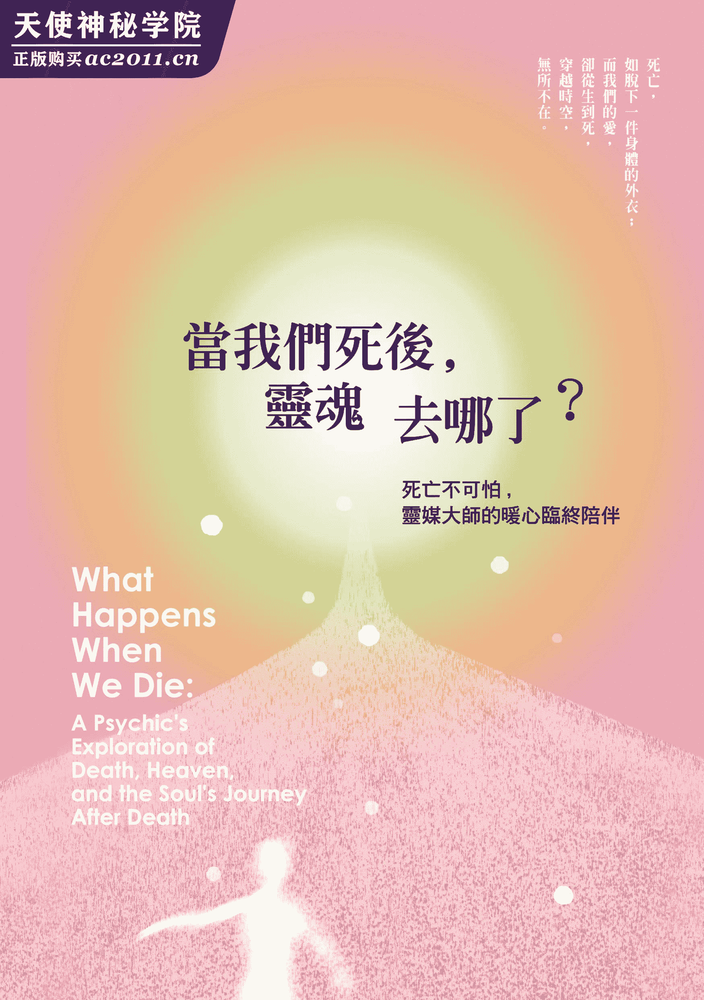

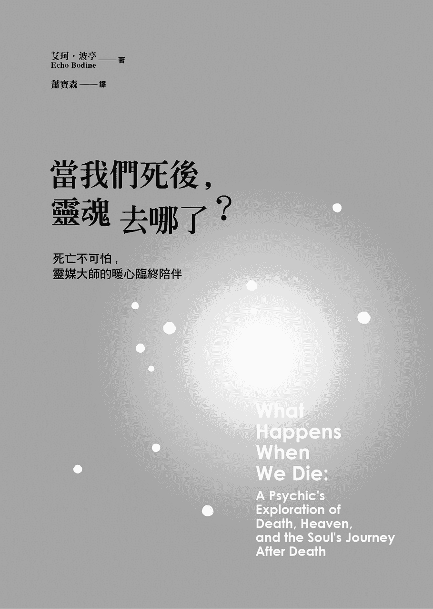

前言

死亡将是怎么一回事？

　　小时候，大人告诉我：好人死了以后，就会去一个叫做天堂的地方；坏人则到一个叫做地狱的处所，将受烈火焚身之苦。天堂在上面，是耶稣和上帝的居所。地狱则在下面，是魔鬼住的地方。

　　所幸，我在从事通灵、灵性疗愈和驱鬼工作期间，对天堂有了更多的认识，对死后的生命以及死亡本身也有了更开阔的观点。这要感谢过去四十七年，我所有服务过的临终者以及曾经和我沟通的往生者。

　　然而，当我对死亡有了更开阔的观点之后，同时也面临了一些问题。其中之一便是︰我有时候会忘记，并不是每个人都能够把死亡当成一种祝福，或是视死亡为下一个阶段的存在。举个例子，最近有位好友打电话告诉我，他得了脑癌。为了要去除这个非常恶性的肿瘤，他将接受化疗和放射线治疗。这位男士的妻子在三年前过世。当时他们结婚才五年。我这位朋友原本是一个乐天开朗的人，但自从妻子死后，他就变了一个人，陷入非常消沉沮丧的状态，从许多方面来看，简直就像是死了一样。我挂上电话后，心想这岂不是一个绝佳的机会，让他可以到“那边”去，和妻子相聚。于是，我便回拨电话，建议他或许应该放弃那些侵入性的化疗和放射线治疗，在剩下的时间里尽量好好过活，然后再返回天家和妻子团圆。

　　结果，他在电话筒那一头默不吭声。

　　反观，我那同样具有灵通力的八十三岁母亲（她最近才过世），在死前几个月就一直毫不避讳的公开谈论自己的死亡。她知道生命即将结束，还说每天早上醒来时，都很好奇自己此刻到底是在人间还是天堂。

　　正如我先前所说过的，倾听往生者的声音，让我对死亡有了更多的认识。举个例子，我的一个学生曾经告诉我：有一天晚上她在家时，突然看到了女儿的影像。女儿自称“没事”，但身后却是一片漆黑。我的学生很困惑，也很害怕，因为半个小时之前，她才跟女儿通过电话。女儿说她要去店里买点东西当晚餐，但之后却现身在母亲面前，说她“没事”。

　　后来，我的学生才发现，女儿当晚离开商店之后就再也没有回家。第二天早上，有人发现她的车子翻覆在一座深谷里，而她已经死亡。

　　有人过世时，我通常能够在二十四小时之内联络上他们的灵魂，了解他们的状况。如果死者的灵魂尚无法与人沟通，“那边”也会有人─例如某位天使、指导灵或已故的亲友─向我转告他们的状况。这么多年下来，透过我的工作，我对死亡的过程和死亡的本身已经有了许多认识。我想在这本书中和各位分享这些知识。

　　☆

　　对大多数人来说，死亡是一个令人很难启齿的话题，但我们每一个人显然迟早都要经历死亡，因此有必要先讨论这个话题，不要再把死亡当成一件黑暗、恐怖的事，而应该确实了解我们死去时，在身体和灵魂上所发生的变化。如果我们都能够学会在所爱的人以及自身濒临死亡时，开诚布公的谈论死亡，这将会是一件好事（我的母亲曾经告诉我，她很高兴我能够和她讨论她即将死去的事实，因为她需要和别人分享感受）。

　　我在两年前就开始撰写这本书。当时我正经历一位挚友迈向死亡的过程。对我而言，这是一件非常痛苦的事情。我不希望他罹患这么严重的疾病，也不想看到他日益消瘦、弱不禁风的模样。我这位朋友在壮年时期曾经是职业篮球选手，原本身材魁梧，活力四射，但在得了癌症、逐渐迈向死亡的过程中却变得判若两人。他的嗓音原本低沉浑厚，听起来像是美国的灵魂乐巨星贝瑞．怀特（Barry White），但后来由于声带上长了东西，他说话的声音越来越小，像是在讲悄悄话一般。除此之外，他也没有胃口吃东西，走路时还得拄着拐杖以免跌倒。在死亡的过程中，我们的身体会逐渐失去功能。没有人希望自己经历这样的过程，也没有人希望看到所爱的人经历这样的过程。

　　本书的内容涵盖有关死亡的种种讯息。第一章先简要的说明灵魂是什么，第二章则描述我们的肉体在死亡的过程中会经历哪些阶段。大多数篇章都是从灵魂的观点来说明死亡的过程。我在当中提到了许多熟人（他们都已经过世）的故事，以及我本身和往生者沟通的经验。在最后一章中，我提出了一些建议，教导大家如何渡过伤痛期，以及如何安慰因失去挚爱而哀痛不已，或因自身面临死亡而悲伤的人。

　　我在书中许多地方都提到了“长老”（the Elder）这个词。这些长老是“那边”一群有智慧的顾问。祂们已经过完了自己的一生，如今祂们的工作便是指导我们的灵魂做出正确的抉择。祂们是一群阅历丰富的慈爱灵魂，会帮助我们为了自身灵魂的成长与发展做出最明智的抉择。

　　除了长老之外，天使也会帮忙引导我们。祂们也是智慧的存有（being），但天使和长老不同之处，是天使从不曾在人间生活过。

　　此外，我们每一个人都有指导灵（spirit guide）。祂们是被指派来引导我们走在正确的道路上，并协助我们完成此生任务的灵魂。这些指导灵和长老不同。祂们本身的灵魂有可能尚未发展完成，因此不见得会像长老和天使那样无所不知。你在这一生当中指导灵可能一直是同一位，但也可能会在人生各个阶段遇到不同的指导灵。

　　希望这本书能够为你带来许多安慰。我在这些年的学习和体验，不仅拓宽了眼界，也强化了信念。我相信：生与死都是好的。正因有生有死，我们的生命才会成为一场引人入胜的冒险行动。

　　这本书当中所提到的每一件事，都是出自我个人切身的经验，而且据我了解都是真实不虚的。

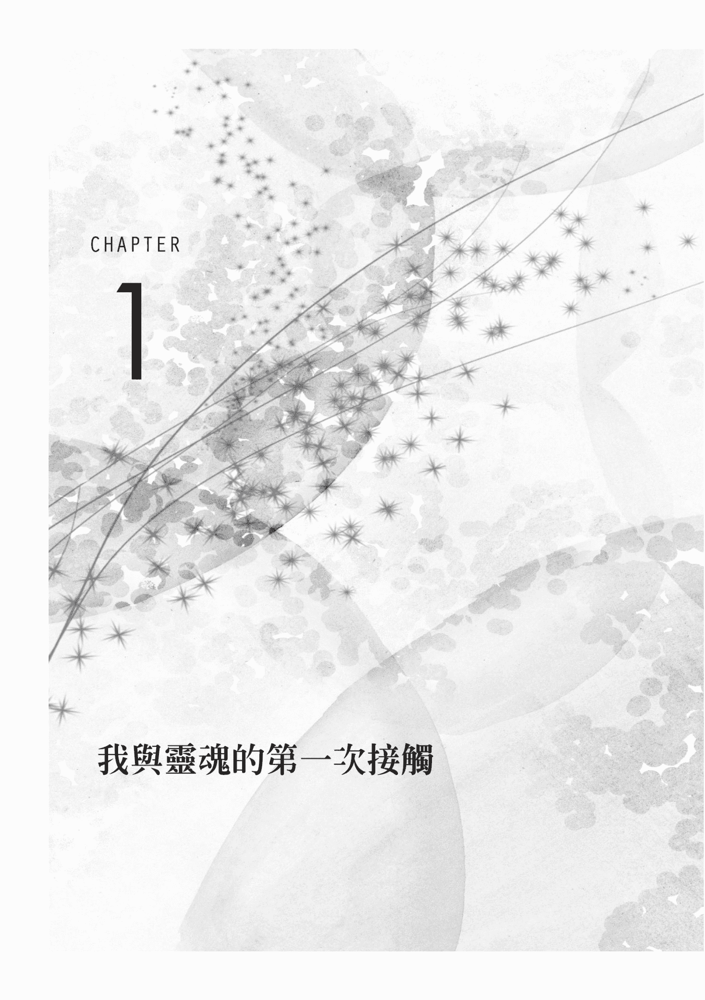

1

　　《韦氏新世界辞典》（Webster’ New World Dictionary）为“灵魂”（soul）这个字所下的定义是︰“一个不具物质形式的实体，被认为是人的灵性部分。”我年轻时并不太能够理解“灵魂”这个概念。小时候，我每次祷告的结尾总是︰“万一我在睡梦中去世，求主带走我的灵魂。”这是我对人有灵魂唯一的认知。

　　二十多岁时，我首度看到一个灵魂，但却没有意识到那是什么。当时，我母亲的朋友凯柔说，她听到她家的阁楼里有些声音，因此我和母亲一起前往察看。当时我们对“灵”的世界并不了解，根本不清楚自己到底在做什么，但还是尽力而为。

　　我们在凯柔家的阁楼上看到了四个“人”，但模样却是透明的。我不太清楚他们为什么会在那里，也不明白他们怎么可能会在那里出现。其中一位成年女性向我们解释︰在生前，她丈夫有酗酒的毛病。有一次他点了烟之后就睡着了，结果引发了一场火灾，把他们夫妇和两个孩子都烧死了。她说，她丈夫不肯让他们到“那边”去，因为他怕自己会下地狱。我和母亲都不知道该对她说什么或做什么，只能告诉她：他们必须离开这栋房子。结果，他们一家就穿过阁楼的墙壁，消失无踪了。我们回到自己的家之后，很快就接到凯柔打来的电话。她说阁楼里的声音又出现了。当时我们决定以后要先好好的学习如何处理这类的情况，才能再到闹鬼的人家里去，因为这次我们完全没有把凯柔家里的鬼魂赶走。他们还是继续住在凯柔的房子里。

　　我是在二十七岁时开始与灵魂沟通的。当时，有一个十四岁的男孩从十八尺高的高处摔到地上，撞到了头，陷入了昏迷状态。我曾经讲过这个故事，现在重提，是因为它让我学到了很多东西，同时也说明了许多事情。

　　这位名叫戴尔的年轻人，被人用飞机从内布拉斯加州运送到明尼苏达州大学附设医院接受医治。他的家人打电话给我，请我去帮他做疗愈。他们会找上我，是因为我之前曾经帮戴尔罹患心脏病的继母做过好几次疗愈。当时医生已经表示戴尔只有一成的机会可以脱离昏迷。护士则告诉他们，就算他真的能够恢复意识，可能也会变成“植物”（他们当时确实是用这样的字眼）。

　　后来，我每天都利用午休时间到医院去为戴尔做疗愈。第二次或第三次疗愈时，他的灵魂现身了。当时我正站在他的床边，俯身为他疗愈。突然间听到后面有一个男人的声音说︰“可不可以请你疗愈我大脑里的语言区域？我想恢复说话的能力。”当时的情景挺吓人的，因为房间里除了我和戴尔之外并没有别人。他重复刚才那些话时，我慢慢转过身去，想瞧个究竟。结果，我看见一个年轻人正靠着墙站在那儿，不禁吓了一大跳，因为我并不知道他到底是谁。当时戴尔正躺在我前面的病床上，头上缠满了绷带，因此我看不到他的长相。我问眼前这个人是谁，他若无其事的表示他就是住在这具身躯里面的灵魂。他再次告诉我，他很想恢复语言能力，并问我是否可以疗愈他大脑的语言区域。

　　从此，我每天到医院之后都会和戴尔的灵魂沟通。他会告诉我身上有哪些地方会痛，有哪些地方需要疗愈。据他表示︰当灵魂离开身体时，身体就不太会感受到疼痛，但是当灵魂回到身体之后，疼痛感就会变强。他实际进出他的身体，好让我明白这点。当他的灵魂留在身体里面时，他的身体会动来动去，呼吸也比较深沉。当他的灵魂离开躯壳时，他的身体会保持在静止的状态，呼吸也较浅。要了解这点，不妨想像灵魂是由能量组成的，对身体的影响就像是一个充饱电的电池一样；当灵魂进入身体时，身体就受到了能量的刺激。

　　六个星期之后，戴尔离开了明尼苏达州大学附设医院，不仅可以走路，也会说话了。

> 我所知道的灵魂事实

　　我和人们的灵魂打交道已经将近五十年之久。从他们身上，我学到了许多事情。

> •灵魂的长相就像他们的身体一样，但看起来比较年轻，也比较悠闲自在，而且是透明的。灵魂现身时，是穿着衣服的。

> •灵魂和肉体之间有一条类似脐带的银索相连。人死亡时，这条银索就会被切断。

> •灵魂就是我们的人格，在肉体死亡后仍然继续存在。

> •人在每一世都具有同样的灵魂，但在觉知、智慧、知识和意识等各方面会不断成长。

> •我们的灵魂会不停的变换性别；在我们所经历的许多世当中，有一半的时间是男性，另一半的时间则是女性。

> •灵魂常在我们沉睡时离开肉体。这叫做“灵魂出体”（astral projection），稍后会谈到有关这方面的事情。

> •在迈向死亡的过程中，灵魂有许多时间都待在身体外面，为他在“那边”的新生活预作准备。在这段期间，灵魂会不时前往拜访已故的亲友并重新认识新家（也是老家）：天堂。人在这个世界死亡时，就等于是在“那边”诞生了。虽然不是像婴孩那样被生出来，但一样是展开了新的生命。我们时常听到一些故事，说人们在接近天堂时会看到白光。想想看：新生儿从产道里出来时会看到什么？当然是白光啦！

> •动物也有灵魂。我那只棕色的拉布拉多犬杰西死去后，我有好长一阵子都非常伤心，但有好几次看到它像从前那样，在院子里跑来跑去。是的，我们的宝贝宠物确实是有灵魂的，而且也会上天堂。它们在“那边”有人照顾，而且你也会再次看到它们。

> 从灵魂的观点看生死

　　在谈论有关死亡与死后的生命之前，我想先谈一下生命。我曾经写过《灵魂的回音》（Echoes of the Soul）一书。如果你想从灵魂的观点深入了解生命、死亡以及死后生命的样貌，我会大力推荐你阅读那本书。很多人都说书中的许多讯息对他们很有帮助。如果我能在这里多写一百六十页的文字，我将会钜细靡遗的和你们分享该书的内容，但受限于篇幅，我只能在这里简述其中的要点。

　　我们的灵魂是由能量组成的。我们在人世生活的目标是要发展自我，把潜能发挥到极限。我们来自上帝那儿，而我们必须试着去了解这件事所代表的意义。《圣经》说，上帝是完美的，我们是根据祂的形象与模样创造出来的。这里所谓的“我们”指的是我们的灵魂。但光是听说“我们是完美的”，并不代表我们能够了解其中的意义，因此我们才会来到世上，以期将自我的潜能发挥到极限，并更进一步意识到“我们与上帝是一体的”以及我们本身的完美性。在每一世的尽头，我们会离开所居住的肉身，回家休息，并在之后重返人世。

　　无论你相不相信，到目前为止，你可能已经死了至少两百次（这要看你的灵魂年龄而定），因此死亡对你的灵魂而言，不是什么新鲜事。每个人的灵魂年龄各不相同，意识的层级也不一样（在《灵魂的回音》一书里，曾谈到灵魂的各种层级，以及每一个层级所代表的意义）。为了让你大致了解老灵魂与新灵魂的不同，我可以举一个例子：佛陀是一个非常老的灵魂，曾说祂花费了六百六十五世的时间才开悟（希望这是因为祂学习速度很慢的缘故）。你之所以完全不记得自己在前世生活或死亡的情景，是因为：如果你都记得，你的神智（sanity）将无法负荷。假使你还记得前世所经历过的一切，但同时又必须处理今生的事务，你可能会难以消受，于是明智的上帝便在你的潜意识（也就是你灵魂的心智）上加了一道锁。你必须做出一些努力（通常是透过催眠的方式）才能取得那些讯息。

　　在你来到这一世之前，长老们已经为你的人生规划了一份蓝图，这也就是你的“生命蓝图”（life plan）。如果你是比较老的灵魂，你或许得以参与这份蓝图的规划过程，但如果你是比较年轻的灵魂，长老们就会自行拟定。这些长老已经有过许多生、许多世的历练，因此完全了解我们每一个人需要哪些经验才能让灵魂得以进一步成长。请记住：我们每一世的目标都是要继续成长并增进智慧。

　　你在今生想要且需要完成的事项，都列在灵魂的“生命之书”（life book）中。有些能力高强的通灵人可以帮助你取得这些讯息。所有人的“生命之书”都被储存在一个名叫“阿卡西秘录”（Akashic Records）的场所。我在为人通灵时，曾经有许多次看过阿卡西秘录。那是一个令人赞叹的地方，看起来像是一个精细、复杂而巨大的图书馆。

　　你所出生的家庭都是经过挑选的，因为它最能让你体验到你今生所要学习的功课，即便你是被人收养、在孤儿院里长大或出生在暴力的家庭也是一样。你的生命蓝图会显示你将在何时死亡（长老们称之为“毕业”）。你的星盘上也会有“退出点”（exit points），也就是当你的灵魂觉得已经在这一世达成所有的目标，可以离开人间并且回家的时间。不是所有人都有好几个退出点，有许多人只有一个退出点。我将在第四章中更深入探讨这部分，但此处我想要说明的重点是：你死亡的时间早在你尚未出生之前就已经决定了。

　　在了解这点之后，接下来就让我们深入探讨一个大家都惧于谈论的主题：我们的肉体停止运作的过程。

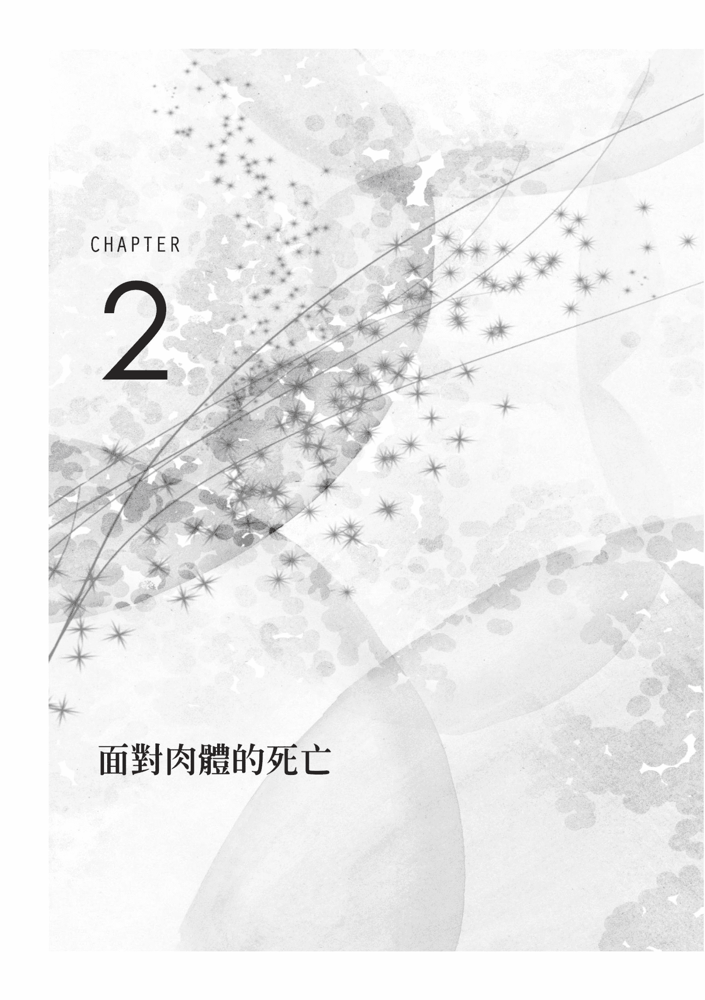

2

　　死亡有很多种方式：有人猝死，有人死得很慢，有人死得痛苦，有人死得安详，有人含笑九泉，有人死不瞑目，有人孤零零的死去，有人死时亲友随侍在侧。在从灵魂的观点认识死亡之前，我想有必要先了解死亡时我们的肉体究竟会发生什么事。

　　如果你负责照顾某个正迈向死亡的人，或者你本身正面对死亡的威胁，你会想知道他们（或你自己）在经历这个过程时会发生什么事。当你拥有这些讯息时，就不会当只鸵鸟（如果即将死去的人拒绝面对死亡，对他们和照顾者而言都会造成很严重的障碍）。我们的肉体并不想知道它正在死亡，因为它之所以被创造出来，就是要在这世上克服各式各样的挑战存活下来，因此当它实际要向死亡─生命的最后一步─屈服时，大多数人都不想面对。正如美国知名的电影导演伍迪．艾伦（Woody Allen）所言：“我不怕死，只是当死亡发生的时候，我不想在场。”

　　大多数人在所爱的人逐渐迈向死亡时，都会觉得非常无助。事实上，我们的确什么也不能做，因为这是他们生命中的最后一段时间，我们必须尊重。已经不知道多少人写电子邮件来问我，为什么他们所爱的人死亡的过程会拖这么久？有许多人会试着让这个过程变快一些，他们认为快一点对大家来说都比较好。然而，有人死得快，有人死得慢，都是有原因的。加速死亡的过程就像帮产妇催生一样。但事实上，你该出生的时候自然就会出生，该死亡的时候也自然就会死亡。从灵魂的观点来看，这些事件发生在什么时间点，或死亡为何看起来“迟迟”不发生，都是有原因的。

> 肉体迈向死亡的旅程

　　我的父亲不久于人世时，安宁病房的护士给了我一本小册子，里面讲解他在死亡的过程中可能会经历的三个阶段。我起初并不想看那本小册子，因为我不愿意接受他即将死去的事实（他是我的父亲耶！他怎么可能会死呢？）；但是当父亲一天比一天更接近死亡时，我开始想了解他正在经历什么样的过程，以便和他保持某种程度的链接。

　　最近我上网去搜寻安宁病房护士给我的那种小册子，结果发现一篇很美的文章，名叫〈迈向死亡的旅程〉（The Journey Towards Death），是由安琪拉．莫柔（Angela Morrow）护士所写的（请参见 http://dying.about.com/od/thedyingprocess/a/process.htm）。她以一种非常慈爱、温柔的口吻说明了死亡的各个阶段，我想和你们分享其中的一部分。

旅程的起点：死前一到三个月

　　当一个人开始接受“人终将一死”的事实，并且意识到自己即将死去时，他可能会开始慢慢疏远周遭的环境，也就是说，他会开始远离外面的世界和人群。他可能会拒绝接见来访的朋友、邻居甚至家人。即使他愿意接见，可能不太和别人互动，或者也有可能会变得很难照顾。他们会开始思索自己生命的意义，并回忆过往。他们可能会检讨自己过去的生活方式，并回想之前有哪些令他们遗憾或懊悔的事。此外，他们也可能会开始进行死亡时的五个任务。根据伊拉．毕欧克博士（Dr. Ira Byock）在《人生最重要的四件事》（The Four Things That Matter Most）一书中的说法，这五个任务是：1.请求别人宽恕。2.宽恕别人。3.由衷的感谢他人。4.向他人表达爱意。5.道别。

　　即将死去的人由于身体的运作变慢，食欲可能会降低，体重也可能会减轻。这是因为他们的身体不再像从前那样需要来自食物的能量。同时，睡眠的时间可能会越来越长，也不再从事从前感兴趣的活动……奇妙的是，这段期间，身体的化学作用会改变，以致会产生微微的愉悦与兴奋感，既不感到饥饿，也不会口渴，即使不吃东西也不会难受。在死亡的旅程中，这样的现象是很自然的。

死前一到两周

1.心智的变化

　　这段期间，他们大多数时间都在睡觉，同时往往无法分辨东西南北，认知也会改变。同时，可能会产生错觉，例如害怕看不见的敌人，或觉得自己天下无敌等等。

　　此外，濒临死亡的人也可能会出现幻觉，有时候会看到一些并不在场的人（通常已经往生）或对着他们说话。有些人可能会认为这是因为今生和来世之间的那层罩纱已经开始被揭开了。在这段时期，濒临死亡的人可能会焦躁的拉扯着床单或衣服，他们的动作和举止也会显得漫无目的、毫无道理。这时他们离人世的生活已经越来越远了。

2.肉体的变化

　　此时，肉体已经越来越难以维持自身的运作。在这段期间，可能会出现下列迹象：

　　 •体温下降一度或一度以上。

　　•血压下降。

　　•脉搏变得不规则，而且可能变慢或变快。

　　•排汗量增加。

　　•由于血液循环变差，皮肤的颜色也会跟着改变。这种改变通常在嘴唇和甲床（指甲所在之处）这两个部位比较明显。这两处的皮肤会变得苍白发青。

　　•呼吸出现变化，通常变得较急促而吃力。此外，也可能会出现呼吸道充血的现象，以致呼吸时发出咯咯咯的声音并且会咳嗽。

　　•越来越不爱说话，到最后甚至完全不想开口。

旅程的终点：死前两、三天到死前几个小时

　　随着当事人距离死亡越来越近，可能会出现回光返照的现象，想要下床走动并且和亲近的人说话，或者在连续几天毫无胃口之后突然想吃东西。这种回光返照的现象也可能不是那么明显，但当事人通常会用这段时间做死前最后的肢体表达。

　　这段回光返照期通常很短暂。随着死亡越来越迫近，之前的征象会变得更加明显。呼吸变得更不规则，而且更慢。此时也可能会出现“陈施式呼吸现象”（Cheyne-Stokes breathing），也就是呼吸会先变得急促，接着有一段时间完全不呼吸。呼吸道充血的现象会更严重，导致呼吸时会发出响亮的咯咯声。

　　手掌和脚掌上可能会出现略带紫色的斑点，并且可能逐渐往上蔓延到手臂和大小腿等部位。嘴唇和甲床会发青或发紫。当事人这时通常会变得没有反应，眼睛睁开或半开，但对周遭的环境却视而不见。一般相信，听觉是最后一个停止作用的感官，因此这段期间，应该让当事人所爱的人坐在身边，对他们说话。

　　最后，呼吸完全停止，心脏也不再跳动。死亡已经降临。

> 揭开生死之隔的罩纱

　　关于这份死亡说明书，我想就个人的观察表达一些看法。首先，是关于将死的人对着已故亲人说话这部分。如果你发现有这个现象，请不要认为这是他们的幻觉。事实上，在这个时候，那些已故亲人确实就在房间里，或者也可能是当事人看到了“那边”的亲人。这是因为在这个阶段，从我们这边通往“那边”的门─通常被称为罩纱（veil）），已经被揭开了，因此他们会把大部分的注意力都放在“那边”。这时，请注意倾听他们和那边的人的悄声对话。当他们的意识对罩纱两边同时敞开时，将会是一幕很奇妙的情景。如果这时你试着和他们说话，他们可能听不见你的声音。当他们发现有两个人正同时对他们说话时，或许会感到迷惑。举例来说，他们可能会看到已经亡故的妹妹对他们说话，但同时又听见还在世的这个妹妹也在对他们说话。他们可能会因此感到不安或害怕。这是你在病榻陪伴处于这个阶段的亲人时，必须明白的地方。

　　我父亲住院时，曾好几次提到他的一个战友就站在病房窗户旁。每当此时，他都会轻声细语的对老战友说话。那些话对我们而言并不具任何意义，但从他脸上的表情可以明显看出这样的对话对他有抚慰的作用。所以我们不应该打断或试图阻止这样的对话。此外，在我父亲过世前几天，我都看到我的祖母在父亲上方徘徊。祖母从不曾开口对我们说话，只是全神关注着我的父亲。当他的灵魂离开身躯时，她立刻把他带往“那边”。

　　对于莫柔的文章，我还有一个看法。她建议在亲友临终时握住他们的手。根据我的经验，我认为死亡的最后一个阶段，就像是分娩的最后阶段一样，是一个过渡期。在母亲把小孩生下来之前，她的注意力是完全向内的。她会把全副的心神都放在她的身体以及身体的动作上。这时她很容易因为身边的人而感到焦躁，但又希望他们能够在场为她打气。由于她的感官全都处于高度警戒的状态，因此通常在这个时候，她不会希望任何人触摸她。我发现临终的人也是如此。

　　当我在陪伴某个临终的人，而他们的亲友正握住他们的手时，有许多次我都听见当事人的灵魂说：“别再握着我的手了─你让我没办法专心。”要知道，灵魂这时正努力脱离自己的躯壳，如果握住他们的手，灵魂就会把心思放在肉体上，使他们更不容易离开。如果你的亲友即将死去，而你想握住他们的手，借以安慰他们（或你自己）时，请记住这一点。当他们出现任何难受的样子时，你要立刻放手。

　　这并不是说你不应该坐在临终的人身边，让他们知道你在那儿，使他们安心。不过，在这个过程中，你要注意观察周遭的动静，看看你是否能察觉房间内有其他来接走他们的灵魂。

　　不过，很可惜的是，有些人和临终者同处一室会感到非常不自在。为了消弭这种不自在的感觉，他们便开始滔滔不绝的说话。这种行为会使人很难感受或察觉到当时在灵性层面所发生的事情。如果你置身在这种情况中，可以请那个一直说个不停的人到外面去，让你安安静静和你的亲友相处。这时他们说不定会觉得松了一口气。如果你的运气够好，房间里没有这样的人，那么请你安静下来，不要以为临终者只是一具肉体而已。请记住：此时此刻有一种美妙的转化正在发生，请试着将心思静下来，从另外一个观点来感觉它。闭上你的眼睛，请上帝帮助你从灵性的角度来看待这件事，帮助你从内心感受到这个转化。

　　过去这些年来，有许多人告诉我：当他们的亲人过世时，他们可以感觉有天使或已故的亲友来到房间里。其中的关键在于你要让自己尽可能安静下来，并且试着从临终者（而非你自己）的角度来看待这个情境。

　　我曾经有过一次很美妙的经验。当时，我正陪伴一家人渡过他们的亲人约翰临终的时刻。我看到约翰已故的父母在角落里等待着，劝他离开身体。约翰不仅看得到他们，一整天都断断续续和他们说话，仿佛是在胡言乱语一般。那天深夜，当约翰终于咽气时，我正好在洗手间，但我看到他的灵魂离开了身体，牵起父母的手。当他们三人往上飞升，离开房间时，八位美丽的天使进来了。祂们各自走向房间内的八个人，站在亲友身边。我悄悄的询问其中一位天使：约翰已经升天了，祂们为什么还在这里呢？祂说，天使们向来都会过来安慰往生者的亲友。祂们就这样一直待在房间里，陪伴着约翰的家人，一直到医生宣布约翰死亡，家属也和葬仪社安排好后事为止。当诸事底定、情况恢复平静时，天使们就离开了。

　　约翰的家人中有一位特别敏感。她问我房间里是否有天使存在。她说，约翰走后她感觉很明亮，仿佛整个房间里都充满了白光。我很高兴除了我之外，也有人可以感觉到天使的存在。

　　关于这个过渡期，还有一点必须说明：临终的人比我们还清楚当时发生了什么事，所以不要觉得你好像有必要对他们解释什么。

> 人绝对不会孤零零的死去

　　我曾经问一个从事殡葬业的朋友：他帮那么多家庭处理后事，有没有发现他们的情况有任何相似之处。他说，他经常听到一件事：他们一直守候在临终的亲人床边，只是偶尔去上一下洗手间或去贩卖机买点东西，但亲人往往在他们离开期间就过世了，让他们非常难过。如果你也有这样的情况：只离开房间一分钟，你的亲人刚好在这个时候过世，请不要因此内疚，觉得你让他们“孤零零的死去”。因为人绝对不会孤零零的死去。灵魂回归天家时，一定会有圣灵在场，并从旁协助的。

　　我的父亲快要往生的那几天，我和我的兄弟姊妹一直在旁边陪伴。有一次，我们肚子饿了（当时我们已经在房里待了一整天），护士也说时间还没到，我们便匆匆忙忙跑到楼下，随便买了点东西来吃。当我们回到房间时，父亲的情况并没有什么改变，但我却觉得好像有某个东西消失了。我检查所有的机器，看是否有什么东西被移动，但那些机器并没有异常，照旧发出“哔哔哔”的声响，父亲的呼吸也并未停止。然而，我就是觉得有什么东西不见了。我问妹妹是否觉得怪怪的，她也和我一样，感觉好像有什么东西消失了。我一听就知道那消失的东西正是父亲的灵魂。他趁着我们不在的时候离开了，但他的身体却还在呼吸。我很清楚父亲的脾气。他不喜欢和人道别，因此对他而言，趁着我们不在时离开会比较容易。结果第二天，他的心脏就停止跳动了。

　　我之前提过的那位绅士约翰（就是有八位天使来到他房间里的那位），他的死亡过程拖了很久。这段期间，他的家人曾经打电话给我，问我是否可以和他的灵魂沟通，看他是不是在等待什么。原本我们都以为他是在等他的儿子从外地赶回来，但当我询问约翰的灵魂时，他却说：“不，不是在等儿子。是在等那个三角形。”“三角形？”我问道。“嗯，三角形。”他的灵魂又重复了一次，除此之外，他就没再说什么了。我把这些话转告给约翰的女儿和女友，心想她们应该会明白其中的含意，但她们也都不明白。约翰的儿子从外地回来后便赶到医院，但约翰看到他却一点反应都没有。

　　那天，我们一直在他的床边守候着。到了晚上七点，我们当中有五个人不约而同的离开了房间。约翰的一个孙女去帮大家买汽水，有两个人走到外面去抽烟，另外一位先生去检查他的卡车是否有漏油的现象，而我则是去洗手间。这五个人走掉之后，房里只剩下约翰的女儿（站在床边）、他最喜欢的一个孙女（站在床尾），以及他的女友（站在床的另外一边）。他睁开眼睛，逐一看着她们，对她们说再见，然后就离世了。当时这三个他最喜欢的人刚好围在床边，形成了一个完美的三角形。等到我和其他四个人回来时，约翰的灵魂已经进入白光中。

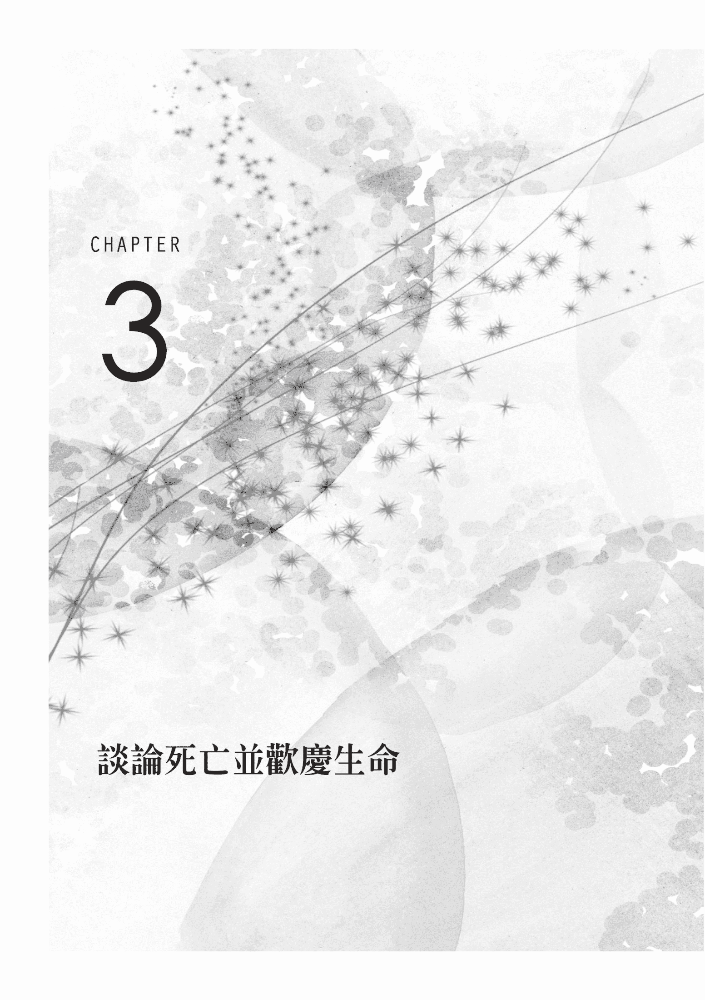

3

　　当亲人过世时，我们经常会后悔自己没有在他们生前多问他们一些问题或多和他们聊聊，问他们：小时候是什么样子？为什么喜欢（或讨厌）他们所从事的工作？哪些事情让他们最感到快乐？最喜欢哪一本书、哪一首诗或那一首曲子？

　　同样的，我也发现灵魂到了“那边”之后，往往会后悔自己没能在活着的时候让亲人多了解他们一点。那些处于疾病末期或年事已高的人，如果能在去世之前向亲人说明他们的信念、他们最在意的事情、他们之所以这样做而不那样做的理由等等，会让大家比较安心。这一章中，我将提出一些建议，让你们明白如何在亲人临终时和他们沟通，并以创意的方式表达自己的情感与想法，让往生者以及亲人都能得到助益。

> 鼓励临终的人说出感受

　　我曾看过许多家庭因亲人即将过世而聚在一起，但却没有一个人谈论死亡。死亡往往是“房间里的大象”，大家都假装它不存在。这种情况必须有所改变，因为对临终的人而言，死亡是他们生命中的重要时刻，如果大家都避而不谈，他们会觉得非常孤单，无法向亲人诉说他们正在经历的一切。为了临终的人，也为了我们自己，我们必须要做出改变。

　　我们必须鼓励临终的人谈论他们当下的感受。刚开始时，进行这样的对谈可能会有点尴尬，但一旦他们知道别人对他们正在经历的事情感兴趣，他们通常会有很多话要说。当生命到了尽头的时候，许多人会开始回顾自己的一生。会有一些回忆想要和别人分享，也会有一些放不下的恩怨，还有各种快乐的事、伤心的事、无聊的事或令人兴奋的事。他们可能会想诉说这一切，而他们需要（也值得）有人聆听。

　　在我担任疗愈师的生涯中，我有许多客户知道自己已经馀日无多。他们当中有些人很坦然的面对现实，会开诚布公说出自己的想法、感觉、希望和梦想，也会安排好身后事，处理掉尚未解决的问题。他们不会当只鸵鸟，对死亡视而不见。相反的，他们张开双臂拥抱生命的流转，珍惜每一天的光阴，尽量过得充实。当然，有些客户来找我，是想要获得疗愈，但有些人前来，并不是因为想活得更久一点，而是希望能够改善自己的生活品质，在仅馀的日子里拥有更多的精力。举个例子，我的一个客户在知道自己已经快要死时，便邀请我前去和她共进午餐。她给我看了她年轻时各式各样的照片，怀念她爱过的那些男人、去过的地方、上过的学校以及她在养儿育女之外的成就。在此之前，她的话题总是围绕着儿女的生活打转，鲜少提及个人的经历，因此那天看到她那样侃侃而谈，真是令人高兴。

　　遗憾的是，大多数人都不是以这样的态度面对自己即将死去的事实。我那些自知馀日无多的客户中，多数都对即将发生的事情感到害怕、沮丧和焦虑。他们是在一种茫然的状态下经历死亡。他们不想谈论自己的愤怒、恐惧或悲伤，甚至往往会尝试麻痹自己的感觉。他们前来找我疗愈，并不是为了要治疗他们的疾病，而是为了各式各样的原因─沮丧、焦虑、酗酒、失眠。这些人通常需要一些诱导才会开口说话。当我请一位男性客户谈谈一生时，他说根本没有什么好谈的。但是，当我问他一些较为具体明确的问题，例如他的童年、青少年的岁月、军中生活、他如何遇见妻子、成为一个父亲是什么感觉、在退休之前他从事什么工作等等，他却有一箩筐的话可说。看他如此热烈的谈论自己的人生，是一件很有意思的事。某些时候，他的神情显得有些悲伤，但有些时候却是一脸的喜悦。

　　婴儿潮之前的世代特别不好意思谈论自己。他们当中有许多人觉得这是一种自私的表现，因此需要有人诱导，让他们确信你真的很想听他们讲述生平。或许你不太愿意面对他们即将死亡的事实，但只要你告诉自己：这或许是你最后一次听到他们的声音，也或许是最后一次向他们学习人生智慧的机会，你就能够克服心理障碍。

　　我曾经有许多次在类似的场合，听见临终的人天南地北，同时谈了十个几不同的主题，从这个回忆跳到那个回忆，从这个感觉跳到那个感觉。但这都很好，因为这就是当时他们心智运作的方式，也是他们沟通的方式。其中有些话可能会让你感觉不太自在，但请记住：这是他们尽情倾吐的机会，请你按捺住自己的感受，让他们一吐为快吧。

　　有一次，我坐在一个快要过世的女人身边，和她和她的两个女儿闲聊。突然间，母亲说要向大女儿赔罪，因为她从大女儿小时候开始，就不太喜欢她。女儿从未听母亲说过这些话，因此非常惊讶。母亲接着又说，她年纪轻轻就怀孕了，因此不得不嫁给她们的父亲，但是她并不爱他，所以她觉得这个女儿毁了她的一生。观看当时她们三个人之间的互动，是一件很有意思的事。母亲把话说出来之后感觉如释重负，大女儿非常震惊，小女儿则显得不太自在，一直试图转移话题，缓和气氛。当然，这是一个比较极端的例子。即使是在这样的情况下，我认为让临终的人安心，还是比让我们自己感觉自在更重要。况且我猜想那个大女儿听到母亲说这些话虽然会很伤心，但也可能会因此而明白这些年来她们母女之间的关系何以会变成这样。我想这对母女在最后这段相处的时光中，彼此的关系必然会变得更加亲近吧。

> 卸下今生的包袱

　　我们要让临终的人畅所欲言还有一个理由：让他们能够释放多年来心中一直放不下的恩怨与伤痛。我有一个名叫梅宝的客户。她已经九十岁了，因为罹患关节炎，每个星期都来找我做疗愈。她的心中充满怨忿，不仅痛恨她的原生家庭、她所受的教养，也痛恨她的三个前夫和孩子。她每次都会问我为什么上帝不让她早点走，我告诉她，或许祂是想多给她一些时间，让她能够放下怨怼、愤怒与仇恨，以免带着这些情绪离开。同时，我也建议她试着去想想她的人生经验是否曾为她带来任何益处。但她总说这是“一派胡言”。

　　不过，我最后一次为她做疗愈时，她却展现了几分亲切与温柔。我看得出她的内心变得比较柔软，不再那么痛苦，而且还说关节炎已经有所改善。通常她离开之前，都会跟我预约下一次的时间，但这次却表示要等到需要的时候，再打电话。那一天我意识到或许从此再也看不到她了（后来事实证明的确如此），只能为她祈祷，希望她心里不要有那么多的怨怼与怒气，能够平和、安详的上天堂。

　　许多人相信一旦我们到了天堂，所有的过错都可以得到赦免，从此过着幸福快乐的日子，但这并不是事实。我们在“回家”时，往往都带着情绪的包袱。这真是件很可惜的事。

　　很多年前，我曾陪伴一位友人生产。我们进入产房时，我看到那个即将住进婴儿身躯的灵魂正漂浮在房间的角落上方。当时他身边还有两位指导灵以及九只手提箱。我悄声问他：那些手提箱是用来做什么的？他说那些都是他要带到今生来解决的问题。之前我从未见过这样的情况，但如今我每次在育婴室里看到那些新生儿时都会忆及这一幕情景，心想这些小婴儿不知道带了多少包袱到今生来解决。因此，我认为我们在离开人世之前，一定要尽可能清掉属于今生的包袱。

> 做个安静的倾听者

　　最近一个曾参加我进阶灵通力工作坊的学生告诉我，她的表哥得了癌症，无法开刀，已经快死了。她不知道应该对他说什么，让他能够开口谈谈自己目前的状况。之前她问过好几次，但他总是用“还好”一语带过。她不想让表哥觉得她很多管闲事，但她又真的很想了解他目前的想法和感觉，也想知道自己是否能为他做些什么。我的回答很简单：“你就问他，目前有什么感觉？心情如何？有什么想法？你要表现得很平静，并要与他同在，让他知道你希望他能够很诚实的回答，而且你也可以承受他所说的一切。”我们在提出这些问题时，对方可以看出我们是经过深思熟虑，还是心里其实不太自在但又觉得非问不可。如果我们感觉不太自在，说起话来可能就会像机关枪一样快速，或者一直忙着张罗鲜花或食物之类的东西。事实上，在这种情况下，最好的方法就是安静坐下来，聆听他们的回答。如此一来，我们也比较能够根据自己的直觉，提出一些合宜的问题。

　　如果对方愿意开口，但却好像不知道该说些什么，你可以问他们类似以下的问题：

> •有哪些时光是你最怀念的？

> •如果可以重来一次，你想改变什么？

> •你最自豪的事情是什么？

> •有什么事情让你感到后悔吗？

　　你可以问他们心中是否有任何怨怼、怒气或仇恨，然后温和的劝他们原谅那些伤害他们的人。如果他们跟某人还恩怨未了，你可以主动表示：如果他们愿意写一封短笺给对方，你可以帮忙寄送。他们每说完一个故事之后，你可以问他们从这个经验中获得什么？学到什么？光是思考并回答这个问题，对他们而言可能就很具疗愈的效果。你们之间的对谈最好以这类正面的话语作结。

　　请记住：你在提问和聆听时，不要批判。这是他们的故事，不是你的。对于他们的生命经验，他们有自己的想法和信念。你只需要聆听并愿意花时间了解他们就可以。

　　如果你愿意花点时间真诚的聆听将死之人诉说他们的生平，对他们而言就是一份莫大的恩惠。如此，轮到你要走的时候，或许就会有人给你同样的关爱与善意。

　　请记住：那些即将过世的人正处于一个激烈的过程，要把今生的事情做个了结。他们越能释放自己的痛苦情感，就越容易渡过这个转化期。如果他们能够放下怨忿悔恨，清清爽爽的“回家”，他们在“那边”就能够过得更好。

> 制作一本“人生剪贴簿”

　　有一年圣诞节，我制作了一本关于我父亲的生平及成就的剪贴簿，在里面放了许多他的照片以及我所能找到的每一个有关他的纪念品。当他翻阅的时候，感动得说不出话来。我还记得他当时很自豪的将那本剪贴簿送给了我的外甥，好让他永远记得祖父。到现在，我还是很高兴自己当初愿意花时间来做这件事。

　　大约十五年前，我失去了一个很心爱的人，打击很大。当时我以为我心里的伤口永远无法复原。但有一天晚上，我把我所能找到的有关我们俩的纪念品全都集中起来，制作一本剪贴簿，重现我们一起做过的每一件事情。我每天做一点，每天做一点，后来发现，当我越是在这个过程中发挥自己的创造力，就越感受不到那失去爱人的伤痛。

　　当我为那些即将过世的人或即将失去亲人的客户通灵时，我的指导灵往往会让我看到这些客户正在制作一本剪贴簿，用具创意和建设性的方式记录这一生当中对他们而言最特别的时光。当我和那些往生者沟通时，往往发现他们很担心自己过世一段时间之后会被人遗忘。我们一辈子努力工作，就是要创造属于自己的人生，即便我们已经死去，可能也很难完全放下，并会担心自己被遗忘。把我们的一生制作成一本剪贴簿，就是歌颂人生的一个绝佳方式，也可以让所爱的人在我们走后仍拥有很特别的纪念品，让我们可以永远留在他们的记忆中。无论是你本身即将告别人世，还是你有亲人快要离你而去，我都强烈建议你花一点时间制作剪贴簿，或用其他对你而言具有意义的方式来收集你的回忆（我在第六十一页提出了一些其他建议）。

　　许多人在得知自己馀日无多时，都会封闭自己的心灵，变得非常沮丧，成天盯着电视，等待死亡的降临。如果你正巧也是其中之一，我要请你关掉那该死的电视，用看电视的时间制作一本关于你人生的剪贴簿。毕竟你还活着，你的心智仍然可以运作，否则你就不会阅读这本书。所以，请你制作一本有关你的剪贴簿。

　　坊间有一些专门贩卖剪贴和建档材料的商店。逛逛这些店也挺有意思的，或许会让你心情变好一些。如果你无法亲自出门去购买这些材料，可以请人帮你代购，或上网订购，宅配到府。

　　你可以把制作剪贴簿当成是一个庆祝活动。如果你愿意的话，去买一本很大的剪贴簿，再买一些贴纸、胶水和各种颜色的马克笔、蜡笔、彩色笔或色铅笔。除此之外，你还可以收集一些杂志，把里面的文字或图片剪下来，用来描述你生命中的一些时光。

彰显一生的回忆录

　　这本剪贴簿可以包括以下内容，但这只是我的建议而已。毕竟这是你的剪贴簿，只要是你觉得最能够代表你这个人的东西都可以放进去。

> •童年的回忆：你最喜欢的玩具、节日和生日、你收过最特别的礼物、对你而言最特别的亲戚和朋友（你可以说明他们为什么这么特别）、你最喜欢的游戏、你喜爱的书、你所从事的运动，以及你小时候养的宠物等等。

> •中学时期的回忆：你的朋友和心上人，包括你的初恋在内。

> •大学时期的回忆：当年的情景、你最喜欢的课程或教授、他们长什么样子、你自己是什么模样、你上课时喜欢做什么。

> •重要的爱情关系：和每一段感情相关的照片和（或）记忆。

> •离婚或分手的经验。

> •你的子女和孙辈。

> •军中的经验、你作战的目标或你抱持的理念。

> •你的嗜好。

> •你的职业或工作。

> •你的重大成就、你曾经克服过的障碍。

> •你尚未实现的梦想和目标。

> •你对退休的想法。

> •你住过的地方。

> •你曾经旅行过的地方。

> •你希望至亲好友记得哪些关于你的事情。

> •你从未向至亲好友透露的事。

> •你生命中最美好的时光。

> •你生命中最凄惨的时光。

> •重要的朋友。

> •你开过的车子。

> •你制作或创作的东西。

> •一个名为“一笔勾销”的专区，列出所有令你怨恨的事、曾经伤害你的人以及他们伤害你的原因、你伤害过的人以及你伤害他们的原因。

其他颂扬个人生命的纪念方式

　　制作剪贴簿可以是一件很好玩的事，但你不一定非这么做不可。重点是要用一种别人会乐于欣赏的方式来呈现你的想法、信念和回忆。如果你无法制作一本精巧详细的剪贴簿，也可以采用别的方式。以下是我的建议：

> •准备一枝笔和一些纸，随时记下你想传达给别人的讯息。不要担心自己写的东西不够好、字迹不够工整或文法有错误。

> •把照片和纪念品集中放在你所能找到的任何盒子或袋子里。

> •录下你的声音或影像，想到什么就说什么。如果你不知道要说什么，可以参考先前有关剪贴簿内容的建议。这份礼物不仅是为你自己制作的，也可以让你挚爱的人在未来的许多年借此来怀念你。如果你没有力气自己做，可以请朋友或家人帮你。对你们而言，这或许将是一段很特别的时光。

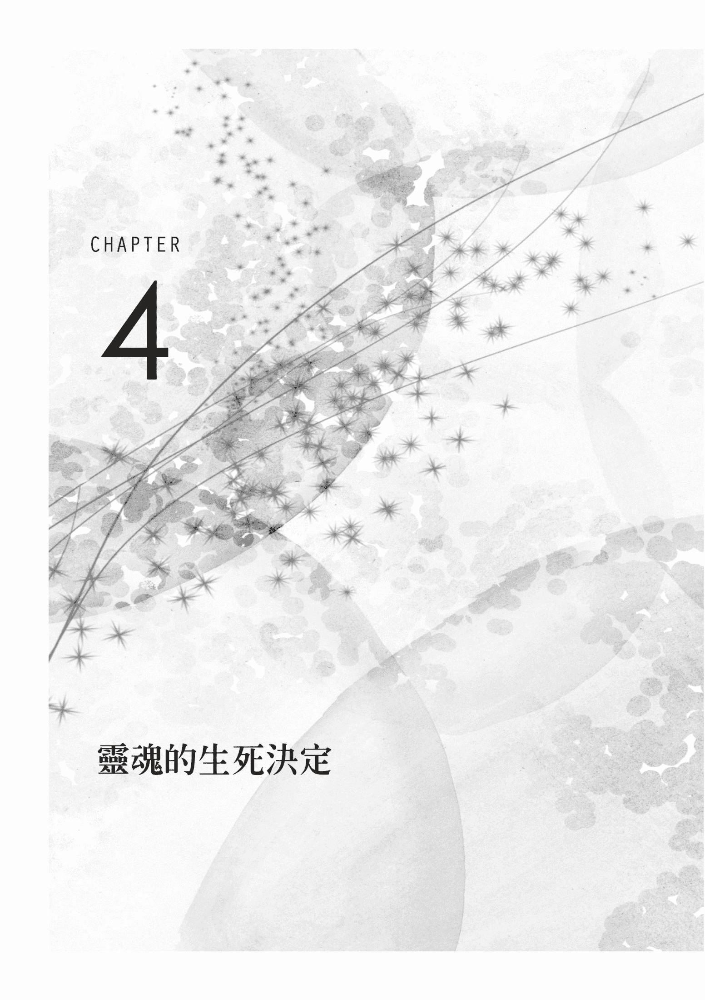

4

> 星盘上的退出点

　　我在演讲中谈到有关死亡和死后生命的议题时，经常有人问我，人何时会死是不是命中注定的。我的答案是：有时候的确如此。我在第一章中提到：我们的星盘上已经显示了我们的退出点。所谓退出点，是指一个很重要的时间点。在这个时间点，我们的灵魂可以选择要不要结束这一世的生活。我猜会读这本书的读者应该有许多人都已经体验到下列这些迹象，感觉自己好像已经到了一个退出点：

> •你觉得你快死了。

> •你梦见自己死了。

> •你的内心有一个声音，要你把所有的事情都处理好。

> •你的睡眠时间变得比平常更长。

> •你感觉自己有一股想要舍弃财物的欲望。

　　到了退出点时，灵魂会盘点他在这一世完成的事，在“那边”的长老协助下，决定是否要继续留在人间，待到下一个退出点，还是就此做个了结。这就像是我们高中毕业时决定要不要上大学一样。我们是要停止学业，还是要延长生命，继续学习？

　　这个过程短则三天，长则好几个月，有可能是一段非常激烈的时期。各式各样需要疗愈的情感和回忆都会浮上台面。退出点是一个很重要的关键，一旦我们的灵魂决定要了结今生，宇宙就必须安排各种情况，让死亡发生。

　　我二十九岁时曾经开刀，把子宫完全切除。手术过后醒来时，发现我的挚友吉妮．米勒（她是个占星家）正坐在床尾。她看到我醒过来，松了一口气，立刻跑去告诉护士我醒了。很快的，好几个护士到病房来检查我的状况。其中一个护士告诉我他们都很担心我。我问她为什么，她说，今天已经是星期六了，而我是星期二动手术，却一直到现在才醒过来。我问她为什么我没能早点苏醒，她说他们也不确定，或许我被注射了太多麻醉药了。护士走后，吉妮告诉我，我正位于我的星盘上的一个主要退出点，因此她很担心我会死掉，显然我的灵魂决定要继续活着。想必我在“那边”和长老们讨论得很热烈，才会过了这么久才回来。至于那五天当中发生的事情，我一点都记不得了。我发现自从那次以后，又经历了三个退出点，但我的灵魂显然还是选择要继续活着。

　　并不是每个人都有好几个退出点。有些人只有一个。在这种情况下，他们死亡的时间就是“命中注定的”。如果一个退出点的到来是为了让你盘点一生，那么灵魂通常会选择留下来。有一次，我一个好友发现自己得了乳癌。我察看了她的灵魂，发现她正位于一个退出点，需要有人努力劝导才会留下来。这是因为灵魂感觉她并没有在做原先想要做的事情，不仅在工作方面没有进展，也看不到任何其他的出路，所以她的灵魂已经很疲倦了。但是宇宙很有智慧，给了她一记当头棒喝，帮助她看清自己其实是想要继续活下去的。后来她的化疗做得很顺利，身体复原状况也很好。如今她的工作已经进展到超乎她从前所能想像的地步，因此，她很庆幸这次罹患癌症的经验让她学到了很多东西。所以，我们显然可以把退出点视为灵魂的一记警钟。

　　我曾经提过：在我们的星盘上可以看到这些退出点，但并不是所有占星师都了解，也不一定找得到这些退出点。这并不像行星与另外一颗行星合相那么简单。如果你想知道你的退出点，请去找一位具有这方面知识的占星师。

　　不过，我劝你不要急着知道自己什么时候会死。我的客户问我他们什么时候会死，我很少能够接收到这方面的讯息。偶尔能够接收到时，他们的灵魂也总是请我不要告诉他们，因为这样一来，他们可能会陷入沮丧的状态，无法完成灵魂希望他们在死前能够完成的事。我们的心智以为能承受得住知道自己何会死，但事实上，它没有办法。

> 围篱或滑梯

　　死亡，是一个很吸引人但又往往令我们困惑的主题。我曾遇到一些客户，明明已经接受了临终圣礼（last rites），但后来却恢复健康，多活了好几年。相反的，我也曾听说有许多人只是因为身体疼痛就医，几天之后就过世了。我们往往以为自己知道发生了什么事，但到了后来才发现事实并非如此。

　　我身为一个灵视者（clairvoyant），在为客户通灵时接收到的讯息都是以图片和画面的方式呈现。当我面对一个已经被诊断患有重病的人时，通常会看到两种不同的画面。后来我逐渐明白了这两种画面各自代表的意义。如果我看到他们坐在围篱上，就表示他们正位于一个退出点，正试着决定自己的去留。如果我看到他们坐在一座滑梯上，那就表示他们即将死去，他们在滑梯上的位置显示还剩下多少日子可活。如果坐在滑梯的顶端，代表他们有比较多的时间去享受馀日，并把事情安排妥当。如果坐在滑梯的底部，就表示几天之内就会死亡。

　　我的好友里伊死于肺癌。他第一次打电话给我，告诉我医生的诊断时，我察看了他的灵魂，发现他正坐在滑梯的顶端。我很不希望看到这幕景象，但至少他还不致很快过世。之后，他每次打电话来，我都看到他的灵魂正慢慢一寸一寸往滑梯的下方移动。我很想建议他别再做那些化疗和放射线治疗，这些治疗让他变得越来越虚弱，不如把仅剩的一点点精力用来与家人好好相处，但当时他已经下定决心要尽量延长生命。他知道我的工作，却从不曾问我是否认为他可以活下来，因此我也不便告诉他我看到的景象以及我的想法。

　　直到医生告诉里伊那些医学治疗对他无效，问他是否想要再做另一个疗程时，他的妹妹插手了。她告诉里伊：“不要再做了！”她也是灵疗师（psychic healer），知道他的癌症治不好了。后来他接受妹妹的建议，不到两、三个月后就过世了。

　　曾有一个客户写电子邮件给我，问我有关她堂哥的事。她说堂哥今年七十岁了，目前正住在安宁病房。那里的工作人员告诉她，病人已经开始不吃不喝，似乎已经不久人世。他们劝她“放弃”，因为病人的生活品质已经不太好了。她想知道我是否可以和病人的灵魂沟通，了解他究竟希望她怎么做。

　　听了她的描述后，我原本以为我会看到他坐在滑梯尾端，但没想到他却带着满脸笑容坐在一道围篱上。他告诉我，他现在很满足，不希望任何人对他的身体做任何事。他很高兴堂妹如此关心，会想到征询他的意愿，而不是直接放弃他的生命。我应她的要求，反复问他是否想留下来，但他只是笑了一笑。我想他当时是在评估整个情况，想看看他自己的身体究竟有多强壮，是否可以继续活下去。后来有一年多的时间，他的灵魂始终坐在围篱上，但他的身体却变得越来越有力气。最后，他离开安宁病房，搬进了一家安养院，在那里生活了好几个月。这段期间他虽然无法说话，能做的事情也很有限，但他并不在乎，反而很高兴自己还活着。

　　几个月之后，她再度打电话来，说病人的性格大变，请我帮忙看看他的灵魂是怎么回事。想到能够再度看到他并了解他目前的状况，我就觉得很高兴，但让我惊讶的是：这回他的灵魂不再是满脸笑容，反而神情严肃，而且已经在滑梯底部四分之一的地方了。原来这阵子他一直待在一具功能有限的身躯里，他的灵魂已经厌倦。他告诉我，他终于准备好了，他要放弃身体，回到天上的家。我问他是不是有任何事情让他无法立即离开，他说他正等着了结他和某人之间的宿业（karmic business），之后就会离去。后来，我的客户告诉我：一个星期之后，一位好几个月没见面的老朋友顺道过来看他，和他聊聊。结果这位朋友走后没多久，他就过世了。

　　我的好友丹尼是一个乐天知命、随遇而安的爱尔兰人，有一脸迷死人的笑容，可说是人见人爱。有一阵子他觉得身体不太舒服，皮肤也逐渐变成很诡异的橘色调。有一天，他在明尼亚波利市的小岛湖畔散步时，突然倒地不起。刚好有一个十岁的男孩骑单车经过，见状便赶紧打电话给九一一。后来丹尼被救护车送到医院，住进加护病房，陷入昏迷的状态。医生们发现他有糖尿病以及 C 型肝炎引起的肝衰竭。

　　大约一星期后，丹尼苏醒了，医生让他出院回家，要他严格遵照医嘱服用药物，并等待有人捐赠肝脏，让他能够做肝脏移植（尽管这样的机会十分渺茫）。从此，我每天都帮他做远距疗愈，让他的肝脏功能在等待捐肝者的期间不致恶化。我第一天帮他做远距疗愈时，想到自己即将看见他的灵魂，便不由得有些紧张，因为他病得如此严重，我确信我会看到他的灵魂坐在滑梯上的某处，但出乎我意料的是：他竟然坐在一道围篱上。

　　我问他的灵魂是否有任何打算，他说他想看看自己到底要承受多少磨难再做决定。其后的每一天，我在帮他做疗愈时，都会和他的灵魂说话。当时他虽然身有病痛，但心情并未受到影响，仿佛他把身体当成一辆车子似的：如果还能修得好，他就继续开；如果不能，就把它扔掉。

　　大约四星期后，他们发现丹尼有个侄子很适合捐肝，于是这个二十五岁的年轻人把一部分的肝脏捐给丹尼。后来那两、三个星期，由于丹尼的身体要适应新的肝脏，于是我继续为他做远距疗愈。有趣的是，他的灵魂仍旧坐在围篱上，因为他还没准备好要接受自己的身体。

　　有一天早上，当我正在静坐时，突然听到一个声音说：丹尼已经不需要再做疗愈了。于是我察看他的灵魂，看看他是否已经做了决定，结果发现他不再坐在围篱上了，他决定回去过他的人生。他原本从事拍摄纪录片的工作，之后那两年，他制作了一部纪录片，宣导器官移植的重要性。影片完成不久，他又生病了。当他去做例行的健康检查时，发现他得了癌症，而且已经扩散到全身。医生建议他接受化疗和放射线治疗，于是他打电话给我，问我是否可以和他的灵魂沟通，帮助他决定是否要接受这些治疗。

　　我问他的灵魂是否可以和我谈一谈，告诉我发生了什么事。让我非常惊讶的是：我看到他坐在靠近滑梯底部的地方。于是我便告诉丹尼他已经来日无多（他向来都希望别人对他说实话），所以他应该放弃治疗，好好和家人相处，享受剩余的时光。

　　由于我们的身体原本就有努力求生的特质，因此当我听到丹尼说他还是想接受治疗时，并不感到惊讶，但却有些悲伤，因为我希望这位可爱的朋友在人生的最后阶段，能够拥有较好的生命品质。

　　之后，丹尼做了一次化疗，但后来就不肯再做了。两个星期后，他终于过世。直到现在，还有许多人很怀念他。

> 死亡并不是那么容易预测的

　　接下来，我想讲一下有关我的母亲梅．波亭的故事。她罹患肺气肿五十多年了，身体有不少毛病。一个星期六早晨，她觉得自己不太对劲，打电话给我的妹妹妮姬，请她过去一下。妮姬的住处距离母亲的房子只有六条街，她立刻冲过去看个究竟。结果她抵达时，发现母亲的嘴唇已经发紫，而且呼吸困难，便打电话给九一一。当救护车急急忙忙将她送到医院时，她已经没有呼吸和心跳。所幸医生们后来又把她救活，帮她施打药剂，让她陷入昏迷状态，好让她的身体能够逐渐恢复力气。但医院的护理人员很坦白的告诉我们：她活下来的机会微乎其微。

　　不幸的是，当时我得前往丹佛市，在那里的一场重要会议中发表演说，必须出城两、三天。我的弟弟妹妹都要我放心，说他们会一直守着母亲，如果情况有任何变化，会立刻打电话给我。两天后，我搭飞机回家时，想到自己很快就可以再见到母亲，心里不觉松了一口气，但突然间，她的灵魂却出现在我面前。她告诉我这一整个星期她一直坐在围篱上，看着她的身体挣扎求生。她说她已经累了，不知道是否应该结束这一世的生活。

　　母亲的灵魂很详细的向我描述她未来这个星期的处境。她说星期天会从昏迷的状态中苏醒过来。星期一医生做一项例行检查，会不小心弄破她的肺叶，必须做一次紧急手术。开完刀后，虽然已经脱离险境，但那两天她的身体会很虚弱。到了星期四，他们又必须帮她动一次临时手术。她说这一次她就撑不下去了，在星期五之前她就会走掉。她的灵魂在向我描述这些事件时，神情非常平静，对她自己的死亡似乎没有什么感觉，只是把事实说出来，说完后她就消失了。

　　后来，从星期天一直到星期四，事情的发展果然一如她所预测。这段期间，我每天都看到她的灵魂坐在围篱上等待着。即便在她动第二次手术（医生发现她的胆囊有问题，必须立刻开刀）的那天早上，她的灵魂还是坐在围篱上。当我试图和她说话时，她立刻转过头去，仿佛在说她没有办法（或不想）和我谈话。

　　在她进行第二次手术期间，我的心情跌到了谷底，因为她先前曾说她过不了这一关。我并没有把她说的那些话告诉我的弟弟妹妹，心里暗自希望结局会跟她所说的不同。结果，后来的发展也确实如此。

　　医生从手术室出来后，告诉我们这次开刀还算顺利，并说她再过两、三个小时就会清醒了。手术后那三天，我不想去病房探望她，因为觉得她的灵魂似乎距离我很遥远，想等到我能再度感受到她的存在时再说。

　　星期一早上，电话铃响起，是母亲打来的。她说她做了一些很怪的梦，梦见自己到了“那边”，但因为她觉得自己还不到应该死的时候，所以她回来了。之前我并不知道灵魂会突然改变主意，但我还是很高兴她的灵魂做了这样的决定。

　　大约五年后，也就是二〇一二年五月，我开始梦见我和母亲到了“那边”，而且每天晚上都和她的老朋友见面，也认识了很多新朋友。最初我以为只是在做梦罢了，但这些梦境却变得越来越真实，连我醒着的时候都感觉怪怪的，仿佛有一半的我已经到了“那边”，另一半的我却试着要住在我的身体里。这段期间，我的日常生活变得一团糟，什么事情都会忘记。明明前一天才跟别人讲过的话，第二天却一点也想不起来。除此之外，我的睡眠时间也长了，除了像平常那样晚上睡足九个小时之外，下午还要再睡两、三个小时的午觉。这样的情况持续两、三个星期。

　　到了六月一个星期二的早晨，我打电话给母亲，探问她的状况，听到她呼吸的声音不太对劲，好像得了肺炎。我请她打电话给楼下的护士（她住在一个提供居家照护的地方）。当时她的状况听起来很糟，我非常紧张，便打电话给我的弟弟妹妹，把情况告诉他们。后来，母亲回电话给我，说那里的护士也认为她好像得了肺炎，立刻叫了救护车。之后，我的一个弟弟打电话来，表示他会去医院和她会合，让我得以按照原订计划去整嵴。在前往整嵴诊所的路上，我突然听见脑海里有一个声音反复说道：“艾珂，时候到了。艾珂，时候到了。”我打电话给我那位同样可以通灵的弟弟麦可。他说他的脑海里也浮现同样的声音。

　　我回到家后，麦可来接我，我们立刻赶往医院。然而，当我们抵达时，出乎意料的看到母亲坐在床上，呼吸正常，气色也很不错。她看到我们都赶过来了，有点讶异。当我的弟弟们出去找医生谈话时，母亲问我是否认为她快死了。我告诉她之前在脑海里所听到的那个声音。她说那是她在向我传送强烈的意念，因为当时她确信自己快要死了，希望我能明白。她说当她传送了那些强烈的意念之后，有一个声音问她想要留下来还是离开。她说她想要留下来。才刚说完，她几乎立刻就感觉自己好了一些。

　　医生们让她留院观察了一个晚上。由于她的状况颇为良好，第二天就让她出院了。当我们俩单独在一起时，她告诉了我另外一件事。她说她很抱歉过去这一个月来把我抓得很紧。她知道她一直要我和她一起去“那边”，对我而言是很不公平的，但她很害怕独自一人前往。我告诉她，我之前一直梦见我们一起到了“那边”，而且感觉很真实。她说她知道，因为她也做了这样的梦。我很惊讶她对这些“梦”（或者也可以说是灵魂出体的经验）有知觉，也因此很好奇是否有许多人在心爱的人准备要离开时会跟着他们一起去“那边”，只是自己没有察觉罢了。对我而言，关于死亡这件事，还有很多令人难以理解的地方。

　　几个月之后，我梦见母亲死了，甚至看到她的遗体躺在床上。接下来有人告诉我他们已经把我母亲搬走了。当我转过身去看她的床时，发现她的遗体不见了，之后我要过着没有母亲的日子。这个梦境感觉非常真实，让我毛骨悚然，非常伤感，仿佛一切已成为定局。

　　我醒来时，确信母亲已经死了。我想打电话到她那儿，但总有一个声音告诉我：就让她去吧。我看见她的灵魂离开她的身体，几乎一整天都在她的身体之外。那天我并未打电话给她，这对我而言是很不寻常的举动。

　　第二天，我突然想打电话给她。她的声音听起来很有元气。当我问她情况如何时，她说：“上帝召唤我过去，跟我谈话，问我是不是准备要回家了。我说：‘还没有。’”

　　她告诉我，之后她的灵魂一整天都待在她的身体外面。有好几次，她发现自己分别和我、她最好的朋友，以及某个还在世的家人，一起坐在一座秋千上，因此她知道她还活着。

　　接下来那几个月，我妹妹时常会突然心血来潮，想帮母亲做点事。有一天，她突然觉得应该煮一些芜菁甘蓝给母亲吃。这不是她平常会做的事情。当她把那些芜菁甘蓝拿去时，母亲说前一天她才告诉上帝：她还没准备好要走，除非能再尝一尝芜菁甘蓝的滋味！

　　人们对通灵人有个误解，以为我们可以预见某个人什么时候会死亡。到目前为止，已经不知道有多少人对我说：“请不要告诉我，我什么时候会死。”正如同我母亲的例子所显示的，死亡并不是那么容易预测的。或许外面有些通灵人可以准确预知一个人什么时候会死，但大多数通灵人是做不到的。这是造物主和我们的灵魂之间的事。

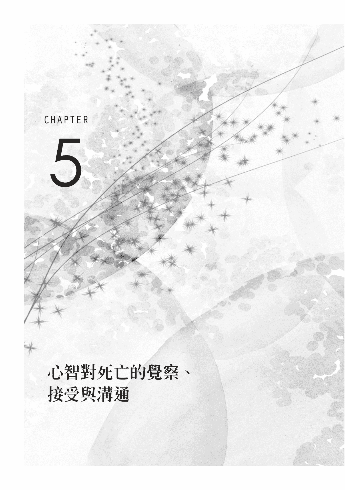

5

　　对于死亡，我们的灵魂和心智有着截然不同的态度。我在第一章中提过，我们的心智认为能掌控自己的生命，但事实上我们之所以活着，是出自灵魂的规划。肉体生来就是要设法存活的，因此我们的心智不太能接受死亡的想法，会尽全力对抗死亡！我曾经看过许多人为了延长生命，历尽各种痛苦不堪的治疗，到头来却因为这些治疗而死亡。以目前的医学技术，有许多疾病仍然无法得到安全有效的治疗，因此未来还是会有很多人为了争取渺茫的生存机会而受尽折磨。

　　伊莉莎白．库伯勒─罗斯（Elisabeth Kübler-Ross）在她那本开风气之先的着作《死亡与临终》（On Death and Dying）中指出，据她观察，末期的病患在面临即将失去生命的悲伤时，会经历五个阶段：否认、讨价还价、愤怒、绝望和接受。当意识到自己即将死去时，在前面四个阶段，我们的心智、情感、身体和灵性会发生许多变化，一直要到我们接受“我们的肉体已经无能为力”的事实，并且愿意放手时，我们的心灵才能获得平静。我感觉人们因为害怕自己一旦死亡就不存在了，便拼命设法让自己能够继续活下去。我写这本书的目的之一，就是要让大家放心，明白我们死后确实还有生命，只不过是以另一种形式存在罢了。在谈到这一点之前，我们先来看看在死亡逼近时有多少觉察。

　　在死亡前几个星期到几个月，每个灵魂的反应各不相同。当灵魂提醒我们要把所有的事情安排好时，包括公证遗嘱、与至亲好友叙旧，以及开始清理自己的物品，有三分之一的人会注意到这个讯息并且照做。另外三分之一的人虽然有意识到灵魂的提示，但并不想理会，于是没有采取行动，等到他们抵达“那边”，发现自己留给家人一堆麻烦事时，才后悔莫及。剩下三分之一的人则是完全与灵魂脱节，根本不知道他们的生命即将发生什么变化。

> 灵魂会不断给我们提示

　　我曾经教过的一个学生在五十二岁时猝死于睡梦中。由于事情发生突然，我们都以为他应该没有时间做好准备。但他的妻子告诉我，在他死前九个月，就开始很有计划的拜访所有的亲友，把先前所借的东西都归还，想要送人的东西也送走了。那些无法亲自拜访的人，就透过写信或电子邮件联络。我正是其中之一。由于我们已经十年没联络了，当他打电话来感谢我对他的教导时，我一方面感到窝心，另一方面也觉得有点奇怪。在电话中道别时，我感觉他的声音里有一种诀别的意味。除了拜访亲友之外，在他被人发现猝死的那个星期一早上以前，他也已经把所有的文件都整理好了。

　　他死后，他的妻子问我他是否已经知道自己会死了。于是，我便和他的灵魂沟通，结果他告诉我他并不知道自己快死了，但他感觉他的生命即将发生重大的变化，于是便听从自己的直觉，先把所有的事情都安排妥当。

　　我在从事疗愈师的生涯中，曾经遇见许多已经不久于人世的客户，都极力想将死神拒于门外。其中有些人确实获得了疗愈，延迟了他们的大限，但也有些人已经走到生命的尽头。然而，这些人的灵魂总是叫我不要让他们的心智知道这件事，因为他们在离开尘世之前还有一些事情要完成。灵魂担心他们的心智如果知道自己即将死去，就会陷入沮丧，不去管那些对灵魂而言非常重要的事。

　　有位客户的灵魂告诉我，她想和所有的朋友一起吃午餐，也想为她的丈夫建一座多年生植物花园，还想买一件漂亮的洋装，做为她的寿衣。她说一旦她完成了这三件事情，她就会离开。后来事情的发展也果然如她所言。

　　医生告诉我的朋友苏莉（当时她才五十岁），她只剩下三个星期的寿命时，她起初非常愤怒：“这样的事情为什么会发生在我身上？我还年轻，怎么可以这样子就死了！”但是，在她请求上帝给她六个月的时间去完成所有她想完成的事情之后，她逐渐接受了事实。后来她果然过了六个月才离开人世，在那段期间，她也确实完成了所有想做的事情。没有人能相信苏莉在死前六个月内所展现的力量与耐力，但更令人印象深刻的是她和她的灵魂对于当时的状况居然如此有共识。

　　我的另外一位好友（四十岁），则是在某一晚用完餐后起身走进女儿卧房，告诉女儿他多么以她为荣，然后又走进厨房，亲吻妻子（当时她正在洗碗）的额头，告诉妻子他爱她，接着走进他们的卧房，躺上床，之后就死了。当时我还不知道该如何与灵魂对话，因此没有机会和他的灵魂沟通，问他生前是否知道自己快要死了。我猜想他当时应该不知道自己会发生什么事，只是突然对妻子和女儿涌出了一股深深的爱意，内心有一个冲动想要表达出来。

　　在趋近死亡的过程中，我们的灵魂会不断给予这类的提示。当我们察觉到这些来自内在的无声讯息时，无论它们听起来有多么奇怪，我们都要倾听并据以行事。如果我们的心智试图压过这些来自潜意识的提示，两者之间就会产生冲突，这时就很容易忽视这些提示。

> 听从自己的直觉

　　当肉体还无法真正接受自己即将死亡的事实时，人的心智会每天反反复复，一会儿认为自己能够活下去，一会儿又认为自己必死无疑。这个时期对于将死的人和照顾者而言，都是一段非常混乱的日子。他们会变得脾气暴躁，每天哭个不停。当人在面临死亡时，哀伤、悲痛、愤怒和绝望都是必然会有的情绪。

　　如果你正在经历这个过程（或者如果你正在照顾一个即将过世的亲人），要明白这些情绪的起伏都是正常的。你要把心思放在目前拥有的时光上，做自己喜欢做的事。你在人世的生活即将成为回忆，因此要继续制造快乐的回忆，直到你在新生命中诞生为止。

　　如果你意识到自己的生命即将结束，请告诉某个你很信任的朋友或家人：你需要跟他们谈论一件很严肃的事，但并不希望他们帮你解决问题，只是需要找个人说一说罢了。请你不要为了保护你周遭的人而把事情放在心里。事实上，如果你为了不让他们难过而隐瞒，可能会让他们伤心更久。所以，要对双方都公平，对他们坦诚以告。

　　许多人会听从自己的直觉，和所爱的人展开这样重要的对话。以我的母亲为例，她在即将过世时，自然会想对我诉说她对死亡的感觉、想法、恐惧和焦虑。尽管在意识的层面，她相信她还可以活很久，但她却还是想要这么做。

　　另外一个例子，则是我的朋友里伊。当他终于接受自己即将死亡的事实时，我们便开诚布公的谈论了这件事。每当有人问他情况如何时，他总是很明确的回答：“我快死了。”信不信由你，在最后那段时光中，能够这样公开的谈论自己即将死亡的事实，对我们而言是很有助益的。当他逐渐迈向死亡时，我可以感觉到他的身体慢慢不再抗拒，取而代之的是一种平静祥和的感觉。他开始回顾他的一生，细数这辈子的种种成就。每次我和他说话时，他顺其自然、坦然面对生死的态度总是让我印象深刻。对我而言，能够像这样和一个即将死去的人谈论他的死亡，不是和别人一起假装他不会死，真的是一个令人耳目一新的经验。

　　如果你所爱的人也面临这样的状况，你要凭自己的直觉决定对他们敞开多少。如果他们排斥这样的谈话，你的直觉就会告诉你：“还是不要说吧！”但如果到了可以谈论的时候，你也会知道你可以开口了。

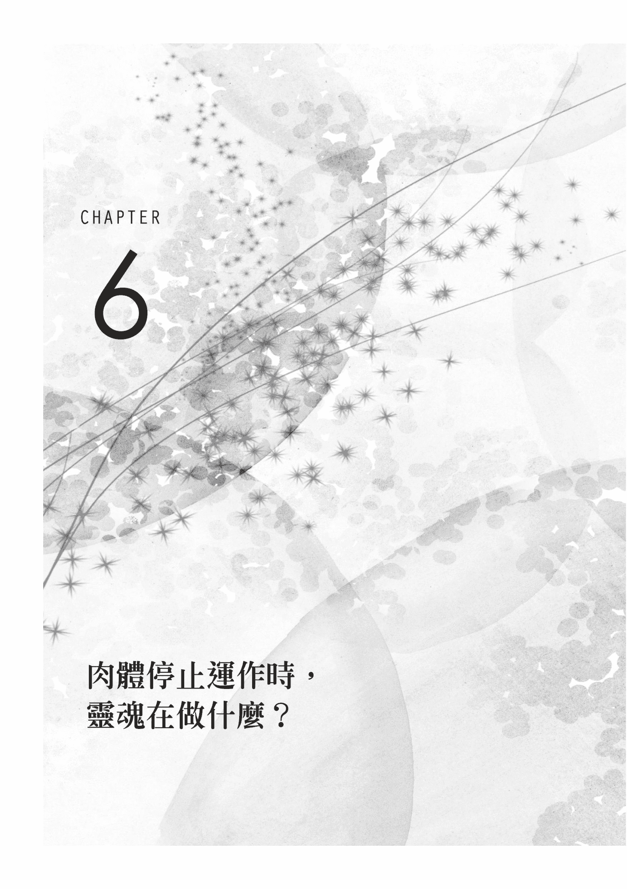

6

　　关于这个问题，答案不止一个。但当我们审视各种可能的答案时，必须考虑灵魂的几个面向。

> 灵魂离开身体时，我们该怎么做？

　　灵魂是由能量组成的，可以迅速出入身体。如果你的灵魂有一部分离开了身体，你的身体会觉得很疲倦，头脑也会昏昏沉沉的，就像下述这句话所形容的：“灯都亮着，但却没人在家。”

　　当你的灵魂完全离开身体时，那又是另外一种感觉。我听过许多人说他们半夜醒过来，想上厕所，但眼睛却睁不开，手脚也不能动。这时，他们往往会以为自己中风了，但事实上并不是，只不过他们的灵魂把大部分的能量拿去做其他重要的事。在这种情况下，最好的办法就是保持镇静，不要惊慌，然后用意念告诉你的灵魂，你的身体需要起来了。这个过程可能需要花几秒钟的时间（要看你的灵魂在哪里、正在做什么而定），但灵魂是一定会回来的。

　　在夜里，当我们的身体正在睡觉时，灵魂会跑去做很多事情。灵魂会和指导灵沟通、探视远方（如军中或国外）的至亲好友，也可能会跑去探访已故的亲友或前往最喜欢的一些地方。

　　透过观察一个人的呼吸和身体的动作，你就可以知道他们的灵魂在不在。当灵魂在身体里时，身体会动来动去，发出一些声音，呼吸也很正常。当灵魂不在时，身体就会处于静止状态，呼吸短浅，也不会发出任何声音，看起来几乎像是死了一样，只不过心脏还在跳动，胸膛也会上下起伏。

　　如果一个人死亡的过程拖得很久，灵魂往往会频繁的进出身体。当某人的灵魂离开时，最好不要试图叫醒他或要他说话。我曾经看到有些陪在临终者病榻边的亲友试着把他摇醒，以免他死去。但这个时候，灵魂会感觉有人正在拉扯他的身体。如果他当时正在进行某件重要的事情，会觉得不胜其扰。此外，身体在灵魂离开的状态下被叫醒，也会很烦，因为这时身体有很大一部分的能量已经不在了，很难和别人沟通。所以，如果你看到某人的灵魂似乎已经离开身体，请等到他的呼吸正常而且精力显然已经恢复时，再试着和他沟通。

> 身体死亡时，灵魂在做什么？

　　身体死亡期间，灵魂做的事是看他的年龄与智慧而定。年轻的灵魂往往会等到身体吐完最后一口气时才离开，但年纪较大的灵魂则多半会提早离开，尤其是在身体因为受到重大的冲击而猝死时（如车祸、坠机、溺水或心脏病发作）。这是因为当灵魂越来越有灵性、越来越进化的时候，会意识到自己不需要去感觉并承受身体上的痛苦。

　　我曾经遇到一个跳伞选手的灵魂。他的身体因为降落伞打不开而死去。当时，这个灵魂一直待在身体里面，看着自己摔到地上，四分五裂。他是一个比较年轻的灵魂，还没学会在意外发生之前先离开身体。有些年轻的灵魂缺乏关于死亡的知识。他们以为只要灵魂一直待在身体里面，身体就不会死亡，但事实并非如此。反观年纪较大的灵魂则因为阅历较深，懂得在死亡发生之前就离开身体，直接前往白光所在之处。这个跳伞选手的灵魂由于一心想要留在人世，因此在他的身体被送到太平间好几个小时之后，他还待在原处，希望镇上的法医能够缝合他的身体，让他能够继续活下去。那天晚上，他甚至还跑到法医的家里，把她从床上叫起来，要法医到太平间去处理他的身体。那位法医是我的学生。当我去了太平间，感觉到跳伞选手的灵魂还待在一个冰柜里，她告诉了我这个悲哀的故事。

　　年轻的身体里面也可能住着年纪较大的灵魂。一个十二岁的男孩滑雪时发生意外，被送到医院，装上维生系统。他有一个很老的灵魂。我和这个老灵魂沟通时，发现他已经离开病房，到了“那边”，和已故的爷爷奶奶在一起。这个情况让我明白：一个灵魂到了该回家的时候，可能会下意识的做出一些事情促成肉体的死亡，以便能够回家。这个案例里的小男孩就是这样。他明明才刚开始学滑雪，却跑到一座专家级的山丘施展身手。

　　一九九九年科罗拉多州科伦拜高中校园枪击案发生后，我察看那些被杀的青少年的灵魂，发现其中一个女孩直接进入了白光，另外一个男孩则是立刻跑到他的母亲身旁，因为他知道她一定会悲痛欲绝，很担心她会自杀。我看到他的灵魂在枪击案过后一连几天都坐在母亲床边，试着安慰她。在这些灵魂当中，有些处于震惊的状态，不明白究竟发生了什么事，也不知道自己身在何处，有些则明白这是他们的生命蓝图的规划之一。许多之前已往生的亲戚（尤其是爷爷奶奶们）试着安慰这些灵魂，并鼓励他们前往“那边”。事实上，无论我们是猝死还是拖了一阵子，我们已经死去的至亲好友都会现身，帮助我们顺利回家。

　　当死亡并非骤然发生，灵魂还有时间可以为生命的结束做好准备时，身体的睡眠时间会延长，好让灵魂能够来来去去，不受干扰。这段期间，灵魂会向我们的心智传送意念，告诉它有哪些事情需要处理。同时，灵魂也会倾听家人之间对现况的讨论以及医护人员的诊断。在这整个过程中，他也会透过意念向所爱的人传达意愿。他会利用这些人在睡觉时，直接和他们的灵魂交谈，让他们明白之后会发生什么事情。这些讯息都是透过梦境传送，而且你一定分得出这样的灵魂沟通和一般梦境的不同，因为灵魂沟通的梦感觉非常真实，让你一整天都忘不掉。

> 进出两个世界

　　即使到了临近死亡的时候，我们的灵魂还是非常活跃，因为他们必须放弃他们所创造而且居住多年（在大部分的情况下）的身体。这段期间，灵魂会定期往返于天上和人间。这有助于他们放下人间的一切。他们会看到许多已故的至亲好友热切等待他们回到天上，但同时也会看到那些还活在人世的亲友守在床边，祈祷奇迹能够发生。因此，当他们进出这两个世界时，心情就像坐云霄飞车一样！（这和我们出生时的情况类似，只不过两边的情况刚好相反。在出生时，我们在“那边”的至亲好友看到我们离开他们，来到人世开始新的生活，会十分伤心，但我们在世间的家人，则会为了我们的到来而欣喜若狂。）

　　在这里，我还要告诉你们两个动人的故事，让你们更加了解人的灵魂在身体真正死亡之前会从事哪些活动。

　　我的牧师过世的那天早上，我正在厨房里做饼干。突然间，窗帘微微的飘动了一下，我感觉有人握住我的手，同时听到一个男人的声音说：“谢谢你。”我停下手边的工作，心想这究竟是怎么一回事。过了一会儿，电话铃响了，是一个朋友打来的。他告诉我克拉布克牧师刚才过世了。我之前一直在为克拉布克牧师做远距疗愈，做了好一阵子，但最近他的身体情况突然恶化。我相信刚才是他在前往“那边”之前来到我这儿，和我握手，向我道谢，因为我对他的疗愈让他有足够的精力在死前完成所有对他而言很重要的事情。我所疗愈过的许多客户都是如此。这些疗愈可能无法“挽救”他们的性命，但却能让他们的身体有力气去完成那些对他们的身体、心智和灵魂来说很重要的事情。

　　一个星期五的晚上，我心里突然产生了一个很强烈的念头，想去看看我的朋友苏莉。当时她正因为结肠癌而住院，已经来日无多。我抵达时，她的灵魂问我是否可以帮她搓脚，然后又以非常清楚的声音问我是否愿意带她到“那边”去。这些问题让我有些吃惊，因为我不确定她要我怎么做，但我还是告诉她我当然愿意，并请她在做好离开的准备时告诉我一声。

　　第二天早上，我原本应该在九点前起床出门，去某一场活动为人通灵，当我在七点半试着要醒过来时，发现我的灵魂完全离开了我的身体，正在星光界（astral plane）─位于世间和“那边”之间的一个空间。我想打电话给我的事业伙伴，告诉她我会赶不上那场活动，但我的身体却几乎动弹不得。幸好后来我还是勉强办到了。打完电话后我回到床上，砰一声躺了下来，一直呼呼大睡到下午四点半为止。当我逐渐醒来时，听到一个声音说：“去割草吧！”

　　我一片茫然，不知道花了多久时间才恢复意识。一旦我的意识恢复之后，立刻走去外面割草。在院子里走动时，灵魂逐渐回来了。这是因为割草的动作有助于让身体和大地接触。当我的意识完全恢复时，我开始了解自己这一整天到底做了什么事情。

　　原来是苏莉的灵魂和我的灵魂在星光界会合，她带我去她最喜欢的一些地方。我们去北边她成长、上学、和朋友厮混的地方。我们慢慢走着，四处浏览。她很兴奋带我参观那些对她有特殊意义的地方，然后我们进入白光，穿越隧道，到了“那边”。当时，我们两个都刚刚戒掉酒瘾，而我们在“那边”所看见的第一个人便是我们在匿名戒酒会的协助人比尔。他过来跟我们打招呼，我们都很惊讶能再看到他！苏莉笑得很开心。之前我们有许多朋友因为酗酒而失去生命。此刻他们都一个一个过来迎接苏莉。对于我们两人来说，这都是一次非常美妙的经验。我很庆幸自己能够参加这次团聚。

　　我继续割着草，感觉自己的身体越来越强壮，不久就清清楚楚的想起了当时所发生的事。现在我的任务已经完成，苏莉已经到了“那边”，和她的家人和朋友在一起了。我离开之前，问了她她的身体是否已经停止运作。她说她的心脏很强，还得花一天的时间才能走完这个过程。后来，她果然在二十四小时之后过世。

> 为什么有些人的死亡过程拖那么久？

　　我之前说过，经常会有人问这个问题，他们一直守在临终的亲人床边，但病人却拖了好几天、甚至好几个星期才咽下最后一口气。他们经常问我，上帝为什么不让病人早点死去，免得继续受苦？但重点并不在此。尽管有时我们的亲人死亡的过程显得如此漫长，似乎永无止境，但其实这正是他们所需要的，其中自有道理，我们无须质疑。死亡对于身体和灵魂而言，都是一个激烈的过程，我们应该让临终的人有充分的时间走完这个过程。我们要相信一个人何时会死乃是天意，无论在死亡过程中有多么艰辛。到了某个时间点，死亡的益处就会以某种方式显现。

　　此外，你相信也罢，不相信也罢，事实上我们并不需要一天到晚守着临终的亲人。有些人觉得他们应该一天二十四小时守在临终者的床边，直到他们过世为止。但我希望你明白，灵魂并不介意肉体死亡时身边无人陪伴。事实上，在许多情况下，当床边没有一群人哭泣或祈求奇迹发生时，灵魂反而比较容易走得开。无论你是守在临终者的床边，还是坐在家中的安乐椅上满怀爱意的想着他们，他们都可以感受到你的爱。

　　事实上，到了生命的尽头，灵魂很少待在房间里。我为别人通灵时，人们通常会问往生者是否满意亲友们最后做的医疗决定。当我问灵魂这个问题时，他们通常都茫然的看着我，仿佛在说他们根本不记得死前几个小时所发生的事。

　　有一次，我接到一个女人打来的电话。她说她的丈夫似乎在死亡的最后一个阶段被卡住了，问我是否可以到医院去帮助他跨越过去。然而，当我抵达时，他的灵魂根本不在医院附近，于是我在那里等他回来。他回来后，神色非常激动不安，因为他已经过世的母亲看到他即将“回家”，显得非常雀跃，但他的妻子却因为他将不久人世而伤心至极，让他面临进退两难的局面，不知道该如何是好。他的身体受了枪伤，他已经不想再和它有任何瓜葛，而且他也厌倦因肺气肿而呼吸困难的日子，但他太爱妻子了，无法想像没有她的生活。

　　我问他是否需要我帮忙。他说他不知道如何切断他和妻子心之间的链接，因为他已经跟妻子一起生活了四十年，从来没想过会有这么一天。最后，我问他是否已经做好离开的准备，他说他认为自己应该往前走了。接下来我又问他的妻子是否已经准备要让他走了。她说：“还没有，但也只好如此。”于是我便祈求高灵指引我该怎么做。这时我脑海中浮现了这样的情景：我拿着刀，切断链接这对夫妇之心的感情能量索。十秒钟之后，那男人就咽下了最后一口气，我也看见他的灵魂回到天堂。

> 该放手的时候

　　有一次，一个年轻人打电话来，请我去帮他八十三岁的爷爷做疗愈，因为老爷爷发生了很严重的车祸。他说爷爷是他的一切，他不能没有爷爷。这次我仍然像往常一般，在了解身体的问题之前，先确定灵魂在哪里。结果我发现这位爷爷的灵魂正站在隧道（前往“那边”的信道）里，和他已经过世的哥哥说话。后者极力劝他放弃自己的身体，一起回家。

　　有意思的是，爷爷的妻子已经在这次车祸中丧命，而且已经到了“那边”，但那些指导灵却不肯让她出来和他说话，祂们说他必须自己做决定，不是让别人帮他决定。这位爷爷看起来很苦恼，因为他不想离开孙子。我问他有何打算，他便开始向我说明他目前的身体状况。他说现在浑身瘀青，全身各处都有骨折的现象，肺部也发炎了。我告诉他，我会给他一些时间和他的哥哥谈一谈，同时我也会向他的孙子说明他的灵魂目前的处境。

　　后来，我向那位年轻人解释爷爷目前所面临的艰难处境，但他一点都不想听。他只是不断的要我为爷爷疗愈，让他好起来。几分钟之后，我回去探视老爷爷，想知道他目前的想法。他告诉我，他已经决定要回天上的家了，但要过十七个小时才会走。他要我告诉孙子，他很抱歉，他已经没有力气、也没有意愿再住在那具破旧的身躯里。十七个小时之后，他就走了。

　　我们当中大多数人都像这位年轻人一样，希望我们所爱的人能够留在这儿，不要死，不要离开我们，但是当他们的身体已经破旧不堪，灵魂也必须往前迈进时，为了他们好，我们也只能放手让他们离去，想着他们去了天堂。

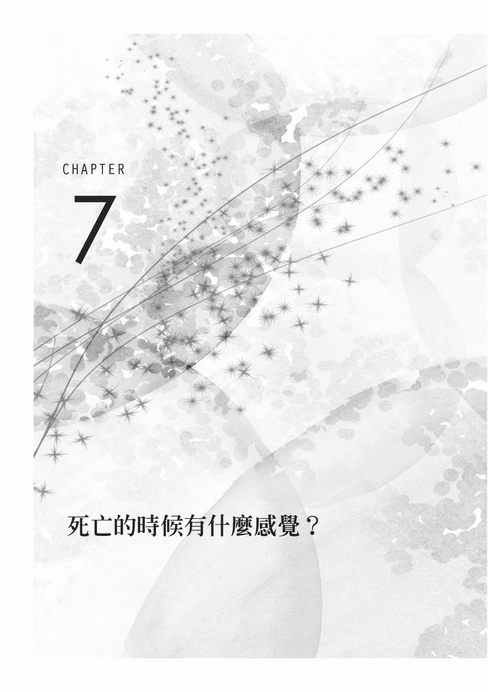

7

> 怕死而不敢死

　　几年前，一个年纪才三十出头、性情很好的男人前来找我，要我为他疗愈脑瘤。他和年轻的新婚妻子想去度假，远离医院、医生、化疗和那些忧心忡忡、让他们几个月都不得安宁的亲戚，但是他的视力有问题，走路和说话都有困难，而且他的精力就像云霄飞车一样高高低低的、起伏剧烈。我第一次帮他做灵疗时，发现他的灵魂看起来非常不安。我问他怎么回事，他说他不想谈论目前的情况，也不愿去想有关死亡的事，只希望自己能够痊愈，并且和心爱的女人一起生活。

　　那次疗愈效果非常好。他的精力恢复，视力改善，走起路来也够平稳，可以和妻子去度假（这是他们应得的假期）。但过了两、三个月之后，他又打电话来请我帮他做疗愈，因为他之前的症状全都回来了，而且现在只能躺在床上。于是，我便开始每个星期去他家帮他做疗愈。

　　他的脑瘤已经扩散了，但他还是怀抱希望，企图战胜癌症，活到一百岁。他告诉我他很怕死，也不想死，因此决心尽量延长自己的生命。当我问他为何这么怕死时，他告诉我他担心自己会“出错”。他很害怕最后那一刻的到来，而且曾经多次请我告诉他，人在死亡时会有什么感觉。

　　这种恐惧乃是来自于他的灵魂。我猜想他前世可能曾有过很可怕的死亡经验。他或许就像那位直到坠地时还不肯放弃自己身体的跳伞选手一样。或者，他曾经被活埋或惨死，而他的灵魂还没有忘却当时的感觉。如果我们的灵魂因为前世发生的事件而怀有某种情绪，而这些情绪一直没有被化解，这些感觉就会持续影响我们，直到我们疗愈完成为止（待会儿我就会谈到如何疗愈这类的恐惧）。

　　一、两个星期之后，他的家人打电话来告诉我他已经过世了。于是我和他的灵魂沟通，想了解他死时的情况。他说他感觉松了一口气，因为事情终于结束了，他也终于放下了。他告诉我，如果他早知道死亡的过程这么容易，他宁愿早点死，以免自己和家人受那么多苦。

　　我到现在还记得他的妻子在他死前帮他照的一张相片。那是我很喜欢的一张。我在照片上看到他的房间里挤满了他那些已经往生的至亲好友，还有一、两位天使。整张照片上都可以看到朦朦胧胧的人形，显示这个年轻人在死亡时并不孤独。

> 人们对死亡常有的三大恐惧

　　这件事让我开始思考“害怕死亡”这个议题，于是我便在脸书上邀请朋友分享他们对死亡的恐惧，结果有许多人回应（真是感谢他们！）。在此我想和你们分享我那次调查的结果，并且谈一谈我对人们常有的这些恐惧有什么看法。

　　有许多人说他们并不怕死。这是一件好事。但也有许多人表达了各式各样的恐惧。其中排名第一的是“离开自己的儿女，而且再也无法和他们沟通”。排名第二的是“因为发生车祸等缘故，死得很痛苦”。排名第三的则是“孤零零的死去”。另外一些人表示他们害怕自己无法呼吸、无法向所有心爱的人告别，或者害怕自己迷失在黑暗中、没有完成自己今生想做的事、盛年早逝、下地狱、被活埋或害怕不可知的未来等等。还有不少人担心他们到时会发现自己的信仰和理念全都是错的，死后根本是一场空。这次调查当然并不科学，但我猜除了我的脸书朋友之外，许多人也有这样的恐惧，因此我要针对最常见的一些恐惧说说我的看法。

　　首先，关于离开我们的儿女，是的，要抛下孩子一个人走掉，确实是一件很不容易的事。但如果这种情况发生在你身上，当你的孩子在夜里灵魂出体的时候，你的灵魂还是能够和他们的灵魂沟通，而且你仍然可以看到孩子的生活状况，只不过是在“那边”观看罢了。如果你在儿女还没长大的时候就死了，这是有原因的。或许你要等到很久以后才会明白其中的道理，但你必须相信天意自有安排。戴安娜王妃死后不久，我曾经和她的灵魂沟通。她说她的死亡是必要的，因为她的两个儿子必须由王室抚养长大。她为此非常悲伤，不希望看到这种情况，但是早在和长老们拟定她的生命蓝图时，已经同意这么做了。事实上，她生前已经尽可能照顾、陪伴这两个儿子了。看到她死后表现得如此勇敢，并且能够优雅的往前迈进，我对她感到由衷的敬佩。威廉王子曾经说他希望母亲能够目睹他的结婚典礼。我希望他明白戴安娜王妃当时确实和其他的父母亲一起在场，而且看起来是非常引以为荣的模样。

　　关于死亡，人们的第二大恐惧是：死亡的过程会有多痛苦？有一些人特别提到他们不希望历经因车祸而死的痛苦滋味。事实上，每次记者访问那些在车祸中幸免于难的人时，他们总是说根本不记得当时发生了什么事。我先前也曾提过，在即将发生会造成肉体痛苦的意外时，大多数灵魂都会先行离开。此外，大多数人在医院死亡时体内都已经有大量的药剂，而且在肉体死亡的时刻，灵魂通常都已经离开。这两种状况都会减轻死亡的痛苦。

　　排名第三的恐惧是害怕自己会孤零零的死去。先前那位得了脑瘤的年轻人也有这样的恐惧，因此他的家人才会日夜陪伴着他。如果这也是你担心的事情之一，请你想一想他妻子所拍的那张相片。相片中所有已故的至亲好友和天使都站在病人的床边。当然，你可能会在无人陪伴的状况下死去（当时你的家人可能刚好离开房间，或者你没有任何亲友可以陪你），但我可以向你保证：没有人会孤零零的死去。你那些已经过世的至亲好友都会围在你的身旁，等着带你回天上的家。

> 体验死时的轻盈滋味

　　我建议你可以做两、三件事情，帮助你体验看看死亡时的感觉。你可以到附近的一家戏服店去，问他们哪一套戏服最重，然后你就把它穿在身上，并且四处走动。如果老板许可的话，你也可以穿着戏服或坐或躺。试着体会穿着这套戏服走来走去的感觉，看看它有多么累赘。当你四处走动，充分体验这种感觉时，试着想像你在过去五十、六十乃至八十年的时间里，一直都穿着这套戏服，然后你再把它脱掉，注意看看自己变得多么轻盈─这就是灵魂挣脱肉体时的感觉。有些科学家认为灵魂的重量是两盎司。如果这是真的，请你想像一下当你不需要“穿着”你那沉重的身体时，那将是何等美妙的滋味！

　　你也可以试着这么做：坐下，背往后靠，闭上眼睛，做两、三次深呼吸，让自己感觉舒服而放松。然后，在脑海中想着附近的一棵树，想像你飘浮起来，飘到那棵树的枝头，坐在一根树枝上。想像树叶轻轻的摇曳、微风拂过脸庞的感觉。看着那些小鸟，注意它们的行动多么轻松容易。当小鸟想要去某个地方时，只要张开翅膀飞过去就行了。试着想像你坐在那根树枝上，感觉自己是多么的轻盈。

　　现在，再想像你自己从树枝上飘下来，回到椅子上，并进入身体里面。感受一下此刻你身体的重量。当你坐在树上时所感受到的那种轻盈，就是当你死去、灵魂离开身体时的感受。我们目前无法感受到那样的自由，是因为仍然被拴在身体里面。我在第一章中曾经提过：有一条类似脐带的银索把我们的灵魂和身体绑在一起。当死亡发生时，这条银索就会被切断。这时你就再也不必回到你在人世的沉重身躯了。

　　请记住：你的灵魂几乎每天晚上都会离开你的身体，因此即将死亡时，灵魂并不至于像我那位客户所担心的会“出错”。当我们准备接受自己的死亡时，我们的灵魂只不过是最后一次飘到身体外面罢了。

> 疗愈你对死亡的恐惧

　　如果你对死亡很明显的怀有恐惧，我希望你能大声和你的灵魂对话，叫灵魂放掉这种恐惧。提醒灵魂这样的恐惧是来自过去的经验，而那样狂暴激烈的经验已经过去，不会再发生了。如果你的灵魂还是难以摆脱这样的恐惧，我建议你去找一个声誉良好的疗愈师，帮助你的灵魂摆脱昔日的伤痛。

> 一个真实的濒死故事

　　最后，我想和你们分享我在脸书上调查时看到的一则故事。那是布兰达写的：

　　害怕死亡？一点也不会呢！这或许是因为我已经有三次被宣告死亡的经验了。从医学的角度来说，我在出生的时候就已经死了，经过一群医护人员急救之后，我才有了反应。我五岁时，开刀摘除扁桃腺，但医生不小心伤到某个地方，造成我体内出血，心脏也因此停止跳动。当医护人员用推床推我经过护理站时，一个护士看了我一眼，发现我的脸已经开始发紫。他们替我注射肾上腺素，又把我整个人倒吊起来，才把我救活了。

　　直到今天，五十三年前的那次经验仍然历历在目。当时我感觉自己好像泅泳在一池黏黏的泥浆中，试着要游到一处空地。游啊游的，突然间我来到了一个温暖而吸引人的空间。后来，我虽然醒过来了，但还是很想回到那里去，因为那里让人感觉如此的温暖。

　　七岁时，我得了很严重的风湿热，在三年半之内就住院好几次。八岁时（当时我还在住院），医生们帮我动了一次所谓的探查性手术，因为他们认为如果能够彻底检查我的身体内部，或许就能够了解我得的是什么怪病。在手术过程中，我的心跳再度停止，但这次不知道为什么我比从前更能掌控自己的状况。那是一次很奇妙的灵魂出体经验！感觉上我好像坐在手术室的大灯上，看着下面所发生的事情。

> 我之所以不害怕死亡是因为：我在上面看着医护人员竭力抢救我的性命后，医生宣告我已经死亡，有两、三位护士因此非常紧张，有一位甚至哭了起来，但当时我却有一种非常美妙的感受，我可以听见所有的声音（真的是所有的声音！）。除了医护人员在手术房里的对话和动作之外，我仿佛还听见了爱尔兰的雨声、非洲鼓声、风声、鸟语、各地人们熙来攘往的声音、喇叭声、婴儿伊呀呀呀的声音，甚至包括那些你以为没有声音的东西，像是彩虹、星星、海床上的小石子等等的声音。最棒的是每一种声音听起来都清清楚楚，并未混杂在一起。同时，我其他的感官也都变得非常灵敏，可以摸到、闻到所有的东西。

　　布兰达还告诉我：后来她向医护人员描述她飘浮在身体的上方时，在手术房里所看到的一切，包括他们说了什么话，为她做了什么事等等。他们都很惊讶，因为她描述的情况相当准确。我希望你们读了布兰达的经验后，能够相信死亡真的一点都不可怕。

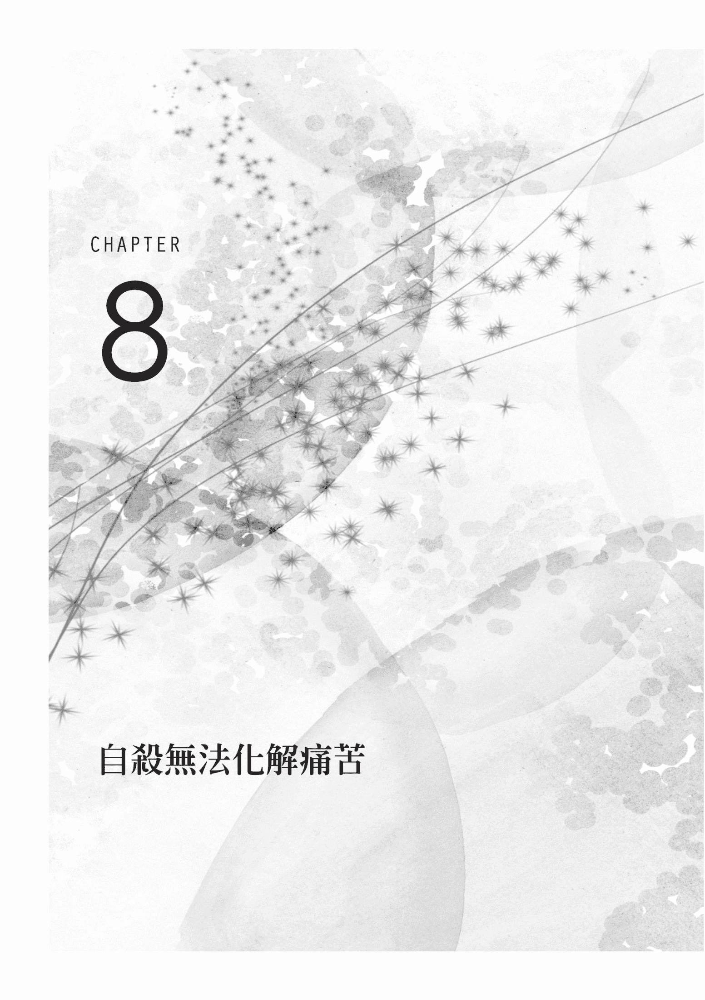

8

　　自杀是人们用来了结自己身体、心灵和情感上的痛苦的最后手段，但不幸的是，那些心灵和情感上的痛苦也存在于灵魂之中。因此，他们虽然想以自杀的方式来解除痛苦，却不可避免的把那些痛苦带到了“那边”。我曾经帮许多客户驱离自杀者的鬼魂（我已经把这些经历写在《真的鬼故事》〔The Little Book of True Ghost Stories〕一书里）。看到那些灵魂在结束自己的生命后仍然处于痛苦的状态，我总是感到很难过。

　　我从小就抑郁寡欢，到了二十岁出头就成了一个酒鬼，用酗酒的方式对抗沮丧。这是很愚蠢的做法，但我当时就是这么做的。那段期间，我心里一直有自杀的念头。我心想：当我痛苦到受不了时，至少还有一个方法可以让我解脱。这样的想法让我觉得挺心安的。有一晚，我拿了一杯水和一瓶“烦宁”镇静剂坐下来，想要结束我的生命，但却在脑海中看到了一片黑暗的景象。同时，有一个声音对我说：如果我真的自杀，这就是我将面对的景象。那黑漆漆的景象看起来如此孤寂而冷清，显然不是我想要的解决方式，让我很生气。不久之后，我就加入了匿名戒酒会。之后的那几年当中，我找到了许多很厉害的疗愈师和医生。在他们的帮助下，我的忧郁症终于好了。

　　我们的灵魂所感受到的痛苦，是前世没有解决的问题累积而成。这些问题都有待我们去处理。还记得在产房里带着九只手提箱的问题到今生来疗愈的那个灵魂吗？如果我们带着没有化解的痛苦（无论是心灵上还是情感上的）结束生命，我们就会变成像他那个样子：我们会把这些痛苦带到来世，希望最终能够得到疗愈。

> 自杀的人可以上天堂吗？

　　我想自杀时看见的那片黑暗，并不一定是自杀的灵魂会去的地方。我认为那只是在告诉我：如果我自杀，我的心灵将会处于一片黑暗的状态。有些宗教宣称，自杀的人在他们“预定”离世的日期到来之前是不能进天堂的。但这种说法并不正确。无论我们在什么时候死亡或以什么方式死亡，上帝都会欢迎我们回到天家。

　　自杀者的灵魂如果留在世间，是出于自己的选择。他们大多数是因为自己选择了结，没有完成来到人世的任务而觉得很难为情。有些灵魂害怕自己会因为自杀而下地狱，有些灵魂则相信自己没有资格上天堂，因此不做任何尝试。他们的指导灵会试着说服他们回家，但不一定能成功。一般来说，这些指导灵无法强迫任何人做他们不想做的事，但如果一个人因为服药过量而死亡，而且灵魂处于无意识的状态时，指导灵会把他的灵魂带到“那边”的一所医院里，让他待在那儿，等他清醒后就会得到必要的协助（关于这点，我将在第十一章中详述）。不过，并非所有服药过量的人都是意图自我了结生命的。有些灵魂是在死后才发现自己因为服用太多的药物而死亡，因而深感哀痛。所幸天堂里有很棒的照顾者会在这段期间陪伴、协助他们。

　　当媒体报导了演员大卫．卡拉定（David Carradine）在二〇〇九年意外自杀的消息时，我曾试着和他的灵魂沟通，看看他的状况如何。当时他完全搞不清楚是发生了什么事。将近两天之后，他才意识到他已经不小心杀害了自己，并不是在做梦。他的灵魂不肯离开那座衣橱（他的遗体被发现的地方），因为他相信只要能从这场恶梦中醒过来，就会没事。连着两天的时间，他一直不愿意承认自己的生命已经结束。我听到他说了好几次：“如果我能醒过来就好了。”但是他的肉体当然已经醒不过来了。

　　当年我的忧郁症逐渐好转的时候，认识了一个好朋友。他也是大半生都受严重的忧郁症所扰，曾经尝试过很多种治疗。有一天晚上，他在绝望中终于服下大量药丸，企图结束自己的生命，但被几个朋友发现了，因此被送进了医院。这件事情让我很难过，因为我们已经成了挚友，我一直以为他已经慢慢康复了。最后他被装上维生系统。有一天，他的灵魂来找我。他显然知道自己在做什么，打算结束自己的生命。他请我打电话给那些替他做医疗决定的朋友，告诉他们他希望把维生系统的插头拔掉。他气他们多管闲事，现在他只想到“那边”去过活。

　　于是，我便开始祈祷，请指导灵教我该如何把这件事告诉他的朋友，因为我实在不确定他们会有什么反应。所幸，过了大约半小时之后，他的一个朋友就打电话来，问我是否可以和他沟通，了解他希望他们怎么做。于是，我趁机向他们转述了他的想法。当天晚上，他们就拔掉了维生系统的插头，不久之后他就死了。

　　这些年来我不断和他沟通。他看起来似乎过得不错，只是头上有一圈“自杀光环”（suicide aura）。这是一股由未竟之事和悲哀的情绪所形成的能量，我在其他自杀者的灵魂身上也曾经看到过。有两、三次，我问他是否后悔结束自己的性命。刚开始时他总是迟疑，但后来他说他并不后悔，因为那是他必须做的事情。

　　但不是每个人都像他这样想得很清楚。我有一个客户名叫凯西。她一直在忧郁症、酗酒和毒瘾之间挣扎着，虽然经过十几次疗愈，但仍然没办法解决。她曾经企图自杀过两、三次，但每次都及时被发现。最后她的家人把她送到一所机构去接受长期的治疗。大家都希望她这次可以康复。她是个很善于说服、操控别人的人，因此当我听说她在一个晴朗的星期六下午，成功说服疗养院的一位实习医生让她出去外面散步时，并不感到惊讶。结果那次她就走到院舍的屋顶上，从那里跳楼自杀了。她显然已经下定决心要了结自己的生命。我猜这不仅是为了她自己，也是为了她的家人。

　　当我接到电话，听说了她的死讯后，立刻试着和她的灵魂沟通，看看她现在过得如何。但她昏昏沉沉的，以至于我完全无法和她沟通，只知道她的情绪很恶劣。看到她并没有获得她原先所追求的平静，让我感到很难过。有几次我试图和她联络，看看她过得如何，但总是受到静电干扰。这表示她希望拥有自己的空间，不想被别人打搅，于是我便不再吵她了。

> 自杀的灵魂最后悔的事

　　那些自杀者的灵魂告诉我他们最后悔的事情就是：他们自杀，是想获得平静，不再受到讨债公司和贷款公司的骚扰，不再受疾病、忧郁症、酒瘾、药瘾和感情创伤的折磨，不再需要听父母亲的唠叨，也不再会被人欺负，但他们没想到的是：一旦自杀了，事情就没有挽回的余地了。他们到“那边”之后，没有人向他们讨债，不用担心自己的房子被法拍，他们心里的创伤开始痊愈，那些欺负他们的人也不算什么，于是他们就准备要回去。

　　这时，他们才意识到自己已经回不去了。死亡并不是让你可以有两个月的时间喘一口气，暂时逃避生命中的麻烦事。我们无法让生命暂停，等到风平浪静之后再继续。当自杀时，生命就从此完结，身体将不再存在。

　　幸好有许多自杀的人最后并没有死。举个例子，曾经有一个男人前来找我帮他做疗愈。在那之前，他曾经自杀未遂。他很小心的把所有事情都安排好，要利用室友不在的几个小时空档服药自杀。

　　他写了一封遗书给家人，说很对不起他们，但他已经无法再忍受被忧郁症折磨的日子了。他把所有的事情都安排好之后，服下大量药物，躺了下来，等着在天堂门口见到圣彼得。然而，当他醒过来时，却发现自己置身于急诊室。原来当天他的室友忘了带东西，所以又跑回去拿。

　　从这次自杀事件，我看出他太全神贯注于工作，忘记其他事情也很重要。为了糊口，他一天到晚都在工作，但还是无法出人头地。他自杀，只是因为不想再过那样的生活。当他意识到自己居然走到自杀这一步的时候，简直吓坏了。他说他要改变自己的生活形态。首先，他要减少工作的时间。其次，他要想尽办法把自己的忧郁症治好。他说这些年来他曾经做过一些治疗，也断断续续服用过一些药物，但都不持久。他要在这方面做个改变。

　　做了几次疗愈之后，他整个人慢慢改变了，变得越来越快乐。他调整了他人生的优先顺序，开始发现各式各样的可能性。他是一个好人，会为这世界做出很大的贡献。所以，我真的很高兴他的室友那天忘了带东西！

　　如果你为忧郁症所苦，我要衷心的劝告你，不要为了终止痛苦而结束自己的生命。那种绝望的感觉是来自你的灵魂，而你来到今生很可能就是为了要得到疗愈。请你和你的医生谈谈，看看是否有一些比较好的药物可以帮助你平衡体内分泌的化学物质。如果你已经在服药，而这些药物对你没有什么帮助，请务必要告诉你的医生（医生们不会读心术，不可能知道你的情况，除非你告诉他们）。然后，请去找一个称职的谘商师来帮助你。这位谘商师必须真正了解忧郁症，不会任你反复的述说那些老掉牙的故事。他必须要能碰触到你痛苦的核心，帮助你疗愈。

　　这个过程中，你可能需要多找几位谘商师试试看。我之前的几位谘商师只会让我坐在那儿，不停告诉我我的生活有多悲惨，然后很高兴的收下我的钱。后来，我找到了另外一位谘商师。她第一次看诊时就告诉我，她不想靠我的忧郁症来付房贷。她希望我能被治好，回去过正常的生活。她没有兴趣听我一再述说那些陈年往事，而是想了解我对那些事情的感受。这时我才真正开始获得疗愈。她改变了我的忧郁症循环，而她所做的那些努力都有了成果。

　　除此之外，我也建议你阅读《我的疗愈书》（My Big Book of Healing），这是我为了帮助人们克服各种挑战（包括忧郁症）而写的一本书。阅读这本书将会帮助你认清自己有哪些问题需要解决。

> 与自杀亲友的灵魂沟通

　　如果你认识的人最近自杀了，请试着和他们的灵魂沟通，帮助他们获得疗愈。他们现在可能正处于困惑迷惘的状态，你的引导可能会对他们很有助益。在和他们接触并链接时，可以遵循以下这几个原则：

> •大声念出他们的名字，尽可能和他们搭上线。

> •请他们前往白光所在之处。告诉他们不要担心，他们会在那里得到他们所需要的帮助，不会受到审判。

> •让他们知道你没事（这会让他们比较安心），而且你已经原谅他们了。你可能要过一段时间才能发自内心的说出这些话，但是当你已经真的原谅他们的时候，一定要告诉他们。

> •等到他们已经在“那边”待了一段时间之后，你可以告诉他们你对他们的死有什么感觉。不过，在刚开始的时候，你的重点是要使他们安心，让他们知道只要走向白光，就可以回到温暖的家了。

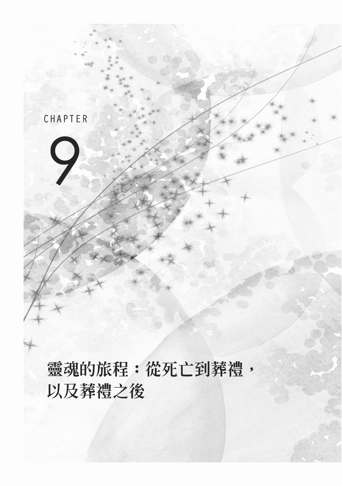

> > > > > 9

　　从我们死亡那刻一直到葬礼举行时，我们的灵魂到底在做什么？这点因人而异，而且和我们对天堂、死亡的想法与期待有关。较老的灵魂通常会直接上天堂（因为他们已经有了许多这方面的经验，知道这是怎么一回事），然后再回来参加葬礼。年纪轻的灵魂则往往会逗留在人世，并且可能陷入愤怒、憎恨或悲伤的情绪，一直在原地打转，等到一段时间之后才能够前进。如果他们是被人杀死的，那么他们也可能会留在人间，伺机复仇。有些灵魂是因为担心家人（尤其是孩子）的状况或自己的身体而不愿离去。有些灵魂则是因为对自己的死亡感到困惑，才留在这里。下面有几个例子。

> 灵魂会参加自己的葬礼

　　最近我一位好朋友的姊姊突然去世。她才四十六岁，有一天躺下来睡午觉之后，就再也没有醒过来。那位朋友联络我后，我就立刻和他姊姊的灵魂联系，结果发现她处于一种非常脆弱的状态，不清楚自己究竟发生了什么事。她想知道自己为什么会死，是不是因为她做错了什么事，所以受到惩罚？她的指导灵请我让她的弟弟和她说话，让她明白并没有做错事，只不过在人世的期限已经到了。同时，指导灵也请他鼓励姊姊朝着白光前进。

　　由于我的朋友非常关心他姊姊的情况，因此接下来那五天，我每天都会察看她的灵魂。我发现她后来的情况就像是毛毛虫变成蝴蝶一样。其中很重要的一个原因是：这一边没有人哀求她回来和他们在一起，因为这样会拖住她的能量。此外，那些指导灵也坚决要求她的家人至少等到五天之后再帮她举行葬礼，让她能够休息，以便有足够的力气参加自己的葬礼，而她的家人也照办了。

　　我之前已经说过，身体死亡后的那两天，我可以很清楚的看到死者的灵魂。但通常到了第三天，那道隔开生死的罩纱就闭拢了，以便让灵魂可以在“那边”进行调养，因此我们这边的人自然就看不到灵魂了。通常要等到葬礼举行时，我才能再度看到这些灵魂。

　　麦可．杰克森（Michael Jackson）去世的那一天，我和他的灵魂联络，结果出乎意料的发现他很清醒，而且对自己已经死去这件事似乎一点儿也不惊讶。他觉得事情本来就该如此。我很讶异他如此坦然接受自己的死亡，因为在我的心目中他还很年轻，在人世还有很多事物（包括他的孩子、家人以及他的创作才华等等）等待他去体验，但他的灵魂却显得如此平静，一副已经得到解脱的样子。尽管我并不希望他就这样死去，但还是替他感到高兴，因为我发现他的灵魂非常进化了，而且人世的生活对他而言是一场磨难。他很庆幸他的生命已经结束，因为除了他的家人之外，很少人真正了解他。

　　两天后，我再度察看麦可．杰克森的灵魂，看看他过得如何。令我高兴的是，我看到他正和“猫王”艾维斯．普里斯莱（Elvis Presley）一起坐在一块大石头上，前面有一条湍急的小溪，后面是一片苍翠的绿地，气氛幽静、安详且充满能量。他们交谈的模样像是两个相识已久的灵魂伴侣，来到人世执行相似的任务，因此两人很有得聊。后来，当我再度试着和杰克森的灵魂沟通的时候，发现那道罩纱已经合拢，但他散放出一种非常平静的能量。感觉上“那边”似乎也有很多灵魂想看他，但他被隔离了起来，并未受到干扰。

　　后来，他参加了自己的葬礼。看到这么多人前来为他送行，他不胜感激，也非常谦卑。他之前因为遭到不实的指控而受伤的心，也因着这场葬礼以及人们对他的重视而得到疗愈。他很欣慰他的孩子能由他的母亲抚养，也相信他们今后将能够像一般的小孩那样上学、交友、和家人相处，不会像他小时候那样生活在压力之下。他觉得他的母亲会善待他们，也认为孩子跟她一起将更能过着正常的生活。

　　好几年前，我曾经和法拉．佛西（Farrah Fawcett）一起上过电视。当我听到她过世的消息（她和麦可．杰克森同一天去世）后，曾经和她的灵魂沟通，了解她的状况，结果发现她的母亲和娘家所有的亲戚都陪伴着她。他们围绕在她身边，将她还在沉睡中的灵魂带到“那边”，甚至在她的葬礼举行之前的那一整个星期都陪着她，替她隔绝阳世的人在无意间传送给她的悲伤能量。

> 死后选择留在人间的灵魂

　　两、三年前，我受到一家葬仪社的委托，遇到了几个流连不去的灵魂。当时，那家葬仪社的主管宣称他听见地下室的一个房间里传来奇怪的声音（有人敲墙壁、有东西掉落、还有人在使用工具的声音），因此希望我能前往调查。我到了那儿后，感觉不止一个灵魂逗留在那里，于是我便告诉那位葬仪社的主管，希望能巡视整栋建筑物。

　　我走过一楼的房间时，遇到了一名男子的灵魂。他的葬礼已经在那天上午举行完毕。只见他坐在之前放置他的棺木的地方，神情非常哀戚。我问他为什么会在那里，他说他只是想“待在这儿，直到下午两点的仪式结束为止”，之后他就会前往白光所在之处。我问葬仪社的主管，他们下午两点是不是要帮他举行什么仪式。他说那人的遗体预定在中午火化。话才刚说完，电话铃就响了，是火葬场的人打来的。他们说要等到下午两点才能处理那个人的遗体。我对那个灵魂表示我为他目前的境况感到难过，也告诉他到了“那边”之后他就可以安息了，不过我也明白他失去自己的身体，自然会感到悲伤。说完后我就和他道别，走下楼梯。

　　经过地下室的大厅时，我看到入殓房里，有一个女人的灵魂正坐在一具遗体的旁边，靠近头部的地方。我问她在那里做什么，她说她想看看礼仪师有没有把她的发型做好，而且她现在不想和她的家人在一起，因为他们正在吵架。

　　我告诉葬仪社主管有关这个女人的事。他咯咯笑了好一会儿。他说他和这个女人已经认识了大半辈子，知道她确实很在乎她的发型，而且她的家人也确实正在吵架，所以他可以理解她为什么不想跟他们在一起。不过，那些奇怪的声音并不是从那间入殓房里传出来的，所以我继续前往其他的地方察看。

　　在葬仪社的维修室里，我看到了一个男人的灵魂。他告诉我他从前在这里担任工友，又说他成年后一直都在这里上班，负责整栋建筑物的维修工作。他说他知道有关白光的事，但他想留在这儿，继续打理这个地方。这正是灵魂（或鬼魂）死后选择留在人间，不愿去到“那边”的一个例子。后来，葬仪社的主管也证实那些奇怪的声音是从工友室里面传出来的，而且是在这个男人死后不久才开始的。这位工友虽然坚称他还没准备要离去，但已经答应我们不再制造噪音。

> 生死齐聚一堂

　　人们经常问我：我们的灵魂是否会参加自己的葬礼？答案当然是肯定的。除了极少数例外（这部分我将在这节末尾做说明），绝大多数的灵魂都会参加自己的葬礼。我甚至不记得我从前参加过的葬礼当中有哪一次没有看到当事人的灵魂。我还曾经见过全家人陪着他们所爱的人从“那边”过来参加葬礼，可以说是一场数代同堂、全员出动的家族活动。

　　最近我参加了我的朋友丹尼（就是那个曾经换肝，但在两、三年后死于癌症的人）的守灵仪式。丹尼是个非常外向、喜欢交际的家伙，生性幽默风趣，有一脸迷死人的笑容。无论一个房间的气氛如何，只要有他在，一定满室生辉。因此，当我抵达守灵仪式的现场，发现他并不在那儿的时候，委实有点惊讶。我甚至到处找他，看他有没有在别间房间里。因为像他这样的人如果没来参加自己的守灵仪式就太奇怪了。找了一会儿我就放弃了，开始跟几个我们共同认识的朋友聊起之前丹尼拍摄的纪录片。就在这时，我突然在脑海里听到他的声音：“搞什么嘛！”让我忍不住笑了出来：他显然在场。我环顾四周，发现他正站在棺木边俯视自己的遗体。

　　我不知道葬仪社的人到底是怎么处理他的遗体的，但他的样子看起来真的很糟糕。他原本瘦削的脸颊变得肿肿的，眼睛和嘴巴都成了一条细缝，不忍卒睹。只见他的灵魂站在那儿，俯视自己，嘴里咕哝着：“搞什么嘛！”

　　我看着他走到在场的每一个人身边，听他们在说些什么，同时也热切的聆听每一个刚抵达的人所说的话。这样的场面让他很激动，有时候甚至不得不走到房间外面去。

　　他的葬礼在第二天举行，虽然我无法参加，但我那有通灵能力的弟弟麦可是扶灵人之一。他告诉我那是一场很棒的葬礼，融合了天主教与爱尔兰人的传统，而且丹尼全程参与。

　　在我所参加过的葬礼中，还有一场也很令人难忘。那就是我母亲的男友杰瑞的葬礼。当仪式结束，我们开始享用午餐时，杰瑞站在我旁边说道：“嘿，真不公平。这明明就是我的葬礼，可是我却什么东西都吃不到。”杰瑞最出名的两项特质便是：他很爱吃，而且很有幽默感。那天他不断嗅着所有的气味，穿梭在桌子中间，聆听朋友们诉说关于他的往事。看到他的朋友和家人共聚一堂，他高兴极了，甚至不介意当天他们“租来”为他宣读悼文的牧师，把他的生平事迹完全搞错了。

　　这场葬礼最特别的地方在于：杰瑞生前曾经要求他们在他的葬礼上播放〈当圣徒勇往直前〉（When the Saints Go Marching In）这首歌。当他们开始播放时，他的灵魂便带着一脸灿烂的笑容开始在走道上跳舞。他生前很长一段时间身体一直不太好，因此看到他置身在所爱的人之中，恢复了健康，甚至沿着走道跳起舞来，真是令人欣慰。就一场葬礼而言，这也是一个很棒的结尾。

　　也有少数灵魂不参加自己的葬礼。主要的原因有两个。首先，这对他们来说太伤感了。这些灵魂很难接受自己的死亡，因此本身就处于极度悲痛的情绪中。其次，他们太虚弱了，无法参加。这种状况可能会发生在当事人死亡的过程拖得很长而且极力试图延长生命的时候。此时灵魂的能量可能已经被肉体吸收殆尽，因此必须在“那边”尽量的休息调养，重新恢复灵魂的能量。

　　“那边”最大的好处之一就是气氛很放松。如果灵魂没参加自己的葬礼，事后只要愿意的话，随时可以回头观看葬礼的过程，就像看电影一样。之后，当灵魂们进行今生回顾（life review）时，葬礼也是他们要回顾的部分。这时灵魂会坐下来，和长老们一起观看自己的阿卡西秘录，检视他这一世的生命蓝图，评估他进步的程度：他原本希望能完成哪些事项？他是否真的去做了？灵魂成长了多少？他在世时是否曾经弥补他对别人所造成的伤害？他这一世又曾经透过哪些善事或坏事造了新的业力？

> 远离旧居，向前看

　　我发现，灵魂在葬礼过后往往会立刻消失，几个星期至几个月之后才再度出现。有一天，我在院子里边割草边想着这件事时，脑海中突然响起我的指导灵天使莉莉的声音：“搬家之后，最好不要立刻回到原来住的地方。”接着我想起了一件往事：我十四岁时，我们家从一个住了很久的社区搬到一个新开发的郊区，我也因此离开了所有的朋友。

　　我不想搬家，但我的父母说这是千载难逢的机会，时间点也刚刚好。他们又说只要我们愿意，随时都可以回去探访我们的老朋友。然而，在搬家之后，我发现父母显然希望我们把心思花在新的社区上，和那里的孩子交朋友。

　　当时我觉得这对我很不公平，因为我很想念从前的生活，也很想和我之前认识的朋友在一起，但我的父母一直敦促我们将心思放在新环境，试着交一些新朋友。过了一阵子之后，原来的社区感觉起来就变得很遥远了。这时我才明白为什么我们要努力认识新家和新朋友，因为这样它们才有机会变得像老家那样特别。这已经是五十年前的往事。如今我还是偶尔会抱着怀旧的心情回去拜访那个老家。我在童年时期所住过的这两个地方都留下了美好的回忆。这要感谢我的父母教导我们如何向前迈进。

　　我继续割草时，脑海中突然灵光一闪，明白了长老们为何总是鼓励灵魂要向前看，进入他们的新生活。因为灵魂必须要这样才能成长。长老们并非故意不让灵魂和在世的亲友见面。事实上，灵魂比所爱的人早死，后者必须过着没有他们的生活是有原因的。灵魂越早停止拜访他们在世的家人并且向前迈进，他们成长的速度就会越快。

　　有许多人问我：在至亲好友的葬礼过后为何感受不到他们的灵魂？现在我明白了，这是因为灵魂需要离开人世一段时间，然后再回来探访亲人。他们会因为失去这一世的生命以及他们所爱的人而哀伤，因此必须远离旧居，才能逐渐从这样的哀伤中走出来。等到他们已经在“那边”待了一段时间，和这一世的生命已经没有情感上的链接时，才会再度现身人间。

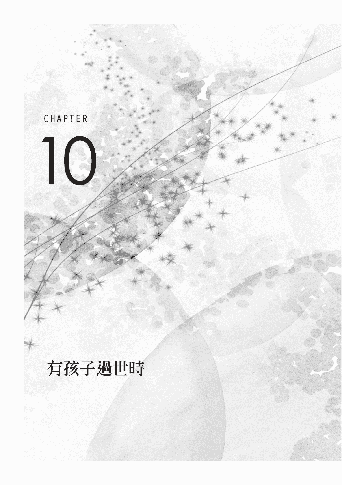

10

　　我在灵媒的生涯中所学到的一件事就是：绝不要以为活着是一件理所当然的事。但很不幸的，人们往往都是这样。成天忙忙碌碌，日复一日，以为生活永远不会改变，以为在乎的人会永远待在我们身边，但这并非我们来到人世的目的。我们的灵魂之所以选择来到今生，是为了获得若干特定的经验。当完成这些任务时，我们的灵魂就回家了。我们在人世停留的时间有限，同样的，我们生命当中的那些人也不会永远存在。

> 正面的影响

　　孩子过世时，总有人会说：“怎么可以让白发人送黑发人呢？”我听到这样的话时，总是无言以对。事实上，没有任何一个小孩生下来就保证会长命百岁。是的，如果世间的父母都不需要看着自己的孩子死去，那该有多好，只可惜人世的生活并非如此。

　　我另辟一个章节，专门谈论孩子的死亡，是为了两个原因。首先，我想让大家明白：当你生下一个孩子的时候，这个孩子是带着他的生命蓝图来报到的。蓝图上面已经规划了他想要、也需要体验的各个事项。选择你为父母，是为了能在这个家庭里学习并获得各种生命经验，但这并不表示他们打算在这里待很久。

　　我曾经听到痛失子女的父母亲说道：“她永远没有机会参加学校的舞会，也永远没有机会披上婚纱了。”但我可以向你们保证：如果这些经验对于这孩子的灵魂来说是重要的，她一定会留下来体验的。同样的道理也适用于子女在战争中丧命。我们或许很难接受这个事实，但死于战火之中乃是他们的计划之一。他们想要体验军旅生活，尽量从中学习。之后他们的任务就结束了。

　　这些话听起来或许冷漠无情，但这完全不是我的本意。我在听到一个孩子过世的消息时，也必须时时提醒自己，这是孩子以及他们家人生命蓝图的规划之一。最近我看到一则报导：一个十五岁的女孩和男友一起坐在公园里等候巴士时，驾驶突然失控，车子开进公园撞死了她。之后那几天，我一直想着那个可怜的家庭。这样的悲剧居然会发生，真是一件很可怕的事情。

　　这个月在双城区，有两个三岁和五岁的小男孩分别在帮派事件中遇害。一个灵魂选择如此短暂的一生，并死于这样的暴力事件中，原因之一就是要唤醒社区人士，让他们设法改变现状。同样的，去年夏天，也有三名孩童溺毙。这类的意外总是让我思索：那些灵魂想要透过他们短暂的一生和死亡来达到什么样的目标，而我所得到的答案仍然是：有时一个灵魂会选择以看似毫无意义的死亡方式，来对一个社区产生某种正面的影响。

> 爱的功课

　　我在第六章曾提到一个十二岁的少年死于滑雪意外，但我还没有告诉你他死亡前的那一年发生的事。他过完十一岁生日后不久，他的母亲─也就是我的朋友美乐蒂．毕提（Melody Beattie）─告诉我她很强烈的意识到，她应该多花点时间陪陪儿子。当时我们两人都以为这是因为她过去时常出差。之后那一整年，她们母子过了一段美妙的时光。她虽然有工作在身，还是遵守她对自己的承诺，花许多时间陪她儿子做他想做的事情。当他快要过十二岁的生日时，他请求母亲为他买一组非常特别的刀子。我还记得当时她说要给一个十二岁的小孩买一份这么昂贵的礼物似乎太疯狂了，但她的直觉却告诉她应该这么做。于是她就帮儿子买了那组刀子，他开心极了。

　　他过完生日三天后，他的姊姊带他去滑雪，结果他就在山坡上丧生了。尽管这是一桩不可思议的悲剧，但终究还是带来了一些好处，只是他的家人过了好一段时间才看清这个事实。美乐蒂是一个成功的作家，在经历一年刻骨铭心的痛楚之后，她写了《爱的功课》（The Lessons of Love）一书，帮助了数以百万计失去子女的人。

　　男孩过世六年后，他的父亲也因为酗酒与吸毒而丧生。我看得出来他是多么期盼在“那边”看到儿子。对于位在这边的我们来说，这是非常令人难过的时刻，但对于“那边”的人而言，这却是一次欢喜的团圆。

　　我之所以撰写这一章，还有一个理由就是要让你们知道：有时我们所失去的孩子会再度前来投胎，和我们再续前缘。举个例子，大约一年前，一对来自印度的夫妇写电子邮件给我，告诉我他们之前一直想生小孩，但太太却数度流产，之后好不容易怀了男婴，却在出生后不久就夭折了，令他们伤心欲绝。我读信之后，便试着召唤那个婴儿的灵魂，请他跟我说话。不到几秒钟，他的灵魂就来了。他告诉我，不久之后就会回到他的父母身边。他说他之前所降生的那具身体有一些毛病（后来那对夫妇也证实了这点），而他想要一个比较健康强壮的身躯。谈到这次的死亡经验时，他显得颇为平静，因为他知道他迟早会回来的。结果一个月前，那对夫妇再次写电子邮件给我，告诉我他们生下了一个非常健康的男婴，我也很高兴听到他再度投胎了。

> 欢喜的结局

　　下面这则悲惨的故事同样有一个欢喜的结局：几年前我的一个朋友开车去托儿所接她四个月大的女儿。她一路跟在一辆救护车后面，并为车里的人祈祷。当救护车开进托儿所的停车场时，她的心立刻为之一沉，开始替所里的孩子们担心，不知道是哪个小孩出了事。

　　不幸的是，出事的正是她的女儿。当时她已经死了，医护人员也无法挽救。我接到电话后，立刻和那小女孩的灵魂沟通，看看究竟是怎么回事。结果那小女孩坚定的告诉我，她出生得太早了，她想等一个更好的时机─也就是她的弟弟出生后─再回来。我问她那是多久以后的事，她说她不知道确切的时间，但那一年她的母亲会怀孕并生下弟弟，过不久她就会回来。她说，让父母经历这样的悲伤，她也很难过，但她不应该因为急着来到人间而跳过弟弟。她表示，她的母亲会利用这次经验所带来的智慧帮助别人。后来事情果然也如她所言。我的这位朋友是当地电台的名人。那次事件后，她筹办了许多活动，帮助那些失去孩子的母亲。我一个同样能够通灵的老朋友从前常说：“把你的伤痕（scar）变成闪耀的勋章（star）。”这正是我这位朋友所做的事。

　　一年后，她生下了一名男婴，再过两年又生下了一对龙凤胎。她说她第二个女儿的个性简直和那位早夭的长女一模一样。

　　如果你们曾经失去孩子，我可以向你们保证，孩子的灵魂已经被温柔的带回了天家，并且正受到悉心的呵护，因为“那边”有无数很棒的照顾者和天使。祂们很愿意照顾那些需要呵护的灵魂。如果有任何人告诉你你的孩子会死是因为上帝想和他在一起，请你明白那是因为他们不知道该说些什么才会讲这种蠢话。上帝绝不会如此自私，只为了想和你的孩子在一起，就把他从你的身边抢走。事情不是这样子的。我们每一个人都会死。我们应该请求上帝（而不是责备祂），帮助我们疗愈伤痛。

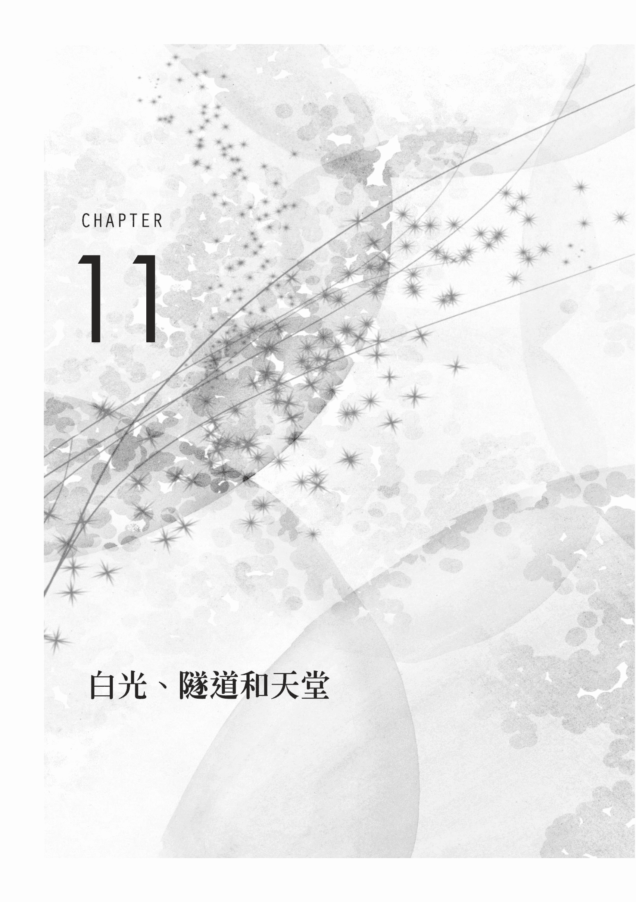

11

　　有关濒死经验的书籍已经够多了。大多数有过这类经验的人，都形容他们通过白光的隧道之后便进入天堂。但尽管他们异口同声的说出这个事实，怀疑人士还是发明了各种说法解释这个现象，否认天堂的存在。

　　但我可以向各位保证，所谓的隧道、白光和我们称为“天堂”的地方，确实是存在的。我的指导灵天使莉莉说，我们应该把白光看成天堂大门前的白色光束。我认为这个说法很酷！我沟通过的每一个灵魂都说他们看到白光。那些留在人间的灵魂也是如此，只不过他们没有朝着白光走去罢了。讲到“隧道”，我想起早年在机场的情景。当时，我们一抵达机场，就会看到至亲好友站在机场的大门口等候，带着鲜花气球迎接我们回家。这也是我们在隧道里会看到的情景─许多家人和朋友正等着欢迎往生者的灵魂回家。

　　当年小约翰．肯尼迪飞机坠毁的消息传来时，大家都不清楚他和其妻凯若琳以及友人是否已经丧生，我试着和他的灵魂沟通，看看他们的情况如何。我看到他走进隧道里，受到他的父母的欢迎。那真是一幅美好的景象。之后我又和凯若琳沟通，看到她走在后面，试着让她的母亲明白她虽然已经死了，但情况还不错。当晚将近午夜时分，我就看到她走进了隧道，回到老家，回到约翰所在的地方。

　　二〇一一年时，有一本名为《去过天堂九十分钟》（90 Minutes in Heaven）登上《纽约时报》的畅销书排行榜。作者是唐．派普（Don Piper）牧师。有一天，我在一家杂货店看到了这本书，就把它买了下来，在某一晚读完了。这是一本很有意思的书，但让我不安的是：作者并没有说到他去的那个地方只是天堂里的许多社区之一（我熟悉的天堂是有许多个社区的）。相反的，这本书给人家的印象就是：他去的那个地方代表天堂的全部。

　　在他所去的那个社区里面，大家都相信人必须接受耶稣基督做他的救世主，才可以进入天堂。当他提到那里的人们成天都在唱诗歌赞美主的时候，我简直浑身都不舒服。我知道有些宗教确实认为上帝是那种会要求我们成天不停赞美祂的自大狂，但对于这种说法，我只能说：“你在开什么玩笑？”

> 我在天堂的经验

　　以下文章是从我的着作《灵魂的回音》中有关天堂那一章中摘录的。其中描述了我之前的一次绝妙经验，或许能够解答你们的许多疑问。

祷告成真

　　那是一九九二年初春的事。漫长的冬天已经过去，明尼苏达州的阳光艳丽、鸟语啁啾，大地复苏。那一天是基督苦难主日（Palm Sunday）。我正犹豫自己该去教堂还是做自己想做的事：打理我的花园，准备栽种花木。我觉得我应该到教堂去，但另一方面又觉得自己需要静下心来，和上帝谈一谈。后来我决定不去教会，因为我想在户外度过这个非常特别的一天。

　　我和弟弟麦可前一晚才去帮人家驱鬼，我上床时心里一直想着有关“那边”的事。那个星期天的早上，我醒过来时，这件事仍然萦绕在心头。我在花园里工作时，心里一直想着这些年来我所获得的有关天堂的知识。我在当灵媒时，已经学到了不少这方面的知识，在和亡者的灵魂沟通时也获得片片断断的讯息，但我却不曾有过切身的体验。我从事驱鬼工作已经有二十年了。这段期间我一直相信我把那些鬼魂送到了天堂，而那是一个很美好的地方。但是那一天不知道为什么，我突然很想要更具体的了解这个地方。

　　我一边在花园里工作，一边问上帝是否可以让我获得更多有关“那边”的知识。我对祂说：既然我从事的是有关死亡和“死后的生命”的工作，我想提供人们更多有关天堂的讯息，让他们知道死后会去一个什么样的地方。我告诉上帝：这样的要求仅此一次，下不为例，而且无论我获得的是什么样的知识，我都会敞开心胸接受。我很好奇上帝会用什么方式提供这些讯息，不过我决定顺其自然，静观其变。

　　三天后，我完全忘了自己在基督苦难主日所做的祷告了，但就在这个时候，发生了一件事，成了我在灵媒生涯中最难忘的一次经验。那天是星期三，我为好友尼尔做完一个疗程后，目送他离开我的办公室，从地下室走上楼梯。这时，我的办公室里突然开始弥漫着朦朦胧胧的白色能量，我也感觉自己怪怪的，好像即将昏倒一样。我当时是清醒的，但感觉上身体却睡着了。之后我就有了一次灵魂出体的经验，只是当时我自己并没有意识到这点。

灵魂出体

　　我看到一个女人站在我前面。她是个灵魂，我看不见她的脸，只看见她的后脑勺以及一头金色的长发。她对我说：“走吧！走吧！”我感到很害怕，于是便问尼尔（他当时还在楼梯上）是否可以帮我。我告诉他眼前发生了一件很奇怪的事，有一个临在（presence）一直叫我跟她走。

　　这时，我的感官完全无法运作。我一方面知道自己正在办公室里，但另一方面又觉得自己好像置身于另外一个空间。尼尔抓住我的身体，一直摇晃，希望能让我脱离那样的情况。之后，那个景象确实消失了，但十五秒钟之后，它又再度重现。那金发的灵性存有（spirit）又在那儿催着我跟她一起走。这种感觉我很熟悉。我告诉尼尔我好像快要死了。当时，房里仍旧弥漫着白色的雾气，我的身体也变得虚弱无比，我只想躺下来，不再抗拒。

　　后来，我看到正前方有一条隧道。它一如我在历次为人驱鬼时所看到的，也就是我把那些幽魂送进去，让他们能够进入白光之中的那条隧道，那条连接我们这边和“那边”的隧道。

　　我的一位指导灵叫我请尼尔打电话给我弟弟麦可，请他尽快赶过来，然后再把我弄到楼上的客厅去。尼尔打电话给麦可之后，就把我拖上楼。这时我已经几乎说不出话来，两只脚也软绵绵的，没有一点力气。尼尔不停叫我回到我的身体里面，但那位金发灵性存有却一直要我跟她走。等到尼尔把我拖上台阶，到了沙发之后，我就砰一声倒在上面，觉得自己已经身不由己了。

　　等待麦可抵达的那段期间，一分钟感觉就像一小时那么漫长。后来麦可终于到了。他很清楚发生了什么事，因为他在开车过来的路上已经和他的指导灵谈过了。祂们告诉他三天前我曾经请上帝让我到“那边”去，现在已经获准前往，而且事后将会记得这次经验。

　　他说：“艾珂，衪们要我在你的灵魂去到‘那边’蒐集讯息的时候握住你的手，让你的身体和大地接触。”这时我才意识到自己正在经历灵魂出体的过程，而那位金发的灵性存有就是我的灵魂。她一直试着让我抛开自己的身体，前往“那边”。由于之前我并未向任何人（包括我弟弟）透露我在那个星期天做的祈祷，他说的那些话和当时发生的事都让我感到非常惊讶。

　　麦可握住我的手，告诉我一切都没问题，说我应该过去，他会在这里保护我的身体。有了他的保证之后，我便完全离开我的身体，接着我的心智便和那位金发灵性存有（我的灵魂）融合在一起，开始沿着隧道飘浮。到了隧道深处时，我感觉一股慈爱、温暖的氛围环绕着我，而且一直有一个微弱的声音在说：“放开吧！放开吧！”

　　隧道里有许多灵魂正在等着欢迎即将死去的亲人。我的四周都是至亲好友重逢的景象。接着，我看到前面隧道的尽头有明亮的光，于是便开始往上飘，越飘越高。当飘到白光所在之处时，我心想那光实在太亮了，应该闭上眼睛才对，否则可能会瞎掉。但我却张开眼睛，直接飘了进去。

　　到了“那边”之后，感觉平静而清醒。我看到一座古雅的小村庄，街道上铺着鹅卵石。我的祖母正和一个朋友站在那儿。她把我介绍给那位朋友，只见后者说道：“喔，你没告诉我她今天会死呀！”我的祖母答道：“喔，她没死，只是来参观罢了。”我仔细端详祖母的脸。她看起来是如此的美丽，脸上没有一丝皱纹，一副无忧无虑、纯然喜乐的模样，浑身散发着年轻的光彩与安详的气息。我环顾四周，看到好几个之前已经过世的老朋友。他们并未过来找我，只是对我笑了笑，仿佛知道我不能浪费任何时间似的。他们的神情全都显得朝气蓬勃、平静安详。

天使向导

　　突然间，一位天使出现了。祂的模样秀美，有一头轻盈蓬松、长度及肩的淡红色卷发，身上穿着一袭飘飘然的长袍，还有一对翅膀。祂告诉我祂将是我在此地的向导，希望能让我在有限的时间内尽可能多看一点。

　　祂带我去的第一个地方叫做“粉红之地”。这整个社区外围都有一圈粉红色的光晕，看起来很美丽。社区里面有一所医院，座落在我们前方，虽然和我们有一段距离，但我还是可以看到里面的景象。它不像人间的医院有许多医疗仪器和医护人员，比较像是一个让人休憩的场所。里面虽然也有看护，但不见得是医生或护士，而是一些很有爱心、想要让别人得着安慰的灵魂。

　　医院里的灵魂当中，有一些正处于调整期。他们要开始学习过着没有肉体的生活。许多人在死亡的过程中被投予大量的药物，以至于他们的灵魂受到了药物的影响。这些灵魂此刻正在这里休养生息、接受疗愈并进行若干调整。有些灵魂难以接受自己的死亡，因此看护正在设法帮助，让他们能够接受自己的转变。有些灵魂生前有肢体障碍，他们也需要帮助才能适应身体没有残缺的生活。至于自杀的灵魂则全都住在医院的二楼。其中有些正在沉睡，有些则正设法克服因为自杀而导致的挫折感，也有许多灵魂因为自杀时服用了太多药物和酒精，仍然尚未清醒。

　　这所医院还有很多楼层，但我没有时间逐一细看，必须继续向前。我看到许多灵魂闭着眼睛躺在医院外面的草地上。天使说这“粉红之地”是一个供人疗愈的场所，而那些灵魂则是靠着环绕在社区四周的粉红色能量来恢复他们的健康。

　　后来，我们沿着一条道路往下飘，沿路山陵起伏、花草竞艳、绿意盎然，还有溪流、湖泊和河流。那里的花朵不仅颜色鲜艳而且气味芬芳。不久，我们飘过了一座山丘，进入了一座山谷，看到一座白色与金色相间的巨大竞技场，那里有着巨大的柱子和门窗，还有天使出入。我的向导告诉我，这就是那些下凡人间、帮助世人的天使所居住的地方。

　　大约在这个时候，我隐隐约约听见我弟弟的声音。他要我“去寻找音乐”。这时我才意识到我的四面八方都有乐声传来。我看了看我的天使向导。祂示意我跟着祂走。我们飘到了一片草地上。那里聚集着许多歌手和音乐家。我看到了纳京高（Nat King Cole），接着又看到许多在人世间出名的乐手。其中有些人在谱曲，有些人在唱歌，有好几种音乐同时在演奏（这实在不太容易描述），就像是一座巨大的广播电台，你只要调到你想听的那个频率就行了。

　　接下来，我们所造访的那个城市，对我而言意义特别重大。而天使把我带到那儿，或许是因为从我小时候开始，耶稣就一直是我生命中的核心人物，当然也可能是因为当时人间正在庆祝复活节。无论如何，我们来到了一个很美丽的地方。那里风景如画，放眼望去尽是蓝天绿地。成千上万个灵魂在那里走来走去，因着某件事情而非常兴奋。感觉上，那里仿佛正在举行一场庆祝活动，人们的情绪显得非常激动，有些人在欢呼，有些人在哭泣，还有些人则站在那儿，完全被人群中央那位正在演说或授课的男子迷住了。我看着天使，用眼神问祂这男人是谁。天使说祂就是耶稣。我心想不知道我来这儿合不合适。天使看透了我的心思，告诉我没有关系，又说祂知道耶稣对我的意义，因此希望我来体验一下这座耶稣城。

　　我看着耶稣传福音的模样，心中充满喜悦与敬畏。对我而言，祂是如此的尊贵。祂周围有一圈金色的光晕，散发出智慧与知识。祂一头及肩的黑发，蓄着胡须，面容黝黑、五官分明，还有一双我见过最热切的眼睛。但最令我着迷的是祂那双手。它们强壮有力，历尽几千年的风霜，充满了智慧，深知人间疾苦，也疗愈过无数人的苦痛。

　　此刻，祂正劝勉聚集在那里的众多灵魂要彼此相爱。祂传扬的是爱的讯息，而爱正是祂的本质。祂看起来是如此的温柔，既充满力量，却又无比谦卑，让我想要尽可能的亲近祂。当下我感觉自己好像真的回到家了，不想离开这座庄严美丽的城市。我环顾四周，觉得到处充满了希望，仿佛可以从中找到人生的答案。

　　就在这时，我听到有人一遍又一遍的喊着我的名字：“艾珂！艾珂！”是我弟弟麦可的声音。他正在催我回到我的身体里，因为这样的经验对肉体而言是非常辛苦的。然而，我并不想离去。后来，麦可要我寻找上帝，这时我才意识到上帝就在我的四周。祂无所不在。你只要想到“上帝”这个字眼，祂就会出现。祂是一种临在，或是一种认知。这样的概念很难描述，就像是你原本就站在一个更衣间里，等到有人叫你去寻找这个更衣间时，你才发现你已经置身于更衣间的中央，但却不知道如何描述。你整个人被它环绕起来，它存在于你的四周、你的呼吸以及你的思想和感觉之中。你是那更衣间的一部分，但你也随时可以走出那个更衣间，再次与它分离。这样的感觉，真的很难用语言文字来形容。

天堂社区

　　我问我的天使向导︰在我回到我的身体之前，祂对我还有什么教导？祂告诉我，天堂里面有各种社区，每一个社区都反映出一个不同的实相（reality）。我们会去到天堂里的哪一个地方，完全取决于我们在世时对现实的信念以及我们的意识。举例来说，如果你在世时是一个勤劳的德国人，也是虔诚的天主教教徒，那么你到了天堂之后，就会住在一个和你具有同样信念的社区。祂并且带我去看一个住着乞丐和小偷的社区。祂说，这就是他们的实相。他们成天彼此偷窃或行乞，最后必然会厌倦这种生活方式，然后他们就会开始询问其他社区的人是否有更好的生活方式。所有的灵魂都会不停往不同的实相移动，持续寻找更好的生活方式。人们在天堂时也必须像在人间一般，让自己的信念不断进化。每一个灵魂都必须持续的学习与成长，直到他们明白自己和上帝是一体的。

　　我的天使向导还告诉我︰天堂里的每一个社区都有一间教室，还有一个讲师负责教授那个社区群体的实相。当灵魂进化时，有些社区便没有存在的必要了，这时它们便会消失。

　　我说天堂里有这么多不同实相的社区，听起来似乎很复杂。祂说这其实没有人间的情况那么复杂，因为在天堂里，每个人都很清楚彼此的实相。如果你住的社区和别人不一样，那么你的信念体系就和他们不同。事情就是这么简单。相形之下，人间的情况反而比较复杂，因为我们以为大家都相信同样的实相，但事实并非如此。世上之所以会有这么多问题产生，就是因为我们都不太能尊重彼此的信念。我们不愿意承认每个人都有一个不同的实相，只希望大家的想法和做事方式都跟我们一样。

　　我因为本身是个影迷，便问了我的天使向导有关电影明星的事情。她说他们也有属于他们的社区。如果他们选择要继续当明星，就可以住在那儿，但如果他们想要转型，不想再当明星，便会住进一个比较能够反映他们的特性和实相的社区。之前我在为某人通灵时，曾经看到约翰．肯尼迪。我问他还要当约翰．肯尼迪当多久。他说只要还有人想会见他，他就会继续待在“那边”，不会转世。肯尼迪说，人们到了天堂，见到了亲友之后，他是最先要求会面的人之一，还让我看到了他怡然自得的和许多人握手、打招呼的画面。

　　天使说完后，我再度听到我弟弟以严厉的语气唤我回去，因为我的身体状况已经很差了，不仅呼吸困难，能量也很弱。看来我是非走不可了，于是我便立刻掉头飘回白光所在之处。这时我看到右边有一座宽阔的阶梯。我问天使这座阶梯通往何处。祂说天堂有好几层，住在最高层的是那些具有共同的实相、知道自己和上帝一体、而且彼此能和谐相处。

　　最后，我又问了天使一个问题︰我刚来的时候看到的那座有鹅卵石街道的村庄是否就是天堂的入口？祂说，那只是其中之一。天堂里还有许多这样的地方。有些灵魂会直接进入医院，有些灵魂则会到入口处。至于他们会到达哪一个入口，要看他们的意识而定。天使说祂很希望能够教我更多东西，让我参观更多地方，但我的身体已经很难受了，非回去不可。祂一说完，我的灵魂就立刻回到了身体里面。

　　这一趟出体的意识之旅程（conscious journey）消耗了我灵魂所有能量。在灵魂离开期间，我的身体陷入了极其难受的状态，变得像个布娃娃一般，软绵绵的、了无生气。灵魂回来后，我有至少二十分钟的时间说不出话来，感觉舌头很迟钝，眼睛不太能睁开，对光线非常敏感，行动也很吃力，至少一个小时之后才恢复正常。等到我有力气上床时，我便扑通一声倒在床上，连续睡了十二个小时。

　　看到这里，你应该约略了解“那边”的状况。

> 等待转世的期间

　　长老们建议每个灵魂在转世之前，至少在“那边”待六十年，疗愈灵魂从前世带来的问题，以免将这些问题带到来生。疗愈过程可能要好一段时间，但其长短得看每个灵魂的意愿而定。有些灵魂选择在尚未完全疗愈之前，很快投胎转世。这意味将会把所有的问题都带到来生。此外，太快转世的灵魂往往会搞不太清楚自己是谁、身在哪一世、出生于什么样的家庭等等。六十年听起来或许是很长的一段时间，但对于“那边”的灵魂来说，感觉却像是一瞬间，这是因为那里没有时钟和日历，对时间也毫无感觉。

　　到了可以投胎转世的时刻，灵魂自己会有感觉，否则长老们也会请灵魂开始准备。然后，灵魂会花大约一年的时间拟定来生的生命蓝图，并选择一个最能够帮助他达成目标的家庭降生。

> 地狱

　　你们当中有些人或许会好奇地狱是怎么回事。指导灵天使莉莉告诉我，天堂里有一个社区很像地狱，但它不是上帝创造的。祂说上帝永远不会创造这样一个地方，也不会把任何人送到那里去。事实上，地狱是被我们的意识创造出来的，而我们会创造出这么一个地方，是因为宗教信仰告诉我们地狱应该是什么样子。有些人在世时一直相信自己会下地狱，天堂里就有这样一个地方形成了。但莉莉告诉我︰等大家的意识都提升到某一个程度时，天堂里就不会有这样的地方了。如果你死后真的到了这个地狱社区，那是因为你相信自己应该会下地狱。

> 天堂中央

　　过去十年来，我在为人通灵时，时常看到一个地方。我称之为“天堂中央”，因为它看起来就在天堂的正中央，样子有点像是一个与世隔绝的社区或一个供退休人士居住的村庄。这里所谓的“退休”是指“从人间退休”，也就是：从此不再挂念在世的家人，或担心那里发生的事情，也不再觉得自己有义务要去探视那些还活着的亲友。

　　住在这个社区的灵魂有一个共通点：他们都已经死了二十年以上。如果你是一个灵媒，想为人通灵，但却找不到对方的灵魂，你可以问那人对方已经死了多久。如果他已经死了二十年以上，那么他可能已经住在天堂中央，不再理会人间俗事，也就是说：他可能不会回应你的召唤了。

　　☆

　　我写这本书的目的之一就是要强调：当我们还活着的时候，要重视自己在灵性上的成长以及我们和上帝的关系。如果我们今生能明白我们和上帝是一体的，我们回家的时候自然就能明白这样的境界。正如一个很有智慧的女性亡灵告诉我的︰“当一切尘埃落定之后，仅存的就只有上帝。”

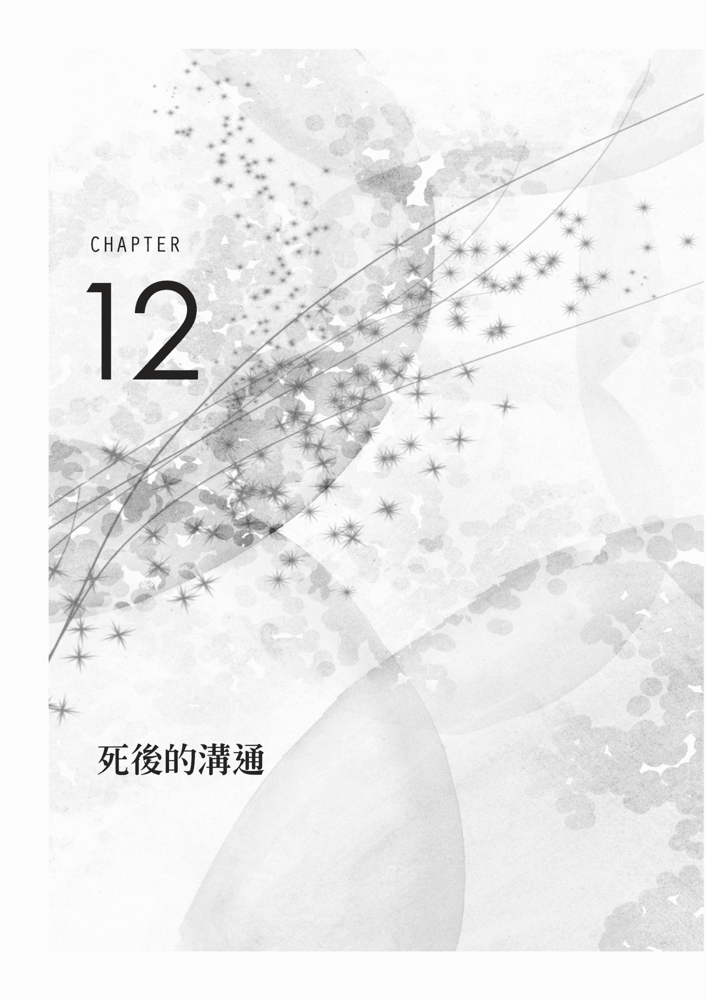

12

　　在一九八九年的电影《直到永远》（Always）中，理查．德瑞福斯（Richard Dreyfus）饰演的消防机驾驶员因坠机身亡。接下来那一幕，他坐在树桩上和奥黛莉．赫本（Audrey Hepburn）饰演的天使说话。天使告诉他，从今以后他将担任一位年轻消防机驾驶的指导灵。他问她既然他已经死了，那个人怎么还能听到他所说的话呢？她告诉他︰只要对他发出意念，他就能接收到，又说︰“我们就是这样透过意念来和他们沟通。他们会以为那是自己的想法，不过没关系，至少他们接受得到我们的讯息了。”这部电影是好多年前看的，我已经不记得她当时是怎么说的了，意思大致是如此。这也是我想说的︰我们的指导灵、已故的亲友和上帝，就是透过这种方式和我们沟通。我们过世之后，也将透过这样的方式和至亲好友沟通。

> 学习透过意念沟通

　　透过意念和别人沟通的方式被称为“心电感应”或“传心术”（mental telepathy），是“超听觉力”（clairaudience）这种超自然能力的一部分。日常生活中，我们经常用这种方式来沟通，只是很多人不太去注意而已。举个例子，你是否有过这样的经验︰有时候，你的脑海里会突然浮现某人的名字，几秒钟之后他们就打电话或传简讯来了，或者你就在路上碰到他们。遇到这样的情况，我们往往会以为只是巧合，但事实上，我们正是用心电感应和对方沟通。可惜的是，当我们突然想到某个认识的人时，通常不会停下来听听还有哪些关于那人的讯息，因为我们的脑海中往往又会浮现其他的念头（我们一天中可能会有成千上万个念头浮现）。

　　我们突然想到某人时，这个念头可能是源自那个人，也有可能是我们自己引发的。要区分这两者很简单。我的意思是︰如果你在广播中听到一首歌就想起了某个人，或者因为看到一个长得跟他很像的人，或其他外在因素而想到他，那么无论他身在多遥远的地方，他这时刚好都会想到你。在这种情况下，这个念头就是由你引发的。相反的，如果你似乎无缘无故（没有任何外在的因素）就想到某人，那么这个念头就是来自对方。是他们先想到你，然后你才接收到他们的意念。

　　我时常告诉那些参加我发展灵通力工作坊的学生，他们可以试着去注意自己今天想到了哪些人，再设法去了解那些人是否也想到他们。如果你在午休时间想到了一个朋友或亲爱的人，当晚就打电话给他们，问他们当时是不是也有想到你。等你发现自己的念力居然如此强大的时候，会觉得很有意思。

　　从这里，我们要谈到死后沟通非常重要的一点。你死了之后，那些在世的至亲好友会非常悲伤。刚开始时，你可能会时常去探视他们，想让他们知道你没事，你很好，而且确实还“活着”。问题是︰他们想再度听到你的声音，但却听不见，因为你是透过心电感应和他们沟通。如果他们不习惯这种沟通方式，很可能无法察觉你正在尝试和他们沟通，并且会以为你已经忘记他们了。这种说法听起来或许有点好笑，但如果你趁现在还活着的时候，就开始练习传送你的意念，等你死了以后，就能够更有效的和活人沟通。想一想你死后有可能会想和哪些人沟通，你就可以拿这些人来做为练习的对象。你不必告诉他们，你为什么想要学习如何有效传送自己的意念并接收别人的意念，除非他们对这些事情有一定程度的了解。

　　约翰．艾德华（John Edward）和詹姆斯．范普拉（James Van Praagh）两位通灵人在举办活动时，往往会从现场的观众当中挑选几位自愿者，帮他们通灵。当有人问他们用什么方式挑选通灵的对象时，他们总是回答说，声音最大的那个灵魂就能吸引他们的注意力。这个意思就是︰那个灵魂已经学会让自己的意念变得非常强大而响亮，以便被人间的灵媒所听见。那么我们如何让自己的意念变得强大而响亮呢？当然是透过练习啰！

　　我父亲住在旧金山，而我住在明尼亚波利市时，我们每个星期四都会做心电感应的练习。我们会先约好在一天当中的几个时间（早上十点、下午两点、六点和晚上十点）把自己的意念传送给对方，然后注意自己接收到哪些讯息。我们会把脑海里想到的东西都写下来，第二天再彼此核对。这样的练习很好玩，而且也让彼此之后更能够传送接收讯息。

> 和已故的亲友联络

　　如果你想和某个已故的亲友沟通，你应该大声说出他们的名字，吸引他们的注意力。他们在天堂里并不是整天无所事事的坐在那儿听我们的每个意念，或等着我们去想到他们。事实上，他们有时候不会回应，是因为他们在天堂里也有自己的生活。这和许多人想的并不一样。

　　最近，我在我的进阶灵通力工作坊中讲到这个主题时，把我父亲的名字给学生，让他们练习和已经过世的人沟通。他们当中有许多人告诉我，我父亲觉得很烦，因为有太多人召唤他、想和他说话。由于我父亲是一个很外向、喜欢交际的人，我事先并没想到这样的练习会让他觉得烦。但想一想，这也难怪，因为他在“那边”也有事要做，当然不会喜欢被二十个想和他沟通的学生一直打搅。

　　我最近发现了一件很酷的事，这是我以前没想到过的。我在为人通灵时，看过许多人紧抓着过世的亲友不放，要后者来探视他们、为他们做决定，或安慰他们等等。我知道这对往生者来说是很辛苦的一件事，因此当我听到我的指导灵天使莉莉说，我们可以留言给那些已经过世的亲人时，感觉非常开心。事实上，莉莉一说完，我眼前立刻浮现“那边”的人正在为灵魂记录亲人留言的景象，也看到那些往生者的灵魂每天收到这些留言的情景。如果你想留言给某人，只要大声说出你的名字、对方的名字，以及你想要传达的讯息就可以了。比方说︰“我是艾珂．波亭。请留言给我的母亲梅．波亭，告诉她我爱她。”你不一定能听到他们的回应，但他们会知道你正在想念他们，同时他们的脸上会露出微笑。如果他们回应了，你将会听到脑海里有一个很单纯的念头，例如“我也爱你”或者“谢谢你”。

　　如果你试着和已故的亲人联系，却觉得自己没有得到任何回应，我希望你能明白对那些已经过世的人而言，要和我们沟通并不是容易的事。对他们来说，和受过训练的通灵人沟通会比较容易，因为这些通灵人已经学会将能量提升到几乎和那些往生者灵魂一样的层次。

　　除此之外，在亲友过世之后的最初几个月，你必须记住他们已经逐渐习惯“新社区”了，因此不一定能够随时应你的要求回到“旧社区”。如果你无法亲自和他们联络（就像我之前说的，这并不是一件容易的事，因此请你不要气馁。）你可以到我的网站（www.echobodine.com/referrals）找一位信用良好又值得信任的通灵人。

　　说到这儿，我不禁想起那位主持深夜节目的谐星柯瑞格．佛格森（Craig Ferguson）所说过的一句话。他说他的父亲过世后，有许多灵媒和他联络，宣称他们可以替他和他的父亲沟通，但柯瑞格说︰“如果真的这样，那倒是挺稀奇的，因为他活着的时候我可从来没法跟他沟通呀！”

> 已过世的亲友如何显灵？

　　在没有灵媒的情况下，已过世的人如果要和我们说话，最容易的方式便是透过梦境向我们显灵，然后我们的心智就会一点一滴的想起这些梦中相遇的情节。如果你早上醒来时，觉得昨夜的梦境栩栩如生，过了好几个小时仍无法忘怀，这就表示有过世的亲友来向你显灵了。

　　灵魂要吸引我们的注意力，还有另一个很简单的方式，那便是透过气味。只要他们想着某种气味，我们便会感觉自己好像闻到了那种味道。你是否曾经有过这样的经验︰有一瞬间，你觉得房间里似乎弥漫着祖母的香水味，然后你就想到了她？其实这是她的杰作。如果你所爱的那个人是个老烟枪，那么你闻到的可能就是烟味。我有一个巴西朋友，名叫阿尔博托．阿古阿斯（Alberto Aguas）。他也是一位疗愈师，死于一九九二年。他生前喜欢在身上洒一种很香的法国古龙水。这种古龙水我从来不曾在美国地区闻到过。但每次他显灵的时候都会发出那种香味，让我们很明确的知道他来了。每次他这么做，我总是很开心！

　　除此之外，如果你那位已经往生的亲友擅长能量运作（“那边”有很好的老师会教导灵魂这方面的技巧），他们或许会移动某些东西来吸引你的注意力。

　　如果你认为有某个已故的至亲好友正试图跟你联络，请你务必要请对方提供一些清楚具体的信息，证明他确实就是那个人。这是因为有些滞留人间、不怀好意的灵魂喜欢作弄那些刚刚痛失至亲好友的人。因此，你要问他一些只有你们两个知道的事，以证明他的身分。当你死后，想要在“那边”和你所爱的人联络时，也要向他们提供这类的证明。

> 死后性格不会改变

　　许多人以为一个人死了之后，就会变得像天使一样，个性上的种种瑕疵都会消失。但很不幸的，当你和那些已经过世的亲友沟通时，很快就会发现这并非事实。尽管我们在脱离世俗的身躯之后，若干观点可能会有所改变，但就像在人间的时候一样，如果不想改变自己的观点，我们也不一定要改变。

　　我曾经有过一次很有趣的通灵经验，让我大开眼界。当时有一个女人和她的婆婆一起前来，要和她那位已经过世两、三年的丈夫沟通。通常在这种情况下，当事人久别重逢都很开心，在场的人也皆大欢喜。但在这个案例中却并非如此。当我喊着那个年轻人的名字时，只听到一个男人用不耐烦的口气说道︰“这两个人到底想干什么呀！”接着他又嘀咕︰“我活着的时候，她们老烦我，现在我死了，还不肯放过我。”我听了以后委实有点吃惊。

　　我不知道该对那两个女人说什么，因为不想伤害她们的感情，于是我坐在那儿等着，看看他会不会说一些比较好听的话。最后，那位妻子终于忍不住问我他是不是在“不爽”。我不好意思的回答︰“有点。”她问我他是否因为她们来探询他的状况而感到厌烦，这时我又听到那个男人在我的脑海中大声说道︰“没错！”我告诉她他看起来不是很开心。结果那两个女人听到之后反而都很兴奋。她们告诉我他这个人就是这样，在生前脾气就很暴躁，因此死后会这样也是很合理的。她们表示，如果我说他脾气很好而且很高兴见到她们，她们就会认为我是个骗子，但正因为我描述了他那不爽的模样，对她们来说，这便足以证明他的灵魂还活着，而且在“那边”过得还不错。那位妻子表示，她原本希望他死了以后个性会变得成熟一些，但现在能听到他的消息，她们就很满足了。那位母亲则因为儿子并未下地狱而松了一口气。

　　关于往生者，还有一个常见的迷思就是︰我们死了之后就会立刻“开悟”，为自己从前所做过的坏事或说过的坏话感到歉疚。比方说，就有许多女人曾经问我，她们的丈夫在过世之后，是否醒悟到自己生前对妻子有多么恶劣。我真希望我能告诉大家，所有人到了“那边”之后，就能够把一切都看得清清楚楚，但事实并非如此。有些灵魂要过好一阵子，才会愿意深切反省自己生前的所作所为。尽管我们每一个人到头来都必须这么做，但却不一定立刻能够做到。天堂里的灵魂往往也像世间的人一样不愿面对事实。

　　我还记得辛普森（O. J. Simpson）的妻子被谋杀后的那个星期，大家都在猜测究竟谁是凶手。当时我正在一个发展灵通力工作坊授课。我的学生问我是否可以和妮可．布朗．辛普森（Nicole Brown Simpson）的灵魂沟通，问她究竟是谁杀了她。结果我很惊讶的看到她在“那边”对着一大群人表示她是被卡托．凯林（Kato Kaelin）（那个可怜的家伙！）杀死的，令她非常震惊。我问当时和我在一起的指导灵对她所说的话有何看法，祂说无论在生前或死后，灵魂都可能会选择相信自己所愿意相信的事情。祂说人死后并不一定能够洞悉宇宙的奥秘或看清自己的人生，但等到她的灵魂成长到一个地步，她就会愿意面对事实，而且说不定她已经到了这个地步。

　　妮可和指导灵从未说过那个案子是不是辛普森干的。我的重点是︰我们死亡之后并不一定会愿意面对事实。但无论我们到了“那边”之后是否能够认清或面对事实，世间所发生的每一件事情都是业力所致，而且每一个人最终都会得到应有的果报。

> 关心人间俗事的灵魂

　　关于往生者，我们另一个错误的观念便是︰他们到了“那边”之后，就不再关心人间俗事，从此快乐无忧。但这并非事实。就像我们高中或大学毕业时，想到自己漫长的教育之路已经到了尽头，会觉得悲欣交集一样，灵魂对于自己已逝的生命也有同样的感受。

　　我在为人通灵时，也发现人们时常会试图请过世的亲友给他们一些建议，他们认为人死后的灵魂是无所不知的，但事实并非如此。人们唯有在生前开发自己的灵通力，死后才会有神通。更何况往生者的灵魂明白他们不应该干涉人间的生活，所以当亲人向他们请教未来的事情时，他们通常都不太愿意配合。

　　关于死后的沟通，我还有两个故事要和你们分享。这两个故事都说明人们到了“那边”之后，还是他们原来的模样，仍然会有非常人性化的情绪。

一个双胞胎哥哥的疑问和歉疚

　　五年前，我朋友玛塔的双胞胎哥哥马克过世了。当时他才四十岁。他们兄妹都是电视制作人。当天马克完成了一个很大的案子，和他的事业伙伴喝了一罐啤酒以示庆祝，之后马克觉得自己有点醉了，说需要躺下来歇一会儿。大约一小时后，他的伙伴来察看情况，却发现马克已经死了。据法医表示，马克是自然死亡的。凌晨两点半时，玛塔打电话给我，告诉我这个消息，我立刻察看马克的灵魂。不知道为什么（或许是因为他很年轻），我一直以为他会很清醒并随时能和我沟通，但却发现他的灵魂还在沉睡。我问我的指导灵是否能够告诉我究竟发生了什么事，结果祂们是这么说的︰

　　“在马克躺下来睡觉之前，已经有一个长老从‘那边’下来等着了。由于今天是马克毕业的日子，他一睡着，那位长老就把他的灵魂从身体里拎了出去，带到‘那边’，让他继续睡觉。不久后，他的身体就死亡了。马克的父母（他们已经在‘那边’了）就在附近，等着要见他。他的母亲有点不耐烦，一直来回的踱步，说她只想看看他，确定他没事就好了。长老们一再要她放心，说他很好，只是他必须自己醒过来。但她对他们的回答并不满意。”

　　接着，指导灵告诉我：“当马克、玛塔和长老们在规划他们这一世的生命时，马克觉得他应该在四十岁之前就可以完成所有想做的事情，之后就可以在‘那边’协助玛塔的事业。”

　　指导灵还说︰“第二天（星期二）一早，马克的灵魂就会苏醒，然后他的父母亲、四个长老和几位已经过世的亲友就会和他一起开会，帮助他回想他生命蓝图的内容以及当时发生的事情。会议在中午之前就会结束，到了下午时，马克的能量就会逐渐恢复。”除此之外，指导灵还说：“在未来的几个星期甚至几个月当中，马克会做很多事情，让他的双胞胎妹妹知道他就在她身边，他一旦适应了‘那边’的新生活，就会过得很好。他们建议玛塔制作一本有关马克生平的剪贴簿。”

　　第二天，到了应该开会的时间，我察看了马克的灵魂，看他是否已经醒过来，结果他真的醒了。他告诉了我许多事情，其中大部分都是要我转达给玛塔的。

　　他告诉我他需要玛塔向他解释他们的生命蓝图，尤其是有关他英年早逝的部分，因为他已经不记得了，而他很信任她。他的心情很难受，因为觉得自己抛弃了玛塔，并为此不断的向她道歉。

　　他一再表示他不明白自己为什么这样子就死了。对他而言，这似乎没什么道理。然后我听见他的脑海里重复出现大卫这个名字，看来他似乎很关心这个名叫大卫的人。

　　他告诉我他先前去陪了他的父母亲一段时间。他说他觉得自己跟父亲很亲近，并且发现他比生前更有智慧，而他的母亲也变得比较慈爱、温柔，不再像生前那样自私和疯狂。他说他父亲对母亲真的很有耐性。

　　马克再次提到大卫这个名字，并说他需要玛塔向他保证大家不会忘记他。他拿了一盒谷片给我看，并说早知道就应该多吃一点谷片。他说他发现自己想的都是这类无聊的小事，而不是那些大家都认为很重要的事情。

　　他说真希望自己从前曾经多花一点时间和玛塔的两个小女儿玩。还说他很高兴玛塔嫁给了她的丈夫尼尔森，因为尼尔森是个好男人。

　　马克说他很难向玛塔显灵，又说他很高兴她去认尸时有看他的遗体（她原本不想看，但她的好友说服了她）。一会儿，马克又说︰“祖母在跟她打招呼。”他说自从他到了天堂之后，祖母就一直对他很好。最后他向我表示︰“我还会再跟你联络。谢谢你帮助我渡过这一关。这段时间真的很难受。”说完他就慢慢消失了。马克过世才几天，说这些话可得费不少力气。

　　我问玛塔是否知道大卫是谁。她说那是马克喜欢的名字，他们父亲原本打算帮他取名为大卫，但由于他们是双胞胎，马克的母亲认为应该有相似的名字。马克之所以提到大卫，可能是想借此让玛塔知道我们沟通的对象确实是他本人。

　　我想分享这个故事的原因有几个。首先，这个例子表示有些往生者需要我们帮助才能接受自己的死亡。他们死后不一定会记得自己的生命蓝图，往往要过一段时间才会想起来，尤其是在像马克这样的案例中。他只不过是躺下来打个盹，结果四天之后醒来时却已经置身天堂。对任何人来说，这都是很令人震惊的事。

　　此外，值得我们注意的是他再三为了抛下玛塔而道歉。我听许多灵魂说过这类的话。他们都因为抛下自己所爱的人而感到非常自责，尤其是留下很多未完成的事情要让生者来打理，会更加难受。

徒留两边的悔恨

　　我的前男友吉姆打电话来告诉我一个坏消息。他的爱妻唐娜（他们结婚已经五年）过世了。我告诉你们这个故事，是想强调我们必须在还活着的时候把事情打点妥当。

　　吉姆告诉我，他那天早上去上班时，“亲了她一下，跟她说再见，并且告诉她我爱她”。唐娜说︰“我也爱你。”然后她就回去睡觉了。

　　然而，那天早上大约十点半的时候，唐娜的老板打电话给吉姆说唐娜还没去上班。由于她近年来身体有很多毛病（她甚至曾经在他们结婚那一天中风），因此他很担心。不过，唐娜尽管时常生病，但因为年纪还轻，每次都会复原。

　　那天吉姆打卡下班之后便立刻回家，看唐娜是否睡过头了，但是他走进卧房后，却一眼就看到现年才五十一岁的太太已经死了。

　　吉姆告诉我这件事时，我看到唐娜一直站在这边和“那边”的中间听他说话，听吉姆谈着她和她的儿女，以及这许多年来她受到病痛折磨的光景。眼见吉姆必须独自处理这样的情况，她的眼泪不禁流了下来。她多么想把手伸过去触摸他，告诉他一切都不会有问题的，但她却不得不站在那儿旁观，让他自己去经历这一切。她喜欢听吉姆谈论他们共同拥有的一些回忆。其间她一度因为情绪太激动，不得不暂时离开现场。她不想死。她想健健康康的活着，也想和丈夫和儿女在一起。

　　吉姆问我︰“为什么？她的身体明明已经好转了，为什么还会死？”我听见唐娜说她去年八月因为中风的并发症差点死掉时，曾经请求上帝让她再跟吉姆共度一个圣诞节，因为那是他们俩最喜欢的一个节日。因此上帝又多给她一些时间。

　　第二天早上我醒过来时，发现唐娜正站在我的床边，一副忧心忡忡的模样，让我有点受到惊吓。我们从未见过面，但根据前一天的经验，我知道她是谁。她告诉我她担心她的儿子，因为吉姆不喜欢他。她很怕吉姆会在葬礼上给他脸色看。她问我是否可以帮忙。我虽然不确定自己可以帮得上什么忙，但还是打电话给吉姆，问他目前状况如何。他立刻开始谈到唐娜的儿子，并说不希望他来参加葬礼。我只能问吉姆︰“你妻子会希望你怎么做呢？”每次他提到唐娜那个儿子时，我总是问他同样的话。结果后来唐娜参加自己的葬礼时，看到她的儿子也在场，而且一家人相安无事，让她非常欣慰。

　　不过，大约一星期之后，我又接到了吉姆的电话。他听起来很不高兴，因为唐娜身后的财务状况简直乱七八糟、不清不楚。她生前从未订立遗嘱，而且每个重要帐户的密码都不一样，他一个也找不到。他既悲伤又挫折，简直快要发疯了。我挂上电话后，问唐娜为什么明知自己身体不好，却不把自己身后事安排好。她说她的直觉告诉她应该把事情安排好，但却害怕如果真的这么做了，就会死。我听过许多人跟唐娜有同样的想法，这是可以理解的。但就像在吉姆和唐娜的例子里，这么做的后果就是吉姆在这一头既悲伤又挫折，而唐娜在“那边”也后悔不迭。

　　无论在这边或“那边”，我们都要继续过日子。为了别人好，我们必须把自己的基本事务都打点好，就像我们也会希望他们为了我们把自己的事情打点好一样。无论在人间或天堂，“要别人怎样待你，就怎样待人”这个道理同样都适用。

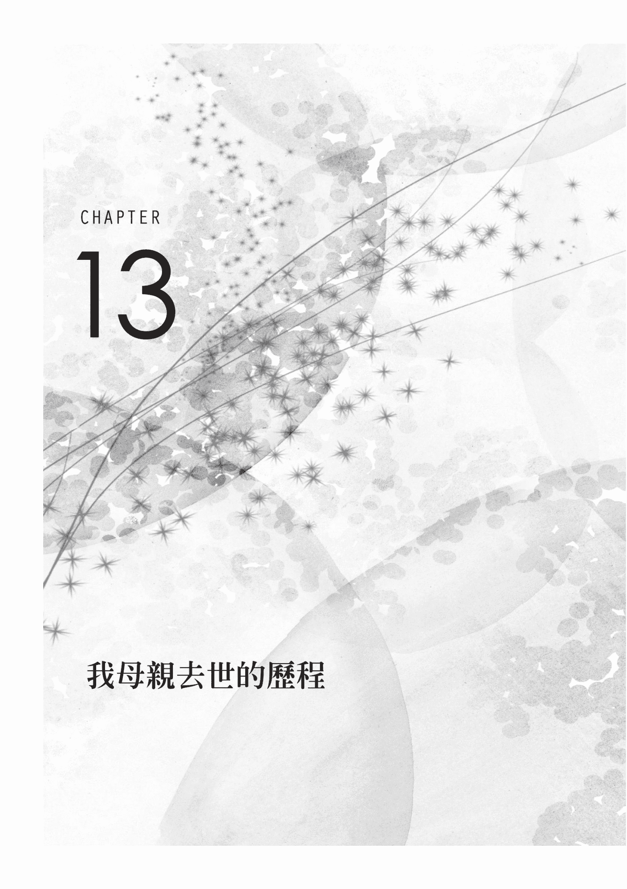

13

　　我先前曾经提到过我亲爱、可爱的母亲。她终于在二〇一二年十月四日离开人世了。她在人生的最后六个月经历的一切，对我来说是非常特别的。我们曾经有过许多次一起灵魂出体的经验，甚至还一起到“那边”去把事情安顿好，让她能够展开新的生命。

　　这话听起来或许很奇怪，但我不认为我和母亲的经验是个特例。没错，我和母亲两个人都能够通灵，但你可能也有类似的经验。我想和大家分享她过世那段期间的种种，是想帮助你们厘清自己从前是否有过类似的经验，或者在将来发生类似的事情时可以知道那是怎么回事。如果你最近才刚失去亲爱的人，请你回想一下︰他们过世前六个月是否曾经出现一些异常的行为？是否睡眠的时间变长？是否看起来神色呆滞、迷迷煳煳的，好像“心思放在别的地方”？又是否曾经和你谈过有关死亡的事，或试图把自己的事情打点好？

> 探勘天堂新家

　　以我的母亲为例，她原本请杂货店每两周帮她宅配一次食品和杂货。但在过世前两个星期，就告诉他们她将不再需要这项服务。那年九月我生日那一天，她也告诉我她将活不到我的弟弟过生日（那是十月底的事）。当时她虽然还活着，但每一天我们都感觉她好像随时准备收十包袱走人似的。我们在电话中的交谈总是带着诀别的意味。每次我挂上电话，心里总想这或许是我们最后一次的谈话了。

　　母亲过世三年前，我曾经有许多次梦见我跟她一起到了“那边”。那里有一个她很喜欢的男人，她想让我知道有这样一个特别的人正在“那边”等着她。

　　最初几次，那个男人总是背向着我，而且身上散发出一种并不讨人喜欢的能量。他似乎是那种颇自我中心的男人，仿佛什么事情都以他为主。我总觉得他背对着我，是不想让我看到他的真面目。每次我从这样的梦境中醒过来时，总是觉得泄气，因为母亲在人间一直都被这类型的男人所吸引，没想到了“那边”之后，居然还是一样。

　　过了一阵子之后，母亲在一次梦境中，告诉我她和那个自我中心的男人之间的事情已经解决了，希望能带我去见另外一个男人。当时我的心里很矛盾，因为我担心见到他之后，会发现他其实跟之前那个人没什么两样。我至少有六次梦见母亲要带我去见那个男人，但由于我总是抗拒，后来就不了了之了。

　　母亲过世前大约八个月，我放下了抗拒的心态，终于遇到了那个男人。和之前的那位相比，他对母亲温柔许多，也很关心她。在他身旁，她就像个小女孩。看他们两人互动是一件很有趣的事，也让我很安心，因为我知道“那边”有一个爱她的人正在等着她。

　　关于这类的灵魂出体经验，我要说的是︰正如我先前所言，我们的灵魂可能会在晚上或白天我们的身体暂停运作（例如在做白日梦或在午间小憩）时离开身体，前往任何一个地方，甚至可能会到“那边”去。灵魂出体时所发生的事情，感觉起来并不只是一个梦，反而比较像是实际的经验，但当我们醒过来时，在“那边”发生的事情大部分都会变得模煳不清。这是因为︰如果我们记得在那儿看过和做过的一切，可能就会因为自己无法留在那儿而感到悲伤。每次灵魂出体之后，往往一整天都会有一种萦绕不去的“乡愁”。

　　母亲在过世之前的那六个星期，一直都在打盹。和她一起去“那边”的梦境也越来越模煳。我知道有某种转变正在发生，也可以感觉到她的灵魂非常忙碌。到了她死前大约一个星期，我就不再做这类的梦了。感觉上一切似乎都已经就绪，就等着她到“那边”去了。

> 肉体生命的尽头

　　她过世的那个早上，感觉上就和平常一样，没有任何异状。之前我一直很好奇自己是否可以预知她将在何时过世，但那一天并没发生什么特别的事。

　　倒是前一天（十月三日）出现了一些警讯，显示她的生命已经快到尽头。但这些警讯并非来自高层灵界的讯息，而是那天早上我醒过来时，觉得胸口沉甸甸的，几乎像是母亲坐在上面要引起我的注意力似的。于是，我立刻打了一通电话给她，看看她是否出了什么事。她说她很不高兴，因为她做了一个梦，梦见有人想把她变成一只虫子。她说她的血压非常高，让那些居家照护员颇为担心，但她说很疲倦，只想睡觉，所以请我要我的弟弟妹妹们当天不要打电话，因为她需要睡眠。我挂上电话后，心情很沉重，想再打电话回去确定她没事，但我的直觉告诉我不要去打搅她。

　　那一天，我屡次察看她的灵魂，想了解她的状况，但却感觉她离我很遥远，于是我不再吵她。通常我都会在她夜晚上床睡觉前打电话，看看她情况如何，但那天晚上我却觉得自己最好不要这么做。

　　第二天早上，一位居家照护员到她那儿去扶她起床，结果却发现她躺在地板上，人是醒着的。这一点很不寻常，因为她已经有好几个星期不能自己走路了。当时的情景，就好像她已经知道自己要去某个地方，所以试着起来自己走过去似的。居家照护员把她扶到沙发上之后就离开了。两、三个小时后，另外一位已经和她成为好友的照护员到她家去为她泡茶，但母亲说她今天早上很难受，不想喝茶。这也是很不寻常的一件事，因为母亲早上向来喜欢喝茶。到了中午，当那位照护员回来送午餐给她时，她就断气了。她生前一向害怕自己会孤孤单单的死去，所以我想她必然是撑到有人来的时候才断气。

　　当亲爱的人即将死去时，尽管你觉得自己已经做好了心理准备，但当你真的接到电话得知他们已经死去时，还是会感到非常震惊。那天，我走出一家宠物店时，就接到了弟弟打来的电话。他说︰“我们接到电话，说母亲刚刚走了。”刹那间，我觉得我的整个神经系统好像被人揍了一拳似的。我的身体开始发抖，无法呼吸，只得强迫自己把头脑和感情放空才能开车回家。我无法思考，也不知道该怎么做，需要有人来指引我渡过这样的时刻，而这个人通常是我母亲。

　　我打电话给我认识的人中最理性的一位─我儿子的父亲罗曼，告诉他我母亲过世的消息，请他告诉我该怎么做。当时我脑海里只有一个念头︰我现在是家里年纪最大的人了，所以按理我应该知道要怎么做才对，但我需要有人告诉我该做些什么。在电话中，我反复的对罗曼说︰“请告诉我该做些什么。”罗曼给我的建议很简单，也很有用。他要我在独处的时候尽情哭泣，和家人在一起的时候则表现得坚强一些。他还说︰“悲伤会像潮水似的一波又一波来袭，所以你最好学着顺应这些浪潮。”跟他通完电话后，过了大约十五分钟的时间，我突然感觉有一股能量围绕着我。我只能形容它像是上帝的恩典。它让我脱离了那种极其哀伤的状态，并且在后来的一个多星期，一直处于一种不一样的意识状态下。

> 失去挚爱的滋味

　　那天，我们一家人在母亲的公寓里会合，在她的遗体旁边坐了六个小时。她躺在沙发上，身上盖着一条毯子，只露出她的脸来。我们轮流坐在她身旁，抚摸她的头发，握住她的手，一起回忆过往的时光，并且共同安排丧葬事宜。我们流了许多眼泪，但想到过去那些有趣的事情时也会忍不住大笑。在一具遗体旁边坐了六个小时，听起来也许会让人觉得毛骨悚然，但我必须说那一天是我生命中最难忘的时光之一。我们全家聚在一起悼念母亲，那种感觉真是言语难以形容。

　　曾经有许多人问我那一天是否觉得母亲的灵魂就在我们身边。确实如此，而且有过两次。她的能量轻得不可思议，几乎就像是一句耳语一般。我妹妹也感觉到了。其中一次，母亲带着我们挑选出一套衣服，以供瞻仰遗容时穿着。她没有说话，但我们却微微感受到她的存在。

　　她有许多遗物需要整理，但我们决定改天再做。这是她过世后的第一天，我们希望一切尽可能简单。心爱的母亲已经走了，我们需要时间来面对这个事实。

　　开放遗容供人瞻仰时，我们让母亲躺在开放式的棺木里，让人们可以见她最后一面。我的弟媳凯蒂把母亲从小到大的照片，做成了令人赞叹的相卡陈列出来，人们都看得津津有味。

　　母亲过世后，我深深体会到失去一个如此亲爱的人是什么滋味。之前父亲过世时，我们虽然悲伤，但同时也松了一口气，因为他是个很难相处的人。但母亲过世完全是另一回事了。她是我们的母亲，永远没有人能取代她。

　　瞻仰遗容、守灵和葬礼，都是为了活人而举行的。看到这么多人来参加母亲的告别式，感觉真好。卡片、鲜花和金钱都是美好的礼物，代表他们对我们的爱。有个朋友给了我一张礼券，让我可以到附近杂货店的熟食区去换食物，不必担心煮饭的问题。我的堂妹玛莉（她开杂货店）请人送了一批食物和饮水到教堂来，供我们一家人享用，让我们可以休息一下并补充能量。大家对我们真好。

　　痛失亲爱的人是一种非常不好的感受，会让你麻木、悲伤、孤寂、生气、害怕。你的脑袋会不时突然一片空白；你坐立难安但又睡不着觉；就算睡着了，也不安稳；同时，你会感到惊骇、空虚。根据过来人的经验，以上这些反应都是正常的。

　　有人问我为什么母亲过世后我并不常哭，我发现那是因为之前我看着她逐渐迈向死亡，已经哀恸了很长一段时间。当她不再能开车的时候，我哭；当她无法自己走路，必须坐轮椅的时候，我哭；当她的记性开始衰退的时候，我哭；当她不再有体力参加节日的家庭聚会时，我哭；当她对宾果游戏、食物和她原本喜爱的电视节目失去兴趣时，我哭；当我看着她从一个头脑清楚的睿智女性变成像个小女孩时，我也哭。

　　当她日子难过时，我哭；当她不再能照顾她的爱鸟“小姬”时，我哭；每次送她到急诊室时，我哭；每次看到她身体的某一个部分死去，我都会哭。

　　她过世后大约一个星期，我在一家卖场里走来走去，茫然不知所措，已经不记得自己要来买什么了，于是我又开始哭泣。我想抓起扩音器，告诉整个卖场的人，我亲爱的母亲已经死了，而我忘记自己要去那里干嘛。在像这样的时刻，我们往往会想要告诉全世界我们亲爱的人已经死了，这样，当做了一些愚蠢的事（例如当加油枪还在油箱里，便把车子从加油站开走；想不起好朋友的名字；或仅仅为了让自己分心而去买一些根本用不着的东西）时，人们会过来拥抱我们而非指责。我们希望别人知道我们正尽量节哀顺变，但有时并不能完全做到。

> 母亲显灵

　　由于我有通灵能力，因此几乎每一个人都会问我一个问题︰“你母亲过世后，你有没有跟她沟通？”在此，我要很高兴的回答：到目前为止我们已经沟通了好几次。

　　她过世四天后，在一个星期天的早晨，我听见她说︰“我想喝一杯真正的咖啡。”我立刻开心的出声回答︰“好的，母亲，我这就去泡咖啡！”之前一天，我在一家杂货铺看见一束非常美丽的粉红色玫瑰（那是母亲向来最喜欢的花），第一个反应是极度的哀伤，因为我再也无法买来送她，但接着又想还是买给她吧，因为她很快就会来看我们。后来，我把那些玫瑰插在一个漂亮的花瓶里，让她欣赏。当我这么做时，悲伤便消失了。我还把一杯咖啡放在玫瑰花旁边，请她来享受。

　　她第二次来访是在星期六晚上。当时我正在帮朋友缝制一件羊毛上衣。突然间，觉得一股非常抚慰人心的能量将我整个包围住，然后我听到她用很清楚的声音说︰“你能相信这事终于发生了吗？”我出声回答︰“是的，我知道。妈，你的肉体居然死了。这不是一件很奇怪的事吗？”当时我感觉自己处于一种不同的意识状态，仿佛通往“那边”的罩纱已经被揭开了，而我和母亲一同置身在那儿。它似乎并不像平常感觉的那般遥远，而只是在这个意识、这个世界之外。我问她是不是想回来探访她的公寓。她说︰“才不呢！我在那里渡过生命中最难受的时光，那里也是我死去的地方。”

　　我心中有许多问题想要问她︰在天堂生活是什么感觉？她死后经历了哪些事情？但就在这时，电话铃响了，把我吓了一跳，让我回到了现实世界。打电话来的人是也会通灵的弟弟麦可。他说意识到我这儿有些状况，但不确定是什么事情，所以才打来问问。挂上电话后，我想继续与母亲对谈，但已经感觉不到她的存在了。

　　还记得在“那边”等着我母亲过去的那位男性友人吗？我最近到天堂去探视母亲时，她带我参观她之前忙着布置的新家，并拜访那个和她住在一起的男人。这时，母亲的模样看起来就像三十多岁，体力也恢复正常了。她很为新家和新生活的成就自豪。她告诉我︰我们在人世的成就建造了我们在天堂的家；我们在这里所建造的，到了“那边”之后仍然存在。她的男人有一头白发，个性似乎非常良善。他们之间的互动看起来就像是两个已经认识了一辈子的人。看到母亲这个模样，我感觉非常开心。她唯一死去的部分只有肉体而已。她的灵魂还是活生生的，而且很高兴她在人世的旅程已经结束。

　　我的母亲是一位天赋异禀的灵媒。我期待未来能有更多机会和她谈论“那边”的情况。我不知道未来会发生什么事，但或许我的下一本书的书名将会是《与来自“那边”的母亲对话》（Conversations with Mom from the Other Side）！

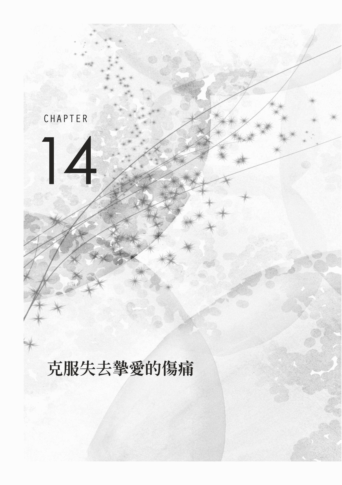

14

　　我上一回参加的葬礼是为我的好友巴克举行的。他开车载着三个孩子在路上行驶时，一个女人驾驶的车子突然偏离方向，越过安全岛，将他的车子撞个正着。巴克和他的两个孩子当场死亡，大女儿也因为全身好几处骨折而住院。当天他的妻子带着最小的孩子先去参加一个家庭聚会，而巴克正要去和他们会合。

　　那次告别式至少有三百个人参加，会场挤得满满的，气氛是如此悲伤，使我不得不中途离开。我想主持那场葬礼的人觉得有责任要安慰在场人士。通常在这个时候，我们都会说“他们已经到了一个更好的地方”、“上帝要他们回去祂那里”之类的话，但当我们因为失去某个亲爱的人而无比伤痛时，听到这些话真的会比较好过吗？死亡有时似乎毫无道理可言，无论我们如何试着解释背后的原因。

> 伤痛的各种样貌

　　我有个朋友在母亲过世后胖了两百磅，另一个朋友在失去孩子后在床上躺了一年，还有一个好友则在赌场里混了一年，试图用赌博的方式忘却伤痛。我父亲过世时，我正好在油漆房子，想把房子的外观漆成好看的灰绿色，搭配我们那一区其他房子的颜色。父亲的葬礼结束后第二天，我心想人生何其短暂，而我一直想住在黄色的宅院里。于是，我不再把房子漆成绿色。如今，我住在一栋漂亮的黄色房子里。虽然它在我们那一区显得很突兀，但每次我看到时，脸上总是会泛起微笑。

　　我们都有自己处理悲伤的方式。许多人会因为悲伤而出现各种上瘾症状，例如疯狂购物、赌博、囤积东西、酗酒、吸毒、大吃大喝，乃至玩宾果游戏等等。我认识的许多人原本已经戒烟好几年，但在失去亲爱的人之后又开始抽烟。我们会尝试用各种方式来减轻痛苦，但那都不一定能够解决问题，就算可以，也只是暂时的。想想看，当你从“悲伤的云雾”中走出来时，却发现自己的体重多了两百磅，或你为了买一些到现在都还没有拆封的东西已经刷爆了所有的信用卡，那会是什么样的光景？

　　死亡确实可能动摇我们的信仰。我们会开始纳闷这个名叫上帝的家伙为什么要将所爱的人从我们的身边带走。我们会求助于原来的宗教信仰，但却发现那些宗教语言已经不再像往日般可以抚慰心灵。不仅如此，它还让我们心中产生了更多的疑问︰真的有天堂吗？死后真的还有生命吗？那些写书谈论死后生命的人，是否只想借此卖书赚钱？我们希望死亡是有道理可言的，这样才不至于太过伤痛。

　　这就是灵性派上用场的地方了。来上我的通灵和疗愈工作坊的学生，有很大部分是因为失去了亲爱的人，才试着透过另一种方式来了解生命和死亡。写电子邮件给我的人，一大部分都表示他们会走上灵性的道路，是因为失去了某个亲爱的人。人们不会在某天早上醒来时告诉自己︰“我的生活过得很好，所以我要走上灵性的道路。”

　　遗憾的是，大多数人只有在生命遭逢令人难以承受的经验时，才会做出重大的改变，而失去亲爱的人正是这类的经验之一。幸而我们拥有各式各样精彩的人物、书籍、工作坊、研讨会等，可以帮助我们疗愈悲伤并走上灵性的道路。

　　到目前为止，我已经写了十一本书。其中有两本要大力推荐给那些因为失去挚爱而受苦的人。它们分别是︰《灵魂的回音》（Echoes of the Soul）以及《寻找良善，你就会找到上帝》（Look for the Good and You’ll Find God）。看完这两本书之后，你可以接着阅读《柔声的呼唤》（A Still, Small Voice）和《我的疗愈书》（My Big Book of Healing）。

　　许多人在遭受失去至亲好友的痛苦时，会来到我这儿做按手疗法。你们或许也可以看看这方面的信息。《疗愈之手》（Hands That Heal）是我的第一本书，其中所讨论的正是这个主题。

> 如何渡过伤痛期

　　我想和大家分享，我在为母亲的死亡悲伤的期间学到的一些事情，可以帮助我们渡过这段伤痛期。

> •尽可能多吃蛋白质和蔬菜，试着不要用甜食来消除你的悲伤。对你的身体而言，用哭泣的方式来宣泄悲伤，会比用垃圾甜点把悲伤吞下肚要好很多。

> •也不要让你自己饿肚子。对你的身体好一点，给它足够的能量渡过这段伤痛期。

> •如果你没有心情说话，就不要接电话。但是当你需要找人诉说的时候，一定要拿起电话，打给你的朋友们。许多人都不知道该对处于伤痛期的人说些什么。你可以让你的朋友知道，他们不一定要说什么，也不需要安慰你，只要听你说一说有关你爱的人的事情就好了。

> •在这段伤痛期，你的脾气会变得比较暴躁，所以如果你生某人的气，在发作之前请你先数到十或二十，因为在悲伤的情绪下，你有可能会反应过度。

> •别急着清理逝者的遗物。你可能会想速战速决，很快把东西清掉，但请你放慢步调，在整理那些遗物时回忆往昔快乐的时光。当我必须和妹妹和弟弟们整理母亲的遗物时，一开始是很害怕的，但后来那却成了一段很有意义、甚至充满乐趣的时光。我们时而欢笑、时而哭泣，时而一起回忆往事。我们并没有给自己压力，要求自己在一天之内就要做完。相反的，我们约好一个星期找一天的时间一起过去，结果持续了一个月才做完。

> •按照一般的礼俗，如果收到亲友致赠的卡片和礼物，在葬礼后两个星期之内就应该寄出谢函，但我却决定慢慢来。我一次只写几张谢卡，向那些体贴的亲友表达由衷的谢意。只有在我的心思够清明，知道自己要写什么的时候，才会动笔。

> •我强烈建议你们在开放亲友瞻仰遗容时，采用开放式的棺木。许多年前，有一位从事殡葬业的朋友告诉我︰据他观察，如果人们在遗体下葬或火化之前能够见亲爱的人最后一面，比较不会那么悲伤。我很高兴我们为母亲选用了开放式的棺木。当时葬仪社把她的遗体处理得很好，使她的遗容看起来美丽安详。况且我们都需要在和她永别之前多陪陪她。我这个世代的人，从小到大在葬礼上看到的都是开放式的棺木，对这种安排已经习以为常，但让我讶异的是︰有许多人说他们从来没有在任何一场葬礼上看过开放式的棺木。我从事殡葬业的朋友曾经告诉我︰这年头有许多人都不想花时间悼念亡者，所以他们都要求葬礼快点结束，好让他们能够恢复正常的生活。这点我可以理解，但我认为，为了我们的心智和情感的健康着想，有必要遵循适当的程序向所爱的人告别。我殡葬业的朋友也表示，如果葬礼采用封闭式的棺木或立刻将遗体火化，许多前往吊唁的人往往在事隔一年之后，还会跑回去问他，当时亡者是否真的躺在棺木里。这是因为他们没有看到遗体，所以隔了一阵子之后，就会怀疑亡者是不是真的死了。

> •悲痛的情绪并不会一次爆发。它有可能会拖很长一段时间。母亲过世后，许多人都提醒我们悲伤的情绪会像浪潮般一波波来袭。事实证明，他们说得没错。有时候你可能会觉得自己就像从前那样快乐，感觉生活非常美好，但你也可能一下子就掉进悲伤的深渊，不知道这样的痛苦是否有消失的一天。就像那天早上我打电话给罗曼时，他告诉我的话︰“你最好能够学会顺应这些浪潮。”随着时间过去，这些浪潮来袭的力道会越来越弱，终有一天会平息下来。

> •如果你是那种不喜欢哭哭啼啼、表现自己情绪的人，当你失去亲爱的人时，你也不愿意承认自己有任何悲伤或情绪，这对你的身体而言是很不好的。虽然你可以尽量压抑自己的情绪，麻木自己，但那些没有被接纳的感觉就会郁积在你身体的某处，到了某个时刻，你的身体就不想再替你贮存这些沉重的情绪了。我的一个好友在他的父母亲过世时，都强自忍耐，没掉一滴眼泪，结果后来心脏病发作了两次。因此，我们必须处理那些感觉，并以某种方式宣泄，不要把它留在体内。如果你不爱哭，可以尽量多做些运动。总而言之，你要帮助你的身体释放那些悲伤。

> 如何帮助朋友渡过伤痛期

　　如果你有朋友失去了亲爱的人，而你不知道该如何帮忙时，可以每隔一段时间就问候他们一下，让他们知道当想要找人倾诉的时候，可以找你。如果他们不接你的电话，也不回复简讯，请不要在意。我母亲过世后，有许多朋友用简讯传达了温暖的关怀。在最初那段时间，这也是我所能承受的极限了。当时我有一种很强烈的孤寂感，但在接到亲朋好友的问候时，感觉就好过一些。母亲过世一个月之后，还是有人寄来卡片和信函。看到这些信函和卡片，知道他们仍然会想到我和我的家人，感觉真的很好。

　　当人们对我说“跟我说说有关你母亲的事吧！”，这对我而言是很有疗愈效果的。你无法把朋友的悲伤带走，但如果你有时间聆听，就请他们试着去回忆有关逝者的种种吧。光是让他们有机会谈一谈所爱的人，就能够帮助疗愈。总有一天，他们会停止谈论那个人，这时你从他们的眼神中就可以看出他们已经复原了。

　　这样的哀悼期会持续多久很难说。如果你的朋友过去曾经失去其他心爱的人，但却不曾好好的哀悼，那么他们的哀悼期可能会拖上好几年。如果他们像我一样，在亲爱的人面临死亡时，就开始释放自己的悲伤，哀悼期就不会拖这么久。我知道，要面对一个为至亲好友的死亡而悲伤的人或许很不容易，但总有一天你也会面临这样的情况。到时你就会感谢有朋友在身边陪着你。

> 往生者的伤痛期

　　当我们亲爱的人死亡时，我们并非唯一受苦的人，因为逝者同样也会经历一段哀悼期。其强烈的程度因人而异。有些人死亡的过程拖得比较久，因此他们还在世时就已经哀悼很长一段时间了。这样的人到了“那边”之后，哀悼的情绪便没有那么强烈。但对那些猝死的人（例如我那位在车祸时当场死亡的朋友巴克）而言，他们的哀悼期就会比较长。

　　我接到电话，得知巴克发生了意外之后，立刻和他的灵魂沟通。我原本以为他会在“那边”，但却发现他和两个孩子都还在这边。当时他正坐在他的妻子和家人身边，听他们谈论这起可怕的意外。他的妻子正处于极度悲伤惊骇的情绪中，让他感到非常忧心。他不知道她是否过得了这一关，因此便在这边停留了几个星期，时时刻刻陪伴着她，试着对她说话，让她知道他就在身边。

　　当时我试着和巴克说话，但他筑起了一道墙把自己封闭起来，因为他已经不知所措，无法再承受别的东西。他为自己的死极度哀伤，也非常担心妻子和还活着的两个孩子。不过，当他知道妻子已经渡过难关，不会有事的时候，他还是去了“那边”。除了担心妻子之外，他也很担心大女儿，因为当她因骨折而住院时，医生发现她罹患了癌症！他们说如果没有发生这起意外，或许无法及早发现癌症。事实上，这起意外挽救了她的性命。

　　当巴克终于到了“那边”时，他得到了所需要的帮助，处理了他自己的悲伤，过了一年之后，状况就好多了。他发现妻子变得更坚强。如果这起意外不曾发生，她是不可能会有这种转变的。当然，巴克还是宁可留在人世，和她以及他们的另外两个孩子在一起，但他已经平心静气的接受自己的死亡，不再因此而抱憾了。

　　☆

　　无论我们是在罩纱的这边或那边，我们都可以找到一些方式来处理我们失去挚爱的痛苦。就像在人世一般，天堂里也有很多照顾者，因此没有人是得不到帮助的。至于要怎么做，就完全取决于我们自己了。当失去亲爱的人时，我们可以让自己陷入悲伤之中，也可以试着在其中找到一些益处。这可能要花上一段时间，但如果专心的寻找，就能够更快的找到，无论在罩纱的哪一边都是如此。

结论

面对死亡，继续生命的旅程

　　有些人死得艰难痛苦，有些人则死得轻松容易、毫无痛苦。亲人的逝世可能会让生者肝肠寸断、无以为继，但有时死亡也会带来解脱和喜悦，因为我们知道我们所爱的那个人已经不再受苦了。我认为人们害怕死亡，是因为不谈论死亡、不了解死亡。同时，在宗教的影响下，我们也对死亡有着诸多误解，并未认清死亡的真相。此外，我们也有一种不正确的观念，认为人死之后，生命就结束了。

　　我希望这本书能让你从另外一种角度来看待死亡。是的，死亡确实很艰难，也很烂（没错，我说“很烂”），但我们有能力可以通过这项考验。即便失去了一个亲爱的人，我们的日子还是可以过下去的。

　　如果你是那个即将展开回家的旅程、前往“那边”的人，我想提醒你：你会抛下所爱的人离开人世，是有原因的。你的至亲好友虽然失去了你，终究还是可以活下去的。这是他们的生命蓝图的规划之一，正如同你完成你在人世的工作之后就得回家，这也是你的生命蓝图的规划之一。

　　如果你是那个被留在人世、并且正在为至亲好友的死亡而哀伤的人，请记住：只要你愿意，你的痛苦将会一天比一天减轻一些。在这段期间，请你每天提醒自己：你会在有生之年失去这个人是有原因的，请你试着找出其中的好处。我每次想到母亲正好在我即将完成这本书时辞世，就忍不住微笑。她仿佛是想让我体会失去挚爱的感觉，并让我透过与她的灵魂之间的沟通来了解死后的世界，以便对我的写作有所帮助。

　　请宇宙帮助你放大你的格局。不要一直紧抓着你所失去的那个人不放，因为亡者就像你一样，正在经历一个转型期，无法给你安慰。你应该求助于朋友、家人和上苍。如果你的要求是合理的─如果你希望能够获得方向、指引、安慰与协助─你将会找到答案，也将能得到支持。

　　期盼你在未来的道路上能够从生命与死亡中，得到最大的益处。

　　愿上帝祝福你。

艾珂

> > > > 谢辞

　　我要一如以往的感谢我亲爱的编辑 Yvette Bozzini。她让我写书的过程充满乐趣。

　　谢谢为我出版这本书的 New World Library。这是一家很酷的出版社。尤其要感谢具有圣人般耐性的编辑主任 Georgia Hughes、帮我把手稿变成书本的执行编辑 Kristen Cashman，以及即将发挥她的魔力把这本书推介给全世界的资深公关 Kim Corbin。

　　我还要衷心的感谢所有信任我、让我参与他们的死亡过程的客户与友人。因着你们的经验，我才得以撰写这本书，和世人分享这些讯息。

　　此外，我也要一如以往的向我的家人致上谢意。
