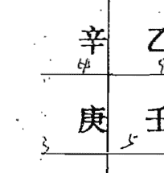
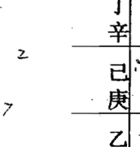
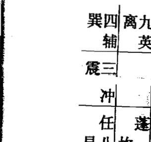
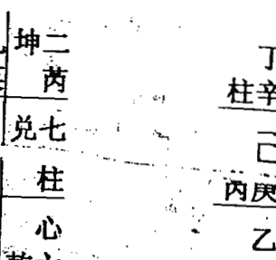
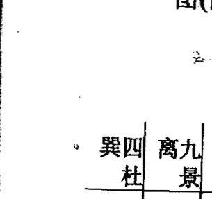
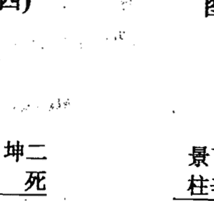

# 彩票与奇门

黄立溪

内部资料 请勿外传

世界玄学宗师黄立溪老师（法号：恒立），是当代国际上最具影响力的玄学宗师之一，在世界上任何一个国家和地区，只要在互联网中输入“黄立溪”三个字进行搜索，我们就可以看到世界上各著名的大网站对黄立溪老师的报道条目达数十条之多。也可以在互联网中点击www.east258.com进入东方玄学网了解黄立溪老师在预测、奇门、风水、旺财、化煞、解灾等玄学方面风采。

黄立溪老师不但是当今世界上最具影响力玄学宗师之一，而且他的专著《奇门日课预测学》、《商战与奇门》、《阳宅催吉化煞绝学》、《玄机风水密诀》、《彩票与奇门》、《奇门与风水》、《阴宅化煞解灾绝招》等近80部佳作畅销海内外，

正谊中年的黄立溪老师创造了诸多玄学奇迹！

《彩票与奇门》是黄立溪老师最新力作，我们经过多方面努力才极荣幸地争取到出版机会，在此我们隆重地向全球推出中文简体版、繁体版、英文版……

最后，感谢广大读者长期以来对我们出版社的信任和支持。

# 世界玄学宗师黄立溪老师（法号：恒立）近照

## 世界玄学宗师黄立溪老师著有《奇门日课预测学》、《玄机风水密诀 》、《商战与奇门》、《阳宅催吉化煞绝学》等系列专著。由于黄老师在奇门、风水、预测、化煞、解灾等传统文化研究和应用领域取得了卓越成就，2004 年 11 月东方传统文化网络科学院特聘为研究员。

# 引子

奇门遁甲作为中国传统经典术数之一，古代“三式”之一，素称“中国方术之王”，“帝王之学”，素有“学会奇门遁，来人不用问”之美誉，可见其预测准确度之高，黄老师得黄门上祖真传堪舆、奇门、六壬、择吉、命学、神断、化煞、解灾等秘技，黄老师把传统秘技结合现代科学，经多年研究奇门应用于彩票预测，获得重大成功，令彩民每投必中。现首次大公开！
极其珍贵！极其实用！

# 第一章 奇门纵横

# 一 奇门诀

+   - 奇门洛书示天命 生出八卦化九宫
+   - 天地阴阳生五行 八卦九宫为经纬
+   - 乾父坤母乾坤定 阴阳品配男女居
+   - 天干地支与五行 配合八卦法须知
+   - 离火主晴坎主雨 善用八卦察天机
+   - 轩辕黄帝指南车 四极明判宇宙尤
+   - 彩凤呈祥献黄帝 天书龙甲十八章
+   - 风后受命作兵法 奇门遁甲从此生
+   - 阴阳变化妙无穷 尽在太极动静中
+   - 冬至夏至坎离宫 阴消阳长天理同
+   - 乾父坤母乾坤定 阴阳化生女和男
+   - 风后奇门千八十 约繁归简出奇局
+   - 太公善布奇门局 简化遁甲七十二
+   - 汉初三杰有张良 十八活局捷径方
+   - 六十甲子共地支 分作三元用奇准
+   - 节气九宫配置妥 三甲定时吉凶坐
阳遁仪顺奇逆布 阴遁奇顺仪逆布
六甲常隐六仪下 三奇是为日月星
六甲之上得三奇 三奇得使最为良
乙逢犬马丙猴鼠 最吉丁奇遇虎龙
天地三奇游六仪 玉女守门兑七宫
三奇入墓百事凶 纵有奇门休举动
天有九星镇九宫 地有九宫应九州
阳星蓬任冲辅禽 英芮柱心为阴宿
天蓬星得生门吉 再合乙丙事昌隆
芮星难断何方吉 春夏凶来秋冬吉
天冲星临事难遂 春夏作战得胜回
天辅不愢天来辅 四时用之万事昌
天禽临远行有助 得贵人尽力扶持
修真养性见天心 亲近君子远小人
修房造屋赖天柱 入官出商皆要轮
天任星喜临生门 遇难得解四时吉
天英守道贵心诚 春夏胜来秋冬败
五行谈生克制化 九星论旺相休囚
当值之星为值符 当值之门为值使
星符每逐时干转 值使常随天乙奔
地有八卦应八方 开休生属三吉门
伤杜景死惊五凶 出门进取万事通
土生白玉地生金 福禄双双利生门
伤门常事多折损 只宜捕贼猎兽禽
杜门属术诛无道 最忌临坤木克土
景门主火并血光 飞来横祸受苦殃
死门大凶诸不利 行商岁岁老本尽
惊门进后多恐惊 飞祸瘟疫遍地行
八门何时在何宫 仔细推算尽此中
三吉门有开休生 得合三奇吉上吉
天三门合地四户 举事吉利好通行
三辰原是地私门 奇门相照百事欢
三遁分为天地人 日月星精顺序分
九遁最吉天地人 云龙风虎鬼神次
天目地耳推吉辰 干支推定五类日
日分宝仪和制伏 六十甲子分吉凶
十干已有正名称 用时注意须谨慎
时加十干势各异 取用分析已详列
善神治事五阳干 扬旗出师利疆土
恶神治事五阴干 后发制人得胜回
时加六甲开与合 开吉合凶视阴阳
时加六戊为天门 如同乘龙万里游
已为地户主秘藏 遭凶得咎惹灾殃
六庚天狱运不通 争强斗胜入狱中
六辛天庭宜行刑 动辄招灾罪缠身
时加六壬为天牢 仇怨宜解免祸害
六癸天藏好隐身 不宜外出远方行
六丙六甲鸟跌穴 诸事大吉定无碍
六甲六丙龙返首 名利双收任君求
癸丁相逢大不吉 腾蛇天矫难进步
六丁加癸雀入江 口舌未罢官事愁
六乙加辛龙逃走 金克木兮百事休
辛加乙为虎猖狂 主客双方两败伤
阴阳相克是为和 四阴互克灾祸多
五不遇时干克日 一似日月损光明
十二地辰分宫立 十二宫神主喜忧
龙虎雀龟勾胜者 号称六神或六兽
九天利攻地利守 奇兵应伏太阴位
大将位居三胜宫 百战百胜君顺记
五不可击有五宫 大将宜居击对冲
太冲天马最为贵 剑戟如林不足畏
若得奇门与太阴 举措行藏必遂心
太白入荧贼即来 荧惑入白贼顺灭
丙为勃来庚为格 格不通兮勃乱逆
庚加日干是伏干 日干加庚飞干格
庚加值符天乙伏 值符加庚天乙飞
六庚加癸为大格 大阻碍兮运不通
天网四张不可当 万物尽伤须提防
急则从神缓从门 三五反覆天道享
天般天蓬地天蓬 值符伏呤最为凶
生门对宫为死门 八门值使怕反呤
六仪击刑何太凶 甲子值符愁向东
宫制其门为吉迫 门制其宫是凶迫
盛在三兮衰在五 能识三五掌真机
阳遁起一终于九 阴遁起九终于一

# 二 河图洛书示天命 生化八卦化九宫

龙马负图，是谓伏羲时代，有龙马出自黄河，背负一图，是称河图，龙马、乃天地之精英，其形马首龙鳞，故曰龙马。八卦，相传伏羲氏所作，其符号、卦名乃其代表之

八种物质为：乾卦天 、 兑卦泽 、离卦火 、震卦 雷 、巽卦 风 、坎卦 水 、艮卦 山 坤卦 地 ，八卦符号是由代表阴爻（一一）和阳爻（—）组成；阴阳乃八卦之根本。朱熹《八卦取象歌》云：乾三连，坤六断；震仰孟，艮覆碗；离中虚，坎中满；兑上缺，巽下断。八卦又以两卦重叠而演化为六十四卦，以象征天道和地道（自然）以及人道（社会）之发展变化。神龟负书，是言尧帝曾沉玺于洛水，至大禹治水时，有神龟出自洛水，背负一书，赤文朱字，是称洛书，神龟负文，乃呈祥献瑞；龟背纹理，现九宫之数。传说乃受神龟启示，龟寿千年，古称神灵，名曰玄武。其背甲有纹，由十三块似圆近方之图案组成，背脊居中串连五块，其余八块在四周，东汉前《易》纬家将乾坤八卦分置周围八块，是称八卦之宫，背脊五块组成中宫，其数为五，是为中五之宫，与八卦之宫合称九宫。黄帝时，敬受河图所示这天命，命风后演算而创遁甲，遁甲造式三层，用以象天、地、人三才。上层象天而置九星，中层象人而开八门，下层象地而分八卦，以镇八方。又据夏至、冬至，立阴遁阳遁；一逆行、一顺行，以布三奇、六仪之局，是谓奇门。奇门、三奇、六仪、遁甲、阳遁、阴遁、奇门之奇，则指十天干中称为三奇之乙、丙、丁、奇门之门，是指八卦的变相八门，即休、生、伤、杜、景、死、惊、开。三奇与八门中之吉门相合，是谓奇门。十天干中，三奇之后尚有六仪，即戊、己、庚、辛、壬、癸，三奇六仪相加为九，分布于九宫之中，甲为十天干之首，位最尊贵，但九宫却无甲之宫，故称遁甲。遁者，隐也，甲虽隐九宫之外，却统九宫中之六仪。受甲者为仪，不受甲者为奇，故九宫之布局行法，判断吉凶，甲必临之；趋吉避凶，逢凶化吉，无甲不行。故精究遁甲之数，始可行九宫之法。阳遁、阴遁，皆为九宫布局法之遁甲术，顺行为阳局，逆行为阴局。

# 三 风后受命作兵法，奇门遁甲从此生

[PAGE 13]

黄帝得风后于海隅，任以为相，并命风后作兵法一十三篇，孤虚法二十卷，又立遁甲之法一千八百局。

遁者，隐也，甲者，仪也；即六甲同六仪也，六甲常隐于六仪之下，借天乙之力，盖取用兵贵在玄极，通于神明，神明德深，玄机隐微，故以遁甲为名。奇者，乙丙丁为三奇也；门者，休生伤杜景死惊开为八门也；

所谓孤虚，孤是六十甲子中之孤辰，六十甲子为六十组组成，故有六旬，旬，十日也，从甲子到癸酉，从甲戌到癸未，称甲戌旬。依此类推，六甲各有一旬，十天干之未为癸，癸只配到十二地支之酉，故甲子旬中无戌亥，戌亥皆为孤。

与孤相对者虚，后天八卦中戌亥在乾宫，与乾宫相对为巽宫，在巽宫者为辰已，故戌亥为孤，辰已为虚。孤即空。空者，主时候不到，不在其时，难成事也。

# 六旬孤虚排列如下：

+   - 甲子旬：孤在戌亥，虚在辰已；
+   - 甲戌旬：孤在申酉，虚在寅卯；
+   - 甲申旬：孤在午未，虚在子丑；
+   - 甲午旬：孤在辰已，虚在戌亥；
+   - 甲辰旬：孤在寅卯，虚在申酉；
+   - 甲寅旬：孤在子丑，虚在午未；

由上可知：甲子旬中孤与虚和甲午旬中虚与孤相对，甲戌旬则对甲辰旬，甲申旬则对甲寅旬。

# 四 风后奇门千八十约繁归简出奇局

远古时期的黄帝轩辕氏：“始创奇门四千三百二十局法”，其据为将一年按八卦之数分八节，每节三气，每气三候，每候五天，每天十二时，因此每年有四千三百二十时，与每一时相对应有一种局势，因此奇门遁甲就有四千三百二十种局势。

后黄帝让风后正式制作奇门局法，风后将它简化为一千零八十局，其法是以“冬至”这天为“一阳即生”之时，起## 阳三局

| 戊 | 癸 | 丙 |
| 戊 | 庚 | 壬 |
| 癸 | 丙 | 辛 |

# 阳四局

| 乙 | 壬 | 丁 |
| 丙 | 戊 | 庚 |
| 辛 | 癸 | 己 |

# 阳五局

| 丙 | 辛 | 癸 |
| 丁 | 乙 | 己 |
| 庚 | 壬 | 戊 |

# 阳六局

| 丁 | 庚 | 壬 |
| 癸 | 丙 | 戊 |
| 己 | 辛 | 乙 |

# 阳七局

| 癸 | 己 | 辛 |
| 壬 | 丁 | 乙 |
| 戊 | 庚 | 丙 |

# 阳八局

| 壬 | 戊 | 庚 |
| 辛 | 癸 | 丙 |
| 乙 | 己 | 丁 |

# 阳九局

# 夏至—冬至阴九局

| 丁 | 己 | 乙 |
| 丙 | 癸 | 辛 |
| 庚 | 戊 | 壬 |

# 阴一局

| 丙 | 庚 | 戊 |
| 乙 | 丁 | 壬 |
| 辛 | 己 | 癸 |

# 阴二局

| 乙 | 辛 | 己 |
| 戊 | 丙 | 癸 |
| 壬 | 庚 | 丁 |

# 阴三局

| 戊 | 己 | 丁 |
| 己 | 乙 | 辛 |
| 庚 | 壬 | 戊 |

# 阴四局

| 己 | 癸 | 辛 |
| 庚 | 戊 | 丙 |
| 丁 | 壬 | 乙 |

# 阴五局

| 庚 | 丁 | 壬 |
| 辛 | 己 | 乙 |
| 丙 | 癸 | 戊 |

# 阴六局

# 二、一年二十四节气与阴阳二遁

在奇门遁甲，人们把十天干代表军队上的将帅、奇兵、仪仗分别布在九宫八卦中，正转、倒转进行演练共形成阳九局和阴九局，共十八种格局，这是地盘上十八种定局，如果以十天干每一干代表一个时辰，即时家奇门，六十个时辰，即六十甲子正好演练完一局。我们知道一个时辰为两小时，一天为24个小时，十二个时辰，60÷12=5，这就是5天演练一局，古人把五天一局称一元，一个节气十五天，正好为三局，第一个五天这一局为上元，第二个五天为中元，第三个五天称下元，即一个节气配上中下三元。一年共24个节气，一个节气三元，24×3=72，即共72局，古人根据八卦九宫陈与时间和空间关系，对此做了巧妙安排，坎卦一宫北方对应冬至、小寒、大寒三个节气；艮卦八宫东北方对应立春、雨水、惊蛰三个节气。震卦三宫东方对应春分、清明、谷雨三个节气；巽卦四宫东南方对应立夏、小满、芒种三个节气，以离卦九宫正南方对应夏至、小暑、大暑三个节气，以坤卦二宫

| 辛 | 丙 | 癸 |
| --- | --- | --- |
| 壬 | 庚 | 戊 |
| 乙 | 丁 | 己 |
|  |  | 阴七局

| 壬 | 乙 | 丁 |
| --- | --- | --- |
| 癸 | 辛 | 己 |
| 戊 | 丙 | 庚 |
|  |  | 阴八局

| 癸 | 戊 | 丙 |
| --- | --- | --- |
| 丁 | 壬 | 庚 |
| 己 | 乙 | 辛 |
|  |  | 阴九局

# 五、九星 八门 八神的信息特征

### (一)九星特点

1. 天蓬星 原名贪狼星，与北方一宫坎卦相对应，阳星，五行属水，坎水正当隆冬季节，至冷至寒至暗，喜阴害阳，人们认为它与盗贼出没有关系，所以把它称为凶星、盗星。

2. 天芮星 原名巨门星，与西南方坤二宫相对应，阴星，五行属土，因与八门中死门相对应，认为它与疾病流行有关，所以把它称为病星、凶星，奇门预测一般以它为用神。天芮星临宫适宜受业师长，交纳朋友。

3. 天冲星 原名禄存星，与东方三宫震卦 相对应，阳星，五行属木，属一般性吉星。

4. 天辅星 原名文曲星，与东南四宫巽卦相

对应，阳星五行属木，天辅星临宫，百事皆宜，属吉星。

5. 天禽星 原名廉贞星，与中央五宫相对应，阳星，五行属土，土生万物，中宫是遁甲元帅值符所在之地，故为大吉之星。

6. 天心星 原名武曲星，与西北方乾宫相对应，阴星，五行属金，与乾卦为天为首长相对应，属大吉之星。

7. 天柱星 原名破军星，与西方兑七宫相对应，阴星，五行属金，喜杀好战，破坏性强，故名为凶星。

8. 天任星 原名为左辅星，与东北方艮八宫相对应，阳星，五行属土，人们认为土能生万物，又正当春季万物萌生之时，故称之 吉星。

9. 天英星 原名右弼星，与南方九宫离卦相对应，阴星，五行属火，烈火炎炎，性燥易暴，虽然如日中天，大放光明，但又和血光之灾有关，属小凶星。

九星代表天时。布奇门盘时为天盘，本人经验除日课的用神尽量避开天蓬星外，其余不忌，算命、测事、测运时，吉星助吉神、吉门，凶星可助凶神凶门，其余作用不大。

### (二)、八门信息特征

八门，休生伤杜景死惊开，其中生休开为三吉门，伤惊死为三凶门，景门有吉有凶，杜门中平，有小凶，这是大致划分，但随着用于各类事不同，到落宫位不同而变化，所谓吉门也有所忌，凶门也有所宜。

在奇门术的运用中，无论是测运、测事、算命，日课八门的作用最明显，最重要。

1. 休门 休门居北方坎宫，五行属水，属吉门，旺于冬季，特别是子月，相于秋，休于春，囚于夏，死于四季末月。日课用于见贵，上官赴任、嫁娶、经营建造、测运、测事见之可断进钱财，有贵人相助。

2. 生门 生门居于东北艮宫，属吉门，旺于四季月，特别是丑寅之月，相于夏，休于秋，囚于冬。日课用于见官求官、嫁娶迁移、谋求百事皆吉，

3. 伤门 伤门居东方震宫，五行属木，属凶门，旺于春，特别是卯月，相于冬，休于夏，囚于四季月，死于秋。日课用索债、赌博、渔猎吉，其它方面属凶，主伤病，事业有损失之事。

4. 杜门 杜门居东南巽宫，属木，属于小凶之门，旺于春季，特别是辰已月，相于冬，休于夏，囚于四季月，死于秋。日课一般舍去不用，因为它主杜塞、阻碍、停滞，测运、算命遇上杜门，断其事业有阻，困难重重。

5. 景门 景门属南方离宫，五行属火，属中吉之门，旺于夏，特别是午月，相于春，休于四季月，囚于秋，死于冬，日课用于考工、考学、上书吉。如断身体方面，测是患病，易是非、横祸、血光之灾。

6. 死门 死门居西南坤宫，五行属土，属凶门，旺于秋季，特别是未申月，相于夏，囚于冬，死于春，日课最宜于葬祖、立庙、吊孝吉，其它方面凶论，主丧事孝服、重伤、身处绝境，测运，测事，如用神遇之，可断有伤害，丧事或处境不好。

7. 惊门 惊门居西方兑宫，五行属金属凶门，旺于秋，特别是酉月，相于四季月，休于冬，囚于春，死于夏，日课用于赌博、官司、测事、测运遇之，可断有惊险、官司。口舌、打斗之事发生。

8. 开门 开门居西北乾宫，五行属金，属吉门，旺于秋季，特别是戌亥月，相于四季末月，休于冬，死于夏，日课用于谋商大计，见贵考学，参军、嫁娶、建造等皆吉，测运、测事遇之，可断事业旺盛，权力有加，经济收益好。

# （三）八神信息特征

八神是值符、腾蛇、太阴、六合、白虎、玄武、九地、九天的总称。八 神中凶神在奇门日课中起到提纲性作用，用神遇上白虎、玄武，十有九凶，现逐个论述。

1. 值符 属中央土，是八神之首，其性善良，对所到之宫的人和事起荫佑作用，遇吉添吉，见凶减凶，但若遇凶神，凶门过于集中，值符也难挡得

住凶神凶门的凶性。

2. 腾蛇 属阴土，其性虚诈，司惊恐怪异之事，得吉门则静，遇凶门易挑起官司、破财之事。

3. 太阴 属阴金，其性阴匿暗味，为荫佑之神。

4. 六合 属木，其性平和，喜作婚姻之媒约，交易说合。

5. 白虎 属金，其性好杀好斗，凶狠无比，主凶险、牢狱、死亡、病伤，用神与白虎同宫或受白虎宫克制。可能发生三种灾害：一是伤病；二是官非牢狱；三是外力侵害或天灾人祸，三种中必有一种或两种，甚至三种，静则小伤小灾，动则大病甚至死亡。

6. 玄武 属水，性喜偷盗，阴谋挑衅，所到之处，大则挑起官司，小则口角是非，否则就有失财失物。

7. 九地属土，性温良恭谦。

8. 九天 属金，其性刚强好动，奋发向上，并能取得一定成功。

八神中，以值符为最吉之神，六合、太阴、九天、九地，次之，白虎、玄武为最凶之神，用于日课，白虎、玄武绝不能用，用之必有祸害。

# 六 八门克应

八门克应，即门加门、门加三奇六仪和门加宫所形成的格局及其吉凶。

### （一）开 门

开加开：主贵人宝物财喜；

开加休：主见贵人财喜及开张铺店，贸易大利；

开加生：主见贵人，谋望所求遂意；

开加伤：主变动、更改、迁徙，事皆不吉；

开加杜：主失脱，刊印书契小凶；

开加景：主见贵人，因文书不利；

开加死：主官司惊忧，先忧后喜；

开加惊：主百事不利；

开加戊：财名俱得；

开加乙：小财可求；

开加丙：贵人印缓；

开加丁：远信必至；

开加己：事绪不定；

开加庚：道路词讼，谋为两歧；

开加壬：远行有失，注意破财；

开加癸：阴人失财小凶；

### （二）休 门

休加休：求财、进人口、谒贵人、上任、修造亦大利；

休加生：主得阴人财物，谒贵谋望，虽迟也吉；

休加伤：上官喜庆，求财不得，有亲戚分产，变动不吉；

休加杜：主破财，失物难寻；

休加景：主求文书印信事不至，反招口舌小凶；

休加死：主文书官司事不吉，远行，僧道事不吉，占病凶；

休加惊：主损物，招是非并疾病、惊恐事；

休加开：主开张店铺及见贵，求财等喜事大吉；

休加戊：财物和合；

休加乙：求谋重，不得；求轻，可得；

休加丙：文书和合喜庆；

休加丁：百讼休歇；

休加己：暗昧不宁，后吉；

休加庚：文书词讼先结后解；

休加辛：主疾病迟愈，失物不得；

休加壬、癸：阴人词讼牵连；

### （三）生 门

生加生：主远行，求财吉；

生加伤：主亲友变动，道路不吉；

生加杜：主阴谋，阴人破财、不利；

生加景：主阴人，小口不宁及文书事，后吉；

生加死：主田宅官司，病主难救；

生加惊：主尊长财产、词讼、病迟愈、合；

生加开：主见贵人，求财大发；

生加休：主阴人处求谋财利、吉；

生加戊：嫁娶、求财、谒贵皆吉；

生加乙：主阴人生产迟吉；

生加丙：主贵人印缓、婚姻、书信喜事；

生加丁：主词讼、婚姻、财利大吉；

生加已：主得贵人维持，吉；

生加庚：主财产争讼破产，不利；

生加辛：生产妇病症，后吉；

生加壬：主遗失后得，贼盗易获；

生加癸：主婚姻不成，余事皆吉；

### （四）伤 门

伤加伤：主变动，远行折伤、凶；

伤加杜：主变动、失脱、官司、桎梏，百事凶；

伤加景：主文书印信、口舌，惹事生非；

伤加死：主官司印信凶，出行大忌，占病凶；

伤加惊：主亲人疾病忧惊，媒伐不利，凶；

伤加开：主见贵人，开张走失，变动之事，不利；

伤加休：主男人变动或托人办事，财名不利；

### （五）杜 门

杜加杜：主因父母疾病、田宅出脱事，凶；

杜加景：主文书即信阻隔，男人小口疾病，迟疑不利；

杜加死：主因宅文书失落，官司破财，小凶；

杜加惊：主门户内忧疑惊恐，并有词讼事；

杜加开：主见贵人官长，谋事主先破已财，后吉；

伤加生：主房产、种植事业，凶；

伤加戊：主失脱难获；

伤加乙：主求财不得，反防盗失财；

伤加丙：主道路损失；

伤加丁：主音信不至；

伤加己：主讼狱被刑杖，凶；

伤加辛：主夫妻怀私恣怨；

伤加壬：主因盗牵连；

伤加癸：主讼狱被冤，有理难伸；

杜加休：主求财有益；

杜加生：主男人小口破财，因宅求财不利；

杜加伤：主兄弟相争，破财不利；

杜加戊：主谋事不成，秘处求财得；

杜加乙：宜暗求男人财物，后主不明致讼；

杜加丙：主文契遗失；

杜加丁：主男人讼狱；

杜加己：私谋害人招非；

杜加夷：主因女人讼狱被刑；

杜加辛：主打伤人，词讼，男人小口凶；

杜加壬：奸盗事，凶；

杜加癸：主百事皆阻，病者不食；

# （六）景门

景加景：主文状未动有预先见之意，内有男人小口忧患；

景加死：主官讼，因田宅事相争惹麻烦；

景加谅：主官讼，女人小口疾病，凶；

景加开：主官人升迁，吉；求文印更吉；

景加休：主文书遗失，争讼不休；

景加生：主阴人生产大喜，更主求财旺利，行人皆吉；

景加伤：主姻系小口口舌；

景加杜：主失脱文书，败财后平；

景加戊：因财产词讼，远行吉；

景加乙：主讼事不成

# 八 三奇到八宫克应吉凶 及喜忌

竖造主子孙富贵；

丙会生门：路逢眼病脚人或相斗打，埋葬，竖造主子孙富贵；

丙会休门：五十闻鼓乐声，竖造主子孙富贵，有鸟风云白鹤应；

丙会开门：路逢持仗老人悲啼困苦，埋葬，竖造主子孙富贵；

丁会生门：路逢鹰犬田獷，埋葬、竖造主子孙繁盛，官禄不绝；

丁会休门：路逢着衣人或女人，埋葬、竖造主子孙富贵；

丁会开门：路逢小儿执杖，戊癸日与天英会，鸟白鹤，雷鸣，埋葬，竖造主富贵；

乙奇到乾：玉兔入林或玉兔入天门，吉。有人着黄衣至，或杠钱过为应，后六十日进商音人财产大发；

乙奇到坎：玉兔饮泉，吉。有人着白衣至或鼓声为应，后七日得财。

乙奇到艮：玉兔当步青天或玉兔步富贵，吉。有人着白衣至，或缠物来，或用纲囊鱼来为应，后一年内进人口；若有人送家禽来，大吉；

乙奇到震：玉兔游宫，乃日奇临有禄之乡吉。有渔獭至，并小儿二人同来为应，后七日内进财宝，若闻东方有产亡者大发。

乙奇到巽：玉兔乘风，乃日奇临神风之地，百事吉。有白衣人骑马过，或小儿作戏为应，后三年内生贵子，进东方财产，若闻东方人家失火，或有缢死者，必大发。

乙奇到离：玉兔当阳，乃日奇玉女临生旺之宫，吉。有人着色衣为应，后三十日内进横财，若问东方有刀刃自杀者，必大发。

乙奇至坤：玉兔暗日或玉兔入墓，凶。有三五女人至为应，后七日进横财，六十日进文契，若闻南方有雷牛畜者大发。

乙奇至兑：乙奇受制或木入金乡，凶。有三五少妇至，或鸟鹜成群为应，后三日或三十日进角音人财大发，或生牛马者横发。

丙奇至乾：丙奇入墓，光明不全，凶。有披衣人至；

或鸟鹊成群飞来为应，后月内进寡妇财产文契，若闻南方有生产者旺发。

丙奇到坎：火入水池或丙奇受制，凶。有鼓目人至，及北方有鸟飞来为应，后百日或一年因水火生财大富。

丙奇到艮：凤入丹山或凤凰坐林，吉。有人着青衣至，小儿哭泣，或单子手拿铜铁器物为应，后七日内进财宝，周年内进白马发旺。

丙奇到震：月入天门，吉。有武人持军器至，若春月有雷声或鼓声为应，后十日内进古铜器，一年内生贵子，北方有龙雷震者必大发。

丙奇到巽：火行风起，龙神助威，百事吉。有歌声歌乐为应，后七日内有色衣人至，家招横财，若闻南方有火警者，必然横发。

丙奇到离：奇入本乡，乃贵人升丙午正殿，吉。有黄色飞禽成队来为应，后七日或六十日进坑垅田蚕发旺；

丙奇到坤：子居腹，为威德收藏，吉。有白衣人至，或鸟鹊在南方鸣为应，后二七日进南方人财物，或一年内进牛羊及绝户人财产大发。若闻东方有鼓声更吉；

丙奇到兑：凤凰折翅，凶。有人持杖并拿酒器及抢小儿为应，更有鼓乐之声，后七日进财，周年内进大财及坤艮二方财产，大发；

丁奇到乾：火照天门或玉女游天门，吉。有人持刀刃至，或牵马过为应，后二七日内或七十日内动土得财大发；

丁奇到坎：朱雀投江，或丁入壬癸乡，威德收藏，宣静。有人抱小儿来，南方云雨至，黑禽自西方来为应，百日内有喜庆婚姻事，大吉；

丁奇到艮：玉女游鬼门，丁奇入墓，凶。有人与小儿打狗为应，后七日或七十日内进黄黑色活物，半年内进人口及田契发旺；

丁奇到震：玉女入雷门，吉。有二女子着青衣至，或双夫妇至，或黑白禽自南方来为应，后七十日内进黄活物大发；

丁奇到巽:玉女留神，为大风成象，吉。有小儿骑马过南方，云起北方下雨为应，后过人人落水淹死，妇人产亡凶；

丁奇到离：乘龙万里，为乘旺，有跛足人或瞎眼人至，及小儿骑马过为应，后九十日内因火生财发旺；

丁奇到坤：玉女游地户，吉，有人着青衣至，与僧道同行或黑牛拉车为应，后七十日内因水破财致败；

丁奇到兑：火死金旺之乡，吉凶有之。有人抢文书印簿至，或赶牛羊鹿为应，后六十日内进田宅致富。

# 九 三奇六仪及其组合

三奇六仪其两套，分别排在天盘和地盘，经过演局后天地盘的奇仪，组成81个格局，现列如下：

| 天盘 | 地盘 | 主事 |
| ---- | ---- | ---- |
| 戊   | 戊   | 伏呤，凡事闭塞，静守为吉 |
| 戊   | 乙   | 青龙合灵门，吉事更吉，凶事更凶 |
| 戊   | 丙   | 青龙回首，动作大利，如逢墓迫击刑，吉事成凶 |

| 丁 | 青龙耀明，利渴责求名，值墓迫，招惹是非 |
| ---- | ---- |
| 己 | 贵人入狱，公私皆不利 |
| 庚 | 值符飞宫，吉事不吉，凶事更凶 |
| 辛 | 青龙折足，吉门生助尚可谋为，逢凶门招灾、破财、足疾 |
| 壬 | 青龙入天牢，凡阴阳皆不利 |
| 癸 | 青龙华盖，吉格吉门多招福，门凶多破财 |

| ---- | ---- |
| 戊 | 利阴害阳，门逢凶迫，破财人伤 |
| 乙 | 伏呤，不宜渴贵求名，只可安分守己 |
| 丙 | 奇仪顺遂，吉星迁官进职，凶星；夫妻离别 |
| 丁 | 奇仪相佐，文书吉事，百事皆可为 |
| 己 | 日奇入墓，被土暗昧，门凶必凶 |
| 庚 | 日奇被刑，争讼财产，夫妻私怀 |
| 辛 | 青龙逃走，奴仆拐带，六畜皆伤 |
| 壬 | 日奇入地，尊卑悖格，官司是非 |
| 癸 | 华盖逢官星，遁迹修道，隐匿藏形，躲灾避难吉 |

| ---- | ---- |
| 丙 | 戊 | 飞鸟跌穴，谋为百事皆吉 |
| 乙 | 日月并行，公谋私为皆吉 |
| 丙 | 月奇朱雀，文书吉利逼迫，破耗损失 |

|  | 丁 | 月奇朱雀，文书吉利，常人宜静，得三吉门为天遁 |
|  | 己 | 太悖入刑，囚人刑杖，文书不利，吉门得吉 |
|  | 庚 | 荧入太白，门破户败，盗贼耗失 |
|  | 辛 | 谋事成就，病人不凶 |
|  | 壬 | 火入天网，为客不利，是非颇多 |
|  | 癸 | 华盖悖格，阴人害事，灾祸颇多 |
|  | 戊 | 青龙转光，官人升迁，常人盛昌 |
|  | 乙 | 人遁，贵人加官进禄，常人婚姻财喜 |
|  | 丙 | 星随月转，贵人越级高升，常人乐里生悲 |
|  | 丁 | 星奇入太阴，文书即至，喜事遂心 |
|  | 己 | 火入勾陈，好仇冤，事因女人 |
|  | 庚 | 年月日时格，文书阻隔，行人必归 |
|  | 辛 | 朱雀入狱，罪人失囚，官人失位 |
|  | 壬 | 五神至合，贵人恩昭，讼狱公平 |
|  | 癸 | 朱雀投江，文书口舌俱消，言信沉溺 |

|  | 戊 | 犬遇青龙，门吉谋望遂意，上人见喜，门凶者枉劳心机 |
|  | 乙 | 墓神不旺，地户逢星，宜通迹隐形为利 |
|  | 丙 | 火悖地户，阳人以冤相害，阴人必致淫污 |
|  | 丁 | 朱雀入墓，文状诉讼，先曲后直 |
|  | 己 | 地户逢鬼，病者必死，百事不遂 |
|  | 庚 | 刑格返名，词讼先动不利，后动利，阴星有谋害之情 |
|  | 辛 | 游魂入墓，易遭阴邪，小人作崇 |
|  | 壬 | 地网高涨，狡童佚女，奸情伤杀 |
|  | 癸 | 地刑玄武，男女疾病垂危，有囚狱词讼之灾 |
|  | 戊 | 太白天乙伏宫，百事皆凶 |
|  | 乙 | 太白逢星，退吉进凶，谋为不利 |
|  | 丙 | 太白入荧，占贼必来，为客进利，为主破财 |
|  | 丁 | 亨亨之格，因私匿起官司，门吉有救，门凶事凶 |
|  | 己 | 刑格，官司被重罚 |
|  | 庚 | 战格、官灾横祸、兄弟相攻 |
|  | 辛 | 白虎干格，远行车折马死 |
|  | 壬 | 小格，远走迷失道路，男女音信难通 |

| 辛 | 癸       | 大格，行人不至，官司被败，生产母子俱伤，凶 |
|---|---|---|
| 辛 | 戊       | 因龙被伤，官司破财，屈抑守份，妄动祸殃 |
| 辛 | 乙       | 白虎猖狂，人亡家败，远行多殃，尊长不喜 |
| 辛 | 丙       | 干合悖格，门吉事吉，门凶事凶，占事因财致灾 |
| 辛 | 丁       | 狱神得奇，经商获倍利，囚人逢赦 |
| 辛 | 己       | 入狱自刑，奴仆背主，狱讼难伸 |
| 辛 | 庚       | 白虎出力，刀刃相接，主客相残，逊让尚可，强行血溅衣衫 |
| 辛 | 辛       | 伏呤天庭，公废私就，讼狱自罗罪名 |
| 辛 | 壬       | 山蛇入狱，两男争女，讼狱不息，先动失理 |
| 辛 | 癸       | 天牢华盖，日月失明，误入天网，动辄乘张 |
| 壬 | 戊       | 小蛇化龙，男人发达，女产婴童 |
| 壬 | 乙       | 小蛇得势，女子温柔，男人通达，占孕生子，禄马光华 |
| 壬 | 丙       | 水蛇入火，官灾刑禁，络绎不绝 |
| 壬 | 丁       | 干合蛇刑，文书牵连，贵人匆匆，男吉妇凶 |
| 壬 | 己       | 凶蛇入狱，大祸将至，顺守可吉，词讼理由 |

| 癸 | 庚       | 太白擒蛇，刑狱公平，立剖邪正 |
|---|---|---|
| 癸 | 辛       | 腾蛇相缠，得奇门也不能安，若有谋望，被人欺瞒 |
| 癸 | 壬       | 蛇入地网，外人缠绕，内事索索，吉门吉星，庶免蹉跎 |
| 癸 | 癸       | 幼女奸淫，家有丑声，门吉星凶，反祸福隆 |
| 癸 | 戊       | 天乙会合，财喜婚姻，吉人赞助成合，若门凶或迫制，反祸官非 |
| 癸 | 乙       | 华盖逢星，贵人禄位，常人平安 |
| 癸 | 丙       | 华盖悖格，贵贱逢之皆不利，唯上人见喜 |
| 癸 | 丁       | 蛇天矫，文书官司，火焚莫逃 |
| 癸 | 己       | 华盖地户，男女占之音信皆阻，躲灾避难为吉 |
| 癸 | 庚       | 太白入网，明暴争讼力平 |
| 癸 | 辛       | 网盖天牢，占讼占病，死罪莫逃 |
| 癸 | 壬       | 复见腾蛇，嫁娶重婚，后嫁无子，不保年华 |

## 十 伏呤、反呤

伏呤即是星门伏在本宫，凡是六甲之时，星门、符皆为伏呤，如甲子时、甲戌时、甲申时、甲午时、甲辰时、甲寅时以及癸亥时，这七个时辰的奇门局星门俱伏，伏呤之时不宜用事。天蓬星+天蓬星和死门+死门、甲申庚+甲申庚最凶，一般多为阻滞、破财、孝服。

反呤，星门、值符落到对宫，反呤不吉，遇吉门无害，不遇吉门则事情危急，灾祸将至，反呤速度快，成败易分，出行可能半途而废，近病不药而愈，久病定死难愈，婚姻不成，求财无利反蚀本。

# 十一 五不遇时

时干克日干，阳时干克阳日干，阴时干克阴日干为五不遇时，甲日庚午时，乙日辛已时，丙日壬辰时，丁日癸卯时戊日甲寅时，己日乙丑时，庚日丙子时，辛日丁酉时，壬日戊申时，癸日己未时，用于择吉，一般尽量避开为好。

# 十二 空亡

我们使用的是时家奇门，所以，空亡指的是时辰空亡，不是日空亡，甲子旬戌亥空，即乾宫落空；甲戌旬申酉空，即坤宫兑宫落空；甲辰旬寅卯空，即艮宫震宫落空；甲寅旬子丑空，即坎艮宫落空。甲午旬辰巳空，即巽宫落空，甲申旬午未空，即离宫、坤宫落空。空者虚也，用神所在宫空亡，绝不能用，如葬课、死门空亡，家败人亡，不能用。

# 十三 奇仪组成吉格

古人经过实践，根据阴阳五行生克制化的原理和大量积累起来的吉凶应验经验，将近万种格局进行分类归纳筛选，总结出一些吉格、凶格，供后人在预测应用中参巧。

一般来说，吉门、吉星、吉神配三奇为吉格，凶门、凶星、凶神相遇为凶格；星、门、宫、三奇、六仪之间、五行属性相生或比和为吉；五行相刑，相冲、相克、相害和入墓为凶；甲乙丙丁戊五阳干组合多为吉；己庚辛壬癸五阴干组合多为凶，特别是遁甲中甲为主帅，最怕庚金克杀，所以遇庚多为凶格。

# 十四 奇仪组成凶格

+   ①奇仪相合 乙庚、丙辛、丁壬为奇合，戊癸，甲己为仪合得吉门，凡事有和之象，主和解、了结、平局、平分。

+   ②门宫和义，凡宫生门为“和”，遇吉门凡事都吉；门生宫为“义”，遇吉门凡事皆吉。

+   ①青龙逃走 乙＋辛 阴克阴，主凶，此时举兵主客皆伤，经商破财，百事为凶，测婚一般主女方先提出离婚。

+   ②白虎猖狂 辛＋乙 阴克阴## 数字
“一”为先天八卦数，“六”为九宫数，四、九为五行数。

颜色：大赤、玄色、白色

五味：辛辣

姓字：带金字旁者，商音。

# 坎卦类
# 坎卦特性
坎为水，具有水的功能和特点，常代表险阻、艰难、阴柔、波动、漂流特性；

# 人物类象
测国事常想主管思想和意识形态领域的部门或人员，如哲学家，思想宣传部门、学艺界、科研工作者或部门。测单们事常象会计，出纳及流动性较强的部门或人物；测家庭事为中男；在社会人物常为旅客、船工、江湖之人，盗贼、逃亡者、黑社会人员、酒鬼、娼妇、歌舞厅、餐饮业，自来水公司工作人员。

# 人事类象
险陷卑下，外柔内刚，漂泊不定，随波逐流。

# 场所类象
北方、江湖、溪涧、泉井、卑湿之地、下水道、酒店、浴室、水旅馆、妓院、色情场所、自来水公司。

# 人体类象
在外为耳，排泄系统，在内象肾水系统，血液系统。

# 动物类象
水族类动物，猪、鼠、狐。

# 静物类象
酒、油、液体食物、石油、药品、

马轮、乐器、带核之物、冷藏设备、计算器、录像

# 大时
雨、月、雪、霜、露

# 时间
农历十一月，主子、癸亥年、月、日、时。

# 数字
二、六、

# 颜色
黑色

# 五味
咸

# 姓字
点水傍，羽音，排行一、六。

# 艮卦类
# 艮卦特性
艮为山，为止，具有山的性格特点，常表现为静止、诚实、安定，等特，辉厚其特生

# 人物类象
少男，青少年，宗教徒、仆从，警卫员、门卫、缝纫者，石匠、储蓄所人员。

# 人体类象
在外类手指、骨、鼻、背，在内象脾、胃系统。

# 动物类象
狗、虎、豹尖嘴利利齿动物，昆虫、爬虫类动物。

# 静物类象
桌子、床、柜台、山坡、土堆、门坎、坟墓、阶梯、名馨

# 天时
云、雾、山岗。

# 方位
东北方

# 时间
冬春之交，农历十二月、正月、丑寅年、月、日、时。

# 数字
五、七、八、十

# 颜色
黄色

# 五味
甘味

# 姓字
土字傍或部首姓氏，宫音，排行五、七、

# 震卦类
# 震卦特性
震为雷，为动，具有发大，变动奋起，有冲等特性。

# 人物类象
国家或单位骨干力量，在家庭为长子，社会人物类社会活动家、军事指挥员、驾驶员，精力充沛者，脾气燥爆。

# 人事类象
虚惊震动、起动、动怒。

# 场所类象
游乐场、机场、车站、道路闹市、草木之所、窗户台阶。

# 人体类象
在外为手足、眼、发、声音，在内类肝胆系统。

# 动物类象
龙、蛇及善奔鸣之马、白虫、鲤鱼。

# 静物类象
枪、炮、鼓、钢琴、乐器、电话、机动车辆、树林、竹。

# 天时
雷

# 方位
东方

# 时间
卯年、月、日、时、春三月。

# 数字
四、八、三

# 颜色
青绿碧

# 五味
草木姓氏、角音、行位四、八、三。

# 巽卦类
# 巽卦特性
巽为风，具有深入、流动、谦逊自由运动，渗透性等特性。

# 人物类象
家庭类象长女、妻妾；社会人物类象商人，僧尼，特异功能者、旅行者、游泳艺人。

# 人事类象
柔和不定，进退不果，利市三倍。

# 场所类象
草木茂秀之地、花果菜园、交易场所、邮局、管道隘路、奇观台。

# 人体类象
在外类股肱左肩，内象胆系统、气、病患风痰。

# 动物类象
鸡、鹤、鱼、蛇、蚯蚓。

# 静物类象
木制品、纤维品、绳索、风扇、工艺之器、羽毛、邮票、香烟、信件。

# 天时
风

# 方位
东南方

# 时间
春夏之交，乙、丙、辰、乙年、月、日、时

# 数字
四、八、三

# 颜色
青绿

# 五味
酸

# 姓字
草木傍之姓字，角音，行位四、三、八

# 离卦类
# 离卦特性
离为日、为火，代表光明，美丽、干燥、文明、附属等性质和状态。

# 人物类象
家庭人物类中女或中年妇女，社会人物类文人、艺术家、美貌者、演员、在单位为中层工作人员或文秘，票据类相关人员和部门。

# 人事类象
热烈、虚荣、计策、计划。

# 场所类象
风景区、光明之地、窑冶之处、华丽街道、学校、影剧院画院、图书院。

# 人体类象
在外象目、额面，在内应心血系统。

# 动物类象
有美丽花纹的动物，野鸡、雀、蚌、蟹、鳖、龟。

# 静物类象
字画、书籍、文化类用品，文书合同、票据、支票、电视机摄像机等影视用品，照明类灯具，广告、霓虹灯，与火有关的物品，火炉、打火机等。

# 坤卦类
# 坤卦特征
坤为地，为顺，具有堆积众多、柔顺、稳健，潜藏等性质和状态。

# 人物类象
国家类皇后、第一夫人，家庭类母亲、女主人、社会人物女老板、书记、胖女人、大腹者、乡人。

# 人事类象
柔顺、懦弱、吝啬、众多、迟缓、谦虚、顺从、消极。

# 场所类象
旷野、乡村、平地、仓库、人烟稠蜜之地、阴人阴气较旺之地。

# 人体类象
在外类腹、右肩、在内应脾胃系统、女性生死器。

# 动物类象
牛、鸟兽、牝马。

# 静物类象
方物、柔物、布帛、丝锦、五谷、土中之物、舆车、锅。

# 天时、西南方。

# 时间
辰戌丑未月，未申年、月、日、时。

# 数字
二、五、八、十

# 颜色
黄、黑

# 五味
甘

# 姓名
土字傍、宫音、行位八、五、十

# 兑卦类
# 兑卦特性
兑为泽、为悦、具有喜悦、和睦、言词诱惑等性质和特点。

# 人物类象
少女、妾、社会人物类象与嘴相关的职业或人员，如评论家、论客、演说家、歌唱家、巫师、占卜者。

# 人事类像
喜悦、口舌、谗毁、饮食。

# 场所类象
沼泽、水池、湿地、娱乐场、音乐厅、咖啡馆、酒空、废墟、洞穴、山口、井。

# 人体类象
在外象口、舌、内应肺、喉、痰涎。

# 动物类象
羊、泽中之物。

# 静物类象
金刃、乐器、缺器、废物。

# 天时
雨泽、新月、星

# 方位
西方。

# 时间
秋八月、辛酉年、月、日、时。

# 数字
四、二、九。

# 颜色
白色。

# 五味
辛辣。

# 姓字
带口带金字傍、商音，行位四、二、九。

# 第三章 奇门遁甲应用概述

# 一、如何运用奇门遁甲趋吉避凶

趋吉避凶，大至一个国家，一个民族，中至一个团体，一个单位，一个企业，小至一个家庭，一个人，可以说每时每刻都面临这个问题，国与国之间战争与和平，民族与民族之间经济外交来往，单位、团体的兴旺衰败，企业经营得失，家庭的和睦与破裂，个人事业的成功与失败，都离不开趋吉避凶，趋吉避凶，是人类生存和发展的需要，是每时每刻都在自觉或不自觉地进行的决策行为。

奇门遁甲是一种时空载体，它把天、地、人、时间、空间，人类力量和自然界及其运行规律融为一体的宇宙统一信息场，宇宙全息思维模型，所以它特别适宜人类趋吉避凶，择时，择方，即选择最

佳时间，最佳方位去做有利于自己的事情，避开不利的时间，不利的方位，不利的人和事及自然现象。奇门遁甲趋吉避凶的总原则，根据古人的经验，可以概括为两句话：急则从神，缓从门，动静先后分主客。

### (一) 急则从神

《烟波钓叟歌》中曰：“急则从神缓从门”，《奇门遁甲统宗》说：“如逢急难，应从值符方下而行”，这就是说，事情危难紧急，没有选择三奇的吉门的充裕时间，便可以天盘值符所在之宫或地盘值符所在之宫而去，就会比较吉利，没有大的危险，所谓“从神”就是指值符，值符称为天乙之神。

### (二) 缓从门

所谓“缓从门”就是说事情不太紧急，可以比较从容地选择吉利的时间和吉利的方位去办事。①首先从时间选择上，要尽量避开五不遇时和时干入墓的方位，五不遇时指时干克日干的时辰，而且是阳克阳，阴克阴，时干入墓方位，即用事时辰天干落入其墓所在之宫，比如丙申时，时干丙落入乾宫戌墓之方，癸卯时，时干癸落入坤宫未墓之方等。

②在避开凶的时辰后，还要选择最佳方位选择吉方，应避开三奇入墓，六仪击刑，年、月、日、时格和大、小刑格及飞干格，伏宫格，飞宫格等凶格，选择乙丙丁三奇与开休生三奇门相会的方位，并且有直符或九天、九地、太阴、六合的方位，这是最佳的方位。如果只有奇而没有吉门，这叫得奇不得门，还不能算是吉利方位。如果只有吉门而没有奇，叫作得门不得奇，也算吉利方位，可用，可见吉门比三奇还重要。如果不得奇，又不得门，那就不是吉利方向，如逢吉格、吉神略可用；如遇凶格、凶神，绝不可用。

选择最佳方位，一般而言，要尽量选择三奇和三吉门所在方位，便要具体问题具体分析，看办什么事情，比如捕猎讨债，就可用伤门，吊送葬则可用死门。在星、门、神三奇者中，吉门最重要，吉星、三奇次之，但吉神在择日课方向也很重要，用神所在之宫不能有白虎、玄武凶神。

③择时择方必须综合运用，门、奇、星仪是吉是凶，还必须结合节令和所临宫位看其旺相休囚。例如：生门、本属吉门，生门属土，如临艮宫，坤宫、和离宫，因艮、坤二宫属土，离宫属火，火能生土，所以叫得地，时令在立春至春分前45天（艮八宫对应的季节）或四季月，三月、六月、九月、十二月，即辰戌丑未土旺之月，则为得时，得时又得地为旺相，才是真正的吉、如果生门临震宫、巽宫，木来克土，生门受制或临冬十月、十一月、秋七月、八月，土逢休囚之时，则吉门减吉，如果吉门再逢凶格，空亡就不吉了。

相反，凶门如果得时得地则为真正的凶，如逢休囚死衰亡时之地，则凶门减凶或不能逞凶了。

三奇六仪则主要看它们与门、宫、地盘奇仪之间的生克制化关系，如乙奇属木，宜遇休门及监坎、震、巽之宫，这样水能生木或同类比和，则自然吉利，乙奇能发挥它的作用；如果遇开门，则受金克，如果临乾宫，不仅受乾金之克，而且入戌墓，乙奇自然也就不奇了，不能发挥它的作用。

总之，必须结合时令季节和方位，运用阴阳五行克制化的原则，辨其旺相休囚，然后才能确定吉凶和吉凶程度。

### （三） 动静先后分主客

在战场上是主动出击，还是以逸待劳，在商场上是先发制人还是后发制人，这是大的事情；小的事情，比如人与人之间的交往都有个是主动好，还是被动好，是先动好，还是后动好的问题，所谓时间，方位的吉凶，有的对主客双方皆不利，但多数情况下并非这样，有的利主，有的利客，此时利主，被时利客，此方利主，被方利客，所以，对来源于军事上排兵布阵的奇门遁甲来说，特别讲究主客关系，在商战中主客关系同样重要，随时随地都要面
临着分清主客的问题，利主则做主，利客则做客。什么是主客呢？大致有四条原则：

+   ① 从动静来说，动者为客，静者为主。
+   ② 从行动先后来说，先动者为客，后动者为主。
+   ③ 从态度来分，积极主动为客，消极被主动为主，主动出击为客消极固守为主。
+   ④ 从奇门活盘来分，天盘九星随时辰运转，所以天盘为客，地盘在某一局六十个时辰中不动，所以地盘为主。

### （四） 如何判断利主利客

①以时辰而论，五阳时利客，即时干为甲乙丙丁戊五个时辰，利于为客，打仗宜主动出击，日常生活适宜远行、求财、上任、嫁娶、起造等。时干为己、庚、辛、壬、癸五个时辰为五阴时。利于为主，军事上宜按兵不动，后发制人，商战上宜采取守势，等待时机。

②按奇门格局来决定利主利客，比如“白虎猖狂”（辛金克乙木）“腾蛇夭矫”（癸水克丁火）都不利主，而利于客（因客克主）；而“青龙逃走”（乙加辛）“朱雀投江”（丁加癸）虽为凶格，却是为主不害（因主克客），应该为主，不要为客，又如伏呤格，就应按兵不动，以逸待劳；反呤格，就应主动出击。

### （五） 大事看星

古人如何趋吉避凶方向还有一条经验，这就是“大事看星”这0就是说凡遇重大事情与行动，除选择吉利的时间和方位，分清是利主还是利客，还必须看九星的吉凶状态，也即是根据四时旺相休囚，分析星与宫之间生克关系。

### （六） 吉凶相对性

趋吉避凶是人们的普遍企求，吉与凶是相对的，并不是绝对的，在一定条件下还会相互转化；同时的是中间状态，绝不是非吉则凶，或非凶则吉这样简单，许多事情是赤吉赤凶，凶有吉，吉有凶，中平状态居多。为此，我们学习奇门遁甲，包括预测学中其它门类，都应该既钻进去，又能跳出来，要站在马克思主义辩证唯物主义和历史唯物主义的高度，以辩证的观点来看待古人这样趋吉避凶的努力，既要看重古人的经验和智慧，又不能拘泥于古人设置的框框。

我们运用奇门遁甲择时择方，为主为客，也是相对而言，是尽量利用天时，地利而已，除了天时、地利、还有人和，人的主观努力占相当大的成份，所以还必须“尽人事”。以过人的努力，可能转凶为吉，逢凶化吉，如果坐待天时、地利，则可能趋吉反凶，被对方占了便宜。

# 二、奇门预测几种判断方法

俗语云：“起卦容易断卦难”。对于奇门遁甲，学会起卦就不太容易，起出卦来，只见四层八方，天地人神，九宫八卦，星、门、神、三奇门仪，错综复杂，使人眼花缭乱，摸不着头绪，断卦就更加困难了。

古人给我们提供了一些断卦要领，《奇门遁甲秘籍大全》说：“奇门上盘象天，中盘像人，下盘像地。上盘象天，九星也，中盘像人，八门也，下盘像人，九宫也。用法则重九星，以九星是天盘，吉凶由天故也，凡星克门吉，门克星凶。凡出行趋避者，首重八门，以八门为人盘，吉凶由人自取故也，

# 奇门用神

奇门用神再多再繁再复杂，它也有纲有领，所谓提纲挈领，纲举而目张，测天时，以九星为主；测人事，以八门为主；测地理，方位以九宫为主；测六亲以年、月、日、时为主。总之，无论预测什么事，日干和时干一般是其主要纲领，日干为求测之事，时干为所测之事，这一点类似于六爻预测中的世爻和应爻。

# 四 奇门判断的根本思路

奇门断封的根本原理也是阴阳五行的生克制化，这一点同四柱、六爻完全相同。

奇门断封的决窍，可以用宋代大文学家苏轼的一首诗概括，这就是：“横看成岭竖看成峰，远近高低皆不同；不识庐山真面目，只缘身在此山中”。

我们要看清庐山真面目，必须从山中跳出来，坐上直升飞机，从上到下，从前到后，从左到右，从远到近，绕着庐山多转几圈，从不同角度，多测面，多层次地全面观察分析，才能得出正确结论。

第一是横看，这是主要断卦原则，无论是十天干作为用神，还是九星、八门、八神用为用神，主要是以它们落宫的五行属性进行横向比较，看其生克关系。如日干克时干，指的是日干落宫克时干落宫；日干克病神，是指日干落宫克天芮星落宫；开门克日干，指的是开门落宫克日干落宫；白虎克天蓬，指的是白虎落宫天蓬落宫五行等等。

第二是竖看，这一般仅限于一个宫内的天、地、人、神四层之间。如天盘与地盘关系，主要看九得与地盘宫五行属性上的生克，如天心星属金，落震3宫，则为天盘克地盘。八门与地盘宫的关系，如开门属金，落震3宫，则为门克宫，古人叫门迫或门被迫；如开门落离9宫，火克金，宫克门，叫门受制；如开门落坎1宫，则金生水，门生宫；开门落坤2宫，则土生金，宫生门。还有十天干落宫，除主要看天、地盘形成的十干克应，看天盘天干或地盘干落宫所处的状态，即长生、帝旺、死、墓，绝等以外，有时还看天盘天干与地盘天干的生克关系，还有六甲中的地支（甲子、甲戌、甲申、甲午、甲辰、甲寅中的子、戌、申、午、辰、寅）与地盘宫暗含的地支（坎宫的子、艮宫丑、寅等）之间的刑冲克害等。九星与八门之间也可以比较其生克关系。其中八神，一般不以其五行属性与地盘宫比较其生克关系。

第三看远近、内外、快慢，阳遁以一、八、三、四宫为内、为近、为快，以九、二、七、六宫为外，为远为慢；阴遁正好相反，即以九、二、七、六宫为内，为近为快，以一、八、三、四为外、为远、为慢。另外伏吟主迟，反吟主速。

第四是看高低旺度。所谓高低，可以理解为高
潮低潮，即旺相或休囚死废。

十天干的旺衰主要按十天干生旺死绝表来断，兼看月令。八门、九星的旺衰则主要按月令，节气来断，同时考虑其落宫状态。其中九星的旺相休囚废与五行的旺相休囚死不同。

总之，必须横看、竖看、远看、近看、高看、低看，全盘看问题，才能提高准确率。实践证明，从不同角度，运用多重用神，多侧面多层次地看问题，其信息在多数情况下都是一致的，同步的。这种全面观察分析问题的方法，比起单独看星、单独看门或单独看日干、时干的方，其准确率要高得多，提供的信息更加全面、丰富。

# 五 奇门定应期的主要方法

关于奇门预测如何判断应期，经前人不断总结得出断应期的主要原则和方法，归纳起来有下面几条。

+   ①奇门断定应期的原则有三：一是根据用神的旺衰长生墓绝，所处宫位是内盘外盘，格局是伏吟是反吟来判断应期的远近、快慢，远慢断年月，近快断日时；二是先定地支，后配天干，以定应期的地支为主兼看天干定应期；三是先以值符定应期，后以值使定应期。

+   ②断应期第一种方法是用六甲值符定应期，刑、冲者以合为应期，旬空者以填实为应期。

+   ③断应期第二种方法是以天盘六仪所带地支看其冲合，逢合以冲定地支，逢冲以合定地支。

+   ④断应期的第三种方法是天盘所带地支不冲又不合，则以是星门生克来确定，生逢生日，克逢克日。

除此之外，还有几种断应期的方法：

+   ⑤用神长生，旺相应期

+   ⑥用神死墓绝应期

+   ⑦庚格应期（庚临年、月、日、时）；阴日看庚上之干，阳日看庚下之干为应期。庚格应期多用于破案和行人走失。

+   ⑧旬空填实为应期，旬空冲实为应期。

+   ⑨冲墓为应期

+   ⑩马星动为应期

+   ⑪值使门所临干为应期，值使门所落宫数为应期。

+   ⑫时干所落宫数为应期。

+   ⑬日支、时支三合六合为应期，日支时支刑冲克害为应期等等。

# 第四章 奇门快速起局法

我们论述了奇门的基础知识，在大家熟悉了基础知识后，就要进入下一步起奇门局象和断事了。就象大家初学四柱预测一样，了解了十天干、十二地支相生、相克、相冲、相刑、六合、三合等基础知识后就转入下步排四柱和分析命局了。现在我介绍一种最实用最先进的快速起局法，只要你认真领会以下内容，将会迅速学会起局，不象有的书写得那么繁琐，让你费了九牛二之力还不知道怎样起局，以至半途而废。

第一步 列出用事时间的年月日时干支，即排好日课四柱。

第二步 根据节气和上中下三元的规律，确定求测日所用遁甲局数，是阳遁几局，还是阴遁几局。

第三步 在纸上画一个井字形九宫格，然后按
遁甲几局三奇六仪的排布规律，即阳局戊己庚辛壬癸丁丙乙；阴局戊乙丙丁癸壬辛庚己这个定例，永远不变的顺序，将六仪三奇布在一至九宫格内。

第四步 找出预测时辰的句首，例如丙子时，甲成为句首，丙寅时，甲子为句首；即预测时辰是六甲中哪一大将在地盘值班，同时根据所遁的六仪，即知道地盘上该甲在几宫值班了。

第五步 根据时辰句首，所遁六仪落在地盘何宫位，该宫位对应天盘值班九星之一，就是值符，预测日课使用的值符就是地盘值符，测事使用的值符为天盘值符人盘上值班的八门之一，就是值使。确定了值符星，将其余八星连同它们原来地盘内所有携带的六仪，三奇也一一写在运转到的宫内，这样用事时辰天盘运行格局就确定了。

第六步 根据“值使随时宫”的规律，将值使八门之一按时间和宫位运行顺序，确定他所在宫
位，然后把它写在该宫格内，同时将其余七门按固定顺序一一写在其它宫内，这样八门运转到问事时辰的格局也就一目了然。

第七步 排八神，根据阳遁顺时针转，阴遁逆时针转，将神盘直符先写在旬首所隐六仪所落之宫内，然后将腾蛇、太阴、六合、白虎、玄武、九地、九天、按顺序一一写在其它宫内七个宫内，这样，八神盘在问事时辰运行的格局就确定了。

至此奇门遁甲起局过程就全部完成，每个宫内天地人神及三奇六仪所形成的格局一目了然，下面举例图文并茂说明问题，让大家更易理解和接受。

例：使用2003年二月初九日卯时出行

第一步 查万年历排好日课四柱：癸未 乙卯 癸未 乙卯

第二步 找出日干支癸未日的符头，由癸未日往前数已卯为符头，已卯前一天交惊蛰，根据子午
卯酉为上元的规律可知，癸未日是惊蛰节的上元，在未熟练前查一下上图(一)就知道此日该用阳遁一局了。

第三步 在纸上画一个井字形九宫格分别填上一至九宫的号码，然后按
阳遁一局六仪三奇排布规律，将六仪三奇分别写在九宫格内的最底层，以表示为地盘上的格局，如图(二)所示

注意：阳一局甲子戊落坎一宫，阳二局甲子戊落坤二宫，阳三局甲子戊落震三宫，阳四局甲子戊落巽四宫，阳五局甲子戊落中宫，阳六局甲子戊落乾六宫，阳七局甲子戊落兑七宫，阳八局甲子戊落艮八宫，阳九局落离九宫，阴局与阳局同样。只要知道甲子戊落何宫，其它宫三奇六仪的排布则按阳遁，戊己庚辛壬癸丁丙乙，阴遁按戊乙丙丁癸壬辛庚己顺序布上即可。

第四步 排天盘，又叫加天干，先查出时柱旬首，再看旬首遁何字，再拿该字加在地盘的时干上，定位后，按地盘顺序转动排列即成天盘，如上例癸未日乙卯时，乙卯时属甲寅旬，甲寅为旬首，甲寅遁于癸，通常叫甲寅癸，将癸加到时干乙上，按地
盘顺序转动，戊加到己，丙加到丁，庚加到癸，辛加到戊，乙加到丙，已加到庚，丁至辛，即完成天盘布局了。如图(三)所示。

第五步 排天盘九星，天盘九星与对应天盘以相同方法而排，九星地盘如图(四) 时柱旬首所遁之字落于何宫。将何宫之星调到时干上再按地盘模式旋转而成，如上例阳一局癸未日乙卯时，乙卯时属甲寅旬，旬首甲寅遁于癸，甲寅癸落在地盘乾宫，乾宫的九星为天心星，将天心星加到时干乙所落的离九宫内，其它星按地盘顺序旋转即可，如图(五)所示。

第六步 排八门，八门地盘定局如图(六)所示，地盘八门是不用排的，要排的是动态天盘八门，先找出时柱的旬首，确定旬首所遁之字落于地盘何宫，该宫之门就为“值使”用排山掌从旬首所落之宫开始点到用时之支，时支落在何宫，即为值使所落之宫，注意阳遁顺点，阴遁逆点，如上例癸未日乙卯时，甲寅癸为旬首落乾宫，开门为值使用排山掌由旬首甲寅癸落乾宫开始由地支寅顺点到卯时
落兑宫，即开门值使落兑宫，其它七门按地盘顺序旋转即成，如图(七)

第七步 排八神

八神顺序为：直符、腾蛇、太阴、六合、白虎、玄武、九地、九天。八神中直符就是时辰旬首所通之字落何宫，该宫对应天盘值班之星，如上例，乙卯时甲寅癸落乾宫，乾六宫对应之星为天心星，即天心星为直符，直符落乾六宫，其它七神按地盘顺序布上即可。

注：阳局顺布，阴局逆布八神。如图(八)

至此在纸上所起癸未日乙卯时阳遁一局的格局就算完成了，其它日，其它局数按此方法排局即可。

[PAGE 56]

|虎丁|武癸|地戊|
|景|死|惊|
|柱辛|心乙|蓬已|
|合|天|杜己|
|开丙|芮庚|壬任丁|
|阴蛇符|伤乙生辛休庚|英丙辅戊冲癸|

# 图(八)

# 第五章 奇门遁甲预测彩票号码绝招

奇门遁甲作为中国传统经典术数之一，古代“三式”之一，素称“中国方术之王”，“帝王之学”，素有“学会奇门遁，来人不用问”之美誉，可见其预测准确度之高，黄老师得黄门上祖真传堪舆、奇门、六壬、择吉、命学、神断、化煞、解灾等秘技，黄老师把传统秘技结合现代科学，经多年研究奇门应用于彩票预测，获得重大成功，令彩民每投必中。现首次大公开！

# 极其珍贵！极其实用！

# 奇门遁甲预测彩票号码秘法

现代社会，经济飞速发展，博彩业盛行，博彩业已成为一部人的职业，预测每期彩票开奖号码的资料特别多，，令人眼花缭乱，但都有一个共同点，准确率不太高。本人经过多年研究，先是用四柱，六爻预测，最后运用奇门遁甲结合现代科学，经多年研究奇门应用于彩票预测，获得重大成功，令彩民每投必中。现首次大公开！极其珍贵！极其实用！

极其珍贵！极其实用！

# 预测彩票开奖号码必须掌握以下要点：

+   一、 首先熟悉八卦各宫所对应的十二生肖

|宫|坎|艮|震|巽|离|坤|兑|乾|
|生肖|子|丑|寅|卯|辰已|午|未坤|酉|戊亥|

+   二、熟悉先后天八卦及对应的数字，上面的为后天八卦，下面的为先大八卦。

| 巽2 | 离9 | 坤2 |
| 兑2 | 乾1 | 巽5 |
| 震3 |    | 兑7 |
| 离4 | 坎6 |    |
| 艮8 | 坎1 | 乾6 |
| 震4 | 坤8 | 艮7 |

先天八卦：乾1 兑2 离3 震4 巽5 坎6 艮7 坤8

后天八卦：乾6 兑7 离9 震3 巽4 坎1 艮8 坤2

+   三、宫后天数：坎1 坤2 震3 巽4 乾6 兑7 艮8 离9 先天数:坎6 坤8 震4 巽4 乾1 兑2 艮7 离3

+   四、八门后天数:休1 生8 伤3 杜4 景9 死2 惊7 开6 先天数: 休6 生7 伤4 杜5 景3 死8 惊2 开1

+   五、九星 蓬 任 冲 辅 英 芮 柱 心 后天 1 8 3 4 9 2 7 6 先天 6 7 4 5 3 8 2 1

+   六、八神: 符 (3、8) 蛇 (2、7) 阴 (4、9) 合 (3、8) 虎 (4、9) 武 (1、6) 地 (5、10) 天 (4、9)

+   七、十天干数 甲1、9 乙2 丙3 丁4 戊5 己6 庚7 辛8研究方法，若据此入市，一切风险自负。

# 第六章 黄立溪老师专著

皇宫嫡传正宗，与民间截然不同！

令许多堪舆家、预测家、择吉家见所未见，闻所未闻！

黄门上祖真传堪舆、奇门、六壬、择吉、命学、神断、化煞、解灾等秘技首次大公开！极其珍贵！极其实用！

不愧是入门的向导，深造的良师，是堪舆家、预测家、择吉家梦寐以求的无价珍宝！！

堪舆、预测、择日，是历代风水师的三门重要必修课，没有它就不可能很好从事风水方面的工作。

时下的风水师，大部分是从书摊处买回一、二本风水、择吉书自学后，便对外宣称自己精通风水、择吉技术，接着便开始对外营业。事实上他们自己的造葬立向和择吉也都是请行家里手代劳，而自己也不敢给自己立向和择吉。因为他们知道自己的立向和择吉功夫只能骗骗外行，混碗饭吃罢了。当然也有一些胆大包天的，敢为自己立向和择吉。结果不但催福不准，应验无时，而且出现灾祸绵绵，造成无法补救的损失。害人害己，悔恨不已！为什么？

因为他们都无法获得堪舆和择吉技术的真传。

传统的堪舆和择日技术，神秘无比，高深莫测，历来都是靠父传子，师传徒，代代心传口授的方式承传下来的。父子、师徒之外，不得授以衣钵，这是各大传统堪舆和择吉门派永远都不会改变的铁规。同时各朝代的皇室对传统堪舆和择吉技术的严格控制，故真传永不外泄。因此，现代市面上流通的堪舆和择日书籍，只是阐述其基础知识（而且大部分都是变了味的），停留在皮毛层面上，门内真传精髓则从未露过一鳞半爪。世人如按其法进行堪舆和择吉，必是催福不准，应验无时也。

作者得天独厚，有幸获得上祖遗留下来的数百卷堪舆、奇门、择吉、六壬、命学、神断、化煞、解灾古籍（每卷均注明门内弟子专用，不得外传），并自小在父亲（作者父亲精通中华传统文化，擅长玄学秘术，祖父是远近闻名的堪舆师、择吉师和化煞解灾师，曾祖父：进士、知府、堪舆师、择吉师和化煞解灾师……）的悉心调教下，耗无运心血，实践了二十余年，终于对传统的堪舆、奇门、择吉、六壬、命学、神断、化煞解灾等秘术学有所得。笔者不会自称是黄门堪舆、择吉、化煞解灾等秘技的唯一传人，笔者也不会把自己当作堪舆大师和择吉大师。但是笔者在这里敢说，黄门堪舆、奇门、择吉、化煞解灾等系列首次公开的各种初、中、高级上祖秘传技术，都是皇宫嫡传正宗（笔者尽量保留了原文的烙印），诸多精微处与民间流传的截然不同。这是很多行家里手都见所未见，闻所未闻、珍贯无比的门内真传堪舆、奇门、择吉、化煞解灾等技术，具有极高的学习、研究、珍藏价值，以及极高的实用价值。是初学、深造、行家里手都梦寐以求的无价珍宝！这是继承和弘扬中华传统文化的一个巨大贡献。

为什么正宗皇宫传统的堪舆、奇门、择吉、化煞解灾等技术，与民间流传的截然不同？而皇宫嫡传正宗堪舆、奇门、择吉、化煞解灾等技术与黄门又有什么渊源呢？

还得从历史典故说起：上古时代，黄帝与蚩尤大战于郊外，蚩尤用法术，大雾弥漫，黄帝等被困于大雾中，不辩东西。正在紧急关头，九天玄女从天而降，密授指南针给黄帝，授密文与赤松子，黄帝遂派兵造成指南车，最终大败蚩尤。赤松子传黄石公，黄石公为秦汉时人，后得道成仙，被道教纳入神谱，风水始于秦黄石公，黄石公传张子房，厥后郭稚川州游山西砂原王屋山，遇太乙真人，太乙授书郭三卷，中卷为地理书，并且告诫郭“天机原密慎勿轻泄，兴衰有天，亦勿轻葬，有德之家与迁葬，是为体天之道；作恶之人与之卜穴，有悖天之常，天必降祸”。郭稚川传晋郭璞，郭得此秘术乃著《葬经》。

郭每与人迁葬，天降吉祥，五色云绕。至唐太宗年间，太宗见五色云，召见占天师，占者曰：“亳县有天子气。”唐太宗于是遗使督州县人民掘断山岗龙脉，凡已葬者，起而迁之。郭璞之徙60余人收禁后宫，其书纳入琼林库内，敕奉一行禅师