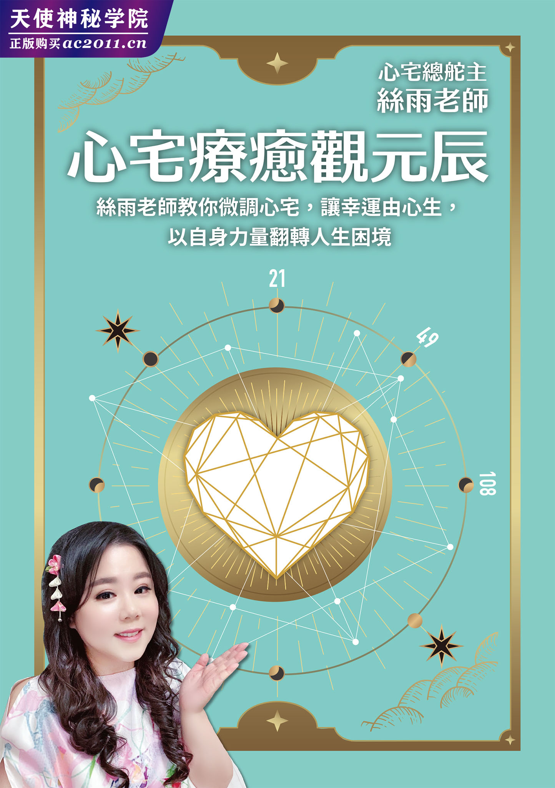

# 前言

用心爱自己，观元辰宫掌握自己的命运

每一天，我们的脑袋都在运转！

有时候，我们会困惑：生命有什么意义？日复一日的辛勤付出，最终一定能带来满意的答案吗？

更多时候，我们必须专注眼前的问题，不论是事业、家庭、健康、财富或人际关系，似乎总或多或少会有这样或那样的状况，总是得问：这件事该如何处理？那件事又该怎么化解？往往一波未平一波又起，反正老天总会让人不得闲。

甚至就算当一个人处在放空或者睡着的状态，他的脑袋也不是真正的闲着，可能会做白日梦，而即便是梦，有时也让人觉得迷惘无助。

综观来说，人活着就是一个 Question Mark，我们自身是一个大大的问号，并且还持续被千千万万个问号缠身。归纳起来，可以简化为六个问句，也就是所谓的 5W1H：

・Who：我是谁？

・What：我碰到什么状况？

・Why：我为什么会碰到这样的状况？

・Where：我该何去何从？

・When：我何时可以脱困？

・How：最终，依然要问，我该如何做？

从前，我也跟大家一样，每天总得面对种种的问题，即便到了今天，我不但仍继续面对，身为老师的我，更要面对所有学员朋友的问题。

当然，只要有适当的媒介，那么最终所有的问题，就有解答的路径，透过媒介，你我要做的就只是“诠释”而已。

观元辰宫就是一个这样适当的媒介，只要经过训练，人人都可以做到基本的诠释，既能为自己找到人生的方向，行有余力，也能够协助身边周遭的朋友做某种程度的解惑。

观元辰宫的基本概念

那么，元辰宫是什么？是何种媒介？又媒介了什么？

这么比喻吧！从前的人碰到疑难杂症，怎么办呢？若真的很渴望求解，那他就只能背着包袱，上山下海去找高人指点迷津，但现代人碰到问题又该怎么处理呢？网络搜寻就是最快速有效的方式，拿起手机简单按几个键就能让你上知天文下知地理。

但是网络并非万能，关于“自己”的事，Google 大神就无法帮你解惑。因此我们可以这样说：观元辰宫，就好比是一个“自我心灵版”的搜寻发动机，这个搜寻发动机不仅无远弗届，事实上，还超越一般人认知的三维时空。而这个平台里住着超我神性，祂能帮助你看清自己，并且搭配不同的元辰宫景点，综合你生活中不同面向的问题，做分析解答及处理。

说明到此，我想难免还是有朋友依然感到困惑。那么，我就用两个简单的图来表达吧！

如图所示，很多人对自己的“处境”感到困惑，但究其实，每个人都处在这样的“时空”里：

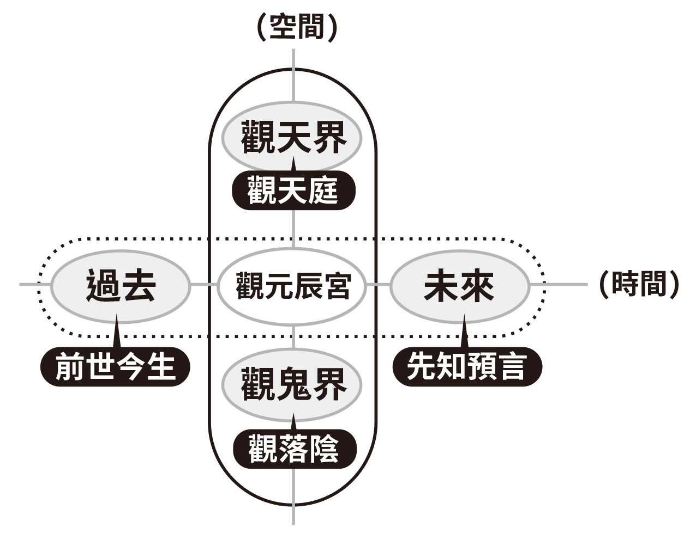

这是一个超越四维角度思考的时空，也就是我们每个人以“自身”为中心，我们不只是处在长宽高概念的三维三維空间，我们还处在包含“时间”以及超越“人界”的不同“境界空间”。

前面提到过关于人们自身 5W1H 的问题，只要问对问题，在这张图上一定都能找得到相应的座标和解答。例如有人困惑生命的意义，那是因为没找到自己在时空中的“位置”；有人烦恼着不知该如何处理困难，代表正面对“未来”的茫然。

当碰到问题，人们总想要去找解答，除却理论式的说明，我们若可以亲身“看到”，便能破解疑惑。

以前图为基础，我们把“看到”这概念融入，就成为下图。

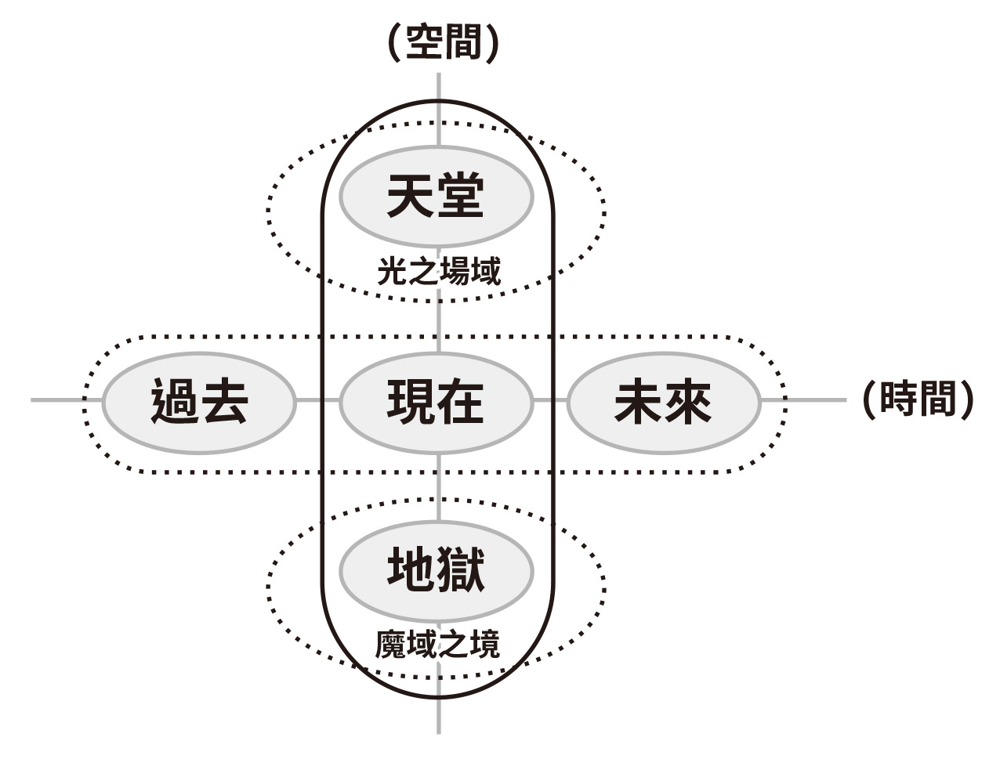

借由此图，相信每个人都能更清楚了解，观元辰宫是怎样的概念。就好比当我们想追寻知识，可能会上网查询；对未来好奇会怎样？可能会去求神问卜、观水晶球，或者问塔罗牌；至于想要了解累世姻缘，可能会去探寻“前世今生”；有人思念过世的亲人，可能会想透过“观落阴”寻求再相见等。

基本上，观元辰宫就是类似这样的概念，只不过，“观元辰宫”可以媒介的范围还要更广，如同上图显示，“观元辰宫”是处于时空的“核心”位置，所以不论是时间概念上的“过去”、“未来”，或者超空间概念的“天界”或“鬼界”，都会和这个核心链接。

也因此，当我们想要寻求各种人生的解答时，可以说：“观元辰宫”，是“关联中的关联”也就是“解答中的解答”。

观元辰宫的基本态度

当然，透过这样的图，虽然可以让读者大略了解元辰宫所代表的关于自身，以及我们和时空、超空间的关联性，但若进一步探询，读者内心一定会充满更多疑问，诸如：怎么“观”？会“观”到什么？这些“观到”就代表问题的解答吗？“观到”后又该如何诠释呢？总地来说，人们想问的就是：用观元辰宫就能解决人生里的种种困惑，并且提出因应的“正确做法”吗？

其实单以架构，就可以很简单的说明元辰宫是什么：每个人的元辰宫是由大厅、厨房、主卧房、书房和花园，这五个基本“景点”构成。

然而，要说简单，牛顿定律也很简单、质能互换也很简单啊！不过就是公式而已。但实际理论，即便有人念到博士，也依然无法骄傲的说自己能真正理解，因为其中有无穷无尽的深奥学问在里面。

同样的，观元辰宫也是如此，毕竟，这不仅关乎一个人的生命灵魂，还跨越了时空，最终是与整个宇宙相连，这样的事，怎可能三言两语就道尽？

我因缘际会的经历到一些不平凡的遭遇，在九死一生之际和元辰宫有了较高度的连接。但这样的我，从过往以来，本就历练了许多科学层面以及性灵层面等扎实训练，包含本身有电脑及企管经营等领域的研究所背景，多年来也很用心的在东西方命理中拜师学艺，举凡紫微斗数、塔罗、生命灵数，乃至 NLP 语言等不同领域，都透过进修打下深厚的学习根基，也取得各类相关的国际证照。

即便如此，连我都依然觉得观元辰宫是穷尽一生也追寻不尽的生命之学，读者若想只透过几次的学习，怎么可能就“学会”观元辰宫呢？

不过，说到底，任何学问都是一样的，若要专精，可能就算研习到白头，也不一定能企及最高境界；但若想达到“基础”应用，这点倒是人人都可以做到，主要还是看一个人有没有“心”。

说起来，“心”真的是很抽象的概念。在古早时代，人们可能真以为有个掌管人们性灵的器官，就叫做心。但在科学昌明的现代，我们已经知道，这个古人所谓的性灵器官：心脏，其实只是身体血液循环的帮浦，是生命不可或缺的最重要器官，但这器官和“思维”没有关系，真正思维器官应该是“脑”，但是否大脑就能代表“心灵”？到今天，人们对大脑的功能，仍有许多的不明白。

无论如何，人们还是习惯性的用“心”来代表抽象层面，例如爱情、意志、思绪等的“平台”。而我们的元辰宫，也是一个“心”的平台。所谓的“灵魂的居所”，是我们的“心宅”。关乎心的事，正如我们在谈治国平天下等大事业前，是否基本上要先“修身齐家”，把“自家”顾好呢？所谓顾好心宅，就是我们应该把“人的本分”做好，这是最根本的事。

当我们观元辰宫，最重要的必须要“用心”，毕竟观元辰宫，其实就是面对“你自己”。如果自己都不愿意对自己用心，那一个人还能认真看待什么事情？

在实务应用上，我们不但可以“观”，也可以真正落实到解决问题，借由了解以及“调整”，让自己找到问题的背后原因，也能够加以“调整”，进而改变原本不佳的现状。

如果说，我们都能相信观阴宅、观阳宅，相信千年传承的命理风水，那么，我们自然也可以相信：我们能观“心宅”，调整自己的心灵风水。

关于观元辰宫的“专业知识”，要做到专精，需要像学者钻研学术做学问般认真投入。关于如何具体协助观者导入生活应用？更是必须搭配千千万万种个案，不同的人有不同的状况，解答的方式也不尽相同。或许有人会觉得关乎“心”的事，不是有所谓的“顿悟”吗？但其实这世间虽然许多人抢修惠能大师的境界，但没有一个人能不入世就出世的。就像我在体验会里说的：六七因上转，五八果上圆，是观元辰宫的境界，初学者练六七，中段者五会显化，体现出来，自然高段者能把五八应用得很好。

本书主要针对初入门的新朋友，以及过往曾学过元辰宫但想要有个“整合性的简单知识汇整”者，以 Q&A 的方式，列出 100 个常见的问题，方便读者借此一窥元辰宫的堂奥。如果因此发现自己对元辰宫有深厚的兴趣，我们也有完整的师资团队，可以协助新朋友做更深入了解。

我还是强调：虽然人生在世，可能对很多事都感到困惑，但这世间万事万物，说到底，还是由“心”而起。心在人在，心灭人灭。

所以，学习元辰宫者，都必须对自己“有心”，也就是愿意“爱自己”的人。如此，不论人们“心中”有任何的困惑，观元辰宫都可以带来相当的指引。

本文最后，我愿意以汉传禅宗北宗开创者神秀大师的偈子，做为新朋友开始阅读本书的一个引子：

身是菩提树，

心为明镜台；

时时勤拂拭，

勿使惹尘埃。

我们可以把观元辰宫，想像成“时时勤拂拭，勿使惹尘埃”的过程，这样的理解，读者应该可以更明白。

那么，就让我们继续阅读本书，邀您一起透过简单的问与答，进入元辰宫的世界。

# Q01 什么是元辰宫？

即便现代社会信息发达，相信还是有许多朋友从未听过“元辰宫”，或者可能依稀有印象，但误以为是民间宫庙祭祀那类的民俗甚或迷信，就让我们先从最基本的名词解释开始——什么是元辰宫。

以最简单的定义说明：元辰宫就是我们灵魂居住的地方。

所谓“观”元辰宫，意指我们可以借由导师的导引，或者日后在自己接受培训后，也能做自我内观：“探看灵魂之家的风水”。

元辰宫所呈现的景象，就代表着我们每个人自身的整体状态。

如果大家可以接受我们不论是居住的阳宅，或者祖先安葬的阴宅，都有相应的“阳宅风水”以及“阴宅风水”，那么同理，我们心灵的居所，也就是心宅，也同样有“心宅风水”。

观元辰宫需要一定的专业，并且如同世间各种学问般，必须不断精进，才能有更深入的理解。

我们以简单的表列来看元辰宫这个灵魂居住的地方，可以分成以下五个区域：

**元辰宫的景点　主掌范畴**大厅　　当年大运厨房　　钱财配置主卧房　感情家运书房　　功名利禄花园　　健康外缘

以上只是简单的说明，实务上，例如元辰宫的书房，不单单只是与功名，各类考试学习、升官发财等有关，那里也有生命之书，可以对人生问题提供解答。

关于观元辰宫，更深入的理解，需要循序渐进逐步学习。实务上的观元辰宫，一定要有合格的专业导师导引。

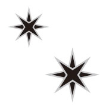

# Q02 具体来说，观元辰宫有什么意义？

如果一个人没听过“元辰宫”，会完全不知道这名词是什么意思。但当有了初步的认识后，相信人们接着就会好奇，如果真的有这样的一个“灵魂的居所”，那我们要怎样“看到”？所谓“观元辰宫”会是怎样的运作？有实际的“作用”吗？

灵魂之家可以被“观”吗？自然是可以的，否则也不会有那么多人参与“观元辰宫”。但如同我们去参观古都以及许多世界文化遗产，当进入重要建筑物内部时，都需要接受导览。我们进入“元辰宫”，也是如此。

毕竟，元辰宫对我们每个人来说，是攸关生命格局，是重要的建筑。

观元辰宫具体是怎样的形式呢？

每个人都可以在专业导师“引导”下，从初阶开始，逐步进入观元辰宫，也就是看自己心宅的状态。

在此假定我们已经比较熟练，可以真正进入元辰宫，可以比较清楚的“观”入了，那我们会“观”到什么呢？

我们可以看到灵魂的居所

请想像我们去拜访一个人，他会住在什么样的建物里呢？答案是有各种可能。可能是西式建筑、日式建筑甚至中西合并。那现在我们拜访的是“自己灵魂的居所”，同样的道理，每个人的心宅样式也都不同。并且元辰宫的样态没有设限，有人可能住在像紫禁城般的宫殿，有些人则是住在现代化的摩登楼房，但也可能有人是“穴居”，各种居所型式都有可能。

我们可以看到不同的房间内里

如同我们进入任何现实生活中的建筑物，可以看到客厅卧房厨房等，观元辰宫也是如此，会有基本的内里，包括大厅、厨房、主卧房、书房、花园等，我们称之为“景点”。这些内里风格很可能不一致，例如厨房采取传统中式炉灶的那种，但卧房却是纯欧风，放有公主床的那种。我们的心宅可能是不同风格房间的组合体。

当然，以上都只是“观”，一般人可能仅观之但不得其“解”，这就需要导师协助。在元辰宫里，不论是房间的大小、布置或清洁度等，都是有其意涵，也可以透过调整做改善，进而改善自己的真实生活层面。

# Q03 观元辰宫的作用或目的是什么？

在世间，做任何事大致都有个目的或理由，例如去诊所看医师，是因为身体不舒服，或有健康问题想请教；去逛家具大卖场，是想要添购家具，或者了解市面上有什么新产品。那么，“观元辰宫”的目的是什么？

的确，观元辰宫必须有“目的”，而非纯观光。

最基本的目的：观元辰宫是为了要改善现有的人生状态。

我们鼓励人们常态性的借由观元辰宫来调整自己状态，但不鼓励抱着好奇、不够诚信的玩世心态进来。

观元辰宫可以“观”到什么？并且可以因此带来什么作用或影响呢？

进入元辰宫，可以通晓自己的“过去”，并据以扭转“未来”

当然这件事不是一蹴可几，也绝非一劳永逸。但的确透过导师协助，在观元辰宫的过程，可以让我们了解很多事，最主要是了解“现在”的状态，但也可以“观到”过往甚至前世相关的重要链接。透过适当的调整，既可以改变“现在”状态，自然也能因为改变当下，进而扭转未来。

进入元辰宫世界，可以替心宅风水改运

由于每个人的元辰宫型态不同，甚至每次看到的景象也不同，因此代表每次需要调整的内容以及调整的程度会不一样。

每次的调整，都直接带来现实生活的改善，等于是改变命运。

改善的项目，例如调整厨房，会影响到财运；调整花园，会影响到健康等。调整方式也因每个人状况不同，做法也不同，基本的项目，包括改变内里布置、清除脏污，借由一次次的调整，我们希望人们来观元辰宫后，心宅会变得越来越清洁明亮，甚至有可能完全改变样貌，从废墟变成美丽宅邸。

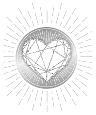

# Q04 观元辰宫时，会“观”到什么？

相信很多读者，知晓元辰宫是自己的心宅，里面包含不同的房间等，不免有些跃跃欲试。但到底观元辰宫会观到什么？是否可以有个更清楚的描述？

元辰宫，就是我们的心灵殿堂，是我们的心宅。观元辰又称观元神。

提到元神，大家都听过，也或多或少参与过年度大事，叫做“安太岁”。相信许多不同生肖的朋友，每年都会因应当年流年，去安太岁或点光明灯。那么“安”太岁是在“安”什么？点光明灯又是在保护什么呢？其实就是保护我们的元神。

当我们安太岁或点光明灯的时候，目的是祈求各方神仙菩萨保佑。若我们都会去外面的庙宇和神佛祈愿，那是否更应该到“自己的内心”做祈愿祝福呢？

当我们观元辰宫，也就是观元神、观灵魂居所时，也会遇见我们的心宅守护神，并且可以在守护神或者是管家的引领下，去做心宅“参观”。

下列说明实际观元辰宫的观法，以及格局代表的意义：

大厅主宰大运

在大厅可以“观到”很多今年流年该注意的征象。比如说有些人可能要注意跟车子相关的交通移动状况、有些人可能得留意家人会有某些状况，比如说父母亲生病住院或小孩子出状态等，甚至于有人要留意可能有官司诉讼等状况出现。

上列这些都可以在大厅观到，看大厅就知道今年该怎样调整，有助于今年的运势，强化我们的能量。

厨房掌管钱财

可能有人觉得自己命格似乎不适合投资、觉得自己投资好像怎么做都不顺？有人则是不管是买股票或是跟着别人投房地产等，老是觉得出问题？还有人努力存钱最终却仍守不住钱……上列这类跟财务相关问题，都可以在厨房“观到”征象。

当我们观元辰宫时来到厨房，可以观察你的“财富动能”哪边出问题？财富的动能，有其固定的依序，这个顺序往往也呼应我们身体不同部位的状态，和身体健康有关。

主卧房主掌感情

现代社会有很多的旷男怨女，或者说剩男剩女。不论如何，若有机会，相信他们其实也想要得到缘份，想要有好的媒合，最好可以找到理想另一半，结婚步入礼堂。

就算是已婚者，也会遭遇不同情境。可能有人觉得婚姻不幸福，甚至濒临离婚想要挽回等，另外也有些人的状况是他们想要生养小孩但总是得不到。

上列这些都跟主卧房有关，举凡感情、家运，乃至于招斩桃花这类的，都跟观心宅的“主卧房”有关。

特别要说明的：观元辰宫的改运，并非强制改变结果。

现实生活中很多事情，例如结婚、恋爱、谈感情，前提是双方得先有共识。不同人往往会有不同理念，包括如何教养小孩、如何管理金钱等，都会有价值差距，那么，必须由双方好好沟通，不能凡事都想单方面“化解”。

基本上，重点在于解决问题的根源而非化解表面状况。

书房主掌“升官发财”和“功名利禄”

古时候有科举制度，士子一考定终生。到了现代，虽然社会已经发展多元，但人们依然仰赖各类考试考核等，作为生涯升官评量依据。也因此，许多来观元辰宫的朋友，都会有这方面问题，例如担忧职场评鉴不过、或者写论文碰到瓶颈生不出内容来等。这些相关问题，都可以在书房“观”到，并据以做调整。

既然是考试，当然包括孩子念书考试是否顺利、以及家中若有过动儿、自闭儿等，性情容易浮躁不安，若能在元辰宫得到调整，小孩子会比较安稳，父母亲也会比较安心。其他像是做实验、写市场分析报告、各类的研发进度卡关，或者创作者写剧本或写小说没有灵感，其解决方法，都可以在书房找到。

花园主导生命健康状态

所谓花园，不一定是指后花园，也有的人花园位在前院。基本上，每个人的花园里都会有生命树注 1 以及生命花注 2。

平常我们喜欢形容女人像一朵花，其实在元辰宫里，不分男女，都有自己的生命树和生命花。

以上，就是最基础的，“观”元辰宫的“观法说明”。

注 1：生命树的整体状态，对应一个人可能身体机能是否有问题？以及精神方面的课题。例如他的内心是否有烦恼？当透过观元辰修护生命树时，也就等同修护这些身心状况。

注 2：生命花，主要跟人生课业有关，也和贵人运、好人缘有关。一个人这一生的“志业”课题是否完成？生活中有没有好帮手？此外，也包括他的“外出运”好不好？例如是否到海外工作发展会更好等。透过整理心宅左右腹地的花园，就可以调整自己状态，营造贵人运。

# Q05 要怎么进入元辰宫？

提起观元辰宫，新进朋友可能会表示：“我很紧张，这是我第一次进元辰宫，要怎样才能顺利进入元神呢？过程中会不会出状况啊？”

究竟，进入元辰宫有没有具体的 S.O.P.呢？

新人对于观元辰宫“既期待又害怕伤害”，这是可以理解的，毕竟，任何人对陌生及未知的事物，心中总是惶恐，更何况是牵涉到灵魂居所这种感觉神圣的所在。

但以实务面来看，完全不需要担心，因为观元辰宫全程有导师陪同，事实上，过程也不具危险性，敬请安心。

观元辰宫，就是探访自己的心宅，这个心宅，不需要翻山越岭才能到达。但的确，对新人来说，刚开始观元辰宫，并不是那么容易进入状况。

观元辰，走的是“内心路线”，基本的方式就是透过我们每个人自身都有的五感六觉。

所谓五感，就是眼耳鼻舌身。更具体来说，就是“视觉”、“听觉”、“嗅觉”、“味觉”以及“触觉”。

所谓六觉，就是以上五感再加上“意念”的部分。

简单来说，不同类型的人，进入元辰宫的模式有所不同：

视觉型的人

视觉型的人观入元辰宫，他所看到的画面可以用电影来比喻：很像是观赏科幻类型电影，例如《奇异博士》或《露西》，片中都有那种快速闪现以及多种画面交叠的特效感。快速闪现是感知型的表示方式（后述），视觉型则是特效晕染色彩绚丽广角型的视角。实务上，我们真的在元辰宫里看到的，可能比那样的电影画面更精采。其呈现方式，可能是动画，甚至是具有渲染感的 3D，乃至于 4D，非常可能，你在现实世界不太可能遇到的画面，在元辰宫里却看得见。

另外有些人看到的画面，可能会出现慢动作或是快转等现象，因人而异，重点就是不要被我们长久以来固有的现实世界印象所框住。

听觉型的人

听觉型的人观入元辰宫时，刚开始是看不到画面的，但他可以用“听”的，他可能听得到花公、花婆（编注：民间求子的两位神仙）、管家还有神明等不同的角色，在元辰宫里与他对话，甚至也可能听到自己的亲朋好友的声音，那是因为：元辰宫本就是对应你的现实世界生活所对照的心灵投射，因此，现实生活中朋友的声音，化为元辰宫的意象，只要能成为象征，都是可能的。

当“观入”的时候，有的人可能听到鸟叫声，有的人听得到玻璃破掉的声音，或者可以听到走路的声音。在元辰宫里可以很细致的分辨出那声音清晰的程度，例如走路的声音是地上的木板被踩得嘎兹嘎兹响的声音。曾经有学员跟他的个案说：“我听见花开的声音。”我会说你听听看，感觉一下，是哪一种花？能分辨吗？然后对方会说桂花，或是扶桑花之类的。其他像是雨声淅沥、水滴落窗台或是风呼啸而过的声音，都可以听到。

感知型的人

包含嗅觉、味觉和触觉，在这里统称为感知型的人。有人观入时可能会闻到味道，里面有花香或者是臭臭的味道。一个人来到厨房，他可以感觉到那里有米缸，还可能感觉到米里有虫子，甚至形容得出那个米“粉粉的”，并且也闻得到发霉的味道等。

在味觉的部分，有可能你的主神，也就是守护神，会请你喝药或赐蟠桃、赐酒或一些小糕点等，这些跟“吃”有关的东西，也会让舌头有“感觉”。

再以触觉来说，在观元辰宫时，可能有人觉得身体发麻，或者觉得哪里凉凉的或热热的，有些人在疗愈时，会有针灸般刺刺酸麻感。

在感知力的部分，可能逐步地，随着观元辰宫的经验增加，可以看到的画面会更明确。但那画面初始可能会不停闪烁，在那个过程中，可能很多人会跟老师说：“刚才我们面前好像闪过一个画面，但我不是看很清楚。”当那样的时候，你就可能会更仔细去想，刚刚发生什么事？当你开始去想，画面就会“黑掉”不见了。

为什么当事人会突然间陷入这种“黑掉”，无法清楚看见，或者是雾茫茫的，总之就是无法看清的状况呢？这是因为，当一个人很仔细的去“想”，那个眼前一片黑，其实就代表来自现实生活中，“左脑思考”的干预。

当我们在应用“感知力”时，主要就是顺着一个“念头”、一个“想法”，那是很直觉的反应。

若想要调动“视觉力”，有时必须要搭配动作，如此可以让各种画面更清楚浮现。告诉以“感知力”为主的人说，例如，我们要“进去”一个房间，我们就要双手做“开门状”，如此就能真的感受到“开了门走进去”的感觉。在元辰宫里，也可能会去擦窗户，或者是稍微跟神明双手合十敬拜等。

总之，虽然不像视觉型的人看得那么清楚，但感知型的人还是可以看见闪烁光芒，且感应是聚焦的。例如看窗户时，通常只能看到一扇窗或是没有窗，那种闪过念头的呈现，无法像视觉型可以采取广角视觉，甚至还可能看到窗户旁边有沙发桌椅等摆设。但越融入，越带入动作，凡是内在手脚经过的地方，会在刹那间产生画面，同时也在动作后随之消失。

关于如何观入元辰宫？实务上当然还是要靠经验，无法单单以语文描述。特别要强调的：意念很重要，我们每个人说好话、存好心、做好事，就会产生正向的意念。

对每个人来说，他进入元辰宫的过程，是可以慢慢提升的。好比婴儿的成长也是如此：当小婴儿初来到这个地球，什么善恶观念都不懂，第一个念头就只是“我饿了”，然后会哭，他的感知力集中在嘴部。小婴儿可能拿到什么东西就往嘴巴塞，他的一切行为被“嘴巴吃东西”这个意念所主导，会拿东西来嗅吸或用嘴巴来确认存在的感觉。

但逐渐的，小婴儿开始学会讲话，有了语言能力，可以用“听与说”简单的沟通，之后再来建构逻辑力。这个小婴儿看世界的观点，会越来越不同，世界在他心中也变得越来越清楚。

我们观元辰宫也是如此，循序渐进，由下往上开发，内观力是可以被训练的，内观感觉优位是可以分辨出来之后加以训练。毕竟有些人看得见、但是却听不到，就像默剧那样的状况也是有的。普遍来说女生视觉与感受力是相伴的，男生却是听觉与感受力相伴。又例如听觉型的人有特定的频率，借由专业老师的引导，能抓住节拍与特定的频率，进而可以连接使客人的内在呈现清明的画面感。这是一对一个案时才能体会到的。

我们在刚开始进入的时候就请你跟随导师，他会引导你，让你知道对你来说，是哪一个感知比较优先？是听觉型还是感知型的？之后就安心跟着老师，让他带你进入元辰宫吧！

# Q06 元辰宫可以改变情绪吗？

大部分人可能是因为在生活中碰到某些状况，才想要寻求解答及协助，包含事业上遭遇的困难、债务危机或感情困扰，或者也可能是情绪方面的，例如忧虑、焦躁等。

想请教当我们进入观元辰宫，就可以因此改变情绪吗？

的确，观元辰宫可以改变人们的情绪问题。

我们每天处在复杂的人事互动关系里，难免会遇到各式各样的人际挫折。较小的事件，也许可以自己化解，例如今天被主管骂，只要忍忍就好。

但很多人可能遇到较特殊的事件，像是和家人大吵一架，或面临职涯选择问题，此时他整个人情绪变得特别的低落或焦躁不安，还因此影响到睡眠，也影响自己和身边周遭人们互动的关系，例如讲话口气变差或者总是摆着臭脸，这样会带来更糟的影响，形成负面循环。

如果以上这类状况已经持续一段时间，甚至严重到可能自己都没办法跟自己相处，会自我怀疑，会质疑自己“存在的意义”等。到那阶段，甚至当事人自己都不知道该如何求助，往往可能会由家人或朋友代为请求观元辰宫。

当然，透过元辰宫，一定程度上可以调整每个人的内在状态，进而改善当事人的情绪问题。

通常我们观这类人的元辰宫，一进去就会看见：

・内部太黑暗，可能连一盏灯都没有

・内部太凌乱，桌椅乱摆，堆满杂物

・内部有损坏，盘破墙裂，有东西破损

当看到这类的状况，我们就要协助当事人，把桌椅家具放对位置，破损的东西换掉等，先让元辰宫求取基础的稳定，再来做更细部的调整。

观元辰宫的状态，也包含观察体感温度，例如有些人的元辰宫，一进去就比较干燥，有的是像夏天或比较像冬天等，甚至碰上很恶劣的环境，以上这些都是可以进入元辰宫做调整的。

针对情绪面，也可以改变心宅的色泽，例如从阴暗调整为明亮温和。

而每当经过这样调整，毫无例外的，即便当事人还没明显感知，周遭人却立即有感觉，例如有朋友陪当事人来观元辰宫，他当时只在教室外等候，没想到等到当事人观完出来，他就发现短短时间里，当事人已经有明显的改变，还赞叹的说：“你怎么整个人气色都不一样了？”此外，也有妈妈带孩子来观元辰宫，原本躁动不安的小孩，观完后变得乖巧安静等。

经过调整的人，思考方式会改变，从牛角尖里脱离，懂得反省自己的所作所为，互动也更具同理心，人际关系会明显变好。

# Q07 元辰宫可以改变未来吗？

每个人都希望能拥有美好幸福的生活，若能够预知未来，让自己避开横逆灾难，让生活更平顺，甚至若能预知哪里有投资机会，事先进场赚取财富，不是更好吗？

所以，观元辰宫，可以改变未来吗？

首先，要强调一个观念：当我们观元辰宫，主要是看“当下的情况”，而非如同看水晶球般的照见未来。

但元辰宫跟未来有没有关联？当然有，就好比我们看到马路上有个大洞，于是通知工程人员来做填补，这样就能够避免原本可能有人掉下去的灾难。但这不能称为“预见未来”，只能说当我们“改变当下”，自然就可以“影响未来”。

同理，我们在现在这个当下去调整元辰宫，包括可能去大厅、去书房、去厨房等地方，在导师的导引下去“观”。老师都有一定的功力，也很有技术经验，一般人就算“观”到什么画面，大多不明其义，但老师可以协助当事人诠释，进而让当事人了解，原来看到了一些“未来的指标”。

就好比我们前面举的例子，马路上有个大洞，那是“当下”的状况，但却也同时可以关联到未来，若洞不补起来，有人就会跌进去受伤。同理，在观元辰宫时，也可以看到很多跟未来可以做链接的状况。

而身为老师，我们重视的是：看到“未来的可能性”，但这对当事人“现在”有什么帮助？

可能看到未来公司职场上会有一些订单、或者可能出国或者去某些场合，有机会遇见未来另一半、甚至还能够精确观到可能出现在哪些地点（例如，可能在靠海的地方有机会遇见真命天子）。此外，也包含身体上可能有哪些病痛，例如最近要注意肠胃问题，透过观元辰宫，做到预先防范等。

也曾有这类的情事：在元辰宫大厅，遇到自己家中的长辈，对方可能是爸爸妈妈或爷爷奶奶，在那里收到对方的预告，例如告知当事人他们可能要离开人间。

关于如何面对未来，老师会协助当事人，设法让未来朝好的方向前进，就好比看到马路有大洞了，就要设法去补起来。关于如何配合？老师会出作业，这部分是很重要的，学员一定要认真去做这作业。

此外，也别以为，当预见未来应该会很好，于是觉得就只需坐等“未来降临”就好，这种坐享其成的态度，可能让你等到的不是自以为会发生的美好未来。

或者相反的，预见未来不佳，以为自己就只能坐以待毙，这些被动的心态都是不对的。

观元辰宫不是宿命论，只是提醒一个人要把握时机，所谓天助自助者。

好比说看见身体有哪些状况，神明不能帮你立刻改善，必须当事人自己懂调理，例如应该按照怎样的饮食方式才能对身体较好，才可以降血压或者改善血糖症状等，这些仍需靠自己积极做改变。

简单讲，未来会如何？依然是掌握在我们自己的手里。

# Q08 元辰宫只有五个景点吗？

每次提起元辰宫，老师们传达的，似乎就是那固定的五个景点：亦即大厅、卧房、书房、厨房以及花园。

但每个人都“只有”五个景点吗？还是有什么特例？

基本上，五个景点，只是方便说明的分类而已，实务上，每个景点可能又可以细分成更多的单元。

就好像我们去参观各种类型的建筑物，可能中式西式或者原住民的房子，房间的格局及布置就不一样，并非所有大厅都会是一样概念的大厅，例如，若进入一间西式豪宅，也许光大厅又可以分成客厅、餐厅、休闲厅等。

大厅如此，其他像是厨房、卧房、书房等也都是如此。

我们观元辰宫时，五个景点只是大体上的区分，并且也做为五项基本定位。细部来看，每个宫位又可以再看到更细部的区隔。当然这跟每个人的格局有关，有的人的心宅就是小小的房间，但有的人则是拥有宽阔的大房大院。

以大厅来说，若格局够大通常会有客厅，另外还有个神明厅。这神明厅也有不同形式，有的就像祠堂一般，有比较大的规模，是独立的一个空间，有的则可能是附属于客厅旁边一个角落，其上安有神座等，此外也可能是佛堂或礼拜室。

基本上，观元辰宫时，神明厅虽是隶属于大厅，但观神明厅也可以单独切割开来看意象，例如当事人可以在此恭恭敬敬祀奉先祖，而以元辰宫来说，这些往生的亲属，也代表着对当事人的庇荫。

再好比厨房，有些人光厨房就很有规模，就如同现代化的豪宅，厨房也规模大到包含很多部分，例如有中岛，甚至还有吧台等。

基本上，一个人的格局越大，能看到的空间及摆设就越多样，老师也可以协助当事人调整，因此元辰宫是有可能由小规模逐步“扩建”成更大规模。而在调整过程中，其实也有助于当事人，因为格局越大、人生状态越好，例如打官司可以胜诉，原本的客户欠债也可以催讨回来等。

同样地，主卧房也是各式各样，有人卧房大到有独立的更衣间、豪华衣柜鞋柜或是储藏间，甚至也有人家中另有小阁楼、小隔间或和室等，乃至于卫浴化妆间，也在元辰宫里有一定的意义。

总之我们的元辰宫，有着各式各样格局。不论如何，对当事人来说，这都是一个个“能量区间”，在细分出的不同区块中，还必须依照每个人福报的大小，让导师指引我们专注在不同的地方。

重点是，每个人一定要记得回归到你的“内在”，观元辰宫，就是观你的内在。

你的心宅是什么样子的呈现，绝对反映到你的现实世界。当房间脏乱，你要不要好好面对跟认真打扫？进而让你的命运好转？这就是每个人为了要改善自己、让自己现实生活更好，所必须做的功课。

# Q09 观元辰宫一次就能调整所有的景点吗？

谈到观元辰宫以及调整元辰宫，感觉上最有效率的方法，当然是“一次就做好”全部处理，就像我们整理房间，也是一次彻底整理比较好。既然有五个景点，希望老师能帮我们一次全部调整好。实务上是这样子的吗？

理论上，老师协助学员观元辰宫时，当然会希望可以调整的地方就尽量调整，但实务上，每个人状况不尽相同。我们确实有一些学员，例如本身有修练过的道士或禅修师，他们因为心宅简单所以能直指问题核心，一次将五大景点整理好。但对大部分的人来说，一方面每一处景点的调整，都必须花费不同的精力时间，这还只是指普通的状况，若碰到极度脏乱或损害的情况，会耗费更久时间；另一方面，就算是同一个人，状态也会持续变化。就好比，今天起床后整理过房间，难道明天就不需要再整理吗？同样地，心宅的状态也需“常态维护”。

以观元辰宫的“速度”来说，每个人内观速度也不一样。这里就要谈到，观元辰宫时，为何每个人的进展会有明显不同？

首先，人有五感六觉，也就是眼耳鼻舌身意，基本上，视觉型的人，看得比较明确，速度也比较快，当导师引领他的时候，进度会比较快。

但听觉型的人，透过听觉辨位的能力与音波震动作用，会有音波探测器般的回馈。他可能就是内在的“知道”，或者是他可以听到神明、管家，甚至花公、花婆乃至于仆人来跟他对话。这种情况下，他可能需要反应，而内在的对话过程是需要时间的，这种情况自然会让观元辰宫的进度变得比较慢。

随着观元辰宫的经验累积，每个人都会进步，可能逐步由感知型朝视觉型迈进，这是由下往上慢慢训练的过程。

整体综观，听觉型的人，顶多感知到元辰宫里有东西，但闪一下就不见；或者对感知型的人来说，他感知到有画面，但就是片段片段的，像火花般闪现，然后一刹间就又消失，那画面或许就像玻璃碎片散满地，还需要进一步组合。体感型的人可能闻得到味道，可能知觉到神明赐酒、赐蟠桃、赐药等动作。

所谓感知，包括舌头上可能有味觉的反应，也包括身体上有触觉的回应，他必须在心宅里到处触摸，必须要他摸到的地方才有画面，没摸到就没有。这样的人可能做任何动作，包括会开窗拉门等，都要稍微比画一下，画面才会稳定。可想而知，这样的人观元辰宫及协助调整所需的时间会很久。

整体来说，大多数人一开始都是从感知型起步，慢慢的让自己对这地方越来越熟悉，看东西也越来越清晰，如此，速度感也会随着当事人的状况做调整。相信随着经验累积，有朝一日，观入的速度会够快，当然也是有人可以五个景点一次看完的。

# Q10 熟练后，观元辰宫一次就可以解决所有问题吗？

如果当一个人已经是“视觉型”的人，只要在导师协助下，每次就能观完五个景点，把问题都一次调整解决完毕吗？

首先，观元辰宫，不可能把事情“解决完毕”，因为长长的一生，人的状况持续在变，随时都有需要调整的可能。

但实务上，就如同人的学习阶段由小学、中学、大学、研究所步步高升，每个“阶段”有每个阶段的任务，观元辰宫会做到符合客人需求，阶段性完成当下的任务。

为确保任务完成，通常客人来，我们都会询问他来此的目的，对于要问的事也有先后顺序。例如想优先解决夫妻感情问题，再来处理职场问题等，这些都会先做好沟通。

如果是问能否至少解决“当下”的状况，那也是因人而异。就好比我们同样去医院看诊，有的人可能还要看 X 光片、听医师分析病灶状况等，要花很多时间，有的人却只要跟医生谈个一两分钟，等医师开药就好。耗时多久？无法一概而论，我们观元辰宫也是如此。

例如，有些人，别的不说，光是一进大厅，就碰到比较麻烦的问题，有可能当事人逝去的家人来找他，甚至也有所谓“不干净”的东西出现，这类状况，再怎样也不可能“快速解决”。

另外，元辰宫包含许多的能量场域，若当事人是个负面思考倾向比较严重的人，那么，光是他的大厅和厨房两个景点，可能就要处理很久。

大家可以想像：如果一个地方，到处都是黏腻腻的油垢，即便是在现实生活中，要清理掉也是件大工程吧！

但假定以上所说的“比较大的状况”都没发生，而只是一般的状况，如简单的脏乱，或东西乱摆而已，可能处理起来就会比较快。因此当天就一次处理完五个景点，也是有这样可能的。当然，前提还是要搭配专业的导师。

基本上，一进入元辰宫，很多事可以立刻判断，例如主卧房看起来很明亮，那么就知道，这里大概没什么大状况。其他房间，好比书房，也需要花点时间打扫。另外，速度快慢与否，也要看一个人的“意愿”，也就是当事人是否很“诚心”想要面对问题，若他本人态度闪闪躲躲的，其心宅必定也是朦胧模煳，这就影响其内在打扫的速度。

实务上，老师也确实处理过很多人，可以在一定时间内看完五个点，并且真正完成必要的整理，把心宅内里都打扫干净。这些人，其中很多人可能本身就是修练过的道士或禅修师，或者有上过身心灵的课程，因此一方面他们自己观入时间非常快，二方面做整理也比较快。其实现代社会上，习惯对某些修练统称身心灵课程，但也有一些前辈，前来整理的速度确实快速，而他们所经历的路可能与时下身心灵科学或有不同，例如靠长期深山里打坐静悟等。总之，这些特定状况的人，的确可以比较快观入五个点。

另外，针对问题处理，许多人来观元辰宫时，是针对特定主题要处理的，就还是希望以该问题为主。例如有些人想要问：到底该离职还是要创业？或大老板生意上碰到麻烦，有财务状况需要处理等。像这些时候，我们可能进入心宅，在书房里翻阅无字天书，也就是我们的阿卡西纪录（编注：专属于你灵魂旅程的振动纪录，据说会以能量的方式记录灵魂每一世的思想），来寻求解答。或者有些人论文写不出来，想寻求灵感，也是类似道理。

当上述这类情况，因为当事人已经知道自己观元辰宫是“为了什么目的”，由于有特定要解决的事情，那处理起来，速度也会比较快。

# Q11 观元辰宫，是依据什么原理？

现代科技进步，人人讲求科学，凡事问证据谈逻辑。观元辰宫听起有些“怪力乱神”，背后有科学依据吗？或者不谈科学，至少讲出一个道理来，否则感觉就只是想像的东西，不是吗？

其实，所谓的科学，只是整个宇宙哲学的一环，人类还有太多未开拓的领域，我们不能认为人类“尚未理解”的事，就代表不存在。例如像是空气、细菌还有电力磁力，在数百年前人类也尚未认识，但不代表不存在，更不代表不科学。

那么，元辰宫背后的原理是什么呢？

若深谈的话，可以包含全宇宙运行的道理，但这里我们只谈简单的基础概念。

其实这跟我们看世界的方式有关，如今我们观世界的方式，是包含长宽高的三维世界，也就是所谓三次元立方的世界，顶多加上时间，变成四维。但通常一般人无法控制时间，只能在时间流里前进。以这样的认知为基础，我们来简单分析：

每新增一个维度，视野就更美更自由

举例来说，一维世界就是一条线，怎样妆点都不美，顶多就是线条变个颜色，而行动自由度方面，也只能一直线前进或后退。

但到了二维世界，即便只是一个面，境界就已大不同。有一个“面”，就可以画一幅画，显示出来的已经可以千变万化，远远超乎一维世界的人所想像。但在二维世界，他的行动也是被局限在一个有限“面积”里。

三维世界，完全跟“线”与“面”不可同日而语，美丽的程度也不仅仅是十倍百倍的概念，是绝对的全新境界。那种境界是二维居民“完全无法想像”的。试想，一个人可以走在真实的花园里，跟只能看到一幅花园的画，那差距是如何比较呢？

如果说，一维的人想像不到二维的世界，二维的人想像不到三维的世界，那么，同理可知，我们三维的人也想像不到更高维度的世界，那里肯定更美，美到超越想像。

其实，所谓的天堂，就是指很高维度的世界。

超越时间的概念

每个维度都有其局限。

一维的世界，只有长短，没法想到面积。

二维的世界，非常扁平，没法想到三維。

三维的世界，则受时间所限制。如同你我都知道，我们无法回到过去，也无法瞬移到未来。

但如果“时间”这个观念可以被突破，事实上也一定可以突破。就如同我们从三维看二维一般，也可以从其他维度看三维，好比说我们可以站在“历史的视野”重新看待世局，观点就会不同。

如果“时间”观念被突破了，那传统依照时间的序列模式，意即所谓的“过去”、“现在”、“未来”，乃至于“生死”就可以被超越了。甚至，因为超越时间，所以也没有所谓的“开始”与“结束”。

维度的投影观

想像拍照的概念，明明这世界是三維的，但照片却是平面的。简单讲，我们把三维世界，用二维世界呈现。其实维度与维度间也是如此：

一维是二维的投影

二维是三维的投影

三维是四维的投影

依此类推。我们这个世界，是更高维度世界的投影。当调整更高维度，好比说我们在三维世界，改变我们的发型再去拍照，拍出来的照片（二维世界）就不一样。也就是当我们从更高维度做调整，就可以改善“现在维度”的状态。

若我们拿着一张照片，觉得看起来发型不美，想要用手工修图，这当然可以做到，但这是修图，你本人并没有真的改变。要想在生活中真的变美，还是必须在三维世界做发型改变，也就是重新拍照，所呈现二维世界的发型才能真正被改变。

简单依照上面三个论述，我们就可以知道，观元辰宫，就好比进到一个高维度世界，那里超越了时间，超越我们在现实生活中的局限，所以能观到不同的意象，也由于站在更高的维度做调整，所以可以据以改善现实生活这个维度。

# Q12 西方国家有没有元辰宫？

理论上，身为人类，不论是东方西方乃至于非洲人，应该都有个共通的背后宇宙，那里不论是神明或天堂，不该有所不同。

以观元辰宫来说，这好像是纯东方的东西，所以对西方人能适用吗？

这里，必须要跟读者创建一个观念。观元辰宫，是超越三次元的维度，只是为了让处在三次元空间的我们能够理解，所以以符合“我们可理解”的方式，呈现元辰宫的样貌。也因此，有人的元辰宫是中式的宫殿，但也有人是西式屋宅，或有日式和室等，那都是一种“内在的显像”。

之所以会让读者容易产生误解，可能是名称的关系。的确，“元辰宫”这三个字是纯东方概念的，但命名只是因时因地制宜，在东方我们称元辰宫，但西方有没有类似的词汇或类似的文化呢？当然也是有的。

在西方国家甚至埃及的系统里，他们称为 Temple。这个字的意思，很多人会翻译成圣殿，就是灵魂圣殿的意思。或者也可以说就像在每个人自己的家，可能会有个花园，可是当我们是西方人或东方人，那花园的样貌绝对不一样。因为在西方国家，很多人观元辰宫时，里面会有一个大花园，例如举世闻名的凡尔赛宫就有很美丽、很大的花园，另外在屋宇的前面，也可能会有天使圣殿，或其他名称不同但意涵类似的建物或处所，总之，不论名称为何？都是指我们的内在。

关于内在世界的维度，身处三维世界的我们，还有很多功课要学，甚至这是一生的功课。

我本身也认识很多心灵境界很高的人，像有位老师，26 年来只靠空气就能维生，人生大多时候也都是闭关冥想。

这宇宙间，本来很多事都是共通的，举个例子，人人爱吃的苹果，中文称苹果，英文称 Apple，日语朝鲜语则有各自称法。就算同样是中文，用台语、用客语或用原住民族语，称法也不同。所以语言只是“接口”，实质的东西本就存在。

西方国家在很早以前就有用类似“心灵探索”这样的概念在发展系统，包括从催眠系统延伸的一些课程发展，他们也很喜欢在探索自己内在的时候，应用到心灵花园、天使殿堂等概念，也会常态使用 Temple 这个字，或者称作是内在寺庙，总之就是你自己的灵魂之家。

元辰宫若听来太东方，我们也可称之为心宅，或心灵风水。无论如何，任何人只要愿意去坦诚面对自己的内在，然后彰显到外在，那么外在世界的展现就会更好。也就是西方常说的保持正能量，宇宙就会回馈于你，这种“吸引力法则”说法。

# Q13 元辰宫跟观落阴一样或者类似吗？

观元辰宫是让自己看到另一个非现实世界的景象，但我们也常听到的一个活动，叫做观落阴。二者都是“观”，所以这两件事是一样的吗？或者只是不同地方称呼不同，或观想程度的差别之类的吗？

“观元辰宫”跟“观落阴”有什么不同？这是我们经常被问到的问题。在台湾，很多人都听过观落阴，那已是传统民间习俗的一部分。而当提到观元辰宫，也因为同样有个“观”字，经常两件事会被联想一起。

但这里要慎重强调，“观元辰宫”跟“观落阴”真的“完全不一样”！到底哪里不一样？这里就分别来解释。

何谓观落阴

观落阴其实就是字面上的意思，“阴”指的就是阴曹地府。要观，就必须“落”，因为地狱是在人类世界下方。

观落阴就是到阴曹地府，就是下地狱去。既然下地狱，通常看见的是亡灵，毕竟我们不会想在观落阴时看到现实中的人。

可能当亲朋好友往生或者心爱的宠物去世了，当事人特别思念，想去阴曹地府跟他们相会，聊聊天化解心中的执念，可能只跟对方问“你过得好不好”之类的；当然也有些人观落阴，是基于另一种理由，他们是有冤亲债主的问题想要化解，那样的时候，也可能让他起动念去一趟阴曹地府。

观落阴时会遇到怎样的神明？主要就是地藏王菩萨、阎王或者是城隍爷等。若有专业的导师，他应该协助化解这部分的思念或纠葛。

何谓观元辰宫

阅读本书，相信在前面部分读者已经知道种种观元辰宫的流程，跟观落阴真的是完全不同的。这里再次简单叙述：元辰宫是我们现在灵魂居住的地方，那里的风景跟观落阴完全是不同的概念，那里有掌管大运的大厅，掌管钱财的厨房，掌管感情的主卧房，掌管功名利禄的书房，还有掌管身体健康的花园等。

比较上，观元辰宫跟观落阴，除了“观”的概念外，其他的都不一样，不但不一样，差距还很大。

# Q14 元辰宫与催眠的差别？

尽管“观元辰宫”跟“观落阴”不一样，但人们还是会联想到其他跟心灵相关的活动，第一个联想到的就是“催眠”。甚至有人觉得观元辰宫只是让一个人进入被催眠状态，不算是真的进到什么心宅世界，是这样的吗？

大凡分析一门学问，如果不懂，不方便置评。但关于“催眠”这件事，丝雨老师我却是有资格可以加以评析的，因为老师本身也是合格的催眠培训治疗讲师。

元辰宫的技术跟催眠有什么不一样？必须说，有些道理是相通的，毕竟都是跟心灵有关。但就好比我们炒中式炒饭要用到炒锅，做西式煎蛋也要炒锅，却不能因此说炒饭跟煎蛋是一样的东西。

所谓催眠，我们都知道，人跟人之间只要能接受互相引导，这就已是浅层催眠的一部分，以此为准，其实很多人，例如生活中大家本来就已“常态”的被催眠了。举例来说，人们喜欢自我暗示，其实就是自我催眠，例如，有的人喜欢看电视购物台，然后边听电视里主持人介绍，也边告诉自己“真的家里有需要这东西”，这正是一种催眠的例子。

既然“催眠”本身就可以用来框架很多事，所以用来比拟观元辰宫和催眠两件事是否相似，其实不是那么恰当。整体来说，观元辰宫过程或多或少也会应用到一些催眠原理。

在元辰宫教授的技术里面，包含 NLP 大脑神经语言传承、次感元的能量调整，以及我们所谓的感情桥，此外，还有一些萨提尔、荣格心理学的意象分析等。我们可以看到，这中间大量融入所谓西方的心理学元素和技术，也包含传统东方的技术。

对一般民众来说，来观元辰宫，不是脱离现实生活，跑到东方古文明传统想像世界里的概念。在这里你也可以听到心灵修炼原理的四句真言：‘对不起、请原谅、谢谢你、我爱你’，或者零极限思维的东西。

若要细究“催眠”跟“观元辰宫”的差别，二者相似之处在于，我们都会在与客人共同协作间产生互动感，彼此间达到一个“状态”，但我们遇到状况的后续，是以解决问题为主。而传统的催眠，有些是只靠催眠师不断引导，跟客人间不会彼此互相协作。当然也会有一些导师会跟客人做互相导引的过程，那就会有一点点不一样。

总之，以专业技术面来说，观元辰宫融合了很多学问，包含很多的层面，但不能单单以此来跟催眠做比较，仔细分析，背后的脉络跟传承更是完全不同。

# Q15 元辰宫跟前世今生有什么不一样？

既然提到了与观落阴的比较，又提到与西方的催眠比较。相信许多对灵魂宇宙能量等议题感到兴趣的朋友，还会联想的也是东西方都有的课题，那就是“前世今生”。我们观元辰宫，也会因此探知到前世今生吗？

如果以“结果”来说，是的，观元辰宫是可能探知到一个人的前世今生，但二者仍然是完全不同的概念。

何谓前世今生？

“前世”，顾名思义就是回到从前，并且是“这世”以前。回去做什么呢？会想要了解自己前世的人，可能有婆媳问题或者感情上的问题，例如跟前夫、男友乃至于跟小孩间，有怎样的爱恨纠葛，也包括和上司或和兄弟姊妹等，总之，因为“这世”有了人与人之间的某些挂碍，所以想去“前世”寻求解答。

不过，也不一定只是因为人际因素的纠葛，很多时候，你觉得这辈子有某些课题让你无法前进，当我们去探究前世今生，可能就会发现你在前世曾经许下过愿望，然后你到了这一世，那些愿望已然被忘记，但那些承诺必须在这一世兑现。

在处理前世今生的状况时，导师一样会协助你做能量上的化解。另外有可能在这世有无名的病痛，可能会在某些特殊场域发作，例如当他看到某场景就会感到头痛，为什么会这样呢？探询答案根源，可能就出在前世。身为导师，会协助当事人去探索，到底是前世的何时在怎样的场域，造就今生这样的痛苦？透过理解去化解，当事人就会发现在身体疾病上有些改善。

回到元辰宫的情况

那么关于元辰宫，读者应该已从本书前几个 Q&A，了解元辰宫是完全不同的概念，观元辰是去到我们“现在”灵魂所居住的地方，那里有大厅、书房、卧房等景点。但的确若在特定情况下（而非普遍情况），观元辰宫同时也会接触到跟前世今生有关的元素，这一点，在下一个 Q&A 会进一步说明。

# Q16 我适合观元辰宫还是观前世今生？

如果说我们现实生活中的状况，可能跟当下的心灵状态有关，那是否也可能跟前世今生有关？要怎么判别呢？

观元辰宫跟观前世今生有冲突吗？

以现实生活中我经常处理的案例来看，观元辰宫时，经常也是可以结合观前世今生的。

要知道，所谓元辰宫，已经是超越三维四维的概念，也就是超越时间的概念，既然时间只是一个“矢量轴”，我们观元辰时虽处在“当下”，但依然可以在这样的矢量轴往前或往后，穿梭在不同时间里。

当然，基本上观元辰宫就是要解决特定问题，如果当该特定议题的确跟前世今生有关，那我们处理的程序上，自然就要接触到前世今生。比如有的客人，她可能在感情上有疑问，想知道跟老公过往有什么渊源？也就是有怎样的爱恨情仇。为此，我们观元辰宫的时候，就会进到她心宅的主卧房里。主卧房其实是有特殊能量的地方，那里有个传送点，若这时候刚好传送点里出现先生给她的一些前世今生的物件配件，例如发钗、发饰等，或是衣橱打开里面都是一些中式的、古代的，好比说明清时代的服饰，或者出现一张照片，内中的女子是处在清末时代等。

当这样的时候，就已经在接触前世今生了。

在观元辰宫的时候，我们都可以透过这样的能量场去接触前世今生议题，最终目的就是要能解决问题。

有些人因此知道为何今世会有这些纷扰，若有可能也希望可以得到化解。甚至有一些人，为何成为一些感情世界里的第三者？这也有可能是跟前世印记有关。

当过往的一切，被带到这一世，我们要知道怎么去化解它、解决它。在解决这些问题之后，你自己就要有所觉悟。

也就是说，接触前世今生的目的，是要你有所学习。学习之后，这辈子你要断舍离吗？还是要重蹈覆辙？亦或重新来过，再次重生？这个决定权，会回到自己身上。

话说回来，回到本 Q&A 最前面的问题，如果一个人不清楚自己要先观元辰宫还是前世今生，那该怎么跟他分析呢？

是这样子的，有些人很想看前世今生，是因为可能感情上有些能量的纠结，比如放不下前任或前前任情人等。在这种情况下，老师会推荐当事人去参阅心宅里前世今生累世的印记，透过不断学习，让当事人自己提升，厘清跟对方这一世的关系。

但以观元辰宫来说，我们的重点还是在“当下”。

如果觉得“现在”能够梳理一下你的大厅大运，让你的财运相关的一些状态，以及种种的感情议题等能够被清理整理，就可以让一个人思绪更清明。毕竟，你会疑惑，就是因为“内心太乱”，心乱当然就看不清真相。

当一个人能“看清真相”，或许当事人会发现其实他根本不喜欢对方，那就选择分手，也许下一个会更好，就无需特别去看前世今生了。毕竟“当下”的事，自己就能厘清处理了。

基本上，我们仍希望每个人先关注“当下”，主力推荐的还是先观元辰宫。如果进到元辰宫后，有些人仍有前世今生印记的拉扯，或其他感情上的拉扯，那么，我们就会在元辰宫里的一些地方，例如大厅、花园或者是其他方位找答案做处理。

例如在房间里发现前世今生的议题，老师会当下处理，毕竟当事人就是因为这个问题而无法前进。对老师来说，他处理的其实是你的“当下”。

只有当我们把挂碍、忧心的事情，透过内心清理，做到真正“释放”，这个时候你才能够再往前进，未来才会更好。

# Q17 元辰宫是想像出来的吗？

这样说，不知道老师会不会生气？

想问，所谓观元辰宫，该不会只是人们被催眠后的幻想吧？

好的东西，真实的东西，是不怕被质疑的。

现在有人假定元辰宫可能只是想像的产物。好，我们也不缺省立场，说是或不是。不过，若元辰宫是想像出来的，那为何会长成那个样子呢？

若是纯幻想，从小到大每个人也见证很多事物了吧！如果想要梦幻的心宅，应该可以勾勒出迪士尼城堡那样的感觉，即便不是每个人都如此，那至少应该有一定比例的人观元辰宫时会看到城堡吧！为何没有呢？

或者想像成凡尔赛宫、紫禁城。如果只是想像，很多电视剧都有美轮美奂的古典建筑可以参考，也有浪漫的偶像剧，故事里有湖畔小屋，飘着白纱窗帘的优雅豪宅等，但为何我们观元辰宫时，自己心宅的画面不是如此？

并且元辰宫的架构往往是拼贴式的，例如你的元辰宫可能大厅是中式，厨房是西式，主卧房又变成日式，正因为是由不同风格组成，才能让我们去解析，才有后续处理的意义。

如果是想像的，为何有的人一观入后，原本会是间破旧的屋宇？又为何可以一次又一次的被改善？真的纯靠想像，那么编剧也太入戏了。

抛开因袭科学头脑的偏见，请允许你自己接纳各种可能，真心认知到这世间的确有许多超乎学校课本内容讲述的事物。保持开放态度，让自己愿意去接受，如此，才能真正深入去了解元辰宫。

不排斥面对命运，愿意去认命，接着就能创运。

这样子才能让自己运势越来越好。

# Q18 什么时候需要观元辰宫？

观元辰宫是种特殊体验吗？也就是说，以一辈子的经历来说，我只要“观过”元辰宫就好？就好比我们可以炫耀我曾经去过欧洲单车环岛，那样的给别人知道吗？还是其实观元辰宫会是一种生活中建议“常态参与”的活动？

观元辰宫有规定特定的时间点吗？

其实任何人，只要你“想”观元辰宫的时候，就该去观，也就是说，是内心的自己发出的请求，要你去审视自我。

基本上，关于观元辰宫的时间点，有以下五种状况：

听听内心的声音

不要忽略，人有很多潜能都尚未发挥，包括内心自我提醒的本能。当你观元辰宫，就已经跟灵魂的居所创建了链接关系，因此日后当你内心升起“想看”的念头，其实就是该观的时候，为什么？因为是来自内心本能反应。

常态创建能量

如果你正在学习这技术，那么你自己会固定去调整观元辰宫的时间，包括同学间彼此交互练习，当这样交互练习时，就会有固定能量场，所以也会选择在固定的时间，特别是可以结合能量巩固期来观元辰。

所谓的能量巩固期：21 天→49 天→108 天。

也就是分别在第一次调整后，下一次时隔 21 天，再下一次隔 49 天，再下一次隔 108 天，都要再回来观元辰宫。

碰到改变的时候

我们需时时稳定内在状态。不过，就算我们已经非常稳定地去做了自身的能量巩固，但不代表“这个世界”也跟着稳固。也就是说，处在世界中的我们，还是会受到这世界的影响。

当周遭可能有一些大环境的负面影响，比如说经济崩盘导致公司损失，或意外灾害带来伤亡等，因为外围环境非常糟糕，容易影响你的工作状况，或影响你的感情生活。另外，在现代，因为地球暖化，天灾或人祸都不少，每当发生这类事情，也一定会影响到每一单位每一个人。

当个人受到影响，这个时候也该来看看元辰宫。

关于改变，这里要特别说明的，当发生状况，例如前述所谓的天灾人祸，或许你本身没有觉察，但实际上影响已经发生，可能正在侵扰你某些地方，肇始你跟那些负能量共振产生负频。因此我也常鼓励学员，不要被动的等到“感觉很不对”了，才想到要观元辰宫，而是要经常性地回来观元辰宫。

想了解自己的人

当然有很多的朋友，以前没有接触过元辰宫，当看到报章杂志电视节目等报导后，或是曾“听朋友说”、“听闺蜜说”，或者从曾来我这里体验过的朋友口中，听到他们的经验故事，而动心想来、想真心了解自己的，都会来结缘。

纯粹好奇的人

前面提到借由朋友分享，因此吸引来的人，有一种是想了解自己的人，但也有另一种人可能是纯粹出于好奇。

对于基于好奇心态者，不能说不欢迎，但这里还是要强调，一个人的好奇值多少钱呢？除了好奇，不会也希望因此让自己有所收获吗？

毕竟，导师协助调整的时候，必须当事人配合，若当事人自己都不知道想要调整的重心是什么？那谘询上就会有所阻碍。最好还是先了解自己：是想要拥有更多财富？还是感情上的顺利？甚或对健康方面的关心？将想要调整的重点要诚实地告诉老师，这样子老师才能协助你。

# Q19 我们是亲自看元辰宫吗？

观元辰宫，一方面应该是看“自己”的元辰宫，但另一方面，我们不懂自观，需要导师导引。所以到底是我们自己看，还是导师帮我们看元辰宫呢？

初次来学习观元辰宫的人，一定需要老师来带领。导师会依照每个人的状态，亲自教会学员，如何轻松进入自己的心宅。

当然，所谓进入，也就是观入。那个观者，就是学员或当事人自己。因为每个人有五感六觉，他们会借由自己的五感六觉来体验自己的心宅。而老师会看当事人本身是属于哪种型的人，就依照他的属性来引领他。

可能有学员是听觉型的，他是完全没画面的，只能看到黑黑的或灰灰的，或者有些人说：“老师我有看到光，这边有个绿色的光，那边有个紫色的光……”等，他会问老师是不是该往那个方向去？还有当事人可能听到小鸟叫、木屐踩踏的声音等。再来是嗅觉型的人，当事人可能会闻到花香、神明檀香等，或是味觉型的人，他感知到神明赐酒、赐蟠桃、赐药等。此外还有触觉型的人，他们进屋必须要做开门的动作。

不论哪种类型，对初进入元辰宫的人，导师都会教导该怎么做，协助当事人融入那个情境。

当一个人越愿意“诚心”面对自己，感受的情境也会更加稳定，例如一扇窗户，你会更感知那是要用“往外推动打开”的，还是像日式和室是“拉门式打开”的；门也是如此，有的是左右方向，有的是前后方向开门。当你愿意让自己更投入的时候，就会发现你的心宅在你进入后，愿意“让你看到”的东西更多。

意念很重要，有些人一进来就会察觉，他的第一个念头、第一个想法，带动一些动作，就会发现他想看到的画面，由原先有点雾雾的、濛濛的，渐渐变得越来越清楚。学员的进展，可能从开始听得到一些声音，进而逐步可以做到全观，而在一旁的导师，也会陪同他一起成长。

有种状况：有些人，表面上说想看自己的财运，但实际上观入元辰后，厨房这部分却总是模模煳煳的，好像不想让他看到，但到了主卧房时又很清楚，神明厅也很清楚。这样我们就会知道，这个学员内心根本没有准备好要调整自己的财务。

我们所谓的内观内照，所谓的往内看，并不是用肉眼看，而是要用我们的“心”去看。一个人愿意相信自己、愿意去学习，很快的每一个人都能做到“看见”，因为每个人都有五感六觉。

而这个看见，当然是“本人亲自”看见。

# Q20 观元辰宫一定要闭眼睛吗？

如果观元辰宫就是进入自己的心灵殿堂，那肯定就一定要全程闭上眼睛的，是这样吗？

答案其实不一定。

举个最明显的例子，那就是听障者。由于听障者根本听不到，也就是无法听到导师的引导词，那怎么导引？他只能睁开眼读老师的唇语。

至于当他读唇语时，要怎么跟你反馈？除非是用打字的方式，因为那是他唯一能用的表达方式，除非老师也学过手语，并且程度得非常好，不然沟通会很困难。在这种情况下，当事人观元辰宫就不能闭上眼睛。

除此之外，我们也有一些太过紧张的朋友，他可能就是一直处在“很担心、很惶恐”的状态，害怕“进去就回不来了”之类的，所以也不敢闭上眼睛。甚至有人平常就连晚上睡觉都不敢关灯，可见内心很害怕。偏偏这类的人，其实非常需要观元辰宫，但他们也不敢闭眼睛。

怎么导引呢？没关系。一开始可以辅导他们先盯着一面墙或是看着天花板，然后以第一直觉的反应来回答老师，过程中就算不闭眼睛也是可以的。

另外，还有一些特殊教育的孩子，沟通表达是有困难的，比如说唐氏症的孩子或者自闭儿、过动儿，在协助他们的时候，当事人甚至无法安静地坐在那边，可能他们会边玩乐边跟你沟通，所以在能量上只要维持协作关系，连玩乐都可以，更何况不闭眼？

像前述的特殊孩子，要采取的辅导模式，可能是协助他们用不同方式表达，例如用绘画的方式把心目中的影像传达出来，或者是用堆积木，把他的元辰宫表现给老师看。

当然这部分需要更专业的引导施做，我们有聘请更专长的师资，可以协助这一块。

方法不局限一种或两种，最终目的只要可以带来当事人状况改善，都是好的。

# Q21 调整元辰宫一次可以维持多久？

这问题跟效用有关，一个人观元辰宫后，可能会关心两个时间问题：第一个观元辰宫观多久才“有效”？第二个是，若调整元辰宫后带来好的改善，那么这样的改善，可以维持多久？

会问这类问题，可能都是新来的朋友，反倒资深的朋友都知道，观元辰宫，是持续常态性的。但没经验的新人往往偏向：“如果做了有效果，当然希望维持越久越好。”最好是“一调定终身”的概念。这些新人可能误解了，以为观元辰宫是个“终极神器”，用一次就可以让自己“一辈子”都处在最佳的幸福状态。

当然这是不可能的，就好比家中有车的人都知道，一辆车就算做了大保养，什么零件都换过，机油也都补满，还润滑了所有机件，依然每一季或至少每半年车子都要再进场保养，连汽车都如此了，何况是关乎一个人一生命运的元辰宫？

那么到底“观一次”可以维持多久？主要还是看当事人自己。

我们其实有很多的经验，有些人本身就非常的正向，他们来调整自己的时候，当下原来的能量感就非常好。不过没有人是十全十美的，他们观元辰宫时，还是有些地方需要调整，比如地板上仍有些脏污等，等清理后，自然他们的能量又可以维持很久。

相较来说，有些人一观入，可以看见心宅里头有非常多的脏污，因为需要调整的地方实在太多了，每个景点还必须分很多次处理。所以他可能每次来都在调整不同的地方，可能这一次是把大厅和厨房调整过，下一次则是调大厅跟主卧房，再下次又必须把大厅厨房跟主卧房未调整完的地方补充调整，之后才能调整书房等。就是这样每一次“扩建一点点”、“打扫一点点”的概念。如此，他在调整元辰宫时，前前后后就会花比较多的时间。

然而无论是谁，当把整个元辰宫整理干净后，都可以维持一段时间，在这段时间内基本上都算是干净的，就好比汽车已经整体做到保养一般。不过，这所谓干净，会有个平均区间，就像再好的车子也要定期保养一样，这也就是我们为什么要把能量巩固期分别设立在 21 天、49 天以及 108 天的原因。

我们的资深学员，都已经习惯了这样的期间。也就是，第一次调整完后，当时心宅已经很干净了，但为何 21 天后要再来做调整呢？因为这段期间内，人与人间互动，可能你跟周遭亲朋好友间，总会有能量比较不好的，会带来负能量想法，也会干扰到你。又或者你的同事或你周遭有发生一些状况，例如公司业绩不佳要裁员，或者发生金融风暴，导致人心惶惶，这些大环境的状态改变等，或多或少一定会影响到我们的心境。甚至当碰到这模拟较大的状况，可能来不及等到第 21 天了，当事人就提前来观元辰宫。

这类事情的确是难预料的，好比星相学上水星逆行的那段时间，地球的灾难也会变多，有人在家就突然碰到水管爆裂，或没事坐电梯，竟碰上电梯卡住不动被惊吓到等的突发事件。

所谓“意外”，本就是难预料的事，不论如何，碰到状况就提前来预约观元辰宫！

但如果没有以上这类意外或特殊状况，那就还是采取 21 天、49 天、108 天这样的周期，随着一次又一次的调整，你的内在会慢慢地越调越好。许多长期客人，他们已经习惯了正能量，有些人固定就是半年来调整一次，就像车子没状况，也会定期保养的概念。

我看着我的学员，个个处在好的能量状态，有些人我看着他们，从最早的单身、到脱单、到结婚、乃至于婚后怀孕，等于伴随着他们一起成长。

这里简单总结：

有状况时，一定要来观元辰宫。

平日能量好的时候，固定来观元辰宫，这是一种预防不顺，也预约幸福的概念，如此陪伴大家一生就会处于幸福好能量的状态。

# Q22 负能量需要多久时间才能清除？

当我们观元辰宫，会在心宅里找到“为何自己运势比较不顺”的原因，如果在元辰宫里发现很多负能量，处理会需要多少时间呢？毕竟，越快处理，才能越快找回自己的幸福人生啊！

相同地，本题的答案，还是跟许多观元辰宫的相关课题一般：那就是，答案因人而异。

每次客人来的时候，我们都在协助客人，清扫他的元辰宫，也就是处理他的心宅，调整他的心灵风水。

大体上会有个顺序，我们会从大厅开始，因为大厅主大运，这里一定要做到最起码的整齐干净。有时候，有些人在进入元辰宫前，可能会先经过前院，那里有个花园。既然都经过前院了，凡经过的地方就可以先开始打扫。

打扫越勤，就越会产生正面影响，但要花多少时间？真的还是需要看每个人的状况，如果面前是一片荒芜如废墟般的园子，对比于草木扶疏清爽干净的花园，处理的时间自然会差很多。

当然有些人来观元辰宫，是特别设定主题的，例如他是针对财务状况的，就要加强客厅以及厨房的整理，如果再有时间，还是可以去看主卧房及书房，毕竟很多景点都跟财富有关：好比说书房主升官发财，这也跟财富有关。以这为例，就可能无法一次处理完，而会是交叉搭配的一个模式，亦即：这次处理客厅加厨房，下次处理厨房加卧房等。

当所有景点都调整完，也就是心宅已经打扫干净的时候，我们会指定功课给客人。这部分非常重要，我们总强调，功课一定要做，功课做得越勤快，内在的维护就越维持在好的能量。

现代人喜欢玩手游或电玩，这里也以电玩来比喻。负能量何时能清除？那其实不是一个“固定的数值”，所以也没有标准答案。如同打怪游戏，每个人就像是游戏中的主角，每天面临到的问题，例如“同事间的纠纷”、“老板的责骂”以及“客户的无理取闹”等负能量，就是你要打的怪。身为主角的我们，每次打怪，血液值就会降低，也就是能量降低，而这件事是“时时刻刻”在发生的。也就是负能量值，每天随时都在增加。

那么每次调整完，会有什么状况呢？就好比打怪后回去“补血”，补完血后血液值上升，整个人的各种数值也会达到满分。但可以维持多久呢？这要看个人，有的人处在竞争激烈的职场，可能每隔几天能量值就大幅下降了，因为他天天都“受伤”。

这就是为什么经常要讲能量巩固期，我们要巩固你的能量，希望能够从内而外去散发，如果一个人已经习惯好的能量，到头来，就算处在压力中也不太会觉察压力，那就好比游戏里，主人翁的等级大幅提升，当再次碰到普通怪物，对主角来说已经不痛不痒，血液值就不会下降。

这就是“境界”的问题了，而观元辰宫无疑可以提升这样的境界。

更具体来说，其实每次观元辰宫时都把脏污都清里掉，但下次来，却发现“怎么又脏了？”又需再次清理。

到底每一次清理干净后，可以持续多少时间呢？

如前所述，关乎两个重点：

大环境的状态

如果大环境实在太糟，是不是建议改变环境？例如一家公司真的是血汗工厂，为何一定要继续待在如此负能量的场域呢？

自身的强度

你越强，就越不怕负能量干扰。

根据经验，我们有客人长期下来，真的已经让自己的能量维持在很好的状态，甚至后来一忙，他们也忘了要观元辰宫。

但世事难料，可能突然就碰到一些意外状况，就好比游戏中本来满满的能量值，一下子碰到大魔王，血液值勐降，当那样的时候，他们就会想到再回来预约调元辰宫。

总之，每清理一次心宅，可以维持多久？还是看个人状况。

如果把自己维护得很好，负能量就比较不容易近身。

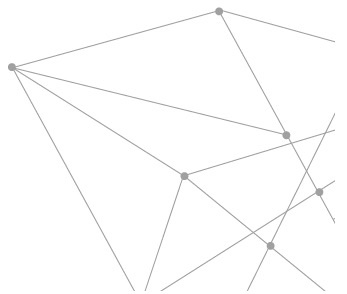

# Q23 能量巩固期需要多久？若第四次没调，之后还要从头开始调吗？

如同老师所说，元辰宫调整后，还是需要定期回来调整，那每个人的能量巩固期都一样吗？如果有人调到第四次，但后来没继续再调，那之后他要再重头开始吗？

每个人的能量状态不同，无法一概而论，不是说哪个人能量只要调过一次就会非常稳定。

但基本上，我们还是都建议每隔 21 天、49 天以及 108 天，要回来调整，这样我们能量会越来越好。所谓巩固，就是指要把好的能量，像打造一个堡垒般，给保护巩固下来。

巩固下来后主要的影响，就是你的内在就会适应一个“好习惯”。毕竟，所有的“好习惯”都是从不适应开始的，例如有人想跑步，刚练跑时可能感觉很辛苦，每天必须早起他也很不习惯，但时间一久，养成习惯，他就再也不觉得跑步会痛苦了。

当习惯了这些好习惯，就代表一个人有好的能量，然后慢慢地就会去做很好的转化。至于有些人，他们可能因天气异常，有些身体病痛，那我们会推荐每隔 21 天，就必须回来温习，然后好好调整自己。

但以 21 天、49 天、108 天这样的巩固期来看，有人可能在第四次来临前，因为海外出差或者其他家里状况，他没有办法配合，于是就超过了 108 天。那下次该怎么调？是不是又要从 21 天、49 天、108 天这样的循环开始呢？

其实，如果第四次后，真的又隔了很久，甚至一年以上，那真的之后还是要采取 21 天、49 天、108 天的周期。毕竟隔那么久，心宅可能又已经累积很多脏污，有许多负能量要清理，等于必须全新跑流程。

实务上，许多人经过调整后，事业真的变得非常顺遂。当一个人赚大钱了，变得更加忙碌了。很多人就是这样，当运势开始乘风破浪呈现顶峰状态的时候，可能早就忙到忘记元辰宫这件事，只有当他后来又碰上运势比较不好的状况，或者想要能量转换的时候，才“突然想到”还有元辰宫要调。

我们的元辰宫心宅转换其实跟我们的流年有关，所以就会变成若你下次来如果已经隔太久，那就要看你“被打回原形”的状况是怎样？有些人即便隔一段时间才来，但他看起来状况依然还好，那就是看情况再来安排时间。

基本上，观元辰宫的目的，就是解决问题。

谈起能量巩固期，这里还要再补充说明的是，的确是依照个人状况调整，例如对有经验的人来说，“速度”的定义是不一样的，例如曾体验过或是其实他有学习过，那么下一次再进入时，身体会有“学习力”，也就是速度会加快。同理，这样的他，每当又有新的调整，随着经验累积，后面调整以及改善的速度也会再加快。

举个实际案例，有个大陆学员，本身是医师，他因为兴趣及助人的志向，组织起线上医师群和护士群，这些群组都成了他的疗愈群组，也针对他们的病患，做能量上的调整。这些人都很愿意接受挑战，喜欢去接一些特殊疾病的案例，好比说僵直性嵴髓炎或者皮肤病、皮囊胆囊有症状的。

当这样情况下，这些被调整的病患，能量巩固期就变成是 21 天、21 天、21 天，而经过实证，他们能量转换后，和免疫力有关的白血球也变高了，或者他们的各项健康指数也都变好。

其实背后的道理都是相通的，那些病人，本都是被医生照顾的族群，由于他们配合度很高，也就是说老师与学生互助协作力很高。他们就会让自己的内在，去诱发自我疗愈系统。当自愈力系统打开，就会加快调整的速度。

这样的情况，医师团队也会觉得有成就感，因为他们觉得帮助很多人，也觉得这是在做善事。

最后总结：每个人的能量巩固期，还是因人而异，只是以大范围来讲，我们会希望依照 21 天、49 天、108 天周期，这样子连做四次，让你能量巩固好，你的事业运、感情运各方面才会诸事顺利。

# Q24 元辰宫能看多少次？可以自己看元神吗？怎样最有效果？

你可能已经逐渐地感受到：观元辰宫，可以因为能量的改变，进而改善我们的生活。但你是否会好奇，这么好的事情，究竟一个人可以看多少次元辰宫？会有什么所谓“一生的次数”限制吗？还有可以自己看而不依赖老师吗？效果又是如何？

关于“次数”问题，应该是受到中国神话传说影响，好比说，有人说：“一生的福分是有定额的，用完了就没有了”之类的传说。

这里先不管那些神话是不是真的，但至少针对观元辰宫这件事，答案是：没有次数限制。

一个人可以看好多次元辰宫，如果你学了正确的观元辰宫方式，你甚至可以“天天”调整，只要你自己有用功、做功课，不怕累，为了自己好，当然次数是没上限的。

例如有些人有睡眠障碍，总是睡不着觉并且每天还需服用一些药物，这样子的情况他可以观元辰宫吗？

答案是可以的，当他学会后，有些人会发现，观元辰宫的另一个好处就是会让一个人很好睡，因为原本的负能量被驱除，整个人做了能量上的调整，无烦恼无挂碍一身轻，就会变得越来越好睡。

调整元辰宫最主要是可以稳定住你的能量磁场，可以散发正能量，这样不但能提升你自己，也可以影响周遭家人朋友，会因为你有好的能量。

但关于如何调整，很多人问“自己”是不是也可以调整自己？其实老师并不太建议这样做，如果你今天是来当个案的，因为每个人状态不一样，老师是针对你的状况来去做调整，去做最适合你的“整体综观”，在通盘检视你的能量场后，也会告诉你“这个要怎么调？”、“那个要怎么处理？”等，对当事人来说，最重要的是：回家后能够维持状态，这才是他该做的。

但如果是自己来调，可能无法拿捏分寸，人们可能都会贪心，想说我这回去，可以这里加点什么，那里又添点什么，但这些非专业的人不知道，随着摆饰或者是你的能量场不同，这些改变会有很多交互影响，可能好也可能不好，如果是不好的情况，那你怎么办呢？

如果你没上过正规的课，回去最好就是把作业做得扎实，让自己的能量维持在调整好的状态就好了，这也是我们会希望你自己把不好的东西清除干净后，不需要再去回顾不好的状态是什么，调整完后又是什么？因为当你在回顾的时候，那些能量场的拉扯也会让你的身体有些不舒服的反应。

# Q25 如何知道自己的能量已经巩固了呢？

我们观元辰宫，都希望可以巩固自己的能量，但所谓“巩固”，有没有一个评核标准呢？就好比在家里煮开水，摄氏一百度会沸腾；汽车加油，油箱满了也可以从仪表板上看出。但关于个人能量是否“巩固”，要怎样看见或知悉？

一个人是否具备能量，当然是很抽象的，但其实这又是可以一眼看出的。例如一个人活力充沛，或充满朝气，你一看就知道，可是这个“知道”能否变成一个“评量数值”呢？那不太可能。

其实能量巩固期，若你每一次进入的时候，都能够是处在同样的“稳固”状况，这当然是最好的，表示当事人的状态是常态稳定的。这就好比汽车上回保养后，这回再进场，状况依然不错，顶多更换机油就好。

所谓能量调整，有可能刚开始在调整的时候，你初始的状态不是很好，若以一百分为满分，你当时的状态可能是只有 20 分、30 分或是更低，但调整后，你整个人就有 8、90 分了。

那个差距是如此的大，可能不单你自己有所感觉，你身边的人看到你也都会觉得你“不一样”了。

慢慢地你下一次再调整时，因为你的环境周遭，可能有一些人有些不好的能量，比如说不巧有人出车祸，或者某个朋友或家人往生等，因为人与人间，彼此能量都会影响，那么一段时期后，你的能量值由原本 80 分的往下掉，可能掉到剩下 60 分。那么再下一次的调整，就是从 60 分调回到 80 分甚至 90 分。

但当这样的时候，感受可能就没这么强。毕竟，虽然同样是能量值提升，但差距这回只有 2、30 分。

观元辰宫的时候，你会发现你元辰宫的状态，有一些是稳定相同的，有些地方则可能还是会有些乱七八糟的垃圾或者是有一些蜘蛛丝，也包括可能有一些其他的不好的干扰，那时我们就是一样要把它清干净。

总之就是不断地，边微调整边扩张，基本上扩张是一件好事。但当你的格局越来越大的时候，你也是要去维系扩张后的自己。

我教学员的时候，一定鼓励他们要内观。内观自己、调整自己，让自己的心性比较稳定，当你的心性稳定的时候，你就可以觉察自己的状态。

当那样的时候，什么是外来的干扰？什么是你本身内在的状况？你自己会很清楚，也能够分辨它们的差异。

到那时，当你自己在调整，就比较不会受到外界的干扰，也能较迅速地回到自己“原本的状态”。

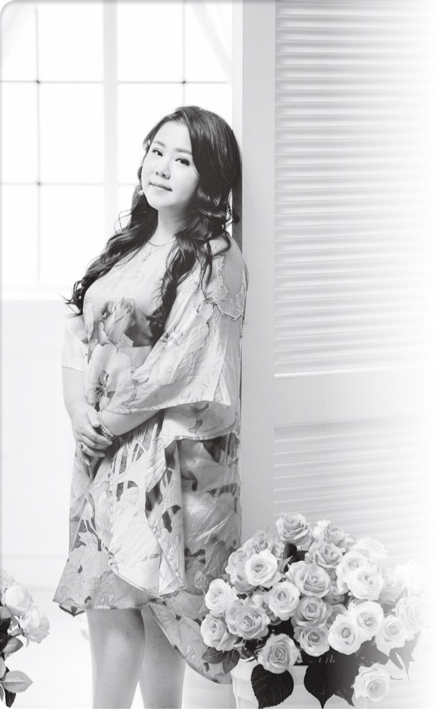

另外，所谓扩张的过程，也就是改运的过程。主要是看个人体悟，如何知道自己能量巩固了呢？这点也唯有自己能感觉到。

当事人会慢慢地比较，去体悟，什么叫做跟内在的自己能够好好地“贴近”，他们可以好好依照自己“想要的样子”去扩张那样的境界。

想扩张自己的意识、改变自己的命运，那就好好的观一下心宅吧！

# Q26 为什么给老师带领观元辰宫，时间过得很快？

感觉有点神奇，当老师亲自带领我面对面调整元辰宫时，会感觉怎么一个小时过得那么快？好像没有调太多的景点，但是时间咻一下就过去？

时间，本来就是属于第四维的座标，感觉因人而异。当人们快乐时，有时候会觉得怎么时间过得那么快？相反地，当觉得很痛苦时，就会度日如年。不过，当在观元辰宫时，那种时间过得快的感觉，又是另一种情况。

实务上，的确很多学员，觉得来观元辰，时间过得特别快。因为每个人在进来的时候，都会看一下时间，然后离开的时候再看一下时间，真的，怎么一小时就这么过去了？

为什么会感觉时间过那么快呢？主要是因为当我们处在心宅时，在那个“心灵维度”下，会有时空扭曲，在这样时空扭曲情况下，我们每个人的体验感是不一样的。

这里我又要举电影的例子，相信大部分人都看过李奥纳多演的那部《全面启动》，片中描述：在“深层睡眠”中，一层又一层的时间感是完全不同的。基本上，每下一层的睡眠深度，时间矢量都会拉很长。在梦里你感觉经历很长时间，实际上现实生活中只经历一小段时间。

虽然是科幻电影，但实务上的观元辰宫，也有类似的概念。可能一个人原本内在很脏污，所以他的心灵处在痛苦中，当获得清理，那是种放松愉悦的感觉，就会觉得时间怎么过得特别快。当他一起来看时间，咦！怎么时间已经过去那么久了？

但同时，你的心是愉悦的。

所以能量状态的改变，也会让你的体验速度感非常的快，这就是我们讲的意念，你会觉得时间过得比较快。

# Q27 观元辰宫有效吗？

虽然这问题听起来太“务实”了，但毕竟花了时间投入一件事，仍会想知道，我们观元辰宫这件事，真的会对我们有帮助，真的有效吗？

商业社会的“效率观”，也经常影响每个人的价值观，但我们在世上不能凡事都问有效吗？例如谈爱情，如果只为了效用，那爱情就不会长久。像家中亲人彼此间，也不该谈效用。

但这并非是说观元辰宫“无效”，若无效，就不会有那么多人愿意长期持续观元辰宫了。

这里要强调的是，每个人内心都有自己的运作模式，世界会因为你的内心而有所改变。好比你心情低落，那么即使外头正在锣鼓喧天欢度节日，你也依然觉得这世界很灰暗。但当你内心很阳光，就算外头刮风下雨，你仍会觉得这世界很阳光。

观元辰宫，其实也是一种和“心”密切相关的事。必须要当事人自己内心能准备好，也就是说当一个人的内在若准备好了，代表一种“相信”，那么观完元辰宫后，运势也会跟着改变，也就是所谓的“有效”。

讲到这，已经牵涉到宇宙运作的道理，例如太阳明天会从东边升起，这件事你觉得理所当然，因为你打从内心就很相信这件事，也的确明天太阳依旧会从东边升起。

宇宙道理是这样运行的，人心也是如此。我们自己的内在，有的时候会帮我们铺好路，准备好因应的工具：那就是我们的元辰宫。但重点是你愿不愿意去做呢？当你的潜意识给了你我较高的智慧，也就是维度比我们高的智慧，你会不会去执行？

所以我们每次观元辰宫，不单单只是观元辰宫，一定还会提出作业，并且要求学员，回家作业好好执行。

只要好好去做，那么你的运势就会因此而有所改变。

这样子你的结果，就会是“有效”的。

# Q28 元辰宫调整多久会见效？

接下来这问题依然很“务实”。接续着前面的问题，如果观元辰宫“有效”，那要“多久”才会有效？十天半个月，还是需要更久？

其实这也是商业社会让人们养成的习惯。例如找师傅来油漆墙壁，会问多久会好？去看医师，也会问吃药多久会好？就连送孩子去补习班，也问孩子多久成绩会进步等。

急着看“结果”，这无可厚非。然而，观元辰宫这件事，所谓成效结果，主要还是看当事人自己。

这件事真的难以做“比较”。以我们的学员来说，因为每个人的起始点不一样，也就是内在的单纯程度是不一样的，就算两个人一起来观元辰宫，但他们的背景，可能从小到大各自经历不同的家庭环境及历练，出社会后，更面临不同的学习环境、社交环境及工作环境，所以每个人回归到自己的原始点，也就是内在源头的时候，有些人会需要花比较多时间去跟自己亲近，有些人就不必。

就好比某甲跟某乙，甲的生活环境很复杂，跟许多女子有暧昧关系，以及牵扯出麻烦的人际纷争，相对来说，乙就是单纯的上班族，勤奋踏实，内心阳光。那么这两个人，观元辰宫的结果肯定不同，一个要清理很久，另一个则不必。所以要多久才“见效”呢？

我们总是鼓励，当你愿意跟自己亲近之后，才能做转运的显化。

我们在观元辰宫调整的时候，是协助大家先去“看见”自己，然后去“认识”自己，在这个过程中，当然也会遇到一些问题点，例如前例的甲，可能问题点就很多。处理问题外，也会去做转运，就是扩张自己内心那个可以让自己“未来会更好”那一部分。

再来举一个跟显化背景条件相关的例子：我们会发现有很多小孩子，他们显化速度就是特别的快，为什么呢？因为他们很单纯，可以很自然地就把自己的心念，包括想要的、想说的、想做的，直接展现出来。他们想到和做到间，比较直接，可能一想到什么就会立刻去执行。

所以再次强调，当我们观完元辰宫后，老师都会开立作业给学员，关于这个作业每个人不同，但有些要求是共通的：

请感谢你内在的神明

看你的神明是哪一位，或者不说是神明，就说是指引你内心智慧，那个开导你的“超我”。对于这个主神，要去感谢祂，跟祂多做链接。

持续 21 天，每天两杯温开水

这个部分是为了自己内在内观，然后调息自己所需要喝的温开水。

以上这两个是基础的，然后每个人后面还有不同要求，可能依照每个人不同的状况，有不同的课题，也就是会有不同的作业要做。

唯有每个人认真针对这些事，真正落实慢慢去执行的时候，后头显化速度才会加快。

我们经常有学员协助亲朋好友，就发现好比说她的老公，怎么显化速度那么快？调整之后，很快就接到订单，可能上午才刚调整，当天下午就应验。

这样够有“效率”吧？

当然也有情况是，有一些人可能要晚一些，好比有人想透过观元辰宫，让自己找到心仪的另一半。但观完元辰宫了，之后等过了一个月又一个月，感情上还是没下文。于是学员就来问老师，不是说调整元辰宫后，可以有男朋友吗？但目前还是没有啊！

那是为什么呢？原来她以为，只要“在家”等，就会有男友出现，难道男友会从天下掉下来吗？或者男友是邮差或快递会自己送上门吗？

不论是金钱或感情，都不是“等”出来，观元辰宫时我们都要知道：是要靠自己去掌握命运，也就是你要创造机会，然后“出去”和这些机会相遇。

比如说有些社交应酬，她到底有没有去？她有没有把天线打开？认真地在她的生命周遭去搜寻真命天子？

当搜寻时才会去注意：是否这里有符合当时她在元辰宫里看到的“那个他”，因为你自己亲自进到元辰宫，有些人就能看到未来另一半的模样。

另有一种情况是：有些人观元辰宫，也知道自己会有另一半，但他内心有恐惧，觉得自己“不配”，还没相遇就自己告诉自己，那种美女怎可能喜欢我？就算宴会上遇到了，根本不敢主动邀约，连电话号码都没得到，怎么会有姻缘？相反地，若真心相信观元辰宫，那么机会可能出现得很快，可能观完元辰宫，隔天就刚好有朋友说想介绍他的表妹给你，还用手机秀照片给你看呢！

真的是好能量一串接，奇迹就无时无刻的在发生。

透过我们的观元辰宫调整后，接着请敞开自己，更认识自己，你的显化速度才会更快。

总之，多久才会有成效？结果取决于你自己。

# Q29 可以每天观元辰宫吗？

我真的对观元辰宫越来越有兴趣，想问老师，可以每天都观元辰宫吗？

如果你已经学过元辰宫，并且你也做过专业的学习，那么当然，你可以回到家后，随时静下心来，自己“每天”调整自己。

这样的你，能够做到时时觉察自己，时时调整自己，然后你就能当个幸福小卫星。

什么是幸福小卫星？

我们常常讲修身齐家治国平天下，修身，就是修正自己的行为。好比你借由观元辰宫调整好自己，当你修正行为时，就是做好修身。然后再以自身为核心，往外扩散到第二个环节，也就是你的家人亲朋好友，接着继续扩散出去，所以称这样的你为幸福小卫星。

所以以你自己学过专业技术，当然可以去帮助周遭的人，也就是修身齐家然后治国。这里所谓的治国，是你自己的王国，所谓自己的王国，比如说你的公司同事或者是自己的事业体，都可以好好以你为核心，扩散影响力去对第二圈、第三圈相关的人做调整。

另外，所谓平天下，则是指让自己心情处在比较平静的状态，也就是无为的状态。

那么，如果每天可以调整，形式是什么？那关乎每个人的觉察。

有些人是早上一次，晚上再一次，有些人则想要更频繁些，当然有些人是觉得平时生活很忙，他只能晚上练习等。

自己调整要多久才能做好心宅清理呢？我们曾有学员花两年的时间，才把他自己的元辰宫，仔仔细细打扫一遍。而打扫干净后，他在灵感的链接上会非常迅速、非常有感觉的。实务上，他的脑袋容易出现灵感，还因此得到发明奖项。

总之，我们观元辰宫，也好似我们做人做事的态度，就是说你要愿意先对自己负责，先把自己调整好，可以天天调整自己。然后以 21 天、49 天、108 天的周期，回去找专业的老师维护自己的能量。

然后慢慢地让自己的未来越来越拓展，越来越好。

当然，以上仅限有专业学习过的人，一般学员还是建议找专业老师，来处理自己的能量。

# Q30 每个人都有适合观元辰宫的时间吗？

老师，我想请问：既然世间有各式各样的人，每人的资质天分以及习性不同，那么，不同的人观元辰宫是否有各自最适合的时间？

从实务来看吧！以我们的学员来说，他们在调整完元辰宫后，我会鼓励学员在家一定要进入 21 天巩固期，然后内观自己、整理自己、调整自己。在这 21 天的调整时期，有些人是一睡醒就做内观，因为对他来说，早上最有精神，所以一大早他就很自动的清醒，时间选择上，有人是选择清晨五、六点，有人是六、七点上班前。

经过调整，一个人精神状况明显会更好，可以因应一整天的工作挑战。

调整的模式，可能主力先是大厅加厨房，或有人是大厅加主卧房。因为大厅掌管大运，是基本要调整的。如此，当他的基本能量稳定住了，他就可以往下一个景点前进。

有些人可能本身是家庭主妇，那她就更没有时间限制，可以完完整整把元辰宫观完，那样的话，或许就会观得很仔细，也打扫得很仔细，这些会花掉她很长的时间，也许感觉一下子，就一个半小时过去。

以上是选择早上观元辰宫的类型，但也有人选择晚上，例如有些人就是一整天上班，白天匆匆忙忙，忙碌到无法静心，只可能在回到家后，选择在晚上睡觉前内观，心想，反正都已经躺在床上，就趁机内观自己吧！也许观着观着，因为太累就睡着，那也没有关系。

从以上我的学员案例，知晓的确我们每个人的状态，真的都不一样，所以调整时间也不一定。

此外，关于适合调整的时间，当节气与节气间转换的时候，其实就代表那是最混沌的时间，在那这个时间是最需要做打扫的。

我通常也都会主动透过学员群做提醒：今天很适合打扫！今天能量星象很好，赶快来打扫一下元辰宫吧！

基本上，若是我的学员群，我都会是先发预告给我的学员。至于尚未开始学元辰宫的朋友，我的建议，你要选择你觉得适合的时间，准备好你的“状态”，然后预约老师，由专业老师引导，他就会带引你，而且会教你怎样更快速地进入心灵殿堂元辰宫，来打扫你的心灵风水。

# Q31 观元辰宫时睡着了会有怎么样的影响？

老师，怎么办？我昨天自己观元辰宫，观着观着睡着了，会有什么负面影响吗？

睡着？那很好啊！人们比较烦恼的，其实是睡不着吧！

例如，有些人就跟我说：“老师，我有睡眠障碍，躺在床上会睡不着。”这样的学员，当他来学习元辰宫后，就可以在他自己的床上内观，微调自己的状态，然后调着调着，当调到心宅大厅时，就睡着了。

醒来后，他会在学员群里问：“老师，我睡着了怎么办？”

我就会说：“没有关系。睡着了，就代表你身体在修复，所以你就好好的让自己睡个觉吧！潜意识会继续帮你工作，明天再从你断掉的地方继续打扫就好。”

当然，一个人调元辰宫睡着后，下次再进去，如果这时你的精神状况比较好，那你可能就多花些功夫，针对上回睡着时调理的那个点，比如说大厅，重新再看一次，这样会比较好。等真正确认已经维护得很好，再往下一个景点前进就好。

# Q32 观元辰宫有后遗症吗？

我们知道吃药会有后遗症，参加很多活动也会有后遗症，比如说出国旅行太兴奋睡不着觉等。观元辰宫也会有后遗症吗？

答案是有的。观元辰宫的确会有后遗症。

具体的回应是来自我们实际观元辰宫学员的反馈。

其实我也经常在上课时，直接告诉学员。观元辰宫会有两个后遗症：

忍不住想打扫家里

在我们调整完元辰宫后，很多人觉得内心干净了，所以回到家里后就会忍不住，也想要开始打扫“真正居住”的家。

实际案例，之前我们很多学员的先生，还会特别来电或来函感谢，说他妻子因为来参加体验会，原本家中有些地方，例如阳台堆放许多杂物，讲好几年了，妻子都懒得处理，没想到这回观完元辰宫后，回家就勤做打扫，也把阳台清理干净。

逛街买东西

比较上，这一点，可能那些观元辰宫的学员，她们的先生会比较不喜欢，那就是：学员可能会变得更爱逛街买东西。

为什么呢？那是因为在调完元辰宫后，人们心中有了更多期许，好比逛 IKEA 或家具卖场时，就会忍不住想：这个灯好漂亮，如果我元辰宫里有这样一盏灯应该不错，其他包括餐桌啦！沙发啦！都会有这类的联想。或者想换掉床埝的花色，因为逛街看到有个自己想要的样式。

有时候老师会开玩笑地说，观完元辰宫后，出门逛街要把信用卡收好，这样才不会看到什么都想拿出来刷。

现实生活中，也真的有学员，例如有位律师，观完元辰宫后，大约隔了一年，他把自己真正的居所，布置成跟他的元辰宫一样的形式，就好像自己真正住到元辰宫里了。家里的沙发款式、厨房格局等，都比照办理，那就是他喜欢的样子。

当住在自己心仪的所在，他真的变得非常开心，能量也显得特别强。

# Q33 感觉被下咒观元辰宫有用吗？

觉得被下咒了？不知道是不是自己疑神疑鬼？但即使是真的，这时候观元辰宫有用吗？

其实任何人碰到任何的“状况”，包括人际关系不佳、财运很差，或者身体上的，包括经常头昏、人容易疲倦。不论是不是被下咒，只要有“状况”，都可以来观元辰宫。

甚至，这种时候更需要来观元辰宫，就好像你都已经知道自己生病了，就不要再问自己该不该看医生了。

透过观元辰宫，观你自己的心宅，然后在导师的协助下，让自己的状态调整越来越好。

# Q34 观元辰宫会减寿吗？

提起元辰宫，似乎牵涉到“超越人间”的“鬼神能量”，而在中国传统的观念里，好像有所谓“用人力去干涉天命会折寿”之类的警语。

我们个人去观元辰宫会减寿吗？

先说结论：观元辰宫不会减寿，没有所谓干涉天命，而只是透过“更高的维度”去观看自己的灵魂之家。

我们每个人的资粮福田这一块，是非常丰富的，我们的内在会源源不断地替我们创造很多新能量，所以当你的心态好、能量好，你就可以避免很多危机或者是意外灾害。

事实上，经过这样分析你会发现观元辰宫，不但不会减寿反而会增寿。

毕竟，我们的寿命跟身体健康有关，当我们因为调整元辰宫，让自己的心情更平稳，让整个人状态更好，达到身心健康愉快，自然也对长寿保健更有益。

你会发现你越内观越内定，或者是你越知道自己身体状况的人，通常都比较能预知到你的寿命大概有多长？在我的观元辰宫学员里面，我都会教他们这些技术。

所以观元辰宫我们有很多的案例，例如当事人可能已经在医院被医师宣判，他的寿命只剩几个月，或者依照他的内脏情况，医师判断大约只剩几年的寿命。然而当这位当事人学习元辰宫后，他愿意真心诚意的面对自己，调整自己的生活型态，当他真正做到由内而外重新改观，实际上，他后来的生命就延长了，远超过当初医师判定的时间。

所谓生命，当然是植基于生命力。当我们调整正能量，实务上，也就是在增加生命力。理论上，我们每个人的生命都可以因此去做调整，每个人在这世上，都有权用自己喜欢的方式，活出自己想要的样子。

此外，就算以现代医学的角度，我们也都知道，当一个人处在开心的状态，整个人的免疫力就会增强，包括遇到伤害后的自我修复力也变强。在我们这观元辰宫的学员，有些人每当天气寒冷，就会手脚冰冷，但调整完元辰宫后，甚至当他在观入的时候，就有“气”会上来，调理他的脉轮，让他全身发热，由冰山美人变成温暖美人。而医学也告诉我们，癌症喜欢干寒的体质，当体质变温暖了，那些绝症也就远离了。

总之，观元辰宫有益身心，绝不要烦恼观元辰宫会减寿。

# Q35 进去元辰宫成功机率有多少？

其实，我有点害怕，如果大家都进得去，我却进不去怎么办？观元辰宫有人会“失败”吗？或者成功跟失败有没有统计过的百分比？

观元辰宫，的确不是人人都可以很顺利观入。然而，这也毕竟不是什么冒险或牵涉到生命安危的事，初次参加者，还是应该尽量以平常心看待。

有句话说，心想事成。若是有一个人内在不断告诉自己：“我进不去，我进不去”，很遗憾地，那结果可能就真的是进不去。毕竟，那是你的“心愿”不是吗？更何况我们正要进去的是“心宅”，你的信心，真的很重要。

所以你一定要知道一件事，如何观元辰宫，我们是有教方法的，如果你愿意遵照老师的指示。了解自己的特质，也就是从五感六觉中，先确认自己以哪种方式进去最适合，例如有的人视觉感比较好，有些人听觉力比较强等，那后续就会比较顺利。

当然，这些都只是进去的方法，但观元辰宫的主要关键，还是问问你自己，“有没有想要成功”？你有“多想要”去观自己的心宅？

依照我们多年的实务案例，只要你具备这样的信念，就一定可以进去。虽然我通常都会讲，这世界上的事没有绝对百分百，但是在我们这边，是真的有非常高的机率，能够很安全的引领你进入到你的元辰宫。只要愿意透过学习与厘清，会越来越增加观入时候的清晰度。

# Q36 左脑比较发达的人，是不是比较难观元辰宫？

其实我担心观元辰宫可能会“失败”的理由，是因为我是个工程师，人家总说我的思考方式太科学、太一板一眼了，这样过于理性的我，也能观元辰宫吗？

许多人都听过左脑人、右脑人的说法，科学也已证实，我们人类的左脑天生就擅长语言、逻辑、计算等，而右脑天生则擅长想像、艺术和直觉等。所谓左脑比较发达，对应的就是这样的人：一切都以科学为依据，讲求务实证据，排斥浪漫幻想。如果一个左脑人来观元辰宫，那么，可能有很高的比例是来……踢馆的吧！

其实，并不是算术很好，或很工程师性格的人，就会排斥元辰宫。因为只要是人，都会有信念，都会需要照顾自己的心宅。而且不论是左脑人也好、右脑人也罢，初入门时，要学的东西都是一样的：都必须先了解自己眼耳鼻舌身五种感受，再加上一个意念，也就是六觉之中，怎样才是最适合自己进入元辰宫的方式？老师也都会认真做指导。

相信一个左脑型的人，理论上会是听觉特别发达者，他们往往一进入元辰宫，连很低频的声音都听得到，接着就可能会听到有管家或神明跟他对话，从中他能逐步了解到，自己心宅的门是什么颜色的？门是怎样的形状？是拱门还是方形门？

而听觉型的人，往往他退后一点点，就会是感觉型的人，他可能有能力在元辰宫中配合动作，创造那种闪一下就不见的画面，然后类似科技电影情节那般，将这些画面以照片拼贴方式，逐步构建组合画面，让自己能看出他的心宅建物架构。

左脑人可以怎样训练自己？其实听觉型的人就是刚好在视觉型和感觉型中间，相对于视觉型的人看到画面，感觉型的人必须带点动作。左脑人的触觉感要多点，甚至触觉味觉要多训练，然后舌头的味觉也可以多提升。

我会鼓励听觉型的客人，回去可能要学习“把各种感觉找回”来，比如吃饭的时候，可以把食物分开吃，并且透过一再咀嚼的方式，用舌头去品尝那些食物在你舌尖上的口感，然后味觉也是一样，都必须做训练，提升敏锐度。还可以用手去摸，感知手感触觉。渐渐地，当他“感受性”找回来后，他自己在观元辰宫的时候，所带出来的画面，也会越来越强烈。

这里老师举出过往实际的案例：

有很多左脑型的学员，在他们刚来的时候，我们都会请他们配合我们的方式，逐步引导他们，等逐渐顺利后，他们后面就会改用自己的步调。

因为左脑人心性爱质疑的性格，他们很多人初来的时候，有人会感到害怕，担心“看不到”怎么办？

老师就会开导他们，所谓看不到，其实是“自我暗示”看不到。当你自己越暗示自己看不到，就越害怕看到，然后干脆就变成不要有画面就好，因为如此，所以才会说左脑型的人往往就会变成以听觉型的方式来观入。

但之后随着老师指导，当事人也愿意配合，懂得借由感知型的方式来感觉，逐步带动画面，他的画面就会左一点右一点，有点像闪弹式的烟花，然后就会拼贴出画面来。

刚开始很多人说，老师我无法像视觉型的人那样看到心宅全貌，比如视觉型的人进到大厅可以看到窗户在左边，神明厅在右边，这边还有餐桌椅，那边有古董椅等。但也许同样的场景，感受型的人这边看到桌椅，但闪一下就不见，主要都是局部聚焦型式，那样的情况也可以想像成是一幅拼图，他们就是东拼西拼无法拼成一个整体的画面。

当然，这不是永远如此，只要经过训练，都是可以提升的。

的确，左脑型的人，可能顾虑比较多，对观元辰宫有阻碍。也就是说，要整个观完元辰宫，花的时间或许会长一点。但只要遵循我们专业老师导引，在此协作关系下持续互动，内在可以学到很多。

重点是相信老师，也相信你自己。

# Q37 进得去一定出得来吗？会不会卡在里面？

不知道这样问，算不算是笨问题？有没有可能像电影一样，进去一个迷宫，然后……找不到路出来。观元辰宫会这样吗？

会有“进去”、“出来”这样的对比，相信主要是受到电影的影响。

很多科幻电影，可能进去什么魔界、什么藏宝宫殿等的，进去容易出来难，可能被妖魔鬼怪缠住、或是落入什么时空漩涡等的。

若以纯中国的古典想像来说，则主要是受鬼片的影响，特别是观元辰宫常和“观落阴”联想在一起，既然是进去阴曹地府，那似乎只要阎王“不放人”，或者魂被“勾走了”，人就会回不来了。古典小说里也的确有这类修道人离魂遨游，结果一回来身体已被烧掉“回不去了”的情节，例如八仙中的李铁拐就是如此。

无论这些情节多可怕，都跟观元辰宫没有关系。第一，我们观元辰宫，但没有什么“魂魄离体”这样的状况，第二，观元辰宫，不是上天入地的概念，观元辰宫，是观自己的内心。

实际状况是，任何观元辰宫的人，随时可以睁开眼睛或闭上眼睛，若真的没安全感，你要每隔一段时间就睁开眼睛再闭上眼睛也可以。

整个过程，他其实可以透过学习的方式，知道自己如何跟自己内在对话，可以用很安全方式进入元辰宫，然后出来，并不限次数。

甚至刚学习观元辰宫的人经常会问我说：“老师，我怎么感觉一下子就进去了，可是也一下子又出来了？”

那是因为他还不习惯。如果已学习过、懂得观元辰宫的人，就不会心浮气躁可以很快的定下来，随时调整自己的情绪，让自己处在比较安稳的状态。

观元辰宫，其实是种修练，都在自身体内，没有安全性问题。当外围环境一直不断告诉我们，这世界有很多的混乱，我们透过学习观元辰宫，反而能让你静下心来，从里面提炼你的智慧。

我们常讲定慧，就是要去学习沉稳的定，然后提炼出智慧来。

# Q38 为何调整元辰宫后，身体有不舒服的现象呢？

想请问老师，观元辰宫这件事会不会影响到身体？似乎有人观完元辰宫后会呕吐，若出现这类现象，该如何处理？

的确，有些人观完元辰宫后，会有身体不适的现象。包括，有人会拉肚子，有人会想吐，有人会头痛等。

为何会有这些情况发生呢？总体来看这都是在调整身体时，必须适应的过程。就好像我们知道，一些要戒毒、戒烟或戒酒的人，也会碰到一些“戒断”状态。又或者有些时候，病人服药，会有排毒过程，当身体把内里不好的毒素排出时，这时就会有拉肚子或呕吐等症状，那其实都是新陈代谢的自然过程。

当人们来登记观元辰宫时，都必须填表单，表单上就有个选项，问当事人“有没有服用药物？”，以及本身“健康状态好不好”等，也包括：有没有喝酒习惯，或甚至有没有服用毒品。

老师也会基于这些了解，知道到时候你的身体基于生理代谢，可能会有某些“观后症状”，或许有人回到家会泻肚子，或想要呕吐等。

曾经我们有客人来观元辰宫，她本身从事的是八大行业，体内酒精含量很高，来观元辰宫时都还闻得出她身上的酒气味，面容上也是带着黑眼圈，精神不佳。

在整个观元辰宫过程里，她每隔一段时间就会想呕吐，赶快冲进厕所，吐完继续观，之后再冲厕所。神奇的是，外人会明显发觉，她最后观完元辰宫，气色变好了，甚至黑眼圈也比较消失了。

当然，这是比较极端的状况，也就是说，她的代谢在“观”的过程里就已经发生了。一般朋友碰到的情况会比较轻微，甚至没什么症状，可能就是有的人觉得有些头“重重的”，因为他平常就是用脑过度，或是左脑型的人。

当观元辰宫的时候，因为我们是诱发人们的潜意识，让他左右脑整合链接，所以当事人有种后脑勺好像被重击的感觉。像这种时候，表示身体在告诉你：你的大脑需要好好休息了，放过自己吧！让自己好好地回家调整休养。

无论如何，观完元辰宫，记得每天喝两杯“爱的能量水”，上面有爱心的那种，并且内心想着“我爱我的身体”，喝完水，让身体慢慢地去做新陈代谢，明天会让自己感觉更好。

# Q39 观完元辰宫没感觉，是因为老师功力不够吗？

相对于上一题的状况，如果一个人观完元辰宫，什么感觉都没有，那又是什么情况？

也真的曾有人来问这样的问题，这是属于比较尖锐性的问题，直接质疑老师功力是否不够？因为当事人说，他观完元辰宫，觉得跟他原本当初一样，没什么改变，没任何感觉，甚至表示他很失望，原来观元辰宫“不过是如此”。

难道真的是老师功力不够吗？当然不是，而是来观者功力不够。

因为观元辰宫这件事，我们一来就告诉学员说，一定要透过“学习”。眼耳鼻舌身，由下往上打通，所以每个人第一次来的时候，他可能一开始就是属于感觉型的，他看到的画面有闪放的感觉，但能观到的有限，必须逐步练习，到比较后来，才会练到广角型的什么都看得到。

往往有些客人来，他可能对自己期许很高，觉得自己很棒，属于自我感觉良好型的那种人。他可能已缺省立场，我一定能怎样，而实际上操作的结果，当不如自己的预期时，所谓“期望越高，失落感也越高”。

当有这类案例，也是在凸显一件事，表示这样的人，平时做事时，是不是也是“对别人期许很重，要求别人太多，反倒对自己要求很宽？”

在观元辰宫的时候，就可以知晓，原来你是这样子的人。

重点在能量调整好之后，一定会有转换期，所以一个人可能今天才刚来调整，白天离开，晚上就来追问。那代表什么？代表这个人非常急躁，完全不允许“没察觉任何变化”，其实此刻已经反应出这个人的问题所在。

同理，不同的人会有不同的问题。例如有人提问，说刚观完那天，回家昏昏沉沉睡了一整天，但醒来后，并没有“感觉”比较好。其实每个人对于“觉察自己变好”这件事，不是不觉知，而是觉知的方法不一样，想想，有些人因为很久都没有办法好好睡，所以调整完之后那一夜好眠，就代表身体被调养了，但他本人却不觉得这是“变好”，那真的就是个人觉知及涵养问题。

同样的状况，有人则是很感恩地说，我终于可以好好睡一觉了，反映出当事人内心是正向的。

每一个人的心念，因为正向、负面，而结果有所不同。

我也经常举例，就像孵豆芽一样，我们小时候都有做过实验，当你在孵豆芽的时候，其实豆芽是慢慢在转变的，但也绝非“转瞬间就长高”，所以等待豆芽长大是需要时间的，是要求主人必须等待的。

在等待的过程里，老师都会开作业给学员。每个人的作业有没有做？或有没有确实的做？你有没有打开你的感官力，去观察生活中的变化？这些都有影响。

我们有一些客人他们来观元辰宫，自己说自己“没感觉”，但实务上，他身边周遭的朋友都会告诉他：我觉得你好像有点不一样，但是我又说不上来，感觉你就好像有点……反正就说不上来。甚至有人问，你是有去做微整形之类的吗？

这就是改变，只是当事人不一定感知得到。因为那样的改变，不一定是大幅度的，好比说本来一身污垢，立即被清理焕然一新。而比较是从每个人的内里，在幅度不明显状态下做调整，我们人人都是从内在改变我们对待生活的角度，以及看事情的方法态度。

当你的态度不一样，你的姿态也会不一样。对于你熟悉的人来讲，他会觉得你有一些变化了，但是又有种“说不上来”的感觉。你要说微整形也算，但不是面容上的微整形，而是“内在微整形”，这个微整形代表一个个的“小变化”，累积这些“小变化”就会形成“大幸福”。

具体表现在生活上职场上，可能突然之间有些人职位上得到跃升、有新的金钱收入进来，或开始有形象好的男孩来追求自己等。

当事人其实过往内里能量不稳固，现在已经被稳固了，即便当事人说“没感觉”，改变，还是真的发生了。但每个人也要懂得感恩，这样才能跟宇宙有更进一步的链接。

也建议每个人，都要有负责的态度。不要一味把自己的失望，怪罪到别人的能力上。

就好比，观元辰宫，老师是一对一对学员负责。

但学员本身，也是一对一，要对自己负全责。

# Q40 元辰宫出现的陌生人是谁？

在元辰宫里面如果出现不认识的人，那是“什么”？

提到“陌生人”，这里就要谈谈，许多非专业的观元辰宫会碰到的情况。

很多朋友可能在其他地方，经历过其他老师引导或者是有一些很“神奇”的经验。我们听过最离谱的是，有两个人共同帮这位朋友看。其中一个自称专业的引导师，另外一个则是灵媒，号称可以帮你“看见”。就这样，当观元辰宫时，是三个人一起进行。引导师只引导，但他什么都看不见，那位朋友负责进去感觉看看，另外一个自称“看得见”的所谓灵媒，就号称用灵视力来协助。

问题是，这些所谓具备“灵视力”者，他可能没有学习过元辰宫的专业技术，所以这样的观元辰宫，就会有奇怪的互动。其实那位帮朋友看的所谓引导师，本身是有学过观元辰宫的，只是他对自己比较没自信，想要多找点人来试试，也就是让他练习的白老鼠，被找来的可能是他的亲朋友好友。所以当他说他会“引导”，实际上并没有全心投入在个案身上，反正就是“试试看”。

这里我特别强调，观元辰宫是必须很认真的，如果只想“试试看”，效果通常会很惨。因为参与者没有诚心诚意，本身也处在惶恐状态，甚至未来会面对什么，都没什么概念。

那一次他们的经验，一推开门，以为应该是回家准备观心宅。却不料，一进去，屋里乌漆墨黑的，完全没有灯，不像家，倒像是鬼屋。突然间，一个穿白色衣服长发的女子走了出来，当事人吓得瞪大眼睛看看引导师，但那个引导师被问之后也愣在那里，而那个“灵视力者”就说：“啊！那个是女鬼！”

请记得，每个人的语言一说出来是有力量的，那女子一但被“定义”是鬼，大家就开始起鸡婆疙瘩，觉得“一定是”女鬼。

这时反倒是被当做白老鼠的当事人，内心产生疑问，对方真的是女鬼吗？好像不是但又好像是，但被“灵视力者”说成鬼，于是一害怕就退了出来。至于引导师的反应：他是说这一次没有观入成功，不算数。

但是后来，他们又继续尝试，仍然会碰到这个情况，就是有一个白衣服长头发女生来接他，大家一害怕又退出。

最终这位所谓引导师，其实也是曾来我这上课但没学到位的学员，亲自来我课堂说明情况。我反问他，穿白色衣服长头发一定是女鬼吗？当然不是啊！我们有多少仙女，也就是大家可以在古装剧中看到的，哪一个不是穿着轻飘飘的白纱，然后头发都是长长的呢？

甚至在古代，那些侠客，或一般男子，不也都是长头发的吗？

身为引导师，重点是要“很安全”的去引导客人，并传达正确观念，真正去感觉那人是谁。

基本上，会在元辰宫里做接待的，绝对是跟当事人关系很亲密的人，怎么会说是女鬼呢？一个人怎会安心把自己的心宅交给女鬼打理？

其实，那个头发长长的人，可能就是持家的仙女，至于房间暗？那开灯就好。毕竟，暗，代表着当事人运势不好，我们要帮他调整，就是要帮他点灯。这样才能敞开大运，接着就能继续处理元辰宫里的环境。一个人的元辰宫问题越多，就代表可以调整提升的空间越大。

重点是，要勇敢的面对自己，去面对内心，好好打扫。

所以，在元辰宫里面对的陌生人，请以“自己感受”为主，你才会知道那个人是谁，而一旁最好有“专业”的老师引导，以“一对一”方式，绝不会有所谓的“第三者”。

很多时候，有人会问：“老师，我可不可以让我的妹妹听？”或“我可不可以让我的老公听？”等。

除非当事人有特殊障碍，例如他可能是听觉力障碍，或是其他障碍必须由旁人协助，否则我不会让第三者进到能量空间里，因为这样子你才会专一去感受你内在心灵殿堂的样子。

# Q41 水星逆行衰到爆！可以观元辰转运？

是否有些特殊状况，不适合观元辰宫？例如传说水星逆行时期，会诸事不顺，这个时期适合观元辰吗？

水星逆行时期，可不可以观元辰宫，探望自己的心灵殿堂？

答案很明确，是可以的。

水星逆行，一年大约三到四次，当这个时候，人们可能有些不顺，例如有交通上的状况，或资金问题等。星座命理上，不同星座的人还会有不同影响，但若不以星座角度来看，我们凡间每个人的资质及成长背景本就不同，当对应着天象，会产生不同的状况，其影响包括生活中的大小事，像是记忆力、沟通、情绪等心灵影响，更直白的说，就是可能会觉得“诸事不顺”。严重些的状况，可能会有交通意外，亦或因沟通不良导致的纠纷，或者可能带来财务损失等。

其实水星逆行时还满适合反省自己、在各个主题领域上调整自己，或者是省思哪些行为模式需要改进。所以在遇到状况时也要调整，小至情绪不佳，大至交通状况，当碰到或担忧时，正该善用水星逆行的这段期间，针对问题点来调整自己，反而更可以增强自己的运势。

# Q42 小朋友几岁可以观元辰宫？

我们知道许多事都有年龄限制，就像看电影也有分级制度，几岁以下的小朋友不能看什么等级的电影等。那么，观元辰宫有没有这类的限制？例如几岁以上的孩子才可以开始观元辰宫？

许多事情有年龄限制，背后是有原因的：第一，可能有一定的危险性（包括心灵伤害的危险）；第二，可能有理解度的问题，例如让幼童去上中学课程，不仅听不懂也没有意义。

不过以这两个标准来看，观元辰宫完全没这样的问题，既不具危险性，也并非探索什么深奥的学问。虽然观元辰宫本身的原理是宇宙间的高智慧，但这件事却人人都可以做到，就好比一个人不一定要懂汽车发动机及发电机原理，依然可以开车一样。

以孩童来说，只要已经有基本的说话表达能力，就差不多可以观元辰宫了，哪怕可以用的单字单词很有限，也没问题。

我们有很多学员学完之后，除了观元辰宫帮助自己，也进而去帮助家人，包括回去跟小朋友对练，并且发现借由这样的活动，还可以增加亲子关系，整个过程满好的。

一般成人观元辰宫，可能是因为职场上有压力，借由观元辰宫求解答。然而，我们不要以为小孩子应该就没什么压力，其实小孩子往往可能面对不同的状况，同学的霸凌或老师的误解等，他没反应不代表没压力，有些时候，是透过观元辰宫才会发现到。

实务上，透过调元辰宫，在调整小孩的内心状态后，能协助他开心的成长，学习效果也更佳。

其实我们也鼓励，若本身学了观元辰宫，我们要好好把握这样的机会，不但可以调整自己的内在，同时也帮助自己的家族成员。

以孩子而言，大约三岁以后就开始可以慢慢地接触元辰宫，在孩子满十二岁以前，他都是跟着妈妈的能量，所以妈妈如果情绪够稳定，那是最棒的。

但我们也发现，现在社会有很多的单亲家庭，所以小孩子也可能是跟爸爸，这种情况怎么办呢？其实不论父母都一样，小孩子还是可以有自己的能量场，他可以去调整，比如透过大厅调整大运、透过书房调整学习状态，透过生命花园调整健康状态等。另外针对安全感的部分，就可以调整他的主卧房。关于各项调整，老师也都可以提供协助。

# Q43 观元辰宫年龄有无上限？或者针对特殊状况儿童可以观元辰宫吗？

想知道观元辰宫，小孩子可以参与，但长者呢？例如已经躺在病榻没有行动力者。另外，不同年龄的人，观元辰宫后的巩固期是一样的吗？

基本上，对于已经学习过元辰宫的朋友，年龄完全不是问题，他可以帮自己观，也可以帮家人观。这所谓家人，包括十岁以下的孩童，也包括年纪很大的长者，甚至包含他本人也可能是长者。例如有一个学员，已经将近七十岁了，依然自己在观元辰，另外，学员为家人调整的对象，也有年龄九十岁以上的，最小的则是刚满三岁，完全都没有问题。

真的，学习元辰宫可以获得多方面的好处，包括增进亲子教育以及亲朋好友间的感情。特别是家人关系是一辈子的，但往往因为同在一个屋檐下，有时难免起摩擦，有人透过元辰宫对家人起了同理心，纷争自然减少，彼此更和睦。

以带孩子来说，一个只有三岁五岁的小朋友，是最吵闹的，跑跑跳跳根本静不下来，这样如何观元辰宫呢？

其实没关系，只要本身学习到正确的做法，你可以做到一件事，那就是专心的“跟着他”。甚至有些孩子可能状况特殊，例如是过动儿或者有自闭状况，都没有关系，你只要跟着他，配合他的模式或频率，就可以去帮助他、协助他。

实务上，我有很多学员会来感谢我，因为透过观元辰宫，原本以为她的孩子不需要母亲，结果没想到在短短的十分钟里，妈妈就知道原来孩子在哪些方面有特殊的压力，她也因为学了元辰宫后，知道要用正确的方法，去协助她的孩子一起突破难关。因为这样的互动，瞬间亲子间亲密感提升，黏着度向心度也跟着提高。

# Q44 月事、月经、怀孕可以观元辰宫吗？

观元辰宫男女皆可，但比较起来，女生有着男生没有的“特殊状况”，以月事来说，例如很多渔家会严禁有月事的人上船，认为这是很大的禁忌。那么，观元辰宫，有没有这类针对女生的禁忌呢？

观元辰宫绝对是男女平等的，怀孕者当然也可以，但有几段时期不建议观，并非基于迷信禁忌之类的原因，纯粹是因为怀孕者的心理状况，在某些时段才建议不要观。

如果是女生来月事，一样可以观元辰宫的，事实上，那个时候反而身体能量是满高的。当然，要不要观元辰宫，主要仍取决于当事人身体状况，

若愿意来观，是可以有助于舒缓疼痛。

关于怀孕者，同样也可以来观元辰，不过当事人本身在怀孕时通常比较紧张，可能会因为内在的恐惧，觉得可能会跟观落阴混淆，所以会自己吓自己。如果怀孕受到惊吓，比较容易出现宫缩，所以要跟当事人先讲好，我们是去观元辰，观灵魂之家，并不是观落阴，如果她能够理解这一点，其实怀孕的人也可以做自我调整。

学员自己若已有这个技术，也可以自己内观自己的状态，自己调整自己，这是没问题的，但仍建议最好找专业的老师协助。

但怀孕期间，有两个阶段是比较不宜的：

怀孕前三个月

因为孕妇内心可能比较不稳定，那这时期就避免观元辰宫。

生产前那个月，也就是预产期前一个月

这个时间也是尽量避免去观元辰宫。

除了以上所列时间，怀孕大部分的期间，还是可以很放心的去调整，甚至可以去看一下宝宝的状态好不好。

我们曾经有很多的孕妇学员，她们从当初脱单、结婚到怀孕，每个阶段都曾来观元辰宫，我陪着她们成长，所以她们怀孕之后生小孩也是如此。

当然每个人的进程还是不一样，有些人就是在怀胎前，曾有拿胎、堕胎或者是流产情况，孕妇会因为希望能够好好保护胎儿，在孕前就可能先做调整，孕后大约四个月左右，再来做防护，确保胎儿是稳定的、是可以让人安心的。因为来观元辰宫，当事人都可以非常的安全也非常放松，所以对妈妈来说，其实感觉是很好的。

# Q45 产后可否观元辰宫？想求子适合观元辰宫吗？

怀孕是件神圣的事，表示孕育新生命了。当观元辰宫的时候，除了某些时段，孕妇大致上也是可以观的，但产后呢？还有既然提到怀孕生子，也想问，是否未孕妇女也可以透过观元辰宫求子？

产后当然可以调整，产后其实非常需要调整。

这是因为很多妈妈生完孩子后，觉得自己似乎有产后忧郁症，所以想要来观元辰宫做调整。她的心宅，可能有些地方有蒙尘，堆积灰灰的、象征不开心的污垢阴霾等，必须透过调整清理，让妈妈越来越开心，宝宝也健康，彼此互动也良好。

另外针对有些朋友本身尚无子嗣，她们想要观元辰宫怀孕求子，这可以做到吗？

首先我要跟大家说明，生小孩是两个人的事，所以除了必须要调整当事人之外，老师也必须透过当事人去请教先生的意愿，或者有些情况是先生想要有小孩，反倒是老婆不愿意，另外也有人是因为性冷感的原因等。

基本上，针对求子一事来做调元辰宫的前提，就是希望夫妻一致，彼此要能够协调，这样子双方有了共识，才能共同面对后续的问题。例如生子后随即要面临的经济压力问题，以及教养方式等。

有一个案例是这样的：有位妈妈第三胎剖腹生产完，因为开刀后身体较虚，无力照顾孩子，但孩子出生时间间隔较近，所以三个小孩都还很小，老大、老二以为妈妈偏心爱小的不爱大的，就有些吃醋而出现欺负行为。作为长子稍微懂事，会维护老幺，而和次子产生冲突，甚至受伤。若家中无人可以帮忙照顾，再加上若住家较狭小，活动空间不足，孩子磕磕绊绊造成伤痕累累，不仅让来看孙子的阿嬷心疼，不免也责怪妈妈，让妈妈感觉心好累。此时若再加上，做先生的白天在公司碰到不愉快，一回家又听闻阿嬷说孩子怎样了，于是没弄清前因后果，就责怪争执，本来每件事可能都是小事，但一环扣一环，且经常性发生，最终也会带来家庭关系崩溃的危机。若能早日透过观心宅疏通状况，也会让家人较愿意主动帮忙，化解本来可能有的危机。

总之，在怀孕前为了求子是可以透过元辰宫做调整的。

# Q46 喂奶时期适不适合观元辰宫？

成为母亲后，世界上多了一位自己很关心的人，原本可以自在观元辰宫，现在也必须顾虑这个小宝宝了。想请问，母亲喂奶时期可不可以观元辰宫？

喂奶的时候，老师是建议暂时不要来观元辰。而是请母亲专心聚焦在孩子身上。

妈妈与小宝宝之间，透过不管是喂奶或其他互动，从小就逐步创建了亲密链接，即便小孩子吸着吸着可能就睡着了，但你跟他的链接是很真实的，那里有母爱，透过乳汁，传递爱的能量给孩子。

喂奶时期其实是非常宝贵的，我们都知道小孩子在出生头三个月喝的奶，也就是妈妈的初乳，是非常黄金、对孩子的免疫力系统是特别好的。

所以老师才会建议，在这段时间请各位母亲将专注力和爱，完完全全地放在孩子身上。

当然，当喂完小宝宝，可能他已经想睡觉了，你可以抱着宝宝一起躺在床上，用比较轻松的方式陪他。此时因为没在喂乳，只要本身已经学过技术，做母亲的想要帮宝宝调整元辰宫，这是没问题的。

重点还是，“一边喂奶一边观元辰宫”，这个动作我们是禁止的，一定要“分开”来做，最好是趁宝宝睡了，学习过的妈妈可以给自己一点恢复观心宅的时间，也就是先整理自己，使自己有好心情。有一些妈妈在抱着宝宝时观入，比较容易手滑，反而会让孩子滑落受伤，最好是把宝宝安置好在床上后，这时再观入心宅才是可以的。

# Q47 怀孕中，进元辰宫可以看到宝宝吗？

现代科技进步，生产前都已经可以预先看到生男生女，甚至也可以透过超音波约略看到孩子的样子，但即将为人母者，可能在怀孕期间，还是会心急想“看到”自己的宝宝，这一点可以透过观元辰做到吗？

其实我们都知道，宝宝在投胎前，其实是在天上，可能就在云朵上驻留着。

曾有日本的科学家去采访调查，发现三岁以前的小朋友可能还有些有投胎前的“印象”，当回溯这些印象，可以知悉这些孩子在投胎来这户人家前，会在天上、云朵上，或者在其他地方，观察哪些是未来可能的父母亲？决定要投胎到哪一户人家才好？

关于投胎，在“选定”的时候，其实在元辰宫里面就有一些迹象。

就是说，可能可以透过观元辰，和那位准新生儿“见面”。地点可能会是在大厅，他用他特定的方式跟你打招呼，还有就是在怀孕前 88 天，以东方命理来讲的话，有个叫胎元或胎神，也会在这段期间住在母亲的元辰宫里，用他的方式出现。

虽然在三次元的能量空间里面，我们无法看见这些投胎前的孩子。但可能他就在你身边围绕着，正等待一个好时机，准备来投胎当你的孩子。

也有一种情况，虽然怀孕，但当事人心中却想着：“其实我现在还不打算生孩子。”这就比较麻烦了。

这就是为什么需要进元辰宫，跟你自己未来的孩子，也就是即将要来投胎当你孩子的“人”，好好的跟他沟通。可能当事人会跟他说：我现在或许还没准备好当妈妈，又或者是我们家目前经济状况还不允许生养小孩等。

搞不好，对方反而会很开心的跟当事人说：“妈妈请你不要担心，其实我来投胎，是有背财来的喔！”

的确是有小孩子可能为家庭带来财运的，那么原本对生孩子有疑虑的准妈妈，是否可以因此改变想法呢？

总之，观元辰宫，的确是可以跟即将降生的小生命做沟通的。

# Q48 请问刚小产完，大概多久可以调元辰宫呢？

发生小产，当事人会很伤心难过，这个时间，她是否也可以调整元辰宫呢？若不适宜，那要隔多久才可以？

的确有人刚流胎，很想立即观元辰宫，可能她本身是上班族，产假结束必须回去上班，然而她的身体仍虚，那这样的人可不可以来调整元辰宫呢？好比说趁小产假期间调整呢？

其实，我们观元辰宫，不分男女，都有个基本原则，那就是当事人的状态要对。可不可以调整？要看当事人当时有没有特别不舒服，例如有些人罹患特殊的疾病，她就是非常容易头痛、非常容易不舒服，那当下，我们都知道身体不适的人，对于人跟人间的对话会非常没有耐性。

既然观元辰宫很要求老师与学员间能够互动协作，我们比较希望，当事人是在可以正常沟通、对话的情况下，才来调整元辰宫，只要经过调整，当事人状况会很快得到改善，能量迅速拉升提高，因此只要能正常沟通，观元辰宫就没问题。

以小产来说，如果实在因为本身是上班族，必须赶在产假结束前来调，那老师就尽量配合。否则，最好是选择假期比较长、比较没有时间压力的时候，或当事人是家庭主妇没假期问题。如果符合这些情况，那老师会建议，让自己身体完整的休息个七天，也就是以一个礼拜为周期，过了这个周期再来调整会比较适合。

当这样子的时候，我们的心宅显化出来的东西，可能会变得更好，然后当事人也更愿意去面对她该处理的问题。也就是，她可以好好地跟那无缘的孩子告别，也可以好好帮他祈福，让他去更好的地方。

或者有些当事人有点舍不得这个无缘的孩子，在观元辰宫时，还是可以跟他做一些沟通跟交流，这样子的告别会比较自然。

# Q49 奔丧期间可以观元辰宫吗？

像生离死别这样的情况，人生难免。如果是遇到亲族有人过世，这样的时期可以观元辰宫吗？有没有什么禁忌？

曾有学员，本来已经预约元辰宫了，临时发生状况，亲族有人往生了，她问我这个时期还是可以观元辰宫吗？

我们的能量期间是这样子的，老师希望如果家中有丧事，处在丧期的当事人，就专心的守丧，一心一意为家人，好好的告别。因为将心比心，我们身而为人，也希望若真的“那一天”来到，亲友能够好好跟自己说再见。

当你好好告别完后，我们通常都是说 21 天，就是至少三个七的概念。

等这三个七的周期结束后，再来调整元辰宫会比较适合。到那时，观元辰宫对你的帮助可能会比较明确，因为守丧期间你正在悲伤，那时状态的确是不适合的。

这世间，很多事难以预料，很多人突然遭逢家人无预警离世，心里会有很大的创伤。在那样的心境之下，的确不适合观元辰宫。但如果再过段时间，有些人可能希望给逝去家人更多的祝福，就等到守丧期结束后，你自己在调整时，就可以好好地为往生者、也好好地为自己做调适。

在过程中可能会发现，有些亲人不见得是下地狱，可能就是直接去他想去的地方，那个世界可能非常安宁、非常祥和，一个非常平静美丽的地方。

我知道有些网友会说，某些宫庙可能急着对当事人说：“不行啊！要当心啊！一定要在奔丧期间做某些事，不然你的家人可能会被关水牢或者被禁锢在哪里等等。”总之就是暗示死者无法超脱或面临不好的下场。

但在我的经验里，我几乎没有遇过这些事情，所以老师会希望，如果可以先让自己心情安静下来，守丧期间就好好对家人，等过了三个七天后，你想要观元辰宫我们再来好好调整。

好好祝福往生者吧！

# Q50 是否在元辰宫可以看到过往的亲人？

前面问到有关奔丧的事，这里想要再问的是关于死后的灵魂，当我们很思念往生的家人，可以透过元辰宫和往生者再见面吗？我知道观元辰宫和观落阴不一样，但心中还是希望有这个可能，能做到吗？

的确，很多人心中有这方面的疑问，他们可能知道生死有命，却依然还是放不下，非常强烈思念往生的亲人。另外，也有的人是想念好友，甚至是舍不得自己很宠爱的宠物等。

重点是这样子的，很多人会说家人往生后，明明兄弟姊妹都有梦到那位亲人，怎么就偏偏自己没办法？难道是逝者不喜欢我，不想托梦给我吗？可是我真的很思念他啊！是否可以透过元辰宫看到死去的亲人？

关于这点，老师在这里要跟大家澄清，因为我们不是观落阴，很多人都会想说见死去的亲人，透过我们观元辰宫的方式来做，但我们真的不是观落阴，所以并不会往阴曹地府去。更何况有很多已故亲人，往生之后也不见得会去阴曹地府，有些人可能曾有修得一些果位（编注：修佛所达到的境界），在世时有做善事，当初他是乘着愿望来投身地球，希望协助整个地球的扬升，如今他阶段性任务已结束，可能去了另一个超乎我们想像、更美好的世界等。

所以有时候，我们说一个人明明看来很好命，会突然间急病、然后英年早逝？那种情况可能就是当事人的“任务结束”，必须离开这个地球世界的意思。总之，以上的情况，就算观落阴也看不到亲人，何况我们是观元辰宫，是观自己的心宅。

想想，如果那位亲人已经去另一个世界甚或再投胎，那他当然不会出现在你的梦境，也不会出现在你的元辰宫里。反倒是有种情况，就是当一个人特别思念某个家人，而家人出现在你的元辰宫里，这就是必须面对的“议题”，因为在元辰宫里出现的人事物，都有相应的意义。

如果对方没有出现，你应该要很放心，因为那表示他很信任你。如果可以做到让心放下，那么正确的心态应该是：让亡者好好地走，不见得一定要去追寻，因为你的思念对他来讲可能是他不想再重蹈经历的过往。

对宠物也是一样，例如有个学员非常想念已往生的宝贝狗，每次对朋友形容爱犬时就会说：“唉！我的宠物当时是怎样死亡的，它是被车撞然后怎样遭辗压……”。但当一个人有这样意念出现时，虽然是思念自己的宠物，但很抱歉地，当每次这样想，就代表那只已往生的爱犬，可能会“再次经历”那个被辗压的过程。

你希望思念的对象，再次受苦吗？

所以，基本观念大家懂了吗？我们每个意念，都创造意象和实象，每个意念波其实会有封包跟形象在那个地方。

这个就是我们要尽量告诉自己：如果真的很爱对方，当然是希望看到他未来很好，而不是去想他当时的死状。

我也希望这样的观念能够普及，请尽量去想往生者健康时的样子、开心时的样子，这样子对往生者来讲，他会比较愿意，也可能找机会回到你的生命里面，比如说出现在你梦中，再来看看你，当然也有可能会出现在元辰宫里面。

我们有位学员是个大企业老板，他的家族企业拥有好多土地，事业经营有成。他的情况很特别，每当他准备跟某个厂商签合同的时候，他都会进一下自己的元辰宫，在他的心宅大厅那里有一面墙，上头都是他的历代祖宗。这个位在心灵殿堂的主祀祠，每位祖先牌位旁都有点灯。

在平日，这位企业家会去祭拜缅怀祖先，而若碰到像签约或必须做重大决定的时候，这些祖先会扮演另一个重要角色，也可以说是守护神角色，那就是：透过灯亮灯灭的方式，告知他们的孙子，也就是这位企业家，他们赞不赞成这个合约。

听来很神奇，感觉就像有个陪审团，针对案例，有人举手同意，有人投反对票一般，只是在元辰宫里是借由点灯的模式。而这位企业家也真的很重视这个模式，他会在元辰宫里，数算有多少灯灭多少灯亮，代表赞成和反对的比率各有多少。最好是全体同意，表示这件事会有祖宗庇荫，就好好签下这个合约吧！但如果不是如此，有人赞成有人反对，就得依照“点灯”比率了，若反对的祖先很多，表示合约案必须好好再评估。

关于亡者的故事还有很多，有位学员，他观元辰宫，竟然清晰地看到：他那位已经往生的妈妈竟在厨房里帮他做饭，他当时吓一跳，因为刚开始进去的时候，他压根没想到妈妈会在里面。但当他能够再次看到已往生的妈妈，不禁感动落泪。

那时他才意识到：最近一直觉得整个人很没动力也不想回家，因为总觉得家里少了什么，就是少了温暖跟安全感。所以当他自己意识到这一方面的问题，他才开始跟他的内在、也跟他的妈妈做连接、做沟通。经过这个历程，他才能真正放下。

以上的例子告诉我们，当这些往生者出现在我们元辰宫不同的位置时，都有不同的意象跟涵意。

当有这类在元辰宫里和往生者相遇的情况，还是要寻找专业的导师协助导引跟链结会比较好。

# Q51 观元辰宫会看到鬼吗？

如果观元辰宫可以看到往生者，那是不是代表也可以看到鬼呢？所以我们观元辰宫是可以看到鬼的吗？不是自己亲人，而是所谓孤魂野鬼的那个“鬼”？

关于看到鬼，首先，问问自己一个问题，你真的那么想看到鬼吗？提到这，老师必须再次声明，真的不要把观元辰宫和观落阴搞混喔！

具体来说，观元辰宫还是跟当事人自己的能量有关。一个人的能量，可能跟自己现在的状态有关，好比说你现在能量好不好，可能是最近遭逢亲族间有白事，或者你刚刚去拜访过朋友，去祭拜他们家中的灵堂等。在这样过程中，有可能就像民间所说的“被煞到”，那可能就是发生影响到你能量场的事情。

以结论来看，的确你在观元辰宫时是有可能看到鬼的，只要是灵魂这种“能量”，都可能因为当下有什么事想和当事人沟通，必须透过“现身”的形式，提点当事人什么。那他自然当然有可能借由元辰宫这个平台跟当事人反应，重点是，当事人如何去诠释。

另外有可能的是，一个人在元辰宫里，会看到其他的鬼魅魍魉，意思就是说他们不是单单是“鬼”的形式，可能还有其他的形式；也有的人，可能流产了，那个被流掉的小孩子变成婴灵，亦可能出现在当事人的元辰宫里。

至于跟自己比较亲近的，比如说已经离世的至亲，或刚刚往生的宠物，可能会基于彼此强烈的思念，因此相互作用，把灵魂吸引了过来，这也会在元辰宫里呈现。

但我们观元辰宫的重点，是要去解决问题。因此，当遇到这些往生者，我们的态度应该是虔诚的祝福他，希望他一路好走。你要表现出你的诚意，让他知道你过得很好。

有专业导师在，会协助当事人做好的沟通，让他们“好好的去”。也就是在接受祈福的情境下，以扬升的方式离开。

至于若是魑魅魍魉或冤亲债主的情况，那就比较复杂，得见招拆招，当下非常需要当事人跟导师充分配合，即便状况处理掉后，回家也必须做老师交代的作业，这样才可以用比较快速的方式，把一些负面的不好的能量排除干净。

# Q52 断舍离后，下辈子就能选择我想要的对象吗？

这是一个比较关乎轮回的问题，想请教如果我们透过观元辰宫调整，做到断舍离后，会影响到下辈子的姻缘吗？另外，今生不解之缘，来世会重蹈覆辙吗？

来找我们观元辰宫的朋友，感情相关问题占很大的比例。

首先简单回答：关于缘分这样的事，其实不用等到下辈子，今天你如果在观元辰宫，或者是观前世今生的时候，你已经选定了这个带给你困扰或种种纠葛的男人，然后去看他跟你有很多世的往来，若你已经做了断舍离。那么接着，在“这辈子”你其实就可以去挑你想要的男人。

至于今生不解之缘，来世会重蹈覆辙吗？其实是不一定的。

如果你自己透过观元辰宫，或者是透过我们的观前世今生，针对你现在的一些纠结的议题去化解。比如说，在观元辰宫时，你可以调整自己的状态，把自己调整得更好，如果在这一世就把功课都修习圆满了，那么可能你的下一世就不会重蹈覆辙。

如果是以前世今生的角度，有的时候我们会出现重复的行为，也就是从我们的累世以来，可能很多世、很多状况都一直重复发生。如今又来到这一世，当我们透过观前世今生，真正觉察到过往以来都在重蹈覆辙的话，那你会有所学习、有所顿悟。

只要有以上的断舍离，我们在来世，就可能会学习放下，或者是我们会迎接新的课题。总之，在那样的状况下，就不会再重蹈覆辙。

# Q53 农历七月可以观元辰宫吗？

观元辰宫是否或多或少有一些禁忌呢？例如人家说鬼月诸事不宜，所以鬼月也可以观元辰宫吗？

这里要先和读者厘清，什么是鬼月？

大家现在可能会对鬼月觉得有禁忌、有祭祀鬼神以及有种种相关的民间习俗，这些都可能是植基于误解。

其实古时候为何把七月讲成鬼月呢？这说法起源于明朝，而在更早时候，实际上七月不但不是鬼月，相反地，是被称为帝王月。对贵族来说，是最好的下葬月份，会影响到整个皇家运势。

为何后来庶民会开始认为农历七月是“诸事不宜”的月份呢？最早其实是被刻意宣传营造出来的。在真正的命理上来说，农历七月是非常好的吉祥月，但如果皇亲国戚适合下葬的月份，一般老百姓也都比照办理的话，这样就会把“气”抢走，那是贵族不想要的情况。所以就有人让道士及地方官员刻意去散播这样的“假消息”，指称七月必须“生人回避”，演变到今天，人人都以为农历七月是有种种忌讳的月份。

有人会问，怎样证明老师您说的是对的呢？

其实，到处都看得到文献证明，例如佛家就称七月是吉祥月，是感恩月。而一些明朝前的古典经文，也都有相关论述，例如《天元五歌》就有提到：“古来天子七月葬，士庶逾越礼不旷”。

在佛家，七月是孝亲报恩的日子，是功德月、是报恩月、是福田月。

从古到今，许多庙宇在七月，都会有盂兰法会，这是为了做功德。此外，七月三十日是地藏王菩萨诞辰，其中带有寓意，地藏王为了渡大家到三界六道众生得解脱，于是来到世上救苦解厄。

这里也继续分享更多佛教相关的知识。在佛陀时代，弟子都要去托钵然后换一餐吃食，但在印度，每年农历四月开始是雨季，从那时一直延续到七月，这段时间，整片大地都会下雨，湿气相当重。其实不仅仅是印度，就算在台湾，到了夏季也会很多人中暑，因为湿气无法排除，大环境比较容易孳生蚊虫，带来相关疫病。

在佛陀时代，因为心有慈悲，佛陀想到若众僧出去化缘，可能不小心踩到虫类或者新发芽的嫩草嫩叶，因此就调整僧侣团队生活，规定农历四月十五到七月十五这三个月，众比丘不用外出托钵，而是集中在一个地方进修，那个时期，自然会有在家居士，把食物送到进修所在，奉养他们。

在这段期间，大家用心听佛陀说法说教，更加的精进智慧，也让自身戒行完整，所以在七月这段时间就会成就许多戒定慧。当七月十五日出观，就好比是众比丘的毕业典礼，大家展现修学成果。佛陀看到大家道业上都有增长，非常欢喜与赞叹，所以农历七月在佛教既为吉祥月也叫欢喜月。

以上就是真正的农历七月定义，而非鬼月。

既然我们已知道缘由，那就知道七月其实是感恩的月份，不需要有什么禁忌，七月观元辰宫自然是一点问题都没有的。

唯一的问题，是人心，毕竟一个人长期以为七月是鬼月，已经在内心塑造恐惧，当这样的时候，一个人的磁场就会比较不稳定。

其实反倒这个时候，更应该来做元辰宫调整，这样可以让自己心里更安稳更有安全感。

# Q54 观元辰宫后续有关食补的问题？

在前面的问题解答中，老师也提过好几次，观完元辰宫后，要记得回家写作业。有时候作业中有牵涉到食补，该怎么做呢？

是的，调整完元辰宫后，老师会开作业。

这个作业当然不是像小学生回家写习字本那样，而是非常生活化，但绝对跟调养自己有关的。

作业上可能规定要吃什么水果，或者指定吃什么东西。那是因为我们很提倡食补，建议用饮食来调整作息。

基本上元辰宫里出现的东西，可能就是跟你调理相关的东西。例如出现水果意象，好比说苹果，现实生活中你可以直接吃苹果或喝苹果汁，也可以喝苹果醋。也可能元辰宫中出现葡萄，现实生活中除了吃葡萄，也可以吃葡萄干。但市面上的果汁，许多只是化学合成，除非是原汁，否则就不一定符合。甚至如果食补素材包括柳橙，那么柳橙的应用，也包括烹调，像是橙汁排骨，都符合标准。

诸如此类，在做作业时，若和食补有关的课题，就可以弹性交叉应用。

当搭配作业做好这些食补，后续就可以协助、启发你自己。让内在启动修复机制，产生瞬间的爆发力，可以协助你做能量的代谢。

当然也别忘了一天两杯温开水，这是一定要喝的。

# Q55 谢神要准备什么？

在我们观完元辰宫后，有个必要作业，就是要谢神。关于这方面，有什么规定吗？

谢神最重要的，第一件事自然是诚心诚意，心诚则灵。其实，我们原本对人、对事就该抱持着感恩之心。

具体的作法，谢神要依照不同神明的属性。

举例来说，我们知道土地公喜欢吃花生米，另外有些特殊的神灵，例如狐仙，喜欢的就是胭脂水粉之类的，以现代术语来说，就是化妆保养品或者香水等。

保佑万民的妈祖娘娘，谢神时要供俸的是鲜花和基本供品。

大致上就是根据不同的神明，事先准备一下。

而当我们观元辰宫时，在神明厅会看到好比说观世音菩萨，或关圣帝君，在祂们神桌上所看到的供品，也是我们现实生活中要提供的供品。

当然，谢神这部分的专业，老师们都会提出引导，直接开清单给学员。我们就只要依照清单所列，好好去准备相关东西，接着就是把供品拿到神明面前，诚心诚意的谢谢祂。

这样做也是跟神明做交流沟通，请求祂好好帮你维持元辰宫的状态，那么这样就是非常好的能量链结。

当然神明也不限只能是东方神祇，例如有人在元辰宫也可能遇到爱神邱比特、金星维纳斯，这些都是在祈求有关爱情能量的时候会出现的神。对于这些与爱有关的西方神祇，多数也会在供桌上出现像巧克力这种西方传统代表爱情的“供品”。

学员里也会包含有基督教徒、穆斯林等，其实任何宗教的朋友都可以观元辰宫，也都会遇到相应的神明，以及有需要供俸的供品或礼俗，包括有时候要配戴圣物等。

通常我们在谢神的时候，以东方的神明来说，我们感恩都是在白天，尽量不在夜晚谢礼。虽然说有一些客人可能家神已经是心宅守护神，然而如果能进到大庙或者是教堂教会等，那么能量对应会更加强烈，心境安定的情况也更快。我的学员与客人中，也有一些基督教、天主教或穆斯林，在他们的仪轨当中有一个环节是可以在睡前祷告的，或是特定的时间与主神链接感恩感谢。甚至有些天使系列的守护神明也会回应我们的感恩，回馈时特地疗愈我们。因此有一些客人会说一觉醒来感觉精神气爽好像被整理调频过了的感受。

总之，关于如何与神明链结互动，这部分要多跟指导老师交流。看看到底谢神的时候，要准备什么东西比较好。

# Q56 观元辰宫后，谢神有禁忌吗？

继续再问一个跟谢神相关的问题，前一题问的是谢神，这一题则是针对我们自身，是否有任何谢神的禁忌，例如若女生月事来的时候能不能谢神？

老师这里要再次强调：谢神，诚心诚意最重要。

例如说生理期这件事，跟一个人诚不诚心有关呢？应该是没有关联的，如果说一个有月事的人，依然可以跟学校老师、跟生活中互动里帮助她的人感恩，那自然谢神时也没问题，都是表达感谢。

谢神，顾名思义，就是谢谢你的神明。

主要的对象，就是当我们观元辰宫时，出现在你的心宅内在的神明，大部分都是东方的神明。这些神明在台湾，也都一定有相应的庙宇。我们就是抱持着感恩的心情，准备简单但富含心意的供品，在神明面前说声谢谢就可以了。

再次强调，重点，是我们的“心”。

谢神就是要持有一颗感恩的心。

# Q57 可以帮家人代观元辰宫吗？

现代工商社会，可能很多人行程较忙，或者基于特殊因素，例如当事人住院或年纪还小，无法亲自去观元辰宫。那么，身为当事人的家人或朋友可以代观吗？

这里先说结论：若亲人代观，有一些前提要件，但基本上是可以的。至于朋友代观，则一定必须取得正式委托，若有相关证明，也是可以的。

以亲人代观来说，又分成两种：亲人代观，以及远距代观。

通常亲人代观，很多都是代自己的小孩观。比方说妈妈的花园会有小孩子的子嗣丛，那是关于自家小孩健康的部分，如果守护神允许的话，当然做妈妈的也可以从自家直接由守护神，带你去看自家的小孩。同样的情况，也适用在爸爸观看自己小孩的元辰宫。

但以上前提，都是只限于守护神允许的状态下。

那如果是远距代观，例如妈妈单独来找老师，请求代观现在正在家里的小孩的元辰宫，那就牵涉到更细的原则。

简单说，代观需要取得同意权。自家的小孩年纪小，本就由父母监护，这没问题。但如果是代观其他亲人，好比说太太观先生。或者另一种情况，朋友委托代观，并有取得那位朋友的委托，让我进入当事人的元辰宫帮他调整，让他内在越来越好，这样是可以的。

如果没取得同意权情况下，亲人可以代观吗？这就有条件限制。

基本原则，我们代观的对象，只限三种：

．自己的父母及祖父母

．自己的配偶

．自己的小孩

只有以上三种，是老师同意可以代观的。其他包括是自己的兄弟姊妹或其他姻亲都不行，更遑论是好友。甚至以配偶来说，也一定必须具备正式的法定关系，包括同居人关系，以及男女朋友关系，乃至连准未婚夫妻，都是不列入允许代观的。

为何如此限制？这里也要说明一下。

我们清理元辰宫，就是要清理一个人的内在状态，所谓观心宅，清理心宅。

直属血亲，因为有一层亲密血缘关系，所以依着这种链接，我们非当事人可以去帮忙，然而就算如此，我们还是建议，最好是取得当事人的允许。

有些客户，好比有太太想代看先生的元辰宫，但她说，她老公就是很铁齿的人，所以不会同意的，但她还是很关心老公啊！这个时候，我会跟那位太太说，老师可以帮你代观，但你要记得，进入先生元辰宫后，如果里面有一些状况，例如有些压抑的东西时，我不敢跟你保证，会不会对你有影响，因为毕竟你是未经他的同意去做这件事。

最终我还是希望大家尽量以观自己为主，因为每个人都可以是幸福小卫星，老师相信当你自己的能量好、状态好，以你为核心的周边，不管是你的爸爸妈妈或者是你的另一半，包括自己的小孩也是如此，都会越来越好。

之前有一个案例是这样，有一个女子，她已经订婚，婚期也已排定，但她的未婚夫因为车祸意外，当时正昏迷住院中。这位女子很担心，很想帮她未婚夫代观元辰宫，但即便如此，我们还是必须跟这位女子说：对不起，爱莫能助。因为第一，你和他没血缘关系，第二，你们也还不是正式夫妻。建议她可以选择的做法，就是请联系未婚夫的直属血亲，由他们来代观，那样就可以的。

总的来说，就好比人间有人间的法律规矩，在灵界也有灵界的规矩，守护好灵界的规矩是很重要的，这寓意我们的能量轨迹在正道上的重要性。

# Q58 帮家人调整元辰宫得让家人知道吗？

接续代观的议题，如果想帮家人代观，但有些特殊情况，其实不是真的想让对方知道，例如老婆想知道老公有没有小三？这当然无法取得先生同意，事后也可能不会让先生知道。那这样会不会有问题？

其实这是能量链结跟习惯的问题。

就好像你够不够尊重家人？如果你希望家人能够尊重你，将心比心，你现在代观元辰宫，也应该秉持这样的态度。

再举例，我们如果好心帮一个人做事，帮人前也会先跟他说，毕竟或许有些注意事项是当事人才知道的，那么对方就可以提醒你。当取得对方的同意，那样子的能量效果才会是最好。

观元辰宫的背后原理，是植基于宇宙间的规则，我们所谓的正缘正宫关系，这样才具有更密切的能量流动关系。所以直系家属关系，比如你帮你爸爸、妈妈、爷爷、奶奶，或帮孩子代观，这些都是有直系血缘关系的，基本上没有问题。因为你本来就可以处理好自己的能量，之后自然有办法去协助他们，甚至是带领他们做这件事。

还有夫妻间也是如此，但兄弟姊妹间就无法代观。因为每个人有每个人的能量业力，他必须要去自己体验，他的生命要亲自去经历一下自己的事件。

曾经有这样案例，有人来代观元辰宫，表明要帮自己老公调整。由于毕竟我们不是调查单位，没有详细去查验婚姻文件。结果实际上，她说要代观自己先生，但那人根本不是她先生，其实她是所谓的第三者。

当时的状况，她代观元辰宫，要求协助斩桃花。等这件事过后没多久，那女子有天哭哭啼啼地来问，为何后来反倒老公跟她分手了呢？

我们才知道，那女子原来是别人的小三，既然要斩桃花，当然是站在“被观者”的立场，而非代观者的立场。由于那女子并非正宫，她原以为斩桃花，就是排除掉其他女子，没料到，被斩的桃花，就是“她自己”。在宇宙法则里，她才是那个“多余”的烂桃花，老天爷不会去砍元配。

也有一些特例，好比，身为二房，但这个二房是经过家族整体认可的，或者，女子曾为当事人生过孩子，那么就有了一个血脉链结关系。在这样的情况下，代观就还是会有一定的链结。

最终，我们还是建议，代观还是要取得当事人的同意。

或许来代观的人可以对老师撒谎，但却无法对宇宙撒谎。

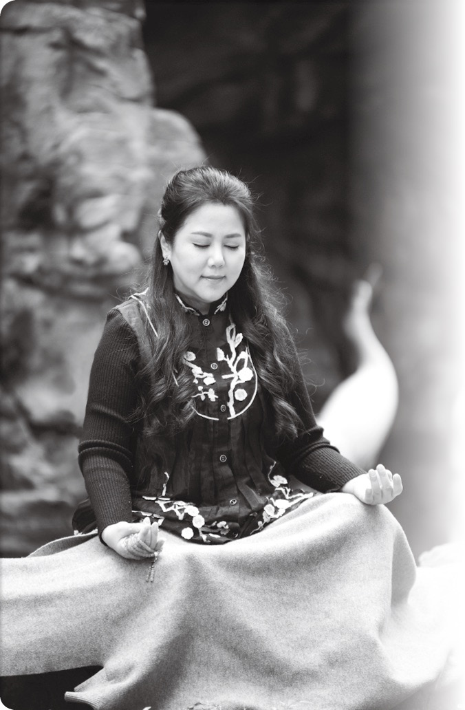

若关心自己亲爱的人，最佳的做法，就是自己把自己的内在处理干净，让自己有好的能量，相信自己能量若够好，就会产生同心圆效应，正所谓“修身齐家治国平天下”，以自己为核心，这样散发影响力会比较好。

若真的要代家人观元辰宫，也务必要谨记“尊重”的道理。

如果愿意尊重家人，就如同你希望家人尊重你是一样的，取得他们同意，那能量效果就会加乘加倍。

# Q59 观完元辰宫后的作业，我们能代替他人做吗？

如果亲人可以代观元辰宫，那么，观元辰宫后的作业，也可以代做吗？

通常会问这样的问题，可能是被代观的当事人，基于某些状况，无法亲自执行作业。

例如有个网友想帮她外遇的老公或者是外遇的妻子，处理后续作业。或者是当事人住院，代观者想帮她生病的父亲或母亲，亦或者帮她自己孩子处理后续事项等，因为孩子可能还太小，不能自己做作业。

一个人可不可以代替亲人，在观完元辰宫后做作业呢？

基本上当然会希望今天所谓的代观，是你自己代表你的家人，来到这里然后调整“你自己”的元辰宫，也就是亲观。如此的话，你只要调整你自己的状态，就可以影响家人。

而后续的作业，例如谢神的部分，若家人是可以行动的，好比说是小孩，那么感谢神明的部分，其实还是可以带着孩子一起去，不论他信仰的神是佛教、基督教、天主教、日莲正宗、一贯道或者是道家等都可以，当然，重点还是当事人要有诚心。

再来作业的第二部分，我们都会建议 21 天内每天要喝两杯温开水，身为亲人，你当然还是可以为家人准备这样的温开水，就算当事人卧病在床，也不影响。关于这部分老师还建议：可以在杯上画个爱心图案，更慎重表达你的爱，那么，这杯有“爱”的水，就更能传达能量。如果对方是病人，请你亲自拿着杯子，陪他慢慢一口一口的喝，这样，当事人也完成他自己的作业。

至于其他的作业，那就因人而异。这部分，代观者还是可以站在协助的立场，帮助当事人。例如，借由改变被观者的服装，或搭配什么小饰物调整等。至于食疗，只要大家一起吃饭，就可以特别帮当事人留意该吃什么。这样，其实也是协助对方完成作业，而非由你本身代他完成。

其实，我们观元辰宫做调整，最主要调的还是自己，做作业，就是当事人自己要为自己负责，这个信念一定要有。

那些特殊情况，例如有人是帮自己外遇的老公或者是外遇的老婆做调整，希望对方能改善，让他的心宅更像家一点。同样地，透过一些贴心的举动，例如倒杯温开水，那时，你也会觉得对方会真心悔改，一点一点改变行为。

人们要知道，来这世上我们都是在修心，修我们自己，都以不同的形式在做功课。一切也关乎能量，当我们修心，让正能量影响在这个家，成长也是逐步可以看得见的。

# Q60 调整完后来不及去谢神该怎么办呢？

谢神有期限吗？如果自己因为太忙好比说出国或者公务繁忙，没去谢神会有什么后遗症？若有的话，该怎么补救？

观完元辰宫后，21 天内一定要去谢神。

这其实关乎做人做事的基本道理，所谓天助人助自助，也就是说，一个人要先愿意自己帮助自己，然后其他人才愿意帮助你，上天也只帮助愿意先自立自强的人。

我们观元辰宫，接着就会调整心宅，比如说更动格局等，那都要有劳自己的主神，这也关乎一些特殊能量调整。我们要在 21 天内谢神，不单只感谢主神，其实也感谢内心里的“超我”，甚至是比我们维度高很多，乃至于我们无以名之的更高力量，那可能是你的大天使，或依不同宗教信仰不同的精神寄托。

当你没有在期限内和神明做更深层链结的时候，是无法真的做到内在调整的。就算有调整，也会很快速地打回原形。

每个人在调整时的过程其实是辛苦的，但为何调整后依然不如己意？如果说所谓“人定胜天”，那的确自己就可以决定命运，但世间事是非常微妙的，可能一切只差那一步、就差一个帮忙、一个隐形的推手，就能成就想要的，达成你的使命。

但你没做到自助，没去谢神，“天助”这部分就会受到影响。

一个人真的有那么忙吗？忙到 21 天都没空去谢神？

其实还是愿不愿意、具不具备真诚的问题。

最后，不谢神，后果会怎样？该怎么办？

其实不会怎么样，毕竟神不会气量狭小，重点还是在每个人自身，这关乎宇宙能量的运行，一个人无诚就难以有好的结果。做人做事还是诚信至上。

# Q61 观完元辰宫一定要念经吗？

似乎，我们看到有的人去观完元辰宫后，回家后必须念经，这部分人人都要做到吗？

所谓观元辰宫，不同的老师有他们各自的派别，比如说某位老师有主修的神明，或许就会告诉来观的客人：观完后，回去必须要念某种经，例如普门品、心经或地藏王经等，甚至也包括可以念圣经。

其实，观元辰宫是与自己沟通，也跟宇宙沟通，那像是一条条道路。每个派别，可能都有自己安排的道路，他们会希望你去念属于该派别的经典。

但以我们这边来说，除非是你自己的内在、你的高我、你的主神，透过观元辰宫时告诉你，你需要做什么功德回向、祂自己跟你有着怎样的感觉呼应等，而你也接受了，老师就会记录下来，请你回去做作业时，也包含念经这件事。我有道家的学员会植入科仪（道教的规范、礼仪等），我通常会强调，如果客人观入时内在调整过程中有提到，那么是可以配合科仪来处理。但如果没有，我们并不会事后暗示要植入、或用恐怖恐吓等来索取费用。所谓道法自然，如果是强迫的科仪仪轨，那么带出来的能量也会是强迫跟控制的，所以暗示植入必须要谨慎处理。

若非以上所述状态，其实不太会有要指定念经的情事。在实务案例中，也真的非常少见。

我的客户包含各式各样的宗教选择，当所信仰的神明，有所指示时，就会透过元辰宫传达，并入作业里。

基本做法就是这样。

# Q62 观完心灵风水还要观阳宅风水吗？

观元辰宫应该也是改运的一种吧？那么，我都已经调整好我的元辰宫，让我的运变好了，就不需要调整阳宅风水了。是这样吗？

这里先提出一个简单的答案。观元辰宫是观“你本人”的元辰宫，但所谓阳宅，是你住的地方，那就不是只有你一个人的事，包括配偶子女或长辈其他家人，都要顾虑到，所以二者不可一概而论。

进一步说，我们探看自己的心灵风水，其实是打扫我们的内在部分，当你把内在调理好，依照吸引力法则，自然就会吸引好的东西。

但你居住的家，当然也是你影响力展现的场域。所以当你调整好元辰宫，如果能再搭配阳宅风水，那么效果可以是叠加的。

当然，如何搭配阳宅风水？每个人的状况不同，会更着重在对“整体家运”的运势影响，调整更好的方位，然后师父会给你一些建议，也搭配流年等。当两者能够配合，就是所谓好上加好。

另外，有种情况是，单身一个人外宿在非自宅，又或者，他是住在公司的宿舍，可能和其他同事住上下铺。那种情况，他就没有什么阳宅风水可以调，此时就必须更专注在调整元辰宫，透过观元辰宫来改善自己状态。

这里也补充一个关于主神透过学员沟通的案例，那一次有学员在内观时，发现婆家厕所水龙头附近裂痕，神明一直着急地要她去修缮。她调整完心宅后，关心婆家状况，就找了一天休假去探望，果不其然婆家在对应的地方，因为厕所的墙壁破裂，导致水龙头有问题，也因为淹水状况困扰，导致婆婆身体状况不好。之后透过加乘阳宅风水搭配，修缮布局后，婆婆的身体也硬朗了起来。这个案例，漏水的地方是在“实体世界”，但却是神明透过观心宅时转达，是标准的结合观心宅跟观阳宅搭配的案例。

诸如此类的案子很多，有机会读者可以亲自来了解。

# Q63 调整元辰宫后，效果越来越不明显？能量巩固期是什么？

听说有人常态来观元辰宫，但效果似乎没有当初来的显著？这是怎么一回事？是当事人自己的问题吗？

关于这个问题，用一个简单的范例就可以充分解释。

有一位学生，之前念书都不得法，考试成绩都只有 20、30 分，但后来因为得遇名师，经过开导，下回考试，他进步到 90 分了。后来，这学生因为贪玩偷懒，考试成绩又掉到了 60 分，经过督促后才又振作起来，下回考试得到 90 分。

那么，有人要问，原本这学生第一次考试，成绩进步 70 分，但这回一次“只有”进步 30 分。所以是退步了吗？

聪明的读者，你看出这背后的寓意了吗？

当你原本状况很差，后来被调升了，当然感觉很深刻，有体验到“进步的改变”。但若你情况已经调整得比较好了，只需要“微调”，就可以回归到好状态，那当然不会觉得有大幅的进步。

同样的道理，客人当初为何会来找我们？多半都是处在最低潮的时刻，他们当时运势都很不好，才会想来做谘询，以分数来比喻，他们当时就大约是只有 20 分。

经过我们调整后，最终让他们来到 90 分的状态，也督促他们要配合老师指定的能量巩固期，21 天→49 天→108 天调整。

这样的他们，由原本的气势低迷，后来回归朝气蓬勃。但当他回到原本工作场域，可能被长官骂、被同事负面言语影响等，渐渐地又被打回原形。毕竟，职场就是这样，人与人之间相处，很难完全避开负能量，经常都是会遇到很挫败的感觉。

再回来找老师调整时，当事人的状态可能只剩下 40 分或 60 分。但请记得，当初最早时，他是只有 20 分的。

再次被调整到 90 分，明明回归高能量了，但因为进步区间缩小了，所以反倒觉得改变没那么大。就是这个原理。

基本上，老师会建议，每个人的内在，要习惯好的能量、好的运作模式。那么，怎样维持好的习惯？所以我们为什么说 21 天→49 天→108 天调整，就是为了让你维持在一个好能量。

这个好的能量，必须让你自己身体去习惯它，一次又一次，你可能会觉得效果越来越“不明显”，因为你是从“普通好”提升为“很好”。这样的你，其实已经生活在一个非常好的能量范围里。

每个人秉性不同，的确有一些人气场特别虚弱，他们平常无法觉察气动的改善，所以更要透过调整后才会有更精细的觉察力，让他感受到改变的变化，特别是身体对于情绪回路的链接，也会透过不断的调整学习转变成为智慧。

# Q64 观元辰宫后，格局越变越大？

观元辰宫也是一种“自我提升”的方法吗？似乎并不只是调整心宅，还可以让一个人格局越来越大吗？

格局会越来越大，还有运势会越来越好，这都是真的。

观元辰宫，本来就是透过导师指导，调整自己心宅，这个过程，随着把心宅的污垢以及种种特殊问题排除，整个人的状况就会变得越来越好。

其实，就如同现实生活中，房子可以扩建的吗？可以的。同理，我们的心宅当然也可以拓建，毕竟，心灵世界这样宽广，是有可能拓展、拓展、再拓展。

但过程是渐进的，不能一下子变化太大，不然身体可能会负荷不了。所以中间会有个磨合期，可能有的人调整完后，整个能量变好了，然后过一阵子又会慢慢被打回原形。这也是为什么我们说，能量巩固期是很重要的。

我们要慢慢调整自己的内在，影响潜意识，慢慢习惯新的“好习惯”，如此，可以习惯你自己的内在，也让潜意识喜欢你。

这样的过程，你是逐步地朝更好的境界去修正的，那时，你也会把更多资源吸引进来，那时，你的气场跟气势自然就更强大。以心宅来说，也就是开始添家具、添设备，也包括拓展新房间，或者把两个房间合并变大，整个元辰宫格局就越来越大。

当元辰宫格局越来越大，也代表着你整个人拥有更大的格局，继而运势变得更好。例如我有学生在工厂上班，透过元辰宫调整之后，他带着这样的意识，持续学习进修了理财班，也因为技术提升加上透过学习互动维护人际关系，如此，整个人变得比较有自信，结交了不同属性的朋友，收获了不同视野的经验。

# Q65 调整元辰宫格局，是“改变”还是“不变”比较好？

元辰宫一定要调整吗？例如我的元辰宫状况不错，那是不是“保持现况”就好？或者，如果别人的元辰宫每次进去都有新状况，但我的元辰宫却一成不变，哪一种状况比较好？

的确，每个人的状况不同。有的人就是每次进去观元辰，状况都“差不多”，有的人则是状况越来越好。

那是不是，每次调整都应该加点东西比较好呢？

其实，这依然跟每个人的内心能量有关。例如有人透过禅坐，让自己的心沉稳下来，并且长期让自己维持在好的能量。即使最初调整时有些灰尘，等清理好后，能量扬起来，就能一直维持在好的状态，那也不需要再调整。

但一般人的状况是：经常身边周遭，好比说在职场上碰到一些纷争，或者亲族中有人办丧事，总之，因为某些因素导致能量被削减，那自然就需要调整。

所以为什么会有能量巩固期？就是希望每个人把能量巩固好，维持“好习惯”。

每个人都是从不习惯开始去慢慢适应“好习惯”。最初能量刚转变好的时候，一般人都会感到不适应，所以必须先习惯这些“好习惯”。

在能量巩固期结束后，有些人会开始自动地，他的内在格局会自动地扩展，一些好的东西会自动增加，只要是好的，就设法维持住。但若有人碰到新状况，比如说遇到天灾人祸，因而能量降低，那就必须来调整。有调整，就自然“有改变”。甚至也有人碰到所谓的“阿飘”，或路过的煞气等，在元辰宫里新增的东西就不一定是好的，那都要去调整改变。

回归题目：改变，是因为体内状况，可能能量降低，所以必须要调整；若原本状况就是好的，都是正向的，那暂时没有要调整什么，那样也不错。基本上，改变只要是格局变大，是正向的，那都是好的。

谈到此，也必须附带说明，有人以为改变一定是好的，因此在没有老师指导下，以为自己学过元辰宫，已经懂一点了，就自作主张，回去后擅自在元辰宫加点什么，以为改变就一定变好。最后，反而带来困扰。例如有个案例，她因为自己老公喜欢冬天，于是把元辰宫调成冬天，反倒带来负面效果，毕竟，夫妻关系进入“冬天”怎么会好呢？后来还是我们去协助调回来，才没有让状况更严重。

所以改变不代表一定更好，若要调整元辰宫，最好还是有老师在旁指导。

# Q66 需要走上修行的道路吗？

如果说观元辰宫，会让一个人越来越好，那是否最终会达到心灵体悟的高境界，然后步上修行之路呢？

什么是修行？

我经常跟学生讲，其实，你我来到地球上，就已经是在“修行道”上了。简言之，身为人类这件事，本身就是在修行。

古老东方就有这样的观念，《大学》里说的“修身齐家治国平天下”，这是一个同心圆概念，是一种修行的描述。基本上，修行就是修正自己行为。当自己变得够好，就会影响到身边一圈又一圈的人。

以自己为核心，你的人缘关系越来越好。

齐家就是第一层，是指你的家庭关系越来越和谐。

治国是更外围一层，并非真的创建什么王国，而是在你所属领域，你会有自己的事业体，可能是公司，或是你成立的社团等。

平天下则是最外层，当然平的不是什么乱世战争那种天下，而是一种生命境界，自己内心平稳，处在绝对的和谐心境。不管外面的大风大浪，你都可以让自己比较快速的方式，去觉知觉察自己的状态。

所以，不用特别去“步上修行路”，因为，你原本就已经在朝着“修身齐家治国平天下”境界迈进了。

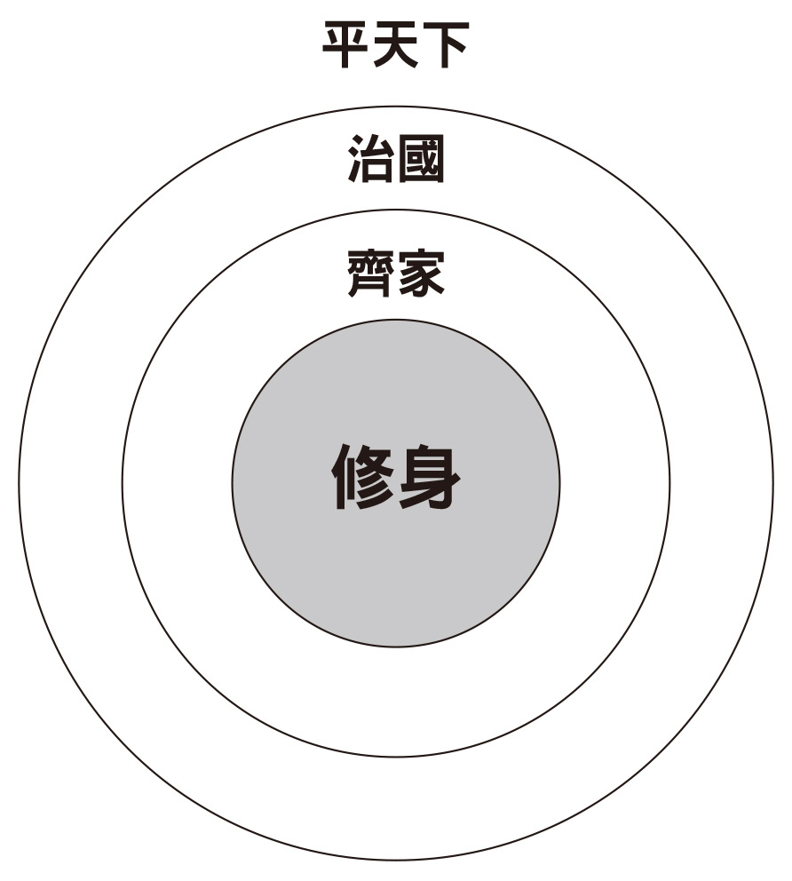

透过自己修身行为，来改善自己与自己、自己与家人、自己与同侪，最后与整个社会和谐的层层关系图。

# Q67 一般基本观元辰宫的方式与流程？

观元辰宫，是否有很多派别？以老师这里来说，整个流程是什么呢？

简单介绍一下观元辰宫的流程。

客户来到我们这边，首先会请他填写客户资料表，都是基本的资料，包括姓名、生日、住址、职业等，都是经常填写的信息。当然，我们对客户的资料会保密，恪守个资安全。

比较需要额外填写的，则是比较会影响观元辰状况的，包括有没有服用药物有没有犯罪经验？或者是有没有烟酒习惯？以及若有其他特殊状况，都希望填写者备注说明，毕竟，最终这些资料是要让老师更能协助每位观元辰宫的朋友。

有一个特别需填写的，就是要确定你的目标是什么，这个环节很重要。因为你是要来关注什么？有的人是因为感情问题、有人是健康问题，还有很多人是关注自己的事业。这些都要表达清楚，如此，当观元辰宫时，当事人和自己的引导师，就可以有共同的目标。

这种拥有共同目标的关系，我们称作为“协作关系”，就是学员和导师一起共同完成这件事的意思。

当进来元辰宫后，专业引导师会告诉你，要用什么样的方式才能顺利进入元辰宫？每个人都有六种方式可以进入元辰宫，但每个人优先的顺序跟方法都不一样。所以老师会试着让你体验，让你感受一下，带引你逐步进入自己的心宅。

实务的作业，男女有别。如果来观元辰者是男性，我们大概都是选在一个敞开的空间。在我们的谘询室里，不是采用谘商椅，而是有一张床，当学员躺在床上，老师会说：“你就轻松地躺，然后也可以带点动作，总之就是让自己自在些，过程建议闭上眼睛。”

如果有人实在很紧张，问说：“可不可以不闭眼睛？”当然也可以，那样的情况下，老师都会对学员说：“你可以看看天花板。”不过有时看到天花板上，若出现晃动的光影，或风吹动窗帘，学员可能比较容易分心，所以才建议闭上眼睛，学员会比较专注在内在所呈现出来的画面。

当内在呈现出画面的时候，就会知道是有颜色的还是黑白影像，又或者是说有其他的状态，一步步和老师报告分析。

实务上，老师曾接触各种特殊情况，比如说因为嵴椎侧弯、僵直性嵴椎炎、过动儿或原本就身体不适的客人，对他们来讲，我们的床能让他们比较舒服，进入元辰宫也会比较顺利。

个性比较容易紧张的人，通常双手会抱在胸口，这些人在观元辰宫的时候，很有可能大部分时候只“感觉”到一些不明确的征象，例如说他看到紫色的光、白色的光或其他的影像，但没有很具体画面，老师会配合引导他逐步“看见”。

我们跟宫庙的观元辰宫是不一样的，我们不需要什么绑红布条，也不需要任何东西去蒙住眼睛。

曾有人似乎对光线比较敏感，他说当他进到元辰宫里面，有发现到好亮好亮的光，可是当他睁开眼睛，发现明明当时是傍晚，没什么光线，就会问老师，刚刚的光哪里来的？

老师就会跟他解释，那是内在呈现出来的光，每个人的光不一样，看到的景致状态也不一样，这些都是学习的历程，是每个人都可以办到，只要你愿意学习。

观完元辰宫，导师会协助记录你的状态，然后过程中有不合适的部分，一定会引导你去做修正、修缮，让你的元辰宫状态整顿得比较好。

再接下来，老师还会针对重点环节做分析，协助指导解答。告诉你，原来你的哪个地方最近会出现怎样的状态？化成具体的建议，可能就是：有人想理财，告诉他适合投资什么？或告诉他现阶段不适合买股票等。或者资产要怎样配置比较好？观完元辰宫后，老师都会协助指导。

最后，老师会开回家作业给你，这件事一定要照做。谘询结束后，因应每个人不同的宗教，也会有谢神的流程。

以上就是基本的观元辰宫大致流程。

# Q68 元辰宫亲面及代观的差别？

听说也可以远距离代观？这样观元辰宫有效吗？和亲面观有什么差别？

亲面与远距离代观的差别在哪里？

先来说说为什么会有远距离代观这样的事？那是因为很多人可能人在国外，当初他们第一次来找我观元辰宫时，当然是面对面，毕竟他们还没观元辰宫前，不知道我长什么样子，也不知道老师的功力，总是要亲自来体验。

当他们来的时候，我会带着他们，教方法，引导他怎样才能用最快速的方法进入，方式就是我们经常讲的，眼耳鼻舌身意，让他能够快速地进入状态，去看他元辰宫的心灵风水、心灵殿堂以及整个心宅部分。当然在调整完后，他会有明确概念。

第二次之后就会很放心，当他人在国外，但又想要观元辰宫时，因为已经对老师很放心了，就会想做远距代观，他们会线上联系，问可不可以跟我约定时间？然后就在约定好的时段，我来帮他做整理，这样远距离代观当然是可以的。

另外有些人，他是属于那种不想面对自己，可能是自我批判比较强大的人，很多这样的人也会选择远距离代观。

基本上，远距离代观就是一个代整理的概念，就例如：你今天去找打扫的阿姨帮你打扫家里，跟你自己打扫家里，是不是程度不一样？当然如果有打扫阿姨帮忙，再加上你自己也打扫，两人一起打扫，家里就会更干净。就是这样的概念。

远距离调整完之后，客人有分两种状况，一种就是我只是想体验看看，我怎么知道好不好？反正你说了算。另外一种是，觉得老师说的跟我的感受非常贴切，然后我确实是要按照自己调整的能量去改善，我可以去感受看看。你会发现，当自身愿意这样去尝试时，能量转化速度就会非常快速。

其实你今天既然花了钱，也就代表你选择专业、有品牌、安全性和可靠性高的老师，让这样的老师来替你做服务，你就全然放心地把自己交给他吧！

我自己培育出来的老师，都经过我的考验考核，然后校准。校准的意思就是，他们在远距离代观之前，实战经验都要非常强大，才能够有等同的灵性匹配，做这样子的服务，所以这一点大家可以放心，把自己内心的一些疑问，把想要问的事情提出来询问。

我本身的个案有很多都是企业老板、委员政商名要，或是艺人，总之都是非常活跃的人。

这些人来到我们这边的时候，大部分都会说是谁介绍来的，并且问我能不能帮忙保守秘密。请放心：客户的秘密都会守好，我们也会替客户解决相关疑难杂症。我们是以解决问题为主要，若是该案例太经典，想要去分享或教学的传承，绝对会匿名，任何人都无法猜到个案讲的是谁。

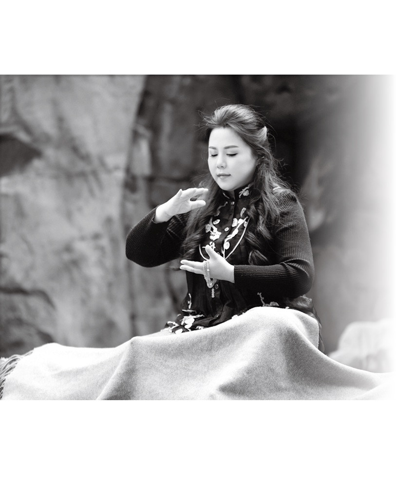

总之就是请放心，让你自己处在可以能量交流的状态，观元辰宫改善自己，是可以添福报的。

# Q69 体验会跟一般的观元辰宫有什么差别？

很多的新朋友第一次接触到元辰宫是在体验会上，想请教在体验会里的观元辰宫和一般的正式观元辰宫，有什么差别？

差别当然是有的，市面上很多的课程也都有体验会，但那只是带给民众初步了解，真正要学习得到知识或感受，还是得参加正式的课程或活动。

以观元辰宫的体验会来说，情况一定是一对多，老师分享的就是所谓的公众版的内容。也就是说，以能量角度来看，每个人频率会不同，但还是有共通的学理，或大致能量方向是一致的。在体验会的场合，老师会在参与学员中间穿梭，在这样过程中，就会有一些能量的链结。

但正式付费观元辰宫，自然就是一对一了。

老师会全程专注在“你”的身上，同时你也专注在自己内在观元辰宫的这个部分。

老师会很细致地针对你的部分做说明，做出细致调整，当然差异很大。

实务上，在团体的情况，即便是一对多，也是有人能感觉透过到这样的体验，自己已有所提升。如果他曾经有过内敛、内观等，基本上有相当的修为基础，感受性就会比较强，也确实有人会经常性的这样参加体验会。

经常的情况，在体验会的时候，由于现场人比较多，有一些人个性比较害羞、或是防卫心比较重的人，也会比较无法放开自己，体验当下。而当自己在拥有这样的能量频率共振的时候，也会同时散发出来某些特定的气味（嗅觉敏锐之人可以闻到），如同动物界里有一些动物本能性的为了逃避，会散发出刺鼻难闻的味道来防御是一样的道理，因此自己也会受到干扰。我也曾遇到学员后来预约一对一时提问说：为什么当时在现场狂发手汗？这种能量频率是不是与集体能量有关系？答案自然是的，我们在观察许多乩身前来体验时、或者本身有请泰国佛、特殊法门等彼此能量相排斥的情况，都会发现集体干扰的情况。

为了避免这样相排斥的状况，因此借由一对一的时候，我们提供能专心专注让自己安全的环境，这时候再来整理自己，这样自然跟在体验会上的感觉就会有很大的不同。

所以大部分时候，体验会的学员，如果真正碰到什么样的瓶颈，还是会想亲自找老师来上课，因为他会想了解自己。而且，在团体活动场合，通常也不方便把自己较私人的事公开说出来，还是希望可以跟老师面对面，共同协作调整。

唯有在这种状态下，他才能够掌握自己的进度，知道自己想要怎样地去扩张改运，活出更好的自己。

总之，还是面对面让专业导师专门为你指引会比较好。

# Q70 找老师观元辰宫就好，还要学习吗？

如果我们碰到各种状况，找老师就可以帮我们处理了，那我们个人还需要学习如何观元辰宫吗？

的确，有的学员会这样问，都已经慢慢调整好自己的能量了，为什么还要学观元辰宫呢？

其实是这样子的，通常遇到问题，我们都会想说，先赶紧找老师，调整之后会希望能量维持，所以在能量巩固期，最好还是自己学一下观元辰宫会比较好。

就好比有人长期看跌打损伤，师父会帮他调筋骨，但也会吩咐，病人自己也要懂得一些热敷及按摩原理，请他回家每天自己做，这部分就不一定需要每次都得跑到诊所来。同理，我们观元辰宫，老师也会希望被调整的人，自己能学会基础，可以在家自己调整。

每个人学会观心宅，懂得调整自己的内在，调整自己的运势，那么每个学员都能当一个幸福小卫星，借由提升自己，扩散影响力，影响周遭的人。

以我们这边的案例，确实有一些企业家习惯长期性找老师调整而自己不愿意来学习。他们一来是没时间，二来是不愿意在课堂上与其他同学分享自身的秘密。基于尊重当事人，老师也不会强制要求他来上课。

经过一段时间后，当事人渐渐可以明白自己的惯性与调整的方向，老师也会看缘分多说一些当事者需要留意提点的地方，他可能想维护家庭的关系，但不方便讲出夫妻间的秘密，干脆直接请夫人来上课，让她在教室里透过学习改善自己。

也曾有女企业家，本来因为忙碌不愿意学习，但后来拨出时段来上课后，也懂得可以自己在家调整自己，后来整个人感觉都不一样了，时间管理也增强了，不会像以前一般穷忙，对于自己的业务也做到收放自如，带领的营运团队也明确感受到主管变得不一样。

# Q71 为何元辰宫内守护神会改变？

如果每个人进入自己的元辰宫都可以遇到自己的守护神，那这个守护神是分派的吗？有可能守护神会换人吗？

的确，守护神是可以变换的，但不该想成是“被分派”的概念，因为心宅其实是透过高次元的维度，投射出我们的现状。心宅里的守护神，也是因应这样的“投射”，如果说是谁派遣的话？那就是自己的“超我”派遣的。

以实务来看，有人的元辰宫守护神，一下子是释迦摩尼佛，一下子是观世音菩萨，一下子可能又是耶稣基督。

不只是守护神，包括单身女孩，进入自己元辰宫卧房时，可能会发现先生的样子也一直在变，可能一下子是美国人，一下子是英国人，一下子是日本人等。

基本上，如同前述，元辰宫是对自身状态的高维度投射，保护我们的守护神，是能量场上的一个高我智慧。守护神的任务，就是透过祂为媒介，指引我们人生明确的方向，如果当事人愿意好好地、安稳地去度过这个课题，那这个守护神会持续导引你。

举个比喻，就好像我们开车，不是都有安装 GPS 吗？透过这个装置，会告诉我们前方右转，这样才能去设定好要去的地方。但如果不小心忘了转弯，错过了路口，那怎么办呢？没关系，GPS 会做调整重新导航，告诉你，这次在哪个路口右转，然后再右转，可以通往哪个方向。其实在我们心宅里，守护神就是扮演这样的角色。

同样地，关于另一半，也是反映一个人内心里所设定的，对理想另一半的要求。你希望的灵魂伴侣是什么？其实最好能够先稳定你自己，如果自己内心不安稳，无怪乎今天是美国人，明天是日本人了。

当心宅给予我们导航指引，但我们就是“不理他”，也就是不愿倾听自己内心的声音。那就好比车上放 GPS，但从不依照导航来开车，到后来，这样的导航也就没有意义。我们的元辰宫，若长期受到自身漠视，也会是如此。

当自己的守护神“自我神性”都放弃我们了，那人生就比较危险了。

所以建议每个人，还是要倾听自己内心的声音，观元辰宫时，也要尊重我们的守护神。

# Q72 元辰宫可以看出做生意的潜质吗？

在元辰宫里，厨房代表的是财运也代表事业。想要问，要怎样透过观心宅的厨房，了解自己是否适合从事创业？

有不少人的人生愿望，就是自己创业当老板。姑且不论自己个性适不适合，或者资金足够与否，单就人生境界来说，他们认为当老板就是种成就。

但这社会的实情却是，创业的失败率远大于成功率，据专业统计，新创事业前五年内成功率不到 1%。以此角度来看，的确，我们在考虑自己是否要当老板前，要经过审慎分析，透过观元辰宫，也是一种很好的方法。

在我们的厨房，不只可以看适不适合当老板，并且还可以分辨能当大老板还是小老板？特别是现代微型企业非常多，包括在网络商城开店，也算是老板。无论如何，做事业，适时适性最重要，有的人可能适合运筹帷幄经营企业，有的人则比较适合在商圈开个面店，找到自己要的，人生才会快乐。

关于如何透过厨房观一个人的“老板格局”，实务上有很深入的学问，无法一一列举。这里只简单做说明，常见的例子，厨房里的炉灶就跟当老板的格局有关。

传统式的炉灶

这样的人有当老板的潜质，因为古式的炉灶非常需要亲力亲为，要有一定的功夫。

普通的黑锅

材质包含多样，例如常见的是铝锅、白铁锅等，基本上就是“一般般”的锅子，这样的人创业会有问题。因为这些锅子，都要搭配其他的工具才能成事，如果没有适当的匹配，只凭小锅子就想创业当老板，可能开店没两三个月就经营不善关门。

电磁炉

电磁炉型的是赚取快财者，可能是一人之下、众人之上的总经理特助，或者是董事长秘书，也可能是自己在家炒外汇者。如果其他配置没有搭配得宜，也只能财来财去，不但守不住钱财还得替人数钞票。

我见过有一些很夸张的案例，有人透过网搜，自己做功课，学习创业方法，也依照网络指示备齐一切最好的工具，然而虽然看似有准备，实则内在整合性并没有考量到（也就是他的元辰宫还是混乱的），这个人最终不但生意失败破财，还被卷款整间店被扛走。

所以在做大决策前，还是寻求专业的老师先谘询，透过观元辰宫专业的分析，做整体考量再来创业比较放心。

当然，以上只是简单说明，实务上要看整体搭配，厨房里会有各式各样的工具，都有相应的诠释。其对应于一个人当老板所需要的延续性，甚至也包含资金流动性。另外，还包括一个人适合当“哪种类型”的老板。有人是独断独行且爱发号施令的，有人是喜欢卷起袖子跟员工同甘共苦的。搭配厨房的状态，都可以有相应的认识。

另外，关于是否可以当老板，还有一个景点很重要，那就是书房，例如有一个朋友，他的元辰宫里有个“顾问”，那个顾问叫做马云。

由此也可以看出，元辰宫是生命状态的呈现，而不是真的有神明派驻，毕竟，马云是现实生活中仍健康活着的事业强人。

在这样的案例里，马云顾问代表的就是在你生命中，会有马云这样的经营之神担任顾问，也就是说，经营事业的时候，内心会有种智慧来协助指导，这自然是很好的事。

将来做生意的时候，顾问会走进书房里，为你的决策提供建议。

其他状态，在书房里会出现的人，只要是商业巨擘，也都跟经营事业有关，基本上这类的人，都有做生意的潜能。

那也许就可以好好来擘画，怎样来创业当大老板吧！

# Q73 元辰宫调财运是用功德福报交换的吗？

什么是补财库不可不知的三件事？

关于人生，我们透过命理领域听过很多“传说”，例如前世积阴德为这世带财，或者有人天生的“财库”内有这辈子应有的“福分”等。当我们透过元辰宫调整财运时，过程有牵涉到拿“功德福报”来交换吗？

先说答案：没有的，调整元辰宫，跟功德福报交换没有关系。

我们平日做人做事，就该经常性的行善、做布施等累积福报，也可以做到相应的功德回向，但这些和元辰宫没有直接关系。

我们调整元辰宫，绝非“拿以前补现在”或“拿未来补现在”。再次说明，元辰宫是高维能量的“内在显化”，当你透过吸引力法则去和宇宙联结，会形成一个能量流，让好的东西围绕在身边，这是我们调整元辰宫增进财运的方法，并非拿过去或未来的福分来交换。

财富的进来，不是不劳而获，而是先了解自己的属性，进而可以借由“适合自己的模式”来创富。

补财库最重要的三件事：

知命

透过观元辰宫了解为什么你会是现在的样子。

认命

这点其实是最艰辛、最困难的，因为你必须要去臣服你的命运，好比说你就是没有当老板的命，但你偏偏就想当老板，这样子不合自己性格却去硬拼，往往没好下场。当处于这样的时候，内心会纠结，但你必须去认命，然后才能进到下一步。

创运

当了解自己，接受自己后，就可以应用自己的特长，去发挥自己，创造自己的命运。这样才能真正带来财富。

认识这三件事之后，你会发现你可以开创你想要的，包括你想要过怎样的生活？你想要拥有怎样的生活态度？你希望身边围绕什么样子的人？或者是你想跟怎样的人共事？

这些都可以在适合自己的基础上开创，然后我们要用一生去维系，这就是我们元辰宫所做到的开创。

# Q74 如何透过观元辰宫改善婆媳问题？

自古以来，两个家族结合时，永远存在的问题：以新嫁娘来说，就是她在娘家有个妈妈，夫家也有个妈妈，但在娘家的生活模式无法带来夫家，于是常会发生婆媳问题。观元辰宫可以处理感情问题，也包括婆媳问题吗？如何做到呢？

在元辰宫里看到观到我们的感情状态，包括各种人际关系，也包括夫妻关系，以及婆媳关系。

这里的婆媳关系，甚至也包括尚未结婚的状态，也就是尚未透过正式婚姻产生姻亲关系，但已经可以看出，准媳妇和未来婆婆间可能会有的问题。

其他也包含子嗣关系。

例如有位客户，结婚几年但没法怀孕生子，于是带太太来观元辰宫，在元辰宫里面，就看到大厅有些征兆，代表碰上什么瓶颈。

关于婆婆也是这样，比如说有的时候，婆婆对夫妻表达强烈的关心，造成压力，这在元辰宫的大厅里，也可以看到征象。经过适度地化解之后，那对夫妻后来成功生育孩子。

关于婆媳关系，我们也碰过一些婆婆管太多的案例，那么在观元辰宫时，在主卧房或是大厅都能见到踪影，毕竟无论我们长到几岁，在父母的眼里始终是个孩子，当父母坚守己见不肯退让，或是面临到因为年纪岁数到百岁，难免会因为失智、遗忘甚至是怀疑，而影响小俩口的生活品质。这种时候也特别可以透过观心宅来找出解决之道，回去后应用执行也都能缓解生活摩擦的压力。

总之，先找出问题，再来化解。透过观元辰宫，可以看到各类人际关系问题的阻碍所在。

# Q75 观元辰宫能改善婚姻关系吗？

夫妻本是同林鸟，但也可能大难临头各自飞。到底夫妻关系是命定的，还是有什么前世今生渊源？透过观元辰宫可以改善婚姻关系吗？

答案当然是可以的，事实上，来老师这里观元辰宫的朋友，很多都是为了夫妻关系。

其实夫妻关系不是单独存在的，往往跟其他议题有关。举例来说，不是有句知名谚语“贫贱夫妻百事哀”吗？也就是说，财富状况跟家庭和谐有密切关系。此外有没有子嗣，或者婆媳关系等，也都和夫妻关系有关。

在实务上，常见到的婚姻关系卡关，可能还牵涉到复杂的第三者，所谓的小三小四。另外，也有跟性能力有关，另一种则是跟孩子教养有关，许多家庭为了教养问题，吵到伴侣变怨侣。

详细的说明，包含很多层面，每个人个案状态不同。

基本上，透过主卧房，可以看出：

．一个人跟她的先生间哪些地方出了问题？

．是否有小三问题？

．是否因为性需求不满足，还是因为性需求不协调？

．是否经常为了小孩子吵架？

．是否经常为了金钱上琐碎的事情吵架？

．是否婚姻有太多外力干预？

基本上，跟另一半如何相处的种种问题，都可以透过观元辰宫来了解，例如有一些客人，可能自己在社会听闻别人家怎样怎样后，觉得自己的另一半“不合理想标准”，因此会来要求换理想对象。

当我们处理客人问题时，必须要小心客人是否用“左脑强制”（也就是他们会说“应该”怎样怎样）。往往这类批判性用语出现时，我们就能知道那是客人被社会规范洗脑，内心有了定见，这样后续维护也会比较困难。

但人心是超越想像的，不该被社会上别人的状况所制约。例如我有学员，观元辰宫时，内在获得的信息，让他觉得“怎么可能那样？”但几个月后，偏偏就真的如观元辰宫所预视的，嫁到国外去了。

关于婚姻，以及与伴侣间的种种关系，更进阶的处理，还是必须配合个案，由老师来一对一指导。只要有心，就算原本濒危的婚姻，都还是有可能回春。

# Q76 同性恋者也可以观元辰宫吗？

现在已是性别平等的时代，但毕竟，观元辰宫是比较“古老”的学问，那个年代观念比较保守，所以同性恋者也可以观元辰宫吗？

既然元辰宫是我们生命状态的显化，自然不会有任何歧视问题，而是现况的展现。

不论性向为何？同性恋也好、双性恋也罢，大家都可以观元辰宫，重点在于诚意，不在性向。

我们一直秉持的原则是：每个灵魂都值得被爱。所以同志朋友们，也一定可以透过观元辰宫，来调整他的人生方向。

比如说他也觉得赚钱有些卡卡的，这无关性别。或者在感情议题上，觉得老是在换伴侣，这就需要观元辰做调整。包括他可能常被噼腿，或许表示内心里安全感不足，因为内心不稳，影响他的现实生活人生，这是可以调整的。

而不论是同性异性，只要是两个人在一起，就一定有种种磨合问题。比如说若真想长长久久的交往，必须做到三观上，也就是彼此人生观、世界观、价值观的共识，就算无法一样，但至少要能彼此接受。

这些都可以透过观元辰宫来做婚前的调整以及婚后的维持等。

其实不需要凸显同性恋问题，就算是男女结婚也会有这类问题，基本上就是要取得共识了解。然而了解往往并不容易，若有些滞碍，可以透过观元辰宫来找出原因，然后知道哪些地雷不要乱踩？或者是哪部分情感可以再加温？这些都可以透过观元辰宫知道。

以综观角度来看，观元辰宫还必须一起看待金钱议题、性爱问题等。

最终，我们还是要强调：每一个灵魂都值得被爱。

# Q77 观元辰宫可以观到灵魂伴侣吗？

不论是男是女，双方要走一辈子，内心在乎的，就是“他是不是那个对的人”？观元辰宫，有助于我们找到“对的人”吗？

有些特别的坊间一些宫庙或传统的一些地方，他们观元辰宫的方式，可能非常传统，就是认定男生该和女生在一起，灵魂伴侣方面，也已被这般设限。

实务上，这当然是不对的，在老师这边，有很多客人是同志灵魂伴侣的匹配。他们来观元辰宫时，都会问：在感情世界里面，我现在要不要决定跟这个人相处一辈子？又或者是我这一段感情，是不是对的？跟这个人要怎样好好相处？

每个灵魂都值得被爱，不论男女都一样。透过观元辰宫，人们在内心深处可以去匹配、感应，甚至是看见自己的另一半，到底是什么样子。

这里分享一个实际案例，我们有个客人是男同志，那天真的很神奇，他和他的伴侣一起来观元辰宫。他在房间内接受老师指导，另一位就坐在外面大厅等候。结果里头那位，在自己元辰宫的卧室里看到一个饰物，他就在老师面前，画出这个饰物。巧的是，当时在外面等候的伴侣，因为等待太无聊，也拿出纸笔来随意涂鸦，等当里头那位朋友结束出来，一看到伴侣画的图，当场楞在那，因为双方的图相似的惊人。

你说这是巧合吗？还是该说这就是双方的“命定”？

事实证明，他们双方非常登对，也喜欢共同做一件事情，谈相同的话题，就是说在一起很快乐，真的彼此在一起非常快乐。

也许有人身边已经有某个人，只是自己内心一直在犹疑，对方到底是不是“对”的人，也许透过观元辰宫，确实可以让你看见或感应到，然后更确定，他就是这辈子来陪伴你的人。

既然是灵魂伴侣，彼此就要好好相处喔！

# Q78 观元辰宫可否看到未来另一半的样子？

好像不同的国家，都有大致的传说，在某个时辰，好比说深夜透过某种仪式，例如说点蜡烛，女孩子就可以在镜中看到自己未来的另一半。观元辰宫，也有这样的效果吗？

关于另一半，如果说可以透过镜子看到完全不认识的人，这案例比较少见，毕竟，观元辰宫并不是看水晶球，元辰宫展现的还是现在的状态。

但常见的情况是一个人身边已有某个人，不确定他是不是就是对的人？或者出现很多的人，不知道哪一个才是真命天子。

我们分两个方式回答：

第一个是面对面的方式：因为面对面，客户来到我面前，我可以陪着客户去观元辰宫，所谓灵魂殿堂所匹配的对象，常常可以有几个地方去参照。

大厅

在大厅，神明可能就有对象匹配给你。这个是一个很重要的景点，是当事人可以觉察的地方。

主卧房

这里主掌感情，我们可以协助替客户解决一些感情的挂碍，有可能是前任或前前任情人，或者是青梅竹马，或者最近会遇到的某人，都可能出现在卧房里。代表一定的意义。

书房

在书房里面，就是我们俗称阿卡西纪录所在地，翻开无字天书，那里是可以有问有答的，只要问对好问题，无字天书他就会用好答案的方式来回答你。

举例来说，你可以问我该出席怎样的地方，有机会遇到我的真命天子？透过天书的答案，老师会协助记录，后续还要靠回家作业，经过努力来找到对象。

第二个就是远距代观的方式：很多做远距代观的客人都会问说：我的真命天子长怎样？老师都会尽可能的做简单描述：例如大概多高？有什么特征，像是戴眼镜或爱穿什么衣服，也许这些信息不够精确，那老师会透过观元辰宫，再找到更进阶的讯息，例如“你最近和他之间有什么小误会？”或者他有什么较大的特征等。

实务案例是有个女性客户，身边有三个主要的追求者，她一直无法判定哪一个才是 Mr. Right。经过观元辰宫，抓到一些讯息，包括对方年纪可能大她七岁，戴眼镜帅帅的，经常周三见面等。结合那么多信息，相信她应该就可以更清楚知道那个人是谁？

关于真命天子（或真命天女），有时候，可能在主卧房看到“他跟她”的婚纱照，但这就代表那个人就是真命天子（天女）吗？倒也不是这样。实际上的解释，还是要搭配老师以及其他的分析，才能综合说明。

无论如何，透过观元辰宫，的确可以为找到另一半做出指引。

# Q79 为何调整完感情后，父母却要求分手呢？

似乎常有这样的案例，明明为了某个对象，去观元辰宫，然而当以为一切明朗后，接着却接到家中严重的警告，要我们和那个人分手？为何会这样？

是的，是有这种情况。

一个人调整完感情后，明明本来是希望跟男朋友感情回温。但是才调完后没多久，父母亲却提出要求，希望她跟男友分手，怎么会这样？不是应该“越调越好”吗？

关于这点，我要跟大家分享一个观念，我们的元辰宫是这样子的：每个人的灵魂深处，都有主神来替我们做主。你的主神有时候会显化，呈现谁是适合你的对象，或者是觉得你正在忍受委屈、亦或祂觉得有不公平待遇等，你的主神会替你挑选合适的人。

所以我们经常会遇到，例如守护神是手上拿着大刀的关公，当客户调整完元辰宫后，关公大刀一挥，就是要斩断一段不适合当事人的感情，或者是不适合你的工作。

但是请放心，祂会快速帮你接上更好、更适合的对象，或者在工作上，帮你找到更不错，或可以升官的机会。

我们有太多的个案回馈，原本暧昧不明拖延许久的感情，一调完元辰宫，才没隔三天，就发现男朋友噼腿的证据，坚定分手的决心。其实这件事本来就存在，只是当透过调整元辰宫，让它“显化出来”。这个案例，一个礼拜后就无缝接轨的交了更好的男朋友。

又或者是有些人想打离婚官司，很想跟自己的老公离婚。当事人来调整的时候，也出现她的守护神，透过跟守护神告知自己的困境，结果也是调整完元辰宫没多久，先生就真的主动提离婚。

基本上那些事都不是突然发生的，而是纠葛多年的事件，只是透过元辰宫，就可以不再让双方打迷煳仗，快刀斩乱麻地让这事几个礼拜内就快速发生。

话说回来，为何有的人才调完元辰宫没多久，父母就主动出面希望孩子和对方分手呢？同样的道理，父母内心早就对那个人不满意了，只是不好说什么，但透过观元辰宫后，刺激父母下决心，所以才会发生观完元辰宫后父母就干预的事。

基本上我们该信任自己守护神，若不适合的对象，就不需要勉强在一起。

# Q80 元辰宫能调整性方面的问题吗？

这问题听来很害羞，但相信很多情侣间会关心性方面的议题，这方面元辰宫也能提供协助吗？

如果我知道某个男生非常爱我，但是他在性方面非常冷淡，不知道这种“不积极”的状况，在学到元辰宫后，可以协助他对性方面能够“再热情”些吗？

答案关键在主卧房，好比说主卧房里的厕所就跟性的议题有关。

其实不论男女都一样，女生在意男生不够热情。男生也可能觉得女生很冷感，觉得双方间需要一点润滑调情。

不论是夫妻双方或者男女朋友间都一样，关于这方面的种种细节，也是依照个案而订。

比如进入元辰宫后，发现他的床太高，你的床太低，这就是一种不协调。另外你的鞋子是一双、两双？还是太多双？这个也有影响。然后再来你们喜不喜欢在做那件事情的时候，想着彼此？那关系到枕头你有没有好好调整？透过观元辰宫，都可以好好的去强化。

在调情方面一定是透过厕所，如果里面没有浴缸，我们会慢慢地先从莲蓬头，也就是我们的花洒，一个个添加，让整个浴室逐渐扩充，可能加上干湿分离，原本没浴缸变有浴缸，甚至浴缸里面要放一些水，再放一些芳香剂或加点浪漫的蜡烛等。这些都有适度的催情作用。

更细部的，牵涉到男女和合术，则需要老师个别指导。

此外，记得内心的窗户一定要敞开，而且希望对方心里面只想着你，关于这些都有具体步骤，也是需要一对一教学。

# Q81 另一半在性方面不浪漫怎么办？

婚姻与爱情是两个人间的事，若我这边很卖力付出，但对方却回应冷淡，这方面有关性的问题，元辰宫可以如何解决？

在我这边，经常遇到这类个案。

很多夫妻来找我调整，可能是因为太太性冷感，但也可能是先生性冷感。当然性冷感不代表不爱对方，不同的情侣有不同的状况。但无论何者，都可以透过元辰宫调整。

这里要特别强调的是，男女是有分别的，造成性冷感的背后原因往往不一样。因此调整的方向也是不一样的。

以男生来说，可能因为生活有很大压力，包括金钱方面觉得赚太少，导致在性生活方面提不起劲。女生则可能有另外的问题，其实她只想要被爱，但内心有一定标准，如果对方不完全照她的标准做，她就认为男生不够爱她。这样的性格，可能源自于本身安全感不足。

以上两种性冷感的背后原因，截然不同。

所以当发生问题，如何在性方面做到沟通，取得双方的平衡？

大部分来找老师调整是女生，透过观元辰宫，我会让女生知道：喔！你原来状态是这样，然后你会接受什么样的表白方式？或者是何种浪漫方式？那你的另一半，又有什么特质？

这样分析后，就请想想能不能够接纳他呢？其实他也是用他的方式在说爱你，只是跟想像的不一样而已。

当了解双方对性浪漫的定义不同，就更能调整彼此关系，让关系升温。

# Q82 男性精子量不足，可以从观元辰宫中调整吗？

这是另一个也是牵涉到“生理”的问题，观元辰宫可以控制男性的精子量吗？

本题的答案也是肯定的。

我们都知道男生的精力旺盛，其实是跟肾血系统有关系的。

在我们元辰宫的大厅里，可以看见元神灯，或称延年灯，还有就是我们元神最主要的三盏灯，这些灯一定要够亮，这牵涉到一个人的健康。当然也牵涉到他的精力。

有时候观元辰的时候，看到对方的灯都是一盏盏的蜡烛，明明灭灭的，相对应的这个人也是有点恍恍惚惚的，这样的状态，一定非常不好。

其实不论男女都一样，相应于女生妇科的位置，男生则是下腹部的地方，对应下来，例如是不是神桌底下太过凌乱，在观元辰宫时就要去做检查，有的时候会发现神桌的背面有被钉东西，都要去处理。

此外，在厨房，在主卧房，在浴室，也都有相应需要被调整的地方。实际应用，要看个案。

当问起精虫多寡，其实就是问他的整个人是否气血旺盛。当一个人气血旺盛，你会感受到他的活力，包括他的头发也会变黑以及变得茂密。当这样的时候，你就知道他的气血回复，精力也回复了。

但这些事情并非一蹴可几。气血不是一夕间就能提升，过程需要观察，中间有些搭配作业，例如要适当的食补。

此外，有些人可能是因为受到惊吓，是因为心理上或情绪上的状态，影响精力，这又有另外的方式处理。

无论何者，都要透过观元辰宫，配合老师的指引，一步步调养。男生精力会回复旺盛，女生则会皮肤变好。外观大家都看得见。

# Q83 元辰宫内的花草树木可以任意更换吗？

在每个人的生命花园中所种的花草树木都是命定的吗？我可以更换吗？换错了会怎样？

提起生命花园，那里有生命树和生命花。

有的人说他很想知道他的生命之花是不是牡丹花？如果不是牡丹花，那可不可以帮我换成牡丹花？

其实这类的问题，还真的挺多的。

有人不喜欢他的花，有人则不喜欢他的树，会说我的树太大了，可不可以换小棵一点？或者我孩子的树太小了，能不能换大一点？

其实在元辰宫里出现的生命之花和生命之树，都代表每个人的状态，也就是说我们都必须得去接纳自己、去认同自己。

如果你自己都不认同自己，那你要怎样去做调整呢？既然你的生命状态就是如此，你为何想去把它砍掉换掉呢？

会有这类状况的人，某种角度来说，他打从心底“否定自己”，不允许自己有另外一面，也不会欣赏自己好的那一面。

另外一种情况，就是太自我挑剔或者有着强烈自我要求完美的特质。

所以每当有客人问“生命之花可不可以换？”这类的问题时，我们通常的处理方式是不推荐换花换树，而是会引导客人接纳自己本来的样子。

在上课的时候，很多学员刚开始看到生命花园的时候，可能只是一朵小雏菊或者是一棵不起眼的小草、小树苗。但那就是学员本身真实的状态！经过沟通，让他们了解，或许内心里，他一直强迫自己扮演什么伟大角色，但其实不需要给自己这么大的压力。好比说不关自己的事，也要去硬扛，活活把自己累死。透过观元辰宫，能让自己了解自己的状态，这样，他也许会活得更健康、更开心。

# Q84 观元辰宫能让眼睛变好吗？

我在观元辰宫时视力会不会变好？我想改善视力、缓和干眼症或者其他眼睛相关的疾病，那调整元辰宫是不是能改善呢？

在调整元辰宫的时候，可能会用意象显现某些东西，那些东西表示原来我们内心里有某种压力，也就是当事人可能不愿意去“面对”某些事，这也导致“暂时性地”眼睛看不到。

这是心理因素的眼疾，有时候也会发生眼中风。

常见的情况，仔细去追踪，原来有些人可能是因为不喜欢父母吵架，然后透过情绪反应，压力上来了，导致眼睛暂时失明。

在这种情况下，我们通常在整理元辰宫时，老师会协助让当事人理解原来是因为这个样子，所以我们才去调整。调整完后，内在就会整合，透过显化，视力就会慢慢变好。

但以上是指心理因素。

另外一种情况，若真的是视网膜破裂剥离，或者是眼神经系统出状况，那当然就要去找眼科医师。

很多时候，则是二者兼具，例如透过医疗体系调整身体状况，但也同时透过观元辰宫，找出内心问题，如此，一个人康复的速度，就会更快。

# Q85 当观元辰宫出现冤亲和债主阻拦，花公花婆不帮忙调整怎么办？

提到冤亲债主，感觉上很可怕？能够处理吗？具体状况是怎样呢？

所谓的冤亲债主，在元辰宫里面不是必然会出现的，大部分人观元辰宫时，就只是调整自己的状态。但若遇到特殊状况，真的遇到了怎么办呢？当然就是必须直接去化解。

化解的方式很多种，有的人可能在进到元辰宫的过程就出现阻碍。例如画面不清楚，或者总觉得有股力量拉着你，不让你进元辰宫，这种状况都是有的。关于这方面属于更进阶的实务，必须个案处理。

再来就是在大厅里遇到，那是掌管大运的地方，有些人平时没有常常和神明链接，不对神明尊重，没有诚心祈福，那么当有需要的时候，神明也通常让你找不太到。

既然元辰宫是现在状态的显化，找不到守护神，那就代表“迷失了自我”，找不到智慧高我的链接，必须要进阶处理。

当在大厅里面，我们会遇到的冤亲债主包含什么呢？可能包含祖上的业力，例如往生的爷爷奶奶或者是亲朋好友，都有可能在这个地方出现。

当遇到了，就只能面对、好好的解决它，那都是代表有相对的课题需要处理。相关冤亲债主，会出现在不同的景点。

一个真实的案例，有个客户，她来找我们的时候，是因为她的事业不太顺，身为老板的她，期待要赚大钱。我们就问她：什么是赚大钱？一百万算很有钱吗？还是两百万？三百万？

经过我们追问，她才订出一个明确目标，接着就带她进入元辰宫。

那过程很不顺利，光进入元辰宫，就得经过一圈又一圈的楼梯，必须不停的绕圈让她几乎晕头转向，好不容易进入元辰宫，大厅的状态，也是惨不忍睹，根本就灰蒙濛的，甚至还有明显的霉味。

她的心宅状况很不佳，但依然能处理，协助她打扫，该点灯的点灯、该清理的清理，协助厅堂大放光明。而就在大厅，她遇到了路过的冤亲债主，那其实是她不认识的人，只不过因为之前去参加夫家那边的亲戚葬礼，从殡仪馆中，有不干净的东西跟着她。但其实说对方完全是陌生人也不尽然，冤亲债主会进来找她，背后一定有某些故事。他们不会无缘无故进来，一定有缘由或者什么要交代的。

总之，这些都必须去了解，然后去化解。

最后经过一段历程的处理，最终也化解了冤亲债主，大厅明亮了。后来这女子的大运也变好了。

之后她也懂得该时时供奉自己的神明，伴随她的元辰宫，变得干净清明，她的事业后来也做大了起来。

# Q86 观元辰宫能够消除强烈的自我意识吗？

个性是天生的吗？如果一个人个性太强或者个性太鲜明，透过元辰宫也能变动调整吗？

所谓自我意识很强烈的人，也就是他本身“我执”很重。这样的人怎样都听不进别人意见，他有自己的想法。

既然如此，是否能透过元辰宫，多少改变他的一些想法呢？好比说是否可以让这样的人能够多听听别人意见呢？

关于这样的问题，要分两个面向来回答：

第一个是我们面对面观元辰宫的时候：

也就是那个当事人本人来到我面前，他其实是为了他自己能量调整而来，他是在心宅里面看到自己有我执的现象，所以想要改变。

比如说在书房里，他可能有很多的书，到处塞满满的，并且很多都是陈旧的东西；或者是在他的地板上，可能也到处堆满零散的东西，这些都必须被清理。

那么，在整理的过程中，他的内在可能就会松动。实际上，这样的人，真的可以被改变的。

第二是被别人带来观元辰宫的时候：

这种情况很常见，例如老婆带老公来，因为她觉得老公个性太硬，都不听她的话，她是要帮老公观元辰宫。

但有趣的是，当帮老公观元辰宫的时候，会察觉他的脑袋为何是如此运作？背后可能有一些保护的机制，所以他会很守旧，会要去保护一些旧的东西，而那不见得是不好的事情。

如果硬要改变，还得看这个人的身体能不能够承受得住？可能需要阶段性的调整，如果当事人愿意去觉醒，等他愿意去收纳更多的时候，也就是可以敞开他自己的时候。当时机到来，他就会变得愿意去接纳更多的新信息，更愿意去倾听别人的建议等。

人跟人之间最主要的就是尊重。

有时候，那位老婆认为自己老公个性太硬、太有自我意识，但仔细观察，是不是她也是一个不太容易听进别人建议的人呢！

很多关系是互相的，当这样的时候，个人自我反省也是很重要的。

# Q87 什么情况会用到无字天书？

无字天书，听起来很神秘，每个人的心宅都有这样一本书吗？什么情况会用到？

顾名思义，所谓“无字”天书，表示内容是空白的。

这种书到底要怎样看呢？

其实没有一定的方式，不是要如同一般人习惯一页页翻阅才叫“看”。有的人的无字天书，像是卷轴一样，或者是古代书写用的绢布，甚至有的人的无字天书可能是平板，或者可能是手机。

无字天书出现的时候，大部分跟我们当下出现某些“卡点”有关系，就是说我们在这个地方碰到瓶颈了，过不去，需要寻求生命的智慧解答。

元辰宫里有个特别好玩的地方是，比如说我们在感情议题或健康议题中产生的问题，都会分门别类归类在不同方位或不同的宫位，要去不同的房间里面找答案。例如本书前面分享的感情问题，要去卧房找答案，财务问题则是在厨房找答案等。

但无字天书则是放在书房里，其处理的问题，大部分跟我们累世有关。

我们调整元辰宫，就是去观我们现在的内在，也是给予我们智慧，解决过去的挂碍。

当面对过去的挂碍，有些地方我们知道该断舍离的时候，你要选择怎么做呢？包括你现在要做什么？未来打算要做什么？都跟这有关。

问题出现必须解决，而不是单单沉迷在过去或已发生的事情里，然后让自己被卡着无法前进。

我发现有些学员很喜欢让自己卡住，当看了无字天书后，他喜欢卡在过去。如果是这样，那么我们为什么要活在现代？

观元辰就是让我们每个人活在当下，所以如果你透过观元辰宫里面的无字天书，却被卡在过去，那你就会忘记你现在要做的是什么？

这些问题包含未来的目标，你设定在哪里？你是希望你的事业更好，还是你希望真命天子会是怎样？这些都关系着“现在”应该就要好好的设定。

如果自己能量不稳定，那未来也就不稳定。

基本上，无字天书，也就是我们的阿卡西纪录，那里头记录很多事，包括如果身体有病痛，或者你跟谁之间有些特别的印记，都可以在这边获得解决。

# Q88 观元辰宫能知道考试的答案吗？

这听起来有点作弊的感觉，如果可以预知考试内容，那人人都可以考一百分了。不过，若我们只是想获得一些考试方向的指引，观元辰宫有帮助吗？

如果事先知道考试题目，那是不是能够考好呢？

在我们的客户中，也有很多的小伙伴，会问考试相关的问题。

当然我们无法预知考试内容，但经过修练过的，能够校对无字天书的人，的确可以透视到一些未来。

有些人透过观无字天书的方式，可以知道论文的大钢、论文的细则，让他有一些方法方案知道要怎样去阅读。

还有一些刑警或法官，想要考司法相关考试，他们也是透过无字天书，可以抓住一些考试策略。

毕竟，若要单独看六法全书的话，那可是厚厚的砖头，但若透过无字天书的指引，只将焦点放在可能薄薄的一册资料，就大大的提升了准备考试的效率。

事实上这也不是什么特别神奇或令人讶异的事，大家应该多少会碰到这类的事，例如白天算数学算不出答案，夜里入睡，结果梦里继续解题数学题目，第二天再看题目，也就一下子“打通”原本解不出的关卡。

当然，这类情况特别适合做学生的人，许多学员可以透过练习之后，知道自己的考前猜题方向，或者让原本较弱项的测验或者论文答辩变得顺畅，甚至也包括企业界人士。例如有学员，透过这种方法通过企业稽核测验，拿到好的晋升资格。

# Q89 观元辰宫能改善情绪吗？

有些朋友问老师说：“我情绪有些不稳定，那我可以观元辰宫，来改善我的坏脾气吗？”

答案当然是可以的。

透过我们的观元辰宫、观心宅，可能原本不知道我们的坏脾气是来自于朋友、还是来自于员工的问题，又或者是金钱问题，还是你的家庭能量问题等。总之，因为某些因素，导致你的脾气不好。

在书房里面，可以透过无字天书，提供你非常好的解决方案。

其实谈到“心事”，可以有很多面向，坊间也有很多这方面的书籍，那是因为这是现代人普遍的问题。坏脾气，只是内心状况的一种展现，再深入内在可以包含很多层面，例如有人工作上受到委屈，或很多事有苦说不出，长期积累得到“内伤”。这类的事人人都可能碰上，甚至经常碰上。被上司主管或家人朋友指责、批判，更严重的是，来自亲近家人朋友的打击，例如碰到家人出意外，或跟伴侣分手，带来强大失落感……这些都属于情绪领域。

当学员来跟老师说，自己的问题是由于“情绪不稳”，但透过观元辰宫可以看见更多问题。通常经过调整之后，一来可以采取有效的行动方案（例如选择避开不适合自己的职场），二来也能梳理杂乱的思绪，提供内在安定的方向（也就是让自己知道，自己为何经常感到烦躁）。

通常观完元辰宫后，客人回去都会变得十分好睡。

也曾有学员，透过观元辰宫，直接或间接的想让家人知道自己的状况，例如有学员每次与父亲起矛盾争执，就会透过调整来让家人看见自己的委屈与真心，家人之间彼此学习说爱的方式也因此被打开，让亲情能量流通，结果全家人都好开怀。

# Q90 从元辰宫能看跟孩子前世的渊源吗？

我想知道，我跟我的孩子到底有几世的渊源？观元辰宫，可以做到吗？

这是可以的，关键依然是在无字天书。

我们可以去书房，查阅我们的阿卡西纪录。这些阿卡西纪录，有些人可能发展成生命图书馆，图书馆里有些人可能又发展成丛书。

这时候可以请书房的书僮或其他的管家帮忙去搜索，不仅可以查到孩子的，也可以查到老公的相关渊源，包括身体疾病疼痛是否跟前世今生的印记有关？都是可以搜索出来的。

重点是在这样的过程里面，我们一定要好好地借由专业的引导去协助客人。因为有些人在穿越前世今生时，忘记做防护保护的措施，很可能会针对创伤点，去重复印记、刻画，这样就很可惜。

所以一定要让老师引导你，然后让你非常放心地知道你前世今生的故事，然后能获得和你今生所有因缘有关的答案和收获。

这边也分享一个案例，有一个孩子因为得了罕见疾病，妈妈为此无法释怀，当然也会因长期照护，心情感到不快乐。当这位妈妈来观元辰宫，要知道当一个人处在能量不稳定的状态下，是无法在书房穿梭前世印记的，因此我们首要帮她巩固的是大厅基础能量的提升，在得到守护神的首肯后再进书房整理。

而这位妈妈在穿梭的过程里不断拭泪，因为她看到了各种前世纠葛的厮杀以及共患难与陪伴，在整理累世经验后她明白了：这世界需要她透过这样的经验来完成这方面的学习，虽然过程难免痛苦，但现在当推着孩子一起运动时，总是能见到孩子的微笑，她开始释怀、开始学习放下，开始找出一些微小而幸福的乐趣、开始融入一些契机。当知道生命诚可贵时，也愿意用不同的知觉角度来调适自己，看待这件事情的方式处理也自然不同了。

当下次再约见面，这位妈妈告诉我，有一次无意间她发现自己竟然可以再度哼着歌，漫步在人行道上享受阳光普照。

心情变得快乐起来。

# Q91 预知梦与元辰宫？

有些人似乎可以做预知梦，当这样的人看到的画面，就等同观元辰宫吗？还是二者是不同的概念？

有些人天生就有预知梦的能力，有些人可能只是模模煳煳的“看见”。当在元辰宫里，我们就可以去看看这个人是不是真的能看得到？是不是真的拥有这样的天赋？就是说是否拥有预知的能力？

我们的梦，其实会借由睡眠给我们灵感，或者是预言一些事，那经过元辰宫的调整，就是修复修缮之后，有些人可以重新十回这样子的功能跟技术。

拥有这些技术，就能很简单的感知未来。

关键景点在大厅，大厅掌管大运。在大厅把该整理的地方打扫干净后，身体的机能可能会随之慢慢修复，所以身体与脑袋的链接力，也就是跟老天之间的链接，也会“回来”，可能思虑就能直接通达天界。

具体来说，就是有的人灵感一来，想法刷一下直接进脑袋里。

另外，当具备这类功能的人，我会推荐他们做一件事情，叫做梦瑜伽。梦瑜伽的功能就是当你在睡梦中，旁边记得放一个笔记本，当你突然有灵感的时候，或者是你好像做梦了，想起来的时候，你就可以笔记一下梦境里的东西。然后隔个几天你再来看这梦境，你会发现有哪些是对现实世界有所呼应的。

当然，这个前提是需要训练的，那就是当你的身体有所修复，才有办法达到那样子的状态。所以元辰宫修复得好，你的预知梦的灵感力一定会提高。

我们有很多的学员可以预知自己未来的状况，比如我们在书房里面，透过无字天书或生命图书馆可以去做某些预知。

比如有客人在他的事业上，想知道他的一家店面可以卖多少钱？他的广告 Logo 形象，要用什么样的颜色配置比较好？透过无字天书，用预言的方式去看他未来的状态是什么，然后做出很好的决策。

感情的议题也是一样，比如说有些人在主卧房里面，想要穿越未来，想知道她的未来到底是要嫁给 A 好还是 B 好，像这类的问题，我们在元辰宫的主卧房也能替你办到。

# Q92 如果因为压力导致免疫力下降，该如何靠元辰宫处理？

世间烦恼很多啊！明天要交报告给客户、男友最近对我不满，我俩经常吵架、想买房子但一直存不到头期款……许多的压力带来免疫力下降。请问老师，这种身体状况可以透过元辰宫调整吗？

压力的确跟身体健康息息相关，小一点的状况，例如赶报告连续几晚熬夜，会有口腔发炎嘴溃疡症状；大一点的状况，就会容易感冒或是引发红斑性狼疮的症状，甚至长期压力下，会导致更严重的疾病，这些都跟压力带来的免疫力下降有关。

压力人人都有，有时候与我们心胸格局有关，同样的事可能某人碰到就呼天怆地的觉得自己承受不了，有人却可以坚毅的承受更严重的事件。说起“格局”，其实跟我们密切相关的格局，除了住家格局外，更重要的当然是元辰宫的格局。

实际第一线案例，我们可以看到那些心胸比较开阔的人，他的元辰宫，可能大厅里天花板特别高，整个空间感辽阔，视觉可以拉大，这样的人内心比较“敞开”，也比较不会郁卒。

相反的，就是元辰宫格局比较压缩，像是进到封闭空间般的有压迫感。元辰宫的空间可以调整，并且也会受到外界影响，例如长年在第一线服务伤病患者的医护或心理谘商人员，每天处在负能量里，有时候服务完别人，自己来看元辰宫，会发现屋子空间变窄了，必须要去调整。

此外，元辰宫除了压力同时也跟健康相关的，就是我们花园里的生命树，一般压力大的人，如果心肺功能不佳，可能进到元辰宫看到生命树是歪的。生命树跟造血有关，也对应人们的嵴髓，因为嵴髓是造血的器官，同时也会影响免疫系统，如果一个人经常手脚冰冷，这都跟气血有关，在元辰宫里就需调整生命树。

除了前面说的大厅高度、生命树外，元辰宫里另一个跟免疫力有关的地方，就是厨房，这也直接对应到我们的肺。如果身体出状况时会发烧，体内会发炎，一般中医都习惯采取“水泄法”治疗，因为肺在五行属金，医书有云“金遇水则相泄”。但我们观元辰宫，处理的方法是借用火的元素，因为火克金，而火就在厨房，也代表着生命力。

我们可以看到许多人的元辰宫厨房一进去，都是冷灶，因此缺火，人也比较虚，面对疫病较无抵抗力。

总之，面对因压力而招致的免疫力下降，身体健康亮红灯状况，以观元辰宫的处置方式，大厅格局、花园生命树、厨房热灶，会是三个调整的切入点。

其他个人化的细节就必须为客户整体综观法来调整。

# Q93 观元辰宫能协助思觉失调或忧郁症朋友吗？

说起来忧郁症似乎也是现代人的文明病之一，有太多烦恼的事了。另外，生活中也难免会碰到各种打击，有时候面临的打击太大，例如亲人重病、感情仳离之类的，会让人消沉沮丧、自暴自弃。若家人或身边有这类朋友，如何透过观元辰宫来协助他们呢？

在我们的临床个案上，思觉失调或者有忧郁症状的朋友也不少，许多时候，一时的沮丧失意，还可以靠自我振作逐渐回复。但有些时候症状很严重，根本就想与世隔绝，通常这类的案例，会是家人朋友“押”着他来的，否则他完全不想出门，甚至心如死灰，连动都懒得动。

通常这类朋友的元辰宫，房间里会是黑黑灰灰暗暗的，或者色调偏冷色调，以西方的术语来说，非常的 Blue。包括房间内摆设，整体风格，就是让人很 Blue。忧愁与惆怅感的特性对于创作来说可能是天赋，然而一旦失控就很难说了。

如果单以色彩学来切入，那么只要逐步调整这样的房间，将冷色调调整到暖色调，观者的心境也会相对应的变得比较明亮开朗。当然，这样的调整不是一蹴可几，房间的布局摆设动线都是要考量的。

另外，我们会发现很多忧郁症朋友，他元辰宫里的书房是位在地下室，也就是非常的“不见天日”，这部分当然我们必须逐步把书房拉回地面，让阳光可以从窗户照进去，这也是大工程，但是可以慢慢调整到位的。

再者就是花园了，心境幽暗的人，房间暗，户外的花草也枯萎凋谢，就得整理，用绿色植物花花草草丰富心灵的园地。

透过家人的协助，引领忧郁患者找到生命中的阳光。

# Q94 对于罹癌的朋友，有什么观元辰宫的建议？

世事难料，都说棺材是留给死人而非留给老人。不分男女老少，经常带来意外打击噩耗的疾病就是癌症，都说癌症是绝症，那么透过观元辰宫，可以给罹癌的人怎样的协助呢？

观元辰宫不属于医学领域的范畴，我们也不会谈如何透过观元辰宫“治疗”癌症这类的内容。但的确有很多学员，不管是自身罹癌或其他身体病症，在透过观元辰宫来“提升自己”能量后身体状况变好，或者协助家人，包括一些原本很糟的状况消失了，这类案例真的很多。

其实任何的病症，很少是完全没来由地发生。以癌症为例，通常是身体先过冷，然后积水，久了产生肿瘤，再不处理就转为恶性肿瘤。那过程其实是渐进式的，如果当事人可以加强自己的体内照护，依然可以靠自体来改善健康。

若说体质冷比较容易罹病，那么，如何让身体暖就很重要，身体如何暖？靠的就是气血循环佳，当气血流通也会清掉体内的瘀血。关于气血，当我们进入元辰宫，最直接对应的就是生命树，如果可以针对生命树的状况，例如癌症患者的生命树可能是歪曲的，有肿瘤般凸起，可以想见，当生命树被调整了，人体本身也会不一样。

我们很多案例，都是透过自我调整生命树，还有其他各别相呼应点的调整，让身体状况变佳，包含针对自己家人调整，也都是可以做到的。

# Q95 观元辰宫能帮助次人格症状吗？

有的朋友因为受到重大打击而精神分裂，或有的小孩在成长过程中有自闭症或亚斯伯格症，让照顾的家长很痛苦。关于这类有着次人格症状的朋友，透过观元辰宫能带来什么帮助？

我们长年来帮助过数千个案，当然也包括各类症状，例如次人格症状，也就是精神上有状况的人。

人格的分裂经常源自于重大的打击，也就是因为内心有了“创伤”，严重到让一个人精神分裂。而心灵创伤是什么呢？这并非身体上的伤，无法透过生理医学方式看到，而必须透过心灵层面，借由元辰宫，我们可以在一个地方找到相关解答，那就是镜子。不同地方的镜子反映不同议题上的关系。我们的内在世界里，大脑的镜像神经元与回路替我们造就了很多脑补隐喻，这都是我们要面对处理的。职场创伤、医疗创伤、情感创伤⋯⋯我们分各种处理机制与程序，安全防护肯定要做好，我们协助合一与和气。

举例：通常在我们的元辰宫卧室里，会有镜子，例如床旁边可能有梳妆镜，这面镜子就跟我们有密切关系，有人可以透过镜子看到情感相关的前世因果。然而处理不当，就会遗留在内在形成次人格特质，影响这一世的行为与能量干扰。至于跟次人格者相关的，就是可以透过镜子看到自己的创伤相关影响，例如创伤是和某个亲人的心结，那镜中可能就会出现那个亲人。

而观元辰宫的处理方式，就是要透过与那个人对话。所以，悲伤处理、创伤处理等晤谈技术就十分重要。我经常使用的方式是摆荡与知觉角度置换，在内在的场景下做英雄之旅的表现模式或者重塑资源的提醒，这些都是非常重要的支持。

当然，次人格者有多种案例，不同的案例有不同的处理方式，不可一概而论，但基本上，都是要透过家人耐心的引导，让他愿意与元辰宫的内在镜子对话，这里可以做隐密处理法，来访者也不需担心泄密，因为只有当事人看得到，若他不愿意说，那可以用事件代称来和内心的自己沟通，我们则一旁陪伴，一样可以协助逐步处理内心创伤。

此外，经常会在大厅的神桌下看到锺馗。我们都知道，锺馗是“抓鬼”的，在这类案例中，锺馗所抓的鬼，就是抓内心的焦虑创伤。就是因为这些才导致这个人精神分裂，而分裂的情况可能也表现在灯光上，例如有人的元神灯分裂成好几盏，这些都必须一一收回，合并为一盏元神大灯。

关于分裂的症状，依旧是视个案而定。例如有些特殊案例，他们厨房里的米缸，不是传统的一个陶瓮，竟然是一个药柜，也就是有一格一格的那种药柜。他的内心“分裂”为不同人格特质，被尘封在不同抽屉，所以整个人精神状况分裂，这种情况，就是得设法将尘封的人格取出，回归心神合一的状态。

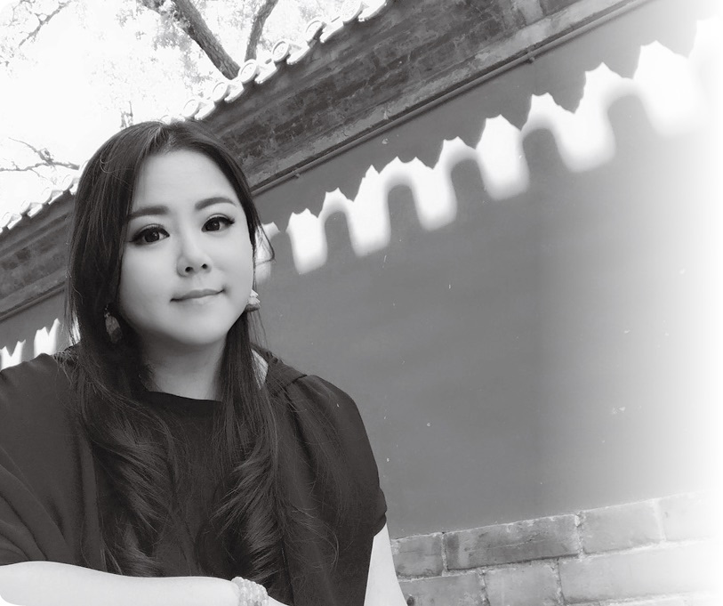

在花园里也有不同分裂的对应，甚至在体验会上也经常有来访者询问，为什么我的元辰宫场景好像时空分裂那般，或者像被闪电噼开，分成不同的世界，一半古代一半现代、或是一半西洋一半中式等各种分裂。在现场碍于体验会人多，我只会讲一个特色“你有学习心理学方面的天赋”。这是为什么呢？因为这种情况代表他分裂的内在已经足够让他生活分裂了，肯定会积极寻求处理自身平稳的方式，进而去学习心理方面的相关学习。

总之，都是必须配合个案状况处理。

# Q96 新冠肺炎疫情，可否透过观元辰宫解析？

2020 年新冠肺炎的蔓延，造成巨大的转变，不但打乱了全世界的经济，甚至已经导致许多人丧生。透过观元辰宫是否可以事先知道疫情的出现？对于疫情带来的影响，若透过观元辰宫可以带来什么帮助？

其实观元辰宫主要是了解自己，透过整理自己心宅来改善自身状况，适应环境是生存的本能，观元辰宫的进阶应用是翻天书看水晶球，但如果与本身没有直接关系，举凡相关预言都会失准，更何况是预知世界局势。

但的确，我因为自身的工作关系，曾经在 2020 年新冠疫情爆发前，感受到某些征兆。记得 2019 年 10 月时，我人正好在中国武汉，当时我的课堂上，就正好很多学生提问的问题都跟肺有关，我那时也在课堂上提出警讯，请大家将来要注意跟肺部有关的讯息。每个班级的培训议题都会有每一班的侧重点集体意识。也在同一个月，有教学单位邀请我 2020 年 3 月去他们那边开课，通常我都乐于去上课，但那一回我感应到眼前有个黑影，我诚实地跟邀请单位说：“虽然是明年的事，但我发现有个黑影子挡在面前，而我目前也不知道是什么事，抱歉三月那时无法飞去开课。”

结果就如同大家所知悉的，2020 年春节左右新冠疫情就爆发了，到处都封城及管制，更何况是当时灾情最严重的武汉。疫情发生后，我陆续接到学员的报告与回馈，当时许多课堂间的对话都应验了。

不幸的是，那年我所教授的班级里，就真的有学员是疫情的灾民，有的自身染疫，也有家人发病的。他们透过社群发言，表达心中的恐慌无助。包括疫情紧张时，连医院床位都没有，很多人还必须和家人分离，感受极度的焦虑。

观元辰宫本身不是医疗行为，但一个人若能真正透过内观调整自己，让自己身心灵处在最佳状况，疫病就会远离。我也透过社群链接，线上指导学生如何透过观元辰宫做调整，例如有位学生职业是瑜伽老师，她当时因为家人住院，必须在自己的教室隔离做自主管理。那段不能出门的日子，每当她恐慌时，我就提醒她，别忘了老师曾教导的三大信念，引导她知道疫情这件事，但同时也知晓疫病跟她不会有关系，“说嗨技巧”让她体验自己身体处于非常健康的状态。

透过内观以及瑜伽，她逐渐平静，在配合我的指导下一步步调解肺部功能后，她每天大量排汗，代谢也正常，免疫力逐渐加强，最终隔离期满，去量测体温及身体状况都没问题，可以正常作息。她后来也透过帮家人观元辰宫，协助本来有发烧症状的家人，后来状况回复平稳出院。

这里也要再次强调，我们只是协作者，真正执行的是来访者案主本身，尊重自身的灵魂意愿，但必须提醒大家，自己的身体是可以透过自我管控，处在良好状态的。所谓的自然疗法，道法自然的回归到宇宙规律，也能追求健康。

当我们进入元辰宫时，若处在幽暗的环境，代表着身体状况不佳。因此我们要逐步调整，包括拉高屋檐屋顶，让空间更宽广；点亮元辰灯和光明灯，让室内更明亮；还有打扫心宅维持干净环境，心宅被打理好了，人的身体相对的也会变好。

此外，面对疫病等外界病菌侵扰，最重要的还是抵抗力要够，在元辰宫里，可能神明或管家也会为我们端来汤药补品，像是高蛋白的营养品或者鸡汤、鱼汤等，隐喻喝下后让灵体更康健。

其他跟生命状态有关的，例如生命树，当然也要特别注意，若树干是弯的，会影响造血功能，要设法调整生命树变回高壮笔直。

# Q97 过动儿或自闭儿的家长，可以透过元辰宫做到协助吗？

母职本就是辛苦的，特别是若生养的小孩有特殊状况，妈妈的那种辛劳更是非当事人难以了解。我有好朋友是过动儿或者自闭儿的家长，若想透过观元辰宫得到协助，老师有什么建议？

不论过动或自闭，其实都跟孩子的“律动”有关，只要抓到那个节拍，是可以跟他“对频”的，例如带过动儿孩子，他可能比较没安全感，这样的孩子若抱在腿上，你跟着他的律动节拍，轻轻摇摆，摇晃时会明显感受到他逐渐放松。每个过动儿的频率都不同，有人喜欢荡秋千，有人就是满室钻，你得耐心地跟着他跑，例如他若钻到桌子底下，你也跟着弯腰探到桌子下，即便处在观元辰宫的状况里也是如此。

我曾引导过动儿孩子，他在观元辰宫的情境下，依然过动，但我边陪着他边指引他，引导孩子说出他的元辰宫景象，通常这种孩子的墙壁会有很多破洞，我就引导他慢慢的分阶段，把墙壁补起来。心宅破损减少，墙壁更稳健，孩子后来就比较平静。另外，过动儿的状况，可能还包括房间凌乱，房间里的椅子都是那种有磙轮的，这些椅子也可以透过调整元辰宫，逐一汰换成较稳重的椅子。

至于自闭儿与唐氏症的情况，我常借由绘画方式，鼓励孩子把他的元辰宫画出来，他可以画出花园，让我看到那里可能有枯萎凋零的残破景象，于是我就透过导引，协助他在元辰宫里找管家和园丁，一起将花园妆点丰盛，也协助他走出来。观元辰宫调心宅的过程与艺术治疗的搭配也是很完美的结合。

其实就算是大人，也会有过动，也就是毛毛躁躁、经常焦虑急性子，或者自闭，也就是孤僻沉浸在自我世界不爱与人沟通的毛病，这些也都可以透过元辰宫调整，让他处于更好的状况。

# Q98 家人或朋友遭受心灵创伤，可以如何协助？

身边的家人朋友，可能因为感情上被背叛，或者碰到重大意外打击，例如自身是重大灾难的受灾户等，这类事故会带来很大的打击，有的人性格匹变，变得自我封闭，不与人讲话。身为朋友可以怎样帮他呢？

在我辅导的案例中，有很多都是跟创伤有关。特别是跟生老病死相关的，像是每个人一生中都难免遇到的亲人离世、或最好的朋友离开等等，其中也包括自己最疼爱的宠物往生等事。许多当事人会因为无法接受，而陷入严重的忧郁，有的尚可以自我调适，大部分情况，还是需要家人带来透过观元辰宫处理问题。

如同人体，受伤会有伤口，当我们因为情变或遭逢事故而受伤，心灵也会有伤口，我们进入元辰宫，就是要去找到创伤点。那些情况可能表现在各个层面，包括整个室内颜色是深色或较灰暗的感觉，有的则是书房位在地下室，身为导师，我们要协助当事人重新找回明亮光明。

一般受创者，依照心灵学的定义，多数会经历五个阶段，例如悲伤五阶段或是创伤五阶段等，我们这里不谈高深的心理学理论，但将焦点放在最初的两个阶段，一个是呐喊期阶段，一个是否定初期麻木阶段。

当遭遇到事情，好比说家人往生，那么当事者是处在伤痛的第一阶段。老师的建议是，这一阶段不适合观元辰宫，在此时，当事人情绪跌到谷底，需要呐喊或者哭泣等情绪的引导宣泄，会希望大家不要来烦他，想要有个不要打扰我、Leave me alone 的时刻，这期间大约就是 49 天。专心处理当下生活，可能是处理治丧或者告别仪式等，过了这第一阶段，有人会逐渐回到正常生活，走出伤痛，但有人伤痛太重，进入到创伤第二阶段，这时候就要来观元辰宫。

处在创伤第二阶段，惆怅感会出现，过分融入的人还会搜集各类药品寻求自杀。为了表示心死，各种行为退化，或是选择性失忆，因为解离会使人好过一些。接下来整个人会变得比较麻木，借由不同的事来麻痹自己，例如有人变成工作狂、有人整天打电动……无论如何，这些状况都必须调整，那些工作狂往往做着做着越做越空虚，觉得再也找不到存在的意义，然后就会递出辞呈，因为再也无法工作了。有些会打破现有的幸福，只为了成就那个不完美。

进到这些人的元辰宫，会发现他们的大厅墙壁可能已经龟裂，窗户也都关起来，整个屋宇黯淡无光。经常想要引导当事人开窗，他们也会说“不行！窗户无法打开”或者甚至说出“窗户已经被锁起来了”的话。

面对这类情况，我绝对不会强求，调整必须慢慢来，所谓道法自然，这方法不行，我们改其他方法。最常用的方法，房子太暗，那就多点些灯，先让心宅有光线，再逐步开导当事人，设法去开窗。

可能处理完大厅，接着去看花园，也是协助做景观改变。

因应创伤不同，表现状态也不同，例如曾有个遭受性暴力的受害者，陷入严重的低潮已达精神分裂，她一方面害怕回忆当时的情境，一方面又非常自责，“是我做错什么了吗？”

原本温柔的女孩，可能进入元辰宫后，发现她变得暴戾，她会指责自己的管家，甚至发生有鞭打管家的情况，因为她把管家投射成那个侵害她的人，也就是她从现实生活中的受暴者，变成内心里的施暴者，而她施暴的对象，就是她自己的心灵。

这样的案例也是需要慢慢调整，无法强求。以该案例来看，我协助她调整管家，她原本的管家是一个阉人，她认知上认为这样就不用担心他侵犯她。后来又逐步转换，将管家调换为一个婆婆，那就更安全了。类此步骤，让她内心逐渐感到放心，但过程不能太急躁，以渐进式的方式回复平静，逐步回到生活正轨，活出自己想要的样子。

# Q99 家人相处发生难以弥补的遗憾时，该怎么办？

这里指的遗憾，除了家庭、家运之外，其实就是夫妻两人因为理念不合等因素，最终必须走到离婚一途，但小孩何其无辜，必须面对这样的伤痛。关于这方面的事情，若透过观元辰宫有什么建议？

家家有本难念的经，这类的事，重点还是当事人自己要懂得与家人相处之道。观元辰宫最佳的时刻，是“事情发生前”，也就是在事情尚未那么严重，还能挽回前，可能当时夫妻已有心结，或家人相处常有抱怨时，那时就可以来观元辰宫。

例如我有学员，生意做很大，他把时间都花在商场，相对地对家人就少了陪伴，并且他的情况是比较严重的，因为小孩子已经感受到他缺乏爸爸的爱。当然，不只是男性如此，也有很多情况妈妈是职场妇女，长年无法好好陪伴孩子。

不只是孩子的问题，也可能是其他的生活困顿，这都是人生课题，需要处世的智慧，任何跟智慧有关的，在元辰宫的书房里都可以找到答案，也就是可以在书房上找到属于自己的无字天书，透过翻阅找寻这本书，就可以找到自我人生指引，包括如何与小孩相处，或者与另一半的磨合该如何化解？

当然，若事情都已走到无法挽回的地步，例如都已经在打离婚官司了，这时候硬要挽回也太牵强了。我们可以协助好聚好散，或者加速推动，以现实层面来说，好比希望离婚官司把小孩判给自己抚养。那么，要考虑到什么呢？一般法官判决，通常是依据夫妻个别的经济状况，或谁比较能陪伴孩子为主考量。另外，关于离婚，还有一个议题是赡养费。不论是哪种情况，跟金钱有关的，在观元辰宫时，会需要考虑到厨房的状况，因为厨房主管财库。

详细的处理方式，依个案不同，会有不同考量。有相关问题的朋友，再依个案来处理。

# Q100 听说有人可以轻而易举地辟谷不食，他是怎样做到？

乍听之下辟谷不食（不吃五谷）似乎跟观元辰宫无关？但还是想请教老师，若以观元辰宫的角度来看这个问题，该怎么回答？

只要跟“人”有关的事，当然就跟观元辰宫有关，因为心宅对应着一个人的所有状况。

提起节食瘦身或者像是本题讲到的辟谷，最终目标都是追求养生。因应现代社会文明病那么多，的确一个懂得养生的人会比较容易长寿。但坊间老师教导的许多养生技巧，不一定人人适用，例如最近流行的 168 节食瘦身法，就是有人有效、有人成效不彰。

这里仅以观元辰宫的角度来谈辟谷，实际案例，我有一个教养生的老师，她的班上有四十多个学员，我们观念中，以为辟谷或者节食，人会变得越来越瘦，但以我这个老师的案例，她的学生中，有几个本来是过瘦，伴随着身体有某种病症，结果等到辟谷出关后，人反倒变胖了。不过重点其实不在胖瘦，而在于是否健康？

观元辰宫的一个重点，就是可以用“精神食粮”取代“真实食粮”，实际生活中，很多人为何会胖？是因为生活中的焦虑，许多人一焦虑就暴饮暴食，以此角度来看，若我们从心灵层面着手，好比说在心宅的饭桌上，我们就已经得到满足，那在现实中就不需要外在过多的食物。例如在心宅里，把爱吃的炸鸡烤肉都端出来大快朵颐，吃饱了，回归现实生活，就不会那么饥饿。

实务上，透过元辰宫的调整来处理每个人的营养健身状况，依然是视个案而定，有人饮食偏向混搭，有人偏冷有人偏热，或者有人适合白天消化等等，各种状况不可一概而论，都还是需要个案调整。

基本上，就算是观元辰宫，也可以结合辟谷的，我们也有实际学员拥有实践精神自身实验有效。

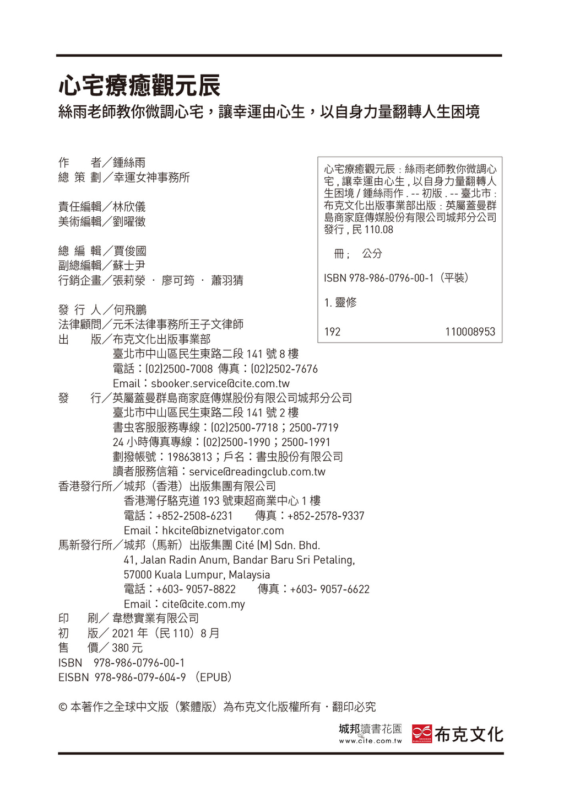