朱玉娟 徐旺 朱莉◎编著

## 我爱摩羯座

### 魅力星座智慧书之 摩羯座

### 如何认识自我并影响他人

一个故事对应一个星座秘密

## 心灵鸡汤 星座版

朱玉娟 徐旺 朱莉◎编著

## 我爱摩羯座

### 魅力星座智慧书之摩羯座

如何认识自我并影响他人

一个故事对应一个星座秘密

CIS | 湖南文艺出版社

### 图书在版编目（CIP）数据

心灵鸡汤魅力星座智慧书. 摩羯座读本 / 朱玉娟, 徐旺, 朱莉编著. -- 长沙 : 湖南文艺出版社, 2011.1 ISBN 978-7-5404-4705-2

I. ①心… II. ①朱… ②徐… ③朱… III. ①成功心理学--通俗读物 IV. ①B848.4-49

中国版本图书馆CIP数据核字(2010)第239221号

### 心灵鸡汤魅力星座智慧书. 摩羯座读本

- 编 著: 朱玉娟 徐旺 朱莉
- 出 版 人: 刘清华
- 责任编辑: 傅 伊
- 出版、发行: 湖南文艺出版社
- (长沙市雨花区东二环一段508号 邮编: 410004)
- 网 址: www.hnwy.net
- 经 销: 湖南省新华书店
- 印 刷: 湖南新华精品印务有限公司
- 印 次: 2011年1月第1版第1次印刷
- 开 本: 710*1000mm 1/16
- 印 张: 14
- 字 数: 180,000
- 印 数: 1-10,000
- 书 号: ISBN 978-7-5404-4705-2
- 定 价: 25.00元

## 务实而功利的摩羯座

可以证明自己的摩羯座的人随处可见，他们收入中上，渴望成功，尊重权威，并以传统为荣。他们自信心强，认为自己应得到最好的。年轻人崇拜长者。摩羯座人很少会卷入谣言。

健康：从小长到大一直都较健康，也挺会自我关照，所以一般不用父母过多地操心。由于好静思而不太积极参加户外活动，体育成绩略差。运动起来爆发力不足，一般少有什么突出的运动特长。建议你根据自己耐力好的特点，在身体发育成长阶段，坚持练习长跑，这会使你终身受益。

学业：在学业上，你可能没有很高的成就，也不喜欢一味地啃书本，你更重视知识的实用价值。所以在书读到一定程度的时候，你可能会放弃继续读书的机会，转而去学习、掌握某种实用技术。那种经过多年正统的家教形成的文化教养，使你在人群中即使不是最出色者，也不会是很差的。

性格：摩羯座的人通常过于严肃、不够乐观、缺乏浪漫情怀、不善沟通、墨守成规、过分功利主义、太在意别人的言语、太过现实。

职业：摩羯座者一般不偷懒、不投机、不好出风头。多数人心灵手巧，且相当有耐力，因此适合选择与自己心灵感应相关，少与他人交流而埋头伏案的工作。例如外科医生、会计、服装设计，装帧设计、美工等等。你可能是大器晚成者，很懂得自我设计。只要多动手，少多嘴，发挥超人的耐力和善琢磨、手灵巧的优势，你会在自己喜爱的岗位上充分地体现自我价值。

婚姻：婚姻观不是很新潮，内心严守道德观，家庭扎扎实实地建立在现实的基础上。一般不宜早婚，一则因为属摩羯座者不太善于观察人，只有在阅历和经历皆较为丰富之后，才能更准确地了解人。二则因为属摩羯座者重视打基础，讲究先创造条件。经过认真权衡与选择结成的婚姻，会较为完美，值得用心厮守。

经济：摩羯座者比较具有前瞻性，也许最初选择的工作并不理想，但是你看准了这份工作提供给你的成长机会和积累的经验。随着你的技能的长进，你的经济来源会拓宽，你凭借自己勤劳灵巧的双手，一点一滴地积聚涓涓细流。在同龄人中，你属于较早跨入收获季节者。

事业：一般来说你不慕虚名，不眼热功名利禄，但也时常跃跃欲试，想在仕途上有所发展。你工作踏实认真，责任心强，从不敷衍。你也很有成就感，比较在意领导与同事对你能力的评价，因而能够很自觉地履行职责，努力在工作岗位上表现出色。现实的人生观使你希望以事业带动生活，以勤奋的劳动换来较优越的物质享受。事业与生活并进，这就是你人生的动力。

魅力星座智慧书之摩羯座 charismatic

## 目 录

多变面相的魔方 003

Magic星密码——名人造就成功密码

周杰伦：窗外有蓝天 009

Magic魅力魔方——教点技巧提升你的魅力

## 魔方第一面：处事篇

- 魅力失分——记仇 017
- 魅力失分——享乐主义者 027
- 魅力失分——功利主义 035
- 魅力失分——太在意别人的言语 043

## 魔方第二面：处人篇

- 魅力失分——忧郁 051
- 魅力失分——太过现实 059
- 魅力失分——疑神疑鬼 067
- 魅力失分——不够乐观 077
- 魅力失分——个人利己主义 085
- 魅力失分——看似老实却难以理解 095

## 魔方第三面：魅力失分

- 魅力失分——缺乏浪漫情怀 103
- 魅力失分——事业心过强 113
- 魅力失分——恒温就是不冷不热 123

## 魔方第四面：魅力失分

- 魅力失分——压抑 131
- 魅力失分——木讷 137
- 魅力失分——孤独 145
- 魅力失分——倔强 153
- 魅力失分——不善沟通 161
- 魅力失分——缺乏对人群的关怀和热情 169

## 魔方第五面：魅力失分

- 魅力失分——过分认真 177
- 魅力失分——冥顽不灵 185
- 魅力失分——墨守成规 195
- 魅力失分——不能随机应变 203
- 魅力失分——态度过于严谨 211

## 魔方第六面：魅力失分

- 魅力失分——过于严肃 217

## Magic 星名堂

名人的榜样成就你的自信

### 周杰伦小资料

- 中文名：周杰伦
- 英文名：Jay
- 生日：1979年1月18日
- 星座：摩羯座
- 出生地：中国台湾省台北县淡水镇
- 职业：歌手，演员，老板，音乐制作人
- 毕业院校：台北县私立淡江高级中学

### 【周杰伦：星外透露关】

周杰伦，万千青少年为他的歌声而痴迷、崇拜的一位天皇巨星，对母亲叶惠美有着似海深情，因为在他最孤独最无助的时候，是妈妈用温暖的臂膀支撑着他。所以周杰伦一直说：“只要妈妈高兴，我愿意为她付出一切！”

### 【音乐天才破裂的家】

周杰伦出生于1979年1月，妈妈叶惠美是台北淡江小学的美术老师，爸爸是淡江中学的物理老师。

周杰伦四岁读幼儿园时，叶惠美把他送到淡江山叶幼儿音乐班学钢琴。平时活泼好动的小杰伦一站到钢琴面前，竟是出奇的安静，听老师弹奏一遍自己就能复弹出来，老师告诉叶惠美，这孩子很有天分！

为了培养杰伦的音乐素质，叶惠美主张拿出全部积蓄为杰伦买一架好钢琴，请最好的钢琴老师为杰伦辅导。而杰伦的爸爸则认为不必这么认真，男孩子嘛，随意一点，没必要拿出全部积蓄投资。最后，叶惠美还是背着丈夫为杰伦买了一架钢琴，弄得杰伦爸很不高兴。小学三年级时，杰伦偶然听到世界名曲《天鹅湖》，被大提琴忧伤凄美的曲调迷住了，叶惠美没和丈夫商量又为杰伦购买了大提琴。

杰伦爸对妻子叶惠美“孤注一掷”的做法嗤之以鼻，他回家就指责叶惠美的不是，家庭里的温馨越来越少，争吵越来越多。杰伦不知道爸爸为什么总要找妈妈吵闹，他用自己稚嫩的诗行记下他的困惑和伤感：从小到大只有妈妈的温暖，为什么我爸爸那么凶。如果真的我有一双翅膀两双翅膀，随时出发，偷偷出发我一定带走我妈妈……

这伤感的诗行，杰伦后来为它谱了曲，就是那首令万千歌迷伤感的《爸，我回来了》。

周杰伦初中二年级时，父母终于离婚。十四岁的周杰伦写道：“爸爸妈妈彼此没有爱，难道这就是生命的真谛？”

沉默、倔强和叛逆已经塑造了另一个周杰伦。

### 【世人不识君——苦闷中的徘徊】

周杰伦有音乐天赋，但功课却很糟。高中联考总分只有一百多分，连普通高中也没考上，前途一片暗淡，母子俩相对无言，难道儿子就这么完了？恰好淡江中学第一届音乐班正在招生，周杰伦考上了。因为弹得一手好钢琴，拉得一手好大提琴，又时常活跃在篮球场上，周杰伦成为许多女同学关注和谈论的对象。

但是，周杰伦却常常面无表情，很少露出一丝笑容，除了音乐成绩出类拔萃以外，其他科目成绩几乎全线红字，老师们纷纷认为他智力低下，他的英语老师甚至直言不讳地对叶惠美说周杰伦有智力障碍。叶惠美陷入了深深的思索，她还是决定要把杰伦培养成才，至少当一个钢琴师吧。叶惠美没有指责杰伦，她认为杰伦走到今天冷漠、叛逆的地步是家庭的不和睦造成的，并且深信自己的孩子没有智力障碍，于是她尝试用姐弟式的关心来“驯服”周杰伦，规定自己“三不”：不唠叨、不指责、不胁迫儿子。

果然如老师们的预测，周杰伦没有考上大学。叶惠美多方打听后，鼓励杰伦去考台北大学音乐系，结果他没有被录取。周杰伦咬着牙考第二次，还是失败了。妈妈和外婆外公都为杰伦的前途担忧，这孩子究竟将来能干什么呢？

极度迷惘的周杰伦无所事事，只好等待服海军兵役，这期间，竟得了僵直性脊椎炎，令人沮丧的是这种病无法根治，只能靠药物缓解，到了晚期全身甚至会像僵尸一样僵硬，也可能导致瘫痪。叶惠美和外婆说起杰伦就垂泪。

### 【母爱呵护下一飞冲天】

病情缓解一些后，周杰伦到一家餐厅打工，作为端盘工的他因为时常打翻菜盘，每个月的工资几乎被扣掉了一半。

餐厅中有一台钢琴，一次闲暇时周杰伦弹了一曲《肖邦舞曲》，把老板惊呆了，老板灵机一动，叫周杰伦不要端盘子了，就在餐厅弹琴，然后请来电视台记者炒作，不但使得餐厅生意火爆起来，还节约了一大笔请钢琴师的费用。

叶惠美感受到了杰伦的音乐潜能，她替儿子在台北星光电视台娱乐节目“超猛新人王”报了名。周杰伦精心创作了一首歌曲《梦有翅膀》，但他对自己的演唱实在没信心，便请了一位歌手演唱。演唱者不能理解他的曲风，而他的钢琴伴奏又显得怪异，弄得台下听众嘘声一片，初出茅庐的一场表演彻底搞砸了。

叶惠美急了，性格内向的她鼓起勇气找到了主持人吴宗宪，把《梦有翅膀》的曲谱拿给他看。吴宗宪当时是台湾阿尔发音乐公司的老板，他对周杰伦的第一印象并不好，应付似地拿起曲谱扫了一眼，却是眼睛一亮，歌谱不仅抄写得工工整整，而且谱得十分复杂。独具慧眼的他立即改变了主意：“这孩子还可以，明天叫他到我公司来上班！”

周杰伦进了音乐公司任音乐制作助理，在妈妈的鼓励下，每天主动帮同事们买盒饭，大家对这个沉默寡言但又勤快的小伙子有了好感。而叶惠美总担心杰伦冷漠而倔强，又不善言辞，生怕他无意中把老板和员工们得罪了，于是常常在下班时间站在公司门口，准备一些可口的比萨、炸鸡送给员工，请他们包涵杰伦。一来二往，叶惠美对公司员工比周杰伦还熟悉，同事们都知道周杰伦有一个好妈妈。

周杰伦很快创作出大量的歌曲，但让吴宗宪感到不可理解的是，他创作的歌词总是怪怪的，音乐圈内几乎没有人喜欢。一次，周杰伦又拿着自己的得意之作送给吴宗宪审读。这次吴宗宪连看都不看，便将那首歌曲揉成一团，随手丢进身边的垃圾桶里去了。周杰伦的眼泪禁不住流了出来。

是放弃还是继续？妈妈每天来公司门口已经成为一道风景线，如果放弃，太对不起妈妈了，周杰伦硬着头皮支撑着，他吃住都在办公室，以每天一首歌的速度进行创作。叶惠美每天晚上都到公司看望杰伦，望着日渐消瘦的儿子，她强忍着不让自己的泪水流出来，尽量说一些鼓励的开心的话，然后将杰伦换下的脏衣服拿回去洗干净。一连一个多月，吴宗宪每天早上八点钟上班时，总能准时见到周杰伦新的作品。终于，他被这位小伙子的勤奋和天赋深深地感动了，他“嗅”出了周杰伦的歌曲隐隐有一种味道，他答应找歌手演唱他创作的歌曲。

吴宗宪将周杰伦的《眼泪知道》推荐给天王歌星刘德华，刘德华看了一眼就拒绝了。不久，又将他的《双截棍》推荐给火爆华语歌坛的张惠妹，没料想，张惠妹也毫不犹豫地拒绝了。吴宗宪决定给周杰伦最后一次机会，让他自己演唱自己创作的歌曲，如果这样也不行，他就只好请周杰伦走人了！他将周杰伦叫到办公室，十分郑重地说：“阿伦，给你十天的时间，如果你能写出五十首歌，而我可以从中挑出十首，那么我就帮你出唱片。”

老板的话刺激得周杰伦兴奋不已，他打电话告诉妈妈后就跑到街上买回一大箱方便面。他想，就是拼了命，也要做最后的搏击。

周杰伦熬红了双眼如约写出了五十首歌曲，而且每一首都写得结构合理，谱得工工整整。吴宗宪终于有了赞许的笑容，他挑选出十首，2001年初制成了周杰伦的第一张专辑《Jay》。

公司对这张唱片没抱多大希望，能收回制作成本就算不错了。然而《Jay》横空出世后，犹如一场猛烈的台风横扫台湾，很快被歌迷抢购一空。《Jay》一举夺得台湾当年最佳流行音乐演唱专辑、最佳制作人和最佳作曲人三项大奖。

《Jay》的成功让公司始料不及，让台湾的歌星们大跌眼镜，大家纷纷询问，哪里出来的周杰伦？如果说第一张专辑小有成就的话，那么，周杰伦第二张专辑《范特西》已经形成了风暴，席卷了大陆、港台、东南亚整个华语歌坛，各种大奖纷至沓来。

周杰伦终于成功了，他深深明白，没有妈妈黑暗中明灯般的温暖，他支撑不到今天，妈妈为他一直未再嫁，点点滴滴都是舐犊之情。他将所有的收入都交给妈妈掌管，尽管自己有了公寓，每个周末依然回家，同妈妈、外婆一起享受天伦之乐。叶惠美更是百感交集，当年丈夫的讥讽、老师的摇头、生活的艰辛都随风而去。

叶惠美退休后，周杰伦总担心妈妈寂寞，只要在台湾，他都回家同妈妈住在一起。周末时，他会约上妈妈一起去看午夜场的电影，妈妈喜欢看经典片，周杰伦就陪着看，而周杰伦喜欢看的前卫片，叶惠美也陪着儿子看，幸福的暖流萦绕在母子心间。周杰伦的第四张专辑就叫《叶惠美》，这是儿子献给母亲的礼物。

## Magic 魅力魔方

缺点改造提升你的魅力

## 魔方第一面

### 处事篇

## 魅力失分

## 记仇

属摩羯座的人不论好事坏事，都记在心里，八百年前的陈年老账都还记得清清楚楚，还真让人难受。

## 天堂在哪里

佚名

“天堂在哪里？”在得克萨斯州的一所小学里，一群天真无邪的孩子经常向玛琳娜老师询问这个问题。为了满足孩子们的好奇心和求知欲，玛琳娜老师请来了莫迪神父。

莫迪神父首先在黑板中间画了一条线，把黑板分成两边，左边写着“天堂”，右边写着“地狱”。然后对孩子们说：“我要求你们每个人分别在‘天堂’和‘地狱’下面写下你们想像的内容。”

孩子心目中的天堂就这样呈现出来了：

- 天空
- 爱情
- 阳光
- 花朵
- 欢笑
- 春天
- 音乐……

在“地狱”这一边，孩子们写下了这样一些字眼：

- 仇恨
- 恐怖
- 黑暗
- 肮脏
- 哭泣
- 残杀
- 流血……

等孩子们写完后，神父对孩子们说：“正如大家所知道的，天堂是具备了一切美好事物与美好品德的地方，这个地方有人叫天堂，有人叫天国，或者净土，极乐世界。地狱呢？正好相反，它是充斥了一切丑恶事物与丑恶心灵的地方。那么，有没有人知道：人间在哪里呢？”
孩子们说：“人间是介于天堂与地狱之间的地方。”
神父说：“错。”
孩子们露出迷惑的神色。
神父告诉孩子们：“人间不是介于天堂与地狱之间。人间既是天堂，也是地狱。当我们心里充满爱的时候，就是身处天堂；当我们心里怀着怨恨的时候，就是住在地狱！”

> 魅力提示：
亲爱的朋友，你愿意住在天堂还是地狱呢？

## 走出心灵的牢笼

林夕

诺贝尔和平奖获得者、南非黑人领袖纳尔逊·曼德拉是国际政坛上一位风云人物，他一生都致力于反对政府种族歧视政策、推进南非民主进程的斗争，并因此遭到当局监视而被捕，在度过了长达二十年失去自由的监禁生活后，1990年2月10日，南非政府宣布无条件释放曼德拉。

已是七十二岁高龄、两鬓斑白的曼德拉，走出监狱的第二天，即投入到自己钟爱并为之奋斗一生的为争取民族独立和解放运动中，并在南非首度不分种族的大选中获胜，成为南非第一位黑人总统。有五万人参加了就职典礼。就职典礼后，曼德拉设宴招待各国特使、来宾，他先致词欢迎大家的到来。他说，他深感荣幸能接待这么多尊贵的客人，但他最感到高兴的是当初他被关在罗本岛监狱时，待他以礼的三名前狱方人员的到来。接着，他邀请他们站起身，将他们一一介绍给大家。

在场的人无不为之感动。这些人中，有一位就是美国特使团成员、当时身为第一夫人的希拉里。由于受白水案牵连而接受美国司法部门调查、不时遭受媒体攻击的希拉里问曼德拉，如何在激流险壑、风云变幻的政治斗争中，保持一颗博大、宽容的心？

曼德拉意味深长地看了她一眼，以自己获释出狱当天的心情回答了她。他说：“当我走出囚室、迈向通往自由的监狱大门时，我已经清楚，自己若不能把悲痛与怨恨留在身后，那么我其实仍在狱中。”

曼德拉还告诉希拉里，感恩与宽容经常是源自痛苦和磨难的，必须以极大的毅力来训练。自己年轻时性子很急，在狱中学会控制情绪才活了下来，他的牢狱岁月给了他时间与激励，使他能够深入自己的内心，学会处理遭逢的苦痛。

曼德拉博大宽宏、乐观向上的精神深深地感动了希拉里，她暗暗告诫自己：要试着像曼德拉那样，以宽宏的精神处理生活中遭逢的苦痛。1998年8月的一天清晨，当她的丈夫、美国的总统克林顿向她承认自己和莱温斯基有过不当的亲密关系时，她愤怒得像一头狮子，冲着他大吼大叫。回忆当时的心情，希拉里在回忆录中这样写到：如果仅作为他的妻子，我真恨不得扭断他的脖子。但他不只是我丈夫，他同时也是美国的总统。无论如何，他领导美国与国际社会的风范依然让我敬佩。

就像我们知道的那样，希拉里最终宽恕了自己的丈夫。她以常人难以想象的毅力控制住自己的情绪，像往常一样投入到工作中，利用工作、假期旅游、向朋友倾诉、阅读和散步等方式抚平内心的伤痛，化解难言的愤怒。她重拾起生活，投入到自己所热爱的事业中去。

再没有什么比失去自由和被自己所爱的人背叛更痛苦的了！身为女人，如果能够选择的话，我宁愿不要希拉里那样的荣耀，也不愿经历她那样的痛苦。但是，谁又能保证自己永远远离痛苦呢！在我们的一生中，快乐和痛苦经常是交替出现，交换作用的。所以当痛苦袭来时，我愿意试着像他们一样，把悲痛与怨恨抛在身后，乐观地向前。不是为别人，而是为自己。因为，人的心也是一所监狱，如果深陷其中无法自拔，成为自己的囚徒，这才是最大的痛苦！

> 魅力提示：
宽恕别人，就是最深地爱自己。

### 魅力星座智慧书之摩羯座

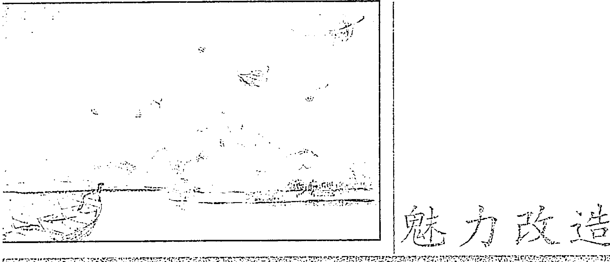

## 船和锚

佚名

船和锚是好朋友，他们一直在一起，从未分离过。在一个晴朗的日子里，船和锚出海了。暖暖的阳光，蓝蓝的海面，不时还有鱼儿跃出水面。锚依偎在船的怀里，舒服地晒着太阳睡着了，它正做着美梦的时候却被船的尖叫声惊醒，然后就发现自己像蝴蝶一样地飞了起来。原来锚梦见许多美丽的蝴蝶在自己面前飞啊飞，它就伸手去抓，可是蝴蝶并不是那么容易就能抓到的，等到它刚刚抓到一只时，梦也就停止了。

船之所以尖叫是因为锚抓伤了它的一只耳朵。锚的手上留着很长且尖尖的指甲，它做梦时抓到的其实是船的耳朵。船火冒三丈，顺手就把锚扔了出去，锚在空中翻滚了几下，“扑通”一声掉进海里。

锚不会游泳，它淹死了。海上掀起大浪，船没有锚帮它稳住身体，被无情的旋涡吞噬了。

> **魅力提示：**
> 朋友是我们最珍贵的财富。真正的好朋友是不会计较对方的过错的，他会用一颗包容的心接纳对方无意中的伤害。因为他知道，朋友是不分彼此的，对待朋友要像对待自己一样去爱，去宽容，去理解，去相信。

## 别让心里长草

卢丽梅

小镇上有一个叫文志的年轻人出了几天远门，回来却得知邻居张武死了。他吃了一惊，忙问：“我上个星期临走时还看见他在房顶上晒太阳呢，怎么就突然没了？他刚五十多岁呀！”有人说，一个星期前他突然失踪了，人们到处找也没找到。最后有人在山上的一个大坑里发现了他，他已经断气了。其实坑不深，摔不死人，只是不容易爬上来。他可能是渴死、饿死的吧。

这时旁边一个老者说：“不不，他死于两棵草！”说话的人是黄老头儿。因为他喜欢给人算卦看相，神神道道的，人们都管他叫黄大仙。周围的人笑起来：“两棵草怎么能让人死呢？他是掉进大坑里死的。”

一个熟人又神秘兮兮地小声对文志说：“昨天晚上我和吴树在一起喝酒，他喝醉了说，那天他正好在附近打兔子，看到张武急匆匆地从大坑边经过，突然就滑下去了，还听见他喊救命了。其实，张武是因为吴树没救他才死的。”

黄大仙说：“不不，他死于两棵草！”那个熟人说：“什么死于两棵草呀，他就是因为吴树见死不救才死的。”

旁边的另一个熟人插话说：“也不能埋怨吴树见死不救，如果他俩没仇没恨，肯定会救的。我听我爸说，几年前张武曾带一伙人到吴树家打闹，砸了很多东西，吴树肯定早就怀恨在心呢。”

这时一个老太太说：“吴树也是欠砸！你们都不知道吧，一次，吴树看见张武和一个外地女人在树林里说话，就添油加醋地到处说。张武的老婆听说张武和别人好上了，就又哭又闹，两人还差点离婚，张武的脸都丢尽了。以后张武追查出是吴树造的谣，这才闹到他家去了。唉，他到底还是让吴树给害了。”

黄大仙又说：“不不，他死于两棵草！”老太太说：“黄大仙老糊涂了吧，怎么老往两棵草上扯呢？”

有一个老头儿凑过来说：“我知道他俩很久以前的事。那时，张武二十多岁，靠养花、卖花赚钱。吴树十二三岁，母亲常年有病在床，家里很穷，没钱治病。他听说，常喝一种花泡的水就会减轻病情，便借了钱到张武家去买。可那种花很贵，自己的钱根本不够，他只好买了四棵幼苗自己养。几个月后，有两棵长出了花苞，可另外两棵就是长不大，原来只是两棵草！他气得找张武大吵了一架，从那时起就恨上了张武。”

黄大仙说：“他还是死于两棵草吧！”文志说：“照这样推论，他还真是死于两棵草，原来你早就知道他们以前的事啊！”黄大仙说：“不知道。其实，道理很简单，不仅仅是他死于两棵草，很多人都死于两棵草。当别人办了一件让你不服气、不满意的事时，你的心里就开始长草了。如果这草越长越多，你终将会受制于那些草。”人们这才恍然大悟。

> **魅力提示：**
> 做个心胸宽广的人吧，别让你的心里长满草，如果草已经长了，那么，就做个辛勤的园丁，及时地给你的心灵除除草。

# 魅力链接

书名：宽容:学会遗忘·拥抱幸福
作者：张茹
出版社：湖北人民出版社
开本：32开
包装：平装
ISBN：721604493
印刷时间：2006-01

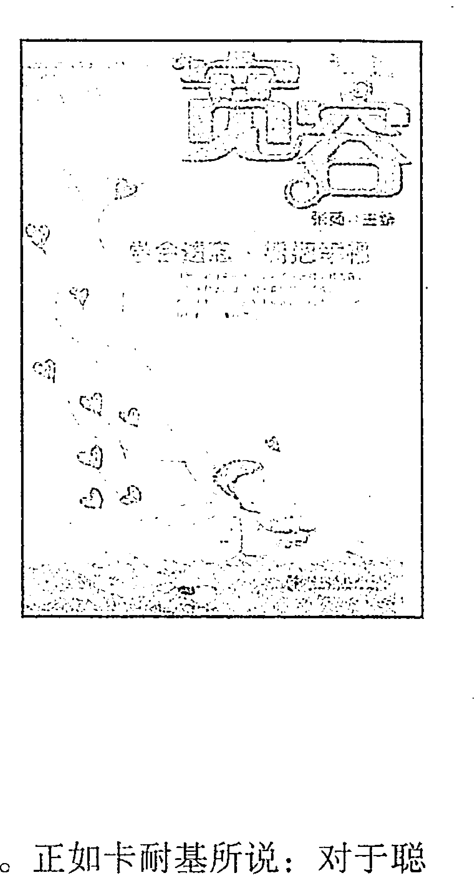

# 内容简介：

被执念遮住眼的人，生命的路会越走越阴霾。正如卡耐基所说：对于聪明的人来说，每一天都是一次新的生命的开始。因为，聪明的人，懂得宽容。本书为“青少年成才必备的六堂情商培训课”之一，是风靡台湾的青少年励志读本。阅读本书，让你我都用宽容、平直、达观、敦厚的心怀去生活处事，让每时每刻都充满喜悦。不论你是一个男子还是一个女人，待人温和宽大才配得上人的名称。一个人真正的英勇果断，决不等于用拳头制止别人发言。善于或者能够忘记悲伤的人，他的每一天都将是快乐的。

## 摩羯第一面
处事篇

MAGICAL

## 魅力失分
享乐主义者

属摩羯座的人
本质上是个完全的
享乐主义者，他的
现实、功利以及超
强的事业心，有一
部分的原因就是为
了享受到更高级的
生活。

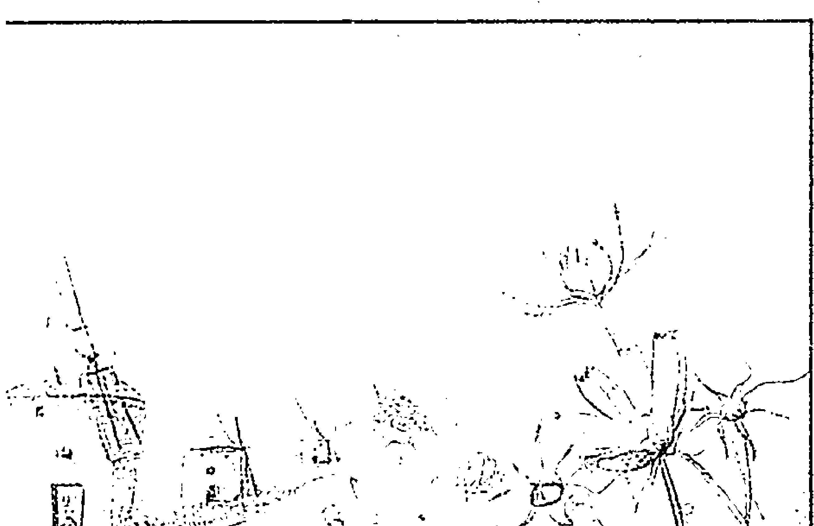

# 魅力改造

## 个性问题

### 盖迪戒烟

佚名

抽烟的人都知道，一旦上瘾，再想戒掉是很不容易的。

盖迪曾经是个大烟鬼，烟抽得很凶。有一次，他开车去度假经过法国，天公不作美下起大雨，他的汽车又抛锚了，只好在附近小镇上的旅馆过夜。吃过晚饭，疲惫的他很快就进入了梦乡。

凌晨两点，盖迪醒来，他想抽一支烟。打开灯，他很自然地伸手去抓睡前放在桌上的烟盒，不料里头连一支烟也没有了。他下床在衣服口袋里搜寻，毫无所获。他又打开装行李的箱子翻来覆去地找，希望能发现无意中留下的一包烟，结果又失望了。那就去买一盒！盖迪穿上衣服来到旅馆门外，这时候，旅馆的餐厅、酒吧早关门了。雨还在下个不停，街上一片凄清，所有的店铺都已经打烊了。唯一的办法就是冒雨到自己停在几条街外的车里去拿。

越是没有烟的时候，想抽的欲望就越大。有烟瘾的人都有这种体验。盖迪打算去自己的车里拿烟，想起帽子忘在房间里了，它至少还可以遮遮雨。他回到房间，刚准备拿帽子时他突然停住了。他问自己：我这是在干什么？

盖迪坐在床边寻思，一个有教养的人，而且是相当成功的商人，一个自以为拥有理智的头脑的人，竟要在三更半夜离开旅馆，冒着大雨走过几条街，仅仅是为了得到一支烟。这是一个什么样的习惯？这个习惯的力量难道那么强大？

不一会儿，盖迪下定决心：他决定戒烟。他站起来使劲地伸了个懒腰，然后把那个空烟盒揉成一团扔进了纸篓，脱下衣服换上睡衣回到了床上，带着一种解脱甚至是胜利的心情进入了梦乡。

至此，盖迪一生中再也没有碰过一支香烟。他就是闻名世界的美国石油大亨——保罗·盖迪。

> **魅力提示：**
> 自制力是每一个成功人士必不可少的素质之一。当我们面临诱惑时，要用理智的头脑来分清楚孰是孰非，再做出正确的选择。

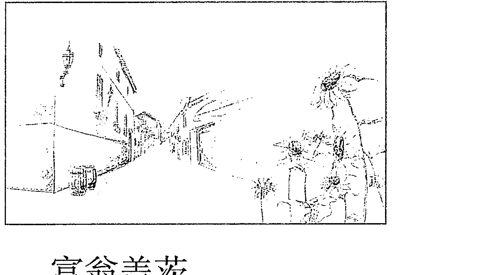

### 富翁盖茨

佚名

1975年，盖茨从哈佛大学退了学，他把自己手头的钱凑了起来，创建了小本经营的公司。在短短的20年内，他的财产达到了900亿美元，一跃成为世界首富！

盖茨虽然钱财无数，但他最感兴趣的是他的事业，而不是花钱。他的打扮丝毫没有大款的派头，更像是中国大学里的穷学生。1984年的《时代》描写他“穿着肘上打着补丁的毛衣、裂口重缝的皮鞋，蓬乱的长发，脏兮兮的眼睛。”一次，盖茨和一位朋友同车前往希尔顿饭店开会，由于去迟了，找不到车位。朋友劝他将车停在贵宾车位上，盖茨不同意：“这要花12美元，可不是个好价钱。”他的朋友说：“我来付。”盖茨道：“那也不是好主意，他们超值收费！”由于盖茨的固执，汽车最后没有停在贵宾车位上。

盖茨公司里的一名资深女职员抱怨：“当你看到盖茨，总忍不住感到疑惑，昨晚他睡在哪里？办公室？她总想走上前问他，‘嗨，盖茨，我不知你是否每天淋浴，如果是，为啥不顺便洗洗头呢？’当然，她并不敢真这么说。但在微软这么想的人可不少。不过，盖茨如此形象并不是刻意为大众树立一个艰苦朴素的典范，只是无心修饰罢了。”

> **魅力提示：**
> 伟人多谦虚，小人多骄傲。太阳穿一件朴素的光衣，白云却披了灿烂的裙裾。

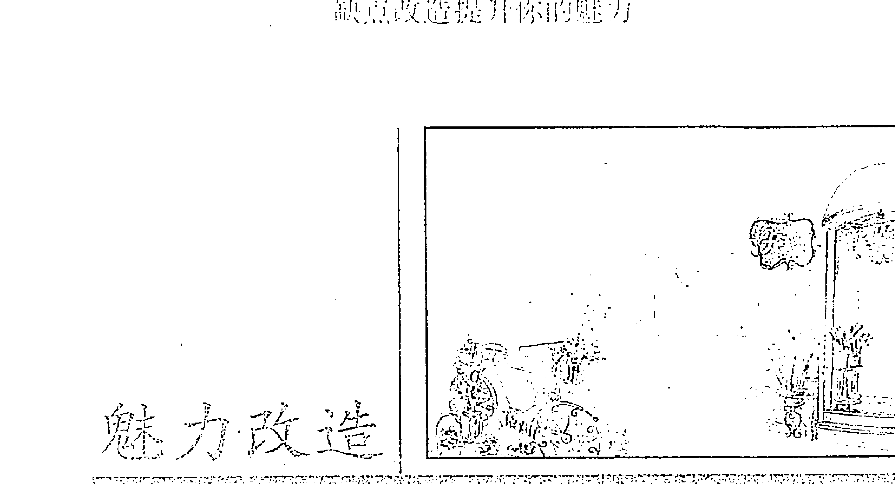

## 巴洛特夫的实验

佚名

俄国诺贝尔奖得主，曾经做了一个令人印象非常深刻的实验。

他的实验对象是一条狗，他将狗关在笼子里，并用木棍绑着一条接有高压电的电线碰触狗儿的前腿。狗受到电击立马向后弹退，同时尖声狂吠。这时，巴洛特夫便把一小块熟牛肉丢到笼子里。

巴洛特夫每隔两三个小时，就重复一遍相同的实验。慢慢地，狗对电击的反应不再像一开始那么强烈，它似乎明白到在享受美食前必须要经受一下电击的考验。

这样的实验持续了十几天，狗见到巴洛特夫拿着“木棍”走近时，已经不再像开始般浑身发抖地蜷缩在笼子的角落里哀叫，反而主动凑上前来伸出脚。

又过了几天，狗在碰到电线后并没有立即跳开，于是便让高压电给活活电死了。

## 魅力提示：

> 一个人如果被欲望所驱使，便会一步步迈向深渊。他的心灵亦将在麻木中死亡。

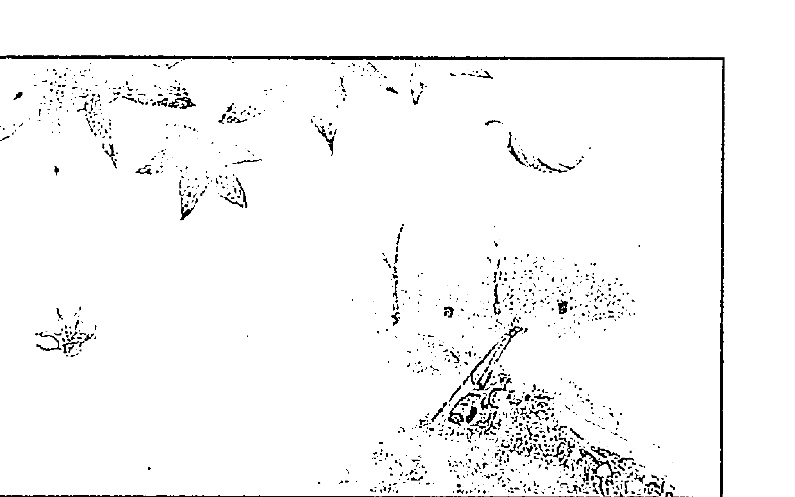

## 东食西宿

佚名

战国时，齐国有个姑娘到了该出嫁的年龄，有两家人同时送来聘礼给这姑娘家，向她父亲求婚。

东面人家的儿子长得又矮又丑，可是家中富有；西面人家的儿子呢，倒是一表人才，只是家境贫苦。姑娘的父母左右盘算，还是决定不下来，便把女儿唤到堂上，叫她自己拿主意。

父亲见女儿低头红脸，一副羞答答的样子，便说：“你要是不好意思说出口，就露出手臂表示一下吧，喜欢东家儿子，就袒右边；爱上西家儿子，就露左边。”

姑娘怔了半天，把两边的手臂都露了出来。“这是什么意思？”父母惊诧地问。

“我……”姑娘忸忸怩怩地说：“我想在东家吃饭，在西家住宿。”

> **魅力提示：**
> 在现实生活中，即使是要享乐，也必须要面对现实，实际地选择自己的生活。不切实际地做出选择和行动，再美妙的愿望与追求，最终将是一场空。

# 魅力链接

书名：九型人格
作者：（美）戴维·丹尼尔斯，弗吉尼亚·普赖斯 著，程艮 译
出版社：中信出版社
出版时间：2008-08-01
印刷时间：2008-08-01
开本：大32开
ISBN：9787508611679
包装：平装

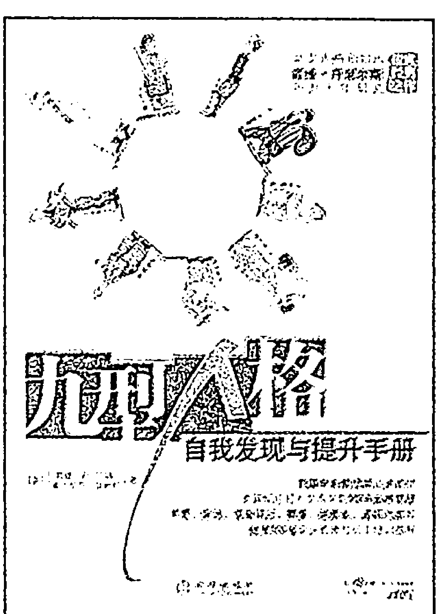

# 内容简介：

本书是九型人格理论的创始人、美国斯坦福大学心理学教授戴维·丹尼尔斯在该领域的传世经典之作。他与著名性格分析专家弗吉尼亚·普赖斯通过历时七年的精心研究，开发出这套九型人格的“五步测试法”。九型人格理论将人类与生俱来的性格概括为九种类型：完美主义者、给予者、实干者、浪漫者、观察者、怀疑论者、享乐者、保护者和调停者。无论你是哪种人，你都将在九型人格系统中找到自己的位置。

本书介绍的九型人格测试是目前极少数通过有效性检测的权威测试方式，可使人们精准地透视自己和他人的性格。目前九型人格测试已成为斯坦福大学商学院的必修课程，来自苹果、宝洁、通用汽车等世界五百强企业的员工和管理者都在分享这一全球通行的识人秘籍的巨大魅力。

## 示例文档标题

这是一个示例段落，用于演示文档内容提取。

- 第一项列表内容
- 第二项列表内容
- 第三项列表内容

| 列1 | 列2 |
|------|------|
| 数据A | 数据B |
| 数据C | 数据D |

> 这是一个引用文本示例，用于展示引用格式。

```
python
print('这是一个代码块示例')
```


## 魔方第一面
处事篇

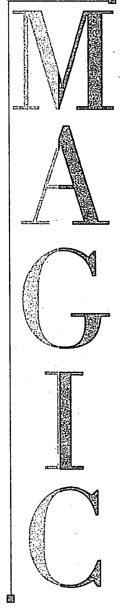

## 魅力失分
功利主义

摩羯座的人非常崇拜英雄，极度渴望成功，甚至不惜利用婚姻关系达到帮助事业成功的目的，是严重的功利主义者。

# /魅力星座智慧书之摩羯座

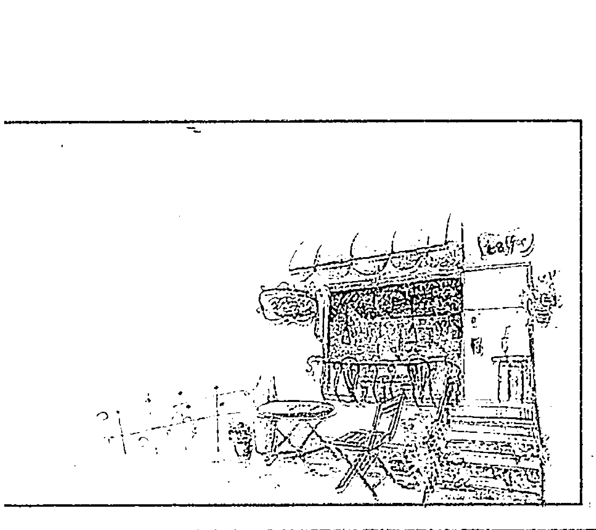

# 魅力改造

### 老铁匠的茶壶

佚名

一个古董商偶然在一个老铁匠那里发现了一把名壶。这的确是一把清代制壶名家戴振公制作的紫砂壶，古朴雅致，是绝世珍品。

古董商看到壶后爱不释手，希望老铁匠能够把壶出让给自己，商人开价10万元人民币。老人置之不理，拒绝了。这把壶是从老铁匠爷爷手中传下来的，自己也用了近六十年。自己打一辈子铁，挣的钱只够养家糊口，可现在有人竟要用十万元来买这把普普通通的茶壶，老人想不明白。

街头巷尾的人都知道了这件事，议论纷纷。老人的生活也彻底被打乱了，他也不再用这把壶泡茶喝了，不知道该把它怎么处置为好。

当古董商带着二十万再次登门的时候，老人再也忍不住了，他当着众人的面，用斧头把紫砂壶砸了个粉碎。

一切，都恢复了往日的宁静。老铁匠过完了一百岁寿辰，仍操起了铁锤，只不过打制的只有拴小狗的铁链。

> **魅力提示：**
> 在诱惑之下，又有谁能够像老铁匠有那般魄力。真正做到清心寡欲，淡泊名利，你才会拥有自由、快乐的人生。

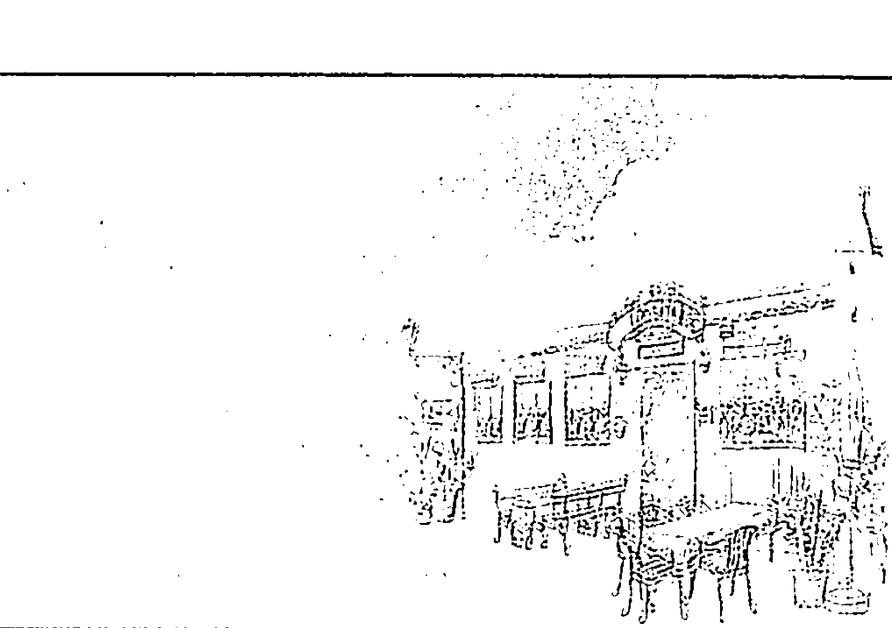

### 最重要的

春色池塘

一生中什么时候才是最重要的时间呢？什么人才是最重要的、人呢？这两个问题一直困扰着一个年轻的国王。

他询问身边的所有人，可是没有一个人的答案能够让他满意。一个大臣告诉他在某个山里住着一个世上最聪明的人，他一定知道答案。

国王于是打扮成一个普通人的样子去寻找这个人，当他来到那座山里，看到了那个人——一个老人，他正盘腿坐在一个简陋的小茅屋前的空地里挖着些什么。“听说你是个聪明的人，知道这世上所有的答案。”年轻的国王来到老人的身边说道，“你能告诉我什么时间是我一生中最重要的时间，什么人是我生命中最重要的人吗？” “帮我挖野菜吧，”老人没有直接回答他的问题，“它的味道不错，你一定会喜欢的。”

国王在老人的茅屋里住下了，每天跟老人一样生活。过了好几天，国王的问题一直没有得到老人的回答。国王生气了，他向老人出示代表自己身份的扳指，指责老人是个欺世盗名之徒。

老人只是笑了笑说：“我早知道你不是普通人，而且我也回答了你的问题，但是你并没有明白。”

“那你的意思是什么呢？”国王不解地问。

“你来的时候我欢迎你，让你住在我家里，”老人回答说，“和我一起劳动、吃饭、休息……”

> 过去的不会回来，将来也尚未来到，所以，一生中最重要的时间就是现在。现在做好了，当它成为过去时我们才不会后悔，将来才有希望。生命中有很多重要的人，但最重要的人是现在身边的人，因为，你和他（她）正彼此共享着生活。

# 魅力改造

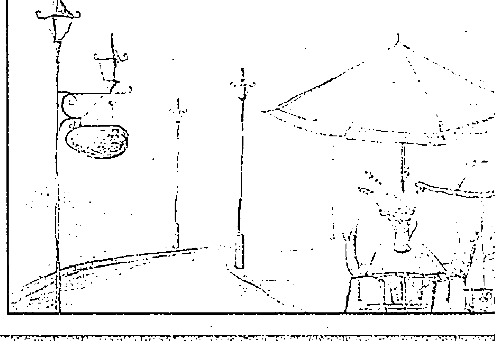

### 吴五百

佚名

从前，淮河上游有个和尚到吴地来化缘。

有一天，和尚在街市上的一间酒店里喝酒喝得酩酊大醉，然后他就撸起袖子，敞开衣服，站在路口对行人撒起野来。过往的行人非常害怕，见了他都纷纷躲开。

和尚殴打行人的事被吴地官府知道了，于是就派人将和尚抓了起来。吴地官府把和尚捆绑起来，戴上枷锁，写了道公文交给官差吴五百，让他把和尚押送回老家去。

古时候，押送犯人是件苦差事。吴五百很不情愿地接了这件苦差事，心中非常生气，于是就把一腔怒气都发泄到和尚身上。他责骂和尚说：“你这个秃和尚，因为你犯罪，我才被派了这千里之外的苦差事，我非让你知道我的厉害不可！”

一路上，天不亮吴五百就把和尚踢醒赶路。吴五百为了折磨和尚出气，手里拿个大板子，使劲地驱赶、殴打，让和尚不得休息。就是在晚上睡觉时，也用绳子把和尚的脚给捆绑起来，和尚苦不堪言。

就这样，他们一路前行。有一天，吴五百押解和尚来到奔牛埭这个地方，和尚不甘忍受虐待，就想出了一个办法。他掏出腰间的钱，买来一壶好酒。

然后，他热情地邀请吴五百说：“官差大人，走了一天，你也怪累的，何不过来我们俩喝几杯呢，也好解解乏。”

看和尚请他喝酒，吴五百非常高兴，不假思索凑过来端起酒杯就喝。他喝完一杯，和尚就给满一杯。再喝完一杯，和尚再给满一杯。吴五百就这样一直喝到深夜，直喝得烂醉如泥。

和尚见吴五百醉倒，于是便开了自己身上的枷锁给吴五百戴上，脱下自己身上犯罪人的衣服给吴五百穿上，又用大绳子把吴五百的脚捆绑上。然后，和尚穿上吴五百的衣服，找来了剃头刀，剃光了吴五百的头发，然后推倒墙壁逃跑了。

吴五百喝得烂醉如泥，到了第二天日落时才醒来。他睁开眼睛一看，和尚不见了。他环顾四周，发现墙壁被推倒，惊讶地说：“嘻！和尚跑了！”

他想起来去追，却看见自己身上穿着犯人的衣服，戴着和尚的枷锁。他想动一动，脚被绑着，他摸摸头，头发剃得光光的。他立即在客店中大叫起来，说：“和尚还在这里，只是我不见了！”

> **魅力提示：**
> 人们应该时刻保持清醒的头脑，不管成功还是失败了，不能因地位改变而失去自我。

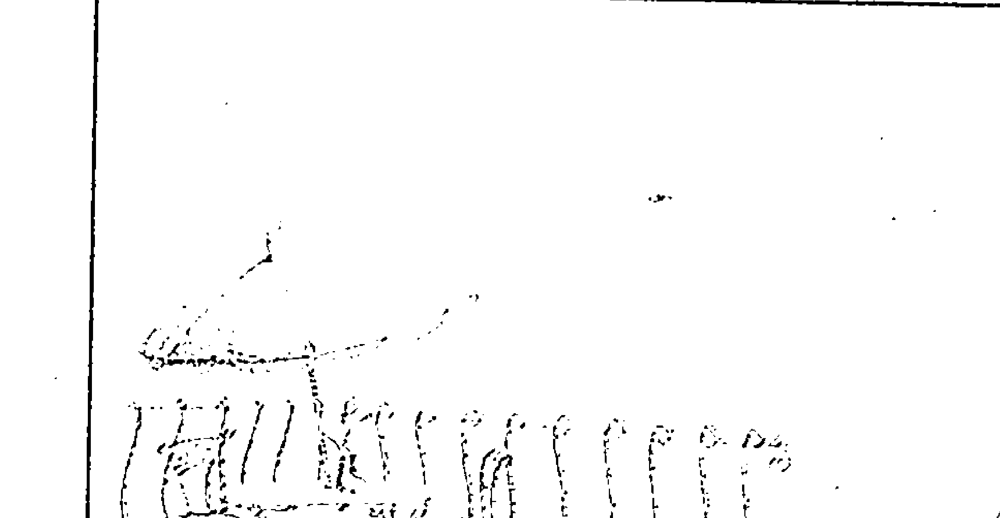

### 有一种毒药叫成功

佚名

有一个名叫韦格的奥地利女孩，天生丽质，男友非常爱他，为她筹备个人画展，鼓励她参加世界小姐选美。

她拿着男友好不容易凑足的高达五千美元的报名费，一路进军到了拉斯维加斯，成了那一年度的世界小姐。

成为世界小姐后，她已经不需要办画展了，更不需要男友的温情，她已不缺浪漫。慢慢地，她患上了一种名叫克里曼特的综合征。这种病征的最大危机在于，她的双眼视力将逐渐衰竭，直到失明。消息传出，一位名叫帕迪的南非小男孩给她寄来了一包土，说他们那里的人用此治病。她不相信那包土，但还是怀着姑且一试的想法用了，结果，奇迹却发生了，她康复了。

康复后她又开始了原先的浪漫生活，并很快嫁给了一个美国富翁。

她先后嫁了六次，可是没有一个男人令她倾心。她自杀了。

> **魅力提示：**
> 你可以用自己不喜欢的方式赚到财富，也可以用自己不相信的药治好病，但你无法从自己不爱的人身上获得幸福。

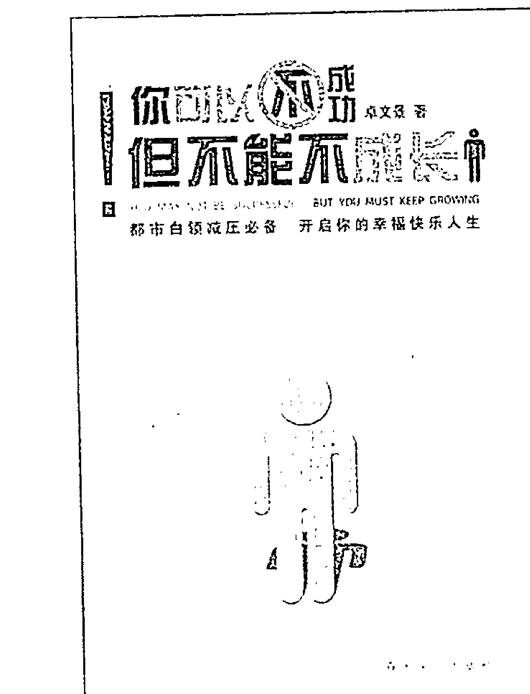

# 魅力链接

- 书名：你可以不成功，但不能不成长
- 作者：卓文景 著
- 出版社：春风文艺出版社
- 出版时间：2009-04-01
- 印刷时间：2009-04-01
- 开本：大32开
- ISBN：9787531334866
- 包装：平装

# 内容简介：

> 成功不是衡量人生价值的最高标准，比成功更重要的是，一个人要拥有内在的丰富，有自己的真性情和真兴趣，有自己真正喜欢做的事。照我的理解，把自己真正喜欢做的事做好，尽量做得完美，让自己满意，这才是成功的真谛，如此感到的喜悦才是不掺杂功利考虑的纯粹的成功之喜悦。
>
> ——周国平

成功不过是你的需要在某种场合和某个时期达到了一种平衡，而这种平衡是短暂的，可能瞬间即逝并不断被打破。因为“需要”无止境，生活中很多东西又都在变化之中，包括引导和评判成功的主流价值观，所以成功经常会让你无所适从、难以把握。如果你的眼睛只是盯在成功上面，那么你永远也追赶不上快乐与幸福的脚步。而成长则意味着你自身的强大，它牢牢地握在你自己的手里，让你拥有制造幸福和快乐的能力。

## 魔方第一面
### 处事篇

> **魅力失分**
> **太在意别人的言语：**
> 摩羯座的自尊心很强，心思也很敏感，很在意别人对自己的看法。

### 相信自己
中通渔人

小女孩索尼娅在农场附近的一所小学里上二年级。有一天她回家后很委屈地哭了，父亲就问原因。她抽噎着说：“班里一个同学说我又丑又笨，还说我走路的姿势难看。” 父亲听后，只是微笑。 忽然他说：“你能摸得着房顶上的天花板。” 还在哭泣的索尼娅听后觉得很惊奇，不知道父亲说的是什么意思，就追问：“你说什么？” 父亲又说了一遍：“你能摸得着房顶上的天花板。”

索尼亚忘记了哭泣，抬起头看着天花板，心想：“那么高，父亲蹦起来都够不着，我怎么摸得到呢？”

父亲笑着，得意地说：“不信吧？那你也别信你那个同学的话，因为有些人说的并不是事实！”

父亲的话让索尼亚开始明白，不能太在意别人说什么，要相信自己，要自己拿主意！

索尼亚长大后成了一名演员。有一次，她要去参加一个公益活动，但经纪人告诉她，雪下得太大，再说你也没有必要去参加这种对你的演艺事业没什么帮助的活动。经纪人的意思是，索尼亚应该参加一些大型的集会和活动，这样才能提升自己的名气。索尼亚坚持要去，因为她相信自己做的没错。

那次公益活动因为有了索尼亚的参加，举办得非常成功。而索尼亚也得到了各方面的赞许，她的名气和人气也因此骤升。

> **魅力提示：**
> 当自己的想法和意见得不到众人的理解与支持时，当前行的脚步遇到阻挡和羁绊时，不要动摇自己的思想和信念，相信自己，黎明就在前方。

## 医学家的尴尬
佚名

在一个地方，所有居民的脖子都比普通人要粗得多，无一例外。

一位医学家到此调研，发现当地严重缺碘。他决定利用当地人集会的时间向他们指出这个问题和解决的方法。

到了那天，医学家来到当地居民的中间，他们一个个都好奇地看着医学家，有个人问：“你的脖子长得好奇怪，怎么又长又细呢？”

医学家说：“是你们的脖子出毛病了，为什么你们不赶紧治疗反而讥笑我呢？”

那人又说：“我们每个人都是这样，没有什么毛病！我看是你的脑子出了毛病吧！”

医学家摇摇头无奈地离开了那里。

> **魅力提示：**
> 一个人独自坚持正确的方向是一件很不容易的事情；而错误的方向如果众人都一致认同，对他们而言，那就是正确的。你要是认为手中握的是真理，就不要顾及旁人的眼光。

# 魅力改造

## 不幸的猎人
东篱子

一群人到山上去打猎，其中一个猎人不小心掉进了很深的坑洞里，他的右手和双脚都摔断了，只剩一只健全的左手。
坑洞非常深，又很陡峭，地面上的人束手无策，只能在地面喊叫。
可是喊了半天，都始终没人来，大家喉咙都干了。
幸好，坑洞的壁上长了一些草，那个猎人就用左手撑住洞壁，用嘴巴咬着草，慢慢地往上攀爬。
地面上的人就着微光，看不清洞里，只能大声为他加油。
等到看清他身处险境，嘴巴咬着小草攀爬，大家忍不住议论起来。
“哎呀，像他这样一定爬不上来了！”
“情况真糟，他的手脚都断了呢！”
“对呀！那些小草根本不可能撑住他的身体。”
“真可惜！他如果摔下去死了，留下的庞大的家产就无缘享用了。”
“他的老母亲和妻子可怎么办才好！”
落入坑洞的猎人实在忍无可忍了，他张开嘴大叫：“都他妈给我闭嘴！”
就在他张口的一刹那，他再度落入坑洞。
当他摔到洞底即将死去之前，他听到洞口的人异口同声地说：“我就说嘛！用嘴爬坑洞，是绝对不可能成功的！”
可惜那位仁兄连气带疼，一口气没上来就死了。

## 父子骑驴
崔鹤同

父子俩牵着驴进城，半路上有人笑他们：真笨，有驴子不骑！

父亲便叫儿子骑上驴，走了不久，又有人说：真是不孝的儿子，竟然让自己的父亲走！

父亲赶忙叫儿子下来，自己骑到驴背上，又有人说：真是狠心的父亲，不怕把孩子累死！

父亲连忙叫儿子也骑上驴背。谁知又有人说：两个人骑在驴背上，不怕把那瘦驴压死？父子俩赶快溜下驴背，把驴子四只脚绑起来，用棍子扛着。经过一座桥时，驴子因为不舒服，挣扎着要下来，结果掉到河里淹死了！

## 魅力提示：
一个人要有主见，具备判断是非的能力，才不会被别人的意见所左右。不要活在别人的舆论中，要靠自己的脚走路，用自己的脑袋思考。

# 魅力链接
- 书名：自信的秘密
- 作者：（美）安东尼 著，卢晓兰 译
- 出版社：天津教育出版社
- 出版时间：2009-03-01
- 印刷时间：2009-03-01
- 开本：16开
- ISBN：9787530955581
- 包装：平装

# 内容简介：
人生不应该是这样！与其他人一样，只要掌握了绝对自信的原则，你也可以创造属于你自己的成功故事。罗伯特·安东尼博士在本书中透露了他在众多研讨会上传授的秘诀，它们已成功地改变了数千人的命运。成功的商务人士、优秀的运动员以及显赫的社会名流等，他们都深知“自信的程度决定成功的高度”这一真谛。而现在，你自己也能掌握自信的秘密了！

让罗伯特·安东尼博士以循序渐进的方式，引领你走上一条有助于你在人生各领域——事业、家庭、爱情、财富、身体和心理健康——树立起绝对自信的道路。最终，你会发掘出一个崭新的、积极向上和自信飞扬的自己！

# 魔方第二面
## 做人篇

> **魅力失分**
> **忧郁**
> 属摩羯座的人，忧郁大概是天生的，他看起来总那么深沉，好像他总是会遇到一些问题。他会经常为了一些不能实现的事情而伤脑筋，为了没有得到的东西而忧愁，一旦进入这种境地就很难自拔。

### 琼斯夫人的快乐法则
**王莉萍**

琼斯夫人九十二岁了，她的双目已经失明，但她依然注重仪表。她每天早晨都在八点钟前穿戴完毕，将头发做成时髦的样式，精心化妆一番。

琼斯夫人的丈夫去世后，她生活不能自理，就住进了养老院。

在住养老院的那天，琼斯夫人在大厅等候了数小时，当有人告诉她，她的房间已准备就绪时，她微笑了。在前往房间的路上，护士对她细致地描述了她的房间，有舒适的床、梳妆台、漂亮的窗帘。没等护士说完，琼斯夫人就说：“我很喜欢我的房间。”她很兴奋。
“琼斯夫人，您还没有看到房间……”
“这和看不看没有什么关系，”琼斯夫人回答，“快乐是我事先决定好的。我喜欢不喜欢我的房间并不取决于家具是怎样安排的，而在于我怎样安排我的想法。我已经决定喜欢它……”

琼斯夫人接着说：“这是我每天早晨醒来后做的决定：我可以选择接受变化，并且在种种变化中寻找最佳；我还可以选择担忧那些可能永远不会发生的‘假如’。我可以整天躺在床上，琢磨我身体哪些部分不灵了，给我带来这样或那样的困难；我也可以从床上起来，对我身体还有许多部位能工作心怀感激。每一天都是一份礼物，只要我睁开眼睛，我就决定不去老想那些已经‘发生在我身上’的事情，而是专注于我已使之发生的事情。”

最后，琼斯夫人道出了她自己的五条简单易行的快乐法则，给大家分享：

1. 心中不存憎恨。
2. 脑中没有担忧。
3. 生活简单。
4. 多点给予。
5. 少点期盼。

> **魅力提示：**
> “快乐是事先决定好的”，这句话说得真好。如果人们在所有事情面前，都准备以快乐的心情去面对，那么，无论事情如何糟糕，心情也总是快乐的。

### 魅力星座智慧书之摩羯座

## 快乐的农夫
佚名

从前有个国王，年轻时十分的勤政。到了年老的时候，觉得整个王国的烦恼都累积在他一人身上，整日郁郁寡欢。于是他派大臣四处寻找一个快乐的人，并把这个快乐的人带回王宫，希望这个快乐的人也能够让自己快乐起来。

这位大臣四处寻找了好几年也没有发现一个快乐的人，直到有一天，当他走进一个贫穷的村落时，听到一个快乐的人在放声歌唱。顺着歌声传来的方向，他看到了一个正在田间犁地的农夫，于是便问农夫：“你快乐吗？”

农夫回答：“我每天都过得很快乐呀！”

大臣喜出望外地把自己的使命和意图告诉了农夫。

农夫不禁大笑起来，他又说道：“我也曾因为没钱买鞋子穿而沮丧，但自从我在街上看见一个没有脚的人之后，我就忘掉了悲伤。”

> **魅力提示：**
> 我们常常会因为一些小小的麻烦而很长时间都感到烦恼，甚至会觉得日子过得没有意义。其实你根本不必这样，在你的身旁有很多比你更为不幸的人，看到他们都能快乐地面对人生，你为什么就做不到呢？让我们珍惜现有的一切，快乐地生活。

# 魅力改造

## 忧郁的男子
佚名

一个神情抑郁的男子坐在咖啡厅角落的一张桌子旁，一个人闷闷地喝着咖啡。在他不远处的另一张桌子旁坐着一位老人，老人一直在关注着这个男子。

终于，老人走上前去，对这个人说：“您一定遇上了什么难题，如果您愿意告诉我的话，我希望我可以帮助您。”

这个人看了老人一眼，冷冷地说：“你帮不了我，我的问题太多了。”

老人掏出名片，递给他，接着说道：“如果您相信我的话，我想带您去一个地方。”

这个人没有拒绝，随老人坐车来到了郊外。下车后，老人指着一排排的墓碑说：“你看见了吗，只有躺在这里的人，才是没有问题的。”

这个人的眉头开始松了，他把他的难处向老人娓娓道来……

> **魅力提示：**
> 有个人说过一句话很好：人生是一个不断遇到问题，并不断解决问题的过程。没有问题的人生，是不存在的。只要你活着，问题就会接踵而来，只有解决问题，你才会快乐；只有解决问题，你才会幸福；只有解决问题，你才能学会生活。

## 苦恼的小和尚
佚名

寺庙里有个小和尚，他的工作就是负责每天早上清扫寺庙院子里的落叶，只是这些，需要花费许多时间。尤其在秋冬之际，更让小和尚头痛不已。他竭力思考，每天都在想办法，而且还讨教师兄弟：怎么样让自己轻松些。

后来，这件事让住持知道了，住持就找他谈话。小和尚很老实，就实话对住持说了。住持跟他说：“你在明天打扫之前先用力摇树，把树叶统统摇下来，后天就可以不用扫落叶了。”

小和尚一听，心想：还是住持的脑子好，我来这么长时间，想了很多种办法，竟然还不如住持一句话。

于是隔天他起了个大早，连脸都顾不得洗，直接奔到后院，使劲地猛摇树，这样就可以把今天跟明天的落叶一次扫干净了。他一直摇到自认为差不多了为止，随后，又用笤帚扫了一遍，才放心地回去吃饭，一整天小和尚都非常开心。

第二天，小和尚到院里一看，不禁傻眼了：昨天的工夫全都白费了，院子里如往常一样落叶满地。

这时，住持走过来了，对小和尚说：“傻孩子，你知道我为什么给你出那个主意吗？我就是要让你明白：无论怎么用力，明天的落叶还是会飘下来。”

小和尚终于明白了，世上有很多事是无法提前的，唯有认真地活在当下，才是最真实的人生态度。

> **魅力提示：**
> 人生最愚蠢的事是预支烦忧。每一天都有每一天不同的生活，今天有今天的欢乐和烦忧，明天又有明天的欢乐和烦忧。明天才能做的事情，明天的欢乐和烦忧，今天都无法解决，因此，不要较多地费心于明天及以后的事情，快乐地度过今天的时光吧！

# 魅力链接
- 书名：老鼠的忧郁
- 作者：方建国 著
- 出版社：湖北教育出版社
- 出版时间：2008-02-01
- 印刷时间：2008-02-01
- 开本：大32开
- ISBN：9787535150912
- 包装：平装

# 内容简介：
有人把忧郁症称为“二十一世纪的黑死病”！导致忧郁症的因素有很多：生活压力、遗传、营养不均、缺乏运动、日照过少、糖尿病情……而想要真正打败忧郁，良药却只有两剂：自信与安宁。在本书当中，作者匠心独具，将自己化身为一只曾经得过忧郁症的老鼠，并借老鼠之口跟大家分享了克服忧郁的六十六式独门秘招，既高效，又搞笑，招招杀敌，式式治病！打开这本书吧！愿您内心从此充满安宁！
六十六颗百忧解，既实用又幽默，让您轻松穿越忧郁。

# 魔方第二面

## 做人篇

> **魅力失分**
> **太过现实**
> 摩羯座的人很重视现实的利益和物质的保障，是一个很物质很现实的人。

## 太太，你很有钱吗？
马瑞·杜兰

他们蜷缩在风雪里面——是两个衣着破烂的孩子。“有旧报纸吗，太太？”

我正在忙活着，我本想说没有，可是我看到了他们的脚。他们穿着瘦小的凉鞋，上面沾满了雪水。“进来，我给你们喝杯热可可奶。”他们没有答话，他们那湿透的凉鞋在炉边留下了痕迹。

我给他们端来可可奶、吐司面包和果酱，为的是让他们抵御外面的风寒。之后，我又返回厨房，接着做我的家庭预算……

我觉得前面屋里很静，便向里面看了一眼。

那个女孩把空了的杯子拿在手上，看着它。那男孩用很平淡的语气问：“太太……你很有钱吗？”

“我有钱吗？上帝，不！”我看着我寒酸的外衣说。

那个女孩把杯子放进盘子里，小心翼翼地说：“您的杯子和盘子很配套。”她的声音带着嘶哑。

然后他们走了，带着用以御寒的旧报纸，没有说一句谢谢。他们不需要说，他们已经做了比说谢谢还要多的事情。蓝色瓷杯和瓷盘虽然是俭朴的，但它们很配套；我拣出土豆并拌上肉汁，土豆和棕色的肉汁很配套；有一间屋住，丈夫有一份稳定的工作，对于我来说这也很配套。

我把椅子移回炉边，打扫着房间。那小凉鞋踩出的泥印子依然留在炉边，我让它们留在那里。我希望它们在那里，以免我忘了自己是多么富有。

> **魅力提示：**
> 拥有金钱并不是真正的富有，生活的平静和谐，家庭的稳定温馨，身体的健康强壮，心灵的充实安宁，有一颗爱心，追求真、善、美等等，才是人生的真正富有。只有金钱，或为了金钱而抛弃了这些更美好的东西，这样的人生将是贫穷的一生。

## 财神爷的条件
佚名

一个年轻人整天游手好闲，却总是埋怨自己时运不济，发不了财。
于是，他买了一尊“财神爷”供奉在家中，每天烧香叩拜，可是他还是过着清贫的日子。看着富人们堂皇华丽的生活，年轻人终日愁眉苦脸。
某日正午，年轻人正酣睡着，财神爷托梦来到他身边：“小伙子，干吗不高兴？”
“穷，没钱啊！”年轻人在梦中对财神爷说。
“哦！我可以给你钱，但是我有条件！不知你愿不愿意？”财神爷说。
“好啊！那你赶紧说，什么条件？”年轻人急忙问。
财神爷说：“我给你一百两银子，你得斩断你的一根手指头，行吗？”

想到斩断手指头的疼痛和血淋淋的情景，年轻人就感到害怕，再说只有一百两银子，他觉得太少。考虑了一会儿，他说：“不行，一百两太少。”
“那好，我给你一千两银子，换你的两颗眼珠子，你觉得怎么样？”
“不好，没了眼珠子，我什么都看不见了，要钱有什么用？”
“那我不要你的眼珠子，给你一万两银子，可是你马上会变成一个八十岁的老头子。”
“老得快入土了，有钱也没地方花了，还是不行！”
“我给你一百万两银子，可是你明天就会死去，你愿意吗？”
“当然不愿意，我还这么年轻，连媳妇都没娶，那怎么行？”
“年轻人，其实你已经很富有了，为什么不去寻找你的财富，而每日唉声叹气呢？”说完，财神飘然而逝。

> **魅力提示：**
> 年轻就是我们所拥有的最大财富。好好把握这份财富，不要让年华虚度，莫等到白了头，再来“空悲切”。

## 财主的寿衣
一个富有的财主一生享尽荣华富贵，在六十岁的时候却患上了重病，各方求治无效，病情每况愈下。

眼见回天乏术，家人只得为其准备寿衣、棺材，打点后事。

奄奄一息的财主知道自己将不久于人世了，便令下人将寿衣拿来给他看。当他看到寿衣竟然没有口袋时，就喘息着问：“为什么没有口袋？”

他的家人说：“寿衣本来就没有口袋的。”

财主上气不接下气地说：“不行，一定要重做，没有口袋，我的财宝怎么带走……”财主还没说完，一口气接不上来，便一命呜呼了。

> **魅力提示：**
> 贪婪的人总是在不停地索取，想要拥有世间的一切，甚至临死亦难瞑目。俗话说，生不带来，死不带去，生命是一个经历的过程，其精彩与否并不在于你拥有物质的多寡，而取决于你给予了这个世界多少，为别人留下了多少。

## 救命恩人
佚 名

夜晚，一栋楼房一楼的一间房子突然起火了，火势凶猛，很快便成了一片火海。二楼住着一个小女孩和她的奶奶，小女孩的双亲都去世了，她和奶奶相依为命。奶奶为了抢救小女孩被大火烧死了，绝望的小女孩望着窗口外大声哭叫着救命。

正在这个时候，一个男人扛着梯子冲到烈焰熊熊的楼下，顺着梯子钻进窗户。当他再次出现在人们的视线中时，他的怀里多了一个小女孩。他把孩子交给了在下面迎接的人群，然后消失在夜幕里。

这个小女孩成了真正的孤儿，两周后，相关部门召开群众集会，征求愿意收养这个小女孩的人。

一位教师愿意收养这孩子，并说她能保证让她受到最好的教育；一个农夫也想收养这个孩子，说只有乡村的生活才能让孩子更加健康快乐地成长；一个富人说，他能给予这个孩子别人能做到的一切。

许多想要收养这个孩子的人都纷纷述说把孩子交给自己抚养的种种好处。

但小女孩的脸上自始至终没有什么表情，只是默默地望着远处。

这时，一个男人穿过人群，径直走到了小女孩的面前，向她张开了双臂。人们都惊诧不已，他的手臂上布满了可怕的伤疤。

小女孩叫出了声：“这就是救我的那个人！”她一下子蹦了起来，紧紧地抱住了男人的脖子，把脸埋在他的怀里抽泣着……

> **魅力提示：**
> 真正的爱是物质上体现不了的，真爱发自我们的内心，是心与心的交流。

# 魅力链接

- 书名: 理想的清单
- 作者: （美）格拉斯 著，柏林 译
- 出版社: 广东人民出版社
- 出版时间: 2010-01-01
- 印刷时间: 2010-01-01
- 开本: 大32开
- ISBN: 9787218064482
- 包装: 平装

# 内容简介：

这是一个发生在欧洲某顶尖学院的真实故事。一位接近生命终点的智者，面对着两位得意门生：一个事业成功却失落了学术理想；一个是学术上的天才，但在社会上无所立足。多年来，两人暗中较劲，各有各的价值理想。围绕着他们的，是一群在理想与现实、欲望的冲突中煎熬、沉沦的人。在一个追功逐利、人心焦虑的社会里，各式人等如何在名利间求得平衡？这是一本关于理想的书：理想是光，现实是光照下的影子，人固然没法消灭身后的影子，但不要忘了时常抬头，仰望理想的天空；理想和现实之间会有落差，但落差并没有想象中那么大，追求理想的愿望有多强，面对现实的力量就有多大！

# 魔方第二面
## 做人篇

## 魅力失分
疑神疑鬼

摩羯座的人很容易疑神疑鬼，不会轻易对别人透露自己的想法，更不会轻易相信别人。

# 美丽的欺骗

蒋光宇

年轻的爸爸和九岁的儿子在一起放风筝。突然，刮起了一阵旋风，一棵小树的树枝把风筝紧紧地缠住了。

于是，爸爸取来了一架梯子，准备往上爬。

儿子说：“爸爸，让我来吧！”

爸爸看了看九岁的儿子，想了想说：“也好，让你来就让你来。”

儿子像个机敏的小猴子，转眼就爬到梯子的上端，解开了缠在树枝上的风筝线，转过头来对着爸爸嘻嘻地笑。

儿子正要下来，爸爸制止了他：“等一等。”

儿子愣住了，望着爸爸，问：“怎么啦？”

爸爸说：“我先讲个流传很广的真实故事给你听，听完之后你再下来。”

于是，儿子笑得更加开心了，一手抓住梯子，一手拿着风筝，等着听爸爸讲故事。因为爸爸讲的故事，总是引人入胜的。

爸爸说：“有一天，美国大富豪洛克菲勒扶着自己的小孙子在地毯上做爬梯子的游戏。他鼓励小孙子勇敢地往上爬，同时安慰地说：‘有爷爷扶着，不用怕！’当小孙子刚刚爬上梯子，老洛克菲勒便撒开了手，不再扶他的小孙子。结果，小孙子从梯子上摔下来。小孙子哭哭啼啼地站起身来，问：‘爷爷，你为什么要骗我？’这时，老洛克菲勒说：‘你看，连爷爷这样的亲人也靠不住，别人说的话就更不能全都相信了。’”

停了一会儿，爸爸对儿子说：“我们照着做一次，好不好？”

儿子一听，脸都吓白了：“这么高，又没有地毯，怎么能行？”

爸爸说：“不要怕，勇敢一点，只要跳这一次就行了，不会有什么大的危险。我要给你留下一个深刻的印象，免得你以后长大了，容易上人家的当。”

然而，儿子还是不敢跳，他站在梯子上，纹丝不动。

爸爸开始发号施令了：“听着啊，我喊一二三，喊到三的时候你就跳下来，然后我就把伸出去假装要接住你的手缩回来。”

咬紧牙关，闭上眼睛，忍着眼泪，无可奈何的儿子终于从梯子上跳了下来。他认为自己的身体将像一个南瓜一样“噗”的一声，摔得肢离破碎……

然而，爸爸的身体没有移开，手也没有缩回去，而是把掉下来的儿子结结实实地抱在了怀中。

儿子虽然没有受伤，但是神情比刚才更加疑惑。他问：“爸爸，你为什么要骗我？”

爸爸笑出声来，说：“爸爸是想让你知道，即使是别人的话，有时也是可以相信的。何况是爸爸的话呢？”

所有灿烂的阳光又都回到了儿子的脸上。他搂着爸爸，不住地吻着爸爸的双颊。

突然，儿子又问：“我还是不明白，那个狠心的老洛克菲勒为什么要骗自己的小孙子？”

爸爸耐心地解释：“像洛克菲勒这样举世闻名的成功企业家，为了教育自己的孙子不惜改变自己在小孙子心目中的偶像地位。如果把那架梯子看成是通向成功的阶梯，那么爬梯子就是在成功之路上向上攀登。老洛克菲勒是要告诉小孙子一个重要的道理：成功主要靠自己。当然，老洛克菲勒知道，刚爬上梯子的小孙子即使掉在地毯上，也不可能真的摔坏。”

> **魅力提示：**
> 人生有时候要善于怀疑，但更多的时候要善于相信。

### 魅力星座智慧书之摩羯座

# 皮斯阿司和达蒙

佚名

在两千多年前的古罗马，一个名叫皮斯阿司的年轻人因冒犯了国王而被判绞刑。

皮斯阿司是个孝顺的孩子，临死前他最大的愿望就是能与百里之外的母亲见上一面，为自己不能为母亲养老送终而表达自己的歉意。

国王得知他的要求后，感其诚孝，答应让他回家与母亲相见。但是，国王还有一个条件，就是皮斯阿司必须找一个人来代替他坐牢，否则，他就无法去见他母亲。

可是有谁会冒这个险呢？达蒙，皮斯阿司的朋友，他毫不犹豫地来替皮斯阿司坐牢。

皮斯阿司赶回家跟母亲诀别。日子一天天过去，临行刑的时间近了。如果皮斯阿司逃跑了，将由达蒙代替他接受绞刑。到了行刑的那一天，皮斯阿司仍旧没有回来，达蒙被押赴刑场，围观的人都在嘲笑他的愚蠢。但达蒙毫无惧色，一脸的从容。

绞索已经套在了达蒙的脖子上了，人们在内心深处同情达蒙，并诅咒那个出卖朋友的小人皮斯阿司。正在这时，远处传来了喊声：“我回来了，我回来了。”皮斯阿司在淋漓的风雨里正朝着刑场奔跑而来。

皮斯阿司的身影令在场的人似乎难以置信，消息很快就传到了国王那里，国王也很惊诧，他亲自赶赴刑场，当他亲眼看到了皮斯阿司时，他高兴地亲手为他松绑，并向所有的人宣布赦免他。

> 魅力提示：
> 人际关系的最高境界，就是彼此之间的绝对信任，任何情况下，也不会对对方产生怀疑。

# 上帝的代理人

**佚名**

从前，有一对贫穷的老夫妻，时刻忍受着饥饿的煎熬。后来确实没有办法了，老头对他妻子说：“马尔珂，你给上帝写封信吧！”

于是，他们坐下来给上帝写了封求助的信。他们签了名，将它封好，在信封上写上了上帝的名字。

“怎么才能将这封信寄出去呢？”他老伴苦恼地问道。

“上帝无所不在，我们寄出去的信他一定能收到。”她虔诚的丈夫答道。

于是，他将信扔出了门外，风就把它沿着街吹远了。

恰巧街边当时有一个出门散步的好心富人，风把信吹到了他面前。他好奇地捡起来，打开读了读，他很同情老夫妇的悲惨处境，被他们的虔诚和天真打动了。他决定帮助他们。他敲响了老夫妇的门。

“纳特先生在这儿住吗？”他问道。

“我就是。”老头答道。

富人朝他微笑。

“那么，我要告诉你一件事，”他说，“我想让你知道上帝在几分钟之前收到了你的信。我是他在白俄罗斯的个人代理，他叫我给你一百卢布。”

“马尔珂，你看怎么样？上帝收到了我们的信了！”老头高兴地喊道。

老夫妇收下了钱，对上帝在白俄罗斯的代理表示感谢。

可是当只有他们两个人的时候，老头的脸上充满了疑惑。

他妻子忙问：“你又怎么了？”

“马尔珂，我很怀疑，那个代理在撒谎；他有点耍滑头。”老头若有所思地回答。

“哦，你知道代理怎么回事？上帝很可能给了他两百卢布让他交给我们，可是那个骗子拿走了一半给自己当佣金！”

这一对夫妻如此猜疑别人的好心，可见他们即便有了这一百卢布，也不可能长久改善他们贫穷的生活，因为他们贫穷的是心。

## 魅力提示：

不要轻易就怀疑别人，因为世上虽多有虚情假意，却还是有不少真心实意。宁可生活贫穷，也不要心贫穷。前者只会让你感到贫乏，而后者则使你一无是处。

# 疑 心

刘 墉

有个女士对我说，当她丈夫过世后，以前总在一起玩的一对夫妻，丧礼完，就再也没去看她。

有时候，她甚至觉得那对老朋友在避着她，因为他们即使到她邻居家，也不顺路过去探望一下她。

她很生气，认为“人在人情在”，丈夫死了，朋友就不认她了。

过了几年，那位朋友家的男主人也死了。

居然没隔几天，那女人就去看她：“你知道你丈夫死了之后，我们为什么再也不来你家吗？”那女人拉着她的手，说：“我们其实好想来。但是我丈夫说，你丈夫生前向他借过钱，恐怕你知道。”

她点了点头：“我知道。”

那女人笑笑：“我们很怕我们来，会让你想到那笔钱，以为你丈夫死了，我们急着来讨债。”

那女人还对她说，她丈夫的遗言是：钱没多少，不必还了。

> 魅力提示：
> 疑心是友谊的毒药，相信你身边的人，你才能拥有一颗快乐的心。

# 魅力链接

- 书名：信任的速度
- 作者：（美）柯维，（美）梅里尔著，王新鸿 译
- 出版社：中国青年出版社
- 出版时间：2008-08-01
- 印刷时间：2008-08-01
- 开本：大32开
- ISBN： 9787500682875
- 包装：平装

# 内容简介：

在这本可读性很强的书里，史蒂芬·M·R·柯维为我们展示了信任的力量——这个往往被忽视，被低估，但却“足以改变一切的力量”。这是一本突破性的书，它挑战了我们多年以来关于信任的成见，展现给我们的是，信任不仅是一种无形的社会美德，更是一个有形的经济推动力。它可以使组织改善业绩，使个人得到提升，使关系更加融洽。

# 魔方第二面 做人篇

## 魅力失分

### 不够乐观

摩羯座的人看问题是不那么乐观的，他的脑海里总是有那么些悲观灰色的想法。

# 你永远都不会忘记他

佚 名

几年以前，巴特在澳洲的中北部做了一次旅行。巴特的目的是要了解一些被澳大利亚人认为应该很熟悉的事情。然而，他最清晰的一次记忆是在澳大利亚炎热的中部、艾丽斯斯普林以南的一座农舍的邂逅。

那天，巴特正在跟几位朋友享受着骑马的乐趣，他们不紧不慢地穿行在赭红色的大地上，正巧加里·格莱兹布鲁克（那座农舍的主人）开着一辆摩托车隆隆地驶过来。他看见巴特他们便停下来，做了自我介绍。在确信他们安全无事、正在自我享受之后，他的摩托车飞也似的驶出了巴特的视线。

巴特很高兴能遇上他，不过更高兴的，是他那辆隆隆的摩托车没有吓着他们的坐骑，看来这些马准是习惯了那种噪声了。

那天晚上，当巴特他们围坐在一根圆木点燃的篝火旁倾听加里讲述一些内陆生活的故事时，他们惊讶地发现，农舍主人竟然是残疾人，他坐在轮椅里出现在众人面前。

原来，加里曾是一个剪毛工，在一次车祸中失去了他的双腿和一只手臂。但是，他依然借助于一辆只用一只手驾驶的改造过的摩托车，亲自监督牧场上的活动。

巴特和所有人都惊奇地张大了嘴。因为谁都无法料到，一个骑着摩托车东奔西跑的人，竟是一个只有一只手的残疾人。

巴特觉得，加里对任何事情都抱有一种幽默的态度。当你遇到他时，在几分钟之内你就会忘记他身上的严重残疾（如果你已经发现的话）。但是当你离去时，你永远都不会忘记他。

> 魅力提示：
> 人生就是选择，面对困境，面对磨难，人们如何选择心态？你消极悲观，生活便会暗淡无光；你积极乐观，生活就充满快乐的阳光。保持良好的心态，克服种种困难，才能造就快乐的生活。

# 都是好事

朗月洁

有个大臣因智慧超群而深受国王宠幸。

智慧大臣有一个不同寻常的特点：对待任何事情，他都保持积极乐观的想法。也正是由于这种态度，他为国王解决了不少难题，因而深受国王的器重。

国王喜欢打猎。在一次围捕猎物的时候，国王不慎弄断了一截手指。国王疼痛之余，马上叫来了智慧大臣，征询他对意外断指的看法。智慧大臣仍轻松自在地对国王说，这是一件好事，并劝国王不要为此事而烦恼。

国王听了很生气，认为智慧大臣是在取笑他，即命侍卫将他关到监狱。

待断指伤口愈合之后，国王又兴致勃勃地忙着四处打猎。不幸的事终于发生了，他带队误闯邻国国境，被埋伏在丛林中的野人捉住了。

按照野人的惯例，必须将活捉的这队人马的首领敬献给他们的神，于是便将国王押上祭坛。正当祭奠仪式开始，主持的巫师突然惊叫起来。原来巫师发现国王断了一截手指，而按他们部族的律例，献祭不完整的祭品给天神，是要遭天谴的。野人赶忙将国王押下祭坛，把他驱逐出去，另外抓了一位大臣献祭。国王狼狈地逃回国，庆幸大难不死。忽然想起智慧大臣所说断指也许是一件好事，便马上将他从牢中释放出来，并当面向他道歉。

智慧大臣和往常一样，仍然保持着积极乐观的态度，笑着原谅了国王，并说这一切都是好事。

“说我断指是好事，现在我能接受；但如果说因我误会你，而把你关在牢中，让你受苦，你认为这是好事吗？”国王不服气地质问。

“臣在牢狱中，当然是好事。陛下不妨想想，今天我若不是在牢中，陪陛下出猎的大臣会是谁呢？”智慧大臣笑着回答。

> 魅力提示：
> 无论遇到多么难办的事，我们都要保持积极乐观的心态，相信一切问题都会解决的。

魅力改造

# 摩羯座

# 不要为明天忧虑

佚名

有位信耶稣的木匠，受到国王故意刁难，限他第二天交出十一万一千一百一十磅细木屑，否则就要受死刑。朋友劝他专心仰赖神，求神拯救，大家为他祷告。

木匠回到家中，看见妻子儿女都为他哭得很伤心，他就把朋友的劝告转来劝他的妻儿，并且合家跪下不停的祷告。

一会儿天已破晓，全家大小都沉默下来，等候命运的决定。忽然有人来敲门，木匠对家人说：“现在大概来抓我去受刑了。”一面说一面去开门。

门一敞开，国王那里派来的人对木匠说：“木匠！国王昨晚驾崩了，你给他造一口棺材吧！”

> **魅力提示：**
> 明天如何，我们还不知道，我们原是云雾一片，出现少时就不见了。所以不要为明天忧虑，因为明天会发生什么你永远无法预料。

# 老太太的担忧

佚名

有位老太太生了两个女儿，大女儿嫁给了伞店老板，小女儿当上了洗衣作坊的女主管。于是老太太整天忧心忡忡，每逢遇上下雨天，她就担心洗衣作坊的衣服晾不干；每逢遇上晴天呢，她又深怕伞店的雨伞卖不出去。她天天为女儿担忧，日子过得十分忧郁。

后来，一位聪明人告诉她：“老太太，您真是好福气！下雨天，您大女儿家生意兴隆；大晴天你小女儿家顾客盈门，哪一天你都有好消息啊。”

> > 魅力提示：
> > 现实生活中，很多人总是被事情的阴暗面困扰着，可是从来都没有换个角度去想一下。天还是老样子，只是脑筋变了一变，生活的色彩竟然焕然一新。

# 魅力链接

- 书名：打破墨菲法则
- 作者：（美）西克斯托姆 著，任小龙 译
- 出版社：群言出版社
- 出版时间：2007-08-01
- 印刷时间：2007-08-01
- 开本：16开
- ISBN：9787800807589
- 包装：平装

# 内容简介：

快乐的感觉真好：快乐可以帮助你获得想要的东西；快乐的人总是更受欢迎，更加成功，甚至更加长寿。但是，研究表明，如果你总是不断试图让自己更加快乐，或者一直在注意自己是否快乐，你就离真正的快乐越来越远了。快乐的人从不去计划他们的快乐，如果你真的要快乐，就必须打消那些让自己快乐的念头。同时，你要摆脱关于乐观主义的极端论点，即乐观就意味着你永远都不会感到不快乐。本书从头至尾都试图向你证明：从乐观通向心理满足之路，一定是充满了投入、参与、尝试以及其他类似的行为与态度。

# 魔方第二面
## 做人篇

> > **魅力失分**
> > ↑个人利己主义
> > 摩羯座从根本上来说是利己主义者，凡事会先想到自己的利益，而且，对自己没有好处的事情，他一般是不会参与的。

# 魅力改造

# 分 羊

佚 名

东汉时期，京城太学里有一个名叫甄宇的博士。

有一年底，皇帝赐给博士们每人一只羊作为过年礼物。羊赶来了，负责分羊的官员一见傻了眼：原来这群羊的肥瘦大小相差悬殊。太学长官犯了难，不知如何分发是好，于是便找博士们来相商。

博士们平常关系都不错，但面对这个问题也都犯了难。因为谁也不愿要又瘦又小的羊，但谁也不愿说“我想要大的”，于是纷纷出主意。

有的说应把所有的羊全杀掉，按斤两平均分肉；有的说应抓阄定夺，听天由命。

正在大家议论纷纷时，甄宇站出来说：“还是一人牵一头吧，我先牵。”说完他就向羊群走去。

这时，便有人嘀咕说：“甄宇倒是聪明，如果他把大的牵走，那么小的留给谁呢？”没想到甄宇竟从羊群里牵了一只最瘦小的羊回家了。

这下博士们不再争执了，人们都很敬佩他的无私与大度，在敬佩甄宇的同时，大家纷纷效仿他的行为，先牵的人都是从小的牵起，越是肥大的羊反而越剩在后边。

这个牵扯到众人利益的难题，就这样轻而易举地解决了。

> > 魅力提示：
> > 榜样的力量是无穷的，只有不计个人得失，不断提高自己，能够勇挑重担的人才能成为众人的榜样。同时，榜样在很多时候，都会成为领导，他的一言一行也关系着他所率领的团队的兴衰。

# 最好的消息

阿瑟伦南翰

一位著名的高尔夫球手赢得了一场比赛。他领取了奖金支票后，一个年轻的女子向他表示祝贺并诉说自己的苦衷：她可怜的孩子得了重病，正在医院里，而她却无力支付昂贵的手术费和医药费。

善良的高尔夫球手被她那深切的母爱感动了，二话没说就在支票上签上自己的名字，然后塞给那个女子，并告诉她，希望她的孩子早日康复。

几天过后，一个高尔夫联合会的官员告诉他一个坏消息：他被那个女子骗了，她根本就没有孩子，甚至还没有结婚。

“你是说根本就没有一个小孩病得要死了吗？”这个高尔夫球手问这位官员朋友。

“是的，根本就没有！”朋友强调道。

“这是我一个星期以来听到的最好的消息。”高尔夫球手长吁了一口气。

> 魅力提示：
> 真正具有爱心的人所期望的是一个美好的世界，并不会太过于计较自己的得失。

# 那一年，他丢失了指南针

林夕

他喜欢打猎，每年休假都外出上山打猎，有时一个人独自去，但大多数时间是和朋友结伴去。这一年，正好他的堂兄和他一起休假，他们俩就约好一起去。他们准备好行装，乘车去了北部大森林。

这是一片原始森林，树木茂密，一望无际，是非常好的捕猎地。但是据当地的人说，林子里也有虎、狼这些凶猛的动物，所以来这里打猎的人一般都结伴而行，不去林子深处。

他和堂兄进到林子里，一路上，两个人结伴而行，寻找猎物。进山的第三天，他们一大早就打到了一只野鸡，紧接着又发现了一只野兔，可是野兔也发现了他们，野兔撒开腿拼命地奔跑。

为了追这只野兔，他们彻底迷路了。他们内心充满了恐惧，他们带的指南针、水和食物都在宿营地里的背包里。在这样的原始森林，如果没有指南针，是很难走出去的！

天已经完全黑下来了，他们相互依偎着在树下熬过了难挨的夜晚。他们内心很清楚，他们现在唯一的财产就是早晨出来时每个人随身带的一壶水，而要走出大森林就全靠它们了！第二天他们早早起来，看着日出，辨别方向，然后开始向南走。他们希望这是真正的南向，因为只有向南走，才可以走出这片大森林。

中午的时候，两个人又累又渴又饿，便坐下来休息了一会儿，喝了一口水，然后继续走。走了一会儿，他们看到前面不远处大树旁有一个满脸皱纹和他们父亲年纪相仿的老人。老人紧闭着双眼，躺在大树下。他蹲下身把手放到老人的鼻孔，发现他还活着。“看样子是和我们一样来这里打猎迷路了，大概是饿昏了。”他回头对堂兄说，然后拿出身上的水壶，想扶起老人给他水喝，堂兄把他拦住了。

> > “不能给他喝。我们只有这一点水，还不知道能维持几天。再说，你知道他是什么人？你知道我们救了他，他会不会把我们俩杀了抢我们的水喝？你没听说过农夫和蛇的故事吗？我们还是走吧。”

堂兄起身拉着他走。他回头望了老人一眼，想想堂兄说的话也有道理，就跟着堂兄走了。可是，他越走脚步越沉重，眼前总是浮现出那个昏倒在树下的老人那布满皱纹的脸。每向前走一步，他的心就像被什么东西割一下似的难受。终于，他再也忍不住了，便停下来，对堂兄说：“我们应该回去救那个老人，我们遇到他不去救他，就等于是我们杀死了他。”

> > “可是我们自己还不知道能不能活着走出去，我们救了他，就算他不会害我们，也会拖累我们，最后可能大家都得死。”

> > “可是如果我不回去救他，即使能活着出去，我的良心也会谴责我，一辈子都会为这件事受折磨。我决定还是回去救他。”

“要回去你一个人回去吧，我是不会回去的。”堂兄坚定地说。

他看了堂兄一眼，转过身，坚定地沿着刚才走过的路往回走，找到那个昏倒在树下的可怜的老人，轻轻地扶起他的头，把壶里的水一滴一滴倒在他干裂的嘴里。

过了很久，老人终于醒过来了。他慢慢睁开眼，充满感激地望着他。

接下来发生的事，出乎他的意料：老人不是从别处来这里打猎的，他是一名向导，他从小就生活在这片大森林里，熟悉这里的每一片树木，为许多来这里考察的地质学家、打猎的游人带过路，他是这里唯一一位不用带指南针就能穿越这片大森林的人！

老人醒来后，带着他很快就走出了大森林。而他的堂兄，却永远地留在了这片大森林，他再也没有见到堂兄。

> > 一个人的良心，就是他最好的指南针。一个人只要按照良心指引的方向前进，肯定不会迷路，肯定会有路可走，肯定会有光明的前途。

# 村长和魔鬼

佚名

有一个村子里的人经常受到魔鬼的侵扰，为了使村民们过上安宁的生活，勇敢的村长决定找到魔鬼，跟他决斗，并且想尽办法除掉它。

村长终于找到了魔鬼，并打败了它。就在他抽出刀准备消灭魔鬼时，魔鬼对村长说：“等一下，在杀我之前容我先说几句话。”村长答应了。

“杀了我你能有什么好处呢？”魔鬼说，“如果你饶过我，我会报答你的。”

“那我饶了你又会有什么好处呢？”村长问道。

魔鬼回答说：“你要是让我活命，我会每天夜里在你的床头放二十个金币，一直到你生命的最后一天。”

村长动摇了，他考虑了一会儿，接受了魔鬼的条件，放走了魔鬼。

第一天，第二天，第三天夜里，魔鬼都依约在村长的床头放下了二十个金币。

到了第四天早上的时候，村长的枕头下就没有金币出现了，村长等了三天都一直没有。他冒火了，再次出去寻找魔鬼。

很快，村长在老地方碰见了魔鬼。他再次同魔鬼决斗，但是，他输了，他被魔鬼甩在地上，当魔鬼把刀举起的时候，村长要求问个问题。魔鬼答应了。

村长问：“为什么我第一次能够战胜你，而这一次却输给了你？”

魔鬼说：“第一次你是为了正义跟我决斗；而这一次，你是为了私欲跟我决斗。所以，头一次你会赢，而这一次你会输。”

> 魅力提示：
>
> 无私者无畏，为了正义而战，心中早已将各种私利抛开，充满着所向披靡的勇气和力量。一旦为一己之私所累，束手束脚，岂有不败之理。

### 魅力星座智慧书之摩羯座

# 魅力链接

+   - 书名：找回自己
- 作者：圣严法师著
- 出版社：华夏出版社
- 出版时间：2009-01-01
- 印刷时间：2009-01-01
- 开本：32开
- ISBN：9787508050928
- 包装：平装

# 内容简介：

繁忙的生活中，你可曾停下脚步，思考“我”究竟是什么吗？你真的认识自己、了解自己吗？如果你能找回自己，就找到了世界。

如果知道人生难得，就能够知善知恶、为善去恶，人生就有了意义；如果进一步积极奉献、自利利人，这就是人生的最大价值。

> ——圣严法师

# 魔方第二面 做人篇

## 魅力失分

看似老实却难以理解

摩羯座的人的城府是一等一的深，他想得又多又远，超乎你的想象，也因此，他不奢望任何人了解，你也无从了解。他从不吃亏，但吃亏的定义你得问问他。摩羯座的人把一切看在眼里，却从未有人真正了解他。他是高深莫测的。

# 幸福藏在糊涂里

风华

有两个落水者，一个视力极好，一个患有近视。两个落水者在宽阔的河面上挣扎着，很快就筋疲力尽了。突然，视力好的那位看到了前面不远处有一艘小船，正在向他们这边漂来。患有近视的那位也模模糊糊地看到了。于是，两人便鼓起勇气，奋力向小船游去。

游着游着，视力好的那位便停了下来，因为他看清了，那不是一艘小船，而是一截枯朽的木头。但患有近视的人却并不知道那是一截木头，他还在奋力向前游着。当他终于游到目的地，并发现那竟然是一截枯朽的木头时，他已离岸不远了。视力好的那位就这样在水里丧失了生命，而患有近视的那位却获得了新生。

有两个患有癌症的病人。一个人耳朵灵便，从医生的谈话中听到他们只能活三个月时间了。于是，他整天郁郁寡欢，结果还没到三个月就死了。另一个人的耳朵有些背，别说偷听医生的谈话，就是你跟他直接说，他还听不大清。奇怪的是，他不但活过了三个月，到现在已是两年过去了，他还好好地活着。

在美国，有两家同样大小的公司，它们的总裁一个叫罗伯特，一个叫史蒂夫。罗伯特是一位精于算计的人，凡事都比别人看得长远。因为他早就预测到了二〇〇八年美国的金融危机，所以他决定将公司解散，这样还能给自己和员工们留一些生活费，不然到时肯定会负债累累。因为他分析到，在二〇〇八年，美国有百分之三十的公司要倒闭，像他现在这样的小公司，肯定在那百分之三十之中。

史蒂夫不但不是一个善于算计的人，甚至还给人一种愚笨的感觉。他憨憨地认为，未来永远是无法预测的，就算你将世界上最完美的计划放在他的面前，他也不会相信，因为未来还没有真正到来。他觉得自己的公司只要能够生存一天，他就一定要让它支撑下去。结果，他的公司竟然奇迹般地度过了这场席卷全球的金融危机。最终，会算计的人将公司解散了，而不会算计的人，却将公司办得比以前更红火了。

> > 魅力提示：
>
> 人生中，很多事，不知道的比知道的好，不灵便的比灵便的要好，不精明的比精明的要好。这就是人们常说的难得糊涂。其实，人生本来就是糊涂的，所有的快乐和幸福都藏在糊涂中，如果太清醒了，反而会让所有的快乐和幸福也跟着烟消云散。

# 找回童心

可爱

小女孩每天都从家走路去上学。一天早上天气不太好。云层渐渐变厚，到了下午时风吹得很急，不久开始有闪电、雷鸣，一会儿大雨就倾盆而下。妈妈很担心女孩会被雷鸣吓着，甚至被雷打到，赶紧开车沿着上学的路线去找小女孩。这时，妈妈看到自己的女儿一个人走在街上，每次闪电时，小女孩都停下脚步，抬头往上看并露出微笑。看了许久，妈妈终于忍不住叫住她的孩子。妈妈问女儿说：“你在做什么啊？”女儿说：“上帝刚才帮我照相，所以我要笑啊！”

> > **魅力提示：**
>
> 试着保持一颗简单而纯真的童心，你会发现世界其实很简单，快乐来得更容易。

# 魅力改造

# 反目

# 佛像的启示

杰克·坎菲尔

一九五七年，由于泰国政府决定在曼谷市内兴建高速公路，位于路段上的某间寺庙因此被迫迁移，寺内的和尚只得将庙中的土造佛像放置到其他地方。

这座佛像体积庞大，重量惊人，所以在搬运的过程中开始现出了裂缝，更糟的是，此时又下起滂沱大雨，寺内的大师为了不让神圣的佛像再受到损害，便决定先将佛像放回原地，然后用大型的帆布覆盖，以免它遭受雨水的侵袭。

一天傍晚，大师拿着手电筒，掀开帆布检查，看看佛像有没有被雨水淋湿，灯光照到裂缝处时，他发现那里反射回来一道怪异的光芒，大师趋前仔细检查后，怀疑这层土块里藏有别的东西。

他回庙中取来了凿子和斧头，小心翼翼地开始敲打佛像表面。当他敲掉第一片土块时，他惊异地发现了闪闪的金光。大师用了好几个小时，终于让一座纯金的佛像重见天日。

据说，几百年前，缅甸军队曾出兵攻打当时称为暹罗的泰国，当时的暹罗和尚知道敌军即将来袭后，便在珍贵的黄金佛像表面上覆盖泥土，以免被缅甸军队掠走。据说这些和尚后来全被入侵者杀害，但这座价值连城的佛像被完整地保存了下来，直到一九五七年才被后人再次发现。

> 魅力提示：
>
> 其实我们都像那座佛像，本质上是个纯金的，但在成长过程中被种种东西裹上一层厚厚的壳。从小开始，我们就学会了将内心中那个如黄金般纯真的自我隐藏起来。

# 猴 精

张维新

稍不注意，一只猴子就把我的包抢走了。我着实吓了一跳，庆幸的是包里没有贵重物品，除了吃的还是吃的。

那只猴长得瘦小，但很活泼可爱。导游说那是一只很有心计的猴子，外号叫“猴精”，它能巧妙地骗过别的猴子，独自得到最好吃的食物。导游的话引起了我的兴趣，我要看看“猴精”是怎样施展骗术的。

猴精跳到高处，立刻把我的包翻了个底朝天。它把最好吃的苹果、香蕉“孝敬”给威风凛凛的猴王，把其他食物分发给兄弟姐妹。它好像很懂得孝悌友爱，完全不像导游说的那样狡猾多端。

在别的猴子大快朵颐的时候，猴精偷偷把一个鲜黄的东西扔到石缝里，把空包给我抛了过来。我突然想起来，猴精扔到石缝里的不是好吃的水果，而是一块黄姜。我这个人爱吃姜，五冬六夏，不管是吃还是喝，都是就着姜。就是外出旅游也随身带着一块黄姜。都知道猴子怕吃辣椒，肯定也怕吃辣味十足的黄姜。看起来这只猴真是个精，竟然知道黄姜辣，不能吃，把它扔到石缝里。

过了一会儿猴精又抢了个包。这一次它把好吃的水果高高举起，大肆炫耀，生怕别的猴子不知道似的。待猴王和其他猴民围过来抢水果时，猴精用力把水果扔得远远的，把整个猴群都引了过去。这时猴精迅速从石缝里捡起黄姜，用怀疑的眼光反复审视着，不敢吃，也舍不得扔。看来猴精并不认识黄姜，不知道这鲜黄的东西到底是什么味道。

猴精看到其他猴子就要回来了，再犹豫不决，这块黄色的东西就可能被猴王抢走，那太遗憾了。于是它下定了决心，狠狠地咬了一大口。

于是，我看到猴精龇牙咧嘴，样子狰狞而又可笑。我想，猴精可能无数次用诱饵骗走猴群，自己平心静气地独吞其他猴子从未尝过的美味。而这次它吞下去的却是辣味毫不亚于辣椒的黄姜。

## 魅力提示：

很多人和这猴精不是一样吗？经常犯一些得不偿失的错误，不是因为愚昧无知和无所用心，而是因为聪明透顶和过于算计。

# 魅力链接

+   - 书名: 说话的分寸 办事的尺度
- 作者: 胡礼明, 黄亮 编著
- 出版社: 中国华侨社
- 出版时间: 2006-06-01
- 印刷时间: 2006-06-01
- ISBN: 9787802221208
- 包装: 平装

## 内容简介:

说话与办事，是一个人在社会生活中两项最基本的活动，也是体现一个人社会化能力最重要的两个方面。

一个既不会“说话”，又不能“办事”的人，即使书读得再多，学问做得再精，城府玩得再深，我们也很难以相信他会有多大的作为，如果从关心的角度出发，倒反而会替他将来的生存担忧。而一个既会“说话”又能“办事”的人，在现代社会却完全称得上是一种难得的人才，那些成就大事者无一不是从这类人中产生；退一步讲，这种人即使是为别人工作，也是块“香馍馍”，到哪儿都是宝贝。

当你读到本书时，你肯定会联想到自己以前曾经说过的话，曾经办过的事，你会重新审视自己的初衷，重新审视那些说过的话，那些办过的事。当然，你会变得比以前更有智慧、更有理性、更有自信心。

# 魔方第三面 恋爱篇

## 魅力失分

缺乏浪漫情怀

摩羯座的人性格木讷，缺乏浪漫情怀众所周知。他对恋人倍加呵护而少有甜言蜜语，就算情人节那天也会吝啬不说“我爱你”。对爱情过于执著、认真，经营爱情就像经营自己的事业一样，让人觉得和他生活在一起有些枯燥无趣。

# 美好的约定

尹云

一个阳光明媚的下午，男孩和女孩在医院的走廊上相遇，四目相触的一刹那，两颗年轻的心都被深深震撼了，他们都从彼此的眼睛中读出了那份悲凉。

也许是同病相怜的缘故吧，到了傍晚，他俩已成了仿佛相识多年的老朋友了。从此以后，男孩和女孩相伴度过了一个又一个日出日落，昼夜晨昏，两人都不再感到孤独而无助了。终于有一天，男孩和女孩被告知他们的病情已到了无法医治的地步。男孩和女孩都被接回了各自的家，他们的病情一天比一天严重起来，但男孩和女孩谁也没有忘记他们之间曾经有过一个约定——通过写信来交换彼此的关心与祝福，那每一字每一句对他们来说都是一种莫大的鼓舞。

就这样，日子过得飞快。转眼已经过了三个月，一个下午，女孩手中握着男孩的来信，安详地合上了双眼，嘴角边带着一抹淡淡的微笑。她的母亲在她的身边静静地哭了，她默默地拿过男孩的信，一行行有力的字跃入眼帘：“……当命运捉弄你的时候，不要害怕，不要彷徨，因为还有我，还有很多关心你，爱你的人在你身边，我们都会帮助你，保护你，你绝不是孤单一人……”女孩的母亲拿到信的手颤抖了，信纸在她的手中一点点湿润了。

女孩走后的第二天，母亲在女孩的抽屉中发现了一迭写好封好但尚未寄出的信，最上面一封写的是“妈妈收”。

女孩的母亲疑惑地拆开了信，是女儿熟悉的字迹，上面写道：“妈妈，当您看到这封信的时候，也许我已经离开了您，但我还有一个心愿没有完成。我和一个男孩曾有一个约定，我答应他要与他共同度过人生的最后旅程，可我知道也许我无法履行我的诺言了。所以，在我走后，请您替我将这些信陆续寄给他，相信这些信能多给他一些活下去的信心……女儿”。

读着女儿的遗言，母亲的眼眶再一次湿润了，她无法克制自己的感情，她觉得有一种力量在促使她要去见一见这个男孩，她要告诉他有这么一个女孩要他好好活下去。她拿着女儿的信按信封上的地址找到了男孩的家。她看到了桌子正中镶嵌在黑色镜框中的照片是一个生气勃勃的男孩。

女孩的母亲怔住了，当她转眼向开门的妇人望去时，那位母亲早已泪流满脸。她缓缓地拿起桌上的一迭信，哽咽地说：“这是我儿子留下的，他一个月前就走了，但他说，还有一个与他相同命运的女孩在等着他的信，等着他的鼓舞，所以，这一个月来，是我代他发出了那些信……”男孩的母亲已经泣不成声。女孩的母亲走了过去，紧紧地抱住了另一位母亲，喃喃地念到：“为了一个美丽的约定……”。

> 魅力提示：男孩和女孩虽然不能终成眷属，但是彼此为了一个美丽动人的约定而努力着。这是对人间挚爱的完美诠释。

# /魅力星座智慧书之摩羯座

# 幸福的黄手帕

王绎智

他们一行共六人：三个小伙子，三个姑娘，正动身去佛州的某海滨小城度假。他们的纸袋里装着三明治和酒，在34号街搭上了长途汽车。纽约城阴冷的春天在他们身后悄然隐去。现在，他们渴望着金色的沙滩和滚滚的海潮。

车子经过新泽西时，他们发现车上有个像被“定身法”定住似的人一动不动。他叫温葛——他坐在这帮年轻人面前，风尘仆仆的脸色像张面罩，叫人猜不透他的真实年龄。他身穿一套不合身的朴素的棕色衣服，手指被烟熏得黄黄的，嘴里老在嚼着什么，他坐在那儿，一声不吭。

在几天漫长的旅途中，年轻人的热情终于感染了温葛，他开始痛苦地、缓缓地对他们说起了自己的生平。这四年他一直在纽约坐牢，而现在他正回家去。

> > “您有妻子吗？”
>
> > “不知道。”
>
> > “怎么会不知道？”大家都吃了一惊。
>
> > “唉。怎么给您说呢。我在牢里写信给妻子，对她说：‘玛莎，如果你不能等我，我是理解你的。’我说我将离家很久。要是她无法忍受，要是孩子们经常问她为什么没有了爸爸——那会刺痛她的心的。那么，她可以将我忘却而另找一个丈夫。真的，她算得上是个好女人，我告诉她不用给我回信，什么都不用，而她后来也的确没给我写回信。三年半了，一直音讯全无。”
>
> > “现在你在回家的路上——她也不知道吗？”
>
> > “是这么回事。”他难为情地说，“上星期，当我确知我将提前出狱时，我写信告诉她：如果她已改嫁，我能原谅她，不过要是她还是独身一人，要是她还不厌弃我，那她应该让我知道。我们一直住在布朗斯威克镇，就在贾克逊村的前一站。一进镇，就可以看到一株大橡树。我告诉她：假如她要我回家，就可以在树上挂一条黄手绢，假如她不要我回去，那她完全可以忘记此事，见不到黄手绢，我将自奔前程——前面的路还长着呢。”
>
> > “呀，原来是这么回事！”年轻人一时不知该说些什么才好。

温葛拿出他妻子和三个孩子的照片给他们看。距布朗斯威克镇只有20里了，年轻人赶忙坐到右边靠窗的座位上，等待那大橡树扑入眼帘。而温葛心怯，他不敢再向窗外观望。他重新板起一张木然的脸，似乎正努力使自己在又一次的失望中昂起头来。只差10里了、5里了，车上一片静悄悄。

突然，晴天一声霹雳——青年们一下子都站起身，爆发出一阵欢呼！

# /魅力星座智慧书之摩羯座

他们一个个欢喜若狂，手舞足蹈。
只有温葛不知所措，呆若木鸡。那橡树上挂满了黄手绢，20条、30条，兴许有几百条吧——好像微风中飘扬着一面面欢迎他的旗帜。在年轻人的呼喊声中，老囚犯慢慢从座位上站起身，向车门走去，他迈出了回家的步子，腰杆挺得直直的。

> 魅力提示：
古老的大橡树、美丽的黄手帕，这样的爱情是多么浪漫。爱的力量是伟大的，要让迷茫者生活的天空不再是一片阴霾，就必须为这些困顿的生命注入爱人的爱与关怀，这样，他们的生命才会拥有温暖与光明。

# 滴水的窗檐 佚名

他和她属于青梅竹马，相互熟悉得连呼吸的频率都相似。时间久了，婚姻便有了一种沉闷与压抑。
她知道他体贴，知道他心好，可还是感到不满。她问他：“你怎么一点情趣都没有？”
他尴尬地笑笑：“怎么样才算有情趣？”
后来，她想离开他。
他问：“为什么？”她说：“我讨厌这种死水一样的生活。”
他说：“那就让老天来决定吧，如果今晚下雨，就是天意让我们在一起。”
到了晚上，她刚睡下，就听见雨滴打窗的声音，她一惊，真的下雨了？
她起身走到窗前，玻璃上正淌着水，望望夜空，却是繁星满天！
她爬上楼顶，天啊！他正在楼上一勺一勺地往下浇水。
她心里一动，从后面轻轻地把他抱住。

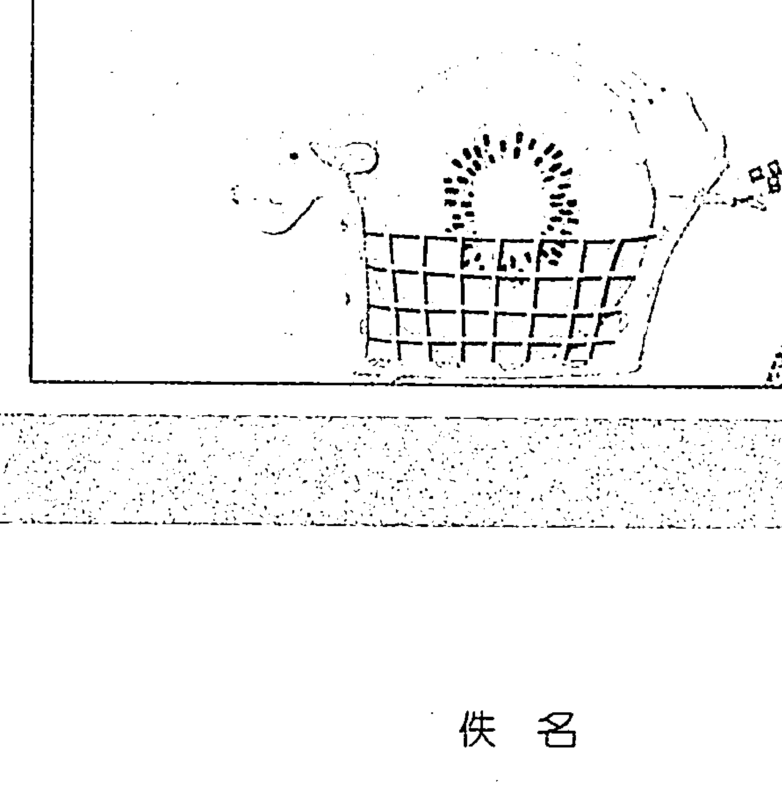

> 魅力提示：
爱情是需要一点情趣的，它就犹如沙漠中的一片绿洲，让我们疲劳的眼睛感到希望和美，适当地给“左手”或“右手”一种新鲜的感觉吧。

# 最后的旅行
佚名

他是个搞设计的工程师，她是中学毕业班的班主任老师，两人都错过了恋爱的最佳季节，后来经人介绍而相识。没有惊天动地的过程，只是平平淡淡地相处，自自然然地结婚。

婚后第三天，他就跑到单位加班，为了赶设计，他甚至可以彻夜拼命，连续几天几夜不回家。她忙于毕业班的管理，经常晚归。

为了各自的事业，他们就像两个陀螺，在各自的轨道上高速旋转着。送走了毕业班，清闲了的她开始重新审视自己的生活，审视自己的婚姻，她开始迷茫，不知道自己在他心里有多重，她似乎不记得他说过爱他。

一天，她问他是不是爱她，他说：“当然爱，不然怎么会结婚。”她问他怎么不说爱，他说不知道怎么说。她拿出写好的离婚协议，他愣了，说：“那我们去旅游吧，结婚的蜜月我都没陪你，我亏欠你太多。”

他们去了奇峰异石的张家界。飘雨的天气和他们阴郁的心情一样，走在盘旋的山道上，她发现他总是走在外侧，她问他为什么，他说路太滑，他怕外侧的栅栏不牢，怕她万一不小心跌倒。她的心忽然感到了温暖，回家就把那份离婚协议撕掉了。

> 魅力提示：
爱就要说出来，不要埋在心底，如果一味闷在心里，再深沉的爱可能会被对方忽略。

# 魅力链接

- 书名：浪漫这点儿事
- 作者：王麒诚 著
- 出版社：世界知识出版社
- 出版时间：2008-11-01
- 印刷时间：2008-11-01
- 开本：32开
- ISBN：9787501234264
- 包装：平装

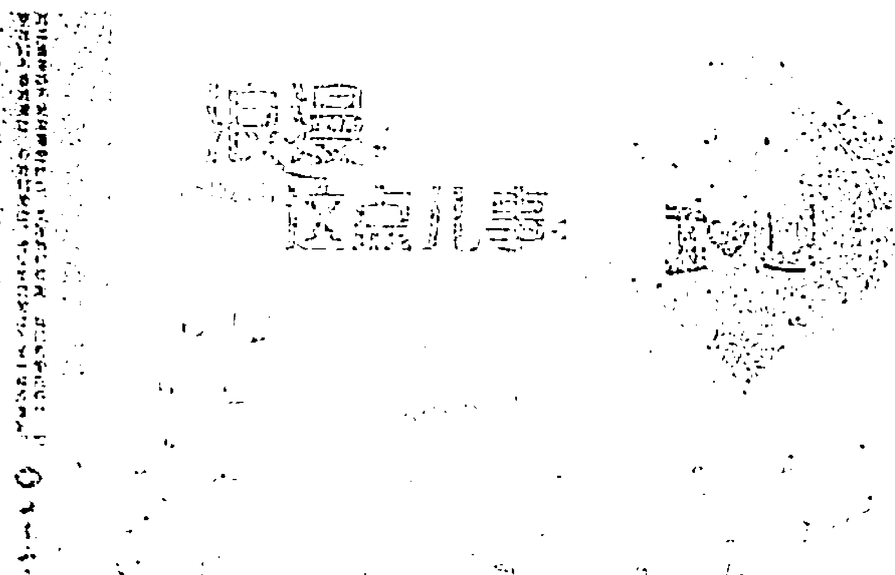

## 内容简介

你是否正在为如何给心爱之人创造浪漫的氛围而烦恼？别急，就让这本可爱、温馨、令人感动的漫画书来为你解忧吧。它将为大家演绎“最浪漫的话”、“最浪漫的事”、“跟古人学浪漫”、“跟影视学浪漫”、“跟歌曲学浪漫”……

浪漫是什么？也许就是一句话，一个眼神，一个微笑或一段岁月！

浪漫，其实就是这点儿事……

# # 魔力第三面
## 恋爱篇

# ## MAGIC

# ## 魅力失分
### 事业心过强

摩羯座的人，总是说自己没有异性朋友，年纪不小了，也很想结婚成家，但每天都是为了事业，忙得不得了。但问他们肯不肯抽空参加男女交谊活动，答案是没时间。偏偏感情需要时间培养，亲密关系也需要时间营造。既然这点时间都没有，怎么能进入亲密关系的状态呢？

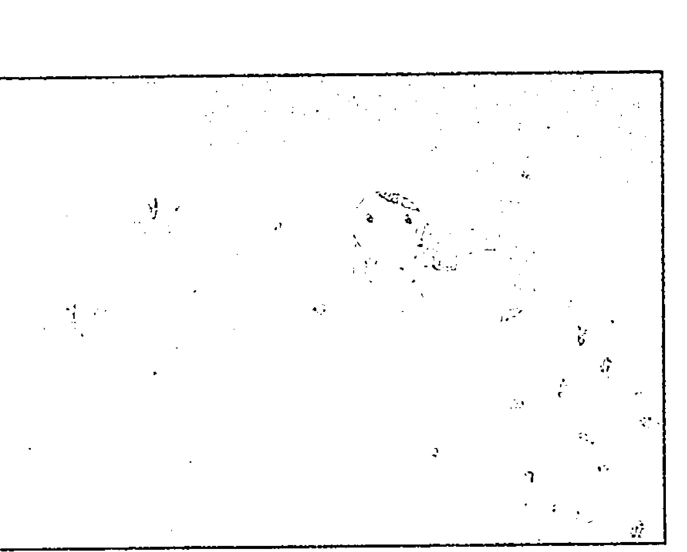

# 魅力改造

# 正篇

# 爱、成功和财富

智 空

一位妇人走到屋外，看见前院坐着三位老人，他们都长着又长又白的胡须。虽然她并不认识他们，但是依然十分友好地对他们说：“我想也许我们并不熟悉，但是我想你们应该很饿了，请进来吃点东西吧。” “家里的男主人在吗？”老人们问。“不在，”女人说，“他出去了。” “那我们不能进去。”老人们回答说。 傍晚，丈夫回到家里，女人将事情的经过告诉了他。丈夫说：“告诉他们我在家里了，请他们进来吧！”于是，妇人去请三位老人进屋。 “我们不可以一起进一个房屋。”老人们说。“为什么呢？”妇人感到迷惑不解。 其中一位老人指着他的一位朋友说：“他的名字是财富。”然后又指着另一位说：“他是成功，而我是爱。”接着又补充说：“你现在进去和你丈夫商量一下，要我们其中的哪一位到你们家。”

妇人进去告诉了丈夫。丈夫非常兴奋地说：“那赶快邀请财富进来！”妇人却表示了不同的意见：“亲爱的，为什么不邀请成功进来呢？”

他们的儿媳妇在屋内的另一个角落聆听他们谈话，并提出了自己的意见：“我想应该先邀请爱进来。”

丈夫思考了一下，对妇人说：“就照儿媳妇的意见吧！”于是妇人又来到屋外，问道：“请问哪位是爱？”爱起身朝屋子走去。另外两位也跟着他一起进入屋内。妇人惊讶地问财富和成功：“我只邀请爱，怎么你们也一道来了呢？”

三位老者齐声回答：“如果你邀请的是财富或成功，另外两人都不会跟进来，然而你邀请的是爱，因为无论爱走到哪儿，我们都会跟随。”

> > 魅力提示：
>
> 哪里有爱，哪里就有财富和成功，爱走到哪里，财富和成功就会跟到哪里。如果失去了爱，储藏着再多的金银珠宝也只如一堆金属石头，个人事业上再大的成功也将黯然失色，无所依归。

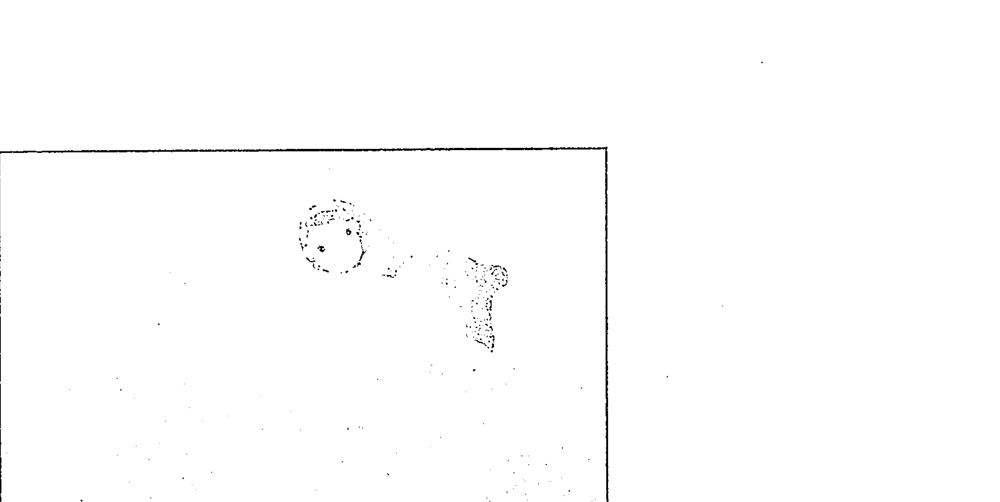

# 谁的妻子最快乐

大 阙

弗兰西斯·霍勒是沙特王宫的一名外籍家庭教师，主要任务是陪七位小公主阅读英文童话，每年的收入是英国首相布莱尔的四十倍。不过，她被解聘了。在重返剑桥读书的那天，有两百多名记者云集在圣凯瑟琳学院门口打探内幕，鉴于有协议在先，她回避了所有的提问。

一位陪同小公主阅读童话的人到底出了什么差错？人们有很多猜测。法国的一家报纸说，这是因为弗兰西斯和某位王子产生了恋情，在王宫里上演了灰姑娘的故事；德国的一家报纸说，弗兰西斯是被美国安全局买通的一名特工，在传递情报时露了马脚；阿拉伯的一家报纸说，弗兰西斯小姐合同期满，她的离开属正常解聘……总之，众说纷纭，谁也不知道哪一条是弗兰西斯被解聘的真正原因。

二〇〇一年圣诞节，一封来自沙特公主的电子邮件透露了实情。这封邮件是向弗兰西斯问候圣诞快乐的。在邮件中，小公主回忆了和弗兰西斯共同度过的快乐时光。她说，你还记得我们一起读《安徒生童话》时问你的问题吗？我们傻乎乎的，真是愚蠢至极，以至于造成今日的离别。
原来公主们在读童话时，问了弗兰西斯这么一个问题：“谁的妻子最快乐？”
当时弗兰西斯反问了她们：“你们认为呢？”
七位小公主齐声回答：“农夫的妻子最快乐！”
“难道国王的妻子、百万富翁的妻子、政治家的妻子、诗人的妻子不快乐吗？”弗兰西斯问。
“不快乐。”七位小公主回答。
“为什么？”弗兰西斯接着问。7位小公主答不上来，她们只知道，在童话故事里，没有一个国王的妻子是快乐的，也没有一个百万富翁的妻子是快乐的。
后来，弗兰西斯给她们讲了其中的原因，并告诉她们：在这个世界上，只有真正快乐的男人，才能带给女人真正的快乐。谁知这句话被人告密，第二天她就接到了解除聘约的通知。
二〇〇一年末，美国《纽约时报》财经版评选“十大金句”，弗兰西斯的那句话破天荒地被选了进去。因为她因那句话，失去了一百万英镑。

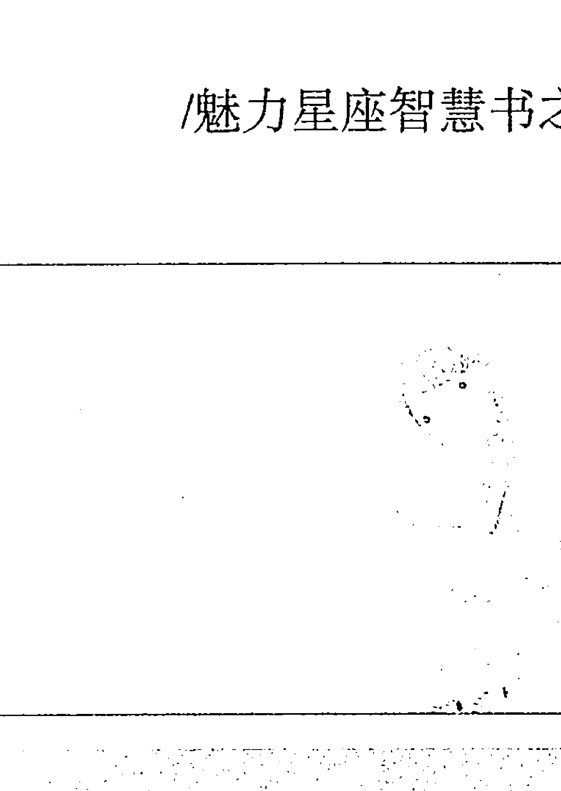

# 人生两条腿

佚名

爱德华是一个在事业上很成功的人，他每周工作七天，每天至少工作十二小时。并没有人强迫他这么做，男人嘛，应该以事业为重，他认为应该在工作中多投入些精力。

他每天晚上忙到很晚才回家，早晨妻子送孩子上学时他还没起床，儿子总是对迷迷糊糊睡在床上的爸爸道早安。妻子很爱他，是他青梅竹马的恋人。可是她很少能单独和他在一起，她得陪他应酬客户。

爱德华知道自己欠妻子的太多了，所以他经常给她买昂贵的首饰，以此来弥补自己的过失。爱德华也很爱儿子，他给了儿子许多零花钱，从世界各地带回各种好玩的玩具送给儿子，并在有限的时间里对儿子说：“我爱你和妈妈。”

一切看起来很和谐，直到有一天妻子提出离婚。“亲爱的，你知道我爱你。我们的儿子也需要我。”爱德华说。

妻子反驳道：“如果昂贵的首饰是爱的话，那你确实爱我，可惜这不是我想要的。任何人都比你更配做丈夫和爸爸。你一年有几天真正属于我们？”

#### 魅力提示

人们每天都在为了改变现在的生活环境而努力工作，但是却忽略了家庭中隐藏的危机，在工作很忙的时候，不妨给自己一天假，也给家人一天假。

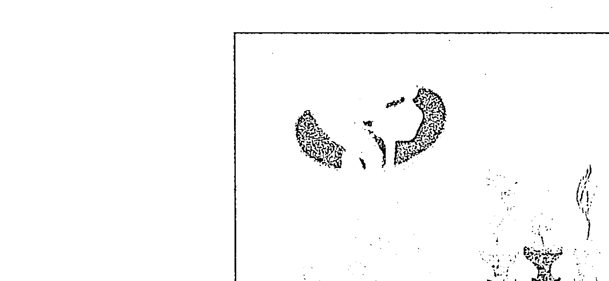

# 二十美元的价值

张德淳

一位父亲下班回家很晚了，又累又烦，他发现五岁的儿子站在门口等他：“我可以问你一个问题吗？”
“什么问题？”
“爸，你一小时可以赚多少钱？”
“这与你无关，你为什么问这个问题？”父亲生气地说。
“我只是想知道，请告诉我，你一小时赚多少钱？”儿子哀求道。
“假如你一定要知道，我一小时赚二十美元。”
“喔，”儿子低下了头，接着又说，“爸，可以借我十美元吗？”

# # /魅力星座智慧书之摩羯座

父亲发怒了：“如果你只是要借钱去买玩具的话，那就给我回房间上床。好好想想为什么你会那么自私。我每天长时间辛苦工作着，没时间和你玩小孩子的游戏。”

儿子安静地回自己的房间并关上门。

父亲坐下来还在生气。过了一会儿，他平静下来，想着他可能对孩子太凶了——或许孩子真的很想买什么东西，再说他平时很少多要过钱。

父亲走进儿子的房间：“你睡了吗，孩子？”

“爸，还没，我还醒着。”儿子回答。

“刚刚可能对你凶了，”父亲说，“我不该发脾气——这是你要的十美元。”

“爸，谢谢你。”儿子欢叫着从枕头下拿出一些被弄皱的钞票，慢慢地数着。

“为什么你已经有钱了还要？”父亲生气地问。

“因为在这之前不够，但我现在足够了。”儿子说，“爸，我现在有二十美元了，我可以向你买一小时的时间吗？明天请早一点回家——我和妈妈想和你一起吃晚餐。”

> > 魅力提示：
>
> 尽可能多地与亲人分享欢聚的美好时光吧。再重要、再辛苦的工作，也只是工作，只是我们生活得更稳定更好一些的工具与手段而已；我们的亲人，爱人，还有一些真正的朋友，才是我们一生永远的牵挂，或者，还是我们身体和心灵的一部分。

# # 魅力链接

- 书名：感情的奥秘
- 作者：尚致胜 著
- 出版社：北京大学出版社
- 出版时间：2005-11-01
- 印刷时间：2005-11-01
- 开本：32开
- ISBN：9787301096789
- 包装：精装

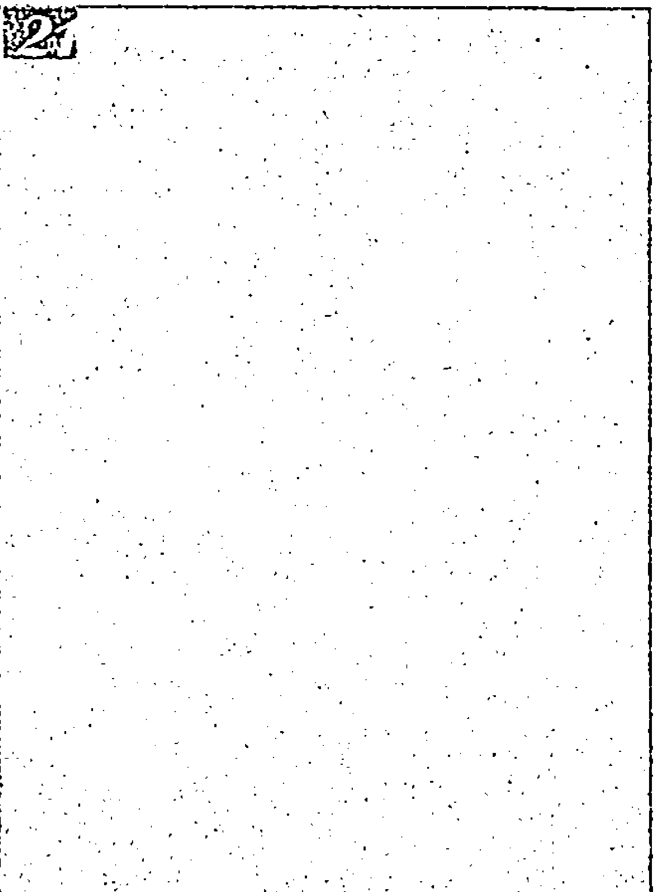

# ## 内容简介

人一生有两件事情最重要，一个是事业的发展，另一个就是家庭、婚姻和感情的幸福。卓越的人生是事业和婚姻家庭都成功的人生。婚姻和家庭也要像经营事业一样去好好经营。本书提出的爱情策略、婚姻观点和家庭观念都能为站在事业和婚姻起点的年轻朋友提供有益的指导。

## 魅力失分

# 总是不冷不热

对于摩羯座的人来说，爱情只是进度表中的一个章节，他热爱的是生命，别奢望他用以对生命的热情来执行爱情这档事，他要的是冷静的爱，至少不能妨碍生命的发展。

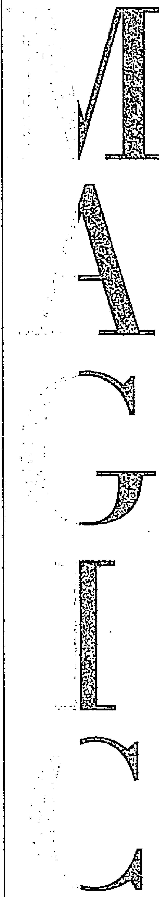

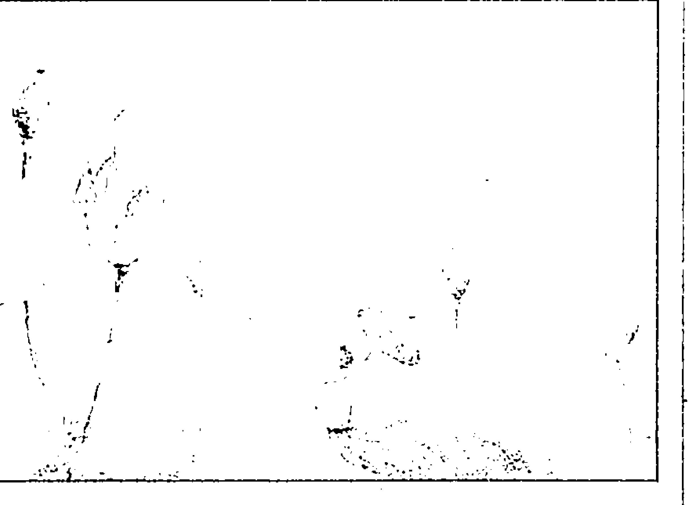

# # 小礼物

詹姆斯 道 森

他从小在孤儿院长大，什么事都得努力去争取，所以他从来没空约会，妻子莎拉是他唯一约会过的女孩。莎拉已占据了他的心。当莎拉还没明白过来时，他已向莎拉求婚了。

结婚宣誓之后，莎拉的父亲把新郎带到一旁，交给他一份小礼物，说：“这是幸福婚姻的秘诀。”年轻的新郎迫不及待地打开察看。

盒子里装的是一只大型金手表。他小心翼翼地拿起来，细看之下，发现表面上刻着一句智慧的提示，他每次看表时无法避开；而且，只要留心遵守，必能享受成功的婚姻，这句话是：“跟莎拉说些好话。”

> ### 魅力提示
为爱情升温并不是件很难办到的事情，多说一些爱的语言就可以。

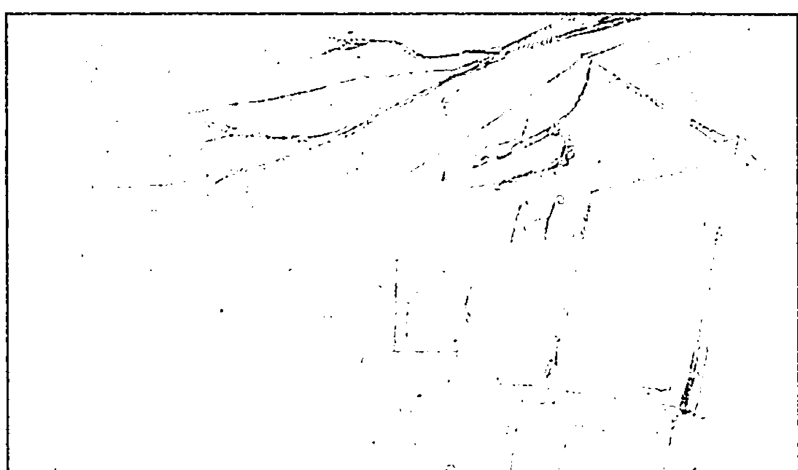

# 吻

佚名

拉丽是护士。每天值班查病房时都会看到凯特和查尔斯夫妇二人坐在那里，腿上放着一个大大的相册，好像在追忆往事。

凯特和查尔斯形影不离，人们知道查尔斯是个坚强的人，能挺得住。可凯特却只有依靠查尔斯才能生存。

“如果先去世的是查尔斯，那凯特会怎么样呢？”人们常谈论这个问题。

晚上就寝前，拉丽总是要给病人们送去晚上服用的药。每次凯特都是穿着睡衣和拖鞋坐在椅子上等拉丽。每次都是拉丽和查尔斯看着她把药吃下。然后，查尔斯便小心翼翼地把她从椅子上扶到床上，再给她掖好被子，关掉床上灯，接着他温柔地弯下身去，两人轻轻地吻着。尔后，查尔斯轻轻地拍拍凯特的脸蛋，两人便会心地相视而笑。接着，查尔斯把凯特床边的栏杆升起，随后他便转过身去吃他自己的药。

# ## /魅力星座智慧书之

当拉丽走到走廊时，总能听到查尔斯说：“晚安，凯特！”凯特也用同样的声调说：“晚安，查尔斯！”
拉丽休了两天班，回来上班时，听到的第一个消息是：“查尔斯昨天早上去世了，心脏病。”
人们对凯特特殊照顾了一段时间，让她在房间里吃饭，大家轮流用各种特殊的方式照料她。后来，她逐渐地又恢复了正常。每当人们经过她房间时，总会看到凯特坐在椅子上，腿上放着那个大相册，神情悲伤地瞅着相册中的查尔斯。
就寝的时候是凯特一天中最难熬的一段时光。尽管已答应了她的要求，让她搬到查尔斯的床上；尽管又常常和她在一起聊天、说笑，夜里也给她掖被子，可依然驱赶不走凯特的悲伤、寂寞与孤独。
有一次，拉丽看着她睡了一小时后才走，可当拉丽又经过她的房间时，却发现她依然睁着双眼，凝视着天花板。
几个星期过去了，情况仍没有好转。她像是烦躁，又很害怕。为什么会这样呢？为什么凯特夜里的情绪要比白天坏呢？
后来，有天晚上，拉丽又来到了凯特的房间。只见她像往常一样，木呆呆地大睁着双眼。拉丽冲动地问她：“凯特，你是怀念你那晚安前的吻？”说着拉丽俯下身去，在她那布满皱纹的脸上吻了一下。
拉丽的这一吻像是打开了阻塞凯特感情洪流的闸门，滚滚泪水夺眶而出。她紧紧地抓住拉丽的手，呜咽着说：“查尔斯总是这样吻我的。我真想他啊！这么多年，他一直是在祝福晚安前这样吻我的。”她停了停，擦了擦眼泪又说：“没有他的吻，我就睡不着啊。”

> 魅力提示：
唯有长久而热烈的爱才是人的最丰厚和最庄严的奉献，是改变这个世界唯一的力量和信念。

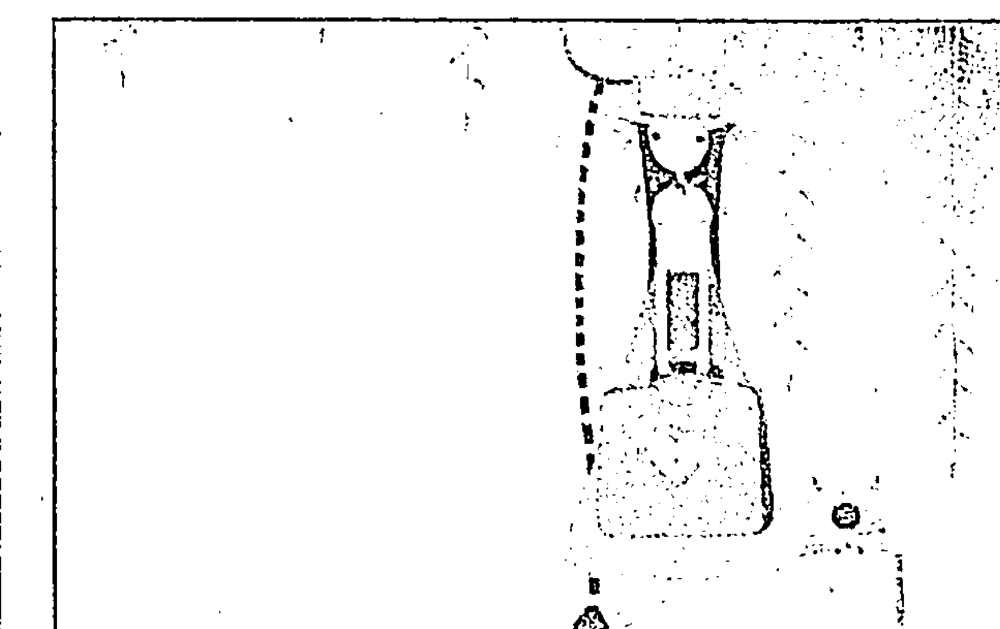

魅力改造

# 随时表达你的爱

范天涯

爱的表达应该像挤牛奶一样，经常挤，随时挤，不要总想着找个机会集中说出来震撼你所爱的人。世事无常，一直以来积攒的爱真要等到你想表达的时候，可能已经没有机会了。

一个地震中丧偶的男人,在丧礼上笑脸盈盈地招待来访的亲友,弄得亲友不知如何是好,很尴尬,想安慰他,他好像很乐的样子,不安慰他嘛,那来做什么呢?甚至有的亲友心中有点气愤地想着：人是不是给他暗算杀掉的啊？但没人去问这个丧偶的男人。

出殡的日子,女方的家长实在按捺不住了,在灵堂上破口咒骂这个男人,相守了二十年的老婆死了还笑得出来,是不是有什么内情？只见他默默地听着,不做任何回应，直到骂完了，众人眼睛全都看着他，等他的反应，他才说，谢谢指正。

他的脸还是笑笑的，女方的家长差点没气晕过去，就冲向他，一手揪住了他胸前的衣领，挥拳打下去。这个男人还是笑笑的，但嘴角已是流出一条血河了。

这时，反而是女方的家长心中一阵寒栗，害怕了，难道这个人已经疯了？

丧事就在一场闹剧中度过了。当天夜晚，女方的家长担心早上的举动是否不当，偷偷地折回去看这个男人到底是怎么回事。只见他抱着亡妻的照片呆坐在客厅中。一个小时、两个小时、三个小时他连动都没动，也没出声音。女方的家长看不出什么异常，就回去了。

第二天一大早女方的家长又去看了，只见那个男人还是呆坐在那里，抱着亡妻的照片。这下女方的家长心急了，怎么说也是二十年的半子，至少应该关心一下，就敲了门进去。门没锁，他头也不回一下，继续抱着照片。

女方家长问：“你怎么了啊？”

男人说：“我一生都在忙东忙西的，自认为是为了她好，为她在打拼，她的埋怨我都不曾理会，从没好好听她说过一句话，直到这次地震，直到她临终前，她对我说：‘你可以听我一句话吗？’我为了让她高兴就说：‘我一定听！’她说：‘我知道你是爱我的，我也爱你，我要是死了，你一定会哭的，但我不要看见、听见你哭，好吗？你要笑着帮我把后事办好，你一生都没答应我什么，就这一次好吗？’”

他说完眼中有泪光，因为他一生就答应了她一次。

> 魅力提示：
爱要随时、随地、随心地表达，不要刻意去积攒，不要因害怕不够震撼心灵而逃避，只要一切发自内心，对方又怎会嫌它平淡呢？

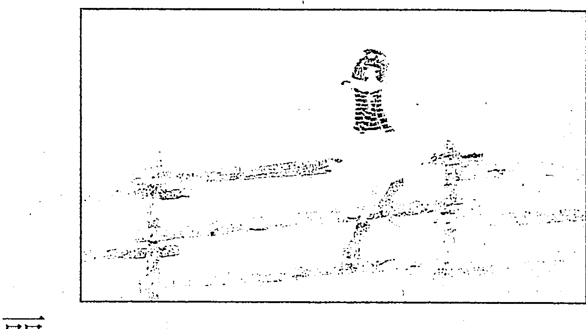

# # 一分钟的美丽

佚名

晚上，一个大男孩捧着一盆花闯进来，很惊喜地说：“你在这里呀？”不速之客的他猛然从黑暗中出现，我与学生吃了一惊。

他站在灯光下面对我们，额头上有些细汗，看样子是费了一番周折才找到在我这儿学电脑的女孩子。

对他的冒失，我责怪、不满的心忽然减弱，因为他那种初恋的骄傲，也因为他手中捧着的一盆鲜花。花盆古香古色，有种说不出的美意，花含苞未放，淡白色的嫩骨朵让我眼光一亮，满屋子因它而有春天的感觉。

男孩微笑着，如释重负将花送给了学电脑的女孩子。

女孩子见我注视着花盆里欲开未开的花，有点不好意思，她转过脸对我说是他跟别人分讨的。

随即又转过脸有点不是很满意地说：“我说我要万年青，你怎么跟别人分这个？我最不喜欢开花的植物……”

“这花就要开了呀。”男孩子喃喃对我说，其实意在沛公了。

“你真怪呀?为什么不喜欢花开呢?这花很美，是不是水仙呀？”望着有点不知所措的男孩，我含笑对女孩子说。

女孩子有点不好意思。

一个人在花要开时，怕你看不见，费了许多周折，找了许多地方亲自将它们送给你，这难道不是一种幸福吗？

> 魅力提示：
在这物欲横流的生活中，能碰到一个黑夜送花的人，会让人感动一生、怀想一生，不知那女孩子为何能如此平静。

# 魅力链接
- 书名：人生以快乐为目的：爱情以互惠为原则
- 作者：吴淡如 著
- 出版社：百家出版社
- 出版时间：2006-10-01
- 印刷时间：2006-10-01
- 开本：32开
- ISBN：9787807035473
- 包装：平装

## 内容简介

任何你觉得让自己生命有意义的事，终究是快乐的。

也只有那些给你精神上带来快乐的事情，才能经历时间考验，成为人生中不可或缺的部分，让你明白，如此长长久久的付出，毕竟值得。

而对于爱，我至今仍然相信：因为你快乐，所以我快乐，这样的爱才是没有蒙受人工尘埃污染的爱。不管是亲情，还是爱情，总还是要以互惠为原则，互给恩惠，互相体谅，才能快乐。

## 魅力失分
抑郁
摩羯座的人从不轻易把自己的情绪摊在别人面前，即使受了委屈，也会憋在心里。

# 魅力改造
### 燕人悲祖

有一个燕国人，生在燕国，却长于楚国，到了晚年想落叶归根回到故乡。

他走到晋国，同路的人骗他，指着前面的一个城镇说：“这就是燕国的城镇。”这个人听了就深深地叹了一口气。

同路的人又指着其中的一间房子说：“这是你祖先的房子。”这个人听了就流下泪来。同路的人再指着一座坟墓说：“这是你祖先的坟墓。”这人忍不住放声大哭，同路的人却轰然大笑说：“我刚刚说的都是骗你的，这里是晋国。”

这个人觉得愧疚，不久到了燕国，真的看到燕国的城镇和宗庙，看到真正的旧家和旧坟，心里的悲哀情绪已经十分淡了。

人的悲哀只是一种情结，一种情绪。当这种情绪释放出来后，情结也就解开了。总是沉湎于悲哀或苦闷中，是因为他一直未能找到他释放情绪的对象。所以，经常找到合适的对象或方式来倾诉自己的内心，是减轻心理压力的重要途径。

## 陆军部长的信
佚名

在林肯任美国总统期间，一天，陆军部长来到林肯的办公室，非常生气地告诉他：一位少将说话很刻薄，用侮辱的话指责了他。
林肯听完之后，建议陆军部长写一封同样尖刻的信回敬那个少将。
陆军部长照林肯说的做了。
他写好信，把信装进信封。
林肯问：“你要干什么？”
他答：“寄出去啊！”
“不要胡闹！”林肯说，“这封信不能发，赶快把它扔到炉子里去。”
陆军部长很诧异：“不是你让我写的吗？”
林肯解释说：“这封信的作用就是让你解气，把你想发泄的愤怒表达出来，不是真要你发出去给人家。如果写了这封信，你已经解气了，就把它烧了吧。如果没解气，就再写第二封、第三封，然后再烧掉！”

> **魅力提示：**
当你因为某件事情产生坏情绪的时候，不妨想办法把坏情绪释放出来。疏导的办法比堵的办法更能有效地治疗人们的糟糕情绪。

# 魅力改造
### 上帝的惩罚
佚名

一个犹太教的长老在安息日偷偷去打高尔夫球。上帝决定惩罚他。
这位长老为了怕被别人发现，决定只打九个洞。第三个洞的时候，长老人杆一挥，球竟然一杆进洞，长老高兴地挥了一下拳头。第五个洞的时候，球又一杆进洞，“今天真是个好日子！”长老十分兴奋。接下来的四个洞全都是一杆进洞。“真不可思议！这是上天的安排吗？”长老禁不住喜悦，决定再打九个洞。
这一次，九个洞全部是一杆进洞。这是在世界上任何地方都从未出现过的事情，长老手舞足蹈，简直快要乐疯了。
上帝边上的小天使不解地问上帝：“您不是说要惩罚他的吗？我怎么没看见他受到什么惩罚啊？”“我已经惩罚他了”。上帝笑着说，“你想想看，有这么惊人的成绩和如此激动的心情，却不能跟任何人说，难道不是最好的惩罚吗？”

#### 魅力提示

> 我们的快乐和满足常常来自于自己得到他人的赞许和认可。如果我们所取得的引以为傲的成绩只能深埋在自己的心底，而不为大众所知晓的话，那将比任何痛苦都更为难受。

## 定期解开你的包袱
裴玲

有一个年轻人准备去探险。年轻人随身带了一个沉重的背包，里面塞满了食品、切割工具、衣服、指南针、护理药品等。年轻人对自己的背包很满意，认为已为旅行做好了充分的准备。

一天，当地的向导检视完背包之后，突然问了一句：“这些东西让你感到快乐吗？”年轻人愣住了，这是他从未想过的问题。他开始问自己，结果发现，有些东西的确让他很快乐，但是，有些东西实在不值得背着走那么远的路。

年轻人决定取出一些不必要的东西送给当地村民。接下来，因为背包变轻了，他感到自己不再有束缚，旅行变得更愉快。他因此得到一个结论：生命里填塞的东西越少，就越能发挥潜能。从此，他学会在人生各个阶段定期解开包袱，随时寻找减轻负担的方法。

> 魅力提示：
决定一个人命运的不是他所处的环境，而是他是否有一个良好的心态，是否懂得在任何情况下，都不忘清洗自己的心灵，释放自己的情绪，以便让自己活得更轻松、更自在、更洒脱。

# 魅力链接
- 书名：拯救心灵
- 作者：常桦 编著
- 出版社：华文出版社
- 出版时间：2004-07-01
- 印刷时间：2004-07-01
- 开本：
- ISBN：9787507516937
- 包装：平装

## 内容简介

本书从人们的内心出发，教人们怎样击败悲伤、失望，把那些令人心碎的事踩在脚下；教人们正确对待痛苦，不使自己陷入不幸的泥沼中。

现今社会人人都忙忙碌碌，有些人根本就没有时间来实践这些理念与方法，甚至有些人根本就怀疑这些办法的可行性。但是，只要你肯抽出时间来阅读本书，你就会从中受益。

朋友，你尽可以将本书放置在案头床前，让它成为你随身、随时携带的“心理医生”。当你感到压抑、焦虑、郁闷或恐惧不安的时候，请翻开此书读一段吧；当你遇到朋友痛苦无奈地倾诉，却无法时刻陪伴他之时，送他此书作为礼物吧。在快节奏的生活间隙里，让我们共同来运用这个“心理医生”教的方法，让自己更轻松地生活吧，套用一句多年前一部日本动画片中主人公一休的话：“休息一下，让我们休息一下吧！”

## 魅力失分
木讷
摩羯座天性害羞，为人正经八百，不善言辞表达。

### 没打算辞职
佚名

公司老板对新来的秘书小刘的工作不满意。尤其是最近的一次私底训话，这种不满似乎达到了非开除他不可的地步。

老板对秘书说：“我从来没有碰到像你这样一个办事马虎大意的秘书！我原先聘用的那些秘书身上所具备的优点你几乎都没有，而他们有的缺点你倒应有尽有！你的灵活性不够，太呆板，什么事儿都照本宣科；你的文才平平，远在他们几人之下；你总是不能把办公桌拾掇得使我满意，你的字儿写得也与他们几个相差甚远，只可惜他们几个都申请辞职了，不行，我不能让你这么一个不够格儿的秘书再浪费我的工资啦！”

老板唠唠叨叨地说完，似乎下定了要辞退他的决心。

秘书这时心平气和地对老板说道：“先生，您说了我那么多的缺点，可您却忽视了我一个最大的优点，那就是：在听了您这么多批评之后，我仍然虚心地接受，没打算辞职呀！”

老板听他这么一说，不禁怔住了，紧接着，他哈哈大笑起来，小刘也因此保住了一个对他来说得之不易的工作机会。

#### 魅力提示
> 要学会适当地表达自己，才能为自己赢得机会。面对一个如此絮叨不休、吹毛求疵的老板，秘书小刘却没有反驳老板的批评，而是引导老板从另一个角度来思考问题，来说明自己对公司的忠诚和对自己从事的工作的极大热忱。

### 两个解梦家
佚名

皇帝梦见自己所有的牙齿都掉了，醒来后，他吓出了一身冷汗，觉得很奇怪。他立刻召来一个解梦家，问他这个梦是不是暗含着什么意义或者预示着将来什么事情。

“唉，陛下，很不幸地告诉你，”解梦家说道，“每一颗掉落的牙齿，都代表着您的一个亲人的死亡！”

“什么？你这胡说八道的家伙。”皇帝愤怒地对着他大喊，“你竟敢对我说这种不吉利的话，给我滚出去！”他下令道，“来人啊！打这个家伙五十大板。”不久，另一个解梦家被传召来了，他细心地听完皇帝讲述的梦境，他的脸上露出一抹微笑，说道：“陛下，我很荣幸能为您解梦，您真是洪福齐天！您将活得比所有的亲人都要长久！”

皇帝听后，立即眉开眼笑，他说：“你的解梦之术实在高明啊！”然后，又安排侍从盛情款待他，临走时还赏赐给他五十个金币。

在一旁的侍从私下问这位解梦者：“就我听来，你的解释和第一个解梦人不都是同一个意思吗？恕我直言，我并不觉得你的解梦之术有什么高明之处！”那聪明的解梦家狡黠地答道：“你说得不错，不是我的解梦术高明，而是我说话比别人稍稍高明了一些。话有很多种说法，问题就在于你如何去说！”然后，他捧着金币高高兴兴回去了。

#### 魅力提示
同样的意思，只是换一种方式或用不同的语言表达出来，所得到的待遇竟然是如此不同，可见说话艺术的重要性。话有三说，巧说为妙，如何巧妙地准确表达真实的、真正的意思，而又不违己心，不得罪对方，这需要一颗慧心去慢慢体会。

## 魅力小语
### 勤快狗和懒惰猫
佚名

一户人家养了一条狗、一只猫。

狗是勤快的。每天，当主人家中无人时，狗便竖起两只耳朵，虎视眈眈地巡视在主人家的周围，哪怕有一丁点的动静，狗也要狂吠着疾奔过去，兢兢业业地为主人家看家护院。

每当主人家有人时，他的精神便稍稍放松了，有时还会伏地沉睡。于是，在主人家每一个人的眼里，这只狗是懒惰的，是极不称职的，便经常不喂饱它，更别提奖赏它好吃的了。

猫是懒惰的。每当家中无人时，便伏地大睡，哪怕三五成群的老鼠在主人家中肆虐。睡好了，它就到处散散步，活动身子骨。等主人家中有人时，它的精神也养好了，这儿瞅瞅那儿望望，时不时地，它还要去给主人舔舔脚，与主人逗逗趣。在主人的眼中，这无疑是一只极勤快极尽职守的猫，好吃的自然给了它。

由于猫的不尽职守，主人家的耗子越来越多。终于有一天，耗子将主人家唯一值钱的家当咬坏了。主人震怒了。他召集家人说：“你们看看，我们家的猫这样勤快，耗子都猖狂到了这种地步，我认为一个重要的原因就是那只懒狗，它整天睡觉也不帮猫捉几只耗子。我郑重宣布，将狗赶出家门，再养一只猫。大家意见如何？”

家人纷纷附和说，这只狗是够懒的，每天只知道睡觉，你看猫，每天多勤快，抓耗子吃得多胖，都有些走不动了。是该将狗赶走，再养一只猫。于是，狗一步三回头地被赶出了家门。自始至终，它也不明白主人赶它走的原因。它只看到，那只肥猫在它身后窃窃地轻蔑地笑着。

#### 魅力提示
不爱表露、不善言辞、默默无闻工作的人，往往得不到领导的肯定。反之，爱在领导面前表露自己，去拍领导马屁，其实自己什么也没干的人，往往能被升职或重用。因此，我们不仅要踏踏实实工作，同时也要在适当的时候在领导面前表现出来，让领导知道。

### 该来的不来
李屹之

有个人家里办喜事，摆了几十桌酒菜，可是看看时间过了，还有一大半的客人没来，于是心里很焦急，便脱口而出道：“怎么搞的，该来的客人还不来？”一些敏感的客人听到了，心想：“该来的没来，那我们是不该来的多？”觉得如果再呆下去的话，就会被主人说不要脸了，于是便悄悄地走了。

主人一看又走掉好几位客人，而那些没来的客人仍然没来，心里越发着急了，便说：“怎么这些不该走的客人，反倒走了呢？”剩下的客人一听，又想：“走了的是不该走的，那我们这些没走的倒是该走的了！”于是又都走了。

最后只剩下一个跟主人较亲近的朋友，看了这种尴尬的场面，就劝他说：“你说话前应该先考虑一下，否则说错了，就不容易收回来了。”主人大叫冤枉，急忙解释说：“我并不是叫他们走哇！”朋友听了大为恼火，说：“不是叫他们走，那就是叫我走了。”说完，头也不回地离开了。

> 魅力提示：
说话是一门学问，同样更是一门技巧，如果你掌握不好的话，人们就很可能因为你无意伤害的话而离开你，甚至是最亲密的朋友。好好掌握这门学问吧。

# 魅力链接
- 书名：你是最会说话的人
- 作者：赵宏  编
- 出版社：地震出版社
- 出版日期：2003-04
- 印刷日期：2003-04
- 开本：32开
- ISBN：750282248
- 包装：精装

## 内容简介
本书通过大量贴近生活的事例和精炼的要点，从如何说话最能吸引人、怎样说话最受欢迎、如何赞美别人效果最好、怎样批评别人最恰当、怎样说话别人最容易接受、如何拒绝别人最不得罪人、怎样说话最得体、如何说话最能避免难堪、怎样说话最能取得别人的谅解、如何说话最利于沟通、怎样回答面试的问题最得体、如何谈判能争取最大的利益和怎样求人最容易办成事等十三个方面，生动而具体地讲述了提高说话水平，改善沟通能力的具体方法和实用技巧。

## 魅力失分
孤独
摩羯座的人是孤独的，他们不喜群众，把自己隐藏得很深。

# 魅力改造
### 心灵的栅栏
凡赛特

当玛格丽特的丈夫杰瑞因脑瘤去世后，她变得异常愤怒，生活太不公平，她憎恨孤独。孀居3年，她的脸变得紧绷绷的。

一天，玛格丽特在小镇拥挤的路上开车，忽然发现一幢她喜欢的房子周围竖起一道新的栅栏。那房子已有一百多年的历史，颜色变白，有很大的门廊，过去一直隐藏在路后面。如今马路扩展，街口竖起了红绿灯，小镇已颇有些城市味，只是这座漂亮房子前的大院已被蚕食得所剩无几了。

可院子总是打扫得干干净净，上面绽开着鲜艳的花朵。玛格丽特注意到一个系着围裙、身材瘦小的女人，清扫着枯叶，侍弄鲜花，修剪草坪。

每次玛格丽特经过那房子，总要看看迅速竖立起来的栅栏。一位年老的木匠还搭建了一个玫瑰花格架和一个凉亭，并漆成雪白色，与房子很相称。

一天，玛格丽特在路边停下车，长久地凝视着栅栏。木匠高超的手艺令她几乎流泪。玛格丽特实在不忍离去，索性熄了火，走上前去，抚摸栅栏。它们还散发着油漆味。玛格丽特看见那女人正试图开动一台割草机。

“喂！你好！”玛格丽特喊道，一边挥着手。

“嘿，亲爱的！”那女人站起身，在围裙上擦了擦手。

“我在看你的栅栏。真是太美了。”

那女人微笑道：“来门廊上坐一会吧，我告诉你栅栏的故事。”

她们走上后门台阶，那女人打开栅栏门，玛格丽特不由得欣喜万分，她终于来到这美丽房子的门廊，喝着冰茶，周围是不同寻常又赏心悦目的栅栏。

“这栅栏其实不是为我设的。”那女人直率地说道，“我独自一人生活，可有许多人到这里来，他们喜欢看到真正漂亮的东西，有些人见到这栅栏后便向我挥手，几个像你这样的人甚至走进来，坐在门廊上与我聊天。”

“可面前这条路加宽后，这儿发生了那么大的变化，你难道不介意？”

“变化是生活中的一部分，也是铸造个性的因素，亲爱的。当你不喜欢的事情发生后，你面临两个选择：要么痛苦愤懑，要么振奋前进。”

当玛格丽特起身离开时，她说：“任何时候都欢迎你来做客，请别把栅栏门关上，这样看上去很友善。”

玛格丽特把门半掩住，然后启动车子。她内心深处有种新的感受，她没法用语言表达，只是感到，在她那颗愤懑之心的四周，一道坚硬的围墙轰然倒塌，取而代之的是整洁雪白的栅栏。她也打算把自家的栅栏门开着，对任何准备走近她的人表示出友善和欢迎。

> 魅力提示：
人与月亮的距离并不遥远，因为人与人与心灵间的距离更为遥远。

### 最有“个性”的生命价值
佚名

与戴高乐同时代的法国著名将领菲利浦·勒克莱尔一九○二年十一月生于法国北部一个古老的贵族家庭，他的祖辈因在十字军东征中战绩卓著而受封，他的父亲个性勤奋自立，但又不失责任感和献身精神；他的母亲出身名门，是虔诚的天主教徒，善良、克俭。这样的家庭素养遗传使勒克莱尔自幼生活简朴，富于理想，意志坚强，集贵族的荣誉感和平民的自立精神于一体。他在享誉世界的圣西尔军校受训时，就深怀着一种使命感。当他以第五名的成绩毕业后，他毫不犹豫地选择了最具冒险性和攻击特色的骑兵。

年轻的勒克莱尔被派往保护国摩洛哥做教官。这里的战场是直插云端的阿特拉斯山的寂寞无垠的沙漠，而他的士兵是散漫的当地人。虽然自己与士兵的生活习俗差异很大，但求真和质朴的品格使他很少有偏见，因而他能充分公正地理解自己的士兵。他发现摩洛哥人是天生的战士，骁勇剽悍，吃苦耐劳，善于在沙漠和山地行军作战，只要指挥得当，肯定是好样的。

第二次世界大战爆发，为掩护英法联军撤出敦刻尔克，勒克莱尔所在的第四步兵师因在法比边界牵制德军陷入重围。他受命潜过德军阵地向南部法军求援，被俘后设法脱身。在西欧大陆战争败局已定时，勒克莱尔带兵浴血奋战。因德军坦克势如洪水，空袭压顶而来，他又遭厄运，被抓进一座临时战俘营。

此时，整个法国兵败如山倒，难民如潮涌。求和派使法国政府放弃了最后的抵抗。失血过多的勒克莱尔不甘坐以待毙，再次逃出虎口投奔了坚持抗战的流亡将军——戴高乐。

勒克莱尔追随戴高乐到北非创立了“自由法国”的第一块根据地。一九四〇年八月，他以少校军衔去尼日利亚发展抗战部队，又遇哗变，于是他自封上校带着仅剩的二十五名官兵，划着两条独木舟转战喀麦隆。因国土沦丧而涣散的军心被他坚忍不拔的统率力量所感召，当他的战斗部队来到杜阿拉市时，他们竟受到主和派守军的开城欢迎。以后他的军队捷报频传，最后赶走了保守势力。

一九四四年八月一日，勒克莱尔指挥着前身为“自由法国”的第二装甲师参加了著名的诺曼底战役，与英美集团军一道砍断了德军西线脊梁。此刻盟军将领面临一个抉择：是否解放巴黎？为了节省盟军宝贵的人力、物力，争取时间，盟军下令绕过巴黎，快速追击。但这时法国共产党在巴黎发动了起义，并遭到德军镇压，同时，希特勒下令把巴黎夷为平地，起义者向盟军统帅艾森豪威尔求援，没得到答复。

就在这个危急时刻，勒克莱尔凭着他超常的敏锐、胆略与毅力，不顾军令，命第二装甲师向巴黎全速开进，夺回了祖国的心脏。勒克莱尔不负众望，继续统兵收复了全部本土，最后与盟军一路所向披靡，直捣希特勒的老巢，取得了“二战”的彻底胜利。

从勒克莱尔与环境的较量中，我们看到了个性的实力，看到了不良环境在面对一个开拓的、坚毅的个性时，是怎样屈服的。环境的改变常常取决于人的个性实力，这种个性里不仅蕴藏着智慧，而且具有责任感、毅力、勇气和应变力共同组成的优秀意志。这可称之为“社会的个性”。

爱因斯坦说：“人既是孤独的人，同时又是社会的人。作为孤独的人，他企图保卫自己的生存和那些同他最亲近的人的生存，企图满足他个人的欲望，并且发展他天赋的才能。作为社会的人，他企图得到他的同胞的赏识和好感，同他们共享欢乐，在他们悲痛时给以安慰，并且改善他们的生活条件。”这才是最有“个性”的生命价值的体现。

> 魅力提示：
人只有献身于社会，才能找出那实际上短暂而有风险的生命的意义。

# 先锋地下实验室

佚名

2003年7月29日，40岁的洞穴专家毛里奇·蒙塔尔只身到意大利中部内洛山的一个地下溶洞里，开始长达一年的命名为“先锋地下实验室”的活动。

“先锋地下实验室”，设在溶洞内的一个68平方米的帐篷内。里面除配备有科学试验用的仪器设备外，还设有起居室、卫生间、工作间和一个小小的植物园。在洞外山顶上的控制室里，研究人员通过闭路电视系统观察蒙塔尔一个人在长期孤独生活的情况下生理方面会产生哪些变化。

在两千多米深的溶洞里，周围死一般的寂静。刚开始20天左右，由于寂寞与孤独，蒙塔尔曾感到害怕。但是后来还是顶住了。他给果树和蔬菜浇水，看书、写作或看录像。一年中，他吸了380盒香烟，看了100部录像片。

蒙塔尔于2004年8月1日重见天日。这时，他的体重下降了21公斤，免疫系统功能降到最低点；如果两人同时向他提问，他的大脑就会乱；他变得情绪低落，不善与人交谈。

> 蒙塔尔说：在洞穴里度过了一年，才明白了一个生的奥秘：生活的美好在于与人相处。

## 魅力提示：

> 走出自我的小天地，走出封闭的世界。敞开心怀，你会发现，小屋外面的世界同样是一个温暖的世界，人与人的相处将会带给你很多快乐。

# 稻草人

克雷洛夫

一天，农夫对稻草人说：“你总是孤独守望在这片寂寞的土地上，你一定厌倦了吧？” “能使他人恐惧是一种深沉持久的快乐，对此我永远不会感到厌倦。”稻草人回答道。

农夫低头沉思，而后说道：“的确如此，因为我也能领悟这种乐趣。”

“只有那些用稻草填充躯体的人才能体味到这种乐趣。”他说。

于是农夫走开了，不知道这些话是恭维还是轻蔑。一年过后，稻草人变成了一位哲学家。

当农夫再次从他身边走过时，他看到两只乌鸦正在他的帽檐下筑巢。

> **魅力提示：**
> 每个人都渴望得到别人的认可，没有人愿意永远孤独，孑然一身。

# 魅力链接

- 书名：孤独是可耻的
- 作者：[美]卡乔波，[美]帕特里克 著，焦梦津 译
- 出版社：中国人民大学出版社
- 出版时间：2009-11-01
- 印刷时间：2009-11-01
- 开本：16开
- ISBN：9787300109350
- 包装：平装

# 内容简介：

> “人本质上就是个社会动物。要想获得理想的生活，就必须建立有意义的、令人满意的社会纽带。”

孤独让我们对他人苛刻，在机会前畏缩，面对打击时脆弱，容易被岁月催老。

你还有什么理由继续孤独？

# 魔方第四面

## 交友篇

## 魅力失分

- 倔强

摩羯座的人个性倔强，喜欢唱反调，常让在场的人感到扫兴。

# 尖刻的富兰克林

佚名

本杰明·富兰克林是美国历史上最能干、最杰出的外交官之一。当富兰克林还是毛躁的年轻人时，一位教友会的老朋友把他叫到一旁对他批评道：“你真是无可救药，你已经打击了每一位和你意见不同的人。你的意见变得太尖刻了，使得没人承受得起。你的朋友发觉，如果你不在场，他们会自在得多。你知道得太多了，没有人能再教你什么。”他指出了富兰克林刻薄、难以容人的个性。

而后，富兰克林渐渐地改正了他的这一缺点，变得成熟、明智、能领会到即将面临社交失败的命运，一改以前傲慢、粗野的习性。

后来，富兰克林说：“我立下条规矩，绝不正面反对别人的意见，也不准自己太武断。我甚至不准自己在文字或语言上措辞太自主。我不说‘当然’、‘无疑’等，而改用‘我想’、‘我觉得’或‘我想象’一件事该这样或那样。”这种方式使他渐渐成为事业的强者。

## 魅力提示：

你有必要学会听从别人的忠告，这些忠告来自于经验的总结，以及失败的教训。不要因为是别人的嘲讽就失去信心，即使别人的嘲讽有时也能帮助你更加认清错误的本来面目。

# 弄松的鞋带

余郑华

有一回，日本歌舞伎大师勘弥扮演古代一位徒步旅行的百姓，正当他要上场时，一个门生提醒他说：“师傅，你的草鞋带子松了。”

他回答了一声：“谢谢你呀。”然后立刻蹲下，系紧了鞋带。

当他走到门生看不到的舞台入口处时，却又蹲下，把刚才系紧的带子复又弄松。

显然他的目的是，以草鞋的带子都已松垮，试图表现这个百姓长途旅行的疲态。演戏细腻到这样，这位大师确有其过人之处。

话说回来，正巧那天有位记者到后台采访，看见了这一幕。等演完戏后，记者问勘弥：“您为什么不当时指教学生呢？他不懂得这演戏的真谛呀。”

勘弥回答说：“别人的亲切关爱与好意必须坦然接受。要教导学生演戏的技能，机会多得是，在今天的场合，最重要的是要以感谢的心去接受别人的提醒，并给予回报。”

## 魅力提示：

在给他人以建议或指正缺点时，不要在当时固执地争议其中的是非对错，这一点只需心里明白，日后自然可以纠正；这时候，最重要的是要以感谢的心去接受别人的提醒，并给予回报，千万不要随意封住别人对你的关切与善良之门。

# 魅力改造

# 鼹鼠与鹰王

佚名

鹰王和鹰后为躲避人类的猎枪，从遥远的地方飞到远离人类的森林，它们打算在密林深处定居下来。于是就挑选了一棵又高又大、枝繁叶茂的橡树，在最高的一根树枝上开始筑巢，准备夏天在这儿孵养后代。

鼹鼠听到这些消息后，大着胆子向鹰王提出忠告：“这棵橡树可不是安全的住所，它的根几乎烂光了，随时都有倒掉的可能。希望大王和王后不要在这儿筑巢。”

鹰王和鹰后，觉得很好笑：这真是咄咄怪事！我们是什么人？还需要鼹鼠来提醒？你们这些躲在洞里的家伙，每天就知道吃了就睡，按你的意思，好像是说我们老鹰的眼睛不是锐利的？

你是什么东西，竟然胆敢跑出来干涉鹰大王的事情？

鹰王根本不听鼹鼠的劝告，仍按原计划立刻动手筑巢，并且当天就把全家搬了进去。不久，鹰后孵出了一窝可爱的小家伙。

一天早晨，正当太阳升起来的时候，外出打猎的鹰王带着丰盛的早餐飞回家来，然而，那棵橡树已经倒掉了，它的鹰后和它的子女都已经摔死了。

看见眼前的情景，鹰王悲痛不已，它放声大哭道：“我多么不幸啊！我把最好的忠告当成了耳边风，所以，命运就给予我这样严厉的惩罚。我从来不曾料到，一只鼹鼠的警告竟会是这样准确，真是怪事！”

鼹鼠谦恭地答道：“你想一想，我就在地底下打洞，和树根十分接近，树根是好是坏，有谁还会比我知道得更清楚呢？”

## 魅力提示：

所有人给你的忠告都是经过实践得来的至理名言。如果你偏不相信，而一意孤行，必将自食恶果。

# 倔强的驴子

伊索

驴夫赶着驴子上路，刚走一会儿，就离开了平坦的大道，沿着陡峭的山路走去。当驴子失足将要滑下悬崖时，驴夫一把抓住它的尾巴，想要把它拉上来。可驴子却一直朝着相反的方向拼命挣扎。当用尽力量后，驴夫便放开了它，说道：“好了，让你得胜吧！但那是个悲惨的胜利。”

## 魅力提示：

不是所有的坚持都是正确的。执著于这种坚持，即便胜利了，那也一定是悲惨的。错误所付出的代价，往往更悲惨。坚持，就一定要选择好正确的方向。

# 魅力链接

- 书名：身体密码
- 作者：（美）巴尔肯 著，刘伟 译
- 出版社：中国商业出版社
- 出版时间：2008-11-01
- 印刷时间：2008-11-01
- 开本：16开
- ISBN：9787504462961
- 包装：平装

# 内容简介：

你适合从事什么样的职业？你能当面观察人的个性，并了解一个人吗？你适宜与什么样的女性（或男性）结婚？这个人是否诚实、倔强、慷慨、敏感、顽固、缺乏耐性？

通过本书，读者不但可以加深对自己的了解，还可以在较短的时间内，了解自己所交往的业务伙伴、朋友或偶遇的陌生人。

# 魔方第四面 交友篇

### 魅力失分 不善沟通

摩羯座的人不善于沟通，因此，常常会出现人际关系上的困惑。

# 公主的月亮

佚名

一个小公主病了，她娇憨地告诉国王，如果她能拥有月亮，病就会好。国王立刻召集全国的聪明智士，要他们想办法拿下月亮。

> 总理大臣说：“它远在三万五千里外，比公主的房间还大，而且是由熔化的铜所做成的。”
> 
> 魔法师说：“它有十五万里远，是用绿奶酪做的，而且整整是皇宫的两倍大。”
> 
> 数学家说：“月亮远在三万里外，又圆又平，像个钱币，有半个王国大，还被粘在天上，不可能有人能拿下它。”

国王又烦又气，只好叫宫廷小丑来弹琴给他解闷。小丑问明一切后，得出了一个结论：如果这些有学问的人说得都对，那么月亮一定和每个人想的一样大、一样远。所以当务之急便是要弄清楚小公主心目中的月亮到底有多大、多远。

于是，小丑到公主房里探望公主，并顺口问公主：“月亮有多大？”“大概比我拇指的指甲小一点吧！因为我只要把拇指的指甲对着月亮就可以把它遮住了。”公主说。

“那么有多远呢？”“不会比窗外的那棵大树远！因为有时候它会卡在树梢间。”

“那是用什么做的呢？”“当然是金子！”公主斩钉截铁地回答。

比拇指指甲还要小、比窗外的树还要近，用金子做的月亮当然容易拿啦！小丑立刻找金匠打制了个小月亮，穿上金链子，给公主当项链，公主好高兴，第二天病就好了。

## 魅力提示：

有时候，我们可能会较少关注别人的真实需求，完全是按照自己的意愿做事情，结果不论多么努力，效果总是不好。而沟通才是了解别人心理的最好方法。当然，选择好沟通的内容也十分重要，沟通内容选择好了，才能直入主题，简洁高效。

### 魅力星座智慧书之摩羯座

# 可以吗

佚名

在美国一个农村，住着一个老头，他有三个儿子。大儿子、二儿子都在城里工作，小儿子和他在一起，父子俩相依为命。

突然有一天，一个人找到老头，对他说：“尊敬的老人家，我想把你的小儿子带到城里去工作，可以吗？”

老头气愤地说：“不行，绝对不行，你滚出去吧！”

这个人说：“如果我在城里给你的儿子找个对象，可以吗？”

老头摇摇头：“不行，你走吧！”

这个人又说：“如果我给你儿子找的对象，也就是你未来的儿媳妇是洛克菲勒的女儿呢？”

这时，老头动心了。

过了几天，这个人找到了美国首富石油大王洛克菲勒，对他说：“尊敬的洛克菲勒先生，我想给你的女儿找个对象，可以吗？”

洛克菲勒说：“快滚出去吧！”

这个人又说：“如果我给你女儿找的对象，也就是你未来的女婿是世界银行的副总裁，可以吗？”

洛克菲勒同意了。

又过了几天，这个人找到了世界银行总裁，对他说：“尊敬的总裁先生，你应该马上任命一个副总裁！”

总裁先生说：“不可能，这里这么多副总裁，我为什么还要任命一个副总裁呢，而且必须马上？”

这个人说：“如果你任命的这个副总裁是洛克菲勒的女婿，可以吗？”

总裁先生当然同意了。

## 魅力提示：

也许这个故事不尽真实，但它在一定程度上体现了沟通的力量。沟通时，信心非常重要，只有心里认定了这件事对双方都有好处，才能获得对方的配合，取得沟通的成功。而且认定了这一点后，还要不屈不挠，不怕拒绝，直到取得最后的胜利。沟通是个很大的课题，非三言两语可以说清楚。

# 魅力改造

# 子贡讨马

佚名

孔子带领学生周游列国，途中有一匹驾车的马脱缰跑开，吃了一位农夫的庄稼，这位农夫就把马扣了下来。

子贡能说会道，自告奋勇去交涉，结果子贡讲了半天道理，说了不少的好话，农夫就是不还马，子贡只好灰溜溜地回来了。

孔子见状，笑着说：“拿人家听不懂的道理去游说，就好比用高级祭品去贡奉野兽，用美妙的音乐去取悦飞鸟，怎么行得通呢？”于是让马夫前去讨马。

马夫走到农夫跟前，笑嘻嘻地说：“老兄，你不是在东海种地，我也不是在西海旅行，我们既然碰到了一起了，我的马吃你两口庄稼，也不算什么大不了的事吧。”

农夫听马夫这样说，再看看他与自己相同的打扮，觉得很是亲切，就十分痛快地把马还给了他。

## 魅力提示：

> 成天礼、乐、诗、书，满口之乎者也的子贡和农夫讲道理，这正应了一句俗语：“秀才遇到兵，有理讲不清。”人与人之间的沟通主要是心灵的沟通，只要你打动了对方的心，对方心悦诚服了，你的目的就达到了。

# 爱是沟通

佚名

有一位丈夫，很喜欢吃那鲜美的鱼肉，但为了将鱼肉让给妻子，每每做出鱼来，他都抢着吃鱼头和鱼尾，妻子却不喜欢吃鱼肉，他以为丈夫喜欢吃鱼头鱼尾，每每做出鱼来，就把鱼头鱼尾特意让给丈夫。

几十年过去了，夫妻俩都老了，这天丈夫说，我好想吃顿鱼肉，妻子十分惊奇，其实我好想吃鱼头和鱼尾，却吃了一辈子鱼肉。

夫妻俩都哭，恩恩爱爱从未红过脸，但他们显然犯了一个共同的错误：缺乏沟通。

## 魅力提示：

人与人之间需要沟通，并不仅仅是奉献和给予，爱更需要两人之间心与心的沟通和交流，不然爱就会成为一种毫无必要的负担和近乎荒唐的责任。

# 魅力链接

- 书名：卡耐基沟通的艺术
- 作者：(美) 卡耐基 著，刘祐 编译
- 出版社：中国城市出版社
- 出版时间：2007-05-01
- 印刷时间：2007-05-01
- 开本：16开
- ISBN：9787507418491
- 包装：平装

# 内容简介：

如果你是一位商人，那么你所面临的最大困难将是如何与人打交道。不过，即使你是一位会计，或者是一位家庭主妇、建筑师或工程师，情况也同样是如此。

这是一本教人行动的书。但书中所说的不是空洞的理论，而是有着令人难以相信的神奇功效。全书共分八个部分，内容包括：人际沟通必须掌握的基本技巧，如何让他人喜欢并乐意帮助你，如何让他人赞同你的想法，如何更好地说服他人，男性专用的家庭沟通技巧，女性专用的家庭沟通技巧，如何克服沟通中的忧虑心理，如何掌握演讲的沟通技巧。

# 摩羯第四面

## 交友篇

## 魅力失分

缺乏对人群的关怀和热情

摩羯座的人往往太专注于个人的目标而忽略了身边的人或事，因而让人觉得有点冷血。

### 魅力星座智慧书之摩羯座

# 探病的女人

张丽钧

郭老师高烧不退，透视发现胸部有一块拳头大小的阴影，医生怀疑是肿瘤。同事们纷纷去医院探视，回来的人说：“有一个叫王端的女人，特地从北京赶到唐山来看郭老师，不知是郭老师的什么人。”又有人说：“那个叫王端的整天守在郭老师的病床前，喂水喂药端便盆，看样子跟郭老师可不是一般关系呀。”

就这样，去医院探视的人几乎每天都能带来一些关于王端的花絮，更有人讲了一件令人不可思议的奇事，说郭老师和王端一人拿着一根筷子敲饭盒玩，王端敲几下，郭老师就敲几下，敲着敲着，两个人就又哭又笑起来……

十几天后，郭老师的病确诊不是肿瘤。不久，郭老师就喜气洋洋地回来上班了。有人问起了王端的事，郭老师深情地讲述了一段大地震中的经历：

> “王端是我以前的邻居。大地震的时候，王端被埋在了废墟下面，大块的楼板在上面一层层压着，而她父母的尸体就在身边，王端在下面吓得直哭。邻居们找来木棒铁棍撬那楼板，可说什么也撬不动，就说等着用吊车吊吧。”
> 
> “天黑了，人们纷纷谣传大地要塌陷，于是就都抢着去占铁轨。只有我没动。我家活着出来的只有我一个人，我把王端看成了可以依靠的人，就像王端依靠我一样。我对着楼板的空隙冲下面喊：‘王端，天黑了，我在上面跟你做伴，你不要怕啊！现在，咱俩一人找一块砖头，你在下面敲，我在上面敲，你敲几下，我就敲几下——好，开始吧。’”
> 
> “就这样，王端在下面敲‘当当’，我便也敲‘当当’，她敲‘当当当’，我便也敲‘当当当’……渐渐地，下面的声音弱了、断了，我也迷迷糊糊地睡去。”
> 
> “不知过了多长时间，下面的敲击声又突然响起，我慌忙捡起一块砖头，回应着那求救般的声音。王端颤颤地喊着我的名字，激动得哭起来。”
> 
> “第二天，王端被救了出来。”

## 魅力提示：

人是由相互支撑的1撇1捺构成的，只有相互依靠、支持才能站立起来。这就要求我们对别人付出更多的关爱、帮助；由此，我们也就会获得别人的关爱和帮助。

# 星星监狱

姜玉荣

路易斯·劳斯是星星监狱的监狱长，那是当时最难管理的一个监狱。可是二十年后劳斯退休时，该监狱却成为一所提倡人道主义的机构。研究报告将功劳归功于劳斯，当他被问及该监狱改观的原因时，他说：“这都是由于我已去世的妻子——凯瑟琳，她就埋葬在监狱外面。”

凯瑟琳是三个孩子的母亲。劳斯成为监狱长时，当年，每个人都警告她千万不可踏进监狱，不仅因为那里是很危险的地方，而且对孩子的成长也会有非常不好的影响。但这些话拦不住凯瑟琳！第一次举办监狱篮球赛时，她带着三个可爱的孩子走进体育馆，与服刑人员坐在一起。她的态度是：“我要与丈夫一道关照这些人，我相信他们也会关照我，我不必担心什么！”

一名被定有谋杀罪的犯人瞎了双眼，凯瑟琳知道后前去看望。她握住他的手问：“你学过点字阅读法吗？” “什么是‘点字阅读法’？”他问。于是她教他阅读。多年以后，这人每逢想起她的爱心还会流泪。

凯瑟琳在狱中遇到一个聋哑人，结果她自己到学校去学习手语。许多人说她是耶稣基督的化身。在以后的十八年间，她经常造访星星监狱。

后来，她在一桩交通意外事故中逝世。第二天，劳斯没有上班，代理监狱长接替他工作。消息立刻传遍了监狱，大家都知道出事了。接下来的一天，她的遗体被放在棺木里运回了家，她家距离监狱不远。

代理监狱长早晨散步时惊愕地发现，一大群看来最凶悍、最冷酷的囚犯，竟不约而同地齐集在监狱大门口。他走近去看，见有些人脸上竟带着悲哀和难过的眼泪。他知道这些人爱凯瑟琳，于是对他们说：“好了，各位，你们可以去，只要今晚记得回来报到！”然后他打开监狱大门，让一大队囚犯走出去，在没有守卫的情形下，走几里路去看凯瑟琳最后一面。结果，当晚每一位囚犯都回来报到，无一例外！

> > **魅力提示：**

富有爱心的人，不但自己的生活充实快乐，而且还能感染别人。你富有爱心，虽然可能并不富有，没有高贵的地位，没有显赫的声名，没有令人艳羡的财产，但是在精神上，你却是天使。

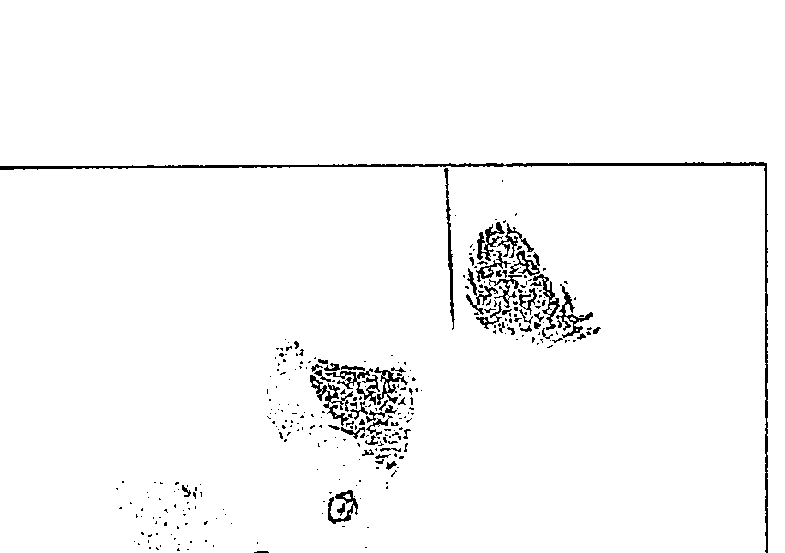

# 魅力改造

### 镜子里的狗

莫泊桑

一只流浪狗无意间闯进一间四壁镶着玻璃镜的屋子，突然看到很多狗同时出现，它大吃一惊，这狗便龇牙咧嘴，发出阵阵低沉的吼声。而镜子里所有的狗看来也都十分生气，每只狗也现出怒吼的面孔来。这只狗一看，吓坏了，不知所措，开始绕着屋子跑起来，一直跑到体力透支，倒地死亡。

只要这只狗肯试着对镜子摇几下尾巴，情形就会完全不同，镜子里的狗儿必然会回报它同样友善的举动。

## 魅力提示：

> > 当你对所处的恶劣环境或人们更主动地表达自己心中的善意时，你同样也会得到一份善意的回报。

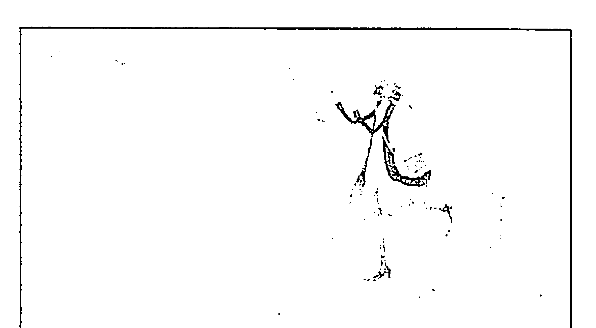

### 问候

佚名

有一位经理，在商场上经营多年，向来以讲信义和重感情著称。逢年过节，必给有生意往来的朋友打电话致意，嘘寒问暖，很是诚恳。大家都说，这人不错。

这年春天，他在吉林省吉林市谈了一笔大生意，但遇到了一点小麻烦，迫切需要一个当地人出面化解。找谁出面呢？他一拍脑袋，想到了自己的一个老同学。像他这样的人，在全国各地都不愁没有“铁哥们”。于是一个电话打到老同学家里。接电话的是老同学的妻子。还没等人家开口，他先说上了：

> > “哎呀，嫂子，我是某某，我想死你们了，你的身体还好吧，哥哥的老寒腿怎么样了？还总是疼吗？现在天气好了，让他有时间多出去溜达溜达吧！”

然而，电话彼端沉吟片刻，没有回答，挂掉了。

他不解。打电话给其他同学，才知道，老同学已经去世了。当年二月十五日，吉林市中百商厦起火，火灾中五十多人遇难。电视里连续几天都在播出这则新闻。很多外地的亲友看到新闻后，都在第一时间内打电话询问情况。当然，他们得到的都是一个令人痛心的答案。而这位经理，当时也看到了新闻，但他一笑了之，仿佛与己无关。

## 魅力提示：

一不小心，还是暴露了一个人在另一个人心中的位置。扪心自问，你有多少问候是发自真心的？又有多少问候是在求人时的虚与委蛇？

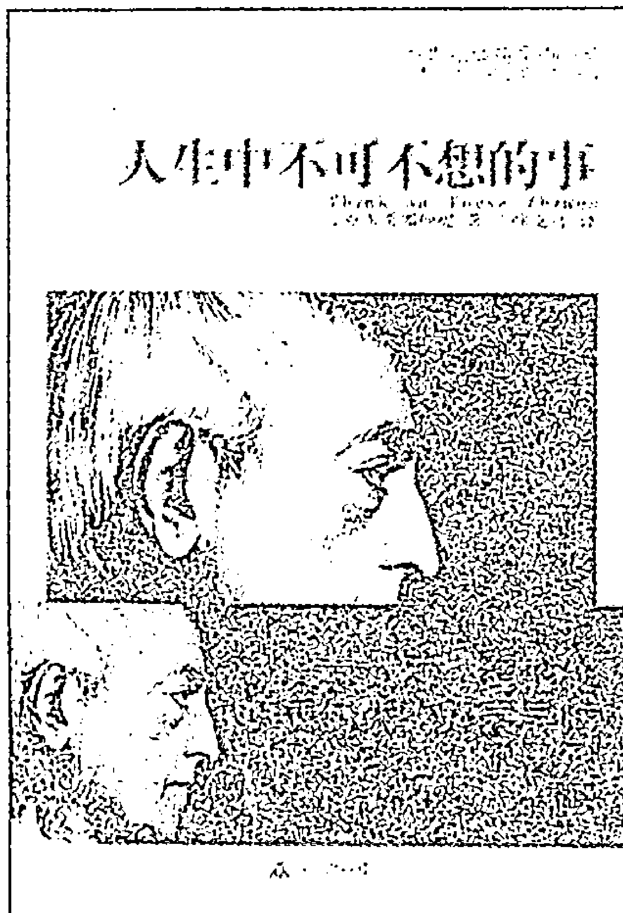

# 魅力链接

书名：人生中不可不想的事
作者：（印）克里希那穆提 著，叶文可 译
出版社：群言出版社
出版时间：2004-11-01
印刷时间：2004-11-01
开本：32开
ISBN：9787800804427
包装：平装

# 内容简介：

你从哪里来？生命是个伟大的谜，了解生命本身，比其他任何事情都重要，莫名的焦灼与恐惧，盘踞了我们的生活。我们既不自由，也不快活。我们渴望爱，但内心却变得越来越冷漠。这一切究竟是为什么？

该书由印度著名哲学家克里希那穆提在各种场合的演讲和谈话集结而成。克里希那穆提主张个人了悟整理，用自己的光来照亮自己。他的著作既不能帮助读者迅速致富，也不能帮助读者如何获取名望；既不能教读者击败或驯服他人，也不能让读者博得更多掌声。它与生活的细枝末节无关，但它的重要在于提醒读者，从初入世界到今天，人们得到了许多，也丢失了人生中最重要的东西——快乐。当忧虑和焦灼占据人们心灵的时候，人们既不自由，也不快乐。作者的一生，都是在帮助人类从恐惧和无明中解脱出来，找到快乐。

## 魔方第五面 学业事业篇

M
A
G
I
C

> 魅力失分
超分认真

摩羯座的人绝对是个好学生、好职员，虽能受到老师和领导的好评，但他过于认真的态度，在同学同事之间略显局促不安。

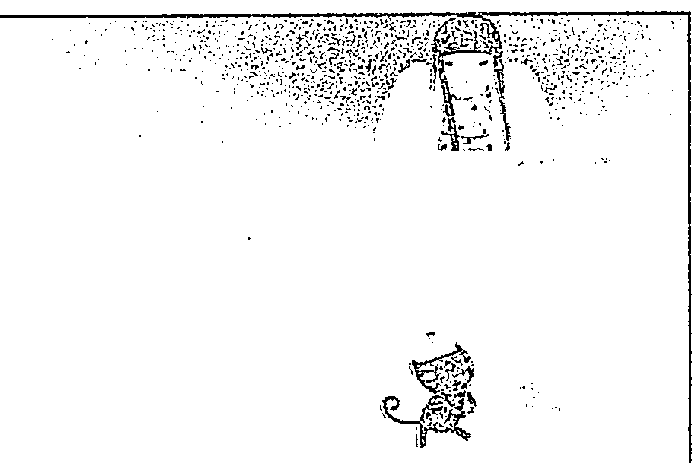

### 多一句赞美

澄 紫

几天前，我和一位朋友在纽约搭计程车，下车时，朋友对司机说：“谢谢，搭你的车十分舒适。”这司机听了愣了一愣，然后说：“你是混黑道的吗？”

“不，司机先生，我不是在寻你开心，我很佩服你在交通混乱时还能沉住气。”

“是呀！”司机说完，便驾车离开了。

“你为什么会这么说？”我不解地问。

“我想让纽约多点人情味，”他答道，“唯有这样，这城市才有救。”

“靠你一个人的力量怎能办得到？”

“我只是起带头作用。我相信一句小小的赞美能让那位司机整日心情愉快，如果他今天载了二十位乘客，他就会对这二十位乘客态度和善，而这些乘客受了司机的感染，也会对周遭的人和颜悦色。这样算来，我的好意可间接传达给一千多人，不错吧？”

“但你怎能希望计程车司机会照你的想法做呢？”

“我并没有希望他这样做，”朋友回答，“我知道这种做法是可遇不可求，所以我尽量多对人和气，多赞美他人，即使一天的成功率只有百分之三十，但仍可连带影响到三千人之多。”

“我承认这套理论很中听，但能有几分实际效果呢？”

“就算没效果我也毫无损失呀！开口称赞那司机花不了我几秒钟，他也不会少收几块小费。如果那人无动于衷，那也无妨，明天我还可以去称赞另一个计程车司机呀！”

> **魅力提示：**

有时候，一句赞美的话就能打破沉闷的气氛，使你充满人情味，让人更愿意接近，何乐而不为呢？

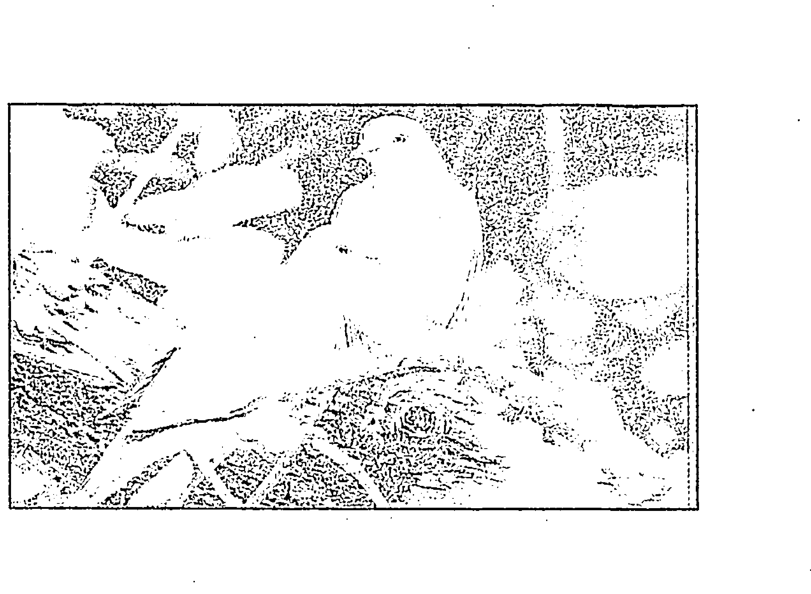

### 鹦鹉

一个人去买鹦鹉，看到一只鹦鹉前面的标鉴：此鹦鹉会两门语言，售价两百元。
另一只鹦鹉前则标道：此鹦鹉会四门语言，售价四百元。
该买哪只呢？两只都毛色光鲜，非常灵活可爱。这人转啊转，拿不定主意。
结果突然发现一只老掉了牙的鹦鹉，毛色暗淡散乱，标价八百元。
这人赶紧将老板叫来：“这只鹦鹉是不是会说八门语言？”
店主说：“不”。
这人奇怪了：“那为什么又老又丑，又没有能力，会值这个数呢？”
店主回答：“因为另外两只鹦鹉叫这只鹦鹉老板。”

> **魅力提示：**
这故事告诉我们，真正的领导人，不一定自己能力有多强，只要懂信任，懂放权，懂珍惜，就能团结比自己更强的力量，从而提升自己的身价。相反许多能力非常强的人却因为过于认真，事必躬亲，不顾别人，最后只能做最好的公关人员，销售代表，成不了优秀的领导人。

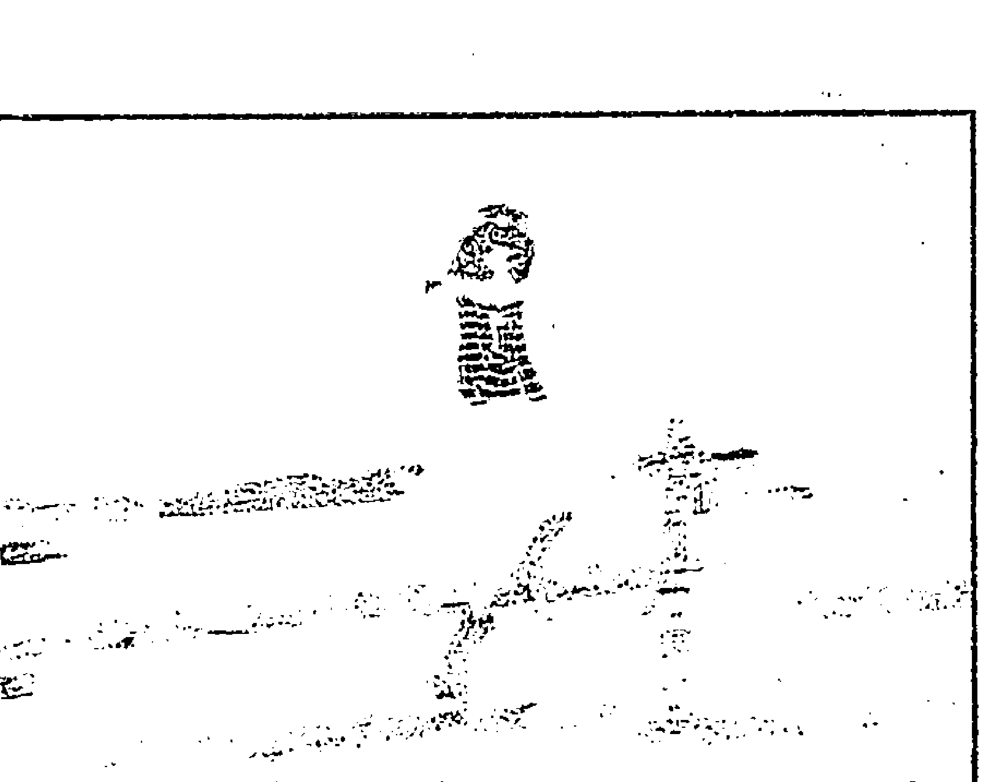

# 魅力改造

### 我是一片湖

马国福

刚从学校毕业，走上社会，意气风发的他立志为自己今后的事业开好头、起好步。公司里竞争十分激烈，他总想把各项工作做在前面，每天来得最早，走得最晚，分内的事情积极干，分外的事情抢着干，希望敬业的自己能给公司上下留下好印象。

然而时间长了他发现，在工作上他越较劲，同事们越不喜欢他，外出逛街、购物或者聚会从不喊他。他感到自己明显地被孤立起来了。有一次，他和一个同事因为一件小事吵了起来，他很愤怒地质问：“我到底做错了什么？”同事很不友好地回答他：“这还要问，你自己最清楚不过了。不要处处显得你很能干，是金子如果被沙子埋了，也不一定发光啊，掂量掂量自己吧。别太把自己当回事儿。”

他的自尊心受到了莫大的伤害，郁闷、压抑一直困扰着他。
一个假日，他回到乡下的老家，向父亲诉说公司里的现状。父亲给他出了一道简单的题：“如果把同样的一撮盐撒进茶杯和一片湖泊，会怎么样？”
他脱口而出说：“当然味道不一样了，这还用问啊？”
“是的，你说得不错。把一撮盐放到一杯水里，那杯水就会变得很咸。可是把一撮盐放进湖里，湖水却不会变咸。你常常感到别人负了你，和你过不去。你生气的时候有没有想过自己哪里做得不对？你主动干别人的工作是好事情，可你要征求别人的意见啊。他们分内的工作也体现了他们的价值和自尊，你那样做无形中伤害了别人啊。记住：认可并分享他人的成功远比提升自己的形象所带来的收获更有价值。”
父亲的一番话让他茅塞顿开。
回到公司后，他不再总想着如何展示自己的能力，并主动和同事们交流，赞美他们每天细小的收获和成果。
现在他拥有很多朋友，尽管每天的工作很平淡，但他感到很轻松很快乐。

## 魅力提示：

> 做事认真无可厚非，但是若是为了表现自己而影响了别人，那只会让身边的人对你敬而远之。

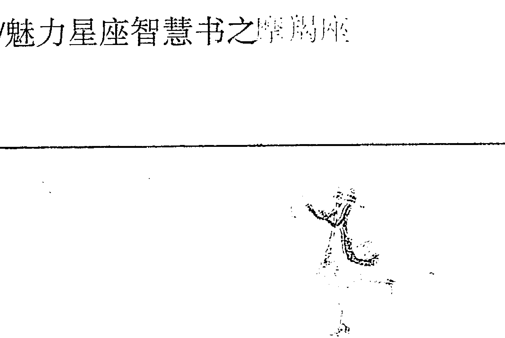

### 保持一颗平常心

仓冈天心

日本人仓冈天心所写的《茶之书》中讲了这么一则有趣的小故事：

茶师千利休吩咐儿子少庵打扫庭院，少庵认认真真地完成了父亲要求的事情，可是茶师却说：“不够干净。”要求他重做一次。

于是，少庵又尽力打扫了一遍，茶师还是说：“不行，你的工作做得不够好，再来一次。”

少庵顿了顿，没有说什么，又默默地花了一个小时扫庭院，直至认为自己已经做得相当好了，心想父亲肯定挑不出什么毛病来了，便去对父亲说：“父亲，已经没事可做了。石阶洗了三次，石龙灯也擦拭多遍。树木洒过了水，闪耀着翠绿，没有一枝一叶留在地面。”

茶师却斥道：“傻瓜，这不是打扫庭院的方法，这像是洁癖。你还没有完全领悟啊！”说着，他步入园中，用力摇动一棵树，只见那棵树上纷纷落下一片片金色、红色的美丽的树叶。茶师说：“打扫庭院不只是要求清洁，也要求美和自然。你的做法违背自然，试图完美，却不知那是一种伤害，结果是离完美更远。一切都要自然，不要刻意去做任何事情。”

> **魅力提示：**

生活中我们是不是有时候对某些事情也是过分苛求完美呢？如果是这样，我们反而会离我们的目标更遥远，这种心态与做法往往会成为我们前进的障碍，所以，保持一颗平常心吧。

# 魅力链接

书名：象牙塔里的日子
作者：（美）坎费尔德 编著，张德让，汪精玲 译
出版社：安徽科学技术出版社
出版时间：2008-01-01
印刷时间：2008-01-01
开本：16开
ISBN：9787533739669
包装：平装

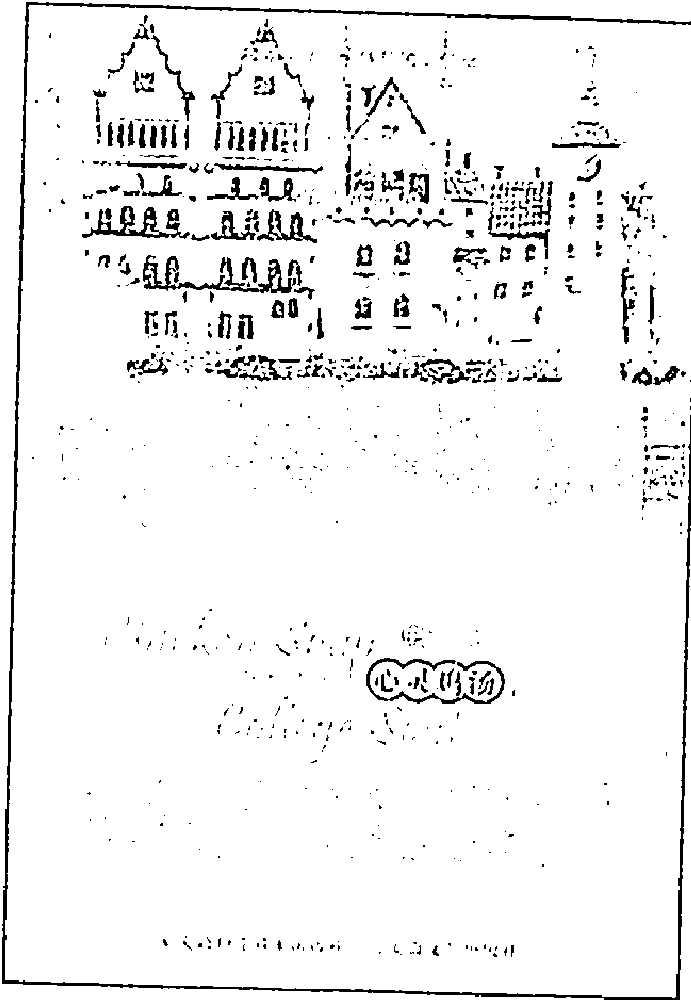

# 内容简介：

这本书里写满了趣闻逸事，是有关从家庭到大学、从青少年到成年人的艰难过渡。有的故事写的是富于激励精神的教授和出色的学生；有的故事会让你们欢笑；有的故事包含着当事人的智慧。

大学几年里充满着令人激动的挑战。有人说过，人生有两个阶段成长和发展得最多：五岁前和上大学期间。因此，在这个关键的人生转折点，重要的是记住：善待自己，尽可能用“鸡汤”滋养自己。

那么，开始读吧。一本我们真诚地献给你们的书。没有希望时，愿它能带给你们希望；最需要鼓励时，愿它能激发你们的勇气；愿它能提醒你们轻松对待世事，永远不要过于认真到忘记了欢笑。

## 魔方第五面 学业事业篇

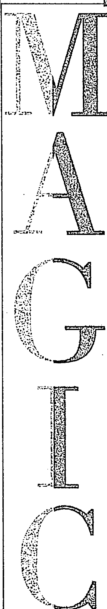

魅力失分 冥顽不灵 摩羯座的人相当固执，冥顽不灵，不懂得变通。

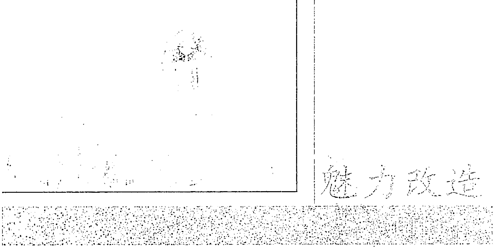

### 阿根廷香蕉

佚 名

犹太商人鲍洛奇早年在美国一个叫杜鲁茨城的最为繁华的街道替老板看摊卖水果，周围有众多的水果摊。这里车水马龙，人来人往，的确是一个经商的好地方，于是每个商人都想尽办法，争抢顾客，竞争十分激烈。

鲍洛奇的生意不错，他把其他摊位上的顾客也拉过来了，摊位前的顾客很多，忙得他不可开交。不料这时，却发生了一件事，差点使他刚刚红火起来的生意败落下去。正当鲍洛奇为自己的胜利而感到得意的时候，老板贮藏水果的冷冻厂发生了一场火灾。当消防人员赶来将大火扑灭时，十六箱香蕉已被大火烤得变成了土黄色，上面显现了不少的小黑点。老板把这些香蕉给了鲍洛奇，让他降价处理。

当时，普通香蕉每磅的售价是四美分，老板让鲍洛奇降价一半，以每磅两美分的价格出售，老板交代他，香蕉只要不浪费，即使价格再低一点也可以卖。鲍洛奇接过这些烤得黄黑的香蕉感到有说不出的苦。但老板交代他的任务就得完成，无奈的鲍洛奇只好把这些变质的香蕉，摆到了摊上。

尽管有一肚子的闷气，鲍洛奇还是尽职尽责地大声吆喝起来，不少顾客走到他的摊前，看到这种丑陋不堪的香蕉，摇着头走开了。鲍洛奇赶忙解释：“各位先生女士，你们看到的只是表面现象，虽然它们看起来很丑陋，但它们的味道很好，并且价格相当便宜，只是其他香蕉价格的一半。”不管他怎么说，顾客还是不想买这些难看的香蕉。

鲍洛奇见水果没有人买，感到很生气，坐下来把那些丑陋的香蕉检查了一遍。他掰下一只香蕉，剥开那黄中带黑的皮，然后放进嘴里。“是的，这些香蕉一点都没坏，相反，由于火烤的原因，这些香蕉的味道变得更好了。对了，我何不……”他在心里琢磨着，突然想到了一个不错的主意，他禁不住为此而微笑起来。

第二天一大早，鲍洛奇又开始了他的吆喝：“各位先生女士，早上好！我刚进口了一些阿根廷香蕉，正宗的南美风味，数量有限，机会难得，快来买呀！”很快，鲍洛奇的摊前就围满了人。众人不停地盯着这些黄中带黑的“阿根廷香蕉”，有些犹豫，因为价格有些贵，对于买不买，还拿不定主意。

看到这么多人围到自己的摊位前，鲍洛奇兴奋极了，接着他又喊道：“阿根廷香蕉，阿根廷香蕉！最新进口的。这种香蕉产在阿根廷靠海的地区，阳光充足，水分多，风味独特！我们公司好不容易批到的。”他把这些黑而丑陋的“阿根廷香蕉”吹得如何名气大，风味好，又费了多大的劲才搞到这么十几箱“最新品种”，说得天花乱坠。

当人们半信半疑的时候，鲍洛奇看见了一位穿着得体的小姐，于是不失时机地问：“请问您以前尝过这种‘阿根廷香蕉’吗？”这位小姐在摊位前看了很长时间，鲍洛奇早已注意到她了。她的眼睛好奇地盯着这些香蕉已经很久了，看那样子确实想买，只是还没有最后拿定主意。鲍洛奇决定从她身上打开突破口。

“我以前从来没有尝过这种香蕉。这些香蕉很有意思，就是有点黑。”小姐说。

### 魅力星座智慧书之摩羯座

“这正是它们的独特之处，否则的话，它们也就不叫‘阿根廷香蕉’了。你见过鹌鹑蛋吗？鹌鹑蛋也是带有黑点，但是鹌鹑蛋却特别好吃，不是吗？”鲍洛奇唾沫飞溅地说，“请您尝尝，您从来没有尝过这种风味如此独特的香蕉，我敢保证！”接着马上剥了一只香蕉递到小姐的手里，小姐接过吃了一口。

鲍洛奇不失时机地问：“味道怎么样，是不是非常独特？”

“嗯，味道确实不错。我买八磅。”小姐说。

“这样美味的阿根廷香蕉只卖十美分一磅，已经是最便宜的啦。我们公司好不容易弄到这么一点货，大家难道不想尝尝吗？错过机会您想买就买不到了。”鲍洛奇大声吆喝起来。

由于那位小姐已经带头买了，而且说味道很好，再加上鲍洛奇的鼓动，大家不再犹豫，纷纷掏出钱来，想尝尝这种“进口香蕉”的味道。于是你来五磅，他来三磅，很快，十六箱被大火烤过的香蕉竟然以高出市价一倍的价钱全卖出去了。有许多慕名来买“进口香蕉”的人因没有买到失望而归，倍感遗憾。

> **魅力提示：**
社会的竞争是无情的，当自己身处不利境地时，要懂得变通，只有这样，才能够化不利为有利。

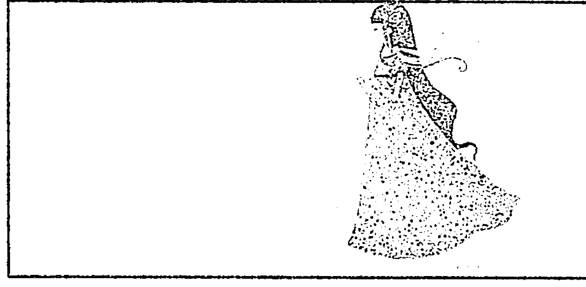

### 其实生活很自在

佚名

男人跟女人都很喜欢在自己的人生设一个坐标，比如说：我25岁一定要结婚，26岁一定生孩子，30岁时一定要一男一女，31岁的时候一定要有房子，所以很多决定就很草率。

如果刚开始你找的那个人就不对，往后再怎么努力都不对；有时候，我们常常会觉得婚结了，所有问题就没了，那如果结了婚还有问题，就赶快把小孩生一生，其实你的问题在这个阶段没解决，在下个阶段只会变大；你对未来不用期待太多。

期待太多，老实说挫折感会很深，不如看看你现在做什么事情，会让你觉得很自在，吸收到很多的东西，那个时候你才会觉得人生真的很充实。

> **魅力提示：**

人生不用按一个特定的轨迹去发展，人要懂得顺势而变，不应冥顽不灵。

# 魅力改造

### 鸭子与狐狸

劳伯尔

每天早晨，鸭姐妹俩总是顺着大路摇摇摆摆地走向池塘去游泳。

“这条路真好，” 鸭姐姐说，“但是我在想，我们是不是另外找一条路走走。还有许多路都能通向池塘去呢。”

“不，不，我不同意，我实在不想找另一条新的路。这条路我已经走惯了，很舒服。” 鸭妹妹说。

一天早上，鸭姐妹看见一只狐狸坐在路边的一个篱笆上。“早晨好，鸭小姐。你们是去池塘游泳的吧？”

“唉，对啊。我们每天都要走这条路呢！” 鸭姐妹说。

“真的吗？有意思。” 说着，那狐狸露出尖尖的牙齿笑了笑。

第二天清晨，鸭姐姐说：“如果我们今天还是走那条老路的话，我们一定会遇到那只狐狸的。我不喜欢看到他那副嘴脸。今天我们一定得找条新的路走。”

“你真是傻透了，那只狐狸看上去可像一位绅士啦，昨天他还朝我们笑呢！” 鸭妹妹笑着说，就这样，鸭姐妹俩还是沿着老路摇摇摆摆地向池塘走去。果然，那只狐狸仍旧坐在篱笆上，手里还拿着一只麻袋。

“可爱的小姐们，我正在迎候你们呢。你们果然没有让我白等，我真是太高兴了。” 说着，他打开麻袋凶猛地扑向鸭姐妹。鸭姐妹呷呷呷地喊叫着，扑闪着翅膀飞也似地逃回了家，赶紧把门闩上。

第三天，为了安定一下情绪，鸭姐妹呆在家里没有出去。

第四天，她们小心谨慎地找到了另外一条能安然无恙地到池塘去游泳的路。

> **魅力提示：**
做事不能太固执，有时改变一下习惯是十分有益的。

### 魅力星座智慧书之摩羯座

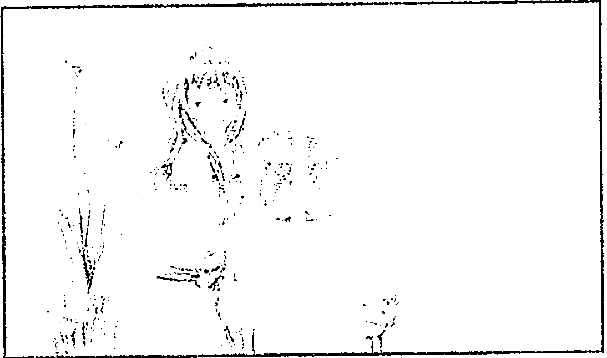

### 郑人买鞋

李异鸣

从前，有个郑国人，想到集市上去买一双鞋子。他本来应该到集市上按自己的脚的大小买鞋，穿上合适就买，不合适就继续换着试，直到找到合适的为止。但是他却先用一根稻草量了量自己的脚，作为尺码。他做好尺码后，就随手将稻草放在座位上了。临走时，却把尺码丢在家里，忘记带去。

他到了集市上，集市上很热闹。他走进一家鞋店，店主把一双双鞋子摆在郑人面前供他挑选。他看见一双鞋子，觉得很中意，于是便准备把尺码拿出来比，可是一摸口袋，发现尺码没有带来，忙对店主说：“对不起，我忘记了带尺码来，不知道该买多大的鞋子，让我赶回去把尺码拿来再买。”说罢，拔脚就跑。

他的家离集市很远，这样一来一往，宝贵的时间都浪费在了路上。等他从家里拿了尺码再到集市上时，鞋店已关门打烊了。结果他白忙活了一天，也没有买到鞋子。他埋怨鞋店不为顾客着想，又着急又失望，独自在路边唉声叹气。

> 有路人从旁边经过，知道了这事后，就提醒他：“你为自己买鞋子，可以直接穿上试试大小，还要什么尺码呢？”

> 买鞋的人回答说：“我宁肯相信尺码，也不相信自己的脚！”

路人听到他的话，都忍不住笑了起来。

## 魅力提示：

> 遇事如果不从实际出发，思想僵化，不知变通，是十分愚蠢可笑的。

# 魅力链接

- 书名：你为什么越忙越穷
- 作者：张静宇 著
- 出版社：北京理工大学出版社
- 出版时间：2009-01-01
- 印刷时间：2009-01-01
- 开本：16开
- ISBN：9787564020132
- 包装：平装

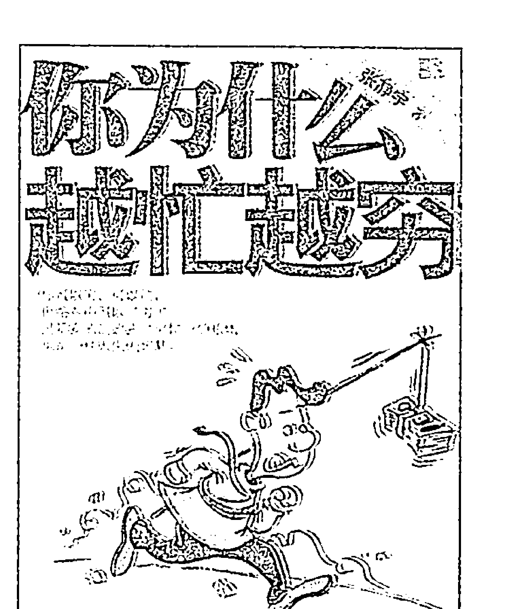

# 内容简介：

你可以穷，可以忙，但绝不可以“穷忙”。灵活变通是改变“穷忙”的根本，也是一种人生大智慧。

“穷忙族”总是在勤勤恳恳地工作，但工作似乎没有尽头，总是有忙不完的事情；“富闲人”看起来总是很悠闲，可是财富却越来越多，事业越来越辉煌。怎样规划自己的职业，怎样打理自己的财富，怎样留出自己过冬的粮食以应对人生的种种突发事件和困境，本书旨在带领你成为“富闲人”。

## 魔方第五面
学业事业篇

# M
A
G
I
C

魅力失分
墨守成规
摩羯座的人保守而本分，一旦脱离常规，立刻会感到恐慌。

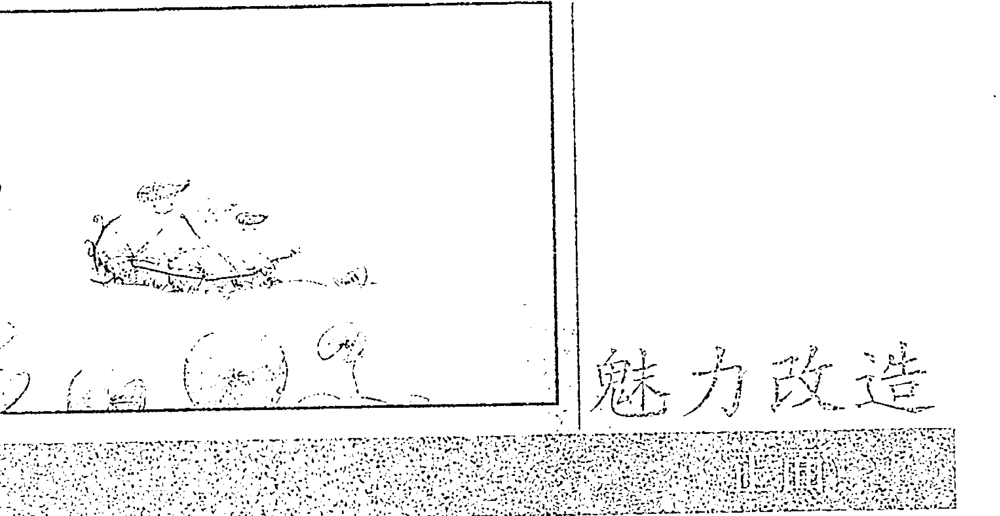

个性EQ提升

## 戴尔的成功

佚名

戴尔在少年时期就想象力丰富，奇思妙想迭出。

读高三时，戴尔经常听到同学们谈论想买电脑，但由于售价太高，许多人买不起。戴尔心想：“经销商的经营成本并不高，为什么要让他们赚那么高的利润？”一般人想到这儿，大都会停留在诅咒经销商上，而不再深入下去了，但戴尔继续想到：“为什么不由制造商把电脑直接卖给用户呢？我如果把制造商的电脑以比商场上便宜的价格直接卖给用户，肯定会受欢迎。”

戴尔知道：IBM公司规定，经销商每月必须提取一定数额的个人电脑，而多数经销商都无法把这些货全部卖掉；而如果存货积压太多，经销商会损失很大。于是他找到经销商，想买他们的存货。他们为了周转资金，当然是求之不得，于是按成本价把积压的电脑卖给了戴尔。戴尔把电脑拉回宿舍，加装配件，改进性能。这些经过改装的电脑，价格便宜、性能先进，很受欢迎。戴尔见市场需求巨大，于是在当地刊登广告，以市场零售价的八五折推出他那些改装过的电脑。不久，许多商业机构、医生诊所和律师事务所都成了他的顾客。

由于市场需求量大，戴尔每月已能赚五万美元。在学业与创业之间，戴尔陷入了两难境地。戴尔不愿错过这千载难逢的机遇，他决定选择退学。经过和父母协商，父母同意戴尔在暑假试办一家电脑公司，如果办得不成功，到九月就要回校去读书。

得到父亲允许后，戴尔拿出全部积蓄创办了戴尔电脑公司。戴尔仍然专门直销经他改装的IBM的个人电脑，第一个月营业额便达十八万美元。高中毕业的时候，戴尔的公司每年营业额已达七千万美元。后来，戴尔停止出售改装电脑，转为自行设计、生产和销售自己的电脑。

> 魅力提示：

想象力绝不是小说家的专利，从事任何领域的工作都需要想象力。超出常人的想象力，正是许多杰出成就的源头所在。那些只会墨守成规的人又岂能发挥出强大的想象力呢。

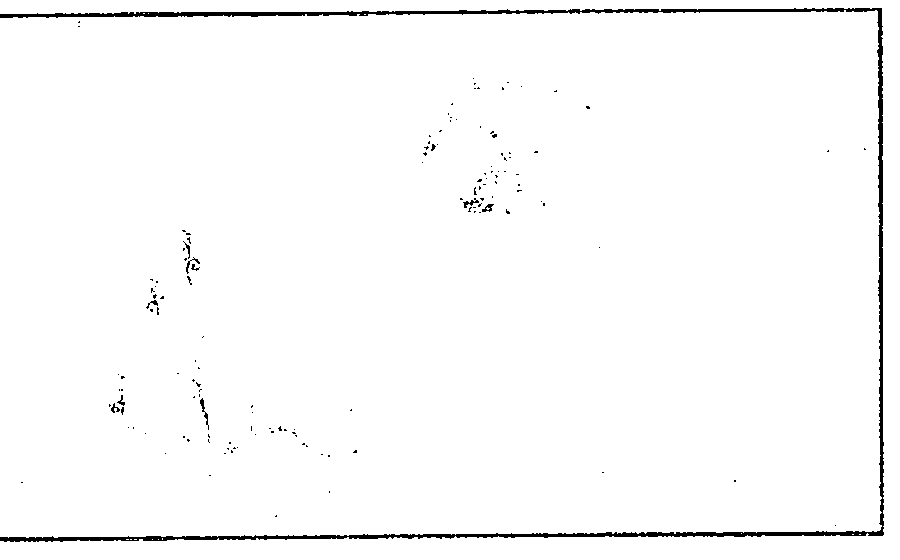

## 反其道而行

佚名

大雄井上是位刚刚从一家大保险公司中分离出来的一家保险公司的老板。由于竞争太激烈，他的生意并不如想象中的那么好。这几天，他一直愁眉不展。

一个风和日丽的早上，他的妻子实在不愿看到他再这样难受下去，就约他出去散散步。

走着，走着，大雄觉得不对了，这是什么地方啊？我以前怎么从来就没有来过这里啊？

“这不就在咱们家门口吗？你到底是怎么啦？天天路过的，你怎么都忘光啦？”

“噢！我以前都是从那边走，从来就没有从这边走过，今天只不过走了一个反圈子——走！快回家！”大雄好像想起了什么，匆匆地向家中走去。

一个星期后，大雄的保险公司推出了一个新的险种，他在广告上是这么说的：“敝公司成立保险年金，凡投保者，一次交付一千万元，三年后，投保者可每月凭保单亲自到本公司领取十万元的年金和两万元的利息。本公司以上帝的仁慈之心，祝诸君健康长寿！”

就这么一个小广告，大雄的保险公司的投保额在几个月里就翻了几番。

已经心情开朗的大雄搂住妻子说：“以前，我每天早上在家门口散步，都是从左到右。那天早上，你领着我从右到左走了一圈，我竟然发现了以前没有发现的一直就存在的东西。这使我恍然大悟。反其道而行之，便会有一番新天地。这就是那天早上我悟出的道理。我们的生命保险机制，向来都是投保者活着时每月交一定定金，死后由家属一次性领取。我当时就想，我们为什么不反过来呢？如果我们先交一定的定金，过一段时间后，再让他们按月领取‘健康年金’，这样，投保者的心情不是就大不一样了吗？他们肯定会纷纷到我这里来投保的。所以，我就写了那个广告，效果果然挺好。这几个月，我的营业额竟达到了前几个月总和的几倍。”

## 魅力提示：

人的头脑一旦囿于固定模式，往往很难有新的突破，这时，不妨尝试用一下反向思维。在进行反向思维时，不要太盲目，反向思维只是一种思维方法，行不行，还要靠实践来检验。

## 想尽办法

佚名

有一次，美国大发明家爱迪生让他的助手测量一个梨形玻璃器皿的容积。助手按常规的方法，对器皿的长、宽、高等进行反复测量，还在纸上画了许多图，但由于这个玻璃器皿的形状很奇特，结果费了好大劲也无法算出它的容积来。这位助手一筹莫展，满脸无奈地来找爱迪生。见到爱迪生，助手不好意思地说：“我想尽了办法，可是怎么也测量不出来。”

“你确信自己想尽了所有办法？”爱迪生有意“逼”他。

“先生，请您相信我是努力的。”助手有些面红耳赤。

“当然，这我完全相信。”爱迪生说，“只是我认为你并未用尽所有的办法。”

接着，爱迪生把器皿装满水，再将水倒入量杯，那个形状奇特的梨形器皿的容积很快就算出来了。

> > **魅力提示：**
>
> 心理学上有定势思维和非定势思维的概念。所谓定势思维，就是按照习惯了的在过去也被证明是成功的逻辑路径去思考；非定势思维则与此相对。突破和创新往往来自后者。

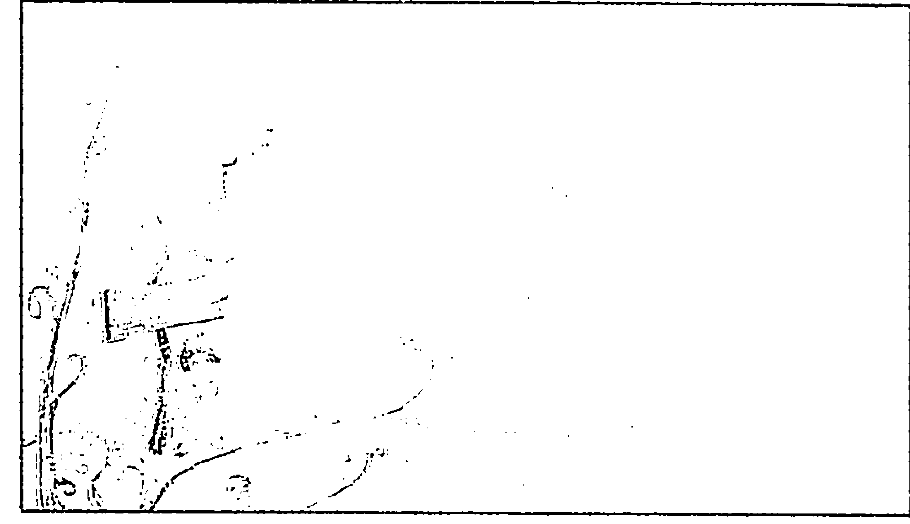

## 一次特别的测验

佚名

课堂上正在进行一次数学测验。试卷发下来后，一个自负的学生大致浏览了一下，除了试卷的最上头印有一行“请先看完所有题目后再开始作答”之外，有一百道选择题。

这些题目他最多只需三十分钟就能完成，他提笔开始作答。

两分钟后，有两位同学笑着交了卷。这个聪明的学生在心底暗笑：“又是两个交白卷的家伙。”紧接着，好几个同学都陆续交卷，不一会儿，教室里只剩下包括他在内为数不多的几个同学。他一见这样，心里慌了，赶紧加快答题的速度。当他做到第五十八题时，题目上竟然写着：“本次考试不需作答，只需写上姓名便得满分，答一题，无论对错扣一分。”

聪明的学生不知所云，想举手询问监考老师，却见其他未交卷的几位同学也在四处张望。他陡然想起卷首的那句话，拍着脑袋后悔自己答题太快。

## 魅力提示：
世界在变，一切都在变。这样的测验也许只是一个小游戏罢了，但在如今的现实生活中类似于此的事情比比皆是。如果因循守旧按照老一套的经验处事，而不接受新的“游戏”规则，往往是很难行得通的。

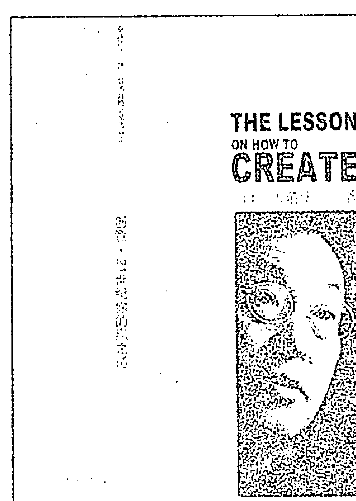

# 魅力链接

| 项目 | 内容 |
|------|------|
| 书名 | 创意的构想 |
| 作者 | (日) 大前研一 著, 庄娜 译 |
| 出版社 | 中信出版社 |
| 出版时间 | 2007-06-01 |
| 印刷时间 | 2007-06-01 |
| 开本 | 大32开 |
| ISBN | 9787508608754 |
| 包装 | 平装 |

# 内容简介：

在“无国界的世界”，墨守成规者没有栖身之地，只有不断超越自己才能适应环境，而创意，正是你在二十一世纪的“新大陆”上生存的利器。

真正的专业人士永远创意不绝。全球管理大师、日本战略之父大前研一现身说法，通过阐释构思卓越创意的六大技巧，对于怎样看待二十一世纪的经济与社会环境，培养构思创意的技能，提供了不拘于陈规的新观点。

# 魔力第五面 学业事业篇

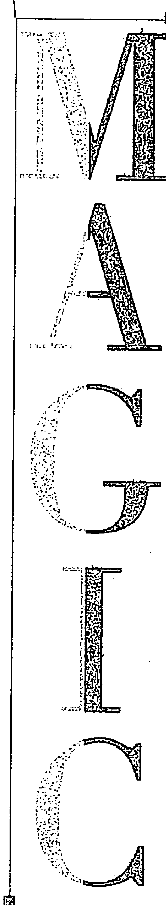

魅力失分
不能随机应变
摩羯座的人喜欢事先把事情计划好，遇到事情的时候不能随机应变。

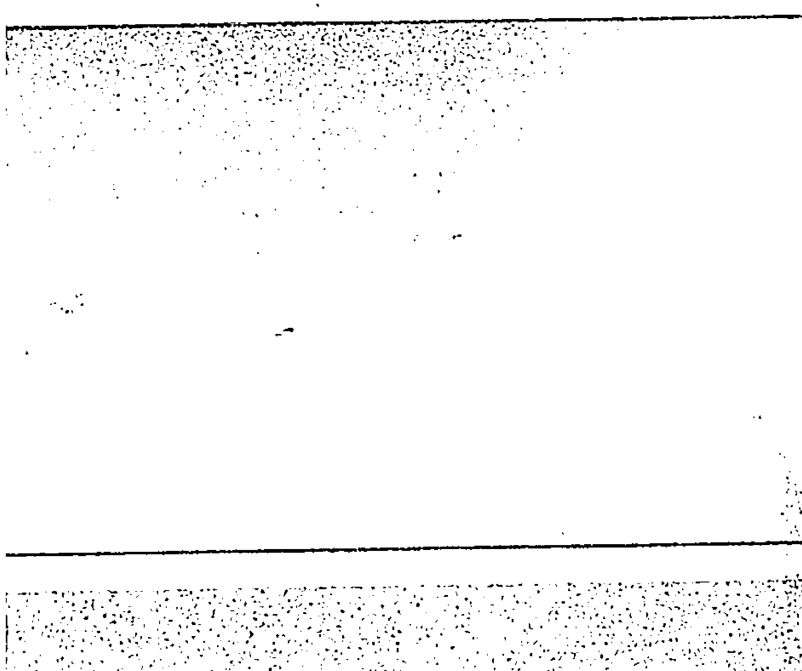

# 魅力改造

## 条条大路通罗马

王莉萍

伊尔莎年轻的时候，有一次，父亲带她登上了罗马一座教堂高高的塔顶。

> > '往下瞧瞧吧，伊尔莎！'父亲说道。

伊尔莎鼓足勇气朝脚底看去，只见星罗棋布的村庄环抱着罗马，如蛛网般交叉弯曲的街道，一条条通往罗马广场。

> > '好好瞧瞧吧，亲爱的孩子，'伊尔莎的父亲温柔地说，'通往广场的路不止一条。生活也是这样。假如你发现走这条路达不到目的地，你就走另一条路试试！'

伊尔莎的生活目标是成为一名时装设计师。然而，在她向这个目标前进了一小段路之后，就发现此路不通。伊尔莎想起了父亲的话，决定换一条前进的道路。

伊尔莎来到了巴黎这个全世界的时装中心。有一天，她碰巧遇到一位朋友，这位朋友穿着一件非常漂亮的毛绒衣，颜色朴素，但编织得极其巧妙。通过朋友介绍，伊尔莎知道编织这位毛衣的太太名叫维黛安，在她的出生地美国，她学会了这种针织法。

伊尔莎突然灵机一动，想出了一种更新颖的毛线衣的设计。接着，一个更大胆的念头涌进了她的脑中：为什么不利用父亲的商号开一家时装店，自己设计、制作和出售时装呢？可以先从毛线衣入手嘛！

于是，伊尔莎画了一张黑白蝴蝶花纹的毛线衣设计图，请维黛安太太先织一件。织好的毛衣漂亮极了。伊尔莎穿上这件毛线衣，参加了一个令时装商人瞩目的午宴，结果纽约一家大商场的代表立即定购了四十件这样的毛线衣，并要求两星期内交货。伊尔莎愉快地接受了。

> “你要知道，编织这么一件毛线衣，我几乎要花上整整一星期的时间啊！”维黛安太太说，“两星期要四十件？这根本不可能。”

眼看胜利在望，此路又不通了！伊尔莎沮丧至极，垂头丧气地告辞了。走到半路上，她猛然止步，心想：必定另有出路。这种毛线衣虽然需要特殊技能，但可以肯定，在巴黎，一定还会有别的美国妇女懂得编织的。

伊尔莎连忙赶回维黛安太太家，向她说出了自己的想法。维黛安太太觉得有道理，并表示乐意协助。伊尔莎和维黛安太太好像侦探一样，调查了住在巴黎的每一位美国人。通过朋友们的辗转介绍，她们终于找到了二十位懂得这种特殊针织法的美国妇女。

两个星期以后，四十件毛线衣按时交货了，从伊尔莎新开的时装店，装上了开往美国的货轮。此后，一条装满时装和香水的河流，从伊尔莎的时装店里源源不断地流出来了。

## 魅力提示：
成功的方法不仅仅在于坚韧的奋斗，更应该发挥自己的想象力与创造力，因为成功的道路并不只是一条。一条路行不通，积极、灵活地寻找另一条通往成功的路，才可以将自己立于不败之地。记住：通往罗马的路不止一条。同样，成功的路也是如此。

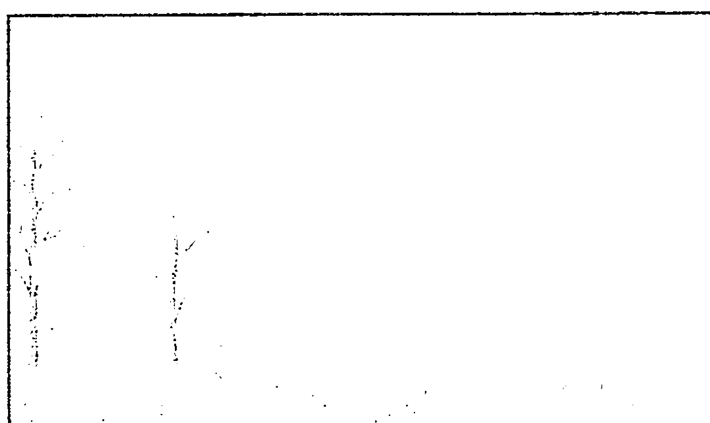

# 巧舌如簧

蝙蝠很不小心地闯进了黄鼠狼的家，黄鼠狼以为是一只老鼠，就立即想把它吃掉。

蝙蝠辩解道：“我不是老鼠，您见过有翅膀的老鼠吗？我和它们一点关系都没有，上帝给了一对奇妙的翅膀，使我能在空中飞翔。况且我们家还有好几个孩子需要我的抚养，你是不应该吃掉我的！”

蝙蝠说得声泪俱下，黄鼠狼感动了就放了它。

倒霉的蝙蝠在两天后又是一不小心，闯进了另一只黄鼠狼的家里。

这一次这只黄鼠狼以为它是一只鸟，也恨不得马上吃掉它。蝙蝠又遭遇了生死的考验，它不得不再次为自己的生命辩解：“亲爱的夫人，你是不能够吃掉我的，首先我不是一只鸟，您见过有哪只鸟没有羽毛吗？我只是一只可怜的小老鼠，你应该放掉我！”

蝙蝠就这样两次保全了自己的生命。

## 魅力提示：
身处劣势的蝙蝠却能凭借自己灵活的头脑一次次地躲过危机，随机应变就是指的这个。

# 富翁的继承权

佚名

有一个富翁，他有两个儿子。富翁年纪大了，可是他不知道让哪个儿子来继承他的家业。他冥思苦想，想到自己白手起家的青年时代，他忽然灵机一动，找到了考验他们的好办法。

他把两个儿子带到很远的一座城市，交给他俩一人一串钥匙和一匹快马，让他们自己回家，谁先到家，并打开自己对应的门进到家里，谁就将得到继承权。

兄弟俩策马急奔，几乎同时到家。但是面对紧锁的大门，两个人都犯愁了。

哥哥拿着一串钥匙，却总也找不到最合适的那一把，锁依然紧锁着；弟弟匆匆忙忙，等到了家门口，才发现钥匙不知道什么时候掉在了半路。

兄弟俩急得满头大汗。

弟弟突然想到了什么，很快找来一块石头，几下就砸开了自己面前那把锁。他顺利地进去了。

自然，继承权落在了弟弟的手里。

## 魅力提示：遇到难题时，要急中生智，灵活多变，只要答案是正确的，途径并不重要。

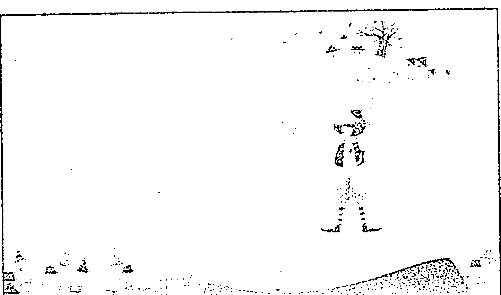

# 员外的儿子

佚名

从前有个员外，很有学问，可是却有个笨儿子。笨儿子和别人谈话的时候，常常闹出笑话。

一天，员外收到岳父捎来的口信，说近日要前来探望。可他已经答应了去跟寺里的住持下棋，于是把儿子叫到身边，怕他又信口雌黄，便在出门前事先教儿子如何回答外公的问题，交待他一定要牢牢记住。

问：你家门前的石狮是哪位石匠雕的？
答：小小畜生何劳询问。
问：令尊何往？
答：上山与名僧下棋。
问：何时归来？
答：早则日暮，迟则与僧同宿。
问：壁上所挂何画？
答：唐朝古画。
问：案上所置何物？
答：传家之宝，一代一个。

父亲走后，笨儿子不停地背诵着父亲教给自己的回答，很快便烂熟于心。
过了一日，员外的岳父如期而至。

问：令尊大人呢？
答：小小畜生何劳询问。
问：令堂大人呢？
答：上山与名僧下棋。
问：何时归来？
答：早则日暮，迟则与僧同宿。
问：你这是讲的什么话呀？
答：这是唐朝古画。
怒道：你真可笑！简直是个活宝。
答：这是传家之宝，一代一个！

## 魅力提示：
现实生活中虽没有如此可笑的笑话，但也不乏如此之类的人。他们不笨，不傻，甚至满腹经纶，却只是一味地生搬硬套，不懂得变通，灵活运用，往往难成大业。

# /魅力星座智慧书之摩羯座

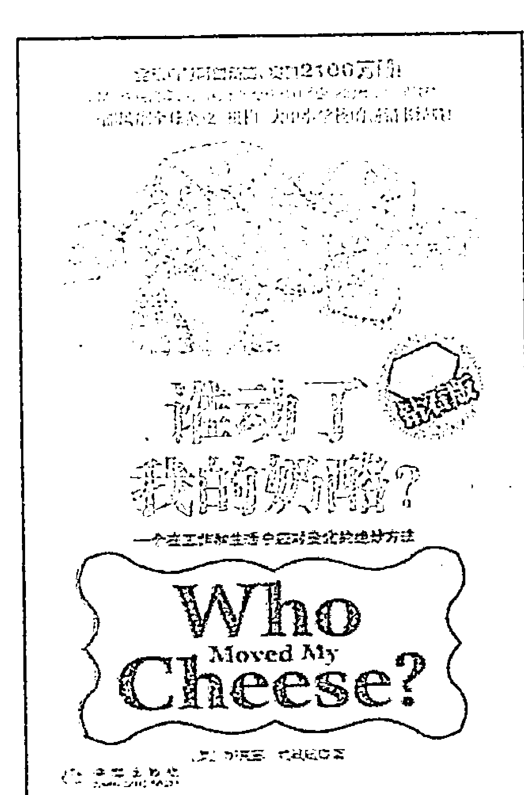

# 魅力链接

- 书名：谁动了我的奶酪？
- 作者：（美）约翰逊 著，吴立俊，罗琳 译
- 出版社：中信出版社
- 出版时间：2009-11-01
- 印刷时间：2009-11-01
- 开本：大32开
- ISBN：9787508617541
- 包装：精装

# 内容简介：

未来，变化是唯一的不变。不改变，就会被瞬息万变的未来所淘汰。
懂得随机应变并享受变化的你，才是未来最受青睐的人。
在变化面前，成长中的你应当如何做出正确的选择？是像匆匆一样取下挂在脖子上的鞋子迅速出发？还是像嗅嗅那样经常能嗅出奶酪变质的味道？或者像唧唧发现自身的问题之后敢于自嘲，勇敢面对变化的现实？ 还是像哼哼一样，止步于自己的幻想和固执中？

## 魔方第五面
学业事业篇


> ## 魅力失分
### 态度过于严谨
摩羯座的人做事的态度过于严谨，会对偷懒的人发脾气，不愿接近做事马虎的人。

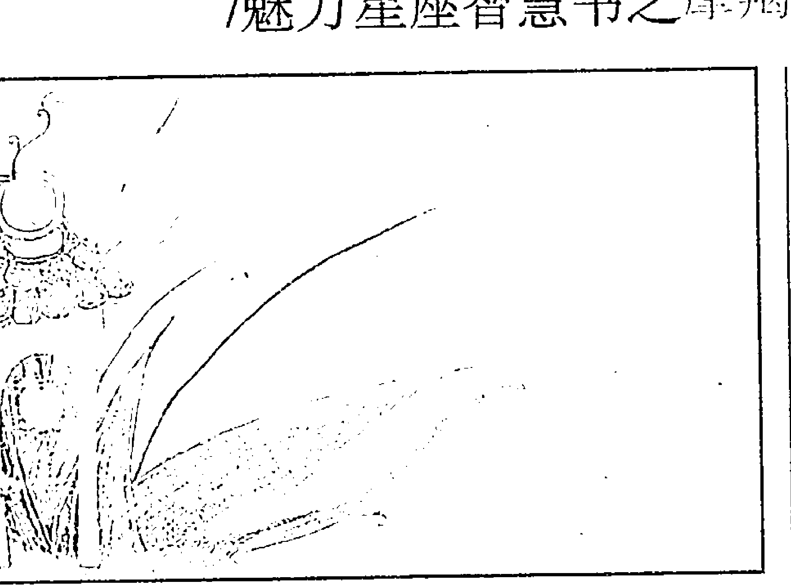

# 魅力改造

配画

# 懒惰的员工

佚名

在渥太华有一个很豪华的宾馆，里面员工很多。有的员工每天都十分忙碌，像是有永远都干不完的活；也有些员工每天却显得很悠闲。

这个宾馆的老板是一个推崇“懒惰”哲学的犹太人。宾馆业务虽然繁忙，他却整天逍遥自在。只要是别人能替他干的事情他都吩咐别人去做，他绝不亲躬。

到了年终的时候，他让宾馆经理分别评选出十名最勤快和十名最“懒惰”的员工。

老板叫经理把十名“懒惰”的员工带到他的办公室。这些员工心里七上八下，心想老板肯定会让我们滚蛋。但是他们万万没想到，当他们进门后老板却对他们说道：“恭喜各位被评为本宾馆最优秀的员工。”

他们一个个被弄得丈二和尚摸不着头脑。看着他们一个个目瞪口呆的表情，犹太人笑着慢慢解释道：“据我观察，你们平时看上去没什么事情做，显得很懒。你们总是习惯一次就把餐具送到餐桌上，一次就把客人的房间收拾干净……一次就把工作干完，讨厌多走半步路，讨厌做第二次。因而在别人眼里你们整天闲着，在偷懒。但依我看，你们却是用最快的速度和最好的质量完成你们的工作，‘懒’得不愿意把精力浪费在没必要的重复上。而那些勤快的员工呢，平时见他们整天忙忙碌碌，一件事情往往要跑上好几趟，从来不在乎把力气花在多余的动作上，用更多的时间来完成和你们所做的一样的工作，效果并不一定越好。”

有人说二十世纪让人变得最懒惰的发明就是电视遥控。也许正因为人的“懒惰”才使电视遥控得以出现。

## 魅力提示：

懒惰虽然是一种不好的习惯，但它也是创造的动力。巧于懒惰的人，脑海里常常闪耀着创造的火花。

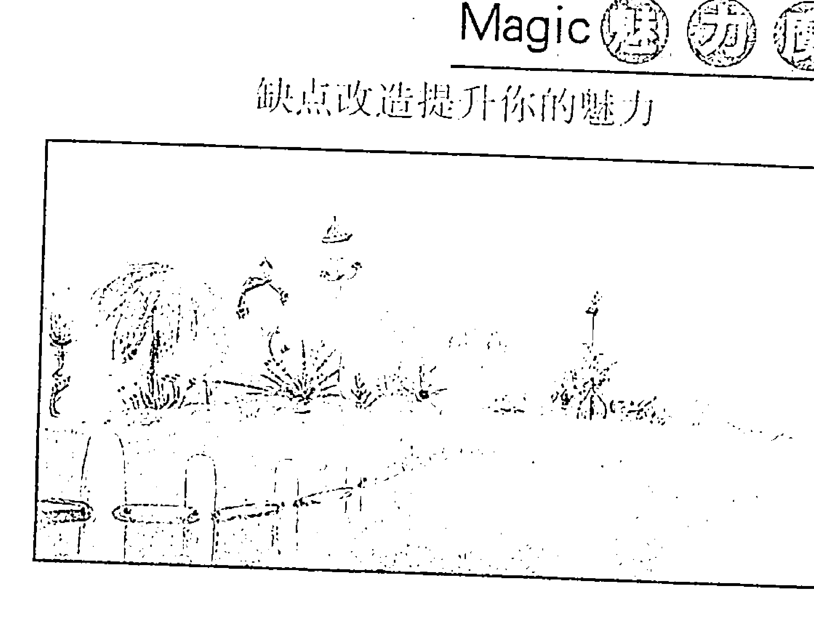

## 小和尚买油

佚名

山中的庙里，有一个小和尚被要求去买食用油。在离开前，庙里的厨师交给他一个大碗，并严厉地警告：“你一定要小心，我们最近财务状况不是很理想，你不可以把油洒出来。”

小和尚答应后，下山来到厨师指定的店里买油。在上山回庙的路上，他想到厨师凶恶的表情，愈想愈觉得紧张。他小心翼翼地端着装满油的大碗，一步一步地走在山路上，不敢左顾右盼。不幸的是，他在快到庙门口时，由于没有向前看路，结果踩到了一个洞。虽然没有摔跤，却洒掉三分之一的油。小和尚非常懊恼，而且紧张到手都开始发抖，无法把碗端稳。回到庙里时，碗中的油就只剩一半了。厨师拿到装油的碗时，非常生气，指着小和尚大骂：“你这个笨蛋！我不是说要小心吗？为什么还是浪费这么多油，真是气死我了！”小和尚听了很难过。另外一位老和尚听到了，就跑来问是怎么一回事。了解以后，他就去安抚厨师的情绪，并私下对小和尚说：“我再派你去买一次油。这次我要你在回来的途中，多观察你周围的人事物，并且需要跟我做一个报告。”

小和尚又勉强上路了。在回来的途中，小和尚发现其实山路上的风景真是美。远方看得到雄伟的山峰，又有农夫在梯田上耕种。走不久，又看到一群小孩子在路边的空地上玩得很开心，而且还有两位老先生在下棋。这样走看风景的情形下，不知不觉就回到庙里了。当小和尚把油交给厨师时，发现碗里的油装得满满的，一点都没有损失。

## 魅力提示：

> > 生活本应是轻松自然的！然而，奔波的人们却常常忘记这一点，时刻处于紧张状态，以至于做人做事缩手缩脚，放不开，反而导致失败。

# 没时间磨锯

龚平

在树林中有一个正在兴奋地锯树的人。
“你在干什么？”有人问他。
“你看不见吗？”锯树的人不耐烦地回答，“我要锯倒这棵树。”
“你看来已筋疲力尽了！”他大声说道，“你干了多久了？”
“五个小时了，”锯树人回答，“我是筋疲力尽了！这是件重活。”
“嗨，你为什么不停几分钟，把锯磨快？”他问，“我可以肯定这样做会使你锯得更快些。”
“我没有时间磨锯，”锯树人断然说，“我忙得哪有时间磨锯？”

> **魅力提示：**
> “磨刀不误砍柴工”，再紧再重的活儿，蛮干苦干不如巧干；学习工作再紧张也要注意劳逸结合，讲求效率。特别是在科技快速发展的今天，那些“忙得没时间磨锯”的人，实在是有些太笨了。

# 上了弦的弓

佚名

那次到内蒙古的一座小城旅游，看到一个店铺里面摆放的全都是弓箭，我感到很新奇，便在店里东瞧西看起来。店里的墙壁上挂着的几张弓都是上好了弦的，每张弓都绷得紧紧的；货架上面摆放的那些弓都未上弦，弓背就显得直一些。店主见我对弓箭很感兴趣，便从货架上拿起一张弓，递到我手上，说：“你仔细看一看，这可都是正儿八经的弓箭，价格也不贵。”

我问道：“这弓能把箭射多远？”

店主说道：“力气大的人，能射出一百多米，力气小一些的，也能射出七八十米。用铁铸的箭，一下子可以射死一只羊。”

我把玩着手里的那张弓，爱不释手，决定买两张带回去，一张自己留着玩，一张送给一位朋友。跟店主谈好价钱后，我让店主拿两张上好了弦的弓，店主认真地说：“这几张上了弦的弓挂在那儿主要是做样品的，一张弓上好了弦后，都是绷得紧紧的，长时间这样放着，弓背和弓弦的效用就差了，力道也减了，根本就射不出多远。买弓应买那没上弦的，现用现上弦就可以了。”

我笑着说：“我买这弓，也不是要用它射杀什么，就是为了玩，不必非得有实用价值。”

店主笑了笑，便摘下墙上的几张弓，放在我面前，又拿出几张未上弦的弓，叫我随便挑。挑了一阵，我就要了一张未上弦的和一张上好了弦的，未了，又买了一捆木制的箭。

回到家后，我找了一个空旷的地方，用两张弓试着射了几箭，那张现上弦的弓，一箭射出了九十多米，而先前上好了弦的那张弓，仅把箭射出了四十来米。

店主说的果然没有错，买弓就应该买那没上弦的。

> 魅力提示：
> 一个人要是始终绷紧神经，老是处于紧张状态，就会导致身心疲惫，在需要冲刺的关键时刻，往往有心无力，难免败下阵来。

# 魅力链接

书名：如何面对紧张的生活节奏
作者：（德）科内莉亚·蒂尔斯 著，石左虎 译
出版社：上海科学普及出版社
出版时间：2004-04-01
印刷时间：2004-04-01
ISBN：754272379
开本：32开

# 内容简介：

置身竞争激烈的社会，面对紧张的生活节奏，德国心理学博士科内莉亚·蒂尔斯对我们说：
为了健康，不要漫无目的地忙碌在空闲时间里，让自己从压力下解脱出来，爱惜自己的精力，掌握适应自己的生活节奏，知足者最美丽的结果是既不依赖于物质，也不依赖于成就。到处都可以听到很多人在抱怨他们身负的“压力”。他们在工作场所，在家里，甚至在休闲的时候都时常要考虑效率问题。他们的效率要求随着所处的职位的上升而提高，什么事情都要求做得尽善尽美，要在工作日期间创造出成果，这样才感觉到舒坦。但是，很多“效率”是不必要的，很多压力的烦恼甚至是自寻的，如果不摆脱它，还可能产生负面效应。相反地，人们需要的是更多的休闲时间，乐观的生活态度，少一些任务，多一些乐趣。足够的生活乐趣能使人们在工作日里精力充沛，这是最好的防止自己精力完全耗损的保护手段。

# 魔方第六面

## 形象礼仪篇

## 魅力失分

## 过于严肃

摩羯座的人在任何场合都会表现得过于严肃，他缺乏幽默感，总是成为尴尬和冷场的代表作。

# /魅力星座智慧书之摩羯座

# 一点隐瞒也没有

佚名

第二次世界大战期间，英国首相丘吉尔来到华盛顿会见当时的美国总统罗斯福，要求美国与他们共同抗击德国法西斯，并给予英国物资援助。
丘吉尔受到热情接待，被安排在白宫居住。
一天早晨，丘吉尔正躺在浴盆里，抽着他那特大号的雪茄烟。门开了，进来的正是罗斯福。丘吉尔大腹便便，肚皮露出水面……这两个首脑人物此刻相见，不免有些尴尬。此刻丘吉尔灵机一动，把烟头一扔，说：“总统先生，我这个英国首相在您面前，可真是开诚布公，一点隐瞒也没有啊。”
说完后，两个人哈哈大笑起来。随后，双方的会谈获得成功。

> 魅力提示：
> 幽默能使人发笑，但却是启人心智的笑，是智慧的闪现。我们不难看出故事中丘吉尔那句“一点隐瞒也没有”，不仅缓解了当时个人和国家的窘境，而且含有坦诚求助、彼此信任的含义。罗斯福又怎能感受不到呢？

# 洗脚之前先脱鞋

佚名

有一位叫阿芳的姑娘，虽然没有出众的容貌和窈窕的身材，但为人性格开朗、正直、幽默，许多人一旦同她交往几次，往往就被她的幽默所吸引，不知不觉地感受到她的魅力。

有一次，阿芳参加同学聚会，和同学们回忆着大学时代的美好生活。不料主人在招呼客人时，一不小心将一盆水打翻，水全洒在了阿芳的脚上，把她那双新鞋泼湿了。主人不知所措，显得十分尴尬。阿芳却不慌不忙地说：“一般正常情况是洗脚之前先脱鞋。”一句话，使满屋的人都笑了起来，难堪的气氛也一扫而空，大家更加佩服阿芳姑娘。

> **魅力提示：**
> 幽默往往使难堪的气氛一扫而空，让人轻松、愉快。幽默的人让人喜欢与之交往。想要人际关系更加融洽，适时幽上一默，你会受益一生。

# 魅力改造

## 弥勒和韦陀

去过庙的人都知道，一进庙门，首先是弥勒佛，笑脸迎客，而在他的北面，则是黑口黑脸的韦陀。但相传在很久以前，他们并不在同一个庙里，而是分别掌管不同的庙。

弥勒佛热情快乐，所以来他庙里的人非常多，但他什么都不在乎，丢三落四，从没有好好地管理账务，所以依然入不敷出。而韦陀虽然管账是一把好手，但成天阴着个脸，太过严肃，搞得去他那的人越来越少，最后香火断绝。

佛祖在查香火的时候发现了这个问题，就将他们俩放在同一个庙里，由弥勒佛负责公关，笑迎八方客，于是香火大旺。而韦陀铁面无私，锱铢必较，则让他负责财务，严格把关。在两人的分工合作下，庙里一派欣欣向荣景象。

> 魅力提示：
> 热情开朗是人际交往的润滑剂，成天阴着脸的人，总是拒人于千里之外，当然受人冷落。

佚名

# 微笑是一种力量

金从文

在进入这个家具公司之前，她先后干过不少工作——承包过农田，搞过运输，倒卖过袜子，还卖过雪糕。但是，都没有挣到钱。这是个离异的女人，没有年龄优势，长相不出众，学历也低。但是她必须到外面去谋生，孩子还小，两个人的生活重担都压在了她的身上。就是在这种情况下，她应聘到这家由新加坡人投资的家具公司当工人。

最初同意留下她的是那位领班，他是个复员军人，为人很正直。领班负责湿板库，她则在这个库里干些杂活。她很珍惜这份工作，除本职工作外，她还尽量干些力所能及的份外活。半年后她被转为正式工人，工资由500多元涨到800多元。

有一次，一个木材商因为木料验收问题和他们的老板发生了激烈争吵，最后甚至要撕破脸皮，法庭相见了。她在领班的推荐下，介入了这件事，最后把它处理得很完善。她也由此得到了老板的赏识，并获得了300元奖金。

这件事过去后，她很是高兴了一会儿，但马上又被悲观的现实拉回到愁眉苦脸的状态中——需要补充的是，她在这个家具公司工作了一年多时间，基本上就没有露过笑脸；而且，天天穿着那套老旧的工作服，即使是下了班也懒得脱下来，就更不要提打扮和化妆了。那段时间她的生活真是一团糟。

后来，领班荣升为公司的经理助理。在大家的眼中，他留下的领班这个位置非她莫属了，但是很意外的，经理助理提议让另外一个人来顶替他的空位。她有点疑惑地接受了这个结果。

一天，他把她叫去，对她说：“你怎么每天都没有笑容呢？”她说：“就咱们眼前这些活儿还需要笑吗？”他忽然显得严肃起来：“还真让你说对了，依我看，确实是干什么都需要笑。你要是会微笑，干同样的活儿，你就能比别人省不少力气；相反，如果天天绷着脸，要取得同样的成绩，你却要比别人多付出劳动，因为你的呆板损害了你的努力——我们之所以把领班这个位置安排给另外一个人，就是因为她比你乐观。有时候，微笑也是一种力量啊……”

身边的人讲出来的道理，有时候要比从书上读到的那些东西更容易让人接纳。此后她时刻都把他的这句话记在心上，她开始试着用微笑来面对身边的一切。许多老朋友见了她都说她跟以前不一样了，其实她的生活状态并没有变化，变化的是她的内心。

这是一个真实的故事。她现在过得怎么样已经不再重要，但我们可以想象的是，以后，她的生活轨道将沿着另外一个方向伸展……

> **魅力提示：**
> 经常给生活一个微笑，那么生活也同样会回报一个微笑给你。

# 魅力链接

- 书名：现代礼仪必备全书
- 作者：周理弘 编著
- 出版社：中国致公出版社
- 出版时间：2007-01-01
- 印刷时间：2007-01-01
- 开本：16开
- ISBN：9787801795342
- 包装：平装

# 内容简介：

礼仪是一个人的教养、风度和魅力的展现。良好的礼仪修养会帮助你凝聚人气、建立人脉，赢得丰厚的人际关系资源。

礼仪是一种潜在的资本，恰当地运用，能使你获得丰厚的成就。如果你不想成为一个默默无闻的人，如果你不想成为一个不受欢迎的人，如果你不想成为一个怀才不遇的人，礼仪就是你的必修课。

本书归纳、介绍了大量最新的交际技巧和礼仪规则，有针对性地分析、解答了生活、工作、交际中经常遇到的种种具体问题，内容涉及社交场合的礼仪礼节、招待宾客的要领、职场中的人际关系、商业营销中的礼仪、与外国人交往的礼仪知识……