# 驚世駭俗！世界史——黑暗歷史的咒語會

傳說中的活死人——巫毒教的瘋狂邪術
死靈法師的秘術——獻祭靈魂的惡魔召喚
撒旦崇拜——血腥的黑彌撒
陰寒惡毒的咒法——害人傷己的降頭術

詭異屍體復活術——湘西的趕屍祭術
不死的秘術——古埃及木乃伊重生術
女巫印記——邪惡的女巫入會儀式
雲南的行巫者——神秘蠱毒的煉製
神秘的藏傳佛教——剝肉刻骨的天葬之法

# 黑暗邪術

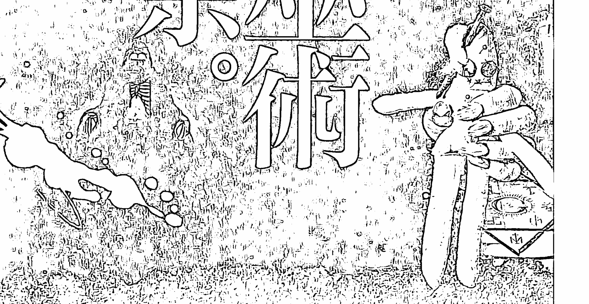

# 是神啟？還是詛咒？

警告：本書內容請勿親身嘗試！

黑夜中，巫術祭司所的咒語引的人體異變，泯滅人性的血咒發動，殘忍天良的巫術的趕屍術，陰森詭異的巫術的死靈術，血腥殘忍的血咒永生術，控制人心念念的蠱術……

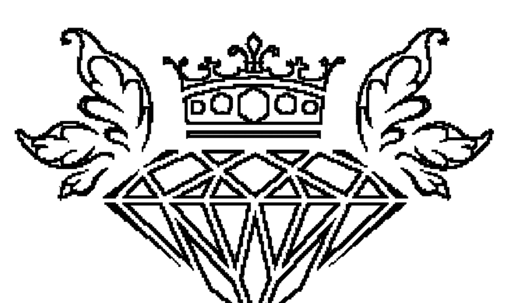

# St. Royal College
天使神秘学院

- ※ 专业占卜预测机构
- ※ 神秘学培训机构
- ※ 水晶能量研究中心
- ※ 神秘学资料库
- ※ 官方微信：strcdts
- ※ 微信公众平台：strc2011
- ※ 读书交流QQ群：
    - 占星塔罗占卜师交流群：814594478（加入密码：PDF）
    - 神秘学其他综合群：659338717（加入密码：PDF）

微信号：strcdts
天使神秘学院

天使神秘学院 院长QQ：715104687

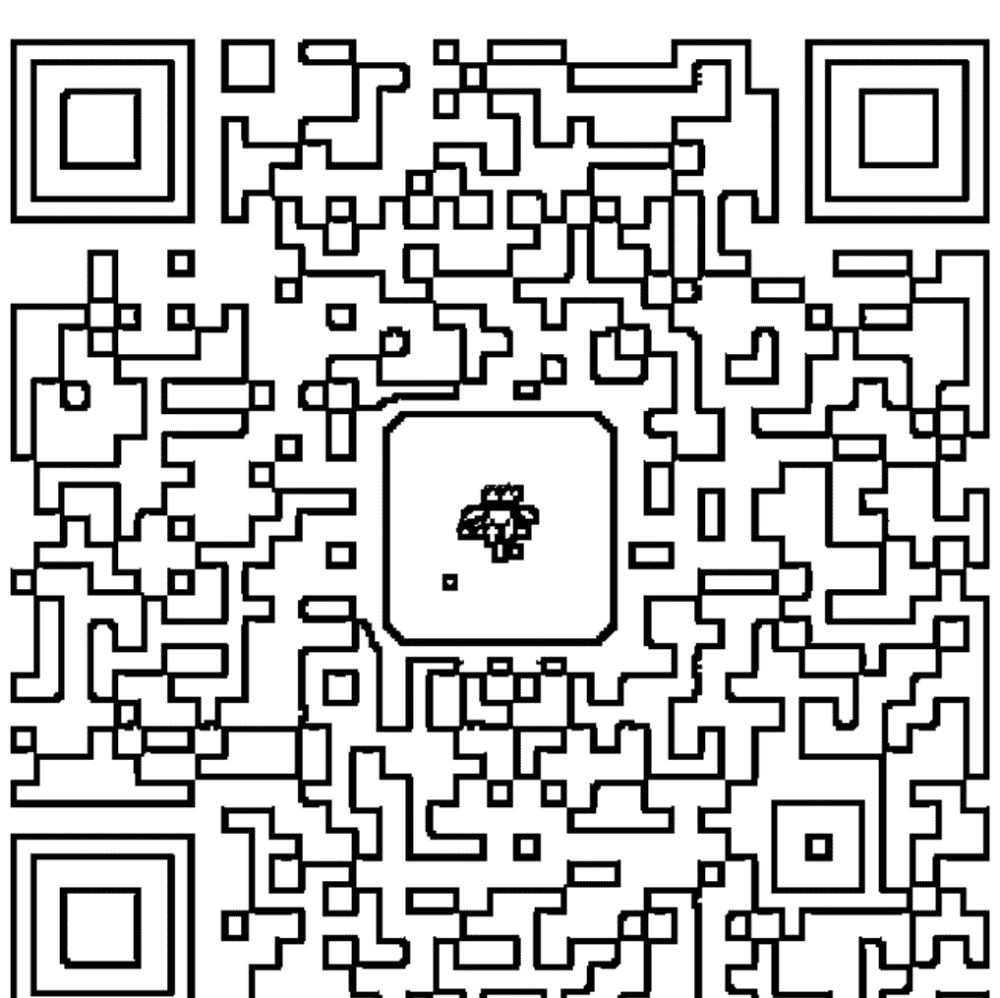

微信公众平台：strc2011

# 制作说明：

本书由《天使神秘学院》出重金从台湾购入的原版书籍扫描制作完成。为达到最好阅读效果，特地把原版书全部切开后，再经由专业扫描设备高精度扫描完成，并经过一张张的PS后期处理最终成书，其间花费大量的人力、物力以及时间，只为能给大家提供经济并优质的神秘学学习资料而努力。

本学院强力谴责某些机构和个人，把本学院花心血制作完成的电子书籍，包装后直接放在自家淘宝网上低价倾销的行为，以谋取不劳而获的经济利益。如果长此以往最终将无人愿意再为大家花心思制作电子书，那以后可能大家再无新书可读。

为让大家以后能够读到更多的好书，也为了本学院的良性发展。本学院恳请大家尽量做到如下几点：

- 一、尽量在本学院的网站购买电子书籍。
- 二、请勿用技术手段把电子书内的水印及加密去掉。
- 三、在收到电子书后小范围传阅即可，千万不要公开传播，更别挂到淘宝网上低价销售。

同时为答谢广大支持者，学院电子书将做如下调整：

- 一、学院会把一些早已收回制作成本的电子书折价销售。
- 二、最新制作的电子书籍会开放打印功能，大家购买后有条件的可自行打印成书。

天使神秘学院
2019年1月

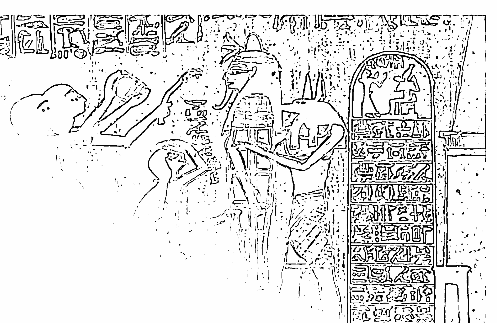

# 目錄

# 序言

# 第1章 最後的巫術樂園：美非洲平原深處的巫術巡禮

- 至尊巫術——古埃及木乃伊重生之術
- 巫術屠殺——烏干達的器官祭祀
- 巫毒教——海地共和國的神魔之咒
- 巫魔征服——非洲的「性」巫術
- 神之祭祀——躲在山谷裡的現代黑巫術市場

# 第2章 氤氲黑魔法。隐密在欧洲大陆的神秘传说

- 黑暗中的舞者——徘徊在十字街头的死灵法师
- 女巫之槌——在十字架前殒身的绝代女巫
- 魔鬼进行曲——站在天神背后的黑弥撒之舞
- 布达佩斯郊外的古堡——血腥玛莉的栖息之地
- 读心术的诅咒——吉卜赛人的前世今生
- 丛林隐秘者——传承上古的德鲁伊派

# 第3章 若隐若现的古老门派。亚洲大陆的不传之谜

- 一万种可能——降头术的故事
- 故土难弃——湘西「三邪」的消亡
- 天堂的路——藏传佛教里的小道
- 长生不老——流传千年的宫廷秘术
- 行色鬼屋——茅山道术的捉鬼传说

# 后记 一分为二：关于所有的恐怖巫术分类

# 序言

在翻開後面的章節前，請給我一分鐘時間，讓我喃喃自語般地與你聊一聊巫術與血祭的起源，讓這如黑色迷霧般的隱秘不要顯得那麼恐怖、張狂與懾人心魄。

故事開頭，也許是在五千年前，也許在六千年前，也許要從創世之初開始說起，亦或就是從遠古祖先們靈智初開的一剎那起，有一群人已經企圖擺脫茹毛飲血的同類，走上了尋求生命真相的道路。他們是人類中智慧最高的一群人，他們的視野越過了重重山巒，層層白雲，通往了走向天堂的征途。他們尋求人類靈魂的本源。他們相信，在這世界上一定有一種方法可以讓人變成神。他們是古老神話中的先知與智者，站在人類文明啟蒙的頂端，受到世人的膜拜與崇敬。他們給予自己一個神聖名字——「巫」。

在那個遠古蠻荒時代，人類於洪水中哀求上天，於山火中掙扎求存，於疫病中伏屍萬里，於凶獸爪牙之下血流成河。這個時候，「巫」就是神，他們解病痛、解迷惑、解災劫、解一切痛苦，使人類終於綿延流傳至今。然後，不知道從哪一天開始，這一切都改變了。

「黑巫術」出現了。染滿鮮血的頭顱、彌漫著腐朽氣味的屍肉、一擊致死的毒蟲與獰牙、傳說中陰魂不散的怨靈，組成了「黑巫術」的精髓。如果你要問，它究竟緣何而生？我想或許是人性中的貪婪與欲望。當慘遭橫禍的母親抱著渾身冰涼的兒子出現在「巫」面前時，她的眼淚帶來了由鮮血與枯骨構成的「死靈召喚術」；當身無分文、浪跡天涯的乞兒出現在「巫」面前時，十字街頭的惡魔被帶到了人間；當天長地久的情人背叛誓言時，憤怒的癡情人造就了「情」之咒怨。當各式各樣的貪婪與欲望出現的剎那，原本的美好心願被染上了暗黑色的光芒。我們說不清到底是惡魔借助「巫」的力量來到人間，還是「巫」為完成人性之欲而造就了魔。在那些屍骸與鮮血中，「黑巫術」成就了很多人的夢想，卻也讓很多人在暗無天日的時空中徘徊。

漫漫歷史旅途中，無數的人在黑巫術中尋求解脫，又無法解脫。無數的人成為神靈與魔鬼的祭品，長埋在暗無天日的地下。在黑巫術裡，有人活了下來；有人再也回不到從前。時光已流轉了數千年，可是那些古老的傳說依然堅固地活在世界的某個角落，在某篇報導的字裡行間中出現，在不經意的一個回眸間出現。

若你要問這些黑巫術究竟有沒有用？我想，沒有人能回答。除非……你已經試過了。

今天，我要與你一起打開這扇通往暗黑世界的大門，看看流傳千古的恐怖巫術與血祭。只是請你，不要嘗試，千萬不要嘗試。

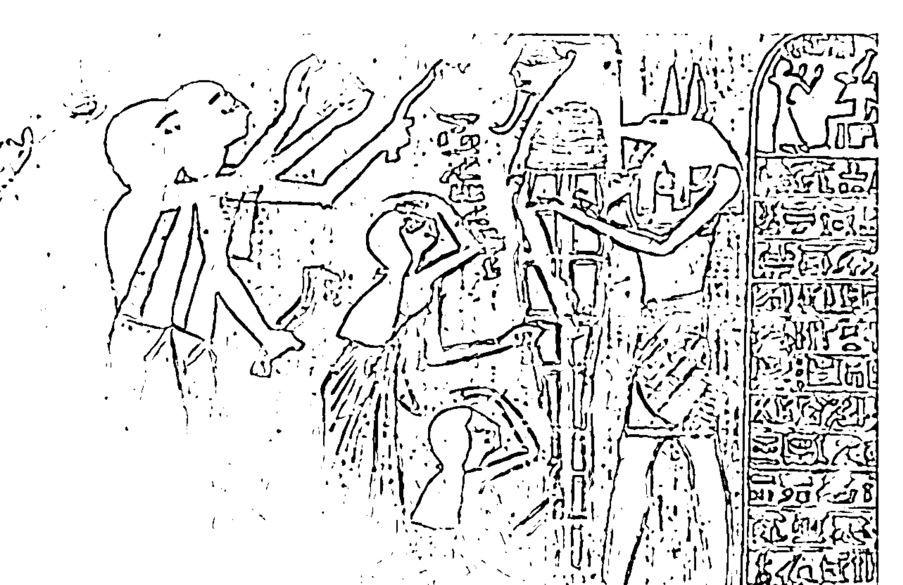

# 第1章 最後的巫術樂園

美非洲平原深處的巫術巡禮

在美洲和非洲，當中間隔著長長的大西洋遙遙相對。
非洲，全名為阿非利加洲（Africa），意思是陽光灼熱的地方，亦是世界上氣溫最高的大陸。歷史的巨輪曾經帶給這片大地無與倫比的繁榮和財富。六千六百年前，這片土地上出現了人類記載歷史中最古老的文明——古埃及文明。他們雄踞非洲，俯視歐洲，擁有最先進的文明和軍隊。
與他們隔海相望的美洲，卻在悠長的歷史長河中默默無聞，誰也不知道這片四二〇六萬平方公里的土地上曾經發生過什麼。美洲的

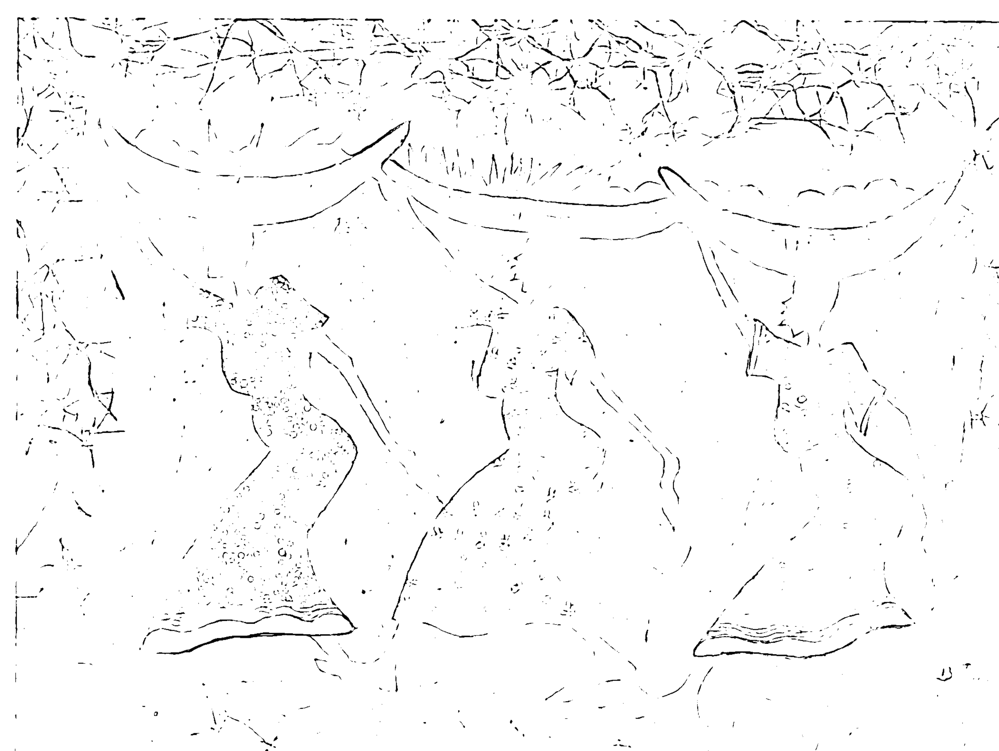

©Twice25 & Rinina25, Wikipedia Commons

# 第1章
最後的巫術樂園：美非洲平原深處的巫術巡禮

全名是亞美利加洲（America），沒有什麼特殊的意思，只是為了紀念一名十五世紀的義大利航海家阿美利哥·維斯普西（Americ Vespucci）。他遠渡重洋發現這片未經開墾的大地，以及其上駐紮的土著——印第安人（Indians）。他們擁有歐洲大陸所沒有的語言和文化，潛伏在叢林深處。

可是，隨著探險團隊的到來，一個個關於印第安人的文明故事被考古學家和人類學家挖掘出來。馬雅（Maya）文明、印加（Inca）文明和阿茲特克（Aztec）文明，這些史前文明的精采，居然讓那些自命清高的歐洲學者痴迷不已。

至今，這兩片相互遙望的大洲深處仍不斷吸引來自世界各地的學者。唯一慶幸的是，這片大陸上還存在著世界上保存最完整的古老巫術。這裡有巫師和巫術愛好者的樂園——祭祀商品市場；有令人聞風喪膽的巫毒教；還有那些神秘、保存完好

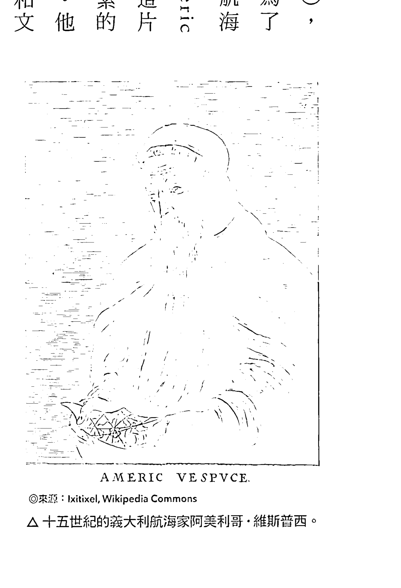

的兒童器官祭祀儀式。這裡的法律對巫術異常寬容，現代科技對他們來說無足輕重。在這片古老的大陸上，依然有很多人信奉著傳承數千年的巫術與巫醫。對他們來說，或許他們依舊還是神的子民，受到大地的庇佑。

1. 阿美利哥·維斯普西（義大利文：Amerigo Vespucci，一四五四年三月九日至一五一二年二月二十二日）。他是義大利的商人、銀行家、航海家、探險家和旅行家，美洲即是以他的名字命名。他考察南美洲東海岸後提出這是一塊新大陸，而當時所有的人包括哥倫布在內，都認為這塊大陸是亞洲東部。
2. 馬雅文明：因印第安馬雅人而得名，誕生於西元前十世紀，其遺址主要分佈在墨西哥、瓜地馬拉和洪都拉斯等地。
3. 印加文明：誕生於在南美洲西部、中安第斯山區，包括了現今厄瓜多爾山區、秘魯山區、玻利維亞高原地區、半個智利和阿根廷西北部地區。
4. 阿茲特克文明：原屬納瓦語（Nahuatl）系發展水準較低的一個部落，後來因吸收、融合此地區其他印第安優秀文化傳統而迅速崛起。西元十一至十二世紀間，從北部遷入墨西哥中央谷地，一三二五年在特斯科科（Texcoco）湖西部島上建造特諾奇提特蘭（Tenochtitlán）城。後來因為西班牙人侵入而被毀滅。

第1章
最後的巫術樂園：美非洲平原深處的巫術巡禮

## 至尊巫術——古埃及木乃伊重生之術

### ◎ 傳說中的圖坦卡門坦卡門詛咒

綿延六千餘米的尼羅河橫穿過廣袤的非洲大陸，雄鷹帶領人們來到開羅城外著名的「帝王谷」，那裡棲息著古埃及三十多位法老和讓世人聞風喪膽的「法老詛咒」。

一九二二年，英國考古學家霍華德·卡特（Howard Carter）終於打開塵封三千三百餘年的圖坦卡門（Tutankhamun）法老墓。他看到了這樣一段話：「誰擾亂了法老的安眠，死神將張開翅膀降臨他的頭上。」、「任何懷有不純之心進這墳墓的，我要像扼一隻鳥兒一樣扼住他的脖子。」人們對此一笑置之。

然而，恐怖的災難依舊如期而至。

一九二三年二月，當金字塔挖掘工作進行到最高潮，黃金御座、法老棺槨和數不清的財寶被一批批運出金字塔時，資助這次考古的卡納馮爵士（George Herbert, 5th Earl of Carnarvon）卻在英國突發重病去世，理由僅僅是被蚊子咬了一口，而被叮咬的位置剛剛好與法老木乃伊左頰下傷疤位置一致；後來，找到圖坦卡門木乃伊的考古學家在精神錯亂中痛苦死去；卡納馮伯爵的兄弟也死於腹膜炎；協助卡特編製墓中文物目錄的助手於一九二九年自殺；不相信「法老詛咒」的埃及博物館館長米蓋爾·梅赫賴爾（Miguel Mei He Lyle）死於突發性心肌梗塞；到一九三〇年底，參與挖掘圖唐卡門陵墓的人員中，已有十二個人離奇死亡；一九六六年，簽訂協議讓文物出境的埃及文物主管同樣死於車禍。「法老的詛咒」成為埃及人心中揮之不去的魔咒。之後，無數的科學家為了證實詛咒的不存在而殫精竭慮，將一個又一個關於詛咒不存在的緣由呈現在世人面前，最著名的理由是：金字塔內的毒氣、毒蟲和特殊結構。

但，這是真的嗎？巫術——企圖借助超自然的神秘力量，對某些人、事物施加影響或給予控制的方術。而所謂的方術，就是用毒氣、毒蟲，配合特殊的擺放位置和神秘的咒語而成。當現代科學家們的研究一次又一次地向古老巫術發起衝鋒時，誰又能肯定這些不是法老詛咒本身的形態呢？站在歷史那頭的法老如能預見現代科學家們所做的解釋，又是否會輕蔑一笑呢？

在傳說中，法老是古埃及王的稱呼，誕生於西元前二千一百餘年，他們自稱是太陽神阿蒙（Amon）之子，是神在地上的代理人和化身。然而事實上，他們或許就是最初一代的「巫」，代表著至高無上的權力和才能。

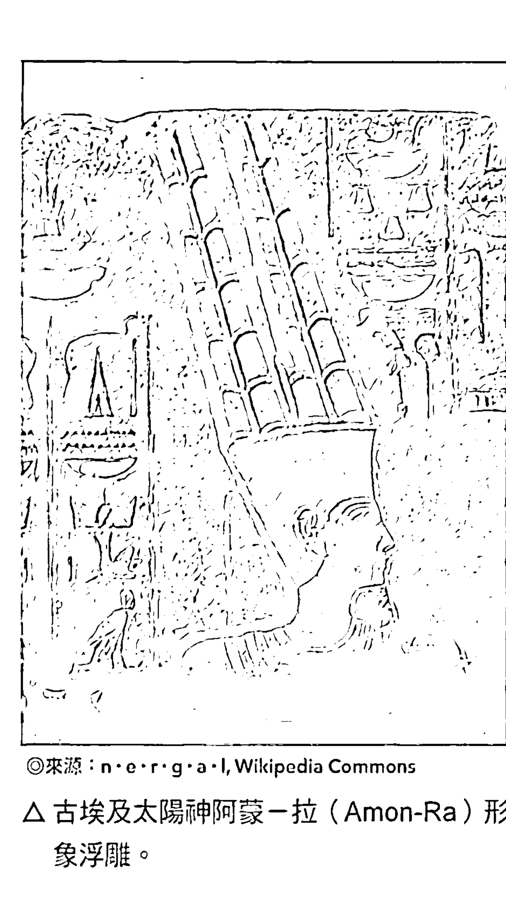

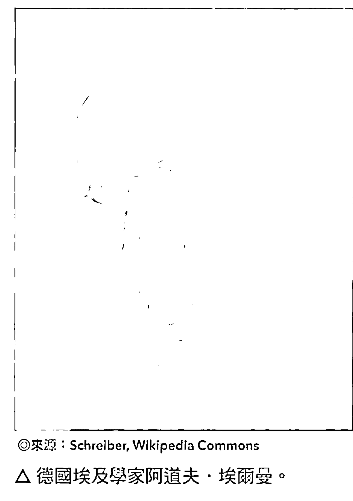

德國埃及學家阿道夫·埃爾曼（Johann Peter Adolf Erman, 1854-1937），就曾經這樣評價過古埃及的宗教，他說：「巫術是宗教的一個野性力量，它試圖掌控控制人類命運的力量，……宗教這株高潔的植物旁滿是巫術猙獰的影子。」

時光流轉數千年，這群被埋藏在黃沙中、塵封於金字塔內的絕代「巫王們」，依舊因其無與倫比的神秘色彩吸引著來自世界各地的人們。

### ◎ 塵封三千年的埃及女祭司

除了法老這樣掌握著古埃及生殺大權的巫王外，還有一些人也一樣被製作成木乃伊。他們或是陪伴著巫王埋葬在金字塔下，或只是長眠於沙漠深處。唯一可以確定的是，他們之中的大多數都有一個小說裡會出現的身分——祭司。

一九二〇年，美國芝加哥大學東方歷史與埃及古物史研究所博物館的創始人布萊斯堤德（James Henry Breasted, 1865-1935），在埃及購買了一具保存完好的木乃伊，他將它完整地存放在棺柩中，安置於博物館。
在這具木乃伊旁樹立著一塊簡易石碑，上面說明這具木乃伊的真名——麥瑞薩姆（Meresamun）。她生活在大約西元前八百年，名字的意思是「她為神而活」。根據石碑上的記述，麥瑞薩姆是一位女祭司，生前在古埃及的一座寺廟中負責歌唱與占卜工作，那時候耶穌還未誕生，她，就是神的代言人。
在後來的將近九十年的時間裡，麥瑞薩姆一直被安置在芝加哥大學裡，作為供學生參觀的文物。一直到二〇〇九年，博物館終於決定解開這具木乃伊的秘密。
研究人員利用醫院的X光掃描設備，對包裹嚴密、層次厚實的木乃伊棺木進行掃描，並對X光穿透木乃伊棺木後所顯示的圖像進行了高解析度攝影。等待了數千年，人們首次看清了這具木乃伊的真面貌。

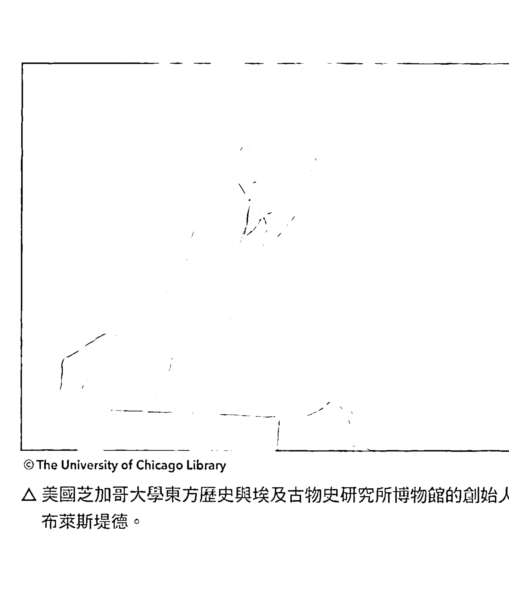

© The University of Chicago Library
△ 美國芝加哥大學東方歷史與埃及古物史研究所博物館的創始人布萊斯堤德。

美國芝加哥大學東方歷史與埃及古物史研究所博物館的古埃及文物學博士埃米利（Emily Teeter）表示，「麥瑞薩姆」身高大約五。五英尺（約一。六八米），去世時的年齡大約在二十至三十歲之間。但截至目前為止，研究人員們仍然無法斷定「麥瑞薩姆」的具體死因。根據骨骼的掃描資料顯示，「麥瑞薩姆」的飲食和生活方式都非常健康，日常進食的食物營養豐富，應有運動習慣。雖然牙齒沒有腐蝕情形，但可以看出她日常主要食用石磨碾出的粗麵粉，因牙齒上有明顯的磨損痕跡。

雖然這只是二〇〇九年《每日郵報》上一則並不算大的新聞，但不得不問，一個如此年輕健康的女祭司為什麼會死亡？她又為什麼會被製作成為木乃伊呢？

翻看歷史書籍，這具塵封三千餘年的木乃伊女祭司並不是個案。數千年來，許多國家都爭相製作木乃伊。從國籍上看，木乃伊遍布義大利、約旦、印尼、俄羅斯，從身分上說，有牧羊人、水手和革命領袖；從年齡上說，有嬰兒、少年及成年人。

木乃伊究竟有什麼吸引力，能夠讓這些不同國籍、不同種族的人爭相效仿呢？或許它的意義只有一個——重生。

### ◎ 傳說中的木乃伊重生之術

木乃伊幾乎是古埃及的象徵，現代人更喜歡剔除木乃伊身上關於宗教和文明的影子，稱其為「人工乾屍」。

可是事實上，木乃伊的製作代表著古埃及最高統治者長生不死的秘密。它被認為是一種尋求重生的輪迴秘術。

美國埃及學家布列斯特德是這樣敘述著古埃及人的信念：「『死亡』這個詞在金字塔的

### 木乃伊製作秘法

古希臘偉大的旅行作家希羅多德（Herodotus, 484 - 425B.C.），在他的史學名著《歷史》（*Historiai*）一書中詳細記載了木乃伊的製作過程。過程充滿了讓現代人作嘔的步驟，卻也滿懷著負責製作的巫師們的虔誠之心。

為了讓屍體保持乾燥，防止屍變，巫師必須處理屍體身上所有的水分；用融化的松脂塗在臉部，保護五官輪廓，防止它乾燥得太快；接下來再處理腦漿和五臟六腑。

他們將特製的鑿子從左邊鼻孔塞進去，將篩骨搗碎，從而破壞腦髓，再用一根細小的長柄勺將腦漿全部挖出來，這個過程很精細，不能發生任何差錯，否則就會破壞外表的臉部。當取出所有的腦漿後，就往裡面塞一些藥物和香料進去，以此確保腦袋裡面不會乾燥和腐爛。

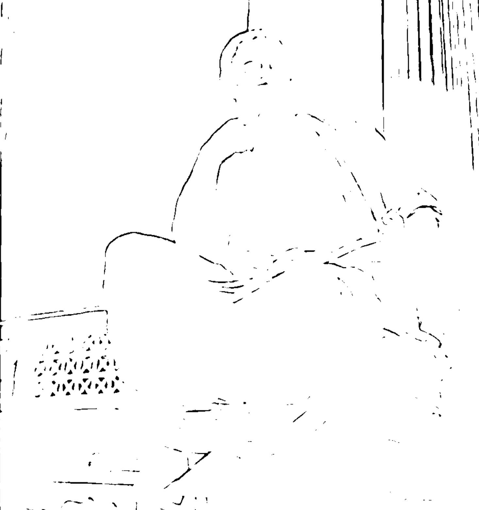

©Pe-Jo, Wikipedia Commons
△ 古希臘旅行作家希羅多德塑像（位於奧地利國會大廈）。

取出內臟的過程則必須更為謹慎。巫師們會在屍體肚皮的左側開一個小洞，將胃、腸、肝、肺挖出來，以棕櫚油洗滌，徹底洗淨胸腔和腹腔。

這些器官可不能丟棄，因為在古埃及的巫術認為，內臟是身體的一部分，如果被破壞，那麼整個木乃伊的巫術也就失敗了。

在最早的《金字塔銘文》$^{11}$中有這樣一篇關於「食人頌歌」的記載：烏納斯（Unas）$^{12}$以智者的肺為食，喜歡把他們的心臟和巫術作為食物。國王吞噬神靈以吸收他的法力，因為巫術存在於體內。

正因為這樣的教義，所以在古埃及會發生黑暗巫師以啃食其他巫師的內臟來獲得更大的力量。為了防止自己的力量被人拿走，存放內臟的小罐越來越考究，形式也越趨繁複。

一開始是些簡單的罐蓋，中王國$^{13}$時出現了人頭形的罐蓋。第十八王朝早期，存放神聖內臟器官的罐蓋則是由神像守衛著。

當臟腑被取出以後，唯獨心臟依舊保留在屍體內。在古埃及的傳統中，心臟是智慧的象徵，所以絕對不能離開身體。

待所有臟腑處理完畢，接著就是最重要的乾燥處理。屍體被放置在乾燥的泡鹼（natron）粉裡約四十天，待水分被吸乾之後，以碾碎的沒藥、桂皮、泡鹼、鋸末（木屑）等材料填充成布包，塞入屍體腔，仔細縫上切口，最後再貼上一塊畫有荷拉斯之眼$^{14}$的皮料。

為了讓木乃伊的皮膚長保柔軟，人們會選擇性地塗上牛奶、葡萄酒、香料、蜂蠟、松脂和柏油混合物來養護皮膚；眼睛部分則填入亞麻和石頭；最後在乾屍外層塗抹一層松脂以防潮，臉頰則撲上一層胭脂，頭部戴上編辮的假髮套，穿戴好衣服，配上最好的珠寶。以上這一切步驟，都是由最資深的木乃伊製作師一手包辦。

不過，包紮屍體卻需要交由更專業的祭司來完成，這也是整個重啟靈魂儀式中最關鍵的一個步驟。古埃及人認為包紮屍體的每個步驟都充滿了險惡，於是整個為期十五天的包裹過程必須一直伴隨著虔誠的禱告。每執行一個步驟，就伴隨一次莊嚴的祈禱或神奇的符咒，同時在亞麻繃帶之間置入護身符條。古埃及人非常重視心臟，因此心臟位置必然會放置護身符，一般會使用綠色石頭做成聖甲蟲或心臟的形狀，上頭刻有「保持死者的心，使它不產生危害主人的東西」之類的詞句。其餘的護身符有的緊貼在木乃伊身體上，有的則裹進亞麻布裡，布滿全身。

整個裹屍儀式至此大功告成。根據古埃及傳說，儀式結束後大約經過七十天，死神阿努比斯（Anubis）15就會秘密地把木乃伊送還給死者的家人，等待後續下葬。

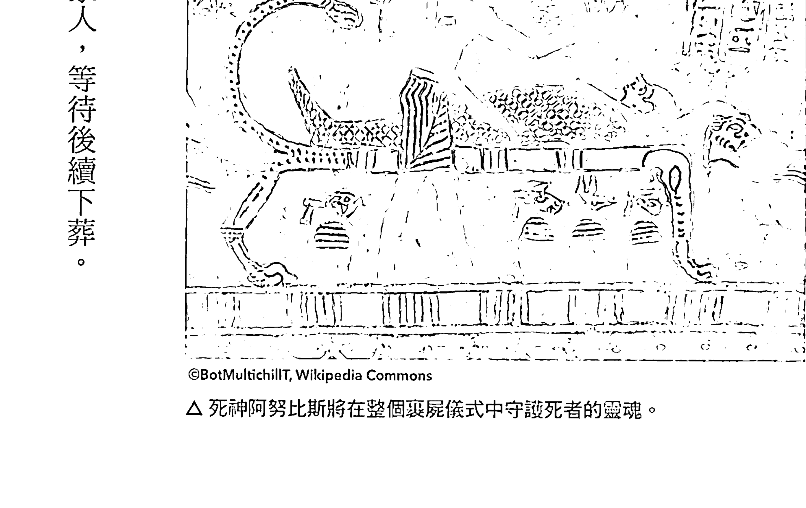

15 阿努比斯：是古埃及的死神，亡靈的守候者，也就是墓地的守護神，外型會幻化成山犬。據說是木乃伊的創造者。他引導死者的靈魂到審判的地方，為死者打開通往另一個世界的道路，使死者順利地抵達到另一個世界。

## 巫術屠殺——烏干達的器官祭祀

### 卡洛琳之死

烏干達共和國（The Republic of Uganda）位於非洲中部，與肯亞（Kenya）、蘇丹（Sudan）相鄰，與剛果民主共和國（Democratic Republic of the Congo）、坦桑尼亞（Tanzania）和盧安達（Rwanda）接壤。這裡的氣溫常年維持在二十四度，這裡的蔬果作物比其他地方生長得更快、更好，這裡的發展正在快速增長。陽光下的一切顯得如此美好。

然而，就在這樣一個四季如春、風景如畫的地方，陰暗的角落裡卻滋養著幾乎已在這個世界絕跡的黑暗巫術——人體器官祭祀。

二〇二一年一月，烏干達一如往昔，陽光明媚，一片祥和。人們正在為新的一年到來而喜悅。可是，就在這個美麗國度東部小鎮的一片稻田裡，人們卻看到了驚恐的一幕。八歲的卡洛琳赤身裸體地躺在稻田深處。她舌頭被割掉，生殖器官被取走，手腳斷裂，肢體殘缺不全，暗赭的血液凝固在她全身上下。她的眼睛是睜開的，黑白相間的眸子，仰望著天空。可是鼻子和耳朵卻傷痕累累。全身的肌膚沒有一時是完好的。

她的父母抱著這副小小的殘破身軀，痛苦不已。誰也不曾想到，幾天前還活蹦亂跳的小女孩，她的人生竟然就這樣戛然而止，就在八歲新年的這抹晨光裡。卡洛琳消失了。警方給出的答案是——卡洛琳成為又一名烏干達巫術的犧牲者。她的生殖器官和殘缺的內臟可能已經淪為巫靈的祭品，再也無法尋回。現場所有人都沉默著，卡洛琳父母的眼淚換不回一條鮮活的生命，也無法阻止烏干達巫術在這國度裡的神秘活動。

根據官方記載，烏干達面積僅二十四．一萬平方米的國土上，生活了六十五個部族，他們大多信奉天主教、基督教新教、伊斯蘭教，也有部分人信奉東正教和原始拜物教。烏干達自然環境條件優越，四季如春，可是在上世紀九○年代之前，這裡還是戰亂連年、生靈塗炭的人間地獄。死亡、貧窮、戰爭，是這個國家的代名詞。直到今天，這裡依然是聯合國評定世界上最不發達的地區之一，國際貨幣基金組織（IMF）公布最新世界各國家和地區人均GDP（截止二○二一年四月）顯示，烏干達人均GDP僅五○一美元，位列全球倒數十三位。

在這個經濟極度不發達的地區，人類尋求財富的欲望卻顯得愈加強烈。位在烏干達邊境上的員警經常能查獲違法運送屍體的活動。例如，根據二○○五年十月二十一日的《每日電訊報》報導，當地警方在位於烏干達邊境的小鎮上，發現一名行蹤可疑的男子，他一看見員警便倉皇逃竄，警方隨即鳴槍將其攔截。該男子表示，他正要將一顆新鮮的男性頭顱帶給一名在烏干達的老客戶。「貨物」送到後，他可以得到一百英鎊的酬勞。

據美國哥倫比亞廣播公司（CBS）的報導，二〇一〇年，烏干達共有十五名兒童和十四名成年人因巫術而喪命，他們大多被割下生殖器官或者面部器官。但知情者卻說，實際上受害者的數量要遠遠高於這個數字。

人體祭祀巫術已成為烏干達許多民眾謀求財富的希望。於是，巫術屠殺在這個國度裡始終盛行不輟。有無數的小卡洛琳慘遭毒手，在尚未成年之前就已成為神魔的祭品。究竟，烏干達的器官祭祀源自何處？從何而來？

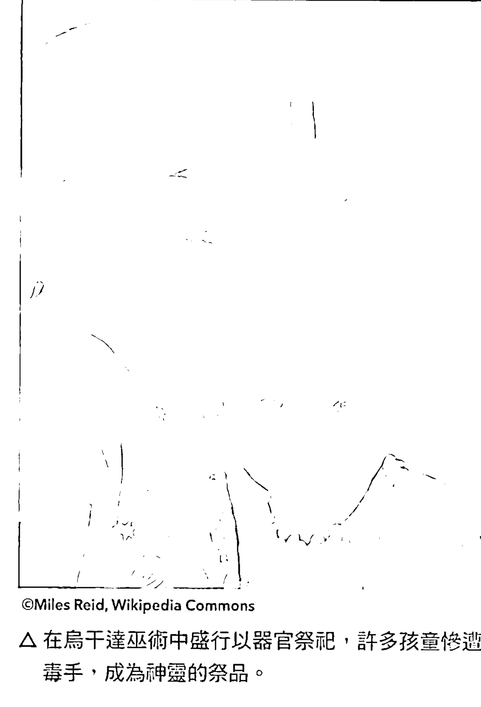

### 器官祭祀的始末

幅員遼闊的非洲大地，有著茂密的原始森林和神秘的宗教文化。隨著上幾個世紀，歐洲諸國對於非洲大陸進行殖民統治，許多人開始信奉天主教和基督教。即使如此，這類西方宗教信仰在非洲，依舊夾雜著更為巨大的非洲傳統宗教特點。

然而，這些原始傳統宗教由於缺少經典的宗教著作，也沒有成文的歷史文獻和資料記載，一直以來，人們對於非洲宗教的研究顯得有些力不從心。唯一可供參考的，只有那些依靠口頭傳授的宗教儀式所傳承而來的祭祀之禮。除了那些生存 in 暗處的非洲土著巫師，沒有人能瞭解那些神秘的祭祀語言到底在說些什麼。唯一肯定的是，人們正在向非洲巫術尋求能量。他們相信巫師能幫助這裡的人民擺脫痛苦的源頭。

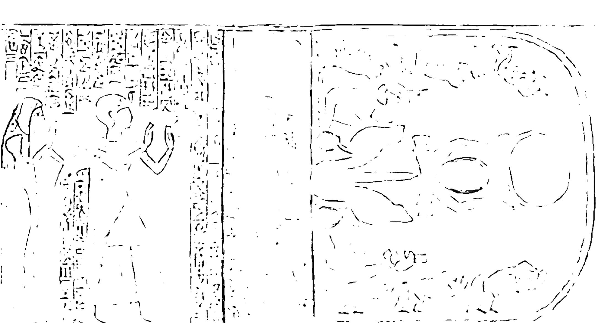

巫術中的人體祭祀，起源於埃及古老的穀神祭祀儀式。

在古埃及出土的《死者之書》$^{16}$（*Book of Death*）中有這樣的記載：

> 當春天來臨之前，人們會把人畜放在皇宮中餵養。當三月春分來臨時，他們將選定的小女孩捆綁在木樁上，用長長的木釘，一根根將她釘死。鮮血灑滿土地，在陽光下凝固。族人歡聚在一起跳舞，祈求穀神的保佑。然後，他們會把她的前額骨、前額骨上的肉以及腦髓一併燒掉，最終灑向土地，以使大地更為肥沃，其他部分則被全部分食。
>
> ——《金枝》（*The Golden Bough*）第四十五章

殘忍的人體祭祀夾雜著人們對於幸福的期盼。現代學者將其歸結為野蠻與愚昧的落後文化，但是非洲子民依然相信，這個世界上有無所不在的神靈。人的生死不是由自然規律所決定，而是要聽從神靈的旨意。巫師可以幫助他們祈求神靈，獲得靈魂的豁免權和福分。在古老的記載中，人們一開始用牲畜和特殊的方式祭祀。他們用獵殺來的牛、羊獻祭，尋求神靈庇佑。然而，牲畜的鮮血似乎總是不盡如人意。巫師告訴他們，只有人類的鮮血和器官才能獲得更大的能量，於是人們開始以部落鬥爭中被斬殺的敵人頭顱作為祭品。

在埃及的考古探勘結果中，發現大量擺放有人類頭骨的容器和管道。敵人在祭壇上被斬殺，鮮血順著刑台慢慢地流向地面，部落首領帶領族人匍匐在巫師面前，相信神靈將保佑他們得以宰殺更多的牛羊，獲得更多的財富。

隨著文明進展，這樣大規模的屠殺祭祀已經難以存活於現代社會。於是，巫師逐漸由高高的祭壇轉移到幽暗的地下。他們以製作巫藥獲得更多的利益。

巫術施展的場地被限制，巫藥配方成為巫術的關鍵。在非洲的巫藥配方中，人和動物身上的「零件」必不可少。巫師們相信，能量越強大的巫術，就需要能量更大的「零件」。

《死者之書》是指記載死者為獲永生所必經的各種磨練、審判、所需的咒文以及到最後獲得永生的畫卷。目前英國大英博物館鎮館之寶《亞尼的死者之書》（西元前一三○○至前一二○○年），是眾多以草紙記錄的《死者之書》當中保存最好、最出色的，堪稱為古埃及美術中至於極致的作品，是古埃及生死觀最完整的表現。

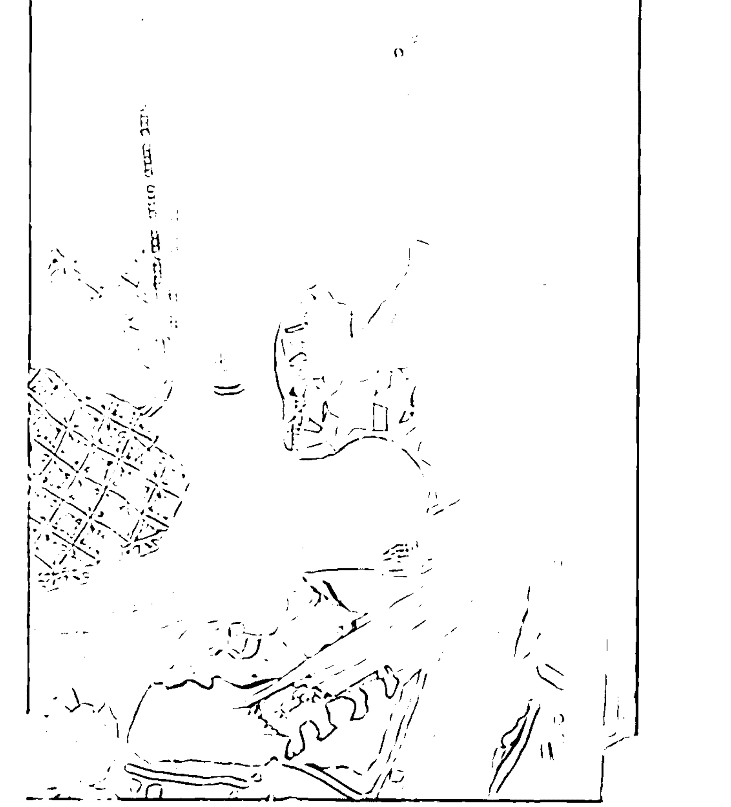

而人的「零件」是所有動物中能量最強的，尚未長大的兒童則是其中的「極品」。例如，人的肚皮可使敵人感到痛苦；手指甲和腳趾甲能用來炮製毒藥；眉毛、頭髮和鼻子可用來詛咒敵人；而生殖器則是能量最集中的地方，將生殖器官磨碎、烘乾後灑在土地或建築上，能給人帶來巨額的財富。為了尋得巨額財富，許多人開始尋找「猛料」，甚至不惜下血本高價收購。盜賣人體器官逐漸成為一些不法之徒的謀生工具。到了二十一世紀初，有巫師認為白化症患者的身體器官具有特殊能力，能為他們帶來幸運和財富。於是，約有五十名白化症患者被割下生殖器官，製作成祈求財富的巫術道具。他們死後，屍體被棄之荒野，無人聞問。恐怖的畫面常常讓生在烏干達的平民頭皮發麻，可是巨大的利益誘惑，又使得這種尋求巫術幫助的方法在民間盛行。人們常常可以看到，在陰暗的拐角深處，身穿白袍的巫師，手中拿著讓人望而生畏的人體器官或者頭顱，告訴你，也許只需要十美元，你就能獲得你一生追求的美夢。

這些充滿誘惑性的利益，常常讓人迷失。於是，有巫術的地方，就有殺戮。無數的卡洛琳被殺死後，據說蘊含巨大能量的器官被摘除，當地警方也對此束手無策。

如果有一天，你走在烏干達街頭，看到提著頭顱的巫師，你會為此而怦然心動嗎？

## 巫毒教——海地共和國的神魔之咒

### 杜瓦利埃家族——以巫治國的海地前總統

二〇一一年一月十六日，流亡海外近二十五年的小杜瓦利埃17（Jean-Claude Duvalier）突然回到祖國海地，此一消息讓這個以巫術治國的家族再次出現在世人面前。巫毒教是否會又一次成為海地的背後統治者，成為人們心中共同的疑問。

海地共和國位於加勒比海北部，面積僅二七七九七平方公里。在哥倫布發現這片大陸之前，誰也不知道這裡曾經發生過什麼，可是，從海地有歷史記載以來，一直是個常年被天災與戰亂包圍的苦難之地。海地雖然是第一個宣布獨立的黑人國家，卻也一直是世界上最貧困的國家之一，有三分之二的工人沒有固定的收入。海地人民終日過著惶惶不可測的日子。

終於有一天，一個自稱是神賦使命的巫醫出現在世人面前，他就是弗朗索瓦·杜瓦利埃（老杜瓦利埃，François Duvalier）。一九五七年，老杜瓦利埃競選成功，成為海地總統。那個時候，他有個美麗的綽號「爸爸醫生」，他宣誓要把國家權力分給廣大的黑人同胞，但最後的結果卻是讓海地成為巫師們的天堂。

至今，海地人民對於當年總統府內擺設祭壇舉行祭祀活動依然記憶猶新。杜瓦利埃坐在總統府裡，面色從容地讓巫毒教的使者活剝下反對者的皮，剖開內臟，將之獻祭給巫毒教的神靈。為了顯示他的虔誠，他蒸食了反對者的內臟，然後吃下他們的心肝。

讓人毛骨悚然的一幕還沒有終結。當地民間傳說，最為瘋狂的是老杜瓦利埃曾經用巫術製造了無數「還魂屍」——巫毒教儀式中最恐怖的邪術。據說，它是憑藉巫師的毒咒讓活人變成無知無覺的活死人，任由主人隨意支配，永遠奴役，成為傳說中的殭屍。這些殭屍組成了他強權統治下的恐怖組織「通頓馬庫特」（Tonton Macoute，意為「吃人的惡魔」）。無數人民在「通頓馬庫特」的恐怖行徑中喪命。據統計，至少三萬名反對者在「通頓馬庫特」的嚴刑拷打下死亡，其形式大多極其殘忍，扒皮和蒸煮是最常見的手段。

這種恐怖的巫術統治在海地整整持續了二十九個年頭。直到老杜瓦利埃死後十五年，飽受巫術之苦的海地人民才終於揭竿而起。他們瘋狂地掘開老杜瓦利埃的墳墓，打開了他的棺槨。可是，裡面卻空無一物。那個宣稱能死而復生的巫醫到底去了哪裡？他就像一粒恐怖的種子，在海地人心中生根發芽。恐怖的巫醫之王，真的會再次降臨嗎？

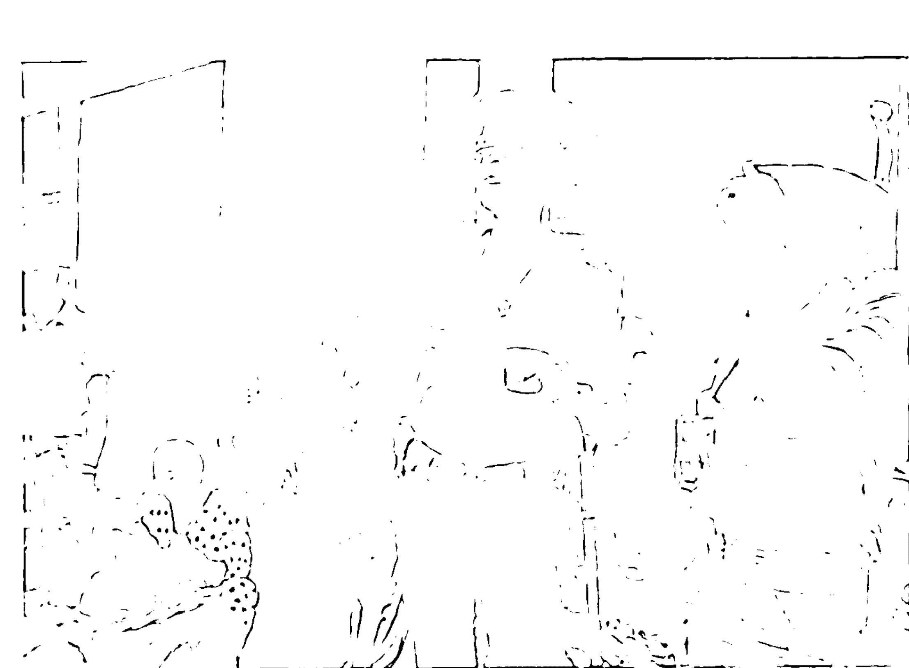

©來源：BlackPast.org
△ 老杜瓦利埃曾利用巫術組成了恐怖民兵組織「通頓馬庫特」，以暴力控制人民。

### ◎ 巫毒教的前世今生

巫毒教（Voodoo），又名伏都教，起源於非洲西部的貝寧共和國（The Republic of Benin）19。巫毒一詞源自貝寧南部的豐語（Fon），意指靈魂。然而，恐怖的巫毒教為什麼會從遙遠的貝寧傳播到海地，要從五百年前的一場激烈變革說起。

五百多年前，歐洲一支船隊從西班牙巴羅斯（Palos）港揚帆出發，開啟了人類航海史上最偉大的篇章。這支船隊的船長叫做哥倫布（Christopher Columbus）20。然而，正是這支載滿了現代文明的船隊，給土著世界的人民帶來了無盡的災難。哥倫布帶著給印度君主和中國皇帝的國書，沿著大西洋，一路向西。在一次暴風雨後，他停泊在一座無名的島嶼。如同所有電影中描繪的一樣，這是一個富饒而美麗的世界，上面有著神秘而未知的文明，以及美得讓人心醉的山巒湖泊。這座島嶼就是位於加勒比海北部的海地，當時那裡居住著住了約一百萬名印第安人。他們遠離現代文明，在島上從事農耕和放牧，自給自足。

哥倫布在發現了海地島上豐富的物質資源後，讓一支船隊先行返航。這支返航的船隊給海地帶來的不僅是現代文明，還有西班牙的殖民者。之後，法國艦隊也瘋狂地湧入海地。為了掠奪資源，殖民者虐殺並奴役當地的印第安土著。無數的印第安人在殖民統治中死去或淪為奴隸。同時，殖民者又從非洲擄來了大量黑人，其中包括貝寧的原始巫師們，就是他們把巫毒教帶到了海地。

在惡劣條件下痛苦地勞動，使得奴隸們染上了疾病甚至瘟疫，可是法國殖民者卻依然榨取他們的血汗，要求他們不斷開發島內的金礦和農作物。

求生無門的印第安土著們選擇倚靠巫毒教，開始了與恐怖宗教為伍的日子。

巫毒教的教義告訴人們：現存於天下的萬物，不過是一種表象，靈魂的力量才是掌管一切的源泉。這個靈魂世界的首領，是名為力格巴（Legba）的神。力格巴操控著死亡、生育、愛情、妒忌和報復等諸神。信奉巫毒教的人，會得到力格巴神的庇佑，而不信奉巫毒教的人，則會受到神靈的懲罰。

每個海地人心裡都明白，你可以不相信這個國度裡的任何東西，但是絕對不能與巫毒教為敵，因為它擁有恐怖巫術的力量。凡是不相信巫毒教的人，都會受到神靈的詛咒。

在海地，夜深人靜的時候，常常會從海水的深處傳來令人毛骨悚然的擊鼓聲和呻吟聲。這個時候，請千萬不要出於好奇而走出大門，而是應該將門深鎖、蒙上被子，遠離那恐怖的擊鼓聲——海地巫毒教的傳統儀式。

巫毒教的傳統儀式一般由大祭司主持，他會選擇一個黯月無光的深夜，在月亮半邊被烏雲遮蔽的時候開始儀式。大祭司踏著海水舞動，口中緩慢地吟誦出沒有文字記載的古老咒語。大批的教徒匍匐在大祭司腳邊。在特殊氣氛的渲染下，教眾們會產生一種窒息感，感受彷彿神魔降臨般的恐懼。然後是劈天蓋地的擊鼓聲，跟隨著古老的咒語忽高忽低，忽輕忽重。這樣的咒念會持續很久。最後上場的就是讓人不寒而慄的人體祭祀。

可怕的人體祭祀分為兩類，一是被指定為有罪的靈魂將被拖到祭祀台前，大祭司用器具撬開他們的頭顱，獻給神靈；另一類則是祈求福澤的家族必須貢獻出自己的親人——妻子或兒女，用他們的鮮血祭獻給神靈，以獲取神靈的認可。

恐怖而殘忍的巫術祭祀，深深扎根於海地人民的心中，它無時無刻不提醒著人們，萬能的力格巴神只會庇佑對他虔敬的人們。

### ◎ 廣泛流傳的巫毒娃娃

現代文明不斷前進，隨著杜瓦利埃家族的消亡，巫毒教的恐怖祭祀漸漸從人們的生活中消匿，海地人民也終於可以安穩過日。可是，另一種恐怖的巫術卻依舊流傳在海地民間，甚至飄洋過海，流傳到了美洲。你一定也聽過這種巫術道具——巫毒娃娃。

巫毒娃娃是在巫毒教大祭司在普通的作法儀式上所會用到的一種道具。原始的巫毒娃娃是由獸骨、稻草編製，具有各式各樣的功能。雖然如今一般都認定巫毒娃娃是邪惡和詛咒的媒介，但事實上，巫毒娃娃在遠古也同樣具有祝福和保佑的功能，比如紅色的巫毒娃娃可以祈求愛情、黃色代表保護、白色用於治療、粉色則用於獲得友誼。可是這些散發著善良與光明氣質的用途，卻在一個又一個帶著貪婪目的的巫術下崩潰瓦解。如今的巫毒娃娃只剩下充滿仇恨與詛咒的黑色、求得聚財與賭運的綠色，以及帶有性愛與情欲的粉色。

為了一個個特殊目的的巫毒娃娃被廣泛製作，並成批地販賣，據說，黑暗巫師會在各色娃娃中灌注邪惡的法術，為其意向帶來驅力。當施法者買下人偶時，他會按照買主的意願，增加一些施法對象所擁有的物品，比如頭髮、指甲、皮屑、相片、衣物等，他們一般是貼在娃娃臉上，或者縫製進娃娃衣服的縫隙中。猙獰的娃娃因爲有了這些物品，而與施法物件產生聯繫，於是恐怖的災難就此降臨人間。

> 「我願你跌入冒煙的燉鍋，我願黑蛇咬住你的後腳跟，跪地時又被黃蜂螯到，夜晚則被臭蟲飽食……」傳說這是使用巫毒娃娃下咒時最常見的咒語，巫師在完成第二次詛咒後，購買娃娃的委託者可以透過反覆吟誦，以達到詛咒的目的。儀式要每天重複進行，連續九天，或直到委託者達成目的為止。而為了傷害或報復的黑魔法更規定要在月由盈轉虧時施行法術。

巫毒娃娃由於操作簡單而被廣泛販售，甚至變成了風靡大眾的流行產品。許多購物網站上都能看到它們的身影，甚至有買家製作成系列商品，比如：巫毒詛咒系列、天使惡魔系列等等。

不過，由於現在的巫毒娃娃製作大多是在工廠完成，以至於巫毒娃娃逐漸成為年輕人茶餘飯後的玩具。他們從不知道，在歷史上，巫毒娃娃曾經被用以完成一些駭人聽聞的恐怖詛咒。

如果有一天你找到真正的巫毒娃娃，請務必小心黑暗巫術的致命力量。

## 巫魔征服——非洲的「性」巫術

### ◎ 剛果金集體強姦案

二〇〇九年八月，剛剛擔任美國第六十七任國務卿的希拉蕊·克林頓（Hillary Diane Rodham Clinton）出訪非洲。

她從中部非洲最大的城市金夏沙（Kinshasa）乘坐專機，抵達剛果民主共和國（簡稱剛果金）的戈馬（Goma），映入她眼簾的是一座背山面湖的優美城市。可是，希拉蕊的眼神只是輕輕地掃過這片土地，就把目光焦灼在與這片美麗城市極不匹配的、悲傷的婦女身上。

這些婦女散坐在聯合國的紅十字醫院裡，不久之前，她們淪為武裝分子集體輪姦的受害者。

「集體輪姦」是個和現代社會完全不相符合的情事，在任何一個國家，一旦發生強姦案，罪犯都會受到嚴懲，更何況是集體輪姦。可是這種獸行若發生在戈馬，或者說整個剛果金，卻是家常便飯。武裝分子甚至有預謀地闖進村莊，有組織且有針對性地對平民進行惡意強姦。

大多數情況下，是許多個男人一起輪姦一名女子。他們當著這名女子的丈夫、孩子、家人和鄰居的面，強行扯開女子的衣物加以輪姦，甚至如禽獸般用槍枝和棍棒插入女人的下體。強姦好像變成戰爭中的一種武器，並讓這些武裝分子樂此不疲。

之後，二○一一年聯合國在剛果金籌建的人權辦公室發布一份最近的報導中披露，二○一○年七、八月，僅僅四天之中，剛果金反政府武裝組織闖入與戈馬相鄰的瓦利卡爾（Walikale），對當地實施大規模襲擊，當時有一一六人遭綁架、九六五座民房被洗劫一空，三八七人慘遭強暴，其中包括約三百名婦女、二十三名成年男性、五十五名女孩和九名男童。

當希拉蕊來到這片被性暴力籠罩的城市時，她在名為「拯救非洲」（Heal Africa）的診所裡，看到一位遭到強姦的婦女正坐在病床上等待接受手術。她的眼神裡閃爍著痛苦與麻木。她的身後還有好幾名受到性暴力侵略的少女。她們早已不是這個城市的異類，她們的命運就像是這城市中許多女子一樣，自上世紀九○年代中期盧安達（Rwanda）種族屠殺以來，從未平順過。

這裡周邊的縣城被政府武裝和反政府武裝兩方陣營反覆爭奪，這裡的人民在自己的家園裡也難以得到平靜。根據聯合國的統計數字，二○○九年就有大約三千五百名婦女遭到強姦。

希拉蕊的眼神充滿了悲憤，這位受過高等教育的美國國務卿對剛果金總統約瑟夫·卡比拉（Josef Kabila），表達了戰亂地區婦女和兒童目前遭受嚴重性暴力襲擊的深切擔憂。她敦促剛果金政府與反政府武裝放下武器，停止武裝衝突，保護處於弱勢群體的婦女和兒童免遭性暴力的襲擊。

可是，在這樣一個以黑人為主的國度裡，她這樣一位白人女子的話，真的有影響力嗎？或許有人要問，武裝分子為什麼要不遺餘力地開展大規模的集體強姦，是剛果金人民比其他地區人民更加獸性？還是蠻夷之地尚未開化？抑或者——強姦真的有什麼力量？

當人們用這樣的眼光去觀察這些令人髮指的集體強姦惡行時，或許能從這看似違背人性集體強姦的背後，觀察到更為深遠的巫蠱力量。

### ◎「巫魔」征服術

在戈馬附近駐紮著「馬伊—馬伊」（Mai Mai）民兵組織，成員都是土生土長的非洲人，他們有個共同的名稱——胡圖族人（Hutu）。

瞭解中部非洲或者說盧安達種族屠殺事件的人，一定對這個種族不陌生。一九九四年，一顆導彈擊落了盧安達總統、胡圖族人哈比亞利馬納（Juvénal Habyarimana）的座機。這顆導彈帶走的不僅僅是總統的生命，還包括八分之一的盧安達圖西族（Tutsi）人。

短短一百天裡，有近一百萬人喪命，胡圖族人對圖西族人展開了瘋狂大屠殺，這就是著名的盧安達種族屠殺案。

事實上，種族之戰不僅僅發生在盧安達，還蔓延至整個中部非洲，包括剛果金的胡圖和圖西兩族。雖然在國際社會的快速干預和鎮壓下，這宗大規模屠殺暴行才漸漸偃旗息鼓，可是大量的胡圖族極端主義分子依舊逃亡鄰近國家。

這些因為種族仇恨殺紅了眼的武裝分子，沒有先進的科技，沒有強大的武裝，更沒有任何國際勢力的支持。於是，他們開始尋求古老傳統的支持，終於發掘了——「巫魔」征服——這個號稱能震懾敵人，獲得勝利的秘法。

集體輪姦正是這種「巫魔」征服的重要環節。

胡圖族的原始信仰相信，只要強暴敵方陣營的女人、殺死對方的巫師、毀滅對方的房屋，就可以打破對方「守護神」的庇佑。在原始宗教中甚至認為，這麼做可以令其喪失靈魂，使對方成為自己的奴隸。通過施暴手段，武裝集團不僅打破當地敵對村莊、部落的抵抗意志，而借助巫術的力量，更能迫使對方屈從於自己淫威，也可以震懾其他村莊和部落，使其因懼怕被「破神」而不得不俯首投降，任武裝集團予取予求。這種做法雖殘暴，但在武裝集團看來十分有效：抵抗減少了，兵員增加了，後勤解決了，甚至還可以通過集體性征服，獲得他們夢寐以求的「家」。

正是這種深植當地人思想的巫術文化，讓集體性暴力在這片平原上屢禁不止，在中非（The Central African Republic）、奈及利亞（Nigeria）、安哥拉（Angola）、剛果金、烏干達（Uganda）和盧安達的歷次內戰暴力衝突中，這類慘劇一再地發生。

撕破婦女的衣服，強行進入女子的身體，讓這些地方的婦女在自己身下呻吟、哀求，已成為這種暗黑巫術的主旋律。

### ◎ 性巫術還是性暴力？

剛果金的集體輪姦暴行，可能是將非洲性巫術推展到極致的典型。這些在其他大陸文明中被認為不可思議的恐怖事件，卻深深根植於當地民眾的思想。甚至一些政治領袖、公眾人物也會刻意借助「神奇的力量」，比如：公開亮相時手上拿著豹尾，或捏一條古怪的白手絹，營造自己擁有神秘力量的形象。

在奈及利亞「巫魔附體」的巫教儀式中，有人將一些少女打上「被上帝認定終身為娼」的烙印，這些少女懾於宗教威勢，竟順從地獨自從奈及利亞自行赴義大利熱那亞（Genoa）或荷蘭阿姆斯特丹（Amsterdam）賣身，甚至被解救回來後也遭到村民唾棄，因為她們違背了「神諭」，直到好心的教士當眾「解除詛咒」才算甘休。

性巫術或者說性暴力早已與現今文明格格不入。可是，在遙遠的古代，性巫術是巫術中十分重要的環節，在各大洲的傳統巫術中都能找到原型。

在著名的人類學典籍《金枝》（Golden Bough）中，記載著中美洲的帕帕爾人在土地播種前四天，丈夫被要求一律與妻子分居，目的是要保證在作物播種前夜，他們能夠充分地縱情慾。祭司責令人們在播種的時刻也要與妻子行房，完成宗教義務，這是一種最平和的性巫術。此後，性巫術被不斷地擴大刺激，在歐洲中世紀就出現過大量的集體強姦案；在中國古代也有陰陽調和術；而在女巫的受禮過程中，更有將自己獻祭的性交場面。

有時候，我們很難去界定某些巫術究竟是性暴力，還是由於對性的崇拜產生的性交依賴。誰也沒辦法去辨別這些性巫術究竟有沒有作用。

不過，作為一個擁有獨立思考能力的人，當你看到遭受性暴力的女性在哭喊與抵抗的時候，與人道主義思維相較，性巫術到底是否具有法力就變得一點也不重要了。

## 神之祭祀——躲在山谷裡的現代黑巫術市場

### ◎ 墨西哥索諾拉的巫術市場

一九九七年，美國作家J. K. 羅琳（J.K. Rowling）的長篇魔幻小說《哈利波特》（Harry Potter）橫空出世，橫掃全球圖書市場。期間，主角哈利波特拜訪過的魔法市場，早已成為眾多魔幻迷心中的樂園。可是現實中的巫術市場，卻是和智利（Chile）復活節島、烏克蘭（Ukraine）的切爾諾貝利（Chernobyl）齊名，被俄羅斯《真理報》評選為世界十大最恐怖之地的墨西哥「索諾拉」（Sonora，西語）巫術市場。

索諾拉州是墨西哥西北部邊境的一州。它的北部連接美國的新墨西哥州，西面則是加利福尼亞灣（Sea of Cortes），佔地面積僅十八．五萬平方公里，人口僅一八二．二萬（截至一九九〇年）。它是美國西部電影重要的取景地；它的農業灌溉率在墨西哥排名第二，銅產量占墨西哥全國的五十％，還有瓜伊馬斯（Guaymas）這樣重要的國際港口。

看似現代化的城市，在近六百年前卻是印第安塞里（Serí）遊牧部落的聚落。一五三○年，西班牙將軍帶領著一支遠征軍入侵，血洗了當地的印第安部落，將這塊原始土地變成了今天的索諾拉州。但是，無論侵略者多麼強悍，科技多麼發達，也無法阻止延續了無數歲月的原始宗教在這片土地上復甦。

經過了數百年的休整，索諾拉州依舊是美洲大陸上最重要的巫術傳播地。當地的巫術市場更成為世界上碩果僅存的幾個巫術天堂之一。

這座巫術市場每天都對外開放，隨處可見墨西哥和外國遊客來此觀光，抬眼即可看到被懸掛在門口的各類乾屍。女巫們會坐在門口向來往的遊客兜售各類巫術極品，包括駱駝的胚胎、蛇血、蜂鳥乾屍等。

這裡到處彌漫著動物的腐臭氣味，以及琳琅滿目的動物毛皮屍骨。它們來自美洲和非洲各處的原始叢林。在這樣一個充滿神秘氣息的地方，人們或多或少都有機會能窺見自己的未來。

再往深處探尋，你能找到一些會施巫術的人，暗黑的小屋內，昏暗蠟燭的周圍懸掛著蛇、鳥、牛、羊的屍骸。你可以把自己的難言之隱告訴這裡的商販，無論是不孕，還是想金榜題名，他們總能拿出能幫你「解決」問題的東西賣給你。他們聲稱可以幫助世界上的每一個人，

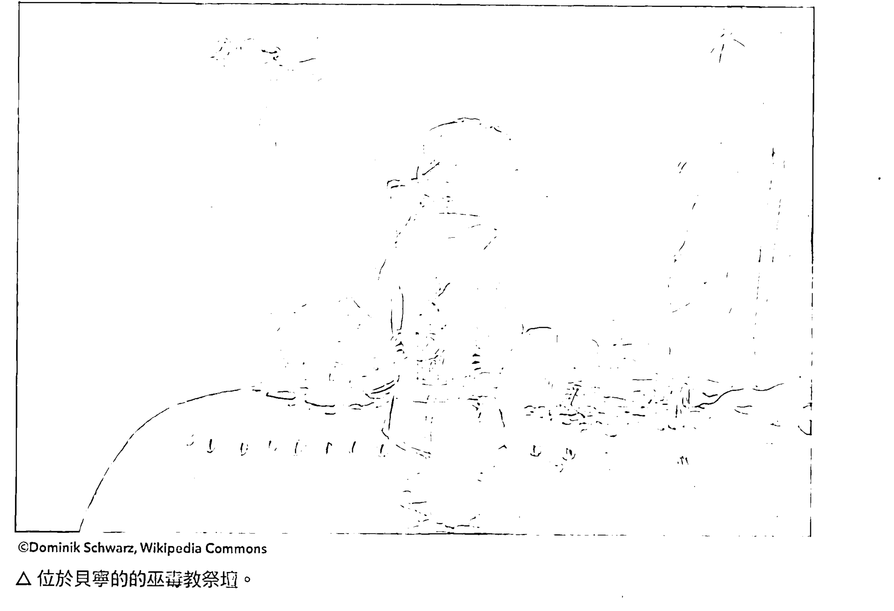

©Dominik Schwarz, Wikipedia Commons

△ 位於貝寧的的巫毒教祭壇。

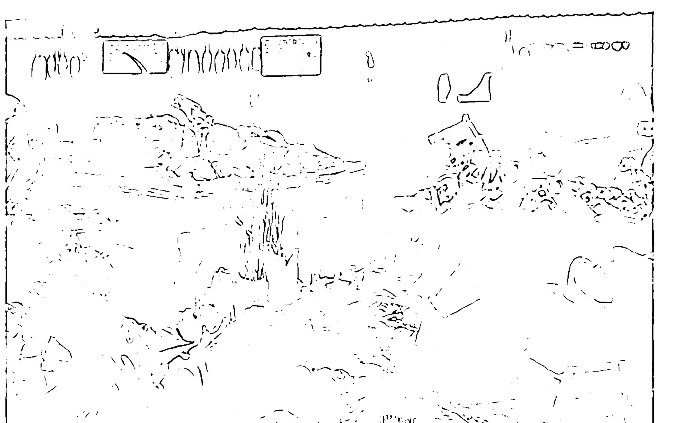

©Dominik Schwarz, Wikipedia Commons

△ 位於非洲多哥的巫術市場，到處瀰漫著動物的腐臭氣味，以及琳瑯滿目的動物毛皮屍骨。

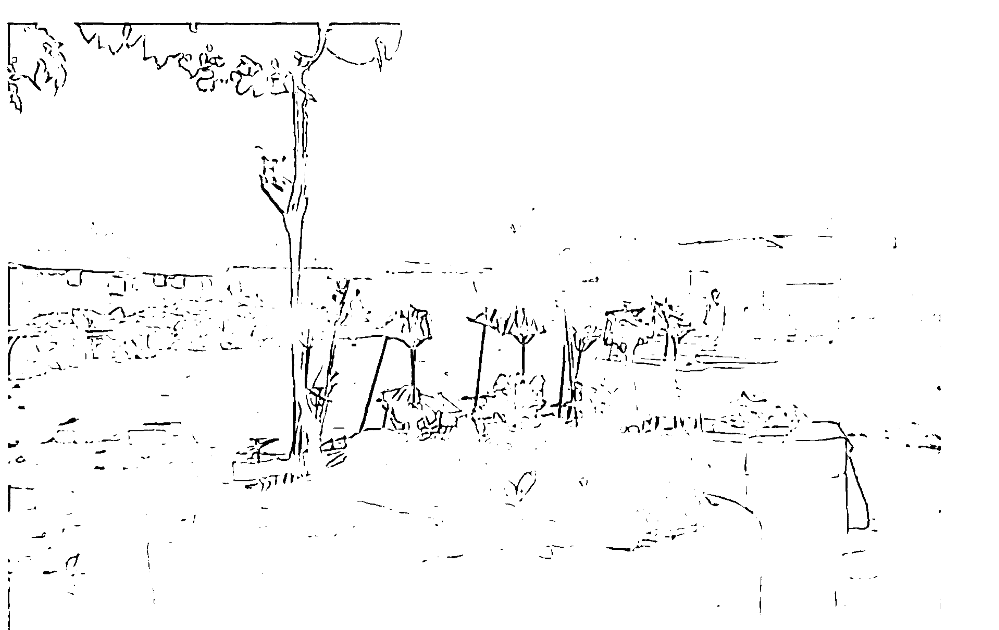

©Dominik Schwarz, Wikipedia Commons

△ 西非國家多哥的Akodessewa地區堪稱世界上最大的祭品市場。

就看你敢不敢買。

當你購買了魔法道具後，可以站在屋中的魔法圖案正中央。巫師會根據你的要求，緩慢地念起咒語。越是高等級的咒語，越需要更加「強大」的輔助器物，比如人血和人體器官。不過，這類物品的價格通常也高得嚇人。

除了對外開放的索諾拉巫術市場，在非洲叢林深處還有更讓人毛骨悚然的神秘角落：

西非國家多哥（Togo）的Akodessewa地區。如果索諾拉巫術市場是世界上最大的魔法道具市場，那麼Akodessewa地區就是世界上最大的祭品市場，在那裡，只要你出得起價碼，幾乎可以買到任何你想要的祭品。

在烏干達被殺害的民眾，例如之前提到的小卡洛琳，他們身體的某部分很有可能成為這裡的商品之一，比如最昂貴的心臟、最重要的人血，以及特殊魔法所需的人體器官。而來這裡求助的人更是形色繁複，甚至自己國家的足球隊參加世界盃，也要指派最高級別的「國師」保駕護航。

### ◎ 玻利維亞女巫市場

著名作家三毛23去世後的兩年，一本叫做《高原的百合花》的書問世了。書裡延續《萬水千山走遍》的風格，懷著一個天涯旅人敏感而複雜的心，用溫柔的筆觸細膩地描述異國他鄉的故事。

《高原的百合花》講述三毛在南美洲的旅行遊記，書中敘述了一些神秘不為人知的故事，比如關於玻利維亞女巫市場的記載：

那些美麗的老建築下面，放著一攤一攤的街頭店鋪，守攤子的嬤嬤們，披著絲製本色花拖著長流蘇的披肩，穿著齊膝而多褶的大裙子，梳著雙條粗辮子，一個個胖墩墩的在賣她們深信的巫術道具。

> 「這隻乾鳥呢？」我指著一隻乾黑大眼睛的死動物問她們。

……

三毛，原名陳懋平（後改名為陳平），浙江舟山人，著名作家，著有作品《傾城》、《哭泣的駱駝》、《夢裡花落知多少》、《雨季不再來》、《撒哈拉的故事》等。

23

「不是鳥，是流產出來的小駱馬——」賣東西的婦人笑了起來。
「治什麼病？叫誰來愛？還是旅行平安的？」
「都不是那些事情用的——」那個婦人又笑。
「你買了去，建房子時候將它埋了，運氣會好。」她說。

三毛的描寫很細緻，甚至讓這個女巫市場也變得清新起來。這是玻利維亞（Bolivia）山城拉巴斯（La Paz）的一個普通的巫術市場。

玻利維亞是南美洲的一個內陸國家，在悠遠的歷史中，它始終是印加帝國（Inca Empire）的一部分，這裡居住著大量的印第安人。十五世紀末，這塊土地曾經被西班牙人的鐵騎攻陷過。之後，歐洲的牧師們前赴後繼地來到這裡傳教，有意思的是，當地教堂一間間蓋了起來，但是巫術卻從未自這片土地上消失過。

和墨西哥索諾拉的巫術市場相比，這座拉巴斯的巫術市場顯得小家碧玉。一條斜斜的巷子，零零散散擺放著一些巫術用品。小巷子沒有文字標識，只有一個小小的女巫標誌，

摘自《高原的百合花》，〈女巫市場〉，三毛著。

恐怖巫術與血祭

也只有一相熟的客人才能在這條巷子裡找到自己要的東西。

也許，有人會問這條巷子有什麼作用，它是一個旅遊景點嗎？

不，當然不是。

如果你有興趣鑽研美洲傳統風俗的話，就會發現這些國家或多或少都會擁有一些古怪的習俗。之所以稱其「古怪」，是因為它融合了古老的巫術與歐洲人強行推廣的天主教兩者，例如，玻利維亞人的一頭骨祈福日（the Day of Skulls）這樣有些不倫不類的巫術日。

在玻利維亞的一些地區，人們一直保留著一個神秘的傳統，那就

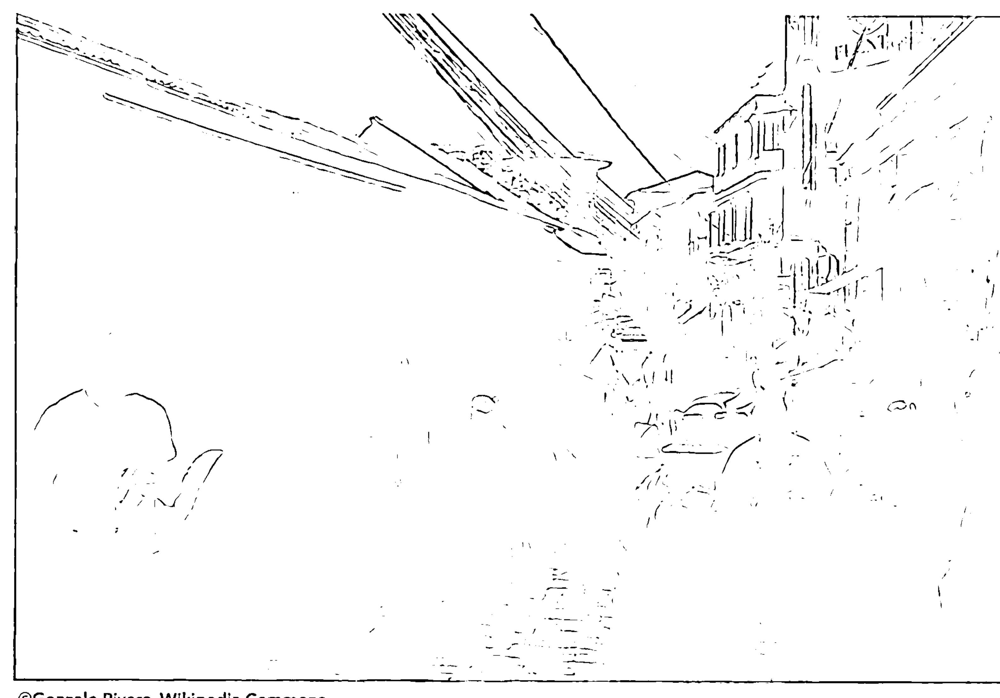

©Gonzalo Rivero, Wikipedia Commons

△ 玻利維亞的女巫市場。一條斜巷子裡零散地擺放著一些巫術用品。

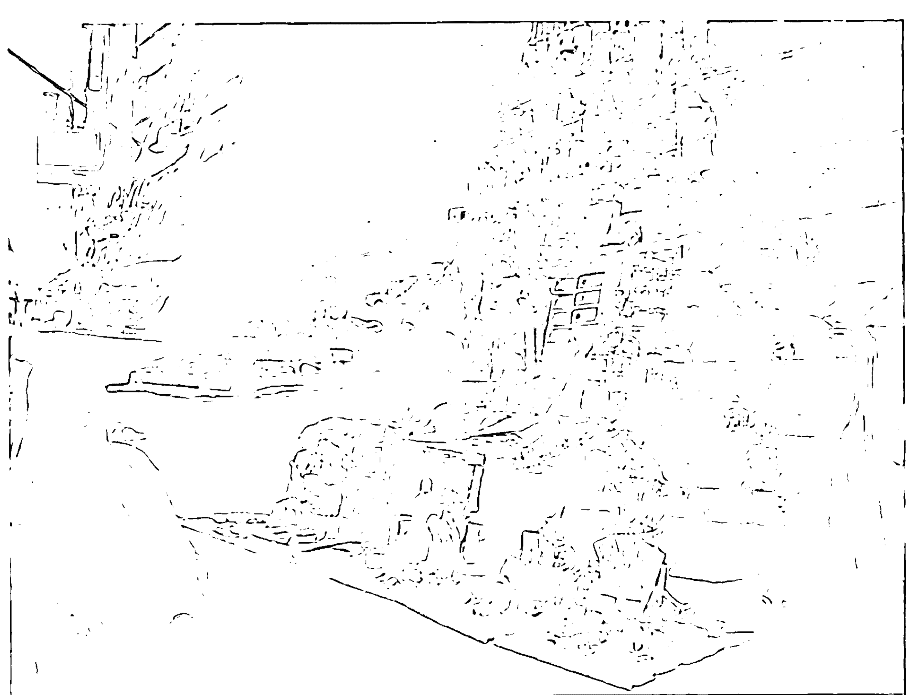

©Andrew Jones, www.sacred-destinations.com

△ 位于山城拉巴斯的女巫市场，贩售各式巫术道具。

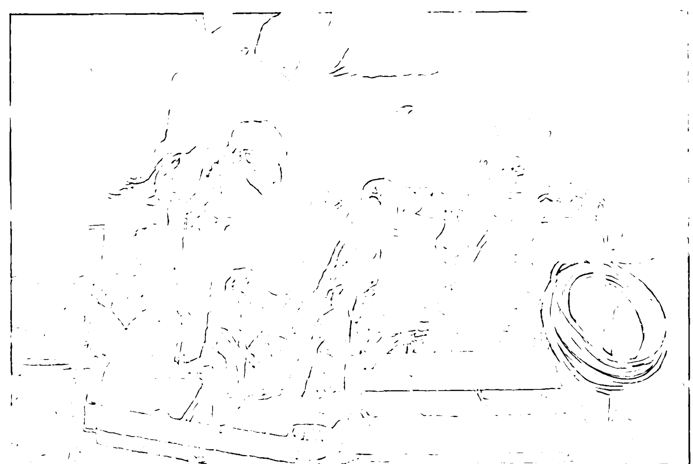

©Nick Leonard., www.sacred-destinations.com

△ 玻利维亚的女巫市场四处可见骆马的胚胎干尸。

是將已故親人的頭骨留在家中，當作護身符。他們相信頭骨的力量。每年的十一月八日是玻利維亞人的「頭骨祈福日」。在這一天，居民們紛紛將親人的頭骨加以裝飾，並帶到教堂裡祈福，期盼能給家族帶來好運。

當然，裝飾這些頭骨的巫術之物，就是來自於那些坊間的巫術市場，這裡供奉著一些石像、流產的小駱駝等物品。它們排列整齊地等待人們挑選，很少主動向來往的遊人兜售。據到訪過那裡的遊客說，有些背包客專程拜訪這條斜巷，但問及一些巫術時，這裡的女巫往往會露出一絲輕蔑的笑意。也許對她們來說，不瞭解南美巫術歷史的人，是永遠不會得到神靈眷顧的。也只有玻利維亞人會將這些東西挑走，有些埋在自家的房子下面，有些則用以裝飾頭骨，據說頭骨裝飾得越漂亮，得到的護佑就越是靈驗。

只是，如果你有幸到玻利維亞的民宿走一走，可千萬不要被房間裡供奉的頭骨嚇到才好。

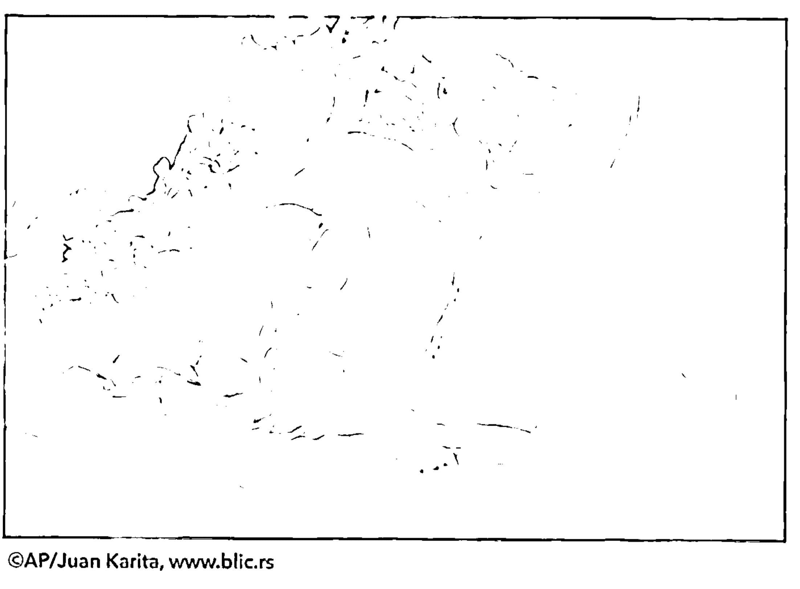

©AP/Juan Karita, www.blic.rs

△玻利維亞人的「頭骨祈福日」。

第1章
最後的巫術樂園：美非洲平原深處的巫術巡禮
67

## 參考資料：

1. 《世界地理博覽：美洲 非洲 大洋洲 南極洲》，作者：鄭平等主編，上海科學技術文獻出版社，二〇〇九年。
2. 《世界人氏血脈書系：印第安人》，作者：李玉君，東方出版社，二〇〇八年。
3. 俄羅斯《共青團真理報》，一九九六年五月二十六日：〈科學家解不開金字塔之謎〉。
4. 《世界上下五千年》，《常春藤》編委會著，安徽少年兒童出版社，二〇一一年。
5. 《每日郵報》，二〇〇九年二月九日：〈揭開三千年前古埃及女祭司真容〉。
6. 搜狐新聞，二〇〇九年二月十日：〈木乃伊X照 揭開三千年前古埃及女祭司神秘真容〉。
7. Breasted, J. H., Development of Religion and Thought in Ancient Egypt Harper & Brothers, 1959.
8. 《回憶未來》（Chariots of the Gods? Memories of the Future），艾利希·馮·丹尼肯（Erich von Daniken）著，龍哥譯，中國青年出版社，一九九八年五月。
9. 《簡明不列顛百科全書》，中國大百科全書出版社和美國不列顛百科全書公司合作編譯，一九八五年版。
10. 《歷史》（Iστορίαι），作者（希臘）希羅多德，譯者徐松岩，上海三聯書店出版，二〇〇八年二月。
11. 搜狐新聞，二〇一〇年四月七日：〈烏干達巫術盛行 當地人殺害兒童取器官祭祀〉。
12. 鳳凰網，二〇一一年四月二十二日：〈愚昧巫術 烏干達殺小孩取生殖器祭祀〉。
13. 《金枝》（The Golden Bough）第四十五章，弗雷澤（James George Frazer）著，徐育新、張澤石、汪培基譯，新世界出版社，二〇〇六年九月。
14. 《環球》雜誌，二〇〇七年，第十六期。
15. 肯雅《旗幟報》，二〇〇八年五月五日：〈坦尚尼亞發生多起殺害白化病人施行巫術事件〉。
16. 新華網，二〇二一年一月十八日：〈海地前總統杜瓦利埃流亡二十五年後突然回國〉。
17. 《國際展望》，一九八六年，第五期：〈海地杜瓦利埃家族統治黑幕〉。
18. 《環球時報》，二〇〇九年三月十九日：〈海地巨貪杜瓦利埃：父子「世襲」總統二十八年蛀空國庫〉。
19. 美國中文網，二〇一〇年一月二十四日：〈詭異巫毒教地震後橫行海地〉。
20. 新華網，二〇二一年一月十四日：〈揭秘世界最神秘宗教巫毒教！〉。
21. 網易新聞，二〇二〇年七月二十九日：〈探秘海地巫毒教〉。
22. 看看新聞網，二〇二一年七月七日：〈剛果金三百婦女二十三男被強姦〉
23. 網易新聞，二〇二〇年十月十七日：〈剛果（金）強烈譴責聯合國關於強姦事件的報告〉。
24. 燕趙都市網，二〇一〇年十月二十八日：〈剛果金三百婦女二十三男被強姦〉
25. 新華網，二〇二〇年九月十二日：〈剛果（金）群體強姦案內幕：北基伍省的政治魔術〉。
26. 環球網，二〇二一年二月二十八日：〈非洲超級恐怖的巫術市場〉。
27. NOW今日新聞網，二〇二一年三月十二日：〈10大恐怖之地／墨西哥巫術市場 成堆蛇血乾屍超驚悚〉
28. 國家線上，二〇二一年三月二十七日：〈揭秘墨西哥巫術市場，稱蛇血和乾屍能給人帶來好運〉。
29. 南美新聞網，二〇二一年三月二十七日，人文藝術：〈傳說中的玻利維亞女巫市場〉。
30. 《高原的百合花》，三毛著，哈爾濱出版社，二〇〇三年。
31. 中國日報網國際新聞，二〇二一年十一月十一日：〈骷髏帶來好運 玻利維亞人慶祝「頭骨祈福日」〉。

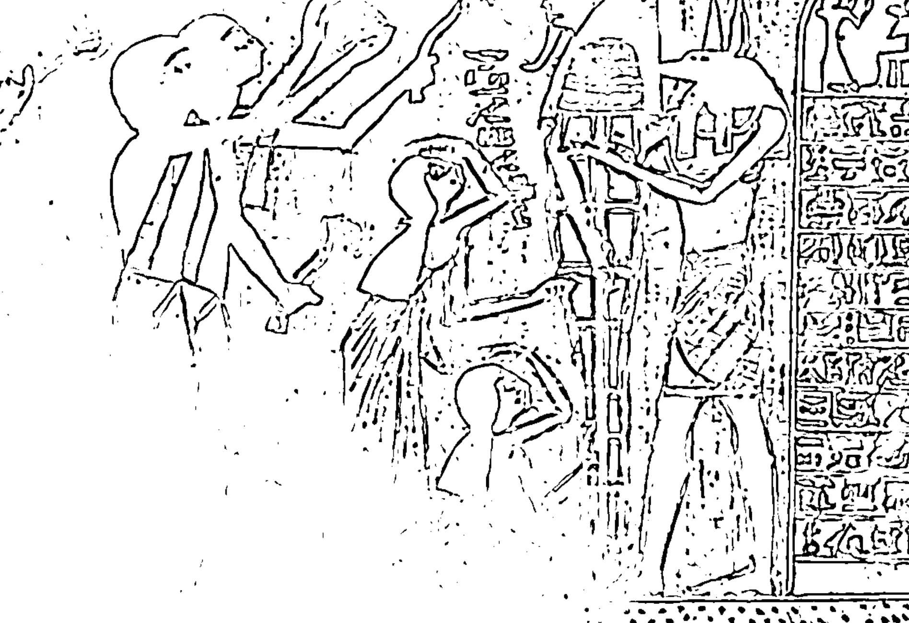

# 第2章 氤氲黑魔法。

隱密在歐洲大陸的神祕傳說

歐洲全稱歐羅巴洲（希臘語：Ευρώπη），意思是西方日落的地方。相傳眾神之父宙斯（Zeus）愛上了美麗的少女歐羅巴，於是他變成了神牛把她帶到了歐洲，並以她的名字給這片大陸命名。美麗的愛情傳說讓歐洲籠罩在一片神光中。

歐洲大陸佔地面積一〇一六萬平方公里，有美麗的伏爾加河和多瑙河，孕育著九十九％的歐羅巴人種（白種人），衍生出了古老的巨石文化、愛琴海文明、古羅馬帝國，以及後來的日不落帝國、日爾曼民族。如今，歐洲大陸科技發達，人民安居樂業，許多城市已經成為國際級的現代大都市，而歐洲小鎮則

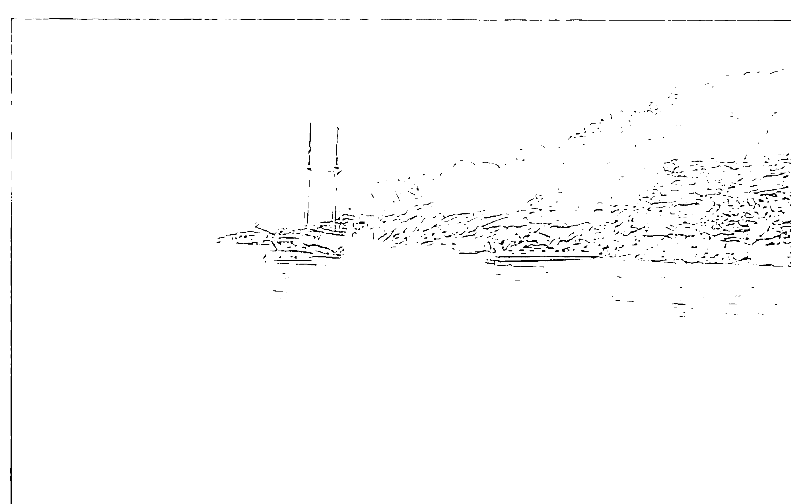

©Katonams, Wikipedia Commons

△ 愛琴海文明是歐洲文明的起源之一。

完整保留中古歐洲的美麗風貌，令無數的人心馳神往。

可是，誰又會想到在這個美麗安定的大陸上，曾經發生了人類歷史上為期最悠久的黑暗巫術。曾經有無數人成為黑暗魔法的崇拜者，投入畢生時間研習黑暗法術。若要說有哪個地方曾經被巫術長期統治，那麼一定是歐洲。

西元一三四六年，強大的蒙古鐵騎出現在黑海的港口城市卡法（Kaffa）。他們在攻城掠地時，用拋石機將患鼠疫而死的屍體拋進城內，展開了人類歷史上第一次有記載的大規模細菌生化戰，也揭開了歐洲歷史上噩夢時代的序幕。

之後，人鼠共通傳染的瘟疫在歐洲爆發，人們給了它一個恐怖的名字——黑死病。從一三四八年到一三五二年，黑死病把歐洲變成了真正的死亡之地，僅僅四年間就有大約二千五百萬歐洲人因此死亡。之後的三百多年裡，黑死病不斷造訪歐洲各大城鎮，死亡的陰影始終威脅著那些劫後餘生的人們。儘管準確統計當時歐洲的死亡人數已不可能，但是許多城鎮留下的紀錄卻見證了瘟疫所帶來的驚人損失，有些城市甚至一夕之間被黑死病籠罩，生還者僅以個位數計。

瘟疫肆虐，毫不留情，疾病隨時都可能奪走任何人的性命，驚恐的歐洲人找不到可以依靠的力量，於是，他們開始把所有的希望寄情於宗教。

宗教統治在抵禦黑死病的過程中逐漸抬頭，人們開始依靠宗教的巫醫們為自己的孩子和妻子尋找生路。許多宗教巫醫們也為解救眾生而殫精力竭。誰也說不清黑暗魔法的誕生，究竟是為了解救眾生，還是為了控制生命。總之，歐洲大陸自此開始了長達數百年的宗教統治，史稱黑暗中世紀。

至今為止，在歐洲大陸上還流傳著數不盡關於黑暗中世紀的神秘傳說，其中包括讓現代不少玄學愛好者心

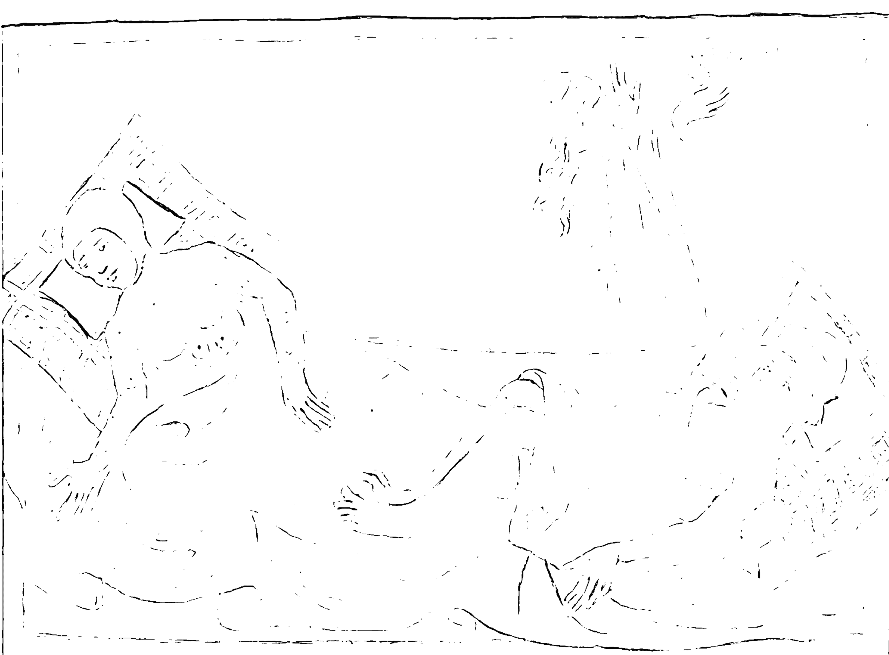

◎來源：Fingalo, Wikipedia Commons

△ 從一三四八年到一三五二年，黑死病在歐洲大規模肆虐，僅僅四年就造成大約二千五百萬歐洲人死亡。

# 第2章
黑魔法：隱密在歐洲大陸的神秘傳說

## 馳神往的黑魔法與黑巫術。

黑魔法，或許是最醜惡的魔法儀式之一。它被認為是人類和惡魔訂定的契約。黑巫師通過與魔鬼達成契約，借助邪靈或惡魔的幫助，操控死亡、致病、迷惑、嫁禍等。大多用於對付仇敵或報復他人，偶爾也可用作治病、驅邪，或針對他人所施行的魔法來進行治療、防禦或反擊。

誰也不知道黑魔法是如何產生的。我們只能從歐洲現存的一些史料中瞭解，幾乎所有黑巫術的創造者都是宗教統治下的牧師或者巫醫，他們在當時的宗教舞臺上具有極為重要的地位。雖然這些魔法大多已經失傳，但是其所留下的傳說和故事，卻依舊讓人背脊發涼。

現在，讓我們一起走進黑暗魔法的世界，看看究竟有多少不為人知的惡魔傳說。

## 黑暗中的舞者——徘徊在十字街头的死灵法师

### ◎ 死灵法师的现代化身——通灵术的故事

上个世纪的某一天，美丽的伦敦一如往昔般阴雨绵绵。严谨而浪漫的英国人在充满古老气息的城市里穿行。优雅地戴着手套的绅士对着往来的行人露出和善的笑容。夕阳余晖里，有年迈的夫妇牵着手悠闲散步。和谐而美好的一天即将结束。

谁也没有注意到，就在郊区一处荒无人烟的坟场附近，聚集了一群奇怪的人。他们大多表情木讷，神情严肃，手上拿着各式各样的法杖，众人围在一起，注视着一具已经腐烂的男性尸体。

绵绵细雨打湿了这名男子入葬时穿着的西装。若仔细观看，人们能看到这男子长得很漂亮，如果他可以睁开眼睛，那双眼睛一定是湛蓝色的。可是，如同他逐渐腐朽的尸体一样，他死前的表情是如此忧郁而令人心碎。仿佛只要站在这具尸体面前，就能感受到一种来自灵魂深处的悲伤。

这些人是谁？他们究竟要对这具可怜的尸体做什么呢？

男子名为曼蓝亚，生前住在寇克小路（The Cock Lane）的一栋木屋里，多年前死于自杀。可是就是几天前，就在他位于寇克小路的旧居里，有人看到他和他死去妻子的姊姊一起出现。他们有时只是在房间里走动，有时却静静地站在窗口望着来往的人群。

灵异现象吓坏了人们，但谁也不知道究竟原因为何。寇克小路的恐怖鬼屋让附近居民无不胆战心惊。

当科学无法解释的时候，巫师们出现了。世界各地的巫师们不远万里来到伦敦，聚集在这处荒芜的坟场。他们宣称能透过通灵术和曼蓝亚沟通，以求了解事实的真相……甚至可以让曼蓝亚复活。

朦胧细雨中，曼蓝亚的尸体被抬到一个施法圈的中心。当乌云散去，月亮升到半空中

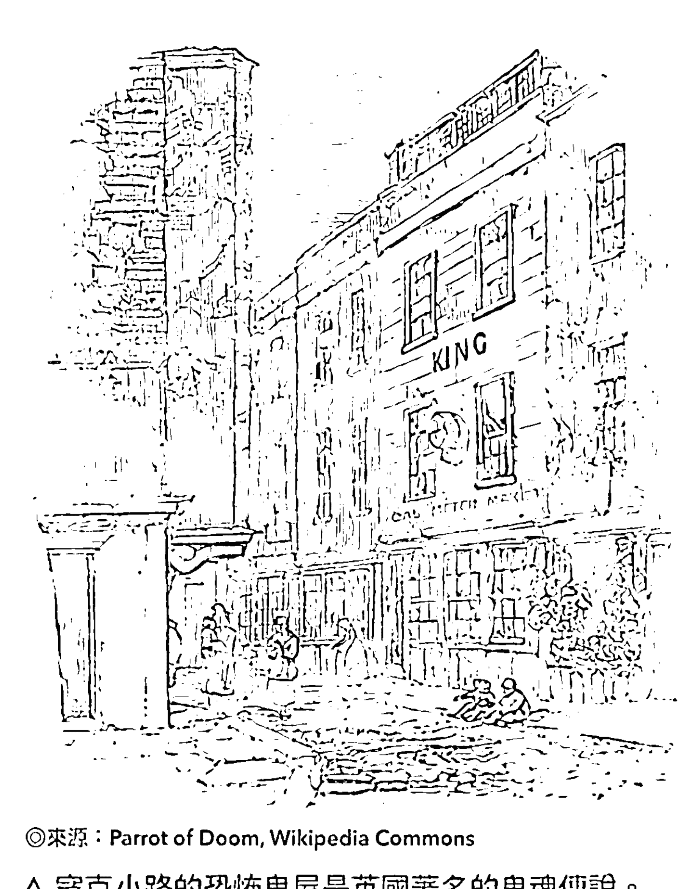

时，仪式正式开始。根据资料记载，一般巫师很难召唤像曼蓝亚这样对世间丝毫无所眷恋、因为绝望而自杀的灵魂，可是这些巫师依旧锲而不舍。
巫师们换穿死者的衣服，咏唱仪式赞美诗，运用极富戏剧性的仪式来召唤灵魂。最终，召唤术成功了，被曼蓝亚附身的巫师开始讲述自己悲惨的一生，他的声音尖利而充满怨毒。

一直到曼蓝亚叙述完毕，离开了通灵者的身体。巫师们才把他的骨骸和石灰粉混合在一起一并烧掉。

如今人们大多已经不记得关于曼蓝亚悲惨的一生，可是，关于巫术复活的故事却被采访拍摄的新闻记者记录了下来。至此以后，有关通灵术的报道层出不穷，想要透过这种方式与亡灵交流的人也比比皆是。一时间，消失了百余年的通灵术再次出现在世人眼前，甚至被拱上了通神的殿堂。

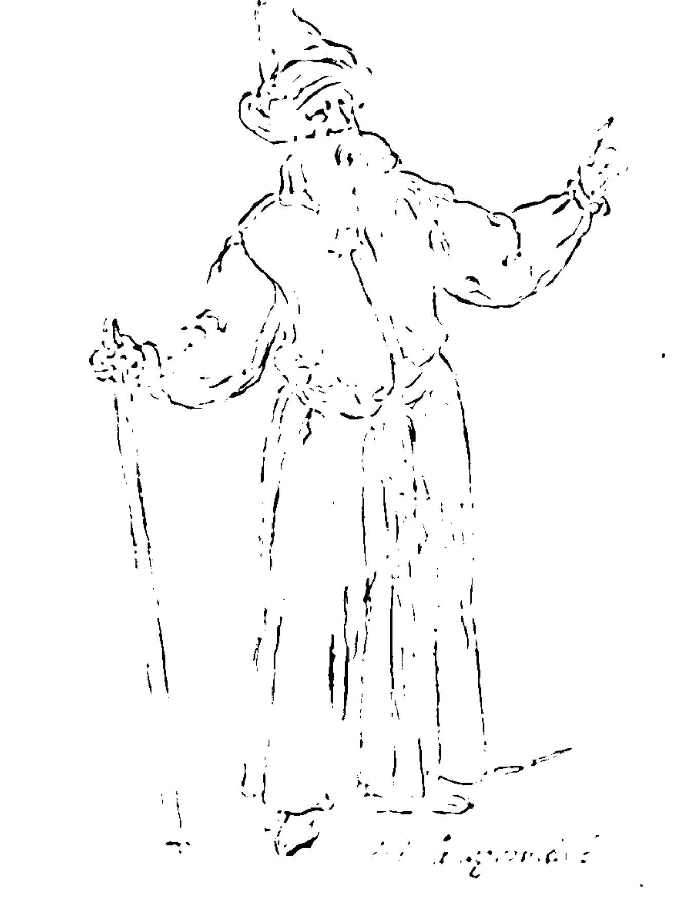

◎來源：JarektUploadBot, Wikipedia Commons
△ 通靈術脫胎於死靈術，巫師藉此召喚亡靈，宣稱靈魂可透過附身與生者溝通。

人们仿佛已经忘记，通灵术脱胎于死灵术，石灰粉和施法圈正是象征恐怖死灵黑魔法的标志。

我们不禁要问，死灵魔法真的可能卷土重来吗？

### ◎ 死灵法师的起源

十字街召唤法师，从分类上来说，是欧洲最恐怖的死灵法师之一。在现代最受欢迎的线上游戏「暗黑破坏神」（Diablo）和「魔兽争霸」（Warcraft）中，玩家有一个经典的职业——死灵法师，就是源自于欧洲中世纪。

当现代年轻人痛快忘我地操纵着游戏人物时，他们或许并不知道，其实，在遥远的中世纪，曾有很多人投身于死灵魔法门下，为研究死灵魔法倾注一生的心血。

死灵法师的出现可以追述到古波斯帝国。他们以操纵亡魂和尸骸为职业，他们虽是人类，却狂热地投身于死亡和腐败的暗黑魔法中，希望从人类对死亡的恐惧里，得到一切能满足欲望的强大力量。

西元前五五〇年，波斯王居鲁士二世（Cyrus the great，后称「大王」）消灭米底亚王国（Media）²，建立了一个延续二百二十年的强大帝国——古波斯帝国。建国十一年后，居鲁士二世又征服了巴比伦帝国（Babylon），开始了文化互相交融的大发展时代。到波斯帝国鼎盛时期，其疆土面积东起印度河流域，西至巴尔干半岛（Balkan），北起亚美尼亚（Armenia），南至埃塞俄比亚（Ethiopia），将近七百万平方公里土地，是世界上第一个地跨亚、非、欧三洲的超级帝国。

由于面积广阔，人口众多，不同宗教团体的信仰都受到认可并得到保护；不同民族的风俗和组织机构被保留下来，其中包括曾在巴比伦被关押无尽岁月的犹太人。他们回到了耶路撒冷，重建圣殿。由于拥有三大洲交汇的地理优势，以及宗教文化的相互渗透，波斯帝国的巫师们开始了无比繁荣的大发展时代。

在强盛的波斯帝国统治下，死灵法师逐渐从地下走向台面，之后的希腊、罗马时代，

> 1 居鲁士大帝Cyrus the great（西元前五九〇至五二九年），古代波斯帝国的缔造者（西元前五五〇至五二九年在位），是波斯皇帝。他以伊朗西南部的一个小首领起家，打败了三个帝国，即米底亚、吕底亚和巴比伦，统一了大部分的古中东，建立了从印度到地中海的大帝国。今天伊朗人尊称居鲁士为「国父」。
> 2 米底亚即米底王国，又称玛代王国、米底亚王国，是古伊朗一个王国，领土面积最大时西起小亚细亚以东，东至波斯湾北部，隶属印欧语系，是第一批在伊朗高原地区定居的民族。

## 波斯王居魯士二世建立了延綿二百二十年的強大帝國古波斯帝國。

黑巫師成為部隊攻防戰中的重要力量。到了中世紀，當天主教一統天下後，黑巫術又成為懲罰和掌控刑法的重要宗教勢力。

死靈法師共分成兩支魔法流派：一派是召喚和支配鬼魂的死靈派；一派則是鑽研死屍回魂大法的死屍派。這兩派都與現在被禁的黑魔法有著不可分割的關係。死靈派通常以開壇和咒語來施法，而死屍派則通過掘屍和盜墓從而獲得所需要的恐怖黑色魔力。

### ◎ 盜墓與死靈法師

死靈法師最害怕的就是惡靈反噬。法師也是人，他們在追求魔法極致的同時，也害怕由於實力低下而被強大的惡靈吞噬。為此，很多死靈法師開始研究增強自己魔力的方法。

經過死靈法師經年累月的研究，他們發現死屍上有許多物質，可以幫助他們控制和抵禦惡靈。特別是那些在暴力中死去或夭折的死屍，是最上乘的藥引。這些屍體能夠幫助他們開啟地獄的大門，召喚更為強大的惡魔。為此，恐怖的盜墓死靈法師出現了。他們在幽黑的深夜偷偷潛入墓地陵園，掘開墳頭，從死屍頭上刮下苔草，並尋找那些因受辱而死的屍體，從他們的屍體上拔下小片指甲或牙齒、頭髮，割下耳朵、挖出眼睛，切下還沒腐爛

由於盜墓死靈法師的出現，死靈派逐漸被所謂巫術的正統力量所驅趕。但也由於盜墓死靈法師的出現，死靈派的魔法也變得更加強大。他們逐漸從隱晦的暗處轉入明處。在午夜時，盜墓死靈法師會在墓地旁邊吟誦黑暗詩篇，如：「亡靈復活近我身」（Ego sum te peto et uidere queo，亡靈咒語之一）；或是進入教會墓地挖掘死屍。可憐那些充滿著怨恨的靈魂，不僅在死前被人蹂躪，在死後也不得不用最後的怨念作為死靈法師能量的養分。

那麼，這些盜墓死靈法師的最終目的究竟是什麼？

答案是：復活。死靈法師的極致追求不是殺人，而是讓人死而復生。在歐洲巫術史的記載中，能力強大的死靈法師可以令剛死在絞架上的人復活！同樣的，這需要付出更為巨大的代價，比如：盜墓死靈法師不僅將屍體切割用於魔法，他們也會食用屍體，尤其是那些未受洗就夭折的嬰兒。他們相信，嬰兒的屍體具有讓魔法更為強大的能量。

由於這些越來越可怕殘忍的行為，死靈法師於十六、十七世紀開始遭到驅逐。教會高喊他們是魔鬼的僕人，是毀滅的象徵。最終，高高在上的死靈法師被趕下了神壇，他們無家可歸、無處可依；最終，這些被逼到絕境的死靈法師逐漸變成了如今的通靈師。他們不再召喚魔鬼以達成目的，而是透過與亡靈溝通，藉以預知過去與未來。

可笑的是，被教會驅逐多年的恐怖死靈法師，在媒體的宣染下，現在又逐漸被人所崇拜和接納。

### ◎ 最古老的死靈召喚術——十字街頭的死靈召喚

惡魔召喚可能是所有巫術中集恐怖與危險之大成的巫術之一。當然，它也是所有巫術迷們最心馳神往的最高領域。許多人會從古老的典籍中尋找召喚方法，然後在家中試驗，但結果卻總是難以盡如人意。

在古老的歐洲大陸，有一個關於十字街頭惡魔的恐怖傳說。相傳，掌握死靈咒語的人，可以在荒廢的十字路口召喚出恐怖的死靈惡魔。他們與惡魔簽訂契約，並從惡魔身上獲得各種驚人的力量，卻也一併將自己的靈魂作為代價，賣給了惡魔，從此，他們便成為惡魔在人間的代言人。

時至今日，許多歐洲人依舊相信十字街頭的恐怖傳說，許多描述鬼神的故事和電影中都鉅細靡遺地描述了這種巫術的始末。其實，十字街頭死靈召喚術是死靈魔法術中要求最為嚴格的一種，但是卻不一定需要在十字街頭。

按照《巴克蘭德的巫術全書》（Buckland's Complete Book of Witchcraft）的記載，恐怖的召喚術通常需要尋找一些荒廢的十字路口、地下室、廢墟、人跡罕至的森林或枯萎的灌木叢。巫師會將一些象徵力量的同心圓和難以形容的符號畫在施法場地當中。偶爾法力不夠強的法師，會邀請另一個法師作為自己的助手。同時，巫師會準備一樣器物作為辨認魔鬼的標誌，一般稱之為「蓋羅帝俄斯死靈鐘」（The necromantic bell of Giraldius）。它的功效只有一種——辨認死靈。當死靈出現時，死靈鐘便消失。

沒有法師可以預言他究竟能召喚出什麼樣的惡魔。它們或許是不甘心離開人世、在人間流連不去的怨靈；也可能是充滿邪魔力量的惡魔之子；甚至可能是無數冤魂集結而成的死靈巨獸。但當死靈法師開始作法的一剎那，這一切恐怖便已經註定。

在夜深人靜的時候，陰氣最充足的午夜，死靈法師拿著擁有魔法力量的權杖，緩緩地走到施法場地中央，低聲吟唱著只有巫師才明白的咒語。傳說，在巫師的低吟聲中，四周的景物會不停地顫動，天地也為之黯然失色。在場地當中被施咒的圓圈中心，會聽到撕心裂肺的吼叫，彷彿未知世界的大門正打開，毀天滅地的力量即破門而出。

法力低下的法師，不得不依靠死靈助手的幫助，一同抵禦來自法陣中央的衝擊。當四周的顫動慢慢停止，受到召喚的恐怖死靈會在風暴中的陣眼出現。它閃爍著陰森的雙眼注視魔法師。如果你以為這一切就這樣結束，那就錯了。惡魔可不會那麼輕易被人掌控。這只是下一波更猛烈衝擊的序曲。在少許的停歇後，十字街魔鬼會狂亂地衝擊魔法陣，併發出讓人無法忍受的尖叫，以及恐怖且無法聽懂的怨咒。力量強大的死靈巨獸甚至會在圈中狂嘯，威脅著要把死靈師撕得粉碎！這是最為危險的時刻，如果死靈法師沒有辦法守住自己的領域，最後他會被這樣的能量風暴給擊潰。

所有逆天的法咒都要付出難以想像的代價，死靈反噬就是對死靈法師最嚴厲的懲罰。死靈法師們都知道，一旦自己被死靈反噬，那麼他失去的不僅是他的生命，還有自己的靈魂。許多史料中都記載，當死靈法師遭到死靈反噬時，他們有的會當場七竅流血而死，有的則會被惡靈佔據肉體成為活死人，更有甚者，法師會直接變成惡靈的奴隸。

死也要守住！這是一場恐怖的博弈，勝利的一方，將成為另一方的主宰。

當法術成功的時候，死靈們會變形為裸體的幽靈，然後回答巫師的提問和要求。這些要求有些是充滿善良和美好的祈求，比如驅趕瘟疫、救治親人；但有更多是充滿仇怨的，比如復仇和詛咒。

無論是什麼樣的要求，被征服的惡靈都會替法師完成任務。而法師唯一需要付出的代價，就是自己靈魂。這些死靈法師將自己的靈魂與惡靈連結，藉以驅使惡靈。這些生前充滿仇怨的靈魂，即使在死後也被人無情地利用。它們瘋狂盲目地為法師復仇或祭獻靈魂。

在這個剎那，誰也說不清，究竟誰才是真正的惡靈。

當一切結束以後，死靈法師必須讓這些惡靈離開人間。他們會在周圍預先撒下成分以硫磺為主的毒霧，並用生石灰將特定死靈的屍體燒燬。在此之前，死靈師務必要讓自己留在聖圈之中，如果非要離開的話，一定要再舉行一些其他的儀式布設結界才行。

除了消散在空中的靈魂外，這處荒廢十字路口的所有花草也要被一同燒燬，再將其灰爐深埋在地下。或許法師還會緩慢地吟唱著安魂曲，但是那些被利用殆盡而遭拋棄的靈魂，卻早已失去了蹤影。

整個儀式過程充滿了恐怖的危險，即使最輕微的失誤也會導致死靈師的死亡，甚至是靈魂上的永久創傷：十七世紀時，名盛一時的埃及死靈師緊預言家奇安剛吉（Chiancungi）就是因為心急離開了聖圈，最後被怨靈的力量衝擊壓碾，魂飛魄散……

當死靈退盡時，真正的死靈鐘會再次出現。它代表著所有的一切都已歸為塵土。死靈鐘則會被法師埋在儀式地點七天七夜。

而後，原本蕭瑟的十字街口會更加荒蕪，片草不生的土地要經過上百年才會再次長出花草。消散在硫磺毒霧的靈魂被扔棄在這片土地上悲傷的哭泣。若再有人路過這裡，他會被那冰涼氣氛驚醒，飛也似逃離此地。或許正等著這蕭瑟路口的，只有下一位死靈法師吧！

## 女巫之槌——在十字架前殞身的絕代女巫

### ◎ 從智慧女神到惡魔的女僕——罪惡的女巫入教儀式

就如同本書序言中所說的，巫師的出現幾乎和人類文明同步。他們掌握著最古老的醫術、占星術，以及各類至今人類尚不能全盤理解的自然法則。人們稱他們為「巫」，他們也接受著來自百萬民眾的崇敬。最早的女巫就是從這一批巫師中產生。她們以自己無與倫比的神秘力量，得到民眾的崇拜。

為了把她們與男巫分開，人們尊稱她們為——「witch」，智慧之女。世人認為她們傳承了神和精靈的力量，具有通神能力。她們可以幫助陷入困苦的人們獲得希望，也能對宗教異端給予最嚴厲的打擊。許多女巫的研究者們聲稱，在古代社會，女性擁有許多特殊的神秘能力，而有更多的女性試圖學習這些能力。這些女性都最終被統稱為「女巫」。

隨著歷史巨輪不斷推進，母系社會崩壞瓦解。女巫高高在上的地位遭到了致命性的打擊。不知從何時起，有人發現女巫不僅僅能與神溝通，她們也可以與魔鬼做交易。特別是十五到十七世紀間女巫審判的歲月裡，不少女巫都承認她們在與神靈交流的時候遇到了魔鬼。她們不得不與魔鬼完成交易，藉以獲得力量。

至此以後，女巫從智慧之女淪為惡魔的女僕。女巫的地位再也不是高高在上的當權者，而只能躲在陰暗的角落裡偷偷施行魔法。被剝奪神壇力量的女巫師們，為了繼承女巫力量，開始學習惡魔召喚術，祈求透過與魔鬼的契約，成為靈魂和生命的主宰。

無數的文獻中都記載，女巫為了完成與魔鬼的交換而進行罪惡的入教儀式。這些儀式因為充滿被視為墮落象徵的情慾色彩，因而被認定是最邪惡的巫術，為無數正派人士所不恥。為了完成惡魔契約，女巫們不僅要將自己的靈魂祭獻給魔鬼，更要把自己的肉體敬獻給惡魔。她們必須向惡魔證明自己靈魂與肉體的虔誠。

在相關記載中，新入會的女巫必須宣讀自己的誓言，並將其誓約焚燒獻與惡魔，儀式進行同時，會有其他女巫一起吟唱著死亡咒語。若有女巫違背誓言，將受到最嚴厲的打擊。而在入會儀式結束後，隨之而來的就是充滿墮落氣息的奉獻。

傳說中，惡魔對女巫認可最直接的表達方式就是對「性的滿足」。所以，當女巫獲得惡魔的首肯後，就必須將自己貢獻給惡魔，在兩性交融中完成與惡魔簽訂契約的過程。當入教儀式一結束，性的儀式便已在旁等候。通常惡魔會附身在一名男性身上，完成與女性之間的性交易。

雖然女巫入教是一種契約關係，但是要獲得惡魔的首肯可不是那麼容易的。一般認為，與惡魔性交可以帶給女巫與常人性交時所無法達到的性高潮。陷入迷幻中的女巫將再也不会忘記惡魔的存在，甚至祈求性儀式的再次來臨。參與入教儀式的其他女巫們會一起觀賞這一幕，並從中更加確信自己的選擇。

當完成了這一儀式後。那些女巫便已不再是傳統意義上的人間女性，她們的心靈及魂魄皆臣服於惡魔。她們可以透過與惡魔的契約，使用惡魔的能力。比如詛咒、治病、預見過去與未來。她們也可以進一步參與之後的「女巫集會」或者「女巫派對」。

在所有的入教儀式中最神秘的，也是所有儀式的最後一步，是一種叫做「鏡映文字」的儀式。女巫將自己的入教誓言進行神魔烙印。它們一般使用反射鏡寫作方式，從左至右，書寫在特定的紙張上，然後烙下奇異的魔印，以完成惡魔契約。

在現代研究中，不少研究者對這樣的入會儀式深惡痛絕。不相信女巫魔法的人們，認為這些女巫是被男巫欺騙而獻出了肉體。可是，當我們研究女巫為何最終委身惡魔時，不由得為這些曾經的智慧之女感到悲哀。究竟是女巫放棄了神壇，還是神放棄了祂的子民呢？歷史似乎也無法給予我們答案。在十五世紀到十七世紀的歐洲，至少有二十萬女巫死於史上最大規模的獵巫行動，其中不乏那些為民請命的正直女巫醫們。可惜，時至今日，當我們再難找到女巫們的蹤影時，她們或許正在某在角落，執行著惡魔的使命！比如那些不敬者施以疾病和苦難。

### ◎ 持續三百年的塞倫女巫謎案

一九五七年，美國麻塞諸塞州（MA Massachusetts）法庭門口聚集著各式各樣的示威者，其中有牧師、平民，以及更多的巫術觀望者。他們舉著各式各樣的抗議牌，有要求為死者請命的，也有要求還真相於民的，更多的人則拿著風行數百年的《女巫之槌》（Malleus Maleficarum）³，要求法院絕不能為惡魔的女僕平反。

這究竟是怎樣的一場審判，居然能讓如此多的民眾關注？當人們將目光集中在這起案件中，我們發現，這場審判居然已經歷時三百餘年！案發地位點就在三百多年前波士頓東北三十公里的塞倫鎮。

如今的塞倫鎮被稱作世界上獨一無二的「女巫鎮」，吸引來自世界各地的巫術愛好者和觀光客。可是，在十七世紀九○年代，這裡發生了女巫滅絕史上重要的案件——塞倫鎮謎案，正是它把中世紀的獵巫行動帶到了美洲大陸。

一六九二年，美國建國前一百餘年，來自英格蘭的淘金者在波士頓北部新英格蘭地區建立了群聚英格蘭人的塞倫鎮。那天，人們如往常一般，在每個星期天早晨來到教堂，向上帝禱告，接受天父的恩賜。正當牧師以聖父之名為小鎮居民祈福時，突然有兩個少女中斷禱告，痛苦地蜷縮在地上，不停打滾和抽搐。鎮民們焦慮地請醫生來為她們診治，可是醫生卻找不出任何病症。隨後鎮上其他女孩也開始出現相同症狀。她們不分晝夜、不分場合地突然發病，不時無法克制地尖叫著。

一開始，少女們只是不停抽搐與尖叫。慢慢地，有人開始對著旁人看不見的東西嘶吼，驚恐地在抽搐中驅趕肉眼看不見的邪魔。

「魔鬼，這一定是受到了魔鬼的詛咒！」鎮民開始恐慌，他們害怕塞倫鎮被惡魔控制，有人開始逃離小鎮。一時間，塞倫鎮瀰漫著恐怖氣息。

正當所有人不知所措，只能依靠十字架不停禱告，祈求能破除惡魔時，有人指控三名女鄰居是女巫，是她們與魔鬼簽訂契約，對少女們施巫術。漸漸地，人們開始把二年前襲擊隔壁安多佛小鎮的瘟疫與這次事件聯繫起來。人們開始相信，是女巫詛咒了塞倫鎮，她們必須被處死。

一連串的女巫審判由此展開，並且從塞倫鎮延燒到波士頓周遭的小鎮。審判前後歷時一年餘，共有一百多人被捕入獄，她們多半是離群索居、沒有家人朋友的女性，其中包括被後來審判官稱為「地獄女皇」的瑪莎·卡利爾（Martha Carrier）。

據傳言，瑪莎與魔鬼為伍，逼迫鄰居與惡魔簽訂契約。只要有人與她不合，她便能詛咒對方的牲口死亡。有人甚至看到她站在山崗上起舞，讓蔓延在她家附近的野火轉向，襲擊曾經與她不和的人。在那場大火中，她周圍鄰居的莊園被燒成了灰燼，而她卻安然無恙。

恐怖的女巫詛咒在整個新英格蘭地區蔓延，這場女巫之禍最終變成了一場剷除異己的恐怖人為陷阱。當時風聲鶴唳，人人自危，為求自保，女兒出賣母親，鄰居互相指責。至審判之火熄滅時，已有十九人被處以絞刑，一名拒絕懺悔的老婦人甚至被石塊活活壓死，而事實是，有更多的人死於冤獄。

塞倫女巫審判案，從此成為美國歷史上最震懾人心的悲劇。這些慘死者的後人，在其後的三百多年間不停地向法院上訴，為死者尋求公道。到二○○一年，至少有六人被法院判決無罪。事實上，在塞倫鎮死去的女巫，與歐洲中世紀在獵巫行動中死去的女巫相比，不過是滄海一粟。時到今日，從德國弗萊堡（Freiburg）古城中心的十字路口向南望去，厚實的石頭牆上，依舊鑲嵌著一塊曾經沾染斑斑血跡的金屬牌，上面寫著「一五九九年三月二十四日，瑪格蕾塔（Margaretha Mößmerin），卡塔琳娜（Catharina Stadelmenin），安娜（Anna Wolffartin）被斬首、焚燒。」，紀念牌與百米外的馬丁門（Martinstor）遙遙相對，讓人恍如再次身陷黑暗的中世紀，遙望著熊熊烈焰燒死了那些無力抵抗的柔弱女性。

可是，在塞倫鎮陷入瘋狂的少女並非假象。究竟是不是有人對她們下了詛咒？女巫詛咒到底存不存在？有人說，中世紀的獵巫行動是一種宗教迫害，有人說那是男權主義對女權主義的攻擊，也有人說那是上帝之劍出鞘，要斬斷所有惡魔在人間的代言人。

女巫真的如此恐怖嗎？她們的存在究竟是為了什麼？或許我們應該更深入地瞭解她們，試著走進女巫的世界。

### ◎ 破解女巫四大利器

無論從前的女巫地位有多麼崇高，如今的女巫們則更多是傳承了邪惡的力量。她們大多匍匐在可怕的角落裡，等待金主的來臨，以金錢為代價，交換她們從惡魔那裡獲得的力量，幫助那些找上她們的人達成願望。

女巫們為了證明自己身分，常常需要四種要素，以確保施法成功。

第一，上蒼賜予的「女巫印記」。無論是從前的智慧之女，還是如今的惡魔女僕，她們的能力都被認為是與生俱來，是故在她們身上總會留有所謂的「魔印」。比如：蝙蝠形狀的雀斑、類似小動物形狀的胎記、腫脹的乳頭等。

除了先天的印記，後天所得到的刀傷、動物咬痕都有可能被認為是惡魔的印記。凡是具有這些「印記」的人，都被認為是最具有女巫潛質的對象。如果你的身上有這些不同尋常的印記，請注意，或許一不小心，就會有惡魔找上你。

第二，傳承而來的「藥草」技能。最古老的女巫，其實也是最古老的巫醫。她們使用藥草幫助遠古人民獲得了生的希望。可是，隨著醫藥科技發達，人民拋棄了這種古老的藥草文化。日漸衰弱的「藥草」知識也從治病變成了詛咒之用。

越來越多的研究發現，女巫詛咒中所使用的藥草搭配是具有化學作用的。比如：被稱為「夏娃誘惑」的愛戀詛咒術，就是用一種名為艾蜜萊·康帕內的植物根部製成。這種草藥具有極強的春藥作用。將它溶解在腐敗的葡萄酒中，注入特製的人偶，帶到被施以法術者的面前，就容易讓人產生性衝動。

而更常用的女巫藥草——歐傷牛草（Mandragora Officinarum），同樣被檢測出具有強烈的迷幻藥作用。可惜，這種調和藥草的方法是秘傳之術，如果由非女巫者嘗試學習，得到的結果只有毒性發作，危及人體健康。只有傳承了「女巫」頭銜的人，才能正確地運用這些「藥草」。

第三，詛咒器物之源「人偶」。和非洲的「巫毒娃娃」不同，女巫的「人偶」大多用木頭和黏土炮製而成，有些甚至是極為精緻的手工藝品，被收藏在博物館的顯眼位置。可是當人們認真剖析這些人偶，肯定會被驚嚇到。因為這些人偶的燒製過程中還混入了「人血、碎骨、動物或人類的毛髮，甚至是具有毒性的「藥草」。如果是用來祈求詛咒死亡的人偶，還必須混合詛咒對象的部分身體組織，甚至製作成被詛咒者的樣子。

如果你有一天走進博物館觀看女巫的詛咒人偶，千萬不要出於好奇而忘神地凝視，這種夾雜了女巫詛咒之術的人偶可是會讓人致命的。特別是那些越精美的人偶手工品，頭部內越有可能被刻著各類魔法符號。而這些魔符的使用，正是女巫與惡魔簽訂契約後被賦予的恐怖力量。當然，除了人偶外，女巫還會有其他的詛咒物，比如骷髏等，但這些都不能與精緻人偶的危險性相媲美。

第四，與毒物為伍的「女巫住所」。除了與惡魔簽訂契約外，女巫的魔法更常表現在運用自然之靈行事。而所謂的自然之靈，指的是如蛇、蝙蝠、貓等傳說中的通靈之物。

所以，女巫的住所也成為了巫毒之物的家。在法力高強的女巫家中，甚至能發現數百隻形貌各異的小動物。牠們一般不會出現在人前，只有當女巫施法時，牠們才會從陰暗處緩緩出現。

這些詭異的生物中，有些被殺死用以充當詛咒的道具，有些則作為奴僕、嘍囉，執行女巫的命令。十七世紀時，德國巴布林固市市長喬尼伍斯的妻子，正是由於在家中發現了許多毒物而被當作女巫處死。

## 魔鬼進行曲——站在天神背後的黑彌撒之舞

### ◎ 瘋狂的撒旦崇拜

《聖經》中的天父與聖子充滿了慈愛，他們可以為了凡人捨棄肉身，承受苦難。而與善良的天神相對應，在另一個國度還有一個名為撒旦的惡魔。他與天神相對，代表著原罪與所有邪惡力量的源泉。

不知從何時開始，這個世界上出現了一種與天神崇拜相對應的恐怖宗教——「撒旦崇拜」。

一九八九年四月，墨西哥有十三名青年，在「撒旦崇拜」的儀式中被當作活祭品殺害。他們當中有人被槍殺，有人被烹煮而死，更多人是被活活虐待而亡。

一九九三年，十七歲的少年漢德列克宣稱自己是「撒旦教信徒」，他夥同自己的夥伴將十五歲桑德羅騙到森林裡電死，並進獻給撒旦。

從上個世紀八○年代開始，越來越多的歐洲青年捨棄了一直以來信奉的天父，投入撒旦的懷抱。

他們都在尋求同一個問題的答案：「究竟是神創造了撒旦，抑或撒旦原本就是和天父同等強大的存在。撒旦究竟從何而來？」

在神的聖光籠罩下，人性的私慾被無情地剝奪。那麼，既然天父要剝奪人的私慾，為何在最初又要賦予人這樣的權利？

如果魔王撒旦本身就是和天父同等強大的神靈，那麼我們為何要相信天父而不相信撒旦呢？

哲學已經無法對這些問題給出令人滿意的回答，即使聖經也無法提供解答。於是不知從何時開始，有一群人拋棄了通往天堂的道路，而將地獄視為最理想的歸宿，將撒旦當成一生追求的目標來崇拜。

據不完全統計，撒旦崇拜廣泛流行在墨西哥、澳大利亞等地，擁有信徒上百萬人。他們常常手拿撒旦教會的創立者拉維（Anton LaVey）的著作《撒旦聖經》（The Satanic Bible），將動物和人殺死獻祭給自己的偶像撒旦，以獲得更強大的力量。

根據《撒旦聖經》的描述，撒旦是一位具有「大能」的神靈，代表著人性中最正常的私慾。在拉維列出的九條撒旦信條中包括：撒旦代表了放達（indulgence），而不是節制（abstinence）；撒旦代表了對那些應該友善的人友善，而不是把自己的愛浪費在那些忘恩負義的人身上（ingrates）；撒旦代表有仇必報（vengeance），而不是把自己的另一半臉給出去；撒旦代表了所有所謂的罪（sins），都是為了帶給身體上、心靈的和情感上的舒適（gratification）。祈求上帝是不停的贖罪，而祈求撒旦只需要付出相應的代價。

在這些極其具有吸引力的號召下，許多失意的、落魄的年輕人叛離教會，開始了撒旦崇拜，而幾乎已經消失的黑彌撒也再次進入人們的眼簾。

他們殺死同伴、姦淫婦女作為召喚儀式的開場白，通過動物和人類的鮮血迎接來自地獄的惡魔之王。

而這恐怖的黑彌撒巫術，是否真的能召喚撒旦的降臨呢？

### ◎ 黑彌撒之舞

黑彌撒的起源如今已經無從瞭解。人們甚至不知道黑彌撒是不是魔鬼留給人們的一道魔法大餐。總之，中世紀一本叫做《洪諾留斯之書》（Grimoire of Honorius）的巫術典籍中，詳細記載了這種以動物和兒童獻祭以鼓勵魔鬼活動的恐怖祭祀儀式。

在《洪諾留斯之書》中，將黑彌撒與傳統的彌撒活動進行了對比。傳統的天主教選擇在陽光燦爛的星期天上午，開始每週的彌撒。晨光中的彌撒被分為兩部分：祈禱和領聖體，包括了誦讀《聖經》、講道、正祭祈禱和播撒聖體聖血。

而黑彌撒則與傳統彌撒截然相反，他們會在漆黑的夜裡，選擇一個破敗的教堂。反叛的牧師將妓女推上祭壇。牧師自己則穿著黑色的法衣，衣服上裝飾著一頭羊，將十字架倒掛，這些都象徵著撒旦。他們一邊點燃黑色的蠟燭，一邊在聖壇上擺滿貓頭鷹、蝙蝠、癩蛤蟆等帶著不祥象徵的動物。他們一邊向撒旦祈福和禱告，一邊以各種形式展開狂歡。他們相信，只有向撒旦展示出自己最原始的人性和私慾，才能得到撒旦魔王的垂青。

在黑彌撒最後的祭祀步驟中，裸體婦女的身體被當作神壇，她們會被毆打甚至割下生殖器。兒童祭祀更為殘忍，未受洗禮的孩子被送到神壇面前，黑教士用鋒利的匕首劃開兒童的喉嚨，在孩子戛然而止的哭喊聲與鮮血中禱告。最後，他們會在神壇前發生讓天主教這些讓人驚異的恐怖黑彌撒在異教徒中廣泛流行。其中包括了法國國王路易十四（Louis, Dieudonné）的情人。據說，她為了得到國王的寵愛，不惜重金請來懂得黑彌撒儀式的反叛教士。教士在黑彌撒中使用了最恐怖的兒童祭祀，將一個沒有受過洗禮的孩子活活殺死，並將他身體的一部分加入國王的餐食中。果然，那名情人成為路易十四眾多情人中關係維持最長久的一位。

可是，黑彌撒的執行卻也不是那麼容易的，它甚至比女巫的魔鬼契約更為天主教所不容。因此到了十八世紀，這種黑彌撒幾乎銷聲匿跡。直到二十世紀，黑彌撒再次死灰復燃。一九六四年，蘇格蘭一位長老會的教長發現在一座已毀壞的教堂中曾經有人舉行過黑彌撒，他看到一本殘缺不全的聖經，一只被破壞的聖杯和聖壇上用粉筆畫的一個顛倒的十字架，以及地上淋漓的鮮血。誰也不知道，在這個荒蕪的教堂裡，曾經為了滿足某一個人的私慾，而讓另一些人受到難以忍受的非人待遇。

傳統的黑彌撒可以說是最兇殘的歐洲巫術，以他人的生命與鮮血滿足自己的人性慾望。信徒們將自己對撒旦的崇拜放在人性的對立面上。

可是，也正由於其力量的強大，即使知道要犧牲更多人的生命，依舊有許多人趨之若鶩。

今天的撒旦主義者們被鼓勵沉迷於七宗致命的罪行之中。恐怖的黑彌撒是否會成為新一輪的恐怖教義？

讓我們一起祈禱，它千萬不可成真。

## 布達佩斯郊外的古堡——血腥瑪麗的棲息之地

### ◎召喚血腥瑪麗

「血腥瑪麗」（Bloody Mary）在西方是一個十分流行的詞彙。有人說它是一種雞尾酒，由伏特加、番茄汁、檸檬片、芹菜根混合而製成，其色味濃烈如血；也有人說，它是一種遊戲，代表著西方青少年樂此不疲的通靈戲言；而更多的故事則起源於歐洲中世紀，是關於一個叫做血腥瑪麗的鬼魂。

二十世紀七○年代，在歐洲北部的一座著名學府裡，出現了一宗恐怖的兇殺案。一名漂亮的女學生滿身是血地倒在學校洗手間內。她死前表情驚懼，姣好的五官遭到毀容，雙目也被奪去，死狀淒慘。警方展開偵查，可是卻一無所獲。這名女生沒有仇家，也不像是被人搶劫或者強姦，可是她卻死於非命。一時間，關於校園變態殺手的傳聞讓當地人心惶惶。在徹查了所有相關證人之後，他們一致的口供內容讓人聞之悚然。所有的證詞和屍體的死狀，都指向了一個似乎不該出現在人間的恐怖惡靈——血腥瑪麗。

和許多與血腥瑪麗有關的兇殺案一樣，故事開始於一群女孩子之間的勇氣攀比。年少輕狂的她們相約要在洗手間裡召喚血腥瑪麗。最後，那名女孩走進了洗手間，從此再也沒有出來。

可以想像，在漆黑的夜晚，她獨自走進洗手間，將門鎖上，關掉電燈。在鏡子與自己的面前點上一盞蠟燭。當蠟燭點亮的瞬間，她還能看到自己略顯蒼白的面孔。接著，她閉上眼睛，集中精神，慢慢唸「Bloody Mary」三次。然後，再次睜開眼睛。這次，她沒有像她的同伴那樣幸運，她真的召喚來了那張醜惡的面孔——瑪麗復活了！

根據相關記載，血腥瑪麗是一個鏡子巫婆，她使用妖術奪去年輕女性的美貌和雙眼。相傳，當召喚術成功後，鏡子裡會出現一副皮肉被撕裂的面孔，鏡面及牆壁也會滲出血水。然而，召喚者卻連逃跑的勇氣也失去。就在召喚者的精神恐懼到達極限、快要崩潰發瘋的一瞬間，那張面孔的雙眼會閃爍無比懾人的紅光，一下子把人拉進鏡子裡。

當人們再次發現召喚者時，她們大多被人奪去雙目，而人不是死了就是瘋了。也許是因為並不是每一次都能成功召喚「血腥瑪麗」，所以，青少年們依然把召喚惡靈當成一種好玩的遊戲。就是出於這樣的好奇心，多少青春年華的少女已然慘死於惡靈之手。

### ◎ 血腥瑪麗與巫術「血浴」

上個世紀，由於血腥瑪麗殺人案件的數量上升，許多人開始尋找血腥瑪麗的起源，希望找出血腥瑪麗究竟是誰？而當人們漸漸鎖定血腥瑪麗的身分時，卻又發現了一個比召喚血腥瑪麗更恐怖的巫術——「血浴」。

「血浴」是最臭名昭著的歐洲古老巫術之一。其主要作用是讓女人恢復青春容貌，方式是用處女之血洗浴。使用這種巫術的人相信，處女的純潔之血能讓人煥發青春。血浴巫術的發源無從考究，但是將其運用到極致的兩名女性，都在歐洲歷史上以兇殘嗜血著世，其中之一就是擁有「血腥瑪麗」之稱的李·克斯特伯爵夫人（Countess Of Leachtice）。

李·克斯特伯爵夫人，一個生前以艷名和兇殘傳世的女人，她的真名眾說紛紜，但唯一肯定的是，她出生於匈牙利首都布達佩斯郊外的一棟中世紀古堡，同時也是古堡的主人。這棟古堡曾經是歐洲歷史上著名的四大凶宅之一，據傳還被貼上教皇的封印，並在建築物不遠處豎立一塊牌子，上面寫著「遊人勿進」。

相傳，李·克斯特伯爵夫人是當時歐洲出了名的絕世美女之一。在她的一生中，為她決鬥而死的青年貴族至少超過一百個。甚至在她六十歲那年，還有兩位浪漫的青年詩人因為得不到她的垂青而舉劍自殺。據野史記載，李·克斯特伯爵夫人喜歡穿著火紅色長裙出現在眾人面前。她就像一抹流動的火焰，讓青年貴族趨之若鶩。關於她驚世的美貌還有一種說法——男人們甚至分不清，這位李·克斯特伯爵夫人究竟是順著月光而下凡的天使，還是將要循著月光飄向天宮的聖女。

但事實上，在她美豔的外貌之下，毫無疑問地流著惡魔的血液。她保持了近七十年美麗的原因，就是使用了「血浴」巫術。

「血浴」必須用純潔少女的鮮血為引。每次洗澡前都要先喝下至少半升的鮮血，以激發體內的活動。接著，用剛剛殺死的少女的鮮血洗浴，以吸收鮮血中的精華。最後還要將這些少女的屍體埋葬在浴缸底下，藉以繼續吸收她們肉體殘餘的養分。

根據記載，李·克斯特伯爵夫人的私人浴室在古堡的最深處，這間浴室出奇的大，無論何時來到這裡，都能聞到一股濃重的血腥味。走近浴缸便能看到濃稠的鮮血依舊泛著熱氣。相傳李·克斯特伯爵夫人每次洗澡前，至少要殺掉兩名少女，以保證她的洗浴品質。她相信少女們的魂魄能夠驅走衰老和遲鈍。傳說李·克斯特伯爵夫人一生殺死了將近兩千八百餘名少女，這些死去的少女被全面埋在了她的私人浴室底下。

李·克斯特伯爵夫人似乎天生喜歡鮮血的味道，她身上總帶著濃烈的血腥氣，卻從不用任何香水掩蓋。可是，這樣的一朵食人玫瑰，竟然產生了一種無可名狀的妖異魅力，使得無數青年貴族為之傾倒。李·克斯特伯爵夫人的豔名遠播歐洲大陸，連法皇路易十四也不遠千里，拜倒在其石榴裙下。於是世人給予她一個名字：「血腥瑪麗」。

為了保有青春美貌而進行的恐怖殺戮，一直持續到法國大革命爆發之後。根據野史，當時憤怒的群眾抓住已近七十高齡的李·克斯特伯爵夫人，將她燒死在她自己的浴室中，並由教皇出面封禁古堡。

可是，這樣的塵封卻沒有讓這位嗜血的伯爵夫人就此從時空中消逝。相傳，由於她最後被燒死在浴室中，死時臉部被燒得面目全非，以致人們召喚出來的惡靈血腥瑪麗，必然要奪去年輕女性的面容和雙眼，否則絕不罷手。

### ◎「血浴」的另一位殺戮女伯爵——伊莉莎白·巴托里

除了李·克斯特伯爵夫人之外，在歐洲歷史上還有一位惡名昭著的「血浴」女伯爵——伊莉莎白·巴托里（Elizabeth Báthory）。

伊莉莎白·巴托里，出身匈牙利名門巴托里家族，當時與哈布斯堡王朝有著深切的關係。伊莉莎白·巴托里從小就展露出恐怖的暴力傾向，成年之後，她更是經常以虐待女奴為樂。

然而，隨著時間的流逝，原本美貌的伊莉莎白日漸衰老。在後來的審判記錄中，有這樣一段記載。一天，她的女僕在為四十歲的伊莉莎白梳頭時，不慎拉斷了她一根頭髮，暴怒的伊莉莎白在這位女僕臉上狂甩耳光，鮮血從女僕的鼻子噴出來，飛濺到她的臉上。而當女伯爵在鏡子中觀看自己臉上被血濺到的地方時，竟然出現了異象——被鮮血沾染過的皮膚逐漸褪去時間的痕跡，皺紋也隨之消失。她大喜過望，急切地詢問家族中的巫師。巫師給她的答案是：傳說中，處女的血是活力之泉，只要長久沐浴其中，就能找回青春。

找到尋回青春秘方的她，沒有任何猶豫，隨即命人割斷那名女僕的喉嚨，並將鮮血倒入一個巨大的桶中。這是伊莉莎白第一次在尚還溫熱的血中沐浴，她的青春彷彿也逐漸回復了。

經歷過第一次恐怖儀式後，伊莉莎白食髓知味。在家族巫師的幫助下，上百名少女遭到綁架，全都是年輕貌美的處女。相傳，她們被帶到伊莉莎白的城堡，遭受慘無人道的變態折磨並且被抽去血液。伊莉莎白還經常啃咬那些少女的脖子和胸部，吸取鮮血，啃食肌肉。

根據後來教廷的審判記錄，伊莉莎白的男僕做了如下證供：「夫人的房間中一直都有四、五個裸體的少女，因為身上沾滿了血跡，整個看起來像炭一樣黑黑的。」

到了後來，伊莉莎白益發倡狂，並且將這種殺戮帶到了維也納。在她維也納住處的浴室裡，有一個讓人聞風喪膽的鐵刺籠。這個巨大的球形刺籠懸掛在浴室正上方，正對著下面的浴缸。每當伊莉莎白要洗浴時，她便將擄來的少女關進那個刺籠中，透過滑輪裝置讓刺籠像鐘擺一樣不停擺動，直到關在裡面的少女軀體被刺穿破碎。處刑之時，伊莉莎白就站在刺籠下面。從刺籠中落下雨點般的血，淋灑在等待洗浴的伯爵夫人身上，讓她盡情地享受鮮血淋浴。

在伊莉莎白的房間裡，到處彌漫著鮮血的腥味，甚至連地板上都流淌著鮮血。還有人說，伊莉莎白為了要能上床睡覺，必須在地板上灑灰以防滑倒。

這樣殘忍的「血浴」，讓伊莉莎白得到了「沾滿鮮血的伯爵夫人」之名。她在維也納的住處，每晚都會傳出少女的哀嚎。待到天亮，建築物周圍的路上則布滿了橫流的血水。

伊莉莎白的恐怖行徑持續了很多年，據說死者人數已經上升到了三位數。死去少女的屍體或被燒燬，或被埋到城堡底下，或者拋屍野外任野獸啃食。

一直到一六一〇年，女伯爵和同夥的巫師終於被憤怒的神職人員送上了法庭。三人在歷經長時間的嚴刑逼供後，終於被迫坦承了全部罪行。

一六一四年八月十四日，一名獄卒出於好奇，想好好看看這位凶名卓著的嗜血女伯爵，卻發現伊莉莎白面朝下地趴在地上死去了。當時，伊莉莎白五十四歲，仍是當時匈牙利最美麗的女人之一。

在監獄中度過四年之後，嗜血女伯爵終於在痛苦中死去。然而，她至死也不曾對她的所做所為表示過懊悔之意。那座關押她的獄塔，至今依然矗立於斯洛伐克共和國境內，而記錄那次審判的抄本，今天還保存在布達佩斯的匈牙利國家檔案館中。

只是，關於「血浴」的故事，但願永遠都不要再有續集了。

## 讀心術的詛咒——吉卜賽人的前世今生

### ◎ 另類的恐怖——吉卜賽人占卜術

如果說血腥瑪麗的恐怖是用數千名少女的鮮血換來的，那麼吉卜賽人（Gypsy）的恐怖則顯得雲淡風輕，甚至讓人心馳神往。

時至今日，在歐洲街頭還能看到一些穿著豔麗的女人。她們的笑容顯得狂放不羈，表情總帶著幾分異色的妖媚。她們一手拿著水晶球，一手拿著塔羅牌，詢問著過往的人流，是否欲叩問命運之神的大門，問一問：「我究竟是誰？我究竟要去往何方？」

在撰寫本章之前，筆者一直在思考

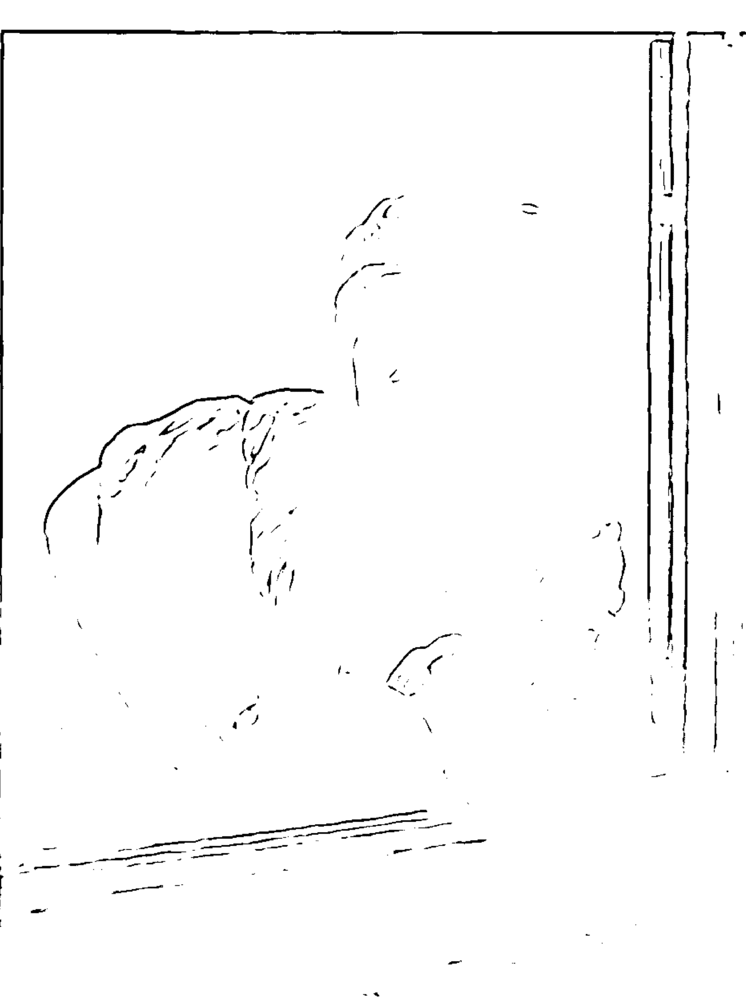

©Ctac, Wikipedia Commons
△ 穿著豔麗的吉卜賽女子，總是帶著狂放不羈的野性之美。

占卜到底算不算是恐怖的巫術。它沒有血腥的開頭，沒有光怪陸離的過程，也就沒有讓人毛骨悚然的恐怖結尾。那麼，它究竟恐怖在哪裡？

閉上眼睛，我眼前出現了這樣一副畫面。閃閃發光的水晶球，暗黃色的塔羅牌，幽暗的燈光下，吉卜賽占卜女巫緩緩地告訴你的未來。在水晶球裡會出現一副畫面，你知道了你白髮蒼蒼的時候是什麼樣子，你知道了你尚未開始的戀情是什麼樣子，你知道了你不會成為一個成功者，你知道了你深愛著他或者她，最終會離你而去。你會知道一切關於你一開始很好奇的未來。

一開始，你會很興奮。可接下來呢？

我忽然覺得忐忑不安。如果這一切都已經被預先感知，那麼生命將是多麼乏善可陳的一件事啊！

於是，我想從這一點來說，吉卜賽占卜術算得上人世間最詭異的恐怖巫術之一，「命中註定」四個字有時候是最恐怖的詛咒。當你知道了你是誰，那麼，你等於也知道了生命的盡頭。

我想，或許正是因為這種了解，吉卜賽人才成了風一樣的生命旅人。因為早已知道，所以也就無所執著。

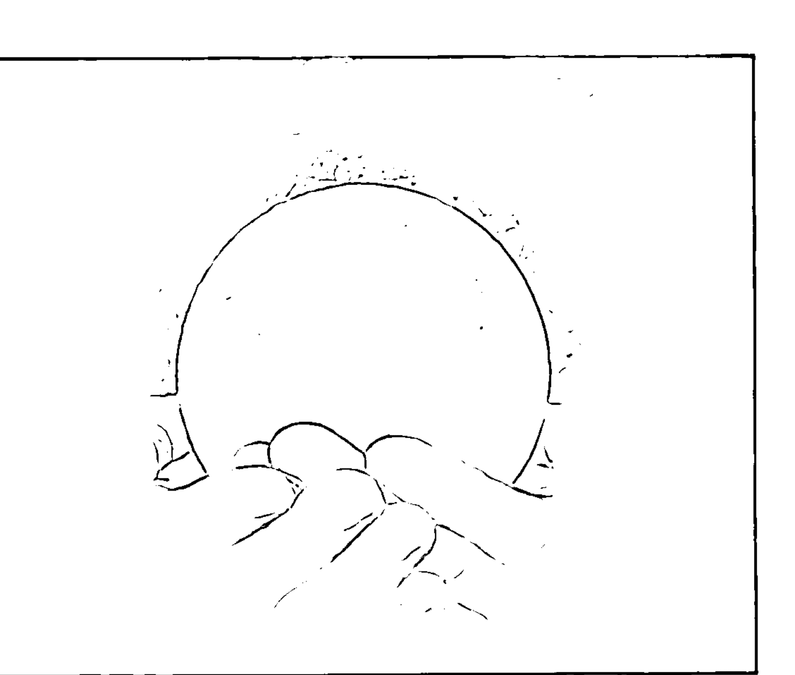

©Cypress North

### ◎ 吉卜賽人——你從哪裡來？

猶如風一般的吉卜賽人，幾千年來都過著四處漂流的日子。他們居無定所卻熱情奔放，窮困潦倒卻天性豁達，總是隨遇而安地從一座城市轉往另一座城市。英國人稱他們為吉卜賽人，法國人稱他們為波希米亞人，西班牙人稱他們為佛朗明哥人，俄羅斯人稱他們為茨岡人，阿爾巴尼亞人稱他們為埃弗吉特人，希臘人稱他們為阿金加諾人。他們存在於不同的城市、不同的國家，卻從未被同化。他們依舊說著「吉卜賽語」，不放牧，不工作，彷彿誰也留不住這群特殊的民族。

幾百年來，學者都在追問這個奇異的民族，他們究竟來自哪裡？最後，得出一個模糊的方向，卻也缺少例證。

據說吉卜賽人就是在西元一○○○年離開

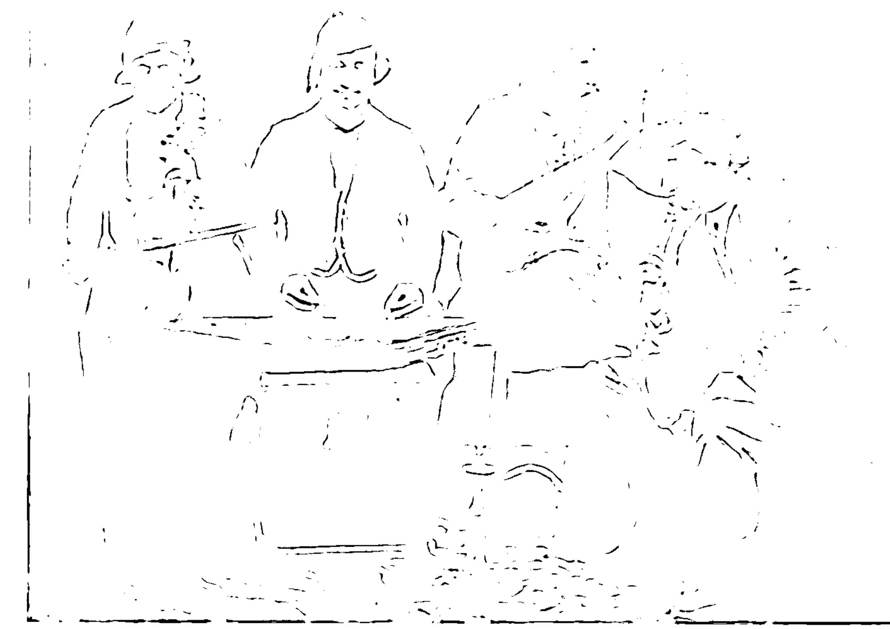

©Flickr upload bot, Wikipedia Commons

△ 吉卜賽人熱情奔放，天性豁達，隨遇而安地在城市與國家間流浪。

印度的羅姆人（Rom）。他們經過阿富汗（Afghanistan）、波斯（The Persian）、亞美尼亞（Armenia）、土耳其（Turkey）等地，最終到達歐洲。有些學者宣稱，他們曾經是印度抵禦伊斯蘭教擴張的傭兵；也有人說，他們是穆斯林征服印度北部後不願意屈服的俘虜；當然，也有人依舊認為吉卜賽人是埃及後裔。對於這些各式各樣的宗族追問，這群吉卜賽人不置可否，依舊遵循古老的傳統方式生活。從這個角度看，更令人相信他們是一群擁有特殊靈性，卻又被上帝放逐的人類使者。他們流連在人間，替人占卜，享受自由。

全世界約有五百萬至一千萬的羅姆人，其中大多數居住在歐洲。正如著名歌劇《卡門》所描述的吉卜賽人一樣，時至今日，依舊有九十五％的吉卜賽人居住在石砌的房子裡，在狹小的地氈上起居挪移，固守著祖先們傳承下來的習俗。

法國政府曾經試圖教化這個熱情奔放的民族，給予他們正當的職業、正常的教育。但是吉卜

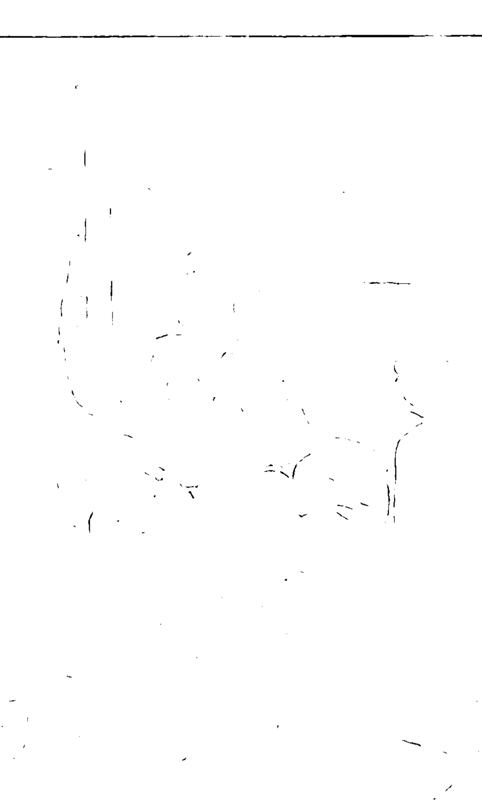

◎來源：Sridhar1000, Wikipedia Commons

△今日仍有九十五％的吉卜賽人居住在石砌的房子裡，在固守著祖先們傳承下來的習俗。

賽人卻對此斥之以鼻。他們說，他們要活得像一個真正的吉卜賽人，他們寧願到處流浪。至今，依舊沒人能弄清這個奇異民族的奇異力量。唯一能窺視一二的，便是讓人覺得精準得有些恐怖的占卜術。好比風行全世界的吉卜賽民族占卜術之一——塔羅牌。

### ◎ 塔羅牌裡的精靈們

如果說中華民族最偉大的占卜文明源於《易經》，那麼西方的占卜之王便是有「生命之輪」之稱的塔羅牌了。這種古老的占卜工具其出處早已無從考證，只知道它在埃及語中的發音是tar（道）和ro（王）兩詞，含有「王道」的意思，是「智慧與魔術之神」。

這套神秘的紙牌共有七十八張。可是，就是這樣一套與日月星辰相連接的紙牌，卻能預測出來訪者大部分的命運。它用星辰之力與四大領

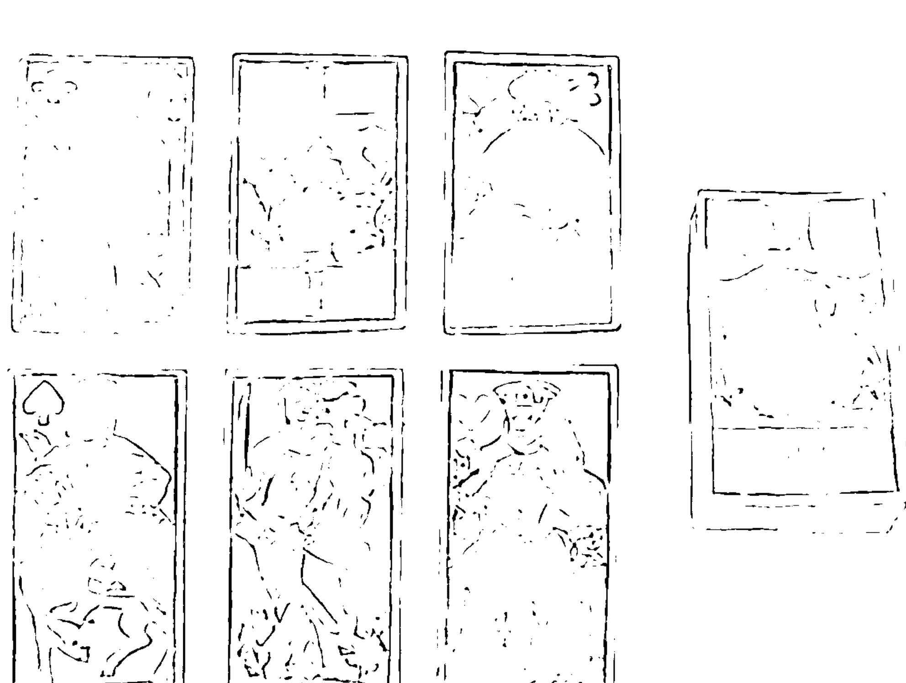

©AndreasPraefcko, Wikipedia Commons
△ 西方的占卜之王塔羅牌有著「生命之輪」之稱。

域，隔絕出一個神祕的空間，驚奇地還原了一副命運的輪廓。

完整的塔羅牌共七十八張，其中大阿卡那（Arcana）牌二十二張，用二十二個星辰之力來解釋命運的大致輪廓。另有五十六張小阿卡那（minor arcana）牌，則是用「權杖」、「星幣」、「聖杯」、「寶劍」四種花色，詮釋了激情、金錢、感情及思想的意義。

古往今來，不少著名的畫家以不同的圖案和意義描繪各自眼中的塔羅牌，彷彿每一張塔羅牌都包含著一種生命力，指引著你的內在思想、潛意識動機、隱藏的恐懼和渴望，以及你的個性、長遠運程和弱點。

每一張塔羅牌都代表一個歷程，有歡樂、痛苦、希望、改變和重生。有人說，每一張大阿卡那牌中都住著一個精靈，他們用正、逆兩個方向，指引人們的生命座標。

筆者曾仔細研究過塔羅牌的奧義。事實上，在塔羅牌的世界裡，沒有一張牌的牌義是

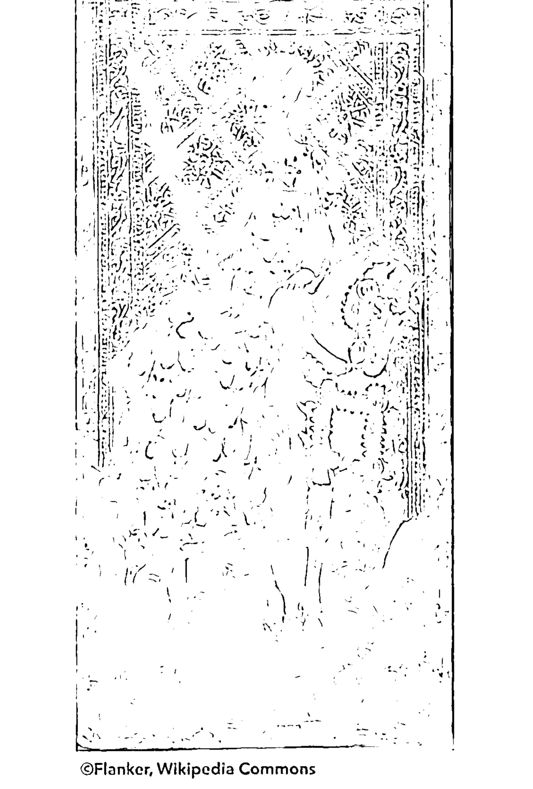

©Flanker, Wikipedia Commons

△五十六張小阿卡那牌是用「權杖」、「星幣」、「聖杯」、「寶劍」四種花色詮釋不同意義。

完全正向的，也沒有一張牌是教人沉淪的。在大阿卡那牌中，有溫暖慈愛的母親、傳統正派的宗教領袖、不屈不撓的勇士，也有充滿智慧的隱士、代表一切終結的死神；有邪魔和天使組成的命輪之輪，也有跟隨天使號音而來的審判，更有代表著突破和衝擊的高塔。它們既是真實人物的化身，也是人們自身命運的一部分。

當你沐浴淨身，認真地向塔羅牌詢問最近發生的事情原由時，這些詭異的牌會向你呈現不一樣的佈局。

比如，大阿卡那牌的「戀人」，代表星座中的「雙子星」，正向位的戀人代表者擁有羅曼蒂克的親密和恩愛，但逆向位的「戀人」則代表了感情中的波折與沉淪。它既代表著愛情中的忠貞不渝，又代表著情欲中的自私自利。又如：正向位的「女祭司」，代表著「月亮星座」的高潔與智慧；逆向位的「女祭司」則代表了孤芳自賞和自命不凡。如果出現一個「逆向位的女祭司」，那就要注意了，也許所有問題的根源，來自於本身性格中的孤傲。

大阿卡那牌用於解釋命運的大致運勢，小阿卡那牌則通過四項區域提供命運的真相和未來的抉擇。若單一看待那些排列組成的塔羅牌，很難一下子了悟未來的方向。但是，在塔羅牌的世界裡，所有的方向早已註定，只要你認真閱讀每一個關於塔羅牌的預言，一切因果盡在其中。

好比說，星幣中的男僕代表在你生命中會出現一個自私、嫉妒的親戚，或一個帶來壞消息的使者；權杖騎士的出現，代表著在你生命中會出現一個幫助你獲得成功的福星。

當你完全掌握了塔羅牌的奧義時，它的恐怖之處也許就會慢慢顯現，畢竟一個「心即塔羅」的人，將真正走進天道人倫的意境之中，明白生命一切可變或不可變的差別。

在沒有硝煙的命運戰場上，塔羅牌或許能為你提供一個方向，幫助你和命運戰鬥，或者讓你最終降服在命運的巨輪之下。

當無法預知的一切發生時，你會怎麼做呢？究竟會沉落在這恐怖的占卜詛咒中，還是能洞悉正逆兩色紙牌，尋找出破解命運難題的關鍵呢？

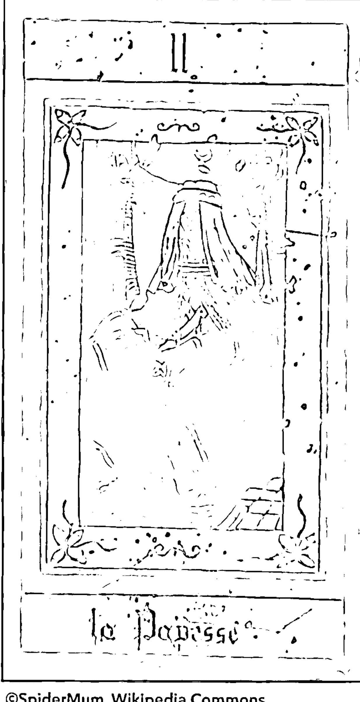

©SpiderMum, Wikipedia Commons

△ 正向位的「女祭司」，代表著「月亮星座」的高潔與智慧；逆向位的「女祭司」則代表了孤芳自賞和自命不凡。

## 叢林隱秘者——傳承上古的德魯伊派

### ◎ 巨石陣遺址與德魯伊祭祀

在英格蘭索利斯伯里（Salisbury）古老而廣漠的平原上，矗立著許多奇特的巨石遺跡，它們默默地在風雨中經歷了數千年，等待著有緣人的到來。

西元一一三〇年，一位英國神父在外出時，偶然發現了這座巨石陣。這座由巨大的石頭構成的奇特古蹟，自此引起人們的注意。英國人將它命名為「Stonehenge」。

這些巨石陣由數十塊巨大石柱組成，排列成數層完整的同心圓，其中有不少巨石橫架在兩根樹立的石柱上面。沒有人知道這些巨大而高聳的石塊是從哪裡搬運過來，它們與蒼涼廣闊的索利斯伯里平原完全不相稱。

考古學家們疑惑了，這些巨石最高的有八米，平均重量近三十噸，就連橫架在兩根樹立石柱上的巨石也有將近七噸。學者們至今仍不明白，在西元前四元前四〇〇〇到二元前四〇〇〇到二〇〇〇年的新石器時代（Neolithic Period）$^{4}$，人們究竟使用什麼方法才能將這些巨石整齊排列，更不知道這些巨石究竟有什麼作用？

無數的考古學家、天文學家都曾來到這裡進行研究，甚至掀起了一股「巨石狂潮」。

之後，一些考古專家在巨石附近的土堤內側發現多處墓穴，挖掘了大量獸骨殘骸出土。二〇〇三年，英國考古學家在巨石陣附近發現了一座古墓，經過考證，古墓的主人是西元前二三〇〇年前的一位顯赫人物。於是有人判斷，巨石陣應該是一個祭祀場所。

後來，經過仔細測量和嚴密的計算，發現巨石陣石環的分布構成，居然與太陽、月亮的十二個方位相對應。有人據此大膽地猜測，這裡就是傳說中的太陽神廟祭祀場。

人們也由此聯想到多年之前，一位英國古董學家曾經表示，巨石陣其實是德魯伊教（Druid）的一座太陽神廟，教眾在這裡以活人和牲畜祭祀神靈。

古老的德魯伊派在沉默了數千年後，再度悄然出現於人們的視野中。這群被西方人認為最是神秘與殘忍的法師集團，究竟是些什麼人？他們到底做了什麼？

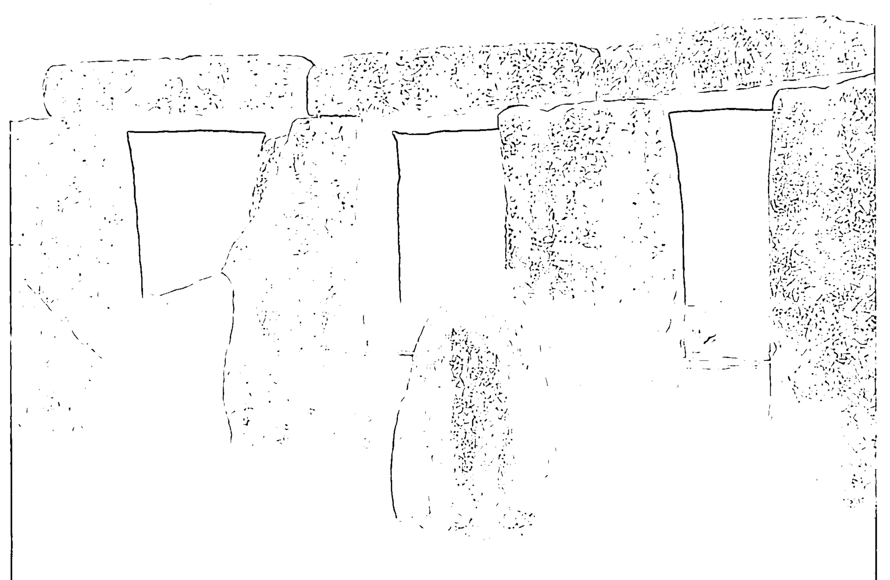

©Resk, Wikipedia Commons
△ 巨石陣由數十塊巨大石柱組成，其中有不少巨石橫架在兩根樹立的石柱上面。

### ◎ 用活人獻祭？

現存對於德魯伊最權威的記載，來自於二千多年前，一代帝王凱撒（Gaius Julius Caesar）的手記——《高盧戰記》（Commentarii de Bello Gallico）。

熟悉歐洲歷史的人對這位創建羅馬帝國的偉大人物一定不會陌生，但很少有人知道，凱撒不僅僅是一位軍事統帥、帝國統治者，還是羅馬時代的一代祭司長。

當他帶領自己的部族一路廝殺，用整整九年時間奪取了整個高盧（Gaul）地區⁵時，他與居住當地的高盧人（即凱爾特人）有了第一次親密接觸。

⁵ 高盧地區：範圍相當於現在的法國。

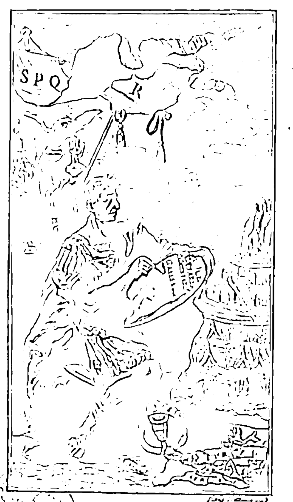

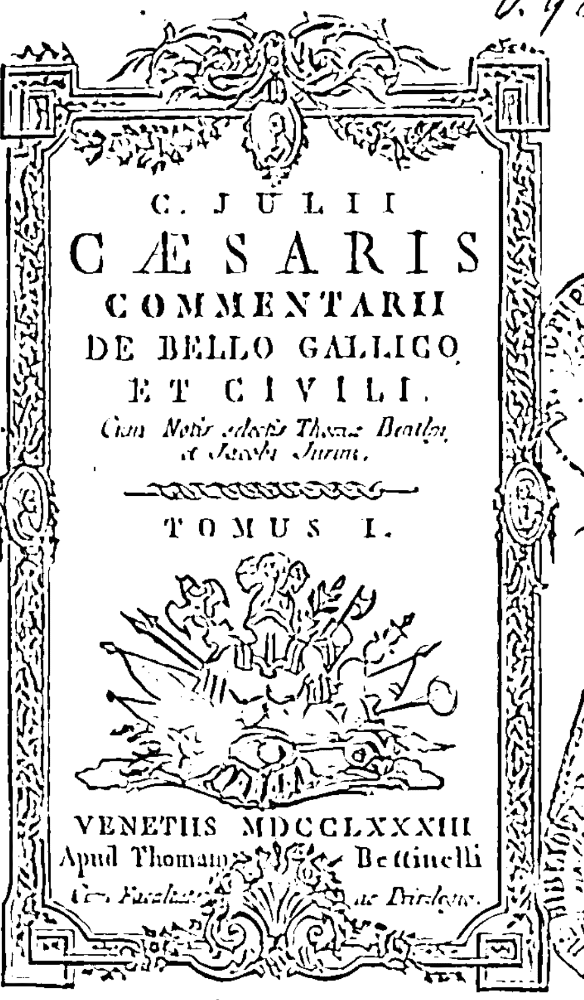

◎來源：Kjetil r, Wikipedia Commons

△ 現存對於德魯伊最權威的記載，來自於一代帝王凱撒的《高盧戰記》。

特人（Celts）相遇。為了獲得勝利，高盧人派出了他們力量最強大恐怖的法師軍團——德魯伊教團，雙方發生了激烈衝突。

此役是德魯伊教團出現在歷史上最殘酷的一戰，也是現存關於德魯伊活人祭祀最鮮活的考證資料。

在《高盧戰記》中，凱撒這樣描述德魯伊祭司殺敵的場景：「用樹枝編造巨大的偶像，然後把活人放進去焚燒……」，可知德魯伊教團當時曾使用這樣的方式驅散敵人。而他們為了預言未來，利用活人來祭祀神靈，《高盧戰記》中也描寫了這樣的場景：「他們用匕首刺死人性，根據死亡的痙攣和內臟來預言未來……在祭祀世界巨人的儀式上還要挖取處女的心臟……」

凱撒將這些德魯伊祭司描繪成一群嗜血的異教狂人。

這種活人祭祀在上古祭獻儀式上並不少見。德魯伊教徒更因相信靈魂的永恆，會在親人死後將死者生前所有的物品一併燒掉，甚至跳進火中抱住親人的屍體，以便與親人同登極樂。

由於凱撒的手記，西方人在長達一千五百餘年的時間裡，都將德魯伊歸為嗜血的異教徒。西元一世紀，在高盧等地的爭奪中，羅馬人對德魯伊教展開了大規模的屠殺行動。在戰鬥中，德魯伊祭司身著黑衣，咆哮著天神的名字，厲聲刺耳地詛咒羅馬帝國。可惜，人單勢孤的德魯伊祭司和高盧士兵，最終全數死於羅馬大軍的屠殺。

在往後的幾個世紀裡，德魯伊從歷史舞臺上被驅逐，他們隱密在原始叢林中，與普通巫師無異。直至西元十六、十七世紀，關於德魯依教的傳聞一直還只是民間流傳的街談巷說。

### ◎ 真正的德魯伊

可是，真正的德魯伊是這樣的嗎？

事實上，傳說中的德魯伊教更崇拜自然，並且將橡樹作為至高之神的象徵膜拜，他們相信靈魂的永恆。在古老的德魯伊祭祀中，用鳥獸如烏鴉、老鷹等來占卜吉凶；但當發生重大災難時，他們也用活人獻祭，並以牲畜和人類的喉嚨和內臟作出預言。

德魯伊的英文 Dryad 一詞原出自羅馬語 Druids。在羅馬、希臘神話中意指森林女神。傳說每一棵橡樹都居住著精靈，而這些樹精透過德魯伊向人類傳達神諭。

有很長一段時期，德魯伊是人與神之間的媒介，就連凱撒也不得不承認，德魯伊教士精通物理、化學等知識。在大多數情況之下，他們是公認的古代智慧的守護者，有著崇高的道德修養，並對自然科學和神學有很深的造詣。他們是高盧人中的精英。

高盧人，也叫做凱爾特人，是歐洲最早的蠻荒民族，生活在西元前二○○○年，主要分布於當時的高盧、北義大利（山南高盧）、西班牙、不列顛與愛爾蘭。如同非洲的土著有巫毒教，中國的苗族有巫蠱一樣，凱爾特人，這個被羅馬帝國列為蠻族的民族，則有德魯伊教團。

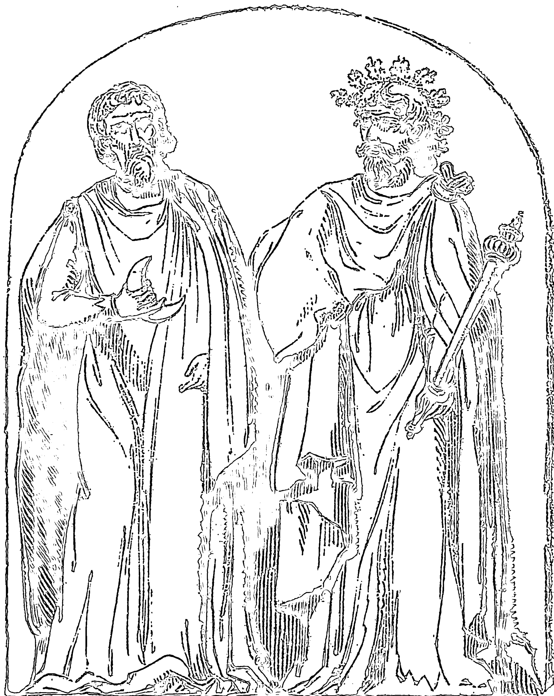

©來源：Nyo, Wikipedia Commons

△ 德魯伊是古代智慧的守護者，有著崇高的道德修養，並對自然科學和神學有很深的造詣。

德魯伊教團是凱爾特人的偉大神論者，他們掌握了地理、自然科學、自然神學和占星術（天文學）等知識。近代著名的神秘主義學者艾利法斯·李維（Eliphas Levi）在其著作《魔法的歷史》（The History of Magic）中寫道：

> 「德魯伊祭司是神職人員，也是醫生，他們運用咒語，希望藉此達到磁力治療的目的。他們經常使用的藥物是寄生植物的小枝和蛇卵。德魯伊祭司通過嚴肅神聖的儀式割取寄生植物，因為他們相信，類似松露和五倍子這樣的植物具有特殊的磁力，因此也具有特殊的治療作用……」（在李維所處時代，所謂的「磁力治療」意指催眠術）。

如同印證李維所說，在現代的英格蘭和愛爾蘭等地，都曾經挖掘出德魯伊祭司製作的原始外科手術工具。

德魯伊教信仰自然崇拜，他們崇拜日月、火焰、巨石、樹木、動物等等。在古老的記載中，他們能夠召喚飛禽走獸，還能將自己能轉化為熊、烏鴉等動物的形態。他們不建造殿堂，宗教祭祀活動全部在未經採伐的橡樹林中舉行。傳說德魯伊能透過吟唱魔法，從愛爾蘭呼喚巨大的石頭，一夜之間建成巨石陣，作為祭祀場地。

這些傳說故事不斷刺激著現代人的思想，人們急於撥開這些迷霧，試圖瞭解德魯伊是否仍然存在。於是，時隔一千五百餘年之後，兩名自稱德魯伊大祭師的歐洲人重新創建了德魯伊教，最終發展成為一個慈善團體。一九六三年，北美的新德魯伊教團成立，提倡新異教信仰的德魯伊教團於是發展至今。

不知道這些教派究竟傳承了多少古德魯伊教的教義與祭祀傳統，也許德魯伊教始終被定位為血腥殺戮的祭祀者，或是崇尚自然的森林守護者。歷史無法對這些人進行完整的還原，甚至不能對那些口耳相傳的巫術進行模擬。而德魯伊教唯一還留在歷史上的宗教影響，也許只有那個拿著南瓜燈、講鬼故事的節日——「萬聖節」。

每年十一月一日的萬聖節（HALLOWEEN），即是凱爾特人的邵恩節（Samhain），源自於凱爾特神話中死神的名字。在德魯伊的曆法中，十一月一日即是新年，也是「亡者饗宴」的日子，此時塵世與其他世界的壁壘最容易被穿越，所以死者的靈魂會在傍晚時回到他們原來的家。

在這天，凱爾特人會身著獸皮、頭戴獸頭，共同舉辦遊行活動；而孩子們則會扮成精靈（Faeries）的模樣，逐家逐戶去懇求食物——如果誰不給予精靈崇拜及食物，這些精靈就會捉弄他們。

也許這就是德魯伊派曾經存在過的最後印證——一個依舊和鬼怪、血腥有關的節日。

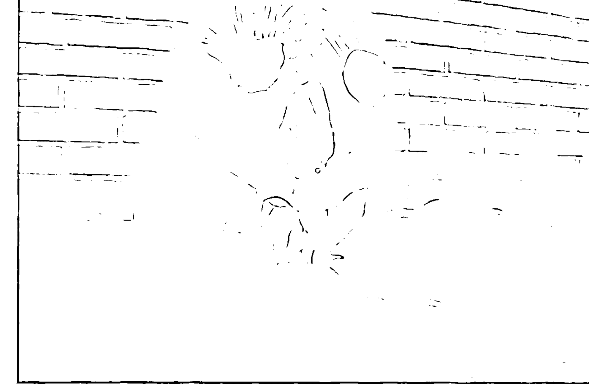

©Ripepette, Wikipedia Commons
△ 每年十一月一日的萬聖節即凱爾特人的邵恩節，也許是德魯伊派曾經存在過的最後印證。

## 參考資料：

1. 中國期刊網，二〇一〇年九月二十日：〈上帝之鞭：歐洲黑死病〉。
2. 《學習時報》，二〇〇九年七月十八日：〈十四世紀歐洲黑死病橫行 奪走二五〇〇萬人性命〉。
3. The Cock Lane ghost by Douglas Grant, Macmillan, 1965.
4. 雅虎網人文地理，二〇〇八年十月六日：〈黑暗的死靈法師：揭秘歐洲中世紀的神秘巫術〉。
5. 《世界通史》，崔連仲等主編，人民出版社，二出版社，二〇〇〇年六月一日。
6. 雅虎網：愛爾蘭女死靈師—愛麗絲·吉蒂勒（Alice Kyteler）的盜墓巫術事件。
7. Buckland's Complete Book Of Witchcraft by Raymond Buckland, Llewellyn Publications, 2002-09-01.
8. 網易，二〇〇六年六月二十八日：〈女巫的傳說與儀式〉。
9. 一九七〇年美國女巫同盟遞交政府的發文。
10. 雅虎網，二〇一一年十月二十八日：〈揭開美國「女巫鎮」的神秘面紗〉。
11. 搜狐網，二〇〇六年十月十一日：〈賽勒姆的紅字〉。
12. 和訊網，二〇〇九年一月二十二日：〈美國麻塞諸塞州賽勒姆巫師審判事件 Salem Witch Trials〉。
13. 《異教徒的女巫》（The Heretic's Daughter），凱薩琳·肯特（Kathleen Kent）著 - 鳳凰出版社。
14. Malleus Maleficarum（《女巫之槌》）by Jakob Sprenger / Heinrich Kramer / Lodovico Maria Sinistrari, Creation Books, 2007-08-01.
15. 網易新聞，二〇一一年十月十八日：〈「女巫」大審判〉。
16. 《夜間的戰鬥——十六、十七世紀的巫術和農業崇拜》，卡洛·金斯伯格（Carlo Ginzburg）著，朱歌姝譯，上海人民出版社。
17. 文明網，二〇〇五年二月二十五日，〈義大利青年中的「撒旦崇拜」〉。
18. The Satanic Bible by Anton Szandor Lavey, Avon, 1969-12-1.
19. Queen of Scots by Rosalind K. Marshall, ISBN 1873644957.
20. Mary Queen of Scots by Antonia Fraser, ISBN 038531129X.
21. 雅虎網，二〇〇八年三月二十九日，〈李·克斯特伯爵夫人的城堡〉。
22. 電影《吸血女伯爵》(Bathory)，二〇〇八年。
23. 《衡陽師範學院學報》，二〇〇九年三月，〈吉卜賽人的生活智慧與波希米亞文化現象〉。
24. 搜狐網，二〇一〇年九月五日，〈法國數萬人示威 抗議政府強行驅逐吉卜賽人〉。
25. 《經典塔羅》，梵天文化傳播中心，中國電影出版社，二〇〇四年一月。
26. 《塔羅奧義》，雲峰著，陝西師範大學出版社，二〇〇三年七月。
27. 新浪網，二〇〇七年二月十一日，〈英考古學者在巨石陣旁發現新石器時代村落遺址〉。
28. 國家地理，二〇〇五年五月十二日，〈巨石陣：巫術籠罩的地方〉。
29. 《高盧戰記》，[古羅馬] 凱撒著，任炳湘譯，商務印書館，一九七九年九月出版。
30. The Secret Teachings of All Ages (Reader's Edition) by Manly P. Hall, Tarcher, 23 October, 2003.
31. The History of Magic by Eliphas Levi, Weiser Books, 1999-05.
32. The Woman's Encyclopedia of Myths and Secrets by Barbara G. Walker, HarperOne, 1983-11-30.

# 第3章 若隱若現的古老門派：亞洲大陸的不傳之謎

亞洲（Asia）是目前世界七大洲中面積最大的，地域橫跨寒、溫、熱三帶，東西時差十一小時，占世界總人口的六十・五％。和非洲的神秘巫術及歐洲的暗黑魔法相比，亞洲的文化歷史比其他大陸更為悠久，根據記載，歐洲與非洲的許多民族都發源於中亞的草原地帶。及至民族大遷徙的時代，亞洲草原上有一部分人向西進入歐洲，一部分人向東遷入印度，形成範圍廣大的印歐語系；另一部分則向南遷徙到北非、西亞，進入埃及，和當地人融合成閃含語系。

亞洲孕育了世界四大文明古國中的三個：中國、印度、古巴比倫。佛教在西元前六世紀誕生於亞洲的印度和尼泊爾毗鄰處；伊斯蘭教起源於亞洲阿拉伯半島；基督教起源於西亞巴勒斯坦（Palestine）的伯利恆（Bethlehem）。此外還有印度教及錫克教（Sikhism）¹、道教、儒教等世界各大宗教文化的起源地，幾乎涵蓋了七十％以上的宗教範圍。

古老的宗教信仰和悠久的歷史文化，使得亞洲的巫術成為世界上門派最多也最神秘的存在。誰也不知道這片大陸上究竟出現過多少隱密的門派或組織，唯一可以肯定的是，那些久遠的傳說必然有其原型。而處於歷史細枝末梢中的那些恐怖血祭，不過是這片大陸上的滄海一粟。

¹ 錫克教（Sikhism）：十五世紀產生於印度的一神教，尊崇十位上師並以上師們傳授的《阿底格蘭特》為經典，以公平正義、扶貧濟弱和宗教自由為基本教義。

## 一萬種可能——降頭術的故事

### ◎ 關於那些死去明星們的傳說

二〇一〇年值一代歌后鄧麗君離世十五年，忽然出現一則新聞，震驚世人。一名命理師在接受電視節目訪問，直言鄧麗君是死於降頭術。

華人傳奇巨星鄧麗君於一九九五年五月八日，在泰國清邁與世長辭，享年四十二歲。在今留存的各類新聞報導中可以看到，她死於突發氣喘。但是在不少八卦雜誌中都記載著鄧麗君死前臉上有掌痕。而當時小她十多歲的外籍男友保羅卻要求希望保留遺體的完整，不願意進行遺體解剖。正因為如此，一代歌后的真正死因至今仍是一個謎。

時隔十五年，關於鄧麗君去世的新聞之所以再次被提起，源於一個探討降頭、茅山道術的節目，主持人訪問命理師李建軍的內容。李建軍說，當年他和鄧麗君有過一面之緣，在鄧麗君的身上看到不乾淨的東西，懷疑她遭人下了降頭。這名頻頻預測台灣政界的命理師一口咬定，明眼人一眼便能看到她脖子裡有青筋，是被下了「死降」。而支持這論點的理由之一是鄧麗君死去的地點——泰國，一個降頭術風行的國度。

隨著這則新聞的轟動，不少有關明星死亡的消息被一個個點名，包括已故港星張國榮生前曾不止一次向友人表達自己撞邪，可能因為常到泰國玩而被下了降頭，結果他在二○○三年愚人節跳樓身亡；已故女星陳寶蓮的閨中密友爆料，陳寶蓮為爭奪股市名人黃任中的寵愛，曾養小鬼供奉在陰暗的窗邊，但仍無法挽回感情，最後選擇跳樓的激烈手段，結束為情執迷的一生。

一時間，關於降頭術的傳聞紛紛出籠，但這些說法有哪些為真，又有哪些是假？降頭術究竟是如何恐怖的一種巫術？關於降頭術的歷史，還要從頭說起。

> 降頭：即降頭術，是一種在南洋地區盛行的巫術，一般根據使用的程度來分為兩種，一種是利用降頭術來化解雙方的失和或者增進彼此的感情，另一種是讓人在不知不覺中受傷甚至死亡。

### ◎ 關於泰國拜廟的注意事項

泰國是公認的最佳旅遊國度，也是神佛興盛的國度，但在泰國拜廟可是有很多的講究與規矩。

曾經有過這樣一則詭異的故事。

有個人去泰國出差，住在當地一家四星級的酒店裡。一天早晨，他一個人抽空去當地閒逛。走著走著，忽然迷失了方向，來到一座有些奇怪的廟前。這座廟有點像路邊的土地公廟，但是卻又不是那麼沉靜莊嚴。他好奇地觀察這座小廟，不由自主地拜了拜。就在這一個剎那，他忽然感到一陣毛骨悚然的驚懼。他發現自己身旁突然站了一個人。這個人穿著泰國傳統黑色服飾，面無表情地看著他。這彷彿憑空出現的陌生人把他嚇出一身冷汗，害怕的他飛也似地逃走了。

之後他並未在意這個泰國之行的小插曲，可是從泰國回來以後，卻發生了一連串詭異事件。他幾乎每天都會發生一些皮外傷，不是撞傷就是跌倒。還有一次半夜，他太太看到他一個人在房間裡走來走去，突然拿起家裡的東西就往身上戳。第二天問他時，他卻什麼也不記得。原本身體極好的他，那一陣子總是覺得人昏沉沉地，做什麼都提不起勁。他們漸漸發現，似乎有哪裡不太對勁。

於是他把自己的際遇告訴一位在道術方面有點門路的朋友，在朋友的介紹下，請來一位「師父」察看，才發現自己被下了降頭。追溯原因，便是那日他在泰國拜過的神秘「土地廟」。

後來，再有人去泰國，都會被告誡：到泰國旅遊時，千萬不要亂拜廟。泰國的寺廟有陰廟和陽廟之分，若不小心拜到陰廟，極有可能被下「降頭」。

> 陰廟：陰廟一般供奉一些孤魂野鬼、或死於非命的鬼魂，通常在廟後都設有納骨塔、納骨間放置骨骸，納骨之處平常重門深鎖，只有農曆七月才會開啟門扉。
>
> 陽廟：陽廟裡供奉的主神一般為有正式神格的神，像是天公廟、媽祖廟、玄天上帝廟、保生大帝廟等。

降頭的起源，還要追溯到唐僧唐玄奘的西遊記。在吳承恩的《西遊記》中，有一則深入人心的故事。話說當年，唐三藏取經成功，離開天竺，返回大唐。觀世音娘娘卻忽然發現他「九九八十一難」尚缺一難，於是讓唐僧在通天河遇上烏龜精。因為，唐三藏忘記幫湄江河的烏龜精詢問壽齡，烏龜精一怒之下潛入河底，想害死唐僧。唐僧雖然獲救，但所求經書全都沉入河底。

這則故事看似怪誕，卻偏偏和降頭術有著密切的關聯。相傳三藏法師在路過安南境內的通天河時，確實路遇妖風，經書典籍全部落入湖中。後來加以打撈，但也僅僅取回一部分的大乘佛經。其他部分如小乘的「識」，則被水沖到了暹羅，為暹羅人尋獲獻呈暹僧皇。古時的暹羅，就是現在的泰國。據傳這部「識」的內容，就是現在降頭術的發源。也因此，泰國成為了降頭師的故鄉。

當然，這只是一個傳說故事，經過了歷史的沖刷，也不知道多少真假，但唯一可以肯定的是，降頭術（Tame Head）始終流傳於東南亞地區。它能救人於生死，亦可害人於無形，被稱為東南亞兩大邪術之一。

### ◎ 降頭術是什麼？

「降頭術」從字面意義上看，應該分為「降」和「頭」兩層意思。「降」指施作的巫術與藥蠱，「頭」則是指施法的對象與姓名、生辰八字、所用物品等等。

這樣的區分與中國的周易及茅山道術極為相似。著名的降頭師曾把降頭術的原理歸根為藥理的運用、精神的運用，以及構成命運各項元素之宏觀聯繫的運用。其中最為玄妙的，即是所謂的宏觀聯繫。

降頭師相信，宏觀聯繫才是人類命運的歸一，只要把握了宏觀聯繫中的「趨勢」，就能對人產生難以估量的作用。比如，在討厭的人床邊放置尖銳物，雖然尖銳物沒有刺入人體，但長此以往，也會讓那個人身上感到刺痛，久而久之則會生病。

這樣的說法倒是和中國的風水學有些相似。但降頭術絕不是風水學，它屬於懂得掌握趨勢者的一種詛咒。

降頭師透過生辰八字、姓名等形態追蹤到受降者的位置，就像警犬循著氣味找到罪犯一樣，牢牢地鎖定目標。然後，透過事前取得受降者的毛髮、指甲等形成聯繫橋樑。最後，以神秘的宏觀聯繫為引，將受降者引入黑暗的詛咒中。

據說最高境界的降頭術，可以控制人的精神和肉體，制服或殺害受降者。有很長一段時間，降頭術在南洋地區風行，不分男女老少都曾或多或少與降頭沾上關係，舉凡孩子哭鬧、夫婦反目、情人別戀、家庭不睦、老幼病痛、心神不定、財運不順、事業不振等等，無不和降頭扯上關係，大小事情都可要求降頭師作法改善。

可是，降頭術本身也不是沒有危險的，但凡降頭若遭破解，輕則下降人反受其害，重則連降頭師本身也可能死於降頭術的反噬。

### ◎ 死降與血咒

在上墳的時候，不知道你是否注意過，在墳場周圍總生活著這樣一群人——他們身上背著一個黑色的包，或者拎一個塑膠袋，偷偷摸摸地靠近墳地，就站在一群掃墓者的背後。當掃墓人離開後，他們會迅速地靠近墓地，從墳頭上把剛剛祭拜過的墳頭黃紙拿下來，放進自己的包裡。

這些黃紙究竟是有什麼作用？在泰國，這些黃紙是降頭術中用以替代「血咒」的「血詛」的重要道具。

按照降頭術的殺傷力來區分等級，以精血為引的「血咒」與「死降」是最為恐怖的。而「死降」更是降頭術中最惡名昭彰的邪惡法術，它以殺死活人為目的。凡被下了「死降」的人，若不及時破解，大多會死於非命。據說，李建軍在鄧麗君身上所看到的不乾淨的東西，就是死降的一種。

施行死降的方法有很多，但大部分都需要一種咒語，名為「血咒」。「血咒」以精血為引，配合各種秘法，具有能夠殺人於無形的作用。殺傷力越強的降頭術，無不藉由血咒來施行。正因為降頭師在下死降的時候，需要用到自己的精血，所以，當他的降頭術被破解時，降頭師自身也會被降頭術所反噬，功力不足的降頭師極有可能因此破功，甚至送命。

引用「血咒」的儀式極為隱密，在有限的文字記載和口耳相傳的轉述中，我們可以想像這樣一幅畫面——降頭師拿著被施術者的生辰八字和相關資訊，咬破手指或者割破手腕，將自己的鮮血滴落在施術物上，甚至於用鮮血畫符，不斷增強血咒的功效。

為了避免「血咒」對降頭師造成傷害，因此，降頭師也常常採用其他的方式替代，同樣可達到殺人於無形的作用，其中便以上面所說的「血詛」最為著名。

「血詛」，顧名思義以血為詛。據說，這個血除了使用降頭師的血，還包括降頭四毒「蜈蚣、蠍子、蟾蜍和壁虎」，而使用四毒則需要以墳頭上那些使用過的黃紙為媒介，共需要五個步驟：第一，降頭師將墓地墳頭上的黃紙剪成人形，用壁虎血浸泡曬乾；第二，將曬乾的蜈蚣、蠍子、蟾蜍研磨成粉末，同時，取屍液一杯，也就是屍體腐爛後流出的惡水，將兩者混合。若想增強效能，降頭師會輔以血咒的方式，再加入自己的血；第三，用這樣的混合液體，在曬乾的人形黃紙上寫上那人的名字和生辰，完成後，再次放入混合的屍液中浸泡，之後再次晾乾。

第四，準備八根空心蠟燭，將蜈蚣、蠍子、蟾蜍粉末灌注其中；第五，也是最重要的一步，施咒。降頭師一般會選擇午後三到四點的時間，著黑色衣服入密室，把製作好的蠟燭按照八個方位擺放，然後坐在蠟燭陣的中間。接著把人形黃紙點燃，集中全力冥想燃燒人形黃紙的煙塵在空中飛行，朝受降者飛去，口中可以不停念道：「飛、飛、飛」。等煙塵飛近對方的時候，大喝一聲：「中！」隨即把毒煙打入對方丹田。隨後把毒煙一直鎖在對方體內，直到所有蠟燭燃燒殆盡。據說一旦被下降，不出三日，就腹脹如鼓，全身潰爛，七竅流膿，十日內必亡。

恐怖的「血詛」成為降頭術中最惡名昭著的邪術。許多泰國人有此一說：下午三到四點，不要穿白色的衣服，因為「血詛」特別喜歡穿白色衣服的被施術者。一旦降頭師道行不足，找錯對象，那麼穿白衣服的你，可就要倒大楣了。

以精血為引的血咒，對降頭師自身的危害極大，即使降頭師的功力深厚，十之八九也會因為降頭術反噬而大傷元氣，必須急覓隱密之處養傷，才能逃過破功之劫。因此，降頭血咒不施則已，一施便得見血。若非有深仇大恨，一般的降頭師絕不輕易動用血咒，以免損傷元氣。

### ◎ 絲羅瓶與養小鬼

在許多講述降頭師的故事裡，都有這麼一個橋段，法力強大的降頭師家裡都會有一個小鬼，作為降頭師的武器，也就是所謂的「養小鬼」。養小鬼究竟是什麼意思？若想深入其中，必然要先瞭解另一個人們並不怎麼熟悉的詞——「絲羅瓶」。

「絲羅瓶」是什麼？午夜時分的泰國街頭，那些趕著回家、步履匆匆的行人身邊，可能一不小心就突然出現一道暗影。它不是很大，大概一個足球大小，充斥著濃濃的血腥味，黑影後面還拖著長長的尾巴。當血腥味越來越濃重，腳下的陰風更加刺寒，行人會不由自主地飛奔回家。但是，這時已經來不及了。他的腳或者脖子會忽然被什麼咬住，似乎有什麼東西正在吸他的血，不停地吸血。仔細看那團黑影，它正張著血盆大口，陰森地注視著你。它不是什麼球，而是一個人的頭顱，一個活生生的頭顱，那長長的尾巴也不是什麼麼尾巴，而是它的大腸，淌著鮮血的大腸。

這就是「絲羅瓶」——修煉失敗的降頭師的頭顱。在降頭師的世界裡，判斷降頭師修煉成功與否的關鍵，在於他的修煉絕對不可淪為「絲羅瓶」。話說實力強大的降頭師，可以將自己的頭顱連腸帶肚，一齊脫離身體，騰空而出。但是，不成功的降頭師，卻只能將頭脫離軀殼，承受身首異處的痛苦。修煉不精而成為「絲羅瓶」的降頭師，往往在午夜時分將頭脫離身體，變成無主遊魂。在咻咻風聲過處，飛如疾矢的暗色球體，便是降頭師的夜遊魂。

「絲羅瓶」時常飢餓，必須吸食人血，當吸不到血的時候，不得不尋找小孩遺糞充飢。凡糞便被「絲羅瓶」吃掉的小孩，運勢即會衰敗，就算不死也會生病，或是遭逢劫難。所以，在南洋當地風俗裡有一個極為有趣的現象，家長們會教小孩子，若在野外上了大號，記得要拾取小樹枝或草枝，打十字形，放置在糞上，就是為了防止被「絲羅瓶」吃掉。

為了防止自己變成「絲羅瓶」，降頭師開始尋找替代方法，於是，就有了「養小鬼」的

> 「絲羅瓶」：暹語譯音，是指降頭術修煉失敗的降頭師的頭顱，四處吸取人的鮮血。

由來。可是，「養小鬼」的方式卻充滿了恐怖色彩。傳說，降頭師必須尋找到一個十歲以下的男童，以五、六歲最佳。然後，用殘忍的手段將男童殺死，並驅散男童的魂魄，製成「人頭附肚童神」。

一旦小鬼成功製造出來，就變成了降頭師最好的工具。據說，為了能掌握受降者的行蹤，降頭師會派出小鬼去偵查監視，甚至可以到受降者的家裡叫魂，一旦受降者有所回應，靈魂便被叫去，立刻就死了。

於是，傳說中的小鬼——「人頭附肚童神」，成為降頭師最強大的武器，可以幫助他陷害敵人，偵查敵方的姓名和一切行蹤。然而那些可憐男童的靈魂卻永遠不能得到安息，飄蕩在幽暗的夜空裡，無以為家。

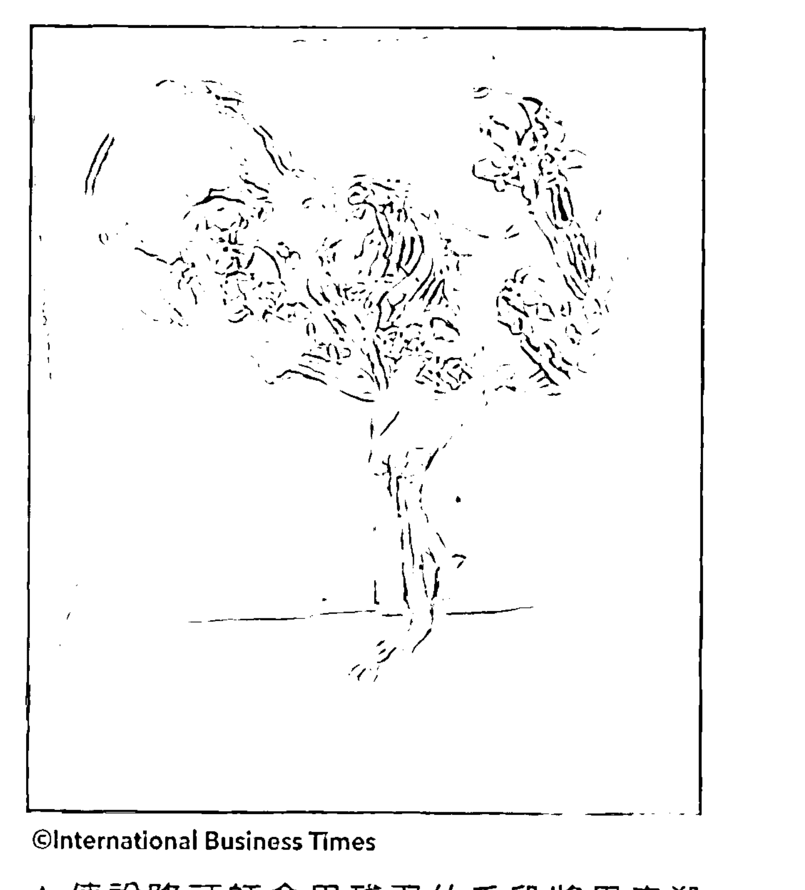

©International Business Times
△ 傳說降頭師會用殘忍的手段將男童殺死，並驅散男童的魂魄，製成「人頭附肚童神」。

### ◎ 千奇百怪的降頭咒

世界上邪術咒語記載最完整的大概就是「降頭」了，可能因為從未有官方完全禁止降頭師的存在，所以降頭咒語被仔細記載下來。只要你拜某位降頭師為師，就能傳承這套邪術，其中不乏有一些極為陰毒的咒法。

#### 1 最毒的五毒降頭

降頭師所說的「五毒」，是指蛇、蜈蚣、蠍子、蜘蛛及蟾蜍（或壁虎）五種天然毒物。「五毒降頭」顧名思義就是運用這五種動物給人下咒。「五毒降頭」又被分為「生降」和「死降」兩種方式。「生降」只需將毒物置於受降者的碗內，配合對方的生辰八字念咒，再將毒物放進受降者的家中，毒物就會自己找出受降者，出其不意將其咬死。「死降」則是用已經死去的毒物磨成粉末，配合其他的物品及咒語後，混入被施術者的食物中。發作時間視降頭師所念的咒語而定。無論是「生降」還是「死降」，受降者必定痛苦萬分、死狀淒慘。當然，「五毒降頭」並不是每次施術都要運用到所有的毒物，往往可以將之分開使用，因此也就有了蠍降、蛇降、蜘蛛降、蜈蚣降及蟾蜍降等各種降頭類型。

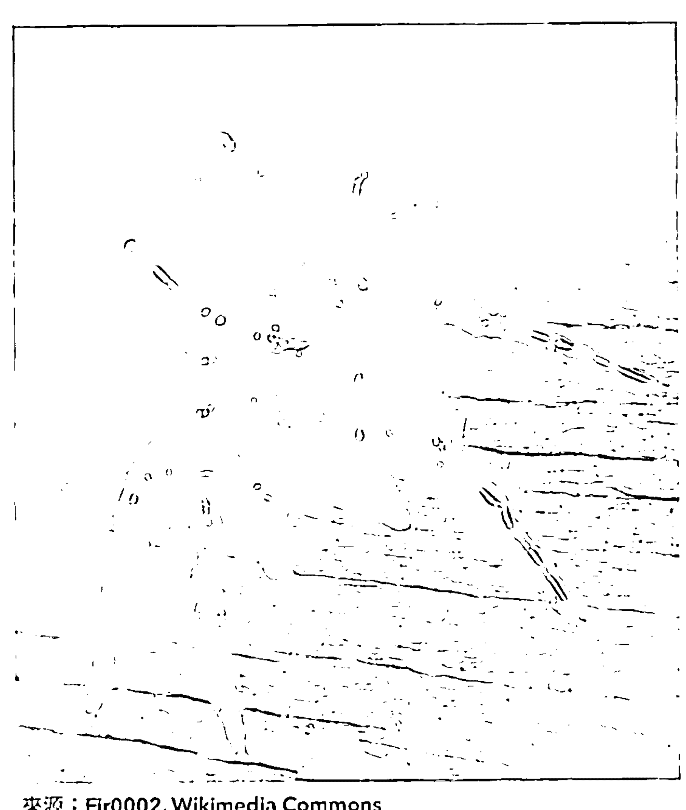

來源：Fir0002, Wikimedia Commons
△ 五毒降頭使用蜘蛛來施降。

#### 2 神秘的飛頭降

飛頭降幾乎是所有降頭術裡最為神秘莫測，也最為恐怖詭異的首席降頭。它與「絲羅瓶」有極其相似的地方，卻更為詭異。「絲羅瓶」的失敗之處是降頭術修煉未果，不能自製地身首異處。而飛頭降則是降頭師利用符咒下降自身，讓自己的頭顱能離身飛行，達到提升自己功力的降頭術。飛頭降總共分七個階段，每個階段都必須持續七七四十九天，才算功德圓滿。在這四十九天裡，頭顱一開始無法飛得很高，不得不通過吸血來提高自己的降頭術強度。於是，降頭師的頭顱將遇貓吸貓血，遇狗吸狗血，遇人自然也把人血吸得乾乾淨淨，直到腸胃裝滿鮮血，在天將亮時才會返回降頭師的身上。等過了這七個階段，降頭師便算練成了飛頭降。傳說中，練就飛頭降的降頭師法力無邊，甚至能殺神魔。

#### 3 牛皮降的傳說

關於牛皮降的由來，得從一個有些淒涼的愛情故事說起。話說當年南洋由於地處偏遠、經濟落後，新婚的丈夫不得不離開家鄉外出謀生。可是這一走便是三、五十年。年輕的妻子從青年等到暮年，她天天望著大海，等待丈夫回來。可是丈夫卻已經在異地又娶妻生子，幾年才回來一次。怨恨的妻子想要留住丈夫的心卻沒有辦法，於是求助了當地的降頭師。降頭師用祕法，將整張牛皮磨製成人眼睛都難以察覺的粉塵，用法術將其飄落到丈夫的碗中。之後，牛皮會隨著時間的推移而脹大，如果丈夫不能如期歸來，他的肚子就會脹破。丈夫見此便不得不隔三差五地回家陪陪元配妻子，於是就有了讓許多南洋婦女鍾愛的「牛皮降」。她們依靠這樣的牛皮降留住了丈夫，只不過，它能留住丈夫的心嗎？

#### 4 「貓詛」降的煞氣

「貓詛」這種降頭術幾乎和可以和「血詛」相媲美。被詛咒的人會在十天內死去，身上的肉就彷彿被貓爪凌遲過一般，死狀極其恐怖。「貓詛」的方法是找一張欲詛咒之人的照片，將它釘在一個倒立的五芒星陣裡，並且在照片背面用烏鴉的血寫上對方的生辰八字；接著抓一隻純黑色的貓來，將貓按在桌案上，強迫其眼睛盯著整張照片；最後，將貓殺死。降頭師們相信，黑貓死亡前的印象將是最好的詛咒。只不過，要抓一隻純黑色的貓卻也不是那麽容易的。

#### 5 陰陽降頭草的「絕降」

在降頭術的世界裡，有一種叫做「絕降」的法術，相傳這種絕降無人能解，中降者只有等死一途。不過，這種絕降需要動用降頭師體內最神秘的武器：「陰陽降頭草」，一種與降頭師的生命息息相關的本命藥草。相傳陰陽降頭草兩根共生，一粗為陽，一細為陰，它是降頭師用自己的精血從小種植在體內的，只有在性命攸關的時候才用。也就是說，一旦動用「陰陽降頭草」，降頭師便做好了同歸於盡的準備。這種陰陽降頭草即使已被製成乾草，置於桌上，也會不可思議地蠕動，直到兩根再次合為一體。當陰陽降頭草飛出降頭師的體內，會在不經意間落在人體，然後順著肌膚融入，並在宿主體內悄悄滋長，一直到其數量達到一定規模後，中降者會莫名其妙發起高燒，接著就會發狂而死。直到宿主死後，陰陽降頭草才會透體而出。而此時死者就會像稻草人般一碰即碎，讓人看了發噁。

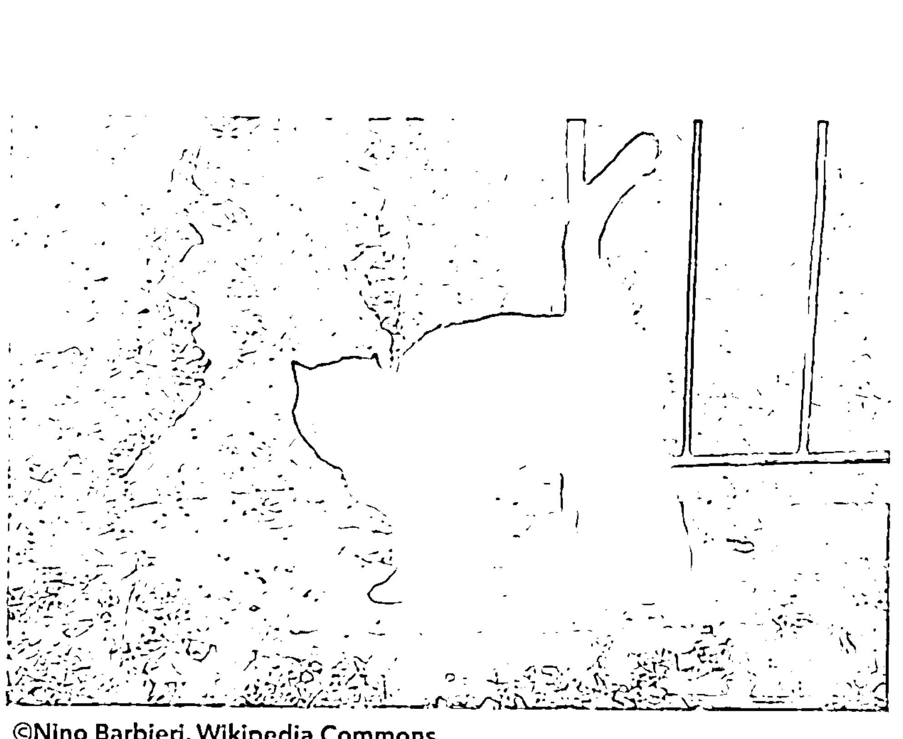

6
五芒星陣：五芒星（Pentacle）在古埃及被作為冥界子宮的符號；在希臘神話中，五芒星是大地女神Kore的象徵。同時，五芒星陣是巫術中的五角形護身符，這是世界上最早的一個符號，大約誕生於西元前四千年以前使用的。正五芒星陣的五角分別代表著上：靈元素，右上：水元素，右下：火元素，左下：地元素，左上：風元素。

#### 6 愛情降和拆散降的方法

關於愛情的降術，大概是所有降頭術裡運用最廣，也最為人所接受的一種。它對人的傷害也相對較少。「愛情降」是最常用的方法。普通的「愛情降」就是用特殊的降頭油擦臉，讓對方無論如何都不會覺得自己醜陋；亦或者用降頭水洗澡，就能令對方狂戀不止，這類降頭術無一不讓人趨之若鶩。當然，「拆散降」也同樣霸道，透過在床榻之中放置特殊物品，可以讓某人對另一人感到厭惡。這種關於愛情的降運用極廣，但是最終對方愛的不是真正的自己，卻也讓人感到悲哀。

## 故土難棄——湘西「三邪」的消亡

如果說「降頭術」是東南亞目前最流行的巫術。那麼，與它齊名的「湘西三邪」，則是東南亞至今為止最神秘的巫毒之祖。

湘西位於中國湖南省西北部，這裡自古以來即有八百萬大山，道路崎嶇，武陵山脈自西向東蜿蜒境內，與雲貴高原相接，北部則是連綿不覺的鄂西山地，東南以雪峰山為屏，形成了一道天然屏障。至今為止，這裡還居住著漢、土家、苗、回、瑤、侗、白等三十個民族，人口二百八十三萬，其中土家族和苗族佔近八十％的人口。

在某些民族混雜而居的大山裡，關於遠古的神鬼傳說始終不絕。若要問湘西歷史，還要追溯到在西元前四六○○年，苗族始祖蚩尤帶領著苗族子弟以山為屏，與中華始祖黃帝大戰，最後戰死。在蚩尤死後，東夷、九黎等部族最終融入了炎黃部族，形成了今天中華民族的主體，而蚩尤也被認為是中華三祖之一。與蚩尤一樣，土家族的精神領袖神人八大王也是從這些大山中走入人世的。

悠久的歷史底蘊，孕育出最為古老的巫術和巫醫。而在湘西的民俗故事裡，有關「湘西巫術」的故事在民間流傳不絕。雖然其中有許多總是讓人三緘其口、不得揚說，但只要你能接觸這裡的耆老，依然能從這裡的風土民俗中讀懂一些關於古老巫術的傳言。

其中，「湘西三邪」被譽為邪術之最。所謂的「湘西三邪」便是：「湘西趕屍人」、「苗族放蠱術」，以及「落花洞女」。

現在，讓我們一起走進這片神秘的大山，看看這裡的神秘巫術吧。

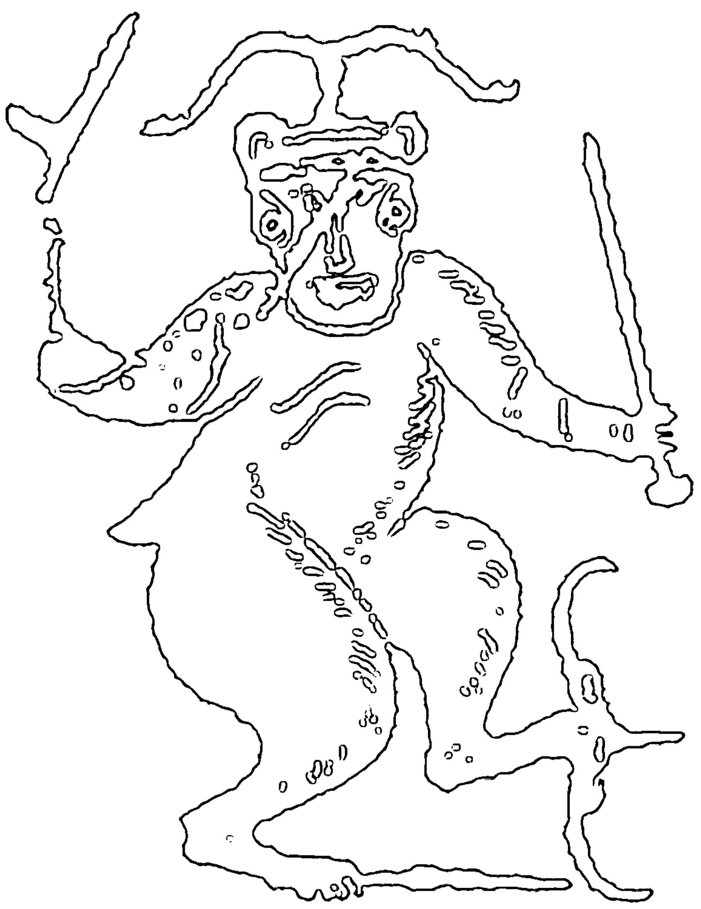

©Wikiwikiyarou, Wikipedia Commons

△ 湘西歷史可追溯到苗族始祖蚩尤（漢代石刻畫）。

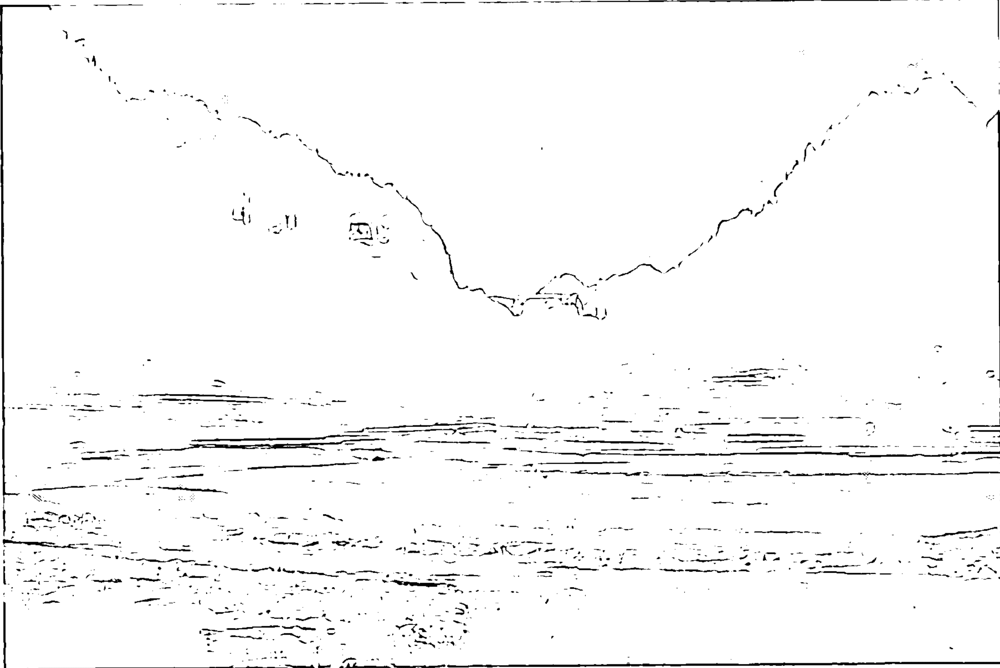

©海上生明月 · bbs.07430743.com

△ 在民族混雜而居的湘西大山裡，關於遠古的神鬼傳說始終不絕。

### ◎ 湘西趕屍人的故事

夜深人靜之時，荒郊野外之地，月光輕盈地灑落在湘西的山林裡。如果運氣好的話，從聽到山間幽遠處便能聽到一陣鑼鼓聲，「哐——哐——陰人趕路，陽人迴避；要避不避，閣下自理……」，濃濃的鄉音順著山間小路傳了出來，然後隱約會看到一排白色的人影正在緩慢移動。也許你會奇怪，這些究竟是什麼人？可是再仔細觀察時卻發現，也許這隊伍中大部分的成員並不是人。

走在最前面的，通常是一位身穿黑色道袍老者。他一手拿杏黃旗招魂，一手拿著一個鈴鐺。當鈴聲響起時，後面那些身影的動作會出奇一致。他們個個同手同腳，非常機械式地移動著。再仔細觀看，這些人臉色煞白，甚至帶著灰黑和鐵色，有些人身上甚至帶著暗紅色的斑點。他們的眼睛睜開，但眼珠卻深陷在眼眶中，透露出森然的恐怖之氣。

如果你看到這一幕，那麼要恭喜你，你看到了湘西地區傳說上千年的趕屍場景。隊伍前的黑袍老者就是所謂的「趕屍匠」；後面的那些，就是——屍體。

常常有人會追問這詭異的趕屍故事出自哪裡。如果一定要說，可得要追溯到蚩尤的時代。相傳幾千年以前，祖先蚩尤率兵與敵廝殺。結束戰鬥後，他看到屍橫遍野的戰場，心中充滿了悲傷。這些跟著他出生入死的族人，最終卻要埋骨荒野。他不忍心讓這些戰士死在異鄉，命令士兵們要把戰死的兄弟集中一起，一同送回故里。可是死去的戰士實在太多了，按照正常的速度，不可能在屍體腐敗前送回故鄉。於是蚩尤的軍師，同時也是當時苗族的第一大巫師獻計，用巫術讓屍體暫時復活，再讓士兵將他們送回家鄉。這就是關於湘西赶尸的最早传说。

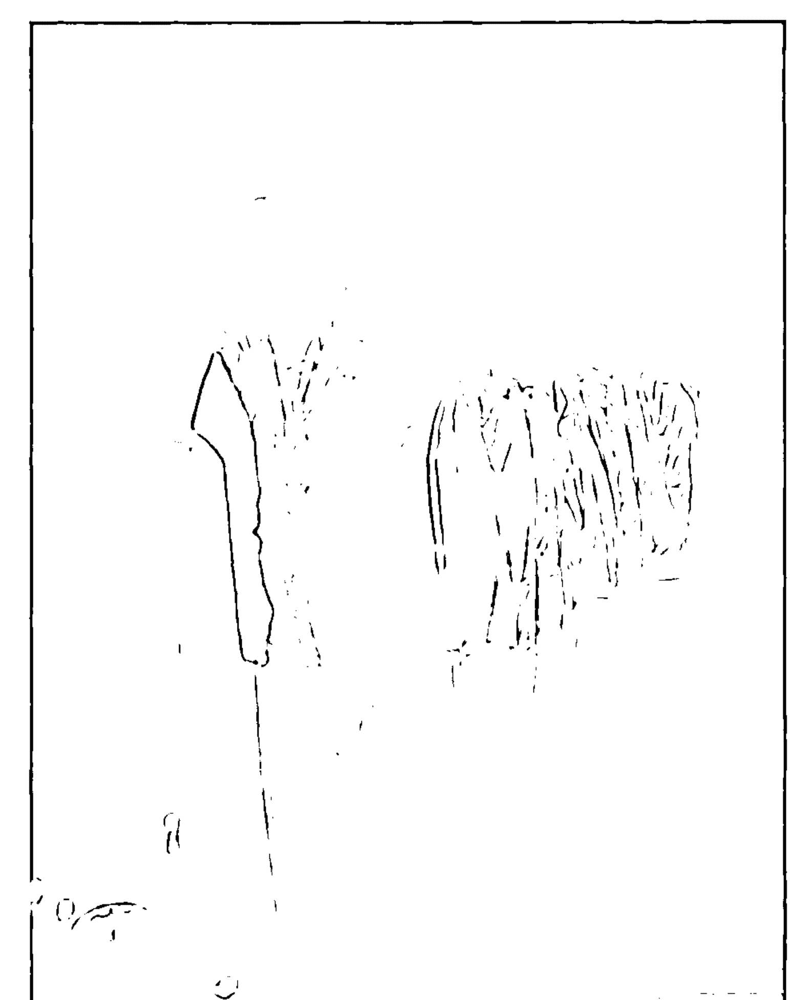

◎出處：club.chinaren.com

△ 湘西趕屍起源於湘西一帶的巫醫，藉由巫術讓屍體站立移動，讓客死異鄉者能返鄉安葬。

一直到清朝，越来越多的湘西人走出大山来到成都平原。他们对于身后唯一的要求就是能够落叶归根。可是远隔千里，如何回乡呢？「赶尸之术」便又悄然兴起。传言一直到抗战期间，重庆打铜街一个住家屋檐下，还贴着一张纸条，上面写着「代办运尸还湘」。

虽然「赶尸术」让那些要回家落土的灵魂得到了安息，但是，赶尸人这个角色却充满了悲壮色彩。甚至可以说，赶尸人也许是所有巫师当中最让人同情的一群人。

他们常年生活在山林间，寻找不会被人畜冲撞的道路。由于害怕尸体在阳光下发生诈尸，只能过着日夜颠倒的生活方式。同时，当了「赶尸人」以后，就再也不能结婚和接近女色了。所以，赶尸人虽然收入丰富，却经常孤家寡人，无所依靠。

他们孤独地生活着，依靠古老的信仰和巫术，把一具具老乡的尸体运回故乡。这群行踪隐密的赶尸人，而今世界上已所剩无几。但是，能让尸体暂时立起，走回家，绝对算得上是世界上最为诡异的巫术之一了。

> 指尸体入殓前忽然起立的奇异现象。古时有一说，人死后胸中仍残存一口气，如果被人或动物给冲撞到，就会发生「假复活」的现象，即所谓诈尸。这一口气并不能支撑生命，只会让呈现假复活状态的尸体如野兽般胡乱蹦跳甚至咬人，一直到最后一口气用尽倒地，才算彻底死亡。

### ◎ 大山裡的「死屍客棧」

「湘西趕屍」的傳言很多，其傳統規矩卻更多。比如，傳說中「死屍客棧」。

在茂密的湘西大山裡，人們總會發現有那麼一兩棟住宅常年都不關門，門口散發著陰鬱的鬼氣。住宅的門前沒有標誌，十分荒涼。偶爾會有一兩個面色古怪的人，在夜深人靜時站在門口，看著遙遠山間的一抹火光，似乎在等待著什麼。然後，會有一些穿著黑袍的人，帶著一伍行動如機械人般的人入住。但是，只有一兩個人會住到房間裡，其他的人則一溜煙地站在門後，悄無聲息。

沒有人敢去看門後的那些人究竟是怎麼站著的，又他們的眼睛到底是睜著還是閉著。只有進門口的一剎那，會發現其中一些人的頭頸似乎是被縫製過，他們的耳、鼻、口全部被塞滿了「不明物體」。

其實這些人就是趕屍匠和他的「雇主們」，而這棟看似廢棄的屋宅，就是傳說中的「死亡客棧」。湘西的孩子們都知道，捉迷藏絕不能躲在門後，因為那裡是停立屍體的位置。

只不過古怪的趕屍匠並不喜歡人們叫他們趕屍匠。在行內，趕屍人這個行當的名稱，並不是武俠小說裡所言的「趕屍派」，也不是什麼「殭屍門」這類新興名詞。它有一個現代人並不怎麼熟悉的名字：「祝尤科」。

「祝尤科」的由來可不簡單。它出自古時十三中治病科目之一，是指古時那些透過禁法、咒法、祝法、符法，以及暗示療法、心理療法、催眠療法、音樂療法等秘法來醫治病人的祝尤之術。這種以「禁法」為基本的醫病之術，和巫醫極為相似。

從本質上來說，趕屍人應該是起源於湘西一帶的巫醫。所以，他們更希望人們叫他們「師傅」或者「老司」。委託他們趕屍要說：「師傅，請你去走走腳」。

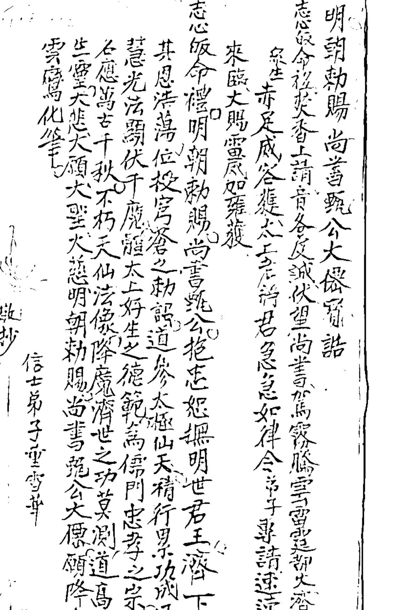

△「祝尤科」自古時十三中治病科目之一，指古時那些透過禁法、咒法、祝法、符法等秘法治病人的祝尤之術（圖為清代軒轅黃帝祝由科）。

### ◎「趕屍人」的古怪傳統

可能是由於這群趕屍人受到古時醫術的影響，因此，趕屍並不像其他巫術那樣，巫師只管收了錢幹活。他們有不少規矩需要遵守，比如最為著名的就是所謂「三趕，三不趕」。所謂「三趕」，即凡被砍頭的（須將其身首縫合在一起）、受絞刑的、站籠站死的這三種才可以趕。「三不趕」則是凡病死的、投河吊頸自縊而亡的、雷打火燒導致肢體不全的這三種不能趕。

這項規矩源於「趕屍人」心目中一種奇怪的信仰。他們認為，為了保證趕屍成功，需要尋找意念最想要回家的魂靈，也就是那些被迫死去的冤魂。這些魂魄死前心中有怨念，既思念家鄉又惦念親人，因此在施展法術勾引其魂魄時也會比較容易。而那些正常死亡或者自殺的死亡魂魄，因為對人間的眷戀較少，一般很難讓他們的符咒鎮於屍體之內，更別說用法術驅策他們爬山越嶺，返回故里了。

於是，常常能看到那些被趕的屍體上呈現出恐怖的色彩，比如受到絞刑後面色發紫、舌頭伸長，眼珠吐出的死屍；或者滿身是血，明顯身首異處後又縫製起來的頭顱。

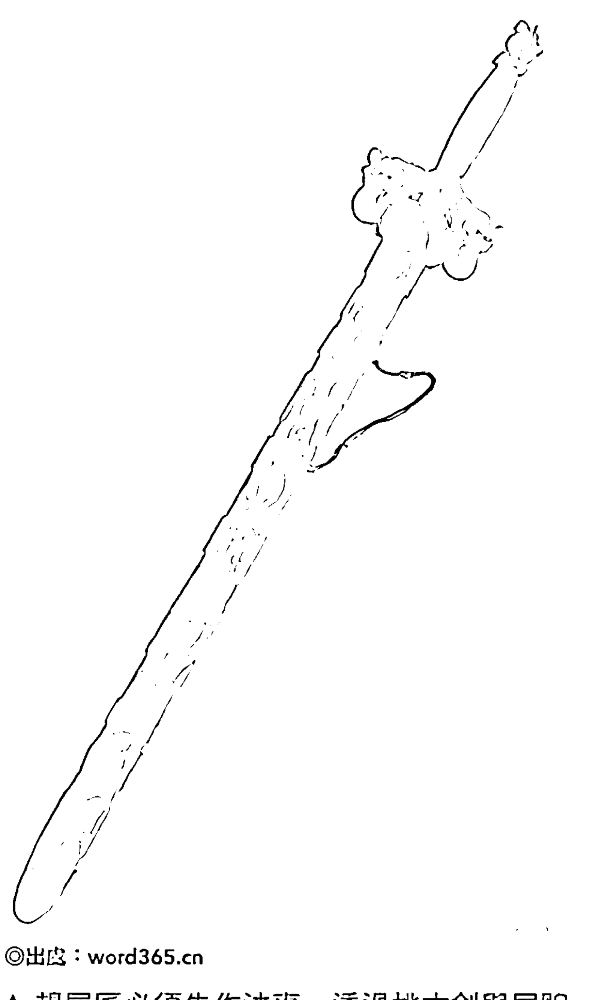

◎出處：word365.cn

△ 趕屍匠必須先作法事，透過桃木劍與屍體談判，方可確知是否可趕屍。

為了滿足這個古怪的習俗，喪主必須先說清楚死人的地點和死亡的原因是否符合「三趕、三不趕」規定。然後對屍體進行驗收，一切談妥後，才用特殊的黃紙，寫上死者的姓名、性別、生辰八字，以及死亡時辰。

趕屍開始和結束都要做一場法事。之前必須選擇一個無人經過的夜晚，設壇、點香、念咒、燒紙，透過桃木劍與屍體談判。如果桃木劍能過刺穿半寸厚的木板，則談判成功，可以趕屍；但若刺不穿，則趕屍失敗，趕屍匠會放棄這項趕屍任務。

當一切就緒後，趕屍匠會在人體七竅部位放置七個「辰砂」，以封住人的七魄。同時將人的「耳、鼻、口」也封住，防止三魂移位。如此這般做完法事後，屍體就一步步踏上千里回鄉之路了。

在趕屍人的專業術語中，並沒有「死屍」或「死人」的叫法，一律稱為「喜神」。趕屍時通常兩人一組，叫「大屍命」和「少屍命」。每次趕屍，必須有兩具以上的屍體，趕屍匠會用草繩將他們聯結起來，每隔三、四尺捆綁一個。法術高強的資深趕屍人，一次可以趕十具屍體回鄉。同時，趕屍有個古怪的規矩，就是絕不能讓死者親屬和他們走同一條路，否則必死無疑。為此，趕屍匠會讓死者親屬循其他大路先走一步。

趕屍所走的道路都是偏僻荒涼、人跡罕至的荒野小徑。趕屍匠很少會走官道。因為古時的官道經常會有快馬文書，萬一他們與趕屍的人撞上，那便會衝撞了「陰氣」。據說，一旦屍體與常人相撞，很有可能會詐屍、暴亂，成為趕屍匠難以控制的「殭屍」。而接觸殭屍的人也會紊亂心智。因此，趕屍人只能選擇小道前進，寄宿相熟的「死屍客棧」。

歷經千辛萬苦，趕屍人終於將屍體趕到了他們的故鄉。說來也怪，那些一路面無表情的死人，只要踏上故土，聞到親人味道的一剎那，他便如復生般從隊伍中跳出，撲倒在親人的腳邊，任憑趕屍人如何驅趕也不再動了。這個動作，也是主人家「驗貨」的重要依據。看到此情此景，喪家就會馬上付清剩餘的銀兩，讓趕屍匠回家痛快地歇息去了。

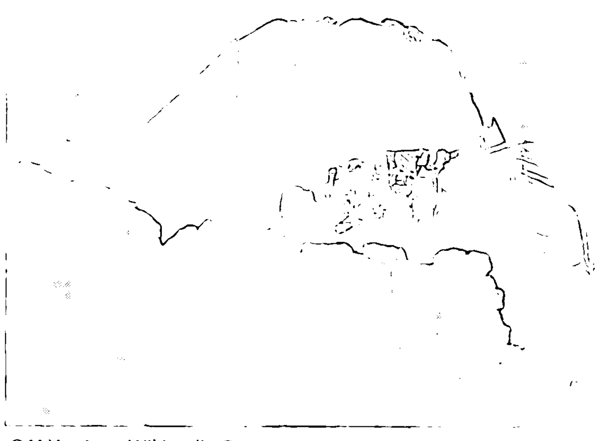

©JJ Harrison, Wikipedia Commons

△ 趕屍匠在人體七竅部位放置七個「辰砂」，以封住人的七魄。

辰砂：即「朱砂」，道教用來畫符驅邪的用品之一，配合朱砂筆，對黃紙（符紙），或者其他驅邪物品加以矜持，起到驅鬼辟邪的功效。最早見於《神龍度聖經》，《洞庭法源經》等書中。

### ◎ 苗族「鬼草婆」

筆者年幼的時候，曾隨大人到雲南旅遊。那時的雲貴高原還不像現在這樣人滿為患。我隨意在田埂間玩耍，看到一間低矮的小木屋，便好奇地走了進去。

屋子裡沒有人，桌上放著一個瓷碗大小的甕。和很多雲南苗人一樣，屋子裡焚著香。少不經事的我好奇打開了那個甕，卻嚇得跌倒在地——裡面全部是蟲子，大大小小，各種色彩，並且散發著令人作嘔的味道。當我想要離開的時候，一回頭，看到有個苗族打扮的老婦站在我身後，冷冷地看著我。至今，我還記得那個老婦人滿臉都是皺紋，牙齒森森地帶著幾分黑灰色，她的手指甲特別的長。當她的目光盯著手裡拿著甕的我時，我「哇」的一聲大哭起來。那老婦看了我很久，忽然從懷中拿出一個黃色的人偶給我，似乎是要送給我玩。

那個人偶十分逼真，上面扎滿了繡花針。繡花針密密麻麻地縫製在木偶上，看上去詭異而新奇。很快地我不再哭泣，拿著木偶回到旅店。但是剛剛跨入旅店，就有一個上了年紀的雲南老婦衝上來，一把搶過木偶，將它丟棄在門外，用我聽不懂的苗族土話扯著嗓子叫罵。直到父母聽到我的哭聲趕來，才知道，那就是傳說中「鬼草婆」的蠱咒之一。至今回想起來，仍不由得背脊發涼。

據那旅店裡的老婦說，這個木偶是「鬼草婆」在半夜時分一邊念咒一邊縫製上去的。凡是被詛咒之人會在午夜渾身疼痛到滿地打滾。當針扎到一百零八下時，被咒之人就會被活活扎死。老婦又指著木偶上連接著線，用很蹩腳的國語說：「這線是為了怕人逃脫，故意捆綁在木偶上的。」聽了老婦的話，我父母也嚇出了一身冷汗，我當然少不了一頓打罵。但無論如何，那個被捆綁得嚴嚴實實的木偶，卻讓我留下了極為深刻的印象。

後來我才知道，老婦人說的「鬼草婆」就是傳說中的蠱女。那個甕可能就是鬼草婆要造的蠱。

相傳，要造出一隻蠱，就必須捉一百隻蟲，放入同一個器皿中。這一百隻蟲大的吃小的，最後存活在器皿中最大的一隻蟲就叫做蠱。而根據這一百隻蟲子的類型，又可以分為蛇蠱、犬蠱、貓鬼蠱、蜥蜴蠱、蛤蟆蠱、蟲蠱、飛蠱等。

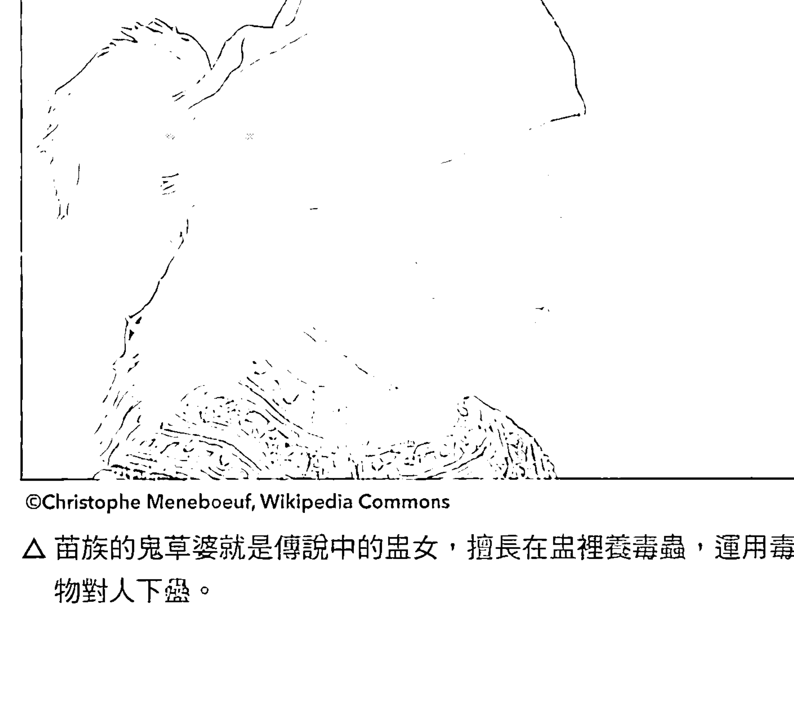

©Christophe Meneboeuf, Wikipedia Commons

△ 苗族的鬼草婆就是傳說中的蠱女，擅長在蠱裡養毒蟲，運用毒物對人下蠱。

### ◎ 神秘的蠱術

「蠱」的出現要追溯到先秦時期，而被廣泛運用則在戰國時代。相傳，蠱必須依附在女子身上，才具有危害他人的作用。因此，能夠使用「鬼草」的婦女，則被稱為「鬼草婆」。最初，蠱是生於器皿中的蟲，大多是那些穀物腐敗後所生飛蛾變異而成。由於蠱生於腐敗之物，天生就具有毒性。因此，一旦被鬼草婆刻意施咒，放入被施咒的人事物中，就會引發疾病。被施咒者有的神智昏亂，如同被鬼魅迷惑；有的則長期咳嗽、吐血、面色青黑、形體消瘦等，猶如得了很嚴重的病症。由於蠱具有神秘莫測的性質和巨大的毒性，所以又叫毒蠱。

和武俠小說所描述的不一樣，苗人並不把毒蠱叫做蠱，而叫它「鬼草」。他們至今依然十分崇信「鬼草」，但凡有任何問題都會去詢問「鬼草婆」，特別是對於慢性疾病，都要請之作法「驅毒」。

除了「鬼草婆」之外，苗族的「行巫者」也是蠱術的繼承人。只不過這裡的「行巫者」和其他地方的行巫者有著極大的不同。

在古老的苗族傳說中，成為行巫者乃是命中註定的，不需要去求取什麼或練就什麼。或許突然有一天，上蒼就要借用你的身體去做一些事。根據現存的史料記載，苗族的巫者多非自願。他們平時為人忠厚，沉默寡言，甚至不苟言笑。可是一旦神靈欲使用他們，就會忽然發病，臥床不起，如有神靈附體，語音神氣完全改變，或胡唱胡鬧，天上地下，無所不談；或哭笑無常，毆打自己，長日不吃、不喝、不睡覺。可是過兩三天後，彷彿生命中有種東西終於把他穩住了，因為精神體力極度疲乏，要休息了，於是長長地睡上一天，人就清醒了。清醒之後，此人便成了「行巫者」。

有人說，大山是湘西巫術的活化石。行走在湘西群山環抱、綠水縈繞的苗族山寨中，你總能從蹲坐在臺階上的老人口中聽到這樣或者那樣的，關於蠱術的故事。在這片大山裡，遊人們或者只看到木牆黑瓦下的老人、孩子和狗。至於那些縈繞在大山裡關於蠱術的故事，則順著山寨的炊煙，化作了一個個綿延不絕的符號。

### ◎ 苗族癡情女的「桃花蠱」

據說，中國剛剛改革開放的時候，湘西大山裡還生活著苗族最擅長蠱術的蠱族。傳言當年有大學生到那裡旅遊，就遇上了讓人有些毛骨悚然的「桃花蠱」。

上個世紀八○年代，有一群北大學生在暑假的時候相約去雲南旅遊。他們跋山涉水來到了大山深處，住進了一座不知名的苗族山寨。苗族人天生熱情奔放，夜晚時分，他們就與北京來的學生一起烤著篝火，唱歌喝酒。

這群北京大學生裡有個男孩來自東北，人高馬大，精通音律，也很能喝酒，居然能夠和酒量通天的苗族漢子不相上下，苗族女子唱歌他也能哼上幾句。那個晚上他成了苗族山寨裡最受歡迎的小夥子。不少苗族少女都送來秋波，那男孩倒也大方地接下了。

酒足飯飽，他已經喝得七八分醉了。藉著酒勁，他慢慢地走回下榻處睡覺。途中，他無意間經過一片桃花林，有一個苗族姑娘站在樹下，含情脈脈地看著他。他畢竟是年少輕狂，看姑娘的眼神也多了幾分曖昧。忽然，姑娘的手絹掉在地上，他趕緊幫她撿了起來，交還給姑娘，還獻殷勤似地對姑娘笑了一下。姑娘見此大感開心，從身後拿出一壺酒。酒興未退的年輕人二話不說就把酒給喝了。

待第二天他酒醒後，卻發現情況有些不對勁。他身邊的同學都古怪地看著他，告訴他早晨的時候，山寨的族長來訪，說他與族長的女兒訂了親，過幾天就可成親了。這可嚇壞了這個東北小夥子。他飛也似地跑到族長家，發現那個少女就是前一晚在桃花林裡的姑娘。他一下子傻了眼，想要解釋，才發現在當地的風俗中，如果誰能對上姑娘的歌，且姑娘把手絹扔在地上，小夥子也撿起來還給她，便是成了的意思。

這下子，年輕人徹底傻住了。他辯解自己只是出於善意，沒有那個意思，並且不顧阻攔，連夜逃回了省城。可是，就在他逃回省城的第二天，恐怖的事情發生了。

早晨，年輕人迷迷糊糊起床上洗手間，覺得鼻子有些癢，捏了幾下，忽然捏出了一團紫黑色的血塊。血的顏色十分濃重，隱約間還有細小的蟲卵。他一下子就警醒了，呆呆地看著從鼻子裡不停流下的血。緊接著覺得肚子疼，感到肚腸裡撕心裂肺的痛楚。同學急忙把他送到縣城的醫院，經過一輪檢查卻找不到任何原因。縣城醫院的醫生也有苗族寨子裡的人，看了年輕人的情況，又問了他之前的經歷，很慎重地告訴他們，他一定是中了蟲毒。而那座不知名的山寨，其實是十鄉八里著名的蠱族。

年輕人和他的同學們一聽，各個臉色慘白，可是為了活命，他們不得不請當地的老族長出面，再一次將年輕人抬到寨子裡。這個時候年輕人已經氣若游絲，眼看就要不行了。

山寨族長看到逃走的年輕人，自然是沒有好氣，那位姑娘更是滿臉淚痕。但是經過長時間的交涉，老族長以這些年輕人是北京來的、不懂規矩為由，才終於說服蠱族請出了山寨的神婆。

苗族山寨裡的神婆是苗族人對「鬼草婆」的尊稱。這位神婆年紀已經很大了，進到房間看了那年輕人一眼，詢問了原因才知道，當年她曾經煉製過一顆「桃花蠱」送給族長，族長又把這個蠱蟲給了自己的女兒。苗族女兒原就奔放，對這位年輕人一見鍾情，卻又怕他回北京，於是特意在桃花林相見，訂下了「手帕之約」，並在訂情酒裡下了「桃花蠱」。

如今，年輕人反悔，「桃花蠱」自然便發作了。

那神婆倒也算是不錯。她同情這對誤託終身的男女，於是從衣襟裡掏出了一隻蝨子，抓住姑娘的手，把蝨子放上去，接著喃喃自語了一會兒，摸了摸姑娘的臉，姑娘瞬間臉色蒼白。然後，神婆跑到房間外，在地上插上一根柱子，燃了幾堆火，站在火堆的中間。一會兒，神婆的身上就爬滿了蜈蚣和蠍子之類的毒蟲，讓人看著渾身發癢，噁心不已。隨即又讓人到她的屋子裡，提了一桶動物的血，神婆喝了一口，把一條小蜈蚣放進嘴裡。等蜈蚣再次從她口中爬出來時，已經是一條極大的蜈蚣，並且變成了深黑色。神婆拿著蜈蚣，遞給姑娘，要姑娘親自餵給那名年輕人吃下。隱隱約約間，年輕人已經醒了過來，但看到那麼大一隻蜈蚣，又再次暈了過去。姑娘好不容易讓半昏睡的小夥子吃下蜈蚣。等了一炷香的時間，年輕人開始嘔吐，不停地嘔吐，他的鼻子也開始出血，流出來的血液和嘔吐物全都呈現一種詭異的深紫色，裡頭還有蠕動的蟲。這些蟲有大有小，但都是活的。據那些目擊的同學說，他整整吐了三輪，才終於嘔出鮮紅色的血液。年輕人後來整整休學了半年才終於恢復過來，卻再也不敢隨隨便便去雲南了。之後，他們翻查資料才知道，原來那年輕人中的「桃花蟲」，就是傳說中苗族著名的「情蟲」。這種蟲術一般是戀愛的一方為了綁住對方所下，一旦一方反悔，就會出現之前那讓人毛骨悚然的一幕。除了「桃花蟲」，還有讓情人之間感到恐怖不已的「心蟲」，那才是男女之間互許海誓山盟、投入身心的終極毒咒。

苗族女子美麗活潑，熱情奔放。不過，要享受這樣的美人恩，可也要小心苗族恐怖的「情人蠱」哦！

### ◎ 一曲「落花洞女」悲歌

和「趕屍」、「放蠱」相比，「湘西三邪」之一的「落花洞女」則顯得有些淒涼。大多數巫術是對其他人施展的，唯有「落花洞女」的故事卻充滿了悲劇色彩。

由古至今，西南這些大山不知道出現了多少位「落花洞女」。這些美麗、溫順的女子以自己的生命譜寫了一曲悲壯的人生之歌。在她們死去的那天，便是她們出嫁之日。她們所嫁之人卻不是人，而是神。社會學家將這種巫術稱之為風俗，認為這是舊時殘害少女的邪惡風俗。不過，筆者倒是認為這是一種以生命為血祭的巫術。

為什麼叫「落花洞女」？「落花」是指這些女子生前經常整日哭泣，直到雙眼出血，將落花哭濕。「洞女」則是指這些整日哭泣的女子，最終會被送到大山的岩洞中修行，不吃不喝，直到被接回家中。

相傳，凡是被選為「洞女」的女子，大多是遠近聞名的貌美女子，卻又生於淒涼無靠之家。這些女子被遴選為「洞女」，並且施以一種古老的法術，然後被人送到山中洞穴修行。當她們被送回來時，彷彿是受到某種鼓舞，會變得更加美麗，面若桃花，晴如星辰，聲音如絲竹仙樂，動作如扶風擺柳，甚至於體泛馨香。她們會自動自發地洗漱清潔，最後安詳寧靜地含笑死去。據說她們死後會和山中的樹神、山神結婚。

這種情形更像是被下了迷魂藥。雖然這類巫術倒是常見於各地，但是像「洞女」這種甘願赴死的卻不多。相傳，若一戶人家出現一個「洞女」，這戶人家就會被當成神明之家。這座山寨也會得到神靈的眷顧，那年的收成會特別豐碩。

## 天堂的路——藏傳佛教裡的小道

時間的長河奔流至二十一世紀，當我們去尋覓「巫術」，或者說「巫道」的時候，不得不追問一個問題——這世上還有多少人信奉神魔，究竟還有多少人相信這世上存在著科學世界之外的事物呢？藏族，或許是這世界上僅存、全民信教的民族之一。

### ◎ 西藏「鬼學」

時至今日，平均海拔在四千米以上的青藏高原，依舊是藏族最主要的生活區域。他們常年與惡劣的生活環境搏鬥，在與天鬥的過程中，孕育出了崇尚萬物有靈的原始宗教——苯教。之後，西元七世紀初，佛教經尼泊爾傳入西藏，由藏王松贊干布發揚光大，最終融合苯教，形成了獨具特色的藏傳佛教。

關於藏傳佛教的爭論有很多，有人說藏傳佛教融合了多神教，弱化了佛的教義；也有人說藏傳佛教完整地繼承了大乘佛教的教義，是目前中國佛教的活標本。

無論哪一種說法，都無法詮釋隱藏在世界第三脊梁上的隱密教義。人們唯有從一些「小道」巫術中得以窺視一些令人驚異的恐怖力量。

相傳蓮花生大士引密宗入藏區時，他已在印度八個著名的墓地進行潛修，他以屍體為座，以祭品為食，以裹屍布為衣，進入甚深三摩地，終於悟得大道。之後，他應藏王赤松德贊之邀，前往西藏弘揚佛法，並在論法中打敗黑教，使藏民得以改尊正統佛教。

西元八四〇年藏王朗達瑪滅佛事件之後，原本固守傳統的寧瑪派便尊奉蓮花生大士為根本上師，認為蓮花生大士乃是阿彌陀佛、觀世音菩薩、釋迦牟尼如來等身口意三密的金剛化現，親身示現不生不滅之真諦。後來由於寧瑪派廣為傳布，蓮花生大士開始被賦予諸多神奇色彩，在藏傳佛教信仰中地位極為崇高，藏人更尊稱他為第二佛。

蓮花生大士在藏傳佛教的發展歷程中起了極大的作用，雖然他一再宣揚人道精神、慈善之心，卻依然不能擺脫原始宗教中巫教的烙印。蓮花生大士所傳的典籍中出現不少惡鬼傳說，以及被稱為「鬼學」的驅鬼之術。

時至今日，在西藏依舊能看到各種「驅鬼」和「馭鬼」之術。

比如古老的門巴族至今還沿用古老的驅鬼之術，他們篤信跳神送鬼。在他們看來，尋求神的祝福的關鍵，就是尋求鬼的寬恕。

他們以男巫「登龍坎」作為送走鬼的巫術實施者。以殺雞、豬或牛獻祭，如果是為人治病，就要求在殺死畜禽之前給病人過目，並以芭蕉葉將手搖的轉經筒、佛珠、長刀、衣物及病人的其他用品，擺放在村外地界。

巫師透過誦念「苯波」咒語，親自將雞、豬、牛殺死，把牲畜的心和內臟取一點煮熟，放上佐料、米飯以饗鬼，祈求鬼不要讓人生病，吃了這些食物後就離開吧。

在西藏巫術的世界裡，認為每個生命都有一個叫La(bla)的能量源泉，那是人的精魂所在、命之所繫，但這個源泉不一定在人的體內，也可能是在別的地方，例如山上、湖裡或野獸身上等等。流亡藏人曾經說，只要找到那個人的La(bla)就能殺死那個人。至於鬼，就是能找到La(bla)的媒介。

### ◎ 藏之「巫毒」——嬰靈守護

泰國的降頭師們喜歡「養小鬼」，以絲羅瓶縱橫巫術界。而比「小鬼」更可怕的就是「嬰靈」，也就是那些尚未出生便早早離世的死嬰。這些死嬰大多由於人為原因而胎死腹中，特別是已經成型的嬰兒若遭到「墮胎」，便更具有殺傷力。

在佛教教義中，「殺胎」被列為五逆重罪之一。佛家的法師相信，死嬰已經具有強大的靈魂，非正常死亡予以他們太多的煞氣，極其容易成為恐怖巫術的法器，而關於「嬰靈纏身」的故事更是讓人聞之背脊發涼。

距離曼谷市中心不遠處的一座佛寺內，如今還供奉著一具「雙頭神嬰」，他的故事也許可以說明一些關於「嬰靈纏身」的始末。

這間偏遠郊區的寺廟裡沒有神佛，也沒有過多僧侶。高大的廟堂裡，只有一間的小屋，裡面是一具尚不足月的嬰兒屍體，經過防腐處理後存放在玻璃箱內給人供奉，這就是當地有名的「雙頭神嬰」。

相傳上個世紀八〇年代，當地出現了一則駭人聽聞的故事。據說有一對夫妻因為將腹中未出世的死胎拿出，遭到嬰靈的詛咒纏身，在一年內相繼離世。這嬰靈在母體中已經形成了雙頭，是傳說中最為恐怖的雙頭嬰靈。可是，就是這樣的一個凶靈，卻因為極其靈驗，反而成為了當地的守護神。

驗，有越來越多的人前來祭拜。一開始，只是有些想要求子的夫妻前來，很快就懷了孩子。後來，附近的居民開始向「雙頭神嬰」祈求姻緣、財富，也多有應驗者，因此，關於嬰靈的傳說也就越來越玄。當地的居民相信，只要願意付出代價，就能獲得想要的一切。

在藏傳佛教中，嬰靈是一種被稱為中陰性的物體。它非人、非鬼、非神、非魔，既不能馬上進入輪迴，又不能稱之為鬼魂，只能以一種能量體的形態留在人間。但是，嬰靈有著比鬼魂更強大的怨力，而且據說它的怨力會隨著時間的增加而成長。為此，某些一心想求道的巫師，漸漸也開始供奉這些嬰靈。

這種供奉嬰靈的做法有些違背人倫，常要以自己的精血為引。所以在自家供奉嬰靈的人總是見不得光的。他們大多數從醫院將那些墮胎或者因先天缺陷而引產的胎兒帶回家，放在特製的玻璃器皿中，日夜供給養料。

據說嬰靈起初唯一的食糧，就是親生母親的元氣，一般女性一生中最多只能接受三個嬰靈的附身，一旦過多，那女子必然身體氣虛，精神錯亂。母體元神逐漸虛弱，但嬰靈日漸成長所需要的元氣卻相對增加。為了求得嬰靈的幫助，很多供奉嬰靈者不得不出賣自己的元氣，但是這麼做的結果，卻會導致自己被嬰靈纏身。

所以，無論何種情況，千萬不要供奉嬰靈。若不幸遇上這樣的事情，必須儘快找法師幫忙超度，萬不可掉以輕心，惹禍上身。

### ◎ 葬魂之法

二十一世紀初，有人去西藏旅遊時拍攝到這樣一副畫面——

在太陽冉冉升起的清晨，藏族某座小山上，升起淡灰色的煙塵。有一名穿著藏青色長衫的藏族老人，神情嚴肅地站在山坡上，手裡拿著一把暗無光澤的暗紅色短刀。在他面前躺著兩具屍體，面色臘黃，略有腐敗。

他望著屍體很久，嘴裡念念有詞。忽然，他一抬手把屍體翻轉過來，接下來竟一刀又一刀地在屍體上切割。先在背後劃一刀，接著在肋骨劃兩刀，再翻身往肚子上劃兩刀。男人要斜著劃，女人得豎著劃。據說，如果是僧人的話，就要按照袈裟的樣式來劃。兩具屍體很快地肉骨剝離。

腐敗的氣味飄散整個山頭。隨後，聽到一聲厲嘯，從山的盡頭飛來第一隻禿鷹，緊接著一隻隻的禿鷹也跟著出現在山頭上空。空氣中瀰漫著濃濃的死亡氣息。老人退到一旁，禿鷹順著屍體的氣味俯衝而下。一口咬住了屍肉，開始吃食。

一塊又一塊的人肉被分食殆盡，剛才還完完整整的一個人，如今只剩下帶著生肉屑的骨架，血淋林地教人忍不住作嘔。但這名神情嚴肅的老人卻沒有就此離去。他忽然起身，拿起一旁的石頭，開始敲擊枯骨，一聲又一聲，枯骨和所剩不多的血肉化為肉醬，淒迷地模糊在一起，看上去讓人不寒而慄。

他望向天空，禿鷹再次凌空而下，迴繞著屍體盤旋。直到殘肉徹底食盡才終於散去。所有的人長跪不起。

此一令現代人難以接受的行為，叫做「天葬」，是藏族著名的「安魂之術」。據說，「天葬」取自佛教故事中「屍毗王以身施鴿」及「摩訶薩埵捨身飼虎」，宣揚「菩薩布施，不惜生命」，要人們在死後將肉身餵鷹，讓靈魂升天。

「天葬」的儀式在藏族可謂既普遍卻又神秘。藏傳佛教認為，點燃桑煙為得是鋪上五彩路，恭請空行母到天葬台，以屍體作為供品，敬獻諸神，為逝者在世時的罪孽求恕，請求神靈把他的靈魂帶到天界。

至今，西藏多多卡天葬院中間，還有一塊約四平方米大小、用鵝卵石鋪砌而成的葬屍池。在天葬院南門外，樹立著一根約十餘米高的經幡旗杆，上有骷髏骨雕塑，頂部懸掛著許多褪色的經幡，四周還圍有約一人高的土牆。

一走近這些土牆，就會不自覺地產生幾分寒意。土牆上製作了一些方形的格子，每格裡面都排列著一個個人頭骨，形成兩面長長的骷髏牆。一個個排放整齊骷髏頭骨，讓人感到神聖的威懾和恐怖的死亡氣息。這就是傳說中的骷髏牆，據說在那裡，人們能夠傾聽到死者的聲音。

關於天葬的安魂之術，如今只有藏區的天葬師能夠說出一二。但他們大多保持緘默。到了現代，這種獨特的巫術儀式被認為是一種文化風俗。可是，誰也無法解釋，無論多麼僵硬的屍體，為什麼只要在多多卡天葬院安放過，就能解凍和分解；而誰也無法解釋，凡是執行天葬的藏族家庭，家內都更加平安祥和。

也許是在遠古西藏，這種巫術儀式真的能夠透過放棄肉體，幫助靈魂得以永生。

## 長生不老——流傳千年的宮廷祕術

和隱密在大山裡的傳說相比，有些巫術即使流傳了上千年，仍然有人樂此不疲，比如對於長生不老術的追求。而其中的翹楚，就是歷代天子。普天之大，莫非黃土，率土之濱，莫非王臣，只有掌控生殺大權，享盡人世繁華的皇帝，總是不願意太早離開人世，他們希望讓自己的人生無限制地延長，最好能永生不死。

### ◎「食心」長生之法

人體器官中，哪一個部位蘊含的能量最強？有一派巫道認為是「人心」。人的心臟，特別是十五歲以下兒童的心臟，是所有人體器官中能量最大的，他們經過幾代人的努力，終於創造出了「食心」的長生之法。

此一方法由於太過血腥，以至於很多人即使運用也是極為隱密，除了一個人——唐武宗李炎。

一千五百多年前，唐高祖與他的兒子們用鮮血和生命換來了中國歷史上最輝煌的朝代——大唐。在二百八十九年的唐朝歷史上，湧現出太多可供後世參詳的歷史人物和故事。而李炎的名字會被人熟知，不是因為文治，也不是因為武功，而是因為——「滅佛」。

李炎是唐朝歷史上的第十六任皇帝唐武宗。這個信奉道教、一心想成仙的皇帝，雖然只在皇帝的寶座上待了六年，但是他所研發出的一種血腥巫術卻流傳了下來。

據說，唐武宗非常排斥佛教，在他在位期間曾下達「殺沙門令」，大肆砍殺了長安城中三百多僧人，命令要求沒收寺院財產，僧尼全部還俗。同時，他對道教深信不疑，尤其迷信道教的神仙方士之術。

於是，一個自稱能夠令他長生不老的道士出現在李炎面前，號稱他能煉成神奇的丹藥，長期服用即可成仙。他以「洛書」之名，以五為基數，要求李炎提供十五歲童男童女的心臟煉製丹藥。

這個聽上去有些不可思議的法術，唐武宗居然相信了，他下令各州府衙門每年必須進獻十五歲童男女的童子之心。

之後，那道士用黃土築成一座法壇，在上面開壇做法，之後將童男與童女的心臟各一顆，放在一起煮熟，用熬煮出的湯水與特殊的材料合藥，煉製一枚藥丸。據說要想成仙，總共得服用五百枚，等於要殺掉五百個童男和五百個童女！

唐武宗在位時，唐朝共有四十多個行政區，哪怕他要求每個行政區只上繳一顆童男心臟和一顆童女心臟，也會有八十多個人慘死在這樣的巫術上。

這些童男童女的心臟被取出，屍體被隨意丟棄在荒野之中。相傳當年大唐長安的一塊野墳裡，總能聽到少年的哭泣聲，這些都是被唐武宗殺死的童男童女。他們尚未成年就慘遭殺害，心臟被煉製成藥，供人食用，境遇淒慘。

也許是李炎壞事做得太多。他用人心煉藥，最後依舊沒有換來長生不老。在西元八四六年，就因患了「惡痢」駕崩，享年三十三歲。

### ◎「人膽為引」的長生術

除了食用人心的長生之法，還有以「人膽」為藥引的長生術。這個故事和人心一樣，充滿了血腥的味道，出自遼穆宗耶律璟。

耶律璟（九三一—九六九年），遼太宗耶律德光的長子，大遼的第四任皇帝。他是中國歷史上有名的昏君和暴君。

相傳，耶律璟酷愛喝酒，在登基為王之後，他仍然夜夜笙歌，一醉到天明。但也正是由於他過度飲酒，導致自己的身體越來越差。

為了尋求長生不老之術，他找到了一名女巫，求了一張偏方，相傳只要用成年男子的膽做藥引子，就能配出延年益壽的藥方。於是耶律璟從此每吃一副藥，就要殺一個人，連近侍隨從也難以倖免。幾年間，他為了煉製人膽長生藥方，不惜殺了數百人。大多數人都是遭活體取膽，死前痛苦不堪。雖然他吃了這樣的丹方以後，身體確實有所好轉，但最終由於他的嗜血成性，導致民怨，最終死在一個默默無聞的廚子手中。這樣的故事也許告訴我們，長生之術固然存在，可是不分是非黑白，即使擁有了長生不老之術，也不見得就能獲得永生。

### ◎「滋陰補陽」房中術

與取「人心」、「人膽」相比，有一種巫術可謂柔性的暴力。古代有些文人雅士給他冠了一個漂亮且引人遐想的名字——「房中術」。事實上，這個巫術確實出自古代養生之法。在中國古代，女巫為「巫」，男巫為「覡」，合稱「巫覡」。相傳這些巫師都能活得很長久，其秘密就是所謂的「巫覡之術」，後人稱它為「房中術」。

根據《千金要方》卷二十七記載：
「夫房中術者，其道甚近，而人莫能行其法。一夜御十女，閉固而已，此房中之術畢矣。」晉代葛洪的《抱朴子·內篇》中也明確記載：「房中之法十餘家，或以補救勞損，或以攻治眾病，或以采陰補陽，或以增年延壽，其大要在於還精補腦一事耳。」

中國的房中術乃是基於中醫理論中對兩性相交以養生的精確描述。中醫認為，男性的精液是人身中最寶貴的物質，應經常保持盈滿，但是房事中的洩精將使其耗竭。同時，女性在房事中分泌的陰精卻不會耗竭。男性精液的補充可經由服食滋補品獲取，也可透過房事從女性的陰精中獲取。

基於這些理念，房中術曾經在中國上層階級極為流行，宋代以後甚至逐漸發展成為「煉內丹」之術，它要求男性必須有意識地與女性行房來達到補益、長壽，甚至長生不老、得道成仙的目的。但是由於許多實施者縱慾過度，也使得這種古老巫術逐漸轉變成為一種殘害女性的邪惡巫術。

其中，就以明嘉靖年間的「壬寅宮變」為最。

明嘉靖帝朱厚熜原是興獻王朱祐杬之子。由於明武宗身後無子嗣，於是皇太后和內閣首輔楊廷和決定讓武宗的堂弟朱厚熜繼承皇位，第二年改年號為嘉靖。

這個在明朝歷史上舉足輕重的皇帝，從小並不在皇宮裡長大，而是生於荊楚之地。那裡以道教為尊，不少人尋求得道成仙的法門。朱厚熜從小耳濡目染，對鬼神之說深信不疑。他執掌皇權之後，更是將道教推崇到極致。

不僅他本人精通道術，繼位為皇以後，還帶動全體朝臣一同尊道。同時，為了修煉道術，他大肆建造修行用的宮殿，致使國庫極度空虛。在他當政的幾十年間，尊道者升官發財，敢於進言勸諫者，輕則削職為民，枷禁獄中，重則當場杖責至死。

同時，為了能夠長生不老，嘉靖帝在宮中利用皇帝的權威大肆遴選嬪妃，強迫十至十三歲的少女入宮，和她們同修房中術。為了達到房中術所要求，必須與不同女子共修的目的，他不僅隨意強佔嬪妃和宮女，且經常強暴宮中處女，讓那些飽受折磨的女子受盡凌辱。

同時，為了保證自己所獲得女性陰精的純正性，嘉靖帝要求侍寢的女性必須是處女，很多女性雖一夜承君恩，卻終身離不開皇宮。

一五四二年，春末夏初的一個夜晚，不堪忍受嘉靖折磨的宮女們，合謀要把這個殘暴的皇帝勒死。可是，宮女畢竟是柔弱的，由於一時慌亂，繩子結成死釦，無法勒緊，嘉靖皇帝被勒氣絕但沒有死。最終，皇后帶人及時救下了奄奄一息的嘉靖帝。這就是著名的「壬寅宮變」。

以兩性相交為重點的「房中術」，看似溫和，不帶血腥，但是為了達到男性皇帝長生不老的目的，無數少女被犧牲，她們甚至被當成物品一般，一旦被破身就再也沒有用處。這種柔性的殘暴或許可以認為是另一種讓人恐懼的巫術吧！

## 行色鬼屋——茅山道術的捉鬼傳說

### ◎ 豐都鬼屋

這世上最讓人感到恐怖的地方，有人說是墓地，有人說是像百慕達三角洲那樣的神秘地帶。但筆者始終認為：這世界上最恐怖的地方，必然非鬼屋莫屬。

試想一下，你走在大街上經過一處屋子，突然間就被一惡鬼盯上了，它沒沒夜地糾纏著你，甚至連你的家人也遭殃；又或者你好不容易買了間新居，搬進去之後，一連串恐怖事件卻接二連三地發生，你身邊的親人一個接著一個離去，那時候你該怎麼辦呢？當你這樣想的時候，會不會有一種背後發涼，不敢隨意走動的感覺呢？

二〇〇七年，中國重慶一家報紙報導了豐都縣虎威鎮上流傳的一個關於鬼屋的故事，也許是能反映出所有有關鬼屋的恐怖原型吧！

那間「鬼屋」位於重慶虎威鎮郊茂密森林的一角。採訪記者走近那裡時，屋子孤零零地立在小山裡，一陣風吹過，四周是嘩啦啦的響聲，經過十多年的鬼魅傳聞，四周的居民都已經搬走，這間鬼屋被單獨留在原地。陪伴它的只有它的建造者——彭雲珍女士。

彭雲珍今年六十一歲，她臉上沒有一絲微笑，在她看來，所有的噩夢都要從二十多年前說起，那時候的她還有兒有女，父慈子孝，可是幾年間，她的親人相繼去世，這間屋子只剩下她和自己十三歲的外孫。

一九八二年，彭家因原有的土房敗壞，一家人興沖沖地開始選址建房，忙了大半年，新宅終於落成了。可是這間全新的屋子卻是她們全家噩夢的開始。

搬進新居後次年，彭雲珍當時四十八歲的丈夫出現腰痛、吐血等症狀，後不治而亡；同一年，她自己也在割豬草時摔傷左腿，從此留下殘疾，再也不能從事粗活；一九九五年，本身強力壯的女婿在回家的路上突然猝死；不久後，結婚不到兩年的兒子出現全身浮腫、吐血等症狀，終因醫治無效去世，年僅三十歲；隨後，年輕的媳婦帶著年幼的孫女改嫁；三年前，年三十二歲的女兒回來彭雲珍家長住，不久因下身出血，久治不癒而厭世，吊死在家裡。至此，原本一大家子人，就剩下殘疾的她和十三歲的外孫。

根據彭雲珍說：「它們（鬼魂）鬧騰得我實在沒法，只得替它們讓路。我們只能搬到屋後的窩棚住，這裡已空了三年！」她每天晚上都能聽到屋裡乒乒乓乓的聲音，不知所措。當記者走進這座鬼屋的時候，那裡充斥著一股腐朽氣味，陰沉的氣氛令人生畏。

之後，關於彭家「鬼屋」的故事被廣為流傳。為了闢謠，鎮裡曾經派人來勘察過地形、水質、放射性物體，全都一無所獲，最終這間豐都鬼屋成為了一個永遠的謎團。

### ◎ 茅山道術

事實上，要化解像彭家這樣的鬼屋問題，民間唯一的方法就是請法師捉鬼。中國數千年的歷史中，不乏有各式各樣的捉鬼秘方。有些秘方被認為是騙人的，但是有些秘方雖充滿了血腥，卻依然散發著令人毛骨悚然的驚人生機力，比如：茅山道術。

在彭雲珍這棟鬼屋裡可以見到四處貼滿了道士的咒符，就連彭老太太如今棲身的角落也是經過精心選擇的，無奈法師告訴他，可惜他的道行不夠，還是不能把鬼怪除盡。於是，彭雲珍只能帶著孫子住在破敗的簡易木屋裡。

當看到這麼悲慘的一幕時，令人不得不感嘆，如果傳說中能夠降妖除魔的茅山道士還在，那麼這一切也許會不同了。然而，由於滿清政府當年信奉佛教，驅魔這樣的事情只允許薩滿法師執行，致使茅山道術幾乎已經失傳了。我們只能從一些書籍記載中看到端倪。

事實上，茅山道術是中國最神秘的道術之一。傳說中茅山道士的始祖是茅盈，要追溯到西元前八十二年。此派道人喜歡修習《上清大洞真經》，能驅魔、降妖、滅鬼。他們在南北朝時期迅猛發展，門人曾經遍布天下。最著名的門人法師「鍾馗」曾在山上開壇授課，受到天下人的追捧。

即使如今門人凋謝，難覓道術蹤影，但是在一些不知名的大山寺廟裡，依然會有些道人靜立在山間，藉由靈力的幫助把氣逼進皮膚的微血管裡，讓自己能刀槍不入。這些人就是茅山後裔。

相傳，茅山法術可以驅鬼，必須以法力請神、以符咒開壇。據說鼎盛時期的茅山道術多達數百種，其中攻擊性法術有五雷咒、天雷破、焚天咒、滅神咒、縛神咒、擎天咒等，招魂類法術有清音咒、度魂咒，亡魂咒等。

這些法術威力強大，同時還能根據施法者的道行、法術類型、符籙類型、施法的環境等決定效果強弱，因此，即使只是一個非常簡單的法術，在道行高深的大師手中，其威力亦足以撼山動地。

茅山道術中威力最大也是最詭異的，當屬「通靈」和「煉屍」。

### ◎ 茅山道術之通靈術

茅山道術中的「通靈之術」和降頭師的「養小鬼」有極大的區別。「茅山通靈術」是以自己為媒介，使咒語為依託，企圖與另一個世界取得聯繫，有點類似死靈法師。

相傳，通靈之術必須在寅時（凌晨三到五點）開始，法師必須洗漱完畢，在無人清淨處換著乾淨衣服，他們認為以不潔之身請靈，可能會走火入魔。當一切就緒後，面朝東方設壇，以「三」為基數，在裝有小米的碗內點燃三炷香，燒三張黃紙，磕三個頭。然後用右手中指在地上劃一個「十」字，把小腿壓在「十」字上，右腿壓在左腿上，以單盤式坐定。焚燒一道靈符後，雙手抱球狀放在下丹處，用心默誦啟度文。度文有著詳實規定，不同的度文由不同才能的法師念誦，會產生不同的效應。

法力高深的「上茅」，能請來天上的神仙；法力一般的「中茅」，只能尋找到死去的先人幫助；而沒什麼法力的「下茅」將迎來恐怖的鬼怪，若是被鬼怪上身，因為無法控制身心，很容易走火入魔而亡。

當然也有心術不正的法師，專門就是要請鬼，以鬼怪來輔助自己的修行，這樣的人專修旁門左道，但也是茅山術士中最恐怖的巫者。

### ◎ 茅山道術的煉屍之法

這世上有許多人對屍體感興趣。比如死靈法師喜歡用屍體招魂，湘西趕屍人喜歡用法術驅動屍體，降頭師則供奉屍體養小鬼。但這些都不如茅山道術煉屍術來得厲害。據說，他們有密法能把死去的屍體變成活的。

在民國初年，曾經有人看到茅山道士穿梭於各大山野之間，尋找命格屬陰的屍體，煉製妖屍，這些妖屍能夠在煉製成功後復活，成為殭屍。雖然這些殭屍思維僵硬，行動遲緩，但卻是法師的活道具，能殺人於無形。試想一下，當一具即將腐爛的屍體突然活了過來，出現在你面前的時候，想必是人都受不住這樣的驚嚇。

傳說，茅山煉屍之法有「選屍、停屍、浴屍、養屍、煉屍、通靈」五步。

「選屍」，除了必須選擇命格屬陰的屍體外，還必須是在破日或陰時死去，否則無用；這樣完全屬性為「陰」的屍體，要在夏天停放五到七日，屍體若沒有腐臭，才能算得上一具真正的陰屍；在清洗屍身後，法師必然會選擇一些「四陰之地」，搭配以土符、咒語，挖地三尺，取一公雞血染之，才能將其埋葬。如此必然能吸收「四陰之地」的死氣，滋養屍體。

完成這一程序後，法師將開始長達九十九天的「煉屍」環節。這是一個極為複雜的過程。法師必須分早、午、晚三次，在埋屍處燒煉屍符並念咒。為避開正午陽氣最重的時候，每日正午時，還必須殺一公雞，將雞血灑在土面，並用新鮮的芭蕉葉將埋屍的地方掩蓋，以防陽氣對屍體的傷害。

在九十九天後，屍身吸收了足夠的天地陰氣，身體會變得極為堅硬，長久不會腐爛。待時機成熟，法師就會對這具屍體施以最後也是最關鍵的一步——通靈。

通靈的過程充滿了危險，法師必須放自己的血，將通靈符化於血中，念咒將血透過竹筒澆灌到屍體身上。同時，等到黎明時分，用太陽剛升起時的那分陽氣，以激起其體內聚集的陰氣，達到通靈受控的作用。這個時候，法師自身的功力尤為重要，陽氣太烈，煉屍就功虧一簣；陽氣若不足，卻又激發不出屍體的陰氣。當法師小心翼翼地將讓屍身積攢足夠陰氣，屍體就會睜開雙眼，站立起來。這個時候的屍體就不再只是一副身軀，而是一具真正的殭屍。

傳說中，這種煉屍之法是茅山道術中極為隱秘的一派，也是最強悍的一派。因為，許多煉法之人許可以捉鬼驅邪，但能對付殭屍的人則少之又少，這種屍體充滿陰濕之氣，凡人碰上即死。同時，屍身經過九十九天的淬煉，擁有了金剛不壞之身，極難摧毀。試想，這樣一具恐怖的屍體要是衝入人群中，將會帶來多大的殺傷力啊！

於是又不得不慶幸，還好這個世上真正懂得煉屍術的人已經不多了。

## 參考資料：

1. 奇趣網，二〇一一年三月十九日：〈神秘恐怖的降頭術〉。
2. 江西文明網，二〇〇九年四月二十一日：〈降頭術〉。
3. 網易，二〇〇六年十月二十日：〈降頭術，和毒咒一樣陰毒的巫術〉。
4. 《湖南人》，二〇〇九年四月十七日：〈「湘西」三大邪：趕屍 放蠱 落花洞女〉。
5. 《湘西趕屍》，陸群著，民族出版社，二〇〇六年六月一日。
6. 中國民族宗教網，二〇一一年九月二十五日：〈神秘的湘西「趕屍」〉。
7. 苗疆風情網，二〇一二年一月十三日：〈靈魂的洗禮——苗族指路經〉。
8. 中國民族宗教網，二〇一一年十月二十一日：〈探尋千年蠱毒之謎〉。
9. 《蓮花生大士本生傳》，中國藏語系高級佛學院著，青海人民出版社，二〇〇七年四月。
10. 《鬼學》，徐華龍著，北嶽文藝出版社，二〇〇八年一月。
11. 《佛教入門：密宗》，英武著，巴蜀書社，二〇〇九年十二月一日。
12. 中國網，二〇一一年九月二十八日：〈天葬〉。
13. 正北網，二〇一一年五月十二日：〈「天葬骷髏牆」——探訪神秘的藏地傳說〉。
14. 《正說唐朝二十一帝》，任士英著，中華書局，二〇〇五年八月一日。
15. 百科網，二〇一一年九月二十八日：〈唐武宗李炎為何大肆滅佛？〉。
16. 《圖說歷代帝王》，中國長安出版社，二〇〇九年七月。
17. 騰訊網，二〇〇七年七月二十六日：〈慶豐都「鬼屋」內一家四口陸續早逝〉。

## 後記：一分為二——關於所有恐怖巫術的分類

這世上的恐怖巫術千千萬萬種，有些早已失傳在數千年的傳承之中，有些則隱密在人世間各種複雜翻騰的角落裡。我們無法將這些巫術的來歷和方法一一說盡。當然，若等到能夠說盡的那天，也是這些巫術被真正破解的一天。

雖然無法完全得知這些恐怖巫術的全過程，但是我們是能從這些資料中看到一些端倪。無論是非洲巫術、歐洲巫術還是亞洲巫術，都擁有驚人的相似性，筆者不得不認為，或許人類的智慧本是相通，也或者這世間的規則本就如此。

最後，把本書介紹過的一些巫術加以整理區分，或許更能清楚地看到各種巫術之間的異同，以及它們又是如何為人所用。

### ◎ 模擬類巫術——相信模仿的力量

在描述巫術和宗教起源的經典著作《金枝》中有這樣一段話：「在不同時代，許多人都曾企圖破壞或毀滅掉敵人的偶像來傷害或消滅敵人。」在不同的宗教和巫術文化中，有關於模仿的巫術層出不窮。

巫毒教會使用「巫毒娃娃」，把某人的樣子畫在人偶上，代替真身，人偶受到傷害，那人也一樣受到傷害；在降頭術中，收集受降者的毛髮、指甲、唾液，黏製成人的蠟像，用火燒烤，當蠟像融化時，反覆吟誦咒語，透過法術施作，燃燒的並不是蠟像，而是那個人的身心；而在印第安巫術中，會將空蜂巢蠟製作成人體模型，以針刺模型的心臟，敵人的心臟就疼，刺蠟像的眼睛，對方的眼睛就疼。這類的巫術在本書中還有很多，雖然有時帶有幾分荒誕的影子，但冥冥中似乎有法則牽引，凡是用咒語和法術製作的仿製品，彷彿真的擁有這種法力。

著書過程中，我盡可能尋找這種模仿巫術的本質，卻又驚訝地發現，這種巫術有時候也具有善良和正義的一面。在古時，「模仿」巫術代表著利用人偶的力量來達到一切消除仇恨的目的。它不僅僅是醜陋的慾望滿足，還有光明的力量蘊藏其間，端看施法者的目的為何。

> 《金枝》，由英國作者弗雷澤著寫，是現代人類學的奠基之作。它通過大量事例，嚴肅研究了原始信仰和巫術活動，被認為是一部闡述巫術和宗教起源的權威之作。

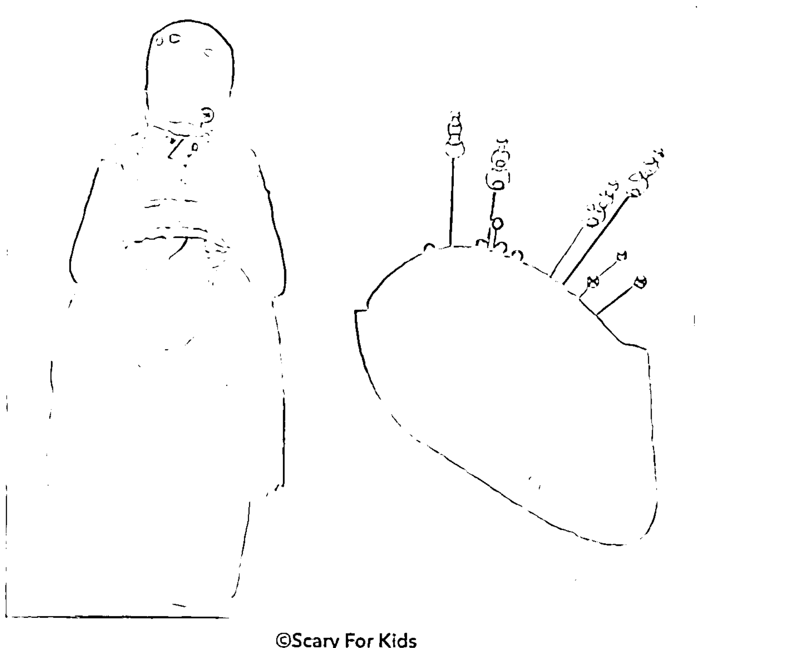

©Scary For Kids

△ 模擬類巫術使用人偶代替真身，一旦人偶受到傷害，被施術的對象也一樣受到傷害。

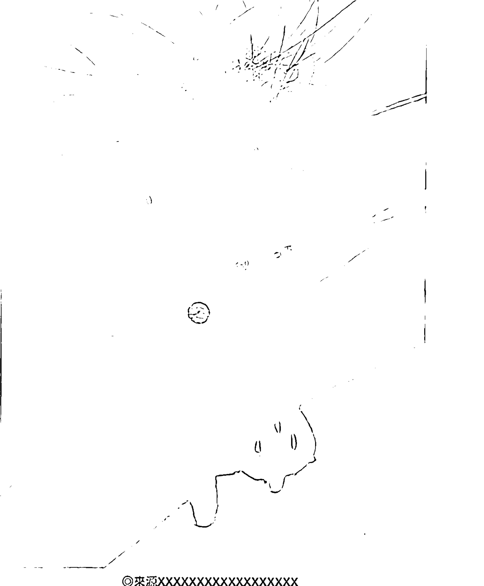

©來源XXXXXXXXXXXXXXXX

△ 在降頭術中，收集受降者的毛髮、指甲、唾液，黏製成人的蠟像，即可作法下降。

例如，不能生育的母親，可以通過製作懷孕的人偶達到懷孕的目的；在母親難產時，巫術甚至可以透過人偶，在另一間房間用法術的形式協助接生。這樣一體兩面的模仿類巫術不僅讓人感到驚異，而在區分那些恐怖巫術的時候，也會看到巫術其實也有著立意良善的一面，同時也是人性中善良的一面。

### ◎ 器物類巫術——相信自然的力量

和模仿類巫術不同，器物類巫術多少能從中找到一些現代科學的影子。事實上，器物類巫術中的許多方式，早已被現代科學一一揭密。

例如過去神秘莫測的蠱毒，如今已經被許多科學家證實是細菌惹的禍，苗疆女巫們通過對於毒蟲、毒物的精確掌控，尋找到一條融合殺人與救人為一體的神秘法術。這些法術曾經在很長一段時間內震懾當地民族，為遠古先民染上一層神秘的色彩。即使到今天，蠱毒依舊能夠悄無聲息地傾入人體各個角落，只不過，我們已經找到了防治的方法。

除了蠱毒，人身體上各個器官也是器物類巫術的使用關鍵，比如前文提到的恐怖「血浴」，是用鮮血提煉啟動人體青春活力的密碼；令人毛骨悚然的「食心之術」，則是通過活取心臟達到延年益壽的功效。當我們心驚於這些巫術的殘忍暴行時，也不得不承認，這些巫術完整詮釋了古老的預言——所有的解救之法都隱藏在天地之中。

直到今日，我們依然不得不承認科學的力量依舊有限，仍有許多神秘領域是科學所無法解釋的，也許只有等到人們能夠完全破解這些恐怖巫術的時候，才能用更理性的方式去尋找青春永駐、長生不老的法門。

### ◎ 靈魂類巫術——相信本源的力量

人的本源力量是什麼？每一個宗教流派、地域文化都有著不同的詮釋，但是歸根結底只有兩個字：「靈魂」。於是，上古的巫師們透過學習控制靈魂的方式，尋找掌控人類生命的過程。

道術中的招魂術、黑暗魔法師的靈魂禁錮，甚至是女巫們的靈魂契約都帶有靈魂類巫術的烙印。他們經由掌控自己和他人的靈魂，尋找煉製即使肉身毀滅也能常駐於天地間的法門。雖然我們一般稱之為鬼魂，但是依舊有法師們和信眾相信，這就是另一種形式的長生不老。

不過，這類法術雖然邪門，卻也能掌握一些端倪。一般認為，靈魂是經由身體的天然孔竅，也就是口腔和鼻腔出入。施行各類掌控靈魂的巫術，都必須對人的耳口鼻有各種不同的理解和研究。比如：招魂術請鬼魂上身的時候，一般是從耳鼻中出入，以至於法力高強的法師能夠感悟到靈魂上身的全部過程。這個過程充滿了驚險，一個不小心魂魄就可能被吞噬，不過，為了能夠掌握直趨另一個世界的法門，無數的修道者依舊前赴後繼、悍不畏死。

在我看來，除了那些心思險惡的黑暗巫術外，這類靈魂類招鬼法術一樣具有正面的人文情懷。比如在黑死病席捲歐洲的中世紀，靈魂召喚術能夠讓死去的親人與自己對話。試想，在天人永隔後能夠與思念的親人再度接觸的情景，似乎便能體會「招魂術」何以讓人們心動不已。

### ◎ 神聖類巫術 —— 相信天神的力量

幾乎所有的巫術流派都相信，在地球之外還有另外一個世界，那個世界上有一群比地球人更高深的種族。歐洲人說那是上帝和祂的天使軍團；中國說是佛祖和天人們；非洲人則說所有的花草樹木都有自己的靈魂和精魄。於是，有一群堅信天神力量的巫者，他們始終堅定不移地認為，只要找到通往天神之路的方法，就能夠成就人類不能完成的法術。

例如，尋找藏傳佛教裡的活佛；法老陵寢中的死神；茅山道術中的上仙；甚至是「十字街頭」召喚術中的惡魔。總之，當尋找到那些超越人類力量的源泉，就能尋找到突破一切限制的方法。

經過幾代人的努力，很多召喚類巫術確實成功了，可是，這些神靈的召喚需要付出血腥的代價。比如女巫必須將自己奉獻給惡魔，還有巫毒教的人體祭祀。或許我們應該深深相信：所有超越人類能力本源的力量，都將付出不可估量的代價。

所以，如果你真的想嘗試本書的各種巫術，只能勸告你，要小心，千萬要小心，因為所有的巫術都需要付出代價，而那樣的代價，你是否真的承受得起呢？

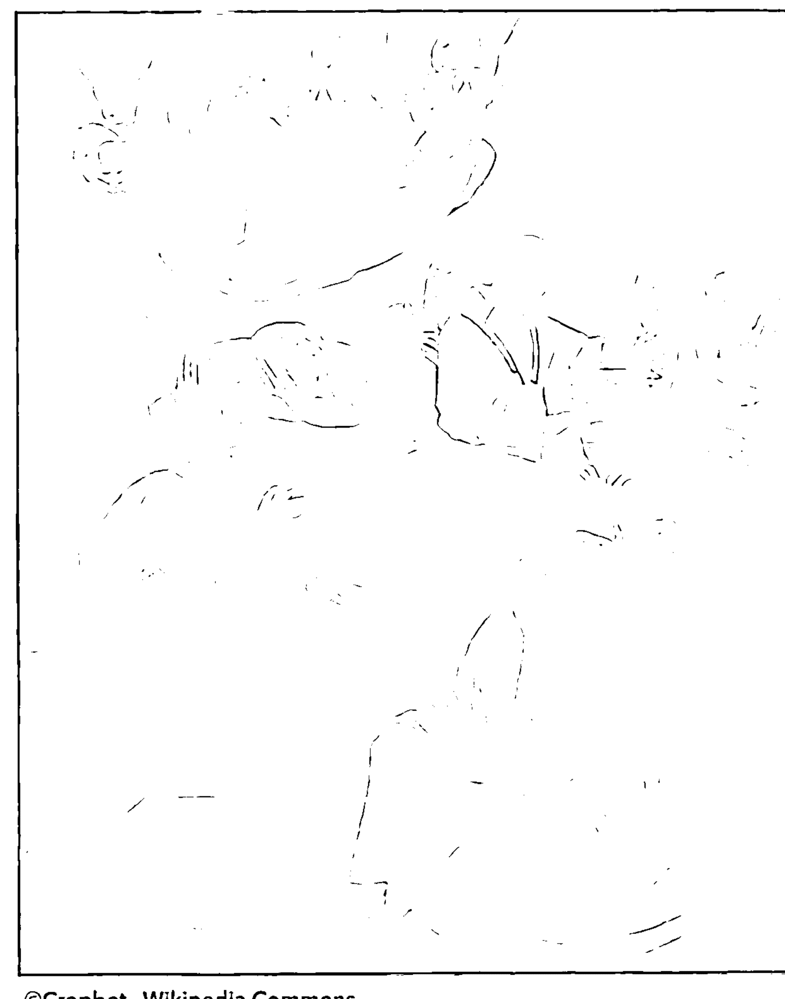

©Cropbot, Wikipedia Commons

△ 所有的巫術流派都相信在地球之外還有另外一個世界。

國家圖書館出版品預行編目資料 CIP

驚異！世界史：恐怖巫術與血祭 / 春牧作. -- 初版.
-- 新北市：紘虹企業, 2012.12
面； 公分, -- (Scary ; 4)
ISBN 978-986-88581-6-9 (平裝)

1.巫術

295 101018149

## Scary 004

## 驚異！世界史：恐怖巫術與血祭

© 春牧
All rights reserved. No part of this publication may be reproduced, stored in a retrieval system, or transmitted, in any form or by any means, electronic, mechanical, photocopying, recording, or otherwise, without the prior written permission of the publisher.
Printed in Taiwan.

作者／春牧
主編／白宜平
編輯／王怡之
封面設計／黃聖文
版面編排／洪偉傑
發行人／張英利
出版者／紘虹企業股份有限公司
電話／(02)2915-5869
傳真／(02)2915-7078
E-Mail／rphsale@gmail.com
Facebook:www.facebook.com/rainbowproductionhouse
地址／台灣新北市231新店區民權路21-1號二樓
台灣地區總經銷／知遠文化事業有限公司
電話／（02）2664-8800
傳真／（02）2664-8801
網址／www.booknews.com.tw
地址／新北市222深坑區北深路三段155巷25號5樓

ISBN／978-986-88581-6-9
初版一刷／2012.12
定價／NTD 280

本書由中南博集天卷文化傳媒有限公司授權出版
All Rights Reserved
如有缺頁、破損或裝訂錯誤，請寄回本公司更換，謝謝。
版權所有，翻印必究

## 惡毒的詛咒喃喃響起，
小心！一場墮落的巫術正在進行！

因為生存，人們敬天地畏鬼神
也因為好奇，人們會去嘗試、挑戰禁忌
更因為慾望，人們會去追求不該擁有的力量

染滿鮮血的慾望、瀰漫著腐朽氣味的仇恨，可以實現願望的殘酷獻祭，
傳說中陰魂不散的怨靈、陰森詭異的魔法陣……
交織吟唱著貪婪的樂曲。

在黑巫術裡，有人活了下來，卻支離不全；
而有人永遠回不來，迷失了自我，喪失了靈魂。

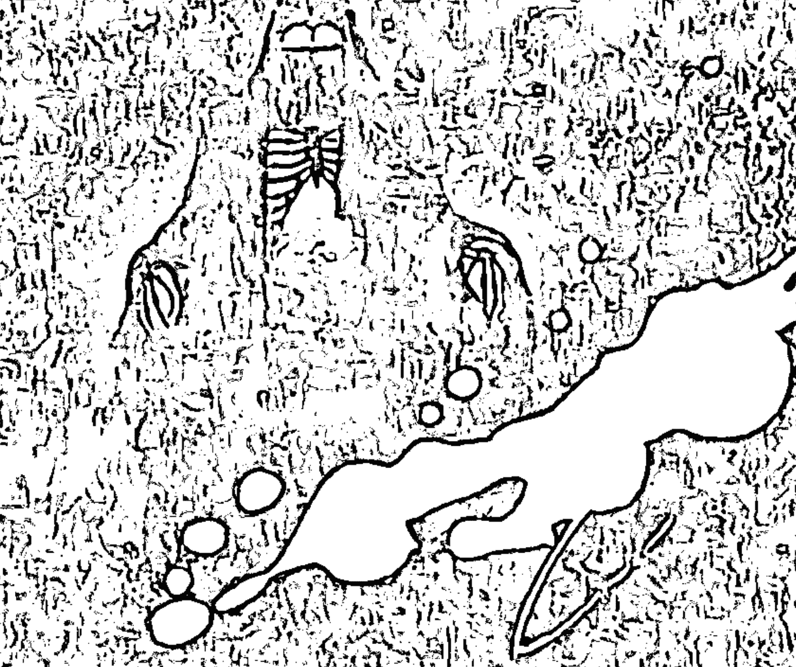

進階分類：歷史/地理/文學

## 惡魔 血咒 陣法 陰靈
進入萬劫不復的禁地

9 789868 858169 00280

緯來出版社
定價280元