# 神秘符號

# 驚異！世界史

- 太極圖——萬物相生共存的密軌
- 逆十字——正向邪惡，還是逆向正義？
- 煉金術符號——點石成金的秘訣？
- 塔羅符號——0到21的玄機
- 占星術符號——勘破命運的符碼
- 芒星——魔法陣的召喚

- 陳地——著
- 閻黑歷史研究會——編
- 道教畫符——邪魔封印，福佑之咒
- 衝尾蛇——不死之身的自我消滅與無限循環
- 荷魯斯之眼——木乃伊上的重生之眼
- 海盜骷髏——射入獵物心底的恐懼之箭
- 蛇杖——「生命之星」的靈魂
- Kolobos符號——駝背的幸運之神

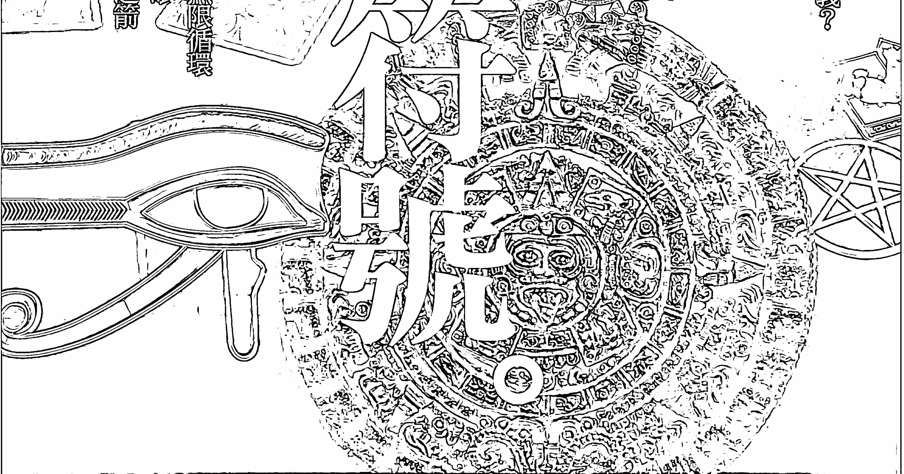

# 宗教、秘術、神話、傳奇

揭開符號背後令人驚嘆的智慧與想像

從宗教天文到日常生活，簡單筆畫蘊涵了智慧與想像
揭曉最神秘的圖像起源與意義，探索人類的思想與文明

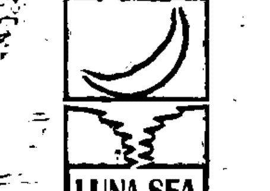


# St. Royal College
## 天使神秘学院

- ※ 专业占卜预测机构
- ※ 神秘学培训机构
- ※ 水晶能量研究中心
- ※ 神秘学资料库
- ※ 官方微信：strcdts
- ※ 微信公众平台：strc2011
- ※ 读书交流QQ群：
    - 占星塔罗占卜师交流群：814594478（加入密码：PDF）
    - 神秘学其他综合群：659338717（加入密码：PDF）


微信号：strcdts
天使神秘学院

天使神秘学院 院长QQ：715104687


微信公众平台：strc2011

# 制作说明：

本书由《天使神秘学院》出重金从台湾购入的原版书籍扫描制作完成。为达到最好阅读效果，特地把原版书全部切开后，再经由专业扫描设备高精度扫描完成，并经过一张张的PS后期处理最终成书，其间花费大量的人力、物力以及时间，只为能给大家提供经济并优质的神秘学学习资料而努力。

本学院强力谴责某些机构和个人，把本学院花心血制作完成的电子书籍，包装后直接放在自家淘宝网上低价倾销的行为，以谋取不劳而获的经济利益。如果长此以往最终将无人愿意再为大家花心思制作电子书，那以后可能大家再无新书可读。

为让大家以后能够读到更多的好书，也为了本学院的良性发展。本学院恳请大家尽量做到如下几点：

- 一、尽量在本学院的网站购买电子书籍。
- 二、请勿用技术手段把电子书内的水印及加密去掉。
- 三、在收到电子书后小范围传阅即可，千万不要公开传播，更别挂到淘宝网上低价销售。

同时为答谢广大支持者，学院电子书将做如下调整：

- 一、学院会把一些早已收回制作成本的电子书折价销售。
- 二、最新制作的电子书籍会开放打印功能，大家购买后有条件的可自行打印成书。

天使神秘学院
2019年1月

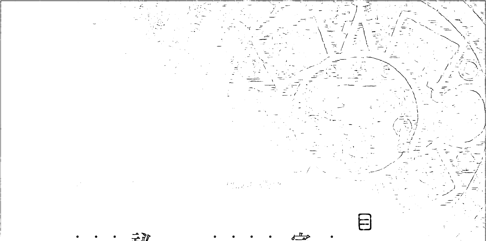

# 目錄 CONTENTS

· 前言

# 宗教之匙

- 卍字符號——漩渦中的逆流
- 太極圖——萬物相生共存的密軌
- 十字——世界眼中的基督
- 逆十字——正向邪惡，還是逆向正義？

## 秘術之鑰

- 煉金術符號——點石成金的秘訣？
- 塔羅符號——0到21的玄機
- 占星術符號——勘破命運的符碼？

004

008
025
039
049

062
075
090

## 神話遺刻

- 衝尾蛇符號——不死之身的自我消滅與無限循環
- 荷魯斯之眼——木乃伊上的重生之眼
- 蛇杖——「生命之星」的靈魂
- Kokopelli符號——駝背的幸運之神

## 傳奇之門

- 世界各地神祕組織符號——凝眾之蟲
- 海盜骷髏符號——射入獵物心底的恐懼之箭

- 芒星——魔法陣的召喚
- 摩斯電碼——諜門暗語
- 道教畫符——邪魔封印，福佑之咒

109 125 136

150 160 171 182

192 212

# 前言

當人類還處在茹毛飲血的階段時，沒有語言，也沒有文字，一切的溝通都只能透過肢體動作或者是音調不一的嘶吼——這是走向文明發展必然經歷的初始階段，但這並不妨礙人類從一開始就進行自己歷史的記錄，記錄的方式就是繪畫圖案。

直到現在，圖案仍然是人類社會一種重要的傳播方式，一個優秀的標誌，甚至勝過千言萬語的表達。

人類目前可知的使用書面文字的歷史約有五千年，但考古學家在西班牙尼爾加（Nerja）地區的一個山洞中，發現了一處壁畫，其年代距今約四萬年，壁畫不僅有著明顯的人為痕跡，而且考古學家還在附近發現碳元素棒，推測正是用來作畫的工具。這個發現顯示，早在書面文字出現的很長一段時間裡，人類就已經懂得用象形符號來記錄歷史。

在這個漫長的過程中，人類創造出無數符號，它們形態各異，表達的意義也千變萬化，而且伴隨著宗教、祭祀等因素，許多符號變得十分神秘，例如「卍」字，又比如蛇杖符號，它們都來自於遠古時代，卻沒有人可以完全解釋清楚它們的涵義。另外有一些符號如中國的太極圖，雖然表象的涵義並不複雜，同樣沒有人能說透其背後的奧義。還有一些符號，離我們其實不算遙遠也不深奧，例如摩斯電碼，它簡單到只有一點一線，但卻能成為人類遠距離通訊的先驅。

符號在不同的歷史時期，都發揮了自己的作用，即便是在文字以及印刷術高度成熟之後，它們依舊沒有被歷史淘汰，相反地卻激起了一代又一代人對於符號學的興趣。

除了上述提到的符號，人類在歷史中所創造出來的其他符號浩如煙海，也有許多符號湮沒在歷史的發展中。不過，存留下來的這些符號，仍有諸多涵義尚未被現代人所破解，留下了一個又一個的謎團，因此在本書中，我們將對這些來自歷史深處的符號進行一次探秘。

# 宗教之匙

# 卍字符號——旋渦中的逆流

對於大部分生活在東亞或者南亞的人來說，第一次見到「卍」這個符號，幾乎都和佛教有關，它不僅常常出現在如來佛像的胸前，在寺廟的其他不少地方，也同樣能看到它的身影。許多人都以為它僅僅只是一個符號，但實際上它卻是一個有讀音的漢字，音同「萬」。

有些讀者一定會對「卍」的來歷表示疑問，它真的是個漢字嗎？為什麼看起來總覺得有些怪怪的。的確，它在成千上萬的漢字中顯得非常顯眼，無論是結構還是筆劃，都找不出第二個這樣「特立獨行」的字。事實上，相對於整個漢字的歷史來說，「卍」只是個後來者，直到西元七世紀的唐代，它才成為漢字的一分子，但放眼整個人類歷史，它卻又有著傲視其他許多符號的「老資格」，而且在人類社會發展的過程中，它反覆出現在各種歷史場合，成為最神秘的符號之一。

# ◎ 照耀人間的太陽神

根據目前的考古發現，「卍」字符號第一次出現是在中亞地區，時間是距今一萬年的新石器時代。在今天伊朗西部的胡齊斯坦（Khuzestan），一些出土的陶瓷碎片上，能夠模糊地辨認出一些硬物刻畫痕跡，儘管並不完美，但仍能看出「卍」字符號的整體形象。

之後，科學家在俄羅斯烏拉爾山南部地區的出土陶瓷碎片上，也發現相同的「卍」字符號，但時間較近，在距今四千年左右的青銅時代。上述兩個地方，相距有上千公里之遙，年代更是前後相隔了好幾千年，卻同樣有如此驚人相似的符號出現，實在讓人稱奇。

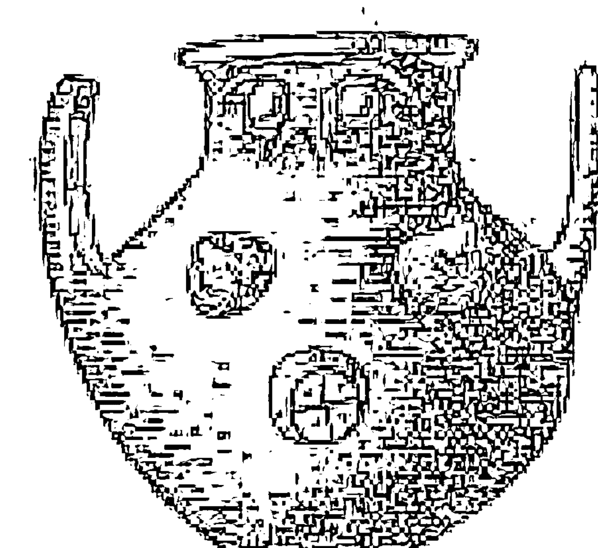

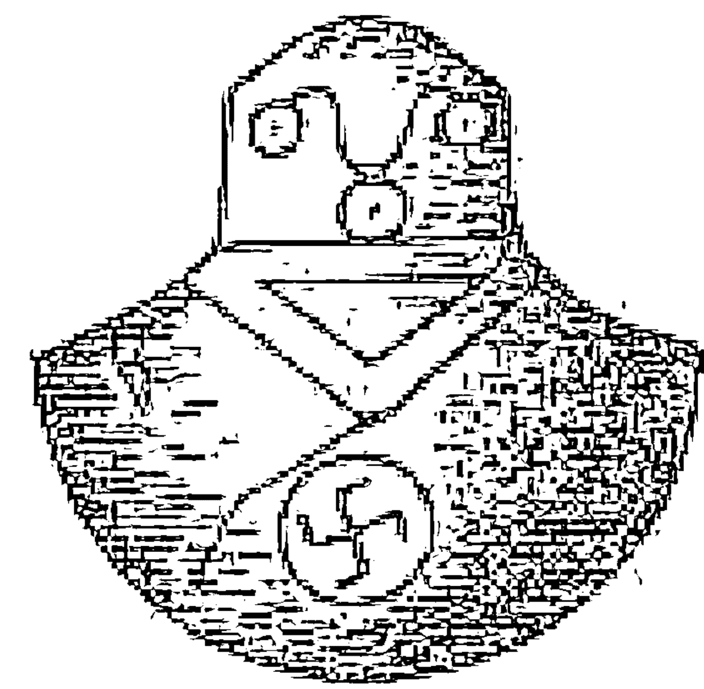

© Wikipedia Common
▲ 陶罐上的卍字符號

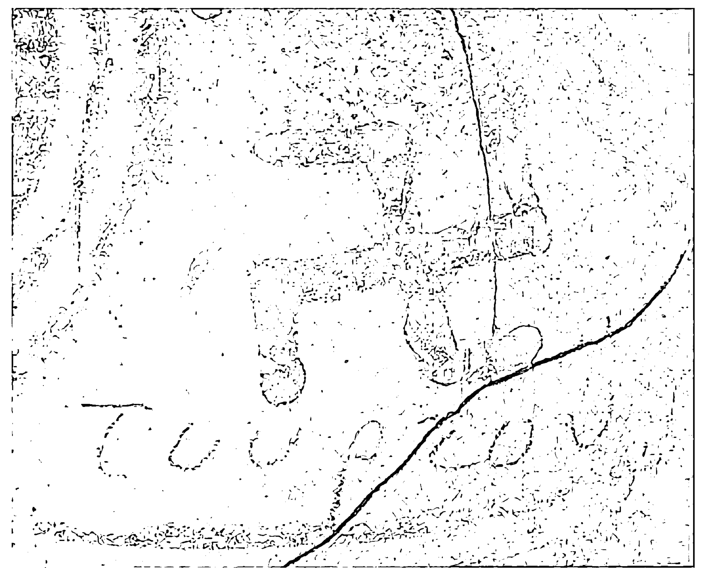

© Agon S. Buchholz (asb), Wikipedia Common

▲ 希腊伊拉克利翁出土文物上的卍字

如果把视野放得更大一些，或许上述情况就不足为奇，因为我们会发现，在不同的时代里，「卍」字符号几乎出现在地球的每一块大陆上。

居住在爱琴海沿岸的古希腊人，在日常使用的陶器、漆器，都曾出现大量「卍」字形状的花纹，它们有的是连续地环绕器皿一圈，有的又单独地分布在表面，但相较于伊朗和俄罗斯的发现，无论是清晰度还是辨析度，都明显增加许多，几乎和我们现在看到的「卍」字符号没有太大区别。

在一个希腊出土的金盘上面，更是清晰地凸现出四个大大的「卍」，整齐地分布在金盘的四个方向，希腊人会在黄金这样贵重的金属上做出「卍」字符号，也说明了，这个符号对于他们有着不小的意义。

不仅在南欧的希腊，在欧洲另一端的北欧，古代的维京文化中也出现了「卍」字符号。维京人的部落首领经常会互相赠送一种金牌，上面除了刻有骑马图案之外，还会有若干个「卍」，这样的金牌象征美好的愿望和祝福。除此之外，在维京人的钱币、纽扣甚至墓碑上，都能见到「卍」字符号的存在。而随着维京人往欧洲北部的迁徙，「卍」字符号也开始出现在英格兰以及爱尔兰。

除了欧亚大陆以外，在南美洲的玛雅人、北美洲的印第安人，都曾经在各自的祭祀或者宗教活动中，使用过「卍」这个符号。

可以说，在文明史中，除了人类很晚才踏足的澳洲大陆，以及冰天雪地的南极洲，「卍」字符号在每个地方都留下身影，这也让人产生疑问：古代文明之间相距遥远，而且相互之间的交流也并不频繁，却如此巧合地都有过「卍」字符号的出现，难道真的只是巧合吗？

其实，「卍」字符号在世界各地的出现并不是巧合，而是古代人类对于大自然力量共同崇拜的结果。身处洪荒时代的原始人类，对于自然力量既不了解，更不可能利用，面对那些巨大而又不可抗拒的自然现象，也就产生了崇拜心理，认为有股力量在掌控着自己的命运，其中最具有代表性的就是太阳。

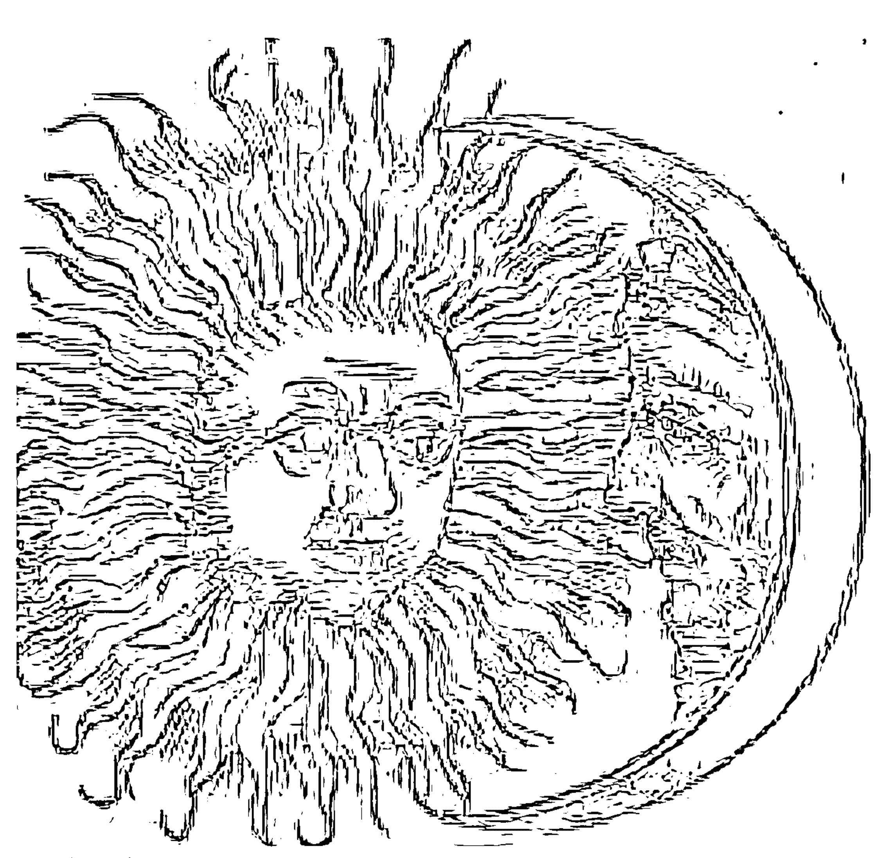

© Wikipedia Common

△「卍」代表的是遠古時期人類的神——太陽

太阳的色彩及其强大的威力，让它很容易成为原始人类的「偶像」，既是可见却又触不可及，这让它成为如神一般的存在。

以绘画及符号来记录自己的历史，是每个古代文明的共同特征，而记录神的历史更是其中的重要工作；显然，「卍」所要表达的，就是古人心目中太阳这个「神」。「卍」字符号向每个方向伸展出去的线条，都代表着太阳放射出的无限光芒。

由此不难看出，在原始人类中，虽然各个种族被分隔在不同的大陆和区域，但是他们对于大自然的崇拜却是相同的，甚至在形象化的呈现上，都有着极大的相似，例如他们都用「卍」来代表太阳。

# ◎ 寓意无穷的宗教符号

在脱离蒙昧无知的原始时代之后，人类科技进入了发展的「快车道」，于是那些最为原始的偶像崇拜、图腾符号等，渐渐被人们所抛弃，如果说那些久远的年代是人类的婴儿期，那么「卍」字符号就是一块胎记，直到现在它也常常出现在人们的生活中，而出现的方式就是佛教。

在古代印度，「卍」被读作 suastikah，在梵文中，su 代表「是」，而 astikah 则代表「生命」、「存在」等意思，两者连贯起来，「卍」就代表了对生命的赞美，以及幸运、幸福等意义。在印度最为古老的宗教耆那教中，「卍」象征他们的第七个圣人，通常和手的形状相结合，「卍」展开的四臂，在耆那教中还象征着轮回过程中的四个地方：天堂、人间、动植物、地狱。而在另外一种印度宗教婆罗门教中，「卍」代表巨大无比的光明，同时也用来表示那些拥有大智慧的先觉者。

而「卍」和宗教的联系，人们最熟悉、也最常见到的，就是佛教。据《长阿含经》说，「卍」是佛陀的三十二大人相之一，位列其中第十六相。所谓「大人相」，即是佛陀之像，因为佛陀是所有众生中最大之人，所以称其为「大人」，而所谓的「相」，并非只是相貌、外表如此简单，更代表内在精神的外部体现。

我们最常见到「卍」字出现在释迦牟尼佛像的胸前，颜色也全为金色，代表佛陀的精神向四周宇宙无限延伸，照射到世界的每个角落。事实上，在佛像的手和脚上也有「卍」字符号，只不过不像胸前那么明显，所以不易被看见。

而在《庄严经》中，还记载佛陀的头发中也有五个「卍」字符号，《有部毗奈耶杂事》则说佛陀的腰间也有「卍」字符号。可见，「卍」对于佛教来说确实有着非同寻常的意义，几乎相当于基督教中的十字架。

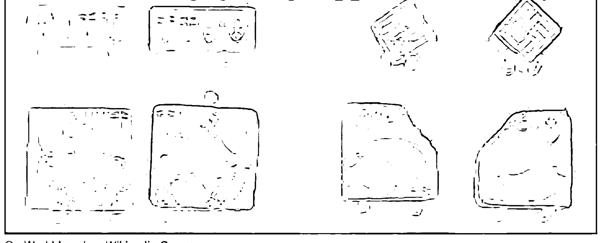

© World Imaging, Wikipedia Common

△ 古印度河流域文明的印鑑可清楚看見卍字（右上角）

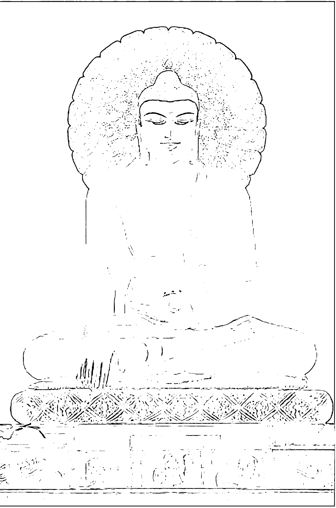

© Выложено на всеобщее распространение, Wikipedia Common

△ 大部分釋迦牟尼佛像的胸前、雙手、雙腳也都會有卍字符號

015

Chapter 1

宗教之匙

做为佛教的标志性符号，「卍」的背后还有着丰富的内涵，当古人最初将它从梵文翻译过来的时候，它的意思被理解为「吉祥海云相」，从字面上来看，汉译的「卍」表达了在佛法普照的地方，都能获得吉祥和幸运之意，同时也表明了佛法的奥义如同海洋和云层一样，不是轻易就可参透的。

而从另一方面来看，佛教是一个相信轮回的宗教，认为世间有着「六道轮回」，分别是地狱、饿鬼、畜生、天、人、修罗，人若积善修行，则可得天、人二道；若是造了恶业则只能得苦报，永远在地狱、饿鬼、畜生、修罗四道中轮回，永远都得不到解脱。

「卍」的每一边，也就象征着其中的一「道」，如同一个车轮一样滚滚向前，永远不会停止。从这个角度来说，「卍」字符号也是对世人的一种警醒。

除去在特定的佛教场所能常常看到「卍」字符号外，在另外一些宗教意味不那么强的场合，同样也能见到这个佛教符号。例如，在北京的天坛祈年殿上，有三层密密麻麻、数也数不清的「卍」字符号，这样的设计显然是借鉴佛教理念。佛陀自己就曾经讲过，在他之前有原始六佛，而在他之后会有弥勒佛转世传法，而在「大千世界」之中，还有更多的佛。也就是说，所谓的「佛」并不只他一个，广义上来说每一个觉悟的人，都可以被称为「佛」。

2 吉祥海雲相，見唐代周即時所譯《華嚴經・如來十身相海品》：「如來胸臆有大人相，形如卍字，名吉祥海雲。」

3 六道輪迴源於印度古代文化，最初為婆羅門教的基本理論，後為佛教所用。

4 佛教用語，在古代印度傳說中，整個宇宙以一座叫「須彌」的山為中心，須彌山周圍有四個大洲，形成一個「小千世界」，一千小千世界形成一個「中千世界」，一千中千世界形成一個「大千世界」，也即是整個宇宙。

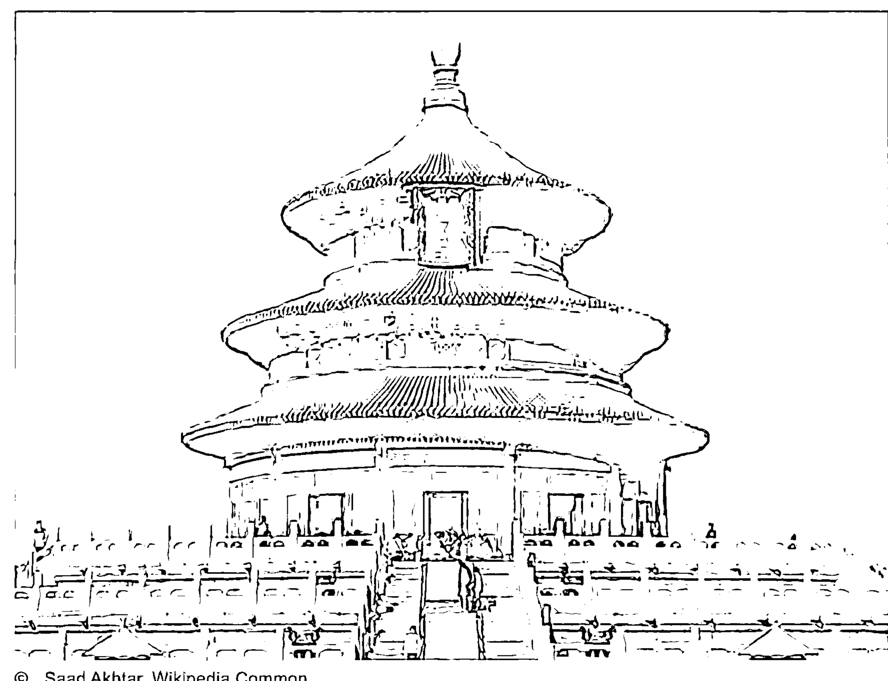

© Saad Akhtar, Wikipedia Common

△ 北京天壇祈年殿上，有三層密密麻麻、數也數不清的「卍」字符號

佛教中有天、地、人三界，这三界的范围几乎就是整个银河系，而佛的层次是超出了三界，对于佛来说，银河系就如同「卍」字符号般一个小小的符号而已，所以也难怪在《西游记》中，孙悟空一个筋斗十万八千里也翻不出佛的手掌心。而在这个宇宙中，银河数不胜数，就像天坛祈年殿上的「卍」字符号一样数不尽，象征这个世界天外有天，永无穷尽。

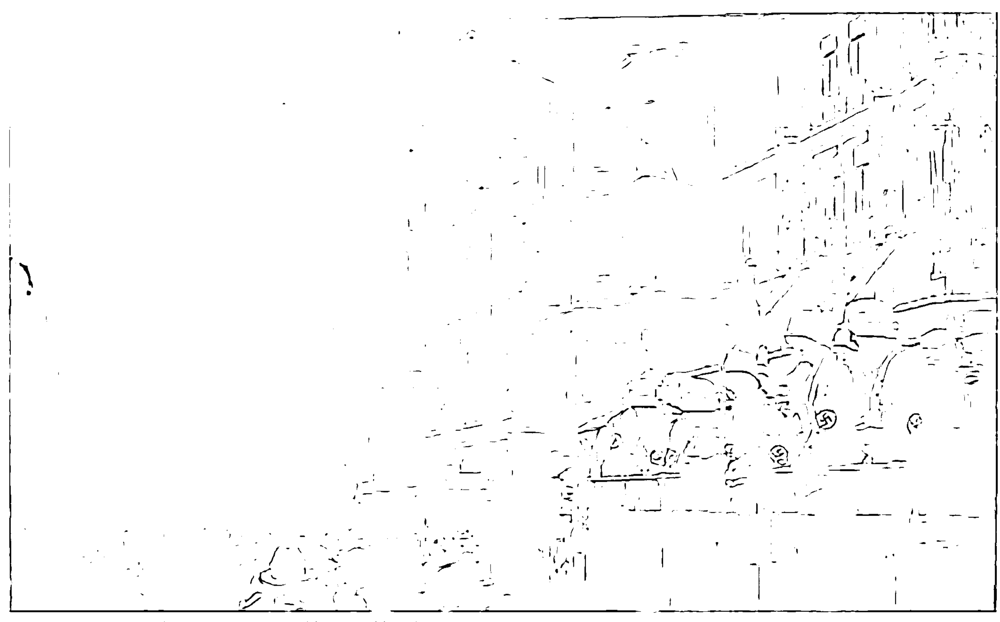

© Bundesarchiv, Bild 119-1486 / CC-BY-SA, Wikipedia Common

△发生「啤酒馆暴动」的慕尼黑玛利亚广场

# ◎ 纳粹旗的倒下

人类社会在经历数千年的发展之后，本应该更加成熟、更加和谐，但没想到就在新千年到来之前，却爆发了这个地球上有史以来最大的战争：第二次世界大战。上亿人被卷入这场浩劫之中，并造成数以千万的死亡，其惨烈程度是历史上任何战争都无法相比的。

当人们讨论二战的时候，总会第一个想起发动这场战争的元凶：希特勒。在一九二三年的德国慕尼黑，希特勒带领武装组织发动「啤酒馆暴动」，虽然失败被捕，但他却在狱中写出《我的奋斗》这本书，全面阐述自己的纳粹思想，并在后来付诸实施。

纳粹，是一种体现在国家层面的极端思想，而且纳粹也有着自己的审美观：宏大、整齐、极具煽动性。纳粹的标志也来自于希特勒的亲自设计：一个倾斜了四十五度的「卍」字符号。

当人们第一次看到纳粹的标志时，都不免惊讶：除了四十五度的倾斜之外，它和佛教的「卍」字符号没有任何区别，难道希特勒这样的嗜血狂魔和佛教有所关联？这两者之间的差别也未免太大了吧。

虽然「卍」字符号曾经在世界各个文明先后出现过，但是像德国纳粹这样将其做为整个国家的标志，还是第一次。事实上，纳粹标志的主要来源是「国家社会主义」这个德文词语，纳粹（Nazi）是「国家社会主义」（Nationalsozialist）的缩写，而在德语中「国家」和「社会」两个词的开头字母都是S，当两个S交错叠加在一起的时候，就构成了纳粹的标志。

当然，希特勒进行设计时的背后意涵并不仅止于此。

「卍」曾经是古代雅利安人的标志，而纳粹所宣扬的正是雅利安人的血统高贵论，所以这个标志也是对古代雅利安人的呼应。整个纳粹旗帜以红色为底，中间是白色的圆，倾斜的「卍」字符号放置在最中央——希特勒对这样的设计相当满意，他曾经在《我的奋斗》中说：「红色象征这个运动的社会意义，白色象征民族主义思想。」


© Wikipedia Common
△納粹黨黨徽

019
Chapter 1
宗教之匙

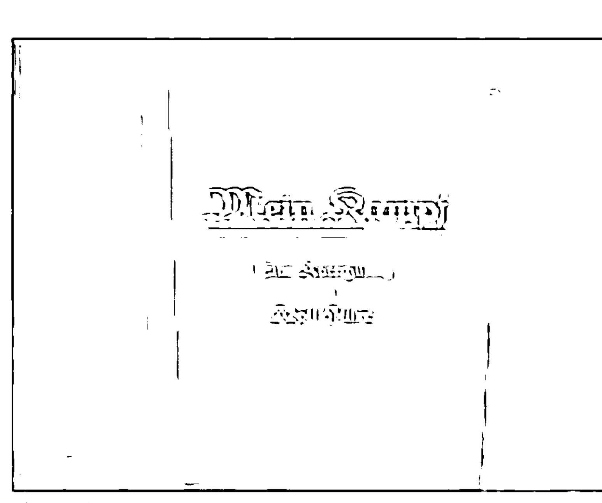

© Wikipedia Common

▲ 希特勒所著的《我的奮鬥》一書

正如前文所说，纳粹标志和佛教标志十分相似，而事实上，它们在历史上的确有所关联。在二十世纪三十年代末的时候，希特勒曾下令一支探险队前往藏传佛教占统治地位的西藏，目的是寻找证据来证明雅利安人血统的高贵性，因为在远古传说中，西藏人是雅利安人的分支，在长期的迁徙过程中来到青藏高原。

希特勒派出的探险队收集了四百多份西藏人的人体资料，并考察当地的文化风俗，甚至还带回一些人头盖骨，一切都是为了证明雅利安在血统上的优越。

在全民信佛的西藏，「卍」字符号也几乎是随处可见，但藏传佛教的「卍」和纳粹的标志完全是两回事，不仅符号的角度不同，颜色与象征意义也不同——藏传佛教的「卍」是金色，象征吉祥如意，而纳粹的符号却是完全的黑色——与它残酷的美学理念相呼应。

另外，希特勒虽然也像佛教徒一样坚持吃素食，但他却完全没有佛教徒的慈悲，在下

## 納粹標誌的來源與影響

關於納粹標誌的來源，還有另外一種說法，是由一名美國學者提出：希特勒小的時候就對權威以及權力有一種特別的崇拜和熱愛，而在他童年居住的地方，有一座修道院，修道院的通道、牆壁、座位，以及院長的袖子上都有「卐」字符號，「卐」也就成了權威的符號化象徵，他希望有朝一日自己也能擁有像修道院長那樣的無上權威，這也成為他日後選用「卐」做為納粹符號的原因之一。

做為一個逆歷史潮流而動的組織，納粹在一開始就已經注定會失敗。一九四五年四月三十日，蘇聯紅軍攻入柏林，眼見已無力回天，希特勒獨自在德國總理府的地下室開槍自殺，結束了自己罪惡的一生，納粹旗幟也終於在盟軍的勝利中降下。

儘管納粹在二戰中失敗了，但是它做為一種極端主義和種族主義，在戰後卻依然陰魂不散，在歐洲和美洲的某些地方，仍然有納粹勢力的存在，給人類的未來帶來不穩定的因素。同時，這些殘餘的勢力也將納粹的旗幟做為自己的標誌，像「圖騰」一樣進行崇拜。因此，歐洲的大部分國家都立法規定，不允許在公眾場合展示納粹標誌和旗幟。目的就是為了避免這個幽靈再次荼毒人間。

## 來自自然界的驚人呼應

如果說前文所述都還和人類社會及文明相關，「卍」字符號的出現也可以從中找出某些文化的原因，那麼接下來的事實可能就會讓你更加感嘆大自然的神奇了。

從地球觀看銀河側面，就如同它的名字一樣像一條銀色的河流。但是根據科學家的研究，若從正面觀察銀河，則是呈漩渦狀。

銀河實際上是一個漩渦狀星系，從裡向外伸出了四條「手臂」，雖然每一條「手臂」都是弧形，但這樣的形狀卻和「卍」字符號不謀而合。而太陽系，處在銀河系的西南角邊緣，雖然不像銀河系那樣伸出四條「手臂」，但九大行星依然以太陽為中心，像「卍」的方向一樣順時針旋轉。

在微觀世界中，同樣有讓人驚異的發現，人們在從不同角度觀察碳原子的電子雲模型時，除了能看出 α、Ω 的形狀以外，還能看出「卍」的形狀。

可見，從微小如碳原子，到宏大如銀河，都在暗暗對應著「卍」這個符號。從某種角度來說，「卍」就是整個自然界的標誌，它看起來並無特別之處，甚至是非常簡單的圖像，但也正是這種簡單勾畫出許多自然法則，整個宇宙和世界都被這個「卍」貫穿起來，以一定的規則進行運轉。

關於「卍」，還有一些其他解釋，比如它象徵春、夏、秋、冬四季的交替，還表示人類生、老、病、死的輪迴。從古至今，沒有任何人能夠對「卍」做出準確的解釋，但它確實存在於我們的歷史和文明之中。

也許是因為人類的智慧程度還不夠，所以對於許多自然現象都無法認知，對於「卍」也同樣如此，但隨著人類文明的發展，這個神秘的「卍」字符號一定能在未來找到完美的答案。

## 太極圖——萬物相生共存的密軌

中國做為文明古國之一，擁有極其悠久的歷史，在許多方面都給後人留下了豐厚的遺產，在思想和哲學領域尤其如此。自有文字記載的商代以來，先哲們著書立說，各類經史子集浩如煙海，構成中華文化的主要框架。而如果要在這些典籍當中選出一本做為「首領」，那麼《易經》是當之無愧的萬經之首，從古代就流傳著「群經之首，大道之源」的說法，其對後世的影響之深，可見一斑。

大部分人對於《易經》的文字內容，可能不會去細細研讀，但不妨礙這本書所帶來的一個中華文明的標誌性符號，那就是太極圖。從某種程度上來說，華人對於太極圖的熟悉程度，就像西方世界對於十字架一樣。許多人不了解，甚至完全沒讀過《易經》，但是一看到那幅陰陽交會的圖案，幾乎所有人都能指出那是「太極圖」。

可見，太極圖的出現雖然比文字晚很多，但是它的影響力卻絲毫不亞於中國歷史中的任何一種文字。同時，雖然只是一個簡單的圖形，但再多的文字也無法將它解釋清楚。歷史中一代又一代的學者都試圖解開太極圖中所深藏的奧義，但就如同「太極」這兩個字本身的涵義一樣，是根本無法將其窮盡的。

### 古老東方文化孕育的符號

「太極」這個詞雖然和《易經》有著極大的聯繫，但嚴格意義上而言，它並非直接出自於《易經》，而是《易傳》：「易有太極，是生兩儀，兩儀生四象，四象生八卦。」《易傳》是一本成書於戰國時期解說《易經》的論文集，而《易經》本身則大概出現在周朝。也就是說，「太極」這個詞，在中國文化中已經流傳了兩千三百多年。想要了解太極圖，必然要先從「太極」這兩個字下手，那麼到底什麼才是「太極」呢？

從語法的角度來看，「太極」是一個偏正片語，也就是說「極」是片語的中心，而「太」的作用是進行修飾。「極」本身就有著「頂端、最高點、盡頭」的意思，「太」則更進一步加深其程度，可以說是極中之極。那極中之極到底有些什麼呢？老子在《道德經》中的名言做了這樣解釋：「道生一，一生二，二生三，三生萬物。」太極就是「道」，它不是任何存在的實體，但是它卻承擔著「原始動力」的作用，當「道」在最初的混沌中開始運轉時，宇宙也就被推動著發展起來，整個世界也彷彿打開了自己的「開關」。

不過，對於「太極」這種深奧的理論，在很長一段時間內，都沒有比較合適的圖像化呈現，直到西元九世紀陳摶的出現。陳摶是宋朝初年著名的道學家、隱士，史書記載他活了一百一十八歲，而且也有著許多傳奇的故事，其中最重要的就是創作出太極圖。當然，在一千年前，陳摶所繪的太極圖，和我們現在所看到的是有一定的差別，但還是完整表達出太極最基本的思想。從次頁圖像中就可以看出，外部雖然有邊界，但卻在向內旋轉著變化，而且看不到這種變化的盡頭，即使中心最後變成一個極小的圓點，依然無法斷定那就是盡頭——事實上，這樣的變化根本就不會停止，這也就是「易」所代表的內涵。

陳摶將自己所創的圖傳給學生種放，種放又傳給穆修，穆修再傳給宋代著名理學家周敦頤，最終在周敦頤的手中，形成了我們今天看到的太極圖案。

和最初的太極圖相比，現在看到的太極圖最明顯的變化，就是在陰陽兩邊各自出現了一個圓點，陰陽兩色也不再是一起向著中心趨近，而是相互朝著對方運動，這樣就形成了一個我中有你，你中有我的局面。

另外一些涵義則並不難理解，即太極圖代表了事件各種相互對立卻又關聯的事物，比如天和地、白晝與夜晚、光明與黑暗、男性與女性這些顯而易見的對比，甚至也包括成功與失敗、興盛與衰亡這樣暗含玄機的轉換。

太極圖中，陰陽兩色以一條 S 形的曲線分開，而不是以一條直線分開，這即是在向人們說明，萬物之間的存在和轉換都在隨時變化，沒有絕對的分界線，只要隨著時間的推移，「陰」和「陽」是可以相互轉變的，簡而言之就是：世間的一切都在變化，只有「變化」本身（也就是「易」）是不變的。

太極圖在宋代出現以後，逐漸成為代表中華乃至東方文化的符號，從這個簡單但是卻內涵無窮的圖形可以看出，它代表了東方，尤其是中國某種文化特點：內向、變通、追求平衡以及和諧。而當你觀察西方的標誌性符號十字架的時候，則會發現，西方的性格就像十字架一樣：理性、開放、機械，有著一種向四面八方擴張的趨勢。後來的世界歷史似乎也印證了這種推斷。可見，太極圖能夠成為中華文化的標誌性符號，絕非偶然，而是經過長期的演化，最終凝鍊成一個高度象徵性的圖案。

### 讓科學界驚嘆的太極圖

在歐洲中世紀以前，整個世界的科技進步水準相當有限，中國還處在農耕經濟占完全主導地位的時期，而西方世界則完全被宗教所統治，人們的思想受到嚴厲的禁錮，而且東西方世界之間的交流也遠沒有後來頻繁。不過，在大航海時代來臨之後，世界開始加快了融合速度，文藝復興和啟蒙運動也讓歐洲人的思想得到極大解放，開始把目光投向東方。正是在這個時期，最早一批的中國典籍進入歐洲，這其中自然包括了《易經》，當然也包括了太極圖。

太極圖傳入歐洲時，並非只是單純的陰陽交合的圓形圖案，而是更加完整的、將八卦也融入其中的太極八卦圖。圍繞在太極圖周圍的八卦，也是《易經》中的重要發明，它同樣有著極其深刻的內涵，以及無窮的變化。

不過，僅就表象的圖形而言，周圍的八卦是不難理解的，三條平行短線，不斷地做著兩短一長的變化，不是兩條短線匯集成一條長線，就是一條長線分為兩條短線。而且，這些線的長短變化，和中間太極圖的黑白變化是相對應的，在對太極圖進行八等份劃分後可以發現，三組長線所對應的陽面面積最大，而三組短線對應的陰面面積最大，其餘區域則依次變化。

看到這裡，你也許開始覺得太極八卦圖中的變化節奏，似乎有些熟悉，是的，這其實就是二進位。

太極八卦圖其實還有更加複雜的變化，即演變成八八六十四卦，但其中所用的符號也還是只有「--」和「—」兩種。而在二進位中，無論多大的數位，都只由「0」和「1」兩個數字來表達，一切的變化都是在「0」和「1」相互轉換間完成的，這無疑和太極八卦圖中「--」和「—」來回變化高度吻合。

二進位的發明者是德國的萊布尼茲（Leibniz），曾經有過傳言說他在發明過程中，受到了《易經》以及太極八卦圖的啟示，但這並不是事實。其實，根本沒有證據顯示萊布尼茲在發明二進位以前閱讀過《易經》，雖然他的確看過太極六十四卦變化圖，但那是在一七〇三年時，由他在北京的傳教士朋友寄給他的，但萊布尼茲在一七〇一年就已經完成了關於二進位的論文。不過，在最後一七〇三年論文正式發表的時候，萊布尼茲的題目是：《關於僅用○與一兩個符號的二進位算術的說明，並附其應用以及據此解釋古代中國伏羲圖的探討》。

由上述可以看出，不管是《易經》還是太極八卦圖，和二進位的發明並沒有直接的因果關係，但東西方智慧的某種暗合，卻體現得淋漓盡致。也可以說，世界的某些基本原理是相通的，只不過在不同地域的人類，會以不同的形式表達出來，所產生的作用也自然不盡相同。我們不能說太極圖發明了二進位，但它所展示出的這種思維模式，的確令人驚嘆。

除了二進位，太極圖與近現代科學的另一處「交集」，便是其中分割陰陽的那條曲線。太極圖的外部輪廓是一個圓，在中華文明「天圓地方」理念的背景，這是很好理解的，但為什麼中間的分割線不是直線，也不是弧線，偏偏是一條彎彎曲曲而又中心對稱的波浪一般的線條呢？答案是——曲線，代表了一般事物的變化規律。

當我們把目光轉移到物理學上時，就會發現，無論是電磁波還是聲波，在其傳播的方向上，都是呈現出波浪的形狀，而且在傳播的單個週期內，形狀就和太極圖的分割線完全相同；而在數學中，正弦和餘弦的圖形更是和太極圖的S分割線完美契合；甚至在地理學中，你都會發現，地球上大部分的海岸線都是呈現S形的變化，例如亞洲大陸的東海岸，和美洲大陸的東海岸。

另外，在太極圖 S 分割線的兩邊，還各有一個圓點，白色一邊達到極盛時，其核心圓點是黑色，另外一邊則相反。似乎在闡述著：無論怎樣的變化，在達到最興盛的時候，總會隱藏著一些讓它衰亡的因素（也就是與所處顏色相反的圓點）。這樣的例子在生物界比比皆是，最為典型的就是恐龍的滅亡，牠們曾經是地球上的霸主，沒有任何物種可以向牠們挑戰，巨大體型是牠們的優勢，卻也成了氣候變化後的巨大拖累，並最終倒在物種進化的時間軸裡。即使是當今的萬物之靈人類，看似牢牢統治地球，但是環境、疾病等問題，如果處理不好，同樣會帶來由盛轉衰的劇變。

總體而言，太極圖沒有直接促成近代科技的重大發現，但這並不能否定它背後所代表的深邃思想。而且，東方人更熱衷於形而上的思考，對於將思考結果轉化為實際器物，並沒有很大的興趣，這也是為什麼太極圖所代表的思維模式在很早以前就已出現，但卻沒能變為真正的科技進步的重要原因。不過，這一切都不妨礙太極圖成為全人類共同的思想結晶，而且說不定其中還含有更多未被發現的科學原理，有待後人進行更深層次的挖掘。

### 太極圖的多重影響力

在近代世界史以及更早以前，無論是在東方還是西方，太極圖更多是被當做一種哲學符號來進行研究，也或多或少影響了某些科技的進步。當時間來到近現代之後，整個世界變化的節奏突然加快，幾乎達到日新月異的程度，然而太極圖這樣一個古老的符號，不僅沒有就此消失，影響力反而持續上升，已然成為一個世界性的符號。

當你第一次看到韓國（Korea）的國旗時，是否會覺得似曾相識，除了顏色不一樣（韓國國旗為一紅一藍），韓國國旗中間的圓形和太極圖幾乎沒有差別。如果你更加仔細觀察，就會發現，上面的四個角上，分布著八卦中的四個卦符。看到這裡，我們就可以確定：韓國國旗是來自於太極圖案。

在十九世紀以及以前，整個朝鮮半島都是古中國的附屬國，其國旗也採用印有一龍一形狀的旗幟，以示為大清國所轄。之後隨著世界局勢的變化，朝鮮開始謀求獨立自主的權力，同時也開始設計自己的新國旗。從一八八二年太極旗第一次出現，到一九四九年韓國正式將其定為國旗，中間近七十年的時間，除了有一些細微的調整以外，整個國旗的格局和佈置，都沒有發生改變。雖然打開國門以後，整個朝鮮半島受到西方諸強以及日本的極大衝擊，但是其文化和思想根源，依然來自中華文化，太極旗就是最好的證明。儘管把太極圖變成紅藍兩種顏色，但其中代表的基本意義沒有變化，也就是「陰」和「陽」的協調共融，其中也融入另外一層涵義：即藍色代表著海洋，紅色代表著初生的旭日。而韓國國旗受太極八卦影響的最佳例證，就是四角的乾、坤、坎、離四個卦的卦象，分別代表著天地日月，亦即整個世界。

雖然選定太極圖做為國旗的設計基礎，具有某些歷史的偶然性，但這無疑是太極圖以及它背後所代表的《易經》思想，在整個東亞地區的強大影響力的體現。試想，在世界進入十九世紀的時候，各種資訊已經極為豐富，何況還有許多文字和符號可以選擇，唯獨選中太極旗做為國旗，這其中必定有其內在原因。簡而言之，太極圖和《易經》在整個東方，處於無與倫比的地位，一面國旗只是其中的一個體現方式而已。

在西方，雖然沒有任何國家的旗幟和太極圖有關係，但是一位世界級的物理學家，卻在設計家徽的時候，直接將太極圖加了進去，他就是丹麥的波爾（Bohr）。波爾在原子內部結構方面的發現有著劃時代的意義，奠定了後來人們利用核能的基礎，他不僅因此獲得諾貝爾（Nobel）獎，更在一九四七年被丹麥皇室封為爵士。

在獲封爵位之後，波爾開始親自設計自己家族的家徽，並且完整地將太極圖複製到上面。波爾家徽周圍還有一圈銘文：「CONTRARIA SUNT COMPLEMENTA」。中文的意思是：對立是互補的。這正體現著古老的東方思想：沒有完全絕對的事物，一切都是在運動中發展，有相互的制約抗衡，也有相互的彌合及補充。其實許多和波爾同時代的科學家都對中國傳統哲學有著很大的興趣，不過只有波爾如此將其明顯展示出來。

另外，在羅馬（Rome）帝國時期，步兵的盾牌上也曾經出現和太極圖驚人相似的圖案，但它僅只是做為一個圖形存在，背後沒有任何哲學理論做為支撐，並且在之後的歷史中再也沒有出現過。不過，這個來自羅馬的符號，也證明太極圖代表了某些世界的共同性，甚至有可能在世界其他古文明也曾出現過類似的圖案，只不過沒被發現而已。

上述這些都說明了，雖然太極圖起源於中國，但它所象徵的深刻內涵卻是全人類的財富，它和諧、共通的氣質，無疑在人類走向未來的道路上有著極其重要的參考價值。

## 十字——世界眼中的基督

在西方世界，如果只能選出一個符號來代表其文化和歷史，那麼當選的毫無疑問會是十字架。基督教（Christianity）並不是歷史最悠久的宗教，但沒人會質疑它對整個西方，乃至整個世界的影響。更為重要的是，基督教早已遠遠超出宗教的範疇，深入到人們日常生活中的每一個細節，無論是衣食住行，或是生老病死，幾乎找不出一件完全與基督教無關的事。

正因為如此，可以毫不誇張地說，基督教就是整個西方世界的基石，而人們對於它的十字架標誌也再熟悉不過——即使是非宗教人士，也能夠理解那個交叉的十字所代表的意義，以及它背後的故事。

當然，十字架的巨大影響力，也有賴於一代又一代的傳教士們把「福音」傳向世界各地，他們每到一個地方都會建起教堂，並把十字架豎立在教堂最頂尖的位置。然而，這個地球畢竟是一個由多元文化組成的世界，每個地區都會有自己獨特的文化，所以各地的人們在接受基督教和十字架的同時，多少都會對它們進行某種改造，形成某些新的教義，也創造出一些「變形」的十字架。

## ◎ 東正教十字架

即便你不是一個基督徒，也應該見過不少的十字架或者十字架符號，但你是否見過左圖中這樣的十字架呢？這個符號的主體確實能清晰看出是一個十字，但令人疑惑的是在上下兩個部分，分別多出了一橫和一斜，讓人感覺和正統的十字架有很大的差距，那麼它還是不是個十字架呢？事實上，這個十字架雖然外形看起來有些詭異，但卻是基督教中一個非常重要教派的標誌性符號，就是東正教。

基督教做為全球最重要的宗教，在歷史上發生過不只一次的分裂，其中影響最深遠的一次出現在一〇五四年。當時，曾經強盛一時的羅馬帝國陷入衰落，面臨不斷的內憂外患，最終在一〇五四年分裂成為東羅馬帝國和西羅馬帝國。

國家的分裂也帶來宗教觀念上的分歧，最終東羅馬帝國的教會宣佈從原來統一的天主教會獨立，因為認為自己才是基督的正統繼承人，所以將教會名稱改為「正教」（Orthodox），再加上所處地理位置在東邊，就成了後來人們所稱的「東正教」（Eastern Orthodox）。

這次分裂所帶來的影響延續至今，在歐洲的體現尤其明顯，歐洲東部的希臘（Greek）、俄羅斯（Russia）、烏克蘭（Ukraine）、羅馬尼亞（Romania）、保加利亞（Bulgaria）等國家都信奉東正教，而西歐各國則信仰天主教。

東正教和天主教其實都信仰上帝和耶穌，也同樣奉《聖經》為經典，只不過在如何進行禮拜儀式、如何受洗、如何解讀《聖經》涵義等方面，他們持有各自的觀點，這樣的分歧同樣體現在十字架上。

東正教的十字架不僅多出一橫一斜，很多時候上面的內容也更為豐富。例如在某些東正教的十字架中，第一個短橫木上通常繪有天使，同時還有一行字「拿撒勒（Nazareth）的耶穌，猶太人的君王」，這是在向世人表明在十字架上受難的人是誰，但在耶穌受難時，這本是羅馬人為了嘲笑耶穌而做的一塊懸掛在他頭頂的銘牌。這根橫木上還可看到 I X I C 四個字母，這是希臘文中「耶穌基督」的首尾字母；在中間的橫木左右兩端，分別刻有日月符號，這是為了印證《約珥書 2:31》（Joel）中所說的：「日隱其輝、月作血色」；在最下面的一斜中，通常可以看到描繪有地獄的景象，這是與頂部的橫木相對應，寓意善者可以進天堂，作惡者則會入地獄。

可以看出，東正教的十字架之所以不同，是因為它們對於《聖經》以及耶穌的解讀不同，他們把關於基督教的理解融入他們自己的十字架中，這個十字架其實也是他們宗教觀念的一種形象化體現。

## ◎ 布里吉十字架

左圖中的這個十字架，很多人可能會懷疑這是不是小學生的手工編織作業。而且這個標誌雖然是十字形，但卻似乎和正統的基督教十字架一點也沾不上邊，完全沒有宗教應該有的莊嚴和神秘感覺。不過，這確實是一個十字架，而且是一個和基督教有關的十字架，它也有專屬的名字：布里吉（Brigid）十字架。

在歐洲西北部的愛爾蘭（Ireland），人們普遍信仰做為基督教重要流派之一的天主教，而布里吉則是出生在愛爾蘭的一名女聖徒，她因為生前的美好德行而被教會封為聖人，至今仍然是愛爾蘭的三大守護神之一。

關於布里吉在世時的美德和神蹟有著許多的傳說，例如她曾經用蘋果治好許多癩瘋病人，另外她還曾用水治好一名農夫的兩個智障女兒。不過，布里吉最廣為人知的事情卻和奇蹟沒有很大的關係，而是這個由她所編製的布里吉十字架。

在布里吉生活的年代，基督教已經誕生有三個世紀，但影響力卻完全不能和今日相比，所以在愛爾蘭也依然存在著許多異教徒，其中就包括布里吉的鄰居——一名地主。這名異教徒地主雖然頗有家產，但是卻重病纏身，行將就木。家裡的一些基督徒找到布里吉，希望她可以為地主施洗，讓他在死前可以成為基督徒，而在死後能升入天堂。對於這種可以傳播基督福音的機會，布里吉自然是欣然答應。

當布里吉來到地主家時，地主已經病得很重，而且脾氣非常暴躁，一見到布里吉就對她大吼大叫。地主家的人覺得可能沒什麼希望了，但是布里吉卻似乎沒有受到一點影響，走到地主的床邊，不斷地安撫他、勸慰他，但效果也不是很明顯。與此同時，布里吉注意到地板上鋪了很多麥稈，於是她不再做聲，而是坐下來，靜靜地用麥稈開始編製十字架。奇怪的是，這時地主卻安靜下來不再咆哮，反而主動問起布里吉在做什麼。布里吉邊編十字架，邊向地主解釋起基督的意義，也說到了十字架背後的故事。神奇的情況出現了：地主對於基督和十字架產生了極大興趣，當布里吉編製完十字架時，地主也已經完全轉變自己的想法，同意接受洗禮，並在受洗之後安詳逝去。而布里吉所編的十字架，也就成為後來人們所知的「布里吉十字架」。

因為布里吉是愛爾蘭的保護神，所以布里吉十字架也成為愛爾蘭人的一個重要符號，他們普遍相信，布里吉十字架有著驅邪的神奇效果，將它攜帶在身邊可以具有護身符的作用。另外，布里吉十字架也被認為可以保護家宅，將它掛在家裡就可以使房屋免於諸如火災之類的不測。在十九世紀，有數以百萬的愛爾蘭人移民美國，他們的後裔遍布整個美洲，所以無論是在愛爾蘭還是在美國，如果你看到有誰家的廚房裡懸掛著用麥稈編製而成的十字架，千萬不要覺得奇怪，那正是布里吉十字架。

## ◎ 馬爾他十字

馬爾他（Malta）是位於地中海中部的一個國家，與義大利十分接近，同時也是一處著名的旅遊勝地。但是，稱作「馬爾他十字」（Malta Cross）的符號，卻在馬爾他國家的國旗和國徽上找不到蹤影，即便是在馬爾他國家的民間也很少見到它，似乎這兩者之間沒有任何的聯繫。有人猜測也許兩個「馬爾他」並不是同一件事，不過，馬爾他十字和馬爾他國家使用的英語單詞，都是「Malta」。出現這種情況其實是有歷史原因的，而做為一個符號的「馬爾他十字」，也要比做為國家的「馬爾他」歷史更為悠久。

時間追溯到十一世紀末，在教皇的允許下，西歐各個封建領主集結起來，發起一場針對所謂「異教徒」的軍事行動，目的是為了奪回他們口中所稱的「聖地」耶路撒冷（Jerusalem），由於行動中主要以十字做為旗幟，所以也被稱為「十字軍東征」。這場軍事行動雖然表面上是一次捍衛信仰的鬥爭，但本質上卻是西歐君主覬覦東方財富而發動的掠奪戰爭。

十字軍東征一共有八次，在一〇九六年的第一次東征時，就出現了一個叫做「聖約翰騎士團」（Knights of Saint John）的組織，它的主要任務是對受傷的朝聖者進行救治，同時也對部分朝聖者進行武裝保護，以免他們受到異教徒的攻擊，從而能安全到達耶路撒冷。

聖約翰騎士團的創立者名叫吉拉德（Gerard），是一位來自法國（France）的貴族，他在最開始也想直接使用十字架做為組織的標誌，但是覺得這樣會和整個十字軍的旗幟相混淆，所以便對十字架進行改動：十字架不再是短橫長豎，而是長短交叉的兩條線一樣長，代表公平和正義。另外在四個末段分別呈現兩個頂尖，一共形成八個頂尖，分別代表聖約翰騎士團的八項基本宗旨：忠心、虔誠、誠實、勇敢、榮耀和榮譽、無懼於死亡、對窮人與病人伸出援手、尊敬教會。這也就成了馬爾他十字最初的起源。

由於教會的保護和信眾的支持，聖約翰騎士團不斷壯大，在耶路撒冷成立自己的國家。但是，由於實力還遠不能和歐亞大陸上的其他國家相比，在阿拉伯人（Arab）的進攻和侵擾下，聖約翰騎士團開始不斷變換自己的領地，曾先後達到賽普勒斯（Cyprus）和羅德島（Rhode Island），並在一五三〇年時來到了馬爾他島。聖約翰騎士團在馬爾他統治多年，多次成功抵抗土耳其（Turkey）的侵略，被西方世界認為是組織異教徒的最前線，其國力也達到了鼎盛時期。正因為在馬爾他的成功，世界也開始把「聖約翰騎士團」改稱作「馬爾他騎士團」（Knights of Malta），而「馬爾他十字」這個名稱同樣也是在這個時候開始出現。

然而，騎士團的好運並沒有持續下去，在一七九八年時因為無力抵抗拿破崙（Napoleon）的進攻而投降，全體成員也流落到歐洲大陸，直到一八三十四年的時候才在義大利（Italy）羅馬重新建立自己的總部。

到了現代，出現了一個十分有趣的現象：馬爾他騎士團是一個擁有各種政治權力的實體，它有自己的司法、外交體系，還發行自己的護照和郵票等，甚至還和一些國家建立正式的外交關係。但同時，馬爾他騎士團沒有自己的領土，它所謂的「領土」只是一棟位於羅馬市中心的大廈，而且還是向義大利政府所租借的。

更讓許多人意外的是，馬爾他騎士團還是聯合國的永久觀察員——一般只有主權國家才能成為觀察員，也就是說，從某個角度來說，「馬爾他騎士團」是這個世界上最小的國家。

## 逆十字——正向邪惡，還是逆向正義？

即使不是基督徒，絕大部分人對十字架應該毫不陌生，而且還有不少人非常清楚它的來歷：耶穌因為傳教而被捕，最後處決時被釘死在一個木製的十字架上面。耶穌為了拯救人類犧牲自己，十字架也就成了救贖的標誌。後來隨著傳教士們前往世界各地，也把十字架帶到這個地球上的每一個角落。在當今這個時代，十字架早已超越本身的宗教意義，成為全人類最具代表性的標誌之一，如果要挑出一個符號來代表西方文明，似乎沒有比十字架更合適的選擇了。

然而，另外有一個很少見的符號，外形輪廓和十字架完全一樣，唯一不同就是和正常的十字架上下顛倒，即逆十字。大部分人並不知道有所謂的「逆十字」，它出現的場合也非常隱秘，無意間見到的人們甚至會感到驚恐不已，而這一切都源於它顛倒於正統十字架的逆向十字。

## ◎ 被誤讀千年的符號

「逆十字」顧名思義，就是「逆向的十字」。在各種逆十字的圖案中，必定呈現和一般十字上下顛倒的形象，有其來源。傳說中耶穌做為上帝之子，帶著拯救人類的任務來到凡間，傳頌福音並不斷顯現神蹟，獲得普遍民眾的極大回應和擁護。耶穌的本意是想救百姓脫離苦海，但他的行為在羅馬統治者看來，會危及整個帝國的政治根基，於是當政者選擇了果斷的處理方式：將耶穌逮捕並迅速處死。

耶穌被釘在一個十字架上而死去，這也是整個人類歷史中的一件大事，據《聖經》記載，耶穌在受難之前，曾預言他的一個門徒彼得（Peter）將三次不認耶穌。耶穌的預言在後來得到印證，彼得在耶穌前往刑場的路上，三次假裝不認識耶穌。在耶穌蒙難後，彼得內心的愧疚感愈來愈強烈，他為自己的懦弱和無知感到深深的後悔。後來，彼得在傳教過程中被著名的羅馬暴君尼祿（Nero）逮捕，同樣被判處釘死在十字架上。然而，彼得出於內心對耶穌的懺悔之意，認為自己不配和耶穌以相同的方式死去，於是便請求在釘死自己的時候倒掛十字架，這就是逆十字的起源。

在耶穌受難以前，十字架是一種殘酷刑罰的刑具，是一種詛咒的象徵，代表死亡、血腥和殘暴。但在耶穌被釘在十字架上受難而死後，因為承擔了特殊的歷史使命，成為基督教聖物，進而成為代表耶穌奉獻犧牲精神的符號。既然十字架是聖物，那麼和聖物相反的事物，就應該是邪惡的代表了，但事實上並非如此。聖徒彼得之所以選擇在死時將十字架倒過來，是因為他發自內心地認為，自己根本不能和耶穌相提並論，即便是死去的方式，都不能和這位「上帝之子」有雷同之處，不過行刑的方式他自己無權決定，只能懇求獲得倒掛行刑的機會，以示自己的卑微。所以，在基督教流行的早期，逆十字沒有任何邪惡的涵義，相反地，它傳達的是謙遜、崇敬等意思。

不過，必須承認的是，在後來兩千多年的流傳過程中，逆十字更多時候被認為是一個反基督的標誌，究其原因，主要還是人們更傾向於對圖形進行直觀的判斷，而不會去深究圖形背後的真正涵義。正和反，善和惡——人們的判斷方式，就是這麼簡單。

於是，對基督教懷有真正敵意的人，也找到了自己的標誌——逆十字。

在但丁（Dante）的《神曲》（Commedia）和彌爾頓（Milton）的《失樂園》（Paradise Lost）中，都曾記述相同的傳說：路西法（Lucifer）拒絕向聖子基督耶穌臣服，率領天界中三分之一的天使反叛，經過三天的大戰之後終究被耶穌打敗，而逆十字中的紅色，正是耶穌在戰鬥過程中腳部流出的血。路西法在後來又化身為蛇引誘人類偷食禁果，最終成為一個墮落天使——也就是惡魔的化身。

上述傳說，更讓一代又一代叛逆的人找到歸屬感，魔鬼撒旦（Satan）或者是路西法成為他們的精神導師，而逆十字則是成為他們的精神圖騰。

時至今日，雖然科學進步讓宗教不再具有統治地位，也不再像從前那樣充滿神秘感，但不論是基督教還是十字架，做為西方社會的「正統」，它們的象徵意義依然無可比擬。因此，以「逆十字」這個符號，來表達對主流社會的叛逆，再合適不過了。於是你可以看到，一些熱衷於搖滾的年輕人，也會在身體紋上「逆十字」這個符號。這兩者都是在向主流價值觀，表達自己的蔑視。

逆十字與重金屬樂有著緊密聯繫，尤其是「死亡金屬」，所有的金屬樂團都以具破壞性的方式來表達自己的想法：大聲嘶吼、煽動的歌詞、沉重的配樂等，他們的演出也往往是所有演唱會中最瘋狂的。如果你有機會見到美國最富盛名的死亡金屬樂團弒神者（Deicide），那麼你對於他們的主唱 Glen Benton 的前額一定會過目不忘，因為一個大大的逆十字紋身就在他的額頭正中央，而以他們為代表的金屬音樂，一直都聲稱要向耶和華（Jehovah）發動一場戰爭，來釋放出地獄中的魔鬼。

由此可以看出，逆十字本身的真義並未能流傳多久，便被淹沒在對它的誤解中，而且這樣的誤解不僅流傳上千年，同時還遍布整個世界。如今，人們對它的負面看法已經根深柢固，想要扭轉過來幾乎已不大可能。而且，就算消除了它的負面意義，叛逆的人們還是會另找其他符號來統領他們的精神。也就是說，符號本身並沒有太多的實質意義，只不過是人們把他們的思想賦予符號具體化的形象而已。但是，逆十字的真義在歷史中被誤解得如此長時間，也是十分值得深思。

## ◎ 象徵世界和平的標誌？

事實上，逆十字在流傳過程中，其圖像更多時候並不是像十字架那樣，標準的一橫一豎相互交叉，而是如同一棵倒過來的樹，有著樹幹與分叉兩邊的樹枝。

雖然與一般所見的逆十字形象不同，但這依然是一個逆十字，而且同樣源於尼祿處死聖徒彼得。相較於標準的逆十字，這個符號更加接近真實場景，表達的層次也更豐富，最重要的是，這個符號從頭至尾都是一個反基督的標誌，並未被人誤讀。

當尼祿在逆十字上釘死彼得之後，這個標誌在反對基督教的異教徒中開始流行起來，有時候還會被刻在徽章上被人佩戴。由於尼祿在位時期殘暴異常，這個標誌也被稱作「尼祿十字架」。同時，根據這個標誌的輪廓和形象，人們也把它稱為「折斷的十字架」、「巫婆之足」等，而在北歐的一種語言中，這個標誌則直接象徵著「死亡」和「絕望」。

不僅在古代，到了第二次世界大戰時期，德國都還大量使用這種符號，希特勒統治下的納粹黨規定：這個標誌必須出現在納粹黨員的訃告上，而且也一定要刻在墓碑上——這同樣意味著死亡。

而撒旦教是一個具代表性的反基督教教派，創始人安東·拉維（Anton LaVey），會在祭壇的布幕上使用這個逆十字標誌，並解釋：它是一個古老而強大的反基督符號，在黑暗時代裡用在新成員加入撒旦崇拜的儀式中，他們將站在一個特定的圈內，先舉起十字架，然後把它倒轉過來，以示與基督教的徹底決裂，從此以後，這些人就與基督教的三維空間（過去、現在、未來）沒有任何關係。任何佩戴了這一標誌的人，都清楚表明自己的反基督態度。

雖然上述種種都令人感到壓抑和絕望，但在當今社會，依舊不時在電視上看到它——無數全球性的抗議活動中，人們將它畫在抗議板上，畫在抗議條幅上，甚至是直接畫在自己的身上。然而，大多數那些場合，並不會讓你感到恐懼與驚慌，因為它們既不是撒旦教的宣傳，也不是邪教的興風作浪，而是一個象徵世界和平的符號。

一九五八年，英國成立了「原子武器發展研究中心」，雖然那時二戰已結束十餘年，但核武器已經被投入實戰，而且冷戰中美國和蘇聯兩個超級大國不斷地擴軍備戰，讓見識過核武器恐怖威力的人們，極度擔心世界會毀於一場核武戰爭中。於是，世界各地都掀起了反對核軍備競賽的浪潮，英國也在其中。在英國「核裁軍運動」（CND）領導者伯特蘭·羅素（Bertrand Russell）的要求下，運動參與者傑勞德·霍爾通（Gerald Holton）設計了一個標誌。

這個標誌除了核裁軍運動使用之外，也被推廣到整個世界的反戰運動中，所以也被做為「反戰標誌」。霍爾通在設計反戰標誌時，並沒有考慮到任何宗教因素，他的靈感來自於英國海軍的旗語。當海軍通信兵兩手各執一面旗子，向左右張開約四十五度時，代表的是字母「N」；而當一面旗子向上高舉另一垂直面向下時，則代表字母「D」，「N」和「D」剛好是核裁軍（Nuclear Disarmament）的英文字母縮寫，於是霍爾通在設計時，便將這兩個字母的形象結合在一起。將這兩個旗語的肢體形象結合起來，就成了我們現在所見到的「反戰標誌」。

從設計角度而言，霍爾通的這個標誌呈現，要比「逆十字」更為簡潔，也沒有那麼神祕，且有其明確的靈感來源，與「逆十字」的雷同只是一種巧合。不過，霍爾通還做過這樣的解說：他畫的是絕望的自己。所以，再看這個標誌的確有點像是雙手微張開，垂頭喪氣的人。霍爾通表示如果有機會，他希望把這個標誌倒過來，讓整個圖案顯得更有希望和生氣。

不過，如同人們對「逆十字」的誤解難以消除一樣，人們也不會去深究這個「反戰標誌」背後的故事，甚至也很少人知道它的最初來源是海軍旗語。但是，不可否認的事實是，它已經成為世界性的標誌，而且要感謝二十世紀六○年代席捲全球的革命浪潮。美國，民權運動領袖馬丁·路德·金（Martin Luther King）在一次集會中使用了這個標誌，之後便廣泛流行起來；而在美國發動越南戰爭之後，全美國內掀起了有史以來最大規模的抗議，這個標誌在反戰的年輕一代中廣為流傳，也成為最有力的反戰符號。

在隨後的七○、八○年代，全世界的革命浪潮有所減退，人們也將精力放到經濟發展上，相對地全球爆發戰爭的風險也降低，因此反戰標誌的出現頻率大不如前。然而，在進入新千年之後，由於核武器的擴散，以及各類核事故的發生，使人們再次擔憂地球的未來，反戰標誌因此再次出現於人們眼前，只要是大型集會或者抗議活動現場，幾乎都能見到它的身影。而在此時，這個原本只是為了反對核武器的標誌，被賦予了更多意義：它代表了人們對世界和平的嚮往，它也成為了一個象徵美好願望的符號。

事實上，無論是「逆十字」還是「反戰標誌」，人們都沒有真正了解其背後的內涵，甚至不知道它們所代表的具體意義；或許還有人將「反戰標誌」當作一個宗教符號，而誤解了其他人的美好願望。

但所有這一切，都只是歷史中的一些有趣現象而已，也體現出人類在不斷相互認識的過程中，必須經歷一些波折。

符號，歸根結柢只是一個圖案，它會隨著時間的推移不斷變化，所以就出現「逆十字」在不同時代有不同的意義；而對於這個世界而言，更重要的是人類向善、仁愛的內心。

## 秘術之鑰

## 煉金術符號——點石成金的秘訣？

無論哪個時代，黃金都是財富和地位的象徵，這源於它獨特的屬性和稀少的儲量。人人都嚮往擁有財富和地位，但黃金的數量有限，而人的欲望卻是個無底洞，所以有些人開始走向某種詭異而神秘的財富探尋之路——就是煉金術。

看到「煉金術」這個名詞，你最先想到的會是什麼？——昏暗的房間？奇裝異服的術士？還是那些神秘的瓶瓶罐罐？答案都不是。真實的畫面是，一個容器裡散出來自於金屬和一些不明液體的古怪氣味，甚至還不時冒出火花——而這也正是煉金術士們的終極理想，從那些普通尋常的金屬和液體裡，提煉出他們想要的物質，當然，其中也包括了黃金。

這種點石成金的夢想在今日看來荒謬至極，但在古代的東西方社會都曾廣泛流行，術士們不僅把願望付諸實際行動，還在這個過程中留傳下許多讓後人琢磨不透的符號。那麼，這些煉金術士們真的成功過嗎？他們留下的那些煉金術符號，難道真的有神奇的魔力藏在其中嗎？

### ◎ 古老術法的悠久歷史

做為整個西方文明的基石，希臘早在西元前七世紀，就已經有了高度發展的自然和哲學思想，而「哲學」這個詞本身也源於希臘語的「熱愛智慧」<sup>1</sup>。希臘人對於自然界的探索有著極高熱情，於是煉金術也自然而然地出現在希臘。

在希臘熱烈的哲學氛圍中，產生了一個名為「赫爾墨斯主義」的派別。赫爾墨斯（Hermes）<sup>2</sup>是希臘神話中的神，傳說祂發明了鑽木取火，由於火在煉金術中的重要地位，所以最初的煉金術士們便以赫爾墨斯做為代表。

而在赫爾墨斯主義者看來，整個宇宙是精神性的，存在於上帝的冥想中，在這個精神的宇宙中，所有物質的本質都是沒有差別的，只不過因為不同頻率的「振動」，才有了千差萬別的外在形象。於是，按照這種理論，各種金屬之間，以及金屬和其他物質之間，是可以相互轉換，只不過需要一定的方法，而這種方法也就是「煉金術」。

1 希臘語的「哲學」為：φιλοσοφία。奧古斯都說：唯有愛（philein）才能認識智慧（sophia）的光（phaos）。便因此有了「哲學」（philosophia）一詞。

2 赫爾墨斯在希臘神話中是天神宙斯的兒子，發明了尺、數、字母以及七弦琴，他也教人們如何點燃祭壇和使用火種。

到了西元三世紀時，關於煉金術的希臘語書籍開始出現，希臘人的煉金術也在持續發展過程中，向周邊地區傳播，例如地中海對岸的北非，以及中東地區。按照這種形勢發展下去，就當時而言希臘人很有可能成為最偉大的煉金術士，甚至還有可能在後來的近代化學中占有重要地位。但是歷史的進程無法改變也無法假設，處在羅馬（Rome）帝國統治下的希臘，隨著羅馬衰落，自己也漸漸讓出世界文明中心的地位。

阿拉伯人則在同一時期強勢崛起，在不斷向西擴展版圖的同時，煉金術也成為他們從希臘人那裡繼承而來的遺產之一。在西元八世紀到十世紀，阿拉伯世界相繼出版了《百十二書》、《秘法之黑暗》、《黃金的培養》等書籍，煉金術開始成為一門比較系統的學科。

儘管阿拉伯人早在九世紀時就已經占領西歐（北非的阿拉伯人曾經統治西班牙八百餘年），但直到十二世紀，隨著各種阿拉伯語的書籍被翻譯成拉丁文，煉金術才被傳播到西歐。不久之後，阿拉伯人的勢力漸漸變弱，最終完全退出歐洲，不過他們所帶來的各種技術卻得以長期存留下來，自然也包括了煉金術。

歐洲的中世紀時期，由於宗教勢力異常強大，一切活動的進行都必須以宗教為中心，煉金術也就更不可能發展成為某種科學。而在其後的文藝復興中，雖然人們的思想獲得極大解放，但是煉金術對於人們而言仍是屬於神秘領域。同時，此時期亦出現無數影響後世的科學家，而且其中多數至今仍受世人推崇備至。

這些科學家中值得一提的是，奠定近代物理學基礎的牛頓（Newton），同時還是一名標準的煉金術士。牛頓在尚未系統學習科學的幼年時代，就已開始閱讀希臘大哲學家亞里斯多德（Aristotle）的元素論，而元素論正是煉金術的重要理論基礎之一。當牛頓進入劍橋大學就讀時，他的第一個導師亨利·莫爾（Henry Moore）就是一名煉金術士。

而在研究牛頓的手稿後也能發現，這位偉大的科學家，不僅親筆謄寫了許多煉金術著作，還編寫了一份煉金術的詞彙表，收錄約七千個相關詞彙。後人曾經在牛頓遺留的頭髮中發現超標的汞、鉛等元素，推測其真正死因是煉金所致的重金屬中毒，雖然沒有得到證實，但也側面反映了牛頓對於煉金術的熱情。

當歷史跨入十九世紀，科學技術已愈發成熟，甚至肩負起帶領人類前進的任務，而煉金術則被證明不具有任何實際意義，更不可能真正煉出黃金。不過，在上千年的實踐過程中，煉金術做為一種化學物質的實驗性活動，還是為人類積累了相當豐厚的經驗，為「化學」這門學科提供了某些借鑑。

### ◎ 紛繁複雜的煉金符號

在用文字傳播煉金術的同時，希臘人以及其後的歐洲人和阿拉伯人，也願意用圖案來表達自己的認知，不過煉金術本來就是一個充滿神秘的法術，所以它所呈現的圖案也常常讓人難以理解，有時像是一個家族的徽章，有時又彷彿一幅敘述故事的繪畫，但不了解煉金術的人，無論如何猜測，都無法真正領悟圖中深意。

煉金術中代表「一」的符號被稱為「原物質」，也被視為「Anima Mundi」（世界靈魂），意指單一、不可再分割的元素，是構成整個世界的最基本元素，其他任何物質都是以它為基礎來組成，也是這個宇宙中的最小單位。

在一本出版於十七世紀初的煉金術大詞典中，對於「原物質」有多達一百三十四種不同解釋，但就煉金術這個方面而言，詞典中將「原物質」視作一種聯合世間萬物的一元體。這種解釋的主要觀點是：雖然表面上各個事物之間是分離且沒有聯繫，但實際上整個世界是一個統一整體，而將世界聯繫起來的就是「世界靈魂」。這種觀點其實就是「赫爾墨斯派」學術思想的另外一種闡述，即世界萬物都是有靈的，甚至連樹木石頭都是如此，不同的物質只不過是「靈」的流轉變化。

「一」是組成世界的基本元素，但是在進行煉金的實踐當中，術士們更多接受的是「二元法則」，即這個世界是存在對立的，比如陰和陽、天和地、水和火、太陽和月亮等，但這並不和「一」以及「原物質」的理論相悖，因為術士們所要做的，正是將種種物質先一分為二，然後再合二為一，以達到他們想要的結果。

在煉金術的符號中，有一個下半部分的圓中間一條三頭蛇的圖案，這代表著煉金術中的另外一個重要觀念：三大要素法則。三大要素在最開始的時候其實只有兩個，即早期煉金術士所認為的汞和硫，但這是煉金術中的兩個專用詞語，不能和化學元素汞和硫劃上等號。從某種意義上來說，汞和硫是煉金術中構成其他金屬的基本元素，因為煉金術士們認為，當汞和硫在特定條件下與土發生作用時，可以生成其他七大金屬。

在十六世紀時，一名叫做帕拉塞爾蘇斯的煉金術士，加入了代表土的鹽，從此形成了汞—硫—鹽的體系，同時也被稱為三大要素法則。如果以更加廣義的思維來理解這個體系，則汞、硫、鹽分別代表了身、心和靈。

在煉金術中還有另外一個重要的法則，稱為「四重世界法則」，即認為世界是由水、風、土、火四種基本元素構成。

四大元素的思想，最初起源於西元前五世紀的希臘哲學家恩培多克勒。同時，他還用二元法則將這四個元素進行劃分，其中火和風為陽，水和土為陰。而後，另外一個大哲學家柏拉圖（Plato），還在四大元素中加入四大特質：熱、乾、濕、冷。這四大特質可以理解為四大元素的轉換方法，具體而言就是：火風、風水、水土、土火之間的轉換，可以分別透過熱、濕、冷、乾四個途徑來完成和實現。

煉金術士還把四大元素和人的「悲、懶、樂、怒」四種情緒相聯繫。在當時，人們認為身體承載著四種液體：黑膽汁、黏液、血、黃膽汁，如果這四種液體達到某種平衡，人的外在就顯示出健康，而任何一種液體出現不平衡，就會讓人明顯表現出上面四種情緒之一。

基本上來說，煉金術士們的工作就是將四大元素以不同的比例進行調和煉製，最終煉出他們想要的東西。與此同時，煉金術士們還相信，在四種元素之外，還有一種終極元素的存在，稱為「第五元素」。術士們認為，當「原物質」和四大元素相互發生反應後，能生成一種擁有靈魂的元素，它永遠不會變質也不會腐爛，而且在古希臘人的宇宙觀中，所有的行星都是由這種物質構成。

最後，也是最為重要的一個法則，就是所謂的「七途徑法則」。如果前面的那些法則的理論性大於實用性，那麼「七途徑法則」則為煉金術士們指出了一條明確的「煉金」道路。

在左上角的煉金術符號裡，圖中上半部分從左到右的七個圖案，分別代表了金星、火星、太陽、水星、月亮、木星、土星，這也是古人依其有限知識所能發現的全部星球。而在煉金術士的理論中，這七顆星球分別對應了七種金屬：銅、鐵、金、汞、銀、錫、鉛。

這七種金屬也有貴賤之分，最「貴」的金屬自然是金，也是術士們最想要的，鉛則是其中最「賤」的。鉛元素想要變身為金，也有「七大過程」要走，即溶解、昇華、鍛燒、腐化、蒸餾、凝結、染色，每經歷一個過程就會變成一種新的金屬，直到最後取得黃金。

另外，在前頁左上角煉金術符號的圖案中，是一個國王和王后組成的陰陽結合體，代表了「二元法則」，而在他們腳下的圓則代表這個由「世界靈魂」組成的世界，至於其中的四邊形，很明顯是在和「四大元素」相呼應。

### ◎ 煉金術的終極符號

煉金術中還有許許多多的符號，它們也都有各自的深層涵義，而且其中還有一些至今仍尚未得到合適的解釋。前文所介紹的那些符號只是眾多煉金術符號中的代表，在更多時候，煉金術符號是無比神秘的圖案，就像一幅由許多畫作拼湊起來的複雜油畫，且幾乎是一些毫不相關的事物。其中一個符號稱得上是煉金術的終極符號，所有的資訊幾乎都融入在這一個單獨的符號裡。

這個符號（參見次頁圖）的正中央是一個人頭像，代表煉金術士，人臉上有一個倒立的三角形，象徵「汞、硫、鹽」三要素，左右分別是硫和汞，下邊是鹽。人臉周圍有七道星芒，它們對應著七顆星球和相應的金屬，而在七道星芒之間還有七個小圓，分別描述了「七大過程」，其中左下方象徵著死亡和腐爛，當循著逆時針旋轉到右下角時，則象徵著重生。

在整個大圓的外面，可以看到煉金術士的雙手和雙腳，其中一手拿著火把，一手拿著羽毛，分別象徵火與風；兩隻腳分別踩在陸地和海水中，分別象徵著土和水，這也就是前面所講到的「四大元素」，而在最上面張開的雙翼，則是「第五元素」。

陰陽結合的「二元法則」也在這個符號中得到充分體現：國王和王后分別居於符號的兩邊，而在符號左上角和右上角，更突出顯示了太陽和月亮。

最後值得一提的是大圓周圍的文字：Visita Interiora Terrae Rectificando Invenies Occultum Lapiden。將其翻譯成中文後的意思是：探訪地底深處，透過提煉，你就能找到那塊隱匿的石頭。這似乎就是所有煉金術士們的行為原則了，他們所有一切的活動都來自於這句極其隱晦的話。

當然，歷史上也不斷有煉金術士聲稱他們找到了如何煉出那塊「隱匿的石頭」的方法，但最後都拿不出實際的證據。

後來的科學證明煉金術本身是不可能實現的，而這個煉金術的終極符號，也沒為任何人帶來真正的黃金。不過，這個符號卻明白地顯示出古人看待世界的方法，例如陰陽結合，以及物質間的轉換等，雖然他們在科學層面並沒有找到正確的道路，但是在哲學領域卻仍舊不失為一筆寶貴的財富。

對於宇宙的探知是沒有盡頭的，從某種意義上來說，煉金術也是這探索中的一個階段，無論正確或是錯誤，它總能為我們在未來的道路上增加一些有益的啟示。

## 塔羅符號——0到21的玄機

無論是在東方還是西方，古人總是相信命運在冥冥之中就已注定，而總有一些人可以透過某種方法預先看到未來的場景。在亞洲大陸，龜殼曾經被做為占卜凶吉的工具；在美洲大陸，巫師和祭司則透過觀測天象來判斷安危。在科學還未萌芽的遠古時期，人們對於這些占卜深信不疑，甚至到了現代都還有人想透過這些方法預知將來。

做為文明古國之一的埃及（Egypt），同樣有自己獨特的占卜方法，每當法老遇到難以抉擇的時刻，他就會拿起一本書翻閱，每次也都能得到滿意的答覆。這本神秘之書被稱為「Taro」，也就是我們現在所知道的「塔羅」，它分別由「tar」和「ro」兩個片語組成，意為「道」和「王」，表示王應該具備正確的決斷能力。

後來，埃及的圖書館遭遇了一次大火災，書籍盡毀卻唯有「塔羅之書」被完整地保存下來。經歷災難後，為了防止這本神秘之書落入異族手中，也為了更方便地保存，法老下令將書的內容繪製成有圖形的卡片，並在西元前四世紀時，由亞歷山大（Alexander）大帝帶入歐洲，而到中世紀時才出現我們現今所看到的塔羅牌雛形。

塔羅牌的數量並不算多，總共只有七十八張，不過每張牌上的圖案內容都顯得異常神祕，並且被分為二十二張大阿卡那（Arcana）牌，和五十六張小阿卡那牌，而當把不同的牌排列起來的時候，它們就會帶給你某種隱含的啟示，其中往往包含著未來的命運，因此吸引了無數人廢寢忘食地進行探究。

### ◎ 世界三大塔羅牌體系

儘管從古埃及算起，塔羅牌已經有好幾千年的歷史，但是塔羅牌真正形成體系，還是近代的事情。在長期的演變過程中，各個地區不同的塔羅牌漸漸相互靠近、統一，並形成現今影響較大的三個體系，分別是馬賽塔羅牌（Tarot of Marseilles）、偉特塔羅牌（The Rider-Waite Tarot）和托特塔羅牌（Aleister Crowley Thoth Tarot）。

1 亞歷山大（前三五六至前三二三年），古代馬其頓國王，著名的軍事家，曾征服波斯、敘利亞、希臘等地，建立了一個橫跨亞、非、歐三大洲的超級帝國

### 馬賽塔羅牌

在十五世紀，羅馬天主教會曾公開禁止紙牌遊戲，認為紙牌是魔鬼的工具。而在那之前相當長的時間裡，因為宗教關係，不少人也認為塔羅牌是一種邪惡的紙牌。於是，塔羅牌長期以來都處於地下狀態，不能正大光明地出現，這樣的狀況使得塔羅牌在不同的地區演變出各自不同的標準和理解。

根據現存的資料，學者們都傾向認為塔羅牌做為一種「牌」，最初是由義大利人發明的。十五世紀末，法國入侵義大利北部，讓塔羅牌也隨之傳入法國。後來，塔羅牌在義大利慢慢銷聲匿跡，卻在法國逐漸壯大起來，但法國人也面臨同樣的問題：塔羅牌的標準很混亂。亂，不管是牌的意義還是使用方法，有著許多不同的方式。直到十六世紀初，法國的馬賽制定了一個全新標準，為每張牌都繪製了圖案，由於沒有具體的發明人，人們就用地名來稱呼它，便成了今天的「馬賽塔羅牌」。

在當今各種塔羅牌中，馬賽塔羅牌是最經典的一種，因為幾乎後來所有的塔羅牌，無論是從結構還是從大小牌的分配上，基本上都承襲自馬賽塔羅牌。例如，今日公認的七十八張標準塔羅牌的結構，即是由馬賽塔羅牌而來。

不過，由於年代久遠，馬賽塔羅牌的牌面繪圖比較粗略，只是將數字和象徵物做簡單結合，比如「聖杯4」，就是在牌上畫出四個聖杯，而「錢幣4」就是四枚錢幣。儘管牌面如此簡陋，馬賽塔羅牌在法國依舊占有極其重要的地位，其流行程度甚至比撲克牌都要高。

### 偉特塔羅牌

雖然馬賽塔羅牌可說是現代塔羅牌的鼻祖，但它的缺點也很明顯，就是卡片圖案十分簡單。隨著時間發展，人們對於塔羅牌也開始有了藝術上的要求，於是偉特塔羅牌便應運而生。

偉特塔羅牌是由英國人亞瑟·愛德華·偉特（Arthur Edward Waite）發明，與馬賽塔羅牌在總體理念和卡片數量上沒有什麼區別，但偉特塔羅牌擁有一個十分明顯的特點：每一張牌都有了生動的畫面，不僅色彩鮮豔而且情景豐富，甚至有些牌面圖案就是一個故事。比如「聖杯」，不再只是刻板枯燥的一只杯子，而是加上一些背景、人物，讓「聖杯」本身顯得更加意味深長。

一九一〇年，偉特塔羅牌第一次出版，隨之出版的還有一本詳盡的說明書，全部都是用英文書寫。由於當時英、美兩國在國際上難以匹敵的影響力，偉特塔羅牌也借助英語文化的強勢地位，迅速在全世界傳播開來。

時至今日，如果要選出一個塔羅牌的國際標準，那麼非偉特塔羅牌莫屬，受其影響而衍生出來的塔羅牌有上百種之多，而且有超過百分之七十的塔羅牌書籍，都是以偉特塔羅牌為範本來撰寫，其影響力可見一斑。

### 托特塔羅牌

托特塔羅牌是一位名叫阿來斯特·克勞利（Aleister Crowley）的神秘學家所發明。托特塔羅牌的最大特點就是混合了多種元素，包括占星術、易經、神話、煉金術、魔法等，牌的畫風十分抽象且具有獨特美感，這也讓它具有了某種不同尋常的深度。根據使用者們的經驗，托特塔羅牌的占卜功能弱於修靈功能，使用它時更像是在和自己的內心進行對話，挖掘更深層次的自我——這也正是修靈的目的。

至於占卜，雖然托特塔羅牌依然具有這樣的功能，但由於牌面沒有比較具體的指示，使得這項功能被大大弱化。

### ◎ 塔羅牌的重要符號

上文所介紹的，是當今世界最為重要的三大塔羅牌體系，儘管還存在著許多其他形式的塔羅牌，但也幾乎都是由這三者演變而來。然而，不論塔羅牌如何演變，總有一些符號是不會發生變化，因為它們構成了塔羅牌的內在核心精神。

### 無限符號

在塔羅牌中，這個符號的意義和數學上的意義沒有區別，也是表示「無限」之意。它往往和魔法師或者術士一起出現，這些人本身就具有常人所沒有的魔力，以此符號加以裝飾，即在暗示他們能創造出無限的可能。在操作塔羅牌而抽出帶有此符號的牌時，意味著未來的發展沒有一個確定方向，一切情況都可能發生，局勢變化的可能性也大大增加。

### 權杖、聖杯、寶劍、錢幣

權杖、聖杯、寶劍和錢幣，是塔羅牌中出現次數最多的符號，它們有的時候單獨出現，配合人物的動作、表情以及環境，來顯示一定的內在涵義，有的時候它們也會同時出現，如上述「魔法師」這張塔羅牌的圖案所示。

在這張塔羅牌的圖案中，魔術師前方的桌子上依次擺放著權杖、聖杯、寶劍、錢幣，其象徵著火、水、風、土，這四種元素在西方文化中是萬物的基本構成物質，也正因為如此，這四個符號才會在塔羅牌中被反覆使用。

權杖所代表的無疑是一種統治力量，在塔羅牌中掌控它的都是極具權勢的人，不是國王就是教皇。權杖是權力的一種高度符號化濃縮，而在塔羅牌中則象徵著對局面的超強掌握能力。

與權杖相對，聖杯象徵女性的包容和美麗，所以塔羅牌中的聖杯多是與柔美女性一同出現的圖案，而且她們所持的聖杯中往往都盛滿了水，代表著充盈的智慧以及博愛的胸懷。

在普通人眼中寶劍是用來戰鬥的武器，但在塔羅牌中，寶劍卻有著另外一層涵義：溝通。寶劍的出現意味著需要在某方面進行溝通，不然是無法突破某個障礙。在某些情景裡，寶劍甚至還是實現「天地溝通」的重要工具，而且使用方法也很簡單，只需把劍高高指向天空即可。

而錢幣出現在塔羅牌中，並非因為它的貨幣屬性，而是因為它的「兩面性」，它的存在是一種隱喻：世間的任何事物都具有兩面性，如果僅只看到其中一面，很有可能會為此而付出代價。

### 人物

從嚴格意義上來講，人物並不能稱之為一個「符號」，但他們同樣是塔羅牌中重要的組成部分，而且有許多種身分：教皇、皇帝、皇后、騎士、魔法師、術士、小丑等。

塔羅牌中花樣繁多的符號以及道具，正是在他們手中應用之後，才有了一定的深意。

從某種角度來說，人物反而是符號和道具的載體，人物的出現就是為了更好展示它們背後的意義。

### 小阿卡那牌和撲克牌

塔羅牌被分為二十二張大阿卡那牌和五十六張小阿卡那牌，前者做為主牌，在占卜時發揮對大體運勢進行預測的作用，而如果你想要對運勢有更深入的了解，或是對某個人有更細緻的認知，那麼就要借助小阿卡那牌。小阿卡那牌是對主牌的一種補充，讓整個塔羅牌體系顯得更加豐富。

五十六張小阿卡那牌一共被分為四組，分別是權杖、聖杯、寶劍、星幣，依次對應著火、水、風、土四種元素。在每一組牌中，第一張到第十張都是相應的數字牌，而後面的四張牌則是侍從、騎士、皇后、皇帝，它們也被稱為宮廷牌，以其中的「權杖皇帝」為例。

這張牌中的皇帝正襟危坐，紅色服飾代表他的絕對權威，而金屬皇冠和權杖則代表他尊貴而且至高無上的地位。四組小阿卡那牌的皇帝的標號都是4，因為「4」是一個很特殊的數字，而且具有多方涵義：春、夏、秋、冬四個季節，世界四大基本元素，東、南、西、北四個方向，皇帝座位的基座也是四邊形，象徵牢固。在「聖杯」、「寶劍」、「星幣」三組牌當中的皇帝，則各自手持不同器物，背景卻沒有太大的不同。

和「皇帝」類似，四組牌之間的「侍從」、「騎士」、「皇后」，最主要的區別就是他們手裡拿的東西。在看過這樣的排列組合之後，很容易讓人聯想到撲克牌。小阿卡那牌有 1 到 10 的數字，而撲克牌則是 A 到 10；雖然少了騎士，但是撲克牌中同樣有國王（King）、皇后（Queen）以及侍從（Jack）。最為重要的是，如同小阿卡那牌中的四種道具，撲克牌也分出四種花色。

事實上，塔羅牌和撲克牌確實有某種關聯，在大約五世紀的歐洲，民間便流傳一種用於賭博或者是益智的紙牌遊戲，其花色和分組都與上述兩種牌極其類似，但在十二到十四世紀之間，歐洲出現了二十二張大阿卡那牌，如同前文所述，這些牌面不僅有精美又複雜的圖畫，還被賦予了深刻的文化內涵，一部分人被其所吸引於是轉而使用七十八張牌，並最終成為現今所見的塔羅牌；而另外一些人則堅持使用更為簡單的五十六張牌，於是逐漸發展成為撲克牌。塔羅和撲克也就此分道揚鑣。

在現代，很多人只將撲克看做是一種賭博和娛樂的工具，但實際上它是可以承擔相當部分的塔羅牌功能，甚至有的人只用撲克牌就可以推測運勢，也由此可見它們之間的「親緣關係」。

不少人在提到塔羅牌時，都簡單地將其視作「算命」工具，這實在是一種極大的誤解，同樣情況也出現在中國的《易經》上。事實上，這兩者都是東西方文化的優秀代表，它們都反映了古人的宇宙觀和人生觀，也反映了古人在探索世界時所留下的成果。不少人聲稱透過塔羅牌和《易經》準確地預知了未來，即便他們真的做到了，那一預測未來—這樣的功能也只是兩者中相當極小的一部分，它們就像是一座巨大的金礦，還有著無數的寶藏等著人們去挖掘。

## 占星術符號——勘破命運的符碼？

提到天文學，你想到的是什麼？哈伯望遠鏡、國際空間站、阿波羅登月、火星車，這個名單還可以列出很長很長，而且全都是科技感十足的事物，甚至可以說它們囊括了當今科學界最頂尖的研究內容。然而，和其他學科比起來，天文學卻早就不是一個年輕學科，早在兩、三千以前，人類就已經開始仰望蒼穹，並在浩瀚的夜空下陷入深深的思考。可以這麼說，第一個數星星的人，他就是人類歷史上的第一位天文學家了。

儘管古人對於天空的觀測已經有相當的精準度，但由於缺乏現代科學的支撐，他們還是將這些觀測用在最為熱衷的活動上——占卜。

最初，埃及人發現每當天狼星上升時，尼羅河（Nile）就會氾濫，在發現這一規律後，他們又迅速將星辰的變化和政治做聯繫，認為整個國家的命運都和其有著極大的關聯。接著，就像許多歷史記載一樣，的確有一些事件得到天上星辰的呼應，儘管只是偶然，但人們開始對「天象能預測未來」這件事情深信不疑。埃及人對於天象的記錄始於西元前兩千七百多年，這大概也可以算是占星學的起源了。

在一開始的時候，人們並未將占星學和天文學完全分開，原因很簡單，大家本來就認定占星學是一種科學。後來，望遠鏡被發明出來，近距離觀測星體成為可能，對它們的研究變得更加具體，也愈來愈嚴謹，天文學就此和占星學完全分家。

這一切都要感謝伽利略在十七世紀初的偉大貢獻，他發明的望遠鏡可以放大三十二倍，並成功進行了人類歷史上第一次對月球表面的科學觀察。

### ◎ 劃分天空的十二宮

在說到十二宮之前，必須先了解另外一個重要的概念：黃道。儘管現代人都知道地球圍繞太陽運動，但是在古代「地球中心論」卻是深入人心，所以太陽的起落在古人看來都是因為它在繞著地球旋轉，每年三百六十五次的升起落下，三百六十五次不同的位置也被古代的天文學家一一記下，然後形成了太陽在一年中的運動軌跡，那是一個近似於圓的平面，也就是所謂的「黃道」。

在提到黃道十二宮的時候，人們總是很容易將其和十二星座相互混淆，它們之間的確有著密不可分的關係，但它們並不是同一個概念。

「黃道十二宮」這個詞最初源於希臘語中的「zodiakos」，其本意是「動物園」，因為在古希臘人的眼中，星座是由動物組成的，而整個天空就如同一個動物園。關於星座，有不少人都認為只有十二個，但實際上被國際天文學聯合會認定的星座有八十八個之多，它們分佈在天空中的不同區域，我們所熟知的十二星座，是因為它們剛好運行在黃道軌跡上或附近，和太陽有緊密聯繫，所以才有如此突出和重要的地位。

黃道軌跡總共三百六十度，十二個星座每一個就分得近似三十度的空間——這就是黃道十二宮中的「宮」。太陽就如同天上的國王一般，每年不停的巡視自己的國家，隨著時間推移它彷彿住進了不同的「宮殿」，這也是「宮」這個名字的來源。至於星座，則是指組成星座的那幾顆星星。簡單來說，十二宮是十二座宮殿，而十二星座就是宮殿門口上的標誌。

太陽進入每一個宮的時間基本上是固定的，如果以中國的傳統曆法計算，太陽會在每年的三月二十一日（即春分點）左右進入白羊宮，並開始一年的運轉。之後，按照二十四節氣每兩個節氣移動一個宮的節奏前進。在古代二十四節氣和十二宮便已有某種暗合，而在採用現代二十四節氣的計算方法後，兩者的重合度更高，春分做為二十四節氣的起點，也剛好是黃道的零度。

如果採用西方的曆法，太陽在全年進入的第一個宮是摩羯宮，時間是在西曆的十二月二十二日左右。在之後的一年裡，由於太陽相對於地球的方位不同，給地球帶來的影響也就不同，國家的祭司們會相信其中藏著事關國運的奧秘，而普通百姓則會覺得一個人的性格和命運與此相關，黃道十二宮也就此承擔了某種掌控前途的能力。

### 第一宮：♈ 白羊

白羊座的符號是一個山羊的頭和角，兩隻角分別螺旋展開，分別代表過去和未來；也代表春天時植物破土新生的象徵；而中間則有一條明顯的分割線，則是象徵著新舊交替。雖然白羊座的符號是由頭和角組合而成，但可以看到羊角佔據了圖案中的絕大部分，有著一股無法阻擋向前的衝勁，所以白羊座的人往往就如同羊群中的「領頭羊」一樣，擁有著極高的領導天賦。

### 第二宮：♉ 金牛

金牛座的符號和白羊座類似，也是牛的頭和角，但很明顯的是牛頭要圓潤了很多，這代表著牛溫和的性格特徵。但是，牛頭上的兩個角也在說明，不管有多溫順，如果被激怒它依然會有脾氣爆發的時候。此外，金牛座符號圓形的部分，也代表著太陽，整體而言，象徵農業體系農夫用牛耕田，日出而作日落而息，因此這個符號更代表著收入與報酬。

### 第三宮：♊ 雙子

雙子座的符號是一個抽象的雙胞胎，同時它又和羅馬計數中的「Ⅱ」十分相似。對每個單獨的個人而言，雙子符號其實代表的是內在的雙重性和矛盾性，人總有左右、前後、對錯等方面的選擇，而且無法很快做出決定。從廣義的角度來說，上述這些矛盾並不簡單侷限於二元選擇，事實上生活中所要面臨的選擇往往複雜得多，雙子符號只是以兩條豎線進行了象徵性的表達。

### 第四宮：♋ 巨蟹

巨蟹的符號初看和「蟹」這種動物沒有什麼聯繫，更像是某種可以別在胸前的徽章，但實際上它象徵的是螃蟹背殼上的形狀。另外，巨蟹的符號是一個比較封閉的圖案，這代表著巨蟹座有自我保護、善於隱藏等特質。

### 第五宮：♌ 獅子

獅子座的符號並不是一隻完整的獅子，而是只顯示了其中一部分：尾巴。符號中的尾巴是一個上揚的姿勢，而且還透露著一股毫無掩飾的驕傲，代表獅子座的性格：高貴、勇敢、富有王者之風，甚至在某些時候會有一些傲慢。

### 第六宮：♍ 處女

從整體來看，處女座符號就像是一名少女手持一串穀物，右邊的那一撇，就象徵著在經驗的田野裡收穫的智慧果實，這個符號也代表豐收和睿智。另外還有一種說法，是它代表聖母瑪利亞「Mary Virgin」的第一個字母「M」。不過無論如何，這個符號都透露出一種端莊賢淑的氣質，同時因為涉世未深，符號右邊的那一撇也象徵著好奇心和探索欲。整體而言，處女座細心、機敏且善於思考。

### 第七宮：♎ 天秤

天秤座的符號分為上下兩個部分，上面是一桿秤，下面則是進行稱量的基礎。就如同這個符號所象徵的，天秤座是一個極度追求平衡的星座，不管遇到什麼事情，都會把「利」和「弊」放在秤的兩邊反覆權衡，於是就帶來了一個最明顯的特徵：很容易陷入選擇困境，而流露出優柔寡斷的性格。

### 第八宮：♏ 天蠍

天蠍座的符號由兩個部分組成：左邊代表蠍子的甲殼及腳，而右邊突出的箭頭則是尖尖的尾巴——有毒而且富有攻擊性。天蠍座的所有性格特點，都體現在這個符號中的尾巴：隱蔽、不容易被人注意到，然而一旦受到它的攻擊，可能就是致命的結果。

### 第九宮：♐ 射手

射手座的符號十分容易識別，就是一支斜著向上的弓箭，象徵狩獵的獵人。而在其他更為詳盡的射手座符號中，射出這支箭的是一個半人半馬的神話人物，他有著矯健的身姿和高貴的氣質。射手座的人也像那支箭一樣，對於未知的領域富有探索精神，一旦認定自己的方向，就會像離弦之箭一樣向前奔去。

### 第十宮：♑ 摩羯

摩羯座又稱為山羊座，但它的符號並不完全是羊，它有著羊的犄角和鬍子，同時又有著魚的尾巴，幾乎在上下兩個方面都有著極其強勢的展現。摩羯座內心有很強大的能量，但性格亦充滿野心，因此它懂得隱忍但也很勤奮，而且其嚴肅認真的態度是其他星座難以企及的。

### 第十一宮：♒ 水瓶

水瓶座的符號並不是一個水瓶，而是只畫出兩條波紋，一條是水波一條是空氣的波動——人們看不到水瓶內部的情況，這個符號可能展示的是水瓶瓶口的場景。水瓶座的這種波動性，體現在人的性格上就是極其活躍的思想，腦中幾乎整天都在不停地想東想西，其中有些是比較現實的考慮，但大部分卻只是幻想。這對於水瓶座並非完全是壞處，幻想帶來的往往是在藝術領域的高超造詣。

### 第十二宮：♓ 雙魚

雙魚座的符號是兩條高度抽象畫的魚，儘管中間有著一條細線將兩條魚連在一起，但它們還是在不斷向著相反的方向游去，象徵著善良與邪惡、現實與幻想。當「雙魚」做為一種性格存在於人的身上時，所體現出的就是矛盾甚至是分裂的特質，當更進一步時，雙魚座則會展示出複雜、多變以及狡猾等特點。

### ◎ 九大行星的符號由來

認識每一個星座的符號之後，還必須提到它們的守護星，以上十二個星座，依次相對應的守護星分別是：火星、金星、水星、月亮、太陽、水星、金星、火星（或冥王星）、木星、土星、土星（或天王星）、木星（或海王星）。

除了地球、月亮以外，其他都是太陽系九大行星之一，各自有著專屬的符號，也都有著特別的涵義。

## ☿ 水星

在古希臘神話中，赫爾墨斯（Hermes）因其速度奇快，而成為諸神之間的信使，他有兩件重要法寶，就是戴在頭上長有雙翼的頭盔，以及手中充滿法力的魔杖，而水星符號正是這兩者的結合。

在羅馬神話中，與赫爾墨斯相對應的是墨丘利（Mercury），而「Mercury」正是今天水星的英文名。

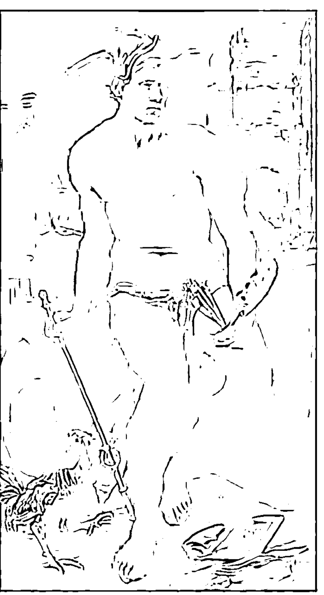

© Wikipedia Common

▲ 墨丘利的英文名字正是水星

## ♀ 金星

金星的英文名為Venus，這也是古希臘神話中愛與美女神的名字，維納斯（Venus）。女神自然是有著出眾的外貌和迷人氣質，而金星符號正是她手中的鏡子。

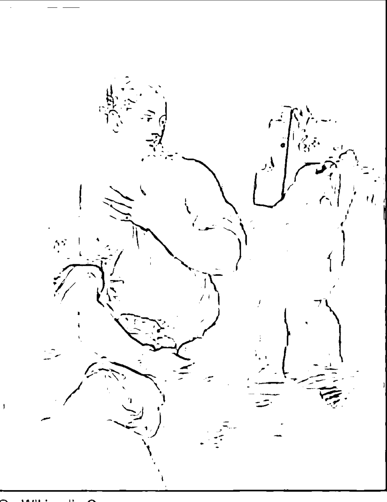

© Wikipedia Common

▲ 金星符號正是維納斯手中的鏡子

## ♂ 火星

在羅馬神話中，被封為戰鬥之神的是瑪爾斯（Mars），他不僅作戰勇猛而且有著傲人戰績，幾乎從未有過敗績。瑪爾斯的主要武器是手中的盾牌以及長矛，火星符號就是它們的疊加。

## ♃ 木星

朱庇特（Jupiter）是羅馬神話中的眾神之神，掌管天地間的所有一切，祂能發出威力驚人的雷電，瞬間摧毀任何事物，所以也無人敢向祂發起挑戰，而木星符號所體現的，正是朱庇特所發出的駭人雷電。朱庇特的肩上還經常站著一隻鷹，所以也有說法認為這個符號其實是那隻鷹的形象。

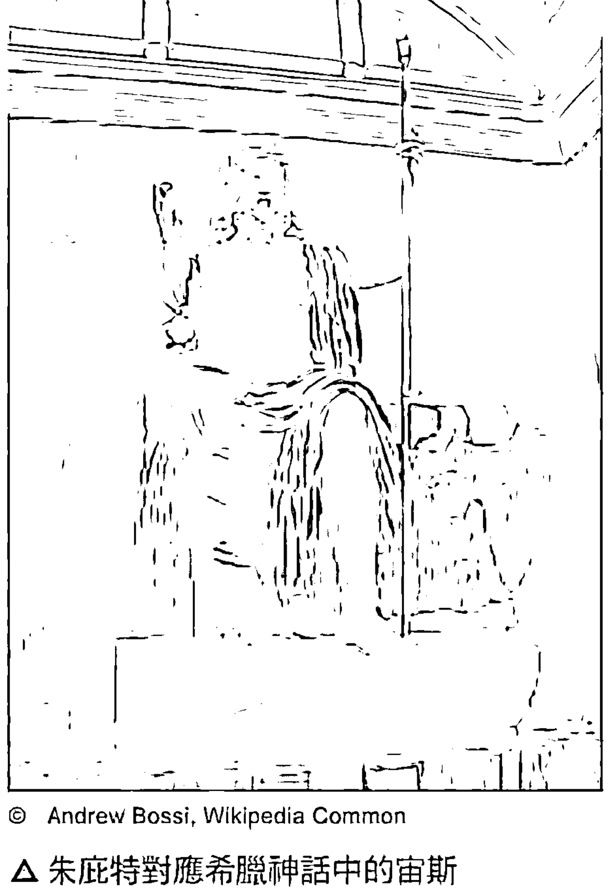

## ♄ 土星

在古希臘神話中，克洛諾斯（Cronus）是神王宙斯（Zeus）的父親，在宙斯之前同樣也是統治宇宙的神界首領，但克洛諾斯的即位，是在母親慫恿下，用一把鐮刀將其父烏拉諾斯（Ouranos）閹割並廢黜。土星的符號，正代表著克洛諾斯手中的那把鐮刀。

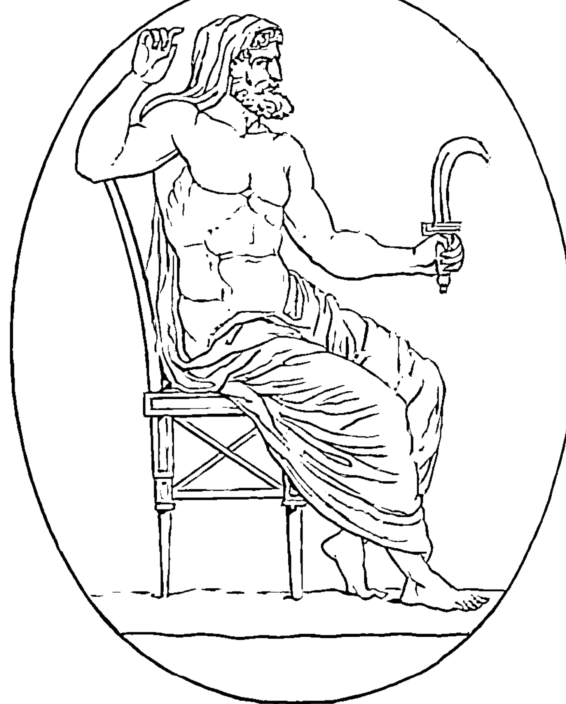

© Wikipedia Common

▲ 土星符號代表克洛諾斯手中的那把鐮刀

## ♅ 天王星

在古希臘神話中，烏拉諾斯（Uranus）是宇宙誕生之後的第一個王，統領所有的神仙，天王星符號所象徵的，正是加冕在烏拉諾斯頭上的王冠。

## ♆ 海王星

尼普頓（Neptune）是羅馬神話中的海洋之神，在整個海洋範圍內，任何人都不可能和祂相抗衡，祂的主要武器是一支金色的三叉戟，尼普頓不僅用它來戰鬥，也用它擊碎阻塞的岩石，幫助人類疏導河流。海王星的符號，正是尼普頓手中的三叉戟。

## ⊕ 冥王星

普魯托（Pluto）是羅馬神話中的冥界之王，冥王星符號中下半部分的十字，象徵的是普魯托平時手持的一根權杖，而由權杖托起的圓形，則象徵人類在冥界所受的困難反覆循環，永無盡頭。

## ◎ 星盤，預測未來的命運之盤

對於占星術來說，前面講到的十二宮，就像是一些零散的零件，單個拿出來進行分析講解的意義並不大，而要把它們融合起來，發揮占星術真正的作用，就必須用到星盤。

星盤的發明是在西元兩百年前左右的希臘，最初是用來模擬天空中星體的運動，並對它們的行進軌跡進行預測。由於當時西方世界尚未出現指南針，所以星盤也被運用在航海中，透過確定某些天體的位置來指引航向。

由於人們把天上的星辰畫在星盤上，於是之前提到的十二宮就能在上面一一展示出來，這為人們提供了一種便利——不用非得等到夜晚去仰望星空，星盤就可以類比出星空的狀態，只需對星盤進行分析，就可以預測未來、占卜命運，星盤也就此具有了神奇的力量。

星盤不是一個特別複雜的系統，但是它也並不簡單，有一些概念必須在進行星盤分析之前弄清楚，其中最重要的就是「星座」。有人會覺得疑問，星座不是很簡單嗎？知道出生日期，不就可以很清楚地知道自己是十二星座中的哪一個了。但是，我們平時所說的「星座」，其實指的是「太陽星座」，也就是我們出生時，太陽運行到某個宮位的星座。而實際上，廣義上的星座還有「月亮星座」、「水星星座」、「金星星座」等，例如「水星星座」就是一個人出生時水星所在宮位的星座，其他星座則依此類推。

當我們出生時，以我們出生的地點為中心，那麼在那個時刻，太陽系中的所有行星以及月亮，相對於這個中心的位置都是固定的，也就是說每個星體都能在十二宮中找到自己的位置，而這種星體和宮位的搭配，就會給人在命運及性格上帶來多樣的影響。

以歷史上曾經統治歐洲的拿破崙³為例。

拿破崙（Napoléon）一七六九年八月十五日出生在法國的科西嘉島（Corsica），具體的時間是在中午十一點半左右。這些資訊就可以排出他的星盤。

³ 拿破崙（1769-1821），法蘭西第一帝國皇帝，著名軍事家，其在位期間幾乎征服了除俄國以外的所有歐洲國家，並為後世的資本主義打下基礎。一八一五年在滑鐵盧戰役中失敗被流放，最後死在大西洋的聖赫勒拿島。

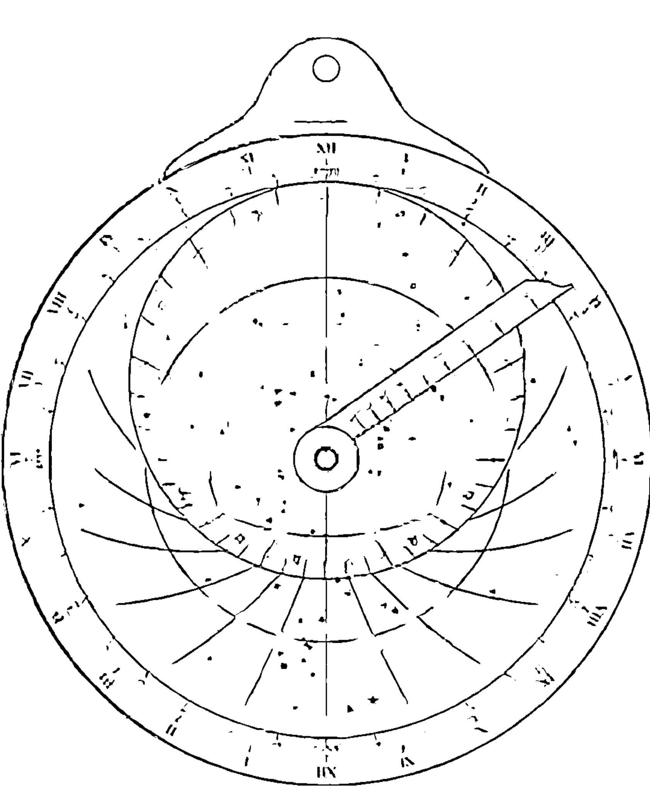

© Wikipedia Common

▲ 星盤，要看懂星盤必須先弄清楚對應的星座

星盤的繪製不是來自隨意的想像，而是根據天體運行的歷史規律，我們以拿破崙的資料來排列他的星盤。拿破崙出生時的太陽、月亮、金星、水星、木星、火星、土星、天王星、海王星、冥王星所對應的宮位，分別是：獅子、摩羯、巨蟹、獅子、天蠍、處女、巨蟹、金牛、處女、摩羯。

有了上述前提，就可以對這位偉大的軍事天才進行分析。拿破崙的太陽星座落在獅子座，代表了高傲易怒的主要性格，並且從小就很獨立，傾向於自己解決所有問題；月亮星座落在摩羯座，顯示在其內心深處，是一個十分懂得隱忍克制的人，而且有著超人的勤奮；火星星座在處女座，表示其做事相當注重細節，態度十分嚴謹；象徵愛情的金星星座落在巨蟹座，而拿破崙的第一個女人也剛好是巨蟹座。值得注意的是，拿破崙的太陽和月亮分別落在獅子和摩羯，這兩個星座在所有星座中，對於人的事業有著最大的影響。太陽星座是獅子和月亮星座是摩羯，顯示無論是外在還是內在，拿破崙都是一個有著極強奮鬥心和野心的人，其日後的成功也得益於此。綜合上面的所有分析，就能對拿破崙的性格做出一個總體判斷，並能由此推斷出性格對於他的人生的影響。

其實對普通人而言，運用星盤時不用考慮過多，像上述一樣，只關注最重要的幾個星座便可，比如：太陽星座掌管人的個性，月亮星座代表人內心潛藏的感情和性格，金星星座主導一個人的愛情和審美，水星星座則會體現出學習和思維的能力，只需要在星盤上看清楚每個星座處在哪個宮位，這些個人特質的情況也就自然明瞭了。最後就是上升星座，它會體現一個人的外在氣質和給他人的第一印象。

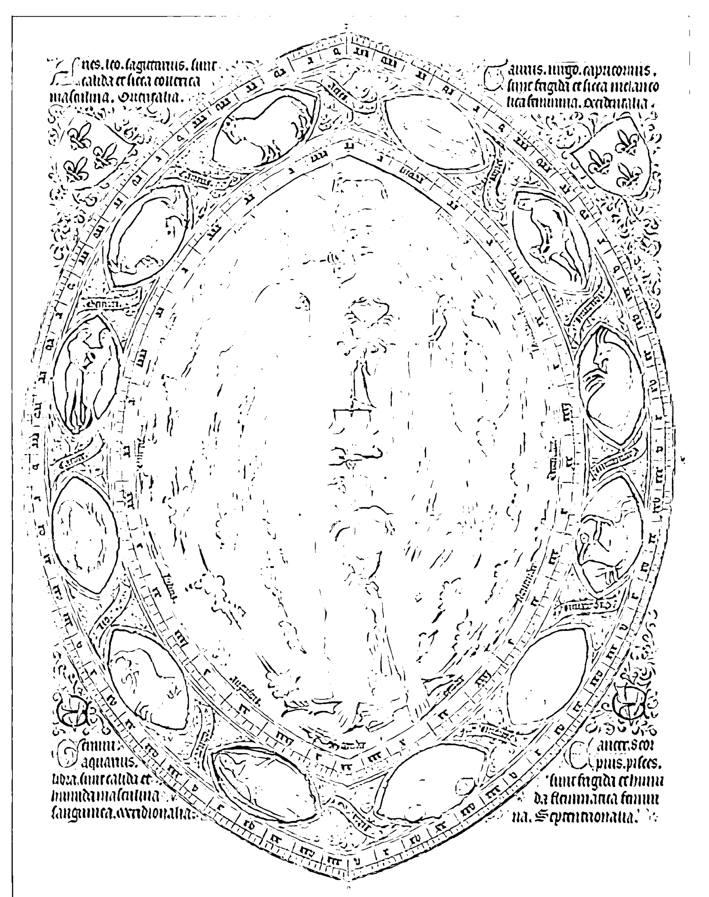

© Wikipedia Common

△ 占星也被用在醫學上，醫學占星用的人體解剖—占星關係圖

107

Chapter 2

秘術之鑰

## ◎ 小圓盤裡的樸素宇宙觀

現代科技為人類帶來了空前發展，也使人們愈來愈相信科學的力量。但是，在遠古時代，整個世界有著太多不為人知的部分，大多數人相信自己的命運是被其他的力量主宰——在這些可見的力量中，每天升起落下的日月，和圍繞在天空中的星辰，是人們最覺得神秘的部分。它們不僅讓自然界發生巨大的變化，也使人們相信，它們其實是神，它們在遙遠的地方操控著每個人的一生，於是就有了星盤、星座以及占星術的誕生了，而它們的本質，其實是古代人類樸素宇宙觀的展現。

## 芒星——魔法陣的召喚

在東方世界的上古傳說中，主要基調是擁有仙術的神仙，以及他們所生活的仙境；而在西方世界，魔法則是所有傳說和神話的必備元素。東西方的神秘故事裡，都存在著不可思議的超能力，但在具體展現上，卻是大相徑庭，當涉及符號的時候，兩者的差別就顯得更加明顯，幾乎沒有交集。

如果說要給西方魔法選出一個具代表性的符號，哪一個會最適合呢？十字架或許會是不少人脫口而出的答案。誠然，十字架幾乎從西元元年開始，就是西方世界的代表，而且在文化與宗教等領域都是如此。但是魔法只是西方文明中的一個小分支，用十字架來代表它不僅大材小用，而且也不太合適。其實只要稍微注意一下西方的魔幻電影，或者是魔幻小說，就會發現一個符號常常閃現在我們眼前，那就是五芒星。

有趣的是，很多人對於五芒星的最初印象，是來自於一些國家的國旗。確實是有不少國家的國旗以五芒星做為主圖，因為它和夜空中閃爍的明星很相似，因而以此來象徵光明的未來。

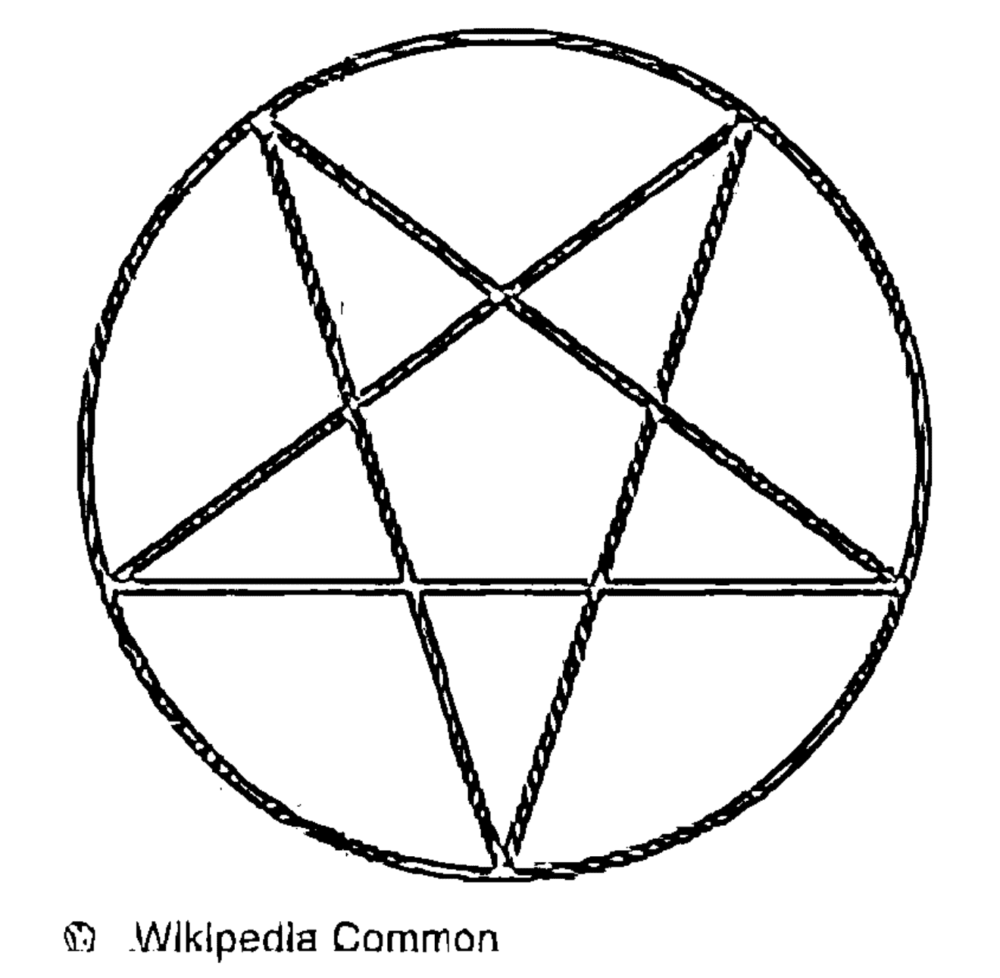

© Wikipedia Common

▲ 五芒星是西方魔法的代表性符號

不過，五芒星其實是一個「資歷」很老的魔法符號，它所代表的魔法涵義，也還不是星星那麼簡單。另外，五芒星還只是「芒星」這個家族中的代表之一，其他還有諸如六芒星、七芒星等，雖然只是芒數的不同，但卻有著完全迥異的涵義。

## ◎ 芒星家族的老大：五芒星

五芒星，是芒星家族中最為人所熟知，其本身的形象充滿美感，但它並不是人們憑空想像或者設計出來的。金星每八年的運行軌跡非常接近一個正五邊形，而將每個頂點相互連接起來以後就成為五芒星。古人對於這種出現在天空中的完美形象充滿讚嘆，於是就用它來代表古羅馬神話中的女神維納斯，後來拉丁語中的金星更是直接來源於「Venus」。

在現存的文獻中，五芒星最早出現在美索不達米亞平原（Mesopotamia），而時間是大概三千年前，在當地人使用的蘇美爾（Sumer）語中，五芒星只是被做為一種象形文字，代表的意思是「角落」或是「隱蔽的孔」等，和魔法還沒有任何關係。後來，五芒星符號在古希臘廣為流行，一個很重要的原因就是，它與古希臘的「元素論」完全吻合，即世界是由水、火、風、土四種基本元素，再加上原物質，一共五種元素構成，而且每個元素在五芒星中都有自己固定的位置：左上和右上分別是風和水，左下和右下分別是土和火，而占據最頂端也是最重要的，就是所謂的「原物質」，它代表著一切精神力量。

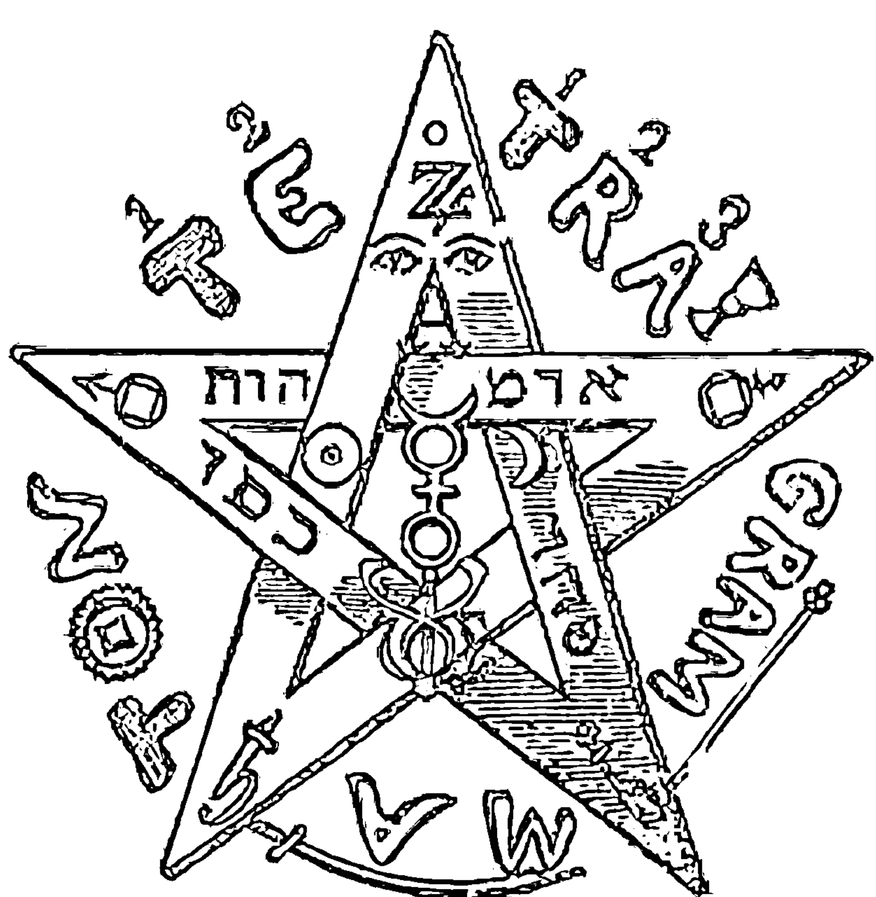

© Wikipedia Common

▲ 五元素在五芒星中都有自己固定的位置

畢達哥拉斯（Pythagoras）是西元前六世紀古希臘著名的思想家、學者，同時也是一個神秘主義者。他擁有著巨大的影響力，以至於他和其信徒成為一個單獨學派，被稱為「畢達哥拉斯學派」。對於「美」的本質的探究，是這個學派的最主要活動，他們對於五芒星推崇備至，將它稱為擁有交錯之美的完美文字。另外，更為重要的是，做為神秘主義學派，他們將五芒星中的頂點視為健康、幸運的最佳代表，而五芒星也漸漸成為祈禱幸福的魔法符號。

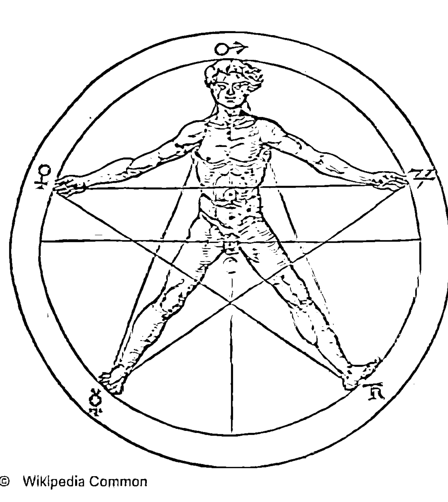

© Wikipedia Common

▲ 人體是一個小宇宙，是整個大宇宙的縮影

在畢達哥拉斯之後，西元前三世紀左右，希臘的另外一名哲學家阿爾克邁翁（Alcmaeon），曾在著作中提出這樣的主張：人體是一個「小宇宙」，是整個大宇宙的縮影，宇宙中的元素在人體上都可以得到對應：肌肉是土、體溫是火、氣息是風、血液是水。地球表面有河流，人體內則有交錯縱橫的血管；地球圍繞著太陽運轉，而心臟做為人體中心，以強大力量支撐著人類的活動；地球上有四季的變化，而人類則有著喜怒哀樂等豐富的情感變化。

根據以上理論，歐洲中世紀的煉金術士們繪製出了所謂的小宇宙模型，表現形式和繪製手法都各有差別，但是最著名的小宇宙模型卻是出自達文西之手。

達文西（Da Vinci）創作的一幅素描手稿，名字是《維特魯威人》，為的是紀念古羅馬建築師維特魯威（Vitruvius）。

畫中的男子以兩種不同的姿勢展開身體，四肢和頭部分別對應五芒星中的五個角，肚臍則位於正中央。更為重要的是人體的周圍還有一個十分規則的圓，很明顯，這個圓就正代表著外部的大宇宙，而人本身則組成了一個內部的小宇宙。

至目前為止，五芒星和魔法的關係還不算很大，大部分還只是人們的某些哲學思考，但到了後來，開始有法師將五芒星做為抵抗邪惡的符號，它的魔法氣質也因此愈來愈多，而這種變化主要來自於《聖經》。

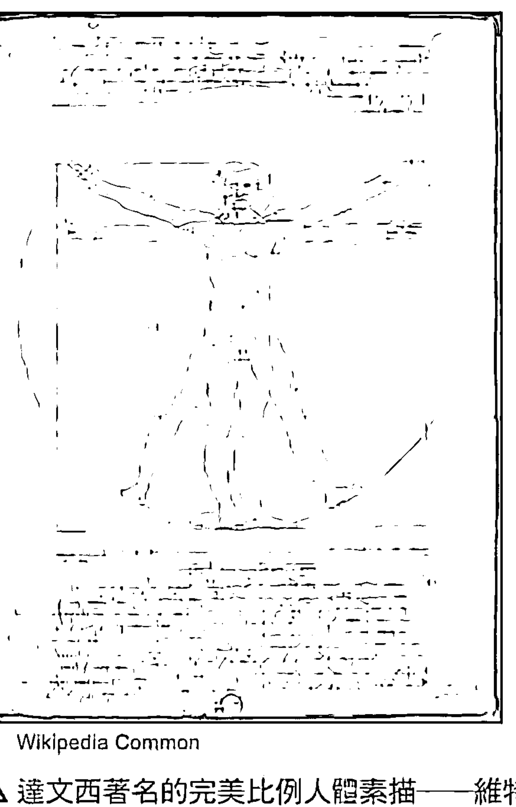

³ 羅馬帝國開國皇帝奧古斯都統治時期的羅馬建築家，著有《建築十書》。

在猶太人中存在著一種稱為「卡巴拉」（Kabala）的神秘哲學，傳說是由猶太律法的制定者摩西（Moses）創立，其核心理念是「生命之樹」。在卡巴拉的理論中，天國裡生長著一棵生命之樹，它象徵著整個宇宙，這棵樹又被分為四個層級：火、風、水、地，再加上象徵精神而且無處不在的「靈」，便形成了宇宙的全部，也剛好與五芒星一一對應。

由於五芒星和生命之樹的緊密關係，魔法師就將其做為抵禦邪惡勢力的工具，只要畫出五芒星符號，就能將惡魔或惡靈封閉起來，而五芒星中間的五邊形，則被認為是關住惡魔的「門」。正因為擁有這樣的作用，教會也將五芒星稱為「惡魔的紋章」。

在具體的魔法法術中，五芒星被術士們用來進行召喚，而且這種召喚的規定相當嚴格。五芒星是個可以一筆畫出的符號，除去最上面的頂點以外，其餘四個頂點意味著有四種不同的畫法，相應的召喚內容也會不一樣（最頂上的「靈」不需要召喚，因為它做為元素無處不在）。以召喚「火」為例，從頂點開始，分別經過左下、右上、左上、右下，最後回到頂點，就可完成召喚。當然，有召喚就會有驅散，而且驅散的畫法並非簡單地將原路線倒推回去，而是變成以右下為起點，之後經過左上、右上、左下、頂點，最後再回到右下。

這裡所召喚的「火」，既可以是真實的火（火也是魔法師們最常用到的物品），也可以指以「火」這種廣義上的元素構成的物品，或者是具有「火」的性格和特質的物品。其他的水、土、風等元素，透過類似的方式，同樣可以召喚和驅散。對於一個魔法師來說，對四大基本元素的掌控，是最基本也是最重要的，而透過五芒星，就能實現那些電影中所描述的奇幻場景。

五芒星有頂點，因此也有正逆之分，默認情況下五芒星都是頂點向上，也就是正向放置，代表保佑、祝福以及驅散邪惡等意。很多人都將其做為護身符，古巴比倫人甚至在食物器皿刻上五芒星，認為這樣就可以讓食物保持新鮮而不腐爛。但當角度倒轉一百八十度成為逆五芒星時，意義則完全改變。逆五芒星代表著惡魔、撒旦、破壞等，而且在現代人所創立的撒旦教中，逆五芒星是用得最多的符號，幾乎等同於十字架在基督教中的地位。

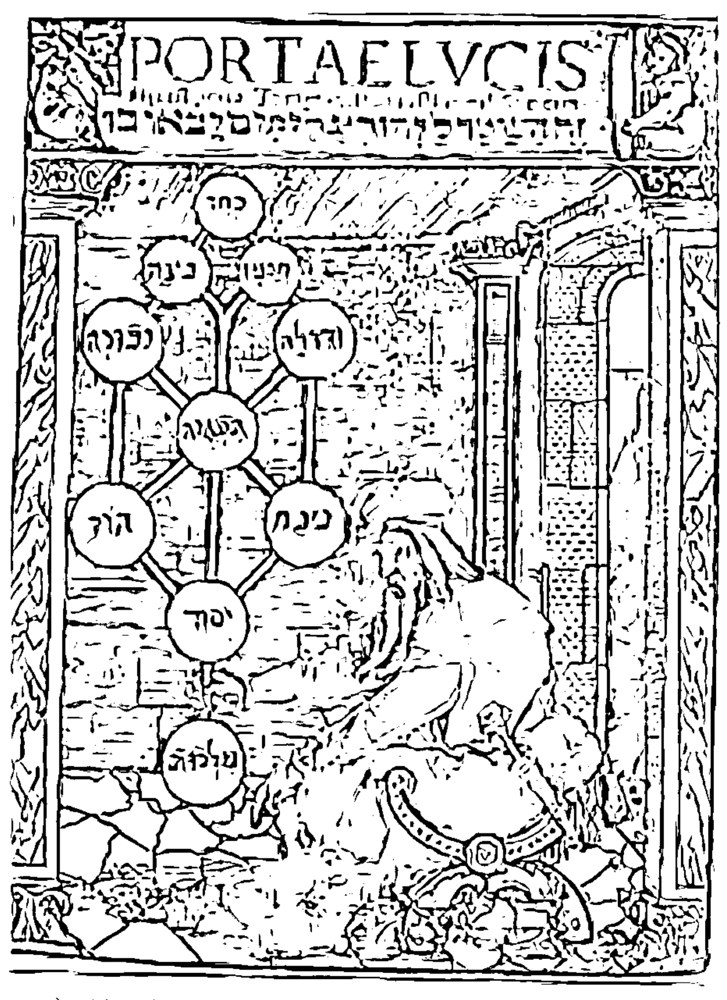

© Wikipedia Common

▲ 神秘哲學「卡巴拉」的核心理念「生命之樹」

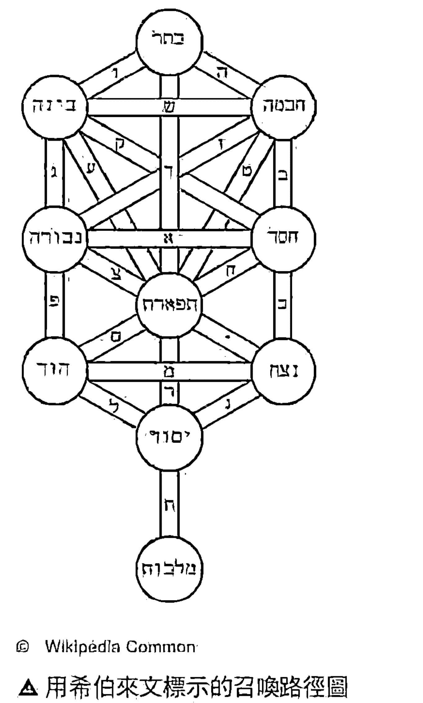

© Wikipedia Common

▲ 用希伯來文標示的召喚路徑圖

## ◎ 猶太人的符號：六芒星

六芒星和五芒星相比，除了多出一個角以外，其他結構並未有太大的變動，彷彿是出身於同一個家族的兄弟。但實際上它們之間的關係並不算緊密，五芒星是具有深刻魔法意義的符號，而六芒星和魔法的關聯並不算太多。相反的，六芒星在當今世界的政治舞臺上占有特殊地位：以色列國旗的正中央就是六芒星符號。

在猶太民族中，六芒星符號最早源於他們的民族英雄——大衛王（King David）。大衛王在西元前十世紀左右完成以色列統一，雖然持續的時間不算很長，但是這卻成為後來猶太人懷念了三千年的夢想。大衛王驍勇善戰，功績顯赫，這不僅因為他本身極其勇敢，傳說他使用的盾牌上有一個六芒星符號，具有超凡魔力，盾也因此變得堅不可摧。

雖然猶太人的六芒星具有悠久的歷史傳說，但是直到西元三世紀，猶太教堂才開始零星使用這個符號，而到了中世紀時才被廣泛運用，猶太人在墓碑上刻六芒星的傳統也是從那個時候開始。

到了十七世紀中期，在布拉格（Prague）的猶太人，因為在抵禦瑞典人的進攻中立功，而被允許建立一面自己的旗幟，六芒星便成為他們的選擇。再到後來，在一八九七年的世界猶太復國主義者大會上，六芒星再次被選為會旗上的標誌。第二次世界大戰時期，希特勒對猶太人實行隔離和種族清洗政策，為了將猶太人和其他人進行區分，強行下令他們必須佩帶黃色的六角星標誌（也就是六芒星），雖然這是個完全種族主義的舉動，但從這裡也可看出，在當時，整個歐洲已經公認六芒星是猶太人的標誌性符號。

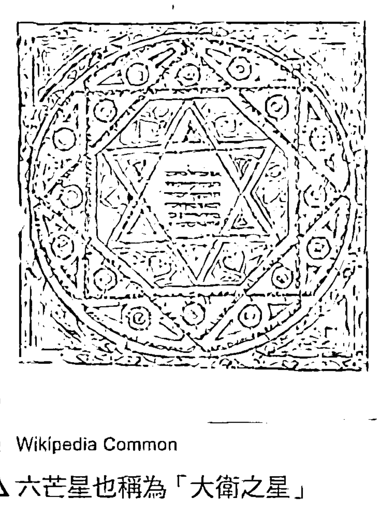

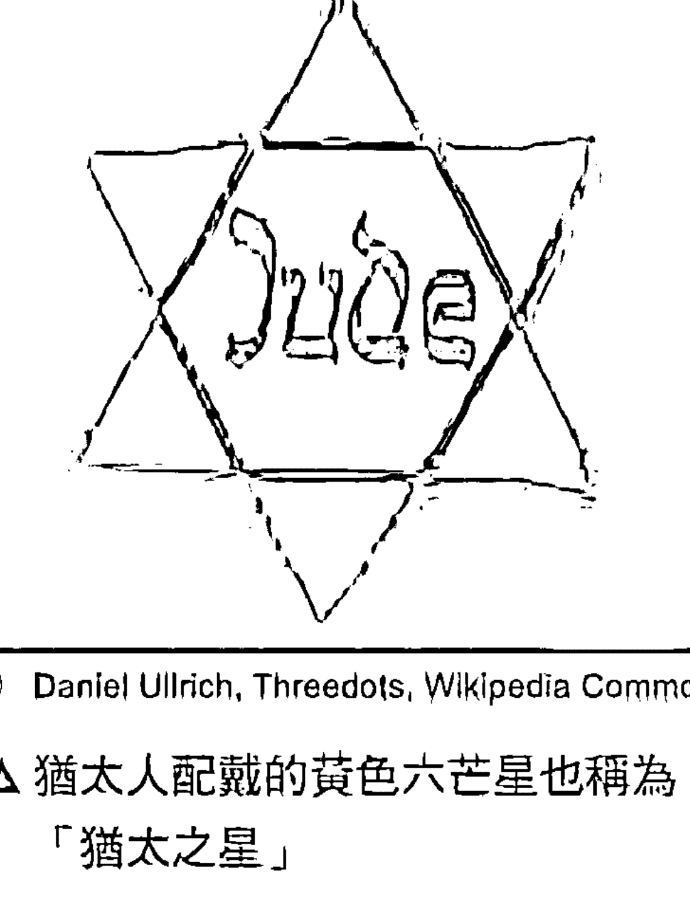

⁴ 大衛王，以色列國王，西元前一千年至前九百六十年在位，傳說是被上帝選中的以色列人的第二個王，撲克牌中的黑桃K即是以他做為形象人物。

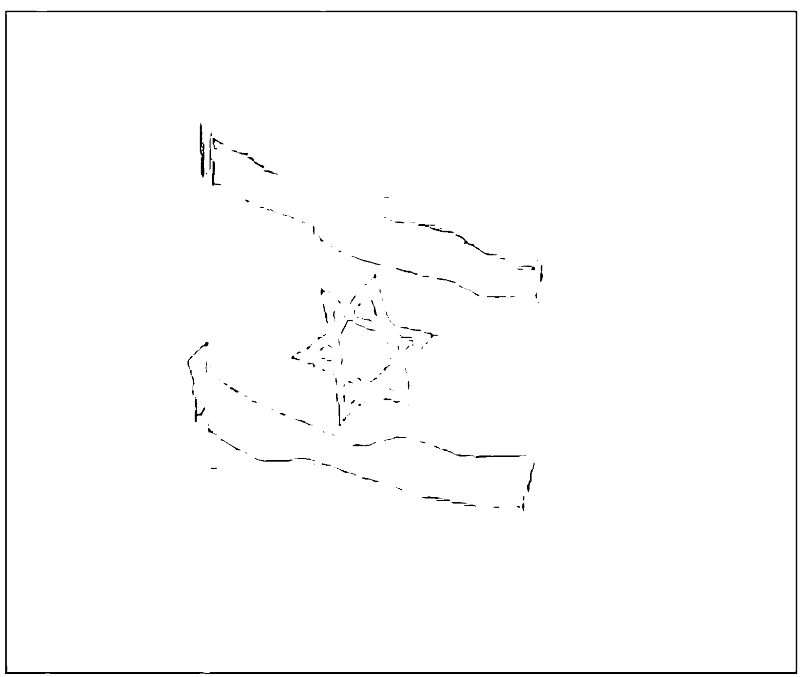

© MathKnight from he, Wikipedia Common

▲ 以色列國旗的正中央就是六芒星符號

一九四八年五月，以色列正式建國，當年十月正式確定國旗樣式，在解釋這面旗幟時，以色列人明確表達旗幟中間的六芒星就是代表大衛王（所以也稱為大衛之星），同時也代表著權力和權威，而上下兩條藍色的條紋，則代表猶太人在祈禱時所使用的披巾。

即便六芒星在以色列擁有如此悠久的歷史和特殊地位，但再往前追溯六芒星的歷史，可發現它的發源地並不是以色列。而且出乎大多數人的意外，六芒星最早也不是出現在歐洲或是埃及，而是來自於印度。在印度教中，有一個古老密教（Tantrism），奉行女性崇拜，因為其傳承於上古時期一個全部由女性組成的派別，六芒星就是這個教派的標誌性符號。

六芒星和五芒星的結構佈局比較類似，但它不能一筆劃成，也和五大元素沒關係。事實上，六芒星是由兩個上下顛倒的三角形組成，其中尖端向下的倒三角是象徵「女陰」的符號，密教也將之視為整個宇宙之母的象徵，萬物都由其孕育。在梵文中，這個倒三角還被稱為「Yoni Yantra」，即女陰的圖像，而其中的「Yoni」和漢字中「陰」所表達的意思大致相同；而正三角則代表男性、雄性的力量。所以，整個六芒星的基本意義，是象徵陰陽結合，並由此而產生的世界。

另外值得一提的是，六芒星也是密教的神女象徵，只不過是高度抽象化的產物，本來兩個三角形是一對緊緊相擁的男女，但他們擁有一個軀體，甚至到最後連靈魂也是統一的——這符合印度和很多歐洲國家創始神兩性合一的特點。

## ◎ 不被輕易動用的七芒星

七芒星是個有著豐富涵義的符號，因為「七」在西方本身就是一個很特別的數字。比如，上帝用六天創造了世界，在第七天休息；《聖經》提到天堂裡有七大天使，而在地獄

## 七芒星与八芒星

中还住着七个堕落天使；天主教主张人类有「七宗罪」。可见，「七」对于西方世界来说，有着很特殊的意义，即是一个带有神性的数字，同时又隐藏着无尽的神秘感。

除了上面这些「七」，还有一个「七」显得尤为重要，就是所谓的「第七封印」，耶稣曾给他的门徒约翰（John）启示，让他见到后世的历史，约翰将其记录下来并写成书。那个时代的文字全都写在羊皮卷上，约翰在完成工作后将书卷好，并用蜡和黏土封起来，一共有七个封印，当第七个封印被揭开之后，就会出现诸多异象——也就是上帝早已为人类所导演好的情节，其中也包括末日审判和世界毁灭等。

在这样的背景下，七芒星的意义也显得不那么确定，当每个顶点代表一位天使时，你可以认为它会带来祝福，然而这七个顶点同样可以用邪恶来填满，于是这让七芒星变得难以确定。也正因为如此，魔法师们也不敢轻易动用它，因为七芒星所代表的魔力是不被操控的，没人能够知道自己会召唤出什么，而一旦召唤了不愿出现的东西，想要再将它驱散就很难了。

## ◎ 伊斯兰世界的八芒星

八芒星是一个充满伊斯兰风格的符号，在中东尤其是埃及随处可见，在欧洲却几乎没有它的踪影。在埃及，人们在进行装饰时会大量运用八芒星，比如地砖、墙面、窗户甚至是家具上，常常都能见到八芒星纹路。而另外一个中东国家伊拉克（Iraq），曾经在一九五九至一九六三年期间的国旗上使用八芒星（参见次页图示），足以体现八芒星在中东的影响。而事实上，八芒星也的确起源于这一地区。

西元前三千年左右的两河流域，苏美尔人（Sumer）建立自己的奴隶制国家，并创造了属于自己的文明。在苏美尔的神话中有四大主神，分别是安努（Anu）、祺（Ki）、恩利勒（Enlil）和恩基（Enki），祺掌管大地，后两者各自掌管空气和水，而安努则是苏美尔万神殿中的万神之神。当用苏美尔的楔形文字来表示「安努」时，就会是一个非常近似八芒星的符号，这是人类历史上最早的八芒星。

在后来的演化中，苏美尔人还将八芒星和太阳结合起来，并且将其放在他们代表性符号上——鹰翼太阳轮。符号中央的圆圈象征太阳，而其内部的八芒星则代表太阳放射出的光芒，这样的结合也是苏美尔人最早创造出来，并逐渐流传到世界其他地方。

苏美尔人的文明消灭后，继承他们的巴比伦人（Babylon）也继承了八芒星这个符号，而且从巴比伦人的八芒星中，可以看出对于太阳更加明显的崇拜，除了有光芒之外，连太阳那无穷的热量也透过波浪线条展示出来。

总体而言，八芒星的内涵并不复杂，主要还是在于表达对太阳的崇拜。或许是因为其的符号已经太多，八芒星始终无法成为欧洲的主流符号，而另外一个更合理的原因可能是：欧洲的基督教势力庞大，欧洲人也更加崇拜具有实际形象的神；相较之下，在两河流域也好，在埃及也好，人们更加倾向对自然界力量的崇拜，于是象征太阳的八芒星也就自然成为主流符号。

## ◎其他的芒星符号

从五芒星到八芒星，每个符号都有其各自独特的涵义，有的还带有魔法性质，但它们的共同特点就是都拥有悠久的历史。如果把芒星中芒的数量继续增加，就会形成九芒星、十芒星等，它们自身可以做为符号存在，但是并没有特别的历史意义。当然了，芒星的「芒」是光明以及力量的最佳代表，所以依然经常被用在正式场合，最典型的就是国旗设计。我们最为熟悉的中华民国国旗——青天白日满地红旗，就使用了多芒星。

青天白日满地红旗的设计理念很简单：红、白、蓝三种颜色象征孙中山的「三民主义」，而左上角的「白日」，一共放射出十二道光芒，象征中华文明所传承的美德，包括礼义廉耻和忠孝仁爱信义和平在内的四维八德精神。

如前文所提到的，世界上有很多国家将五芒星画在国旗上，还有一些国家甚至使用芒数更多的符号，但无论如何，这些符号都代表着最简单也是最朴素的意义：希望国家的未来像太阳般光明，或是像星辰般闪耀。

## 摩斯电码——谍门暗语

十八世纪以前，人类想要进行远距离通讯是件很困难的事情。起初设立驿站，让信使骑马送信，但当路途遥远时，依然需要好几天甚至十几天的时间，而且中间还存在各种自然和人为的因素，使得资讯不一定能百分之百的送达。后来信鸽也成为一种普遍的送信方式，这在速度方面的确有所提高，而且准确性也有一定的保证，但由于大自然的变化莫测，使得它的稳定性同样不够高。

除了上述两种在古代最常见的送信方式外，还有诸如烽火、信号塔、信号旗等方式，也被人们用来交流和传递资讯，但它们都有各自的缺点，不是传递的资讯量太少，就是传递过程不够保密。总之，这些方式都无法满足大规模、远距离，且要求准确性的资讯传递。

然而，在进入十九世纪以后，人类科技开始飞速发展起来，其中电和磁的发现与利用，开始让整个人类在沟通方式上有了质的飞跃。在这个过程中，一种并不算复杂的密码系统登上了历史舞台，并且在长达一个多世纪的时间里，成为人们最常用的远距离沟通工具，它就是摩斯电码（Morse code）。

## ◎ 诞生于画家手中的传世电码

做为一种在历史中鼎鼎大名的电码，你也许会想它的发明者必然是个精通数理的科学家，但实际上摩斯在发明这种以自己名字命名的电码以前，是个不折不扣的艺术家。

摩斯生于美国，并从耶鲁（Yale）大学毕业，后来还去英国继续深造艺术，在绘画领域小有名气——这样的人生轨迹并没有什么特别之处，直到后来的一次乘船旅行。

在十九世纪三〇年代，摩斯在乘船的时候遇到了名叫杰克逊（Jackson）的乘客，他向摩斯展示当时还鲜为人知的电磁原理：在一块铁上缠上电线，通入电流之后，铁块会变得具有磁性，并能吸住其他铁块，而当断电之后，铁块的磁性也随之消失。这种像魔术一般的情景立刻引起摩斯的兴趣，导致他热衷于电学实验，甚至想亲自动手造一台电机。

不过，由于对电的知识的缺乏，摩斯向名为亨利（Henry）的物理学家求助，并在其热情的帮助下掌握了关于电磁的大量理论知识和操作经验。在其后，摩斯不断研究发报技术，并最终发明了摩斯电码。

其实，在摩斯之前，由于电磁理论的发现，已经有不少人尝试过用电来进行远距离通讯。例如在十九世纪初，一名西班牙科学家将许多根导线泡在盐水中，每一根导线代表一个字母或者是符号，当某根导线有电流经过时，盐水被电解而产生气泡，进而判断出远方传来的是哪个字母，并以这种方式来接收资讯。但是由于使用的导线过多，而且准确度较差，这种方法并没有被广泛使用。

到了十九世纪三〇年代时，一名俄国外交官也试图发明一种发报机器，它的原理如下：当电流通过电流表时，表上的指针会偏转，不同的电流强度会有不同角度的偏转，同时就可以代表不同的字母以及符号了，但由于准确性很差，这种方法依然没能得到推广。

在十八世纪初，整个地球的融合趋势已经愈来愈明显，各个地区的人员交流也愈来愈频繁，贸易的繁荣更是空前——这一切的一切都在迫切等待着一场革命，那就是远距离通讯方式的革命，而这又必须满足两个条件：简单的操作方式和一定的保密性。在这样的背景下，摩斯电码应运而生，它得到广泛应用的一个重要因素，就是编码原理很简洁，一个点「·」，一个短画线「—」，就可以构成许许多多的资讯。在发报时，一个脉冲电流就代表一个「·」，而一个「—」的长度等于三个「·」的时间长度；同时，它们也分别被称为「Di」和「Da」，也就是在发电报时发出的滴滴答答的声音。摩斯电码还有如下一些规则：当每个Di和Da之间分隔的时候，会间隔一个Di的时间；当不同的字母之间分隔时，会间隔三个Di的时间；当不同的字之间分隔时，则间隔五个Di的时间。

以上就是整个摩斯电码的基本原理，而将点和线以不同的方式排列起来的时候，就可以表达出不同的资讯了。

在次页表中可以看到，摩斯为英文中的二十六个字母分别编制了不同的电码，其中发报时耗时最长的字母Q也只不过十三个Di的时间长度。另外，摩斯也为每个数字和一些常用的标点符号编制了电码，加之这套电码本身的难度并不高，即便是普通人经过一定训练之后也能熟练掌握，所以摩斯电码迅速风靡全球，在军事、航海、贸易等领域都相当普遍，人们终于获得一套可以高效进行的远距离沟通的工具。

## International Morse Code

1. The length of a dot is one unit
2. A dash is three units.
3. The space between parts of the same letter is one unit.
4. The space between letters is three units.
5. The space between words is seven units.

值得一提的是，世界上第一封用摩斯电码发出的电报是在一八四四年，在那之前，摩斯用国会赞助的三万美元修建了从华盛顿（Washington）到巴尔的摩（Baltimore）的电报线路，全长六十四公里。摩斯亲自到国会大厦进行演示，他在键盘上轻轻敲下一连串的电码，与此同时，巴尔的摩的接收器上就出现了这样一篇电文：上帝创造了何等的奇蹟。上图，正是相对应的摩斯电码的电文，这也成为全世界第一封真正具有意义的电报。

摩斯电码的发明是以英语为基础，如果想要用摩斯电码发出汉字电报，就必须经过一定的转换。标准方法，是将每个汉字以四位数字进行代表，例如「一」的四位编码是9801，然后再将这个四个数字以摩斯电码发出。在不同的汉字之间加上相应的停顿，就可以串联成完整的意思。

汉字摩斯电码的表达明显较长，如果用英语表达相对显得简洁很多。当然，这种局面难以避免，毕竟摩斯电码是由西方人发明，无论是从结构还是电码的思维方式，都是以西方文化做为基础，透过一定转换的汉字摩斯电码，必然会显得冗长。

## ◎ 广为人知的摩斯电码

即便不知道摩斯电码的人，相信也不会对「SOS」感到陌生，而且几乎在一看这三个字母的同时，就会条件反射般的意识到有不同寻常的情况发生。的确，「SOS」是全球通用的紧急呼叫讯号，而它实际上也是一段摩斯电码，并且背后有着极其惨痛的教训。

二十世纪初，摩斯电码在航海领域被广泛应用，但是对于如何进行紧急呼救，却一直没有一个统一标准。一九○三年，在第一届国际无线电会议上，有代表建议将「SSS D D」做为呼救讯号，但是并没有得到会议的一致同意。会后不久，英国的马可尼（Marconi）公司决定在自己的船舶上使用「CQD」做为呼救讯号，「CQ」本来是欧洲铁路的无线通信的一般呼号，在多加了一个「D」之后，船员们的理解是「Come Quick, Danger」（速来，有难），当翻译成摩斯电码之后，则是下面这个样子：

```
— · · · — · — — · — · · · — · · · — · · · — · · · — · · · — · · · — · · · — · · · — · · · — · · · — · · · — · · · — · · · — · · · — · · · — · · · — · · · — · · · — · · · — · · · — · · · — · · · — · · · — · · · — · · · — · · · — · · · — · · · — · · · — · · · — · · · — · · · — · · · — · · · — · · · — · · · — · · · — · · · — · · · — · · · — · · · — · · · — · · · — · · · — · · · — · · · — · · · — · · · — · · · — · · · — · · · — · · · — · · · — · · · — · · · — · · · — · · · — · · · — · · · — · · · — · · · — · · · — · · · — · · · — · · · — · · · — · · · — · · · — · · · — · · · — · · · — · · · — · · · — · · · — · · · — · · · — · · · — · · · — · · · — · · · — · · · — · · · — · · · — · · · — · · · — · · · — · · · — · · · — · · · — · · · — · · · — · · · — · · · — · · · — · · · — · · · — · · · — · · · — · · · — · · · — · · · — · · · — · · · — · · · — · · · — · · · — · · · — · · · — · · · — · · · — · · · — · · · — · · · — · · · — · · · — · · · — · · · — · · · — · · · — · · · — · · · — · · · — · · · — · · · — · · · — · · · — · · · — · · · — · · · — · · · — · · · — · · · — · · · — · · · — · · · — · · · — · · · — · · · — · · · — · · · — · · · — · · · — · · · — · · · — · · · — · · · — · · · — · · · — · · · — · · · — · · · — · · · — · · · — · · · — · · · — · · · — · · · — · · · — · · · — · · · — · · · — · · · — · · · — · · · — · · · — · · · — · · · — · · · — · · · — · · · — · · · — · · · — · · · — · · · — · · · — · · · — · · · — · · · — · · · — · · · — · · · — · · · — · · · — · · · — · · · — · · · — · · · — · · · — · · · — · · · — · · · — · · · — · · · — · · · — · · · — · · · — · · · — · · · — · · · — · · · — · · · — · · · — · · · — · · · — · · · — · · · — · · · — · · · — · · · — · · · — · · · — · · · — · · · — · · · — · · · — · · · — · · · — · · · — · · · — · · · — · · · — · · · — · · · — · · · — · · · — · · · — · · · — · · · — · · · — · · · — · · · — · · · — · · · — · · · — · · · — · · · — · · · — · · · — · · · — · · · — · · · — · · · — · · · — · · · — · · · — · · · — · · · — · · · — · · · — · · · — · · · — · · · — · · · — · · · — · · · — · · · — · · · — · · · — · · · — · · · — · · · — · · · — · · · — · · · — · · · — · · · — · · · — · · · — · · · — · · · — · · · — · · · — · · · — · · · — · · · — · · · — · · · — · · · — · · · — · · · — · · · — · · · — · · · — · · · — · · · — · · · — · · · — · · · — · · · — · · · — · · · — · · · — · · · — · · · — · · · — · · · — · · · — · · · — · · · — · · · — · · · — · · · — · · · — · · · — · · · — · · · — · · · — · · · — · · · — · · · — · · · — · · · — · · · — · · · — · · · — · · · — · · · — · · · — · · · — · · · — · · · — · · · — · · · — · · · — · · · — · · · — · · · — · · · — · · · — · · · — · · · — · · · — · · · — · · · — · · · — · · · — · · · — · · · — · · · — · · · — · · · — · · · — · · · — · · · — · · · — · · · — · · · — · · · — · · · — · · · — · · · — · · · — · · · — · · · — · · · — · · · — · · · — · · · — · · · — · · · — · · · — · · · — · · · — · · · — · · · — · · · — · · · — · · · — · · · — · · · — · · · — · · · — · · · — · · · — · · · — · · · — · · · — · · · — · · · — · · · — · · · — · · · — · · · — · · · — · · · — · · · — · · · — · · · — · · · — · · · — · · · — · · · — · · · — · · · — · · · — · · · — · · · — · · · — · · · — · · · — · · · — · · · — · · · — · · · — · · · — · · · — · · · — · · · — · · · — · · · — · · · — · · · — · · · — · · · — · · · — · · · — · · · — · · · — · · · — · · · — · · · — · · · — · · · — · · · — · · · — · · · — · · · — · · · — · · · — · · · — · · · — · · · — · · · — · · · — · · · — · · · — · · · — · · · — · · · — · · · — · · · — · · · — · · · — · · · — · · · — · · · — · · · — · · · — · · · — · · · — · · · — · · · — · · · — · · · — · · · — · · · — · · · — · · · — · · · — · · · — · · · — · · · — · · · — · · · — · · · — · · · — · · · — · · · — · · · — · · · — · · · — · · · — · · · — · · · — · · · — · · · — · · · — · · · — · · · — · · · — · · · — · · · — · · · — · · · — · · · — · · · — · · · — · · · — · · · — · · · — · · · — · · · — · · · — · · · — · · · — · · · — · · · — · · · — · · · — · · · — · · · — · · · — · · · — · · · — · · · — · · · — · · · — · · · — · · · — · · · — · · · — · · · — · · · — · · · — · · · — · · · — · · · — · · · — · · · — · · · — · · · — · · · — · · · — · · · — · · · — · · · — · · · — · · · — · · · — · · · — · · · — · · · — · · · — · · · — · · · — · · · — · · · — · · · — · · · — · · · — · · · — · · · — · · · — · · · — · · · — · · · — · · · — · · · — · · · — · · · — · · · — · · · — · · · — · · · — · · · — · · · — · · · — · · · — · · · — · · · — · · · — · · · — · · · — · · · — · · · — · · · — · · · — · · · — · · · — · · · — · · · — · · · — · · · — · · · — · · · — · · · — · · · — · · · — · · · — · · · — · · · — · · · — · · · — · · · — · · · — · · · — · · · — · · · — · · · — · · · — · · · — · · · — · · · — · · · — · · · — · · · — · · · — · · · — · · · — · · · — · · · — · · · — · · · — · · · — · · · — · · · — · · · — · · · — · · · — · · · — · · · — · · · — · · · — · · · — · · · — · · · — · · · — · · · — · · · — · · · — · · · — · · · — · · · — · · · — · · · — · · · — · · · — · · · — · · · — · · · — · · · — · · · — · · · — · · · — · · · — · · · — · · · — · · · — · · · — · · · — · · · — · · · — · · · — · · · — · · · — · · · — · · · — · · · — · · · — · · · — · · · — · · · — · · · — · · · — · · · — · · · — · · · — · · · — · · · — · · · — · · · — · · · — · · · — · · · — · · · — · · · — · · · — · · · — · · · — · · · — · · · — · · · — · · · — · · · — · · · — · · · — · · · — · · · — · · · — · · · — · · · — · · · — · · · — · · · — · · · — · · · — · · · — · · · — · · · — · · · — · · · — · · · — · · · — · · · — · · · — · · · — · · · — · · · — · · · — · · · — · · · — · · · — · · · — · · · — · · · — · · · — · · · — · · · — · · · — · · · — · · · — · · · — · · · — · · · — · · · — · · · — · · · — · · · — · · · — · · · — · · · — · · · — · · · — · · · — · · · — · · · — · · · — · · · — · · · — · · · — · · · — · · · — · · · — · · · — · · · — · · · — · · · — · · · — · · · — · · · — · · · — · · · — · · · — · · · — · · · — · · · — · · · — · · · — · · · — · · · — · · · — · · · — · · · — · · · — · · · — · · · — · · · — · · · — · · · — · · · — · · · — · · · — · · · — · · · — · · · — · · · — · · · — · · · — · · · — · · · — · · · — · · · — · · · — · · · — · · · — · · · — · · · — · · · — · · · — · · · — · · · — · · · — · · · — · · · — · · · — · · · — · · · — · · · — · · · — · · · — · · · — · · · — · · · — · · · — · · · — · · · — · · · — · · · — · · · — · · · — · · · — · · · — · · · — · · · — · · · — · · · — · · · — · · · — · · · — · · · — · · · — · · · — · · · — · · · — · · · — · · · — · · · — · · · — · · · — · · · — · · · — · · · — · · · — · · · — · · · — · · · — · · · — · · · — · · · — · · · — · · · — · · · — · · · — · · · — · · · — · · · — · · · — · · · — · · · — · · · — · · · — · · · — · · · — · · · — · · · — · · · — · · · — · · · — · · · — · · · — · · · — · · · — · · · — · · · — · · · — · · · — · · · — · · · — · · · — · · · — · · · — · · · — · · · — · · · — · · · — · · · — · · · — · · · — · · · — · · · — · · · — · · · — · · · — · · · — · · · — · · · — · · · — · · · — · · · — · · · — · · · — · · · — · · · — · · · — · · · — · · · — · · · — · · · — · · · — · · · — · · · — · · · — · · · — · · · — · · · — · · · — · · · — · · · — · · · — · · · — · · · — · · · — · · · — · · · — · · · — · · · — · · · — · · · — · · · — · · · — · · · — · · · — · · · — · · · — · · · — · · · — · · · — · · · — · · · — · · · — · · · — · · · — · · · — · · · — · · · — · · · — · · · — · · · — · · · — · · · — · · · — · · · — · · · — · · · — · · · — · · · — · · · — · · · — · · · — · · · — · · · — · · · — · · · — · · · — · · · — · · · — · · · — · · · — · · · — · · · — · · · — · · · — · · · — · · · — · · · — · · · — · · · — · · · — · · · — · · · — · · · — · · · — · · · — · · · — · · · — · · · — · · · — · · · — · · · — · · · — · · · — · · · — · · · — · · · — · · · — · · · — · · · — · · · — · · · — · · · — · · · — · · · — · · · — · · · — · · · — · · · — · · · — · · · — · · · — · · · — · · · — · · · — · · · — · · · — · · · — · · · — · · · — · · · — · · · — · · · — · · · — · · · — · · · — · · · — · · · — · · · — · · · — · · · — · · · — · · · — · · · — · · · — · · · — · · · — · · · — · · · — · · · — · · · — · · · — · · · — · · · — · · · — · · · — · · · — · · · — · · · — · · · — · · · — · · · — · · · — · · · — · · · — · · · — · · · — · · · — · · · — · · · — · · · — · · · — · · · — · · · — · · · — · · · — · · · — · · · — · · · — · · · — · · · — · · · — · · · — · · · — · · · — · · · — · · · — · · · — · · · — · · · — · · · — · · · — · · · — · · · — · · · — · · · — · · · — · · · — · · · — · · · — · · · — · · · — · · · — · · · — · · · — · · · — · · · — · · · — · · · — · · · — · · · — · · · — · · · — · · · — · · · — · · · — · · · — · · · — · · · — · · · — · · · — · · · — · · · — · · · — · · · — · · · — · · · — · · · — · · · — · · · — · · · — · · · — · · · — · · · — · · · — · · · — · · · — · · · — · · · — · · · — · · · — · · · — · · · — · · · — · · · — · · · — · · · — · · · — · · · — · · · — · · · — · · · — · · · — · · · — · · · — · · · — · · · — · · · — · · · — · · · — · · · — · · · — · · · — · · · — · · · — · · · — · · · — · · · — · · · — · · · — · · · — · · · — · · · — · · · — · · · — · · · — · · · — · · · — · · · — · · · — · · · — · · · — · · · — · · · — · · · — · · · — · · · — · · · — · · · — · · · — · · · — · · · — · · · — · · · — · · · — · · · — · · · — · · · — · · · — · · · — · · · — · · · — · · · — · · · — · · · — · · · — · · · — · · · — · · · — · · · — · · · — · · · — · · · — · · · — · · · — · · · — · · · — · · · — · · · — · · · — · · · — · · · — · · · — · · · — · · · — · · · — · · · — · · · — · · · — · · · — · · · — · · · — · · · — · · · — · · · — · · · — · · · — · · · — · · · — · · · — · · · — · · · — · · · — · · · — · · · — · · · — · · · — · · · — · · · — · · · — · · · — · · · — · · · — · · · — · · · — · · · — · · · — · · · — · · · — · · · — · · · — · · · — · · · — · · · — · · · — · · · — · · · — · · · — · · · — · · · — · · · — · · · — · · · — · · · — · · · — · · · — · · · — · · · — · · · — · · · — · · · — · · · — · · · — · · · — · · · — · · · — · · · — · · · — · · · — · · · — · · · — · · · — · · · — · · · — · · · — · · · — · · · — · · · — · · · — · · · — · · · — · · · — · · · — · · · — · · · — · · · — · · · — · · · — · · · — · · · — · · · — · · · — · · · — · · · — · · · — · · · — · · · — · · · — · · · — · · · — · · · — · · · — · · · — · · · — · · · — · · · — · · · — · · · — · · · — · · · — · · · — · · · — · · · — · · · — · · · — · · · — · · · — · · · — · · · — · · · — · · · — · · · — · · · — · · · — · · · — · · · — · · · — · · · — · · · — · · · — · · · — · · · — · · · — · · · — · · · — · · · — · · · — · · · — · · · — · · · — · · · — · · · — · · · — · · · — · · · — · · · — · · · — · · · — · · · — · · · — · · · — · · · — · · · — · · · — · · · — · · · — · · · — · · · — · · · — · · · — · · · — · · · — · · · — · · · — · · · — · · · — · · · — · · · — · · · — · · · — · · · — · · · — · · · — · · · — · · · — · · · — · · · — · · · — · · · — · · · — · · · — · · · — · · · — · · · — · · · — · · · — · · · — · · · — · · · — · · · — · · · — · · · — · · · — · · · — · · · — · · · — · · · — · · · — · · · — · · · — · · · — · · · — · · · — · · · — · · · — · · · — · · · — · · · — · · · — · · · — · · · — · · · — · · · — · · · — · · · — · · · — · · · — · · · — · · · — · · · — · · · — · · · — · · · — · · · — · · · — · · · — · · · — · · · — · · · — · · · — · · · — · · · — · · · — · · · — · · · — · · · — · · · — · · · — · · · — · · · — · · · — · · · — · · · — · · · — · · · — · · · — · · · — · · · — · · · — · · · — · · · — · · · — · · · — · · · — · · · — · · · — · · · — · · · — · · · — · · · — · · · — · · · — · · · — · · · — · · · — · · · — · · · — · · · — · · · — · · · — · · · — · · · — · · · — · · · — · · · — · · · — · · · — · · · — · · · — · · · — · · · — · · · — · · · — · · · — · · · — · · · — · · · — · · · — · · · — · · · — · · · — · · · — · · · — · · · — · · · — · · · — · · · — · · · — · · · — · · · — · · · — · · · — · · · — · · · — · · · — · · · — · · · — · · · — · · · — · · · — · · · — · · · — · · · — · · · — · · · — · · · — · · · — · · · — · · · — · · · — · · · — · · · — · · · — · · · — · · · — · · · — · · · — · · · — · · · — · · · — · · · — · · · — · · · — · · · — · · · — · · · — · · · — · · · — · · · — · · · — · · · — · · · — · · · — · · · — · · · — · · · — · · · — · · · — · · · — · · · — · · · — · · · — · · · — · · · — · · · — · · · — · · · — · · · — · · · — · · · — · · · — · · · — · · · — · · · — · · · — · · · — · · · — · · · — · · · — · · · — · · · — · · · — · · · — · · · — · · · — · · · — · · · — · · · — · · · — · · · — · · · — · · · — · · · — · · · — · · · — · · · — · · · — · · · — · · · — · · · — · · · — · · · — · · · — · · · — · · · — · · · — · · · — · · · — · · · — · · · — · · · — · · · — · · · — · · · — · · · — · · · — · · · — · · · — · · · — · · · — · · · — · · · — · · · — · · · — · · · — · · · — · · · — · · · — · · · — · · · — · · · — · · · — · · · — · · · — · · · — · · · — · · · — · · · — · · · — · · · — · · · — · · · — · · · — · · · — · · · — · · · — · · · — · · · — · · · — · · · — · · · — · · · — · · · — · · · — · · · — · · · — · · · — · · · — · · · — · · · — · · · — · · · — · · · — · · · — · · · — · · · — · · · — · · · — · · · — · · · — · · · — · · · — · · · — · · · — · · · — · · · — · · · — · · · — · · · — · · · — · · · — · · · — · · · — · · · — · · · — · · · — · · · — · · · — · · · — · · · — · · · — · · · — · · · — · · · — · · · — · · · — · · · — · · · — · · · — · · · — · · · — · · · — · · · — · · · — · · · — · · · — · · · — · · · — · · · — · · · — · · · — · · · — · · · — · · · — · · · — · · · — · · · — · · · — · · · — · · · — · · · — · · · — · · · — · · · — · · · — · · · — · · · — · · · — · · · — · · · — · · · — · · · — · · · — · · · — · · · — · · · — · · · — · · · — · · · — · · · — · · · — · · · — · · · — · · · — · · · — · · · — · · · — · · · — · · · — · · · — · · · — · · · — · · · — · · · — · · · — · · · — · · · — · · · — · · · — · · · — · · · — · · · — · · · — · · · — · · · — · · · — · · · — · · · — · · · — · · · — · · · — · · · — · · · — · · · — · · · — · · · — · · · — · · · — · · · — · · · — · · · — · · · — · · · — · · · — · · · — · · · — · · · — · · · — · · · — · · · — · · · — · · · — · · · — · · · — · · · — · · · — · · · — · · · — · · · — · · · — · · · — · · · — · · · — · · · — · · · — · · · — · · · — · · · — · · · — · · · — · · · — · · · — · · · — · · · — · · · — · · · — · · · — · · · — · · · — · · · — · · · — · · · — · · · — · · · — · · · — · · · — · · · — · · · — · · · — · · · — · · · — · · · — · · · — · · · — · · · — · · · — · · · — · · · — · · · — · · · — · · · — · · · — · · · — · · · — · · · — · · · — · · · — · · · — · · · — · · · — · · · — · · · — · · · — · · · — · · · — · · · — · · · — · · · — · · · — · · · — · · · — · · · — · · · — · · · — · · · — · · · — · · · — · · · — · · · — · · · — · · · — · · · — · · · — · · · — · · · — · · · — · · · — · · · — · · · — · · · — · · · — · · · — · · · — · · · — · · · — · · · — · · · — · · · — · · · — · · · — · · · — · · · — · · · — · · · — · · · — · · · — · · · — · · · — · · · — · · · — · · · — · · · — · · · — · · · — · · · — · · · — · · · — · · · — · · · — · · · — · · · — · · · — · · · — · · · — · · · — · · · — · · · — · · · — · · · — · · · — · · · — · · · — · · · — · · · — · · · — · · · — · · · — · · · — · · · — · · · — · · · — · · · — · · · — · · · — · · · — · · · — · · · — · · · — · · · — · · · — · · · — · · · — · · · — · · · — · · · — · · · — · · · — · · · — · · · — · · · — · · · — · · · — · · · — · · · — · · · — · · · — · · · — · · · — · · · — · · · — · · · — · · · — · · · — · · · — · · · — · · · — · · · — · · · — · · · — · · · — · · · — · · · — · · · — · · · — · · · — · · · — · · · — · · · — · · · — · · · — · · · — · · · — · · · — · · · — · · · — · · · — · · · — · · · — · · · — · · · — · · · — · · · — · · · — · · · — · · · — · · · — · · · — · · · — · · · — · · · — · · · — · · · — · · · — · · · — · · · — · · · — · · · — · · · — · · · — · · · — · · · — · · · — · · · — · · · — · · · — · · · — · · · — · · · — · · · — · · · — · · · — · · · — · · · — · · · — · · · — · · · — · · · — · · · — · · · — · · · — · · · — · · · — · · · — · · · — · · · — · · · — · · · — · · · — · · · — · · · — · · · — · · · — · · · — · · · — · · · — · · · — · · · — · · · — · · · — · · · — · · · — · · · — · · · — · · · — · · · — · · · — · · · — · · · — · · · — · · · — · · · — · · · — · · · — · · · — · · · — · · · — · · · — · · · — · · · — · · · — · · · — · · · — · · · — · · · — · · · — · · · — · · · — · · · — · · · — · · · — · · · — · · · — · · · — · · · — · · · — · · · — · · · — · · · — · · · — · · · — · · · — · · · — · · · — · · · — · · · — · · · — · · · — · · · — · · · — · · · — · · · — · · · — · · · — · · · — · · · — · · · — · · · — · · · — · · · — · · · — · · · — · · · — · · · — · · · — · · · — · · · — · · · — · · · — · · · — · · · — · · · — · · · — · · · — · · · — · · · — · · · — · · · — · · · — · · · — · · · — · · · — · · · — · · · — · · · — · · · — · · · — · · · — · · · — · · · — · · · — · · · — · · · — · · · — · · · — · · · — · · · — · · · — · · · — · · · — · · · — · · · — · · · — · · · — · · · — · · · — · · · — · · · — · · · — · · · — · · · — · · · — · · · — · · · — · · · — · · · — · · · — · · · — · · · — · · · — · · · — · · · — · · · — · · · — · · · — · · · — · · · — · · · — · · · — · · · — · · · — · · · — · · · — · · · — · · · — · · · — · · · — · · · — · · · — · · · — · · · — · · · — · · · — · · · — · · · — · · · — · · · — · · · — · · · — · · · — · · · — · · · — · · · — · · · — · · · — · · · — · · · — · · · — · · · — · · · — · · · — · · · — · · · — · · · — · · · — · · · — · · · — · · · — · · · — · · · — · · · — · · · — · · · — · · · — · · · — · · · — · · · — · · · — · · · — · · · — · · · — · · · — · · · — · · · — · · · — · · · — · · · — · · · — · · · — · · · — · · · — · · · — · · · — · · · — · · · — · · · — · · · — · · · — · · · — · · · — · · · — · · · — · · · — · · · — · · · — · · · — · · · — · · · — · · · — · · · — · · · — · · · — · · · — · · · — · · · — · · · — · · · — · · · — · · · — · · · — · · · — · · · — · · · — · · · — · · · — · · · — · · · — · · · — · · · — · · · — · · · — · · · — · · · — · · · — · · · — · · · — · · · — · · · — · · · — · · · — · · · — · · · — · · · — · · · — · · · — · · · — · · · — · · · — · · · — · · · — · · · — · · · — · · · — · · · — · · · — · · · — · · · — · · · — · · · — · · · — · · · — · · · — · · · — · · · — · · · — · · · — · · · — · · · — · · · — · · · — · · · — · · · — · · · — · · · — · · · — · · · — · · · — · · · — · · · — · · · — · · · — · · · — · · · — · · · — · · · — · · · — · · · — · · · — · · · — · · · — · · · — · · · — · · · — · · · — · · · — · · · — · · · — · · · — · · · — · · · — · · · — · · · — · · · — · · · — · · · — · · · — · · · — · · · — · · · — · · · — · · · — · · · — · · · — · · · — · · · — · · · — · · · — · · · — · · · — · · · — · · · — · · · — · · · — · · · — · · · — · · · — · · · — · · · — · · · — · · · — · · · — · · · — · · · — · · · — · · · — · · · — · · · — · · · — · · · — · · · — · · · — · · · — · · · — · · · — · · · — · · · — · · · — · · · — · · · — · · · — · · · — · · · — · · · — · · · — · · · — · · · — · · · — · · · — · · · — · · · — · · · — · · · — · · · — · · · — · · · — · · · — · · · — · · · — · · · — · · · — · · · — · · · — · · · — · · · — · · · — · · · — · · · — · · · — · · · — · · · — · · · — · · · — · · · — · · · — · · · — · · · — · · · — · · · — · · · — · · · — · · · — · · · — · · · — · · · — · · · — · · · — · · · — · · · — · · · — · · · — · · · — · · · — · · · — · · · — · · · — · · · — · · · — · · · — · · · — · · · — · · · — · · · — · · · — · · · — · · · — · · · — · · · — · · · — · · · — · · · — · · · — · · · — · · · — · · · — · · · — · · · — · · · — · · · — · · · — · · · — · · · — · · · — · · · — · · · — · · · — · · · — · · · — · · · — · · · — · · · — · · · — · · · — · · · — · · · — · · · — · · · — · · · — · · · — · · · — · · · — · · · — · · · — · · · — · · · — · · · — · · · — · · · — · · · — · · · — · · · — · · · — · · · — · · · — · · · — · · · — · · · — · · · — · · · — · · · — · · · — · · · — · · · — · · · — · · · — · · · — · · · — · · · — · · · — · · · — · · · — · · · — · · · — · · · — · · · — · · · — · · · — · · · — · · · — · · · — · · · — · · · — · · · — · · · — · · · — · · · — · · · — · · · — · · · — · · · — · · · — · · · — · · · — · · · — · · · — · · · — · · · — · · · — · · · — · · · — · · · — · · · — · · · — · · · — · · · — · · · — · · · — · · · — · · · — · · · — · · · — · · · — · · · — · · · — · · · — · · · — · · · — · · · — · · · — · · · — · · · — · · · — · · · — · · · — · · · — · · · — · · · — · · · — · · · — · · · — · · · — · · · — · · · — · · · — · · · — · · · — · · · — · · · — · · · — · · · — · · · — · · · — · · · — · · · — · · · — · · · — · · · — · · · — · · · — · · · — · · · — · · · — · · · — · · · — · · · — · · · — · · · — · · · — · · · — · · · — · · · — · · · — · · · — · · · — · · · — · · · — · · · — · · · — · · · — · · · — · · · — · · · — · · · — · · · — · · · — · · · — · · · — · · · — · · · — · · · — · · · — · · · — · · · — · · · — · · · — · · · — · · · — · · · — · · · — · · · — · · · — · · · — · · · — · · · — · · · — · · · — · · · — · · · — · · · — · · · — · · · — · · · — · · · — · · · — · · · — · · · — · · · — · · · — · · · — · · · — · · · — · · · — · · · — · · · — · · · — · · · — · · · — · · · — · · · — · · · — · · · — · · · — · · · — · · · — · · · — · · · — · · · — · · · — · · · — · · · — · · · — · · · — · · · — · · · — · · · — · · · — · · · — · · · — · · · — · · · — · · · — · · · — · · · — · · · — · · · — · · · — · · · — · · · — · · · — · · · — · · · — · · · — · · · — · · · — · · · — · · · — · · · — · · · — · · · — · · · — · · · — · · · — · · · — · · · — · · · — · · · — · · · — · · · — · · · — · · · — · · · — · · · — · · · — · · · — · · · — · · · — · · · — · · · — · · · — · · · — · · · — · · · — · · · — · · · — · · · — · · · — · · · — · · · — · · · — · · · — · · · — · · · — · · · — · · · — · · · — · · · — · · · — · · · — · · · — · · · — · · · — · · · — · · · — · · · — · · · — · · · — · · · — · · · — · · · — · · · — · · · — · · · — · · · — · · · — · · · — · · · — · · · — · · · — · · · — · · · — · · · — · · · — · · · — · · · — · · · — · · · — · · · — · · · — · · · — · · · — · · · — · · · — · · · — · · · — · · · — · · · — · · · — · · · — · · · — · · · — · · · — · · · — · · · — · · · — · · · — · · · — · · · — · · · — · · · — · · · — · · · — · · · — · · · — · · · — · · · — · · · — · · · — · · · — · · · — · · · — · · · — · · · — · · · — · · · — · · · — · · · — · · · — · · · — · · · — · · · — · · · — · · · — · · · — · · · — · · · — · · · — · · · — · · · — · · · — · · · — · · · — · · · — · · · — · · · — · · · — · · · — · · · — · · · — · · · — · · · — · · · — · · · — · · · — · · · — · · · — · · · — · · · — · · · — · · · — · · · — · · · — · · · — · · · — · · · — · · · — · · · — · · · — · · · — · · · — · · · — · · · — · · · — · · · — · · · — · · · — · · · — · · · — · · · — · · · — · · · — · · · — · · · — · · · — · · · — · · · — · · · — · · · — · · · — · · · — · · · — · · · — · · · — · · · — · · · — · · · — · · · — · · · — · · · — · · · — · · · — · · · — · · · — · · · — · · · — · · · — · · · — · · · — · · · — · · · — · · · — · · · — · · · — · · · — · · · — · · · — · · · — · · · — · · · — · · · — · · · — · · · — · · · — · · · — · · · — · · · — · · · — · · · — · · · — · · · — · · · — · · · — · · · — · · · — · · · — · · · — · · · — · · · — · · · — · · · — · · · — · · · — · · · — · · · — · · · — · · · — · · · — · · · — · · · — · · · — · · · — · · · — · · · — · · · — · · · — · · · — · · · — · · · — · · · — · · · — · · · — · · · — · · · — · · · — · · · — · · · — · · · — · · · — · · · — · · · — · · · — · · · — · · · — · · · — · · · — · · · — · · · — · · · — · · · — · · · — · · · — · · · — · · · — · · · — · · · — · · · — · · · — · · · — · · · — · · · — · · · — · · · — · · · — · · · — · · · — · · · — · · · — · · · — · · · — · · · — · · · — · · · — · · · — · · · — · · · — · · · — · · · — · · · — · · · — · · · — · · · — · · · — · · · — · · · — · · · — · · · — · · · — · · · — · · · — · · · — · · · — · · · — · · · — · · · — · · · — · · · — · · · — · · · — · · · — · · · — · · · — · · · — · · · — · · · — · · · — · · · — · · · — · · · — · · · — · · · — · · · — · · · — · · · — · · · — · · · — · · · — · · · — · · · — · · · — · · · — · · · — · · · — · · · — · · · — · · · — · · · — · · · — · · · — · · · — · · · — · · · — · · · — · · · — · · · — · · · — · · · — · · · — · · · — · · · — · · · — · · · — · · · — · · · — · · · — · · · — · · · — · · · — · · · — · · · — · · · — · · · — · · · — · · · — · · · — · · · — · · · — · · · — · · · — · · · — · · · — · · · — · · · — · · · — · · · — · · · — · · · — · · · — · · · — · · · — · · · — · · · — · · · — · · · — · · · — · · · — · · · — · · · — · · · — · · · — · · · — · · · — · · · — · · · — · · · — · · · — · · · — · · · — · · · — · · · — · · · — · · · — · · · — · · · — · · · — · · · — · · · — · · · — · · · — · · · — · · · — · · · — · · · — · · · — · · · — · · · — · · · — · · · — · · · — · · · — · · · — · · · — · · · — · · · — · · · — · · · — · · · — · · · — · · · — · · · — · · · — · · · — · · · — · · · — · · · — · · · — · · · — · · · — · · · — · · · — · · · — · · · — · · · — · · · — · · · — · · · — · · · — · · · — · · · — · · · — · · · — · · · — · · · — · · · — · · · — · · · — · · · — · · · — · · · — · · · — · · · — · · · — · · · — · · · — · · · — · · · — · · · — · · · — · · · — · · · — · · · — · · · — · · · — · · · — · · · — · · · — · · · — · · · — · · · — · · · — · · · — · · · — · · · — · · · — · · · — · · · — · · · — · · · — · · · — · · · — · · · — · · · — · · · — · · · — · · · — · · · — · · · — · · · — · · · — · · · — · · · — · · · — · · · — · · · — · · · — · · · — · · · — · · · — · · · — · · · — · · · — · · · — · · · — · · · — · · · — · · · — · · · — · · · — · · · — · · · — · · · — · · · — · · · — · · · — · · · — · · · — · · · — · · · — · · · — · · · — · · · — · · · — · · · — · · · — · · · — · · · — · · · — · · · — · · · — · · · — · · · — · · · — · · · — · · · — · · · — · · · — · · · — · · · — · · · — · · · — · · · — · · · — · · · — · · · — · · · — · · · — · · · — · · · — · · · — · · · — · · · — · · · — · · · — · · · — · · · — · · · — · · · — · · · — · · · — · · · — · · · — · · · — · · · — · · · — · · · — · · · — · · · — · · · — · · · — · · · — · · · — · · · — · · · — · · · — · · · — · · · — · · · — · · · — · · · — · · · — · · · — · · · — · · · — · · · — · · · — · · · — · · · — · · · — · · · — · · · — · · · — · · · — · · · — · · · — · · · — · · · — · · · — · · · — · · · — · · · — · · · — · · · — · · · — · · · — · · · — · · · — · · · — · · · — · · · — · · · — · · · — · · · — · · · — · · · — · · · — · · · — · · · — · · · — · · · — · · · — · · · — · · · — · · · — · · · — · · · — · · · — · · · — · · · — · · · — · · · — · · · — · · · — · · · — · · · — · · · — · · · — · · · — · · · — · · · — · · · — · · · — · · · — · · · — · · · — · · · — · · · — · · · — · · · — · · · — · · · — · · · — · · · — · · · — · · · — · · · — · · · — · · · — · · · — · · · — · · · — · · · — · · · — · · · — · · · — · · · — · · · — · · · — · · · — · · · — · · · — · · · — · · · — · · · — · · · — · · · — · · · — · · · — · · · — · · · — · · · — · · · — · · · — · · · — · · · — · · · — · · · — · · · — · · · — · · · — · · · — · · · — · · · — · · · — · · · — · · · — · · · — · · · — · · · — · · · — · · · — · · · — · · · — · · · — · · · — · · · — · · · — · · · — · · · — · · · — · · · — · · · — · · · — · · · — · · · — · · · — · · · — · · · — · · · — · · · — · · · — · · · — · · · — · · · — · · · — · · · — · · · — · · · — · · · — · · · — · · · — · · · — · · · — · · · — · · · — · · · — · · · — · · · — · · · — · · · — · · · — · · · — · · · — · · · — · · · — · · · — · · · — · · · — · · · — · · · — · · · — · · · — · · · — · · · — · · · — · · · — · · · — · · · — · · · — · · · — · · · — · · · — · · · — · · · — · · · — · · · — · · · — · · · — · · · — · · · — · · · — · · · — · · · — · · · — · · · — · · · — · · · — · · · — · · · — · · · — · · · — · · · — · · · — · · · — · · · — · · · — · · · — · · · — · · · — · · · — · · · — · · · — · · · — · · · — · · · — · · · — · · · — · · · — · · · — · · · — · · · — · · · — · · · — · · · — · · · — · · · — · · · — · · · — · · · — · · · — · · · — · · · — · · · — · · · — · · · — · · · — · · · — · · · — · · · — · · · — · · · — · · · — · · · — · · · — · · · — · · · — · · · — · · · — · · · — · · · — · · · — · · · — · · · — · · · — · · · — · · · — · · · — · · · — · · · — · · · — · · · — · · · — · · · — · · · — · · · — · · · — · · · — · · · — · · · — · · · — · · · — · · · — · · · — · · · — · · · — · · · — · · · — · · · — · · · — · · · — · · · — · · · — · · · — · · · — · · · — · · · — · · · — · · · — · · · — · · · — · · · — · · · — · · · — · · · — · · · — · · · — · · · — · · · — · · · — · · · — · · · — · · · — · · · — · · · — · · · — · · · — · · · — · · · — · · · — · · · — · · · — · · · — · · · — · · · — · · · — · · · — · · · — · · · — · · · — · · · — · · · — · · · — · · · — · · · — · · · — · · · — · · · — · · · — · · · — · · · — · · · — · · · — · · · — · · · — · · · — · · · — · · · — · · · — · · · — · · · — · · · — · · · — · · · — · · · — · · · — · · · — · · · — · · · — · · · — · · · — · · · — · · · — · · · — · · · — · · · — · · · — · · · — · · · — · · · — · · · — · · · — · · · — · · · — · · · — · · · — · · · — · · · — · · · — · · · — · · · — · · · — · · · — · · · — · · · — · · · — · · · — · · · — · · · — · · · — · · · — · · · — · · · — · · · — · · · — · · · — · · · — · · · — · · · — · · · — · · · — · · · — · · · — · · · — · · · — · · · — · · · — · · · — · · · — · · · — · · · — · · · — · · · — · · · — · · · — · · · — · · · — · · · — · · · — · · · — · · · — · · · — · · · — · · · — · · · — · · · — · · · — · · · — · · · — · · · — · · · — · · · — · · · — · · · — · · · — · · · — · · · — · · · — · · · — · · · — · · · — · · · — · · · — · · · — · · · — · · · — · · · — · · · — · · · — · · · — · · · — · · · — · · · — · · · — · · · — · · · — · · · — · · · — · · · — · · · — · · · — · · · — · · · — · · · — · · · — · · · — · · · — · · · — · · · — · · · — · · · — · · · — · · · — · · · — · · · — · · · — · · · — · · · — · · · — · · · — · · · — · · · — · · · — · · · — · · · — · · · — · · · — · · · — · · · — · · · — · · · — · · · — · · · — · · · — · · · — · · · — · · · — · · · — · · · — · · · — · · · — · · · — · · · — · · · — · · · — · · · — · · · — · · · — · · · — · · · — · · · — · · · — · · · — · · · — · · · — · · · — · · · — · · · — · · · — · · · — · · · — · · · — · · · — · · · — · · · — · · · — · · · — · · · — · · · — · · · — · · · — · · · — · · · — · · · — · · · — · · · — · · · — · · · — · · · — · · · — · · · — · · · — · · · — · · · — · · · — · · · — · · · — · · · — · · · — · · · — · · · — · · · — · · · — · · · — · · · — · · · — · · · — · · · — · · · — · · · — · · · — · · · — · · · — · · · — · · · — · · · — · · · — · · · — · · · — · · · — · · · — · · · — · · · — · · · — · · · — · · · — · · · — · · · — · · · — · · · — · · · — · · · — · · · — · · · — · · · — · · · — · · · — · · · — · · · — · · · — · · · — · · · — · · · — · · · — · · · — · · · — · · · — · · · — · · · — · · · — · · · — · · · — · · · — · · · — · · · — · · · — · · · — · · · — · · · — · · · — · · · — · · · — · · · — · · · — · · · — · · · — · · · — · · · — · · · — · · · — · · · — · · · — · · · — · · · — · · · — · · · — · · · — · · · — · · · — · · · — · · · — · · · — · · · — · · · — · · · — · · · — · · · — · · · — · · · — · · · — · · · — · · · — · · · — · · · — · · · — · · · — · · · — · · · — · · · — · · · — · · · — · · · — · · · — · · · — · · · — · · · — · · · — · · · — · · · — · · · — · · · — · · · — · · · — · · · — · · · — · · · — · · · — · · · — · · · — · · · — · · · — · · · — · · · — · · · — · · · — · · · — · · · — · · · — · · · — · · · — · · · — · · · — · · · — · · · — · · · — · · · — · · · — · · · — · · · — · · · — · · · — · · · — · · · — · · · — · · · — · · · — · · · — · · · — · · · — · · · — · · · — · · · — · · · — · · · — · · · — · · · — · · · — · · · — · · · — · · · — · · · — · · · — · · · — · · · — · · · — · · · — · · · — · · · — · · · — · · · — · · · — · · · — · · · — · · · — · · · — · · · — · · · — · · · — · · · — · · · — · · · — · · · — · · · — · · · — · · · — · · · — · · · — · · · — · · · — · · · — · · · — · · · — · · · — · · · — · · · — · · · — · · · — · · · — · · · — · · · — · · · — · · · — · · · — · · · — · · · — · · · — · · · — · · · — · · · — · · · — · · · — · · · — · · · — · · · — · · · — · · · — · · · — · · · — · · · — · · · — · · · — · · · — · · · — · · · — · · · — · · · — · · · — · · · — · · · — · · · — · · · — · · · — · · · — · · · — · · · — · · · — · · · — · · · — · · · — · · · — · · · — · · · — · · · — · · · — · · · — · · · — · · · — · · · — · · · — · · · — · · · — · · · — · · · — · · · — · · · — · · · — · · · — · · · — · · · — · · · — · · · — · · · — · · · — · · · — · · · — · · · — · · · — · · · — · · · — · · · — · · · — · · · — · · · — · · · — · · · — · · · — · · · — · · · — · · · — · · · — · · · — · · · — · · · — · · · — · · · — · · · — · · · — · · · — · · · — · · · — · · · — · · · — · · · — · · · — · · · — · · · — · · · — · · · — · · · — · · · — · · · — · · · — · · · — · · · — · · · — · · · — · · · — · · · — · · · — · · · — · · · — · · · — · · · — · · · — · · · — · · · — · · · — · · · — · · · — · · · — · · · — · · · — · · · — · · · — · · · — · · · — · · · — · · · — · · · — · · · — · · · — · · · — · · · — · · · — · · · — · · · — · · · — · · · — · · · — · · · — · · · — · · · — · · · — · · · — · · · — · · · — · · · — · · · — · · · — · · · — · · · — · · · — · · · — · · · — · · · — · · · — · · · — · · · — · · · — · · · — · · · — · · · — · · · — · · · — · · · — · · · — · · · — · · · — · · · — · · · — · · · — · · · — · · · — · · · — · · · — · · · — · · · — · · · — · · · — · · · — · · · — · · · — · · · — · · · — · · · — · · · — · · · — · · · — · · · — · · · — · · · — · · · — · · · — · · · — · · · — · · · — · · · — · · · — · · · — · · · — · · · — · · · — · · · — · · · — · · · — · · · — · · · — · · · — · · · — · · · — · · · — · · · — · · · — · · · — · · · — · · · — · · · — · · · — · · · — · · · — · · · — · · · — · · · — · · · — · · · — · · · — · · · — · · · — · · · — · · · — · · · — · · · — · · · — · · · — · · · — · · · — · · · — · · · — · · · — · · · — · · · — · · · — · · · — · · · — · · · — · · · — · · · — · · · — · · · — · · · — · · · — · · · — · · · — · · · — · · · — · · · — · · · — · · · — · · · — · · · — · · · — · · · — · · · — · · · — · · · — · · · — · · · — · · · — · · · — · · · — · · · — · · · — · · · — · · · — · · · — · · · — · · · — · · · — · · · — · · · — · · · — · · · — · · · — · · · — · · · — · · · — · · · — · · · — · · · — · · · — · · · — · · · — · · · — · · · — · · · — · · · — · · · — · · · — · · · — · · · — · · · — · · · — · · · — · · · — · · · — · · · — · · · — · · · — · · · — · · · — · · · — · · · — · · · — · · · — · · · — · · · — · · · — · · · — · · · — · · · — · · · — · · · — · · · — · · · — · · · — · · · — · · · — · · · — · · · — · · · — · · · — · · · — · · · — · · · — · · · — · · · — · · · — · · · — · · · — · · · — · · · — · · · — · · · — · · · — · · · — · · · — · · · — · · · — · · · — · · · — · · · — · · · — · · · — · · · — · · · — · · · — · · · — · · · — · · · — · · · — · · · — · · · — · · · — · · · — · · · — · · · — · · · — · · · — · · · — · · · — · · · — · · · — · · · — · · · — · · · — · · · — · · · — · · · — · · · — · · · — · · · — · · · — · · · — · · · — · · · — · · · — · · · — · · · — · · · — · · · — · · · — · · · — · · · — · · · — · · · — · · · — · · · — · · · — · · · — · · · — · · · — · · · — · · · — · · · — · · · — · · · — · · · — · · · — · · · — · · · — · · · — · · · — · · · — · · · — · · · — · · · — · · · — · · · — · · · — · · · — · · · — · · · — · · · — · · · — · · · — · · · — · · · — · · · — · · · — · · · — · · · — · · · — · · · — · · · — · · · — · · · — · · · — · · · — · · · — · · · — · · · — · · · — · · · — · · · — · · · — · · · — · · · — · · · — · · · — · · · — · · · — · · · — · · · — · · · — · · · — · · · — · · · — · · · — · · · — · · · — · · · — · · · — · · · — · · · — · · · — · · · — · · · — · · · — · · · — · · · — · · · — · · · — · · · — · · · — · · · — · · · — · · · — · · · — · · · — · · · — · · · — · · · — · · · — · · · — · · · — · · · — · · · — · · · — · · · — · · · — · · · — · · · — · · · — · · · — · · · — · · · — · · · — · · · — · · · — · · · — · · · — · · · — · · · — · · · — · · · — · · · — · · · — · · · — · · · — · · · — · · · — · · · — · · · — · · · — · · · — · · · — · · · — · · · — · · · — · · · — · · · — · · · — · · · — · · · — · · · — · · · — · · · — · · · — · · · — · · · — · · · — · · · — · · · — · · · — · · · — · · · — · · · — · · · — · · · — · · · — · · · — · · · — · · · — · · · — · · · — · · · — · · · — · · · — · · · — · · · — · · · — · · · — · · · — · · · — · · · — · · · — · · · — · · · — · · · — · · · — · · · — · · · — · · · — · · · — · · · — · · · — · · · — · · · — · · · — · · · — · · · — · · · — · · · — · · · — · · · — · · · — · · · — · · · — · · · — · · · — · · · — · · · — · · · — · · · — · · · — · · · — · · · — · · · — · · · — · · · — · · · — · · · — · · · — · · · — · · · — · · · — · · · — · · · — · · · — · · · — · · · — · · · — · · · — · · · — · · · — · · · — · · · — · · · — · · · — · · · — · · · — · · · — · · · — · · · — · · · — · · · — · · · — · · · — · · · — · · · — · · · — · · · — · · · — · · · — · · · — · · · — · · · — · · · — · · · — · · · — · · · — · · · — · · · — · · · — · · · — · · · — · · · — · · · — · · · — · · · — · · · — · · · — · · · — · · · — · · · — · · · — · · · — · · · — · · · — · · · — · · · — · · · — · · · — · · · — · · · — · · · — · · · — · · · — · · · — · · · — · · · — · · · — · · · — · · · — · · · — · · · — · · · — · · · — · · · — · · · — · · · — · · · — · · · — · · · — · · · — · · · — · · · — · · · — · · · — · · · — · · · — · · · — · · · — · · · — · · · — · · · — · · · — · · · — · · · — · · · — · · · — · · · — · · · — · · · — · · · — · · · — · · · — · · · — · · · — · · · — · · · — · · · — · · · — · · · — · · · — · · · — · · · — · · · — · · · — · · · — · · · — · · · — · · · — · · · — · · · — · · · — · · · — · · · — · · · — · · · — · · · — · · · — · · · — · · · — · · · — · · · — · · · — · · · — · · · — · · · — · · · — · · · — · · · — · · · — · · · — · · · — · · · — · · · — · · · — · · · — · · · — · · · — · · · — · · · — · · · — · · · — · · · — · · · — · · · — · · · — · · · — · · · — · · · — · · · — · · · — · · · — · · · — · · · — · · · — · · · — · · · — · · · — · · · — · · · — · · · — · · · — · · · — · · · — · · · — · · · — · · · — · · · — · · · — · · · — · · · — · · · — · · · — · · · — · · · — · · · — · · · — · · · — · · · — · · · — · · · — · · · — · · · — · · · — · · · — · · · — · · · — · · · — · · · — · · · — · · · — · · · — · · · — · · · — · · · — · · · — · · · — · · · — · · · — · · · — · · · — · · · — · · · — · · · — · · · — · · · — · · · — · · · — · · · — · · · — · · · — · · · — · · · — · · · — · · · — · · · — · · · — · · · — · · · — · · · — · · · — · · · — · · · — · · · — · · · — · · · — · · · — · · · — · · · — · · · — · · · — · · · — · · · — · · · — · · · — · · · — · · · — · · · — · · · — · · · — · · · — · · · — · · · — · · · — · · · — · · · — · · · — · · · — · · · — · · · — · · · — · · · — · · · — · · · — · · · — · · · — · · · — · · · — · · · — · · · — · · · — · · · — · · · — · · · — · · · — · · · — · · · — · · · — · · · — · · · — · · · — · · · — · · · — · · · — · · · — · · · — · · · — · · · — · · · — · · · — · · · — · · · — · · · — · · · — · · · — · · · — · · · — · · · — · · · — · · · — · · · — · · · — · · · — · · · — · · · — · · · — · · · — · · · — · · · — · · · — · · · — · · · — · · · — · · · — · · · — · · · — · · · — · · · — · · · — · · · — · · · — · · · — · · · — · · · — · · · — · · · — · · · — · · · — · · · — · · · — · · · — · · · — · · · — · · · — · · · — · · · — · · · — · · · — · · · — · · · — · · · — · · · — · · · — · · · — · · · — · · · — · · · — · · · — · · · — · · · — · · · — · · · — · · · — · · · — · · · — · · · — · · · — · · · — · · · — · · · — · · · — · · · — · · · — · · · — · · · — · · · — · · · — · · · — · · · — · · · — · · · — · · · — · · · — · · · — · · · — · · · — · · · — · · · — · · · — · · · — · · · — · · · — · · · — · · · — · · · — · · · — · · · — · · · — · · · — · · · — · · · — · · · — · · · — · · · — · · · — · · · — · · · — · · · — · · · — · · · — · · · — · · · — · · · — · · · — · · · — · · · — · · · — · · · — · · · — · · · — · · · — · · · — · · · — · · · — · · · — · · · — · · · — · · · — · · · — · · · — · · · — · · · — · · · — · · · — · · · — · · · — · · · — · · · — · · · — · · · — · · · — · · · — · · · — · · · — · · · — · · · — · · · — · · · — · · · — · · · — · · · — · · · — · · · — · · · — · · · — · · · — · · · — · · · — · · · — · · · — · · · — · · · — · · · — · · · — · · · — · · · — · · · — · · · — · · · — · · · — · · · — · · · — · · · — · · · — · · · — · · · — · · · — · · · — · · · — · · · — · · · — · · · — · · · — · · · — · · · — · · · — · · · — · · · — · · · — · · · — · · · — · · · — · · · — · · · — · · · — · · · — · · · — · · · — · · · — · · · — · · · — · · · — · · · — · · · — · · · — · · · — · · · — · · · — · · · — · · · — · · · — · · · — · · · — · · · — · · · — · · · — · · · — · · · — · · · — · · · — · · · — · · · — · · · — · · · — · · · — · · · — · · · — · · · — · · · — · · · — · · · — · · · — · · · — · · · — · · · — · · · — · · · — · · · — · · · — · · · — · · · — · · · — · · · — · · · — · · · — · · · — · · · — · · · — · · · — · · · — · · · — · · · — · · · — · · · — · · · — · · · — · · · — · · · — · · · — · · · — · · · — · · · — · · · — · · · — · · · — · · · — · · · — · · · — · · · — · · · — · · · — · · · — · · · — · · · — · · · — · · · — · · · — · · · — · · · — · · · — · · · — · · · — · · · — · · · — · · · — · · · — · · · — · · · — · · · — · · · — · · · — · · · — · · · — · · · — · · · — · · · — · · · — · · · — · · · — · · · — · · · — · · · — · · · — · · · — · · · — · · · — · · · — · · · — · · · — · · · — · · · — · · · — · · · — · · · — · · · — · · · — · · · — · · · — · · · — · · · — · · · — · · · — · · · — · · · — · · · — · · · — · · · — · · · — · · · — · · · — · · · — · · · — · · · — · · · — · · · — · · · — · · · — · · · — · · · — · · · — · · · — · · · — · · · — · · · — · · · — · · · — · · · — · · · — · · · — · · · — · · · — · · · — · · · — · · · — · · · — · · · — · · · — · · · — · · · — · · · — · · · — · · · — · · · — · · · — · · · — · · · — · · · — · · · — · · · — · · · — · · · — · · · — · · · — · · · — · · · — · · · — · · · — · · · — · · · — · · · — · · · — · · · — · · · — · · · — · · · — · · · — · · · — · · · — · · · — · · · — · · · — · · · — · · · — · · · — · · · — · · · — · · · — · · · — · · · — · · · — · · · — · · · — · · · — · · · — · · · — · · · — · · · — · · · — · · · — · · · — · · · — · · · — · · · — · · · — · · · — · · · — · · · — · · · — · · · — · · · — · · · — · · · — · · · — · · · — · · · — · · · — · · · — · · · — · · · — · · · — · · · — · · · — · · · — · · · — · · · — · · · — · · · — · · · — · · · — · · · — · · · — · · · — · · · — · · · — · · · — · · · — · · · — · · · — · · · — · · · — · · · — · · · — · · · — · · · — · · · — · · · — · · · — · · · — · · · — · · · — · · · — · · · — · · · — · · · — · · · — · · · — · · · — · · · — · · · — · · · — · · · — · · · — · · · — · · · — · · · — · · · — · · · — · · · — · · · — · · · — · · · — · · · — · · · — · · · — · · · — · · · — · · · — · · · — · · · — · · · — · · · — · · · — · · · — · · · — · · · — · · · — · · · — · · · — · · · — · · · — · · · — · · · — · · · — · · · — · · · — · · · — · · · — · · · — · · · — · · · — · · · — · · · — · · · — · · · — · · · — · · · — · · · — · · · — · · · — · · · — · · · — · · · — · · · — · · · — · · · — · · · — · · · — · · · — · · · — · · · — · · · — · · · — · · · — · · · — · · · — · · · — · · · — · · · — · · · — · · · — · · · — · · · — · · · — · · · — · · · — · · · — · · · — · · · — · · · — · · · — · · · — · · · — · · · — · · · — · · · — · · · — · · · — · · · — · · · — · · · — · · · — · · · — · · · — · · · — · · · — · · · — · · · — · · · — · · · — · · · — · · · — · · · — · · · — · · · — · · · — · · · — · · · — · · · — · · · — · · · — · · · — · · · — · · · — · · · — · · · — · · · — · · · — · · · — · · · — · · · — · · · — · · · — · · · — · · · — · · · — · · · — · · · — · · · — · · · — · · · — · · · — · · · — · · · — · · · — · · · — · · · — · · · — · · · — · · · — · · · — · · · — · · · — · · · — · · · — · · · — · · · — · · · — · · · — · · · — · · · — · · · — · · · — · · · — · · · — · · · — · · · — · · · — · · · — · · · — · · · — · · · — · · · — · · · — · · · — · · · — · · · — · · · — · · · — · · · — · · · — · · · — · · · — · · · — · · · — · · · — · · · — · · · — · · · — · · · — · · · — · · · — · · · — · · · — · · · — · · · — · · · — · · · — · · · — · · · — · · · — · · · — · · · — · · · — · · · — · · · — · · · — · · · — · · · — · · · — · · · — · · · — · · · — · · · — · · · — · · · — · · · — · · · — · · · — · · · — · · · — · · · — · · · — · · · — · · · — · · · — · · · — · · · — · · · — · · · — · · · — · · · — · · · — · · · — · · · — · · · — · · · — · · · — · · · — · · · — · · · — · · · — · · · — · · · — · · · — · · · — · · · — · · · — · · · — · · · — · · · — · · · — · · · — · · · — · · · — · · · — · · · — · · · — · · · — · · · — · · · — · · · — · · · — · · · — · · · — · · · — · · · — · · · — · · · — · · · — · · · — · · · — · · · — · · · — · · · — · · · — · · · — · · · — · · · — · · · — · · · — · · · — · · · — · · · — · · · — · · · — · · · — · · · — · · · — · · · — · · · — · · · — · · · — · · · — · · · — · · · — · · · — · · · — · · · — · · · — · · · — · · · — · · · — · · · — · · · — · · · — · · · — · · · — · · · — · · · — · · · — · · · — · · · — · · · — · · · — · · · — · · · — · · · — · · · — · · · — · · · — · · · — · · · — · · · — · · · — · · · — · · · — · · · — · · · — · · · — · · · — · · · — · · · — · · · — · · · — · · · — · · · — · · · — · · · — · · · — · · · — · · · — · · · — · · · — · · · — · · · — · · · — · · · — · · · — · · · — · · · — · · · — · · · — · · · — · · · — · · · — · · · — · · · — · · · — · · · — · · · — · · · — · · · — · · · — · · · — · · · — · · · — · · · — · · · — · · · — · · · — · · · — · · · — · · · — · · · — · · · — · · · — · · · — · · · — · · · — · · · — · · · — · · · — · · · — · · · — · · · — · · · — · · · — · · · — · · · — · · · — · · · — · · · — · · · — · · · — · · · — · · · — · · · — · · · — · · · — · · · — · · · — · · · — · · · — · · · — · · · — · · · — · · · — · · · — · · · — · · · — · · · — · · · — · · · — · · · — · · · — · · · — · · · — · · · — · · · — · · · — · · · — · · · — · · · — · · · — · · · — · · · — · · · — · · · — · · · — · · · — · · · — · · · — · · · — · · · — · · · — · · · — · · · — · · · — · · · — · · · — · · · — · · · — · · · — · · · — · · · — · · · — · · · — · · · — · · · — · · · — · · · — · · · — · · · — · · · — · · · — · · · — · · · — · · · — · · · — · · · — · · · — · · · — · · · — · · · — · · · — · · · — · · · — · · · — · · · — · · · — · · · — · · · — · · · — · · · — · · · — · · · — · · · — · · · — · · · — · · · — · · · — · · · — · · · — · · · — · · · — · · · — · · · — · · · — · · · — · · · — · · · — · · · — · · · — · · · — · · · — · · · — · · · — · · · — · · · — · · · — · · · — · · · — · · · — · · · — · · · — · · · — · · · — · · · — · · · — · · · — · · · — · · · — · · · — · · · — · · · — · · · — · · · — · · · — · · · — · · · — · · · — · · · — · · · — · · · — · · · — · · · — · · · — · · · — · · · — · · · — · · · — · · · — · · · — · · · — · · · — · · · — · · · — · · · — · · · — · · · — · · · — · · · — · · · — · · · — · · · — · · · — · · · — · · · — · · · — · · · — · · · — · · · — · · · — · · · — · · · — · · · — · · · — · · · — · · · — · · · — · · · — · · · — · · · — · · · — · · · — · · · — · · · — · · · — · · · — · · · — · · · — · · · — · · · — · · · — · · · — · · · — · · · — · · · — · · · — · · · — · · · — · · · — · · · — · · · — · · · — · · · — · · · — · · · — · · · — · · · — · · · — · · · — · · · — · · · — · · · — · · · — · · · — · · · — · · · — · · · — · · · — · · · — · · · — · · · — · · · — · · · — · · · — · · · — · · · — · · · — · · · — · · · — · · · — · · · — · · · — · · · — · · · — · · · — · · · — · · · — · · · — · · · — · · · — · · · — · · · — · · · — · · · — · · · — · · · — · · · — · · · — · · · — · · · — · · · — · · · — · · · — · · · — · · · — · · · — · · · — · · · — · · · — · · · — · · · — · · · — · · · — · · · — · · · — · · · — · · · — · · · — · · · — · · · — · · · — · · · — · · · — · · · — · · · — · · · — · · · — · · · — · · · — · · · — · · · — · · · — · · · — · · · — · · · — · · · — · · · — · · · — · · · — · · · — · · · — · · · — · · · — · · · — · · · — · · · — · · · — · · · — · · · — · · · — · · · — · · · — · · · — · · · — · · · — · · · — · · · — · · · — · · · — · · · — · · · — · · · — · · · — · · · — · · · — · · · — · · · — · · · — · · · — · · · — · · · — · · · — · · · — · · · — · · · — · · · — · · · — · · · — · · · — · · · — · · · — · · · — · · · — · · · — · · · — · · · — · · · — · · · — · · · — · · · — · · · — · · · — · · · — · · · — · · · — · · · — · · · — · · · — · · · — · · · — · · · — · · · — · · · — · · · — · · · — · · · — · · · — · · · — · · · — · · · — · · · — · · · — · · · — · · · — · · · — · · · — · · · — · · · — · · · — · · · — · · · — · · · — · · · — · · · — · · · — · · · — · · · — · · · — · · · — · · · — · · · — · · · — · · · — · · · — · · · — · · · — · · · — · · · — · · · — · · · — · · · — · · · — · · · — · · · — · · · — · · · — · · · — · · · — · · · — · · · — · · · — · · · — · · · — · · · — · · · — · · · — · · · — · · · — · · · — · · · — · · · — · · · — · · · — · · · — · · · — · · · — · · · — · · · — · · · — · · · — · · · — · · · — · · · — · · · — · · · — · · · — · · · — · · · — · · · — · · · — · · · — · · · — · · · — · · · — · · · — · · · — · · · — · · · — · · · — · · · — · · · — · · · — · · · — · · · — · · · — · · · — · · · — · · · — · · · — · · · — · · · — · · · — · · · — · · · — · · · — · · · — · · · — · · · — · · · — · · · — · · · — · · · — · · · — · · · — · · · — · · · — · · · — · · · — · · · — · · · — · · · — · · · — · · · — · · · — · · · — · · · — · · · — · · · — · · · — · · · — · · · — · · · — · · · — · · · — · · · — · · · — · · · — · · · — · · · — · · · — · · · — · · · — · · · — · · · — · · · — · · · — · · · — · · · — · · · — · · · — · · · — · · · — · · · — · · · — · · · — · · · — · · · — · · · — · · · — · · · — · · · — · · · — · · · — · · · — · · · — · · · — · · · — · · · — · · · — · · · — · · · — · · · — · · · — · · · — · · · — · · · — · · · — · · · — · · · — · · · — · · · — · · · — · · · — · · · — · · · — · · · — · · · — · · · — · · · — · · · — · · · — · · · — · · · — · · · — · · · — · · · — · · · — · · · — · · · — · · · — · · · — · · · — · · · — · · · — · · · — · · · — · · · — · · · — · · · — · · · — · · · — · · · — · · · — · · · — · · · — · · · — · · · — · · · — · · · — · · · — · · · — · · · — · · · — · · · — · · · — · · · — · · · — · · · — · · · — · · · — · · · — · · · — · · · — · · · — · · · — · · · — · · · — · · · — · · · — · · · — · · · — · · · — · · · — · · · — · · · — · · · — · · · — · · · — · · · — · · · — · · · — · · · — · · · — · · · — · · · — · · · — · · · — · · · — · · · — · · · — · · · — · · · — · · · — · · · — · · · — · · · — · · · — · · · — · · · — · · · — · · · — · · · — · · · — · · · — · · · — · · · — · · · — · · · — · · · — · · · — · · · — · · · — · · · — · · · — · · · — · · · — · · · — · · · — · · · — · · · — · · · — · · · — · · · — · · · — · · · — · · · — · · · — · · · — · · · — · · · — · · · — · · · — · · · — · · · — · · · — · · · — · · · — · · · — · · · — · · · — · · · — · · · — · · · — · · · — · · · — · · · — · · · — · · · — · · · — · · · — · · · — · · · — · · · — · · · — · · · — · · · — · · · — · · · — · · · — · · · — · · · — · · · — · · · — · · · — · · · — · · · — · · · — · · · — · · · — · · · — · · · — · · · — · · · — · · · — · · · — · · · — · · · — · · · — · · · — · · · — · · · — · · · — · · · — · · · — · · · — · · · — · · · — · · · — · · · — · · · — · · · — · · · — · · · — · · · — · · · — · · · — · · · — · · · — · · · — · · · — · · · — · · · — · · · — · · · — · · · — · · · — · · · — · · · — · · · — · · · — · · · — · · · — · · · — · · · — · · · — · · · — · · · — · · · — · · · — · · · — · · · — · · · — · · · — · · · — · · · — · · · — · · · — · · · — · · · — · · · — · · · — · · · — · · · — · · · — · · · — · · · — · · · — · · · — · · · — · · · — · · · — · · · — · · · — · · · — · · · — · · · — · · · — · · · — · · · — · · · — · · · — · · · — · · · — · · · — · · · — · · · — · · · — · · · — · · · — · · · — · · · — · · · — · · · — · · · — · · · — · · · — · · · — · · · — · · · — · · · — · · · — · · · — · · · — · · · — · · · — · · · — · · · — · · · — · · · — · · · — · · · — · · · — · · · — · · · — · · · — · · · — · · · — · · · — · · · — · · · — · · · — · · · — · · · — · · · — · · · — · · · — · · · — · · · — · · · — · · · — · · · — · · · — · · · — · · · — · · · — · · · — · · · — · · · — · · · — · · · — · · · — · · · — · · · — · · · — · · · — · · · — · · · — · · · — · · · — · · · — · · · — · · · — · · · — · · · — · · · — · · · — · · · — · · · — · · · — · · · — · · · — · · · — · · · — · · · — · · · — · · · — · · · — · · · — · · · — · · · — · · · — · · · — · · · — · · · — · · · — · · · — · · · — · · · — · · · — · · · — · · · — · · · — · · · — · · · — · · · — · · · — · · · — · · · — · · · — · · · — · · · — · · · — · · · — · · · — · · · — · · · — · · · — · · · — · · · — · · · — · · · — · · · — · · · — · · · — · · · — · · · — · · · — · · · — · · · — · · · — · · · — · · · — · · · — · · · — · · · — · · · — · · · — · · · — · · · — · · · — · · · — · · · — · · · — · · · — · · · — · · · — · · · — · · · — · · · — · · · — · · · — · · · — · · · — · · · — · · · — · · · — · · · — · · · — · · · — · · · — · · · — · · · — · · · — · · · — · · · — · · · — · · · — · · · — · · · — · · · — · · · — · · · — · · · — · · · — · · · — · · · — · · · — · · · — · · · — · · · — · · · — · · · — · · · — · · · — · · · — · · · — · · · — · · · — · · · — · · · — · · · — · · · — · · · — · · · — · · · — · · · — · · · — · · · — · · · — · · · — · · · — · · · — · · · — · · · — · · · — · · · — · · · — · · · — · · · — · · · — · · · — · · · — · · · — · · · — · · · — · · · — · · · — · · · — · · · — · · · — · · · — · · · — · · · — · · · — · · · — · · · — · · · — · · · — · · · — · · · — · · · — · · · — · · · — · · · — · · · — · · · — · · · — · · · — · · · — · · · — · · · — · · · — · · · — · · · — · · · — · · · — · · · — · · · — · · · — · · · — · · · — · · · — · · · — · · · — · · · — · · · — · · · — · · · — · · · — · · · — · · · — · · · — · · · — · · · — · · · — · · · — · · · — · · · — · · · — · · · — · · · — · · · — · · · — · · · — · · · — · · · — · · · — · · · — · · · — · · · — · · · — · · · — · · · — · · · — · · · — · · · — · · · — · · · — · · · — · · · — · · · — · · · — · · · — · · · — · · · — · · · — · · · — · · · — · · · — · · · — · · · — · · · — · · · — · · · — · · · — · · · — · · · — · · · — · · · — · · · — · · · — · · · — · · · — · · · — · · · — · · · — · · · — · · · — · · · — · · · — · · · — · · · — · · · — · · · — · · · — · · · — · · · — · · · — · · · — · · · — · · · — · · · — · · · — · · · — · · · — · · · — · · · — · · · — · · · — · · · — · · · — · · · — · · · — · · · — · · · — · · · — · · · — · · · — · · · — · · · — · · · — · · · — · · · — · · · — · · · — · · · — · · · — · · · — · · · — · · · — · · · — · · · — · · · — · · · — · · · — · · · — · · · — · · · — · · · — · · · — · · · — · · · — · · · — · · · — · · · — · · · — · · · — · · · — · · · — · · · — · · · — · · · — · · · — · · · — · · · — · · · — · · · — · · · — · · · — · · · — · · · — · · · — · · · — · · · — · · · — · · · — · · · — · · · — · · · — · · · — · · · — · · · — · · · — · · · — · · · — · · · — · · · — · · · — · · · — · · · — · · · — · · · — · · · — · · · — · · · — · · · — · · · — · · · — · · · — · · · — · · · — · · · — · · · — · · · — · · · — · · · — · · · — · · · — · · · — · · · — · · · — · · · — · · · — · · · — · · · — · · · — · · · — · · · — · · · — · · · — · · · — · · · — · · · — · · · — · · · — · · · — · · · — · · · — · · · — · · · — · · · — · · · — · · · — · · · — · · · — · · · — · · · — · · · — · · · — · · · — · · · — · · · — · · · — · · · — · · · — · · · — · · · — · · · — · · · — · · · — · · · — · · · — · · · — · · · — · · · — · · · — · · · — · · · — · · · — · · · — · · · — · · · — · · · — · · · — · · · — · · · — · · · — · · · — · · · — · · · — · · · — · · · — · · · — · · · — · · · — · · · — · · · — · · · — · · · — · · · — · · · — · · · — · · · — · · · — · · · — · · · — · · · — · · · — · · · — · · · — · · · — · · · — · · · — · · · — · · · — · · · — · · · — · · · — · · · — · · · — · · · — · · · — · · · — · · · — · · · — · · · — · · · — · · · — · · · — · · · — · · · — · · · — · · · — · · · — · · · — · · · — · · · — · · · — · · · — · · · — · · · — · · · — · · · — · · · — · · · — · · · — · · · — · · · — · · · — · · · — · · · — · · · — · · · — · · · — · · · — · · · — · · · — · · · — · · · — · · · — · · · — · · · — · · · — · · · — · · · — · · · — · · · — · · · — · · · — · · · — · · · — · · · — · · · — · · · — · · · — · · · — · · · — · · · — · · · — · · · — · · · — · · · — · · · — · · · — · · · — · · · — · · · — · · · — · · · — · · · — · · · — · · · — · · · — · · · — · · · — · · · — · · · — · · · — · · · — · · · — · · · — · · · — · · · — · · · — · · · — · · · — · · · — · · · — · · · — · · · — · · · — · · · — · · · — · · · — · · · — · · · — · · · — · · · — · · · — · · · — · · · — · · · — · · · — · · · — · · · — · · · — · · · — · · · — · · · — · · · — · · · — · · · — · · · — · · · — · · · — · · · — · · · — · · · — · · · — · · · — · · · — · · · — · · · — · · · — · · · — · · · — · · · — · · · — · · · — · · · — · · · — · · · — · · · — · · · — · · · — · · · — · · · — · · · — · · · — · · · — · · · — · · · — · · · — · · · — · · · — · · · — · · · — · · · — · · · — · · · — · · · — · · · — · · · — · · · — · · · — · · · — · · · — · · · — · · · — · · · — · · · — · · · — · · · — · · · — · · · — · · · — · · · — · · · — · · · — · · · — · · · — · · · — · · · — · · · — · · · — · · · — · · · — · · · — · · · — · · · — · · · — · · · — · · · — · · · — · · · — · · · — · · · — · · · — · · · — · · · — · · · — · · · — · · · — · · · — · · · — · · · — · · · — · · · — · · · — · · · — · · · — · · · — · · · — · · · — · · · — · · · — · · · — · · · — · · · — · · · — · · · — · · · — · · · — · · · — · · · — · · · — · · · — · · · — · · · — · · · — · · · — · · · — · · · — · · · — · · · — · · · — · · · — · · · — · · · — · · · — · · · — · · · — · · · — · · · — · · · — · · · — · · · — · · · — · · · — · · · — · · · — · · · — · · · — · · · — · · · — · · · — · · · — · · · — · · · — · · · — · · · — · · · — · · · — · · · — · · · — · · · — · · · — · · · — · · · — · · · — · · · — · · · — · · · — · · · — · · · — · · · — · · · — · · · — · · · — · · · — · · · — · · · — · · · — · · · — · · · — · · · — · · · — · · · — · · · — · · · — · · · — · · · — · · · — · · · — · · · — · · · — · · · — · · · — · · · — · · · — · · · — · · · — · · · — · · · — · · · — · · · — · · · — · · · — · · · — · · · — · · · — · · · — · · · — · · · — · · · — · · · — · · · — · · · — · · · — · · · — · · · — · · · — · · · — · · · — · · · — · · · — · · · — · · · — · · · — · · · — · · · — · · · — · · · — · · · — · · · — · · · — · · · — · · · — · · · — · · · — · · · — · · · — · · · — · · · — · · · — · · · — · · · — · · · — · · · — · · · — · · · — · · · — · · · — · · · — · · · — · · · — · · · — · · · — · · · — · · · — · · · — · · · — · · · — · · · — · · · — · · · — · · · — · · · — · · · — · · · — · · · — · · · — · · · — · · · — · · · — · · · — · · · — · · · — · · · — · · · — · · · — · · · — · · · — · · · — · · · — · · · — · · · — · · · — · · · — · · · — · · · — · · · — · · · — · · · — · · · — · · · — · · · — · · · — · · · — · · · — · · · — · · · — · · · — · · · — · · · — · · · — · · · — · · · — · · · — · · · — · · · — · · · — · · · — · · · — · · · — · · · — · · · — · · · — · · · — · · · — · · · — · · · — · · · — · · · — · · · — · · · — · · · — · · · — · · · — · · · — · · · — · · · — · · · — · · · — · · · — · · · — · · · — · · · — · · · — · · · — · · · — · · · — · · · — · · · — · · · — · · · — · · · — · · · — · · · — · · · — · · · — · · · — · · · — · · · — · · · — · · · — · · · — · · · — · · · — · · · — · · · — · · · — · · · — · · · — · · · — · · · — · · · — · · · — · · · — · · · — · · · — · · · — · · · — · · · — · · · — · · · — · · · — · · · — · · · — · · · — · · · — · · · — · · · — · · · — · · · — · · · — · · · — · · · — · · · — · · · — · · · — · · · — · · · — · · · — · · · — · · · — · · · — · · · — · · · — · · · — · · · — · · · — · · · — · · · — · · · — · · · — · · · — · · · — · · · — · · · — · · · — · · · — · · · — · · · — · · · — · · · — · · · — · · · — · · · — · · · — · · · — · · · — · · · — · · · — · · · — · · · — · · · — · · · — · · · — · · · — · · · — · · · — · · · — · · · — · · · — · · · — · · · — · · · — · · · — · · · — · · · — · · · — · · · — · · · — · · · — · · · — · · · — · · · — · · · — · · · — · · · — · · · — · · · — · · · — · · · — · · · — · · · — · · · — · · · — · · · — · · · — · · · — · · · — · · · — · · · — · · · — · · · — · · · — · · · — · · · — · · · — · · · — · · · — · · · — · · · — · · · — · · · — · · · — · · · — · · · — · · · — · · · — · · · — · · · — · · · — · · · — · · · — · · · — · · · — · · · — · · · — · · · — · · · — · · · — · · · — · · · — · · · — · · · — · · · — · · · — · · · — · · · — · · · — · · · — · · · — · · · — · · · — · · · — · · · — · · · — · · · — · · · — · · · — · · · — · · · — · · · — · · · — · · · — · · · — · · · — · · · — · · · — · · · — · · · — · · · — · · · — · · · — · · · — · · · — · · · — · · · — · · · — · · · — · · · — · · · — · · · — · · · — · · · — · · · — · · · — · · · — · · · — · · · — · · · — · · · — · · · — · · · — · · · — · · · — · · · — · · · — · · · — · · · — · · · — · · · — · · · — · · · — · · · — · · · — · · · — · · · — · · · — · · · — · · · — · · · — · · · — · · · — · · · — · · · — · · · — · · · — · · · — · · · — · · · — · · · — · · · — · · · — · · · — · · · — · · · — · · · — · · · — · · · — · · · — · · · — · · · — · · · — · · · — · · · — · · · — · · · — · · · — · · · — · · · — · · · — · · · — · · · — · · · — · · · — · · · — · · · — · · · — · · · — · · · — · · · — · · · — · · · — · · · — · · · — · · · — · · · — · · · — · · · — · · · — · · · — · · · — · · · — · · · — · · · — · · · — · · · — · · · — · · · — · · · — · · · — · · · — · · · — · · · — · · · — · · · — · · · — · · · — · · · — · · · — · · · — · · · — · · · — · · · — · · · — · · · — · · · — · · · — · · · — · · · — · · · — · · · — · · · — · · · — · · · — · · · — · · · — · · · — · · · — · · · — · · · — · · · — · · · — · · · — · · · — · · · — · · · — · · · — · · · — · · · — · · · — · · · — · · · — · · · — · · · — · · · — · · · — · · · — · · · — · · · — · · · — · · · — · · · — · · · — · · · — · · · — · · · — · · · — · · · — · · · — · · · — · · · — · · · — · · · — · · · — · · · — · · · — · · · — · · · — · · · — · · · — · · · — · · · — · · · — · · · — · · · — · · · — · · · — · · · — · · · — · · · — · · · — · · · — · · · — · · · — · · · — · · · — · · · — · · · — · · · — · · · — · · · — · · · — · · · — · · · — · · · — · · · — · · · — · · · — · · · — · · · — · · · — · · · — · · · — · · · — · · · — · · · — · · · — · · · — · · · — · · · — · · · — · · · — · · · — · · · — · · · — · · · — · · · — · · · — · · · — · · · — · · · — · · · — · · · — · · · — · · · — · · · — · · · — · · · — · · · — · · · — · · · — · · · — · · · — · · · — · · · — · · · — · · · — · · · — · · · — · · · — · · · — · · · — · · · — · · · — · · · — · · · — · · · — · · · — · · · — · · · — · · · — · · · — · · · — · · · — · · · — · · · — · · · — · · · — · · · — · · · — · · · — · · · — · · · — · · · — · · · — · · · — · · · — · · · — · · · — · · · — · · · — · · · — · · · — · · · — · · · — · · · — · · · — · · · — · · · — · · · — · · · — · · · — · · · — · · · — · · · — · · · — · · · — · · · — · · · — · · · — · · · — · · · — · · · — · · · — · · · — · · · — · · · — · · · — · · · — · · · — · · · — · · · — · · · — · · · — · · · — · · · — · · · — · · · — · · · — · · · — · · · — · · · — · · · — · · · — · · · — · · · — · · · — · · · — · · · — · · · — · · · — · · · — · · · — · · · — · · · — · · · — · · · — · · · — · · · — · · · — · · · — · · · — · · · — · · · — · · · — · · · — · · · — · · · — · · · — · · · — · · · — · · · — · · · — · · · — · · · — · · · — · · · — · · · — · · · — · · · — · · · — · · · — · · · — · · · — · · · — · · · — · · · — · · · — · · · — · · · — · · · — · · · — · · · — · · · — · · · — · · · — · · · — · · · — · · · — · · · — · · · — · · · — · · · — · · · — · · · — · · · — · · · — · · · — · · · — · · · — · · · — · · · — · · · — · · · — · · · — · · · — · · · — · · · — · · · — · · · — · · · — · · · — · · · — · · · — · · · — · · · — · · · — · · · — · · · — · · · — · · · — · · · — · · · — · · · — · · · — · · · — · · · — · · · — · · · — · · · — · · · — · · · — · · · — · · · — · · · — · · · — · · · — · · · — · · · — · · · — · · · — · · · — · · · — ·

## 馬可尼公司

馬可尼公司，一八九七年由義大利工程師馬可尼在英國創建，主營無線電業務。

當來到北大西洋的時候因躲避冰山不及而撞沉。郵輪在出事以後並沒有馬上沉沒，也立刻採取行動向周圍的船隻呼救，不過這艘巨輪上的首席電報員卻是來自馬可尼公司，於是他就像其他同事一樣，開始用CQD電碼發出求救訊號。當時有好幾艘商船和貨船都接到這個信號，但因為當時處於夜晚，而且北大西洋的天氣極其惡劣，再加上CQD的電文難以被明確解讀，使得救援速度被大大拖延。後來，發報員在同事的建議下，開始在CQD電文中夾雜SOS電文，但遺憾的是，船上的電報人員並沒有二十四小時待命，SOS訊號在第二天早上才被加州人（Californian）號收到，而錯過了救援的最佳時機，使得郵輪在兩個半小時內完全沉沒。

鐵達尼號的沉沒讓一千五百多人葬身海底，成為有史以來最慘烈的海難，震驚整個世界，人們也從這場海難中認識到SOS的重要作用。自此以後，SOS成為唯一通用的國際求救訊號，而其他的求救訊號則迅速退出歷史舞臺。

事實上，SOS不僅在以摩斯電碼進行傳輸時很容易識別，當它以英文字母的形式出現時，同樣也不會被誤解，因為無論從正反哪個方向去看它，都是同樣的意思，絕對不會和其他的字母排列相混淆。

## ◎ 傳奇落幕

當時間來到二十世紀末，不僅行動電話愈來愈普及，網際網路也成為人們常用的溝通工具，傳統電報業務受到極大衝擊，使用電報的人愈來愈少，通訊公司紛紛關閉電報業務。在二〇一三年七月十四日晚上十點整，印度國營電報公司發出全球最後一封電報，至此，電報也完全退出歷史舞臺。在一百六十九年的時間裡，以摩斯電碼為基礎的電報，見證了人類歷史劇變，它本身也為世界融合帶來了巨大貢獻。但世界總是在向前進步，總會有新的技術出現，並取代那些老舊的技術，摩斯電碼在二十世紀中也暴露出它的缺點，其中最重要的一個就是它的保密性差，很容易被截獲和破譯。而在現代，無論是軍事還是商業領域，保密性是關係到一個公司甚至國家生命的大事，於是不斷有新的保密性高的密碼被研製出來，而且這些密碼也不僅僅侷限於無線電通訊，而是愈來愈多地應用於網際網路通訊。這樣的背景下，摩斯電碼的確顯得有些「過時」了。

不過，摩斯電碼畢竟使人類第一次實現了遠距離通訊，只要架起一根天線，再擁有一臺發報機，就能在瞬間接收到千里之外的資訊——這樣的場景在古代只存在於神話中。所以，人們對於摩斯電碼也充滿了感情，即便早在一九九九年的時候，摩斯電碼的國際無線電通訊標準資格就已經被正式廢除了，但無數的業餘無線電愛好者，依然熱衷於用這種懷舊，甚至還帶有一些藝術氣息的電碼來進行溝通，彷彿透過這個電碼，就又能回到往日令人懷念的時光。

就連搜尋引擎Google這樣的資訊化時代巨頭，也在用自己獨特的方式向摩斯電碼表達敬意，在二〇〇九年的四月二十七日，這一天，正是摩斯的生日，Google以「Google」的摩斯電碼做為主頁畫面，來表示對摩斯的紀念。

## 道教畫符——邪魔封印，福佑之咒

道教做為本土出產的宗教，和外來宗教相比，在組織、形式上顯得並沒有那麼嚴謹，隨時隨地都可以進行修行，連入教都不需要特別的儀式，不像佛教的「受洗儀式」和基督教的「受洗儀式」，均有著一整套的流程和規定。不過即便如此，道教仍是一門宗教，因為它有著自己嚴謹的教義，其所信仰的神靈也各司其職。當然，和所有宗教一樣，道教也有屬於自己獨特的符號和標誌系統，而且這套系統是經過幾千年的不斷演化，才最終形成今天的狀態，更為重要的是，直到今日道教的符咒依然具有生命力，也依然有許多人相信其中具有著神奇的力量。

## ◎ 道教符咒的起源

在科技日新月異的現代，即使對道教的了解不多，但對於它的符咒應該不至於完全陌生，至少有一個大概的認知：通常是在一張細長的黃紙上，以紅色朱砂書寫一般人看不懂的、似字又似圖的符咒。這些符咒各有各的功效，有的為了祈福求壽，有的則是為了祛病消災，似乎只要是人們的願望，它都能夠相應地滿足。那麼，神奇而又神秘的道教符咒到底是怎麼來的呢？

眾所周知，道教的創始人是老子，但道教的重要符號「八卦」卻早在老子之前就出現了，而它也幾乎是之後所有道家思想和符號的源頭，所以從廣義上來講，八卦就是道教的第一個符咒，而畫出這「第一符咒」的則是伏羲。在中國的神話體系中，伏羲所處的時代是最早的，距今約一萬三千年，而在過了一萬年之後，我們現在看到的這套符咒系統，才被伏羲的一個傳人發明出來，他就是黃帝。

在黃帝所處的洪荒時代，人和最原始的大自然是直接接觸的，而他也注意到周圍很多事物是有靈性的，大到在空中翱翔的蒼鷹，小到在泥土中爬走的昆蟲，當然也少不了各類魚群走獸。除了動物，黃帝也同樣注意到各種草木植物和人類存在某種感應。基於以上這些發現和感悟，黃帝開始有意識地對天地間發生的各種事情進行記錄——其中最主要的內容就是事物的名稱，而那個時期的漢字還處於象形文字階段，所以黃帝的記錄更像是一些圖畫。值得注意的是，這時黃帝所做的，還只是「符咒」中的「符」，而「咒」還要等到後來由另外一個人教給他。

在古代中原地區，黃帝本來是受到各族擁戴的，但唯獨有一個人不服他，那就是蚩尤。蚩尤總覺得自己的能力要強過黃帝，自己才應該是領袖，所以率領部落發動叛亂。戰鬥過程很艱難，蚩尤也的確很難對付。

在一次去平叛的路途中，西王母出現在半路，告訴黃帝他手中的那些符可以幫他的忙，並教給他每張符所對應的咒語——當符和咒語同時出現的時候，自然界的力量就能夠在冥冥之中給予幫助，例如召喚某種生物或是風霜雪雨。果然，憑藉西王母所傳授的咒語，再加上自己以前所畫的符，黃帝在一次決定性戰役中獲得天時地利人和，擊敗了蚩尤，也完全統一了整個中原地區。這就是符咒的起源，黃帝和西王母也成了符咒的共同發明人。

所以，道教中的「符咒」是由「符」和「咒」兩個部分組合而成，兩者密不可分。兩者之一單獨出現時是不會有任何效果的，必須在適當場合與適切時間，以正確的方法運用「符」和「咒」，才能保證它們發揮出最大的力量。

## ◎ 道教的標誌性符咒——急急如律令

在道教的咒語中，也許聽到最多的就是「急急如律令」這個五個字了，有的時候還會聽到「太上老君急急如律令」。但是，「急急如律令」並不是某種符咒的名稱，甚至不是一個完整的咒語，而是道士在施法時普遍使用的一個結束語，就像一種規定的格式一樣，出現在各種各樣的咒語尾端。

一般符籙上半部的圖案很多人都難以看懂，但是下半部分的漢字仍可清晰辨認：急急如律令。咒語中的「律令」，相傳是周朝時一個人的名字，他走路非常快，死後成鬼，成了天庭中掌管天文的部門中「雷」部的一員。

道士們在做法時，召喚和驅散神仙鬼怪，通常都在最後加上這一句，以示形勢緊急，自己的命令需要馬上執行。

關於「急急如律令」還有另外一種說法，來自東晉時期的著名道士葛洪，在他的理論中，世間的精怪鬼魅大部分都存在於山川洪荒之中，如果一個人在野外長途旅行時，不認識它們也不知道它們的名字是十分危險的。於是，葛洪自己編撰了一本識別各類精怪的典籍，同時還在其中附上叫出它們名字的方法——道家認為這樣一來那些精怪就不會靠近人類，也就能免於侵襲和傷害。

值得一提的是，葛洪在自己的識別手冊中所記載的精怪，並不是他自己憑空想出來的，而是以另外一本古籍為基礎，那就是《山海經》。

## ◎ 各顯神通的咒符

道教所推崇的核心理念「道」，不僅包含一切，也是一切的源頭，從某種程度來說它就是萬能的，這種萬能在後來道士們所畫的符咒上也有所體現，那些符咒幾乎可以解決人們在生活中的任何問題，從生老病死到福祿壽喜，都能用一張符咒帶來或者驅散。在現代，人們在許多方面求助於科學技術，並且也相信科技的力量，但在古代，對許多人來說，那些符咒的神奇力量是毋庸置疑的，也是他們眼中的「科技」。

### 鎮一切邪祟符

鎮一切邪祟符，從名字就可以看出，這是一道通用性很強的咒符，一切鬼怪邪祟在它的法力下都會迅速退散。這道符咒主要的應用地點是在自家宅院中，但如果在其他地方感到有幽靈鬼魅出現亦可使用，而且同樣有效。

> 「鎮一切邪祟符」的咒語：天有天將，地有地社，聰明正直，不偏不私，斬邪除惡，解困安危，如千神怒，粉骨揚灰。

「鎮一切邪祟符」的畫法：先從左到右畫頂部三點，最後一點向後揚起，然後畫前置的兩個小點及其後的一個大點，之後是小點下面的兩豎及旁邊的一點，左邊的兩豎，右邊的一點，再從中間起筆向左作環狀直到最下部向上勾起，在最中間的豎線上寫兩個「夷」字，最後在勾的旁邊一點一撇。畫咒符的同時念咒語三遍。

### 鎮宅安家符

鎮宅安家符，其主要功效是保佑家中成員免於不幸，而且讓房屋本身也免於火災之類的災禍。

「鎮宅安家符」的咒語：天雷殷殷，地雷昏昏，六甲六丁，聞我關名，不得停留，迎祥降福，永鎮龍神。

「鎮宅安家符」的畫法：最外面是一個「安」字，裡面的左上角是一個「寧」字，先用篆書寫下這兩個字，然後再在「安」字中間寫下「龍神永鎮」四個字，接著在「龍」字上面畫一個空心圓圈，將這道咒符的咒語寫入其中，並在最後一筆時向左順時針畫圈，畫圈的同時將咒語念七遍，念咒完畢之時空心的圓圈也變為實心。

### 鎮家宅流年不利符

鎮家宅流年不利符，所謂「流年」，即一個人在一年之中的運氣，「流年不利」則指一整年的運勢走向都很糟糕，這種時候這道符就可以發揮它的功用：驅逐家人的病痛，消除家中的各種怪現象，也避免各種爭吵打鬥的出現。

「鎮家宅流年不利符」的咒語：焚香昭告，家宅六神，各居各位，勿亂勿紊，消災降福坐鎮門庭。

「鎮家宅流年不利符」的畫法：先在最中央寫下「六神」二字，並順時針將其塗黑，同時念咒一遍。在塗黑處下方畫一撇一捺，以及一短橫和一長豎，在長豎的尾部寫一「鎮」字，也同樣將其塗黑，之後從長豎中間靠左開始向右畫圈，再轉移到下方，最終向右上提筆，旁邊作七小點，即算完成。

### 鎮凶宅怪異符

鎮凶宅怪異符，如有鬼怪和其他不祥之物出現在家中，以至於影響到家人的健康和精神狀態，那麼這道符可以幫助消除這種不利的影響。

「鎮凶宅怪異符」的咒語：杳杳冥冥，天地昏沉，雷電風火，官將吏火，若聞關名，迅速來臨，驅除幽厲，捉拿精靈，安龍鎮宅，功在天庭。

「鎮凶宅怪異符」的畫法：先在中間寫一「鬥」字，並從底部開始繞「鬥」字逆時針畫圈，當回到起點的時候，向下畫一個大的「U」字型，之後在左右兩豎分別寫一「火」字，最後從「鬥」字底部開始向下畫曲折線五次，在畫符的同時念咒語七遍。

### 鎮宅犯五鬼符

鎮宅犯五鬼符，當家中有東西神秘失蹤，或者是人突然失憶忘言，這道咒符可以驅散在其中作祟的鬼怪。

「鎮宅犯五鬼符」的咒語：五鬼五鬼，奔逐忙忙，迷人藏物，搬運無常，我奉敕令，逐厲避荒，如敢有違，化骨揚飛。

「鎮宅犯五鬼符」的畫法：先畫頂部從左至右三點，之後從左邊起筆，向下畫來回曲線共四筆，至末尾時畫兩個圓圈，在圓圈末尾轉向右上，之後在正中央畫一豎，在豎的末尾寫一「殷」字，然後畫圈將其塗黑，畫符時念咒語七遍。

以上五種咒符，是道教咒符中最常見的，其主要的功效是保佑家人的平安，本質上來說是驅散掉存在於家宅周圍的鬼怪，以免厄運和不幸降臨。當然，道教做為一個龐大體系，其咒符的種類遠不只於此，其他的咒符如「禳命宮破敗符」、「鎮牛羊怪異符」、「禳釜底畫花符」、「塞鬼路符」、「治小二消疾符」等，都分別有各自不同的作用，也應用於對付不同的鬼怪，而且和上面的五種咒符相比，它們的畫法更加複雜，而且大部分的咒語也更加複雜。由這些紛繁複雜的咒符咒語可以看出，道士在古代的確算得上是一種職業，要能夠記住這麼多複雜的圖形，以及這麼多長串的咒語，不經過一番「職業化」的訓練，是不可能達到的。

## ◎ 符的製作和禁忌

在現代人看來，道士設壇作法時口中念念有詞，手中揮舞長劍，步伐游移不定，這些舉動都讓他們更像是一個「巫師」，而且外人也完全看不懂他們的這些儀式，甚至認為他們只是為了誑騙百姓，增加自己的神秘感而已。實際上，當一個真的道士在作法時，以上的程序都是必要的，而且是相當講究的。

首先，在作法之前先要祭祀道士們信仰的神祇，例如土地、城隍、東方青帝、南方赤帝、西方白帝、北方黑帝、朱雀大將、玄武大將、黑殺大將等。祭祀時的一般步驟，是在堂屋中的神龕上放三盤水果，同時還有茶、酒各三盞，之後念相應的咒語以示向神靈進行請示，希望能允許繼續進行法事活動。

其次，是道士自身的準備，要提前淨身、淨面、淨手、漱口，預備好筆墨、朱砂、黃紙等，然後聚精會神，誠心誠意，清除腦中的一切雜念，將精力全部集中在將要進行的法事中，然後就正式開始作法了。道士會先進行禱告，將所希望達成的願望告知神靈，之後正襟危坐，取出朱砂或者黑墨，將咒符一鼓作氣畫於紙上，其間不可有任何停頓，而且在畫符時要吹氣於符中。最後，將自己畫好的咒符提起繞過爐煙三次，並將其焚燒，整個儀式就算結束。道士在作法過程中，還會用劍指向咒符，或者是口中念詞揮舞咒符，這些都是為了增加咒符的效果，祈求神靈賜法力在咒符上。

在咒符的製作材料上，畫符的首選自然是朱砂，因為其所顯現出來的顏色是鮮豔的紅，這代表著充足的「陽氣」，憑此就可以沖散一切陰邪之氣，所以也是效果最好的，墨汁當然也是一種選擇，但是效果卻要稍遜一籌。另外，朱砂和墨子的載體，最常用也最常見的就是黃紙，但這並不是效果最好的，之所以被大量使用是因為這種紙比較容易取得，方便使用，而且易於燃燒。

不過，要是想發揮咒符的最佳功效，桃木板才是不二的選擇，而且這其中也是有淵源的。相傳在東海的東少山中，住著神茶、鬱壘兩位神仙，他們手持桃樹枝，專門負責捉拿妖怪，只要抓住妖怪就用桃枝抽打它們，下手重時妖怪們就直接斃命被扔去餵老虎，即便下手稍輕，妖怪們也會被打得變形，永世不得超生。時間一長，妖魔鬼怪一見到神茶、鬱壘就嚇得落荒而逃，對於兩位神仙手中的桃枝更是避而遠之。正因為有了這樣的傳說，桃木成為最佳的畫符載體，桃木本身的辟邪功用，加上咒符的效果，便能發揮出最大的威力。

除了畫符的程序和材料問題以外，時間上的禁忌也是必須考慮的，例如一年中畫符的最佳時間是在端午節，因為這一天在全年中陽氣最盛，咒符的效果最好。相反的，一年中有四天是不可亂畫符的，分別是農曆的三月初九、六月初二、九月十六、十二月初二，這四天是每季當中陰氣最重的一天，畫符不僅不會靈驗，反而還會有害。

## 神話遺刻

## 銜尾蛇符號——不死之身的自我消滅與無限循環

在動物界，蛇一直都是一種特殊的存在：牠長期生活在陸地，但也能在水中暢遊無阻；牠沒有腳但卻可能比有腳的動物都跑得快；牠的外形瘦長，但卻極具攻擊性，甚至能吞下比自己大幾倍的獵物。對於最後一點，人們尤其覺得不可思議，但親眼見過之後又不得不承認蛇的能量巨大。

面對這樣一種神奇的動物，人類很早就開始提出一個疑問：如果蛇循著自己的尾巴一直吞進去，最後會是什麼結果呢？當然，至今沒有人可以完美地回答這個問題，不過這樣的奇思異想卻給人類歷史留下了一個神奇的符號，那就是「銜尾蛇」。

## ◎ 無限循環的宇宙象徵

雖然在現實當中，很少見到蛇會自己咬自己的尾巴，更不用說一直吞食自己的身體，但人類從上古時期就留下了許多這種詭異的銜尾蛇符號。銜尾蛇的英文是「Ouroboros」，是一個來源於希臘語的單詞，其本來的意思是「自我吞食者」。而古希臘的大哲學家柏拉圖，就曾經對這種生物有過如下的描述：

這頭生物並不擁有眼睛，因為在牠周邊已經沒有任何需要觀望的東西存在；亦沒有耳朵，因為周邊沒有任何需要聆聽的事物；周邊沒有任何氣息，所以不用呼吸；牠沒有任何的器官，因為在牠身邊沒有任何東西會被牠吸進或排泄，所以不需要進行任何消化。在牠被生育出來的時候，牠的排泄物就安排成為牠的食糧，牠的行為及其行為之影響都源於牠，亦受之於牠。造物者構想出這頭能夠自給自足的生物，這比其他缺乏一切東西的生物來得完滿。另外，牠不需要向任何物體採取任何防衛措施，造物者認為沒有必要給予任何祭品到牠的手上。牠亦沒有四足，牠的全身就是一種移動方式。牠雖然擁有無上的心靈與智慧，但對移動的概念卻相當模糊，因為牠只在同一個位置上存在，所以牠的移動軌跡有如圓球；可是隨著牠本身的侷限，牠只能不停地環狀旋轉著。

在柏拉圖眼中，銜尾蛇儼然成了宇宙的完美象徵：牠沒有明確的開端，更不會有明確的結尾，但牠的確是處在運動之中，而且這種運動不需要外界力量的推動，自己就可以永久地持續下去。

從某個角度來說，銜尾蛇又和中國的太極圖有著暗合之處。太極圖雖然清晰地分為黑白兩邊，但其所代表的陰陽是在不斷的相互轉換之中，而且從來都看不到起點和終點在哪裡，有中生無、無中生有的過程也從未中斷過。銜尾蛇也是如此，蛇尾被一直吞食、消失，但是蛇頭這邊又在不斷地壯大，象徵著毀滅和新生在不斷地重複上演，而且永遠也不會停下來——這不正是這個世界每天所發生的事情嗎？

## ◎ 世界性的符號

以一個符號來說，銜尾蛇最早出現在西元前一千六百年左右的埃及，而它被用來象徵的是太陽。在埃及人的眼中，太陽是神靈的代表，是有生命的。每天太陽在清晨出現，代表著它生命的展開，而在黃昏時墜入黑暗則代表它的死亡，但這並不意味著終結，太陽會在穿過幽冥的黑暗之後在黎明再次復活。以上這些過程，埃及人便用銜尾蛇濃縮為其符號，完整地表達了太陽周而復始的過程。另外，銜尾蛇最初是出現在埃及的金字塔牆磚上，而金字塔建造的目的是將其做為法老死後的宮殿，並且法老也將在此復活。所以，銜尾蛇在這個特殊的地方出現，也是有其內在深意，它表明了法老只是暫時性的「休息」，只是處在銜尾蛇吞食過程中「毀滅」的那個階段，但「重生」必然會到來，整個埃及也必將重新歸於法老的統治下。

在歐洲大陸的另一端，天寒地凍的北歐，也有關於銜尾蛇的傳說。北歐神話中，邪神洛基（Loki）與女巨人安爾伯達（Angrboda）一共生育了三名兒女，其中次子名叫耶夢加得（Jormungandr），是一隻巨大無比的蟒蛇。耶夢加得從小就表現出驚人的力量，以至於主神奧丁（Odin）見了之後擔心他會給世界帶來災難，於是就趁著耶夢加得還未成年，將他扔進了環繞世界的海洋中。不過，此時耶夢加得的體型已經非常巨大，當他把身體伸展開來的時候，尾巴剛好繞過深海一圈又到達了頭部，於是就成為了一隻「銜尾蛇」。

後來，在北歐神話的末日之戰「諸神的黃昏」中，做為邪惡勢力代表的耶夢加得向諸神發起挑戰，並和他的宿敵雷神索爾（Thor）纏鬥很久，最終耶夢加得將毒液注入托爾的體內，索爾也用巨錘擊中耶夢加得，兩者同歸於盡。

除了埃及和歐洲，在亞洲大陸的印度，也出現過銜尾蛇的符號。在古代印度教的神話中，毗濕奴（Vishnu）和梵天（Brahma）、濕婆（Siva）並稱為三相神，其中毗濕奴的坐騎是一隻巨大無比的神龜，神龜上有八頭大象，再往上便是毗濕奴本尊。在印度教中，神龜和大象共同支撐起整個世界，但在神龜的下面還有一隻盤繞而臥的巨蛇，跟北歐神話裡的耶夢加得一樣，由於體型過於龐大，巨蛇的尾巴和頭部銜接在一起。這尾巨蛇也有名字，叫做「舍沙」（Shesha）。

在更多的情況下，舍沙都是以五個或者七個頭的形象出現，甚至有時候還會同時出現幾百、上千個頭。而在梵語中，舍沙中的「sh」這個詞根含有「無限」、「永恆」、「常存」等意思，這和埃及、北歐的銜尾蛇所要表達的意義十分接近。

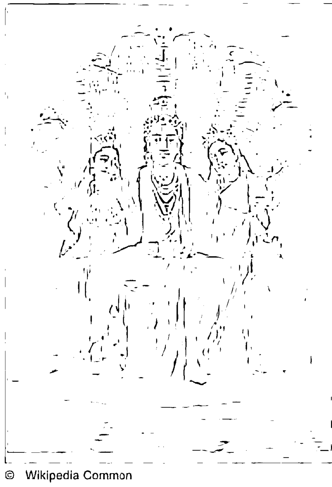

毗濕奴是印度三大神中的保護神。祂有四隻手，分別拿著神螺、神盤、神杵和蓮花。祂還有一把神弓和一把神劍。除了神鑰以外，祂有時也坐在蓮花上。

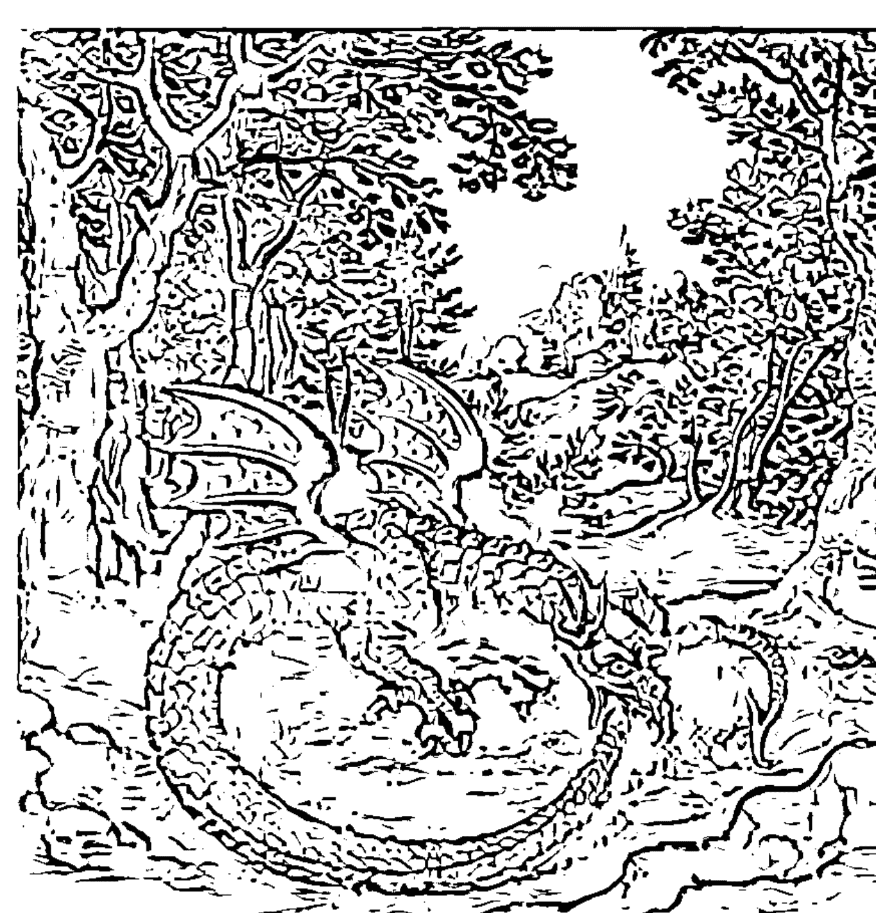

© Wikipedia Common

▲ 衔尾蛇中的「吞噬」，是炼金术士进行物质转换的过程

除了在世界各大洲的神话中出现，衔尾蛇对于炼金术士也有十分重要的意义，他们之中的不少人还在手上佩戴衔尾蛇戒指。衔尾蛇的形象，和炼金术士们的想法有极大的相似之处。衔尾蛇不断吞食自己的身体，但同时又不断有新的部分长出来，这个过程中并没有新的东西被创造出来，而是某种新旧的循环；在炼金术士的观念中，世界上的各种物质在本质上是完全一样，都由「基本元素」组成，只不过在经过不同的方法和过程之后，就呈现出各种各样的形象，而衔尾蛇中「吞噬」的动作，正是炼金术士进行物质转换的过程，每一次的「吞噬」就会带来一种他们期望的物质，只要掌控好「吞噬」，那炼金术士们自然也就无所不能了。

## ◎ 跨領域的神秘蛇環

人類歷史中，銜尾蛇先後出現在神話、宗教，以及煉金術中，彼時的人類只知道銜尾蛇神秘且難以捉摸，但並沒有想過牠可能是我們內心某些東西的投射，直到近代心理學的出現，才做出了某些合理解釋。

榮格（Jung）² 是一位著名的心理學家和精神分析師，他出生在二十世紀末的瑞士，一生著作無數，為世界心理學的發展做出極大貢獻，其中的「原型理論」是他最為重要的成就之一。

人們會對一些他們自己未曾經歷的東西感到害怕，例如人對於黑暗就有與生俱來的恐懼，在榮格的理論中，這源於人類祖先早期的經歷：他們經常在黑暗的森林中被猛獸襲擊身亡，他們在黑暗中看不到方向，所以也無法保護自己的安全。這種對於黑暗的恐懼，雖然並不是某種生物性的遺傳，但是卻像一些「碎片」一樣留在人類

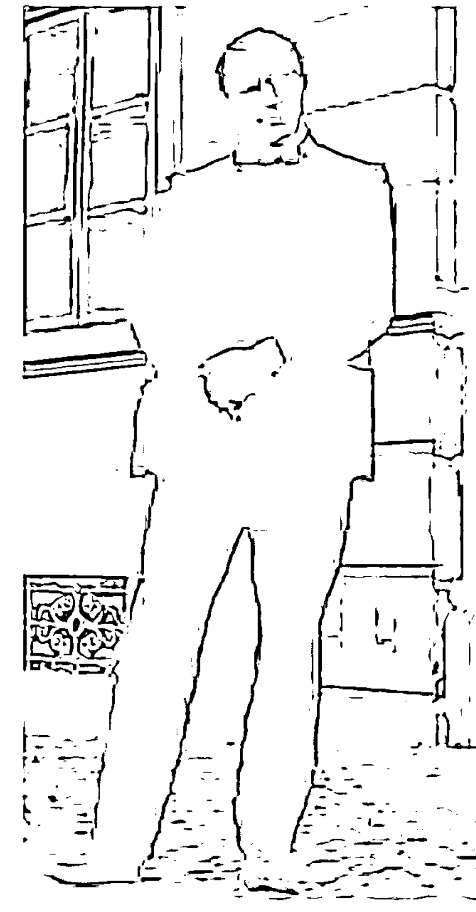

© Wikipedia Common
▲ 著名心理學家與精神分析師
榮格

的腦中並漸漸積累，即便到了今天人類也會本能的對黑暗有所懼怕。在這個例子中，恐懼的「原型」就是黑暗。

當提到銜尾蛇時，牠其實也是恐懼的「原型」之一，遠古人類的生存環境遠沒有今天這麼安全，每時每刻都和猛禽野獸相伴，當然也有匍匐在地的蛇。蛇的運動方式非常特別，而且牠的動作也非常隱蔽，這使得人類遭受蛇類襲擊的可能性非常大，加之許多的蛇帶有劇毒，一旦被咬就等於被宣判死刑，久而久之，蛇在人類的印象中就成了死亡的象徵。因此，做為一個令人懼怕的「原型」一直存在人類的腦中，這就很好地解釋了為什麼有的人即便從來沒有見過蛇，也會對這種生物避而遠之。

榮格的理論對於銜尾蛇的解釋並不停留在「恐懼」上，這個詭異的符號還展現著人內心的貪欲，對於物質、榮耀等的極大渴求，使人們不斷地尋找和獲取，這樣的行動也永遠沒有停止的時候。當外界已經無法滿足這種欲望時，像銜尾蛇這樣「自我吞噬」的行為就會發生。

² 榮格（1875-1961），瑞士著名心理學家，心理分析學的創立者。

157
Chapter 3
神話還刻

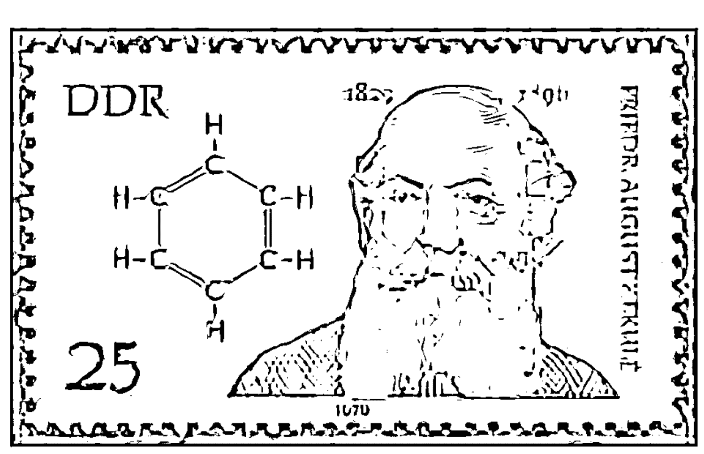

© Wikipedia Common

△ 德國化學家凱庫勒誕生一百五十週年紀念郵票

除了心理學以外，銜尾蛇在科技史上也有著自己的獨特「貢獻」，而且這種貢獻出現的方式還很特別，那就是夢。

十九世紀中葉，隨著石油化工工業的發展，對於有機化學的研究也隨之蓬勃發展。苯在有機化學中是一種十分重要的原料，其中含有六個碳原子和六個氫原子，科學家們當時一般認為碳原子是依次相連成為一條直線，碳原子是四價而氫原子是一價，這就意味著一個完全自由的碳原子可以和四個氫原子相連。問題來了：首尾兩個碳原子可以連接三個氫原子，中間四個碳原子即便除去左右兩邊連接的碳原子，還可以連接二個氫原子，這樣計算下來，苯當中的氫原子數量應該是十四個才對，不應該是六個。

關於苯的難題困擾了科學家們很久，同樣受到困擾的還有來自德國的化學家凱庫勒（Kekule），他在之前的研究工作中一直都很順利，卻唯獨在苯的結構問題上遲遲無法突破，不管怎樣的日思夜想都難以得出合理的解釋。

一天，凱庫勒正坐在爐火面前撰寫論文，也許是因為疲倦，他漸漸進入夢鄉。在夢中，凱庫勒天天為之思慮的苯化身為一條蛇，而且漸漸的這條蛇形成了一個環狀，用頭咬住了自己的尾巴，成為一條「銜尾蛇」。凱庫勒恍然大悟般從夢中驚醒，他也一下子從這條蛇得到了最終答案：苯的結構根本就不是一條直線，而是一個封閉的環，其中每一個碳原子分別和相鄰的碳原子以一價和二價相連，便形成了一個正六邊形，自然也就只能和六個氫原子結合了。至此，關於苯的結構問題也就迎刃而解。一向充滿神秘和宗教意味的銜尾蛇，也在科學的歷史上扮演了一次「解惑者」的角色。

³ 凱庫勒（1829-1896），德國著名化學家，首次提出原子結構立體排列的理論，把原子結構從二維推向了三維。

## 荷魯斯之眼——木乃伊上的重生之眼

在提到眼睛的時候，人們最容易想起的一句話就是「眼睛是靈魂之窗」，它不僅帶領我們看到這個星球的廣袤多彩，同時也一點一滴地透露著我們豐富的內心世界。的確，當人的感情發生變化時，最迅速也最易被察覺的反應就是來自於眼睛，所以也能常常聽到「悲傷的眼睛」、「歡愉的眼神」這樣的說法。眼睛裡的一個最細微變化，都能展現出人無比豐富的內心。

在下圖的這隻眼睛中，似乎很難找到一個準確的詞，來形容與它相連的心底究竟在想些什麼。雖然僅僅只是一隻眼，但彷彿能想像得到它的擁有者並沒有很明顯的表情，既不是悲傷，也不是愉快，有的只是平靜和肅穆。同時，這隻眼睛的目光並未與人交會，它只是凝視著遠方，而且相當專注，完全不受到周圍環境的打擾，就如同是在等待一個久未謀面的友人一樣。

這隻充滿神秘的眼睛，其實是來自遠古的埃及，它已經凝視了這個世界數千年之久，而它的主人，則是一位有著坎坷歷

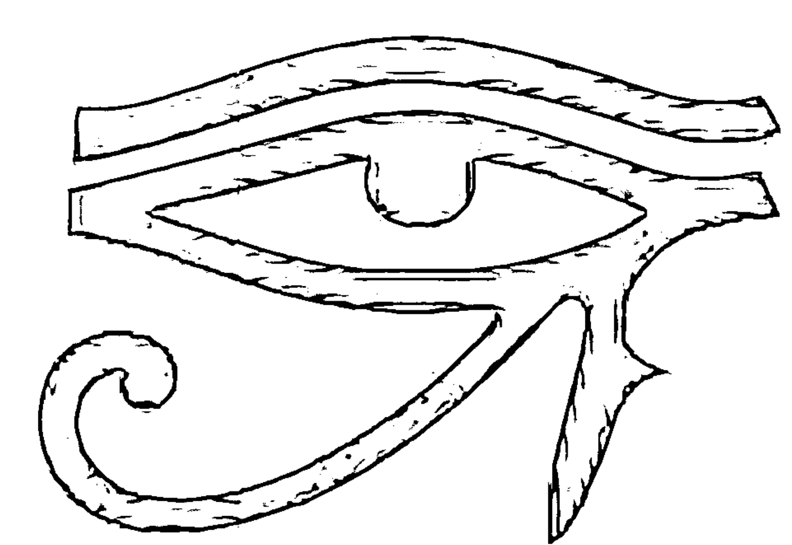

© Wikipedia Common
▲ 荷魯斯之眼

史的埃及神祇，祂的名字叫做荷魯斯（Horus）。

## ◎ 埃及的第一個木乃伊

在埃及神話中，最至高無上的神是太陽神拉（Ra），而埃及這片土地的統治者，就是由拉所派遣的，分別是奧西里斯（Osiris）和他的妻子伊希斯（Isis）。在這兩位賢者的帶領下，埃及人民安居樂業，年年也都風調雨順，整個埃及大地一片欣欣向榮。拉對於自己派出的兩個統治埃及的使者也很滿意。

就在日子一天天平穩過去的時候，一個命運的改變者來到了埃及，他就是奧西里斯的弟弟賽特（Set）。和英明神武的奧西里斯不同，賽特的身材十分矮小，而且長相也十分醜陋凶惡，去投靠自己的哥哥時相當落魄。不過，奧西里斯還是很好心地收留了自己的弟弟，並且給了他官職，讓他的生活安定下來。

一開始，兩兄弟之間還能和睦相處，但是隨著時間的推移，當看到哥哥擁有如此繁榮的國家和如此肥沃的土地，賽特心中的嫉妒之火開始愈燒愈旺，每天日思夜想自己怎樣才能獲得哥哥所有的一切。對於埃及王位的覬覦，最終使得賽特走上了一條殘忍的道路，他竟然勾結埃及的仇敵埃塞俄比亞（Ethiopia）人，最終在一次宴會上將奧西里斯毒殺。由於奧西里斯被害的時候尚無子嗣，於是埃及的王位就順理成章地傳給賽特。

奧西里斯死後，賽特還假惺惺地製作了一個豪華的棺材，用最上等木材，外面還裝飾了許多的黃金和珠寶，奧西里斯被放進棺材後，被丟進了尼羅河。賽特本來是希望河中的魚蝦可以將奧西里斯的屍體吃掉，但奧西里斯的棺材最後卻漂進了一片叢林，並且被伊希斯發現。伊希斯本來想守著自己丈夫的屍體等待他復活。但不幸的是，就在奧西里斯復活的那一天，卻被外出打獵的賽特發現，這一次賽特做得更加殘忍——他把自己的哥哥再次殺死，分屍十四塊，並將其分散在埃及的各個角落。後來，在掌管亡者靈魂的阿努比斯（Anubis）的協助下，伊希斯將奧西里斯的軀幹一一找到，並全部混在一起做成了世界上第一個木乃伊。而更為重要的是，就在奧西里斯復活的唯一一天裡，伊希斯為他生下了一個孩子，他的名字就是荷魯斯。

荷魯斯從小便被母親帶離埃及，而且直到成年之後，伊希斯才告訴他

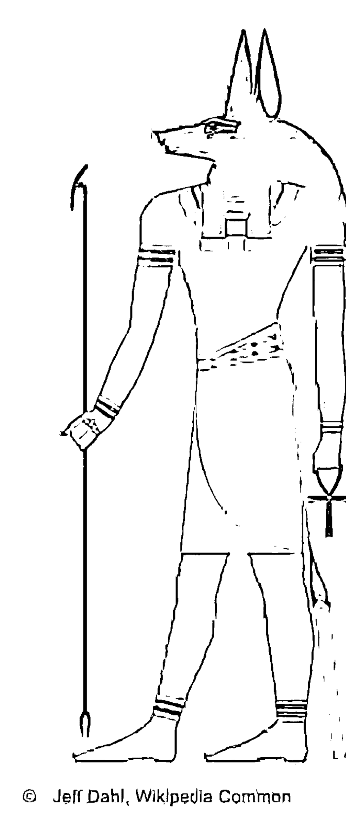

父親被害的整個過程。荷魯斯在聽後本來想立即趕回埃及為父報仇，卻被伊希斯攔住，因為她清楚自己年輕的兒子還不是賽特的對手。荷魯斯聽從母親的勸告，開始在各地遊學，分別遇到了音樂和舞蹈之神貝斯（Bes）、蒼天女神努特（Nooter）、大氣之神舒（Shu）、月神柯恩斯（Khons），以及萬神之神拉神。在漫長的遊歷過程中，荷魯斯虔誠地學習，不僅獲得了智慧和勇氣，還找到了父親當年使用的權杖，復仇時機終於成熟。

在母親的鼓勵下，荷魯斯乘船回到埃及。此時的埃及在賽特的統治下，正處於水深火熱之中，民眾也非常希望回到以往的時代，於是紛紛前來投靠荷魯斯，荷魯斯便率領著自己的軍隊一路勢如破竹地殺到了底比斯城（Thebes），那裡正是賽特的巢穴。

為了抵抗荷魯斯，賽特用魔法將自己的士兵變成了河馬和鱷魚，自己則化身成一頭兇猛的豺狼。這場殘酷的戰爭持續了三年之久，在最後一次戰鬥中，依靠來自父親的神奇力量，荷魯斯飛上天空化為帶雙翼的太陽圓盤，用手中的權杖將賽特擊殺。拉在看到這場戰爭之後，被荷魯斯的勇氣和智慧所感動，將其任命為埃及新的國王，而埃及也重新恢復了往日的繁榮和寧靜。

## ◎ 荷魯斯之眼

埃及神話中荷魯斯的形象，有著人的軀幹和鷹的腦袋，只有一隻眼睛，而另外一隻眼睛正是在和賽特的戰鬥中失去。傳說荷魯斯的左眼和右眼分別代表月亮和太陽，在最後的戰役中，荷魯斯撕掉了賽特的一條腿，而賽特則奪走了荷魯斯的左眼，這樣一來也引起月神柯恩斯的憤怒，於是加入戰鬥幫助荷魯斯。最終荷魯斯獲得勝利，他也把自己的眼睛搶了回來，但荷魯斯並沒有將這隻左眼放回到原來的位置，而是將其獻給自己的父親——此時已經成為冥界之王的奧西里斯。

關於荷魯斯之眼，還有另外一種說法：荷魯斯在戰鬥中被賽特打瞎了左眼，他的母親請來智慧之神多特（Dout）為他治療。儘管多特醫術高明，但是要治好荷魯斯受傷的眼睛，必須找到並且拼湊好所有眼睛的碎片。在醫治過程中，絕大部分的眼睛碎片都被找到，而且多特還利用自己在數學和幾何方面的知識，將其組合成原來的形狀，但始

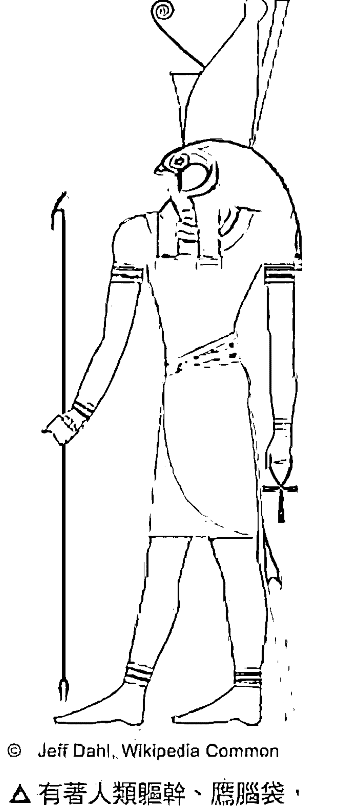

終有一塊只占眼睛六十四分之一的碎片找不到，幸好多持有神奇法力，最終還是幫助荷魯斯補好了眼睛。

正因為這個傳說，古代埃及人將荷魯斯之眼做為防止災難、疾病和厄運的標誌，不僅將它刻在石柱上，也印在藥物和醫生用的紙卷上。由於埃及人刻畫的荷魯斯之眼的形象，和拉丁字母「R」很像，所以在後來的流傳過程中，人們漸漸忘了荷魯斯之眼，而記住了更為簡單明瞭的「R」，並且直接將其用在醫學上面。於是，直到現在我們依然可以看到在醫生開的處方箋和某些藥物包裝上，會有「R」這個標誌，其實就是來源於荷魯斯之眼，深層的涵義就是代表著「治癒」。

在更多時候，人們其實並不清楚荷魯斯之眼和醫療救治的關係，更加廣為人知的意義是「勇氣」、「毅力」以及「不畏艱險」等，這也讓很多人選擇將荷魯斯之眼紋在自己的身上，以期望從中獲得面對困難的力量。而在現代，荷魯斯之眼不僅只限於在埃及，在世界很多地方都可以看到它的身影，人們也都將其公認為是勇氣的最好象徵。

## ◎ 神秘的全視之眼

儘管有諸多神明的庇佑，埃及還是在後來慢慢衰落，不過它的許多文化遺產卻並未消失，其中就包括荷魯斯之眼，這個積極向上而又略帶神秘的符號最初在地中海沿岸傳播，之後也出現在歐洲大陸以及中東地區。在荷魯斯之眼向各個地區傳播的過程中，它的本來意義都得到了很好的保存，也沒有人去惡意地曲解它，不過令人意外的是它卻成了另外一個符號的最初源頭，那就是所謂的「全視之眼」。

義大利畫家蓬托爾莫（Pontormo）一幅創作於一五二五年，名為《以馬忤斯的晚餐》的畫作中，在耶穌的上方，有一個特別明顯的三角形標誌，三角形中還有一隻睜得大大的眼睛，這個三角形標誌的外圍放射著光芒，這個標誌就是來自於全能上帝的「全視之眼」。

畫中人物個個表情專注地看著耶穌，似乎沒有察覺到全視之眼的存在，而上帝也正是用此種方式監視著世間發生的一切。另外，將上帝的眼睛放置在三角形，而不是菱形或者是其他圖案中，也是有特定原因的。「三」這個數字在基督教中代表的是「聖父」、「聖子」和「聖靈」三位一體的概念。

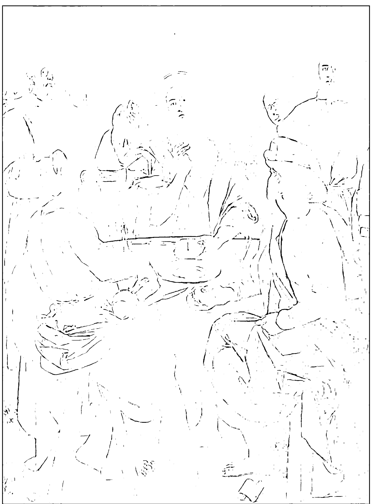

© Wikipedia Common

△ 《以馬忤斯的晚餐》中耶穌上方的全視之眼

167

Chapter 3

神話遺刻

「全視之眼」在中世紀以及之後的文藝復興時期流傳了很久，但在《以馬忤斯的晚餐》這幅畫中，才第一次出現具體表象。大部分學者都持有這樣的觀點：曾經居住在埃及的猶太人將荷魯斯之眼做為一個符號帶回歐洲，而在猶太人自己的宗教中，上帝一直是神秘而沒有具體形象的，但同時又無處不在，而一隻神秘而又略帶嚴厲的眼睛，成了一種代表上帝存在的不錯選擇。於是，在此基礎上，又經過後來的煉金術士以及神秘學家的改造，就成為了現在我們看到的全視之眼。

全視之眼也常在歷史上的一些重要場合出現，最著名的就是《人權宣言》（Declaration of the Rights of Man and of the Citizen）。一七八九年，法國正處於大革命時期，《人權宣言》也誕生於這一年，它最重大的意義在於第一次闡明「人權天賦」的真理，也宣告了資本主義的強勢崛起。在《人權宣言》的上方，除了有自由女神之外，還有一個非常明顯的全視之眼，它似乎是在向人們表明：上帝洞悉世上發生的一切事情，對於違背由祂所賦予的人類基本權力的，祂也一定不會姑息。

全視之眼甚至還出現在美國的國徽和一元紙幣中，這兩者的基本圖案沒有差別，都是一個未完工的金字塔上放置了一隻凝視遠方的眼睛。由於美國國徽的設計者佛蘭克林（Franklin）是共濟會的會員，而在十九世紀到二十世紀人們又普遍認為共濟會懷有陰

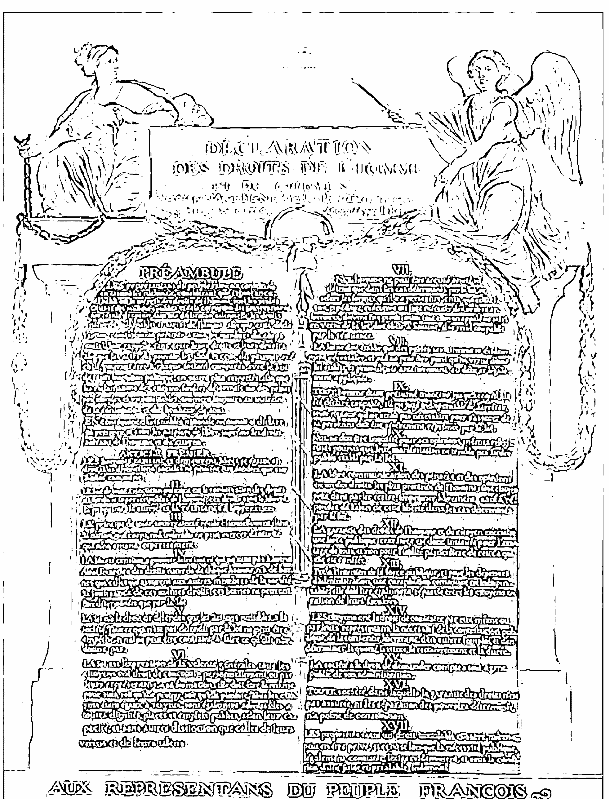

© Wikipedia Common

△ 《人權宣言》中的全視之眼

169

Chapter 3

神話遺刻

謀，於是不少人一直猜測這個符號象徵著共濟會想要控制美國的圖謀。不過，共濟會到一七九七年才開始使用帶有眼睛的標誌，而美國國徽早在一七七六年就已經被設計出來，所以這種陰謀論的推斷是不成立的。但可以肯定的是，國徽和美元裡的全視之眼的確是在象徵上帝對世間的監督。

全視之眼在許多宗教場合也可以看到，這和荷魯斯之眼完全不同，荷魯斯之眼的宗教色彩並不濃厚，它只是來自於神話，人們也許並不知道荷魯斯和埃及曾經發生過什麼，甚至連荷魯斯是誰都不知道。但是，如果他們相信這隻特別的眼睛能給自己帶來力量和勇氣，那麼荷魯斯之眼的意義，也就得到完全的展現了。

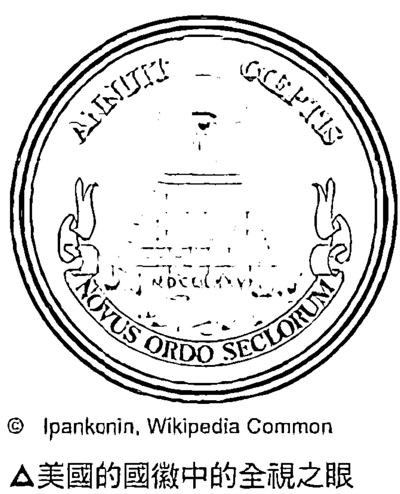

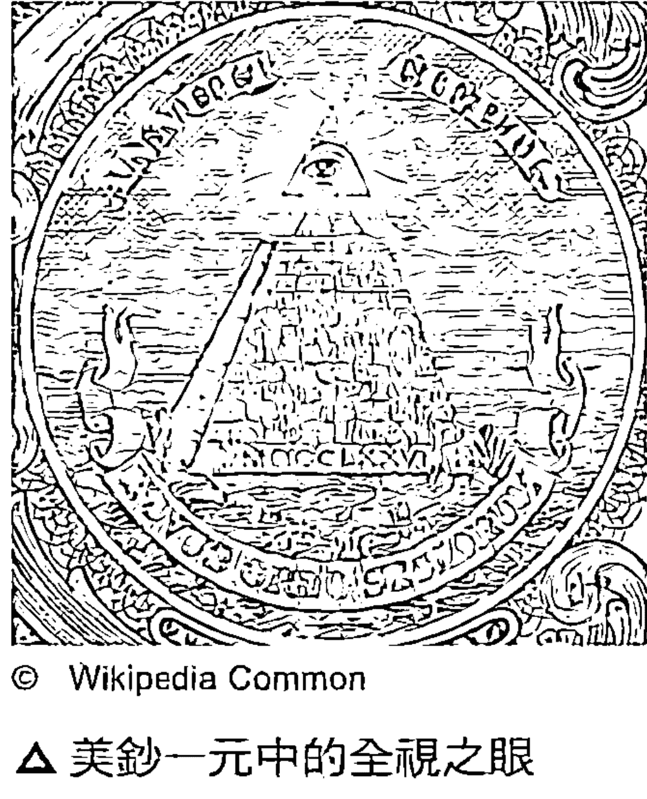

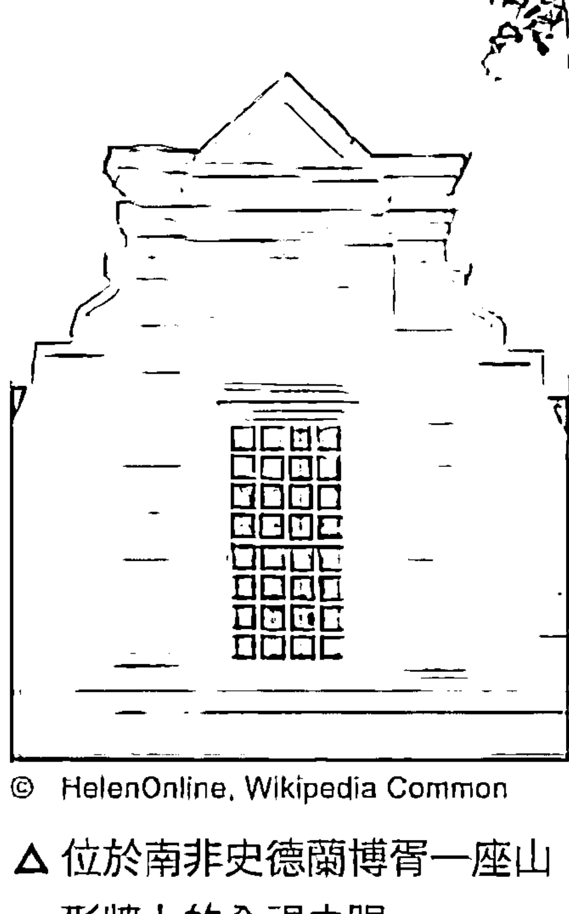

## 蛇杖——「生命之星」的靈魂

追溯歷史，如果《聖經》的描述都是真的，那麼人類接觸到的第一種動物，既不是牛、豬、羊之類的家畜，也不是貓、狗這樣的寵物，而是那條悄悄溜進伊甸園的蛇。蛇的確非常特殊：牠是陸地上非常罕見沒有腳，但移動速度快、動作敏捷且攻擊力強的動物。因為蛇的怪異形狀和帶毒的獠牙，也因為牠是《聖經》中魔鬼撒旦的化身，所以人們一直都對牠沒有好感，甚至還有著深深的恐懼。

總體而言，蛇給人類的印象以負面居多。不過，矛盾的是，人類卻會把蛇做為一些嚴肅議題的標誌，例如做為醫學方面的標誌。這與人們的慣例並不符，通常能夠選入做為標誌性的動物，不是憨態可掬如大熊貓，就是威武雄壯如獅子，又或者是英勇神氣如老鷹，蛇在以上的每一個方面都不符合條件，卻依然擁有特殊的地位，出現這樣的局面，其實是有著深遠歷史淵源。

## ◎ 活躍在神話裡的神秘動物

地中海東岸處在歐亞非大陸的連接處，這三個大洲都各自擁有輝煌的文明，也讓這個地方成為盛產神話的沃土，以蘇美爾人（Sumer）為例，在這個信奉多神制的民族中，神祇多達上百個，這些神祇也各自劃分統治區域，為不同的區域庇佑賜福，而其中一位叫做寧吉什西達（Ningishzida）的保護神，正是蛇杖的最早發明者。

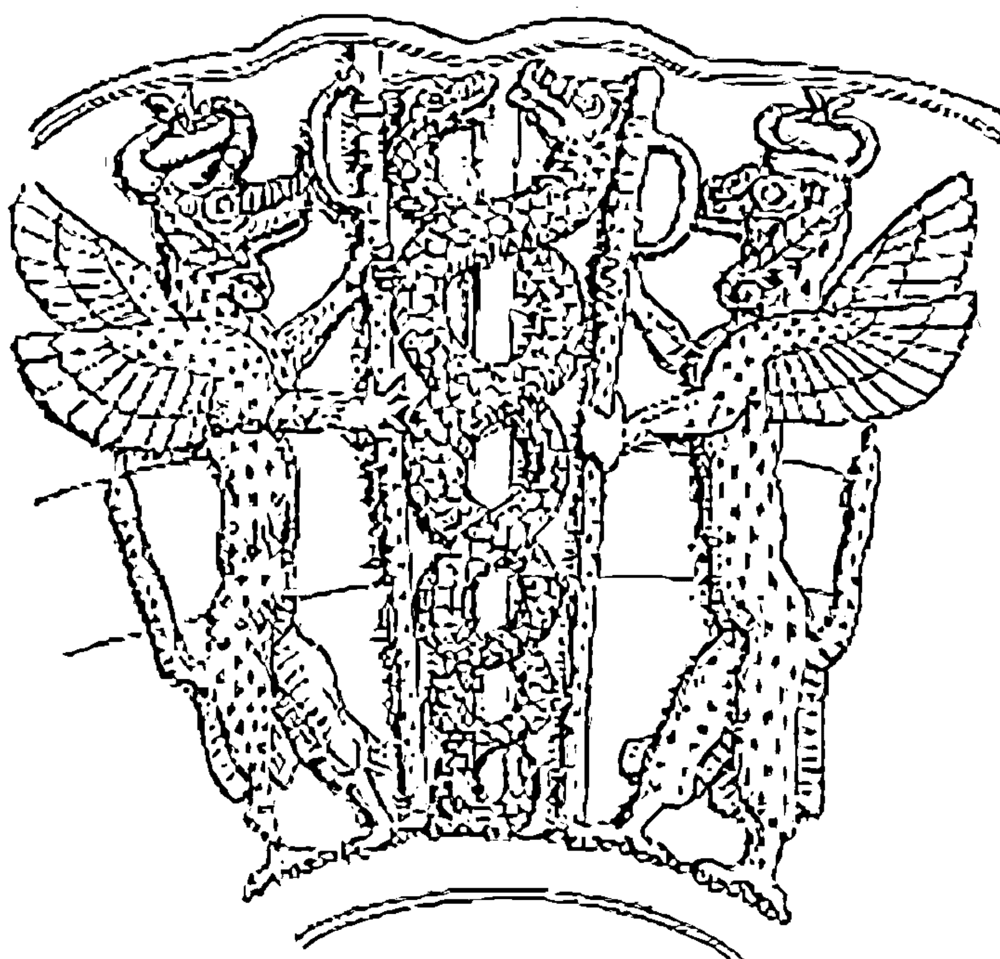

© Wikipedia Common
▲ 蛇杖最早起源——蘇美神祇寧吉什西達

在蘇美爾的神話當中，寧吉什西達的出生時間大概是西元前四千年，掌管著醫藥和冥界，同時祂也是土地和富饒之神。在蘇美爾的拉格什（Lagash）地區出土的一件陶罐上，曾刻有這樣的文字：獻給寧吉什西達，拉格什的神，保佑祂壽命延長。可見，「拉格什」是寧吉什西達的守護地區。而在當地出土的泥板上，寧吉什西達有時會被描繪成人首蛇尾的樣子，而在更多時候，寧吉什西達的形象是一個肩上纏繞著兩條蛇的男

## 蛇杖的起源與演變

性。另外，在蘇美爾的語言中，寧吉什西達代表的涵義是「樹王」，蛇盤繞著這棵「樹」的形象，就是蛇杖最早的起源。

由此可知，蛇杖在初期的時候就是以「雙蛇杖」的形象出現，而現在則以「單蛇杖」較為常見，這樣的變化發生在後來的希臘，同樣來源於神話。

阿斯克勒庇俄斯（Asclepius）是太陽神阿波羅（Apollo）和科洛尼斯（Koronis）的兒子，傳說其母親在懷孕時愛上了一個凡人，使得阿波羅震怒，便派自己的妹妹月神阿耳忒彌斯（Artemis）將她射死。在科洛尼斯火化時，阿波羅從火中將還未出生的阿斯克勒庇俄斯救出，並將他交給賢人喀戎（Chiron）撫養成人，並且師從喀戎學習醫術和狩獵。

隨著時間推移，阿斯克勒庇俄斯的醫術愈來愈精明，不僅可以挽救瀕死的病人，甚至還能施展神蹟讓死人復活。這樣的情況讓天神宙斯覺得很沒面子，因為阿斯克勒庇俄斯幾乎擁有了原本為他獨占的「不朽」力量。同時，宙斯還掌管冥界，阿斯克勒庇俄斯的醫術也讓冥界變得空蕩。最後，出於嫉妒，宙斯將阿斯克勒庇俄斯用雷電劈死，並將其父阿波羅貶至凡間修築城牆。事後，宙斯又感到後悔，不僅讓阿斯克勒庇俄斯復活，還將他提升為醫藥之神。

後來，在一次行醫過程中，阿斯克勒庇俄斯陷入沉思中，此時一條蛇爬上了他的手杖，當祂把蛇殺死以後，另外一條蛇口中銜著草藥來到死掉的蛇身邊，已經死亡的蛇竟然復活了過來。這一幕讓阿斯克勒庇俄斯有所領悟：蛇長期貼地行進，對於地上各類草木的性質都異常熟悉，因而對於哪些草藥具有起死回生作用牠們也很熟悉。蛇在阿斯克勒庇俄斯面前所展現的神奇，讓祂意識到蛇是一種充滿靈性的動物。

自此以後，阿斯克勒庇俄斯在行醫的時候不僅會帶著手杖，手杖上還多了一條緊緊纏繞的蛇。

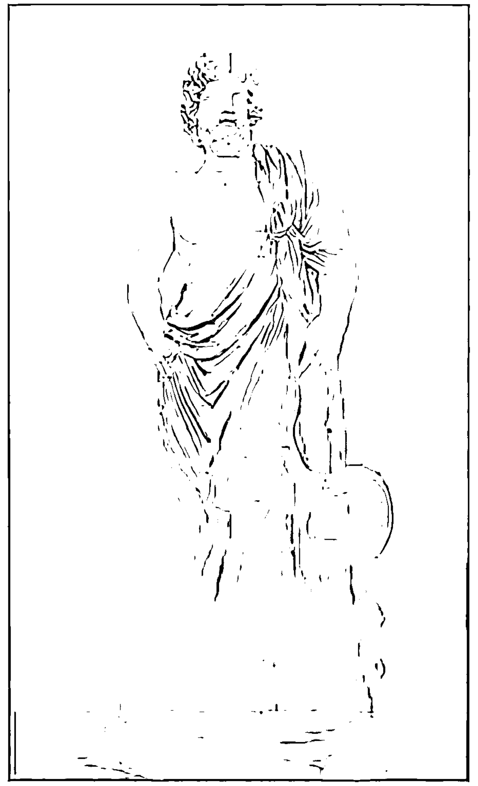

© Original file by Michael F. Mehnert, Wikipedia Common

▲阿斯克勒庇俄斯手杖上緊緊纏繞的蛇

## ◎ 雙蛇杖和單蛇杖分家

在希臘諸神中，除了阿斯克勒庇俄斯，另外一位神祇也使用蛇杖，祂就是大名鼎鼎的赫爾墨斯。在傳說中，赫爾墨斯是希臘十二主神之一，最主要的任務是為天神宙斯送信，除此之外，祂還是運輸、畜牧之神，同時也是商人的保護神。

當赫爾墨斯還在襒褒中時，祂就已經做了一件非同凡響的事：偷走太陽神阿波羅的五十隻羊。被一個小孩子偷走這麼多隻羊，讓阿波羅臉上無光，於是就氣勢洶洶地來到宙斯面前要求祂嚴懲赫爾墨斯。不過，宙斯對於赫爾墨斯是有偏愛的，赫爾墨斯自己也明白如果和太陽神繼續作對下去是沒有好處的，於是祂選擇主動和解，在得知阿波羅對音樂有特別的熱愛之後，就獻上了自己的最新發明——七弦琴。這一招果然奏效，阿波羅完全被七弦琴演奏出來的音樂所迷住，高興之餘不僅沒有再追究赫爾墨斯，還贈送祂一支雙蛇纏繞的手杖，這就是赫爾墨斯手中雙蛇杖的來歷。

除了和太陽神阿波羅的過節以外，赫爾墨斯的雙蛇杖還有另外一個來歷。一次祂外出時，見到兩條蛇正在纏鬥，於是便扮演調停人的角色，將自己的手杖插到兩條蛇中間，再加上赫爾墨斯本身是個能言善辯的人，兩條蛇很快就停止爭鬥，而且還順著赫爾墨斯的手杖爬了上去，於是就成為今天看到的雙蛇杖符號。

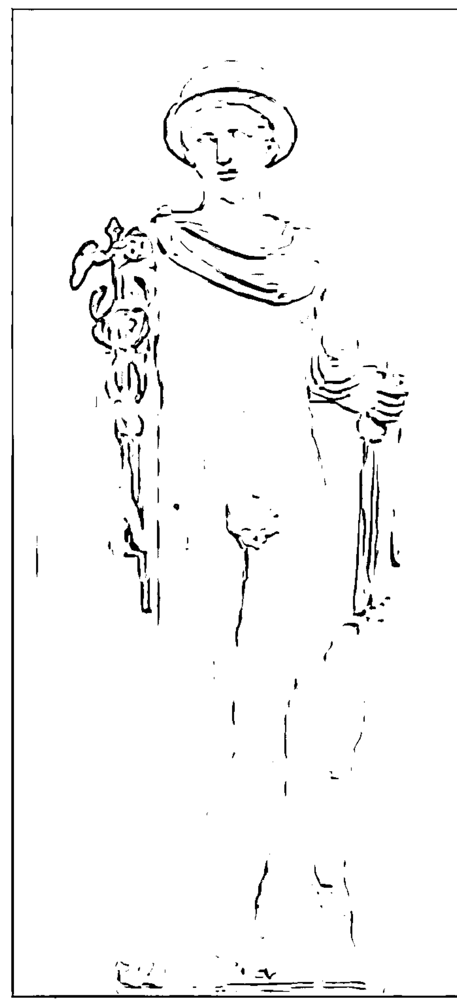

© Wikipedia Common
△ 赫爾墨斯手杖上盤繞的兩條蛇

另外值得一提的是，赫爾墨斯是位行動敏捷，身手矯健的神祇，所以成為行路者和商人的保護神，而祂偷盜阿波羅羊群的歷史，則讓後世的小偷們把祂奉為祖師爺。赫爾墨斯的典型形象中，頭和腳上都有雙翼標誌，甚至連祂拿的蛇杖頂端都有一雙翅膀，這代表著祂在諸神之中是跑得最快的。

當然，赫爾墨斯也成為自雙蛇杖出現以來，名氣最大的使用者，這也讓單蛇杖和雙蛇杖徹底分家。

## ◎ 先知摩西和生命之星

摩西（Moses）是猶太人在西元前十三世紀的領袖，也是《聖經》前五章的執筆者。當時猶太人生活在埃及，由於繁衍迅速引起埃及人的擔心，埃及法老也開始有預謀地迫害猶太人。傳說在這個時候，耶和華向摩西顯現，指定他將帶領猶太人走出埃及這片苦難之地，並成為猶太人的領袖。這項艱鉅的任務讓摩西感到猶豫，因為他擔心自己沒有權威，人們根本不會相信他。

耶和華便命令摩西將手中的枴杖扔掉，手杖一掉到地上就變成了一條蛇，此時耶和華又命摩西把蛇撿起來，當摩西一碰到那條蛇，又瞬間變回手杖，在擁有這樣的神奇法力之後，摩西很快得到猶太人的信任和擁戴。

在耶和華的幫助下，摩西已經預見埃及人將對猶太人進行屠殺，於是在騙過法老之後開始帶領猶太人離開埃及。當來到紅海的時候，猶太人遇到了大麻煩，他們沒有任何船隻可以渡海。眼前是汪洋大海，背後是埃及人的追兵，就在這樣的絕境中，耶和華再次顯靈，讓摩西舉起蛇杖，面前的海洋竟然自動分開讓出一條道路，這一神蹟讓猶太人安全到達耶和華應允的迦南地（Canaan），種族得以存續。

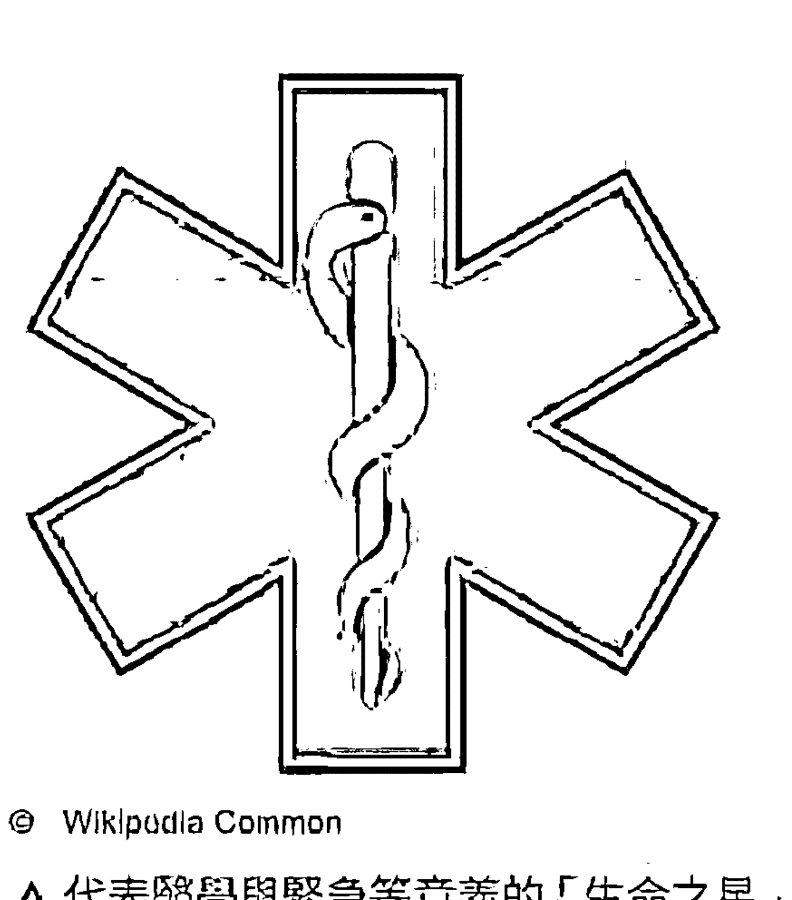

© Wikipedia Common

▲ 代表醫學與緊急等意義的「生命之星」

從摩西的故事可以看出，如果沒有蛇杖，猶太人就無法逃出埃及，現代世界也將缺少一個優秀民族。因此，猶太人對於蛇杖也有著深厚的感情，在他們眼中蛇杖就象徵著民族的繁榮，同時也象徵著生命，國際通用的「生命之星」符號正是源於這段古老的猶太民族歷史。

「生命之星」符號最初的設計是來自美國醫學組織（AMA），後來使用權轉讓給美國高速公路安全管理局（NHTSA），做為道路急救服務的標誌。

之後，美國交通部（DOT）找到美國醫學組織，詢問是否可以使用「生命之星」，因為他們曾經想在救護車上使用紅十字，但是被紅十字組織拒絕，轉而希望使用同樣代表「醫學」以及「緊急」等意義的「生命之星」。在得到肯定的回覆之後，這個以蛇杖為中心的藍色符號開始在救護車上出現，並且漸漸推廣到全世界。

如今，已不僅是醫院的救護車，在任何和緊急事務相關的飛機、車輛以及船隻上，都會使用「生命之星」，以表明自己參與的事務的特殊性。

## ◎ 蛇杖和近現代醫學

儘管兩位古希臘神祇都在使用蛇杖，但要問到誰手中的蛇杖和現代醫學有關時，那麼答案無疑是阿斯克勒庇俄斯，其本身的醫術和地位都是毋庸置疑的，而祂的整個家庭幾乎都是醫生，可以說是「醫學世家」。比如阿斯克勒庇俄斯的兩個兒子瑪卡翁（Makhaon）、波達利里俄斯（Podaleirios）是軍醫的保護神，而其餘的幾個女兒，則分別掌管著痊癒、健康、治療等。可以說，西方的醫學歷史就是從這一家發源的，而現代醫學符號中的蛇杖，也自然是來自阿斯克勒庇俄斯手中那根。

阿斯克勒庇俄斯死後，人們在希臘各地為祂建立寺廟，祂手杖上的蛇，也被認為是擁有神奇醫療效果的動物，於是人們在寺裡餵養了很多所謂的「聖蛇」，病人來到寺院後先給僧侶付錢，然後被帶到蛇面前餵食牠，僧侶並讓蛇舔舐病人的傷口，等到病人再在寺中住一晚之後，就可以痊癒回家了。在這樣的寺廟中，通常會有阿斯克勒庇俄斯的塑像，其中少不了祂手中的那根蛇杖，這些寺廟也成為世界上最早的正規醫院。

世界衛生組織的標誌中，整個地球被象徵和平的橄欖葉包圍，而中間部分就是蛇杖。一九四八年世界衛生組織召開第一屆大會，並確立了這個標誌，可見早在六十年前，整個世界對於蛇杖所代表的涵義，就已經有了完全的共識。

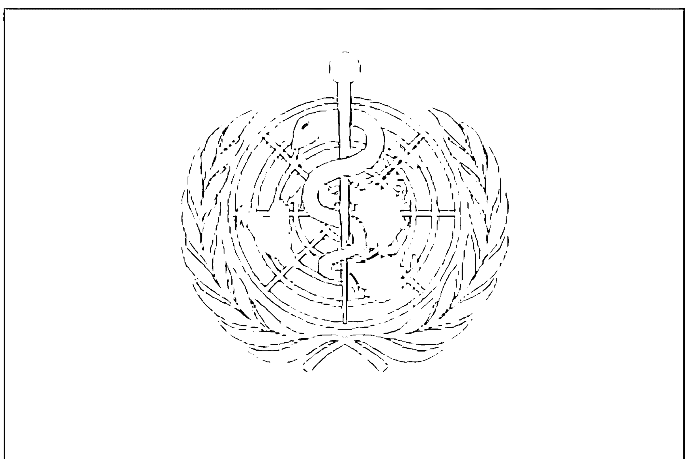

© Wikipedia Common

▲ 世界衛生組織標誌中的蛇杖

事實上，在一九四八年以前，世界很多國家和地區，就已經各自將蛇杖選作醫學標誌。美國陸軍早在十九世紀六○年代就將雙蛇杖加入自己的軍醫標誌，在那個紅十字尚未出現的年代，軍隊的醫療人員希望以這個符號向敵方表明：我是來救治傷患的，請不要攻擊我。

而選擇雙蛇杖來表達這層意思，也是有歷史淵源。神話中的赫爾墨斯從希臘傳入羅馬之後，被人們稱為「Mercury」，由於祂象徵迅捷的速度，所以祂手中的雙蛇杖也被軍隊的先鋒使用。古代的戰爭充滿騎士風範，都是光明正大地進行，交戰前還會先由雙方的先鋒彼此詢問情況——詢問進行的時候自然是不能攻擊對方的，於是雙蛇杖也有了「不要攻擊我」的涵義在其中，因此成為美國軍醫標誌的最佳選擇。

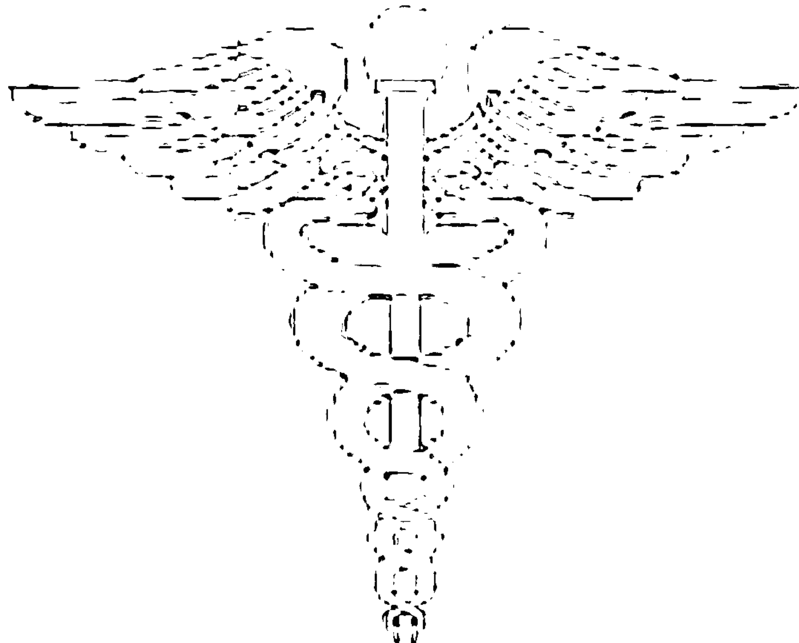

© Wikipedia Common
▲ 美國軍醫領章

除了神話以及歷史的原因，讓蛇在醫學中占有一席之地，還有另外一種說法：蛇每年都會蛻皮，這個過程對於蛇來說是很痛苦的，但每次蛻皮之後牠們也獲得新生，不管是體型上還是活力上，都要比之前提升很多，這樣的過程幾乎和醫療一模一樣，病人在經歷了醫治過程的磨難之後，也擁有一個健康而嶄新的身體。所以，沒有比蛇更合適的動物，來代表整個醫學。

## Kokopelli 符號——駝背的幸運之神

Kokopelli，一個神秘的印第安人——自古以來，大家就沒有見過他的正面，同時還有明顯的駝背，弓著腰地吹奏手中的豎笛，往前邁著輕快的步伐——似乎就是一個普通的印第安人形象，但實際上他卻是保佑著印第安土地的一位神祇。

## ◎ 美洲大陸最早的主人

要知道Kokopelli背後的故事，就必須先知道是誰創造了他。

在廣袤的美洲大陸上，最初並沒有原始居民，有科學家曾經提出北美印第安人就是原住民，但北美至今都沒有發現一塊原始人類的遺骨或者化石，所以這個觀點是站不住腳的。

現在普遍被大家所接受的看法是，在大約兩萬五千年前，生活在亞洲大陸北部的一些蒙古人，在跨過僅有四十公里寬的白令海峽（Bering Strait）後，來到今天美國的阿拉斯加（Alaska），並在之後不斷向南遷徙繁衍的過程中，形成了後來和今天的印第安人。

在今日印第安人的身上，也的確可以找到一些蒙古人的影子：孔武有力、身材高大，以及擅長狩獵。另外，在美洲北部的一些島嶼名稱，是從蒙古語演變而來，同樣證明了蒙古的確和美洲大陸有著某種程度的關聯。

由於整個美洲大陸面積廣大，所以在遷徙過程中印第安人陸續在各個地區落腳，形成了各自的部落和文明，其中一個分支叫做「普韋布洛」（Pueblo）。

普韋布洛人主要居住在今日美國的西南地區，還有一部分居住在現今的墨西哥境內。

在普韋布洛這個大的分支之下，還有一些小的分支，其中包括了霍皮人（Hopi）和祖尼人（Zuni）。做為同一個種族，他們自然也擁有一些相同的習俗，比如他們都以捕獵為生，會用獸皮做為自己的衣服而且很擅長編織。同時，由於缺水等客觀條件的限制，他們的主要糧食是玉米。除了上述這些之外，霍皮人和祖尼人還都在使用Kokopelli這個小人符號。

1 白令海峽，位於亞洲最東點的迭日涅夫角和美洲最西點的威爾士王子角之間，西經一六九度零分，北緯六十五度三十分，約八十萬五千公尺寬，深度在三十至五十公尺之間。

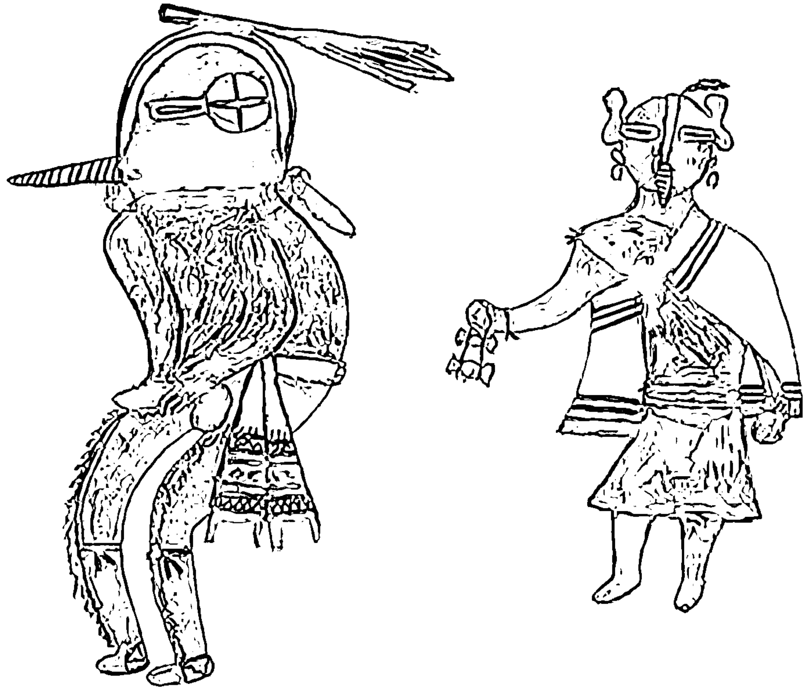

© Wikipedia Common

△ 霍皮人眼中的 Kokopelli 形象

## ◎ 帶來希望和豐收的小神仙

在霍皮人眼中，Kokopelli 的形象是一個背著袋子的人，頭上還長著像螞蟻一樣的觸角，他邊吹著笛子邊遊走在印第安人的各個部落之中。在 Kokopelli 的袋子裡，裝的不是別的，而是即將出生的小孩，也就是說，在霍皮人的傳統裡，Kokopelli 是他們的「送子神仙」，誰家要是有他光臨，在不久後必然會有一個新成員加入這個家庭。而未婚少女們則要避著 Kokopelli，生怕他悄悄在夜裡跑到自己家來，讓自己未婚懷孕，還好 Kokopelli 會吹著笛子到來，這也給那些少女們一個提前的「警報」。

不過，正是由於Kokopelli這種能為人帶來小孩的魔力，所以他也常常做為一個標誌，出現在印第安人的婚禮上。而到了現代，Kokopelli則出現在諸如戒指、項鍊、耳環這些象徵愛情的信物上。另外，霍皮人有的時候還會把Kokopelli描述成一個善於交際的女性角色。總之，只要有Kokopelli的出現，就能為某個地區帶來和諧以及熱鬧。

霍皮人通常將Kokopelli刻在岩石上，在他們的觀念中，Kokopelli只是一個帶來好運的小精靈，不算是什麼很嚴肅、厲害的大神，他們大可不必對他畢恭畢敬。所以時至今日，在美國西南部，依然可以在很多地方的岩石上看到這個小人。

而在另外一個部落，即祖尼人之中，Kokopelli是一個掌管四季的人，每當他吹響手中的豐笛，冬天所有的冰雪就會慢慢融化，春風則會吹綠整個大地，生機重新降臨在世界上。祖尼人和所有其他印第安人一樣，對於農業有著很大程度的依賴，如果某年的氣候不好，為他們的播種（尤其是玉米）帶來影響，那麼他們可能一整年都會餓肚子。更為關鍵的是，Kokopelli的笛聲還能召喚急需的雨水。因此，Kokopelli對於祖尼人而言相當重要，這也使得Kokopelli在每一次的豐收慶祝大會上都可看見他的身影，可以說，Kokopelli就是祖尼人的「豐收之神」。

祖尼人有這樣的傳說：Kokopelli背上的小袋子裡裝的，是來年糧食的種子，他一路走就會一路播種，笛聲傳到哪裡種就播到哪裡。如果去年大豐收就一定要回報Kokopelli，做法就是在耕種的土地上撒一些玉米粒，Kokopelli在收到這些回報之後，就會保佑這片土地在當年繼續風調雨順。

除了上述這些意義之外，Kokopelli在祖尼人的部落中，也同樣象徵著後代的繁衍，但他們並不認為部落的小孩是直接來自於Kokopelli的黑袋子裡。在祖尼人所留下的Kokopelli標誌中，他有一個很明顯的男性生殖器官，象徵著繁衍後代的能力，Kokopelli並不會直接帶來孩子，但是他存在於每一個祖尼部落的男性中，自然會讓整個部落人丁興旺。

而Kokopelli這個詞的來由，普遍認為是由「koko」和「pelli」兩個片語組成，在霍皮人和祖尼人共同的看法中，「koko」代表他們信仰的一位神靈，而「pelli」是他們用來稱呼沙漠中的一種飛蟲，這種飛蟲頭上長著觸角，背上還有硬殼，和Kokopelli小人的形象十分相似。當「koko」和「pelli」組合在一起之後，意思就是一位外形類似昆蟲、可以帶來幸運的神仙。

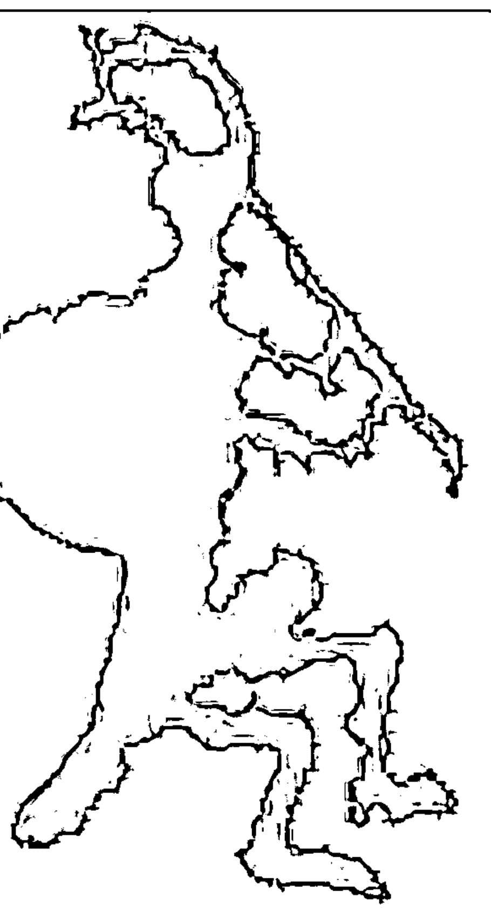

© Wikipedia Common

▲ 外形類似昆蟲的 Kokopelli

## ◎ 起源和發展

在霍皮人和祖尼人居住的地方往南，便是今天的墨西哥（Mexico）。在墨西哥的歷史上，名氣最大的文明當屬阿茲特克（Aztec）文明，他們不僅曾經建立起地域遼闊的國家，創造了令人驚嘆的科技和曆法，甚至還建造出可以比肩埃及的金字塔，而最初的Kokopelli形象，也是來自於阿茲特克。

由於阿茲特克文明的繁榮，所以也推動了它和周邊國家及部落的貿易，Kokopelli則正是一個外出做生意的阿茲特克人，他身上背著的包裹裡裝滿想要交易的貨物，每到一處就吹起豎笛，笛聲除了表明自己的友好意圖，也是在向人們發出進行貿易的邀請。久而久之，隨著阿茲特克人走遍美洲西部的印第安部落，Kokopelli也做為他們的形象而變得流行起來，印第安人有時直接就將Kokopelli看做是「貿易」的象徵。

2 阿茲特克文明主要存在於十四至十六世紀，是墨西哥歷史上最後一個輝煌的古文明。

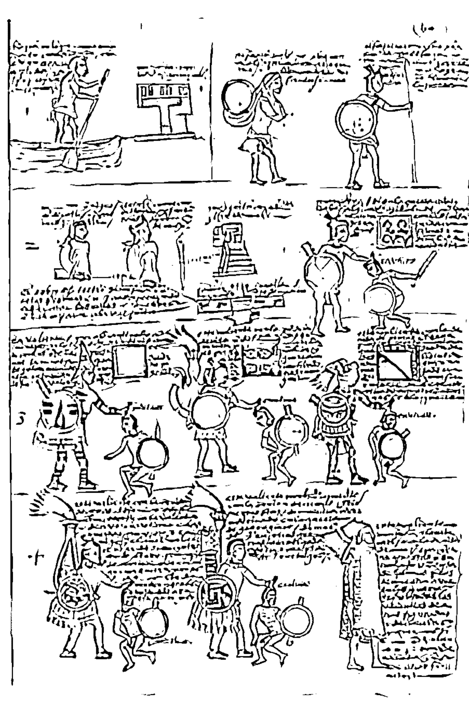

© Wikipedia Common
▲ 不同等級的阿茲特克人

在後來的發展中，阿茲特克文明逐漸衰落，直至完全消失，但印第安人卻繼續平穩地發展下去直到現在，Kokopelli也被印第安人所保留。隨著時間的推移，印第安人還賦予Kokopelli更為廣泛的涵義，例如Kokopelli不再只是指做貿易的商人，如果是從遠方帶來資訊、新聞甚至是小飾品的人，都可以被稱作Kokopelli。所以，現今美國西部的某些地區，還是會把帶來好消息的人叫做Kokopelli。

在從阿茲特克人那裡繼承了Kokopelli這個形象之後，印第安人逐漸讓他變得更具有自己的民族特色，最明顯的就是他的髮型。不僅如此，印第安人還發展出自己關於Kokopelli的傳說。據說Kokopelli是太陽神巡視人間的使者，他和太陽神作息的時間剛好相反，每到夜幕降臨的時候，他才開始工作，皎潔的滿月下是見到他的最好機會。太陽神在白天可以親自監視凡間的各種情況，但在休息之後就會讓Kokopelli出來。

最初由於Kokopelli外形長得像昆蟲也很弱小，所以人們根本不重視他，而且那個時候他手中也還沒有豎笛，在向太陽神訴苦之後，Kokopelli得到了一支具有魔力的豎笛，只要它一響起幸運就能降臨在人們之間，久而久之，印第安人也發現了Kokopelli和他的笛聲能源源不斷的好事，於是也就愈來愈歡迎他。

發展到今天之後，Kokopelli已經成為印第安文化最具代表性的符號之一，而且由於其象徵的是好運以及希望，加之其形象本身也很快，所以在世界各國都受到歡迎。你可以在動畫片裡看到Kokopelli，你也可以看到以Kokopelli命名的服裝品牌行銷世界，還有的食品包裝上也會有Kokopelli的身影，甚至某些在美國舉辦的國際性運動會會旗上，也能看到以Kokopelli為主要形象的標誌。從上述這些例子中，足以看出Kokopelli的影響力，他不像其他的某些符號那樣，十分神秘還帶有一絲恐怖色彩，他所呈現的是一個可愛還帶有些調皮的幸運神形象，受到人們的喜愛也就是自然而然的事情了。

## 驚異！世界史：神秘符號

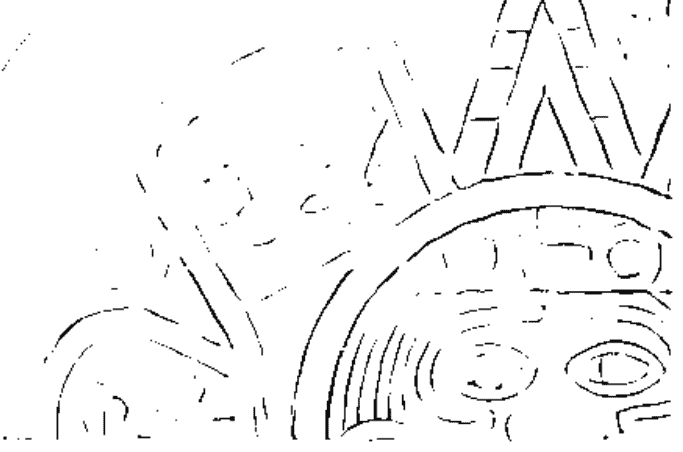

## 傳奇之門

## 世界各 地 神 秘 組 織 符 號 —— 凝 眾 之 靈

人類是群居動物，在尚處原始社會的時候，不管是外出狩獵還是建造住所，都需要數個、甚至更多的人一起完成，也只有這樣才能共同抵禦充滿未知和凶險的大自然。可以說，人類群聚生活的傳統，幾乎是伴隨著人類誕生就已經存在了。

國家是當今社會最常見，也最具有代表性的「團體」，到今天為止，被全世界所承認的國家一共有一百九十七個，但是嚴格意義上的「國家」的出現，卻只是近兩、三百年的事情。

在更早以前，存在的只有國王和君主，土地也被視為他們的私有財產，他們統治下的王國雖然是現代國家的雛形，但是組織上還很鬆散，於是給中下層的民眾留下了廣闊的空間，許多民間的組織也得以發展起來。

彼時的民間組織，由於未開化或者是科技水準的落後，往往會融入大量的宗教以及超自然的元素，加上它們通常有著悠久歷史，於是在現代人看來具有相當的神秘感，而它們各自的標誌和符號，更是這種神秘感的最佳體現。

## ◎起源於遠古石匠的神秘組織——共濟會

就影響力而言，世界上沒有任何一個神秘組織可以超越共濟會，不僅因為它的成員名單上，有許多大名鼎鼎的人物，更因為它的歷史甚至比許多宗教都要長，在長達五千年的歷史中，共濟會將自己的影響力傳播到世界每個角落，生命力之強遠超過許多文明古國，直到今天你都還可以時不時地發現它的蹤跡，這也更給它增加了許多神秘色彩。

共濟會的標誌，除了有個大大的 G 以外，還可以看出圓規和曲尺。你是否會很困惑為什麼做為一個神秘組織，要把這些小工具放到自己的標誌裡面，這其實和後面要講到它的歷史有著極大的關聯，而這個標誌也並不是憑空被想像出來的。

一切要從《聖經》中的那場著名的洪水說起，上帝在目睹了人類的墮落之後，決定發洪水毀掉這個世界，但唯一允許善人諾亞（Noah）一家存活下來。在逃過災難之後，諾亞繼續在地上繁衍後代，他其中的一個孫子叫做寧錄（Nimrod），後來成為巴比倫（Babylon）國王。寧錄是個很有野心的君主，他想要一睹上帝真容，便將各地的優秀石匠召集到巴比倫，決定建造一座通天巨塔，也就是著名的「巴別塔」（Babel）。上帝自然不能容忍人類這種窺視自己的企圖，於是祂對這些石匠進行了小小懲罰：把他們分散到世界各地，並且將他們的語言打亂，無法直接進行溝通。傳說中，這也是現在世界上有這麼多種語言的原因。

在見證上帝的神蹟之後，這些石匠們不敢再向外公開他們的技術，而是秘密結成社團，用特定的暗號和手勢進行交流，而且只在特定的場合聚會，不輕易接納新的成員進入。但正是這群石匠，後來為希臘建造神廟，為埃及建造宮殿，到了中世紀後在歐洲建立大量的教堂，他們自稱為「Free-mason」（自由石匠），而這也正是共濟會的英文。

遠古時代的共濟會，只存在於人們的口耳相傳中，而它第一次出現在正式的歷史記載，是在一七一七年，這一年的六月，英國一些貴族和高級神職人員聚集在一起，成立了歷史上第一個具有嚴密組織結構的共濟會，並且還選舉出第一任總導師。共濟會奉行以理性、實踐來建設和改變世界的理念，所以他們的標誌上最主要的圖案是一把尺和一支圓規，而這也是石匠們設計圖紙時會用到的最基本工具。這兩個工具組合成「頂天立地」之勢，表明了這個世界的基礎是石匠們的建設和實踐。

在共濟會標誌的中央，還有一個英文字母「G」，關於它的解釋很多，比如代表了「光榮」（Glory），或者是「上帝」（God），還有一種解釋說是「幾何學」（Geometry）。不過，比較合理的一種說法是，共濟會的成員都自認為是《聖經》中該隱的後代，該隱名字（Cain）的第一個字母是「C」，但在羅馬時代，「C」產生變形成為標誌上的「G」。

從共濟會的歷史來看，它和《聖經》有著不少的聯繫，然而其本身並不是一個宗教組織，不過他對於入會者卻有一個奇怪的規定：必須是有神論者。儘管有這樣的要求，但是共濟會並不會干涉會員具體信仰哪一個神，而且信仰一個神和多個神都可以，基督教、伊斯蘭教、佛教、印度教統統都能被接納，這也讓它成為一個多神制的團體。

當然，做為一個統一組織，共濟會也有自己統一的信仰，而對於神的解釋主要來自於柏拉圖（Plato）在《理想國》（Utopia）中對造物主的描述，他們認為神是一位充滿理性的「工匠」，整個宇宙則源於祂精巧的設計和完美的建造。同時，這位神也按照「大宇宙」的結構創造了「小宇宙」，也就是人類。總的來說，共濟會的神，就象徵著人們自我完善和追求理性的過程。

共濟會在成立以後發展很快，不過由於其體制原因，只接納社會的少數菁英，所以會員總數並不算多，到今天在全球也只不過有六百萬左右，而且主要分布在歐美國家，其中人數最多的是美國和英國，分別有四百萬和一百萬會員。人數雖少，但共濟會成員都是政治、經濟、藝術、醫學、科學等領域的菁英。

由於共濟會擁有悠久且光榮的歷史，加上具有十分神秘的氣質，且入會也十分困難，於是成為共濟會成員成了一種身分的象徵，歷史上無數的顯赫人物都是共濟會會員：孟德斯鳩（Montesquieu）、伏爾泰（Voltaire）、喬治·華盛頓（George Washington）、莫札特（Mozart）、貝多芬（Beethoven）、富蘭克林（Franklin）、歌德（Goethe）、邱吉爾（Churchill）、愛迪生（Edison）、羅斯福（Roosevelt）、愛因斯坦（Einstein）等，這個名單還可以列出很長很長。

由此可見，這個世界在各個領域都深受共濟會的影響，從某種角度來說，甚至是被共濟會所「控制」。這樣的情況也產生了諸多揣測，比如，共濟會是一個延續了上千年的陰謀，它的成員由最頂級的菁英組成，想要透過控制各個國家最終實現少數人的統治。儘管這樣的陰謀論沒有現實的根據，但也足以從一個側面反映出，共濟會對這個世界的影響有多深。

> 1 柏拉圖（前四二七至前三四七年），古希臘偉大的哲學家，創建了古希臘的「學院」，其著作《理想國》描述了一個集民主、平等、科學、自由於一體的理想國度。

## ◎ 宗教反抗者的秘密團體——光明會

十六世紀的歐洲，雖然已經走出漫長而又黑暗的中世紀，但宗教的勢力依然難以動搖，無論是在國家的層面，還是在民間，以教皇為代表的天主教依然占據統治性的地位。而在同一個時期，人類的聰明才智也進入一個爆發期，大批在科學和藝術史上聲名顯赫的大家，湧現在這一時期的歐洲大陸。不過，這些為人類進步做出巨大貢獻的人，卻時刻面臨來自宗教人士的打壓、迫害，謾罵攻擊更是習以為常，甚至還會被送上宗教法庭，危及性命。就在這樣的背景下，一個叫做「光明會」（Illuminati）的組織誕生了。

光明會誕生的地方也是全世界天主教的中心——羅馬（Rome），同時這裡也是宗教迫害最嚴重的地方。十六世紀末期，為了反抗教廷維護真理，一批有識之士聚集在羅馬成立光明會，他們之中有很多是物理學家、天文學家、畫家。選擇「光明會」做為組織的名稱，是因為其拉丁字義是「被啟示過的人」，這也顯示出創立者的初衷：希望這個世界的更多人可以走出愚昧，被真理之光所啟示。

由於創立者都是有名氣的學者，加上民眾普遍對教廷懷有不滿，於是光明會在成立初期獲得很好的回應，並發展迅速。這樣的情況自然是不能被教廷所容忍，後來就像歷史上很多次曾出現過的那樣，教廷以宣傳異端為由，開始將魔爪伸向這個威脅到自己地位的組織。清洗、審判、監禁，手段無所不用其極，甚至不惜將光明會的成員處以火刑。

面對教廷殘酷而血腥的鎮壓，光明會逐漸銷聲匿跡，也沒有再進行公開活動。但實際上，光明會並未完全瓦解，而是分散到歐洲其他各個國家，其中發展最快的是德國的分支。在德國的巴伐利亞州（Bavaria）甚至有捲土重來之勢，以至於巴伐利亞州政府在一七八四年下令將其禁止，並宣布其為非法組織，之後還聯合羅馬教廷一起進行打擊。

從十九世紀初開始，由於歐洲大部分國家的反對，光明會完全進入地下狀態，幾乎看不到他們進行公開活動，而且成員之間也只以密語和手勢來交流。

另外，由於光明會最初是以反對天主教的名義成立，導致它後來被某些反基督的勢力所利用，加上人們的誤解，使得這樣的傳說一直在流行：光明會的成立目的是要顛覆整個以基督為基礎的西方世界，他們不斷招募上層人物或者各界菁英，也是為了更快地掌握實權，以實現他們的目的。不過，這樣的傳言並沒有得到證實，也沒有任何重要人物承認過自己的光明會成員身分。

雖然現今的光明會愈來愈神秘，也愈來愈封閉，但在早期卻有一位名氣很大的領袖，就是伽利略（Galileo），而且他對對稱的東西有著特別的喜愛，於是便請他的好友貝尼尼（Bernini）設計了一個對稱的光明會標誌，由「土」（earth）、「氣」（air）、「水」（water）、「火」（fire）四個單詞組成一個完美且中央對稱的菱形，即使旋轉一百八十度後與原圖形依然一模一樣，這個圖案被稱為「光照之星」。如前所述，這是古希臘的「四大基本元素」思想，所以也由此可見歐洲的哲學家們在很大程度上受到了古希臘的影響。

## ◎頂級學府的頂級社團——骷髏會

不論是白骨還是骷髏，都是海盜們最愛在自己的旗幟上展示的東西，但令人意外的是，一群大學生創建了一個組織，也是用骷髏頭做為社團標誌。這在現代聽起來顯得有些荒謬和不可思議，但在一百多年前的美國，這個符號卻標誌著一個世界級的菁英團體的崛起。

每年的四月或者五月，在美國耶魯（Yale）大學的一個不太起眼的角落，會有一群學生走進一棟希臘神廟式的三層建築物裡，在被帶入一個刻有322數字的密室後，「前輩」們會把一個骷髏放在新來者的肩膀上，然後問：「你會一生都接納骷髏會嗎？」在得到肯定的回答之後，這批學生就正式成為這個被稱為「骷髏會」的神秘組織的成員。

從本質上來說，骷髏會跟耶魯大學裡的其他學生社團沒什麼區別，但僅看入會人數就能讓人看出它的與眾不同：每年只會招收十五名新成員。耶魯大學本就是全美國乃至全世界最頂尖的大學，能進入這座高等學府，必然已是菁英，而骷髏會每年只從這成千上萬的菁英中吸收十五人，這就為它蓋上了一層厚厚的神秘面紗。當然，這樣萬中選一的選拔也是卓有成效，骷髏會成員中後來一共出了三位美國總統，兩位美國最高法院大法官，以及無數國會議員、軍隊將領，以及情報機構高官，在美國社會每個領域的高層都能看到骷髏會的身影。

相比於其他神秘組織，骷髏會的歷史並不算特別長，它的成立源起於一次旅行。一八三二年，耶魯大學學生拉塞爾（Russell）前往德國遊學，並接觸到當地的一個社團，他們只進行秘密活動，而且將骷髏做為自己的標誌。這個社團和「光照派」的關係密切，而當時也盛傳「光照派」有控制世界的野心。年輕的拉塞爾對這樣的團體和傳言都有著很大的興趣，但是令他失望的是，當他回到美國的時候，卻發現國內正掀起一場反對神秘組織的運動（主要針對共濟會），以至於他之前參加的一個秘密社團也被取締了，這讓他在一段時間內陷入沉寂。

對神秘組織的著迷，讓拉塞爾決定自己創建一個類似的團體，於是就在一八三二年的時候，他召集一些同年級的「菁英」同學，正式組建了骷髏會——這個名字其實只是公眾對它的通常稱謂，它在最初建立時，拉塞爾將其命名為「死神兄弟會」。

骷髏會的標誌在某種程度上，是在向拉塞爾接觸的德國神秘組織致敬，中央的骷髏占據了最顯著的位置。骷髏下面的３２２數字則顯得有些詭異，關於它的解釋也有不只一個版本，其中最普遍的認為是，「３２」代表著骷髏會成立的時間一八三二年，「２」則代表他們是那個德國神秘組織的第二分支。

除此以外，還有另外一種說法，即西元前三二二年希臘雄辯大師狄摩西尼（Demosthenes）去世，「雄辯女神」也隨之升天，並將在一八三二年重回人間，因為骷髏會同時還自稱是「雄辯女神俱樂部」，於是便選擇了「３２２」這個對他們極富深意的數字。

為了保證骷髏會的菁英氣質和傳統，拉塞爾制定了相當嚴苛的入會條件。首先，也是最重要的一條，就是必須出生於顯赫世家，甚至在初期還限定必須是美國東部地區的豪門，而且最好是來自英國的移民，並帶有貴族血統；其次，必須從小就接受菁英教育，如果中學階段曾在貴族寄宿制學校上學，那麼將被優先考慮入會；最後，要有強健的身體，熱愛體育，最好曾經有過參軍的經歷。在這些條件面前，往往很多人在第一條就被擋在骷髏會門外，而還要同時滿足後面兩條，更是難上加難。即便都滿足了，骷髏會每年的入會名額也只有十五個。由此可見，想要進入這個團體，幾乎是比登天還難。

另外，據說骷髏會有個不成文的規定，就是全球的會員總數要控制在八百人左右，也就是說，如果長時間內沒有老會員離世，新會員還必須等待名額的空缺才能替補進去。另外，骷髏會還是一個高度保密的組織，不僅普通人難以知道他們的身分，會員們甚至還要對家人隱瞞自己的身分，如果遇到有人在公開場合談論骷髏會，會員就會馬上離開，以免自己不小心洩露了組織的任何秘密。

從本質上來說，骷髏會其實是美國上層階級的一個互助組織，能讓菁英們團結在一起，相互給予提攜和幫助，讓他們各自的利益變得更加牢固，骷髏會的成員之間也的確如兄弟一般相處，骷髏會事實上就是一個國家菁英的「兄弟會」。

## ◎ 美國本土的最大恐怖組織——三K黨

每當「十字」的符號出現，人們總會下意識地和宗教聯繫起來。然而，有一個被包覆在紅色圓形中的十字，並不是象徵基督的博愛，相反的代表著仇恨、暴力以及殺戮，因為這個標誌來源於一個製造恐怖的組織，那就是美國的三K黨。

美國建國的初衷，是為了能給那些在歐洲受到迫害的人提供庇護，讓所有來到這片土地上的人都可以獲得自由平等。但是，當湧入美洲大陸的人愈來愈多之後，還是不可避免的出現了階級的分化。更為嚴重的是，一些白人認為其他種族的人擾亂了社會，異族通婚也破壞了種族的純潔性，而黑人更是只配當奴隸。

針對黑人的種族歧視，不僅阻礙了美國的社會進步，也成為資本主義發展的絆腳石，於是一八六一年爆發的美國內戰成了解決以上問題的必然選擇。在一八六五年，內戰以主張廢除奴隸制的北方聯軍勝利而結束，所有的黑人奴隸獲得完全的人身自由。戰後，雖然南北雙方取得和解，整個國家也沒有出現分裂，但是依然有少部分支援奴隸制的南方人很不服氣，認為自己的權利被聯邦政府剝奪了。

就在這樣的背景下，最早的三K黨組織在一八六五年的十二月成立了，初始是由六個南方老兵組成，他們對於戰爭的失敗耿耿於懷，於是是以團體的形式進行某種紀念，或者是對廢除奴隸制度的法律進行嘲諷，甚至還會衝入黑人住宅搶劫他們的槍枝。參與類似活動的人愈來愈多，最後在一八六七年的時候，三K黨在田納西州（Tennessee）首府納什維爾（Nashville）召開會議，由前南方軍將領福瑞斯特（Froster）發布章程，正式宣告三K黨走上了歷史舞臺。

三K的名稱，是由三個單詞組成，分別是「Ku」、「Klux」和「Klan」，其中「Ku-Klux」來源於希臘文「Kuklos」，意為「集會」，而「Klan」則代表著「種族」。簡而言之，三K黨的名字就表明了他們是一個種族主義者的聚會，推崇白人至上的理念，歧視並以行動迫害其他種族。

三K黨的符號中央是一個十字架，紅色的背景和中間的一點紅都象徵著火焰，這是因為三K黨有焚燒十字架的傳統，以此來傳達他們對於天主教徒的仇恨——天主教徒在三K黨眼中是異教徒，應該被全部驅逐出美國。由於紅色還代表著流血以及死亡等涵義，這個標誌在更廣義上象徵著三K黨血腥的種族歧視。

由於在美國南部具有一定的民意基礎，三K黨在成立之後發展迅速，他們想要在南方恢復以往的舊制度，其中主要就是蓄奴制，並通常使用暴力手段來達成自己的目標、宣揚自己的觀點。三K的壯大以及他們的暴力活動，引起了聯邦政府的高度關注，最終，格蘭特（Grant）總統在一八七一年簽署法案取締了三K黨，三K黨受到較大打擊，活動轉入地下進行。

然而，到了二十世紀二〇年代，世界範圍的經濟危機嚴重打擊整個美國，民眾的生活水準直線下降，在三K黨的引導下，人們將自己的不滿轉移到黑人以及外來移民身上，三K黨自己也走上了復興的道路，在鼎盛時期擁有超過四百萬以上的會員，其中甚至還包括一些州長和議員。就在這個時候，二戰的爆發打斷了三K黨的「復興之路」，全美人民都將精力放在和德國、日本作戰上，年輕人大批入伍使得三K黨人員大量流失，也失去了擴張的基礎。等到戰爭結束以後，美國逐步走上真正的種族平等道路，三K黨的輝煌也一去不復返。

雖然三K黨是一個秘密組織，但當他們出現的時候，你一定可以看出他們，因為他們的裝束相當顯眼：高而尖的頭套將整個頭都罩住，只在眼部開兩個小口，穿的則是一襲白色的長袍，全身從頭到腳都是白色，讓人不寒而慄。這樣的裝束也是三K黨公開出現時的標誌性形象，而他們絕對不會把自己的真面目露出來。在現代社會，三K黨已經完全淪為一個被人唾棄的恐怖組織，他們的許多理念甚至和納粹不謀而合，因而也被人們看作是新納粹組織，在認識到這些之後，不管怎樣煽動和鼓吹，三K黨都已經不再能影響主流社會，並加速被這個世界所拋棄。

## ◎ 美洲大陸上的騎士——哥倫布騎士團

英國雖然屬於歐洲國家，但是卻和歐洲大陸長期隔離，以至於在宗教信仰上，並沒有像歐洲大部分國家那樣選擇天主教，而是選擇了一種經過他們自己改革之後的教派——新教。新教和天主教的思想根源相同，但是卻在許多關於信仰的認知上大相徑庭，例如彌撒該用什麼樣的程序進行，十字到底該怎麼畫等等，這些問題看似不算很嚴重，但是在宗教人士眼中卻是關乎對於上帝的態度。

一六二〇年，歷史上著名的「五月花號」（May Flower）從英國出發到達美國的普利茅斯港（Plymouth），這是歷史上第一批到達美洲大陸的移民，也奠定了英國人在後來移民中的主流位置，英美兩國直到今天也還有著相當密切的聯繫。正因為這樣的歷史淵源，新教在美國占據了統治地位。雖然在後來，隨著法國、德國、義大利等地的移民也大量湧入美國，天主教也開始落地生根，不過依然難以和新教的勢力抗衡。在這種新教強勢，天主教弱勢的環境下，美國的天主教徒們在社會各個方面都難以獲得有利地位，在整個美國歷史中的四十四位總統中，也只有一名天主教徒。

在上述背景下，哥倫布騎士團誕生了，時間是在一八八二年，地點在康乃狄克州（Connecticut）的紐黑文（New Heaven）。為了將天主教徒團結起來，也為了保證自身的利益，麥基夫尼（Macneffy）牧師成立了一個互助組織，吸納周圍十八歲以上的男性天主教徒加入。為了紀念哥倫布發現美洲大陸，也為了向歐洲大陸的騎士精神致敬，於是將這個組織取名為哥倫布騎士團。更重要的是，哥倫布（Columbus）做為義大利人，也是一個虔誠的天主教徒，麥基夫尼似乎是以這種方式向新教徒們示威：發現這片土地的是天主教徒，如果不是天主教徒你們現在根本就沒有這塊新大陸。

哥倫布騎士團的標誌中央，是其名稱的縮寫 K of C（Knight of Columbus）。在縮寫下面，從右到左分別展示的船錨、斧頭和利劍，象徵哥倫布跨越大西洋發現美洲，天主教徒建設自己的家園以及包圍自己的領土。在符號周邊由四個三角形包圍，「三」這個數字對天主教而言十分特殊，因為在其廣大的信徒心中，神不是某個單獨的個體，而是聖父、聖子、聖靈三位合一的體現。

相較於之前談論過的組織，哥倫布騎士團並非一個十分嚴格的神秘組織，因為它的初衷是為了扶弱助貧，主要致力的方向也是慈善、醫療、教育等方面，而且做為天主教社團，成員們也很尊崇博愛、寬容的原則，並且身體力行地進行實踐。由於這些原因，哥倫布騎士團並不具有對外的攻擊性，它成立的時間也不算很長，和其他組織比起來還相當「年輕」，於是也就沒有過多的歷史負擔。

本質上來說，哥倫布騎士團是一個弘揚基督精神的慈善團體，但由於新教在美國的勢力過於強大，以至於騎士團的每一個舉動在新教徒看來都是陰謀，加上在早期吸納成員的時候有比較嚴格的限制，而且也會進行一些秘密活動，以及存在一些較為隱秘的信號和手勢等，讓不明白的人都會這樣覺得：天主教徒們正在悄悄聚集，想要密謀顛覆社會。

甚至當在一九六〇年，信仰天主教的甘迺迪（Kennedy）³ 當選總統之後，有不少人認為羅馬教廷將要掌控整個美國社會。不過，事實證明，哥倫布騎士團大部分時間都在進行慈善事業，只不過由於他們的宗教信仰決定了他們的低調內斂，才引起了一般民眾的誤解。

³ 甘迺迪（1917-1963），美國第三十五任總統，也是歷史上民眾支持率最高的總統。一九六三年在美國德克薩斯州的達拉斯遇刺身亡，傳聞中他的遇刺與他的天主教信仰有關。

## 海盗骷髅符号——射入猎物心底的恐惧之箭

对于海盗这个群体，不少人都有这样的印象：他们是在大航海时代才发展起来的，而且也一定会有独臂船长和独眼的船员。其实，海盗这个「职业」相当古老，几乎从人类有船以来，就有海盗，而且海盗们也全都是普通人，在外貌上并无特殊之处。海盗都是抢劫犯，和陆地上的同行没有任何区别，只不过他们的作案场所转到了海上而已。

不过，人类毕竟是生活在陆地上的动物，所以陆上的抢劫犯们有很多的选择，他们的命运也有许许多多的可能，甚至有的人还可以凭藉自己的势力称霸一方，而他们各自打出的旗号也是丰富多彩。在这些方面，海盗们就显现出了许多局限性，在海上他们只能依靠船只，不仅受天气的影响很大，面对官府的追击时也比较难以躲藏，甚至他们从古至今都只有一个标志：骷髅头。但这也算是他们一个相当成功的自我宣传了，随着时间流逝，陆地上的同行们换了无数的旗帜，也没几个被记住，但是海盗们只要升起这面骷髅旗，就不需要更多的解释。可以说，海盗们为世界留下了一个最古老，也是最知名之一的符号。

### ◎ 诞生于海洋的古老职业

在大约距今一万到四千年前，中国大陆正处于新石器时代，其主要特征是陶器。这些陶器也曾在中亚大陆被发现，但这不足为奇，毕竟中国和中亚一直都以陆地相连。而令人惊奇的是，这些陶器竟然漂洋过海出现在澳洲和南美洲，考古发现也证明那些陶器不是现代或者近代才被带过去。以上的证据显示，人类至少在四千年前，就已经开始有意识的航海活动。这些航海活动起初可能是为了在近海捕鱼，远古人类也并未想过要到几千公里以外的地方去，不过一些偶然的因素，比如风暴、海浪以及洋流等，让他们漂流到遥远的地方，这些人在无意之中成为历史上的第一批远航者。

在人类航海历史的初期，由于在海面上航行的船只还很少，所以劫掠活动也只是零星且没有什么组织，甚至有的时候抢劫只是一时兴起，几乎还不存在有预谋的海盗行为。当时，人类在陆地上的文明还不够发达，所创造的物质和财富都还不够充裕，陆上尚且不够富足，又怎么可能出现装满货物的海船呢？

不过，人类文明总在发展中，繁荣也只是时间问题，地中海沿岸就成了这个地球上最早的繁荣地区之一。大约西元前十世纪，在地中海东岸居住着腓尼基人（Phoenicia），这是一个相当古老的民族，他们又自称闪族人（Shemite），主要活动在今天叙利亚（Syria）、黎巴嫩（Lebanon）一带。滨海而居让腓尼基（Phoenicia）人拥有了高超的航海技术，以及比较发达的造船技术，在地中海一带的海面上几乎没有敌手，他们得以肆无忌惮地打劫商船，劫掠沿岸城市，甚至烧杀抢夺。在腓尼基人所处的时代，还没有「海盗」这个词，但是他们实际上进行的就是海盗的勾当，他们的行为也和后来的海盗没有任何区别。所以，在腓尼基人自己没有意识到的情况下，他们事实上成为了人类历史上最早的一批海盗。后来，罗马帝国依靠着强大的军力，不仅征服了腓尼基人，也将广阔的地中海变成自己的内湖。但这并未使得海盗活动完全消失，商船依然会受到骚扰，即便强大如罗马，依然不能完全根除海盗，并为此而头痛不已。

这样的骚扰使得帝国境内的贸易受到极大影响，在西元前一世纪的时候，罗马名将庞贝（Pompei）²率领五千艘战船和十二万名士兵，主动出击位于西班牙东海岸的海盗老巢，这次行动的确使地中海平静了很久。但一段时间过后，海盗又如春风拂过的野草一般冒了出来，这也证明，海盗是不可能完全消失，他的存在依赖于人类的海洋活动，只要海面上有船在行驶，就一定会被海盗悄悄盯上，并在某个时候像猎物一样被他们捕获。

² 庞贝（前一○六至前四八年），古罗马著名军事将领，曾参与多次对外战争，后于执政者凯撒政权失败逃至埃及，最后被埃及人所杀。意大利的古城庞贝即是以他名字命名。

### ◎ 海盗中的明星——维京海盗

如果说在每个行业中，都会有明星级的人物或者是群体，那么维京人（Viking）是海盗历史中的大明星，其知名度是其他任何海盗都无法相比的，因此很多时候人们都忘了他们也是来自陆地，他们也会在陆地上建立自己的国家。不管怎样，在很长的一段时间里，「维京」，几乎就等同于「海盗」的代名词。

维京人是古代日尔曼人（Germans）的后裔，最初也是生活在欧洲大陆，在后来的陆续迁徙过程中，来到北欧斯堪的纳维亚（Scandinavia）半岛，并在此定居。他们有自己的农业和牧业，但因为临海所以偶尔也会出海抢劫。

其实在一千多年前，欧洲人只是把维京人称为「北方人」，但到了八世纪之后，由于自身生活环境的恶化，以及欧洲大陆和英伦三岛的渐渐繁荣，这些「北方人」开始有组织且是非常频繁地进行海上劫掠，并自称为「维京」，而「Viking」这个词，在北欧语言中有两种涵义：一是掠夺，二是旅行。维京人给自己取了这样的名字，充分表明了自己在海上航行的意图。传说中，维京人在下葬的时候会在逝者的头边放一对牛角，因为牛角对于他们来说象征勇气。这种习俗也明显影响到了海盗，他们将自己的头盔做成有牛角的形状，并相信这可以给自己带来更多的力量以及好运。骷髅旗在维京人时期已经小范围地出现，但还没有完全流行，不过他们明显地加入了自己的元素。

从八世纪开始，之后的三百多年中，维京人的足迹几乎遍及整个欧洲，甚至在中东的巴格达（Baghdad）和北美洲的一些岛屿附近都能见到他们。伴随着维京人船队到来的，是骷髅所象征的死亡，以及财富的完全丧失。维京人之所以可以横扫大西洋东岸和地中海，一个重要的原因就是当时欧洲国家的海岸防御非常弱，几乎等同于没有，当地居民更是不可能抵抗训练有素的海盗。然而，在进入十一世纪以后，欧洲大陆上的「国家」开始明确地建立起，国家机构也日趋完善，海军的建设也成了各国君主的共同选择。所以，当正规的军队出现在海洋上时，维京人的没落也就不可避免了。除了上述原因以外，随着宗教势力在欧洲的急速发展，当时许多维京人选择皈依基督教，抛弃异教徒的身份，也抛弃了以往的海盗生活。

在有组织的海盗活动解散以后，维京人开始专注于建立陆上王国，后裔主要居住在现代的挪威、瑞典、冰岛等国家。但是，另外一个北欧国家芬兰并不同于维京文化，他们的祖先在南方，在远古时代从波罗的海迁徙而来。

³ 日尔曼人是古代对于北欧及波罗的海西岸白色人种的通称，后来演化出英格兰人、德国人、斯堪的纳维亚人等。「日尔曼人」这个词第一次使用是在西元五十一年凯撒所写的《高卢战记》中。

### ◎ 射入猎物心底的恐惧之箭

人类早期的海盗活动都聚集在沿岸以及地中海，因为这些地区也是当时世界的财富中心之一，但是随着哥伦布发现美洲大陆，达·伽马（Da Gama）探索出前往印度和东方的航线，整个世界财富流动的范围以空前的速度扩大。十五世纪到十九世纪，是全世界都在寻找新航线，并努力扩展海洋贸易的时代，这个时期被称为「大航海时代」。大航海时代带来的是源源不断地货物交易、金钱、宝藏等，「海盗」做为一个职业，仿佛闻到了海洋中的诱人味道，又重新复活，重新进入自己的黄金时代。

既然黄金时代又一次降临，那么海盗们自然也需要一面自己的旗帜，骷髅旗当然是最好的选择。但是在讲到那些经典的海盗旗之前，必须提到一个群体，就是奇里乞亚人（Cilicia）。前面提到的北欧维京人，虽然在海盗历史上的名气无人能及，但他们并不是第一个将骷髅用在旗帜上，这种创意的第一次使用，是来自当时生活在土耳其东南部的奇里乞亚人。奇里乞亚人本来只是个处于罗马帝国统治下的小族群，但是他们做了两件事，足以让他们留名于史。

第一件发生在西元前七十五年，当时的罗马统治者凯撒（Caesar）准备乘船到罗德岛（Rhodes），向著名的雄辩大师阿波洛尼奥斯（Apollonius）拜师，但在途中却遭遇奇里乞亚人绑架，并被索要二十塔兰特（tarrant）的赎金。看着这些完全不知道自己绑架了谁的人，凯撒甚至开玩笑说你们应该要求五十塔兰特。等到被释放回罗马之后，凯撒立即率领舰队将那些海盗抓获，并残酷地将他们钉死在十字架上。

第二件事发生在三年后的西元前七十二年，斯巴达克斯（Spartacus）率领反抗罗马的起义军准备渡海前往西西里岛（Sicily），本来答应提供船只的奇里乞亚海盗背信弃义，不仅没有提供起义军任何渡海工具，反而将其撤退的后路切断，虽然后来起义军奋力突围，但自己也损失了将近三分之二的队伍。

以奇里乞亚人的事迹来看，他们称得上是海盗的鼻祖了，而也正是他们，第一次在自己的船上升起骷髅旗。在他们看来，这面旗帜对于震慑猎物或者是对手有着极大帮助，骷髅的眼神和表情，就像一支恐惧之箭，直射入对手的心底。于是，骷髅旗在十五世纪以后，又一次飘扬在各个大洋的海面上。

在十五世纪初期，海盗们大部分都用红色做为旗帜的底色，以向对手展示出警示的涵义，有些海盗还会在旗帜上绘制一个沙漏，意在表明时间紧迫，要是不投降的话必然大祸临头。而且在这个时期，海盗旗也有了另外一个有趣的名称：快乐的罗杰（Jolly Roger）。这个名字普遍认为是来自东方的一种称谓：Ali Raia，意为「大海之王」，但当英国人发音时，就把它读成了「olly roger」，并最终演变成「Jolly Roger」。

关于快乐罗杰的来源，还有另外一种说法，英语的「Roger」有流浪汉之意，而「Old Roger」则表示「魔鬼」，海盗们也都以魔鬼自居，但他们并不觉得自己很「老」（old），反而觉得自己过的是逍遥的生活，是很「快乐」的（jolly），于是海盗们就成了「快乐的魔鬼」（Jolly Roger）。这个时期的海盗比前辈们仁慈了一些，他们在遇到猎物以后，会先挂起黑底白纹的骷髅旗，希望对方可以自觉投降，免得亲自动手，若得不到回应，再升起上述那面红色旗帜，说明流血已经不可避免。

海盗们选择猎物也是有讲究的，他们通常会在偏僻的海域下手，而且是对那些疏于防备的商船下手，这些商船多数连武器都没有，遇到海盗自然只能乖乖投降，这样一来，海盗们只需升起黑白的旗帜就能搞定，红旗的使用频率愈来愈少，再加上黑色本来就代表着「死亡威胁」，于是黑白色的骷髅旗渐渐成了海盗们的「标准配置」。

黑白海盗旗中有时候会出现交叉的人骨，有时候又会出现尖刀，但无论如何都是在表达着强烈的威胁，而且正中央的人头骨形象，是永远都不会变化的，因为海盗们和被抢劫者都十分清楚它那直白的意思：只要反抗，这就是下场。

⁴ 达·伽马（1460～1524），葡萄牙著名航海家，早期殖民主义者，发现了绕过非洲最南端的好望角通往印度的航道。

⁵ 阿波洛尼奥斯（前二六二至前一九○年），古希腊著名思想家、数学家，著有《圆锥曲线论》，代表了古希腊几何研究的最高水准。

### ◎ 海盗旗的消失

曾几何时，海盗们几乎是把悬挂海盗旗做为一种炫耀，因为它可以向人们展示出他们的勇气和力量，做为一个符号，海盗旗也的确可以让许多人闻风丧胆，甚至不需要他们真刀真枪地动手，只要在桅杆上亮出这个符号，就能得到意想不到的丰厚回报。

在十七世纪到十八世纪早期，由于世界各国的专业海军还没有大规模出现，这一时期也成为海盗们的黄金时代，并诞生了许多震一时的海盗王，他们不仅横行于各个海域抢劫商船，有时候还会大胆到抢劫政府的军舰，而直接向军舰开炮的事例也不在少数。当然，他们绝对不会忘记挂起自己的「快乐罗杰」，以致法国海军当时制定出专门的规定，如果遇到悬挂海盗旗的船只，可以不需任何理由也不需任何事先询问，就向其发动攻击。

后来，工业革命爆发，人类的生产力得到空前发展，各国正规海军都进入迅猛发展阶段，海盗们的武器很快就过时，而且和正规军的差距愈来愈大，黄金时代也就此终结。

二战以后，经济发展成为世界主题，伴随而来就是更加频繁的海上贸易。其中，印度洋是连接亚洲和欧美地区的重要航道，于是也成了海盗们的天堂。当然，现代的海盗们也有了现代的装备：快艇、机枪甚至是火炮，流动性很大，经常在很短时间内解决战斗，然后就逃之夭夭。这些现代海盗们依然会使用骷髅旗，但早已不再将其做为自己的标志性符号，原因是太招摇，很容易引来军队的注意。一般而言他们会在靠近要抢劫的商船时，才亮出骷髅旗，以表明自己的身份，这似乎是一种从古代沿袭而来的传统，在双方语言不通的情况下，骷髅旗就能很好的发挥「沟通桥梁」的作用。

海盗也许不会消失，但他们的黄金时代肯定不会重新降临，未来的世界是趋向和平，而骷髅海盗旗所代表的恐惧、威胁和暴力，也终将消失在人类社会中。

## Mystery 011

## 惊异！世界史 神秘符号

© 陈驰
All rights reserved. No part of this publication may be reproduced, stored in a retrieval system, or transmitted, in any form or by any means, electronic, mechanical, photocopying, recording, or otherwise, without the prior written permission of the publisher.

作者／陈驰
主编／赖芯葳
编辑／刘素芬
封面设计／黄圣文
编辑企划／月之海
发行人／张英利
出版者／绘虹企业股份有限公司 Rainbow
电话／(02)2915-5869
传真／(02)2915-0586
E-Mail／rphsale@gmail.com
Facebook／www.facebook.com/rainbowproductionhouse
地址／台湾新北市 231 新店区宝元路一段 91-1 号 1F

台湾地区总经销／高见文化营销股份有限公司
电话／(02) 2668-9005
传真／(02) 2668-9790
地址／新北市树林区佳园路二段 70-1 号

港澳地区总经销／丰达出版发行有限公司
电话／(852)2172-6513
传真／(852)2172-4355
E-mail／cary@subseasy.com.hk
地址／香港柴湾永泰道 70 号柴湾工业城第二期 1805 室

ISBN／978-986-5834-69-2
初版一刷／2014.10
定价／新台币 280 元

All Rights Reserved
如有缺页、破损或装订错误，请寄回本公司更换，谢谢。
版权所有，翻印必究

## 犯罪心理档案

刚雪印著 定价280元

深入犯罪现场，直视最沉重难解的人性之恶！过去的未破悬案，在16年后重现。一连串神秘莫测的死亡，一系列最诡异的犯罪手法，再次掀起人心最深处的恐惧。揭开满布血腥的案件背后，最令人不寒而栗的真相。人与恶魔之间，只有一步之遥！

## 惊异！世界史 恐怖闇黑组织

并木伸一郎著 定价280元

政治、经济、军事、情报……今日他们仍于其中暗暗活跃！共济会、3K党、光明会……了解愈多，愈让人感到震撼！只要阅读本书，就能全盘了解被恐惧面纱所笼罩的「地下社会」！

## 惊异！世界史 恐怖暗杀事件

小田桐一著 定价280元

潜藏在无数阴谋中的夺命枪口！一次又一次精心策划的暗杀任务，在重重黑幕下展开。当枪声响起，各国领袖、政要、伟人的鲜血，成了权与利的祭品，瞬间改变历史的发展！

## 惊异！世界史 恐怖杀人魔

刘署刚著 定价280元

颠覆伦理常规的残酷渴望、历史暗潮里的凶恶爪痕！因私怨而开启的连环杀人事件，在历史的重重帷幕之下悄悄上演。残忍无情的罪恶、怵目惊心的手法…在人心中植入无法抹灭的恐惧！

# 一點一畫超越文字力量

日常生活中隨處可見符號的存在，
星座占卜、塗鴉、銜尾蛇、卍字、十字架……
每個看似簡單的符號背後，都有著不同的淵源與意義。

在如星繁多的各種符號之中，
精選出最神秘的數個符號，講述它的起源與象徵，
並揭曉人類在歷史中於各個不同領域對它們的不同詮釋。

走入符號的神秘世界，
體會現代科技難以匹敵的絕對魅力！

建議分類：歷史／藝術／文學

# 透視圖像後的世界
解謎潛藏的無限力量

繪虹出版
定價280元