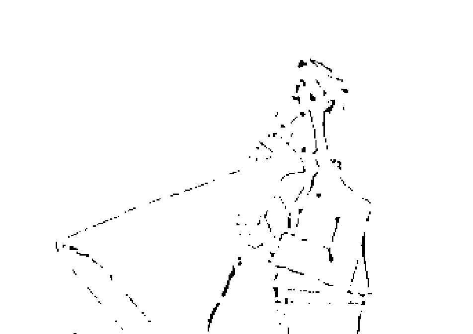
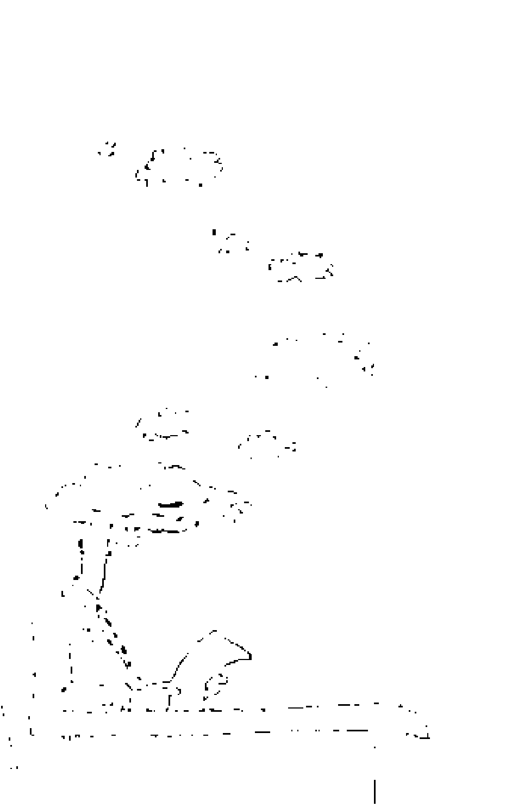
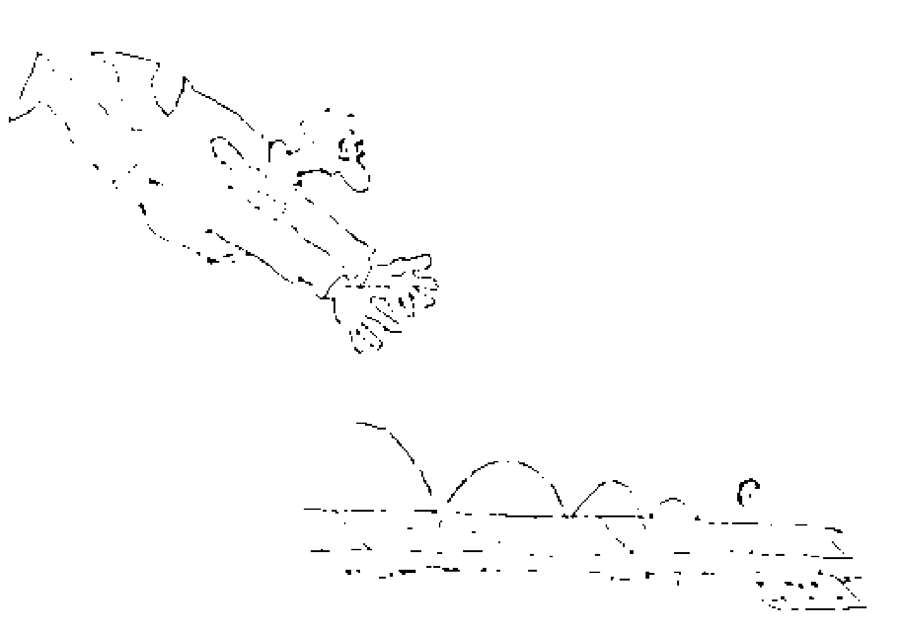
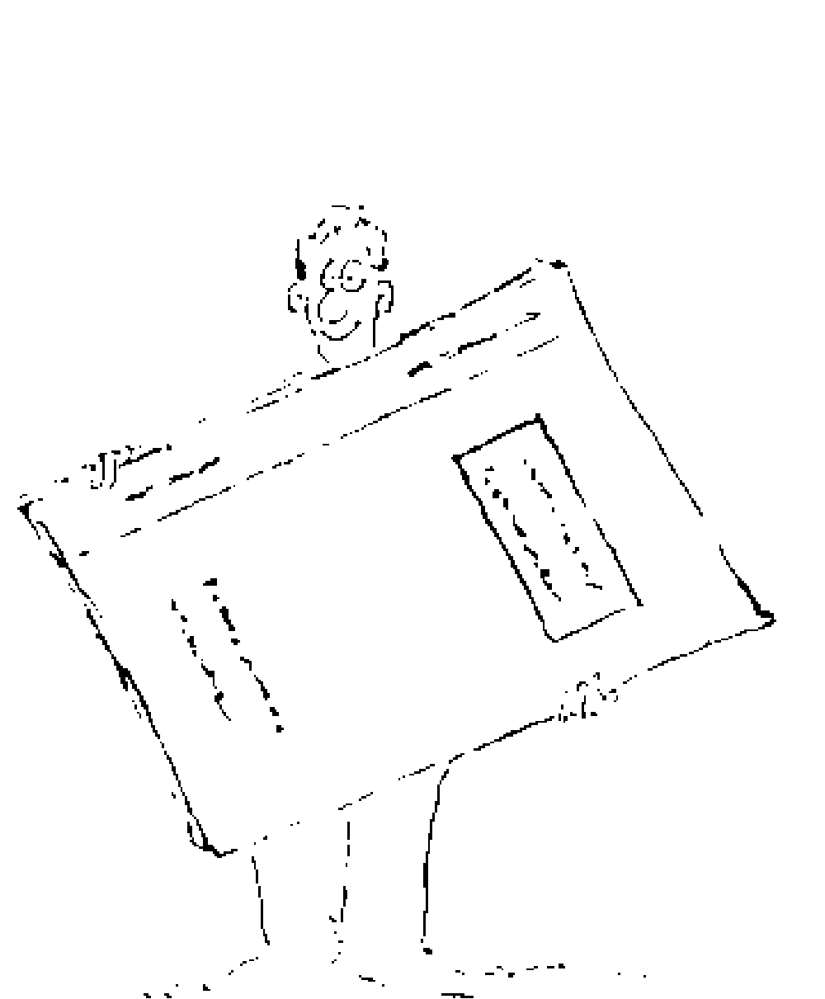
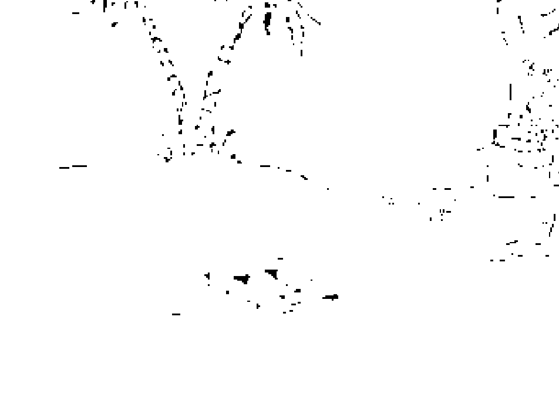
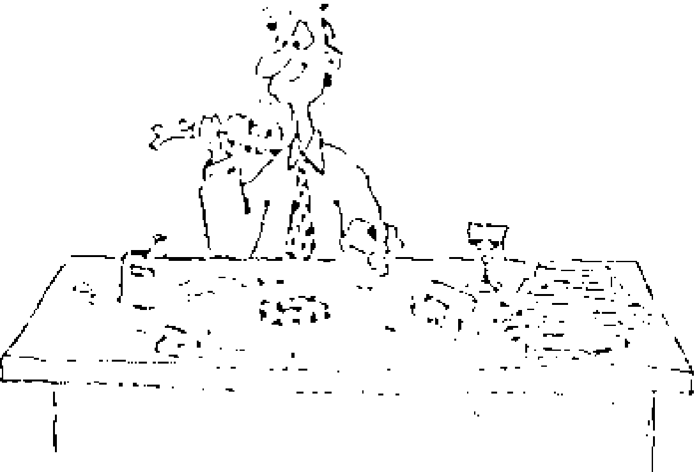
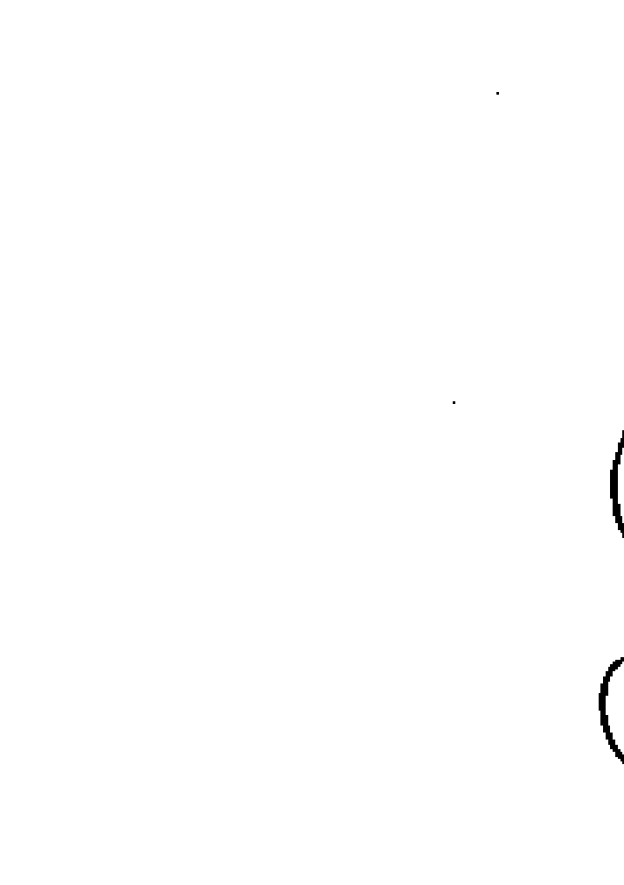

现有一种神奇的方法，可以把富裕的念头灌输到潜意识中，为你带来无穷的财富。让你想有钱，就有钱。

想有钱就有钱

Think Yourself Rich

Joseph Murphy [美] 约瑟夫·摩菲 著
朱衣 刘永毅 译

華夏出版社

现在，有一种神奇的方法，可以把富裕的念头灌输到潜意识中，为你带来无穷的财富。让你想有钱，就有钱。

想有钱就有钱

Think Yourself Rich

Joseph Murphy [美] 约瑟夫·摩菲 著

朱衣 刘永毅 译

華夏出版社

# 图书在版编目(CIP)数据

想有钱就有钱／(美)摩菲著；朱衣等译．－北京:华夏出版社, 2009.6 (2009.8 重印)

ISBN 978－7－5080－5246－5

Ⅰ. 想… Ⅱ.①摩… ②朱… Ⅲ. 成功心理学－通俗读物
Ⅳ. B848.4－49

中国版本图书馆 CIP 数据核字(2009)第 105319 号

Think Yourself Rich by Joseph Murphy
©2001 by Reward Books
All rights reserved including the right of reproduction in whole or in part in any form. This edition published by arrangement with Prentice Hall Press, a member of Penguin Group (USA) Inc.

版权所有，翻印必究。

北京市版权局著作权合同登记号:图字 01－2009－3694

## 想有钱就有钱

[美]约瑟夫·摩菲 著
朱衣等 译

出版者: 华夏出版社
北京市东直门外香河园北里4号 邮编:100028 电话:64663331 转
印刷者: 北京集惠印刷有限责任公司
装订者: 三河市李旗庄少明装订厂
经销者: 新华书店

开 本: 880×1230 1/32 开
印 张: 9.5
字 数: 150千字
插 页: 2
版 次: 2009年6月第1版 2009年8月第2次印刷
定 价: 29.00元

本版图书凡印刷、装订错误,可及时向我社发行部调换

1. 有一种奇异的力量 ………………… 1
2. 使你有钱的一道开关 ………………… 17
3. 为什么有钱人会越有钱——加入他们之道 ………………… 37
4. 如何把握属于你的无穷财富 ………………… 51
5. 相信奇迹的思考模式能增加你的财富 ………………… 75
6. 要说什么话才会很有钱 ………………… 89
7. 启动你的心灵提款机 ………………… 103
8. 画出心灵的财富地图 ………………… 121
9. 上天的增量法则 ………………… 137
10. 打开财富的自动门，享受华丽的人生 ………………… 153

## 2 想有钱就有钱

- 11. 财富目标，立即得到 ······································· 167
- 12. 倾听直觉的声音 ··············································· 181
- 13. 发财梦成真——心灵同化的秘密 ······························· 197
- 14. 体会并运用爱的力量 ·········································· 213
- 15. 如何让自己对金钱更有吸引力 ·································· 231
- 16. 自信让你获得无尽的财富 ······································· 245
- 17. 召唤疗愈的力量，获得你想要的财富 ······························ 261
- 18. 源源不绝的财富来自平静的心 ··································· 279
- 19. 享受帝王般的生活，就是现在 ··································· 293

# 1 有一种奇异的力量

你天生就有权利有钱。你来到世间是为了过上富裕、圆满、幸福、快乐的生活。无尽的财富围绕在你左右，然而这财富是你在银行金库或海盗船上的宝库里找不到的，它在你的潜意识深处。从现在开始，就从内心深处令人惊叹的财富中挖掘你需要的一切——金钱、朋友、豪宅、美貌、伴侣及所有人生幸运之事。适当地运用技巧，任何你需要的事物，任何你想要的东西，都有可能手到擒来。

我有个认识已久的朋友达非·霍威，他告诉了我下面这个故事。

彼得和史蒂夫两人从小在同一个小镇长大，上同一所大学，而后不约而同地成为地质学家。毕业之后，他们分别进入美国西部两家相互竞争的采矿公司。彼得花了许多时间和精力来学习如何开发内在心智的宝藏，然而史蒂夫并没有这样做，因为他完全不相信心智的力量，相反，他对学校教授所教导的技术和电子仪器充满信心，他信赖事物的表象，比如物理性质、环境、地形。刚开始工作时，公司派史蒂夫到犹他州一块特定地区勘查地质，他使用所有现代的专业设备，也做了应该做的一切事情，然而他没找到任何矿物。三个星期之后，他放弃了。

同一年的下半年，彼得负责相同地区的勘测，但他在三天之内就找到了该地有丰富铀矿的证据。他信任潜意识的引导原则，这也使他能够直接通往隐藏的财富。真正的财富并没有隐藏在地下，而是在你心里。

## 世界上最大的秘密

科学家在不久之前完成了人类基因图谱的绘制工作，如今，人类已经可以了解生命本身的构造方式。无数的科学家都宣称，这是科学界迄今揭示的世界最大秘密。他们说，在接下来的几年里，科学家将可以改变人类的基本基因。只要我们愿意，我们可以随心所欲地制造出爱因斯坦、贝多芬或者是米开朗基罗，要几个有几个。

这些专家并不了解生命的真相，人类所拥有的并非只是身体、遗传特征、家谱、皮肤、头发和眼睛的颜色。上天与人类同在。人的潜意识是永恒的，我们改变自身的唯一方法就是不断完善心智。

世界上最大的秘密就是，我们的心里有一个天国。无穷无尽的智慧、力量、爱以及天底下每个问题的答案，全都可能在我们的潜意识之中被找到。

人们到处寻找世上最大的秘密，却忘记了自己的内心。从现在起，发掘内心的无穷力量吧，依靠那赐予我们万物的上天，你将会过上富足、幸福的生活。

## 你有权利有钱

你希望人生很成功并被人赏识，这是很正常的。在做你想要做的事情之前，你应该拥有完成这件事情所需要的钱财。贫穷没有任何好处。贫穷是精神的疾病，应该把它从地球上铲除。贫穷和财富一样，是一种心境。如果我们希望消除世界上所有的贫民窟，必须首先彻底摧毁人们内心因为相信贫穷和匮乏而创造出来的精神贫民窟。

在我多年的个人咨询生涯中，当和从世界各地听我讲课的那些人谈话时，我时常听到这样的感慨：“我唯一的问题就是缺钱。假使有五万美金或十万美金，我的人生将会是另一番模样。”这些人没有领悟到，他们一直专注于自己欠缺了什么，结果却创造了自己的贫穷。财富，就像贫穷，其实是内心的思考和想象的模式。如果这些人遵照本书所介绍的技巧并运用潜意识的力量，财富将会源源不断地流向他们。

你和你的家人有权利拥有健康、有营养的食物、漂亮的衣服以及可以让你购买良好生活用品的金钱。你每天需要有时间沉思默想、祈祷、放松、休养，也要有空间使这一切成为可能。丰足富裕的真正意义不在于拥有更多的东西，而是在于精神、心灵、智慧、社会地位和财务状况的提升。

## 她如何发现潜意识的财富

一名叫贝蒂娜的女子来找我咨询，她告诉我她遭受了家庭变故。离婚之后，她需要负责照顾两名学龄前儿童，而远在他乡的前夫却停止支付孩子的生活费。她有房子，不过已经二度贷款，而她的信用卡也快刷爆了。她有一份固定工作、一份兼职工作，然而赚的钱总是很快就花掉。为了让餐桌上有热腾腾的饭菜，她得持续不断努力才行。贝蒂娜每晚都睡不着，她会想，如果她或孩子们生病了该怎么办。就像她自己说的，她的生活一团糟。

我跟她说明潜意识的无尽智慧可以为她揭示她需要知道的事情的奥秘。她可以接收到灵感、指导、有创意的想法以及解决财务问题的办法。我又补充说，一旦她开始正确地使用潜意识的能力，她就更可能拥有所需要的金钱，并体会到超乎想象的金钱自由。

具体到操作层面，我提供给贝蒂娜两个抽象的想法：财富和成功。随着我们谈话的进行，她开始了解到财富无处不在。就像我们所有人一样，她生来就是要成功的，注定要在人生的游戏中获胜。因为潜意识一旦开发出来，上天的力量就不可能消失。在我的建议之下，她开始执行一项心灵运动计划。每天晚上睡觉之前，她抽出一段安静的时间，缓慢、充满感情地重复说：“财富、成功。财富、成功。”她领悟到输入潜意识的事情会在宇宙中被放大或加倍。在睡觉之前，潜意识对我们的任何知觉、想法特别敏感。因此，通过把意识集中在“财富、成功”这两个概念上，贝蒂娜潜意识中的潜在力量就会被释放出来。

## 她的潜意识如何反应

只要正确地使用潜意识，潜意识就不会失灵。一旦你向它求助，它将以预料之外的方式满足我们的需求。当全神贯注在财富和成功时，贝蒂娜便抛弃了贫穷和压力的想法。有天晚上，她正在做这项练习，眼睛无意间落在了阿姨送给她的花瓶上。隔天，一时冲动之下，她把花瓶拿到网络上拍卖，几天之内，一些认出花瓶是珍品的古董鉴赏家已经把价格抬到7000美元以上了。

后来，贝蒂娜成为了跳蚤市场和古董拍卖场所的老顾客。如果有某件特定的物品吸引了她的目光，她就买下来，然后拿到网络上拍卖。她从古董和收藏品买卖中获得了极高的利润，高到可以让她辞掉固定的工作。朋友和竞争对手说她的成功来自于某种“天赋”，她自己则很清楚不只是这样，她明白是潜意识的力量把她和无尽的宝藏连接在一起。

潜意识的无尽智慧只有通过你的开发运用才可能对你有效用。思想和感觉控制你的命运。因为贝蒂娜学会了信赖潜意识的无穷力量，所以她的物质和精神财富将永远不会匮乏。

## 财富和升迁的秘密在他心里

拉尔是个有天赋的年轻律师，然而连续搞砸几个案子后他变得忧郁、沮丧、自责。没过多久他又遭受了严重的财务挫折，负债越来越多。在公司的资深合伙人向他发出职业不保的友善警告之后，他向我寻求帮助。

听完了他的故事后，我告诉他一个基本的但常被忽略的常识：我们的思想是有创造力的，也就是说，我们的思想可以改变甚至协助我们创造现实。我们经历的形势、环境、时间和经验都精确地反映了我们习以为常的想法。我告诉拉尔，如果他经常想着限制和匮乏，他必然会遭遇限制和匮乏。然而，同样的，如果时常且有计划地保持平静、成功、繁盛、富足的思想，同类的结果就会自动出现。我们不会从荆棘中得到葡萄，或从蓟中得到无花果。我们一整天想了什么，我们就会是什么，这就是大自然的法则。此外，我们发自内心的专注且深刻的想法，会更加有效。从今天开始适当地运用潜意识的力量，它将帮助你创造你想要的生活。

我的目的是帮助拉尔开始使用心智的神奇力量。我为他设计了一个方案，要他依着做，这可以时常提醒他潜意识里有无穷无尽的财富。于是，我给他下述的祷文。每天三四次，他去一些不受干扰的地方，放松之后，开始缓慢、安静、充满感情地祷告：

> 今天是属于上天的。我选择和谐、成功、繁盛、富足、安全和正确的行为。无尽的智慧向我解释如何为别人提供更好的服务。我的精神和心灵像是一块磁铁，具有强烈的吸引力，受到我吸引的是一些愿意接受我的建议和决定的各阶层人士。借助上天的力量，我会心想事成。上天的正义、法律与秩序将会引导我的事业，我经手的任何案子最后都会胜诉。我非常清楚上述那些我反复念诵的真理现在正深入我的潜意识，然后将有可能变成现实。真是太美好了。

他坚定地表示绝不会否认他所说的这番话。当匮乏、害怕或自我批评的思想闪现时，他会立刻通过这个祷告来阻止这种念头。

几年过后，拉尔成为律师事务所备受尊重的合伙人，是人们眼中最有潜力的法官候选人。当你的思想与上天的思想保持一致时，上天就会与你同在，为你提供美好的事物。

## 内心的力量保佑我们心想事成

我曾珍藏着一封让我感动万分的信，那是一名叫塞丽娜的女子寄给我的。她每天早上都听我的广播节目。她告诉我，她丈夫罗伯特几个月前因心脏病去世了，年仅38岁。虽然过去他们经常谈论买人寿险，可是保险费很贵，而且当时手头很紧，似乎也没有买保险的迫切需要。但结果是她如今成了寡妇，带着一个十岁的儿子，没什么特殊的工作技能，背负沉重的房贷，而且银行基本没有什么存款。就连丈夫的丧葬费她都无力支付。灾难好像迫在眉睫。

她写道：“我听到你告诉我们，如果我们内心与上天保持一致，如果我们信任我们的心，内心的力量便可以保佑我们心想事成，上天会帮助我们。”

“我坐下来开始想上天会回应我的需要。祷告时我确信上天在听，我感到平静与和谐。之后的某一天，我突然接到了住在西雅图的小叔子米尔特的电话。米尔特是个事业有成的电脑程序设计师，他和我丈夫在小时候感情很好，不过最近几年疏于联系，我想可能是罗伯特认为自己的工作没有那么体面，不好意思跟他联系吧。”

“米尔特告诉我，哥哥的去世让他既悲痛又内疚。他过去也常提醒自己要多花点时间和我们相处，可每次都因为工作太忙而作罢，现在一切都太晚了。他说他知道罗伯特和我的经济状况不是很好，他想帮助我们。他准备把公司的一批股票转到我名下，这些股票的股息就足以支付我和儿子今后的基本生活费了。他还为我儿子成立了一个教育信托，并向我们保证绝不会让我们为钱所困。他希望的只是彼此互相联系，他不希望重蹈覆辙，和侄子多年都不联系，感情慢慢疏远。”

## 业务员如何发大财

瑞克是个房地产业务员，他每周都来听我的课，定期听我的广播节目。他告诉我他曾受骗在股票市场从事投机买卖，因而负债累累。他希望能靠卖房子的佣金渡过难关，但事实上，他已经有好几个月都没有卖出一栋房子了。

在谈话时我看出了他的真正问题所在。他妒忌和批评那些业绩比他好的同事，他指责他们的销售技巧、职业精神、说话方式乃至穿着打扮，他甚至告诉我说，他们的成功只能证明他们的平庸。

我试着告诉瑞克，他心中的嫉妒情绪会反射到自己身上。轻视别人的成功，就是在给潜意识发出一个信息：成功是不好的事情，要避免成功，而潜意识便会依此反应。他的负面思想把匮乏、限制和不幸都吸引了过来。我们对别人的希望和期许也就是我们对自己的想法，因为每个人都是自己世界中的唯一思想者。对于如何评断别人或是评断自己，我们要负全部责任。

瑞克体会到自己落入这种意识陷阱之后，便努力想要彻底改变态度。渐渐地，他开始希望同事和自己一样都能成功、圆满、富裕和幸运。他每天都会把下面的祷告沉思默想数次：

我是上天之子，上天的财富、自由、快乐都无止境地流向我。我将无比富足，我将拥有幸福、平静、财富、成功和傲人的销售成绩。现在我要开发最深层的心智财富，金钱将源源不断地涌向我。

随着瑞克态度的改变，他与同事之间的关系也得到了改善。他们开始觉得瑞克是有创意的，并乐于向他寻求建议和帮助。如今他负责掌管公司旗下最有发展前途的分公司，也经常去主持业务人员的研讨会。在教导别人如何聪明、果断、建设性地发挥销售能力方面，他颇负盛名。

* * *

## 为实现人生富足而冥想

重复以下的冥想有助于解决你的财务问题：

我知道所谓的成功，是指在每个层面都有所进步。上天此刻在我的心里、身体里，帮助我提升自己。上天不断地为我提供新的想法，带给我健康、财富和完美的表现。

当感觉到上天赋予我的生命活力的时候，我激动不已。我知道上天在鼓舞着我，为我提供一切，并使我强大。我现在展现的是一个充满生命力和能量的、完美和容光焕发的自己。

我的事业就是上天的事业，因此我是成功的。我想象和感受得到内心的强大力量一直伴随着我。感谢上天让我拥有富足的人生。

## 本章牢记要点

1. 你来到世上是为了过一个富足的人生，一个幸福、快乐、健康和有钱的人生。现在开始释放你内心的无尽财富吧。
2. 真正的财富在你的潜意识里。一位地质学家相信潜意识的指导原则，快速而轻易地找到了地球上的宝藏。他的对手不相信潜意识的力量，花了几个星期探测相同的区域，结果却一无所获。
3. 世界上最大的秘密是上天与人类同在。普通人到处寻找财富、成功、幸福和富足，却忘记了自己的内心。上天的无尽智慧与力量在每个人心里，并通过所有人的思想发挥作用。
4. 贫穷是心智的疾病，相信贫穷和匮乏就会产生贫穷和匮乏。财富是一种心境，信任财富的法则，你就会得到财富。在我们最终消除贫民窟和贫穷以前，必须消除人们心中的贫民窟和错误的信念。
5. 你可以通过不断冥想指导、财富、安全和正确的行来开发潜意识的财富。养成冥想这些真理的习惯，你的潜意识会依此做出回应。
6. 如果你每晚带着财富和成功这两种想法入睡，并相信重复这两种想法能启动你内心深处的潜在力量，那么财富和成功便会向你涌来。
7. 潜意识的无尽智慧为你服务。思想和感受影响你的命运。
8. 当你相信潜意识无尽的智慧会回应你的请求时，答案总是会出奇不意地出现。
9. 你的思想是有创造力的，你的每个想法都会在人生中得到印证。只要你持续想着升迁、财富、扩张和成就，好运自然会降临。
10. 要注意，当你祈祷要有金钱、成功、正确的行动和升迁时，绝对不要否定你的宣言。那就像酸碱混合会得到中性物质。换句话说，不要让负面的想法中和掉你的正面想法。你想什么就会有什么。你会变成你所想要成为的样子。
11. 一定不要嫉妒其他人的成功、钱财和福气。记住，思想是有创造力的，如果你嫉妒或批评那些已经累积了财富和荣誉的人，你就会让自己变得很贫穷。你对别人的期望，往往会在你自己身上应验。
12. 任何你感觉真实的事，在你的人生当中绝对会发生，所以把注意力集中在金钱、健康、美丽、安全和正确的行动上吧。
13. 运用本章结尾的冥想，你可以体悟到更富足的人生。

相信就是认为那件事情是真的。相信上天的真理，这些真理就会出现在你的生活中。这种相信不只是意识或理论上的认同，这表示你一定能感觉得到心中坚信不移的真理。

人们心里的信念决定了一个人是成功或失败、健康或生病、快乐或不快乐、富有或贫穷。财富和贫穷一样，都是心境。当你认识了上天永恒的力量时，你就更有可能富有。当你了解你的思想是有创造力的，你会吸引你所感受的事，你会成为你想要成为的人，你就会富有，因为任何铭刻在潜意识的东西如功能、经历和事件都会成为现实。

## 她如何发现内心的财富

有位年轻的平面设计师苏菲在听完我的演讲后来找我。她看起来心事重重的，并以略带愠怒的口气说：“我现在被一个策划案给难住了。如果我搞砸了，我的事业就毁了。我曾不停地以你告诉我的方式祈祷，希望能克服问题，但却没有效果。如果我身边一切事情都处理得一塌糊涂，你这些技巧又有什么用呢？为什么事情没有朝着我祈祷的方向发展呢？”

“苏菲，”我说，“比如说你正在电脑前面全力设计策划案，如果老板站在你的背后随时给你意见，这样会对你有帮助吗？”

“当然没有，那样我会无法工作的。”她回答说。
“即使是能够给你很好的意见也不行？”我继续问。
“是的，也不行，老板最该做的是确保我知道自己的职责和任务所在，然后给我足够的空间。如果不断打扰我，我一定会办砸的。”她说道。

“我同意，你的潜意识也是如此。你不断地祷告，在潜意识附近流连忘返，给潜意识一个又一个的意见，实际上是在妨碍它工作。你给它留下的印象是对你是否能完成你分派的任务表示焦虑和怀疑。尽可能有感情地和完整地设想一个你希望的结果，然后放手，让潜意识的无尽智慧去实现它。”我这样告诉她。

“我想我懂你的意思了，”苏菲缓缓地说，“可是我已经养成祈求帮助的习惯。我以为祷告得越多，效果就越好。我要怎么改掉这种习惯？”

“有一种很有效的方式可改掉这种偏执的习惯。”我答道，“你应该开始在一天当中拨出一两段时间为某个有严重问题的人祷告，这样可释放内心的精神财富。这个人可能是朋友、邻居、同事，甚至是从电视上看到的某个人，关键在于你这么做时并没有强迫或威胁自己。”

苏菲决定尝试一下我建议的方法。几天后，她兴奋地打来电话，说有天早晨她在闹钟响前一个小时醒过来，思路异常清晰，正是处理策划案中的问题的最佳时机，于是她立刻打开电脑，到吃早饭的时间时，她已经把长久以来困扰她的那部分问题解决了。

## 创意思维为她带来财富

玛丽非常担心母亲的慢性胃痛，因为母亲按医嘱试过多种药物，但没有一种药能够治愈这种病。而最近一次的身体检查结果又显示，母亲的消化系统有发炎的征兆，但没有显示发炎的原因。玛丽认为唯有潜意识的疗愈力量可以帮助母亲，于是她开始每天早上和晚上都腾出半个小时为母亲祈祷。她把精神集中在认定母亲的消化系统是神圣的，因此是完美无缺的。

很不幸，母亲的病情并没有改善。玛丽变得更加焦虑，并且自己的胃也开始不舒服了。

她来找我，请我告诉她哪里做错了，为什么她的祷告使潜意识产生疾病而非她渴望的治愈呢？

> “你这么祈祷，其实是在支持你母亲的胃病。你一天两次和它固定约会，目的是丢掉它，但结果却是保住它。”我说道。

## 有创造力的思想如何疗愈病痛

在我的建议之下，玛丽改变了祈祷的方法。她小心地避免去想身体的特定器官和疾病。她信任潜意识的无穷疗愈力量。她开始安静、充满感情地说创造母亲的潜意识是有生命力和有治疗效果的，可以使母亲的生命恢复和谐、健康和平静。每天晚上睡前，她都会花点时间这样冥想。效果很显著，她的胃痛立刻不治而愈，母亲的胃痛问题也有了显著和稳定的改善。

### 同情还是怜悯

玛丽为母亲祷告反倒让自己生病的原因是她同情母亲。我们从小被灌输这样一种理念：有同情心是每个人都应具备的优良品质，这是错误的。同情别人就意味着看到某个人陷入流沙中，你也跳入其中，让自己身涉险境。而怜悯是更好的反应，你可以继续停留在结实的地面上，然后丢一根绳子或树枝给那个人。因为同情，我们参与了那个人的不幸，这往往会使问题恶化，因为潜意识会极度夸大任何我们所关注的事情。

### 把无穷的财富给予生病的人

无穷的财富，比如灵感、信任、富足和安全感，都在你心里。探望生病的人时，要在心里鼓舞他们，向他们传递对潜意识疗愈力量的信心。记住，与上天同在，一切都可能实现。想象他们是完整的、光芒四射的、快乐和自由的。觉得病人很可怜，同情病人，会使病人的健康状况变坏，这是消极的方法。怜悯病人，唤起潜意识无尽的疗愈力量，可以让他身心都恢复健康。

## 你是思想的主人——不是仆人

你的思想是有创造力的。你的每种思想都会被潜意识所感动，潜意识便会根据思想的特质做出反应。你可以指挥和操纵思想，就像操纵汽车一样。你想什么就会有什么。汽车是有形的物体，但是如果世界上所有汽车都不见了，汽车工程师可以根据脑中的思维图像快速地再设计出一辆新汽车来。

思想是你必须善加运用的最有力的工具，它比最新型的电脑更强大。明智地、建设性地、果断地思考，你会获益无穷。你的思想拥有数学般的准确性；如果你老是想着贫穷，它就会产生限制和匮乏。如果你总想着扩张、成长和富足，它就会创造这样的结果。

## 成为一个好的执行者

要想获得潜意识的财富，你得是一个优秀的执行者。一个好的执行者是聪明睿智的，懂得选择最合适的人来完成任务，一旦交待了任务，他就放手，给他人足够的空间去执行任务。反之，差劲的执行者，不论是在企业界、科学界、艺术界或教育界，时常在别人做事时指手划脚。

在祈祷时，你必须是优秀的执行者。学着把职权委托给你的潜意识。它知道一切也看得到一切，它会以它的方式使你的祷告生效。当你祈祷或寻求答案时，要以完全的信任和自信向潜意识求助，并相信，受到潜意识的启发，并据此行动将使梦想更有成真的可能。

你怎么能确认自己已充满信心地向潜意识求助了呢？你可以感觉得到。如果你不断怀疑自己的祈求究竟会在何时、何地以及通过什么方式得到回应，如果你内心充满焦虑和恐惧，那表示你并不相信潜意识的智慧。不要指责你的潜意识，你的焦虑与消极往往会造成类似的结果。最重要的是，在祈祷时一定要放松。千万记住，潜意识的无尽智慧会以神奇的方式安排一切。

## 她的思想是磁铁

丽莎是个很成功的股票经纪人，她告诉我她成功的秘诀就是想象自己事业上取得成功的模样。这种想法就像是磁铁，不但吸引了客户，还能精确地引导她朝符合思想和感觉的方向前进。

这是她每天清晨的祷告：“我是一块心灵的磁铁，我吸引所有那些想要和需要我为之提供服务的人。我们之间有心灵的交流。他们得到祝福，我也一样。我渴望和谐、富足、灵感和正确的行动，我知道我的潜意识会接受这些信息。”

丽莎觉得自己无论做什么都受到了上天的指引，她已经习惯了运用潜意识的力量。她定期有系统地表示需要上天的指导，需要正确的行为和富足，因此在潜意识的帮助下，她的言行举止总是很妥当。

## 他如何以退为进

我最近和一位名声显赫的银行家布兰达有一次长谈。他的朋友推荐他来找我，说也许我能协助他戒烟，尽管半信半疑，但因为没有更好的办法，只好抱着试试的想法找到我。在谈话时，我开始了解到他每天都专注于如何对抗这个世界及每天发生的事情。他把每个伙伴都看作是竞争对手，甚至琢磨他们的每一句话，并认为话中含有不友善和狡诈的成分。他每天早上读报纸的商业版时，会低声嘀咕咒骂，似乎世界上的每一种新发展都像一阵强风径直向他袭来。难怪他抽烟抽得很凶。终于，医生说他必须戒烟，但他却不以为然。直到有一天，当因忽然呼吸急促而不得不放弃每周例行的网球运动时，他才决定戒烟。

他用处理其他事情的态度来戒烟，他把戒烟看作一场战争，因此丝毫不见成效。他越想戒烟，越容易焦躁发怒，越觉得想抽烟。最后他整个人筋疲力尽，在工作上开始做出危险的决定，对待上司和下属都很不好，事业也因此陷入危机。在我们谈话的时候，他甚至考虑辞职了。

“你就像某个误陷一小块流沙的人，”我告诉他，“越挣扎，陷得越深。不只是在抽烟这件事情上，尽管这件事也非常重要。你认为自己在对抗全世界，但其实你只是在对抗你的潜意识。每一天，你都告诉潜意识，人生充满了争执和敌意，潜意识也都信以为真，于是创造出你预计会发生的情况。”

“可是我真的想戒掉烟瘾。”布兰达反驳。

“我并不怀疑你的决心，”我答道，“不过你忽略了心智的基本法则。你的渴望和想象互相冲突，结果总是想象取得胜利。你想象自己和抽烟奋战，而且总是挑起斗争。”
“或许如此，”他说，“但是现在我要积极戒烟，而且我一定要做到。这已经危害到了我的人生和健康。我就是要赢得这场战争，对吧？”

我深吸一口气。这件事谈何容易。“你必须投降，”我告诉他，“放弃，中止斗争。”
“不，我绝不会放弃！”他脱口而出，“倒下来装死？绝不！”

“我没有说装死，你必须要做的事是找到通往神奇力量的道路。那条道路的入口位于斗争的相反方向。”我平静地说。
突然间，他的肩膀垮了下来。“我不懂，但我愿意尝试任何戒烟的方法，现在我该怎么做？”他低声说道。

## 他找到温和的戒烟方式

在我的建议之下，布兰达起床时和临睡前都会自我反省。他坐在安静的地方，平静从容地呼吸，直到感觉自己变得放松和善于接受外界事物。然后他进行如下祷告：

> > 现在我的心灵是自由与平和的。我知道当我相信这些真理并进行祷告时，他们就全部进入了我的潜意识。我会在制约之下放弃香烟，潜意识的法则就是对我的制约。在想象中，我看到医生站在我面前，他刚刚帮我做完检查，恭喜我摆脱了抽烟的习惯，我的健康状况好极了。

在反省时，他从潜意识中得到了回应，抽烟的渴望逐渐消失了。因为保持这样的祷告习惯，他已经成功把这样的思想和想象画面输入较深层的心智。下一次去看医生时，他也得知自己令人担心的症状已经减轻了许多。他的身体状态好多了。

布兰达对待潜意识的新方法产生了更多的效果。他在工作上更冷静、更专业，他的商业谈判技巧改善了。他现在明白了是安静的心智在指导着他的一切。虽然距离最后一次有抽烟的渴望已经有好几个月了，他仍然继续一天两次的自我反省。他尽量使身体平静下来，告诉身体要平静放松，服从内心的指引。当他的意识安静、平和、安详且包容时，潜意识的智慧便会出现，最佳答案和解决办法就会传递给他。

## 放下一切并把它们交托给上天

有一位心理医生希薇亚，她和以前的病人牵扯进了一件纠缠不清的法律官司中。复杂的文件往来和频繁的法庭出庭耗尽了她的时间和能量，当她努力认真地处理这些事情时，却发现自己竟然没有时间享受自己的人生。终于，她领悟到她忽视了自己所拥有的最大力量，并决定依靠潜意识的能量。她这么祈祷：

> 潜意识的神圣智慧与正确行动为我解决这个问题。我放下问题，随遇而安。

每当她必须和律师或其他牵扯到这件案子中的人接触时，她会默念：

> 我内心的潜意识是有全知全能的，会以神圣的方式处理这一切。我不会怀疑潜意识的力量的运作方式，也不会怀疑它何时何地以何种方式解决问题。我会以开放的心态，倾听潜意识的启迪。

她展现了新的心智态度，由此，事件的后续发展很有趣。一段时间过后，她的病人因为良心发现前来认错，请求她的原谅，并撤销了诉讼。也许是由于上天的调解，她避免了所有的法律牵连。

## 你可以拥有美好的未来

不要把能量和活力浪费在过去的事情带来的气恼、怨恨和牢骚上。这样做就好比掘开坟墓，你所找到的只是骷髅。把注意力集中在人生美好的事物上。相信未来将是美好的，因为和谐的想法会发芽和生长，结出美味可口的果实，也就是健康、快乐、富足和内心的平静。

在“过去”下面画一条粗线，然后翻页。绝不要再想任何过去发生的负面经历以及所带来的精神创伤。要保持积极的人生态度，并且明白当你改变想法，并且保持这种改变时，你一定能改变你的命运。

## 她的祈祷带来了财富

安娜来找我时看上去很焦虑，一副几乎要抓狂的模样。她18岁的儿子在和父亲争吵之后离家出走了，他休学，并且写信说计划加入一个邪教。安娜因而焦虑万分，医生开了很多镇定剂和抗忧郁剂给她，她每天晚上几乎都要靠安眠药才能入睡。

在谈话过程中，我试着说出几个简单的道理。“你儿子不属于你。”我告诉她，“是的，你给了他生命，但他不属于你。每一个生命都属于上天。我们都是上天之子。你的儿子在世间成长、发展以及克服困难、迎接挑战。他必须为自己找到内心的力量。在世界上发挥他的天赋是他的职责，你无法透过精神上的激励、生气和愤慨来帮助他，唯有透过爱、谅解和正确的行为来帮助他。

在谈话结束时，安娜已经决定完全放手。她真诚、衷心以及自信地说：

> > 我把儿子完全交给上天。上天引领他朝前走。上天的智慧开启他的智力。在他的生命中，上天的法则和指示支配着一切。他被引领到真正属于他的地方，以他最高的水平表现自我。我放开他，让他自由。

她持续这个祷告，每天进行两次。她为儿子和自己祈求平静、和谐、欢乐和上天的爱，同时，她也给了儿子更多的关爱。几个星期之后的某一天，儿子在和她聊天时说他对那些新朋友不再存有幻想，他体会到那些朋友们唯一的目标就是同化他的思想。他们没有让他找到自己，做自己。他决定返回学校，期望能在那里学习到更多智慧的精髓。

从那时起，安娜的儿子在学校的成绩都很好，并开始每天冥想，还写下一些沉思时想到的东西。他时常与父母沟通，而安娜也不再有占有欲。她已经发现上天的爱和自由的财富。当安娜停止从外界环境和问题的角度思考一切之后，她开始发现内心也不再有这样那样的问题。如此，她可以依据上天的法则和指示来行事，然后她让潜意识的智慧来处理一切。

## 如何富裕地思考

要习惯而有系统地思考人生、教化、激励、和谐、丰富、快乐、平静和更富足的人生。思考这些真理，而不要考虑在这些真理上所能出现的问题。碰到特定的情况时，信任潜意识的力量可以为你找到更适合你的解决方式。这是进入富裕人生的神奇方式。

## 为获得信仰的力量而冥想

使用以下的冥想有助于获得信仰的力量：

> > 我了解不论昨天如何匮乏，今日我的祈求或对真理的信仰将会让我变得富足。我体会着祈祷被回应的喜悦。一整天，我都在光芒中行走。今日是属于上天的，是一个荣耀的日子，今天充满平静、和谐和喜悦。我把对富裕的信念铭刻在心中，让它成为我内心的一部分。现在我完全相信上天的完美法则，我的渴求已经被默许，我将会吸引所有善美、富足的事物。现在我完全相信上天的力量，我内心宁静安详。

我知道我是上天的客人，上天是我的主人。我收到神圣上天的邀请：“凡劳苦之人都可以到我这里来，我会使你们安息。”我在那里安息，一切完美而圆满。

## 本章牢记要点

- 所谓“相信”就是接受某件事是真实的。信念决定了一个人的成功和失败，富裕和贫穷，健康和生病。要信任潜意识无尽财富的力量，然后你就会亲身体验到这力量。
- 当你的问题好像解决不了时，就真诚地为一位生重病或有大麻烦的人祈祷，你会逐渐发现自己的问题得到了解决。
- 为所爱的人祈祷时，千万不要同情疾病和病痛的任何部分。要知道上天的疗愈力量会像和谐、健康、平静和欢乐一样在你所爱的人的身上得到体现。想象所爱的人容光焕发和快乐的模样。安静地沉思这些真理，然后在内心的引领下再度祈祷。以这种方式祈祷会产生奇迹。
- “同情”意味着和其他人一起走进流沙，而这对生病的人没有帮助。怜悯生病的人，给他信任、自信和爱，因为只要跟随上天的指引，一切皆有可能。
- 你的思想是有创造力的，而且每种思想都会在现实中得到印证。你可以像驾驶车子一样地控制思想。你想什么就会有什么。
- 有关财富和成功的思想就像磁铁一样，会吸引你想要的事情到你身边。
- 安静的心能达成一切。告诉你的身体要平静，通过思考潜意识无尽的智慧使心安静，这样你就会知道答案。当你的意识很安静、身体很放松时，潜意识的智慧就会起作用。
- 好的执行者知道如何分配职权。相信潜意识的力量，并且放心地请求潜意识帮你解决问题，你会得到答复。当成功地向潜意识求助并得到答复时，你会感觉得到，因为你发现自己安静且祥和。
- 让自己的内心自由且平静，并同时想象一位朋友或医生恭喜你获得自由，你就可以改掉吸烟或任何坏习惯。当你宣称并想象自己对香烟很反感时，潜意识会接受这个想法并强迫你摆脱那个习惯。
- 许多人已经发现，严重的家庭问题应该交给上天来解决，要相信上天的智慧会帮你找到最好的解决办法。心里想着“我放下一切，让上天来接管”，你将获得完美的解答。
- 放下过去，绝不要老想着以前的不满或怨恨。未来是你当下思想的体现。时常有系统地冥想和谐、美丽、爱、平静和富足，你会有美好的未来。
- 我们的孩子并不属于我们。当你和孩子之间产生问题时，祈祷：“我把孩子完全交给上天。我的孩子一路由上天引领。上天会照料我的孩子。”每当你想到孩子时，静静地祝福他，相信“上天爱我的孩子，照顾我的孩子”。如此祈祷，就会有好事发生。
- 思考潜意识里无尽的财富。思考和谐、平静、欢乐、爱、正确的行为、成功——所有这些都是人生的原则。当你希望人生更富足时，内心潜在的力量就会活动起来。潜意识会让你过着更富足的人生。你想什么就会有什么。
- 运用本章结尾的冥想，你可以获得信仰的伟大力量。

## 为什么有钱人会越有钱

## 加入他们之道

能否获得财富跟你的想法有关。你可以引导自己实现心中的愿望。财富是一种意识的状态，一种精神态度。你获得财富的过程就是接受上天无尽财富的过程。在你出生时世界已经存在。生命是一份礼物。你来到这里是为了体验生活，发掘自己潜藏的才能。

一旦你有能力开发潜意识的功能，所有的好事都会发生。你会拥有健康、心境的安宁、真实的表达、朋友的陪伴、一个可爱的家，或是你想要做任何事所需要的金钱。潜意识给你无限力量，关键在于你自己的想法是什么。你的想法是有创造力的。从现在开始要经常有系统地思考成功、富足和美好的生活。思想会促成一切。

## 她的思想画面就是财富

几年前我加入了一个去西班牙和葡萄牙的旅行团，团员中有个叫玛丽亚的年轻女子。在第一站的欢迎派对中我向她做自我介绍，她睁大了眼睛。

> “您是否就是写《潜意识的力量》的那个人？”她激动地问，“多亏有您，我才有这次的旅行！”

她解释她一直想到西班牙旅游，因为她的祖先来自马拉加，也就是我们行程中的一站。然而这样一趟旅行的费用超过了她的承受能力。长期以来，她一直告诉自己放弃这个想法，然而当闻悉美妙的潜意识的力量后，她下定决心尝试一下。

她行动的第一步是收集关于去西班牙旅游的小册子和杂志文章。在阅读这些材料时她看到一张马拉加的丽都旅馆的照片，她非常喜欢这张图片。她认定这种吸引力来自潜意识。于是每晚临睡前，她都集中精力去想这张图片，然后让自己沉浸在安宁的世界里。她想象自己在那家旅馆里，想象房间的模样、窗外的景致、露台上的美食佳肴，任何细节都不放过。

在如此做了一段时间之后，有一天，她偶然带着一份旅游资料到办公室。午餐前，她粗略地浏览了一下，结果被一个她不熟悉的年轻男同事看到了，他说他也很想去西班牙。于是他们一起出去吃午餐，聊着聊着竟然发现彼此有很多共同的兴趣。很快，两人便开始约会。订婚的时候，玛丽亚的伯母说她打算替新婚夫妇支付蜜月之旅，当作新婚礼物，她还特别建议了一个去西班牙的行程。

“您看！”玛丽亚总结，“我不仅欠您这个旅游的机会，我的婚姻也多亏了您！”

我微笑。“你什么也不欠我，”我说，“你要感激的是潜意识的力量和智慧。”

玛丽亚的故事说明了潜意识是如何运作的。不论你想什么，它总是会帮你扩大它。她想象着在马拉加的旅行，结果不仅如此，她还获得了一段美好的恋情。潜意识会带给你很多好处。

## 他怎么援用了增量法则

在我前面提到的那次西班牙旅行中，我们还参观了塞维利亚市——最具西班牙风味的城市。50 多万人居住在这个历史悠久的城市里，腓尼基人、罗马人、西哥特人和摩尔人都曾在此留下了印记。塞维利亚大学创立于 1502 年，为这个城市培养了两名世界知名的伟大画家，牟利罗和委拉斯贵兹。

我们的导游是个友善、风趣且聪明的年轻人，他有丰富的城市和文化知识。从旅馆到教堂的路上，我问他：“你的英语是在哪里学的啊？你讲话像土生土长的美国人。”

他咧嘴笑了。“因为我是美国人”，他说，“我是在纽约皇后区长大的。”

“好，那我重新问一次。你的西班牙语是哪里学的？你讲话像本地人一样。”我说。

“那是一个有趣的故事。”他回答说，“我妈妈是塞维利亚人，我爸爸是驻地的空军，两个人于是就认识了。她跟我在家都说西班牙语，当然，纽约也有很多讲西班牙语的人，因此我有大量机会练习。”

“我明白了，”我说，“但你是怎么想到来这里的？”

“从小我就想在欧洲当导游。”他告诉我，“其他孩子在读悬疑故事时，我在读旅行指南。我喜欢地图。我会做白日梦，想象自己走过一个个伟大的城市，看见所有有历史感的建筑。14岁时，我决定必须做点什么让我的梦想成真。因此我在一张纸上写了我的想法，我说我想学会法语和德语，这样我就可以在西班牙附近做更多国家的游客的向导。我把纸条夹在钱包里，有空的时候就翻出来读。我告诉自己这不是梦想，只是还没有发生的现实。”

这个年轻人的说法深深地打动了我。他并不清楚自己在做什么，他只是碰巧遇到了有效的祈求方式。

“那么此时此刻你在这里，带着我们四处游览，证明了你的做法是正确的。”我说，“你的梦想是如何实现的？”

“很简单，”他笑着回答，“简单到我根本不会去想。我母亲的亲戚写信问我要不要到塞维利亚读高中，顺便住在他们家中。当然，我立刻抓住了机会。等我来到这里之后，得知大学里开了一门观光旅游的课程。结果就这样啦。”

这个导游经常在做的祷告是：“上天将带给我们成功与富足。”他写下书面请求，成功地把握住了潜意识的力量，以自己独特的方式达成目标。

### 境随心转

上天让你贫寒，也让你富有，人生总有低潮和高潮。上天掌控你潜意识的力量，你的思想也受制于此。如果你相信自己会获得生活中所有美好的事情，例如健康、财富、爱、真实的表现和丰富的生活，你就会一一体验到。从另一方面来说，如果你认为自己将注定贫穷，好事不会发生在你身上，你就是在让自己处于一种匮乏、失望和自我束缚的境地。

记住，你的想法是有创造力的。如果没有某种更强大的力量的影响，你的每一个想法都会实现。世上的每个人都想要获取更多财富，享受快乐的生活。你所体验的一切都来自思想的法则。如果一个人总是往好的方面去想，他就能因此更富裕；如果一个人总是想着退缩、缺乏和局限，他就会损失更多。潜意识的法则是要加强头脑中产生的所有想法。你的想法越消极，越会吸引失败的经历。

### 开始实践增量法则

记住，所有你在生活中特别留意的事情都会无限地增长和扩大。了解这点非常关键。想象自己成功富裕，你就会看到财富，拥有财富。你也要祝愿身边所有的人成功、幸福和丰盈，

## 44 想有钱就有钱

因为你的祝愿会为别人带来财富和幸福，上天也将会因此给你更多财富。当你祝愿他人丰盈富足时，别人会感受到你的潜意识的力量，而从中获利。

你可以在心中默默祈祷，祝福所有的人：“上天要你富足，享用不尽的财富。你的成就将超乎梦想之外。” 如此简单的祈愿，就能让你的生活顺利成功。

## 如何在事业上使用增量法则

当你默默地想象着富足、成功、繁荣和健康时，你的潜意识就会创造出这样的结果。因为你集中注意力，便自然会吸引一些必要条件，以让你的梦想成真，而且你会发现自己越来越容易吸引客户、朋友、同事以及认识的人，这些人都能帮助你实现梦想。你的潜意识也会让你被那些备受恩宠、富足幸运的人所吸引。

有一天我在比弗利山庄的罗德精品店闲逛，一名穿着入时的女士走到我身边。她自我介绍说她是精品店的创业者，我们聊了一会儿，她与我分享自己的成功经验。她说每天早晨打开店门前她都会祈祷：“来我这里的每个人都被祝福，他们会在各个层面上获得成功。” 她认识到了一个真理：上天会成就你美好生活的梦想，让你熠熠生辉。

## 他如何失去了自己的家

一位朋友把我介绍给芭芭拉。芭芭拉和丈夫住在离我家不远的社区。她对我说自己非常担心她的丈夫。他是个保险经纪人，总是被经济问题所困扰，并经常有挫败感。

“我知道他的公司经营状况不好，”芭芭拉告诉我，“特别是网络公司开始参与竞争之后。但是他老是在想象万一破产了，我们家就要被查封。这对他一点好处都没有。”

她所描述的画面让我很忧心。“你必须设法说服他多往正面的方向想想。”我敦促她。

“我试过，”她说，“但他听不进去。感觉上他仿佛很‘渴望’真的出状况，如此一来他便可以说：‘我不是说过了吗？就是会这样的。’”

不久之后，朋友告诉我芭芭拉的丈夫破产了，他们的房子也被贱价出售，一个富裕的邻居把它作为投资抢购下来。

为什么富者更富，穷者更穷，这确实是有确凿证据的。思维的法则非常有效。经常认为会遭受不幸的人就会匮乏、失败和破产，而富裕的人拥有成功和富足的潜意识，财富就像他呼吸的空气。是态度——而不是财富——让邻居获得芭芭拉和她丈夫失去的房子。你不可能同时想着好的事情和坏的事情。潜意识的法则是完善的，你铭记在心的事物，总是会实现。穷人，我是指那些不会操作和利用潜意识的财富的人，在创造自己的贫穷。然而，只要开始祷告，开始运用财富的法则，他就能够再度吸引到财富和成功。

## 明白富裕法则的回馈

你可以藉由试吃来得知橘子的味道。你可以采用财富法则来获得潜意识的财富。一位商人对我说一切事物都源自他的内心，他内心的潜意识会对他的请求予以回应。每天早晚，他都祈祷：“我万分感激上天活跃、愉悦、迷人与丰足的财富。”这位商人因此总是拥有足够的资金，供他经营企业与开分公司。

## 倾听真理，你将永远不会穷困

上天与你同在。在宇宙中，你一无所有，而上天拥有一切。你是神圣的使者，你来到世间的目的是聪慧、积极、审慎地使用世界的财富，藉由上天的智慧使用你的财富。当你前往另一个世界时，除了你潜意识的智慧、真理、美丽，你什么都不会带走！你对上天的信仰、信心与信任，以及从这里面得到的喜悦和力量，是你带到另一段人生旅程的真实财富。

整个世界都是供你享受的。数以千计的山丘上的牛群属于你，悦耳的鸟鸣声属于你，你可欣赏穹宇的星星、晨露、薄暮与晨曦，你可眺望丘陵、高山与峡谷，你可闻到玫瑰的花香与新割的草香。所有土壤中、空气中与海洋中的宝藏都属于你。成熟了的果实已足够所有的人享用，自然界是慷慨、丰盈、奢侈甚至是浪费的。

上天要你过着丰富美满的生活。你应该住华屋，穿华服，过着丰衣足食的生活，同时不断提醒自己，上天拥有无法描述的美丽、秩序、匀称、均衡。你应该拥有足够的金钱，让你可以做想要做的事情。你的孩子应在充满爱的美丽环境中成长，同时你要让他们明白自己的内心深处蕴含着无尽的宝藏，如此一来，等学会敲开潜意识的宝库大门后，他们将会非常富足。

### 如何才能接触到潜意识的无尽资源

了解潜意识有无尽资源后，接下来，可以依照下面的祷词，启用伟大的富裕法则：

> 上天为我提供一切，包括精力、活力、创意、灵感、爱情、平静、美丽、正确的行为或财富。我知道我潜意识的创造力能将一切付诸实现。我正在用心体验财富、和谐、美丽、正确的行为、充裕的资产以及心灵深处的财富。我精力充沛，对一切都充满善意。我每天都尽量付出更多。上天的资源总是源源不断，并为我所用。以上想法已深植我的潜意识中，且以成功、富足、安全和平静的形式出现。真是太美好了。

如同你在潜意识里播种，现在，你要收割了。

* * *

## 为获得富足的人生而冥想

假如你每天都重复以下的冥想，你将更快、更容易获得富足的人生：

> 我知道上天以所有方式让我成功。现在，我正过着富足的生活，因为我相信上天。上天为我提供了一切，让我变得美丽、富裕和成功。我每天都体验上天的硕果。我拥有一切，我是祥和的、沉着的、诚挚的、冷静的。无论什么时候，我的需求都能被满足。现在，我带着“空瓶”给上天，上天将填满我人生的每个部分。“上天的一切就是我的。”的确如此，我为此而欣喜。

## 本章牢记要点

有钱人之所以更有钱，是因为他很清楚且明白财富的存在，并期待着能得到更多上天的财富。那财富不仅无处不在，还能为心里怀抱着如此想法的人吸引到更多的财富、健康和机会。

心里想象着富裕的画面，就会产生财富。心里想象着旅行的画面，就有机会去旅行。一个年轻女士想象自己在西班牙一家旅馆的画面，她的潜意识不仅让她达成心愿，更把这旅行扩大成一次蜜月旅行。你的潜意识总是会扩大你特别留意的事情。

一个14岁的男孩儿写下他的梦想——到欧洲去，同时研习导游的课程。他持续地默想他所写下的梦想，最终成功了。他的潜意识牵动了他亲戚的心智，从而满足了他的愿望。

你要意识到上天的财富就在你身边。活在对美好生活的期待中，而且依据吸引力定律，在你的潜意识里，你将会吸引上天宝库里的财富。务必持续地想着富足、丰盛、安全与提升。

任何你所关注的事情，都会在你的生活中成长、扩大与加倍。让注意力集中在那些美好的事情上。传递丰盛、善意和财富的想法给别人，他们会在潜意识下接收到，如此你将会把许多贵人吸引到你的生命中来。你们会相互提携且互惠。

- 6. 有钱人有一种境界：财富如同他们所呼吸的空气。以此心境，有钱人吸引更多财富。反之，一直想象且谈论匮乏、破产和困顿的穷人，则往自己身上吸引上述这些不好的特质。
- 7. 通过重复及相信以下的祷告：“我感激上天的财富，那是活跃的、令人愉悦的、永恒的。”你可得到上天宝库里的财富。
- 8. 上天慷慨地让你享受宇宙万物，生命本身即是给你的礼物。在你出生前，整个世界已存在。相信与期盼上天的财富，你会获得财富和成功。当你不断地想着这简单的真理，你的人生将会充满惊喜，就像沙漠中有玫瑰盛开一样。
- 9. 重复本章结尾的冥想，以增强你的能力去获得一个富足的人生。

# 4 如何把握属于你的无穷财富

几年前的五月，我到爱尔兰、英国和瑞士旅行。在爱尔兰时，我到基拉尼去拜访一个亲戚。基拉尼是世界上最美的地方之一，几个世纪以来，诗人、艺术家和作家都试图去捕捉那儿五颜六色和雄伟的山景以及被葱郁的桦树、橡树与野草莓环绕的湖景。

就在此乡间美景中，亲戚向我倾诉了有关他女儿的事。他告诉我玛丽（假名）这阵子体重急剧下降，她拒绝进食，除非父亲强迫她。现在，当地医生给她注射的肝脏营养针和维生素也宣告无用了。他们带她去都柏林看精神医生，然而她拒绝和医生谈话。父亲很难过，但又无计可施。

我和玛丽长谈了三次。第三次谈话时，我们坐在一块石头上，眺望着远远的湖水，然后我问她：

> 玛丽，你是不是想要报复你父亲，想向他讨回公道，因为他更爱哥哥？

> 我恨他！我恨他！他听不进去半句关于肖恩的坏话。肖恩自己溜到都柏林去，在大学里过着好日子。而我却待在家里，照顾着屋子。但是，我从未听过一句好话，除了责备我‘你为什么不这样做’。等我走了以后他会后悔的。

我温和地说：

> 但是，玛丽，上天要你过着快乐和丰富的生活。你的身体是上天的神圣殿堂，可你却拒绝好好对待它，这比放火烧教堂还要严重得多。”

她抗议道：“我从没有想过做那种事！”

“或许没有，但是你正在做。” 我回答说，“你拒绝进食，就是在摧毁你的身体，那和自杀没什么两样。这真是你想要的吗？”

她摇摇头。当她转身离去时，我看到她热泪盈眶。

## 父亲认识到了自己的错误

我进屋和她父亲单独聊了聊。我告诉他玛丽的话。他满脸通红，而且开始咒骂。他大骂他辛苦地养育着的女儿竟然是这么一个忘恩负义的白眼狼，他说她一生下来就是个祸害。

“你为什么这么说？”当他停下来喘口气时我问道。

他瞪着我，好像不记得我是谁，或者我为什么在那儿。“她害死了凯特。”他用毫无感情的声音说，“从那时起，我没有片刻的宁静与欢乐，除非我被埋进坟墓里，再次躺在凯特身边。但愿那天快点到来。”

我想凯特是他太太的名字，她生玛丽时难产死了。我明白从那时起，他就扮演着这伤心的角色，并因为那可怕的意外而责怪一个无辜的孩子。现在，他正面临着另一个更悲惨的危机，而这原本是可以避免的悲剧。

“你想过凯特看到你们这样会怎么想吗？”我问道，“假如她知道你恨那个她带到世上的孩子，而那仇恨可能会害死玛丽，她会同意吗？她会认为那是怀念她的好方法吗？”

好一阵子他拳头紧握，仿佛揍我一拳才能化解悲痛。然后，他低头开始哭泣。他流着眼泪说：“我对玛丽并不是一丝温情都没有，但每当看到她那张酷似她妈妈的脸时，我就会心碎。每次想到要温柔地对她，我就会有种犯罪感，觉得自己在背叛凯特。”

“不是背叛，”我说，“是赞美。为她像她妈妈而感到高兴，让玛丽、凯特和我们永远在一起。”

我把玛丽带进屋里，父亲向她道歉并祈求她原谅。他表达了对她的爱、感激与温情。当然，她很迟疑，不敢相信他突然变得这么富有父爱，但是他继续表达对她的真爱，他倾出了上天的财富，而她被他感化了。

过去那段日子玛丽一直悄悄告诉自己：“我认为我必须饿死。没人爱我。只有通过这种方法，爸爸才会在乎我。”现在，有了父亲的爱，她也能更好地爱自己了。那晚，我好开心看到她吃了顿丰盛的晚餐。

爱让人获释，爱是给予，它是上天的精神。爱打开监狱之门，释放囚犯与那些被恐惧、怨恨与敌意困住的人。

## 改变她人生的祈求

我知道我的身体是上天的神圣殿堂。我为上天在我心里而感到骄傲。上天的爱与平和充满我心。我高兴地吃，那将转变成美丽、和谐、完整与完美。我知道上天需要我，爸爸和其他人爱我、需要我、感激我。我总是对每个人流露出爱、平静和善意。我的饮食是上天的旨意，上天要我身体健康并充满力量。

现在，玛丽每天数次告诉她的潜意识上述祷文中的真理。在最近的来信中，她告诉我她和一位充满理想抱负的年轻农夫订婚了，字里行间充满了对新生活的憧憬和喜悦。她真正体验了上天的财富，包括爱、婚姻、内心平静与富足。

## 信仰的财富更具威力

离开爱尔兰的亲戚后，我要我的司机取道格兰达洛，“双湖的圣地”。16世纪时，圣凯文在那儿建了一座修道院，很多人去参观他的圣坛，祈求能治愈他们的各种疾病。

我的司机告诉我，他小时候结巴得很厉害。在学校，同学们取笑他，给他取了个绰号“小结巴”。他的父亲一直为他的病症担心，并作出许多努力。虽然经过都柏林和库克城最好的语言治疗师和心理学家的会诊，结巴状况并未减轻。“后来，在我八岁时，我爸带我去格兰达洛。他把我放在圣凯文以前住过的房间，并告诉我：‘在这儿睡一个小时，醒来时你的口吃就会好了。’看到爸爸笃信的样子，我便满怀信赖与期待睡去了。”

我迫不及待地问：“后来呢？” “当然好了，我知道我爸不会骗我的。”他回答说，“我照他说的去做。我在那间屋子里睡觉。醒来时，我的口吃真的好了。从那时起到现在，我从未再口吃过，一点也没有！”

### 他被治愈的真正原因

我没“说穿”这位年轻人的迷信，因为正因为如此，他的潜意识才能积极释出治愈的能量。一个八岁小男孩是很容易受影响的。对奇迹般的治愈能力的认知激发了他的想象力。毋庸置疑，他完全相信圣凯文会为他求情，他的口吃会因此消失。事实也的确如他所相信的那样。

### 真正的信仰与迷信

“真正的信仰”是你明白上天知悉你身体所有的构造与功能，因为他创造了你，所以能治愈你。当你有意识地相信潜意识的疗愈能力并相信它会给你回应时，你就会得到想要的结果。换言之，真正的信仰会让你为实现一个特定的目标而综合使用意识和潜意识的力量。

“迷信”是相信护身符、咒语、法宝、圣人的骨头、圣地、治愈的水等等。换言之，是盲目的信仰。结果是，这样的治愈效果往往是暂时性的。

对于生病的人，我会劝他去找医师帮忙且继续祷告，不只为自己，也为医师祷告。

我以医师为荣，因他善用所长，因上天创造他。
他有高超的医术，他应得到上天的赞扬。上天创造了药物，因此聪明的人会接受药物。上天赐给人们技能，上天以人们了不起的工作为荣。

生病时不要疏忽，要向上天祷告，他会让你痊愈。祷告后，把自己交给医生，因上天创造他，让他不放弃你，因为你需要他。只要医生一接手，你的病就会痊愈。医生也要向上天祷告，祈祷自己会成功地帮助人们延长生命。

当你为健康祷告时，健康会快速涌现。假如没有，就得立刻去找内科医师、牙医、按摩师或外科医师，看哪个最合适。

切记，假如你认为自己一直生活在上天的爱与祥和之中，你就不会生病，但是我们偶尔会有小恙。假如你的牙齿疼痛，我建议你立刻去找牙医，祈求上天的指引，上天的法则会操纵你的生命，而且你会满意你的新假牙套。

## 为何他没体验到上天的疗愈力量

一个住在沃特福德的爱尔兰朋友罗杰，安排我去参观生产著名水晶玻璃的沃特福德玻璃工厂。看着技艺纯熟的工匠把原料吹成厚实又闪闪发亮的玻璃器皿，真是令人震撼！其中一个工人拿起他正在做的花瓶，切割水晶玻璃以采光。接着，那钻石般的凸凹的圆形琢面就闪现出无法形容的美。

我注意到罗杰拿着拐杖很困难地走路。我问他是否采取适当的医疗行为以改善现状。
“有啊！”他说，“我按时注射可的松，我每天吃止痛药。管用，但作用不大。教教我吧，我知道你是这方面的专家。去年，去苏格兰参观时，我去参加了一个教会治疗会。里面有好多人，每个人在会上都好激动：好多本来腿脚不大方便的人不需要用拐杖了，有失聪的人第一次听到了微弱的声音。”
“你呢？”我问，“你效果如何？”
“那是最奇怪的地方，”他答道，“那位治疗师的手碰到我时，我觉得全身战栗。多年来，我第一次不用拐杖走路也不觉得痛。但是，第二天，我的脚又像以前那样痛了。”

### 他得到的是暂时性的疗愈

“我想我可以这么说，”我告诉他说，“众人的压力、耀眼的灯光、音乐、吟诵与煽情的气氛，让你处于易受影响的状况。当所谓的‘治疗师’把手放在你身上时，他可以巧妙地操纵你的腿，然后叫你站起来走路。”

罗杰惊讶地看着我：“的确如此。”

“在那种情况下，”我继续说，“你的潜意识发挥力量让你暂时不用拐杖走路。同时，你接纳了一天不痛的催眠。这就是发生在你身上的事了。”

### 复原之路

罗杰开始明白他没有得到痊愈的原因。他开始明白，真正的、永远的治愈力量来自对所有人的原谅、爱心和善意。他承认，他对很多人，尤其是那些没有跛脚的人，满怀敌意、埋怨和憎恨。他开始明白消极的情绪导致了他现在的情况。我建议他和医生合作，并且祷告。他答应了。

### 为受关节炎之苦的朋友准备的祷文

应罗杰的要求，我写下下面的祷文：

> 我原谅自己对我和他人曾怀有负面与消极的念头。我完全原谅每个人，我诚心希望他们健康、快乐与幸福。任何我不喜欢的人一闪入我脑海，我会立即说：“我放开你。愿上天保佑你。”我知道当我原谅了别人，我会知道的，那时我心无芒刺。上天会治愈我，上天的祥和充满我心。我知道上天的爱围绕着我，会为我解决一切问题。上天的治愈之光照耀着我心里的问题并驱散它。感谢上天，我正在痊愈的过程中。我知道上天正指引着我的医生，他所做的一切将保佑我。

他每天都慢慢地、安静地复诵此真理，并感觉到这些真理正进入他的潜意识，冲掉盘踞心中多年的恶意的、毁灭性的想法。他的第二封来信说他的医生好讶异他的恢复速度，正计划推荐他去找理疗师做复健，练习不用拐杖走路。他正在接受真正的心灵治疗，而所有的治疗的力量都来自上天。

## 信仰让人获益

距库克城数里之外，有一个非常有名的地标式建筑，布拉尼古堡，这里以其外墙的“布拉尼石头”闻名。据说，如果亲吻布拉尼石头，你将会变得能说会道。因为这个传说，布拉尼这个词便具有“讨人欢喜的言语，不具敌意的哄骗”的意思。来自世界各地的人们到这里亲吻布拉尼石头。这并不是一件容易的事，你必须躺下来，抓着栏杆，在令人却步的瀑布上向后探出身子。但是事后，你可能会拥有不可思议的演说能力。

参观那古堡时，我和一位爱尔兰神父交流了起来。当我提及布拉尼石头的传说，他说：“你不该嘲笑这个传说。我自己的经历就是证明。”

“啊？”我说，“怎么说？”

“初当神父时，我的演讲实在烂极了。”他承认，“我布道时教堂几乎是空的！我甚至开始质疑我的职业选择是否正确。后来我到这里参观并亲吻那块石头，并坚信自己的口才将得到提升。果然我的布道能力提升了。现在，叫我雄辩家还绰绰有余。当我布道时，有许多人来听，正如福音书所说：‘所有皆可能，只要相信。’”

任何地质学家都会告诉你，石头就是石头，那只是有名的古堡外墙的一部分，是没有能力赋予人们雄辩或演说的天赋的。虽是如此，亲吻那石头或许有效，如同对那位神父而言。这是怎么实现的？这结果来自于我们的信仰与期盼以及潜意识深处潜在的力量。那力量一直都在那儿，等待着我们去认知与利用。

### 找到问题的原因所在

我参观的另一个爱尔兰景点是凯里环线的顿乐峡谷。骑在壮硕的凯利小马上穿越峡谷是令人难忘的经历。在我的旅伴中，有一个年轻的英国人，名叫巴锡。在我们前往峡谷的半路上，他气喘得很厉害。幸亏他准备得很齐全，随身带了医师给他开的吸入器、肾上腺激素皮下注射器，以备气喘严重时所需。

当气喘缓和下来时，他说自己每天都是这样，而且几乎都是在中午发作。

“我有家族性气喘，”他加以说明，“我父亲一生深受气喘之苦，他因气喘过世时，当时我在场。那场景真是好恐怖。”

我觉得很困惑，便问道：“你不是说过你是被领养的吗？”

“是啊，没错。”他说，“我婴儿时就被领养了。”

他似乎没留意到自己说法中的矛盾。他把自己的气喘归咎于遗传，然而他却告诉我他是被领养的。当然，那排除了他因遗传而患病的可能。

## 如何减轻心灵与情感的干扰

稍后休息时，巴锡和我走到一旁，我们深谈了一会儿。我问他先前我所察觉的矛盾。一开始他争辩，但后来他承认他恨他的养父。

“那是为什么呢？”我同情地问，“发生了什么事吗？”

“是啊，发生了一件事。”他答道，“那时我应该是12岁，我做了让他生气的事，但真的是件小事。结果他告诉我：‘你不是我儿子，你是人家丢弃的私生子。我把你从水沟旁边捡回来，给你一个家，而你却这样回报我的仁慈。’”

我好震惊：“那是你第一次得知你是被领养的？”

“正是。”他眼里闪着泪光，“我因此很恨他。但是他是对的，我用生气和愤恨回报他的仁慈，他指责的一点也没错。”

“你认为他在盛怒之下告诉你那么重要的事情，是很仁慈的做法？”我问道。

“不，我想不是。”他慢慢地说，“但是我应该是个很麻烦的人，否则他不会那样！”

巴锡在青春期时否认对养父的愤恨，但是那种情绪却隐藏在他心灵深处。负面与毁灭性的情绪迟早会爆发的。当养父过世后，他便拿老人家的气喘症状当成对自己罪恶的处罚。

我向他详细解释这个道理。然后，我指出他显然深恨自己是个私生子，但是在上天的眼里，没有任何人是私生子。真正的私生子是那些有负面想法，不遵守金玉良言，不相信上天之爱的人。他的症状之所以会越来越严重，是因为他觉得他该承受这些，而且他对养父充满了憎恨与敌意。我指出养父已在尽可能地照顾他了，他应该努力去原谅养父曾脱口说出的伤人话语。

巴锡立刻就懂了。在剩下的行程中，他很安静，并陷入了沉思。我们到达凯里的旅馆时，我给他一本《潜意识的力量》，并为他写下每天的祷告。我也建议他继续和医生合作。

这是我给他的祷词：

> 我完全原谅养父与亲生父母。我原谅自己，以前我对自己和别人怀有负面与消极的想法，我决定不再如此做。我要快乐、平静而幸福地生活。无论何时，一有负面的想法，我会立刻宣告：“上天的爱充满我心。”我是放松的、泰然自若的、安详的、冷静的。

> 上天指引医生照顾我。上天给了我生命，并让我拥有所有能力。我吸入上天的安详，呼出上天的爱，来自上天的和谐、喜悦、爱、安详、完美笼罩着我。

我建议他每天早上、下午、晚上各花五分钟诵读这祷文，而且千万别否认自己的祷告。当可怕的想法或症状来时，他要悄悄地说：“我吸入上天的安详，呼出上天的爱。”

回到加州不久，我收到一封他的来信。他告诉我，我们谈过之后，他已经完全不再受气喘之苦了。真的，只要找出原因，常常就能治愈。

### 原谅的财富

到了英国后，我去参观莎士比亚的故乡，那儿仍保留着原有的氛围，想必和那永垂不朽的诗人兼剧作家在世时相去不远，而这样的环境必然深深影响了他的一生及其作品。在华威一家历史悠久的饭店吃午餐时，我和一位名叫玛格丽特的年轻女士同桌。她说自己是个医院的护士，我则告诉她我研究有关人们心理与心灵方面的问题。她听了之后便告诉我，过去数月以来，她深受顽固的皮肤病之苦，她咨询过医院的皮肤科医生，他们也开了各种乳液与药膏给她，但都无效。

“我确定一定是有心理作用，”她说，“但是，现在知道这些也毫无益处，不是吗？”

“心理疾病的专家告诉我，皮肤是内在与外在世界交会的地方。依据他们的说法，很多皮肤病是负面情绪造成的，如敌意、愤怒等。换句话说，皮肤的功能就如同一种排泄器官，由压抑情绪如罪恶感、焦虑、自责所引起的心灵毒药，会转变成生理上的症状。”我回答说。

她陷入了沉思。

“那真有趣。”她说，“你会在英国待很久么？假如可能，我想和你谈谈。”

“没问题。”我说。我们挑了个日期和时间，我给了她卡斯顿街上圣艾米旅馆的地址，只要到伦敦，我就会在那儿住。

### 有皮肤病的原因

几天后，玛格丽特和我坐在旅馆大厅的一个隐秘角落聊天。我坦白地说我感到她对某件事感到羞愧，而且相信自己应该得到报应。潜意识里满满的压抑情绪会在生理上表现出来，假如她承认且清除脑中的负面想法，那瘙痒症状便会消失。

她很尴尬地看着别处说：“是有件事。我结婚了，我先生被派到国外工作，过去14个月来，我只见过他一次。”

“哦？”我说，“你一定很辛苦。”

“是啊！”她说，“嗯，医院里有一个医生，他很有同情心，我们开始在外面约会……我必须说完吗？”

“假如你说完的话会比较好。”我告诉她。

“好吧。”她脸红了，“我们有了性关系。”

她接着说她很自责，并确信她的皮肤病是上天对她的惩罚。

## 原谅自己，获得祥和与解脱

我向玛格丽特解释，上天（或生命本源）从不惩罚任何人。人们因错用心智法则而惩罚自己。例如，你割伤自己之后，上天就会开始产生血凝剂，主观的智慧会搭起桥梁且形成新的组织。假如你烧伤自己，上天就会努力使你的皮肤消肿以恢复正常，给你新的皮肤。假如你危害自己，上天就会让你回头。他总是努力让你恢复健康，上天的倾向是治愈你并让你健康。

身为护士，玛格丽特马上就明白了。然后我问她：“你想摆脱皮肤病的痛苦？”

她毫不迟疑地说：“是的。”

“那么，”我说，“这就没问题了。你该做的是中止你目前正在做的事情，而且原谅自己，那你的麻烦就没了。”

我们的谈话还没结束，玛格丽特就已经决定断绝和那个医生的关系，而且停止自责。

我向她解释自责与自我批判是摧毁性的心灵毒药，那会影响整个生理系统。它们掠夺你的活力、体力、身心健康，而且给你的生理与心理带来严重的伤害。我告诉她需要做的是让自己的思想遵照上天和谐与爱的定律。崭新的开始也是崭新的结束。

我们一起祈祷，祈求上天的爱、安详与和谐降临她，祈求上天指引她。在这段长长的寂静中，我们只思索一件事：上天之爱的疗愈力量。然后，我提醒她，要在内心深处牢牢记住伟大的真理：

> 我该做的是，忘记过去，放眼未来，奋力向美好的未来前进。

她追求的是健康、快乐与心灵安详。我们的冥想结束后，她告诉我她感觉皮肤病好像有所好转。最后，她的皮肤病真的好多了。

### 智慧与理解的财富

我在伦敦时，一个老朋友带着 12 岁的儿子爱德华到圣艾米旅馆来看我。聊到一半，她告诉我爱德华非常怕黑，而且这种情况已经持续两年了。我问她两年前是否发生了什么事情，让这孩子受到了惊吓。潜意识不会忘记任何经历。

> “是啊，”她说，“那时我们住在利物浦，有天晚上房子着火了。我先生必须抱着爱德华逃出去，他用他的外套盖住爱德华的头以免他被浓烟呛到。真是恐怖的经历！”

> “爸爸想要把我闷死，”爱德华突然大喊，“我快要不能呼吸了。”

这两句话给了我们整个问题的答案。这孩子当然怕黑了，因为他相信在黑暗中父亲试图谋杀他。

我们向爱德华解释，事实上他父亲是在保护他，因为在火灾中，浓烟比火焰更危险。我劝爱德华，无论过去发生了什么事，现在都应该转变自己潜意识中的思维方式。想法是不受时间与空间所限的，较低层次的想法必须受较高层次想法的支配。用上天的真理来填满他的心灵，他将会忘记一切不好的事情。

我给朋友准备了祷告词，也要爱德华睡前用那祷词祷告。这是朋友用的祷词：

> 我的孩子是上天之子，上天爱他并照顾他。上天的祥和充满他的心灵。他是沉着的、安详的、冷静的、放松的与自在的。上天赐予他力量。上天的疗愈能力带给他和谐、安详、喜悦、爱与完美。上天给他活力，使他精力充沛，使他整个人恢复健康、美丽与完美。他安详地睡觉，开心地醒来。

爱德华所用的祷告词，就是把“他”改成“我”。他要反复诵读：“我是上天之子”等等。当我回到家后，我惊讶而开心地收到那位母亲的来信。“我儿子基本痊愈了。”她写道，“在他睡觉前，他看到一位圣人在梦中对他说：‘告诉你母亲，你已经自由了。’”

是潜意识的力量治愈了爱德华。

### 为祈求成功而冥想

时常冥想以下祈求成功的祷词：

> 现在，我要不断思考成功和富足，并把这想法告诉我的潜意识。现在我认定上天将为我提供一切。我聆听内心坚定、细小的声音，那声音带领、引导、驾驭着我所有的行动。我与上天的富足同在。我知道且相信有更好的方法来经营我的事业，上天向我揭示全新的方法。

> 我的智慧与理解能力正在提升。我的事业就是上天的事业。我以各种方法成功，如有神助。我内心的上天告诉我前进方向和方法，好让我能立刻正确地调整我事业的轨道。

> 我知道内心的信仰与信念为我事业的成功与昌盛指明了道路。我知道上天的法则会使我内心完美。我步履稳健，因为我是上天之子。

## 本章牢记要点

- 1. 怨恨与敌意是心灵毒药，它掠夺你的活力、热忱与精力。严重的饮食不规律不亚于自杀，这是企图报复某人的行为。解决的办法就是敞开胸怀，接纳上天的爱，明白他人是真的爱你、在乎你，那会治愈你。
- 2. 当你开始明白你是上天的一部分，上天需要你，有人爱你、需要你时，转变就完成了。你开始拥有上天的财富，如爱、善意、内心的祥和、丰盛。
- 3. 迷信常常带来惊人的结果。派拉西索斯说：“无论你信的是真是假，你会得到回应。”一个口吃的小男孩通过想象，进入快乐的期盼与迷信中，而且相信假如他睡在据说是圣凯文睡过的地方，他就会痊愈。潜意识接受了他的信念，他就痊愈了。
- 4. 真正的信仰是相信创造你的天地。上天知道你身体的构造与功能，当你深信不疑地与天地合一时，结果就产生了。真正的信仰会让你为实现一个特定的目标而综合使用意识和潜意识的力量。
- 5. 当你为健康祈祷时，健康就会迅速地涌现。如果不是这样，你就得立刻去找医生了，照着《圣经》所说的：以医生为荣，因上天创造他。
- 6. 有人参加教会治疗会，歇斯底里的情绪使痛苦暂时减轻，然而这种催眠只具有暂时性的效果。真正的治愈是意识与潜意识共同作用的结果，你需要相信上天能治愈你，结果才会是永久的而非暂时的。当你为健康祷告时，要完全原谅所有的罪恶、愤怒与妒忌。当你原谅了别人，你会知道的，因为你心无芒刺。
- 7. 棍子、石头、护身符、咒语或圣人的骨头不具法力。但是，假如有人相信狗的骨头是圣人的骨头，亲吻它会带来痊愈，那么并不是因为狗的骨头有效，而是那个人的潜意识中盲目的信仰的作用使然。
- 8. 负面与毁灭性的情绪疯狂地堆积在潜意识里，引起许多疾病。当人有罪恶感时，他觉得他应该接受处罚。一个小男孩的养父过世时，他“接纳”了过世养父的病症作为对自己的处罚。
- 9. 以下是一段极佳的祈求原谅的祷告：我原谅我曾对自己和别人怀有负面与毁灭性的想法，我决定不再如此。每当我有负面的想法时，我会立刻说：“上天之爱充满我心。”
- 10. 你的皮肤是内在与外在世界交会的地方。敌意、生气、压抑的狂怒、怨恨等情绪可能引起皮肤病。心理医生说，自责与罪恶感会引起许多皮肤病。
- 11. 生命本源，也就是上天，从不会处罚你。他会想办法治愈你，让你复原。自责与自我批评是摧毁心灵的毒药，心理作用会影响生理系统，给生理与心理带来严重的损害。
- 12. 下决心忘掉过去，用爱、祥和、和谐填满你的心灵。明白上天的爱会融化所有的不美好。
- 13. 无论过去发生了什么事，现在都可以改变它。转变自己潜意识中的思考模式吧，如此，一切不美好都会过去。
- 14. 本章结尾的冥想可以帮助你改善人生并增加财富。

# 5 相信奇迹的思考模式能增加你的财富

你出生之前，整个世界上的财富就已经存在了。想想那些环绕在你周围的、等待着人类的智慧去挖掘的未知的财富吧。如今，美国的百万富翁与亿万富翁的人数已经远超过从前。事实上，一个简单的想法就能让你变成富人。你要解除内心的禁锢，让丰富、美丽与财富围绕着你。

## 和金钱做朋友，你就会一直有钱

你一定要对金钱有正确的态度。只要和金钱做朋友，金钱就会源源不断地涌向你。你想要更美满、富有、幸福是正常的。要明白金钱是上天维持全世界经济正常运转的工具，当金钱自由地在你身旁循环时，你的经济状况是良好的。从现在起，你要看清金钱在人生中真正的意义与地位，把金钱看成一种交换的工具。金钱可为你带来你想要的东西，比如美丽、富足、安全感与高雅。

## 为何她没有赚更多钱

贫穷首先是一种心灵态度。朱迪是个很优秀的作家，出版了很多书，但是她对我说：“我不为钱而写。”“钱有什么不对？”我回说，“我知道钱不是你写作的唯一目的。或许在你写作时根本没有想到钱，但是请记住，‘工人得工钱是理所应当的’。你的文章可以启发、振奋与鼓励别人，为什么你不该因此获得报酬？只要你的心态正确，你会发现金钱会自动地向你涌来，你会变得更加富有。”

> “我讨厌这种想法，”她战栗地说，“我不想让肮脏的金钱玷污我写作的真诚。说实话，我希望没有金钱这种东西。金钱是万恶之源，它糟蹋了一切。这就是为什么穷人比富人更温暖、更有人性的原因。”

> “宇宙间没有邪恶，”我告诉她，“善恶源于人们的思想与动机。所有的邪恶来自对人生的误解与对心灵法则的误用。换言之，唯一的邪恶就是愚昧，唯一的恶果就是受苦。”

“我不懂。”她说。

> “这么说吧，”我解释，“你会说铜棒是邪恶的吗？或是铁棒？或是金子？”

“那是不同的。”她回答。

> “当然，”我同意，“不同的是什么？是数字与元素离了的排列，一张百元大钞充其量只不过是一张无害的纸罢了。是我们的思想赋予其力量与重要性，给它贴上好或坏的标签。”

> “我想我懂你的意思，”她慢慢地说，“我确信，假如我有钱，我会去做善事。但是，我担心为了得到钱而不得不去做一些事。那会改变我和我的作品吗？我会被迫放弃我的正直吗？”

“假如那样，那就是对心灵法则的另一种误用。”我告诉她，“你来到这世上是为了以各种方式发展你自己。这包含你才华的发展与真实表现，也包括涌向你的财富。至于你必须做什么，这比你想象的更容易。”

## 她接纳了对金钱的新看法，于是更有钱了

在我的建议下，朱迪每天工作前，都会祷告。而且她变得更加有钱了。她的祷告词如下：

> > 我的作品保佑、治愈、鼓舞、提升了人们的心智。凭借上天的力量，我获得美好的酬劳。我视金钱为上天的旨意，因为万物来自上天，我知道物质与精神是合而为一的。在我人生中，金钱不断地循环，我明智地、建设性地使用它。金钱、自由、快乐无止境地涌向我。金钱是上天的旨意，它是好的，是非常好的。

朱迪对金钱的态度的改变使她克服了那奇怪的、迷信的想法——金钱是万恶之源，而贫穷者往往比较善良。她同时明白潜意识里对金钱的谴责会让金钱溜走。三个月内，她的收入增加了三倍，而那只是她经济起飞的开始。

### 他努力工作却老是缺钱

几年前，我和一位非常受欢迎的牧师爱德温聊天。他对心灵法则有充分的了解，而且能将这样的知识传授给别人，但是却无法实现收支平衡。当我问他对此的想法时，他引用提摩太的话作为回答：“对金钱的爱是万恶之源。”但他忽略了接下来的经文：人们应该信任上天，因“他让我们富裕地享用一切”。

> “对金钱的爱是万恶之源。”
>
> “他让我们富裕地享用一切”

《圣经》告诉我们要信任上天，因为它是万物之源。因此，你不是付出忠心与信任给万物，而是给万物的创造者。假如有人说：“我只要金钱，其他都不要。那是我的上天，除了金钱，没有什么是重要的了。”他可以这样，但是代价太高了！他忽略了他的义务——追求一个平衡的人生。我们必须追求人生所有阶段的安详、和谐、美丽、爱、喜悦与健康。

> “我只要金钱，其他都不要。那是我的上天，除了金钱，没有什么是重要的了。”

如果赚钱是你人生的唯一目标，你就会作出错误的选择。你必须发挥自己潜意识的天赋，寻找人生真正的定位，实现成长、快乐和成功。在你阅读这本书并正确地应用潜意识的法则之后，你可以有你想要的所有钱财，也可以得到心灵的平静、和谐与健康。若一个人为了累计财富而放弃其他的东西，他就会失衡并误入歧途。

我对爱德温牧师指出，他全然误解了《圣经》所说的金钱的邪恶。这些都只是中立的物质，我说：“它们本身没有好与坏，就看人怎么想了。”他开始去想，假如他有更多钱，他能对太太、家人和教区居民做些什么。他改变了自己的态度，走出了自己的迷失。

他开始大胆地、有计划地祈祷：

> 上天为我提供了服务他人的更好的方法。上天鼓励我、启发我，我把对上天的信任与信心传递给那些听我讲话的人。我视金钱为上天的旨意，它不断在我和教区居民中循环。我们在上天的引领下，利用上天的智慧聪明地、审慎地、建设性地使用金钱。

这个祷告激活了潜意识的力量。今天，爱德温有一个为他而建的美丽教堂，他的电视演讲能被数百万人看到，他拥有足够的金钱，供他个人、社会活动与文化教育所需。而且，我向你保证，他不再批评金钱。

## 训练你对金钱的想法的关键与步骤

假如你遵照我将告诉你的步骤去做，你永远不会缺钱。

- 一、要明白上天是万物之源，包括宇宙、星系以及所有你能见到的东西，如你眼中所见的星星、动物、植物、群山、湖泊以及陆地和海洋所蕴藏的宝藏。上天给你生命、力量、特性，上天的特征就是你的特征。仔细想想这些真理：
- 你所看到或知道的每件事，都来自上天无形的心智。
- 人类发明、创造或制造的每件东西，都来自人类无形的心智。
- 人类的心智和上天的心智是一样的，因为我们只有一个共同的心智。
- 上天是你精力、活力、健康与创造力的源泉。上天是太阳、空气、蔬菜和你口袋里的钱的源泉。
- 任何事物都来自无形的上天。对上天来说，为你提供财富就像让种子变成小草一样容易。

二、现在就下定决心，将有关财富的想法深深印在潜意识里。以重复、信仰与期盼把想法带到潜意识里。一再地重复一个思考模式或动作，那将成为现实。因为你的潜意识是有强迫性的，你被迫去表达它的想法。这过程和学习走路、游泳或弹钢琴没什么不同。你必须相信你所坚持的，了解你潜意识里所相信的东西就像你种在地里的种子。种瓜得瓜。浇水与施肥会使种子快速成长。你要很清楚自己在做什么，以及为什么这么做。

三、早晚各花五分钟重复以下的祷告：

现在，我正在潜意识里记下“财富来自上天”这个真理。上天为我提供一切，我所有的需求会适时适地地被满足。上天的财富自在地、喜悦地、无止境地伴随我的一生，感谢上天的财富永远在我的生命中循环。

四、当你有关于财务的负面想法时，例如“我无法负担这个旅行”或“我付不起账单”，务必立刻停下来。你要在脑海里马上以此宣言修正之：“上天将永远为我提供一切。依上天的指示，那账单已经支付了。” 假如负面想法一小时出现五十次，每次都如此修正：“上天现在就提供我所需要的东西！” 过一会儿，财务短缺的想法会失去所有的气势，而你会发现你在潜意识里已经处于有钱的状态。例如，你看上一部新车，千万别说：“我买不起。” 相反，你要对自己说：“车子正准备被出售。这是上天的旨意，我会遵循上天的指令。”

以上就是关键。当采用以上步骤进行思考和行动时，财富的法则会为你服务。心智的法则对所有人都有相同的效果，你的想法让你富裕或贫穷。现在，就选择人生的财富吧。

## 一个优秀的业务代表却只有三万年薪

罗达是个业务代表。她是个优秀的大学毕业生，而且非常了解自己的产品。她在一个赚钱的行业工作，但年薪却只有三万美金。业务经理认为她应该轻轻松松地拿到更多钱，因此推荐她向我寻求帮助。

在和她聊天的过程中，我发现她看轻了自己。她出身贫寒，父母总认为她会像他们那样过着贫困的生活，他们嘲笑她想要过好生活的想法，不支持她的雄心大志，甚至不承认她受的教育或劳动的价值。他们说她好高骛远。她的潜意识接受了这些外力的想法，即使她选择了一个可能让她梦想成真的职业，潜意识里匮乏与限制的念头还是绊住了她。

我向她解释说，她可以改变自己的潜意识。我告诉她要无条件地否认自己以前的想法，因为潜意识会接受那些不正确的想法并设法让它们成真。每天工作前，她都这样祷告：

> 我注定会成功，上天是不会失败的。上天的法则与规则引导着我，我心中充满了上天的祥和与爱。上天以各种方式指引我，上天的财富自由地涌向我。我在心灵、精神、财务等各个方面都不断进步。我知道这些真理深植于我潜意识中，它们最终会变成现实。

## 潜意识大大地增加了她的收入

一年后，我接到罗达的电话，她告诉我她的人生已经发生了重大转变。

> “我学会去认清自己的价值。现在我懂得珍惜人生，也感谢所有发生在我身边的美好事物。我现在的年薪大约是过去的五倍。而且，上星期老板问我是否愿意考虑去管理整个东南地区的业务。”

如同罗达最后所意识到的，她之所以能成功是因为她学会了一个简单的真理，即铭记在潜意识里的想法会在人生中变成现实。

## 为实现财务丰收而冥想

运用下面的冥想可以让你变得有钱：

> 我知道对上天的信仰决定我的未来。对上天的信仰就是对所有好事的信仰。我用真理武装我自己，而且我知道未来会和我习惯性思考的想象画面是一致的。我会心想事成。此刻起，我会不停地想：凡事是真，凡事是诚，凡事是正，凡事是美，凡事是好。日日夜夜，我沉思这些且知道这些想法会成为我的财富。我是自己灵魂的统帅，我是自己命运的主人，我的思想与感觉决定了我的命运。

## 本章牢记要点

- 1. 开始去想，那些环绕在你周围的未知财富，正等待人类的智慧去发掘。在你内心有个指引规则，当你真心向上天祈求时，上天会为你提供你所追求的财富。
- 2. 有一则古老的谚语：“和金钱做朋友，你就会一直有钱。” 金钱是上天的旨意，它在国际间流通，维系经济秩序的健全。祈求金钱在你人生中自由流通，潜意识会让你拥有所有你需要的金钱。
- 3. 如果你谴责金钱，认为它很肮脏，是万恶之源，你的金钱便会离你而去。金钱如同世间万物，它的出现是上天的旨意。金钱就像镍、钴、铁、白金、铅、石油和煤一样，只是世间的一种物质而已。
- 4. 对金钱采取新的看法，明白无论你的工作是什么，不管是写作、教书、园艺或其他，你都有资格取得高报酬。当金钱在你人生中自由地流通时，想想你能做的所有好事。
- 5. 假如你不喜欢金钱，即使你努力工作，你也会发现自己缺钱。你不以赚钱为目的，但是要明白金钱是你应得的。财富的真正来源是上天，要相信当你向上天求助时，上天会给你一生的财富。不要崇拜被创造出来的物质，要崇拜创造万物的上天。你的期盼来自上天，他给予万物生命，也让你得以享受富足。
- 6. 祈祷你会一直明智地、公正地与建设性地使用金钱，为你和所有人们祈祷。同样的，持续地祷告上天会引导你用更好的方法服务他人。
- 7. 训练对金钱的看法的主要关键是，永远清楚上天是万物之源，人们所创造的任何事物都来自上天的心智。相信你会梦想成真，你的财富宣言会奏效。当你害怕或缺钱的时候，立即以下面的宣言修正这种想法：“上天为我提供一切，那账单现在已经被支付了。” 绝不要对财务有负面的想法，这样，负面想法就会消失，你会发现你已经在潜意识中处于有钱的状况了。
- 8. 一个业务代表改变有关自己和金钱的心态，她的收入因此变成了之前的五倍。她潜意识里对贫穷的想法让她裹足不前。当她用成功、财富、正确行动与富足的想法填满潜意识时，她发现她的想法在适当的指引下，已经创造出升迁、财富、自尊，她也因此得到主管和顾客的赏识。她认识到铭记在潜意识里的想法最终会奏效。现在她获得了前所未有的成功。
- 9. 运用本章结尾的冥想，你可以实现财务丰收。

# 6 要说什么话才会有钱

让你的人生充满喜悦吧！祈求喜悦，大声宣布：“上天的喜悦就是我的力量。”要知道喜悦是生命力最基本的表现方式。不要把时间与精力浪费在分析如何追求喜悦或拼命地获得喜悦上。心智与心灵的治疗技术是不需要意志力或体力的，况且它们也帮不上忙。你只需要相信并祈求上天的喜悦流淌在你心间。当你如此祈求时，奇妙的事情就会发生，最后你将获得心灵的自由与祥和。

## 她如何通过祈求致富

一场演讲后，卡萝来找我说：“我知道你所说的管用，至少在我的人生中管用。”
“我很高兴听到你这么说。”我回答。
“我离婚了，有个上小学二年级的孩子。”她说，“几个月前，我发现自己穷途末路，我失业了，账单一大堆，钱包里只剩五块钱。当我盯着钱包看时，突然觉得一阵祥和感涌入心头，我自然而然地脱口而出：‘上天会让我的钱包鼓鼓的。财富包围着我，我的需求会永远被满足。’这想法持续了半小时或更久，我甚至没留意到时间的流逝。那真是太美好了。”
我深受感动，这位女士在自己身上发现了如此有力的工具。“然后呢？”我问。

## 想有钱就有钱

她微笑着说：“真令人惊讶。那天过后，我去超市用那五块钱买杂货，我根本没留意我买的东西的价格，但是去结账时发现刚好是五块钱。我对着柜台一个人拿这件事开玩笑，那个人实际上是这家店的经理，他在那儿帮忙是因为有个店员突然辞职了。哦，长话短说，他问我要不要做这份工作，我当场就答应了。不仅如此，他和我相处的很好。几个星期前，我们居然还开始约会，我预感到这是一场认真的感情。我已经从地狱里走出来了，迈向人生所有的财富。”
卡萝接受了上天的引导。她相信她的内心。她的生活变得越来越好。

## 他为学生祈求，成果非凡

在飞往夏威夷的途中，我和邻座攀谈起来。我自我介绍且提及我写过启发心灵方面的书，他一听就非常激动。
他说他在教会附属的学校教西班牙语和法语，两年前他对学生的纪律问题与成绩问题感到非常沮丧，一度想放弃教书。一个朋友向他推荐了《潜意识的力量》。
“你谈到的技巧我觉得很合理，”他继续说，“我决定采纳、运用它。我开始要求班上的学生每天早上聚在一起，大声祷告：‘上天启发我，上天的智慧引导我学习，在上天的指引下，我所有的考试都及格。我对我的同学表达爱与善意。我是快乐的、自由的。上天爱我、在乎我。’”
“结果呢？”我问。
“很神奇，”他激动地说，“我看到学生发生了很大改变。从那时起，很少有人还不及格。更神的是，他们开始热爱学习。我们还创办了非常活跃的西班牙语和法语社团。下个夏天，我计划组团带学生去墨西哥和魁北克旅行。”
他又说他也试着给学生普及更多关于上天的信念与信心，每天都告诉他们，他们会及格，上天会指引他们学习，他们会记住他们该知道的。学生们听进去了他的话，把这些话深植于他们的潜意识，并更加努力学习，而潜意识则让他们希望实现的事情成真。
他是一个聪明的老师，他发现科学的祈祷让神奇与奇迹以各种方式一一实现。

## 有效的祷告拯救了他的工作和婚姻

鲍勃和唐娜来找我帮助。他们说我是挽救他们婚姻的最后希望。于是我分别和他们聊了聊。
鲍勃是一家颇具规模的公司的经理，但是刚刚因酗酒以及与办公室秘书有婚外情被解雇。他心灰意冷，并担心妻子、他的收入以及全家的未来。他抱怨妻子善妒多疑，抱怨她不断找碴，埋怨她每天都要求他按时回家。

> “但是，她不是有权利嫉妒吗？” 我说，“毕竟是你有过外遇啊！”
> “在那之前她就那样了，” 他说，“我想我和莎莉有婚外情是为了报复唐娜，并且证明我是不受她摆布的。”

我和唐娜谈话时，她承认自己善妒。“我总觉得鲍勃会离开我，” 她说，“我甚至觉得他人在家时，心并不在家。我越是试着约束他，他越设法摆脱。”

我对他们解释，他们给彼此的潜意识提供了错误的信息，结果问题就更糟了。解决的方法是打破这种恶性循环，开始给彼此的潜意识提供截然不同的更有建设性的信息。

按照我的建议，他们开始早晚都进行祈祷。他们明白，他们为对方祈祷时，所有的痛苦、敌意和怨恨都会被化解，因为上天的爱会驱除这些负面东西。

唐娜早晚的祷告如下：

> 我的丈夫是上天之子。上天引导他去正确的地方，他追随上天的指引。上天的爱和祥和充满他的心灵。上天让他在各方面都成功。我们之间充满了和谐、爱和理解。上天在我们的人生中起了很大作用。

鲍勃早晚的祷告如下：

> 我的妻子是上天之子。我爱她、关心她。上天的爱、和谐与喜悦充满她的心灵。上天全方位地指引她。我们之间充满了和谐、爱和理解。我在她心里看到了上天的力量，她在我心里看到了上天的力量。

随着他们持续地为彼此祈祷，他们的关系变得越来越好，然而他们的财务状况仍大有问题。有一天鲍勃接到以前建设公司的一位主管的电话，他称赞鲍勃过去在公司的努力与成就，问他是否愿意回到以前的公司工作。当然，鲍勃欣然接受了。

之后，唐娜告诉鲍勃，是她打电话给他以前的老板，告诉老板她和鲍勃正在重建他们的婚姻，而且鲍勃也不再酗酒了，并告诉老板说他们每天早晚都一起祷告，还向老板解释了他们祷告的原因和内容。鲍勃的老板深受感动，他说他确信鲍勃的工作绩效会比出事前更让人满意。如此，有所依据的祷告奇迹般地拯救了他们的婚姻和鲍勃的工作。

## 让上天的财富涌向你

持续地祷告并相信上天会增加你的财富，你就会在精神、心灵、智慧、财务和社交上都感到无比富足。人们可获得的荣耀是无穷的。当你在潜意识里加深这些信念，奇迹就会在你身上出现。你会体验到荣耀的未来。

## 保持正确的心态

控制你的想法，绝不要谈财务短缺与限制。向邻居或亲戚诉说困境或财务问题是很不明智的。祈祷会更有意义。让脑中充满富有的想法，谈谈比比皆是的上天的财富。只要想有钱就会有钱。当你诉说短缺、贫穷或是如何拆东墙补西墙时，这些负面想法就会产生影响，他们会被你说中，出现在你的生活中。

自由并快乐地使用金钱，相信上天的财富正在涌向你。要相信上天的资源。当你求助于上天时，上天会有所回应的，因为他关心你。你会发现你的邻居、陌生人或熟人会帮助你增加财富。常常祈求上天全方位地指引你，并相信他会一直用他的财富满足你的需求。当你习惯性地保持这样的心态时，你会发现财富的无形法则会为你带来有形的财富。

## 通过有效的祈求，她非常成功

珊曼莎是一家生意兴隆的美容沙龙的老板，她向我讲述了她致富的秘诀。每天早上营业前，她都会静静地祈祷：

> 上天的祥和充满我心，上天的爱充满我身。上天指引、繁荣、激励我。他启发我，他有治愈功能的爱从我这儿涌向我的顾客。上天的爱围绕在我的周围。所有来我沙龙的顾客都被祝福、指引与启发，治愈的能量充满整个沙龙。我感谢上天赐给我和顾客的无限祝福。

她把祈祷词写在一张卡片上，每天早上诵读。晚上，她会感谢所有的顾客，祈求他们繁荣、快乐与和谐，祈求上天的爱围绕着每个顾客。

她说，这样祷告三个月后，她的顾客也越来越多，以至于她必须再雇用三个美容师，现在她计划在隔壁开家日间 SPA。她已经发现有效祷告的财富，并且这远远超过她的预期。

## 向上天祈求财富

最近，一位比弗利山庄的小儿科医生柏琳达对我说：“我每天都喜悦地祈盼着美好的事情发生，而美好的事情也总是发生。我知道我不依赖他人就能获得喜悦、健康、快乐或心灵的平静。”

柏琳达医生依靠心中的力量，求得升迁、成就、财富、成功与快乐。

期盼升迁、成就、财富、成功与快乐，上天就会帮你实现。你会完全享受你所想到的一切。现在，就允许上天的财富为你打开一扇崭新的门，让惊喜在你的人生中不断涌现吧！

## 有效的祈祷疗法

使用祈祷疗法时，要尽量避免挣扎与曲解。你的确会有不信任这种疗法的可能。但潜意识里有解决问题所需的智慧和力量。尽管你的意识往往倾向于去关注外界的状况，而且倾向于挣扎与抵制，然而，要记住，只有内心平静，一切才有可能实现。让你的身体定期地平静下来，告诉身体要平静与放松，它会听你的。当你的意识是平静的并易于接受新事物时，潜意识的智慧会出现，你也就获得了答案。

## 祈祷后，你感觉如何？

你的感受会告诉你你的祷告是否有用。假如你还是担心或焦虑，还是在想你的请求究竟何时何地通过何种方式才会被回应，那么你是在打扰你的潜意识，因为你并没有真正信任潜意识的智慧。避免整天甚至偶尔自寻烦恼。当你想到自己的需求时，只需要略微提醒自己，上天的智慧会处理你的问题，并且结果会远胜于你有意识地努力得到的。

## 你祈祷的频率应是怎样的？

人们常常问我：“如果我的亲人生病了，或如果我有财务问题，那么我该多久祷告一次？”我能给的最好回答是：你该祷告到你觉得内心满意为止，或当你觉得自己已尽最大努力了，就可以停止祷告了。要期待你为实现和谐、健康、活力与富裕而进行的祈求获得回应。你可以在一天中受到灵性感召时才开始祷告。当祷告有了结果时，你会知道的，因为你会体会到内心的祥和与确定。

太长的祷告通常是错误的，那可能意味着你正是在用心灵的强制力量去强迫某些事情发生，这样往往会适得其反。你会经常发现，发自内心的简短祷告比冗长的祷告具有更好的效果。

## 让心灵得到复苏

学会放手与放松，不要对病痛与状况施加压力。充分相信上天的治愈能力。游泳教练告诉你，假如你保持平静与祥和，你可以浮在水面上，假如你紧张或害怕，你就会沉下去。

当你寻求心灵的疗愈时，想象上天无处不在。相信生命、爱、真理与美会降临你，让你变得和谐、健康和安详。感受你在生命的海洋中游泳。与上天保持一致会让你得到复苏。

## 为拥有美好的未来而冥想

每天进行下面的冥想，你将会拥有很多美好的事物：

我知道我能决定自己的命运，我生来就应该相信上天。我渴望好事的降临，只有最好的事情才会来找我。我知道将来我会成功，因为我的所有想法都是上天的想法，上天与美好的想法同在。我的想法是有关真、善、美的种子。现在，在我的心灵花园里，我播下爱、祥和、喜悦、成功与善意的种子。这是上天的花园，它会丰收，上天的荣耀和魅力将在我的生命中展现。从此刻起，我选择生命、爱与真理。我在各方面都快乐与富有。感谢上天。

## 本章牢记要点

- 1. 无论你有多少钱，祝福它，并且相信你的祷词：“上天会让财富增加，此刻与永远。”完全相信上天，你将永远不缺钱。
- 2. 当一对夫妻为彼此祷告，赞扬对方心里的上天的力量，为对方祈求祥和、和谐、爱与灵感时，所有怨恨与恶意会消失，而两人皆会富足。假如你被解雇，祈求：“只有好事才会来。”你会发现另一扇门已经为你打开，而且有比先前更好的工作等着你。
- 3. 专注于美好、高贵、精彩与神圣的事情，你会体验生命的财富。记住，你在潜意识里播下什么种子，就会收获什么果实。
- 4. 你的思想是有创造力的。绝不要谈论匮乏、限制或入不敷出，这会加剧你的悲惨。想想上天的财富，大胆地祈求上天的财富会源源不断地涌向你。大胆地祈求，上天会回应你的。
- 5. 一家美容沙龙的老板规律且有系统地祷告，祈求她的生意兴隆：“上天的祥和充满我心，上天的爱充满我身。上天有治愈功能的爱从我这儿涌向我的顾客。所有来我沙龙的顾客都被祝福。”福、指引与启发。” 她保持着祷告的习惯，而她的生意的兴隆程度也远远超过了她的预期。

- 6. 一个神奇的祷告能让你体验上天的财富：“我渴望好事的降临，只有最好的事情才会来找我。”
- 7. 在教学中，要相信上天的智慧会指引学生学习，相信他们在上天的指引下会通过考试。告诉他们，上天就在他们心里。你会惊讶地发现他们不知不觉地实践了你的信念。
- 8. 运用本章结尾的冥想，你会有个美好富足的未来。

# 7 启动你的心灵提款机

富足并不仅仅意味着一时的成功，而是指在各个方面都会持续不断地提升。当你富时，你就会在精神、心灵、财务、社交、智慧等方面都获得成功。为了真正的富足，你必须成为一个渠道，好让你生命的本源自在、和谐、喜悦与美好地起作用。假如你真的想富足地生活，我建议你制定并系统地执行一个明确的工作与思考的方法。

## 关于富足的想法改变了他的人生

“多年来，我不断地祈祷能够有钱。”詹姆斯闷闷地告诉我，“可是根本没用。我和以往一样穷，那就是我所得到的结果！”

“你认为你的祷告没有回应？”我问道。

“你说对了，”他回答，“我只希望我的状况不要比以往更惨！我已经走投无路了。半夜醒来时，我都会担心自己没有任何出路。”

詹姆斯解释说他辛苦地从法学院毕业，专业是石油和汽油法律。当全球化导致国内石油勘测业严重萎缩时，他的公司大量裁员，而他作为新入职的员工也被解雇了。从那时起，他只能靠打零工度日。

“我甚至不知道，为什么要浪费你的时间，即使我的祷告管用，对所谓的石油输出国组织又有什么影响呢？我不干了！”“让我来解释一下。”我建议，“你一方面为有钱而祷告，但是另一方面又把大量时间花在担心贫穷和失败上。如果你向潜意识灌输两种相互冲突的想法，它会接受较强势的那一个。你对贫穷的恐惧会带来匮乏与限制。”

“你是说，我自己的想法造成我目前的状况？”他怀疑地说。

“正是，”我说，“每个想法都是具有创造力的，但是比较强势的想法会让你的其他祈求化为乌有。你对贫穷的想法与信念比对环绕着你的财富的信念强大太多了。当你想象贫穷时，你就帮忙创造了贫穷。因此如果你想象着财富，你就会很有钱了。”

最后，詹姆斯下定决心去改变自己的想法。依他的要求，我为他写了一段祷词，并劝他早晚都要祷告。

### 一段祈求富足的祷告

这是我给詹姆斯写的祷词：

> > 我知道只有上天才是万物之源。我是上天的焦点。我敞开心胸准备接受一切。上天藉由我彰显他的和谐、美丽、指导、金钱与财富，我知道我会拥有健康、财富与成功。现在，我与上天的财富在一起，我知道这些想法将深植于我潜意识里并变成现实。但愿所有人都被祝福。我敞开心胸接受上天的精神与物质财富，它们源源不断地涌向我。

詹姆斯开始把关注的重点放在上天的财富上。他特别留意不要因为担心财务状况而否认祷告的内容。每天早晚他各拨出十分钟祈祷富足。他知道如此做，会将这些信念铭记在潜意识里，从而释放出潜意识中隐藏的财富。

一个月后，我收到他的来信，摘录如下：

> 上星期我去公园听免费音乐会。我喜悦地把那音乐当作礼物，而非一直想着我买不起门票。中场休息时，我和坐在我旁边的一对夫妻聊了起来。他们来自外地，于是我为他们提供了一些饭店和商店的信息。得知我的专业后，那位女士说：“我相信你一定会大有作为的。” 她告诉我，她和她先生是独立创业者，他们决定在我所在的州拓展业务，他们想先找个精通当地石油和汽油法的律师。音乐会结束后，他们带我去一家很好的餐厅吃晚餐，晚餐没吃完我们已经谈妥了，我为他们工作，而且薪水比我以前的工作高出很多，此外我还可以持有公司的股份！真是梦想成真！

### 她在心中虔诚地写下愿望

在一场公开演讲过后，一位名为贝蒂的年轻女士来找我。她很兴奋地说：“在听你演讲时，我有个很棒的想法。我觉得意识就像永不褪色的笔，我想要什么，就用它在潜意识里记下来，然后潜意识会帮忙实现我的愿望。对不对？”
“正是。”我告诉她，“你绝对可以在潜意识里铭记你真正的愿望，只要常常专注地去想你心里的愿望就行了。”
“我会的！”贝蒂咬着指甲，认真地说，“我是真的想要实现两个愿望，所以我得特别仔细想想，然后交给潜意识，希望它尽量以最好的方法让愿望实现。我知道这会管用的！”
我问贝蒂能不能告诉我她那两个愿望。
“哦，没问题！”她回答，“第一个是带我妈去墨西哥度假。她一直想去，可是没机会。”
“那第二个呢？”我问道。
她迟疑了一下，满脸羞涩地说：“我想遇见某人，坠入爱河，然后结婚。”

我微笑着说：“让我们看看你的潜意识如何回应你的愿望吧。”

我们讨论她应如何在潜意识里铭记那两个愿望。对第一个，她决定和妈妈一起想象下面这个场景：两人收拾行李，上飞机，抵达墨西哥，在宛若画境般的小镇街道上闲逛。当她们各自或一起如此想象时，要重复地想：“上天会让我梦想成真。”

三个星期后，贝蒂兴奋地出现在我办公室。“你不会相信的，”她说，“有个小孩向我兜售对奖券以资助当地社区中心，我买了五张。昨晚开奖了，我是中奖人之一。猜猜我的奖品是什么？”

我大胆地猜：“墨西哥双人游？”

贝蒂睁大了眼睛：“你是怎么知道的？我听见时差点晕倒了！太诡异了！”

“不，”我回答，“不是诡异，是不可思议。你的潜意识有方法通过寻找得到结果。快乐地接受它吧。”

同时，她用意识之笔在潜意识中这样写下第二个愿望：

我知道我想结婚和拥有幸福的愿望来自上天，我会过着美好幸福的生活。我知道现在我和上天在一起。我知道且相信有个男士在等着爱我、珍惜我。我知道我可以给他幸福和安宁，我会是他宝贵的财富。我会爱护、珍惜与鼓励他去做最好的自己，正如他鼓励我那样。他喜欢我的想法，我也喜欢他的想法。他不要我太辛苦，我也不要他太辛苦。我们彼此爱护和尊重。这些祷告将会成为现实。我用信任和信心在潜意识里写下这个请求，我命令它在我内心深处停留并最终成真。每当我想到结婚时，我告诉自己，潜意识里的无穷智慧会在上天的指导下帮助我实现梦想。

几个星期后，贝蒂去看牙医，她正好是当天的最后一个病人。看完病，她和牙医聊了起来。当贝蒂告诉医生她在墨西哥旅行的故事后，医生非常惊叹，并一时兴起，邀请她去一家墨西哥餐厅吃晚饭。其间，两人相聊甚欢，并对彼此暗生情愫。过了一些日子，我很开心地去主持了他们的婚礼。藉着潜意识的力量，贝蒂实现了她的愿望。当你祷告时，多想想美好的事情，惊喜就会出现。

### 积极的想法扭转了他的人生

软件工程师理查来向我寻求帮助。他告诉我他最近离婚了，“我想一定是我的错，我就是提不起劲。我工作、运动、睡觉，然后第二天重复着同样的事情。有谁会愿意跟我分享这些事情，哪怕是听一听呢？这一定是我没有朋友的原因，因为他们被我烦死了。

> > “假如你正试着分析一个电脑程序，”我说，“如果你发现它每次都发出同样的信息，那么结果必定会是一样的。你觉得呢？”

> > 他揪揪耳朵，回答说：“大致是吧，信息是结果产生的原因。所以我要试着改变信息，看看结果会不会改变。”

> > “太好了，”我说，“我希望你有这个想法：思想是有创造力的。当你告诉自己，你是无趣的、没有朋友的，这种负面的想法就会变成现实。无论我们在想什么，潜意识都会在现实中把这个想法扩大。”

> > “我懂了，”他说，“你是说假如我改变想法，就会有不同的结果。我同意。那下一步我该怎么办呢？”

我建议他持续地、有系统地祷告：

> > 我是快乐和自由的。我是可爱、仁慈、和谐与祥和的。我歌颂上天，那就是我力量的源泉。

他理解了心灵的法则——任何一种“我是……”的想法，都会在现实中被放大地表现出来。他习惯性地重复这些心灵真理，而他整个人生也就改变了，他的人生更加美满、富足，他有了新的兴趣、新的朋友、新的爱情，还对自己内在的神奇财富有了新的了解。

### 一个家庭主妇如何规划富足与幸福

> > ‘我不是在抱怨，你懂吧。’克莱尔诚心地说。她告诉我，她先生在一家电话公司工作，他们有两个小孩，克莱尔在家里负责照顾他们。‘我每天都做同样的事情：煮饭、打扫、洗衣服、购物、想想能为孩子做的事情……我总是好累，我的头脑也没有以往那么管用。好像人生的火花都熄灭了。’

> > ‘你觉得生活与你背道而驰吗？’我问。

> > ‘是啊，’她表示同意，‘啊，也不全然是背道而驰，只是从我身边溜走了。’

我解释说，她的想法是在帮着创造那种不快乐的生活。

> > ‘心力交瘁的生活是心理状态造成的，’我继续说，‘所以，幸福和富足也是。假如你学会转变思维方式，你会看到自己的人生将有戏剧化的转变。’

她开始祷告，一天两次：

> > 上天的正确的行动是属于我的，成功、财富、幸福都是属于我的。上天祥和充满我心，我干什么都会成功。我知道我的思想是有创造力的，如同工程师设计桥梁，我也要规划富足与幸福。

这样一来，克莱尔激起了自己内心深处的财富天赋。她对孩子、家庭与婚姻的态度改变了。她让内心之前被掩盖的光彩得以体现。在这种积极的生活态度引导下，钱财也不期而至，她对新的富足的人生感到非常满意。

### 你拥有的美丽与富足

上天的美丽是无法形容的，它永存于你心中。你的心灵与精神、思想与感觉代表在你心里的上天。你心里无形的生命与力量属于上天。你的思想是有创造力的，是属于决定你的一生的上天的。开始去思考上天的美丽与财富是属于你的，你会把上天的美丽与幸福传递给家人、朋友与邻居。要感谢你拥有的所有的祝福。你能使你的家人变得幸福，你能激励他人去体验你心灵深处的财富。你是你人生的艺术家、编剧、设计师与建筑师，你可以选择富足、美好的人生。

### 秘密的计划让他达成交易

多年以来，我一直在我家附近一个固定的商店购物。那是一家家族企业，由第三代经营着。我和店主兄弟是点头之交，当得知其中一位过世时，我很难过。几个星期后，死者的弟弟文森特过来向我寻求帮助。他说他哥哥把生意的一半股份给了两个孩子，也就是文森特的侄女。

> “我不知道为什么，”他说，“我爱她们并视如已出，但是她们老是给我制造麻烦。她们反对我提出的所有建议。现在我们需要马上做出一些重要的决定，但是我怕和她们的关系会闹得很僵。我看过一些家庭就是因为这样的事情而破裂，不得不变卖财产。我不希望我们家会有这样的结果。”

> “你是想把她们的股份买过来？”我问。

> “没那么容易，但我不会放弃。”他回答，“我提过，没谈成。她们认为我提出这样的建议是在侮辱她们。对于这件事我真是不知道该怎么办了。”

> “你必须放手，”我说，“你的担心所创造的负面能量是问题产生的原因之一。”

在我的帮助下，文森特在一张纸上写下：

> 我完全放手，把侄女交给上天，那才是她们真正的归属。她们按照上天的指令行事，激励自己做正确的事情。一切都会过去的，这个困难也是。一切都是上天的安排。

他把那张纸放在档案夹里，在档案夹上贴着“上天让凡事成为可能”，并把档案夹锁在抽屉里，然后，忘掉它。不到两个星期，侄女就来找他，说她们明白了，她们过世的父亲希望她们为了那家店的长远利益，同意以合理的价格卖出股份。如此，每个人都很满意，生意和家庭也恢复了和谐。

文森特所采取的方法很好，他写出愿望，并真的在潜意识里记下这个愿望。把愿望放在抽屉里的动作只是一个象征。他把想法告诉潜意识，并利用潜意识的智慧找到所有问题的答案。

### 如何思考上天的财富

日间的蓝天和夜晚的星星为每个人而存在。无论你是富有的还是贫穷的，你都能欣赏落日，聆听鸟鸣，为大自然的美丽而欣喜。开始在旭日、月光、天空、群山、河流里观察上天无尽的存在吧。想想自然界的美。爱环绕着你。

生活是一面镜子，真实地反映了我们心中所想的一切。如果你有一双欣赏爱与美的眼睛，上天的爱、美丽与财富就会属于你。朗费罗说：“凄惨地回忆过去，它会再回来。聪明地改善当下，才是我们应该做的。不要怕，勇敢地去迎接不明朗的未来。”塞涅卡说：“对那些目前贫穷的人，我们只能说她对未来充满焦虑。”现在，上天是永恒的。祈求你会拥有幸福和财富吧。无论你想要什么，利用潜意识的智慧与力量，你都会得到。”

### 写下愿望，这会给你带来惊喜

每年除夕，我都会为一群男女组织一个祈福活动。每个人都会清楚地写出自己的愿望。我们规定所写的愿望只能是关于以下四个主题的：健康、财富、爱与表达。你所追求的事情都可以划归到这四类当中。例如，你想要正确的判断力，或者表达出内心里更多的爱、真理与美好，这可归入表达这一类。我建议大家，要写一个针对朋友或亲戚的愿望。例如，当朋友或亲戚有困难时，就写下：透过上天的公正与和谐，这完满的结果要给某某某。”

每个人写出愿望后，就把纸条放入密封的信封里，并把信封交给其中一位参与者，后者会将这些信封放在家里某个安全的地方。第二年除夕时，许多人都惊讶地发现，一年前的愿望已经实现。有位男士给我看他的愿望，它主要是希望有更多的时间跟孩子和妻子在一起，并希望能和家人去旅行。在过去的一年里，公司给他升职了，并把他调到另外一个州工作。公司给了他六个星期的假期，使他和家人得以一起参加一个长时间的邮轮旅行。新的工作地点离家很近，他每天都有更多的时间待在家里。

这些人写下心中的愿望，他们相信潜意识的智慧会依据上天的指令实现这些愿望。我和他们总是以这样的祷告作为年度结语：

> 我们命令我们的愿望能铭刻于每个人的潜意识里，而且依照上天的法则与指令变成现实。

### 真正的奥秘所在

写下愿望与密封愿望的秘密目的，是让我们带着信任与信心，将愿望完全交给潜意识。我们知道，正如太阳会在早上升起，所有愿望都会依上天的指令实现。当你有如此的心态时，你的祷告总是会得到回应。你的祷告不可能没用，因为潜意识已经记住了它们。

***

### 为了给潜意识灌输想法而冥想

诚心地相信并复诵以下冥想，它会为你带来很多财富：

我默默地祈祷我的祷告会得到回应。当我有意识地祈求治愈、成功或富足时，我的祈祷会得到潜意识的回应。

我的祈祷是有力量的，因为它与上天的想法是一致的。我的祷词具有建设性与创造力，并充满生命力、爱和感情。这使我的话语和思想更具有创造力。我知道，越相信所说的话，这些话就会越有力量。我使用来自上天的话语，那决定我的思想是怎样的。现在，上天的智慧指引着我，并且告诉我什么是我所需要知道的。现在，我有了答案。我内心平静，上天就是这平静的来源。

## 想有钱就有钱

## 本章牢记要点

- 1. 你会有钱的。当你祈求思想、心灵、智慧、财务的富足时，你会得到回应。当你想做什么时，你会有足够的钱来帮你做你想做的事。
- 2. 你的潜意识会受两种想法的支配。要知道一切有形与无形的事物都来自上天。人们创造的所有事物都是上天的安排，上天也会对人们的想法作出回应。想想自己有钱的样子，想想各式各样的财富与世界上无限的财富，你的潜意识会对习惯性的思考有回应。用关于财富的想法赶走所有关于贫穷的想法。要敞开心胸，准备接受一切，让财富自由地涌向你，当个好的接受者吧。
- 3. 你的意识是一支笔，它会在你的潜意识里写下你真正的愿望。认真而安静地深思个别愿望，用信任和期盼浇灌它。每天这么做三到四次，利用规律的习惯，你会将愿望注入潜意识，你心里的关于富裕的愿望就会实现。
- 4. 绝不要有匮乏、受限、孤独与挫折的想法，相反，对于你想要的东西，要有计划地准备得到它。只要你说出“我是……”你就会在人生中创造出那样的结果。采用易于铭记的句子，例如：“我很快乐，我很自由。”像唱催眠曲一样，一遍遍地复诵这些句子。你在你的潜意识里种下什么，就会得到什么。
- 5. 不要埋怨、发牢骚或抱怨目前的困境，而要改变心态并大胆地请求：“上天的正确行动是我的，成功是我的。上天的爱充满我的心灵，我做什么都会成功。”要知道你的思想是有创造力的，你会成为你整天所想的那样。适当地尊重你的思想，你的思想便会为你祷告。
- 6. 开始去想，上天的美丽与财富属于你，你会体验你思想的结果。除此之外，你还能把你深思熟虑后得到的财富传递给别人。你必须先拥有才能给予，只有富人才能贡献金钱给所有人，穷人是不能的。
- 7. 当你处于困境，或是碰到难以相处的人时，最好能清楚地写下你的愿望，例如：“这会过去的，藉由我的潜意识，上天会赐给我和谐。现在，我放下一切。”把这个祷词放在一个档案夹里，标明：“上天让愿景成为可能。”这是放手的象征，它会为你带来惊喜的。
- 8. 生活是一面为国王和乞丐准备的镜子，它所反映出来的，恰好是每个人心里的想法。
- 9. 每年除夕，我都会主持一场群体祷告，请每个人写出自己的愿望。这些愿望会在密封的信封里封锁一年。第二年除夕时，大家再打开看时，许多人都很惊讶地发现自己的愿望竟然都实现了。好多人已经忘记他们所写的愿望，因此更加震惊。之所以会这样，是因为他们充分相信潜意识，潜意识也明白了他们的想法。他们明白并相信，真心祈求的事情都会成真。因此，你会比那些等待黑暗降临的人拥有更大的信心等待梦想成真。
- 10. 运用本章结尾的冥想，将会有更多的惊喜出现在你的日常生活中。

# 8 画出心灵的财富地图

> > 没有想象力的心灵就像没有望远镜的天文台。
——亨利·华德·毕奇尔

> > 想象力可以解决所有事情：它创造了美、正义及快乐，而这些就是世界的全部。
——布莱斯·帕斯卡

> > 诗人在神奇、狂放地转动眼睛的过程中，就能从天上看到地下，从地下看到天上。随着想象赋予那些未知的事物一种形式，在诗人的笔下，这些事物就会变得更加具象，虚无的东西也会有了归属和名字。强烈的想象力，往往就具有这种本领。
——威廉·莎士比亚

想象力是我们最具威力的诸多能力之一。受过训练的、可控的以及有目的的想象力是发掘你潜意识的力量的强有力手段，它带来新发明、新发现、诗以及音乐，并让我们觉察到天空、海洋以及地球的丰饶。科学家、艺术家、音乐家、发明家、诗人与作家，通常都拥有高度发达的想象力，这些来自于他们潜意识宝库的想象力，为他们带来上天的财富，并以各种方式造福人类。

## 她的财富地图带给她财富与伴侣

最近我为阿曼达主持了结婚典礼。阿曼达是一家公关公司的业务代表，我第一次遇见她大概是在六个月前。当时她正在为她的公司是否会陷入困境而忧心忡忡，担心她的生活会偏离她所希望的方向。在我们谈话之后，她为自己制定了一份财富地图，这个地图分为四个部分。在第一部分，她写下：“感谢上天让财富在我生命中大量存在。”在第二部分，她写下：“感谢上天让我做一次环球旅行。”在第三部分，她写下：“感谢上天赐我一个情投意合的好男人。”在第四部分，她写下：“感谢上天给我一个美丽而和谐的家。”

每天早晨、下午以及晚上她都仔细思考她的愿望。她尽可能逼真地想象着自己看到这些愿望得以实现。她知道这些想法已经渐渐刻在自己潜意识当中，而潜意识将会使它们变成现实。过了大约一个月，她的第一个愿望得到了回应，她在纽约的姑姑在遗嘱中给她留下了价值超过 15 万美元的有价证券。接着在她公司倒闭的两天之后，在加拿大的父母邀请她一起去环游世界。在东京，她遇到一个来自旧金山附近的年轻科学家。按照她的说法，那是标准的一见钟情。他们回到加州后就结婚了，如今住在科学家位于山坡上的一栋美丽的房子里，在家里就可以远眺太平洋。

阿曼达告诉我，她从未怀疑过财富地图的有效性。她绝对相信潜意识里蕴藏的力量。为了能想象得更加具体，她办了一个护照，从旅游小册子中选择了一个行程，并且每天晚上花时间研究她打算造访的一个外国城市。她也想象能真实地看到自己手指上有一枚戒指，而这是指她已嫁得如意郎君。

阿曼达靠财富地图取得了对于思想及想象力的控制，而这使得她能够掌控她的财务状况，并且同时带来在爱情生活与表达领域的满足。

## 他的想象力使官司得到和解

在一次前往尤卡坦半岛游览古玛雅文明中心的遗迹奇琴-伊察的途中，我遇到了一位来自得克萨斯州的律师，名叫道格。他告诉我他的这趟旅行很可能是暴风雨前的宁静，因为在达拉斯有一件涉及庞大遗产的案子，死者的争吵不休的亲戚们正等着他回去处理事情。他是受死者家庭成员之一的委托，他的委托人希望能够和平解决此事，以避免漫长而昂贵的法律诉讼，替家庭带来平静与和谐。

> “让这家人和解，我看比给一只猎浣熊狗和野猫配对都难。”他听起来相当没信心。

“我有个建议，”我说，“不妨试一试具有想象力的祈祷疗法。想象你在达拉斯公司的会议室中，那个家庭的所有成员都到齐了，现在你完全相信他们之间能够和谐、平静和彼此理解。想象你的当事人告诉你：‘我们都同意遵守遗嘱，并且不把事情闹到法庭上。’每天晚上睡觉之前这么做一次，然后以‘皆大欢喜’的字眼让自己安然入睡。”

道格似乎对我的建议很好奇，他说：“我准备好要去尝试一下了。”

当从墨西哥返回时，我发现有一封道格写给我的信，他在信中写道：

> > 我照你的建议尝试了祈祷疗法。当家族会议来临时，我深信会有一个和谐的解决办法。通过在内心持续不断地祈祷，我将平和与温暖的力量传递给我的家人。果然，家族中意见最多的成员经过深思熟虑，决定遵守遗嘱。我们避免了一场令人难受的法庭攻坚战，而且我获得了一大笔报酬和所有家庭成员的感谢。

## 一个墨西哥导游如何运用想象力

乌斯马尔是墨西哥的重要的古文明遗迹之一，位于梅里达-坎佩切高速公路上，从尤卡坦的首府搭车前往约需一个小时。开车带我去那里的导游叫波菲里欧。他告诉我他在旅游淡季，他的主要职业是矿脉和水源的占卜者。当土地所有者要求他找到水源时，他就会手持一条弯曲的铜线，踏遍牧场的每个角落。他会与自己的手臂沟通，说：“当我们接近水源时，你可要变得强而有力，而这根铜线会指向水源所在的确切地点。”

“几乎每次都能奏效，”波菲里欧补充，“如果不成功，那是因为我疲倦了，或者是我没有集中注意力。”

波菲里欧从汽车门侧袋中拿出几张很详细的地形图，说：“我也可以帮人们寻找丢失的东西。牧场工人遗失了牛羊时，我会使劲去想这些走失的动物。然后我将卜杖横越过地图上方，而它就会告诉我这些动物在哪里。”

波菲里欧从事卜杖探测工作的收入，使他能够上本地的大学并取得学位。他希望很快能够成为考古学的讲师。

“整个尤卡坦半岛到处都是玛雅古文明的遗迹，只是被丛林所掩盖了。”他兴奋地说，“我计划用我的铜线去寻找，而且我确定我能找到，就如同找到水源以及走失的牛羊一样。总有一天，全世界都会惊叹于我们祖先的伟大成就。”

### 在潜意识当中，他已经与财富相通

在波菲里欧还是一个小孩时，他的父亲告诉他，他继承了卜杖探索水源或矿脉的天赋，而这男孩对父亲的话深信不疑。因为潜意识会听建议的话，并且被建议所控制，于是他的潜意识便按照他所相信的事情作出回应。潜意识与智慧一起成长，它无所不知，无所不晓，既知道水源在哪里，也知道黄金或走失的牲口、祖先的遗迹在何处，因为世上所有的一切皆出于潜意识。

波菲里欧走到有水源的地区时，他的信念与他对于潜意识的明确指令，引起他手臂肌肉的紧缩，使得铜线指向水源所在之处。那根铜线不过是一个道具，他如果使用一根树枝、一条挂着水晶的绳子或是任何他相信有效用的东西，也会有一样的效果。

我赞扬波菲里欧的贡献，并祝他万事顺利。我同时建议他改进技巧，那就是常常告诉潜意识：“当我到达水源所在地时，我将会确切知道水源在地下几尺深处。”这会使他更加成功。

### 建设性的想象力克服了她的气馁

我第一次遇到维吉尼亚是在好多年前。当时她是一家广告公司的媒体采购，并且快乐地嫁给了一个律师。再次遇到她时，她却显得很沮丧。她告诉我，一年多前，她离开了广告公司，而且她的丈夫也中风了。从那以后，她就试着要将房子卖掉，因为他们已经难以负担维护保养房子的开销，但却总是卖不掉。她已经预定下附近退休人士聚居社区的一间不错公寓，但是如果房子卖不掉，她不仅买不成这间公寓，而且之前预付的定金也就没了。

我告诉她，她能够让想象力发挥作用，并向她解释要如何做才能奏效。我告诉她每天晚上临睡前都要想象自己手里有一张支票，而支票上的金额刚好是她房子的售价，她心满意足地去把这钱存到银行里，然后来到了新公寓并准备睡觉。我建议她在逐渐进入梦乡时，要记得说：“感谢上天，在上天的指引下，我的祈求得到满足。”

维吉尼亚连续三天晚上都这么做了。在第四天早上，经手她房子的中介打电话给她，说一名主管正在急着找房子，而她的房子可能刚好符合要求。没多久，中介和那位买主来到她家，果然相中了她的房子，并很快完成了交易。

说真的，想象力可以被称为上天的工作室。爱因斯坦说过：“想象力比知识本身更重要。”你能够想象并感受的东西，将会真的出现在你的生活中。想象力赋予你想法，并将其变成现实。相信你心中的心智图像，然后有一天你会发现，它在现实生活中已经实现了。

### 女演员运用想象力克服竞争压力

梦娜是一名有才华的演员，但我再遇到她时，她已经在家待业半年了。她告诉我，她正在争取一部新电影中的一个很棒的角色，但同时参与竞争的是其他三位很优秀的女演员。试镜之后她确信这个角色是为她量身打造的，但是她却无法确定制作人是否认同这一点。

> > “如果我无法取得这个角色，”她说，“我不知道自己还能做什么。这可能是向前的一大步，但也可能是我演艺生涯的终点。”

> > “你必须要很小心，”我劝告她，“竞争的思维会产生焦虑和紧张，而如此会给潜意识的运作带来混乱。无论如何，你总是有可能落选，但原因和你或者是你的能力全然无关。”

我接着提供给她一个建议，要她经常怀着信念和信心做如下的祷告：

> > 我感谢上天让我在它的旨意和法则下有最完美的表现。我接受在此电影中的角色，或是取之不尽的上天的财富，或是上天为我所准备的某些更伟大、更重要或更美好的事情。上天会安排一切。

然后，我建议她尽可能将这一切交给潜意识。任何时候只要听到有关电影合约的事情，她就要告诉自己：“上天会处理一切。”

尽管梦娜并未得到她朝思暮想的那个角色，但她并未因此气馁，不久之后，她通过努力得到一个更棒的工作机会，比原来那个电影角色还要好得多。她的事业也扶摇直上，顺利得简直就是不可思议。

当你面对一个你认为竞争非常激烈的工作或任务时，坚决遵循这一步骤去做，并准备接受一个会让你惊喜并喜悦的答案吧。

## 想象图像的神奇力量

你的潜意识接受两个观念的控制，那个你占主导地位的观念决定了你的人生。雨果是洛杉矶一家软件公司的平面设计师，五年前他来找我，他告诉我他有两个十多岁的儿子，妻子因为有过敏症而无法工作，而洛杉矶的空气污染对她的病来说更是雪上加霜。他的工作待遇不错，但仍然无法过宽裕的日子。他们住在一个没落地区的小房子里，只供得起一辆已经使用了五年并且经常抛锚的汽车。

我向雨果解释如何能建设性地使用想象力。在我的建议之下，他写下：

> > 我现在就要求上帝赐予财富，而我的潜意识将回应我。我希望我的家人健康、富足，我想要有一栋美丽的大房子，我的妻子、两个儿子和我都需要一辆自己的车子，而我的潜意识将使这些要求付诸实现。我会升职，我会成功，我在此感谢上天让所有愿望得以实现。

雨果和他的妻子于是养成一种习惯，即在心中想象这样一幅画面：他们有一栋宽敞的房子和一个美丽的院子，周围空气清新，邻居都很和善。他们有一个可停放四辆车的车库。每晚睡觉前，雨果向他的潜意识传达下列信息：

> > 我非常感谢上天生生不息、无所不在、永恒不变的财富。我感谢上天让我升职并有杰出成就。

有长达三个月的时间，什么事也没发生，但雨果和他妻子依然很有信心。然后，就在他升职为部门主管后不久，他的公司被一家大型软件公司收购，雨果手上的股票期权也提高了许多。此外，该公司搬到了得克萨斯州的奥斯汀市，那里空气清新，他有能力在那里买下一栋有个大院子的美丽宽敞的房子，而价格只比他将洛杉矶的小房子卖掉后所得的款项多出一点点。他妻子的过敏症很少再犯，他们也为两个儿子各买了一辆车子，让他们能开着属于自己的小车到新的高中去上学。

* * *

## 为获得有效想象力而冥想

我渴望知道更多有关上天及其工作方式的事情，我渴望获得美好、健康与和谐，我希望上天能够以各种方式引导我。我知道并相信上天的力量会回应我的祈祷，这是我内心的信念。

我知道我的心智图像会在潜意识中发展，并且变成现实。

我每天都为自己和他人祈祷，希望高贵、美好及神圣的事物会发生。我想象我正在做一直想做的事，我想象我现在拥有一直想要拥有的东西，我想象我正是一直以来想要成为的人。为使一切成真，我想象一切成真，我相信事实也是如此。我感谢上天。

## 本章牢记要点

- 1. 没有想象力的心灵就像没有望远镜的天文台。想象力是我们最具威力的诸多能力之一，它能将你的愿望变成现实。
- 2. 你可以制定一份财富地图，并列出你心中的愿望。一天审视地图好几遍，想象每一个愿望都实现了。坚持不懈地这么去做，然后你会发现，这些想法将会深深铭刻在潜意识中，而潜意识将会让它们成真。
- 3. 如果你在担心一场会议或是法律诉讼的结果，那就让你的心平静下来，并且祈求所有牵涉其中的人们的内心都能够和谐、平静，并受到灵性的启发。想象交给你任务的人正在告诉你要和谐地进行谈判，并且反复想象这个画面。让你自己在“皆大欢喜”的句子中入睡。你将会成功地将解决办法注入到潜意识里，然后就会出现一个完美的结局。
- 4. 一个继承了卜杖探测能力的导游，说服他的潜意识，不管什么时候，当他走到水源所在地区时，指引他的手臂变得紧绷，而他手中的铜线会指向确切的地点。他的潜意识以成功的占卜回应了他的信念。
- 5. 如果你在卖房子时有困难，就在睡觉前想象你手持一张写有房子售价的支票。感谢那支票的存在，感受它的真实、自然以及奇妙，并且想象你自己在银行的柜台把这张支票上的钱存入你的账户。感谢你更高层的自我，你将发现在你祈祷之后，奇迹会发生。
- 6. 当你和其他人在竞争一纸合约、一项任务或是一个位置时，要相信 “我根据上天为我准备的财富而接受此任务或更美好的事”，以此来避免焦虑和紧张。如果你并未获得那个职位，将会有更好的事情等着你来做。
- 7. 即使你的理性与意识否定了你获得财富、晋升机会和成功的可能，但还是要坚持你关于成功及财富的心灵图像。你的心灵图像将会被潜意识所感知，潜意识会将其付诸实现。唯坚持不懈者会胜利。
- 8. 运用本章结尾的冥想，你会更加善于利用想象力，从而在各方面都更加成功。

# 9 上天的增量法则

所有人都在自我完善以使自己变得更加优秀。一种来自上天的迫切要求低声激励着各地的男男女女提升自己。这个内心的声音不停在说：“强大起来，我需要你。”

你想要朋友、更好的职位、一个更丰富的生命；你想有足够的金钱，不用再为它烦恼；你想要诱人的美食、舒适而又迷人的衣服、满足你所有需求的一栋房子、一辆好车以及生命中其他所有美好的事物。偶尔，你也想要到处去旅行，亲眼目睹天然和人工的美景。最重要的是，你想要知道有关能创造财富的心智法则的事情，因为这使你能够接触心中的无尽财富，并且体验更为丰富的人生。

孕育你播下的种子，并让它成长、成熟，是土壤的天性。在地里种下一颗橡子，你就可以期待将来会出现一片森林，但是唯有上天能使这样的结果出现。同样的，你在心中“种”下财富、丰饶、安全以及正确行动的念头，并且以信仰和期望灌溉它们，那么财富与荣耀就会是你的囊中之物。

“增长”意味着你在精神、灵性、情绪、社交与财务等所有方面的优势都会增加。每一个想法都是行动的开始，当你开始想象存在于你的潜意识中以及围绕在你身边的财富时，你会惊奇地发现财富会从四面八方向你涌来。

某年八月，我在一艘豪华游轮上主持了一场研讨会，并与研讨会成员一起去了加拿大与美国的阿拉斯加州。在加拿大的维多利亚港，18个修习心灵法则的学生加入到我们之中。我们整个下午都在讨论潜意识的神奇与智慧。有几名参加者告诉我，他们阅读了我所写的《潜意识的力量》，并且运用其中所提到的一些法则改变了自己的生活，他们现在比以往更加快乐和幸福，他们的心灵更平静，生命更充实。

## 使用增量法则，他获得了大笔财富

有一位参与我们讨论的人，叫杰瑞米。他后来告诉我，多年来他持续向上天祈祷，希望能够成功。而与此同时，他花大量的时间担忧财务匮乏以及他所从事的行业所面临的危机。他去看望家人，离开后脑海中总是浮现他们缺钱的景象。在那之后的很多天里，他不断地跟人讨论家人的窘困。他似乎已经在心里看到了家人衣不遮体的样子。他无法理解，为什么他和他的家人似乎从来都未成功过。

有一天，杰瑞米听到一位心理学家的演讲，他请求对方帮帮他。他描述了自己的困境与迷惑：为何他想要成功与富足的祈求从未得到过回应？那位心理学家解释说，每一个念头都会启发想象力，只要他还是在心里想着自己或其他亲人的贫穷或匮乏，就会有效地抵消掉他关于成功的祈祷，并且让他继续贫困。

这让杰瑞米恍然大悟。他努力改变他现在的思维模式，声称他深信上天将会使他在各方面都成功，并且对他的亲戚也一视同仁。他开始为每一个他遇到的人祈求上天的财富。这种开放的心态使他的境况迅速得到改观，他的生意后来好到令他难以置信。如今，他拥有两架私人飞机，以便他对分公司的营运情况进行视察。

杰瑞米成功了，因为他学到了一个能实现个人抱负的伟大法则：当你为他人祈祷时，你也是在为自己祈祷。或者正如一句印第安古语所说：“朝向我兄弟家而来的船，也是朝我家而来。”

### 一位教授使用增量法则来获利

阿曼达加入了我们在游轮上的谈话，她是个哲学教授。她告诉我她在专业领域的成功，只是部分归功于她在教学、研究上所花的时间与精力。

> “我从一开始就抓到了重点，”她说，“就是为同事的成就而高兴。我把我们看成一个团队，一起为人类进步而努力。任何人的成功，也就是我的成功。”

“结果呢？”我问道，而我知道她的答案会是什么。

“我的同事们成功了。” 她回答，“她们大大地证实了增量法则的有效性以及上天所慷慨赠予的财富无处不在这个真理。在我分享他们成功的喜悦时，我也为自己带来了好运。”

阿曼达的理解相当正确。祝福他人成功的念头进入了她的潜意识，而沉积在潜意识里的任何事情都会以增强成百上千倍的面貌出现，结果依据热忱、喜悦及思维模式的强度而定。目前阿曼达在一所历史悠久的著名大学担任教授，而且是其中最年轻的教授之一。

### 从只有一块钱到实现梦想

来到阿拉斯加的朱诺之后，我在午餐时与邻桌的一位男士聊了起来。当我赞美他穿的旧飞行夹克很有型时，他说：“这其中可有个故事。这件夹克是我叔叔给我的，他年轻时是一个战斗机飞行员。有一阵子，我处于人生的低潮，当我来到朱诺时，我口袋里只剩一块钱。”

“那你做了些什么？” 我问道。

“我发现自己想到一个事实，那就是世界上的一切都来自上天。” 他如此回答，“我开始散步，手里紧握着那一块钱，而脑子里有一句话一再出现：‘请上天尽量增多这钱，因为唯有上天能让它增长。’”

他停了一会儿，摇摇头，继续说：“我走遍全城，忽然间感到很饿，我环顾四周，发现自己在一个飞机场附近。我就走进候机大厅，然后看到一个点心吧。我问那老板，一块钱可以买到什么，老板说，如果我能帮他一个忙，我可以吃任何我想要吃的东西。他的柜台员工一周前辞职了，他现在得自己做所有的事情，都要忙疯了。长话短说，后来我不仅留在那里工作，还很快开始帮他经营点心吧，并且得到一份分红。”

“所以你的钱真的大量增加了。”我评论道，“但这和你的夹克有什么关系？”

“真正有趣的部分来了。”他说，“有一天，我正要下班时，有一名平常不会来到朱诺，而是经常飞加拿大北部或阿拉斯加地区定期航线的飞行员看到了我的飞行夹克。于是我们聊了起来。后来我才了解到，原来我一直想像我叔叔一样学开飞机。于是，我开始去学并取得了飞行执照，后来……总之，七年后，我拥有了自己的一小队包机，我们载人在阿拉斯加到处飞。工作很辛苦，但也算有所收获。我知道如果没有信仰上天，并向它祈求，我绝对不会成功。我知道上天的财富在自由地流动，并且快乐地、不断地涌进我的口袋。”

### 财富增长的机会为你而来

就像我在朱诺所遇到的飞行员一样，你也可以使用心灵法则来发展和提升自己。你不妨就在工作的地方开始行动吧！体谅、关爱所有人，对他们满怀善意。仔细思考财富及增长的法则，你可以在周遭处处看到它们存在的痕迹。为你现在所做的事情而祈祷，同时也要了解这只是你成功生活的开始。认清你真正的财富，并且祈求发财、晋升以及被赏识。确认你为每天所遇到的人祈求财富及成功，不管他们是你的上司、同事、客户还是朋友。让这种祈祷变成一种习惯，如此你会成功地将其注入你的潜意识中。其他人会感受到你所传递出来的财富与晋升的信息，而吸引力法则将会为你开启新的机会大门。

### 为何增量法则对他无效

> > “你的种种理论听起来很不错，”罗杰在一场演讲后对我说，“但是实际上根本没用。从上个月第一次听你的演讲后，我每天两次祈祷我要发达、要富足及成功，但是我什么都没得到，也难怪我的情况如此糟糕。我做生意赚的每一分钱都还要拿出去缴税。我都快被一堆官僚和领社会救济金的混混给生吞活剥了。”

在谈话时，我看得出来，罗杰事实上是在夸大他的财务困境，但我不明白为什么。他责备政府、工会、社会福利制度乃至整个政治体制。他最爱说的就是他是现实环境的受害者。

> “你是否记得我曾说过，如果你在关注什么，你的潜意识就会记下，然后把它在你的经验中增强、放大？”我问他。

> “我当然记得，”他如此回答，有点不耐烦，“不然你以为我花时间去祈求要发达是为了什么？”

> “每天要花多少时间祈求发达？”我问。

> “每天早上和晚上各五分钟吧，”他说，“那不正是你所建议的吗？”

> “那么你每天花多少时间思考你的财务问题以及表达对社会不满？”我问。

他脸色大变：“哦，我明白你在说什么了。”

> “只要你还在持续地抱怨与反复唠叨你的财务问题，”我说，“潜意识会将它们扩大，并且让你陷于贫困。只要你依然把自己看成一个受害者，潜意识就会让你成为受害者。只要你一直将你的问题归咎于外在因素，你就是在为这些外在因素而祈祷。但当你开始了解，你才是掌控情况的主人，你就会掌控一切。这才是真正的心灵法则。”

## 他如何改变有瑕疵的思维

在我的建议下，罗杰彻底改变了思维的模式。他开始明白他可以进行一个有建设性的祷告，这将会超越形势和环境对他的影响。他每天的祷文如下：

> 我的事业就是上天的事业，而上天的事业永远成功。我充满智慧地、满心喜悦地使用上天的财富，造福我自己及其他人。我明白增量的法则正在起作用，我张开双手拥抱上天的不断增长的财富。我的富足来自潜意识之内，也来自潜意识之外。我无时无刻不吸引那些需要我服务的人们。他们成功了，我也成功了。我将永远拥抱上天的财富。

当把这些真理铭刻于自己的潜意识之后，罗杰身上发生了许多改变。某个月的月底，他注意到自己的整个财务状况发生了巨大变化，他看到坚持与人为善以及停止对匮乏念念不忘的巨大好处。他发现，专注于上天的财富，是有钱的关键。

## 福杯满溢的真正意义

在我最近一次造访欧洲时，我去了一趟法蒂玛圣坛。吃午餐时，一个大约 16 岁的小女孩来到了我的餐桌旁。

“我是格洛丽亚，来自亚拉巴马州的安尼斯顿，我想要为你去年寄给我的信及祷文表示感谢。我依照你所说的去做了，因此我现在来到了这里。” 她自我介绍说。

“我很高兴听到这个消息，” 我回答，“但我必须坦诚，我不记得给你写过信。你可以提醒我一下吗？”

“哦，当然。” 她说，她的双颊因为发窘而微微泛红。“我曾经写信给你，说我真的很想很想来法蒂玛圣坛，但是我没有钱。我的父母知道我如此渴望来这儿，于是他们同意了。他们也很想帮忙，但是他们每到月底也是所剩无几。”

“所以我寄给你一篇祷文。” 我说。

“是的，我来拿给你看，我总是随身带着它。” 她回答，并伸手从背包里掏出一个透明的文件夹，里面是一张手写的卡片，上面工整地写着：

> 在上天的旨意下，藉着上天之爱，上天为我铺开暑假前往法蒂玛圣坛的道路。

“我每天早起第一件事和睡前最后一件事，就是冥想。” 格洛丽亚说，“只要我有时间，我就这么做。临睡前，我都会想象我看见了这趟旅程，我坐飞机到了葡萄牙，来到圣坛……我试着去想象所有当我真正来到这里后可能的所见所闻。”

“很好，”我笑着回答，“你如愿以偿地来到了这里，所以想必那个方法是有效的。”

“当然有效。”她断然地说，“后来有一天，我与我的朋友珍妮佛共度周末。她父母说他们正准备到西班牙和葡萄牙去旅游，我很高兴，说他们到了那里后一定要去法蒂玛圣坛，我告诉他们关于法蒂玛圣坛的一切，而最后，他们不仅很感兴趣，还邀请我一起去旅行。”

格洛丽亚在她受过训练的想象中，已经准备好去那个她想要去的地方。她成功地将想象画面注入到潜意识中，然后，潜意识帮她实现了梦想。

临走之前，她握住我的手说：“我现在终于知道‘福杯满溢’的真正意义了。”

“我相信你知道的，”我回答，“而且要记住，只要祈求，就会得到。”

## 为事业成功而冥想

使用以下有力量的冥想，可以帮你事业成功：

我现在深知上天无所不在，无所不能；我知道睿智的上天引导地球上所有事物的运作；我知道上天在指导我的所作所为。我祈求并相信上天永远都会理解我的所思所想。我知道我所有的行为都由我内心的上天统领，我所有的愿望都是神圣且真实的。上天的智慧、真与美，不断地透过我来得到显现。在我心中的全知全能的上天知道做什么以及如何去做。我的事业完全由上天的爱所控制及引导。上天的引导与我同在。我心平和，我知道上天告诉我的答案。我生活在永恒之中。

## 本章牢记要点

1.  所有人都在想办法变得更加优秀。我们发自内心地希望自己能够越来越成功。你只要在土壤中播下小麦、大麦或燕麦，上天都会赐予你数以千倍的麦粒。
2.  增长意味着你在所有方面的优势都增加。
3.  不要谈论财务匮乏、贫穷或疾病，这样你会变得更加穷困。在心里把上天的财富传递给每个人。停止夸大你自己的财务困境，不要再去谈论它。把注意力放在上天的财富上，而你将因此更加成功。你把注意力集中在什么上面对生命来说至关重要。
4.  为你周围所有人的进步、好运、发财、升迁而高兴，为人们能够体验、表现以及展示上天的财富而欢喜。当你这么做时，你会吸引各式各样的财富到你身上。你的思想是有创造力的，当你想到别人的种种时，你也为自己创造了类似的经验。
5.  对金钱保持善意，哪怕是一块钱。要了解所有一切源自于无形。
6.  对你工作的场所给予最佳的祝福，而这祝福也会回到你身上。要亲切、和善与友好，对所有人都表达善意。当你这么做时，所有成长、提升与财富的大门将为你而开放。
7.  对你想要成为什么样的人、做什么样的事、拥有什么样的东西有一个清晰的想法。要知道你的潜意识拥有支持你的力量与智慧。下定决心并坚持不懈地想象你会变成你想要成为的人。你的心智图像将会在你的潜意识中发展，并且变成现实。
8.  当你在祈祷金钱增加时，切忌不要责怪政府、社会福利体系。这么做会让金钱离你而去，而非向你涌来。你想要的是更多的金钱。要理解上天的财富将在你的生命中循环不息而且总会有所盈余。你所有的批评或责难，都将会在你的生命中如实显现。想想上天将大大增加你所拥有的一切，你的事业就是上天的事业，而你将繁荣昌盛，这远远超过你的想象。
9.  如果你有一个早就期望成行但却无法负担的旅程，那么你可以衷心地祷告：“在上天的旨意下，藉着上天的爱，上天为我指明了方向，让我能开始这一旅程。”想象你自己登上飞机，并且到达目的地。持续想象这一场景，直到你感觉那是真的。一旦你的潜意识牢记了这一图像，路就会为你开启，曙光就会出现，而所有的阴霾都将悄然溜走。
10. 本章结尾处的冥想将帮助你注满成功生活的福杯。

# 10 打开财富的自动门，享受华丽的人生

人们一直在寻找打开财富与成功之门的钥匙，却不知道真正的钥匙就在他们自己心中。

你来到世间就是为了过丰盛且快乐的生活，展现潜在的天赋，释放被禁锢的光彩的。上天是赐予者，也是礼物，上天所有的财富等待你去发掘、使用并享受。

为了让生活富裕、人生辉煌，你可以运用心智中的种种法则，从内心的宝库中找出你所需要的一切。

## 她为自己打开通往财富的大门

几年前，我讲了一堂题为“从爱默生的观点看心灵法则”的课。台下有个叫卡萝的女士，她花了一早上的时间去申请工作福利。她有两个孩子，丈夫离家出走了。当我引用爱默生阐述心灵法则的一段话时，我注意到她对这段话非常感兴趣。而这也是我最喜爱的一句话，那就是：

> 在我所有的演讲中，我只是告诉大家一件事情，那就是——人有无限能量，我们每个人心中都有上天的存在。当你有需要时，你可以从上天那里汲取能量，而且这能量是取之不尽、用之不竭的。

卡萝下课后找我，她说她记得在大学时读过爱默生的书，当时没有任何印象，但此爱默生是19世纪美国的一个文学家，而非我所指的思想家爱默生。她说她决定开始使用这些观念来获取存在于她内心的上天的财富，并且答应告诉我结果。

过了几周，卡萝来我办公室找我。她脸上的表情告诉我，她成功了。

“我的生活发生了重大改变，”她说，“我想要把所有的事情告诉你，而且我希望你能和他人一道分享我的经验。”

“我会的。”我说，“你做了什么事，结果怎样？”

“听了你的演讲之后，我回到家中，并写下了一段祷词，那是我想要告诉我潜意识的一个信息。就是这个。”她边说边拿给我一张卡片，上面写着：

> 我感谢并赞美上天，我与我的思想交流。感谢上天为我打开通往财富的大门。上天的财富自由地向我涌来，而每天都有更多的财富在我生活中循环。在我生命中的每一天，精神和物质财富都变得越来越丰富。我感谢赐予万物给我们享受的上天。

“每天我都会认真地读好几遍。”她说，“我现在了解了，当我在塑造内在的思想生命时，我的外在生命也会随之发生改变。”

“爱默生说过：“思想是每一个人的钥匙。”听起来你似乎已经找到使用这把钥匙的方法了。它给你带来了你所希望的和谐与成功么？”我说。

“我变得冷静多了，”她笑着回答，“也更加有信心了。我不再斥责孩子。每一次打开信箱，当看到一叠账单时，我也不再感到不舒服。我知道，上天的财富之门已经为我打开。昨天信箱里有一封休斯敦的一位朋友寄来的信，他推荐我去那边的一家公司做业务员，工作内容是负责我所在地区的业务联系，因此我也只需每月前往休斯敦几次，而其他时候则依然可以在本地工作并有时间照顾我的孩子。而且这份工作的薪水还很不错。这一定也是上天在指引金钱靠近我的生命。”

卡萝的财务困境消失了。她发现通往成功的大门是在自己潜意识的指导下打开的，她已经找到并打开了这扇门。

### 他找到了真实表现的大门

不久前，我与蒂莫西进行了一次谈话。当时他刚被服务了30年之久的非赢利组织解雇。

“我不知道该怎么办了，”他告诉我，“不管我怎么努力，都没有用。虽然他们不这么说，但我知道是因为我年纪大了。我要他们给出任何解雇我的理由，他们就会说比如需要新鲜的想法之类的话。我知道他们真正的意思是我不再是25岁的年轻人了。”

“当然不是这样的，”我说，“你的核心竞争力不是你的年纪，而是你多年工作积累的知识、经验以及智慧，这会对他们很有吸引力。”

在我的建议之下，蒂莫西了解到潜意识是通往表现、丰足与财富的门户，他每天早上和晚上都会祷告。他的祷词如下：

睿智的上天知道我潜在的天赋。在上天的指引下，我找到了一扇新的大门。此一认知立刻被我的意识所获悉。我将遵循那清楚、明确地呈现于我心中的线索。

周末的时候，他在电视上看到一场募款活动，心里迅速涌现出一整套可以完善这个活动的构想。当他查看这个团体的网址时，他发现其中一个骨干是他的旧相识。他跟对方约了个时间，并向对方阐述了自己的构思。那个朋友听完后说：“我们真的需要这样的新鲜想法。如果你愿意的话，我们这里刚好有适合你的职位。”

蒂莫西立即接受了这份工作。他的薪水与职责远比前一个工作多得多。

记住，你生命中的财富是内在的，而不是外在的。你生活的环境中充满了携带着广播与电视讯号的电磁波，但如果你想要看某个节目，你必须要使用适当的设备，并且找到合适的频率才行。寻找财富的过程也是如此。你必须使用适当的设备——你的潜意识，找到正确的频率——有效的祈祷，然后才能得到你想要的。

### 日本之旅美梦成真

达子是一名有日本血统的女性，她习惯在每天早上听我的广播节目。她在一封信中告诉我，那节目如何改变了她的一生：

我一直想要去日本看望我的奶奶，她已经八十多岁了，但是飞机票实在太贵，我负担不起。有一天，我听到你讲述身无分文的人想要去旅行该怎么办。你说我们应该相信，我们早就已经得到上天的回应了，我们现在只是要采取一些行动，让自己相信我们的祈祷已经在更深层的心智中得到了回复。我决定试着去做。在确定护照依然有效后，我就收拾了一个行李箱，把所有需要用的东西都放进去，并把行李箱放到我家门口。

接下来，我每天早上和晚上都花时间去想象下面的情境：我来到了日本，到了我奶奶家，我拥抱她，并且用日语跟她交流。我在心里反复想象着这个场景，直到感觉这是真的。

在我开始这项计划后不久，我碰到了一位大学同学。他告诉我他刚从澳洲回来。当我问他如何能负担这么昂贵的旅行时，他说他是以信差的身份去的，他说：“有些公司在往海外送一些贵重的货物时，常常发现专人运送比较安全且快捷。如果你能够随时出发，并且承诺自己只带一个随身的行李，那你就可以得到惊人的好处。”

于是我当天下午就打电话给一家公司，两天后他们打电话来问我是否愿意护送某些设计图到东京。他们提供来回机票，我只需要支付 100 美元。第二天晚上，我就像之前想象的那样给了奶奶一个大大的拥抱。

请告诉每个人，要对内在上天的力量有信心。好事会以你预料不到的方式出现。

### 一位物理学家说潜意识可以帮你获得所需的金钱

拉维出生于印度的马德拉斯，他是一位年轻的物理学家。最近，他来拜访过我。

拉维告诉我：“我是靠着一笔少得可怜的奖学金来到美国的，这笔钱几乎不够维持我的生存，但是我并不害怕。我知道看不见的东西最终会出现。我在心里祈祷：‘上天会为我提供一切，包括食物、金钱、衣服、朋友以及所有我在当下需要的东西。’我相信这很快就会实现，因为上天是永恒的！”

他的祷告藉由一个完全陌生的人得以实现。他们在电梯里相遇，对方说他刚从印度出差回来，并自我介绍说他是硅谷一家集成电路晶片制造商的研究机构的主管。当他听到拉维的研究方向时，立刻饶有兴致地与他攀谈起来，后来还为他提供了一份薪水相当可观和有股票期权的工作。

绝对不要轻视上天的力量，上天迅速和无穷的供给从不会令人失望。上天将会以各种方式、通过各种渠道让你的祈求成真。记住，你生来就应该过富足的生活，并且借助上天的力量，你必然会在未来的人生道路上大获全胜。你应该有这种信心。

### 如何帮助他人找到人生的宝藏

当你希望帮助一个朋友、亲戚、同事或者是任何请求你帮忙的人找到人生的意义，并帮助他变得富有和幸福时，尝试用下面的祷文进行冥想：

> 上天以其智慧为某某某打开真实表现的大门，他在此可以做他喜欢的事，凭借上天的力量快乐和富足。上天引导他到正确的人身边，这个人赏识他的才能，而他也因提供优秀的服务而获得非比寻常的收入。他很清楚自己真正的价值，而且有福气能因上天的财富而实现预料之外的富足。我将此一祈祷告诉我的潜意识，在上天的指引下，它有能力将我的祈祷变成现实。

缓慢地、轻轻地、充满感情地并明确地重复这篇祷文，把生命、爱和热情灌注到每一个字中。你将会惊讶于潜意识的智慧作出的回应。它从未令人失望过。

### 他的态度关上了通往财富的大门

最近，在圣地亚哥举行一次系列演讲时，一名男士来找我。他自我介绍说他叫克里夫，是一家金融服务公司的经纪人，然后他说：“我每天早上和晚上都会祷告，祈求获得成功与升职，但是就是没用。我有良好的教育背景，也有丰富的从业经验，该具备的都具备了，但我就是什么都没有。不仅如此，我的财务情况真的很不好。我用保证金买卖大笔生物科技方面的股票，如果最近没有什么转机，我就彻底毁了。这不是我的过错，但我得到的消息是这只股票我又买错了。我猜他们也许是故意坑我的吧。”

我向他解释说，只要他的心中充满了敌意、怨恨和恐惧，他的错误态度将会抵消掉他所有的祈祷。这有点像将酸与碱混合在一起，两者就中和了。

我建议他改变自己的态度，把注意力转移到好的事情上，并且宽恕自己和他人。相应地，他开始照着下列的祷文进行祷告：

> 我原谅自己曾有过负面及破坏性的念头，而且我把我以前的雇主与现在的同事交给上天，希望他们所有人都能够幸福。任何时候我想到他们中的任何人，我将立即说：“我已经把你们交给上天了，愿上天保佑你。”我知道，当我持续这么做时，我将会在心里遇到他们，并且我们之间将不会再存在不愉快。我希望现在就能升职，现在就能成功。上天的法则与旨意与我同在。上天的财富大量地向我涌来。生命是成长与发展，我是上天财富的一条开放的通道，这条通道永远存在。我现在所祷告的事情将会实现，上天会保佑我。

克里夫持续地进行这样的祷告，并且相信祷告会成真。他发现自己吸引了很多陌生人，潜意识把很多书籍、老师和社会各阶层的人带到他身边。他发现自己已经触动了潜意识中的一些微妙的力量，而这与他思维模式的转变及祈祷有关。后来，他终于得到了晋升，被调到公司的洛杉矶分部工作，薪水也涨了许多。此外，他所投资的公司之一获得了一项极具价值的程序的专利权，股票在一周内涨了三倍还多。克里夫发现，态度是实现梦想的门户。做高贵及神圣的梦，你有机会变成你梦想成为的样子。

* * *

## 为能采取正确的行动而冥想

下列的冥想会帮助你建立判断力与信心，让你在任何情况下都能采取正确的行动：

> 我以思想、话语及行动向所有人表达善意。我知道向每一个人所表达的和平与善意将会加倍地回报到我身上。睿智的上天藉由我而运作，向我揭示我所需知道的事情。上天知道答案，我现在也已经明白了完美的答案是什么。睿智的上天藉由我作决定，我的生命中只有正确的行动与表达。每天晚上我都在上天的爱的怀抱里入眠，我知道上天在指引我。当黎明来临时，我安静祥和。我微笑着迎接每一个充满希望的日子。我感谢上天。

## 本章牢记要点

1.  你的内心是通往无穷财富的门户。你出生就是为了过一种富裕、荣耀和幸福的生活。
2.  爱默生教给我们一个真理——人有无限能量。这是指上天的财富就在你心里。你可以通过思考来接触你内在的所有力量。当你想到财富、指引、灵感时，你将会得到符合你思想本质的回应。
3.  你不是要出售年龄给雇主，而是要贡献你的天赋、能力、智慧和长期获得的经验。要知道，你所寻觅的对象也正在苦苦寻找你。要求上天为你开启一个新的表达的门户，而你可以得到充足的财务报酬。上天永远不会让你失望。
4.  如果你想要去世界任何地方旅行，那么就设想你的祷告已经成真了，开始着手做所有必要的前期准备工作。若你相信你拥有什么，你就会真的拥有它。想象你此刻就在那个国家或城市。经常重复这样的想象，直到它进入到你的潜意识中，然后潜意识会让它付诸实现。
5.  要相信上天会供给你一切，金钱会自由地、快乐地、永远地涌向你。相信并理解无形的东西终将会不断地以其他形式呈现出来。让金钱和各种财富现在就涌向你吧。
6.  要知道，当你为其他人祈祷财富和真实的表达时，上天就会为他开启一扇门，上天的财富也会向他涌去。
7.  改变态度也就改变了一切。如果一个人将精力集中在宽恕的精神上，对所有人都心怀善意，并原谅自己曾有失败、匮乏和怨恨的念头，然后将生命、爱、能量和活力灌注到自己有关晋升、财富、荣誉、名声的思想中，内心深处将会对这些混合的利益作出回应，他将会变得更加快乐和幸福。
8.  运用本章结尾的冥想，你会选择正确的行动。

# 11 财富目标，立即得到

获得健康、财富、繁荣与成功的关键，是拥有作出选择的能力。在你心里，早就存在着无穷无尽的智慧和力量。这能帮你解决所有的问题，并且让你变得富裕、快乐、自由。你是注定要成功的。你拥有上天的所有力量，这能让你主宰自己的命运。

如果你并未觉察自己已有从内在的“天堂”作出选择的能力，你就会根据具体事件以及周遭情况作出决定。更糟糕的是，你一旦忽略了内在的力量，就会提升那些只是短暂存在的外在的力量。要从你内在的“天堂”中作出选择，从而走向快乐、健康、自由及丰富的生活。

## 选择的力量

选择权是你拥有的最与众不同的特质与最高的特权。你选择及接受所作选择的能力，显示了你身为上天之子的创造力。

### 选择的力量改变了她的生活

“我不知道我是不是一个酒鬼，”薇若妮卡这么告诉我时，脸上带着羞愧的神色。“但我总是忍不住要喝酒。事情已经超出我的控制，而这毁了我的工作和生活。我的前途很渺茫。”

“你说它超出你的掌控时，我知道那感觉有多糟。”我同她平静地回答，“但是，事实上，在你和酗酒的习惯作斗争时，你确实可以使用一件强大的武器，那就是上天赋予你的选择能力。从现在起，就选择节制、内心平静、快乐和成功吧。”

“请你告诉我我该怎么做，只要能从这个恶梦中解脱出来，我什么都愿意做。” 她回答。

我给她的答案，就是下面的祷文：

> 我从现在开始选择健康、内心平静、自由以及节制。这是我的决定，我知道有全能的力量在支持我的选择。我很放松，而上天的平静之河流经我。我的精神食粮就是上天的思想与永恒的真理，它们在我内心呈现，带给我和谐、健康、平静和喜悦。在我的想象中，我与家人同在，我做我爱做的事。我凭借上天的力量得到快乐。任何时候只要我有饮酒的冲动，我都会记起在我心里上天赋予我的有启发性的思想。我知道，上天的力量会支持我。

薇若妮卡每天都重复这个祷文四到五次。她知道自己正在将这些想法注入潜意识，而潜意识会接受这些一再重复的、她深信的想法。虽然紧张、不安与动摇依然不时发生，但每一次她心中都会出现她曾做过的祷告。她想要改掉坏习惯的迫切希望胜过继续沉沦的需求，而她的潜意识的力量会支持她。

## 每个人都能作出正确选择

每天早晨，当你醒来，在思考这一天要做什么事情时，请回想并诵读下述祷文。要记住：你一生的经历都是你所作出的选择的结果。大胆地祷告：

今天是属于上天的。我选择和谐、平静、健康、上天的旨意和法则、爱、美、富足、安全还有从天而降的灵感。我知道，当我明白这些生命中的真理时，我唤醒并启动了我潜意识中的力量，它使我能够表现所有这些上天力量及特质。我知道上天可以轻易地使我生命中的事情出现，就像他能把一粒种子变成一株草一样。我感恩这一切。

不管在任何情况下，我们都应该作出这样的选择，因为它们是生命的原则。当你相信它们时，你会使得所有这些上天的力量在你的生命中起作用。你的潜意识会接受你的意识所相信的事情，而你很容易就会得到和谐、平静、美、爱、喜悦和富足。

> 爱默生说：“只有原则得到胜利，你才会平静。” 爱默生所说的原则是关于美好、和谐、爱、富足、正确的行动的原则，而非关于丑恶、纷乱、恨、贫穷、错误的行动的原则。开始思考什么才是上天的真理并选择正确的真理，那么你就会拥有富足的生活。

## 选择内在上天的无穷财富吧！

因为上天居住在所有人的心里，那些害怕作出选择的人，事实上就是拒绝承认他们自己内心的上天。根据种种永恒的真理和生命中永不改变的重要原则作出选择，那是你神圣的权利。选择健康、快乐和成功，因为你决定着你的财务、事业、健康以及你与他人的关系的状况是好是坏。你的潜意识容易受到你的意识所决定及相信的事情的影响，而且任何你确定将会发生的事情，最终都会发生。

## 若不作选择，后果会怎样？

> “我不知道要选择什么？”葛芮塔告诉我，“我怎么可能分辨哪些才是合理或合乎逻辑的？”
“你现在已经作出选择了，”我回答，“不为自己作选择，就意味着接受任何来自于大众以及一般的法则的选择。假设你去海滨度假，当要选择旅馆的房间时，你是否会选择能看到海景并且有你想要的设施的房间？如果你不选择，你就只能任由服务人员决定你住哪间房。你相信服务人员还是相信你自己？”
“这样好像不太聪明，不是吗？”她想了想，说道，“如果我真的有选择的权利，却不为自己去选择那些适合我的事情，那我简直就是傻瓜。若我不为自己考虑，那就是让别人替我考虑，而且我必须服从他们作出的任何决定。”

在我们谈话结束时，葛芮塔决定改变她的态度。她开始有建设性地祷告：

> 我是一个可以作出选择的人。我有能力和智慧来控制及引导我自己的心智和精神的发展。我每天早上醒来时都对自己说：上天的力量在我心里。今天我要从我内心的无穷宝库中选择些什么呢？我选择平静、上天的指引以及生命中正确的行动。我希望，在我的一生中，上天的恩惠和慈爱都会伴随着我，我要永远住在上天的宫殿中。

遵循这种选择方式，葛芮塔的生活变好了。她更加健康，她的事业更加成功，而且她的朋友给她介绍了一位忠诚且感性的伴侣。

## 无穷的力量支持你的选择

你是一个有自我意识的个体，你有选择的能力。在深思熟虑后，你选择了比较喜欢的皮夹克或鞋。你选择自己的牧师、医生、妻子或丈夫、食物以及汽车。你这一生中需要作出很多选择。你要选择什么样的想法和图像？我要反复重申和再次强调，你的一生就是你选择的结果。聪明地、明智而审慎地、建设性地作出选择。选择上天的真理，因为它们绝不会改变。

有人说：“我让上天为我作选择。”当你这么说时，你是指上天无处不在，他在你内心里，伴随你一生。上天只有通过你才能起作用。

你生来就是要作选择的，你有决断力与主动权，这就是你成其为人的一个原因。你有责任为自己作出选择，其他的人不可能知道对你来说什么是最好的。当你拒绝为自己作选择时，事实上你在拒绝上天和你所拥有的特权，从而选择从一个奴隶、被压迫者或下属的角度来思考和行动。

## 选择的勇气改变并丰富了她的人生

西尔玛是一位 54 岁的寡妇，她在加州的圣克鲁斯经营着一家非常成功的房地产经纪公司。她来找我时，看起来既困惑又沮丧。

“我很想再婚，”她告诉我，“但问题是，我正和两个不同的男人交往。他们两个我都喜欢，而他们也都喜欢我。他们都表示想要和我结婚，可我又不能同时嫁给两个人，我不知道该如何作决定。”

“你听过那个笨驴子的故事吗？”我回答她，“它在两堆稻草中间饿得半死，只因为它无法决定要从哪堆稻草先开始吃。”

她笑了起来：“这可不好笑，”她说，“那正是我的感觉啊！”

“你说你不知道该怎么选择，那也许是因为你太努力地强迫自己的意识去作抉择。你有能力选择让你内心潜意识的无穷睿智来引导你，它将会热诚地回应你。如果你清楚地问你的潜意识，你会得到答案。”我回答说。

“我怎么知道何时会得到答案？”她还是很担心。

“你会知道的，”我向她保证，“它会以一种你绝对不会错过的形式出现。”

那天晚上入睡前，西尔玛做了如下祷告：

> 全知全能的上天向我揭示答案，告诉我该怎么选择。我为正确的答案而感恩，因为我相信上天知道那唯一的答案。

然后，西尔玛做了一个梦，直到第二天早上，她还清楚地记得梦的内容。她在梦中看到那两个都喜欢她的男人同时牵起她的手，然后就好像有一条看不见的输送带送他们前行一样，他们渐行渐远，直到模糊不见。过了一会儿，她一个人独自站在一片旷野中。忽然间，第三个人出现了。她立刻就认出他来，那是她亡夫的好友，她已经好几年没看到过他了，但他们一向相处得很好。就在他向她伸出双手时，她醒了。醒来时，她一方面觉得凄凉，另一方面又莫名地满怀希望。

后来的某一天，她突然收到了邮差送来的一张贺卡，就是她亡夫的那个朋友寄来的。他从一家电力公司提前退休，并且考虑搬到圣克鲁斯来，他打算几天后先过来看看环境。他问她到时能否抽空一起吃顿晚餐，并且带他在城里四处逛逛。她当天就打电话给他了。之后，她终于发现了一个可以让她毫不犹豫地以身相许的人。两个月后，我很高兴地主持了他们的婚礼。

如果你像西尔玛一样，向你潜意识的无穷智慧求助，你也一样会获得令人喜悦的答案。你可以选择信心、财富以及一个圆满的人生。许多人说，他们总是经历生病、失败、沮丧和孤独，但其实所有这些失败都可以通过选择相信上天而获得解决。感情与情绪跟着思想，因此你可以选择建立一个新的感情生活。要相信和谐、健康、喜悦、有创意的构想以及成功会降临到你身上，并且结果会出乎你的意料。你可以选择相信上天，因为对于上天而言是正确的事情，对你来说也是正确的。因此，从此刻起，善用你思维上的优势，而那赐给你生命、活力以及所有其他一切的上天，将会带来你所期望的事情。敞开心胸，拥抱上天的财富吧！

* * *

## 为成功而冥想

我知道我现在就可以获得一切。我相信我可以拥有和谐、健康、平静与喜悦。在我的心中，关于平静、成功与发达的想法占据了最重要的位置。我知道并且相信这些想法都会实现。

我就是园丁，我在潜意识中种下了什么，收获的就是什么。我种下平静、成功、和谐与善意的念头，那收获令人惊艳。

从现在起，我将在潜意识中种下安详、信心、镇静和平衡，我也将收获这些奇妙种子结出的果实。我相信并且接受这个事实：我的愿望是播种到潜意识中的种子，我相信我的愿望会像播种在地里的种子一样生长。我知道地里的种子在黑暗中生长，同样，我潜意识中的愿望或理想也将在黑暗中生长。就像种子一样，它们此后会以一种状况、情势或一个事件的方式出现。

睿智的上天在各方面都统领我。我对任何真实、诚实、适当、迷人及有价值的事物进行冥想。我思考着这些事情，而上天的力量与我的善念同在。我内心平静。

## 本章牢记要点

- 1. 你健康、富裕、成功的关键在于你的选择能力。选择真实、迷人、高尚及神圣的事物，选择能够治疗、保佑、激励及提升你自己的有尊严的想法、观念及形象。

- 2. 你的选择能力是你拥有的最高程度的特权，令你能够从内在的无穷宝库中选择备受宠佑的生活。

- 3. 当一名酗酒者在上天的支持下决定选择和谐、平静、清醒及正确的行动时，她就是在将自己从坏习惯中解放出来，并且迎来自由和健康。她凭借想象力的神奇力量意识到她正在做她爱做的事情，并一遍又一遍地想象自己改掉了坏习惯，直到觉得这一切都是真的。一旦自由的念头在她的潜意识中出现，她必然会获得自由和新生。

- 4. 每天早上，每个人都可以作一个美妙的选择，就是祈祷：“上天的正确行动与我同在。上天的旨意与法则统领我的生命。上天的爱充满我的灵魂。上天的和谐至上。上天的美充满我的灵魂。上天鼓舞并指引着我。我做什么都会有好的结果。”使这祷告成为一种习惯，在你的生命中将会出现美妙的事情。

- 5. 作决定时绝对不要踌躇。你是一个有自我意识、有选择能力的人。拒绝作选择事实上是在拒绝上天。你可以根据宇宙的真理与上天的原则作出选择，它们永远不会改变。

- 6. 如果你无法自己作选择，你事实上就是在说，你愿意让充满盲目、恐惧以及各种愚昧无知的别人的意见决定你的一切。如果你不选择由自己来思考，大众的意见及世俗就会为你作出各种选择。不作决定仅仅是指你作出了不作决定的决定。不要让他人来决定你的想法，选择上天和他的真理。

- 7. 作出选择，而仁慈、真实与美丽将随时跟在你身旁，因为你将永远住在上天的殿堂中。

- 8. 你一生中需要作各种决定。你所有的经历是你所有选择的总和。你选择你的书籍、服装、学校、伙伴、家、汽车等等。反复思考你选择的想法、形象和观念，你就会成为你终日想成为的模样。选择可爱以及美好的事物。

- 9. 上天只能经由你的想法、形象与选择起作用。上天必须变成个体，才能对个体起作用。

- 10. 选择上天，并要相信仅有上天知道答案。如果你在两件事中难以抉择，茫然无措，要相信上天知道答案是什么。专注于提出完整的解决办法，睿智的上天将会作出相应的回应。上天很少失败。

- 11. 不管过去有多少错误、病痛或失败，现在都要相信上天会为你带来意想不到的爱、真理和美。敞开心胸迎接更富足的人生吧。

- 12. 运用本章结尾的冥想，你将变得更加成功。

## 12

## 倾听直觉的声音

## 她很庆幸倾听了内在的声音

无论何时，你的潜意识总是试图保护你，所以你应该学习聆听内在直觉的提示。你主观的自我管理着维持生命所需的器官的运作，并努力让它们处在一种平衡的状态中，直到你的意识被担心、焦虑、恐惧和负面的想法所打扰。这些负面的想法会扰乱你内心深处的平衡。在你的潜意识中有一个神圣的存在，有的人称之为较高层次的自我、超意识、本我或荣耀的盼望等，而所有这些专有名词指的都是一件事。

你的潜意识会针对你意识的建议与命令作出反应，因而你可以训练你的意识去分辨主观心智的提示是否是正确的。当你放松，心情平静时，你的意识与潜意识会更加一致。然后你就会清楚而分明地听到内在直觉的声音。

我多年来的秘书珍·莱特告诉我一个故事。很多年以前她和母亲打算一起出去过周末，周六早上她忽然有一种直觉，似乎在告诉她说：“不要去，留在家里。”她试着要忽略这种感觉，但是那种感觉却一直持续着。最后，她决定不去了，留在家里。

两个小时后，当她儿子在附近的海滩游玩时，不小心失足跌倒，脸撞到了电线杆上，被撞掉一颗门牙。由于珍当时就在附近，她才有幸及时赶到并找到儿子的那颗牙，并立刻把他送到了附近的牙科医生那里。医生设法把那颗牙重新给儿子种了回去，从而使儿子躲过了任何永久性的伤害。她后来才知道，就在她打电话给牙医时，医生正要离开进行一次长途旅行。如果她晚五分钟打电话，医生就离开了。直觉的指示真的是很正确。

## 如何辨识并遵循直觉的提示

当你需要作出一项决定时，最佳的建议就来自你的潜意识，而且这建议会是正确的。这会让你能够分辨真伪。当你真诚地渴望了解真相时，要相信上天会根据你思想的本质作出回应，而你将会得到回应。

经常使用下列的祷文祈祷：

> 睿智的上天是我永远的向导和顾问。我能即刻感知到内心的指令与警告，它总是在各方面保护、指引和关照我。我会立刻认出进入我意识层面的指令，而我也懂得漠视毫无根据的想法。我知道，我内心深处正在回应我有意识记下的事情，我为祈祷得到回应而喜悦，感谢上天。

当你养成经常使用这篇祷文进行祈祷的习惯后，你将很快根据内在的直觉带给你的感受而立刻认出它。这将帮助你学会区别及分辨真伪。

## 培养直觉可以为你带来财富

在你有意识地进行冥想的基础之上，你将会接受到来自潜意识的答案与指示。你告诉内心深处的问题，会被潜意识记住。当收集好所有的资料之后，你就可能会收到一份分析报告，而以你的思维能力或是理性的头脑，这可能需要花上好几周，在历经无数的错误之后才能完成。当我们的理智无法处理那些令我们困惑的事情时，直觉会帮助我们。

艺术家、诗人、作家和发明家善于倾听直觉的声音，所以他们能从自己内在的知识宝库里，汲取令全世界震惊的美丽与灿烂。他们发现了财富的真正来源。

## 直觉救了他的命

你们当中有许多人可能读过一则有关日本空难的报道，很多人在那次空难中丧生。空难过后，我接到一个日本学生的来信。他写道：

我一直在阅读你的书《潜意识的力量》，这本书深深吸引了我。我本来买了票要搭乘那架飞机，但当我要动身前往机场时，一个发自内心的声音对我说：“不要走！不要走！”它清晰得就像是通过一个喇叭传过来的一样。由于你的书，我知道应该要听从这个声音的指示。因此我没有去机场。我相信我是因直觉而得救的，我也因此可以告诉别人潜意识有神奇的力量。

## 直觉意味着什么

直觉意味着直接感知真理的能力，它独立于任何思考过程之外。它是一种即刻的领悟能力，一种敏锐且迅速的洞悉力。“直觉”就意味着“倾听内在”。“倾听”并非培养直觉的唯一方法，直觉有时是以一闪而过的念头的形式出现的，不过最常见的方式还是“听见那声音”。直觉和理智不同，你使用理智来执行直觉的指示。通常情况下，你会发现直觉与理智通常是相对的。

人的意识是理性的、有逻辑性的以及好奇的。直觉是自发性的，它就像是一座能指引意识的灯塔。通常，直觉以一种针对计划中的旅程或行动方案提出警告的方式出现。我们必须倾听，并且重视这个来自内心的智慧的声音。当你希望跟直觉对话时它可能不会理你，但是当你需要它时，它就会出现。

### 她一直有不该接受那职位的直觉

“我真的很为难，”露易丝告诉我，“我觉得现在的工作有点无聊，所以我和一家网络猎头公司联系，结果我就收到一家高科技新兴公司给的录用通知。这份工作有更高的薪水、更多的股票选择权和更好的员工福利，这简直就像一个梦。我男朋友告诉我，如果我不抓住这个机会，我就是个大傻瓜。” “后来呢？”我问。 “我没有办法，”她说，“我不知道为什么，虽然我知道男友是对的，我也会因放弃而后悔，但是总是有一个声音告诉我不要接受。这听起来是不是很荒谬。” “完全不是，”我坚决地说，“你所听到的是来自于潜意识的声音，它有许多方法可以知道我们意识理解范围之外的事情。你必须自己决定该怎么做，但是我会建议你不要轻视你的直觉感受。” “我就希望你这么说。”她看起来很轻松的样子，“我下午要打电话给他们，拒绝这份工作。”

三周后，我发觉我的语音信箱里有一则来自露易丝的消息。“我的潜意识真是精明，”她说，“那家想要雇用我的公司刚刚倒闭了，而且正在申请破产保护。假如我没有听从来自潜意识的直觉的告诫，我现在就惨了。”

从已知的客观事实的角度分析，露易丝的意识（还有她的男友）是对的，但是她的直觉了解这件事情的其他方面。在她允许她的客观心智与她的内在进行竞争时，她立刻就作了一个事后证明是正确的决定。她后来告诉我，那以后她养成了一个习惯，就是在祈祷任何事之后，听从她的第一感觉的指示。而她发现，那常常是正确的。

## 敏锐听力带来的财富

“特别敏锐的听力”是你潜意识的一种能力。一个经典的案例就是苏格拉底所提到的“恶魔”。苏格拉底相信他可以清晰地听见来自内心的“恶魔”的声音，而它的告诫总是充满智慧的。那声音往往是一种警告。苏格拉底指出，当事情牵涉到他的安全或福利时，这声音会以一种更强烈的方式表现出来。他认为潜意识和意识之间是用听得见的话语相互沟通的。
这个现象的出现源于人类一种最强有力的本能——自我保护的天性。苏格拉底相信，“恶魔”的沉默是对他的行为的一种赞同。

## 直觉的声音可以救命

罗琳达的亲戚邀请她去一个遥远的城市过劳动节，而另一个同样受邀的朋友愿意载她一起去。但就在她与表姐通话时，罗琳达的直觉告诉她：“留在家里！留在家里！”她听从了这个告诫，并且婉拒了邀请。后来她得知，那个愿意载她一起去的女子在高速公路上发生了车祸，且身受重伤。

参加我们的课程以来，罗琳达一直在接受潜意识的指导。她完全相信，上天的正确行动将会统领着她。她经常祷告，希望在事情牵涉到她的物质和精神上的利益时，如果她需要知道什么，潜意识就会来指导她。结果也正是这样的，而且潜意识的指导从来都没有错过。经过多次训练，她已经使她的潜意识形成一种条件反射式的反应，而智慧令她的意识能和主观心智沟通交流，从而听到来自内心深处的声音。这是她深层心智的智慧得以实现的方法之一。她所听到的声音是主观的，但它的真实性毋庸置疑。

这些声音或者精神刺激，对她而言是十分清楚的。但其他的人却接收不到，虽然他们可能离她很近。你可以在生命的任何阶段运用这个技巧，这将会让你有意想不到的收获。

## 股票经纪人发现直觉的财富

我有一个朋友菲洛是股票经纪人，他只为自己和几个有钱的客户投资，而他的专长在小盘股领域。通常，这些股票的选择都是非常投机的，但它们可以为成功者带来丰厚的回报。菲洛在这个领域非常成功。好几个月前，他脑中忽然浮现出一只股票的名字，内心的声音告诉他：“买进它。”他照做了，并为客户在这只股票上进行投资。从那时起，那只股票还真的为他和他的客户赚了不少钱。

菲洛的成功秘诀是倾听并信任内心的声音。他每天都进行下面的祷告：

> 我的潜意识将会使我立刻在对的时间、以对的方法买到对的股票。这将造福我和我的客户。

菲洛显然十分成功地令潜意识对他的祈求作出回应。潜意识非常敏感，能迅速感受到他的祈求，并且在正确的时间给他所需要的信息。

## 直觉拯救了他的生命

我有一个老朋友弗瑞德，他向我承认他曾濒临自杀的边缘。

缘。“一场车祸带走了我的妻子和孩子。”他说话时忍不住流下眼泪，“我当时觉得，这个世界已经没有什么值得我留恋的了。于是我拿了一把手枪来到教堂，但就在我即将开枪的时候，我听到有个声音非常清楚地说：‘现在不行！我将在接下来的人生里满足你的要求。’这是我听过的最威严的声音。我当场吓得目瞪口呆，也不敢去违抗这一命令。我放弃了自杀的念头，并把枪丢到河里，以免今后再有自杀的念头。”

“真是不可思议，”我评论说，“这是什么时候发生的？”

“在我认识你之前，当时我才20多岁。从那时起我就相信，我逃过一劫是有理由的。我自此从未忽略过内在声音的提示。”他回答。

弗瑞德从这个经历中学到的是，当危险逼近时，主观心智会非常努力地想要帮你躲过危险。它会以说话的方式来回应你。你的潜意识或主观心智的最高级的行为就是保护你的生命。

记住，你的深层自我所发出的警告总是在保护你的生命。内心的直觉会想办法保护你，它不是来自超自然的机构或脱离了实体的存在，而是来自你自己的潜意识，它什么都知道，什么都看得见。

## 在伦敦的一次非凡巧遇

好多年以前，我在英国演讲时，姐姐告诉我家中的一个亲戚就在伦敦，而且我小时候还和他一起上过学。姐姐不知道他住在哪里，或是在做什么，但是她的一个朋友曾提到他的确在伦敦。

我查阅过电话簿，在里面没有找到他的名字，但我没放弃，而是继续寻找。我想象自己遇到他，和他握手，并且和他回忆以前的日子。每天晚上睡觉前，我都会这么想象一下。终于在我要离开伦敦时，我碰到了他。当时我就要从伦敦前往瑞士，临走前几个小时去邮局寄一些明信片和信件。当我在排队时，我听到一个熟悉的声音说：“唉呀，乔，真想不到会在这里碰到你！”

我在想象中看到的情景与感受都变成真的了。在我动身去机场之前，我们还有时间好好叙叙旧，我潜意识的直觉使我们两个人在上天的旨意下得以相见。你深层心智的表现形式是难以预测的。就让那直觉的神奇与财富发生在你身上吧。

## 为获得寂静内在的财富而冥想

我知道并且相信，上天与我同在。我知道上天会赐予我和谐、健康、平静。我心中所感受到的灵性或是自信与信仰的感觉，就是上天的灵性，以及上天在我心中的行动。这就是上天，这就是在我内心的有创造性的力量。

我深信真善美将在我人生中的每一天出现。对上天及所有的美好事物的信仰是全能的。上天可以解决一切事情。

我现在关闭了感觉之门，不再关注外部世界，转而向上天求助。现在，超越时间与空间，我和上天同在。在这里，我在全能力量的保护下生活和工作。我将不再恐惧，不再受到世界的审判，并且不再只是看到万物的表象。我现在能感受到上天的存在，他会回应我的祈祷。

我成为我心里想要成为的样子，这是上天指导的结果。上天是有创造力的。我为得到上天的回应而感恩，我知道“万事由天定”，并安静地睡去。

## 本章牢记要点

- 1. 你的潜意识随时准备保护你，所以你必须学会随时聆听它发出的警告和提示。
- 2. 当你放松及保持心灵平静时，你可以清楚而确切地听见内在的直觉的声音。
- 3. 内在的声音经常以一种内在的、持续的感觉来向你说话，它会提示你或你爱的人有危险。一个根据直觉行事的母亲，得以立刻对她的孩子施以援手。
- 4. 当你真诚地渴望真理，并且知道上天会根据你想到的事情而回应你时，你将会得到想要的答案。大胆地祷告，睿智的上天会是你永远的向导和顾问，你因此会迅速辨识出深层自我的警示。你想要什么，就会得到什么。
- 5. 根据你所冥想的事物，潜意识会给你提供答案和指导。
- 6. 艺术家、诗人、发明家和其他有创意的人，都会倾听内在直觉的声音，他们从内在的宝库中汲取美丽与灿烂，从而震惊全世界。
- 7. 一个日本学生听到内在的声音清楚地告诉他：“不要上那架飞机！” 他听从了直觉的提示。不久后，那架飞机就失事了。他一直训练他的潜意识在各方面关照他。
- 8. 直觉是指直接感知真理或独立于任何思考过程之外的事实的能力。“直觉”也是指“内心的声音”。
- 9. 你的直觉可以看到一个看似不错的机会的最终结局。这些并不为意识所察觉。当直觉告诉你不要去接受一个新的职位时，听它的吧！
- 10. 在为特定的事情祈祷时，第一反应通常是正确的。
- 11. “特别敏锐的听力”是你潜意识的一种能力。自我保护是直觉最强大的力量。很多时候，你的主观自我会以“说话”的方式提醒你，并保护你。
- 12. 你可以让你的潜意识来指导你。当有任何为了保护你而需要让你知道的事情出现时，潜意识就会通知你。如果你听到有个声音说：“不要去！”听它的准没错！
- 13. 一个成功的股票经纪人传达一个想法给他的潜意识，希望自己能立刻察觉到应该买哪只股票。结果有只股票的名称就出现在他的脑海里，告诉他应该怎么行动，从而让他和客户都获益。
- 14. 当危险逼近一个人时，主观心智会发挥极大的作用，以避开危险。它可能以一种当事人会予以回应的方式来提出警告。
- 15. 你更深层心智的警告常常能拯救生命，应该多留意这样的警告。
- 16. 如果你希望遇到某一个你不知道他在哪里的人，不断想象你正和他谈话的“画面”吧，那么你的深层心智将会在上天的旨意下让你们相聚。
- 17. 运用本章结尾的冥想，你可以享用寂静内在的惊人财富。

# 196 想有钱就有钱

# 发财梦成真——心灵同化的秘密

来自新英格兰地区的美国哲学家爱默生在一篇名为《论自助》的文章中指出：“相信你自己：每颗心都随着那根弦共鸣。接受上天为你准备的位置、由同时代的人组成的社会及社会关系。伟大的人物总是像孩子似的将自己托付给时代的精神，披露他们所感知到的上天正在他们内心引起骚动，正假他们之手在运作，并驾驭着他们整个身心。”

爱默生在告诉我们什么？那就是上天在我们心里，因此我们要充分信赖上天，我们所要做的只是让自己与内在的上天共鸣或和谐一致，然后接受生命中的祝福与财富。他是在说，你就是生命，是上天的体现，而且上天藉由你才能表现自己。你是独一无二的，全世界没有另一个像你一样的人，因为你就是你。你的拇指指纹、你的心跳频率、你视网膜上的图样、你腺体的分泌物、你身体中每一个细胞的信息，和历史上的任何人都不一样。生命的规律就是无穷无尽的差异性。你的想法、你对生命的态度、你的信仰及信念，都是你自己的，和他人不同。

你天生就有天资、才华、能力与遗传的天赋。你来到人世就是为了要表现更多有关上天的存在，并且体验更加丰富的生活的。你是如此独特地被赋予一种世界上其他人无法做到的表达生命的方式。你想要成为你想要成为的人，你想要去做你喜欢做的事，而且你想要生命中所有美好的事物。你可以在一生中实现自己的愿望，因为你天生具有想象力、想法、推论的能力与特质，以及去选择与行动的力量。让你的生命充满和谐、美、爱、喜悦、健康、富裕与圆满吧。

## 一位老师如何把自信的财富传递给学生

雨果是一个年轻的老师，他说他的很多学生都很害羞、胆小并缺乏自信，不少孩子深受自卑之苦。

“我要告诉他们如何能更好地珍惜自己，并把这视为自己的责任。”他说，“所以，我在黑板上写下了一篇祷文，要求他们每天晚上临睡前都要默诵。”

“效果如何？”我很好奇地问道。

“这是我给他们的祷文。”他拿给我一张卡片，上面写着：

> 我是上天的孩子，上天爱我、照顾我。我是独一无二的。上天想要通过我做一些特殊的事情。上天指引我并让我在力量、爱和智慧中成长。上天的孩子备受照顾。上天的智慧在我心中。

“我告诉他们，若他们每天都进行祷告，上天就会有所回应，他们就会在智慧、力量和实力中成长，成为优秀的学生，顺利进入大学，并且幸福一生。从那时起，他们真的都变得既勤奋又优秀，而且还充满了自信，和父母的关系也变得更好。真是太神奇了。我真的相信上天的力量。”他补充说。

雨果让孩子们相信心中单纯的祈祷会得到回应，正如爱默生所说，他们会逐渐了解到上天任何时候都在他们心中，并帮助他们。

## 自信的真实意义

信心意味着“有信仰”。信仰是一种思维方式、一种心智态度，是一种对于心智法则的了解。有信仰就意味着你知道思想与感情会决定你的命运。当你相信，你的意识所认定为真实的事情也会深印在你的潜意识中，并且被潜意识接受，同时还会在现实生活中真的发生时，你就有了信仰。简单来说，你的信仰是你的内心对于上天的存在的一种感知。通过与上天的接触，以思想为中介，你可以成功一生。你会发现上天会帮助你克服困难。与上天同在，你就可以在一种“上天的力量会帮助我变得更加强大，我能做任何事情”的信念下，历经世事的变迁。

## 自信让她更加富有和成功

最近有一位名为萝莉的年轻企业家前来找我。她在大学毕业后创办了两家网络公司，虽然公司创立之初都引起了一阵轰动，但最终结果都不是很好。现在她觉得自己什么都没有了，开始变得自暴自弃。

> “我想我在骗自己，并且欺骗了那些相信我和为我投资的人。” 她说，“我就是缺乏成功的特质。我环顾四周，看到那些比我年轻五六岁的孩子，我就明白，我再也不是站在时代前列的人了。我已经被时代淘汰了！”

> “那些孩子们拥有的东西，你一样有，” 我告诉她，“你内心有上天睿智的力量。上天创造了这个世界，它能向你揭示你需要知道的所有事情的答案。你天生就应该成功，因为睿智的上天不会让你失败。没有任何东西能够对抗上天。”

她眼前一亮，但似乎仍然心存怀疑。

> “还有，” 我继续说下去，“当你对内心的力量有信心后，你将会发现它具有‘传染性’。你将会向别人传递信心、自信与镇定。你将会变成一块磁铁，吸引来自四面八方的好事情。要记得一点：如果上天能够帮助我们，还有什么坎过不去呢？”

以下是萝莉创造奇迹的特殊方式。每天早上刷完牙后，萝莉直接看着镜中的自己，并且充满感情地祷告：“如果上天与我同在，谁能与我为敌？藉着使我强大的上天的力量，我可以做一切事情。我会成功，我会发财。感谢上天。”

她每天早上都用四五分钟进行祷告，并相信这些真理将会从她的意识中渗透到潜意识中。由于潜意识的法则是强大的，如此她将必然变得成功与富有。

几周过后，萝莉半夜醒来后，心里忽然有种很妙的想法。她马上坐起来撰写了一份策划案，当她试着把它拿给一个前合伙人看时，后者说把她介绍给他的一个朋友丹，因为萝莉和丹的想法很相像。最后，萝莉和丹成了合伙人，并且利用筹到的一大笔风险投资开了家新公司，现在公司正计划上市。他们同时也在认真地考虑将彼此的关系再拉近一些。

这样的情况在那些开始开发自己心中无限潜力的人身上十分常见。如今，美国的百万富翁与亿万富翁的数目远远超过了历史上的任何时代。

## 容许你自己成功并接纳无尽的财富

上天（生命起源）永远在寻求通过你在比较高的层次上来表达自己。在你体内有一股强烈的愿望，激励你变得越来越强大。上天的力量是全能的，它无所不知，无所不晓。因为与上天同在，你可并应该坚持在生命中做到最好。将你的思想、感情和注意力都专注在你的事业上，相信你潜意识中的无穷智慧会经常向你透露新的创意构想，并且提供比较适合你的方法。

要知道，你与上天同在，而上天永远不会失败。爱默生曾说：“除了你自己，没有人能够让你失败。”英国的哲学家汤姆斯·卡莱尔曾说：“一个人的财富，就是几件他喜爱的且为之奋斗的事情，而他也能在其中得到爱和庇护。”或是如伟大的诗人塞缪尔·泰勒·柯勒律治所写的诗句：

> 一个人只有兼爱人类与鸟兽，
> 他才会得到上天的爱，他的祈祷才会应验。
> 一个人只有兼爱伟大和渺小的事情，
> 他才会得到上天的爱，他的祈祷才会应验。
> 上天爱我们，
> 上天创造了我们。

你生来就是要成功、富足和有好的人际关系的。你要做的就是改变思维方式，并且不断调整它。要经常想：“成功是我的，无尽的财富是我的。我会拥有和谐。我可以找到通往所有财富的大门。”你的思想是有创造力的，你将成为你终日想要成为的人。

数以万计的人声称他们相信种种教义、信条、传统、护身符、咒语、偶像、圣坛等等，但是因为他们没有真正切实可行的信仰，他们的生活因此很混乱。无数的人深受贫困、病痛之苦，是因为他们没有觉察到潜意识的无尽宝藏。

当然还有一些人有着切实可行的信仰。他们每天都在事业、财务、人际关系等方面展现他们的信仰。一个人对上天的信仰必会在生活中有所体现。在财富的法则中，富裕是有信仰的一个标志。信任的态度和对上天财富本质的了解，会反映在一个人对自己和上天力量的信心上，会体现在一个人所拥有的正面的态度、姿势、话语和阳光般的笑容上。

## 寂寞的单身汉找到了自信

> “我不知道为什么总是遇不到一个与我心灵契合的人，”里奥悲伤地告诉我，“也许我工作太忙，从来没有时间学习好的社交技巧，或者我天生就是一个失败者。”
>
> “没有人天生就是失败者，一个人的失败是后天的思维和行动的结果。”我回答道，“如果你死抓着失败、疏离、孤单及没人爱这些感觉和想法不放，你就会变成那样。无论如何，一旦你开始认清自己与生俱来的特质，而且相信这些特质是上天赐予你的，这些特质就会在现实生活中显现出来。接着，这就会吸引那些在精神上已做好准备要对你回应的人们来到你身边。”

我告诉里奥一个简单的解决方法。我让他想象自己在一个美丽且令人心旷神怡的场景下，正和某个与他心灵相通的人聊天，他们两人都很感谢让他们见面的上天。我告诉他每天早上醒来时和每天晚上临睡前都去想象这个画面，而细节部分则越详细越好。

“继续想象这个画面，看到你与对方在一起，这意味着这个情景已经在你心里发生了。”我说，“在你心里所发生的事情必定会在现实生活中发生，不管你的想象与现实之间有多少困难险阻，你最终都会成功，你会幸福和自由。”

里奥听从了我的忠告。他组织了自己想象的画面，就像他已经成功地实现了自己的愿望一样，同时，他也感谢上天的眷顾。十多天后他看到一本小册子，里面介绍了一个去海边进行静修的活动。那个小册子上的照片和他想象中与女友相遇的画面一模一样。他马上报名参加了这个活动，并在那里遇到了一个年轻的女孩，她虽与他想象中的情人有些差异，但这丝毫不妨碍他们一见钟情，以至于里奥已全然忘掉了自己曾设想的情人的模样。我后来有幸主持了他们的结婚典礼。

要知道，总会有解决方法的。总会有人在关心你，是他创造了你，而且无论何时，他都会爱你。

## 房地产中介发现了自信的财富

黛博拉在一次演讲后来找我，并且给了我一张名片。
“你在做房地产噢，情况怎么样？”我问道。
“糟透了！”她回答道，“房价上涨太快，许多人因为房价过高而无力购买，导致房子滞销。利率的上升也害了我们。在这么困难的年景，想要赚钱糊口真是难啊！”
当时我很想问她是否愿意继续在一个不景气的行业里工作，但是觉得这样问很无礼，就作罢了。不过我告诉她，她把大量精力放在限制因素和匮乏上，将会吸引这些特质，当然她也就无法吸引买主来找她，因为她在向外传递一种缺少吸引力的信息。

我建议她每天向潜意识输入一种信念。我请秘书打印一张卡片给她，上面写着为她准备的祷文：

> 我完全相信上天的供给与指导。我知道所有找我购房的人都会成功和受到上天的庇佑。睿智的上天指引买主来找我购买房子，而且他们为拥有一套新房而开心。我是有福之人。我非常相信上天的力量。现在，上天将会把美好的结果带给我，我感恩出现在生命中的奇迹。

她随身带着这张卡片，并且经常祷告，她也因此重新找回了对自己销售能力的信心。她的生意变得越来越好。几周后她在另一场演讲之后来找我，说她上周就卖出了两套豪宅，而且另外三套房子也正要被出售。

上天的赐福从未停止过。敞开心胸接受你想要的财富吧。

## 想有钱就有钱

## 为获得信仰带来的财富而冥想

我坚信我内在上天的疗愈力量。我的意识与潜意识完美地达成了一致。我相信祷告中所陈述的一切。我所说的话发自内心，而它们都是真理。

我现在认定上天的疗愈能力将使我更加完美。我无比相信我的祷告将会在现实中变成真的。上天将指引我的所有行为。上天的爱与美好流经我的内心与身体。我感受到因相信上天而获得的宁静。上天的荣光包围着我，而我将生活在永恒之中。

## 本章牢记要点

- 1. 爱默生说过要相信自己。与存在于你内心的上天沟通，并相信对于上天而言，没有什么是不可能的。要完全相信上天会回应你的请求，并帮助你实现梦想。
- 2. 你是独一无二的。你天生具有自己的特质和天赋。当你相信“上天会让我成功”时，成功之门将会为你打开，而你将更加完美，你可以做你想做的事情，如有神助般变得快乐和成功。
- 3. 告诉孩子他们是上天之子，上天爱他们并照顾他们。告诉他们要经常确认这个事实，这样内在的上天力量将会立刻回应他们，而且他们将会自信自立自强地成长。
- 4. 信心就意味着“有信仰”。要相信当你向睿智的上天祈求什么时，他就会回应你。当你了解到自己的思想具有创造力时，你就建立了你的信仰，你会吸引与你有相同感受的人，你会变成你想要成为的人。任何感受为真实的想法，都会被铭记在你的潜意识中，并付诸实现。在你的心智法则中，这一认知将会带给你信仰，它将在你生命中创造奇迹。
- 5. 获得自信与成功的一个神奇方法，就是在早上面对镜子中的自己，坚决地说：“如果上天与我同在，谁能与我为敌？藉着使我强大的上天的力量，我可以做一切事情。” 把这种祈祷变成一种习惯，你将会充满自信，并相信所有美好的事情都会出现在你的生命当中。
- 6. 相信生命中会出现最好的事情，那么最好的事情就会发生。要相信你与上天同在，而上天不会失败。
- 7. 你必须要有一个切实可行的信仰，你必须要展现出你对上天与所有美好的事情的信仰，好事才会在你的生活、人际关系和财务状况中出现。信仰你心智中的创意法则，它们永远不会失败，永远不会改变。
- 8. 设想你现在既成功又富裕。想象那一情况已经变成真的，不管有任何障碍与困难，你都将体验心智图像带来的结果。你的心智图像拥有强大的力量，当你关注你的心智图像并且相信它会实现时，它就会成真。
- 9. 要知道，总会有解决方法的。总会有人在关心你，是他创造了你，而且无论何时，他都会爱你。
- 10. 如果你试着出售某些东西时，不论它是房子还是新的构想，要了解你在寻觅的对象也在找你。要大胆地祈求上天吸引那些想要购买你商品的买主来找你，而他们也将会因拥有这个商品而成功和快乐。他们会被祝福，你也会被庇佑。要相信上天会永远祝福你，并为你提供你所需要的财富，你的生命中将会出现各种奇迹。
- 11. 运用本章结尾的冥想，你会获得信仰带来的财富。

# 14 体会并运用爱的力量

最基本的宇宙法则就是爱。爱总是向外显露的，每个人都可以散发爱。爱必须有个对象，你可以爱上音乐、艺术、一个伟大的计划、一家企业、一门学科，或是任何其他人类所努力的领域；你也可以深深爱上伟大的主义、信条与永不改变的真理。爱是你对理想、事业、计划或职业的依恋。

因为爱因斯坦爱那些数学原理，所以它们向他显露了它们的秘密，这就是爱的作用。你可以爱上心灵科学，它会向你揭示它的秘密。你有多想得到你想要的东西？你想要舍弃旧的观念、对于事情的传统看法，并且得到新的想法、新的形象，以及新的观点吗？如果是这样，你必须努力变得开放并包容。你是否想拥有好的消化能力？如果是，你必须放弃怨恨，并且将你孩子气的气恼与妒忌抛诸脑后。你想要财富与成功吗？如果是，你必须愿意接受内在与外在的财富。你必须理解，你天生就是要成功的，因为在你心里的上天不会失败。你必须远离你的妒忌、气恼与所有错误的观念，这样你就可与上天同在，并且过着更快乐和富裕的生活。

## 一名演员如何证明爱的力量

多年以前，我去看莎士比亚的舞台剧《亨利四世》，我被那名饰演法斯塔夫的演员的表演深深打动了。他似乎能够捕捉到这个角色的精髓，也就是充满孩子气的智慧。我看了看节目单，知道那个演员叫做德瑞。

演出结束后，我去后台向他致敬。他显然很高兴，但看起来生活中也有一些困扰。当他发现我的研究领域时，苦笑了一下，说：“我想我需要你的帮助。”

“我想肯定不会是关于表演的，你今天晚上的表现棒极了。”我说。

“谢谢你这么想。”他回答道，“你能相信我在开演前的半小时还担心得不得了吗？”

“好多人都会遇到这样的情况。你愿意再说得详细一些么？”我说。

“我一开始会想，如果我把事情搞砸了，结果会怎样。”他说，“我想象我说了一些很白痴的台词，因而搞砸了整个演出。如果这样的情况发生的话，谁还会再让我参加演出呢？我该怎么活下去？因为舞台就是我的生命！”

听他说完，我回答道：“德瑞，你已经花了很多时间去训练你的表演、声音、面部表情、姿势，对不对？”

他耸耸肩，说：“那是当然。”

“你应该以同样的强度与努力来训练你的心智，”我告诉他，“你可以控制你的想法、想象与反应。当你发出指令时，它们就会很听话。你可以告诉你的内心不去想失败的事情，而是去想在你心里的上天的力量，而正是这力量赋予你演出的力量，就同它在你生命中的每个时刻所做的一样。”

在德瑞卸完妆后，我们一同出去喝咖啡，并继续我们的谈话。

“你必须要做的是全心全意地转变你自己，就像扮演一个新角色那样认真。凭借你的能力，想办法建立一个场景，要尽可能让这个场景鲜活可信。想象你和你内在的自我即将碰面，而这个‘新认识的人’，将是你遇过的最迷人的人物。”我告诉他。

“听起来我好像要坠入爱河的样子。”他笑道。

“正是如此。”我回答，“而且不要隐藏你的爱，要公开地表达你的爱！”

我为他写下一份祷文，并告诉他一天要祷告三四次，并希望他能让我知道结果。

他开始努力去按照这份祷文去祷告：

我完全信任我心里的上天，那不是别人，正是更高层次的自我。我知道，对更高层次的自我的爱，就相当于对我内在的上天的尊敬，而上天是全知全能的。我知道，对上天的爱是对更高层次的自我的忠诚。我知道，藉由上天的力量，我能做一切事情来让自己变得更强大。当我在舞台上表演时，我内在的上天就像我在舞台下时一样，直接而清楚地与观众的内在上天沟通。我活在我所演出的角色中，我陶醉于戏剧表演，我听到那些我爱的和尊敬的人向我表示祝贺。那真是太棒了！

当德瑞持续地进行祷告后，他关于失败的想法消失了。他继续表演，并且得到了很多奖项，如今他备受欧洲和美国一些剧院的青睐。

### 她发现爱的法则的力量

我认识玛格丽特好多年了，她是一名精于治疗各种过敏症的医生。不久前，她告诉我一个有关她病人的事情，这个病人连续好几个月都不付诊费，已经欠了她好几千块了。
“如果她是因为没钱而拖欠诊费，那也就罢了。可是她非常有钱，每个月外出就餐的钱就可能超出了她欠我的钱。”玛格丽特说。

“你和她谈过这件事情么？”我问。

“当然谈过，我甚至尽量在谈的时候表现得非常大度，比如说‘你大概是贵人多忘事……’之类的，但没有用。她很不高兴，说我的费用贵得离谱，而治疗根本就没有用什么的。我听了一会儿，说谢谢她和我分享她的感受，然后就把电话挂了。”她答道。

“那一定令人很生气。”我同情地评论道。

“不完全是，”她想了想说，“我了解不管她当时在处理什么事情，那都和我没关系。那时我甚至想让讨债公司替我收钱，但我知道那意味着我会失去一个朋友。所以我把这件事交给爱的法则去处理。我每天早晨和晚上都会冥想，我想像她是诚实的、忠诚的，并且她的内心充满了上天的爱与和谐。我看见她站在我面前，交给我一张支票，并且谢谢我的帮助。”

“那么你得到你想要的结果了么？”我问。

玛格丽特笑了起来。“我当然得到了！就在我开始这么做的一段时间之后，她出现在我的办公室，为自己的坏脾气向我道歉，还把欠的账都还了。她告诉我她把一大笔钱捐给了一个关于皮肤过敏症的基金会。不仅如此，她还带我到一个很好的餐厅吃饭。你必须要认识她，这样才能理解这件事是多么让人惊奇！”

玛格丽特以她自己的经历证明了爱的法则的作用。要注意，她并没有采取报复的行为，或是去批评她的朋友，相反，她只是相信上天的爱与和平，而正确的行动果然发生了。

### 爱的力量从未失败

爱是心灵的延伸。爱让你对所有人都充满友善。当你在办公室、工厂或店铺里工作时，为你身边所有人的健康、快乐、宁静、晋升、富裕而祈祷吧，你将会得到惊人的好处。当你向所有人散发着爱与善意，并为他们祝福时，你自己也会成功。记住，为别人祝福，也就是在为自己祝福，而你为别人带来的障碍也会妨得你自己。

你是你的世界里唯一的思想家，而且你的思想是有创造力的，所以，你完全有理由与人为善并且祝福别人。

一家全国连锁店的总裁最近告诉我，在他解雇的员工中，90%的人都无法与顾客或同事好好相处。

“爱”是有凝聚力的，可以凝聚一个家庭或一个国家。它使得整个世界和太空中的星球有节奏地、和谐地运转。爱是健康、快乐、平静、成功的法则，并且是快乐和成功生活的法则。有爱的孩子是健康、平静、仁慈、快乐、诚实、正直的。

从现在开始，为你周围的人和世界各地的人祈祷。祈祷上天的财富会降临到他们身上。你将会因此惊奇于自己的成功。

### 爱的力量抚慰伤痛

已经过世的哈里·盖茨博士是一位国际知名的心灵讲师，他曾提到过一位来自伦敦的因肺结核而形销骨立的男士。这个人的心理顾问发现他痛恨银行家、股票经纪人以及所有的有钱人。这种感觉源自于他小时候的经历。他曾亲眼看到父亲因未能按时还房贷而被当地的银行家逼得无家可归，打那以后，他就恨上了所有的银行家和有钱人。

他的心理顾问要他去离伦敦的证券交易所最近的一条街上站一个小时，为每一个从身边经过的人祷告：“上天的爱充满你的灵魂，上天的财富现在属于你。”那个男人照他的话去做了。尽管一开始他并不是很情愿，但还是坚持了下来。当他有意识地对所有人散发出爱与善意的信息时，这些东西就加倍地还给了他。据盖茨博士说，这个人得到了一种很了不起的治疗。不久后，伦敦许多医生以X光和其他方式给他做了检查之后，发现他的肺结核好了。这个人后来还受雇于一家著名的金融公司。爱在他心里、身体里，他也越来越有钱。

### 以正确的方式爱家人

祈祷你所爱的人们会因上天的爱而生机盎然，爱包围着他们。想象你看见他们被上天之爱围绕。要相信上天之爱围绕、包容并启发他们。当你以此方式祈祷时，就会发生神奇的事情。

### 她发现了爱的治愈力量

“我妹妹很不快乐，”一个朋友告诉我，“她的皮肤糟透了。她试过各种乳液和药，但没一样有用。她非常痛苦，甚至不肯出门。你能帮帮她吗？”

“我想可以。”我说。我写了一段誓词给她。

从第二天开始，我朋友的妹妹每天早上都看着镜中的自己，坚定地祷告：

我的皮肤是受上天之爱眷顾的。它没有斑点，没有伤疤，它比儿童的皮肤还嫩。我变得更加年轻和美丽。

她的皮肤在几周之内就焕然一新了，如她所望变得既柔软又美丽。

### 爱的力量使正义必胜

文森特来看我的时候满脸沮丧。他是一宗民事诉讼中的被告，他说他的时间和精力全部耗在了这场诉讼上。他在不停地说法官的不公正、律师的不道德以及证人的不诚实。
“我无法让这官司就此和解，”他说，“但是我也没办法像这样继续下去了，它已经使我的生活混乱不堪。我不知道该怎么办才好。”

在我的建议之下，文森特开始在每天早上和晚上都进行如下的祷告：

所有跟这个诉讼有关的人都被神圣的上天之光所包围。上天的爱、真理与和谐在所有涉案者的心中都是至高无上的。他们都在上天的心中，而爱的法则战无不胜。

祷词化解了潜藏于文森特潜意识中的所有痛苦、愤怒和敌意。几周之后，这场诉讼的原告在一件跟文森特无关的诉讼中被绳之以法。在审讯中，他承认伪造了在控告文森特的官司中的文件。不久，原告的律师就撤销了对文森特的诉讼。

### 爱的保护力量

霍华德是一位精神科医生，他和我在一栋楼里办公。有一天我在走廊里碰到他，并发现他脸色苍白。

“这真是可怕的一天！”他大声说，“今天早上，一个病人拿出一把手枪指着我的头，并说他是奉上天的旨意来杀我的。”

我震惊地看着他。“那你当时是怎么反应的？”

“我努力保持冷静，”他说，“我告诉他：‘上天一定改变心意了，因为他告诉我，今天早上要做的事情就是把你治好。’当我看到他有所动摇时，又补了一句：‘上天就住在你的心里，也住在我的心里。上天不会和自己作对的。上天是仁爱的，而且他要你现在就圆满、完美。’这时，他把枪交给我，然后突然哭起来。他正在被送往精神病院的路上，在那里我能够给他比较集中的治疗。我希望这件事会是一个转折点，能让他的病情往好的方向发展。”

身为一个相信上天的人，霍华德医生相信病人会感受到内心上天的力量。

### 爱有凝聚和治疗的作用

你的爱人和其他亲近的人都需要被爱、被需要、被欣赏、被重视。最近一个名为马克的律师前来向我求助。他承认：“从去年到现在，我一直与公司的一位同事有外遇。这件事情很疯狂。我爱我的妻子和孩子们，但我想我就要失去他们了。”

“为什么？”我问，“这个外遇吸引你的地方是什么？”

“凯瑟琳让我觉得自己很重要，”他说，“她自己就是个一流的律师，但是她总是赞美我，并且告诉我我很棒，很聪明，口才很好，在这一行里很出色。我知道这些都是溢美之词，但它们的确很有效。她让我感觉自己就是个国王。”

“那你太太呢？”我问他。

“她很好，”他回答，“她很忠诚，乐于奉献，并且是个了不起的母亲。但是……好吧，当我回到家时，我只是个无足轻重的人。我在家里没有地位，她老是对我唠叨个不停。”

我向他解释，许多人之所以会唠叨，是因为他们得不到感谢、关注和赞美。此外，你的配偶会在潜意识里觉察到你的不忠。当我们觉得要失去某些宝贵的东西时，我们都会想要抓住它。

马克很清楚他并不想离婚。我同他和他的妻子一起经过了一次长时间的真诚的讨论。此后，他们发现彼此依然相爱，但是以前从未公开表达过对彼此的爱意。他们只是将彼此的存在视作理所当然。

为了维持婚姻，他们两个都开始进行祈祷。双方都承诺，要经常地、有计划地向对方表达爱。他们也都同意每天为对方做五分钟的祈祷：“上天的爱充满你的灵魂，我爱你。”

### 冥想：爱和善意使我更加富足

无论在什么情况下，无论在什么人际关系中，我都会平静、和谐与快乐。我知道并相信上天存在于我工作和生活中碰到的每个人心中。不管遇到什么问题，我总是保持平静、镇定、耐心和智慧。我完全原谅每个人，不管他们说了什么、做了什么。我将我所有的问题都交给内心的力量来解决。我变得自由了，这种感觉很棒。我知道，当我宽恕一切时，我会得到幸福。

我在每个问题和困境背后都能看到上天的存在。我知道在上天的旨意下，任何问题都能解决。我绝对相信上天的力量，它知道如何解决问题。上天的绝对命令与绝对智慧将永远透过我得到体现。

我现在专注于完美与和谐的事情。我知道结果必然是完美的，我的答案就是上天的答案，因为这答案是上天赐给我的。

## 本章牢记要点

1. 爱总是要显露出来的。爱解放一切，爱奉献一切，爱是上天的行为。爱必须有个对象，你可以爱上音乐、艺术、科学、数学或是上天的真理。你可以爱上你更高层次的自我，因为你知道，它是所有幸福的源头，它就是你内在的力量。
2. 你是你思想、形象、构想与反应的主导者。你可以指挥你周遭的想法，就像一个老板指示员工一样。你可以操纵你的想法。
3. 爱你更高层次的自我，就意味着你对上天有一种积极、虔诚的尊敬。上天是全知全能的，它无所不知，无所不晓。你要对上天献上最高程度的尊敬，而你绝对要拒绝赋予任何被创造的东西以力量。
4. 藉由想象你正在做你最爱做的事情，你可以爱上一个更伟大、更崇高、更高贵的自己。完全把注意力集中在你的心智图像上，你就会得到你想要的。你对理想的爱，将会赶走一切恐惧。
5. 在紧急情况中，宣称：“上天是我的光，是我的救赎，上天就是我生命中的力量。有上天在，我无所畏惧。” 你将会得到上天的回应，并被保护。
6. 当一个人拒绝还你的钱时，用爱感化这个人。相信上天之爱降临那个人，而爱的法则战无不胜。一个和谐的解决办法会随之出现。
7. 对你周围及世界上其他地方的人传达爱和善意。祈祷他们健康、快乐、富足。当你习惯于这么做时，你将得到幸福。90%的失败者之所以无法继续前行是因为他们以错误的方式与人产生摩擦。爱与善意就是解决问题的方法。
8. 爱可以帮你实现健康、快乐、富足和成功。爱就是对所有人友善，而你为他人祈祷的时候也就是在为自己祈祷。
9. 如果你对他人的富裕与成功满怀怨恨，请为你所见到的和遇到的每一个人祈祷：“上天的爱充满你的灵魂，无穷的财富是你的。” 你的生命中将会发生奇妙的事情。你的妒忌与不满将会消散，你将会成功。
10. 如果你已经结婚了，那就告诉你的妻子或丈夫：“我爱你。上天爱你。”爱会把你和对方凝聚在一起，并维系你们的婚姻。
11. 如果你有皮肤病，请祈祷：“我的皮肤是受上天之爱眷顾的。它没有斑点，没有伤疤。”要认识到，上天之爱会驱散所有的异物，而你的皮肤将会得到治愈。
12. 如果你牵涉进任何一件复杂的法律诉讼中，要祈祷上天的爱会降临所有牵涉到这个案子中的人，一切事情都会迎刃而解。想象美好的结局以及上天的爱解决问题的方法，你将会选择正确的行动并获得成功。
13. 你要理解上天之爱也在别人心里，而且上天之爱也会围绕着你并保护你。要知道，你与别人沟通的过程就是上天与上天的沟通过程，你将会因此被保护和得到自由。
14. 要想维系一桩婚姻，就要在彼此身上看到上天之爱，并且彼此赞扬，而你的婚姻也会随着岁月流逝而得到更多的庇佑。爱能凝聚你和你的家人，并让受伤的心得到恢复。上天就是爱。
15. 运用本章结尾的冥想，你将会在日常生活中得到更多财富。

# 15 如何让自己对金钱更有吸引力

爱默生说：“只有原则得到胜利，你才会平静。”当你清楚你的心智有效运作的方式，并且能够聪明地运用它时，你将会更为平静、成功、镇定、平衡与安全。

建造大桥的工程师会在工作中遵照数学原理，他可以利用他所学到的压力、张力以及材料特性等知识。这些都是基于那些永远不变的定律的。

心智的法则也是永恒的。过度的压力扰乱了很多人的日常生活，让他们沮丧乃至神经失调。一定程度的焦虑其实是正常且必要的，例如，即将上台的歌手都有某种程度的紧张，作为一种能量与力量的累积，这可以使歌手由内而外地充满力量，让他能够抛弃任何关于失败的念头。但是，过度紧张是危险的。当歌手开始唱歌时，他一点一滴地释放着丰沛的能量，就像上紧发条的时钟滴答地走过每一天一样，如果发条上得太紧，会把弹簧弄坏，然后我们就没歌可听，也没办法看时间了。

当你让自己充满着来自上天的强大力量时，你会感到你可以做所有的事情时，你将会有完美的表现。

## 一位企业家如何清偿债务

最近，在去拉斯维加斯的飞机上，我和一位网络商店创办人兼总裁玛丽亚聊了一下。她告诉我，她在创办公司不久后，遇到了一次很严重的现金流危机。她的供应商们催她付款，并且减少对她的供货量。看起来她的整个运营情况面临很大困难。

“在一切看似都要跌到谷底的一天晚上，”她说，“我的心里浮现出一个想法。我坐下来，把所有的债主的名字一一列出来。我写下他们的名字以及我欠他们的金额，然后我想象我拜访每一个人，并且交给他们一张支票，上面写着我欠他们的钱的金额。他们每个人都面带微笑地感谢我如此负责。我可以感受到与每个人握手时的感觉，并且看到每个人脸上的表情，听到每个人都说对我的信用永远有信心。”

她补充道，她每天晚上都这样想象，而且尽可能让想象变得逼真。每一次祈祷过后，她都会感受到平静与安宁。在大约两周之后，她做了一个清晰的梦，在梦里她看到有个人把她带到一个赌场。第二天醒来后，她真的照着梦里的情景去做。她也的确是非常幸运，不到半个小时，她就赢了很多钱，这些钱足以让她还清所有的债务。她潜意识的智慧以独特的方式回应了她的要求。

### 如何消除债务引发的焦虑

多年来，我都将下列祷文交给那些背负债务的人：

上天为我提供一切。我知道，当我焦虑时，这就表示我不相信上天的力量。我现在拥有的金钱将会增加。我了解我拥有的所有金钱只是上天无尽财富的一部分。我向上天求助，我知道，上天为我开启了清偿债务之路。我把一张债务清单交到上天手中，而且在上天的旨意下，债务全部被还清，感谢上天。上天的财富在我生命中循环不息，而我非常开心地看到所有债务都还清了。上天使我兴旺发达，而且发达的程度远远超乎我的想象。我相信我现在已经得到上天的回应了。我知道上天会为我带来幸福。

我告诉那些负债的人，要开心、认真地提出这些请求，并且相信总是会有符合他们要求的回应的。当心中产生焦虑的念头时，绝对不要想那些成堆的账单，而是要笑着感谢上天的财富，并为还清债务而高兴。当他们严格执行这样的祷告时，就会重塑对财富的看法，而且我曾看到随之而来的一些不可思议的结果。你可以应用这一祷告让生命出现奇迹。

### 学习放松与放下，体验周围的财富

相信那为我们提供一切的无形的上天并不难。你的五官让你得以体现在三维空间中围绕着你的世界。你的耳朵只能让你听到几个八度音，但收音机或电视可以让你听到来自千里之外的交响乐、笑声、歌曲、戏剧、演说等等。

你的眼睛可以看到周围真实的物质，但是你四周也充满了你感受不到或看不到的事物，比如电影明星、历史事件、喜剧、悲剧以及数不清的广告；你看不到α射线、β射线、音波和宇宙射线，但周围的环境中却无时无刻不存在着这些东西。

你无法看见你所想象的那些财富，而且在你想到它们之前，它们就已经存在了，它们还会真正地出现在你面前。通过接受这一事实并感受其存在，你想象中所看见的那些事情都会变成财富和任何你需要的东西。你想到什么就会有什么。

### 一位秘书如何克服办公室焦虑

“我现在每天都很害怕去上班，”一家律师事务所的总裁秘书丽莎告诉我，“公司员工之间充满了冲突和勾心斗角。我试着不理会，但是所有的阴谋诡计已经开始对我造成伤害了。情况真是糟透了！”

“在这样的环境下工作真的很困难，”我同情地说，“但是你应该了解，除了你自己，没有一个人能真正地干扰你。干扰你的只是你对这些事情的反应以及你自己的想法，但是你的思想是由你控制，而不是由其他人控制的。你的沉着与内心的平静可以作为保护伞，卸掉所有人试图加在你身上的负面能量。”

我继续解释，其他人的建议或行为不能对她造成干扰，除非她把上天的力量让渡给别人，并告诉自己：“别人有惹恼我的权利。”要记住，你的和谐、平静、健康或财富，并非要依靠别人。要相信上天的力量，让上天成为你的雇主以及解决麻烦的人。

我向丽莎建议经常使用下面的祷文祷告：

在工作时，上天之爱统领我。我对于其他人并没有什么意见，我不批判什么，因而我不会痛苦或受干扰。上天的平静与和谐统领我以及我所有的行为。每一个焦虑的念头都会完全消失，因为我是在为上天工作，而他的平静充满了我的内心。信心与上天的喜悦在任何时候都环绕着我。

我的同事都是上天之子，每一个人都对办公室的平静、和谐、兴旺与成功贡献着自己的力量。上天之爱来到我们办公室，无尽的爱统领着每间办公室里的人。上天是我唯一的老板、向导以及顾问。我将我所有的能力及荣誉归功于上帝，在上天的庇佑下，我安静、祥和。我喜悦并歌唱着。上天在我生命里创造奇迹。

丽莎每天早上和晚上都会进行祷告。她迅速建立了对周围人所有负面建议与想法的免疫力。当某人令人憎恶时，她会默默地对自己说：“你内心的上天是全知全能的。上天透过你思考、说话及行动。”没有任何事情可以再打扰到她。她已发现上天就在她内心发挥作用，而那就已足够。知道如何祈祷为丽莎带来了惊人的好处，它也会对你发挥一样的作用。

## 一个学生克服了考试恐惧症

杰克是一名大四的学生，他坐在我的办公室里，双手紧紧扣在膝部。“我知道我通不过考试，”他说，“我每天都在努力地看书，但是到了第二天我却什么都不记得了。每次考试我都会紧张到你无法想象的地步。我要怎么办才好？如果我被退学了，我爸妈会难过死的。”

我告诉杰克，他有这样的情况的根本原因是持续不断的焦虑和紧张。他去上课，却害怕记不住老师讲的内容，去考试又怕考砸。这样一来，储存在他潜意识里的那些他所需要的信息就无法呈现出来供他使用。

我建议他每天晚上看书前都进行如下的祷告：

> 你若相信上天的存在，就得平安，幸福也必将降临于你。上天使人安静，谁还能扰乱你呢？主耶和华以色列的圣者曾如此说，你们得救在乎归回安息，你们得力在乎平静安稳。因为上天不是教人混乱，而是教人安静。喜爱上天法则的人会平安，什么都不能阻挡他们。

他每天晚上都这么祷告，他想象着这些想法深入他的潜意识中，就像把种子播种在土壤里一样。他调整了思维模式，并且将注意力集中在使自己的行为与目标保持一致上，并持续地专注于学习。

每天晚上睡觉前，他都会默念：“我会记住所需要知道的一切事情。我在上天的旨意下通过所有考试。感谢上天。”他的问题得到了解决，并且他身心都很放松。他的焦虑不存在了，才华和记忆力因而被释放。当他把注意力集中在这些真理上时，潜意识会把所有负面想法移开，并帮助他成功。

## 他克服了焦虑性神经官能症

我最近与罗恩谈过话。罗恩是娱乐界的一名高级主管，他告诉我他患了焦虑性神经官能症。他说自己非常紧张，并且饱受失眠之苦，还经常担心金钱和未来。

我向他解释，适度的压力是好的。比如，没有张力的钢铁称不上是好钢铁。我还建议他跟医生合作，并力劝他进行祷告疗法。

罗恩治愈焦虑性神经官能症的方法就是每天进行三到四次的祷告，在祷告时，他内心平静并满怀爱心：

> 我的双脚是放松的，我的脚踝是放松的，我的小腿是放松的，我的腹部肌肉是放松的，我的心脏和肺是放松的，我的脊椎是放松的，我的脖子和肩膀是放松的，我的大脑是放松的，我的两眼是放松的，我的双手和胳膊是放松的。我整个人都是放松的。我觉得上天的爱、真理、美好和平静降临于我。全能上天的精神与灵感降临于我，并激励我、治愈我、复原我。全能上天的智慧的力量使我能在上天的旨意下，借助上天神圣的爱，满足我一切的目标。

我总是放松、平静、泰然自若与安定和谐的。我相信上天以及所有美好的事情。藉由上天的强大力量，我可以做所有事情。

我居住在至高无上的上天的神秘殿堂里，我所有的想法都是和谐、平静的。因为上天赐予我们的，不是胆怯，而是刚强、仁爱和坚韧。我安静地入睡，醒来时满怀喜悦。上天为我提供了一切，他的财富自由地涌向我。我被上天的爱所包围，上天会保护我。

罗恩发现，每天反复祷告后，他潜意识中充满病态的焦虑就会消失。他开始不再像以前那样反复强调自己的不顺利，相反，现在他最爱讲的两个词是“沉着”和“平静”。他发现了精神上的财富，这可以彻底击垮所有的焦虑和担忧。他现在对所有美好的事情有一种深刻的信仰。他发现上天让人安静、详和。

* * *

## 为获得无穷财富而冥想

以下的冥想可以让你过更富足的生活：

今天我在精神上获得重生！我完全脱离了自己旧时的思维模式，上天的爱、光和真理降临于我。我有意识地为我遇到的每一个人祈祷，我在心里对他们说：“我看到你内在上天的力量，而且我知道你也可以看到我内在上天的力量。” 我知道上天存在于每一个人心里。每天早晨、中午和晚上，我都会祷告一次，这已经成为我生命的一部分。

我已在精神上获得重生！因为我整日都能感觉到上天的存在。无论我做什么，我都会感受到上天的指引。我很开心并感觉自己是高贵的、备受上天宠爱的。我生活在一种高层次的情境中，我感受到我与上天合二为一。上天让我安静、详和。

## 本章牢记要点

-   1. 只有原则的胜利，才能带给你平静。以正确的方式思考，只想好的事情，你将会平静与沉着。正确地思考和感受，正确地行动，并正确地祈祷。

-   2. 适度的紧张是好的，但是过度紧张却具有破坏性。如果时钟的发条上得太紧，弹簧就会损坏。为了任何重要的任务或表演，你累积了一定的能量，这些是积累在你内心的上天的力量，它能够让你有完美的表现，就像是一个上好润滑油的时钟，你有节奏地、和谐地、满怀喜悦地释放这些能量。过度紧张就会导致惧怕和焦虑。想着上天的平静降临于你，全能的上天让你变得更加强大，惧怕与焦虑将会离你而去。

-   3. 当你有许多账单却无力偿还时，不要一直想着你欠别人钱。请求上天为你供给能量，请求他满足你的需求。将所有债主的名字与你欠每个人的钱一一写下，并且感谢上天现在就将它们付清。想象你给每个人一张支票，而他们笑着感谢你的诚信。一再重复这样的想象，直到感觉这场景就像真的一样。

-   4. 你满怀欣喜，现在所有的债务都被偿还，上天的财富正向你涌来，你有着意想不到的成功。相信并感谢上天，因为他绝不失败。

-   5. 要了解你在这个世界上看到的所有事物都是上天创造的。你脑中想到财富，就会拥有财富，就像你的电脑、汽车和房屋最初都只是工程师或设计师脑中的想象而已。

-   6. 除了你自己，没有人能够干扰你，能干扰你的只是你自己的反应或想法。把注意力集中在你内心的力量上，并且相信全能的上天。当你相信上天后，你将会一路畅通。上天是你唯一的老板、向导和顾问，你的所有成功都是他赐予你的。

-   7. 过度的紧张和焦虑会在各方面干扰你的记忆力与效率。获得内心平静的理想方法是相信《圣经》提到的不朽真理，并且在心中反复思考这些真理。如此，它们将会铭刻于你的潜意识，而你将会发现自己处于一种放松和平和的状态。请记住：你所相信和依赖的事情，会保佑你一生平安。

-   8. 当你紧张、焦虑、不安时，要这样祷告：“上天赐给我们的不是胆怯，而是刚强、仁爱和坚韧。”如果你是一个失眠症患者，在睡前祷告：“我在平静中睡去，在喜悦中醒来。上天与我同在。”

-   9. 运用本章结尾的冥想，你可以平息内心的紧张和焦虑，并获得上天赐予每个人的无穷财富。

# 16 自信让你获得无尽的财富

正如我之前提到过的，爱默生在作品《论自助》中提出了自信的关键：“相信你自己：每颗心都随着那根弦共鸣。接受上天为你准备的位置、由同时代的人组成的社会及社会关系。伟大的人物总是像孩子似的将自己托付给时代的精神，披露他们所感知到的上天正在他们内心引起骚动，正假他们之手在运作，并驾驭着他们整个身心。”
许多人并不相信自己，他们贬低自己。每一个人的真正自我就是上天，也就是爱默生笔下在你们心中设下座位的“令人信仰的上天”。上天就在你主观内心的深处，他支配着你全部的行动和思维，即使在你沉睡中也照管你。这是移动你双手能够活动，让你能说话能行走，向你显示所有你需要知道的事情的看不见力量。你只需信任此一存在与力量，就会得到答案。上天就在你心里，你与上天同在。

## 建立自信

当你认识到上天的力量时，自信就会随之而来。爱默生所称的“令人信仰的上天”，是在你内心深处。经常祷告：

> 上天在我内心深处。上天指导我，上天的力量让我变得更加强大。依靠上天，我可以做任何事情。没有任何力量能抵抗上天，而上天以各种方式关照我。我知道每一个问题都要靠上天的力量才能得到解决，我勇敢地努力去完成每一项任务。我知道上天会告诉我答案，上天爱我并照顾我。

每天早晚，用心思考这些真理，它们就会逐渐包围你，铭刻于你的潜意识，而你将以永恒的战胜所有问题的信仰与信心，历经世事变迁。

## 自信如何给一个年轻人带来财富

我最近去药房买处方药时，和一位年轻的药剂师聊了起来。我注意到他执照上的姓氏与药房的店名相同。‘这是家族产业吗？’我问。

‘不完全是，’他回答道，‘两年前我还在一家大型连锁药店工作，但是我跟经理合不来，坦白地说，他让我做一些有违道德的事情，而最终我也被他以‘能力不足’为由解雇了。’

‘真糟糕！’我评论道。

他笑了起来。‘完全不对！事实证明那天是我一生中最幸运的一天。我被解雇后，我告诉自己这件事只可能是好事，因为我知道上天在引导我、指引我并且会提示我下一步该怎么做。我当时感到有一种很强烈的冲动，那就是跟我岳父探讨刚才发生的事情。他非常生气，并且说他信任我的能力，所以他要借我钱，让我开一个自己的药房。”

“是现在这家药房么？” 我问。

“并不完全是。” 他说，“我的药房生意非常好，于是我不仅还了岳父借我的钱，而且还能再开一家分店。就是这一家了。”

这个年轻的药剂师相信他内在的自我，并相信他有成功的能力。他的自信为他带来了极大的财富，不仅包括金钱，还有自信和一种少见的幽默感。记住，自信是“有传染性”的，它还会传播给那些明白你的内心追求后为你提供帮助的人。

## 自信解决了他的财务问题

我已故的同事奥丽芙·盖茨告诉过我一个故事：一个男人曾经来找她，告诉她他和自己的两个兄弟反目成仇了，因为他们骗走了他的一大笔钱，让他陷入了严重的财务困境，他因此整天焦虑不安。她建议他相信上天，并且通过下面的祷告消除他对兄弟的怨恨：

> 我将我的兄弟完全交给上天。我相信上天是我永远的供给之源。上天的爱充满我的灵魂，来自上天的平静降临我。我信赖上天的引导和指挥，在上天的帮助下我将会很强大。上天的财富自由地、快乐地涌向我。我感谢上天，因为他赐予我财富。

当这个男人把爱与信心的种子在潜意识里播下后，内心所有的痛苦都被驱散了。一直以来，他都照料着他的祖母，祖母的年纪很大，但还不想去敬老院。他一天去看望祖母两次，为她购买生活所需，并在周末送她去教堂。他一直以为她是靠着微薄的退休金和社会福利而生活的。他出于善意和爱做这些事，并未想要得到什么回报。

有一天，他祖母忽然过世了，令他大吃一惊的是，一个律师打电话给他，说他祖母把自己生前居住的房子留给他了，这房子最终被卖出的价钱比他被兄弟骗走的钱还多。他对上天的信心加上自己的爱心、宽恕和善意，为他带来了丰富的收获。

## 睡前建立自信心

建立自信最好的时机就是临睡前，这时你处于一种昏昏欲睡的放松的状态，你潜意识的防线很容易被跨越，这是把新想法灌输到更深层内心的最佳时机之一。在睡眠期间，这些想法会在你的内心深处慢慢酝酿，而你的更深层次的心智就决定了为你带来财富、成功的最佳方法。

罗杰是个企业高级主管，他向我承认说，他被破产和失败的恐惧感围绕。他已经尽可能拖延还债的期限，但他不知道还能撑多久。我给他下列有关信心、财富与成功的祷告词，要他每天临睡前都缓慢、安静而充满感情地默念：

> 我每天晚上都平静地入睡，而且我醒来时满怀信心和喜悦。我知道上天在引导我并向我揭示实现我愿望的完美计划。我的事业就是上天的事业，而上天的事业总是成功的。上天的无尽财富在我的生命中循环不息。我将持续不断地吸引越来越多的客户到我这里来，在我生命中的每一天，我都为客户提供优质的服务。我所有的员工都被祝福并会成功、快乐，而上天的财富在所有人心里。我完全信任我的合作伙伴，也就是上天。

罗杰每天晚上都这么祈祷。当他将这些想法灌输给他的潜意识后，他发现他的生活和工作都随之发生了改变。有家跨国公司打算收购他的公司，他也很乐意出售自己的企业，最后那家跨国公司开出的价码远远超过他的预期。他于是还清所有的债务，并且到夏威夷养老。你内心深处的力量是无穷的。就像罗杰一样，你可以向自己证明潜意识会把你灌输给它的想法变成现实。

## 重新评估自己

相信并接受你自己。要知道你是一个独特的、具有鲜明个性的人。你是上天之子。你对自己有了新的了解的前提，就是相信上天的力量，相信上天总会回应你的想法。你信仰的对象应该是永恒的，而那些神学、政府、哲学与政治制度此消彼长，不断变化，只有上天的力量是永恒不变的。相信上天，你就不会再缺乏任何东西，任何形式的钱财都会为你所用，你将拥有所有你想要的东西。

## 自信驱散了他的自卑感

有一次在百货公司买衬衫时，我问售货员我是否适合穿花衬衫。她脸上掠过一丝惊恐，然后说：“哦，最好不要问我，我对此一窍不通，我帮你把主管叫来。” 我很惊讶，看了一下她的胸牌，说：“莎莉，不必了。我只是想听听你的意见，即使你不是个专家。” “我很抱歉，” 她说，“我真的不懂，我没有读过大学。让我找个能帮助你的人吧。

“你不必因为没有读过大学而难过，” 我说，“我们都有未开发的优点。发生在你身上的事情，包括你的教育程度，都是你对自己的想法带来的结果。如果你改变自己的想法，你就会改变你的人生。”

“我很想相信这个，” 她叹了一口气，“但我不知道该从何做起。”

我请她下班后来找我，而我当然也买了很多衬衫。我建议她开始经常进行如下祷告：

> 我是上天之子。我是独一无二的，因为上天不会重复他自己。上天创造我，并且爱我、关照我。任何时候我想要批评自己时，我就立即宣告：“我衷心颂扬上天的力量。”现在上天正透过我，以一种奇妙的方式表现他自己。我对所有人散发出爱、平静和善意的信息。我与上天同在。从此刻起，我对上天充满了敬意，因为他创造我并给我一切。

当她进行这个祷告时，她发现所有的不安与自卑感消失了。她开始安静地思考她想要的职业。她报名在夜校学习信息管理课，课程结束之后，她很快就被提升到管理层。后来她认识了一个同样自卑的同事，她帮助同事认清自己与上天的关系，并爱上了他。如今他们一起过着和谐与富足的生活。

## 相信自己的学习能力

罗比是一个老朋友的儿子。他有一天来找我，说他的老师建议他去上微积分的课，但是他很紧张。

“我想我肯定听不懂，因为我没有任何相关的基础知识。”他说。

“罗比，这个理由我无法理解。” 我回答，“你的老师如果不相信你的能力，或是对你没信心，他就不会鼓励你去上这门课。你已经有了成功所需要的条件，只要你相信上天即可。凭着对上天的信仰，你只需信心满满地专注于学业有关的每个具体问题就可以啦。”

在我的鼓励和赞美下，罗比流露出高兴的神情，并且更加用心地学习这门课。如今，他的微积分课成绩非常好，并且准备攻读这一专业的研究生。

罗比所需要的是别人激发他的自信心。记住，全心全意相信你自己和他人，奇迹将会降临到你和他们身上。

## 丈夫激发了妻子的自信和潜能

“我妻子很聪明，但在学术上却一直没什么建树。” 亚当这么告诉我。我知道他是个有名的律师，而他妻子安妮则在一家著名大学里教授艺术史。

“为什么这么说？” 我问。

“她完全缺乏野心，” 他回答，“那些完全不如她的人得到各种晋升机会，但她完全不被重视，我实在看不下去了。真希望她能认识到自己的能力。我曾经努力这么做过，但却没什么作用。”

“也许是采取新方法的时候了。” 我说。我说与其和她谈话，不如沉默。我建议他每天为妻子未开发的能力而认真地祷告，一天祷告三四次，一次五分钟。“当你这么做时，你的妻子将会在内心接收到你的祷告，她的潜意识会促使她发挥自己的潜力。”

亚当同意了，并从当天开始进行如下祷告：

> 我的妻子伟大而成功。她绝对优秀。她内在上天的力量是全知全能的。我的妻子始终是成功的，她会得到晋升的机会。她真正的才华会得到表现，并且受到重视。她会得到上天的指引，她最终会是成功的。我感谢上天，因为我知道我的决定激起了她内在的潜能和自信。

除去祈祷，亚当还耐心地不断鼓励自己的妻子，积极地帮助她寻求新的研究课题。终于在一年之后，安妮发表了一篇重量级的论文，并当选为终身教授。她同时还获得了一笔科研基金，让她可以在意大利待一个夏天，专门研究一位长期被忽视了的文艺复兴时代的画家。他妻子对他的信心最终变成了现实。

## 为建立自信而冥想

我知道问题的答案就在我心里。我现在平静、放松。我心平气和。我知道上天从来不会混乱。我现在与上天同在，我绝对相信上天的无穷智慧会告诉我完美的答案。想着我面临的种种问题的答案，我感觉这些问题已经被解决了。我永远相信上天，上天是全能的，我接受他提供的解决问题的办法，我很高兴。感谢上天。

我知道上天自有答案，与上天同在，没有什么是不可能的。在我心里，上天是全知全能的，是所有智慧的本源。

我现在感受不到任何的不安与挣扎。我毫无保留地相信上天。我知道我会过上成功的生活。

我所需要的一切智慧都来自上天。我全身放松，我自由自在。我可以感受到上天的平静降临于我，我相信上天能解决所有问题。我现在向上天祈求一切，他一定会给我答复。我不再烦恼。

## 本章牢记要点

-   1. 爱默生说：“相信你自己，每颗心都随着那根弦共鸣。令人信仰的上天就在你的心中。” 要知道，上天就在你心里，他在你心里讲话、行走并回应你的想法，他给你信仰和信心，因此你永远不会失败。

-   2. 相信内心上天的力量是全能的，可以让你建立起自信。没有任何东西可以反抗上天这个全能者，没有任何人可以挑战他。当你的想法与上天的想法一致时，上天的力量与你同在。要相信上天爱你并照顾你，然后所有不安与恐惧感就会消失了。

-   3. 如果你被单位开除了，不要沮丧或愤恨，要相信上天会为你敞开一扇新的大门，而你将会体验到祈祷被回应的喜悦。

-   4. 要相信上天。当你向他求助时，答案就来了。祈求“上天的财富在我生命中循环，而且上天始终在指引我”。如果你曾怨恨任何人，放下那个人，祝愿他有一个幸福的生活。当你内心充满了上天之爱，所有痛苦与怨恨将随之消散，而好事也会源源不断地向你涌来。

5. 练习每晚临睡前向你的潜意识传达成功与富裕的想法，当这成为一种习惯时，你潜意识中的力量将变得很强大，你会发现自己在各个领域中都很成功。你将会发现有无形的力量在帮助你。

6. 认同你自己。你是上天之子，并且是生命中所有财富的继承者。在你内心的自我就是上天。为你内在上天的力量而喜悦。在你相信上天并练习与他合作时，要相信上天会回应你，并且在你生命中的每一天照顾你。你将会体验到世上的财富与成功。

7. 当你知道是上天创造了你，上天爱你并关照你时，所有自卑情绪都会消失。任何时候当你试图要贬低自己时，要祈祷：“我赞美上天，上天与我同在。”当你把这种行为变成一种习惯时，所有的自暴自弃和自卑情绪都会不在了。当你习惯于这样的思维和行为时，上天的力量将会伴你一生。

8. 赞美别人的个性、力量、天赋和能力，他们就会变成你所祈祷的那样，而且你会发现他们在尽全力发挥自己的才华和能力。赞美能产生奇迹，多多赞美自己和别人吧。

9. 你可以通过在心里赞美你的丈夫或妻子或其他亲近的人，从而为他们带来财富。这种赞美不受时间和空间的限制，当你满怀深情地祷告时，你的信念将会传递到你祈祷的对象的潜意识中，后者将会变得很成功。保罗说：“因此，我要你记得，你应善于利用你内在的天赋和才华。”

10. 运用本章结尾的冥想，你可以实现自信和内心的平和。

## 260 想有钱就有钱

# 17 召唤疗愈的力量，获得你想要的财富

在古老的教堂上都会写着这些文字：“医者疗伤，上天愈人。”世界上只有一种事物具备万能的治愈力量，它无处不在，无所不能。他既在星辰之中，也在土壤里，在猫狗的身上，也在大象、蠕虫的体内。人们以许多名称称呼他：上天、上帝、阿拉、超灵、天意、自然、宇宙、智慧的化身和许多其他的名称，但是都意味着他拥有无穷的疗愈力量。

这一不可思议的具有疗愈力量的上天就存在于你自己的潜意识中，是他创造了你。此一疗愈力量会解决各种问题，包括不健全的财务状况、一个破碎的家、一个饱受病痛折磨的身体、婚姻的不和谐、感情上的痛苦。当你年轻时，你可能有多次被割伤、擦伤或挫伤的经历，大多数的情况下，你可能对这些伤害置之不理，然后相信身体的自我恢复功能会缓解伤痛，消除伤疤。然而随着“智慧”的增长，我们很可能开始对这种被称为“身体的智慧”的东西失去本能的信心。

## 一桩婚姻引发的疗愈力量

达芙妮来找我时非常苦恼。她才二十多岁，就已经是一家大型药品公司的中层。她在那里遇到了一个聪明的生化学家，并且爱上了他。他们现在准备要结婚了。

“祝福你啊。可是你为什么看起来这么不快乐呢？”我说。

“是因为我母亲。”她哽咽着说，“我的未婚夫米盖尔来自阿根廷，而且是个犹太人。但我的母亲……怎么说呢，很传统。”

“你是指你母亲之所以不赞成你跟米盖尔结婚，是因为米盖尔的血统和宗教信仰？”我问。

达芙妮突然哭了起来，我就这么静静地坐着，并递给她一张面巾纸。过了一会儿，她说：“我不知道妈妈为什么会这么极端。她辱骂米盖尔，说他不适合我。她说的最好听的话就是‘他是一个肮脏的外国人’。”

“她为什么会这样？”我问。

“我爸妈离婚了，现在妈妈正在和一个叫唐的人交往，而她想把我嫁给唐的侄子，以巩固她和唐的关系。她想要完全控制我的生活，她要毁了我的生活。我不知道还能不能撑下去。”

“你这么说是什么意思？”我大吃一惊。

她直视前方，说：“我开始想要远离这一切了。如果可以一直睡下去，这些痛苦、害怕可能就不会有了，那该多么幸福啊。我知道有这些念头不好，甚至有些过分，但是我无法控制。而且我很害怕我会在恐惧的时候做什么傻事。”

“你是否有过这样的经历：洗澡的时候，拿起肥皂，却感到它要从你手中溜走？”我问。

“当然有。”她回答是，看起来大吃一惊的样子，“为什么要问这个呢？”

“那通常情况下你会怎么办？”我说。

“我会更用力地抓住它，不让它掉下去，结果它反而会滑出去，弹到房间另一头。”她笑着说。

“就是这样了。”我说，“而现在，你就是这块肥皂。你母亲觉得你正要从她手中滑掉，所以她想要用力抓得更紧。但是，在你内心深处，你知道你必须逃离。那种感觉当然是正确的，同时也像是得到上天的启示一样，但是你所想到的那个会造成你如此痛苦的脱身之策是不对的。你来到这个世界，是要过幸福的生活的，不要人为地结束它。”

“我有同感。”她紧紧地抓住我的手说，“但是我能怎么办呢？我爱米盖尔，我不在乎他是否来自不同的国家，是否和我有不同的宗教信仰，那对我一点都不重要。我爱他，我想要嫁给他。”

“你是一个成年人了，”我指出，“你有权利与责任决定自己要与谁共度一生。而且正如你知道的，爱是没有信仰、种族或肤色之分的。在你决定要嫁给所爱的男人的那一刻，你就被治愈了。这些令人心神不宁的想法就会消失。”

三周后，我主持了达芙妮和米盖尔的结婚仪式。婚礼后她告诉母亲她已经结婚了，并且即将去南美洲度蜜月。她母亲怒气冲天，但达芙妮说：“妈妈，请您再也不要命令我、操纵我了。上天会保佑你。从今往后，我会祈求上天的指导，他的智慧与爱将引领我过着幸福、快乐、平安的生活，而您也一定会得到他的庇佑。”

我最近收到了一封来自达芙妮的信。她和丈夫现在住在布宜诺斯艾利斯，他们都在一家药品公司工作。他们很快乐，并且体验着生命的财富。至于她的母亲，她后来也向我求助过，现在正在努力恢复与女儿的关系。爱的力量无限。

### 如何使用自由的疗愈力量

“我十分担心儿子亚瑟，”玛娜告诉我，“他和他妻子一天到晚都在吵架，而且我无法赞同他们教育孩子的方式。”

“你儿子多大了？”我问。

“已经54岁了。”她说。

“那你想要在上天的指引下得到一个好的结果吗？”我继续问。

“当然，这就是我来找你的原因。”她说道。

“那么你要做的第一件事就是想清楚，你是否应该介入你儿子的婚姻生活。”我告诉她，“他和他妻子内在的无穷智慧会处理这些问题的。你应该停止去想他们应该照你的想法来做事，这对你有好处。你应该放开他，给他自由，并且让你的内心得到平静。”

最后，我为她写了一份祷文：

> 我把我的儿子、儿媳以及他全家完全交给上天。我放开他们，任他们而去。我知道他是上天之子，上天爱他并照顾他和他的家人。我给他自由，并且让他以自己的方式生活。我放开他，并且让他在精神上和感情上得到自由。任何时候，只要想到他和他的妻子、儿子，我都会默念：“我已把你交给上天。上天与你同在。我现在自由了，你也是。”我在上天的指引下这么做，这是正确的。

她虔诚地这么祈祷。在接下来的日子里，她感觉内心有一种从未有过的平静和安宁。她发现了一个简单的事实：当我们放开其他人并且将他们交给上天时，我们也是在放开自己。

赞扬你所爱的人和他们内心的上天。绝对不要强迫他们顺从你的意志。要容许他人成功或失败，如果他们失败了，这也可能成为他们人生中的一个转折点，他们可以藉此发现内心永恒且不会失败的上天的力量。这样，你和你爱的人都可以发现自由的财富。

### 一个生意人学会了如何放下

“我希望你能给我一份让我妻子回头的祷文。”乔治说。他是一家银行的副总裁，但此时此刻他却难以冷静下来。

“她去了哪里？”我问道。

“我不知道。”他说，“我们已经结婚20年了。但当我从克利夫兰开完会回到家后，却发现她留的字条，说她要离开我，要和我离婚。真是太不可思议了！”

“你希望这份祷文能有怎样的效果？”我问道。

“我说过了，我想要她回来！她一定是失去理智了，才作出这样的决定。你给我一个带她回来并恢复理智的方法吧。”

当我们在谈话时，我看得出乔治是个占有欲非常强的人，他并不尊重妻子的独立性。我向他解释说，试着以任何方式强迫他人顺从自己都是错误的。他不应该想要一个并不想要他的女人。他应该允许她有自己做主的权利，因为上天对一个人的指引，也是对另一个人的指引。

“你说她忽然离开，没有任何理由？”我继续说，“这绝不可能。她一定很早以前就想要离开你了。她想象在别处生活的场景，终于她脑子里的形象变得越发真实。既然潜意识是无法抗拒的，于是她立刻收拾行李，并且离开你。她其实在思想上早已离开你了。当你人在这里，心却在别的地方时，你会被指引着到你心灵所在的地方的。

爱不是占有，不是嫉妒，不是飞扬跋扈或控制别人。当你爱上一个人时，你应该希望看到他快乐和自由。爱就是自由。

乔治仔细想了想我说的话，最后告诉我：“我还是想要一份祷文，但是我想要一份能够带来最佳结果的祷文。”

> 我将我的妻子完全交给上天，我知道上天无尽的智慧在各方面都指导她。上天的正确行动支配一切。我知道对她来说是正确的行动对我也一样。我给她完全的自由，因为我知道爱她就要懂得放手，上天指引我这么做。我们之间和谐并相互了解。我希望她幸福。我放开她给她自由。

他严格地进行这样的祷告，并相信祷文里提到的一切。过了几周，他接到妻子的电话。她告诉他，她已经提出离婚了，并且亲切、深情地解释她离开的原因。后来，他们都再婚了，但仍然保持着联络。

睿智的上天是无所不知的。当你祈求指引与正确的行动时，不要指挥上天该如何做。乔治正确地处理了他的危机，而爱的法则给了他平静与安宁。爱是健康、快乐、成功和心智的平和。

## 270 想有钱就有钱

## 疗愈的力量为一名护士带来巨额财富

在一次前往墨西哥的飞机上，旁边的女士自我介绍说她叫南希。她说她来自纽约，以前是名护士，现在应邀到墨西哥一所儿童医院教书。“如果我没有离婚，我是无法接受这个邀请的。但现在我对这份工作满怀期待，并把这当作是一次冒险以及一次回馈社会的机会。”

“你离婚了？”我问。

“对啊，我和麦克在一起生活了五年。他以前是个精神病科的护士，但有一天他忽然要和我离婚，因为他爱上了我们的同一位同事。”

“那你一定很难过。”我说。

“那是当然了。”她说，“这对我是个很大的打击。但是我告诉他，他像风一样自由，我希望他能快乐。我属于纽约一个教会，而我知道爱能释放一切。麦克对我的这种反应感到非常惊讶，但我解释说，爱绝对不是占有或附属，‘放开你也就等于放开了我自己’。我不认为他理解了我的意思，但他的确是对我充满了感激之情。”

“我能了解，”我说，“而且我看得出来你过得很不错。那他现在怎样？”

“不是很好。”她话语中带着一丝悲伤，“他结婚不久又离婚了。而且，他去年因心脏病过世了。当我发现我是一大笔寿险的受益人时，我吓了一大跳。这也是我能接受这份工作的原因之一，因为墨西哥医院的待遇并不是很好。”

在放开她丈夫的同时，南希还为他的丈夫祈祷，她对丈夫的爱和善意最后加倍返给了她。

### 疗愈的财富在办公室里发挥功效

我在圣地亚哥的一场演讲后，抽出一天时间接受了一次私人访问。来找我的人中有个叫作朱迪的女士，她刚刚大学毕业，现在正在一家证券经纪公司当实习生。

“我热爱我的工作，”朱迪认真地告诉我，“工作的待遇很好，也很有挑战性，而且很有发展前途，但是我却无法和其他实习生和睦相处。我平时是没有什么交际问题的，但他们真的是很难相处。他们不喜欢公司安排的实习计划，不喜欢实习待遇，也不喜欢我们的老板……我发誓，如果他们买彩票中了100万，他们接下来都会抱怨干吗要纳税。我觉得整天都被他们的负面情绪包围着。每天下班后我都觉得很沮丧。

我建议她把每个人的名字都写出来，然后每天上班前和下班后都进行如下的祈祷：

> 上天知道我所有的同事。他们正在自己的工作岗位上，做着自己喜欢的工作。他们在上天的帮助下快乐地生活并变得很成功。他们意识到自己的价值，且他们正在体验精神和物质上的富足。我放开他们，无论什么时候，只要我想到关于他们的负面的事情，都立刻默念：“上天爱你且照顾你。”

接下来的那个月，抱怨最多的那个实习生离职了。而剩下的其他人逐渐发现了工作的乐趣。他们所有人都被祝福。当实习结束后，又来了一批新的实习生。朱迪在他们的欢迎仪式上讲话，她开心地发现，新的实习生都是热情、积极和有思想的人，其中还有好几个人是学心理学的。朱迪发现，为别人祈祷，就是在为自己祈祷，她因此得到了完美的生活。

### 对父母决定放开女儿，让她去过新生活

在圣地亚哥时，我约见了法兰克和桃丽丝。他们情绪非常激动，因为他们正在读大学的女儿艾伦竟然自己悄悄地退学，和男朋友跑到夏威夷去了。

我问他们艾伦为什么要去夏威夷。“去当海滩游民，不然去干什么呢？”法兰克痛苦地说。

“那她和你们有联络吗？”我问。

“她打过两次电话，听到她的声音我就放心多了。”桃丽丝说。

“她是来要钱的，”法兰克补充，“她要我给她把钱寄到毛伊岛去。想都别想！”

“听着，法兰克，你答应过要给她寄钱的。”桃丽丝说。

我打断了他们的争吵，说：“你们的女儿是成年人了。她有权利和责任去过自己想要的生活，她不用听父母的命令。如果你们总是想控制她，很容易把她变成一个依赖者和发牢骚者。如果她很容易就能从你们这里获得财务资助，这会让她丧失进取心的。”

在讨论之后，他们俩决定放开女儿。他们有信心正确地用心智法则，上天的疗愈力量会照顾女儿。

我为他们写下了这样的祷文：

> 我将女儿完全交给上天。她是上天的孩子，上天爱她并照顾她。上天指引她，上天的旨意统领她的生活。任何时候我们想起她，都会立刻默念：“上天爱你。上天会照顾你。”

接下来的日子里，他们没有收到关于艾伦的任何消息。他们没有给她寄钱，但是每天都为她祷告。有一天，他们接到了艾伦的信，她在信中说她正在一家大型休闲旅馆工作，并打算下学期去夏威夷大学注册入学，继续完成她的学业。她为自己所做的一切道歉，并请求父母的原谅。

桃丽丝当天就打电话给我，说她和丈夫打算飞到夏威夷去看看艾伦。后来我收到一张明信片，大意是说，跟女儿相聚的感觉太好了，他们发现了放开女儿之后上天带给他们的财富，因为上天无所不知、无所不晓，上天会给他们带来快乐和平安。

* * *

### 为获得上天的疗愈力量而冥想

上天有无限的力量。我知道因为与上天同在，任何事情都有可能发生。我全心全意地相信上天。我知道在我内心中的上天的力量可以把黑暗变光明，把弯曲变笔直。由于知道上天在我心里，我在意识中受到鼓舞。

我现在所说的话，是为了疗愈我的身心和所遇到的事情。我知道内心上天的力量会回应我的祈祷。我现在能体会到上天的爱和真理。我现在使自己与内在上天的爱和生命同行。我知道，和谐、健康和平静已经出现。

当我想象自己拥有完美的生活时，梦想就会成真。我现在想象并感受我拥有完美的生活。我内心充满了满足感和幸福感。我感谢上天。

## 本章牢记要点

1.  上天的疗愈力量处处都在，它不仅能治愈你手上的刀伤，缓解烧伤后的浮肿，也能使你的皮肤恢复到正常的状况。它还能解决你婚姻的问题和财务困境。它为所有问题提供答案。
2.  父母绝对不应该介入子女的择偶问题，子女应该有自由选择的权利。父母应该放开他们的子女，把他们交给上天，并相信上天无穷的智慧会引导子女。上天的力量攻无不克战无不胜。
3.  如果你坚持已经结婚的孩子要符合你的想法，那就太傻了。将孩子交给上天，祝福他们得到上天的庇佑。要放开他们。当你没有意见的时候，也就不会有痛苦了。任何时候你想到所爱的人，默念：“我已经放开你了，上天与你同在。”当你这么做时，你也就给了自己自由。
4.  如果你的配偶离开了你，那是他或她的决定。试着以心智的力量强制对方回来是不对的。应该使用心灵的法则，要相信睿智的上天正在各方面引导对方。要相信上天对另一个人的引导，也是对你及世界上所有人的指导。给对方自由，相信上天的正确行动战无不胜，然后不管发生什么都请上天保佑所有人。
5.  爱不是占有。当丈夫或妻子爱上了另一个人时，祈祷他/她会快乐。
6.  当其他人在你办公室发表负面言论时，将他们全部交给上天，相信上天会引导他们表达生命的真实。把爱、平静、善意传达给他们，你将会使你祷文中的话变成现实。他们将会被祝福，而你也一样。你会发现，为别人祈祷也就是在为自己祈祷。
7.  当你的孩子成年后，放开他们。祈求上天引导他们，照顾他们。当你像祷文中所说的那样而行动时，你的孩子将会藉由内省学到很多事情，并在上天的引导下做出正确的行为。要有耐心，相信你内心的智慧，并且不要怀疑上天。睿智的上天无所不知、无所不晓。只要你相信上天，你希望发生的事情就会发生。
8.  运用本章结尾的冥想，上天的疗愈力量就会在你的日常生活中为你带来惊人的好处。

# 18 源源不绝的财富来自平静的心

我曾经到华盛顿附近的艾尔利会议中心参加一场宗教大会，我演讲的主题是“永不改变的戒律”。在那里的五天中，我曾和一位非常成功且极为富有的男子彼得有一番长谈。他告诉我他健康、富有并有杰出成就的秘密，就是“静心”。

> 他从口袋里拿出一张卡片，上面铭刻着下列的真理：“仁者静。”（孔子）“你们得力在乎平静安稳。”“不轻易发怒的，胜过勇士；治服己心的，强如取城。”“因为耶和华在你经历的所有事情上都会祝福你，你就非常的欢乐。”“若不是耶和华建造房屋，建造的人就枉然劳力。”（《圣经》）

所有这些陈述都指出，你的力量、成功及财富都来自平静，来自内心深处的平和安静，也来自自信以及你潜意识的回应。

## 一个富翁的冥想卡片

彼得说，他每个早晨都会专注于祷文中提到的真理，缓慢、安静而充满感情地重复它们。他知道，当这些真理深印于他的潜意识时，他必将获得成功、健康、活力与新的创意。他是一家大企业的创办人，是公司的董事，并且是不同部门高级主管所信任的顾问。他去过世界上很多国家和地区。

他把他的冥想卡片免费分发给他遇到的人，我也有一张。

他告诉我，30年前，在去欧洲的轮船上，他碰到了一个改变他一生的人。那个人对他说，如果他从《圣经》中摘抄某些具有建设性的句子，他就会与上天同在，而当他向上天祈求帮助时，上天都会回应他。

彼得获得财富的关键，在于不断系统地进行冥想。他知道他启动了他潜意识深处的力量，这力量驱动他不断发展。

### 一位副总裁发现静心的财富

> 哲学家汤姆斯·卡莱尔说：“沉默是伟人的最重要特征。”爱默生说：“让我们静下来吧，这样我们才能听见上天的话语。”

这些句子被刻在一块樱桃木的牌子上，然后挂在爱莲娜的办公室的墙上。她是世界五百强媒体集团之一的执行副总裁。我曾跟她聊过那块牌子。

> “我将我所有的成功都归功于这些伟大的话。”爱莲娜说，“每天上班前，我都会冥想15分钟。我把我的注意力从对外界的感知中抽回，让身体平静下来，我闭上眼睛并且仔细思考上天无穷的智慧。”

她补充说，她会在心里默默地祈祷上天引导她，给她新的、有创意的构想，祈祷上天的力量统领当天的会议，祈祷上天引导她的思想和行为，并祈祷上天赐福给所有人。

接着她会花五分钟的时间想象上天的平静之河流经她全身。通常在这个平静的过程中，她工作和生活上的问题的答案就会在灵光乍现中出现。

> 我发现得到一个答案的最快方法，就是向上天求助。”爱莲娜告诉我，“我知道答案会自己出现。有时它会很快出现，但有时候时间会长点，但它迟早会出现的。奇怪的是，它通常在我心里想着一些其他事情的时候出现。我猜我的潜意识在收集了所有必要的材料之后，会在适当的时间把答案告诉我的意识。

在她用这样的方法得到的答案中，有些具有极大的价值。最近的一个想法帮助她策划了一个全新的商业策略，这大大提升了公司的市场价值。

## 平静的心使他免于破坏性批评的伤害

道格在一家服务公司工作，最近被提升为部门主管。因为他比许多下属资历浅、年纪轻，因此成了众矢之的。

> 你说这些事情时似乎很平静。”我评论道，“你是如何处理这件事情的？

> 我试着冷静地看待这件事。我与我内在的力量团结一致，我知道没有人能够伤害我。总之我知道负面的想法和他人的说法不可能实现，除非我将我内在的力量让渡给他们。我拒绝那么做，而上天的力量与我的善念同在。”他答道。

道格是个聪明的年轻人，注定是要做大事的。他知道，不论其他人怎么散布关于他的流言，他们都不会伤到他，除非他自己在心智上接受了那些负面的想法。仅仅因为别人的坏话，并不会把你变成坏人。你的想法是有创造力的，而你是自己的主人。你必须坚决地拒绝让其他人打扰或操纵你的心智。

德国有句古老的谚语：“谎言走不了多远，因为它的腿很短。”

### 一名焦虑的经理发现了平静的力量

最近史蒂夫来找我寻求帮助，他是个公司经理。“我很焦虑。我为每一个我必须作的决定而焦虑。”他告诉我。根据他的情况，我给他一张我称为“心灵处方”的疗方，以带给他平静和安宁。我建议他平静地、充满感情地默念下面的祷文，并深信祷文中提到的那些真理，这样可以缓解他的焦虑状况：

坚定地依赖你内心的力量，上天会保佑你平安。
平静与信心将会赐予你力量。上天会利用他富足的能量满足你的需求。你要认识上天的力量，这样你就会平安，福气也会降临于你。你要将一切的焦虑交付给上天，因为他会照顾你。上天给人安静，谁还能干扰你呢？

这位经理每天会多次默念这些具有疗愈效果的句子，每次大概五到十分钟。这样一来，他获得了平静与沉着，他更加善于控制自己的心智。他发现平静是上天的力量。

## 平静的心使她的业绩大幅提高

贝蒂娜是一个业务代表。她来找我时，正因最近上司给她的一封信而焦虑不已。上司在信中批评她业绩不好，并且暗示她如果不尽快改善，她很可能就会被解雇。

我建议她在每天晚上和早晨保持内心平静，然后把想象力用在有建设性的工作上。“想象”是以一种有效的方式规划心智图像的艺术或训练。

在我的指导下，贝蒂娜改变了她以前关于销售业绩不佳的心智图像。每天早晚，她都各花五到十分钟去想象她的上司走出办公室，公开表扬她业绩上的进步。她感受到老板过来和她握手，清楚地看到他的笑容，并且听到他说：“恭喜你取得杰出的成绩，你升职了。”她每天晚上都想象着这个场景而安静入睡。

贝蒂娜的销售业绩也很快上升了。三个月后，她的工资和佣金都有所增加，同时她也成为了下一任区域经理的候选人之一。藉由不断的想象，她将加薪及晋升的想法深植于潜意识中，从而开启了实践自己心智图像的大门。

## 想有钱就有钱

## 平静的心消除了他对竞争对手的嫉妒

马克从旧金山来看我。他非常紧张，医生说他患了焦虑性神经官能症，这是因长期的忧虑与过度紧张导致的。他在事业上很成功，是一家超大型企业的业务经理。这家企业的总裁与副总裁都很喜欢他。

当我和他聊天时，我发现了造成他困境的根本原因。他的一个同学原来是他竞争企业的高级主管，最近被提拔为首席执行官。“我无法忍受这件事。”马克大叫，“那家伙在大学时就什么都抢在我前头，在学生会会长竞选时他击败了我，他甚至还抢走了我心爱的女孩，并且跟她结婚，现在他的职位又比我高！”

我向马克解释，生命中真正的竞争只存在于他内心的成功和失败的念头之间。他生来就是要赢的，因为上天不会失败。一旦他将注意力集中在成功上，他的潜意识中的所有力量都会支持这种成功的念头，因为潜意识的法则是强制性的。

他开始认识到，过去的都已经过去了，除了当下，其他的都不重要。因为产生了可笑的嫉妒念头，他已经把自己搞得筋疲力尽了。这是一个人可能有的最糟糕的状态之一，他的负面情绪、自卑情绪以及嫉妒的感觉，都给生活带来了极大破坏，阻碍了他的发展。

### 祝福对手，治愈自己

治疗的方法很简单。马克决定祝福他的同学并真诚地希望他的同学能够更加成功，尽管其成功曾激起了马克的羡慕和嫉妒。于是他常常祈祷如下：

> 我知道上天为我提供一切。在上天的旨意中，晋升是我的，成功也是我的。上天的财富向我涌来，而我藉着上天的引导，每天都为客户提供更好的服务。
我知道并相信上天能使我以前的同学成功，而且我真诚地祝愿他幸福快乐。不论任何时候，只要想到他，我就会立刻默念：“上天会让你变得更好。”

几周后，马克发现嫉妒的念头已经不能再干扰到他，而且他发现，造成他焦虑与过度紧张的原因完全在于他的心理状态。

有些人的升迁、成功与富裕会惹怒我们，或是激起我们的嫉妒之心。藉着祝福及祝愿他们在各方面都变得更成功，我们可以治愈自己的心，并且打开通向上天财富的门。你可以向你周围所有人传递勇气、信仰与信心，而你将会发现，祝福他人也就相当于祝福自己，这样一来，所有的嫉妒、自卑的感觉都会消失。

### 一名医学院学生发现了平静之心的财富

爱丽丝是医学院的大四学生，她对我说：“我每天都被一种虚幻而又无处不在的焦虑所围绕，这是一种对未来的恐惧和挫败感。” 她说有一次考试时，她脑子里一片空白，几乎没有几道能答出来。爱丽丝的问题是焦虑与担心，她很怕口试和笔试，并且将担心的指令交给她的潜意识。于是她的压力越来越大，使她在考试时脑中一片空白。

我建议她每晚临睡前，缓慢而安静地重复一下下面的祷词：

> 我放松、平静、安详和冷静。我对于在某一特定时间和空间所需要知道的一切事情都记得很清楚。在我的学业中，我得到上天的指导，而且我在所有的考试中都能完全放松，心情平静。在上天的旨意下，我通过所有的考试。我平静地入睡并在喜悦中醒来。

我向她解释，所有这些想法若能深深地铭刻于她的潜意识中，变成她的一部分，以后不管是什么形式的考试，她都能顺利通过并取得好成绩。

期末成绩出来后，爱丽丝的成绩好极了。她的焦虑也不在了，而且学习的潜能也被激发出来。

***

## 为获得平静之心的财富而冥想

经常重复下列的冥想，上天会以出乎你意料的方式帮你达成愿望：

> 我内心平静。我受到真、善、美的激励，我的想法来自我内心的上天，这使我内心平静。

> 我相信，创造力会自动出现。我真正的自我现在深驻我心，并且为我带来平静、和谐与健康。我内心深深的自我是神圣的。我相信我是上天之子，通过心灵的自我沉思，我像上天一样有创造力。我相信我的身体是随着我的思想和感情而动的。

我现在对身体说：“要安稳和宁静。”它必须遵从我的命令。我相信这是上天的法则。我将注意力从物理世界移开，我在上天设于我心里的殿堂中享受盛宴。我冥想，并尽情享受和谐、健康与平静，这些都是上天赐予我的，我内心平静。我的身体是上天的殿堂。

## 本章牢记要点

- 1. 孔子说：“仁者静。”《圣经》说：“你们得力在于平静安稳。”获得健康、财富与卓越成就的关键就是静心。藉由从《圣经》中摘抄的能够代表上天永恒真理的句子，你会体会到上天的存在。当你向他求助时，他就会回应，而你将体会静心带来的财富。
- 2. 卡莱尔说：“沉默是伟人的重要特征。”爱默生说：“让我们静下来吧，这样我们才能听见上天的话语。” 沉默地祈祷上天在引导你，上天的智慧统领你白天的一切活动，并引导你每天的思考和行为。要知道，你所做的一切都是上天的行动。想象上天的平静和爱之河流经你。当你这么冥想时，你所有问题的答案就会在你内心深处出现，而你的生命中将会出现奇迹。
- 3. 当你静下心时，你会发现只有上天知道事情的答案。把注意力集中在答案上，要知道，在你向上天求助之前，答案就已经存在了。你会发现，你潜意识中具有创造力的答案会彻底改变你的人生。
- 4. 上天给人带来平静。别人的想法和行动都无法伤害你。你是有创造力的。当你的想法与上天的想法保持一致时，上天的力量与你同在。
- 5. 如果你有失眠问题，那就与你的身体对话，告诉它要放松，它就会听从你的指令。缓慢而平静地默念：“我平静地入睡，喜悦地醒来。因为上天会照顾我。”
- 6. 你可以杜绝不度的紧张和焦虑，只要每天默念下面的心灵真理：“坚定地依赖你内心上天的力量，上天会保佑你平安。你们要将一切焦虑交给上天，因为他会照顾你们。上天给人安静，谁还能干扰你呢？” 当你将这些伟大的真理牢记在心时，一种有疗愈作用的、有益健康的共鸣会穿透全身，进入你的潜意识中，所有恐惧和担心就会消除。你会体会平静与安宁。
- 7. 一名销售成绩下滑的业务代表反复想象上司赞扬她有优秀的销售成绩的画面，以此将晋升的想法深植于潜意识中。最后她真的得到了晋升和加薪。
- 8. 生命中真正的竞争只存在于你内心的成功和失败的念头之间。你生来就是要赢的。你内在的上天不会失败。你要把注意力集中在成功上，而你所有内心深处的力量会支持你祈祷，会为你带来富足。
- 9. 一名医学院的学生对考试充满了恐惧。事实上她只是害怕失败，而这种念头给她带来了很大压力，导致她在考试时脑中一片空白。她在睡前默念：“我放松、平静、安详和冷静。” 她藉此让真理铭刻在潜意识中，从而激发了自己的学习潜能。
- 10. 运用本章结尾的冥想，你可以体验到静心的好处。

# 享受帝王般的生活，就是现在

> 歌德说：“生命就是一个采石场，我们从中接受塑造与雕琢，终于成为了一件艺术品。”

你来到这个世界，是要过一种在各方面都丰富、快乐与富裕的生活。你生来就是要成功的。你来到世上是要释放你潜在的非凡才华，造福人类，并且尽可能地表现你自己的。请求你心中的上天提示你在生命中的真正位置。遵循那已经进入你的意识与理性心智的线索。当你发现你在生命中应有的真正表现时，你将无比快乐、健康、富裕，生命中其他一切赐福也会随之而来。

是否能过一个美妙而又富足的生活，要看你的习惯性思维是怎样的，以及你心中想要彻底改变生命的渴望。要记住，你想到什么，就能得到什么。你集中注意力想去做的事，都会成真。不管你关注什么，你的潜意识将会在你的生命中将其极度放大与增加。

## 现在就追求财富与快乐

我曾与许多期望自己未来会成功的人聊天。有人相信总有一天他们会快乐和富有。有人在等待他们的孩子长大，然后一起去欧洲和亚洲旅行，欣赏各地美景。还有人则在讨论如何度过退休后的岁月。

所有这些人都在等着某件事情的发生，却不明白上天的存在是永恒的，不知道他们现在就可以很幸福，只要他们向上天祈祷，一切就会实现。正如现在你在这本书中所读到的故事，你现在就能拥有一个更充实、更丰富的人生。

有个人告诉我，他希望有天自己会中头彩，赢得大笔奖金，然后环游世界。他的太太则希望那令她头痛的皮肤病能痊愈。我告诉他们，上天的一切力量都在他们心里。现在就平静下来，他们可以感受到上天的平静之河流经全身。上天无穷的疗愈力量也是随时存在的，他们可以要求那疗愈力量现在就出现，让自己变得更完美。

这对夫妻开始明白，他们当下就可以得到财富，并被治愈。于是太太开始在每天早晚都默念：“上天的疗愈力量降临于我，上天之爱充满我心。我的皮肤是受上天之爱的眷顾，它完整、洁净、完美，无斑点、无瑕疵。”

> 上天的疗愈力量降临于我，上天之爱充满我心。我的皮肤是受上天之爱的眷顾，它完整、洁净、完美，无斑点、无瑕疵。

不到一周，她就体会到了上天的疗愈力量，她的皮肤病也好多了。

我向她丈夫解释，财富当下就可以得到，那只是在脑中的一个想象画面。他于是开始祈祷：

上天的财富会在我的生命中循环。我正在将这一想法铭刻于我的潜意识中，而且我知道不管我在潜意识里铭刻了什么，潜意识都会让它变成现实。当我持续这么做时，我了解来自我潜意识的回应是强制性的，我将必然得到财富。

当他持续以此方式祈祷时，新的、有创造力的想法在他心中出现了。他准确地投资于国内外的石油类股票，而在数月之间，就发了一笔小财。他当时感觉到某种持续的直觉劝他去买那些股票，而其中的几只股票也真的都升值了。他用自己的实践证明了财富在当下就可以得到。

## 现在就追求精神、心智和婚姻上的财富

上天的力量就在当下。祈求上天的力量帮助你，这力量将会在当下就回应你、激励你、给你活力，并使你整个人焕然一新。上天的爱眷顾就在当下，要求上天的爱你，要理解在你生命中的每个阶段爱都会出现。上天的指导就在当下，睿智的上天会回应你的要求，他知道最好的答案是什么，并会在当下告诉你。现在就祈求你想要的一切吧。你并不能创造任何东西，你所做的一切只是为那永恒存在的上天提供一种自我表达的形式而已。

## 现在就计划一个富裕的未来

要记住，规划未来，也就意味着规划当下。如果你在担心未来，你现在就会感到害怕。如果你无法忘记过去，你脑海中所想的就永远只是过去的东西。你能控制现在的想法。你所要改变的就是你现在的想法。你会知道你当下的想法。你所认识到的就是你习惯性思维在当下的外在表现。

## 谨防从你那里偷东西的两个贼

“过去”与“未来”是两个贼。如果你因为过去的错误而一直处于一种痛苦与自责的状态中，你在精神上所经历的极大痛苦将会持续到现在。如果你对未来满怀恐惧，你就是在让“未来”从自己身上偷走或抢走喜悦、健康、快乐和内心的平静。开始珍惜你当下所拥有的幸福，并且赶走这两个贼吧。

想想过去某个快乐的场景，你现在就会很快乐。要记住，过去事情的结果的好坏，只是由你现在的思想决定的。积极、正面地思考，让平静、和谐、喜悦、爱、富足与善意充满你的人生。有意识地、经常性地生活在这些想法中，祈求它们出现并且忘掉其他一切东西。

最后要记住，无论事情是不是真实的、正义的、纯净的、可爱的、有美誉度的，只要这些事情有可赞扬之处，就要把他们常记心间。

有计划地经常想想这些，你将会有美好的未来。

***

## 为获得能让你更富有的神奇力量而冥想

尽可能经常地运用此冥想，它将会为你带来极大的好处：

我知道我的事业就是上天的事业。上天的事业总是成功的。我将在智慧与理解中成长。我相信并接受的事实是：上天的丰盛法则总是对我有用并且围绕着我。

我在自己的事业中会有正确的行动。我所需要的构想、金钱、商品与人际关系永远都会是我的。根据普遍的吸引力法则，所有这些事情都无可避免地会被我吸引。我在各方面都受到上天的指引与鼓舞。我每天都会有成长与进步的机会。我逐渐树立起美与善的观念。我获得极大的成功，因为我用希望别人对待我的方式对待别人。

## 本章牢记要点

- 1. 你来到人世就是要过富足的生活，过一个充满爱、平静、喜悦与富裕的生活。现在就开始释放你内在宝库中的财富吧。
- 2. 你的想法决定了你的行为。不管你把注意力集中在什么事情上，你的潜意识都会把这件事情在你的生活中放大与增加。
- 3. 此刻就接受你的财富与健康。上天的力量是永恒的，这就意味着你现在就可以获得幸福。现在就向上天祈求平静和爱。财富是你心智中的想象画面，向上天祈求财富现在就降临在你身边，并在你的生命中循环不息吧。当你让这成为一种习惯时，你的潜意识会让你的祈求成真。
- 4. 要记住，你并不会创造任何东西，你所做的一切都只是为那永恒存在的上天提供一种自我表达的形式而已。
- 5. 现在就规划一个富足和成功的未来。规划未来，也就意味着规划当下；如果你无法忘记过去，你脑海中所想的就永远只是过去的东西。你可以控制当下的想法。改变你现在的思维模式，使其符合健康、财富与成功的要求，那么你的未来便会是成功。你的未来是你目前思维模式的体现。
- 6. 注意“过去”和“未来”这两个贼。如果你沉迷于过去的错误所带来的伤痛，或是担心未来，就要注意了，因为这两个贼正在抢走你的生命力、识别力和你内心的平静。
- 7. 运用本章结尾的冥想，你会获得神奇的力量，从而变得更加富有。

> “当你开始了解，你才是掌握情况的主人，你就能当家作主。”

“心想事成”是我们常常用来祝福别人的吉祥语，但在科学昌明的二十一世纪，很少人会把它当真。然而有一个人，约瑟夫·摩菲，他不仅相信“心想”便可以“事成”的神奇力量，更深入研发了一套有系统的思考方法，教导人们如何运用，并帮助无数人达成一生的梦想。

《想有钱就有钱》是他把这一套思考方法集中于“财富”主题的书，他以自己多年推广的理论与经验，说明为什么每个人都应该生而富裕，以及为什么那么多人却不相信，反而硬把自己逼上一条贫穷之路。

约瑟夫·摩菲的理论是，每个人都有“表面意识”与“潜意识”两种意识。“表面意识”像是一辆车的主人，“潜意识”则像是一个司机，可以驾驶车子到任何你想去的目的地。“心想”，就是我们表面意识想的事情，也就是你告诉司机要去的地方。“事成”，则是我们的潜意识开始日夜三十四小时不间断地赶路，把你载到想去的地方。

因此，就如书中的诸多成功案例一样，只要我们懂得透过冥想，启动潜意识的无穷能量，那么，不论是财富、成功、升迁、爱情、婚姻等等人们毕生追求的幸福，都会发生在我们身上。