# 意识光谱

### 推荐序

约翰·怀特

1973年，我还在美国加州的意识研究科学学会（IONS, Institute of Noetic Sciences）做通信主管，当时我收到了一封信，请求我们对某项意识研究项目提供经济支持。那个写信人就是肯·威尔伯。

当时威尔伯只有二十四岁，是内布拉斯加大学林肯学院生物化学系研究生。他当时就差一篇论文就能完成博士学位的要求了，因此，他希望能从手头的科研工作中暂时抽身一年时间，专注他多年来一直探究的另一个领域：心理学中更高的意识层次。他的研究不仅限于理论，还有亲身的实践（1972年威尔伯开始修禅，并在数位禅宗和藏传佛教上师门下修习过）。

威尔伯对东西方心理学进行理论研究的提议看上去就价值非凡。但是当时的经济状况让IONS无力资助更多有价值的项目。实际上，当时的IONS由于没能获得计划中的财政支持而濒临破产的危险。我遗憾地告诉威尔伯，我们无法提供他所需要的款项。不过，我还是鼓励他继续尽其所能地研究下去，因为这个项目听起来颇具价值。

大约过了一年，在我离开IONS回到康涅狄格后，又收到了一封信，是威尔伯写来的。他真的一直在这个项目中埋头苦干，尽管缺乏来自机构的资助，但他还是找到了出路——在当地一家饭店里当洗碗工，从而写成了一本长篇累牍的著作《意识光谱》。重点是，他在信中问我能否帮他找一个出版商。

作为一个研究意识的撰稿人和学者，威尔伯胸怀远大抱负，我很高兴能够帮助这样一个年轻人，特别是当我通读了他发给我的手稿之后，我更坚定了帮他的信心。就如同后文中超个人心理学协会的前任主席詹姆斯·法迪曼博士（Dr. James Fadiman）所描述的那样，威尔伯写出了“继威廉·詹姆斯之后，有关意识的最为合理、最通达的著作”。我也是这么认为的，并意识到自己在道义上有责任支持这本著作的发表，于是我仿佛将它当做了自己的分内事，向许多机构推荐此书，我记得我一共找了33家出版商想从中找到一家将它发行出来。神智出版社（The Theosophical Publishing House）的资深编辑罗斯玛丽·斯图尔特（Rosemarie Stewart）认为《意识光谱》具有出版的价值，出版经理克拉伦斯·佩德森（Clarence Pedersen）也赞成她的意见。他们一起将它推荐给了出版委员会的成员们，而他们也都同意并接受了这本书。《意识光谱》终于在1977年正式发行了。就在那时，威尔伯邀请我为他的著作作序。我很惊讶，也深受感动。

从我们第一次联系至今，我看着威尔伯在诸多领域中取得了丰硕的成就，既有作为一个作家的，也有作为《回观》杂志前任主编的，并且这些成就在宗教、学术和知识分子圈子里引起了广泛而极其热烈的关注。12本著作、大量短篇作品，论文、审阅和评论，这些成就代表了意识研究领域中一处重大的概念性突破，而你现在即将阅读的就是这些成就中的发轫之作。威尔伯将一切主题中最为困难的一种——意识的本质，通过优雅却简明、让人能轻松领会的方式呈现出来。他的理论扎根于对开悟（enlightenment）本质颇有见地的理解之中，并通过敏锐的学识和优雅的文风跃然纸上。这一成就的重要性再怎么夸张也不显得过分。如果给威尔伯在意识领域的探索打个比方的话，我觉得应该是这样的：

> 一天，我正在攀爬一座心智（mind）的高山，并艰难地试着征服途中一个极其陡峭的巅峰，这时我向下望去，看到平原遥远的那一头，肯·威尔伯正迈着大步向着山麓丘陵走来。接着他加速了、小跑起来，很快爬上了海拔较低的地方，但他并没有在上坡时减慢速度，而是展示出他那登山运动的稀世天赋。他不仅没有减速，实际上还跑得更快了。他迈着优雅的步子冲过了极长的一段距离，让像我这样的旁观者瞠目结舌。然后，他竟然启动了冥想的喷射推进器，一跃抵达了灵性的最上层！而我只能站在那里，屏住呼吸，看着他划过天空留下的轨迹，欣慰地笑着。

《意识光谱》集心理学、心理疗法、神秘主义和世界宗教四者之大成，是一场有关人类认同的独一无二的探讨。利用来源于物理学的概念：电磁光谱，威尔伯向我们展示了人类个性就是一种意识的多层次展现或表达，这就好比电磁光谱是一个典型电磁波的多波段表达一样。

物理学家们将电磁光谱分解开来，将它们分别称为无线电波、X射线、紫外线、红外线等不同的波段，与之相似，不同的心理学流派和体系也将意识“切割”开了。他们有的专注于更为人普遍感受到的意识状态；还有的则研究着更为崇高的灵性体验领域。但不管怎样，如果我们从威尔伯提供的视角来观察的话，它们都可以整齐地排列成一个天衣无缝的连续体。照他的话来讲，意识研究中存在的不同理论可以“整合并综合为一个光谱、一条彩虹”。因此，他的意识模型不仅合理地将神秘主义、东西方心理学化为一体结合起来，而且还清晰地讲明了西方心理疗法的各种理论。而就像开悟本身一样，它将所有的理论进行了阐释，同时也超越了所有的理论。

对应所谓的长青哲学（perennial philosophy），威尔伯研究的可谓是长青心理学了，它是一种人类认同观，它将对宇宙万有或一切万有的认同视为终极认同。意识光谱勾勒了人类经历的主要意识层次或结构，之后上升到对神性的证悟，再到终极认同，最后从一切生物之源中认识到自我与神性。

大体上讲，威尔伯在书中阐述了意识的六种主要阶层：阴影层、自我阶层、生物社会带、存在阶层、超个人带以及大心境界。这些阶层统合起来涵盖了人类经验的完整范围，从灵魂中那些压抑的阴影碎片，到心身有机整合在一起的更高阶层，继而超越它们进入超个人的领域，直达那已谈不上是阶层，而是“无所不在，无所不容，无隙而至无限，无时而至永恒，超出太虚”的终极阶层，而威尔伯描述了这些阶层的本质。

在自我（self）的真正本质觉醒之前，人类的存在具有二元对立和幻觉的特征。每一个阶层都有它自己独特的二元对立和幻觉。威尔伯指出，不同的东西方心理学流派都对这两个特征进行了细致的探索，且对各个阶层中出现的紊乱、病理和苦难都有着很有价值的见解和很有效果的疗法。但是只有当我们以整合的眼光看待这些阶层时，才能发现存在的不二本质，也才能透析原本存在于不同心理学派之间的表层矛盾。

例如，一方面，弗洛伊德发出必须“壮大”自我的命令，而另一方面，瑜伽和佛教则有超越自我的训诫，一个人怎能让这二者融合为一呢？威尔伯令人信服地向我们演示了只有在接受多维意识的概念后，才有可能理解这些理论所具有的同等的正确性。从他的观点来看，弗洛伊德学派的理论在帮助人们通过阴影层时确实很有效果。但是，一旦经过了这一层面，它们就变得没有意义了，修习者必须求道于其他的心理学流派，而这只不过是由于他所处的情境从本质上已经不是弗洛伊德的了，这就好比牛顿的经典力学在解释亚原子水平现象时几乎毫无用处一样（这就是人们发展出量子力学的原因）。有可能一个人的自我（ego）非常成熟，与家庭、社会和环境都有着良好的互动，却依然无法很好地上升到超越自我的那些阶层。超个人心理学和灵性心理学，比如荣格学派、心理综合学、全世界的宗教和神秘传统，这时则成为了化解一个人身缠的忧虑和痛苦的最佳选择。

光谱心理学利用涵盖了一切意识研究和灵性心理学的卓越视角，将肉体、心智和灵性优雅地结合在一起，展现出它们的长处和不足，在需要的地方加以阐释，在必要的地方予以改正。锦上添花的是，威尔伯将这些理论通过一种愉悦的文风呈现了出来。

威尔伯在灵性方面的理解、创造，及其学术与文学能力让他成为了意识研究领域不可或缺的“爱因斯坦”。“不可或缺”的原因在于自从20世纪60年代的迷幻摇滚风潮之后，人们对于高层次的意识状态、东方宗教和神秘主义、心理技术学、认知论及相关主题萌发了越来越大的兴趣。铺天盖地的文章、书籍、杂志、讲座、课程，大量的关于意识的理论和模型见诸媒体。但是，理论间若不是经常彼此矛盾，就是处理数据的方法不普遍、不完善，再就是方法不兼容。

于是人们需要在意识研究中寻求一种“大统一理论”（GUT），就像物理学家在寻求一种能将所有的物理学力：重力、电磁力、弱核力和强核力以及之后的超负载力统一为一个简洁整体的GUT一样。

我很高兴地告诉你们，多亏了肯·威尔伯，这样一种意识研究GUT横空出世了。它来源于《意识光谱》，并经过了他的其他成就中更精华、更准确的推敲。威尔伯以严谨踏实的智慧与令人信服的学术方式，向我们展现了历朝历代的贤者、圣人和救世主们向我们传达的实相。他带来了含摄自然、文化、宇宙意识的“统一场论”，令人眩目且折服。他所统一的“场”是一切知识的场域，包含心理学、哲学、宗教学、社会学、心理玄学、人类学、神话学、思想史、经济学、生物学以及物理学。他的理论公式与爱因斯坦著名的方程有着完全等同的重要性和同样深刻的见解，而且他们都在差不多的年纪完成了这番突破性的成就。威尔伯的著作为自然科学和社会科学新典范奠定了基石。他作为一种世界观的鼻祖，将影响我们的心理、社会、医疗、学术和宗教机构，而这种影响的深度与达尔文、弗洛伊德以及爱因斯坦的成就相当，从此世界将大为改观。

### 第一版前言

“没有哪一种关于灵魂的科学不以形而上学为基础，不以灵性的救赎为方式。”有的人可能会说这本书的全部目的说到底就是赞同并阐释这句弗里肖夫·舒昂（Frithjof Schuon）的名言，这句任何地域、任何时代中的伟人、贤者和大师们都曾体行的名言。在现代，我们有关灵魂的科学已经衰退到研究老鼠在迷宫中摸索的反应、个体的“恋母情结”，或者底层的“自我”发展的地步，这样的退化不仅使我们的双眼被蒙蔽，看不见灵魂的深处，而且还彻底破坏了对我们自己传统的灵性理解，并以人的单向视见让这些科学变得了无生趣，成为了单调乏味的陈词滥调。位列其上的被否认，置于其下的又被忽视（我们不得不这样）处在中间阶层的变得麻木不仁。我们可能只知道等着观察一只老鼠会在相同的环境下采取什么样的行动，或者在稍深一些的阶层中，也只会在本我的残羹剩饭中寻求灵感。

尽管听起来可能很古怪，但我并不想质疑我们涉及灵魂的科学的特殊状态，而只是质疑那个状态下的灵魂占具的垄断地位。坦率地讲，这卷书的主旨就是：意识是连续的，或者说在表面上由多个阶层组成；而每种主流心理学、心理疗法以及宗教流派强调的是不同的阶层；因此不同的流派并非互相矛盾，而是互相补充的，每一种理论在其所在的阶层上都或多或少是正确而有根据的。这样看来，就可能真正形成一种有关意识的博蕴万学的综合体。这是一种综合体，而非折中主义，它平等地看待弗洛伊德、荣格、马斯洛、罗洛·梅、伯尔尼，以及其他杰出的心理学家的洞见，还有佛教和克里希那穆提教派伟大精神贤者的真知灼见。正如舒昂想要告诉我们的那样，这将让心理学扎根于形而上学的富饶土壤中，并丝毫不会伤及它的一枝一叶。在接下来的文字中，我相信，读者将不仅能够找到自我、超我以及本我的空间，而且还能找到整个有机体、超个人自我的空间，乃至最后找到宇宙意识，这是所有的来源与基础。

我在1973年的冬天撰写了本书，当时我就快完成博士研究生的学业了。无须赘述，在这过渡期间我发表了许多重要而中肯的书籍和文章，而我自身对于光谱心理学的想法也有了长足的进步。于是我用文字将它们记录下来，其中包括第10章中的一张相当详细的表格，并且补充了涉及最新研究进展的一些参考书目。

在本书撰写与出版的这三年中，我有幸得到了一群愿意花时间、花精力，并从道义上支持我的人们的帮助，他们都很支持我在此之前独自一人所努力的成果。这些人中最主要的就是吉姆·法迪曼和约翰·怀特，这两位都在1973年12月收到了我的手稿。我对吉姆·法迪曼怀着深深的感激之情，不仅因为他无穷无尽的热情，还因为他为寻找适合本书的出版商而做出的不断努力。而约翰·怀特是个心地特别善良的人，如果没有他的坚持，没有他站在我这一边不知疲倦、总是充满热情地鼓励，这卷书根本不可能出版。我怀着热情和敬爱之情诚邀怀有普贤心的约翰为《意识光谱》作序。

我要向伯奎斯特老师、文斯·莱卡尔以及卢·吉尔伯的特别帮助致以特殊的感谢；我要真诚地感谢格里·吉尔伯特，他能够倾听我的想法，而且在很长一段时间里都是唯一一个能够理解它们的人；我还要感谢我的父母，肯和露茜，感谢他们从各方面帮助我，最主要的是感谢他们没有表露出对我所选的主题的怀疑，因为他们长年来都将佛教视做皮疹一般令人不快的东西，因此这种帮助对二老而言是非常伟大、无法忽视的成就。不过他们最近正在考虑学习超觉静坐（Transcendental Meditation）。我要向休斯顿·史密斯（Huston Smith）行一个深深的合十礼，他给我写了一封颇有助益且亲切优雅的信。

我要感谢神智出版社的罗斯玛丽·斯图尔特和克拉伦斯·佩德森，他们为我付出得太多了。不仅热心并慷慨地支持我、鼓励我，而且还尽最大努力将我的愿望和想法实现成了最终的产品。我欠他们太多了，永远都不会忘记他们的努力。

显然，任何一本宣称自己是“东西方心理疗法集大成者”的书籍必然会因难以实现诺言而惨淡收场。我只能说，以下的文字只是一些最为简短的提纲和最为原始的骨架，用来说明我们称之为意识的不可思议的光谱。如果我们的灵魂科学的某些分支能够再次发现通往高阶层的路径，或者是走向低阶层的大门，那么这部作品就算是完成它的使命了。

肯·威尔伯
内布拉斯加州林肯市
1976年9月

### 第二版前言

从我撰写《意识光谱》至今已经快20年了，而这20年让我越来越确信这卷书基本信条的正确：存在和意识都是以光谱的形式存在的，涵盖了从物质到肉体到心智再到灵魂、灵性的一切。而且，虽然从某种观念上讲，灵性是存在光谱中最高的维度或者阶层，但它也是整个光谱的基底或者条件。灵性仿佛既是存在阶梯中最高的台阶，也是制作整个阶梯所使用的木材。灵性既是全然内在的（就像木头一样），也是全然超感知的（就像最高的阶梯一样）。灵性既是起点，也是终点。

从内在角度来看，灵性是所有条件的条件、所有存在的存在、所有本质的本质。就这点而论，它既不会演化也不会退化，既不会成长也不会发展，既不会增进也不会消退。它只是表象世界中一切事物的本质和本性——完美的自性。你无法与内在的灵性交流，也无法触及它、无法与它交换思想，因为它无所不是。它全然出现在时空中的每一点上、全然存在于此时此地，因此我们的双脚在哪里，内在的灵性就在哪里。

可是，从超感知的角度来看，灵性则是我们自身成长和演化的最高阶梯。它是我们必须努力领会、理解、联系、认同的东西。只有在经历了大幅度的成长、发展、演化以及内在努力之后，我们才能够开始理解灵性，也只有这样我们才能从一开始便因其圆满，而理解终极认同，并实现终极认同。换句话说，只有站在阶梯中最高的台阶上，我们才能意识到制作整个阶梯时所使用的木材为何物。

这就是灵性的悖论：既完全展现（就像存在的根基一样），又有待认识（就像我们的最高目标一样），而它就隐含在这句矛盾的禅语背后：

> 如果领悟灵性的过程中需要任何戒律的话，那么遵守戒律之时，便意味着灵性的崩坏。但是，如果领悟灵性不需要任何戒律的话，那么一个人就永远只能这样懵懂无知。

换句话说，虽然从内在角度看，灵性就是“是”或“在”，但从其超感知的角度来看，灵性却是演化或发展的。虽然整个表象世界依然全然地根植于灵性，但它也努力地唤醒它自身的灵性，努力以灵性的方式认识灵性，努力从时间的梦魇中苏醒过来，立足于永恒。在全然世界中，这种成长和发展的艰辛努力一如进化一般，而在男女个体之中则表现为他们自身意识的成长和发展（而这种意识只是宇宙演化的大场域下人类的那一支而已）。演化是灵性运动，朝着灵性发展，灵性是所有人的终极认同的意识复兴，这种认同始终表露无遗，但又似乎被表象所掩盖着，仿佛由于身处较低的台阶，因而视野有限而显得朦胧不清。当一个人凭直觉领悟到存在阶梯中较高甚至最高的台阶时，灵性便展现出灵性的本质，无处不在、无时不在。自此，也只有这样以后，整个阶梯就已经完成它表象的目的，可以解脱了。而在整个过程中，那个人就会明白，他不只是一个单一。

《意识光谱》基本上把灵性作为根基，将灵性阶梯的基础台阶作为目标。《意识光谱》认同的基础台阶分别称为（按升序排列）：外部世界、感官层、阴影层、自我阶层、生物社会带、存在阶层、超个人带以及灵性层（或者称为宇宙大心）。这只是对长青哲学中的大存有链（Great Chain of Being）的补充罢了，这一巨链通常指物质、肉体、心智、灵魂以及灵性。在我尝试论证时，意识的光谱总是和长青哲学以及世界上伟大的智慧传统保持着完全的一致。

但是《意识光谱》也是一次将多种形式的（西方）心理学和心理疗法整合起来的尝试，不同学派强调光谱的不同阶层、存在阶梯的不同台阶，因此各色学说并不似相互敌对而是互补的：它们可以由此合理地整合起来，形成更为有序的综合体。我比二十年前更加确信：这整合理论中存在绝对根据的本质，以及其宗旨中基本的合理性。进一步的研究或多或少已经让“光谱心理学”比它在本书中首次出现时更加合情合理了。

正如我说过的那样，《意识光谱》倾向于关注存在和意识阶梯的基础台阶，从而将各式东西方心理学和疗法整合并综合起来。但是，为了完成光谱心理学的总体模型，我们需要更仔细地观察各个台阶本身的实际发展（或者成长和演化）。不过在《意识光谱》中已经清晰地阐明了其总体概念和基本理论。

有一处语义要点我需要简要地提一提。“上溯空性”（evolution）和“下及万有”（involution，亦作回溯）在不同的作者笔下有着不同的意思，有时具有截然相反的含义。不过其总体概念是很简单的：灵性一开始“将自体暴露在外”，“失落”在表象的玛雅①世界之中（黑格尔将它称为“相异的灵性”或者“隔离的灵性”），然后灵性开始缓慢而曲折地转变回其本质，最后以其本质的形式而觉醒。灵性从未真正地“失落”：一切都只是盛大的表象罢了。

无论我们如何称呼它们，我们都应该注意到在这个世界上有两种（幻觉的）灵性运动：一种是失落（lost），另一种是找回（found）；前者从“一”（oneness）变为“多”（manyness），而后者则从“多”变为“一”。所谓的“演化”和“退化”就是这个概念。

从灵性的角度看，还是从个体灵魂回归灵性的角度来描述个中过程，这两个词语皆有着截然相反的含义。例如，“上溯”的意思只是“展开、铺开或者打开”。那么，从灵性的角度来看，“上溯”可以用来表示灵性在表象世界、在玛雅之中的展开。整个表象世界来自灵性的“展开”，因此表象世界的样子，与灵性在世间的“失落”，就可以被称为一种灵性的演化、灵性的铺展。而回归其本质的灵性则可以称为“回溯”，即一种循序、回归灵性的灵性。

但我们也可以丝毫不需改变这些情况的实际意义，而轻易将这两个词的含义颠倒过来（这就是我想要指出的问题所在）。“回溯”也意味着“牵涉、纠缠、深陷”。而这样说来，回溯即灵性“陷入”表象世界，并“失落”或者

① maya，在印度教中意为世界的起源。

## 第一部分 上溯空性

### 第1章 序章

威廉·詹姆斯（William James）在一段广为引用的评论中说道：

> 我们通常所觉醒的意识只不过是意识中一种特殊的类型罢了，而有关意识的一切知识都隔着一层朦胧的屏障，透过这层屏障我们就能发现意识中潜藏着的完全不同的形式。我们也许经历整段人生都不会意识到它们的存在，但只要有了必要的刺激，并且稍一触动，它们就会以最完美的形态呈现在我们面前……
如果漠视这些其他形式的意识的存在，那么我们就不可能完整而透彻地解释世界万物。而问题就在于该如何看待这些形式……至少，它们使我们无法再对真相的理解画一个仓促的句号。

本书试图提供一种解释宇宙万物的框架。重要的是，这一框架综合了理解意识的各种途径，它们通常被笼统地归为“东方”和“西方”。因为这些途径包罗万象、极其复杂，所以这种综合，至少从部分角度来看，被故意“简化”了。物理学的分析也许有助于解释这一方法。

我们的环境充满了数不胜数的各种辐射，除了常见的各色可见光以外，还有X射线、伽玛射线、红外线、紫外线、无线电波以及宇宙射线。除了可见光，其他射线的存在直到大约200年前才为人所知，当时威廉姆·赫胥尔（William Herschel）通过演示“热辐射”，如今叫做红外线的存在而开启了探索辐射的大门，他所使用的设备无非是一支带有黑色液泡的温度计，将它放置在太阳光谱的不同频带下照射。在赫胥尔的这一发现后不久，里特（Ritter）和沃拉斯顿（Wollaston）借助摄影仪器检测到了紫外线，而到了19世纪末期，X射线、伽玛射线以及无线电波的存在，也通过各类技术和设备在实验中得到了证明。

这些辐射在表面上差异明显。例如，X射线和伽玛射线的波长非常短，因此能量非常强，能够对生物组织造成致命的伤害；而另一方面，可见光的波长较长，能量也比较弱，因此几乎不会伤害活体组织。从这一点来看，它们确实毫无相似之处。再举一个例子，宇宙射线的波长还不足两厘米的百万分之一的百万分之一，然而有的无线电波的波长却超过一公里！显然，粗看之下，这些现象从根本上就相差甚远。

但是奇怪的是，如今所有的这些射线都被看做典型电磁波的不同形式而已，因为所有这些表面上看来完全不同的射线都有着许多相同的属性：在真空中它们的速度都等于光速；它们都由相互垂直的电矢量和磁矢量组成；它们的量化标准都是光子等。由于这些电磁射线的不同形式，从“简化”的层面上看，其本质是如此相似，如今它们都被普遍视为单一光谱的组成部分。也就是说，X射线、可见光、无线电波、红外线以及紫外线都可以简单地描述为一组光谱的不同频带，就像彩虹不同色彩的频带构成了可见光谱一样。因此曾经被认为截然不同的东西，如今可能会成为某种基础现象的不同变体，而早期的科学家们，由于使用的设备不同，只不过被“插到”了光谱的不同频率或者振动水平上，却没有意识到他们其实是在研究同一个基本过程。

因此，电磁辐射是由不同能量波的光谱组成的，这些能量波波长不同，频率不同，能量不同，从最小也最具穿透力的宇宙射线到最密集，能量也最弱的无线电波，各有不同。现在我们同戈文达喇嘛（Lama Govinda）描述的藏传佛教的意识观作个比较。在谈到意识是由许多色度、带，或者阶层所组成的时候，戈文达宣称这些阶层“并非相互割裂的阶层……而是一种本质上相互渗透的能量形式，从最细致的‘普照一切’‘渗透一切’的光明意识，一直堕到最稠密的‘物欲化意识’，这些都作为我们的色相躯体出现在我们面前。”换句话说，意识在这里被描述成与电磁光谱非常相似的存在，而数位西方研究者的确发现把意识看做光谱是非常有成效的，他们从这样的描述中领悟到了暗示。

如果暂时将意识看做光谱，那么我们也许会猜想：那些不同领域的意识研究者，特别是那些常常被区分为“东方”或者“西方”两派的研究者，会像早期的射线研究者们插入在不同的电磁光谱带上一样，他们也被“插入”不同的意识光谱带或者振动水平上，因为他们使用的语言工具、方法论以及逻辑都是不同的。我们也许还会猜想：“东方”和“西方”的意识研究者不会意识到他们插入的不同波段或水平不过属于同一光谱，因此研究者们之间的交流也许会变得尤其困难，有时甚至充满敌意。每个研究者在描述他所在水平的现象时可能都是正确的，于是所有被插入不同水平上的其他研究者就会显得是完全错误的。要想消除这种争辩，与其让所有的研究者达成共识，还不如让他们意识到他们所谈论的都是同一光谱中不同水平的观察结果罢了。这就象让居里夫人与赫胥尔争论辐射的本质是一样的，当时他们都不知道辐射来自同一光谱。居里夫人只从事伽玛射线方面的工作，她认为辐射会影响感光片，是极其强力的，而且可以对生命体造成致命伤害，而威廉·赫胥尔则一直研究红外线，他会宣称辐射完全不是这么回事！当然，他们都是对的，因为两个人研究的都是同一光谱中的不同波段，当他们意识到这一点时，争论就会停止，继而通过综合不同水平上获取的信息来了解辐射现象，而这正是今天物理学家们看待辐射的方法。

如果意识是一种光谱，由于各自都在不同的振动水平上进行研究，东西方研究者之间的交流会非常困难，而这些猜想正是如今的现实。虽然有数不胜数的特例存在，但西方科学界的总体共识是：“东方”的思想是退步的、原始的，至多也只是平淡无奇的。而东方的哲学家们则倾向于回应：西方科学的唯物主义所展现的是最粗俗的幻想、无知以及灵性匮乏。例如，弗朗茨·亚历山大（Franz Alexander），代表西方研究者中被称为精神分析的一派，宣称：“退行性精神分裂与瑜伽锻炼以及修禅极其相似。这只能说明东方文化的总体趋势是从难以克服的物质和社会现实中退身自我空间罢了。”代表东方理论的铃木大拙（P. T. Suzuki）可能会说：“对于自我的科学认识并非真正的知识……自我知识只是一种可能性罢了……当科学走到了死胡同时，科学家们将放下他们的实验器材，承认他们无法将研究继续下去……”

若要继续类比下去，这样的争论层出不穷，因为每个探索者都谈论着意识光谱中的不同带区，而如果意识到这一点，这种只有在参与者谈论同一阶层的情况下才能合理存在的争论的立足点就自然消失了。大部分争论将被一些类似于波尔互补性原理的观点取代。虽然表面上X射线与无线电波那么大，从意识带区不同振动水平里获得的相关信息将会整合起来，综合成一组光谱、一道彩虹。其中每一个理论、每一阶层、每一带区都只是许许多多其他带区中的一员而已，它们无法撼动其完整性或者各个阶层及其上进行的研究的价值。相反，每一带区或者阶层都是光谱中特别的组成部分，只有与其他带区在一起才能呈现出完整的意义。蓝色并不会因为出现在彩虹的其他颜色之间而变得不再美丽，而且蓝色本身也依赖于其他颜色的存在，因为如果没有其他的颜色而只有蓝色，那么我们也将无法看见它。在这样的综合中不会破坏任何理论，不管是东方的还是西方的，相反，它们全都能得到广泛的对应支持。

在本书中，不管意识是被当成光谱，还是由数不清的带区或者振动水平所组成的，这些都只是一种比喻。实际上意识并非光谱，只不过这样比喻便于交流和研究。用科学术语来说就是，我们正在建立一种模型，它就像米歇利斯和门腾的酶动力学模型、原子核八重道，或者视紫质光异构化的视觉干扰模型一样。为了完善意识光谱的概述，我们将会在笼统认识意识的基础阶层时采取这样的综合方式。

可能存在的意识层次是无穷无尽的，但借助精神分析、瑜伽学派、荣格学派分析法、吠檀多学派、格式塔疗法、密宗、心理综合学以及类似的学问，我们秉承简单和易于识别的原则，选中了三种主要的带区（以及四种辅助带，在后文会讲到）。这三种阶层被称为：1）自我阶层（the ego level）、2）存在阶层（the existential level）以及3）大心境界（the level of mind）。（辅助带则是超个人带、生物社会带、哲学带以及阴影层。）① 如果我们意识到了有数不胜数的意识研究者已经在部分阶层上以不同的视角进行了研究，而我们的任务之一便是取其精华，将他们的结论融会贯通，那么这种合成的本质就会变得明朗起来了。例如，伊伯特·贝努瓦（Hubert Benoit）博士分别将这三种主要阶层称为主体意识、客体意识以及绝对原则阶层。魏无为（Wei Wu Wei）将它们称为主观、伪客观，以及绝对客观阶层。瑜伽学派则有第六识（mano-vijnana）、第七末那识（manas）以及第八阿赖耶识（alaya）。例如威廉·詹姆斯、铃木大拙、斯坦尼斯拉夫·格罗夫（Stanislav Grof）、罗兰·费舍尔（Roland Fischer）、卡尔·荣格、葛吉夫（Gurdjieff）、商羯罗、阿萨鸠里（Assagioli）、约翰·里利（John Lily）、爱德华·卡朋特（Edward Carpenter）、比克（Bucke），这些著名的探索者们也都曾发现了这些阶层。我们尤其感兴趣的还有这样一个事实，那就是有数位心理学家（即便是无心插柳）都将他们的研究限制在了某个主要的阶层上，而且他们得出的结论对于单独阐明并描述各个阶层都有着极大的重要性。这些学派中最为杰出的是精神分析、存在心理学、格式塔疗法、行为主义、理性疗法、社会心理学以及人际沟通分析这些学派。

换句话说，我们对意识光谱的研究中即将浮现的，不仅仅是东方和西方的心理学与心理疗法理论的综合，还是各种西方心理学和心理疗法主要理论的综合与整合。现在，我们先不讨论任何细节，也不“露出马脚”，只讨论西方心理学的各种不同学派，以弗洛伊德、存在心理学以及荣格学派为例，它们也都在总体上将自己定位于意识光谱的不同阶层上，因此它们也能够整合为一种真正包容并存的“光谱心理学”。实际上就我看来，西方心理学和心理疗法中存在四、五种主要而又不同的学派，其主要原因就是，每一种学派都瞄准了光谱中的某一主要带区或者阶层。比如，其实四种不同的学派并不是意识的同一阶层的四种不同的理论，而是四种不同的学派各自占据了光谱中的不同阶层（比如阴影层、自我阶层、生物社会带以及存在阶层）。因此这些学派相互之间存在着互补的关系，而并非如我们通常假设的那样，存在着相互敌对或者矛盾的关系。我相信，随着研究的进展，这一点将会变得愈发明显。

我们还要严正声明，这种综合不是要解决同一阶层上的争论。举个例子吧，如果我在自我阶层上有公开发言的恐惧性焦虑（phobic anxiety），我是否应该去咨询精神分析学家或者行为科学家呢？只有经过了足够长时间和足够深入的实验，我们才能够描绘出每一种理论各自的优势。但是若问“我总感觉生活不幸福，我应该求助于精神分析学家还是大乘佛教呢？”这种综合会试着给出解答：“你完全可以两者兼得，因为这些理论所涉及的是不同的阶层，因此从本质上并不冲突。”

现在我们发现，自我阶层是由我们的角色（role）、自我画像（picture）、自我意象（self-image）所组成的带区，它们存在于我们的意识和潜意识中，是我们智慧和“心智”可分析、可辨别的本质。而第二种主要阶层，即存在阶层，则包含了我们整个机体组织、我们的肉体和心灵，因此也是由我们基础的存在感，以及塑造了这种基础存在感的文化前提所组成的。此外，存在阶层还形成了我们的自我形象的感觉指示物：当你在头脑中唤起自我意象的符号（Symbol）时，这些都是你的感觉（feel）。简而言之，它替分隔单独的我—意识（I-awareness）构建出一个永无止境、永不消退的来源。第三种基础阶层，这里称之为大心境界，也被广泛地称为玄秘意识（mystical consciousness），它带给你一种感觉，即认为自己从本质上是与宇宙融为一体的。所以自我阶层包含了心智，而存在层既包含了心智，也包含了肉体，而大心境界则包含了心智、肉体以及宇宙中的一切。这种天地合一的感觉要比你一开始认为的更加普遍，因为它是一切感觉的基础。简单地说，自我阶层就是你认为自己是父亲、母亲、律师、商人、美国人，或者任何其他的特定角色或形象时的感受。而存在阶层是你在自我意象“之下”的感受；也就是说，那是整个有机组织存在的感觉，是你作为你所有经验的独立主体的内在信念。大心境界则正是你在这一瞬间，感受任何事物之前感受到的最原始感受——天人合一感。

自我阶层和存在阶层共同组成了我们作为自存和独立个体的普遍感受，而大部分西方的理论也都扎根于这些阶层之中。另一方面，东方的理论则更关注大心境界，因此倾向于完全绕过自我中心的阶层。简单地说，西方的心理疗法关注于“修复”个体的自我，而东方禅修的目标是超越自我。

因此当我们发现自己正处于自我阶层或者存在阶层时，我们就能利用既有的方法，大部分都是“西方的”，来帮助自己创造健康的自我，整合心理投射，学会驾驭那些潜意识中的欲望和意愿，从结构上重整身体姿势，接受我们存在于世间的责任，治疗精神疾病，发挥出我们作为个体的最大潜能。但是我们应该尝试跨越个体自我的界限，找到更为圆满丰富的意识阶层，然后从师于那些精于大心境界、玄秘意识、宇宙意识的研修心性之道者，这些很大一部分是“东方的”。

东方和西方的意识理论显然且肯定可以分开来运用，因为现状就是这个样子的，但是需要澄清的是，它们也可以以互补的形式来加以运用。许多只拥护东方理论的人容易将所有那些创造健康自我、维持自我本质的尝试嘲笑为世间一切苦难的根本来源，因此所谓“健康的”自我至多也只是个矛盾体而已，说得难听点，那就是一个残忍的玩笑。从他们的意识阶层来看，他们是正确的，而且在这样的环境中，我们也完全赞同他们的判断。但我们不要这么急，即便是印度教也把生命看做是“绝对自性”的下及万有（involution）和上溯空性（evolution）的循环往复，并承认我们中的许多人十有八九终其一生都只是命我（jivatman），是一种面对陌生宇宙的孤立（即幻觉的）自我。而在这些情况下，西方的心理疗法则恰恰可以处理命我带来的痛苦，以提供一定程度的解脱，而且在这些情况下采用西方的心理疗法有百益而无一害。例如，一个中年商人，有两个孩子，并且事业有成，生活得还很快乐，可他还是要去看临床医师，抱怨说他承受着轻度的焦虑和压力。如果每个医师都听从东方大师的指导，向他建议说“亲爱的先生，你之所以患有这种形而上的焦虑，是由于你没有了悟到自己与神合一”，那么任何一个病人都会当即气急败坏地摔门而出，另觅“良医”了。到目前为止，大部分人，特别是西方人，或者还没有准备好，或者不愿意，或者无法体会到神秘体验，我们也不应该迫使他们参与到这种冒险之中。其实很多类似的案例只需要简单的咨询，就可以帮助他们在自我阶层上整合心理投射，因此西方的自我心理学理论在这些阶层是完全合理的。

但是，如果这个命我想寻求解脱（即寻求对大心境界的体悟），那么西方的理论在任何一种有助于推进放松状态、减缓紧张、有助于感受神秘体验的方法面前，就只能充当初步的准备，或伴随的辅助了。对那些追求某种东方途径以达到大心境界的人来说，能使自我阶层和存在阶层正常化的西方手段可能是极其有帮助的，因为缓解自我与存在相伴的紧张似乎可以让人更容易超越自我。例如，旧金山禅宗中心（San Francisco Zen Center）的禅宗大师铃木大拙曾赞助那些有关意识感觉的研讨班；而加拿大存在研究所（Canadian Institute of Being）的肯特和尼科尔斯则利用会心团体（group encounter）和精神分析法来帮助人们感受玄秘意识。

在19世纪后半叶出现了无数谈论东方和西方意识理论各自优势的书籍和文章，但是这些作品的作者们少有例外地都偏袒某一种理论，即便这些作者中有一些人做出了惊人的贡献，但他们到最后无一例外，或是隐晦或是直截了当地将其他的理论指责为劣等理论、荒谬至极，或者平淡无奇。我之前说过，争出哪一种理论“最好”这个问题是个伪命题，因为每一种理论处理的都是不同的意识阶层。另一种说明这一点的方法就是指出东方和西方理论，无论是实践，还是理论，追求的目标本来就是不同的，因此坚持将它们互相比较就好比坚持给赛跑运动员分别设置不同的终点线一般。

大部分西方理论指向的目标多种多样，有强化自我、整合自我、修正自我意象、建立自信、建立现实目标等。它们既不提供从人生一切苦难中完全解脱出来的方法，也不提供将紊乱症状完全歼灭的方法。与之相反，它们从某种程度上帮助个体在特定阶层上更好地适应生活，从而减轻痛苦。而东方理论的目标则更为宏大，它们旨在彻底超越个体自我的局限，实现与宇宙本体的合一。因此，这两种理论并非相互排斥，而是可以互补的。对于一个在自我阶层上挣扎的个体，西方的心理疗法可以提供有效的支持；而对于一个寻求终极解脱的个体，东方的修行道路则可能更为契合。关键在于认识到个体所处的意识阶层，并选择与之相适应的理论和方法。

① 超个人带（Transpersonal band），生物社会带（Biosocial band），哲学带（philosophic band），阴影层（Shadow level）。

度上提供的是缓解自我存在的一部分的“普通神经症”的方法。

的确，从某些角度来看，东方和西方的理论的目标是一致的，因为任何光谱的带区总是在某种程度上与其他带区相重合，但是大部分东方途径的中心目标并非强化自我，而是完全而彻底地超越自我，以达到解脱（moksha）、绝对的美德（te）和开悟（satori）。这些途径能激发某一意识阶层，带来完全的自由和彻底的释放，脱离一切苦难的根源，可以平息我们最为之困惑的有关“实相”本质的问题，并且让我们不再对一个平和居所无休止地追寻下去，并为此焦虑。东方和西方理论的目标由此出现了惊人的区别，但是如果转念一想我们就不应以之为奇了：目标的不同源于阶层的不同。

在谈论了这么多东方目标的本质之后，许多西方人要么变得吹毛求疵，要么变得故作屈尊，因为他们早已将一切东方理论预先判定为“浆糊脑袋的腐朽之物，处于朦胧意识的精神错乱与精神分裂症之间的进阶形式”了。这些处于自我阶层的西方人，用极度的猜疑看待任何偏离这一阶层的理论，而没有用开放的兴趣之眼来看待它们，而且其中有许多人甚至被视为洞悉整个意识领域本质的权威人士。但毫无疑问的是，唯一合理、唯一可信、唯一科学而可靠的权威人士，是那些感受到意识所有阶层的意识探索之人，包括自我的存在和超越自我的阶层。如果我们请教他们对于大心本质、对于玄秘意识、对于自我超越的看法的话，他们的观点将会是极其普遍而一致的：超越自我并非一种心理失常或者精神疾病的幻觉，而是一种无穷无尽的、更加丰富、更加自然、更加圆满的意识状态或者阶层，而这是在自我阶层上根本无法想象的。

因此，在判断大心境界和玄秘意识下神智是否健全、是否真实、是否合意时，我们有两种开放的选择：我们可以相信那些亲自体验过的人，或者也可以努力去亲身尝试一下，但是如果我们两者都做不到的话，最明智的选择就是不要妄下定论。

除此之外，例如吠檀多或者禅宗，这样的东方理论并非理论、哲学、心理学或者宗教，相反，它们从本质上是在该领域中有着严谨科学意识的一系列实验。它们由一系列规则或者律令组成，如果修行得当，将引领人们发现大心境界。就因为不喜欢这种获取数据的手段而拒绝了解这些科学实验结果的人，他们自己就已经做出了最不科学的行为了。用库玛拉斯瓦米的话就是：

> 如果说这样的成就是不可能的，那么这种说法也是不科学的，除非他根据完全一致的指定且完全清晰明了的理论做过实验……（例如，大心境界的存在，或者玄秘意识的可能）无法在课堂上演示出来，课堂上只能探讨定量而有形的事物。同时，如果否认某个实验证明的可能性推测，那么这种说法也是不科学的。从我们所探讨的话题来讲，对那些愿意跟从这一指导的人们而言，总会有一种已经为他们准备好的方式（比如一次实验）……

而无论这种方法是什么，我们在当下就能够看到。这里需要记住的重点在于，当我们谈及大心境界或者“绝对”或者玄秘意识时，我们并不是纯粹从推测的观点来阐述的。相反，我们只是陈述那些实验获得的数据，而那些自己并没有进行过此类实验，却对这些结果嗤之以鼻的科学家们只是业余人士罢了，他们是一群眼界最为狭隘、感觉最为贫乏的科学家。

当然，这并不意味着那些被限制在某一阶层上，甚至可能从来没听说过大心境界，更别提进入这一领域的研究者所做出的贡献是毫无意义的，因为他们对于自己所在阶层的见解具有无法估量的价值。不过，一个只知道某一阶层的存在，于是就否认其他所有阶层真实性的研究者，就好比一条狗尾巴否认这条狗的存在一样。

> “我的教育总体趋势，”威廉·詹姆斯说，“使我相信，我们目前的意识世界只是许多已存意识世界中的一种罢了，而且那些世界一定也含有对于我们的生命有意义的感受。虽然总的来看这些感受与这个世界中的感受是毫无关联的，但从某种角度来看两者却是连续的，能渗透出更高等的能量。当我以自己贫乏的领悟坚信这种超越的信仰时，我感觉自己仿佛变得更加理智、更加真实了。当然，我可以将自己置入那些偏狭的科学家们的态度中，生动地想象只由感受、科学法则和对象所组成的存在世界。但是每当我这么做时，我就听到内心深处的监督者……在我耳边轻轻说着四个字‘胡说八道’。谎言就是谎言，即便它披着科学的外衣，而当我客观地看待人类感受的完整表现时，我就不由自主、迫不及待地要突破狭隘的‘科学’界限。”

吠檀多派不二论①的著名诠释者商羯罗创造了“亲证”（subration）的概念，这是一个有着相当价值的概念，能让人在这条思考之路上继续下去。道奇（Eliot Deutsch）解释说，亲证是一种心理过程，人们利用新的意识阶层的感受，对一些过去评鉴过的意识阶层重新加以评鉴，因为过去的评鉴已经失效，或者至少处在了一个不同的环境下。总的来说，任何到达大心境界的人都亲证了自我阶层和存在阶层。也就是说，他深深确信大心境界从某种程度上比其他阶层更加真实、更加基础，而且更加有意义。这种感受有着如此完整而不可抵挡的说服力，以至于这时他可能会感觉其他意识阶层（例如自我阶层和存在阶层）变得完全不真实，虚幻得如同梦境。例如，丁尼生（Tennyson）的《回忆录》中这段著名的阐释：

> 我频繁地感觉到一种觉醒的恍惚感，仿佛回到了我曾经孤独无助的童年时代。通常，当我在内心深处重复呼唤我自己的名字两三次以后，这种感觉就油然而生了，直到突然之间，它仿佛超越了个体意识的强度范围，个体意识本身仿佛溶解而消逝在无边无际的存在之中；而且这绝非什么混乱状态，而是最清醒中最清醒、最确信中最确信、最离奇中最离奇的状态，它完全超越了文字所能表达的范围，在那里，死亡简直就是滑稽可笑的虚无之物，而个性（如果还算是个性的话）的流失仿佛永不停止，只剩下唯一而真实的生命。

如果我们要探索这一阶层，那么我们别无选择，原因之前已经解释过了，只能够给出必要的、经过熟虑的陈述和感受。生物物理学家约翰·里利博士是这样说的：

① 从《奥义书》、《梵天经》以及《薄伽梵歌》中提炼而有关大心境界的系统化的印度教理论。

对任何内在实相的科学探索，我遵循着以下超越计划性的步骤（在这其中紧接着就找到了意识的新阶层）：通过包容性更强、更简练的方式建立起一个涵盖了（旧的）实相和新的实相的模型。无论对于这种模型的修订过程有多么痛苦，也一定要确保它们涵盖了两种实相。

但是，对那些从来没有感受过大心境界的忠实怀疑论者而言，又出现了另一个问题，因为承认这一阶层中玄秘意识的存在是一回事，而听到有人宣称这一阶层本身就是真实的，或者这是“唯一真实的生命”，而我们所珍视的自我只是一场梦而已，这则是另一回事了。但是商羯罗和其他禅修学者却对此确信不疑：我们通常所谓的“自己”只是个幻觉罢了。

如今，这样的说法已经不像一开始那样耸人听闻了。威廉·詹姆斯将一个人的自我定义为“他所能称呼自己的一切的总和，不只是他身心的力量，而且还包含他的衣着和住所、妻子和儿女、声望和成就、田地和骏马以及游艇和银行账号”。要是生物学家的话则会更进一步，宣称一个人的自我，即他的“真实”存在，是整个生物与环境的场域，原因很简单，因为对生物学家来说，离开了环境就谈不上任何独立的自我了。就连伟大的社会学家米德（George Mead）也评论说：“我们所假设的任何个体心智的领域或场域都必须延展到社会活动所在的范围……它组成了其延展的部分，于是这一领域就无法被其所属的个体生物的皮囊限制住。”精神分裂症双盲理论的创始人贝特森（Gregory Bateson）宣称一个人唯一真实的自我是一个由人、社会和环境所组成的精神机械网络，并进一步指出我们的感受就是这样的。因此仅根据这些观点，对于肉体中的孤立自我感只是一种半实相，而如果我们相信这是完全的实相，那么这样的感受就是一种幻觉了。

如果我们没有亲身体验过大心境界，但又承认其存在的可能性，那么我们就必须同样接受关于这一阶层的实相，其中包括了自我的幻觉本质和绝对而唯一的大心实相。大心境界，或者不管你给它起什么样的名字，就是其中无所不容的一切。不过，这就给这种综合提出了一个新的任务，那就是，试图“从”或者“根据”大心境界，来描述在我们传统意识阶层中现实表象（即幻觉）的创造或者演化，这就好比物理学家描述一束白光透过棱镜创造出一道彩虹一样。但是这实际上并非大心境界透过（through）时间的进化，而是大心境界在时间之中的（into）幻觉的演化，因为大心境界本身是非时间的、无时间的、永恒的。换句话说，我们是从绝对当下（absolute Now-moment）的观点了解意识，因此这种综合就成为了长青哲学的心理学阐释。于是它不可避免地陷入悖论、逻辑矛盾以及令人困扰的主张的折磨之中，原因极其简单，那就是大心境界最终并非一种思想，而是一种非常私人的感受。它与我们是如此贴近，以至于无法用语言来描述；而这就是为什么我们要如此强调将意识看做光谱只是纯粹的隐喻或类比——它解释了意识“像”什么，但无法说它完全“是”什么，因为它的本质隐藏在文字和符号的背后，是“一个人灵性感受的内质，在理智分析时不可能不引发逻辑上的矛盾”。

这就是对于《意识光谱》的简短介绍了。鉴于如今充斥着太多的心理疗法技术、方法、学派、哲学以及理论，所以我们的问题就是在这各不相同又频繁发生矛盾的心理学体系所组成的庞大杂合体中，找到一个秩序井然的外貌、一个内在的逻辑、一个连续性的思路，这是一个非常现实的问题，不管是对于临床医师还是门外汉都一样。如果将意识光谱作为模型，那么这些潜藏的秩序外貌就有可能得以浮现。因为，依靠这一模型，我们就有可能不仅能整合西方心理疗法的主要学派，而且还能将“东方”和“西方”的意识理论整合起来了。

实际上，心理学体系和理论之间确实存在极大的差异，但这更多的是不同学派所在意识阶层产生的区别，而不是方法学之间的内在差异。如果光谱意识论和形而上传统理论有一些道理的话，我们立刻就能发现，每种心理疗法，即东方与西方之间的区别从本质上都处于光谱中的不同阶层。我们也可以说，东方和西方心理疗法各自关注着意识光谱中的不同阶层，那么这些学派就不需要庸人自扰于哪种理论才是人类意识的“正确”理论，因为每一种在描述其所在的阶层时都或多或少是正确的。因此，一个真正整合的、包容的心理学能够，也应该利用每一种心理学流派所提供的互补的见解。

由于愿意尝试研究意识的所有状态，所以我们就走向了长青哲学，因为它其实并非一种思辨的哲学，而是一种大心境界的感受。事实上，正是出于这种思虑，我才采用“长青哲学”这个词来说明意识根本本质和精华中普遍而一致的见解。无论如何，根据这种长青哲学，我们就有必要将各自的自我在某个角度视为一种幻觉，而已存世界则是一场梦境。这完全不会诋毁西方的理论，因为在东方理论唤醒红尘中的自我时，西方的理论可以避免将它变成一场噩梦。让我们善加运用这二者吧。

### 第2章 认知的两种模式

想要通过人类意识这一媒介，将宇宙万物作为一个整体来认识自我，宇宙万物的某些方面一定依然不为人所知。在唤醒了符号化知识之后，在宇宙万物中的认知者与知识、思索者与思想、客观与主观之间仿佛就产生了一道分界线；而我们作为外部世界的认知者与观察者，其最深层的意识就最终逃脱了其自身的掌控，成为了“未知”、“未显”以及“未得”之物。这就好比你的手可以抓住无数的物体，但永远抓不住它本身；好比你的眼睛能够看到这个世界，却看不到它自己一样。用铃木大拙的话来说就是：

> 一开始，实际上这也不算真正的开始……意志想要了解其自身，而唤醒了意识。随着意识被唤醒，意志也就一分为二了。曾经自成完整一体的意志，如今分成了演员和观众两种角色。冲突已在所难免；因为观众按照自己意识中的渴望给演员设定了角色，但演员现在却想从自己作为观众时设定的限制中解脱出来。从某种意义上说，他可以看见一切，但是同时，当他作为观众时，却看不到某些东西。

物理学家爱丁顿（Eddington）一言以蔽之：“因此，当得到了这个世界上一半的知识时，也自然一定会忽略掉另外一半。”而斯宾塞·布朗（Spencer Brown）在他令人叹为观止的文章中是这样解释的：

那么，让我们花点时间考虑一下物理学家口中所描述的这个世界吧。它由若干基本微粒组成，如果在这些微粒所在的空间中发射它们会形成波，从而形成如同珍珠或者洋葱那样的层叠结构，还有叫做电磁波的其他波形，根据奥坎简化律可以简单地认为它以某一标准的速度在空间中运动。所有现象的表面都遵循某些自然规律，并表现出了它们之间的关系。

那么，根据提出以上描述的物理学家们的说法，他们自身也是由这些基本法则构建起来的。简而言之，他是由他所描述的那些基本微粒所组成的聚合体，不多不少，完全遵循着他自己找到并记录下来的普遍法则。

因此我们就无法逃出这样一个事实：我们所认知的世界是为了（通过这样一种方式才有能力）能够看见自己而被建立起来的。

这实在是太惊人了。

惊人的地方并非它所能观察到的景象，虽然这可能已经足够令人感到神奇了，真正惊人的地方在于它竟然能够观察。

但是，为了能够观察，它终需首先将自己分割开来，至少有一种能够观察的状态。在这种一分为二的不完整状态下，不管它看到的是什么，都只能是一部分而已。我们也许会确信不疑地认为这个世界就是其本身（也就是说，与它本身毫无二致），但是，无论它怎么尝试将其本身看做一个对象，它都一定同样确信不疑地要与它自身区别开来，这样一来就自相矛盾了。这样看来，它就无法对自己本身的一部分进行认知了。

因此，就好比一把小刀无法切割其自身一样，宇宙万物在将其本身完全割裂开来之前是无法完全将其本身看做一个对象的。因此，若尝试将宇宙万物作为知识的对象来加以认识，是存在着深不见底、无法根除的矛盾性的；而且它在表面上取得成功的越多，实际上也尝到了越多的失败，而宇宙万物也就越发变得“自相矛盾”了。虽然这种二元对立的知识非常古怪，但将宇宙万物分割为主观和客观（或者实相和谬误、善良与邪恶等）的概念本来就是西方哲学、神学以及科学的根本奠基石。因为大体上说，西方哲学是古希腊哲学，而古希腊哲学是二元论哲学。如今依然争辩不休的大部分重大哲学论题都是由古希腊哲学家们创作和塑造的。这些论题中包括实相与谬误的二元论，这一学问被称为“逻辑学”；包括善良与邪恶的二元论，称为“伦理学”；以及表象与本质的二元论，称为“认识论”。古希腊人还开创了“实体论”的大规模研究，即对于根本性质或者宇宙万物的存在的审视，而且他们很早就提出了以单一与众多、混沌与秩序、简单与复杂的二元论为核心的各种问题。在整个西方历史中，所有思想都根深蒂固于这些二元论，并且继续独立生发各种其他的二元论：本性与智慧、波与粒子、实证主义与理想主义、物质与能量、统一与对立、精神与肉体、行为主义与活力论、命运与自由意志、空间与时间，这样的例子可以无穷无尽地列举下去。因此怀特海将西方哲学称为柏拉图学说的详尽脚注。

这的确很古怪，因为如果二元论知识从根源上就像试图用你的手指触碰这根手指的指尖，或者用你的脚踩它本身一样自相矛盾的话，那么为什么它没有在很久以前就被人们抛弃，为什么它在整个欧洲思想的领域中产生了如此广泛的影响，为什么它依然在如今的西方思维的主流分支中占据着主导地位呢？不幸的是，要想在主流西方思想的历史中找到这些二元论问题的确切解答，只能让人在枯燥无聊之中一无所获。

二元论或者“分而治之”的理论毒害如此之深，其中一个主要原因在于二元论的谬误已经形成了思维的根基，因此无法通过思维来将其连根拔起了。①要想发现这一点就需要严密、连贯且持久的方法学，而且要能够追根溯源到二元论的局限性上，这样才能找到其中的矛盾。例如，想象你对地球是平的说法深信不疑，而且无论你听到了多么有道理的论据指出其矛盾，你也依然顽固地坚守着自己的信仰。让你的谬误真切地展示在你眼前的唯一方法：只有让你连贯并持续地向着同一个方向前行。当你发现自己不会从边缘掉下时，你的谬误就显露无遗了，这样一来你就更容易改变你的观念了。正因为你固执地怀着错误的信仰得到了最终的结论，你才能察觉到谬误所在。

① 《第二十二条军规》有云：如果我的眼中有一只苍蝇，我又怎么可能看得见我的眼中有只苍蝇呢？

如今这种持续实验的方法形成了科学方法学中的一个重要组成部分，因此这种科学就有希望给出能够对二元论刨根问底的严谨方法，这本质上是由于它具备足以追根溯源到二元论的局限性的彻彻底底的实验主义和精密仪器。在这一方面，虽然如今的大部分科学分支都保持着彻底而顽固的二元性，以“客观事实”自居而干得热火朝天，但是的确有一些形式“更纯粹”的科学，例如物理和数学，以及一些新兴科学，例如系统论和生态学，已经对许多长期奉行的二元论造成了致命的打击。当我们谈到作为西方二元论的强有力摧毁者的“科学”时，脑海中所指的就是这些分支。然而，所有这些形式的科学创立时间都不长，它们的历史都不到300年，因此折磨西方思想长达25个世纪的二元论的消退只有在近代史中才能够看到。不可否认的是一切科学都起源于纯粹的二元论。不过，或是出于偶然，或是出于它们更为严密的本质，有些科学将自身的二元论推向了“彻底毁灭的边缘”，而与这些科学相关的科学家们则将体验到他们一生中最大的震惊。

这样不可思议的故事早在17世纪的欧洲就开始了。在这之前的300年里，欧洲人慢慢地摧毁了由教会士林哲学强加在人与自然之间的障壁，开始了一场轰轰烈烈，不过有些混乱的对于自然和宇宙万物的探索之旅。这是发现的时代、复兴的时代、探索的时代，这是古滕堡、彼得拉克、达·伽马、哥伦布、科尔特斯、达·芬奇、米开朗基罗、提香、马可·波罗、哥白尼这类人的时代。人再也不将自己看做神圣游戏中被动的人质，而开始向着上千种不同的方向进行探索和研究：新的理想、新的地理展望、新的体验个人存在的模式。但是，这种集体的探索欲望依然相当盲目、分散，而且不相协调，直到人类思想中孕育出影响力最强的二元论思维的出现，它才由此而得到了浓缩和沟通。这一发现可不仅仅是那个年代中无数发现中的普通一员。用怀特（L L Whyte）的话来讲，这是“一种发现方法的发现”，或者用怀特海（Whitehead）的话来讲，就是“一种发明方法的发明”。实际上，这正组成了我们当今这个时代的思想。怀特这样讲述：

> 早在（17 世纪）时，唯一发展成熟的思想体系只有宗教或者主观经验的哲学组织，而与此同时，人们积累的对于自然的客观观察相比之下依然杂乱无章。中世纪的理性主义就是主观的，当时还没有任何有关自然的理性哲学具备可与之相比的复杂性或者准确性。2000 年来，人类一直在观察、比较，并且试图将观察结果分门别类，但是迄今为止还没有出现任何有关自然的思维体系，能够提供任何可以系统用于简化发现过程的方法……
我们已经来到了一个意义重大的时刻。在 1600 年左右，开普勒和伽利略同时独立、系统地阐述了通过测量发现自然法则的原理，并且在他们的研究中运用了这样的原理。在当年的亚里士多德分门别类之处，开普勒和伽利略则寻求着测量的方法。

在一个世纪的跨度中，欧洲人已经完全沉醉在这种对于数量的测量的新思维中：这不仅仅是人类先进的改造，或者更是这种新的测量科学所承诺的人类幸福的保障，而且还是人类在过去的所有时代中都没能掌握的绝对而终极实相的知识。

> 自然与自然的法则隐藏在黑夜中；
神说，“要有牛顿”，于是有了光。

终极实相成为了可以测量的东西，而欧洲人已经开始了这场疯狂的大探索。在这场探索中暗藏着另外两种思维，它们与这种有关数量的思维紧密结

#### 实相与客观

实相与客观，而实相是可以被证实的。一切知识都可以精简到客观维度，精简到数字、位置以及运动的“基本”客观数量，而主观的观点，比如情感、感觉以及直觉这些“次要”品质则被完全根除，因为它们最终都是不真实的。康德若是知道了就会立刻回答说：“真正的观察必须置身于观者之外。”从主观与客观的二元论生发出的纠缠不清的问题并没有从新的科学中得到解答，只不过是简单地回避了：人们宣称主观是非真实的。

测量的方法学成为了一种新的宗教信仰，因为它破天荒地让系统化的程序能够以经验主义的方法验证某一命题。与“科学人”出现之前不同，光靠主观的思维已经不足以验证某一想法了。有个故事讲道，亚里士多德有一次给出了详尽而缜密的证明过程，认为他妻子的嘴里一定正好有 42 颗牙齿。当他打开妻子的嘴巴，一颗一颗地数时，他才能逐渐发现真相，因为，正如他的推理中明确说明的那样，他的妻子的牙齿数量不可能是其他的数字。那时候的哲学大体上就像一群各自坚守自己的立场的成年人吵架一样：“这是这样的。”“不，这不是这样的。”“是的，这就是这样的。”“不，这不是这样的。”“就是这样。”“不是这样。”“就是！”“不是！”就像罗素（Bertrand Russell）承认的那样：“这也许听起来古怪，但并不是我的错。”① 无论如何，这种争吵再也不会像那时那么普遍了。一切命题都要被限制在客观上可测量和可验证的范围之内。简而言之，如果有什么东西无法服从这一准则，那么它就根本不存在，或者完全就不值得思考。这种有可能摧毁二元论的强大而一致的方法学就是这样，虽然当时的科学并没有发现这一点，但它们也已经开始以笛卡尔的主观与客观的二元论为基础，建立起一种方法学。这种方法学有着极强的毅力，最终将瓦解它以之为基础的根本二元论。经典科学注定是要自我清理的。

发生这种情况的可能性反映出了这种新的科学方法的一大积极优点，也就是，愿意研究某一学科直至其最终的末日，随着研究的进程接受并衡量这一毁灭的迹象。从这一方面来看，它与那些大部分依然“封闭”着的所有其他思维体系都大相径庭。例如，基要主义的基督教思想过去是（如今也是）“封闭”着的，即任何形式的自我批评都是禁止的，因为任何质疑教条的人显然都受到其自身恶魔的纵容。我们认为这是实相，因为教条是这样告诉我们的。“全世界古往今来最神圣、最权威的书是哪一本？”“《圣经》。”“为什么呢？”“《圣经》里是这么说的。”这也许听起来古怪，但并不是我的错。

至少从部分层面来看，科学是一种开放的体系。虽然它断然排斥了那些无法测量、非客观以及无法验证的事物，然而它不偏不倚地沿着自己的道路向着它即将抵达的终极结论一路走着。海森堡（Heisenberg）说过：

> 过去从来都不可能看出像物质、空间、时间以及因果规律这样在科学史上取得了极大成功的基本概念中的任何谬误。只有通过工艺学提供的精良设备所带来的实验性研究本身……才为对这些概念给出评论性分析提供了基础，或者，用有些人的话来说就是，对这些概念强加评论性分析，并最终导致严谨架构的瓦解。

直到20世纪，人们开始相信科学已经接近“实相探索”的终点了。实际上，物理学家们正在脱离他们的领域，因为就像有人说的那样，除了再计算出小数点后一位以外已经没有任何事情可做了。在物理世界中的每一种现象都已经被严格确定的条件与结果的术语条理清晰地描述出来了。从某一角度来看，这依然是个古老的犹太基督宗教世界，这个世界是由被绝对（也就是说，可以测量的）法则所管理的、大大小小的有限事物所组成的政治集会，而唯一缺失的是这个世界的君王本身，在大部分科学家眼中，他就是个“伟大的钟表匠”，这个巨大的机修工一开始将宇宙万物弄坏了，接着由于受到了始料未及的懒惰的影响，坐到了一边，眼看着发条松散下来。但是科学家们如今深深确信，他们已经通过客观的测量和验证发现了“君王”所掌握的普遍而绝对的法则。自然中的每一种现象都可以精简为物质的集合，而这又反过来通过牛顿的经典力学原理得到了严格的定义。

但是，还存在两种完全无法用经典原理解释的主要现象：一种是光电效应；而另一种如今被笑称为紫外灾变。这的确是一种灾变，因为它标志着科学二元论的“严谨的架构”出现了第一道裂纹。

这一问题有关某个热物体中释放的能量辐射，而实验所得到的事实无论如何都无法与现有的物理学理论联系起来。面对这一难题，马克思·普朗克（Max planck）展现出他智慧的光辉，并迈出了天才般的勇敢而激进的一步，提出能量并非像过去假设的那样是连续的，而是以互相独立的包或者“量子”的形式传输的，从此，“严谨架构”上的裂纹被撕开了。阿尔伯特·爱因斯坦继承了普朗克的理论，并成功地将它应用在光电效应上（无法服从于经典物理学的第二种主要现象），而玻尔将它应用到了亚原子物理学上。德布罗意（Louis de Broglie）通过这些观念，展示了物质以及能量都会产生波，而欧文·薛定谔以此建立了里程碑式的量子力学方程。而这一切都发生在区区一个时代的短暂跨度之中。

所有这些强有力的观念最终都得出了一个不可避免而又极具破坏力的结论，这一结论被公式化地阐述为“海森堡测不准原理”，其影响范围在当时（如今也依然）极其庞大。让我们回忆一下，科学过去一直都在主观与客观、观察者与事件之二元论的道路上前进，根据其理论，实相是可以被客观测量和验证的。这一二元论的研究最终延伸到了亚原子物理的世界中，而科学家们自然而然地想要精确找出并测量这些组成原子的“微粒”，例如电子，因为这些理应是实相中的实相，是组成一切自然的终极且不可分割的东西。

问题恰恰在此。为了测量任何东西，人们都需要某种工具或仪器，但是电子的质量太小了，任何一种能够想象得到的设备，即便它如光子一般“轻”，也会在尝试测量电子最基本的过程中导致电子改变自己的位置！这并非技术上的问题，可以这么说，这是被紧密缝合在宇宙万物这一最根本布料中发生的问题。这些物理学家已经来到了破灭的边缘，而将他们引入这一境地的假设、观察者与事件相分离的假设、世界万物可以在不受影响的情况下以二元论的方式进行调整的假设，已经变得站不住脚了。在一些神秘主义中，主观和客观是紧密结合在一起的，而那些采纳了与之相反假设的无数理论如今已经寸步难行。

正如物理学家爱丁顿所宣称的那样：

> 有某种未知的东西正在进行着我们所不知道的行动——我们所有理论总和起来都对此一无所知。这听起来并非什么特别有启示的理论。我在别的地方也读到过这样的理论……柔软而有黏性的托维獾在不断地摇晃回旋。

而霍尔丹（Haldane）抱怨说：“这个宇宙不仅比我们想象的更为古怪，而且古怪得超越了我们所能想象的范围。” 在海森堡测不准原理中，通过数学的方式说明了宇宙万物的“终极实相”是无法被完全精确地找出来的①。而且它标志着有关实相的经典与纯粹二元论的末日。怀特海宣称：

> 科学的进展如今已经来到了一个转折点。物理学的稳定根基已经崩坏……科学思维的古老根基正变得令人难以理解。时间、空间、物质、材料、以太（希腊语，原意为上层的空气）、电、机械、有机物、配置、结构、模式、功能，这一切都需要重新解释。如果你不理解机械学所阐述的理论，那么机械学的说法对你而言又有何意义呢？

在“量子革命”中扮演了突出角色的德布罗意记录下这样一段话，表现了其毁灭性的深刻本质。他写道：“有一天量子被偷偷地带到了这个世界中，人们发现经典物理学庞大而堂皇的华美宫殿在它最底层的地基之上摇摇欲坠。在知识史中几乎不曾有过能与之相提并论的剧变。”

量子革命的破坏力如此之大，是由于它所攻击的并不仅仅是经典物理学的一个或两个结论，而是其最根本的奠基石，是整个华美宫殿耸立于其上的地基，而这正是主观与客观的二元论。在这一理论中，真实的东西必须是能够被客观地观察和测量的，但是这些“终极实相”本身在任何环境下都无法被完全地观察或测量，毫不夸张地说，这就成了实相的一种草率的形式。每当你试图测量这些终极实相时，它们都会发生移动，这简直好比将一颗苹果称为绝对实相，接着又试图咬住它一样。正如苏利文（Sullivan）所言：“我们无法在不扰乱自然规律的情况下观察它。”或者像安得雷德（Andrade）说的那样：“观察意味着干涉我们所观察的对象……观察会破坏实相。”这些物理学家们已经充分意识到，客观测量和验证再也无法成为绝对实相的标志，因为被测量的客观对象永远不可能与进行测量的主观意识完全分离——被测量物和测量者、被验证物和验证者，从这一层面来看，它们是完全相同的一体。主观无法调整客观，因为主观与客观最终都是完全相同的一体。

就在物理学中科学二元论“严谨架构”土崩瓦解时，一位叫做哥德尔（Kurt Godel）的年轻数学家（当时仅25岁）几乎与此同时撰写了令同类人惊叹的论文。本质上，这是一种对于物理学的海森堡测不准原理的逻辑学模拟。它如今被称为“不完备性定理”（incompleteness Theorem），展现了一种严谨的数学证明，并认为任何完整的逻辑系统都必须且至少存在一个前提：不与自身矛盾就无法被证明或者验证。因此，“任何复杂的推理体系都不可能建立起逻辑的连贯性，除非假设一些推理的原理，而这些原理的内部连贯性与整个体系本身一样都值得怀疑”。① 因此不仅从逻辑学上，而且从物理学上来讲，“客观”的验证无法成为实相的标志（除非有个双方都默认的借口）。如果你要验证一切事物，而验证者也存在于一切事物之中，那么你怎样来验证验证者呢？

换句话说，当宇宙万物被割裂为主观与客观，割裂为观察的一种状态与被观察的一种状态时，总是会遗漏些什么。在这种情况下，宇宙万物“总会一部分地逃避其本身”。没有什么观察体系能够观察到自身正在观察的。观看者无法看到自己正在观看的。每一只眼睛都存在盲点，而恰恰就是这个原因导致我们从所有这样以二元论为根基的尝试中都只能找到不确定及不完整！

在物理学世界的最深处，有着测不准原理；而在精神世界的最深处，有着不完备性原理。这两者有着相同的隔阂，都是逃避着自身的宇宙万物，都有相同的“遗漏掉的东西”。（而且，我们将找到在产生“无意识”中以心理学方式运行的相同原理。）当科学以主观与客观的二元论为起点时，它就已经选错了起点，而到了20世纪的前10年，它已经自行步入了毁灭的边缘。

与主观与客观认识论的二元论类似的是灵魂与物体，或者精神与物质的存在论的二元论。这一二元论的问题一直挥之不去，想要决定宇宙万物是由何种基本“物质”组成的，是不是除了物质的原子之外一无所有。它们以某种方式排列起来，因此意识只不过是一种幻觉，在现实中可以缩小到物理学的微粒之间的相互作用，如此一来“精神”实际上只是物质的聚积而已呢？但是毫无疑问的是，所有对于“物质”的感知只能存在于某人的精神之中，这不就说明了物质实际上什么都不是，而只是一种思想吗？自从柏拉图将思想从经验中抽离出来以后，有关什么才是“真正”真实的东西的争论就一直未曾停止，不管是哪一方都从未占具明显的优势。

意识是否实际上是物质，或者物质是不是实际上就是意识呢？唯心主义者们或者唯物主义者们，根本就无法忍受“意识只不过是肉体的一个多姿多彩的部分，从本质上与石头、桌子以及尘土无异”的说法，因此，他们一直思索着这样一个问题：对于物质的感觉存在于何处呢？答案当然是物质的感觉只能存在于意识之中，那么结论就很显而易见了：一切物质只不过是精神的思想罢了。但是，这让唯物主义者坐不住了，他们会回答说：“好吧，那么，意识是从哪里来的呢？”这个问题的答案是：只能来自人类大脑的物理过程，因此与之相反的结论也同样显而易见了，一切思想只不过都是物质罢了。双方辩得情绪高昂，因为争辩的双方都可以得出同样合理的解释，因此最终的决定通常就取决于个人的倾向了，这正如下面这个爱丁顿所讲述的故事那样：

> 当约翰逊博士感觉自己陷入“贝克莱主教证明的物质本无的巧妙诡辩，从而宇宙万物中的一切都仅仅是想象而已”这一论点中无法自拔时，他回答道：“以极大的力量用他的脚踢向一块大石头，直到他被石头弹开为止，‘我从而驳倒了他’。”虽然我们并不清楚这样的行为到底向他证明了什么，但是显然他发现这样的方法能令他感到欣慰。而如今讲究实证的科学家们有了同样的冲动，想要从这些思维的飞跃中退回到某些可以轻易“踢动”的东西上，尽管他们明明应该意识到卢瑟福留给我们的这块大石头根本不值得去“踢”。

正如这个故事的寓意所说，古老的科学选择了唯物主义者作为盟友，因为物质是可以“踢动”的，也就是说，可以被测量和验证的，然而没有一个科学家曾发明过任何一种能够记录心智的仪器。新的量子科学家们并不争论这一点，他们当然也无法找到任何精神的东西，但是，重点就在这里，他们同样也找不到任何物质的东西了。正如某个物理学家所说的那样：

> 只有当我们没有面对它时，我们对于物质的观念才能显得生动。当我们开始分析它时，它就开始消失不见了……事物中的可靠物质是另一种幻觉……我们从连续的液体到原子，从原子再到电子，一直到追寻着可靠的物质，到头来却一无所获。

而罗素简洁地将其概括成：“这个世界可以被称为物质的或者精神的或者两者皆是或者两者皆非，全凭我们的意愿；实际上这些词汇都毫无意义。”简而言之，量子物理学已经将另一种二元论——精神与物质的二元论，带入了破灭的边缘，而且就在那里消失不见了。

但是关键问题是有关主观与客观、有关观察者和事件的核心二元论变得站不住脚了，而且并不是由于某一群哲学家武断的观点而变得站不住脚，而恰恰应归因于权威的物理学。勃洛诺夫斯基（Bronowski）主张“相对论从本质上起源于哲学分析，它强调不存在某一事实和某一观察者，而存在的是在一次观察中两者的结合……事件和观察者是不可分离的”，这概括了相对论的本质面貌。而量子力学的创始人薛定谔则直截了当地说：

> 主观和客观实为一体。我们不能说物理学科学的新近经验已使它们之间的障碍被打破，因为这一障碍本来就不存在。

如今可以从量子革命的见解中得出的结论数不胜数。实际上，这些结论是如此没完没了，以至于近现代哲学家们都将海森堡测不准原理和薛定谔的量子力学作为确凿论据，来支持他们所相信的任何一种理论。这样一来，我们所需得到的唯一结论就成了这两位物理学家自己得出来的结论。海森堡的结论非常明了：

> 从最开始的时候，我们就陷入了自然和人类的争论之中，科学在其中只产生一部分作用，因此将世界划分为主观与客观、内部世界与外部世界、肉体和灵魂的方法已经变得捉襟见肘，并将我们引入了重重困难之中。

薛定谔从心底同意海森堡的说法，并直接表示：“这些缺点几乎无法避免，除非抛弃二元论。”

“抛弃二元论”正是新物理学的成就。除了抛弃主观与客观、波与微粒、灵魂与肉体、精神与物质之间幻觉式的划分以外，新物理学在爱因斯坦光芒万丈的帮助之下，抛弃了空间与时间、能量与物质，甚至空间与对象之间的二元论。正如玻尔评论的那样，在宇宙万物的构建方式中，真命题的反面是伪命题，但深刻的实相的反面往往是另一个深刻的实相。

我们应该意识到，在抛弃了主观与客观的核心二元论之后，这些物理学家们从原则上抛弃了所有的二元论。至少对他们而言，这场对抗二元论中另一方的战争已经停止了。回头看来，这场长达 2500 年的战争简直就像是人类拿到了两张自己的全身照片，一张是从正面拍摄的，而另一张是从背面拍摄的。为了试图决定哪一张照片才是“真正的真实”，人类分裂成了两个阵营：“正面主义者”，即坚信只有从正面拍摄的照片才是真实的；以及“背面主义者”，即他们毫不动摇地坚信与之相反的理论。这个问题相当狡猾，因为每一个阵营都不得不发明出一种理论来解释另一方的存在，也正因此，正面主义者们在解释背面的存在时遇到了和背面主义者们解释正面的存在时相同的麻烦。为了避免发生矛盾，正面主义者们都尽可能地逃离他们的背面，而背面主义者们也同样巧妙地发明了回避他们的正面方法。这两个阵营在前进的路上偶尔也会迎面相遇，互相谩骂，而这就是所谓的哲学。

关键并不在于正面与背面的问题有多难，或者甚至这根本就是一个错误的问题。关键在于这是一个毫无意义的问题。用维特根斯坦（Wittgenstein）的话来讲就是：

> 在哲学研究中发现的大部分论点和问题都不是错误的问题，而是毫无意义的问题。我们无法对这样的问题做出解答，而只能声明它们是毫无意义的……因此，最深层次的问题实际上根本不是问题就显得毫不令人吃惊了。

让我们回想一下薛定谔的评论，他说主观与客观（或者在这一类比中是背面和正面）之间的障碍是无法被摧毁的，因为它从一开始就根本不存在。因此正如正面与背面只不过是观察一个人身体的两种不同角度一样，主观与客观、心灵与肉体、能量与物质都只不过是解释同一种实相的两种方式罢了。如果不能意识到这一点，却将它们一个一个“对立”起来，并以此试图弄明白什么是“真正”的真实，这就好比迫使自己陷入无休止的长期困扰之中一样，即试图解决一个毫无意义的伪问题（并因无法找到根本不存在的解答而陷入狂怒或困惑之中）。生物物理学家怀特解释说：

> 因此这不成熟的思想，即便是在处理经验时被忽视的过程方面，都无法逃离其自身对于永久的偏好，也无法认识到发展过程的实际形式，且受迫在它那二元论的紧身衣中痛苦挣扎：主观/客观、时间/空间、精神/物质、自由/必要、自由意识/法则。必须唯一存在的实相与矛盾并驾齐驱。人类无法思考他位于何方，因为他从一个世界中创造了两个世界。

正如布朗指出的那样，恰恰在这个“从一个世界中创造了两个世界”的二元论中，宇宙万物被割裂开来、被分隔开来，并因此“与自身相悖”。而这种“从一个世界中创造了两个世界”的最深层根基就是二元论中主观从本质上与客观相分离、相区别的幻觉。就像我们所看到的那样，这正是这些物理学家们偶然发现的见解，是300年来坚持不懈、始终如一的科学研究得到的最终见解。如今这已经是最为重要的了，因为这些科学家们只有认识到（不管多么朦胧）实相的另一种模式的可能性以后，一种无须将认知者与被认知之物、主观与客观相分离就能够进行的认知模式，才可能意识到二元论知识的不完整性。爱丁顿这样解释这第二种认知的模式：

> 我们拥有两种知识，我将它们称为符号知识与亲证知识……更为惯常的推理形式是只为符号知识而发展起来的。亲证知识无法接受分类与分析；或者说，当我们尝试分析它时，这种亲证就消失了，取而代之的是符号。

爱丁顿将第二种认知模式称为“亲证”（intimate），是因为主观与客观在这一运作中需要紧密的统合。但是，一旦主观与客观的二元论出现，这种“亲证就消失了”，并且“取而代之的是符号”，而我们立刻就落回到了这个太过普通的分析法与二元论知识的世界中。因此符号知识是二元论的知识。而既然将主观从客观中分离开来全都是幻觉，那么从中而来的符号知识从某种程度上讲，也只不过是幻觉罢了。爱丁顿利用生动的隐喻对此进行了说明：

> 在物理学的世界中，我们所观察到的是熟悉的生活在墙壁上的投影表演。我手肘的阴影架在桌子的阴影上，而墨水的阴影在纸张的阴影上流动……坦白地意识到物理科学处理的只是一个阴影的世界，这是近年来取得的最重大的进步之一。

薛定谔在评论这篇文章时详尽阐述道：“请注意，这一最新的进步并不是……”

---

① 这是评论尼采的一段话，不过我觉得用在这里很合适。

① 数学上，ΔxΔp≥h/4π，其中 Δx 是某一坐标的不确定性，Δp 是相对应的动量成分的不确定性，而 h 是普朗克常量。

① “哥德尔的证明”，不管是逻辑上还是物理上，验证都并非实相的绝对标志。如果你要验证一切，既然验证者也是一切的一部分，那么你要如何验证验证者呢？

发生在物理学的世界中，因为物理学本身就具有这种阴影的特点；它从阿比得拉城的德谟克利特时，甚至更早的时候就已经存在了，但我们却从没有意识到它的存在，我们以为我们所处理的正是这个世界本身。”

物理学，以及就此而言的大部分的西方知识学科所处理的都不是“这个世界本身”，因为它们都通过二元论的认知模式运行，因此它们所面对的是这个世界的符号化表现形式（Symbolic representations）。这种二元论和符号化的知识既是科学和哲学的亮点，也是盲点，因为它让人类能够得到这个世界本身极其紧密而可解析的图像，同时，无论这些图像有多么灿烂而详尽，它们依然只不过是图像而已。因此它们相对于实相就好比一幅月亮的图像相对于真正的月亮一样。现代符号学之父科日布斯基（Korzybski）在描述他口中的“地图与场域”的关系时，清晰易懂地将这种见解解释出来。所谓“场域”就是这个世界的现实形式，而所谓“地图”就是任何一种代表或者表示这一场域的某个方面的符号标记法。很显然，地图并非场域。这从普通的行车图中就很容易看出来，虽然行车图可能极其准确地标示出了乡村本身，然而它并非实际上的场域，而且没有人会看着一本行车图就真以为去迈阿密度了个假。不过，所谓的地图还有许多微妙的形式，举个例子，我们的日常语言就是这样。文字本身并不是它们所代表的东西（说到底文字根本就不是真正的指示物——许多文字所代表的只不过是其他的文字罢了）。因此“天空”二字本身并不是蓝的，而“水”这个字也无法让你止渴，“牛排”两个字也不能让你感到饱足等。科日布斯基直截了当地将其总结为：“不管你说某样东西是什么，都是错误的。”我们的文字，由此延及我们的想法、我们的概念、我们的理论，甚至我们的日常语言，全都是实际世界的地图、“场域”的地图，而就好比一幅美国地图并非真实的场域一样，我们在科学与哲学上对于实相的想法也都不是实相本身。

而从其本身而言，符号化的地图并没有什么特别的破坏性或者误导性，它们对于这个文明的社会具有巨大的实用价值，是不可或缺的。然而，正如薛定谔指出的那样，一旦我们忘记地图并非场域，一旦我们将实相的符号混淆为实相本身时，问题就出现了。可以说，实相“超越”或者“隐匿”于符号的阴影下，而符号至多也只是二手的复制品罢了。如果没能意识到这一点的话，人类就会在空无一物的抽象世界中迷失方向，只能思考代表符号的符号，而后者又是另一种符号的代表，最终它们所代表的什么都不是，而实相却从来都没有出现过。物理学家詹姆斯·金斯（James Jeans）解释道：

> 正如新物理所展示的那样，一切早期的物理体系，从牛顿力学一直到老式的量子理论，全都落入了将表象等同于本质的错误之中；它们将自身的注意力限制在了洞穴的墙壁上，而没有意识到穿过壁垒的更深层次的实相。

为了接近“穿过壁垒的更深层次的实相”，我们只需要找到一切地图所绘制的场域的实质而已。然而，这里恰恰是困难所在，因为这一问题并不能通过阐述什么是更加详细的、更加“科学”的、更加可靠的，或者更加精确的符号化地图来解决，而需要找出一种，至少是暂时找出一种，可以摒弃一切地图来处理场域的方法。毕竟，如果从理论上显得可行的唯一知识只有符号化的地图知识的话，那么我们很快就只能得到表示地图的地图了，而我们将早已遗忘原本的研究对象其实是场域。因此二元论的符号化知识在这里是行不通的，因为我们所需要的反而是非符号化的、非二元论的，或者用爱丁顿的话来说就是，一种“隐藏在科学的符号后面的实相的亲密知识”。

让我们回想海森堡、薛定谔以及爱因斯坦的成就中的本质见解。在实相的结构中，观者与事件、主观与客观、知者与被知之物，都不是相互分离的。若要更深层次地领会这一见解，就需要一种可与之相比的认知模式，一种本性与其所知之物无法分离的认知模式。薛定谔在说下面这段话时，脑中指的就是这种非二元论的认知模式：“这个世界只出现一次，它不会反映出任何东西。原始的图像与镜中的图像是完全相同的。”他又说：“这一切（即西方哲学）全都出自于我们长久以来奉为经典的区分主观与客观的观点。虽然我们不得不‘为了实用性的参考’而在日常生活中接受这种观点，但我相信，我们应该在哲学思维中将它抛弃掉。”

这样一来，正如这些物理学家们发现的那样，我们就拥有了两种基本的认知模式：一种被冠以各种各样的名字，有符号、地图、推理、二元论的知识；而另一种则被称为亲证，或者直接，或者非二元论的知识。① 正如我们所看到的那样，总体上，科学是排他的，是从符号化和二元论的地图知识开始的，其注意力集中在“阴影”上，但是从物理科学新近成果来看，人们发现这种认知模式，至少从某些方面来看，不足以称为“真实之物的知识”，而这正是它过去一直虚伪承诺的东西。这种不完整导致许多物理学家们采纳了第二种认知模式，或称认知的亲证模式，或者至少设想了这种知识类型的必要性。

但是如今我们必须超越严格的物理学范畴，因为这两种认知模式具有普遍性，也就是说，在整个人类历史中，从道教到威廉·詹姆斯、从吠檀多派到怀特海、从禅宗到基督教神学，它们都曾以各种各样的形式在不同的时间和地点被人所认识。我们可以从各种各样的学派和哲学、心理学、宗教，以及科学的传统中轻松地找到无数的例子，但是下面这几个简短的例子就已经足够了。

道教的解脱学将这两种认知的通常形式称为“常规知识”和“自然知识”，也就是，“以通常被命名与定义的形式被认知的宇宙万物的知识”与“以实际的形式（道）被认知的宇宙万物的知识”。

对我们而言，几乎所有的知识都是一个道教信徒口中的“常规”知识，因为我们认为只有能够将某样东西通过文字，或者一些其他的常规符号体系，例如数学或音乐的标记法，呈现给自己，我们才算真正地认知了这样东西。这样的知识被冠以常规之名，是由于它是一种交流方式的社会契约。

换句话说，第一种是符号化的认知模式，而第二种，用道教的话来说，就是“非常规的知识，（旨在）直接理解人生，而不是通过抽象的、线性的具象主义思维的术语来理解”。

这两种认知形式在印度教中也有非常清晰的区分。正如领悟梵天的人们所说：一种高级模式和一种低级模式。低级模式被称为下智（aparavidya），对应于我们口中符号化的地图知识：它是推理的、概念的以及比较的知识，并且基于能知（pramatr）与所知（visaya）的前提之上。高级模式被称为超凡知识（para-vidya），“不像一系列知识的最终结果，它并不是通过从低级的知识秩序以渐进的方式达到的，而是突然之间，通过直觉立刻达到的境界”。这对应于我们的第二种或者非二元论的认知模式，因为它是“对非二元论的独特、自证的直觉洞察”。

基督教神学同样非常熟悉这两种认知模式，正如神学专家贝蒂也夫（Nicholas Berdyaev）的这段论证：

> 我们无法在语言和思维中摒弃符号化，但是我们在原初意识中可以摆脱它。在描述灵魂与玄秘体验时，人们总是依赖于与空间有关的符号，例如高度和深度，依赖于这个或那个世界的符号（第一种认知模式）。但是在真正的精神体验中，这些符号都消失了……最初的创造性行为是现实主义的、非符号化的（第二种认知模式）；它脱离了概念的细节。

基督教神学中充满了类似这样的见解，例如，爱克哈特（Meister Eckhart）将符号化的地图知识称为“以清晰理念感知宇宙万物的暮光知识”；而他将第二种或者非二元的知识称为“黎明知识”，因为在这一模式中，“感知宇宙万物是不需有所区分，拒绝一切观念，在绝对统一与神的本体中抛弃一切的比较”。

基督教神学总体上将这第二种模式认作“认知的神圣方法，不依靠任何认知者以外的对象”，这清晰指出了其非二元论的本质。

在大乘佛教中，认知的符号化模式与非二元论的模式被分别称为“识”（vijnana）和“般若”（prajna）。梵语的词根“jna”类似于英语中的词根“cna”和“gno”，从这两个词根生发出了例如“know”（认知）和“gnosis”（灵知）这样的单词，同时，梵语的前缀“vi-”的基本意思是“分开”，因此“vijnana”这个单词本质上意味着二元论的知识。与“vijnana”相反的是“prajna”（“pro-gnosis”[前灵知]），这种认知模式是非概念的、非符号的，也非二元论的。铃木大拙详细阐述道：

> “般若”超越“识”。我们在感知与智力的世界中利用“识”，其特点在于感觉的二元对立，也就是一方观察，而另一方被观，这两者处于对立的两面。在“般若”中并不存在这样的区别，被观的一方与观察的一方是完全相同的；观者就是被观者，而被观者就是观者。

也许再也没有哪位现代的哲学家能像怀特海这样，强调区分这两种认知模式的根本重要性。怀特海有力地指出了认知符号形式的核心特点在于抽象与二分（即二元对立）。根据怀特海的说法，抽象的过程也许在日常的演说中非常有用，但从它只关注某个对象突出的特点而忽视其他一切特点这一方面来看，它最终是“虚伪的”，并且因此“抽象就是省略掉部分真相”。也通过二分，通过“分解宇宙万物天衣无缝的外衣”认知的符号化模式得以进行，于是对它想要理解的宇宙万物造成了破坏。怀特海进一步指出，这些错误常常由于“我们将抽象概念错当成实质的实相”而被加深了，怀特海将这一错误称为“错置具体感的谬误”（Fallacy of Misplaced Concreteness）（我们之前以混淆地图与场域做比）。与这种认知模式相反的是怀特海口中的“领会”，这是一种亲证、直接、非抽象，并且非二元论的实相的“感觉”。

在这方面，怀特海与他“精神上的前辈”威廉·詹姆斯达成了相当的共识。用詹姆斯的话讲就是：

> 有两种认知事物的方式：立刻或者直觉地认知它们，以及用概念或者典型认知它们。虽然如你眼前的白纸这样的事物能够凭直觉被认知，但我们所认知的大部分事物，例如，印度的老虎，或者哲学的学术体系，都只能典型地或符号化地加以认知。

符号化或者典型思维是一种我们都非常熟悉的认知模式：主观是与客观相“分离”的，而“认知”包括建立起“一种外部的物理束缚或者精神媒介，将思想与事物联系起来”。但是，第二种认知模式就不含有这样的二元对立，因为，詹姆斯解释道：“能够立刻或者直觉地认知，是因为精神内容与客观存在是完全相同的。”

对于认知符号化模式和非二元论模式的认识，在亨利·伯格森（Henri Bergson，智力 VS 直觉）、马斯洛（智力 VS 融合）、甘特·伯罗（Trigant Burrow 二分意向 VS 同一意向）、诺曼·布朗（Norman O. Brown 二元化知识 VS 肉欲性知识①）、安德鲁·韦尔（Andrew Weil 直率 VS 沉醉）、克里希那穆提（思想 VS 觉察）、魏无为（外视 VS 内观）、斯宾诺莎（智力 VS 直觉）的著作中都有着突出的表现，以及杜威有关互动主义的著作，而这些只是列出了一小部分而已。

现在，如果将宇宙万物分割成主观与客观、分割成知者和被知之物，如果“从一个世界中创造了两个世界”，如果“分解宇宙万物天衣无缝的外衣”，简而言之，如果二元论从一开始就将宇宙万物切断、撕裂并使其与自身疏远，致使它“与自身相悖”，那么我们与实相联系起来的唯一希望就必先完全抛弃认知的二元论模式，因为这种二元论模式每走一步都会重复原初的分裂。如果我们想彻底而完整地认识实相，如果我们要在寻找自我的基本尝试中不再逃避自己，如果我们要进入场域中的具体现实之中，不再受到地图的迷惑，那么我们就不得不放弃二元论的符号化认知模式，因为这种模式会在试图抓紧实相的布料时，再将它生生撕裂。简言之，我们将不得不从暮光知识的模糊之中转移到黎明知识的光辉之中。我们要想认识实相，最终就必然会求助于第二种认知模式。现在，我们已经认识到我们拥有这种黎明知识，这样足矣。

### 第3章 实相就是意识

我们看到，人类已经学会使用两种认知模式了。下面这一点极其重要，当数量庞大的科学家、哲学家、心理学家，以及神学家们已经完全并深入地理解了这两种认知模式时，他们得出了一致的结论：那就是单靠非二元论的模式就足以给出“实相的知识”了。换句话说，他们已经得出了现代量子物理学家们得到的相同结论。但是大部分西方人都感觉这一结论极难理解，因为我们的文明、我们的个人身份、我们的哲学，以及我们的人生目标都彻底地扎根于二元论的认知模式，以至于一旦有人提出这种二元论模式带来的只有幻觉而没有实相时，我们大部分人都会对这样的见解感到惊慌失措。而之前我们已经指出了在符号化的地图知识中固有的困难之处。它是二元论的，将宇宙万物分割为“观者”和“被观者”，因此“从一个世界中创造了两个世界”，从而导致宇宙万物“与自身相悖”。而当宇宙万物变得太过抽象、太过符号化，与宇宙万物的实际形式相混淆起来时，当我们将地图与场域混淆起来，犯下了“错置具体感的谬误”时，这种认知过程就加倍腐朽了。因此我们变得惊慌失措，因为我们具备且只有这件工具，而在接近实相时却只能发现理论和整个世界的图景开始分崩离析，我们建立得有多快，它们也崩溃得有多快；只能发现在物理世界的根基之中并不是本以为的确定性，而是“测不准原理”；只能发现在精神世界的根基之中只有“不完备性定理”。简而言之，我们只能发现，一切“观察都会破坏实相”。这正是二元论知识的本质，而我们似乎并不是很想检查这种知识本身的完备性，只想要找出“革新的”且“巧妙的”方法，原则上通过技术的方式（因为“技”和“术”本就是“成对之术”的自然延伸），以此扩大它的用途。换句话说，我们正全力以赴地奋战着，捍卫我们幻觉的源头。正如爱丁顿宣称的那样：“……不得不解决的问题是，我们自身就是问题的一部分”，而这个问题使我们深陷于二元论的知识中不可自拔。“因此，”艾伦·瓦兹（Alan Watts）说，“我们几乎无法意识到自身所在位置的极端特殊性，且难以发现除此之外还存在一种宇宙范畴的单一的哲学共识。它被那些口中说着相同的见解、传授别人相同基本教义的人们所掌控着，不管他们活在今天还是活在六千年前，不管他们来自极西之地的新墨西哥州，还是来自极东之地的日本。”

多数人可能会觉得这种说法夸张得近乎荒唐，因为我们中大部分人在政治上都几乎无法达成共识，就更别提在“绝对实相”上达成共识了。当然，古代中国的禅佛教所具有的实相观与现代受过良好教育的生化学家的观点有着天壤之别，而反过来就必定与一个14世纪的欧洲神学家的观点有所不同吗？答案并没有这么简单，这个问题必须从两种不同的层面加以解答，而这是因为存在着两种不同的认识实相的模式。因此，当我们试图解答这个问题时，会显而易见地发现通过符号化的地图知识所呈现出的世界图景在不同的文化中都存在极大的差异，而且在历史长河中同一文化中的不同人物之间也存在这样的差异。不仅如此，我们有关实相的符号化世界图景会随着有关实相的科学、经济以及历史思维的更新与修订而继续发生变化。但是非二元论认知模式所处理的“内容”并非想法或符号，而是实相本身，是在任何地点任何时间都保持着一致性的实相，因此这种认知模式本身就产生了“一种宇宙范畴的单一哲学共识”，产生一种“被那些口中说着相同的见解、传授别人相同基本教义的人们所掌控着，不管他们是活在今天还是活在六千年之前”的对实相的理解。禅宗佛教徒、欧洲神学家以及现代生化学家们所体验到的实相是完全相同的一体。①

因此符号化地图知识可以产生无数张不同的世界图景，而非二元论且非符号的知识只呈现出一幅图景（或者更确切地说，是一种理解，因为这种认知模式是无法用语言表述的，从而也无法用图画来展现）。举个颇为粗糙的例子吧，一个普通、常见的香蕉船，可以通过符号化地图知识以多种不同方式被描述出来。从化学上讲，它可以被看做是一个由碳、氮、氢、氧、硫、磷，以及某些微量元素组成的合成物。从经济学上讲，它可以用市场波动支配其配料的成本这样的术语来描述。一般来讲，它就是简单地被描述成一个用香蕉、果仁、冰激凌以及巧克力酱制成的冰激凌甜点。这便是同一个香蕉船的三种不同的描述，但是我们能否就此得出结论，认为存在三种不同的香蕉船呢？当然不能，因为我们知道在这三种不同的符号描述下是同一个香蕉船，而我们最后并不是依靠对它的描述来认知这个香蕉船，而是依靠对它的品尝，依靠无法用语言表述的体验。与此类似，实相只有一个，普遍的传统就是这么认为的，但是它可以用各种各样的符号化地图来做出许多不同的描述。那么，在整个历史长河中，人类暂时抛弃符号化地图知识，直接感受这种潜在的实相与单一场域，从而理解了这种唯一的实相。换句话说，他们不再谈论它，而是感受它，而这种非二元论感受的内容就是被普遍称为“绝对实相”的东西。

正如我们指出的那样，这一理论的最终“证据”无法通过逻辑证明得出，而只能建立在实验事实之上，而只有采取这种唤醒第二种认知模式的“实验”，我们才能在自己心中领悟这是对还是错。我们不久就会描述这种“实验”，但是与此同时我们只需说明第二种认知模式“貌似的的确”可以揭示“实相”就已经心满意足了。而它确实是貌似正确的，因为它直接绕开了与二元论认知模式相关联的割裂性。它并不会将宇宙万物一分为二，也不会将其天衣无缝的外衣撕开，将其变得破败不堪、与自身相悖，更不会用逻辑的铁丝网来过滤它，到头来只能对最后得到的一滩浆糊困惑不解。用德日进（Teihard de chardin）的话来说就是：

> 到目前为止，我们一直都据此看待事物，也就是说根据事物的数量，在某种给定的容量之中看待它们，仿佛我们可以掰下一块碎片，然后将这个样本与其余部分分隔开来研究。现在，我们该指出这种步骤只不过是一种聪明的权宜之计罢了。从物理学的角度来考虑的话，实质的实相……宇宙万物无法将自身分隔开来，但是却以一种庞大的“原子”形式，形成了其自身的完整性……唯一真实的东西是看不见的……方法越强大越是深入剖析到物质的内部，我们就越是对其各个部分的相互依赖性感到困惑不解。这个宇宙的每一种元素都是由其他一切元素编织而成的……我们不可能将这种网络切断，不可能在不将某一部分破坏的情况下将其隔离开来。我们目所能及的宇宙万物全都团结在一起，而只有一种看待它的方式才是真正可行的，那就是将它看做一个整体、一个单一的事物。

而这正是非二元论认知模式的作用，它将宇宙万物“看做一个整体、单一的事物”，没有符号化地图模式中的分割与碎片化的属性。现在，非二元论模式更为准确的“属性”，我们会逐渐将它们一一指出。这显然并非是用符号化的方式可以完全描述出来的东西，否则就成了符号化的地图知识了！正如爱丁顿指出的那样，这种“亲证的知识”无法接受分类与分析，但是通过多种不同的角度，读者就很有可能在读完本书之后，对它有所“感受”。而现在我们只能说，当我们像德日进那样将它称为“整体”或者“单一的事物”时，我们所指的并非黑格尔派的哲学诡辩，通过一种超自然的加成法来达到“完整的宇宙”。在黑格尔看来，每一个分离的“东西”的实相都是作为整体的一个方面而存在的，因此一样东西只有作为整体的一部分时才拥有“真实”，因此只有通过累加各种碎片的万能加成法，我们才可能最终抵达“绝对”。毫无疑问这种说法有其优点，但是说到底，“累加各种碎片”和“分割为各种碎片”一样，都未能把握住实相的真正本质。都不过是一种“聪明的权宜之计”罢了。此外，正如我们应当尝试解释的那样，每个“分离的东西”并不仅仅是整体的一个方面，因为它自身就是一个整体。因此，这两种“整体”都不应与斯宾诺莎的泛神论混淆起来。

我们可以着重指出不同的认知模式对应着不同的意识阶层，从而将这一认识论的讨论转移到更为心理学的基础之上，这样就能将意识光谱中各个带区分开来并易于认识。不仅如此，我们的个人身份也与我们所处的意识阶层紧密相联。从而，我们认知模式的转换也会导致我们根本认同感的转换。因此，将认知的主观意识与被认知的客观事物相分离，然后又用某种合适的表象或名称来表示被认知的客观事物时，我们只用到符号化、二元论认识模式，因此，我们也就同样会感觉我们自己从本质上是与世界万物相区别、相分离的，感觉到一种用自我角色和自我形象所表示的身份，这也就是说，对我们自身而言，我们以二元论的方式对自己所形成的符号化形象成为了客观事物。但是，非二元论知识并不会这样进行分隔，正如我们指出的那样，因为这是非二元认知模式的本质属性，它与它所认识的事物是统一的，而这显然会给一个人的认同感带来某种转变。

但是在进一步深入探究之前，我们必须暂时停下来，澄清一个极其重要的观念。我们通过隐喻的方式将非二元认知模式的“内容”称为绝对“实相”，因为它以宇宙万物的绝对形式将它展现了出来，而不是照旧将它们划分并符号化。然而，更严谨地说，这个世界上并不存在一个叫做“实相”的东西和另一个叫做“实相”的知识的东西，因为这是最严重的二元论。确切地说，非二元认识就是实相，它将“内容”当做了自己。如果我们之后继续谈到“实相”的非二元知识，仿佛这两者是相分离的话，那只不过是因为我们的语言太过二元化了，以至于若换用其他的方式来阐述的话绝对会变得非常糟糕。但是我们必须时刻记住，认识和“真实”在“原始经验”中是合而为一的。

我们从而就得出了一个惊人的结论：既然认知的模式对应着意识的阶层，而既然“实相”是某种特殊的认识模式，那么实相就是某个意识阶层。然而，这并不意味着实相的“东西”就是“意识的东西”，或者并不是说“物质的客观事物”实际上是由意识组成的，或者意识是某种看似毫无差别的黏稠物所形成的模糊云层。我们在这里不得不屈服于二元论的语言，它只说明了“实相”是从非二元的意识阶层中揭示的，即我们称之为“大心境界”的东西。它被揭露出来，这是实验的事实结果；然而，被揭露出来的是什么，除非我们恢复到符号化的认知模式，否则就无法将其确切描述出来。因此我们坚信实相并非理想的，亦非物质的；并非心理的，亦非实质的；并非机械的，亦非活力的。实相是某个意识阶层，而这一阶层本身便是真实的。

当我们宣称“大心境界”，或者简单地说“大心”本身就是绝对“实相”时，这断然不是主观唯心论的哲学学说，虽然它可能从表面上看是这个意思。由于主观唯心论的观点认为，宇宙万物完全可以用意识的内容来解释，而主观意识（或者理想）本身便是真实的，而所有客观事物从本质上都只是附带现象罢了。言外之意，这里的一切客观事物，是不真实的，从而产生了一种类似“反正面”游戏的复杂而微妙的形式，是一种二元论问题的“越线犯规”。不仅如此，当我们说“大心”是“实相”时，这并非是什么逻辑的结论，而是某种感受。正如我们指出的那样，“实相”是我们在非二元且非符号的“大心境界”中理解和感受了“什么”。虽然某种哲学通常都会将自己牢牢依附在某种基本的体验上，但是这种体验本身根本就与哲学无关，倒不如说它是所有哲学的暂停。它并非众多看法中的一种，而是根本没有任何观点。它在印度教中被称为“无相三昧”（nirvikalpa samadhi），即“无意向的意识”，而在藏传佛教中被称为“离念心体”（hzin-dan-bral-pahi sems），即“从一切思维观念中解放出来的思想”，而在禅佛教中则被称为“无念”，即处于“没有想法”之状态的“大心”。否定实相的二元论思维就必然要否定其本身。

因此当我们宣称“实相”是一个意识阶层，或者“实相”是“纯精神”的时候，我们所指的恰恰正是这样一种意识状态。在这种状态中，观察者就是被观察者，宇宙万物并没有被分裂为一种观察的状态和另一种被观察的状态。因为如果这样分隔的话，就会导致宇宙万物与自身相悖，而“实相”只能出现在这种分裂发生之前的状态中。说清楚些就是，我们把这种非二元的意识称为“纯精神”，这是因为这种状态本身就是“真实”的。

我们提过，一个人认知模式的转变对应于他意识阶层的转变，而这反过来就对应于一个人认同感的转变。我们接下来将详细阐述这些对应关系，但是现在我们至少应简略提及最后一个因素，也就是一个人认同感的转变。二元论认知模式将一个人的身份限定为认知者，而其余的一切都是被认知之物，似乎本质上就是相分离、相区别的。然而，经过非二元论认知模式的转变，认知者就感觉自己与所认知的一切融为一体了，这样一来这个人的身份认同也从独立的个体转变为了整体，我们再重申一遍，认知“实相”就是与“实相”一致，并视其为一体。用薛定谔的话说就是：

> 从通常的推理（也就是第一种模式，或者二元论的模式）来讲，这非常不可思议，但是你，以及就这点而论的一切意识的存在，全都属于一个整体。所以你的人生不仅仅是完整存在中的一部分，而是整体……因此你可以让自己五体投地，伸展四肢拥抱大地母亲，并坚信你与她是相互融合在一起的。你就像她一样无比坚定、毅然立足于世界之中，实际上甚至要比她坚定、稳固一千倍。她毫无疑问将在未来将你吞噬，但是同样毫无疑问的是，她也将重新带给你新的奋斗与苦痛，而且这并不仅仅是在“某一天”。

现在、今天、每一天，她都会带给你这些奋斗与苦难，不止一次，而是千千万万次，正如她每天都会将你吞噬一千次一般。

这并不是来自于混乱的“神秘主义”，而是来自于形成了量子力学的思想！正如我们所描述的那样，这种“纯精神”的体验通过非二元认知模式“到达”“绝对实相”“中”的体验。而为了论证这种体验的普遍存在，我们现在要计划进行一次非常简短但却多少具有广泛性的调查，这项调查所针对的是那些赞同这种体验的主要的传统理论。为了进行这样的调查，我们就必须首先解释一下我们将利用的交流工具，而这就立刻出现了问题。人们通常将言辞或者语言的交流理解为信息的转换，或者通过图像、符号或思想加以限制，但是“实相”并非一幅图像，也并非一张地图，而是场域，即便我们在本卷书中收录了一张地图，然而我们也永远不可能将这片场域的本身收录到书中。“实相”是无法用言辞来交流的。因此道家坚信“知者不言，言者不知”。因为文字本身就是实相的“一部分”，如果我们试图用文字来完全且完整地描述实相，那么我们就必须同时描述出我们所使用的文字，这样的话我们又得描述我们用于描述文字的文字……而实相就在这无尽的循环中失落了。正如某个哲学家所言：“从最严谨的角度来看，我们实际上根本无法思考人生和实相，因为这必将涉及对于思考的思考、对于思考的思考的思考，并如此无尽地循环下去。”这样做其实只是将宇宙万物分割为观者与被观者、描述者与被描述者，从而将其割裂，使其与自身相悖的无意义尝试而已。语言的交流从最为宽泛的角度来看只是文字模式的传播罢了，说到底也只不过是“实相在幻觉镜子中的倒影”罢了。

尽管如此，如果我们别无他法，只能不断地提醒自己我们是什么时，也就是说，让我们重新“精神化”，将自我置入精神的中央，文字也是很有用的。为了能让语言的媒介发挥出其最高的准确性，我们就不得不一一指出，该通过什么样的基本方法来使用语言，才能用它来指出实相或者给出一些启示。我们可以通过三种方法、使用两种基本的符号化论述方式（要么单独使用，要么结合起来使用）来探讨“大概”的“实相”。我们将首先描述这两种基本的符号化的论述方式，接着再描述使用它们的三种方法。

第一种符号化的论述方式是线性的、单维的、分析的，通常也是逻辑的。我们在科学杂志、法律论文以及大部分哲学著作中所看到的就是这种符号化的论述方式。在这种方式中，被精确定义的符号根据这一体系的独特句法，一个接一个地串在了一根“线”上。而且其线性表露得极其明显，因为它在这页纸上就排成了一排，形成了“印刷的线”。这是符号化论述方式最为精确的形式，但它也是最为笨拙的形式，因为它必须打破宇宙万物庞大的“复杂性”，将其变为简单的线条，然后笨拙地一点一点将实相消化吸收，就像仅凭一支手电筒在黑暗的洞穴深处探索一样。现在，这一类符号化的论述方式可以被细分为演绎、归纳、非逻辑的、类推、二进法、元逻辑，等等，但是我们还是可以利用它们的普遍属性来解决问题。

第二种基本的符号化论述方式是我们通常所说的“想象”。也就是说，它是一种绘画式的、多维的符号化阐述方式，而且它是艺术表现、神话、诗歌、幻想、梦境的核心。相对“逻辑”这个词的概念而言，它是非逻辑的，但是它经常会带有某种意义，而且通常可以一目了然，就像画作或图标那样。从这些角度来看，它与第一种或者线性的论述方式截然不同。

现在这两种符号化的论述方式都可以用来部分表现实相了，但是它们两者都无法用来完整地掌握实相。正如禅宗所说，它们就好比指着月亮的手指一样。其中的问题一如既往，就是不要把手指和月亮本身混淆了。

这两种符号化的论述方式可以通过三种根本不同的方法（单独或者结合起来）运用到“大心境界”中。这三种方法是类推、否定以及指令的方法。第一种方法，即类推的方法，通过“实相是什么样的”来描述“实相”。它使用的是压倒性极强的、肯定的而有限的特征，可以有效地指出“绝对”或给出提示。比如全能、遍在、全知、上帝、至上幸福、至善的智慧与爱、无限意识等这样的特征。例如，根据吠檀多派的理论，我们所描述的“绝对”被称为有德梵（saguna Brahman）。“sa”意为“有”，而“guna”意为“品质”，因此有德梵的意思就是绝对者，它有助于引导我们有限的意识，而有德梵的属性通常是那些绝对的存在、意识以及大乐。圣·狄奥尼修斯（St. Dionysius）将这种指向“绝对”的类推方法称为“肯定的说”（kataphatic），即一种用于说明实相的、肯定且有限的描述。一般而言，这些譬喻的描述都是线性的符号化论述，不过它们几乎始终伴随想象的方式，后者表现在宗教图腾、绘画、十字架、曼荼罗、神话意象和故事等之中。在几乎所有的主流宗教形式中，特别是在基督教、一些密教经典，例如密宗，以及印度教中，这种譬喻的方法都非常突出。

第二种方法，即否定的方法，则通过彻底否定的方法来描述实相，这就像圣·托马斯（St. Thomas）所指出的那样：“我们必须通过消除的方法才能继续下去，因为无限的上帝超越了我们的智力所能产生的每一种思想。”因此，圣·托马斯就将它称为“通过否定”（via negativa）；而这种方法就是圣·狄奥尼修斯所说的“否定的说”（apophatic），它将其比做雕塑，因为只有凿去一切障碍物后才能得到“完成品”。这绝不是代表某种虚无主义，而只是一种认识，我们若想直接看到场域，那么就必须或早或晚放弃那种仅仅观察地图的方法。在吠檀多派中，则通过“非，非”（neti, neti）来表达这一方法，意思是“绝对”、“既非此，亦非彼”，它不是任何一种特定的思想或事物，而是“潜在的实相”。因此，“梵天”在这样的语境中，指的是“无德之梵”（nirguna Brahman），“nir”意为“没有”。梵天从本质上是不具备任何可以描述的品质的，因为每一种赋予给“梵天”的品质都必然会将其相反的品质排除在外（如果他是“好的”，那么他就不可能是“坏的”），而这样一来就给“梵天”赋予了某种“局限性”，然而“绝对”是没有这样的局限性的：它是“非，非”。在大乘佛教中，特别是在中观论及其衍生流派中，“实相”被称为“空”（sunyata）、“空虚”，而这并不意味着空白而平凡的虚无，而是一种认识，认为一个人若要对“绝对”做出直接的说明，那么他就必然会陷入到无尽的循环之中，不得不对他的说法给出说法，且又要对这样的说法再加以解释……最后他的说法到底是什么呢？“实相”是“空虚”的，因为它无法用概念性的描述来说明。

这两种方法：类推和否定，也许的确很有用，然而在定义或者讨论“无法接受分析或者分类”的实相时依然存在太多的废话，依然是些无效的尝试。“你这样能发现什么呢？”禅宗大师临济问道：“无论它显得多么优秀，但除了文字和名称以外一无所有。你将永远都达不到（实相）。别弄错了。”因此，第三种方法是一种吸引，以一系列实验规则的形式，来找到一个人自身的“实相”。这就是被布朗称为指令（injunction）的方法，他是这样阐述这种方法的：

> 可以与烹饪这样的实用艺术相比拟。在烹饪中，一个蛋糕的味道虽然无法用文字描述出来，但是却可以通过“菜谱”这种一系列指令的形式传达给读者。音乐也是类似的艺术形式，作曲家不需要将他脑海中的声音和感受描述出来，他只需要写下一组指令，如果读者能够按照这些指令来演奏的话，就能够演奏出与之相同的复制品，甚至连作曲家原本的感受也能复制出来。

因此，“实相”就像一切见解和经验一样，是无法用文字描述出来的，然而，通过设立一组规则、一种实验，并能够全然忠实地遵循的话，就可以体验实相。当我们说“大心境界”或者“意识”是“实相”时尤为如此：这并非一种描述，而是一种指令。

第三种指令的方法形成了印度教、佛教以及道教的核心，并且在伊斯兰教、基督教以及犹太教的神秘教派中也都能找到。因此在印度教和佛教中，表示绝对实相的词语——法（dharma），同时也有“方法”的意思，因此当实相被称为佛教的“法”时，也就意味着佛教的“方法”有关抵达实相的指示，或者抵达非二元认知模式的指示，最终是同一件事。实相，在其可以用文字表达的范围内，就必然有一系列唤醒非二元认知模式的指令，才能直接体验到实相。用言辞沟通实相会充斥各种差异，因为每一个研究者，除了使用类推或否定的符号以外，都会拥有自己独有的一系列指示，但是无论这些知识将它们引入到非二元认知模式的哪个位置，他们所感受到的“实相”都是普遍相同的一体。

请注意这三种方法，即类推、否定以及指令，它们分别说明了“实相”是什么样的、它不是什么，以及一个人要怎么做才能到达它。然而，没有一种方法说明了它是什么，因为有关整体实相的直接且肯定的说法必然要么毫无意义，要么自相矛盾。毫无意义的原因在于，对某件事物做出有关一切的断言就等于对它做出无关一切的断言。自相矛盾的原因在于，这种说法本身就是实相的一部分，因此它也应该能说明它本身，而任何一种想要对它自身做出解释的说法通常都会自相矛盾（例如“这句话是错的”）。

利用这三种“指向月亮”的方法，我们现在就可以开始对各主要传统进行一场简要的研究了。不管我们通过怎样的方法，在我们的脑中都要时刻怀有“绝对”的概念。尽管，我们得出的任何结论都必然存在某种程度的曲解，而我们所提出的观念并非需要求证的论点，而是一种需要亲身体验的“实相”。

如果有足够的语言能力，那么也至少要花一整天才能完全阐述“道”。如果语言能力贫乏的话，花一整天只能解释物质的存在。“道”是某种超越物质存在的东西。无论是语言还是沉默都无法传达它。

我们不会总是指明我们所使用的是三种方法中的哪一种，不过当我们以类推、否定，或者指令的方式描述时，读者应该很容易能够分辨出来。既然我们是以量子力学为起点，开始研究这两种认知模式的，那么我们也将用量子力学来开始这场调查研究。

詹姆斯·金斯爵士敏锐地意识到了他所说的“深层实相”，并且一直坚信“我们必须首先探索实相的深层实体，才能理解表象世界”，他最后得出了以下结论：

> 当我们在时空象限中观察自己，我们的意识显然是独立人体的粒子图像，但是当我们穿越了空间与时间后，它们可能就会形成某一单一生命流的各种成分了。既然它可以是光和电，那么它也可以是生命；我们可能会看到这样的现象：在空间与时间之中，个体们继续着孤立的存在，但是在超越空间与时间的深层实相中，我们也许全都是同一统一体的成员。

> 针对“同一统一体”、超越空间与时间的单一“实相”，薛定谔宣称：“本质上是永恒的、不可改变的、单一的，是所有人类，不，是所有灵性生物中唯一的存在……虽然从通常的推理来讲，这非常不可思议，但是你以及一切意识的存在全都属于一个整体，所以你的人生并不仅仅是全然存在中的一部分，而是一个整体……”

这些物理学家们经常把“实相”当做“心性”或者“意识”，正如薛定谔所说的“一切意识从本质上都是一体的”，但是，这并非意指主观唯心论，它将外部与客观的世界当做幻觉，而主观世界才是真实的。更确切地说，这两者都是幻觉的：只存在一种“实相”，并且可以通过主观或客观的方式来接近它；只存在一个“身体”，并且可以从正面或者反面来观察它。因此薛定谔断言：“外部世界和意识是相同的一体。”而当薛定谔谈到，“它们的多重性（即个体思想的多重性）仅仅是表面的，实际上只存在一种‘心性’”，以及“目前阶段的物理学理论强有力地说明了‘时间’不可能摧毁‘心性’”，他所指的就是这一“事物”、这一“实相”、这一通常贴有“心性”（Mind）标签的东西，这个大写的“M”将它与个体的心智（mind）区分开了。对于这一单独存在的“心性”，薛定谔进一步指出：

> 唯一可能的选择就是时刻记住这样的直接感受：意识（即“心性”）是单数的，不存在复数；只存在单一的事物，而表面上看来是复数的东西只不过是这单一事物的一组不同的表现而已，它们全都是由假象产生的；在镜子的长廊中，产生了相同的幻觉，而正是与此相同的原因，赤仁玛峰和喜马拉雅山只不过是从不同的山谷看见的同一座山峰罢了。

让我们先在这里暂停一下，薛定谔利用了一种通常的类推方法，即在镜面的反射之中来解释幻觉，也就是说，解释“单一心性”是如何从表面上成为了一种主观与客观的对立。换句话说，就是解释“从一个世界中创造了两个世界”的过程，因为当你将一件客观事物放在镜子前面时，似乎就会发生这样的情况，你看到了“两个”客观事物，然而实际上只有一个。类似的，两支智力在这个世界中发生反射时，我们就得到了“两种”印象——观者和被观者、主观和客观，但实际上只有一种“心性”。

爱丁顿宣称“我们只有一种方法，也就是通过心智的直接（即非二元）知识。在物理学世界中采用的方法（二元论的）只能引领我们进入物理学的循环之中，我们在这个循环之中绕着圈子跑啊跑，就像一只追着自己的尾巴跑的小猫……”指的就是这单一的“心智”。

就像这些物理学家们一样，大乘佛教经常将这种单一的实相冠以“万法唯心”（cittamatra）或“一念”（ekacitta）之名。因此在整本《楞伽经》之中，我们能够找到下面这样的说法：

> 佛对大慧菩萨说，语言并非“终极实相”，能够用语言得到的东西更不是终极实相。这是为什么呢？通过演说，一个人可以进入实相之中，但是文字本身并非实相。实相是智者通过他们不二的见解获得的自我觉悟的内在体验，并不属于文字、二元对立，或者智力的领域……这个世界除了“心性”之外什么都不是……一切都是“心性”。①

《华严经》（Avatamsaka Sutra）则以更为诗意的方式进行了阐述：

> 就如同画家将不同的“颜色”调配与混合起来一样，具有欺骗性的“心性投影”将各种形式组合成一切现象。②

对于大乘佛教“教义”的本质做出意义深远的概括的《起信论》（Awakening of Faith）将文字所能达到的程度发挥到了极限，清晰易懂地解释道：

> 被称为“绝对”的“心性”本身就是“法界”（dharmadhatu），是所有存在阶段的本质。
所谓的“心性的根本本质”是不生亦不灭的（即超越了时间与空间）。只有透过幻觉，一切事物才变得不同（正如正反面的对立）……一切事物从一开始就超出了言语、描述以及概念所能表现的一切形式，在最终的分析之中，它们是毫无区别的。一切用文字阐述的解释都是暂时的，最终都是毫无意义的。实相没有任何属性，而文字则

① 原文为：佛告大慧，“非言说是第一义，亦非所说是第一义。所以者何？谓第一义圣乐，言说所入是第一义，非言说是第一义。第一义者，圣智自觉所得，非言说妄想境界……第一义者，但唯自心，种种外想悉皆无有……” ——译者注

② 原文为：心如巧工画师，画种种之五阴。——译者注

限制在言语的表现之中，一个词语只能用来解释另一个词语。一切事物都只是“单一的心性”。①

当然，“唯心”并不算是一种理论，因为它其实是一种生动而现行的感受，而大乘佛教中最直接、最坦率地深入到“唯心”之核心的宗派则是禅宗（Zen）。伟大的黄檗大师说过：

> 一切佛陀和一切有知觉的生物都只是“单一的心性”，除此之外不存在任何别的东西。这种没有起点的“心性”是不生亦不灭的。它既不是绿色的，也不是黄色的，既没有形式，也没有外观。它不属于存在的或者不存在的事物分类之中，也不能以新旧来考量。它既不长，也不短，既不大，也不小，因为它超越了一切限制、测量、名称、轨迹，以及比较。只有对“单一心性”的觉悟。②

因此，禅宗并不立足于教义、教条，或者空谈，而是“直指心性”，而且无论它在何种情况下使用文字，它们几乎总是指令式的，因为“佛陀只指出这条路”。因此想要通过思想的屏风抵达“心性”的张璟，在直指心性时说：

> 我真是大错特错啊！大错特错！
> 竖起屏风看世界！
> 如果有人问我这是什么哲学，
> 本座即一杖子打过去。

这理解起来很容易，并不是所有的传统都将这“单一的实相称为“心性”，

① 原文为：心真如者，即是一法界大总相法门体，所谓心性不生不灭。一切诸法惟依妄念而有差别。若离心念，则无一境界之相。是故一切法从本以来，离言说相，离名字相，离心缘相，毕竟平等无有变异，不可破坏，惟是一心，故名真知。——译者注

② 原文为：诸佛与一切众生，唯是一心，更无别法。此心，无始以来，不曾生，不曾灭，不青不黄，无形无相，不属有无，不计新旧，非长非短，非大非小，超过一切限量名言踪迹对待，当体便是，动念即乖。——译者注

它们更喜欢将其称为“绝对存在”，或者“绝对之道”，或者“空”或者“深渊”，或者用更为人所熟知的话讲是“神”、“神性”，或者“一灵”，但是“无论给它起了多少不同的名字，实际上它只有一个”。因此，在基督教中，我们在《哥林多前书》（*I Corinthians*）中可以找到类似下面这段的说法：

> 岂不知你们的肉体是基督的肢体吗？凡与主者便与主成为一灵联合。（6：16－17）

或者《约翰福音》中记录的耶稣的话语：

> 使他们都合而为一；正如你父，在我之内，而我在你之内，而他们也全都在我们之内，合而为一。（17：21）

因此普罗提诺（Plotinus）谈到了“一切灵魂归元为一”，而爱克哈特宣称“万物在上帝中皆为‘一体’，对此没有什么可谈的”，而他也因此劝诫我们“要有合一的体验，才能找到上帝”。

而为了合一，我们就必须抛弃二元论，这正如《托马斯福音》中所提出的：

> 他们对他说：我们要仿如儿童，才能进入天国吗？耶稣说：当你们二化为一，当你们使内如外，使外如内，上化为下，将男女化一……那么你们当然能进入（“天国”）了。

同样在《福音》中：

> 耶稣说：我是超越一切的“光”，我是“一切”，“一切”从“我”而来，“一切”都要达到“我”。劈开一根木头，我就出现了；举起一块石头，你也会发现我就在那儿。

基督无处不在，其原因正如《圣经》次经《彼得行传》所解释的那样：你只能感受到灵性，是我的父亲、我的母亲、我的兄弟、我的朋友、我的债主、我的管家，你就是“一切”，“一切”就是你，而你就“是”，除了你再无其他事物存在。这种“唯一基督神性”的体验与佛教徒或者物理学家的“唯心”没有明确区别，而当我们说到印度教时，这些都与吠檀多派的核心“教条”差异不大，它认为“实相”是“唯一大梵”的。因此在《羯罗奥义书》（Katha Upanishad）中有如下说法：

> 单一的风元素进入世间后，构成无数新形式；太一的神我进入世间后，也构成无数新形式。神我遍在于一切，可是又超然其外……神我就是内在于万物的唯一统治者，他把自己的太一化为万物。只有智者才能在灵魂寂静处看见他，得到永恒的喜悦。

而在《剃发奥义书》（Mundaka Upanishad）中：

> 大梵生出所有的物质生命和心性。大梵也生出空间、光、地、水、火和风……因此，从超上的心性中产生无限的存在。

因此在整本《奥义书》中，我们可以看到里面宣称的实相只有一种，可以称之为“生主”（Prajapati）、“毗湿奴”（Vishnu）或者“梵天”（Brahma），但是无论“上帝”有多少不同的名称，都不是单一的“实相”，“所有的宇宙实际上都是大梵”。

> 超越一切时间的是“梵天”、“唯一”与“无限”。它超越东南西北和上下。明白这个道理的人就走向了“唯一”的统一。

但是这种“唯一”并不是许多之一，而是“无二之唯一”，完全超越二元论，但又不排斥二元论，涵盖了一切相对论，但又不被任何一种束缚。道教庄子说这是“无待之一”，并将这种完全超越二元论的说法，通过如下方式进行了阐释：

> 没有任何东西不是“这”；没有任何东西不是“那”……因此我认为“这”从“那”里而来；而“那”也从“这”中产生。这是有关“这”与“那”的相互依存的理论。

然而，生命由死亡中来，反之亦然。可能由不可能中来，反之亦然。确定以否认为基础，反之亦然。既然如此，那么真正的贤者将拒绝一切区别（和二元论），并在天堂中得到庇护。因为一个人可能认定自己为“这”，但是“这”也是“那”，而“那”也是“这”。“这”也有它的“对”与“错”，而“那”也同样有它的“对”与“错”。那么“这”与“那”之间究竟存不存在区别呢？当“这”（主观）和“那”（客观）全都失去了关联之物时，最根本的“道之轴”就出现了。而当这“道之轴”穿过了一切“无限”汇合的中心时，确定和否认就全都混入了无限之中。①

因此，老子宣称“圣人紧扣着‘元一’”。我们最终将详细阐述这“紧扣元一”的意思，我们在这里只能研究这些传统在探讨“无限”与“单一实相”时采用的方法，但是这样我们就和一个可怕的问题迎头撞上了。因为我们一直在将“实相”当做“唯一”，即当做“唯心”、当做“唯一基督”、当做“梵天”、当做“纯心性”、当做“道”。这毫无疑问是很有助益的，因为它用比喻的方式指出“实相”是一切现象的“单一”且绝对的基础，如果我们记得这些都是比喻的话，这就很有助益。但是大多数人都忘记了这一点，这样一来将实相当做“唯一”就会最终产生混乱，因为我们开始倾向于将绝对当做真正的“唯一之物”，一种极其庞大的全力全知的绝对之物，它处于宇宙万物之上，并全能地掌控着宇宙万物。我们将“唯一之物”想象成了与“许多之物”的宇宙万物相对立的存在，但是这只不过是“正反面”的堂皇版本罢了，“那”并不是“绝对”，那是绝对的二元论，因为我们已经把绝对的唯一从许多之中分离开来。这样一来我们就被逼进泛神论或者一元论中了。所以无论这些传统如何谈到“唯一”，它们总是断然指出它们的意思并不是字面上的“唯一”，而是某种可以更好地用“非二元”来表述的东西。这并非一元论或者泛神论的理论，而是一种非二元对立的感受，而“字面上”有关绝对“唯一”的理论大体上是二元论的。用禅宗三祖僧璨（Seng-tsan）的话来讲就是：

> 一切二元论的形式，都是在不知不觉中由思想本身所设计出来的。
> 它们就像空虚的愿景与空中的鲜花：我们为什么要自寻苦恼试图抓住它们呢？
> 当二元论不再通用时，即便认同本身也失去了其本质。
> “真实的心性”是不可分割的——
> 当我们需要直接的认同时，我们只能说，“不二（非二元）”。①

但是这种“不二”并非意指“唯一”，因为，正如僧璨所指出的那样，在纯粹的非二元对立中，即没有二，也没有一！本焕长老在《华严经》中说：“真正的自我领悟（和‘实相’本身）既不是一，也不是二。”关键在于当我们像基督所指示的那样，“将二化为一”时，那么二就再也不存在了，但是这样一来一也就不存在了！

因此，这些传统只将“唯一”当做对想象的妥协。换句话说，虽然它们利用指向实相的类推方法，但是当它们需要对“实相”做出明确的说法时，它们就立刻走上了否定的道路，指出“实相”实际上并不是单一，也不是许多；既不是单数的，也不是复数的；既不是超然的，也不是内在的。它是一种非二元的感受，是“无法言喻之物”，是爱克哈特口中的“不可名状的空虚”。不过，用伯麦的话来说，就是“对世界而言显得空无一物，但对于智慧的孩童而言则是一切事物”。因此，圣·狄奥尼修斯这样说道：

> 再到更高的层面上，我们就认为“他”既非灵魂，亦非灵性，也不是知识的客观；“他”既没有观点，亦没有推理，也没有智力；“他”既非推理，亦非思想，“他”也不是可表达的，不是可认知的；“他”不是数字、秩序、巨大、微小、平等、不平等、相似，或者区别；“他”既不站定，也不移动，“他”亦不是静止的；“他”没有力量，也不是力量，不是光；“他”并不是活着的，也不是生命；“他”并不存在，也不是有限的，不是时间，“他”的痕迹也是不可认知的；“他”也不是知识，不是实相，不是王权，不是唯一，不是同一性，不是神性，不是美德；“他”也不是我们所理解的灵性，不是为人之子，不是为人之父，也不是任何我们或其他生物所知道的东西……“他”也不是黑暗，不是光明；不是谬误，不是实相；不存在任何对于“他”的完全的肯定或否定。（《神秘神学》第五章）

将上述论述与下面这段出自《曼都卡奥义书》（*Mandukya Upanishad*）中谈及最高实相的话做个比较：

> 那既不是主观的意识，也不是客观的意识，亦非全知小知。它看不见、摸不着、无法控制、没有区别、超越思想、无法描述，它是“自我”的状态，是发展的终焉，它稳定而温和，没有二元对立。

而这一切全都是“非，非”，因为若想给“实相”赋予某种属性，就从这一属性的反面否认了实相，因此就从正当中撕开了实相的布料，将它割裂，使它与自身相悖。而当我们将“真实”或者“神性”的这些“属性”与“绝对”本身相混淆，并继而膜拜这些“实相的表象”，却没有意识到我们所做的正是最为微妙最具隐患的偶像崇拜形式时，我们就犯下了这种典型的对“实相”的扼杀之罪。“任何满足于文字所能表达之物的人，认为‘神’是个词语，而‘天堂’也只是个词语，都可以称为异教徒”。库玛拉斯瓦米这样讲：

> 偶像崇拜是对于符号的误用，是一种不需要进一步限制的定义。传统的哲学对于符号和仪式的使用毫不相关；虽然最为正统的哲学常常不得不涉及对它们的误用，但也许应该强调，将言辞的规则当成绝对所带来的危险通常比误用塑像更严重。

因此，正如库玛拉斯瓦米所认为的那样，没有一个神志清楚的基督徒会将一尊基督的塑像或者绘画与基督本身相混淆，但是许多人常常会把他们头脑中伟大、光辉、慈爱的基督形象与基督本身相混淆，但是这些形象的每一分每一寸与金犊和太阳神标志一样都是塑像而已。

> 你不应该给自己任何塑像，或者任何有关天堂之物、地下之物，或者地下水中之物之类的东西。（《出埃及记》20：4）

为了更好地领会这些塑像是如何“实相”割裂实相的，让我们看看大乘佛教中观论流派的说法。中观论代表了否定方法、通过否定的“非，非”的最纯粹的形式，而我们对于它的诠释就可能从总体上代表了“通过否定”，代表从符号化的地图知识的偶像中带入“实相”本身那直接与亲证知识的尝试。

中观论（Madhyamika）在公元二世纪左右由龙树（Nagarjuna）建立起来，许多人都认为龙树是历史上最伟大的哲学家。从某种角度来看此言差矣，如果所谓的哲学家是指某个建立或者坚信某种深奥哲学的人的话，那么龙树并不是一个哲学家，因为龙树并不信仰任何逻辑哲学。相反，他从逻辑中脱离出来，揭示基本逻辑的矛盾本质。他并没有什么有关实相的哲学，却专心致志于论证“一切自称拥抱实相的哲学都必然自相矛盾”的事业中。在这一过程中，龙树和中观论并没有提出什么反论；他们没有为了建立自己的某个理论而推翻其他的哲学，而是通过系统而彻底地遵循这种哲学，直达其逻辑结论，从而论证这种哲学的自我矛盾性。我们应该发现，这其中包含一种推理，这不仅仅是怀疑主义或者虚无主义，因为这两种观点也和其他观点一样受到了强烈的抨击。与此同时，穆帝（T. R. V. Murti）这样解释中观论方法：

中观论是如何否认任一观点，以至于否认所有观点的呢？他只运用了一种武器。他通过得出任一观点的逻辑含义，来展现出其自相矛盾的属性。辩证法是一系列的反证法（reductio ad absurdum）的论证方式。每一论题都与自身相矛盾。中观论者是具缘派（prasangika）和吹毛求疵派（vaitandika），是雄辩者或者自由辩论者。中观论将对手的论题证伪了，但从没有证实过它自己的论题……反证法是论证的是支持者自己的利益的；并且通过他自己的逻辑，根据他完全能够接受的原则和过程进行的。

中观论可以这样攻击任何乃至一切哲学观点：

因为语言是二元的或者有关联的，（因此）任何肯定或否定都只能在与其自身相悖之处存有意义。每一句话、每一种定义，都建立起了边界或限制；它将某一事物分类，显然，处在边界内部的东西必须与处在外部的东西共存。即便是无限的思想，若没有了与之相反的有限思想，那它也是毫无意义的。中观论的反证法利用这一点作为绝对可靠的方法，指出任何形而上假设的相对论，并因此使这样一种有关论点的反证法不可避免地走向了失败。

中观论在驳倒对手时，首先论证任一有关“实相”的命题都必然会落入以下四种类型之中：

1. 存在（或者纯某某）
2. 不存在（非某某）
3. 既存在又不存在（既是某某又非某某）
4. 既不存在也非不存在（既不是某某又非非某某）

它继续论证任一宣称拥抱“实相”的命题都必然自相矛盾。例如，假设我宣称“实相”是“绝对存在”，是“无穷”，也是“无限”（这一命题属于第一种分类）。然而“绝对”和“无限的存在”就主动地将非存在和相对论给排除在外了，而排除就是限制的标志，因为排除就在被包括与被排除之物之间设立起一道边界或者限制。因此我的“无限存在”是有限的，而我就自相矛盾了；如果我将自己的说法改为“绝对不存在”（第二种分类），也无济于事，因为非存在排除了存在，因此还是一样有限。现在我应该学聪明了，宣称“实相”既包括存在也包括非存在，它本质上既是存在的，也是非存在的（第三种分类），但是这就排除了它既不是存在也不是非存在的可能，排除了它超越存在与非存在的可能；而如果我宣称“实相”既不是存在的，也不是非存在的，它超越了两者（第四种分类），那么就排除了它的普遍性，排除了它既是存在的，也是非存在的可能。简而言之，由于任何说法都只有从与其相反的方面来说才有意义，那么任何说法都可以展现出纯粹相对性的一面，而如果这种说法是想要拥抱“实相”的话，那么它就会自相矛盾了。

然而，中观论最强调的地方在于它并不坚称“绝对实相”不存在；它只是指出没有任何一种想法可以适用于“实相”本身。中观论对于所有逻辑选择，对所有四种逻辑分类的否定，都同时否定了二元论推理在领会“实相”上的能力。推理产生幻觉，而非“实相”。“实相”因此是“没有”推理的！

我们所能思考的全都不是“实相”，这一事实应该已经不再令人惊讶了；这在《楞伽经》中是这样说的：“最高的‘实相’是永远无法思考的。”① 某种思想，一个人所可能构思出的任何思想，只有在与其相反面相联系时才有意义。没有下，就无所谓上；没有右，就无所谓左；没有非存在，就无所谓存在；没有有限，就无所谓无限；没有虚假，就无所谓真实；没有邪恶，就无所谓善良；没有黑暗，就无所谓光明……但是，正如约翰·斯科特斯（伊里吉纳）所指出的那样，整体的“实相”不存在对立面，因此人们就无法思考它。铃木禅师的话更简单：“由于‘实相’超越了二元论的一切形式，因此在其中不存在任何相反之物，‘所以’它不可能具有任何属性。”尼古拉斯·德·库萨根据这一理念，将“神”称为“对立的一致”。实际上，这正是如今的天文物理学家们看待宇宙万物的方法，它如同莫比乌斯环一般弯回到其本身，因此它不存在外部，而且它既没有外部，也没有内部，或者，你也可以说它的内部就是外部：对立的一致，非二元的宇宙万物。我们平常在这样的说法上遇到了逻辑障碍，是由于它是以纯二元论的基础来进行的，因此它就无法认识到内部就是外部，上就是下，善就是恶。因此，举个例子来说，逻辑是在平面上寻找区别的，一个圆，坚信圆的内部清晰而明显地与外部是有区别的、相隔离的，就像下图：

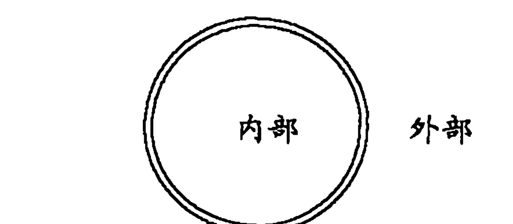

这在平面上的确如此，然而，宇宙万物并非平面。它们似乎更类似于一个圆环，这个圆环有着类似甜甜圈的曲率，而如果我们在这个圆环上画一个圈，那么其内部就是其外部了，就像下图：

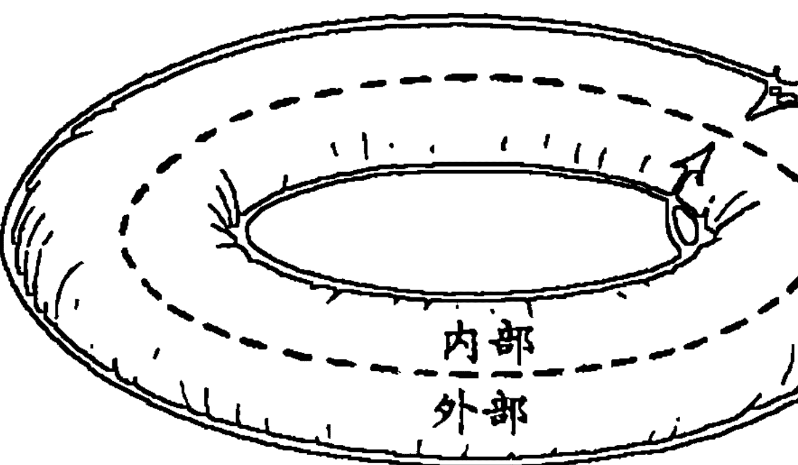

只要我们都认可，或者假设，我们就可以将内部与外部分隔开来，但是这只是假设。因此《楞伽经》中说：

> 大慧问佛祖，非二元对立是什么意思？它意味着光与影、长与短、黑与白，都是相关的词语啊，它们是相互依赖的；正如涅槃（绝对）和轮回（相对）一样，一切事物都是不二的。只有存在相对的地方才有绝对；只有存在绝对的地方才有相对；因为存在的状态并不具有互相排除的属性。因此我们说一切事物都是不二的。

简而言之，二元对立及其对立面是关系的或者思想的术语，而非实相的术语。然而，我们中大多数人彻底用代表实相的术语将实相掩盖了，因此中观论的目的就是向我们证明对于“实相”的二元论推理是完全行不通的。穆帝解释道：

> 中观论方法的含义在于，真实被我们的概念与观念的矮树丛覆盖了。其中大多数都是“先验的”（a priori），这是无明（avidya，即幻觉）的理想构架，屏蔽了真实。只有移开覆盖物，移开不透明的想法，才能认识到“真实”……中观论的方法是将思想“去概念化”，从中移除一切概念、实证以及先验。这种辩证法并非取得信息的手段，而是净化，它基本上是一条净化智力的途径……推理是通过差异和区别进行的。它若要摒弃对立面的二元对立，就必然要丧失其作为“推理”的本质。“推理”的立足点是一种特定的特殊观点，它并非普遍或者公平的知识。非二元知识是将一切限制，并将歪曲实相的所有特定观点抛弃了的。

中观论本就是要将这些“屏蔽了真实的理想构架”连根拔除并完全摒弃，因此它并非某种特定的哲学，而是对一切哲学的批评。从这一点来看，它不同于康德的批评法和逻辑的实证主义的批评，因为所有人都认同这样的说法：“实相”并没有给出它们所宣称的信息。但是不同于康德和实证主义者，中观论并没有止步于此。它推翻一切二元论概念的唯一原因，是要让我们改掉排他且依赖于符号化地图的习惯，因此让我们得以采用非二元认知模式，而光靠这种认知模式，就足以触摸到“实相”了。对于思想的完全否定并非虚无主义，而是带来了般若（prajna），带来了非二元的见解。

因此，否定让思想绝望，但是它也立刻开启了一条新的大道——

#### 直觉之路

否定是智力的直觉门槛。“空性”（Sunyata，空虚）不仅仅是观点、见（drsti）的否定，而且是“般若”……“空”对思想而言是否定的，但对其本身而言，它是绝对的非关系知识……出于实际的或者感情的偏见，“空”的辩证法可以消除我们的观念对实相强加的限制。它是对于人为和偶然限制的实相感，而非对实相的否定。“空”是否定的否定；因此它是对“真实”的无限且不可言喻的正面属性的重新肯定。

“实相”是见的“虚空”（“空”）这一观点会产生某些惊人的结果。也许认识到任何一种符号化的代表或者想法可以应用到“实相”之上是很容易的，但是我们许多有关实相的想法都作用在意识阶层上，这一点就不那么明显了。因此我们对于“实相”的观念可能，而且几乎随处可见，通过我们难以察觉的方式，被无意识的概念所扭曲。因此，语言学科学的先锋人物本杰明·沃尔夫（Benjamin Whorf）这样说：

> 我们说“看见了那道波”和“看见那幢房子”是同样的句式，但是如果没有语言的投影，就不会有人看到过一道波。我们在不断变化的波动运动中看到了表象。在有些语言中不能说“一道波”，从这一角度而言它们更接近实相。霍皮语中的 walalata，“复数的波出现了”，可以像我们一样引起对波所在位置的注意。但是，既然实际上波本身并不单独存在，那么对应于我们的单数形式的 wala，就不等同于英语中的“一道波”，而是意味着“一次搅动出现了”，也就是说装着液体的容器突然晃动了……（这只是一个例子，说明了这样的事实：）科学家也（和其他人一样）都在不知不觉中将某种特定语言的语言模式投影到了宇宙万物之上，然后“看着”它们，让它们显现在最外层本质的表象上。

举一个简单但很有启发的例子，你可以试试观察自己手指之间的差别。我们都很清楚自己的手指根根都不同，但是你能指出这些区别之处，你能够真正找到它们吗？它并不存在于你的手指中，也并不存在与它们之间，实际上，它根本不在那里！你看不到差别，这是因为它只不过是一种概念罢了，是我们所构建的一张实相地图，帮助自己进行探讨和交流。我们实际上从来都看不到那一概念，因为我们将它是观察并解释实相使用的工具。

现在让我们再进一步，试着观察一件“事物”，任何事物都可以，一张椅子、一棵树、一本书、本页中的一个字。然而，你实际上所看到的，并不是单一的“事物”，这就如同你从来看不到一道波一样，因为真正收入眼帘的是整个视域或者连续体或者完全形态，当你在阅读“牛”这个字的时候，映入眼帘的的不仅仅是这个字，实际上还有整个页面和部分周边区域。然而，当我们在阅读时，我们通常关注于文字，忽略了周围的背景。也就是说，从整体的视觉连续体中，当我们选择性地关注视域中的某一方面，并忽略其余一切时，就潜意识地用智力提取了“事物”，从而创造了它。用威廉·詹姆斯的话来说就是：

> 从缺乏差异（“空”）或重点，且本身就是无法辨别的杂乱无章的连续体中，我们的感官通过专注这种运动并忽略其他，为我们创造了一个充满了反差，充满了明显重点、充满了急剧变化，充满了美丽如画的光与影的世界。

亥姆霍兹说，我们只会注意那些代表了“事物”的感觉，但是什么是事物呢？我们应该充分认识到，事物只不过是有意义的品质的特殊群组罢了，它恰好在实际上或者审美上吸引了我们，因此我们给它们起了独立的名称，我们将它们擢升到了独立而庄严的独特地位上。

伯格森也同样意识到了“事物”的虚伪实相，因为正如他自己所指出的那样，思想通过将实相切割为便于掌握的小块，从而创造了事物。因此，当你在思考时，你就在创造事物。思考并非报告事物，而是扭曲实相来创造事物，正如伯格森所说的，“这样一来它就让真实之物的根本本质溜走了”。因此，当我们想象着一个不连续的孤立事物所组成的世界时，概念就成了观念，而我们在这样做的同时，我们的宇宙之中除了幽灵之外便一无所有。因此，中观论宣称“实相”除了是概念的“虚空”以外，还同样是独立的事物（法，dharmas）的“虚空”。

总的来说，中观论将“绝对”称为“空”、“虚空”，事物的“虚空”和思想的“虚空”。但同样，“虚空”并不仅仅是一无所有，它并非虚无主义，它只不过是我们还没有用概念切割开来的实相，即超越任何描述性的地图的纯粹的场域。这就是为什么佛教也把“实相”称为真如（tathata，也就是“本质”或者“如此”）的原因，真实的世界就是它是什么，而非它是怎样分类或者描述的。我们将在之后的章节中探讨真如，即“本质”，因此现在我们在这里不会对它进行详细阐述。我们只需要记住：显然没有任何方法可以描述超越描述能力的东西，因此我们将“本质”的真实世界称为“虚空”。即使说它是“纯粹的场域”也是没有抓住重点的！因此我们不能将“虚空”错当成想法本身，或者思想的客观事物。虽然你无法思考“虚空”，但是你此时此刻就正看着它！用二元论的观点讲，“空”并非思想的客观事物，而是“般若”、非二元意识的“客观”（更确切地说，“空”是“般若”，知识和“真实”是不二的）。而如果我们将“空”设想为一种想法，那么这一想法也应该是空虚的。

> 它无法被称作空虚的或者不空虚的，
或者两者皆是，或者两者皆非，
但是为了将它指明，
它就被称为“虚空”了。

如果正如詹姆斯和中观论所主张的那样，“实相”是“缺乏差异”的，那么我们一开始称为“有区别的事物”实际上与其他一切“有区别的事物”是完全相同的，因为将它们“划分”开来的差异只不过是老套方法罢了。现在，虽然一切“事物”都是同一的说法只不过是不存在独立“事物”的另一种表述罢了，但是大乘佛教的华严宗（Kegon）则选择了过去达到“空虚”的方法，并将其详细阐述为法界，或者“实相的领域”的深奥教义。华严宗宣称当我们通过存在着独立事物的幻觉进行观察时，我们就到达了某种感觉的阶层。在这一阶层上，每个“事物”，由于它本身是不真实的，都包含着或者渗透着一切事物，这种感受叫互聚（hu-ju），即“相互渗透”。因此，宇宙万物被比做一张闪闪发光的宝石之网。在这张网中，每一块宝石都带有其他所有宝石的反光，而它的反光又反过来存在于其他的所有宝石之中。“单一归于一切，一切归于单一。”“差异的统一，统一的差异。”这种相互渗透的领域被称为法界，“普遍场域”（Universal Field）或者“普遍体系”（Universal System），而它实际上只不过是达到“空虚”的另一种方法罢了。

在无限的法界中，每一个事物都同时包含着完全完整的一切（其他事物），哪怕是最细微的缺陷或者遗漏都从来不存在。因此，要观察某一客观事物，就等于观察一切客观事物，反之亦然。在一个原子的微小宇宙之中，某一极小的单个微粒实际上包含着在未来和遥远的过去里、无限的宇宙万物之中以及无限的客观事物和原则中，而且这些客观事物和原则没有任何遗漏，是全然的。

或者，正如诗人布莱克所表述的那样：

> 一沙一世界，
一花一天堂，
双手握无限，
刹那即永恒。

但是我们必须重新强调，法界虽然形成了华严“哲学”的基础，但是最终并非哲学，而是一种基于“般若”，基于非二元认知模式的体验；而“般若”将“实现”展现为唯识学（cittamatra）的“唯心”，或者梵天的“不二之一”，或者耶和华的“除我之外一无所有”。因此，实相或者一切独立“事物”的基础就是“心性”，从而每一个事物，由于它实际上只不过是“心性”，所以与其他所有的事物都是完全相同的，因为它们也只不过是“心性”罢了。每一种内在都是外在，“世界”就是一粒沙，而“天堂”就是一朵野花。

> 当用手舀上一捧水时，
月亮就从其中反射出来；
当摘下一朵花时，
香气就遍布在衣衫上。

法界的相互渗透与相互等同的教义，代表了人类将“实相”的非二元体验用文字表达出来的最高尝试，而这种体验本身依然是无法名状、无法表达、无法形容的，是无名的虚无。

法界并非完全与西方思想毫无关系，因为在现代系统论、格式塔心理学，以及在怀特海的机体哲学之中都能找到有与之非常类似的东西。实际上，西方科学正飞快地朝着法界的宇宙观靠近。正如生物物理学家贝塔郎菲（Ludwing Von Bertalanffy）所言：

> 我们也许可以证明，以单向的因果关系运作的孤立单一的方案是不充分的，而这成为现代科学的一个特征。因此在一切科学的领域中，我们必须通过相互作用的元素体系来思考，类似完整、整体、机体、完形等的概念的表象，而一切科学最终都象征着这些概念。

同样，斯科特（Scott）宣称现代科学唯一有意义的方法是“以相互依赖的变量为主的组织体系”来进行研究。“相互作用”和“相互依赖”恰恰就是华严宗中相互渗透的教义，因为当我们说两个变量或者两个事物相互依赖时，我们的意思只不过就是它们从本质上是不可分离的、不二的，或者非二元的，而这就是相互渗透。让我们回忆一下“牛”这个字和这一页的例子，正是格式塔心理学家们所说的形象（“牛”）和背景（“页”）的一个实例。从某一角度来看，形象与背景是不同的，但是同时，没有“页”的背景，就无法看到形象，无法看到“牛”这个字了。因此，形象和背景是“不同”的，但是又是不可分的，就如同主观和客观、事件和观察者、善良与邪恶，实际上，一切对立面都是“不同”但又不可分割的，是用差异来表达统一、用统一来表达差异，或者用爱克哈特的话说就是“没有混乱的融合”。现代科学哲学家怀特海这样来描述所谓的相互渗透：

> 我们必须用这个世界的通用机能来解释这个世界。因此，正如我们体验到的基本本质所揭露的那样，事物的融合含有某种相互包含的教义。这种世界的现实共同体说明，每一事件都是其他事件的本质中的一个要素……我们在世界之中，而世界在我们之中……这一观察的事实，虽然模糊但又不可或缺，是这个连通世界的基础……

“连通这个世界”就是相互依赖与渗透。对于现代科学和哲学重新回到法界的智慧之中，李约瑟（Joseph Needham）这样总结：

> 中国的世界观依赖于一种完全不同的思维路线（相对于西方的观点，认为机械的宇宙万物受到“君王”和“造物主”的外部主宰）。众生的和睦协作并非来源于它们自身之外的某个权威的指令（“神”），而是来自一种信念：它们全都属于一种宇宙整体等级制度的一部分，而它们所遵循的是自身本质的内部指令。有关生物的现代科学和哲学，已经回归到了这种智慧之中，并用对于宇宙、生物以及社会进化的新认识对这种智慧加以强化。

我们在这场调查研究中将触及的最后一项传统理论是瑜伽学派，它是在公元四世纪由无着（Asanga）和世亲（Vasubandhu）两兄弟发展起来的。我们唯一想要提出的有关瑜伽学派的观点就是，它强调了主观与客观的二元论在创造幻觉、使宇宙万物与自身相悖之处起到的重要作用。当然，所有传统理论都坚持认为主观与客观的二元论实际上是“从一个世界中创造两个世界”的主要源头，即便不是主要的，也是源头之一。但是瑜伽行派将它作为了一种深奥而一致的哲学根基，正因如此，我们就更值得谈一谈它。因此，瑜伽行派的核心见解也许可以这样描述：一切客观化都是幻觉，或者简而言之，一切客观都是幻觉的，并且一切客观都是心理的客观。

让我们来举个例子：我正在阅读这页中的文字，而这页本身似乎与正在阅读的我是相互独立、相区别的。换句话说，它似乎是“彼处”的某样客观事物，我的视野中的客观事物，或者我触碰的客观事物，或者其他的什么。但是瑜伽行派宣称这种将我自己作为“此处”的主观（即“在我的脑中”），与将此页作为“彼处”的客观之间的分离是一种公然的幻觉。也许我引用怀特海的另一番见解可以让大家对此有所理解：“我当前的感受是我现在是什么。”这就是说，我的“当前感受”和我“本身”是同一件事物的两个词语。然而，对我们中的大部分人而言，这听起来相当古怪，因为二元论知识让我们无法感受到自己是当前的体验，而应该是我拥有我当前的体验。可是，如果事实真的是这样的话，那么我就应该根本无法感受到任何东西了！因为如果一切感觉都是我所拥有的某种东西的话，那么当我意识到自己的时候会是怎样的情况呢？因为我自己就是各种各样感觉的混合物，如果一切感受都是我所拥有的东西的话，那么我就不能说我是自我，而不得不说“我”有一个自我了。这样，问题就出现了，这个拥有一个自我的“我”是谁呢？另一个自我——第二个自我吗？那么谁又拥有第二个自我的感受呢？第三个自我吗？我该假设出多少个自我来呢？

瑜伽学派宣称这种“围着罗西绕圈圈”的言论根本就是二元论的废话。当我在阅读这一页时，实际上只有一种感受，也就是整个视野在我的神经系统中存在一种单一感受。但是当我给该“页”赋予一种心理的概念，将它从视野中抽离出来时，这一概念就似乎与我分离开来，成为了我意识中的客观了。因为一切图像似乎都是我头脑中走马灯般从眼前掠过的客观事物，就仿佛在我的头脑中放了一台小型幻灯片放映机，它在我意识的屏幕上投影出心理图像。我仿佛坐在剧场的后排座位上，饶有兴致地观看着这些画面一闪而过。虽然从某种角度来讲，我感觉这些想法都是我自己的，然而我和几乎所有其他的个体一样感受与他们是相分离的，我正在将它们看做客观事物。因此，当我给该“页”赋予一种心理的概念，将它从视野中抽离出来时，由于这一概念似乎是与我相分离的客观事物，那么“页”也就同样必然显得是与我相分离的客观事物了。虽然这种主观与客观的二元论将我们团团包围，几无例外，但是瑜伽行派宣称它是幻觉的。没有哪种称为“自我”的感受能感受到另一种叫做“页”的感受！确切地说，只存在一种感受，而当以客观的方式看待它时，我们将它称为“页”，当以主观的方式看待时，我们就将它称为“自我”。内部就是外部，而我们感觉到它们相分离时，我们就陷入了一种幻觉之中。因此，一切客观都是幻觉的，而一切客观都是心理的客观。

现在，无论被称作“你的自我”的感觉实际上是什么，它都与叫做“页”的感受完全相同。无论这一事实有多么古怪，或者有多么像是蛊惑而原始的东方思想，我们可以借威廉·詹姆斯之口做出相同的阐述：

> 如果我们从每一个其他事件中以抽象的方式看待自己对于纸（或者这“页”）的私人视觉，仿佛它自身就形成了宇宙（而且它可能完全可以这么做，因为我们所理解的任何事物都做不到这一点），那么我们所看到的纸和对它的视见只不过是某一无法分割的事实的两个名字罢了，这个事实可以适当地冠以“数据”、“现象”或者“体验”之名。纸就在思想之中，而思想就在纸的周围，因为纸和思想只不过是一种体验所起的两个名字罢了……

根据瑜伽学派，当我们深深地意识到主观和客观是不二的，就唤醒了“般若”、非二元认知模式，而正是且只需通过这一方法，我们就揭开了“唯心”的实相。因为，正如我们所说过的那样，如果是由于宇宙万物被割裂为主观和客观，才使实相失落了的话，那么只有回到这种割裂发生之前的状态中，我们才可能重新得到天堂。

为了给这一传统理论的一些主要“分支”做个简短总结，我们应该提及一些一致的要点。当我们绘出了整个人类历史中对于“唯心”体验所采用的不同表达方式的轮廓之后，我们似乎特别擅长运用类推和否定的方法，以后我们会详细阐述指令的方法。这样一来，这些传统理论似乎只用一种方法，要么是类推，要么是否定，要么就是指令的，而事实与此相去甚远。虽然大部分传统理论可能尤为强调其中一种方式，但是它们通常都会使用所有三种方法。当一个传统理论的老师启发学生时，他一开始会采用类推和肯定的方法，解释说有这么一种全力且全知的绝对实相，发现它就能给学生带来不可抵挡的平和。这有助于启发他找到自己的中心，而他就会开始探索终极。然而，更有可能的是，这个学生无法找到出路，因为他有意识或无意识地紧紧抓着有关“实相”的想法和类比。这时，大师就开始强调否定的方法了，解释说虽然有关实相的想法很有用，但实相本身并非想法，而至此已经坚信通过类推的方法可以唤醒绝对的学生。现在就必须将他的所有实相的想法全盘否定才能继续下去，因为它们最终成为了阻碍。用库玛拉斯瓦米的话说就是：

> 总是还剩下最后一步，在这一步中，要禁止仪式、否定神学的相对实相。因为人类是通过善良与邪恶的知识从最初的崇高地位堕落下来的，所以就必须从善良与邪恶的知识，从道德法则出发，他才能最后得到救赎。无论这个人走了多远，他都还剩下最后一步，在这一步中他要消除一切过去的价值。

马哈希尊者（Sri Ramana Maharshi）说道：“总有一天，人必须把他所学到的一切全部忘却。”也许这就是《圣经》中的“真实地，真实地，我对你说，除非一颗小麦粒落入了土地之中死去了，否则它就永远都是孤独的；但是如果它死去了，那么它就能结出许多果子”，以及“我离开了会让你更方便”等这些丰富象征背后的部分含义了。而《未知的云》中的“忘却，忘却，忘却”也是如此。老子也说过“学习在于日复一日地填充一个人的仓库；而‘道’的运用则在于日复一日地减少库存”，而佛教的整体本质早已被归结为“让自己空”为了促进这种“消除”，这种“空”通常就要采用指令的方法。在这种方法中，学生得到了一系列的实验，如果他恰当地遵循这一方法，他最终就能直接体验到真正的“实相”，而非被冠以名称的实相。

因此，在大部分传统理论中，所有这三种方法——类推、否定以及指令都得到了利用，只是不同的传统对这三种方法的侧重点有所不同罢了。因此，基督教神秘教派有着类推的全知全能的“上帝”和“没有语言可以表述”的“神性”。印度教则有类推的有德梵天，也就是存在意识的大乐，否定的无德梵天，也就是“非，非”。类似地，佛教徒则有类推的法界（以及法身 [Dharmakaya]，即“心” [Citta]，即“绝对空性”等）和否定的“空”。自然而然地，所有这些传统理论都发展出了一系列的指令实验，即所谓的灵性修炼，在这些实验中，一切思想，类推的或者否定的，都暂时被放在了一边，进而直接体验。

总而言之，我们对于这个世界的一般概念是事物的复合体。这些事物在空间中延展，在时间中依次连续。而这种概念只是一种老旧的宇宙地图罢了，它并非真实的。它并非真实的原因在于，这张由符号化地图知识所绘制的图像依赖于一面将宇宙万物于时空之中分割为互相独立的事物，而将这些事物的观察者置于另一面。为了使这种情况得以成立，宇宙万物就必然要将其自身分割为观察者和被观察者，或者用布朗的话来说，宇宙万物必须变得与自身不同，从而与自身相悖。因此我们老旧的、二元论的、符号化的图像成了它们试图解释的根本实相的微妙的伪造品。

但是这种分割并不像幻觉那样虚假，因此依赖这种分割的哲学、心理学以及科学也并非是错误的，而是没有意义的。正如一只手抓不住它本身，或者一只眼睛看不见它本身一样，人也无法将自己与宇宙万物相分离，并从中抽取“知识”。但是人是如此依赖于二元论知识，以至于不断进行着毫无意义的尝试，并自以为获得了成功。结果就得到了宇宙万物的图画形象，它由在时空中支离破碎的“事物”片段所组成，这时人就以为自己来到了意识的孤岛上，一切都是陌生而不同的。

因此他就迷失在了自己的阴影之中，被限制在了纯粹抽象且二元论的宇宙地图之中，人已经完全忘记了真实的世界本身是什么样的。这是不可避免的，一旦将宇宙万物分割成观者和被观者、知者和被知者、主观和客观，让宇宙万物变得与自身不同、与自身相悖，那么很显然会像薛定谔所说的那样，“主观和客观是唯一的一体”。只有通过理解这句话，才能得以意识到真实世界。如果确实如此的话，那么这种意识本身就能被冠以“绝对实相”之名。

这就是所有这些传统理论试图告诉我们的。看破二元论符号化知识带给我们的幻觉，从而在真实的世界中被唤醒。因为这一真实的世界整体上是不存在对立面的，它显然不是可以被定义或者抓住的东西，因为所有的符号都只有从它们的对立面来看才具有意义，然而真实的世界是没有对立面的。因此它被称为“空虚”、“空”、“空无一物”、“失认”（Agnosia），即有关实相的一切思想和主张都是空虚而无效的。同时，真实世界也不存在“独立”事物，因为事物是思想的产物，而非实相的产物。因此真实世界也被称为法界，在这一领域中，我们所设想的独立事物只有交织于整个宇宙万物的“天衣无缝的外衣”之中，才可能真实地存在。而正是因为这个原因，正是因为实相是天衣无缝的外衣，并没有分裂成主观和客观，并没有抽象成在时空中延展开来的相分离的客观事物，所以那些曾经被称作时空中的多维的独立事物，在发现了真实世界之后就显现出，实际上全都是“一体”。或者，如果你更喜欢这样说的话，宇宙万物实际上与其自身毫无差异。因此真实世界也被称为“梵天”、“唯一基督”、“纯本质”、“道”、“纯意识”、“纯自我”、“不二”，并不与自身相分离，也不相悖的宇宙万物。

即使实相是无法表述的，但它却是可以体验的。由于这种对真实世界的体验受到了我们给予它的概念的蒙蔽，且这些概念主要进行认知的主观与被认知的概念之间的分割，所以这些传统理论都着重指出，“实相”只能以非二元的方法加以体验，必须弥合认知者和被认知者之间的缺口，因为光是通过这种方法，宇宙万物就不会被带入幻觉之中了。这就意味着“实相”和你对它的观念是相同的一体，博莱斯（R. H. Blyth）将之称为“宇宙万物对宇宙万物的体验”。那么这种被我们称为非二元认知模式的意识，就是宇宙万物将其自身认识为自身。进一步讲，既然我们已经假设这种认知模式对应一种职能、状态，或者被我们称为“大心”的意识阶层，并且既然要认知“实相”就要成为“实相”，那么我们就将这些传统理论的整体本质取其精华，归结于这样一句话

### 第4章 时间与永恒，空间与无垠

“实相”是一种意识阶层，是不二的“心性”阶层，它包含概念，但不为概念所掌控。由于它无法用概念的详细阐述来表达，所以可以随意用大量的类推或者否定的方法来部分描述，但是绝不可能完全描述。因此法界、道、神性、梵天、空虚，这一切都试图揭露出“实相”是什么、它的“如实”（yathabhutam，佛教语）、其“如是性”、其“真如”（tathata，佛教语），而非它是如何被标记的；正如在使一切智力产生的假象之中的“观念之门被清洗干净以后”，感受纯粹的“实相”，而不是感受经过符号化的思想过程并在报告之中被歪曲了的实相。

当我们在将“实相”说成非二元的意识时，我们中大部分人都会在脑海中显现出将意识从某一方面与主观主义联系起来的看法。也就是说，我们感觉意识并不属于“客观”，比如这一页，而属于我自己这样一个假定对这一页“有意识”的主观。这当然归根结底是二元论的，但是既然意识就是“实相”，而“实相”实际上是非二元的，那么更准确的看法就是不将意识看做与客观对立的相对主观，而将其看做“绝对主观”（Absolute Subjectivity），它并非排他地属于主观或者客观，而是将两者都包容了起来。从这一点来说，“绝对实相”就是“绝对主观”。神学专家贝蒂也夫解释道：

灵性从来都不是客观对象；而灵性的实相也不是客观的东西。在所谓的客观世界中，任何自然、事物或者客观实相都不是灵性。所以我们就能轻易否认灵性的实相。神是灵性，因为他不是客观，他也不是主观……在客观化中，不存在基本的实相，而只有符号。主观的灵性只不过是灵性的一个符号罢了。灵性（绝对主观）是现实的，而文化和社会生活是符号的。在客观之中，从来不存在任何实相，而只有实相的符号。只有主观具有实相。①

这一“绝对主观”并非主观与客观的二元论的自我主观。它被称作“主观”只是因为这个词暗示了“实相”似乎存在于内心、主观，朝着我们存在的根本核心的方向，这个核心是如此深奥，甚至是神的核心。但是一旦我们抵达了这一核心，我们就会意识到其中完全不存在二元论，也不存在主观与客观或者内心与外在之间的对立。这里是天堂和地狱的结合，二元论的语言是无法描述的，“当你无法说，那就必须保持沉默”。

在最为深奥、最为终极的深层门槛前，我们面对着这样的真相：我们的感受存在于神圣的生命深处的本身之中的。但是此时沉默占据了主导地位，因为没有任何人类的语言或者概念能够表述这种体验。那就是矛盾的否定法所占得的场域，这种不可调和的矛盾困惑着人类的思想。那就是自由和纯粹的灵性所在的终极场域，任何一元论的体系都无法将其定义。在这方面还留有二元论、悲剧、冲突、人类与神的对话、与“唯一”对立的复数世界。为了获得绝对的“神圣的唯一”，我们并不需要将个性的原则抛弃，而应该探索灵性的个性深处，它们二律背反地结合成了“唯一”。

① 尼古拉斯·别尔嘉耶夫，《灵性与实相》。“圣典的主旨并不是确切地将梵天代表为这样或那样的客观，它的主旨是说明作为永恒的主观（pratyagatman，内在‘自我’[超越主观与客观]）的梵天从来都不是客观，因此得以将客观被认知者、认知的行为等之间的区别消除，这种区别是由不可知论所创造的虚伪之物。”商羯罗对于《跋达罗衍那的吠檀多佛经》的评论。

正是因为这个原因，蒂利希才认为我们应该将“神”这个词用来表示“深度”，而这个“深度”恰恰就是我们每个人的“绝对主观”或者“亲证”，它既不认同主观，也不认同客观，但却自相矛盾地含有这两者。因此罗摩那·马哈希尊者有云：

> 既然“自我”是纯粹的“意识”，能够认识一切，那么它就是“终极观者”（Ultimate Seer，绝对主观）。其余的一切：自尊、精神、肉体等全都只是它的客观对象，所以除了“自我”或者纯粹的“意识”以外，它们每一个都只是外化的客观对象，不可能成为真正的“观者”。既然“自我”无法被客观化、无法被其他的任何东西所认识，而且既然“自我”是观察一切的“观者”，那么主观与客观的关系以及“自我”的表象主观性都只能在相对的平面上才能得以存在，而在“绝对”中便会消失。实际上除了“自我”之外什么都不存在，它既不是观察者也不是被观察者，并不属于主观，也不属于客观。

这是极其重要的一点，我们将反反复复地提到这一点，因为它形成了产生永久二元论的关键性连接，借助这一永久的二元论，“人类站在他自己的影子中，却奇怪怎么周围一片漆黑”。每个个体都习惯性地认为他的自尊、他的自我，就是他的体验、感受以及心智的主观，而他的主观自我通过某种方式感知到外部世界。他这样来表述这种感受：“我意识到我正在阅读。”但是在我之中存在某种东西，它能够看见主观的自我，也就是说，现在在我之中存在一种对于我的“自我”正在阅读这一页的意识，这样的事实应该很明显地告诉了我，我所假设的主观自我实际上是意识的客观！它根本就不是真正的主观，因为它可以被客观地感知。那么，究竟在我“之中”意识到“我的自我正在阅读这一页”的东西是什么呢？我们已经通过瑜伽学派的联系了解到，它不可能是简简单单的另一个“主观”自我，因为这样一来是什么意识到了那个自我呢？是另一个自我吗？不，但是我之中到底是“什么”在进行观看、观察、阅读、倾听以及思考呢？进行观看的不可能是我的主观自尊、自我，因为自尊、自我是可以被视见的，而正如黄檗大师所说的：“让我提醒你一下，被感知者是无法进行感知的。”换句话说，就是我的“自我”既然是可以被感知的，那么就无法成为那个感知者。但是我之中究竟是什么在进行感知呢？“你自身之中有种进行认知的东西……”慧恒（Hui-Heng）这样说道，可是它是什么呢？禅宗大师拔队得胜（Bassui）问道：

> 我的身体就像个幽灵，像小溪中的泡沫。我的心性看着自己，如同真空一般无形，但在某处却又感知到了声音。是谁在听呢？

他接着提出了一个解答：

> 要认识这一主题，你必须就在这里，就在此时，深入探知你自己，询问：“是什么以好坏进行思考，是什么在看，在听？”如果你以这样的智慧深入地扪心自问，你就一定会让自己开悟。如果你开悟了自己，那么就立刻成佛了。佛在他们的启发中，意识到“心性”是一切有知觉的存在的“心性”……这种“心性”和空间一样，是包容一切的。它并非随着我们的肉体的创造而存在，也不会随其瓦解而消亡。虽然它是看不见的，但它弥漫在我们的肉体中，而我们所做的每一个看、听、闻、说，或者动手动脚的简单动作，都只是这种“心性”的活动罢了。

商羯罗对“绝对主观”做了详细阐述：

> 现在，我应该告诉你这种“绝对见证”的本质了。一旦你认识到了它，就能从无知的束缚中解脱出来，并且获得解放。
有一种自行存在的“实相”，这是我们自我意识的基础。这一“实相”是对于自我意识和肉体皮囊状态的“见证”。这一“实相”是一切意识状态下的“知者”，即清醒、梦或无梦的睡眠。它意识到了心性的存在与否以及功能。这是你真正的“自我”。这一“实相”遍及宇宙万物，但是没有人能够洞察它。它独自闪耀着，而宇宙万物依靠它的反光而闪耀。由于它的存在，肉体、感官、心灵和智力都让自己各司其职，仿佛是在听从它的指令一般。

它的本质就是永久的“大心”。它知道一切事物，从自我到肉体。他是快乐和痛苦和感官对象（sense-object）的“知者”。他是你真正的“自我”，是“上帝”（Supreme Being），是“太古”（Ancient）。它永远不会停止对于无限愉悦的体验。它永远不会改变。它是“大心”本身。

由于它在我们之中亲证着自我，或称个体的“我”，所以罗摩那·马哈希尊者将这绝对成为“我—我”（I-I），也就是普罗提诺所说的“心性在思考其本身之前思考”。这种“我我”正是那种我们常说的称之为非二元意识或者“大心”的“绝对主观”。所以我们必须再次强调，虽然为了方便起见，我们将“大心”称为“绝对主观”或者“亲证”，但是它实际上既不是主观的，也不是客观的，它是非二元的意识，在亲证每一件事物时都不会将它与任何事物相分离，所以说“‘自我’的表面主观性质都只能在相对的平面上才能得以存在，而在‘绝对’中便会消失”。

“绝对主观”是非二元的意识，它的本质便是与其知识的“客观对象”同在的。但是，我们错误地将我们的自尊、自我当做了真实的“主观”，从而将这一“自我”与“外部”的客观对象分离开来了，并通过符号化和“客观”知识的二元论模式加以引导。这就是一切二元论心理学的原型，而且，这是一切幻觉的根源。

很显然，“绝对主观”只是法界，或者“空”，或者“道”，或者梵天，或者神性的另一种说法罢了。我们通过它们之间的联系知道，“实相”用任何明确的、最终的智力方法都不可能掌握，自然“绝对主观”亦是如此。它无法被思考，因为它就是进行观察的；它无法被认识，因为它就是进行认识的。再一次引用商羯罗的话：

> 就所有能够成为知识的客观对象的东西而言，我们可以得到一种显著而明确的知识：但是对于那些无法成为类似客观对象的东西而言，就不可能得到这样的知识。这就是梵天，因为它就是“认知者”，而“认知者”可以认识其他的东西，但不能将“它自身”作为“它”自己的知识的客观对象，这就和火焰可以燃烧其他东西，但燃烧不了自己是一个道理。你也不能说梵天可以成为除了它自身以外的其他东西的知识的客观对象，因为除了“它自身”以外就不存在任何可以接受知识的东西了。

而老子有云：

> 因为眼睛注视着，但却看不到它，
这就叫做躲避。
因为耳朵倾听着，但却听不到它，
这就叫做极高。
因为手掌感受着，但却找不到它，
这就叫做极微。
这三者，由于无法进一步细察，
于是融为一体。
它的升起不会带来光明；
它的落下不会带来黑暗。
这一系列无名之物没有穷尽
一直回到了只有“虚无”的地方。

因为“绝对主观”是纯粹的意识，不能将其本身意识作为客观对象，禅宗将它称为“无心”（wu-hsin，无意识），而《楞伽经》的解释很简单：“正如一把宝剑无法切割自身，正如一根手指无法触碰其指尖，‘大心’也无法看见它自己。”因此，我们回到了之前的问题上：在尝试将“实相”认作客观概念时，是否会让“实相”在表面上，而非实际上分裂为认知者和被认知者。我们回忆一下布朗的话：

> 我们也许会确信不疑地认为这个世界就是其本身（也就是说，与它本身毫无二致），但是，无论它怎么尝试将其本身看做一个对象，它都一定……会导致它自身变得与其自身不同，从而与自身相悖。

因此，正如我们谈及瑜伽学派时提出的，二元论的幻觉表面的来源就是客观化的过程，就是试图通过某种主观将“实相”认作某种客观，这样的投射不可避免地会失败，因为“主观性”无法成为客观对象，除非它不再是它自己（即“与其自身不同”）。但是，我们产生二元论的过程是依赖于我们对符号化地图的知识，或者说对概念化的误用。但是，实际上，不管是否谈论概念化或者是否谈论客观化，我们在本质上所指的都是同一个过程，因为就在我们形成宇宙万物概念的那一刻，我们也就（在表面上）让宇宙万物变成了客观。这就是我们在讨论瑜伽学派和中观论时所得出的结论，即这种概念和客观从某一角度来看是同义的。因此，当我们不再受有关宇宙万物的概念的困扰时，宇宙万物也就再也不会显得是客观了，反之亦然。

这就是客观化和概念化的等同性，而贝蒂也夫因此说：“在客观化中，不存在任何基本的实相，而只有符号……在客观之中，不存在任何实相，而只有实相的符号。”埃丁顿也同样坚称“失去了亲密”，也就是说，失去了非二元对立，是与符号化的崛起有关的。类似的，黄檗大师宣称“我们最初的佛教，用最崇高的实相来讲，就是缺乏任何客观的原子的”，继而宣称“只要你能够将自己的概念化抛开”，就能很明显地发现这一点了。因此，《信仰的觉醒》也坚称，当“概念化突然崛起”时，无知和幻觉就出现了，但是无知也被定义为“从客观概念中起源的障碍”。那么，从这一角度来看，概念化和客观化只不过是这样一种基本的二元对立的两个名字罢了，在二元对立中，“绝对主观”在有丝分裂的过程中变得与自身相悖。

这当然并不是暗指，如果我们想要“正确观察世界”，就必须永远抛弃我们的符号化架构。它只是意味着一旦我们完全理解了主观和客观是不二的，那么我们就可以回到概念化中，因为我们再也不会受到它的蒙蔽了。而除非我们能做到这一点，除非我们能够意识到这些客观、这些概念虚伪代表的领域，意识到我们只不过是在对着影子叫嚷。而正如一句中国谚语所说的那样：“一只狗对着影子叫，就会有一千只狗信以为真。”

正如对非二元认知模式的认识非常普遍一样，对“绝对主观”的隐喻亦是如此。当被问及在哪里可以找到天堂之国（Kingdom of Heaven）时，基督回答道“在心里”。“在心里”确切地讲就是“源头”、“亲证”，在印度教中则被称为“阿特曼”（Atman，生命的本源），它是我们每个人的“最高知者”（Supreme Knower），它只能是梵天，是宇宙万物单一而基本的“实相”，所以当意识到这种“在心里”、这种阿特曼、这种“绝对主观”时，我们每个人都可以说“我和上帝是一体的”，或者正如《奥义书》所说，“它是最好的本质——是整个宇宙万物的‘自我’，它是‘实相’，它是阿特曼，它就是你”。

在大乘佛教中，这种“超越的内在”被称为“如来藏”（Tathagatagarbha），或者“实相的矩阵”（Matrix of Reality）。“矩阵”这个词表明了实相像场一样的普遍本质，因此令人想到法界或者“普遍场域”（Universal Field）。实际上，若以个体为中心，那么如来藏本质上是与法界相同的，这就如同在以个体为中心时，印度教中的阿特曼和梵天是相同的。但是如来藏（以及阿特曼）具有更为心理学、更为“个人”的环，因为它也意味着“实相的子宫”（Womb of Reality），我们在这一子宫中得以重生，正如赫耳墨斯（Hermes）所说：

> 感谢神，让我看到在我之中有一个脱离了物质范畴的形态……我现在已经不是曾经的那个作为人的我了。我在“心性中”得以重生，而过去我的肉体形态已经被我抛弃。我也不是带有颜色和形态的客观对象了；不再是具有与空间有关的尺寸的东西；我现在与这一切完全不同，与你用肉眼凝望所感知到的一切都不同。在你的眼睛中，我的孩子，我现在已经是看不见的了。

“现在已经是看不见的了”是因为没有人看得见“绝对主观”、“心性”，它不会让自身堕落成客观对象，除非是在幻觉之中。

在禅宗中，“绝对主观”的“位置”，也就是以非二元对立的方式认识“实相”的“状态”，被称为“主”位（Host），与通过客观概念认识实相的“客”位（Guest）相对。处于“主”位中心的人就是道教中所说的“圣人”（Superior Man），而临济宗（Ranzai）将之称为“没有等级的真实之人”（wu-i）。但是正如约翰·多伊夫人（John Doe）所说，这不是“人”（man），而是“仁”（Man, jen），是“圣子”（Divine Son），是三位一体（Trinity）的第二个人，是完美之人（al-insan al-Kamil），是“元气”（Pneuma），是主（ruarch adonai），是“心灵”（Nous），是在我们所有人之中普遍存在的“绝对知者”，是阿特曼（Atman），是“真元体”（Purusa），是“始祖亚当”（Adam-Kadmon），是“圣人”（Divine Man），是“普遍之人”（Universal Man），是尼采所说的“超人”（Superman），没有等级是因为我们无法对它下任何定论。正如雪莱在《被释的普罗米修斯》（Prometheus Unbound）中所唱的：

> 彩色的遮挡物，被那些人，称为生命，
它只是模仿，让色彩漫不经心地散开，
所有的人都相信且期望，但却被撕毁；
这可憎的面具已经落下，只剩下人
失去了权力、得到了自由、不受限制……

让我们在这里陈述一个要点，它虽然在整个有关“绝对主观”的论述中一直隐含着，不过现在已经可以明确地描述出来了：人，作为“知者”、“亲证”、阿特曼（Atman）、“绝对主观”、“主”体、如来藏、你之中那个正在阅读这一页的东西，就是“神性”、梵天、法界、没有等级的“普遍”之人、“心性”、“实相”本身；而人，作为知识的客观对象，作为被感知的现象，作为“客”体，作为掩盖在“彩色的遮挡物、可憎的面具”下的东西，就是自尊，是个体的人（希腊语的 persona，指“面具”），是相分离相区别的自我。

现在“绝对主观”或者“大心”通常被描述成“无限”和“永恒”的，但是同样的，这也只是两种代表“实相”的概念而已，它们是在利用非二元认知模式揭示之后得到的。问题一如往常，当我们试图谈论实相时，我们没有其他的资源，只能利用概念，而由于所有的概念都是二元论的，我们在张开嘴巴的同时便言不对题了。这就好比四个和尚发誓保持沉默，在相当长的一段时间后，其中一个和尚不经意地说“我决定在我的余生之中保持沉默”，听了这句话，第二个和尚就评论道：“但你刚刚就说了一句话把这誓言打破了！”第三个和尚接着对第二个和尚说：“但是你现在也打破了誓言！”第四个和尚开始哈哈大笑起来，因为其他三个和尚全都打破了沉默的誓言，他也忍不住说道：“好吧，看来我成了最后一个保持沉默的人了。”因此黄檗大师这样讲：“当你开始推理的时候，就立刻落入了错误之中。”而圣·奥古斯丁（St. Augustine）会最终总结道：“一切圣典都是无效的。”

当我们在试图理解“无限”和“永恒”时，这一困难就尤为严重了。例如，当我们思考无限的场域时，我们通常将它理解为某种立足于有限领域之上或者旁边的事物，而这立刻丧失了其绝对本质，因为无限既然是“包容一切的”，那么就没有对立面，也不会立足于任何东西旁边，也（比喻地讲）不会存在任何边界。“有限并非无限的对立面，而只是其中的摘录。”如果我们非要思考它，那么无尺寸、无空间、无延展，或者无维度的否定概念是我们思维能力范围内与之最为接近的方法了。因此，完整的“无空间”的“无限”呈现在空间中的每一个单独的点上，也因此，对“无限”而言，空间中的每一个单独的点都是绝对的“此地”。举个非常粗糙，甚至有一定误导的类比，那就是“蓝”这种颜色，因为“蓝色”本身是无形态的、无空间的，但是它并不排斥形态，因为你可以拿出一支蓝色的笔并画出各种形态、形状以及图形，而“相同的蓝色”同等而完全地呈现在一切此类创造的形态之中。因此无限并非有限存在的对立面，倒不如说它是其“基础”，所以在无限和有限之间，绝对不存在任何边界。

最聪明的神学家和形而上学者们全都理解这一点。例如，在《华严经》

#### 事事无碍与无限

中，这种见解被表述为“事事无碍”（shih li wu ai），即在无限和有限之间没有障碍。曹洞宗（Soto）大师东山（Tung-Shan）将它表述为“偏中至”（pien chung chih），可以大致翻译成“通过有限的细节理解无限”，这就是布莱克诗中的“一沙一世界”。伟大的禅宗大师云门（Yun-men）则更为直接，一天他用拐杖在地上画了一条线，宣称：“多得有如沙粒一般的诸佛，就聚集在这无穷无尽的争论之中！”这大致上可以作为佛教对于基督教所提（极其合理的）问题的解析，“在针尖上能站多少个天使？”

有一个经常用来揭示无限的“非思想性”的类比，那就是镜子和其反射的对象，因为镜子可以反射苹果和马、人和树、椅子和鸟。镜子本身不存在于这些反射之中，但是它也并非与它们相分离的，克莱门（Clement of Alexandria）将其表述为“‘神的灵性’不可分割地分给了一切”。因此，黄檗这样解释道：

> 本质上的佛教是一个完美的整体，没有多余，没有缺少……它弥漫在存在的有限领域之中，但是在任何地方又保持着完全的整体。因此，宇宙万物中的无数现象之中的每一种都是绝对的。

同样，龙树在这点上也坚定不移，正如穆帝很专业地解释道：

> 绝对并不是与另一种实相相对的某种实相，不是以经验主义为根据的（也不是有限的）。穿过思想形式而看到的绝对就是现象。后者在脱离了强加于其上的思想形式以后，就是绝对。其中的区别是认识上的，而不是实体上的。因此龙树宣称在世界和绝对真实之物之间是没有一丝一毫区别的。

撇开表面上的共同点，这绝对不是被称为泛神论的哲学体系，泛神论坚称一切事物都是“神”。① 首先，事物是不存在的；其次，这不是一种哲学，而是一种意识阶层；再次，事事本无碍，“在无限和有限之间没有障碍”，无限和有限并不能对立起来或者相互并列，因为这样一来，既然与有限的存在相并列的本身必然也是有限的，于是就会将无限拖到有限的阶层，让它成为与其他存在并列的存在。蒂利希（Paul Tillich）的一生中很大一部分都在试图论证这一点，而他的一位学生，罗洛·梅，这样做出了总结：

> “神”不可能是与其他存在并列的东西。如果坚持他是“高于”或者“低于”其他一切存在的存在，那么他依然是与其他存在相并列的，是我们假定的在宇宙万物之中存在于恒星之间的“最伟大的存在”。如果他是一种事物，那么宇宙万物之中其他事物就一定不受他的控制，而他也必须受到整体结构的支配。于是就如同整个蜂巢里面的大黄蜂都飞了出来一样，荒唐的问题出现了，“‘神’在创造地球之前是如何打发时间的？”保卢斯（蒂利希）有一次跟我们讲到这个问题时，得到了他一位德国学生的解答：“考虑该如何惩罚那些问出这样问题的人。”

现在，在谈论无尺寸、无维度，或者无空间的“无限”时，在“无限”中不存在的空间基本上就是主观和客观之间的空间。或者，如果你能这样想的话，在你和这一页之间的空间，便是你和你所感知的客观对象之间的空间。这个空间似乎让你成为了“此处的主观”，与作为“彼处的客观”的宇宙万物相分离了。现在这一空间似乎是真实的，因为你很确信你的主观自我是真实的，并且更进一步讲，它实际上就是和你所感知的客观对象相分离的。

但是这两种假设都显而易见是错误的。实际上，你“分离而主观”的自我根本就不是真正的主观，它不是真正的感知者或者真正的观察者，因为它可以轻易被感知、被观察，我们再引用一次黄檗的话，“让我提醒你一下，知者是无法被知的”。换句话说，这种分离的“主观”只不过是我由于某些特定原因而认同的可感知的客观对象的复合体。简而言之，它根本就不是真实的主观，而是一种伪主观！那么，如果我们看透这种伪主观的“背后”，向着内在的方向观察，寻找真正的“感知者”、真正的“自我”、“绝对主观”时，会发生什么呢？我们能找到什么呢？听听休谟（David Hume）在他的《人性论》（*Treatise of Human Nature*）中是怎样说的：

> 在我看来，当我以最为亲密的方式进入所谓的自我之中时，我总是会偶然遇到一些特定的观念之类的东西，这是些有关热或冷、光或影、爱或恨、痛苦或快乐的观念。只有通过观念，我才能抓到我自己，而我能观察到的，也只有观念而已。

换句话说，无论我在何时寻找我真实的“自我”，我所找到的都只是观念的客观对象，这是对“绝对主观”之中不存在主观和客观的空间的最确切论证。于是马哈希尊者就可以宣称：“‘观者’与被观者是不同的，这一概念存在于心性之中（即在心智之中），而对那些明白（‘绝对主观’）的人而言，‘观者’与被观者是相同的。”简而言之，“绝对主观”是伴随着其认知到的万物的，所以实际上，你就是你所观察的东西。

因此在“此处的主观”和“彼处的客观”之间的这种分割、这种空间是一种微妙的幻觉。真实的“自我”不能从远处认知宇宙万物，只能成为宇宙万物来认知它们，它不会受到哪怕一点点空间的干扰，而无空间的东西就必然是无限的。

那么，永恒对于时间而言就相当于无限对于空间。也就是说，如同“无限”的一切都完全呈现在空间中的每一点上一样，永恒的一切也都完全呈现在时间的每一点上。因此，从永恒的观点来看，一切时间都是绝对“现在”，正如对于“无限”而言，一切空间都是“此处”。既然一切时间都是“现在”，那么就能得出过去和未来基本上都是幻觉，而“唯一的‘实相’是现在的‘实相’”。

> “神”创造第一个人的“当下”和最后一个人类消失的“当下”，以及我正在讲述的“当下”全都归为“神”的一体，对他而言只有唯一的“现在”。看！生活在“神”的光芒之下的人既意识不到过去的时间，也意识不到将来的时间，而只能意识到唯一的永恒。

这就是为什么《圣经》用各种方式谈论在时间之中的灵魂之日与在永恒之中的“神”之日。圣·狄奥尼修斯说道：“据我看来，有必要理解《圣经》中有关‘时间和永恒’的说法的含义。”爱克哈特大师解释道：

> 日的存在并不只一种。有灵魂之日，也有“神”之日。一日，无论是六七天前，还是超过六千年前，都同样与如今的昨日相近。这是为什么？因为一切时间都包含在如今的“现在时刻”之中……灵魂之日落入这一时间之中，它有着照亮事物的自然光。但是，“神”之日则是完整的一日，既包含白天，也包含黑夜。它是真正的“现在时刻”……过去和未来都与“神”相去甚远，和他的方式完全不同。

由于在永恒的光芒之中，过去、现在以及将来连续不断地存在于这种“现在时刻”中，所以基督就可以宣称“还没有亚伯拉罕，就有了我”，而普罗提诺则说，“只存在一日，不存在连续；没有昨日，没有明日”。圣·奥古斯丁论道：“在观察事物的变化时，你将在所有地方看到‘曾经’和‘未来’。如果你用‘神’的观点来看，那么会在不存在‘曾经’和‘未来’的地方找到‘现在’。”① 就连圣·托马斯本人也深谙“实相”是永恒的，正如他清晰阐述的那样：

> “神”根本不动，所以也无法用时间来衡量；他也并不存在于“过去或未来”，或者说在存在之后就再也不存在了，在他之后你也找不到任何遗留之物……但是他的整个存在却是连续的；而这就是永恒的本质。

类似的，库萨（Nicolas de Cusa）宣称：“一切暂时的连续都与唯一而相同的‘永恒当下’（Eternal Now）同时出现，所以不存在过去或者未来……”

“实相”是“永恒”的见解绝不是局限在基督神学中的。因为它是“宇宙范围内的哲学共识”的重要部分，从印度教到现代物理学的任何地方都能找到它的踪影。例如，吠檀多派的马哈希尊者说道：

> 除了我们以外，时间在哪里，空间又在哪里？如果我们是肉体，那么我们就受到时间和空间的影响，但是我们是肉体吗？我们是唯一且等同的“现在”、当时、永远、此处、彼处以及任何地方。因此，我们本身就是没有时间、没有空间的存在……我的意思是：“自我”本身就在此时此地。

而对于佛教而言，你可以说所有形式的佛教修行的基本目标总的来讲只不过是觉悟（“佛”的意思是“觉悟者”）与“永恒的当下”（Eternal Present）。因此黄檗提议说：“没有起点的时间和现在的时刻是相同的……你只需要理解时间没有真实的存在即可。”而赵州禅（Chao-chou）认为：“甚至在世界出现之前，‘实相’就出现了。”铃木大拙在解读《华严经》时宣称：“在这个灵性的世界中，没有像过去、现在和未来这样的时间划分；因为它们将自己缩小到了现在的某一时刻中，在这一时刻，生命以其真实的形式振动着。”而在《华严经》中，善财童子就将“实相”称为“那些可以在一瞬间（ksana）中感受到数十亿年（kalpas）的存在的人……的居所……在一瞬间中感受到所有的过去、现在与未来”。而《起信论》声明：“‘大心’是‘永恒’的意识是‘最终’的开悟。”

因此禅宗大师利用每一种可以想象得出的方法（upaya）让他们的学生觉悟到“永恒的当下”。正如张仲元所说：“这是传授禅宗的要点，终极实相就位于日常存在的核心中，只要他能够懂得如何掌控绝对的时刻。”就连佛自己也说：“让你自己度过黏稠的泥潭，但别让‘时刻’渡过，因为它们应该悼念那些‘时刻’已是过去的人。”为了抓住这一“时刻”，禅宗求助于直接和立刻的行动，因为这种率直的行动本身即无所谓过去，也无所谓将来。一天，当禅宗大师玛祖正和他的一个学生张博散步时，一群野鹅从头顶飞过。这时，玛祖问：“那是什么？”“野鹅。”“在这一时刻它们在哪里？”“这有什么关系，它们已经飞远了。”这时，玛祖抓住了张博的鼻子，狠狠地扭了一下，张博疼得叫出声来。“你怎么能说它们已经飞远了呢？”玛祖指令道，“它们从一开始就在这里！”

作为伊斯兰教的代表，鲁米（Jalalu’d Rumi）在讲到“神”的时候，宣称：“他在过去时间和未来时间中的存在只是与你相关的，这两者对他而言都是相同的，但是你却把它们看成了两种东西。”因此真正的苏菲派诗人被称为“时刻”之子。“他……不受时间影响……过去和未来以及没有起点的时间和没有终点的时间并不存在，（因此），‘明天’就无从说起。”这和基督的“不要思考明天”非常相似。

即便是现代量子物理学家也已经永远抛弃了有关连续时间的古老牛顿力学概念，并用给定个体的绝对的“此地此时”取而代之。薛定谔对于“实相”是“万物唯心”有着深刻的理解，他如下阐释：

> 我大胆地将它（“心性”）称为不可摧毁的，因为它有着独特的时刻表，即“心性”总是“现在”。实际上“心性”并没有过去和未来……现在是唯一存在的，没有终点……我们可以断定，或者说我这样认为，当前阶段的物理学理论强有力地说明了“心性”无法被时间摧毁。

“心性”无法被时间摧毁的原因，正如巴门尼德（Parmenides）所说，“它既没有过去，也没有未来，因为它就是现在，全都在一点上”。而这个“现在”，在但丁的口中，就是“呈现出一切时间的‘时刻’”。

但是，同等重要的是，量子力学和相对论也带来了另外一种见解，即空间、时间和客观对象在某种程度上是连续的。通过一种粗糙而非数学的方法，我们可以做出如下解释：空间应当被看做一种环绕的功能；也就是说，空间并不是空白而平凡的虚无，而应是围绕或者包住客观对象的东西，这就是为什么物理学家把空间当做具有某些属性的东西，比如曲率。换句话说，空间无法脱离客观对象而存在，因为从定义上讲它就是围绕客观对象的东西。而另一方面，客观对象必须被空间包住，也就是说，它们必须有一道边界，否则就自然爆炸了。因此，空间和客观对象是一体的。此外，客观对象为了能够得以存在，就必须持久；也就是说，持续性或者时间对于客观对象的存在是必需的，因为没有持续性的话，那么就不存在能够持久的东西。相反，持续性的存在依赖于客观对象，因为若没有持久的客观对象，那么就不可能存在持续性；而从这一角度来看，时间和客观对象是一体的结论，从而就可得出空间与时间也是一体的结论。因此，空间、时间以及客观对象都相互依赖、不可分离，因此这三者中任何一种的非真实性都会意指其他二者的非真实性！关键在于既然空间和时间是幻觉的，那么我们就轻易论证了中观论对于“事物”无效性的“教义”，同样也论证了《华严经》中“事事本无碍”、“一切事物的相互渗透”的教义。亚里士多德有云：

> 如果过去和未来都是一体，是相同的“当下”，那么在一万年前发生的事情将于今天所发生的事情同步，任何事物都没有先后……那么一切事物就存在于任何事物中，而宇宙万物就存在于一粒小麦中，这正是因为一粒小麦和宇宙万物两者都是在同一时间存在的。

库玛拉斯瓦米在评论这篇文章时，解释道：

> 有一种说法认为，宇宙万物“存在于一粒小麦中”；因为如果不将一粒小麦和宇宙万物看做独立的存在，而着眼于它们在绝对的“现在”中保有的共同不变的本质，那么就可以说宇宙万物“存在于”一粒小麦之中，同时，一粒小麦也存在于宇宙万物之中……

而这一切正是因为时间的非真实性意指了个体客观对象的不真实性！

现在我们有了这样一种见解：真实世界“同时具有完整的存在，而这就是永恒的本质”。这样的见解直接引出了对于推理在领会实相时的能力的质疑，这种质疑结果可能是最为严重的。坦率地讲，思想是沿着直线进行的，而真实世界并非如此。这种不可避免的限制深深扎根于思想结构的最深处，它最早是由怀特指出的，后来得到了例如麦克鲁汉（McCluhan）、贝特森（Bateson）、里利、瓦兹（Watts）和韦尔（Weil）这样的学者的详细阐述。心智是连续的、接连的、单维度的，而真实世界将其本身呈现为一种多维度的、非接连的、非连续的、无限的丰富和多样的形态；而试图利用其中一种来抓住另一种，就好比试图通过篱笆上的一处狭缝来欣赏美丽景色一样，或者试图光靠显微镜来理解雷诺阿的画作一样。

我们记得，“事物”只是心智的产物，并不是组成宇宙万物的真正实体。也就是说，一个“事物”不过只是特定注意的一小部分罢了，是“形象”，是忽略了其不可分离的“背景”而从完整的感官形态上切下的一小片。用威廉·詹姆斯的话来说，一件“事物”是“注意此而忽略彼”的产物。正如詹姆斯进一步指出的那样，这些注意的小部分接着被文字、名称，或者其他符号赋予了意思，因此升至真实、现有、独立“事物”的虚构地位。而由于除了固有名称之外的一切文字都是二元论的，这一过程只是加剧了这样的幻觉：“事物”是相分离且自我存在的实体，它们就在那里等待着被感知。当我们完全将这些符号与实相本身相混淆时，幻觉就得到了承认。

但是，事实依然不变，形象和基础组成了差异的同一与同一的差异，及其不可分离的关系，这两者在没有对方存在的情况下是不可能得以显现的，正如没有凹陷就不存在突出，没有外在就没有内在，没有卖家就没有买家，没有下就没有上，没有外就没有内。我们说“事物”不存在并不是说世界实际上就是统一的浓粥，正如布莱斯所指出的，“空虚”的意思是“无缝的”，而非“无特征的”。无论如何，只有当我们习惯性地将注意限制在天衣无缝的意识场域中单一的特定面向上，心智才会向我们呈现出这样令人信以为真的幻觉，以为世界是由存在于“彼处”的相分离相独立的“事物”所组成的复合体。

心智在处理这一小部分的注意力时，唯一方法就是将它们按照线性的方式排列。显然，一旦将世界切割成大量小块后，这些小块就无法一次吞咽了，而必须连续地吞咽，一个接一个，正如你现在必须一个字一个字地阅读这份材料一样。你无法在同一时刻思考两件或者三件“事物”，否则就会陷入令你瘫痪的困惑之中。所以，为了引入某种连贯性和顺序的分量，心智就在记忆的帮助下，将这些独立的注意力小块顺着一条线展开，这条线正是它为了达到这一目的而创造的，而这些文字被排列成“一行行的印刷体”也是按照几乎相同的模式进行的。

这条用来集中注意力的连续小块所组成的“线”，这条心智在其上沿线排列出客观概念的“线”，这条心智自身创造出来的“线”，与时间毫无二致。换句话说，时间不偏不倚地正是心智观察这一世界的接续。但是，当我们习惯性地用这种线性、连续、暂时性的方法来观察自然时，我们很快就得出了“明显”的结论，认为自然本身就是呈一条线的，从过去到未来、从原因到结果、从之前到之后、从昨天到明天，完全忽略了自然这种假定的线性根本就是我们观察它的方法带来的产物。然而，对于一把榔头而言，整个世界就像钉子一般。

可是，自然并不是一条线，它是同时发生，在同一时刻发生在所有地点。而这种同时性的证据就在你的眼皮底下，你只要停止阅读，抬头一看，你就能看到无穷无尽的过程全都在同一时刻发生着：太阳照耀着、心脏跳动着、鸟儿歌唱着、孩童玩耍着、肺部呼吸着、小狗吠叫着、狂风劲吹着、蟋蟀啾叫着、眼睛观察着、耳朵倾听着，还需要继续列举吗？这些现象在时间上并不是分别进行，或者一个跟着一个的，它们全都在同一时刻发生在任何地方，既不在这之前，也不在这之后。换句话讲，当我们说自然并不是沿着一条线进行的，就是说自然并不是在时间中进行的，它同时具有其完整的存在，而这就是“永恒”的本质。

实际上，连续的完整概念，在时间上一件“事物”接续另一件“事物”的概念，直接依赖于我们记忆的过程，因为没有记忆的话，我们就绝对没有任何时间观念，也没有过去或者未来的观念。那么，问题就是，记忆所报告的是否是被我们称为“时间”的真实象，或者记忆是否创造了“时间”的幻觉。

乍看，记忆似乎能报告一幅非常真实的关于过去的图像。因为我们毫不含糊地认为我们不仅能够认知注意力的现在部分，而且也能认知在记忆中所储存的部分。从这些记忆的部分中，我们自然而然地推断，一定存在真实的过去，这样一来我们就产生了对于时间最为生动的感觉，并且想象我们从某种程度上在其中穿过，并向着未来移动。因此，对于时间的整个观念就直接依赖于这样的概念：我们可以通过记忆，认知真实的过去。

但是有一种微妙的幻觉进入了这幅图像中，这种幻觉最早被奥古斯丁发现并指出，而最近又被薛定谔和瓦兹等人加以证实。因为，严格地讲，我们根本就没有直接意识到真实的过去。确切地说，我们只能意识到对于过去的记忆画面，进而，记忆只存在于当下，也只能是当下！用瓦兹的话来讲：

> 但是记忆又如何呢？我通过记忆就一定也能知道什么是过去吗？很好，我们记得什么。记得看到一个朋友走在街上。你意识到了什么？你实际上并没有看到你朋友走在街上这一真实的事件。你无法走上前去与他握个手，或者问他一个你记忆曾忘记提出的问题。换句话

① 因此库玛拉斯瓦米说：“这样说并不夸张，对于印度教，可以很好地通过对其所做出的大部分论断的绝对否认的形式来给出其准确无误的解释，无论这些论断是由欧洲学者做出的，还是由那些接受了现代的怀疑和进化的思维模式训练的印度学者做出的。例如，一个人一开始指出吠陀的教义既不是泛神论，也不是多神论的……”《印度教和佛教》，第3页。铃木大拙也说：“这令人感到遗憾，因为泛神论是与禅宗无关的……即便当禅宗进入智力领域时，它也绝不会同意对这个世界的泛神论解释。首先，禅宗中并没有‘唯一’。如果禅宗仿佛认识到了‘唯一’而谈论它时，这是一种屈尊于通俗说法（类推的指出方法）的方式。”《禅宗和日本文化》，第32页。

① 库玛拉斯瓦米，《时间与永恒》，第 112 页。铃木说：“但是如果我们不用某种方式继续将‘曾经’或‘将来’转为‘现在’，那么我们就得不到精神的平静，我们就无法逃离忧惧……”《神秘主义、基督教和佛教》，第 53 页。说，你看到的根本就不是真正的过去。你所看到的是有关过去的现在追溯……你从记忆中断定过去事件的存在，但是你并没有意识到任何过去的事件。你知道过去之存在于现在之中，是现在的一部分。

因此，当我们记忆任何“过去的事件”时，我们根本就没有真正意识到实际的过去。例如，如果你记得昨晚吃了什么，那么这一记忆能否让你真正看到那顿晚餐呢？能触摸它吗？能品尝吗？显然，你根本从来都没有意识到任何实际的过去，而只能意识到有关过去的模糊画面，而那些画面只能作为现在的感受而存在。

对“未来”而言也是同样如此，因为任何有关明天的想法都只不过是现在的想法罢了。我们不可避免地将过去和未来认知为“只存在于现在，且是现在的一部分”。因此，我们所能意识到的唯一的时间就是“现在”！于是，薛定谔就说：“‘心性’一直是现在，‘心性’并没有真正成为过去和未来，只存在于包括了记忆和期望的现在。”奥古斯丁也持有这样的看法，罗素总结他的观点时说：“过去和未来都只能作为现在来加以思考，‘过去’必须与记忆一致，‘未来’则与期望一致，而记忆与期望全都是现在的事实。”因此，只有在将现在的记忆与过去的知识相混淆时，我们才会从现在的时刻中得到“时间”的庞大幻觉。

这就是时间起源的方式，我们最终将看到时间起源的原因就是人类对于死亡的规避。但是在时机成熟之前我们先把它放在一边，现在我们应该很显然地认识到，当我们不再将记忆想象为“过去”的真实知识时，而将它理解为一种现在的感觉，那么时间幻觉的支柱就立刻崩坏。过去和未来都崩塌而成了现在，之前和之后崩塌成了当下，线性崩塌成了同时，而时间消失于“永恒”之中。因此以上所有对于时间和永恒的援引就指向了同一种见解：当下的时刻包含着一切时间，因此其本身是永恒的，于是这种永恒的当下就是“永恒”本身——一个没有日期或者持续、延展或者连续、过去或者未来、之前或者之后，“同时具有其完整的存在，也就是‘永恒’的本质”的时刻。因此我们可以用洛内·格农（Rene Guenon）的话来说：

> 无法从暂时的连续的观点中逃脱，故而无法认识到一切事物的同时性的人，是无法领会形而上秩序（metaphysical order）最基本的概念的。

用库玛拉斯瓦米的话来讲就是，“他的（神性的）永恒本质就是没有持续的‘当下’，而我们这些只能以过去和未来的方式思考的人不能，也无法感受到它。”而维特根斯坦所说的是，“如果我们不将永恒意为无限的暂时持续，而是没有时间的永恒，那么永恒的人生就属于那些活在当下之人。我们的人生是没有终点的，这就与我们的视野没有界限是一个道理。”

我们有必要重申一遍维特根斯坦的观点：永恒并不是永久的暂时持续，而是没有时间的永恒。正如无限既不大也不小，而是无尺寸、无空间的，所以永恒既不是永久的时间，也不是一秒钟所分割出的片段。更确切地说，它是没有时间的永恒，没有日期或者持续的时刻，就在现在完整地存在着。这种当下的时刻，既然它既与过去无关，也与未来无关，那么它本身就是没有时间的永恒，而没有时间的永恒者就是“永恒”。因此“永恒的人生就属于那些活在当下之人”。

在主流基督教中存在着在永久的时间与“永恒”之间的惊人混淆，因此也深入到了大部分西方人的想象之中，我们可以将其称为一种重要的哲学灾难，由此生出了这般狂热的问题：“‘神’是如何认识未来的？”在另一方面，如果我们理解了“永恒”，那么答案就变得很明显了。正如波伊修斯（Boethius）所指出的那样，“神”对于未来的知识，或者“先知”，应该“与其将它当做对于未来的先知，不如当做对于一个永不消逝的瞬间的知识。因此它并不应被称作预想（pre-vision）或者前见（fore-sight），但应该称作现见（on-sight），因为它远离底层事物，仿佛从事物的最高顶点上俯视着一切”。波伊修斯口中的“现见”也许就是我们如今所说的洞见（insight），而洞见恰恰是永恒的非二元的认知模式。“神”通过非二元的洞见将一切事物、一切时间（过去与未来），都作为存在于这“永恒时刻”中而加以认识。

时间和“永恒”之间的混淆同样也产生了使人类痛苦不堪的、最令人困惑的问题之一，即“宇宙万物是何时被创造出来的”。许多现代的天文学家会做出类似这样的回答：“发生在几十亿年前的一次‘大爆炸’中，物质被这次爆炸从一个密度极大的电离等离子池中向外甩入了空间之中，这就是宇宙的开始。”但是当问及在“大爆炸”之前发生了什么时，你得到的答案要么是“大逃避”(Big Evasion)，要么是“我们不知道”，要么就是“让我们换个话题吧”。由于至今还没有人找到时间的起点，所以如今的大部分科学家对于这个问题会做出不约而同的回答，他们答道“它从来未曾被创造，也不会终结”，但他们并没有真正理解这句话的惊人意义，因为如果时间没有起点也没有终点的话，那么它就是，也必然是没有时间的“永恒”。也就是说，宇宙和其中的一切事物都是“现在”，在伯梅（Boehme）所说的“永久的起点”中被创造出来的。因此爱克哈特宣称：

> 谈论“神”在明天（或者）昨天所创造的世界，就是无稽之谈。“神”在当下的现在创造了世界和一切事物。

铃木大拙在谈论有关“空虚”（“空”）的佛教教义时，说：

> “神”在时间中是无法用数学来点数的。他的创造并不是历史的，也不是偶然的，根本就不是可测量的。它永不停止地连续着，没有起点，没有终点。它并不是昨天或者今天或者明天的事件，它来自于没有时间的永恒，来自于没有事物的空虚，来自于“绝对空虚”（Absolute Void）。“神”所做的事情总是发生在绝对的当下……

而库玛拉斯瓦米解释道：“换句话说，‘神’一直是在‘现在，这一瞬间’创造着世界，而且只有对于那些时间的产物而言，这种创造才会将其自身呈现为一系列的事件，或称‘演化’。”

因此创造从来都是在当下发生的，它直接来源于这永恒的“时刻”的“空虚”之中，而这种创造并不是事物的、物质的，或者实质的创造，而是二元论的创造。因此宇宙被创造了出来，而我们就必须迅速转向这一创造。

为了给这场有关“永恒”和“无限”的探讨画上一个句号，我要强调一个重点。为了正确地看待世界，为了体验到“绝对主观”，为了将它以“无限”和“永恒”加以认识，并不是抛弃有关过去与未来的暂时二元论，或者有关主观与客观的空间的二元论就行了。这两者与其他所有的二元论一样，至多也只是错在其幻觉性上，而试图将它们抛弃并不是错误的，而是没有意义的。时间和空间是无法被抛弃的，理由很充分，因为它们本不存在！

因此，如果我们此时仔细观察，想要找出哪怕一丁点时间的轨迹，我们也无法做到。因为，正如奥古斯丁所说，过去根本就只是记忆，而未来根本就只是期望，而记忆和期望全都是现在的事实！思考过去——这是一种现在的行为；期望未来——这也是一种现在的行为。任何过去的证据都只存在于现在，而任何相信未来的理由也只存在于现在。在真正的过去发生之时，那并不是过去，而是现在，而当真正的未来到来之时，那也不是未来，而是现在。因此，我们所能意识到的唯一的时间只有当下的时刻，是包含了记忆中的过去和期望中的未来的当下。

由于这一时刻含有或者包容着一切时间，所以其本身就在时间或者无时间之上，而这就是“永恒”的本质。不管我们是说一切时间都是现在，还是说除了现在以外没有时间，全都归结为同一点：时间是一个庞大的幻觉，而没有时间的时刻就是“永恒”本身。因此，“永恒”并不是永久的时间，而是真实、不会消逝、无法摧毁，而且没有时间的“当下”，因为，薛定谔说过，当下是唯一没有终点的东西。

类似的，有关主观与客观的二元论和有关过去与未来的二元论有着同样的幻觉性，而其幻觉的本质可以得到轻易的论证。因为，在这一时刻，你能够真正找到一个独立的自我，找到一个与其“客观”相分离的“主观”吗？当你听到声音时，你能听到自己正在听吗？当你正在品味时，你能品尝到品尝者吗？你能嗅到嗅探者吗？你能感到感觉者吗？当你看到一棵树时，你能同时看到观者吗？当你现在正在思考这些问题时，你能够同时找到一个正在思考它的思考者吗？所有这些不都是不存在独立于主观的客观的最明显的论证吗？被称为“此处的你自己”的感觉和被称为“彼处的客观对象”的感觉始终都是同一种感觉。如果我们借瑜伽学派的教义来说，在这一时刻你就是正在阅读自己的这一页纸！

现在，我们将这种总是在当下的非二元意识称为“心性”，在这意识中，观者就是被观者。它本身就一直是这样，因为，不管我们有没有意识到，主观实际上从来不曾与客观相分离，“障碍本不存在”，但是我们却将它生动地想象出来了！在这一章中，我们也将它称为非二元意识的“绝对主观”。这时我们所采用的并不是一种描述的方法，而是一种指令的方法，将“绝对主观”作为一种路标，是阿丽安公主的线（Ariadne's thread），引导我们从二元对立的迷宫中走出来，回到“万物唯心”。而且它是非常有用的路标，正如每个年代中的神秘主义所验证的那样，因为它指向不可避免的事实：当你穿越相对的主观，在其“背后”寻找这一“亲证”、这一“最高知者”、这“绝对主观”、这“知者”时，你只能找到感知的客观对象，这是“知者”与其所认知的宇宙万物同在的最为确切的指示了。正如我们所指出的那样，非二元的理解本身就是“大心”！而当它发生时（它现在就在发生），就越发明确证明了你作为“此处的主观”的你自己和作为“彼处的客观”的其余宇宙万物之间的分隔，实际上只是一种微妙的幻觉罢了，宇宙万物从来没有真正地分割成观者和被观者，而观者和被观者在这当下的观察行为中总是统一的。因此我们把真实世界称作“大心”，或者“纯意识”，或者“绝对主观”是没有任何问题的，因为实际上意识和宇宙万物并非相分离的实体。因此，和“空虚”，或者“法界”，或者“唯心”，或者“梵天”一样，“绝对主观”只是真实世界的另一个名字罢了，它与其本身是没有区别的，从而与其自身相符。

因为有关过去与未来、主观与客观的二元论并不只是错误的，且是幻觉的，所以无论我们如何用符号化来假装掩盖这一点，我们已经生活在这个无限与永恒的（再说一次，并不是庞大而永久，而是无时无限）真实世界中了。因此所有的这些有关“纯心性”、“纯梵天”、“空虚”、“无限”、“永恒”、“绝对主观”的讨论，这一切都不是有关事物应当如何的依据，而是对于既存事情的一种状态的隐喻。你最基本的意识状态，正如它在现在、这一瞬间那样，总是与最终相同的，因为，正如我们所看到的，在这一瞬间你是无法找到从实相中分离出的主观的，在任何时间都不可能发生这样的分离。不管我们是否意识到了这一点，都不会改变我们的“终极同一”的事实，因此我们的问题并不是在将来某一时间操纵这一“实相”，而是将它理解为当下的事实。

总而言之，在你“之中”有一种进行认知的东西，有“亲证”，有“绝对主观”，而它与“心性”、“神性”本身并没有区别。但是这种“绝对主观”并不是我们习惯地将我们自己认知与感受相分离的主观，因为这种分离的主观感受是一种幻觉，每当你寻找这种主观时，你只能找到感受的客观对象。因此真正的“感知者”是与它认知的宇宙万物同在的：你所观察的一切事物都是正在观察它的你。当你深入到你的意识的最深基础时，你就发现了宇宙万物，并不是外界客观对象的虚假的宇宙万物，而是真实的宇宙万物，它再也不会在想象中被分裂为主观和客观了。在你自己的最深处，你就从自我之中跌落到了“实相”之中。正如莫诺缪（Monojmus）所说：“如果你密切地研究这一切，你就会在你自己之中找到‘神’，既是一体也是多样；你会从你自己之中发现一种离开你自己的方法。”

当你落入观者就是被观者的真实世界时，你就会很明显发现你和宇宙万物现在不是、过去不是、将来也不会是彼此分离的实体。“因此”，我再次援引薛定谔的话：“你可以让自己平躺在大地上，张开四肢拥抱大地母亲，心中坚信你和她是一体的，她与你也是一体的。”换句话说，在作为“此处”进行观察的主观的你，和作为“彼处”被观察的客观之间的空间在“绝对主观”中是不存在的，而无空间“绝对主观”就是“无限”。类似的，在过去与未来之间的时间在“绝对主观”之中也根本不存在，因为并没有时间，只有现在，而没有时间的现在就是“永恒”。简而言之，“绝对主观”是同时认知宇宙万物的，而不是在一种叫“时间”的序列中，或者穿过一种叫“空间”的空间来进行认知的。而无论我们是否意识到这一点，这就是一切事情的当下状态。那就是为什么佛教徒坚称“心性”是“难以到达的”，因为你无法到达你已经到达的地方，只要你提脚走出一步就已经超过了。

但是我们中大多数人并没有意识到这一点。我们已经忘记了“心性”，并且忘记了我们已经忘记了它。因此，我们必须从现在开始一场深远的旅程，并不是进入时间的过去，而是深入到现在，去重新唤醒、重新收集、重新认识，并且重新记住我们真正是谁、是什么。我们将跟随着“光谱意识”的产生，“唯心”的永恒根基，在此处与“无限”结为一体，一直向上抵达那一层：我们确实相信自己是与肉体（但依然被禁锢其中）相分离、相区别的自我的阶层。接着我们将用当下的观点，开始治愈掩盖了我们的“终极同一”的二元论，而这一过程必然会成为一场漫长而费力的、向着“心性”的深入，而到这过程的最后，我们必然会发现它们从来就不存在。我们会发现这场旅程是没有必要的，但也许是不可避免的，所以，我们所能接受的唯一的建议只能是：

> 没有持续的时刻、没有延展的一点，这些都是“黄金分割”（Golden Mean），都是不可思议的“直通之路”（Strait Way），引导我们脱离时间，进入永恒；脱离死亡，进入不朽。

### 第5章 光谱的演化

有了一定的理解之后，我们现在就该描述一下意识光谱是如何从无限且永恒的“绝对主观”（Absolute Subjectivity）、从“空虚大心”（Void Mind）、从梵天（Brahman）、从神性（Godhead）中演化产生的。

我们已经通过一种相当随意的方法讨论了二元论幻觉的产生，它似乎掩盖了“实相”（Reality）。而我们现在要做的，就是一步步描述出主流二元论在历史上的产生，仿佛这种过程是发生在时间中的一种进化，不过我们要时刻谨记，这种进化实际上是在这一“当下”（Moment）中发生的，而非过去。为了让这样的解释具有一些连贯性，我们选择了某种特定的二元论“记号”，即认同的阶层。对意识光谱（The Spectrum of Consciousness）的进化作一次简短的概述，就能阐明这一概念。

实际上，对于一切暂时的现象而言，都具有“纯心性”（Mind-only）、“全包容”、非二元、无时间的根基，这是“没有混乱的结合”，是一种“没有二元对立，但并非没有联系”的“实相”。在这一“阶段”上，我们认同“一切万有”（All），我们与宇宙万物的基本“能量”（Energy）是一体的。这就是我们常说的意识的第一阶层，“大心境界”（Level of Mind）。但是，根据二元论的思想，我们通过“玛雅”（maya）带来了幻觉的二元对立或者分割，“从一个世界中创造了两个世界”。这些分割并非真实的，而只是表面上的，但是在人类的所有行为方式中，这都仿佛就是真实的。因此在受骗上当之后，人类就紧紧地抓住了最初而原始的二元论，也就是有关主观与客观、自我与非我，或者只是机体与环境的二元论。这时，人类就从对于“一切万有”的宇宙认同转变成了对于其机体的个人认同，自此我们就产生了第二种主要的意识阶层，存在阶层：人类对其机体产生的认同。

通过二元论，人类的分裂正如同向上盘升的螺旋线一般继续进行，以至于大部分个体甚至都不认同其拥有的机体。我们并不会说“我是一个肉体”，而会说“我有一个肉体”，而这个“有”肉体的“我”被我们称为自己、自我。此时，人类的认同从其完整的机体转变成了他的自我，于是我们产生的第三种主要的意识阶层，即自我阶层。继续在二元论的螺旋线上爬升，人类甚至会试图否认其自我的一些令人不快的方面，并试图拒绝那些他自己不想要的方面进入他的意识。于是人类的认同再一次发生了转变，这一次成为了他自我的某些方面，从而产生了第四种光谱阶层，我们将这一阶层称为阴影层。

至此，我们就得到了意识光谱的进化。打个比方，光谱的每一阶层都代表了对于“绝对主观”的表面认同，它将某一套客观对象与一切其他客观对象对立起来，而每出现一种新的光谱阶层时，这种认同就变得越发狭隘而排他。当然，光谱本身含有大量的带区和阶层，但是我们从中挑选出了几个主要的阶层，因为它们极易识别。我们现在必须转而对这些不同的意识层面做出更为详细的解释，同时对它们每一个都分别进行仔细但又初步的描述。

换句话说，这将是对印度教和佛教徒口中的“玛雅”的研究，是对“添加”在“实相”上的表象词的差异研究。因此如果你能在脑中谨记“玛雅”本身的普遍本质的话，会很有帮助，即我们借“从一个世界中创造了两个世界”的“魔法”或者“艺术”，一种看似真实的创造，实则乃非真实而“伪装”的幻觉创造的二元论过程，一种“绝对”的虚伪表象，以一切现象为表现。“玛雅”是“神性”的创造性力量，将其本身的空虚或者反射化为一切事物，因此创造了一切事物，是呈现客观表象的“绝对主观”的力量。实际上，“神性”依然是“空虚”的，但是表面上是客观对象，或者只能通过客观对象来加以认识；而这种创造现象的表象的力量就是“玛雅”。

从这一角度来看，“玛雅”这个通常被翻译为“幻觉”的词本身，取自梵文词根“ma”，我们由“ma”而产生了诸如“母亲”(mother)、“物质”(matter)和“测量”(measure)这样的英文词汇，因此所谓“玛雅世界”其实就是“测量的世界”。也就是说，精神和纯符号的地图按照惯例将宇宙万物分割开来并加以测量。同样，“玛雅世界”也就是“物质的世界”，因为，正如我们所认识到的，物质的东西只不过是我们心理测量和分割的产物。因为一切测量都只是抽象的，而且，就其本身而论，是对于实相的部分忽略，所以如果将测量和物质世界误认作终极实相，那么它实际上就是幻觉的世界。关键不在于在空间、时间、客观对象、阶级、图形、边界、限制、殊相、共相、个体、一般或者任何类型、种类的分类中，将这个世界的本质与这个世界所测量的结果相混淆。原因很简单，一切测量都是思想的产物，而非实相的产物，例如，木材实际上并不是由英寸组成的，而只是按照惯例在心理上用叫做“英寸”的单位加以测量或者分割。同样，这个世界并不是由在空间中延展、在时间中连续的独立事物所组成的，除非我们通过“玛雅”、测量的神奇幻觉来看待它。如果不理解这一花招，那么你就让自己陷入了永久的挫折之中，试图收集“英寸”，并将它们保存在盒子里。

因此，库玛拉斯瓦米根据这些观念，将“玛雅”定义为：“一种母系的措施和方法，它是呈现这个定量的，从这一角度亦是‘物质的’，是表象世界的基础，根据我们自己的成熟程度，我们或是受其启发，或是受其欺骗。”因此，测量是物质之母——“玛雅”：这个由时空中独立事物组成的表象世界诞生，而人类则是“一切事物的测量”。

现在，我们无法给出有关“玛雅”产生的推理，因为这推理本身就在“玛雅”之中，因此无法解释它。这也就是说，“神性”的“行为”没有目的或目标、努力或自主、动机或要求、原因或结果，因为这一切都意指某一未来的目标，而对“神”而言不存在未来或者过去，而只有“永恒的当下”(Eternal Now)。

#### 初级二元论与玛雅

我们所能做的就是描述“玛雅”的世界，这听起来带有几分诗意，这样我们就能看到我们在自己身上所玩弄的诡计，我们就能够自由地从咒语中觉醒。向着这一终点，现在我们将对“玛雅”“起点”的一些不同的解释，并不是“起点”的原因，而是“起点”的描述，做一番广泛的研究，而它也自然是与意识光谱的起点相同的。我们将从数学的解释开始，以心理分析的解释结束，然而，我们要认识到，我们相信它们从本质上指的都是同一个过程。

在《形式的规律》（*Laws of Form*）的开篇中，伟大的数学家布朗说道：

> 本书的主题是宇宙是在空间被切断或者被分离时才得以存在的。活机体的皮囊将外部与内部隔开，而平面内的圆周也是如此。通过追溯这种切断的方法，我们就能开始以看似不可思议的准确性和覆盖范围，重构位于语言学、数学、物理学以及机体科学之下的基础，并可以开始看到我们熟悉的自身体验法则是如何无情地遵循着原始的切断行为的。

我们现在所讨论的正是这种创造了现象世界的原始切断行为：我们借以“切断空间”、从一个世界中创造了两个世界，并且将我们自己断然置于一个表象的世界中的初始行为。我们将这种原始的切断行为称为“初级二元论”（Primary Dualism）。从认识论上讲，它是知者与被知者之间的切断；从本体论上讲，它是“无限”与有限之间的切断；从神学上讲，它是原罪；一般而言，我们可以将它称为主观和客观之间的幻觉分割。对于这种“初级二元论”，布朗说道：

> 这种行为本身，即便它是潜意识的，已经被记做是我们区分这个世界中各类事物的最初尝试，而在这个世界中，从一开始，我们就能够随意划出界限。在这一阶段，宇宙是无法与我们在其中的行为相区分的，而这个世界就仿佛是我们脚下不断变换的沙子。

这就是在我们引入地图和符号的传统边界之前的非二元场域。然而，我们中的大部分人，深深地迷失在地图之中，而场域却依然深埋其下。因此布朗评论道：

> 与其他艺术形式一样，数学可以引导我们超越一般的存在，并且可以向我们展现一切事物组织在一起的结构的一部分。这并不是什么全新的说法了，但是数学的文本通常是从故事中间的某处开始的，要让读者尽己之力寻找线索。而这个故事则是从起点开始追溯的。

布朗认为数学的起点可以从原始行为开始追溯，而物理学和哲学、语言学和机体学，实际上，宇宙本身，也是如此，他这样说：

> 要有区别。

用他的话来说，“我们至此抵达了一种如此原始的阶层，主动和被动，以及许多其他更为外围的对立面，早已凝结在一起了”。我们至此处于“大心境界”、纯粹的非二元对立的阶层、对立统一的阶层、无时间且无空间的“实相”的阶层。所以没有任何表面上的原因，原因本身在这里并不存在，这就出现了一种二元论——“要有区别”，紧接着就出现了“初级二元论”，用布朗的话来说就是，若干“来自空虚的分歧”，他选择了其中四个加以强调：从空虚到形式、从形式到表现、从表现到实相以及从实相到存在。在谈论这种过程时，他说道：“我们离开了形式的中央状态，继续向外，向着外围存在的影子前进……”布朗在这里所说的“继续向外，向着影子前进”就是我们常说的“通过概念化的客观化”。换句话说，布朗是在用数学的方式来描述意识光谱的产生，而他的每一种“来自空虚的分歧”都可以被看做光谱中的一个不同的带区，从“大心境界”开始，到存在阶层结束。当然，整个产生过程都依赖于“初级二元论”。然而，在这一点上有一个重要的事实，那就是“宇宙是在空间被切断或者被分离时才得以存在的”，而这种原始的切断行为——“要有区别”，被我们称为“初级二元论”。

让我们继续这场研究，将布朗对于“初级二元论”的数学解释与大乘佛教的解释相比较，特别是与出自大乘佛教意义最为深远的《楞伽经》和《大乘起信论》这两本里所给出的解释做比较。在出自《大乘起信论》中的某一著名段落中，马鸣（Asvaghosa）说道：

> 虽然“心性”从最一开始其本质是纯粹的，但是现在却伴随着无知。当受到了无知的污损后，就产生了这样一种污损了的“心性”（的状态或阶层）。但是，虽然受到了污损，“心性”本身是永恒而不变的。只有得到了启示之人才能理解这一点。

被称为“心性”的根本的东西一直都是超越心智。因此，它被定义为“不变的”。当我们要认识一个“实相世界”（World of Reality）时，“心性”仿佛是可变的，且不是完美的“统一”（Unity）。突然间，心智就出现了，这就被称为无知。

佛教和印度教意义上的无知（avidya）是对于“实相”的“忽视”，它与识不识字无关，与智慧还是愚蠢无关。用马哈希尊者的话来说，“不识字是无知，而受过教育则是有学问的无知。这两者都是对于真正的‘目标’（Aim）的无知”。“真正的‘目标’”就是非二元认知模式，而识不识字只是有关二元论符号的认知模式。换句话说，无知就是对于非二元和非概念认知模式的忽略，这一认知模式可以立即揭露宇宙万物的“唯心”性。因此它就是对于“唯心”的忽略，从而真正地创造出了惯常的符号化的宇宙，它由时空延展且连续的独立事物组成；而由于忽略的主要工具就是心智，所以正是心智本身最终导致了这种惯常的宇宙万物的表象存在。

“心智”这个词，正如马鸣的用法那样，并不是指我们使用的成熟的逻辑智力过程，例如我们在解答数学问题时所采用的，而是指我们借以创造界分和二元论的最基本的过程。从这一角度来看，抽象思维的高级力量遵循着这一创造界分的核心过程，遵循着最初的切断行为，而这种核心的二元论趋势就被称为“心智”。因此当马鸣说“突然之间，心智就出现了”时，他所指的就是布朗描述为“要有区别”的“初级二元论”。思想、概念化、推理、区别、二元论、测量、符号化的地图知识，这全都是“玛雅”的不同名字，我们借助“玛雅”在表象上将“一”（One）分割成“多”（Many），并产生意识的光谱。

如果我们采纳《楞伽经》的教导，这就变得更为明显了。在整本经书中，都可以找到类似这样的段落：

> 它就像是镜子中的倒影一般，你看见了它，但它并不是真实的；
> 无知者将唯一的“精神”在由他们的记忆所创建的镜子中反射出来，
> 将之看做一种二元对立……整个宇宙的存在是由于从没有起点的过去
> 就开始积累的记忆被错误地理解而产生的。

根据《楞伽经》，“整个宇宙的存在”只有唯一的“大心”在记忆中被反射后受到了误解时才会产生。这种“反射”“从一个世界中创造了两个世界”，因此驱使我们进入了空间、时间以及客观对象的概念世界中。

为了理解这种“在记忆中反射后受到了误解”的过程，我们只需要回忆这一点：时间的起源来自于将现在的记忆错当成有关“过去”的真实知识。由于只有通过这种“被错误理解的记忆”，我们创造出这种令人信以为真的幻觉，以为认知了过去的时间，然后将这种“认知”向前投影到了期望之中，我们才会创造出未来的时间，然而，一切记忆和期望以及一切时间，全都只存在于当下。① 通过这一方法，我们就在脑海中浮现出这种来自这一时刻的被称为“时间”的神奇幻觉。而既然“时间”只是空间和客观对象的另一个名字而已（空间、时间、客观对象是一个单一的连续体），《楞伽经》就宣称整个由时空延续的独立的客观对象组成的世界，实际上是由被错误理解的心智记忆②产生的，它将唯一的“大心”“反射”出来，因此表面上将“大心”“分割”开了，就如同镜子从一个世界中创造了两个世界一样。

通过这种联系，《楞伽经》所宣称的我们“错误地理解了记忆”的基本原因，就是我们将主观与客观分离了。引入主观与客观的二元论的心理主体在佛教中被称为“末那”（manas，意译为“意根”），因此它这样说道：

> “末那”的功能从本质上是反射（“大心”），并从纯粹的（“心性的”）同一性中创造与区别出主观与客观。在后者所积累的记忆现在被分割成了一切形式和一切种类的二元对立。

于是，根据《楞伽经》，由在时空中延展的事物所组成的宇宙最终是这种最初的主观与客观之间界分的产物，即将真实的世界划分成一种观察的状态和一种被观察的状态。

从这一角度来看，吠檀多教派对此是完全赞成的。在吠檀多教派中，非常清楚地将“玛雅”称为“由主观与客观之间的区别所组成，并遵循这区别的一切感觉”。因此吠檀多教派的“初级二元论”，以及大乘佛教从总体而言的“初级二元论”就是主观与客观之间幻觉的分离。

通过探讨“初级二元论”印度教自身论和基督神学给出的描述，我们可以继续这场研究。在印度教的解释中，我们又要转向传奇的库玛拉斯瓦米了。

> 在这永恒的起点中，只有“彼一”（tad ekam）的“终极同一”（即“在心”），而没有存在与非存在、光与暗，或者天空与大地之间的分离与区别。“一切万有”（All）与受到第一性原理禁锢的现在相一致，这无不出现在我们所谈论的“人”、“祖先”（Progenitor）、“山”、“树”、“龙”，或者无止境的“蛇”（Serpent）之中。

那么，在这永恒的起点中，就产生了“激情”（Passion）：

> 激情既是竭尽，也是分割。无止境的“蛇”，只要它还是这样不可征服的庞然大物，就是脱节的、分裂的，就如同大树被砍倒，然后切成了原木一样……就如同被扑灭的火焰冒出烟雾一样，从这“存有”（Great Being）之中散发出了“经文”（Scriptures）、“牺牲”（Sacrifice），散发出了世界和一切存在……“祖先”所散发出的孩子们仿佛睡着了的不动的石头，于是他们深思着“让我进入他们，将他们唤醒”；但是只要他还是唯一的，他就无法将其自身分割开来……

对于“激情”、“分割”（Dismemberment）、“竭尽”（Exhaustion）（“放空”）以及梵天的“划分”（Dividing），库玛拉斯瓦米有云：

> 不管我们将他称为“人”，或是“祭司职”（Sacerdotium），或是“大母神”（Magna Mater），或者是任何语法上的阳性、阴性或者中性的名字，我们的力量就是“彼”之测量，这都是一种相连的原则的会和，它没有成分，也没有二元对立。这些相连的原则……只有当我们从非二元对立的沉跌阶层，下落到采用主观与客观的观点，并且认识到许多“一切万有”或者“宇宙万物”在我们物理感知器官中呈现出来的独立存在时，才会变得截然相反。而既然这种有限的全部只能从逻辑上，而非真正地与其无限的来源相分离，那么“彼一”也就可以被称为“完整的多样”（Integral Multiplicity）和“全形态之光”（Omniform Light）。

这种“从非二元对立下落到……主观与客观”的过程可以虚构地被称作一种分割，因为它令人联想到将梵天在对立的世界中切割或者分割的比喻，而就是通过这种“分割”，它只不过是印度教对于“初级二元论”的描述而已，一个“独立事物”的宇宙就得到了暂时的、空间的存在。

因此取之不竭的“一”有了连续不断的增长，而无限的“多”有了连续不断的统一。世界的起点和终点，以及个体存在的起点和终点亦是如此：从一个没有位置或者维度的点、一个没有日期或者持续的现在开始扩展。

我们再转向基督神学，可以找到有着同样详细的阐述的比喻体系，它的目的是为了向我们有限的智力呈现一些无法形容的无限启示。许多基督教徒在将“处女生育”（Virgin birth）、“耶稣复活”（Resurrection）以及“人类堕落”（Fall）称为神话时，会显现出明显的不适。但是这种担忧是没有必要的，因为神话并不意味着一种完全与现实相孤立的神话故事体系。确切地说，正如我们所指出的那样，它是将实际上无从谈起的实相通过语言讲述出来的三种方法之一。神话是一种向着绝对进行的类推方法，并且用肯定、隐喻，且有限的语言表达出了“无限”的外衣。既然对于“实相”无法做出任何论断，那么神话就是一种强有力的类推，实际上，它是如此强有力，以至于有个著名的哲学家曾指出“神话是可以用文字表达的最为接近绝对真相的方法”。在我们所能形成的有关“神”的正向的心理概念的范围内，这种概念必然是一种神话，原因正如奥古斯丁自己所说的那样：“如果在看待‘神’时，脑中构思出了什么东西，那么这就不是‘神’了，而只是‘神’的一种影像。”你无法思考“神”，因为他就是进行思考的，而如果你尝试这样做，那么你所看到的就只有概念和客观对象，绝不会有‘神’本身。但是当我们执意试图形成一种没有形象之物的形象时，假如我们没有将神话与现实相混淆，那么神话就成为了一种重要的工具。因此我们就能够尝试推断出神话符号的意义，并且暂时忘记这些神话事件的历史真实性，来仔细考察基督神学。最为杰出的教堂神父，从圣·克莱门特到圣·奥古斯丁再到圣·托马斯，都采用了这样的方法，而我们在这里也应该采用这一方法。

> 起初，“神”创造了天堂和人间。而当时人间是没有形式的，是空虚的；而黑暗就位于深处的表面。而“上帝之灵”（Spirit of God）就在水的表面上移动。（《创世纪》1：1-2）

而这并非对于历史事实的描述，因为“起初”的意思是永恒，是超越了时间的，而非在时间中的一个事件。因此我们就不得不更深层次地理解其意义，而为了理解得更深，我们只需要唤来神话的通用语言即可。在印度神话中，我们回想起在“分割”“之前”，“神”是一个“相连的原则的会和”。让我们从这里继续下去：

相连的原则，例如，天堂和人间，或者太阳与月亮、男人和女人，最初都是一体。本体论讲，这种结合是一种重要的操作，它在第一的形象和第二的本质之中产生了第三。

在基督神学中也同样承认这一点，因为从神学的解释来看，一切事物都是来自于阳性的“灵性”和阴性的大海的结合，① 正如下面所说：

> 在一开始，“灵性”出现，大海降生，而由它们的结合而诞生的世界是“神谕”（Word）、“圣子”（God the Son）、“三位一体的第二位”（Logos）的第一物质形象，当事物被模制出来以后，它们就成了理想的模式。

现在，“三位一体的第二位”只是文字和思想罢了②，是最初的二元论、“终极区分”（Supreme Divider）的力量，而“三位一体的第二位”确实“把光暗分开”并“将水分为上下”以及“分昼夜”；同样，在《箴言篇》中我们也能找到“当他建立高天时，我已在场；当他在深渊之上划出穹苍时”。划出穹苍就指出了测量和区分，指出了分割，“神性”借此“不可分割地将其自身分割到了”一切事物中。而这种测量正是“玛雅”，它从语源上与测量、米（meter）、矩阵（matrix）、物质以及母亲这些词是类似的，它不仅解释了来自于“圣母”（Virgin Mother）的基督诞生（Christ-birth），也解释了来自于“第一元素”（Prima Materia）和“原始物质”（Virgin Matter）的世界创造：物质、母亲、“玛雅”——由“三位一体的第二位”，即“终极区分”进行的测量与区别的产物。

在亚当（Adam）最初的微观世界中，这样的情况又一次重复，因为当亚当进入睡眠之后，他被区分成男和女，而在此之前他是雌雄同体的。这一概念完全是神话上的：

> 在神话中，男和女……与其说意味着两性，不如说意味着二元对立，而“人类的堕落”就是人类的心性在思考和感觉时对于二元论的困境，对于在善良与邪恶、快乐与痛苦、生命和死亡之间不可解决的冲突，的附属品。

亚当区分成了男和女就让“人类的堕落”成为可能，而当亚当夏娃从知识之树上获得并形成了“人道”（Humanity）这样一种既善亦恶的知识时，它就发生了，而且毋庸置疑的是，这种知识是二元论的。“人类的堕落”是落入了二元论，因此“突然间，心智出现了，这就叫无知”在这里就可以看做是“突然之间，二元论的知识出现了，这就叫‘人类的堕落’”。

现代研究“人类的堕落”的基本都是心理学家和精神病专家，虽然他们所利用的语言要复杂得多，但他们所得出的结论从一切本质上讲都是二元论产生的另一种变化罢了：

> 根据弗洛伊德学说，孩子从母亲的乳房上体验到了原始的性欲，在使其理想化后变为永恒，“此时对象欲力（object-libido）和自我欲力（ego-libido）是无法区分的”；用哲学的话来说，主观与客观的二元论无法使孩子在母亲的乳房上所获得的极乐体验发生堕落……根据弗洛伊德的说法，原始的童年体验是理想化的，因为它不受任何二元论的影响……精神分析学认同来世论的主张，认为人类在抛弃所有二元论之前是无法撇开其病态与不满的。

当我们谈论二元论在与另一方（客观）相割离后从其自身（主观）中产生时，会着重援引精神分析学的见解，所以现在我们只需要注意，在精神分析学中，“初级二元论”是在自我与其他之间出现界分时产生的，所以，用弗洛伊德的话来说，“因此我们现在所意识到的自我感只是一种更为扩展的感觉，一种包容宇宙，并且表现出自我与外部世界之间不可分离的联系的感觉，在收缩后的痕迹罢了”。

在整个研究之中，我们已经探讨了“大心”进入现象世界的“最初”运动，而既然我们已经从各种各样的角度讨论过“玛雅”，那么将这一过程的本质做个总结可能会很有帮助。一个由暂时空间的粒子所组成的宇宙是通过最初的切断行为创造出来的，我们将这种行为称为“初级二元论”。然而，这种切断并不是一个历史事件，这其中没有“首因”（First Cause），而只有“永恒的起点”，一个永远发生在当下的事件，没有原因、动机或者目的（正如马鸣口中的“突然之间”的意思是“自发地”一样）①；这种切断创造了时间和空间，因而其本身也就超越了时间和空间。这种切断有着各种各样的说法，例如反省、分割、“三位一体的第二位”的文字和心智的产物、现象、投影、误解的记忆所产生的“心性”的反射、艺术、戏剧、魔法、幻觉，这些只是其中一部分。这些全都指的是那种虽为创造性，但却是幻觉的过程，我们借以“从一个世界中测量出了两个世界”，并使“实相”在表面上“与自身相区别、进而与自身相悖”。而这种分割的过程是与我们的符号化、二元化的认知形式紧密相关的。

① 所谓的“神秘主义传统的一大缺点”一般是“其逃避历史责任，并向着永恒进行仓促的冒险倾向”。这大体上是错误的，因为真实的神秘主义者并不逃避历史，他只是拒绝受其束缚而已。这两者之间的区别是极大的，而且这也是假冒的和纯粹的神秘主义之间的区别。实际上，我们可以辩称，神秘主义者本身就是不逃避“当下”的实相之人，因此他本身就能够看穿历史的真正背景。不仅如此，这一切全都忽略了“永恒爱上了时间的产品”这一事实。

② 贪欲（Vasana）也类似于“种子”（bija，印度语），即所谓的“记忆种子”，它与“日常的”记忆思想只存在角度上的差异，其实是一类的。

① 例如：在“下一次高等造物”中，“灵性”再一次孕育出，而海洋（正如《海之星》中的圣母马利亚）再一次诞下了由“神谕”（“三位一体的第二位”）构成的肉体，即基督。因此，也有了这样的说法：“除非一个人是从海洋和‘灵性’中出生，否则是无法进入‘神’的王国的。”（《约翰福音》3：5）因此人类得以重生、重创，这就是“第三次高等造物”。

② 因此老子宣称“有名（言辞和思想）万物（世界）之母”。

① 至今的创造完全是没有原因、自主、移动、工作或者努力的。它是自发的，既没有过去，也没有未来的参照，“俱生”（sahaja）的，“自然”（tzu-jan）的。因此，“道教的原则是自发性”。（《老子》，第二十五章。）努力工作就暗示了抵抗，于是他的活动就是“没有运动力的运动”，是不移动的移动者、动态的不动性。“当‘神’创造了天堂、大地以及生物时，他没有进行任何工作；他无事可做；他没有费力。”因此爱克哈特将“神”的活动描述为戏剧，而且“在一切创造出现之前，就永恒地上演了这场戏剧”，但是“戏剧和观众是一样的”。类似地，梵天的活动则是“lila”、戏剧、一种自发的游戏。“这所暗示的一切就是我们所谓的世界过程和创造不过只是‘灵性’与自己玩的一场游戏罢了，这就好比阳光在它所照亮并活跃起来的任何东西上‘玩耍’，但是它并不受到其表面接触的影响。”那么，不可阻挡的是，如果人类的“堕落”是落入了工作和努力之中（“当这出戏变成了严肃的生意时，亚当堕落了”），那么最终他将从工作和努力之中被拯救出来，并不是从活动中，而是从意志的活动中拯救出来。于是，菩萨的生活是“anabhogacarya”，即一种无目标、不费力的行为，并不是受到懒惰的驱使，而是受到“悲”，即宇宙的同情的驱使：意志、目标只有在时间中才有意义。所以般若也是毫不费力的，它是无维度的知识，正如菩萨“进入一个‘时刻’，通过毫不费力的知识进入了全知所带来（实相的）领域”。

#### 初级二元论与玛雅

关的，因此“原始的行为”（Primal Act）、“最初的分割”（Original Severance）、“初级二元论”在我们此时使用这种二元论认知形式时被不断地重复，“而这就是对‘神’的原罪，所有的人类由于其独立的存在和他们的主观与客观、善良与邪恶的认知方式，而犯下了这一原罪，这是由于直接参与到‘梵天通过肉体（Soma）所理解的东西’时，皮囊（Outer Man）是被排除在外的。我们的‘知识’的形式，或更确切地说是‘无知’，每天都在将他分割开来……”

这种“初级二元论”的“两半”可以冠以许多名字：主观与客观、男性与女性、内部与外部、天堂与人间、有与无、太阳与月亮、阴与阳、火与水、自己与他我、自我欲力与对象欲力、机体与环境。从认同的观点来看，最有用的说法是主观与客观、自我与他我，或者只是机体与环境，因为凭借“初级二元论”，人类现在发现自己排他地认同自己与环境所对立的机体，一并忘记了他自身已经被这幻觉的限制所束缚住了，因此，正如我们将看到的，人类要从限制之中寻求解脱：

> 实际上，你没有任何理由悲伤与不快。你自己在你无限存在的真正本质上强加了限制，然后却因为自己是有限的产物而哭泣。于是我说，了悟你实际上是无限、纯粹的“存在”，是绝对的“自我”吧。你一直都是那“自我”，除了“自我”之外什么也不是；你的无知只是表面上的无知罢了。

不仅如此，我们还把“初级二元论”想象成了真实，于是意识光谱就开始形成了。

为了能更好地理解这种“初级二元论”及其创造性的“玛雅”力量，也许一张简单的图示会有所帮助。我们用下面这片空白的空间代表“大心”或者非二元的“空虚”（Void）：

这片空白的空间并不意味着“大心”是平凡的虚无，它只是表示“实相”非概念、非二元、非客观之类的本质。现在，让我们在“其上”放上一张网格，在这“空虚”之上附加概念化，就像下面这样：

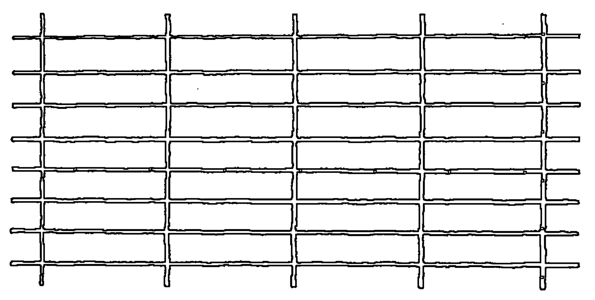

在“空虚”的“空白”之上，我们找到了由网格交叉线所表现出来的几处区别。因此这网格本身就代表了“三位一体的第二位”、文字和思想、符号化的论述、附加、分割、“玛雅”、二元论、测量、概念化、地图等，一切暗指“心智”这个词的东西。因为正是通过心智，通过二元论的认知模式，我们才捏造出这些区别，并且“每天都在进行分割”。

但是请注意发生了什么。在网格之下的“统一”（严格说是“非二元对立”）再也无法直接视见。它被掩盖了，网格的区分已经将下面的统一“分割”开，而这种统一接着就变成了被忽视的、内含的、隐晦的，从而也是被压抑的。这位于其下的统一现在表现为，或者将其自身呈现为，或者将其自身投影为一个在时空间延展的、独立的客观对象所组成的世界。在图片中，这些“客观对象”是由网格的方块代表的，它们每一个都有边界或者界分，将它与其他“方块事物”隔离。换句话说，现在位于其下的统一被投影成了独立“事物”的多重性。因此，当我们忘记了二元论具有非二元对立的“根基”时，二元论就将这种非二元对立抑制住了，然后将它投影为多重性。二元论压抑投射 (Dualism-Repression-Projection)，这是“玛雅”的三重过程，而这正是与我们有关的过程。

那么，我们所画的网格代表了若干界分。因此，为了阐明这种二元论压抑投影的微妙过程（“玛雅”），并且强调其重要性，我们将单独拿出一个界分，并详细论证这一过程是如何进行的。让我们从画一个“东西”、一个“圆盘”开始，它本身就在这一页上划分出了一个界分，也就是，圆盘的边。因此：

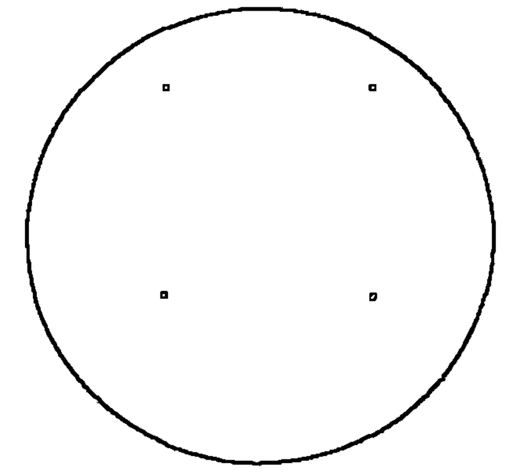

二元对立就是“一分为二”，而这表面上就和上面的界分或者边界所起的作用完全一样，将一页纸分成了“两个”部分：圆盘的形状与页面的背景。因此，我多半会认为我能够非常清晰地看到被称为“圆盘”的“事物”。然而，这是纯粹的幻觉，是心理上的魔术，因为在任何时候我都没有真正意识到一个独立的“圆盘事物”，我实际上所看到的，在具体事实上，是整个视野，或者形状加上背景、圆盘加上页面的完全形态（实际上，还有一些周边区域）！我的眼睛并非看到了一个“圆盘”，而是看到了一个“圆盘页面”！

换句话说，这两件“事物”，即圆盘和页面，根本就不是分离的。它们是“不同的”，但并不是分离的。它们实际上是相互联系与依赖的，它们是不二的，是非二元的。圆盘的边界当然就在那儿，但是它并没有真正地将圆盘和页面分离开来。借用布朗的话，这两者实际上是借助它们的共有边界而统一起来的。“分离的圆盘”的观念就并非一种发现的行为，而不可避免地成为一种创造的行为。我们再次引用威廉·詹姆斯的话：“我们的感觉，从其无法区分、缺乏差异或重点的、密集的连续体中，通过对某种运动的注意并忽略其他行动，为我们创造了一个充满对立、充满剧烈的变化、充满生动的光与影的世界。”

因此，在穿过了狭窄而有选择性的注意力（其实就是心智过程），第一种认知模式之后，我们关注并抓住了“圆盘”，在心理上将它与其背景分离，并完全忽略了全然的统一，然后想象到处都存在这样的事物状态！这样一来，我们就引入了二元论，它将视野或者全然整体的非二元对立压抑住了，并将它投影成了圆盘与页面的对立。但是这种分离的、二元对立的看法，是一种纯粹的幻觉，因为你只要试着看圆盘本身，而不要看到任何种类的背景就行了！相反，再尝试想象一个没有任何形象与之对照的背景！其中一方不可避免地无法脱离另一方而存在，它们从本质上是统一的，只是在心智中被分离了。

因此，每一种二元论都伴随着一种压抑和投射。这种二元论将过程“切断”、压抑其非二元或“单一的”属性，并且将这一过程投射成两种表面上敌对的对立面，例如圆盘的形象与页面的背景。因此，“初级二元论”实际上就是“初级二元论压抑投射”。“要有区别”，接着非二元的意识（“绝对主观”）就被压抑住了，于是将它自身投射成了主观与客观或者机体与环境的对立面。二元论压抑投射的这一过程是很重要的，因为它在所有随后的意识阶层上都将自己重复了无数次，每一次都产生一种新的光谱带，并且增加了人类对于其“终极同一”的无知。

通过“初级二元论压抑投射”，我们“向上”移动，正如从“大心境界”来到“存在阶层”一样。在这里我们相信，并且实际感觉到机体是与环境完全不同地分离开的。我们可以在这里暂停一下，提及一条“大心境界”和“存在阶层”之间的带区，我们称之为“超个人带”。我们在这里可以找到荣格的集体无意识、超感知觉、超个人见证、灵魂出窍、出窍经验、高原经验、超感听觉以及类似事件。也就是说，它们发生在光谱的某一带区上，在这一带区中，自我和他我之间的界限还没有完全具体化。无论这些现象是否真的都发生过，这对于我们而言并无大碍，但是如果它们发生过，那么它们一定发生在这些超个人带上。我们到最后将更深入地探讨这些带区，并探询所涉及的一些真正的困难，但是现在，我们必须开始探讨“存在阶层”，因为这是第一个我们可以毫不费力就认识到的阶层。

“存在阶层”是由“初级二元论压抑投射”所产生的。“心智”被切断，其非二元对立性被压抑，然后它被投射成机体与环境的对立，在这其中，人类将认同的中心置于存在于时空中的机体上（见图5—1）。人类的认同从“一切万有”转变为机体。因此，人类幻觉的“堕落”就包含了一种表面上的下落，它不仅是从非二元对立到二元对立，而且还有从“永恒”到时间、从“无限”到空间、从“绝对主观”到主观与客观的世界，以及从宇宙认同到个人认同。这使我们所有人共有且共同的演员，唯一的演员（Sole Actor），布莱克所说的永恒之人，变得过于入戏，深陷于他的心理剧中，以至于他假装自己忘记了“爱智者”（Philosophia）的忠告，“你已经忘记了你是谁”。因此，通过一种着实伟大的手法，人类的剧目在空间与时间的非凡舞台上开幕了。

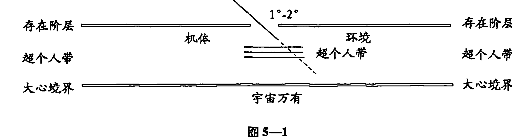

我们立刻可以注意到，这种主观与客观之间的分离标志着空间的产生：“初级二元论”本身产生了空间。“绝对主观”是无尺寸或者无空间的，因此也就是无限的；但是随着“初级二元论”的出现，主观就在幻觉上与客观相分离了，而这种分离，这种在观者和被观者之间的“间隙”，只不过是空间本身而已。人类在排他地认同其与环境相分离的机体时，就一定会产生巨大而宏伟的空间幻觉，产生人类与他世界之间的间隙。

定会与空间的创造相关联的当然就是时间的创造。现在我们已经研究了时间是如何起源的，并且进一步认识到它是人类现行、连续、有记忆地看待世界模式的附属产物。所以现在，让我们转向时间是为何起源的，我们将认识到它只不过是人类对于死亡的规避罢了。

正是这“存在阶层”的出现，带来了臭名昭著的“生存还是死亡”的争论。因为，当人类将他的机体与他的环境切割开后：

突然之间，他意识到他的原则并不是宇宙万有的原则，也就是说有些事物不依赖于他而存在着，他在受阻于万物执著（world-obstacle）时意识到了这一点。这时就出现了对于死亡的恐惧意识，有了“非我”（Not-Self）代表“自我”（Self）的危险。

因为人类已经将他的机体与他的环境相分离，然后排他地将其自身认同为前者，所以有关机体的存在或者非存在的问题现在就成了至高无上的问题了。于是，只是因为机体与环境被“初级二元论”相分离了，所以就产生了存在的焦虑（angst），即存在与虚无、存在与非存在、生命与死亡对立。人类无法接受，甚至无法面对即将发生的湮灭的可能性，无法面对死亡呈现给他的全然的消失。因此，当他没有意识到实际上生命和死亡是一体时，人类就在他慌乱逃离想象中的死亡时将它们切断了。

弗洛伊德独有的规则：“一切生命的目标是死亡”，就说明了从生物阶层来看，生命和死亡并不是冲突的，某种程度上是相同的。这也就是说，它们有着某种类型的辩证统一，正如赫拉克利特对它们这样的描述：“我们之中的存活和死亡、觉醒和沉睡、年轻和年老都是相同的，倒转来看，前者就是后者，而后者反过来也就是前者。”因此，我们得出了这样的想法：从某种程度来看生命和死亡在有机的阶层上是统一的，而在人类的阶层上它们就分离成了相冲突的对立面……人类完成了一场独特的成就，将动物阶层的（“生命与死亡”的）本性中并无区别或者辩证的统一给打破了。人类将两者分开，让它们互相对立，并且用尼采的话来说，在生命中断取生命。

生命和死亡是“不二”的这一事实对于大部分人而言是极其难以领会的，而困难并不在于复杂性方面，而是简单性方面。它并不是复杂得难以理解，而是太简单了，以至于我们在开始思考它最开始的地方时就将它错过了。我们通常将生命看做是某种从出生开始、从死亡结束的东西，但是实际上，生命和死亡，或者更适当地说，出生和死亡，只不过是看待当下“时刻”（Moment）实相的两种不同看法而已。正如我们所看到的，在绝对“当下”（Present）并不存在过去，而没有过去的东西就是刚刚出生的东西。出生是没有过去的状态。进一步讲，在绝对“当下”，也没有未来，而没有未来的东西就是刚刚死亡的东西。死亡就是没有未来的状态。因此，由于当下“时刻”没有过去，所以它是新生的；由于它没有未来，所以它同时也死了。由此一来，出生与死亡只是谈论同一个无时间“时刻”的两种方式罢了，它们只是被那些“无法逃离暂时的连续的观点，从而以同时性来看待一切事物的人”在幻觉上分离了而已。简而言之，出生和死亡在这无时间的“时刻”中是一体的。

但是人类，在唯一认同他的机体，并因此开始了有关存在与虚无的幻觉辩论时（因为当机体与环境融为一体时，这一辩论是不可能发生的），他无法忍受结果可能是湮灭的这一可能性，他无法接受他眼中的死亡。因此，随着“初级二元论”的出现，第二种主要的二元论压抑投射也出现了：人类将生命与死亡的统一切断，将这一统一压抑住，并且将它投影成生命与死亡之间的战争。

但是当人类将生命与死亡的统一切断并加以否认时，也同时将有关生命、死亡以及“现在”的当下“时刻”的统一切断，并否认了时刻都是一体的。因此就创造出了时间，因为在拒绝死亡时，人类也拒绝失去未来，从而就拒绝了无未来“时刻”、无时间“时刻”的实相。他再也无法在“当下”中存在了，他必须存在于时间中；他再也无法在今天快活地活着了，因为他也必须活在明天。用爱默生的话来说就是（出自《论自立》[Self-reliance]）：

> 那些在我的床下长出来的玫瑰与过去的玫瑰或者更美丽的玫瑰并不能形成参照，它们就是它们本身，它们在今天和“神”共存。对它们而言没有时间。它们只是玫瑰而已；在它们存在的每一刻，它们都是完美的……但是人类会延缓或记忆；他并不是活在当下，而是回头去悼念着过去，或者，毫不理会会在他周围的丰富世界，却踮着脚尖眺望未来。除非他能够超越时间，在当下与自然真正地共存，否则就无法幸福、无法强大。

但是这正是问题所在，因为超越时间，在“当下”生存就是要没有未来，而没有未来就是要接受死亡，但是人类无法做到这一点。他无法接受死亡，因此也无法活在“现在”；而无法活在“现在”，他就根本无法活着。

这种不能死亡的状况，讽刺而又不可避免，它将人类抛入了生存的现实之中。在现实中，一切普通的动物同时走向死亡；结果就是将生命也否定了（压抑）。无法接受死亡就将死亡的本性转变为了独特的人类和独特的病态形式。在人类疯狂地以生命大战死亡之时，也同样讽刺而又不可避免，它导致死亡战胜了生命。这场对抗死亡的战争所采取的形式，是让过去、未来以及现在时态占据心智，而在这一时态中就失去了生命。怀特海将这一向下称为“其本身包容着存在的完整总和，是无论向前还是向后的完整的广阔时间，也就是永恒”。

因此在逃避死亡时，人类被从“当下”中抛离，掉入了时间中，掉入了一场为了未来的赛跑之中，并尝试着逃避无时间之“时刻”中的死亡。由于“次级二元论压抑投射”（Secondary Dualism-Repression-Projection）将生命和死亡的统一切断了，所以它同时也把“永恒当下”（Eternal Moment）的统一切断了。因为生命、死亡以及永恒在这无时间的“当下”中都是一体的。换句话说，生命和死亡的分离与过去与未来的分离一样，最终是紧密的相同体，而那就是时间！于是“次级二元论”就是时间的祖先，而这就意味着时间之中的生命就是被压抑的生命，特别是受到了“次级压抑”（Secondary Repression）。用布朗的话来讲：

> “生命和死亡”这一统一的分裂给人类带来的结果是使人类成为了历史的动物……人类，这种不满足的动物，无意识地寻求着对其种族合适的生命，这就是历史的人类：压抑和反复强迫（repetition-compulsion）产生了历史的时间。压抑（次级压抑）将无时间的本能强迫转化为了不断向前重复着的“寻找失去的时间”（recherche du temps perdu，法语）……而相反，没有受到压抑的生命……并不处于历史的时间中……只有被压抑的生命处于时间之中，而不受压抑的生命应是无时间，或者在永恒之中的。

在这个“存在阶层”中，人类对于死亡的逃避同样也产生了盲目的“生命意志”（Will to Life），它实际上是一种对于失去未来的盲目恐慌，这一恐慌就是死亡。但是人类对于死亡的逃避产生了无数结果，因为它注定会影响人类随后将进行的一切行为，最初是在创造被称为“自我”的理想形象中。这种由于死亡而产生的焦虑，“焦虑是自我对于死亡的无法接受”，就是另一种二元论压抑投射的起因。在逃离死亡的焦虑中，机体生命本身被切断了，其统一性受到了压抑，并接着投射成了心灵与肉体、灵魂与身体、自我与血肉的对立。

> 根据弗洛伊德后期的理论，事情的真相是人类自我的独特结构是由于它无法接受实相而产生的，特别是无法接受终极的有关死亡的实相……

这一理论非常复杂，不过其关键点可以这样简单地表达出来：在存在与虚无、存在与非存在、生命与死亡之间的辩论中，也就是“次级二元论”的辩论中，无法接受死亡的人类放弃了其终有一死的机体，逃入了某种比“区区”肉体更加“坚固”且不受影响的东西，也就是心智。人类在逃离死亡时，逃离了他易变的躯体，认同了他表面上不死的思想。这种被他称为“自我”、“自身”的心智是腐败的，但却令他感到高兴。用伊伯特·贝努瓦的话来说：

> 人类的两个部分（心身）无法自然地重新结合起来……他让自己崇拜一个没有实相的形象，那就是“自我”（Ego）。当他的抽象部分缺乏对于其动物部分适当的爱时，人类就只有其抽象部分对于理想的自我形象的代替的爱和自尊的爱。

“理想的自我形象”、“自我”，在表面上为人类带来了某种易变的肉体无法提供的东西：不朽、无数个明天的清澈透明的永恒，通过纯粹的心智加以展现、不会消亡，更不会受到腐蚀和衰败的影响的心智。人类从死亡中的逃离就是从其肉体的逃离，并因此创造出了第三级（或称“第三位”）初级二元论压抑投射：机体被切断，其统一性受到压抑，然后投射成了心灵与肉体的对立（见图5—2）。

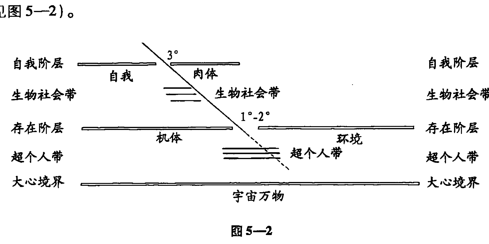

因此，在“自我阶层”上，人类想象具有一个身体，他就像拥有一辆汽车或者一幢房子一样拥有着它。实际上，他在其机体的方面运用了财产权，从而在他自己的眼中减少了其自身的固有价值。这时，在“自我阶层”上，人类只是含糊地意识到了他现在称作“身体意识”的东西，而这种耗竭的身体意识是“存在阶层”的全部残余，转而也成了“大心境界”的全部残余了。

现在，通过某些我将尝试解释的方式，排他性的自我认同以及同时发生的对于肉体的疏远强迫人类排他性地采用第一种认知模式，即完完全全的二元论的、符号化的、线性的，且暂时的认知模式。当然，这种三级二元论还存在为数众多的其他结果，全都同等重要，但是既然我们已经多次论及这第一种认知模式，因此我们至少应仔细观察它在意识光谱背景下的成熟过程。因为第一种认知模式实际上不过只是一种对于更为宽广、更为通融的意识模式的否定而已。

只要我们能够理解我所说的“机体意识”，那么我们就可以追溯这完整的过程了。我们在“自我阶层”上又笨拙地将看、摸、尝、嗅和听当成机体意识。但是在其最纯粹的形式中，这种“感官意识”是非符号的、非概念的、瞬时的意识。机体意识仅是“当下”的意识，你无法尝到过去、嗅到过去、看到过去、摸到过去，或者听到未来。换句话说，机体意识是严格无时间的，而且由于它是无时间的，所以就必然也是无空间的。正如机体意识无关过去和未来一样，它也无关内部或者外部、无关自我或者其他。因此纯粹的机体意识是完全属于“绝对主观”的非二元意识的。①

因此，机体意识和宇宙意识是相同的一体。于是我们就不需要做出错误的假设，以为机体意识是被限制在，或者被压缩在机体的皮囊边界之中的。相反，当你感受到象征任何意识边界的直接经验时，你一无所得，绝对地一无所得。你的意识、你的机体意识的实际领域是没有边界的，原因很简单，对于你来说，并没有什么东西是在你的意识之外的。虽然一开始听起来会觉得奇怪，但是也没有什么东西是在你的意识之内的。只有意识，它没有内部或者外部，它根本没有边界！

举一个愚蠢，但又很能说明道理的例子，你能够嗅到内部和外部之间假想的区别吗？这一区别是否真的在你的意识中出现了呢？你能够尝到自我和他我之间的边界吗？或者，品尝的过程，是否没有内部也没有外部呢？如果你放松下来，闭上眼睛，并且仔细聆听你“周围”的声音，你能否真正听到内部和外部之间的区别呢，或者仿佛从你的头脑“内部”传来的声音和来自“外部”的声音听起来是一样的吗？而如果在“内部”和“外部”之间真的有一种区别，那么你能够真的听到它吗？完全不能！确切地说，这种内部与外部之间的初级二元论仅仅是你思考的一个想法罢了，一个你用来解释，并因此扭曲了你的基本意识的想法。假想的分离或者边界实际上并不存在！正如薛定谔所说：“这个世界是一次性赋予我的，而非一个存在着，另一个去感知它。没有任何东西会被反射。原始的形象和镜中的形象是完全一样的。” 关键在于机体意识

① 因此，东方传统理论并不回避感官的知识，而是回避受到概念化污染了的感官知识。因此僧璨在《信心铭》中断言“当你与感觉不再敌对时，它就成为了与完全启蒙相同的了”。于是，铃木说：“由于概念化，我们的感觉经验给我们提供了一个错误的世界图景的信息”。《禅宗和日本文化》，第175页。“我想到，‘感觉’要比‘直觉’更适合用来描述禅宗所宣称的经验，这种心理学家通常和其他心理活动区分开来的‘感觉’。”同上，第219页。这没有受到概念化污染的“纯粹的感觉”就是我们所说的“机体意识”。

#### 存在阶层与意识演化

是非二元的意识，它就是“心性”本身。

当初级和次级二元论出现时，机体意识就立刻被压抑了，因为在内部与外部、过去与未来之间的幻觉分离使人类的“终极同一”在表面上变得有界而受限了，它从非二元的普遍之物转变成了封闭“于此”的个人之物。这就是说，人类的认同转变到与其余一切相对立的传统的机体边界之中，即便这种认同在他真正的机体意识中根本就不存在。

所以，虽然我们认为在“存在阶层”上，人类认同与其对立于环境的完整的机体，但这绝对不是说他就能直接接触到我们所说的“机体意识”。因为真正的机体意识，正如我们刚刚所认识到的那样，是无空间且无时间的，它和“大心境界”是相同的，它绝不会被限制在机体的皮肤边界之中。只有当初级和次级二元论出现后，人类才将他的意识想象成受限制并压缩在皮肤之中，从而他的认同也崩溃了，成为了和其自身环境等同的与其自身的机体对立的存在。而这就是我们称之为“存在阶层”的意识状态，人类仅仅认同其存在于空间（初级二元论）和时间（次级二元论）中的机体。

很明显，我们可以将这一阶段的意识称为“存在意识”，这种意识表面上被限制在完整机体的皮肤之中，这种意识以人类在时空中独立的存在为中心。因此，不幸的是，初级和次级二元论将无限制的机体意识（“绝对主观”）转变成了存在意识。简而言之，它们将宇宙意识转变成了基本的个体意识。

因此，在“存在阶层”上，人类正在逃离死亡。也就是说，他拒绝在没有未来的无时间的“现在”中生存，他需要有一种未来时刻，保证死亡不会在现在触及他。他不想只拥有无时间的当下，而要在自己的前面存在另一个当下。因此，他为这一当下做好了准备，却只是为了度过另一个当下，并且他心藏着一个秘密的愿望，希望他的一切时刻都能永远地逃入未来的时刻之中。正是由于这个原因，他当下的时刻完全不是无时间的、永恒的，其本身也是不完整的。确切地说，它们仿佛到了、逃入了其他的时刻之中。因此，永恒的时刻就像一组逃离的时刻，而它其实一直都是一组持续了仅仅两三秒的时间。因此，随着次级二元论的出现，停顿的当下（*nunc stans*）或者永恒的“当下”就仿佛成了流淌的当下（*nunc fluens*），或者经过的当下。在逃离死亡时，我们需要未来，因此就度过了我们的时刻。

因此，存在意识实际上是一种含有时间和空间的意识，但这只是最生动的具体意义。它含有经过的当下，因此不会轻易地迷失在对于昨天和明天的沉思中。于是，在这一阶层上，一个人在经过的当下，抓住了他赤裸的存在，这一存在被剥夺了一切，只剩下了最微妙、最根深蒂固的符号化地图。因此，在“存在阶层”上的认知模式主要是一种全局领悟（*global prehension*），或者是一系列对于一个人自身在时空中的独立存在的直接掌握。他领会了他的存在（初级二元论），以及他直接的持续（次级二元论），这其中没有任何多余的抽象覆盖或者符号化的解释。这些领会是对于流淌当下的三维掌握，具有其完全的可能性。只有最基本的二元论才能使这些领悟腐败，因此我们认为“存在阶层”只是一步而已，虽然往往是巨大的一步，但它离开了“大心境界”和机体意识的无时间性。

进一步讲，在“存在阶层”上，时间的产生是与“意志”（*Will*）的产生紧密相连的，这些时间大部分是以流淌的当下的形式呈现出来的。因为我们已经看到，在这一层上，人类希望有一个未来，保证死亡不会触及到自己。人类希望避开永恒，而这一“流淌”就是一切随之而来的趋向、愿望、倾向、紧张、渴望的原型，鉴于它们全都含有一个时间的分量，所以我们认为“存在阶层”也是人类“流淌”的家园，特别是对抗死亡而产生的生的意志。但是这种“意志”不应与意志力相混淆，后者是在“自我阶层”成长起来的。意志力是一种线性的、一致的努力，是“自我”（*Ego*）或者“人格面具”（*Persona*）在追求其他东西时，克制机体或者环境方面的力量，但是“意志”较之更为基础而根本，它是一种完整机体的三维的行为，它全然地在时间中向着某个未来的终点移动着。意志力仅仅是在三级二元论出现时那个“意志”的残留而已，而“意志”本身是一个人完整存在的行为。“意志”是一种运动的领悟。正如罗洛·梅在《爱与意志》（*Love and will*）中所说的那样，它是一种意向性。

但是撇开一切理论工具，现在我唯一想要强调的重点在于，这“存在阶层”的一切方面是在“初级”和“次级二元论”出现之后的“大心境界”的样子。“悲”（karuna）在表面上转化为了“渴”（trishna），而停止的当下（nunc stans）转变成了流淌的当下（nunc fluens），非二元意识转变成了领会、自发的转变成了“意志”和意向性。而随着“自我阶层”的出现，这些都各自转化成了不同的意识维度。

此时我们只需要记住，存在意识是受到了内部与外部、过去与未来（初级和次级二元论）基本分割的污染的机体意识。然而，在这“存在阶层”中最终幸存下来的就是，人类至少还能触及其完整的机体，其身心依然统一，即便他错误地假定它是与环境相分离的。于是，在这一阶段，在这“存在阶层”上，人类并不觉得他自己是与其愚蠢的动物肉体相分离的智慧灵魂，仿佛他只不过是一个卡在了易朽的汽车中的司机，或者是一个与他任性的马匹相互独立的骑手。更确切地说，他将其自身直接认作是一个心灵与肉体的统一、一种真正不可分割的心灵与肉体的存在。为了有助于让我们想起这一点，我们也将给存在意识冠以“人马意识”（centaur awareness）之名：这并不是驾驭马匹的骑手的意识，而是一个人马、一个完整的、自治的机体意识。就这点而论，在“存在阶层”上，即便人类通过初级和次级二元论的方式误解了他的感觉和肉体，但他依然是二者结合的一体。可以说，存在，或者人马意识，只是从宇宙意识、从机体意识、从“大心境界”本身向外走出了一步。即便如此，对一些人而言，这简单的一步仿佛是跨越了深渊的巨大飞跃。

但是当“三级二元论”（Tertiary Dualism）出现时，人马本身就真正地被打破了：心智与肉体分离开来，而肉体被草率地抛弃了。人类在逃离死亡时，放弃了他那终有一死的血肉，在恐惧中套入了静态符号的世界中。人类不再以其完整的身心机体而存在，而被替换为认同一种唯心的或者纯心灵的完整的身心存在的表象。简而言之，他认同他的自我。① 在人马之间深深地插入了一枚楔子，而人类成为了与其马匹和身体相分离的骑手和控制者，成为了一个没有血肉，因此也没有生命的心灵，它摇摇欲坠地栖息在看似难以驾驭且充满激情的肉体之上。而这枚楔子，在心灵与肉体之间的分隔，恰恰就是三级二元论，而随着它的出现，人类发现自己已立足于“自我阶层”上了。

人马意识正如我们已经说过的那样，只是从“大心境界”，从非二元的机体意识中走出了一步。所以，当人类将“人马”切断并压抑住时，他也把一切和机体意识，以及任何可能的非二元意识之间的残存联系给切断了。在打破他的“人马”，抛弃他的身体时，他甚至还阻碍了非二元意识的机会。不那么严格地说，我们可以认为在“存在阶层”上，虽然人类误解了机体意识，但依然与它有所联系，但在“自我阶层”上，他连这种联系都失去了。确切地说，他现在已经完全脱离了任何与机体意识的无时间性之间的联系。实际上，他甚至也与经过的当下脱离了联系，他比过去任何时候都更为孤立于时间之中，因此他将记忆的概念和符号插到了他自己和“实相”之间，从而急切地退避到了暂时、线性、有作用的以及纯二元论的认知模式中。人类被迫放弃了非二元或者机体的意识，甚至放弃了领会，而选择了一种苍白的替代品：智力、幻想、想象、符号化的地图知识，因此第一种认知模式最终并完全地具体化了。

> 身体自我转变成灵魂的具体方法就是幻想……幻想是一种并不存在

① 从心理分析学上讲，这种身体意识的压抑会导致其在生殖器区域上的浓缩。参考 N. O. 布朗：“如果普通的成人性欲是一种出自人类身体的所有部分的愉悦活动中的幼稚的、快乐的模式，那么身体中一开始更为宽泛的愉悦能力就被缩小到了一个有限、集中的特定（生殖）器官上了……那么普通的成人性欲的模式（用弗洛伊德的术语来说，就是生殖器组织）就是一种专制……孩子们通过多种形态感知到（即他们在机体的整个生命中感受到了幸福的愉悦，但是）成人性欲是一种对于人类身体的性潜力的非自然的限制。”从心理分析学上说，活在“自我层”就是要获取生殖器组织，因此就有了经典（也是不可思议的）心理分析学公式：灵魂 = 阴茎。如果这听起来有些神奇的话，你要知道，许多贤者，例如克里希纳穆提，就宣称拥有多形态的背理行为。

在于彼处之物辩证地否认存在于彼处之物的幻觉，它给实相赋予了一种隐藏的意义，并且给所有的经验提供了符号化的品质。动物象征（animal symbolicum）（卡西尔 [Cassirer] 对人类的定义）是动物的升华（animal sublimans），它一心要将真实的满足替换成本能的符号化满足……同样，动物象征主义就是失去了其世界和生命的动物，却在它的符号体系中保存了一张已经失落了的实相地图……

贝努瓦进一步解释道：

> 你可以清晰地看到想象所扮演的双重角色……它扮演着保护者的角色，保护着自我主义的、想要收复失地的抽象部分的幻觉（自我），也扮演着破坏者的角色，对抗着动物机器（机体意识），在对于死亡的恐惧中将它抛弃。它保护着幻觉的“自我”，却将真实的机器粉碎了。

在“将真实的机器粉碎”时，人类的非二元意识、第二种认知模式，也最终被粉碎了，因为，正如我们之前一直在谈论的那样，机体意识和非二元的认知模式是相同的一体。在“自我阶层”上，一切机体意识的残余都表现为一种严重耗竭的身体意识。在这一阶层上，人类并不知道，也无法知道，这一身体意识不过只是深埋其下的无价黎明知识露出的一点粗糙的尖角罢了。人类逃避死亡、逃避其肉体，于是他也逃避了唯一能够揭示实相的认知模式。人类的第一种认知模式——符号化的，在初级二元论中是不易察觉的“心智”（从马鸣的观点来看），但现在成熟了，并且完全发挥出了其作用。因此自我在整个一生的计划中所需的装备已经完成了，通过符号化将过去投射到当下，从而避开“当下时刻”。人类的认同从其完整的身心机体转变成了对于自身的心理意象、自我，而相当讽刺地是这自我完全是基于过去的，因此也是完全死亡的。于是就出现了这样的情况：人类为了逃避幻觉的死亡而将自己杀死了。

有关心与肉体的三级二元论压抑投射（Tertiary Dualism-Repression-Projection）的完成标志着“自我阶层”的产生。我们将在这里暂时离开有关光谱演化的探讨，之后再回头继续讨论“自我阶层”。我们现在的关注点是“存在阶层”。在这一阶层上，人类或多或少地依然还与其完整机体、其身心统一、人马本身存在着联系。重复一遍，他并不能完完全全地与纯粹的机体意识联系，因为这一意识已经被初级和次级二元论的初步推理所污染了。因此，自我与他我（机体与环境）之间、生命与死亡之间的对立是在这一阶层中出现的初级二元论。

你可以退入一个安静的地方，不受外界干扰，并且将你所形成的有关于你自己的想法和概念全部驱赶走，从而“找到”“存在阶层”。暂时忘记你是男是女、聪明还是愚蠢、快乐还是忧伤，只注意你的感觉，并不是思想，而是“感觉”，它坚持在这些想法“之下”或者“背后”，也就是你以某种方式在这一时刻存在着并活着的核心感觉。那就是“存在阶层”，而这种对于存在的简单感觉既不是心理的也不是物理的，因为在这一阶层中，心灵与肉体之间的三级二元论并不活跃，那种感觉是简单的、纯洁的、中性的存在。

然而，当处在“存在阶层”时，如果你静静地环绕四周，寻找二元论，那么你最容易看到的就是自我与他我相对立的二元论。也就是，你根源上的认同和存在感（你的“自我”）似乎是与你周围的宇宙万物（“他我”）相分离的。这就是机体与环境之间的初级二元论，当然，它也是“存在阶层”所特有的。① 突然之间，你开始理解，你的存在实际上是与宇宙万物的存在相一致的，接着自我与他我之间的二元论就会消失，你就暂时“向下”转变到了“大心境界”。但是你感觉自己的存在从本质上与其他存在相分离的这一事实，肯定地表明“初级二元论”已经出现了，因此你就来到了“存在阶层”。

> ① 我们应该在这里注意到，“存在阶层”是“初级”和“次级二元论”的体现，它很大程度上是一种束缚或者扰乱，这种束缚或者扰乱处于人类“自我”认同的根源。进一步讲，这种束缚，正是人类一切活动的根本发动机。而这台发动机的燃料只有一种：对于回归伊甸园的渴望，重新与“神”结合的渴望，这当然也就是“神”找到他自己的渴望。随着“初级”和“次级二元论”的出现，人类被抛出了伊甸园（即“神”脱离了他自身，“神性放弃”[kenosis]），于是“神”就变成了无意识的（即作为“大心境”的“基本无意识”对应于“初级二元论”。“但是无意识是真实的心灵实相；无意识是‘圣灵’。”

这种自我与他我之间的二元论是最为有意思的，因为有无数的因素为它定形、上色、模制、塑造，有的是生物的，大部分是社会学的。它就在这里，在可以被称为“存在阶层”的“上界”的地方，在这里，机体的文化前提已经被吞并了，这些前提渲染了所有随之而来的机体和环境之间的交易。这个社会学因素的“池”，这个文化思想的池，这个塔尔科特·帕森斯（Talcott Parsons）口中的社会面具，从很大程度上不仅决定了机体要如何感知环境，而且还决定了它如何对环境展开行动。简而言之，它规定了机体总体行为的宽泛导向。

在这一阶层中，每个个体都随身携带着一个庞大的关系网络，它代表了社会的“内在化”。它具有超乎寻常的复杂本质，几乎不为人所知，它含有一个由语言和语法、个体家庭的内向投射结构、文化信念和神话、规则和元规则所组成的矩阵。通过非常一般的方式，它可以被看做是所有机体所累积的基本社会学信息的完整总和。用莱恩（R. D. Laing）的话来说：

> 一个人的身体具有独一无二的重要性，因为它是来自一切场域“内向投射”的范围；而这些内向投射反过来在任何一个场域都提供了一个可投射的“池”……

由于这个“内向投射的池”，这“内在化的社会”从社会中被投射，或者转移到了生物机体上，所以我们就将它称为“生物社会带”（Biosocial Band）。它代表了“存在阶层”的上界，这时，人类开始向上移动，操纵他的人马意识，以此将它转变成在社会上有意义且可接受的形式，从而离开了他的人马意识。

“生物社会带”的大部分是无意识的。确切地说，它对我们而言太近了，以至于看不清，所以只有当我们开始研究其他的文化时，我们才能够意识到我们潜意识中当做是实相的东西，实际上只不过是一种社会的惯例而已，或者，用卡斯特那达的话来说，实相是一种共识。这在语言的现象中最为明显，这可能是在“生物社会带”所形成的各种各样的关系系统之中最基本的一种了。在这点上，沃尔夫（Benjamin Lee Whorf）比任何人都更为深刻地意识到，语言和语法在潜意识中塑造了我们的经验。他说过：

> 我们全都持有一种有关谈话的幻觉，在这种幻觉中，谈话是相当自由自在的、自然产生的，且只是“表达出”我们希望用它来表达的东西。这种幻觉的表象起因于这样的事实：表面上自由的谈话活动中存在着强制性的现象，这种现象是如此特立独行，以至于说话者和倾听者仿佛在自然法则的控制下被无意识地限制住了。这种语言的现象是一种背景现象，谈话者并没有意识到它，或者最多也只是非常微弱地意识到它……一个人的思想形式被坚定不移的模式法则所控制，而他并没有意识到这一法则的存在。这些模式是其自身语言未被察觉的错综复杂的系统化。

语言对于我们来说如同水对于鱼，它在我们的经验中是如此恒常的一种背景现象，以至于我们都没有意识到它。确实，我们通常能意识到语言的部分功能，例如，我们能够有意识地操纵或者选择符号，来向其他人传达我们的意思，而且我们中的大部分人都至少含糊地意识到，我们组织语句时所遵循的语法规则。但是语言具有一个我们几乎完全没有意识到的遍及一切的功能：它创造了区别。也就是说，语言以及其产物——抽象思维，是人类二元论的主要来源。我们再一次用沃尔夫的话来进行说明：

> 自然的分割是语法的一个方面……我们在进行活动时，将这些活动的范围和流量分隔开，并加以组织，这主要是因为，分隔的是我们的母语，我们便同意这样做，这并不是因为自然本身就真的是以这种显而易见的方式分割开来的……我们沿着本土语言所划下的线条将自然解剖开来。我们在那里无法找到我们从表象世界中分离出来的分类和种类，因为它们正面凝视着每一个观察者；相反，这个世界是通过千变万化的印象变化而得以呈现的，这些印象必须由我们的心智加以组织，而这就意味着很大程度上是由我们心理中的语言系统所组织的。我们之所以将自然切割开来，组织成概念，然后将其归于意义，主要是因为我们都赞成用这种方法来组织它。在我们的整个语言社会中都有着这样的共识，并且通过我们语言的模式编纂成典。

因此，在我们的语言过程中，我们将实相切割开来，无意识地引入了二元论，之后我们就天真地想象它一直都存在着。

在英语中，我们将大部分单词划分为两大类……第一类被称为名词，比如房子、人类；第二类为动词，比如打、跑。一类中的许多单词都可以被用做另一类，比如一顿打、一次跑，或者（给船）配置人员，但是，在基本层面上，两类之间的区分是绝对的。因此，我们的语言给了我们一种对自然的两极（二元论的）区分，但是自然本身并不会因此而被极化。

因为我们用于表达自然的最基本的工具本身就是二元论的，所以我们很快就会相信，自然本身就是这样的结构。但是这样一来，如果一个人所拥有的唯一工具是一把榔头，那么他就会倾向于将一切都看做是钉子。这其中的根本问题在于，宇宙万物的形式并不一定是我们语言和逻辑的形式，而当我们强迫前者遵从后者时，就无意识地对自然施加了一种微妙但又致命的冒犯行为。举个例子：

我们一直在给自然加上虚构的行动实体，这只是因为我们的动词面前必须有名词。我们说“它闪烁了”或者“一道光闪烁了”，就必须设定一个行动者，“它”或者“一道光”，来进行我们所说的行动，“闪烁了”。但是闪烁和光是相同的一体！……但是我们将这些不同的方式归于部分经验半虚构的分离。英语词汇，比如天空、小山、沼泽，说服我们将自然无穷无尽的多样性的某个难以捉摸的方面看做是一个不同的“事物”……因此，英语和类似的语言让我们将宇宙万物看做是对应于词语的颇为不同的对象和事件的集合体。

这一不可思议的事实让怀特做出了这样的评论：“这一步骤是如此矛盾，以至于只有对它有着太久的熟悉才会掩盖住其荒谬。”但是我们已经解释过，语言和心智是如何让虚构的实体、事物以及对象充满这个世界的，那么我们在这里就不需要对此详细阐述了。关键在于，“生物社会带”作为像语言和逻辑这样的社会学制度的仓库，在基本上、本质上首先是差异的矩阵，是按照惯例描绘、解剖，并且区分“宇宙万物天衣无缝的外衣”的形式和模式的矩阵。

因此，即便“生物社会带”对于所有的二元论并没有直接的责任，然而它毫无疑问强化了所有的二元论，还使那些我们平常观察时所透过的幻觉变得不朽了。其基本例子就是，在我们的语言中，主观和动词之间的分裂强化了机体和环境之间的初级二元论，因为不存在任何一种可以接受的方法，在不将行为归于或是机体，或是环境的情况下，描述出机体和环境领域中单一的交易，因此就出现了令人信以为真的幻觉，以为这两者实际上是相分离的。语言——“生物社会带”中最基本的成分，是二元论原型的增强剂，因为它的运作方式是将自然的“千变万化的变化”区分开来，加以分类，将其非二元或者天衣无缝的本质压抑住，并且将它投射成表面上不连续的独立对象。因此，作为一个差异的矩阵，“生物社会带”就像我们在实相之上覆盖的一层巨大遮蔽。当然，它的用处是不容辩驳的，但是，如果我们将遮蔽与实相本身相混淆了，那么这一层遮蔽就成了盲点，而我们就迷失在我们自己的阴影的黑暗之中了。

“生物社会带”的三种其他功能。首先，它形成了作为一个独立且独特的存在的核心感觉的一部分，因为它赋予了机体一种基本但又无意识趋向环境的倾向，继而形成并加强了自我和他我之间的二元论。其次，它是抽象思维的水库，为高层次想法提供了符号、语法以及逻辑。正是通过在差异矩阵上的反射，我们才得到了“差异的差异”，也就是心智。实际上，贝特森已经将思想

#### 自我阶层与意识光谱

定义为“一种产生界分的区别”了。再次，正如“生物社会带”提供了“思想的食粮”一样，它也同样提供了“自我的食粮”。这就是说，它是形成许多自我特征的水库。正如米德所论证的那样，人类只有通过他人（所谓的“广义他我”）的态度来看待他自己，从而成为一个他自己的社会客体，这样，他才能得到自我意识。“生物社会带”作为内在化的社会，是形成自我、角色、价值、状态、内容等的水库。

现在，我们就可以开始探讨在“自我阶层”上意识光谱的产生过程了。初级二元论已经出现了，压抑了“大心境界”，并将它投射成了机体与环境的对立，当人类认同他与环境相对立的机体时，就产生了“存在阶层”。这就引发了生命与死亡对立的“次级二元论”，它又转而产生了心灵与肉体对立的“三级二元论”，而这又标志着“自我阶层”的出现（见图5—2）。

因此，我们将会在后续章节中更加详细地深入阐述，我们差不多可以将“存在阶层”定义为一个整体，我们认同存在于时间和空间中的整个身心机体。我们可以将自我定义为完整（但是生物社会的）身心机体的、准确的心理和符号的表达。从较为宽松的角度来看，我们可以认为，自我是在人马被生物社会化，且在“三级二元论”出现其上时所“残余”下来的部分。简而言之，自我是一个相当准确（根据惯例）、相当可接受，且相当“健康”的自我形象。

在这一层中，自己、自我的最重要的特点之一，就是它从本质上比其他任何阶层都更像一种被编辑过的记忆。因此：

> 传统的“自己”或者“个人”主要是由历史所组成的，而历史则是由经过选择的记忆所组成的，它以出生时刻为起点。根据惯例，我并不只是现在的我。我也是过去的我，而我被传统编辑过的过去变得仿佛比此时此刻的我更加接近真实的“我”。因为现在的我表面上非常短暂、不可捉摸，但是过去的我则是固定而最终的。它是预测将来我的坚实基础，于是就发生了这样的情况：相比实际之物，我更深深地认同已经不再存在的东西！

这种情况很容易验证，你只要问自己“我是谁”，然后你就会发现，你的回答中主要都是过去所做的事情。很少会有人回答道：“我现在是阅读这句话的过程。”记住过去是一回事，但是真正认同它则完全是另一回事了！这就好比一个飞翔着的小鸟，追随着一道穿过天空的想象的路径，它就这样认同了其路径，从而发生了混淆。鸟都没有这么傻。下面这个美国精神治疗医师带来的禅宗小故事，就很能说明问题：

> 我起身，到处走，转动着我的脚，移动着我疼痛的踝关节。放轻松以后，我又回到了座位上。
>
> 老师看着我刚才走过的地方。
>
> “你能看到脚印吗？”老师问。
>
> “不能。”
>
> 他点了点头。“过去和现在都不在那里。在你生命的过去和未来之中，没有任何东西，只有”，他突然“啊！”了一声。

但是，我们已经认同我们的轨迹、我们的路径、我们幻觉的过去了。尝试以这样的方式生活，总是偷偷地回头瞥一眼昨日的幻影，用麦克鲁汉的话来说就像只用后视镜驾驶汽车一样。它所产生的严重的焦虑会引导我们和史蒂芬①一同喊出“历史是一个噩梦，我想要从中清醒过来”。

幻觉，过去的幻觉不能提供满足感，而且，在尝试减轻这种挫败感时，自我就朝向了未来，它想象着那里有某种终极的幸福等待着它，前方这道时间彩虹的末端上，有着非常棒的东西。然而，这种解决方法是虚假的，因为实际上，一切幸福都只能存在于未来之中。也就是说，自我只有得到了幸福明天的承诺，才能在今天得到幸福，而对于自我而言，最好的消息就是它有着一个“光明的未来”，而不是它有着“光明的当下”。因此，如果自我相信前方存在快乐未来的话，那么它就可以在当下忍受不可思议的痛苦，但是那未来将永远无法到来，因为它并不存在于现在，而当它到来时，根据定义，自我只有在得到了另一个光明未来的承诺以后才能满足！这就如同谚语中所说的，把胡萝卜吊在棒上，在一头驴子面前晃动，这可怜的畜生就会一直往前跑，但永远得不到胡萝卜的奖赏。

① 出自詹姆斯·乔伊斯的《尤利西斯》。

不仅如此，我，作为自我，将太多时间耗费在了奔向未来幸福的道路上了，很快我就会将幸福认作向前奔跑的基本过程了。我将幸福和对于幸福的追求相混淆了。接着，我所能所做的就只有追逐和奔跑，甚至都无法停下来，于是，即便未来的好东西真的出现了，我也无法让自己停下来，只能与之擦肩而过。我从来都没有完全地活在当下，所以我也从来都无法完全地让自己满足。如果我无法在当下感到满足，那么当未来成为当下时，我也无法感到满足。我就永远这样沮丧下去，而我表面上的唯一选择就是跑得更快，于是我被抛入了这般严重的循环之中，助长着我长期的沮丧。但是这样一来，你就无法停止前进，你只会产生怀疑，认为前进只是一种癌症罢了。约翰·梅纳德·凯恩斯（John Maynard Keynes）有这样的箴言：

> 目的性意味着我们更为关注自己的行为在遥远未来的结果，而较少关注行为本身的品质，或者行为对环境所造成的直接影响。“有目的”的人总是试图将其行为的意图放入时间中向前推进，让行为成为一种虚假而迷惑的永恒。他并不爱他的猫，但却爱他的猫的猫仔；事实上，他爱的也不是猫仔，而只是猫仔的猫仔，依此类推，直到猫的存在终结为止。对他而言，果酱并不是果酱，除非它是明天的果酱，绝不是今天的果酱。因此，当他将果酱沿着时间向前推进时，他就努力地保卫着，让他熬制果酱的行为成为永恒。

这一切的关键在于，存在于当下“时刻”的愉悦是自我永远无法完整品尝的，因为当下“时刻”的愉悦无所谓未来，而无所谓未来的东西就是死亡。从这一角度来看，愉悦就是布莱克所说的“永恒快乐”、无时间的快乐、无所谓未来的快乐，且因此是必须接受死亡的快乐。然而，自我无法接受死亡，所以它就无法找到幸福。歌德这样说过：

> 只要你还不明白
> 要如何死去，然后再次复活，
> 你就只是一个悲伤的旅行者
> 在这黑暗的地球上。

因此，在“自我阶层”上，人类试图通过活在并不存在的过去、寻求永不到来的未来，从而规避无时间“当下”的死亡。这种尝试的基本工具当然就是人类的符号化地图知识。我们几乎已经没有再次说明的必要，只有当我们将这种认知模式的结果与场域本身相混淆时，它才是“否定的”且“幻觉的”。如果我正在跨国旅行，那么，只要我意识到自己在做什么，使用路线图完全是合理的且有着积极帮助的。问题在于，我们中的大部分人早已偏离了路线，走入了沟渠中，但是我们却还没仔细地查看路线图，所以没能注意到。同样，我们中的大部分人都落入了符号化地图知识的同一个沟渠之中，我们如此固执地期待着实相的思想，以至于再也无法得到实相本身最细微的直接认知了。然而，即便我们再也无法通过这样的表达来认知实相，我们在具象主义思想中却迈出了相当大的步伐，特别是在科学和医学中尤其明显。符号化的地图知识，虽然有一些显著的例外，但对于农业、药理学、医学和纯科学都做出了有益的贡献。而那些显著的例外，比如经济危机，大部分是由于我们无法非常清晰地看见实际场域所致的，所以我们在意识到自己在做什么之前几乎就将它摧毁了。关键在于，在“自我阶层”上，符号化的、线性的、二元论的、客观的以及概念的认知模式占据了主导地位，不管它是否得到了正确的应用。

符号化地图知识也是信息传输过程中的一个主要成分，这一过程通常被称为“交流”，而我们现在必须转向这一过程，来解释最后的初级二元论的起源，也是意识光谱最后的主要阶层的起源。虽然交流是非常复杂的现象，特别是从信息论、控制论以及类似的理论中看来，但是我们并不需要研究所有的微妙之处。但我们应该指出一个重要但通常被忽略的事实：交流可以作用于若干平面。例如，约翰对玛丽说“你这个卑鄙小人”，接着他又补充道：“啊，我其实只是开玩笑。”约翰向玛丽发送了两条信息，而这些信息是在不同平面上的，因为第二条信息是关于第一条信息的：第二条信息告诉玛丽第一条信息并不是认真的。像第二条这样的信息的信息被称为“元信息”（meta-messages），它们作用于一个不同的平面，即一个“元平面”（meta-plane）。即便我们从来不曾这样看，但大部分人对于这一现象非常熟悉。例如，大家都在谈肢体语言，而许多肢体语言实际上就是“肢体的元语言”，也就是说，它是有关我们言语信息的信息。因此，我们回到刚才的例子中，如果约翰对玛丽说“你这个卑鄙小人”同时却很放松地笑着，那么他的语调和他的身体姿势就会成为一种元信息，告诉玛丽，他是在跟她开玩笑。相反如果他很紧张、涨红了脸，大声叫道“你这个卑鄙小人”，那么玛丽就很清楚地知道，她有麻烦了。在这两个例子中，言语信息是相同的（即“你这个卑鄙小人”），但是元信息彻底地改变了它的意思。在许多情况下，我们要想理解任何信息，就必须先给它确定一种合适的元信息，然后才能准确识别出它的上下文含义。

通常，个体可以毫无困难地、无意识地、自发地、毫不费力地、准确地做到这一点。但是，个体偶尔会在元交流过程中产生某种“混乱”，他会在处理那些元信息时遇到困难，而这些信息通常能帮助他理解其他信息。因此他可能无法弄清楚这个世界是敌是友；可能无法对自己真实感受到的信息确定标签（或者元信息）；或者，可能无法给其他人对他的行为确定正确的上下文含义。他甚至在识别一些信息的来源时都会遇到困难，它们是来自于他自身还是外部世界呢？换句话说，他在元交流习惯上出现了问题，而这时我们就能看到“四级二元论压抑投射”的来源。

交流上的混乱通常是在“双重困境”的情况下产生的。我们知道，为了正确地感知某种状况，我们需要信息和元信息；然而，在双重困境的情况下，信息和元信息相互矛盾了。如果个体没有意识到发生了什么，那么他就不得不将信息或者元信息扭曲并无效化，偶尔还不得不将两者都扭曲并无效化。因此，他的交流过程就出现了毫无希望的混乱。让我们用一个例子来阐明这一点。

一个年轻的孩子刚刚做了一件糟糕的事情，把蜂蜜撒在了客厅的地毯上。妈妈的愤怒是可以理解的，她抓住了那个孩子，开始打这个小淘气包。但是当她在这样做时，她对孩子说着类似这样的话：“听着，亲爱的，我很爱你。我是为你好才这么做的，我希望你能知道，即使是现在，我也是爱你的。”这是她给孩子的言语信息，而这恐怕是一种纯粹的爱。但是她的声音在颤抖，她的脸气得发红，而且最重要的是，她正在打孩子。这些当然就是一种元信息，但是元信息毫无疑问、不容置疑是一种愤怒和暂时的恨。因此母亲就给了孩子两种不同平面上的信息：一种是与自身相符的言语，表达了公开的爱的情感，而另一种是愤怒的非言语的元信息，这种元信息否认了第一条信息，并与之矛盾了！

那么，这孩子会怎么做呢？如果他正确地察觉到，此时他的母亲实际上是恨他的，如果他这样告诉她，她就会调动起她的权威和“真诚”，让孩子相信他错了，让他相信此时母亲实际上是爱他的，让他相信母亲都爱她的孩子。这个孩子被说服，相信他对于现状的准确估量实际上是错误的。因此，如果他正确地辨别她的信息，那么他就会被告知他错了。但是，如果他现在根据这一点来行动会怎么样呢？如果他相信母亲此时是爱他的，并且据此做出回应，试图亲近她会怎么样呢？由于母亲此时并不在充满爱的情绪中，所以她会将他推开，要么说“到你自己的房间去”，要么说“安静”，或者只是简单地“走开”。显然，母亲并不是非常亲切，所以即便他错误地辨别了她“愤怒”的信息，将它当做“爱”，他也依然被告知是错的。无论他正确或是错误地辨别，他注定都是错的。他落入了困境中，根本“赢不了”。他在这一困境中的唯一出路就是对此加以评论，并指出“这里真的一团乱”，但是对母亲来说，这是“顶嘴”！这孩子没有出路（无法逃离），因此他陷入了双重困境中。

当再三落入类似这样的双重困境情况中时，就会有两种可能的结果。一种是，个体会学会将他自己的和别人的信息做出错误的标记，正如母亲教孩子将愤怒看做“爱”一样。在这一情况下，个体的元交流过程就变得混乱了，因此他就再也无法准确决定某些信息的意思了。另一种是，在真正严重且经常重复的双重困境中，个体就可能完全放弃对元交流的一切尝试。既然他无论做对还是做错都“赢不了”，那么他为什么要尝试呢？这种情况相对而言较为少见，但是，根据贝特森等人的说法，通常会导致所谓的“精神分裂症”。

我们暂时将注意力限制在第一种结果中，也就是将元交流过程搅乱并扭曲，因为这些都对四级二元论起了作用。由于许多元信息所涉及的是有关自我的信息，它们实际上是强调自我经验流的信息，知道现在出现了愤怒（信息）是不够的，它还必须知道这愤怒属于谁（元信息）。经验流说明了一种情感（信息）是不够的，经验流还必须加以准确的强调（元信息），让情感被置于自我的边界内。例如，许多人感受到了“邪恶”的负面情感（信息），但是由于出现了元交流混乱，他们就无法将情感看做是属于他们自己的，他们正确地感知到了情感（信息），但是他们强调了（元信息）经验流，以为情感并不属于自我，而是属于别的东西。这时，其他人看起来就“邪恶”了，而我们就得到了广为人知的政治迫害的基础。再举一个例子，一个孩子和父母一起坐下来吃晚饭，他的经验流包含了这样的信息：“想要吃”，但是如果父母开口说：“你最好赶快吃，因为我们说你必须这样做”，那么这个孩子就可能会开始将“想要吃”的信息当成来源于他本身之外的东西，他就会相信是他的父母想要他吃。他的元交流过程就混乱了，于是他强调了（元信息）经验流，让“想要吃”（信息）被置于自我之外。这样，他就不会吃了，这是很容易理解的。他正确地感知到了冲动，但是却将其来源错误地定位了，这是一种元交流混乱，一种将信息来源定位错误的混乱。

我并不想在这里给你一种印象，以为交流和元交流是单独限定在“自我阶层”上的，因为它们并非如此。它们只是在“自我阶层”占据了主导地位罢了。双重困境或者僵局也并非只出现在“自我阶层”上。正如我们应该认识到的，任何二元论都呈现出带有双重困境或者僵局的情况的意识，所以既然“光谱”的每一阶层（除了“大心境界”）都具有其自身的二元论，那么它也都具有其自身独特的双重困境。

无论如何，我们只需要注意到，元交流过程正确强调经验流对自我边界的有效定义起到了一定作用。当个体反复处于困境、双重困境（在格式塔疗法中被称为“僵局”），或者类似的情况中时，他会在元交流过程中产生混乱。经验流受到了强调，以至于自我的某些方面似乎存在于环境之中。实际上，个体将其自身心灵的各个方面分割开来了，他现在将这些方面认作是自身之外的存在，通常是他我之中的存在。个体正确地感知到了这些方面、想法、情感、驱动、品质以及其他信息，但是他的元交流过程错误地辨认了信息的来源，以至于个体将它自身的各个方面否认并疏离了，然后将这些方面投射或者显现在环境中加以感知。

但是，至关重要的是，这些类型的混乱和错误估计给个体留下了扭曲的自我形象，这是一种被污染了的自我形象，无法准确代表完整的心理物理的机体，这是一种欺骗的自我形象，只由真实自我的碎片所组成。在试图让他的自我形象变得可以接受时，他就让这自我形象变得不准确了。现在，我们把这种不准确且受污染的自我形象称为“人格面具”（Persona）；而那些现在仿佛是外部的、被否认的、被疏远的，且被投射的自我的各个方面将被称为“阴影”（Shadow）。

因此，在切断和碎片化的终极行为中，人类在自身的自我之上强加了一种二元论或者分割，压抑了他所有自我趋向的潜在统一，并将它们投射成人格面具与阴影之间的对立。而这就是“四级二元论压抑投射”的产生过程（见图5—3）。

每一种二元论压抑投射都有这样的本质：它代表了一种表面的或者幻觉的实相，它们所显露出的东西是表面的样子，而非实际的样子。对于四级二元论来说亦是如此，因此，虽然个体将其自身的某些方面压抑并投射出来，但那些方面依然是属于他的，只是仿佛存在于环境之中，这就好比在平静的池塘中一棵树的倒影看起来仿佛是真实的对象，但其实只是一种幻觉罢了。所以当人类试图否认它自身的某些方面时，由于这些方面依然属于他，故而他只能自食其果，它们会以“神经病”症状的形式回来折磨他。但是这些被投射的方面表面上或者仿佛是在自我之外的，以至于人类又一次通过其自身的不同方面将其自身分割开来，转移并缩小了他的认同。第四次分割标志着意识光谱最后一个主要阶层的产生，荣格将这一阶层称为“阴影”，即那些我们不想要的、不希望的自我面向的阶层，我们试图将它们抛弃，然而它们却如同我们自己的影子一般跟随着我们。

因此，完整的意识光谱就形成了。只要着眼于人类在每一阶层上的认同，就能轻易追溯这一进化，因为每一主要的二元论都会导致认同感的逐渐缩小和限制，从宇宙万物到集体，再到自我，最后到部分自我。顺便说一句，我们也许注意到了一点：这些阶层并非不相关联的，而是无限地逐渐转化的。我们选择了六种基本阶层，是因为它们最容易辨认，在光谱中形成了突出的“节点”。进一步讲，人类很少会限制在某一阶层中，在24小时的时间范围内，人类可能会跨越整个光谱。然而，通常情况下，一个个体大部分觉醒的人生都将处于光谱中一个非常狭窄的范围内。

虽然我们已经对意识光谱从“大心境界”直到“阴影层”的进化做出了非常粗略的描述，但是还剩下了几个我们必须涉及的要点，然后我们才能完成这场讨论。第一点是有关“无意识”的，第二点是有关各个阶层本身的进化过程的，而第三点则有关光谱进化的时间顺序。由于篇幅有限，我们无法对这些方面做详细讨论，所以我们将通过非常概括的方式进行探讨。

人类“无意识”的概念是个相当古老的概念了，弗洛伊德就亲口说过，而诗人们在他之前就已经开始了对精神分析的无意识的探索。“无意识”这个词可以应用在无数过程中，但是，从总体而言，它指的是意识的某些方面，由于这样或那样的原因，它们并没有被完整地感知为意识的对象。因此不仅仅是记忆、经验、渴望以及思想均可以被称为无意识，就连某些机体过程，比如消化、身体发育、自发的运动技能，从我们通常并不能有意控制它们的角度来看，这些也都是无意识的。从精神分析角度讲，无意识包含了通过压抑的途径被意识抛弃的愿望（以及与愿望有联系的想法），所以无论在何处出现了压抑，必定会出现一种无意识。但是我们对于意识光谱的分析表明，精神分析的压抑只是在光谱中运作的数种压抑之一，所以，无论我们在何处遇到了另一种压抑，我们都可以预计找到另一种类型的无意识。既然光谱的每一阶层都由特定的二元论压抑投射所产生的，那么它们就一直伴随着特殊的、具体的无意识方向。换句话说，每一阶层都有其自己的无意识，它是由强加其上的四种初级二元论压抑投射之一产生的。正如我们之前认识到的那样，每一种主要的二元论压抑投射的运作方式都在潜藏着的非二元对立或者“统一”之上强加了分割，并压抑这种统一，然后再将它投射或者表现为二元的对立面。因此，这种被压抑的非二元对立或者“统一”就变为了无意识。或者换个角度说，每一个特定的无意识都代表了宇宙万物的某一方面，而我们将我们自己错误地与之认同了。

这一切以及我们将要谈论的一切，其实可以非常简单地加以概括，即从心理学上讲，二元论意味着无意识。“光明一直是黑暗中的光明；无意识就是这样。”这确实就是整个关键所在。一切对立都是相互依赖且无法分离的、非二元的、“对立统一”的（coincidentia oppositorum），而那些有着其他想象的人付出了代价，将实相送入了地下。

在大部分实例中，就像本章一开始的圆盘形象和页面背景的例子中，我们常想象我们可以完全依赖形象本身来感知它，而这种概念引导我们得出结论，认为独立形象、独立的事物必须独自存在，因为很显然这就是我们感知它们的方式，但是正如我们所知道的那样，那是一种幻觉。我们实际上感知到整个形象与背景的视野，它们有着无限的丰富内容和交织的细节。形象和背景知识在符号的幻想中被分开了，但绝不会在现实中被分开。而我们却通过非常类似的方式，想象好的形象可以从本质上和其坏的背景相分离，想象正确与错误是不可调和地对立着的，想象真相是胜于假象的。我们也许的确希望能看到圆盘形象和页面背景之间的不可分离性，因为这似乎没什么大不了，但是当我们想到在“神”和“撒旦”、生命和死亡、痛苦和快乐、愿与不愿、邪恶与美德之间所隐藏着的关联，即“对立统一”时，我们却这般退缩了！我们必须意识到，而且在我们心中最深处早已明了，有关排他的唯一的观念不仅仅是毫无意义的，而且是不可能的，无论是物理上、逻辑上，还是在官能上。认为盒子只有内部而没有外部并无伤大雅，但是在我们的想象中，形象已经完全胜过背景时，我们实际上所做的就是将意识的非二元场域的某些方面切割开来并将之压抑住，然后将这些不完整的碎片散布到了二元论的圆盘之中。因此，非二元领域的实相就不可避免地保持着无意识！

那么，我们的机体看到的东西和我们二元论的、符号化过程认为我们看到的东西之间，似乎就出现了巨大的鸿沟，而这鸿沟就是形成无意识的基本金属元素。简而言之，二元对立的代价就是无意识的沉睡，正如我们的父亲和祖祖辈辈们所说的：“当亚当倒下时，他睡着了。”

现在让我们大致遍历一下意识光谱，并且描绘出与四种初级二元论相关的主要无意识过程的轮廓。这样，我们也将对部分派生于这些初级二元论中的更为重要的无意识过程加以评论，例如“哲学无意识”和“生物社会学无意识”。当然，我们将在合适的时候更详细地探讨这些话题，而接下来的阐述将作为一种概括性的介绍。

我们从初级二元论压抑投射开始，它产生了“存在阶层”。我们还记得，它将主观和客观、自我和他我、机体和环境的“统一”切断了，所以这个统一也就是“大心境界”本身，就变成了潜伏的、隐含的、被忽视的、无意识的。换句话说，我们中的大部分人只是没有意识到我们身在“大心境界”中。然而，“万物唯心”的经验却一直呈现在我们面前，而实际上，它是唯一呈现出来的经验，但是，由于初级二元论的出现，我们将它压抑、忽略、遗忘，然后便忘记我们已经将它遗忘。简而言之，我们让“大心境界”变得无意识。

但是，需要强调的是，当我们说“大心境界”是基本的无意识时，我们的意思并不是说，从深处疏通“大心境界”，并用极其现实且客观的角度来看待它，就能带来最终启蒙和一切压抑的最终解脱。实际上，这是不必要的，甚至是不可能的。基本压抑的解脱需要的不是我们对“大心境界”的客观看待，这在任何情况下都是不可能的，而是我们在“大心境界”中有意识地生活，从某种程度来说，无论如何我们已经在这样做了。因为“大心境界”绝不可能成为意识的客观对象，所以它常常被当做“无意识”（Unconscious），但是这带来了一种言外之意，它与我们现在对“大心境界”是无意识的说法略有不同。后者意味着对于我们一直都在“大心境界”中生活的这一事实，我们现在并没有意识到它，并将其忽略了，而这就是随着基本压抑的出现而“倒退”的事态。而对于前者，当“大心境界”是“无意识”时，这是一种不能也不需要倒退的事态。“大心境界”之所以是“无意识”（“无心”、“无念”），是因为它和“绝对主观”、非二元意识、“终极认知者”一样，无法作为一个意识的客观对象来加以认知。不仅如此，它非常清楚地意识到它根本就无法意识到自身，实际上，它是纯粹的意识，正如一只眼睛看不见它自身一样。用魏无为的话来说：

> 那么，什么东西能是不可思议的呢，什么东西实际上，而且必须是不可思议的呢？只有那正在思议的东西本身才是不可思议的，因为只有正在思议的东西才无法在思议时思议它自己。

在我们的术语中，纯粹意识的“大心境界”对其自己是从来没有意识的，因此就是“无意识”。思议者是不可思议的；思考者是不可思考的；意识是“无意识”。因此“大心境界”从两种相似但又略有不同的意义上是“无意识的”，因为我们忽略了它的“存在”，所以无意识；因为我们无法以二元论的方式认知它，所以无意识，我们是通过成为它而认知“大心境界”的，没有其他的方法。

简而言之，初级二元论使“无意识”变得无意识了。而这就暗指，而且我们就希望它这样，无意识的最根本的“层面”是宇宙万物本身。太阳、月亮、星星、山、云，还有海洋，甚至汽车、飞机以及火车，这些实际上都是我们基本无意识中的部分“内容”。

这时，至少我们应该注意到，这基本的无意识不仅仅是初级二元论的“产物”，也是次级二元论的“产物”。因为，正如我们将最终发现的那样，次级二元论实际上是初级二元论的反面，前一种二元论构成了时间，而后一种构成了空间，所以，主观和客观之间阻碍了无限，这与过去和未来之间阻碍了永恒是一样的。然而，目前，我们只需要回忆起出现在“存在阶层”上的次级二元论将生命和死亡、过去和未来、存在和虚无之间的统一切断了，并且驱使人类进入了时间的生命之中，从而将无意识掩盖，并粉饰成了“停顿的当下”、当下时刻的“永恒”、非历史的世界。这样一来，歌德所描述的现在意识就突然离我们而去了：

> 在每一时刻中，（自然）都进行着一场很长、很长的旅途，而且在每一时刻中都到达了她的终点……一切都在她之中永恒地呈现着，因为她既无关过去，也无关未来。对她而言，当下就是永恒。（摘自《自然的碎片》）

因此根本的无意识是无限且永恒的宇宙万物，而初级和次级二元论让它变得无意识了。基本的无意识的，一切世界——过去、现在、未来，都位于人类尚未感觉到的“大心”（Heart）。“无意识更像是为我们带来此处的不朽之海；在‘海洋感觉’的时刻中所得到的暗示；能量或者直觉的海洋；包容一切人类，没有种族、语言，或者文化的区别；并且包容亚当、过去、现在以及未来的一切产生过程，这全在一个……神秘的……主体之中。”因为“无意识是真正的心灵实相；无意识是‘神圣的灵性’（Holy Spirit）”。

那么，当我们说初级和次级二元论使“大心境界”无意识时，这只是这两种二元论对机体意识压抑的另一种说法罢了，因为，正如我们已经指出的那样，由于机体意识的作用是无空间且无时间的，故而它完全参与到了“绝对主观”之中。记住，在你纯粹的知觉意识中不存在任何一点与空间或时间对应的东西。例如，你无法听到过去或者未来，也无法嗅出内部和外部之间的区别。虽然这听起来很傻，但事实就是如此！无论如何，初级和次级二元论让你相信，在内部和外部之间以及过去和未来之间的界限是非常真实的，从而压抑并掩盖了这种纯粹的机体意识，即“大心境界”本身，然而，它们和一切边界一样，只不过是符号化的惯例罢了。

因此机体意识就转化成了人马意识，但是对普通人而言，即便是人马意识，对于流经的当下中的存在的完整领会，也将屈从于三级二元论的出现所带来的压抑，它粉碎了人马本身的连贯性。但是，正如我们所认识到的，掩盖人马意识的并不仅仅是三级二元论，因为在“存在阶层”和“自我阶层”之间，还有一个内向投射的社会差异形成的巨大矩阵，它对于人马意识的掩盖起到了重大的作用。当然，我们所说的就是“生物社会带”。

文化形成，文化在自我与他我的对立（初级二元论）中形成，文化是人类对于死亡所采取的行动（次级二元论），“生物社会带”毫无疑问是来源于基本和次级二元论的。但是在本质上，这种光谱的带区是有差异的复杂矩阵、一个二元对立的庞大场域。既然在任何情况下，二元论都意味着无意识，那么“生物社会带”就不可阻挡地助长了对于存在意识的压抑，这只是意味着“生物社会带”是一种主要的实相过滤器。那些无法穿过这种社会过滤器（语言、法律、伦理、禁忌、逻辑、规则和元规则等）的经验面向就依然是无意识的。因此，当我们研究人马意识，将它转化成有社会意义的形式，从而开始向着“存在阶层”的上界移动时，就通过这种存在意识的社会化，白白浪费了实相的一片广阔的区域，将它变得无意识了。而且，我们可以补充一下，这被浪费了的区域的主要成分，这“生物社会无意识”，就是包含了我们许多人马意识的水库，它也包含了本该显露出来的具有一定模式的实相。用艾瑞克·弗洛姆的话来说：

> 但是，社会的效果并不仅仅是将虚假埋葬在我们的意识中，它还阻挡了实相的意识……每个社会在其自身存活的实践中，通过关联性、感觉和感知的模式，发展出了一种分类的体系，它决定了意识的形式。这一体系一如往常，就如同一种被社会限制的过滤器一样。经验只有透过过滤器以后，才可以进入意识之中……我意识到了所有透过（受社会限制的）语言、逻辑，和禁忌（社会属性）三重过滤器的感觉和思想。无法滤过的经验就留在了意识之外，也就是说，它们依然是无意识的。

在“生物社会带”的过滤器中幸存而残余下来的人马意识，最终而且几乎完全在“自我阶层”的产生中变成无意识了。因为，即便是在存在意识被严重掩盖了的“生物社会带”上，人类依然按照人马的方式行动，而且从根本上感觉他自己就是人马，就是心灵与肉体。他的自我或多或少的是肉体自我，而他的心智则或多或少的是肉体心智。但是随着三级二元论的出现，人类放弃了肉体，丧失了一切与人马意识关联的意识。三级二元论将人马切断并压抑住了，将它投射成了心灵与肉体的对立，于是人类再也意识不到他自身是个统一的人马，而以为自己是与他的马匹相互分离的骑手，为了强行让他“动物”的肉体，让他可怜的老弟做出他想要的动作，他鞭打着它，或者夸奖着它。然而，人马并没有被杀死，它只是被活埋罢了。

这就是自我的出现，必须强调的是，这只是随初级二元论一同出现的分离自我感的实现罢了。现在，我们就可以提及，和自我紧密相连的是所谓的个体的“哲学无意识”，它含有一个人的所有未仔细观察的形而上假设、一个人的个体但又未暴露出来的哲学范式，一个人智力上的根本前提和地图，他是如此肯定其正确性，以至于通常不会想对它进行仔细检查。“自我阶层”的这一带区一如既往地形成了一种与“生物社会带”的社会过滤器对应的个人类比。这就是弗洛姆在说“除了社会禁忌以外，还存在对这些禁忌的个体阐释，这些阐释在各个家庭中都有所不同；一个由于意识到禁忌的体验，而害怕被父母‘抛弃’的孩子，除了受到很普遍的‘生物社会带’的压抑以外，还会将那些被过滤器禁止进入意识中的感觉压抑住”时，所指的就是这个意思。

从其最宽泛的意义上讲，哲学带只是一种有差异的个人矩阵而已，它位于形成“生物社会带”的有差异的社会矩阵之上。显然，在许多情况下，哲学带在四级二元论压抑投射的形成中起到了一定作用，而且在任何情况下，它都对其维持起到了一定作用。因为，总的来说，哲学带就是个人的过滤器，他将那些与其网孔不一致的经验滤除了。因此，如果被滤除的经验是“外部事件”，那么就会扭曲有关这一事件的传统的自我观念；但是如果被滤除的经验是来自个人的，那么就产生了“阴影”的直接素材。而且，这种个人过滤器是否含有传统标准判断是非的哲学结构并无关紧要，因为在任何情况下，“在天堂和人间的东西要比从你的哲学中所梦想到的更多”，而如果这些“更多”的东西中有哪一个是来源于个人的，那么它们就会以“阴影”告终。因此就诞生了四级二元论。

于是，在“自我阶层”上，四级二元论压抑投射就把心灵切断了，压抑了它本质的统一，并因此创造了无意识的“阴影”。自我将它们排挤在意识之外，试图征服它们一切被压抑的特征和愿望。特别是，它是心灵趋向的统一或者和谐（和谐的不谐和，concordia discors），而它现在已经变得无意识了，同时，心灵中被抛弃的面向普遍地从某种程度上又不满足，称之为这种无意识的“内容”。当然，我们从某种程度上意识到了这“阴影”，也是通过一种扭曲的方式，这是因为我们将它投射到“彼处”的人或物上，然后想象我们自己是没有它的。

因此，我们发现，对于“光谱”的每一阶层，都有对应的无意识，或者确切地讲，某些对应的无意识面向或者过程。“光谱”的每一阶层都有着内在不同的特性——不同的需要、不同的符号、不同的意识模式、不同的动机、不同的补偿等。当某一特定阶层变得无意识时，这一阶层的主要特点也同样变得无意识了。因此，无意识是成阶层的，原因就和“光谱”本身是成层的一样。

但是从本质上讲，无论我们存在于“光谱”的哪一阶层之上，“完整”的无意识都包含宇宙万物的所有特性和面向的总和，而我们在那一阶层上，已经不再与之认同了，它也包含着二元论的地图，它们在利用那些面向来屏蔽我们的认同时起到了非常大的作用。不仅如此，在压抑的通常情况下，无论哪一种阶层，那些我们再也不认同的面向只能通过非直接且扭曲的方式才能进入意识领域，看起来就像“彼处”陌生且具有潜在威胁的对象。例如，在“阴影层”上，我们已经失去了与环境、肉体，甚至部分自我的直接联系，于是我们只有在幻觉的方式中才能意识到所有这些现在“无意识”的面向。它们看似是彼处的、外部的、陌生的、有潜在威胁的客观对象；它们是失乐园和被遗忘的模糊镜像的联合。正如当包伊夏斯陷入苦恼时，“爱智者”所说的那样，“你已忘记了你是谁”。

现在我们要赶快补充一句，无论这些无意识阶层有多大的区别，它们最终全都起源于初级二元论。一旦观者与被观者被切断，那么观者就变成了宇宙的一个盲点，原因很简单，因为观者看不到自己正在观察。没有什么观察体系能够观察它自身的一切，所以，就必然会遗漏些什么（我们之前将其看做是“不完备”和“测不准原理”，而我们现在认为它正以心理学的方式运行着）。宇宙回头看了自己一眼，就迷路了。因为当它回头看自己时，就仿佛产生了“他”，因此就对自己感到疏远了。可以说，正是这一最初的盲点，形成了一种籽晶，在光谱中连续的每一阶层上，围绕着它依次产生了新的“遗落”层面、无意识的层面，而每一阶层都只不过是一种通过原始盲点的新二元论扭曲产生的“放大”而已。简而言之，这就是意识光谱的进化。

我们必须提及的第二点就是各个阶层本身的进化，因为我们应该很明显地认识到，不仅光谱会通过一种垂直向外的运动从“大心境界”、“向上并向外”进化，各个阶层本身也会通过一种水平运动来进化并“扩展”。我们的智力、我们的语言过程、我们的自我意象、我们的肢体意识以及其他从属于各个阶层的表象，无论是在个体层面，还是在整个种群层面，这些过程发展并进化的方式，都得到了科学家和教育家、人类学家和社会学家的热烈研究。更进一步讲，这些变化影响我们“对于宇宙意识的突破性进展”已经得到了例如夏尔丹、巴克、阿罗频多等知名探索者的详细阐述。关键在于，虽然“大心境界”本身实际上并没有进化，它是无时无限的，但它在光谱的其他阶层上表现出来的方式看起来确实是在进化的。

第三点则有关光谱进化的时间顺序，这一点领会起来很困难的原因在于薛定谔所说的“‘心性’的独特时刻表”，也就是，它无关过去也无关未来，没有之前也没有之后。① 因此，正如我们试着指出的那样，光谱的进化并不是“心性”穿过（through）时间和空间的真实进化，而是一种进入（into）时间和空间的假装的进化。因此，在对光谱七个带区和四种初级二元论的进化的描述中，它们仿佛是在时间中发生的，但这只不过是对我们思维和语言习惯模式的妥协罢了，它必须将发生在无时间的“时刻”中的事件，同步转化为线性和暂时的表达形式。意识光谱的暂时进化只是一种对“永恒同步性”（Eternal Simultaneity）以线性方式进行的描述罢了。对于有关“自我”的印度科学（adhyatmavidya）的学生而言，可以毫无困难地接受这种思想，因为它与（Adhyatmavidya）有关“自我”（即本源的梵天 [Atman-Brahman]）的退化（Nivritti Marga）和进化（Pravritti Marga）的教义非常类似。

我们认为，人类的生活或者生命构成了一条曲线——一道时间经验的圆弧，对应着个体“生命意志”（Will to Life）的持续。这条曲线的外向运动——进化，追求之路（Path of Pursuit）——Pravritti Marga——是由自信决定的。其内向运动——退化，回归之路（Path of Return）——Nivritti Marga——是由不断增长的自我意识决定的。人类在外向之路上的宗教信仰就是时间的宗教（Religion of Time）；而那些回归的宗教信仰就是永恒的宗教（Religion of Eternity）。

“自我”（Self）的退化和进化过程被我们看做是一出有关捉与逃、创造和救赎、表现和瓦解、合成代谢和分解代谢的永恒戏剧（lila、krida、dolce gioco）① 的宇宙剧本，但是剧本中唯一的演员是单一且唯一的“自己”，他扮演着无数的角色（例如我和你），却一点都不会停下来，完全保留他无空间且无时间、完整且不可分割的自己。由于我们的有限和暂时，我们将剧本分割成了两幕：一幕是退化、一幕是进化，但实际上，两面向是同一面向。在至高的实相中，不存在穿越时间的退化和进化，因为，无论我们是否意识到，“自己”一直都依然超越时间，处于“永恒时刻”中。而意识光谱的表面上的进化也是这样，因为实际上，我们所做的不过只是用更现代的方法来解释了进化（pravritti marga）。正是由于这个原因，所以我们才有意地避免对四种初级二元论设置实际的年代表。从时间的观点来看，我们只是认为这四种初级二元论是按照我们所描述的顺序依次出现的，从初级二元论开始，以四级二元论结束。然而，这并不意味着这些二元论就像在历史中的进化那样，无法组成一个合理的研究领域。相反，这一领域是最为重要的领域。例如，关注人类进化时学会将自己与其环境分离的研究者，已经从人类学上接近了初级二元论。而在婴儿的个体发展上，当小孩子学会将他自己与周围环境相分离时，也同样接近了初级二元论。例如弗洛伊德、皮亚杰、沃纳、卡西雷尔、阿列蒂这样的学者，以及其他该领域的研究者的成就都展现出了最有价值的贡献。

然而，我们对于这些暂时的方面并不感兴趣，因为人类就在这片刻之中重新展现了他的初级二元论，而且只有通过时间的斜眼来看待它们，他才会相信要给实际上依然无时的东西列一张时刻表。在这片刻之中，我们是如何幻觉地将我们自己和我们的宇宙、我们的肉体，以及甚至于我们的心智分开的，那才是我们最关注的地方。这一分离、这一“堕落”是我们固有信仰的重要部分，这一信仰让我们相信，宇宙是在一条线上运行的，是在被我们称作“时间”的单维度序列上运行的，所以，我们的救赎最终就是从历史的幻觉中，从将“永恒”呈现为“过去现在未来”的一连串序列的井蛙之见中得以释放。而此时，再多的历史也无法带我们走出历史，走出史蒂芬①和一切有知觉的生物最终必须清醒过来的噩梦。

① 我们还需要提及，这完全削弱了因果关系的概念吗？如果不存在之前和之后，那么也就不存在原因和结果了。

① 同样，“戏剧”的原因在于，“神性”的活动是自发地，没有对于时间的参照，是不动的、无动机的、不费力的。我们也许还注意到了，由于“大心境界”的活动是没有目的的、不费力的，而且无时间的，所以这就妨碍了“流出”（emanation）的教义，后者坚称现象是必需的。就连我们使用“现象”这个词都是很容易被误解的，因为它错误地认为，现象是“来自于”“大心境界”的，而实际上在“大心境界”之外什么都不存在。“流出”说到底是一种泛神论的形式，由于它是二元论的（多从“一”中流出，仿佛这两者是分离的），所以它是维持不住的，且因此在“大心境界”上强加了空间的、暂时的限制。现象并不是从“大心境界”中流出的——每一种现象都是“大心境界”，这一事实被我们的二元论认知模式所掩盖了。

① 基督教的第一个殉道者。

### 第6章 意识光谱

传承

美国的心理学大师、最伟大的哲学家威廉·詹姆斯对我们的基本（隐喻的）论点做了这样非常准确的描述：

> 让我们说说外在感知，例如这房间的墙壁给我们的直接感觉。我们能说心理的和物理的是绝对异源的吗？正相反，如果我们采取常识的观点来看，如果我们忽略一切说明性的发明，分子和以太波在根本上是形而上学的实质，那么它们几乎不存在异源性，如果我们天真地看待实相，将它看做它所直接呈现的，那么这种感觉上的实相是我们充满活力的兴趣所在、是我们一切行动的来源。当感觉出现时，这种感觉上的实相和我们对于它的感觉就绝对是互相等同的……在这种情况下，物理事件的内容和心理事件的内容是没有区别的。主观和客观混在了一起，一如往常。①

“实相”就是这纯粹的非二元意识（用詹姆斯的叫法则为统觉），这个道理非常简单，但是当然，要想完全领会则依然非常困难，因为它意味着，随着初级二元论的出现（以及随后的二元论），我们对于世界的感知和我们本身都从某种程度上变成了幻觉。正如布朗指出的那样，“世界毫无疑问是其本身（即与其本身毫无二致）”，但是一旦初级二元论出现，世界就变得“与其本身产生了区别，于是就与其本身相悖”。但是这种“相悖”并不是真实的，因为尽管如此，世界实际上依然与它本身毫无二致，所以这种差异必定是幻觉的。

从表面上看，这根本不是什么好消息，而且它使我们大部分人在恐惧中退缩的常识受到了严重损害。不仅如此，二元论意识根本就不是一种思想，而更接近于我们所说的“纯粹经验”①，所以严格说来，我们无法完全用文字来说明它的特征（因为文字本身就是经验的一部分），而普通的灵魂过于仓促地鸣鼓收关，逃入了任何一种或多种令其舒适的心智意识中。令这表面上的困难更严重的是，每当一位作者，从薛定谔到马哈希尊者，再尝试将我们从这梦境中唤醒时都试图描述出非二元意识，他们很清楚这是一种必须但最终却无效的手段，继而描述悖论和逻辑矛盾，而这些不可避免地使他成为哲学支持者的对手，受到了他们的攻击。下面这则颇负盛名的印度贤者和吠檀多的创始人商羯罗所讲述的轶事向我们说明了这一点。

有一位思想非常现实而富有逻辑的印度国王，他找到商羯罗，想要接受领悟“绝对”本质的指导。当商羯罗教导他将他国王所有的财富和权力视为只是从绝对“自己”之中出现的幻觉现象时，这位国王对此非常怀疑。而当他被告知，一体且唯一的“自我”只是因为他无知的二元论而变得多重时，这国王立刻决定让商羯罗接受一次测试，确定这贤者是不是真的觉得这种存在和一场梦境没有什么两样。

第二天，当商羯罗正前往宫殿，去给国王上一堂课时，一只疯狂的巨象被故意往商羯罗的方向放走了。当这贤者看到大象冲来时，他显得非常懦弱，扭头就逃，当这大象差点撞到他时，他突然从视野中消失不见了。当国王找到他时，他正坐在一棵高耸的棕榈树顶上，他非常敏捷地爬了下来。大象被抓住并关了起来，而赫赫有名的商羯罗大汗淋漓地来到了他的学生跟前。

国王很自然地为这场差点致命的不幸意外向他道歉。随后，他的脸上闪现了一丝笑容，便立刻假装严肃地问道，令人尊敬的贤者为什么要借助于物理式的逃遁呢，因为他肯定是意识到了，这大象只是纯粹幻觉的东西而已。

商羯罗回答道：“确实，从最高的实相来看，大象是非真实的、幻觉的。然而，你和我和那大象一样也是非真实的。只是缘于你的无知，用这非真实的现象包裹住了真相，才让陛下看到幻相的我爬上了非真实的树啊。”

关键在于，“自己”的不二意识并非无差异的果冻添加剂，若这样的话，宇宙就会融化成一个巨大的一元论的黏土块了。实际上，宇宙的存在正是我们所感知到的那样（此时感官和感觉依然是不二的），但并不一定是我们命名的那样，也不是我们将其区分成在时空中延展独立的事物。“看啊！看啊！看啊！”正如鲁米宣称的那样。而就是这“看啊”，在我们将它区分成观察者和被观察者之前，詹姆斯所说的不二的“统觉”就是实相本身，我们要发现的就是它。

为了让我们能适应这一发现，我们现在将采用一种图解的方法更为逻辑、线性的方式来解释我们目前为止提及的东西。我们将利用图像、图解以及图表，也就是说，在类推的方法中使用的想象型符号详细阐述，给出一定程度上较为正式的描述。然后，通过这些图解方式的帮助，我们将把意识光谱和伟大的形而上学传统心理学做个比较。

代表意识光谱的最简单的图解就是图 5—3 所展现的那样。在图 5—3 中，四种初级二元论和六种光谱带都被描绘了出来，这样，我们就可以轻松地将它们和之前所给出的线性描述做个比较。必须强调的是，这张图表和其他所有的图表一样，都有一个缺点，那就是我们让“大心境界”看起来仿佛只是光谱中的一个阶层而已，从这一角度来看，其实并非如此。也许让这一页纸本身来代表“大心境界”会比较好，然后再在纸上画出各个阶层。但是，只要你记住，“大心境界”并不是在其他阶层中的某一个特定阶层，而是“无阶层”，是所有阶层的“地基”，那么图5—3就能给你带来很大的帮助。

在图5—3中所示的三维图表中，我尝试通过一个略有不同的角度来表达相同的光谱，它大致是基于“柏拉图的洞穴”的经典象征。柏拉图认为，自然状态下（avidya）的人类似乎位于一个洞穴中，他的后背对着洞穴的出口。在这出口，就是“永恒实相之光”本身，但是由于人类背对着光，只能看到实相经过时，映在洞穴中舞动的影子，而他的注意力因此被影子吸引住了，故而只能看到梦境和反射，从来看不到实相本身。人类是如此喜欢这些影子，以至于他在这些幻觉的影子周围建造了“科学”和哲学的伟大体系。然后有一天，有人从洞穴中逃出去了，他看到了“实相”，于是他回去说：“兄弟们，你们肯定不会相信，但是……” 正如我们所呈现的那样，影子代表符号化的地图知识、我们所形成的关于实相的画面、二元论认知模式；而“光”则代表了非二元意识、“绝对主观”、“我—我”、梵天。这些都在图6—1中被标了出来。

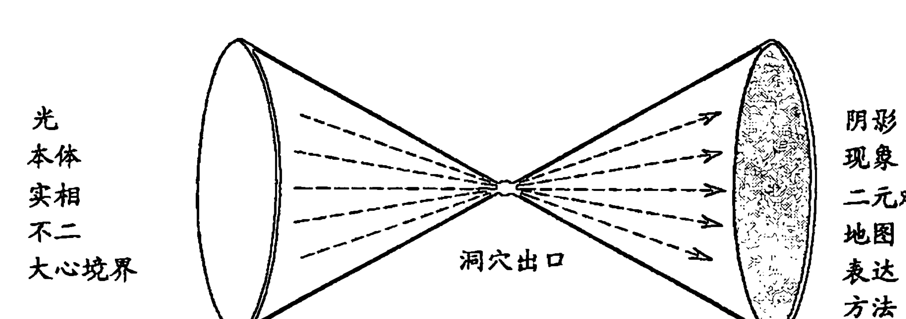

现在，我们认为存在着多层的阴影，代表了各种各样的意识光谱带，这就将柏拉图的说法略微拓宽了。因此，这些带区可以加在图6—1之上，最后得到的就是图6—2，后者就是图5—3和图6—1的组合。意识光谱的各带区都在沙漏图形的上半部分显示了出来，而它们代表了“绝对主观”和各种对客观和主观的认同。当你在光谱中从“超个人带”到“阴影层”“向上移动”时，这种认同变得越来越狭窄、受限且排他。沙漏的下半部分代表了“光”、“本体”（Noumenon）、“绝对主观”、“大心境界”、“神性”、“道”、“法界”、“空”、“梵天”，无论怎么称呼它。我们再重申一次，这张图表的缺点在于它将“大心境界”当做和其他阶层有所界分；而进一步讲，它是根据圆锥的空间维度来绘制的，这两种表现方法都具有误导性。为了减轻非常真实的困难，我们标出了沙漏的上半圆锥和下半圆锥相交的那一点，我们将这点标为“永恒无限”、绝对的“此时此地”，也就是“大心境界”，是一个“圆心位于所有地方，圆周不在任何地方的圆”，是“转动的世界中的静止点”，是“没有位置或维度的点和没有日期或持续的现在”。实际上，既然这个“此时此刻”点就是“大心境界”，那么我们就可以撇开沙漏的下半部分了，然而，这几乎是任何人想象的负担，而且既然“柏拉图的洞穴”的隐喻那么生动，那么我们就把下半部分留着了。但是这些特别的言外之意必须在你对图6—2做出参考时牢记在心。

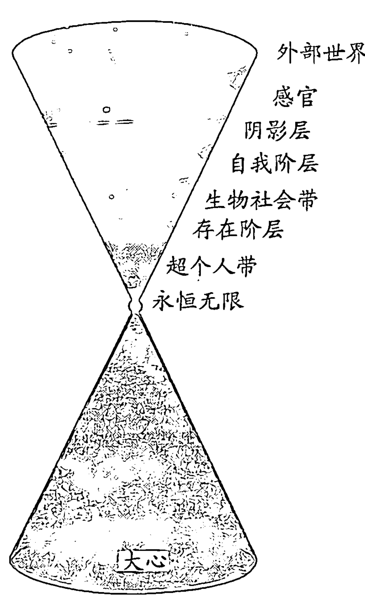

现在，让我们在图 5—3 和图 6—2 的帮助下，将我们对于意识光谱的描述和那些伟大的形而上学传统做个比较吧，后者包括禅宗、瑜伽学派、吠檀多派印度教以及藏传佛教，还有例如伊伯特·贝努瓦这样的颇有名望的个人探索者。① 我们将从最壮观的、最一致的体系开始，那就是吠檀多不二论（Advaita Vedanta）。

吠檀多哲学是建立在实验可证实的见解上的，它认为“阿特曼”（Atman，生命的本源）是单一的“实相”，而其主要关注点就是提供一个实用主义的解释，回答人类“为什么”无法意识到他基本的和终极的对梵天的认同。总的来说，人类对于二元论和区别的盲目接受就是将他抛入幻觉世界（“玛雅”，maya）中的无知（avidya），最后抛入苦难的世界（samsara，生死轮回）。

从心理学上讲，在潜藏的梵天实相“之上”或者“之下”，我们在学术上所说的“鞘”（kosas）的重叠（adhyasa）就标志着这种对于梵天的无知，它使人类将他自己认同于那些鞘，因此在表面上（并非实际上）用“绝对”遮挡住了他真正的认同。吠檀多哲学是一种详细的现象学，它等于人类普遍的对于认同的错认。我们只是并没有意识到我们是谁，但是我们所认为的自己是由多个“鞘”所组成的，这些鞘对应的是我们在无知中忽略的认同。

在吠檀多哲学中，鞘被看做洋葱皮那样的东西，灵魂的实相（Atman）“埋藏”在洋葱的最中央，因此剥去（或者只是看穿）这些错误认同，且与中央合并起来的阶层，得到的解脱结果就是各种各样幻觉层面的实际根基。② 让我们继续这一隐喻，洋葱的最外层、鞘，或者“皮肤”和“anamayakosa”，即物质存在的鞘。它代表了人类原始的觉醒意识（jagarita-sthana）、他最初对于一个压缩在肉身（sthula-sarira，“粗钝体”[gross body]）中的自我认同。接下来的三个层面共同组成了所谓的“精微体”（subtle body）（suksma-sarira），而它们是活力（pranamayakosa）的鞘、区别（manomayakosa）的鞘，也是推理（vijnanamayakosa）的鞘。活力的鞘大致对应于我们所说的生存愿望，即那种对于存活、继续、再继续的盲目欲望。区别的鞘和推理的鞘对应于我们对存在分成两部分、对于在“真实”上覆盖一层二元对立和区别的根本意愿，这部分是天生的，部分是通过语言和逻辑习得的。最内侧的层面，即极乐的鞘（ananda-mayakosa），由“光明体”（causal body）（karana-sarira）构成，而每个人都在深度、无梦的睡眠（susupti），以及在某些冥想的形式中体验过它。二元对立和区别在这一阶层中并没有被完全摧毁，而是完全调和了，所以这种状态的体验就是一种最深远的放松和极乐（ananda）。它也被称为“光明体”，因为它是一切其他鞘的根基和“因”。最后，当剥除了这最后一层鞘时，就只剩下了纯粹的“中央实相”（Reality of the Center）、绝对的非二元对立、无法形容的、无法描述的、梵天意识、下面潜藏着五层鞘和三种体。① 迪沃斯指出，不二论将“自我”解析成五层鞘。

表明意识并不存在中断。只有一种意识，也就是说，和灵魂（Atman）联系在一起的意识，由于有各种各样的有余依温槃（up-adhis），或者说错误地将自我与现象的自我的某方面相认同，所以它呈现出了不同的状态。

到目前为止，应该很明显了，吠檀多的鞘哲学非常紧密地对应于我们所说的意识光谱，而鞘本身代表了光谱的不同阶层。因此“总的身体”的外部的鞘对应于“自我阶层”，对应于自我，它与物理或者总的身体分离，并因此成为了它的奴隶。意愿和推理过程（“精微体”）的三种中间鞘对应于“存在阶层”，在这一阶层中，对于死亡的压抑产生了对于生存的盲目意愿（“活力鞘”），而根本的区别过程（区别鞘和推理鞘）开始让二元论得以强化。在极乐的内部的鞘（“光明体”）中，人类超越了他的自我和物理的肉体，这一鞘对应于“超个人带”，而最后的最中央部分，梵我和大我（Brahman-Atman）则对应于我们“无阶层”的“大心境界”（见图6—3和图6—4）。

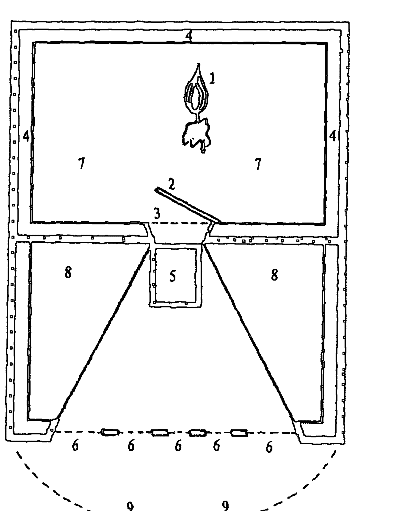

| 罗摩那的解释 | | （意识光谱） |
| :--- | :--- | :--- |
| 1. 火焰 | 自己 | 大心境界 |
| 2. 门 | 睡眠 | Susupti-超个人带 |
| 3. 门口 | 智力原则 | 根本的区别（存在阶层） |
| 4. 内墙 | 无知 | 初级二元论 |
| 5. 镜子 | 自我 | 自我阶层 |
| 6. 窗子 | 五感 | 感官 |
| 7. 内室 | 因果体 | 超个人带 |
| 8. 中室 | 灵体 | 存在阶层 |
| 9. 庭院 | 总的身体 | 自我阶层 |

图6—3

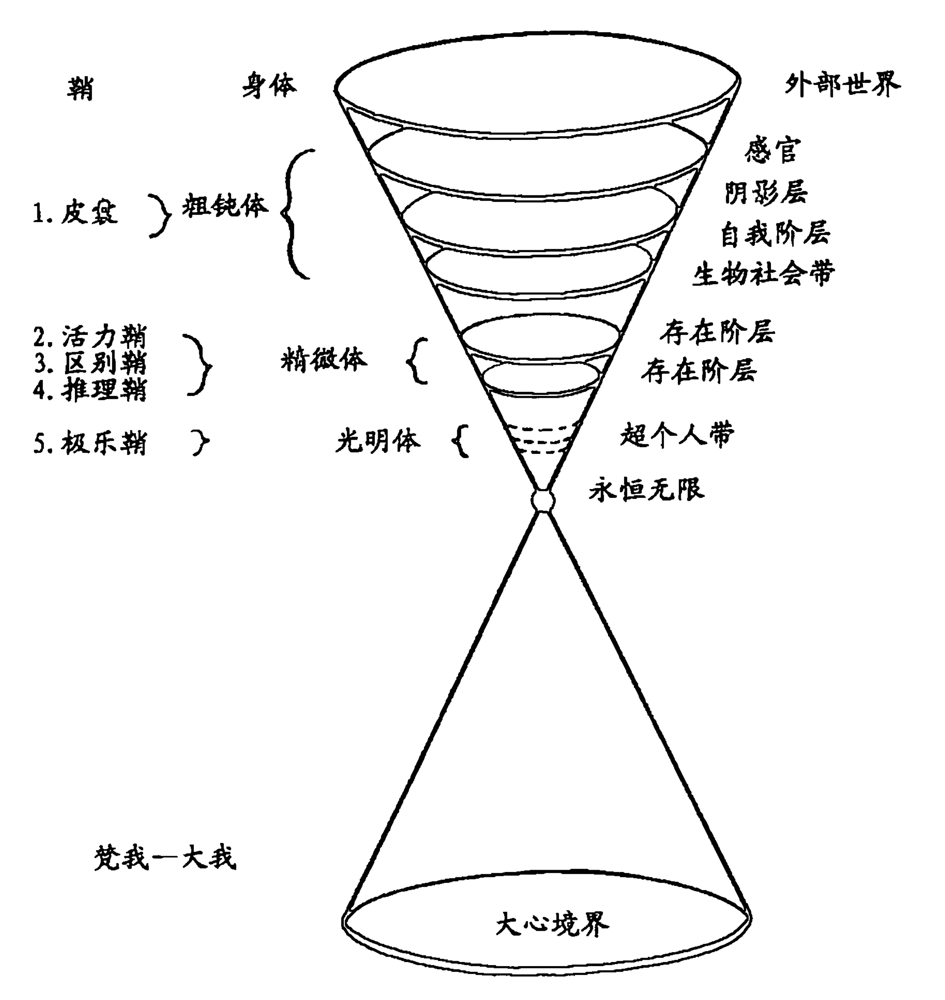

图6—3 和图6—4 展示了吠檀多的鞘哲学和意识光谱的紧密相似点。图6—3 是一幅由伟大的马哈希尊者所制作的吠檀多哲学的草图。这幅图例包含了罗摩那的解释，其在意识光谱中的对应阶层或带区也都在括号之中，并且伴有他的解释笔记。因此 “光” 对应于 “大心境界”，门口对应于 “存在阶层”，镜子对应于 “自我阶层” 等，在图中都已经示出。图6—4 展示了相同的对应关系，不过在这张图中，意识光谱的图表是使用平行的、标有吠檀多哲学的鞘来表示的。

正如你天然认为的那样，在吠檀多的鞘哲学和我们对意识光谱的描述之间存在着一些不同，但是从本质上讲，这两者是完美统一的，反射出了长青哲学 ( philosophia perennis) 即 “宇宙范围的哲学共识” 的普遍本质。因此，当我们从吠檀多派印度教的哲学一直谈到大乘佛教时，会毫不惊讶地发现意识光谱和大乘佛教的哲学，特别是和无着与世亲所提出的理论有着广泛的共识，而且在例如《楞伽经》以及《六祖坛经》这些文本中都有详细阐述。铃木大拙这样概括大乘佛教哲学的基本大意：

> 包含着心和意（Citta、Manas），以及其他六种识（Vijnanas）（这些都是意识光谱中的阶层）精神从其自体（svabhava）来看，是安静的、纯净的，而且超越主观与客观的二元论，但是这里出现了被称为“Vishaya”的特殊化原则，它来自于根本的 vish。Vish 意为“去行动”、“去工作”；而随着这行动的风的出现，心性的平静表面上就搅动起了波浪。它现在就变化或者进化（vritti）成了八种识（或称阶层）：阿赖耶识（Alaya）、第七识（Manas）、第六识（Manovijnana），以及五感感官；同时，随着这一进化，整个宇宙就以其多数的形式和无尽的纠缠而存在了。

从根本的方面来看，这和我们对于意识光谱的进化的描述非常类似，所以当我们现在描述大乘佛教哲学的八种识（vijnanas）时，我们将会同时指出意识光谱中的对应阶层。因此，心（Citta）或者“心性”对应于“大心境界”，即绝对的不二的意识。随着“初级二元论”的出现，八种识就进化了，其中第一种是 alaya-vijnana，即“阿赖耶识”（storehouse consciousness），这样的命名是因为，现象的“种子”（vasanas 或者 bija）或者人类的一切行为的原型（karma）都收藏并储存在这里，它们最终会影响到未来的一切行为。因此阿赖耶类似吠檀多派中的光明体，而且许多研究者认为它大致上与荣格的集体无意识是等同的。无论如何，它是超个人的，故而对应于“超个人带”。

从纯粹心（Citta）开始“向上并向外”移动，下一个识或者阶层被称为第七识或玛纳斯（manas），其词根 man 的意思是“去思考”和“去打算”。根据大乘佛教的哲学，玛纳斯具有三种相互关联的功能。首先，它是人类核心二元论趋向的目的。因此：

玛纳斯的功能从本质上说是反射（“心性”）并从纯粹的一体（“心性”）中创造和区别出主观和客观来。后者所积累的记忆（ciyate）现在被区分（viciyate）成了一切形式、一切种类的二元对立。

玛纳斯的第二种功能来源于第一种功能。也就是说，玛纳斯本身“当它根据其错误地判断（二元论）而创造了欲望时，例如，当它相信自我物质的实相，并固执地将它当做终极实相时，它就成长为了重大灾难的源头。因为玛纳斯并不只是一种有辨别能力的智力，而是一种意志的代理，所以也是一个演员”。因此，玛纳斯就是意志的通常来源，特别是生存的意志来源。换句话说，这对应于第二种初级二元论，在这种二元论中，人类将生存和死亡切断了，被猛然扔到了生存的盲目冲动中。这两种功能，即根本的辨别和意志，引发了玛纳斯的第三种功能的出现，用开普鲁的话来说，它是“我—意识”（I-awareness）的持续来源。“我意识”就是对于“我”作为和我的一切经验相隔离的主观而存在的有害的感觉。因此，玛纳斯可以简单地被当成“存在阶层”。

识的进化继续进行：“一旦玛纳斯从绝对统一中摒除了主观与客观的二元论，第六识（Mano-vijnana）以及实际上所有其他的识就都开始运作起来了。”接下来的阶层，第六识，通常被翻译成“智力”，它是我们符号化的抽象的力量的总和。据称，第六识会反射出玛纳斯的核心二元论，并且在这一过程中产生更为抽象和稀薄的概念化。换句话说，潜伏在玛纳斯中的智力在第六识中完全绽放了。因此，在玛纳斯中，人类认同其智力，并因此认同他在智力上对于自己的估计，也就是说，认同他的自我。因此第六识对应于“自我阶层”。最后，剩下的五种识就非常简单地就对应于五感了。铃木大拙非常巧妙地总结了八种识的大乘佛教的哲学：

> 在一开始，由于没有起点的过去在暗中所起到的作用，（永恒时刻的“永恒的起点”）所以在阿赖识（所谓的“种子”）中聚集着记忆，在整个宇宙中的各个客观对象都闭上了双眼。玛纳斯带着它的辨认智力来到了这里，于是主观就与客观分离了（“初级二元论”）；第六识在实相上形成反射，并从中通过随之而来的偏见和附属产生了整条判断链，同时，其他五种识别强迫它们变得越来越复杂，这不仅是在智力上，而且是在情感上、意动上。这些活动的一切结果都反过来为阿赖耶增光添彩（给它“重新播种”），激发古老记忆的觉醒，同时找到了新的记忆在古老记忆中的密切关系。然而，与此同时，阿赖耶本身依然是不动的，保持着它的认同。

一如往常，阿赖耶，在上文中被用做心（Citta）、绝对“本体”的同义词，就像阿特曼和“大心境界”一样，实际上保持着它的同一性，但是在表面上进化成了数种阶层，这就好比将一根蜡烛放在一个放满了镜子的大厅里，就仿佛反射并进化出了众多蜡烛，但是它一直都保持着它的同一性。

图6—5是取自禅宗大师峡田的一张草图，它展示了八种识的关系。图中再一次示出了识和括号中的光谱阶层之间的关系。为了让这对应关系更为清晰，我们引入了图6—6这是意识光谱的图表，而与之对应的各识则标在不同的阶层旁边。

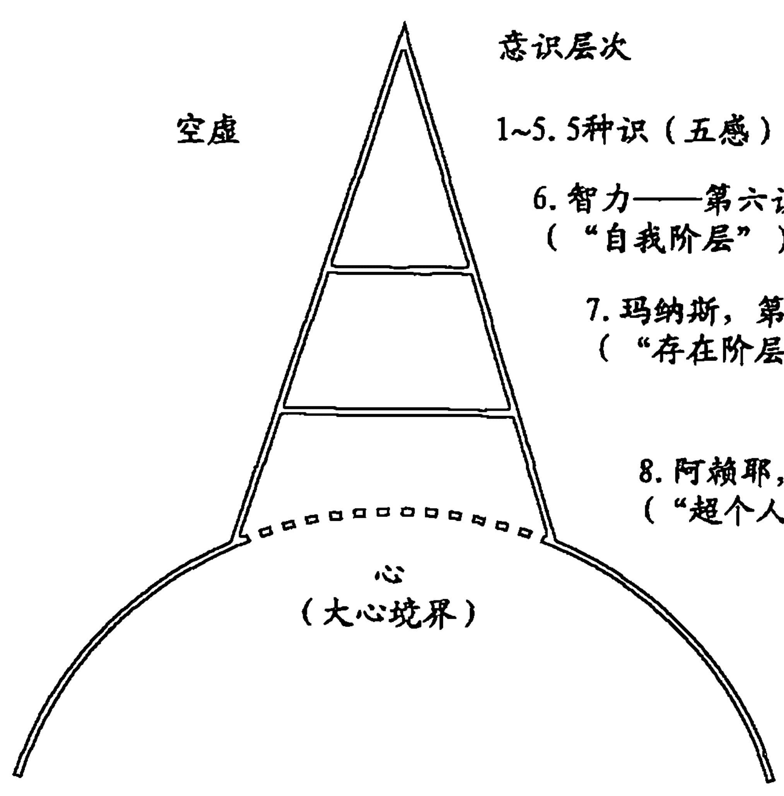

图6—5

禅宗佛教是大乘佛教的一个分支，所以它自然也赞成八种识的哲学。然而，在整个时代中，许多禅宗大师发展出了他们个人对于八种识的哲学解释，将其详细阐述并让它更适合于他们自己独特的训导风格。在这些大师中最为杰出的是惠能，即禅宗六祖，他深奥的哲学见解都在《六祖坛经》中得以呈现。图6—7概括了惠能的哲学，这张图是一幅铃木博士绘制，用于解释惠能的基本教义的图示。这张图表包含了五个阶层，我们为了方便参考，将它们用“A”到“E”进行标识。

那么，这些阶层是如何对应于意识光谱的呢？让我们从“A”层开始，它被标为“自我本性”。“看到一个人的自我本性”是惠能的标志性教义，如今的禅宗基本问题中依然保留着。“自我本性”是与“佛本性”同义的，《涅槃经》称其是一切存在所固有的，因此，“看到一个人的自我本性”只不过是成佛的附属罢了。正如我们所认为的那样，这种看见是通过般若、非二元认知模式来完成的，因此自我本性和般若在惠能的思想中是非常重要的术语。当然，自我本性和般若最终是一致的，因为在成佛的无限和永恒中，认知和存在合并为一，但是它们还是按照惯例区分描述。因此分别标有“自我本性”和“般若”的“A”层和“B”层实际上是相同的一体（“自我本性就是般若”），而且它们对应于“大心境界”。

然而，传统上将“自我本性”和般若划分成两个阶层（“A”层和“B”层）是极其重要的，特别是由于般若层（“B”层）被一道虚线一分为二，但“自我本性”层（“A”层）并没有被切开。“B”层的虚线代表了第一切断、初级二元论，由此，空虚和非二元的“自我本性”在表象上被分成了主观和客观。由于这种二元论是表面上的、幻觉的，所以“自我本性”层并不含有虚线。因此，铃木大拙在评论惠能的思想时，这样解释：

> 当我们有看到一棵树的经验时，当时所发生的一切就是对于某样东西的感知。我们并不知道这种观念是否属于我们，也辨认出被我们感知为我们自身之外的客观。对于外部客观的认识已经预先假设了外部和内部、主观和客观、感知和被感知的区别。当发生这种分离时……经验的基本本性就被遗忘了……（这种基本本性或者自我本性）指的是早于心性和世界相分离的时间，此时并不存在一个与外部世界对立，并通过各种各样的感觉渠道接收到其印象的心性。不仅精神，连世界都不曾存在。我们可以将这称作完美空虚……（接着）在“空虚”的中央出现了一种思想；这是……无意识和意识的分离，或者，逻辑上说，是基本的辩证对立的出现。

“出现了一种思想”的说法正是马鸣所说的“突然出现了一种思想”和斯宾塞所说的“要有区别”；正如我们之前所解释的，它所指的与其说是全盛的智力，还不如说是根本的二分倾向，它导致了“初级二元论”，铃木禅师将其解释为内部和外部、主观和客观、感知者和被感知者、意识和无意识的分离。在这种分离下，人类就从世界中分离开来了，因此处在了“C”层上，即“统觉精神”，有如下解释：

> 当“自我本性”和外部世界在心理学心智之上发生了活跃的联系时，般若，即意识，就发展成了统觉精神，并且反过来在后者之上活动。统觉精神就是我们形成自我概念的所在……

因此，“统觉精神”实际上并不是作为一种崇高的智力和抽象的场所的“心性”，而是运作在自我阶层上的核心二元论倾向，并从而形成了我们对于一个独立的自我而存在的、坚持不懈且不能削减的感觉。因此它非常类似于玛纳斯和“灵体”，并且对应于“存在阶层”。

“D”层是我们通常标记为精神或者智力的阶层，而铃木大拙将它称为感觉的平面（drista-sruta）和思想（matajnata）。我们就在这里形成了我们生命和实相的智力抽象观念，所以我们也就在这里形成了我们对于自己的智力形象。换句话说，“D”层对应于“自我阶层”。进一步讲：

> 在感觉的平面（drista-sruta）和思想（mata-jnata）上，无意识的心智具有其病理学的状态，对应于分析心理学或者精神分析学的“无意识”……精神分析学的“无意识”无法深入到涵盖无精神（自我本性、大心境界）的问题的程度。

这些“病理学的状态”将被当作“阴影层”。（总结地概括一下，在图6—8中示出了惠能的思想和意识光谱之间的正式对应关系。）

我们再谈谈藏传佛教的哲学，我们又一次从中找到了和意识光谱的严密的相似之处。实际上，藏传佛教的哲学几乎和吠檀多派印度教一模一样，因为这两种哲学都是建立在五种鞘的教义周围的。因此我们就不需要深入到藏传佛教哲学的细节之中，因为我们只需要重复有关吠檀多哲学的解说即可。我们完全可以说，几个世纪以来，藏族的最伟大的贤者们已经发现，这种心理学体系可以很好地表示意识的实际情况，而我们从一切本质上都相信它和意识光谱有着完美的共识。图 6—9 是伟大的戈文达喇嘛用于展现藏族观点中的五鞘哲学的图表。这些鞘本身和吠檀多派的鞘是一样的；然而我们还是放入了这张图表，因为它非常清晰地展示了五鞘“像洋葱一样”的本质。

| 鞘 | 身体 | 阶层（对应） |
| :--- | :--- | :--- |
| 1. anna-maya-kosa（皮囊） | sthula-sarira（粗钝体） | 自我阶层 |
| 2. prana-maya-kosa（活力鞘） | | |
| 3. mano-maya-kosa（区别鞘） | suksma-sarira（精微体） | 存在阶层 |
| 4. vijnana-maya-kosa（推理鞘） | | |
| 5. ananda-maya-kosa（极乐鞘） | karana-sarira（光明体） | 超个人带 |
| 觉我—大我 | | 大心境界 |

图6—9

那么，正如我们所描述的那样，伟大的形而上学传统理论的哲学体系从本质上和意识光谱有着形式上的统一，从吠檀多到禅宗。最近，这一事实使我想到，存在一种长青心理学（psychologia perennis），一种“长久的心理学”，它仿佛是“神”在没有任何人看到的情况下消失于无地与无时之中。实际上，意识光谱是这种长青心理学的现代表达，不过它既借鉴西方见解，也借鉴东方见解。因为，即便我们对于意识光谱的表达从本质上和这些东方的心理学达成了共识，但它们在侧重点上依然存在区别。从这些东方的理论观点来看，光谱的所有阶层（除了“大心境界的无阶层”）都存在，但只是以一种幻觉的方式存在而已，就像电视机屏幕上看到的画面是不真实的，它们和实际场景是一样的，但却只是图片罢了。它们最主要的关注点一直都是在“大心境界”，因此它们从来不曾系统化地研究过可能发生在任何一个单独阶层之上的病理学。另一方面，在17世纪以后的西方世界，已经几乎完全忽略了“大心境界”，而且，西方心理学也因此排他性关注于可能发生在任何一个单独阶层上的反常状态，特别是在“自我阶层”上的。进一步讲，西方的研究者最近已经越来越对发生在“存在阶层”和“生物社会层”上的病理学感兴趣了，例如存在主义心理学、家庭治疗，以及心理咨询学这样的原理发展中可见一斑。

那么，统合起来讲，这些东方的和西方的方法形成了一种不可思议的互补性，因为西方迄今为止所忽略的阶层已经被东方彻底研究过了，反之亦然。因此，东方已经广泛地探索了通往“绝对实体”（Absolute Noumenon）的道路，与此同时，西方则将自身限制在对于现象心理学的科学研究上。人类作为“绝对主观”，就是“神性”，这是东方的关注点；人类作为知识的客观，就是现象的自我，这是西方的关注点。它们合并起来就覆盖了整个意识光谱。如果西方的研究者坚信“存在阶层”、“自我阶层”和“阴影层”一样，坚定对意识做出最终的决定，那么对他们和那些妄想而言就会变得越来越糟糕。另一方面，东方的研究者却独独忽略了光谱中的这些阶层，虽然他们已经对意识做出了最终决定，而我们中大部分人都注定要留在这些阶层中。所以，当我们完全赞成东方贤者的哲言时，我们是将侧重点略微作了改变的，将他们的哲学用西方科学家的发现做了补充。那些疲劳的化学家、慌乱不安的商人、沮丧的家庭主妇等，他们既无法理解开悟，也不会去寻求它。如果他们这样做了，情况就好得多了；如果不这么做，我们是不是应该将自己置身于他们现存的阶层之上呢？

现在，我们也可以通过认识论来得到这种互补性。我们已经认识到，人类有两种主要的认知形式，一种是符号化的地图知识，而另一种是非二元的意识。中观论将前者称为法界（samvritti），它与科学和哲学的相对实相有关，而后者则被称为真谛（paramartha），它导致了“绝对实相”（Absolute Truth）的知识。后来的体系，例如瑜伽行派和吠檀多派，在这基本的双面教义上做了详细阐述，并将它重新以知识的三向划分的形式予以说明。在这一体系中，第一或者符号化的地图认知模式又被分成了两类：一类被瑜伽行派叫做遍计所执（parikalpita），它导致了纯粹的想象知识，比如看着一根绳子，把它想象成一条蛇；第二类被称为相互依存（paratantra），与我们所说的客观实相有关，例如看到一根绳子，并正确地把它称为绳子。最后，瑜伽行派的三种认知形式的最后一种和中观论的胜义（paramartha）是一样的：那就是我们所说的绝对实相“的”非二元意识。瑜伽行派只是将它重命名为圆成实性（parinishpanna）而已，而且，正如我们之前所说的，它对应于第二种认知模式，因此与绝对实相有关，也就是看到一根绳子，知道他看到了他自己的“真实自我”（True Self）、“纯心性”。

那么，在真相的两面和三面划分之间的唯一区别就是，后者在前者之上加以拓宽，将符号化的世俗（samvritti）分成了相对的假（遍计所执）和相对的真（相互依存）。从这一角度来看，科学家就是致力于知识的相对的真的仪器形式，他们寻找足够且有用的符号和客观的实相来表达。但是，虽然科学的知识是相对的真，那么它就依然是一种二元论知识的形式、世俗的形式，并且从绝对的观点来看，它和其他形式的二元论知识一样都是幻觉的。

西方的智力追求，例如科学和哲学，已经在法界、符号化地图知识的领域中徘徊了很久，而它们的基本目的就是将遍计所执（蛇）的相对的假的知识和相互依存（绳子）的相对的真的知识分离开来。对于西方来说的“实相”一直都是相互依存，是寻找客观的“真相”。然而，吠檀多和大乘佛教的东方理论意识到相互依存是相对的真，但却是绝对的非真实，所以转而追求真谛、“绝对实相”的途径。现在，关键在于：当这些认识论的意见变换到精神病理学的领域中时会发生什么呢？

从这样或那样的角度来看，精神病理学一直都被当做扭曲实相观的一种结果。但是被认为是精神病理学的东西因此就必须依赖于我们认为是实相的东西！于是持有不同的实相概念的东方和西方发展出了精神病理学的不同概念。对于西方的心理学而言，精神病理学一直都和遍计所执（蛇）联系在一起，而他们的这种实相观的方式在那些坚信相互依存（绳子）的观点的人们看来是错误的。如果一个人看着绳子，总以为那是蛇的话，如果他感觉到恨，却叫它爱的话，如果他压抑了性欲，却叫它饥饿的话，那么他肯定是“有病”的。在另一方面，当这个人从遍计所执（蛇）的观点转移到相互依存（绳子）的观点时，当他将绳子看做绳子、恨看做恨、性欲看做性欲，那么就得到了应有的“治愈”。换句话说，相互依存的相对的“真”知识和遍计所执的相对的“假”知识在认识论上的区分，也就成了神智清醒和神智不清醒之间的分割线。

然而，对于这些东方的理论而言，实相并不是在遍计所执（蛇）和相互依存（绳子）之间进行区分，因为这两者都属于世俗的领域，属于相对的（且幻觉的）符号化地图知识，所以从遍计所执（蛇）转变为相互依存（绳子）最终只是从戴着铁链转变成了戴着金链而已。它们的关注点反而完全从无知转向了真谛（或者圆成实性），从相对知识——真或假——转变到绝对知识，它不存在任何区别。因此，它们的“精神病理学”就并非与遍计所执（蛇）相连的，而是和法界（蛇与绳子）相连的：将绳子看做蛇的人和将绳子看做绳子的人都同样是“被欺骗的”、“沉睡的”，而当两人将绳子看做它的实质时，即一种梵天的表现、一种“大心境界”的客观化，故而蛇和绳子最终都是幻觉，就得以“治愈”了。“‘大觉醒’（Great Awakening）迟早会到来”，庄子说，“然后我们就会发现生命本身就是一场大梦。愚者们始终以为他们是清醒的，忙碌并鲜明地以为他们能理解事物。在进行适当的区分时，他们将国王和马夫（总体的对立）区别开来。这是多么愚蠢啊！我们将像这样的话称为‘终极骗局’（Supreme Swindle）。”

在大部分西方研究者看来，这种“大觉醒”通常被看做，至少是在心理学上被看做，“大神经崩溃”（Great Nervous Breakdown），因为他们只正式地承认遍计所执（蛇）和相互依存（绳子）的认知形式，故而，个体就必须选择其中一种。因此，当有人选择了真谛（绝对）的认知形式时，就一定会被当成疯子。用莱恩的话来说：

> 在我们的时代之前，想要觉醒的尝试经常会受到惩罚，特别是受到那些最爱我们的人的惩罚。因为他们都是沉睡着的。他们以为那些意识到的真实的东西只是一场“梦”觉醒之人，或者还在沉睡的人都疯了。

但是，我们现在当然可以识别出认知的所有三种形式的存在，于是意识到在遍计所执（蛇）和相互依存（绳子）之间的区别是传统且相对的“神智清醒”而已，而法界（相对）和真谛（绝对）之间的区别则是“开悟”。我们可以再一次发现各种理论的互补性（见图6—10），因为西方的心理学家们会让我们在过去看做蛇的地方看到绳子，而东方的贤者则在我们过去只能看到绳子的地方展现出梵天。

现在，为了给这意识光谱的综览做个总结，让我们大致谈一下一些更为“西方”的意识探索者们的成就吧，例如葛吉夫、费舍尔，以及贝努瓦。从葛吉夫开始，我们注意到，他的心理学体系在表面上基于伊斯兰苏菲派的教义，得到了邬斯宾斯基的大力支持，而且在更近的时候还被像奥斯卡·伊查索和约翰·里利这样的富有天赋的研究者所采纳了。葛吉夫认为，我们也这样相信，对于意识的最好的看待方式，就是将它当做一个具有不同振动带区或者状态的多阶层的连续体。为了便于识别，每一阶层都被赋予了一个“振动数字”，分别是3、6、12、24、48和96。因此，正如里利博士所描述的那样，3层是“与宇宙精神融合、与神统一”，我们立刻可以将它当做“大心境界”。葛吉夫的连续体中的下一阶层被称为振动状态6，就是“意识的点、星界履行、移动的透听力、和时间中的其他实质融合”，这显然对应于“超个人带”。振动状态12代表了“存在阶层”的下界，因为它是“提升了的身体意识、身体和星球边缘意识的最高功能、在爱中存在”；而振动状态24代表了“存在阶层”的上界，也就是“生物社会带”，因为在这一状态中，“一切所需的计划都在生物计算机的无意识中，平滑地操作，自我迷失在一个人最熟知且喜欢进行的愉悦的活动之中”。下一阶层，振动状态48，就是“自我阶层”，或者说“中立的生物计算机状态，吸收的状态和新想法的传播的状态；新想法和新计划的接受和传播的状态”。最后，振动状态96是“否定的状态；痛苦、罪恶、恐惧，做那些必须在痛苦、罪恶、恐惧的状态下进行的事情”，我们将它认作是“阴影层”的下界。

我们应该在此时提一下，一个人可以一如从前那样“远离”意识光谱，进入“阴影层”极上的定点和最远的界限。在极度痛苦、精神兴奋过度、精神分裂的状态、某些药物体验，等等的情况下就可能发生。在葛吉夫的体系中，这些上层的振动层被标为192、384和768的数字。在这些“阴影层”的上界中，就可能发生最为独特的现象：几乎在顷刻之间，一个人就会“弹回”或者“弹射”，可以说，从这些带区的某一个进入到意识光谱的对应的较低阶层中。举个例子，我们思索一下下面这个荣格所讲述的故事：

> 有一个女病人，她的可靠性和诚实性是毋庸置疑的，她告诉我她的第一胎非常困难。在30个小时毫无结果的努力后，医生认为应该采取产钳分娩。分娩的过程在轻度麻醉的状态下进行。她非常痛苦，而且失血量极大。当医生、她的母亲，还有她的丈夫离开了，一切都整理干净了之后，护士想要去吃饭了，这位病人看着她在门口转身，问她，“在我去吃晚饭之前你需要什么吗？”她想要回答，但是却说不出来。她感觉自己从床上沉没了下去，进入了无底的空虚之中……她之后就感觉不到她的身体和其位置了，她接下来所意识到的是她正在从天花板的一个点上向下看，可以看到在她下面的房间中所发生的一切事情：她看到了她自己躺在床上，死一般的苍白，眼睛紧闭着。在她旁边站着一个护士。医生情绪激动地在房间里来回走着，她感觉自己仿佛失去了头脑，不知道要做什么……

接下来所发生的就是她从昏迷中苏醒了过来，看到护士俯身看着床上的她。她被告知她已经昏迷了将近半个小时了。第二天，大概在15个小时之后，当她感觉稍微有点力气了的时候，她跟护士谈起了在她昏迷时医生无能为力且“歇斯底里”的行为。护士言之凿凿地否认了这一说法，原因是病人当时完全失去了意识，因此对于当时场景的事情一无所知。直到她非常详尽地描述出了她昏迷时所发生的事情时，护士才不得不承认病人确实感知到了事情真实发生的情况。

换句话所，这个妇女从极度痛苦和恐惧的“阴影层”中“弹回”到了显然是“超个人带”的某个地方。这种弹回会，而且经常，从“阴影层”的上层带区出发，到达光谱中对应的较低阶层。约翰·里利明确意识到了这种“阴影层”“弹射效应”，因为他取了葛吉夫的振动阶层96、192、384和768（也就是说，所有的“阴影层”中的带区），并将它们重新分别编号为-24、-12、-6、-3，以此强调这些负的“阴影”状态和光谱中另一侧的相应阶层之间潜在的对应关系。这种潜在的对应关系可能非常亲密，在某些情况中，“阴影层”的某些上层带区实际上具有其在光谱下层弹回层的性质，当然，例外之处在于，这些“阴影”带区是极其负面且痛苦的，它一如往常形成了对其相应阶层的恶意讽刺。那么，里利就是有着这样的想法，才将“阴影”带区分别做了定义，例如将-6带定义为“类似于+6带区，只不过它是极其负面的”。①

在这种联系中，我们要注意罗兰·费希尔在马里兰州精神病研究所里进行的实验研究，他证明这种生理学的关联并不仅仅是这种弹回效应，而且也是类似光谱的意识本质。费希尔发现，个体的中枢神经系统如同一种几乎“本能的防御机制”一般，当受到过度兴奋的状态的（自然的或者人为的）刺激后，会自动弹回到相对应的抑制兴奋的状态。而说到意识本身，费希尔博士拥有丰富的实验证据，他认为它是以一种连续体或者光谱的类型存在的，其中“绝对自性”“位于”连续体的一端（“大心境界”），而普通的自我意识则在另一端（“自我”）。进一步讲，“自我意识的每一连续层面在不断增加主观的‘自我’意识时，就削弱了‘彼处’的客观……”，所以就存在“许多的自我意识层面，每一层都有着特有的‘自我’和‘我’的比例”，我们将称为“认同阶层”（levels of identity）。这也意味着像我们所认为的那样，存在许多无意识过程的阶层；而且，费希尔的数据引导他得出结论，“我并没有发现一种潜意识，而是发现了许多自我意识的层面，因为存在着多个觉醒的层面，而且对应于个体解释能力中的符号化解释。”

最后，让我们转向最为透彻的精神分析学家和东方哲学的解释者，休伯特·贝努瓦。贝努瓦博士的思想非常明智，并且在微妙之处意义深远，如果我们只是总结他的观点的话，那对他来说是不公平的。相反，我们必须让他自己来为自己说话，而把我们的评论点缀在他的引文中。我们不会详述贝努瓦的意识阶层，因为它们在本质上和光谱中的那些阶层是一样的，而我们可以说的任何话都是重复多余的。贝努瓦认识到了“大心境界”、“存在阶层”、“自我阶层”，以及“阴影层”，而他将它们分别称为“绝对原则”（Absolute Principle）、主观感情意识、客观意识，以及“恶魔”。然而，我们必须对贝努瓦将“能量”（Energy）当做“绝对”的隐喻做出扩展说明，因为这是在我们的日常生活中获得意识光谱运作“感觉”的最直接方法。

在下面这段话中，伊伯特·贝努瓦描绘出了他的哲学，他以一个常见的例子开头：

> 为了达到那个目的，让我们从具体的观察开始。有个人在烦我；我变得很愤怒，想要把我的对手揍一顿。让我们来分析一下，在这种情况下，我们发生了什么。我们将发现，我的内部现象被划分成了两

① 这些引语是从马里兰州精神病研究院的罗兰·费希尔的具有启蒙意义的论文中随机选取的。

种不同的反应，我们将把它们称为基本反应（primary reaction）和次级反应（secondary reaction）。

我们最终将发现，这两种不同的反应对应于两种基本的认知模式：基本反应对应非二元的模式，而次级反应对应于符号化的模式。贝努瓦继续分析愤怒的暗涌：

> 基本反应存在于觉醒之中、我之中，由一定数量的有活力的能量组成；在我们的“非自我”和“自我”之间（“初级二元论”）所呈现出的对于能量的感知觉醒之前，这种能量一直潜伏在我们的能量的中央来源之中。外来的侵略性能量在我之中搅乱了反应力的表象，而反应力可以平衡“非自我”的力。但这种反应力并不是愤怒的移动，也并没有某种确切的形式；它和将要被倒入模具，但还尚未释放出来的物质是兼容的。在没有持续的一瞬间，这种由我的源头所调动起来的萌发的力量还并不是愤怒的力量；它是一种非正式的力量，一种纯粹的活力的力量。

现在，这种基本的反应，这种纯粹的、非正式的（“没有形式的”）、活力的力量，代表了非二元认知模式，当然也代表了它所联系的非二元意识，正如贝努瓦所说：

> 这种（基本的）反应对应于外部世界的某种感知，对应某种知识。因此，它对应于某种意识，但是这和习惯上所说的有很大的区别。他并不是（“自我阶层”）的智力、清晰、明白的心智意识。它是一种深奥、反射、机体的模糊的意识……（一种）通过非智力方式“认知”外部世界的机体意识。除此之外，通过内向观察也可验证：我感觉愤怒进入了我的头脑中，它会在那里建立起一千幅图像；我感觉它从下面升起，从我的机体存在中升起。这种基本反应极其迅速，如果我稍不注意，就会让它逃脱我的观察，但是，如果我在愤怒之后，仔细观察我之中所发生的种种细节，那么我就会意识到，在一段很短的时间里，有一种纯粹的匿名的机体力量从一种机体意识中出现，在我的智力意识到这个愤怒形象之前发挥了作用。

这种机体的或者基本的意识我们常称为机体意识，而只要它是“匿名”的、“纯粹”的、“没有形式”的，也就是说，未被概念化污染，那么它就完全渗透到了宇宙意识，或者“大心境界”之中，因为，正如贝努瓦所指出的那样，它以“没有持续的瞬间”方式运作。这种活力的“能量”因此就是属于无时间的“时刻”的，属于“永恒”，也因此属于梵天、“大心境界”、道。它就是“实相”本身。

一开始也许将“神性”描述成“能量”会显得很奇怪，但是经过思考，没有任何其他描述词比“能量”这个词语更加确切，这些词语都由于它们的有限性和持续性而注定无法掌握无限和非二元对立，因为，即便是“非二元对立”这个词语都是二元论的，因为它排除了“二元对立”。我们说“非二元对立”时，用的是它“绝对”的“非二、非一”的意思，是和“空”（sunyata）、空虚同义的，而且从这一意思来看，“能量”就很合适。正如库玛拉斯瓦米所说的：

> 这就是实证主义者或者“仅此而已主义者”的困境：当只认识到了那些可以被掌握的实相时，他就将“实相”赋予了无法掌握的事物，因为他们一直都，并且被驱使着、不顾自身的假定实相是某种像“能量”一样的抽象实体，这个词只不过是“神”的另一个名字罢了。

很难相信，当一个人学习大学的物理课本之后，他实际上掌握的是一份“宗教式”文档，它经过了仔细的擦拭，除去了一切肮脏的词语，例如直觉、永恒，以及“神性”。但是物理科学的核心关注点是围绕着能量及其转化的概念而旋转的，不管这些转化是发生在分子上、生物系统上，还是计算机中。那么“能量”是如何被描述的呢？它既不能被创造，也不能被毁灭，不能合并也不能分离，而且从总体上它既不增加也不减少，一直保持着恒定。这实际上就是热力学第一定律。进一步讲，虽然宇宙中的“能量”永远都保持着恒定，然而却会发生“转化”或“表现”，因为一切种类的能量和物质，不管是动力学的、热力学的，还是分子力学的，全都被成为“能量形式”。实际上，宇宙中的一切现象最终都不过是“能量”的形式而已，所以这种“能量”或多或少地“潜藏”在一切物质事物中。这就是纯物理学，但是这听起来熟悉得奇怪，而且会让人怀疑我们是否是在讨论物理学同时还在讨论印度教。说到底，我们将万有说成“能量”的形式还是梵天的形式根本就无关紧要。

现在，贝努瓦通过使用“能量”让我们更容易找准这种实相的方向，因为我们全都具有这种能量的内在流动感，无论这种感觉有多微弱，例如在愤怒的那个例子就是这样。贝努瓦紧接着说：

> 由基本反应所构成的我的动态修改、这种对应于外界词语能量的“我的能量”的流动（在本例中，就是那个惹恼我的人），将会释放出第二反应（那就是）我的智力意识的反应作用；而这种第二反应倾向于通过瓦解流动的能量，而重新在我之中建立起原始的不动性。

这第二反应对应我们所说的符号化认知模式，我们凭借这一过程将我们纯粹的机体意识转换成思想和语言的二元论手段。贝努瓦对于这两种认知模式的构想是非常巧妙的，因为它让我们能够理解，在这一时刻中，我们的机体和非二元的认知模式是如何被瓦解成符号化模式的，从而掩盖了我们的“终极同一”，而这本来是纯粹的机体意识应该显露出来的。我们将在适当的时机回到这个问题上，但是现在，让我们回到贝努瓦对于两种认知模式的解释上：

> 让我们回忆一下，我们称之为最初需求的东西，或者是宣称“如同独特存在一般的绝对”、“绝对存在”的东西。在我们对于“宇宙”的智力理解的底层，有一种“自我”和“非自我”之间的无法减弱的差异（那就是“初级二元论”）。当一个人在谈论对于我们的心身机体的认同（“存在阶层”）时，所唤起的就是这种差异……当我是机体意识时，我不会辨别（非二元对立），但是，当我是智力意识时，我就会辨别了。

贝努瓦接着详细阐述了这两种认知模式，然后提出了最重要的结论：

> 在我的机体意识中，我既认同“自我”，也同样认同“非自我”（这就是“大心境界”）；在我的智力意识中，我认同自我（“自我阶层”），我断言只有自我存在着。我的智力意识只知道自我。当我想着我具有一种外部世界的智力知识时，实际上我只有和外部世界相联系的修改我自己的知识。哲学家们将它称为“我的主观的监狱”，却没有意识到，我的机体意识并不会分辨主观和客观，而正是因为这一点，我实际上已经自由了。

“我实际上已经自由了”，这是因为我纯粹的机体意识、从我之中涌现的这种活力的“能量”并不认可“初级二元论”，它是非暂时的，因此是无限的，它必然会完全融入到宇宙意识或者“大心境界”之中，对于它的认识是由解脱（moksha）构成的。但是他的机体意识无法在身体中定位，因为它具有严重的二元性；而且，正如薛定谔自己指出的那样，“我们通常并没有意识到这一事实，因为我们已经完全将人类的个性看做……位于其身体的内部。当发现我们在那里其实并不能找到它时，是非常令人惊讶的，会产生怀疑和犹豫，我们非常不愿意承认这一点。我们已经习惯于将意识的个性定位于一个人的头脑之中，大概就在两眼中点向后一两英寸的地方吧……我们很难估量清楚个性、意识精神的位置，在身体之中只有符号，只有对于实际利用的一种辅助。”

然而，这绝不是暗指意识位于身体之外，这是灵魂出窍、脱体经验，以及类似现象（可能发生在“超个人带”上，但是不能和“大心境界”混淆）的支持者们当中非常常见的误导的信仰。这种认为意识存在于身体之外的信仰，只不过是内部外部二元论的镜像而已，是毫无价值的硬币正反面。当罗摩那·马哈希的一个学生告诉他，他偶然闪过了一种意识，其中心仿佛在正常的自我和身体之外时，马哈希尊者大笑着说：

> 在外面！什么是内，什么是外呢？这些只有存在主观和客观时才可能存在……在研究中，你会发现它们都只溶解在主观之中。认识什么是主观；而这种询问会引导你得到超越主观的纯粹的“意识”。

所以，当贝努瓦将这种“意识”称为从机体内部生发的“能量”时，这只不过是对于流行说法的一种妥协而已。在那“没有持续的瞬间”，当纯粹的、非正式的、匿名的，且非二元的力量出现时，它既无关内部也无关外部，因此是无法被定位的。但是当这种能量瓦解成想象时，当我们用智力在这热忱的活力之上对其反射时，初级二元论就已经出现了，因此我们似乎便以为这种能量的“来源”是在我们的身体之中。但是铃木禅师警告我们，“这种独立存在于什么地方的‘大来源’的概念，是我们在智力尝试解释我们的经验时所犯的本质错误。”因此，无论我们在何时对于流动或者机体的能量进行参照时，都应该谨记这一点。

现在，让我们继续贝努瓦对这种瓦解成想象、概念、符号化认知模式的流动“能量”、机体意识、非二元意识的描述；然后我们将回到机体意识上，回到这“我们已经自由了”的活力“能量”上。

在次级反应的过程中，我想要“是”的智力需要（我的自我想要强壮、不动、永久、稳定，等等的想法）被我体内这种能量的流动所阻碍了，因为这种流动意味着对于外部世界的接受（由于初级二元论而变得不可能）……我对于自身能量流动的次级反应因此就只能拒绝、对立于这种流动。但是这种和宇宙秩序的对立是不可能成功的；在我之中流动的力量无法回到非表象。因此，我对于流动能量的拒绝之恩会导致这种能量因其解体而毁灭。

进一步讲，贝努瓦补充道，这种“流动能量解体是通是想象和情感的过程而实现的”。也就是说，这种“能量”瓦解成了心理想象和它们所对应的身体情绪，这是一种大致和升华一样的过程，因为，正如诺曼·布朗所说，符号的动物就是升华的动物。现在，我们的“能量”，我们的非二元认知模式，我们的机体意识瓦解并消散成符号化认知模式、概念、想象、思想和区别的过程——这一过程正是我们“每天分割梵天”的过程。我们将在适当的时机回到这一点，详细阐述它，不过现在我们必须回到“大心境界”中，回到机体意识中，谈谈贝努瓦的说法：

> 正如我们说过的，这两种反应对应两种不同的意识，基本反应对应机体意识（“大心境界”），次级反应对应我精神，或者智力，或者想象的意识（“自我阶层”）……我的想象意识是二元论的，不管是肯定还是否定、快乐或者悲伤（正面或者负面）的想象情绪过程都发生在其中。相反，我的机体意识不是二元论的，因为从中产生的活力力量是非正式的（没有形式的）、匿名的、是相同的、不依赖于之后会生机勃勃的二元论形式的……我们已经认识到，机体意识不区分自我和非自我，其作用表明了这两极之间的本质同一性，从而产生了一种……普遍的统一的“宇宙”认识……简而言之，我的机体意识本身就能认识“宇宙”。

正如贝努瓦所说的，机体意识能认识统一的宇宙，但这只是因为其运作方式是无空间且无时间的，因此也就是无限和永恒的，而且因为一切无限永恒都同时出现在时空中的每一点上，因此“认知了这，你就认知了一切”。认知了绝对“现在”，你就认知了一切时间；认知了绝对“此处”，你就认知了一切空间，而认知了这两者（因为它们实际上并不是相分离的），那么你就认识了统一的宇宙。这当然并不是说你将认识到一切可以通过符号化地图知识所掌握的事实，不是说你将认识历史上所有书本中包含的一切信息，这大错特错！确切地说，你将认识到，并且成为个体事实的实相，在这实相中的抽象“事实”都只是反射。你永远无法认识一切事实、一切反射，但是你将生动地认识被反射的唯一的实相。① 因此《歌者奥义书》用诗歌说道：

① 因此在般若波罗蜜多经的文献中，般若就是 sarvajnana，即“一切知识”。

> 就像通过一块泥土就能认识泥土的一切，区别只不过是言语、名字的差异罢了；实相只是“泥土”而已，就像通过一块铜片就能认识用铜所制造的一切，区别只不过是言语、名字的差异罢了；实相只是“铜”而已，所以，我的朋友，这就是教导。

而《老子》（第47章）也因此这样宣称：

> 不出门，你也能认识整个世界。
> 不往窗外看，你也能看到天堂之路。
> 你走得越远，你知道的就越少。
> 因此贤者不用旅行就能知道……

伯纳德·朗勒根在他里程碑式的有关见解和理解的研究中，以类似的风格强调了一个要点：

> 彻底理解要理解的东西，你将不仅理解一切要理解的东西的宽线条，而且还能取得一个稳定的根基、一种不变的模式，在一切将来的理解发展中都可以适用。

理解这，你就理解了一切，能忍受，你就忍受了一切。为此，贝努瓦对“能量”和机体意识的概念是最为有益的，因为，的确就是这种非正式的“能量”在“忍受”着我们所有的精神和身体的现象。它之所以有益，是因为它意味着，在我们“之内”潜藏着且活跃着我们意识注意到的一切经过的形式；正如贝努瓦的愤怒例子中那样，流动的“能量”如一开始出现时一样，是没有形式的、纯粹的、同质的，而只有在几秒钟之后，它才会瓦解成想象和形式，只有在几秒钟之后，你才会感觉到“愤怒”。“能量”就像这样，是一种非常类似于“绝对主观”、“大心境界”的隐喻，因为“‘能量’这个词语只不过是‘神’的另一个名字罢了”。“能量”处于“内部”，一切万有之后会变得生机勃勃；它没有形式、模糊不清、无法作为客观或者概念来认识，然而我们能够直接、非二元地、立刻、非概念地认识到：“因为它，我实际上已经自由了。”

我们已经认识到，意识光谱代表了“绝对认知者”对于某个被认知的客观对象的认同，用波坦利的话来说，“无知就是‘观察者’对于观察方法的认同”。对于“一切”的原始认同逐渐变得狭窄而有限，而每一次限制都产生了光谱的一个新的阶层。因此，我们的“目标”就是停止排他认同特定的客观复合体，这样我们就可能发现我和一切表象的表现的终极认同。（图5—3中呈现了那些我们已经认同了的客观对象，这种认同越往图表的顶部走，就逐渐变得越来越具排他性）。用贝努瓦的话来讲，“这种认同并不是错误的，只是不完整的，它排除了我对于宇宙其余部分的等同认同。自我的幻觉并不存在于我对我的机体的认同之中，但却存在于意识到这种认同的排他行为之中。”

现在，抛弃“绝对主观”及其客观化的隐喻，让我们用“能量”及其瓦解的隐喻，来遍历意识光谱的进化。从简化的方法来看，我们可以想象：在“大心境界”中流动的“能量”是纯粹的、没有形式的（空虚的）、非暂时的、无限的，但是当它通过光谱的各阶层“上升”时，它就开始在获得二元论的想象和形式中瓦解了。因此，每一阶层的特征都是由发生在那里的二元论瓦解的本质所赋予的。因此，在“存在阶层”上，“能量”瓦解并碎裂成了“自我”能量和环境能量的对立；而在“生物社会带”上，自我能量开始产生形式，得到了这一阶层中的象征符号和色彩；而在“自我阶层”上，它进一步瓦解成了身体能量和心灵能量的对立。“阴影层”则只代表了这种瓦解的连续性，其中心灵能量本身被分割而破碎了。

让我们再一次利用“有人打我时，我愤怒”的流动作为整个运动的例子。实际的击打本身，从其最简单的形式来看，只是一种宇宙的运动，但当初级二元论出现时，我就感觉到了一种能量的流动从我之中升起。在这个阶段，在初级二元论强化之前，这种能量依然是纯粹的、非正式的、非暂时的，它运作于“不持续的瞬间”，在我指认出发生了什么之前包含了那个静止的时刻。但是当它“经过”“生物社会带”时，这种非暂时的流动就得到了持续，因为能量在这里有了愤怒的形式，并因此在时间中延续。这种形式是由存在于“生物社会带”上的内化的家庭和社会的关系所塑造的。这种能量现在以愤怒的形式“从我的头脑中升起”，而我用言语将它表达为“愤怒”（“自我阶层”）。如果第四二元论在此时出现，那么我就会将这种愤怒和侵略性投射出来，并因此感到恐惧（“阴影层”）。无论如何，在这些或者其他的机制下（否认、置换、反曲、分割、替代、压抑、盲点化、合理化等），我的“能量”最终被分裂、消散，和瓦解。

这就是我的“能量”的流动和瓦解、梵天的进化和退化、“在一切造物之前永恒上演的戏剧”直接从空虚中出现，并重新退回到空虚之中，不留下任何真正的轨迹，没有痕迹，一场没有路径的戏剧，它包含了至今为止宇宙的创造和消散，这并不是物质的创造和消散，而是二元论的创造和消散，是意识光谱永恒的起落，是每时每刻同步的自发性，但它始终都是这一时刻，因为除此之外别无其他。

> 世界是对立面的统一，
> 从成形的到正在成形的，
> 世界本质上
> 是从当下到当下。
> 永恒当下的时刻
> 就是对立面的统一……

暂时地、心理学角度来看，这种创造在“能量”的流动中有着确切的反映（非二元的认知模式）及其向着形式、对象、概念的瓦解（符号化的认知模式）。因此，我的二元论知识的形式就创造了客观的宇宙，因为“我们的知识形式每天都将他分割”。回到贝努瓦的愤怒的例子中，我们用精练方法重新加以表述：一个人惹恼了我，甚至打了我，但是我并没有立刻感到愤怒，我所感觉到的是一种静止、一种明晰的意识、一种清澈的警戒，而大约几秒钟以后，我才会感到情绪和思想的冲击，我将它称为“愤怒”，因为在这之后，我的“能量”瓦解成了活跃的想象。在那几秒钟的沉默意识中，我与“实相”直接联系了起来，那里不存在思想的屏障、没有有色的面纱、没有概念的“流出”(asrava)；这是纯粹的非二元意识、无时间的机体“能量”、“无流出的智慧”(jnanam-anasravam)、“原始的纯洁”(prakriti-prabhasavaram)；这是禅宗的“最初意识”(yeh-shih)，它的运作不需要空间或时间、维度或存在的参照，我依靠它，而实际上它已经自由了。它是“大心境界”本身，是非二元的认知模式。但是它瓦解、消散、表现，并且投射成了精神的客观概念，使二元论活跃起来，并且创造了具有模式的表象世界。这就是多个世界的诞生、符号化宇宙的诞生、二元论和推理知识的诞生、意识光谱的诞生，将这一过程大幅缩小到“愤怒”的诞生，但是它却发生在一切呈现的维度中——现在、这时以及每时。“这就是世界和个体存在的起点和终点：从一个没有位置或维度的点，一个没有日期或持续的现在扩展出去。”

顺便说一下，我们应该很明显地认识到，不管我们在何时谈及这种尚未瓦解成二元论形式的非正式的“能量”（或者机体意识），及其之间的“联系”，这只是另一种宇宙还没有分割成观察者和被观察者的对立的能量、意识，或者意识阶层的代表方法。而谈及“绝对主观”或“大心境界”是也是如此，因为在想象成主观和客观的分离之前，它们只不过是同样的能量或者意识。所以我们说的是“能量”及其瓦解，还是“绝对主观”及其客观化并不重要，两者都只是意味着“大心境界”的两种途径而已，意味着永远在当下的意识阶层，此时宇宙还没有与其自身产生差异，也没有与其自身相悖。

我们不久之后会回到这一点上，不过我们应该很明显地认识到，为了看清发生了什么、为了完全理解我的阶层或者鞘或者层面，及其如何在我生命中的每一时刻重获生机、重新产生，为了认识“实相”位于一切概念化之上，在我的“能量”的根本“来源”中，在“绝对主观”本身中。当然，这也意味着门，意味着阴影的洞穴的出口，我们都必须穿过它，才能得以瞥见超越其上的“宇宙之光”(Light of the Universe)。

## 第二部分

### 下及万有

## 第7章

### The Spectrum of Consciousness

### 整合阴影

在刚做神经科医生初期，弗洛伊德来到法国东部城市南锡，想亲睹催眠大师伯恩海姆博士的扬名之举（伯恩海姆曾在南锡开业行医）。弗洛伊德在那里领略到的一切，使他最终构建出所有西方心理疗法的主流，从阿德勒到荣格到格式塔再到马斯洛。在伯恩海姆的经典实验中，患者被带入深度催眠状态，并被告知：他将按照某个特定的信号，从门旁拿起一把雨伞，打开伞，并撑过头顶。当信号给出后，患者果真去拿起雨伞并打开了雨伞。当医生问他为什么在屋里打伞时，患者却总有很多理由，比如“我想看看这把伞是谁的”“我只是想确定它是否好用”或是“我对它的商标很感兴趣”诸如此类。虽然这些理由听起来都言之有理，但明显不是真正的原因。其实，患者是在扮演一种角色，但他自己一点也不清楚为什么会这么做。换句话说，患者当然有理由打开雨伞，因为这是潜意识驱使他这么做的。

弗洛伊德所构建的整个精神分析体系都围绕这一基本点，即男人和女人的潜意识中都有需要和动机。因为这些需要和本能都存在于潜意识中，所以我们对其未能全然了解，因此也从未按它们的指引去行事以获得满足。简而言之，人们不知道自己想要什么。他们的真正欲望隐藏在潜意识中，无法得到充分的满足。神经症和“精神疾病”也相应而生，这就像你一点也没有意识到自己的

#### 1. 积极情绪的投射

积极情绪包括兴趣、愿望、驱动力、动机、渴望、激动等。约翰与玛丽约会了。他对此非常兴奋，一直急切地期盼着去她家接她。当他按响门铃时，竟因太兴奋而微微颤抖，但一发现开门的是她父亲，约翰变得惊慌失措，看上去“紧张兮兮”的。他忘记了之前渴望见到玛丽的兴奋劲儿，他的注意力转向了外部环境。他觉得环境，尤其是玛丽的父亲对他很感兴趣。他感觉不是自己在看，而是自己被注视。看起来，这场面完全是针对他的。此时约翰正在用自己的能量痛打着自己（虽然他可能将之归咎于环境，即玛丽的父亲“不怀好意”的眼神，但不管怎样，在这种场合中本质上是没有“使人紧张”的因素的，因为很多恋爱中的人非常愿意见到对方的父母，并试图了解他们。混乱不在于这种场合，而在于约翰自己）。

除了用自己的能量猛击自己之外，约翰还陷入了恶性循环，因为在自我阶层的所有投射中，一个人投射得越多，他投射得倾向性越大：对于自己的兴奋，他忘记得越多，他投射得也越多，于是环境也会更针对他。当他的兴奋程度提高了，他会再次投射，使环境看起来更针对他，从而使自己更兴奋……约翰摆脱这一困境的唯一方法就是重新获得自己的兴趣，重新认同自己的兴奋并驱使它，而不是受它驱使。通常玛丽一走进房间，这一切就会发生改变。约翰会立刻重获兴趣并驱动它，并马上过去和她打招呼，从而整合了被异化的兴趣。因为现在又是他在观察环境，而不是被环境观察。

约翰一感到恐慌和焦虑，他就会失去他的基本生物兴奋（不是性兴奋，只是一般的兴奋），他会阻止、否认以及投射这种兴奋。在此情况下，兴奋给人的体验就是焦虑；同理，只要我们感到焦虑，我们就是在拒绝让自己兴奋，让自己充满活力。摆脱这种处境的唯一方法就是重拾自己的兴趣和兴奋——让自己的身体变得兴奋。深呼吸，不要束缚胸腔、限制呼吸，要随着能量的振动而动起来，而不是“装深沉”，不要变得僵化和“紧张”，这样会抑制自己的兴奋；要让自己的能量尽情流淌，而不要阻挡它。无论什么时候，只要我们感到焦虑，我们只需要问问自己：“我对什么感到兴奋？”或是“我用什么方式阻止了自然而然的兴奋？”孩子只会满心欢喜地兴高采烈，但成人却会感到不适和焦虑，原因就在于当能量聚集起来时，成人会封闭它、投射它，而孩子则任其自由流淌。“能量是永恒的快乐”，孩子永远是快乐的，至少在他们被教会四级二元对立之前是这样的，之后，孩子也会和成人一样异化自己自然的兴奋。能量不断在流动和汇聚，但因为四级二元对立，能量看起来源自我们之外，从而带上了威胁的色彩。所以，焦虑不过是被阻止、被投射的兴奋和兴趣。

当一个人独处时这一点最容易得到验证，因为这时他可以“肆意而为”，不必担心沉闷的旁观者施恩似地品头论足。如果感到焦虑的存在，不要试图将其摆脱（即进一步异化），相反，要让焦虑的能量彻底释放——摇摆、颤抖、深呼吸以及随着身体的动作而动。去接触焦虑，使其爆发为兴奋。去发现要诞生的能量，彻底地感受它。记住，焦虑就是拒绝兴奋的产物。让这股能量获得生命，重新拥有它，让它自由流淌，这样焦虑会臣服于充满活力的兴奋，屈服于肆意流淌的、导向外部的能量，而不是使被阻挡和投射的能量以焦虑面孔给我们沉重的打击。

再举一个关于投射积极情绪的例子，这次让我们看看对愿望的异化。杰克非常想清理一下自己的车库——那里乱得一团糟，他有这种想法已经很长时间了。最终他下定决心周日清理车库。此时，杰克对这个愿望是势在必行的，他希望干好这个活；但到了周日，他开始打起了退堂鼓。他一直拖拖拉拉、心不在焉、烦躁不安，他开始渐渐失去收拾车库的想法。现在，他清理车库的想法还在，否则他只需要放下这里的活，去做其他的事情。他还是想做完这项工作，但他已经开始异化和投射那个愿望了。这时，只要任何人出现，他就可以把投射的愿望投到这个人身上，从而完成真正的投射。所以，当他的妻子探进头，随意地问一句“工作进展得怎么样”时，杰克立刻生气地对她说“少管闲事”。他现在知道，原来是妻子让他清理车库！投射完成了。杰克开始觉得是她一直在后面催促他，但实际上他所感到的仍是自己被投射的愿望，所有的“压力”只不过是错位的渴望而已。

在这一点上，大多数人都不认为，我们所处的环境对我们会产生那么大的压力，也不认为压力不是缘自投射的愿望，而是因为当时情景本身的特点（比如在办公室工作或家庭“责任”等），结果我们找不到工作的愿望，但这也切中了要害，正是因为我们没有意识到自己的愿望才导致了压力！通常我们认为，我们当然希望自己真的渴望工作、做饭、洗衣服，不管做什么都是如此，但就是缺乏这么做的愿望。然而事实却是，我们一直都有愿望，只不过我们觉得它是外在的愿望或压力。压力就是我们伪装过的愿望，如果我们没有愿望，我们就感受不到压力。如果没有了愿望，我们会觉得无聊，提不起兴趣或无动于衷，但从不会感到有压力。同样，在上一个例子中，如果约翰对约会玛丽一事没什么兴趣，那么接她时也不会感到焦虑，相反，他会满不在乎，也许会有一点心烦，但绝不会紧张焦虑。导致约翰焦虑的原因可能只是因为他确实很喜欢玛丽，但他却投射了这种情绪。如果愿望被投射，那么也可以感受到类似的压力。

此后，杰克会一直感到妻子在对自己施压，并因此唠叨不休，除非他醒悟过来：一直对他施压清理车库的人正是他自己，这是杰克和“杰克”之间，而不是杰克和妻子之间的争吵。如果他意识到了这一点，他会按自己的愿望最终清理车库，而不是与之抗争，这才是他原本想要的结果。帕特尼夫妇①将之巧妙地总结为：

> 自主的解决方法是超越压力，关键是要意识到任何挥之不去的压力感都是自己投射的驱动力。如果一个人认为他所感受到的一切都是自己的驱动力，那么他就不会怨恨，也不会去抵制压力，他只会去行动。

所以，如果我们感到压力，我们不需要尝试发明或创造愿望来逃避压力，我们已经体验到了所需的愿望，只是我们把它错误地贴上了“压力”的标签。

① 斯内尔·帕特尼及盖尔·帕特尼，著有《被调整的美国人：个人及社会的标准精神病》（*The Adjusted American: Normal Neuroses in the Individual and Society*）。

#### 2. 消极情绪的投射

消极情绪的投射常有发生，比如敌对、愤怒、憎恶、抵制、怨恨等。在西方尤为如此，这一点真是令人难以置信。在西方，大众信仰的是基督教，其盛行的道德氛围要求我们应努力战胜自己和他人身上所有“邪恶”和消极倾向。虽然基督曾告诫我们“不要抵制邪恶”，要爱它，并与之为友，因为“我是耶和华，在我以外并没有其他的神。我造光，又造暗。我施平安，又降灾祸。造作这一切的是我耶和华”；不过，极少有人会说爱自己的“邪恶”倾向。相反，我们对之鄙视而厌恶，它们令我们感到耻辱，令我们难堪，所以我们不会将它们和自己融为一体，而是要异化它们。随着四级二元对立的出现，这种异化得以实现。也可以说，这看起来可能是因为，虽然我们拒绝了意识的倾向，但它们还是我们的一部分。我们将它们从自己的意识中推出去，这样它们看似就到了外界的环境中，所以看起来它们充斥在外界的环境中，而不是我们体内。事实上，当我们审视他人，震惊于在他们身上“观察”到的恶行时，我们其实是在凝视镜子中自己的灵魂。

要想获得自我的“健康和精神全貌”，我们要重新拥有并重新整合这些“邪恶”和消极倾向。这么做之后，我们就会有惊人的发现：那些曾遭我们憎恶的消极倾向被我们接纳。一旦将它们重新整合，它们就会与积极倾向保持和谐的平衡，之前被披上的邪恶色彩也会因此而褪去。实际上，诸如憎恨和敌对之类的消极倾向，只有在被异化时，只有我们将它们从与积极倾向（爱和接受）的平衡中分离开并打入外界环境时，它们才真正表现出暴力和邪恶的本质。它们被孤立于平衡之外，所以看起来才异常凶恶，极具破坏性。如果我们错误地想象这些恶魔般的倾向存在于外界环境中，而不是在我们体内，不是配

#### 3. 积极品质的投射

积极品质包括，友善、力量、智慧、美丽等。除了投射情绪之外，我们还会投射个人的特性、品质和性格。因此，我们会感觉自己匮乏这些品质，而周围的每个人却拥有这些品质。当这些品质是积极的、优秀的，比如美貌或智慧，我们会感觉被超人包围着，自己自愧不如，因为我们把自己所有优秀的方面都赋予了他们。这种感觉就是浪漫爱情的基础，常见于婚姻和友情中以及医生和患者之间，教授和学生之间。曾有一个故事，说的是一个接受心理治疗的女人，她把自己的所有优秀品质都投射给她的心理治疗师，结果她对他极其欣赏和崇拜。为了表达自己的感激之情，她决定给他买一条漂亮的天蓝色领带，因为她认为，这条领带与他美丽、富有智慧的蓝眼睛很相配。而事实上，这位心理治疗师的眼睛是褐色的，所以当她向心理治疗师赠送那条与其臆想出的富有智慧的蓝眼睛相配的领带时，心理治疗师拿过一面镜子，摆在她面前，问道：“现在，到底是谁有智慧美丽的蓝眼睛？”这个女人的眼睛是美丽的深蓝色。情人眼里出西施，美丽和智慧常出现于倾慕者的眼中。只要我们对某个人过分倾慕，我们就会用自己的潜能为其打造一个基座，使其高高在上。

#### 4. 消极品质的投射

消极品质包括偏见、势利、残忍、做作、卑鄙等。像消极情绪的投射一样，消极品质的投射也是社会中的常见现象，因为我们都上过当，错把“消极”等同于“令人不快”。我们不是亲近和整合自己的消极特点，而是将其异化和投射，认为它们是别人的，而不是自己的。但不管怎样，它们一如既往地属于我们自己，结果：

> A 对 B 的强烈谴责使 A 自己的身份陷入窘境。A 对 B 邪恶动机的洞察揭露了 A 本身的动机，因为这种洞察力正是源自对自己经验的类比。不管投射是否适合，对于谴责和洞察来说，它们最能发挥作用的地方恰恰是它们产生的地方——自我。

让我们举个例子：在一群女孩中，10 个人中有 9 个人喜欢吉尔。但第 10 个女孩贝蒂却有点受不了，贝蒂认为，吉尔有点假正经，贝蒂讨厌假正经，所以她要不遗余力地使她的朋友们相信，吉尔确实像她假想的一样很做作，但没有人同意她的看法，这使贝蒂更加怒火中烧。显然，贝蒂只是因为没有意识她将自己的做作倾向投射给了吉尔，所以才不喜欢吉尔。这样，原本是贝蒂和贝蒂的冲突变成了贝蒂和吉尔的冲突。当然，吉尔是与此无关的，他只是充当了反映贝蒂自我憎恶的一面不必要的镜子。

我们每个人都有盲点，即那些我们不愿意承认属于自己的倾向和特点。我们拒绝接受它们，把它们抛给了外界，反过来又燃起正义的怒火，义愤填膺地讨伐它们。我们自己的理想主义蒙蔽了我们的双眼，所以我们看不到其实战斗就在我们体内，敌人其实是家贼。我们需要做的，就是整合这些方面，像对待朋友一样友善地、体谅地对待自己。荣格曾就此雄辩道：

> 对自我的认可是道德问题的本质，也是整个生活展望的一个缩影。给饥者以饮食，宽恕别人对我们的侮辱，以基督耶稣的名义爱我们的敌人，这些毫无疑问都是美德。我们对最微不足道的教友所做的一切，也可以对基督做。但如果我们发现，他们中最微不足道之人，乞丐中最可怜者，所有犯罪者中最放肆之徒以及真正的敌人都在我们自身之中，我们自己需要自己善良的施舍——我们自己就是必须被爱的敌人，那么这时我们又作何想呢？

让我们总结一下这段讨论，并将其置于意识光谱的大背景下：我们的能量（梵天，大心境界）会流动和汇集，然后穿过超个人带，最终到达并穿过存在阶层和下面的生物社会带，在那里它将以观念的方式和情绪的方向来呈现。我们的能量现在披上了观念和情绪的外衣，到达了自我阶层，如果那里有四级二元对立的抑制和投射，这些观念、品质和情绪，不管是积极的还是消极的，都会被异化和投射，所以它们现在看起来好像不是源于自我，而是外界的产物。这种最后的，也是最重要的二元对立（创造了阴影层）成为我们关注的对象，对此佩尔斯、赫夫林（Hefferline）和古德曼（Goodman）曾简要描述道：

> 投射实际上是属于自己的个性特点、态度、情感或行为，但给人的体验却不是如此。相反，它被认为是外界中的对象或他人，并感觉由它们作用于你，而不是其他方式。例如，投射者不知道自己在拒绝他人，而是认为是他人在拒绝自己；或者不知道自己带有性意图接近他人，而是感觉是他人带有性倾向接近自己。

四级二元对立的结果具有双重性：其一，我们逐步认为自己完全缺乏所投射的品质，因此这些品质变得触不可及，我们操控它、利用它，但无法使其得到满足，从而导致了长期的挫败感和紧张感；其二，在我们眼里，这些品质存在于外界之中，它们在我们的假想中显得令人赞叹或使人害怕，结果，我们用自己的能量击败了自己。

自我阶层上的投射很容易识别：如果外界中的某个人或某件事是在告诉我们，那么我们可能不是在投射；相反，如果它影响我们，那么我们可能成了自己投射的受害者。例如，吉尔也许就是假正经，但这就是贝蒂讨厌她的理由吗？当然不是，贝蒂不只是告诉吉尔假正经，而是被吉尔假正经一事强烈地影响着，这明确显露出贝蒂对吉尔的憎恶只是她的被投射或外化的自卑。类似的，正当杰克在内心中就清不清理车库下不了决心时，他的妻子来问他进展如何，而杰克做出了过激反应。如果他真的不想清理车库，真的没有那种动机，他只需要答道他改主意了，但他没有。相反，他严厉地责备妻子，想象着是她让自己清理车库。杰克投射了自己的愿望，然后感到了压力。所以，他妻子无辜的询问不是在告诉杰克，而是强烈地影响杰克：他感到被过度强迫了。这一点区别正是关键所在，如果他人只是在告诉我们，则他们在我们眼中或多或少都是正确的，但它确定无疑是一个投射，会在情绪上严重影响我们。另一方面，如果我们过分依恋某人（或某物），或是从情感上回避或憎恨某人，那么我们就是在和阴影拥抱或搏斗。此时，一定是发生了四级二元对立的抑制和投射。

投射的卸下代表了沿意识光谱“向下”（从阴影层向自我阶层）移动或递变，此时我们重新获得了之前异化的部分，从而扩展了认同领域。我们所要迈出的第一步，也是最主要的一步是，始终要意识到我们过去认为外界机械地对我们所做的一切，实际上都是我们自己对自己做的，我们要为此负责。用莱恩的话是这样说的：

> 根据“机制”这一术语，存在着某种指此类“防御”（比如投射）的现象有效性，但我们不能止步于此。它们具有机械性质，因为体验到它们的人本身是游离它们的。对于他自己和别人而言，他看起来深受其害（好像它们处于他“之外”）……但这仅来自他自己异化体验的视角。当他除去异化（整合投射）之后，首先，如果他之前意识不到它们，那么现在他则能意识到它们，接下来，更为关键的一步是，逐渐意识到这一切都是他自己所做的事情。

所以，如果我感到焦虑，我通常会断言自己成了这种紧张情绪无助的受害者，外界的人或物都使我变得焦虑。第一步要彻底觉察到焦虑，并与之接触，摇摆、振动身体、深呼吸，真正感受焦虑，然后邀请它，把它表达出来，并因此意识到我是有责任的，我有些紧张，我在阻止自己兴奋，所以我体验到了焦虑。我对自己做这些之后，焦虑就成为我和我之间，而不是我和环境之间的事情。这种态度上的转变意味着之前我异化了自己的兴奋，将其分裂出去，并受其害。现在，我要为自己对自己所做的一切负责。格式塔心理治疗师弗里茨·佩尔斯（P）和其“患者”马克斯（M）之前的对话就能体现这一点，马克斯一开始否认自己要为其“症状”负责。

M：我很紧张，我感觉手紧绷绷的。
P：你的手紧绷绷的，它们与你无关。
M：我很紧张。
P：你很紧张。你为什么紧张？你怎么了？你看上去一直有具体化的倾向（异化自己的一部分），即总是试图从整个过程中去掉某件事……
M：我在使自己紧张。
P：是的。看一看“我使自己紧张”和“有一种紧张感存在”之间的区别。当你说“我感到紧张”时，你是不用为此负责的。你无能为力，束手无策。世界应该做点什么，比如给你点阿司匹林或其他的什么。但当你说“我在使自己紧张”时，你是在承担责任。我们可以看到，生活中最早的兴奋正在露出头来。

马克斯的紧张和焦虑很快变成了兴奋。佩尔斯因此评论道：

> 当然，对自己的人生负责，使经验和能力都变得富足，它们是一样的。这也是我在此次简短研讨会中所要表达的：卸掉对别人的责任。你要了解，你若对所有情绪、所有自己的行动以及所有自己的思想都负责的话，那么你会收获颇丰。世界不是按照你的期待而设计的，你也不必按世界的期待生活。我们坦诚地与人交往，而不是有目的地进行接触。

佩尔斯医生随后将讨论的这段话的大意更清楚地总结为：

只要你抗击症状，它就会变得更糟。如果你对自己所做的一切负责任，对你产生的症状负责任，对你产生的疾病负责任，对你产生的生存方式负责任，即你开始接触自我的时刻，你的成长就开始了，你的整合就开始了。

如果“治愈”阴影投射的第一步是对投射负责的话，那么第二步就是倒转投射的方向，将以前无情地对他人所做的再温和地转向自己。于是，“世界拒绝我”自然就变成了“我拒绝，至少是这次，让世界见鬼去吧”，“我父母让我学”变为“我要学”，“我可怜的老妈需要我”变为“我需要与她亲近一些”，“我担心变成孤单一人”变为“要是我把这天送给别人就好了”，“每个人都带着批评的眼光看我”变为“我对人们的批评挺感兴趣”。

我们稍后会重温有关责任的这两个步骤并将之颠倒过来，但就这个问题我们需要注意，在所有阴影投射的情况中，我们“神经质地”想要使自我形象变得不准确，从而让它变得可以接受。我们的自我形象，自我中的所有这些方面与我们表面上认为是自己最佳兴趣的一切是不相符的。这些方面无法与哲学带相啮合，或是这些方面在发生压力、遭遇绝境和进退两难时被异化，所有这部分的自我潜力都被摒弃了。导致的结果是，我们将自己的身份窄化为自我的一部分，即扭曲、耗竭的角色。这种打击也会使我们注定永远被自己的阴影困扰，我们会因此连即使最简短的意识申辩的机会也不愿为之提供，但阴影始终有自己的发言权，它会使焦虑、负罪感、恐惧和抑郁强行进入意识。阴影会露出其端倪，它就像吸血鬼吸干猎物一样将自己牢牢地捆绑在我们身上。

让我们用打比方的方法来表述一下。我们可以说，自己把心灵的对立与和谐分裂为多极和对立面和对立之物。为了表达方便，我们将之笼统地称为第四层的二元对立，即角色和阴影之间的割裂。在每种情况中，当我们将被驱逐和通常被鄙视的对立面抛到阴影的暮光世界时，我们都将自己与二元对立中的“一半”联系在一起。因此确切地说，无论我们以角色的身份，有意识、故意地相信什么，阴影都作为其对立面一直存在着。

如果你想了解你的阴影是如何看待世界的，这也是合乎情理的，也可以算是一种个人实验。不管你有意识地渴望、喜欢、感觉、想要：打算或相信什么，你只需要假想一下其相反面就可以了。如此，你就可以有意识地接触、表达、扮演并最终重新拥有你的对立面。毕竟，不是你占有它们，就是它们占有你，阴影始终有其发言权。如果我们能从本章中的各个例子中有所收获，那么这个收获就是：我们可以明智地意识到自己的对立面，或者我们被迫要意识到它们。

要扮演对立面，就要意识到并最终重新获得自己的阴影，但并不一定要按其来行动！看起来几乎每个人都非常不情愿地面对自己的对立面，因为怕它们变得难以抗拒。然而事情是恰恰相反的，只有阴影不被意识到时，我们才因遵循它的指令而彻底违背自己的意志。

下面的一则例子极具概括性，让我们想象一下：安妮相信生命中有一件事她要做成，这件事就是成为一名律师。她对此坚信不疑，不愿让一丝一毫的怀疑闪过她的脑海。一想到这一前景光明的职业，安妮就满心欢喜。大家都认为，她要是当上了律师一定会很幸福，但她的生活却很不幸。安妮为此解释道，因为她知道她的丈夫不会赞同的。当然，这与她丈夫完全无关，安妮其实内心很清楚，他不会阻止她去追求在法律方面的发展，但她就是感觉丈夫不会同意，过多不赞同的理由压垮了安妮，把原本就充满困难的职业变成了不可能实现的事实。

事实上，安妮从未问过丈夫对她成为律师一事的看法，因为她说那没有必要，因为他一定会反对的。因此，有那么一段时间，安妮生活在痛苦中。她一方面暗地里怨恨丈夫，一方面表面上故作坚强，这使她丈夫陷入巨大的困惑和沮丧之中。最后，冲突不可避免地爆发了，安妮假想出丈夫驳斥了自己所渴望的职业，并因此与他愤怒地对抗。结果，安妮困惑不解地发现，他根本不反对她的愿望！虽然这个例子很浅显，但却代表了基本的现实情况，我们不难发现我们中的每个人都曾遇到过类似的事情。

那么我们会问道，这场悲剧的背后到底是什么呢？安妮的意识方向大概一直在想成为律师这件事情上，但安妮不可能知道自己喜欢法律，除非她意识到

### 第8章 意识光谱

#### 伟大的过滤器

几乎就在弗洛伊德周围聚集起一群追随者和研究者的同时，他也开始陷入理论的困境，这些难题导致许多学生最终选择离开这位大师，从阿德勒开始，最后是荣格。造成这些人叛变的原因多种多样，但有一点最突出，即使当今也是蔚然成风，即认为在个体人格的形成过程中，演进的基础应该是社会环境，而不是弗洛伊德认为的纯粹的生物力量。起始者是阿尔弗雷德·阿德勒和奥托·兰克，继而是苏利文、卡伦·霍妮和艾瑞克·弗洛姆，这些心理治疗师们越来越关注人格塑造中所呈现出的社会因素。以阿德勒为例，他认为了解个体的最好办法就是通过他在社会中的人生目标，而不是他的幼儿时期（弗洛伊德学说认为的）；而兰克则强调社会关系在情感压力病因学方面的作用；苏利文更进一步提出了“人际关系治疗”理论，主张成长的过程其实就是变为社会化的过程；弗洛姆详细说明了心灵伪装和社会结构之间广泛的相互关系。此外，在社会现象学、家庭治疗、人际关系心理分析及其他相关领域中，研究的兴趣近年来也得到了扩展。所有这一切都表明，对意识光谱中所谓生物社会带的关注在日益提高。

现在让我们简要探究一下这些研究者就生物社会带发表的见解。既然我们在此阶段关切的是“治疗方法”，我们将详述在生物社会带会“发生什么病变”，但切勿将此误解为对生物社会带的卢梭式控诉。实际上，每个文明、文化、社会和个人的存在都密切而直接地依赖于生物社会带，这一事实已毋庸置疑。我们必须探索的不是生物社会带是否存在，而是对其的滥用。

我们可以说，生物社会带就位于存在阶层之上，我们也可以说它代表了存在阶层的上限。就这点而论，生物社会带最显著的二元对立就是生与死（或过去与未来）以及自我与他人（或生命体与环境）之间的对立。因此我们才感觉自己在根本上是存在于时空中的单独生命体。生物社会带的研究者因此很关注这些因素，它们某些是生物学上的，但大多数是社会学的。研究者因素塑造了基本的存在意识。研究者关注的还有那些在自我与他人之间，两者或多人之间，个人与环境之间产生相互影响的因素。在自我阶层，我们关注“我”，而在生物社会带，我们关注“我和你”。

显然这个领域不容我们忽视，因为社会因素深刻地影响着个体体验现实世界及随后体验自我的方式，这些因素包括语言结构、社会价值体系、沟通的内在潜规则等。简言之，即个体受社会赋予他的解释和转换现实的映射所影响。个体对这些映射的处置属于自我阶层，但映射本身却无疑是生物社会带的现象。

大量的此类符号性映射构成了生物社会带，所以生物社会带就是所有这些普遍存在的社会惯例，比如某一文化特有的语言结构及句法、逻辑、法律及盛行的道德标准；基本的宗教见解、家庭结构及强有力的禁忌；目标、沟通的规则、策略及有关现实的常识性假设；意义的概念、价值、自我价值及影响力。总而言之，就是用于分别某种社会的所有那些符号性关系，而且该社会的成员所具有的美德也使任何个体或多或少地将其内化。因此，生物社会带也标志了符号第一次真正意义上在人类意识中大规模地积累。

这些深深根植的符号性映射虽然各不相同，但它们基本上都具有相同的用途，即将个体先前的意识塑造成对于他所处的社会来说可以接受的、有意义的、约定俗成的形式。通过这种方式我们开始意识到，是这些观念塑造了个体的觉知！实际上，个体学着将现实编辑并解释为与他人共享的社会术语。显然，如果个体想要和周围的一切进行沟通，那么他必须学会将自己的体验转换为在社会中有意义的单元。事实上，这也是某个社会（文化、子文化、群体或家庭）中“成员”的意义所在，因为一个人只有成功地将映射内化，或构成社会的符号关系集合时，才能成为该社会的成员。简单地说，当社会“融入”一个人时，他才算是处于该社会之中。

那么，在光谱的生物社会带，我们主要考虑的是存在或人马座意识的社会化到底指什么。也就是说，通过符号化映射将体验和现实转换为社会认可的形式。简而言之，指的就是学习如何按照他人认可的方式去看待世界并对其做出响应。

在诸多事件之中，这种对现实的惯例化使学习如何在符号与其象征物之间，世界与我们的描述之间进行可行的一对一社交关联显得很有必要。例如，在最简单的阶层，我们必须学会将特定的“对象”与社会用于代表该对象的约定俗成的相应词汇联系起来。让我们举个例子，当我要“一杯水”时，你明白我要的是一种容器中装着的无色无味、透明的液体，我们心照不宣地同意用“wôt-er”的发音来代表它。这样，通过此类语言游戏，我们最终掌握了数量惊人的关联，从而可以以大家彼此都理解的共有方式来觉知世界并做出反应。毕竟，如果我的是要一杯水，而你给我拿一斤糖，那么我们就根本无法交流了。

通过这种关联的过程，我们学会了掌握从根本上讲没有意义的振动或振动集，比如“wôt-er”的发音振动，并赋予它社交上的意义。对于“wôt-er”这个声音本身而言，它没有任何实际意义——仅仅指它自己，从本质上讲它不指什么具体的事物。简单地讲，它只是一个噪音，一个声音振动；就它本身而言它将像“thorgle”、“whiplittle”或“hinderthrumptie”等没有意义的发音一样毫无意义。如果你对此还不能明了，那么请快速重复“水”（water）这个英文单词30秒，这样你即能将其从所有关联中剥离出来，并将之还原为本质上没有意义的振动。然而，我们通过同意让它代表“真正的”水，从而为这个中性的振动“wôt-er”赋予了一个“意义”。

但对于我们来说，我们还注意到“真正的”水本身同样也是另一种无意义振动或振动组。我们分别将这些振动称作“湿的”、“清澈的”、“凉爽的”或其他类似的，但就它们自身而言，这些振动是没有意义的，它们不指向任何事物、不表明任何事物、没有任何含义，它们只表示它们自己。于是我们发现，“真正的”水本身就像“wôt-er”的发音一样没有意义。所以，在为“wôt-er”这一声音分配意义时，我们实际上不过是同意把一个无意义的振动指向另一个无意义的振动。那么，在这个简单的层面上，指向的动作建立了意义。换句话说，我们将无意义的振动转换为有意义的符号，具体方法就是在所体验到的各个振动之间进行可行的一对一社交关联。也可以说，当我们照惯例同意让某个振动指向它自身之外的另一个振动时，它即获得了意义。

有所指向的振动通常被称为符号，而被指向的振动则是它的意义。于是，如果我问你符号“树”的含义是什么时，你就会把我领到户外指一棵树给我看，并解释道这就是我们都认可称作“树”的对象。正是通过这种被演绎得无限错综复杂的关联过程，我们的经验和现实才最终得以社会化和符号化。

现在让我们更为详细地注意一下，什么是这一符号化过程所必需的。正如我们所观察到的，一个人体验到了振动，比如“wôt-er”这个声音，只有大家同意将其指向它之外的另一个所体验到的振动时才能呈现出意义，即“真实之物”，比如水这一物质。但是，我们都知道，这两个振动是同样完整的经验，所以在意义建立过程中所发生的一切就是将连贯的经验断为两个片段，然后让其中的一个指向另一个。这样，经验的完整性必须被割裂、切断和肢解。毕竟，如果某个事物具有了含义或意义，也就是说，如果它指向了自己之外，那么也必须将宇宙至少割裂为两个片段：一个用于指向，另一个用于被指向，即指向者与被指向者的对立！难道这不是宇宙从自我分开，随后又背叛自我的又一明证吗？为了使我的生活有意义，就需要将我的经验和现实深深地片段化。

当然我们也可以认为真实的世界是没有意义的，它不指向任何事物，因为它之外再无可指之物！真实的世界是无意义的、无法指向的。正如维根斯坦所说：“世界上的每一种事物都是其本然的样子，并按其本然的方式运作着。它本身没有价值，如果有，它也就毫无用处了。”当然，这乍听起来很令人吃惊，

---

自己的一小部分并不喜欢它！对于意识中的某个形象，如果存在着阻止它实现的对立理由，那么该形象一定会从意识中凸显出来。而对于安妮而言，如果她意识到自己的一小部分在说“让它见鬼去吧”，那就等于在专门针对它！所以，她试图否认那一小部分对法律的不喜欢是绝对有必要的，结果是她不承认自己拥有这种想法。一旦发生投射，结果往往如此。无论如何，那一小部分不喜欢法律的意识还是属于她的，所以被驱逐的反对声音一直在喧闹，以吸引她的注意。于是，她认为是某个人不断对她从事法律这个行业唱反调，但那显然不是她自己，所以她不得不挑一个候选人。随便谁都行，她需要至少有这么一个人！令她既荣耀又痛苦的是，她因与丈夫的代沟以及因外界的环境而大发雷霆、疑神疑鬼，好像通过心灵的放大镜，她看到的只是自己的阴影以及自己被异化的反对意见。“那个混蛋真有胆，不让我去读法学院！”

因为安妮不愿意面对自己的反对意见，她将其进行了投射，所以这种反对意见实际上取得了最终的发言权：安妮，至少在行为上，天知道你这样做有多久了，你拒绝法律，不去追求律师的事业。当她最后发现丈夫实际上认为学法律是个很棒的主意时，安妮剩下的只有自己那摆来摆去的投射。如果在这一点上她有理智，能最终面对自己的反对意见，她将第一次从现实和有意识的立场上去权衡自己的喜欢和不喜欢，然后做出合理的决定。不管决定是什么，她都是自愿的，而不是被迫的。

关键是，要想做出有效的决定或选择，我们必须完全清楚对立的两个方面。如果意识不到其中的任意一个，我们的决定都将有失明智。在精神生活的所有领域里，就像这个例子和本章中的其他例子一样，我们必须面对自己的反对声音，并重新拥有它们。这并不一定意味着要让它们发挥作用，我们要做的只是要意识到它们。

我们如果逐渐面对自己反对的一面，它就会变得越来越明显，这一点并不会频繁重复，因为阴影是自我真实而完整的一部分，所以，看似阴影强加给我们的所有“症状”和困难其实都是我们强加给自己的，不管我们怎样有意识地奋力反抗这种对立都无济于事。打个比方，这非常像我们自己故意狠狠地掐自己，却假装不知道。在此阶层上，我们的症状可能是负罪感、恐惧、焦虑、抑郁，无论是什么，那都是自己“在心理上”以不同的方式掐自己的结果而已。这直接暗示着：虽然这看似不可思议，但不管痛苦的症状是何性质，都是我想要它存在的，正如我让它离开一样！

因此，你试图面对的反对一面其实是你自己隐秘、阴影化的一种愿望，你想保留和维持你的症状，我没有意识到的愿望在掐你自己。让我们表述得更大胆一些，对于你来说越荒唐，说明你离属于自己的一部分，即那个在掐自己的阴影越远。

所以，你要问“我如何才能摆脱这种情况”就太蠢了，因为问话中暗含着不是我造成这一切的！这就等于问“我如何才能停止掐自己”，只要你在问如何才能停止掐自己，或是只要你试图停止掐自己，那么很显然你还没看到是你在掐自己！所以痛苦还在那儿，甚至会增加。如果你清楚地明白是你在掐自己，那么你就不会问如何停止，相反，你会立刻停下来！坦率地讲，症状不清的原因就是因为你试图使其与你分离。这就是佩尔斯为什么说只要你对抗症状，它就会变得更糟糕。

因此，问题是不要摆脱任何症状，而是要有意、有意识地传递、体验它！如果你沮丧，试着使自己变得更沮丧；如果你紧张，就试着使自己变得更紧张；如果你有负罪感，就试着去增加你的负罪感。我们是认真的，毫不夸张的！这样，你就会第一次承认自己的阴影，甚至会与之结盟。而且，你将有意识地做以前没有意识到的事情。当你作为个人实验的主体，有意识地用自我的每一部分积极地、有意地去制造你当前的症状时，你实际上已经将自己的建设和阴影结合在一起。你已有意识地接触并与自己的对立面重新和好，简言之，重新发现你的阴影。

有意地、有意识地增强任何现在存在的症状，直到你可以有意识地看到自己一直在做的这件事。这样，你将第一次自主地、不受束缚地停下来。正如马克斯清楚地看到他正在使自己变紧张时，那时，只有在那时才能不受拘束地停止使自己变得紧张。如果你能使自己的罪恶感增强，你也会明白你可以减弱你的罪恶感，而且很显然是以一种自发的方式。如果你可以自由地使自己意志消沉，你也可以自由地不这么做。我的父亲过去常常能在短时间内治愈打嗝，他的办法就是拿出一张面值20美元的钞票，然后对深受打嗝之害的人说：“如果你能立刻再打一个，就把钱送给你。”同样，焦虑被允许了，它也就不是焦虑了。给一个人“减压”的最简单方法就是挑战他，让他尽可能地紧张。在所有情况中，有意识地坚持某一症状会将你从该症状中解救出来。

你不必担心症状是否消失，它总是会消失的，所以不必担心。如果你只为了清除某种症状而与自己的对立面作对，那么你会败得很惨。换句话说，不要三心二意地与对立面作对，然后急切地查看该症状是否已消失。如果你听见自己说“好吧，我尽力让症状变得更糟，但它还是没有消除，我真希望它能”，那么其实你尚没有坚持到阴影，而是仅仅说了几句空头的应酬话，以安抚神灵和魔鬼。你必须成为那些魔鬼，直到你调用意识的全部力量，有意地制造并抓紧你的症状。

所以每次——至少是开始时，当你发现自己又溜回到老样子，你试着使症状闭嘴，或将之根除，或无视它时，你要反其道行之，即抓紧该症状，增强它、表达它，使其高涨起来！这就像当你的自行车就要倒下时，你要抛开自己的那些正确判断，你只是把车转向倒的方向，车子会奇迹般地自己正过来。我们的症状一直在使我们跌跌绊绊，原因其实很简单，就是因为我们转错了方向。

于是，如果第一个傻瓜试图摆脱某种症状时，第二个傻瓜却在为了摆脱该症状而试图不摆脱它。所以，我们再重申一遍，我们不需要担心，甚至也不用抱有症状会消失的希望。正如我们所见到的，那毕竟是半真半假的。相反，真正需要我们在乎的只有全然、彻底地体验和突出该症状，接触阴影，面对对立面，那么症状会主动消失，用不着我们劝诱，它慢慢地自己就会解决。原因很简单，心灵是一种可以自发进行自我组织的系统。只要该系统最后得到了正确的信息，是它自己在掐自己，那么它就会自动将其停止！

这在本质上是第一步，扮演你的对立面，为自己的阴影和症状负责。当你的对立面变得越来越有意识时，比如你的爱和恨、喜欢和不喜欢、好品质和坏品质、积极情绪和消极情绪，同时你的症状也会被越来越多地体验到，比如你的情绪和恐惧、痉挛和颤抖、沮丧和焦虑。接下来如有必要，你将可以继续第二步，即运用本章的广泛指导原则，倒转投射的方向。这些原则在说明你的投射是积极品质还是消极品质，是积极情绪还是消极情绪时有所阐述。

一般来说，第二步只适用于情绪的投射，品质的投射不需要第二步，也就是说，投射的方向不必倒转。这是因为，坦率地讲，情绪不仅是品质，而且是带有方向的品质。所以，当我们投射某个具体情绪时，我们不但将该情绪的品质抛到身外，而且我们也扭转了该情绪的方向。如果我投射了某个积极情绪，比如兴趣，那么我不但投射了兴趣本身的品质（并因此幻想自己没有了该品质），而且我还投射或扭转了该兴趣的方向，即我不会去看他人，相反，我觉得他人都在注视我。或者，如果我投射了自己对某人的性欲，包括品质上和方向上，那么这个人如果不强奸我，我的性欲就不会被激起！或者，我投射了自己的驱动力，我没有了驱动力，但周围的每个人都在驱使我、强迫我。消极情绪也与此类似，“我拒绝他人”转向“他人拒绝我”，“我恨世界”变为“世界恨我”，“我在努力抗争”转变为“人们要将我钉在十字架上”。我们投射情绪的品质，这样我们就会觉得自己缺乏该品质（“为什么，我一点恨意也没有”），而且我们投射情绪的方向（“但他对我不怀好意”）。简单地说，当我们投射了某个情绪时，我们也扭转了它的方向。

所以，在我接触自己的症状并有意试图认同它们时，我要牢记一点，任何具体的症状，如果它有情绪内核，都是阴影的外在形式，阴影不但包含对立的品质，而且包含对立的方向。所以，如果“因为”X先生对我说的某件事，我感到自己受到了严重的伤害和致命伤，那么我就会深陷痛苦之中，虽然我自认为一直对X心怀善意。第一步是要认识到我这么做是在伤害自己。对自己的情绪负责之后，我可以倒转投射的方向，这时我发现之前被伤害的感觉其实是想伤害X的愿望。“我感觉X伤害了我”最终正确解读为“我要伤害X”，但这不意味着我要冲出去，把X打成肉泥。一旦清楚了自己的愤怒，就可以将其整合（虽然我可能会拿枕头出气）。关键是，我的痛苦症状不但反映了对立的品质，而且也反映了对立的方向。所以，我要对愤怒（即我对 X 自以为的善意的对立品质）和愤怒本身是我针对 X 的这一事实（即我意识方向的对立面）负责。

那么，从某种意义上说，首先在投射情绪的情况中，我们必须明白我们以前认为外界对我们做的其实是我们自己对自己做的，即我们是在自己掐自己；也可以说，明白那实际上是我们伪装过的，想要掐别人的愿望！根据你的投射，“掐别人的愿望”变身为针对他人的其他愿望，比如爱、恨、触摸、使其紧张、占有、看、谋杀、接触、捏捏、捕获、拒绝、赠予、攫取、与之游戏、支配、欺骗、使其提升等。你会填补其中的空白，或者让你的阴影填补空白。

现在是扭转至关重要的的第二步。如果情绪不能以正确的方向完全释放，你很快会重拾以前摒弃该情绪的老习惯。所以在你接触诸如憎恶的情绪时，每次你都是先开始抛弃这种憎恶，然后按相反方向行事！将之封闭！现在你的选择是：是掐还是被掐，是看还是被看，是拒绝还是被拒绝。

收回自己的投射颇为简单，但也未必那么容易，当涉及投射品质、特性或观念时，因为它们本身不牵涉方向，至少不像人们宣称的那样，也不像情绪投射那样改变方向。确切地说，积极或消极的特性，比如智慧、勇气、坏脾气、邪恶和吝啬等，看起来相对是静态的。所以我们只需要担心品质本身，而不用考虑其方向。当然，一旦这些品质被投射，我们可能会以猛烈的情感方式对其做出反应，我们甚至会投射我们的反应，然后再对其做出新的反应等，我们会一直在这令人头晕目眩的漩涡中与阴影搏击。那很可能是因为，除非涉及强烈的情绪，否则品质和观念就不会被投射。即使如此，如果我们只考虑被投射的品质，还是能完成很可观的重新整合的。

一直以来，被投射的特性，就像被投射的情绪一样，就是那些我们在他人身上“看到”的特性，这些人不是仅仅告诉我们，而是强烈地影响我们。通常，它们是我们幻想别人所具有的品质，是我们极度厌恶的品质，是我们一直想指出并猛烈谴责的品质。没关系，我们不过是将谴责抛向了自己的小小黑暗之心，希望因此就可以驱除魔鬼。被投射的品质偶尔会成为我们品德的一部分，所以我们会紧紧抓住承受我们投射的人，并频繁地、试图狂热地守卫和把持着被选中之人。当然，这种热情来自我们坚持自我相应方面的强大愿望。

在最后的分析中，投射可谓五花八门。在任何情况下，这些被投射的品质就像被投射的情绪一样，始终与我们有意识地幻想自己拥有的品质相反，但与情绪不同的是，这些特性本身没有方向，所以它们的整合也很简单。在扮演对立面的第一步中，你将逐渐明白，他人身上你所喜爱或鄙视的不过是自己阴影的品质。这不是你和他人之间的事，而是你和你之间的事。扮演对立面的话，你就会触及阴影，从而就会理解你是在掐自己，这样你就会停下来。被投射的特性本身没有方向，所以它们的整合也不要求第二个步骤倒转。

所以，通过扮演对立面，为阴影提供平等的时间，我们最终能扩展自己的认同以及我们的责任，并深达心灵的所有层面，而不仅仅是贫瘠的角色。照这样，角色和阴影之间的分裂就会被“弥合和治愈”。我会自发地演绎出精确且合意的一元自我形象，即我整个身心失调的生命体的准确精神代表。于是，我的心灵得到整合，我将因此从阴影层下降到自我阶层。①

现在，西方发展的大多数“心理疗法”主要都是针对降到自我阶层并解决该层的问题。虽然它们方法可能各异，但都在与四级二元对立的抑制和投射打交道，即所谓的内在心理冲突：整合阴影，而不管阴影是如何构想出的。在我们略显简化的方式中，我们提出，尽管这些疗法在形式、风格和内容上有着实质性的区别，尽管它们在疗效上也各不相同，但它们在本质上处置的都是四级主要的二元对立，以试图“使没有意识的变得有意识”、“增强自我”、发展精确的自我形象等。格式塔疗法、精神分析式自我心理学、现实疗法、理性疗法、人际关系心理分析、心理剧，凡此种种的自我心理学的某些方面都可以让我们面对阴影，并最终重新拥有它。于是，我们会看到以前无法看到的新景象：在宿敌身上诞生了新朋友。

> ① 在本章中，我没有将回射和投射进行区别，也没有讨论自我阶层的三重结构及其与阴影层的联系。

因为我们已习惯于将无意义与虚幻或病态、荒谬等关联在一起，但这不过是反映了我们不再用被告诉的方法诠释和评估体验时的暂时恐慌。但是，当我们说现实的世界无意义、无指向或无价值时，我们不是指这个世界是低能的、混乱的、荒唐的，这些表达是有价值的、有意义的，只不过是负面的而已。相反，我们的意思是现实的世界无法指向任何事物，而且也不能被指向，这样我们就深刻地超越了意义和评价，不管是积极的还是消极的。

所以，真实的世界是无意义的、无价值的。它自身就是终点，没有目的或目标、未来或结果、意义或价值。这是一场没有终点的舞蹈，有的只是当下。这正是佛陀用术语“真如”表达的洞见，世界以其“本然”或“如是”的方式存在着。爱克哈特将之称作“在”，老子称其为“自然”，印度教称之为“霎哈嘉”（sahaja），柯日布斯基说得更到位，他将之称为“无法言说”。对于真实的世界、道的世界而言，因为它不存在任何概念、符号和映射，因此也一定不存在任何含义、价值和意义。正因为这一点，真如实际上是绝对、空、心灵的别称。我们必须记住，我们说真相中不存在概念时，我们指的不是实际上所有的概念都消失了，而是指我们的概念和观念并未按我们天真的想法映射真相，因此它们也不具有我们想当然认为它们具有的意义。我们可以略微笨拙地说，真实的世界是纯净的，是没有对立的王国，其中的所有事件相互依存、密不可分。它们无法指向任何事，所以也就不具有任何意义。或者让我们换一个角度，它们指向所有事物，所以没有任何意义。它们以本然的方式，“自然”地存在着。它们不提及任何事物。我们说“树”这个字的意义就是真实的树本身时，那么这棵真实的树的“意义”又是什么呢？它又指向何处呢？有人问一位禅宗大师佛教的本质是什么时，他只是说：“啊，这个！”

同时，我们的观念和概念同样是这一非对立国度中的各个方面，在它们的本然中，它们同样从本质上不表示任何事物。它们将天空中的云朵一般显现于我们的脑海。所以，我们强迫自然的某一方面，即我们称为观念的那些，去代表其他方面，比如“事物和事件”，这不奇怪吗？实际上，这就像用花代表高山，或者说鱼的含义就是兔子一样。事实上，由此我们可以得出一个论点，即使它不是结论性的，也是很杰出的，那就是制造意义和价值一事正是所有基本问题，即逻辑上的和心理上的唯一源头。莎士比亚说过：“事本无好坏，思想使其然也。”禅宗三祖僧璨曾说：“违顺相争，是为心病。”生命本无问题，因为从本质上讲没有什么是错的。

无论如何，我们都可以通过纯粹本然的国度建立起意义，方法就是将其片段化。因为有意义就是有所指向，有所指向就意味着分裂、二分，这正是符合化的工作所在！界限一划出，就足以创造出映射。

这就是所有此类社会映射的本质和功能，即通过对存在进行二分来建立意义、指向者和价值。别忘了，映射是指向别的事物的事物，只有借助指示和指向的力量，此事才具有意义。但是，我们会同时意识到这种二分不但存在于指示者和被指示者之间，也存在于施动者与动作、因与果、前与后、善与恶、真与假、内与外、对立物与其反面之间并形成对比。反过来，它们也是和我们的语言、逻辑、禁忌及其他社会映射紧密相连的。

那么这就意味着，意义、符号和映射都是认为世界是破碎的这一错觉中的一个碎片。所以，通过将各个社会映射的内在化，我们最终被说服，相信了真实的世界实际上是以支离破碎的片段集合的形式存在的，其中的某些片段因为指向了其他片段而具有意义！但世界之所以显得如此支离破碎，正是因为那些片段成了我们用于理解世界的术语。我们接近世界的方式就是将其切割成碎片，然后急切地得出结论，这就是世界一直以来的存在方式。以一种非常现实的方式，我们的社会观念成为了个体的感知能力。

在社会游戏的此阶段，我们几乎完全将映射与真实的领域相混淆，因而彻底超出了映射的有用范围。我们的映射是虚幻的，它所具有的真实性就像把地球划分为经纬线，或是将一天分割成小时和分钟一样，但社会幻觉却难以消除。虽然它们也有用处，但如果把它们错当成事实，数不清的混乱将随之而来。1752年，英国政府重新排定的标准日历，把9月2日改为9月14日，结果国会议事厅威斯敏斯特前挤满了抗议的人群，人们为自己生命中被夺去了11天而惶恐不已！类似的，在美国有些地方，每年都实行夏时制，这时会有很多女人冲到市政厅，为自己的秋海棠少了一小时的阳光而义愤填膺。

这些幻觉也许容易看穿，但许多其他的幻觉，比如生与死的分离及客观世界“彼处”的存在，却很难识破。原因是我们已被出于好意却同样被洗脑的父母和同辈人彻底洗脑了，其结果就是错把对世界的描述当成以本然空性存在的世界。这不正是印第安巫师唐望的教诲本质吗？正如卡斯塔尼达（Castaneda）所说的那样：

> 对于巫师而言，我们所知道的真相或世界不过是一种描述而已。

为了使这一假定生效，唐望努力引导我确信，我脑海中周遭世界的形象不过是对世界的描述而已；我从出生的那一刻起一直被灌输着这种描述。

他指出，每个接触孩子的人都是一个说教者，不断地向其描述着世界，直到那个孩子能按照描述的样子认知世界才罢手。按唐望的话讲，我们已记不得那凶险的一刻，因为我们中已没有人具有将之与其他别的事物相比较的参照点……

那么对于唐望而言，我们日复一日的生活的真实性是由无穷无尽的觉知诠释流构成的，我们作为具有特定成员身份的个体已学会了使其成为大家共有的。

一旦我们接受世界的社会描述作为真相，我们想觉知真相的任何其他方面就变得难上加难。我们的眼睛胶着于映射，而自己并不知晓。因此，就像我们已经指出的那样，所有这些社会映射从根本上把个体的觉知塑造成对于社会有意义的约定俗成的单元；而具有灾难性的是，体验和现实的所有方面中与这个普世的社会模型不一致的部分都被筛选出意识之外。也就是说，它们被压抑了其语言、逻辑、伦理和法律，它们被迫变得无意识了，这不仅针对某个个体，更是包括特定社会的所有成员，因为他们都认同了该社会对世界的描绘。

谈到这一点，尽管生物社会带的功能为数众多，但按弗洛姆的话讲，其主要功能是真相的过滤器，对存在和人马座意识的主要镇压者。人类学家爱德华·霍尔（Edward Hall）解释道：“选择性筛选觉知数据，就等于承认了某些事过滤掉了其他事，这样通过一组文化模式觉知筛选而感知到的经验就与通过另一组筛选而得到的经验截然不同。”揭露得更为清楚的是精神分析学家莱恩，他评论道：“如果我们的希望、感觉、欲望、愿望、恐惧、觉知、想象、记忆、梦想……不符合法律的话，它们将被判为不合法并被驱除。”

虽然是非法的和被驱除的，但这些体验不会这么简单就消失。相反，它们会转入地下，并在那里形成生物社会意识不到的内容。如此便不难理解列维-斯特劳斯将无意识定义为符号功能的用意，而且雅克·拉康也坚持认为无意识“具有像语言一样的结构”。试想，在诸多事务中，人只有通过语言才能说出“不”，正如弗洛伊德所观察到的一样，“不”是一种抑制的形式。不管怎样，我们的社会映射、词汇和符号几乎是普遍对立的，而且在所有情况中，二元对立都意味着无意识。

从最一般的意义来看，我们可以因此认为，生物社会无意识代表了存在觉知领域与抽象的映射和意义之间的巨大鸿沟，所以我们还天真地认为这种无意识可以“体现”这一点。让我们聆听一下弗洛姆对无意识“内容”的描述，但别忘了，我们必须将他所描述的仅视做生物社会带的代表，因为我们已清楚，无意识本身也存在着多个阶层。

个体无法使自己意识到与其文化模式不相容的思想或情感，因此被迫压制它们。说得正式一些，何为无意识，何为有意识，这取决于（除个体之外，还有家庭条件和人性良知的影响）社会结构及其所产生的情感和思想的模式。至于（生物社会）无意识的内容，那是无法归纳概括的，但至少可以说：它始终代表整个人，包括这个人的所有潜能，不管是黑暗的一面还是光明的一面；它始终包含各种答案的原则，而不管人因存在的示意提出了何种问题……（生物社会）无意识就是整个人，但不包括用于响应社会的那一部分。

请记住，随着存在阶层的崛起，也就是说，随着主要和次级二元对立的出现，人的基本认同从宇宙转向自己的生命体，所以人从根本上会感觉自己孤立于时空之中。这个人或多或少仍与整个生命体，即人马座保持着联系，尽管他因人马座从环境剥离开的幻觉痛苦不已。随着生物社会带的突起，人马座逐渐被埋没于社会虚幻这个主人的重压之下。

请考虑一下雅克·拉康富有创意的洞见，权当是一个例子吧。他认为婴儿因学习语言而无法表达自我，并且在多数情况下也无法永远满足其整个生命体的“生物需要”。拉康的最著名阐释者，美国人安东尼·维尔登（Anthony Wilden）因此说道：

> 需求代表了儿童无法独自满足的最初的生物需要。因为儿童必须对他要学会说的他人的愿望做出反应……这些需要最终被诠释为词汇。词汇能将生物关系转变为人际关系，因为代表说话主体我或定义关系的语言不完备，因而导致已知无意识愿望的自相矛盾（类推地），却又无法表达出来（以数字形式）。

儿童对他人的第一次恳求方式是哭。某个他人将满足他的某个需要，比如饥饿，但无法满足其需求。哭到底被诠释为何种信息？虽然我们都清楚那信息是什么，但却无法言表。我们总是能说出某事，因为语言无法表达所有需要表达的内容，而某事正是由此产生的无法表达之愿望的隐喻。相连词汇的转喻链导致了言语或语段链的产生，并徒劳地试图填补语言本身制造的空洞。

此外，我们必须立刻认出觉知的社会化所驱逐的不但有大量的人马座，而且还有现实的许多方面。这些方面已设法在主要和次要的二元对立中幸存下来，就像过去一样。例如，语言就像对付人马座一样过滤掉了大量“外部世界”。这种过滤最明显的结果就是极大强化了主要和次要的二元对立。这两种初级二元对立崛起后，世界变得看似“外部的”或“彼处的”，生命体基本地孤立于时空之中。从技术上来讲，对时空不去分别的非对立的生命体觉知，被主要和次要的二元对立转变为存在觉知和人马座觉知，蒂利希已将其赋予了具有古典主义特征的定义，即人对“时空中困境”的觉知，但重点是，在生物社会带的过滤之下，即使是这种存在觉知或人马座觉知也被慢慢地扼制了。这就意味着社会因素深刻地塑造了个体对基本存在的感知。当存在觉知变得社会化和符号化时，这必定会强化主要和次级二元对立，因为所有社会映射基本上都同意内与外的初级二元对立和前与后的次要二元对立。简单讲，主要和次级二元对立被封存，而人马座则被深埋于社会的伪装之下。终于，在这些社会幻想的负担之下和逃离死亡的途中，人马座向称作“自我”的幽灵投降，人吻别了他可怜的傻瓜弟弟。此时，人马座不再被简单地掩盖，而是被彻底地埋葬。人当然幻想天使与野兽应该分割开来：三级的二元对立在灵魂和肉体之间制造了一条看似无法逾越的鸿沟。

迄今为止，输入的一切就是，通过把自然的薯条分成若干份儿并标出价格，我们在本然之外或是空无之中制造出意义，并设计出复杂的游戏。然后，我们集体地将这种社会契约与真实的世界混淆等同起来。此时，那些不想参与游戏或不守规矩的体验者被逐出游戏。于是我们开始分割、分配自然并选择做游戏的那一方，当然，这都发生于存在主要和次要的二元对立的存在阶层，但整个过程被密封、被极大地扩展，甚至被加剧，最终导致了这种生物社会的无意识。

详细讨论生物社会无意识的错综复杂并不在本章的范围之内。首先，它们的数目很庞大，太过复杂。其次，我们已从非常基本的角度探讨过该现象，即生物社会带，而作为社会分别或社会映射的母体，必定会筛选和过滤某些方面的觉知，因为整个生命体的体验显然比任何社会抽象或定义更为丰富，而且社会映射中所不包含的那些觉知方面构成了生物社会无意识的“内容”。换句话说，导致该问题的并不是这个映射或那个映射，而是社会映射本身的性质。映射意味着二元对立，而二元对立则意味着无意识。

社会映射固有的对立本质导致的另一个后果也立刻引起我们的注意。因为这些映射是对立的，所以它们一直在塑造觉知，但方向常常是矛盾的，因此，在被迫采取行动时它们注定会产生矛盾的结果。简略地讲，在从非对立的本然中制造出对立的意义的过程中，某些事必须要发生反作用。非对立国度中的对立映射被设下了恶作剧的圈套。现在我们有必要探索一下其中的寓意，二元对立不但意味着无意识，而且包括双重的束缚。结果，我们不得不承担这些似是而非或自相矛盾的社会映射和意义，它们暗暗地指向两个对立的方向。至少可以说，这种结果是具有戏剧性的。这种情景十分有趣，但不幸的是，玩笑开在了我们所有人身上。

为了能理解该结果，让我们重申一下，生物社会带从根本上讲是一种包含约定俗成的、分别的巨大网络或母体。我们的符号、映射、根深蒂固的观念和社会意义都具有一种公共的特征，即它们控制着我们分割和描述实相的方式。现在这个分别的母体和个人行为之间的联系是很容易看到的，因为真正起作用的分割或分别其实是一种规则，而且规则反过来又控制着后面的行为。如果我们想象一下“心灵”分离或完全分别于“身体”，那么这种分别将会导致我们在研究心灵时可以忽略身体这一规则的出现，而我们受这一规则指导的后续行动也将只研究心灵。于是，这种分别（心灵与身体）一旦发生作用，将产生一种规则（忽视身体），而这一规则将导致进一步的行动（仅研究心灵）。简单地讲，正在发生的分别就是控制后面行动的规则。因此，生物社会带不但是人的觉知，而且还是其行为的最基本、最深刻和最普遍的模型。因为当个人分割实相时，他确实在如此行动。

生物社会带通过此方法决定了我们处置自己的体验方式，以便将其社会化、惯例化、符号化，对其进行评估、筛选、描绘、分割、打断并为其披上意义单元的外衣，进而通过这些分别中蕴涵的规则控制我们随后行动的方向。简言之，生物社会带是使规则具体化的分别母体，这些规则反过来控制着行为。

让我们再深入探讨一下。受特定规则集合控制的行动其实是一种游戏。这不是指我们所有的行动只是琐碎而轻率的；相反，此处使用的字眼具有最广阔的含义：我们的社会行动从这个意义上说确实是游戏，它们依赖规则，而规则始终依赖特定的分别。在拯救一切的上帝和无恶不作之人之间划上一道界限，这将产生一个规则，即人只有与上帝接触才能获得拯救，这就是宗教游戏。在有价值的成功和屈辱的失败之间划上一道界限，这将产生另一个规则，要想变得有价值，一个人必须避免失败，这就是竞争游戏。一句话，分别导致了规则，规则反过来形成了游戏。

我们只需问一个很简单的问题，就能彰显其中的含义：如果我们做出了不恰当的分别那又会怎样呢？直截了当地讲，不恰当的分别可以导致矛盾或似是而非的规则，而这些规则会导致自己击败自己和自己使自己受挫的游戏。那么，建立在适得其反的游戏之上的社会自然成了神经症和精神病的温床。也就是说，社会的分别、规则和游戏本身可能就是隐藏起来的矛盾和悖论，这样按它们行事会使我们受到双重的束缚，因为这种类型的游戏规则能确保我们永远赢不了比赛！下面让我们看几则例子：

我们现在所处的社会，从每个儿童的婴儿早期即对其施以诡计。第一个阶段，孩子被教导……成为一个自由的施动者，有独立的思想和行动源泉，这是一种微型的原动力。他接受了这种虚幻的想法，就是因为它不是真实的。他无法抗拒地成为他出生地的社区中的一员。对于这种社会教化，他无力反抗。奖励和惩罚在不断地强化这种教育。这构成了他所学语言的基本结构。“你可不能做那样的事”或“不要做盲目的模仿者，做你自己”，类似这样的评语在不断地刺激着这种结构。或者，当一个孩子模仿另一个他所欣赏的孩子的行为时，“约翰尼，那可不是你的风格，那是彼得的”这种教化的无辜受害者无法理解这种似是而非的困境。人们告诉他，他必须是自由的。一种无法抵挡的压力在他身上，迫使他相信根本不存在这样的压力。他必定要成为某个团体中依赖的一员，而这个团体会将他定义为独立的成员。

第二个阶段，作为一个自由的施动者，他因此被指令道，他必须自发地去做各种事，否则他将不被接受！父母、叔叔阿姨、兄弟姐妹们说：“你真应该爱我们。”“所有的好孩子都爱他们的家人，而且不用别人告诉就为他们做很多事。”换句话说：“我们要求你爱你，原因是你想爱，而不是我们说你应该。”……就我们了解的社会而言，它是在玩一场规则自相矛盾的游戏……结果，在这种环境中成长的孩子永远都会困惑不解。

“规则自相矛盾的游戏”就是双重束缚的代名词。我们已看到，这种双重束缚就是制造精神错乱的典型情况。但我们目前关心的双重束缚不是一个人强加给另一个人的，而是构建于某些社会机构的基础之上并强加给我们的！如果这个前提没错的话，我们就能得出令人沮丧的结论，即至少在某种意义上，社会就像我们认为的那样已经疯了。瓦兹说道：“于是，这一结论是无法避免的，我们所接受的是正常的定义，但它本身却是疯狂的。”尼采说得更为简明：“个体的疯狂是很罕见的，但对于团体、政党、国家和时代而言，疯狂却是规则的。”苏利文过去常常对学习治疗精神病的学生说：“我希望你们记住，在我们社会的当前情况下，病人是正确的，而你是错的。”精神分析学家莱恩极富辩才地强烈抨击道：

> 在热核战争爆发之前，我们早已摧毁了自己的神智。我们先拿孩子开刀，及时地抓住他们是势在必行的。要不是对他们进行最彻底、最快速的洗脑，他们肮脏的小脑袋就会看穿我们邪恶的伎俩，但孩子可不是傻瓜，所以我们要将他们变成像我们一样的蠢货。如果可能的话，还是IQ很高的那一种。

当石器时代的婴儿遭遇到20世纪的妈妈，那么从他出生的那一刻起就受到了这些粗暴的侵害，但妈妈却打着爱的旗号，就像他的爸爸妈妈及其父母及祖祖辈辈所经历的一样。这些力量主要集中于破坏孩子的大部分潜力，从整体而言，这项事业是很成功的。等这个新人类长到15岁左右时，我们得到的就是一个像我们一样的人类，一个与疯狂的世界相得益彰的半疯狂的生物。这就是我们所处时代的常态……

要想成为一个标准的人，就必须接受异化、沉睡、无意识、远离心灵的条件。

社会对标准的人极其重视。社会教导孩子丧失自我，进而变得荒唐，最终成为标准的人。

标准人在过去的50年里残杀了大约1亿名自己的同胞！

当然，标准的人对自己的行为也有充足的理由，并且始终都是不错的理由。我们要么只采取现实的途径，要么就是挤作一团以使自己放心。关于这一点也许唯一可行的答案就是薛定谔的话：“真实？一种离奇的真实。某些东西已经缺失了。”

问题不在于是否存在着“失常的”个体作为标准人招摇过市。相反，此阶层的问题是，生物社会带关注的不是个体的自我，而是位于所有自我之下的社会机构。正如帕特尼在关于该主题的著作的前言部分表述道：“这不是一本关于我们（我们可以超然地看待他们的小毛病，甚至可将其视做某种消遣）的书，它是一本关于我们的书，即被社会调整过的标准人。它主要关注已经变得标准的某些精神病……” 简而言之，我们自我的四壁之墙上的砖块已与疯狂的灰浆结合在一起，我们必须检视的不是具体的墙壁，而是普遍存在的灰浆。

让我们就规则自相矛盾的社会普世游戏举个例子。如果我们要在生命体和环境之间做出一个快速的硬性分别，即我们的社会明白无误所做的分别，这将产生某种规则，导致一个人在追求个人成功的过程中可能会忽视了外界环境。这就是发号施令者玩的游戏的基础所在，无止境地试图成为山之王者，凌驾于所有其他生命体之上；自从孩子很小的时候起，这种游戏就被教导给他们。人类学家和社会学家朱尔斯·亨利（Jules Henry）明确地描述过这种文化游戏中存在的数不清的自相矛盾，他从小学教育中摘取了一个例子恰当地说明了该问题：

> 鲍里斯算不好12/16的最简约分，他只能算到6/8。老师平静地问他，是不是他只能算到这一步。她建议他“想一想”。其他孩子都纷纷举手，挥舞着手臂，所有人都迫不及待，发疯一般的要纠正他。鲍里斯非常难过，他认为自己也许已经在智力上瘫痪了。老师宁静而又耐心，她无视其他人，而是将目光和话语都聚焦于鲍里斯。过了一两分钟，她转向全班说：“好了，谁能告诉鲍里斯正确的答案应该是多少？”顿时，一大片密密麻麻举起的手，老师让佩吉回答。佩吉说可以用4去除分子和分母。

亨利用冷酷而坦诚的话语评论道：

> 鲍里斯的失败促成了佩吉的成功，他的痛苦换来了她的欣喜。这就是当代美国小学的标准条件。佩吉的表现真是难以置信地残酷，为了竞争，从其他人的失败中攫取成功，这对于非竞争的文化来讲真是陌生的扭曲形式。

这种游戏的某些自相矛盾现在变得十分明显：

> 从鲍里斯的角度来看，黑板上的噩梦也许给他上了要学会控制自我的一课，这样他就不会在巨大的公众压力下尖叫着跑出教室。此类的体验迫使我们的文化孕育的每一个人在每次晚上梦到的都不是成功，而是失败，甚至在他们处于成功的顶峰时也是如此。在学校里，外部的噩梦被内化为一生的梦魇。鲍里斯不仅仅是在学算术，他所学的本质上就是噩梦。在我们的文化中，为了成功，一个人必须学会做噩梦……

> 如果在一个社会中，对基本文化商品的竞争成为行动的支点，那么这个社会就无法教人们去爱彼此。因此学校就有必要教孩子如何去恨，而表面上却一点也看不出来，因为我们的文化不能容忍让孩子彼此相恨的观念。学校是如何做到蒙混过关的呢？

蒙混过关是正确的！这正是天大的自相矛盾，正如有人说的那样，没有什么像成功那样失败。试图胜环境一筹最终演变为要努力超越自我，因为自我和环境实际上是一个过程。而且那就像抓住自己的脚踝，要把自己从地上拉起来一样不可能。我们玩这种游戏真是被愚弄了，没有人告诉我们永远也赢不了。

所以如果我们参与游戏，我们注定失败；如果我们停止游戏，我们同样失败。不管做还是不做都一样，这就是双重束缚，即规则自相矛盾的游戏。

置身于这种情景中，我们很自然会蒙受欺骗，因为我们会认为错误一定在于自己的能力不够。我们一次次纠结于同一个问题，却看不到成功的影子，但这不是因为我们太愚蠢而得不到成功的答案，而是因为根本就不存在答案。正如维根斯坦所说，这个问题是荒谬的，为了找寻不存在的答案，我们迫使自己深陷于神经症和偶发的精神病。

不意识到这一点是没有意义的，但现在我们已烂醉如泥，我们中的一个人正从钟情的酒吧朝家走去，却一头撞到了路灯柱上。他踉踉跄跄地退后几步，四下看一看，试着重新调整自己的方向，却又一次扎向了那根路灯柱子，这次的力量太大了，他一下子瘫坐在地。他果断地挣扎着起来，继续前进，结果还是一次次重复着撞击。他心灰意冷，大喊道：“啊，这没有用，我被困住了。”对于我们的问题，并不存在物质上的障碍，也没有实际的基础，难就难在我们思想的困惑，而非实际。

父母、祖父母、兄弟姐妹及叔叔阿姨们没有使这些规则变得公开透明，相反，他们一直在隐藏规则，使其变得含糊、无意识，因为他们就是这样被欺骗的。结果，除了有用的和无用的规则之外，生物社会带的“内化社会”还包含了许多似是而非、自相矛盾的隐藏规则、信息和元信息。也可以说，它们就是构建起生物社会带结构的数不尽的双重束缚，它们可以产生程度不同的精神错乱、神经症和精神病，而且这些症状几乎普遍存在。

请记住，这些双重束缚只是因为我们是社会中的成员就加之于我们身上。它们密切地派生我们的语言、法律、逻辑和伦理的形态学和句法，比如，将自然分割成名词与动词以及主语与宾语的语法惯例；拒绝放弃排中律并因此拒绝看到对立的统一体的常识性逻辑；“要始终行善、避免作恶”的伦理道德观念。它们塑造了我们的角色、地位、价值体系及流行的人生哲理范例：为了不存在的未来而生活，就是为了永远无法享受到的明天而生活；认同纯粹抽象而肤浅的角色，所以我们“认同”得越多，我们实际上越感到自己迷失。因害怕失败而去追求成功，所以我们得到的成功越多，我们害怕的失败也越多。简而言之，所有的游戏都是这样，如果它们发挥作用，它们就会失灵；如果我们胜了，其实我们就输掉了游戏。

关键在于，不但是自我阶层中个体之间的社会交流包含双重束缚，而且交流的规则本身通常也是矛盾的、似是而非的，因而也制造了双重束缚。所以我们可以说，造成自我阶层的尖锐问题和投射的特定双重束缚不过是受干扰的生物社会带的节点，在这一带中自相矛盾的现象最为突出。一般来说，社会强加的双重束缚被特定的双重束缚大大地加重或增强了，那么此处就会产生激烈的情绪干扰。不管怎样，生物社会带本身的自我产生了众多的情绪智能困难、“标准的神经症”以及集体的精神错乱。沟通精神病学家、家庭治疗医生、社会现象学家及此类的其他专家所针对的都是这个阶层。

这个阶层必定要涉及具有自相矛盾规则的游戏，但其带来的困难却实际上超过了游戏和规则本身，所以就像我们已经建议的那样，自相矛盾的规则反过来会依赖对不恰当的分别的划分。我们通过语言、逻辑和符号性映射实现的对真相约定俗成的分别和分割不会向我们揭露真相，它们在对其进行编辑，这就是最棘手的问题。

让我们举个例子，既然我们的行动是宇宙的行动，那么对宇宙施加作用就是无意义的。因为我们没有置身于其外，所以无法做出该举动。但当我们通过将自己的行为与环境的行为割裂开来以编辑真相时，我们就得到了一种方便的错觉，即我们可以脱离于周遭的环境而行动。这种不恰当的分别导致了发号施令者自相矛盾的游戏规则及其各种衍生规则。

我们之所以对这种荒唐事信以为真，是因为我们已被自己的符号性知识催眠了。我们可以说一颗流星撞到了月球，但也可以说是月球撞上了流星；或者我们可以说火车在地上行走，但也可以说大地在火车下移动。但此处只有一个动作，如果我们试图对其做出单一的表述，那么该表述就可能显得有些自相矛盾，因为我们企图同时包含两个对立的观点，而这是我们的语言和逻辑无法做到的。

真实是非对立的，可以看做对立的一种巧合。那么我们所做的不恰当分别和二元对立势必会产生某些规则，而这些规则会引发具有矛盾结果的行动，因为被放逐的对立方一定会自相矛盾地返回。例如，我们将生与死分割开，这种不恰当的分别会导致自相矛盾的规则，即我们必须一直活下去，我们必须不惜一切代价根除死亡。因为生与死实际是一个整体，赢得了比赛就等于失去了生命，所以如果我们赢了，实际上却输了。这就像一道门口，它可以同时充当入口和出口，所以当我们挡住出口时，我们也挡住了入口。我们在逃离死亡的途中却被死亡杀死。

因此，这就是此类不恰当的分别，它们不但可以引发许多社会机构制定的自相矛盾的规则和事与愿违的游戏，而且反过来也为我们的集体精神错乱煽风点火。通过一段文字，我们已指出四种不恰当分别及多种必然的结果，但必须再一次强调的是，不恰当分别就是我们最终认为是真实的任何分别。进行分别、对立和分割本没什么错，但前提是我们要能认识并感受到所分割的真相。问题是，我们做不到，结果我们的分别变成不恰当的，最终导致双重束缚及其涉及的一切：玛雅变成了疯狂。

很显然，如果我们意识不到做这些分别的其实是我们自己，那么我们都更倾向于把自己的分别当成真实。此处指的分别是对时空的不恰当分别。苏利文因此说道：“自然看起来对我们在时空之间所做的分别一无所知，我们所做的分别最终成为我们心理上的特质。”我们想接着补充说：“自然不清楚我们所做的任何分别，结果，这种分别以我们也含糊不清的方式对自然进行了筛选和掩盖。”也就是说，分别也好，最初的映射也好，它们通常是不明确的、不被注意的、隐藏的和无意识的，我们只能说许多的映射并没有被看做映射，所以我们错误地认为我们所处的是真实国度本身。因为这些原始的映射以及分别是无意识的，所以我们一直在犯错而置主体的谬误所不知。简单地说，我们意识不到真相，因为我们意识不到自己掩盖真相的方式。我们对真相进行分割，然后忘了我们所做的分割，最后忘掉了我们已将其遗忘。

总之，在建立意义的过程中，我们的社会映射对存在进行了二分，并对觉知进行了筛选或过滤，这一过程的结果是导致了此阶层上的生物社会无意识。而且，因为这些对立映射所代表的领域实际上是非对立的，所以很多情况下所谓的“意义”是毫无意义的，或是自相矛盾、似是而非，而试图在这种影响下行动就是双重束缚。还需要注意的是，在大多数情况下，这些映射本身也是无意识的，因为一旦我们知道它们不过是映射而已，我们将自动去追寻真实的国度，但这已经被精确地判为非法了。于是，甚至会有否认其他映射存在的映射，或者是阻止人们了解特定禁忌的禁忌，阻止人们了解特定法律的法律。用莱恩的话讲，存在着阻止我们看到规则的规则，甚至还有针对该规则的另一重规则，因为“承认规则就等于承认规则和运作正试图提供并不存在的东西”。那样就太可怕了，毕竟，我们也可能醒来。

家庭治疗、沟通精神病学、语义治疗法、某些非常基础的人际关系治疗法、社会现象学及类似的学说，它们都在以各自的方法努力使无意识映射变成有意识，这样即使它们继续掩盖事实，我们至少也可以意识到真相正在被掩盖，这便是洞见的开始。庄子曰：“知其愚者，非大愚也。”一旦明白我们的映射就是映射，我们就将最终超越它们，到达本然的国度，抛开之前抓得牢牢的、社会强加给我们的梦想，洞穿“所谓真实的这些社会共有幻觉所具有的组织机构”。如果我们不成功，那么那些社会幻觉就会被以假当真，那样“我们周遭都是虚假的事件，我们要用错误的意识与之适应以便把假的当成真的，甚至是美好的”。结果就是某位心理分析学家所说的“每个人都同时做制度化的恶魔”，而导致这一幕的原因只是因为“每个人都相信别人是相信他们的”。

因此大多数的治疗都是针对生物社会带的。虽然这一带不是分别和二元对立的唯一制造者，但它却是最普遍的，而且它是我们对立语言和逻辑的大本营。这种巨大的分别母体一旦被当做真实，那么它不但会筛选觉知，而且会导致自相矛盾的规则、适得其反的游戏以及神经症和精神病。其对于行为的重要性是无法忽视的。

当一个人分割真相时，他确实在如是行事。

### 第9章 人马座

在探索存在阶层之前，让我们先来确认一下现在所处的位置：本层的上限是生物社会带，再往上则是自我阶层和阴影层；下面紧接着就是超个人带和大心境界。我们必须清楚，标志这一层的有两种初级二元对立，其一是初级二元对立，即生命体与环境、自我与他人之间的对立；另一种是次级二元对立，即生与死、存在与不存在之间的对立。在这个阶层，我们所认同的是存在于时空之中的整个生命体。此外，还有一点很重要，那就是三级二元对立，即心灵与肉体的对立，在这一阶层并不存在，至少并不显著，因此本阶层代表了我们对存在的整体认识，这正好与我们在自我阶层对存在支离破碎的观念形成了一种对比。

事实上，三级二元对立，即心灵与肉体的对立驱使我们从存在阶层向自我阶层进发。确切地说，正是通过修复三级二元对立这一裂痕，我们才能整合自己进入心灵与肉体的完整生命体，即存在阶层。这就像通过修复和整合第四层角色人格与阴影之间的二元对立来从阴影层下降到自我阶层一样。正如我们之前解释过的那样，如果我们身居静处，放下所有关于自我的心灵概念，只是单纯地感受自己的基本存在，即可实现临时性地向存在阶层的过渡。但如果要在这个阶层永久确立自己的认同，通常还需要某种形式的存在“疗法”，比如哈达瑜伽、生物能量分析、身体结构整合、存在心理分析、极性疗法、人本主义心理学、存在主义分析疗法以及按摩疗法，这里列出的只是一些比较主要的方法。尽管这些疗法的外在形式可能千差万别，但本质上，其目的都是要让我们通过整合三级二元对立来触及“本真”，即我们的完整生命体。

目前，因为我们在向存在阶层前进时，通常都是从自我阶层出发，通过超越心灵与肉体的三级二元对立来实现的，所以一般说来，这些疗法可归为两大类，这也反映了对立本身所具有的特点：一类方法主要通过“心灵”入手，比如存在心理分析、人本主义心理疗法、存在主义分析疗法等；另一类则主要从“肉体”着手，比如身体结构整合、哈达瑜伽、极性疗法等。当然，也有一些方法双管齐下，比如生物能量分析和生命力疗法，但无论着手处是心灵还是肉体，抑或两者兼顾，它们都有共同的目标：整合的生命体，即存在阶层，人马座之人。

这两类方法，不管是着眼心灵的还是着眼肉体的，都各有千秋，也有各自的不足之处，但有一点是一致的，它们都建立在一个基本原则之上，这一原则对于研究该阶层的研究者来说正在变得越来越清晰。这一原则可以粗略地表述为：每一个精神上的“问题”或“症结”，都有一个身体上的“症结”与之相对应，反之亦然。因为，身体和心灵是一，而不是二。

下面关于约翰·里利的一则故事就是身体症结和对应心灵症结的好例子。利里年轻时，一次曾意外把斧子砍入自己的脚，伤口十分严重，而他竟然“抑制”住了斧伤的疼痛。他看着斧子陷入脚中，却没感觉到一丝痛苦。当然，他的“心灵”记录下了这次事故以及它所产生的痛苦，同时也在里利的意识中抑制了这次创伤。数年后，里利在彼德·米歇尔（Peter Melchior）那里接受身体结构整合治疗时，医生立刻注意到了他脚上触目惊心的伤疤。医生开始处置这个伤疤。他深深地按摩和击打那里的组织，试图解开身体上的这块扭结。这时，里利露出了焦虑和紧张的神情。当医生最终攻破这块伤疤时，从前痛苦的一幕瞬间涌入利里的心头，他第一次真切地感受到那个斧伤带来的疼痛，而这个疼痛多年来一直埋藏在他的“潜意识”之中。

突然之间，我意识到我把这个疼痛封存在当时的经历中了，此后，这块伤疤一直带着痛苦。与之相伴的还有一个基本的创伤记忆，一种封闭的循环（精神“障碍”）。我对这只脚格外关照，对曾受伤的部位也呵护有加，但却未能弥补身体意象中留下的残洞。罗尔夫按摩治疗法（身体结构整合疗法）为我提供了修复这个残洞的机会……

这则故事的意义在于，对身体的冲击解开了精神上的症结。

再举一个相反的例子，看一看精神症结如何产生相应的身体症结。关于这一点，我们只需了解一下威廉·赖希（Wilhelm Reich）对性格盔甲（character armor）的研究和佩尔斯对回摄（retroflection）的研究即可。从本质上讲，他们都坚信受神经症折磨的人，比如四级二元对立，会用操纵、挤压和绷紧自己肌肉组织以替代他真正想对他人做的事情。赖希还特别注意到，神经症患者通过挤压和收紧骨盆区域的肌肉来扼制“下流的”性冲动，一段时间以后，真正的性释放成为了几乎不可能的事情。而佩尔斯则强调，异化的攻击行为被整体上锁死的肌肉反作用于自身，这使一个想要扼住某人喉咙的人很可能会回射这一攻击行为，而自己会变得结巴。或者，如果一个人想要痛打别人一顿时，他反而可能会变得全身绷紧、僵硬。于是，“在头脑中”，攻击因为受到抑制和投射而异化，但是“在躯体上”，只有锁住能阻止正常情况下释放该情绪的所有肌肉，才能抑制这种攻击行为。其结果就是肌肉僵硬、痉挛、阻塞，而这需要同样多的大量能量，只不过方向相反，就像干净利落地拉上了拉链一样。

于是，事情变得逐渐明朗起来，头脑中发生的是一场态度之战，而身体上发生的则是一场肌肉之战。因此，一个抑制自己兴趣和兴奋的人必须同时压制身体的呼吸：他必须锁住自己的胸腔，僵化横膈膜和胃，并咬紧上下颚。要抑制愤怒的人则必须锁住防止他朝外界大打出手的所有肌肉：收紧双肩、紧闭胸腔，并钳住手臂的肌肉。而要抑制哭泣或喊叫的人必须大力绷紧眼部、颈部和喉部的肌肉，同时限制呼吸，并切断所有与勇气相关的感觉。为了压抑所有的性冲动，则必须绷紧骨盆的肌肉，锁住后腰部肌肉，并有意识地避免对整个身体中部的任何感觉。在所有此类情况中，精神上的症结导致了身体的症结，而心病还须心药医（事实上，不管是问精神症结是否产生了身体症结，还是问身体症结是否产生了精神症结，这个问题本身可能都是错的。我们最倾向于的说法是它们同时产生，可以通过“攻击”任一“端”来实现治愈两者的目的。别忘了，心灵和肉体是密不可分的整体）。

对存在阶层有广泛治疗经验的里利医生将这两种途径——通过心灵或通过身体，清楚地表述为：

> 于是我意识到，人体这部生物电脑包含着肌肉系统，而中央神经系统活动模式控制这些系统的方式确定于童年时期。创伤会将创伤的起因隐藏起来，这就像在中央神经系统设置了一卷循环播放的磁带，它将不断播放下去，直到从大脑这一端或者肌肉那一端将其打破。

现在，让我们把这些讨论简化一下。在这些方法中，凡是目标是主要通过“身体”，即“肌肉一端”，来治愈心灵与肉体之间的三级分裂的，比如哈达瑜伽、极性疗法以及结构整合，我们都称之为肉体存在主义；而基本上是从“心灵”，即“大脑一端”入手的方法，比如存在分析和意义治疗，我们将其定义为心性存在主义。一种方法不管是肉体的还是心性的，只要彻底、完整地执行，那么它将引发与存在阶层的完全接触，至少在理论上是这样的。但理想情况是双管齐下，这样最称心如意，也最有效。我们稍后将详细讨论这一点。

作为肉体存在主义方法的一个典型例子，让我们来看一看结构整合。这种方法也被称作“罗尔夫按摩治疗法”，因为其创始人是艾达·罗尔夫博士。她这样写道：

> 在我们试图创造一个整合的个体时，他的身体无疑是非常明显的入手点，当然前提是除了检视以前的旧假设之外再无其他原因，即一个人只能投射其内部的东西。对医疗专家而言，只有这个身体是他的。而对于精神病专家来说，身体是他的一部分，它只是人格的外在表现。这两种专家都不接受第三种可能性，即在某种意义上，虽然其定义尚不准确，但身体实际上就是人格，而不是其表现方式，身体就是我们称作人的能量单元……

也就是说，“罗尔夫按摩治疗法”的目的是要体验整合的生命体。在这种生命体中，心灵即身体，身体即心灵，这显然是指治愈三级二元对立。许多人现在会感觉这有点难以理解，尤其是我们一直以来习惯于把我们“心灵”及因此得出的认同放置到头脑中，我们觉得身体不过是在我们身后晃来晃去的影子。学习罗尔夫按摩治疗法、哈达瑜伽或按摩疗法的学生将很快体验到，他的认同不是存在于他的身体，而就是他的身体，并与他的身体同在。因此，他已开始消除三级二元对立并着手在存在阶层上建立自我。阿尔伯特·爱因斯坦甚至极其严肃地说过他用自己的肌肉思考。

罗尔夫按摩治疗法本身是一系列的练习和深度按摩，意在重新唤醒我们已麻木的身体，这样我们才能重新整合身体、重新拥有身体，并从身体获得愉悦感，这就像重温我们孩提时代的行为一样。孩提时代我们还未学会三级二元对立；我们还不知道肉体是被囚禁的野兽，是令人厌恶的激情；也不知道身体不应该裸露于众，必须用衣服将其束缚，使其窒息；我们不知道“心灵”产生高尚的思想，而肉体只产生“野兽般的”力量和“污秽的”排泄物；我们也不知道身体上的疾病是邪恶的，我们应为之感到耻辱；我们不知道我们的身体迟早会腐败成空，被像癌症一样无法言说的恐惧吞噬。社会教化的整个重点就是要在“心灵”与“肉体”之间尽可能地划清界线，但这种手段必定会事与愿违。这一点弗洛伊德、布莱克及其他心理学家已明确解释过，所有的快乐都是身体的、感官的，所以在我们放逐身体的同时我们也放逐了所有快乐和幸福的可能性。为了找回这种可能性，我们必须从自我阶层下降到存在阶层，以唤醒肉体的生命与能量，因为“能量是永恒的快乐……而能量正来自肉体”。

就这一点而言，我们对罗尔夫按摩治疗法所做的表述在本质上也适用于其他肉体存在的方法，虽然这些技法、外在的形式及各自的“理论”都有很大的差异。举个例子，哈达瑜伽的基本要旨一直以来都是要唤醒身体，并使之与心灵融合（这一点不同于针对大心境界的“更高级”瑜伽，比如王瑜伽）。哈达瑜伽选择呼吸作为特殊关注的对象，因为呼吸这一功能是最显著的心灵与身体的结合。在呼吸过程中，意识的精神控制和无意识的身体过程结合在一起，因此，呼吸是实现心灵与身体结合的捷径。“瑜伽”一词本身就指“结合”，而哈达瑜伽专门用于结合心灵与身体，并使其成为整合的身心生命体。哈达瑜伽就是肉体存在主义的缩影，但它本质上是与其他旨在通过治愈三级分裂来触及存在阶层的疗法截然不同的。

明白了这一点后，让我们将视线转向心性存在心理学的某些方面。请注意，首先，心性存在主义一般来说与肉体存在主义针对的是同一个层面，但毫无疑问它们的技法和学理是各不相同的，我们必须强调一下，它们显然是互补的。目前，各种心性存在方法多如牛毛，但其目标都是以各自的方式来抛弃所有自我观念、认知对象和知识的拐杖，去实现整个生命体的“本真”，消除三级二元对立，面对完全的存在。例如，杰出而狂热的心性存在主义者很有说服力地辩论道，孤立的自我，即孤独的“我”，不过是我们幻想出的不实的虚幻之物，这样我们才能隐藏起真实存在不断流变的真相。因此，我们有理由相信，自我阶层被看做存在的出血伤口，源源不断流出了掩盖我们存在的“虚假信念”。此外，萨特一直不断猛烈抨击“各个疗法中所采用的抽象和具体化的类型和程度，不管是有意的还是无意的”，因为“这种暴行从觉知上和概念上作用于处于真实完满状态中的人之真相”。

心性存在主义者寻求验证的正是这种未被切割为心灵肉体碎片的“真实的完整存在”。对于将人格看做孤立的“自我”，甚至是多重复杂“自我”的传统心理疗法来说，如果我们想要到达，或是“下降到”完整的存在阶层，必须用更具包容性的方法取代原来的所有方法。最具同情心的存在心理学家罗洛·梅曾这样说道：

> 因为自我的能力被打碎为许多不连续的自我，所以其概念吸引了实验心理学的兴趣，因为它致使我们从传统二分科学方法中继承“分步解决”的研究方法……

如果有人反驳说多重自我的画卷恰好反映了当代人的分裂，那么我将回应道，任何分裂的概念都预先假定了分裂所属的某种统一……因为不管是自我，还是无意识或身体，它们都不是独立的。根据独立的本质，它只能位于中央的自我……从逻辑上和心理学上讲，我们必须进一步斟酌自我－本我－超我这一体系，努力弄清楚这些只是对“存在”的不同表达。

罗洛·梅坚信，分离的自我、异化的身体以及其他分裂是整个存在的“表达方式”。或者按照我们之前的解释，它们可能是由三级二元对立抑制投射产生的对整个生命体的投射。在这些投射、表达方式以及现象的背后，在自我阶层后面，赫然存在的就是存在阶层，即我们的“中央自我”、“整个存在”、“统一体”，其心灵和肉体代表了分裂。而且，这恰恰就是心性存在主义者试图实现的“整个存在”。现在我们必须离开自我阶层，收起我们关于存在的所有宝贵观念，返回到我们的身体去生存。用“存在主义者”、作家陀思妥耶夫斯基极具震撼力的话来说就是：

> 我不会用“我们大家”这样的言辞来证明我自己。就我自己而言，我所做的就是要把你带到你甚至不敢行进到一半的极限。你的胆小懦弱是理所当然的，这样会使你感觉更好些。所以最终，我可能会比你更有活力。来吧，再关注一次！为什么不呢，如今我们甚至不清楚真正的生命在哪里，真正的生命是什么，甚至连它的名字都不知道！让我们直说了吧，我们立刻被卷进来，迷失了方向。我们不知道进入哪一方、与何人联系、去爱谁、去恨谁、去代表什么以及蔑视什么！我们甚至认为做人很痛苦，真正有血有肉的人以及我们私密的身体；我们因自己的身体而感到羞耻，渴望把自己变为所谓正常人的臆想之物。我们胎死腹中，我们已被父母带入这个世界太久了，他们自己已经形同死人；我们对这个世界越来越喜欢，可以说我们对它已经饶有兴趣。很快我们将开创出一条由观念形成的道路。

这段话已无须评论。

我们开始理解，下降到存在阶层需要将认同从自我阶层扩展到人马座，即整个生命体。当然，对于那些在自我阶层上过着清醒生活的人来说，这种工程简直不可思议。因为在自我阶层，一个人自然会产生两种倾向，要么声称自己已经完全认同身体，并因此认为整个的人本运动不过是竹篮打水，要么就断言虽然这项功绩在理论上温馨轻盈，但实际却根本行不通，因为人就是心灵，仅此而已。持前一种想法的人通常认为他们对自己的身体极其关注（尤其是谈到性时），这仅证明他们没有认同身体，而是被身体困惑。对应地，持后一种观点的人，即人即心灵，通常坚持他们对自己的身体没有丝毫兴趣，所以身体中的中心觉知不过是乏味的遭遇。这明确地显示出，他们的存在感已经彻底麻木，而且程度之深令人惊奇。

这些深埋于哲学和生物社会无意识之中的偏见只会鼓动我们的恐慌情绪，甚至专家也不能幸免。更糟的是，三级二元对立已在医学、教育、体育运动和传统的心理学等领域根深蒂固了，而对于传统心理学，我们尤其感到遗憾。教育锻炼一个人的“心灵”，而体育运动锻炼他的“身体”；心理学医治一个人的“心灵”，而医学治疗他的“身体”。一面是教育和体育运动，一面是心理学和医学，它们之间的对抗惊人地反映了心灵与身体的离异。这在心理学和医学领域尤其令人震惊。毕竟正统医学从未真正接受过弗洛伊德，即使今天也是如此，对身心医学最有失体面的肤浅空头应酬已经证明了这一点。

所以当前试图把人的这两端重新拉回到一起的学科可能都是意图良好但力所不及。这类学科有生物反馈法、人体学及人文主义心理学等，而一直抑制人马座的谄媚事实倒是既彻底又盛行。

但是今天我们看到有关存在阶层的学科逐渐显露出轮廓。托马斯·汉纳（Thomas Hanna）将之解释为：“这一运动的基础就是理解人的自我觉知不是空洞的、无意义的‘附带现象’，而是对自我的全然觉知，它不但是具体的，而且对其具体化的状态始终清清楚楚。从这一点来说，自我觉知……是体验一个人整个生命结构状态的一种功能。当生命结构发生变化时，我们的基本自我觉知也会发生相应变化，反之亦然。”因此，在存在阶层，人的觉知，即人马座觉知，“是活生生的，它是构成肉体生命整体的一部分……是自我清楚、自我控制的生命体、许多功能的有机统一体，而这些功能传统上被分别认为是‘身体的’或‘精神的’。”

鉴于这一点，让我们回身从自我阶层降到存在阶层。让我们回忆一下之前讨论过的从阴影层下降到自我阶层，我们已明白该过程必然会扩展认同，并最终导致产生准确的自我形象，这一形象包括了之前认为陌生、具有威胁性且无法控制的所有大心境界。下降到存在阶层时也会发生相同的过程，我们将再次扩大认同的界限，以包容之前看似无关、具有威胁性或至少无法控制的整个生命体的所有阶层。我们重新拥有了自己的身体，并因此使人马座得以复活。

简单地说，这就是心性存在主义的确切目标，佩尔斯、赫夫林及古德曼都曾清楚地阐述过：“目的就是扩展你接受为自我的界限，这样就可以将所有的生命活动包括在内。”一个人要是拥有整个心灵生命体的准确精神代表，并以此生活，这诚然不错，但真正成为整个生命体才更上一层楼。因此，佩尔斯在表述存在疗法的目标时更为有力地说道：“释放你的心灵，迈向你的感觉！”也就是说迈向人马座。洛温将其表述为：“只要身体还是自我的对象，它也许会实现自我的骄傲之举，但永远不会像‘活着的’身体那样提供喜悦和满足感。”关于纯粹的自我导向“疗法”的方法，洛温（Lowen）说道：

> 我们希望在自我疗法中，如果一个人能有意识地接受自己人格中不理性的那一部分，那么他就会对生命的情境自由地做出自然而然的反应。这个概念的薄弱之处在于对某一情感的有意识接受不会必然产生表达该情感的能力。认出一个人伤心是一回事，而能哭出来是另外一回事。知道一个人生气不等同于感觉到生气……

在某一层面上，人们清楚身体就是被压抑情感的贮藏室，虽然他们很想了解这些被压抑的情感，但他们讨厌亲自与之遭遇。

换句话说，自我与存在主义方法之间的主要区别（有许多）就是准确代表整个生命体和实际成为整个生命体之间的区别，虽然对于自我而言，这可能看似微不足道，但其实却是天壤之别。

但这绝不是说存在阶层的疗法回避针对光谱上一层的治疗。正相反，它们采取了范围广泛的技法来治疗四级二元对立，以便整合阴影，但同时会尽可能地留意持续的整合过程，以期达到对整个生命体可以感知的认同。

这一点可以清楚地从佩尔斯的著作中看到，佩尔斯实际上没有将阴影层的技法作为一种结束，相反，他将其用于引导“病人”进入存在阶层的爆发中，在那里自我与身体、心灵与肉体，将在整个自我的觉知中合而为一。所以，尽管在自我阶层中，一个人可能会获得有关被压制愤怒的必定有益的洞见，但在存在阶层，当身体和心灵熔合为被释放的人马座自发性时，一个人会变得愤怒，他本人会消失在愤怒之中。

这些释放可能是戏剧性的。佩尔斯感觉，这些爆发，事实上它们反映了深陷于三级二元对立的能量释放，即整个生命体的具体表现、中央自我，既不是心灵也不是身体，而是整个生命体（简言之，它们即是正在觉醒的人马座的浮光掠影）。佩尔斯认为这些爆发基本上包括四种类型：愤怒、喜悦、性高潮和悲痛。根据一位非常熟悉这一领域的探索者的观点，我们可将之视为存在觉知的四种典型潜能。因为有事实为证，所以这些潜能还可以增加诸如自发性、生命信仰、存在意义、领会、意向性等特征，这阶层的其他研究者已有详述，比如罗杰斯和马斯洛。

现在，我们至少应该提一下，真实的存在疗法必须考虑生物社会带的筛选能力。毕竟生物社会带是存在觉知的主要过滤器。斩断生物社会带的战役同样在佩尔斯的著作也有叙述，他一直抗击着人马座借助语言和逻辑的力量所散布的蛊惑。“它-语言”必须变为“我-语言”；“事-语言”变为“过程-语言”；或此或彼的逻辑变为经验上的率直；疑问变为需求；解梦变为认同梦；流言蜚语变为直接的面对面。这些都是直接的尝试，试图揭开生物社会带的面纱，投入存在觉知的当下之中。当然，这层面纱被揭开后仍可以自由地使用，但已不再是被迫的了。

现在让我们重新看看我们的主要观点：三级二元对立，即自我与身体分裂的不断瓦解，就是认同的不断扩展，对整个生命体，即“所有生命活动”的责任也将逐渐扩展，但这并不意味着我将因此对所有的生命活动行使绝对意志控制。例如，我不能使血液倒流或使骨骼长得更快。相反，它意味着我认出并接受所有的生命活动都是我的，这样它们就不再存在于我之外。

第一步很简单，这样做也可以帮助你收回身体并最终使人马座复苏。你需要做的就是接触身体，为其赋予某种觉知，探索其情感、冲动、刺痛、反应和振动。直面你的身体，然后与之进行接触。

> 当身体变成痛苦和耻辱而不是快乐和自豪的源头时，它就被舍弃了。在这些情况下，个人会拒绝接受或认同自己的身体。他会对其采取敌对态度……

> 我已经反复强调人们对自己的身体是多么害怕。在某种程度上，他们知道身体贮藏着被压制的情感，虽然他们很希望了解这些情感，但他们讨厌亲自面对它们。然而，在他们绝望地追寻认同的过程中，他们最终必须直面自己身体的状态！

虽然面对身体是最初的自我阶层的练习，因为作为自我的你看上去与所面对的身体是不同的，但不管怎样，这是重新拥有身体并下降到存在阶层的第一步。所以你要开始面对自己身体的状态。你只需要躺下来，闭上眼睛，去探索。探索身体的情感、冲动、能量、肌肉骨骼，尤其是它的呼吸。对自我保持警觉，因为它会为避免这种简单的身体觉知实验而采取种种方法。比如变得昏昏欲睡甚至睡着；变得厌烦、不安或心烦意乱；尝试两分钟就宣布“我好了”，然后就放弃了。

迟早你会发现一个意想不到的又令人泄气的事实：在你身体的很多部位，你很少或根本没有任何感觉。对于你的身体觉知而言，那里存在的只是麻木、空虚、空洞，而那些部位就是发生身体投射的地方（“精神”阴影投射的对应肉体部分）。于是，有些人失去了眼睛，有些人则失去了生殖器，或是没有了心脏、肠、耳朵、脊柱、乳房、腿、头、手、嘴。发现这些缺失后，只需要将觉知集中于它们即可。关键不是要改变它的状况，而是要直接感觉这种状况，如果有需要，然后它将进行自我修正。每天在身体觉知上花上一小时或更长的时间，这绝不是在浪费时间。极少有人释放了自己的心灵，而大多数都已失去了自己的身体。

在身体的其他部位，你将发现绷紧和强烈的紧张带给身体的束缚，肌肉陷入了僵持的战斗，彼此钳制着，这些就是发生身体回射的部位（许多阴影投射的固定之所）。发现它们之后，人的本能反应是使其放松，这么做效果不错，时间大约是一分钟。更确切地说，必须感觉并调动起深锁于这些肌肉中的冲动，如有必要可对其进行放大，然后在恰当的活动中将之释放，即身体实际上想要做的事情：哭、笑、尖叫、击打、抖动、欣喜雀跃或做爱。努力释放这些紧张感，并“使它们离开”。也就是说，你不用为其负责，也不用对其进行认同，因为那样做一直都是大错特错的。所以我们必须再次弄清楚，我们是在自己掐自己。这次是在身体上，而非精神上。一旦知道了这一点，我们将自动停止。别忘了，我们的目标是将认同和责任扩展到所有的生命活动。

对于你可能从阻塞的身体以及自由流动的身体中得到的不同发现，此处我引入了两幅图表，你可以将其当做实用性的指南。这两幅图改编自亚历山大·洛温的《抑郁与身体》（*Depression and the Body*）。我们可以将这些图看做极富才华的探索者为存在阶层绘制的地图。图9—1（a）显示了“当刺激流……完整而自由时，一个人在身体不同部位所具有的各种情感”。图9—1（b）则代表了“长期肌肉紧张阻碍了刺激流时所孕育出的情感。刺激流不但被打断，而且在身体的每个部分都有停滞下来的刺激，并在那里产生了负面情感……”

总之，下降到存在阶层要求你不但要将故意和有意做的事情（自我）接受为自我，而且还要接受“你的”生命体不受“你的”控制以及自发做的每件事。举例来说，你将逐渐觉得不是“我有头痛”，而是“我在头部伤害着自己”；不是“我的心脏在输送血液”，而是“我在‘自己的’心脏输送血液”。总之，你将逐渐觉得你不存在于你的身体之中，而是作为你的身体存在着。此时你还是在面对并扮演对立的角色，但已延续到了这个阶层，而且也比单纯的精神角色更深入了。

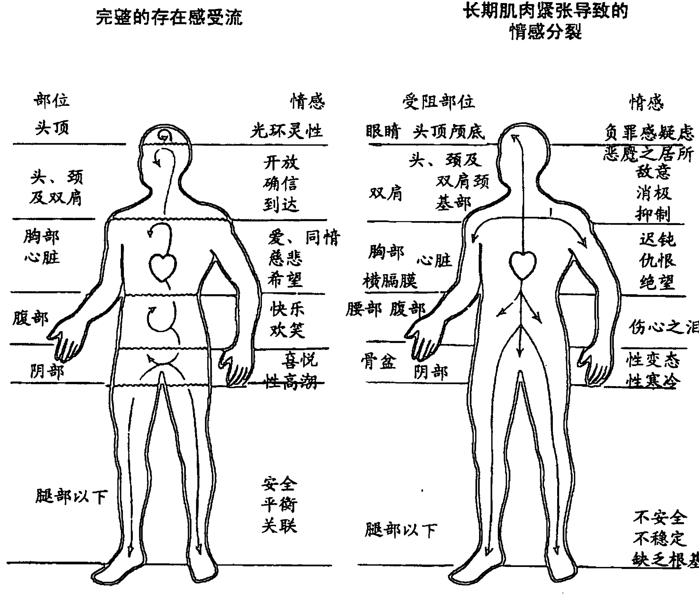

到目前为止，很显然心性存在主义和肉体存在主义能够（而且应该，我们可以这样补充）以互补的方式来使用，因为它们两者都试图验证人马座，即整体的身心生命体，并要将责任扩展到“所有的生命活动”中，但在实践中，却几乎没有这样运用的。许多心性存在主义者，会出自善意及其对整个人的直接手段，不管怎样，他们都倾向于延续心理疗法纯粹谈话的路线，并因此支持时下的质疑之声，要么否定“单纯的身体练习”，要么认为觉知相对而言毫无用处。他们意识不到瑜伽、罗尔夫按摩治疗法或感官觉知在将一个人集中于其生命体方面的非凡力量。而且，某些“精神问题”已在身体的肌肉系统中根深蒂固了，所以它们必须通过身体技法来解决，否则，病人可能会躺在长榻上谈上15年，而看不到显著的改善。另一方面，某些肉体存在主义者也犯着相反的错误，他们倾向于驳斥所有心性手段，认为那不过是虚幻之物，因此他们也很容易落入真正肉体存在主义的灾难之中，即单纯的健美操。单纯的健美操并不是真正的肉体存在主义，因为它不是努力消融三级二元对立，而是将其增强了，因为它使一种错觉不断存在着，即“心灵”独立地指令和控制并驱使“身体”。其目的不是将人作为人马座展现出来，而是要肯定处于古老的偏见中的人，这样他会沦为完全离异于马（身体）的骑马之人（自我），一个被上帝移植到堕落身体中的天使、机器中的幽灵。

但是，对于真正的心性和肉体存在主义者，即使他们没有亲自实践这两种方法，他们至少会认可自己的互补方法。在这一点上，令人鼓舞的迹象表明，心性和肉体方法相互间的彼此相轻正在逐渐消融。考虑到威廉·赖希及其生命力疗法的不幸遭遇，这种轻蔑也是可以理解的，赖希第一次戏剧性地试图将心理分析“谈话”与身体策略结合起来。现在人们重新燃起了对赖希的兴趣，但我们认为那不是因为他的心理分析理论，其中的某些部分极其奇异，而是因为至少他看到了肉体与心性这两类方法的互补性。

一些存在心理分析学家在赖希停滞之处继续上路，我们在他们身上看到了真正两栖存在主义的出现，也就是，针对存在阶层的心性和肉体两类方法的真正融合。存在主义者有得天独厚的理论优势做这一点，因为心性存在主义的核心概念之一就是三重的个人现实，即客观世界或生物世界（包括身体在内）、共同世界或社会世界以及自我世界或心灵和自我过程的世界。因此，真正具有包容性的存在主义不但包含个体的社会世界及其自我过程世界，即大多数心性存在主义者都强调的两个世界，而且包含客观世界，即他自己的身体。从这个意义来讲，亚历山大·洛温的生物能量分析就是两栖存在主义的绝佳例子。它利用心性手段对待共同世界和自我世界，并将之与一整套强有力的训练和分析结合起来，这些训练和分析旨在探索客观世界，即从“两端”接近存在阶层。

现在让我们将注意力转向心性存在主义更纯粹的哲学层面，即所谓的“存在主义哲学”。我们会发现十分令人困惑的技术词汇、定义和观念的大聚合。存在主义强调个体，尤其是对存在真相的“主观”体验，并坚持认为任何的客观表述或归纳概括都是错误的。因此，每个存在主义者都有自己的术语、方法论及结论，而且与其他任何存在主义者的不相容。虽然存在主义者从整体上讲通常都认为他们都同意彼此的观点，但没人能确定他们同意的到底是什么。无论如何，某些周期性的主题持续地在存在主义突显，而关于它们的讨论也变得大为简化，当然前提是就像我们回顾的一样，该运动根植于存在阶层，即以两个初级二元对立为标志的层面：自我与他人的对立、存在与虚无的对立。所以，心性存在主义就是一种直接面对并处理这两个初级二元对立的态度。它并没有彻底斩断这些二元对立，它们一旦出现，即以最合理的方式对付它们。

存在主义所关注的两大问题，即存在于世和存在与虚无，清楚地反映了它是基于初级和次级二元对立的，至少在存在主义心理学中是这样的。存在于世是指人的整个存在与其环境之间的真实遭遇，也就是说，初级二元对立中两个对立面的遭遇，即生命体与其环境。类似的，存在与虚无是指次级二元对立中两个对立面的遭遇，尤其指在此遭遇中一个人的存在可能被二元对立中负面的一方，即空虚感、虚无及“致死的疾病”压倒的可能性。但是，不能就认为存在主义是绝对正确的，因为不是这些对立面在遭遇彼此，它们就是彼此。

诚然，许多人相信他们体验到了这些对立面的冲撞，即“危机的辩证法”，但那绝不能证明它们就是真相的基本事实。相反，它们只是存在阶层的一种现象，而且它们也必须在这种背景中被处理。存在主义者在光谱的这一阶层垮下来，他们已清楚地觉察到构成该阶层的两个基本二元对立的性质，即自我与他人（“地狱即他人”）之间、存在与虚无（“致死的疾病”）之间的“冲突”，以及这种冲突及争论看起来所需要的“恐惧和颤抖”，但对于相信它确实存在的人而言，这种争论在某种程度上正是苦恼的源头。所以，存在主义者清楚地意识到了这种争论，但他们错失了其虚幻的本质。①

不管怎样，存在主义者对“重新统一”那些表面上相互疏离的对立面做出了长远的贡献。如果说存在主义者不清楚我的存在就是世界，那么他们确实清楚我的存在是始终存在于世。如果说他们不清楚生与死彻底的非二元对立，那他们至少已强调了死亡完成了我的存在并使其变得真实。

但与此同时，有人可能会从另一个角度说存在主义的短处恰恰是其长处。比如罗洛·梅、早期的马斯洛（在他将注意力转向超个人带之前）、罗杰斯、洛温、佩尔斯、博斯（Boss）、宾斯万格（Binswanger）等人，当代存在主义心理学是活跃于存在阶层上的唯一合理的方法。在这个阶层，初级和次级二元对立看似撕裂并违背了真实的结构，我们看起来陷入了危险之中，生存中黑暗的一面、来自世界他性威胁以及我们可能湮灭的令人窒息的黑幕要将我们压垮。这里有一点是很确切的，存在主义者的忠告是有其价值的，因为他们指出至少是在这个阶层上，我唯有通过意志的行动（这不足为奇，因为意志正是此阶层的产物），去面对这两个初级二元对立才能寻找到我生命的意义。这要求我们意识到，如果我无法选择自己的命运，我仍然可以选择面对命运时的态度，这就是我存在的自由。事实上，我的选择造就了我。“我们就是自己的选择”。这不会必然“改变命运，但它会极大程度上改变一个人”。无须问命运是如何实现的，你只管去做，因为这就是我们的自由。“我的第一个出自自由意志的行动就是相信自由意志。”

所以，存在主义通过紧抓这两个二元对立来解决它们，通过意志行动、通过选择面临命运时的态度来勇敢地面对它们。正如我们已阐明的那样，对人而言，这正是其价值和启示的所在。因为在意识光谱的大背景下，存在主义是一种尝试，通过面对和接受主要和次级二元对立，以朝着自我阶层和阴影层向上。

> ① 自我与外部世界的分界线与真实无关……自我与外部世界之间建立分界线的唯一结果就是导致了里外颠倒的混乱。这一界限的确立不会改变界限实际上并不存在这一事实。唯一的结果就是错觉、自我欺骗、巨大的谎言或异化。

### 第10章 意识光谱

#### 无人之地

在存在阶层与大心境界之间的即是意识光谱中最神秘的、未被探索过的、被误解的、引发恐惧且最使人迷惑的部分——超个人带。这个带区既能被体验为“灵魂的暗夜”，也可以被体验为阿弥陀佛的无限之光；一个人在此处可能会看到菩萨或天使的幻象，也可能被死神阎魔，即原型的魔王的使者召唤；他可在此处发现内在向导，也可能落入可怕的守门人之手。他的认同可能超越身体，也可能被匆匆带走远赴星际旅行。在这些带区人们发现了超感官知觉的奇异现象，比如透视眼和顺风耳（如果它们确实存在），而且在此处一个人可以重新过“过去的生活”或被投射到未来。如果确实存在无人之地，那它就是超个人带。

历史上这些带区尚未像其他阶层一样被广泛研究，其原因在于：（1）它们能将大多数人吓得六神无主；（2）正统的精神病学认为它们是心灵受到极大干扰的征兆；（3）开悟的大师们称之为入魔的幻觉，即最具欺骗性的错觉。总之，我们都同意大师们的观点，但这不是说超个人带作为研究课题是完全无价值的，只是，对于追求大心境界之人而言，它们是致命的消遣，是必须快速穿越的层面。不管怎样，我们将简要对其进行评述，毕竟现在对这些带区的兴趣在迅速兴起。

关于这些带区我们有一个基本点必须记住，那就是当个体未彻底突破初级二元对立并随后进入超个人带区时，他通常还“携带”着在生物社会带和自我阶层得到的映射，而这些映射将极大程度上决定他看待这一领域的方式。最重要的是，许多人的映射告诉他们，这些带区并不存在或至少是病态的，这样当他们偶然进入这些带区时，他们立刻会担心自己的神智，其实那是在这些带区之中长期“坚持”自我的过激反应，该体验几乎没什么害处但一直令人感到恐怖。我们认为，这些带区确实存在（虽然人们认定的所有现象不一定都发生于此处），而且它们本身并不是不理智的。虽然许多被诊断为“精神病患者”的人可能会因为缺少足够的指导而迷失于这些带区，然后做出反应，这就像正常说英语的人在没有翻译的情况下遭遇德语一样。当然，这些带区不代表绝对实相，其上的任何阶层都不代表。正统的精神病专家不会在这些层面上发现疯狂，相反，他们会通过定义疯狂而在这些层面上将其发明出来，这反映了一种不可思议的事实，即社会传统所接受的意识阶层在很大程度上是一种政治事件——意识政治学。

为了看到超个人带有利的一面，我们只需要了解一下形式更为纯粹的西藏神秘主义，或是与西方传统更接近的荣格分析心理学。这两个主题研究起来都需要几本书的篇幅，所以我们的评论可能会有失体面地背上肤浅的恶名。另一方面，在超个人带，我们在某种程度上会超出自己的深度，不过我们仍将基于荣格的工作以及某些东方的神秘传统，尤其是密教经典，来冒险做一些假设。

荣格的“集体无意识”观点虽然有点令人难以置信，但也不难理解。这就像人一般都有十根手指、一个脾、两个肾一样，荣格认为人的“思想”可能包含着通用符号，或者说是“原型”。因为从生物角度看他们都属于整个物种，所以他们不可能仅仅是个人或个体，而且还是超个人或“集体的”。荣格说道：

> 无意识（除个人之外）的另一部分就是我所谓的非人格或集体无意识。正如字面意思所暗示的一样，其内容不是个人的而是集体的。也就是说，它们不属于单独的个体，而是属于一整群个体，通常是整个国家，甚至是整个人类。这些内容不是在个体一生中获得的，而是先天形式和本能的产物。虽然孩子不具有先天的观念，但他仍具有以确切方式行使功能的高度发达的大脑。这个大脑继承自祖先，同时它也是整个人类心灵功能的积淀。因此孩子生来就具有一种器官，而该器官行使功能的方式与它在人类历史长河中发挥作用时的并无二致。大脑中执行的是本能，以及始终是人类思考基础的原始意象……

关于这些原始意象以及原型，荣格说道：

> 就像生活中有典型情况一样，许多原型一直存在着。无尽的重复已将这些体验刻入了我们的心灵结构，但不是充满内容的意象形式。起初，只有形式而没有内容，这仅代表了特定感知和行动的可能性。当某个符合特定原型的情况发生时，该原型就被激活……

荣格认为，促使原型的激活产生不理智结果的唯一条件就是，个体拒绝与原型的阐述或扩张配合。也就是说，原型为了替个体寻求意义而为意象和神话赋予了活力，而个体却拒绝与之建立有意识的联系。另一方面，如果他与原型的阐述合作，那么它能为人生提供强有力的、有益且有意义的指导。因此，荣格认为原型类似原始的“精神本能”，这样，就像所有其他“本能”或需要一样，如果它们被关注，它们将产生圆满；而如果被回避，则产生神经症。

我们已经注意到，集体无意识的原型与阿赖耶识的习性或种子或种子形式很相似。那么，下面的这种情况就不足为奇了：一方面，荣格心理学在处理原型时不是通过智力的或逻辑的分析手段，而是通过借助梦境和神话意象来将其放大；而另一方面，某些东方神秘主义的形式也是试图利用这些原始形式，借助意象和宗教神话将其放大来实现灵性的成长。德国喇嘛戈文达认为，由此产生的灵性成长，即与大心境界的接触，无法通过建立基于理性的坚定信仰、理想和目标来获得，而只有通过有意识洞察头脑的各个层面才能获得这种成长，而逻辑推理和不着边际的思考是无法达到或影响那些层面的。

这种洞察和转变只有借助内观这一强大的力量才能实现，而内观的原始意象或“原型”即我们心灵的形式法则。它们就像种子一样，埋入了我们潜意识的肥沃土壤中，发芽、成长及绽放其潜能。

荣格的心理分析和藏传佛教的观想技巧都试图阐述而不是回避这些原始形式，从而对其加以利用，获得有益的成长。在荣格的体系中，这一点是通过运用反映普遍神话主旨的关键梦境和意象来实现的，这样个体就能与塑造所有人类行动的原型建立有意识的联系，而不是沦为其未察觉的工具。类似的，藏传佛教使用关键意象，比如五方佛或观想佛像。

> 能意识到世界及创造世界的各种力量，（如此）我们就变成它们的主人。只要这些力量蛰伏于我们体内、未被察觉，我们就无法接近它们。因此，有必要将其通过意象的形式投射到可见之处。充当此目的符号就相当于化学中的催化剂，在催化剂的作用下，液体会突然转变为固体结晶，这也揭示了此符号真正的本质和结构。

任何认真做过这些或其他类似“原型阐述”练习的人都会证明，它们显然打开了深刻影响个体基本存在情感的巨大能量之源。正如马丁（P. W. Martin）在描述荣格关于此过程的“发现”时所说：

> 简单地说，（荣格发现）当今无意识正在心理学家的咨询室中制造着符号。很久以前，这些符号带来了新能量和新洞见。通过该活动所运用的符号，现代的欧洲人和美洲人同样体验到了生命充满动感的重生。

这些练习尽管在内容上各不相同，但仍有一些相同的形式特征，因为它们都试图帮助阐述和放大这些原始的“种子”并与之结合。例如，藏传佛教的观想技巧就包括两个主要阶段：第一个阶段是对神话意象的阐述或创造（sristi-krama）；第二个阶段是将这些意象融合或合并（laya-krama）“到正常的生活和意识中”。这个有意识接触并重新合并的双重过程反映出，它的原理与我们已检视过的其他阶层的“治疗”如出一辙，从接触和整合阴影到接触和整合身体都是如此。因此，在超个人带上的这些练习会导致“生命充满动感的重生”，正如基于同一原理的类似练习会在自我阶层和存在阶层上产生相似的“生命充满动感的重生”。那么，我们对从超个人带本身蓬勃而出的“生命充满动感的重生”还能做何评论呢？首先，让我们再一次聆听荣格对原型的论述：

> 我们理解我们所想的吗？我们只理解纯粹等式一般的思考，从那种思考中除了我们放入的内容之外什么也产生不了。那就是理解力的方式，但除此之外还有存在于原始意象中的思考——比历史之人更古老的符号。这些意象从一开始就在人类体内根深蒂固了，而且永远存在，并一代代流传下去，于是这就构成了人类心灵的根基。只有我们与这些符号保持和谐一致时，我们才能过最完整的生活，而智慧即是它们的回馈。这既不是信仰的问题，也不是知识的问题，关键在于我们的思考要与原始的无意识意象保持一致。

那么荣格会问，你是凭借何种神话生活的呢？因为神话意象源自集体无意识和超意识，而且在其他诸事中，社会传统、语言、逻辑或任何特定宗教或个体的错觉既不能将其玷污，也不能使其堕落。此外，神话的语言是连带的、整合的，而普通的思想却是分裂性的、分析的，因此它更清楚、更真实地反映了宇宙无缝天衣中的实际物理现实，以及所有事物的相互依赖和相互穿透。请记住，神话使通向能用言语表述的绝对实相的最近路径变得具体化。所以，神话可以暗示个体的普遍性，直接指向其根本上充满快乐的与所有创造的统一，并为其赋予了一种完整性，从而将他带出日复一日的沉闷琐事，转而投入到超个人广袤而又充满魔力的世界。

简单地说，荣格认为神话是原型的直接体现，是整合的、模式化的，也是全盘的、包容性的，与任何其他符号系统相比，它更真实地体现了实相。虽然它本身不会废除所有的二元对立，但它能使其暂停。这正是真正的神话令人难以置信的、使生命获得新生的威力和永恒的魅力所在。别忘了印度教把这些超个人带称作 "ananda-maya-kosa"，即纯净极乐的阶层，而准确地说是因为对立战争暂停了，因此才显得充满极乐。

这些神话原型，或者说种子或熏习，对光谱中超个人带“之上”的每个阶层都产生了深远的影响。当然，这也是可以从光谱中观察到的一般现象：任何阶层的变迁都戏剧性地影响其上的各个阶层。我们希望再次强调一下，超个人带本身是可以直接体验到的。这一点不但可以通过最显著的灵魂出体经历、星际旅行、顺风耳等案例来证明，而且对于原型本身而言，它们也是超个人带的一个方面。荣格本人意识到了这一点，因为他说：“神秘主义者即对集体无意识过程有着极其鲜活体验的人，神秘体验就是对原型的体验。”

顺便说一下，我们必须对荣格的表述做一下修正：某些“次要的”神秘表述即对原型的直接体验。“真正的”神秘主义甚至超越了原型，即熏习；那属于大心境界，在该阶层所有的熏习都被“破坏了”。相应地，印度教在有余三摩地（savikalpa samadhi）和无余三摩地（nirvikalpa samadhi）之间也进行了区别。有余三摩地就是一般对超个人带，即集体无意识的极乐体验。它来自一个人理解有德之梵的那个阶层，而有德之梵就是无德之梵，即神性的原型或神话意象。该阶层通常是狂喜的，因为当自我对实相进行沉思时所有的二元对立（初级二元对立除外）都暂停了，但无余三摩地超越了这个阶层，它是对大心境界“的”直接体验，即无德之梵。此时个体不再沉思实相，他即是实相！所有的对立和意象都被干净彻底地清除了。我们可以说，一个表述是实相最真实的意象，而另一个就是实相本身。从本质上讲，这就是超个人带“次要”神秘表述特征与大心境界的“真正”神秘表述之间的主要区别，但我们的主要问题是，原型本身能在某些情况下被直接体验到。

在意识光谱的背景下，我们如何看待种子或熏习或原型？让我们先来看一段荣格的话：

> 我一次次发现一种被误解的观念：原型由其内容而决定，换句话说……说，原型就是某种无意识观念（如果这种表达可以接受的话）。有必要再次指出，原型不是由其内容决定的，它只取决于其形式，之后，极其有限地取决于内容。某个原始意象取决于其内容的前提是，它变得有意识并因此被填入了有意关注的材料。

那么在意识光谱中，原型作为缺乏内容的原始形式，代表了第一个点——在其流动或“汇聚”的过程中，我们纯净、无形的能量开始在其中成形。这个形式随后将在存在生物社会阶层巩固并拾取通常是意象、观念和映射的内容。它们即是二元对立原始而又潜在的源头，我们生活的每一刻都在重新激活和具体化这些对立，尤其是初级二元对立。所以，在佛教心理学中，这些原型代表了通过使心灵具体化来展现非凡宇宙的种子潜力。

总之，原型或种子或熏习就是我们无形或连续的有机体意识开始在其中变得有形的原点。如上所述，二元对立是存在的，某些形式的初级二元对立尤为如此，但几乎都被暂停或调和了，它们以潜在的形式存在着。这些原型于是同时也深深地指向了有机体意识及有机体意识的第一个堕落者。它们正确无误地指向着，但一旦被注意到和了解，它们即不能再坚持了。这解释了为什么虽然它们很有用而且甚至是强制性的，但在某种意义上它们最终必须被超越、被摧毁。有余三摩地必须为无余三摩地让路，神话体验必须为直接的无意象觉知让路，永恒的神话时光必须为不朽的当下让路，看到上帝必须为成为神性让路。这也解释了为什么“瑜伽士努力要‘烧尽’余习”。简言之，原型是终极的指南针，也是最后的障碍。

但在更积极、更有益的一面，让我们注意一下，当一个人开始有意识地接触意识地基中所蕴含的广袤原型体验时，这时又会涉及什么呢。因为这些符号是集体的或超个人的，所以，触摸到原型实际上也就是开始超越自我；而在其中深刻地发现暗示和指南针也就等于深刻地超越。从另一个角度来说，超个人带代表了一个原点，个体开始在其中触及心灵。个人尚未直接意识到成为他的一切就是心灵，但通过洞见和体验，个人的确明白了在自己体内有超越自己的东西。因此，真正的超个人带疗法所具有的巨大治疗能力就不难理解了。如上所述，超个人带的一般特征就是所有二元对立（某些形式的初级二元对立除外）的暂停。这必然包括角色与阴影以及心灵与肉体的二元对立。在斩断这些二元对立的过程中，也同时斩断了对个体神经症的支持，不管是自我阶层的还是存在阶层的。这难道不能解释为什么坚持某种形式的超个人冥想能极有效地治疗个体的情绪疾患吗？

让我们换个角度来说，当一个人识别出超越个体分离的存在的深层次认同时，他就能更容易地超越个体分离的神经症。例如，通过从人类一般的原型和神话意象的角度反映一个人的生命，他的觉知必定开始转向更普遍的视角——一种超越的、不具人格的、超个人的视角。这一过程一旦得以加速，个体将不再专门仅认同分离的自我感觉，因此也将不再受纯粹的个人问题所束缚。在某种程度上他可以开始释放自己的恐惧和焦虑、抑郁和困惑，开始像看天空中漂浮的云朵、溪流中流淌的溪水一样真真切切、不偏不倚地看待它们。超个人带疗法揭露了一种转变，也许这是第一次。通过这种转变个体可以全面地看待自己情绪上的和观念上的情结，但这一事实意味着，他已停止用它们来观察并扭曲实相。因为该事实也表明他不再专门认同它们。他的认同已开始产生超越。用约瑟夫·坎贝尔的话来说就是：“不安的个体可以学会在人类精神的镜子中看到自己已不受个人的感情影响，并通过类比发现获得更大满足感的道路。”

但这会将我们直接引入超个人带更深入的阶层，如上所述，超个人带有时会被体验为超个体的见证，即能够观察到事物的流动，不对它进行干扰和评论，也不以任何方式操纵它。这种见证只是以一种具有创造力的超然方式观察身心内外的事物流，因为，实际上，这种见证不专门认同任何一个。换句话说，当个体意识到可以客观地觉察到自己的思想和身体时，他也会自发地意识到它们无法构成真实的主观自我。正如黄檗禅师所言：“让我提醒你，被觉知者无法去觉知。”见证的地位，或者说见证的状态就是所有早期佛教实践（“观照”）、心理综合学（“不认同和超个人自我”）以及印度教智能瑜伽（“涅槃法”）的基础。而且，看起来它与马斯洛所谓的“高原体验”极其相似，而后者“代表了对实相的见证，它需要看到符号化的、神话的、诗意的、至高无上的、奇迹的表现……可以说它就是对时空的超越，而且这一点变得很正常”。通过这些类型的体验，一个人将完全进入超越性动机、存在价值、超越价值、神话和超个体觉知的世界。简言之，即超个人带的精神维度。

我想提醒读者别忘了我们所谓的“次要”神秘主义和“真正”神秘主义之间的区别，因为那也是超个人见证和大心境界之间的区别。超个人见证指见证实相的“地位”，但我们会立刻注意到，这种超个人见证的状态仍包含着某种形式微妙的初级二元对立，即见证者与被见证者之间的对立。当这最后的二元对立被最终彻底粉碎时，个体才能觉醒到大心境界，因为彼时（即此时），见证者与被见证者合二为一。

但这一点也没有诋毁超个人自我或见证的地位，因为正如我们所见，它本身具有极强的治疗能力，而且它经常以各种方式充当到大心境界的跳板，我们将在最后一章中探讨这些方式。不过，不能将其与大心境界混淆。这就是为什么在禅宗中，当参禅者停留在超个人自我的寂静极乐中时，他被叫做“守尸鬼”，而藏密也认为这种状态是“卡在了阿赖耶识中”。按一般的大乘佛教术语来讲，受到染污的阿赖耶识必须被粉碎，因为它包含着余习的细微对立形式，而这种余习会引起见证者与被见证者之间主客体的二元对立。

这一点也是超个人自我次要神秘状态与真正神秘状态，即大心境界之间的主要区别。一方面，一个人可以见证实相；但另一方面，他即是实相。当一方面不可避免地保留某些细微的初级二元对立时，另一方面却没有。禅宗将任何形式的初级二元对立的最终瓦解称作“桶底脱落”，因为一个人的觉知中是不存在底的，也就是说，不会感觉到任何内部主观世界遭遇任何外部客观世界。这两个世界已完全融合在一起，或者说从未分离过。个体达到自己存在的底部，去看一看是谁或什么东西在做着看的动作，他最终发现那正是被看者，不是超个人自我，布莱思称其为“万物中万物的体验”。桶底已经脱落。

吠檀多非常同意这一点。虽然吠檀多用比喻的方法把梵我称作观者、知者或见证者，但它运用了一种很特殊的内涵来区别观者与超个人自我，即观者就是使所有世界都被观察到的人。马哈希尊者就此说道：“观者不同于被观者的观念驻留在头脑之中，而对于驻留在心中的观念而言，观者与被观者是相同的。”

为了将这部分讨论告一段落，我们将简要论述一下所谓的超自然现象：超感官知觉、透视、见到其他世界、星际旅行等。它们及超个人带的所有事物都有一个共同的特征，即初级二元对立的不完全崩溃或暂停。这样虽然自我的体验仍多少分离于外界，但它仍然极大地扩展了某些界限（代表了初级二元对立的“分裂”点）。随着人们对心灵学的兴趣迅速高涨，尤其是科学界，这些事件瞬间吸引了人们的视线，这主要是因为它们可以按照正统的客观标准、测量方法和证明手段来研究。例如，在超感官知觉研究中，很容易就可以建立实验室控制、收集数据并对其进行统计评估，然后得出结论，通常是超感官知觉的确存在。本质上讲，这些实验做与不做都是没有意义的，但我们必须强调的是，这些领域与大心境界或纯粹的神秘主义一点关系也没有。许多科学家非常不幸地混淆了这种区别，然后感觉在“证明”超感官知觉或念力等存在的过程中，他们验证了大心境界的存在，并因此在自己的实验发现中附上了爱克哈特、鲁米、庄子或商羯罗的言语。虽然他们的本意是好的，但实际上那不过是精致的恶作剧而已。大心境界无法从外部证明，原因很简单，宇宙中根本不存在心灵之外可以用来证明心灵、使其具体化以及对其进行测量的地方。一个人无法抓住心灵，因为它只是抓住本身。科学证明需要验证者和被验证者之间的初级二元对立，而该区别是与心灵无关的。然后个体只要愿意遵循方法就可以通过实验“证明”心灵，但这种“证明”不是外部的。这些科学家充其量研究的是超个人带，在那里他们显示出初级二元对立可以被部分地斩断。

但他们的热情是可以理解的，因为科学是光谱上面各阶层强有力的工具，所以自然试图将其用于下面的阶层，而且在超个人带的某些阶层这是非常合情合理的。为了到达大心境界，一个人必须最终放弃研究事实，相反他要成为事实。科学之光在此处无用武之地。这就像那则老故事，一个丢了钥匙的酒鬼在路灯柱下四处找，这倒不是因为他在那儿丢的钥匙，而因为那里很亮堂。

最后，我们有必要回顾一下开悟大师们的言教，他们普遍都声称超自然力量或神功是智者避而不谈的，因为在故意利用所有超自然现象的背后是被惊吓的自我的力量冲动，它要试图扩展自己的能力以便操纵和控制外界。当你与外界合二为一时，操纵外界又有何意义呢？发展“心理技术学”的愿望在本质上跟发展典型技术的愿望没什么区别，而且自我已用常规技术严重污染了环境，所以我们不难猜想对于心理技术学又会有别出心裁的利用。结论注定是只有智者才有资格运用神功，而他却与其毫无关系。不管怎样，我们今天还是能看到愚蠢之人趋之若鹜一般地涌向天使唯恐避之不及的地方。科学地研究神功是一回事，但个人要想炼出神功却是另外一回事。一个人如果能坚持荣格的梦境放大分析、坚持藏密或印度教之经典并利用观想技法和种子咒冥想，比如超觉静坐或心理综合学、普罗果夫对话法（Progoff dialogue）及类似的练习，那么他就能从超个人带得到丰厚的个人利益。

在对超个人带做了这些结论性评述后，我们就已完成应付各个阶层“疗法”的概述。现在让我们借这个机会，对光谱的各个阶层及相应的各种疗法做一些一般性评论。像平常一样，我们的起始点还是心灵、虚无、梵、非对立和法界。我们也将这种非对立觉知的“绝对主观性”称为某种路标，因为当你完全绕到假主体，即你现在所谓的“自我”的“后面”时，你只会发现客体。这清楚地显示出真正的自我，即绝对主观性，是与其所知道的宇宙是一体的。举个例子，这一页是很清楚的，但不是通过从远处看，而是成为它。换句话说，你所观察的每件事物都是正在观察它的你，这就是在你和它之间的虚幻分割产生之前的真正世界的基本条件。

但在某种情况下，我们无法看到心灵或绝对主观性。这就像知者，无法被知道；观者，无法被观察；研究者，无法被研究。真正、绝对的主观性即是你现在觉知的所有事物，但当你认识到这一点时，你的认同感必须同样也转向你所觉知的所有事物。当这一刻发生时（现在它正在发生），你将不再感觉自己割裂于此刻所观察的事物。于是，正如我们已重复的那样，主体与客体的二元对立消失于绝对主观性，即心灵之中。主体和客体并没有消失，真正消失的是它们之间的鸿沟，或者说，也可以理解为它原本就不存在，因此像“主观的”和“客观的”这样的形容词就变得十分荒谬。这只是一个非常简单的非对立觉知过程，其中观察者就是观察者。所以在某种意义上你无法看到心灵，因为它即是观者；但在另一种意义上，你除了心灵之外从未觉知到任何事物，因为它即是被看到的万物！

在这一刻，绝对主观性“中”演变出意识光谱。我们已从多个视角描述过这种演变的过程，这些视角虽然有所不同，但都指向了同一个过程：宇宙明显地分裂为观者与被观者，以及不可抗拒地紧随最初障碍的、数不清的纷繁和回响。

首先，也是最重要的，我们将这一演变描述为心灵上看似多个初级二元对立重叠的产物，每个连续的二元对立都导致明显变窄的认同感，即所谓的光谱“阶层”或“带”。简单地讲，每个二元对立都切断了某个“整体”过程、压抑其非对立性，并将之投射为两个明显敌对的对立面——用比喻的手法来说明，然后我们只认同其中的一个对立面，或二元对立中的一端，从而将我们的认同限制并窄化为“一半”。于是每个连续的二元对立的抑制和投射都大幅度地减少了我们认同的现象，结果我们的认同就不断从宇宙转到生命体到自我再到部分自我（即从大心境界到存在阶层到自我阶层再到阴影层）。因为每个二元对立的抑制和投射都使特定过程变得无意识，之后光谱的各个阶层都可能产生某种病态。无论如何，光谱就这样演变着，同时产生了种种结果。

此外，我们还借助密教之经典对能量的隐喻来描绘心灵，以此追随演变的过程。从这个观点来看，我们将光谱的每个阶层描述为特定阶段的能量蜕变，从心灵最初纯净、无形的能量（能量、气、灵魂、鲁和有机体意识）一路“向上”，一直到使自我阶层的符号化和概念化知识获得有活力的蜕变。我们已运用过这种能量隐喻及其蜕变，一方面因为它能为我们提供一条具体的道路，以便将光谱演变与当时我们的感觉能力关联起来；另一方面还因为下一章将证明这种诠释是非常有用的，届时我们将讨论阻止能量蜕变的各种方法，并重新记住并发现心灵。

但从另一个角度来说，我们已将这种演变解释为绝对主观性与特定且独有的客体集合的混乱：我们将之称为绝对主观性的客体化。这意味着，当我们错误地将宇宙看成多重的“彼处客体”，并分离于称作“自我”的“此处主体”且与之对立时，没有什么增加，也没有什么减少。

但这个想象中观察宇宙客体分离的、主观的“自我”，即“小我”，显然是一个错觉。之所以这么说，因为虽然我将其想象为可以观察、了解和感受宇宙的主体，但它实际上感知的只是另一个客体。也就是说，这个“分离的自我”事实上就是我能观察、了解的，至少是可以觉知的物体，对此我一直在不知不觉地暴露出来，我总是说“我能感觉到自己”、“我知道我是谁”或“我当然清楚自己在看这本书”。不可避免的结果就是，我感觉我能观察自己，但我能观察的任何事物必须是感知的客体。于是，我想象出的“主观自我”根本不是真正的主体，它是假主体，实际上只是另一个客体！它是我所感知之物，但不能因此就成为真正的感知者！

至于真实的感知者、真正的自我、绝对主观性等无法被观察到，因为它正在做观察的动作；它无法被知道，因为它就是知者。我的真正自我不再将自己看成客体，就像火不能燃烧自己，刀不能削自己一样，但出于某种奇怪的原因，我已将真实的自我认同为我所观察的某个独特的客体集合，并将其错当成我的“主观自我”。于是，只要仔细观察一下，就注定会显示出这个假主体不过是其他感知客体中的一员，我的认同还是从与宇宙一体的绝对主观性转到想象中分离于感知客体的假主体性。换句话说，我使我是什么变得具体化，我试图将真实的自我看成客体，并幻想自己已经成功了，我必然已放弃了最初对整个宇宙的认同，却去抓着某个特定的、独特的客体集合紧紧不放。简而言之，我混淆了观者与实际上的所观之物。在这一混淆中，我的认同转向了假主体，现在我想象用它来面对陌生的客体世界。

但我弄错的认同不会就此打住，因为正如我们所见，假主体性也是具有多个阶层的。紧随这个初始混乱的就是逐步窄化和限制我的个人认同感，即窄化和限制我的假主体性感。我感觉这种认同感就是“分离的主体”，它面对世界时会将其视为彼处的客体。这种分离的认同，即假主体感，其范围从我的整个生命体到自我一直到部分的自我。当然，每个转变都代表了光谱的一个阶层。我们将这一观点称为“心灵的客体化”，因为每个阶层都只代表特定的、独特的客体集合，我将其错认为真实的主观自我并因此不经意地对其产生认同。就这个意义而言，光谱的每个阶层就是不同阶层错认的认同，即假主体性。

以上就是我们描绘意识光谱演变的三种不同方法。当然，每种方法都是从不同的角度来表述同一件事。因为不管我们认为光谱的每个阶层就是不同阶层的假主体性，还是认为个人认同感的逐渐窄化，我们都是指每个阶层都有标志性的特定二元对立的抑制与投射，因为这正是建立并支持各个阶层、各个假主体性感的机制。让我们打个比方，每个阶层中我们的假主体性感不过是我们错误地认同了二元对立中的“一半”，而二元对立创造了该阶层。因此，特定假主体性感始终是由特定的二元对立的抑制与投射来支持的。该二元对立只是“此处”假主体与“彼处”客体之间的分水岭。

因为贯穿于各个阶层的共同线索就是先是二元对立，然后是抑制，最后是投射的这一过程，所以各个阶层的疗法也具有共同特征，它们逆转了这一过程（在特定阶层上）。具体方法是，帮助个体接触异化并投射的方面，将其重新整合，并因此“治愈”、“整合”和“统一”该阶层。这一过程的结果是“治愈”、“成长”或“愈合”，原因很简单，因为个体实际上已经扩展或扩大了自我的认同感。当任意阶层上的二元对立被治愈时，该阶层上曾经威胁个体的因素就会被视为自己意识的各个方面，不过之前他曾将其分裂、压抑并投射；而该过程必定缩小了他的认同感并为某种病态设下了温床。在任何阶层逆转该过程都很简单，只需要将该阶层那类病态下的支撑物猛地抽走就行了。

任何时候，只要个体完全逆转了任一阶层的过程，治愈并整合了初级二元对立，那么他将自动且自发地沿光谱下降到下面一阶层，下降到“包括”“以前”对立的两极的那一层，下降到上面的一层只是其碎片的那一层。例如，当心灵与肉体的三级分裂实际被治愈后，个体必将发现整个的生命体。换句话说，他已自动下降到存在阶层。任何初级二元对立的治愈只不过是揭露了该二元对立无意识地提供的“下面的统一过程”或格式塔，而且它本身也标志着光谱下降到了新的“下面”一层。

一旦来到“新”的一层，不管是什么阶层，个体自然会对该阶层的主要特征变得更敏感：比如其特定的“需要”、“本能”或“驱动力”、其潜能和价值、认知模式、梦境材料（由无意识过程提供），当然还有它的初级二元对立的压抑和投射及相应可能导致的某类病态。我们前面已简要概述了各个阶层的特征，所以，为方便起见，我们仅用图表的形式对其做一下总结（见表10—1）。让我们重申一下，这些特征必然是笼统而抽象的，这样能为个体化阐释留有足够的空间。涉及“需要”、“本能”或“驱动力”概念时尤其如此。一般说来，我们明白任何阶层的“需要”都反映了该层的成长潜力，并补偿了个体在该层所匮乏的东西。而且，限于篇幅不便做过多的修饰，所以让我们在此处说明一下，我们认为任何阶层的梦境就是这种匮乏的符号化暗示，即个体对宇宙不再认同的那些方面的符号化暗示。宇宙异化存在的地方，就有制造梦境所需的材料。不过，随着个体在光谱中的下降，“新”阶层的各种特征也将更清楚地暴露出来。

表 10—1 各阶层特征汇总

| 层次 | 潜能 | 病态 |
| :--- | :--- | :--- |
| 阴影层 | · 显性补偿：自豪、成功的驱动力、正当的愤怒、敏感、角色扮演、“神经质的创造力” · 浪漫爱情——异性恋或同性恋（与阴影拥抱） | · 恐慌焦虑 · 负罪感（超我） · 仇恨（与阴影搏斗） · 抑郁（回撤的愤怒） · 压力（投射的驱动力） · 恐惧（投射攻击） |
| 自我阶层 | · 智慧-达观 · 性格稳定 · 礼貌 · 自我控制，有意的 · 言语交流 · 直线阐明，通常 · 第一种认知模式的具体化 · 适应生物社会带 | · 慢性低度紧急情况（佩尔斯） · 抑郁，不具体（洛温） · 缺乏领会与意图 · 世界是乏味的（瓦兹） · 缺乏自发性和存在价值 · 世界只是线性的 |
| 生物社会带 | - 文明 - 文化 - 约定俗成的稳定 - 传统觉知 - 社会成员 - 语言、法律、逻辑 | - 所有存在和超个人觉知、需要、感知等的生物社会化 - 伟大的过滤器 - 世界虚饰及传统世界观的崩溃（“精神分裂症”中一种常见元素，但在深度冥想中有不同的效果，然而，后者很少产生“病态”，因为世界观很容易因所有的实用目的而恢复） |
| 存在阶层 | - 领悟 - 意向性 - 存在价值的出现 - 真实性（佩尔斯） - 中心 - 生物信仰（洛温） - 通俗宗教 - 生物自发性 | - 不安：痉挛（贝努瓦） - 存在绝望 - 形而上学焦虑 - 人本主义的负罪感（弗洛姆） - 负面的出生前后侵入（格罗夫） - 因“无法接受死亡”的存在焦虑（布朗） - 对非我的原始仇恨——初级二元对立的产物 |
| 超个人带 | - 存在价值 - 神话觉知 - 高原体验 - 超然与超个人见证 - 超自然现象 - 迤逦地外生命 - 能量作为更高级的生命力脉轮而出现 （对于大心境界而言，脉轮 [10层神圣真实] 只是符号） | - 原型侵入 - 超个人焦虑（里利） - 守尸鬼（禅宗） - 负面的灵魂出体体验 - 负面的动植物进化史侵入 |

约翰·里利（葛吉夫）其他类似观点（仅限西方）

| 阴影层 | -24 - “负面状态，痛苦、负罪感、恐惧。” | - 理想化的自我（霍妮） - 优势者/劣势者（佩尔斯） - 父母/孩子（伯恩） - 更低层次的无意识（阿萨鸠里） - 婴儿期自我的残余（弗洛伊德） |

## 第10章 无人之地

### 级前表

| 自我阶层 | ±48
- “中立的生物电脑状态，专注并传播新观念；
- 接受并传播新数据和程序；最大程度的教与学简易化。中立状态，在地球上。” | - 现实自我（霍妮）
- 自体（罗杰斯）
- 自我（弗洛伊德）
- 自我世界
- 成年自我状态（伯恩）
- 弗洛伊德层次（格罗夫）
- 回忆性分析层次（休斯顿/马斯特斯） |
| 生物社会带 | +24
- “所有所需的程序都在生物电脑的无意识之中顺畅地运行。自我迷失于个体清楚且喜欢的愉快任务中。” | - 社会过滤器：
- 社会性格
- 语言
- 逻辑
（弗洛姆）
- 共同世界
- 社会虚饰
- 交感验证 |
| 存在阶层 | +12
- “极乐状态，宇宙之爱、接受恩宠、增强的身体觉知；身体意识的最高功能、活在爱中等。”
-12
- “极其负面的身体状态；身体仍持续着那个状态，极度痛苦。” | - 客观世界
- 真实自我（霍妮）
- 整个生命体（罗杰斯）
- 身体自我（弗洛伊德）
- 中心自我（佩尔斯）
- 生物自我（洛温）
- 个体发育层（林 [Ring]）
- 基本出生前后的母体（格罗夫）
- 邱氏层（格罗夫） |
| 超个人带 | +6
- “意识之源。星际旅行、顺风耳和透视；在时间上与其他实体融合。”
-6
- “炼狱式的消极。” | - 更高的自我（阿萨鸠里）
- 集体无意识（荣格）
- 超个体、动植物进化史及地外生命层（林）
- 超个体见证（马斯洛）
- 整合层（休斯顿/马斯特斯） |

277

### 梦与需要

| 层次 | 梦境 | 需要 |
| :--- | :--- | :--- |
| 阴影层 | · 恶梦 · 符号化阴影 · 恶意之面 · 投射的阴影 | · 神经质需要，比如：操纵权力 · 性化作用 · 强迫症 |
| 自我阶层 | · 白天的残留 · 未完成的环境格式塔 · 心理动力学 | · 对准确且合意的自我形象的需要（帕特尼夫妇） · 基本需求（马斯洛），通常以层级形式出现 · 线性稳定性 · 面向目标的需求 |
| 生物社会带 | · 正如大多数特征一样，生物社会上的梦境反映了社会的习俗；而它之下的梦境开始变得更普遍：存在或原型 | · 存在需要的生物社会化 · 需求（拉康） · 根据传统范例准确地阐释实相（现实原则实际上就是因袭传统的原则） |
| 存在阶层 | · 非传统环境 · 背景 · 苦恼、死亡之梦 · 出生前后的因素 · 个体发育之梦 | · 超越性需要出现（马斯洛） · 需要忍受（时间）并存在（空间）——主要和次要抑制的补偿 · 成长（如佩尔斯所用） · 意向性 |
| 超个人带 | · 历史的残留 · 动植物进化史 · 道成肉身式 · 原型 · 超感官知觉梦境 · 半透明之梦（超个人见证的状态） | · 超越性需要的满足 · 原型阐述 · 超个体关系 · 回避大心境界（在这一阶层上，这是真正的需要，即最不可能被取代的需要） |

### 无意识

| | PSU (假主体无意识) | POU (假客体无意识) |
|---|---|---|
| 阴影层 | - 自我 - 生物社会带 - 人马座 - 超个人带 - 绝对主观性 (宇宙) | - 阴影 - 身体 (生物社会化) - 环境 (生物社会化, 原型) |
| 自我阶层 | - 生物社会带 - 人马座 - 超个人带 - 绝对主观性 (宇宙) | - 身体 (生物社会化) - 环境 (生物社会化, 原型) |
| 生物社会带 | - 人马座 - 超个人带 - 绝对主观性 (宇宙) | - 环境 (生物社会化, 原型) |
| 存在阶层 | - 超个人带 - 绝对主观性 (宇宙) | - 环境 (原型) |
| 超个人带 | - 绝对主观性 (宇宙) | - 环境的某些部分 (某些是原型, 某些是“纯粹的”) |

### 各层的普遍模式

| | 时间与趋势 | 接触 | 其他方面 |
|---|---|---|---|
| 阴影层 | - 扭曲的传统时间 - “绝望”意志力; 不顾一切的、疯狂的意志 | - 主动的交往或“自由的交往”, 发现线性或扭曲的线性“心灵锁住”导致阴影情结 | - 在自我阶层或阴影层上, 个人是主动参与到传统的线性时间构建的, 近来相互作用分析正在研究这一现象; 这种时间构建涉及制定剧本、反剧本和自我游戏 |
| 自我阶层 | - 作为线性的传统时间 - 过去-现在-未来 - 意志力 | - 主动反映。如果阴影情结很强烈, 主动反映、对自我形象的心理把握仅在主动的交往或某个其他阴影层方法之后才能准确发生 | - 父系神话、乱伦、阉割 (诺伊曼) - 对时间构建根深蒂固的倾向性 |
| 生物社会带 | - 正在逝去的当下的社会化和序列化 - 以社会化的方式来建立传统“意义”（感受的分裂） | - 此处没有共同模式，但利里（请参加此表中的另一处）提出了主动非反映等同于什么；事实上弗兰克尔一直建议采用主动非反映作为对存在阶层的初步动作 | - 生物社会带的差别导致了规则，而规则反过来构造了游戏；然而，这些相当于世界虚饰的细微游戏不会与更公开的“自我游戏”相混淆，伯恩令人钦佩地对其进行了研究，虽然它们的确是其根源 |
| 存在阶层 | - 正在逝去的现在（流动的当下） - 意向性（移动的感受） - 意志 | - 主动感受——对个体整个存在的三维把握；不会与主动反映或交往相混淆 | - 母系神话、乱伦、阉割（诺伊曼） - 作为生命力循环的呼吸（能量） |
| 超个人带 | - 神话中的永恒（严格地说只有心灵是永远的） - 习——细微的、超个体倾向性，负责分离的自我感的“重生” | - 主动想象，在荣格为其赋予的特殊意义上——一种辐射的觉知 - 主动超然或不认同（对于大心境界：主动关注，因素1 [参见第11章]） | - 蛇类的神话、乱伦、阉割（诺伊曼） - 作为生命力循环的呼吸（能量）呈现于超个体和灵性维度（能量 = 圣灵） |

每个人生来就有的自发下降的现象与马斯洛的需求层次论恰恰形成了对比，即神经症需求（阴影层）、基本需求（自我阶层和存在阶层）以及超越性需求（超个人带，心灵没有什么需求，因为心外无物）。个体清除一组需求，下一组将自动出现。如果不能满足这些新出现的需求，那么会导致另一组问题（“抱怨及超越性抱怨”）。

因此，在阴影层，基本需求是无法被满足的。通过抑制、异化或某种其他

的投射机制，个体将无法认出自己基本需求的性质。众所周知，因为一个人无法获得足够多的、实际不需要的东西，所以一组没有得到满足的神经症需求自然孕育出来。另一方面，如果这些神经症需求能够被了解和替换，那么下面一层的基本需求也能出现（按阶层），而个体则开始对其采取行动以便获得更大的满足。显然，他也会发现通往光谱下一个阶层的道路。当个体到达存在阶层时，一组全新的需求，即超越性需求将出现，伴随它们的是一种超越的呼唤或需要。对超越性需求的满足将使个体步入超个人带的世界，但如果回避它们，他就会陷入超越性病态。这些超越性需求是与超个人实相对应的，这一点马斯洛本人曾明确地宣称：

> 因此，原动力不再只是内在心理的（即自我）或生命体的（即存在）。它们在内外是等同的……这意味着自我和非我之间的分别被打破（或被超越）。此时世界与个体之间的分化变得更少……我们可以说，他变成了放大的自我……一个人将自己的最高自我与外在世界的最高价值认同起来，那就意味着与非我的一种融合，至少在某种程度上如此。

请记住，这种生命体与环境的部分融合是没有困惑的融合，马斯洛的这段话可以看做对超个人带的精彩阐述。

让我们继续我们的基本讨论，即我们之前谈到的贯穿于各种疗法的共同线索，而这些疗法是针对光谱各个阶层的。因为每个初级二元对立都会产生一种相应的假主体感，所以我们也可以从这个角度继续探讨。因为光谱的每个阶层实际上就是错当成真实主体的特定客体集合，也就是说，因为每个阶层都是逐渐窄化的个人认同感或假主体感，所以各个阶层中的疗法也将这种特定的假主体完全带入了意识。通过将其完整地带入觉知并客观地看待它，个体会意识到它显然不是真实的主体、真实的自我。于是，他放弃了对那个假主体的认同并进入下一层，得到了更广泛、更坚固的个人认同基础。所以，关键不在于我们是治愈初级二元对立，还是舍弃相应的假主体感。因为，治愈任何阶层的初级

二元对立也就等于彻底意识该阶层；而意识该阶层就等于将其看做客体；将其看做客体就等于停止把它与观者相混淆。

这表明，在某种意义上，意识光谱的下降是一个渐进的不认同过程，“窄化的”假主体感到变得“更宽阔”，这一过程也带来了扩大了的自由感和控制感。用阿萨鸠里的话即是：

> 我们被自我所认同的事物主宰着。我们可以主宰和控制我们本身不认同的事物。

他说得十分正确，但我们别忘了那只是故事的一半。因为如果每个沿光谱向下的连续转变都是一个不认同“旧的”假主体的过程，那么同时也是在下一个阶层发现“新”认同的过程。因为假主体是由光谱某一层的初级二元对立中的“一半”构成的，当个体停止对其进行认同时，它必然会转向下一层并发现包括之前对立中“两半”的新认同，曾被认为是敌对的对立面现在变得和谐一致了。说得更确切些，它只是发现特定的格式塔，而之前的上一层就是它的一个碎片。取消了“一半”的认同，它自发地认同了“整体”。在更广阔的假主体层面，它最终能够承担上一层曾看似非自愿的、陌生的、外在的责任。

那么总的来说，初级二元对立的治愈会导致个人认同的转变，因为（让我们再次借助比喻的手段）个体不再使自己执著于以前二元对立中的“一半”，比如执著于心灵而非身体。个体意识到，“以前”被限定于二元对立中一极的假主体感不过是另一个感知客体。因此，他不再将其用做假主体，不再用它来观察并进而扭曲世界。初级二元对立坍塌的同时，该二元对立所支持的假主体感也崩溃了。无意识的符号化分离及随之产生的病态被有意识的、真正的非分离及相对的和谐一致取代。因为“旧的”一层实际上是由它下面一层的分裂产生，所以它的“治愈”会自动引发之前统一体的恢复。每次个体下降一层时都会发生这一过程。他的认同得到了扩展，可以涵盖那些曾被认为陌生的宇宙方面；他现在会从更广阔、更稳固的假主体基础来面对世界。诚然，这不代表

“最后的觉醒”，因为“新的”阶层仍是一个假主体，不过它变得更舒服，病态也更少了。它仍是一个梦境，但梦魇的成分更少了。只有在最后一步假主体之梦才能消失。我们现在即将检视那一步。

最后，让我们澄清最后一个技术要点，这也是最重要的一点。为此，让我们回顾一下自我阶层的产生，就当做我们即将讨论的内容的例证。随着三级二元对立的崛起，人马座被赋予了无意识：它被分裂、压抑为自我与身体的对立。相应地，个体的自我感，即他的假主体感，从人马座转向自我阶层，而此时身体被感觉为彼处的客体。

所以，我们可能会问，什么成为了人马座？当然我们都清楚，对它的抑制没有杀死它，只是将它埋藏起来。它继续存在着，并继续对个体产生着深刻的影响，有时这种影响是很细微的。对于人马座来说，虽然它变得“无意识”，不过仍在行使作用，但是是非直接地行使作用，以便给个体的整体存在感涂抹上分离的自我色彩，即个体的整个假主体感。请记住，自我感是依赖于人马座之感的，虽然后者现在多少已被有意识地遗忘了。因为人马座现在就位于那些因素的指示之中，而那些因素无意识但深刻地塑造了个体的有意识的假主体感，所以，我们可将此时被深埋的人马座看做所谓“假主体无意识”（PSU）的一个方面。总的来说，在光谱中，位于个体当前存在阶层或带之下的所有阶层和带，会集体地造就那种从内部感知的假主体感，而个体当前所处的阶层只是其有意识的冰山一角。于是，所有较低的阶层一起构成了假主体无意识（对于以角色生存的个体而言，图10—1可以代表这种PSU）。因此，让我们举个例子，生物社会带的某个改变或原型的激活，可导致自我或角色在有意识的存在感方面发生重大改变。借助能量隐喻的方式，我们可以说，只有斩断所有层面的PSU，即假主体无意识，个体意识的内容才能达到觉知的程度。不能只是因为个体是生存于特定的光谱阶层的，就可以漠视任何下面的阶层。恰恰相反，它们的影响是十分深刻的。

但是，为了结束这个例证，让我们看一看随着自我阶层的产生，什么成为了“身体”？它被看做无意识的“内容”，确切地说，个体确实能感知它，不

过方式十分扭曲，甚至是错觉的，即“彼处”的客体。但请记住与阴影一同发生的是自我随着四级二元对立而被赋予了无意识，阴影被感知为“彼处客观地”存在。环境本身亦如此：在初级二元对立产生之后，环境作为“彼处的客体”出现。此刻，所有这些——环境、身体和阴影，都实实在在地成为了无意识的各个方面，但通过初级二元对立和投射，它们以一种被扭曲的方式而感知，即错误的、错觉的或假客体。于是，我们可以笼统地将其称作构成的“假客体无意识”（POU）（见图10—1）。

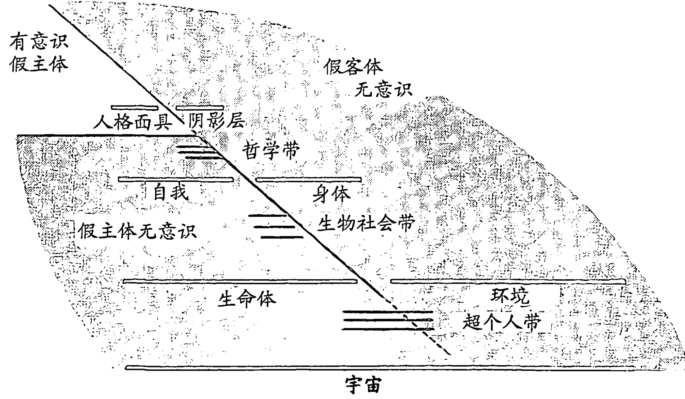

图10—1 阴影层

因此，就在 PSU 的内容从内部塑造个体存在感的同时，POU 的内容却在外部塑造着它。这种从外部进行塑造的行为始终是一种一般类型：个体对这些“客体”做出反应，而不是进行行动，他避免而不是见证，他受到影响而不是被告知。我们已在光谱的每个阶层中都看到过这种现象。

假主体和假客体无意识的不同阶层合起来构成了整个无意识。不用说，整个无意识的这两个方面实际上只是彼此的对立面。无论如何，在代表阴影层上的个体，在图10—1中，我们已标出三个主要领域：有意识的假主体、假主体无意识以及假客体无意识（以及组成这些领域的光谱的所有阶层和带）。这三

个领域合在一起构成了意识和无意识的整个领域。

目前，我们所谈到的就是要引入一种观念，虽然所有下面的阶层在某种意义上是无意识的，但它们绝不是死亡或不起作用的，而这一点尤其可以通过诸如“症状”、愿望或梦想观察到。因为虽然对于个体当前阶层的特征、该层的病态和痛苦、快乐和潜力、愿望和需要而言，他无疑是更活跃的，不过下面的所有阶层（PSU 和 POU）却在以这样或那样的方式作用于意识的“内容”。关键在于，以任何“疗法”的形式，尽可能地确定不同梦想、症状或愿望所源自的阶层并做出相应的反应，这一点是更明智的。

例如，原型焦虑、存在焦虑和阴影焦虑是不同的洪水猛兽，不能简单地等同对待。不加鉴别地对所有症状都使用单一的治疗技术，那么有时会产生最不幸的后果。举个例子，阴影焦虑就是那种“击中紧急按钮”的感觉，它通常源自某种被投射的兴奋和兴趣，偶尔也产生自被投射的愤怒。正如我们所看到的一样，通过整合投射的方面就能将其解决。但是，存在焦虑给人的感觉可不是“站稳脚步不要让我失望”式的恐慌，而是一个人的存在中心里冰冷、几乎使人瘫痪的痉挛，而他有关存在与虚无的黑暗争论也助长了它冰冷的火焰。所以，这种苦恼只能通过面对个体的死亡，即他内在的空虚来解决，而面对其愤怒则无济于事。把这两者混淆就等于冒险推翻理论。

至于大多数的超个人焦虑，我们连如何治疗的最模糊的概念都尚未掌握，绝大多数的精神治疗师也是如此，虽然他们的意图都很好，不过他们都通过将其降级为阴影焦虑而推卸了责任，并优雅地抽身，从而把难题留给了患者（通常的情况是，针对某一层的精神治疗师往往能认出该层之上的所有层。在他们眼中，该层之下的任何一层都是病态的，于是他们很快就用诊断出的愤怒将其打发掉。而对于任何“更深”层的实际病态而言，这无疑是雪上加霜，因为必须通过该层的对话来面对它，而不能将其变为上一层的术语）。

梦想也是如此。我们必须尽可能地认出梦想源自哪一层。它是恶魔，直接来自阴影的可怕信息？还是产生于自我，不过是白天的残留？或是更深层的历史残留，原型输入的“大梦想”，来自超个人带的信息，来自神灵本身的暗示？

问题的答案将决定采用哪种方法，比如格式塔或荣格分析法（或两者都采用，但顺序要合适）。如果不能认出这些区别，其结果要么是弱化要么是膨胀，即原型弱化为自我或自我膨胀为原型。

对一个人的深度、多维度觉知、光谱的任何轻微评价就像其意识的本质一样，它们是极其重要的，会使这些考量对我们产生作用。个人会慢慢意识到，比如，自己是在过“绝望的生活”。他可能的确是“疯狂而混乱的”，自己却不知道，所以在阴影层上，“疯狂”（m-a-d）变为了“悲伤”（s-a-d）（正如大多数心理分析思想家会争论的那样）。但他可能正相反，在自我阶层上，与身体完全脱离了直接接触（比如洛温所描述的那样）；或者，他实际上已看到了次级二元对立的束缚、存在阶层上的痉挛、对死亡的回避，而这一点正是一个人所有动机的根源（贝努瓦已指出过这一点）；或者，他确实已经凝视过超个人守门人的面孔，并从中深知他即将到来的重生要求他立刻死亡（就像所有时代的神秘主义者所讲述的那样）？那么，我们能那样无情、麻木地将它们都抛向同一个治疗方法吗？

此时，我希望这些方法：认出绝对主观性、有意识假主体的阶层、假主体无意识的阶层和假客体无意识的阶层，有助于了解人本主义、正统和超个人心理学中看似相互矛盾的趋势。一方面，我们被告知“要停止异化，要认同自己的行动和情绪并为其负责”；而另一方面其他方法却让我们“不认同自我、情绪、身体等”。我们是应该认同还是不认同？一旦我们清楚，比如在阴影层，认同阴影（POU）就等于不认同角色（有意识假主体），并因此醒悟到自我（之前的 PSU）。进一步深入来说，认同身体（POU）就是不认同自我（有意识假主体）并意识到人马座（之前的 PSU，此刻的有意识假主体）。最终，完全认同冥想的客体（比如公案）就是不认同假主体整体上的最后蛛丝马迹并作为非对立觉知而觉醒。为了成为一种连贯的治疗，大多数形式的疗法都专门强调这些手段中的一个，因此自然认为它是正确的，否则可能会令人非常困惑。我认为我们不会因此就得出结论，说我们此时是彼此矛盾的。

换句话说，不管一个疗法是针对 PSU 的“挖掘”，比如阴影层上的心理分

析或超个人带上的荣格分析法；或认同 POU，比如阴影层上的格式塔和存在阶层上的生物能量学；或不认同假主体，比如阴影层上的相互作用分析和超个人带上的心理综合学。在每种情况中我们都能看到相同的基本“下降”过程在发挥作用：重新界定一个人的界限，转向光谱中“更深的下一层”。各个学派的疗法针对的是不同的阶层，而某些疗法旨在将这一过程带入越来越深的领域。

这绝不是贬低仅针对上面各阶层的那些疗法。光谱的各个阶层在表面上确实存在着，它们也的确有不同的特征，其中有一些是独特的病态。因此我们诚然需要能识别出某个阶层最适合的疗法并对其加以利用。即使是世界上的所有身体只承认大心境界，并都在练习打坐、大手印或大圆满，我们仍需要上面阶层的疗法，因为一个人从本质上来说是回避心灵的，而只通过当前构建界限（光谱的阶层）。这些不同的界限产生了不同的病态，而这些病态的最好疗法就是那些只针对它们的方法。

让我举个小例子。有一位女性练习持咒禅定已有两年多时间，一天她在禅定时被猛地打断，因为她突然看到惊人的一幕：一只狗马上就要攻击她了。这一幕困扰了她一段时间，而导师给她的建议只是继续打坐。她这样做了，但两个月没有任何进展。这真是不幸，因为我清楚一名好的格式塔精神治疗师只需要 15 分钟就能永久治愈那种类型的投射。那一幕只是某个浮出水面的 PSU 的敌意情结，但被阻止了并因此被投射为 POU——攻击她的狗。

让我们换个角度，此时的 PSU 无意识地将一个人作为“主体”从“彼处”的客体世界分离出来。而作为一个整体的 PSU 则是插入主体与客体之间的某种类型的无意识楔子，它使你与这一页分离并进而通过不同阶层的不同方式扭曲了本然的真实世界。在任何合法疗法的特殊情况下，相应层次的 PSU 被松开、击碎、逐出，并像之前那样显露出来。每个精神治疗师都意识到，治疗过程的本质就是了解或见证、处置、消化、觉知“呈现的问题”，而呈现的问题不过是 PSU，其治疗意义不在于它提供了对自我的洞察，不在于它解决了婴儿期或出生时的创伤，也不在于它降低了敏感度——虽然它们也可能有辅助的意义；而主要在于在完全领会所呈现材料的过程中，一个人使其成为了觉知的客体，

### 第11章 意识光谱

#### 万事俱足

> 庐山烟雨浙江潮，
未到千般恨不消。
到得还来别无事，
庐山烟雨浙江潮。
——苏东坡

虽然为方便起见，我们将心灵作为光谱的“最深一层”，但它实际上不是具体的一层，更不用说“深浅”了。心灵的“层次”绝不是埋藏或隐蔽于灵魂隐晦的深处，相反，心灵的“层次”就是我们意识当前的普通状态，它无边无际、无所不包，它相容于意识所有可以想见的场合或状态。也就是说，“无层次”的心灵不可能是有别于其他层次的特定层面，因为那样会给心灵强加上空间的限制。心灵是无所不包的无疆之域，而每个阶层都代表了它的某种错觉的偏离。必须强调的是：我们当下的日常意识状态，悲伤也好，幸福、沮丧、狂喜、不安、镇静、烦恼、害怕也好，不管是什么，那就是大心境界。梵不是具体的体验，不是灵魂的意识阶层或状态，相反，它就是你当下拥有的阶层，并意识到它为个体赋予了深刻的平静中心，深藏在最糟的抑郁、焦虑和恐惧之下。就算我们纯粹的神秘主义领域的学问在过去几十年里已得到大幅的改进，不管东方的还是西方的，但还是有人仍继续以愚蠢的方式扭曲着“教义”，声称神秘主义者是超脱尘世的、完全脱离于日常的真实（不管那意味着什么）、以自我为中心的以及一直沉浸于恍惚之中等。这种说法没有解释清楚神秘主义到底是什么，只不过是怀有此类质疑之人的无知而已。而且，它完全忽视了各传统中大师们的言教，即“你的日常意识，那就是道”。

确切地说，历史上的某些神秘主义者过着隐士遁世、自我陶醉的生活，但那只是个人的风格，根本不能与神秘主义本身相混淆，这就像俄国妖僧拉斯普京不能与基督教精神相等同一样。因为实际上，神秘主义者的最高理想可以通过菩萨来表述：在大乘佛教中，菩萨无论何时、何处，都能在每个人身上、每个地方和每件事上看到神性，因此也不必为了寻找“神灵”而隐居、出神。菩萨的神秘主义幻象与他当时所做之事并无二致，不管是跳舞、工作、哭泣、欢笑，还是强烈地受苦，他知道从根本上来讲“一切都好，一切都好，所有的方式都好”。正如日本白隐禅师所言：“处处皆净土，此身即是佛。”

正因为心灵无处不在、无时不在，正因为它已是道，所以“试图找到它”或“试图到达它”是不可能的，甚至没有意义。如果那么做，就暗示需要从心灵不存在之所移到它出现的地方，但它是无处不在的。心灵遍布一切处，因此不会停留在某个我们可以最终抓住它的具体地方。所以，我们永远无法获得这个“无层次”的心灵。同样，我们也永远无法逃离它。

> （佛）无定所，因此没有人能束缚他，也没有人能摒弃他。①

马祖道一

真正的宁静和永恒的幸福，不朽与宇宙实相，天地的运行，体悟绝对与无限，或是具有宗教意味的佛陀之路——最大错误就是以为“道”在天堂或在彼岸。其实我们没有一刻离开“道”，而凡是能脱离的都不是“道”。

> 天岫接三
追随它、注视它，它却离你而去；避开它，它又来追你。既不能占有它，也不能将其扬弃。……因此没有必要为此忧愁烦恼。①

> 黄檗
如果你要逃避它，则永远无法将其摆脱；如果你要追求它，则永远无法到达。②

> 牛头法融禅师
就你广阔无垠的空际，唯有此处常湛然寂静。你试图获取它时，则看不见它。你无法抓住它，也不会失去它。③

> 永嘉禅师

如果心灵或道或神性即是我们热切追寻的状态，那么心之外再无处可去，我们已在心中！我们已与神性一体，我们当下即心。正如诺威奇的达姆·朱利安大声呼唤的那样：

> 看！我就是上帝；看我在万物之中；看！我成就一切之事；看！我的双手从未离开工作，未来也不会，直到永远；看！我的号令无有起始，我用造物所有的力量、智慧和爱，引领万物直至永远。怎会有一事出错？

或是白隐禅师《坐禅和赞》中的偈语：

> 众生都源自初始之佛：
众生与佛恰如水与冰，
离开了水则没有冰，没有了众生，又到哪寻找佛？人们不知道实相离我们多近，去向远方寻觅——何其遗憾！
这就像一个人本在水中却可怜地喊口渴。①

用爱克哈特的话描述即：

> 普通人坚信，只要上帝与我们同在此岸，我们就能看到他。其实不然，在我感知上帝时，上帝与我实为一体。

或是卓越的马哈希尊者所说的：

> 你必须摆脱自己是无知者的观念，然而你必须意识到自我。你即自我。你可否有一刻未意识到自我？

所以，不管是否意识到，是否想要，是否关心，是否理解，我们就是它，且一直如是。有一首禅诗说得好：

> 如果你能理解，万物也是本然的样子。如果你不理解，万物也是本然的样子。②

因为我们就是它，所以我们永远无法获得它、拿到它、达到它、抓住它或找到它，这就犹如我们不能追自己的脚一样。在某种意义上，所有对心灵的追寻最终都是徒劳的。用商羯罗的话就是：

> 梵构成一个人自我之际，此人无法获得它。即使梵与一个人的自我截然不同，它还是无法获得。因为它无处不在，它的一种性质就是人人具足。

而马哈希尊者则说：

> 自我永远无法达到。如果自我可以到达，那就意味着自我不在此处，而是要现在去获得。得到的总会失去，那不是永久的，而不永久就不值得追求。所以我说自我无法到达，你即是自我：你已是那个。

禅宗大师中的王者、不可一世的临济宗初祖义玄认为：

> 啊，你是如此鼠目寸光，为什么你一直在浪费信徒的虔诚奉献！当你耽于理解错误的观念（禅）时，你还配得上和尚的名号吗？我告诉你，没有佛、没有神圣的言教、没有修行、没有证明！你在邻居的房子里找什么？啊，你是如此鼠目寸光！你是在头上安头！你自己又缺少什么呢？你这个实相的追求者，你在一开始所利用的一切足以使一个人成佛作祖，但你不相信我，却向外找寻。①

而临济宗祖师黄檗禅师则说：

> 无一法可得这句话绝不是闲谈，它就是实相。你本来就与佛是一体的，所以不要装出一副模样，好像自己能通过各种修行来获得与佛一体。如果此刻你能坚信佛性不可得，确信根本不会有所得，那么你证得佛性（开悟）。此种说法的含义何其深！它能教会你不去寻觅佛性，因为任何寻找都注定失败。②

事实上，正因为我们就是它，所以对它的任何追求不但“注定失败”，而且还会使我们产生缺少它的印象！将它驱逐的正是我们的追寻，这就像我们误入歧途开始找自己的头，其中的暗示是我们已失去了头。

> 独有这个一心就是佛。佛与众生本无区别，但是众生执著于形式向外寻求佛性，但求反而求不到，因为那样做就是用佛找佛，用心抓心。即使他们努力寻找千万年，也无法得到它。①

杰出的日本禅师盘珪说：

> 不生之心（永恒的心灵）一直与我们同在。佛心与我心是一而不是二。努力追求顿悟或试图发现自心者，不过是在费力地犯大错。……只要你试图实现大道、获得佛性，那么你已偏离了不生之心，看不到自身的不生之物。

因此，对心灵的寻觅不可避免地会事与愿违，原因是显而易见的，即一者，寻觅意味着寻找或抓住某种东西，即我们能抓住的“彼处”之物，不管是精神还是物质，但心灵不是某个物体。无论你如何客观地思虑、感知或领悟，无论是过去、现在和未来，那绝不是绝对主观性，绝不是思者、感知者或领悟者。二者，寻觅还暗示当前的匮乏，正如上面的引文充分阐述的一样，此刻我们一无所缺，为我们灌输这种明显的缺憾感的正是我们焦虑且错误的寻找。因此，我们寻觅得越多，这种缺憾感就越强烈，因为我们永远也不会这样找到它，不久我们就会惊慌失措，因而又加倍努力，把套在自己脖子上的绳索勒得更紧。再者，这种寻觅的基础是一种隐含的信仰，相信在未来会有某种收获；相信如果我们得不到拯救，那么明天一定会得到。但心灵不知道明天、不知道时间、不知道过去和未来，所以我们幻想有朝一日能追寻到它，而现在却在逃离它，因为心灵只存在于这个永恒的当下。一直以来，那些试图挽救自己灵魂的人注定会失去它们。

那么，问题就在于追寻的客体和追寻者实际上是一体的，所以我们每个人就像被欺骗的噬身之蛇，即所有恶性循环的原形，用自己的头追着自己的尾巴。

> 世人听说诸佛都传授心法时，他们就认为除了心之外还有什么可以获得的，于是他们用心来寻觅法（实相），却不知道心与他们所寻觅之物本是一个。心不能用于寻找心外之物，否则纵使经过千万劫，也不会有成功的一天。①

简单地说，我们所观察的除了观者本身之外别无他物。正因如此，它永远不能被当做外物来认识、寻觅和观察。它就是认识者、寻觅者和观者。

> 你看不到观者之所观，听不到听者之所听，觉知不到觉知者之所觉，认知不到知者之所知。

（《广林奥义书》，III.4.2）

正如禅诗所云：

> 能切之刀，切不了自己；
能看之眼，看不到自身。

总之，我们无法感知自我，而这正是问题所在，即初级二元对立的起源，因为我们想象我们看到并认识到了自我，而没有意识到无论我们看到什么或者怎样认识到自我，那都是所感知客体的综合体，不可能是我们的自我。正如黄檗所述：“所感知者无法去感知。”魏无为（特伦斯·詹姆斯·斯坦纳斯·格雷，笔名为 Wei Wu Wei）也有力地论述道：

> 要知道，自己根本没有客观的品质，与之有关的一切也都没有客观性，自己没有一丝一毫的客观性，一定要知道自己是什么，用形而上学的术语来说，那就是不在场，缺乏的，全然没有任何客观的特质、本性或品质。

因此，任何我们意识到的“自我”都明明白白、确确实实、毫不含糊地不是你的自我！马哈希尊者说道：

> 由七种元素（界）构成的粗钝肉身，非我；分司色声香味触的五种感官眼耳鼻舌身，非我；分司言语、动作、领悟、排泄与欲乐的语言、运动、领悟、排泄与生殖的五种感官，非我；分司五种吐纳作用的生命之气（能量等），非我；甚至起心动念的心智，非我；蒙昧无知之念……非我。

所以魏无为问道：

> 一个人难道没有意识到吗，“自我”不过是他觉知上的和概念上的客体，它不能成为我们？

虽然这很明显，但我们就是意识不到，也许就因为太明显了。我们无法听到听者、嗅到嗅者、感觉到感觉者、触到触者、品尝到品尝者，同样，我们也无法观察到观者。但我们认为我们能——这就是问题所在，也就是初级二元对立的源头。

具体的过程是：观者，即你体内能认知的那个，实际上与所观之物是不可分的，它即是所观，因为知者通过成为某物而看到了它。正如圣托马斯·阿奎那所表述的：“所知的客体在知者之内，因此产生了见闻。”例如，本书的这一页与你的能看是等同的。威廉·詹姆斯曾说过：“所见的书页与能见不过是同一个不可分割事实的两个名称而已。”但这不是说这一页，即我们感知假定的客体，在某种意义上并不存在（即如果我闭上眼睛，这一页实际上就从地面消失了），而是它不作为客体在“彼处”存在。在观者和书页之间、主体和客体之间，没有间隔、没有距离、没有空间！

但当我们说“我知道我是谁”或“我十分清楚我自己”时，我们都认为我们能看到观者，因为存在着这种假想，所以我现在能看到和知道观者，结果自然使我们感觉，我们假想能觉知的“观者”一定在我们“之内”。正如维特根斯坦直率而言：“困扰我们的是，我们倾向于认为心灵是我们体内的小我。”因此，看起来“观者”和我的“自我”，分离于所观之物，这就是初级二元对立。

换句话说，我们在想象中真的看到观者，或是将我们的自我作为客体来认识，我们显然（即错觉）将自己的主体性变为了称作“自我”的客体，即（客观的）观念、感觉、认同、评价等的综合体。我们错误地将客体的综合体当做了主体性，我们错误地将所见当做了能见，而不清楚只有产生错觉时主体性才能成为客体，这就仿佛你看到自己患上了白内障的眼疾。我们的“自我”，即“小我”，甚至不是真实的主体。因为我们能客观地看到和认识它，这个“主体”就是假主体，而这个自我也就是假自我，这是典型的错误认同。这个假主体被认同后，所有其他客体都分离于我，于是，初级二元对立产生了。

这种状态就叫做轮回、生死之轮、束缚、地狱之硫磺烈火或苦境。

> 你的苦源于自身，没有别人来逼迫你，
也没有束缚你，使你流浪于生死。
随着车轮转动隆隆作响，你去拥抱
和亲吻痛苦的车幅，泪水的车轮里，虚无的轮毂。①

魏无为关于客体认同的束缚状态总结道：

> 显然我们的束缚源自我们认同了想象出的客体化的“我”，（即心灵、观照）。我认同了自己各个阶层的自我，而这些自我就是所有有觉知的存在。我们因错觉而认同客体之后，只要我们以该客体的身份思考和言语，我们就会使主体变为客体。

> 只要我们认同客体，那就是束缚。

> 只要通过客体或作为客体思虑、行动，那就是束缚。

> 只要我们感觉自己是客体，或者如此思考（“自我”就是客体），那就是束缚。

> 基于被认作“自我”的现象概念行事就等于依照我们试图避免的虚假认同来行动。无疑那是入口，而非出口？

简单地说，你体内此刻能认知、能看、能读此页的就是神性、心灵、梵，它无法以客体被看到或认识，这就像眼睛无法看到自己一样。你对“自我”所了解的一切都是客体；不管你对“自我”看到什么、思考什么、感觉到什么，那都是所感知客体的综合体，即“小我”。所观就是小我，而能观才是心灵。我们已不慎认同了前者，认同了所观、小我、人马座或角色等，因此我们不再认同所有的表象，我们与所有看似不是自我的一切割裂开来，于是产生了初级二元对立。

这样，我们分离于环境，环境变成了威胁。我们已经看到，这个初级二元对立引发了存在与虚无的争论。反过来，这种争论又导致了个体对死亡的抑制以及与宇宙持续终生的斗争，绝望地试图尽可能地扩大自己与环境之间的距离（所谓的“安全”），即由恐惧和忧虑驱使的投射。糟糕之处不在于这场斗争的艰难与猛烈，而是斗争的起因不过是一种错觉。分离的自我不会在那里得到保护、拖延或拯救，后果是我们徒劳一生并拼命挽救根本就不存在的东西。

> 你为什么不幸福？
因为你所思虑之事、所做之事，
它们有99.9%都是为你自己——而它并不存在。

现在，如果你读到此决定绕到“自我”的“身后”，去看一看实际是何物在做看的动作，去寻觅感知者、观者，你只会发现此页！“不管是有人看到波还是粒子，龙卷风还是煮鸡蛋……所有的都是客体，不管他认为自己看到了什么，那最终都是能看……”但这一情况发生时（此刻正在发生），就没有作为主体的你，也没有作为客体的书页，因为主体和客体都将消弭于非对立的主体之中，我们勉强将这种状态描述为：书页在读自己。因为这里超越了所有对立，所有客体都是它们自己的主体，主体与客体不过是接近称作心灵的这个实相的两种不同方式而已。

主体与客体之间的这种分裂、鸿沟，即初级二元对立，是意识光谱的肇始者，它继续运作于所有层面，构成了思者与所思、知者与所知、感觉者与所感、主我与宾我、心灵与肉体、自愿与不自愿、是与应该之间不可还原的且虚幻的分离。简言之，它将分离之“我”的执著划出了界限，而光谱的每个阶层不过是这一原始基础二元对立的变形而已，每个变形的标志就是对认同感或假主体不断增强的限制，从宇宙到生命体到自我再到部分的自我。

此时，主体与客体之间的间隔、鸿沟必定含有时间成分，因为时间与空间不是牛顿眼中分离的绝对事物，而是一个连续体。初级二元对立的时间成分就是次级二元对立，即生与死的二元对立。我们之前讨论过初级和次级二元对立时它们好像是彼此分离的，但那只是为了阐述的方便，这样才能更简单地说清楚意识光谱是如何产生的。但实际上，一旦人生活在空间中（初级二元对立），他也同时生活在时间中（次级二元对立）。

让我们回顾一下次级二元对立：它将我们从生与死为一体的永恒当下驱赶出来，使我们陷入了时间的虚幻世界，挣扎着要摆脱虚幻的死亡，妄图换回幻想中的未来。也就是说，生活在永恒的一刻就等于没有未来，没有未来就等于死亡，但人不能接受死亡，所以他也无法生活在超越时间的当下。因此，分离生与死的次级二元对立就是时间的先驱，但时间（次级二元对立）中的生活只是空间（初级二元对立）中生活的另一面。因为只要一个人将生命体与其环境割裂开来（初级二元对立），则存在与虚无、存在与不存在、生与死的问题，即时间的问题将同时产生。换句话说，当一个人与宇宙是一体（没有初级二元对立）时，在他之外再没有什么能威胁他的存在，因此也没有存在与虚无的争论（没有次级二元对立）。相反，当生与死被看做一体（没有次级二元对立）时，也一定没有什么能威胁其存在，而且他之外也没有什么可以这么做，因此人与宇宙已无隔阂（没有初级二元对立）。

直率地讲，你和此页之间的隔阂与你和当下之间的隔阂并无二致。如果你能全然地活在当下，你与此页（及所有其他“客体”）将会变成一体；反过来，如果你与此页合为一体，你将活在当下。初级二元对立和次级二元对立只是表述时空间隔的两种方法而已。

因为如果无法通过空间将心灵作为“彼处”的客体来寻找，自然也无法通过时间将心灵作为未来的事件来寻觅。也就是说，既然没有通往此处的路径，当然也没有通往当下的道路。实际上，任何我们在时间中找到的心灵、上帝或梵不过是严格意义上的现世存在，根本不是神性。大多数人都幻想我们此时缺乏心灵，如果我们努力寻找，我们就能在明朝的某一天找到它，但我们能在明朝找到的任何心灵必定在时间上有一个起点，它并没有出现在当下，而是出现在未来。严格地讲，我们无法进入永恒，因为永恒是永远存在的，我们能进入的任何状态仅仅是现世的状态。我们将在当下找到它，否则就根本找不到。

玄策听说有一位叫智隍的禅师，就去拜访他，那时智隍正在打坐。

“你在这里干什么呢？”玄策问。

“我在入定（与宇宙永久地结合）。”智隍答道。

“你说入定，但你如何进入定，是用有思之心，还是用无思之心？若是无思之心，那么一切无生命之物，如草木瓦石都应得定；若是有思之心，那么一切有生命之物就都应得定。”

“我没有意识到是有思之心，还是无思之心。”智隍答道。

玄策机锋一转。“如果你意识到两者都不是，那么你就一直在定中；为什么还要说入定、出定呢？如果有所出入，那就是不是大定。”①

盛气凌人的商羯罗就这一点也同样坚决地指出：

> 如果将梵表示为特定行动的补充，那么释放（解放，解脱）就会被认为这些行动的结果。这一情况是现世的，只能看做所描述的各种程度行动暂时成果中的佼佼者。但是……解脱是永恒的。……解脱就是永远自由的自我的本质，（而且）它无法承担无常的瑕疵。

换句话说，心灵的任何解脱或“发现”，只要它具有时间的起点，那么就根本不是解脱。解脱不是未来的希望，而是当下的事实。所有的二元对立都是错觉，实际上没有什么束缚我们，没有锁链需要打碎，也没有什么自由可以获得。

> 和尚：如何脱离三界（之苦）？
> 天龙重机：此刻你在何处？
> 道信：愿和尚慈悲，赐我解脱法门。
> 僧璨：谁在束缚你？
> 道信：没有人。
> 僧璨：那为什么还要解脱呢？

也许瓦兹的总结最妙，他说道：“宇宙意识所需要体悟的一切都已在现在，此外任何之事都是多余的障碍。”任何的“如何”、任何的“方法”、任何的“路径”，如果它引领到它处，则偏离了当下。这反映了一个事实，用龙树菩萨的话来说即是，“涅槃与轮回之间本无区别；轮回与涅槃之间亦无区别”，而德根则说“目标和道路不是一”。每个传统中的大师多有类似的言论，开悟与愚昧、实相与虚幻、天堂与地狱、自由与束缚，所有都是非对立的，是不应分离的。于是，“你已在众路指归之处”。

让我们举个例子，有个人认为地球是平的，后来他发现自己是错误的，因为他完成环球旅行后竟然又回到了出发点。我们大多数人都陷入了此人的窠臼：我们坚信自己缺乏心灵，于是被引领去做各种各样的“灵性练习”，最终醒悟我们还是回到了出发点——此处、此刻。黄檗说道：

> 纵使你在成佛的道路上一步步证得了菩萨的各个位阶，但最后的电光火石的一瞬间，你会大彻大悟，明白佛性一直与你同在，之前的所有阶段并没有增加生命。此时你将清楚，历劫的用功修行不过是梦中虚幻之事。①

但如果我们确实相信地球是平的，相信我们缺乏佛性，那么我们唯一的选择就是开始旅行。这意味着我们借以“朝向”心灵旅程，从技术上讲这就是所谓的善巧方便，即有技巧的方式，这个词经常被翻译为“技巧”，因为我们费尽心计地寻找原本就未曾丢失的东西。善巧方便精确地构成了个人实验室中所进行的实验，并让个体自己去决断心灵是否存在。像所有科学实验一样，这个实验包括一整套个体可以自由遵循或拒绝的禁令或指示，但如果他拒绝，那么从科学诚信的精神来讲，他必定不会将判断建立在对心灵的体悟上。如果科学家拒绝心灵，就像本身没做实验的神秘主义无价值的读物一样，那么他就会表现出不科学的一面，跟自己没有重复实验就否定同事的实验数据一样缺乏科学性。这些善巧方便，我们以后将其称作有技巧实验，它们本身极其明白易懂、合理而又科学，所以，任何逻辑实证主义者或科学家如果排斥它们，那么他们的立场一定是不科学的、情绪化的。

几个世纪以来发展出的有技巧实验的数目是很可观的，但我们认为它们中的“有效成分”，即本质因素都是非常相似的。① 为了证明这种主张，我们将详细审视一下某些比较流行的有技巧实验，并指出它们中存在的本质相似性。

让我们从贝努瓦博士开始，他的有技巧实验是使特定“内在姿态”具体化，当这一姿态被恳切地重复做出后，它就会使我们意识到“我们中每个人都活在开悟的境地中，除此之外更无别的活法……（因为）它就是永恒境地，独立于我们的生与死”。贝努瓦对“内在姿态”的研究主要用于：

分析决定我们未活在开悟境地中这一错觉的内部过程。我们会看到它们是我们想象-情绪过程，在这些过程中我们的生命能瓦解，我们试图清楚地定义关注的不完整功能，反过来这种努力又决定了那些想象-情绪过程。

贯穿本书，我们一直在描述那些“决定我们未活在开悟境地中这一错觉的过程”。简而言之，我们指出它们就是我们概念化、客体化和二元对立的倾向，贝努瓦简单地将其称作“想象-情绪过程”，而这些倾向会导致“仅认同生命体，而不是表象的其余部分”。因此，为了感知我们的基本宇宙认同，我们必须屈服于，至少是暂时的，所有的概念、精神意象和精神客体。为了有效地进行，我们必须首先明白这个心理过程，因为该过程决定我们继续形成思想、概念和意象，以及所有看似在我们头脑中一直信马由缰的“精神的喋喋不休”和“自言自语”。就实验的事实而言，你可以停一会再读书，去观察你如何对自己想东想西、唠唠叨叨。而且，如果不下一番大工夫，你根本无法停止这种精神上的喋喋不休和脑海中观念和思想的万花筒，因为停止唠叨这一想法本身就是更多的唠叨！这就是那个古老的陷阱：“下个10秒钟，不要想‘猴子’一词。”那个方法永远不管用，因为我们的所有时间都花在了考虑不要胡思乱想这件事上了。

相反，我们需要弄明白产生概念化的那个过程，这样我们才能将其从根源铲断，而贝努瓦已准确地指明了该过程。为了理解他的解释，我们需要记住贝努瓦一直在“能量流动”的框架下工作。也就是说，每一刻我们的能量都在不断地从“下面”，从大心境界涌出，在那里能量是纯粹的、无形的、非客观的、没有时空的，并一直在“永无期限”的当下运行。这种能量在流动时看似会在内部“汇聚起来”，然后穿过存在-生物社会阶层，并开始以思想为形式，以情绪为指向。这些“想象-情绪过程”的作用就是瓦解和消散我们的能量。

我们要尽可能清楚地、具体地理解这一点，否则就会失去对贝努瓦的把握。这种“能量流动”及随之而来的“瓦解为”思想和情绪形式此刻就发生在我们身上。每时每刻都是如此，而且可以在某些场合极其容易地被观察到。例如，如果我跑到你身后，大喊一声“嘟”，那么你会有几秒钟保持静止，虽然你听到了我的喊叫，并在这个短暂的时间里感觉到了一种被动的或安静的警醒，但这种感觉很快爆发为轻度的震惊感（或类似的感觉），同时伴随的还有思想和情绪的急流（想象-情绪过程）。在被动觉知的那几秒里，你的能量开始流动，但尚未被体验为震惊或轻度的恐惧，它是纯粹而无形的，只是后来才分裂为震惊和惊吓的思想和情绪。

再举一个简单的例子，一件易碎的水晶制品意外地从壁橱的最高层跌落，这时，你的能量立刻流动，你用敏捷、完全自发的动作冲了过去，接住了它，头脑没有闪过任何思想、观念或意图。只有你接住之后，你才开始想所发生的一切，你才意识到自己做了什么，同时你的心也开始怦怦乱跳，各种想法在头脑中奔涌，只有那时你的能量才开始瓦解为思想和情绪。这两种情况都是非常极端的，因为我们的能量不断地被观念、概念、思想、情绪以及精神客体打断，我们从而在自我和实相之间拉上了一层幕布。这层幕布必须被拉开，为此我们必须清楚这层幕布的产生过程。什么过程决定了能量瓦解为想象-情绪形式？贝努瓦提供的答案是：

这个详尽的过程是一种被动模式，我的关注以此来发挥作用。正因为我的关注是被动的，已经产生的能量流动才能使其警觉，而此时除了瓦解能量之外再无能为力。实际上，我的一般关注不是一种自动的、无条件的警觉状态；它只是被生命体中产生的能量流动唤醒，这种唤醒是受能量流动决定的。于是，我始终面临着这一既成事实。在没有界限的那一刻，来自非表象、仍是无形的能量汇聚在一起，这一刻一过去，能量就仿佛被思想和概念的有形世界打断了，从而错失了触及实相的机会。瓦解为想象-情绪形式是不可避免的，我的能量现在进入了一个自我本位认同统治的领域，即自我阶层。

当然，一旦我们的能量位于自我阶层，它与实相的关系就风马牛不相及了，此处我们的能量被思想、符号和映射深深包裹住了，于是就很难直接看到该领域。这些思想产生后，再去通过它们、压抑它们或否认它们就无济于事了，这只会导致四级二元对立。我们不会成功抑制住这些思想，只会抑制这些思想的所有权，于是我们投射了它们。正如惠能大师所言：“住心观净，是病非禅。”思想形式一旦出现，再对其做什么就为时已晚，虽然我们大多数人都试图这么做。有句话说得好，“不要等到老虎咬掉你的头才对它发怒”。

因此，贝努瓦让我们做的不是去抑制思想，而是要唤起“内在姿态”，以此从根源切断思想形式从而阻止其产生：

我的关注不应该是被能量流动唤醒，而是应该之前就已唤醒；相反，如果不去看正在产生的想象-情绪过程，而是观照即将产生的过程，那么就能实现这一目的；如果不是被动地关注我的流动能量及其瓦解的未来，而是主动觉知能量的产生，那么就能实现这种唤醒。一种新的警觉现在就会监督能量的流动。简单地说，主动关注在于要等待内在运动的出现。使我感兴趣的不再是我的情绪，而是它们的诞生之际；使我感兴趣的不再是它们的运动，而是产生有形运动的无形运动。

贝努瓦天才地指出，当我们的关注以被动模式运作时，它会决定思想-概念的产生；相反，当我们的关注以主动、警觉模式运作时，那么思想-概念就不会产生，因为主动的关注会防止能量瓦解为想象-情绪形式。我们会在后面详细阐述这一点，这样读者将会彻底明白该过程到底要求什么，但此刻，我们必须预先警告读者：当我们的关注以贝努瓦所描述的主动模式运作时，就根本没有可感知的客体。在主动关注的模式中，精神客体（思想）不会出现，而且因为它是看起来将宾我从外界分离的概念化幕布。当这些精神概念-客体不再出现时，“主我”和“外界”则不再分离，“主我”和“外界”在纯粹的非概念观照中变为一体。因此就不存在要感知的“彼处”客体性世界，即以一种非对立方式，“世界在看着自己”。观存在，但却没有客体性的所观！贝努瓦解释道：

> 当我们的关注以主动模式发挥作用时，它就是纯粹的关注，不带任何表象的客体。我的流动能量本身是无法感知的，只有通过瓦解的结果——意象（思想、概念、精神客体等），才能感知到它。但这种瓦解只发生于我的关注以被动模式运作时，主动的关注会阻止这种瓦解。所以，当我的关注以主动模式运作时，即无可感知之物……

贝努瓦然后举了个例子，在例子中，他描述了这种“主动关注”所必需的要求：

> 对我来说，具体地验证主动关注我的内在世界没有客体是很容易的。如果我不顾我的内在独白（无休止的自言自语），而是采取主动旁观者的态度，任由这个独白尽情地说下去；如果我采取可以用“说吧，我在听”来定义的态度，那么我就会观察到我的独白停了下来（不用我强迫或抑制）。它不会再度涌现，除非我的警觉期待态度停止了。

这种“警觉的期待态度”构成了“内在姿态”，而内在姿态会阻止思想-概念，并因此使我们直接与实相接触。贝努瓦以几种方式描述了这种主动关注的内在姿态，其中的一种我们已介绍过，另一种则如下所述：

> 显然，自我之内的这种存在是无法描述的，它是立即的、无形的（主动）感知……确切地说是缘于该感知的无形特性。让我们假设一下，我问你：“你此刻的感觉如何？”你回问道：“就何而论呢？肉体上的，还是道德上的？”我答道：“综合所有观点，你感觉如何？”你沉默了几秒钟，然后你可能会说“还不赖”或“马马虎虎”或“非常棒”或其他的。在你沉默的那两秒钟，后者已不能吸引你的兴趣，因为你用它的目的就是要为你的感知赋予某种表达的形式（思想）……那时你已忽略了吸引我们的内在存在。在第一秒里，你感知到了你一直以来真正有疑虑的东西，但你习惯上是意识不到的，你只意识到从该无意识感知中衍生出的形式（思想-客体）。如果有人读到此处后试图获得我们所讨论的无形感知，那么他就需要当心了，因为会出现成千上万种方法来使其相信他已经得到了它，而事实恰恰相反；不管是什么情况，所犯的错误都是相同的，都在于这样或那样构成形式的胡乱心思，他的头脑还是不够简单。

贝努瓦在另一处对警觉的内在姿态的描述则是另一番模样：

> 这个姿态……就像是投向内在世界整个中心的一瞥，刺穿了那个世界未知的水平面。这一瞥，不偏爱任何客体，投出时也不带任何先入之见，所以无论它投向何物，都遇不到（客体）之物，因此也不会像希望的那样导致想象电影的暂停。它是一种全然的审视，没有任何具体的表达，一直保持着不做判断的状态，因为它本身就不带任何答案。它是一种挑战，既没有目的去满足任何人；它是对万物的关注，没有什么是客体。于是想象电影的暂停不用追求，瞬时之间自然获得；它没有时间的界限，只是时间中心电光火石的一刹那……

贝努瓦的这三种描述指的都是同一个内在姿态，即导致对立之观暂停的内在姿态，“我”看到了“客体”或“概念”。一句话，它暂停了思想，却没有抑制它，而这正是关键所在。当我全然、主动觉知我的思想过程时，当我说“说吧，我在听”时，当我授意任何思想随意起伏时，然后主动聆听并观察它的出现，此时什么都不会出现！正如贝努瓦指出的那样，只有我停止了“说吧，我在听”这种态度，我的思考过程才会再次开始。他将这种内在姿态总结道：“它的实现条件是在任何倾向有意识地出现之前就对所有倾向都放任自流，那么它们就都不会出现。”当没有任何想象-情绪倾向作为有意识客体出现时，我就立足于纯粹的非对立有机体意识之中，“因此我已实际上获得了自由”。

现在让我们分析一下贝努瓦没有客体的警觉关注内在姿态并指出其中的本质因素，我们将看到，那些也是所有有技巧实验的共同之处。从基本上来讲，有三个因素：

**因素 1：主动关注**——一种紧张而又放松的特殊警醒，可以描述为“说吧，我在听”这种态度，也可以描述为对我的倾向的全部授权或全部接受，或是指向思想和情绪诞生之际的主动警觉。它是一种热烈的关注，即放任当下之物，用平等的眼光注视内部和外部。当主动关注被正确执行时，它会产生因素 2。

**因素 2：停止**——思想、概念化、客体化、精神的喋喋不休的暂停。这种“停止”，事实上就是第一种认知模式、对立和符号映射知识的暂停，而它们最终会扭曲实相。简而言之，即初级二元对立的停止。它是空间、时间、形式和二元对立的暂停，这样绝对的精神沉寂就占据上风。这就是保持本然如是。“驻留”于“如是”、“沉默”、“寂静”的条件，即我们所谓的（黄檗之后）“坐道场”，也就是说，坐于开悟随时可能爆发的处所。如果这个“停止”是干净完整的，它将产生因素 3。

**因素 3：被动觉知**——一种特殊的观照，即观无物。“观无物——这是真正的观照、永恒的观照。”当然，这种觉知、这种观照，不是看纯粹的空白或真空，而是要看无客体性之物，它是纯粹的永远觉知。因为没有主体与客体的初级二元对立，因此无客体之物的内部就是完整的，没有任何外部之物或客体之物。因为其外无物，所以它的运作方式是完全自发的，不费丝毫力气，也不用指向过去和未来。它处于绝对的当下，超越时空，除自身之外再无所指，除自身之外再无所见。换句话说，它就是第二种认知模式，认知一切而没有任何隔阂。一瞬间的这种纯粹觉知即是心灵本身。不管我们实现与否，它始终已然如此。

这三个因素是所有有技巧实验的本质，虽然它们的形式五花八门，几乎每种善巧方便中都能清楚地辨别出这三个因素。为了证明这一点，让我们转向克里希那穆提来继续我们的审视。

也许还没有人像克里希那穆提一样如此清晰、感性、深刻地描述过我们用被动觉知（因素3）表达的含义。赫胥黎将其著述比做佛陀的言教。在过去的半个世纪里，他游历世界，向人们宣说被动、无拣择却又强烈的警惕觉知的必要性。这种觉知不能污染思想、符号和对立，它是对当下、本然的觉知，而不管过去、未来、应该或可能。本然是真实的，而且只有通过了解这一实相我们才能释放自己：

> 真实就在近前，你无须寻觅；寻找实相者永远不会得到它。实相即在本然中，那正是它的美丽所在。但你一构想它，一寻找它，你就开始挣扎，而挣扎之人不可能领悟。这就是为什么我们必须要沉寂、机警、被动觉知的原因。

克里希那穆提的听众总是问：“我如何才能获得解放自我的这种觉知？”克里希那穆提则答道：“对方式的寻找会偏离当下的本然，因此对觉知的渴望恰恰妨碍了它。对于始终如是之物，任何的准备都是不恰当的。”

一个人能无须准备、立刻认识到实相吗？我的回答是可以，这不

---

**脚注：**

① 原文为：禅者智隍，初参五祖，自谓已得正受，庵居长坐，积二十年。师弟子玄策游方至河朔，闻隍之名，造庵问云：“汝在此作什么？”隍曰：“入定。”策云：“汝云入定，为有心人耶？无心人耶？若无心人者，一切无情草木瓦石，应合得定；若有心人者，一切有情含识之流，亦应得定。”隍曰：“我正入定时，不见有有无之心。”策云：“不见有有无之心，即是常定，何有出入？若有出入，即非大定。” ——译者注

① 原文为：纵使三祇精进修行，历诸地位，及一念证时，只证元来自佛，向上更不添得一物，却观历劫功用，总是梦中妄为。——译者注

① 因为指向心灵的途径通常都源自存在阶层自我与他人的初级二元对立，所以所有时代的神秘主义者常常有反映初级二元对立的两种情况。一种是“jiriki”，即自力，另一种是“tariki”，即他力，或者说是通过著作或信仰拯救。但事实是，“你无事能做，也无事不能做”，自力或他力都是为了“获得”本性。

是出于我的幻想，也不是错觉；而是源自相关的心理实验，你会明白的。接受任何挑战、任何小事，不要等到大的危机到来，看看你是如何反应的。要觉知它，觉知你的反应，觉知你的意图、你的态度，这样你将了解它们，了解你的背景。我可以向你保证，如果你投入全然的关注，那么你立刻就能做到这一点。如果你在寻找背景的全部意义，那么其含义将凸显出来，你将一下子发现实相，即对问题的领悟。领悟从此刻、当下开始显露，而这一刻始终是永恒的……能够拖延、准备接受的那只是明天，它会妨碍你领悟什么是当下……你准备明天去弄清楚只能在“当下”领悟的东西。因此，你将永远无法领悟。感知实相无须准备；准备暗示着时间，而时间不是领悟实相的途径。时间是连续的，而实相是永恒的……

而且，克里希那穆提像所有真正的玄学家一样断言：“上帝或实相无法被思考，如果你思考，那就不是实相。”我们不领会本然的实相，因为我们回避它，用分裂和乱斩实相之心的思想和符号来掩盖它，徒然地抓着片段的幽灵，困惑、沮丧、心烦意乱。因此我们会寻找一条摆脱困惑的道路，再一次试图避开本然！

我们多么急切地要解决我们的问题！我们多么执拗地寻找答案、出路、良方！我们从未考虑过问题本身，只是不安、焦虑地摸索答案……寻找答案就是回避问题，这正是我们大多数人想做的。解决的办法是不要分离于问题；答案就在问题之中（因为那就是当下之物），也不要远离问题。如果答案脱离于问题，那么我们是在制造新的问题，比如如何找到答案、如何执行、如何实践的问题等。

让我们谈一下此刻我所体验到的强烈恐惧，权当一个例子吧。如今大多数人不想觉知恐惧，想要摆脱它。我们不想观察它，而是要拒绝它。然而，只有“我”与“恐惧”是两个不同事物，只有存在知者与所知、体验者与体验、主体与客体的初级二元对立，这时才能实现这一点。这就是问题所在，因为如果实际上这一初级二元对立是虚幻的，如果实际上我就是我的当下体验，而不是我有当下的体验，那么此时“我”与“恐惧”就是一体，是同一个过程，所以我不再将自我与恐惧分离开，这就像我无法脱离于自己的头。如果我看到我是恐惧的，那么恐惧就会停止威胁我、逼迫我，因为此刻并没有独立于“恐惧”的“我”可以被威胁、被逼迫。恐惧不再可怕。另一方面，如果我试图摆脱恐惧，那实际上是在担心恐惧，恐惧正在努力将自己一分为二，这样才能逃离自己。当然，这就是初级二元对立，在思者与所思、体验者与体验、观者与所观的恶性循环中，恐惧能分裂、自我繁殖到惊人的数量，并徒劳地试图摆脱它自己。简而言之，试图逃离恐惧就是恐惧本身。

克里希那穆提一次次地深入阐述这一观点，不管谈论的是恐惧，还是愤怒、妒忌和痛苦，我们都无法通过回避的方式处理痛苦或恐惧，而唯一的方法就是意识到我们就是它。

现在，你已彻底觉知痛苦。是痛苦脱离于你，你只是感知痛苦的观者，还是那就是使你痛苦的源头？当不存在受苦的观者（假主体）之时，痛苦与你还有区别吗？你就是痛苦，不是吗？你不是脱离于痛苦，你即是痛苦。发生了什么？不贴任何标签、不赋予任何名相，也不因此对其不理不睬，你只是那个痛苦、那个感觉、那个创痛感。当你就是“那个”时，会发生什么？当你不为其命名，没有与之相关的恐惧时，中心（假自我）还会与之关联吗？如果与之关联（即与其不同），那么就是害怕它，然后必须对其采取行动。如果中心就是“那个”，那么你会做什么？无事可做，不是吗？如果你即是“那个”，而且不接受它、不为其贴标签、不排斥它，那么会发生什么？你会说你受苦吗？无疑，一种基本转变已然发生。不会再存在“我痛苦”，因为没有受苦的中心……我建立了一种与它的关系，但该关系（初级二元对立）是虚幻的。如果我即是“那个”，如果我看到了事实，那么这个事情就会发生转变，产生全然不同的含义。那时就有全然的关注、整合的关注，而被彻底注视的事物也被领悟并消融，因此不存在恐惧，连“悲伤”这个词也是不存在的。

有人可能会说，克里希那穆提的整个信息就是我们必须驱散（或者说看穿）虚幻的初级二元对立，并因此唤醒第二种认知模式，即非对立、非概念的觉知，因为仅这一点就揭露出了实相，而实相是始终如是的：

> 如果我们能直接体验到某种感觉，而不涉及名相，我想我们将在其中有很多发现。此刻已不存在与之的战斗，因为体验者和所体验之物是一个整体，这一点是最重要的。只要体验者为该感觉，即体验赋予了名相，那么他就会将自己与它分离开来并采取行动。此类的行动都是造作的、错觉的，但如果没有名相，则体验者和所体验之物就是一体的。这种（初级二元对立的）整合是很有必要的，必须从根本上面对。

这一整合会产生被动觉知（因素3），但如果还存在蛛丝马迹的初级二元对立，即思者与所思、知者与所知、观者与所观之间的分裂，那么就不存在觉知。

> 首先，我们必须明白何为觉知：要想变得觉知，就要向外去觉知大厅的色彩、比例，觉知自己衣服的颜色，毫无拣择的觉知，只管去注视。此外也要觉知内部所有的思想运动、姿态运动、走路的方式、所吃的食物以及养成的习惯，还是要没有拣择，只是注意观察。如果观者与所观之间存在分裂，你就无法变得觉知……

我们已经看到，观者与所观之间的分裂，即初级二元对立，通过思想和概念化得以永存。鉴于此，克里希那穆提认同地说道：

> 你知道，最难之事就是观照，即看，不带意象地观察任何事物。观察一片云，不带与之相关的先前联想；看一朵花，不带与之有关的意象、回忆和联想。因为这些联想、意象和回忆会在观者所观之间产生距离。在该距离中存在着观者与所观之间的分裂，而个体的全部冲突都存在于该分裂中。必须不带意象地去看，这样观者与所观之间的间隔就会很简单地消失。①

因此“不带意象地去看”就是问题的关键，所以克里希那穆提很自然地问道：“现在的问题是，那个意象可以不通过时间，不是渐渐地，而是立刻地终止吗？为了回答这个问题，个体必须探究构建意象的机制。”然后他接着描述这个“构建意象的机制”，我们可以从中清楚地看到三个因素（关注 - 停止 - 觉知）开始出现。

那么那种机制是什么呢？请让我们一起探讨这个问题。我不是在指导你，我们是在彼此发问。什么是意象，意象是如何产生的，维持该意象的又是何物？构建意象的机制就是不关注。你明白吗，先生？

此处，克里希那穆提完全同意贝努瓦的观点，即意象产生的机制就是不关注，或是贝努瓦所谓的被动关注。克里希那穆提继续说道：

例如，你侮辱或奉承我。当你侮辱我时，我做出反应，而该反应构建了意象。当关注不存在时，反应即产生了。听懂了吗？当我没有全然关注（或是按贝努瓦的说法称为“主动”）你的侮辱时，这个不关注就会酝酿出意象。当你管我叫白痴时，我做出反应，即我没有彻底关注你所说的话，因此就形成了意象；但如果我全然地关注你所说的内容，就不会形成意象。

① 克里希那穆提述而不作的全部要旨可用大乘佛教无住之心的教义来概括。无住之心即是流动之心、无阻塞之心、无障碍之心，没有牵挂、阻碍、停止。“禅关注的是瞬时的一刻。无论何时、无论何地，只要它（即心灵）‘停止’，被外界某事所触动的标志，而该事只是一种错觉……”（泽庵）。

因此，根据克里希那穆提的观点，全然彻底的关注（因素1）会导致意象形成（因素2）的暂停或停止。克里希那穆提进一步认为，只要我们彻底、主动地关注，只要我们保持“说吧，我在听”的态度，就不会有精神意象产生。

> 关注时所有的条件都消失了，所有的意象构建都终止了；只要你不关注，整个事情就会开始……

正如我们之前指出的，不存在意象和思想之际，也就没有了对立。按照克里希那穆提的观点，这就会产生被动觉知（因素3），而实相也得以展现。因此我们可以明晰地从克里希那穆提那里看到那三个因素：一为主动关注；二为停止；三为被动非对立觉知。在意象产生的那一刻，用克里希那穆提的话讲即：

> 在那一刻彻底关注（因素1），然后你会发现就不存在意象（因素2），也没有意象，那么观者与所观之间也就没有分裂（因素3）。在那一刻，即此刻，“它就结束了”。

如果我们转向印度教吠檀多哲学，也会发现同样的三个因素，不过只是外在的形式有所不同，这主要是因为吠檀多哲学常用隐喻来描述绝对主体性（梵天-宇宙我），而非绝对能量（像克里希那穆提和贝努瓦那样）。不管怎样，关注-停止-觉知这三个因素都是存在的，我们引自吠檀多哲学中最伟大的现代圣人马哈希尊者的言教将证明这一点。

首先，马哈希尊者断言思想，即作为二元对立的肇因，就是所有幻觉和束缚的根源。而且，这绝不意味着我们要永远放弃概念化，退回到进化中的纯粹动物水平。符号化的思想是强制的，只要我们不将其与实相混淆而无法辨别地图与实际领土的区别。问题是，我们已毫无希望地混淆了这两者，于是，仅出于实用的目的，通常有必要短期内彻底地暂停思想，扔掉我们的地图（因素2），这样我们实际上就能换个视角，看到领土。然后我们将能拾起并再次拥有我们的地图，而不是它们拥有我们。因此马哈希宣称“思想本身就是束缚”。

但马哈希尊者对解放之路的唯一贡献在于他坚持认为：“我 - 思想”就是所有其他思想的源头。也就是说，每次你想到的“自我”其实是我 - 思想，马哈希尊者宣称它躲在每个其他思想之后。

头脑中产生的第一个、也是最重要的思想就是主要的“我 - 思想”。只有“我 - 思想”出现后，无穷无尽的其他思想才接踵而至。

于是，我 - 思想的暂停就标志着所有其他思想及精神客体的暂停。马哈希尊者意识到，我 - 思想是无法被抑制的，因为除了另一个“我”之外，谁又能抑制“我”呢？精神上的利他主义就是精神上的虚伪。我 - 思想就像任何其他思想一样，应该被暂停，而非抑制，对此暂停，马哈希尊者建议进行他所谓的“自我询问”（我是谁），即有意地主动询问“我是谁”。我们将这种关注的询问定为因素1，按照马哈希尊者的观点，它会引发意象的暂停，即我们所说的因素2。因此：

因为所有其他思想只能在我 - 思想产生后出现，而且头脑不过是一堆杂七杂八的思想而已，所以唯有通过询问“我是谁”，头脑才能平静下来。此外，在此类询问中不会产生疑问的、完整的我 - 思想已摧毁了所有其他思想，然后最终也使自己被摧毁或消耗殆尽，就像挑动火堆的木棒一样，最后也会烧光。

即使询问过程中跳出了外来的思想，也不要试图完成所出现的思想，相反，要在其中深深地问一句：“这一思想发生在谁身上？”无论有多少思想出现，如果你能立刻犀利、警觉地询问（因素1）每个单个思想出现时它发生在谁身上，你会发现它发生在“我身上”。如果你询问“我是谁”，头脑将转向内部，产生的思想也会平息，而且将世界感知为客观的、真实的想法也会停止（因素2）。

这种自我询问如何发挥作用？举个例子，让我们假设一下，我问你：“你是谁？”你回答：“嗯，我是某某某，干什么工作，已经结婚了，我信仰什么宗教。你问的是这个吗？”“不，”我答道，“那些都是感知的客体，它们只是观念。观察这些客体、这些观念的你是谁？”“嗯，我是一个人，一个有特定生物功能的生命体。这样接近答案了吗？”“还不是很接近，”我会反击，“因为那些还是观念和思想。现在深入地思考，你是谁？”就在你的头脑回头忙着找答案时，它也变得越来越平静。如果我继续问：“你是谁？”你会立刻进入精神上的沉默，这种精神上的沉默和贝努瓦的问题引发的沉默是一样的，他问的是“如果你从所有可能的角度同时思考会感觉如何”。由主动关注、警觉观照、强烈询问产生的无客体沉默就是佛性，因为那一刻已不会有任何精神答案、意象或客体出现，你在一瞬间变得更容易看到实相。这种沉默或停止，即因素2，将开启无限觉知的大门，也就是因素3。马哈希尊者这样解释道：

> 在询问我之本质的过程中，那个我消亡了。随之，你和（客体）也会消亡。结果的状态将作为绝对存在来闪耀，那就是一个人本来具有的本性，即自我。……引发意识到自我的询问过程就在寻找“我”的源头，此时头脑转向内部，说不出“我”那个字眼。……如果一个人在头脑内询问“我是谁”，那么单个的“我”就陷入窘境……实相立即以“我-我”的形式自发地展现自己（绝对主体性、非对立觉知[因素3]）。

于是我们看到，吠檀多哲学的有技巧实验会像其见识最卓越的智者阐述的那样，也包含着三个因素：关注-停止-觉知。马哈希尊者下面的一段话彻底总结了他的善巧方便，而那三个因素再一次被清晰地描述出来：

> “我”来自何处？向内而求（因素1）；它即消失（因素2）。这就是追求智慧。“我”消亡之际，“我-我”将自动出现（因素3）。这就是无限。

现在让我们把目光从印度教吠檀多哲学转向某些“更高”形式的佛教。我们已看到佛教中观论如何运用关键的询问（因素1）来废除所有概念（因素2），这样般若就能熠熠生辉（因素3），所以我们此处无须赘述。我们要反过来关注一下佛教的禅宗和天台宗，以便在他们有技巧实验的形式中发现同样的三个因素。

最上乘的禅宗以“直指心性”和“见性”入手，而不是明显强调任何灵修手段或练习，比如专注或静修。用禅宗六祖惠能大师的话即：

> 认为打坐即可以悟道，那是错误的。禅之实相可从内部自行开启，与禅定（打坐）无关。《金刚经》云，如果有人试图以特定的状态来见如来，如坐卧之际，那么此人没有了解如来的精神。如来之所以为如来，是因为没有所谓的来，也没有所谓的去，这才可称为“如来”。如来无处不在，所以称为禅。因此在禅中，没有什么可以获得，也没有什么可以理解。那么我们盘腿打坐、修习禅定时究竟在干什么？有些人认为需要有所领悟才能照彻无知的黑暗，但禅之实相是绝对的，没有任何对立，没有任何条件。因此一旦谈到无知与开悟，或是菩提与烦恼（开悟与情绪），仿佛它们是无法融而为一的独立之物，那么这种观点就不符合大乘教义。在大乘佛法中，任何可能的二元对立都遭到谴责，因为它们无法表达最终的实相。①

但是很少有人是足够清醒的，能直接觉知到这个，所以禅宗在中国成长、发展的几百年里，随着宗风大振，信仰者的日益增多，禅宗即开始创造独特的善巧方便，以帮助不同心性者唤醒心灵，比如马祖、临济和云门的大喝，马祖和德山的痛打，圆悟和大慧的公案（话头），以及与天龙的默照。这些早期的禅宗大师充分利用扇耳光、摇晃和喊叫的方式，而现代的诠释者全都错失了其中的真义。如果一个人正在沉睡，而你想唤醒他，那么你又会怎么做呢，尤其是他正在做噩梦时？你会摇晃他、扇他的耳光或冲他大喊大叫，而这正是那些大师们为唤醒弟子所做的事情。

但是，我们目前关注的一面是公案，另一面是默照，而它们都被广泛使用。公案练习，在中国被称为话头练习，即用谜语作为冥想的“主题”，而那个谜语通常都基于老禅师与弟子的对话，比如“独手相击声何若”、“泊舟于远岸”、“鹅陷于瓶，不破瓶，不伤鹅，将鹅取出”。这些谜语“像生命本身”，根本无法用任何形式的智力来解决，参公案不在于对公案的分析，而是要全然沉浸其中，于是它将自行解决。公案练习只有一个目的，即让主体与客体结合，打破初级二元对立，唤醒心灵。

但是，公案（或话头）不仅仅是专注力的练习，相反，单纯专注于公案被呵责为呆头呆脑。弟子要主动而强烈地询问、寻找和探究公案，在内心生起一种激烈的而又关注的态度，从技术上讲就是所说的疑情、大询问、大关注或大质疑。因此：

> 为了正确习禅，你要珍视质疑的精神（疑情），因为你质疑精神的强度决定了你开悟的深度。

参禅不单单包括背公案。一遍遍重复一句话有何用？重要的是要“生疑”（大询问），不管你参的是什么公案。

参禅之时，要紧之处在于要唤起疑情。……古代的大师们曾说：

大疑大悟，

小疑小悟，

不疑不悟。

因此大询问就是此类参禅的关键。这个质疑精神是一种全部的、完整的且主动的关注，一个纯粹的当下心念，不指向任何特殊的客体。作为一种辅助，尤其是参禅初期，头脑应指向某个具体的客体或处所，通常即公案本身，但也可能是询问者自身。正如克勤禅师所言：“这般公案，久参者，一举便知落处。”或者也许是思想实际源头，就像憨山大师勉励我们“寻觅念头起伏之处”。但要点是所唤起的精神状态都是相同的——一个是强烈而放松的询问和关注，即铃木大拙所谓的“大问题 - 无特定客体的标志”。我们称其为因素1（主动关注），即禅宗主要强调的。

禅宗主张，大询问的效力就在于它能暂停所有的思想过程，从而产生无意象、无思想或意象、思想停止的状态，即因素2。

> 放下旧的思想……（然后）慢慢念道：“阿弥陀佛！”而且要牢牢观察这四个字，探究这一念头出自何处。……重复这一过程5~7次，你的念头将不再生起。

这种质疑或询问，大师们将其比做坚不可摧之剑，可以在训练过程中斩断所有思想和精神状态。

大慧从未建议我们只是把公案摆在头脑之前；相反，他告诉我们要运用质疑精神的全然之力，使其占据注意力的中心。公案如有这种精神支撑，就会如他所言，“如猛火烧尽所有扑火之虫”。

因此，纯粹的注意与思想的暂停是有着天壤之别的，这是一方面，而另一方面则是参禅，因为后者不等思想瓦解我们的能量就运用大询问使之暂停了。正如我们所见，不关注即意象产生的机制，而大询问能暂时停止这一机制，对它既不抑制也不破坏。在这一点上，禅宗是引人注目的：

> 参禅之际，有人因无法（或不情愿）生起“疑情”，于是就开始压制思想的产生。所有的思想都被抑制之后，则会体验到一种清清楚楚的纯然之静，干干净净，不带一点染污。然而，这种静恰恰构成了他们无法突破的意识之根源。这是生死之处的意识，它不是禅。他们的失误在于参禅初始，他们没有将全部精神集中于话头，疑情自然无法生起。结果，他们或是抑制思想，变成了邪禅，抑或沉浸于自我纵容的骄傲之中，他们误导和欺骗无知者，改变了人们的正信，妨碍了他们在菩提之道上的进步。

所以，干净彻底的大询问将暂停意象继续编织通常位于自我和实相之间的电影。当这一暂停到达全然的程度，将产生白隐所谓的大住（大疑），此时所有的思想都暂停了，主体与客体变得彻底认同，这标志着初级二元对立的毁灭。当然，这就是因素2。

通过这种疑情，即“质疑精神”，我们最终获得了白隐的大疑，即“大住”或“一的状态”。

大住（因素2）即道场，般若（因素3）随时可从其中爆发。用高峰原妙禅师的话即是：

> 切勿使自己住于不为的状态，也勿习练奇思妙想，而是要不断坚定地催促精神质疑一路向前（因素1），努力产生完美的认同（因素2）。……当你的探寻精神到了这种状态，心性之花自然绽放（因素3）。

克勤禅师则说：

> 随着你继续猛烈地参禅，探寻探寻者本身（因素1），那么无法进行任何探寻的那一刻一定会到来，好像已到了山穷水尽的地步。此时就是树与倚树之藤一起倒下的时刻，即主体与客体的分别被抹去，探寻与所探寻之物融为一个完美的认同（因素2）。从这种认同觉醒后，就会大彻大悟，所有的探寻与寻觅都归于宁静（因素3）。①

铃木大拙就这种开悟论述道：“我们可能会说，此处的感知是以最纯粹、最简单的方式发生的，一点不受智力分析或概念反映的沾染。”所以不管是叫醒悟、觉醒、悟道、开悟还是其他的什么，我们都将其看做是因素3的出现：

① 原文为：有句无句，超宗越格 [因素1]。如藤倚树，银山铁壁。及至树倒藤枯，多少人失却鼻孔。直饶收拾得来，已是千里万里。只如未有恁么消息时如何，还透得么 [因素2]？风暖鸟声碎，日高华影重。——译者注

般若，即被动且非对立的觉知。这种形式的禅宗传统非常强调这三个因素的运用：主动关注（大询问）、停止（大住）以及被动觉知（般若）。正如神会大师所言：

> 如果你们中有学禅之人，那么要让他们心中一旦念觉，即起观照（向内）（因素1）。觉醒之心死亡之时，有觉知的观照也会自行消亡（因素2）——这就是无意识（因素3）。①

也许无门慧开说得更为简洁：

> 要想得到奇妙的开悟（因素3），必须探究自己的思想之源（因素1），并消灭它们（因素2）。②

今日所习禅宗的第二种主要形式是“默照”，在日本则称为只管打坐，即坐禅时“只需静养”。著名的禅宗大师宏智将其描述为：

> 沉默寂静，忘记了所有语言；
那个清清楚楚、栩栩如生地现前……
证得时，它即是广袤无垠；
而其本质，却是纯粹的觉知。
在这朗然的觉知中，
满是纯然反映出的奇迹。
无穷的奇迹弥漫于这种宁静；
在此观照中，所有的有意之为都消失了。
静默是最后的语言。
对一切的响应就是反映它们（表现）。
无需任何努力，
这种响应是自然、自发的……
默照的实相，
是圆满而彻底的。①

这种默照因没有任何努力或概念化的成分，所以可以很容易将其归为因素3，即被动觉知。但如果我们进一步问一个人如何才能达到此阶段？毫无疑问，答案就是他开始要只管打坐，使心性进入一种清明、警觉的状态，即强烈而放松的关注。日本的安谷白云禅师这样解释道：

> 此刻，在只管打坐的过程中，头脑要从容不迫但同时要脚踏实地或十分沉着冷静，就像一座富士山，但他还必须保持警觉，像绷紧的弓弦一样。所以只管打坐是一种注意力高度集中的觉知状态，坐禅者既不能紧张、着急，也不能懈怠。面对死亡的是人的心灵。让我们想象一下，你身陷一场剑术的决斗，就像古代日本所发生的那样。当你面对对手时，你会一直保持高度警惕，蓄势待发。如果你有片刻松懈，就会被立刻砍倒。人群围过来观看这场决斗。因为你有眼睛，所以自然会从眼角扫视他们；你也不聋，自然会听到他们的声音，但是你的心一刻也不会被感官印象分散注意力。

无须再问一个人在只管打坐时应该考虑什么，因为进行主动而警觉的关注时思想不会自己生起，别忘了思想产生机制的不关注。如果思想生起，只需对其关注并放任自流，然后即可静静地返回主动关注的状态，即“说吧，我在听”。随着主动关注（因素1）日益纯熟，思想也逐渐消退（因素2），“默照”即开始发挥作用（因素3）。

我们现在可以简单谈一下佛教的天台宗，这次我们不必深入地寻找关注 - 停止 - 觉知这三个因素，因为天台宗有技巧实验的两大支柱就是止和观，也就是“停止”和“觉知”，正好就是我们的因素 2 和因素 3。止（停止）和观（觉知）实际上并不是天台宗独有的，在早期佛经中就已发现过相同的术语，而且在某种意义上止观也是佛教各个体系修行的中坚主力。中文的止就相当于梵文和巴利语中的奢摩他，都可以看做三摩地的同义词，所以总的来说止指的就是意象 - 停止且主体 - 客体二元对立（即初级二元对立）消失的状态。这显然是因素 2。观就相当于梵文中的毗婆舍那（巴利语，内观法），也是般若（巴利语，慧），所以观在一般意义就相当于非对立觉知，同样会引发初级二元对立的暂停，因此我们将其归为因素 3。佛教的每个宗派对待这两个因素时会有些许差异，每一派的侧重点有细微的不同（比如打坐时哪一个“在先”，哪一个更“重要”等。“比较纯”的佛教宗派都认为这两个因素都必不可少且分量等同）。天台宗对止和观的描述最为精确，为此我们要简单了解一下这个宗派。

根据天台宗的理论，达到停止或暂停（止，因素 2）这一状态的方法数不胜数，从单纯的集中注意力到意在停止思想形成的智力分析不一而足。一般相信达到止的最纯粹的方法就是所谓的“使事实具体化”（体真止），需要了解思想不具有实相，因此不应该追随或执著。但“使事实具体化”的真正核心在于把关注转向内部（因素 1），从而切断意象产生的“假心”（因素 2），正如蒋维乔大德所言：

> 按照使事实具体化的方法，训练包括打坐时闭上眼睛，向内沉思。……习练者应在头脑中向内沉思，探究生起的思想（因素 1）……他会发现过去的思想已过去，当下的思想不可留，未来的思想尚未来。……于是他会意识到自己起伏不已的假心也是不真实的，无有实相。他将渐渐熟悉（这种不真实），然后他的假心将自行终止（因素 2）。

所以“使事实具体化”是达到止的有效途径，它也与另一种天台宗的方法很相似，那种方法被认为是实现思想停止的诸多方法中“最微妙”者。具体是：

> 我们应探寻（心性），找出思想产生之处（因素1），从而停止它（因素2）。……这种方法比起将思维固定于某个客体更为微妙：这是一种从粗浅练习向精微练习的转变。

因此，虽然天台宗将单纯的注意力集中用做预备练习，与更精确、更有效的主动询问想象-情绪过程之源的方法相比，该方法被认为非常“粗浅”。这种主动的向内关注（即我们所说的因素1）会导致止，即概念化的停止（因素2），从而为观（因素3）的产生创造了条件。以上就是天台宗有技巧实验的3个因素。

至于道家，我们已提到过他们极重视“心斋”，即“忘却”传统和对立的知识，以此“入”道（好像人能背离道！）。因此，庄子这样说：

> 你要使心志变为一念！不要用耳来听，而要用心去听，不仅要用心来听，更要用精神去听。让听止于耳，让心止于意象。然而，要让你的精神空虚以待万物。只有道才能集于这种开放的接收状态之中。这种开放的接收状态，就是心斋。①

道家重视心斋，我们视其为因素2，将自身置于开放的感受状态之中，即“空白”且被动的觉知，我们视其为因素3。庄子将这种开放的感受状态比做以心为镜。

> 至人的用心好像镜子，照过的不去送，未照的不去迎，现在照的也不留痕迹。②

但是这种被动觉知，或全然反映对立事件，主体被动地观察客体，因为主体与客体在纯粹的觉知中已合为一体，庄子解释道：

> 只有通达的人才懂得认同的道理。他们对待事情不会固执己见，而是把自己转换到所观察事物的立场来考虑。①

这令人想到薛定谔的一句评论：“原始与镜像是相同的。” 因为被动觉知与所知是一体的，即此处不存在初级二元对立！庄子讲了下面这则故事：

> 颜回说：“我进步了。”
孔子问道：“你的进步指的是什么？”
颜回说：“我已经忘却仁义了。”
孔子说：“好哇，不过还不够。”
过了几天颜回再次拜见孔子，说：“我又进步了。”
孔子问：“你的进步指的是什么？”
颜回说：“我忘却礼乐了。”
孔子说：“好哇，不过还不够。”
过了几天颜回又再次拜见孔子，说：“我又进步了。”
孔子问：“你的进步指的是什么？”
颜回说：“我‘坐忘’了”。
孔子惊讶地问：“什么叫‘坐忘’？”
颜回答道：“我已从身体中解放出来，抛弃了思辨推理的能力。我脱离了身心障碍，从而与大道浑为一体。这就是我所说的‘坐忘’。”
孔子说：“如果你已变为一，就不会有任何偏好。如果你已丢掉了私我，就不会有任何障碍。你果真成了贤人啊！我作为老师也希望能跟随学习而步你的后尘。”①

早期道家人物从未详细阐述过到达无意象心斋或忘我的实际路径，因为系统的、不自然的仪式化修行被认为是最违反道的。实际上，试图忘掉或摆脱“自我”无异于听从自我主义的指示。正如庄子所问：“难道摆脱自我之念不正是自我的积极表象吗？”不管怎样，说心斋之法就是无法还是有些似是而非，因为所有道家“非训练”的本质就是无为，意思是没有主观意志的活动，没有有意或不自然的活动，一切无碍，因此无为就代表了让心性独处的艺术，让其任意而为，不强迫、不限制，对所有心灵倾向都任其自然，不偏不倚，允许思想自由游弋，宛如天际之云任意卷舒。如我们所见，引发“心斋”（因素2）的正是这种精神态度（因素1），有证据表明事实即是如此。列子是这种精神无为无可置疑的大师，他的故事清楚地显示出他的精神“逍遥”如何产生了超越初级二元对立的心斋状态。

> 坐下，我将告诉你我从师父那里学到了什么。我跟随他学习之后……三年之内，心中不敢计较是与非，嘴上不敢谈论利与害，然后才得到老商斜着眼睛看一下罢了。又在两年之内，心中比学道前更多地计较是与非，嘴上更多地谈论利与害，然后老商才开始放松脸面笑了笑。又在两年之内，顺从心灵去计较，反而觉得没有什么是与非；顺从口舌去谈论，反而觉得没有什么利与害；老师这才叫我和他坐在一块席子上。又在两年之内，放纵心灵去计较，放纵口舌去谈论，但所计较与谈论的也不知道是我的是非利害呢，也不知道是别人的是非利害呢，身外身内都忘得一干二净了。（无初级二元对立）。①

在这一心斋状态中（因素2），暂时没有了传统和对立知识，列子身坐道场，最终与道合一（因素3）。因此他说：“足之所履，随风东西，犹木叶干壳。竟不知风乘我邪？我乘风乎？”列子与其环境是非对立的，“列子御风”所暗示的不是低能的糊涂状态，而是一种逍遥感，自由而得意，通常伴随着“觉醒”。正如有人问铃木大拙开悟的感觉如何时，他答道：“没什么特殊，只是脚离地两寸高！”

东晋玄学家张湛对《列子》这一段的评述十分重要，他明确地指出这种精神无为的目的即心斋：

> 问题是要如何使心进入平静的状态，即没有思想或精神活动的状态（因素2）……如果放弃自我，任由精神活动到极致，那么是与非就会泯灭；如果让口按其自然法则来说话，那么则没有利与害。他们的方法彼此相合，师父与朋友并肩坐在一起，唯有如此才相宜。②

于是，只有通过任由思想和言语驰骋（无为），让它们随心所欲，对所有的精神倾向都放任自流（因素1），才能得到“绝思绝虑”的心斋（因素2）。神会后来明确注意到了这一联系，他深刻地阐述道：“若不作意（无为），即是聋俗无别（无念）。”③ 换言之，任由精神倾向自由而为，不加干涉（无为）即可自行产生无思之境（无念）。总而言之，我们将放任所有精神倾向归为因素1，它会引发心斋，即因素2，而进一步展现出被动觉知，即所谓的道（因素3）。

让我们最后了解一下魏无为，他汲取了吠檀多哲学、禅宗、道家的精华，因此其言论为集大成者，且颇具权威。为了理解魏无为，我们还需要回顾一下真我——实相本身，不是客体之物，它不可见、不可感、不可触、不可思。我所想象的“感知的我”、被认为阅读此页的头脑中的“小我”、想象中的“主体”，其实那都是所感知的客体，因为我能看到它、思考它、尊重它、厌恶它、提高它等。因此它不可能是真我，即感知者，因为“所感知者无法去感知”。于是，我的思想、我的头脑、我的身体、我的愿望、我的希望、我的恐惧，那些都不是真我，它们都是感知的客体，从来就不是感知者。事实上，正是因为把自我认同为此类的客体，才使真正的自我被抛入明显的束缚之中，即意识光谱的肇始之处。随着各种新二元对立的产生和随后光谱阶层的出现，我的认同变得更窄、更排他，我的“束缚”也因此变得更痛苦，因为有越来越多的事物被我视为自我之外，它们也因此具有了潜在的威胁。因此，魏无为让我们做的就是要不认同所有想象的、可感知的、具体的且排他的客体，并从中发掘所有表象最初的永恒统一体。

> 虽然（心灵）是它们（我们）的一切——尽管事实如此，但它们不可得、不可捕捉、不可占有。为了使它们除了客观理解它是什么，即它们是什么之外，它们还能以其他意义“存在”，它们必须使自身脱去想象化的外衣，去除对自身的客体化，不将自己的主体性认同为投射的想象化（即概念化客体）私我，即由“我”这一概念支配的我。……这种主体性的替换包括明显的客体，一直到它所属的最终主体，从想象到本体……从想象出的个体到宇宙的绝对。①

这种不认同不要求采取特殊的行动，只需清楚不管我关于自我知道、看到、感觉或思考什么，那都不是自我，因为所有那些感知都是客体，从来不是什么主体。这就仿佛我的眼睛认同了它所看到的某些东西，为了“找到自我”，它必须不认同所有的客体性感知。要切实清楚作为观者的我是无法被看见的，那就是本质洞察的开始。

那么我们所需要做的就是向内看，去寻找观者吗？不完全是，因为如果我向内看，且看到了任何事物，它必定会成为感知的客体！我与它的距离太近，以至于无法看到它！它就是能观，我从未看到过它。正如魏无为所言：“不管向何方看多少，都无法看到观者。”我们始终与其直接接触，但无法看到它、为其命名或思考它，因为这么做就把它转变为虚幻的客体！就算是说它就是绝对主体性也会错失要义，因为那时我们就会开始考虑“绝对主体”；并从中制造出客体，想象它是什么，可在何处发现，必须采取什么步骤才能获得它。这些精神印象中的客体，即在我们的意识中列队而过，而“真正”的绝对主体性正是列队的观者！

答案多么明显！但又多么令人沮丧！因为如果不将其变为客体，我们无法思考它，为其命名，为其造字，而它却不是客体！这种想象出的神秘令人无法领悟，因为我们总是作为客体来寻找实相。

让我们更进一步。如果我们确实去寻找不管怎样绝不是客体的自我、主体性、观者，那么我会找到什么？如果我的眼睛试图看它自己，它会看到什么？它一定什么都看不到！

> 当主体看自己时，它不会再看到任何东西，因为不可能有可看之物，主体不是作为主体的客体，所以无法被看到。
> 那就是“镜像真空”，不存在任何所观、能观之物，那即是主体。

或是：

> 向外看有什么用？你所看到的都是客体！
> 转身向内看。
> 那么就会看到主体吗？
> 如果你看到，那其实是客体。一个在你所看方向的客体。
> 我不会看到自己吗？
> 你无法看到不在彼处之物！
> 也许你会看到自己的不存在，那正是能观。它被称为“无”。
> ……“无”是你寻找自我时，不在彼处的无法看到之物。为什么是那个？因为它即是能观。

明白了这一点，我们已身处道场，而这一刻可能随时发生。因为我们坚持初级二元对立，坚持将它看做客体，看做可抓住或感知之物，所以延迟了觉醒，延迟了看到始终如是的那个，而实际上它此刻就在我们之内，试图在抓、试图在感知！

努力将（它）设想为客体的这一事实就是它自己，只不过看错了方向，因为习惯机制总是试图使所有感知都客体化，把所有感知都变为客体概念，所以只有舍弃该机制或在此类背景下将其放置一边，这样本质的理解才能开始发展。

我们能立刻看到这些如此熟悉的空无，即所说的“不存在、虚空、非有”等，根本不是客体，永远不能成为客体之物，因为它们就是其感知者，既不能看到它们存在、有，也不能看到它们不存在、非有，因为它们无法被看到。

此处即：

> 感知者的调查已经到了某种程度，此时他看的正是他自己；他的分析已经到了死胡同，他发现自己与自己的本性碰了个面对面，但他如是地辨别出，并意识到他的空性就是眼睛看自己时的所见之物，相反，他在继续试图将看不见之物客体化，他永远不能看到的东西，妄图把它变为客体概念，就像训练有素的哲学家一样，实际上他一贯如此。

因此，当我意识到我无法被感知时，我向内看却看到无客体之物，那么，我作为感知者，已被退回到我的“原始居所”。无客体之物的感知者、梵天-宇宙我，正是我寻找自我时无法看到之物！正如魏无为所言：“寻找心灵，不将自己作为客体寻找者正是心灵！不寻找正是寻找！”“寻找我，寻找寻找，即发现我的不存在（空性心灵）。”

如果你现在说：“好吧，我差不多理解了，但我就是看不到它。”这正是要害所在！你无法将其看做客体，所以放弃吧！你的看不见正是它，如果你一直处于无所见以及心斋的道场中，那么它就会发生，因为你是在与自己的虚无客体面对面，即你所寻之物。你所寻觅的虚无就是你向内看时无所见的虚无，所以所寻即是寻者，寻者即是所寻。

你所寻觅，但无法找到的那个，即寻者。“法身”（心灵）之所以无法被找到或描述的原因在于，最终它就是能寻的寻者、描述者，使它本身变为客体的主体亦如是。

每当你试图命名（或看到或思虑）这个之际，你就变成了妄图看到自身的眼睛。你无法使本性客体化，你能客体化的即不是本性。

能寻的这个即是所寻的那个，所寻的那个即是能寻的这个。

魏无为后又引用莲花生大士的言教，而莲花生大士正是8世纪左右将佛教引入西藏的伟大圣人。

> 至高无上的上师，莲花生大士道：“本无所寻及寻者，……彻底了然无疑虑，所寻寻者即合一。倘若寻者无所觅，寻找实现寻亦终。此后更无所寻物，寻寻觅觅更不需。”

唯一的练习就是看这个，即觉知，眼睛向内寻找自己时无法见之物。

如果你读完魏无为后仍然说：“我就是看不到它。” 那么我也说不出你是多么接近了！如果你继续试图看到观者，你就是要抓住自身的手，或要吻到自己的嘴唇。“此类的言语将被贴上大骗局的标签。”

什么变成了所谓的客体宇宙？什么在纯粹的客体觉知之际变成了它？在人们的想象中，虚空就是纯粹的空白，宇宙万物都蒸发掉了，空余下单一的形式以及平淡无奇的混沌，而实际上宇宙只是不再是客体的。感知者与其感知的宇宙合为一体，所以客体宇宙以及主体自我消弭于纯然的非对立之观中。魏无为言之为：

> 所寻即寻者，
> 所观即观者，
> 所听即听者，
> 气味即吸入者，
> 味道即品尝者，
> 所触即触者，
> 所思即思者，
> 总之，感官上的所感知之物就是能感的感知者。

读到此处，一个人的感官认同将爆发为所体验的一切。此时既没有分离的体验者，也没有分离的所体验的客体，只有一个包容的、非对立的体验。因此，当一个人向内寻找感知者，他会找到无客体之物，即他所发现的即是此时已不作为“彼处客体”出现的整个宇宙；相反，它已与观者完全地合而为一。

① 原文为：若汝中有学禅之人，心中一旦念觉即起观照（向内）[因素1]。所觉之心已亡，觉知之照亦亡 [因素2] ——此即无念之念。——译者注
② 原文为：妙悟要穷心路绝。——译者注
① 原文为：默默忘言，昭昭现前。鉴时廓尔，体处灵然。灵然独照，照中还妙。默唯至言，照唯普应。应不堕功，言不涉听。默照理圆，莲花梦觉。——译者注
① 原文为：若一志；无听之以耳，而听之以心；无听之以心，而听之以气：听止于耳，心止于符。气也者，虚而待物者也，唯道集虚，虚者，心斋也。——译者注
② 原文为：至人之用心若镜，不将不迎，应而不藏，故能胜物而不伤。——译者注
① 原文为：唯达者知通为一，为是不用而寓诸庸。——译者注
① 原文为：颜回曰：“回益矣。”仲尼曰：“何谓也？”曰：“回忘仁义矣。”曰：“可矣，犹未也。”他日复见，曰：“回益矣。”曰：“何谓也？”曰：“回忘礼乐矣。”曰：“可矣，犹未也。”他日复见，曰：“回益矣。”曰：“何谓也？”曰：“回坐忘矣。”仲尼蹴然曰：“何谓坐忘？”颜回曰：“堕肢体，黜聪明，离形去知，同于大通，此谓坐忘。”仲尼曰：“同则无好也，化则无常也，而果其贤乎！丘也请从而后也。”——译者注
① 原文为：居，将告汝所学于夫子者矣。自吾事夫子老商氏、友若人伯高子也，三年之后，心不敢念是非，口不敢言利害，始得夫子一而已。五年之后，心庚念是非，口庚言利害，夫子始一解颜而笑。七年之后，从心之所念，庚无是非；从口之所言，庚无利害；夫子始一引吾并席而坐。九年之后，横心之所念，横口之所言，亦不知我之是非利害欤？亦不知彼之是非利害欤？亦不知夫子之为我师，若人之为我友，内外进矣。——译者注
② 原文为：夫心者何？寂然而无意想也（因素2）。……若顺心之极，则无是非；任口之理，则无利害。道契师友，同位比肩，故其宜耳。——译者注
③ 参看爱克哈特：“如果我永远地行使上帝的意志（无为），那么我实际上就会变为处子，超然于观念的扼制（无念），就像未生之前。”
① 这一条和下面的引文都随机摘自魏无为见识深刻的著作——《公开的秘密》（Open Secret），《第十个人》（The Tenth Man）、《死后的碎片》（Posthumous Pieces）、《问询觉者》（Ask the Awakened），尤其是《一切别的都是束缚》（All Else is Bondage）。有时魏无为会用大写字母表示主体、心灵等，有时却不是这样。我在某些地方自行将“主体”和“主体性”变为了大写的。

初级二元对立也随之治愈①。

显然，魏无为的有技巧实验正是那三个因素的具体体现，我们只需将其指明而无须装饰：主动向内看（因素1）引发了看到无物（因素2），在此道场中会出现纯粹的非客体觉知（因素3）。

于是我们可以得出结论，那三个因素就是所有主要有技巧实验的核心，包括大乘佛教到克里希那穆提，吠檀多哲学到道家，如果我们渴望“到达”心灵，就可以将这些因素融入我们的生活。确切地说，那三个因素的外在形式各不相同，而且我们也绝不希望使这些伟大的善巧方便泯灭了各自的特色。我们只是主张，虽然它们有着外在的区别，通常不会轻易忽视，但它们引发的心理状态是一致的。因此贝努瓦的“说吧，我在听”的主动关注，即“投向整个内在世界的一瞥遇到了无物”；克里希那穆提的完整全然的关注；道家无为的彻底精神放任；马哈希尊者的自我询问和禅宗的大询问；以及魏无为是“向内看无物”，它们都指向了彻底关注和开放的状态，仿佛一个人在聆听和关注来自其存在中心的答案，仿佛他正在向内看并寻找意识的本源。这就是因素1，“主动关注”，但因为就精神意象和客体而言本不存在答案，所以心灵本身变得平静。贝努瓦和克里希那穆提的沉默，大乘佛教的三摩地和止，道家的“心斋”，马哈希尊者的“我-思的消失”，禅宗的大住，魏无为的“无所见的虚无”，所有都指向无客体的沉寂状态，即暂停了心灵幕布的意象编织，打破了初级二元对立，达到深邃的寂静，而实相可在这种赤裸裸、无阐释的方式中自然获得。这就是因素2，“停止”，即主体与客体的暂停、坐道场。在此状态中，没有任何明显的征兆或理由，自性可能会随时显现，即般若、道-觉知、槛、非客体之见、梵天、心灵本身。这就是因素3，随着它的出现，寻找也得以告终。①

这就像之前每一个阶层初级二元对立的治愈（或整合）都使我们承担起先前否认的有关自身各个方面的责任，所以在大心境界上，治愈四级二元对立的同时，我们也接受自己对抑制、考虑、压力的责任，因为我们已意识到我们是在作茧自缚。随着异化方面的被认同，它们不再独立于我们“之外”逼迫我们、威胁我们，我们会发现它们已不是问题。治愈三级二元对立的同时，我们接受了整个生命体的责任，即身体的感受和生命体做出的反应，以及我们整个的存在于世，并意识到即使我们无法选择存在于世的命运，我们还是能接受并承担对待该命运的态度。接受命运之后，它即不再独立于我们“之外”使我们担忧、困扰或不安。

最终，初级二元对立治愈的同时，我们也会承担起我们所遭遇一切的责任，因为此时我们所遭遇的即我们的行动。这么说的原因是因为我的行动就是宇宙的行动，反之亦然。我与宇宙不再分离之时，“它”对“我”所做的和“我”对“它”所做的则变为一体，成了同一个动作。如果一块石头落在我的头上，那是我做的。如果有人在我背后开枪，那是我做的。如果我因肺病而痛苦地窒息死亡，那是我做的。于是，在每个阶层上，事情和事件都看似发生在我身上且违背我的意愿，但实际上做那件事就是我自己，却诚恳装做它们都是我“身外”之物。最终，在大心境界，没有什么处于我之外，于是有这样的最后言语，即“只有一个意志存在：我的和上帝的”。这就是业的内在含义，“发生在你身上的正是你所做的，即你自己的业”，而布朗则说“在此阶段，宇宙与我们对其的行动已混而为一”。

此处，问题不再是问题。那不是因为上帝回答了问题或我们自己解决了问题，而是问题本身不会出现。正如维特根斯坦所言：

> 当答案无法言表时，问题亦无法言表。谜题已不复存在。一个问题如果可以界定才可能回答。……因为有问题处才有疑虑，而有答案处才有问题，而有可言之物处才有答案。
我们感觉即使所有可能的科学疑问都得到答案之时，生活的问题也仍完全没被触及。当然此时已无疑问，这本身就是答案。
生活问题的解决之道在于问题的消亡。

上面这段话可与布朗所言相互参考：

> 为什么世界怀有欲望，并发掘能力去看它本身，而且看似身受其苦，或是如何实现这一过程的，对于这个问题看起来很难找到可以接受的答案。有时人们将它这么做的方式称为原始神秘。也许，就我们当前使自己处于的存在形式而言，神秘产生于我们在实际上无物可质疑之处坚持界定问题。

而铃木大拙则简洁明快地说道：

> “也就是说，只有问题不再被问时才能被回答。……真正的答案存在于问题尚未提出之际。”

“问题尚未提出”之时正是所谓的当下这一刻，因为当下之际，过去和未来都退去，有了过去和未来，思想才得以存在，因为思想是基于过去、面向未来的。于是，在主动关注的当下，任何问题不再生起，而那才是最终的解决之道。

对当下敏锐且主动的关注（因素1）导致了思想的暂停（因素2），因为思想会为理由而回顾过去，为结果而展望未来。思想就是时间，所以永恒的当下就是无思的当下，于是我存在于当下时，静默的觉知（因素3）即显露出来。这要求警觉地关注此刻所发生的一切，观照“内在”的思想之流，就像凝视“外部”的水流一样，比如一条河，因为最后的内在溪流和外部溪流是一而不是二。“这即沉思神秘主义的要义所在——觉知此刻所发生的事物而不判断、不评论，不管是身内的还是身外的，倾听我们不自觉的思想，仿佛它们不过是雨声。只有无事可做，既无须继续上路，也不用折回来路，这时它才可能发生。”无事可做，因为已没有时间去做；再没有来去之路，因为已没有过去和未来。答案已接近，明天它不会更接近。就在我们意识到这一点时，我们才能停止用当下来到达“别处”，并觉醒于库玛拉斯瓦米所谓的“当下永远不计较的人生”。

一念的觉知即足以揭露“当下永远不计较的人生”这一事实正是我们一直以来的生活方式，不管我们是否意识到，当下神秘且永恒的觉知绝非我们现在的体验。正因为我们总是想象我们应该以某种方式触及到当下，好像它与此刻我们所做之事截然不同，所以总是与其失之交臂。“现在如果我这么对你说会对你有何影响？可能你会感到困惑，也可能你会说：‘我体验此刻的方式正确吗？我还是有点不明白，所以让我对此刻观察得再仔细一些，看看是不是这样。’你如果这么想就已经犯错误了，明白吗？你试图摆脱这一刻进入新的一刻，以便更清楚地观察这一刻。我所讨论的不是你能更清楚地观察此刻的下一刻，而是你未采取任何行动改变情形之前的那一刻。”当然，听到这种观念后我们就不会试图改变情形，但还是会与其失之交臂，因为不试图改变此刻还是会涉及下一刻，因为你要在下一刻决定不改变此刻，而我们所关注的就是此刻。听到这里，我们会一头雾水，那是因为我们已经习惯于借助此刻进入下一刻，把此刻当成了迈向心灵的出发点。然而，在此刻中，就在当下，我们已然到达了心灵，当下的本然，不管是受苦、寻找、痛苦、快乐还是有些困惑。旅程不是从当下起始，而是在当下结束，不管当时的意识状态是什么。这就是神秘主义者所阐述的，也是我们所要表达的：我们不会得到当下，不会观察它，也不会逃离它——得到、观察、逃离，所有都与之等同，都等同于我们的永恒当下。

但是，彻底唤醒当下，从历史的梦魇中觉悟过来，就要忍受没有未来之当下的死亡。“现在惊叹于人类是多么害怕吧，”克尔凯郭尔说，“因为人类和实相之间的就是屈辱。”不管怎样，用圣格里戈的话即：“没有人像完全死亡之人得到如此多的神性。”同样，爱克哈特说道：“上帝的国度是只为完全死亡之人准备的。”因此马哈希尊者宣称：“今后你将知道，在你停止存在之处，你的荣耀开始显露。”

这种屈辱，这种大死，这种只看当下、对未来的死心绝虑，用库玛拉的话来说不是生命结束之际的“突然死亡”，而是穿透生命的“瞬间死亡”。“死亡的时间，”艾略特评论道，“就是一瞬间。”而每一刻都是此刻，因为此外再无其他时间，所以我们一直都在此刻忍受“瞬间死亡”，一直都在觉悟没有未来的境地，即没有未来也没有过去；没有起点也没有终点；未生也未死。

> 没有刹那生起的相可见，也没有刹那毁灭的相可寻，更没有生灭可灭，这才是寂灭分明现前的境界。正当寂灭现前的时候，也没有什么东西可以让你感受到这是寂灭，这就是所说的常乐。①
——惠能

当下已然忍受死亡，我们一直是永生的。寻找已然结束。

> 庐山烟雨浙江潮，
未到千般恨不消。
到得还来别无事，
庐山烟雨浙江潮。

① 让我们注意一下，所有传统中的最胜乘都主张：初级二元对立是突然被治愈的。“看啊，我将向你展示神秘之事；我们不会都沉睡，但我们都会被改变。一刹那，转瞬之间，在最后的审判号声响起之际，我们将被改变。”《楞伽经》将这种突然的改变称作“转依”（意识基础的突然转变）。随着这一“转”，光谱将继续演变，但此刻它已超越了慈悲方便，即报身佛的神圣游戏，但还有无明和欲爱，就像之前的阶层一样。贪爱（欲爱）变为悲心。色不异空，空不异色（Rupan na prithak sunyata sunyataya na prithag rupam）。各个阶层都被转变为般若的完美表达。无著菩萨曾说：“转第八识，即得大圆镜智；转第七识，即得平等性智；转第六识，即得妙观察智；转剩下五识，即得成所作智。”

① 从神话的角度讲，太阳与月亮，爱神厄洛斯和塞姬，男人与女人，死亡与女士（经常代表生命），它们都进入了本心，即心之洞穴；他们合二为一，他们“结成夫妻”（成为一体）。但“结成夫妻”也就意味着“死亡”，所有的死亡构成了未来，而夫妻现在合为一体享受永恒的生命。关于心性，“心即生主，它即梵，它即一切”。

① 原文为：刹那无有生相。刹那无有灭相。更无生灭可灭。是则寂灭现前。当现前时。亦无现前之量。乃谓常乐。——译者注

## 一切为了您的阅读价值

-   ☆ 您知道自己为阅读付出的最大成本是什么吗？
-   ☆ 您是否常常在阅读过一本书籍后，才发现不是自己要看的那一本？
-   ☆ 您是否常常发现书架上很多书籍都是一时冲动买下，直到现在一字未读？
-   ☆ 您是否常常感慨书籍的价格太贵，两百多页的书，值三十多元钱吗？

### 阅读的最大成本

读者在选购图书的时候，往往把成本支出的焦点放在书价上，其实不然。时间才是读者付出的最大阅读成本。
阅读的时间成本=选择图书所花费的时间+阅读图书所花费的时间+误读图书所浪费的时间

### 选择合适的图书类别

目前市场上的图书来源可以分为两大类，五小类：

1.  引进图书：引进图书来源于国外的出版公司，多从其他语种翻译成中文而出版，反映国际发展现状，但与中国的实际结合较弱，这其中包括三小类：
    a) 教科书：这类书理论性较强，体系完整，但多为学科的基础知识，适合初入门的、需要系统了解一门学问的读者。
    b) 专业书：这类书理论性、专业性均较强，需要读者拥有比较深厚的专业背景，阅读的目的是加深对一门学问的理解和认识。
    c) 大众书：这类书理论性、专业性均不强，但普及性较强，贴近现实，实用可操作，适合一门学问的普通爱好者或实际操作者。
2.  本土图书：本土图书来源于中国的作者，反映中国的发展现状，与中国的实际结合较强，但国际视野和领先性与引进版相比较弱，这其中包括两小类，可通过封面的作者署名来辨别：
    a）“著”作：这类图书大多为作者亲笔写就，请读者认真阅读“作者简介”，并上网查询、验证其真实程度，一旦发现优秀的适合自己的作者，可以在今后的阅读生活中，多加留意。系统地了解几位优秀作者的作品，是非常有益的。
    b）“编著”图书：这类图书汇编了大量图书中的内容，拼凑的痕迹较明显，建议读者仔细分辨，谨慎购买。

### 七 阅读的收益

阅读图书最大的收益，来自于获取知识后，应用于自己的工作和生活，获得品质的改善和提升，由此，油然而生一种无限的满足感。

### 七 找“小红帽”

为了便于读者在浩如烟海的书架陈列中清楚地找到我们，我们在每本图书的书脊上部47mm处，全部用红色标记，称之为——小红帽。同时，“小红帽”上标注“湛庐文化”字样，小红帽下方标注所属图书品牌名称。湛庐文化主力打造两个品牌：财富汇，致力于为商界人士提供国内外优秀的经济管理类图书；心视界，旨在通过心理学大师、心灵导师的专业指导为读者提供改善生活和心境的通路。

### 七 关注阅读体验

我们目前所使用的字体、字号和行距，是在经过大量调查研究的基础上确定的，符合读者阅读感受。每页设计的字数可以在阅读疲劳周期的低谷到来之前，使读者稍作停顿，减轻读者的阅读疲劳，舒适的阅读感觉油然而生。

所有的一切都为了给您更好的阅读体验，代表着我们“十年磨一剑”的专注精神。我们希望我们能够成为您事业与生活中的伙伴，帮助您成就事业，拥有更为美好的生活。

《意识光谱》是长青哲学领域最通达、最广博的著作。是威尔伯十多本著作中，最值得翻译的一本。

台湾身心灵导师 胡因梦

马斯洛曾经说过，“如果一味强调自我实现，将导致过度自我中心的倾向。缺乏超越自我的超个人面向，我们就会生病。”新的世纪，我们始终追逐着理性、科学和自我，而今天我们却遇到了更多的迷茫和困惑。在这样一个“我时代”，我们需要一个更大的东西来呵护我们自己，那就是“整个生命、灵性和宇宙”。

《心理月刊》执行主编 王珲

21 世纪有三个选择，理性的亚里士多德，激情的尼采，灵性的威尔伯。灵性包含并超越理性和激情。你会选哪一位呢？本书让理性的人不再执著，让感性的人超越情绪。

超个人心理学读书会创办人 陈寿文

威尔伯对意识的研究，也许能和弗洛伊德对心理学的研究相提并论。

希拉里·克林顿私人顾问 琼·休斯敦

自威廉·詹姆斯以来，威尔伯的著作是最富有理智、最全面的……它们是对人类发展的全新的、基本的而又了不起的重新概述。

美国精神心理学会创始人 詹姆斯·法迪曼