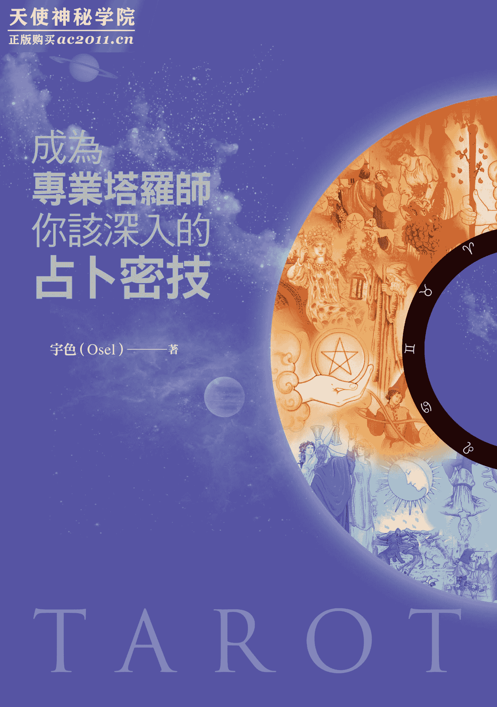
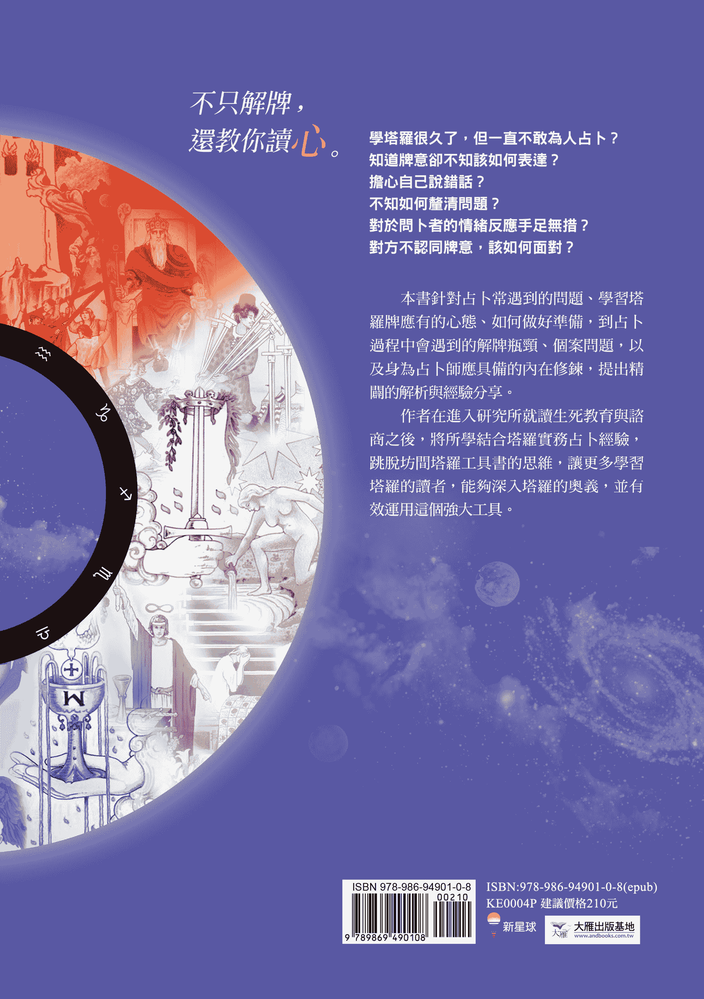

目次表推荐序一 不私藏的好书推荐序二 当巧克力开始融化推荐序三 同理心，让占卜师也能成为助人工作者推荐序四 提炼塔罗占卜的解读技巧前言 用心阅读塔罗牌，快速进入占卜实战 PART 1 初阶解牌能力别担心我这样解牌对不对看图说故事，运用你的直觉解牌发挥想像的创造力给个案安定感，让他产生改变生命的能量想像自己就是牌面人物练习用塔罗说生活故事用故事贴近个案不急着解牌，用感觉串联牌阵快速扫描牌面，串联讯息选择适合的牌阵灵活运用延伸牌，帮助你快速厘清问题发挥你的想像力，透视每张牌共同的关键点解牌没有标准答案善用笔记和事后的检讨从生活中训练联想力，增加解牌的直觉先观察整体牌阵，再解读与个案有关的细节 PART 2 进阶占卜实战成为专业占卜师的准备工作学习塔罗，一定要当占卜师吗？学牌很久了，还是不敢为人占卜，该怎么办？第一次为人占卜的心理准备不要执着于准不准，而是透过个案认识自己听自己的声音，训练表达能力生活经验丰富的占卜师，更能受到个案认同再专业的占卜师，也会有凸槌的时候业力从你开口的那一刻起你是占卜师，不是救世主决定自己是哪一型占卜师塔罗牌是解析潜意识的运作好能量提升占卜品质占卜不是无所不能 PART 3 高阶占卜沟通技巧占卜师与个案的关系引导个案告诉你，他自己该怎么做不强迫个案接受占卜结果帮助个案找到问题核心，并看到光明面真诚就能化解距离否认，有时是正常的心理防卫机转和个案一起讨论你的直觉解牌善用切牌，创建信任关系切牌可以点出个案的刻意回避赞美正向特质正视个案的感受被说解错了，就放下牌，听听他怎么说让个案信任你塔罗占卜师不是精神科医师个案哭泣时，晚点再递卫生纸不要承载太多情绪附录 伟特系列的塔罗老师不会跟初学者说的事学塔罗一定要认识的两副牌：伟特牌和托特牌从大、小秘仪与宫廷牌，进入塔罗世界熟悉难以捉摸的宫廷牌塔罗牌的四大元素，对应十二星座与九大行星隐藏在塔罗牌里的神秘学符号版权页

# 推荐序一不藏私的好书

南华大学生死学系副教授　廖俊裕

因为教学和辅导学生的缘故，塔罗也渐渐成为我生活中的一部分。在教学方面，写作课时，我透过塔罗来训练学生的联想力和叙事力，使用关系牌阵或问题牌阵，让学生抽牌来联想并发展为一个故事。在辅导学生方面，当学生在困扰烦恼之际，命理的介入往往比理性的分析来得有效与帮助。

命理自古来有两大系统——测命系统与测机系统。测命系统就是必须知道案主的生辰八字或姓名等资料来论命，例如八字、紫微斗数、占星学等。测机系统则不需知道生辰八字等资料，直接占卜测当下的“机”，例如《易经》、塔罗等。由于两个原因，我通常重视测机系统。一是，测命系统在解命盘后，如何改善乃至改变，命理师的建议很重要，因此命理师的主观生命涵养攸关甚钜。相对来说，《易经》的卦爻辞或是塔罗的建议牌，较为明确，对于命运的转变来说，有其方便之处。二是，由于命运是可以改变的，因此如何知道现在的“机”，乃至掌握、运用、回应当下的“机”便非常重要。在这样的情形下，又因为《易经》的卦爻辞是古文，一般人不易进入，相形之下，塔罗就脱颖而出了。

因为这些缘故，我的书架上陆陆续续也有了许多本塔罗书籍。我发现宇色的塔罗书籍之可贵，就是别人不讲的、藏私的，通常他都会讲。例如，许多塔罗书籍都会说到用土、水、火、风四大元素来作为解牌的原则，接着略微说明各元素的特色就结束了。国内颇有名以四大元素和数字学来做为解塔罗的某塔罗畅销书作者也是如此，随即进入牌阵解读。对于四大元素彼此间的相互关系为何，绝大多数的塔罗书籍都没有说明，这就造成读者无法充分利用四大元素进入牌阵的解牌中。人是在一个关系网络中的，牌阵之重要就是要透显关系。因此，知道单一元素的意义是基础，但彼此元素间的相互关系才是我们解牌阵时的钥匙。不讲四大元素间的相互关系，就会是很大的缺憾。宇色的塔罗书首作《学会塔罗牌的第一本书》，虽然，他谦称写得不尽理想，但在第一本书中，很少人谈及的四大元素相互关系，他就已论及，颇不容易。关于四大元素这部分，宇色在这本新书《成为专业塔罗师，你该深入的占卜密技》中，也有更深入的阐述。

这本书，大约有几个特色：

1.  把塔罗不只视为占卜，还扩大为神秘学。在《易经》的义理上，有句名言：“善易者不卜。”何以善易者不卜？因为已经洞察先机矣。何以能洞察先机，就因为他已经扩大到天人物我之间的神秘学。宇色这本书的可贵之处就是他不似其他塔罗书籍，局限在占卜上。他将塔罗由占卜工具扩大到神秘学，因此塔罗的占卜会是我们自我成长、自我扩大的过程，但不会变成依赖。
2.  融入心理谘商，由塔罗来强调自我的觉察和成长。宇色由于研究所攻读心理谘商，他善用这个身分背景，因此比起其他塔罗书籍，宇色把塔罗和个人的成长、觉察，巧妙的融合在一起。而所有的疗愈如果没有和静心观照、觉察结合，最终也枉然。这就是有人要不停的参加身心灵工作坊、谘商、算命之缘故。
3.  不强调硬记，重视直觉、直接的想像，可以扩大你的同理心、联想力。宇色这本书确实有一套教你直觉想像的方法来贴近七十八张塔罗牌，尤其是他利用荣格的原型概念放到二十二张大秘仪中，来看内在生命人格的展现，确实扩大同理、同情的能力与联想力。国内另一本塔罗译书《直觉式塔罗牌》标榜直觉式，读者如果深入其书，便会发现，他其实是重视牌意超过直觉的，他必须将所有牌意放入附录，作为读者解牌时的参考，正是此故。宇色这本书便不是如此，这也是宇色在书中强调象征学的缘故。
4.  对于宫廷牌的深入解释颇有匠心之处，很值得参考。宇色这本新书中，还有一个其他塔罗书所欠缺的地方，就是他详细论述了宫廷牌在解牌中的功用与意义。通常塔罗书中，把十六张宫廷牌和四十张数字牌放在一起，称为五十六张小秘仪。一般来说，四十张数字牌，可以运用四大元素和数字学（生命灵数学）来解释，但这并不适合宫廷牌，这就表示全部放在五十六张中，有其扞格之处。宇色特地把宫廷牌在各种场域中如何解释条分缕析，读者阅读了，将有很大助益。

我在看了多本塔罗书籍之后，还能读到颇有新意与特色的塔罗书，心中颇为喜悦，故乐意为之推荐。也愿读者阅读之后，都能如书中一开始所说，借由塔罗，将意识、潜意识显现，自我觉察、行动，完成生命的任务。

# 推荐序二当巧克力开始融化

教育学博士　徐孟弘

二〇一一年四月为宇色第一本书写序，记得那时我引用了“不管是黑猫白猫，只要能抓老鼠就是好猫”，为宇色以塔罗做为谘商历程中的手段与工具、以及为他在心灵产业所做的努力做注解。

二〇一四年六月再见到他，已是在他的硕士论文毕业口试会场，我却赫然发现，短短三年，宇色已经蜕变成为“黑白兼具、功能十足的好猫”了。我很欣赏宇色对助人工作充满热情，也很佩服他总是充满学习动力、毫无倦怠，并企图从塔罗、灵修、写作、网络媒体、学院派谘商等多向度，为助人工作打开一条更宽广的路。

在这本书中，宇色把学院派谘商助人技巧中的一些概念运用在塔罗谘商历程中，如关系的创建、积极的倾听、正确的同理心等等；也运用了多元智力理论、创造思考教学的原理在牌意的解释中，以及正向心理学的原则对当事人作正向的引导。至于在书中不断强调的“直觉”技巧，其实非常类似于精神分析学派所使用的语意联想；在佛洛伊德理论中，直觉与潜意识有着密切的关系，语意联想就是运用直觉反应去探索当事人的潜意识，尤其是防卫机转运作下的经验、动机与需求；而塔罗画面呈现与当事人的直觉反应，也非常类似罗夏克墨渍测验的原理。

我们可以清楚看到，宇色企图在塔罗谘商与学院派谘商之间，创建一条可以共通的道路；我想，这是宇色写作本书的重要目的之一。

本书的另一个重要目的是要引导塔罗学习者如何成为专业占卜师，当然，他所采用的方法就是上述学院派谘商的助人技巧等等概念。我的一位好友曾经努力学习塔罗一段时间，也曾打算以塔罗做为退休后助人工作的延续，但几年后却放弃了；我好友所面临的问题非常类似本书第二单元所描述的——觉得自己没有天赋、解牌常出现错误、无法给予当事人适切的建议、常会出现情绪的干扰，甚至引起自己和当事人之间的关系紧张等等。我想，许多塔罗学习者总是会想出千百个理由为自我设限，所以局限了自己在塔罗学习上的发展，本书第二单元的描述恰巧可以给塔罗学习者一个良好的启发。

正如我为给宇色第一本书的推荐序写到，“想认识振玮（宇色本名），是被他从歌仔戏演员到高级心理分析师的生涯历程吸引”；二〇一四年当他的指导教授告诉我，宇色这两年不但是研究生，而且还是网络电台的主持人；随后宇色告诉我，他正准备要报考辅导博士班或是学士后中医时，我无法忍住惊讶的表情：好令人佩服的学习动力！好精彩的生涯发展！

但，各位读者有福了！这样精彩的生涯发展与丰富的生命故事都成为建构本书的元素，读者可以在书中看见宇色以自己经验所举的许多例子。

而我，却也看到了宇色精彩多变的生涯发展，在每个阶段、每个角色的当下，就有如一块块的拼图，正在逐渐汇集而成完整的画面；每个阶段、每个角色也像一块块的巧克力，而这些巧克力正在逐渐融化，汇集而成为更为完整、也展现出不一样面貌的全新巧克力……

他将创造出自己的品牌！

# 推荐序三同理心，让占卜师也能成为助人工作者

南华大学生死学系助理教授暨社会工作师　王枝灿

在专业助人领域中，不论是心理谘商会谈或社会工作晤谈，塔罗牌是一项与求助个案创建关系与探索个案问题常见的好工具。作者宇色在这本新书中，将塔罗牌介绍与运用，分成初阶、进阶与高阶。并从占卜师如何协助对象解牌，运用塔罗牌在两者之间，教导读者如何创建安全与专业的关系。并让读者了解如何借由牌卡提供需协助对象的心灵支持与同理求助者感受。书中有一句很棒的话，借此与和我同样是助人工作者的伙伴一同分享：“身为一个好的占卜者，所需要的是同理心，而不是漤用慈悲心；过度的假性慈悲，会导致你承载他人不必要的过多情绪，那只会干扰你的解读。”将占卜者一词替换成任何专业工作者，都应秉持相同概念。在此，我要将这一本好书，推荐给每一位专业助人者，此书可以做为使用塔罗牌的重要工具参考书。

# 推荐序四提炼塔罗占卜的解读技巧

塔罗占卜师　小孟老师

作者运用心灵意识与塔罗牌原理在灵魂深处不断交流，以理性与跳脱塔罗牌思维框架模式，带领学习者在人生课题上发挥出不同层面之见解。当初学者首次邂逅塔罗领域时，就能由内而外体会解读技巧就埋藏在生活之中；同时给予资深占卜师添加更多生命科学、禅学、牌型投射密技，并且萃取出各门各派研究领域之精髓，以提炼占卜师个案分析能力。

# 前言用心阅读塔罗牌，快速进入占卜实战

竭力工作，心存善念。

——娜妲莉．高柏（Natalie Goldberg），《心灵写作》

最近在为“超直觉塔罗牌”课程的学员准备讲义时，才发现原来不知不觉间，我教导塔罗与心灵图卡已经五年多了。还记得第一次备课的紧张与不安，深怕学员无法理解充满各种西方神秘学符号的一张张塔罗牌。这几年来，我融合教学经验，逐渐摸索出一套以“**直觉联想为基础、牌意理解为辅**”的教学法。“超直觉塔罗牌”这门课，正是打开学员用直觉解析七十八张伟特塔罗牌，不用依赖授课讲义，更无需死背硬记牌意，就能充分运用塔罗牌的各种元素。

除了打开直觉联想，以及充分了解牌意之外，塔罗牌占卜还不仅如此。这要说起我在二〇一一年考上生死教育与谘商研究所之后，如同海绵般的大量吸收心理学、谘商、宗教学以及生死学等知识，并且将这些专业知识融入我的塔罗牌占卜和教学中。我看见塔罗牌占卜背后，有一个更宽广、务实且较少人触及的世界——也就是**成为一位优质而专业的占卜师，必须带着一颗良善的心，以及用同理的态度，陪伴前来占卜的个案。**我开始关注塔罗牌与人性关系的议题后，逐渐了解在迈向心灵主义者（psychism）*学习灵性事物的道路上，不可以一味仰赖自己与生俱来的天分与直觉；更重要的是，得在每个当下用心去体会占卜，并对所有个案都怀抱热忱。如果想让灵性从自己体内绽放光芒，一颗良善的心更是不可或缺的养分。

*　指的是信仰心灵、精神与灵魂为存在实体，存在于自然界与人肉体之中的一种唯心主义哲学观。

我在塔罗教学时也发现到，**认识塔罗牌最快的方法，就是直接面对个案、当下检视自己的心态，以及事后不断的印证解牌。**这远比花费大量时间阅读坊间塔罗牌工具书有用得多。无论你买了多少塔罗工具书、学习再多的牌阵、精读每一张牌卡的元素，都别忘了：塔罗牌的牌阵、元素符号、星座、色彩、卡巴拉树等神秘的西方符号学，大多是前人领悟出的智慧结晶，融入塔罗牌，方便后人学习而已；最终的占卜战场仍在你为人占卜的那一刻。换句话说，你越早脱离边看书边解牌的模式，越有机会进入充满灵性、知性与感性的神秘塔罗牌世界。

大脑与心最大的差别，在于大脑总是用对错、是非、好坏等二元对立来思维，唯有舍弃大脑思维，才能进入心——心才是与宇宙链接的一道门、一扇窗、一把钥匙。进入宇宙世界的唯一法门，就是跳过大脑思维，用心链接。

相信你阅读这本书时，书柜上至少已经有超过三本以上，甚至多达十几本的塔罗牌工具书了。这证明阅读再多的工具书，都无法让你成为一位真正称职的塔罗牌占卜师，不是吗？让初学者进入塔罗牌占卜的最佳学习方法，并不是阅读一本本塔罗牌工具书，而是回到前来占卜的活生生个案身上。坊间塔罗牌超过上千种，不论哪一种，都是协助我们更了解个案、解析个案，进而能给予个案另一种不同的解读，让他们有能量面对自己内心的疑惑。

这本书不是要教你如何熟记塔罗牌的牌意，而是如何透过个案，了解每一张牌的可能性。**我要分享的是，如何透过观察以及占卜师与个案之间的互动，快速的联想到牌面的更多线索。**就像心理谘商的基本态度：“**病人不是病人，我们是以关怀的立场陪伴个案走过人生低潮期，同时又和他们之间保持着人与人的关系。**”换言之，也就是视病犹亲。这是我成为专业塔罗牌占卜师的心得，也将这句话送给每一位正在阅读这本书的你。

## 如何运用这本书？

本书共分为三个单元与附录，每个单元都可以独立阅读。如果你现在的塔罗牌解牌能力是“基础以上，资深未满”，希望你按照此书的编排，从初阶、进阶到高阶篇，逐一阅读。如此一来，可以帮助您厘清一些重要的占卜观念，跳脱硬背牌意的死胡同，从生活中撷取解牌技巧，成为专业的塔罗占卜师。

这本书不仅非常适合初学者阅读，同时也非常适合已经开始收费的占卜师。如果你的塔罗牌占卜资历已经超过三年，建议可以直接阅读高阶篇。许多占卜师大多拥有不错的解牌与占卜能力，但常因与个案的互动拿捏不当，造成不必要的问题，甚至失去个案的信任，进而影响了占卜准确度。我在高阶篇分享了许多占卜师的对谈技巧、与个案的互动方式，都可以帮助你增进与个案的关系。

另外，如果你对于伟特系列塔罗牌已经有基础解牌能力，但对于一些西方神秘学的符号元素尚不是很清楚，你可以先阅读附录［伟特系列的塔罗老师不会跟初学者说的事］，可以帮助你快速了解隐藏在塔罗牌背后符号元素的重要讯息，认识西方符号元素对解读塔罗牌是一件非常重要的学习课题，再回头从第一单元开始阅读起。

# PART 1 初阶解牌能力你一定要懂的激增解牌小技巧

无论男女老少，大家的首要问题并不在于学习，反而是在于如何抛弃所学。

——葛罗莉亚．史坦能（Gloria Steinem）

除了认识塔罗牌牌面之外，**初学者最须克服的心理障碍，是要勇敢的踏在塔罗牌之路，走向认识自己的心。**我在教导初阶课程中，学员的心如同经历审判牌，不断丢掉传统世俗的包袱，这对初学者而言是很大的挑战，就像一位上过我初阶课程的学员说道：“经过初阶课程的洗礼，让我体验到人的潜力是可以被挖掘出来的。”

## 别担心我这样解牌对不对

我常对塔罗牌学员讲一句话：“**将塔罗牌占卜当成助人的工作，你必须先学习如何透过塔罗牌与自己对话。**”每一位学员来上课的动机都不尽相同，有人是想要成为职业的塔罗牌占卜师，有人是想要学习不同的解牌技巧，有人则是希望透过解牌认识更多的朋友。无论学习塔罗解牌的动机为何，**在为他人解牌之前，都必须先有一个体悟：我们一生是为了完成、清楚此生的人生课题而来。**

每个人此生的人生课题各有不同。有人一生常受情感困扰，有人陷于亲情关系的纷争，有人则一直有财务和事业问题……课题也可以说是“情结”。何谓情结？知道却做不到的是情结，看到问题却不知该如何着手是情结，想放下却更执着的也是情结。当我们能透过种种方式完成、清除自己的情结时，才能容纳更多别人的问题——容纳并非装载，而是有更多的能量去倾听、观察到他人的课题。这部分我与大家一样，都还在学习。

为人解读塔罗牌，不是创建在“我高你低”的不平等立场。荣格曾在自传中提到：“全世界没有一个人需要被他人治疗，真正需要被治疗是自己。”这句话充分提醒每一位助人工作者，面对个案时，**助人工作者应有的态度是陪伴，而不是疗愈，真正疗愈的人是个案本身，唯有看见问题的人才能够走出问题。**

我在教导“超直觉塔罗牌”这门课程时，让学员看见解牌不只是对牌面基本牌意的理解而已。如果只透过理性去解读牌面，日后在占卜时必会发生一个瓶颈：当不同的个案、询问迥异的问题，却出现相同的牌面时，占卜师只会说出差不多的解读。如此的窘况来自于学牌一开始就是使用理性、惯性、文字的方式，这最大的问题是缺少了对生命的链接。

我常常遇到初学者问我一个问题：“我这样解牌对不对、好不好？”其实，我们也常用这样的态度看待世界，无论是阅读一本书、观赏一部电影、认识一个人……都立刻浮现对错、好坏的看法。但是，我们的认知都是客观的吗？

以心理学角度来看，每一个人的观点背后都潜藏着自己主观的看法。塔罗牌的解读者不是圣人、救世主，当然，有时难免会陷入自己的认知窠臼。当你走入塔罗牌世界中，需要时时刻刻提醒自己：“**塔罗牌世界是全方面的呈现，它无法告诉你人生仅有一种选择，所以它没有对与错、好与坏。**”

占卜师仅是具体的呈现塔罗牌所要传递的讯息，至于个案要怎么做，就留给他自己去选择吧！

塔罗解读小密技

塔罗牌世界传递的讯息不是二分法，它不会告诉你人生只有一个选择。如果你想真正的领悟这个道理，可以试着将发生在生命中的一切事物与自我生命做链接，而不是只一味的批评与抱怨。我常常鼓励一些有强烈批判态度的塔罗牌初学者，试着在观赏一部电影、阅读一本书、面对一个事件时，不要只是快速的批评它的好坏、对错，试着想一想，你现在所经验的事情是否勾起你生命的链接。

执着于对错，最终吃亏是自己。那些被你指责的人事物，并不会因你的批评而受到任何影响。有时候，批评只是让自己陷入更大的业力漩涡，而要跳脱业力法则，需要学习从对错的二元思考里解脱，从生命中去看见更深的事物。

为了避免我们在占卜时带着二分法的观点影响个案，最好的方式是在想要评断一件事情前，先学习去看见背后的另一个声音。

## 看图说故事，运用你的直觉解牌

对于很多塔罗牌初学者来说，单张解牌并不困难，毕竟初学者或多或少都知道每张牌的牌面意思，较有难度的是如何将牌阵所有的牌串联成一个故事。

在我的教学经验中，常遇到初学者急急忙忙进入解牌程序，最后思维却卡在牌阵中出不来。我会叮嘱初学者：不要马上跳进去牌阵，会非常容易迷路。避免迷失在牌阵，最好的方法就是——**先看看你对整体牌阵有什么感觉，再看看牌中人物、牌卡背景色等，先对牌有感觉再进入解牌；如果对牌阵丝毫无感，就不要冒然进入解牌程序**。毕竟，对牌没感觉，怎会有好的解牌呢！

单张解牌之所以并不困难，是因为多数人是从大、小秘仪的单张牌认识塔罗牌世界，学习单张解牌的方式都是运用记忆力，例如力量牌代表力量、以柔克刚；宫廷牌宝剑侍者，则是代表新讯息、监视、探听、刺探等。但在我教导超直觉塔罗牌课程中，一开始就要求学员不可以翻阅讲义，这是为了避免学员产生以左脑学习塔罗牌的错误认知。简单来说，在初级塔罗牌的课程中，你不是将复杂、难以理解的文字，一字一句的塞进你的脑袋里，反而应该**看着每一张塔罗牌，借由塔罗牌中的人物、穿着、姿态、人与人互动、星空、天气等，学习“看图说故事”的能力**。

塔罗牌不是天马行空的胡言乱语，它是依据图面上的种种元素，刺激、启发直觉的线索。据临床研究发现，看图说故事可以刺激一个人的直觉力有所依归。借着观察以及对于画面的理解，整理出一条清晰的思路，激发想像及思考力，让人们的言语、表达、沟通有系统的连贯性，可以言之有物，进而言之成理。请你记得：**塔罗牌是以图像呈现故事，并不是用文字。所以你要运用的是右脑，而不是左脑**。左脑掌管人的理性、自我、并且强调自我存在的小我意识；学习塔罗牌真正要运作的是右脑，它是负责图像、抽象感觉以及人体对周围事物的五感链接。

学员在上课间对于不了解的牌面，常会不由自主的拿起讲义，这个小动作充分的代表**当人们感到无知时，左脑意识会立即希望找到依靠**。左脑意识需要有安全感与依靠，它不能放空，一定要有所选择；不论选择是否真正有利于自己，它惯于从选择中找到最安全之处。学习塔罗牌，绝不能只使用左脑意识，也就是一直依赖塔罗牌工具书，反而是要追随自己的心，相信直觉。

假使一开始你学习塔罗牌的方式就是一边看牌、一边看讲义，这只会用到负责左脑的记忆语言与逻辑区块，而忽略了右脑直觉与创造力区块。建议你开始学塔罗牌时，暂时先不去阅读大量工具书教导的牌意，先试着从塔罗牌上的种种线索，以自己的语言、理解和感觉，去描绘出你眼前的塔罗牌画面。最好能先将自己的生活，套入牌面，生动的描绘成一段故事，或是将牌面上的关键字逐一的加入故事中。举例来说，二十二张大秘仪中包含了十二个星座，如果你是射手座，它对应的塔罗牌是节制牌，初学者可以先看着节制牌说出你的感觉，并想一想，你口中所描绘的节制又与你的个性有什么关系。这样也是不错的自我训练方法。

塔罗解读小密技

多认识西方神秘学符号以及西方神话故事，有助于解牌以及认识塔罗牌世界。塔罗牌牌面隐藏许多符号元素，它们并非毫无意义，而是传递个案的讯息，以及链接你与个案潜意识最佳的途径。每一张塔罗牌都是由多种神秘学符号所构成，这也是塔罗牌最令人感到神秘以及吸引的地方。

希腊神话、西方世界对星座的神话故事等，都是帮助你进入塔罗牌世界的钥匙。不要忘了，塔罗牌是西方文化的产物，它浓缩了西方世界中的文化、艺术、神秘学、符号等元素。如果你想要用塔罗牌占卜，以上这些元素都不容忽视。在附录里，将带领你认识塔罗牌最常出现的隐藏元素符号，了解它们，就能更加认识你所不知道的塔罗牌世界。

## 发挥想像的创造力

占卜时，没有“感觉”怎么办？其实更可怕的是在教学中对学员的抽牌练习完全没有感觉。毕竟，大多数来占卜的个案对塔罗牌认识并不深，他们在意的并不是牌，而是占卜师。占卜师在解牌当下没有感觉，还有很多种方式可以和个案互动，不仅可以克服对牌没有感觉的问题，甚至可以让占卜有一个圆满的落幕，这些占卜的进阶方法，我都会在后面文章一一分享。然而，当教学时遇到无法为学员所抽的牌解牌时，就不能这样处理了，毕竟教学就是要无私的分享解牌密技、解牌逻辑，以及如何抱持一颗中道的心诠释牌意。我也不是一个把塔罗牌当麻吉，每天抱着牌不放，事事和它交谈的人，也曾发生过没有接触塔罗牌一阵子后，在教学或是为人占卜时，出现思绪卡死的状况。

毕竟人不是机器，每天眼睛一张开来，总是为柴、米、油、盐、酱、醋、茶这些事所烦心，再加上七情六欲与种种无常，在生活中未常持正念的人，想要拥有一颗平静的心并不容易，**为人占卜或塔罗教学时，最重要的准备功课就是“静心”**。静心与直觉就像天秤的两边，唯有取得平衡，两者的力量才能够彰显。心不够平静，直觉无法发声；而心过度平静到如止水，直觉力也就沉默不语。静心不是什么事都不去想，静心比较像是脑神经放松的状态。也因此，多年来为人占卜经验养成我只要时间允许，必定会提前到占卜地点，静静的观照呼吸后，再开始为人占卜。接下来的时间就是属于个案一人所拥有，所有恼人的事情都暂放在门外。

我们身体的肌肉在无意间总是紧绷的，不信的话，你保持目前的动作不要动，然后从头到脚仔细的扫描身体，观察目前哪个部位的肌肉最僵硬和紧绷。如果你是一位习惯将心事放在心头的人，或许此时最紧绷的部位是肩膀；如果你是一位习惯在做事时不断反思的人，眉头或许是最需要放松的部位。观察到了吗？身体的肌肉常常会在不知不觉间显露出我们的生活习惯。我们的生活习性在不知不觉间影响着身体的每一块肌肉。其实，较不容易被人察觉到大脑亦是如此，脑神经回路也有惯性。要让自己的大脑像做一场非常舒服、宁静的 SPA，最好的方法就是深呼吸。借由观照呼吸，让每天为生活琐事打转不已的脑神经放松下来，尤其是在紧张与不安时，可以透过更专注的深呼吸，缓和情绪以及放松脑部压力。

**直觉较弱除了是因为心不够宁静，脑神经乘载过大之外，另一个原因是对抽象事物的表达能力不足。**简单来说，就是对图像、符号、绘画、色彩等，没有更多的觉察和觉受，所以表达力才会贫乏。例如，有人看到红色，可以滔滔不绝的形容出它的情绪；但在有些人眼中，红色就是一种颜色而已，他无法透过拟人化的方法述说颜色的生命力与个性。其他物质都是如此，无论一朵花、不同的温度、变化万千的大自然、或是穿着服饰等，都可以说出一篇篇精彩动人的故事来。**缺乏说故事能力的人，说穿了，也就是缺乏想像力。**

你看看小孩子怎么玩玩具？他们最常玩的游戏是什么？你会发现小孩子可以替玩具编织丰富的对话，一只手拿着绿巨人浩克，另一只手拿着海绵宝宝，用两个处在完全不同时空背景的公仔，鲜活的演出一齣“浩克大战海绵宝宝”的戏码。你有观察过小朋友用洋娃娃与家中宠物如何互动吗？他们可以让手里的洋娃娃与宠物来一场在大人眼中是无趣至极，但在小孩世界却是充满乐趣、好笑的对话。这些现象，都是人类与生俱来的能力，可以将非生命与生命体拟人化，只是随着我们年纪的增长后，这些能力却逐渐的被我们遗忘，甚至完全丧失。

当你开始进入塔罗牌这一门神秘学时，不管你所使用的牌卡是伟特系列，或是其他心灵图卡，**请尽量运用你丰富的想像力，链接、诠释各种与牌面有关的故事、情节**。尤其是在学习初期，不要死板的拿着塔罗牌讲义、书籍，当成考试题库死背硬记，或是深怕讲错话而不敢说出自己对牌面的看法。在学习的路上，也千万不要过度指责、怀疑你在直观之下，对牌的链接和感受。

当下的一切，都是你体内的心轮能量、内在大我与宇宙能量彼此细微的链接。**人类无限广宽的想像力是一种创造力量，它是打开神秘学领域的一把钥匙**。

塔罗解读小密技

你看到花会联想到什么？看到太阳会联想到什么？你可以联想五十个与河流有关的词汇吗？

当我从事品牌企划的工作时，每周总是要撰写十篇以上甚至二十篇文案。每一篇文案，我必须创造超过二十个发想，最后交给主管一个精华版。我希望能快速打开文案发想，报名不少文案企划的课程，并阅读国内外不少文案高手的著作。想不到这样的密集训练，也打开了我的直觉力，后来充分运用在塔罗牌占卜上。

直觉不是通灵，它不是无中生有。就像一篇好的文案必须运用所有的联想力，它将所有看似无关的名词、形容词统统串联起来。透过联想力的训练，也可以激发直觉力。如果你想要增加自己解牌的直觉力或是联想力，建议你可以多阅读坊间关于如何训练联想力以及撰写文案的书籍。

## 给个案安定感，让他产生改变生命的能量

大多的牌卡占卜师会在驻点的占卜处营造一股神秘的气氛，布置水晶球、装点紫色纱布、点上几盏蜡烛、焚香或使用精油，身穿波希米亚风或其他具有异国风味的民族服饰，用慢条斯理的口吻说话，增加占卜的效果。但最重要的，其实是占卜师说话的态度。

作一位职业占卜师，入门门槛看似简单；但要成为一位专业且深受个案信任的占卜师，却着实不容易。除了要有基本的准确度之外，占卜师必须谨记，自己在占卜所说的每句话是否给个案一种安定感。**安定感的另一层意义是：不介入个案的生命历程，言语中不带着恐吓、威胁的字眼。**

个案的未来已经被牌面注定了吗？我认为人活在世间最大的价值，就是可以改变未来。**一位良善的占卜师，可以点出个案的问题，再进一步引导他去思考这个问题是否有另一种全新的可能性，而不是点出问题后，却再拿一个更大、更沉重的框架罩住他。**

在我占卜经验中，说出相当准确的结果，例子不胜枚举，无论是生子问题、换工作、招募到合适的员工等。有一次，我曾精准的占卜出个案大约何时能找到新的员工，而且透过牌面还能看出这名员工的样貌、年纪、工作心态。当然，也有预测结果与占卜牌面相差甚远，对此我也不会感到挫折，因为我的出发点是良善的，准度虽然不如预期，何必去过度苛责自己？我会回头检讨，将预测失准的牌面与个案告诉我的结果再一次比对分析，思索两者相异之处，充实我个人的解牌经验。

此外，占卜的当下，就打开了潜意识的大门，会改变未来的结果。荣格曾说，人除了主观的个人潜意识之外，人类心灵在更深处还有客观的集体潜意识。荣格认为，没有一个人出生时是空白资料，集体潜意识就像是一个先天的资料库，不仅承载着我们出生时的祖先记忆、习气，同时还不断的加入了今世的新资料。所以出生在同一家庭的兄弟姊妹，虽然受到同样的祖先集体潜意识，成长后开始了全新的生活模式，不论是宗教信仰、阅读、社团、社交等等，也都在改变我们的集体潜意识。个人潜意识与集体潜意识是相互交叠与影响的。

我在多年的塔罗牌占卜经验中发现到，**当个案相信占卜时，当下的能量不仅会打开他的潜意识大门，同时，占卜师从阅读塔罗牌时得到的讯息和建言，也比较容易影响他的想法。**

如果你了解上述逻辑，就会更清楚下面这句话的意思——“**思想创造世界，世界反映内在的想法。**”原本，来占卜的个案未来的路是被自己的旧思维所铺排，但当你为他解惑时，当下就已经开始改变了他的思想，于是他的新思维也改写了原本旧思维下会开展的未来剧本。

此外，还有一个重要的观念：假使占卜师无法学习打开自己的五感，就不太可能看见个案的问题。想要真正的体悟思想创造世界，世界反映内在的想法，**占卜师本身也要不断自我提升灵性，将自己回归到内在世界。**

我常常提醒学员：**占卜时不要将话讲死，更不要让个案离开时，对未来没有希望**，那不是一个具正信的占卜师应该有的行为。占卜师就牌面所见也仅是片面之见，无法断定个案的全部人生。人生是充满复杂且环环相扣的过程，占卜仅是放大某一环节，占卜结果也并非坚固、不可改变。个案有权接受占卜的所有可能性。一位良善、具正信的占卜师，要能从塔罗牌的牌面窥探事件的各个面向，并给予中立、客观的建议，至于接受与否，仍是回归到个案本身的选择。

塔罗解读小密技

“趋吉避凶”是占卜的基本原则，不要随意将个案的问题一语定生死。建议你可以多多使用建议牌，不论你使用的牌阵是时光之流、身心灵牌阵、问题选择牌阵等，都可以在牌阵摆好后，再加上一张建议牌。这张建议牌代表了如何带领个案往更好的层次成长，也可以给予他心灵的力量与鼓励。

一位正信的占卜者不应该被牌面误导，误认个案的问题仅有一个选择而已。多多运用建议牌，它可以协助占卜师从个案看似不易改变的人生格局中，找出变易与简易的可行方案（参见第一五〇页）。

## 想像自己就是牌面人物

我在学习塔罗牌初期遇到最大的瓶颈，是无法熟背一大叠讲义资料对牌的解释。无论讲义写得如何详尽，我总是无法将它运用在占卜中，后来才发现不只我有这种情况，许多初学者买了一大堆塔罗牌工具书，最后却成为书架上的摆设品，根本不可能精读每一本书的内容并实际应用。

在我的脑袋里，数字、文字、图像、符号、颜色都是独立的元素，它们鲜明的活在各自的世界中，彼此间缺少了让之有关联性的连系媒介，就如同一部没有键盘与鼠标的电脑，就算主机安装了顶级的软硬件，依然无法将它发挥到最大效用。

我开始反向思考：我该如何融入塔罗牌世界？我该如何既不丢掉塔罗牌基本的元素，又能够将这些元素放进我的占卜？我想到的方法就是先跳脱讲义与书籍里的每一个解释，不再拘泥于文字的框架，**尝试将塔罗牌牌面里的图像幻化成一个个鲜明且具象的人物，我以内在心灵与他们对话。**

想像我就是牌面人物，穿着相同的服装，配戴一样的饰品，手里拿着那些象征物，坐在他们的坐椅上……当我化身为他们时，会有什么想法呢？先不去管书上如何解释每张牌意，我就是投入每张牌面人物中，以我当时产生的感受来诠释。透过与他们的深层对话，我找到能够与他们链接的占卜意识流，打开潘朵拉宝盒。

您曾看书看到废寝忘食过吗？你曾望着风景而忘我过吗？这种忘我的状态就是“无意识”。**初学者会花很多时间思索、记忆牌意，这就是“有意识”的解牌。我找到一种“以无意识进入意识流”的解牌方式，很自然的就能脱离主观意识，脱口而出当下的想法。**当我放下死板板的牌卡字面解释，练习以冥想与牌中人物相连在一起，运用观想的力量，便能打开非意识状态。此时，讯息会从四面八方涌入心灵。这种解牌方式就像是娜妲莉．高柏所谓的“心灵写作”*，心灵、手与灵感有了最亲密的接触，从陌生到熟识，从相知到相惜，融为一体而不再有隔阂。手不再不知如何下笔，它只是心灵与灵感交会后的自发行为罢了。当心灵与觉知就定位，自然而然的，手便能写出最适合的文字。

*　娜妲莉．高柏出版一系列心灵写作，包括《心灵写作：创造你的异想世界》、《狂野写作》、《疗愈写作：启动灵性的书写秘密》等书。

举一个我跳脱塔罗牌原意，以占卜意识流为个案解牌的例子：

有一名个案询问我，何时她才有机会再生第二胎。牌阵中出现了圣杯六，我直言她受孕的机会很大。另外，她所抽出的牌阵中有一张是宝剑二，就牌面上的定义为对立、紧张、压力、难以达成的任务、逃避……我告诉她：“可见得受孕带给你很大的压力与负担，甚至想逃避。”正当说着说着，我心中出现一个直觉：“她有流产过，而且是在工作最忙碌时发生的。”虽然没有任何一本塔罗牌工具书载明宝剑二与流产有关，我还是把当下的直觉告诉她。向她求证时，她却否定了这点，“如果我曾流产过，怎么会自己不知道？”

我并不恐惧说错话，而且我也不是一位会与个案争辩的占卜师。

过了一阵子，她再度预约占卜，告诉我，过不久她才发现，原来那时她已经受孕了快一个月，只是还没发觉。而且也想起一个遗忘许久的回忆。多年前她曾有一次流产的经验，但因受孕不足一个月，小胚胎只是随着每月的经血流掉了，又因为忙于工作，也没有太多心思关注。过了许多年后，我是第一个再询问此事的人，因为连她自己都忘了，才会否定了我的看法。

这些以跳脱牌面意思却能直入人心的事情，在占卜与教学中屡见不鲜。再举一例，在一次教学中，学员抽出宝剑三询问过往的创伤，脑海中一闪而过的是情感，我进一步询问她的感情状况、分手多久时，她落泪了，述说深藏心中多年的感情事情。宝剑三并没有单指情感，当下我只是凭借着直觉以技巧性方式询问学员而已。

这些事情教导我一个重要观念：**塔罗牌是带领我们探索全然未知的世界，它是超乎常识与意识之外，无法被任何人所定论。**我常借由这些例子，提醒学员不要被工具书、讲义绑死了。同样的，也千万不要因为这个故事，便把宝剑二与流产硬绑在一起。

当我进入占卜意识流的状态时与娜妲莉．高柏的“写作创意流”是相同。这时，讯息来得又快又急，大脑已经跟不上意识流的速度，唯一能做就是放空大脑的理性思考，让讯息自然而然的流泻出来。塔罗牌牌面不再是一张张硬邦邦的图像。它帮助我连接了大脑潜意识，所言、所看、所听，都能自然的表达出来。这些讯息就像一直都属于我的意识、想法与观念，塔罗牌只是链接大脑、内在与大宇宙的桥梁，待一切就定位，塔罗牌退居幕后，仅剩我站在大舞台的聚光灯底下。

教导超直觉塔罗牌课程，最大的挑战是如何激发出学员的直觉力。直觉对于生活在二十一世纪的人们，更显重要。直觉联想与同义复词、画面联想，都是我最常用的几个技巧。在超直觉塔罗牌的课程中，技巧与理论并重，而技巧往往并不是最关键的一环，毕竟它可以由任何方法来取代，只要学员用得顺手。超直觉的联想，与日常生活有着密不可分的关系。压抑、否认、没有自信等，往往是超直觉联想最大的阻碍者。

塔罗解读小密技

想要训练自己能在占卜随时进入塔罗牌世界，打开占卜意识流，最有效的方法就是“积极联想”，或称为“主动想像”。

主动想像有许多形式，有人是把自己看到的意象画出来或雕塑出来，有人会以舞蹈表现，有人则谱成音乐。我自己使用的方式是自我与内在人物的对话或交流，这是我找到最理想、最适合我的方式。内在人物是将我们企图打开的潜意识内容的人格化。将塔罗牌中的人物人格化，便能和自我交流，交换讯息。要和内在人物对话需要一些练习。一旦做到了，便像是心灵对话似的，讯息源源不绝的涌至。

或许你不知道如何想像，这时就可以运用你手上的塔罗牌来进行交流。不要忘了，塔罗牌牌面的人物就是一种你我内在的原型。你可以试着随意抽出一张牌来代表更高层次的你，想像牌中人物的表情、穿着等，心中默问你的人生疑问，试着聆听塔罗牌人物会告诉你什么。我常常在课程使用这种训练方式，帮助学员快速打开直觉力与想像力，同时让学员学会占卜意识流。

## 练习用塔罗说生活故事

哥本哈根未来研究学院院长洛夫．简森（Rolf Jensen）曾说：“创造以及诉说故事的能力，是二十一世纪企业必须拥有的最重要技能。”提出多元智能理论的霍华德．嘉纳（Howard Gardner）也说：“人爱听故事，也是天生的说故事能手。”为什么人类喜欢说故事、听故事？

**人脑的先天构造，画面往往比文字、数字更容易产生共鸣与记忆**，例如最常听到的超强记忆法、英文速记法等，都是运用图画结合文字、声音的技巧，帮助记忆英文或其他讯息。说故事的人，巧妙的以各种譬喻将所要传递的讯息融入故事中，幻化成听者所能了解的各式各样物件，刺激听者已知以及未知的联想力，借此达到听故事者的反省能力以及彼此沟通。

安奈特．西蒙斯（Annette Simmons）在《说故事的力量》提及：“故事最惊人的力量发生在故事说完后，随着故事在听众心中回荡、发酵，并在听众心中烙下难以抹灭的印记。”由此可知，善于说故事的人，不仅能够以故事情节打动人心，同时能让听者从故事中反省自己。说故事的技巧，在于要让听者产生共鸣，同时故事的譬喻要贴近听者的心路历程，以及让他们感到所要传递的意涵可以被执行。简单明了的故事，直入人心，宛如醍醐灌顶般，给予听故事的人一股深刻的反省力道。

如果你看着牌面，仍然无法流畅的“看图说故事”，这里提供你几种练习的方式：

### 1\. 用说故事方式，阐述今天的塔罗牌日记

一大早起床时，抽出一张代表今天运势的塔罗牌，抽出后放在塔罗牌最上面，先不要看。直到就寝前，才翻开早上抽出的这张塔罗牌，并将今天所发生的种种，套入这张塔罗牌的故事内。

例如，当你看到教宗牌，画面上有一位主教端坐在椅子上，前面有两位留着发圈头的修士恭敬的站（或跪）在主教前方。你可以练习说：“教宗给我的感觉是神圣不可侵犯，有着一成不变、传统的制约，我现在的生活就好像是跪着教主前的两位修士一样，遵守着某种教条过着重复的生活。眼前的主教，以及两旁灰色的柱子，都让我感到像是不可轻易动摇的象征。今天就好像是这张教宗牌一样，我有许多想要改变的事情，但是一些制度以及潜规则，都在暗示我要去遵从而不是改变。”

### 2\. 以塔罗牌特有的关键字，加入故事题材

翻开坊间不少的塔罗牌工具书，你会发现到，除了作者本身对于塔罗牌牌面的诠释之外，更重要的是，大部分塔罗牌的解说都会有许多同义词，例如权杖七是冲突、争斗、竞争……学习塔罗牌最好多理解每张牌的关键字，而不是阅读冗长的文字叙述。在我所教导的超直觉塔罗牌课程，并不是要照本宣科的背下所有冗长的文字，反而我会在解说时丢出一些牌面的关键字，以辅助刺激学员的直觉联想力。

对塔罗牌初学者而言，相较于详尽的解说文字，关键字更加有助于直觉力联想，详尽的说明反而会扼杀对塔罗牌天马行空的创意联想。毕竟，站在“每一个人都是世界独一无二”的观点，学习种种灵性课程的人都应该去激发自我想像的能力，而不是背诵任何人对世界真理的诠释。

塔罗解读小密技

使用塔罗牌前是否要进行净化仪式呢？这在每一次塔罗牌教学中常有学员询问。

我认为塔罗牌是人与人之间沟通的工具，重点是人，工具只是辅助之用，因此，所谓的牌灵、净化等，在我教学过程中很少出现。有次，一位具敏感体质的学员告诉我，他回家为人练习占卜时，竟看到一股如烟般的能量体从牌面涌出。以我个人观点来说，能量必须依附在物质之上，而能量流动与强弱又与人们的意念有很大的关系。举例来说，水晶本身具有能量，在没有人类意念操作的情况之下，它本身能量体是呈稳定状态，而人类的意念结合了水晶时，它的能量便会被开发与启动。换言之，塔罗牌是纸牌，亦是一种物质，当你不使用它时，它只是一叠绘画精美的牌卡，当占卜师开始懂得使用它为人占卜时，经年累月之下，牌卡不可避免的会沾黏占卜师与问卜者的意识与能量。

虽然如此，但我不认为应该过分强调塔罗牌净化仪式。一则，能量本身是流动的，常常使用塔罗牌便会促使其依附的能量产生变化；二则，一位正信的占卜师本身便具备相当的正能量，在为人占卜时能促使牌卡上面的能量变化。换一个角度想，人类的能量无穷，不应该被小小一副牌卡所局限。真正需要关注的是人内在的意识、精神、思考，是我们赋予了牌卡生命，不应该本末倒置的忽略了人的无限可能。我在教学塔罗牌过程中，从未过度强调牌灵与净化仪式，反而希望学员花更多的精力钻研沟通技巧、牌卡认识与关心个案。这么多年为人占卜的经验中，也从未净化牌卡，至今，它也从未影响到我的解读。也因为我并不过于诠释牌灵或牌卡上的能量，得以有更多时间研究塔罗牌其他的“外挂系统”，例如牌卡历史、西方神秘元素等等。

对于塔罗牌能量的问题，假使你觉得牌卡使用已经不顺手或是过于老旧，有一些占卜师会建议直接换副新的牌卡，如果你也曾发生像我那位学员一样亲眼看过牌卡上的能量，或许适度的净化仪式会带给你心灵的平静。但我还是必须强调，塔罗牌要不要净化？答案因人而异，而不过于诠释才是中道。

## 用故事贴近个案

占卜师想要在占卜过程，适时说出一则适合个案问题的故事，绝对不可能凭空而来，除了多涉猎寓言故事、阅读相关书籍之外，最主要的是选择的故事题材，能辅助自己独特的占卜风格。以我为例，不少来找我占卜的人，大多是看了我的前几本书——《我在人间与灵界对话》、《我在人间的灵界事件簿》、《我在人间看见拜拜背后的秘密》等。他们大多知道我除了是塔罗牌占卜师之外，也涉猎佛家、道家、心理学、沟通技巧，以及灵修等。因此，我在选择故事方面，常会举一些浅显易懂的佛传故事、心理谘商前辈的个案，以及平时收集的占卜案例，帮助个案从这些故事去反思本身的问题。

在解牌过程中，如何找出适合的故事穿插，我有以下几点心得：

1.  **通俗浅显。**电影和戏剧是现代人最接近的故事题材。我常常会提供个案一些片单，毕竟因为占卜时间有限，过程中无法花费太多时间解释剧情。对于人生没有自信，不知该如何激励自己的人，我会建议他们观看《三个傻瓜》、《当幸福来敲门》、《翻磙吧男孩》、《海角七号》、《扶桑花女孩》等；找不着人生方向，已经惯于随波逐流却不断抱怨人生的个案，我会建议他们去看《扭转奇迹》、《心灵投手》、《永不妥协》、《斗阵俱乐部》等；不相信命运掌握在自己手上的个案，我会建议他们去观看《今天暂时停止》、《命运好好玩》等；想追求灵性成长，却苦不知如何着手的朋友，《深夜加油站遇见苏格拉底》、《小太阳的愿望》、《阿凡达》等是不错的片单。
2.  **从你有兴趣、擅长的题材寻找。**不要说你不擅长的故事。我除了以佛传、灵修、其他能激励个案的故事之外，最常举的，就是其他个案的实例。因为是真实发生的故事，容易引起个案的共鸣。在我所主持的网络电台节目《宇色心养生》以及《宇色看世界》*，曾经调查最受欢迎的单元，意想不到的是，听众票选最高的是“问事实例”以及“真人真事鬼故事”。此外，因为我曾任职于餐饮集团的企划部，就有不少激励人心的实际工作故事。总之，身为塔罗牌占卜师，最好不要满口的占卜经，要能够从生活中找到一些真实的故事。当你想要借故事的力量打动、敲醒个案时，才能适时派上用场。
3.  **你所选择的题材能感动人吗**？在我所开设的塔罗牌与其他心灵成长课程中，常常会举许多真人真事故事，原则是真实又能够引起我的共鸣。如果它无法打动说故事的我，那怎么能在占卜中打动个案的心呢？初学者收集素材最好的来源就是从个案身上所聆听到的故事，每一位个案的亲身经历都非常动人与贴入人心。尤其是透过占卜师带领个案看见人生困境的另一种声音，陪伴他们走过一小段的人生低潮，这些故事都是值得被记录下来。我在占卜时，常常分享一些与这位个案人生疑问有关的故事，不仅可以透过他人故事了解自己的问题，同时举出他人的占卜经验，更可以强化个案对占卜师的信任感。也因此，我不建议初学者将占卜时间以十分钟为一个单位，一则，十分钟并不能真正的进入沟通，占卜师连说话的时间都不够了，又如何有时间倾听个案的心声？赫兹里特（William Hazlitt）曾说：“谈话的艺术是听和被听的艺术。”因此，一场良好的占卜不只是在说给个案听，同时，适度聆听个案的声音也非常重要。另一方面，在短短十分钟内个案还不能完全信任占卜师，这对占卜效果也会大打折扣。
4.  **多练习你所挑选的故事**。如果你不善于说话，表达能力也需加强，在解牌时一定会常常词不达意，就算你明明知道这副牌阵所呈现的意思，也会因你本身的表达、沟通能力而有所局限，无法让个案了解你心中的感觉。此时就算有不错的故事来做譬喻，也很难说出口。我在教学课程和主持电台节目时，会分享最近的生活体悟、个案故事以及阅读书籍的感想。这都是非常好的练习机会。如果你平时没有练习的机会，又想要将不错的故事运用在塔罗牌占卜中，最好的方法就是说给自己听。

*　华人网络心灵电台网址 http://nowradio.tw/，每周二晚间《宇色心养生》，每周五晚间《宇色看世界》。

总之，要成为一位能和个案沟通无碍的专业占卜师，并非只是一头钻进塔罗牌的世界中，还得提升本身的表达能力和沟通技巧。故事有很强大的力量，可以帮助个案快速的串联起你对于牌面的解析。

塔罗解读小密技

我在教导超直觉塔罗牌时，发现绝大部分的学员盯着塔罗牌却说不话来，他们表示看着牌心中明明有些想法，却不知该如何表达，询问我是不是因为自己对牌还不够了解才会如此，我告诉他们：“这是表达能力的问题，不是‘不懂牌面意思’，而是脑袋思维无法串联，心、脑以及说话三者之间无法流畅连贯。”此时要加强训练的不是看牌、解牌，而是要试着让心与脑能够同步运作，再培养清晰的口条。

最好的训练方式就是在看完一本书、一部电影后，试着在脸书、部落格或向身边的好朋友分享你心中的感想。我看过许多无法流畅说出牌面的学员，大多在表达方面也较弱，表达不仅仅是“说”而已，而是有系统、有组织的说出对某一件事、某一物的心中想法。为人占卜必须先对牌面有相当的感觉，经过整理、分析后再表达出来。如果在生活中不习惯对他人分享感受，在学习塔罗牌时很自然也就会遇到“看牌有想法，到嘴巴却说不出来的窘境”。另外，在生活中不擅于发问的人，在表达能力上也会略显薄弱。

想要吸收一本书、一部电影的精华，并且将其精华妥善的运用在占卜时，除了善用你的笔记之外，最重要，是要训练自己在阅读书籍以及观赏电影后，趁情节和心得仍在你脑袋中回荡时，不要急着搜寻网络上的影评、读书心得，试着用自己的方式去理解，并写出来或说出来。这是一种自我训练内心对话的方式。

## 不急着解牌，用感觉串联牌阵

对于很多塔罗牌初学者来说，单张解牌并不困难，毕竟或多或少都知道每张牌的牌面意思。就我个人的塔罗教学经验发现到，初学者比较难将牌阵所有的牌串联成一个故事。

以塔罗牌占卜师最常使用的时光之流为例，三张牌分别代表过去、现在以及未来，这牌阵假设人、事、物是以线性方式前进，也就是过去影响现在、现在则是未来的基础。初学者大多能掌握住时光之流的基本解牌技巧，从过去、开始，解到未来。以这种模式解牌并没有错，但遇到超过三张牌以上的牌阵，只要多择一牌阵，例如四元素牌阵、塞尔特十字牌阵，就会令大多初学者手忙脚乱，更遑论串联起全部牌面意思。一旦占卜时无法串联牌阵内所有牌面的意思，不仅让人听不懂，也透露了你还没真正的了解塔罗牌。

你除了必须大致了解每张塔罗牌，同时记住不要拿着讲义或塔罗牌工具书死背牌意，最重要的是：**塔罗牌内的每个元素、符号、人物，都是引导你进入塔罗牌世界最重要的基础，你必须花费不少时间去了解它们分别代表的意思**。接下来，我会教导你如何串联牌阵内每一张牌，将牌阵内的塔罗牌与你心灵某一些认知做链接。

一开始先不要急着解每张牌，同时，也不要妄想在最快的时间内，将所有的牌面解析详细。就算最资深的塔罗牌占卜师在每一次看到牌阵时，也都要先让自己静下来，花一点时间让牌面与内心灵性世界产生链接。**不要忘记一件事情——匆忙，是用大脑思考塔罗牌；静心，是用直觉链接塔罗牌。**

以下是我串联牌阵内所有牌面的实用技巧：

### 1\. 选出牌阵内最有感觉的牌

静心后，你会开始对牌阵内某一些牌有感觉，大多会是比较熟悉的牌，例如小秘仪。大部分初学者对大秘仪与宫廷牌较难切入，这也没有关系，我看过不少塔罗牌占卜师只使用大秘仪或小秘仪，依然可以为人占卜。

### 2\. 试着将牌阵与有感觉的牌链接

如果你对某一张牌有感觉，心中将牌与牌阵位置链接看看，这两者之间的关系为何，例如牌阵的意思是现况，你有感觉的牌是隐者（智者）牌，对应现况与隐者之间，将脑海浮现的任何画面与字眼记下来，有了感觉后，再加入另一个对应的位置——个案的问题。这时，脑海中会开始将隐者、现况与个案的问题三者之间，有了初步的认知架构。

### 3\. 再选出第二张有感觉的牌

接下来再找出与第一张牌的前后位置有感觉的牌，方法除了上述的步骤外，还要将这第二张有感觉的牌的牌面意思、牌阵位置与个案的问题，与第一张有感觉的牌的牌面意思、牌阵位置与个案的问题做链接。为什么仅能选出与第一张前后有感觉的牌？这是因为每一个牌阵，前后牌大多有因果关系。当然，如果你已经是塔罗牌高手、有超过一年以上的占卜经验或已经为一百位以上的个案占卜，就不一定要找前后张牌，你可以挑选出牌阵内有感觉的任一张牌。但对于初学者来说，最保险也最安全的方式，是挑选你有感觉的第一张牌的前后张牌。

### 4. 接着找到第三张有感觉的牌，就可以解牌了

牌阵的选择，依学习者以及教授者的习惯会有所不同，大致来说，初学者较擅长的牌阵都是牌数较少的，例如时光之流、身心灵牌阵、四大元素牌阵、问题解决牌阵等，这些牌阵的设计是在五张牌内。超过五张牌甚至超过十张牌的牌阵，我会建议有超过一年以上的占卜经验后，再逐次的加入塔罗牌占卜。一般来说，当你挑选出第三张有感觉的牌，同时也能将牌面意思、牌阵位置以及个案的问题有了相对应的链接，又能够串联起这三张牌，大致上已经了解了三分之二的牌阵了，此时便可以解牌，将你脑海中串联起的感觉、画面与个案讨论。

### 5\. 最后几张不会解的牌，会自己找到位置

那些剩下的你一开始不会解的牌，该如何解牌？放心，当你能够解读三张牌，甚至完全将这三张牌串联起来时，你就已经能够带领个案进入塔罗牌的世界中。塔罗牌之所以被视为神秘学，最主要的原因是，它常常会在你与个案互动时，不知不觉中打开你的直觉力。也就是说，当你开始详细的分析三张牌与个案的关系时，很自然的会从个案口中的讯息、说话的意识流，慢慢的对尚未解出的牌有了感觉。这前提还是必须回到，你对于三张牌有相当的认识吗？如果你在一个牌阵内连两张都没有感觉，那更遑论能够解出所有的牌。

塔罗解读小密技

塔罗牌初学者对于塔罗牌的认识，大多会以小秘仪为主，对大秘仪、宫廷牌反而比较陌生，这些较抽象的牌有时难以切入，如果你在一个牌阵内真的找不到超过三张以上的牌，有时可能是牌阵内的宫廷牌与大秘仪太多。这时你可以为宫廷牌与大秘仪再抽出一张辅助牌，让辅助牌代替原来的宫廷牌与大秘仪。解读辅助牌即可。每一张牌的辅助牌最好不要超过两张以上，不然七十八张塔罗牌可能不够你用。

## 快速扫描牌面，串联讯息

以流畅的口吻阐述个案与塔罗牌牌面的关系，是许多初学者梦寐以求之事。要想达到这般境界，除了多累积算塔罗牌的经验，以及须花费一段时间认识塔罗牌之外，似乎没有其他第二个方法。以下这三方面的训练，可以帮助你条理清晰的占卜，从塔罗牌世界中找出与个案的关系：

### 一、观察的训练

1.  **解读单张塔罗牌前，先由整体观察起。**不要急着切入解牌，整体观察前，先思索一下你对这张牌的感觉，它与个案又有何关联，再逐次的切入细部，有条理的观察塔罗牌。解牌没有逻辑往往是因为一开始就慌张了，以致胡乱的观察牌。
2.  **真相隐藏在细节里。**观察塔罗牌牌面细节可以从环境、地点，以及你第一眼看到这张牌所认知的氛围来推断，再来是人物的肢体语言、坐姿、表情以及动作，也都是透露讯息的主要依据。
3.  **观察在牌阵当中，牌与牌之间的连系。**在后文有更详细说明，这里先简要的提点：如果是观察牌阵，要捉住整副牌的主题，它想告诉你什么，你要记得——事情绝不可能在当下大好大坏，塔罗牌是呈现一种讯息，而不是人一生的全貌。如果你能观察出整副牌所要透露的讯息，相信你已经一脚踏进塔罗牌世界当中了。
4.  **观察主要事物之外的其他元素。**除了第一眼吸引你注意的主要人、事、物之外，其他附属性的事物又传递了什么样的讯息，例如宝剑皇后背后飞翔的鸟，代表了翱翔、不受约束的想法；宝剑八被白布蒙住双眼的女子，脚底下混乱无章的流水，代表她此时此刻的处境，也反映个案的潜意识心境。

### 二、联想与想像的训练

1.  **思路千万不可偏离眼前的塔罗牌。**综合以上你所观察到的种种，紧扣塔罗牌的主要元素、人物、身分以及环境物件，从这些元素中带出各种信息与个案讨论。总而言之，你的思路要与观察到的塔罗牌有着密不可分的关系。有时直觉力会带领我们跳开局限，往更高层次去思索，这也是可允许的。
2.  **依据第一项为中心思想，往更宽广的层面思考眼前的塔罗牌，以纵向与横向方式思考**（又称垂直与水平思考）。
    ．纵向思考，是指从塔罗牌牌面上所见到人物、符号、元素，以循序渐进的思维模式解读。它的重点是不能逾越塔罗牌的原意。它的好处是较不容易出错，有系统与具有逻辑性的合理分析解牌，以理性的方式带领个案解开心中的疑惑；缺点是无法跳脱塔罗牌的局限意义。大部分的初学者都是以纵向方式解读。
    ．横向思考，是运用各式各样不同的思考方式观察眼前的塔罗牌。它并不是希望快速且有系统的观察，反而像是以既有元素为基础，进行广泛性的链接思考，例如，金币五的背景故事是一对男女走在停止下雪的雪地上，横向思考会直接跳过眼前画面，直觉性的认为个案的问题正面临停滞期，或是生活物质方面处于困顿期。这些直觉性的联想是属于非逻辑与非因果性的思考，它是一种超越的思考方法。在我所开设的超直觉塔罗牌课程，便是教导学员以横向思考来解读、链接直觉力的解牌技巧。
3.  **进入塔罗牌世界，想像、观察、分析塔罗牌中的人物。**此时的情境，牌面的人物在想什么？想要什么？为什么会做这样的事情？假使继续下去，结果会怎么样？尽量发挥你的想像力，让塔罗牌中的人物宛若鲜明的活在你的眼前，就像《哈利波特》电影中 3D 的报纸、悬挂在霍格沃茨学院上的三維古典人物画一般，让塔罗牌上的人物也栩栩如生的在你眼前活动。
4.  **解读一副牌阵，要找出牌阵中传递的主要讯息。**相互串联起塔罗牌牌阵内的全部场景、人物、肢体语言，再加入你的横、纵向思考补充，让每副塔罗牌牌阵有系统且合理的流畅进行。

### 三、说得生动，直入人心

1.  **你必须先思考要解说牌阵内的哪一个部分。**假使你对上述观察、联想与想像方面，已经有充分的理解，相信你在对个案陈述时也不会有太大的问题。通常无法说得流畅，那是因为你观得还不够详尽，也尚未真正的串联单张牌内的元素，以及牌阵内所有的牌。一般来说，最好先解读与个案最有关系的牌，例如解读时光之流时，占卜师最容易联想的是过去和现在两张牌。
2.  **尽量先将塔罗牌的主体解说得具体且详尽。**至于其他塔罗牌的附加元素，可以在占卜时，适时的加入解牌行列中，无须一股脑儿的将你所有的知识丢出来，毕竟解读塔罗牌时真正的主角是个案，如果他听不懂你想要表达的内容，再准确的占卜也无济于事。
3.  **选择适切的语调与速度。**十分钟与一小时的占卜时间，一个问题或是三个问题，都牵涉到解读时的说话速度。使用适当、准确的语言，不要讲太多与占卜无关的内容，用适合的音量和语调表达占卜的内容，也非常重要。
4.  **丰富且多样化的词汇。**善巧的譬喻、贴切的成语以及用词精准，都是辅助塔罗牌占卜最佳的利器。当一位称职的塔罗牌占卜师并不一定要舌粲莲花，但当一位用塔罗来帮助个案的助人工作者，懂得运用丰富的词汇，是达成有效沟通的最基本条件。

塔罗解读小密技

从咬字与表达的流畅度，也是专业与否的关键点。在我教导超直觉塔罗牌课程中，常常会听到学员以一种含煳不清的口吻在解牌，令等待解牌的学员感到困扰。有时因咬字不清，解牌流程大打折扣。学员告诉我，这是因为没有自信，所以不敢大声说。我告诉他们：在人少的地方，你大声说话不会引起别人的注意，你轻声细语反而会令人竖起耳朵。

个案第一眼判断你专业与否的依据，除了穿着，就是说话。千万不要表现出一副畏畏缩缩的样子，还没占卜，你在个案心目中已经出局了。我平时的工作除了写作、教学、演讲、为个案占卜之外，真正纠正我咬字的机会，是来自于主持每周二档的线上电台节目，以及每个月固定上电台节目。在广播里，最重视的是表达能力、条理分明及咬字清楚。我平时写作与之前从事企划多年的经验，前二项并不困难，倒是花了一段时间练习咬字，才克服广播时咬字不清的问题。

## 选择适合的牌阵

塔罗牌宛如是将你的视野从物质世界带入无意识世界的一把灵性钥匙，它打开一扇未知且庞大的意识系统。选择牌阵，常常是令初学者挫败的障碍之一。初学者最早接触的牌阵应该是被广泛使用的时光之流：过去、现在、未来。它代表了一个事件、一个人或一个物品，在直线的线性时间走廊中，分别在过去、现在以及未来所扮演的角色、发生的事情。因为时光之流所使用的牌仅有三张，初学者比较容易上手。

很多时候，个案会希望透过塔罗牌来分析出问题的利弊，做出最佳的选择。也能用单一张塔罗牌占卜，但一张塔罗牌可以提供的信息非常有限，有时不足以全方位的解析个案的疑问。使用多张牌面所构成的牌阵，可以从不同面向提供较多元且丰富的信息，给个案更丰富的参考。对占卜师来说，使用牌阵解读个案的问题时，也能够捕捉到更多讯息。

### 1\. 是牌阵选择你，不是你选择牌阵

随着塔罗牌流传的时间越久，牌阵的运用与变化也随之增多，一般而言，牌阵大多是由资深塔罗牌占卜师凭借着本身的专业领域与丰富的经验设计而成，有时也会参考神秘学图腾、符号演变而来。卡巴拉之树牌阵，便是以卡巴拉为基础；占星十二宫牌阵，顾名思义便是由占星学中十二宫的学说变化得来；另一个大家较为熟悉的六芒星牌阵，一开始在西方是采用六芒星为冥想之用，于地面绘制六芒星，并在六个顶端点上蜡烛，冥想者端坐在中间，透过六芒星所带来的高频率能量，带领人们进入另一度空间，帮助人们提升灵性成长，后来撷取六芒星的神圣意涵而发展成塔罗牌占卜牌阵。

牌阵本身并没有绝对的优劣，与准确度也并没有太大的关系，它完全是仰赖占卜师本身的喜好与熟悉度而定，有些占卜师较擅长某些牌阵，随着使用频率增加，自然在解牌上也更能得心应手。我初期为人占卜时，大多使用一般人较熟悉的牌阵；接着为了解决个案各式各样的问题，才学习更多样的牌阵；随着我对塔罗牌与人性有更深的体悟之后，目前大多仅使用两张牌，就能占卜不同的个案提出的各式各样问题。有时候，视个案的问题，我再使用延伸牌，其准确度一样非常高。

### 2\. 牌阵学多不如学精

要学非常多的牌阵吗？这问题要从另一个角度思索：你真正了解塔罗牌吗？

我不建议初学者一下子使用太多张牌的牌阵，例如塞尔特十字架，可以待技巧更熟稔后再使用。对初学者来说，复杂的牌阵导致阅读时有太多的讯息，容易混乱与找不到方向；另一方面，在一个牌阵上使用几张牌，便代表分析一件事情的角度有多少。以时光之流的三张牌来说，一件事情便仅从过去、现在、未来来分析，初学者比较容易掌握问题的脉动。如果对相同的一件事情，使用问题解决牌阵就要使用到四张牌——现况、未看到的误区、未来以及建议。时光之流是采取线式且广度的分析，而问题解决牌阵则是深度、直线式的分析。以两种完全不同属性与方向的牌阵解读，便会产生不同的结果，个案也会有不同的收获。

占卜经历超过十年以上的占卜师，就算使用最基本的牌阵，也能够运用得炉火纯青；反之，尚在学习阶段的初学者，使用复杂且对问题能够精辟深入的牌阵，反而会出现弄巧成拙的窘况。占卜师解读的功力强弱，才是真正影响牌阵能否正确解读的主因。一般不建议初学者选择太多张牌的牌阵。初学者最好先选择三至五张牌的牌阵，除了比较容易上手之外，也可以避免对解读不完整的过多压力。

塔罗解读小密技

每一副塔罗牌都是由色彩、人物、符号等元素所构成。以能量论来说，世界万物都存在着某一种频率，当某物的频率接轨到你当下所投射出的频率时，自然而然的，你会全然的接受它，内心不再有一丝丝质疑的念头。你选择塔罗牌占卜卡时，无论是伟特系列、克劳利直觉式塔罗牌、心灵占卜卡，或是其他系统占卜卡，建议你先拿起塔罗牌，细细的端详牌面的人物、整副牌的色调，你当下的感觉是什么？感觉看看拿在手上顺不顺手？绘画风格你喜欢吗？

## 灵活运用延伸牌，帮助你快速厘清问题

塔罗牌牌阵共超过上百种，随着时间演变，新的牌阵不断的推陈出新，有些牌阵运用超过二十张，有些牌阵上放置位置的基本意义相当难解，一些牌阵中会再区分三至五组牌意来解释同一个问题。令人眼花撩乱的多张塔罗牌牌面的牌阵，对于初学者而言难度太高。是否要学会所有牌阵才能自诩为专业塔罗牌占卜师？其定义因人而异，但我相信大部分的塔罗牌占卜师在为个案解析时，都是运用最擅长与拿手的三至五种牌阵，有些资历最深的塔罗牌占卜师反而仅使用一种牌阵，便能解析所有个案的问题，例如塞尔特十字法、问题解决牌阵等。

是不是一定要运用多样且复杂的牌阵，才能将个案的问题做出精辟的解析呢？专业塔罗牌分析师的答案因人而异。牌阵的目的是将问题以各种不同面向切入，例如时光之流牌阵，使用过去、现在、未来的三张牌，假设时间是连续不中断且有着某一种互为因果的关系，透过分析过去、现在来推测未来发生的可能性。个案的同一个问题，仅能用时光之流牌阵吗？将原本代表过去、现在、未来三张牌，延伸加上造成的原因、环境及对策，便成为大卫星牌阵或称六芒星牌阵。牌阵并非一成不变，因应塔罗牌分析师对于问题的切入点，便可变化出各式各样复杂、且独树一帜的牌阵。

塔罗牌牌阵少说也有上百种，到底要学到什么程度才能开始帮人占卜？我个人建议占卜师最起码熟练三至五种自己熟稔的牌阵，例如时光之流、问题解决牌阵、马蹄型牌阵、流年牌阵、选择牌阵等等，大部分个案的问题不脱离问题的选择性（该如何选择）、问题的解惑性（困在问题中走不出来）、问题的未来性（问题未来发展如何）等概念。

学会三至五种牌阵后，接下来可以灵活运用延伸牌——以原有牌阵为基础，延伸使用牌卡。这有助于让你更加熟练塔罗牌占卜，同时在不中断原本的占卜牌阵的原则下，在短暂的时间达到更有效率的占卜。**延伸牌的使用方法是在每一次占卜时，以固有牌阵为基础，因应个案的问题，灵活的延伸牌阵。**延伸牌就像是针对无法解释的牌面抽出的辅助牌，只是延伸牌是以整体问题为基础，再延伸出类似的问题；它和辅助牌不太一样，辅助牌是再针对某一张牌深入的分析。两者看似不同的角度，其实解法类似。举例来说：

小张想要了解目前从事的工作未来发展性如何，这个问题的复杂度并不高，可以使用时光之流牌阵来占卜，当得出结果并不好，小张听完分析后又再询问，“我该怎么做才能够让工作未来发展更好？”

站在占卜趋吉避凶的原则，占卜结果不如预期时，占卜师有义务给予个案进一步良善、正面建议，帮助他跳出即有的格局。“我该怎么做才能够让工作未来发展更好？”仍然是以原来的工作问题为基础发问，也就无须再重新洗牌，此时占卜师可以请个案心中默念问题，再从原来的牌堆中抽一或两张建议牌，指引他该如何做。这就是所谓的延伸牌。原则上，只要是与原来的问题类似的问题，统统不用再洗牌。

“我想了解继续待在这家公司的人际关系如何？”、“这份工作有机会调职到国外吗？”、“我目前还有另一个工作机会，想请问是继续待比较好？还是换公司？”诸如此类的问题，都是在原来问题的基础发问，一般的情况之下，无须再重新洗牌、抽牌，只要请个案心中默念问题后，再从原来的牌堆中抽出一或两张牌即可对延伸的问题解读了。

但是，当个案的问题和工作无关，例如“我想了解最近的投资运势。”、“我与我女朋友的未来发展如何？”、“我是继续出国读书？还是创业比较好？”这些问题则要重新洗牌、另设牌阵比较适合。

塔罗解读小密技

延伸牌看似能够灵活运用在牌阵中，但是，它仍然有不少限制：

1.  **个案询问的问题必须以原问题为基础**。再举前面例子，假使小张听完分析后，他询问“我在这家公司可以找到合适的另一半吗？”这问题便不属于原问题的架构，因延伸出的问题是属于感情，原问题为事业，虽然小张询问的都是在公司发生的问题，但其问题本质并不相同。
2.  **投资要设停损点，问题也要设止问点**。有一些个案属于每事必问型，本身自信心不够，当遇到问题时会紧捉着命理师、占卜师不放。尤其是一些惯用负面思考或常以扭曲角度看待事物的人，当抽到牌面较不好的牌时，他们心中常会不自觉的惊呼：“我就知道，我就是这样不幸的人！”使用延伸牌时，建议不要在原问题上钻研太久，如果个案在原问题打转，问个不停，最后反而会模煳问题焦点，也将失去占卜真正的意义。当发现个案有这种现象时，占卜师应该懂得适时的踩煞车，给予其他更良善的建议，暂时带领个案跳出原来问题去思考。
3.  **使用单张解读，难免不够周详**。延伸牌阵避免超过三张以上，超过三张等同另设一个全新的牌阵占卜，而单张解读有时又会不够周详，有些占卜师会请个案抽出两张牌来解读，相较於单张牌来论一个事件，以两张牌解析反而比较完整，但是，有些占卜功力不足、经验不够的初学者，可能无法以两张牌交叉分析，建议，初学者最好能够多多练习如何以两张牌来占卜，如此，在使用延伸牌时，较能够得心应手的为个案带来不同的感受与观点。

## 发挥你的想像力，透视每张牌共同的关键点

要能够流畅的占卜，那就先不要急着为个案分析，你必须先花一点时间细细的观察牌面，找到相同元素的蛛丝马迹，那确实需要花些时间累积功力。为什么牌阵中牌与牌之间的互相关系如此重要？不要忘了一个非常重要的观点：**牌阵是将问题有系统的从各种面向去分析，牌阵内每张牌都是相互影响与关联的，和问题不相关的牌不会出现在牌阵内。**在开口分析牌阵前，先详细的扫描过牌阵内的每一张牌，这样能够协助你在解牌时，增加更多直觉力。

为了更准确的直观出牌阵内每张牌的相互关系，想当然耳你必须花不少时间研究，及充分了解牌阵内每个位置所代表的意义，同时，对于每张牌所代表的符号元素，自然也要有一定程度的认识。如果你担心细心检视牌面会令个案质疑你的解牌能力，你可以先告知需要花几分钟来观察每张牌，这有助于更准确的分析。相信这样的说明，大部分的个案会非常乐于接受。当我在解牌前，对牌阵内大部分牌意，我会先找出下面几点关键讯息：

1.  **牌阵内有与个案产生某一种链接、关系的牌吗？**你必须先和个案事先谘询到某种程度，例如个案是青壮年、中年的主管，牌阵内与他身分相互呼应的牌可能是皇帝牌、权杖二、权杖三、金币四、宫廷牌国王组等；从事企划、设计工作的个案，在牌阵内可能会出现魔术师、吊人（异于一般世俗的思考）、节制（充分融合对立、冲突两种不同元素的思考模式）、圣杯骑士或是圣杯侍者、权杖侍者。这可能牵涉到个案本身的心性是否符合职业所需，以及他的思考模式。
2.  **个案所询问的问题与牌阵元素有关吗？**例如询问财运时，牌阵内所有的牌却没有出现金币元素，或是皇后牌等。
3.  **牌阵内过多的大秘仪显示个案处于某一种形而上、不切实际的思考模式。**大秘仪是以分析个案内在原型、思考层面为主，虽然它也能直观个案内在心理反推生活，但牌阵中过多的大秘仪也是在提醒占卜师，个案是一个思考重于行动的人；牌阵内过少的小秘仪，则不足以帮助我们获取个案在生活中即将发生的讯息。
4.  **检查牌阵内风、水、土、火四大元素的比例。**过多的水元素可能显示个案是一位感情丰沛的人，感性凌驾于理性有时不利于事业与投资；风元素是不稳定的思考与情绪；土元素在提醒占卜师，个案是一位保守型、稳健派，如果他想要从事企划类工作，可能不太适合；火元素是阳光、积极、热情，但却不够成熟与沉稳。每个元素没有绝对好与不好，它应该视个案的问题，适当的反应在牌阵内。
5.  **注意重复数字。**牌阵中如果重复出现两至三张，甚至更多相同的数字牌，也透露了一些讯息。以大家最熟悉的时光之流来说，如果抽到的三张牌都是五号，例如圣杯五、金币五和大秘仪的教皇 V，显示传递给个案此时此刻的人生课题是改变。一个牌阵中，数字重复越多，数字代表的课题则越显重要。一号是代表某一种关系、事件的开始；二号是一种观念、思想上的对立；三号是合作、进展；四号是稳定；五号为改变、冲突、突破；六号是分享；七号为省思、奋斗、沉静；八号是一种坚持的力量；九号是独处、自我深思；十号是完成。如果你记不住一到十号的意义，代表你还在将五十六张小秘仪独立记牌。试着将相同数字的牌放在一起，练习看看不同牌的人物所传递的讯息，其实只是事件不同，其核心都是相同的。
6.  **注意每一张牌的背景色是否相似。**暂时不去理会大小秘仪与数字，仔细端详每一张牌的背景色。无论是灰色、黑色或是金黄色，每一种颜色都是一种能量。颜色深沉、灰暗代表当事者与事件本身的能量不足，而金黄色、白色、天空蓝、橘色是积极、光明且带来希望的能量。看看正面与负面能量的比例，你会深刻的感觉个案此时此刻的能量是提升还是沉寂、停滞不前。

塔罗解读小密技

解牌不一定要按照抽牌的顺序，抱持一颗开放的心看待解牌这档事，没有人规定一定要从第一张开始，解牌过程完全可以依照你的习惯、感觉走。唯一要注意的是，你必须有逻辑且系统的说话技巧，带领个案走进塔罗牌世界中，以及安全的带领他离开，如果发现到根本没有逻辑的随意解牌，尽说一些连自己都无法说服的牌意，每张牌无法有系统的串联起牌意，那代表你还未真正将牌阵看成一个完整的故事了。这时提醒自己要养成的解牌习惯：解牌前再一次重新扫描过全部的牌，找出相同元素符号，在心中建构出事件整个脉络后，再带领个案一同进入塔罗牌世界。

## 解牌没有标准答案

约十五世纪中叶，塔罗牌被人们广泛使用，那时并不单用于占卜，有点类似现在的扑克牌游戏，透过牌面的不同人物，以游戏或赌博方式进行；演变至今，塔罗牌似乎仅剩下人们所熟悉的占卜功能。塔罗牌在西方世界中，从游戏、民间赌博走到占卜阶段，它的样貌不断被改写。这也显示了**塔罗牌原本就没有一成不变的占卜方法与定义**。塔罗牌在荣格的时代，已经不只是占卜，而是一种帮助人们认识自己的灵性探索工具。荣格在谈炼金术提到，人们所熟知的自己其实只停留在表浅的意识层面，唯有进入自我内在复杂的潜意识中，直观的了解潜意识中的情结与原型，如此才算是进入个体化历程，并且进入自性全人格中心。

透过神秘学研究者解读塔罗牌牌面上的讯息，进而能帮助人们更加的了解自我。潜意识掌控着人们不自觉的思考模式，因而影响行为、环境与未来，所以原本塔罗牌与占卜这两个不同属性的词，逐渐变成人们所熟知的塔罗牌占卜。瑞秋．波拉克（Rachel Pollack）女士在《七十八度的智慧》，提及亚瑟．爱德华．伟特（Arthur Edward Waite）这样评论占卜：“将算命的功能分派给这些牌，是一个长期不当应用的故事。”这句话充满吊诡与矛盾。不少人初入门塔罗牌占卜世界的第一副牌就是伟特塔罗牌，但其发明人亚瑟．爱德华．伟特却否认塔罗牌仅局限在占卜的功能上。

塔罗牌越来越被定义在占卜而已，甚至演变至今，许多人将坊间塔罗牌工具书视为不可侵犯的圣经。除此之外，近年来不少牌意也被钉上死板的定义，更订下许多占卜解说与占卜流程公式。例如在解牌方面，恋人牌代表爱情、审判牌代表前世业力……我甚至还听过有占卜师教导初学者，牌阵中出现审判牌时，可以直言个案受祖先业力的干扰；当太阳牌出现时不用过多的解释，代表个案的未来一片光明。在占卜流程方面，因左手控制人类属于直觉系统的右脑，为让占卜更加的准确，在抽牌时一定要使用左手抽牌；解牌时不能随意变换牌阵排列方式，以避免影响占卜的准确度等。也遇过不少初学者问我：“到底塔罗牌是问问题后再洗牌，还是洗牌后再问问题？”我的看法是：“不管是哪一种，只要你觉得顺就好，找出你的风格维持下去就可以了。”

塔罗牌或是塔罗牌占卜之所以能流传全世界几百年，并不在于它在解读上一成不变的定义，而是因为它能因应每一个独一无二的特质，而产生不同的解读宽广度。许多僵硬的塔罗牌定义，让一些初学者产生不敢越雷池一步的恐惧心态。我相信许多资深占卜师并不乐见，塔罗牌占卜充斥着诸多不可改变的定律。

我遇到最多初学者问我的问题是“我这样解读对吗？”或许是台湾教育下，最常见的学习障碍就是认为事事都有标准答案与公式化的解题方式。在我教学的经验中，每一位初学者在还没看讲义前，盯着牌面大多能够讲出一套对牌面的解释。暂且不论准不准，至少每一个人都有诠释的能力。这些**诠释是创建在每个人宝贵的生活历程，以及对世间万物主客观的看法之上。**

我认为**解牌不是考试，它没有标准答案**。刚开始学习塔罗牌占卜，切勿让塔罗牌工具书上的定义扼杀了上天赋予每一个人的直觉力与创造力。当**你在阅读牌面时，脑海中升起任何的感觉、声音、画面，都是传递与个案链接的讯息。**接下来，你唯一能做就是勇敢的表达出来。即使与事实不符也无妨，从彼此讨论中检视讯息与现实之间的关联，树立属于自己的塔罗牌字典，将有助于你看见塔罗牌与潜意识之间更深层的意涵。

塔罗解读小密技

你可以将以下的建议，加入你日后的占卜流程：

1.  **准备笔记本。**在占卜结束后，记录下有疑问的地方，或是讯息与现实不符之处。
2.  **多利用塔罗牌工具书。**虽然不建议死背塔罗牌工具书对牌面的定义，但它却可以帮助我们去反复求证占卜心得与牌面定义之间落差的来源。
3.  **探讨上一次的占卜。**随着占卜经验久了，个案回流率会增加，透过个案的回馈，可以印证占卜与事实是否相符。
4.  **事后的询问。**每一次占卜结束后，都不要忘记询问个案：“这一次占卜是否有需要补充或是进一步讨论的地方吗？”相信我，只要你的态度够诚恳，个案都会很乐意回馈你在占卜中，他们未说出口的心里话。

## 善用笔记和事后的检讨

在我学习初阶塔罗牌课程时，小秘仪四个元素还没结束，我便决定开始为人占卜，我相信**再多的理论也比不过实际与个案的互动。**一直以来，我无论从事任何活动，都会以行动代替繁复的理论，从行动中所领悟的心得，再去反思理论的架构。为了快速扩充我的个案占卜资料库，我一开始暂时先以免费占卜为主。毕竟在当时解读塔罗牌的技巧尚未成熟的情况下，就算解读有误，免费占卜的个案也不会太过指责。这些虽然并不能为我带来实际的好处，然而事后的检讨与分析，却奠定了我塔罗牌解牌技巧的基础。

每一次占卜结束，我会快速的抄写下个案的资料与问题、使用的牌阵以及牌面上每一张牌，同时大约的记录占卜时我所讲的重点。事后我会大量翻阅塔罗牌工具书，以印证我的解读方向是否有所偏差，我会从以下几个方向自我检讨：

1.  下次占卜时，再次出现同样一张牌，我该如何解读？
2.  我有解读错误吗？
3.  有遗漏的地方吗？
4.  除了牌面意思之外，下次我可以再加入其他“外挂程序”，以增加我的解牌词汇丰富度吗？例如星座、日期、四元素、生命灵数等。
5.  下次相同个案再来找我占卜时，我能从前次占卜中，开创另一个新局的观点？

塔罗牌工具书最大的好处，并不在于引导你进入塔罗牌的世界，反而是在占卜事后可以当作检视解牌角度的老师。以国内外塔罗牌工具书来说，国内塔罗牌作者较会分析、整理，有系统的将塔罗牌做完整的归纳，可以帮助读者快速的浏览与速记；而有些国外塔罗牌著作会从较抽象、大方向分析塔罗牌，并且融入较多的西方神秘学元素，这些对初学者可能较深涩。我建议，初学者可以多参阅国内的塔罗牌工具书，随着塔罗牌占卜的经验累积之后，再更进一步阅读国外塔罗牌著作。

在解读塔罗牌时，会产生许许多多意识所无法掌握的意识流状态，我们无法确切的了解每次占卜是否会讲解一样的话，为了更准确的了解在塔罗牌的刺激下，无意识时所讲出来的话的意义，我必须在每一次占卜后快速抄写下当次的占卜心得。从笔记本上，除了发现一些一般塔罗牌工具书没写的牌面意思之外，还会发现你在为个案解读塔罗时，所使用的词汇是否不足。在当时，我为了符合不同个案的成长经验与学习过程，以及补充解牌的语言丰富度与灵活度，我大量涉猎了佛教、心理学、沟通技巧、新时代等书籍，企图从这些书中找到能为个案解惑的不同观点，而不是一味的从塔罗牌工具书找答案。为了训练自己的书写能力，一些较为特殊的案例，我会撰写成一篇文章，分享在我的部落格上。这些部落格文章，后来也集结成书《当东方通灵人遇到西方塔罗牌占卜师》。

随着占卜的经验累积以及对意识流脉动的熟练，目前除非是非常重要或印象深刻的占卜过程，我已经不太需要像初期学习塔罗牌时，事后每篇详细的记录与分析。

塔罗解读小密技

想成为专业塔罗牌占卜师，在初期就必须是勤于反省占卜过程的学习者。善用你的笔记本，将自己记录下来的资料与塔罗牌工具书勤做对照和印证，这将有助于奠定你日后的解牌技巧，也会和其他塔罗牌占卜师有所不同。

随身携带一本笔记本，在阅读一本书或观赏一部好电影时，随手记录下令你感动的故事、激励你的语句，不要太依赖大脑的记忆。有时候，随手记录下眼睛所观察到的事物，这些素材反而比你用大脑记录下的塔罗牌牌意更令人感动。想要随心所欲的使用塔罗牌，那就必须在日常生活中随时与心同在。正如摄影大师史泰钦（Edward Steichen）所说：“当你真正开始看见事物，才能真正开始感受事物。”

## 从生活中训练联想力，增加解牌的直觉

该如何让沉睡的想像力从尘封已久的直觉联想再度苏醒呢？我想要分享几个我曾用来唤醒想像力的方法。

1.  **逛画展以及装置艺术：**装置艺术是艺术家融入了不同媒材的创作艺术。不同的装置艺术会在某些环境中彰显出创作者过去人生经验与内在想法。透过观察装置艺术中具有生命力的作品，有助于让我们内在与作品产生共鸣，也会提升我们以多元角度感受各种艺术。塔罗牌的每一张图像，都是设计者与绘画者巧思的精致艺术品。当我们能够发自内心懂得欣赏画展、装置艺术等，自然而然就会了解塔罗牌所要呈现的意思。你仔细观察一下塔罗牌占卜师，在他们身上或多或少都会有一些艺术气息。
2.  **欣赏科幻电影：**例如《美丽人生》、《美丽新世界》、《全面启动》、《阿凡达》、七集《哈利波特》、《魔戒》三部曲、《骇客任务》三部曲、《纳尼亚传奇》三部曲……这些电影不仅有炫丽的特效组合，它们还包含了编剧、原着小说、导演、美术、灯光等各方高超专业的汇集。以《阿凡达》为例，它传递了环保、萨满、人与自然及动物关系的灵性讯息；《全面启动》则是讲述侵入潜意识摘取记忆库进而窜改记忆的一部超意识电影，打破我们对于意识、潜意识、现实、梦境与虚幻的想法，重新组合我们对世界的看法。在观赏这些影片时，你可以同时吸收到电影、艺术、音乐各种领域奇才的智慧。每一部精彩的作品，都足以颠覆你对世界主观的看法，并且带领你翱翔更浩瀚的幻想世界。这对直觉联想会有很大的帮助。
3.  **灵性的书籍，有助于打开你的心灵之窗：**我发现，书籍的阅读就像营养的摄取，必须保持平衡，太偏重任何一种营养、食物反而对人体会产生负担与负面影响。以台湾人早餐最常喝的豆浆为例，医学临床研究发现它含有预防及改善多种癌症的成分，但如果将豆浆当成开水大量饮用，反而会造成子宫方面的病变。这正显示了均衡饮食的重要性。而书籍也是如此，来找我占卜的个案中，不乏因心灵贫瘠而想从灵性书籍中找到出口，但有些人却因为阅读了大量的心灵、修行、宗教书籍，反而对人生失去了动力与热忱。此时，我会建议他们除了阅读这些补充精神粮食的书籍之外，也不要忘了阅读一些时事、政治、财经、企管等杂志、书籍。心灵的成长有助于更深入且宏观的解读塔罗牌世界，同时也能带给个案更不一样的思考空间。
4.  **多多灌溉想像力：**想像力与塔罗牌的解牌能力有很大的关系，我相信许多的灵性导师、宗教大师，包含两千六百年前带领人们朝往离苦之道的释迦牟尼佛，都是具有高度想像力的人。从不少佛传可以了解到，佛陀为弟子解说种种离苦得乐之道时，为了让弟子能够更清楚的了解所要传递的意思，祂最常使用的方式就是譬喻式说故事。不只是佛陀，近代许多宗教大师也都是用故事譬喻来引导，让人们的想像力进入转化。训练想像力是刺激右脑开发。不断的刺激右脑，日后在解读塔罗牌牌面时，便能够更加流畅的表述出感觉，而不再是空洞、不知所云的诠释。
5.  **以冥想，提升塔罗牌图像式思考能力：**冥想在佛教中是指训练心性坚毅的方法，一般可以称之为禅那或禅定。将专注力放在四大元素（水、火、风、土）、身体某一部位（例如鼻息或额头），或是平衡身体内在能量的七大脉轮上。一些宗教大师或修行者会观想一些宗教性的图腾、符号，例如卍、嗡等，或是较为复杂、精美的曼陀罗图案，也有可能是已经得道的上师。在古老的萨满文化中，冥想也是训练成为一名萨满巫师必备的能力之一。

如果你没有丰富的想像力，怎么可能用流畅的言语鲜明的描述出塔罗牌世界呢？我在练习自我心性专注力的锻鍊初期，会采用冥想的方法进入塔罗牌世界。选择一个不受干扰的场所，静静的观呼吸，待心思平息下来后，便开始细细的冥想塔罗牌二十二张大秘仪中的每一个场景、人物、法器、服饰……待完整的观想出牌面后，便将注意力集中牌面的某一部分而维持不动。这方法与道家的“抱守归一”的训练方法很相像，有助于提升我的专注力，同时在冥想的帮助下，一探神秘的塔罗牌世界。

除此之外，冥想也是训练想像力的一种好方法。晚间我会透过音乐，帮助自己进入冥想状态放松自己。自从看了电影《地心引力》后，我开始着迷于飘浮外太空时无重力的感觉。那一阵子我常练习冥想翱游外太空，想像自己是漫游在地球之外的太空人，观赏着浅蓝色的地球、想像躺在外太空欣赏着数以万计的繁星点点……你可以上 YouTube 搜寻“宇宙声音”，有许多录制太空船行驶宇宙时的声音，聆听这些声音可以协助我打开感官，跳脱现实，进入到冥想中的宇宙世界。

塔罗解读小密技

直觉力能相信吗？在占卜中该如何判断直觉力是准确无误的呢？在分享这问题时，必须要先向你沟通一个观点：“站在灵性成长的基础上，眼前一切事情的发生都是为了更美好的人生，事件发生假设尚未是最好，仅仅代表它还没有走到结果。”也就是说“灵性成长是幸福、喜悦、不带着一丝丝的恐惧”。塔罗牌不单单可以占卜，同时，一旦占卜师更透彻灵性运作、神秘学时，你更可以了解到，当一个人心中没有恐惧、不安与焦虑，你占卜时所说的每一句话，都不会造成个案内心的恐惧。

有不少塔罗牌初学者问我，为人占卜时有任何的直觉都是可以相信的吗？此时必须反问你自己，你内心是充满喜悦与没有恐惧的吗？因此，在初学阶段我常鼓励学员多花时间在牌意的认识，同时在课程中常会点出学员内心的匮乏与过往的心灵创伤，假使初学者未能直视内心世界，当内心渗杂了任何信念，所谓的直觉也只是反映出你内心的世界罢了。

也因此，在占卜中产生的直觉力，也必须透过思辨来反省自己的频率，是处在幸福、喜悦还是恐惧与不安。假使是恐惧、不安，那可能是你自己内心的世界吸引来的直觉联想，并不是属于个案。当一个心中不再带有恐惧、不安的人，在占卜时才能带给人们更纯粹的能量。

## 先观察整体牌阵，再解读与个案有关的细节

有句西方谚语：“查看大图，再处理细节。”非常契合上面几篇解牌技巧的文章。这句话所要传递的讯息，也就是我们常说的“大处着眼，小处着手”。**思虑最好要从大方向的格局出发，思维整件事情的目标、重点以及流程，捉住了以上要点后，实行时便要从细微之处开始做起。**

解牌的技巧亦是如此。因此，我常常提醒初学者：**在你还没搞清楚水流时，不要急着马上跳下水。**有不少初学者在解牌时很快的一头钻入塔罗牌世界中，企图从每张牌找出与个案有关的蛛丝马迹，忽略了先从大格局观察起的要点，在塔罗牌的迷阵中走不出来，造成心慌意乱、焦虑紧张，最后反而没有解读到重点。

有一次，一位个案预约面对面的占卜，因为我的行程已满，便建议她改成线上占卜，并由超直觉塔罗牌课的学员为她占卜。她询问两个问题。第一个问题是：“调职会不会成功？”第二个问题是：“考校长有机会吗？”个案表示她已经考了三次校长职仍无法如愿，如果占卜显示今生没有这个命，她会放弃考校长的念头。

占卜结束后，学员对解牌结果并不满意，他将牌面记录下来询问我的看法。学员问道：“我在解牌时常常会有直觉力，怎么对这一次占卜完全没有直觉力？”我告诉他：“直觉力不是凭空出现。凭空出现的是通灵，那不是直觉力。直觉力与联想力有很大的关系。”我更进一步解释道：“无法从牌面找到与个案问题、现实环境等有关联的牌面时，就先从大方向去找。”我一步一步带领学员检查、细部分析原来牌阵，再将修改过的占卜内容寄给个案，隔天便收到个案告知非常满意占卜结果的简讯。学员以电话关心个案对占卜的心得，她告诉学员：“非常准，讲中她内心对调职的看法，她不用再预约面对面占卜了。”并表示以后线上预约占卜时想找同一位占卜师。你一定很好奇，我是怎么帮助学员解读这一次线上塔罗牌占卜。

1.  **先观察整副牌的正逆位比率多寡。**以能量遮蔽论来说，所有物质都是能量呈现的表征。正位牌代表正面能量，逆位牌则显示负面能量。这位个案的牌面统统是逆位，连辅助牌也是逆位牌，充分显示她最近运势能量不佳。在运势不佳的情况下，人生的选择达成率并不高。所以，她的第一个问题“调职会不会成功？”，答案是机会不高。我在这边必须强调一个观念：并没有规定解读塔罗牌一定要使用逆位牌。如果你占卜时没有使用逆位牌，也可以从塔罗牌的基本牌意、颜色去区分正负能量。
2.  **再观察整副牌的颜色。**一般来说，亮色系为正面能量，例如亮白色、黄色等，如果是暗色系则为负面能量，例如灰色、黑色、浅灰蓝、暗白色等。这名个案的牌面颜色都是亮色系为主，因为整副牌的逆位牌很多，但颜色却是正面能量的牌面，这代表个案目前的运势不佳（逆位牌面居多），但并不是走到最谷底（均为亮色系）。
3.  **整体牌阵内牌面所带来的当下感觉。**当你看到塔牌时，第一个感觉应该是不太好，而看到权杖四时，你或许会感觉到喜悦。这些就是牌面所带给你的当下感觉。将牌面组合成牌阵，就会有整体牌阵内牌面所带来的当下感觉，也就是在解读每张牌的牌面时，最好先对整体牌阵有所感觉才能进入细部解读。这位个案虽然全部都是逆位牌，但是，牌阵的色彩是艳明与亮色系为主（正面能量），每一张牌都是充满力量、积极的牌面，这足以显示个案虽然整体运势不佳，但是，她本身的努力以及对事情采正面看法，仍然能在运势不佳的状况下走出属于自己的一片天。

观察牌面带给你当下的感觉并不难，暂且不去论细部牌意为何，就像我一再强调的观念——塔罗牌就是一连串看图说故事。每一个人看到牌面人物的表情、肢体语言以及色彩时，会在内心产生立即性的连锁反应。反过来说，如果你在阅读单张牌都无法解读出当下的心境，更遑论对整副牌阵的解读了。

当你学会牌阵大格局的观察——正逆位比率以及颜色亮暗观察，再来才是细部的解读流程。

塔罗解读小密技

每个人在阅读塔罗牌牌面时，都很容易对牌面升起立即性的直觉反应。但是，难就是难在整体牌面的感觉。有时阻碍我们看牌立即产生感觉的主因，是因为我们先运用脑袋，也就是先主观的判断个案问题的好与坏，或是我们常常以二分法的人生观来看待问题。因为我们的脑袋只有两种选择，我们看牌便很容易陷入二元化思维：“个案问的问题到底会不会发生？”、“不是使用选择牌阵了，怎么没有一个是好的？两个都是不好？”、“个案问要不要离婚，怎么牌显示离婚也好，不离婚也不错？”

我常说：“幸运女神不可能永远站在你这边，人生也不可能一面倒都是不好。”半好、半不好的人生才是人生。人生走到低潮期，要懂得积蓄正面能量，等待下一个人生高潮期。人生走到高峰期，也要懂得安分守己，修习智慧与福分，这才是人生要领悟的道理。当你不用二分法看待人生，就比较能解读出牌阵整体能量的感觉。

# PART 2 进阶占卜实战成为专业占卜师的准备工作

我们在看待一件事情时，其实看到的往往不是它的模样，而是我们自己。

——犹太教经典《塔木德》（*Talmud*）

记住塔罗牌牌面是学习的基础，而一位**真正的专业占卜师所要学习不只是记住牌，还要“看见自己的心”。**我在课程中看过一位学员，以非常流畅且快速的解析另一位学员抽出的牌面，乍听之下充满直觉式的解牌，仔细分析他所说的每一句话，却大多是他过往在人际关系上的创伤投射，我告诉他：“你所解析的牌面意义大多是你过往的创伤，带着一颗创伤的心，你所看见的牌面都是你内心深处的记忆。”这个单元正是要告诉你，该如何成为一位专业的占卜师。

一位专业塔罗牌占卜师应该具备何种条件？对七十八张塔罗牌有深入的了解？独特的民族风穿着打扮？占卜桌前放着一颗白水晶球以及浓浓的异国焚香味？占卜桌旁围上一圈紫色或黑色的丝质布帘？舌粲莲花般流利的口才？以上都是一般人对于专业塔罗牌占卜师的既定印象。但这些是否真正构成专业塔罗牌师应有的条件，上述只是个人风格，我认为**一位占卜师除了对塔罗牌有专精的研究之外，还必须懂得从生活中找到解牌技巧与占卜能力的养分。**在本单元中，我将分享多年的教学技巧，以及与学员的互动过程中所得到宝贵经验，最重要的是，将告诉你一些成为专业占卜师应有的心态与态度。

## 学习塔罗，一定要当占卜师吗？

学习塔罗牌会经历几个历程：

1.  自我解牌：这是学习塔罗牌的基础，属于最下游阶段，以自我占卜为主。
2.  为他人占卜：此时已从初学者进入到占卜师。
3.  进阶研究：进入到大量吸收知识的上游。
4.  塔罗牌教学：成为他人知识的上游资料库。
5.  著书立说：成为他人撷取资料的云端资料库。

从下游到上游，甚至是成为他人的塔罗牌云端资料库，每一个阶段都是很棒的历程。至于每个人要停在哪一个阶段比较久的时间，一方面是自由意志下的选择，另一方面，**在这阶梯式的学习历程中，往前跳跃的最大动力是不满足的心理因素**。

以我自己为例，一开始我并没有想要从事塔罗牌教学。我在为人占卜与塔罗牌教学之间的进阶研究阶段，停滞了非常长的一段时间。这期间，我阅读了坊间关于塔罗牌的众多书籍，同时将许多精彩的占卜实例分享在部落格上，除了训练自己的文笔外，也是将塔罗牌占卜经验无私的分享给需要的网友。后来因多年的书写训练精进了我的写作能力，在研究与分享不断撞击之下，这些塔罗牌占卜故事也就集结成册了。想不到，出书的梦想延后了近一年，书还未上市，刚好有网友找了几位同好邀请我开设塔罗牌课程，我便顺水推舟进入塔罗牌教学的阶段。以时空并非是线性、而是同步进行的宇宙运行概念来说，解牌、占卜、研究、塔罗牌教学和著书等阶段，也不必然是线性成长，当然也可以逆向或同步进行。有人是先写书而再回头当占卜师，当然也有人像我一样想要将经验集结成册，教学和书写并重。

正如拉尔夫．爱默生（Ralph Waldo Emerson）的诗句：“除非尝试你已经熟练以外的事，你绝不会成长。”学习塔罗，一定要当占卜师吗？它并不是真正的问题。每次前进到下一阶段，最大的动力都是来自于个人的不满足，不满足的背后则是想更用心的领悟塔罗牌世界。我在为人占卜时，大量吸收坊间的塔罗牌书籍，可见得我内心对塔罗牌知识的饥渴。如果你在学塔罗牌时也拥有这种饥渴难耐的心念，塔罗牌不可思议的力量自然会帮你铺设一条属于你自己的道路。就像我初期的占卜动机只是纯粹想要挑战自己，开班授课也是因缘和合，宇宙自然而然链接了一群想要向我学习塔罗牌的学员，虽然当时我完全没有教学经验。

我常在教导初阶塔罗牌时，问学员一个问题：“你们报名的动机是什么？”提醒学员记住自己踏入塔罗牌的初心，有些人纯粹是基于好奇、有些人则是想要透过塔罗牌来了解自己……每个人的答案不一，当然也有人问我，“学塔罗牌一定要有目的吗？”或许学习并不一定要有目的，但**如果没有明确的动机，就不会重视学习的过程与结果**。**每一件事情的初衷，都决定了你未来的路。**

要回答“学塔罗牌后一定要当占卜师吗？”这问题，也是要回归到塔罗牌初学者身上，你学习塔罗的初心就是要当一位占卜师吗？如果是，那在学习过程与课程结束后的实战经验就必不可少；如果不是，那就把学习塔罗牌当成是一种生活乐趣就好。无论目的是什么，都是要回归于自己。

讲了这么多，也就只有一个观念想要与各位分享：**学习不要创建在比较之上**，别人要不要当专职塔罗牌师，都与我们无关。只要把持住初心，就不会受到他人的影响。这观念背后还有另一层隐含意义，也就是**回到初心、少了比较心，反而更能够看见自己的价值与开发潜能。**

塔罗解读小密技

在学习神秘学、塔罗牌或修行前，先不要缺省是否能成为助人工作者或引导他人成长的心灵导师，在为他人服务之前，反而应该先扪心自问几个问题：

“我希望从学习塔罗牌来解决我生命中什么课题？”

“我目前最需要的心灵成长是什么？学习塔罗牌可以获得我想要的成长吗？”

“我目前欠缺的生命价值是什么？我该如何在学习塔罗牌路上找寻到属于我的生命价值？”

走在灵性道途上，不是为了解决他人的问题，以人为师更不是第一个目标。我常常提醒学员，不要只将塔罗牌当成算命工具，尝试提高视野。如果你想要透过塔罗牌协助你走入神性合一，你必须先从自己的内心世界探寻起。当你能够真正的从内心获得自由、爱与幸福时，你所散发出的能量，才能吸引更多拥抱相同信念的人前来。当你已经进入到为人占卜的阶段，你必须了解以下这句话：“每一个人所携带的问题，有许多都是我们内心阴影的投射。”我在为人占卜情感、家庭、工作时，初期都可以在他人身上看见自己的阴影，而我用心倾听对方声音与占卜时，往往在当下也同时得到疗愈，透过我的嘴巴找到上天给我的人生疑问答案。因此，你必须感恩每一位前来占卜的个案，当我们为他人解惑时，同时也是在替自己解惑。

## 学牌很久了，还是不敢为人占卜，该怎么办？

不敢为人占卜的主要原因，通常是来自于在占卜时不知道要说什么的内心恐惧，解决的不二法门是多练习看图说故事的能力，也就是练习对图像、颜色、塔罗牌上人物、姿势等有所感觉。无论占卜是用哪种图卡，占卜过程就是表达内心感觉，进而直述而出。对牌完全没有感觉，怎可能会占卜？我在教导初阶塔罗牌时，训练初学者跨越不敢为人占卜的最佳方式，就是让他们勇敢的看图说故事。就算初学者对牌面的讲解已经到了七零八落，完全没有逻辑，讲解得并不理想，我仍然会鼓励他们在不看讲义的情况之下，不间断的说下去。我相信**勇敢的表达，就是探索内在心灵的方法。**我非常清楚只有持续的练习，才不会执迷于标准答案的解牌法。当他们能相信自己，而且表达流畅，才有可能进入为人占卜的行列。

一开始可以先就一张牌看图说故事，不去设定内容、想法。熟悉到可以说上几分钟后，再增加到两张牌，试着说出两张牌有关联的部分，或者可以加入主题，例如感情、财运、工作等。同样的两张牌，遇到不同的人生课题，要在不经判断的情况之下，自然而然的串联起它们。不管是单张、两张牌或是牌阵，初次练习时必须恪守几个原则：

1.  **不能看讲义与书籍。**脑中残留的塔罗牌书籍的标准解法，都是扼杀意识流的来源。
2.  **让嘴巴不停的说，但不要用大脑去想。**不要停下来去想牌，进入意识流不是用想的，只要你觉察到自己在想时，动用的就是重逻辑、思考的左脑，唯有停止去想，才能打开直觉力右脑的大门。想，只是在拖延时间罢了，那对学习解牌一点帮助也没有。
3.  **别担心对错、好坏与准不准。**反正不是在为人占卜，何必在乎呢？
4.  **身体放轻松，勇敢的把你的想法讲出来**，不管它与牌有无关系。
5.  **讲出太骸人的内容，不用被吓到**，那与鬼神无关，也跟泄露天机一点关系也没有。*

*　占卜会泄露天机吗？占卜会扛他人的业力吗？请参阅敝作《当东方通灵人遇到西方塔罗牌占卜师》，有更多详尽的说明。

这个练习可以先设定一、两个主题，以相同的几张牌在不同主题下，随机应变的说出不同解牌方式。这端看练习多寡而定了。搅尽脑汁仍然挤不出一点想法时，可以换一个主题试看看，或是先把牌放一边，随意的抽出书柜上任何一本书的一页，或许又会产生新的想法。我在初期的练习就是如此，当我对某张牌回应某一个主题感到词穷，或是不知如何解析时，最好的方法就是直接换一个主题，等到我又找回那潜藏的意识流时，再回头来解前面不知如何解的牌。或是我会选择暂时不再看牌，先随意阅读一本书后，有了想法再来解牌。

在自我训练看牌说故事时，如果花太多时间思考要怎么解牌，那就代表这解法不是属于你的，你也尚未进入到塔罗牌的世界。这是因为你对牌的认识还不够，以及你对牌还没有感觉。记住：塔罗牌本身是有生命的，你只是用心在阅读它的生命故事。

以下提供几项练习，让你能够看着塔罗牌快速说出感觉，适合正苦恼对牌没有感觉的学习者：

1.  **先设定几个不同的主题**，例如“快分手的女生如何追回另一半？”、“升学或就业该如何选择？”等。随意抽出一至二张牌，用抽出的牌来解设定的主题；或是随意抽出一张牌说出牌中人物的个性，例如，权杖三代表了思索未来、远眺未来，个性是沉稳、具有谋略性……天马行空的说出心中的感觉，反正没有人会约束你的想法。记住，此时不可以拿讲义、工具书一边看书一边练习，这些行为都只是扼杀你最宝贵的直觉联想。
2.  如果你还是没有办法快速的说出七十八张塔罗牌牌面的人物个性，或是设定主题后的解牌，怎么办？**就在不改变主题情况之下，再抽其他牌练习。**初学者不太可能对每一张牌都会有感觉，这个练习只是要训练你久未使用的右脑罢了，并不是要你将每一张牌都能够说得精准与恰当。
3.  **从有感觉的牌说起。**有一些牌你会比较有感觉，那便针对有感觉的牌更深入且细微的去诠释它。如果对这张牌非常有感觉，而回忆起更多的想法、往事，就继续说下去，甭管忆起之事是否与塔罗牌牌面有关系。不要忘了，这练习只是要训练你直觉式的表达。
4.  **在挑选主题时，也可以设定与自己的生命故事较有关联，以及带给你较强感受的事物**，暂不管它是开心或是不愉快。例如针对“当被主管骂时该如何调适？”这个问题，随意的抽出一张牌，试着去说看看抽出的牌提供何种解释。记得，在练习看牌说出心中想法时，要试着将“我”从解牌角色抽离，不要带“我”进入主题中，这方法有助于让解牌处于中立的立场，而不会落入偏颇的角度。
5.  **一大早随意抽出一张牌，想一想这张牌代表的意义为何。**这一天都留意与这张牌有关系的人事物。一天结束后，再拿出这张牌，试着回想起一天中所发生的种种与它的关系。这就是塔罗牌日记的使用方式。
6.  **选择在不同的场所占卜**，例如在自家的客厅、书房、卧房，或是咖啡馆、公园等公共空间。不同的场所可刺激内心与牌的联想，有时旁边的声音都会打开我们对牌不同的联想。
7.  **你可以在房间放一首很轻松的音乐，闭上眼睛，深呼吸，让心情平缓下来，随意抽出一张牌。再闭上眼睛，想像一下你就是牌面的人物**，用相同的姿势站着、穿的是相同颜色、材质的衣服、手里拿着相同的饰品、法器，身处在一模一样的环境中，可能是炎热的火山前或是站在雪地上，试着细细的感觉你此时此刻的感受，并说出来。当你能够很流畅的说出心中的感觉，其实你已经进入塔罗牌的世界了。这项练习是我最常在塔罗牌课堂上教导学员的技巧。
8.  **不管你使用哪一系列的塔罗牌，都可以将它们快速分出最喜欢与最不喜欢的两堆。**分完后，先针对其中一落（例如最喜欢），一一拿起每张牌，不经思考的说出你将它放置在这堆（最喜欢）的原因。我喜欢将这种练习称为“刺激感觉”。每个人对牌面的喜欢与否其实都非常主观。当你分类完毕后，再回头去思索归类每张牌的想法，你会产生一种快速对号入座的联想。这方式比你从众多牌中一一解释容易多了。毕竟这是你自己挑的，不是吗？

以上八项是我因应不同学员特质所使用的教学方式，当然，你也可以自创认识塔罗牌的不同技巧，有一句话是这么说：“地图不是实境，它无法带领你到想去之处，除非你愿意拿着地图亲自去走一遍。”无论如何，不要将塔罗牌的解释定义在讲义与工具书内，毕竟那都是每一位作者的经验谈，不是你个人的经验。**唯有你不靠讲义、凭自己的直觉说出对牌的感觉，日后在占卜时才不会用脑去苦思工具书的解牌内容。解牌技巧不是拼凑对塔罗牌的记忆，而是对牌面直觉联想。**

塔罗解读小密技

佛洛伊德曾说：“人的某些恐惧来自我们的潜意识。”解决与克服恐惧，唯一的办法便是面对它。恐惧是因为对未来的未知，而面对恐惧这个一辈子的敌人，解决它的最好办法就是吸气后，面对它。在学习塔罗牌的路上，以下循序渐进的步骤，可以帮助你克服无法为人占卜的内心恐惧：

1.  先从朋友、家人占卜起。
2.  不要一边占卜一边看讲义、塔罗牌工具书。
3.  不要说：“我只是初学者，结果不准，不要怪我喔！”
4.  如果你无法顺利使用七十八张塔罗牌占卜，那就先从二十二张大秘仪开始，直到感觉已经非常上手了，再逐次加入其余五十六张。
5.  先从正面牌开始占卜，没有人规定一定要使用逆位牌占卜。熟练后，再使用更具完整性的七十八张牌占卜。

## 第一次为人占卜的心理准备

### 第一守则：你不是帮别人解决问题，你只是陪伴个案一起看待问题。

占卜师除了透过牌面分析个案的问题之外，**最大的疗愈力量是：用心的陪伴他走过人生。**随着占卜经验的累积，每个月来找我占卜的个案也越来越多，同时我也发现到，不少个案都是熟面孔。有时他们会告诉我，只想来看看你、听你说说话而已。这话背后的意思是占卜师给他们一种安定的感觉，让个案有力量去面对问题。我在研究所修习谘学分时，学到的一个重要的谘商观念就是：陪伴。

无论是占卜师，还是谘商师、心理师，不一定能对个案做什么。严格来说，面对个案人生的种种问题，我们这些专业人士未必能够做到什么，毕竟能解决个案问题的，永远只有他自己。摘录《喜悦之道》的一句话：“在你能给你自己之前，没人能给你任何东西。”占卜师除了能够解析牌面，给个案不同的价值观，我们的专业身分也指出未来的可能性。但这些必须创建在良善的基础之上。占卜师是陪伴个案一同看待他的问题，并尊重彼此。**如果懂得“陪伴个案”而不是“解决个案问题”的差别，你已经做到专业占卜师的第一步了。**

### 第二守则：听清楚问题后，再开始占卜。

我遇过开始为人占卜的占卜师最常犯的问题，就是还没有搞清楚个案的问题，便急急忙忙占卜；另一种情况则是完全没有给个案解释的空间，滔滔不绝的解牌，完全不管对方的感受。在为人占卜前，你必须先能倾听。仔细聆听个案的问题，才能适切的选出合适的牌阵，与打开解牌的感觉。

**不要指望每一位个案都很清楚自己的问题**，个案问的问题不着边际或是搞错方向，占卜师都必须协助个案厘清问题。我的一位塔罗牌学员在上完初阶班课程后为人占卜，对方的问题是“我何时可以找到理想的另一半？”他听出来对方话中隐含的意思，巧妙的修饰了问题，“我建议你将问题调整成‘该如何找到更合适的对象’，你觉得如何？”改变了问题的问法，将原本被动的等待结果变成了积极改变。这位学员就是清楚的掌握了占卜的倾听原则，**从听懂个案的问题，同时将被动的预测未来，改成积极的改变未来。**这就是倾听的重点。

### 第三守则：将占卜视为一场演出，专心是完美演出的重要元素。

占卜需要全然的专注，绝佳的精力搭配上意识流，便能上演一齣精彩的占卜。接通占卜意识流，就像是一位厨艺精湛的厨师烹饪料理，食材就定位，火炉尚未开火，一道又一道令人食指大动、垂涎三尺、色香味俱全的菜色已经在他脑海里上菜完备。料理过程，只是重现厨师脑中已经浮现的菜色，他的双手不再独立而生，却像跟随主人多年、默契十足的仆人，心到哪里，手就到哪里。

为人塔罗牌占卜时，我曾感受过超感知的状态，从我的口中不断的阐述着超乎我想像之外的事情，跳脱塔罗牌书里对于牌卡的解释，以一种全然开放的状态，一气呵成的述说着个案最深层的心灵，勾勒起他自己或许已经遗忘许久的记忆。我深怕个案会打断我的超感知状态。这就是极度专注力之后产生的占卜意识流。

塔罗解读小密技

一场棒球比赛，投手能不能掌控投球节奏，常常影响每一局。占卜师的角色就如同投手一般，占卜的每个环节都非常重要，问话、听话、整理、反问以及占卜，都影响占卜结果。而最重要的是，占卜师必须紧握占卜的发球权，他能巧妙的重组个案的问题，全新改变了个案原先预想的过程。这样的改变，也奠定了占卜师在个案心中的角色。

我遇过不少语意不清的个案，也遇过不少人抱持“听听你怎么说”的态度，身为占卜师的我，会利用各种技巧让个案感受到“我才是这一场占卜的主导者”。占卜师和个案之间，是互相尊重的；当我尊重个案时，个案也要改变他们的态度，尊重占卜师。我的塔罗牌占卜专业能力，在倾听个案的问题和疑惑时，自然会听出来他原本没有留意的事情。有这种专业能力，才不是江湖术士。占卜师展现的专注力量，更令个案肯定，想当然耳，也会更相信占卜的结果。

## 不要执着于准不准，而是透过个案认识自己

执着于准与不准，会造成不敢跨出去为人占卜的心理障碍，不少学员告诉我，他们之所以不敢为人占卜就是不知道结果准不准。

为什么不要执着于准不准？**准与不准便会落入二元世界当中，而准与不准背后就必须背负得意与失落。**很多初学者担心不准，其实就是害怕承担不准后的失落。反过来说，许多态度表现出高不可攀的占卜师，就是对自己很准的占卜太骄慢，却忘了这种心态将会自我设下一道高墙，阻碍了更宽广的学习。更何况人并不是神，未经修炼的占卜师也只是会解牌的牌匠，岂能看透世界一切的秘密？不要因为自己会解牌就以为已经有天眼通了。

**占卜师不是告诉个案“你可以做什么”，而是提点个案“你从中看到了什么”。同时，占卜师还能思索到“我又从个案身上学习了什么”。**我为人占卜的初衷是希望与个案一同走过人生疑问，以及带着一颗良善的心，对待每位前来占卜的个案。为人占卜时需要将个案的问题，不时拉回心中思索：“我从个案的问题中看到了何种世界脉络？”不要骄慢的认为是“个案有求于占卜师”。其实，每位个案的问题都是在帮助占卜师学习，我们透过他人的故事反省自己。感激个案将他们的人生问题带给我们更深一层的思索，感激他们让我们看见更多的人生脉络。

荣格曾在自传说：“身为医生，我常常自问，病人传递给我的是什么信息？他对我又意味着什么？要是什么都没有，那我便没有攻击点，对他的病也就无从着手了。”在我多年的占卜经验中发现到，**许多来找我占卜的个案提出的问题和我心中疑惑有所呼应，这是非常奇妙的共时性。**例如，有一阵子我还担任某集团品牌的企划主任，在茶艺馆为人占卜时，为了职场上的人际关系而烦心，很特别的是那时候来找我占卜的个案大多也是来问工作，问题可能是转职、换跑道、升迁等。当我进入占卜意识流为他们解惑时，也会在当下获得一些不同的灵感而对自己的工作转念。奥修曾说过：“当我在说时，同时我也在听。”看似我在为个案占卜，但同时我也正在聆听自己所说的每一句话。

塔罗解读小密技

许多学习塔罗牌的朋友，大多会写塔罗牌日记，也就是每日清晨起床或是前一晚临睡前，先抽一张代表今日或明日的塔罗牌。很神奇的是，经过一周或一个月的练习，很多张牌总是会不断重复出现。这代表当我们的心境尚未转化，就会重复出现相同的牌。同样的，如果观察来占卜的个案时，你也会发现，每一位个案的问题似乎都与我们有某一种生命的链接。上天安排在我们面前的人，都不是巧合，而是刻意的安排。也因此，我们在帮个案解读塔罗牌时，也是在解读自己生命的故事。

## 听自己的声音，训练表达能力

在多年的塔罗牌教学经验中，我发现到不少学员有词穷的困扰。大多初学者其实很认真，但却只会用死板的方式来解读牌面。就算他们能够将每张牌解析到非常详细，却缺少了一种感动人心的味道。每一个人都有自己看不到的误区，帮助当事者快速看见自己误区的方式，就是让他们站在旁观的第三者立场来看看自己。有时我会模仿学员解牌时的说话方式，让他们听听自己对这样的说话方式有什么感觉。另一种方式，则是我常运用在塔罗牌二阶班的教学时：每一次上课前，我会要学员找五至十位个案占卜，这些个案必须是素未谋面或是经朋友转介的陌生人。最主要的原因是，在学习初阶时所找的个案大多是身旁的朋友、家人，到了二阶班就必须开始**学习面对陌生人，这是成为塔罗牌占卜师的序曲。**经由个案同意后，学员必须录下占卜过程的对话。上课前除了必须缴交录音档，更重要的是他们要撰写聆听录音档后的心得。学员在聆听自己的占卜过程后，更能够看清楚自己的问题，达到学习的效果。

在聆听你自己所录制的录音档，有一些建议能够使你更快速找到解牌时的沟通问题：

1.  **讲话速度。**一般来说，讲话速度和占卜时间有关，占卜是以十分钟或一小时为限，解牌时的讲话速度并不同。如果你的占卜时间是一小时，讲话速度却与十分钟占卜相同，那便代表你讲话速度太快了；反之则可能是你讲话速度太慢了。该用什么速度，要先决定占卜的时间长短。但无论长短，最好先在占卜前告知个案最多能问几个问题。一般来说，十分钟的占卜仅能问一至二个浅度问题，一小时的占卜可以增加至二至三个深度问题。
2.  **讲话会不会拖字、语意不清。**许多学员在刚开始为人占卜时，常常出现语意不清的现象，甚至会说出一些连自己都听不懂的字句，这代表你还不够有自信或是对牌意不够清楚，才会以语意不清的方式带过。换句话说，一位对牌意真正明了、并清楚自己想要表达内容的占卜师，一定希望让个案听得懂。只有对牌面不清楚的占卜者才会语意不清。如果你在聆听录音档时，发现自己有语意不清的现象，要先扪心自问自己真的清楚牌面意思吗？
3.  **解牌时最忌讳打断个案的话。**倾听是以尊重与专注态度面对个案，假使在占卜过程中常常打断个案的谈话，也就表示你并不是很愿意倾听，这种态度很可能听不见对方想表达的重要讯息。当然，有时我们会因为占卜的时间关系，或因为个案常常无法聚焦于占卜，这时可以使用婉转的技巧将谈话的主导权拉回来。例如，你可以说：“抱歉，我很愿意听你说下去，但因为时间上的关系，我必须将焦点放在占卜上面。”或者也可以说：“我了解你的感受，但你今天来找我占卜，也更想听听看塔罗牌的建议吧。”一位好的占卜师，不会常常打断个案的话，就算要打断也要懂得技巧啊！
4.  **给建议也要从塔罗牌中找到线索，千万不要和个案话家常。**这也是初学者最常犯的错误之一。初学者常常在占卜时给个案的建议，都是举自己的例子或见解。这是塔罗牌占卜的一大禁忌。并不是不能给建议，而是要厘清一个观念：占卜师与个案创建的关系，只有一小时左右，我们又如何能够提供一个全面性且客观、中立的建议呢？如果跳脱塔罗牌的范畴给予建议，岂不是像一般朋友间的聊天吗？也因此，在占卜过程中给个案的建议，都必须围绕在个案所抽的牌阵中找到线索，而不是像三姑六婆一样的聊天。

最后要送给身为塔罗牌占卜师的一句话，也是最重要的一话：**在占卜过程中，千万不要激怒个案。**

塔罗解读小密技

我常常提醒学员：“如果你对于塔罗牌牌意不甚清楚，但表达能力不错，至少可以在有限的能力中解答个案的疑问。如果表达能力及沟通能力都有问题，就算你是一流的塔罗牌占卜师，也会不小心惹恼个案，搞砸整场占卜。”如果你不相信我的话，下次占卜时，经过个案同意，录下占卜时的对话，你会发现录音档中的“你”与你认定的“你”是截然不同的。听完自己的录音档后，你一定会了解本身应该修正的地方。解牌能力、沟通能力是塔罗牌占卜的两大要素。一个专业的占卜师，应该具备这两种能力，而初学者最起码应该先加强解牌能力。随着占卜经验增加而解牌能力有所提升时，沟通与说话技巧就是要留意与加强的地方。

## 生活经验丰富的占卜师，更能受到个案认同

每一位占卜师的占卜技巧、说话态度以及解牌的逻辑都不尽相同，这些都和他们的文化背景、生命历程以及对每件事情主客观的思维有关，而要将生命中过去种种的经验在占卜时从无意识中展露出来，那需要一段不算短的时间练习。

占卜师的生活经验很重要吗？或许在解读牌面中，它所占的比例不大；但在与个案的问题链接或是给予建议时，占卜师个人的生活经验就起了关键性的角色。一位用心且积极生活的人，一定打开了他的五感觉知；丰富的生命经验，也将原本平面的塔罗牌三維化。想要当一位专业的塔罗牌占卜师，必须走出自己的世界。

占卜师的生活经验，对解牌的重要性，可以从两方面来解释：

### 1. 占卜师丰富、精彩的生活经验，能在无形中带给个案一种安定感与信任感。

我遇过不少个案是企业老板、经理人，当他们询问工作、事业方面的问题，而对我的占卜有所质疑时，我便会分享过去曾在大企业底下从事四年的企划主任职涯经验。我会先将占卜暂放一边，以企业管理与企划的角度，与他们讨论所询问的内容。当然，我必须不断的吸收财讯、企管等方面的专业知识，相关杂志更是每周必读的文本，才能将这些专业知识与工作经验化成我的利器，也成为我与其他占卜师很明显的区隔。毕竟高学历、曾任职于大企业的占卜师并不多。

我也遇过不少年轻人询问职场与打工游学的抉择，此时我便会分享过去至十多个国家的旅游经验，以及许多曾到印度、加拿大、澳洲打工游学的朋友实例。当个案是陷入升学或就业两难时，我会分享自己就读研究所那两年的助教经验，告诉他们也可以利用求学期间做好进入职场前的种种准备……这些丰富经验无形中便会缩短与个案之间的关系，同时也会增加对牌面的感觉。

### 2. 占卜师的生命经验有助于对个案产生同理心，并得到个案的认同。

刚开始为人占卜时，我仅是就塔罗牌牌面去解牌，很少与个案在生命上有太多的互动，毕竟短短一小时内要完成厘清个案问题、洗牌、抽牌以及解牌等一连串的流程，已经需花费不少时间，怎有时间和个案在心灵上做太多的交流？直到有一次，一位个案问了我一个颇为尴尬的问题后，我才惊觉到原来占卜师的经验对个案有一定的影响力。这是一名男性个案，他问我：“如果你有宗教信仰，当你心中想着情色时该如何解决？”我相信他一定是思考很久后，才鼓起勇气询问这种极私密的问题。

在占卜过程中，个案所讲出任何一句看似不重要的问题，背后极可能隐藏着非常重要的讯息。当我再深入询问后才知道，原来笃信佛教的这名个案遇到不少男生常有的困扰。“有宗教信仰可以看情色影片吗？当想要发泄情欲时，又该怎么办？”佛教教导不能纵欲以及要过节欲的生活，当性欲与信仰出现拉扯时，他无法突破，心中就会产生一种不平衡以及冲突，令他好生矛盾与困扰。当我分享我个人的看法，以及平时如何权衡这样的问题时，我可以很明显的观察到他露出一种放松的表情，就如同落海之人终于抓到一根大浮木。

**用心生活，其实是在考验我们的心以及锻鍊我们的思想，而宏观的思想以及丰富的生活经验，是滋养占卜重要的养分。**我再举一个例子，当一名二十六、七岁正面临失恋打击的男女，今天有两位同性别的占卜师可供选择，一位是二十岁出头，外貌看起来应该还是大学生，另一位是三十岁左右。这两位占卜师都有三年左右的占卜经验。想一想，一般人会选择哪一位？如果个案的问题是大学毕业后，面临就业或升学的抉择，又会想要找哪一位占卜师？在这里，并不是指年龄与占卜准确有关系，而是占卜师本身的生命经历会对个案的信任感与认同感，产生一个很重要的指标。

我曾遇过个案问我：“你的占卜很准，我相信。但你有失恋过吗？如果你换成是我，正面临这种失恋的痛苦，你如何让自己渡过失恋期？”我一直对塔罗牌学员说：“**阅读再多精彩的塔罗牌工具书，也比不过精彩的生活。**”毕竟，塔罗牌只是一种占卜师与个案之间沟通的工具。一个缺少丰富生活历程的占卜师，也无法在塔罗牌世界中有更洞彻的解析。

塔罗解读小密技

取决高度的重点不是年龄，而是你心灵的视野。占卜师无法决定会有什么个案来占卜，但一定服膺“我们身边所有的人，都是被我们的心所吸引而来”的宇宙定律。为了让自己能够在塔罗牌神秘领域不断的成长，建议你除了多阅读神秘学、占星、塔罗牌的相关书籍之外，涉猎的范围越广越好，如此才能拉高我们的视野，同时也会拉近我们与不同属性个案的关系。赖声川在他的著作《赖声川的创意学》说到：“如同李查的士所说，最大的艺术是人生而不是艺术。如此看来，相对于培养技巧，创意人至少要用相等的时间与努力培养自己的心。创意人在生活中下了多少功夫，会直接反应在最后成品之中，这是无法回避的。内心有多少‘料’，画布中、音符中、表演中，最多也只能出现那么多料。临场需要‘智慧’，多少钱也买不到。”就如同本文中所分享的，占卜师除了钻研于神秘学、塔罗牌、占星、卡巴拉之树、数字学等领域，仍必须积极扩充自己的生活广度与生命深度，如此才能在无形中吸引各式各样的个案类型，同时才能与其他塔罗占卜师有明显的区隔。

## 再专业的占卜师，也会有凸槌的时候

塔罗牌的教学一般可分为初阶、进阶以及专业师资班等，我觉得无论是初阶入门班、进阶实战班或是专业师资班都有不同的教学乐趣。在初阶入门班中，我会拉回到多年前最初学习塔罗牌的心境，回忆起想要学塔罗牌的初衷、摸到牌的感觉、解牌时的紧张等。回到最初心境，除了可以和初学者分享心路历程，让他们了解每一位专业占卜师都曾与初学者有相同的经历之外，重十初心是学习每一项事物最重要的心法。初心也就是佛陀教导慈悲喜舍四无量心的喜心，也就是一切归零。当我重回到最初学习塔罗牌的心态，才能再次找回那股热忱。

我永远记得第一次占卜的对象是一位妈妈，我光是听她在阐述内容，脑袋就已一片空白，只看到她的嘴不断的开閤开閤，根本无法将她所说的每一句话都听进去。当时我紧张到手抖不已，这还不打紧，我甚至洗牌时不慎将全副塔罗牌掉落在她面前。她还好心的说：“不要太紧张……”这么多年来为人占卜无数，印象最深刻的却不是算得最准的时候，反而是这档处女出糗秀。每每在教塔罗牌初阶班时，虽然我必须再把初次占卜的糗事从头到尾讲一遍，但对初学者而言，能听到专业塔罗牌占卜师的学习之路，有助于解除他们的焦虑与不安。**毕竟许多人都只会看到他人成功的一面，总认为成功的人一定是因为有天分。**

我们看到阿基师能够将每一道料理的食材、料理技巧说得如此精准，认为他一定对烹饪有异于常人的天分；听到惠妮休斯顿（Whitney Houston）、席琳狄翁（Céline Dion）的吟唱，对于她们宛如天籁般的歌声感到赞叹不已，除了天分之外，还有什么理由可以解释呢？但翻开他们在迈向成名之路前，又有哪一个人不是经历过一段悬梁刺股的苦练，与不被他人看好的过程。我相信他们所遇到的挫折一定大于一般人的遭遇。唯有挺胸走过挫折的人，才能够成为众人瞩目的焦点与学习对象。

每一个人都有第一次，当然第一次有时是失败经验，而**你如何看待人生中第一次的失败经验，则是奠定你日后人生道路的选择点。**有人遭逢第一次的挫败便放弃不敢往前；有人遇到第一次的挫败后，反而越挫越勇；有人则是连第一次都不敢或不愿意尝试。这些都是由我们天生的心性所决定。每一个人都会设下一道安全且不被他人侵略的心理舒适圈，只要超过心理舒适圈的底线，天性较负面想法的人，就会自动选择回避，不跨过那条底线；反之，天性自信、果断与积极的人，则很容易跨过心理舒适圈。再专业的人，都不可能永远没有失败。就算是拥有极高天分的塔罗牌占卜师也有凸槌的时候。

如果你想走上专业之路，却一直不敢尝试占卜，那就想一想，你是不是被那些在网络、电视与书籍上，看似拥有通灵能力的塔罗牌占卜师的准确度所吓到，在心理已被过度美化的包装所牵制了。毕竟人们出生来到人世间并不是去羡慕他人，反而是要花更多时间去认识自己、相信自己，以及建构出属于自己的一套中道人生哲学。为避免过度相信专业、天分与通灵，最好在心理建设一个信念：“每一个人在宇宙中都是独一无二，我们就是唯一。”

在黛比．福特（Debbie Ford）的畅销书《阴影，也是一种力量》提到：“阴影，是我们最怕，也是我们最不敢面对的另一个自己。许多人表面上很有自信，内心却常有莫名的不安与恐惧；或者，你自认为够坚强，意识底下，却有个害怕被人抛弃，害怕孤寂的灵魂。我们一生，总在自己的阴影信念（shadow beliefs）中，演着逃避自己和自欺欺人的戏码，等到无路可逃时，懊悔痛哭，并且再一次否定自己，咒骂老天！其实，我们可以不用像唱片跳针般，活在这种轮回煎熬里；其实，我们可以改写一再重播的无聊剧本，超越挥之不去的恐惧自卑和空虚，其实，我们的潜意识中，都藏着一把让灵魂解脱的钥匙，只要我们懂得打开，就会发现，原来，我们的阴影，就是我们唯一的出口和解药。”

我也是在传递相同的讯息：**不要太过分扩大失败的占卜，它只是一个帮助你更加看见自己能力的经验罢了。每一次错误、出糗，都是你成长的基石。**

塔罗解读小密技

人类世界有多大，塔罗牌世界便有多大。如果每一次占卜都很顺利，也找不到值得深入的地方，那代表你没有进步。就算你的占卜都很顺利，也请自行寻找挑战的机会。例如，较高难度的牌阵，如果你仅使用二十二张大秘仪为人占卜，可以再试着学习五十六张小秘仪；如果你仅会使用正位解牌，突破自己技巧屏障的方式就是将逆位牌加进来。不断从原有的解牌技巧中，找出可以再深入之处，才能更精进。

## 业力从你开口的那一刻起

在教授塔罗牌的经验中，常有学员询问：“为人占卜会不会背上他人的恶业？”在西方神秘学中并没有因为占卜而背上他人业力的说法，但塔罗牌传到台湾后，融入了亚洲特有的因果业力观与轮掉头世观后，产生了这种似是而非的问题。其实，这种想法已经扭转了原本是美意的因果业力观与轮掉头世观。深入探讨佛教的因果观会发现，人与人在身、口、意上有了交集后，业力便由此展开，但这种业力并不是指个人身上的恶业会转嫁给他人，是指**说话者的言语内容，会造成他人的内心产生什么感受，而此感受便影响了人与人之间的关系。**最终无论是善果或是恶果，说话者本身都会有所承受。占卜师不带着恐吓、威胁，不造成他人心中恐惧、不安，反而是以柔软、平静与中道的言语，让个案产生喜悦与安住感，占卜师便具有功德。

在佛教观点中布施具有功德，而布施又可分为财布施、法布施及无畏布施三种。财布施就是人们所熟悉的以金钱救助他人，或是用各种形式协助正信的宗教、公益团体，或是向诸佛菩萨奉献鲜花、酥油等；法布施是指深入研究佛法教义，在生活中以身口意贯彻佛法所教导解脱苦的方法，进而无私的将佛法教授他人，这也具有相当的功德；最后的无畏布施是指竭尽自己所能，去化解他人内心的恐怖、不安、畏惧与无明的苦，由布施中创建他人的自信、信心与勇气。一位具有正信且视自己为助人工作者的占卜师，亦是累积功德与福报。

在占卜过程中最好使用一种建议性、中道客观、不带任何胁迫、温和回馈个案的口语。占卜师要谨慎选择用字遣辞，展现出最好的占卜态度。我在每次占卜都会字斟句酌，同时观察个案在聆听解牌时，是否会因为我的表情、肢体语言而不安。当令他们感到轻松愉悦时，也拉近了个案与占卜师彼此之间心的距离，占卜过程会更加的流畅。相信吗？第一次来占卜的个案要能够信任占卜师，其实内容并不是关键，毕竟有许多结果并不能立即印证，甚至一场占卜结束后，往往个案也记不得内容，反而是因为占卜师当下所表现出来的态度，才是令个案难以忘怀之处。

**想深入塔罗牌师的行列吗？那就先学习如何与人交谈时，展现出真诚的言语与态度吧！**

塔罗解读小密技

我在电脑旁贴着一位密宗上师的开示：“言语传到千万里之外。愿我的言语，让彼此产生智慧与爱。愿我的言语如宝石般美丽，如花朵般可爱。”

要避免在占卜中不经意脱口而出令个案感到不安的话语，平时在生活当中便要常常留意你所说的每一句话。台湾有不少占卜师、命理师、通灵人，口中常常挂着婴灵缠身、祖先灵干扰、阴灵附身等字眼，无论是真是假，这些都造成当事者心中的不安与恐惧。很多人会认为，为人占卜或问事会承担他人的业力，其实转一个念头，当你心中溢满着爱、宁静与平静时，从你口中所说的每一句话自然会带给他人内心爱和平静。

## 你是占卜师，不是救世主

想想看，看似伟大且无所不知的仙佛菩萨，在灵性面已极至崇高的祂们，对于世间红尘的领悟力非常高，也有难以预料的人间事，这是因为世间因果的循环，人性的可塑性非常宽广，无时无刻不在改变。而人们转世到世间，都是为了趋向光明与良善。

既然神明都难以预料人性，更何况是占卜师呢？一位良善且具正信的占卜师并不是当他人的人生 GPS 或保姆，时时刻刻指引个案走完人生；从另一个角度来说，**占卜师比较像是盆栽的修剪人员，陪伴个案一同寻找到他没看见的人生误区，帮助他调整或改变做事的方式，与面对人生的十字路口。**

**想当一位占卜师前，最好先放下我要帮助别人的狭隘念头。占卜师的角色是协助、陪伴。**每个人都自有他应要完成的人生道途，其中包含了感情、事情、生活、人际关系等不顺遂，**人们必须借由逆境来看清自己、认识自己。**这是人类必须经历的过程，就如同攀爬上楼阶梯的行者，一阶爬过一阶总是艰辛，但他们要有努力攀爬的意愿，外人只能在一旁协助鼓励与提点。

在塔罗牌教学时，有学员曾问我：“很多人占卜都是问好玩的，感觉不是很用心在听，我该怎么办？”这牵涉到的原因有很多，例如，免费的占卜的确会有较多个案心不在焉，为熟人占卜也常会如此，有时候则是占卜师的态度影响了个案聆听的意愿。如果排除以上因素，个案依然不是认真的聆听占卜者的建议，我的看法是：“那是个案自己的选择。**占卜师只是尽到告知义务，接受占卜结果与内容程度多寡的权利，是在个案的身上。**”这样的回答也是在教导初学者，不要过分干涉个案的选择，因为我们不是救世主。

在人生旅途中，我们都要学习为自己的生命选择负责，无论选择的是婚姻伴侣、学业科系、工作事业、买车购屋等等，我们总是要为一开始的选择负起责任。占卜师如果有错误的观念，认为他要努力帮助每一位个案，为人解牌是为了救世间的每一个人，最终，他的心灵力量会因此在细微间流失。当遇到个案将自己不顺遂的人生怪向占卜师时，占卜师很容易受到一开始的错误观念反扑。在走入塔罗牌占卜师的道途中，所要抱持的观念是学习。占卜师从许许多多年龄层、不同性别、人生经历迥异的个案身上，学习到自己应该反省的地方；从各式各样的神秘学、符号学、占星术、心理学等领域，了解人生有更多不同面向，以此来反观自己内心的阴暗处。**站在学习角度看待占卜，放下拯救别人的念头，才能有更多的精力、精神、时间与心灵力量，看见世间更宽广的可能性。**如此一来，心灵的力量才不会匮乏，反而越来越精彩与茁壮。

有些占卜师刚开始会在心中莫名的萌生一股助人的冲动，他们会把自己当成世间救世主。多观照自己的念头，你会发现这股冲动背后的动机是：使自我感觉更加良好的需要。不要用帮助他人来证明自己存在世间的价值或肯定自我，那种自我感觉良好的念头会阻断灵性成长，也会造成占卜过度主观，有时会演变成当个案不认同、不相信或质疑占卜时，占卜师因而对个案有不悦的情绪和言行。个案有自己的选择、想法，他们以自己选择的方式生活。**允许个案从错误中学习踏上自己的人生，在解牌时不应过分干涉他人的选择，这是非常基本的守则。**

**初出茅庐的占卜师，千万要记得自己不是救世主！**

塔罗解读小密技

占卜师如同助人工作者的角色，真正要学会的是面对自己的人生责任。占卜师可以帮助个案找回他应该负担的责任。许多个案前来占卜，常常在不自觉中将他们应该负起的责任丢给占卜师，也就是人生选择权。无论是占卜师、命理师、通灵者，或其他心灵导师，一旦接收了他人的人生选择权时，心中还扬扬得意的认为自己有了指导他人人生的主导权，其实，这只是剥夺了他人成长的乡愿想法。

以下是占卜时避免落入承担他人责任的四个方法：

1.  当个案请你告诉他该如何选择时，你必须坦诚的表示：“这是你应该负起的责任。”
2.  当个案将负面情绪投射在你身上时，你可以婉转的告诉他：“不要用情绪来掩饰你的责任。”
3.  要很清楚的帮助个案厘清问题，而不是帮他选择。
4.  很清楚占卜师的角色，随时提醒自己：“我只是一位占卜师，而不是他的人生导师。”

## 决定自己是哪一型占卜师

在保罗．凡顿─史密斯（Paul Fenton-Smith）所著的《你可以再塔罗一点》，将分析师的风格分为四种：

1.  神秘主义的分析师
2.  教养型的分析师
3.  生活典范型的分析师
4.  直截了当的分析师

第一种神秘主义的分析师，是大部分人对塔罗牌占卜师的刻板印象。这类分析师提供充满神秘感的经验，包括焚香、放置水晶球、在壁架或窗台处点上蜡烛，以及可能在墙壁悬挂某位精神大师的海报或照片。

第二种教养型的分析师，通常有着温暖的母亲形象，她会为顾客倒上一杯茶，并提供自己早晨烘烤的饼干。你可以想像一下赵自强扮演的水果奶奶，如果是男性塔罗占卜师则可以想成孙越叔叔。当你在生命里盲目的横冲直撞，而现在正舔拭伤口时，教养型的分析师正是适合你谘询的对象。他们不会对你滔滔不绝的训斥或说教，而是提供同情与理解。

第三种生活典范型的分析师，比较关注的是你生活中的角色如何行动。这类型的分析师会特别强调你的生活态度或信念是如何导致你目前的处境。生活典范型的分析师对于为你掌舵，并朝向一个更舒适、圆满的人生，怀抱着一分责任感。这类型的塔罗牌分析师不会安慰你，在解析塔罗牌过程中更不会尽说一些遥不可及的未来与描绘字眼，他所述说的原则会以当下生活为出发点。

最后一类直截了当的分析师，是看见了什么就会直接说出来，而不会花时间在心里先整理一遍。这有可能会带来令人吃惊的准确性，不过也有可能让个案在情感层面受到挫折。这种直接指出事实的方法，最适合那种想要诚实，而不要圆融说法的个案。这类型的分析师会直接告诉你，你所追求的恋爱关系是渺茫的，只会再浪费掉你人生另外三年而已。他们大部分比较年轻、初学，或本来个性就直来直往。有些个案还满接受这一类分析师，他们少了拐弯抹角、修饰圆滑的解析技巧，说出牌意时，个案心中常不自觉的“哇”一声。这类分析师通常也不太会询问个案太多问题。

保罗．凡顿─史密斯也特别提到：“**并没有哪一种类型分析师比较好或比较正确的说法，不同风格分析师各有欣赏他们的顾客。**当朋友告诉你某位分析师‘并不是太好’，在某些情况之下这是由于个人风格的冲突。”

台湾从事塔罗牌占卜的专业人士并不在少数，带给人们的形象也不尽相同。依据我多年的塔罗牌占卜经验，从不少个案的回馈得知，台湾人大多会从他们穿着的正式与专业形象，判别能不能接受这位塔罗牌占卜师。有时，一些占卜师刻意打扮得符合外界对塔罗牌占卜师的既定印象，反而会令一些保守的个案却步，在还没占卜前，心中已经略感不安。有一些塔罗牌占卜师更为了在个案面前营造出神秘的氛围，常不自觉的穿着神秘的服饰、配戴诡异的饰品，也不管这种打扮到底适不适合自己的风格。当然，有些占卜师很适合走神秘风格，但你若是不适合这种形象，也无须为了迎合他人对占卜师的既定形象，而故意营造。

另一方面，塔罗分析风格绝大部分取决于占卜师如何看待自己人生，以及最擅长的灵性探索技能。与其特意营造出一种塔罗分析风格，倒不如更真实的面对你本身的人生历练与灵性道路。**如果一位塔罗分析师的人生曾充满挫折，却能够以正念、正知的态度看待逆境，在为他人解牌所流露出来的，自然能引导个案以相同的观点面对人生。**假使你是一位不擅于处理人际关系的塔罗牌分析师，在为人际互动上出现礁石的个案解牌时，是很难跳出原牌意的解牌逻辑。每个人擅长的灵性探索技能并不相同，懂得看面相的塔罗占卜师，在解牌时会不经意的将面相学带入塔罗牌解牌中；热衷于前世今生探索的分析师，想当然耳也会运用前世今生、今世蓝图、前世关系等，帮助个案探索过去世，辅以塔罗牌分析他的今世问题。相较于只会塔罗牌占卜的分析师，这些灵性探索技能更能延伸塔罗牌所呈现的深刻牌意。

分析风格，甚至是穿着外貌，也会随着占卜师的人生历练、占卜资历、个案的回馈，以及吸引到的个案族群面貌，而逐渐改变。无论如何，**一位专业的塔罗牌占卜师不应该哗众取宠，而是能平衡专业技能、说话技巧与外在形象等三方面。**

塔罗解读小密技

如何让个案对你的塔罗牌分析专业加分呢？可以从两部分讨论：

1.  穿着：一般来说，在为人占卜时建议穿着素色衣服，例如黑色、深蓝色或白色的上衣，搭配其他颜色的裤子或裙子。假设你自认为不太会搭配衣服，最保险的穿着就是以这些颜色为主。在饰品上，我观察到大多女性塔罗牌占卜师都搭配得不错，毕竟女性有较多的装饰经验，无论是项链、手链、耳环等都能穿戴自如。但许多男性塔罗牌占卜师，却有过多的饰品，反而会令人感到不自然。我建议，男性塔罗牌占卜师只要挑选一、两处重点装饰即可，例如项链搭配手链、耳环配上项链等。过多的饰品会让个案有先入为主的观念，反而影响了个案聆听占卜重点。
2.  除了后天的穿着之外，其实本身的原型风格就已注定了你的风格形象。保罗．凡顿─史密斯认为：“当顾客打电话来预约塔罗分析时，你的对话内容就已经透露了你的分析风格了。”至于如何观察自己的分析风格，他提供了两种方式：
    (1)当你向塔罗分析师寻求谘询时，你自己比较喜欢哪一种分析风格？
    (2)在你攀爬过生命中身体的、情感的、心灵的或精神层面的山峰时，哪些曾经强化了你？

## 塔罗牌是解析潜意识的运作

今日，似乎已将塔罗牌狭隘的定义为占卜而已。这也是一般人对于塔罗牌的初步认知。如果将视野从台湾拉到国外，听听国外知名心理学家与精神分析学家荣格，是怎么定义塔罗牌？我们对塔罗会有全新的认识。

荣格认为浅层意识与自我有很大的关系，它是属于个人；当意识再深层的向下探索，尚有一块人类彼此间相连的集体潜意识，它来自于祖先承接自古以来的记忆与习气。荣格相信人类彼此间看似是独立的个体，却被背后一块如同地球深层的庞大系统互相影响与牵制，这是由多个复杂的原始思考模型所组成，又称为原型。

荣格在近一百年前就提出这种先进的思想。近代英国物理学家大卫．玻姆（David Bohm）也提出类似的观点——全息理论（holographictheory）：宇宙是一个不可分割、各部分之间紧密连系的整体，任何一部分皆包含整体的信息。由此可知，放大的观看地球，**我们每个人的信念、思想都是构成宇宙重要的一部分；细部的看个人，我们内在隐藏的每一个念头都是构成未来重要的信息。**

**荣格认为塔罗牌中二十二张大秘仪，是每个人意识底下各式各样复杂的原型。**例如隐者牌，它代表我们每个人内心都有一位内省的智者，必须经过沉思、寂静与缄默才能看见内在的智慧。荣格认为塔罗牌将人类一生中会遭遇的灵性成长周期、产生的心境，以一种图像、潜意识的方式呈现。荣格提到：“组成塔罗牌原型的图卡有国王、皇后、骑士、王牌等，仅有数字上不同，再说，二十二张大秘仪牌卡上都有符号或象征情境。例如，太阳的象征（作者注：指太阳牌），或悬挂男性脚的象征（吊人牌），或被闪电击中的楼塔（塔牌），或者不断转动的圆盘（命运之轮），依此类推。那些图象都是我们在思想上差异性的典型排序，与我们的生活交融，成为日常无意识之流中的一部分。因此，适用的目的在于理解生命流动的一种直观方法，甚至可能预测未来的事件，在当下有条件的解读所有事件。类似于《易经》方式，中国式占卜允许至少解读当下情况。”

荣格认为塔罗牌是人类潜意识底下的原型概念。原型操控思想，思想影响行为，行为创造未来。占卜师透过了解、直观、分析塔罗牌的牌面，也就是在解读个案的原型，并足以预测个案未来发生的可能性。简单来说，影响的顺序是：原型↓思想↓行为↓未来。如果你了解原型，也就能预测未来的可能性了。

为什么原型与未来有关呢？这是因为我们的意识层面仅占所有总意识的一成以下，尚有超过九成以上是潜意识与集体潜意识，操作着我们的思考模式、惯性、行为，而这才是真正影响我们未来的力量。

一个人九成以上的潜意识与集体潜意识，潜藏着多大的未知可能性？目前科学与医学仍在探索中，已知最靠近意识层的潜意识，是对我们影响最大的一大部分。**占卜师帮助个案了解意识底下的潜意识运作；看穿潜意识，也就等同于了解未来的路。**

塔罗牌所探究的便是即将在未来发生，或已经蠢蠢欲动的力量。只要能够解读那一部分，便能够像荣格所言：“适用的目的在于理解生命流动的一种直观方法，甚至可能预测未来的事件，在当下有条件的解读所有事件。”为什么塔罗牌并非全然是一种算命？因为它所运作的模式并非毫无根据，或是直接的预测未来。塔罗牌是透过某一种力量，协助塔罗牌占卜师陪伴个案，一同分析、解读、探索潜意识的运作，共同推敲未来发生的可能性。

塔罗解读小密技

塔罗牌是连系占卜师与个案，解读个案潜意识运作的一条途径。一位探索灵性之路的塔罗占卜师，如果舍弃了探索自我的机会，又如何去打开他人内在的潜意识呢？想要多探索人类潜意识对于生命的影响，以及在生活中如何运作，最直接的方式便是解读自己的梦。梦不仅是日常生活中无法满足的呈现，同时，潜意识会透过梦在日常生活中彰显。詹姆斯．霍尔（James Eagan Holmes）博士在《荣格解梦书》中说到：“解梦的另外一个好处是，自我会把梦留在有意识的记忆里，让人可以在日常生活里去辨识类似的母体，进而采取适当的态度或作为去回应，如此一来，潜意识就比较不需要对出状况的部分做出补偿。”

你可以尝试以下列几种方式来自我解梦：

1.  在身边放一笔解梦笔记本，每天早上起床第一件事，便是记录前晚有印象的梦。
2.  对于印象深刻的梦，可以抽一张牌来解梦，透过自我诠释来探索梦境。
3.  多阅读关于解梦的书，透过这些解梦书厘清梦境所要传达的讯息。

## 好能量提升占卜品质

看似简单的占卜，它背后所须花费的精神与体力，却是一般人难以想像的。曾经有一位个案邀约我为他们一群朋友占卜，场地就约在简餐餐厅，时间是从早上十点进行到晚上八点。我为了避免延误到每一位个案的时间，也因为过于专心于塔罗牌占卜，到晚上八点占卜结束后，才发现一整天下来竟然没有上洗手间以及用餐。隔天突然惊觉，前一天占卜耗尽我太多脑力与体力，导致我需要更多的睡眠，填补前一天流失的精神。这样的情况不仅发生在一整天不间断的占卜，如果是连续几天都在占卜，中间没有休息的时间，我发现时间越后面的占卜，其准确度越低，毕竟耐心不断流失，占卜专注力也越发无法集中。

为什么大量的占卜会流失能量？主要的原因除了占卜本身会耗费精神之外，另一个非常重要的原因是在**占卜过程中，就是一种能量交换的仪式。简单来说，人与人在互动过程中，彼此的能量都在进行无形的交流。**能量的运作非常奇妙。当你专注于某一点，其能量已悄悄的在运作了，它会牵动背后更多我们所看不到的事物。有一句话非常重要：“万事都彼此互联。”当占卜时，占卜师与个案都关注于塔罗牌上，彼此的意念、话语、情绪都在互相影响着。尤其是面对情绪低落、负面情绪甚多、主观意识强烈的个案时，往往占卜结束后，占卜师就好像经历过一场战争似的，全身感到疲倦不堪。光是解读眼前的塔罗牌就已经力不从心了，更不要期盼能进入占卜意识流状态。**占卜师的能量必须处在某一种高频率的状态，才能够从塔罗牌的牌面解读到个案潜意识的讯息。**

除此之外，如果处在空气不流通的密闭式空间，再加上本身的正面能量又不是处于高频率状态，有时一整天占卜下来，也会感觉到气场不太舒服。这是太多个案负面情绪附着在空间的缘故。当然，这种情况并不经常发生，因为并不是每一天的个案都是不好的气场。同时，只要保持空气的流通，空间还是会回复到正常值的状态。

塔罗牌准确度与占卜师本身的能量，有着密不可分的关系。如果发生以下的情况，就是在提醒你，你的能量与准确度已经在不知不觉间耗竭了，代表精神能量已经濒临安全值以下：

*   占卜越来越没有耐心。
*   身体产生头痛、背痛等现象。
*   占卜结束后，会感到强烈的饥饿感。平时清淡饮食的人，会突然莫名的想要大吃大喝，尤其是挑重口味的食物或甜点。
*   能量流失最明显的感受就是胸口的无力感和闷痛。
*   占卜结束后，想要大睡一场，发生嗜睡。

以下分享的一些方法，可以避免个案的负面能量附着在占卜空间：

1.  **悦耳的轻音乐，有助于净化空间的负面气场**。宇宙万物都拥有它们自身的能量频率，情绪是能量频率，轻音乐也是一种能量频率，在占卜时播放轻音乐有助于净化不属于此空间的负面能量。除了这个理由之外，在占卜中播放悦耳的轻音乐，也可以放松个案的情绪。
2.  **檀香、沉香、艾草（条）、精油都是净化空间的好帮手**。这些植物的生长过程都是在非常纯净的水、充足的阳光以及空气下，它们本身也是对人体非常有益的中药材。据研究，沉香具有养颜美容、提升阳气、帮助睡眠，以及畅通胃肾经等效果。在占卜时，点燃檀香、沉香，无论是用一小盘的盘香或是精油，不仅能放松个案的紧张情绪，同时又能净化空间，一举数得。唯一要注意的是，艾条是一种提升阳气能量最盛的中药材，它的味道非常强烈，不建议在占卜时使用。可以在占卜结束后，打开全部的门窗，再点燃一小根艾条，从室内角落逐一扫至屋外。
3.  **在房间或占卜桌旁，放置一盏盐灯。**据研究，产自巴基斯坦的喜马拉雅山脉的盐灯，点上灯泡后将会释放微量的负离子。负离子对于情绪起伏强烈、压力过大的人，有正面帮助。而它所释出来的负离子，对于净化空间以及改善空间能量，亦有一定程度的正面影响。挑选盐灯，除了可随房间大小选择适合的尺寸之外，建议以鸽血红的盐灯为主，鸽血红盐灯的**做光的冥想。**一个称职的占卜师，非常重视自身的情绪与能量稳定。在稳定能量之下占卜，不仅有助于提高解读的精准度，他个人散发的平缓能量也能放松个案的情绪。建议你可在每一次占卜前，调整好情绪，做光的冥想——想像柔和且灿烂的白光笼罩你的全身，并且扩大到整间屋子。不仅能让你的能量调高到高频率，同时借由光的扫描，净化屋内的每吋空间。
4.  **常常打扫占卜工作室，让它保持通风，这比放置任何东西都重要。**除了以上分享的方法外，其实净化空间最好的方法还是让空间回归朴质。勤打扫占卜空间，避免堆积太多灰尘，以及清除不应该留在工作室中的东西，这对占卜也是非常重要的一环。干净、舒适的环境，就是净化空间最好的方法。

以下分享的几个方法，能帮助占卜师避免被个案的负面情绪沾黏：

1.  **与其配戴许多东西在身上，不如保持一颗平静心。**或许你曾听过配戴一些天然的矿石、或加持过的东西，可以避免被负面情绪以及气场干扰，不过，我并不认为这有绝对性的帮助。以量子力学的观点：“当你在观察时，量子已经开始产生变动了。”也就是说，当意念产生时，能量便升起。能量相互之间的影响与意念有很大的关系。个案渴望从塔罗牌中找到人生一丝丝的希望，也可以说他们期盼从占卜师身上得到帮助，有些占卜师过度放大本身的影响力，认为他可以扭转别人的命运；当一个人过度想从别人身上得到能量，另一个人则想给予他能量，两人之间便会形成牢固的能量干扰。假设一天当中有超过十名个案都是带着沉重的人生议题前来，而你也一直想要帮助他们重振人生，相信要不了多久，你一定会开始感到无力与能量匮乏。就算身上挂满再多足以保护能量的饰品，也很难避免心情与能量不受影响。要不断检查自己的心是否随着个案的累积，逐渐产生过度膨胀的念头而不知，时时刻刻自我检查是非常重要的，这不仅攸关塔罗牌的工作职涯，更重要的是避免让偏颇的心影响了占卜品质。
2.  **在每一次占卜之间，找到休息的缝隙。**喝口水、上个厕所，都是让自己抽离上一位个案情绪的好方法。在占卜过程中，占卜师难免会受到前一位个案情绪的影响，无论是愉悦的占卜过程，或是难过的负面情绪，都不应该留给下一位个案。一位好的占卜师应该保持中庸、平衡的情绪能量。过度专注，且长时间处于占卜中，反而容易被一个接一个的个案干扰情绪而不自知。
3.  **结束一天占卜后，透过深呼吸来平缓能量。**你每天都在呼吸，却一定想不到随时随地提醒自己深呼吸，这比任何的食物、矿石、护身符的能量保护还要有效。一个简单的呼吸，是人体体内氧化分解并转化能量的化学过程，所以它又称为释放作用；而深度呼吸可达到刺激细胞的正常运作，所以又称为细胞呼吸（Cellular respiration）。深呼吸同时也能够加速淋巴腺的代谢功能。能量时时刻刻蕴藏在我们全身，无论是外观看得到的四肢、皮肤、五官、毛发等，甚至看不到的五脏六腑都有能量的存在。透过深度呼吸，可以放松紧绷的肌肉以及帮助体内释放压力与情绪。在我开设另一堂“正念美学”的课程中，有的学员长期受到头痛、胃痛的困扰，也有学员很容易受到空间以及他人身上负面能量的干扰，常常呕吐、头晕，遍寻收惊、祭改等民间信仰方式，都仅能得到短暂的休息，过不久还是会旧疾复发。但当他们开始学习正念后不久，困扰许多年的宿疾都得到了改善，才发现原来透过呼吸就能帮助平缓情绪，并将不属于自身的负面能量阻挡在外。

塔罗解读小密技

奥修曾说过：“如果你能够对呼吸下点功夫，你将会突然转入现在。如果你能够对呼吸下点功夫，你就能够到达生命的泉源。如果你能够对呼吸下点功夫，你就能够超越时间和空间。如果你能够对呼吸下点功夫，你就能处于这个世界，同时又超越它。”

排除负面能量的最简易方式，便是深度腹式呼吸法。在看电视、等公车、洗澡、散步时，随时随地提醒自己做三至五分钟的深度腹式呼吸。它能够快速让我们散乱的心回到当下。提升专注力便是提升正面能量、排除负面能量的一种练习。拥有高频率、纯净与宁静的能量，亦能够大大的提升塔罗牌占卜的直觉联想。

## 占卜不是无所不能

有些人以为占卜是无所不占、无所不能，也有些人误解可将人生的主导权交给占卜师与塔罗牌来做决定。身为占卜师的你，必须了解到非常重要的三个占卜原则——简易、变易与不易。

**简易：**西方精神分析认为个人是受到潜意识所影响，而中国思想则可将潜意识解读成业力，无论是潜意识或业力都可以解释为习气、难以改变的想法。占卜的简易原则，就是透过占卜工具来解读个人的潜意识（业力），借此化解、改变、调整尚未发生的未来。

**变易：**虽然占卜能解读一个人的潜意识运作（业力影响），却依然无法断言人的一生，因为人拥有决定自己人生的改变权利。就像电影《穿着 Prada 的恶魔》的女主角身陷在高压的环境中，一开始想要放弃，后来鼓起勇气坦然接受挑战，在取得了名利地位后，又毅然决定放弃，回归到平实的人生，这一连串的改变过程，就是个人面对环境时所做的决定。有时，占卜难以预言这些改变。因此，我非常认同荣格将二十二张大秘仪视为每一个人内在的原型，至于，面对困境时到底哪一张牌（原型）会站出来，谁也无法预测得准。占卜师和个案都必须认知到，人生都是每一刻决择的重新开始。

**不易：**延续变易的观念，不易意指虽然宇宙万物有我们摸不透、想不明白的变化，但在变化中仍然有其不变的真理。例如，佛家思想讲的生、老、病、死，这种人生不可逆转的过程，就是变易中的不易；西方科学的量子力学概念也是不可改变的原则：当你所专注之处，将不断被放大。物理学家惠勒（John Archibald Wheeler）进一步延伸量子力学概念，提出了自观察系统理论（The theory of self-observation system），他说：“我们存在的宇宙是依赖于我们意识对宇宙的观察而存在，我们是万物所形成的参与者，不只是近在眼前的一切，也包括久远以前的事物。”这些宇宙运作过程中的不变原则，也是变易中不可逆的，就是占卜中的不易。换句话说，虽然占卜可以预测未来，甚至因当下心念改变而重写未来脚本，但它又必须是创建在不变的原则底下。

在为个案的问题占卜解析时，**占卜师话不能讲死，让自己没了后台，也让对方没有转圜的余地。**我常常告诫初学者：“光是靠桌面几张的塔罗牌，不可能呈现宇宙的全貌，亦不能将一个人的一生变化钜细靡遗的摊在我们眼前。占卜的原则是此时此刻，个案此时的态度造就了未来哪些结果，他此刻的思考模式投射出未来哪些人生轨迹。但只要他愿意转一个念头，相信他未来的人生格局便有了更大不同的改变。”

一位专业占卜师要懂得运用以上三个原则——简易、变易与不易。就是**用简单的话，点出个案的问题（简易）；透过清晰、良善与真理（不易），重组他对事情的思维（变易）。**我以前也和大部分来占卜的个案相同，在人生彷徨时，会找命理师、通灵人算命。多年过去了，他们对我的断言几乎不曾真正预言中。每个立志当专业占卜师的人，都必须了解到如果对自己人生体悟与世界真理难以透彻，又如何能看透他人人生格局里的变易、简易和不易定律呢？我们又怎能直断个案的人生格局呢？因此，不要轻易在占卜时断言个案的一生，那对自己与他人都是不公平的。

**一位良善的占卜师是帮助个案跳脱低潮的人生格局，让他们看见人生另一个新的希望。**如此而已。

塔罗解读小密技

在解读牌阵时，可以多多思考以下的问题，有助于提升你以不同的角度，看见个案问题背后的另一层问题，同时，亦能够提升你阅读塔罗牌的视野：

1.  透过解读牌阵，是否能真正了解个案的心理？
2.  个案询问的问题，是否隐藏着连他自己都不知道的心理？
3.  如果我用不同角度的说话技巧陈述，个案又会有什样的反应？
4.  现阶段的解读，真的对个案有帮助吗？还是我只是站在自己的角度去思考而已。
5.  个案想要听的是什么？我所说的话能够真正进入他的心中吗？

# PART 3 高阶占卜沟通技巧占卜师与个案的关系

和个案会谈时，我会把关系摆在第一。我不穿医袍，不挂执照、文凭和奖状，不懂的事不会装懂，也不否认我所遭遇的存在困境，不拒绝回答问题，不以专业角色为掩护，也不隐藏我人性的一面和自身的脆弱。

——欧文．亚隆（Irvin D. Yalom），《凝视太阳》

塔罗牌是串联占卜师与个案潜意识沟通的桥梁。在你端详塔罗牌的当下，已经运用了你自己未知的潜意识去阅读个案的潜意识世界。换句话说，**塔罗牌只是一个工具，真正解开问题的钥匙不是塔罗牌，而是每一位个案，他们才是真正握有那把钥匙的主人。**塔罗牌占卜师也是一种与他人以心会晤的工作，不可避免的，就容易产生助人工作者的移情与反移情作用。与个案之间关系的拿捏，与专业密不可分。一位称职的塔罗占卜师，所选择的工作不是面对冷冰冰的机器或牌卡，而是一个个活生生的人。因此，本单元要重组你对于塔罗牌占卜的认识，以及帮助你检视自己与个案之间的关系。

## 引导个案告诉你，他自己该怎么做

我有一位朋友，原本是在台湾从事身心灵工作，近年来去中国发展，希望开创一番新作为，没想到事与愿违，在身心俱疲的情况下，暂时回来台湾休息一阵子。他来找我占卜工作运势。我们先花了一些时间，厘清他的现况、遭遇的瓶颈以及种种问题。

很多人刚开始接触塔罗牌时，以为可以马上进入占卜，能从牌面了解到个案问题的来龙去脉，并且点出未来的发展。的确，塔罗牌占卜在某种程度上，可以直接从牌面就显现了个案当下的问题。但一位专业的占卜师，必须能厘清与分析个案感到迷惘的事件，也就是说沟通技巧并不在牌面而已，反而和占卜师的处事能力与社会历练有关。**与个案沟通、厘清问题，是占卜师必须具有的基本能力之一，也是占卜最重要的前置作业。**

我与这位朋友对谈后，发现他是因为努力与回馈不成比例而意志消沉。我开始为他占卜，透过牌面了解到，以目前局势来看，后续的发展并不乐观。这占卜结果让他更心灰意冷，他问我：“如果结果仍然不好，我是不是应该放弃中国市场？”我告诉他：“塔罗牌不会告诉你应不应该放弃，甚至连神明也不会告诉你应不应该收手。这些是你自己要去评估的。你还有多少的资金可以撑下去呢？”

再次提醒，**塔罗牌的预测是以个案当下的决策，去推测未来发生的可能性；而且可能性并不是百分之百，未来随时可能因为个案的一念而改变。**以我的朋友为例，他可能会有新的决策、新的人事安排，以及新的行销计划，这些都可能改变他在中国的事业发展。塔罗牌是在提醒我们，当下的念头与决策对未来将发生哪些可能性，但绝不是去扼杀人们创造未来的能力。毕竟，未来有无限的可能。

我的朋友原本用哀怨的口吻，询问我是不是要离开中国市场。我鼓励他：“难道你没有其他的选择或策略，来改变可能发生的结果吗？”从牌面来看，显现的其实并不是最差的结果，事在人为，我不建议收手。他一时无法提出策略，反问我：“那你告诉我该怎么做？我已经是毫无对策了。”这位在中国从事身心灵工作的朋友，半开玩笑的说：“谘商师有时也是需要被谘商啊！”

我告诉他：“塔罗牌无法告诉你该如何走自己的人生。占卜师也无法决定个案的人生。不要将塔罗牌神格化，也不要指望神明会告诉你，你的未来应该怎么做。”**运用塔罗牌占卜，是在引导、参考与推测而已。个案应该以个人的能力、智慧来面对未来，并把想法告诉占卜师；占卜师再依个案当下的不同想法，去预测未来发生的可能性。**

我先为他分析这两年的工作运势，发现能量并不是特别强。排除了太岁的正偏冲后，接着就可以确定，他这一、两年的不顺遂与时运有很大的关系。他问我：“时运不好，怎么办？不能改变吗？”我告诉他：“如果是时运不好，就不太可能因为做了什么而将运势从谷低拉回，而有一百八十度的大扭转，改运、改名、改风水、移动祖先牌位等，都只是不必要的浪费精力而已。我不是说这些不好，而是就算做了这些改变，还是要在现实生活中落实改变才有真正的帮助，而不是一味的等候转机的到来。”

接下来，我们用塔罗牌占卜，一步一步分析他选择的公司地点，发现换地点的确能帮助事业改变。最终，一起找到一个可行的方法。

占卜的用意，并不是让牌面来告诉人们人生该如何走。一个专业且良善的占卜师，应该协助个案找出人生的误区，进而从各个角度分析、切入所有可改变的方法。假使个案确实是因为时运不好，至少透过后天的人为努力，还是可以逐渐在逆境中找到一个可以努力又能执行的方针。**占卜最大的助益，就是帮助个案厘清问题的误区，以及协助他们找到任何可行的对策。**

塔罗解读小密技

当你无法再从牌面中得到更多讯息，帮助厘清个案的问题时，不妨停下来，多倾听个案的心声。试着让塔罗牌成为一种沟通工具，让个案多说一点。有时彼此会在无意间听到意外的收获。我称这种技巧为：多给彼此保留空间。不要一味的将看到牌面的想法全塞给个案。个案无法快速吸收时，便会产生假相认同，也就是不否认、但又无法进一步肯定，只是缄默不语。许多个案在离开后，待脑筋平静些，才会开始思索方才占卜的内容。但这对个案来说，已经失去了一次宝贵的占卜经验。

以下的沟通技巧，有助于你多了解个案：

1.  当你解牌到一半时，可以稍作停顿，询问个案：“对于我刚才的讲解，你有什么看法吗？”也可以说：“需要给你一些时间思考吗？需要我再进一步解释刚才的占卜吗？”
2.  当你确定要结束占卜时，可以补充：“对于刚才的占卜，你觉得有哪一部分不清楚，是需要我再说明的地方？”结束前，留一点时间给彼此，也是增加个案信任的小技巧。记得在每一次占卜结束前，预留十至十五分钟左右。这个贴心的小动作可以让个案感到被尊重，也能拉近彼此的关系。一般来说，个案会在这十至十五分钟，说出更多心声，占卜师也可以借此厘清想要表达的重点。

这两个看似轻描淡写的问法，对个案却是非常贴心的。同时也会因你的这些话，让个案打从心底肯定你的能力。

## 不强迫个案接受占卜结果

不少台湾人在情感、财运、事业或人生感到疑惑时，常祈望透过算命获得引导。也有不少人会带着相同的问题，不断询问不同的占卜师、命理师。我曾在一次演讲中场休息时，遇到一位为转职苦恼的个案。“我应该去新工作比较好，还是继续留在原来的单位？”我慢慢听她说起两难：原单位的收入较少，而且离家很近，家人会要求她继续住在家里，但家中有人抽烟，让身体不好的她难以忍受；新工作的薪资较高，可以住在公司宿舍，要学习新的工作技能……

**陷入两难的人，看似是寻求他人帮忙做出选择，其实，最核心的问题是害怕做出太大幅度的改变。**以这位个案来说，虽然我已帮她占卜了，分析两种选择的可能结果：除了薪资的诱因之外，也考虑工作的发展性，都直指新工作对她未来的帮助比较大。但听完我的占卜分析后，她仍然迟迟无法决定，或者说不敢做出决定。她同时面临了更换新的工作环境、搬离家庭、学习新技能等三种人生的重要转变，虽然薪水、个人成长都有更好的愿景，但大多数人在潜意识中都害怕且不愿改变现况。事后我没有再追踪她的选择，但从占卜的互动中，我认为她最终会选择不做任何的改变，也就是留在原公司、继续领较低的薪资、忍受家人抽烟影响自己的健康。

个案不采纳占卜师的建言，有以下几个原因：

1.  还没创建对占卜师的信任，所以不相信占卜师所解的牌。
2.  占卜师所解的牌意，与个案心中的既定想法有落差。
3.  占卜师解牌过程中，还没有打动个案的心，有一种隔靴搔痒的感觉。

我认为**占卜师最好的态度是：不带威胁与恐吓的语气，客观的分析个案选择的利弊。**另一方面也要思考自己的解牌技巧，以及说话态度是否未深入到个案的心底。许多占卜师具有基础的解牌能力，但却不一定拥有足以打动人心的说话技巧。

占卜师常会遇到一些不敢为自己做决定的个案，拿着同样的问题四处探询，他们最终并不是要解决问题，而是得到一种认同。当个案在这位占卜师身上得不到认同，或得到认同度并不高，便会继续寻找下一个可提供意见的占卜师。我教导塔罗课的学员，都曾遇到这种情况。有一对恋爱多年、想要步入礼堂结婚的情侣，遍寻占卜师或命理师，都表示两人最终会以离婚收场，我的学员也得到相同的占卜结果，这对情侣便以各种理由反驳。还有一位在职场多年的工程师，面临到中年转职的危机，他一方面想要自行创业，另一方面又想继续待在原公司。但占卜师提出的建议，他都听不进去。

**占卜师有客观解牌的义务，个案对于占卜结果则有选择的权利。**换言之，占卜师只是尽到解牌的义务，没有强迫个案接受的权利。个案对于人生拥有自主权，不要强迫个案接受占卜师的判断。占卜师的角色，只是客观的分析事情利弊罢了。

许多塔罗初学者不敢为人占卜，常常是因为担心：“如果自己讲错了，害到别人的人生该怎么办？”请记得：“没有任何一个人可以决定别人的人生。勇于对自己人生的每一个岔路口做出选择，是学习承担责任的能力。因此，占卜师只是分析与建议。出自真诚的心，就是最好的占卜。”

此外，为他人决定人生也不是助人工作者应该有的行为。阿巴克（D.  Arbuckle）提出几种不当谘商目标：直接替当事人解决问题；只顾让当事人高兴或满意；只顾让社会大众以当事人表现为荣，为符合社会价值判断，拼命说服当事人放弃他原本想做的决定或目标。这些心理谘商观点也适用于塔罗牌占卜的助人工作。占卜不是以简单的几张牌面干扰他人的人生，而是抱持助人的态度，透过解析牌面，给予个案客观的分析。如果你创建了这样的观念，就不会再恐惧害到个案的人生了。

塔罗解读小密技

只要把握几点原则，便能避免占卜时产生不恰当的行为：

1.  不要把占卜当成交朋友的场所。切记，人与人最大的问题，往往来自于拿捏不清彼此心的距离。
2.  个案不是为了听我们的故事而来，所以不要讲太多自己的故事，除非你真的觉得你的故事对他有帮助。
3.  千万不要想和个案混熟，公私一定要分明。想要吸引个案回流的重点不是熟稔，而是你所展现的专业与态度。
4.  占卜时一切言行，都是以专业为前提。
5.  千万不要和个案发生超越占卜之外的关系。
6.  在占卜过程中，你所说的每一句话，都必须创建在诚信以及助人者的立场。
7.  不要在占卜时发生反移情作用，也就是对个案投射出不应有的情绪。

## 帮助个案找到问题核心，并看到光明面

如果要说当一位占卜师最具挑战性的地方，或许就是**协助个案看见问题的另一种可能性。**在心理治疗学派中有一门为叙事治疗，叙事治疗最有名的一句话就是：“问题是问题，人不是问题。”这句绕舌的话，细细的用心读它，就能体会：没有人愿意犯错；犯了错，就是去解决它，无须将自己与过错深深的绑在一起；对于自己与他人犯错时都应抱持以上的态度，少了责怪，人生仍有很大的光明面。

叙事治疗是一门新崛起的心理治疗，严格来说它不能称之为治疗，而是陪伴。治疗两字代表了有病要治愈，陪伴则是心灵相携，一同走过人生低潮期。叙事治疗所运用的技巧并不是根治人们内心的创伤，反而是先带着一颗好奇且不带主观看法，去看个案所遭遇到的事情。治疗师是将内在的灵魂融入个案的生命中，以个案相同的眼睛、思维和心去看见他们，如同欣赏一幅画一样。经历了个案的难过低潮期，治疗师内心感到悸动；走过个案开心的岁月，治疗师与他们一同感受喜悦。叙事治疗认为每个人的生命都是上天所创造、独一无二的一首曲子，人与人之间不同的生命谱出一首首美妙的协奏曲。在治疗过程中，治疗师不是指出个案已知的错误之处，而是点出个案在人生低潮时，没有看到的优点与另一种思维，也就是“对旧的状况产生新的反应，对于新的反应有了足够改变的反应”。

这种叙事治疗的风格，很适合用于塔罗牌占卜的过程中。晓风是我一名个案。他在职场上得不到老板的肯定，常常出错导致工作的进度延后，进公司不到半年，同事从原本的协助、宽恕，到后来的不理不睬。不到三十岁的他，每每到了下午便睡意渐浓，必须靠提神饮料强打起精神，赶走瞌睡虫。老板看不过去，建议他去看精神科。精神科医生诊断他是压力太大造成，开了少量的安眠药与镇定剂。但药物治疗并不能解决他真正的内心问题。

晓风来找我占卜。我先花了一段时间倾听他的问题，应该是说占卜并不只是占卜，占卜是一种沟通与厘清问题的工作。我们从情感、家庭、工作，一直往前延伸到他的童年时期，发现晓风从小就不受肯定，在求学期间就有无力感。而在情感上，他一直自责不应该放弃真正爱他的女人，他选择了一位家人不认同且无法步入礼堂的对象。在经济上，由于大男人主义作祟，与另一半出游都是由他掏腰包。他本身就有负债，再加上与女友相偕出游的花费，让他产生了恶性循环的卡债。明知这段感情应该要趁早告一段落，从小就不受肯定的他，却一点解决的果断力都拿不出来。他唯一的选择似乎就是无力的继续让事情演变下去，等候时间来解决。种种压力导致晓风晚上睡不好觉，即便是早早上床也是恶梦连连。

占卜过程中，我仅是倾听，引导晓风将从未向外人倾吐的话统统说出来，有时他会反问我：“你听我这样说，是不是觉得我是一个有病的人？”我微笑反问他为什么有如此想法？我没有给他任何建言，只是从他自我否认的话语中提醒他：“人生没有什么对与错，所谓正不正常也只是外人的观点罢了。”毕竟我们只是初次见面，谈不上信任，还没聆听到个案更多信息前，不须草草下判断。那天结束后，他在没有吃安眠药的情况下，九点便早早上床睡觉。

我也曾遇过一位个案问我：“我不知该如何做，才会来找你占卜。”我告诉他：“我不知道你会如何做，我只是将你没有看见的问题分析给你听。至于该如何做？就端看你自己有没有勇气。”或许身为读者的你，听完我的回答会觉得我太过冷漠，但我必须进一步说明的是，**占卜师的立场是不能带入过多的个人情感，占卜师没有义务承担个案应该负担的责任。同时，当占卜师带领个案以旁观者角度看见他的问题时，其实他已经开始唤醒灵魂的能力，改变自己了。**

牌卡只是一种占卜师与个案之间的沟通桥梁，有时候专注的倾听与具有耐心的包容力说话技巧，比起拙劣的占卜对个案更有帮助。当然有一个重要的前提，占卜师必须有“成功认同”（success identity）的特质。这是由现实治疗法的创始人，美国心理治疗学家威廉．格拉瑟（William Glasser）提出的：人只要具备有成功认同的特质，就有能力爱人与被爱，并能在不牺牲别人的情况下满足自己的需求。成功认同是指当一个人自我认同具有社会价值时，便能够给予爱人的能力与享有被爱的条件。与成功认同相反的则是失败认同。具有失败认同特质的人无法自我肯定与认同，他们无力面对现实的压力，在生活中不能扛起应负的责任。如果占卜师本身的特质就是属于失败认同，相信在占卜中也很难帮助个案看见自己内心阴影之外的光明面，并引导个案走向成功认同。

塔罗解读小密技

有时候鼓励、赞美的力量，足以让个案重新看清楚自己的角色定位，无论他原来的问题是什么。在每一次占卜结束后，我总是以鼓励作为结束语。人们往往会记住沟通的最后一句话，也就是说，无论最后一句是好、是坏，对方一定会记得。因此，在占卜结束后，不要忘了送给个案一句切中问题核心、最符合个案当下需要、充满肯定与赞美的话。这可以帮助个案，让他在离开时，获得力量去面对人生的问题。

## 真诚就能化解距离

塔罗牌初学者为降低解牌时的恐惧，以及面对每一位初次见面陌生个案的不安（对个案来说，占卜师也是陌生的），有些人常常会对个案带着一种僵硬的笑容而不自觉，我常告诫学员：“收起不是发自内心的笑容。不是出自于内心真诚的僵硬笑容，只是突显你专业能力的不足罢了。”

在我初期为人占卜时，我的脸部看起来也很僵硬，许多个案都告诉我：“你是一位严肃与严谨的占卜师。”后来我观察自己在占卜时的表情，我注意到自己都是面带微笑啊！为什么有人认为我是严肃与严谨？当时我不解。后来才发现到，原来我的礼貌性微笑是为了化解人与人之间的陌生距离，并不是出自于真诚。过去，我并不是一个很常微笑的人。严格来说，我对熟人很亲切，对陌生人却有距离。为人塔罗牌占卜，势必打破这种情况。毕竟，令人感到严肃也是一种距离，过大的距离就会让个案无法信任占卜师，也就无法听进占卜结果。

既然我不是一个天生笑脸人，又何必强颜欢笑呢？如果你和我一样，其实就地取材的问候语，可以帮助切入两人关系，是增进话题的好方法。

“不好意思，让你久等了。”对于久候的个案可以这样说。

“外面很热吧？”当然你一定要知道今天的天气。

“小朋友几岁了啊？”对带小朋友一起来的个案可以这样问。

“从哪里来啊？”关心对方打哪来，会令对方感到贴心。

这些关心的口语，比起拙劣的笑容好多了。当然，如果你天生笑脸迎人，自然就可以省去这一招。如果你还学不会如何发自内心的微笑，以上这些问候语，有助于打破两人的关系。唯一要注意的是，千万不要称赞个案身上的穿着打扮，例如，“你衣服好漂亮喔！”“你的头发去哪里剪的啊？”“外面好冷，你穿短裙不会冷吗？”关心他人的破冰问候，最好是不痛不痒的事情，例如天气。对带小朋友一起来的个案，说句“你家妹妹（弟弟）好可爱喔！”大部分的父母也会感到开心。虽然塔罗牌占卜不是心理谘商，但还是要有基本口语沟通的技巧，更要避免询问政治、宗教的问题。问候语只是帮助你打开彼此的关系，最终的目的是创建起彼此的信任感。发自内心的真诚微笑，还是人与人沟通必须学会的基本态度。正如雨果所说：“有一种东西，比我们的面貌更像我们，那便是我们的表情；还有另外一种东西，比表情更像我们，那便是我们的微笑。”

笑容与问候语都是缩短人与人之间的方法，但有时为了缩短距离，过度的热情反而会弄巧成拙。我在初学正念时，学会了一个观念：**车祸事故的发生，往往是疏于注意两车之间的距离；人生的苦，也是忘了与所执着的事情保持距离；人与人之间的问题，大多也是忘了人的安全距离。**正念，是时时刻刻保持觉知，观照当下心与身的距离，观照心与所执爱事物的距离。当太近了，就后退一点，让自己保持在一种美学中道。美学两字，就是在教导我们从距离产生美。距离不是冷漠的观望，而是在彼此之间找到感觉舒适的空间，在这空间中彼此都能悠游于其中。距离，令我们不带过度主观的喜爱或厌恶去看待事情。

曾看过一篇中国的报导，提到地球越拥挤，人们对私密性的要求越大，这就有了“人泡儿”的说法。在越来越频繁的人际交往中，适度的把握好距离真是一门不小的学问呢！人之间的距离，没有固定的数值，它会因人、因场合而异。掌握了距离这一门学问，也就学会了尊重和被尊重，就能更好的处理人与人之间的关系……回到车祸的比喻，当两车距离过近、车速又过快时，就容易发生事故。为什么车子要各行其道？路上划的标识，就是提示你不能越界，越了界、出了事，肇事责任就是你扛。每天路上行驶的车辆那么多，都得有个规矩。俗话说：“没有规矩，不成方圆。”我认为，距离就是一种规矩。尤其是行人过马路，离他就更得远点儿，不能和他抢。占卜师和个案的距离拿捏，也是如此啊！

塔罗解读小密技

装熟或装亲切，表现出一副过度热情的模样，反而都使人与人的距离更加扩大。占卜时，有些态度会令个案不适，要尽量避免：

1.  **注意坐姿。**占卜师躺坐得太舒适，看似装熟的动作，会令个案感觉你太过松散，不够专业。最好的对话坐姿是身体略向前，双手放在桌上以显尊重。
2.  **桌上不要随意摆罐装或手摇饮料。**除了占卜必需品之外，其余的东西最好不要放在桌上。在占卜中，喝饮料会让你看起来不专业。口渴时可以喝开水就好，但喝水也要选择适切的时候，例如个案在说话时。
3.  **不要装大方，向个案提出他没有要求的命理工具。**有些占卜师除了会牌卡占卜之外，同时也有其他的命理技能，例如生命灵数、手相、面相、灵摆、姓名学等。如果个案没有要求，你就不要擅自表示要为他用其他方式占卜，有些人会说：“这是我今天特别送你的喔，别人可没有。”这种态度反而让个案不领情。
4.  **不要任意触摸个案的身体。**熟人的身体接触，是为了达到某一种效果，例如放松、肯定与鼓励。这些肢体语言，只适合在朋友私下之间。与个案互动，千万不要为了装熟，去拍他的身体。就算个案是你私下的好朋友，这些朋友间的热络肢体接触也要在占卜时避免，维持你的专业。
5.  **遇到有相同兴趣的个案，也不要偏离占卜的主轴。**有时听到个案与我们有相同兴趣、嗜好或经验，不太专业的占卜师很容易脱口而出：“对，我也是耶！”尤其是爱狗、爱猫人士相遇时，就很容易岔开话题了，聊起狗经、猫经。不要忘了，个案不是为了找同好而来。就算你们有相同的喜好，在占卜时也要避免这些闲聊。
6.  **不要在占卜时贩卖任何商品**，无论是水晶、精油、花精等，这都不是一位专业且诚信的占卜师应有的行为。或许大部分个案只会来占卜一次，口碑行销却是无远弗届，影响你的名声。占卜师的专业是透过牌面为个案引导出另一条反省的思路，而不是趁人之危，在他们人生低潮时趁机大捞一笔。

## 否认，有时是正常的心理防卫机转

许多初学者为人解牌，常会遇到的问题就是牌面与事实不符。明明你已经对牌面全然的解析完毕，个案的脸上仍然露出一副狐疑的表情。隐约可以从个案略开的口中听见“不准”两字。此时，不必惊慌的胡诌瞎编一些说法，这种慌张的行为反而会让个案更质疑你的专业，最后造成不可挽回的局面。那该怎么收十这样的残局呢？你一定要记住一个道理：“牌不会说谎，如果不是个案不想坦然接受你的解析，那就是你的解牌技巧还不够成熟。”

每一个人心中都会有一个安全的地域，当外来侵略者踏入这一块领域时，守城者便会拿起弓、矛、剑、枪，起来反击，这就是所谓的安全防卫机转。**占卜师无须为了证明自己的专业能力，硬要个案接受自己的解牌。**当个案矢口否认你的解析时，先厘清是不是自己的解牌能力尚须加强，最好的印证方法就是询问个案：“对于刚才的牌面解析，你有什么看法？”从个案口中，你多少会嗅出他是因为出现防卫机转，还是自己的解牌技巧不够熟练。

有几种情况可以辨别出个案的防卫机转，例如：否认一切的说法、不想承认也不想否认、不愿意接话、生气、绝口不提或不想针对牌面讨论，顾左右而言他……这些都是属于安全防卫机转的一部分。其实，这是每一个人都会有的天性。防卫机转的出现正是一种心理保护的安全机制，保护当事者的心灵不受攻击。有时，暂时的拒绝接受也是一种自我保护；有时，是个案天性比较保守，不希望让人直探内心深处；有时，则是塔罗牌占卜的准确度太过直接，令个案一时之间不知如何反应，或是你的解牌太过犀利所致。

此外，有些个案的否认并不是真正的否认。我曾遇过不少个案在占卜时，一直否认与不接受我的解牌，总是能搬出各式各样的说法来反驳。多年的占卜丰富经验已经让我学会观察是最好的回应，我会选择不带情绪的观察个案否认时的肢体语言与脸部表情。这是我另一种自我训练的方式之一。个案对于我不反驳他的否认，心中多少会感到尊重。很奇怪的是，这些刚开始不相信我与不断否认解牌的个案，日后都会成为回流的主顾客。

如果你真的要面质个案不愿面对的问题，你必须相当有把握能运用沟通技巧中的“挑战”。挑战，就是直言个案话语中的矛盾之处，直挑他不愿面对、矢口否认的事情。运用挑战技巧不仅让个案直视自己的问题核心，同时又能让个案相信塔罗牌占卜师的专业，不过这可需要相当的训练。

这里要说明的是，**千万不要跟个案生气**。沉着稳定的态度，是专业塔罗牌占卜师应有的态度，正如《深夜加油站遇见苏格拉底》一书中说到：“不可动摇的沉着镇静能带来无上裨益。”至于面对已经出现安全防卫机转的个案，仍回到我一再提及的观点：个案对塔罗牌占卜师的解析，有选择的权利。

塔罗解读小密技

有位个案是由她的家人带来占卜。我请她写下基本资料时，她以充满防备的态度问我，“为什么要写名字？”我当下就觉察到，如果她不是自愿前来，便是对塔罗牌占卜或是其他问事方式产生质疑或抗拒。这样的反应便是心理防卫机转。

我询问她的家人为什么带她来时，家人侧脸看她，彼此都未正面回应我。这动作也隐含着，她或许是不情愿而来。不管这位个案过往接受助人者的经验如何，毕竟我们是初次见面，都应该让彼此回归当下、回归起点来对话，才能够让占卜达到有效的沟通。带着成见的心理就无法达到有效的占卜。为了化解她心中的成见，我在她写完基本资料后，不疾不徐的对她说：“有一件事我必须先说明，你的家人以及我，都无意伤害你，我们也都想要帮助你，我不敢说我有办法彻底解决你的问题，至少，我愿意用心倾听你的声音……”用这些话充分表达我的立场。

谨慎、真诚的将心中的话表达出来，有助于化解占卜时的尴尬，以及不必要的冲突。

## 和个案一起讨论你的直觉解牌

塔罗牌的牌意大多都会有一些固定的关键字。例如伟特系列中的塔牌代表天灾、不可预期、突如其来的事件等；宫廷牌圣杯一则是和平、全新的开始、讯息、充沛的情感等。这些关键字常常在占卜时却是风牛马不相及。这种情况也常是初学者占卜时最大的问题。

我们来看看荣格在他的自传中曾提到一段故事：

某位漂亮的女士婚前认识了一位富二代，他是附近地区所有女子梦寐以求的对象，而她的美丽更是不少男生追求的目标。由于她认为自己的美貌应会得到男子的注意，想不到他所表现出来的态度却是十分冷淡。最后她嫁给了另一个男人。五年后，经邻人转述，才知道原来她的结婚消息令那位富二代感到吃惊，她从此罹患了忧郁症……几周之后，她为儿女洗澡，因洗澡和洗衣用的都是河里的脏水，精神恍惚下让四岁小女儿误吮了洗澡用的海绵，让两岁小儿子喝了半杯脏水，最后女儿罹患伤寒而死。初期，其他精神科医师认定她应该是精神分裂（早期称之为早发性痴呆），而刚出茅庐的荣格不敢擅自提出第二种诊断，他当时钻研于诊断联想研究，便和这位女士进行一连串的联想实验，从各种梦境中去分析她的精神状况，同时了解了她年轻时那一段未谱成的恋曲以及儿女故事。

从某个角度来说，她是杀人犯。荣格因为了解了她的过去，直觉的认知到必须揭露她内心这部分。荣格在自传曾言，“一般来说，心理学几乎没有明确的法则，完全取决于我们是否把潜意识的各种因素考虑在内。当然，我很清楚自己所冒的风险：要是她的病情加重，我自己势必也陷入困境之中！……断然的指责一个人是个杀人犯并非小事，而对于必须听取这种指责并接受的病人来说也是如此。可是，两周之后，她竟可以出院了，从此以后，她再也没有进过精神病院。”

荣格分享了一个观念：“在与个案诊断过程中，常会不经意的将个案某一段过往连接在一起，看似没有关联的两件事，却有可能是造成问题的症结点。”我的许多占卜过程也是如此。

丽秀是一位非常美丽的熟女，她找我塔罗牌占卜的问题是：“我对一个男生念念不忘，我想知道是为什么？”她丢出来的问题非常简要。她结婚了吗？是再婚吗？那男生和她有什么关系？两人的关系后续是什么？完完全全没有其他讯息可供参考。我随意的抽出两张牌来显示他们两人的关系，其中一张牌是圣杯一。对于伟特塔罗牌系列有研究的人会知道，圣杯一代表了某一段新的关系、新恋情、新友谊、爱及喜悦。但这些关键字并不足以解决个案的疑问。

刹时，我的脑袋闪过一个念头——性。圣杯，让我直观联想到女性生殖器，从杯口不断满溢出的水则是做爱的体液。但我无法直言，毕竟性的话题如果处理不当，可能会令女性个案翻脸走人，或是误以为性骚扰。左右为难之际，我决定转个弯的问她：“请问你已婚了吗？”她点头。“我可以直接问你一个问题吗？”我问。丽秀也猜测到我想谈的话题，很直率的回答：“可以。男女能发生的事，我都做过了。”

她的坦诚，已经直接证明我方才心中一闪而过的念头了。“你和这个念念不忘的男生是不是发生过亲密关系？”她点了点头。于是，我将心中的直观想法告诉她：“圣杯一代表了新的恋情与关系，方才我在占卜时一闪而过的念头是‘性’，显示了他在性上能满足你，再进一步的说，或许也代表你与丈夫之间的性生活令你感到不满足。”她又点点头，并不否认我的解牌。于是，我从牌面进一步分析了她和丈夫的关系，以及她和那位男士在床笫的亲密互动补足了丈夫无法满足她的部分，也帮助她找到最初问题的答案。

塔罗牌工具书里所有的关键字都是串联直觉、打开链接潜意识的一把钥匙而已。无论书里或塔罗牌老师将每一张牌意说明得如何透彻，那都只是别人对牌的看法，**就像穿在别人身上的衣服，再美也不是自己的衣服，唯有透过你当下直观牌后产生的直觉链接，以更贴进个案的角度诠释后的塔罗牌牌意，才是属于你的解牌风格与对塔罗牌的认识。**

在占卜时闪过的任何画面、想法、字句，如果与塔罗牌书籍里罗列的牌意完全不符时，建议你可以大胆的向个案表示：“我有一个与一般塔罗牌解释不太一样的直觉想法，不知道可不可以和你一起讨论？”只要语气、态度表现得诚恳，不要一副神秘兮兮的模样，我相信大部分个案都会非常乐意接受。直觉两字，大多是跳脱你原本的想法、经验与主观意识层面，它不太须依赖左脑的记忆、逻辑运作，具有各种创造性。要如何知道是直觉呢？当直觉产生时，大多时候心中都会先惊叹一声：“哇！怎么会这样呢？”

你所要注意的是，如果直觉与个案毫无关系，也不要因此抹杀你的直觉，有时不是你的错，透过一次又一次跳脱既定的牌意，与个案之间不断的探索，从直觉、个案与牌面反复觉察，日后你会更加熟练牌面的解析与潜意识直觉的探索。

塔罗解读小密技

在阅读塔罗牌，当你不确定瞬间一闪而过的念头，是否与个案有关系时，建议你可以多使用婉转且带着关心的语句，这有助于拉近彼此的关系，以及增加个案的回馈。有些防备心比较强的个案，以单刀直入的说话方式反而会阻碍占卜的流畅度，用迂回的问法才能解开对方的心房，例如，“部分……”、“似乎……”、“讨论……”、“多了解……”等语句。

1.  **“部分……”**——当你观察到个案表现出不耐烦的防卫动作，例如皱眉、坐姿向后、双手交叉于胸口等。你可以说：“对于我刚才的占卜内容，你似乎有**部分**感到不解，这**部分**我有需要进一步解析的地方吗？”“我感觉你似乎对解牌内容有**部分**不了解，是这样子吗？”
2.  **“似乎……”**——这种常使用到的说话技巧，可以用在不肯定时，以及测试个案心理可接受的范围。你可以说：“我看到某牌时联想到什么事情，这**似乎**与你有关系……”
3.  **“讨论……”**——大多是你不肯定直觉联想到的讯息是否与个案有关，或是你看到一些画面，担心提出来会让个案不悦，甚至无法接受。这时候你可以说：“我刚才在解牌过程中，看到有一些讯息，我想和你**讨论**……”“我想和你**讨论**某一件事……”
4.  **“多了解……”**——是希望个案多回馈一点讯息给你，或是在占卜过程中，察觉到个案有一些相关的事情没有说清楚时。你可以这样说：“我可以**多了解**一点，关于我方才解某张牌时，你的想法吗？”曾经有一次，我为个案解牌时，当我解读到某张牌时，观察到个案神情有一点异状，我便接口说：“当我解说到这张牌时，感觉让你产生一些想法，这部分我方便**多了解**一点吗？或许对于这一次解牌有帮助。”

## 善用切牌，创建信任关系

信任，就如同机械的润滑油，使机械在正常运作下发挥功能。让个案信任占卜师的关键力量，有很大部分是占卜师的用心与否。我相信只要用心于当下，任何人都可以感受到这股正面的能量。

**占卜本身就是一场仪式。**无论是在西方还是东方社会里，古人都是透过仪式，一代又一代的传承智慧。在仪式中，人与人之间放下心防与界线，不带任何批判或臆测，专注的聆听祖先给予的智慧。当仪式参与者的心与当下同在，看似是从仪式中得到先人的加持，其实是因为信任先人能透过仪式与自己内在对话。无论仪式的进行方式和过程是哪一种，彼此的信任是很重要的一个心理因素。这股能量改变内在的过程，不仅在为人占卜是如此，在学习解牌的过程中，也能感受与自己内在的深刻对话！

一旦占卜师与个案创建起信任的关系之后，信任就会像是助燃物一般，在彼此之间激荡出更耀眼的火花。当你与个案尚未创建信任之前，千万不要在看到牌面后，就急着将所见一股脑儿的往个案身上倒。要能够顺利的邀请个案一同进入塔罗牌世界，占卜师可以先观察个案的切牌。切牌，是占卜的关键点，也可以快速的观察个案。

有些占卜师乐于与个案共同洗牌，有些占卜师则比较喜欢自己洗牌。两者都可以。无论是单独或共同洗牌后，都会交给个案切牌。切牌后，再将牌面摊成扇型由个案抽牌。有些占卜师会直接抽出个案的切牌，放在一旁不混入。

大多数的占卜师都会观察切牌（有些塔罗牌或牌卡占卜师没有切牌，也不影响占卜）。切牌代表个案对询问事件的主观看法或当下的心境。换句话说，个案所切出的牌，具有预测未来的可能性。如果占卜师在解析牌阵前，就能够一针见血的从切牌直观个案心中未说出的想法，会让他心中直呼不可思议。刹时怀疑烟消云散，信任便会彼此交融，同时个案对占卜师解析内容的接受度更是大幅提升。

**在解读牌阵前，我会与个案一同讨论切牌的内容。它就像是我正式邀请个案进入塔罗牌世界的邀请函。**

当切牌显示是负面情绪与思考时，你可以用诚恳而关心的语气告诉个案：“从这张牌上，我看到你并不是很相信自己拥有创造未来的可能性……”这时，无须在意个案是否相信或了解你是如何看见他心中的想法。主要是表达你恳切的关心，创建起两人的信任关系。如果个案的切牌是负面的牌，我会减少解析牌阵中负面牌的时间；对于牌阵内较正面、积极的牌，则会花较多时间带领个案。

假使切牌与牌阵内容迥然不同，例如个案所询问的问题，从牌阵看来需要经历不少的挫折，切牌却是充满阳光、喜悦的牌面，你可以对个案多说一点赞美的话语：“你是一位乐观、积极的人，而且你对你要询问的事情已经有相当成熟的态度。不管未来如何，你都会想要达成它。你所需要的并不是答案，而是认同。”

对于能正面思考的个案，其实不用说出牌面所呈现的全部负面结果，你可以从牌阵中选出能教导个案达到最终结果的牌；或是用前文提到的建议牌，从建议牌教导个案如何扭转结果，也就是借由建议牌提醒个案如何达到他想要去的目的地。**占卜师可以运用一些解牌技巧，放大个案那些比较正面、积极的能量与天性；反之，对于比较多负面思考的个案，占卜师可以选择避重就轻的回避一些较不好的牌。**占卜师要注意的是，存在每一个个案身上的习气，其实已经决定了绝大部分的结果。

当你充分的了解切牌，同时能够运用切牌准确的直观个案心中的想法，就能迅速创建彼此之间的信任。此外，切牌也突显个案如何看待所询问的事情。占卜师可以借由切牌，选择用哪种角度诠释牌阵，带领个案进入更深的心灵层面。占卜师不仅是预测未来，同时也要提点个案去看见加诸于身上的限制。

塔罗解读小密技

观察切牌，有助于了解个案的心态。一般来说，切牌代表当事者的心理、对问题的主观看法。我在超直觉塔罗牌的进阶班课程，会安排周间的课外考试，透过网络开放线上占卜，由进阶班学员担任线上占卜师，并将所得全数捐给慈善机构。这种难度更高的占卜方式，可以训练学员在不直接接触个案下占卜，避免个人主观的看法。

有一次，一位个案询问该如何结束婚姻，竟然出现权杖四的切牌。权杖四代表的是稳定、稳固以及幸福。既然是想离婚，切牌怎么会出现权杖四？我的进阶班学员一直反复推敲，仍无法得出答案时，我丢出一个跳脱原框架的想法——或许，权杖四并不是指个案原来的婚姻。学员如开窍一般，联想到个案可能有另一段婚外情，才会想要结束原婚姻。透过与个案电邮往返，确认了我们的猜测。从这个例子中，可以进一步的了解到，多观察切牌可以帮助厘清个案的问题，以及他没有说清楚的地方。

## 切牌可以点出个案的刻意回避

多数人不愿意赤裸裸的将内心话摊在太阳底下。来占卜的个案也是如此，有时是遗漏，有时是刻意隐瞒，甚至扭曲事实。**运用你手上的塔罗牌，仔细观察个案的切牌与询问问题的关系**，可以有效的看见个案有没有完全说出真相。这些被隐盖的真相，也许是由于个案觉得与占卜问题无关，或因为害怕被揭穿事实。逃避，是每个人都有的心理防卫机转。

就算是踏进灵性修行的人，也常常会有这种现象。约翰．威尔伍（John Welwood）在《迈向觉醒心理学：佛教、心理学和个人灵性转化之道》一书中，称之为灵性回避（spiritual bypassing）。他提到：“我们需要先透过心理治疗，来疗愈内心的伤口，才能让原始的生命情感能量重新自由流动；然后再透过禅修的观照，来放下个人情绪的执念，才能让本来如是的生命情感能量自由流动。否则，我们很容易利用灵修来逃避内心未了结的事务、情绪纠结、低自尊和疏离的问题，而产生灵性回避的现象。”也就是说，想要借由灵性修行解脱苦，在还没有真正疗愈内心伤口前，都很容易有灵性回避的情况。这是可以被理解的心理作用之一。

当你看见切牌与个案所陈述的事实有落差时，可以婉转的表达心中疑问，与个案进行讨论。这将有助于再次调整你们之间的互动关系，以及增加个案对你的信任。同时，当个案被点出他内心中不愿说明、刻意遗漏与自动回避的事情，会让他重新整理想要占卜的问题。这对彼此都有助益。

塔罗解读小密技

要透过观察切牌，找出个案心中没说出的秘密，要领很简单。只要能把握以下两个原则，就能找到个案需要被点明的地方：

1.  **仔细聆听个案的问题。**个案询问的问题，是很重要的信息。在你用心聆听的当下，你能很快速的感受到他心中真正想要诉说的声音。切牌也是如此。其实是你先了解个案的心，塔罗牌牌面只是让你的感受更明确。反过来说，如果你连个案所问的问题是什么都听不懂，你所解读的切牌也只是你自己过去的经验罢了。
2.  **扫描切牌与问题之间的关系**，看看两者相同或相异的地方，例如牌面底色、牌面人物的肢体语言，以及角色等，有哪些符合个案外在所显现的部分，又有哪些是刚才仔细聆听问题时所了解的内容。两相对照之下，便能观察出个案矛盾之处。

## 赞美正向特质

我除了教授超直觉塔罗牌之外，也开设一些身心灵课程。有一次，我在课程中分享赞美的力量时，一位有二十多年美妆资历的学员分享了一个赞美的方法，她说道：“我不会去赞美客人的第一优点，因为已经有很多人都说过了，我会赞美与放大客人所不知的第二优点，这样客人才会真正感受得到。”这是不是一个很棒的分享？很多人都了解赞美是一项美德，但如何赞美得恰到好处？在塔罗牌占卜时，巧妙的赞美个案，对他日后有很大的帮助，尤其是对正走在人生低潮的朋友来说。

延续前文提到的善用切牌，切牌也是占卜师赞美个案的时机。例如，切牌出现魔术师时，我会告诉个案：“你拥有丰富的创造力与整合能力。对你而言，眼前的挫折都只是过程罢了，最终会在你有条理的逻辑中，找出可行的一条路。”赞美与放大个案的正面特质，并不一定是指外表，内在其实有更多尚未被人发掘的优点，有时会是他的处事能力、纯朴的天性（圣杯六）、积极的看待人生（太阳）、对家人的照顾（权杖四）等等。

想要成为一位令个案信任的塔罗牌占卜师，千万不要吝啬你的赞美。大部分个案都对占卜师存有一种幻想，认为我们有超乎常人的洞察力，所以占卜师的赞美比一般人的夸赞更能打动他们。你唯一要留心的地方，是不要使用过度且不着边际的话。毕竟，大部分的人都不太相信自己比别人好，我们很容易看见他人的优点，但更常放大自己的缺点。一旦占卜师的赞美超过个案的认知时，个案反而会更不信任占卜师。

占卜师要避免空泛的赞美，最好的方式就是**肯定个案的正向特质，并紧扣住他所切出来的牌**，例如战车，是不向他人低头，能凭借自身的内在毅力克服挫折；圣杯骑士，是充满天马行空的想像力；圣杯三，是乐于与人分享自己的喜悦……要记得，占卜师对个案的支持与肯定，要来自塔罗牌。当然，你更需要一颗敏锐的心，才能洞察牌面所要传递的讯息。个案相信占卜师的支持与肯定，是因为我们听到了他不为人知的心事与秘密。这些秘密，就像一颗坚固的石头，须经雨水几百年才能穿透它，但如果石头表面产生了一条裂痕，雨水更容易钻进石头内，冲刷成一道穿石的水道。个案向占卜师透露了他私密的心事，相对的，占卜师的肯定与支持便能够渗透个案的内在。

我曾收到一位个案在我的脸书留言：“……一直记得你的话，只要走出去，人生就会不一样。虽然这些年过得很苦，终究过来了。最近也终于一个人去旅行，对我来说，踏出这步真的很难，但我做到了。心里一直记着你的话，因为我要改变未来，也一直在学习就算一个人也能自在快乐。虽然还未达到目标，但我知道我在进步中。这些年再辛苦、再难熬，都记得老师告诉我的话——虽然慢，一直都努力朝这方向来改变自己。一直很想跟你说声谢谢，谢谢你那时的种种鼓励和一些话语的支持。我也会越来越好的，还是谢谢……”

我已经忘记帮她占卜的内容，只记得她刚结束一段婚姻，惧怕走出人生的舒适圈，但我看出她心中想要改变，虽然行动尚不具足力量，至少她已经拥有想要改变的信念。所以，我肯定她想要向前一步的想法。

赞美可以有很多种方式，除了对内在特质的赞美之外，有时候适时的称赞外表会有涟漪效果。曾有一位深受精神疾病困扰的个案来找我占卜，在对话中发现他从小不受父母与师长肯定，我相信这时我再给予更多精神层面、心理特质或是个性上的肯定，帮助都不大，他已经不相信自己拥有能力去解决生活问题了。于是我赞美他的外表与穿着，转移话题，让他开始有了笑容与自信。

**请你务必要记得：不是让个案相信塔罗牌，而是让个案更相信自己拥有的力量。赞美，是让个案看见自己的第一步。**不要吝啬你的美言。多年后，个案所记得的可能不是占卜内容，而是曾有一位占卜师肯定与支持过他的人生。

塔罗解读小密技

人的大脑资料逻辑运作是后进先出，例如梦境，人一夜作梦的频率高达十几次以上，但大脑在众多梦里通常会记住清醒前的最后一个梦。再以生活周遭为例，人类大脑最常记得的是重大事件，或是影响最深、最爱或最恨的人。有人说：“你的思想创造了实相。”思想仅能记住影响最深的人事物，往往这些就是不断驱使我们走向相同的人生格局。以人与人之间的沟通技巧来说，人类大脑也最常记得最后一句话。也就是说，如果你想让人对你产生好感，请在会议、约会、会谈即将结束时，以好话作结。占卜也是如此，无论占卜时间是多长，占卜最后三至五分钟时，要多说些鼓励、赞美与支持个案的话。除了加深个案对你的良好印象外，同时还能帮助他以正面的态度看待人生。

## 正视个案的感受

法国思想家帕斯卡（Blaise Pascal）说：“人类的头脑既是宇宙的光荣，也是宇宙的耻辱。”帕斯卡所指的光荣，就是人类大脑内潜藏着不可胜数的潜能，人类大脑的创造力从艺术、科学、医学、电影、建筑等方面，随着时代的推进，创造、发明无数令人赞叹的作品；耻辱则是因人类大脑常常神经错搭，造成种种的错误。有时，占卜师在演绎另一层次的议题，个案却常常出自于不愿面对自己的错误而做出种种掩饰。

美国当代精神医学大师，同时也是心理治疗思想家欧文．亚隆曾指出他所犯过的错误，一位早年承受失落以及丧夫之痛的个案，询问亚隆在两次治疗之间是否想过她，他回答道：“我常常想到你的处境。”一句表达适度关心的话语，竟激怒了个案：“你怎么能这么说，你是助人工作者，要求我分享自己最深的感受。你的话却只会使我更害怕自己没有自我，每一个人想的都是我的处境，却没有想到我这个人。”接下来一周后，这位精神医学大师反复沉思这位个案的话语，觉得她所言完全正确，便在下次会谈时向她坦承错误，并诚恳的邀请她以这种直言方式帮助他看见自己的误区。

塔罗牌占卜师解牌错误或表达不清，最容易发现误区的往往不是占卜师本身而是个案，毕竟个案最清楚占卜师所说的内容是否符合个案的情况。同时，个案站在自己的角度，他所感受到的也与占卜师截然不同。

多年前曾有一次，我为个案抽牌（以前视情况，有时我会让个案抽牌，有时则是由我抽牌），抽出的牌对应个案问题似乎很不圆满，我顺口的说：“从你所抽出的牌面上看来……”想不到个案用非常强的防备心回应我：“那是你抽的牌，不是我抽的……”我察觉到一时的失言造成个案不悦，心想：“如果没有站在个案的角度，妥当处理她的不悦，她将无法相信这次占卜。”个案的防备心，并不全然在于由谁抽牌，而是牌面所呈现结果多半是不好的，我念头一转，便回答：“抱歉，我一时口误让你产生不悦，如果你觉得我代替你抽牌会失去准确度，是不是要再重新洗牌一次，由你自己来抽牌？”最后她没有要求选择重新洗牌，而是由我继续为她解牌。

这件事让我学习到：要让个案相信占卜师，至少先让个案学习为自己所抽的牌负责。这么多年过去了，现在大多时我都会让个案自己抽牌，如果要由我为个案抽牌时，也会先询问对方：“要我帮你抽牌？还是您自个儿抽？”

解牌分析错误，在所难免；但错误并不只发生在解牌时，占卜师的言语、行为以及肢体语言，这些看似与占卜毫无关系的举止，都会在无意识间影响了个案对于占卜师的信任度。无论如何，当个案表达对占卜内容不悦或对占卜师的言行不快时，占卜师都应该正视个案的感受，而不是漠视个案传递出来的内心讯息。

塔罗解读小密技

多准备一些塔罗牌占卜的实例，有助于你在占卜时，加强个案对你的信任，以及让他们有机会从不同的角色切入自身的问题。例如，美华正为感情所苦，她的另一半无法以同理心为她解忧，常常夹在婆婆与老公之间左右为难。如果你曾遇过类似问题的占卜实例，你可以说：“你知道吗？几个月前我有一位个案正遭逢与你相同的问题，所以我可以很理解你的感受。她来找我占卜时，抽中的也是这张大秘仪正义牌，我告诉她‘婚姻中的女人并不是弱者，必须承受夫家长辈与丈夫的情绪，她必须勇敢表达出她的想法，这是在保护自己，同时也是在保护这婚姻关系不再恶化……’”

借由别人的例子，可以让当事者得到支持。美华很清楚了解目前的决定是为了丈夫和家庭两方面着想。当这样的技巧使用得当时，也可以增加个案对占卜师的信任。要能使用这样的沟通技巧，建议你平时要多回顾每次占卜，才能适时提供精彩的占卜故事。

## 被说解错了，就放下牌，听听他怎么说

当你专注的为个案解析牌面，个案却面有难色、或以肢体语言表示“你说得不准”时，该怎么办？我们常以过去对塔罗牌的惯性认知，来解读个案的疑问。例如，当牌面前出现金币五（一对穿着破旧且神情落魄的夫妻，在雪地上行走），我们会认定个案的财务、情感状况出现了问题。询问感情时，出现宝剑六（一个男子独自划着一艘载着妇人与幼童的船，从混乱的湖泊划向平静），我们会说：“你刚结束或面临一段不愉快的感情，现在正独自一人在疗愈内心……”

这些都是很普遍的情况，但偏偏塔罗牌却常不按牌理出牌，有时候牌面与个案所发生的事情会互相矛盾。例如，两人感情分明相敬如“冰”、快走到谷底，牌面却出现圣杯三；个案的工作出现瓶颈，公司财务不佳，牌面对未来的工作发展却是金币国王……如果你对牌面已经有了相当程度的认识，那可能是因为我们对个案的认知还不够；换言之，有可能个案还有某些重要事情没有坦言。当你已经将牌面分析完毕，个案的回馈却不是如牌面所示，这个时候，占卜师该怎么化解眼前的尴尬呢？你可以这样说：

### 1. “刚才是我在塔罗牌上面所看到的情况，似乎与你现况有些矛盾，我可以听看看你的看法吗？”

记得：塔罗牌分析师不是和个案在牌面上见招拆招。我们是在陪伴个案一同看见问题，协助他找到解决问题的其他可能性。塔罗牌分析师适当的自我坦露错误，并不是一件可耻的事情。有时候个案听到占卜师愿意倾听他们的声音，反而会更加的信任占卜师。

### 2. “我不知道是不是还有我没听清楚的地方，我可以再询问一次你的问题吗？”

有时个案表达内容并不完整，造成塔罗牌分析师理解有落差，并导致将错误信息带入解牌。在心理谘商的专业技巧中，有所谓的“重述”。重述是将个案问题以简要方式描述一次，除了可以确认之外，另一部分也是帮助个案厘清问题。重述是分析师倾听个案问题时，会反复使用的技巧。当牌面与个案的问题现况产生矛盾时，可以再次询问清楚。重复确认有助于塔罗牌的分析，毕竟一开始便是不正确的问题，最终一定会导致错误的结果。

如果个案询问你一些无法回答的问题时，可以用反问的技巧：“我可以了解你问这问题的想法吗？”如果不能够清楚的知道个案询问的意涵，当然无法精准的切入问题。用立即的反应，有时反而会曲解个案的问题，造成更多不必要的误会。为降低彼此观念及沟通上的落差，建议你在回答个案的问题前，可以先询问：“我可以了解你问这个问题时的想法吗？”这句话可以缓和彼此情绪，以及增加个案思考的深度，让他更确定想要问的问题；同时还可以增加占卜师回答问题前的缓冲期，以避免不恰当的回答造成彼此的误会。

### 3. “这张牌的意思是这样……不知道对于这张牌，你有什么样的看法？”

**大多数人对于事情的理解逻辑，是图画＜数字＜文字；要训练一个人的直觉力，也是从色彩、图画的敏感度开始。**这也是为什么大部分塔罗牌都是以图画呈现，还有不少阿拉伯数字与一些文字。虽然不是每一个人都精通塔罗牌的原理，但任何人对于图画都有自我解牌的能力。当占卜师的牌面解析，与个案的问题有了落差，此时可以大略直述牌面意思后，反问个案对这张牌的看法。大部分个案在听完占卜师对牌意的说明后，以及对照自己对图画的直观理解，再加上由于个案本身就是问题的当事者，从心识作用产生了联想力，他们往往比占卜师更加了解牌面与自身问题的链接。

**让个案自己解读牌面，并不是要将塔罗牌占卜的主导权丢给个案，而是个案透过自己口述，往往能在牌面与问题之间产生更大的链接力。**此时，便可以再将主导权拉回到塔罗牌分析师身上。

塔罗牌牌面隐藏着许许多多神秘的符号与元素，包括色彩、卡巴拉、数字、人物、占星……这些超乎我们日常生活惯常使用的语言，初学者一时之间要全部融会贯通是有困难的，这也是令许多初学者从此不再为人占卜的主因。在这边要请初学塔罗牌的朋友牢记：“**解开个案问题的钥匙不在于塔罗牌，你应该往个案心里找寻那一把钥匙。**”适切的询问以及关心个案，从他们所透露的内容去链接塔罗牌相对应的牌面，并让个案述说自身问题以及对塔罗牌的看法。这些看似不重要的信息，才是打开你链接个案与塔罗牌最重要的来源。

塔罗解读小密技

除了本文所分享的技巧之外，最有利于化解彼此尴尬的方法，就是邀请对方一同进入解牌行列——大胆的邀请个案一同解读塔罗牌。我初期为人占卜时，因为对塔罗牌认识尚不透彻，常常发生个案不太理解我所解析的牌面意思。很大的原因是塔罗牌所呈现本就是抽象的，当占卜师的经验不够丰富，只用有限的字汇与牌面链接。此时，我不会弄巧成拙的说出一些更加抽象、与令人摸不着头绪的话来瞒骗个案，我会邀请个案一同与我解读牌面意思。由于我的态度出于诚恳，不曾遇过个案拒绝这项邀请。我会真诚的告知每一张牌在牌阵上的意思为何，譬如时光之流上的三张牌分别为过去、现在、未来，以及牌面大约意思，解释后询问个案：“在我讲解过程中，有让你联想与你问的问题有关的事情吗？”

## 让个案信任你

米尔顿．H．艾瑞克森（Milton H. Erickson）是国际知名的催眠大师，同时也是美国临床催眠学会及《美国临床催眠期刊》的创办人。他终其一生都在研究催眠与人类行为的关系，因此被尊称为现代医疗催眠之父。米尔顿．H．艾瑞克森能对个案施予有效的催眠，有绝大部分是因为取得个案的认同与信任。他告诉我们，当信任被个案看见时，愈疗也就开始进行。米尔顿．H．艾瑞克森以丰富经验教导我们，**当个案对治疗者产生信赖感时，个案潜意识心智便能够充分的与治疗师潜意识的心智相呼应**。正如欧文．亚隆也曾说过：“无论观念再怎么有帮助，它唯有在亲密可靠的关系中才能展现威力。”这些当代精神分析大师不约而同的传递给助人工作者相同的讯息：信任个案，也要让个案信任助人工作者。

近年来，我为个案占卜时发现，当个案回流次数越高，表示对我的信赖程度也逐次提升。同样的，我在占卜时的言行看法以及对未来的预测，对个案的影响度也越来越大，甚至到最后，我无须花费太多时间向旧个案解说牌面意思，只须大略且简要的说明牌所呈现的重点，他们便能够很快的理解我所表达内容。同时，对未来的预测，只要适切的给予鼓励与支持，大部分个案都能够拥有扭转未来劣势局面的可能性。这一点也正呼应了欧文．亚隆所强调的观点：“只有深厚可靠的关系，才能带来真正的改变。”

该如何与个案创建良好的关系与信任？我分享几个值得你参考的观点：

1.  **将每一位个案当成第一次或最后一次的占卜：**长期待在相同的工作模式，容易有职业倦怠感，塔罗牌占卜师这份工作也是如此。每日与牌为友的时间久了，也会有职业疲软的现象。为避免陷入这样的状态，要将每一位个案当成第一次或最后一次的占卜。珍惜你与他们的初次见面，不管他们来过几次。在南传佛教中所教导的慈悲喜舍四无量心之中的喜心，就是教导我们一切归零：对于所爱的人，每一次相见都当成初次见面；每一天的早晨，试着让自己都当成第一次来到人世间……每天都以尝鲜的心态来看待人世间的一切。保持一颗赤子之心，能帮助我们对人世间不起厌倦。运用在占卜上，将个案都当成初次见面，或将每次占卜都当成最后一次，你会因为珍惜而更加的重视当下。反之，如果将占卜视为一种赚钱工具，把每一位个案都当成金钱母来看待，世俗执念的增加反倒使灵性降低。个案很容易察觉到占卜师的念头。
2.  **不要为了表现关心，而过度热心：**许多人，尤其是亚洲人很害怕被过度关心，有时是因习惯保持人与人的距离，还有一些人是因害怕与人过度紧密而被利用。有时占卜师为了表现关心而过度的关怀，反而会令个案感到不适应。如果你希望得到个案的信任，必须先能够信任个案，出自于真诚的心对待个案。
3.  **无论个案是否会再来占卜，也要妥善运用结语的力量：**我的占卜时间大多是一小时，会预留十至十五分钟询问个案：“对于今天的占卜还有什么地方想要再了解的吗？”“我今天讲的内容有令你感到困惑的地方吗？”“还有一点时间，你有什么想要了解的吗？”要使结语发挥最大的力量，你需要能够妥善的掌控好占卜时间。如果你总是滔滔不绝、不留给个案说话，或相反的因为不好意思打断个案，看似时间充裕的一小时占卜也有可能无法说到重点。结语的力量可以令个案感到占卜师非常在乎他们的感受。
4.  **多加留意个案的细微态度：**今天这位个案会不会看起来非常憔悴、意识会非常主观吗？是否注意聆听占卜？是否过度的信任或过度反驳我的意见？对于我的看法，他的回馈是太多还是太少？他有一直在看手表或手机吗？当你愿意多花一点时间留意个案所表现的态度，你的心便会在停留在个案身上，不知不觉间流露出关切的言语与行为。真诚，不在于你做了什么，而是你关心了什么。当你期许自己成为一位称职且专业的占卜师，也就是助人工作者，选择站在这样的舞台上，你应该多关心个案的心，而不是去研究个案的口袋有多深。

塔罗解读小密技

希腊科学家阿基米德曾言：“给我一根棍子、一个支点，我将举起整个地球。”相信你一定听过这句话，它是指站在对的角度便能以轻松的方式支撑起一个大于你的物件。其实，塔罗牌占卜的“棍子和支点”，就是信任以及真正了解对方的意思。这两者都能帮助我们有力且精准的解决个案的问题。信任，可以是我们在占卜时的真心倾听、专注眼神或肢体语言；而可以使用重述的心理会谈技巧，真正了解对方的意思。重述，简单来说就是重新描述一遍对方的问题。就算占卜师没有受过基本的心理谘商会谈训练，使用方法也很简单，就是占卜前再一次简略的重述对方问题。我在正式解牌前，一般都会将对方的问题再重述一遍，然后询问他：“请问你的问题是这样子吗？”有时个案会因为我的重述，再度思考自己的问题。往返之间，就能厘清对方的问题以及自己解牌的方向。

## 塔罗占卜师不是精神科医师

如果遇到很焦虑的个案，表现出一副你要专心听我讲话的态度，不管我对牌面的解读是什么，都会乐意花更多时间听他说话。因为这些个案其实不是来占卜的。通常运用以下的问句，有效的化解这样情况：“在占卜前，我比较关心你的想法，可以多聊聊你想要占卜的事情吗？”

这么多年来，我遇过不少来占卜的个案，看似是为了解决生活上的种种疑难杂症，疏不知大部分的问题都是庸人自扰而已。这类型的个案，表现出来的态度是聒噪不休，不停说着生活上经历的种种苦，曾找过多少的占卜师、命理师，都无法解决。另一种则是不停的抱怨，责任外推。在询问情感或婚姻问题时，口中尽是抱怨对方的不是，抱怨自己在这段婚姻是如何辛苦，如何为对方、为家庭付出一切，指责对方是不负责任的老公或情人……还有，另一种常见的情况，就是在讲述问题时，伴随着眼泪与哭泣。我可以听出来个案的人生很辛苦，同理对方的感受。

这些个案，将初次见面的占卜师当作人生最后一根浮木，对眼前的陌生人，毫不保留的真情流露。他们或许是因为内心小孩未受到满足，也有可能是内心某部分受到创伤，导致他们遇到人生低潮期时，无法正面思考或是脱离负面情绪。占卜师无法在短短一小时内，解决个案的所有内在阴影，或协助他们找到人生光明面。这些个案需要是心理谘商师或精神科医生。塔罗牌占卜师毕竟没有受过专业的谘商技巧训练，不能僭越心理谘商师或精神科医生的工作领域。我们唯一能做的就是倾听。

像这类型的个案，无论你花费多少的唇舌解牌，听到他们耳中可能又是另外一回事，他们无法真正理解你的解牌内容；就算能够理解，离开后也不一定会将你的建议在生活中实践。如果他们能够理解，早就从生活周遭的朋友、家人，获得了处理的意见，也不会来找你占卜。我曾遇过几位经医生诊断罹患精神疾病的个案，他们不相信医师与专业人士的意见，抱怨吃药没有效、心理谘商师无法同理他们的感受等等，此时，我**绝不会否认那些专业人士的能力，更不会妄自尊大的以为能够解救个案人生的苦。**

为了避免造成更多不必要的误解，对于这类型的个案，我都是选择倾听。在解牌上也会避重就轻的以鼓励、支持、安抚来代替解牌。有时我也会选择直言不讳的说：“你希望从我这边得到什么帮助？”或是“你希望从占卜中得到什么样的帮助吗？”从与他们谈话中，找到我可以施力的地方，给予他们支撑的力量。

有句古老谚语：“与其强拉马喝水，不如让马口渴。”这句话充分的表现出助人者工作应有的心态。也就是说，当个案无意听进你的占卜建议，你所能做的仅仅就是倾听而已。或许你会问，这样是有效的解牌吗？我必须说的是，有没有效不是由占卜师决定，而是个案的选择。每一个人要为自己的行为负责，如果对方在你占卜时叨念不休，一则他心中有太多苦想说，二则他是一个不懂得站在别人立场或角度着想的人。但由于占卜时间是付费的，个案只想花钱找一个说话的对象而已，这也是他的选择，也是他应该负的责任。

占卜师可以保持这样的态度：**当个案无法用心听你的占卜时，那就不要强迫对方听进去你所说的每一句话**。

塔罗解读小密技

另外，还有一种个案也无法听进你的解牌，他们或许发生了一些无法解释的灵异、神鬼事件，但这些看似与敏感体质有关的经历，其实是身心失衡所造成的。我称之为“假相敏感体质”，他们是因为过去的创伤、愤世嫉俗、价值观的偏颇、或过度偏执的态度，才发生这些身体现象。像这样子的个案，往往也是自顾自的说个不停，只想要你肯定他们的情况。以前，我会直接点破对方的问题，而现在的我则会以巧妙的方式同理与提醒对方，不去破坏假相敏感体质背后的自我保护。假相敏感体质在某层面上，是个案的一种自我保护心理所造成的身体反应，它可以协助个案将过去种种不愉快，视为上天给的磨难，因而即将拥有不同他人的未来与人生。这种情况，以谘商的术语称之为弥补心理。

如果你在占卜时遇到类似的个案，记得：同理、聆听、给予良善且婉转的建言，就是对他最好的占卜。

## 个案哭泣时，晚点再递卫生纸

当你决定占卜的时间从十分钟、二十分钟，延长至一小时，个案在你面前哭泣的机会，也会随之出现。

占卜师或许可以称之为另类的心理治疗师。许多人遇到人生的低潮时，除了找身边亲朋好友诉苦之外，还会寻觅各式各样的占卜师、命理师、灵媒，这些助人工作者都有可能是人们在人生低潮时，点亮黑暗的一盏明灯。而且与其他国家相比，台湾人遇到人生低潮时，反而不会去找心理治疗师、心理辅导师、精神科医师。有些人认为找心理治疗师就是承诺心理有病；找占卜师、命理师、灵媒，则是有问题寻求帮助而已，所以更愿意聆听后者的意见。

也因此，大部分个案来占卜，是因为遇到自己难以解决的问题。以我个人的占卜经验来说，女性朋友大多是困于感情、婚姻、亲子关系等问题，男性朋友则是以事业为主。这些朋友大多是在人生低潮期前来。有时候，占卜师亲切的关心，加速了他们宣泄情绪与压力的力量。个案可能在占卜师面前崩溃大哭。

当朋友在我们面前因种种情绪而哭泣时，我们会给予拥抱或是安慰。然而这种朋友之间的互动模式，并不适用于塔罗牌占卜的仪式过程中。**当个案因压抑过久而有情绪反应时，你所能做的就是等待。**占卜师给予个案情绪自然流露的等待时间，对个案而言是很重要的。哭泣，是人们内心从创伤中得到释放的众多途径之一。人的内心有一个很复杂的运作机制，上帝在创造人类时，便在人类的身心安置了一个平衡调节系统，这一套系统有助于帮助人们安稳的度过人生低潮期。哭泣便是其中一种。

当代精神医学大师欧文．亚隆在其畅销著作《生命的礼物》一书中曾提到：“心理治疗可说是情感表达与情感分析交替出现的过程。换句话说，你鼓励情感表达，接着也一定会请对方深思表达出来的情感。”或许你会问，总不能让个案无止境的哭泣下去，占卜总是要进行吧？没错，占卜毕竟不是每周一小时的长期心理治疗，占卜师不可能让个案一直哭泣，而忽略了解牌。过长的哭泣，会导致个案脑部缺氧而感到不适；但太短的情绪宣泄，也无法让个案达到心绪的平衡状态。依据多年来的经验，我认为安慰个案并拿出卫生纸的最恰当时机是十分钟左右。这时你可以说：“我可以感受你的心情，我唯一能做就是在一旁陪着你……”“我了解你的感受……”个案内心需要的就是被了解与陪伴而已。当然，如果你的占卜单位是短短的十分钟，相信是不太可能遇到以上的情况。

占卜师除了陪伴之外，更重要的是，不可忘记观察个案的哭泣点与塔罗牌的关系。这是非常重要的一点，美国著名诗人爱默森（Charles Wesley  Emerson）曾说过：“跟我们心灵的宝藏比起来，周遭的一切都显得微不足道。”有时，占卜师观察塔罗牌牌面与个案的关系，常会有疏失之处。当个案哭泣时，会毫不掩饰的将他们与塔罗牌的关系揭露出来。以下是一些需要注意的地方：

1.  **如果还没进入到占卜，初次见面的个案已经泪流满面，此时你要做的不是占卜，而是观察与等待。**个案对初次见面的占卜师就全盘真情流露，这并不是一般人会有的反应。你应该好好观察个案，例如，他是否罹患忧郁症或躁郁症等精神疾病。以心理谘商来说，过度的信任亦显示个案的心理有被了解的需要。
2.  **个案是进行到哪一张牌时哭泣？**这张牌需要再一次被检视。
3.  **个案是在占卜师讲到哪一句话时，产生了情绪上的宣泄。**此时此刻，你应该再次省思那句话与塔罗牌是**个案的情绪与塔罗牌牌阵呈现的能量有相呼应吗？**这是占卜师很好学习的机会。例如，个案情绪非常低落，但牌阵却是呈面金黄色、白色或橘色等高度能量频率的牌面，违背了塔罗牌的原理，就是值得占卜师细心观察的机会。

塔罗解读小密技

该由谁递出卫生纸呢？是占卜师、个案自己，还是陪同前来的朋友？一般来说，任何人都可为正在哭泣的个案递上卫生纸。哭泣是一种发泄压抑情绪的管道，当个案感觉情绪已经得到舒缓时，很自然的便会停止哭泣。太早递卫生纸给个案，反而是间接打断他抒发情绪的机会。原则上个案哭泣只要不超过十分钟，都是可接受的范围。

## 不要承载太多情绪

世间万物都存在某一种能量频率，树木、花草、流水、海洋、星空、气候都是能量的组成；而能量背后，又包含着高低不同的频率。瑞萌．葛瑞斯（Raymon Grace）在《你有能力改变未来》一书中的推荐文提及：“近年来科学实验说明了一件事，任何存在于物质世界的东西，必先存在于非物质世界——灵性领域。”这本书更清楚的说明，能量的波动影响了看得见的世界，也就是我们五官可以感受到的部分。最能明显感受到的人类能量，是来自于情绪。当情绪处于高频率状态时，内心是幸福、喜悦、平静、快乐的；反之，当情绪处于低频率状态，则是悲伤、难过、愤怒或不友善等负面心理状态。

无论是高频率的小确幸，或是低频率的忧虑，身为占卜师在面对个案时，我们可以感同身受他们的处境，却不能常常与他们情绪共舞。情绪的出口，是宣泄；接收他人情绪的入口，则是与之一同欢乐与难过。与这些情绪共舞时，便是占卜师接收个案情绪的开始。

在我教导塔罗牌的经验中，常常看见不少学员因为个案的陈述，随着故事情境，泪珠不自觉的磙落。我总会一再提醒他们，**身为一个好的占卜者，所需要的是同理心，而不是漤用慈悲心；过度的假性慈悲，会导致你承载个案太多不必要的情绪。**那只会干扰你解读，阻碍你分析，对塔罗牌占卜没有太大的帮助。

有人曾问我，有一说是占卜久了容易背负他人的业力，甚至情绪也会受到影响，为什么你常常为人占卜，却丝毫看不到这种现象？这部分要归功于我在研究所研读心理谘商。在心理谘商中，教导助人工作者的态度是陪伴个案，是同理、了解、理解。心理谘商有一句话是这么说的：“**我们要学习从个案的角度看他的世界，而不是用我们自己的世界来看待他的世界。**”在每一次谘商中，要将“我”暂时放在一旁；面对一名新的个案，就要使用对方的语言与人生观，看待对方的世界；如此才能够确切的同理，以及理解对方所遭遇到的问题。占卜亦是如此，占卜师所要做的事情是陪伴个案一起走过人生的低潮期，而不是与他共同落泪、开心、难过……重点是我绝不会介入他人的人生，也就是在占卜时，我不会使用任何负面字眼让个案相信他们的人生在塔罗牌或我的嘴上；要让个案相信自己拥有解决问题的能力。

陪同个案经历过多的情绪起伏，容易造成占卜师本身情绪与精神的筋疲力竭，有时长期下来会导致心力交瘁，这不仅会影响塔罗牌占卜的品质，同时对于塔罗牌生涯来说并不是一件好事，因此，保持乐观与中庸的态度很重要。

塔罗解读小密技

避免占卜师与个案的情绪一起共舞的方法，除了要学会常常观照自身在日常生活中的情绪之外，以下几个与个案互动的方式可以供你参考：

1.  多使用“我了解……”、“我可以感受你的心情……”等辅助字眼。这有助于帮助拉近你与个案的关系，除了得到对方的信任之外，同时也可以在个案情绪起伏过大时，避免你被对方情绪所渲染。
2.  无论个案正处于悲伤的情绪，或是因不信任占卜而产生的不友善态度，当你感觉到自己的情绪开始起伏时，请观照你的呼吸。把你的专注力放在呼吸上，心就不容易被个案的情绪拉走而受到影响。
3.  除了倾听之外，你还可以持续观照塔罗牌有没有解读遗漏的地方。这是非常重要的一部分，毕竟你的身分是占卜师，你的工作就是好好解读塔罗牌。克尽己职，心便不容易受到个案的情绪影响。

# 附录伟特系列的塔罗老师不会跟初学者说的事

## 学塔罗一定要认识的两副牌：伟特牌和托特牌

在坊间教学、网络及塔罗牌占卜工具书，最多人学习或听过的版本就是莱德．伟特．史密斯塔罗牌（Rider-Waite-Smith，简写 RWS，本书称为伟特塔罗牌）。它是由亚瑟．爱德华．伟特先生（Arthur Edward Waite, 1857-1942）与潘蜜拉．柯曼．史密斯女士（Pamela Colman Smith, 1878-1951）共同创作。这副牌由七十八张牌所组成，包含二十二张主牌（又称大秘仪），四十张副牌（或称小秘仪）以及十六张宫廷牌。最初的版本是在一九〇九年绘制而成。伟特与史密斯都是当时神秘学团体“黄金黎明协会”的成员。伟特在黄金黎明协会学习时，结交了许多在神秘学上颇有研究的朋友，同时也因此认识了史密斯女士，并共同制作了这一副在全世界广为流传的伟特塔罗牌。

伟特先生从更古老的塔罗牌系统沿用并加以创新，再由史密斯女士以当时欧美的文化背景，绘制了一张张生动而且容易理解的图画。如果你仔细观察过伟特塔罗牌，每一张牌上都有史密斯小姐的签名，形状像是音乐符号。这副牌在初期并没有为他们带来金钱利益与知名度，在伟特先生逝世后，由莱德公司（Rider and Company）出版后才广为流传，因此，又称为莱德．伟特．史密斯塔罗牌。

伟特塔罗牌有许多版本，包括原始版、普及版（由 Mary Hanson-Roberts 先生重新上色及补强）、口袋版莱德─伟特（Pocket Rider-Waite Tarot Deck）、迷你版莱德─伟特（Miniature Rider-Waite Tarot Deck）、巨人版莱德─伟特（Giant Rider-Waite Tarot Deck）以及欧洲语系的版本等。伟特塔罗牌是坊间塔罗牌占卜与教学中，最多人使用的一副牌。从取得学习资料的容易度来看，如果你是塔罗牌占卜的初学者，或正想进入此领域的朋友，建议可以从伟特塔罗牌进入。毕竟，在网络、书籍及教学上，较多人使用伟特塔罗牌，初学者有更多资料便于学习。

除了伟特塔罗牌之外，坊间流传较广的另一副牌则是托特塔罗牌占卜卡。这副牌在近年逐渐受到重视，也被塔罗牌热爱者使用。它的原创设计者是亚历斯特．克劳利（Aleister Crowley, 1875-1947）。克劳利与伟特先生及史密斯女士，早期都是黄金黎明协会的成员。托特塔罗牌牌卡最大的不同，是运用了较多的神秘学象征图案、符号以及其他语言。

克劳利一生拥有神秘学研究家、作家、诗人等身分，同时又是瑜伽修行者，是当代的新兴宗教心灵大师；晚年因沉溺于黑魔法而染上毒品，于一九四七年逝世，享年七十二岁。克劳利在一八九〇年首次接触西方黑魔法，年仅十二岁。他在一八九七年于剑桥大学毕业后加入黄金黎明协会，后来因为与成员意见不合而退出。并在退会后不久，以自身对术法的研究与理念，创立了黑魔法结社“泰勒玛（Thelema）教派”；在四十五岁（一九二〇年）于意大利西西里岛上，创建了后人称作“世界十大最恐怖地方之一”的泰勒玛修道院。这座现已废弃的修道院，外观是一栋不起眼的小房子。当时在克劳利带领之下，常举行崇拜撒旦的秘密仪式，还有不被人们所接受的杂交派对、降灵术、吸血鬼仪式、少女与猴子的人兽交仪式等。因此，克劳利被后人冠上“世界上最邪恶的男人”、“堕落的魇王”等恶名。他的一生就是集恋人与恶魔牌的最佳写照。但是，也有人不认同上述说法，他们认为克劳利留下了西方黑魔法的珍贵知识，足以让后人在神秘学方面更往前垮进一步。

虽然克劳利的传记大多是以负面新闻闻名，但在国外仍然有许多支持他的神秘学学者以及塔罗牌爱好者。罗．米洛．杜奎特（Lon Milo DuQuette）在《托特塔罗解密》一书提到：“各位，在这件事上请相信我，我对克劳利极其了解。他并不完美，事实上，他有时候还可怕得很！但是，尽管他行为乖张，缺点一大堆，他的灵性探索却是真诚而成功的，不下于有史以来的任何人。就此着眼，在某种非常真实的意义上，他可以说是圣徒。他所留下的大量文字资料中，有着无价的宝藏，等待任何愿意挖掘的人去发现。”

许多神秘学的传奇人物，其背后总是隐藏着我们外人所难以理解的事情，不论如何，这些不为外人所知的事情，都不影响到他们流传于世间宝贵的智慧与所学。

克劳利所设计的托特塔罗牌占卜卡，因为他的黑魔法背景，更添加了神秘色彩与诡谲氛围。这副牌比伟特塔罗牌更抽象，并不像伟特塔罗牌能够轻易的“看图说故事”，很难一眼就窥探其中的奥义。你必须更充分的了解神秘学符号、语言与黑魔法，才会对这副牌有感受；也因此，许多训练直觉力或灵修的朋友，对于托特塔罗牌占卜卡更是爱不释手。

研究神秘学最重要的，便是对创始者的研究。阅读塔罗牌创始者的传记故事，了解他们的理念、专精的神秘学领域、学习神秘学的历程等。这些都是获得塔罗牌知识以及开创全新感官的最好源头。一方面可以以他们为借镜，看到值得我们深思与学习的地方，透过创始者的学习路途，可以减少在这条路上的摸索期；另一方面也可以从传记中了解创始者的思路，对这些塔罗牌有更深一层的认识。例如，当你了解克劳利因为对黑魔法的研究，进而发明了这一副通往直觉力探索的托特塔罗牌占卜卡，便可以再进一步涉猎西方神秘学中的黑魔法领域，从中获得对这副牌卡不同的解读，提升本身独到的见解，也能区隔你与坊间塔罗牌占卜师的差异性。遗憾的是，台湾的塔罗牌工具书比较少着墨于这些塔罗牌创始者的相关传记，有兴趣的朋友建议可以直接上西方相关的塔罗牌网站，阅读对这些创始者的传记故事，例如：

《托特之书》（*The Book of Thoth*）http://hermetic.com/crowley/book-of-thoth/

《律法之书》（*The Book of Law*）http://www.sacred-texts.com/oto/engccxx.htm

这两个网站与其说是书，到不如说是文章。《律法之书》是由克劳利经上帝之声告知后所撰写下来，此网站最后特别注明：“本书是严禁被研究，经阅读后摧毁此文为明智之举，如您无视于此告知，请由您自个儿承担风险与危险……”此段文字却更加深喜好研究神秘学朋友的好奇。

如果外文网站对你而言阅读度太深，除了坊间的书籍之外，你也可以到“硕博士论文网”打上关键字“塔罗牌”，搜寻许多国内各大学硕博士论文对塔罗牌的研究：

[`ndltd.ncl.edu.tw/cgi-bin/gs32/gsweb.cgi/ccd=ZmV0pv/search#result`](http://ndltd.ncl.edu.tw/cgi-bin/gs32/gsweb.cgi/ccd=ZmV0pv/search#result)

## 从大、小秘仪与宫廷牌，进入塔罗世界

伟特系列牌，粗分为二十二张大秘仪与五十六张小秘仪；也可以细分成二十二张大秘仪、四十张小秘仪、以及十六张宫廷牌。如果你是使用伟特系列的初学者，或正想要学习伟特系统塔罗牌的朋友，可以仔细阅读以下文字，有助于你打开塔罗牌世界。

### ＊二十二张大秘仪：二十二位潜意识的防卫者

二十二张大秘仪中，不同的人物、身分、角色，代表着人们多层次的潜意识运作机制。我将大秘仪称为每一个人心中不同的面向，简言之，这二十二张大秘仪内所有的男男女女、老老少少……在心理层面代表孤独、自由、自信、不可逾越的传统、不可违逆的命运等等，这些统统是属于我们潜意识的一部分。全世界有成万上亿的人口，仔细的推演，其内在却都是由这二十二个潜意识所操控。就像荣格指出，每个人其实都在一个庞大的集体潜意识下生存、思想。塔罗牌二十二大秘仪，便是指一个人一生的生命蓝图周期。认识塔罗牌也是一种自我疗愈与协助自我认识的途径，平常可以多运用在心灵觉察上，无论是占卜或静心，对你的心灵都会产生非常大的助益。

二十二张大秘仪将人的潜意识拟人化、虚拟化、客体化。透过解读牌面的人物，得以了解潜意识的运作法则。如果你还是不了解潜意识，建议你可以去看由李奥纳多主演的《全面启动》（*Inception*）。影片中，当李奥纳多入侵到别人的潜意识时，潜意识内原本看似平凡的路人，刹时全变得机灵、敏捷，反过来攻击、阻拦李奥纳多的侵入。这些平凡路人的举动，便是我们所不知的潜意识防卫机转。潜意识防卫机转会在人们遭受到突发事件，甚至在处理每一件事情时，潜意识都会启动并且运作。例如，大秘仪中的隐者牌，它代表着智慧、老谋深算、深思、自寻出路、不依赖他人……如果有人询问工作的未来发展，抽到隐者牌，代表他并非毫无主见，要的其实不是答案，是借由聆听他人意见，透过外在的信息来内省自己；在未来的职场上，显示的并非大好或大坏，而是他会经历一段深思未来的过程；这有可能代表着他会面临转职、转换跑道，但一般情况都是正面的思考未来（此为举例，仍须观察其他牌卡的相互影响）。

当我们在人生道路上，面对不同事件、遭遇不同人生历程时，二十二个角色便会自动归列属于他们的位子。一旦你能够深入研读大秘仪，并且流畅的解读及熟稔的阅读大秘仪，就如同悠游在潜意识的大海中，随时随地从自己的潜意识大海，潜入到个案的潜意识大海，补获你所需的宝贵信息，再爬到意识的岸边，向个案展现属于他自己所不知的潜意识讯息。当你到达这种境界，能如此熟悉大秘仪，便可称为专业的塔罗牌占卜师。

### ＊四十张小秘仪：人生事件簿的缩写版

以量子力学的观点来说，物质是先由信念所组成；坚强的信念产生了无形的能量。当下的能量勾动起弦状能量世界，进而牵动人与人、人与事、人与物，在时机成熟之时便形塑成了未来。二十二张大秘仪代表着我们的信念、潜意识，它时时刻刻牵动我们的思想、行动，进而产生了执行力。每个事件，都是由隐藏在我们行为背后的潜意识所影响。这也就是为什么四十张小秘仪会紧接在二十二张大秘仪之后，显示四十个事件簿时时刻刻都受到二十二个潜意识影响。

我将四十张小秘仪称为“人生事件薄”。它分别代表了工作（权杖组）、情感（圣杯组）、创伤／思想（宝剑组），以及金钱（金币组）相关的事件、时间、当事者心态等。每一张牌都透露出事件发生时，我们会用什么态度来面对，以及可能会发生的情境。有时，它也显现出事件的未来，我们会用什么方式处理。对初学者来说，解读四十张小秘仪比二十二张大秘仪较容易上手。

### ＊十六张宫廷牌：人性更细微的象征

十六张宫廷牌分别绘着中古世纪的传统角色，例如农夫（权杖）、教宗（圣杯）、黑道／执法者（宝剑）、商人、土豪（金币）。最后演变成宫廷内最基本的组成人物：国王、皇后、骑士以及侍者。解读宫廷牌，必须从牌面人物的特质、人物处理态度去推演。因此，塔罗牌内的宫廷牌与大秘仪，常常是初阶者最难跨越的牌组。它并不如小秘仪牌简单、明了的呈现事件发生后的结果，解读十六张宫廷牌与二十二大秘仪都必须靠占卜师的经验累积。

简单来说，二十二大秘仪代表着人们的精神层面，四十张小秘仪是指现实生活中的事件，十六张宫廷牌则是人物性格、外在角色、身分以及处理事情的态度。这样的粗分，是为让初学者了解这三个系列分别的意涵，但它最终仍属于人们不易轻探的潜意识层面。占卜似乎是在解读牌面意义时才开始，其实不然，当个案与你面对面对话时便已经启动。个案在你的指示下抽牌，便已经是在潜意识运作底下抽牌，牌面已不单单是纸牌而已，而是它潜意识下的运作结果，牌面呈面的是潜意识的浓缩，以图画、人物、动作等各式各样的符号，架构起潜意识对于未来的影响。当你已经非常熟悉塔罗牌世界，大秘仪、小秘仪、宫廷牌将成为一幅画的全部，它统统是意识、潜意识以及集体意识下的一部分。

## 熟悉难以捉摸的宫廷牌

为什么宫廷牌令人如此难以捉摸？以下是宫廷牌不容易令人亲近的几个原因：

### 1. 你必须同时了解宫廷牌的外部与内部意涵。

内外部意涵，分别指外显的身分，以及隐讳的个性与特质。举金币国王来说，它有可能是沉稳的企业家（身分），或是他的处理态度常是以利益为出发点（特质），或是他绝不允许毫无章法的做事风格（个性）。隐讳的内部意意，又隐藏着星座、时间。

### 2. 宫廷牌内的人物，又可进一步延伸出个案在生活上的阶段性。

以权杖系列来说，侍者是指好奇心、不成熟、充满活泼的态度；在经过一连串的人生历练之后，会走入到了骑士阶段，骑士是一种向外冲刺、发展、外显、勇往直前的性格；当遭遇到不少挫折与失败，因为不断的内省、检视行为后，逐渐的成为一位国王，国王已褪去了骑士的莽撞、勇勐的性格，但依然保持权杖组的热心、积极的态度。这就是每一张宫廷牌前后的因果关系。因此，宫廷牌有时不能用单张论，必须进一步思考，当事件出现宫廷牌时，是否暗喻当事者可能在下一阶段会发展出的人物性格。

### 3. 鲜明的宫廷牌，也隐藏着不易掌握的情绪化。

如同前面所言，宫廷牌既包含了人物的个性、特质、星座，又拥有外在的身分，同时也显示个案未来可能发展出的人格模式；此外，宫廷牌又是直接处理人们的心灵与个性。但你我都知道，世界上所有的人都是可变和不可预知的。所以你想要以一个固定的解读法来揽括宫廷牌，是不太可能的。它不易掌握的解牌逻辑，常令初学者感到困惑。如果你是一个依赖熟背塔罗牌牌意来解牌的占卜师，宫廷牌多变的情绪化特质，便有可能是你必须挑战的障碍。它无时无时不在告诉我们必须突破条理，运用直觉式的解牌。

一旦你能掌握宫廷牌的特质，你也会比一般的占卜师更能接近塔罗牌所传达的讯息。如果你无法了解宫廷牌的多样化，便有可能对出现在牌阵内的宫廷牌毫无头绪。

举一个我遇到的个案，他是一间公司的老板，已经刊登求才广告很久，想找到合适的新员工。但因为公司是高精密的传统产业，年轻人大多不愿意从事，但他又不想要这产业的资深员工。他来找我占卜，询问何时可找到合适的员工。我以一年四季进行占卜，分别抽出四张代表四至六月、七至九月、十至十二月，以及明年一至三月的牌，看看哪一季最有可能找到员工。他来找我占卜是在四月中旬。第一张牌便出现了金币侍者。我可以大胆预测他在四月底前便可以找到员工，同时我分析了这位员工的特质，可能是约二十五至二十八岁左右的年轻人，或是这行业的新手；属于土象星座，个性沉稳中带着对事业的好奇心，他之所以想要从事这份工作，是想要学习一技之长，谋得稳定的收入。后来十天，共来了三位应征者，刚好统统是土象星座，二位是二十五岁，另一位则是三十七岁。

猜看看，最后是哪一位留下来？答案是那位三十七岁应征者。两位二十五岁的应征者，在不到一周内便因工作环境不适合为由而离职。这位留下来的三十七岁员工曾在相关传统产业担任过主管，想要学习高精密的工作。他认为自己年纪已大，而且已结婚生子，在传统产业里，如果没有一技之长，在景气不好时，随时都可能被老板列入裁员的首选。也因此，他来应征，除了看到前胆性之外，更希望谋得一份能够稳定成长的工作。他的这些特质，刚好符合我在占卜时的预测。

那么，占卜师该如何处理宫廷牌呢？它到底是代表一个人的性格、特质或是某种状况？解决问题最佳的方法，是必须先厘清问题。不明确的问题，只会导致不明朗的答案。命题方向确定了，答案也就确定了。因为，宫廷牌在你确定答案时，便已经确立了方向。

1.  当个案询问未来的工作发展时，宫廷牌出现在牌阵中，便有可能暗喻着他内在性格在未来工作职场的推演轨道。
2.  当个案询问某一个人是否会出现时，例如今年是否会遇到真命天子，出现宫廷牌就有可能暗示另一半的性格。既然性格都已经显示在牌阵内，想当然耳真命天子已经出现了。或许你会问，那宫廷牌有没有可能是代表个案本身？当个案询问的问题焦点并不是在自己身上，问题的主体并不在自己，而是在某一个时间内的真命天子，宫廷牌代表个案的机率并不高。如果是询问未来的工作发展，此时的主体便是自己，所以宫廷牌自然而然就与个案有相当大的关系。
3.  当个案询问未来某件事情的发生率，例如高普考，此时问题方向是考试，主体是个案本身时，出现宫廷牌便可以猜测个案在事件未来发展时，他是以何种态度来面对。例如问高普考的结果，出现了金币国王，意味着沉稳、自信、丰盛的人生，很自然的便会联想到考上的机率非常大。

简单来说，当问题放在个案身上时，解读宫廷牌的焦点便要放在个案身上；此时，主体便是个案本身。出现宫廷牌时，你可以从人物性格进一步推演出阶段性的发展。当问题放在一个时间内期待的人，主体便要放在那个尚未出现的人身上。要熟稔宫廷牌唯一的要诀仍然是累积经验、多写下心得。要了解宫廷牌，你必须先认同它们不是一成不变，同时接受它们具有奇妙、多样化以及带着情绪化的特质。就像你我一样无时无刻不在改变。当你与宫廷牌打成一片，并更加熟悉这十六个性格，随着时间的推移，直观绝对会成为你的解牌技巧。日后当牌阵中出现其中一张时，你可能放弃对宫廷牌的预先概念，一眼就能直观出诠释它们的角度。

## 塔罗牌的四大元素，对应十二星座与九大行星

理解塔罗牌最有效的关键，便是在了解它们背后的元素符号。所谓元素是指在世界上所有物质，以及精神，物质等各个层面构成的最基本实体，也可以称之为能量。印度、中国、埃及等古文化里，都发展出属于本身文化背后的元素。以中国来说，是五行、阴阳学说。而塔罗牌系统则是延续古希腊文化的地、水、火、风四大元素说（或加入“空”元素的五元素说）。从地、水、火、风四大元素，细腻的描绘出每一个物种、物质与事物的本质、核心功能的语言。

元素思想，最早是由古巴比伦人与古埃及人提出水元素。他们认为水是孕育一切万物的基本元素，大地上的植物、花草等皆由水所灌溉；生物则是从海底生成再爬至陆地。后来又加入风和土两种元素，水、风、土合称三元素。演变至古希腊的自然哲学，再加入了火元素，则形成流传至今的水、火、风、土四大元素。它们分别相对了固态（土）、液体（水）、气态（风）与离子态（火）等世间万物的核心本质要素。

为了方便阅读，下面我先列出大小秘仪塔罗牌所代表的对应元素，通过简单的说明，你将更了解元素与塔罗牌的关系。你要特别注意的是，了解元素可以快速的帮助你厘清对塔罗牌蒙昧不清的部分，同时有助于协助激发直觉力去探索塔罗牌的基本潜能。只能用背诵的方式记住塔罗牌对应的四大元素、星座与九大行星吗？有没有特殊快速的直觉记忆法吗？我要说明的是：直觉力都是站在某一种理论基础之上，它所依赖的是事物之间的链接。直觉力不是通灵，不可能天外飞来一笔钻进你的脑袋。没有基础的直觉力，可能是你脑袋对世间事物残留的讯息。也就是说，每一种领域都有其基础核心元素，透彻、理解核心元素是学习的基础。

### 一、隐藏在塔罗牌的四大元素

*   **火元素：**对应小秘仪的权杖组，以及大秘仪中的 IV 皇帝（牧羊座）VIII 力量（狮子座）、XIV 节制（射手座）、XVI 塔（火星）、XX 审判（冥王星，火／水元素）。
*   **土元素：**对应小秘仪的金币组，以及大秘仪的 III 皇后（金星）、V 教宗（金牛座）、IX 隐者（处女座）、XV 恶魔（魔羯座）、XXI 世界（土星，土／风元素）。
*   **水元素：**对应小秘仪的金币组，以及大秘仪的 II 女祭司（月亮）、VII 战车（巨蟹座）、X 命运之轮（木星）、XII 吊人（海王星）、XIII 死神（天蝎座）、XVIII 月亮（双鱼座）、XX 审判（冥王星、火／水元素）
*   **风元素**：对应小秘仪的宝剑组，以及大秘仪的 0 愚人（天王星）、I 魔术师（水星）、VI 恋人（双子座）、XI 正义（天秤座）、XVII 星星（水瓶座）、XXI 世界（土星，土／风元素）。

### 二、大秘仪隐藏四大元素的记诵秘诀

先将代表十二星座与九大行星的塔罗牌分开。十二星座所代表的元素，在占星术已流传已久，你可以先用四分法方式记住它们。

**1\. 四大元素对应十二星座**

*   **火元素：IV 皇帝（牧羊座）、VIII 力量（狮子座）、XIV 节制（射手座）**
    火象星座的核心特质是拥有像火一样的热情、热忱与精力。他们是团体中的领袖，拥有令人感到源源不绝的精力，他们拥有过人的冲劲、乐观与主动积极。
*   **土元素：V 教宗（金牛座）、IX 隐者（处女座）、XV 恶魔（魔羯座）**
    如果你身边有土象星座的朋友，会发现到他们拥有一种相同特质：稳定、不易改变。土象星座都拥有稳定中求发展的能量，他们虽重视物质世界的物质，但却不是享受，而是从稳定中直观生命的历程。他们拥有系统化的思考，严谨且不随兴更改的行事风格。
*   **水元素：VII 战车（巨蟹座）、XIII 死神（天蝎座）、XVIII 月亮（双鱼座）**
    情感丰沛的水象星座，直觉力与神秘性都较于其他星座明显。他们在人群中是沉默的，如鱼般的隐藏在水中悄悄的前进，观察世间一切的改变。他们不爱热闹的群体生活，反而像水般喜欢淡淡之交的朋友。他们多半拥有温驯的心性。与他们相处，最重要的是拿捏人与人之间应有的分寸与距离。
*   **风元素：VI 恋人（双子座）、XI 正义（天秤座）、XVII 星星（水瓶座）**
    如风般快速流动的创造力与联想力，是风象星座最明显的特质。他们看似轻率的行事风格，倒不如说是如风般随兴且善于交际。他们表面上相当健谈、善于沟通；当与他们真正相处时，才会发现他们不易捉摸的一面。他们人生中唯一不变的真谛就是改变。

**2.四大元素对应九大行星**

*   **火元素：**
    **XVI 塔（火星，火元素）：**当你看到塔牌这张牌时，它带给你什么样的感觉呢？是不是有着焦虑、不安、灾难、横祸、焦躁等感觉。没错，这就是火星的特质。火星在占星中代表着行动、防卫与强劲的意思，这些特质是不是和火的特质很像呢？记住这些特质，当你看到塔牌时，便能够很快的链接上火元素。
    **XX 审判（冥王星，火／水元素）：**审判在塔罗牌中代表重生、倾听内在的声音、直觉、放下老旧包袱，而冥王星正代表死亡、重生、解放、宽恕等。冥王星是由普鲁托（Pluto）所掌管，祂在古希腊神话中也是死神。死神并不是生命的终点，而是一个生命的结束后，另一个生命的重新开始，所以，审判与冥王星都有放下过去包袱、陈旧观念，再度踏上全新旅程的意义。看看冥王星所代表的火与水元素，是不是令你感到很冲突，当火碰上了水会立即熄灭，不就是一种死亡吗？
*   **土元素：**
    **III 皇后（金星，土元素）：**当你看到皇后优雅的端坐在绒布躺椅上，是不是有一种稳重、沉稳的感觉？看着皇后背后丰盛的森林以及眼前已待收成的稻穗，那是努力后享受成果的喜悦。没错，这就是金星的土象特质。如果你还是记不住皇后与金星的关系，就看看她绒椅下方的“♀”金星符号吧！金星与木星（命运之轮）都是占星里的吉星，前者是小吉星，后者是大吉星。
    **XXI 世界（土星，土／风元素）：**土星外环有一圈淡淡的土星环，它在占星象征一种成规、界限、约束与不成文的规定。看看土星环是不是很像世界牌中女神外围的一大圈桂冠呢？土星是暗示我们，人世间看似拥有无限可能，但在无限可能的底下却有一般人所无法探究的有限性。人们应该先懂得自己今生的有限性，才能在有限性（土星）之下，发挥我们无限的可能性。看看土与风元素，是不是也象征着这样的真谛呢？风元素的无限性与土元素的有限性互相牵制：土元素制约风元素不受章法限制的特质；土元素的墨守成规、变异性较低的特质，也在风元素的驱使之下，逐渐的改变它原本的特质。
*   **水元素：**
    **II 女祭司（月亮，水元素）**：相较于太阳的耀眼，在夜晚出现的月亮带给人们一种淡淡的忧愁感。隐藏在女祭司的月亮，就如同女祭司般的神秘。月亮随着时间的推进，有上弦月、下弦月、满月等不同样貌，这种现象与水元素有相似的特质。看着女祭司牌上面众多的月亮符号，很难令人不将她与月亮链接。在古代，月亮有神秘、超直觉力等意喻，也因此以女祭司为月亮的代表人物，相信是最适合不过了。
    **X 命运之轮（木星，水元素）：**木星在占星中有大吉星之称。木星是太阳星系中最大的一颗行星，它代表成长、从旅行中直观生命历程。古代人将木星视为带来智慧、健康、长寿的行星。塔罗牌的命运之轮，也是这样的象征。无论是吉星的木星，或是绘于塔罗牌内车轮的符号（不同版本的塔罗牌，命运之轮的符号略有不同，但都不脱圆形车轴形状），它都拥有向前行进、生生不息的能量。有人认为木星所对应的符号，应该被视为火象元素，但也有不少学者认为它应该是水象元素。
    **XII 吊人（海王星，水元素）：**海王星是太阳系行星中距离太阳最远的一颗行星。之所以称为海王星，是与它外观淡淡的蓝色有很大的关系。海王星的大气层主要是由氢、氦组成，还有微量的甲烷；正因有甲烷的关系，导致海王星呈现如海洋般的淡蓝色。古希腊人认为海王星距太阳最遥远，且它外围是以不稳定的能量所聚集而成，由精神、幻想与想像力交叠而成。如此的精神象征恰恰与吊人牌形象有着相似的能量。吊人因为悬吊于生命树，他所处的世界不同于常人，所以看待世界的眼光、想法和一般人不同；也因为吊挂，锻炼出他潜藏的精神力。不稳定、精神力、幻想、想像力等特质与水元素都有雷同的能量。
    **XX 审判（冥王星，火／水元素）**：见第二三七页，不再重述。
*   **风元素：**
    **0 愚人（天王星，风元素）**：天王星在占星学中代表自由、不受约束、改变、改革、变动以及独立性。当天王星出现时，意味着一股非改变不可的能量正苏醒中。对应大秘仪的愚人，愚人背上包包内亦藏有水、风、土三大元素，加上他手上所拿的火元素权杖，就构成了我们所熟悉的四大元素。愚人这些四大元素，象征拥有足够的力量去改变与应对未来的局势，是一种不得不改变的能量，这种状态也恰巧对应到占星学中天王星的象征意涵。改变、自由、不受拘束与创造性等，也都是风元素的特质。
    **I 魔术师（水星，风元素）**：水星是一颗象征思考快速敏捷的行星，这要从它的特质说起，水星大约一百一十六天左右就公转太阳一周，这公转速度远超过太阳系中的任何一颗行星。因此，水星自古就有“快速飞行”之称，水星与我们思考有关。在古罗马人称水星为墨丘利（Mercury），墨丘利在罗马神话是为众神传递信息的使者，具机智、快速、敏捷、聪慧等心性。因为祂符合水星公转快速的形象，所以古罗马人以墨丘利指称水星。塔罗牌中的魔术师亦有相同的特质，魔术师一手指天、一手指地，以身体为管道，贯通天地的能量。魔术师象征着沟通、改变、转化等形象。
    **XXI 世界牌（土／风元素）**：见第二三八页，不再重述。

### 三、四大元素对应小秘仪的符号

在我教超直觉塔罗牌程的经验中，学员遇到的问题常常是固定了四大元素的意涵，例如，土元素代表金钱、风元素是伤害、水元素是情感，以及火元素就是行动。在这边想要再一次重申的是，四大元素是孕育世界万物最基本的能量，它的意涵是非常广宽与延续的。

**火元素：权杖**

有人说权杖是生长在伊甸园中的生命树（恋人牌中亚当背后的那棵树）。伊甸园里有智慧树与生命树。生命树是古犹太教所使用的神秘符号，它也是卡巴拉之树的前身。它被描绘成通往神世界的道途。它不单代表真理，同时是一种行动、执行力、能量、权力，同时又是男性生殖器的象征，所以延伸到火元素，又代表阳性、权力、主动、积极、创新以及开创等。

**土元素：金币**

当你看到金币时，或许脑里马上浮现财富、收入、金钱的概念。没错，金币确实在塔罗牌中有以上的意涵，再将这些概念触及更宽广的领域，你会联想到什么？交易（金币六）、组织（金币三）、地位（金币四）、稳定的态度（金币八）……古代大多将金币藏在大瓷瓮内，再埋入土地内。也因此，土元素又具有稳定、稳固、不易改变等特质。

**水元素：圣杯**

耶稣被钉在十字架上时，鲜红色的血液流入圣杯中。后来曾经盛满圣血的圣杯被带到英国，曾经医治了当时的英国国王，所以后人一直传诵圣杯具有医治身体与心灵的神奇功效。对古代骑士来说，圣杯的存在代表了真善美；后来因为圣杯的消失，激起了圆桌武士去寻找圣杯的圣途之路。当唯一一位骑士找到圣杯时，天使从天堂缓缓降下，带领他的灵魂进入天堂。因此，圣杯又被延伸为救赎之意。水的命运就是流动，不流动的水宛如已经逝去的生命，流动的水就像我们的情感与不停歇的心。大海是深不可测的，很自然的比喻水元素如不可测大海的潜意识、情感、直觉力。若将世界分为阳、阴，水元素便是阴性特质；链接到男性与女性，水元素更与女性的阴柔、感性、敏感等有相似的特质。

**风元素：宝剑**

风让人直接联想到快速，以及不可捉摸。声音也是透过风的原理传送，所以风元素又有讯息、打探、消息等意思。宝剑是一把双面刃，它也代表了伤害，使用不当会造成自我与他人的伤害。所以你看着宝剑剑锋时，会有什么感觉？恐惧、担忧、害怕与疑虑……没错，延伸风元素便有这些心理状态。人与人之间的沟通是靠语言，而语言的传送又必须依赖空气，所以风元素与人际沟通也有着密不可分的关系。在古代，飞翔象征着想法、梦想，例如老鹰。而飞翔也是要依赖风的力量，所以风元素又具有想法、梦想、推理、逻辑等意。

## 隐藏在塔罗牌里的神秘学符号

塔罗牌结合各式各样的象征、抽象符号，这些符号可以刺激人们的想像力、直觉力。一位成熟且专业的塔罗牌占卜师，必须充分认识并且理解各种符号元素，这是必经的学习基础，也能帮助解牌。当你在解读塔罗牌时，有时会发现牌内的符号元素比人物更吸引你的眼光。这绝不是偶然，它代表这些塔罗牌的符号元素正悄悄的链接我们与个案的潜意识。当进入占卜意识流时，同时也会链接自我与更高宇宙的讯息。

在本书这最后章节中，要教导你如何阅读塔罗牌内常见，却被你忽略的符号元素。这些符号元素可以帮助你发展与深入了解塔罗牌。如果你在解读塔罗牌的过程中，出现不如过往流畅的情况，这是因为隐藏在塔罗牌牌面上的符号元素，正在与你直觉力产生链接。此时，要多花一点时间分析牌上的符号，将有助于提升你的洞察力，对牌面解读更为透彻。特别要叮咛你的是，重要的符号元素常常隐藏在主要人物的背后或身侧。当你在解读塔罗牌时，如果你的眼光常会不由自主的落在这些符号上，千万不要将它们视为不重要的讯息。或许，这些符号正以某一种形式暗示与个案有密不可分的关系。建议你在阅读此章节时，最好能够随着阅读进度，对照你手上的塔罗牌，一起进入塔罗牌符号元素的世界。

**1\. 动物／人物符号**

*   **幼童**：塔罗牌常能见到幼童的身影。当你看见儿童时，有时它意喻着承诺、希望、童年回忆、全新开始以及全新的想法，也暗示要以赤子之心看待世界与眼前的问题。除此之外，有时也有新的产出、收养等意。
    出现在塔罗牌：太阳、审判、死神、宝剑六、圣杯六、金币十、圣杯十。
*   **翱翔天际的鸟**：飞翔在天空中的鸟，有更高层次的思想、精神等象征。它们总是眺望远方，如同离开世俗的世界，也有自由、不受拘束、远见之意。当同一牌阵上一直出现鸟的符号，你无法不正视它们的存在，也代表个案需要摆脱原来的观念枷锁以及束缚。牌面上出现多只鸟，也加强了这样的讯息。
    出现的塔罗牌：宫廷牌宝剑系列、金币九（注：大秘仪的世界、星星、命运之轮以及圣杯国王中的鸟，另有意涵，不在此范围内）。
*   **蝴蝶**：蝴蝶是毛毛虫最终的变身结果，它有变化、转变、转换等意。因为它隐身在塔罗牌不明显的地方，同时也代表个案的内心世界正经历转变时期，个案必须经历一段沉思过程，才会发展至最美的状态，并且获得全新的人生。
    出现的塔罗牌：宝剑国王与皇后。
*   **神秘黑猫**：猫在古埃及是一种充满神秘且有灵性能量的动物，它似乎与不可预知的神灵有某种链接。在塔罗牌中，猫代表了直觉能力的象征。解读塔罗牌时，如果你一直对猫产生好奇，扫描牌面时难以忘却它的存在，或许正暗示着个案须保持像猫一般的风度、智慧与低调。
    出现的塔罗牌：权杖皇后。
*   **狗**：从古至今，无论是在亚洲或欧洲，狗儿一直都是人类最忠心的朋友。在一般的情况里，小狗出现在占卜中，代表稳定、公义、忠心等正面象征。同时也是暗示个案的问题与忠心有某种链接。当占卜出现狗时，可以去思考个案是否有忠诚的问题。例如当个案的问题是感情时，他是不是忠诚的对待这一段感情？
    出现的塔罗牌：愚人、月亮、金币十。
*   **鱼**：你是不是常常看到鱼出现在塔罗牌中，却视而不见？你必须了解，鱼的出现绝不是巧合。它大部分出现在与圣杯有关的宫廷牌，与水元素有着相似的特质，象征情感、直觉与创造力，更深入的分析则又有梦想之意。因为水象征不可言喻的潜意识，所以牌面出现鱼，表示个案的问题已经困扰许久，潜意识一直影响着他的思考模式与行为。鱼、兔子，同样都象征多产，也代表个案的情感丰沛、必须拥有足够的力量为自己的行为负责等意涵。
    出现的塔罗牌：圣杯国王、圣杯侍者、圣杯皇后。
*   **蜗牛**：蜗牛也藏匿在塔罗牌中，如果你不仔细看，你一定不知道原来七十八张塔罗牌中竟然藏有一只蜗牛！仅有一只。蜗牛的爬行速度非常缓慢，意喻着稳定、沉稳、一步一脚印的往目标前进。它象征着处理每一件事都必须以稳定为基础。蜗牛背上重重的壳，那是个案心中的堡垒、安全港以及幸福。同时蜗牛也有精打细算之意。
    出现的塔罗牌：金币九。

**2.饰品／水果符号**

*   **生命之钥**：这是一个十字架上有圆形符号的饰品，最明显的就是大秘仪的皇帝，他手上所拿的便是生命之钥。它有点像是代表女性的金星符号。我在旅行至埃及时发现，在古埃及神殿上四处可见生命之钥的踪迹。它代表不朽的生命、平衡。据当地传说，生命之钥具有意想不到的驱魔法力，它象征生命永恒，同时又有掌握生死大权之意。现在则被埃及人视为一种随身佩戴的护身符。圆形符号是孕育上万埃及人的尼罗河绿洲，而下面十字平线则是贯穿埃及的尼罗河。另一种说法则是，符号上的圆形代表着太阳（男性），十字符号则是地平线（女性），两者合并之意就是太阳从地平线重生，日复一日，生生不息。
    出现的塔罗牌：皇帝。
*   **蒙眼眼罩**：看到眼罩会联想到个案不愿意面对事情、或看不清眼前的问题，有时也意味不想面对真相、没有勇气处理、无法接受此时的情况，或仅能被动的等候事情演变。总之，出现眼罩的牌面，一定与当事者不愿碰触内心世界有着密不可分的关系。
    出现的塔罗牌：宝剑二、金币九。
*   **葡萄**：葡萄以及葡萄树都象征生育、生产能力、丰收、多产以及祝福等意思。在西方宗教中，葡萄被描绘成救赎心灵的象征。而葡萄制成的葡萄酒，又代表着耶稣的血，延伸有赦免的意思。在古希腊、古罗马中，葡萄又有好客、慷慨和青春之意。当葡萄出现在塔罗牌时，可以象征个案的个性。
    出现的塔罗牌：金币国王、金币九、金币七、金币十、权杖四、圣杯三、恶魔（逆向生长的葡萄）。
*   **石榴**：石榴富含鲜红种子，有着生育、多产、大方以及爱情等意思，因它甜美多汁，并带着一种微酸的口感，常令人延伸为幸福美满、女人或女性生殖器等象征。以女祭司牌来说，外表冷酷的女祭司背后的石榴，意味着她内心仍然有着渴望爱情以及感性的一面。
    出现的塔罗牌：女祭司、皇后。
*   **玫瑰**：玫瑰也是塔罗牌中常见到的植物。当你一看到玫块，想必会联想到纯洁、对于承诺的忠诚。玫瑰在欧洲世界有全新开始，或是提醒个案要有全新的承诺与准备。但玫瑰的多刺，也象征个案必须经历一段坚辛的路程。
    出现的塔罗牌：愚人、魔术师、力量、死神、权杖二。

**3.建筑物／建物符号**

*   **圆形拱门**：当看到拱门，一般的直觉联想是通往另一处的入口。拱门象征着信道、前进的新线、通往新世界或新领域之意，也代表将走向一个新的方向。
    出现的塔罗牌：金币一、金币三、金币十、圣杯五以及权杖四。
*   **船**：船与潜意识象征情绪的水，总是有着密不可分的关系。观察船是行驶在平缓还是湍急的水面上，可以看出个案截然不同的心理运作。古代的船代表航运，它有金钱、物质的象征，也代表着旅行。
    出现的塔罗牌：恶魔、宝剑六、权杖三、金币二、圣杯国王。
*   **城堡**：塔罗牌有不少牌面有城堡的场景。城堡象征当事者坚守的目标、观念，它意味着个案所询问的问题有一定的基础、概念，才能够获得更崇高的目标。例如询问感情时，个案在此段感情中已有一定基础；询问工作时，个案也对工作有执着的态度或专业知识。反之，城堡也暗喻着个案掩饰的内心世界或保护。家与城堡有相同意义，但程度深浅不同。
    出现的塔罗牌：战车、宝剑七、宝剑八、圣杯五（破损的城堡，失去了坚固的信念）、圣杯六（稳固城堡象征安全感）、圣杯七（灰暗城堡指不明确的目标或冒险）、金币八、金币十、金币四、金币六、权杖一、权杖二、权杖十、金币国王。
*   **教堂上的彩绘玻璃**：彩绘玻璃在欧洲世界中常见于教堂，它的艺术技巧最早来自于古代炼金术。透过彩绘玻璃看出去的世界，就像以不同观点来看待我们认定中的世界。你真的认识这个世界吗？你所知道的世界是真相吗？彩绘玻璃透露出个案正在沉思以往的做事风格、处事态度。
    出现的塔罗牌：金币五、宝剑四。

**4\. 服饰符号**

*   **铠甲**：穿着全副武装的铠甲，意味着战士即将或已经上战场。唯有下了战场，战士才会卸下铠甲。铠甲也延伸有保护、坚强实力、守护、处于战备状态等意。
    出现的塔罗牌：皇帝、死神、金币国王、金币骑士、权杖骑士、圣杯骑士。

**5\. 气候／星象符号**

*   **云：**云大多出现在塔罗牌主要人物的背后，它暗示着启示的意义。云呈现了个案内心深处的世界，或是天外飞来一笔的想法。依据云的形状、颜色，象征各有不同，可能是清白、混淆或模煳判断。最重要的是，当云不再是背景，而是与主要人物一起出现时，它代表崇高思想和神圣的消息，例如四张国王牌。
    出现的塔罗牌：命运之轮、世界、审判、塔、恋人、四张国王牌、宝剑五、宝剑三、圣杯四、圣杯七、宝剑皇后、宝剑骑士、宝剑侍者。

# 版权页

The Other 04

成为专业塔罗师，你该深入的占卜密技

不只解牌，还教你读心，一次完成占卜谘商的升级修炼！

新星球出版

The Other　书号 KE0004P

作者／宇色（Osel）

封面设计／谢安琪

内页版型／江孟达

内页排版／李秀菊

特约编辑／简淑媛

校对／简淑媛、黄妉俐

新星球出版 New Planet Books

行销／郭其彬、王绶晨、邱绍溢

企划／陈雅雯、张琼瑜、蔡玮玲、余一霞

总编辑／黄妉俐

发行人／苏十平

出版／新星球出版

　　　105 台北市松山区复兴北路 333 号 11 楼之 4

电话／（02）27182001

传真／（02）27181258

发行／大雁文化事业股份有限公司

　　　105 台北市松山区复兴北路 333 号 11 楼之 4

24 小时传真服务／（02）27181258

读者服务信箱／Email:andbooks@andbooks.com.tw

划拨帐号／19983379

户名／大雁文化事业股份有限公司

电子书　初版 2017 年 6 月

　　　　建议价格 210 元

　　　　ISBN　978-986-94901-0-8(EPUB)

纸本书　初版一刷 2014 年 10 月

　　　　建议价格 320 元

　　　　ISBN　978-986-90681-0-9

ALL RIGHTS RESERVED

