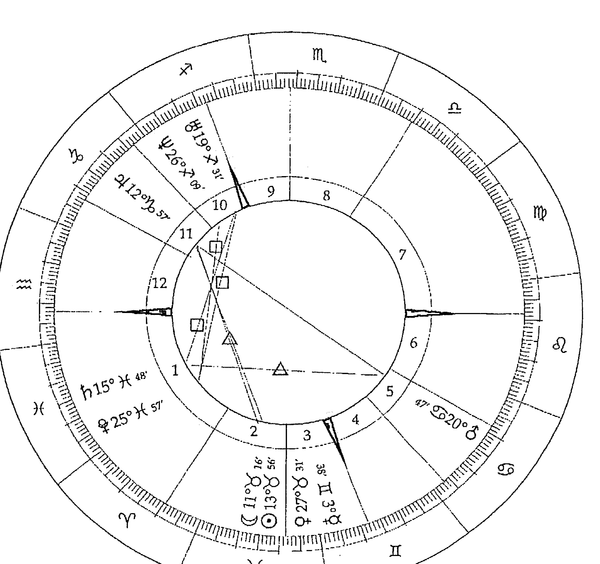
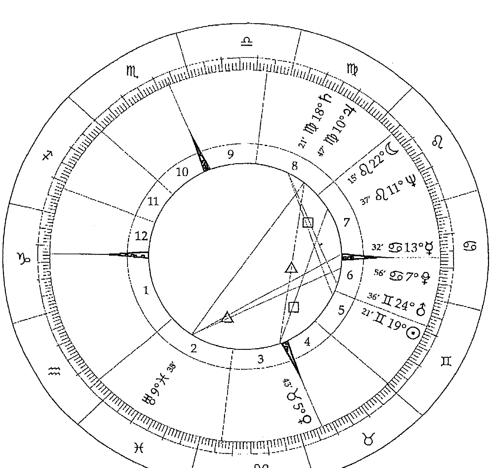
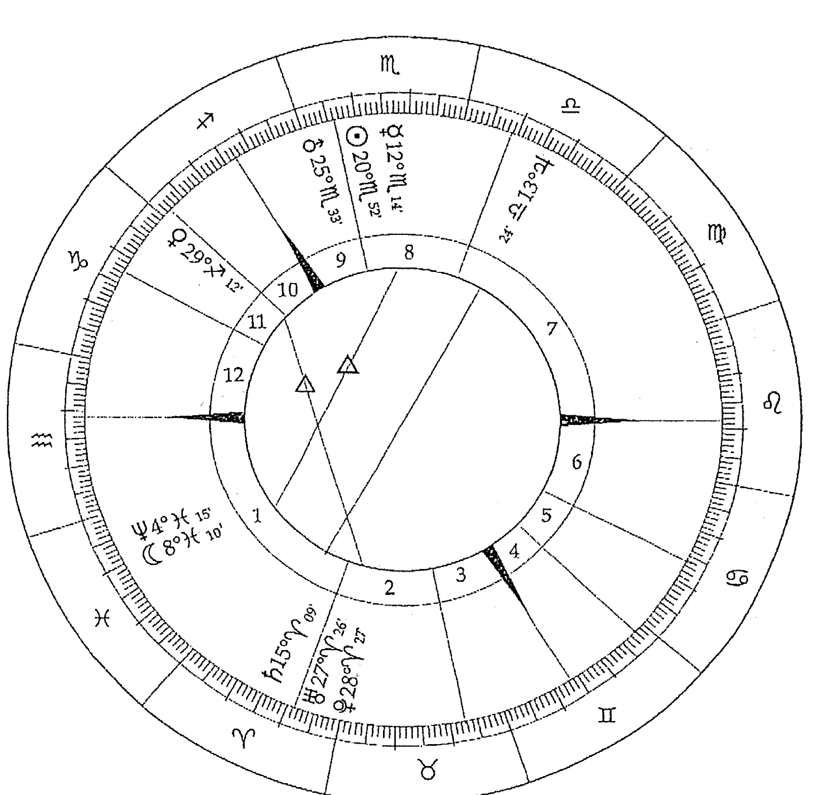
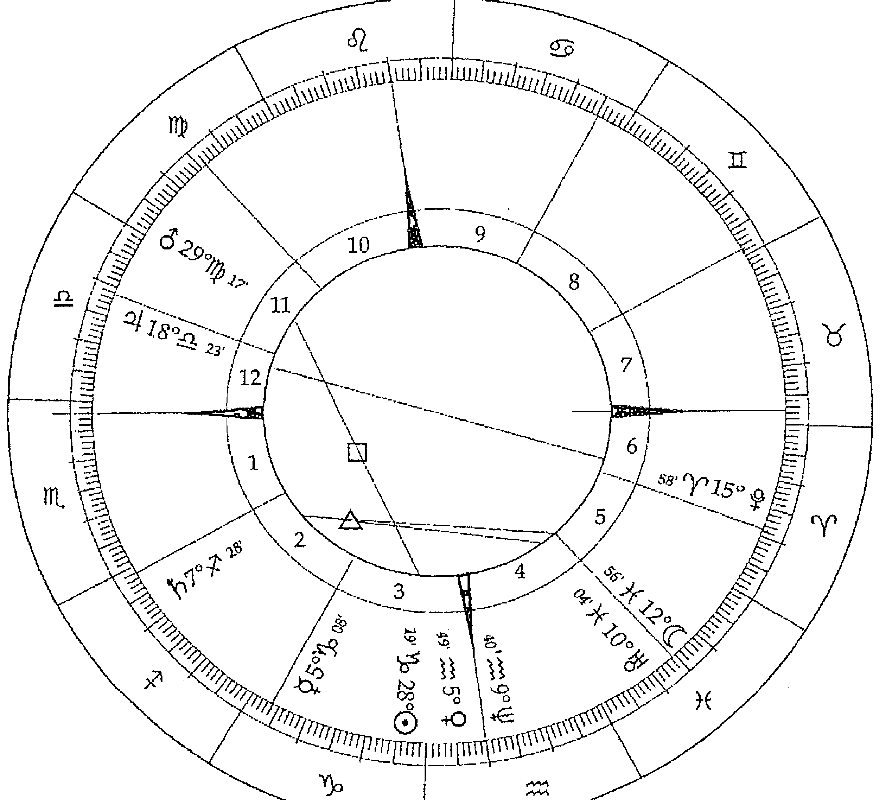
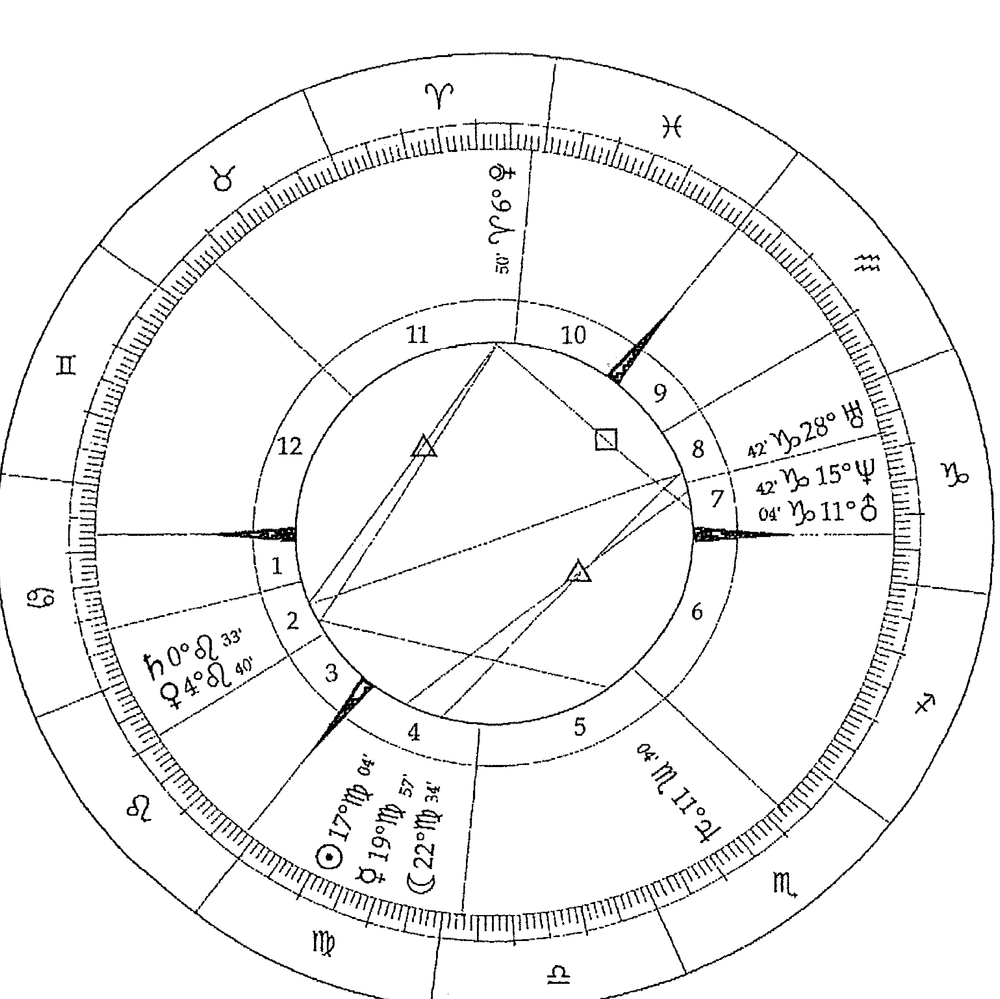
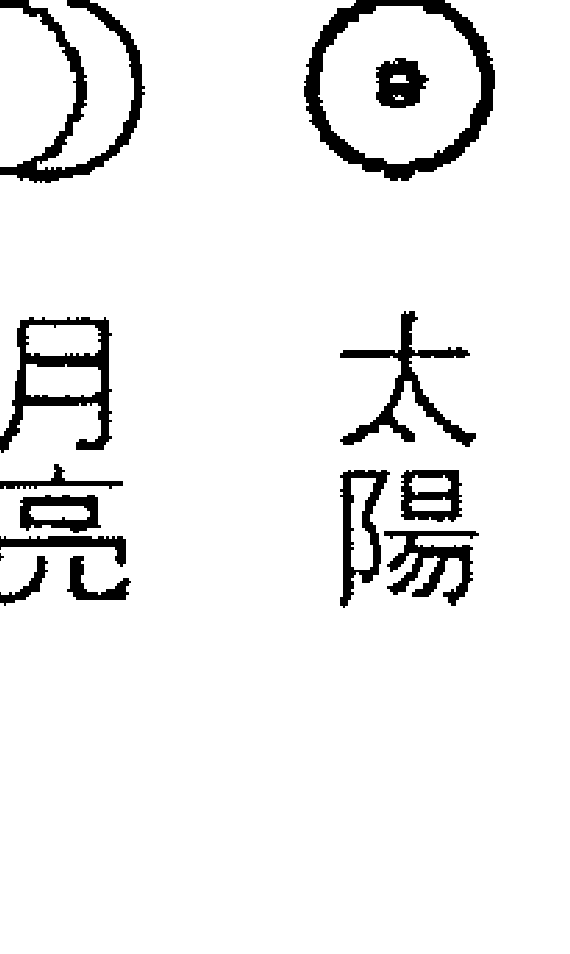
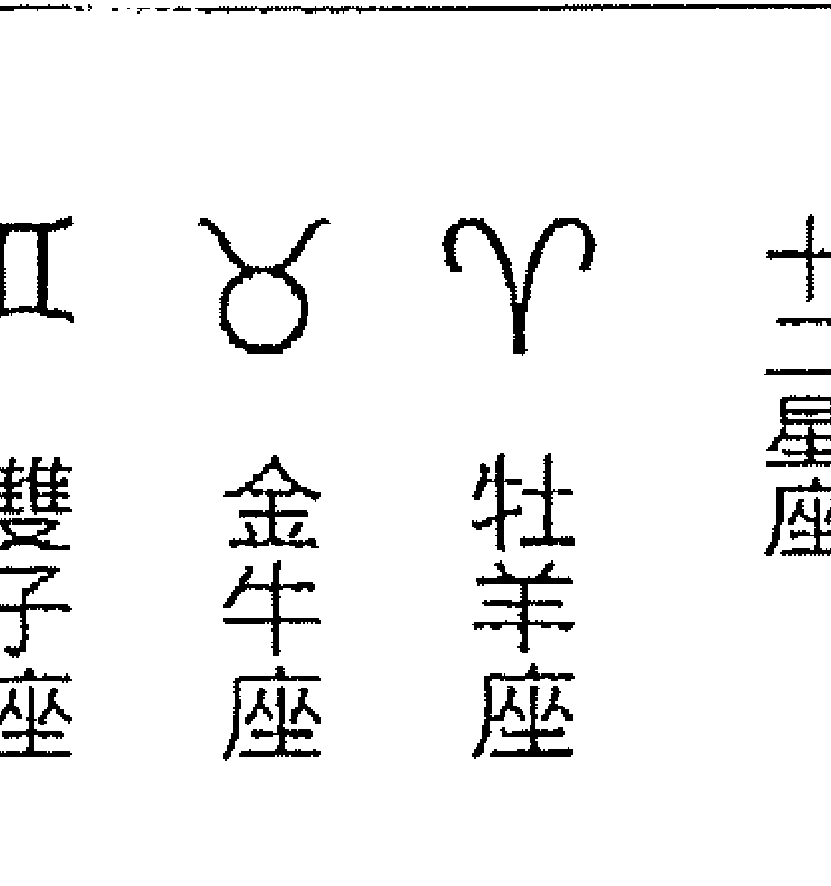
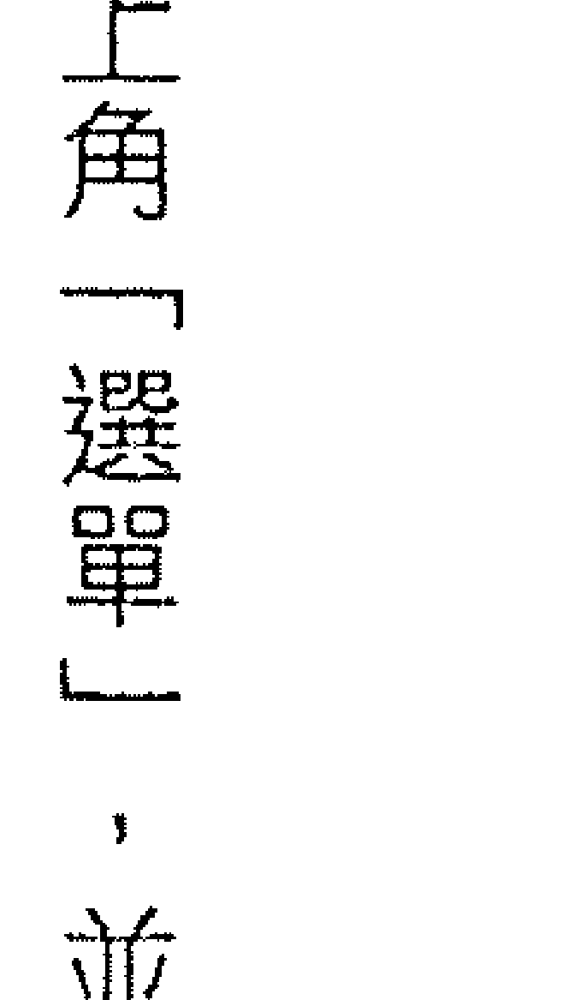
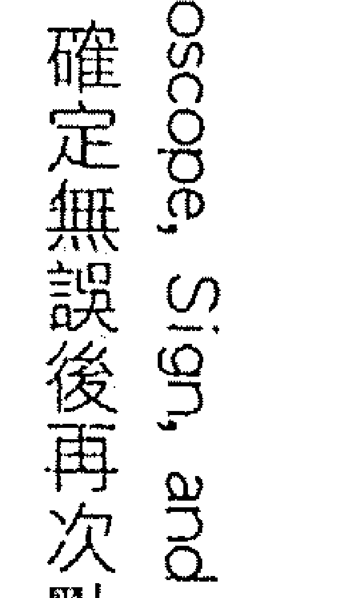
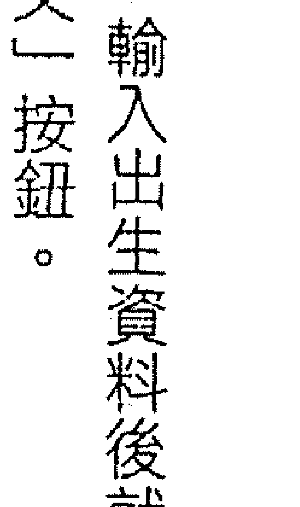

# 成功做自己

Astrological Aspects : Sun, Jupiter, Saturn  
韓良路 著  

每個人都擁有自己的太陽系。  

# 太陽、木星、土星相位中的生命之旅  

每個人都擁有自己的太陽系，  
讓自己的太陽發光，人生才會充滿活力。  

# 出版緣起  

興趣廣泛、身份多元的知名文化人韓良路，除了大家熟知的作家、媒體人及文化推動者身份之外，她也是藝文圈中最受重視的占星學大師。  

二○○三年起她在金石堂金石書院（現龍顏講堂）開設占星課程，由於口耳相傳、好評不斷，課程一直持續到二○一○年才劃下休止符。在長達八年的四百多堂課中，她以歷史、哲學、心理學、社會學的角度，將占星的深層智慧化為生動的教學內容，讓大家在學習與命運對話的同時，獲得看待人生的更高視野。  

這一系列課程不但架構了宇宙法則的邏輯，也融入她對人性與社會的觀察，但因資料整理工程浩大，成書計劃一直未能完成，為避免這些珍貴課程內容成為絕響，南瓜國際透過多年來數量龐大的上課錄音及相關資料，依據當時課程的規劃邏輯，整理成為系列書籍，期望能藉由文字重現精彩、動人且充滿智慧的上課盛況。  

## 序  

活出占星的藝術  

就像物理、化學是學習科學的重要工具一樣，星座的特質、宮位的情境與相位的情節，是解讀星圖的三個重要工具。很多人面對星座、宮位與相位時，常常會擔心占星很難學而萌生退意。其實物理也有複雜的高等物理跟深入淺出的物理知識，儘管不是每個人都需要成為醫生或科學家，但不意謂著大家不能從醫療保健或科普書籍中受益。同樣的道理，不是每個人都需要成為占星學家，但不意謂著大家不能從正確的占星觀念中得到幫助。  

一九八○年代以後，隨著大量醫療保健、大眾心理學以及科普書籍的出版，這些原先僅限於科學家或醫生才能懂的內容，開始由專業壟斷走向普及。占星學也是一樣，隨著電腦網路的發達，占星學已經不再是難以接觸的神秘知識。我曾經在歌德故居的書房  

## 註  

本文內容依據二〇〇五年『相位』相關課程錄音彙整編寫而成。  

## PART 1  
本命星圖的生命密碼  

## Chapter 1  
解讀星圖密碼  

每個人在地球上的一生，都是靈魂的學習旅程。唯有透過面對各種生命事件帶來的體悟，靈魂意識才能真正改變、成長。經由輪迴誕生在地球的靈魂，各自帶有不同的  

學習課題，宇宙就像是一部我們不可能理解的超級電腦，它依據每個靈魂的不同需求，巧妙的算出最適合的誕生時間與地點，將靈魂的生命藍圖化為本命星圖。本命星圖就像一張課程表一樣，讓我們在幾十年人生中遇到不同的人事物，經歷各式各樣的課題。本命星圖藉由一組簡單的時空座標 ── 誕生的時間與誕生地點的經緯度 ── 標示出每個人一生中時運、地運、人緣的命運軌跡。  

每個人誕生時太陽、月亮、水星等行星在黃道座標上的位置，就是行星的一星座；出生地東方地平線跟黃道的交點，就是本命星圖的上昇點，以上昇點為一宮的起點劃分出十二個區塊，這就是「宮位」；當黃道座標上的行星之間彼此形成特定角度時，行星能量就會互相影響，這就是「相位」。  

如果純就理論來說，占星學最理想的學習順序，應該先從行星的意義開始講起，再談完星座、宮位各自的基礎理論之後，才開始進入本命星圖中太陽、月亮落在什麼星座、宮位，以及太陽、月亮等行星彼此形成各種的相位。雖然這樣的順序符合邏輯，但是我多年從來不曾做過這樣的安排，原因在於光是想要仔細上完基礎理論，就得花上一年半的時間，實在太過漫長。所以我通常直接從本命星圖中行星的相位與落入的星座、宮位教起。這種教法的好處在於大家可以很快的一邊學，一邊從自己或朋友的本命星圖中得到印證。等到大家對於星圖中行星的相位、星座、宮位都已經熟悉以後，再回頭學基礎理論的細微之處，往往會有打通任督二脈的感覺。  

本命星圖的相位可以讓人迅速看出星圖的骨架，相位的影響力，也往往會呈現在當事人的真實生命事件中。如果用戲劇做比喻，星圖中的行星就像是生命戲劇的演員，行星落入的宮位，代表這個角色會在什麼樣的領域；星位在的星座，就像是角色的性格；行星形成的相位，讓角色產生互動，生命戲劇因而有了情節。  

## 掌握星圖解碼的邏輯  

相位最容易令人感到困難的地方在於，有時候一顆行星可能跟好幾顆行星同時形成相位，例如一個人可能太陽跟金星合相，又同時跟火星有九十度的負面相位。對於初學者來說，一開始最好先用抽絲剝繩的方式各別理解，之後才進入歸納與綜合。先將它拆開，看看太陽金星合相、太陽火星九十、金星火星九十分別有什麼意義，然後再整合起來，想一下這三者同時發生的話，會有什麼情境。  

當一顆行星分別跟好幾顆不同行星形成相位，單一相位的特質並不會彼此抵銷，更不會因此出現相反的意義，例如太陽金星合相的人很有魅力，太陽火星九十人脾氣不好，但一個人並不會因為脾氣不好就沒有魅力。  

同樣的道理，實際星圖解析時，形成相位的行星落在什麼星座、宮位，並不會讓相位的意義改變。例如一個人太陽跟金星合相，這個人一定會顯現出很討人喜歡的特質，而這種特質又會隨著落宮位的不同而展現在不同的領域，例如太陽金星的合相落在二宮金錢宮，他們就可能會是那種很會做生意的業務員，大家會特別喜歡找他們買東西；  

同樣以瑪麗琳夢露的星圖為例，我們可以看到，她的水星在雙子座 6° 47′ ，跟位在雙子座 10° 27′ 的太陽合相，分別落在十宮跟十一宮。  

她的海王星位在獅子座 22° 13′ ，跟位在牡羊座的金星形成一百二十度相位，跟寶瓶座的木星、月亮形成一百八十度相位，又同時跟天蠍座的土星形成九十度相位。為了避免形成閱讀干擾，本書星圖中的一百二十度相位、九十度相位，分別在圖上標示△、□來區隔。  

如果落在十宮事業宮的社會舞台，他們就會在鏡頭前、螢幕上特別顯得有魅力；如果落在跟外表有關的一宮，他們就會不但個性迷人，而且長得非常漂亮。又如太陽火星九十度衝突相的人一定脾氣不好，但是當事人發脾氣的時候，是用肢體暴力或是語言暴力？是用報復的方式或是權謀陰險的方式？也會隨太陽跟火星在什麼星座而不同。  

在占星學中每個單一的意義，到最後都會在星圖中產生整體連結，因而加強、延伸，但不管怎麼加強、延伸與發展，它不會將原始的意義抹除。對於初學者來說，剛開始一定會覺得很複雜，就像學游泳一開始一定沒辦法手腳並用，但是漸漸熟悉之後，等到有一天游到習慣成自然，忘記手要怎麼擺、腳要怎麼踢的時候，就真的學會了游泳。  

星座、宮位、相位的學習不見得有必然的先後順序。在實際教學經驗中，不少學生都是在完全沒有任何基礎的狀況下進入課堂。對於完全沒有基礎的初學者，我會建議他們趕快先把牡羊、金牛到雙魚這十二個星座的順序背起來。至於其他似懂非懂的地方不妨先繼續往下學，花點耐心讓自己熟悉占星語言之後，有一天自然就會懂了。其實大部分的人都不是從第一堂課從頭開始學，但經過每一次不同課程的不斷累積，慢慢就能夠融會貫通。  

## 本命星圖的行星  

在討論相位之前，先為大家簡介一下本命星圖十顆主要行星的意義。  

☉太陽：一個人的意志與活力，它是每個人最重要的陽性能量。  

☽ 月亮：感覺、情緒，也代表生命中來自母系的遺傳。  

♀ 金星：情感、價值觀、吸引力，以及跟物質世界結合的渴望。  

♂ 水星：思想、溝通能力、表達能力。  

♂ 火星：欲望、性衝動、肉體的行動力。  

♃ 木星：智慧、機會，社會價值帶來的助益。  

♄ 土星：責任、限制、阻礙，社會價值帶來的壓抑。  

♃ 天王星：變化，宇宙性的巨大改革力量。  

♆ 海王星：直覺、靈性，宇宙間廣泛的融合力量。  

冥王星：摧毀、轉型，宇宙間潛藏的巨大毀滅與新生的力量。  

位於太陽系外側的木星、土星、天王星、海王星、冥王星屬於外行星。木星跟土星這兩顆社會星，代表的是社會潮流與社會制約，它們是我們有生之年能夠享有的社會能量。每十二年走一圈的木星，代表的是社會的主流價值，星圖中的木星顯示出我們跟社會資源之間的關係。每二十九年半走一圈的土星，代表的是社會的現實與結構，土星代表物質世界的既定法則，讓我們感到壓力，也讓我們辛勤務實。天王星、海王星、冥王星研究的是一個比較大的集體共業，需要經歷比較長的時間才能發動。天王星大約每七年走一個星座，它代表宇宙意識的創新與改革；海王星走一個星座大約十四年，它代表宇宙意識無邊無際的夢想；冥王星走一個星座的時間從十八年到三十年，它代表對於物質世界的巨大執著，帶來毀滅與新生。  

透過太陽系行星之間的關係，占星學探索每個人生命中所有過去、現在、未來的奧祕。每個人出生的那一刻，太陽系行星排列的位置，就是我們的本命星圖。每個人藉由誕生將靈魂固著在地球，展開了這輩子的人生旅程，根據出生時間地點而畫出的本命星圖，將天上的太陽系帶到人間。當一個人在地球誕生，一個全新的太陽系小宇宙就在人間展開了旅程。人生旅途中，人與人之間的互動，都是不同的太陽系之間的互動，而每個人的太陽系小宇宙，也不斷的跟大宇宙的太陽系產生互動。  

太陽是太陽系的核心，太陽系群星都以它為中心而轉動，陽光提供的能量，更是地球萬物得以生存的關鍵。一天上如是，地上亦然。對我們來說，本命星圖中的太陽是我們這輩子的人生目標。它代表一個人的價值觀、理性、意志與自我認同。它是每個人生命的當核心。當一個人生命的核出了問題，這個人生命的活力也就會隨之消失。每個人的內在太陽系，透露出我們這輩子為何要到這世上走一遭，以及如何走一遭。在本命星圖的生命戲劇中，太陽系群星都是演員，各有其不同的配戴。藉由群星的合作，太陽得以完成這輩子的人生目標。  

星圖中的行星與其他行星會因為彼此形成特定角度而產生能量的互動。本命星圖中太陽跟其他行星形成的相位，會為太陽帶來不同的個人特質，也透露了重要人際關係的模式，它往往直接成為太陽旅程中的助力或阻礙。例如一個人的太陽跟月亮有九十度的衝突相位，他就會經常陷入太陽顯意識與月亮潛意識的衝突，他在追求太陽想要的目標時，就常常會被月亮的情緒扯後腿，陷入兩難局面。  

太陽、月亮、水星、金星、火星這五顆內行星如果形成相位，它們未必會對命運造成影響，但對個性的影響一定很大；而木星、土星、天王星、海王星、冥王星探討的是社會、宇宙的集體意識，這五顆外行星對命運的影響就很大。五顆外行星中，木星跟土星代表的是社會大環境的種種變化，木星帶來社會性的資源，土星帶來社會性的限制，假如一個人木星跟土星形成九十度的衝突相位，當事人面臨的兩難局面就會跟社會大環境有關。舉例來說，木土九十的人可能會花很多年的時間考慮要不要做股票，他們很想

## 行星相位的生命情境

占星學將太陽行進的路徑，在天空中畫出一條假想的黃道，並將三百六十度的黃道，劃分為十二個星座、每個星座三十度的座標。沿著黃道不停穿梭的太陽系行星，由於行星速度快慢不同，每天在黃道座標上的位置也不相同。

如果將行星的影響力視為一種能量的波動，當行星跟行星之間形成特定角度時，彼此的能量就會被強化、干擾，或產生其他變化。占星學中最常用到的相位有四個：零度合相會使能量彼此強化；九十度會因為能量互相衝突造成內耗；一百二十度代表彼此能量和諧，容易兩者兼顧；一百八十度代表雙方能量南轅北轍而造成對立；

---

## 合相的基本意義

當兩顆行星靠得很近，距離在六度以內的話，就會形成合相。合相會讓兩顆行星彼此的能量互相加強，例如一個人如果金星跟水星合相，金星就會加強水星的力量，水星也會加強金星的力量。也因為合相的兩顆行星的能量會彼此強化，所以如果以吉凶而論，合相基本上算是吉中帶小凶。

原因在於合相雖然會使能量強化，但也容易造成過度消耗，因而能量失衡。例如太陽跟水星如果合相，合相會使太陽的自我意識跟水星的心智溝通互相強化，所以太陽水星合相的人很聰明，腦袋動得很快。但這樣也會讓當事人的腦袋一天到晚動個不停、無法休息，造成能量過度消耗，因而很容易頭痛、失眠。

合相吉中帶小凶的程度，又隨合相行星的不同，而有強弱不同。如果合相的兩顆行星屬性相同，能量過度消耗的情況就會比較嚴重。舉例來說，如果將太陽水星合相與太陽金星合相做個比較，金星是陰性能量，而太陽跟水星都是陽性的能量。當太陽金星合相時，由於太陽跟金星的能量互相加強，當事人容易產生自戀的傾向，也容易過分喜歡感官享受。雖然還是吉中帶有一點凶，但是比起太陽水星合相的問題小得多。因為太陽水星合相會使兩個陽性能量加乘，有時候就像是太多的電流同時流過電線，有可能就會造成超載、短路的現象。

---

## 九十七度衝突相的基本意義

當兩顆行星出現九十度的相位，九十度的衝突，往往會帶出兩顆行星的負面能量，造成彼此的能量內耗。我們人生當中很多的不愉快、很多的喪失、很多的阻礙，都是九十度的衝突相位造成的結果。因此九十度相位對一般人來說，都會被視為不好的負面相位。

---

## 一百 eighty 度對立相的基本意義

一百 eighty 度相位，代表行星能量的互相对立，因此一百 eighty 度跟九十度一般而言都視為負面相位。如果兩顆行星彼此一百 eighty 度，就會因為雙方追求的目標完全相反而彼此對抗、互相激化。相較於九十度相位的能量內耗，一百 eighty 度的相位常常會使雙方因為必須對抗而展現出很強的力量，因而導致大好或大壞的情況。

如果就相位吉凶而論，一百 eighty 度雖然屬於負面相位，但是凶中帶小吉。原因在於宇宙中所有陰陽兩極的對立，對立的雙方一定具有相同的本質。當事人如果能夠敏銳的察覺到星圖中一百 eighty 度對立，其實都是一個銅板的兩面，就有機會可以將原本的陰陽對立，轉化為陰陽互補。

不過，一百 eighty 度凶中的小吉並不明顯，通常當事人要經過很多次的衝擊，明白其中能量的互補性之後，才有機會會尋找轉化的可能性。

---

## 一百 twenty 度和諧相的基本意義

當兩顆行星形成一百 twenty 度的標準和諧相時，意謂著這兩顆行星分別落在同樣屬性或不同星座，例如同屬火象星座的牡羊座與獅子座，或是同屬水象星座的巨蟹座與雙魚座，兩顆行星容易在能量協調的狀態下帶出彼此的正面能量，當事人在運用能量時一定會感到比較順暢。

一百 twenty 度和諧相與零度合相的差別在於，一百 twenty 度發酵能量時重視兩端都能和諧互惠，因此雖然一百 twenty 度的爆發力不如合相那麼大，但反而更容易為當事人帶來世俗生活的好運。

隨著相位所在的不同宮位，一百 twenty 度相位的好運，也會呈現在不同的領域。有的人可能一生下來就握著銀湯匙，一輩子的順利，都跟家庭有關，有的人具有特殊才藝，有的人可以位居高位，甚至有人可能財運奇佳，因為中樂透，一口氣拿到別人辛苦一輩子也未必能夠賺到的財富。簡單來說，星圖上有較多一百 twenty 度的人，日子一定會比一般人來得順利。

---

相位的容許度都不同，有的人將容許度數訂為四度，也有的人認為十度以內的誤差，都屬於容許範圍內。基本上我比較傾向誤差六度以內的容許度。因為交角超過六度以上時，產生的事件會比較薄弱。就像我們聽音樂的時候，放得很近跟很遠聽，雖然都可以聽得聽到，但是音量的強弱有別。如果兩顆行星落在同一個星座，即使距離超過十度，都會因為落在同樣的星座而值得注意，它們雖然在能量上會產生影響，但是發展成實際事件的機率會相對降低。

我們以社會學家卡爾·馬克思的本命星圖為實例，為大家示範相位的計算方法。以誤差六度內為容許度數的話，馬克思的太陽在金牛十三度，所以金牛十三度的前後六度都屬於合相範圍，以金牛十三度為中心，將金牛十三度減六度、加六度，等於金牛七度到金牛十九度，也就是說，如果有行星落在金牛七度到金牛十九度的範圍以內，就算跟太陽合相。由星圖中可以看到，馬克思的月亮落在金牛十一度，所以馬克思的太陽跟月亮合相，誤差值為兩度。此外，他的木星在摩羯十二度，所以太陽木星為誤差值一度的一百 twenty 度和諧相；土星在雙魚十五度、天王星在人馬十九度，土星跟天王星就形成了誤差值四度的九十度衝突相。

---

## 面對相位的生命風景

雖然以靈魂的觀點來看，相位不分好壞，它們都是不同的功課，但是從世俗的角度來看，如果一個人星圖中有很多九十度的負面相位，生命中一定會充滿許許多多的挫折，而一個人星圖中如果有很多一百 twenty 度的和諧相，當事人的人生一定會有很多令人羨慕的好運。

舉例來說，一個擁有和諧木星能量的人，代表當事人容易跟當時的社會價值產生和諧的關係，因此可以從社會獲利。一個人如果跟社會之間關係和諧，社會就容易贊成他做的事情，他就會比較有票房、比較暢銷、比較容易贏得選票。可能升遷是他，中獎是他，媽媽留個房子也是他。木星能量會為一個人帶來社會性的好處，包括金錢、名聲、知識與智慧。但一個人在使用木星能量的時候，如果他的意識完全停留在最表面的層次，例如金錢，即使本命星圖中木星的相位很好，每次遇到行運啟動木星能量都會很明顯的走運。不過再好的木星相位一定也會遇到行運土星、天王星不好的相位來剋。如果一個人只把木星能量全部拿去買股票或賺錢，等到木星遇到行運剋相能量低落時，他的錢就全都沒了。過一陣子等到木星遇到好的行運，又賺很多錢，再過一陣子遇到行運剋相，錢又沒了。即使相位很好，一生中木星輪迴也不過就是金錢的起起落落。除非懂得將木星能量提升到很高的層次，否則即使擁有很好的木星相位，整個人生的發展還是很有限。

相較之下，許多木星相位不好的人，反而可以達到很高的成就。一個人如果木星相位不和諧的話，就會常常覺得自己跟社會格格不入，甚至常常被社會找麻煩。但是也因為跟社會格格不入，反而可能讓他們因此致力於社會的改革，從事領先社會的工作，成為超越時代價值的信仰者，對後世帶來深遠的影響。

本命星圖中的小宇宙，永遠跟天上的大宇宙不停的互動。就像我們常說，栽種有時，收穫也有時。再怎麼大好的格局，都會有遇到壞運的時候；再怎麼不好的格局，一直倒楣的人也會有三天好運。

真實的占星學裡是沒有永遠順利這回事的，從業力輪迴的角度來看，一個星圖裡面有很多好相位的人，可能是過去世做了什麼事，因此這輩子他可以收這個果，但也可能當事人這輩子因為好運而胡作非為，反而造出下輩子很大的業。相較之下，星圖中有很許多負面相位的人，因為常吃苦中苦，反而比較容易體會人生的道理，生命中的逆境，反而可以成為靈性的洗禮。

---

## 日月合相｜理性主導、意志集中

許多生命的真相，隱藏在星圖中的情節，會在眼前慢慢展現出原先不為人知的祕密。所以看星圖的時候，一定要養成仔細推論的習慣，隨著經驗累積，逐漸你會發覺可能性。

太陽是一種陽性能量，它主要是一種從父親那邊繼承來的陽性能量；月亮則顯示出一個人跟母親的關係，它是一種陰性能量的繼承。不管日月合相在哪個星座，日月合相的人父母一定同質性很高，當事人的父親跟母親一定很相像。

其實日月合相就是農曆初一的新月月相，月亮跟太陽位於同一側的同樣位置，由於此時月亮的反射面背對地球，從地球上來看，這個時候月亮形同隱沒。也就是說，本命星圖中如果日月合相，代表當事人的父母意見一致、夫唱婦隨，所以這個家庭會完全以一家之主父親的意見為意見，母親的意見形同隱沒。對日月合相的人來說，當事人在成長的過程中，父親一直在家中具有主導性的地位，是家中的發號施令者，母親則扮演比較隱性的角色。也因此，當事人從小在家庭環境中，完全只看到父親的太陽影響力，而很少接觸到母親代表的月亮的陰性能量。由於經常壓抑自己的情緒、陰性面與潛意識，就容易產生過分理性與過分陽剛的表現。當事人會過度執著於顯意識認同的理性世界，執著在他所想要做的事情上，因此他跟別人之間容易缺乏協調性。

此外，從小過度以太陽為主導而壓抑月亮，很可能就會導致男尊女卑的傳統心態，對於男性當事人來說，未來跟其他女性的關係可能會發展成事事以他為主，他特別的尊，對方特別的卑。所以通常看到一個男人的太陽跟月亮合相的話，就會知道他的太太在家中地位較低，通常不會被眾人所知，像是隱姓埋名一樣。

對一個女性而言，如果太陽跟月亮合相會比較累，原因是當事人會過分發展她的陽性部分，父親在她生命中會對她造成很大的影響力，而她在女性意識與母親的認同上則常會產生問題。

# 宛如公务员的革命家

# 卡爾馬克思 Karl Marx

1818/5/5-1883/3/14

德國經濟學家、社會學家。最重要的著作為《共產黨宣言》與《資本論》。他在社會、經濟、政治的理論被統稱為「馬克思主義」，對後世影響極大。

政治學家卡爾馬克思的太陽、月亮都落在金牛。代表他的父親跟母親都會顯現出金牛的特色，兩人都很務實。金牛的特質在於腳踏實地，太陽在金牛的馬克思，他的父親是一個律師，而且對子女的教育很看重，當年馬克思進入波昂大學時，本來想選擇哲學與文學，但他的父親堅持選擇法律才是務實之道。後來馬克思由於成績下滑，他的父親還幫他轉學到學風更好的柏林洪堡大學。馬克思的月亮也在金牛，意謂著他會有一個很能幹的母親，而且能夠提供物質方面的資源。這個特色從馬克思母親身上也可以看得出來。馬克思的母親是個能幹的家庭主婦，由於出身於富有的商業家庭│她的娘家後來創建了知名的飛利浦電子公司│也因此，後來馬克思長年流亡英國時，還經常跟母親借錢，維持家計。對於男性來說，星圖中的月亮不但代表母親，也代表妻子。月亮金牛的馬克思不但母親很務實、很能幹，他的妻子也有同樣的特質。馬克思妻子的娘家算是一個小貴族，她受過良好的教育，從婚後就一直幫馬克思整理文稿、修正錯誤，以及潤色。但也因為馬克思一直沒有穩定收入，後來還流亡海外，一路

從布魯塞爾、巴黎，最後定居倫敦，既無固定收入，而且不時需要舉行流亡政治人士的聚會，經濟壓力極大。從這些地方不難看出馬克思太太的能幹。馬克思的月亮金牛，甚至也顯示出女兒的特質。由於生活環境不佳，馬克思七個子女中半數早夭，只有三個女兒長大成人，而這三個女兒也跟她們的母親一樣，長年協助打理馬克思的工作與生活，也參與馬克思推動的工人運動。

日月合相時，太陽等於是把月亮吃掉了，以日月合相的馬克思為例，如果了解他的生平就會知道，太太完全是站在幕後支援他一切的人，他在生命的选择上面，多半著眼於自我意識，而不太會考慮到太太的需求。本命星圖中的月亮，代表當事人生命中的重要女性，我們也可以看到，不只是馬克思的太太，連他的媽媽、女兒，他生命中的月亮都全力支持馬克思的太陽想要完成的目標，因而無聲掩沒。

從星圖中可以看到，他的太陽、月亮分別在金牛座十三度、金牛座十一度，形成合相，而摩羯十二度的木星，又跟日月合相形成了一個一百二十度和諧相。因為他的日月都落在金牛，所以馬克思非常關心資源分配，以及世界的經濟基礎，如果他日月落在別的星座，他也同樣會如此專注，但不會是在資本或者是經濟相關領域的研究上。金牛跟摩羯都屬於注重現實的土象星座，金牛關心現實的資源，摩羯關心政治的結構，從馬克思主義中，的確可以看到許多「資產」

# （金牛）與「階級」（摩羯）之間的議題。

木星代表的社會利益中也包含知識的精神資源，對於木星摩羯的人來說，他們會用比較按部就班、比較保守但扎實的方法，獲得社會利益。馬克思日月合相金牛，同時跟木星摩羯一百二，在某個程度上反映出他多年規律的研究、寫作生活。最近英國出了一本書，提到馬克思其實並不像大家所想的那麼具有原創性，但馬克思實在是世上最厲害的資料整理者。在那個沒有網路的時代，他做的就是資料整理，他基本上把所有跟金牛有關的資產知識合在一起，形成了馬克思主義的理論架構。馬克思花了將近二十五年的時間，天天到大英博物館去，天天坐在同一個位子，天天不缺席。他有著很強的理性自我，為了達到生命的目標全神以赴。

在後面土星相位的「土天九十」中會談到，馬克思對於推動無產階級革命的動力，來自他本命星圖中天王星與土星的九十度相位，天王星的改革意識，會想要推翻土星的現有結構。但土天九十的人雖然具有革命意識，他們的生活卻未必像土天一百八的人那樣充滿危險。馬克思在大英博物館數十年如一日的 research、寫作，日常生活作息，與其說是革命家，他更像是一個公務員型的學者。

# 日月九十｜理智與情感拉扯的兩難

如果一個人的太陽跟月亮之間形成了九十度的衝突相位，尤其是誤差度數很小的緊密九十度相位，通常意謂著他的父母的個性差距很大。例如太陽在獅子，月亮在天蠍，或者太陽在摩羯，月亮在牡羊，當事人的父母雙方就會有很不同的價值觀。

很多太陽月亮九十的人，從小就會發現父母常常在冷戰，父母的感情很不協調。現代由於離婚率較高，對於比較年輕一輩的人來說，日月九十很可能就代表父母離婚；即使是離婚率不高的老一輩，如果看到本命星圖中有日月九十相位，儘管不見得一定代表父母離婚，但是他們的感情一定很不好。

由於日月九十的人，從小在父母經常衝突的不愉快環境中長大，當事人比較容易沮喪，比較容易憂鬱，也比較缺乏安全感。在異性關係上面，日月九十的人常常會有困難，原因是從小他們的學習對象──父母之間的陽性與陰性力量是不和諧的，所以不管當事人是男性或女性，當他們要跟異性相處的時候，如果內心的陰陽能量不和諧，就很容易

# 重蹈父母走過的老路。

占星學裡面有很多現象，其實跟生活中的某些偏見不謀而合。偏見之所以可怕，是因為偏見常常很真實──如果偏見都是假的，就沒有人會害怕偏見了。譬如說你很愛一個男的，你的媽媽卻以對方小時候父母離婚為由，勸你最好不要嫁給這個男的，我想三十歲以前的人都會覺得我一定要嫁，會有諸如此類的衝動。 Basically 你還是可以嫁，因為那是你的愛，也很可能你會從中得到寶貴經驗。可是通常人過了三十歲以後，就會知道父母講得有道理。

因為從某種角度上看來，父母離異會影響某種心裡能量的狀況，那個狀況容易讓當事人在行為上重蹈父母的覆轍。如果以現代心理學的說法，會說這是自小開始的外在環境促成潛意識行為的模仿；業力占星學會說這是來自於家族業力的傳承。

這也是業力占星學之所以需要存在的原因。當我們面對星圖上面某些相位、宮位傳承所造成的結果，都必須要給當事人一個解釋，這個解釋要能夠超越命運中的現實關係。就像我們看電視新聞有時會感到害怕一樣，在學占星時不免必須面對一些恐懼，你會學到一些你不喜歡的關係，我們必須要有個超現實的說法，來解脫我們跟命運的現實關係。

生命資訊，以及你不希望看到的生命情報。它很殘酷，但是也很真實，你必須要學習去面對這些東西，即使不喜歡。

當星圖上出現日月的負面相位時，當事人可能要期待一種不一樣的婚姻關係或男女關係。當事人越用傳統邏輯來硬套在自己的夫妻關係上，生命越會產生很大的困難，因為他可能並不適合那一套邏輯系統。

日月九十的人身體通常都不會太好，當事人的陽性能量跟陰性能量無法調整得很好，容易在健康上面出狀況。由於能量不夠，他們也容易感到疲倦，因為陽性能量與陰性能量一天到晚在彼此對抗，這讓他們難以累積足夠的能量去對抗這個世界。

星圖上的相位有時並不是只有一個單一相位。舉例來說，如果一個人有日月九十的相位，往往父母的婚姻會有問題，如果其中的太陽或月亮同時又跟別的行星有相位，再往下分析，又能夠看出更多細節。例如太陽還跟木星有一百二十度和諧相，當事人在不合的父母中，特別會跟父親比較親。

此外，有時候雖然日月九十衝突，但其中太陽或月亮有其他好相位，當事人父母有可能藉由好相位的力量將關係維持住，分手的機率也因而降低。但如果日月九十中，太

# 日月一百八｜非此即彼的強大爆發力

陽跟月亮都沒有其他好相位，甚至又還有其他剋相的話，這段關係就會更加困難。

星圖是活的，當我們在本命星圖中看到一個相位時，同時也要關心形成相位的兩個行星是否還有其他相位。當日月九十又跟其他行星有相位關係時，太陽或月亮與其他行星的相位並不會讓日月九十的作用消失，但可以從中解讀出更多細節。

日月一百八十會帶來很嚴重的衝突，這個相位意謂著父母之間有很大的對立，即使這個相位的當事人已經六七十歲，也一定會遇到父母不管是離婚或者其他的外來因素，造成雙方分開的實際事件。如果星圖中有日月一百八相位，父母即使在法律上沒有分手，也常有二、三十年來都不知道爸爸在哪裡之類的實質分居狀態。

日月一百八對當事人來說，是一個很不容易的相位。如果日月一百八其中一方跟別的行星形成了一百二十度的和諧相，就等於跟另一端形成了六十度的次和諧相，這會對

日月一百八的對立，有很大的幫助；如果日月一百八又跟其他行星形成九十度，就會形成H-Square（註），等於是除了太陽月亮一百八之外，太陽月亮又分別跟這顆行星各自形成九十度，變成兩個九十度加一個一百八，壓力就會更大。

日月一百八跟日月九十的不同在於：日月九十的人通常比較敏感，他們會覺得父母不和可能兩邊都有錯，他們常會掙扎於父母雙方的對錯之間；可是日月一百八的人會傾向於認同父親或母親其中一人。也因為日月一百八會選邊站，所以不管是在人際關係或情感關係上，他們都會比日月九十的人複雜。

日月九十的人對於自己的情感不是那麼有安全感，常常會左右為難；日月一百八的人在情感關係上面會假裝，他們會選擇一邊，所以不像日月九十的人總是陷入兩難，但總是會突然攤牌翻臉。

日月九十與日月一百八都代表陽性能量與陰性能量的衝突，但能量的衝突有可能反而讓他們顯得很有趣。差別在於日月九十的人不會讓人無法摸透，頂多有一點難搞；

## 註

T-Square：如果星圖中有三顆（或三顆以上）彼此互為九十度與一百八十度，形成一個T字型時，稱為T-Square。

T-Square等於是兩個九十度加一個一百八，因此壓力也遠比單純的九十度或一百八來得更大。

可是日月一百八是在兩個極端中變形的人，他們的創造力很強，但令人無法摸透。

如果你今天交了一個日月九十的男朋友或女朋友，有時候會覺得他們不知道哪裡有點怪怪的。這種感覺並非疑神疑鬼，而是因為他們在情感上真的有障礙，所以這種不太對勁的感覺是真的。不過日月九十，雖然永遠會有相處上的困難，但不會出現大好跟大壞。

如果今天你交往的對象是日月一百八，他們會比日月九十的人好相處，但這是因為他們用選邊站的態度面對親密關係。你可能會覺得日月一百八十度的人很喜歡你、對你很好，可是有一天狀況卻可能突然翻轉，你才知道完全不是這麼回事。日月一百八在情感上會帶給你的震驚絕對超過日月九十，因為父母關係的童年經驗，讓他們已經習慣了隱藏。他們有時候會扮演父親的角色，有時候扮演母親的角色，危險的是一旦當他們換邊站，就是切換到另一邊的對立面，所以日月一百八的人，容易在親密關係上出現大好跟大坏。

在人際關係上，如果拿日月九十跟日月一百八的人來比較，日月一百八的人會比較厲害。原因在於，九十的相位往往會形成內耗，日月九十的人通常很容易覺得疲倦，

他們父母的關係是在拉扯的狀況，因此他們也常自我拉扯。日月九十的人常常會陷入兩難，常常覺得活著好累而什麼都不想要，他們不會像日月一百八那麼極端。日月一百八的人能量運作趨向極端，當事人的能量會在瞬間跳到極點，像個超人一樣，但也可能突然崩潰。

從世俗的觀點來說，日月一百八的人，雖然有很大的衝突，可是這種衝突也可能是很重要的驅策力。一百八的相位往往會形成很強的爆發力，因為這個相位一方面具有非此即彼的極端態度，但選擇一邊的同時，卻又緊拉著對立的另一方不放，當他們將這種能量集中在一个目標上的時候，往往會形成很強的爆發力，但也常常會造成生命當中的一些衝突。

日月一百八的人，不管做藝術家或做生意人都會比較容易成功，因為他們完全能站在不同的立場扮演不同的角色。但也容易形成所謂的梟雄人格，他們不是那種可以讓人放心的人。

像義大利知名導演羅伯托羅塞里尼（Roberto Rossellini），就有日月一百八十的相位。羅塞里尼是很重要的義大利導演，當年他在婚姻中出軌，跟女星英格麗褒曼（Ingrid Bergman）

Bergman）鬧出婚外情。英格麗褒曼以《北非諜影》叱吒好萊塢之後，又接連以《戰地鐘聲》、《聖女貞德》等電影入圍奧斯卡金像獎，並以《煤氣燈下》榮獲奧斯卡女主角獎，她的純潔銀幕形象，向來被視為好萊塢聖女。她跟羅塞里尼的婚外情也因此鬧得舉世皆知，原籍瑞典的她，還被美國國會議員譴責，列名不受歡迎人士。羅塞里尼雖然很有個人魅力，但日月一百八的他個性很古怪，英格麗褒曼跟他在一起，可說是吃足了苦頭，兩人付出龐大代價修成正果的婚姻，不過維持了七年就宣告結束，由此可見日月一百八對人際關係的影響力。

日月一百二的能量和諧跟日月合相的能量集中，兩者略有差異。日月合相代表月亮跟太陽目標相同，但太陽居於主導地位，月亮形同隱沒。而日月一百二意謂著太陽跟月亮落在同屬性（火象、土象、風象、水象）的不同星座，彼此之間不會互相衝突，而且

月亮不會被太陽掩蓋，兩者都能發光，彼此互相支援。

相較於太陽月亮九十或一百八的種種父母議題，日月一百二的和諧，代表當事人父母的感情很好──大家不需要覺得這件事很稀奇，太陽一個月走一個星座，而月亮大約一個月走一圈，太陽跟月亮每個月會有兩次一百二十度和諧相，也就是說，每個月都會有一定比例的新生兒出生在日月一百二和諧相的日子。

日月一百二的相位，代表當事人出生那段時間父母的關係良好，因此當事人的太陽意志跟月亮情緒之間可以互相協調、互相支持，不會互相拉扯，當事人會很有自信，也比較容易完成人生中想要達成的目標。

# 太陽與水星：意識與心智的互動

水星位於太陽跟地球之間，是距離太陽最近的行星，在黃道座標上跟太陽之間的距離最遠不超過二十八度，因此水星一定在太陽前後一個星座或相同星座，也就是說，如果水星跟太陽形成相位，一定只有可能形成合相，不可能會出現九十、一百二或一百八相位。

水星代表一個人的思想，是溝通、思考跟語言的網路。所以在星圖上，水星是決定一個人聰不聰明最重要的關鍵。很多人容易把「聰明」與「才氣」混為一談，但它們其實是不同的兩件事，聰明的人不見得能成為藝術家，很有才氣的藝術家未必腦袋靈光。

水星的聰明是一種心智上的、跟知識有關的聰明。當水星跟木星、土星、天王星、海王星等不同行星形成相位，都會形成不同類型的聰明。例如水星跟天王星之間如果有好相位，則此人可能非常有創意。

# Chapter / 2

69 Chapter 2

# 日水合相｜聰明的各種面向

在這裡，我們先來看看水星跟太陽如果形成相位，當事人會有哪些特質。

一個人的本命星圖中水星跟太陽如果合相，他們往往會是那種一看就令人覺得很聰明的人。日水合相的人很會說話，腦筋動得很快，思考很迅速、敏捷。太陽跟水星的合相，一種科學家走的是相反路線，他們屬於水星跟土星有相位的科學家，他們通常會從事跟實做領域有關的研究。

星跟天王星有相位的科學家，往往會是那種不必進實驗室，就可以得諾貝爾獎的人。另

就可以證明黑洞的存在，而不像眼見為憑的一般人，必須看到才能確認事情的存在。水

王星之間有一百二十度的和諧相，所以他的聰明是很原創的，他有辦法藉著理論運算，

等領域。譬如說，寫《時間簡史》的史蒂芬霍金（Stephen Hawking），他的水星跟天

位，通常會呈現出一種天才式的聰明，當事人會很具有原創性，尤其是對神秘學、科學

# 相，在聰明程度上面，其實比不上水木、水土、水海、水天等和諧相位。雖然如此，日水合相的人，都會比日水沒有相位的人看起來聰明多了。

日水合相的聰明，可以展現在各個領域。例如日水合相在天秤的英國首相柴契爾夫人（Margaret Thatcher），她的日水合相讓她展現溝通能力，日水合相在人馬的導演伍迪艾倫（Woody Allen）則顯示在拍電影、寫劇本的能力上。此外，一個畫家也可能有日水合相，例如超現實主義派畫家達利（Salvador Dalí）的日水合相在金牛，但日水合相其實跟繪畫無關，以達利的星圖來說，他除了日水合相在很懂美感的金牛之外，他

的金星跟火星也在金牛，而且金星跟天王星還有一百二十度的和諧相。他之所以能當畫家，跟金星火星的關聯比較大，日水合相會讓他既是畫家又很聰明，但如果光靠日水合相，並不足以成為畫家。

太陽跟水星都是陽性的能量，所以太陽跟水星合相，它們會在合相的吉中帶有小凶，尤其合相的度數如果太近的話，當事人可能會有偏頭痛的問題，或者容易失眠，日水合相的人，腦筋是停不下來的，因為太陽等於是一個不停的發電機，不停的在刺激他的水星活動，所以太陽水星合相的人，特別會容易覺得腦筋動個不停，當會因為腦筋

# 過度使用而偏頭痛。

在實際面對星圖時，如果日水的合相，同時又跟別的行星形成相位，就會更刺激太陽水星的活動，當事人鑽牛角尖的情況也會更為嚴重。例如日水合相同時又跟天王星九十，等於是一個合相再加兩個九十度，能量就會比只有日天九十或水天九十更強，再加上日水合相本身的能量，影響力也就更大。更就容易有腦筋過度發展，或者腦筋短路、打結的現象。日水合相落在風象星座的問題較小，因為風象星座的能量利於水星的調和，但如果日水合相落在土象星座就比較麻煩。像我有個朋友就是這樣，他的日水合相落在處女，他是個科學家，從小就很聰明，智商高得不得了。可是他是我認識的人當中，頭痛藥吃最多的人，不但常常頭痛，有時候頭腦還會像保險絲燒斷一樣，忽然腦袋一片空白，得要等個幾分鐘才會恢復正常。

當擅長溝通的水星跟太陽合相，當事人就能迅速、靈活的表達自我，很適合從事各種用水星的知性來表達太陽自我的工作。例如小說家亨利米勒（HENRY MILLER）就是日水合相，他的日水合相讓表現出寫作的能力。不過，由於亨利米勒的日水合相在摩羯，所以他屬於晚發型的作家，亨利米勒年輕時做過許多不同的工作，三十幾歲才開始

寫作，做為一個小說家來說，算是起步得很晚，直到四十四歲出版了《北回歸線》之後，才總算成功。

水星是我們跟外界溝通的傳聲筒，因此跟喉嚨有關。當水星跟太陽合相，代表水星的傳聲筒可以忠實的將太陽的意志傳達出去，所以日水合相的人通常都很會說話，也很會唱歌。日水合相如果落入跟音樂表達有關的星座，例如日水合相在金牛，或日水合相在人馬，當事人就會擁有表達聲音的能力，具有成為歌唱家的潛力。例如芭芭拉史翠珊（Barbra Streisand）跟史提夫汪達（Stevie Wonder）就是日水合相在金牛，而法蘭克辛納屈（Frank Sinatra）與吉米漢崔克斯（Jimi Hendrix）則日水合相在人馬。

如果繼續比較，我們又能從星座能量的不同中，看出更細緻的差別。同樣是日水合相，日水合相在金牛的芭芭拉史翠珊，在歌唱的表達方面，就會跟日水合相在人馬的法蘭克辛納屈不同。日水合相金牛的芭芭拉史翠珊，歌聲充滿金牛座的感官之美，著重聲音的美感，音色也比較複雜、雄厚；而法蘭克辛納屈則唱得很奔放，聽他唱歌會覺得很自由。

但是日水合相雖然有能力成為演唱家，卻無法成為作曲家。因為作曲需要的不只

是水星的表達能力，還必須有更重要的條件，就是必須具備很好的音感，以及對於音樂的美感，這需要更強的水星相位才能辦到。如果將法蘭克辛納屈跟吉米漢崔克斯做個比較，就會發現，同樣都是日水合相人馬，法蘭克辛納屈雖然很會唱歌，但沒有作曲的能力，而吉米漢崔克斯，由於日水金這三顆星同時合相人馬，所以他除了日水的唱歌能力之外，還加上了水金的音感，所以不但又能唱、又會作曲，而且因為很會彈吉他，被譽為世界第一魔音吉他手。

隨著水星落在不同的星座，表達的方式也各有不同。基本上來說，水星落在火象星座（牡羊、獅子、人馬）與風象星座（雙子、天秤、寶瓶）的話，他們在知性表達上特別敏捷，而且很有創意；水星落在土象星座（金牛、處女、摩羯）及水象星座（巨蟹、天蠍、雙魚）的人，他們外表看起來絕對不會像水星落在火象及風象星座的人那麼聰明，但日水合相落在土象星座的聰明，可能會是一種策略性、謀略性的聰明。至於日水合相在水象星座的人，他們可能不必透過言語表達出來，他們的聰明在於敏感的心智感應能力。

水星落在不同的星座，會造成不同的聰明特質，水星落在什麼宮位，則會影響當事

## 太陽與金星：自我與吸引力的互動

本命星圖中的金星代表了各種討人喜歡的能量，讓人感到舒適、享樂、愉悅。在太陽系中，最靠近太陽的三顆行星依序是水星、金星、地球。水星跟金星都在地球的內側，這兩顆行星永遠在太陽的附近。距離太陽最近的水星，跟太陽在黃道座標上的距離永遠小於二十八度，而金星跟太陽的距離，則不會超過四十七度。因此金星跟太陽除了合相以外，不會跟太陽形成九十、一百二或一百八十度相位。

太陽跟金星合相的人，不管他從事什麼行業，當事人都會有藝術的氣質。例如被稱為希臘船王的歐納西斯是很標準的生意人，但大家別忘了，歐納西斯曾經與歌劇女高音卡拉絲交往過，從這件事情上，不難看出日金的合相，都會使當事人對藝術或者對美食、美酒、好衣服，對於各種生活中的感官享受，都會有一定的興趣。太陽跟金星合相的缺點，就是要小心他們比較容易自戀。如果他們的靈性發展不充分的話，就容易過分重視感官的享受，陷入物質世界的執著。

## 日金合相｜｜討人喜歡的迷人個性

太陽跟金星的合相會讓當事人個性上或樣貌上，很討人喜歡，或者很可愛，他們通常有一種討人喜歡的特質，他們喜歡跟別人愉快相處，也喜歡一些美好的東西，通常會對藝術有興趣，也對感官的享受有興趣。

所有合相都有可能會造成過度發展，因而吉中帶小凶，但由於太陽是陽性能量，金星是陰性能量，所以日金合相即使過度發展，麻煩也不會太大，頂多會讓當事人很自戀。

在本命星圖中，以上昇點為起點的第一宮，它是每個人面對外界的樣貌，所以它跟長相有關。當一個人的水星落在一宮時，他可能看起來很聰明，可是他不會比日水合相的人聰明。原因在於水星跟知識有關，跟長相無關，水星一宮可能因為話多而看起來很聰明，但他們可能純粹只是話多，不像日水合相的人整天腦袋動個不停。

但金星的狀況不同。金星落在一宮的人往往比日金合相的人漂亮。原因在於一宮跟長相有關，如果純粹就五官美醜而論，金星在一宮的人五官長相會勝過日金合相，星圖上如果有金星落在一宮，尤其一宮金星具有某些相位的時候，一定會比太陽金星合相的人更漂亮。

但是，金星在一宮的人，可能純粹長得很漂亮，卻不見得讓人覺得可愛。這是因為宮位是情境，而行星的相位是能量，一個金星一宮的人可能五官很漂亮，但令人過眼即忘，而一個日金合相的人未必長相非常好看，但是他們看起來卻很討人喜歡。太陽金星合相，意謂著金星的吸引力跟太陽的自我結合，因此他們會顯得很有魅力。

如果一個人日金合相又落在一宮的話，就會兼具美貌與魅力。例如《北非諜影》的女主角英格麗褒曼，就是太陽跟金星合相在一宮，所以她既漂亮又討人喜歡。

金星是陰性，火星是陽性，所以日金合相的男人，會比較不那麼陽剛，而日火合相的女性，看起來就會比較不那麼女性化。例如英國前王妃莎拉佛格森（Sarah Ferguson）就是日火合相在天秤。雖然天秤會用一種斯斯文文的方式展現能量，但日火合相即使落在天秤，當事人還是會給人一種動物般的雄性的感覺。莎拉的日火合相天秤，代表她還是在用一種天秤的能量在包裝日火，如果她的日火合相是落在牡羊，那就更不得了了，她會顯現出更強烈的雄性特質。

從這裡也可以看到，光是用太陽星座來判斷一個人長得好不好看之類的事情是非常不準的。將兩位英國前王妃做個比較：莎拉王妃的日火合相落在天秤，黛安娜王妃的日水合相落在巨蟹，如同前面提到，日水合相的人反應靈敏，容易顯現出聰明的特質，再加上黛安娜跟美感有關的金星落在五宮戀愛宮，讓她顯得格外有魅力。如果被媒體拍到，坐在安德魯王子身旁的莎拉總是一副雄赳赳氣昂昂的樣子，跟極有媒體緣的黛安娜到，形成相位的兩顆行星越靠近，力量就越大，伊麗莎白泰勒的金星在牡羊十七度，天王星也在牡羊十七度，等於是誤差值零度的合相，所以她在年輕時特別美麗出眾，因此成為指標性的好萊塢明星。火星是一種主動的能量，金星能量則比較被動。所以日金合相的人在兩性關係上會比較被動，而日火合相的人不論男女，在兩性關係上面都會比較主動。如果拿英格麗褒曼與伊麗莎白泰勒相比，英格麗褒曼展現出來的是日金合相討人喜歡的內收能量，而伊麗莎白泰勒則展現出日火合相的外放性感。

不過如果將她跟同樣以性感著稱的瑪麗蓮夢露相比，瑪麗蓮夢露的火星落在八宮，伊麗莎白泰勒的火星落在二宮，所以她的魅力來源比較不像夢露那樣直接跟性有關。

舉了以上這些例子，大家不難發現，占星學絕對是無法胡說、不能亂編的。如果任何人提出一個占星理論，受過訓練的占星家都會要求要拿出對應的證據來，不能夠只是自已編纂。占星學的理論，在你學到一個程度之後，是可以綜合歸納的演繹，可是演繹的能力，必須是在所有基本的理論都架構起來之後，才可能有演繹的空間。占星學不是通靈，在神祕學體系裡面，它應該是最科學或最有邏輯、最具理論系統的一門學問。初學者一開始難免必須耐心從零開始學起，但打好基礎之後，透過實際星圖的研究，星圖佐證多了，慢慢就會知道星圖能量運作背後的邏輯。

## 日火九十｜火氣十足的自我意識

日火九十的人很容易發脾氣。他們個性火爆，發起脾氣就像打雷一樣，而且生氣時絕對不會不把脾氣發出來，他們不會默默的自己在那邊生悶氣。他們就像白雪公主故事裡面七個小矮人中的一愛生氣－（G23PD），職場上脾氣不好的人，有很多就是日火九十的人。

日火九十的人很喜歡跟人家競爭，鬥志也很堅強，可是火星的好勝心跟侵略性往往會造成過度，所以日火合相的人容易過度強勢，但日火一百二的人跟人相處時，就比較不會讓別人感到壓力。

## 日火一百八｜爆發力十足的自我意識

日火九十度的人脾氣很差，他們的九十度衝突都是內耗的能量，很多事情都是自己在跟自己吵架。雖然日火九十的人愛生氣、常吵架，但是往往東吵西吵自己就先累了，日火九十的衝突，使他們沒有足夠的能量可以把太陽跟火星集結起來對付別人。

日火一百八就不同了。日火一百八的人平常不會像日火九十的人那樣經常吵架，可是如果真的被人惹毛了，他們會有很強的意志力可以跟你鬥。他們也許不會跟你吵，可是絕對跟你鬥到底。日火一百八或許看起來不像容易吵架的人，一旦吵了起來，他們會比日火九十兇得多。

## 日火一百二｜以和諧行動力展現自我

日火一百二的人很有活力，他們對於活力的使用比較平順，而且具有良好的掌握度，他們如果去打高爾夫或什麼運動，會比日火合相打得更好，因為他們比較具有協調性。

一百二十度的和諧相會讓形成相位的兩端均衡、互蒙其利，而合相則因為能量集中，容易過度發展。日火一百二十跟日火合相的差別在於，日火合相會有活力過度的問題，所以日火合相的人比較會對冒險的運動有興趣，而日火一百二的人喜歡運動，但不會特別喜歡冒險。

此外，最大的差別在於，日火合相的人明顯的會對性比較有興趣，而日火一百二的人不會。日火一百二的人當然不會對性沒興趣，但他們對於性的興趣不會過度強烈。這是因為日火合相的時候，火星的性欲跟當事人的太陽是結合起來的，而日火一百二的人跟人相處時，就比較不會讓別人感到壓力。

## 太陽與木星：自我與資源的互動

不管相位好壞，木星的相位所造成的問題，通常比較容易克服。例如木星的九十度相位基本上會帶來生活中某些能量的過度發展，常有過分樂觀、過分浪費、過分大膽之類的問題。但是木星的問題都比較容易調整、改正。一個人如果有太愛亂花錢，或者太愛漂亮，或太想表現自己的問題，這類問題要改其實不太難。即使改不了而惹出麻煩，我們也常發現，這些因為木星而造成的人生起起落落，當事人往往也比較容易一笑置之。

對一般人來說，土星的功課令人難以應付，木星的功課就容易面對得多。原因在於木星本身跟業力無關，在木星影響下所產生的事件，容易讓當事人覺得是自我缺失造成的後果，而不是來自外在不可抗拒的業力。

可是土星不同，不管土星的相位好壞，都會讓當事人產生難以抗衡的命運業力感。

## 異色作家的第三情

安涅絲寧 Anaïs Nin  
1903/2/21-1977/1/14  

知名美國作家，出生於法國。安涅絲寧跟亨利米勒維持了多年婚外情關係。安涅絲寧將這段故事寫成後來被拍成電影《第三情》的自傳體小說，但為了避免打擊到先生，小說一直到先生過世才出版。

出生於法國的女作家安涅絲寧（Anais Nin），是小說家亨利米勒（Henry Miller）的外遇對象。安涅絲寧有太陽跟木星的合相，太陽在雙魚二度、木星在雙魚零度，這是個兩度內的緊密合相。對於女性來說，日木合相通常會顯示出她跟父親、丈夫的關係。從安涅絲寧來看，她有一個很寵她的爸爸，結婚以後先生成不但對她很好，而且很長壽，後來又生了個很好的兒子——太陽是生命中的重要男性，所以會顯現在兒子而非女兒身上——結婚以後居然還有戀愛運，跟亨利米勒婚外情了很久，都沒有出問題。

對於女性來說，日木合相會顯現出當事人父親與先生的狀況，也會顯現她自己的個性特質。安涅絲寧的父親很大方、先生很大方，她自己也很大方。有些人女人不願意幫她的外遇對象或情人出錢，因為這樣會證明那個男人也許愛的不是她，而是愛她的錢。但亨利米勒的第一本作品就是安涅絲寧出資協助出版的，從這個地方可以看得出來，安涅絲寧本身個性也很大方。

安涅絲寧對文學、神學、哲學也很有興趣，她跟亨利米勒在這些地方很談得來，這也是太陽跟木星合相會有的現象。而且她的太陽木星落在雙魚，因此她會特別對於藝術創作、詩，以及神祕學很感興趣。

因為安涅絲寧的日木合相並沒有跟其他行星形成剋相，當然她在行為上受到木星的影響，是有一點過度，但也沒惹出大麻煩。我們可以將安涅絲寧星圖上的太陽木星合相當作她的先生、她的兒子、包括她對文學的興趣，甚至還包括她身處的社會環境，畢竟她是身處於法國巴黎的上流社會，風氣比較開放，因此比較不受拘束，生活也很平順。這些所有東西全部都加在一起，都是太陽木星合相的意義，這就是星圖中的同時性。

## 日木九十｜浪費誇張的自我展現  

太陽木星九十的人通常代表父親具有資源，但比較過度浪費、比較不能夠自制、比較誇張、比較自以為是、比較驕傲，當事人自己也會有這樣的性格，他們常常比較自我放縱、沒耐心、誇張，覺得自己是對的。常覺得自己代表法律，也容易有傲慢、自我膨脹的一面。

日木九十的人，很容易一不小心就把信用卡刷爆，變成卡債族。不過，日木九十的人即使自己不太會賺錢又不懂得節儉，但他們最後往往也一定有辦法把問題解決，當然也可能是有貴人幫他們把這個洞補起來，或者有辦法從別人那邊拿到錢。總而言之，日木九十的人雖然因為木星的負面相位，讓他們在社會資源或者個人資源的取得以及、運用上，可能會產生誤判，但即使誤用，也不會出太大的問題，最多就是欠錢，等到木星的好運來時就又可以解決。

太陽跟木星九十度的人，就算沒什麼錢，也可能是跟朋友吃飯時專門付帳的那位。

## 木星土星與躁鬱症  

### 泰德透納 Ted Turner  

1938/11/19  

美國有線電視新聞網 (CNN) 創辦人，曾被《時代》雜誌選為年度風雲人物，並曾經與知名藝人珍芳達結婚，但婚姻只維持了十年，兩人便宣告離婚。

OZ2老闆泰德透納（Hed Turner）日木九十，他就有躁症的問題。由於日木九十的木星落在二宮金錢舞台，所以他的生活過得有點浪費，還好他本身非常有錢，所以也不怕亂花錢。

前面提到，太陽的相位除了當事人自己之外，也常會反映出當事人父親的狀況。如果學過宮位的人會知道，除了太陽以外，四宮也會跟父親有關。泰德透納的日木九十反映出他的父親也有躁症，而四宮的土星與火星的剋相則顯示在父親自殺這件事情上。

泰德透納的父亲是跳樓死的。一般人如果選擇自殺，常常是因為破產，或者發生什麼不好的事情，但泰德透納的父亲自殺時並沒有破產，沒有人知道他父親為何要跳樓。雖然父親謎一樣離開泰德透納，可是留下了很多錢跟一個廣播電台給他。

日木九十的相位，讓泰德透納有個留下金錢而非留下債務的父親。泰德透納靠著父親給他的遺產，開始去收購其他廣播電台，慢慢成長為最大的廣播電台，又從廣播轉向有線電視，成為OZ2老闆。

泰德透納在生意上面並不是那麼穩定，但日木九十的他一向敢投資也敢失敗。早期泰德透納在生意併購上一向是以大膽出名，但一九九九年他跟>併購的時候，因談的那一次併購案卻讓他賠了大錢。OZ一開始在跟>併購的時候，因為>股票比OZ值錢，併購的時候泰德透納以OZ股票交換市值更高>的>股票，當時應該算是划算的買賣，所以泰德透納手上很多股票都變成>的股票。剛完成併購時股價看好，但不幸的是，二〇〇〇年碰上網路泡沫化。二〇〇〇年開始，行運土星在金牛，跟泰德透納的本命木星寶瓶成九十度剋相，那時候泰德透納開始輸得很慘，因為>股價大跌，他手上的網路公司跟>股票通通變得不值錢了。

太陽跟土星九十度的泰德透納曾經做過兩個豪舉，雖然有人會覺得是種浪費，但是那是台灣很多有錢的生意人不會做的事。第一是他在二〇〇〇年的時候為了一個聯合國計畫，捐了一億美金給聯合國。第二是他在美國中西部買了非常多的荒地，因為泰德透納是美國沼澤基金會的重要志工，他買中西部的荒地不是要用來開發，而是要做野牛復育計畫，因為美國中西部以前有很多野牛，可是開發之後野牛都不見了，於是他買了很多土地，完全不開發，保持野放。

這說明了泰德透納的木星寶瓶的特質，他在發展木星的社會價值時，是透過寶瓶的能量，所以不管是捐錢給聯合國，或者是做荒野計畫，都是屬於寶瓶的理想。

### 想主義｜人類之家、世界大同的理想。

## 日木一百八｜過度大膽的自我展現  

日木九十的人多半是自己過度大膽，所以會造成損失，而日木一百八不僅代表當事人自己會有過度的行為、過度的樂觀，有時候也會牽涉到他人。日木一百八的人容易捲入自己跟他者之間的衝突，他者不見得是人，它有可能會是跟木星相關的各種事情。有時候會是一個宗教組織，或者其他跟社會有關的事物。

一百八的木星能量是投射出去的，所以特別容易跟法律、宗教組織、學校等比較大的群體產生關聯。也許這現象會反映在當事人的父母是基督教信徒，希望小孩也能跟著信仰基督教；或者代表自己跟一個人、一群人，或一個信仰、一個組織，或者自己跟法律之間的衝突，這兩頭誰會贏，就看太陽跟木星的相位好壞—其實基本上也沒有誰贏誰輸，畢竟太陽跟木星的對立，往往都會因為大膽而帶來損失。

日木一百八不見得只有當事人自己的過度，有時候也跟別人的過度有關。我有個朋友就是日本一百八，她管理一家很大的公司，這個相位使她過度自信、過度大膽，為了增加公司獲利，所以她用公司的錢去轉投資，但投資的對象十個有八個都是地雷股，結果把幾十幾億的公司資產賠光。由於她是公司資產的監察人，結果不但自己的財產被查封，還需要負起連帶法律責任。

之所以會導致這麼嚴重的結果，是因為她的本命星圖除了日本一百八，還有日土九十，等於是日土九十、木土九十、日本一百八的三重影響，加上當時行運的土星又跟本命土星合相，也就等於同時跟本命的太陽、木星又各成九十度剋相，才引動這麼大的負面力量。

木星跟太陽一百八十度的人，他們在做這種重大的投資的時候，有時會用一種過度樂觀到近乎賭博的態度，當事人也會過度信任他人或時勢。從這件事情我們可以看到：

日本一百八的問題往往跟法律有關，跟大公司有關，而且跟他人有關；她投資的股票與衍生性商品，也跟木星有關；行運土星的剋相則反映在她受到證管會調查上，土星的權威，造成太陽的壓力。

## 日木一百二｜資源加持的自我展現  

木星跟太陽一百二的人，當事人的人生會比較順利。這種順利可能展現在生意上、可能在文化上，也可能在宗教上。木星跟太陽一百二的人通常比較外向、比較熱情、比較樂觀，對於法律、宗教、社會、哲學、國家有關的這一些事物都很有興趣，他們的好運跟成功，通常都是因為他們有遠見，看事情時可以看得比較遠。

從實例來看，日木一百二的達賴喇嘛是將能量展現在宗教領域；影星湯姆克魯斯、西恩潘是展現在演藝事業上；大導演馬丁史柯西斯展現在電影文化上；政治學家卡爾馬克思展現在哲學上；而畫家馬蒂斯（Henri Matisse）則因為創立野獸派，帶起了木星的社會潮流。

日木一百二跟日木合相的不同在於，日木一百二的相位代表太陽跟木星可以互相協助，兩邊都可以獲得很好的發展。相較之下，日木合相雖然力量很大，但是吉中帶小凶，因為有時候木星的幸運會籠罩住太陽，使得當事人過度發展木星，而忘了太陽本身的需求。

我自己就是日木合相，我在南村落辦的潤餅節，就是一個非常符合木星社會文化的例子。太陽跟木星的合相，使我在辦潤餅節的時候很有活力，也因為辦這個活動得到很多社會的關注與掌聲。可是在那段期間，我也感覺到木星的過度發展，使得太陽能量過度消耗。察覺到這個狀況以後，我試著在忙碌的生活中，每天抽一點時間給自己，或許是看一場想看的電影，或者是寫一些跟南村落無關的、自己想寫的文章，讓太陽也有發展的空間。

## 太陽與土星：自我與威權的互動  

### Chapter/6  

木星跟土星都是跟社會很有關係的社會星。差別在於，木星本身是一種社會潮流，它是一種社會認可的主流價值，而土星則是嚴謹的社會結構。木星型的人也可以做生意，不過如果一個人本命星圖中的木星很強，他一定會對哲學、神學、多元文化的部分有興趣，即使做生意，也不會是個單純的生意人，因為木星一定會讓他去探索跟智慧有關的領域。

相對於木星理念價值的擴張，土星代表的現實法則，就是一種限制的力量。土星是社會現實的具體結構，所以土星一定會跟組織、制度、威權、機構這一類事情有關。想要在這些領域成功，不論相位好壞，都必須要付出長時間的辛苦耕耘。就像毛澤東說「革命不是請客吃飯」，跟土星相關的一定不會是容易的事情。一個人星圖上如果有很強的土星，代表他們能忍耐，可以吃苦，因此他們一定會喜歡進入組織制度之中。本命星圖中的太陽跟土星如果形成相位，不論相位好壞，都代表當事人會跟土星的社會現實形成某種關係，他們都會跟組織結構發展出好或壞的緣分。

太陽跟土星的相位比較辛苦，因為生命對當事人而言是沉重的，他們很難輕鬆度日。只要日土有相位的人，從小到大，一定會感受到權威體系帶來的壓力。不管是當事人的父親，或者跟社會威權相關的父權領域，都會常常對他耳提面命，不斷讓他們體認到人生的辛苦、生命的重擔。

一個人只要本命星圖中有日土相位，不管是一百二十度的正面相位，或是九十度、一百八十度的負面相位，他們的日子都不會過得很輕鬆。無論當事人的事業有多成功、賺了多少錢，他們都不會是很快樂的人。

## 日土合相｜被權威籠罩的自我  

當一個人星圖上有日土合相時，當事人通常會生長在父親管教嚴格的家庭環境中。

日土合相會使當事人的太陽受到土星威權的限制，由於太陽對男性的影響比較大，因此日土合相對於男性當事人的影響，通常會比女性來得大。因為女性在家庭中，尤其在童年時期，並不需要經常展現自己的太陽意識而與父親產生衝突。由於行星會因性別的陰陽而有不同的應對模式，日土合相的女性雖然也會覺得自己的父親很嚴，但是父親對女兒展現的權威不會那麼直接，對於女兒的要求也不會像對兒子那麼嚴格。舉例來說，影星林青霞就是日土合相。她的父親是一個軍人，父親很嚴肅、很有權威，但是她並沒有感覺到太大來自父親的壓力，她也一直跟父親感情很好。此外，女性常常會將太陽投射在丈夫身上，因此很多日土合相的女性很喜歡跟很有權威的男人在一起。從林青霞身上也看得到這個特質，她在香港嫁入豪門，丈夫一直名列富比世富豪排行榜。

但對於日土合相的男性來說，父親的權威卻會直接影響到當事人自主權的發展。原因在於男性當事人的太陽本身是有主導欲的，當代表權力的土星壓抑到當事人的自主意識時，當然會造成心理上的不舒服。

儘管日土合相的男性小時候常常會遇到父親的嚴格管教，但如果只是單純的日土合相，並沒有跟冥王星之類的其他行星同時出現相位，當事人父親的管教雖然嚴格，但還不到虐待的程度。雖然因為父親在他們身上投注的期望，他們早年生活過得很辛苦，可是他們都會有一種想要出人頭地的自我期許，因而可以承擔很多責任。

日土合相的成功是比較晚熟型的，他們不像日木合相的人在很年輕的時候就很受歡迎。土星每二十九年半會繞一圈，回到同樣的位置，日土合相的人往往要過了三十歲，等土星走過一輪之後，才比較容易有所成就。

日土合相的人早年受到權威的壓制，因此長大以後會很希望能夠建立自己的權威。早年的挫折很容易成為日後奮鬥的養分，他們願意工作，願意為組織賣命，也希望成立自己的組織。日土合相的人比較實際，因為土星是代表現世的行星，所以他們會比較願意在現實生活中去做些事。他們通常不會太樂觀，往往一生都會不斷努力，因為他們覺得人生就是要腳踏實地，一步一步才能成功。

我有個日土合相的朋友就是這樣。他本身太陽是在天蠍跟土星合相，由於從小就被父親嚴格管教，剛開始他一直認為自己是被虐待，直到他聽過很多人的家暴經驗，才知道自己還構不成被虐待的程度。他長大以後從事高科技業，每天工作十幾個小時，在全世界跑來跑去，非常努力。加上他的整體星圖配置非常好，在一九九〇年代的時候公司一路扶搖直上，還在國外上市，多年來一直是台灣十大國際品牌前幾名。

幾年前他父親過世，他在父親的喪禮上哭得很傷心，因為從小很怕父親的他發現，自己一輩子努力想要獲得社會上的成就，原因其實在於想要向父親證明自己，沒想到自己獲得的成功這麼大，早已超過父親的期望。既然父親已經過世，也就不需要再向誰證明自己了，於是決定退休，把公司交給別人打理。

### 日土九十｜被威權壓抑的自我  

日土九十的人小時候遇到的父權壓力，會比日土合相的人更沉重。日土九十小時

## 女王的老公不好當

## 菲利普親王 Prince Philip

## 1921/6/10

出生於丹麥的菲利普蒙巴頓在一九四七年與當時尚未即位的伊莉莎白結婚，隨著伊莉莎白的登基成為英國女王的王夫。

日土九十代表當事人太陽的自我意識一定會受到土星的父權壓制。大家不要以為「父權」就等同「父親」，其實所有的社會主體的權威體制都屬於土星的父權範疇內。我舉一個例子，大家就會了解這個意思了。

我們之前在日火合相時討論過英國的菲利普親王，也就是伊莉莎白女王的老公，他就有日土九十的相位。菲利普本身太陽在雙子，所以其實很花心，太陽又跟火星合相，我們上回有說過，這個相位代表當事人會有比較強的性欲，而且看起來也比較性感。其實伊莉莎白女王在很年輕的時候就認識了菲利普，她對菲利普可以說是一見鍾情，但由於那個時候年紀太小，所以又等了好幾年，才終於如願跟菲利普結婚。

日火合相在雙子的菲利普，不管在婚前、婚後，都有不少風流韻事。但我們不要忘了，他也有日土九十的相位，而且這個土星來自於八宮，八宮的生命情境跟共有的資源、遺產，以及性有關。土星代表限制，所以土星落在八宮的生命。

菲利普親王，一定都會為他帶來性的壓抑。因此菲利普親王即使再怎麼花心，身為王夫的他也絕對不會太放縱。

出生於希臘的菲利普是希臘和丹麥的王子，他的父親是希臘國王喬治一世的第四子，曾祖父是丹麥國王。對於男性來說，日土九十會反映在父親身上，他當了爸爸之後，對自己的兒子也管得很嚴。菲利普在跟英國皇室成婚之後，他的太陽轉為承受另一種土星的壓力——以伊莉莎白女王為代表的皇室威嚴壓力。在皇室的體系之下，他不可能做自己，也不可能真正愛怎麼樣就怎麼樣。

從菲利普身上可以看到許多日火合相雙子的特質。比如說他其實有一點嘴巴關不住，有點好事，也有逮到機會就亂放話的毛病，像是黛安娜本來並不知道查理跟卡蜜拉的事，如果不是因為多話的菲利普在中間傳遞訊息，可能問題也不會鬧得這麼不可收拾。

土星帶來的限制，在某個程度上也提供了保護。雖然菲利普婚後有不少緋聞，但是媒體已經算是給女王面子，報導這些事情時多半僅限於點到為止的暗示，並沒有真正的大篇幅深入挖掘。這也是英國媒體跟皇室之間的一種默契——只要皇室成員自己不出來承認，媒體也就不會窮追猛打。這個慣例一直到黛安娜

娜跳出來上媒體談隱私才被打破。這是因為黛安娜的月亮在寶瓶，寶瓶向來不理任何世俗的成規，因此黛安娜成為首次主動在媒體上公開談論隱私的皇室成員，讓英國女王為此頭痛不已。

從菲利普的星圖可以看到，他的月亮在七宮，落在獅子，代表他具有跟強勢另一半相處的能力。八宮中除了土星之外，木星也在八宮，他也的確因為跟皇室聯姻，而獲得了權勢與地位，但土星八宮帶來的日土九十，也意謂著伴隨著皇室而來的權勢之外，他也必須受到權勢的限制，不能完全的為所欲為做自己。

## 日土一百八｜挑戰威權的自我

太陽跟土星的一百八十度對立，往往會使當事人受到相當嚴重的威權影響，不管是來自於父親的父權，或者政府、軍事等等來自於外界的威權體制。九十度衝突跟一百八對立的差別在於，當事人的太陽會因為一百八的對立去挑戰威權，當土星的威權受到挑戰，就會直接打壓當事人太陽的自主，造成很大的危險。

蘇聯前總書記赫魯雪夫（Nikita Khrushchev）就有日土一百八的對立，他後來因為政變而下台，被軟禁多年後抑鬱以終。行刺美國總統甘迺迪的李哈維奧斯華（Lee Harvey Oswald），以及槍殺披頭四成員約翰藍儂的兇手馬克大衛查普曼（Mark David Chapman），兩人也有日土一百八的相位。他們都挑戰了法律，也都受到了嚴厲的制裁。

相較之下，日土九十度的人雖然也容易跟威權產生衝突，例如前面提到日土九十的珍芳達不但跟父親關係不好，她在一九七○年代還因為激烈反對越戰，引起很大的紛爭，但比起日土一百八受到的壓制，嚴重程度小得多。

## 日土一百二｜辛勤務實的自我

如果日土一百八的人挑戰的是父親的威權還不怕，畢竟被自己父親幹掉的可能性很低，但如果你有日土一百八的相位，就不要去惹政治這類真正的威權，因為你不會贏過它們的。

日土一百八的人最好不要去跟法律、警察打交道，即使警察是錯的，你去跟警察吵吵鬧鬧，搞不好就會被暴力相向。日土一百八的相位對太陽特別不利，因為土星比太陽的力量大太多了。太陽是自主的力量，土星是威權的力量，威權一定大過一個人的自主性。

太陽跟土星一百二的相位，通常代表當事人很能夠遵守紀律，能夠協調權威的力量。日土一百二的人雖然不像日土合相受到那麼大的土星壓力，但他們也都不相信幸運，只相信一分耕耘一分收穫，他們的個性都比較實際、比較保守，不會太樂觀。他們適合白手成家，可以擔當重任，基本上容易經由長期的努力達到成功，因此中年之後的表現會更好。

日土一百二的人有個特色，他們都喜歡訂定一些目標，一步一步腳踏實地去做，他們永遠不會因為目標都已經完成，就放自己一年大假，因此就算成功看起來也不會很快樂，因為他們永遠有下一個挑戰要去進行。

我有個日土一百二的朋友，她的父親是個訓導主任，雖然父親並沒有對她不好，但是她從小就在父親教書的學校念書，當然就得接受父親的那一套權威。她也的確一直很努力，從進入社會之後就從基層做起，一步一步的做到很高的職位。

她的太陽在獅子，但她是見過最不快樂的獅子，因為土星的力量太強，她永遠手上會有好幾個任務需要推動，每個任務都需要兩三年不等的時間才能達成。前陣子我見到她的時候，發現平常工作已經很忙的她，又去念了EMBA。她永遠有很多不同的任務在忙，她的生命不太會放鬆，不太會去度假，不太會去過輕鬆的生活，但是她也會得到某些回饋，這些回饋就是她累積出來的世俗成就。

日土一百二不是那種會把重擔從身上拿下來的人，對他們來說，工作不會只是工作，他們的工作一定都與生命的野心有關。他們可以在世俗成就很多的東西，因為他們有很好的組織能力與自信。他們其實要小心的是當他們到很老的時候，卸下了重擔，可能就會發現這一輩子，只不過是在忙著完成土星的命運業力。

## Chapter 6

## 太陽與天王星：自我與革新的互動

一個人星圖如果天王星跟太陽有相位，當事人一定會勇於冒險，有創意，有探險精神、很自由，有一點異類，喜歡新的經驗，難以預測，行事古怪，喜歡做出人意表的事情，有的時候你會覺得他是天才，有的時候會覺得他很有創意，有的時候可能會覺得他很怪誕。

天王星是重要的高科技行星，這種科技能力可以在天王星跟太陽、金星、土星有相位時出現。例如天王星金星有相位時，當事人的錢財來源往往會跟高科技或新產業有關。我們不要以為只有網路、電腦才屬於天王星的高科技產業，從二十世紀以來，包括電視、電影都算新科技範疇。從宇宙的觀點來講，天王星掌管所有的電，不僅止於電腦，它管所有的電光。所以天王星跟金星相位很強的人，很適合做跟電光相關的事情。例如

影星林青霞就有很好的金星天王星相位。金星跟美有關、天王星跟電光有關、海王星跟藝術有關，所以大家如果研究星圖的話會發現，不管是台灣的明星或是好萊塢明星，很多人都的星圖裡面都有金星天王星或金星海王星相位。這代表他們的美，會透過電視、電影的電光影像表達出來，讓大眾看到。

天王星是宇宙無常力量的代表。如果說土星是現實世界的既定法則，天王星就是顛覆既定法則的無常變化。天王星的出現，常常帶來宇宙跟社會無常的改變。例如地震這類無法預料的天災，就跟天王星有關，或者顛覆以往的新科技，例如飛機、航太或電腦等等高科技產業，也跟天王星有關。

土星代表實驗科學，天王星代表直覺科學。科學家有兩種，一種是依據實驗室數據的科學家，另一種是不進實驗室的原創型科學家。原創型科學家只憑一張白紙就可以做他的科學工作，像愛因斯坦的相對論是在紙上完成的，這種科學家不需要到實驗室去做什麼溫度、氣候、定性定量等等分析。寫《時間簡史》的霍金，他也不進實驗室，因為他是用數學推算去證明幾度黑洞的存在，他們都是天王星很強的人。如果一個科學家天王星跟土星都很強，他們可能一方面直覺很強，很有原創性，同時又能進實驗室做做實驗，兩者兼顧。

## 日天合相｜出人意表的自我意識

太陽跟天王星合相基本上還是吉中帶小凶。天王星的宇宙能量容易刺激當事人太陽的過度發展。但基本上日天合相的人會比較有創意、比較敢冒險、比較另類，也比較不可預測，他們喜歡做新鮮的事情，不喜歡做老土的東西。

如果看過李奧納多狄卡皮歐主演的電影《神鬼玩家》，就會知道日天合相在生活上的不可預測會到什麼程度。這部電影是以美國富豪霍華休斯（Howard Hughes）生平為內容，霍華休斯就是日天合相。他的一生都很具有天王星充滿驚奇、好奇、冒險的特質，他在生意場上也常會出人意表，而且不按牌理出牌。

曾經名列世界首富的霍華休斯，可說是個怪胎。他是美國最早玩飛機的人之一，航空業在現在已經不算頂尖高科技，但當時是。霍華休斯弄了一個民航機場，自己開飛機，他把自己從德州油井賺來的錢，通通拿去投資設計全美最新的飛機，平常也過著古怪的生活。之前提到天王星跟電光以及新科技有關，所以電影也是屬於天王星領域的產業，霍華休斯也對電影有興趣，他自己擔任製作人，拍了許多票房與口碑俱佳的電影。

我們常常強調太陽在每一個不同的星座、相位與宮位會表現出不同的意義，對於初學者來說，有時候會感覺到手忙腳亂，甚至產生混淆。我們不妨藉著霍華休斯的實例，讓大家釐清相位與星座的差異。

前面提到，日天合相的霍華休斯喜歡用一種古裡古怪，出人意表，不按牌理出牌嚇死人的方式來投資，而且投資的都是難以預期的新興事業，而他投資的事業，不管是航空業或是電影業，這些也都是跟天王星有關的新興產業──可是我們不要忘了，為了玩飛機，他創辦了休斯飛機公司，自己擔任總裁；為了玩電影，他也親自擔任電影製片人，原因在於他的日天合相在摩羯。太陽摩羯的人很重視實際，具有管理能力，而且特別喜歡大企業、大機構，也很追求事業地位。太陽落在摩羯的霍華休斯其實是個很實際的人，在他所有作為的背後，支撐這些事業的最大關鍵，還是商業利益。

我們不妨將日天合相在摩羯跟日土合相在寶瓶，兩者做個比較，就可以清楚看出占星學中層次分明的邏輯。如果一個人是日土合相在寶瓶，代表這個人可能非常有創意、非常有科學天分，他可能會成為一個非常有創意的科學家，太陽跟土星的合相，會讓他可以接受每天努力的工作，因為日土合相會強烈的希望有一天能得到土星的回饋，能夠得到諾貝爾獎之類的社會肯定。他可以每天在科學實驗室裡頭很辛苦的做研究，仔細鑽研高科技裡頭零點零零零幾分之幾的變化，可是他不會是一個不按牌理出牌的大老闆，他不會是一個出人意表、敢於投資難以預期事業的企業家，因為寶瓶的能量跟做生意無關，他們一開始就不會想要去做生意、當老闆。

太陽如果跟天王星成九十度，天王星的變動無常就會影響到太陽的自我，因此當事人也會有古怪的行為。凡是九十度或一百八十度的負面相位，都容易引發出形成相位的兩顆行星的負面能量，所以日天九十的人有可能會更為天馬行空。

## 日天一百八｜與社會對立的自我意識

在沒有足夠訓練的狀況下，當事人天王星的能量將無法如同合相般可以充分發揮，所以會陷入兩難處境──當事人太陽想做的事情跟天王星想做的事情，往往因為互相矛盾而產生掙扎。這也會讓當事人經常無法好好規畫、欠缺十足準備，因而草率行事，導致過度的不按牌理出牌與过度冒險。

天王星總是出人意表，希望打翻原有的限制，對社會來講，沒有什麼比革命更不按牌理出牌了。革命就是要完全洗牌，重新換牌，所以社會的革命跟天王星有關。《美國獨立宣言》的主要起草人，第三任美國總統湯瑪斯傑佛遜（Thomas Jefferson）就有日天九十相位，他是反抗英國統治、促進美國獨立的開國元勳。被譽為一現代科學之父──的伽利略（Galileo Galilei），也是日天九十。

在我認識的人中，有一個人也有日天九十相位。當事人是個電腦工程師，很符合天王星特質。不過他除了日天九十之外，還同時有日土九十，所以他有個問題，他對於感情的看法跟一般人不同，他特別喜歡年紀小的女孩子。有一次他上網認識一個十四歲的女孩子，並且跟對方交往，結果被控告性侵害未成年少女，所以他就被抓起來關了。姑且不論這件事情的對錯，純粹以占星相位來看，他的日天九十加上日土九十，代表他的不按牌理出牌實在太過違反社會價值，他也因為日土九十受到了社會規範的制裁。

相較於日天九十的矛盾，日天一百八的對立往往會帶來更大的衝突。日天一百八代表當事人的個人信仰與價值觀特別的與眾不同，他們有可能會有強烈的革命意識，有可能會是採取激進行動的革命分子，甚至有可能成為恐怖分子。例如有些激進的動物保護團體，會朝穿皮草的人身上潑油漆，這類事情就屬於日天一百八的人可能會做的事。

太陽跟天王星一百八十度帶來的社會價值強烈對立，很容易反映在外在的社會事件上。太陽對男性的影響比較大，對於男性當事人來說，由於一百八對立的力量比九十大大，發生的事件也會比九十度要來得大；女性的星圖中如果有日天的一百八相位，有時候不見得會反映在自己身上，她們反而比較需要擔心配偶會有突如其來的意外。

## 日天一百二十｜展現原創的自我意識

本命星圖中的日天一百二和諧相，代表當事人有能力整合新奇與冒險，此外也會具有高科技與科學上的天分。例如提出太陽為宇宙中心的科學家哥白尼（Nicolaus Copernicus），就是日天一百二，他發表的《天體運行論》，開啟了被稱為哥白尼革命的科學革命。被譽為史上最偉大的魔術師的脫逃大師胡迪尼（Harry Houdini），也有日天一百二相位。

如果一個人有日天一百二的和諧相，他們可能沒沒無聞努力多年，而在行運的好相位出現時才忽然得到很大的突破。像胡迪尼就是這樣。他原本一直表演的是撲克牌魔術，但沒有什麼成就。一直到他遇到馬戲團老闆馬丁貝克才獲得賞識，馬丁貝克對於胡迪尼的手銬戲法非常讚賞，建議他專注於這個領域，還幫他安排巡迴演出，這才讓他一炮而紅。

## 太陽與海王星：自我與靈性的互動

海王星代表宇宙集體意識的靈性與夢想，它是一顆最重要的藝術星。不過，天王星跟海王星都是出世的能量，如果當事人想要發揮在世俗領域追求成功，它們不見得能夠入得了世。

前面提到日土九十的人就像龜兔賽跑的烏龔，雖然人生之路比較不順遂，但是因為非常努力，他們不見得不能獲得現實世界的成功。但如果是太陽跟海王星的負面相位，除非本命星圖中還有其他很強的木土相位協助，否則用海王星去追求實際的現實價值，例如去做生意，可能就會做得一塌糊塗。

## 日海合相｜｜以夢想表達自我

由於太陽跟男性有關，所以日海合相對於男性的影響力，會比女性更大。對於女性而言，月亮海王星的相位會比較重要。一個人的本命星圖中，如果日海合相，或者海王星跟其他內行星有很強的相位時，當事人通常都可以從事藝術創作。電影當然也是一門藝術，台灣許多電影導演，例如蔡明亮、李安、李崗，都是日海合相。

海王星跟電影非常有關，因為電影是夢，夢中的世界並非真實的線性時間，時間跟空間可以整合在其中，透過電影蒙太奇的敘述手法，可以讓我們將過去、現在、未來混在一起。在我們人生中，這是不可能的事。在電影中，可以先演現在，再演過去，再演未來，電影可以把不同的空間寫在一起，就像做夢的時候，我們可以在不同的空間中活動一樣。由於海王星是一個陰性行星，如果一個男人的本命星圖中日海合相，當事人就會帶有一點陰柔的特質，他們都不會是非常粗獷陽剛的大男人，例如導演李安。他們在長相或個性上，一定會有陰柔的一面。

## 日海九十｜因夢想受苦的自我

當本命星圖中的海王星跟太陽成九十度的時候，它會讓當事人的某些想法容易幻滅，但這種幻滅不見得會反映於現實。這跟日土或日冥九十有一點不同，土星或冥王星這兩顆行星，如果跟太陽成九十度的時候，一定會有實質的壓力與事件出現。舉例來說，如果一個人的金星冥王星九十，意謂著當事人容易陷入三角戀情，情感的三角關係上，這段三角戀情可能輕則罵來罵去，嚴重的話，搞不好還會潑硫酸、情殺，惹出很大的權力鬥爭與不愉快。

可是如果一個人是金星跟海王星九十的話，往往代表當事人會暗戀一個人很多年，卻沒有在一起。海王星非現實性的特質就在於，這件事情又有發生又沒有發生，沒有得到又有得到。雖然沒有得到那個人，但他還是得到了暗戀。而且因為他並沒有去跟人家吵架，所以也沒有發生不愉快的事件。

也因為海王星具有非現實性的特質，除非星圖中木土能量很強，否則一個日海九十的人，如果去做現實的事情通常會做得不好。日海九十的人如果去當藝術家，在家畫了很多畫，就算都沒有賣掉，他還是畫出了那些作品。可是如果他去做企業家當老闆，只要不賺錢，就是失敗，不能做了等於沒做。

由於九十度的能量衝突，日海九十的人如果從事藝術工作，他們也不會像日海合相的人走得那麼平順。以實際的例子來看，導演楊德昌就是日海九十，跟日海合相的李安、蔡明亮比起來，楊德昌的電影生涯當然比較不那麼順遂。這三個導演都能拍出好電影，但是楊德昌的藝術觀比較難跟社會溝通。因此有時候很受歡迎，有時候事業停擺。

對於本命星圖日海九十的人來說，當事人都要特別小心容易有酒癮、藥癮的問題。例如日海九十的柴可夫斯基就有酒癮，好萊塢知名影星李察波頓（Richard Burton）也有這個問題，他的海王星在獅子，海王星獅子的魅力讓他在演藝事業上表現突出，但是日海九十的相位也讓他深受酒癮困擾。

## 日海一百八｜因夢想而自欺欺人

海王星代表了夢想與靈性，但海王星的慈善如果遇到了負面相位，就很可能會顯得很糊塗。海王星常常會跟宗教有關，很多遇到宗教詐騙的人，星圖中都有海王星的負面相位。並不是所有海王星有相位的人都容易受騙，像日海一百二和諧相的人，他們同樣很有靈性的理想，但是他們比較不會遇到這類事情，而且也比較不會那麼迷糊。

日海九十跟日海一百八的不同在於，九十度的問題通常都是自找的，而一百八十度的對立常常會投射到外界，有可能是某個人或一個組織，他們常常會因為他人受害。也就是說，日海一百八的人，容易受到外在或他人的欺騙，而日海九十的人則會被自己騙。

一個日海一百八的女性，她可能會碰上一個有問題的先生，而不是她自己本身有問題。前一節提到，李察波頓是日海九十，而跟他兩度結婚、兩度離婚的影星伊麗莎白泰勒，則有日海一百八的相位。李察波頓是自己有酒癮，不是被人家騙。而伊麗莎白泰勒則將她的日海一百八投射到一個有問題的丈夫身上，嫁給了李察波頓。像這種星圖彼此之間的相互關係，我們常在夫妻這類的重要人際緣分中看到這種現象。

在重要的人際關係中，雙方的星圖之間相關相位越多，他們之間的緣分就越大，因為星圖的同質性會讓他們聚在一起。有時夫妻其中一方有日海一百八的相位，他就會娶或嫁一個日海九十的人，這就是宇宙的同質性跟共業，很多的情節是要一起演的，眾裡挑千里選，你總會碰上一起跟你演出星圖的那個人。

## 美麗大女人

伊麗莎白泰勒 Elizabeth Taylor  
1932/2/27-2011/3/23  

美國影星伊麗莎白泰勒憑藉出眾容貌與精湛演技，數十年來一直穩居好萊塢一線女星之列。她梅開八度的婚姻生活，也備受眾人關注。

從星圖中可以看到，伊麗莎白泰勒的日火都在雙魚，代表她喜歡帶有雙魚特質，也就是可能會有一點柔弱或精神困擾、需要別人幫助的男人。加上她的太陽又跟海王星一百八，她會被那種不正常的，有一點藝術氣質，有一點不負責任，可是很浪漫的男性吸引，她在生命中也容易碰到這樣的男性。此外，她的日海一百八也代表她本身容易有酒癮之類的問題，精神狀態不是很穩定，而且容易受有問題的男人吸引，容易因為幻想而被騙。從她跟李察波頓分分合合的兩次婚姻中，就可以看到星圖能量反映在現實生活中的狀況。

占星學的意義就在於理解星圖中會有的問題，然後尋找出理想的面對方式。從伊麗莎白泰勒的星圖中顯示出她的感情問題，例如她特別受不穩定、有問題的男人吸引，如果是在日常生活上，會讓她惹出很多麻煩──看她梅開八度的婚姻即知。可是如果把這樣的能量用在非個人用途，例如她在一九八○年代以後投身慈善事業，成立伊麗莎白泰勒愛滋病基金會，拿去服務戒酒協會或防治愛滋病工作，她還是能夠發揮她的海王星、雙魚座喜歡幫助弱者的能量，只是對方不是不穩定的情人，而是需要幫助的病人，這樣不但能幫助到更多需要幫助的人，也不會讓自己陷入情感糾葛的困境中。

## 日海一百二 | 和諧表達夢想的自我

海王星是一個沒有邊際的行星，當它跟太陽合相時，海王星會把太陽完全包住，所以能量特別強。太陽跟海王一百二的人，雖然藝術天分不如日海合相來得強，但還是會有藝術天分。

日海一百二不見得一定會展現在藝術上，它會隨著日海一百二落入的宮位、星座而不同，這個相位也很容易發展在宗教、靈性上。基本上所有日海一百二的人，都會對於宗教、靈性議題很有興趣。

在占星學中，金星跟美有關，而海王星跟靈性、宗教、藝術有關。所以我們會發現，本命星圖中，如果金星相位很好，當事人可能會從事美術設計之類的工作，但除非本命星圖中有很強的海王星相位，否則不會變成藝術家。因為金星只能表達一般的美，它無法表達藝術的美。藝術的美可以將醜陋變成一種美，但是如果只是金星的相位，就只有美，而不能將醜轉化為美。

同樣的道理也可以套用在暢銷作家與具有藝術天分的作家上。如果一個人的水星跟木星有很好的相位，這個人有機會變成暢銷作家，如果今天我是一個想要多賺錢的出版社老闆，就得專找這類型的作家。但一個真正具有藝術天分的好作家，往往是水星海王星有相位的作家。根據占星邏輯，水星海王星型的作家，除非這個人本命星圖中同時還有木星的好相位，否則光是海王星很強的話，並不具備成為暢銷作家的條件。因為海王星代表的是神祕的感召，海王星絕對不會帶動財富，神祕的感召跟財富之間並沒有關係。

## 太陽與冥王星：自我與野心的互動

太陽是世間法，可是冥王星掌管的是隱藏的地底世界。當太陽跟冥王星產生相位，代表冥王星的力量會從地底貫穿內外，管到陰陽兩界，帶來很大的操縱、控制力。

在物質世界中，土星跟冥王星是跟控制最有關的兩顆行星。土星代表的是物質世界的制度、機構、法律、倫理，這些跟威權比較有關的面向。但跟土星的威權相比，冥王星則代表更大的操縱力量。土星基本上是社會型的行星，可是冥王星的力量超過社會，因此日冥相位的權力情結，力道更勝於日土相位的威權心態。

如果說土星是威權，冥王星可算是專制。威權跟專制不同，專制比威權更複雜。這是因為冥王星的能量中帶有一種征服的欲望。所以日土相位跟日冥相位雖然都跟權力有關，但日冥相位在權力的追求上，更有一種類似性欲的欲望──這裡指的並不是肉體上的性欲，而是一種情感上與意志上的欲望。如果用老闆來比喻，日土相位的老闆要的是大家聽話，但日冥相位的老闆，會讓人打從內心感到戒慎恐懼，而不僅僅是表面聽話而已。

如果一個人本命星圖的冥王星很強，他們感興趣的一定會是難度較高的領域。舉例來說，如果要當醫生，冥王星很強的人往往會選擇當一個要進手術房幫人開刀的外科醫生。

本命星圖中有日冥相位的人，都會對大筆的交易，或者較大的權力系統有興趣。由於冥王星也代表現實世界背後隱藏的事物，如果將土星視為社會的官僚體系，冥王星就是躲在官僚體系背後的隱藏權力。冥王星的興趣一定不會僅止於一般官僚系統，他們對於中情局、國安局這類核心中隱藏的權力興趣更大。不管是政治、企業，或者各種人際關係，他們對於各式各樣隱藏的角力，都會比一般人更為敏感。

## 日冥合相 | 權力意識強烈的自我

太陽是一個人意志力的展現，冥王星是權力的展現；太陽是陽性的力量，冥王星是陰性的力量。當太陽跟冥王星合相，陽性的太陽意志力會吸收陰性的冥王星權力欲望，這會讓當事人在展現太陽的意志力時，不會展現得那麼直接。雖然冥王星實際的體積並不大，但由於外行星的影響力都會比內行星大，所以當日冥合相時，太陽會被冥王星的影響力籠罩，使得太陽原先陽性、直接的特質受到影響。

這個狀況對於太陽在陽性星座的人來說，影響會比太陽落在陰性星座的人要來得大。例如日冥合相對於太陽在獅子的人來說，影響會比日冥合相在巨蟹的人要大。因為冥王星的陰暗力量，會影響到這個人原來的陽性面。一個太陽在獅子的人，如果沒有冥王星來合相的話，當事人會是一個很直接、很主動的人，如果太陽獅子跟冥王星合相，當事人的陽性能量受到冥王星的影響，就會變得比較陰暗。但對於太陽本來就落在金牛、巨蟹等陰性星座的人來說，冥王星如果跟太陽合相，當事人太陽本來具有的陰性星座特質不會被削弱，再加上冥王星潛藏的控制欲，能量就會變得更強。

所有日冥合相的人，都會用一種比較陰性、比較不那麼直接的方式，展現出比太陽個性、太陽意志更強的權力意識，因此，日冥合相的人都會是個性很強的人。原因在於冥王星是一種潛藏的欲望，當冥王星跟太陽合相，冥王星會加強太陽的意志，所以當事人會有很強的征服欲與操縱性。

冥王星是最重要的權力星，日冥合相的人都會對各種政治角力很感興趣，而且他們喜歡操作巨大的權力，因此常常會跟政治、軍事、大企業扯上關係。日冥合相往往會使當事人進入大型財團、洽談大型生意、管理大型機構。從另一個角度來看，一個人如果沒有冥王星強勢相位，也壓不住大企業、大機構中的各種政治角力。

為了彌補小時候受到的創傷，很多日冥九十的人長大以後，可能會衍生出強烈的野心與權力欲。但是他們的野心與權力欲來自於想要對抗童年創傷的防禦心態，他們永遠都會先假設身邊的人是敵人，所以在求取權力的過程當中，他們也很容易被別人找麻煩，很難獲得真正的權力。因為在他們的童年生活中，權力就等同於暴力，權力就等同於精神虐待，他們的內心會將權力跟暴力結合在一起。所以長大以後，不管他們是在什麼樣的領域工作，不管是當老闆、主管、導演，或者各式各樣的領導人，都會設想每一個人跟他們合作的人都要找他們麻煩。當一個人用很強的防禦心去面對別人，別人就不會跟他好好相處，他就絕對不會得到真正的權力，因為會碰到很多阻擋。這是太陽跟冥王星九十的人要留心的困局。

## 日冥一百八｜｜掌控外界或被掌控的自我

九十度跟一百八十度的差別在於，九十度是一種內在衝突，一百八十度的對立則會投射到外界，常使當事人因為別人而受害。日冥一百八的人通常會遇到上權力上的鬥爭，而且不見得來自於父親或丈夫，反而常常跟制度比較有關。

日冥一百八的狀況比較複雜。原因在於一百八十度的問題並非來自於內在的衝突，日冥一百八的人不見得小時候會遇到一個很暴力的父親，他們可能沒有被家暴的童年經歷，但是一百八的對立，常常導致能量朝向某一方過度發展。因此日冥一百八的人經常會因為過強的防禦心，使得他們在跟別人相處的時候產生困難。

不管是公司中的人際角力，或者是國家、警察、軍事中的公權力，日冥一百八的對立，會使當事人對各種控制權很敏感，他們從小就很排斥相關的人事物，對這些領域懷有很強的恐懼。日冥一百八會將能量投射在外在環境，他們的恐懼通常都跟外在有關，他們也容易遇到外在環境的不當控制或操弄，因為外在的處境而受害。所以他們要特別小心。

## 日冥一百二｜深谙权力运作的自我

小心不要在战争、社会运动跟政治中成为受害者。如果当事人的星图中还有天王星与冥王星九十，或土星跟冥王星九十的负面相位，就有可能会遇到战争之类的险境。

日冥一百二的人天生就具有领导能力，他们可以在很年轻的时候就懂得什么是人际间的权力，他们是天生的领导者。他们小时候很可能是在被大家选出来的班长中，比较受欢迎的那一個。

日冥一百二不会是单打独斗的人，他们一定是管理者，而不是独行侠。他们适合大机构、政治圈与大企业，他们是可以组织别人的人，他们有领导力，意志很集中，而且施展权力时不会那么给人压力。他们在管理别人的同时会给予一种情感，不会只有威严，因此能让人打从心底听从，容易臣服于他们。

一个日冥一百二的人，如果年轻的时候去报社工作，等到大概四十多岁的时候，一定都是副总编辑或总编辑，如果在一个公司工作，他也一定会在四十多岁就爬到高位。我身边的这样的例子很多，例如我认识五个年轻人，包括两个天秤、一个双子、一个水瓶，还有一个双鱼，几年前他们合伙开公司。这五个人中，只有宝瓶有日冥一百二相位，开了公司之后，公司大小事都是日冥一百二的人在管理，这间公司在五年的的时间内，就从原本的五个人，增加到三十五个人。从这个过程中，就可以看到日冥一百二的那个人，会在组织里面胜出。

不管落在什么星座，日冥的一百二十度和谐相，都会让当事人呈现出更大的权力能量。如果将日冥一百二的太阳狮子跟一般的太阳狮子相比，一般的狮子会显得太轻松；如果将日冥一百二的太阳摩羯跟一般的太阳摩羯相比，日冥一百二的摩羯会更有威严。

一个太阳宝瓶如果有日冥一百二相位，他们就不会像一般的宝瓶那么疏离，他们会比较懂得管理、领导别人；一个太阳双鱼如果有日冥一百二相位，他还是会展现出柔软的双鱼方式，可是你会发现，他的言行中隐含着更一股更厉害的力量，是超过太阳双鱼的。

## 木星与土星：资源与责任的互动

木星跟土星这两颗星是重要的社会意识。木星代表社会中正在流行的趋势。它在每个星座停留的时间只有一年，因此也被称作为岁星。在木土天海冥这五颗外行星当中，木星是行进速度最快的一颗行星，这说明了社会流行趋势变动的速度很快。木星代表的是时代的变迁价值，即使木星跟天王星、海王星、冥王星形成了好相位，行进速度较慢的天王星、海王星、冥王星可以稍微延续木星的影响力，但是木星本身的资源仍然不断在变动。因此我们常会发现，社会上流行、畅销的事物，以及当时最主流的话题，永远会有时间的限制。木星除了代表社会上的流行以外，它也代表法律。但木星相位的意义，特别容易受到时代的影響而改变。即使是法律，也会随着社会价值及信念的改变而不断修正，并不是永恒不变的定律。

木星代表的是社会的扩展能量，例如社会的资源、社会的法律、社会的流行与社会主流的集体意识。木星代表的都是意识，它是一种智慧——流行的趋势是一种意识，法律是一种智慧。木星是哲学，是集体观念、价值，木星的资源基本上不是具体的事物。木星代表的事物中，最具体的大概就是金钱了。可是其实金钱是一种资源交换的单位，它是一种价值系统的共识。虽然金钱代表物质世界的價值，但它本身不过是一张纸。它是因為社會集體意識認為新台幣有這樣的價值，金钱才产生了意义。一旦政治、社会环境改变，它有可能跟当年大陆沦陷时一样，一天之内就不值一毛钱了。

与木星的抽象价值相反，土星代表的是社会中的具体事物。土星代表政府、组织、机构、监狱、封建制度、父权，它代表一切有权力的具象事物，而不只是权力的意识——土星当然也代表权力意识，可是从权力的意识到权力的结构，这些全部都跟土星有关。

木星相位显示出你跟社会当时流行的能量之间的关系。一个人会不会受到社会大众欢迎、能不能选总统、能不能成为畅销作家或当红明星，这些都跟木星有关。土星代表物质世界的现实，也带来物质世界的限制。木星扩张、乐观，土星内缩、保守，这两颗行星不管跟任何行星形成相位，都会显著的让当事人感受到社会资源的好处，或者社会现实的限制。如果木星跟土星这两颗社会星彼此形成相位，更会直接反映在工作、财务等等个人在社会层面的切身相关领域。

土星具有务实的特质，如果一个人具有很好的土星相位，当事人就会比一般人精于算计。本命星图中如果木土合相的话，当事人都会强烈希望自己能够运用土星的能量去获取木星的社会利益。除非木土合相的同时，还有天王星等其他行星相位的影响，否则木土合相的人都会很懂得如何让自己成功。他们通常比较精明，也比较实际，而且不怕辛苦，懂得自我控制。

由于土星的力量比木星大，木星与土星合相，意谓著所有木星的社会利益都会先经过土星控管，所以不会出现木星过度大胆、乐观的问题，因此木土合相的人特别适合从事精算、会计或行政类型的⼯作。他们擅长掌控全局，而且很保守，对于必须完成的目标标有很严肃的要求。一个人如果木土合相，一定意谓著他们在生命当中必须承担很大的社会责任，他们绝对不会是庸庸碌碌、平平凡凡、只想要轻松过日子的人，简单来说，他们都是有野心的人。

木星与土星这两颗社会星的合作，代表当事人的命运跟社会脱不了关系。当木土合相的人遇到行运天王星、海王星、冥王星好相位，代表宇宙给予了和谐能量，当时的外在环境一定会发生一些对他们很有利的事情。但木土合相的人也非常容易受到战争或社会金融状况的波及，他们特别容易受到社会上重大事件的影响。以金融危机为例，社会上不见得每个人都会被金融危机影响，对于一个领固定薪水，而且不做什么投资的公务员来说，金融危机几乎可说跟他无关。但木土合相的人做的事情，一定会跟当时社会的潮流有关，所以只要社会情况一有变迁，木土合相的人一定首当其冲，不可能不被波及。

例如创立迪士尼动画王国的华特迪士尼（Walt Disney），就是木土合相在摩羯。虽然现在大家觉得迪士尼公司宛如商业帝国，但如果看过他的传记就会知道，当年这家公司数度濒临危机，要不是几部动画电影票房大卖，恐怕公司早就已经不存在。从传记中也可以看到，华特迪士尼是个标准的工作狂，每天花十几个小时在公司工作不稀奇，忙到不回家直接睡在公司也是常有的事。这很符合木土合相的人会有的状况──何况他的木土合相在摩羯。木土合相的人很精于算计，而且保守，木土合相落在摩羯更是相信权威。很多人可能不知道，当年华特迪士尼曾经因为过度压榨员工而且拒绝承认工会，员工不堪长时间加班，在一九四一年引发大规模的罢工风潮。

木土合相时是木星在前、土星在后，或者是土星在前、木星在后，两者情况也不太一样。木土合相的人如果土星在木星前面，例如木土合相的木星在摩羯二十五度、土星在摩羯二十四度，对当事人会更为有利，因为他们会先苦后甜。如果相反，例如木星在摩羯十度，土星在摩羯十四度，他们就可能会因为先甜后苦而遇到麻烦。如果当事人的木土合相不牽涉其他内行星相位，麻烦更大。

原因在于，木土合相又跟内行星有相位时，当事人会很清楚木土合相跟他们自己之间的关系。例如一个人本命星图中木土合相在金牛，同时又跟位在处女座的太阳形成一百二十度的和谐相，当事人遇到行运带来木土合相的成功时，他会知道这个成功是因为自己做了什么样的决定而造成的结果──如果外在环境改变，他们就会知道不见得可以为自己做同样的决定。但如果本命星图中的木土合相跟内行星没有相位，当外界能量用相同的做法获得成功，让他们很顺利，在事业上很成功时，他们会以为事业上的成功是应得的，没有想到其实是因为时势造英雄。

一个人如果星图中的木土合相并不牵涉其他内行星相位，当事人就必须注意，不能把自己整个生命状态，完全押在木土合相上。例如西元两千年行运的木星跟土星在金牛形成合相，这个时机对于木土合相在处女，或者木土合相在摩羯的人特别好，因为行运的木星跟土星同时跟他们的本命星图的木土合相形成了一百二十度的和谐相，所以他们会在这段时间特别好运。可是当行运木星、土星的能量一旦离开，他们就会对后面的状况没有准备。

从另一个角度来看，很多英雄之所以会失败，是因為沒有意識到他們的成功，其實是時勢造英雄，而不是英雄造時勢。當時勢改變，很多英雄就完了。要怎麼做才能夠在時勢造英雄之後，不會被時勢所毀？關鍵就在時勢造英雄的時候，不能為了這個時勢而押上所有的身家性命。

这也是精通占星学的人会有的体悟：不要为了任何一件事情押上生命的全部，因为宇宙的运气虽然不能说随时在变，但是每隔一两 年一定会有不同。仔细观察身边的人就会发现，即使再好的大运，也不过十几二十年，中运大概能够维持个七八年，小运大概不会超过两三年。这个道理尤其对于木土合相的人来说特别重要。能够跟社会能量共存的人，会是那些赢的时候赢得比较多，输的时候输得比较少的人｜但绝对没有人可以只赢不输。即使他没有主动做出错误的决定而输，也一定会遇到时代影响而被动输。

一个企业家不管他的木土相位多好，只要公司开门营业，就一定会受到各式各样的外在环境的影响，例如前几年的SARS，就是事前无法预料而且对大家都造成影响的事情｜唯一的差别在于，如果在SARS之前把贷款额度都贷满，毫无周转金，甚至在SARS之前还贷款扩充，像很多健康中心就是因为这样，结果二三十年的企业毁于一旦。

这种事情跟赌局很像，就算一路赢钱手气很好，只要不下牌桌，每一个赌徒一定會遇到一個絕對贏不了的賭局。差別在於，如果一个人因为手風很好一路赢钱，所以每次都全押，从一开始的一把一百元，变成一把一千元、一万元，一路赌到一把一亿甚至一把十亿，这个時候只要一输就血本无归、无法翻身。可是如果他在本来要押上十亿的赌局中只押一亿，就算输了，至少还有九亿，还有九次机会可以让他翻身。

## 木土九十｜社会资源与社会现实的冲突

占星学的单一相位中不会告诉我们这些道理，可是从整体星图中读懂占星学逻辑的时候，我们就会明白这些道理。

木星是一个人星图中重要的扩张能量，如果一个人本命星图中的木星很强，通常这种人会很有精神、很有活力，也会很膨风，很会自我扩张。木星大胆乐观，土星保守谨慎，但由於土星的力量比木星强，当一个人星图中最主要的自我扩张与社会参与的木星，跟土星形成了九十度剋相，当事人并不会一下子胆大，一下子胆小，或者一下乐观、一下悲观，而是木星的乐观全部都被土星给剋住了。当事人会特别悲观、特别胆小，特别缺乏勇气，也特别会自我贬抑。常常觉得什么都不能做，常常觉得会因为做了什么事情而倒楣。

木土九十的人通常完全沒有冒险的勇气，因此丧失了很多人生的機會。一个人之所以会非常悲观，往往跟生命早年的恐惧经验有关，如果本命星图中有木土九十的负面相位，代表当事人一定早年就经历了社会带来的某些困难情境，让他们发现原先一件很好的事情，可能突然就会出问题。

很多人一生中未必遇得到财神上门的经验，木土九十的人却常常遇到，这是因为他们必须透过这样的事件，才能体验到胆小的后果。像我有个朋友就是木土九十，他大概十三四岁的时候家里破产，从此变得很悲观。其实他的星图中还有很多其他不错的相位，所以书念得很好，人也相当能幹，但他最喜欢的几则故事，都跟这辈子因为胆小而错失的良机有关。他很早就投入电脑产业，其中有几次发大财的机会。包括同事成立新公司找他一起当老板，或者公司增资找他入股，他总是考虑再三后决定不要，结果一再错失良机。但是只要是他盘算好的事情，结果一定跟他想的相反。例如卖股票，他一定卖在股价比较低的低点。

木土九十带来的是土星的困境，有时候会反映在跟权威有关的事情上，很多木土九十的人都有跟上司相处的困难。原因在于他们不懂得怎么跟人相处，木星是人的天生社交能力，当它的能量受阻，对当事人来说会很麻烦。

我们有时候在生活中会看到这样的例子：工作上比较皮的人，上司未必会找他们麻烦，因为他们可能很懂得如何跟上司相处。例如上司严令大家开会不准迟到，那些很皮的人迟到时上司往往假装没看到，但那些总是规矩的人，只要一迟到就会被念。一个人如果木星相位很好，他们一定天生懂得怎么跟别人相处，这种能力会使他们比较不容易受到来自权威的威胁。如果相反，权威就很容易会对当事人造成压力。

木土九十代表过强的土星能量使得木星受到压抑，结果过强的土星也無法获得木星的回馈。木土九十的人跟木土合相的人一样，他们都很努力工作，虽然运气不好。

像我就常听身边木土九十的朋友抱怨自己工作得很辛苦，得到的卻很少。不過由於木土九十還是很重視土星的肯定，雖然他們都會覺得自己得到的比付出少，但他們不會因此而不付出努力。

## 木土一百八

乐观扩张与保守拘谨的跷跷板

英国伊莉莎白女王跟居里夫人（Marie Curie）都是木土九十的例子。从伊莉莎白女王来看，尽管贵为女王，但是她一生的辛劳努力众所皆知。土星代表社会的限制，木星代表社会的利益，伊莉莎白女王可说为了英国王室而完全没有自由，不管去哪里，都是为了王室工作。而且她的财富跟社会有很大的关系──也可以这么说，英国的社会就是她的财富。而居里夫人一生不管感情、工作，都遇到很多困难。不过，从她們的例子中我們也可以看到，雖然木土九十的人承受很多壓力，日子也過得比較辛苦，但是由於他們願意比別人付出更多的努力，所以未必成就不了大事業。

木土一百八十度的对立跟木土九十度的情况不同。木土九十代表木星被土星克制，所以木土九十的人都过度拘谨，他们都不会是大胆的人。可是木土一百八十度的人就像坐跷跷板，他们有时候会突然很乐观、很躁进，有时候会突然很悲观、很保守。

他们有时候会突然过度扩张，但有时候又突然什么都不敢做。有时候会去负担很多责任，主动追求权威，但有时候又逃避责任，什么事情都不想管，生命经常处于不太平衡的状态，所以容易跟上司或法律产生冲突。

## 航向金银岛

罗伯特·史蒂文生 Robert Louis Stevenson  
1850/11/13-1894/12/3  

英国新浪漫主义的代表人物之一。他的小说情节冒险刺激，深受大众欢迎。代表作《金银岛》、《化身博士》等书，都曾多次被拍成电视剧、电影。

不管是描述海盗与宝藏历险的《金银岛》，或是《化身博士》杰基尔博士变身邪恶的海德先生，出生於苏格兰的小说家史蒂文生，他的作品一直深受大家喜爱，历经百年而不衰。

虽然他以旅游、冒险文学著称，但其实史蒂文生一辈子的健康状况都很差。

他出生於灯塔设计的工程师世家，进入大学后发现自己对于文史的兴趣远胜於理工，因而改念法律。后来虽然通过律师考试，却因为身体太差而始终没有从事律师工作。

从星图上可以看到他的火星落在跟异国有关的九宫。火星九宫的人对于出国旅行非常具有行动力，喜欢在各国跑来跑去，加上他的太阳跟火星合相，前面的章节提到，日火合相的人都会很有活力，也很大胆。以史蒂文生的健康状况来说，可能很多人会选择足不出户，在家休息，但史蒂文生的一生不断的在各地旅行，足迹不但遍及欧美，还涵盖太平洋诸岛。由此可見，一个人是不是很有活力跟这个人健不健康，其实是很不一样的两回事。

史蒂文生的星图中有木土一百八的对位相位。从他身上我们可以看到，他一辈子都一直有财务问题，木土一百八十度的克相，也代表他在许多跟木星有关的事物上，例如旅行、异国，会遇到许多困难。

木土九十跟木土一百八的不同在于，木土九十时木星的乐观会被土星压抑，当事人往往会因为过度保守而错失很多人生中的机会；木土一百八时，木星则可能受到土星的对位而被激化，因而过度大胆。

史蒂文生在二十几岁去巴黎旅行时，认识了来自美国的已婚之妇芬妮，一路追随芬妮回到旧金山，又花了三年才终于等到芬妮离婚──这种事情得要真有很大的胆、很乐观的人才办得到。这也因为他的冥王星金星有一百二十度相位，感情对他来说，是一件非常重要的事。也因为他的冥王星金星相位不错，而且金星在人马二十九度、冥王星在牡羊二十八度，形成误差值只有一度的紧密相位，所以终究还是被他等到美人归，如果冥王星金星相位不好的话，等得再久也未必能够有结果。

由于他在远渡重洋追求芬妮的旅程中罹患严重肺病，健康状况更為恶化，为了寻找适宜养病的气候地点，他在婚后依然不断在欧洲、美洲，以及许多太平洋各个岛群旅行。花了大约十年的时间，终于决定定居南太平洋的萨摩亚群岛。但他也因此身心俱疲，四十四岁就英年早逝。

## 木土一百二｜冒险与节制和谐的社会能量

木土一百二十的人既懂得现实的算计，又很乐观。木土一百二的相位，代表木星跟土星能量可以和谐互助，他们不会像木土九十的人那么保守、那么不敢冒险。

佛洛伊德与荣格，这两位心理学大师都有木土相位，佛洛伊德木土九十，荣格木土一百二。

比起木土九十的佛洛伊德，木土一百二十的荣格，人生之路就顺利许多。木土九十的人通常生活圈很狭窄，他们不喜欢开拓新经验。很多木土九十的人是不肯离开实验室或办公桌的工作狂，居里夫人几乎都在实验室中工作，佛洛伊德数十年如一日，白天看诊、晚上研究，生活中唯一的變化是不同的病人。

荣格的生活就完全不同。荣格很早就辞去教职，自行开业看诊。有几年甚至还远赴非洲与美洲等地旅行、研究，这就是木土一百二十的特色，他不但对木星的开创新经验很感兴趣，同时在土星的本业工作与权威地位也做得很好。

木土一百二十的人，可以将木星拓展的力量与土星节制力量和谐发展。他们对生活认真严肃，同时又懂得如何开拓生命的可能性。而且他们在开拓生命可能性的时候，既不会太躁进，又不会太保守。他们不会浪费时间、资源，同时又懂得玩乐，所以容易成功。他们很喜欢跟年轻人在一起，他们在年轻人面前能够发挥正面的权威，又不会让年轻人感到威胁。他们既有能力建立权威，但又不会过于权威而让年轻人无法接受。

## 木星与天王星：资源与创新的互动

木星代表了社会意识与社会价值，而天王星代表的是宇宙意识与宇宙价值。如果一个人有木星天王星的好相位，代表当事人可以在宇宙意识与社会意识间得到平衡，宇宙意识带来的顿悟，会使他们仿佛具有第六感一样，可以精准的抓到社会的流行。

木星天王星好相位的幸运并非来自努力。从一般人的角度来看，拥有天王星木星好相位的人，就是那种天生运气很好的幸运儿。如果从占星学逻辑来说，木星跟天王星的好相位，代表当事人刚好可以顺应冥冥中的宇宙潮流。天王星是一种超乎意识的心智力，木星是木星的高阶能量，以天王星的高阶心智力量去了解木星的社会需求，当然是很容易的事。

因此所有木星天王星好相位的成功，得来都绝对比木土或木冥的好相位要容易很多。

Chapter / 2

191 Chapter 2

## 木天合相｜社會脈動的精準直覺

多。相較之下，木土跟木冥的好相位，雖然也可以讓人得到很大的成功，但他們的成功不但得靠一步一腳印，而且每步都得用力留下很深的腳印。

天王星木星合相的人對於社會需求有一種精準的直覺，而且很懂得抓緊社會脈動。

他們容易中獎、得獎，也常有突發的好運。以買彩票為例，他們選號碼時會比一般人更有直覺，因此更容易中獎。

天王星代表的是宇宙意識的改革力量，所以木天合相跟木土合相的狀況很不相同。

木土合相的人會是主流價值的擁護者，而木天合相不是。木天合相的人都不會是非常認同主流的人。他們雖然不會反對主流，但也不會拘泥於主流。例如知名民謠歌手鮑布狄倫（Bob Dylan）就是木天合相，同時又跟海王星一百二度。

木土有相位的人都會為了追求土星的價值而努力工作，木天合相的人不見得一定不努力工作，但他們不會是那種不肯開拓新經驗的人。他們的成功往往突如其來，令所有人大吃一驚。例如導演李安，以及趨勢科技的創辦人張明正，都有木天合相的相位。

木天合相一旦成功，都不會是小成功，而且不會是花個三十年一點一滴累積出來的成功。他們一定會是從無到有、突如其來的成功。木天成功就像是中樂透而猶有過之──中樂透不過帶來幾千萬上億的錢財，而木天一旦成功，不但獲利更多，還會帶來事業、地位等跟社會有關的利潤。

像趨勢科技就是一九八九、一九九〇年上市，資產在一年內增加了一百倍，這種事情就是標準木天合相會發生的事件。這種事情也只會發生在跟木天有關的高科技產業上。傳統產業不可能會有這種狀況。李安的《喜宴》成本也只有大約七十五萬美金，後來全球票房高達四億七千多萬。

有木天相位的人，除非同時還有很重的土星相位造成壓抑，否則都會對宗教及另類學問有興趣。新科技也屬於一種高層次的心智開拓，木天合相的人天生就喜歡高科技的事物，他們也很適合從事相關工作。張明正的趨勢科技當然是標準的高科技產業，李安也一直對高科技很有興趣，除了令大家印象深刻的《綠巨人》以外，其實《喜宴》也是全世界第一部全數位剪接的電影。

## 木天九十｜宇宙意識與社會價值的衝突

木天九十剋相，代表天王星的宇宙意識跟木星的社會意識之間無法協調，由於天王星的力量比木星大，所以當事人會傾向把所有能量用來發展天王星，因此他們永遠喜歡超越社會當時的主流價值，永遠想要領先時代。但也因為想領先時代，他們掌握社會流行的能力，就不如木天合相或一百二十度的人。很多木天九十的人會從事較為革命性的工作，例如十九世紀的英國女權主義者安妮畢珊德（Annie Besant）就有木天九十相位。

她出生於一八四七年，是英國最早的女權份子之一。

美國的女權運動要到一九六七年以後才蓬勃發展，現在大家熟知的葛羅莉亞史坦能（Gloria Steinem）等人，都是在這個時期嶄露頭角，而安妮畢珊德比她們早了一百年。

她早在維多利亞時代，就上街頭爭取女性工作權與投票權，而且支持印度獨立運動。由她的例子可以看到，天王星代表的女性權益或印度獨立這些意識，都遠遠超越當時社會主流價值。可想而知，她當然不會是當時受社會歡迎的人，但天王星領先時代的思想，卻對後世造成很大的影響力。

木天九十的人要特別小心的是，他們一生中常常會遇到錢不夠用的窘境。《大亨小傳》的作者費茲傑羅（F. Scott Fitzgerald）就有木天九十相位，他是我很喜歡的作家，可惜下場不太好。

由於費茲傑羅木天九十剋相中缺乏內行星好相位的幫忙，所以晚年相當潦倒。費茲傑羅一輩子其實錢賺得不少，從很年輕的時候就成了暢銷作家，可是他跟太太澤爾達（Zelda）生活十分揮霍，因此錢一直不夠用，加上後來澤爾達精神崩潰，他為了醫藥費以及其他開銷而開始幫好萊塢編劇，也因長期抑鬱而酗酒，才四十四歲就離開人世。

費茲傑羅早期寫的小說都很暢銷，從很年輕就名利雙收，但是後來他寫的作品越偉大，就越不暢銷──而那個時候正是他最需要錢的時候。木天九十對他來說最大的麻煩在於超越時代，他後來寫的作品超越了當時美國社會的需求，雖然死後名聲如日中天，但他的人生卻在貧困中畫下句點。

## 木天一百八｜被宇宙意識激化的社會價值

木天一百八跟木天九十的狀況又不同。木天九十的衝突相，意謂著天王星的宇宙意識會吃掉木星社會需求，因此當事人會去發展被他們認為超越當時社會價值的事物。木天一百八則意謂著天王星會用天王星的極端方式，強烈的想要獲取木星的社會利益。

簡單來說，木天九十的人往往會只求天王星價值而拋棄木星，但木天一百八卻是用天王星的激烈方式來要木星的利益。木天一百八的人特別渴望一夜致富，也特別會用極端的手段來達到這個目的。木星代表財富，也代表法律。木天一百八的人有可能會用極端的方式獲取財富，也有可能會用極端的方式去操縱法律。

有一些木天一百八的人會是扭曲法律、玩法弄法的人。如果木天一百八又落在跟金錢有關的二八宮，就容易顯現在金錢糾紛上，如果落在其他宮位，就可能會顯示在其他面向。我認識一個木天一百八的人，她在父親跟繼母開的公司裡工作，也許她跟繼母感情不好，所以用很不誠實的方式，從公司裡騙了很多錢。還有一個木天一百八的人是公司的會計，但作帳作出了大問題，讓公司遭受重大財務損失。還有一個木天一百八的人不但利用職務竊取鉅額金錢，而且跟法律有關，他就是任職理律法律事務所期間，盜賣、侵佔高達三十億客戶資產的經濟犯劉偉杰。

拿破崙（Napoleon）也有木天一百八相位，他也利用了極端的方式來獲取社會利益，還好他的木星落在跟個人形象有關的一宮，所以拿破崙後來還是留下了美名。

## 木天一百二｜宇宙頓悟與社會流行的和諧

木天一百二的人很懂得如何跟社會主流達成和諧，進而獲得利益。木天一百二是個比木天合相更好的相位。木天合相的人往往成功得很突然，但也常失敗得很突然。

尤其如果他們在獲得巨大成功的時候，以為自己永遠都能成功的話，等到有一天行運土星來剋的時候，就會知道原來成功其實是上天給的，並不是自己賺來的。木天合相的問題在於，由於天王星的力道太強，所以木天合相的人往往不會意識到木星的社會狀態，而木天一百二的好處在於，他們很懂得衡量木星的社會狀態，再用天王星的能量加以配合，所以不會脫離社會主流太遠。

因為我的木天九十，天生抗拒社會主流，所以木天一百二的實例當中，裡面不少人是我自己很不喜歡的人，例如前美國總統布希（George W. Bush）。木天一百二意謂著布希想做的事情符合美國社會主流，所以能夠當選總統。此外，現在全世界的主流價值是基督教世界的思考模式，而非伊斯蘭當權，所以他對伊斯蘭世界再不好，還是能獲得主流社會對他的支持。木天一百二的人也容易發財。出身於德州石油世家的小布希，有錢自然不在話下，而且也有不少人認為，他的主戰態度帶動了石油與軍火產業，也讓他的財產向上攀升。

福特汽車公司創辦人亨利福特（Henry Ford）也有木天一百二的相位，他也是很能抓住時代脈動而致富的人。

## 木星與海王星：資源與靈性的互動

天王星木星跟海王星木星相位，都代表當事人不會滿足於木星的社會價值，天王星如果跟木星形成相位，天王星面對木星的社會價值，可能是反對它，可能是玩弄它，要不然就是掌握它，或找出和諧發展的方法，這些都屬於開創性的發展。海王星跟木星如果形成相位，當事人的木星發展會特別受到海王星影響。因此他們會特別對宗教或神秘主義有興趣，但海王星是一種消融的能量，因此木海相位不會像木天這麼積極外放。

如果用佛家用語「悲智雙修」來比較，天王星修的是一智，海王星修的是一悲，本命星圖中如果有天王星的好相位，當事人會想要追求宇宙高等心智的頓悟；而如果內行星跟海王星之間有正面的相位的話，不管是海王星跟太陽、水星、金星等等的好相位，當事人都會比較善良、體貼，都會具有悲憫之心。

## 木海合相｜用社會資源發展靈性價值

木海合相的人會希望把木星的價值，發展到宇宙悲憫之心的領域，所以他們對捐錢做好事很感興趣。木海合相的人認為社會的能量應該用於慈善工作。他們都會對宗教與各種信仰有興趣，也喜歡參加相關團體。

美國總統小羅斯福（Franklin Delano Roosevelt）木海合相，同時又有木天一百二。木天一百二的和諧相位，使他可以將天王星的改革能量運用在社會價值的追求上，而木海合相的能量，使他成為美國政壇中特別崇尚人道主義的政治家。

不過，海王星偏重悲憫而非修智，所以如果本命星圖中海王星很強，天王星卻很弱的話，當事人可能就會很有慈悲心，但是缺乏智慧。他們可能很喜歡親近宗教，但缺乏辨別能力，他們喜歡的是宗教做好人、做好事的氣氛，容易過於簡單的接受宗教的道理。

如果沒有跟其他行星形成剋相的話，木海合相本身沒有問題。但如果木海合相同時還跟其他行星形成剋相，就形同木海受剋，當事人就會因為悲憫心太強而容易受騙。

## 木海九十｜因靈性追求而利益受損

木海九十的人要特別小心會有容易受騙的問題，木海九十的負面相位會使當事人過度重視海王星能量的發展，因此容易對宗教、玄學沉迷，也容易因此受騙。

木海九十的人常有一種濫情傾向，他們很容易盲目相信某個上師或宗教領導人，因為他們相信這些海王星領域的事物超越木星價值。不過木海九十的人雖然容易被騙，其實倒也無所謂，因為他們搞不好根本沒發現，還被騙得很高興。也就是說，比起木海一百八，木海九十的問題其實小得多。

## 木海一百八｜靈性與社會利益的對立

九十度的衝突跟一百八十度的對立，最大的不同之處在於：九十度代表能量的內耗，會使當事人成為受害者，而一百八十度的能量外放，所以當事人有可能成為害人的，也可能因為外在的他人而受害或害人。

相較於木天一百八的人有能力玩法弄法，木海一百八會是有可能騙人的人。木海一百八代表海王星會去操縱木星能量。木海一百八有的人真的是妄想狂，他們有可能會真的相信自己是神仙再世或神之子，而他們往往也有能力吸引到不少信眾。也有一些木海一百八只是裝神弄鬼的神棍，他們很有可能是信徒眾多、影響力很大的宗教詐騙者。他們會騙人，但也容易被騙，木海一百八相位會使當事人完全活在自己的世界中，常常過著自欺欺人的人生。

木海一百八的剋相，可能也會使當事人誤用酒精、藥物、毒物、瓦斯等海王星負面力量，讓他們在海王星相關事物上受害。

雖然海王星是一顆靈性星，具有慈善的本質，但由於木海一百八的人善於操縱，當事人往往歷史評價複雜，不如其他木海相位那麼正面。例如古巴強人卡斯楚（Castro）。

此外，可能會讓大家大感意外的是，英國首相邱吉爾（Winston Churchill）也有著木海一百八相位。這與一般入對他的歷史定位有其差距，可見其中具有令人玩味的細節。邱吉爾雖然帶領英國打贏了二戰，是備受尊敬的戰爭英雄，但他在戰後的第一次選舉卻嚴重慘敗，這似乎也顯示英國人老練聰明的一面。因為邱吉爾雖然贏得了戰爭，但是在戰時也將性格中獨裁的一面顯現無遺，他為了贏得勝利做出了許多事，逾越了英國人道德倫理的界線。所以當時很多英國人認為，英國可以在戰爭期間容忍一個專制的戰爭英雄，但不能讓這樣的人在戰後領導英國。以我對占星的了解，星圖不會說謊，而人會說謊，歷史也可能被蒙蔽。從本命星圖中的木海一百八相位來看，其實邱吉爾跟卡斯楚都具有梟雄性格。

## 木海一百二｜靈性與社會利益的互惠

木海一百二的人很喜歡親近宗教，也很有慈善心。木海一百二的和諧相位，使他們很容易能夠在慈善心與社會價值中取得平衡。

不同於木海九十的脫離社會現實，木海一百二的人很樂於做很多符合社會價值的善事，他們喜歡參加許多公益、慈善、宗教團體，喜歡經由這些團體來做許多好事。

在我的星圖案例研究中發現，如果從事政治工作，木海好相位的政治家會做得比木天好相位的政治家更好。很多木天好相位的政治家往往讓人覺得他們不過是剛好順應社會潮流，靠著好運被選上總統或當了大官。但木海好相位的政治家一定都會深具人道主義精神，他們都會對人有著強烈的慈悲心。

木海一百二代表當事人可以喚起社會大眾的人道主義意識。例如美國民權運動領袖馬丁路德金恩（Martin Luther King），他的一生喚醒了大眾對於人人生而平等的意識。又如美國前總統艾森豪（Dwight Eisenhower）木海一百二的木星落在寶瓶座，因此特別具有「人類一家」的人道精神。有鑒於德國在第一次世界大戰戰敗後，面臨鉅額賠償而衍生出更嚴重問題，艾森豪是二戰結束不懲罰日本、不廢除天皇的支持者。

此外，全世界最有名的通靈者愛德加凱西（Edgar Cayce），也有木海一百二相位，他曾經對古文明亞特蘭提斯做出很多解讀。

## 木星與冥王星：資源與野心的互動

在天王星、海王星、冥王星這三顆宇宙行星中，冥王星跟物質世界的關聯性最強。

木冥相位跟木天、木海相位最大的不同在於，木星跟天王星、海王星如果形成相位，當事人或許可以得到物質的利益或精神的利益，可是都不會透過辛苦的、需要努力經營的、必須很有決心、要花很多精力的過程。與木天、木海相位相關的工作，都不會是必須掌握全局、權力意識很強的事情。一個人因為木天的好相位而得到遺產或中樂透，或者木海的好相位而獲得靈性的啟發，這些事情並不需要努力經營或很有決心，或者每天一步一腳印的盯緊進度。

冥王星是一個現實的、物質的、具體的力量，它跟土星有許多相近之處。木冥相位最大的特質就在於，當事人得到利益的原因，一定在於付出了很多努力。一定會是個人的決心，加上個人的毅力，再配合實際行動得到的成果。絕對不會是天上掉下來或閒閒散散就可以得到的好處。

木冥合相的人，他們都喜歡從事比較看得到具體成果的工作。他們可能會很有精力去經營一間大公司，或者去經營一個很辛苦才能完成的大計畫。

冥王星對於龐大的組織、巨大的影響力很有興趣，木冥合相代表當事人會從事很龐大的跟社會利益有關的工作。本命星圖中如果木冥合相的話，當事人都會是很適合做太大的企業的人。他們如果開了一間建築事務所，就一定會努力把它經營成一間大建築事務所；開一間網路公司，就會把它做成一間大網路公司；開一間出版社就得開成大出版社。就算他們當畫家，他們一定會努力把賣畫這件事，變成一個大企業，他們不會是偶爾畫一畫、偶爾賣一賣的那種人，即使成功了，他們還是天天工作，繼續努力。

星圖中木星能量不會只表現在金錢上，它同時也代表社會資源，所以一個人本命星圖中如果木星相位很好，當事人一定不但有錢，還會有名。星圖中跟金錢有關的行星不只是木星，金星跟月亮也跟金錢有關，本命星圖某些金星或月亮相位可能帶來的單純只是金錢，但如果是木星的相位，就不能只用金錢來衡量，當事人在金錢之外，還會有很大社會影響力。因為社會影響力也是一種資源。因此木冥合相的人都很容易成為行業中的翹楚。

冥王星的特質在於執著，木冥合相代表當事人對於得到木星的社會利益非常執著。他們的野心很強，絕對不會讓自己放鬆。他們會盡全力去實現目標，不接受失敗。他們喜歡大事、大計畫，不管做什麼事情都會把格局放大，不會把格局修小。如果開一間一百萬的出版社，他們會希望有一天能夠開成一億。他們如果經營企業，都一定會想把企業做大。對很多人來說，現階段的成功會讓他們滿足，因此停下腳步。但木冥合相的人永遠想要不斷擴張，絕對不會滿足於現階段的成功。

冥王星的執著，使木冥合相的人在追求利益時有很強的專注力，也使他們對於事業有很強的判斷力。而本命星圖中的木冥合相是否同時跟內行星形成相位，情況會有些不太一樣。如果一個人的本命星圖中木冥合相，同時又跟太陽合相或一百二度的話，即使太陽在雙魚座，這個太陽雙魚也會受到冥王星影響，而變得很有決心、很有意志力，同時也因為木星而變得很大膽、很樂觀，也變得比較願意冒險。木冥合相但是跟太陽沒有相位的人，除非太陽落在能量集中的天蠍座或摩羯座之類的星座，如畢卡索，否則他們看起來都不會那麼有決心。我年輕的時候認識一個念建築的朋友，他就是木冥合相但跟內行星沒有相位，當年他在那一群念建築的人當中一點都不突出，可是他現在經營的是台灣規模數一數二的建築師事務所。又如T.O.P.與城邦文化創辦人詹宏志，他的木冥合相但跟內行星沒有相位。由於他的太陽在雙魚座，認識詹宏志的人都知道，他本人不會讓人感覺到他會是一個這麼有決心的人，他跟人相處時還是很退縮，無法想像他是這麼一個能夠建立大企業的人。

## 木冥九十｜权力意识损及社会利益

木冥九十的人跟木冥合相的人一样，都对获取社会资源有兴趣，可是木冥九十经常跟社会资源之间产生权力冲突，也可能会因为不当手段而利益受损。木冥九十的人都会很想赚大钱，但如果一个人本命星图中有木冥九十负面相位的话，最好不要去做大投资。

我有个木冥九十的朋友，以前她的母亲一直靠着把两千万的存款以两分利放款给熟人收利息过活，两分利虽然称不上高利贷，但利息比放在银行高很多。她的母亲一辈子没上班，多年来靠着收利息，日子过得也还不错。妈妈过世之后，她决定也比照办理，同样的钱、同样的两分利、借给完全一样的人，可是才不到两年，她的钱就全部被对方倒了。也就是说，完全一样的钱、一样的人，妈妈放款放了三十年没事，结果木冥九十的女儿放款放不到两年，两千万就全部赔光。

从这个故事中我们能看到一个关键：虽然是借给熟人，但是放款还是有风险，一般人或许也会贪图高额的利息，但不会大胆到把全部的存款两千万都拿去放款。这也是木冥九十要特别注意的地方，他们对于金钱都有很大的执着，因而对高获利格外着迷，但获利高必然风险也比较高。对于星图相位好的人来说，他们或许可以因为高风险而高获利，但对木冥九十的人来说，他们往往会成为高风险下的受害者。

由于冥王星跟企业有关，所以不管相位好坏，只要木星跟冥王星有相位，当事人对做生意、当老板有兴趣。木冥九十的人对于追求金钱的执着跟木冥合相的人相同，他们都会想要透过做生意来获得更高的利润，可是木冥九十的人运气却坏得多。

个人星图上木冥九十也代表当事人容易产生法律纠纷。木冥九十的人在追求利益的时候，常常会遇到法律上的问题。他们特别要小心玩法弄法的人，因为他们特别容易因此成为受害者。例如民初学者张竞生，不管是思想、名声，或是做生意，木冥九十的负面相位都为他一生带来很大的麻烦。他原本在北京大学当教授，但因为编写《性史》而被大家称为大淫虫，甚至还遭到北京大学解聘，只好离开北京，到上海开书店、出版社，但是后来出版社也遭到查封、倒闭的命运。

前面的单元提到，木天一百二代表天王星的宇宙意识跟社会价值和谐，因此木天一百二的人容易掌握社会脉动而受益；木天九十的人则往往领先当时社会潮流，因此不受主流欢迎。但木天九十信仰的价值未必就是错误的，差别可能只在于木天一百二信仰的价值刚好符合当下潮流，木天九十却可能二十年以后成为主流价值。

也许是不甘于自己一字一句写出来的作品，利润却要让出版社分一杯羹，跟许多木冥九十的人一样，巴尔扎克也禁不起想赚更多钱的诱惑，跑去做生意当老板。先后开过出版社、印刷厂、铸字厂，但全部以失败收场。他也因此欠下一生都还不完的债务。尽管巴尔扎克一直都是畅销作家，但不管他写的书多么畅销，赚来的钱都不足以还债，他写的书几乎都是为了要应付债主。一辈子都在不断躲避债主、写稿还债中度过。

无独有偶，以《汤姆历险记》广受欢迎的美国作家马克吐温（Mark Twain）也有相同状况。巴尔扎克跟马克吐温，这两个人都有木冥九十相位，他们在小说上都很有成就，而且都是畅销作家。也都因为做生意而亏大钱。

冥王星的特质就是执着，是一种强烈的渴望。他们这么做，是因为金钱上的执着——既然写出来的小说都很畅销，如果干脆自己写、自己出、自己印，这样岂不是会赚更多钱？却没想到开出版社、印刷厂会有赔钱的可能。

很多人会认为，为什么天下这么多人都可以当老板赚大钱，为什么我不能成功？

能写出这么多好作品的两位作家，显然不会比别人笨。如果不了解占星学，一个星图上有木冥九十相位的人，就是会忍不住有这种执着，但他们都沒有这个命。

对于木冥九十的人来说，如果真的能够看清楚命运的话，至少可以做一件事——千万别去碰生意。占星学对人生的帮助在于：它能够给我们一个非常客观的灵魂与性格的定义。它可以看清楚意识、潜意识、无意识的各种状况，让自己得以理解、超越内心的执着与渴望。

## 木冥一百八｜权力意识凌驾社会价值

木冥一百八跟木冥九十的情况不太一样。前一节提到，木冥九十的人容易受到玩法弄法的人波及，因而成为受害者，他们容易把钱借给会倒债的人，买股票也容易买到地雷股，开公司的話，也可能公司裡面會有人違法或遇到廠商捲款潛逃，总之，他們追逐利益時很容易出問題。可是木冥一百八的人卻有可能是為了個人利益而玩法弄法，有時候可以因此獲利，但也常害人害己。

木冥一百八的人面对社会价值时，会有一种高高在上的态度，他们认为自己可以完全凌驾于法律与社会正义。冥王星的控制力，会使得他们想用不择手段的方式来得到权力与利益。他们根本不相信合法跟获利可以并存，他们相信法律必定有漏洞。例如伊拉克总统海珊（Saddam Hussein），以及涉及多起弊案、掏空案的东帝士集团总裁陈由豪，都有木冥一百八相位。

木冥一百八的人都有很强的十字军意识，很喜歡糾正別人，因為他們相信自己高於法律、正义。木冥一百八相位的名人，还包括了英国首相铁娘子撒切尔夫人（Margaret Thatcher），她在当政期间以善于操控政治与法律出名，尤其执政后期执意推行人头税政策，更是导致她失势下台的导火线。木冥一百八的强势作风，使得英国人对她的评价一直很两极，不少人视她為独裁主義者。

在民主制度成熟的英国，木冥一百八操控法律的空间有限，但在政治局势混乱的中东，对木冥一百八的伊拉克总统海珊来说，他自己就等于法律。而陈由豪显然相信只要政商勾结，就可以无视法律。由此可见，木冥一百八的人最要注意的事情在于，即使他们有能力操控法律，但一定总有流年不利的一天，就算有能力操控法律一时，也不可能操控法律一辈子。

卡洛庞蒂是知名的意大利电影人，他除了有木冥一百八的相位之外，太阳还跟木星合相落在九宫，而且都在人马，因此他的一生跟异国特别有缘。他生平制作的很多重要电影，都是跟好莱坞合作的作品，其中最著名的就是由米高梅公司发行，远赴西班牙等地拍摄的《齐瓦哥医生》。

卡洛庞蒂的木冥一百八又跟太阳合相，意谓着他同时日木合相、日冥一百八、木冥一百八，木星又落在最適合木星的人马座，木星能量非常强。从他的身上，我们能看到许多木星特质。例如他的日木合相，又跟冥王星有一百八十度的克相，从他胖胖的身材可以看到木星发散、扩张的性质。一个人如果星图中木星很强，就会比较乐观，也比较容易发胖。这跟俗语所说的“一心宽体胖”一道理相同。如果一个人木星受克的话，往往会因为木星能量的过度发展而更为大胆、乐观，所以反而会比木星相位好的人更容易发胖。

把木星跟土星做个比较，木星大胆乐观，土星保守谨慎。如果以做电影这件事来说，一个土星很强的人，就算他有能力做电影制片，他大概也不太敢去做这个行业。基本上我認為任何人如果不會很吹噓，或者不是很樂觀的話做不了電影工作。因为电影完全是一个从无到有的产业，如果一个人不能到处跟人家讲他的梦想，到处去跟人家要钱，就不可能去做电影工作。

本命星图中的九十度克相，往往会使当事人成为受害者，而一百八十度的克相，当事人有可能会是使别人受害的人。我们常在重要的人际关系中，例如夫妻之间看到九十与一百八十度的对应关系。例如前面提到日海九十的伊丽莎白泰勒、日海一百八的李察波顿这对夫妻，就演出了这样的情节。

木冥一百八的人有能力藉由玩弄法律获取个人利益，而木冥九十的人则往往是被那些玩法弄法的人损害利益的人。从木冥一百八的卡洛庞蒂跟木冥九十的苏菲亚罗兰身上，我们又再度看到类似状况。木冥一百八常跟秘密交易、黑社会与游走法律边缘、钻法律漏洞有关，卡洛庞蒂是意大利重要制片人，但他的电影帝国与黑手党的密切关系一直时有所闻。由于财产来源可疑，意大利政府曾经控告卡洛庞蒂不法获利，当时人在海外的卡洛庞蒂索性滞留国外，不返国接受调查，结果人在意大利的苏菲亚罗兰反而因此吃上官司，成了木冥九十的受害人。

## 木冥一百二｜权力意识与社会利益的互惠

木冥一百二跟木冥合相最大的不同在于，木冥如果合相，代表冥王星能量紧紧抓住了木星，所以当事人会很喜欢发展大企业，很积极地想要成为拥有庞大社会资源、社会利益的人，但他們自己並沒有很大的興趣去從做社會利益有關的事情。

在我认识的人当中，木冥一百二的人在做生意的很少，但几乎每个木冥合相的人都在做生意。木冥合相的人一定会努力拓展更大的规模。如果他们本来是个作家，后来一定会去开制作公司。

在木星跟天海冥的合相中，除了重视灵性的海王星之外，木天合相跟木冥合相的人都喜欢当老板。差别在于，木天合相如果当老板，由于天王星具有自由放任的特质，所以以木天合相的老板，不見得會經常在公司施展權力；而木冥合相的老板，则会是那种喜欢掌权的老板。

木冥一百二代表冥王星追求的可以是各式各样的跟木星有关的利益，不像木冥合相会把能量完全集中在做生意、当老板的興趣上。木冥一百二的人都会有很强的生命能量，也容易得到很大的社会利益。由于冥王星具有很强的物质世界世俗特质，所以本命星图中木冥一百二的相位，一定会以很实际的方式，让当事人得到社会的欢迎。而且他们一定生前就能享受到名利双收的利益，不会像梵谷一样过世后才出名。

木冥一百二的人不管从事什么工作，他们做的事情一定可以受到当时社会的欢迎。很多畅销作家都有木冥一百二相位，例如《浮士德》的作者歌德（Johann von Goethe），以及最畅销的一谋杀天后——阿加莎·克里斯蒂（Agatha Christie），根据吉尼斯世界纪录统计，她的著作总销量仅次于圣经与莎士比亚。

以逃脱术闻名的魔术师胡迪尼（Harry Houdini）、画家雷诺瓦，以及猫王艾维斯·普雷斯利（Elvis Presley），他们也都有木冥一百二的和谐相位。不管是唱歌、写作、绘画、表演，木冥一百二的人都是因为各种不同的才能，获得了很大的社会成就。他们都不是经营企业体的大老板，但往往是最受欢迎的天王、天后。

木星除了代表金钱利益之外，也代表影响力，所以木冥一百二的人往往很有影响力。由于木冥一百二常把木星的影响力，变成政治上的权力，因此木冥一百二的人从政，也很容易很受大众欢迎，例如美国总统艾森豪、法国总统戴高乐（Charles de Gaulle）都有木冥一百二的和谐相位。艾森豪在美国总统历史排名中，经常名列前十名。法国总统这么多，像密特朗、席哈克恐怕就不会被太多人怀念，但根据前阵子的一项调查中显示，法国人最怀念的十个人物中，第一名就是法国总统戴高乐，由此可见他受欢迎的程度。

## 土星与天王星：保守与革新的互动

土星一直被认为是最物质世界最重要的法则。土星法则，就是地球法则。人只要一投胎，土星的业力就会开始产生影响而反映在地球法则的现实里。一个人的本命星图中，如果土星相位不错，当事人就会拥有很强的现实感。

从占星传统来看，土星跟天王星互相敌对。土星讲的是常性、定律，天王星探讨的却是无常的变动。想要造一座桥，如果不合乎土星的力学定律，桥就会垮。一座符合力学法则造好的桥，在正常状况下应该不会垮，除非遇到地震——不在正常状况估算中的地震，就是天王星的无常。

大部分的科学法则都是土星法则，而占星学探讨的是宇宙变化的天王星法则。因此在科学界中，最大力抨击占星学的人，都是典型土星意识很强的科学家。

不过科学的土星法则，近年来也开始有了很大的变化。古典物理中不会有一测不准原理——物理学某种程度可说奠基于一测得準——，但这个原则在海森堡的量子理论中开始松动，现代科学也逐渐走向土星、天王星合一的领域。土星代表已知的事物，天王星代表未知的事物。最好的科学是结合已知与未知事物之间的桥梁，而不是只相信已知世界的法则，完全无法接纳未知的可能。

所有土星的已知，都会反对未知的未来，这就是土星最大的问题——它反对所有的新事物。但如同以前的人不知道地球是圆的以及万有引力一样，所有的已知，都是从未知而来。想要克服土星业力法则，关键就在于接纳生命中未知的可能性。

## 土天合相｜以创新意识改革既定现实

一个人的星图中，如果土星跟天王星都有重要相位时，当事人就会同时对社会现实的固定法则与宇宙无常的变动法则都很感兴趣。

如果本命星图的土星跟天王星合相，而且没有跟其他行星形成克相的话，当事人就会既喜欢探索未知事物，同时又对已知的价值很有兴趣。他们对于物质世界有很强的现实感，对于未知的新事物，以及现实世界以外的玄学、神秘学也很能接受。土天合相的人灵魂中具有一种天马行空的能量，他们不会拘泥于现实原来的状况，同时又有能力执行应有的现实法则，具有可以兼顾现实与幻想的特质。

土星代表所有现实世界的各种形式，一个人如果有土天合相的好相位，他们会有能力可以改变既有形式，也有能力找出新的表现方式。不管他们从事的是什么领域的工作，他们都有可能为这个领域带来新意，促成巨大的变化。

知名歌手鲍勃·迪伦与芭芭拉·史翠珊两人都是土天合相在金牛。鲍勃·迪伦将民谣带向新的领域，许多歌曲在反战运动中具有重要地位；广受主流社会欢迎的芭芭拉·史翠珊，从她拍的电影例如《杨朵》中，不难看到她对女权、社会意识的重视。

创新前卫跟主流价值通常彼此对立。崇尚前卫的人往往反对社会主流价值。但土天合相意谓着天王星的创新奠基于土星的现实，土天合相的人具有开明的态度，却不会反社会。从上面举的大明星可以看到，他们都以具有社会意识著称，但没有任何一个真的去从事革命工作。

## 土天九十｜推翻現實的革新意識

土天合相的特質在於，他們有能力以天王星的開明意識來改變土星結構。保羅麥卡尼跟芭芭拉史翠珊都出身於音樂世家，他們對於傳統的音樂型態並不陌生。土天合相時，天王星其實只是改變了土星的結構，為土星的結構帶來新意，意謂著他們有能力在土星領域中做好土星的事情。這也說明了披頭四會接受女王的贈勳、封爵，芭芭拉史翠珊也一向跟政壇保持友好的原因。

土天九十的特質在於，他們想要推翻原有的土星結構，天王星的前衛意識要將當下社會原有的固定形狀徹底改變。土天九十的人都會有強烈的改革意識，其中又可分為兩大類。土天九十中的天王星如果跟內行星有相位，例如天王星跟太陽合相，則天王星比較強；如果土天九十的土星跟內行星有相位，例如太陽跟土星合相，則土星比較強。前者常因為不按牌理出牌，而被人視為古怪；後者則因為生命中充滿太多無法承受的變化，他們會格外顯得彆扭。

如果土天九十的天王星強，他們會是天生的反對者、天生的革命份子與激進主義者，他們都會想要改變社會原來的組織與封建狀況，他們樂見社會的變動，因此比較可以承受社會變動帶來的個人生命的變化；但如果土天九十的土星較強，當事人就會陷入兩難，他們一方面想要改變，但另一方面又會退縮。雖然他們的內行星會想要滿足土星的需求，但同時又會有強烈的衝動，想要掙脫土星的束縛，也因此，土天九十的人如果土星較強，當事人會比較痛苦。因為他們的土星希望社會安定，可是卻常常遇到不由自主的變動，安全感也隨之消失。

土天九十的衝突中，天王星的力量畢竟大於土星，土星再怎麼想要保守安定，都沒辦法阻擋天王星的變動時，當事人就會格外痛苦。也因為他們不願意主動改變，反而導致外界變化找上門。相反的，土天九十如果天王星較強，他們的生命雖然同樣充滿變化，但不少是他們主動追求的變動，因此也比較能面對。

我認識一個土天九十，而且土星特別重的人，加上他的太陽落在保守的巨蟹，他的 一生很沒有安全感，非常害怕改變，每天都很小心謹慎的過日子，可是常常被公司裁員，婚姻出問題，連小孩也遇到意外。他的生活中不斷遇到變遷，可是都是變遷找上他，沒有一個是他求來的。

如果他不是這麼缺乏安全感，其實大可以同時發展自行接案的能力，並且接受變遷的可能性，就不需要哀嘆自己對公司如此效忠，每天上班如此兢兢業業還被裁員。如果土天九十的人真的有勇氣敢稍微做出改變，當他遇到土星帶來的倒楣事，反而可以視為轉機。如果他原本就在嘗試自行接案時被裁員，剛好就可以藉此離開這間公司。

當一個人有土天九十的相位，在意識上就要接受必然會降臨的改變，不能不切實際的抱持一以不變應萬變的心態，而必須以一萬變一來應付必然改變的世界。

## 視覺印象的解構

## 保羅塞尚 Paul Cézanne

1839/1/19-1906/10/22

出生於普羅旺斯的知名法國畫家。他的畫作對後來的馬蒂斯、畢卡索等人影響很大，也啟發了現代藝術的諸多流派，因此被稱為「現代藝術之父」。

## 土天九十｜推翻現實的革新意識

土天九十的特質在於，他們想要推翻原有的土星結構，天王星的前衛意識要將當下社會原有的固定形狀徹底改變。土天九十的人都會有強烈的改革意識，其中又可分為兩大類。土天九十中的天王星如果跟內行星有相位，例如天王星跟太陽合相，則天王星比較強；如果土天九十的土星跟內行星有相位，例如太陽跟土星合相，則土星比較強。前者常因為不按牌理出牌，而被人視為古怪；後者則因為生命中充滿太多無法承受的變化，他們會格外顯得彆扭。

如果土天九十的天王星強，他們會是天生的反對者、天生的革命份子與激進主義者，他們都會想要改變社會原來的組織與封建狀況，他們樂見社會的變動，因此比較可以承受社會變動帶來的個人生命的變化；但如果土天九十的土星較強，當事人就會陷入兩難，他們一方面想要改變，但另一方面又會退縮。雖然他們的內行星會想要滿足土星的需求，但同時又會有強烈的衝動，想要掙脫土星的束縛，也因此，土天九十的人如果土星較強，當事人會比較痛苦。因為他們的土星希望社會安定，可是卻常常遇到不由自主的變動，安全感也隨之消失。

土天九十的衝突中，天王星的力量畢竟大於土星，土星再怎麼想要保守安定，都沒辦法阻擋天王星的變動時，當事人就會格外痛苦。也因為他們不願意主動改變，反而導致外界變化找上門。相反的，土天九十如果天王星較強，他們的生命雖然同樣充滿變化，但不少是他們主動追求的變動，因此也比較能面對。

我認識一個土天九十，而且土星特別重的人，加上他的太陽落在保守的巨蟹，他的 一生很沒有安全感，非常害怕改變，每天都很小心謹慎的過日子，可是常常被公司裁員，婚姻出問題，連小孩也遇到意外。他的生活中不斷遇到變遷，可是都是變遷找上他，沒有一個是他求來的。

如果他不是這麼缺乏安全感，其實大可以同時發展自行接案的能力，並且接受變遷的可能性，就不需要哀嘆自己對公司如此效忠，每天上班如此兢兢業業還被裁員。如果土天九十的人真的有勇氣敢稍微做出改變，當他遇到土星帶來的倒楣事，反而可以視為轉機。如果他原本就在嘗試自行接案時被裁員，剛好就可以藉此離開這間公司。

當一個人有土天九十的相位，在意識上就要接受必然會降臨的改變，不能不切實際的抱持一以不變應萬變的心態，而必須以一萬變一來應付必然改變的世界。

## 土天一百八｜以專制手段追求前衛目的

一個人如果土天九十，他們可能掙扎於保守與前衛之間，也可能會用前衛的方式，達到前衛的目標。而土天一百八的對立相位，當事人往往會使用土星的專制手段，來完成天王星的前衛、出人意表，甚至驚世駭俗的目標。他們有強烈的土星權力意識，手段也很專制，可是追求的目標卻很前衛、特殊。

前一節提到，雖然土天九十，尤其土天九十中天王星較強的人，都是天生的反對者，想做革命家，但他們的生活不見得會受到劇烈影響。例如土天九十的馬克思雖然一直希望可以掀起革命，但四十年來一直過著寫書的規律生活。雖然每天都在思考巨大的社會革命，但是他幾乎每天到大英博物館閱讀室做研究，做完研究就回家，生活非常規律。

土天一百八則不同。土天的一百八對立，永遠會使天王星的無常去挑戰土星的安定，為當事人的生活帶來很大的衝突，甚至造成很大的危險。印度前總理甘地夫人（Indira Gandhi）就有土天一百八十的問題。

世人對甘地夫人一直有著兩極的評價，被稱為印度鐵娘子的她，對印度民主與現代化的理念是新進的，但是政治手段卻非常強硬保守。宗教議題在印度政壇一直是難以解決的矛盾。或許是為了迴避印度教跟回教這兩大派系的爭執，甘地夫人多年來一直任用錫克教徒為貼身護衛，一九八四年由於錫克教與印度教徒的衝突不斷擴大，甘地夫人下令軍隊突襲錫克教聖地哈曼迪爾寺，造成數百人死亡，因而引發教徒揚言報復。

於定居加拿大。

移居海外之後儘管地運改變，但她還是在加拿大出了一次致命大車禍，開了數十次刀才終於死裡逃生——這也是因為加拿大過去幾十年來從未發生革命，所以土天一百八的意外反映在車禍上。

為了推廣家族治療，多年來她不斷往返世界各地帶領工作坊，直到近九十歲。而她來台灣時遇到了九二一大地震，去倫敦時居然又碰上愛爾蘭共和軍的炸彈攻擊——而且炸彈爆炸當時，她剛好正在那間餐廳吃午飯，連護照、錢包都來不及拿，就倉皇逃離。

土天一百八加上內行星的剋相，讓她不管人在哪裡，都不斷碰到天災人禍，還好她的星圖除了土天一百八之外，還有木海合相的好相位，每次都靠著這個木海合相救回一命。

## 理念前衛的貴族

托爾斯泰 Lev Tolstoy  
1828/9/9-1910/11/20

出身於貴族家庭的俄國小說家。著有《戰爭與和平》、《安娜卡列尼娜》和《復活》等經典之作。是俄國最重要的小說家之一。

俄國小說家托爾斯泰也有土天一百八相位。托爾斯泰寫的《安娜卡列尼娜》、《戰爭與和平》等小說，一直到現在都還深受大家喜愛。

托爾斯泰在五十歲的時候忽然將激進的社會意識化為行動，出身於貴族的他不但打算把所有家產全部捐出，還身體力行跟窮人一起過著清貧生活。

托爾斯泰的太太索菲亞比他小了十七歲，前後為他生了十七個小孩，顯然起初婚姻生活還算不錯，但是對索菲亞來說，一開始明明自己嫁的是一個貴族、名作家，沒想到生了十幾個小孩之後，竟然先生想把所有家產捐出，小孩將來要怎麼辦？

而且托爾斯泰開始吃素，於是不跟家人同桌吃飯，夫妻之間漸行漸遠，到後來簡直水火不容。終於有一天，高齡八十多歲的托爾斯泰離家出走，死在一個小火車站中。

土天一百八的托爾斯泰有許多激進想法，包括解放農奴，也不跟太太同房，用土星的苦行僧方式，過著清貧生活，睡木板床、吃素、穿破爛的衣服，可說是用一種非常專制的方式，要身邊的人接受他的驚世駭俗的想法。對他太太來說，托爾斯泰根本就是瘋了，但後世看來，其實他當年的前衛激進理念，到後來俄國變成了共產國家，幾乎可說是實踐了托爾斯泰的主張。

這也意謂著土星的現實是會改變的，或許天王星的前衛未必能改變當下的環境，但無常永遠可以改變有常世界，這就是時間法則。時間到了，沙皇、農奴、財產，一切都消失了。

## 土天一百二｜創意與保守的巧妙和諧

土天一百二的人兼有自由派與保守派能量，他們會比土天合相的人更有能力整合前衛與保守勢力，他們也會比土天合相的人保守。這是因為土天合相時，土星會受天王星很大的影響，而土天一百二時，土星跟天王星的能量可以互相感染、互相利用，但不會受對方影響。

土天一百二的人會比較有紀律，比較具有現實意識，他們看重物質世界的價值，也接受物質世界的無常，他們願意用開明的方式去慢慢的改變世界。他們並不保守，但也不會用任何激進的方式去改變現實。

他們很適合擔任專業主管的職位，因為他們不會很專制，願意採納別人的意見，同時又有權威，可以在權威與開明間保持平衡。

他們最能適應世界上正在改變的風氣，他們的改變永遠是一點一點的慢慢來，他們永遠有新意，又不至於太石破天驚、異想天開。他們很能在組織裡工作，但又不會受到組織束縛。

他們可以適應朝九晚五的固定工作，可以接受組織的約束，但同時保有他們的自由度。土天一百二如果當上班族，他們會有能力找到讓自己用很自由的方式去工作，又同時有能力在工作中找到創意，特別有辦法讓自己不受到土星限制。

例如米開朗基羅就是土天一百二，雇用他的業主很多都是主教、教宗，意謂著他不但作品的品質能夠達到教廷的水準，還必須有能力跟他們溝通。

儘管他脾氣暴躁、常常頂撞雇用他的業主，還有不少作品被加上遮羞布，但是從他一生委託案接不停的情況來看，他其實跟那些人還算處得很不錯。相較於達文西的創新、反古典，米開朗基羅的作品明顯的偏向古典，但又能在古典中給予巧妙創意。例如西斯廷禮拜堂的壁畫，雖然細節裡面藏了很多的新意，但是作品的整個大結構是符合教皇的要求──甚至可以說，那個大結構可以讓土星喜歡到對那些天王星細節視而不見。

很多土天一百二是可以經營大企業的人，尤其從事高科技產業，他們有辦法在高科技及傳統產業中找到平衡點。

愛爾蘭詩人葉慈也有土天一百二相位。他一直是愛爾蘭獨立運動推行者，但一輩子都沒有去做激進的革命行為而導致危險。葉慈也是通神學會的一員。土天一百二的人都會具有現實感，同時也對玄學感興趣。土星代表宗教組織，天王星代表玄學，這兩者往往互相衝突，例如很多基督教保守人士，極度排斥輪迴、算命等玄學；而很多喜歡玄學的人則討厭宗教組織，因為宗教組織代表單一的意識形態。但土天一百二的人通常兩者都喜歡。土天一百二的人不會得罪現實，他們跟現實意識、現實價值沒有衝突，所以他們不會反對土星的現實組織。天王星的開悟，本身並沒有現實力量，天王星的開悟純粹只是開悟，不像土星可以利用諸如佛珠或佛經，給予加持的力量。對他們來說，宗教的權威值得尊重，而玄學的理念也值得探索。

## 土星與海王星：現實與靈性的互動

土星代表了物質世界的實相，海王星代表了靈性追求與想像世界。對於許多人來說，它們是完全不相關的兩件事，如果一個人的海王星很強而土星不強，當事人很可能日子過得舒服得很，他們可能會努力追求靈性成長，也可能沈浸於夢想世界，他們或許社會成就不如土海相位的人，但不會為了兼顧理想與現實而每天壓力很大。如果一個人的土星很強而海王星很弱，當他們可以擁有世俗權力與財富，就會感到滿意，他們不需要顧及靈性層面的議題。

海王星這顆深具靈性的行星，它涵蓋的領域包括音樂、藝術與宗教，如果本命星圖中土星跟海王星形成相位，當事人對於海王星的理想與土星的現實，一定會同樣有興趣。不管相位好壞，當事人都會覺得理想與現實一樣重要。如果是正面相位的人，他們會想辦法把理想建立在現實生活中，他們會將海王星的理想，透過土星的結構，落實成為一件實際的事，或者想辦法讓靈性跟現實互利；如果是負面相位的話，當事人就會比較辛苦，因為他們在追求靈性時，都會覺得自己應該需要更為務實，可是如果他們努力追求事業上的成就，即使很成功，他們也不會快樂，因為世俗的成功不是他們要的。所以壓力很大。

海王星的靈性，可以表現在各種藝術上，就音樂來說，拿土海跟土天做個比較，土星代表的是原先的既有結構，以及嚴謹的訓練，天王星基本上是一種表現形式的創新，所以土天的相位與搖滾樂有關；海王星具有浪漫、充滿情感的特質，而且海王星跟土星代表的都是比較偏向古典的領域，所以海王星與古典音樂有關。土天合相出了很多搖滾樂先驅，而土海合相的代表就是蕭邦。

在內行星的部分講過，太陽與水星的合相，能使一個人具有聲樂的資質，例如芭芭拉史翠珊的太陽水星合相在金牛，代表她能夠以水星金牛這個發聲工具，表達出太陽金牛的美妙歌聲。而由於海王星是一顆藝術星，水海一百二的人則有成為古典音樂家的天賦。如果土海合相又跟內行星形成相位，就會很有能力往相關領域發展。

如果以沒有其他剋相影響的土海合相來說，當事人特別會想要把海王星的靈性追求，反映在土星的現實層面。它可以是文學、美術、音樂、電影、宗教，甚至可以反映在政治領域。

這邊提到的宗教，指的是土星的宗教組織，而非純粹的宗教靈性意識。如果一個人追求的純粹只是靈性，他未必需要去教會、寺廟，或者參加各種宗教組織。而土海合相的人則特別會想把靈性的追求，落實到現實層面，而且會是很有結構的現實領域。

如果一個文學家、藝術家或音樂家的土海合相，當事人擅長的一定不會是新派小說或前衛藝術，他們一定會以古典主義的創作見長。土星代表的是嚴謹的傳統，土海合相的人一定不會脫離傳統太遠。如果土海合相反映在宗教上，當事人一定也不會脫離傳統宗教領域。

海王星除了代表宗教之外，也代表藥物與救贖。土海合相的人也很適合從事醫藥研發的工作。發明盤尼西林的佛萊明（Alexander Fleming）也有土海合相。盤尼西林直到現在都還是非常重要的一種抗生素。土星代表的科學，都屬於以實驗室不斷實驗、研究的數據為基礎的科學，而不會是那種依靠想像、推論的純理論科學。土海合相如果反映在醫藥上，代表海王星在醫藥上的理想，可以透過實驗室科學的不斷研發而得到成果。

土海合相除了蕭邦、佛萊明之外，還有解放了黑奴的林肯。大部分的政治家，一生當中未必有機會將人道主義的理想，落實在政治的現實上。海王星的救贖是一種大愛，解放黑奴這件事具有這樣的本質。海王星與土星的結合，意謂著理想必須透過現實才能落實。林肯的解放黑奴，也同樣必須將海王星的理想，透過南北戰爭與法律修訂這些土星相關的事物，才得以完成。

在我身邊有很多一九五二年出生的朋友都有土海合相的相位。當中有很多人熱衷於佛教，尤其是密宗的靈修，而且他們都有實際參與推廣工作。他們不會喜歡自己一個人獨修，因為他們有土星的社會性責任感需求。如果一個人只有海王星而沒有土星相位，可能在家讀讀書、念念經就能滿足海王星的靈性需求，不需要去參加一個教派或組織。但土海合相的人都會對供養靈性導師之類的事有興趣，他們都會希望以一種具有權威與組織的方式，來將靈性的追求傳播出去。例如我有個朋友家中永遠會為仁波切保留一個房間，密教的傳道工作，幾十年來也一直是她生活中很重要的事，對於不是土海合相的人來說，恐怕很難理解。但對於土海合相的人來說，靈性是有權威、有階級、有組織架構的。他們也相信持戒、持咒與法會等宗教儀式與組織的價值。土海合相的人必須將靈性與現實結合，否則他們會覺得不夠落實。

土海合相靈性跟現實的結合，以蕭邦來看，他不只是一個很好的作曲家，也是一個很好的鋼琴演奏家。土海合相的人都不會信教信到對賺錢沒興趣，也不會光顧現實而不管靈性。他們一定會尋求兩者兼顧的可能性。

## 土海九十｜理想與現實無法兼得的矛盾

不管土海九十是否同時跟內行星有相位，本命星圖中，只要土海形成九十度，當事人都會強烈的感覺到理想是一回事，現實是另一回事。他們在生命中一定會遇到一些情境，導致他們因現實而喪失理想，或因為某些理想而無法顧及現實。因此土海九十的人，生命中一定會有一種焦慮感，特別容易沮喪，也特別不喜歡土星的責任。他們都必須要逼迫自己，才能去承擔現實責任。

他們一邊承擔責任，都會一邊想著如果不必承擔責任有多好；但當他們逃避現實的時候，又會有罪惡感，想著現實中很多事情還沒做。如果土海九十落在十二宮帶來的情緒困擾會比較嚴重，但即使落在其他宮位，他們在生命中，也一定會有莫名的恐懼，容易緊張、焦慮。

對於沒有這個相位的人來說，他們不會感覺到自己有這麼重的社會責任。但土海九十的人會強烈的有想要滿足社會性責任的壓力，卻又做不到。現實跟理想，就像魚與熊掌，不可兼得。

英國女王伊莉莎白二世就是土海九十。很多人或許會認為她都已經是女王了，還有什麼不滿足？但土海九十一定意謂著當事人的生命中犧牲了很多東西。像伊莉莎白女王為了土星的現實，犧牲了私生活、愛情，還有其他理想的追求。

巫士唐望系列的作者卡羅斯卡斯塔尼達（Carlos Castaneda），也有土海九十相位。土海九十的衝突，代表他會在原本從事的人類學研究，跟海王星的靈性追求之間，面臨很嚴重的矛盾。

土海九十的人容易在現實生活中受到欺騙，他們常會相信一些事情，但事後發現土星的真相並非如此，都是海王星的幻想。我認識一群一九六二、一九六三年出生，本命土星成九十度剋相，那個時候有一個任職於知名銀行、人脈頗廣的人，找了許多人去投資他在海外的未上市公司，這群土海九十的朋友不少人都被捲入。

這個募款人用的伎倆其實相當匪夷所思，很明顯到最後投資案會成為泡沫，大家也勸這些人不要被騙，甚至我還跟他們打賭，最後如果真的沒出問題，我的頭就讓他們當球踢，讓我先生緊張不已，畢竟這件事實在跟我無關，何必發這種重誓？但我真的認為不可能不是騙局。

果然那個人到了兩千年的時候捲款消失，投資人全都血本無歸。在我認識的這十幾個人當中，投資金額從一百萬到上千萬都有，還有人投資了三千萬，幾乎都是有頭有臉的人，但他們居然沒有一個人要站出來報警、打官司。儘管大家都勸他們不能就這樣算了，但對他們來說，錢反正已經要不回來，別連面子都丟了。

土海九十的人碰到生命中很負面的狀況時，他們往往無法處理。這群人有意思的地方在於，之前他們全心相信這個投資可以賺大錢，可是當他們發現錢拿不回來的時候，他們每個人立刻承認一切都怪自己，事實揭曉之後，他們還幫這個人講話，認為他也是被人拖累。也就是說，騙局揭穿之前，海王星的幻想讓他們不切實際的相信別人，而騙局揭穿之後，海王星還是讓他們想要逃避現實責任，還是沒辦法面對現實。土海九十的人永遠想要顯得很精明，但同時又很笨。他們的精明跟笨是並存的。他們會在土星落入宮位的領域顯得很在乎、很精明，但海王星又會讓他們顯得很糊塗、很自欺。

## 土海一百八｜現實與靈性的對立激化

土海九十代表現實與理想不能兩全，而土海一百八則代表當事人會像翹翹板一樣，有時候有強烈追求事業或權力的野心，有時候會去發展宗教或靈性的渴望，他們會在生命中階段性的輪流發展這兩種力量。土海一百八也意謂著當事人容易遇到來自靈性或現實中的不合理對待，他們有可能會因為這兩種力量的不平衡而成為受害者，或者欺騙別人，讓別人受害。

土海的一百八十度對立相，有時意謂著土星來自世俗的標準，會去質疑當事人跟海王星的靈性、宗教之間的關係。土海一百八的人有時候會讓人覺得他們在宗教、靈性追求上是很可疑的，有時候也可能會變成醜聞。例如土海一百八的連戰，就曾經因為篤信風水、改祖墳而鬧了很大的醜聞。

土星跟冥王星一百八十度的對立，可能會使他們偏執的受到欺騙，成為海王星的受害者，也可能會讓他們受到土星來自現實的壓制。因此土海一百八的人要特別注意生活。

## 土海一百二｜現實與靈性的和諧互利

命中出現的某一些情境，以免成為受害者，或者成為騙人的人。

土海一百二跟土海合相的不同在於，土海合相的人會特別想將靈性的相關事物落實在現實生活中，而土海一百二則代表當事人能夠輕鬆結合海王星與土星的能量。印度聖雄甘地就有土海一百二相位，意謂著他會將海王星的靈性理想與土星的現實政治目標結合。

土海一百二的人很能夠在現實世界中發展靈性與藝術。他們對於弱勢者具有同情心、同理心，想像力也很豐富，同時又願意在現實中琢磨自己的技藝。如果從事創作工作，他們都會很關心創作本身對現實提升的能力，既關心藝術的目標，同時也關心作品是否能夠達到教育人心的功能。他們特別會希望能將藝術的理想與現實利益結合同。

海王星與土星的一百二十度和諧相，代表海王星可以減輕土星的現實壓力。很多一九六六年出生的人都有土海一百二相位，如果是那一年二三月出生的人，還同時有土冥一百八相位。土冥一百八的人生很累，這是因為土冥一百八是宇宙中兩個最執著能量的對立，這個相位不管是對情緒或人格發展來說，都是很不利的。一九六六年出生有土冥相位的人，如果同時有土海一百二相位，當事人會比較能克服土冥一百八的問題。土海一百二的相位，意謂著當事人在生活中有機會接近靈性的源頭，因而可以幫助他們提升、化解生命中的衝突。海王星是化解土星壓力的重要能量，通常這些人都有宗教信仰或靈性追求，他們也喜歡參加宗教組織、跟隨上師，這些事情對他們的幫助很大。因為他們可以藉由海王星靈性的力量，化解土冥對立的壓力。

## 土星與冥王星：世俗與野心的互動

在占星學中，土星跟冥王星是最執著的兩顆星。土星的執著，是一種有意識的社會性的控制，而冥王星的執著，是一種潛意識的操縱。土星就像喜歡控制員工的嚴厲老闆，會用很多規範要求大家服從；而冥王星的操縱在於，他們不見得會訂那麼多的規範，可是無時無刻不在監視大家有沒有把事情做好，可見冥王星潛在的操縱力量比土星更大。

冥王星跟祕密與潛在能量有關，因此有土冥相位的人都會對神祕學有興趣，尤其喜歡神祕學中跟魔幻有關的領域。很多有土冥相位的人很喜歡魔術，不少人年輕的時候還會真的去學幾招魔術表演──魔術其實就是利用冥王星的祕密手法呈現出來的土星實相。

土星跟冥王星是兩顆最重視世俗成就的行星，土星代表的是物質世界的現實、社會地位。冥王星則代表的是對權力的渴望與對社會的操縱。因此，土冥相位的人有能力透過權力影響社會的進展。

## 土冥合相
──
以權力改變現狀的野心

土冥合相的人非常有野心。如果星圖中只有土星相位的話，有可能只要小權力或中權力，就能讓土星滿足，冥王星要的權力會比土星大，而土冥合相要的會是更大的權力。本命星圖中土冥合相的人，等於結合了社會性的執著跟潛意識的執著，因此當事人的自我執特別強烈。

土冥合相的人通常無法屈就於普通的工作。土冥合相跟木冥合相的不同在於，木冥合相的人都會想做大生意，但他們可能開一間大公司就會感到滿意。而土冥合相要的不只是社會利益，他們想要對社會結構造成根本上的巨大改變，所以土冥合相的人比木冥合相的人更有耐心。木冥合相的人喜歡擴張，他們喜歡不斷的去開新公司、啟動新計畫，喜歡去嘗試各種新的可能性，而土冥合相比較專心。土冥合相的人很可能十幾年來都在做同一件事，一旦讓他們逮到好機會，等到時機成熟，就會造成很大的影響。

此外，木冥合相的人雖然有野心與權力欲，但是他們的野心不像土冥合相的人那麼大。他們有時候得到利益就可以了，不像土冥合相的人非得要得到很大的權力才會滿足。對土冥合相的人來說，得到權力比得到利益更重要。因此土冥合相是一個跟政治很有關的能量，而木冥合相則與生意有關。如果靈性發展程度較高，木冥合相的能量可能會往文化或教育等具有理想性的領域發展，但土冥合相的本質一定在於控制現實。

土冥合相不光是想要完成現實當中的責任並獲得成就，他們還希望能夠改變土星的現實。土天的相位雖然也會讓當事人想要改變現實，但他們會另起一套，用創新的方式來改變現實。而土冥不是。有土冥相位的人相信要用權力才能改變現實，他們想要讓現實來符合自己心中更大的目標。由於冥王星的能量比土星更大，他們會對大到一定程度的企業、政治有興趣，而且冥王星是一種隱藏性的能量，所以土冥合相的人會用一種幕後操縱的方式，來表達他們的野心。

## 土冥九十｜宇宙與社會威權帶來的困境

土冥九十在占星學中是一個很麻煩的相位。很多出生在一九五六年與一九七五年的人都有土冥九十相位。如果本命星圖中缺乏其他的天王星、海王星相位的幫助，就會過得很辛苦。

土冥九十代表宇宙中最執著的兩股力量的拉扯，宇宙能量與社會能量之間的衝突，常常會造成當事人很大的心理壓力。當事人可能會很在乎土星的安全感與地位，也很在乎冥王星的權勢，但他們會覺得所有有權勢、有地位的人，都在找他們麻煩。因而感覺得很辛苦。

到全天下的重量，彷彿都壓在自己身上。他們也有強烈的野心，卻常常覺得自己的野心被人踩在腳下。

土冥九十在占星學中是一個很容易自我遺棄的相位，因此跟憂鬱症、厭世自殺的關係很大。例如本命星圖土冥九十的榮格，當他遇到行運剋相時陷入人生低潮，透過很多的心理治療，才度過這段被他稱為黑洞期的三年。影星張國榮、作曲家舒曼（Robert Schumann）與作家傑克倫敦（Jack London）也是土冥九十，他們也都以自殺結束生命。

本命星圖土冥九十的人遇到行運土星的剋相時，隨著行運相位接近與遠離，憂鬱的程度也隨之起伏。對當事人來說，如果能夠熬過行運土星兩年多的黑暗期，等到行運剋相離開，難關也就過去了。

這也是土冥九十要注意的地方：當事人必須特別小心行運土星剋相出現的那段時間，利用一些技巧讓自己可以度過那兩年。不能讓自己在那段時間承擔太大的工作壓力，並且多親近跟藝術、靈性有關的事物，用海王星或天王星的力量來化解土星的壓力。

土冥九十都是特別執著、特別會自己給自己壓力的人，唯有放下執著，這段時間的壓力才不會那麼大。

## 土冥一百八｜宇宙與社會威權的巨擊

土冥九十跟土冥一百八最大的不同在於，土冥一百八的人在生命中，都會明顯的感覺到自己受過別人的不合理對待，不管來自是政治、專制或威權。

土冥一百八代表嚴重的業力，土冥一百八的童年通常非常辛苦，當事人的父親在家中共可能極為專制，甚至有如暴政，使得當事人在童年就成了世俗權力的受害者。有的土冥一百八的人會出生在非常貧困的環境，一生中也可能會受到殘酷的對待或壓制。有的土冥一百八的人會在戰爭中受困，也有的人會有牢獄之災或被流放遠方。

土冥一百八的人，他們的命運常常跟社會的集體共業關係很大，很容易受到社會變遷的影響。他們在生命中常常會出現許多宿命的阻礙或挑戰，而且通常出乎意料之外的降臨在他們身上。

很多一九六六年出生的人都有土冥一百八相位。土冥一百八的人常常在生命中會遇到一些從天而降，完全出乎意料之外的災難。不管是通過個人，或透過組織，他們也容易成為權力遊戲的受害者。《悲慘世界》的作者雨果（Victor Hugo）由於抨擊拿破崙三世而流亡海外，在他的生命中，也經歷過憂鬱低潮。

自殺身亡的作家袁哲生就是土冥一百八，由於他的土星在雙魚座十六度、冥王星在處女座十七度，是誤差度數很小的緊密相位，行運帶來的壓力也比較大。我有個朋友也是一九六六年出生，還好因為出生在下半年，土冥一百八的誤差度數比較大，因此憂鬱症的情況比較輕微。不過，這個朋友在袁哲生自殺的同一個時期也經歷情緒的嚴重低潮，還好他的土冥剋相度數較寬，而且土星又同時跟海王星有一百二十度的和諧相，他透過海王星兩種不同形式的幫助——精神科醫師的藥物治療，以及跟隨上師的宗教寄託，總算度過兩年多的行運剋相。海明威（Ernest Hemingway）也有土冥一百八相位，而他最後也選擇了舉槍自殺，結束了自己的生命。

冥王星代表了毀滅與新生，當它跟土星的現實產生對立，代表它想要藉由現實的毀滅，帶來新生。這個邏輯在靈性方面或許是可能的，但在現實生活中，卻是透過肉體的死亡來進入新生。從這個角度看，土冥一百八的死亡到底是好是壞，可能很難論斷。

對他們來說，或許肉身的死亡，才能帶來解脫的新生。

## 土冥一百二｜野心與威權的和諧互利

相較於土冥九十與土冥一百八，土冥一百二的人就幸運許多。土冥一百二代表當事人擁有一種集中的能量，這種能量能讓他們可以很容易的完成現實目標。他們會特別有決心、耐心，也具備管理能力，他們會特別知道在現實中需要怎樣的能量，可以目標明確的運用大企業、龐大組織的力量或大眾資源，讓他們完成大計畫。

本命星圖土冥一百二的人，往往能在行運好相位出現的時候獲得社會的好運與成就。例如畫家達利、音樂家舒伯特（Franz Schubert）與電影明星葛麗泰嘉寶（Greta Garbo），以及總統當了幾十年的古巴政治強人卡斯特羅就是這樣。相較於當年的革命夥伴切格瓦拉，格瓦拉離開古巴在玻利維亞進行革命時被捕身亡，而古巴革命成功之後，卡斯特羅當了幾十年總統從未被推翻。由此可見土冥一百二相位對於現實的強大控制力。

他們有很強的能量可以掌控命運，對於生命中想要達成的目標，尤其是世俗野心，他們有很強的操縱能力——儘管到底是好是壞，必須留待後世評價。

當土星跟天王星、海王星、冥王星形成好相位，當事人往往會有很大的成就，土冥跟土天、土海不同之處在於，冥王星跟土星都是現實能量，土冥一百二的和諧相固然能在行運好相位出現時，帶來巨大的世俗成功，但當行運的好運結束之後，卻可能有如過眼煙雲，什麼都留不下來。

我認識一個土冥一百二相位的人就是這樣。從事創作工作的他在行運啟動本命土冥一百二時拿到了罕見的極高預算，而且登上跨國公司很高的職位。可惜幾年後的現在看起來，當時因為預算很高而聲勢驚人的作品，不到幾年已經被大家遺忘。

土冥一百二就像是命運給的天上掉下來的好運，當事人在行運出現時一定會得到很好的機會，但如果缺乏整體星圖配合，相位過了也就過去了。宇宙給了一副好牌，要怎樣才能玩得漂亮？關鍵在於得到這個機會之前，你準備好了沒有。如果沒有準備好，或者在得到這個機會的時候，將它只用來從事當時認為應該做的某一種現實工作的話，在行運相位的那兩年當中，或許真的可以呼風喚雨，權力很大，但後來大家記得的，可能是當時躲在這場權力遊戲的小角落，默默留下不朽作品的那個人。

## 附錄 1
宮位簡介

星圖中的十二個宮位，分別代表了十二個生命領域：

一宮：童年環境，以及一個人看起來的感覺，包括長相與氣質。

二宮：靠自己賺取的有形與無形的資產。

三宮：基礎教育、大眾媒介、兄弟姊妹。

四宮：家庭生活、內心之家。

五宮：戀愛、創作、子女、娛樂與賭博。

六宮：工作、健康，維持生命正常運作的事情。

七宮：伴侶、配偶、合夥人。

八宮：權力、潛意識，與他人相關的金錢與性。

九宮：高等教育、哲學、宗教，旅行及外國事務。

十宮：事業、地位、社會形象。

十一宮：志同道合的友誼及社團關係。

十二宮：前世、業報與無意識。

## 行星符號與星座符號

主要行星

+ 太陽  
月亮  
水星  
金星  
火星  
木星  
土星  
天王星  
海王星  
冥王星  

主要星座

+ 牡羊座  
金牛座  
雙子座  
巨蟹座  
獅子座  
處女座  
天秤座  
天蠍座  
人馬座  
摩羯座  
寶瓶座  
雙魚座  

十二星座

  

## 附錄 3
查詢星圖網站

+ 1. Astrodiens: Horoscope and Astrology  
  網址：http://www.astro.com/  
2. astrotheme.com  
  網址：http://www.astrotheme.com/  
3. 占星之門  
  http://astrodoor.cc/

點選首頁右上角的『Astro』免費註冊，輸入出生資料後就可以排出本命星圖。若需中文化，還可以點選首頁右上角『中文』按鈕。

在首頁左側的『Free Astrology』點選『Horoscope, Sign, and Ascendant』進入填寫出生資料頁面，輸入資料後點選『Next』，確定無誤後再次點選『Next』，就可以排出一張包含小行星的本命星圖。

全中文占星網站，進入首頁後直接點選右上角『選單』，並選取『星座命盤』，就可以輸入資料排出中文化星圖。

  
  

