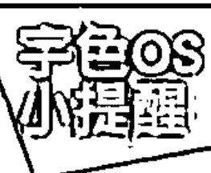
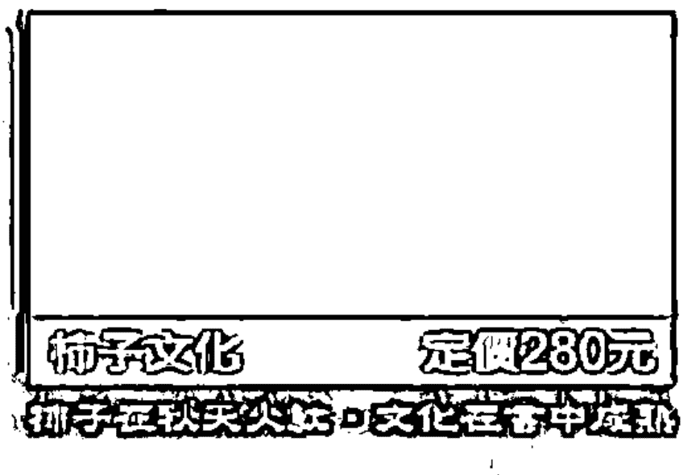

# 我在人间的灵界事件簿

# 讀者&學員推薦

坊間太多的靈學、靈修書籍充斥鬼神之說，卻少有一本分享自身神秘經驗與智慧、告訴我們以思辨實證方式靈修的作品，感謝宇色！ ——辛西亞

一眼看穿連你自己都不認識的自己；一語道盡怯於自我思辨的人云亦云，如實的宇色。 ——何明智

跳脫傳統的世俗迷思，一本探索、透澈心靈旅程的好書。 ——明

謝謝宇色費心地出了這樣一本好書，讓大家對於靈修的觀念，不再只是一些表面形式上的模式而已，加油！ ——桂香

宇色老師是最有膽量的學生，在他不停的驗證下造就其另類（人性化）的靈修方式，突破舊有靈修的思考模式和行為，讓靈修的路更為寬廣、更為遼闊。 ——茱莉亞

宇色是一個充滿謎樣的男子，他不僅是一個靈修者，也是塔羅占卜師，更是一個生活的實踐者。他將靈修帶入生活之中，變成生活的一部分，靈修到了他身上，不再是個充滿宮廟色彩的行為模式。就讓宇色

透過《我在人間的靈界事件簿》帶領我們繼續走上未完成的奇幻靈修之旅。 ——紫

靈修非常人可為，因須藉由自我覺醒以探求另一空間；卻又非常生活化，因為是以平常心看待一切。這二者之間非常不同，但透過宇色的自身經驗，卻能打開這神秘的黑盒子。期望很多靈修上的盲點都能在宇色的新書中得到解答。 ——劉姥姥

幾十年前開始的靈動，一直不明所以，亦無法突破，經宇色老師的指導，有如醍醐灌頂，真是所云：「大道不過三兩句，說破那值幾文錢，萬兩黃金難買到，十字街頭渡有緣？」 ——慧日

雖然是談靈修，但是宇色更是以「生活」為實修道場，以「心性修正」為主要方向，很期待在《我在人間的靈界事件簿》中，宇色可以繼續他獨特的引導方式！ ——盧奕

第二集終於要出版了，我希望能知道更多實修方面的事，非常期待！也希望能辦籤書會或是讀書會，謝謝！ ——Blossom

### 殊勝靈修背後的真相

在許多諮商個案或是新書發表會中，我最常聽見的一句話便是：「書中的觀念顛覆了我對許多事情的看法，原來修行可以如此自在！我也好想和你一樣，以靈修為修行方式……」
一聽到類似的說法，我當下的念頭就是：勸退他們。
人總是習慣用耳朵和大腦去探尋世界，遵循別人的步伐前進，卻忽略了應該用自己的眼睛和心去觀察一切。

我在書中所分享的，僅是個人對靈修、靈界和世俗法的淺見，並不一定適用每一個人。走在人世間，每一個人皆可以選擇適合自己的修行方式，而非盲目地追求他人人口中的經驗。

在《我在人間與靈界對話》中，字色的經歷看似很自在又不受約束，一本兩百多頁的書將「靈修經歷、看法及過程」簡要卻緊湊地講完了，但是，箇中的艱苦卻非一般人所能體會。若想要領悟到不同的人生、靈修、修行看法，更是要付出加倍的努力。我常跟許多想進入靈修領域的人說，靈修是一條漫長且艱辛的路途，它不是修行的捷徑，而是認清內在自我的方式。

近幾年有許多人對宇色說：「台灣宮壇素質差很多，我找你問事，是因為你不同於宮壇的靈修人。」
我雖然不是宮壇出身，卻不能否認自己是個跑靈山的靈修人，對於宮壇文化給人的負面觀感，我認為實在無需一竿子打翻一條船。

一位出家多年的比丘尼師父知道我以靈修為修行法門後表示：「你和一般跑靈山的靈修人不一樣。」
這位比丘尼師父說，這麼多年來，她看過很多跑靈山的靈修人，跑靈山是透過外靈來修持，所以他們身上大都有一種修外靈的特殊氣場。然而我身上既沒有修外靈的氣場，也沒有以仙佛為修鍊的氣場，反而是介於兩者之間。

多年來，我跑靈山靈修的原則是——不靠外靈修鍊，也不依靠他人，不論接到什麼信息，都會拉回自心，去思考自己的問題：「我在做什麼？」「我是否還有很多沒有看到的缺失要修改？」我只修元神，我只修自己，元神就是我自己。至於比丘尼師父口中的氣場，應該是我的人格特質特別強吧！聽聞我的解釋，她恍然大悟地表示：「對，你的人格特質特別強，不像其他靈修人身上有外靈的氣場。」

宇色走靈修、跑靈山都是事實，但我從不因為坊間對跑靈山的負面傳言，就抹滅這樣的修行態度及法門。我並不否認靈修容易卡到陰、沾染到外靈等說法，然而，佛門中就沒有誤導眾生、觀念偏頗之人嗎？通靈人就沒有連自心都看不見的人嗎？透過紅塵生活修的，就沒有通達智慧之人嗎？修行是因應「人心」而有所改變，人心才是影響修行法門的重要因素，修行的方式並不是重點啊！

每一個人都有選擇修行方式的權力，靈修確實是與祂們最接近的修行法門，卻同時也是最考驗人心的修行法門，不能因為僅見到一面不容於社會觀感的靈修方式，就對全部的靈修人產生偏見。

我在本書中曾提及，走靈修之前，應先培養自己的定力。不因書中的描述，對靈修產生不切實際的懂憬；只憑觀照自我、了解己心去選擇適合自己的修行法門，這不正是定力的一種表現嗎？

宇色

# Part1

## 未說完的故事

### 我的童年與鬼故事

與那兩位在睡夢中往生的男房客相比，多年來，那位看不見的鄰居從未真正傷害過我們一家人。後期走入靈修後才了解，原來十多年來未受其害，並不是出於幸運……

這要從我小時候的舊家開始說起……

那是一棟分層租賃的四層透天厝，前身據說是日本時代遺留下來的一間老舊日式矮房，經規劃後全部打掉重蓋，我們家承租二樓，在那裡渡過十餘年寒暑。

#### 我住的地方是鬼屋

透天厝的一樓原本是客廳，後來改成停放機車的地方。機車停放處後面還有一道門，通往廚房和一個小房間。比較特殊的是，通往地下室的樓梯扶手是鐵欄杆，隔著鐵欄杆就能看到一片黑鴉鴉的地下室。

從我有印象開始，每次經過地下室都會有一股莫名的不安與恐懼，彷彿有很多隻手會從鐵欄杆伸出來要捉我的腳；而一樓後面那扇門，更令人避之惟恐不及，因為那道門所連接的廚房和小房間根本沒人在使用，但我總是感覺到有人站在門後面。或許我會對鬼神之事有一股敏銳直覺力，就是從小這樣訓練出來的——因為不乾淨的房子住久了！

印象深刻的是，搬到新家後沒多久的一個晚上，老媽剛好在舊家附近和熟識的店家閒聊。她打了一通電話回來，口氣中透露出一絲絲詭譎的氣氛：「舊家一樓的小房間昨天剛死了一個年輕人。」

住在舊家四樓的是一對大我十餘歲、經年茹素的表姊妹，前一日晚上表姊剛從外地回家，經過一樓時突然感到身體不適，當時她沒有多想，沒想到半夜睡到一半，突然全身盜汗不止，還發出痛苦的呻吟聲，被睡在一旁的表妹搖醒後，便整夜翻來覆去無法入睡。昏沉中天色漸亮，隱約聽見樓下傳來鼎沸人聲，下樓後才知道剛搬進一樓的男房客在昨天心臟病突發身亡，推算死亡時間，就是她昨晚回來前沒多久。男房客正值壯年，三十歲出頭，無不良嗜好亦無心臟病史，怎會莫名地突然死去？弔詭的是在同一年，承租二樓的男房客也死於心臟病突發。前者是女友打電話給他未接，來到承租處破門而入，才發現男友已死亡；後者則是死亡多日飄出屍臭味才被人發現。沒有人探究兩者之間是否有關連性，然而，這間透天厝的怪異之處不只這一樁……

#### 那些我們不知道的住戶

其實從搬進舊家後，我們就知道這間房子非常「熱鬧」了……

#### 神秘的彈珠事件

剛搬進去時，四樓明明沒有住人，卻不時傳來搬動桌子時桌腳摩擦地面聲、拖鞋聲、開門聲，甚至還會聽見彈珠從四樓丟下樓，一階一階彈跳下來的噹噹聲響，這些聲響有時不只是晚上才會出現，就連早上也很常聽見。像是彈珠的彈跳聲，初期我還會自我安慰只是隔壁小孩半夜不睡覺在玩彈珠，然而住了十多年，彈珠聲響還是每晚準時報到，才不得不接受彈珠沒有好玩到可以玩十年的事實。

有同樣經驗的還不只是我們家，連我們搬走後才遷入的父子，也遇過類似的恐怖經驗。他們向房東表示，平時不只會聽到彈珠聲，甚至有好幾次聽到有人從四樓走下來的聲音，然後腳步聲會在門口停下來，既不敲門也不離開。有一次他們倆在門縫下清楚地看見一對腳影子，父親不動聲色地走上前去開門，然而，門前只有冷風陣陣吹過，連一個人影也沒有。

說到此，猶記得小時候我最怕三樓通往四樓那一大片白牆。我自己也說不上來是為什麼，只要一到晚上或每逢下雨房子陰暗，就不敢抬頭看那面牆，在上樓時甚至會搗住臉快步跑過去——就是覺得那面牆壁很陰、很怪，彷彿隨時會有某種看不見的東西從牆上走下來。

#### 到四樓就突然消失的「人」影

有一次老哥在打電動，看見一個「人」從樓下走上來，伸頭看了他一眼後，便轉身上了四樓。平時經常有人拜訪住在四樓的那對表姊妹，老哥剛開始也不以為意，直到警覺到四樓沒有傳來人聲，也沒看見人下來，才意會到：「那個人上去找誰？」我老哥衝上樓去看，四樓房門深鎖，根本沒有任何人，它……跑到哪去了？忘了說明一件事，我哥從小就有陰陽眼，但常常人、鬼傻傻分不清楚；當他還在讀小學時，有一次全班要去遠足，一出門便看見有個男生蹲在家門前的巷子口，他一往前走，那男生就不見了，但後來對方竟然又現身在他們班遠足的地點，老哥才意會到——原來它不是人。

自從四樓表姊妹搬來後，樓上拉桌子、搬椅子、腳步聲出現的次數明顯減少，但只要她們一不在家，就又會開始發出聲響。一般來說，只要不打擾到我老媽睡覺，她都可以「息事寧鬼」當作沒發生，但只要吵到她無法入眠，就會衝上樓去拼個輸贏。奇怪的是，老媽一上樓聲音就停止，下樓後聲音又再度響了起來，好似真的有人躲在某處偷看老媽，和她玩捉迷藏。

#### 差點被鬼偷抱走

某天晚上，老媽還開玩笑地跟我說，當天中午我差一點被偷抱走！
當時，老哥在另一間房間玩電動（如今他已經是兩個小孩的爸，還是很愛玩電動），瞥見一個男子鬼鬼祟祟地探頭進來看了他一眼（承租的透天厝一樓不會鎖，任何人都可以自由進出），又轉身過去看睡在對面房間的我。此人行蹤太過詭譎怪異，老哥立即操起傢伙衝了出去，沒想到，卻眼睜睜見到那男子一身輕盈，每次跨步就是一層樓一層樓地往樓下跳！更令人寒毛直豎的是，整個下樓的過程就像演默劇一樣，沒有發出一絲聲響。老哥追下樓去，遇到隔壁正在掃地的阿婆，她表示根本沒有見到任何人從屋內跑出來。它到哪裡去了？老哥前前後後把整個房子都找遍了，就是不見其蹤影。最有可能的是，它還躲在這棟透天厝的某個角落！老哥事後回想：「我根本沒有看清楚它長什麼樣子，它的臉是黑黑的一團。」

#### 沒有人敲擊卻不停震動的鐵板

以上都只是小兒科！在透天厝尚未安裝加壓馬達前，常常無法送水到樓上來，老媽便會到一樓廚房洗衣服（我們的廚房在四樓）。有一次衣服洗到一半，一旁通往地下室的鐵板在無人碰觸的狀況下，突然「通……通……通……」地大聲響了起來，彷彿有人在地下室拿某種東西敲打那塊鐵板。老媽事後告訴我，她親眼看見那塊大約四十五平方公分大的鐵板，被敲到不斷地跳動，她很鎮定地拿起水管往鐵板的縫隙沖水，一直到敲擊聲停止後，才扳起鐵板一探究竟。只見底下黑鴉鴉一片，沒有照明設備的地下室伸手不見五指；而鐵板和地下室中間隔著一層鐵網，就算下面真的有人，也根本不可能摸得到鐵板，敲擊聲究竟是如何傳出來的？至今仍舊是一個謎。

#### 床邊的長舌鬼

真正被那位躲在某處的「鄰居」嚇到搬走的，這麼多年來也只有一位。

比那對表姊妹還要早三、四年左右吧？四樓曾經住過一位男裁縫師，在我們家搬進去後頭幾年——大概是我讀幼稚園或小一的時候——就搬走了，當時年紀還小，對他沒有太深的印象，後來才從大人人口中得知他搬家的原由。

一般來說，透天厝頂樓的最後一個房間，大多是拿來當公媽廳或是佛堂，不太會有盥洗室，承租四樓的住戶如需使用廁所或洗澡，就必須下來三樓——後期那一對表姊妹，也都是下來三樓使用我們房間內的廁所。這位男裁縫師半夜上完廁所要回四樓睡覺時，總感覺背後有人尾隨著他，然而每次回頭察看，整座樓梯都只有他一人。起初他以為是自己多心，所以並未多加留意，然而隨著時間累積，被跟的感覺愈來愈明顯，甚至能感覺到那個人非常貼近他的背部！

某天夜裡，他從三樓上完廁所回到四樓，才剛躺平沒多久，便隱約從門縫看見一個長長的舌頭，正從門縫下慢慢地伸進來……

### 來自浴缸的偷窺視線

樓上的那位表妹也告訴我，在我們搬走之後，她三不五時會在洗澡時聽見客廳有聲音傳出來，一旦她停止動作想仔細聽，聲音就會跟著停止，好像知道她正在廁所內注意「它」。除此之外，有很多次她甚至還清楚地感覺到有人正蹲在浴缸內偷看自己洗澡，我問她怎麼知道是蹲在浴缸內偷看的？她告訴我：「如果被人偷看洗澡，女生會有很明顯的感覺。」

個人的身影。在昏黃樓梯燈的斜照下，那對人腳更明顯了！當他正感到疑惑之際，人影竟然從門縫溜了進來！
不知是太過驚恐還是嚇傻了，他完全愣住，動也不能動，只能眼睜睜看著它慢慢地「滑」到床邊。對方看起來是一個中年男子，來到床邊後就沒有進一步動作，只是靜靜地站著。裁縫師躺在床上，隔著一層白色蚊帳和它對望，觀察著彼此。
突然，那個人緩緩地揭開蚊帳，慢慢地靠近躺在床上的裁縫師。「我看見它的嘴巴在我面前張開，一條很長……很長、滿是鮮血的舌頭伸了出來，在我面前晃啊晃啊……」事後，聽說他母親四處求神問卜，求了一堆平安符、護身符、香火回來給他。他在屋裡屋外貼滿符咒，但還是三不五時看見那個人尾隨自己上樓，最後真的受不了，才草草搬離這棟透天厝。

### 撞鬼事件簿

至於發生在我自己身上的鬼故事，印象最深刻的只有一、兩件。

在升國二那年暑假期間，我每天晚上十二點十分都有聽廣播《午夜奇譚》的習慣，節目主持人是談鬼專家司馬中原與另一位女主持人。那晚正好是農曆七月十五，天氣相當酷熱，但半夜聽到令人毛骨悚然的配樂，還是會忍不住拉起棉被朦住頭；大約聽到十二點半的時候，床突然晃了一下，我感覺到有人在雙人彈簧床邊輕輕地按壓著，一開始我以為是錯覺，因為全家人都入睡了，房門也已經上鎖，不可能有任何人會進來房間。

「那個人」用力壓住床沿，我清楚的感覺到床角被壓得陷了下去，也很確定那絕對不是錯覺：「不會真的讓我遇到那種事吧！」就在這時，那人輕輕地爬上床……看我始終沒有動靜，它竟然還站了起來！站了一會兒後，我仍舊動也不動，它就再往前踏了一步，剛好往我拉住棉被的小姆指踩了下去，我躲在棉被裡，輕輕地將小姆指抽了回來。它不動我也不敢亂動，心裡卻很想掀開棉被一角偷瞄，看看鬼是不是如傳言所說的那樣沒有腳，但又害怕要是掀開棉被偷看的同時，它剛好也彎下腰低下頭，在棉被旁邊跟我對看，那該怎麼辦？不過念頭一轉，我心想：「再這樣耗下去也不是辦法，乾脆把棉被掀開來算了。」

### 愛鬼不愛神！？

我用力地掀開棉被，床邊卻連個人影也沒有……
另一個晚上，我看到它出現在距離不到三公尺、斜對角鄰居屋頂的花園圍牆邊。那天，原本空蕩蕩的花園莫名出現了一位理著大光頭的男人。一開始我以為是屋主的大兒子，一直對著它傻笑，但它只是站在那裡動也不動。因為對面是暗的，我家這邊是亮的，所以根本看不清它的臉，為了確認自己沒有看走眼，我趕緊叫一旁的老哥幫忙看，老哥瞧了一眼表示沒看到，我又轉頭再確認一次，它明明就站在斜對面的圍牆！等我又更仔細盯著看時，它就突然從我面前消失了。
事後將種種事件串連起來，那位阿飄應該是一位中年男鬼，而與那兩位在睡夢中往生的男房客相比，多年來它從未真正傷害過我們一家人，我原本以為一切都只是巧合，在我走靈修十多年後才掀開這個謎團，原來十多年它未曾傷害過我們其實並非出自幸運。

第一次在宗教上有正式的皈依是天主教，當時是小學三年級，聽一同補習的同學說，有不少同學到某位信仰天主教的女同學家受洗，過程中看見許多異象，甚至謠傳

走靈修，我沒有比較厲害，也沒有帶什麼濟世渡俗的天命，只是做自己喜歡的事情；我沒有想要顛覆傳統，只是想探索更不一樣的靈修。造就一個人在修行路上獨樹一格的特質，不是老師的功勞，本身的天性已經決定了絕大部分的結果；一棵神木的養成，在幾千年前種子種下的那一刻已經注定好了，後天環境只是影響它的養成速度，而不能決定結果。走靈修也一樣——不在於你能學習多少東西，而在於是否願意以大無畏且奮力一搏的精神，去除內在的劣根性。

班導師在女同學家受洗時，看見一個人跪在斷崖邊，還有許許多人被丟下斷崖——據說這是西方世界的地獄景象。於是，我為了一睹地獄的真面目而受洗，心中絲毫沒把這個儀式當成什麼重要的事，想當然爾，我什麼也沒看到，但在那陣子裡，我很虔誠地向上帝禱告，每天領聖血與聖體[1]，口中唱著：「神愛世人，甚至將祂的獨生愛子賜給我們……」

信天主教的那段日子，我既不上教堂也沒有參加過任何一場大型聚會，我的目的很明確，只是想看看地獄，可能是因為動機不對吧！所以也沒有任何奇特的遭遇。

第二次接受宗教的洗禮則是一貫道，那時我讀小四，住在樓上的表姊妹是虔誠的一貫道教徒，但從未在我們面前傳教過，唯一能感受到她們虔誠信仰的地方，就是老媽沒時間回家煮飯，她們好心煮素菜給我吃的時候；久而久之，沒有太多原因，我就這樣選擇了吃素，也自然而然地皈依了一貫道，領了三寶，也完成了一地府抽丁，天堂掛號[2]。從天主教變成一貫道，對我的宗教觀一點影響也沒有，我骨子裡頭還是信仰佛教與道教，從來也不曾因為轉換了宗教而在心中有一絲絲的愧疚，我很明白，宗教只是形式罷了，人心才是真實的——那時我才小學四年級。

在求道那段日子裡，我上了幾堂一貫道的課程，也聽了不少信徒之間勾心鬥角的故事——誰護持哪一間佛堂？誰推崇哪一位點傳師？宗教背後血淋淋的人性在我眼前一幕幕上演，讓我明瞭人才是能真正主宰宗教的力量[3]。看見有人為了搶弟子而分

[1] 聖血是葡萄酒所製，聖體則是以麵餅製成，代表耶穌的肉體。

[2] 一貫道的三寶指的是「玄關竅」、「口訣（五字真言）」、「合同（即點玄關、傳口訣、授合同印）。一貫道認為求道之後，便能從地府除名、在天堂掛名，死後便可脫離六道輪迴。一貫道的三寶可以說是他死後回歸到無極理天的憑證。

[3] 此為筆者個人在宗教上的體驗，請勿以偏概全，延伸至其他一貫道的宗教信仰中。

家，也看到分家後各個擁護者開始以言語攻擊對方，我有一個很深的感觸：「宗教絕無最好和最壞，端看你從中得到何種滋養，彌補內心的欠缺。別人認為最好的宗教，充其量，也只是滿足他個人罷了，並不能套用在別人身上。」那年我十一歲，當然，十一歲的體會並沒有這麼文謅謅啦！講白話一點就是，信仰是你自己的感覺，你自己爽就好了啦！到現在我還是如此看待自己與他人的宗教信仰。

Rob Preece 在《榮格與密宗的29個「覺」》一書中，對宗教提出了他多年的經驗和觀點：「靈修病態有多種面貌，其中一些在近年來已經逐漸顯現，沒有一種宗教可以避免陰暗面的產生，我們似乎有無限的能力，能夠假借宗教之名，製造集體偏見、偽善，以及黨同伐異的仇恨。掀開宗教運動的表面，我們便看到下面隱藏了種種病態；這是悲哀的事實。」

Rob Preece 對於宗教一針見血的看法，運用在台灣的靈修、宗教上亦是相同。當修行人所屬的宗教團體已經產生偏頗的行為，而本身又認定自己處於宗教團體的保護傘下，便會少了一顆明辨的心以及勇氣，去檢視身處的宗教團體、老師、同修以及自己；也容易受到似是而非的宗教污染卻不自知，此時，所謂的修行便可能只是建立在自我感覺良好之上，無法透過宗教團體看清自己內在的本性。

與天主教相同，一貫道的信仰在我生命中並沒有留下太多的痕跡，等到我搬離了舊家後，就不再對一貫道有更深入的接觸，一直到我因靈修而皈依了南無藥師琉璃光

> ④集結與自己觀念相同的同黨，攻擊與我們不同思想、觀念的人。

### 明知山有鬼，卻向鬼山行

跟宗教相反，對於鬼魅之事我從小就相當有興趣，當同學還在玩扮家家酒、跳繩、警察捉小偷的遊戲時，我已經開始思考鬼與神的事情。我常常想，人世間真有神和鬼的存在嗎？如果有神又有鬼，又該如何才能看見？從小便聽說半夜指月亮會被割耳朵，我偏偏要每天指月亮，等它下來割我耳朵；坐在枕頭上屁股會爛掉，我說七月半梳就每天睡前坐在枕頭上；有人說七月半梳

如來佛。憑良心講，在天主教及一貫道上，我並非一個虔誠的教徒，或許誠如愛因斯坦所言：「一名熱衷於宗教的人之所以會虔誠，是因為他們對不具理性基礎的超自然物體，與其宗旨所展現的意義和崇高，不存在任何懷疑。」我看了太多不合理的事情，所以無法熱衷於當時的信仰：在天主教，我不認同信主得永生及不信神一定會下地獄的論點；在一貫道，我也從不相信點了靈就可以「地府抽丁、天堂掛號」，誰規定人在未往生時就已注定下地獄？我只相信生活重在當下，離天堂就不遠。

有人問我：「是什麼樣的家庭造就你如此早熟的宗教觀？」我認為是天性。
我不是一個聰明、有智慧的小孩，只是從小便跟「問題」相處比較久，又愛跟常理唱反調。從小我便不把世間看似常理的事情當成常規，例如小時候常被叮嚀香蕉不能放冰箱，我就硬要把整串香蕉丟進冰箱作實驗，驗證香蕉遇到冰凍的環境會變黑及凍傷的道理。長大後，對於靈修更是如此，我很慶幸在靈修路上遇到的貴人，都非常包容我怪誕的想法與舉動。
我天生個性「九怪」（搞怪），一次在演講時我問台下一群為人母的聽眾，能不能接受自己的小孩像我這般無厘頭、好動又愛搞怪？一堆婆婆媽媽頻頻搖頭，我笑著反問：「那麼，為什麼你們卻希望從我身上尋獲解決人生問題的答案呢？」很矛盾，不是嗎？我又問：「你們是希望生一個會讀書卻無法處理生活事務，遇到人生挫折就只會怪祖先、因果、業力的小孩，還是想生一個天生九怪，卻可以自理生活的人？」台下的婆婆媽媽全都默默不語，我想這真的是很難抉擇的選擇題吧！

頭髮會看見鬼，我也照做；在鏡子前削蘋果可以看見未來的另一半，而我沒能看見另一半，反倒是練就了削蘋果皮能一刀到底的好刀藝；半夜彎腰從胯下看就可以見鬼，結果我啥都沒看見，還差點閃到腰；說胸口是先天八卦，趴在地上會吸收掉身上的陽氣，然後就能看見鬼，而我還來不及看到鬼，就已經練到有胸肌……諸如此類的見鬼傳言，我一樣也沒放過，但都只是一再確認，這些不過都是以訛傳訛的謠傳、虛構的電影故事情節罷了。

記不起從何時開始，我就知道這些筆仙、碟仙、狐仙中所謂「仙」字輩，所召來的外靈是鬼，而不是真正的神，這些我在小時候全都接觸過了，目的就是想要一睹鬼的樣貌。還記得有一次隔壁鄰居捉弄我，邀我一起玩碟仙，等到碟子開始走動時，便叫我將手放開，事後他們一直問我是否有發生什麼靈異事件，我都傻傻的搖頭表示沒有。一直到許多年後，才知道玩碟仙時千萬不能在中途離席或放開手，不然召來的外靈會附在離席者身上。不過，我倒是沒有因此發生過任何不幸。

很多人從小就對孩子灌輸鬼神論，當小孩不乖時，就直言是祖先、風水問題。甚至曾聽說有位小朋友，只因為乩身交代在榕樹下遊玩容易卡到陰，從此家長就要求老師絕不能讓小朋友待在榕樹下，連遠足的地點有沒有榕樹，都要再三確認；小朋友在耳濡目染之下，自然就知道要遠離榕樹。這麼小就如此疑神疑鬼，長大後自然就會事事牽拖鬼神。孩子還小的時候，不應給予他們太多不必要的鬼神論，因為他們尚無能力分辨對錯；給小孩更寬廣的生活態度，他們在未來也會以正面、積極的態度來看待人生。

你是否想過，對鬼魅之事充滿負面觀感和恐懼，不也是自小從長輩、書本、電視吸收而來的？然而，真相真是如此嗎？愛因斯坦說過：「很少人是會真的用自己的眼睛去看、用自己的心去感覺。」（Few are those who see with their own eyes, and feel with their own hearts.）究竟有哪些價值觀，是從你自己的經歷與體悟而來的呢？

### 天生破格嘴

喜歡接觸鬼神事這一點家人尚可接受，只要不礙到別人，一切好談。但是我腦袋

「生死」是小時候最困擾我的一件事情，常常在半夜一直在想這個問題：「人會長大，長大會老，老了死，死了……會去哪裏？」從廟裡拿回來的善書上說，人死後會上天堂和下地獄，但身邊從來沒有人親口告訴我死了會去哪裏。每次學校要學生填個人資料表時，長輩欄都會有一格「存、殁」，那時父母、爺爺、奶奶、外公、外婆通通還健在，只能全部都圈「存」，但我的小小腦袋會開始幻想，哪一天他們其中一人死了，或許就可以經歷親人往生的感受。很矛盾的是，我對鬼、死人很感興趣，卻很恐懼看到真正的屍體，多年來一直如此。

從小，我對探尋死人及鬼的世界便比一般孩子更充滿熱忱，當時坊間有許許多多神奇、靈界的雜誌，只要有關於鬼、靈異照片的報導，我一定會努力存錢買回來收藏，尤其是在廟寺常見的助印善書，更是我收藏的目標之一，例如：《天堂遊記》、《地獄遊記》、《朱秀華借屍還魂》等故事。除了善書之外，錄影帶店裡頭關乎鬼、自殺的影片通通是我的最愛，其中以泰國、印度記錄自殺、意外、天葬等的介紹影片最讓我喜歡——從小家人就搞不懂我為何會對這類影片如此著迷。

> 這個故事發生在民國四十八年間，金門小姐朱秀華借著雲林縣麥寮鄉，得昌建材行吳秋得先生的太太林罔腰之肉體還魂。

裡頭裝的一堆怪想法，反而比較令我家人頭疼。比如，我就是不懂為什麼紅龜粿上面的麵皮是紅色，屁股卻偏偏要做成白色？我也搞不懂為什麼人死了要包白包，結婚要包紅包？為什麼在七月半普渡時，要在供桌前面放一盆水和毛巾？這些疑問從我嘴巴脫口而出時，我媽只有一句話：「破格[6]！」然後就是一巴掌飛過來——老媽從不帶我出席親戚朋友的婚喪喜慶，就是擔心我這張破格嘴會在別人面前胡說八道。

除了對我口無遮攔一事非常無法接受之外，在宗教信仰上，家人倒是扮演著放任的角色，尤其是我老媽，有很多事情她都看在眼裡，但卻從未阻止，也未曾發表過一點意見。或許是老媽和其他家人皆未深入宗教，所以也不會約束或干涉我太多，這樣的開明態度，深深影響了我。一直到後期開始接觸靈修，我才逐漸明瞭一件事：「家庭」在我們轉世之時早已注定，會根據我們需要調整的心性，或待開發的潛能，安排適合我們的家庭——一切都早已安排好了！

> [6]台語，「破格」有很多的說法，單就八字而言，有突破格局之意，但一般指較負面的事情，例如在八字中有財格的命格，逢七殺便洩財就是破格。也用來形容小孩胡說八道、不按牌理出牌。

### 與靈界對話

早期去台中問事的時候，對於我口中能說出靈語一事，堂主也說是因為往生親人附身所致……

未正式走靈修前，我並不喜歡提及靈修、靈異這檔事。人是一種主觀的動物，如果沒有相同的生活歷練與背景，一般人不會認同這方面的事，只會當成茶餘飯後的話題；靈玄之事夾在現實與虛幻之間，未踏入這個領域的人，自然無法體會箇中心境。另一個原因則是，一旦讓別人知道自己的經歷，很容易就會被定型在某種身分中，進而在生活上產生不必要的困擾。

有次和一位同事在閒聊時，不知不覺地從靈異故事聊到靈語議題。他對這種「語言」感到很好奇，希望我能現場說幾句給他聽。我當時初啟靈，尚無法全盤了解自己口中的靈語，於是向他表示：「我可以試著說一段，但是會說出什麼內容，我不保證一定能知道，同樣的，我也無法預期講出來的內容是不是針對你。」

#### 你到底在講什麼？

闔眼靜下心，轉換意識後訊息便馬上過來。我一張開眼，元神便使用靈語說了一大串話。我邊講靈語邊留心觀察同事的表情，剛開始他滿臉驚訝，一副劉姥姥逛大觀園的模樣，過了一會兒，僵硬緊繃的表情逐漸和緩下來，之後竟然還隨著靈語聲韻輕輕擺動身體。

雖然當時我尚無法隨意將靈語翻成白話，但靈語中偶爾會夾雜幾句白話：「早在幾年前，你就該在這個領域有所成就，但因個性嚴謹、做事不懂圓融，延遲了你的成功。你要放開封閉的心，接納身邊所有聲音，這些聲音將改變你心中的主觀想法，讓你做事更圓滿。」聽到這番話，朋友的臉色一陣紅一陣白，不知道是感到愕然，還是不解。

「你知道你剛剛在講什麼嗎？」同事問。

我向他表示整個過程中，我的意識非常清楚，只是講出來的訊息內容非自己所能決定，接著我反問他聽完有什麼感覺？「很好聽？」他露出笑容：「不曾聽過，但真的很好聽。」

「我也不知道該怎麼形容剛才的感覺，一開始聽到靈語時是很驚訝……」他遲疑了一會兒，似乎不太敢確定：「稱它為靈語對吧？」

「Up to you」，名稱是後人依喜好所創，用什麼角度看它，它就是什麼。

同事接著表示，這種語言完全超乎他的想像和認知，也不清楚自己的身體為何會在不自覺中隨之輕擺，只覺得當下非常舒服，整個腦袋放鬆而且空白，直到聽到靈語中穿插的幾句白話，才將他拉回現實。而白話所述的內容，竟然跟國小畢業紀念冊上，同班同學給他的評語很類似，他感到十分驚訝——我們倆才剛認識不久，我為何能講出與他個性如此相符而精闢的評價？

接著，他再度開口問：「為什麼之前你講出來的語言會被定義為靈語？靈語又是什麼？」他陷入了文字障中，我回答他，靈語這個名稱是後人想盡辦法去定義的，目前並沒有一定的說法。稱之為靈語，從字面上看來便解讀成靈界拿來溝通的語言；稱之為天語，就成了天界的語言；也有人會說這是宇宙語，是外星人所用的語言，並深信只要解開這種語言，就能和外星人溝通。

後來我開始懂得如何以元神向祂們請益時，對於靈語祂們是這樣回答的：

「靈語非語言，只是一種意念。靈界不需要語言，僅靠意念來溝通，而人世間所使用的靈語，其實就是一種意念。人們透過文字和語言讓對方了解自己的意思，卻常常發生所聽到或解讀的不是我們本意的狀況。人會用自己的角度、邏輯與過往經驗來解釋對方的話，就算寫成白紙黑字，還是可能產生同樣的結果；反過來說，有時候連說話者本身都不一定清楚自己真正的心思，誤會就會因此而產生。一旦透

> ①佛教用語，文字障有多重意義，有著不求甚解，只看表面的意思。另一種解釋則是見字拆意，以先入為主的觀念看待文字，本文中所指為後者。

#### 靈語劃開四度空間

小相是我早期探索靈修的最佳好友，他有著與我相似的特質——勇於嘗試，凡事

過意念溝通，就能減少這種誤會——我想什麼，就將這段意思複製到你腦中，你所接受到的訊息是從我腦中完整無誤地傳遞過去的，不摻雜個人的想法與經驗，只有說者最原始的想法。也因為如此，靈語無法用人類慣用的方式來學習，因為它不是語言，只是一個頻率、腦波，要用心來解讀和接收訊息。」

祂們的一席解釋，令我茅塞頓開。原來，保持一顆覺知心，讓心境全然地開放，才是走靈修路更自在的心法。為了達到溝通的目的，我們必須學習彼此的語言。反觀靈修者，就算彼此口中的靈語迥然不同，卻能達到溝通的目的，這就表示，靈語不能狹隘地解讀為另類語言。在《牧羊少年奇幻之旅》中，有一段話，既可以超越宗教主觀的說法，又能恰到好處的形容這種意境：

「待攤位就緒，那位糖果小販把當天做的第一份甜點送給男孩。男孩向他道謝，然後吃了甜食，繼續上路。當男孩走開幾步路後，突然回想起，兩人在架設攤位時，一個說著阿拉伯語，而另一位則說著西班牙語，他們彼此都完全了解對方的意思。」

只憑自身的體悟（講難聽點就是白目），不理會網路上的傳言，也不管所謂的老師、大師們如何信誓旦旦，唯一的信念就是：「聽信網路上似是而非的觀念，最終只有搖擺不定與失去見解，還會阻礙更多探索的機會。」他的膽子比我大很多，只要聽到台灣哪裡有比較出名的鬼屋，如民雄鬼屋、大甲紡織廠鬼屋……一定二話不說地拉著我一起去探險，還好我們夠幸運，從沒有遇過卡到陰或被惡靈欺負的經驗。也因為他，我才逐漸體會到一個道理：初期走靈修路時，身邊的朋友、道友、師兄姐甚至家人的心性特質是一個非常重要的關鍵。古人云近朱者赤，近墨者黑，旁人會在不知不覺間，影響並建構你的想法和價值觀。

有一晚，不知道他是哪條神經走岔路，突然說要和我面對面闘眼，用靈語對談，不用在意靈語在說什麼，也不管是否了解內容為何，不去預設任何結果，就只是單純地試試看會發生什麼事……

沒多久，神奇的事發生了！我突然感覺到意識騰空，脫離了肉體，下半身絲毫沒有知覺。起初還覺得不怎麼真實，然而隨著用靈語對話的時間拉長，騰空的感覺愈來愈明顯，意識漸行漸遠，最後竟浮在頭上一尺處……我想起有幾次在維持長時間靜坐時，也曾發生過類似的情況，不同之處在於，靜坐費時久且深沉，今日的體驗卻發生在瞬間。

告一段落後，我們兩個人在討論時竟不約而同地說出相同的感受——意識在虛空中，感覺不到肉體的存在。由於不懂這是什麼因素造成，為了一解靈語神秘的面紗，我們決定再試一次。第二遍，我們將時間拉長，這時意識感與前一次一模一樣，但卻不是在頭上一尺處，而是彷彿站上一座高聳且廣大的山巔，與遠在另一座山頭的小相用靈語對話。肉體覺知此時此刻早已淹沒在層層山峰雲海底下，靈語形成迴音，在山谷間飛奔，時間感逐漸緩慢下來。如此奇妙且不可言喻的體驗，讓我想起唐朝李白的《早發白帝城》：「朝辭白帝彩雲間，千里江陵一日還。兩岸猿聲啼不住，輕舟已過萬重山。」有了這次不小心觸碰到的玄秘經驗，我更加不去甩網路的流傳，說什麼在家說靈語容易招鬼、損業力、是仙佛才能使用的語言，也因這件事更確信靈語背後尚有許多不為人知的秘密及功能。

#### 出手靈療

我開始免費為別人收驚、靈療及問事，透過這些方式了解如何將靈語翻成白話。在靈療時，我會邊說靈語邊配合肢體語言，提醒當事人健康、保養以及處事上應注意的地方；偶爾也會配合靈療手法，唱出一連串類似咒語的內容來治療病患。我開始從肢體語言感受靈語內容，也開始分辨出靈語還有各種不為人知的功能。靈語的功能如同某一種具有高度能量的咒語，有些敏感體質的朋友在接受靈療時，會隨著我口中唸出的靈語不斷地打嗝、流眼淚，有時甚至會做嘔，我能感應到對方是將體內穢氣透過靈療排放出來。在摸索期，我從肢體語言探索到，靈語說的是元神想要表達的意思，而元神是我們的內在意識，所以，用心觀察肢體語言，便能間接地體會到靈語所傳遞的意涵。

咒語有時是仙佛傳遞出來的高能量波動——無形但具調整氣場之功效，並藉由我的雙手產生更強的氣場，改善病患身上的疾病。根據我的親身體驗，轉換元神為人治療疾病的當下，能承接大自然的宇宙能量，調整人體的七脈輪②能量，以及精氣神③之效率。這些並不是看網路文章、書籍，或躲在宮壇就能體會的道理，而是必須透過好幾年、無數次的摸索後，才能獲得的心得——當然，第一步就是：先不用別人怎麼說才可以。此外，我還有一個很固執的態度支撐著這一路的摸索：絕不做出傷天害理之事，也勇於為自己的行為負責。

> 「量子力學的實驗已經證實，宇宙萬物之間可能以一種無法察覺的方式彼此相互連結，其連結的層次包括了我們的意識和意向（念力）。我們可以確定，宇宙間每一件事都在一團發光的母體上相互連結，當中沒有距離，沒有過去，也沒有未來。」

——摘自《印加靈魂復元療法》，阿貝托·維洛多博士（Alberto Villoldo, Ph.D.）著

②脈輪取自古印度梵文，是指轉動的能量中心，除了印度之外，在古印加、馬雅等地均有類似的說法。脈輪位於人體的中軸線上七個部分，代表不同的情緒及能量。

③精氣神可從中醫、道家及哲學角度解釋，在此純粹是指構成人體運作的基本物質。

#### 一間宮壇兩種說法，該相信誰？

早期的有線電視有非常多節目喜歡採訪宮壇、道場和通靈人，當時剛好介紹到一間道場的神蹟故事，很巧地，那間道場就在台中，隔天上網查了一下地址和電話，便和小相約好一同前往。

還未到問事時間，位於田間小徑內的宮壇前就已經擠滿了車子與香客，可見前來問事的人不少。快輪到我們時，我問小相敢不敢跟乩身講靈語？小相表示當然敢。

我接著告訴他：「等一下你跟乩身講靈語，看看她對你的靈語有什麼反應。」他點點頭。

按照我的經驗，對乩童講靈語準沒好事，廟方人員大多會搬出「你身上通通是外靈附身，只有來我們這邊才能修本靈」的那套說法。當時的我已經能將靈語轉成白話，也懂得別人所說的靈語；小相能力與我差不多，只是轉換過程比較慢。

小相進去大約二十多分鐘後就出來了。

> 「靈語、天文」是我們內在的本能，而元神是內在的心性，大部分的人都具有元神。因此靈語會在各宗教中以不同的樣貌存在。靈語僅佔靈修的一小部分，也可說是初入門的門檻，了解自己說出來的靈語，是靈修中最基本的條件。

靈修是自度自悟的修行法門，切勿一開始便為靈語冠上太多無法印證的神鬼論：「靈語是靈與靈之間的溝通語言，只要時機到自然就會說。」「只有帶翻譯的使命才聽得懂靈語。」

禪宗中有幾句話值得我們深思：「各須自性自度，是名真度」、「自性迷即是眾生，自性覺是佛」。理解自己所說的靈語，不也是認識自己的途徑嗎？唯一要特別留心的是，初學靈語時切勿自問自答，否則容易產生意識分裂的現象。有些人會自覺開心，認為元神像守護靈般，可以幫忙解決生活中的疑問，這是非常不可取的態度，未經人指點，貿然自問自答的結果，很容易陷入幻想的情境中而不可自拔，我很少遇到走火入外魔的人，卻常常看到「走火入心魔」的人。

我問他情況如何，他笑著搖搖頭，將方才寫的問事紙遞給我，上頭寫了幾段話：

- ※頭腦常常斷層，三清師尊（道德天尊）與他有緣，與元帥很好，因同一個師傅。
- ※元帥常託夢。（三太子）
- ※有一位姑姑或姑婆（白髮）想請您渡化。（長相：臉圓，穿道服）
- ※頭腦斷層是因為有一名女子，要查一下。
- ※媽媽四十五歲以後事業就有差。
- ※屬蛇做金類、土類，明年可以。
- ※可以求一下母娘，請母娘佛光別放太強，會使腦部產生斷層。
- ※有時可到佛堂靜坐。
- ※要修行不然胸口會悶悶的。
- ※事業配合修行，求道德天尊事業順利。

我看了一下紙條，只對第二句和第三句較感興趣，我問小相乩身為何這樣說，小相表示他說出靈語後，乩身便宣稱附在他身上說靈語的是姑姑或是姑婆。聽完後我只想哈哈大笑，果不其然，早期去台中問事，堂主也說我是往生親人附身才會說靈語（詳見《我在人間與靈界對話》）。我又問小相，降駕的神尊是用靈語與他對談嗎？

小相搖頭，表示對方根本聽不懂靈語，當然也不懂小相的靈語內容。小相接著又告訴我，道場的女堂主剛好在問事時進來（乩身與堂主是不同人），看到他在問事，認為能進大殿的不會是低等靈，仔細一瞧後便說，小相身上的靈體應該是瑤池金母旁邊的護法，告知小相需要超渡此靈體離開。

哇！瑤池金母身旁的護法，那位階很高囉！不要說是護法，就算是瑤池金母旁邊的護法，怎麼前後兩者的說法落差如此大？還說需要超渡？堂堂一位站在無極界瑤池金母旁邊的護法，何需超渡？難道要從無極界超渡到十八層地獄去嗎？對於初啟靈者身上的問題，每個宮壇一定有各自的說法，但從未看到同一間宮壇產生兩種分歧的意見；乩身是透過神明降駕辦事，而女堂主是以本身修為來看小相身上的靈體，那麼，誰的說法才對？還是要等到他們兩位爭論後才會有答案？

有一句話是這麼說的：「在某一個領域擁有聲望，不代表在別的領域擁有權威。」從鼎盛的香火可以猜想，宮壇主事者及乩身的辦事能力應該都很有口碑，行事風格也非常正派，不像坊間宮壇，動不動就以因果、祖先靈、嬰靈來恐嚇香客。他們確實很用心在處理信徒的問題，但並不表示所言的一切就是答案或真理，畢竟處理「人界」與「靈學」之事，是截然不同的兩個領域，無法混為一談，就好像孕婦要生小孩，敢去找牙科醫師接生嗎？雖然都是醫生，但是專業不同啊！這基本的觀念大家都懂，怎麼換到另一個場景，腦袋就打結不輪轉了？走靈修最重要的不在於接受他人告知我們多少事物，而在於懂得選擇和放下干擾內心寧靜的言論。

是否每一個人都必須經歷「學習靈語翻白話」的過程？我在初啟靈時便能順暢地以白話表達靈語，只是當時還摸不著靈修全貌，所以低調地選擇封口。待我再度開口講靈語時，已經無法像初期那般流利地轉換成白話，這才意會到「靈語翻白話」也須不斷反覆練習。

我漸漸發現到講靈語時，嘴巴念的雖是聽不懂的靈語，但腦中卻會逐漸萌出一種意念，一開始很難順利地捕捉那稍縱即逝的意念。在了解「靜心是洞察一切無明[4]」的道理後，我放下束縛，保持一顆平靜心，嘗試將後天意識與元神意識分離，講靈語時心中默念：「慢慢說……慢慢說……請說我所懂的白話。」靜靜體會心中那細微的意念，如同倘佯在大自然中，靜心聆聽風聲、水流聲……最終我體會到一個訣竅——靈語並不一定要透過嘴巴，而是可以將意念停留在腦中。經過幾年的努力，終於可以自由地轉換靈語與白話，奇特的是，我也開始能知曉別人口中的靈語，這種奇妙的感受，如非親身經歷實在很難體會。

那麼，靈語翻白話是一條漫長的學習之路嗎？其實，一切僅在一念之間，「心」是靈修中最重要的法門，隨時隨地保持一顆覺知內觀心，鎖住心中的專注力，不受外境的干擾，如此一來，當轉換元神意識時，元神而來的訊息才能絲毫不受腦中雜質的影響。

> [4] 常出現於佛法教義中，泛指迷濁不明的心，對世間事物無端引起的煩惱。

#### 大家都愛說你帶天命

或許是踏入靈修的時間較早，雖然途中跌跌撞撞，卻還是靠自己摸索出一條路，也因此培養出一個根深蒂固的觀念：「別人說的不一定算，唯有靠自己才靠譜。」我不是為了反抗而反抗，只是比較喜歡做自己罷了，我討厭人家在修行路上指使我，或是用言語恐嚇：「你這樣會遭天譴！」「你不知道嗎？你的主等你很久了。」

「如果你不這樣做，生命會有危險，甚至會有外靈附身……」當這類奇怪又帶威脅的言詞出現，我就會很反骨地硬去做給他們看，從小我的大腦神經元就裝了怪怪的轉換程式，只要出現別人口中的危險訊息，腦神經就會自動轉換成「一定要去做」。

靈修世界大到一輩子都探索不完，既然如此，別人口中的個人經驗或是傳言，又要如何能斷定是不是真理？離事實真相又有多遠呢？我原本以為天性是遺傳、家族基因等因素所構成，在靈修後期才逐漸了解到，今世的個性是轉世帶下來的天性；就拿我自己來說，我在叛逆中帶著一股孩子般的淘氣，並非今世才如此，而是在投胎轉世前便這樣了。轉世的天性，很難在輪迴一世的時間內被輕易改變，否則豈能稱之為天性？因此，修行之路並不如外界所想的如此簡單，是一條艱辛坎坷的路，佛陀講經說法多年，繞來繞去不都是在講「心」嗎？

在靈修這條路上，有一個很奇怪的現象——大家都很愛跟你講：你在做什麼、你是誰……我實在搞不懂，也很想反問他們：「你又知道你在做什麼嗎？」「你又是誰？」——就以我的元神來說，可能是我天生一副娃娃臉配上不太高的身材，外人對於我的元神，至少有十種以上的仙童版本，有三太子哪吒的轉世、觀世音菩薩旁邊的金童、守護天庭仙桃園的童子、新疆的童子……諸如此類的說法，已經在我耳邊響了太多次了。

> ⑤「阿姜」為泰語中的佛教術語，意指出家超過十年的老師，因此在南傳中有許多以阿姜為名的大師。
⑥阿羅漢，漢語常簡稱為羅漢，是依照佛的教導修習四聖諦，脫離生死輪迴，達到涅槃的聖者。
⑦很多自稱老師的人都很喜歡做這種事，因為本身的無知才會讓他人有機可趁。
⑧因翻譯的因素，在此指世俗，泛指人間、世間之意。

後期，在我所開設的課程中認識到一個學員，因為兒子叛逆的問題找了心理諮商師，結果又「轉介」給另一位通靈人——從教育問題變成處理嬰靈問題，到後來他被通靈老師說是帶天命，需啟靈、點靈認主，一路上搞東搞西，花了不少錢，卻只賺到一趟誰都不想要的花錢經歷，兒子叛逆的問題依舊沒解決！

我遇過一個個案，他有一點感應能力，偶爾能看見他人的元神。老師告訴他，他是該教派的護法，轉世天命就是要讓別人知道自己的元神是什麼，只要弟子出去拜拜，他就負責告知別人他們的元神為何。我問他：「你既然能肯定別人的元神，怎麼反倒要向我確認你轉世的原因與元神之事？連你自己都不敢肯定自己，那告訴別人元神與轉世原因的動機，是炫耀自己的能力？還是自欺欺人？」

在南傳禪師阿姜・放教導弟子的過程中，出現過這樣一個故事……

一個婦人自個兒在家修習打坐；當時有一個句子的幻象出現在她的禪坐中。她將句子照描下來，一個寺接著一個寺地請不同的比丘為她翻譯說明。無人能為她解答，直到遇見一位比丘，告訴她那是阿羅漢裡的語言，只有阿羅漢能了解，但他竟然厚顏地為她解說；事後還告訴她，她從幻象中所得的任何句子都可以拿給他看，他一樣會解說它們。

之後，這位婦人初逢阿姜・放時，便對他提起此事。阿姜・放的回答是：「阿羅漢的心是超越習俗的，哪一種語言能為那樣的心所擁有呢？」

有一次阿姜・放的學生問他，當心中昇起幻象時，如何能知道到底是真還是假？阿姜・放告訴這位學生：「即使那是真的，也只不過是習俗的觀點說是真的。你必須讓你的心超越真與假，修行的目的是使心清靜，其他事情都只不過是遊戲和娛樂罷了！」

靈修也是同樣的道理，自己的幻象都不應該相信了，為什麼還輕易相信別人的話呢？胡適不也說過：「做學問要於不疑處有疑，待人要於有疑處不疑。」

佛陀在數千年前已經指出，思辨與質疑是修行中很重要的態度，不可因他人的口傳、傳統、宗教經典、邏輯、常識、外在推測，或演說者的威信，就信以為真。

愈早認清自己的問題不會由他人的嘴巴獲得印證，便愈有機會從靈修中脫穎而出。印證是由自己實修體悟而來，所有你需要知道的一切，都在你的身體裡面，宇宙的奧秘就銘刻在你的身體細胞當中。只是你還沒學會怎麼去讀取來自身體的智慧，所以只能閱讀書本，聽從專家的意見，並祈禱他們說的正確無誤。

多年前和友人到新竹五指山拜拜，兩人各自在正殿旁的桌上書寫天文，初期走靈修的習慣是寫完天文後就練習自己解讀，再與友人交換解讀對方的天文。當時，一位身穿制式宮主打扮——唐裝道服、戴著幾串天珠、留著落腮鬍——的四十來歲男子，站在一旁直盯著我們倆看。明知道他在看我們，我就是偏偏不為所動繼續寫自個兒的天文。過了一會兒，他問我們是否知道自己寫的內容，我沒有理會，友人也沒有答腔，他看我們不講話，立刻口氣頗大地補上一句話：「要不要我幫你翻？」

這樣的大師實在是看多了！我心裡忍不住想：「又是一個喜歡告訴別人該怎麼做的老師。」

我和朋友收了收天文，什麼話也沒說地就走人。朋友說這樣的態度不太好，我告訴他：「一位真正良善的靈修者，不會說出『我幫你翻』這句話，他不會隨便向外人顯露自己的能力。而一位真正有能力的老師，也不會告訴你轉世的原因、元神是什麼、所寫的天文及所說的靈語是什麼，而是引導學生去認識自己然後實證它。如此才是靈修的唯一途徑，從別人口中所說出來的話都不會是真的，因為沒有實證的內容永遠不夠踏實。」事後一些資深的同修告訴我，只要單獨在外面會靈、靈動、寫天文，都很容被有心的宮主招攬進入自己的道場，培養成自家人，因為像我們這樣的人實在太難得了。

我剛開始認識的宮壇道場沒有幾間，不清楚背後的黑暗面，後來接觸久了，才逐漸了解，像我這種初啟靈就會講靈語、靈動、寫天文的人，常被許多有心人士視為珍貴的人才。原因很簡單，一個宮壇帶信徒出去會靈、進香，如果全部的人都不會靈動，只會拿香跟拜，對一宮之主來說是很沒面子的一件事情。有此身，又有一群會靈動的信徒，能在進駕時比劃出各式各樣的靈動接駕招式，在外界看起來總是比較熱鬧，所以，每一家宮壇都會想盡辦法吸引外來人才，或是自己培養一群會靈動的信徒，日後在出陣、進香時就會「比較好看頭」。

多年後的今日，我在自己的工作坊中，也看到相同的宮壇江湖味出現在一群學生身上。他們之中，有人年紀已超過四、五十歲，甚至有不少人啟靈超過二、三十年。

在休息時間，這些人會倚老賣老地對另一群年輕學員自誇多年的跑靈山經驗。

> 「你知道嗎？我跑靈修至少有三十多年了。」
> 「我認識某某處的一位老師，很厲害喔！要不要我介紹給你？」
> 「你這樣走靈修不對喔！我跟你講，你要&%$@#&……」

看到這樣的情形，我對在場的學員說：「今日你們坐在這邊，不就是在靈修中找不到自修的路，所以才來上課嗎？既然如此，何不把舊有的觀念暫放一旁，先聽看看不同的靈修方法呢？」

我繼續說：「如果你們介紹的老師這麼厲害，何必再來我這裡上課？已經跑靈修三十多年，怎麼還會需要回頭聽一個靈修十多年的人分享觀念？送你們一句真心話：『靈修沒有最厲害的人，只有最願意面對自己缺點的人。』」

許多靈修者不論歲數多大，只要聽到台灣何處有高人，或是哪個靈山廟宇對自己會靈有幫助，便會不辭辛勞的前往。其實修行中最難突破的，不是外在的挑戰，而是面對自己努力了這麼多年，原來不是真正的修行這個事實。靈修者深入靈修愈久，對深信已久的靈修觀愈難改變，一旦發現一路走來全是假象，或者認清靈修無法解決人生的問題時，心裡所產生的煎熬與痛苦，往往會連自己都無法面對。

靈修的困難之處，同時也是成長的最大秘訣，就在於不斷地省思自己、懷疑自己並檢視自己的行為舉止。母娘曾說過：「這世界無需你來拯救，世間的運行是按照已定好的路在前進，只要每個人都做好自己的本分，世界便能良好的運行下去。」

宗教上，大家都很想當救世主改變世界，卻不願意好好面對自己、改變自己，來投胎當人就是要從人的角度體悟世間一切，連最基本的人都當不好，又如何當救世主？

### 與仙佛會靈相應

我的雙手不自覺向空中升起，攤平掌心後又擺出握杖的手勢，我竟然拿到了地藏王菩薩手中的錫杖！

#### 關聖帝君來降文

仙佛前來降文[1]時，會因為仙佛靈格能量、信息強弱以及降駕程度不同，對人體產生不同程度的影響。一次靈動練功時，感受到一股強勁的電流竄流全身，意識雖然清楚，身體卻承受不了這股無形能量，壓得我有點站不住腳；我感覺頭快要裂開，痛得趴在地上無力爬起。那股能量的氣場正義、嚴肅且正直，令人不自覺地肅然起敬；當祂透過意識向我表達來意時，才知道原來自己接到關聖帝君的信息（並非降駕），祂不怒而威地說：「玉皇殿是大多龍鳳兒[2]之靈脈出處，但一般人踏入靈修時卻好高騖遠，認為靈修就應要將學習層級提升至無極界仙佛，完全不懂飲水思源的道理。一切的修行應從基礎打起，玉皇殿便是靈修人靈脈的根基。就算龍鳳兒的靈脈並非出自玉皇殿，也應尊重修行的道統。玉皇殿是根本，亦是靈修人應認知的基本觀念，許多人往往跳過玉皇殿，一心認為應該要直接修持無極殿、太極殿之心法，有著不平等心及比較心的修行心態是不行的。」

關聖帝君這段話，把我多年前初跑靈修時的懵懂情境，一一拉了回來。猶記初次跑靈山，便是到新竹縣北埔鄉的玉皇宮與祂們相會，玉皇宮主殿供奉三恩主——司命真君、關聖帝君、孚佑帝君。此時我才恍然大悟，第一次到五指山玉皇宮，便與關聖帝君會到靈，是因為關聖帝君是玉皇殿的代表，而玉皇殿是靈修人靈脈的根基。那一天結束後，我又繼續前往山頂的盤古廟，去會無極殿的眾仙佛。

一次到苗栗縣仙山協靈宮會五母之一的九天母娘時，我們依循著禮貌與道統，先從仙山山下靈洞宮裡的玉皇殿參拜起，卻發現靈洞宮甚少靈修者前來，而山上小小一間協靈宮九天母娘卻擠滿了人群！我沒有任何批評之意，僅是不解眾多人擠在一起會靈、靈動、打坐，真的是以虔誠心向著仙佛嗎？大家口口聲聲說靈修是找回靈脈源頭，卻忽略了尋找靈脈源頭的同時，也要懂得修行的基本，如同關聖帝君所言：「玉皇殿是根本。」不論靈格高低、主神為何，一切都應以後天修為為主，修行本就應該以現實生活的體悟為要。

關聖帝君一席話，點出了許多人走靈修的心態，許多人接觸修行都是好高騖遠地追求名師，一旦有一丁點直覺力、敏感力，便想追求更高一層的神通力，看待仙佛的態度也常以靈格高低為靈修標準，我最常聽到以下幾句話：

> 「老師說我靈格很高，路邊的土地公還有媽祖、三太子、王爺我都不用拜。」

> 「靈修就是要修元神，要向無極殿的仙佛會靈才能修圓滿。」

> 「我的主神是太上老君，是道教最高師尊，許多仙佛都沒有我主神高。」

> 「除非仙佛的靈格與元神同等級或者更高，才有資格教導靈格高的元神，就算肉體不知道仙佛高低，但是本靈很清楚祂們的靈格高低。」

諸如此類的論點充斥在台灣的靈修領域中，我並不打算深入探討這些想法的出發點，但以個人角度來看，對於鬼神之事應要保持基本的尊敬，不應以不平等及狹隘的觀點看待殊勝③靈修。就算主神層級真的很高，但今世轉世為人活在世間，就更應要學習謙恭，而不是狐假虎威，心中傲慢。或許有些玉皇殿的仙佛層次並不高，但就算是路邊的土地公、封神榜中的三太子李哪吒都活得比我們今世久，祂們在華人世界中受到無數人的膜拜，我們連基本生活態度都不一定能修得圓滿，又如何能以驕慢、鄙夷之心來看輕祂們？

猶記多年前，觀世音菩薩曾對我言：「修行沒有高低之分，處於每一界的我們都是獨一無二的，靈格或許有次第深淺之分，但我們無分別心。」靈界或許有層級之分，但處於每一重天的仙佛都是獨一無二的，不論祂們身處哪一層級，都盡好其修為。

③《佛光大辭典》對「殊勝」一詞的解釋為：事之超絕而稀有者，稱之為殊勝。

#### 地獄錫杖出，菩薩現身來

行本分，彼此不因靈格高低而產生分別心。連仙佛都專注於修行中而不去比較，處於人世間的我們不是更應該保持一顆平等的心嗎？

首次與地藏王菩薩相會，是在台灣北海岸的北海觀音（又稱北海老母），北海觀音位於北關海濱公園內（又稱蘭城公園），負責守護台灣東北角一帶廣闊海域內的無形眾生及漁民安全。此尊北海觀音並非一般觀世音菩薩，其宏願非同小可，如果元神靈脈屬於觀音脈，本身又帶有特殊因緣降世，例如曾發下宏觀世音菩薩大願的人，或者脈緣與觀音甚深者，北海觀音便是必去的觀世音聖地。以會靈聖地來說，台灣北、中、南各有一處靈修人必去的觀世音聖地，北部是東北角的北海觀音，中部有嘉義半天岩準提佛母，南部則是屏東龍峰寺紫竹觀音。

那是一個炎炎夏日的午後，抵達海濱公園時，高照的豔陽早已把公園的石板曬得滾燙，但朝聖香客仍絡繹不絕。當時跑靈山的年輕人甚少，是什麼樣的力量可以讓一群上了年紀的人，不畏刺熱的太陽來此朝拜？是單純且虔誠的信仰力量？還是深覺人生是無止境的苦境，欲尋求神佛的幫助以得到一絲絲心靈的喘息？不論心態為何，如果少了一份執著與熱忱的心，在靈修路上必會產生退轉念頭。而我呢？當時會靈、跑靈山的心境是拿香跟拜，既不是出於對宗教的虔誠，更不冀望從祂們身上找到解決人世間種種難題的辦法，只有一股想揭開元神和靈修神秘面紗的好奇心罷了。

> ④靈脈出自於何尊仙佛，有因緣深淺及外圍核心之分，大部分的人靈脈都在離本尊極外圍處，僅極少部分人的靈脈會接近本尊。

對於豎立在山岩上、面對台灣東北角海域的北海觀音，我感到有些陌生，因此向祂會靈時，絲毫沒有一點感應，身體擺動了幾下後就不再有任何靈動感——雖說仙佛都慈悲，但少了因緣的牽引，要入仙佛法門似乎還是有一段距離。

參拜完後離開北海觀音，往旁邊石階走下去，便可抵達一個天然形成的小岩洞，裡頭供奉著濟公禪師、城隍爺、觀音菩薩及地藏王菩薩。對於這些耳熟能詳的仙佛，那時的我雖知其名，卻不了解祂們精神所在，與其說是帶著一顆無比虔誠的心，倒不如說是抱持著基本的尊重向祂們朝拜。

我沒有預設立場，無所求地以元神向地藏王菩薩會靈，原以為應該是一陣「莫宰羊」，想不到神奇的事情發生了！我感覺到面前出現了一尊右手拿錫杖、左手握著發光金球的菩薩像——我既沒有天眼通，也無陰陽眼，為何能以「心」感覺到菩薩像？

此時我的雙手不自覺向空中升起，攤平掌心後又擺出握錫杖的手勢，我竟然拿到了祂手中的錫杖！這代表什麼意義？當時的我選擇放下這個疑問，因為心底明白：只要保持好奇心及正念看待疑惑，不向外求，總有一天答案會無預警地顯現。跑靈山會靈時所發生的千變萬化意象，若沒有一顆平靜心，很難窺看其中的奧妙。一直到多年後，我才知道原來這只是地藏王菩薩初期設下的甜頭，但這又是後話了。

#### 昇龍觀音的心法

在準提佛母祝壽之日，我與共修佛堂的友人一同到嘉義半天岩紫雲寺向準提佛母祝壽。上香祝壽方畢，剛好有一團以三太子為首的宮壇前來祝壽，三太子乩身是一名五十多歲的婦人，她操著童音指揮宮壇的師兄姐準備祭祀事宜。哈！這正是我觀察的好時機——對於每一位乩身，我都會去觀察他們是真的外靈降乩還是人為意識。

神尊是否有入駕可從眼神和態度觀察出來，當乩童被外靈附身時，本我意識必須降到最低，外靈意識才能使用他的肉體，換言之，乩童如未能修到身心純淨，外靈便難以入乩童的身體。當外靈離去時，乩童的眼神會如大夢初醒般迷濛；而自我意識大於外靈意識的乩身，在入、退駕後眼神是差不多的，這就表示外靈附體的程度並不深，或者根本沒有神尊入駕。外靈層級的高低，則視處理事情的大小而定；靈乩與乩童不同，如有仙佛訊降至靈乩身上，處理事情後，靈乩的神情並無太大差別。

我向堂上準提佛母詢問，關於此師姐是真假乩之事，得到了以下回覆：「一間宮壇的興盛與否，跟主事者、乩身有著密不可分的關係，一間宮壇若沒有乩身辦事，不可能聚集香客及信徒。此宮壇後繼無人，唯獨此師姐尚有一絲靈動力，雖然她的根基不穩，然而在眾人期盼之下，才會被拱為乩身。」所謂外行人看熱鬧，內行人看門道，祂的一席話也點醒了我進一步去思考神通、名望和權利。誰說道場必是清靜之地？假使一間宮壇為了凝聚信眾的向心力，在因緣未成熟及私欲摻雜之下產生了一位乩身，此心衍生而出的信念，是否能帶給世人正確的信仰力？而此乩身上的神尊是否真的是三太子，答案已非常明顯。

> 本身元神之外的靈體皆稱為外靈，此並非指鬼妖等低等靈。

離開紫雲寺正殿，我來到半天岩另一處會靈之處——昇龍觀音，昇龍觀音座下有一大片廣場，是許多跑靈山的宮壇舉行靈修儀軌與會靈之地。在會靈當下，我向昇龍觀音詢問關於祂的心法，祂告訴我：「昇龍觀音並非世人常言的觀世音菩薩三十二相之一。世人常將昇龍觀音比喻成觀世音菩薩的其他分身，殊不知，在菩薩界裡本有成千上萬尊的菩薩，我與觀世音菩薩並不相同。也正因如此，世人甚少在家中供奉與朝拜我，更不可能真正了解我的心法及精神，故甚少靈修人真正能夠修習我的特殊心法。」

我詢問是否能向祂學習心法時，祂指示說，我的心性尚未成熟，又不知道祂的精神所在，如何能修習祂的心法？此觀念隱約透露：靈修法門與佛法相應法回有著異曲同工之妙——相應是指與仙佛精神本性相融之意。需用心體會仙佛無量的精神所在，並以心向祂們學習，才能有所相應。祂告訴我，祂的精神是「以大無畏心無限付出，不求回報」，祂的願力及精神超脫世俗人所能做的。

我們生存在世間，面臨親情、愛情、友情所衍生出的糾葛時，真的能做到大無畏的付出精神嗎？我們會害怕付出後無法得到同等回報，也常常以不帶智慧的冷漠心看待世間上的一切，這也正是我的心暫且無法與祂相應的原因之一。昇龍觀音的一席話再次提昇我對靈修的看法，靈修不應鑽研在神鬼術法與宮壇科儀中，應從紅塵俗世裡察覺內心的不善心，藉世間法來磨練我們渾濁不清澈的心性。

> ⑥相應在瑜伽論中說法有三：一者，一切所緣之境，與心相應，名境相應；二者，行與理相應，名行相應；三者，三乘聖者，所修諸功德法，因果相符，名果相應。此三種相應，攝盡一切法。

#### 瞎子吃湯圓，心裡有數

仙佛都擁有一顆慈悲的心，踏尋在靈修的路途上，不在於祂們願不願意教導，而是在於我們是否願意腳踏實地看待本身的心性。佛道雙修，雖然名相及教導方式不同，但萬法歸一，最終仍殊途同歸。靈修，是一趟靈性修行的道途，是一趟永無止境的修心法門；而會靈，則是抱持一顆真誠心與祂們相會的殊勝之旅。

多年後我再次與小相前往五指山玉皇宮及山頂的盤古廟，抵達盤古廟時，發現當天的香客、靈修團體甚稀少，我與小相上來之前，只有一個靈修團體在進行救因果的儀式。那一天，我在靈動時一直發出某一種聲納聲，聲音從喉嚨、胸腔直衝腦門與百會穴，那是一種透過聲納帶動內在能量的功法。

會靈過程中是否真的與仙佛高靈有了更進一步的接觸，純由當事人去實證體驗，旁觀者很難以自我主觀意識去參與其中。我對會靈的信念是：是否因此更深層地直觀未知的內在。會靈，主要是為了向祂們學習，有時降予的功課是靈動功法，靈動功法與坊間氣功最大的不同，是絕不可以用人為操控，更不能以意導氣或透過觀想方式進行，必須完完全全地放鬆，才能以元神本身之真氣牽動大自然之氣。

學習靈動功法必須先有腹式呼吸法的基礎，才能在完全放鬆之下與元神合一。除了靈動功法之外，本身累世所修習過的兵器也會在靈動中顯現出來。以我本身為例，最擅長的是劍與槍，因為九龍太子曾在我未轉世時，教導過一套「九轉蓮花劍法」（可參閱Chapter 7），當在靈動時，動一念便可以在毫無訓練的情況下，操練一套變化多端且完整的劍法。

> 佛學用語，指出：「一切事物，有名有相，耳可聞，謂之名，眼可見，謂之相。」在此指佛教與道教之間名詞上的不同。

#### 元神的心通能力

老實說，練功是一件非常累人的事，好加在我還算年輕，尚有體力能在靈動中學習到殊勝功法，有一部分也是因為我是男孩子，總是比較喜歡跑跑跳跳，又是學瑜珈、歌仔戲出身的，所以肢體動作也較一般人柔軟。

但是，人類是有惰性的動物，偶爾一放鬆就會從每日練功漸漸變成每週、每月才練一次。我在練功的時候，口中會不斷吟唱出悅耳的靈音（筆者自設的名詞），有時候也會摻雜著靈語，內容多半是告訴我此功法的名稱以及用途，一半也是督促我太久沒練功了。

信息方落，坐在一旁的小相突然開口：「你是很久沒練功了？」

咦？他怎麼會知道？還與我接到相同的信息？他聳聳肩表示，他只是認真的看我在練功，很直覺地就知道了——這種能力其實並不算太奇特，靈修本來就是在修煉元神，而元神便是我們的心，只要願意下苦心走靈修，自然而然便能夠透過元神能力感應到一些外人所不知道的信息，或是莫名奇妙得知一些尚未發生的事情，此理論有點類似心通。

#### 笑看人世間，唯悟了自先

我常到廟裡拜拜，看著許多靈修團體在靈動、訓體，宮壇進駕、乩童操五寶，往往也可以直覺地知道誰是真的發生靈動、誰是人為自我控制，又或者是否真有外靈降駕到乩童身上——看久了，也就體悟到「瞎子吃湯圓，心裡有數」，反正有人愛看戲，就自然會有人愛演戲。

靈動到一半，一首偈文出現在我腦海中，我急忙請小相拿紙與筆來，將此偈文抄寫下來：

> 天地陰陽開，太極轉陰陽；伏羲觀天地，看透人世間。
心中知天地，需先了陰陽；天道人世間，何需向外求。
笑看人世間，思透古聖賢；豈知古人賢，唯悟了自先。

體會不是閱讀，而是深入地從內在去了解，我寫出這幾段偈文時，對於內容的理解不再只是字面上的解釋，而是深層的了然於胸——正如喝下水的瞬間，就已徹底感受、明瞭「水」，無需再用更多文字去形容。

偈文不是拿來炫耀、也不是拿來公告的，而是祂們警示後人的一種方式。

第一句意思是指，伏羲透過觀察星象而發現了八卦，透過八卦了解人性及捕捉到天時運作的秘密。此文是要提醒我，走靈修要把眼光及心胸放寬大，多培養敏銳心觀察天地萬物的生成，以及發生在身旁的所有事情，同時也指出靈修的精進方式重在下苦心反省自己。

第二句是說，要了解自己天命之人，須先參透太極陰陽的道理，《老子》四十二章云：「道生一，一生二，二生三，三生萬物。萬物負陰而抱陽，沖氣以為和。」天地萬物的運行是「和」而來，「和」包含了陰與陽之能量，天地維持平衡建立在陰陽和諧的法則上；人也是天地萬物的一部分，自然也脫離不了陰陽，所以，能夠了悟及看透自己的人，應該也就可以了悟世間真理——道。要了解太極陰陽之道，應先學習佛法中的正念，要有意識去覺察，並且不帶任何是非心去批判，才能從境界中體悟一切及看待人生，是以偈文云：「天道人世間，何須向外求。」

第三句則是提醒我們，世人常常拿古人書籍作文章，以為背熟古人之言就是大智慧人，殊不知，這些古人聖賢是藉著前人所留下來的智慧來反省、觀察自己，而非炫耀自己的才能。這讓我想起孔子拜別老子的一則小故事：孔子要離開老子的住處，一段相送後，老子送孔子幾句話：「你所鑽研的學問，多半是古人的東西。古人已死，剩下的就那麼幾句話，不要把那些話看得太重。」——有道德的人都是很樸實的，你應該去掉一些驕傲、一些架子和一些妄想，只有這樣才能在社會中立於不敗之地。」這番話讓孔子大為讚嘆，認為老子是人中之龍。老子不把古人之言看太重的論點，不正與偈文的最後一段有異曲同工之妙嗎？

> 《道德經》四十七章云：「不出戶，知天下；不窺牖，見天道。其出彌遠，其知彌少。是以聖人不行而知，不見而明，不為而成。」

「萬事生成的原理並非深不可測、遠不可及，就藏在每一個人的心中，若能去除己見、內觀反省、除私去欲，並將內心擦拭得像一面鏡子照見自己，就能了知天下萬物運作的道理，是故不出遠門就能知天下事，不開窗也能了解自然的運作法則。

靈修、求道，無需向他人比較，一個花時間忌妒、評論他人的人，只是在浪費時間、與自己過不去，要了悟世間真理，唯先看徹自己、掌管好自己的心。

除了功法、兵器之外，會靈中最常出現的是仙佛降文，仙佛所降的文大部分是針對當事者心性上的指導，多數靈修人對於靈動中所說的靈語一知半解，此時就必須在會靈結束後書寫天文，將方才會靈過程記錄下來。宮壇的靈修者對天文常常流於形式，認為書寫天文是赦因果的儀軌，所以不用去了解它；大部分的人在書寫完畢，蓋上代表宮壇的宮印後，便會將之用火燒掉，甚少人理解「解讀自己所寫的天文」亦是修習靈修最大的一環。

不過也未必一定要書寫天文，以後期跑靈山為例，我已經知曉靈動以及與祂們會靈過程為何，就不必再書寫天文，但有時為避免事後忘記祂們所告知的內容，還是會在翻成白話後記錄下來。至於仙佛所降的詩文、信息是否為真，我個人的觀點則是偏向於「存而不論，唯心印證」的態度，既然發生了，就無須用主觀的觀點去看待，不用對與錯、好與壞的二元論去評斷，僅用心去體會文中的意涵是否對自己有幫助。

> ⑧中國的陰與陽，天主教的上帝與惡魔、惡與善即是二元論的觀念，簡言之便是兩個對立的觀點。

不論是書寫天文事後翻譯，或在書寫過程中便已經了解天文內容，專注力都非常重要，愈是專注於書寫的人，愈有可能了解自己所寫的內容。一次與友人在宜蘭三清道廟會靈拜拜，見到一位不到二十五歲的男生，在一旁快速地以毛筆寫下天文，此年輕人在書寫天文時一副漫不經心的模樣，而一旁不會寫天文的信徒卻看得一愣一愣——從他的表情可察覺，他書寫天文只是為了展露其特殊的能力罷了。

人活在人世間，應對自己的身口意保持覺知與負責，說出去的話、做出的行為以及所寫下的文字（簽約）都需要負責任，不是嗎？既然如此，為何對自己所書寫的內容抱著不負責任的態度呢？保有覺知，我們就是佛陀，佛陀是指覺悟者，也可以稱之為覺知者，靈修是修行的一種，難道不該隨時保持覺知嗎？

### 如戲的跑靈山生活

曾有一位老師，號稱自己在尋找一百零八位天人所轉世的人，於是一堆玄天上帝腳邊的烏龜和蛇、南極仙翁的座騎鶴、天庭的仙鳥等飛禽走獸，通通跑到他那邊去，宛如一座「天庭神獸園」。

#### 靈修處處是戲碼

以前跑靈山時，因為本身並不喜歡喧囂吵鬧的宗教儀軌，所以總是埋頭在自己的世界中，不太留意其他宮壇團體的會靈方式、乩身進駕及進香陣頭[1]。早期台灣農業社會，家家戶戶衣食缺乏，每天總是咬緊牙關在過活，唯有逢年過節、神明祝壽時，才能稍稍嚐到大魚大肉的美味。人民為表示對當地神祇守護鄉民平安的謝意，結合了民俗技藝、歌謠、舞蹈為神明祝壽，在在表現出人民對神明直率的景仰之心。現今，宗教儀式少了肅靜的信仰心，卻成了各家道場、宮壇競相爭鬥的表演舞台。

> [1] 台灣早期屬於農業社會，陣頭有酬謝神明賜人民五穀豐收之意。陣頭分為文陣與武陣，文陣現今只在重大祭典才會出現，在神明祝壽或進香時皆以武陣居多。文陣：歌舞性質居多，以音樂伴隨著舞蹈和故事情節，例如車鼓陣、牛犁陣、桃花過渡、花車、公背婆等。武陣：具有濃厚的台灣傳統道教性質，多半具有武術、陣法腳步。形式大多如八家將、蜈蚣陣、龍陣、獅陣、宋江陣、醒獅、舞龍等。

我已經不是第一次前往花蓮慈惠堂及勝安宮，猶記得初次與靈修友人前往花蓮慈惠堂，是先從北台灣繞至第一站——宜蘭三清道祖廟，接著便是花蓮慈惠堂、勝安宮，一行人再從南橫回到中部。

再次造訪慈惠堂和勝安宮[2]已是多年之後，當天適逢瑤池金母聖誕，兩間廟宇湧進了從全國各地前來的進香團。我看著各家宮壇陣頭在廟門前三進三退[3]，鑼鼓喧天，由乩童開路展五寶現神威、宮主穿著代表主神的服飾、手拿神尊信物進入廟裡，四周擠滿了虔誠的香客及信徒在一旁膜拜，進香陣頭則一團接著一團，沒有停歇過。

較具規模的宮壇，其乩身入駕時會穿著降駕神尊的衣服，就連一般人都能分辨一二：身繫紅肚兜、頭綁兩根沖天炮的是三太子；穿著補丁僧服，右手拿蒲扇左手拿葫蘆的就是濟公；梳著民初老太太髮包的，一般是瑤池金母的打扮。一時之間，各式各樣、不同朝代的神尊全部聚集在廟宇前，讓人有天庭下凡人間、時空交錯的幻覺。

宗教儀式只要是能夠勾起人們對仙佛精神的虔誠心以及向心力，那就夠了。人們喜歡熱鬧的宗教場面，自然會衍生出各式各樣符合人心期盼的儀式，只是，行走在宗教裡，卻要常常捫心自問：「是否能在儀式中洗滌內心的陰影？」喧囂後終究要回歸平靜，到全省仙山廟宇會靈，不是盲目地活在自己的世界中，而是要看周圍的人以何種方式接觸宗教——是觀察、也是學習，藉他人來反省自己的言行舉止，才能在靈修道途中看見本性。

> [2] 兩間廟宇均是瑤池金母開基廟，初期稱為勝化宮，後期因為因素分為慈惠堂與勝安宮，靈修者至花蓮朝聖瑤池金母時，兩間廟宇均會同時參禮。
> [3] 宮壇進香時，欲進入廟前表達最大敬意的儀式。一般會以工作人員扛著神轎或是轎鸞示意三進三退，其他宮壇信徒則在一旁守護跟隨。

#### 修行人「這樣」當？

一大早，花蓮勝安宮已經擠滿了進香及返途的香客，在二樓閣樓處，我看見一群五至六人左右的靈修團體，這種靈修團體在台灣不算少數，帶領的是一位五十餘歲的中年男子，其職位有點像是宮壇進香隊伍的開路乩身。只見他不斷向堂上瑤池金母大力叩頭膜拜，虔誠心非一般人可及，仔細觀察，他額頭正中間竟長出一顆直徑二到三公分左右的「角」，我猜想應該是經年累月之下，被他的虔誠心所磕出來的；另一旁的一位男子，頭上也長了一顆與他相似的角，只是尺寸不如他大顆。

暫且不論他們的修行方式為何，就以他們對瑤池金母膜拜的模樣和額頭上那顆角，便可看出他們對仙佛的恭敬與虔誠，已經超乎一般人所能及。是何種動機與信念，讓他們有如此的向心力？我們是旁觀者，無法單以一虔誠或是愚昧、迷信或是正念來評斷任何人的宗教觀，但值得靈修人反思的是——你是否只是假借修行二字來追求神通，或逃避不順遂的現實人生？

台灣廣為人知的會靈勝地和廟宇大多蓋在風水極佳的郊區與山上，有些廟寺礙於地形位置無法蓋太大，每逢假日或仙佛聖誕之日，便會被進香團、遊覽車跟靈修團體擠得水洩不通。別說要好好欣賞廟寺建築與山中風景，有時連拜拜插香後要轉身的空間也沒有，甚至還要提防會被天外飛來的香插到。

這還不打緊，如果遇到大型靈修派的宮壇、道場前來，有時還會上演搶地盤的戲碼——讓自己的弟子、信徒在廣場靈動訓乩，或進行祭改。比較客氣的會趁著人潮縫隙慢慢滲透進來，神不知鬼不覺中佔據整個廣場，我就常常發生閉眼向堂上仙佛上香祈禱心中事，睜開眼卻已身陷在不知名團陣中的窘況。我還遇過一大群進香團衝進來，帶頭師兄大聲咆哮：「閃！閃！閃喔！」仗著人多勢眾，把原本在天公爐前拜拜的人潮沖散，好讓自家的信徒及弟子佔領廣場。

除此之外，有部分的進香團在夜宿進香樓時，常會聚眾玩四色牌、撲克牌，或喝酒。如果靈修是一種修行，那言行舉止不是更應該符合修行應有的態度嗎？若不能為行為帶來正面的改變，不就只是換了一個身分包裝而已？曾有人問我，為什麼道場的男生大多嚼檳榔，吃得滿口紅通通還缺牙？我只能無奈地表示：「有人是以道場為修行場所，所以懂得約束自己行為；有人則是帶著慾望進道場，滿足生活中的不平衝，或追求對玄學的好奇心——前者是修行心，後者是好奇心。」

> 佛陀曾開示：「一切合成之物皆是無常。」

要了悟並運用在生活中，實為不容易的真功夫。如果有心進入靈修，應該多修習佛法中的內觀功夫，並參透《道德經》中老子所傳遞的靜心心法，在佛道雙修之下，看待本身在靈修中所升起的種種心性，看透自己的內在本性，才能了悟生命當中的每一件事，而不是當一個跑遍靈山數十載，卻依舊不了解自己心性的人。

對於那些不敢面對自己的靈修人，老子曾言：「對抗外力是大力，而真正的勇者是能克服自己劣根性的人。」靈修路上，真正的老師只有兩位，一位是自己——願意以大無畏心來面對自己心性的，便能以精進心實修靈修路；而另一位老師，就是仙佛，但最先決的條件是，我們是否符合第一條「以精進心實修靈修路」。

#### 先丟鞋子，後採壽金蓮花！？

我曾到各處仙山廟宇會靈，看盡無數靈修的宮壇、道場，既不祭拜亦不上香，一股腦地在廣場前會靈，大聲地哭鬧與靈動。來到廟宇前必是希望與祂們在精神上能有相應，怎會不先上香稟告來此的想法，反倒拼命地做自己的功課？這似乎有違祭祀的基本道理，不是嗎？

某一年到屏東另一處會靈聖地——龍泉巖朝聖，龍泉巖主神供奉大行菩薩，兩旁是普賢菩薩與文殊菩薩，還有地藏王菩薩與十八羅漢。到了龍泉巖，吸引我目光的不是人潮洶湧的香客與靈修團體，反而是一群往空中拋鞋子的人，當時我還以為是年輕人在玩鬧，細看之下又發覺不對，怎會有人在這種地方嬉戲？直到內殿拜完走到外頭，那群原先在大廳前拋鞋子的人，又換了另一種形式——踩壽金折成的蓮花，上頭還擺著長壽牌的黃色香煙盒，踩完後，主事者拿起地上幾乎已成爛泥的壽金蓮花和香煙盒，要眾信徒右手拿壽金蓮花，左手比蓮花指，從大廳的右邊走向左邊……

每個團體對於宗教儀軌都可以有自己的作法，我們無權干涉，但一群三、四十歲的成年男女，難道不曾反問主事人為何要做這些動作？香煙盒放在壽金蓮花上，難道是要給神明抽的嗎？我從來不曾看過神明指示人們做哪些繁瑣的宗教儀軌，卻常看到一堆堂主教導信徒，做一些莫名其妙的事情……

#### 到底「接」到什麼寶？

有一次，我與友人到嘉義半天岩紫雲寺④拜拜，巧逢當日廟方山門⑤處供奉的準提佛母⑥聖誕，靈修派所朝拜的廟宇皆屬開基廟⑦居多，因此為準提佛母祝壽的香客絡繹不絕。

其中，某宮壇信徒的一位年輕男子與兩位師姐吸引了我的注意，他們三人站在廟前廣場，一位師姐手拿寫滿天文的黃表紙⑧在男子面前喃喃自語，另一位師姐不斷在他身旁靈動，而男子則站在兩人中間兩手合掌，掌心微虛，彷彿捧著某物，但此男子對手中無形寶一事必然懵懂不知。

趁著兩位師姐暫時離去、男子獨自一人合掌轉回廟寺時，我請友人前去探問，友人回來後印證了我的猜測——男子並不清楚自己方才到底做了什麼事情。

這位男子尚未啟靈，不可能知道如何靠自己會靈並接到無形寶，一定是一旁的師姐告訴他的。而該師姐在靈動時神情嬉笑，時而笑言不止、時而又開始靈動，如此神態便可猜出她未與元神合一；至於手拿黃表紙的另一位師姐，從一開始喃喃自語到燒化黃表紙，從未跟男子深談過，自然不可能有機會向他解釋領無形寶的來龍去脈，以此便可以猜測得出來，整件事情其實就是一場「你開心、我開心，大家一起開心！」的戲碼。

④半天岩紫雲寺位於半山腰，相傳已有三百多年的歷史，主祀觀音菩薩與三寶佛。寺址：嘉義縣番路鄉民和村半天岩六號。

⑤廟寺大門。

⑥半天岩主奉五母系（瑤池金母、驪山老母、九天母娘、虛空地母及準提佛母）之一的準提佛母，是五母系中唯一尊具有佛教色彩的仙佛。因個人信仰及觀念，有一些靈修團體會以天上聖母（媽祖）或斗姥娘娘取代準提佛母。

⑦原是創立基業之意，後人延伸為廟內主神為全台第一間創立的廟宇，肩負著為主神開疆闢土、宏法之意。

⑧俗稱黃表，一種專供宗教祭祀時燒化用的黃色紙。

#### 拯救世人的天庭神獸園

從我走靈修開始，至今已有十數年了，但這些畫面依舊不斷上演著，世人對於會靈、無形寶以及跑靈山都只是流於「前人怎麼說，我就怎麼做」的形式，難有太多自我思辨的空間。

無形寶既吃不到也摸不著，掉到地上也不會有人撿，一個人跑靈山接無形寶卻不從自身去思考一切的因緣為何而起，到頭來只是滿足自己的虛榮心罷了，走出了靈山，再回首只是一場空。

靈修是一件非常自我的事，在靈修上的所見所聞，外人均難以意會，就好比作夢一樣，夢境再真實也只能自己體會，他人的靈修經驗再神奇，充其量也是別人的經歷罷了。靈修的基本精神不在於去探究他人的經驗，而是在於是否願意下苦心實修而徹悟，因了悟自心而了解宇宙萬物的運作法則。

雖然我在走靈修之初，便從各種跡象中隱約猜出自己的主神是何尊仙佛，然而多年下來，我與祂就像陌生人一樣，並無深刻感應。也因為我的修行都以自己體悟為主，未能實證之前，我只把祂當成一般的神祇膜拜，一直到後期的靈修路上，才逐漸顯露出我與祂的關係。

#### 半路認老爹——誰規定要點靈認主？

一路走來，我從未萌生點靈認主的念頭，我總覺得這好像半路認老爸，別人說前面有一位陌生人是我老爹，就要我向前對他喊一聲「爹」，這一點實在不太符合我的個性。點靈認主只是求安心，就像平安符帶給人們生活上一絲絲的安全感，實際上對靈修的幫助並不大。我只將認主當成一種靈修的過程，而不是踏入靈修的入場券，更不是最後的終點，只要記得保持正念思維與對靈修不偏頗、不怪力亂神的態度，有朝一日必能了悟自己轉世的原因，以及自己與主神之間的因緣。

至今，點靈認主已不再是靈山派專屬的用詞，也逐漸蔓延至其他相關行業，不管能力如何，通靈人、老師只要與點靈認主扯上一點點關係，就會有一堆「有緣人」送上門來。

反正這種東西公說公有理、婆說婆有理，最終都是死無對證、無法確認的無頭公案，誰能先抓住有緣人的好奇心，就能先賺到有緣人的錢。會去點靈認主的人通常是未有能力知道自己主神、靈脈的人，這些人往往會輕易相信他人人口中無法印證的說法，最終就像水面上的浮萍隨波逐流。

很幸運的是，我「出道」較早，在點靈認主這把戲流行之前，就已經認清自己該走的路，也能早一點認識其他宮壇、道場還有通靈人，了解到很多網路上的通靈名人其實也是一路摸索上來，邊經營道場邊修正自己拉攏信徒的方式。

地圖不是實地，地圖是將地表上的位置、高度及自然景觀以符號和文字表示出來，幫助我們對想去的地方做事前的了解；如果你不親自走一趟，地圖永遠只是地圖，要進入實地還是要靠自己。想要在靈修路上找回靈脈，最終要習慣靈修無法按表操課的現實。

「知道」靈修並不等於已經踏在實修的路上，實修是要看見、接受自己的心性，進一步以善知、正念來扭轉它，然後放下它。講來容易做起來難，而靈修的奧妙之處，就在於讓我們能清楚地看見心性（元神），所以靈修過程中，一定要常常提醒自己不斷觀照本身的心。

#### 我是「天庭神獸園」的管理員

我看過有一位老師，早期以尋找「一百零八位天人所轉世的人」來支撐起自己的教派，於是一堆玄天上帝腳邊的烏龜和蛇、南極仙翁的座騎仙鶴、天庭上的飛禽走獸，通通跑到他那邊去，宛如一座「天庭神獸園」；有動物也得有管理員吧？所以此教派也會告訴一些信徒，他們的元神是七仙女、仙童、玉女等天人轉世。

這些天人據說都是為了護持道場、維持台灣宗教正義而下凡，千篇一律的說法都是為了拯救世人，但我實在很想問一句話：「一堆天人通通跑來台灣，怎麼不投胎到衣索比亞、剛果、辛巴威、利比亞這些世上最窮的國家，去拯救那群人應該比較有成就感吧？」

想當初我也被名列在其中，然而據那位主事者的說法，我的元神不是天庭神獸，而是管理員層級的天人！當時的主事者還語帶威脅的表示，如果我不跟他修行，便會家破人亡、慘遭厄運。讀者一定很好奇，在我還是小角色的時候，怎能不受這位教主的影響？當時的我雖然不知道自己的元神是什麼，但我可以肯定一件事：如果不修行就會慘遭厄運，那也是我自己的選擇。

還好我出道早，對這種老掉牙的「台灣宮壇瘋神榜」把戲早就免疫，絲毫不受影響，這麼多年過去了，至今我還是闔家平安。而天庭神獸園的招術後來也難以聚眾，最後終究是不了了之，於是天庭神獸和管理員各自鳥獸散，繼續尋找能賜給他們虛榮心與特殊身分的伯樂。至今，這類尋找一百零八位天人的戲碼依舊在台灣網路上流轉著，其他還有瑤池金母十二大契女、瑤池金母十二金釵、靈修法船上一百零八條靈脈、宮壇七大護法、七大金釵轉世等說法，在台灣宮壇中不停流傳著，就像本土劇總是脫離不了婆媳問題一樣，只要有人愛看，過不了幾年就會在電視上重新上演。

點靈認主在有心人的包裝及利用之下，儼然成為了商業模式下的另類生財產物，啊，sorry，應該說是新興的修行產物。一群人在人生不順遂的情況下，把點靈認主當作寄予厚望的心理投射，就好像年初一，每一間廟都在玩插頭香的遊戲，人生不如意時，也就把來年運途寄望在短短三十公分的香上。在修行上，人們似乎比較喜歡走簡單的路，只要花錢就能得到的東西，誰還願意多花幾年功夫去實修？就好像吸毒一樣會上癮。生活不如意、感情不順遂、工作不平順，每一分錢都是辛苦賺來的，但只要碰上點靈認主這玩意，就算負債，還是硬要擠出錢來！

靈修路上的認主、點靈都是一種引導我們發起虔誠心的儀式，和天主教、基督教的受洗相同，只是進入一個宗教的入門磚，受洗後就真能得到耶穌、高靈的青睞嗎？點靈認主後，就能長保未來的順利平安嗎？若事後未能從內心昇起正念來面對人世間的一切、了解仙佛存在的意義，認主、點靈、受洗便僅僅是外在儀式在儀式罷了。

⑨義女之意，俗稱乾女兒。

## 5 無形的寶物

瑤池金母向我表示：「披風的作用是增加將軍的自信與勇氣，戴著披風上戰場，將帥在心理上便能得到莫大的勇氣。」

跑靈山會靈時，靈修人在元神覺醒到某種程度及因緣聚足下，會接到仙佛贈予某種無形寶物，這便是所謂的「接無形寶」。與元神尚未合一或未達一定程度時，大多不知道所接為何物，對於無形寶的了解也就只能停留在粗淺的程度上。早期跑靈山時，雖然偶爾可以確切地感受到無形寶的形體、名稱及大小，但由於當時的我對無形寶的感應能力並不高，所以大多時候，只能透過肢體動作去感覺。

#### 受贈轉世披風

多年前與兩三位友人到北部山區某廟宇參拜，該廟宇供奉的主神為瑤池金母。我在瑤池金母前靈動沒多久，雙手不自覺地緩緩向堂上伸出，在瑤池金母前接下了某一種無形物品，當時看不到，只能憑藉感覺去感應此物的形狀，似乎是一件細軟物品，於是透過意念向堂上瑤池金母詢問所贈為何物？祂告訴我是一件披風，並要我好好想想披風的用途。當下只想到披風具有禦寒的功能，於是瑤池金母又進一步問我說：「如果上了戰場，披風又有什麼用途？」我一時間答不上來，瑤池金母便為我解釋：「戰場上，披風的心理作用[1]是增加將軍的自信與勇氣，一位上戰場的將帥帶領士兵打仗時，披風對其心理有莫大的幫助。」

原來，披風還有心理上的功用啊！瑤池金母進一步說明，我自信心不足，果決力也不夠，容易受他人言語影響而動搖；不論是靈修修行或工作，一個沒有自信的人是很難有成就的，故贈予披風除了有勉勵之意，主要是想藉著無形的能量增強我內在的力量。此時我才恍然大悟，無形寶的力量，與靈修者本身的心性有著密不可分的關係，無形力量確實存在，但本人是否願意改變與調整，才是最大的關鍵。心念調整可助無形寶產生內心的力量；反過來說，如果心念不做改變，也不了解無形寶的用途，就算接到再多無形寶，也是毫無用處，只是滿足自己的虛榮心罷了。

我是天秤座，天性猶豫不決、缺少果斷力和毅力，然而不論你的星座、紫微或八字如何，都只是呈現今世轉世時的心性，再依心性預測未來發展的可能性。知道自己心念上的優劣勢（知天命），好的繼續維持，不好的就努力改善，如此才是來到人世間做為人的重點。一個人若願意徹底改變自己的心性，人生就不會是掌握在命盤上，而是在自己的心念上；任何無形力量都是建立在有形的事物上，風水、符籙、水晶都是藉由有形的物體產生無形的力量，以達到改變現實環境的目的。靈修上的無形寶也是如此嗎？無形寶只是藉由祂們的贈予，呈現我們內在的心性，經自己體悟或是祂們告知後，再於現實生活中努力不懈地去實踐或改善，才能增強、放大無形的力量，而這也正是靈修奇妙與殊勝之處。

結束此廟宇參拜，我們幾人轉往台北另一處會靈勝地——淡水無極天元宮②。去之前我對天元宮的概況並不熟悉，友人雖然不走靈修，但因家族關係，從小在乩童、神壇的環境下長大；經他解釋，才得知淡水無極天元宮是大部分靈修人的朝聖之處，亦是台灣北部有名的賞櫻之地。淡水無極天元宮建築特殊，以類似飛碟圓盤型造成，據說是仿北京天壇，在設計上跳脫台灣傳統宮廟的形式，供奉在無極天元宮最上層的是三清道祖與其師尊——鴻鈞老祖。

當我在鴻鈞老祖前靈動時，並沒有太多靈動功法呈現，放鬆肉體後，很自然地做出一套隆重的行禮動作，便從鴻鈞老祖前接到一個類似木盒的寶盒，我心中愣了一下。同行的友人中，有一位具有能看見鬼神靈界的體質，我睜眼向她詢問是否有看見什麼？她毫不猶豫地回答我：「一個木盒。」

我嘗試打開寶盒，想了解盒子裡面裝了什麼東西，意念一轉盒蓋便被打開。盒內裝了五、六顆大小不一的印章，我直覺地聯想：「該不會是要我為神明辦事吧？」我再度向友人確認是否看到什麼，她絲毫未經思考地回答我：「幾枚印章。」

我向堂上神明詢問：「此印章用意為何？」祂指出，古代為官之人，批完公文時總是會落款，代表此文已經過自己嚴格審閱，日後若有問題必須全權負責處理。今日接到此印章是在提醒我，印章是身分和地位的象徵，每句說出口的話都要考慮周延，勿因一時的情緒而直言不諱；一個懂得自重的人才能受人尊敬，而自重則是由言行舉止做起。能夠接到印章也代表在靈修上到達了某種程度，祂們因此給予肯定與認同，日後在書寫特殊用途的天文時，也可以為需要幫助的人處理事情。若要將印章說成辦事印也行，會因應事情大小的不同而領到不同層級的印章或令。

暫且不論這些印章是否要用來辦事，這段訊息對我而言意義非凡，當時的我個性相當毛躁，很容易因為外境影響而顯得不穩定，今日領到的無形印章和訊息，對我的警惕效果大過實質意義。至今我未曾將無形印章使用在天文上，一則是從未想替人書文上呈事情，另一方面也沒有想過要以辦事為主業。我很清楚一個觀念：領到無形寶、旨、令等等，最終要回歸自心——在處理每一件事情上是否夠圓滿與謹慎？是否能給予人們智慧提昇內在？

慈悲兩字拆開來看，慈者是給樂之意，而悲者是拔苦之意，合起來便是懂得以智慧拔除人們內心的苦，又能給予希望與愉悅，我自知自己尚且做不到這一點，所幸事後的靈修道路上，祂們也教導了我許多慈悲的法門。

有人對於接無形寶不予置評，認為既無法使用在現實生活中，領與不領有何差別？不過是靈修者自己的幻境而已。

對此我沒什麼意見，每一個事情的發生必有其因緣——種子選在某地發芽必有其因，無論是大自然的選擇，抑或是人為決定。無形寶亦是如此，它的出現一定有其意義，只是我們甚少理性和深入的研究它。

在全省會靈的勝地前，經常可看到跑靈山的信徒弟子一一列隊整齊，等候主事者將領到的無形寶轉交給雙手捧在空中的信徒。我常在一旁觀看許久，並未看到任何無形寶由天而降，卻可以看到信徒領到無形寶後，臉上那一抹滿足與喜悅。此時我不禁會想：他們根本不知道無形寶是否存在，更遑論去了解其用法及其所代表的意義。

一個真正實修的靈修者，要花多久時間才能領到無形寶，端看個人的因緣及實修程度。在這個講求速食的年代，甚少人願意下苦心實修，總是喜歡走方便法門，期盼在短時間內有收穫與感應，所以才會衍生出宮壇代領無形寶的儀式、領無形寶專屬的練法工具等；無形金龍珠一顆五千元、藍龍珠一顆三千元、無形蓮花五千元、盔甲一套一萬元等，依無形寶等級制定不同的價位，就算有些不合理，還是有人搶著要——有需求，就會有供給，這道理套用在宗教上也是一樣，非常符合人性，卻也令人無限感慨。

> [1]在心理學上詞稱為披風原理，意指在處理一件重大事件時，可以透過想像披上將軍的披風，藉以產生自信、勇氣與堅定的意念。

> 宇色OS小提醒
>
> 無形寶代表了種種不同的意涵，除了仙佛因個人實修程度給予勉勵之外，尚能藉無形力量幻化為保護和加持，提升本身的能量。單以保護功能來說，無形寶就像是我們平常在廟宇所拿的護身符，差別在於護身符的能量會隨著時間流逝而降低，一年半載後就必須拿到原祈願的廟宇燒化；而靈修者若能保持一顆虔誠心和正確的修行態度，無形寶的保護功能便可一直延續下去，甚至強化，但前提是靈修者必須懂得運用它以及了解它。靈修不到程度的人，想當然爾不可能接到無形寶，就算接到也很難了解無形寶的出處、用途及功能。

大部分的人總是希望藉由無形力量來改變人生的不圓滿，或在當中追求異於常人的殊榮；這種虛幻的感覺可以滿足人一時的虛榮心，甚至讓問題獲得短暫的改善，然而當無形寶逐漸失去功效後，這種感覺也就隨之幻滅了。很多人常一再地催眠自己，認為無形寶是有幫助的，但在盲目、不求甚解的心態之下，無形寶終究會失去功效，最終只是浪費了寶貴的時間。

②無極天元宮依山勢而立，前後分成三大部分，以建立三大道場。三大道場的形成，依據的是傳統民間教派運行已久的時間觀——三期末劫。三期分別是指紅陽期、青陽期以及現階段的白陽期。

#### 地藏王菩薩贈無形物

多年後我在訓體時，毫無預料的接收到堂上地藏王菩薩所贈予的一件無形物。自第一次與祂相會後（詳見第三章的「地獄錫杖出，菩薩現身來」），與祂的因緣便常有感應，後來在為人處理往生者事宜時，也都是向祂詢問。在接到無形寶時，地藏王菩薩告知：「此物可製成實品，置於佛堂或家中，具有鎮宅及保平安之用途，如方便，也可隨身攜帶，當成護身物。」

我在當下即清楚地知道那件無形寶為何，其外型並不奇特，特殊的是可以在事後購買相同的物品，再以紅線纏繞外體，如此便是所謂的「將無形能量幻化為有形，藉有形達到無形」。

地藏王菩薩隨後又告誡：「此物切莫告知他人，有朝一日，在未經告知之下知曉你持有此物之人，便是有緣人，日後在修行上將有莫大助緣。」

我向祂詢問身邊的朋友、學員中，是否有祂口中的有緣人，祂全都加以否認，地藏王菩薩進一步解釋：「在宗教上具有影響力的人，不會只靠自己的力量達到如此成就；在初期，因本身的願力與堅定的信仰力，自然而然會產生三到七位極具有向心力的核心人物從旁協助，核心協助者的人數與出現契機，端看轉世因緣或今世業力，例如有人是透過今世修持，或與主神之宏願產生連結，而前來護持主事者。」

我向地藏王菩薩詢問關於護法之事，每一宮壇、道場或通靈人都必須具有護法嗎？祂們告知幾項重點：

- 一、身為護法必須深知所護之法為何，但台灣人行走於宗教中，常常本末倒置，護人（主事者）而非護法。例如關聖帝君與韋陀菩薩兩位仙佛，均為佛教的大護法，祂們不僅忠誠護持佛法並恪守本分；反觀台灣各門各派，均只顧護人而不知所護之法為何。
- 二、護法之人必須深知己任，而非將護法當成名相工具。一般人常常會貢高護法身分，而忘記更應該學習的謙遜態度。
- 三、護法來自於古代聖賢與仙佛的故事，他們傳承於道統與脈源。舉例來說，將一條河水比做道統，而真正實修的修行者，便能因本身的虔誠心與信仰力，提升內心靈性連結至那條河流。主河流是道統，支流就是護法——護法是因主事者的實修而自然產生，不應該以言語、行為等誘導方式產生。
- 四、一位正信與實修的主事者確實會在修行過程中，產生數位不同的護法，護法的天職是護持主事者所信仰的宗教，而非主事者本身。一位主事者的核心護法最多有七位，至於外圍的護法則依主事者本身的信仰力而不一。換言之，護法確實存在，是因主事者的信仰力而被吸引前來，但無固定的人數，也並非由乩身或主事者憑個人喜好「點痣做記號」。

地藏王菩薩最後補充：「修行須發自內心的虔誠實修，任何利用外力加諸在他人身上的言語、行為，都不是一個正信主事者應有的態度。一個具有正信的主事者應該輔助信徒認識自己，誘發內在的虔誠心和實修心，讓他們從覺知中體悟與跟隨，不應隨便以言語或行為冠上「護法」兩字。人們喜好追求名相的名號，常因不滿現實生活的種種，而改從宗教中求取平衡；宗教中的頭銜應是實修、苦修而來，並非只是表象的宗教名諱，也不是拿來貢高、鄙視他人的名相工具。」

事後因此物攜帶及製作不便，我並未把它製成實品，我至今從未向人提過地藏王菩薩所贈之無形寶，也未抱持等候有緣人之心態，一切隨緣而至。近年來常遇到不少有緣人想協助我在靈修與宗教上的大願，對此我卻興趣缺缺，我表明：「我有此命格並不代表一定要選擇這條路，在大格局裡，就得面對更多人的問題，人多有人多的困擾與麻煩。無人協助固然創造不了大格局，但卻可以在小格局中做好本分，這不也是盡職的行事態度嗎？」

在《榮格與密宗的29個「覺」》一書中提到：「菩薩行的核心便是個體化。」個體化是指在心理上成為獨立、無法再分割的完整個體，開發自在的內在本性，並且做為一個整體，表現於生活之中。個體化也意謂著先清楚地覺察本來的自己，不論好壞，完全接受，從而讓自己愈來愈完整。這樣的修行道途，首先便是重視自己的個體性及潛能，也接受自己的脆弱與不足。對我而言，修行兩字等同於「自在」，不一定要侷限於宗教上，生活上的種種亦是如此。人生在世，心性上殘留著累世與今世的包袱，修行是透過生活的磨練以及宗教的智慧觀點，教導我們一層一層地剝除心性包袱，尋找到最真實的內在。

### 靈界奧妙

依稀間僅能看見瑤池金母模糊的輪廓，祂右手拿著龍頭拐、左腳踩著小踏台，強烈的靈氣令我跌坐在地爬不起來，只好半蹲聆聽其教誨。

靈修奧妙之處是當我們愈是探尋它，愈是感覺自己的渺小。能夠深入其中的實修者會了解，我們費盡一生所學的一切，在這靈界中比一粒微小的沙子還不如，明白了這一層道理，人自然會懂得謙虛之道。

要從靈動中提升元神進入到另一度空間，要訣是：「一心不亂，鎖住元神（專注力）。」一提起專注力，將心放在鼻息或是額頭處，有點類似內觀的心法。在靈動過程中可以有肢體動作，但以不碰撞到桌椅為原則，保持一顆平靜心，完全不能滲入一絲雜念。雜念愈少，才能讓元神不受干擾地展現最原始的樣貌。

這道理說起來容易，做起來卻相當困難，一心不亂的功夫要從平時內觀功法做起，當生活中升起憤怒心、不平心、指責，甚至開心時，皆要時時提醒自己專注於呼吸，藉此培養一顆成熟心與穩定的情緒，如此在靈動狀態時，專注力才不容易被外境拉走。

靈動功法千變萬化，絕非旁觀者以及五術命理研究者所能想像，未能深入其中的人，永遠無法體會靈動過程中的種種不可思議。靈動時修習的功課，是仙佛依個人的心性成熟度、時機及因緣所給予，各有巧妙與不同；故修行無從比較也無從競爭，一切來自於自身體悟，平時愈努力調禦心性，才能在靈動功法中獲得愈多不同的感受。

以後天靈實修心性帶動元神，才能一階又一階地踏進靈修核心，修行人應培養止觀（止息妄念）的態度，思考靈修真諦，而非盲目地聽信未經實修印證的說法，或四處會靈、救因果、求神通。

#### 靈界真的存在嗎？

靈動時充滿了各式各樣的功法及功課，能夠深入靈動狀態一定會有不同的收穫，在這過程中，唯有仙佛才能了解適合我們的功課為何。我未有天眼通，平時看不到仙佛鬼神，但進入靈動狀態後，便能自然而然地與另一世界的頻率接軌，感覺到另一度空間的存在，那是一種非常奇特的感受。

有一次在靈動快結束之際，瑤池金母的靈識毫無預警地降了下來。一開始並不知道祂是瑤池金母，我從未真正見過祂的容顏，只是當下心中一股莫名的悲傷油然而生，頭部感到劇烈的疼痛——靈氣並不會令人感到不適，只是不太健康的身體難以承受，此時我才真實感受到仙佛降駕時的強大能量與靈氣，沒有親身經歷的人絕對難以相信。

瑤池金母的氣場與先前關聖帝君的氣場迥然不同，前者是慈悲中帶著威嚴，後者則是嚴肅且剛正。依稀間，我僅能看見瑤池金母的模糊輪廓：中年婦女身材，並不如一般神像所刻的那般年老，右手拿著一支龍頭拐、左腳踩著一個小踏台。祂身上強烈的靈氣使我承受不住，頭和身體劇痛不已，我跌坐在地上爬不起來，只能半蹲著身體聆聽瑤池金母的教誨。

仙佛降下時的氣場原來如此殊勝與強大，一個人若真正看到祂們在眼前現身，豈敢胡言亂語、做出違背良心之事？我有幸能面會瑤池金母聖顏，其威儀直入我心，虔誠心、信仰力、懺悔心肅然而起，再多的言語、文字也無法形容。

參究一切只有靠自己，沒有他人可以替代——我的所見所聞對他人而言是真是假並非重點，重要的是能在過程中自我體悟，這也是另一層次的成長與靈性成熟。反觀有些靈修人在靈修路上跌跌撞撞一、二十年，仍無法深入核心，始終必須仰賴老師、乩身的教誨，以及書籍文字、種種宗教軌儀等經驗來建立起虔誠心，還可能因為紅塵俗世引起掉舉心及貪嗔癡，實在可惜！

#### 拜鬼不拜神

一日靜心內觀結束後，我突然想起，宮壇、廟寺內到底有無鬼的存在？我跑靈山參拜眾多廟寺，從不曾看過鬼，怎麼現在卻開始流傳起宮壇是在拜鬼而不是拜神的傳聞？我以此疑問詢問瑤池金母，念頭方落，在共修佛堂上頭突然出現一面直徑約一百八十公分的大八卦，八卦中心有一面太極。無極老母告知，欲了解陰間事，必先了解太極運行的智慧。我不解太極與陰間有何關係？於是懇請無極老母指教。

「太極藏陰陽，善與惡必須依循太極——道，來維持平衡。盤古開天以來，混沌之氣被分割為陰與陽，於是有了上天與下地之分，同時也產生了陰間與陽間，天神與邪魔，它們皆為宇宙生成之定律，仙佛亦無法改變。

當陽間人心愈沈淪時，必有一股良善力量會崛起，而團體、組織愈追求純淨、公平、正義之時，必然另有一股邪念竄起。」

在靈修路上，我對於神祇、鬼神之事始終抱持著恭敬與禮敬的態度，無極老母曾道：「我們存在的價值，是因你們的存在而存在。」這句話意指，我們以何種心態看待鬼神，鬼神便依此存在人們心中。心存敬仰之心，自然不受鬼神左右，不懂得自省之人，一味地貪圖透過祂（它）們來改變運勢，最終陷入無法自拔的泥沼中。故孔子言：「務民之義，敬鬼神而遠之」（專心致力於人倫合宜的道義，對鬼神要心存敬畏，但又不生邪念去招引追求，就可以說是智了）。

相信自我、擁有自信心的人，遇到人世間波折時，會先反求諸己再向祂們祈求，自然便能得到無形能量的幫助。了解本身的命格，順應其道而為，知道何謂可為、不可為，人生的波折便會較小，就算真處於逆境時，我們也應「向內求、了解心中道」，而不是怨天尤人、指天罵地。事事皆將生活與鬼神畫上等號，口中動不動就講因果、鬼神、祖先靈、嬰靈、風水之說，等於莫視「修行在紅塵」的道理，如此本末倒置的心念，又怎麼能稱得上精進心？

與無極老母對話之際，祂的每一句話皆伴隨著影像，在我腦海中構築出混沌之氣與宇宙星象的畫面。我向無極老母詢問，如果世間有一個教派的宗旨是對抗邪惡力量，維持良善宗教，或者標榜自家宗教最為神聖，我們又該如何看待？

無極老母解釋：「道為宇宙生成定律，仙佛皆無法、亦不能改變及扭轉，人們又如何能維持與對抗？出此言之人想必尚未看透太極、陰陽之大道。」我詢問無極老母，對於人世間的邪惡與不軌之事，甚至心術不正之人，修行人又該如何自處？

無極老母道：「平常心看待。」有心術不正之人必有良善之人，把專注力放在批評邪惡，只會使心更加混亂。無須力抗於它，只要順勢往良善、正面的一方前進即可。當人處於極度低潮時，必然會有善因緣的人事物前來平衡運勢，只是人們習慣比較、抱怨，不懂得以平靜心看待一切；遇到低潮不平之事，便四處求神問卜、算命改運，以此心態力抗低潮，只會不斷延長厄命。無極老母一席話卻讓我想起《秘密》一書的摘要重點：

- 你當下的思想正在創造你的未來。你最常想的、或最常把焦點放在上頭的，將會出現在你的生命中，成為你的人生。
- 不好的感覺和好的思想，是不可能同時存在的。
- 不要把焦點放在這世界的問題上，把你的專注力和能量放在信任、愛、富足、教育，以及和平上。

無極老母道：「西方所言的『吸引力法則』僅停留在太極陰陽的表象，太極陰陽隱藏著一般人所無法透澈的大智大慧。」我心中暗笑，大聖人老子早在二千五百年前便已言明現今最流行的吸引力法則，只是身為炎黃子孫的我們，竟不曾認真研究老祖先流傳下來的寶藏。道德經是一部不可多得的經典，如能貫徹其教義於生活中，必能在靈性及心性上有大收穫。

我又回到現今最常被討論的問題，開壇辦事的宮壇內真的有鬼嗎？大部分的神祇也是鬼嗎？無極老母引用陰陽太極原理解釋道：「水清無魚。」

那為何有人宣稱宮壇內全是鬼呢？無極老母回覆：「能見鬼不代表能見神。見神須有正念及一顆明辨是非、窮究事物之心，和穩重成熟的修行見地。成天滿口神鬼之人，其心並不成熟，又如何能見仙佛呢？」

在蔡志中所繪的「孔子談中庸」中，引用了孔子提到古人看待鬼神之觀點。孔子說：「鬼神對於人的性情，功效真是大極了，看他不見，聽他無聲，但是卻無所不在，像是具有形體的事物不能遺棄。使全天下的人齋戒沐浴，穿著整齊的衣服去奉行祭祀，到處充滿著鬼神的靈氣，好像就在頭頂上，又好像就在左右。」而詩經曰：「神的來臨，是不可臆想測度的，怎麼可以厭惡不敬呢？鬼神的事本來是隱微的，卻又如此的顯著，所以真實無妄的心不能掩藏，就是這個道理啊！」

古人感嘆玄穹與鬼神的無形能量，但卻能以正念視之，將其視為存在天地之間的靈，不以恐、懼、求、慾、貪等心念看待祂（它）們，而是保持一顆尊敬之心，人、神、鬼三者之間應有的關係，千百年前的古人早已看透與講穿了。

#### 假仙佛之名辦事的千年樹精

鬼與神、妖與仙本就充斥於世間，我想起多年前與友人至南部遊玩，行經某處宮壇，主事者是某大公司老闆，在早年種種因緣之下，開始為道德天尊與華陀仙師辦事。我抱著好奇與探究的心和友人向前問事，在與道德天尊對談間，我絲毫感受不到精闢的人生智慧，而華陀仙師前來為我們把脈問診時，亦感受不到傳聞中高超的問診醫術；我深知華陀仙師與道德天尊都不可能下降凡間辦事，頂多是天兵天將或與祂們有因緣的外靈附身其中。

事後瑤池金母告訴我，那日依附在此身上的是修煉千年的樹精，千百年前它曾是無極殿外的一根龍柱，與道德天尊有深厚因緣，才能代道德天尊之名辦事，而一般修煉千年以上的樹精，本就有頗深的醫術，並不足以為奇，雖然它假冒兩位仙尊名號為人辦事，無極老母告知：「它是一位具有千年道行的良善樹精，因須福報及精進於修行，故借體為人辦事，既然如此，又何須在意它是否為正神？」有鬼必有神、有陰必有陽，重點不在於鬼或是神，而是心念，善鬼亦是正，惡神亦是邪。

對於陰陽之道，無極老母進一步解釋，每個人身上都有一個太極陰陽，謂「太極動、運勢轉」，尤其是真正實修的修行者（包含宗教修和生活修兩種）或修煉靈魂（元神）者會更明顯。純正、向善的心念能直接轉動身上的無形太極，太極轉便能轉運造命、扭轉命格。因此，實修的靈修者能另創自己的命運，因為靈修人的命格已跳脫既定的八字命盤，坊間五術命理難以斷定其未來。而是否只有走靈修才能改變命運？古云：一命二運三風水四積德五讀書，行善積德與勤讀書亦是改變命運的方法。

#### 靈降在凡間，元神在太虛

老子道德經中云：「天能順道所以清，地能順道所以寧，神能順道所以靈，谷能順道所以盈，萬物順道所以生。」便是指世間萬事萬物皆應順道而為；孔子傳道亦有云：「順道而行則吉，反其道而行則凶。」無極老母言，人們應學習古人智慧，以觀察力及靜默心，沈思本身蘊藏的道（天命、命格），順本身的命格而為之，而非事事與人比較，執著、貪求非本身所能及之事物。

無形太極位於人的印堂第三眼之處，平時並不會轉動，在宗教上有深入實修者，太極便會轉動；而靈動時是否由元神帶動、是否真正進入靈動狀態，只要觀察其太極是否轉動便能了解一二。除此之外，具有高操品性、意志堅定、正信正念的人，陰陽太極亦會快速地轉動。所以我常常奉勸一些運途不順遂的人，與其四處花錢求神問卜、預測未來，倒不如多參加戶外運動，多行善事、發善心，多講一些鼓勵人心的好話，少講一些無益的八卦或損人的話，就像齒輪與齒輪之間的相互帶動，轉動隱藏在心中的太極，命運便也隨之轉動。

許久之前，我便了解後天靈與元神之間的關係——後天靈投身於肉體，元神卻依舊身處在天界，等待後天靈修心圓滿後合而為一，也明瞭今世元神甦醒是因後天靈與元神之間產生了連繫的結果，但我始終未親自深入去探尋此道理。坊間流傳元神覺醒的人須提防被有心人捉走、如不走靈修會精神錯亂等無稽之談，我從未將之放心上。元神根本不在人的身上，身上所存的元神僅是意識覺醒罷了，外人又如何能捉走？假使真的因為走靈修而產生精神錯亂，也是因修行心以及觀念偏頗致使幻覺產生與精神分裂罷了。一個具有正信、正念、正思維之人，不容易誤信未經驗證的內容；心念不容易動搖者，便不可能產生錯亂。也因為如此，我有一個深刻的體悟：未能建立起自信及正念，容易受他人影響的人，並不適合將靈修當做修行法門。

一日於共修佛堂修習功課，心中萌起一念頭：「我們的元神位於何處？」於是我便興起觀看元神出處的念頭；其心法與觀落陰相同，須與負責掌管元神靈識的仙佛會靈，前提是必須與仙佛精神有所相應，方能接獲祂們的心法，心念動，待因緣成熟便能一觀。

靜坐前先祈請堂上仙佛予以協助，我闔上眼，以南傳佛法中教導的內觀法——專注力鎖住鼻息，靜靜地盤坐。過了一會兒，一道很強的能量引領我拿起紅色簽字筆，一一地描繪出元神所處的天界殿堂。

「在一道中式半圓形拱門上，一塊木牌上清清楚楚寫著三個字的宮名。」我對道教神祇、殿堂雖不熟悉，但此刻卻有一個念頭閃過腦海：「此宮歸三清道祖所掌管。」隱約間了解，是三清道祖中某一位天尊的居處。我畫完拱門後，又在門前畫出一座高約四十五公分的八卦型台子，八卦裡藏著一面陰陽太極圖，台子兩側各站有兩個穿著灰色道袍的童子，年紀七到十歲左右；我向祂們詢問道號，祂們告訴我，一位名為玉清，而另一位的名字我始終聽不清楚，但透過意念得知祂們負責看管此宮與宮外的八卦台。不同於觀落陰時須閉眼才能進入另一空間，過程中我全程張眼，集中專注力畫出所見的畫面。

那座宮廟門後似乎有我想要一窺究竟的事物，但不論如何努力，總是有一股力量阻擋我進入。隱約間我感覺到門後有眾多天人在裡頭靜坐，其動作各異，有金剛坐、吉祥臥、亦有單腳單盤，一道聲音出現：「世間人的元神大多會待在此宮靜坐，待因緣成熟、熟睡或往生之時，宮內的元神便會甦醒。」最明顯的例子，便是有些人會憶起轉世為人前，在天界時的記憶，與其說是夢境，倒不如說是在夢境中與元神相應，待清醒後將這些片段帶回人世間。

不論我的所見是假是真，說到底，做為人依舊是從生活中去了悟道法自然之真諦，以達到明心見性的實修境界，達到慈悲、智慧以及心性上的圓滿，回歸本位。

九天母娘曾言明：「能夠在今世持續地實修，不萌起退轉心，絲毫不受酒、色、財、氣、名、利等誘惑薰心，能如此持續精進實屬不易，這般修行心已非常人所能達到的，所以，想在今世超越元神所處的次第，又談何容易？一個人活在世間能夠不受誘惑、克盡本分，已實屬不易了，每個人的元神在靈界皆有自己轉世前所處之地（如無極殿、太極殿等），在今世往生後能夠回歸本位已是不容易之事，又如何敢奢想要進階更高深的果位？」這句話也點醒了我，「顧好自己的心不受污染與誘惑，善業來臨能夠珍惜，惡業來臨能夠以正念看待，不再產生新的惡果，已經很阿彌陀佛了……」

在以親身經歷了解元神與後天靈的關係後，我體悟到世間只是一場夢，來世間走一遭只是為了體驗人生、豐富內在的靈性罷了，執取、追求修行的心只會讓原本清靜的心更加複雜。此外，我也對於金剛經中「一切有為法，如夢幻泡影，如露亦如電，應作如是觀」有了不同的體悟，因此而徹底放下玄學、靈通相關領域上的種種八卦傳言。

我體會到，個人的腦袋（價值觀）創造屬於自己的宗教，再多他人的經驗談，皆不如個人的領悟珍貴，與其把寶貴的時間花費在不必要的流言八卦上，倒不如多多檢視日常生活中的一言一行，專注於靜心實修，培養一顆平靜、不易受他人左右的修行心，不向外攀緣，向內實修心性才是元神合一、回歸本位的不二法門。

#### 突見地獄眾生苦

靈修是一門心與心溝通的修行法門，沒有任何一位世間老師可以真正地引導我們，也因為如此，才更容易讓人感到困惑與挫敗。經歷過程是真是假，端看當事者以何種心態來面對，藉由經歷反省內心的劣根性。

某次在共修佛堂獨自做著功課，我突然進入到另一度空間。

眼前出現一道暗紅色大門，四周寂靜無聲。一轉眼，我站在一條寬約一尺的小徑，旁邊是寬廣不著邊際的山谷，山谷裡擠滿了上千上萬的人群。我看不到也聽不到谷底眾生的痛苦與哀鳴，卻能透過心識與它們相連，它們的苦、痛、冷、熱我都能感同身受，我的肉體也隨著元神感觸與山谷底下的眾生忽冷忽熱。

之後一次的靈修，相同的境又再出現，而且感受愈來愈強烈，有好幾次，肉體甚至因為受不了寒冷與酷熱，趴在地上不停地翻滾，與那群地獄眾生一同哀號著。

我曾向堂上仙佛詢問，為何要讓我感受地獄眾生的苦？此時一個聲音告訴我：

「你未能真正地由內心升起慈悲，一個無慈悲心之人，又如何能真正地以同理心感受他人的苦？又如何走入靈修核心？」

「慈悲不是嘴說濟世渡俗，若缺乏由內真誠散發出來的同理心，一切都是空談罷了。唯有能以一顆寬廣心感受他人的苦，你才能真正體會到何謂慈悲。」

「我趴在地上，忍受著肉體上的不適，心中卻細細思索那句：「無慈悲心，又如何能以同理心感受他人的苦？」此刻才恍然大悟，多年前在北海觀音向地藏王菩薩參拜會靈時（詳見第三章的「地獄錫杖出，菩薩現身來」），地藏王菩薩所賜給我的錫杖，原來是要提醒我學習祂的精神與大願。當時的一面之緣也是要勾起我對靈修的好奇心——因為我的感覺會直接與祂們的感受連結，所以祂們才會以「感同身受」來助我靈修。

此時此刻我才了解到，助人不等於善心，而行善亦不等於慈悲心的道理。反思自己，從小便有一顆助人心，卻不懂何謂同理心，當然亦不了解更深一層的慈悲心。

世人尋覓宗教的力量以得到心靈慰藉，大多是因為心中有著無法向外人吐訴的苦，如果我未能學習以心感受他人的苦，又如何能知道該以何種方式教導他們？鴻鈞老祖曾降下幾句靈修心法：「透過有為（後天）的學習，造就無為的存在，身心靈融合，才能借假來修真。」至於那群身處地獄的眾生，其真假已不是重點，一切的一切，皆是祂們在靈修路上為我量身訂作的功課，僅存在於我的意識認知罷了。

當我逐漸學會以平靜心觀察靈動中所升起的感知後，更對靈修有了更深一層的體悟。靈修是一門靈魂（元神）之修，行走在其中就像滋養心中的太極陰陽，愈深入，便愈能從中了解本分與運行大道的奧妙之處。鴻鈞老祖曾降文言：「心中無道，無術可用。」一個不了解、不清楚明瞭自己天命（天生所稟賦的本性）的人，學習再多五術命理、方士禁咒、符籙咒秘也不能了解其中奧妙之處。鴻鈞老祖所言與古人「道乃法之體，法乃道之用。」正有著不謀而合之處。

### 轉世印記

世上沒有月下老人，就如同沒有孫悟空一般，祂們的出現是幾百年來人們的願力所產生，就好像一顆石頭，綁上紅布、放上香爐，經年累月讓人朝拜，自然就會產生靈性。

東方世界眾多修行法門，只要與「鬼神」修行沾上一點點邊，自然而然就會與因果、祖先靈、業力牽扯不清。走在靈修路上，更是容易聽到這些論點。

當我初啟靈還是小咖時，在網路上或道場、宮壇中也遇過不少人直指我的啟靈狀態並不是元神甦醒，而是千年蜈蚣精附身或修羅轉世，除此之外，也常被人說我身上有一隻女鬼——台中某間媽祖廟以及台北慈惠堂內的五府天君，皆表示我身上有一隻女鬼。然而這麼多年過去了，這說法卻未曾困擾過我，太多人說過我身上有鬼與有神，聽多也就麻痺了，直到後期接連幾人不約而同再談起此事，我才開始意識到這件事對我的重要性。

#### 他們都說我身上跟著一位女鬼

一日去拜訪一位友人，他閒暇之餘對道教術法有深入研究，平時亦有為人辦事處理問題；據他表示，他從小就有靈媒體質，能看得到另一度空間的存在。我離開之後，他向另一位友人詢問我家中是否有姊妹，或家族中是否有人倒房？他告訴友人，那日與我擦身而過時，在我身上看到一位女性靈體，我聽了只是笑笑，未予回應。

隔不久，友人告訴我，她平日所跟的女堂主能力不錯，女堂主平時是以通靈方式為人辦事，在固定時間內才會祈請瑤池金母降駕辦事，不收受昂貴問事費用，一切隨緣，問我是否想去看看。我前去與她見了面，進一步詢問與我有緣的仙佛是哪一尊，她篤定地回答我：「你很理性，所以不會有佛緣。」堂主現場又看了看我的手相，說我的左右手皆有一個三角型掌紋[1]，為玄天上帝手上七星寶劍的代表信物，有空可以到台南某間主神是玄天上帝的寺廟參拜。我和友人互看了一眼，友人告訴她關於我的體質之事，她閉眼沒多久突然張開眼表示，她在我身上看到一圈又一圈的金光，是要有修行根基且與仙佛有緣的人才會出現。

我一聽，笑著問她：「怎麼會前後矛盾呢？」她才解釋說，一開始是仙佛不讓她看見我身上的金光；接著又表示我身上還有一位留著長髮、頗有古典美的女性外靈，然而不是鬼是神她不知情。

> [1]在傳統手相學中，三角掌紋代表令旗之意，此生與道、佛有緣分。

#### 宮壇神明竟認不出菩薩界高靈!?

從初啟靈開始，就有不少宮壇的神明乩身說我身上有女性靈體，亦有不少人說曾在我身上看到地藏王菩薩、釋迦牟尼佛、密宗金身紅光喇嘛等，但這一路走來並沒有感覺到身體上的不舒服，日子過得倒也平順，就算它真的是鬼，可能也對我沒什麼傷害。在這方面，我真的是神經頗大條！

我自認不是一個很認真的靈修者，尤其是近十年來經歷過這麼多事情，已經練就「無事便是福」的處事態度，省一事是一事。靈乩②要向神明詢問事情時，需要動用到很強的專注力才能與仙佛接軌，尤其是詢問跳越時空之事，如因果、未來等，所需耗費的精神力更是外人無法想像的，因此在生活中，只要能以人力處理的問題，我就盡量不向仙佛詢問。

一直到那位友人及女堂主再度提及此事，我才警覺自己對發生於自身的事情竟如此漠然。我想起新竹五指山會靈時，堂上仙佛送我的偈文：

> 「天地陰陽開，太極轉陰陽；伏羲觀天地，看透人世間。
> 心中知天地，須先了陰陽；天道人世間，何須向外求。
> 笑看人世間，思透古聖賢；豈知古人賢，唯悟了自先。」

②泛指以靈修法為修行方式而成為神媒之人。

我對人世間一切的靈學、心理及宗教充滿好奇，卻對自己身上的事情一點興趣也沒有，似乎有些本末倒置了！於是我向無極老母詢問女靈一事，透過祂的講解，我才對靈界的奧妙有了更深的了解。

「此女靈來自於菩薩界的一位高靈（可稱之為守護靈），因與你有一段因緣，從出世以來便一直伴隨於身側，守護著你。小時候天性頑皮，家人管不動，命格又注定常會有危及生命的事件發生，多次的溺水事件僅是一小劫。讀小學時尚經歷過車禍，被急速的摩托車拖行百來尺，剎車後又被拋出去，能夠保住小命也全是因為祂的緣故。在與鬼同住多年的舊家，之所以能夠全家平安無事，也是因為有祂保護的緣故。」

那為何宮壇神明竟認不出祂是菩薩界的高靈？

無極老母道：「靈格層級不同。」

一步解釋：「在人世間宮壇辦事的靈，都是待修煉的靈。」

「雖然祂們自稱是仙佛，其實多尚屬於修煉階段的靈；換言之，祂們也是藉由為人民服務來提升本身的福報。而已經跳脫輪迴、高層次的仙佛，並不會降駕宮壇處理人世間的事情，除非是修行非常深厚的乩身，才有機會接受到靈格較高的神祇靈識。有些修行人所修的並非一般人拜的神，而是以元神和無極界仙佛交流，因此他們知曉的事情往往不輸給降在身上的神明。這也是為什麼元神甦醒（啟靈）者去宮壇問事時，乩身往往無法明確地看出其元神的原貌，甚至會將之指為鬼妖。在宮壇辦事而自稱神明者，大多只是尚須修行的靈，又如何能看透比自己更深的境界？

而通靈人可以直觀鬼神，應該落差不是很大，為什麼連通靈人也看不出來？無極老母解釋道：「太多人相信眼見為憑，習慣以眼見來評斷一切，忽略了以心深入觀察眼前所見，鬼能幻化為神，而人不熟悉的神也有可能被誤解成鬼。」

沒有人規定神明一定要長得好看吧？也沒有人規定鬼一定要披頭散髮，但人們往往會因為眼前所見並非印象中仙佛的樣貌，便以偏概全地認為祂們是魑魅魍魎一類。

假使在修行上喜好華麗、虛榮的表象（求神通、四處拜神問卜、求開天眼等），在生活中常常不經大腦思考、以訛傳訛、迷信他人之言，這樣的修行觀便不可能培養出定力及寧靜心，就算有朝一日能靈通，在缺乏正信心的情況下，又如何能明察眼前所見？

無極老母告知，不論他人如何繪聲繪影，描述身上的是神是鬼，或身上又有何仙佛護法，都應靜下心來感受它，鬼與神的外貌或許令世人摸不著頭緒，但唯獨一樣騙不了人——氣場。

仙佛與鬼魅的味道和氣場截然不同，覺知全來自於自身。是神，不論外貌如何猙獰，帶給人的是舒適、溫暖的感覺；如果是低等靈（鬼魅），就算現身時金光閃閃，散發出來的氣場也令人感到不舒服。這層功夫必須從生活中一點一滴的培養起，我們是否很容易聽信名人、作家、大師所言，因為他們頭頭是道的長篇大論，進而相信他們的人格及道行？就算初期有一絲絲的懷疑，有時還是難敵眾人（暢銷度、點閱率、人氣等）一致認同的看法。要在這個資訊爆炸的年代保持平靜心與思辨力，實屬不易啊！

#### 與九龍太子的因緣

自從知道菩薩與我的因緣後，我開始想去了解每一位與自己有因緣的仙佛。一次在靈動訓練結束後，我首次看見九龍太子的金身，樣貌雖不甚清楚，但從瘦高的身材判斷，應是二十五歲左右、高大的青壯年（僅能依稀看到形體），祂身上盤旋著八隻巨大的龍，右腳兩隻、左腳、腰際、胸膛、左右手、脖子各一隻，數一數僅有八隻。我詢問九龍太子，既然稱為九龍，怎麼身上只有八隻龍盤旋？九龍太子笑笑地指了指自己：「第九隻龍就是我自己。」祂身後背著一把以龍為主體的巨型寶劍，劍身佈滿密密麻麻的金綠色龍鱗，散發著我在世間未曾見過的紫金色光芒。整支寶劍長約一百二十至一百五十公分左右，劍柄是龍頸，劍鍔是龍頭，龍身是劍刃與劍脊，龍尾則是劍尖，整隻龍劍沒有護手，九龍太子告知此劍名為九龍劍。

我詢問九龍太子我與祂之間的因緣，原本抱持隨緣的態度，並不強求一定要得到答案。想不到祂一五一十地告訴我，我才大略了解自己轉世的原因，以及與九龍太子之間的因緣。與九龍太子對談時，意識彷彿被帶回事發當時的場景，明明白白地感受到那一刻的情境。

在盤古開天之際，我原本僅是虛空中的一團靈識，因緣之下被主神點化，聚集幻化成一條龍形。某日盤旋於無極殿大殿前的龍柱上，巧遇無極殿護法九龍太子前來，我向九龍太子詢問：「為什麼你有八龍在身？有朝一日我是否能與你相同，具有八龍盤身？」

祂笑而不答。

我見祂身揹九龍劍，竟開口詢問：「你是否能教授我劍法？」

「他日有緣再言。」

九龍太子告訴我，當時雖僅一面之緣，卻也因為這一面而有了今世因緣；今世我會特別喜好刀劍棍槍，全因前世注定好。聽到這句話，我頓時有一個深刻的體悟，僅僅是緣分兩個字，便能在今世承蒙祂教導；反觀現實生活中，我們是否能珍惜每日與我們有一面之緣的每個人？

聽見九龍太子告訴我，我曾在過去世詢問祂「有朝一日是否能具有八龍盤身？」時，我心中會心一笑，堂堂九龍之首、無極殿的護法太子，身為晚輩的我，竟敢大言不慚地問祂那句話，聽來或許只是無心之言，但卻完全不懂對前賢尊師重道。反觀今世年少時的我，確實與未轉世前有著相似的心性。

> ③指劍柄與劍身的連接處，有著外凸的部分。

#### 九天母娘有恩於我

同樣是在一次靈動訓體後，我向堂上九天母娘詢問關於我與祂之間的因緣，祂告知：「在未轉世前，你犯下了一個不可饒恕的過錯，此罪雖未及斬首，卻屬於重罪，是當時的一位母娘出面代你說項。」

「雖然你有錯在先，但本性善良，尚有一顆赤子之心，故饒你一回，轉入人間，磨去傲慢自大之天性（龍之天性為孤傲、自我、不合群）。」出言力保我免於受罰的五母便是九天母娘，而祂口中所言之過錯，純因天性傲慢驕貴，目無尊長，對前賢長輩出言不遜所致；此在民間僅是小過，但因心性難以調教、一錯再錯，在倫理、道德分明的天庭卻是難以寬容。在與九天母娘對談的過程中，再度出現與九龍太子對話時相同的情境，一股強大的能量將我的意識瞬間拉回幾千年前。我不是聽見、看見受罰情境，而是身歷其境地處在當下。

九天母娘淡淡地一句「饒你一回轉入人間，磨去傲慢自大之天性」，在此時重擊我心，心中一陣酸苦油然而生，自問自己內心確實隱藏著傲慢。

小時候對家中或是較為熟穩的長輩，常在不經易中流露出沒大沒小的態度，多年下來，多少因為社會磨練與宗教信仰有了些許的改變，但對於不合理之事，內心依舊會產生不平的心。我的外表雖然給人平易近人的感覺，但心中依然潛藏著驕貴的心，散發出來的傲慢氣場常令與我不熟悉的人無法親近。經過數千回的轉世輪迴，歷經了數不清的身分扮演，最終仍然無法扭轉待調教的劣根性。

外人所見的一切皆是假象，唯有自己最了解自己的心性為何，時時觀照自己的內心，勿因他人的推崇與景仰升起絲毫的我慢心。如今，踏入靈修多年，我依舊不斷調整自己的心性，每當一不留神升起貢高、輕視之心，或遇到不順遂，心中想要抱怨時，便會回頭思考九天母娘當日的一席話。

我們只想「知道」卻不肯努力苦心實修，這是人類修行的盲點，然而此時我才真正了解，主神、靈脈、轉世因緣須腳踏實地、一步一腳地自修自悟，有朝一日因緣成熟時，所獲悉的內容才能完全不動搖心與質疑；也唯有如此，才能對本身所修習的道途產生更強大的信仰力與虔誠心。

靈修最核心的價值在於感同身受，我們常將轉世原因、靈脈出處、主神等疑問，完完全全地依賴在老師、乩童身上，但不論研讀再多文字、聆聽再多大師講經說法，依舊無法與「深刻感受」相比擬。《學記》中有一句話：「道而弗牽，強而弗抑，開而弗達。」許多事情不能一直依賴老師與前人，靈修要懂得自尋問題——不要墨守成規、思考問題——跳脫既定答案去思考、解決問題——要相信自己。參研「道」是靠實際體悟而來，這功夫只能靠自己一步一步腳印去印證，沒有別人能夠替代。

禪宗有一句話和靈修不謀而合：「菩提之道是以心傳心，經書只是喚起自悟的方便法門，無論如何高明的禪師，也無法將自己的悟性塞入對方心中，只能像接生婆一樣，適當的時機，助孕婦去生她自己的孩子。對於文字與語言上的理解，我們最多只是「懂」，然而懂僅是入門磚，容易隨時間流逝而淡忘，但是在心中留下深刻的印記，則是一輩子難忘。「教外別傳，不立文字，直指人心，見性成佛。」靈修真正的精髓是心傳心的體悟，只是大部分的人專注於喧鬧或看得見的表象修行，而忽略了「悟道須在寧靜中，才能真正由心昇華起」。

> ④道而弗牽：引領學生思考，而非牽著學生墨守成規，老師不可能一輩子替學生解答問題，最終要讓學生學習獨立思考。強而弗抑：視學生本質給予適當的指導，甚至高於他本質的要求，但不能使學生感到灰心。開而弗達：指出思考問題的路徑，非給予現成的答案；讓學生發現更創新的答案，啟發學生思考能力。

#### 元神習性造就我的天性

元神靈識的形成，一般人難以窺探其中奧妙，我曾經向九龍太子詢問我元神當初形成的因緣，又為何會成為龍？九龍太子僅以四個字簡單帶過：「因緣成熟。」

我也曾詢問過無極老母，為什麼大部分的人元神靈識都以古代聖獸居多如鳥、鳳、凰、龍、鶴、魚等？

> 「靈修法門」確實有改變命運的特殊能力，真正進入靈修法門的人會在修行路上不斷地看見自己內心，較容易察覺自己心是否偏頗，而能適時地將心拉回正道。靈修亦是一種元神（本命）之修，在不斷修持當中增強元神能量，以後天靈的努力扭轉先天不足，藉此改變現況及未來。是以坊間的命理工具，如八字、紫微等，很難斷定修行超過十年的靈修人的未來。要做到如此的程度，也必須有大智慧、執行力及相當的福報，並不是踏入靈修即可達到的。即便如此，注定的業力與劫依舊躲不了，只是當惡業現前時，實修的人早已培養出成熟心平靜地看待一切。

在此並非要大家低頭認命，或鼓勵人人走靈修，而是要懂得如何在紅塵中「不與人比較」並「知天命」。孔子曾言：「知天命、畏天命、順天命。」清楚了解自己的本分並依照本分行事，認識「命由天作」的定律和「福自己求」的努力之道。安分守己、順道（天命）而行並不是消極的人生態度，懂得本身命格之人，自然不會過分強求、執著於超出本分的事物。這不僅是做人的基本態度，也是靈修者應該要懂的修行之道。

無極老母僅反問我：「地球上未有人類之前，先有什麼？」

「一群古生物。」

「靈界與人界有著密不可分的關係。」祂接著說。

無極老母的回答似乎點明了靈界更深一層的奧秘——人世間與靈界、神祇有非常密切的關係。

我回想起多年前，曾經詢問過祂們關於月下老人之事。

祂們告訴我：「世上沒有月下老人，就如同沒有孫悟空一般，祂們的出現是幾百年來人們的願力所產生，就好像一顆石頭、一棵樹木一樣，綁上紅布、放上香爐，經年累月讓人朝拜，自然就會產生靈性——全是因為人們心中的願力所產生。

再說回來，廚房有灶神、門有門神、求子有註生娘娘、求財有財神，偏偏在早古之前沒有掌管婚姻之神，然而幾千年來善男信女誠心的祝禱，因『願』產生了一位掌管世間男女的月下老人，此說並非意指拜月下老人就沒有感應，只要誠心地祈求神明，婚姻之事也能有感應。」

神明的出現真的是由人們的意念所產生，就像神木與石頭公是由人們虔誠膜拜而生，是一樣的道理。

關於我由龍轉世一事，無極老母曾向我言明，元神為真龍轉世之人在人世間寥寥可數，一般元神稱為龍者僅能算是假龍，我也是一隻假龍。

真龍與假龍的差別在於「真龍是一脈傳承」；真正的天龍轉世是一脈傳承一脈，遠從不可計算的億萬年前便已經顯化成龍型，再如同古代皇族血脈一樣代代傳承；而假龍則是在種種因緣之下，透過有緣仙佛點化成形，兩者最大的差別是轉世後的命格與人生格局。

無極老母以圖象——天際的雲彩間出現了一隻龍——示現，教導我明白此道理。祂言：一龍與其他神獸最大的差異處，來自於龍具有獨居習性。就算不是真龍，而是幻化而成的龍，亦具有龍形與龍性；兩者皆具有驕貴、孤傲等天性，故元神為龍之人，不論出身高低或家族貴賤，在天生心性上都潛藏著龍之貴氣。

元神格局、能量、轉世原因，與今世的人生格局有著密不可分的關係。在人世間，本身命格特殊之人，在宗教、政治或各行各業，必是引領一方之霸主，絕非泛泛之輩。古代帝王多是天龍銜天命轉世，時空背景換成現代，真龍真鳳轉世，必身負有益於大眾之天職，身背天職之人不論所處職場為何，其才智、勇略、度量都異於常人、超群出眾。

我只是一名凡夫俗子，怎麼看也不可能是真龍轉世之人。傳聞在華人世界中，真龍真鳳轉世者不到五位，而了解本身是何轉世，對修行最大的助益是認清自己的缺點與本分，不論是何轉世，不論元神靈格有多高，最終還是帶有學習或補償之功課來到人世間。

命格好，就可以不努力等著成功到來嗎？這句話充分點出人生矛盾與無奈。正向積極的人，永遠不會向命運低頭，待拼出了一片屬於自己的天空，到底是命格如此呢？或是因個人努力而扭轉了未來？老實說，這真的很難去憑斷。如果一個人不努力向上，似乎也無從了解自己此生到底能創造多大的人生格局，人們很難時時觀照自己的內心、了解自己的命格；另一方面，因為不滿足，才能鞭策我們不斷向前。一個擁有大格局的人內省力會特別的高，這是一種天性使然，有這種天性的人，也很難叫他乖乖坐在家中等大事業的降臨。

#### 元神天性與轉世

當我逐漸了解元神與人的關係後，思考人性層面也從「前世」轉至「元神與轉世原因」，我發現到，人的心性有時就算經過幾百世的輪迴依舊改變不了。誠如阿姜·查舉的例子：「就像口袋裡放了一個發臭的東西，你從那裡走到這裡，一樣會發臭。」心性創造了環境中的人事物，若心性不改，去探究前世、前前世甚至前一百世，依舊是一點意義也沒有，每一世只是因心性而產生不同的場景與角色罷了。自從了解自己的轉世因緣後，我開始轉而研究人們的轉世原因與元神，藉此來了解「心性在轉世」議題上對於一個人在今世的影響。

#### 傲慢的元神害苦了今世的他！？

我有一個男學員，在尚未轉世前曾在天庭拿了不屬於自己的東西而不承認，也曾因為執著於主觀想法而與他人產生肢體衝突；再加上心性傲慢及主觀性太強，很難坦誠自己的錯。基於以上種種原因，在今世他揹負著「愈執取愈得不到」的宿命。

> 真正對靈修有深入了解與實修的人，平日不會將前世、轉世掛在嘴上，因為他們了解每一世皆只是前一世的延續，而今世種種又與未轉世前的心性有很大的關係。今世的心性都有須要調整之處了，前世又怎麼可能沒有問題呢？

他空有高學歷和能力，卻很難扭轉職場與運途的乖舛，沉重的家庭壓力也常壓得他喘不過氣，不管多麼努力總是無法改善現實問題。我告訴他今世不如意，除了承襲了祖先業力之外，最大的主因來自於元神轉世時的心性，要以環境磨練心性的圓滿。我送他一席話：「不要去想業力之說、鬼神之論，一切從生活中做起，既然轉世當人就要有人的擔當，每天想鬼神之事無助於成長。從生活中立定一個目標，努力去完成它，而不是用許多藉口與理由說服自己『做不到』。一個男人在事業上、生活上充斥著藉口與理由，一輩子很難能有成就。」

#### 過度嚴格的殿堂護法

另外一位男個案，常常莫名地感覺到額頭印堂處有一股能量在打轉，那股能量常在緊要關頭提醒他有要事即將發生，他對此感到不解與困惑。後來我向九天母娘詢問此事，祂表示此人曾於天庭任職某殿護法，負責把守殿堂安全，以及確認每一位出入此殿的天神身分——很像現代的守衛，然而他負責的並非一般的殿堂，故元神靈格並不算低。而額頭處有打轉的能量，其實是因為他的元神原貌有著類似二郎神楊戩的第三隻眼。

在天庭的時候，祂非常盡忠職守，但因過度地嚴以待人，失去了中庸以及寬容的態度，雖然沒有犯下大錯，但其嚴苛精神凌駕了應有的尊重，甚至因嚴守職責而忽略了敬老尊賢的基本道理，長久之下已經逐漸產生了自負之心。祂有錯嗎？以古人智慧之道：道法自然，道為萬物之根本，折中調和才是處世態度。一旦身在天界，心性本來就無極端的好與壞，愛護公正的天性使得祂不吝伸手照顧弱小，幫助更多值得幫助的人。

他的元神處事態度及精神過於突出，在今世和累世皆足以影響他的人生及職場格局。因此，他今世工作與法律、公正、公義、精準皆有著密不可分的關係。他告訴我，他是台大法律系畢業，目前為SOHO股市玩家。

九天母娘告訴我，他累世以來雖不斷地轉換身分，經歷了人生種種學習課程，多年轉世依舊不脫四項學習核心，藉此磨練轉世的劣根性，達到圓滿的心性：

1. 人情世故：勉強他學習融入紅塵俗世中，培養處在紅塵中卻能明徹的心性。
2. 悲天憫人：站在同理心來關懷他人的處境。
3. 無私付出：不在乎他人是否回饋。
4. 尊師重道：尊敬身邊每一個願意分享、直指內心的人，並遵循道德規範。

在今世，他在心性上已經有了相當大的提升，但依舊過度理性，會有六親不認的現象，他今世與家人的緣分較薄弱，或許也是他的人生宿命。另一方面，他有著令人羨慕的命格——一生衣食無虞。這是因為愛護公正的天性讓他幫助了許多的人、廣施善心，種下了累世的福報。

> ⑥有第三隻眼的元神或是仙佛，在心性以及精神上有具恥直、公正、正義的天性，除了《封神榜》中的楊戩之外，尚有九天應元雷神普化天尊——聞仲、瘟皇昊天大帝——呂岳、《南遊記》裡頭的如來佛弟子至妙吉祥化身——華光天王、雷部二十四天君之一的王靈官等。

#### 因好鬥而轉世

一位朋友轉世的原因是因為好鬥——喜歡跟別人比較，輸了也要拼到贏，贏了還不懂得放手，講難聽點就是得理不饒人。他在未轉世時與佛教仙佛有很大的因緣，我告訴他：「你外表看起來很nice、有禮懂分寸，但內心裡卻是孤傲與看不起不懂上進的人，你認為只要努力就能創造一切，所以非常不喜歡與社會邊緣人同流合污，內心一直在與別人競爭，很努力要創造自己的世界。但是，事與願違，你如此的努力仍舊要跟命運屈服，你開始懂得尊重別人，也開始了解人世間有很多事情不是努力就有結果。」

#### 來自菩薩界的熟女

有一個女生是菩薩界花叢中的一朵花轉世而來，她在今世有個愛她的丈夫及不錯的婚姻，亦擁有令人稱羨的學經歷，不論是在求學、宗教上都能遇到不錯的貴人。在一般人眼中，她應該是幸福美滿的女生吧！但是她並不快樂，因為她在職場上找不到能夠同心的異性朋友，職場上遇到的男性都只看上她的外表。她還告訴我，她很想在紅塵中有一番作為，但總是有一些心懷不軌的男性有非分之想，既然如此，她也可以放棄紅塵，過著閒雲野鶴般的生活。我告訴她：「不可能，就算妳表面上甘於平凡，心中也是不甘平凡的。」

她不好意思地笑了出來，問我怎會講中她的心事。我告訴她，她的元神轉世來自於菩薩界，菩薩界的人都有一個特質——心繫紅塵事，不管世人如何對不起祂，回家哭一哭還是會繼續管紅塵事，這就是靈脈來自於菩薩界的最大特徵。

至於為何已是熟女，還是有一群男性友人覬覦她，我則告訴她：「這是『命』，改不了的，妳人生最大的功課便是突破孤芳自賞的心態，妳想要成功，最大的心結就是平常心看待他人對妳的觀點，但偏偏妳就是受不了男人像一群蝴蝶在身邊飛不停，除非妳願意改變這點，不然此命格將永遠陪著妳。」因此，她在職場上遇到的狀況，便是與她的元神特質有很大的關係。

#### 從神獸到邊關小守將，今世欲報恩

另一個人是由神獸所化，此獸孤傲不合群，在九天母娘勸誘之下才離開獨居之處，卻因天性不懂合群與尊師重道，因而降至世間，在唐朝時轉世成為邊關小守將。帶兵之人須懂得帶軍心，並非擁有一身好本領就能打天下，然而他性格孤傲，常不在乎底下士兵的心情，在一次遭士兵誣陷下，被判處死刑；在唐朝時我任職某機要官職，雖與他不熟悉，卻在審判文書中了解到他是因年輕氣盛而遭人誣陷。

力保他脫離牢獄之災後，我倆一直到終老都無緣再見。在今世，我跟他見面不到幾次，曾對他說：「我如果請你幫我的忙，只要時間允許，你一定會幫我到底。」

他確實一直想跟我作朋友，也很願意幫我的忙，但不解我怎麼會知道他的想法。我又說了：「你今世在職場上很難受上級青睞，喜歡你的人就是喜歡，不喜歡你的人，不管你做什麼就是看你不順眼，最好創業當SOHO族，才能圓你的夢想，專職於公司很難有大發展。你不遵守長幼有序的道理，也不喜歡有人拿官階、年紀壓你，要馴服你的人必須先懂得捉住你的心。」

#### 從公主變成乞丐，情何以堪

有一位女個案靈格很高，與一尊人間甚少膜拜的仙佛有密不可分的因緣，轉世原因是因為心性難以調教而下凡修心，她的主神無奈地表示：「既然我們無法教妳，妳就下凡去好好磨一磨。」這一磨，把她的自尊完全踐踏在地，十分難堪。我說出她主神的名號時，她拼命地點頭，原來她早就知道了，她哭泣道：「我想回去了，我不想在人世間受苦了！」

我不清楚她受了多少苦，但我相信今世一定將她磨得很辛苦。我告訴她：「就我看來，主神是這位神尊的靈修人，在今世一定有相當的靈敏度，妳一定也可以感應到氣場與鬼神。」她一直點頭，於是我對她說：「無須貢高，主神靈格再高又如何？妳今世被磨成這樣子，元神是什麼、主神地位多崇高等等都沒有幫助，只是徒增妳的壓力，根本無法解決今世的問題。」

我又問她今世是否會罵神明，她笑說：「我非常尊重神明。」
「不可能，」我反駁她：「妳當初就是不受教，開口罵了看不慣的同修與層級較高的神明，才會來到人世間，今世只要有看不慣的事情，一定也會開口大罵，就算是神明妳也會照罵不誤。」
她笑笑地說：「我年輕時的外號就叫做小辣椒，再說，我是罵在心中，又沒有罵出口。」
當她看不慣一些宮壇的辦事方法時，甚至會連堂上的神明也一起罵進去。轉世原因如果與心性有關，在今世應該也不會改變太多。如果心性都改變好了，早就回去了，怎會還在人世間輪迴呢？
我進一步告訴她：「我不知妳今世是如何被磨心性，但以妳目無尊長的心性可以猜測，今世妳的腰竿子應該被磨到非常躬身，再加上妳未轉世前是如此貴氣……」我向她比喻，昨天還是一位美麗的公主，穿著華麗高貴的衣服，隔天搖身一變，成了穿著破爛、當街乞討的乞丐，有何尊嚴可言？
我一說完她馬上淚流不止，反問我：「我前世真的是清朝格格，對吧？」
顯然她對自己的前世多少有一點直覺，我回答她：「探知過去世，對今世的幫助並不大，這是不想面對今世苦的一種態度，妳如果對靈修有興趣，應該靠自修了悟，而不是只想著要問別人。」最後我提醒她：「妳走靈修十多年，還不懂自己的靈語在講什麼，別人說妳靈格高，連其他神尊都要向妳低頭，那又如何？十多年來妳始終不清楚自己轉世的缺點。不用貢高，今世就算再有靈通，哪一個人不是因為犯錯才來到人世間磨心？妳今世也是走到想去自盡、不想再有明天的地步，靈格再高又有何幫助？妳連自己的明天在哪都不知道。」

#### 因主神是女神而氣場陰柔

另一個案是一位高學歷的男生，那時一群人到南投鳳凰母娘廟拜拜，事後有人問我，他是不是卡到陰？否則為何男生的氣場會如此陰柔？我告訴他：「他的主神是一位女性仙佛，陰性氣場自然會比較強烈。」

他轉世來到人世間有三個任務，一則是從事宗教性的工作，不管他跑多遠，總是心繫宗教之事；二則是創業，九天母娘言明他在二十八歲後就會有創業的念頭，若今世未創業，會一直覺得心中有未盡之事，最好將創業結合宗教，才能了他今世的功課；最後一個任務則與我有著密切的關係。對於第一項，他心裡盤算，如果今生無法從事宗教性的工作，就算開一間販賣金紙的店也算是了心願；第二項，當年確實有創業念頭，後來因為種種因素無法了願；最後一項，他希望有一點能力能幫助我在宗教上的志業。然而我目前暫無想從事宗教事業的念頭，為避免與人產生不必要的紛爭，所以短期內不想要有人協助我。我勸他努力做好人的本分比較重要，從事宗教工作必須退居第二，不能站在第一線，他的轉世任務是默默推崇佛法與宗教，並非站出來辦事或站在檯面上。

#### 轉世為何不重要，看清今世最為重

看了許多人轉世的原因，發現人在轉世之後還是脫不了原本的心性，現在的我只要知道一個人轉世的原因，往往就可以由心性去推測他今世會遭遇到什麼樣的問題，只要心性不改，每一世的人生課題都會換湯不換藥。

這麼多年下來，我看透轉世原因與今世的緊密關係後，有了一個很深的感觸：一切都是命，半點不由人，怨天怨地，不如怨自己不願意改變的心。人世間本來就有許多無奈之處，但是換一個角度想，這些無奈與瓶頸，不就是為了要磨我們的心性而來？

為什麼別人不曾遇到的事情，我們偏偏就會遇到？為什麼對別人而言不是困擾之事，對我們來說卻令人寢食難安？為什麼別人的感情如此順遂，而我們談起戀愛卻總是坎坎坷坷，波折不斷？人生本來就不公平，不公平的原因是因為人生劇本的編劇是我們自己，既不是上帝也不是高靈。不論人生現階段是好是壞，最終的起因都從我們的業力而來。

不滿足於現況是人們的天性，改風水、換姓名、擺設開運祈福之物，甚至養小鬼，或許可以改變一時的低潮及運途，但時間一久，還是會再回歸到最原始的命格。術法應是幫助人們在低潮時有喘息的時間，讓我們對未來燃起一絲希望，卻不該全然依賴它們。我看過許多跑宮廟走靈修的人，將生活重心完完全全地依賴於壇主、神明身上，只要遇到一絲絲不順遂，便不斷地向祂們祈求渡過難關，完全忽略了術法是用來解決燃眉之急，而非增加我們的執取心。

創造人生新的格局，在於扭轉心念及不斷地調整觀念，適時地尋求宗教力量平衡生活上的不如意，才是修行人應有的態度。靈修就像是一門學習如何去蕪存菁的心法，在修行過程中不斷地看見內心陰影，透過後天靈有為的實修，根除那隱藏於內心的劣根性，而非四處求神問卜、拜神求神。

或許也是因為如此，每當聽到有人提到，老師說他們是某仙佛轉世或帶天命時，我都會告訴對方：「難道他沒有說，你是因為什麼缺點才會來到人世間嗎？你如果這麼優，又何必來人世間磨難？先管好自己的心，再來談天命還來得及！」

曾經遇到一位高中生，表示很多老師都說他帶天命，想收他為徒，他在我面前講話時雙手交叉在胸前，態度很不尊重，我告訴他：「這麼小就被一群人貼上標籤，是一件很可悲的事情，標籤貼的愈多，只是讓你愈看不清自己而已。如果連人與人之間最基本的尊重都不懂，談天命只是天方夜譚……」

一個有品德的老師，要懂得分寸，他年紀這麼小，連對未來都感到茫然，將天命兩字送到他面前，只會擾亂他的心，對於修行一點幫助也沒有。

我的元神是一隻龍所轉世，也看過許多人的元神是護法、仙佛旁的女侍；負責掌管天界聲樂、舞蹈的天將等。他們的元神靈格並不低，但反觀今世的他們，生活有比其他人順遂或安逸嗎？答案是沒有！他們和我們一樣，每日為柴米油鹽醬醋茶在努力打拼。今天我走靈修可以了知自己轉世的原因，亦可以了解他人轉世原因，人生就會比較happy嗎？答案同樣是沒有。

有一次趕著出門，發現外套上一顆鈕扣快掉了，我趕緊拿起針線縫衣服，心中不禁感嘆，能知道他人的前世又如何？可以和仙佛對談又如何？連鈕扣掉了這點小事，還不是要親自拿起針線來縫。就像電影《陣頭》的男主角阿泰講的一句話：「你以為你是神喔？脫掉衣服你還不是一個流氓！」是啊，我們不是神！脫掉宗教的外衣，還不就是個每天努力掙一口飯吃的平凡人而已。

有一位擔任高階主管的朋友告訴我，她與一位家境頗富有的台商朋友，家中都剛好有一位腦力發育較為弱勢的小朋友（唐氏症和腦部發育遲緩等），但他們不會因為外在的身分地位，或怕丟臉而以負面角度來看待家中的小朋友。相反的，他們都非常關愛這位家庭成員，她那位台商朋友甚至非常感謝上天賜給他這樣一個孩子，因為有他，讓他與老婆之間的感情更融洽了。

世間處處充滿無奈與不平，有人含著金湯匙出世，也有人是在不被祝福的情況下出生；有人從小對人生懵懂無知，有人從小就清楚自己的人生目標……說穿了，一個人的先天命格已經注定好了格局，只等我們去努力與發掘。

台灣知名的漫畫家蔡志忠，十五歲時便拿著作品獨自從彰化上台北，向各大報社自我推薦，從此開啟了近五十年的畫家生涯。蔡志忠言：「人才，很早就踩在人生的道途上，並開始向前行。人生沒有實習階段，你一生下來，就是人生的一部分，每一天每一分每一秒皆是如此。」蔡志忠認為，改變未來的第一步，是必須先改變觀念，思考我們要做什麼。

蔡志忠一路走來，都很清楚自己在人生藍圖上的定位：「你會成為很厲害的人，不是你很努力，而是你很清楚自己要做什麼。先知道你是魚還是鳥，你才知道哪裏是天堂還是地獄，如果魚在天空游，鳥在水裡飛，那兩個都死了。」

想一想，現在的你是否很清楚自己的人生志向，或者依然過著隨波逐流，如浮萍般的生活？

若說人的一生注定與元神、心性及轉世原因有密不可分的關係，似乎令人感到無可奈何的宿命論，然而，每個人都有屬於自己的人生格局，無須去批評比較，不論人生好與壞，以一顆大無畏的心勇於承擔發生在眼前的事，雖然命格已注定，重要的是體驗努力的過程，而不是最終的結果為何。

我告訴友人，當我們轉世前承諾以逆境來修行心性的同時，慈悲的上天也會賜給我們另一面順境的人、事、物，只是習慣負面思考的人，常常忽略了上天的這份禮物，而選擇以負面角度看待發生在生命中的每一件事。我相信那些為社會創造了極大貢獻的人，本身的元神、命格或許都高人一等；然而他們所經歷的人生歷練，背負的社會、家庭、企業責任，也一定更甚於一般人，才能磨練出他們現今傲人的成就。

想一想，我們是否也具有相當的精力、智慧與毅力，來面對人生種種沉重的壓力？以外人的眼光看來，他們是一群社經地位很高的人，但私底下的他們，與我們一樣，都有親情、友情、愛情的牽絆。他們是如此，我也是如此，沒有比較高尚與不一樣。實修是什麼？懂得從平凡中欣賞到不平凡的真諦，才是真正的修行。

### 陰陽神祇，和你想的不一樣

如果真有陰間審案，我倒是很想一觀。我再往前一步，相同的聲音再次出現：「前面跪著兩個人，不能再往前打擾審案。」一連三次的警告，就算我再鐵齒，這下也不敢再冒犯了。

人的世界有多大？或許只有地球這麼大。「宇宙」又有多大？或許以人的知識很難去臆測。愛因斯坦曾說：「我並不假裝理解宇宙——它比我大多了。」（I don't pretend to understand the universe — it's much bigger than I am.）我們連所生存的地球和海洋都不太了解，更遑論宇宙和靈界了。鬼神就知道靈界的全貌嗎？或許祂們只知道自己所處的層級罷了。我相信，祂們也和我們一樣，以瞎子摸象的方式來看待所處的環境。人再厲害，能不受食與色的牽制，做心的主人，已經是非常不容易的實修了，再厲害的通靈人、靈修人，充其量只是比一般人多了一點不同的人生歷程罷了，就算是厲害的通靈人，也無法在一刻之間了知靈界全貌或因果全貌。

#### 城隍爺不只管陰間事

走靈修愈久，才真正的體會到靈修的奧妙。一般人都以為接觸靈修後能夠通靈，全世界便能掌握在手上，這真的是痴人說夢！乩童的能力來自於被外靈（元神之外的靈）附身，憑藉外靈的能力來解決人世間的一切，而一位乩童處理事情的能力，則取決於依附在身上的外靈層級高低。以靈修法門辦事者，必須靠一點一滴的實修以及體悟，才能獲悉一絲絲靈界的奧妙，並得到不同程度的辦事能力；並非如外界所想，只要接了旨、通了靈或是與祂們對話後，便能夠解決人世間因果、業力、外靈等所有的問題。

在靈修上，若要學習術法的能力，除了靠心性的提升與祂們相應之外（詳見第三章），另一部分則是要因應機緣，從祂們身上學習功法，並了解每一尊仙佛的能力及精神。

有一年的農曆過年，我到嘉義相當有名的城隍爺廟及九華山地藏庵參拜。未走靈修之前，我一直將城隍爺與地藏王菩薩視為陰神，直到後期才對這些常人視為陰神的神祇產生景仰與尊敬之心。任何一尊堂上的仙佛，能夠當上一方之神，必有其過人之處和值得後人學習的地方，只因為我們不認識、不理解，才會對其產生偏頗的印象。走靈修不是盲目地拿香跟拜，帶有私心地選擇自己想拜的神，而是以一顆寬廣的態度來看待所有的仙佛。

在城隍爺廟時，我望著祂，接著有一股強烈的信息湧了過來。放鬆意念後，很清楚地意會到城隍爺的信息：「你常來嘉義教學員靈修，為何從未請我到課堂上教導？」我愣了一下，在靈修教學上，我常會依照學生的需求，以意念祈求仙佛前來教導，但因為對城隍爺不甚了解，疏忽了祂是當地知名的神祇，按照尊重之禮，確實要帶學生來城隍爺廟參拜才是。走靈修是以仙佛的教導為原則，許多人在靈修上一直無法精進，主要是因為把人放得太大，而忘了信仰上的虔誠心。

城隍爺接著繼續說道：「一個好的靈修教導者不單是付出，而是懂得每一位學員的心性，你今日走在教導他人的靈修路上，須清楚了解每一位學員的福報與心態，才能符合所謂的因材施教。對於廣種福田又具精進心的人，你應將所知不吝嗇地給予學生；而對於不具有精進心，且在生活當中不種福田的人，更應該教導他們有正確的心念和態度。」修行可分為智慧、慈悲與福田，智慧從靜心而來、慈悲從同理心而來，而施種福田又必須建立在智慧與慈悲之上。

城隍爺一席話令我愣住了。福報？我從來不知道該怎麼去看一個人的福報，更不曉得一個人的福報與精進心有何關係。城隍爺進一步解釋：「一個人有福報，表示他願意耕種福田，幫助更多的人，這樣的人，難道不應該給予更多的指導嗎？」城隍爺的意思已經很明確，修行不在於埋頭苦修，而是擁有自渡渡人之心。我反問城隍爺，該怎麼知道一個人的福報？祂告訴我：「一個人今世的福報，總歸我掌管，察一個人的福報當然要來問我。」

在城隍爺未說明之前，我膚淺地以為祂只負責掌管陰間、鬼魂之事，殊不知祂的責任範圍及願力是如此的大。我進一步問城隍爺，如何向祂詢問一個人的福報，祂輕描淡寫地表示：「知道要問就會有答案。」城隍爺回答的很簡單，但我聽在心中卻很沉重，很多靈修人就像一般進香團一樣，來去匆匆地拿香跟拜，根本不曾去了解每一尊神明的精神及願力所在，又如何能夠提升自己的靈修程度？

#### 日理萬機的城隍爺

城隍爺主管陰陽兩界之地方官，身邊共計有二十四司（有人稱為八司或六司）的神明回報城隍爺，二十四司之神明主要是記錄、統整與輔助城隍爺，分別是：

| 名稱 | 職務 |
| :--- | :--- |
| 速報司 | 掌理兵部、禮部與發文之職。兵部職務為查拘陽間壽終或枉死之亡魂，並囑令其向報到單位辦理，禮部則負責接待賓客辦理禮儀科務。而發文之職務，乃接上級命令行文各司或其他單位。 |
| 功曹司 | 負責記錄陰陽兩界人、鬼之善行義舉，呈報予城隍備查，作為今生、來世添福贈祿之憑。 |
| 功過司 | 負責記錄陰陽兩界人、鬼行善作惡等之操守與功過，呈報城隍存查。 |
| 陰陽司 | 陰陽司是輔助城隍爺督察陰陽兩界的總管。陽世之人一切的善惡、功過，皆由陰陽司管轄，經其審查之後呈報城隍爺，再由城隍下令將善者列入功德簿，惡者則由惡司記錄。陽人逝世之後，生時為善之人，陰陽公就交由土地公領至地府的積善所，等待為神之日，或者再次輪迴投胎轉世。為惡之人，陰陽司就依據其為惡多寡，遣派牛頭馬面、黑白無常等，緝拿鬼靈前往閻羅天子處，再根據其情節輕重，照過逆鏡台之後，分發到各大小地獄受刑。 |
| 註福司 | 負責執行賜福添壽之職。凡陰陽兩界之忠良者，經城隍審查認定後，交由該司執行賜福予德者之今生、來世應得的「福報」。 |
| 瘟疫司 | 掌理降施瘟疫之職。凡地方上如有未守綱常等情事觸怒上蒼，經上蒼降旨施予瘟疫，以示懲戒時，均由該司接旨執行。 |
| 感應司 | 掌理陰陽間人鬼祈禱之事。將其記錄並呈予城隍查照，城隍再依其功過和祈求之事審定後，交由該司執行祈者應得之願。 |
| 罰惡司 | 掌理行刑罰惡之職。凡於陰陽兩界之罪行，經判定後均由該司依刑罰條例執行之。 |
| 功考司 | 監督陰陽兩界考試之職，及負責考核人鬼功過之操守與地府各部單位工作之績效，列表呈予上級有查，俾為獎懲之依據。 |
| 記功司 | 掌理陰陽兩界人鬼及地府各部單位褒獎之職。凡於陰陽界有善行義舉之人鬼及各部單位工作績效有功者，經查定後依獎懲條例，由該司執行論功行賞，單位有過者嚴處或調職。 |

#### 每一個人都能去看元辰宮嗎？

由此表可知，城隍爺不單是掌管陰間的神祇，其職責更橫跨了陰陽兩界。

| 司別 | 職責 |
| :--- | :--- |
| 事到司 | 負責管理陰陽界亡魂至地府報到之事項。安排亡魂向負責單位辦理報到，若枉死者則向枉死城辦理，如壽終者則直往十殿王府報到，以免亡魂於地府雜亂無序。 |
| 監獄司 | 負責管理各級監獄之職。凡至地府報到之亡魂，不論是否判審，均須於監獄中等候發落，若有判審論定者則由該司執行之。 |
| 賞法司 | 掌管賞法之職。城隍審理陰陽間忠良孝悌及恪守綱常倫理之德者後，由該司依賞法條例，給予德者應賞之「善報」。 |
| 巡察司 | 負責陰陽兩界日夜查巡職，觀察及追蹤人與鬼之言行舉止，有否為非作歹或濟世行善，將之做為記錄並列表呈報予城隍備查。 |
| 刑法司 | 掌理刑法簿與執行刑罰之單位。當城隍審定作惡之鬼後，由該司依照刑法之規定、執行各項刑科。 |
| 察過司 | 負責視察陰陽兩界人鬼之善惡功過，作成記錄呈予城隍備查，以作為獎懲之依據，該司也是執行褒善獎良，刑奸罰惡之單位。 |
| 見錄司 | 掌理陰陽間人鬼善惡記錄簿。當城隍審理亡魂時，均依該記錄獎懲予亡魂，使之得應善惡之報。 |
| 來錄司 | 掌理陰陽兩界人鬼至地府報到名冊登錄之職。並將報到亡魂的姓名、籍貫、生辰與逝世年月日及報到時間登錄之，呈文予城隍存查。 |
| 警報司 | 負責警告、糾正陰陽兩界不法邪惡之念。凡是做壞事被查到者，先予嚇阻警告，如不依善勸或明知故犯，則呈報相關單位，以嚴厲懲罰，並宣導善、惡有報的輪迴因果。 |
| 賞善司 | 負責褒獎陰陽兩界行善有德者，凡良行義舉之人鬼，經查屬判定後，交由該司依賞法簿條例施行之。使德者得予善果，並賜其後代昌盛。 |
| 庫官司 | 掌理地府金融之職。凡亡魂之陽間子孫或百姓所焚化紙銀庫錢，均由該司點收與發放。及審核各部單位。 |
| 改原司 | 負責記錄陰陽兩界人鬼籍貫之職。並巡察投胎轉世者之出生戶籍和陽間失蹤者（如戰爭、災禍等在外身故者），及管理地府報到之亡魂，將其安排歸回原來之戶籍。 |
| 保健司 | 掌理陰陽保健之職。凡陰陽兩界之行善與作惡者，經城隍審定後，交由該司執行降予受審者今生來世身心健康或是百病纏身。 |
| 人丁司 | 負責陰陽兩界人口增減。凡陰陽間人鬼之善惡經各單位審定後交由該司登錄，並管理其子孫後代或來世家庭人丁之職。 |

【參考資料：屏東縣東福殿及網路資源】

到了九華山地藏庵，我上樓叩拜位於樓上的斗姆星君。斗姆星君掌管人世間每一個人的元辰宮，元辰宮包含了健康、福壽、財祿等，每當我欲觀看一個人的元辰宮與流年運勢時，便是向斗姆星君祈求引導。

有因緣之人能祈求斗姆星君的帶領去觀看元辰宮，這也是我初期向斗姆星君會靈時才得知的。進一步去思考，是不是每一個人都能去看元辰宮呢？那倒未必。並不是習得一般坊間術法，就可以一窺元辰宮的，任何術法皆須建立在個人因緣與福報之上，不是只要花錢學習就一定會有效果，一個靈修人應該了解此道理，而不是輕易為人觀元辰宮。

斗姆星君曾言道：「欲觀察他人的元辰宮，須先檢視此人的福報，有福報且有因緣之人，才能以靈修法觀察他人的元辰宮。」聽了，我迷惑了，到底福報是誰在掌管？是城隍爺還是斗姆星君？當我向斗姆星君詢問此事時，祂解釋道，斗姆星君專司一個人累世之福報因果，欲查累世的因果福報，須經斗姆星君允許；而城隍爺則是負責今世之福報與功過，兩者之間有很大的差別。經斗姆星君解說後我才恍然大悟，也總算體悟到，與仙佛會靈時，認真了解祂們的心法，對一位靈修人在辦事上的幫助有多大。

靈修不僅僅是以追求神通為主，也要常常藉由生活中的各種機會去廣種福田，就算只是一句話、一個心念，甚至一個笑容，都是在無時無刻中，種下了福田的種子。

我相信，神祇看待人們的問題也是抱持相同的態度，一個不願意反求諸己的人，事事皆將生活與鬼神畫上等號，口中動不動就講因果、鬼神之說，而忽略了真正的生活修，如此本末倒置的心念又如何稱得上精進心？靈乩的辦事能力，並非行走靈修就能獲得，而是要懂得追根究底，同時也必須將能力用在正途上，而非在斂財上。術是建立在德之上，有德之人才能將術幻化為大。

靈修的路，就像轉動心中的太極陰場，接觸了仙佛的教誨，亦有相當大的機會接觸掌管陰間之仙佛，進而了解陰間之事，在《牧羊少年奇幻之旅》中提到一句話：「以前我趕著羊經過草原的時候，如果遇見了蛇，有些羊就會死。可是對羊和牧羊人來說，生活本來就是這樣。」而所謂的陰神，也只是外人對他們的污名化罷了。說穿了，以平等心看待陰陽神祇，不也是陰陽太極的原理嗎？既然有陰必有陽，為何僅挑喜歡的仙佛菩薩做為信仰，而捨棄陰間的神明呢？

我從不主動為人觀元辰宮，若當事人的因緣與福報不足，觀元辰宮的成功機率並不高。這也是為什麼有人觀落陰、觀元辰宮時，始終無法順利進入的原因。

#### 陰間與人間，僅一線之隔

九華山地藏庵一樓（即地下室）名為「閻羅殿」。我心想，名為閻羅殿應該只是供奉閻羅王與地藏王菩薩吧？待我下去地下室時，卻被眼前威嚴的景象所震懾。地下室的閻羅殿至少佔地五十坪左右，兩邊供奉著巡境出巡專用的大型七爺、八爺、黑白無常等神將，每尊大型神像前都有一個按桌，數一數至少近十尊左右，供桌上尚有十殿閻羅、地藏王菩薩、城隍爺、閻羅天子等等。我至全省各地朝拜，從未見過如此排場，站在中間，無形威儀籠罩四方。當天晚上八點多，空曠的閻羅殿僅有我一人，確實令人感到不寒而慄。

待我想再進前仔細參觀內殿的其他神像時，一道聲音傳了過來：「不要再往前，裡面正在審判案情。」

唉啊！我心頭一驚，想起古人曾經流傳的故事，據說，早上的城隍爺廟、地藏王菩薩是由人在朝拜，到了夜晚，便會開始審判陰間的不平之事。據說居住在城隍爺廟附近的百姓，曾在夜深人靜時，親耳聽見鐵鍊拖地以及夜審的聲音，彷彿是監獄裡頭腳套鐵鍊的犯人被押出來審判。當時我只是當成故事聽聽，並未放在心上，今日站在閻羅殿前，感覺卻是如此的真實。

我是一個很鐵齒又愛印證事情的人，聽到聲音的當下只覺得是自己多疑，所以又試著向前踏進，這次的聲音更為清晰，且帶著一股嚴厲的口吻：「正在審判陰間兩魂案情，不可再向前打擾！」我看不到眼前有任何異象，卻感受到前方幾公尺處，地藏王菩薩的供桌下，似乎真的蹲著兩個「人」。

如果真有陰間審案，我倒是很想一觀，於是我又再向前走一步，相同的聲音再次響起，語氣更顯嚴厲：「前面跪著兩個人，不能再往前打擾審案！」一連三次的警告聲，就算我再有神助，也不敢冒犯鬼神之間的大事。事後我才知道，原來嘉義地藏王菩薩庵、城隍爺廟，與台北、新竹、台南城隍爺廟並列為有名的廟宇，尤其是九華山地藏庵，更是許多靈修團體會帶去救因果之處。

### 靈修術法

師弟啊！過去生中，我只重視修慧，卻忽略了幫助他人的重要性，今世落得空有智慧，卻有一頓沒一頓，吃盡了苦頭。而你宿世樂善好施，常常幫助窮苦之人，卻不願意下苦心修行內在智慧，此生雖享盡榮華富貴，受到國王的恩寵，可惜卻是墮入畜生道啊！

靈修融合了佛道雙修，其中的「道」，孕藏兩個涵義，一則是指道家精神——萬事含陰陽，萬物藏陰陽。陰陽相互融合構成萬事萬物，更高深的奧義則須從道家創始人——老子①所著的《道德經》②中參透。另一則是指道教③，最早可追溯至華人遠古時期崇拜的自然與鬼神信仰（類似薩滿教），當時人與神之間的溝通橋樑來自於的卜筮、薩滿（以外靈附身為主）等多種方式，此模式逐漸演變，影響到商周時期種種祭祀先祖及天神之儀軌。受到後期道家思想以及佛教種種因素的影響，傳統的鬼神崇拜、修心成仙、陰陽五術融合了黃老思想，演變成至今的道教教派。

①老子為中國春秋時代思想家，傳說出生時就長有白色的眉毛及鬍子，所以被稱為老子，是道家學派的始祖。道教家後人將老子視為宗師，與儒家的孔子相比擬。在道教中，老子是三清尊神之一太上老君的第十八個化身。

②《道德經》，又名《老子》，由戰國時期道家學派整理而成，記錄了老子的學說，是中國古代先秦諸子分家前的一部著作，也是中國歷史上第一部完整的哲學著作。

③道教雖奉老子為祖師，但其主張與老子、莊子的思想不完全一致，而更多得益於漢初盛行、以老子之名言修道養壽的黃老道。

一位靈修人欲鑽研靈修術法，絕不能依樣畫葫蘆地照抄書中或其他老師的作法，須透過後天對易經、八卦、風水等等鑽研，因應不同事件請示祂們的教導，從而發展成一套個人專屬的靈修術法——由於每個人的因緣、機緣、福報均不同，元神修習法也會有所不同。修習過程須不斷調整心性，使之日漸成熟、沉穩，再由宗教、生活體悟到正知見並了知天命，才可能接引祂們的指導。愈深入靈修，愈覺得其高深莫測的奧義難以窺探，就算終其一生鑽研，亦不及任何一位仙佛智慧的億萬分之一。

#### 無極殿門現，卻推也推不開

靈修是一門非常享受自我修鍊的過程，可以分享卻無法言傳，一切均在個人感受中，為何靈修不建議團體修行？因為人性最容易造口業與互相干擾。

那一日我心想，既然與九龍太子有因緣，是否可以透過元神請祂下來教導劍法？很多人認為仙佛不可能隨請隨到，這是非常愚昧的淺見。人們確實不太可能祈請到仙佛本尊前來，卻能在心存正念及專注力之下，透過意念與祂們意識相連結——因為祂們的能量與意識無遠弗屆。我曾向豐原慈濟宮後殿觀世音菩薩請示過：「你如何傾聽堂下無數上香人的祈禱與心聲？」觀世音菩薩告訴我：「你用人的角度看待我們，自然無法思透靈界的奧妙。人們用意識與我們溝通，透過意念的溝通，可以在同一時間內與無數人心連心，意識是超過世間文字與語言所能理解之事。同樣的，會靈時，仙佛本尊亦未真正下來，而是透過意念傳遞祂們的信息，與我們元神作連結。這與人在念經持咒時會感應到仙佛前來是一樣的意思，是在虔誠心與專注力之下，與仙佛能量相應的結果。

當我正在訓體、氣喘如牛之際，眼前突然出現了一道門，我邊操練著功法邊試圖打開那道門，但不論我如何使出吃奶之力，那道無形門卻總是聞風不動……

我詢問瑤池金母此門為何？祂告知是「無極殿正殿大門」。我愈想愈不對勁，方才還在與九龍太子操練功法，怎麼一下子場景便轉換到無極殿大門前？我拼了命試圖開啟那道門，但它卻有如銅牆鐵壁，動也不動。

最後，無極殿的大門僅被我開啟約莫一指寬。

瑤池金母告訴我：「每一個靈修者均知無極殿，豈知今世未修行至心神合一之境界，如何領有無極令？沒有無極令又該如何開啟無極殿？未開啟無極殿又如何能了知無極殿背後之事情？只奈世人太看輕靈修、太輕忽無極令。」

佛經中記載著一段故事：在佛陀的教導之下，每位弟子都要自理飲食起居。有一日，阿難看到很多不會縫衣服的僧人，花了不少時間在縫補自己的僧衣，他忽然有一想法，如果能集結一群很會縫補衣服的僧人來為大家縫補衣服，省下來的時間便能修行了。阿難於是依此想法執行，過了幾日，佛陀看見這景象後略帶怒氣地說：『如此只是讓更多人有機會造下口業啊！』佛陀進一步解釋，修行不單是閉關與內觀而已，生活中種種都在修行當中，人性很容易因外界影響而犯錯。集結僧人縫補僧衣用意是好，但是，有人的地方就有是非，多人的地方反而容易產生口舌。

由此可知，「獨自修」不僅是讓內心清靜，更是減少自己與他人製造口業的機會。想從靈修中脫穎而出，就必須忍受自在修與一個人默默練功的日子。修行本來就是由靜冥中體悟，一群人的修行除了增加口業與花更多時間在嚼舌根之外，對於內在靈性的提升幫助並不大。

至於為何會有開無極殿門的功課？瑤池金母一番話重擊我心：「未能開啟無極殿，有兩個原因，一是修行仍未成氣候，未領有無極令；二是領有無極令卻不知如何使用。」我愣住了，我是前者還是後者？走靈修近十年，我卻一直未知無極令真正的意義，也不知是否領有無極令。我一直以為自己很精進在靈修中，原來在祂們眼中我比一知半解還不如，光是一個功課就考倒我了。

停下一切動作，我靜下心來反省自己：「發生在我身上的事情，到底還有多少是我所不知道的？」

我所見所聞的無極殿大門是真抑是假？老實說，我有相當的自知之明，以我目前的能力不可能在天庭來去自如，仍須仰賴因緣與祂們的幫忙。我所須反思的，不是無極殿大門的真假，而是去深思自己進不了無極殿，是因為修行未成氣候，還是領有無極令卻不知如何使用？

靈修路上處處充滿考驗，考驗不在於魔考，而是在於我們是否懂得覺知所見、所聞與所知當下的一切行為。許多人犯了我在靈修初期犯過的錯——努力精進靈修，卻對靈修過程中所發生的一切毫無覺知；以領旨來說，有時也會發生早領了旨卻不自知的情況，也會發生一切都是假象，卻自認為領了旨的情況。

靈修術法中有「求財」嗎？當然有，你想得到的無形術法通通都有，只是我從來沒有向祂們詢問過求財秘法。走靈修的路上，一直被灌輸一個觀念——有因緣祂們就會告訴你，換言之，無形術法不是求就有，如果求就有，我應該有機會列入台灣宗教類首富前十名吧！至今我還從未因求財秘法而致富過，統一發票近十年來連一張也沒有中過，若這一切都是命，就順其自然吧！

我自認為還算幸運，一路走來我從未拜拜燒香祈求抽到好籤、中大獎、發大財或是考上好學校，一切倒也是平安、順遂。這是否出於祂們的保祐，我未深入去研究，至少有一點我很確定，台語叫做「有多少屁川，吃多少瀉藥。」[4]我很認分，每天都有在量體重，知道自己有幾兩重，從不逾越本分之外的事情，我一生奉行的是「乾乾淨淨來到人世間，就不搞東搞西，只願乾乾淨淨離開人世間。」

> [4]台語，有多少屁股吃多少瀉藥，意指人必須知本分行事。

#### 在陰陽八卦間轉靈練功

靈修人必會靈的五母——瑤池金母、準提佛母、九天母娘、無極虛空地母及驪山老母，前四位老母均在早期跑靈山時，與祂們一一的會靈相會，僅有驪山老母多年來一直無緣與祂相會，而在二○一一年年底時，終於有此機緣……

在二○一一年下著細雨的寒冷十二月，與友人從埔里開了近三個多小時的車，來到台中縣和平鄉梨山上的靈山慈元宮⑤會見驪山老母⑥。刻意選在平日上梨山，主要是為了避開觀光人潮，與一車又一車的進香團。

因天冷下雨，在廟前會靈的靈修者僅剩我與兩位友人，偶爾來了幾位香客，卻是少得可憐。與驪山老母會靈時，竟不知不覺地走向廟前廣場，面向雲霧裊裊的連綿山峰，腦海中浮現一首偈文：「移山倒海天地動，靈山仙氣五行陣，伏羲點化陰陽之靈氣，化無形為有形之助力，幫助有福報欲做大事業之人，藉山水之氣開闊事業。」它是一種風水陣法偈文。驪山老母告知，此陣法能轉移山水之靈氣，化無形為有形之助力，幫助有福報欲做大事業之人，藉山水之氣開闊事業。

我進一步追問其作法，驪山老母告知：「準備一座水晶洞以及四樣東西，即符合了五行術法，再依選定時辰置於辦公室後面，協助此人坐鎮於辦公室，可助氣勢與增強果斷力。」驪山老母言明，此陣是助長氣勢而非財氣，為增加一人事業之靠山，須視此人的因緣而定，時辰、方位及開光儀式的時間須再請示祂們。依以上的方法擺放後，仍僅只有形體，無法接引靈氣而產生能量，仍須在點光時以元神接引山水之靈氣。很多人說驪山老母慈悲，但我卻在慈悲中感受到一股威嚴的氣場。

在第二段練功時，我向堂上驪山老母詢問如何與祂心靈相應、學習心法，祂並未直接回覆我的問題，只說：「提昇元神能量先須轉陰陽，以陰陽之氣提升內在能量，當元神不斷提升，日後與其他人會靈時，才能藉本身修煉的炁協助他人元神甦醒。」這些話指的是「轉靈」，一個靈修者如無法靠自己轉靈或啟靈時，就須藉由他人之外力轉換元神能量。

驪山老母話畢，我看到地上出現一幅陰陽八卦的圖形。我腳踏八卦，雙手手腕不斷地轉動，雙掌間逐漸出現一股氣在打轉。又見一幅無形八卦在頭頂出現，我在頭上腳下的無形陰陽間不斷轉靈練功，口中不自覺地吟唱出各式不同的聲波。

⑤靈山慈元宮為驪山老母開基廟，名列靈修人必去會靈的聖地之一。

⑥關於驪山老母的傳說甚多，較為後人所廣知的，是祂曾於太宗貞觀年間，收了西涼國寒江關守將的女兒樊梨花做徒弟，教她移山倒海，撒豆成兵之術；民間傳說「周公法門桃花女」中，桃花女師承於驪山老母。從中可以得知，驪山老母在兵家術法、易經以及陰陽八卦等擁有所長。

⑦音同「氣」，指修煉之氣。

⑧似吟唱又似嘯聲，會隨著不同的功法轉動聲音，後期筆者研究，有點類似音樂療法，不同的修者身上不同部位發出。有興趣的朋友可上網搜尋「宇色靈音」。

#### 勿沈溺在表面的靈動

與我一同前去的友人是我的靈修學員，我在慈母宮前引導他靈動練功，只見他練到全身流汗發熱，體內熱氣碰到外頭十度左右的低溫，讓他宛如籠罩在一層薄霧中。中場休息時，他累到說不出話來，我告訴他：「你之前說練功一點都不會累，是因為沒有用氣帶動全身，只是皮在動骨不動啊！就好像一些跑靈山的師兄姐，在宮壇、靈山靈動，繞啊繞、轉啊轉的，就算繞一整天也不會累……你之前靈動彷彿很多變化，看似在與祂們會靈、練功法，其實不就跟那些人一樣嗎？」

我繼續說：「如果只是想和那群人一樣繞圈圈，在家中繞就好了，何必出遠門忍受風吹日曬呢？若練功不知何謂腹式呼吸，也不知如何氣入丹田、以氣走經絡來帶動全身，再動一百年也不會累！我在靈動中學習到轉靈，都是從一層層的基礎苦練出來的。」

接著，我轉述驪山老母的教誨：「把朋友暫放一邊，獨自一人上山或內觀；雜事放一邊，心靜了，才有機會踏入靈修殿堂。」修行可以有朋友，但高處不勝寒！

#### 一枝文殊筆就能啟智慧？

在嘉義半天岩紫雲寺，一般靈修者只專注在山門前的準提佛母與戶外的昇龍觀音，卻忽略了寺內尚供奉著許許多多的仙佛菩薩，寺廟中所供奉的每一尊仙佛都是本尊的分身，忽視祂們便宛如錯過寶貴的學習機會。

會靈訓體中，祂們會視心性成熟度及因緣的不同而給予教導。我也是在此段過程中，學習到新的術法與轉靈。因本身在修鍊過程中能夠很清楚地了解祂們的教導，故無需在事後書寫天文，記錄下過程中學到的內容。會靈訓體都是修鍊的必經之路，對靈修了解不深的人切勿小覷其殊勝之處。

一次準提母聖誕之日，至右廂廊參拜文殊菩薩時，一股莫名且溫暖的感受湧現，我心想：「待我全部參拜完後，再回來向祂會靈。」參拜完紫雲寺中全部的仙佛後，又再來到右廂廊文殊菩薩前會靈，當下並無太多預設的想法，亦沒有任何想向文殊菩薩「求」的念頭。

我與祂會靈時，口中喃喃念著似功法的靈語，漸漸地，我雙手向半空中舉起，一個類似筆的東西出現在手中，這該不會是一支毛筆吧？想法方落，心中便響起一個聲音：「文殊筆。」我對無形寶一向興趣缺缺，只對靈修中的靈動功法興致較大，總認為健康是萬法中最基本之首要，能從靈動中得到健康，對一個人幫助更大，不是嗎？

不過，既然有顯現，我也沒打算漠視它，我進一步詢問文殊菩薩此筆的用途，祂告知：「一個人在人世間，如能產生覺知而從內在昇起智慧，」

靈修術法一直是我認為靈修中較難以公式化的部分，它很難抄襲前人或其他個案的模式，而需依照個案的不同而不同，每一次都必須請示祂們後，才能準備術法儀軌所須的物品。記得某次處理卡到外靈的問題，個案身體狀況日漸下滑，出現疲倦與嗜睡的反應，來到現場一看才知道有位四十歲左右的男性外靈依附。當事者也證實，常在睡夢中看見一個四十多歲，臉泛綠光的男人。

我向祂們詢問處理方式，祂們告知：「在雙方溝通同意後，祈請地藏王菩薩前來，再燒化一朵往生紙蓮花，以有形化無形渡走它。」我將它引渡出來依附在另一人身上，由當事者與它當面對談，才知道原來是前世一段未了的因緣纏綿至今世，並非蓄意傷害女方。經雙方溝通後，我請當事者立即出外購買一朵二十元的往生紙蓮花，再祈請地藏王菩薩現場渡化，此事便告一段落。處理這件事情只用到一朵二十元的往生紙蓮花，從頭到尾，我只能遵循祂們的指示執行每一個步驟，不能加入一絲絲「創意」在裡頭。

事後我詢問瑤池金母「為何只燒一朵蓮花就好了？」祂回覆我：「燒化紙蓮花是為了渡化，運用意念將有形幻化成無形，既然已達到效果，一朵蓮花即可，何必燒多？」這一路走來我處理過的外靈事件並不多，至今從未燒超過三朵蓮花。

> 文殊菩薩，意為妙吉祥。文殊常與普賢菩薩侍佛左右，文殊在左、普賢在右，二者共稱為「華嚴三聖」。以獅子為坐騎，象徵其威猛。

慧，對於修心養性及修行有莫大幫助。但是，並非人人皆能從生活中覺知而昇起智慧，這須視先天的根器而定，此時藉外力輔助其智慧覺起，亦是必須。

我有一點無法接受這種說法，只靠一枝無形的文殊筆就能輕易獲得智慧嗎？佛陀教義言明：「戒、定、慧三學，是佛教的實踐綱領，而學佛首要『勤修戒定慧，熄滅貪嗔癡』，而慧，則是由戒與定中而來。」從戒中才能產生定，由定（靜心、明辨）中覺起慧，慧才能去除妄想、無明、煩惱，進而取證涅槃，趨向真理。

文殊菩薩進一步告知：「使用文殊筆，又須視個人福報而定，有福報之人方能藉此文殊筆的無形能量昇起內在智慧，再者，智慧非聰慧，是幫助一個人明辨是非而不受世俗影響，真正的智慧仍須靠個人修為。」

「在使用文殊筆前，又該如何了知一個人的福報為何？」

「日前你不是學習過，如何查一個人的福報了嗎？」經文殊菩薩的點醒，我才憶起，不久前曾在嘉義城隍爺廟中，學過查福報的方法；因不曾使用過，一時之間竟然忘了此事。我又提出疑問，向斗姆星君與城隍爺查完福報，又該如何使用文殊筆？

文殊菩薩告知：「心轉方可。」於是祂明確地告訴我此無形寶的使用方法。無形寶須視個人因緣來領取，接獲無形寶後，還須向祂們請示使用方法、何人所給以及用於何處；如無探究之心，則無形寶宛如空氣毫無作用，既不能食用亦不能轉賣，丟在地上亦無聲響。

#### 乞食師兄 & 大白象師弟

佛經上曾記載關於「福智雙修」的故事：

「有兩位同門修行的師兄弟，一個喜好讀經修慧；另一位則是不間斷地幫助窮人，廣植福田。兩位修行人轉世後，師兄再度輪迴為出家人並證得阿羅漢果，卻因前世少種福田，終日向人乞食，有一餐沒一餐。

一日，師兄托缽於國王的花園，看到一頭披金戴銀，身上掛著珍貴珠寶的大白象，躺在上好的屋舍中，牠是國王最得寵的一頭大白象。師兄因已證得阿羅漢果，了知此象是前世師弟所輪迴轉世，便向前對大白象道：「師弟啊！過去生中，我們兩人修行皆有偏頗之處，我只重視修慧，卻忽略了幫助他人的重要性，今世空有智慧，卻有一頓沒一頓，吃盡了苦頭。而你宿世樂善好施，常常幫助窮苦之人，卻不願意下苦心修行內在智慧，如此雖生活無憂，享盡榮華富貴，受到國王的恩寵，可惜你卻墮入畜生道啊！」

大師兄離開後，這隻大象不再展現歡喜樣貌，反而整天掉淚不吃不喝，國王便攜眾官員前去請益佛陀，佛陀便藉此故事警惕大眾，隨後說出這一首偈文：「修福不修慧，大象披瓔珞；修慧不修福，羅漢托空缽。」

是以月慧菩薩言道：「修福不修慧，福中也造罪；修慧不修福，慧中也糊塗。前者是引喻大象掛纓絡，具有福報卻未修智慧，因無智慧就算行善，亦有可能造下未經心之過錯。後者則是引喻佛陀所言的羅漢托空缽，暗寓世人不能僅顧及自身的修為，而忘了將已修得之智慧佈施於他人，幫助窮苦之人耕植福田。

今日文殊菩薩藉文殊筆一事點醒我，勿只專注在個人修行之上，應著重在積內德（修慧）與修外功（修福），「福慧」就如同人的兩隻腳，缺一不可，故言道：「福德要智慧來引導，智慧要福德來積成。」

「學種福田是積成智慧，而佛陀說：「若有智慧，則無貪著。」

「無形寶」的使用與否並不重要，重要的是靈修中一切的體悟，都須回歸內在，神助自助人，其中的自助人是指願意渡自己與幫助別人之意。我開始省思除了給予建言之外，還能給個案什麼？後來我看到一則佛教故事：

文殊師利曾經是一名比丘，一天，他進城去行乞時，乞得滿缽的百味歡喜丸。城裡有一個小孩追來向他求乞，但他並沒有馬上給小孩。走到佛塔旁邊，他才親自遞了兩丸給小孩，並且有約在先：「如果你自己吃一個，另一個肯佈施給比丘的話，我才會施捨給你。」當那孩子把另一個歡喜丸佈施給比丘後，就走到文殊師利那裡去受戒，決心得悟成佛了。

看完這段故事時，我心中頗有感觸，是啊，就算有通天的預知能力又如何？我只能直接告訴個案結果，個案也只能接受業力的現前。我想我還能給的，就是讓缺少福報的個案有植福的機會。於是，只要缺少福報的人來找我問事，我都會告訴他：「我收你一部分，另一部分你以自己的名字捐出去吧！我開福田給你植。」

有人問我：「你又怎麼知道我有沒有把錢捐出去？」

我則說：「我相信你會捐！捐了，你有植福也有信用；沒捐，你少了我的祝福、植福機會，也失了信用。你難道不想給自己一個植福的機會嗎？」我給予植福機會的個案不在少數，事後發現，每個人都會將收據以電子檔寄給我，而捐出的金額也都超過我給他們的優惠。

這也是當一位占卜師或是靈乩最大的福報——擁有開闢福田給別人種的機會。對我而言，天命只是空談，無法給予個案更好的建言、更多植福的機會，也是枉費了當一個占卜師（靈乩）最好的植福機會。

反思祂們為什麼會賜下如此的功課與體驗，這些殊勝的經驗不是給我們拿來斂財、炫耀與貢高自我能力，而是與我們的內在習性有密不可分的關係。

在未與文殊菩薩有此段特殊經歷之前，我在天性上習慣獨自一個人修行，不喜好與太多人來往；我助人多是建立在隨機之上。老實說，我並不是一個能輕易同理他人悲苦的人，總認為一個人在今世之所以活得非常辛苦，與累世、今世的習性脫不了關係，一切都是自己造成，即所謂可憐之人必有可恨之處。但在今日的功課中，我深深體悟到助人是耕植自己的福田，是眾人給我們廣植福田的機會，也是修心養性的一門功課——助人不求回報，亦不受他人影響正念。佛陀教義中不也言明：「大乘行者旨在證得究竟涅槃：成佛。成佛不只是為了自己，還為著一切眾生。大乘要發菩提心，悲智雙運。」

先前地藏王菩薩給予一段體驗地獄眾生苦的慈悲功課時，我才開始學習何謂慈悲，也學會將「可憐之人必有可恨之處」的想法，修正為「可恨之人必有可憐之處」。今日文殊菩薩給予的功課，則令我開始反思福慧雙修的重要性。智慧、慈悲與福田，在修行上缺一不可。

### 走過半部人生

我自小便自願茹素，而任職於這家大型餐飲集團勢必會有試新菜的機會；選擇新工作就必須破素戒；選擇茹素，就要放棄這個人人稱羨的好機會……

「人生下來總是容易記住不好的事物，也因此有了開闢新疆土的動力。」這句話頗耐人尋味，人在潛意識中深藏有不滿足的基因，不滿足現況、心靈停滯不前、婚姻、個性缺失、不滿意和自己主觀相衝突的論點……但是也因為不滿足，才會努力追求、挑戰更高層次的靈性成長，企圖改善人生格局。不同的是，積極的人改善人生，消極的人埋怨人生！

#### 在職場中找到另一種存在價值

幾年前我在職場上有不錯的發展，在一間令人稱羨的大集團擔任企劃工作。當企劃異於其他職位，最大的滿足來自於「一張嘴喊動很多人為你出力，一個想法可以為公司省下幾十萬到上百萬的預算」。只要你的idea能夠打動消費者和主管，行銷後的實際效益大於活動的預算成本，公司自然會對我們腦袋內的創意買單。這段不算短的日子，是我這輩子學習最多的時光，我看到許許多多上流社會的生活模式與價值觀，也不斷向這群成功人士學習靈修上學不到的社會生存學分，展開之前所沒有經歷過的生活體驗。

進入這家公司之前發生了一件小插曲，影響了我的茹素觀點。從小五、小六左右，在沒有宗教、健康及家族的影響之下，我自願選擇茹素；而進入這家全國餐飲業界的龍頭，勢必面臨到一個狀況——試新菜及品嚐全國好吃的料理。選擇新工作就必須破堅持十多年的素戒，選擇茹素也就要放棄這個令人稱羨的好機會，這對一個茹素十多年的人來說，是相當痛苦的抉擇，百般無奈的之下，我將這顆燙手山芋丟給瑤池金母，希望祂能給我指點。祂送給我這番話：「選擇這家公司，在未來職場中將有非常跳躍式的成長，這項工作對你影響甚大。你會比一般人更辛苦，受到更多磨練，但只要撐過幾年，你將獲得在其他公司努力多年也未必能得到的收穫。」

瑤池金母的話點醒了我，茹素和開葷，都是一個階段的選擇，我只是一個平凡人，需要社會認同與肯定，需要一份穩定收入維持生活品質，何必将開葷放大為一顆萬惡不赦的巨石，壓在自己身上？於是，我對茹素有了新的觀點——不為了吃素而吃素，而是選擇聆聽身體的需要而吃素。與家人朋友同聚時，我入境隨緣相盡歡，絕不碰大魚大肉、油炸類，畢竟在圖省成本之下，牲畜飼養的過程中打了太多抗生素、生長激素。平日一人時就茹素，不吃素料與過度精緻的素食，一切以簡樸為主。不受宗教包袱的限制之下選擇茹素，就少了不必要的宗教色彩，這中庸的選擇方式或許與我走靈修的態度有很大的關係，為了自己選擇適合的飲食觀，讓我如釋重負地放下背負已久的道德感與宗教枷鎖。

剛進入公司時，許多同仁及主管並不看好我。我不知該如何做好會議記錄、如何寫一份好的企劃案、如何向主管表達自己的想法、何謂市場調查、如何與媒體打交道……光是辦記者會要邀約記者，就讓我一個頭兩個大。我像是被丟到大學裡的幼稚園畢業生，要與一群大學生相抗衡，吃盡了苦頭——還真應了瑤池金母所言。幾位高階主管明確表示我「不適用」，暗示我可以準備走人，在直屬主管力保下，我才生存了下來。過程中我也遞出三到五次的辭呈，她依舊力勸我待下來，我很感恩這位女主管的支持與栽培。在進公司半年後，支持我的女主管調任董事長秘書，我只好扛起主任與專員兩份工作，天還沒亮就出門，天暗了，我依舊在部門內加班，只為了向自己證明：「我可以做得到！」

我也常向瑤池金母說：「祢口中的磨，還真是不小啊！」半年後，一位工作十多年的女同事以這句話形容我：「你真的讓我跌破眼鏡，在短短半年內，像海綿一樣不斷地吸收，你已經完完全全和半年前不一樣了。」但同時她也用另一句話來形容我：「你是一個不食人間煙火的人。」

是啊，在進入公司前，我從未自助旅行過，出國的經驗也僅止於去大陸一次；甚至有次在設計平面文案時，不懂主管口中的「普普風」，還自以為是so so的意思；與一群主管在開會時，我只會不斷地抄筆記、傻笑，主管還常虧我：「是來做會議記錄的嗎？」

之前我從未到正式的餐廳吃過飯，也想不透為什麼有人肯花五、六百元吃上一餐，那可是加油站工讀生一日的收入！在這家公司裡我逐漸被同化成「凡人」，開始懂得偶爾吃大餐犒賞自己；隨公司主管從南到北吃一頓兩、三千元以上的大餐，還絲毫不為所動，這些在之前都是impossible。公司某位大主管為犒賞員工辛勞，可以花大錢請上百名員工及家屬，包下整個電影廳，請大家看當時最新上映的哈利波特，這一切的一切，都超乎我之前生活及靈修上所能體會。

#### 真實與虛擬的成就感

我們生活的社會、世界這麼大，學都學不完了，還企圖了解靈修的世界？這群社會高知識分子，沒有仙佛加持、從來不跑宮壇拜拜，當然也從不買購物頻道上昂貴的開運物，卻可以活的比一般人自在，至少不用為了籌下個月房租、貸款、學費、三餐在煩惱，這一切不是因為他們命好，而是來自於他們的毅力與努力。

我不僅在公司內學到社會學分，也因為職務關係，認識了不少知名集團的企劃、採購、行銷人員，因此知道了更多的人性。我非常喜愛及享受這種被社會、集團、主管肯定的務實成就感，比當一位靈修人，活在虛擬成就感之下真實太多了。

許多靈修人、乩童只能在宮壇、道場等同好面前才敢大聲肯定自己的存在價值，吹噓自己異於常人的能力，但出了這個領域，一切歸零。我在靈修中看過許多生活不順遂的人，不懂得反省自己，卻一味的怪罪神明；也看過在宮壇中備受尊敬的師兄姐，一旦走出宮壇，便被婚姻、經濟壓得喘不過氣來。他們就好似住在杜鵑窩內，與外界無法相融，只能找一群同病相憐的人取暖。這些能力對於經濟、人際關係、親子關係、工作職場的幫助不大，因為宮壇、道場的存在價值無法帶到現實社會；一旦回到實際的生活層面，想要平順過日子，一切各憑本事。

平日，我與一般人一樣，為了更優質的收入、頭銜及成就感在職場上打拼，我可以每天工作超過十二個小時。在假日，偶爾與一些同修到全省仙山廟宇會靈、打坐、靈修，與生存在異度空間的世界打交道，這兩種身分，我自認為維持得非常平衡。在公司，我絕口不提我的另一項身分，只要我的工作表現令人放心與滿意，公司主管對我的另一種身分也就能抱持不干涉的態度。

> ①出自美國影片《飛越杜鵑窩》（One Flew Over the Cuckoo's Nest），後人引喻住在精神病院的病患。

在這過程中我體悟到一個觀念，希望他人認同自己的宗教觀，就必須先讓自己的社會價值與能力被他人接受。一個人不管如何義正詞嚴地吹噓自己在宗教和靈性方面的能力，永遠抵不過實際的社會觀點。說白一點就是，先做好一個人該做的本分吧！身為員工卻每日遲到早退、工作效率；身為人夫或人妻卻在外面搞七捻三；當學生的拿父母錢卻不好好學習一技之長；家長未盡好父母之職……就算擁有高尚天命、通天本領，也難以取得社會的認同與信服。

幾年工作下來，我就像拼命三郎似的，為公司和前途打拼，一邊努力工作一邊升學。蠟燭兩頭燒之下，我在一次體檢時，發現自己罹患了猛爆性肝炎，定期服藥後依舊無法降低肝指數、GOT和GPH；每次檢查就好似在和這三個數字拉扯，過著提心吊膽的生活。那一年新聞常報導科學園區內許多工程師得到肝炎，在毫無預警之下走人，我也深怕自己有一天太累，趴在辦公桌上就一覺不起。幾個月定期服藥，肝指數和台灣股票成反比——跌少漲多，我毅然決然選擇離開令人稱羨的上班族生活，給自己一年的時間休養及調整生活步調。

> 我從不鼓勵別人走靈修，雖然它看似一條認識自己的捷徑，但畢竟誘惑太大，稍有不慎就容易陷入迷失中。在柿子文化出版《我在人間與靈界對話》後，以為能透過書讓一些人清醒一點，結果卻非如我所預期，三天兩頭還是有人會問我：「我的主神是誰？」、「你有在幫人點靈認主嗎？」、「某某老師說我主神是××，你覺得呢？」

這也是走靈修很無奈的地方，大家都很想從你身上得到一點希望——明明靈修路上不是追求名師或名人，而是要認清自己並從中得到啟迪與智慧。奇怪的是，走宗教修行的人大多比較喜歡聽我講假話，卻不愛聽真誠實際的話，每次苦口婆心講一堆靈修觀念、佛法內觀及分享靈修心路歷程，他們總是聽不進去，但只要我一開口：「母娘說……」他們就馬上乖乖坐好聽訓，我都很擔心死後瑤池金母會向我索取「代言費」或割我舌頭！

#### 盲目鬼神論下的人性

回想起來，我很感謝那段在大集團工作的日子，這段經歷讓我的心性成熟與堅強了許多。與一群頂尖分子共事，讓我學到用全新的角度看待事物，因此開創了新的格局，這是與過往的靈修生活截然不同的體驗。現在我常以過來人的經驗在演講會場上，分享給尚未出社會的學子：「人生一定要進入大公司一次，在大公司工作三五年的經驗，勝過在小公司待上十年。」也勉勵對靈修有興趣的朋友，靈修是後天帶動先天，切勿輕忽現實生活中該有的努力，與社會學分的重要性。

在走靈修的這段日子，一直被提點的觀念是「不要太相信自己的大腦」，以及「人的心念非常可怕，能夠幻化不同的事物；看不見自己心的人，等同於看不見靈修的路」。在初期，我並不是很清楚這幾句話的涵義，而當後期遇到的人愈來愈多，我才逐漸明瞭人類的大腦真的不簡單，我們每一個人所見、所思、所聞都受到主觀的影響，一位靈修人經歷了特殊經驗，若未學習到如何思辨，往往也會被大腦偏見所產生的幻象左右而不自知。

曾有一位就讀高中的網友，問我日本虛擬卡通藝人是否會在真實世界中出現，我不解怎麼會有人問這種幼稚園的問題？他告訴我，他很喜歡的一位虛擬藝人，不但曾在夢中現身，還出現在他的窗前。我認為那位高中生應該不會無聊到開我玩笑，於是他告訴他那可能是幻覺，向他解釋當人類大腦出現偏執見解與看法時，絕對足以出現類似的超現實感受，但他卻指正我：「她還敲我窗戶，怎麼能說是幻覺？」他甚至還很想要和「她」當男女朋友。不論我如何解釋，他依舊認為那位美少女真實不虛，最後我只好放棄：「你認為是真就是真，無須取得外人認同。」看倌，你覺他所見是真或是假？

另外還有一個真實例子，她經營部落格多年，在部落格中分享許多她與仙佛的互動，這些仙佛教導她靈修觀念與做人處事的道理。一次機緣下，她來上我工作坊的課程，中午休息時，我詢問瑤池金母此人的狀況，瑤池金母告知：「她有著類似雙重人格的意識。」（意喻腦中思想與現實生活無法連結）瑤池金母進一步解釋，任何修行都必須與生活緊密結合，一個人在生活上缺乏人際關係的認同，轉而投入另一個世界（如宗教、網路），久而久之便容易沈溺在腦中的世界，缺乏現實感，甚至出現類似假的幻覺。經祂解釋我才領悟到，宗教修與生活修不可分割的重要性。

為了證明瑤池金母所言是真，我出了幾個題目請她當場詢問仙佛，她卻答不出來，我給了她一個台階下：「可能太緊張了！」下課前我又出了幾個題目，請她下次上課再回答，結果她下次回報說，問了三、四天依舊沒有答案。我告訴她：「幻覺出自於大腦，一旦認定旁人無法印證，便會任由幻想不斷擴大。而今妳深知我這個出題者必然知道答案，就算真的有幻覺出現，妳也會懂得去收攝它，不再從中多做聯想。」趁此機會，我便將瑤池金母的話一五一十地告訴她。

另一個真實個案是一位女性來電詢問問事的細節，雖然我已在部落格和問事通知信中說明，但她卻像無頭蒼蠅般地一問再問。我心想，這位小姐如果常跑宮壇問事，生活中一定充斥著鬼神論。見了面，她鉅細靡遺地闡述過去發生的種種，諸如被某人下蠱下符、她的天線歪了（通靈能力不正）、她帶天命要為神明辦事……多年來，這些宗教、鬼神相關的言論不斷地往她身上掛，就像一顆空有裝飾卻沒有禮物的聖誕樹，只有好看外表卻對內心寧靜與生命瓶頸一點助力也沒有。她找了全國上上下下許多老師，就是沒有人有能力幫助她，所以才專程從北部下來台中找我問事。

幾分鐘內，我不斷聽見她焦慮地抱怨人生中的一切，但對於她的問題，瑤池金母僅簡單地說：「你看不出來她的『心』已經生病了嗎？你講再多也無法改變她腦中的世界觀，她確實需要幫助，但她必須先學會自癒。」看來，強灌鬼神論給一個人，有時只會亂了心性，如此一來，就算真的帶有天命，在內心未能平靜前，天命也只是一張空頭支票。於是我告訴她，給自己三個月不理會鬼、不管神，等心靜了再來找我。但是我想，離開後，她還是會繼續找其他人問事。

> 在《榮格與密宗的29個「覺」》一書中提及：「精神逃逸看似『出脫』②，其實不然。我們都很可能展開其實是在逃避或假出脫的靈修道路，逃逸到靈修理想、靈修知識裡，渴望圓滿清靜，不受世俗污染……但其實代表著心裡始終有鬱結未解。避免情感關係、物質財物、工作、金錢和家庭責任，看起來像斷念，其實反映的是逃逸。唯有面對問題，處理問題，才能夠反制這種精神逃逸的傾向，真正的開始靈修。」

許多走靈修的人很容易有「唯有與仙佛世界接觸才是真正靈修」的錯誤認知，卻往往忽略了，唯有將靈修上獲得的靈性成長落實在現實世界中，才有可能體現真正的靈修精神，一味地活在飄渺不實際的鬼神、仙佛世界中，最終會迷失靈修方向，忽略了現實生活中的自我。靈修最忌諱帶著一層面具，不願意看見現實生活中不圓滿的自我，在我踏尋靈修的路上，所得到的最大體悟便是，「要將靈修所見、所聞拉回現實生活、省思內心的陰影，藉此微觀生命中發生的一切，勇敢且坦然地面對一切的挑戰。」

②出脫原意為解決之意，在修行上有著了脫、跳脫之意。

我是一個成長到某個臨界點就會停下來反思的人，這也是我最大的缺點——不容易滿足。我從這群人身上不斷反思自己，何謂真實？何謂虛假？說穿了，每一個人的宗教觀，都只存在自我的腦袋裡頭，誠如《心經》上所云：「色不異空，空不異色，色即是空，空即是色，受想行識，亦復如是。」

觀點左右了我們看待世界的角度，在之前，每當有人來詢問靈修、宗教、生活的議題，我總會直接告訴他們何謂對錯，什麼又是好和壞。但漸漸地，我開始學會尊重各自的經歷與感受，不再透過自己的經驗法則來提出建議，只會在聆聽之後反問他們：「你看見自己了嗎？」我清楚的明瞭他們不是真的這麼相信別人，只是希望在失去方向時，從我身上獲得一點認同罷了。

一個人若未有思辨能力及寧靜心，遍尋再多的修習方法依舊是帶著「臭味」，我們應該不斷自省，去除內心發臭的東西，才是修行的第一步。這些個案的故事不斷在我眼前上演著，讓我開始重新思考「心」對於修行的重要性。在他們身上我看到疑神疑鬼、盲目鬼神論下的人性。

在紅塵俗世中，我們的心態都是以二元來看待這個世界，分別（色）與融入（空）都存活在我們既有的意識中，創造出假有或妄有。

#### 生死之間看見更寬廣的世界

二○一一年我出版了一系列的著作，《我在人間與靈界對話》、《學會塔羅牌的第一本書》、《當東方通靈人遇到西方塔羅牌占卜師》，也因為著作有了一點知名度，在北中南的社區大學及教育單位開始了一場又一場的演講。看似風光的日子，我心中卻一點都不快樂，太容易心想事成也是身為一個靈修人悲哀的地方——帶先天元神圖轉世走靈修的人，除了錢跟物質享受之外，其他方面都特別容易心想事成，想要有外遇就很自然會有小三出現、想要創業因緣自然會出現、想要開宮辦事也很容易達成、不好的念頭更是容易成真……也因此，一個瓶頸籠罩著我，我不想一輩子為人服務問事，也不想要開宮辦事，卻不知道未來的路該怎麼走下去。

同年三月我決定再度走入校園，因為靈修這一路走來，我看盡了宗教修行最終不離「心念」，包含我自己亦是如此，看不清自己內心的人，無法悟領更高層的靈性。另一個主因是，這十多年來，我在許多靈修人、通靈人身上，了解到「不去純正心念，靈修路上接收到的仙佛信息，都只會是心所投射出來的幻象罷了」。所以我選擇就讀生死研究所的生死教育與諮商，透過課程來幫助我更加認識自己的心。

我沒有向仙佛詢問過是否要再讀研究所，以及這對我有何幫助；我秉持自己的一貫原則——自己的人生自己決定，人生沒有絕對的失敗與成功，只有成長與經驗，願意接受自我挑戰就是一種成長。我認為，只要按照良善且積極的想法執行，祂們便會以寬宏的心來看待。我曾問過祂們，對於每一個人的未來有何想法？祂們只有簡單地說：「能做自己的人才是最快樂。」一個不認識自己、不清楚自己未來路的人，就算從祂們身上得到答案，也不一定會比較快樂，不是嗎？

更何況，進修也是一種後天學習，努力學習成長，才是開啟深藏元神無限智慧寶庫的途徑。在這幾年為人問事的日子裡，我終於看清人們需要的不是神通、不是仙佛，而是認識自己。在研究所裡，我認識了各領域的同學，有護理人員、醫師、教師、撿骨師、殯葬業者、氣功老師、生命線志工……每一個人都帶著多年的社會經歷前來學習生死觀與諮詢技巧，我暫時將靈修分放一邊，與一群不同背景的人當同學，開始從頭學習認識自己。

人最怕的是自我設限，以狹小的眼光來看待三度空間及四度空間的世界，犯了認為自己就是最棒、自我感覺良好的大頭症。以狹隘觀念成長的人，會漸漸地失去自信，沒有自信就會開始批評其他人，甚至阻止身邊的人繼續成長，這是一件非常可悲的事情。換言之，每天不斷努力成長，就是要將學習領域擴展至不同的領域，學著去欣賞同領域與跨領域的優點；懂得自我反省的人，永遠也不會去批評別人，也沒有太多時間去評斷別人。為了怕自己有一天犯了大頭症，所以在年輕時便要鞭策自己多努力學習。

#### 連結鬼神和人性的眼鏡

而努力成長，讓自己不斷地擴充腦容量的硬碟，甚至把自己升級成雲端科技般無上限，就能在未來世界中有無限的可能。電影《賽德克巴萊》的導演魏德聖曾說：「我們要看遠，把自己養大，人家就會看見我們！」

很幸運的，我在研究所認識了一位專研道教思想多年的教授——廖俊裕教授，並在他的大學部課程中擔任助教。無論課堂上及私底下，他都不藏私地分享他所體悟的道家神仙學、養生學、生死觀、老子道德經、陰陽學；在課堂上，他也鼓勵我分享靈修觀、通靈觀給這群尚在尋找人生定位的大學生。

我在課堂上分享生命歷程、靈修觀點與生死觀時，不是告訴台下學生太多摸不著與看不見的鬼神世界，而是拿一副「連結鬼神與人性的眼鏡」讓他們戴上，讓他們從我所經歷的過程中，看待自己所處的世界，藉此省思自己的人生與價值觀。

我常在課堂上分享個案的感情、親情、事業故事，讓這些尚未進入社會的大學生們，可以提前思考他們即將面臨的問題。

記得有一次在南部某大學演講，我在台上對這些大學生講了一句話：「古人言：『人無遠慮，必有近憂。』如果你在課堂上只專注在小事情，出社會後就會被大問題所困擾。『這裡所指的小事情是剪指甲、頭髮分叉、聊八卦；大問題是就業問題、健康問題以及未來發展。』」

結束後校長秘書告訴我：『很謝謝你在台上分享的那些觀念，這對他們而言有很大的幫助，趁早敲醒他們是一件好事。』

我常對走靈修有興趣的人講一個觀念：『你不走靈修不會少一塊肉，但是，如果你不做好人應盡的本分，就真的會少一塊肉，做好今世應盡的本分（親子關係、家庭關係、社會責任：……），臨終後你就可以拿一張八十分的成績回去交差了。』

今世多認識自己，往生後便有機會看見真正的仙佛菩薩，既然如此，何必急著透過靈修與仙佛相應，甚至忘記了做人的本分呢？

### 獻給靈修人的真實告白

有人認為「唯有帶天命才能翻懂天文」，但我看過很多人不理會這些說法，一步一步地透過實修與靜心，最終得以了解自己所書寫的天文，不就代表解讀天文也可以靠「修」而來嗎？

自我開始決定以靈修為修行法門，至今已十餘年，我秉持的中心思想是：性命雙修。性為心性、品德與內在提升，命為健康、身體。簡單的說，一個好的修行者應該著重在良好的健康及品性之上，這是我個人的觀念。而更深一層的涵義是，做好人世間身為人的本分，比講神通更重要。

#### 你的中心思想是什麼？

我近年來為人問事，碰過各式各樣的人，單就以通靈部分，我不得不承認有許多人直覺力、敏感度不在我之下。我遇過一個個案，她能講出對方的前世，亦能在無意識間說出對方即將發生的事情。也遇到一個個案每次到廟宇時，都會因為她的在場而使乩童身上的外靈退駕，就她所說，她的靈格很高，所以乩童身上的外靈都會自動離去。諸如此類的故事不勝枚舉，我聽完之後，心中只有一個感受：那又如何！

是啊，那又如何？講出對方無法印證的前世，對於今世的修為有幫助嗎？靈格甚高，亦不等於今世的心性成熟到能夠解決人世間一切的問題。一切亦是從基礎修心做起，沒有人天生就有智慧，一切都是由「理雖頓悟，事須漸修」而來。

對我來說，任何神通都應建立在啟迪心性之上，有一句話是這麼說：「法無高下，應機則宜；藥無貴賤，對症則良。」今世的任何能力，不論是有形或是無形的，都必須建立在幫助自己或他人解決問題，其能力又何須分高下？人世間的學術、見解，如中醫、瑜伽、健身等，不也各有各的門派之見？與其去爭論它的好及壞，倒不如去實修其中能讓自己受益的法門，這便是最好的修行法門。再說回來，就算是不能靈通的人，若能說出一句善意的話，幫助一個人開啟新的人生，難道不值得讚美與欣賞嗎？反之，講出來的話讓對方一點受益也沒有，不就等於白講了嗎？

我常常遇到不少個案會跟我討論他們的宮壇、道場以及修行法門，希望我能給予一點建言。在這種情況之下，除非是遇到太過誇張的怪力亂神，不然，我的看法一律是：「在這個道場、法門中，你覺得自在、快樂嗎？一切依你的感受為主，所經歷的一切都是因我們的因緣而起，好與壞，無需由外人來評斷，而是由內在省思而來。如果好，那就繼續實修它，如果不好，當初是自己決定進去，也就以自己的決定為主。

在我的觀念中，實修比羨慕他人的修行更重要，引述一句佛教用語：「說食數寶。」指的是，看著菜單、菜色也不會飽，而數著別人的寶藏、錢財（好比銀行行員）也不會致富，所以，與其花太多時間去羨慕他人或期盼從他人口中得到答案，倒不如關起門來好好實修比較重要。試著比較一下，每天花三小時看別人的文章，與每天花三小時好好練氣功、瑜伽、內觀，十年後，誰的收穫比較大？

#### 走靈修前，先問自己「夠力」嗎？

一個人如未經過真正修行（修正言行），能夠徹底改變原本心性的幅度並不大；反之，如果能透過正知見的宗教實修，扭轉劣根性的機率便很高。但這又牽涉到一個人的實修程度與定力，尤其是牽涉到靈界、神通、鬼神、特殊體驗時，要能夠不受影響而又找到自我初心的人，真的是微乎其微——鬼神、靈通的誘惑力實在太大了！

該如何培養宗教上的虔誠心？這是許多人最難以回答的問題，何謂虔誠心？燒香拜拜就是虔誠心嗎？求神問卜就是虔誠心嗎？其重點不在於形式，而是以何種「心」來行這些儀軌。

我從無數的個案身上，看到自己之前的影子——錯把好奇心當做虔誠。花錢上盡各式各樣的課程、找各領域的名師吸取知識、廣泛涉獵書籍、看盡網路文章……以為這樣就是在精進修行，殊不知，只是我們身處在知識爆炸，自我安慰、滿足私欲及好奇心的假修行。

我雖然不鼓勵人們走靈修，卻常收到讀者、網友的來信及留言，表示他們對靈修很有興趣，我常反問他們一個問題：「你覺得自己適合走靈修的原因是什麼？」這是一個很現實的問題嗎？與其說是現實，倒不如說是希望每一個人認清自己適合的法門，而非只看到靈修的表面，就想要往這條路走。舉例來說，每一個人都覺得廚界的阿基師很有名、名模界的林志玲很有名、名牌界的LV很有名，但又有多少人可以與他們一樣？換言之，他們永遠只有一個，而我們不也只有一個？人生需要找到適合自己的定位，修行法門不也是如此嗎？

對於天命說，我曾與觀世音菩薩討論過，祂道：「真正的天命有五種，宗教、政治、教育、娛樂與商界。大部分的人來到今世，都是為了修正心性以及修習來到人世間磨練的原因，並盡到一個人基本的家庭關係（如親子、夫妻、父母等）。」知道全世界有多少比例的人具有上述五項天命嗎？答案是個位數，再將這些個位數依比例分配到五個領域裡，數字更是少得可憐。如果你無法想像，把上述領域的名人一一提出來，如星雲法師、聖嚴法師、德蕾莎修女、天主教教宗、王永慶、郭台銘……再想一想你和他們的距離，就有答案了。其實，大部分的人來到人世間的天命，都是做好本分與維繫家人關係罷了！

天命不等於生命藍圖，在此我並不是想否認生命藍圖的意義，而是提醒大家回歸初心。別讓有心人以及自己的我慢，冠上一頂高帽子，蒙蔽了自己的修行心。

簡單地說，生命藍圖是來到人世間的目的，此目的多是在完成今世想要達成的心願，或藉外境來磨練自己的心性。而天命，除了自修之外，又牽涉到人與人之間更廣大的範圍；換言之，要扛起大負責、大任務之人，必然從小受過不少的磨練，或是從小就擁有一顆早熟、企圖改變大環境的心。

在資訊爆炸以及自由意識的年代，「事在人為」的概念已經模糊掉天命與生命藍圖之間的界線。當一個宗教人士，就算不帶有宗教天命，也不難在宗教界混出一個名堂；出書、買電視或電台頻道等，藉由種種宣傳管道得到了名聲後，便可將其修為搭上天命之說，不是嗎？簡單地說，有宗教生命藍圖的人（可以說是興趣或天分），再加上一點點用心，就很容易讓人分不清其成就是來自於天命，還是生命藍圖了。

我所說的天命是指大舞台、大格局以及大視野，大部分的人都只是盡己所能，在自己的人生定位上努力。帶天命的人，大多從小就很艱辛，有時是家人離異、從小離鄉背井等等，因為受盡磨難，才奠定了後來堅韌的心性。

我不是要澆大家冷水，只是要提醒大家一件事情，連自修都做不好，談何天命？我從未在來問事的個案面前講過一句天命，也從不跟人說「你帶天命」，沒有沙何來塔呢？對一個小學生來說，且不管他將來是否能當上總統，硬要冠上未來有總統命，只是讓心智不成熟的孩子每天飄飄然罷了。每日想著「自己是帶天命轉世，要拯救世人當一個救世主」，不就像這種每日想當總統的小學生一樣嗎？本身定力不足，又被外人洗腦，是一件非常可悲的事。其實，人的定力相當脆弱，尤其是碰到鬼神論與宗教時，往往一句話就會把人的定力擊倒。

再舉一個例子，演藝圈有成千上萬的藝人，但真正能夠成為一顆恆星者，又有多少位？大部分的人都只是對宗教、政治、教育、娛樂與商界深感興趣，但真正能從中出類拔萃、獨樹一格的又有幾位？人世間很多事情存在某種運作法則，如同天命說，絕大部分的人都是平凡人，能夠在各領域中佔一席之地的人微乎其微，一旦了解這個道理，就不容易因為他人說你帶天命而受影響。

靈修是一個很實際的修行方式，換言之，它不是你想要便可以獲得，因為它考驗了一個人：

##### ① 定力

你定力夠嗎？這條靈修路上可以不受他人言語的影響而擇善固執嗎？我曾多次提到他人對於我元神的各種不同的說法，假設我在十年前受到他們的影響，相信就不會有今日的感知。如果你在第一步就經不起他人未經驗證又無法印證的話，那又何必來走靈修？要培養定力，第一步就是把耳朵搗住，當耳朵搗住，才可能聽見心的聲音。

第二步就是減少不必要的耳語，佛陀教導比丘與比丘尼時，要求他們於托缽結束後就回到自己的草屋內觀，自己做自己的功課。為什麼？因為佛陀了解有人的地方就有雜音，雜音是阻礙修行最大的因素。

再仔細觀察，能脫穎而出的人，天資不一定最聰明，但至少做得到一點：不去管別人做什麼、說什麼，只在乎自己是不是夠努力。這不也是定力的一種嗎？

佛陀大弟子舍利弗對於其他出家眾做出要在生理、心理、煩惱、誘惑上獨處的建議。他教導說，生理的獨處是導致心理獨處的起因，而心理的獨處則是遠離煩惱的起因。南傳禪師阿姜・查說：「如果你的心平靜，你便可安住在任何地方。」今天，或找任何一天，遠離城市打坐吧！試試看一個人獨處，或一個人到恐怖的山頂，那麼你便能開始體會，「注視自己」是何種感覺。

##### ② 智慧

很現實的一件事，智慧絕對非與生俱來，有人活了一輩子依舊沒有智慧。佛光大學慧開法師對戒定慧「三學」做出以下解釋：

- 戒：修證的基本功夫，攝護六根，不侵犯他人，慈悲一切眾生，能使身心輕安，且能控制情緒，扭轉習氣，令煩惱不易起現行。
- 定：修心之禪定功夫，降服妄想與焦慮；收攝身心，治散亂與懈怠；心念能止於一境，令身心自主。內聚心力，能止息煩惱。
- 慧：修慧之功夫，能觀照自心，開發智慧，通達因果，抉擇真妄，身心自在解脫。運用觀力，能勘破煩惱。

一個人想擁有智慧，暫且不論三學，擁有基本的判斷力與思辨力，透過後天觀察覺知人情世故與宗教，達到內心靈性的提升，這也是一種提升內在智慧的基礎。

##### ③ 毅力

淨空法師曾言：「真修行，十年、八年決定成就。」換言之，以十年為實修者，在十年中會有成就與收穫。修行不同於學習某一項技能，完全須從身口意入門，是一項心靈交會與融入的學習，而轉變的各階段：「入點」、「探索」、「整合」到「同謀」，從一開始的入點到同謀，因個人的學習狀況與生命歷程而不同，大約需五到十年的時間。靈修者經過了十年的穩定學習，亦會逐漸地了解此法門是否適合自己，摸索、整合到最後認同並融合為一。當然，如果你自認天賦異稟，那就另當別論。我在靈修課程中，每次上課都會問一句話：「你拿多少年來走靈修？一年、二年還是半年？」這句話，你可以好好想一想，坊間速成班的修行，最終只是自欺欺人罷了。

##### ④ 平常心

這是最難也是最簡單的心態，太多人都是被這點考倒。人生難免有高低起伏，遇到挫折可以愈挫愈勇，而不將一切的失敗歸咎他人、祖先、業力，一切回歸自我內心，便是平常心。請問，看文章的你，可以做到嗎？

也有人會說，就是不夠好才來靈修、改變心性啊！如果真是如此，為何不選擇簡單且專一的佛法內觀？透過內觀達到明心見性，絲毫沒有鬼神論、沒有業力論也沒有主神論，一切以自修、內觀以及覺察為主。靈修路上充滿了人性、鬼神以及虛假信息的考驗，真真假假有時真的很難分辨，說穿了，靈修路上真正可怕的，不是外來的魔考，而是考驗人性的「磨考」。

正因為網路上把靈修講得太誘人，充滿神話故事題材與天命之說，才讓一些人選擇這條路，難道不是嗎？

寫這麼多是想要提醒大家，鬼神論的靈修文章看看就好，太專注於這些文章，只是讓自己的心與現實愈離愈遠。偶爾也該停下來，看一看自己的腳下，你的腳步踏實嗎？不要把專注力放在眼前而忘了腳下的危險。

我常講，靈修背後的智慧已經超乎常人所能想像，至今我還有許許多多無法參悟之處，但靈修瓶頸不在於靈界奧妙的探索，而是在於我們是否真的願意面對自己。靈修本來就是自我修行的方式，如果它必須依循某人、某教派的論述為主，豈不是變成師徒制、神權論了嗎？

我想要表達的一點是，任何的修行方式應是要讓我們認清自己、看清自己的內在本質，以達到明心見性及自在境界，反過來說，不認識自己內在本質的人，又如何談論修行兩字？

曾接過一通女讀者的來電，她與先生育有三子，分別是讀國中的老大、讀小學的老二，以及三歲幼子。先生沈溺於宮壇靈修中，威脅她：「要保婚姻長久，就要和我一起到宮壇修行。」每週一、三、五晚上，須陪先生到宮壇為主神及信徒服務；每週二、四、六晚上，則要陪先生在家中佛堂打坐，僅剩下週日能夠陪小孩，當她反應小孩沒人照顧時，先生則回應她：「宮壇主神會因為我們的誠心而照顧他們。」

我問她，夫妻兩人去宮壇服務時，誰負責照顧家中三個小朋友，她告訴我：「老大照顧老二，老二照顧老三。」當生活不順時，先生會兇她：「就是妳對修行不夠虔誠，生活才會不順遂。」她在電話中問我該如何勸老公回歸生活，而不是一味地服侍主神，卻忽略了照顧小孩。

我無奈地告訴她：「仙佛無須你們護持，少了你們，祂也不會倒，但是如果小孩少了你們，就有可能在日後出現行為偏差，不要忘了，國中正值青春期，小學與三歲小孩都是須要父母陪伴的年紀。小孩變壞了，仙佛不可能跑到他們面前去教導他們，小孩餓了，宮壇的仙佛也不可能穿起圍裙，下廚煮飯給他們吃。」最後我告訴她：「不要讓鬼神凌駕生活，當修行失焦，生活著重在鬼神之間時，最終要承擔苦果的人是自己，而不是仙佛。」

看完這段故事，你一定覺得很不可思議，但仔細一想，或許你自己、身旁親友也正發生著相同的狀況，錯把假性修行當成修行而不自知。

#### 靈修無捷徑，一步一腳印

走靈修初期必定會遇到幾個瓶頸，一、無法看懂天文。二、不知為何靈動。三、不知如何將靈語翻成白話。四、對於漫無目標的靈修感到空虛。甚至有人希望自己的主神能給予他們生命實際的幫助。對於那些希望透過點靈認主讓生活更順遂的人，我常分享一個觀念：如果點靈認主可以一帆風順，那人生有什麼好玩的？
而對於天文、靈動等，我也常提醒大家，勿將神權論的觀念放在心上走靈修，如「唯有帶天命才能翻懂天文」便是一種神權論，完全就是無稽之談。我看過很多人不用這些說法，透過實修與靜心，一步一步地了解自己所書寫的天文。天文是靈修的一部分，修行之事，任何人都無法代勞，努力多少實收多少，沒有任何捷徑。
若按照一般宮壇的作法，寫完天文後便將之燒化，呈稟玉帝、天庭；以這種方式修行，就算過了五年、十年，也依舊不知天文內容為何，以「著重形式」的方法走靈修，最終便是如此。如果靈修如此簡單，就不會有至今如此多元化的呈現了。
坊間的靈點認主亦是如此，我可以拿香、金紙在人的身上畫來畫去，告訴人我在幫你點靈，這樣你就可以了一切，但這其實全是假象。形式修行我也會，但對一個人的幫助又有多少？靈修要訣一欲求而不得一，心愈急、愈想要、愈執著的人，永遠也不可能進入靈修核心；急就是執著，人世間的事物有時執著可以取得，但以此心走靈修，最終吃虧的還是自己，靈修必須放下貪、執而了悟一切。

有人問我，如果不知道自己有緣的仙佛是哪一位，該如何培養虔誠心？與祂們都沒有感應，又該如何學習祂們的精神？
其實，願意花多少時間去面對自己，就有多少機會與祂們心靈接觸。如果你以為，要先親眼看見瑤池金母，才能認定祂就是主神，那麼在這種心態之下，你便很難看見祂們。一顆未培養正念、虔誠的心，有可能與祂們同在嗎？仙佛不在天上，而是鮮明地活在你心中。請捫心自問，有把祂們的精神貫徹在生命中嗎？
一個人要去看醫生前，應該有一個認知：我的病要看哪一科才對。你心臟有問題，應該不會跑去泌尿科，這個觀念很簡單，卻有很多人做不到。就算找對了醫生，有人也只是「看醫生、拿藥、保平安」，絲毫不改正自己錯誤的生活習慣，就像有人因喝酒得到肝炎，但看了醫生後，依然克服不了酒癮，還是每日喝酒，終究解決不了身上的疾病。
將以上例子融入信仰中，選擇宗教、修行方式前，必須很清楚地知道，你生了什麼病，再進一步去了解哪一科可以解決你的問題，選擇了科別後，再來就是服藥以及日常生活的保養（實修、苦修與下定苦心從戒定中得到慧）。不要盲目地只想從別人口中得知自己的主神是誰，我相信如果你願意花時間靜下心來，一定可以找到答案。

靈修苦不苦，在《我在人間與靈界對話》序言中有提及靈修要訣：「有為為體，無為為用，以元神為主宰進行修鍊，有為是後天，無為是先天……」靈修不在於學多少道術或接多少旨，帶著一顆不成熟的心，就算仙佛在眼前，也無法與祂們相應。

一位年近五十歲的個案曾前來諮商，希望能以靈修為修行法門，而他本身已接觸佛教多年。我建議他，任何宗教只要是勸人為善，都有助我們靈性上的提升，我考量到距離及時間配合等問題，建議他以本身佛教的方式修行即可，勿因閱讀了《我在人間與靈界對話》而對靈修產生諸多美好的聯想。對於一個人是否要走靈修，仙佛的態度是隨緣，一個有心入門的人，仙佛便會盡其所能給予協助；就算是帶有太多執著的人，祂們依舊會盡力給予幫助，畢竟修行成果並非祂們所能操控，靈修有靈修上不可跨越的法則，假使連祂們都無法改變靈修法則，其他人又有什麼能力越俎代庖呢？至於如何看待他人的靈修，祂們僅提醒我：「帶一顆虔誠心及平常心的人，元神自然會引導他們有更多的學習，而太多執著與放不下形象、地位的人，就只會永遠在原地打轉。」

我常常以一個觀念提點來找我問事的個案：「想走靈修是滿足私欲的類修行[3]，還是想在生活中尋求一種腳踏實地的修行？」正閱讀此文的你，也可以好好地想一想：「如果有一天你即將死了，躺在床上，你最愛的人全都圍繞在身旁。你的意識逐漸模糊，耳朵也漸漸聽不見旁人的聲音……這時候，請仔細地想一想，你希望哪一尊仙佛來救你、陪伴你，帶給你一絲絲的安全感呢？」

每個人都能說出心目中最景仰的仙佛是哪一尊，但是當我問「是否了解祂們的精神，同時在生活中去貫徹它？」時，他們卻都搖搖頭答不出來。

日常生活中，你是否有花時間與信仰的宗教、仙佛同在，還是只把祂們當成逃避內心陰影的藉口？請檢視一下，你是不是有以下狀況：

- 我怕死，所以我要口口聲聲念佛號。
- 我怕下地獄，臨終時我要改信基督教，因為信耶穌得永生。
- 我業力很重，所以要常常花錢做法會消業力。
- 我曾拿過小孩，所以要常念佛號來渡化無緣的孩子。
- 我想要與眾不同，聽說常念經、走靈修、靈動就會有神通。
- 我走靈修，是希望有仙佛護祐，人生一帆風順。

你接觸宗教是不是隱藏著「以物易物」的想法？如果你是真心的信仰，就會想去了解信仰真正的精神，時時刻刻將祂們的精神貫徹在生活中，把祂們的善心、善念、善行一一地複製在自己身上。

會靈動的人就是在走靈修嗎？？啟靈後一定要以靈修為唯一修行方式嗎？？答案是未必，它只是踏入靈修的敲門磚，進入了門檻後，尚有一大片常人所想像不到的領域，等著我們用心去發掘。要嘗試走靈修的人，先捫心自問：我夠平常心嗎？

[3] 類似修行，以類單眼的概念來形容時下衍生出來的修行方式。

### 後記

有人問過我，走靈修真正的目的是什麼？我個人認為：接受、正視自己的缺點並改變它。

#### 靈修是一種自我挑戰

認清自己的缺點、盲點和心性很簡單，每一個人都知道自己的問題出在哪裏，但在認清後能接受它並扭轉它，又有多少人可以做得到？假使一個人從出生到結束人生旅程，都一直以逃避的方式來看待自己，又如何能乞求未來有更好的格局？我相信掌握未來的基本條件是：是否願意改變自己的心性。

過去的一切是心性的足跡，未來則是過去的延伸。如果你對過去不滿意，相信也一定不會滿意未來的路，除非你能改變自己的心性。

我對想要走靈修的人講過一句話：「不要認為走靈修就是通靈、與神溝通，更不要把通靈辦事當成走入靈修道途的終點站，在未了解自己以前，追求其他的神通都只是空談。」

能感應到能量、氣場甚至看見鬼神，都只是一個特殊經歷，不需要在生活中去放大這種感受。

在靈動中，可以觀察一個人的心靜與專注力；從天文中，也可以檢視一個人的腦中是否有太多雜念。如欲在靈修中精進，就要學習在靈動後靠自己書寫出靈動的過程，並靠自己去解讀它；這對許多未曾寫過天文的人而言，或許是一種挑戰，但修行本來就是一種自我挑戰。網路上常常有人講：「天文是寫給神看的，我們不用懂！」如果連自己寫什麼都不知道，走靈修不是很虛幻與空洞嗎？再者，能寫出天文也未必有用，如果無法將訊息在腦袋中翻成中文，也不過是寫出一堆意義不明的雜訊；此外，就算翻成中文也未必是真，有時只是潛意識的發洩，未必是真正的天文內容。

這麼多人喜歡接觸靈修，是因為它充滿了神秘感，但如果要真正用心在功課上，大家卻會選擇逃避。認識自己、接受自己、改變自己，本來就不是一件簡單的事情；學員寫下天文後，發現自己無法翻出來了，雖是常態，卻不能當成習慣。

每一個人的內心都存在某種陰影，正視它並改善它的人，才能在靈修路上有所謂的修心。假使你不去改變它，你的靈修路就會留在原地。

不要把神通當成寶，真正踏在靈修路上的人是發自內心的謙虛，古話說：稻子成熟頭就下垂。懂愈多的人愈謙虛，而愈謙虛的人才能學習到更多，這句話大家都懂，但真正做到的又有多少人？

#### 帶先天元神轉世也是麻煩事

很多人會羨慕走靈修的人，認為他們與仙佛的距離比一般人近，還可以知道前世轉世的原因，好像是蠻「屌」的一件事情，其實，帶先天元神轉世的人有很多麻煩之處，只是大家不知道罷了，有些帶先天元神轉世者甚至身處其中還不自知。

- ① 餓不死也吃不飽：這是帶先天元神轉世最大的特徵，很多人走靈修都想要榮華富貴，偏偏修行的目的是跳脫輪迴與紅塵之苦，第一步就是要捨下物質與執著。我看了身邊許多靈修人，都有這種特質，有一次我問瑤池金母：「我怎麼都不會有錢？」瑤池金母只回我：「有餓到你嗎？」
- ② 沒本事作壞事：別人海內外有小三，十多年都平安無事，你只要一偷吃就會被老婆發現；明明前車闖紅燈沒事，你跟著闖就會被捉包，要是跟警察辯解怎麼不捉前面那台車，警察不是回：「我剛停好車就看到你闖紅燈。」就是說：「我在摳眼屎沒看到。」為什麼會這樣？就是要做你不做壞事，這答案夠清楚了吧？轉世在人世間，真的很容易犯錯，只要你一犯錯就被捉包，以後你還敢做壞事嗎？
- ③ 從小特別倒楣：關於這一點是不是通用於每一個人我不知道，但我從小真的就是如此。比方說，和老哥出去玩，他騎腳踏車差點被車撞，回家被扁的人卻是我，理由是把腳踏車騎出門的人是我；期末考考會計，斜對面的好心同學硬是要把小抄傳給我，我頻頻打pass表示我不需要，沒想到紙條剛丟過來就被監考的學長看到，當場捉包並以零分計算，我聽了差點哭出來，只好回家求母親幫忙。對壞事起心動念就會出包，是要約束我們的心性，從小學會平常心與守本分。
- ④ 從小養成獨立的個性：就我所見，有不少靈修人從小就離鄉背井到外地求學、工作，原因似乎是要從小培養獨立的個性，不能只當溫室裡的花朵，反倒要我們看盡世間百態。我從國中畢業就到外地讀書，要說不愛被管也好，喜歡獨自一個人也罷，反正就是沒有當啃老族的命。
- ⑤ 從小就覺得人生很苦：有人可以享受無憂無慮的童年生活，偏偏有人從小就覺得生活無趣，只看見人世間悲苦、消極的一面，很難與大家融入吃喝玩樂的生活，也可以算是早熟的一種表現。
- ⑥ 特別容易心想事成：這算是麻煩事嗎？如果有一天你能心想事成（除了變有錢），你會發現心想事成真的很麻煩，比如缺男、女朋友，只要想就很容易有對象出現，然而正桃花還是爛桃花就不一定了；又例如工作，想要做什麼，就比一般人容易進入該職場，不過適不適合也很難說。此外，還有一種希望最容易實現，那就是見到「想見的人」，只要一直想見到某位久未聯絡的朋友，過沒幾日，不是接到對方的電話，就是會在路上巧遇。但心想事成真的好嗎？有一次我突然好想養大型犬，尤其是哈士奇和拉不拉多，某天在公司午休時無意間說出這個願望，沒想到同事立刻表示，他朋友家中剛好生了一堆血統是「哈士奇＋拉不拉多」的狗狗。這也太巧了，但話已經說出口總不能收回吧？於是，那隻從幼犬時期就超大隻的大型犬一週後就來到我家了。牠的大便常常要花掉我近半包衛生紙，我的房間、床和衣服都變成牠的玩具……從牠來家裡就是我惡夢的開始！最後，因為沒時間照顧，加上房間又不夠大，只好送給一位朋友。這件事情之後，對於心想事成，我有一個心得：先認清自己是否真的有此需要，不然只是麻煩的開始。
- ⑦ 家中經濟支柱：最後一點並不是每一個人都會發生，但就我所知，比例也不算太少。明明家中兄弟姐妹眾多，但一遇到錢的困難，第一個想到的人就是他，有時偏偏還不得家人疼。有不少女生嫁出門了，娘家需要錢時還是會向嫁出去的女兒拿。

以上七點僅是我個人觀察到的結果，並非人人皆是如此，我想要提醒大家的是，靈修這條路確實不好走，有些帶先天元神的人一出世，遇到的生活瓶頸便比一般人來得多。暫且不論帶先天元神的人是否要走上靈修這條路，能夠以正面、積極的態度來看待生活上的不順遂，相信便能夠對心性產生很大的幫助。

# Part2 關乎人鬼神

## 真的有狐仙存在嗎？

蛇精白素貞修鍊了一千五百年，也僅僅是化為人形，哪來這麼多修鍊成仙的狐狸？

有一次看到靈異節目播出某知名通靈大師上山捉狐仙的片段，對於節目上，那些通靈大師所講的內容，我一般只抱持參考的心態，一方面是無可考究，另一方面是深覺有些故事是因應觀眾的口味而衍生出來的。

我看著電視螢幕上，那位通靈大師帶著攝影團隊來到偏遠的山區捉狐仙，他拿著五令旗遙指遠方：「這裡就有狐仙了。」他揮舞著手上的五令旗，開始喃喃自語，並且燒起金紙：「注意看！狐仙會出來。」

我眼睛緊盯著銀幕，深怕大師口中的狐仙會從眼前溜掉，沒多久，他對著鏡頭說：「有看到嗎？剛剛祂有來！你有拍到嗎？」緊接著影片就倒帶了一次，在畫面中，只看到一道白白的影子飄過。通靈大師解釋道：「剛剛那就是狐仙了，但狐仙看到我所以跑掉了。」

我心中充滿了疑問，不知道是該將狐仙定義成神仙、鬼或妖？也許我是大近視眼吧，整段影片中，我沒有看到任何人形的狐仙跑過去；再說了，狐仙看到他為什麼要跑呢？

以動物修成仙來說，第一步至少要先修鍊抗衡先天本命（壽命）的侷限，能夠通過這一關的動物少之又少，你有聽過蟬仙、鍬型蟲仙、草履蟲仙、彈塗魚仙嗎？很少吧？這些昆蟲、動物的壽命短則幾日，長則不到一年，連修煉的時間都不夠了，要成仙的機率更是少之又少。成仙至少要有近千年的時光，光憑這一點就淘汰掉不少生物了。以狐仙來說，狐既稱為仙，必先經歷過化成人形的階段，這已需數百年甚至上千年的時光。總聽過白素貞與許仙的故事吧？白素貞修煉一千五百年只是化為人形，尚未達到仙的階段，就已經如此厲害，若真的成了仙，能力豈只如此而已？

因為居住環境與飲食習慣的改變，現在人類在術法上的修煉，實在很難與幾百年前的古人相提並論。看看古書記載就知道了，以道家成仙來說，便衍生出各式各樣的修煉方法，例如煉丹、服食、吐納、胎息、按摩、導引、辟穀[1]、存想[2]、服符[3]……等，以上這些又有多少人真的做得到？事實上，光是靜坐三至五天的入定實修功夫，能做到的人就已寥寥無幾。

此外，狐仙既然稱為仙，一般人豈能與祂們平起平坐，更遑論要「捉」狐仙？法海要捉一個化成人形的蛇精白素貞，就費了九牛二虎之力，何況是要對抗成仙的狐？換一個角度想，人類輪迴幾百世也還不見得能修煉成仙，而狐要跳脫畜生界修煉到仙，少則幾百年，上則幾千年——有時人類真的太小看狐仙兩個字了。

坊間供奉狐仙廟與拜狐仙的地方，大多不可能是狐仙棲身之處，對此，祂們曾告訴我：「狐仙一族愛好幽靜，在台灣的環境中，祂們的居住之地大多不是人類能輕易抵達之處，有些狐仙選擇修鍊的地方甚至數年不見人類蹤跡，不是隨便選一處荒郊野外，就可以找到祂們的蹤跡。更何況狐仙生性敏銳，一旦聽聞人類的聲音，就會馬上遁身而去，一般人又如何能輕易看到？」

狐仙幻化成人形的傳聞自古就時有所聞，只因地理環境的改變，加上人們居住的地方開始遠離森林、高山等自然環境，狐仙幻化成人形來到人們居住之處的機會是愈來愈少了。

[1] 仙家道術的一種，指不吃五穀雜糧的方式達到修煉成仙的境界。
[2] 又稱為存思、存神，即指冥想諸神仙佛之形象。在道家養生中，則是將存想運用在健康上，可利用觀想經絡流暢地運行，擴大氣血之循環。
[3] 指服食符籙。在道家成仙術中，服符又與服氣、服藥、辟穀密不可分。

## 給仙佛認契子，人生就會比較順利嗎？

修行不是為了和仙佛攀親帶故，而是學習祂們的精神。

收契子是華人世界特有的民俗信仰，至於原因可分為「歹育飼」、家中男丁不旺、家族或地方上的傳統習慣等；尤其早期醫藥不發達、小孩出世批八字時被告知「歹育飼」，作父母的便會把孩子給神明或家境較好的人做契子，希望在神明的照顧或好人家的德蔭下，孩子能健康的長大成人。

給人做契子的形式較簡單，給神明做契子就複雜多了。在給神明認契子時，選的神明多是我們耳熟能詳、平日就親近的神尊主神，例如關聖帝君、觀音媽、媽祖、三太子、濟公等。一般要準備豐富牲禮，再附上小孩及家長的生辰八字，經過三個聖籤允許後，再求一個香火袋給小朋友掛，才算完成認神明為契父契母的儀式。讓神明認了契子後，還要記得在每年神明聖誕之日，準備水果及供品回去上香，換一個新的香火袋回來給小朋友；等小朋友成年之後，再簡單做一個向神明表達感謝的儀式。

這種台灣民俗信仰大多建立在父母疼愛子女的心態之下，不論是小孩或大人，都能因此得到心靈上的慰藉。然而演變到後期，逐漸成為宮壇神明與信徒之間互動的模式，不少宮主、老師假借神明之旨意，告知當事人神明要收他們為契子或契女，認了此間神明為契父、契母，日後就要為宮壇效忠服務，如此作法實在有點扭曲了早期認契子、契女的良善出發點。

神明是否會主動認信徒為契子契女？這的確有待商榷。以投入宗教之人的心態來說，每一個人內心都會希望與眾不同，聽到自己與某某神尊有緣的說法，會讓人產生一種別於常人的優越感：「原來我與神是如此親近！」

想要更親近神明的心態，其實存在於大部分的神職人員或信徒心中。一些宮壇的乩身或老師也會利用這樣的方式，讓信徒對道場產生更大的凝聚力，而一般信眾也確實會因此對神明或宮壇更有向心力。

有人還會稱仙佛為父親或母親，像我們常會聽到「我之前是玉皇大帝的女兒」之類的話，或是「我的玉皇大帝爸爸」、「我的觀音媽媽」等，請容我說一句：「要真是如此，今世的爸媽不就和祂們平起平坐了嗎？」那祂們不就要跟著我一起叫今世的祖父母「爺爺、奶奶」了嗎？這樣似乎有違倫常。

不論某一世是否為仙佛的兒女，修行應是向祂們學習精神，而不是攀緣。現實生活若充滿太多無形的鬼神論，很容易讓心跑掉而忘了修行的初衷。

> 【攀】，是主動性地依賴、依附之意，進一步解釋是指藉外緣來滿足自己內心的欲望。

## 父子相欠債，是真的嗎？

靈修重的是人的心態，而不是費心去探究因果、八字、祖先問題。

曾有一對家長對我說，家中育有兩個男孩，老么從小對家人的態度就很不友善，常對父母親說出不禮貌的言語。二十歲多歲退伍後，他留在家裡工作，但父親認為家業已是夕陽產業，在望子成龍的心態下，希望他趁年輕出外打拼；但他卻怪罪父親未把家業做大，害他不能有好的家世背景。

么子有一度找不到合適的女朋友，還反過來要求父親為此負責，幫他找女友；經家人介紹後交往不到幾個月就鬧分手，因為女方認為男方個性不好，不適合繼續交往。兒子卻認定分手原因是自家不夠有錢，偏偏女方的前任男友家中成員是南部某議員；他甚至要求父母親自南下向女方求情，要求復合……就這樣，最後演變成兒子不與父母往來，甚至連電話都不願意接。

父親無奈地表示：「說來不怕你笑，我曾被他揍過一拳，也曾經在他面前下跪，希望他能好好想一想，不要再亂發脾氣。」

某老師說是因為祖先牌位出問題，干擾了親子關係，花幾萬元祭改就可以改善。但幾個月過去了，小孩與父母的關係依舊如此……

這不是我第一次聽到類似的事件，最倒楣的還是祖先，都死了n百年，還要被挖出來怪罪一番，如果老祖先顯靈，可能會說：「我都投胎不知幾十回了，還管你們家的事！」

中國人特有的風水、八字、姓名，真的可以幫忙教育小孩嗎？我個人認為這是把老祖宗過度神化的結果，這些東西確實可以輔助解決問題的一小部分，然而八字老師說是姓名出問題、風水老師也說是陰陽宅出了問題，到底聽誰的才準？

曾有家長拿著小孩的衣服給我收驚，希望處於叛逆期的孩子能乖一點，做完後我也叮嚀她一些教養上應注意之處。事後她很開心地告訴我，這陣子小孩真的乖很多，也常常準時回家吃飯，我語重心長地告訴她：「不要高興得太早，術法只是一時的幫助，不可能維持一輩子，身為母親應該好好想一想，在教育上、親子關係上是否出了什麼問題，然後趁這段時間好好修補才對。」

憑良心講，如果術法可以解決教育的問題，我就可以當教育部部長了。

術法必須建立在福報與智慧上，無形的力量可使事情暫緩惡化，讓我們有喘息的時間，但我們更應該把握這個時間反思自己的心態及處事角度，而非一味依賴無形力量，怪罪因果、祖先。

今世出現婚姻、親子、婆媳、朋友等問題，都是一世又一世的因緣聚集、環環相扣而成，不論是因果還是業力，都已經在今世構成了眼前的人事物。既然如此，那就用後天智慧，以及宗教上得到的精神依靠來解決吧！今世之事，就要從人的層面去思考及解決，須培養智慧、福田以及慈悲，才能跳脫世俗的眼界，用平靜心看待本身的問題。

聖嚴法師心五四運動中的「四它」，是教導我們正視問題很好的方法：面對它——正視困境的存在；接受它——接受困境的事實；處理它——以悲智處理困境；放下它——處理後心無牽掛。

## 真的有高山魔神嗎？又該怎麼避免？

隻身一人往深山跑，該擔心的不只是遇到魔神仔。

魔神仔，在台灣民間信仰中最常出沒在深山中，或人煙稀少偏遠的山區、海邊。被魔神仔捉走的人被發現時，嘴裡往往吃著蚱蜢、牛大便、乾草、昆蟲屍體等東西，清醒後則會說是有人請他們吃雞腿。對於魔神仔的身形則說法不一，有人說像是魔戒裡頭的咕嚕，但不像咕嚕光溜溜，而是全身長滿了毛；也有人說它們有著中年婦女的外形，專門誘拐迷失的人。

近幾年有不少關於魔神仔的新聞，有興趣的人上網搜尋「魔神仔」，就會有不少相關的網頁和傳言了。老實講，我這輩子還沒有遇過魔神仔，但仔細分析這類型的新聞報導，我並不認為全部都是魔神仔在作祟。

魔神仔從古至今便流傳於民間，但並非每一山難、迷失事件都可以推給倒楣的魔神仔。玄秘之事，我們只能以旁觀者的角度，將當事人所言的境去做各項分析與推測，但卻往往忘了情境的產生與當事人內心的需求、潛意識運作息息相關。自然界的山、花草、湖泊、樹石、風沙等自然景觀，在無人類的電磁場及外力干擾之下，自然而然便會交織出屬於自然界的能量場。在山間迷路或是遇到山難的人，處在未知的環境中，內心除了恐慌之外，也充滿了「食」與「求生」的渴望，再加上處於一片複雜的能量場中，自然便會受到影響，產生各種無法想像的奇觀異境。

有人說發生山難是受到大自然氣場的影響，也不諱言有些的確是魔神仔導致，為什麼會有這樣的說法？

魔神仔或魑魅魍魎必須生存在空曠的環境之下，因為大自然的氣場不若大都市充滿電磁波的干擾。大都會區裡頭之所以較少出現魔神仔的傳說，是因為人與人之間交織產生的能量場多半是理性的，人群聚集時產生的腦波會與大自然的氣場相抗衡，人類產生的幻覺就不會那麼明顯；就算真的有魔神仔，也會因為都會區充滿了人類特殊的氣味及氣場，削弱它們出現的機率。

至於老人、小孩特別容易見到魔神仔，甚至被抓，是因為這類型的人精神力本來就不太穩定，很容易受到大自然氣場的影響。當然，若處在山區人煙罕至的地方，就算是成年人也會有遇到魔神仔的機會，大自然所產生的氣場，再怎麼說都會比成人來得強大。

魔神仔須在意識混亂與混沌不清時出現，祂們會以意念與當事人溝通。真正遇到魑魅魍魎之人，對於眼前的實境看不清楚，甚至在搜救大隊出現時，當事人也會視之不見、聽之不聞。

魔神仔並不是鬼魂或是妖魔，而是大自然底下的產物，在人煙稀少的大自然中，日月山水雲霧經過幾千年的過程，自然會產生一種靈識。我對於人類膜拜自然景觀很好奇，去了台南知名的水火同源觀察後才得知，水火同源本來就是山區自然產出的靈識，經後人不斷膜拜後聚成一個有形的神祇。像宜蘭縣冬山鄉梅花湖上，三清道道教總廟後頭的龍泉水亦是如此，一開始只是山間所產生的靈識，經過千百年後，因緣之下巧遇三清道祖廟選蓋於此，才命名為龍泉水，差別只在於魔神仔乃自然衍化而成，沒有人在膜拜。

魔神仔有一個特殊的共同點，就是它們不會離自己的領域太遠，北投的魔神仔不太可能跑到屏東或南投。區域性所產生的自然氣場，有著不可分離與切割的特質。

要避免登山時遇見魔神仔有幾個方法：

- ①登山時最好是一群人出遊，盡量不要脫隊，就不太可能遇到囉！
- ②登山前可以在入口處拜一下山神、土地公，入山後不要在山區鬼吼鬼叫、開玩笑，保持尊敬心。

以上提醒都有一個共同點，就是讓意識保持清楚，人多膽就大，意念強便不容易受大自然氣場所影響。至於登山前拜拜，則是我從一名個案身上了解到的道理：

她和幾位登山社的朋友去登山，其中一條路線須穿過瀑布底下的小徑再向上攀爬（聽起來就很刺激）。據她描述，穿過小徑時瀑布非常靠近人身，當全部隊員攀爬過一小段路後，才發現她脫隊了，找到她時，發現她單腳深陷到瀑布底下的石洞中不知多久了。

礙於小徑狹窄，寬度僅能容納幾個人，因此救援進度十分緩慢。瀑布的水一直沖，一分一秒過去依舊無法將她救起，她認為自己大概會葬身於此！念頭方落，難以置信的事情發生了，她的腳突然被拔出，事後回顧脫困那一刻，才知道活著真好！回家當晚，她在尚未入夢之際清楚地看見一條碗公大的蛇從床沿攀爬上來，超級大的蛇頭伸到她面前吐信，待她再仔細看，蛇已經不見了。以後每隔幾晚，此蛇總會出現在睡夢中，甚至連平日裡，她都一直覺得此蛇跟在身邊。

我問她那條蛇出現時很清楚嗎？她非常肯定地說：「很清楚的一條蛇，絕對不是在作夢。」

「我問她會害怕嗎？她回答：「不會，那條蛇好像不會傷害人，似乎是在守護我。」她問我，當時在瀑布底下被救起是否與此蛇有關。我向祂們詢問後得知，蛇確實不是來傷害她，而是來守護她的，但被救起之事卻與蛇無關，而是一尊土地公出來幫忙。於是我問她，登山前是否有拜拜過？她愣了一下才回想起，登山時巧遇農曆七月第一天鬼門開，按照民間習俗，這段時期應減少戲水、登山活動，但礙於活動早在幾個月前報名，只好如期參加；雖然她並不相信農曆七月的諸多禁忌，但為了讓家人安心，才會在出門前專程到住家附近的土地公廟拜拜，祈求登山順利。在當天安全回來後，便準備了素果，到土地公廟感謝祂的幫忙。

拜拜到底有沒有用，這個問題見仁見智，就當作是求心安也好，只要不過度迷信與花大錢求神問卜，我個人覺得都可以被接受，畢竟出遠門或從事危險的活動，拜一下住家附近的土地公無傷大雅又可心安，何樂而不為？

> 此蛇與友人因緣非本章節討論重點，故省略不談。

## 真的有鬼月嗎？該如何看待這流傳已久的台灣習俗？

當上萬人有共同信仰時，就會產生一種信念與無形力量，長久地受人膜拜，就算是路邊的石頭也會產生靈識。

在台灣，鬼月相關習俗的盛行程度，已不單單是小地方的文化，甚至還有許多外國人專程前來參觀採訪。除了全國舉行大普渡之外，各大廟寺亦會根據當地習俗舉行點普渡公燈、立燈篙、跳鐘馗、搶孤、放水燈等儀式。在佛教，則稱七月是盂蘭盆節，「盂蘭盆」為梵文Ullambana音譯，原意為「救倒懸」。眾生在三塗六道中受苦受難，就好像整日頭下腳上倒掛般痛苦，而佛教談鬼月並不是將之視為猛鬼出籠的日子，而是解救眾生之時。

在佛經上有記載著一段關於盂蘭盆的由來：「佛陀座前大弟子之一的目連尊者，因不忍親母亡故後墮入餓鬼道飢餓難耐，施以神通示現食物予母親。無奈神通不敵親母所造之惡業，所有食物皆化為灰燼，目連尊者眼見救母不成，便向世尊請示該如何救母脫離餓鬼道；世尊告知目連尊者親母因毀謗三寶與不珍惜食物而墮落餓鬼道，唯有仰仗十方僧侶與眾生之功德，才能救脫親母出餓鬼之苦。

於是目連尊者便選在七月十五這一天，廣設百味珍饈與鮮花素果，放於盆中供養十方，以感恩父母養育之情，後世佛教徒也選在此月以相同方式供養佛法及持咒念經、拜懺之功德迴向在世或往生父母，感恩他們在生之時的養育之恩。

鬼月真的會有比較多鬼嗎？我不這樣認為，但鬼月在華人世界至少有近千年的歷史，就算並非真正的鬼門開，至少也是陰氣比較旺盛的月份，再加上成千上萬的人抱持著共同的信仰，本就容易產生相同的信念與無形力量——常見的例子就是一顆石頭繫上紅布，前面放著香爐、三杯水，旁邊放著一塊木版刻著「石頭公」，每日膜拜它，久而久之也會產生靈識；眾人膜拜的意念就會產生靈識，鬼月亦是如此。畢竟已經是近千年的渲染與傳聞了，早已成為華人世界無法割除的習俗，所以還是建議大家在七月心存基本的尊重，不要認為鬼月是無稽之談，就四處揪團逛鬼屋、夜遊，這種活動還是能避免就避免！

至於鬼月有不能吹口哨、不能披頭散髮睡覺、不能去海邊玩等種種傳聞。為什麼會有吹口哨的傳聞？口哨、笛子、口琴等的頻率可以引來阿飄，才會有鬼月不能吹口哨的說法——老實說，吹口哨還需要技巧，我就真的不會吹口哨。

印象中，阿飄都是留著長髮的，披頭散髮睡覺時，它們會以為你和它是麻吉，於是靠過來。對於這點我不是很認同，我就有看過禿頭的男鬼，難道為了避免被禿頭的男鬼跟上，頂上禿的男性得戴安全帽或黏假髮睡覺嗎？不過，少去海邊玩這點倒是可以多多宣導，以減少發生意外事故，或者多加一條：「鬼月如要玩水，請到有救生員管理的海域。」PS：未成年須家人陪同。

佛陀在七月的盂蘭盆節流傳了一則「報父母恩咒」留給世人：

> 「南無密栗多，多婆曳娑訶。」

迴向文：「願以此功德迴向弟子×××之今世、七世父母，因弟子×××之孝心，消除累世父母所有惡業增福增壽，無病無一切苦惱之患，往生十方諸佛菩薩淨土或三善道。」

每逢農曆七月，每日念誦報父母恩咒四十九遍，可報父母恩，讓現存父母延壽，去世父母超拔，如一日未誦，次日可補誦；如與父母因惡緣而來，亦可消除惡因緣轉為善因緣之福報；如逢家中父母重症在床者，可念至一○八遍。在這殊勝的感恩節日，與其花大錢請人做著外在形式的法會，倒不如在家誠心持咒，為父母祈禱持咒，消除父母累劫力，消惡業、增福慧。

不要小看孝心所產生的念力與願力，對自家父母的誠心、孝心以及對宗教的虔誠，唯有自己最清楚，不是嗎？

## 為什麼有人在農曆七月會感覺身體與精神特別不適？

同樣受寒著涼，卻往往是體抗力差的人容易感冒。

不論真與假，在台灣幾千萬人的宗教觀之下，七月瀰漫著一股鬼月之說，而四處又有各大廟宇專為鬼月衍生出的鬼門開儀式，加上新聞媒體紛紛報導相關禁忌、各大節目開始請藝人上節目談鬼……種種儀式營造出一股台灣人無法忽視的氛圍。

平時陰陽協調之下，一般人並不會感到任何不適，但在七月陰氣盛於陽氣之下，有以下體質或生活習慣的人，會特別在精神與肉體上明顯感受到異於平日的不適：

- ①有宗教信仰之人（換言之，無神論者影響不大）。
- ②常出入醫院、KTV等密閉或是氣場複雜地方之人。
- ③有宗教信仰又吃重口味（大量食用葷食、油炸、冰品）之人。
- ④身體狀況本身就不太好的人。

其主要原因除了七月陰氣盛於陽氣之外，另一部分則是因為七月是酷熱的季節，飲食習慣未隨季節調整之人，也會很容易感到精神耗弱，身體特別沉重。

在此分享幾個方法，可以幫助大家渡過低迷的七月：

- ① 避免出入人多複雜又密閉之處，如醫院、廟宇、宮壇[1]。
- ② 儘量少去傳統屠殺牲畜的菜市場（這在大都會區較少見了）。
- ③ 少食陰性食物[2]（少吃肉，最好吃清淡為主），如：肉類、魚類、洋蔥、大蒜、蛋、菇類、煙、酒、味精，以及零食、快過期的食物、醃製品等。
- ④ 儘量多往空曠處吸收大自然空氣（少去人多擁擠的室內），如：公園、山區等。
- ⑤ 可多食綠豆、薏仁等湯品（腸胃不適者，以一天兩碗，多湯少料為主）。
- ⑥ 可多持本身習慣念誦之咒語，增加正面的陽氣能量。

> [1] 如果為非密閉式且空曠的廟宇、宮壇則無所謂。
> [2] 瑜伽論中，根據食物所含的力量多寡，及人類食用後對身、心、靈的影響，將食物分為悅性食物、惰性食物、變性食物。

## 點太歲燈真的有用嗎？

相信就點吧！但切記，不是繳了錢就算交差了事！

在古代道教中流傳「天上一顆星，地下一個人」的說法，可以顯見古人將一個人的本命與星宿做了連結。

要說到星宿就不得不說到掌握天上眾星辰的神祇——斗姆星君[1]，斗姆星君又稱為斗母、斗姥，意指星斗的母親。在紫微斗數中為人所熟知的九大主要星宿[2]——貪狼、巨門、祿存、文曲、廉貞、武曲、破軍、左輔、右弼，也是歸斗姆所管[3]，由此可見斗姆星君地位之大。

一般大廟太歲殿除了六十位太歲星君之外，中間安座必是斗姆星君，斗姆星君除掌管北斗眾星宿之外，和一個人的本命辰有著很大的關連。斗姆星君還具有天藥師功能，所以也與治病、安胎與生命有關。每到農曆過年期間，各大寺廟除了安太歲外，大一點規模的寺廟亦有安斗儀式，就是希望透過儀式獲得斗姆星君加持，祈求平安、健康、延年、轉運與去病。

農曆過年時期耳熟能詳的「安太歲」亦是星辰神祇之一，當然也歸斗姆星君所管。古籍上有記載：「太歲如君，為眾神之首，眾煞之主，有如君臨天下，不可冒犯。」「太歲星君就像軍營裡的值星官，當年的值年太歲宛如天子般掌管眾神，故又有「一年中天子」之稱。

「太歲當頭坐，無災恐有禍」，犯太歲指的就是生肖與流年太歲的生肖相同者，但並不是指太歲是一顆人見人怕的凶星，太歲其實是一顆木星，會不停地轉動，有時方向不同又會變成守護星。

在某年四月左右，有學員向我表示，近年工作不順遂，在某領域打拼十餘年，依舊沒有太大的發展，收入時有時無，又遇到合約問題，令他感到相當心煩，我替他詢問後，瑤池金母表示：「他去年太歲當頭未安太歲，今年又逢奇數歲，故去年與今年運勢皆不好。」我問他去年有安太歲嗎？他說並沒有，我算一算，生肖與去年犯太歲正沖並不同，何來犯太歲？再細查原來他的生肖是偏沖，以農曆年來算二月才算新的一年，但又逢基數，原則上是要安個平安燈或是光明燈，前者祈求平安順利，後者則是照耀前途之意，但他通通沒有做。

那日剛好帶他們到嘉義古坑地母廟拜拜會靈，詢問之下因距離農曆年已有一段時間，故不接受安燈服務了。剛好古坑地母廟有供奉財神爺，我教他簡單拜財神的方式，並向財神爺祈求工作順利及合約圓滿；回家後再就近去大廟詢問是否有點平安燈與光明燈。過了幾天他告訴我，以為會很纏的合約竟然圓滿落幕了，近期也接到不錯的case，我提醒他有空記得回古坑地母廟向財神爺還願。

> [1] 斗姆星君名稱在每一部道教經典及朝代中，亦有不同稱謂，諸如中梵天斗母元君、北斗九真聖德天后等。
> [2] 加上輔星、弼星兩星即為北斗九星，後兩星漸隱，故有「七現二隱」之說。古書上傳說如能見此兩隱星者便能得長壽。
> [3] 道教所奉北斗之神為解厄七位星君，第一貪狼，為欲望修仙星君，主延壽乖巧。第二巨門，為論辯、營運星君，主消災。第三祿存，為福祿財富星君，主功名。第四文曲，為才藝星君，主文豪。第五廉貞，為宿守星君，主清廉剛正。第六武曲，為正義星君，主威武運動。第七破軍，為抗困暴發星君，主奮鬥突破。第八左輔，為護衛星君，主乖違。第九右弼，為政堅星君，主歪曲迅捷。總稱九司星君。

> 圖簡略地換算方式，當年與本身生肖同年或是相差六年即為正沖，而相差三年與九年者則稱之為偏沖。

【表為六十甲子的太歲星君，可向自己生辰年的太歲將軍祈求平安順遂。】

| 甲子 | 庚午 | 丙子 | 壬午 | 戊子 | 甲午 | 庚子 | 丙午 | 壬子 | 戊午 |
| :---: | :---: | :---: | :---: | :---: | :---: | :---: | :---: | :---: | :---: |
| 金辨將軍 | 王清將軍 | 郭嘉將軍 | 陸明將軍 | 鄒鍾將軍 | 章詞將軍 | 虞起將軍 | 文哲將軍 | 丘德將軍 | 黎卿將軍 |
| 乙丑 | 辛未 | 丁丑 | 癸未 | 己丑 | 乙未 | 辛丑 | 丁未 | 癸丑 | 己未 |
| 陳材將軍 | 李素將軍 | 汪文將軍 | 魏仁將軍 | 潘佐將軍 | 楊仙將軍 | 楊信將軍 | 繆丙將軍 | 朱得將軍 | 傅黨將軍 |
| 丙寅 | 壬申 | 戊寅 | 甲申 | 庚寅 | 丙申 | 壬寅 | 戊申 | 甲寅 | 庚申 |
| 耿章將軍 | 劉旺將軍 | 曾光將軍 | 方杰將軍 | 鄔桓將軍 | 管仲將軍 | 賢詔將軍 | 徐浩將軍 | 張朝將軍 | 毛梓將軍 |
| 丁卯 | 癸酉 | 己卯 | 乙酉 | 辛卯 | 丁酉 | 癸卯 | 己酉 | 乙卯 | 辛酉 |
| 沉興將軍 | 康志將軍 | 龍仲將軍 | 蔣崇將軍 | 范寧將軍 | 唐傑將軍 | 皮時將軍 | 程寶將軍 | 萬清將軍 | 石政將軍 |
| 戊辰 | 甲戌 | 庚辰 | 丙戌 | 壬辰 | 戊戌 | 甲辰 | 庚戌 | 丙辰 | 壬戌 |
| 趙達將軍 | 施廣將軍 | 董德將軍 | 白敏將軍 | 彭泰將軍 | 姜武將軍 | 李誠將軍 | 倪秘將軍 | 辛亞將軍 | 洪充將軍 |
| 己巳 | 乙亥 | 辛巳 | 丁亥 | 癸巳 | 己亥 | 乙巳 | 辛亥 | 丁巳 | 癸亥 |
| 郭燦將軍 | 任保將軍 | 鄭但將軍 | 封濟將軍 | 徐華將軍 | 謝壽將軍 | 吳遂將軍 | 葉堅將軍 | 楊彥將軍 | 虞程將軍 |

在華人世界中，安太歲的習俗行之有年，太歲燈是所有農曆過年點燈儀式中最經濟的一種，有些佛教寺廟還開放免費點太歲燈的服務。早期安太歲是可以到廟寺，請一張上頭寫著「本年太歲星君到此」、「本年太歲星君神位」或「一心敬奉太歲星君」字樣的太歲符回家，每月朔、望日（初一、十五）早晚上香，祈求平安；只是如今並非家家都有供奉神明，且為求省事，才會由廟方代勞。

點燈廟宇的選擇，不太建議選擇離家太遠的廟宇，假使你住在屏東，就不用跑到千里之遙的台北指南宮，就近找正廟就可以點了。各種點燈費用有行無市，每間廟宇所訂的價錢及名目亦不盡相同，可以多做評估，貴不代表法力高強，便宜也不一定會偷工減料。點燈不是繳錢就算交差了事，任何術法科儀還是須要有人的信仰意念，廟方是否每逢初一、十五固定舉行祈福念經科儀，才是最重要的一點。所以千萬不要繳了錢就心安，假如廟方沒有請人做科儀，一切的點燈也沒有用。所以初一十五到廟裡拜拜時，就順便觀察廟方是否有舉行法會，好列入日後點燈的寺廟名單中。

## 改風水真的可以改運嗎？

友人家至少有四個很差的風水格局，但家中小吃攤仍舊聞名全台——因為福地福人居。

陽宅風水，在華人世界中應該和命理（八字、紫微）一樣，並列台灣民間習俗中，與生活最密切相關的前幾名吧！

在風水上，我並不是一個很認真的靈修人，所知道的僅止於簡單且公式化的大方向，比如壁刀、路沖、壓樑……其餘就是看氣場和憑感覺，想深入一點的話，就向祂們請教。祂們的回答通常也不會太詳細，頂多是回答「尚可」、「不差」、「會賺錢的格局不大」、「此地未來三年會重新規劃」……

我也不太幫人看土地，因為看土地就像是幫人牽紅線還要包生小孩一樣，要看的不只是土地，還有以後建廠房的方位、辦公室的財位等等，所以我只幫朋友、熟人看風水。前陣子，朋友邀我看了不少土地，有租也有售，甚至有超過上千萬的售價。

我向朋友建議，不要想找到龍地或好的穴位，因為這些地方不是蓋了廟，就是早就被大集團整批買走了。一般的廠房、辦公室，格局方方正正、不要有太多邊邊角角，不要一進去就陰暗、潮濕……看起來舒服，至少使用起來心情就會不錯了。接下來就是衡量自己的預算和未來發展性，不要小孩穿大鞋，也不要大人硬擠小孩鞋，什麼樣的人就住什麼樣的房子，我很相信一句話：「福地福人居。」什麼樣的福報、格局就住什麼樣的房子，這也是知命的一種。

看過一則報導，一間原本經營良好的大公司因為種種原因宣告倒閉，法院前往查封時，發現董事長辦公室擺滿了水晶洞、開運飾品，光是這些東西就價值不斐，更別說董事長因為篤信風水，請了無數知名大師看過，但是下場呢？還是抵不過自己經營不善。試想，大公司找的風水師、買的開運物，會比平民老百姓買的還要差嗎？經營不善是要怪地理師、風水、景氣還是經營能力？

開公司最重要的是人才和行銷經營策略，以及老闆的氣度與處理態度。培養一群良好的員工是最好的生財之道，就像打仗也要有後援一樣，不要以為找到一塊好地就能賺大錢，土地是建立在格局之上，若負責人不想把公司格局做大，或對員工不好、對未來沒有規劃，就算擁有再好的格局也沒用；就算有眾多訂單進來，要是員工留不住，訂單也一定無法如期交付——最終還是要回歸到「經營的基本面」來看待問題。

我認識一個在台南賣小吃的朋友，他們家的小吃聞名全省，節慶假日時，排隊人潮可以排到一百公尺遠。朋友也很有個性，常大聲咒一些不識相、圖方便想插隊的熟客；幾家電視台爭相想去做免費採訪，還通通遭到拒絕，因為他們覺得做小吃靠實力比較重要。他們家至少有四個很差的風水格局，斜對面是禮儀社、後面緊連宮廟；因為開路的關係，房子被切成不規則的梯形；一進門只看到五到七坪左右的小客廳，廁所、廚房通通在樓上；後門與地面落差至少一尺、前門還有大壁刀。因為無法拓建，只能向上加蓋，遠遠看上去就像一把刀。

誰說風水不好不能住人？他們家的生意還不是強強滾！有一次電視上聽到白冰冰說，白曉燕事件之前，某風水師把她們家當成活教材，常常帶學生去她們家前實地教學，又指著家門上頭的拱形設計說，就是有這個像金元寶的造型，白冰冰才會賺大錢；等女兒白曉燕出事後大師卻改口，說拱形設計的中間有空洞，所以才會出此不幸事件。看倌你說呢？

名列二○一一年全台年輕人最想跟隨的老闆——戴勝益先生創立的王品集團，創店多年從不曾看風水、方向，每一家店面、主管位置、辦公室格局，都是隨性與適切而已，他也從來不燒香拜拜。他從負債億元，到目前身價上億，試想，他可曾迷信風水？難道富人有錢一定是因為佔到了好風水嗎？而那些一敗塗地的人，就這麼倒楣地買到了壞土地嗎？

風水並非左右一個人成功與否的關鍵，我相信人有創造未來的能量，一味地將成敗歸咎於風水，似乎有欠公允，畢竟成功與否牽涉層面廣泛，人為因素更是不可不列入考量。

我相信福地福人居的道理，如果經常行善，選擇到的房子應該不會太差才對。再者，太執著於風水往往會忽略了人類開創萬物的力量。就以創業來說好了，看廠房應以科學及工管角度來分析動線的重要性，絕不能單以風水來評斷一切，如果創業者在初期就迷信風水，這家公司的未來格局便已注定了。風水再好，沒有好的經營者，一切也是一場空。風水再壞，遇到一個有福報、有善根又懂經營的人，也能讓壞地變成福田。

## 為什麼往生七天後魂魄會再回來？喪事時它們又在做什麼？

執念會讓往生者魂識繼續逗留在人間，也就是我們所熟知的鬼魂。

靈修背後藏著人們想像不到的力量，其中最奇妙之處，就是對另一個世界的了解並非來自於神明的告知，而是透過虛擬又真切的感同身受。我之所以了解往生者臨死那刻的心情與過程，是因為祂們帶領著我一步一步地去感受，就如同經歷了一場死亡歷程一樣。而唯有真實的經歷過，才能以過來人的經歷提醒在世親人，該以何種心態來看待往生者。

人在心臟停止跳動後，意識會由腳底、腿、腹部、胸腔、肩膀慢慢地向上攀爬，最終消失，這段過程至少歷時七至八個小時左右。五覺中最後消失的是聽覺，此時往生者尚能聽見不甚清楚的聲音，也因此喪禮儀式中往往會叮嚀家屬：「不要在死者面前哭，會讓親人捨不得離開。」

往生者在失去肉體意識的八小時內，感受會像烏龜脫殼般痛苦，這也是為什麼在一些佛教儀式中，處理往生者遺體時，會叮嚀家屬八小時內盡量不去搬動遺體、不在遺體旁喧嘩，就是要讓往生者減輕失去意識的痛苦與恐懼感。一位南傳師父告訴我，她曾去醫院探望已經往生的比丘師父，看見遺體眉頭深鎖，氣色非常不好，她馬上吩咐家屬把念佛經的音量調到非常小聲。一般人都以為，往生時大聲播放念佛經，有助於接引往生者到西方極樂世界，但她告訴家屬，此時宜保持安靜，不要吵往生者，太大聲反而會令往生者痛苦，甚至因為太過專注於肉體上的痛苦，而忘了自己已往生的事實。在念佛機關掉後沒多久，往生的比丘師父果然回復到平日慈眉善目的模樣。

有次去參加舅舅的喪禮，表妹問我：「老爸生前根本不聽這種死氣沉沉的佛號，我可以改放比較輕快的音樂嗎？」我回答她：「可以，讓他輕鬆就好了。」

為什麼人一往生要馬上播放念佛經？這道理我不是很懂，如果往生者生前根本未曾念過一句阿彌陀佛，往生後會跟著念嗎？我想應該很難吧！別說是往生者了，就連現在還活著的我們，要專注地念一小時的佛號都很困難了，往生時是非常恐慌與不安的，有可能會聽念佛機念佛號嗎？

某次遇到一個個案向我詢問處理父母親喪禮的問題，她信仰天主教，父親則是信仰佛教，父親往生後該以佛教儀式還是天主教儀式來處理？

宗教是人在世的精神寄託、往生後歸處，死後莫名奇妙被換了信仰，反而會造成往生者心中的不安與恐懼，我告訴她：「妳老爸只認識東方臉孔的佛陀，往生時看見一位滿頭捲髮、留著落腮鬍的阿兜仔，應該會驚嚇到活過來吧！」（這應該也算是好事吧？）

肉體五感覺知全部喪失後，有人會開始看見光、回憶一生片段等等，然後意識便逐漸地脫離肉體。除非有很強烈與虔誠的宗教信仰，或訓練出非常強的專注力及意念，否則需要很久的時間才能從模糊意識中清醒，發現自己已然往生的事實。一般人從意識模糊到「再度清醒」的時間大約要七天左右，但七天並不是固定時間，有人在死亡那一刻就會馬上回到家人身邊，有人則要五天左右，視因緣與個人業力而定。清醒後的往生者尚未意識到自己已經不活在人世，會像還活著一樣，在平日熟悉的地方活動，比如房間、廚房、書房等，等到發現親人不再回應他，或是察覺自己可以穿透物品、門，甚至是見到喪禮的主角是自己時，才會真正地知道自己已經死掉。這也是為什麼有人在親人往生後，會聽見往生者的房間傳來走路、翻書、切換電燈開關的聲響。

> 瀕臨死亡時的感受就如同在睡夢中，肉體上一絲絲的覺知都會影響到往生者，故佛教喪禮會希望八小時內不要搬動往生者遺體，主要是希望讓往生者的意識靜靜離開人世間。

解，不要在靈堂前隨意說出或作出對往生者不敬的事，雖然就算被聽到，它們也不可能爬出棺材來跟活人對嗆，但保持一顆尊重心應該是基本的處世態度。

外婆喪禮期間還發生一件小插曲，守靈的小舅躺在客廳，入睡後，突然被人從腳邊用力地扯了棉被一下，我小舅嚇了一跳。

## 能為往生的親人做些什麼？

往生者除了罣礙家人，也會執著於生前最喜愛的物品，想讓往生The request was rejected because it was considered high risk

## 對往生者不敬，真的容易招惹到它們嗎？

對萬物抱持尊敬，我不犯人，人不犯我！

看過我的書的朋友，會發現我天性喜歡搞東搞西，尤其是不喜歡受傳統約束與束縛，我承認我很不受教，但有一點我應該做得比一般人更徹底，那就是對看不見的東西特別懂得分寸與尊重，尤其是對往生者這檔事我更是不敢胡作非為。

有一次在大學擔任助教時，有一堂課由我教導學生靜心。我請學生們手牽手圍成一圈，以靈音輔助他們靜心。結束後，有一個學生告訴我，方才靜坐時看到一位阿婆出現在教室中；我心想，應該不可能是神明，而靈修中的靈音有淨化空間的能量，鬼應該也不可能出現才對。學生告訴我，她覺得那位阿婆不太敢靠近圈圈裡面。我向瑤池金母詢問此鬼怎麼會出現？瑤池金母告訴我，這位女學生不小心觸犯到阿婆，阿婆至少跟了她兩週以上的時間，它並無惡意，只是要提醒學生尊重的重要性。

我詢問學生最近是否去過哪裏，做了什麼事情？學生說，最近有殯儀館的校外實習課程，前不久參觀火化過程，她與一群學生順手拿相機拍下火化後的骨骸，回宿舍後便開始感到特別疲倦，這幾天睡覺也特別不安穩，她猜想應該是那天回來後被鬼跟到。

我與那位阿婆溝通，表示學生年紀尚小，不懂得禮貌，請阿婆高抬貴手，不要跟小朋友計較。我請學生回去後虔誠地向阿婆道歉，並刪掉全部的照片就可以了；隔一週上課，學生的狀況已經好很多。不小心觸犯到好兄弟的情況，其實非常容易處理，畢竟我們不是有意傷害到對方。

有一次和朋友去金門玩，去參觀某個戰備坑道，我由坑道口一出來，就看到不遠處有一個小小間、類似土地公廟的廟，因為距離有點遠，看不清楚到底是在膜拜什麼。走近一點，發現兩支白蠟燭，心中猜想可能是拜好兄弟的。朋友一出坑道口就往小廟走了去，還喊我過去看，我走向前去，看到小小一間廟裡頭堆放了許多火化後的骨灰甕，還有撿骨後尚未入靈骨塔的金骨甕。不少金骨甕在風吹日曬、沒人整理之下，多根白骨從破碎的金骨甕裡頭露了出來，我默默在心中向它們說：「我無意冒犯，請見諒。」離開時朋友還在觀望那一堆骨灰甕，甚至拿起相機想拍照留念，有了那位學生的前車之鑑，我向他大喊：「要拍也要問候一聲吧！」朋友才意會到，拍照前應該要膜拜表示尊重（其實還是不要拍比較好）。

已經化成骨骸是否還依附著靈魂，我覺得那並不是重點，重點是生活在世間，不論是有生命的動、植物，或者沒生命的東西，都應要保持一顆尊重與平等心。每一個人都只是地球上的過客，人與人之間、靈與靈之間都要懂得分寸，對於鬼神之事，最好是敬鬼神而遠之，我們不犯它（祂）們，想必也不會無端受到侵犯吧！有人說走靈修有仙佛護體，鬼也奈何不了我們，就算是如此，如果不懂得基本的尊重，就連仙佛也無法保護我們。

# Part3

## 原來如此，靈修別再道聽塗說

### 領旨後一定要辦事嗎？

能力大，責任便重；既無足夠辦事能力，如何接旨？

曾經收過一封E-mail，信中一位女網友希望能在我北上時，找機會私下見上一面，但信中並沒有詳細說明要討論哪方面的問題。見了面她才告訴我，某日當乩童的前男友在她家起乩，前來附身的是她家的家神，當前男友走到陽台時，突然轉身要她接旨，她不懂是要接什麼旨，也不了解為什麼要接旨，接旨這個儀式究竟目的為何？希望我能給予她一點意見。

我秉持一貫的態度提醒她：「請用客觀的立場看待我講的內容，也不要在沒有任何思辨之下相信我的信息；任何人都有權力選擇信與不信，請保持一個原則——聽完就用自己的經驗和想法，去思考訊息內容。」

然後，祂們這樣回覆她：「『旨』象徵一種責任，是仙佛給予人們修行上的肯定，也是一種精神層面的象徵。上天是慈悲的，母娘也是慈悲的，我們不會在人們還沒有做好準備時，就給予這種所謂的旨，那只會圖增人們的壓力而已，妳本靈未啟又該如何接旨？妳那天所遇到的情況是一種假象，無須太過在意。妳已經被所謂的『旨』困住了，妳因旨而忽略了其他更重要的東西。」

我當下突然閃過一個念頭：已做好準備的人，當祂們決定要給予旨時，當事者是不會起疑心；就好像一個考執照的人，如果他已經有多年完整的準備，考上的當下自然不會懷疑得到的執照是真是假。

她聽完後告訴我：「謝謝你，我有答案了，我知道該怎麼做了。」我嚇了一大跳，我自覺沒有講出什麼深入的內容，怎麼她聽完會高興成這樣？她告訴我，她確實因旨之事掉入漩渦中，而祂們的訊息已經解答了她心中的疑惑。我沒有問她聽完後的想法，但從她開朗的笑容中，我知道她已經找到自己的答案了。

靈修世界真真假假、虛虛實實，測試人心的訊息相當多，與其說是考驗，倒不如說是自身內在無明的漣漪。以我個人的經驗，「印證信息真偽」的功課有時並不一定是要給當事者，反而是給傳遞信息的人。比方說，在此事件中，有可能是祂們要給這位女性的前男友一個測試，讓他有機會去反省——在當事者完全沒有心理準備之下，有可能領到旨嗎？

不少靈修人、乩童在靈修初期，會在做功課時接到旨，有時則是被人告知要領辦事令，若在未經過思辨及了解自己能力的情況之下，輕易開宮辦事，就可能陷入騎虎難下之境——辦事能力要上不上、要下不下，面對一群弟子、信徒，想要「關門」又談何容易？如同我在《我在人間與靈界對話》中提到的靈修夫妻一樣，其靈修能力尚可，也確實有接過開宮壇的辦事旨，但當遇到弟子、信徒的問題時，還不是得向他人請教。

很多人都接過開宮辦事的信息、無形旨，但靈修人卻不懂得思考自身的能力夠不夠？真有能力辦得圓滿嗎？本身學識內涵是否能說服各行各業的問事者？能透徹了解人性嗎？能依信徒的資質心性因材施教嗎？這些問題無須問堂上的仙佛，捫心自問便能了解。有人或許會問：「既然神明說我已接旨，能夠開宮辦事，為何不辦？」現今的修行逐漸從乩童盤固的辦事方法，轉變成靈乩法門，所以很多宮壇由原本訓練乩童變成教導靈修。其實靈修辦事與能力是相輔相成的，待心性成熟及具備能力時自然能辦事，千萬不要以為領了旨，有神明當靠山，就代表自己已具備足夠的能力辦事。

既然知道自己無能力辦事，就算領了旨也可以選擇放下，連自己都無法說服自己了，日後辦事又該如何說服別人？堂上神明不用面子、不用吃穿，就算不拜祂們也餓不死，但我們是人啊！我們要吃穿，也要照顧自己和家人，明知自己無能力辦事，僅憑神明說辦事就辦事，那以後爛攤子誰負責？

我啟靈頭幾年，在沒有人教導之下為家人、朋友及熟人靈療、接訊息問事，在自我摸索和為人服務的過程中，慢慢修正心性及看事情的角度，當時我秉持的心態是：我不害人、不怪力亂神、也不滿口鬼神論，一路上都是保持一顆助人之心，而且幫助的也都只是熟人、家人及朋友而已，既然小有能力，幫一下自己人又何妨？如果連家人都幫不了，有這種能力又有何用？至於後期所領到的無形旨及印章，對我而言助益其實並不大，有也好沒有也好，我不就一路這樣走過來了？

訊息本就有真有假，端看你是否用智慧和生活歷練去思辨。

> 每一時期會有不同的神媒辦事方式，早期為乩童修鍊，目前則以靈修修鍊為主，關於乩童盤與靈修盤的詳細說明，請參閱《我在人間與靈界對話》一書。

### 走靈修、拜陰神，會比較容易卡陰嗎？

平時講到鬼都避之唯恐不及，還要半夜去墳墓堆向鬼求明牌？

很多人都怕鬼，但只要求鬼能得財，大家的懼怕似乎也就不那麼深了。以前大家樂盛行之時，人們不要命似地一窩蜂擠到公墓旁，跟百善公、百善爺拜拜求明牌；還有不少人到高雄旗津二十五淑女墓、台北十八王爺廟，只為了求明牌、發大財；甚至還有不少人為了求財，半夜睡在墳墓堆，只為了等鬼晚上來託夢報明牌……明明平時講到鬼都避之唯恐不及，遇到可以賺錢的事卻又向鬼求財，這不是很矛盾嗎？

不只一般人有「利益擺中間，神尊放兩旁」的心態，很多靈修人也有這種錯誤觀念——專挑喜歡的神明或所謂的陽神來拜，例如阿彌陀佛、文殊菩薩、瑤池金母、玉皇大帝等；而一些被外界歸類為陰神的神祇，如城隍爺、閻羅王、鐘馗、地藏王菩薩等，就通通列入拒絕往來戶；甚至有些靈修人不拜認知中靈格比他們低的神尊！很多人走靈修或求神問卜，都是抱持著「只拜有興趣的神」、「只拜對我有利的神明」等心態，卻忘了在靈修的路上，對於任何神祇、鬼神都應該抱持著恭敬與尊敬的態度。

修行要有平等心，若帶著貢高的心態，日後如何精進？曾遇到一個高中生說：「很多神明我通通不用拜，有人說我靈格比祂們高。」我聽了很傻眼，不知該說是這高中生不懂得敬老尊賢，還是給他這種觀念的人教歹囡仔大小。現代社會已經有要平等看待所有人的認知了，為何要以分別心來看待神祇呢？

我們口中所謂的陰間神，亦是天地之間的神祇之一。《詩經》中提到人不可以隨意揣度神明，不能以厭惡、怠慢、不敬之心待之，孔子也主張平等地「敬鬼神而遠之」，輕鬼重神的心態，實不宜有之。拜不等於迷信，拜也不等於求，我不是鼓勵拜拜，也不是教大家無所不拜，而是以一顆平等與尊敬心看待所有神祇。

至於拜人們口中的陰神與卡到陰其實並無絕對的關係。我和很多朋友去到大廟裡從頭拜到尾，連神桌下的虎爺也跪下來拜，絕不會繞殿而行，只選擇喜歡的神明拜；這麼多年下來也從沒有在廟裡卡到陰——但這並不代表廟裡沒有鬼喔！我曾問過瑤池金母，廟中、宮壇有鬼的原因是什麼，祂只有送我四個字：水清無魚。人世間有好人也有壞人才叫做紅塵，生活中有好事也有壞事才叫做運途、生命中有快樂與悲傷才叫人生，這是世間萬物生長的法則；廟裡、宮壇、道場也是如此，有神有鬼是自然現象。

我曾問過祂們：「有鬼為何不收伏？」祂們反回我：「不為惡，為何要收伏？」誰規定鬼都是壞的？你不去動它，它會來動你？廟裡有鬼是正常，在神明底下並不會為惡，只要我們去廟裡別搞東搞西、求神通或天眼通、假借神明名義騙財騙色，到廟裡就卡到陰的事其實不容易發生。

一個在朋友店裡服務的小妹，常在半夜醒來便無法入睡，黑眼圈愈來愈嚴重，但去了很多間宮壇收驚卻沒有效。來找我時，我先「看」她最近狀況，發現她在半夜清醒後會無來由感到不安與恐懼，甚至常會莫名大哭。她一聽之後愣住了，反問我：「對啊，你怎麼知道，很可怕耶！明明沒有什麼，就會感到很空虛、很無助，然後一個人莫名地一直哭一直哭。」

我們似乎平常從卡到陰的人身上看到這種心理現象，雖然當事人不一定知道自己「卡到陰」了，但心裡卻可以很直接地感受到外靈氣場，其中又以女生比男生更容易感受到。

隱約中，我看到一個微胖、三十歲出頭，一百六十八公分左右的男鬼站在她旁邊。問它怎會跟在小妹身上，原來是因為小妹最近有感情上的困擾，心情低落又常晚睡，導致正能量氣場較低，一晚剛好在路上遇到，就跟著她回來了。整個過程聽起來就像在路上被陌生人搭訕一樣，判斷起來不是太嚴重的事，但顧及小妹會害怕，所以沒講得太詳細。後來又知道小妹晚上八九點收店後，常會和朋友去夜遊散心，一聽之下我更加明白了，愛夜遊沒有錯，但不該選在心情低落、能量很低的時候去，這叫做「拿頭毛去試火」，自討苦吃。

在我印象中有兩種鬼不好處理，一種是因果關係，一種則是當事者先觸犯到別人，哦！不，應該是觸犯到「別鬼」，而路邊搭訕來的，其實最好處理。小妹問我它怎麼會找上來，我也只能說無巧不成書，除了巧合還有什麼好解釋的？至於小妹睡到半夜會爬起來，只是它想要找個伴聊天，所以她才會不自覺地清醒、莫名地感到不安而哭泣，一方面是潛在直覺感受到被侵犯，另一方面則是感應到男鬼的情緒。

小妹聽了，接著告訴我說：「難怪我最近常在半夜聽到開門聲，甚至很清楚地聽見房門喇叭鎖轉動的聲音，但當時家人卻全都在樓下……」

由於朋友家供奉了一尊觀世音菩薩，所以就選擇在他家處理這件事，也趁這個機會向觀世音菩薩詢問「人為何會被鬼跟」。

菩薩說：「一個人愛亂講話，不去思考話說出口的後果，或是放任、不管好自己的心，都是一種對自己不負責任的態度。不常常觀照自己心的人，只要遇到心情低落與運勢低時，元神能量就會散亂，元神能量一旦不足，遇到有緣的鬼就跟上了。」

朋友也在一旁表示，說小妹年紀小，常常亂講話，常講一些「去死一死算了」的話。

菩薩接著指出，一個講話、做事或面對感情都不經思考、不計後果的人，就算只是無心之過，仍舊是一種對自己不負責任的行為，長久下來做事會沒效率、精神容易渙散，平時可能不會有事，但運氣差時就可能侵犯到無形眾生。所以說，一個人的言行舉止和態度，影響整個人的磁場，對每一句說出口的話都會深思，就是對自己的心負責，這樣的人通常能量正面且強大，就算遇到低潮，也會立刻重新站起來，所以不容易遇到鬼。

一位年輕的出家女師父聽到這段故事後告訴我：「收攝放縱的言行，心就容易平靜和安詳；收攝誇張的笑容，也愈容易放下討好他人的不安；語言不誇張特異，自己想特異獨行的心也就落下了，反而愈能感受到平凡中的踏實感。收攝，不是限制和束縛，不是鬱悶自閉，是在覺察之下，感受到好處，只是減少了過多心情的裝飾、減少不自覺的負面掩飾；能量的改變，便能很明顯的在身心漸漸平靜平穩中，覺察到良善的改變。」

那麼，靈修者是否就比較容易卡到陰呢？

靈修中會靈、拜拜、靈動等，都是藉無形力量提升內在靈性，與無形界的接觸自然而然會更甚於其他種類的修行。俗話說：「吃燒餅豈有不掉芝麻。」鬼與神都是自然界眾生，踏在靈修路上接觸神，當然會有機會接觸到鬼。在《我在人間與靈界對話》一書中，小相就是一個例子，初啟靈時確實遇過幾次好兄弟。這時才是考驗一個人定性的開始，有人一開始就陷入滿口鬼神論中，日後真的就很難拔出來；有人則很快就產生正念，將心念專注在修行與生活上，而不是每天活在鬼妖魔的世界中，心有了正念也就不容易卡到陰。

靈修者如果心存正念，便能產生內在的般若，那是一種智慧，智慧本身就是一種正面能量。正念有七大奇蹟：

- ① 活在當下，能深深感受到一切萬物的覺知。
- ② 讓一切萬物也活在當下。
- ③ 滋長你作意的對象。
- ④ 減輕他人的苦。
- ⑤ 深入觀察。你散發正念之光，照耀自己作意的對象，也照耀了自己。
- ⑥ 了解。是指明瞭，看見前所未見之處。
- ⑦ 轉化。轉化自己與對方的苦。

> ① 西方世界將正念擴大研究成一門修行方法，稱之為正念減壓療法。
> ② 意念，當你心存的正念是以助人為主時，正念的能量便能夠滋長你所專注的對象。

真正走在靈修路上的人，很少有機會去卡到陰。不斷提升內在能量，就好像不斷把內在的那面鏡子擦亮，如此一來，外靈、陰鬼怎麼可能上身？但是，如果是搞東搞西，一下子念念不忘因果業力或祖先靈，一下又要擔心被別人下符；又想要與眾不同，又不想打坐靜修，胡思亂想的情況之下，要不卡陰也很困難。

### 真的有靈逼體嗎？

「一人帶一破」，靈逼體是讓晚年的問題提前發生，讓我們能在年輕力壯時去面對它並接受它。

我曾遇過一個四十歲左右的男個案，很年輕時就常因腿部不適而無法行走，隨著年紀增長，腿的不適愈來愈明顯，到後期腿痛到一個月以上無法下床，當然也無法正常地上班。他找遍了中西醫，各種說法都有，對於他的症狀卻只能減緩，無法改善。

我將祂們的說法轉述給他：

- ① 你在年輕時脾氣非常暴躁，現在的脾氣已經好很多。
- ② 以前的你認為只要願意，一切都可以改變，現在逐漸改變觀念，已經有了量力而為、順其自然的想法。
- ③ 較重男女情欲之事，現在已經看得較淡，也比較不會如此。
- ④ 你的腿應該是從二十歲左右就發作了。
- ⑤ 偏好重口味的飲食習慣。

對於以上五點，他通通都沒有否認，我一一地將祂們的看法向他解釋：「因為腿的問題，你慢慢開始正視身體健康狀況；也因為腿部不適的發作，易怒的脾氣也逐漸地減少，和兩個兒子之間的關係也獲得正面改善。你原本很重男女情慾之事，但只要腿一痛起來，這方面的事情不僅降低了許多，連飲食習慣也從重口味改成了以清淡為主。至於第四項，祂們說：「他十八歲開始對玄學、宗教、修行產生興趣。」有帶先天元神的人在今世本來就容易對玄秘之事產生興趣，當信仰力及修行興趣產生時，就會牽動靈逼體的現象發生。

我建議他最好學游泳或是在泳池走路，水可以降低走路的壓力，減少腿部的不適，又可以達到運動效果。有空多靜坐、散步，訓練自己清心寡欲，吃清淡食物，避免攝取「讓身體必須產生更大的能量來排毒」之食品；有機會可以深入某一正道信仰，或是簡單地持咒、內觀。我不鼓勵每個人一定要走靈修，它只是眾多選擇中的一小項，信仰是因虔誠心而非脅迫而來。

我告訴他，我承認有靈逼體現象，卻不認同用這三個字來形容。所謂的靈逼體，發生在許多靈修人初啟靈的前後，大多是在提醒人們元神的存在，以及提醒當事者修行的時刻來臨。它顯現的原因大部分是發生在累世有修行因緣的人身上，發生的主因多半是當事人不懂得照顧身體及維持正常生活作息，或者對現實生活不滿或不甘於不凡。

古人說「一人帶一破」，意指每一個人身體或心理必有一個較大的缺陷；以負面觀念來看，靈逼體好似逼著人們去接受不願做的事情，但以正面觀點來說，它是讓晚年會出現的問題提前發生，讓我們能在年輕氣盛時去面對它並接受它。

以我為例，我有肝炎及脂肪肝等問題，家族中沒有人有肝炎病史，所以不可能是遺傳所致，我不抽煙、喝酒、吃檳榔、熬夜，當然也沒有共用過針頭，怎麼會有肝的問題？最終結果是一個「性」。我太追求完美，是個工作狂，可以埋頭工作十多小時不休息，這些都是造成肝炎的主因。我很少因此抱怨，反而慶幸年紀輕輕就知道了肝的問題，它就像一把隱藏的溫度計，常常提醒我早睡、事事只要及格就好、多運動、不吃重口味……於是在沒有服藥的情況之下，我的肝指數回復到正常值，個性也改變了許多。

古人透過「斷欲、簡事、自然、順心」等實修，讓身體的正面能量不斷地提升。身、心、靈三者本來就互相牽連與影響，多少古人選擇隱居、閉關、斷食等，讓一顆紛亂的心平息下來，而心靈淨化同樣也能讓吃進五穀雜糧的身體，獲得休息與靜養——只要運用的好，身、心、靈三者之間也可以互相提升彼此的能量。

再說回來，靈逼體的現象就是「身體未淨化前，元神的能量提升所造成的身體不適」。這也是為什麼有人會說，靈能量太強會讓身體受不了。如果平時生活作息就不太正常，或者本身健康狀況不甚良好，甚至有不太健康的器官，就更容易因靈的覺醒而產生不適的現象。

有人以為過了中老年人才走靈修或是元神覺醒的人較容易感到不適，事實並非如此，一來是因為具有元神覺醒特質的人與年紀大小相關，超過四十五歲以上、甚至五十歲以上的人其實不太可能元神覺醒；二來是因為現代人從年輕就開始暴飲暴食、作息不正常、飲食也非來自於純淨健康的環境，因此靈逼體的不適，其實不一定要到中老年才會發生。

而瑤池金母對靈逼體的說法是：「並無所謂『靈逼體』之說，元神能量覺醒時，人便容易受到那股能量的影響，使得原本待中老年後才會發現的病症提前發作。好與壞本就是一體兩面，往好的方面去想，人們可以提早了解身體的問題，做好改善及保養；以不好的角度去想，人們便容易對靈修產生負面觀感，甚至造成一些不善於向內思考的人，追求外在名相的修行，以乞求解決身體的問題。

我不知「靈逼體」三個字是何時開始流傳開來，這三個字聽起來充滿恐怖的意味：從靈修層面逐字拆解來看，「靈」是指元神之意；「逼」是威脅、強迫的意思，大多由外力所造成，比如債主、壓力等；「體」當然就是肉體了。整句話合起來說就是「元神威脅、逼迫肉體」，聽起來很讓人心生恐懼吧！但就個人經驗以及這麼多靈修人身上所見的事實來看，我認為：「沒有帶著恐怖意味的靈逼體說法，但不否認它存在的事實。」

除了帶有脅迫的味道之外，靈逼體這個詞尚隱藏著另一個玄機，就是「元神是獨立於肉體之外」，會有如此的觀念，來自於初期啟靈時，我們無法控制元神，無法得知它所言、所動及所思，以至於衍生出「我們與元神之間的關係，就像兩個獨立的個體可以對談」的說法，讓大眾因此產生了不解和恐懼。所以，每次只要有人問我說：「我的元神好像要放棄我了！？」我都很想回應一句話：「那它要去哪？偷渡去美國嗎？」

瑤池金母曾告訴我：「靈逼體只是心理對現實環境不如意，以及身體機能失衡所發出來的警訊。與其說是靈逼體，倒不如說是心理與肉體失衡造成的，利用這些無形的說法讓自己相信自己異於常人罷了。」

身體不舒服及生活不順遂，便將一切歸咎為靈逼體之前，請先問自己幾個問題，釐清後再把責任推給祂們還不遲：

- ① 讓宗教回歸生活，心中要回歸平常心，勿有想異於常人或與眾不同的念頭。
- ② 飲食保持清淡、健康、均衡的原則。
- ③ 不抱怨生活的不如意，有正常的抒解與出口。
- ④ 保持每週二到三次以上，每次出汗一小時的運動。
- ⑤ 一週至少五天在十一點前睡覺，讓身體正常地進入養血與養肝階段。
- ⑥ 每週平均享受十至三十分鐘的太陽浴。

如果以上六項，至少能做到三項的話，相信你不會有所謂的靈逼體現象。

靈逼體就要走靈修嗎？誰規定的？老師、書，還是神明？任何修行如果是強加外力所致，都不是正確的修行方式，靈修當然也是如此。很多人點靈認主、祭改、收驚後，剛開始情況會好一點，但沒幾天後問題又死灰復燃。任何的術法只能獲得一時的抒解，並不是最終的解決之道，最根本的解決方法依舊是要回歸到「斷欲、簡事、自然、順心」的實修，讓心與身的能量能夠與靈達到正常的平衡狀態——宗教一定要與心的實修畫上等號才行。

### 走靈修後，生活卻愈來愈不如意！？

靈修是看見自己心性，願意看見自己心性才能改變個性，個性調整了才能創造環境。

有時在選擇靈修後，往後的善惡因緣會提早顯現，其最終目的是希望藉此磨練人的心性，提前消業及了脫今世的業力。反過來說，每次輪迴的最終目的，不就是為了放下執著，了斷累世所造下的善惡因緣和業力嗎？既然如此，又何必抱怨？反而應該培養一顆大無畏、平常心及正念態度，來看待現前的善惡因緣與業力。

就我所知道，不少靈修老前輩，如滿州九龍山洪諒阿媽、花蓮石壁慈惠堂林千代，都是從年輕辛苦到老；開了宮壇及廟宇後，依舊享不了清福，繼續為信徒服務，其歷練過程遠超過我們常人，卻依舊以平常心來看待一切。與這些前輩相比，我們怎敢說自己已經很辛苦了？

雖然我不是很清楚走修行後，是不是每一個人的生活都更不如意，但我能肯定一件事——修行後的生活也不太可能比較快樂。更肯定的是，搞東搞西、動不動就滿口鬼神業力的人，生活反而比不走修行更辛苦。

我曾經碰過一個遲到近二十分鐘的女個案來問事，她氣喘吁吁地來到現場，急匆匆地放下包，我問她怎麼遲到了？她一開口就說：「我真的很趕，剛才又去跑銀行，又去%%&%%才遲到，我一路上開車就一直感應到瑤池金母在叫我，知道祂在這邊等我了，我一直跟祂說不要催我，我馬上就到了，有什麼話等一下再講。」讓我很傻眼的是，我根本不知道瑤池金母在我這邊，也沒看到瑤池金母在她旁邊，一切都是她的幻覺嗎？

問事時，她一下說沒有什麼問題要問，一下又說我的經歷她通通都遇過，接著又不停抱怨自己從小非常好命，結婚後開公司，分店一家接著一家開，賺了很多錢。沒幾年光景卻負債累累，每天被支票追著跑，走靈修後人生也沒有比較順利，抱怨東又抱怨西，不管我怎麼說她只是回：「你說什麼我通通知道，我什麼都知道。」

既然她自認什麼都知道，也就不必再浪費時間，於是我請她離開，這下她又氣得不斷跟人抱怨我的態度不好，陪她前來的朋友雖然感到很不好意思，卻也疑惑我為何不多開導她一點。然而對一個什麼也聽不進去的人，說什麼也沒用，「你覺得她是想透過靈修認識自己，還是想要為生活不如意找個藉口？」

靈修是求看見自己的心性，願意看見心性才能改變個性，個性調整了才能創造環境；就算環境未改變，至少心境改變了，看待逆境的角度也會不一樣。靈修不是以物易物，拿靈修來交換如意順遂的人生，不論走靈修的初衷與動機為何，一切都是自己心甘情願下的決定。

很多靈修人走靈修前生活不順遂，會指責祖先靈作祟、風水擺設不好、父母取的名字有問題；走靈修後生活若未見改善，就換主神、道場、老師倒楣了。我常反問這些人：「千錯萬錯都是別人的錯，那你自己都沒有問題嗎？」佛陀這位大覺知者，未涅槃前也經歷過弟子在背後流言中傷、信徒因外道而離開，還常常需要費心處理弟子之間的惱人問題，連這位大修行者都有不如意之時，我們這些小小老百姓，又豈能愚昧地妄想修行後就會快樂幸福一輩子？

修行從何時開始？在佛教裡有一句話是這麼說的：「當內心根塵遇到紅塵後才正要開始而已。」

> ① 佛教用語，根塵指六根與六塵。六根：眼、耳、鼻、舌、身、意。六塵：色、聲、香、味、觸、法。意指，當肉身的覺知遇到世俗紅塵，才是真正面對內心與自己的開始。

### 靈語要怎麼翻白話？真的需要領翻譯旨嗎？

靈語翻白話的要訣——不脫離實練與靜心！

從初啟靈開始，我沒有選擇深入靈修道場，或在以乩童為主的宮壇探索靈修，一則是天性喜好獨自修行，不喜歡人多口雜的道場。另一方面，初啟靈時曾在恐懼不安的情況之下，到過北部及彰化某慈惠堂（該宮壇以乩童問事為主）問事，我發現一旦到以乩童為主的宮壇學習靈修，像我這種初啟靈便能開口講靈語、靈動甚至為人靈療、辦事的體質，是許多宮壇視為珍寶的辦事人才，最終結果往往也變成要開宮辦事，為人服務。

### 靈語不單只有表達

在網路上以及一般宮壇中，對於靈語最常見的說法諸如：「靈語是靈與靈之間的溝通語言，只要時機到自然就會說。」「有一種天職是專門在做翻譯的，只要帶有翻譯的使者就看得懂。」「必須學著去領翻靈語的旨令，元神才會有翻譯的能力。」甚至還繪聲繪影地說，如果在佛堂、道場之外的地方講靈語，會招來可怕的外靈附身，還可能會有危害生命的事情發生。

一次和友人在車上聊到靈語，我向她表示靈語就像語言一樣，可以隨時隨地、想講就講，我隨即在同車的三人面前說起靈語。友人感到十分不可思議，因為她曾經接觸過的宮壇及其他地方，都告誡信徒不可以在宮廟之外講靈語，我們倆在車上對談的舉動，已經完完全全顛覆她既定的觀念。很慶幸的是這麼多年過去了，友人並未因那日在車上與我用靈語對話而發生什麼不幸，沒有讓她的名字躍上社會頭版新聞，真是阿彌陀佛！反觀另一位朋友，從小就不甚喜歡到宮壇、寺廟燒香拜拜，在無預料的情況之下啟靈時，她選擇靠自己的方式摸索靈語、天文的含意。她隨時隨地寫天文、說靈語，開車、洗澡、聽音樂時想講就講，因為不受宮壇文化和傳統觀念的束縛，到最後她已經練到光是用手觸摸他人物品，不用說出靈語便可以知道對方的事情，甚至還可以在靈動中看見仙佛的存在。

很慶幸的是，我沒有在早期靈修時聽到這些流言蜚語，不然現在的我可能無法了解靈語內容；也正因為沒受到這些奇奇怪怪的論調影響，幾年下來，就算刻意壓抑自己不翻成白話，對於說出口的靈語也能有八成左右的了解。在之前觀摩其他宮壇問事時，我甚至常用靈語與乩童對談，很奇怪的是，很多宮壇降駕的神尊根本聽不懂靈語是啥東西。不信的話，你下次可以試看看，他們聽不懂最大原因是：現在的乩童很少是百分之百的神明附身，摻雜乩童本身的意識愈多，神明的意識就愈少，當然就聽不懂靈語，除非是神明的意識完全降下來，才有可能聽得懂。

對於靈語的詮釋，在易馬紐・史威登堡的《我見過的靈界》中，有作者親身經歷、不帶宗教束縛的看法：「前輩的靈體還未開口說話之前，他就曉得對方要說什麼話。……我不只說過一遍了，靈體只要彼此的凝視，就能夠互相的交遞念頭。靈界的言語跟人世的言語不同，人世的人類必須用數千言才能夠表達的事情，靈體只要說十言就夠了……。只要憑著一種音節的區分，靈體就能夠塞入多重而眾多的意義，亦可以憑音節的區分，表示出自己內心的念頭。因此，在表面的意義之外，尚可塞入幾百倍、幾千倍的意義。

如何將靈語翻成白話是有跡可循的，以下是進行的兩大步驟：

#### 第一步：講靈語

- ① 將心念專注放在兩眉之間：這必須靠平時的打坐才能體會，打坐並非放空，而是專注於鼻息或數息中。打坐、禪修有許多法門，可依照個人喜好及擅長之處來選擇。
- ② 接下來是覺知「心」的存在：一般情況之下，在轉換元神意識時，都會先感受到胸口有一股氣體在流竄，漸漸地就會往喉嚨及口腔流動，這時要放鬆，不能有任何的壓抑，就能讓那股能量自由且輕鬆地從嘴巴說出來。
- ③ 元神已經有一定程度假醒的人，此時便會開口講靈語。

#### 第二步：翻靈語

- ① 用心聆聽每一句靈語：這個階段須經過一段時間的學習，「用心聆聽」是指講出靈語時，不能帶有一絲一毫的後天意識，全心全意地集中意識在鼻息上，讓每一句靈語不斷從口中湧出，此時只須用心去感覺。
- ② 第二項可能會持續很長一段時間，也許要一小時、二小時；就讓靈語持續地講，大部分的人會因為不知道在講什麼而放棄，但在一般的情況之下，超過十幾分鐘後，原本全是靈語的內容就會開始摻雜半句、一語的白話。有人在快講出白話時，會像初學說話一樣發音不正確或無法講出想說的話，主要是因為未與元神合一，多練幾次，並多放鬆下巴骨節和臉部肌肉即可改善。
- ③ 對於無法順利講出白話的人，可以嘗試在心中默念：「請講出我懂的白話。」經過幾次的練習，大部分的人可以很輕鬆地在講靈語時摻雜白話。

視下苦心的實修程度，少則幾個月，多則幾年，透過以上反覆的練習，便可以在講靈語的過程中摻雜我們所熟悉的白話。

為何在講靈語時不能有自己的意識，必須全心全意地將專注力放在鼻息或額頭？因為從小我們已經習慣用耳朵（耳識）去聆聽身邊的每一個聲音，而忽略了「靜心」的重要性，講靈語時，如果我們專注在靈語的每一個音階上，試圖「聽」懂靈語在說什麼，便永遠只會聽到一段一段無法了解的靈語。其實只要把心放空，如同打坐一樣保持覺知，自然而然地就很容易了解靈語的內容。但只要心中昇起一絲絲雜念，靈語翻白話的覺醒便很容易被中斷，所要捉住的不是靈語本身，而是去觀察隱藏在靈語背後的那份「心」。

無法將靈語翻成白話，是因為受到不平靜心的影響，愈不知道自己在講什麼的時候，我們就愈容易著急與不安。再者，受到外界對靈語各式各樣的邪見影響，導致我們更難以透過自修去摸索靈語，不要忘了，靈語是元神透過肉體表達的方式之一，既然如此，聆聽「心」的聲音不就等於了解靈語嗎？

最後，靈修不單單只是為了了解靈語，靈語是宇宙語、外星語抑或是遠古時代的語言，都並非靈修的重點，而是要追本溯源去理解「心」的內在聲音為何，修行不就是求看見心、了解心、放下心嗎？

### 講靈語到底是外靈附身還是元神甦醒？

外靈附身的特徵是會意識不清，元神甦醒說靈語多半可以自己控制。

這是我最常被問到的問題，常有網友會將這個問題丟在各大相關網站、論壇上，然而得到的答案依舊令人摸不著頭緒，最終的原因是——關於靈的事情通常是問答題，而非簡單的選擇題。雖然這問題有點難解，就以我個人的經驗來說，多少有幾項蛛絲馬跡可以參考，讀者可以依照個人狀況檢視一下：

#### 講靈語那段時期，是否常出入宮壇，或家中有供奉新的神像？

元神甦醒的時機點，有時是在不明確的情況下發生，以我為例，初期既不跑宮壇也不太拿香拜拜，更不曾參加過進香團，元神甦醒完全是因緣聚合之下發生，事前沒有太明顯的徵兆。但有些人的元神甦醒則是在常跑宮壇、出入大小廟之後發生，這種狀況很難判斷是外靈附身還是元神甦醒。

另外，家中供奉新的神像也可能誘發當事者的元神甦醒；如果遇到神像內不是正神而是低等靈，它們也可能因要辦事而依附在敏感體質的當事者身上。

在我的觀念中，拜拜並不一定會讓家運順遂，而且拜拜的儀式非常複雜，最簡單的建議是：

#### 意識清晰度

「想拜拜去大廟拜就好了，沒事不要供奉神像。」這句話從一個跑靈修的人嘴裡講出來，好像有點不太合適。我是一個怕麻煩的人，雖然常跑靈山、四處會靈拜拜，家中卻還未曾安過神，因為除了早晚要上香拜拜外，還有諸多地方需要注意，例如在客廳供奉神像，洗完澡後就不能光溜溜的跑出來，畢竟家中有一「客人」，脫光光對祂們來說不太禮貌。

我有一個朋友與老公創業開公司，原本打算在辦公室供奉土地公，便來詢問我的意見。我告訴她，安奉土地公要選適合的材質，擺放神明的高度還要參考魯班捲尺上的刻度，又要看日子，早晚要拜拜，初一、十五或初二、十六還要準備鮮花素品……而且以後若不想拜了，處理起來更麻煩，總不能拿一把火，將土地公燒一燒當木炭吧？我建議她如果要拜，初一、十五到附近的土地公廟拜就好，廟公都幫我們打掃乾淨，就好像請了專人負責打點一樣，只要投香油錢、帶點鮮花素果就可以了，何必為了喝一杯牛奶養一頭牛？

一旦外靈附身，不管是講一般語言還是靈語，其最大的特徵便是——本人意識不太清楚。我剛啟靈時，跑了不少間宮壇詢問自己遇到的究竟是什麼情形，答案不盡相同，有神、又有鬼，一下是祖先靈、一下又是阿修羅轉世，就算不發瘋也聽到神經錯亂了。於是我乾脆通通不理睬，捫心自問自己這一路走來感覺如何，才發現從頭到尾我的意識都很清楚——不論是講靈語、靈動或平時。

有一次有位個案來問我親人的精神狀況，他的親人在家中會自稱仙佛降世要來辦事，甚至要家人下跪向她磕頭，整個人意識相當不清楚，我當下判斷，如果不是外靈附身就是精神出現異常，與元神（本靈）覺醒關係不大。這幾年下來我發現，元神甦醒是內在的能量覺醒，它不會佔據肉體原本的意識；而外靈附身，不管是神是魔是鬼是妖，總是不屬於我們本身的靈體，當它要表達時，一定會讓原有的意識降低，就像乩童被外靈附身一樣，唯有本身意識降低，外靈意識才會抬頭。

#### 身體狀況如何

這與第二步是相同重要的參考指標，任何的生物、物質與靈體都有一定的靈光頻率，頻率與頻率之間又會相互影響，以靈乩來說，當事者接到的外靈靈光頻率與供桌上神明不一定絕對相關；供桌上拜觀世音菩薩，不代表一定能接到觀世音菩薩的本尊靈光，有時是代替觀世音菩薩前來辦事的外靈或其他高靈仙佛。這樣還算是很不錯的了，畢竟代替仙佛的，通常都是良性且待修行的善靈，如果通靈人、靈乩滿口只有鬼神、因果、祖先靈，本身又未修心養性，心性不夠純淨，就算穿著打扮再神聖、滿口經典義理，接到的靈也很可能是低等的外靈或鬼。

話說回來，外靈靈光頻率若是低等靈，對於人體健康與精神狀況會有相當的影響，當一個人開始講靈語，身體狀況卻愈來愈差，便很有可能是外靈附身所引發。以常理來說，元神原本就存在每一個人的意識中，甦醒後只會感到有一股強大的能量，對肉體並無太大影響，只是初期會不受肉體控制地想講靈語與靈動。而外靈原本就不存在於意識中，它的能量與當事者的肉體能量本就不同，低等靈依附在身上時，肉體能量便會不斷降低，進而產生健康問題。

#### 靈語可不可以控制

誠如前幾項所言，外靈（不論靈格高低）本身有屬於自己的意識，當它依附在一個人身上時，便會想來當身體的主人，不甘於只當個客人，講起靈語便不太可能受我們控制。而真正的元神甦醒，則是可以自己控制，想說就說，不想說就可以閉嘴，隨著時間的累積，很多元神甦醒的人甚至可以在講靈語時慢慢了解靈語的內容。

### 走靈修很容易走火入「心魔」，所以不要與元神對話？

心念認定元神是何種形態，它就會幻化成你所想像的形態。

這是大部分啟靈者常遇到的問題，與元神對話是一件非常危險的事情：在初期啟靈時，常常會有一種錯覺，認為元神是一個獨立的個體，它鮮明地存活在我們身體裡頭，有說、有笑，還可以與我們進行對談；有困擾時，元神甚至可以幫我預測未來、分憂解勞。殊不知，這是引火自焚與自掘墳墓的行徑，我很少用如此嚴厲的字眼來討論靈修，只是大部分的人都忽略了這件事情的嚴重性，進而影響了未來的靈修路。

不要認為「與元神對話」是跟「與神對話」一樣神聖的事情，兩者是截然不同的，元神是我們的心性，在我們投胎世間時，已與我們的靈魂融為一體，它不僅擁有累世的記憶，亦擁有無窮的寶庫。話雖如此，很多不知情的人在初期，都會將元神視為另一個靈體來看待，長期對話的結果是導致意識分裂（非人格分裂），我看過很多啟靈的人，常常會與元神對話，還常常從元神那兒接收到許多訊息，比如：

「當我快發生危險時，元神都會好心提醒我」、「它就像守護靈一樣，保護我不受欺負」、「它一直困擾我，常叫我要開宮辦事」、「它常常叫我做某某事情，就像一個好朋友一樣」……如果有以上狀況，千萬不要認為自己得天獨厚而沾沾自喜。

諸如此類的狀況不一，唯一的共同點就是——會與元神對話的人，都將它視為守護靈或是另一個獨立的個體。將元神與後天靈一分為二，最終的結果就是無法與元神合一——這倒是小事，最重要的是，產生這種意識分裂的人，容易對自身的現實生活有不切實的感覺，甚至失去現實生活的重心。最明顯的徵兆就是「對抗現實挫折的能力比一般人低」，常常會承受不了現實工作、事業、婚姻與人際關係的不順遂，導致思緒經常處於幻想中，這類型啟靈者以女性多於男性，未成年人多於成年人，社會成就低者多於成就高者。

與元神對話最大的危險是，元神很容易隨著人的意念幻化成各種形體，最終令人迷惑甚至精神混亂。初啟靈時，許多人會有一種迷思，認為元神會給予我們很多答案，尤其是詢問它關於生活或未來的事情，它會以點頭、搖頭等方式回應我們，如果偶爾有幾次碰到相當準確的答案，就會深信它是存在於我們之外的靈體。殊不知，與元神對話就像是跟鏡中的自己對話一樣，心念認定元神是何種形態，鏡中的它就會幻化成你所想像的形態。如果你認為在你身上講話的是守護靈，元神便會自稱是守護靈與你對話；你認為元神是魔，元神便會自稱為魔與你對話。元神能夠幻化為任何你想得到或超乎想像的人物，因為元神來自於大腦，而大腦的千變萬化超出人的想像。

或許你會懷疑，大腦怎麼可能如此多變化，有空去書局翻一下架上的武俠小說、科幻小說、靈界小說……哪一篇不是作者自己幻想出來的故事情節？元神就像是一面鏡子，你放什麼心念在鏡子前面，它就顯現出什麼樣貌，心中的每一絲念頭，都會被元神毫不保留地顯現出來。不相信的讀者們，假使你已經啟靈會說靈語，還搞不清楚身上說靈語的是元神還是外靈，你可以試著不斷告訴自己：「我身上會說靈語的是守護靈、我身上會說靈語的是守護靈」，看看結果會如何……

我在初啟靈時，元神也會與我對話，到了後期我便領悟到，與元神合一的要訣來自於我們的心念，當你篤定地知道元神就是自己的心念時，才有辦法在靈修路上向前邁進一步。元神告訴過你多少奇怪的事情，或給過你多少良善的建議，都不是重點，如果連自己的心都無法掌握，又如何談修行呢？初期啟靈的人，必須努力克服心中那個千變萬化的元神，因為它和人心一樣狡猾善變，制服了心（元神），使它與我們融為一體，才有機會開啟靈修更大的寶藏。

> 1. 詳情請參閱《我在人間與靈界對話》
> 〈元神說話了，日語？韓語？不，是台語！〉。

### 如果你是以下這些人

- 人生總有不順遂，所以你忍不住求助宗教、走靈修。
- 你可能擁有敏感體質，或像宇色一樣突然啟靈，但不知道接下來該怎麼辦。
- 雖然不太可能走到這一步，但你對這神秘世界實在好奇到不得了。
- 你覺得你命中注定就是要走上這條路。
- 不相信來自靈界的訊息，但這個你看不見的世界卻一直在你身邊，大家都勸你不要鐵齒，「寧可信其有」比較好。

### 提早知道這些靈修秘密，有備無患！
現場直擊，在人間靈修實習的日子

- ✕ 靈修路上有個奇怪的現象——大家都很愛跟你講：你在做什麼？你是誰
- ✕ 只要聽到何處有高人或哪個靈山廟宇對自己會靈有幫助，就不辭辛勞的前往
- ✕ 靈格很高，路邊的土地公，還有媽祖、三太子、王爺就都不甩弄。
- ✕ 改風水、換姓名、養小鬼、符咒、術法、擺設祈福之物，就能改變命運和命格。
- ✕ 親人往生後，大聲放唱佛號、念經，才能幫助它一路好走。

人生有各種生命體驗，
靈修是最龜毛、最犀利、最令人好奇，
也最需要定力的一種！
不要再「前人怎麼說，你就怎麼做」啦！

