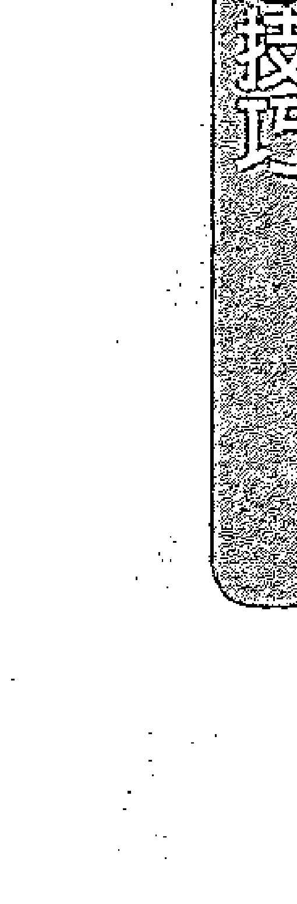
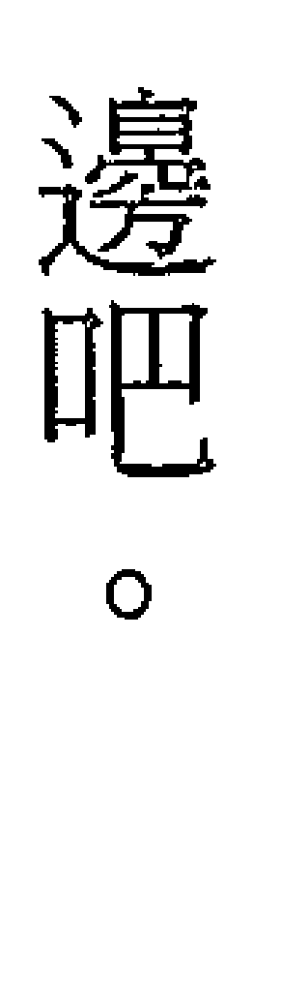
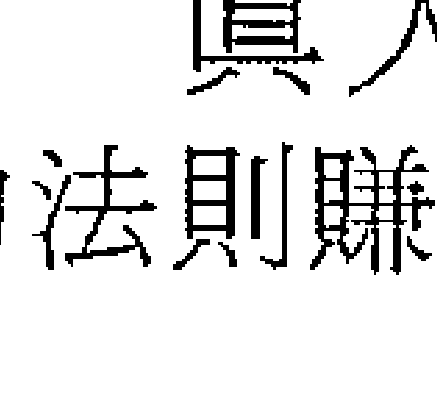
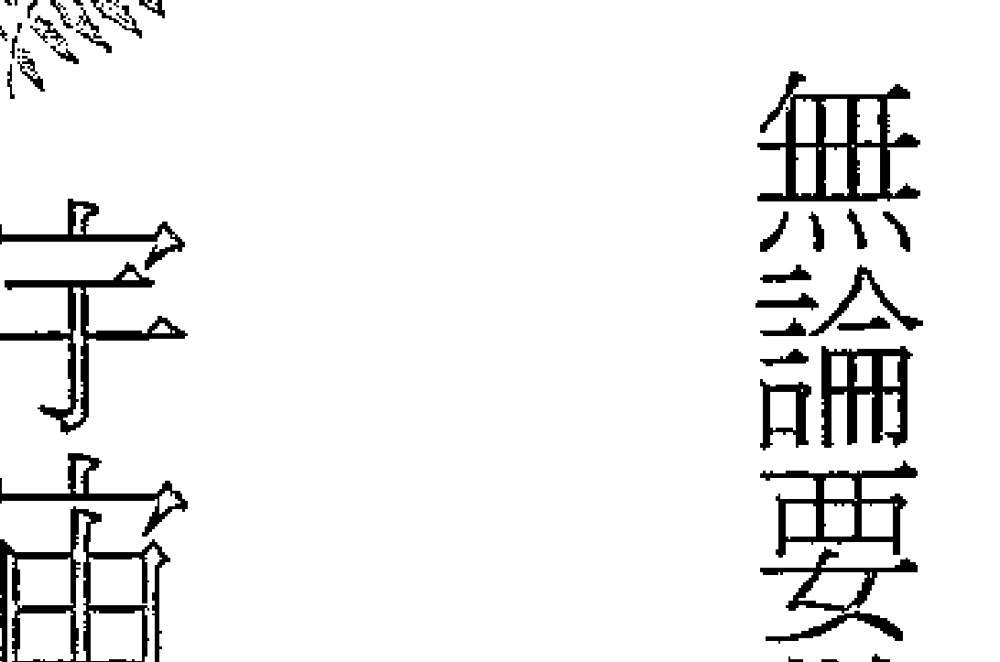
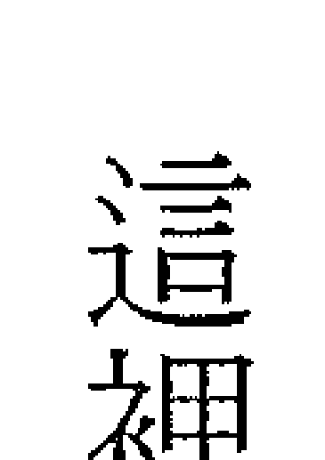

# How I Made Over $1 Million Using The Law of Attraction

# The Last Law of Attraction, How-To, Or Self-Help Book You Will Ever Need to Read

# 真人實證！我靠吸引力法則賺到了三千萬

E•K•尚多——著
孟紀之——譯

〈推薦序〉
值得你投資時間看，且會聽到真話的一本書　許耀仁

〈前言〉
為你而寫的吸引力法則總整理　王莉莉

# 第1章 我靠吸引力法則賺到三千萬

- 致富的企圖被引爆
- 你得提出好問題
- 令我震驚的做事方法
- 偶遇我的第一本吸引力法則書
- 兩個掉到我腿上的巧合
- 不再當半吊子信徒
- 在家辦公賺進六位數美元高薪
- 吸引力法則一直在我身上發揮作用

# 第2章 有求必應的吸引力與創造法則

- 簡單來說：你就是磁鐵
- 你想什麼，就會得到什麼

# 第3章 你真正的感受是超頻發送器

想吸引美好的事物，要先有美好的感覺
你有能力控制自己的感覺

# 第4章 材料一：熱切的渴望

一定要在感覺很好的狀態
壞事是你創造出來的
渴望愈清楚明確，就會愈快實現

### 第5章 材料一：相信

你要相信那是可能的
從小事開始累積對「萬事皆有可能」的信心
我的心想事成小實驗：藍羽毛

### 第6章 材料二：帶著感恩允許與接收

帶著感恩過生活，負面感受自然脫落
感謝現在，就會創造出讓你感謝的未來
若感覺很好，就是在允許自己渴求的一切到來

# 第7章 這樣對自己說話，就能翻轉命運：肯定句與問句

重新設定自己很容易
透過內在話語改變自己
正面肯定句時時隨口說
賦予力量的問句

# 第8章 超強魔力的觀想技巧

簡單好用的基本觀想技巧
其他觀想技巧



# 第9章 給你的建議，重點及其他有用資訊

- 宇宙/本源能量/造物主/無限智慧/神
- 宇宙之流
- 抗拒
- 清理
> ※靜心
- 設定目標
- 愛

〈附錄1〉
〈附錄2〉
吸引力法則懶人包
延伸閱讀清單
> ※清理情緒的深層信念

# 推薦序 食譜在這裡，你只要照著做就好了

〈推薦序〉
食譜在這裡，你只要照著做就好了
網路創業家、國際認證訓練師與暢銷書作者　許耀仁

這本書的作者 E•K•尚從前言開始，就幫我出了個刁詭的難題：。。。。。。他說，關於「吸引力法則」的書，不管你是讀了三本、五本，還是五十本、一百本，最後都會發現一件事，那就是。。他們講的全都是一樣的東西。他強調，要讓「吸引力法則」在你的生活中發揮它該有的作用，你需要的並不是再多讀一本書、再多聽一場講座、再多報一個課程，而是「百分之百照著做」。然後，他在書裡面幫你整理出你可以照著做的「食譜」。作者給我出了什麼難題，我等一下再告訴你。

# 真人實證！我靠吸引力法則賺到三千萬

在那之前，先聊聊我對他說的這些觀念的看法。從我在二〇〇六年，因翻譯了《失落的致富經典》而有幸進入培訓領域，就經常跟人們分享我對「吸引力法則」的一些親身經驗與應用心得那時開始，我常說，「吸引力法則」跟包括物理法則、數學法則等其他所有宇宙法則都一樣，實際應用上的狀況雖然五花八門，但公式都很簡單（以我翻譯的《失落的致富經典》這本書來說，當中提出的公式就是：願景＋信念＋決心＋感謝＋有效率的行動）。

而我也跟這本書的作者一樣，為了找到更多關於「吸引力法則」的「秘密」，而多讀了數十本，甚至上百本的相關書籍，最後也發現每一本書裡的故事不一樣、說明的角度不一樣，但談到「吸引力法則」，它們講的全都是類似的框架……

然後到了某個時間點，我也突然醒過來，發現其實「秘密」並不存在，

# 推薦序 食譜在這裡，你只要照著做就好了

我需要的只是「每天練習」而已。而當我醒悟到這一點，並且停止尋找那個上一本書作者沒告訴我的「秘密」，乖乖開始觀想、製作夢想板、念肯定語、盡可能讓自己「感覺很好」，以及最重要的，在機會跟靈感來臨時採取行動之後……奇蹟就一個一個接連發生，讓我脫離了當時的人生黑暗期。所以，我完全認同作者所說的。但這下難題來了。。我要幫這本書寫推薦序，但這位尚多老兄卻劈頭就告訴你，其實你不需要多一本書，而他自己這本書裡「沒有新東西」？這是哪招啊～～想了許久，我想我了解作者的意圖了。作者已經幫你把要讓「吸引力法則」開始產生正向作用的一切都整理好了，透過這本書，你就不會需要回過頭去，把你書櫃之前買的相關書籍都拿出來再K一次……

# 真人實證！我靠吸引力法則賺到三千萬

你只要開始照著做就好了。
那麼，對於「吸引力法則」，你準備好要停止研究，開始去做（然後讓它為你帶來各種奇蹟）了嗎？
讓這本書成為你後續旅程的嚮導吧！

# 推薦序 值得你投資時間看，且會聽到真話的一本書

《推薦序》
《秘密》系列譯者、《啟動夢想吸引力》作者　王莉莉

一開始收到寫序邀約時，想說怎麼又有跟吸引力法則相關的書，之前出版社不是覺得市場應該對這類主題的書感到疲乏了？後來才知道因為是真人實證，而且在亞馬遜上得到好評，以及書名本身就還滿務實的（賺到三千萬），當然要拜讀一下。拿到手稿時，原本以為應該是很厚的書，還寫信跟編輯確認，結果沒錯，就是四、五萬字的輕鬆篇幅，這樣更引起我的興趣了。

什麼樣的書，可以突破從二〇〇七年《秘密》出版後開始流行了八年的百「書」爭鳴重圍？才剛看到前言就會心一笑了，這有點像我們用大白話

寫的銷售長文案，不只是作者的口吻很像坐在你面前講話，而且他也是很誠實中肯地告訴大家，他所講的不是一般常會看到的詞，什麼「新的」、「更好的方法」、「未知秘方」等。那就更吊人胃口了，到底這位仁兄要講的是什麼？

接著，他提到發現所讀的一大堆書籍、課程，其實真的只需要兩、三本書就好。我又會心地一笑，想說內行人會認同，但出版社要怎麼生存？（好在我們翻譯的《失落的致富經典》也是他推薦的前二三本書之一。）

記得大四要先放棄國貿雙修，背水一戰甄試英語教學研究，才能趕在四年畢業時，有位老師曾經跟我分享教戰守則：。每一科只要專精念兩本經典的教科書就夠。那時甄試只要考兩科，在沒有補習的狀況下，我卯起來自修四本，然後幸運地成為五個幸運兒之一。所以，我完全能理解作者說的，需要學習的一切，在你讀的那前幾本書裡都寫了。

那，還要更多的書幹麼？甚至是他現在的這本書！後看到他的承諾，

# 推薦序 值得你投資時間看，且會聽到真話的一本書

覺得滿佩服他的勇氣。「讀完這本書，我再也不需要其他書來教我如何運用吸引力法則，創造自己真心渴望的人生了！」我相信這也是很多寫這類主題的作者之心聲。

就像坐在咖啡廳跟好友聊天，他的故事會讓人想繼續看下去，知道他到底是如何用吸引力法則賺到那一千萬的，因為對現在的小資族或剛接觸吸引力法則的朋友來說，這也算是一個很有感的數字了（至少對我個人而言，是可以買到快兩棟我現在住的房子的數字）。而且，我現在對於「能活用內在法則，在外在世界有一定財富成績」的書特別感興趣，因為這樣的能量才算是真的平衡。

加上他像是做重點整理一樣，把這八年間流行過的潛能開發、個人成長、靈性學習資訊按主題歸納、去蕪存菁整理了一番，再穿插自己因為太太懷孕，需要正視人生現實，於是運用觀想得到交易員一職的故事，讓我觉得，這是許多看了《秘密》後蒐集很多這類書籍和課程的「松果」，但在財務或

# 真人實證！我靠吸引力法則賺到三千萬

金錢上還是處於茫然狀態的人，很值得投資時間看，而且會聽到真話的一本書。

## 〈前言〉 為你而寫的吸引力法則總整理

大多數人不相信他們能掌控自己的人生。終其一生，他們只是狀況來了就反應，卻沒發覺造成這些狀況的原因是他們自己。以前我也是這種人，但我已經變得不一樣了。這本書是為你而寫，希望你也能變得不一樣——只要你選擇改變。

沒錯，這又是一本教妳怎麼做的書，又是一本自我成長書，另一本講吸引力法則的書。這本書還大言不慚地宣稱：你可以賺到不只一百萬美元（也就是超過新台幣三千萬）！我知道你在想什麼。這個人肯定在開玩笑！

然而，本書不是只談賺大錢這件事，而是讓人生真正改變。

# 真人實證！我靠吸引力法則賺到三千萬

你是不是已經厭煩老是看到又有吸引力法則的新書上市或新課程推出，說他們握有獲得財富、健康與幸福的秘方？有的更厲害，誇說他們知道新方法或更好的方法，可以讓吸引力法則在你身上應驗！你嘛幫幫忙！

這本書的原文書名，直譯的意思是：『我如何運用吸引力法則賺到超過一百萬美元。關於吸引力法則與自我成長的書，這是你這輩子所需的最後一本』。我之所以取這樣的書名，有三個理由：

1.  我需要它能吸睛！
2.  我希望各位明白這並非不可能的任務！我敢這樣說，是因為這東西對我有用，所以我決定把它傳授給需要幫助的人。
3.  這不是「新」招或「更好」的方法，也不是什麼「秘方」。

# 前言 為你而寫的吸引力法則總整理

簡言之，本書以簡明實在的方式，蒐羅整合吸引力法則及自我成長的基本原則與技巧。本書適合的讀者，既是那些對於如何創造自己想要的一切毫無經驗的人，也是那些對此經驗豐富的人。說得明確一點，本書是寫給那些買過不只一本這類書籍的人。說得再明確一點，是要給那些買了很多相關的紙本書和有聲書、上過課、參加過工作坊的人——那些不斷尋找「某樣東西」、尋找「祕藏之寶」、尋找「聖杯」的人。永不止息的追尋啊！

曾經，我也是其中之一。然而，某天我忽然「啊哈！」地頓悟了。坦白講，我讀過幾十本吸引力法則書、幾十本自我成長書，聽過幾百片有聲書光碟，也上過課、參加過工作坊。可以說，我整個人就泡在自我成長與吸引力法則裡。

結果怎麼著？那些東西如果好好運用，還真的有效！但是，我領悟到兩件非常重要的

1.  很多人並未得到那些書或課程承諾他們能夠獲得的結果。
2.  那一大堆書、光碟和課程，我並非全都需要。相信我，那些都很棒、很鼓舞人心，但也毫無必要。我其實只需要兩、三本書，就這樣！

事。

我啊，總算明白了，跟這個主題有關的種種素材，以及那些作者、書商等，賣的全是一樣的東西！沒錯，每一本書的用詞可能有些差異，這位作者的寫作風格可能比那位作者多了點新意，但運用吸引力法則讓你美夢成真的技巧，基本上都是一樣的！

無論是拿破崙·希爾的《思考致富》、華勒思·華特特斯的《失落的致富經典》、查爾斯·哈尼爾的《財富金鑰》、朗達·拜恩的《秘密》、希克斯夫婦的眾多著作（「亞伯拉罕」系列作品），或是安東尼·羅賓、T·哈福·

# 前言 為你而寫的吸引力法則總整理

艾克、傑克．坎菲爾、喬．維泰利、偉恩．戴爾等人寫的書，不勝枚舉。這些書我全讀過了。現在，由我來為各位總結三大心得。

1.  它們本本精采、鼓舞人心，而且很有幫助，令我愛不釋手。
2.  只要正確運用，書中資訊確實有效。
3.  基本上，它們講的都是同一件事！

重點來了：如果光是上述作者所寫的書，你已經讀過不只一本，那就夠你用了。我猜，那些作者說可以用來創造你值得擁有的精采人生的種種技巧，你還沒付諸實行。假如我去買了、也讀了一本書，然後是另一本，再另一本，而那些書明明白白都是要人去做同一件事，那麼，答案很簡單。它們說什麼就完全照做，堅信不疑地照著做，便能成功！然而，大多數人（包括我在內）依舊持

續在尋找那只聖杯。
該停止追尋了。就是現在！
讓我以個人經驗與知識告訴各位，
我是怎麼讓它在我身上應驗的！

這本書沒有新東西！
沒有人可以提供新東西！
別再尋找新東西了，因為根本沒有！
數十年來在少數有幸成功者身上行得通的，現在還是行得通，未來也是。
沒有秘密，沒有神奇咒語，沒有玄祕的冥想技巧，想要成功、有錢、快樂、健康、富足所須學習的一切，都在你讀的第一本書裡了——以及第三本、第七本、第九十九本。

是你自己選擇不按照書中指示去做的。你以為你需要更多資訊，為什麼呢？我猜是因為你多少有些抗拒。也許是恐懼，也許是懷疑，也許你覺得這

美好得不像真的。不過你知道嗎？這是真的！我想幫助你，我在這方面已大有斬獲。請運用這本薄薄的書，它彙整了非常實在的原則、說明與練習，如果好好照著做，將能一勞永逸地幫助你實現所有夢想！

就拿出信心一搏吧，給自己這個承諾。

> 「讀完這本書，我再也不需要其他書來教我如何運用吸引力法則，創造自己真心渴望的人生了！」

# 第1章 我靠吸引力法則賺到三千萬

倘若我一開始就認真實踐，最初買的書與有聲教材其實就夠了。結果，我卻選擇光是讀與聽，從中擷取一、兩點來用，然後就去看下一本書。要是從第一天就依照書裡提到的去做，我知道我會更早實現所求，也不會有那麼多曲折的劇情。

# 第1章 我靠吸引力法則賺到三千萬

## ☀ 致富的企圖被引爆

我想，的確應該讓各位對我這個人，以及我一路走來的心路歷程有一些了解，包括我在自我成長、吸引力與創造法則，以及個人成就上的成功與失敗（其實我不覺得自己有任何失敗經驗，那些只是教訓與障礙罷了）。這一章讀一次就好，不像本書其他章節，你將來會需要再回去參考。我只是要加深各位的印象，讓大家知道只要確實執行本書所說的一切，真的可以順利收效。

到二十出頭為止，我一直過著很平凡的人生，念高中、談戀愛、學開車，沒做過什麼瘋狂的事。高中畢業後，我選擇不念大學，而是進入職場。做過幾份工作，沒什麼值得一提的。我記得擔任過倉管副理，工作很無聊，而且還賴在老家跟爸媽一起住。我沒什麼願望，只除了衷心渴望將來可以變有

錢。對於致富，我充滿熱切渴望。但對於如何致富，我毫無頭緒，也不認為上大學就行了。不過，我倒是有一點企圖心。然而，這企圖心在某天晚上看電視時突然大爆發。我偶然看到一個教人投資房地產賺大錢的資訊型廣告節目，熱血沸騰。電視上那個人大談買屋「不必付頭期款」，教人打造房地產帝國，變成大富翁。於是，我下單買了他的教材。接著，我去圖書館閱讀房地產相關書籍、購買有聲教學、去上課，甚至兼職做房地產仲介，完全沉浸在自己可能成為下一個地產大亨唐納．川普的盼望裡！我沒買下任何房地產。我當房仲只談成一筆很小的交易。我沒有真正賺到什麼錢。

# 第1章 我靠吸引力法則賺到三千萬

不過，確實發生了兩件事。

1.  在搜尋房地產相關知識時，我偶然看到一個資訊型廣告節目，真正帶領我走上自我成長，以及後來的吸引力法則之路。那個節目介紹的是安東尼．羅賓的《激發個人潛能》教材，這是我接觸過的所有教材的第一套。
2.  還在做房仲時，我遇到一位想買百萬豪宅的客戶。他很年輕，年紀跟我差不多，而且非常有錢。他跟我一樣沒上過大學，卻靠著股票經紀工作賺進七位數美元的收入。我的態度與銷售風格讓他留下頗為深刻的印象，結果他竟然推薦我去當股票經紀人！

我怎麼有辦法做股票經紀？我對股市根本一點都不懂，一竅不通啊！

但是，聽過安東尼．羅賓的有聲教學……嗯，大約連續十遍之後，我備

# 真人實證！我靠吸引力法則賺到三千萬

受鼓舞，於是決定：就試一試吧！

## 你得提出好問題


暫且把我的故事擱到一邊，客觀地來看看發生了什麼事。我從事一份沒前途的工作，卻對致富有無限的熱情。宇宙（這是我對萬物創造者的稱呼）以其複雜深奧的方式，一步一步將我曾向它祈求的事物都賜予我。我請求以盡可能簡單的方式變得「富有」，只是我當時尚未明瞭。雖然還沒變有錢，但那些點子、靈感、我持續遇到的人，以及種種巧合……所有條件一一到位。如果當時我對吸引力／創造（我認為那是一種創造）法則有更深的認識，就能創造出自己想要的一切了。我未能看清楚，也沒有明確的致富之道，但我已經逐漸獲得致富所需的事物。達到我想要的最終結果的每一項必要條件，宇宙都已提供。

# 第1章 我靠吸引力法則賺到三千萬

回到我的故事。
於是，我開始從事股票經紀。從一九九三年至一九九九年，為了成功，能做的我全做了！
那麼，我賺了多少錢？
少之又少。
結果，經過六個月的密集訓練，我發現自己真的很討厭這份工作。相當長的工時，一再打電話找人買股票，不斷遭到拒絕……太苦了！尤其，它並沒有真正幫人賺到錢（這一行讓我最難接受的就是這一點，但最終會帶領我走到另一個頓悟時刻）。那麼，為何我不放棄？最大的原因在於，我周遭都是領六位數美元薪水的年輕人……月薪喔！說什麼我也要繼續試下去。
所以，經過了一段時間，加上十足的毅力，我開始獲得一點成功——我所謂的「一點」，其實是「很小」。不過，我堅持下去，勤奮努力，並且一

一直在聽安東尼·羅賓的《激發個人潛能》教材，一遍又一遍。我並不斷地聽，卻始終沒有去實踐他教的東西。我想那教材的內容是激勵了我，但我並未花時間照著他的話去做。總之，當時我沒能明白這一點，但現在知道，如果你真的很不喜歡自己正在做的工作或事業，恐怕就不會在這上頭發達。這是安東尼·羅賓激勵學的第一課。因此，在他整套教材中，我挑了其中一項簡單的技巧來用，從此讓我的人生徹底翻轉，但不是以我原本預期的方式。安東尼·羅賓在教材中重複強調：「向宇宙提出要求時，必須具體、明確。要提出好問題！」過去我一直自問：「要如何在我討厭的事情上賺大錢？」後來我把問題改成：「要如何在我的事業上致富，並享受這個過程？」兩者的差別多大啊！從那一刻起，每次在事業上有所掙扎時，我都會用這個問題問自己。答案是什麼我不知道，但還滿期待的——懷抱希望，非常

## 第1章　我靠吸引力法則賺到三千萬

## 令我震驚的做事方法

正面地期待著。然後，我得到了我所求的，但這一次也不是我預期的那樣。我之所以第二次這樣說，是因為我以為自己會以股票經紀人的身分飛黃騰達，結果這份為期六年的工作，只是我邁向成功途中的休息站罷了。

有天早上，我剛展開一天的工作，一位新的股票經紀人來上班，就坐在我隔壁桌。他儀容整潔、西裝筆挺，看起來就像典型的富有成功人士。我們向彼此自我介紹，然後準備開始工作。我第一步就是拿起電話開發新客戶，跟辦公室裡其他經紀人一樣。

但這位新人做的事卻不同。

他坐在位子上讀起報紙來。大約一小時候，他拿起話筒，開始打給客戶，一通接著一通，帶著高度熱忱對每位客戶說，他發現一個非常好的投資成長# 真人實證！我靠吸引力法則賺到三千萬

機會，如果他們肯投資，說不定能大賺一筆。他就這樣做了好一會兒——講電話，寫買進單，打電話跟交易部門下單……然後就賺到白花花的佣金了！到了那天的工作結束時，他輕鬆鬆賺進至少一萬元的佣金！

我的好奇心整個被挑起。他只是看看報紙、打打電話，就賺到錢了！我從沒見過哪個股票經紀人是這樣做事的。別人教我的做法，是去開發客戶，等累積到一定的客戶量，再強迫推銷他們買進公司推薦的股票。就是一直這樣做。不幸的是，公司推薦的股票很少靈光的，因此股票經紀人很難與客戶維持良好關係，但那又是另一回事了。

這位股票經紀印鈔機下班前，看著我說：「如果你想幫客戶賺到一點錢，就別買『自家推薦』的股票……看看這一支，我覺得應該會表現不錯。」

# 第1章 我靠吸引力法則賺到三千萬

## 偶遇我的第一本吸引力法則書

他邊說邊把他的報紙往我桌上一丟就走了，報紙上滿是這名新人的注記與畫線。那份報紙我以前從未看過，叫作《投資人商業日報》。信不信由你，從那一刻起，我的人生永遠改變了！

簡言之，《投資人商業日報》的訴求是幫助投資人或交易員選股，而不像《華爾街日報》或《巴倫週刊》是報導前一天的財經新聞。我坐在那裡好幾小時，讀著這份教人選股的報紙。讀完之後，我靈機一動，發現自己將成為一名很厲害的選股專家。「要幫人賺錢還不容易，」我心想，「而且還能替自己賺到佣金！」

接下來我用幾個星期、乃至幾個月的時間，閱讀所有我能找到跟選股、圖表分析、公司基本面有關的東西。照理說，證券經紀商應該會教新進人員這些事，但他们唯一的教你的，只有怎麼推銷。他們會說：「沒客戶就沒法買股票。」我同意是需要客戶但也要試著幫他們賺到錢，對吧？可是站在公司的角度，「如果公司賺錢，經紀人賺錢，但客戶賠錢……至少有一比一，還不賴啊。」但我在乎。因此他們不在乎。

就在此時，我「意外」邂逅了我的第一本吸引力法則書。安東尼。羅賓雖然約略提到了吸引力法則，但他的教材是依據一種稱為「神經語言程式學」的方法，主要是與神經處理過程、語言及透過經驗習得之行為模式有關。他的教材很精采，儘管有些年代了，至今我仍會推薦給大家。總之，我發現的第一本吸引力法則書是拿破崙。希爾的《思考致富》，我是在書店意外發現這本書的，當時想找的本來是「如何在股市致富」之類的書。

這本書讓我頗感興趣，尤其是提到巧合會出現在最恰當的時機那個部分。書上說明瞭如何運用心智創造財富、健康、快樂等成就，但該書真正的重點放在致富。有錢人會比窮人有能力、也肯定要替人類做得更多。我買了這本書，並且做出決定：在繼續學習更多股市相關知識的同時，我要多加了解這個創造過程。

在這當口，我從事股票經紀賺的錢還是不多，但我知道，有生以來第一次這麼清楚地知道，此刻的努力將帶來日後的豐收，我就是能感覺到！不過，事情的結果不會如我原本想的那樣……宇宙自有其安排，比我計畫的更大、更好。

## 兩個掉到我腿上的巧合

幾個月過去了，我對自己的選股能力漸漸有了信心，於是開始嘗試說服新客戶購買我看中的股票。問題是，我無法真正說動誰去買。偶爾有人點頭，但大多時候都被拒絕。我覺得自己快失敗了。

> 記住，沒有所謂的失敗，只是學到經驗！

這一切，都只是……胡說八道嗎？只是廢話？一派胡言？我覺得好挫折。我漏掉了什麼？

我做了個深呼吸，記起安東尼。羅賓激勵學第一課……於是，我問自己一個更好的問題——其實，就是原本那個問題：「要如何在我的事業上致富，並享受這個過程？」但我不只問自己一、兩次，而是開始拿這問題鎮日自問，就像一個肯定句——這是我從《思考致富》學來的一項新技巧。我對這本書的態度就像對安東尼。羅賓的教材一樣，只取一小撮資訊來用，而未真正徹底實踐書中的教誨。但提出了正確的問題，並以強大的信念專注於此，事情在這中間開始有了變化。

相信——創造未來最重要的一項特質，顯然就是要抱持信心，《思考致富》大力強調這一點。開始進行這套新的「儀式」後，不出一星期，便發生了兩個非常值得注意的巧合。

- ① 另一本吸引力法則書，華勒思·華特斯的《失落的致富經典》，就這麼「掉到我腿上」。
- ② 突然冒出一個小小的個人退休金帳戶，是我以前做某份工作時開設的。我原本不曉得有這個帳戶能用，直到巧遇這份工作的老同事，聊起來才發現。他提到勞工對其退休金的運用有了更多的掌控權，我的腦子啪地靈光一閃！「我的個人退休金帳戶裡有錢嗎？我完全忘了這回事！」打了電話詢問之後，我的財富馬上多了三千美元！我知道這數目不多，但剛好夠讓我可以開始自行買賣股票。

首先，我拿起《失落的致富經典》來讀，而且讀得很自在。這本書跟《思考致富》很像，但更為簡明。我真正吸收了這套簡單卻強大的系統，當時還不明瞭，這正是吸引力法則在發揮作用。

再來，我開始用自己帳戶裡微薄的錢買賣股票。區區三個月的股票交易，帳戶裡的錢就從起初的三千美元翻了六倍，變成一萬八千美元！我終於發現自己熱愛的事和天職了，我好興奮！

可惜，一路上還是有些小障礙，而我會很快帶過接下來的幾年（順遂的日子）。

## 不再當半吊子信徒

雖然我在證券經紀商工作，但公司主管不太高興我用自己帳戶買賣股票，他們要的是佣金。此外，他們也不樂見辦公室的許多股票經紀人都向客戶推薦我選的股票，而不是公司的。

因此，我不得不離職，轉戰另一家券商，建立自己的交易帳戶，同時讓自己看起來像個積極進取、前程似錦的股票經紀人。事實上……我做不到把魚「賣」給飢腸轆轆的愛斯基摩人，但我懂得怎麼選股和交易。

接下來那幾年，我就這麼輾轉又換過三家證券經紀商，一有辦法就買股、賣股，靠股票賺到的錢生活。但因為我得靠這些獲利過日子，戶頭裡的錢未能累積成大筆財富。

因此，一九九八年，我做了個艱難的決定。我決定離開經紀業，全職投入股市場交易。為此，我和太太把華廈房子賣掉，搬進她娘家地下室的公寓。賣屋所得讓我有大約四萬美元的本錢去投資，就這麼多了，那是我們的全部積蓄。

我開始做著自己夢想中的工作。起初，一切都很好，但我很快發現證券戶頭裡的錢還是不足以讓我變得富有。雖然有在賺錢，卻只夠糊口。由於我總是得領錢出來當生活費，帳戶數字自然不會成長。我覺得自己已經很接近夢想了，卻總是有障礙一個一個冒出來。我該怎麼辦？是漏掉了什麼嗎？

於是，我再次退一步看——提出更好的問題，就能得到更好的答案。「要如何成為極其成功的股票交易員，並享受這個過程？」

我對自己提問，早也問，午也問，晚也問。有天晚上臨睡前，生平第一次，我的腦子裡真真切切閃現靈感：「也許，答案就在我那兩本書的其中一本裡，《失落的致富經典》或《思考致富》。」

我已經讀過這兩本書，也覺得備受鼓舞，卻從未乖乖照書裡的指示去做。我猜你可以說我只是「半吊子」地在使用這兩本書。

我決定（沒什麼特別理由，就是決定），我要整個人沉浸在《思考致富》裡。不只是閱讀，而是吸收、汲取，並且實踐。我完全遵照作者的建議去做。

而就像書裡說的，某個出乎意料卻令人振奮的巧合發生了。

有一本股市交易新書剛出版，我非常想買，於是，某個週六下午我便去書店再次尋找股市相關書籍（家裡已經有超過一百本了）。找到那本書後，我開始在書店隨意逛逛，然後發現自己逛到了自我成長書區，某本書書脊上的作者名字跳出來攫住我的注意力。夏克蒂·高文（Shakti Gawain），我心想：「這名字好怪！」於是拿起那本書——《每一天，都是全新的時刻》。約略翻讀之後，我看了看封底，頓時感到非常興奮，這似乎正是我需要的書。於是，我兩本都買了。

我開始運用《每一天，都是全新的時刻》書中所言，加上《思考致富》中類似的知識，一下子突飛猛進，而且超乎預期，直到今天我仍深受震撼。其基本前提是要去觀想，或者說運用想像力，來創造成果。你要想像得如同你已經過著自己渴望的生活，有點像把人生快轉到你想要的境地，或是你已經擁有想要的某樣事物的時刻。這本書的用字淺顯直白，讓人很容易讀通。我發現《思考致富》已經提過這個主題了，但該書的文字實在古老晦澀，以致我之前沒看懂拿破崙·希爾在說什麼。而且，這是我讀到第一本真正暢談吸引力法則的書①。

## 在家辦公賺進六位數美元高薪

所以，我開始運用想像力，具體觀想自己是個超棒的交易員，我已經有錢得不得了，擁有夢想的房子、車子、豪華假期，應有盡有。我在臨睡前和剛醒來時運用這個觀想技巧，其關鍵在於以全然的、毫不動搖的信心，堅持自己渴望的最終結果——我選擇這麼做，管他天崩地裂也一樣！

過了大約一星期，宇宙對我耍了個「花招」。要知道，在運用吸引力法則及對結果抱持全然的信心上，最困難的部分是我們會想要操控事件與狀況，以實現目標。我們試圖操控路徑、方法、種種事物，以達成自己渴望的結果，但有時候（其實不只有時候），宇宙有更好的方法。當時也許看不出來是這樣，但結果永遠會是如此（我將在後面的某一章深入詳談設定願望後就隨順宇宙之流。

總之，我對自己想要的狀況有一幅願景，並日日針對這幅願景靜心冥想。這樣做了大約一星期後，某一天，我太太看完醫生回家，告訴我她懷孕了，並要我找一份「真正的工作」，放棄股市交易的「夢想」。大多數人知道有了小孩都會非常興奮，我心中有一部分也絕對是如此，但另一部分的我卻覺得彷彿掉進很深的洞裡，身邊既沒鏟子也沒梯子可以逃脫。

我不明白！也許是我搞錯了吧，這東西根本沒用！我簡直要氣炸了！

太太看出我憂喜參半，哭了起來，於是我控制自己的情緒，好好安慰她。我告訴她，我很開心，只是她宣佈得太突然，我一下子反應不過來。我還對她說，為了這個家，我願意做一切該做的事。

不過要怎麼做？我毫無頭緒！

所以首先，我想我應該放棄夢想，也許重操舊業去從事股票經紀或類似的工作。我沒發瘋，也沒傷心，只是認命。

我記得聽到消息那天是星期二，所以決定等到星期天就來看看報紙週日版的徵人廣告。接下來那五天，我繼續運用觀想技巧。我選擇不放棄。

到了星期天，我走出去拿報紙，翻開徵人廣告版，發現有一大堆徵求股票經紀人的廣告，還有要徵保險業務員、共同基金銷售人員，以及交易員的……什麼！？報上刊了大約十則徵求交易員的廣告。我震驚不已，我甚至不知道還有這種公司存在。那一刻，我感受到不可置信的充沛情感，交雜著快樂、困惑、寬心、興奮，以及……可能性！

就這麼剛好，有家交易商在距離我家十五分鐘車程處開了一間分公司，希望招募經驗老到的交易員，但也歡迎新手加入。真是太巧了！我認為自己大約介於老手與新手之間，便打了通電話，希望可以去面試，接下來的發展你應該猜得到。

他們打算雇用我。試用期六個月，頭三個月我得先學習並展現自己的技術。如果這三個月進展順利，後三個月就能拿到每週一千美元的「預付傭金」（每年五萬美元），這是從運用公司的錢賺得的利潤支取百分之四十。頭三個月一毛錢都賺不到，讓我有點緊張，但公司也沒要我自己掏錢放進戶頭，於是我選擇放下那點恐懼。在我看來，這是很棒的機會。我仍然很想自己交易，也的確比較喜歡在家工作、做自己的事，但這個機會不容錯過。

三個月後，公司高層對我印象極好，於是我進入了第二階段的三個月試用期，做些小股交易，從坐我旁邊的幾個交易員那兒學到很多，也開始領到一些薪水。三個月時間咻一下過去了，我愈做愈好。一九九九年十二月，試用期結束，我的表現很不錯，獲准「油門盡情催落去」！遵命！那個十二月，我賺進的毛利比四萬八千美元還多一點！接下來的十一年，我週週無虧損……從來沒有！我的平均收入穩坐六位數。

## 吸引力法則一直在我身上發揮作用

此外，由於這些年來科技進步，最近這六年我得以在家辦公。真的是穿著睡衣在股票市場交易，還賺進八位數美元高薪！通往我渴求的事物那條路並非筆直順遂，一直曲曲折折。然而，結果卻比我原先預期的更令人驚喜。我的薪資是六位數美元，紅利也有五至六位數之譜。

前面提過，宇宙也許在袖裡暗藏花招。我曾認為，太太回家告知懷孕消息，並要我找份正職，代表我的夢想完了。但我對實現自己的渴望深具信心，結果，這件事反成了讓我達成自己渴求的事物「必經之路」。倘若當時我們不是有了小孩，我太太不會叫我去找份「真正的工作」，我也不會為了求職去看徵人廣告，後頭的事就不會發生了。

我當時選擇將它視為壞事，認為不是我要的那種，但我現在知道，那其實是最好的安排。事實上，回顧我每一次的失敗或「壞事」，其實都是好事。如今我明白（尤其在讀了那麼多這類主題的東西之後），吸引力法則一直在我身上發揮作用。我懷著正確的態度、信心與感恩堅持到底，儘管偶有疑慮與恐懼，我也選擇克服疑慮與恐懼，堅定地抱持信心。後面會有一章談到相信／信心，你到時就知道，這也許比什麼都重要。

很快說一下，《失落的致富經典》《思考致富》《每一天，都是全新的時刻》這三本書，以及安東尼。羅賓的《激發個人潛能》有聲教材，是我這段旅程的起點。我在此並未提到我買過的其他成功學書籍、光碟、卡帶等，因為情況在朋友借我朗達。拜恩製作的《秘密》影片之後明顯失控——我一直很愛買這類東西，但看完《秘密》後，我買的書與光碟大概暴增三倍。然而，那並無必要。倘若我一開始就遵照書中指示認真實踐，最初買的那三本書與有聲教材其實就夠了。結果，我卻選擇光是讀與聽，從每本書或教材中擷取一、兩點來用，然後就去看下一本。要是我從第一天就依照《思考致富》裡提到的去做，我知道我會更早實現所求，也不會有那麼多曲折的劇情。

回首邁向成功的旅程，當時我甚至不知道自己用的是吸引力法則。因此你可以想像，這套東西變成主流之後，讓我「啊哈！」的時刻可不少。說到此，便要談談這本小書的精髓了。外頭類似的書很多，其中一些你可能已經有了。你是否曾真正按照其中的指示去做？要知道，我不只相信這東西有用，我也是少數幾個你可以效法的成功案例，而不是讀讀就好。我寫這本書便是為此，而且傳達書中內容的方式就像你我正坐在我家客廳談天那樣，以白話向你說明。我以前沒寫過書，這本書裡提到的作者我都不認識，也沒從誰那裡拿回扣。除了希望你能運用這本書裡的資訊，讓人生變得更美好之外，我沒有其他想法。我的目的只是想透過文字書寫，對他人的生活有所貢獻。

所以，這裡用上了對我有用的一切素材。所有我讀過、聽過、看過、用過的資訊，都以極為簡要、實在的方式，透過這本書提供給你。我最大的希望是各位能從中獲益，然後口耳相傳，告訴你的朋友、同事、家人、所有人，並且不必再買那些自我成長勵志書了！這本書就是你所需的最後一本！

讓我們開始吧。

> ① 我是在買了《每一天，都是全新的時刻》這本書之後，才真正開始持續購買同類書籍、有聲書和教材等，因為這位作者提供的技巧讓我大為受用。我覺得外頭一定還有更棒的相關資訊，不過，我對你、也對自己坦白地說，我有這三本書就夠了！

## 第2章 有求必應的吸引力創造法則

假設你正要烤蛋糕，需要特定材料來烤這塊蛋糕，還有必須遵守的特定步驟。吸引力法則也差不多：放進正確的材料，遵照食譜步驟，就能做出你想要的。

首先，講點基本的。你的思想會變成實物，你可以成為、可以去做、可以擁有你渴望的一切。你的思想會吸引類似的想法、念頭、處境——這全是吸引力與創造法則使然。我將「吸引力」與「創造」放在一起，是因為兩者可說是同一樣東西（為了閱讀方便，接下來我會將「吸引力與創造法則」簡稱為「吸引力法則」）。

## 簡單來說：你就是磁鐵

所有的創造皆由心智開始。如果想蓋（創造）一棟新房子，你首先必須想像這棟房子的大概模樣，然後透過吸引力法則，開始吸引更多與這棟房子有關的類似構想。你愈是專注，愈能持續吸引到更多關於這棟房子的想法與念頭（結構、大小、顏色等）。

你心中對這房子的想法具有某種頻率，如同廣播電台各有其頻率，當你調到某個電波頻率，就能收聽某電台的節目。所以，當你在心中調諧至某個特定頻率時，便能得到一個類似頻率的回應，這個頻率就叫振動，而宇宙中每一造物——固體、液體、氣體等——皆有自己的特定振動（後面會有一章專講振動，屆時我會詳加介紹）。因此，任何思想皆會吸引來相似的想法、畫面、念頭等。

不妨此刻就嘗試想著某樣事物，什麼都行。閉上眼睛，具體想像該事物，並讓那個念頭的畫面在你心中停留一會兒。請注意，你讓這畫面停留愈久，它就會開始在顏色、大小、形狀等方面變得逼真、鮮明。這些思想是能量，並且會吸引相似的能量。宇宙萬物皆由能量構成，將任何事物分解到它最純粹、最簡單的形態，即是能量。有趣的是，宇宙萬物不僅僅是能量，若再將其分解到最最簡單的形態，則一切事物都是由「同樣的」能量構成。次原子粒子。

想像有樣東西很小。非常小。想像它小到只能從顯微鏡裡看到。然後，想像它比那樣的小還要小、再更小......

說正經的，構成萬物的次原子粒子確確實實存在萬物之中。也就是說，構成你這個人的次原子粒子，同樣也構成你的車子、電腦、房子，以及空氣、飛機、土壤、岩石......嗯，你懂的，只是這些粒子在每個物體、氣體、液體中的組合方式不同罷了。

好，那麼這個事實要如何幫助我們得到自己想要的事物，例如有錢、健康又快樂的人生？我前面談到的，是量子物理學的基礎，而量子是能量，是砌出宇宙的基石，也是創造你渴求的一切的基礎。

從科學角度很快解釋一下：由於宇宙就是我們所屬的無限智慧（我們都是這無限智慧不可分割的一部分、能量的量子會受心智影響。思想也是一種純粹能量。每當你看著某一「所有物」，例如房子、車子、電腦，那其實不過是能量——或者說「量子」——的某種排列，最終由心智的思想過程創造出來。如果非常靠近地檢視這些東西，便能清楚發現它們根本不是固體，而是由能量的量子組成，而這些量子以極高的速率在我們觀察的那樣物體裡外振動、移動著。

我不打算深入探討這個主題。我承諾要寫一本簡明實在的書，我這人說的話算話，但又覺得必須稍微提一下，因為這很重要——這件事之所以重要，是因為我們的心智、我們的思想，能夠控制「量子」。要我證明這一點嗎？我不會這麼做。為什麼？你可以到圖書館去找任何一本量子物理學的書，或是上網搜尋「量子物理」。

# 第2章 有求必應的吸引力與創造法則

理「或量子力學」答案都在那兒。網路上資訊可多了，你會找到你要的解答。

坦白說，沒必要去了解這東西為何或如何運作。人類心智的力量遠遠超出任何人所能理解，雖然科學的確離「了解」比較近。

這本書不會教你種種「為何」與「如何」，本書的目的是教讀者創造自己想要成為、想要去做或想要擁有的一切，簡單、清楚、實在。那些科學與宗教的深奧道理，暫且擺到一邊吧。

好，那就繼續。



你想什麼，就會得到什麼

容我再次簡單地說。思想就是實物。

我們運用心智去創造自己想要的事物。如果你渴望成為舞者，這個念頭就從你的心起步，你看見它，或觀想它。隨著這個念頭在你思想中停留，你開始更加聚焦其上，而它逐漸擴展，然後你開始吸引其他與舞蹈相關的想法。也許你會問自己問題，例如：「不知道在劇院裡跳舞會是怎樣？」或對自己說：「我喜歡在百老匯跳舞這個想法。」這樣的念頭吸引來其他相關的念頭，可能會將你推往學習舞蹈的方向，甚至推得更遠，讓你成為專業舞者。這一切都從心智開始。

這適用於生活的各個層面。如果心中浮現某個構想或念頭，你通常會在心裡自問。例如，若你注意到自己餓了，可能會立刻自問。

> 「我想吃什麼？」

然後你心裡也許會冒出一片披薩。如果沒有其他念頭提出異議，你大概就會打電話訂披薩，或者開車去披薩店買來吃。

這是簡單的那一面：
你要求某樣東西。
你相信自己可以／應該／將會擁有它。
你採取必要行動以得到它。太簡單了？好，讓我們進一步來看。

假設你想要變有錢，成為百萬富翁，但你的年薪只有六萬美元……如果把賺到的每一分錢都存下來，你要花將近二十年才能賺到第一桶金。

不過，假如你在紙上寫下：「我要在兩年內賺到一百萬。我不確定這件事會如何發生，但我一定會做到！」會怎麼樣呢？你感覺到了，帶著目標、懷抱信心地感覺到了！

而且，你每天對自己陳述這段肯定聲明二至三次（關於肯定句，後面會再提到）。

至少，經過一段時日，該如何達成一百萬高標的想法會開始在你心中成形。是否付諸行動由你決定，但我想你懂的。

換句話說，吸引力法則就是：你想什麼，就會得到什麼。

但事實上，這樣還是太過簡單。

## 真人實證！
我靠吸引力法則賺到三千萬

再來假設一下。你正要烤蛋糕，需要特定材料來烤這塊蛋糕，還有必須遵守的特定步驟。吸引力法則也差不多。放進正確的材料，遵照食譜步驟，就能做出你想要的。儘管不同的蛋糕食譜在材料上的確有些差異，基本蛋糕食譜還是適用的，而吸引力法則也一樣。它不是吸引力學說，也不是吸引力胡說，而是法則，事實上，接下來我打算用烘焙蛋糕來比喻吸引力法則。我將告訴各位：

- 你需要的器具
- 正確的材料（渴望、相信、感恩等）
- 將所有材料混合在一起的操作指示

每道料理的食譜內容略有差異，端看各人想要吃什麼，但基本材料永遠是那些。
真正的關鍵在於：按照操作指示去做！
我將以這種方式試著簡化心想事成的過程。
我衷心希望你可以成功，因此，愈簡單愈好。
現在來把材料放在一起吧！

> ①量子是指一個不可分割的基本個體，例如「光的量子」是光的單位。

## 第3章 你真正的感受是超強發送器

如果你覺得生活糟透了，你傳送給宇宙的便是這種感受，然後它會把糟透了的事物回傳給你；假如你覺得人生充滿很棒的機會，它也將回傳很棒的機會給你。
宇宙精確地與我們的存在狀態調和、共鳴。

首先，我們需要一隻好的攪拌碗來放入材料。如果要烤蛋糕，你當然想用一隻乾淨的好碗，而不是骯髒或有破損的碗。在此，我指的是：。你感覺怎麼樣？以吸引力法則的用語來說就是：。你的振動如何？你的存在狀態為何？

我在前一章提過「振動」。宇宙萬物並非靜止不動，而是一直在振動、移動。一切事物都有自己獨特的頻率，每樣事物都有。

你也是！

讓我們退後一步來看……

量子物理學告訴我們，宇宙萬物最簡單的形態——即次原子粒子——是能量。存在的所有事物都有其獨特能量，而該能量以某種獨一無二的特定頻率振動。若在心中專注於某樣事物夠久，它便成為主要的思想，然後我們會將那個想法的振動向外散發到宇宙中，接著宇宙會透過吸引力法則，把相似的振動送回來給我們。吸引力法則說：同類相吸。顛撲不破，簡單明瞭。

## 想吸引美好的事物，要先有美好的感覺

呃，真的簡單嗎？
無論何時，你與其他所有事物都在振動，而決定你振動速率的，是你的情緒狀態——你的存在。
存在狀態會引發思想。所以，如果你覺得快樂，如果你是快樂的，那麼你的所思所想也會是快樂的。你會顯化出快樂，快樂是你的存在狀態。
當你是富裕的，你會想著富裕的念頭、會顯化出富裕，你的振動傳達出的便是富裕的狀態。

你現在如何振動？
你現在處於怎樣的狀態？
如果你處於不快樂的狀態，便很難在你的物質實相中顯化出快樂或美好的事物。你怎麼可能做得到？假設你想要顯化一百萬美元，你覺得你應該快樂或不快樂？我敢打賭，不快樂無法將一百萬帶給你。

樂的。換個方式說好了。如果明天一百萬美元就這麼「掉到你腿上」，你是會快樂或不快樂？假設你會覺得快樂，你也會感到富有。你會是富有的、是快樂的。

這裡的關鍵在於：若要吸引能讓你快樂的財富，你必須先產生那樣的感受！你得在尚未獲得那筆財富「之前」，就在心裡看到它，並看見它會帶給你的感受。也許你只是還沒意識到，也許它一直在你的潛意識裡。

這似乎很複雜，但其實不會。好，假如我問你，大致而言，你每天的心情如何，你可能會回答：「我覺得還不錯。」這就是你的存在狀態，你的基本「振動」。而基本上，你將吸引更多「還不錯」的事物到你的生命中。

如果你拿同樣的問題問我，我可能會說：「我每天都覺得棒透了！」我的存在狀態是棒透了，我將吸引「棒透了」的事物進入我的生命中！

# 真人實證！我靠吸引力法則賺到三千萬

如果你大部分時間都覺得『還不錯』，而我大部分時間都覺得『棒透了』，我們兩個誰比較有機會將『真正的好事』吸引到自己的生命裡？這不是比賽，我只是想藉此證明一個觀點。

宇宙精確地與我們大致的存在狀態（亦即我們的振動方式）調和、共鳴。

如果你覺得生活糟透了，你傳送給宇宙的便是這種感受，然後它會把糟透了的事物回傳給你。假如你覺得人生充滿很棒的機會，你便把這樣的感受傳送給宇宙，於是它也將回傳很棒的機會給你。

從你的感受可以測出你會吸引到什麼。保持美好的感覺，就能吸引美好

簡單說明何謂『存在狀態』之後，容我再問一次。你現在如何振動？你

## 你有能力控制自己的感觉


現在處於怎樣的狀態？顯然，控制或引導自己的想法和感覺是非常重要的，所以我會挪一塊空間來談這件事。我將在第七章說明如何藉由肯定句及提問——你的內在話語——控制自己的想法與感覺。

選擇此刻就感覺美好。你的想法和感覺分成這兩種。

- 正面的：愛、豐足、喜悅、繁盛、自由、安全、感恩、勇氣、信心
- 負面的：恨、憎惡、嫉羨、嫉妒、憤世嫉俗、失望、匱乏、恐懼

現在，問問自己。「平日盤據我心頭的想法與感覺是哪些？」要對自己誠實。如果你的答案屬於正面的想法和感受，就走對方向了。如果是負面的……請務必改變！就這麼簡單。如何改變？第一步：做出決定。然後，採取一些行動。想要讓自己的存在狀態從負面轉為正面，可採取的行動多如繁星。有些意志力特別強的人可以就這麼決定採取行動，而且有用。到了人生這個階段，我已經能做到這一點。倘若我覺得有些沮喪，想要改變自己的狀態，就會對自己說：「我選擇在此刻感覺美好！」一遍又一遍地說。在我重複說這句話時，充滿美好感受的念頭就會進入心中。通常我是看見自己生命中重要的人微笑或大笑，但光是想著非常正面的事物，例如一段美好的假期、悅耳動聽的音樂，也會有同樣的效果。

直到正面想法的動能使我心情確實變好之前，我會一直這樣做。換言之，只是想著你真正渴望的事物與生活中可以讓你有美好感受的事，就能改變你的存在狀態。

但是，要改變你的狀態，還有更簡單的方法。

## 改變身體動作，可以立刻改變你的情緒

想要改變自己的狀態，最好也最容易的行動之一，就是從生理上改變。

我無意給大家上健康教育課，但如果練熟這項簡單技巧，可以幫助你改變人生。好好利用自己的身體，什麼都有可能改變。這需要一些練習，但不必費力，也非常容易。

讓我用白話簡單說明一下：

想要輕鬆快速地讓自己的狀態從沮喪變為開心，就改變你身體的動作、姿勢或表情，因為身體往往會描繪出我們內在的感受。

> 這種動作讓你心情立刻Up！

1. 挺胸站好，臉上露出一個大大的笑容，然後問自己：『我要如何在此刻就感覺美好？』請帶著情感連續說『十遍』。沒錯，你

舉例來說，你可能會注意到，大部分參加喪禮的人都垂著頭、皺著眉，看起來十分消沉，有些人甚至流淚哭泣。光是觀察這些人的身體，就能知道他們有何感受——悲傷、悽慘。相反地，如果去看棒球比賽，主場球隊的某位球員擊出全壘打，你會看見許多人站得筆直，臉上掛著笑容，高聲歡呼。同樣地，他們的身體也說明了一切。

改變你的生理狀態，或者說改變你身體的動作、姿勢或表情，便能立刻改變你的情緒、你的振動、你的存在狀態。

接下來，我要提供幾項練習。

看起來很呆，那又怎樣？你比較想帶著好感覺過一整天，還是壞感覺？

2. 對著鏡子微笑，不要停。想著某件很好笑的事，如果一時想不起來，就要有所準備。心情低落時可以看看YouTube上的趣味影片，或是電視播出的喜劇。

3. 在脖子上綁條毛巾或毯子，在家裡走來走去，假裝自己是超人。嘿，說不定你小時候就這麼做過，當時覺得滿好玩的，不是嗎？那麼，現在何不也試試？要是鄰居從窗戶看到你，那就更棒了，想像你之後的狀態會有多好！

我想你大概知道方向了。讓臉上漾起微笑，接著，我要你一邊保持微笑，一邊試著感覺心情很差，傷心、難過——幾乎辦不到吧？如果讓身體處於正面的存在狀態，想要覺得消極、負面，簡直不可能。

## 真人實證！
我靠吸引力法則賺到三千萬

請持續練習，直到這變成你的習慣。

什麼道理？

簡單地說，你感覺愈好，你的振動頻率就愈高，而這會把你帶入更加快樂的存在狀態，也因此讓你吸引更多美好的事物進入你的生命。這樣的狀況愈常發生，你就會開始累積動能；而累積的正向動能愈多，這整件事就變得愈來愈容易，最後你會自然而然擁有良好的心態。

你將是快樂的！

做到這一點，其他的一切都將水到渠成。抱持正面態度，處於快樂的狀態，想要顯化你的渴望就會容易許多。

還有一章介紹其他可以改變自身狀態的做法。我提到的方法非常有效，而後面會有一章介紹其他可以改變自身狀態的做法。我提到的方法非常有效，而後面會則是要讓你在一般意義上感覺變好。

好，我們已經介紹了需要用到的器具。你必須有好感覺。透過以正向、感覺良好的方式「振動」，透過正面思考或以正面的方式運用你的「生理」，你將擁有正面的「存在」狀態。換句話說，你就是那隻攪拌碗。讓自己處於堅強、正面、感覺良好的狀態之後，就準備開始加入材料囉！
請記住，你的感覺愈好，這一切就會愈稱心、愈容易。你認為一個非常富有而快樂的人，對人生的看法會是正面的，還是負面的？相信你知道答案，所以，請表現得好像你就是那個人。選擇讓自己真正感覺美好！要快樂！

# 第4章 材料一：熱切的渴望

吸引力法則創造過程需要的第一項材料，是擁有經過深思熟慮的熱切渴望，而且你的渴望必須清楚、明確、具體。你愈是清楚自己想要的是什麼，宇宙愈容易回應你的呼求。

「渴望」是創造想要的人生所需的第一種材料——渴望更多、渴望更好、你真正渴求的是什麼？更好的工作、新房子、新車、更多朋友、身強體健、更有錢。

我假定你讀這本書的原因是以下兩者之一。

- 希望獲得啟發。
- 對生活中一個以上的領域不滿意，希望這本書能提供資訊，教你怎么改變現況。

首先，我寫這本書不單單為了啟發讀者，但我的確希望它對人有所啟發。其次，如果你對生活有任何一點不滿，且讓我們稍微深入探究一番。

## 一定要在感覺很好的狀態

你渴望改變某件事，或使某樣事物在你的人生中顯化——也許是財富，也許是健康，也許是愛？我要你現在就明白，無論你渴求什麼，絕對有可能實現，完全不要懷疑！你的渴望有多強烈、多強大？你只是隨便想要某樣東西，或者有強烈的渴望？是「我想要一輛新車」那種？或是：「我想到開著一輛車身深藍色、座椅染色皮革內裝、採用V8渦輪引擎的全新BMW 550i轎車，就覺得好開心。我完全可以看見自己在和煦的春日裡開車徜徉在公路上，音響流洩出我最喜歡的音樂，感覺棒透了。」

> 我愛這輛車！

人有需求、有願望，還有一種是熱切的渴望。真正熱切的渴望爆發出來，就變成你內心濃烈正向的情緒。你在對自己說：「這是一定要的！我必須擁有它！我必須這麼做。儘管我的生活已經很美好，如果可以得到 XXX，我的人生更是會好上許多倍！」我在這裡想指出的是你的情緒在吸引力法則中扮演的角色。如果想在生命中顯化某樣事物，首先必須有強烈、激昂的情緒，熱切的渴望。你得真正感受到它！所以，假如你想著要得到那輛新車，是否應該就想著那輛車，然後它便會顯化？是，也不是。你的情緒狀態如何？想到擁有那輛車，你有什麼感受？你必須清楚地「感覺到」。這意思是，你需要有明確的想法、明確的情緒。當然，你對那輛車的種種情緒應該是正面的——快樂、興奮、喜悅、覺得自己很成功。你的「振動」如何？記得我們在前一章提到的振動與存在狀態嗎？對渴望而言，你的情緒狀態，或者說你的振動或存在狀態，是非常重要的。一定要感覺很好！想到擁有那輛嶄新的好車，你很高興，但想到保險費率不低就很討厭，因此，你並未真正處於顯化那輛車的「高頻振動」中。聽懂了嗎？你對這個想法還有一些抗拒。一定要感覺很好！快樂、喜悅、信心、愛與豐盛——無論你想要的是什麼，你的渴望是否帶來這些感受？還是說，你容許自己目前的處境掌管一切？你覺得擔憂或恐懼嗎？這就叫作「過著預設的人生」。你並非有意識地嘗試去做任何事，而只是被動地對發生在周遭的事「做出反應」。所以，如果你在開車，看見一場車禍，可能會因為看到撞車而難過。由於看見一場車禍意外，你發出了難過的振動。沉重的負面情緒在你心中不斷上演，如果聚焦在這些想法和情緒上的時間夠久，有一天，你就會吸引來一場車禍，並顯化於你的現實人生中。

所以我不才會用一整章來談振動。你的存在狀態為何？你快樂嗎？要選擇處於快樂的狀態。你富有嗎？要處於富有的狀態。你是否感受到愛？要處於充滿愛的狀態。

## 壞事是你創造出來的

來看看我所謂「吸引力法則」的醜陋面。

你是否曾得到某樣你不想要的東西，或有衰事發生在你身上？例如，你曾經被開除嗎？（若沒有，也請捧個場繼續看下去。）你可能不希望發生這種事，但你的確在自己的人生中創造了這樣的狀況。

什麼！？

我知道這很難接受，但如果你曾經想保住工作卻被開除，你才是那個創造出這種狀況的元兇。

# 真人實證！我靠吸引力法則賺到三千萬

一切源自你的心智，然後你的情緒也進來湊一腳。

用大白話來說就是。你怕丟了工作。對工作不保的恐懼，時不時帶工作可能不保的念頭，亦即發生此事的「振動」。你的情緒使那個振動更強，於是招致更多恐懼，這又帶來更多工作不保的念頭與感覺。接著，潛意識裡「丟了工作」的振動便與恐懼聯手，讓「丟了工作」一事顯化出來。

我不敢相信有那麼多人曾經對自己和他人說「我怕自己會被開除或解僱」。然後在幾星期或幾個月後看著這件事發生。若你想著並感覺到，你就會得到！

也許你當初並不「渴求」這種結果，但宇宙聽到的是你的振動與情緒，而且總是會提供給你，毫無例外！若你一直把焦點放在某樣事物上，尤其又抱著強烈的情緒，那麼，你就會得到。

渴望愈清楚明確，就會愈快實現。現在回頭來談渴望。如果你真的想要某樣事物，並有強烈的渴望，再加上熱切的正面情緒，以及信心，那麼這份渴望，或某樣更美好的東西，遲早會來到你身邊——金錢、伴侶、電腦、生意、假期、慈善捐款、良好的健康，任何你想要的事物。吸引力法則創造過程需要的第一項材料，是擁有經過深思熟慮的熱切渴望。此外，關於渴望，還有一點要提一下……你的渴望必須清楚、明確、具體，這一點非常重要。你愈是清楚自己想要的是什麼，宇宙愈容易回應你的呼求。如果你讀了第一章，看過我的故事，就會注意到我有熱切的渴望，卻沒說清楚自己渴求些什麼。差別就在這裡。

> 「我渴望擁有許多錢。」

或是。

> 「此刻我正在賺進一百萬美元，在未來十一個月內持續累積而得。我可以看見自己的人生，以及與我接觸的每個人的人生，都因這份財富的顯化而大大受益。我為此感恩不已！」

如果你帶著困惑與不確定向宇宙提出要求，宇宙便會給你不清不楚的回應；如果你的要求很清楚，就會得到具體明確的回應。

只要提出一、兩個簡單的問題，就能把模糊變清楚。

「我為什麼想要這筆財富，或這份工作，或這位伴侶？目的是什麼？」

這些問題能把原本那句「我渴望擁有很多錢」，變成「我渴望有一萬美元，好捐給兒童醫院，為所有相關的人謀求最大的利益」。

說得愈詳細，你的渴望就愈有可能且愈快顯化。

這只是起點而已，我希望看完有關渴望的這一章後，你會很清楚該如何開始。

我真的希望你能成功做到，所以我要將全副意念灌注其中。

### 材料一：熱切的渴望

接著，來談談第二項材料。相信這絕對是最重要的材料，重要到怎麼強調也不夠！讓我們繼續看下去。

## 第5章
## 材料二：相信

想创造自己真正想要且值得拥有的人生，你至少要相信那是可能的！假如你不认为有其可能性，便完全不会发生。

创造你想要的人生，最重要的材料就是相信。没有了相信，或信心、信任，这一切“对你”就不会有用！之所以说“对你”，是因为吸引力法则一直都在运作，二十四小时、全年无休，随时都在发挥作用！

来看看这本书夸张的原文书名（直译）。“我如何运用吸引力法则赚到超过一百万美元”。我相信很多人看到这样的书名，心里会想：“根本是疯了吧！”

不过，真是这样吗？

首先，这颗星球上有人在不到九十天内赚到超过一百万美元吗？当然有！如果换算为年收入，不过就是每年四百万美元。巴菲特、老虎伍兹、欧普拉等名人的收入有没有这么高？肯定有！

所以，如果世上最起码有一个人可以赚到那么多钱，就代表这是“有可能的”。假如一个人，或五个人，或一百人、一千人做得到，谁说你不可以？要相信！

你可以选择相信有此可能，也可以选择相信不可能。我刚刚举了几个平常就赚这么多钱的人为例，便证明了这是有可能的。那么，你相信它可能发生在你身上吗？

我想你的回答是：不相信。如果你说相信，我会认为你还搞不懂该怎么做，所以，跟回答“不相信”没什么两样。我可以想像一大群人对自己说：

> “我要如何在三个月内赚到一百万美元？三年也没办法啦！不可能的。”

我也想像得到他们的语气会很负面。

然而，假如你问自己：“我要如何在三个月，或六个月、十二个月之内，赚到一百万美元，并真正享受那个过程？”

- 或者：“我要如何在三个月内多赚五千美元，并真正享受那个过程？”
- 或者：“我要如何在六个月内显化出十万美元，并真正享受那个过程？”

你会如何答覆自己？从你对自己说话与回答的方式——即你的内在话语——可以测出你是抱持正面或负面态度，以及你的信念。

## 你要相信那是可能的

上述问题我之所以重复写三遍，理由是：我不知道你个人对你认为有可能的事，特别是可能发生在自己身上的事，抱持什么样的信念。但我敢打赌，你每往下一个问题，随着金额愈来愈小，其内容也开始变得愈来愈可信了。我还敢再赌一次，你对第三个问题的答案，至少会是“也许吧”。如果你不认为有其可能性（我不要你认为“很可能”），便完全不会发生。假如你不认为有其可能性，你至少要相信那是可能的！如果想创造自己真正想要且值得拥有的人生，你至少要相信那是可能的！简单吧？没错。容易吗？那就不见得了。这适用于人生各个层面，健康、人际关系、事业发达、成功等。但是，你想要相信！你想要更美好的人生，想要更有钱、更健康、想拥有圆满和谐的人际关系，否则你不会翻开这本书来读。

## 真人实证！我靠吸引力法则赚到三千万

该怎么做？我将告诉你如何让自己进入相信的状态。是这样的，你的信念来自以前的设定，也就是你在童年、青少年和青年时期无意识学到的种种——过去发生在你生命中，而你选择（很可能是无意识地）去相信或不信的事。

举两个例子。

- 1. 有个六岁的小孩在屋子里跑来跑去，不小心撞翻台灯，台灯摔破了。小孩的妈妈非常生气，一怒之下就打这小孩的屁股，口中说着：“你这麻烦精，真是个坏孩子！去房里待着，不许出来！”这小孩可能比谁都尊敬、信任、相信这个人，她却告诉这个孩子，他不乖，还让他挨打、吃痛。
- 2. 另一个小孩，也是六岁，在屋子里跑来跑去，同样不小心撞翻台灯，台灯摔破了。小孩的妈妈来到孩子身边，问他：“有没有怎么样？别难过，大家偶尔都会犯错。犯错的时候（失败时），我们就从中学习，并因此成长。那不过是一盏台灯，要换新的并不难，没关系的。”这小孩可能比谁都尊敬、信任、相信这个人，而她告诉这个孩子，偶尔犯错没关系，那些错误能帮助他学习与成长。

嗯，我们想想，这两个小孩会从他们身处的相似情境中获得什么样的无意识信念？应该很简单吧，第一个小孩注定走向失败与不快乐，第二个孩子则会在人生中一试再试，然后有一天会成功又快乐。第二个小孩不怕失败，第一个孩子则因失败而被训了一顿。

虽然是简化来说，但当他们继续在人生道路上前进时，其信念将会吸引并显化出更多类似的信念，因而加强心中那些信念，有点像骨牌效应或雪球效应。如果你在人生旅途中一直（无意识地）相信自己是个麻烦精或相信自己很坏，你很可能会过得很不顺。反之亦然，假如你觉得自己很好，就能为你带来很美好的人生。

话说，信念最棒的优点是：你可以改变它们。有没有听过“过去不等于未来”这句话？

如果选择不要相信某件事，你就不必相信不可。选择权在你，不是别人，不是过去发生的事！

从小事开始累积对“万事皆有可能”的信心

记得我前面提到，你也许跟我、跟数不清的其他人很像，一直在买更多自我成长、吸引力法则、致富方法之类的书。我们都在寻找“圣杯”。那圣杯，其实就是你自己的信念，你的“相信”。相信对你而言什么是有可能的。

相信这套程序可以、也将在你身上发挥作用。相信吸引力与创造法则。相信你创造了自己的实相。相信宇宙爱你、支持你。相信自己。

“相信”的美妙之处在于……什么都有可能！所以，你要如何将自己的种种信念转变成坚定不移的信任与信心？一次改变一些，如何？先从很小的地方开始，然后，看到事情真实发生，以此为凭持续累积信心，直到你彻底相信万事皆有可能，再也没有什么能阻挡你！你主要的念头，会是“相信”！这是正向动能！

那么，如果你准备好了，我就来讲我自己一个跟“相信”有关的小故事，告诉你我如何运用发生之事为证据，累积巨大的动能。我会确切描述我做了什么，并说明你要怎么如法炮制。

## 我的心想事成小实验：蓝羽毛

第一次看到《秘密》影片时，我十分好奇，但又对这题材存疑。买了几本不同作者写的吸引力法则书之后，好奇心更强烈了。在那之前，我已经读过非常多自我成长类的书，自觉对书里讲的东西算是很有心得。然而，吸引力法则这套理论真是超出我原本相信的一切。我创造了我的整个实相？光用想的，我就能在生命中显化任何事物？我可以理解，但不是从宗教或灵性的角度，而是比较基于科学（量子物理学），灵性则被边缘化了。。。。。。我想，对于自己一直以来学到的那些东西，我很难接受它们更深层的意义。我猜，虽然我读过的那许多教人籍由保持正向与快乐，有意识地创造成功的书，多少都有触及吸引力法则，但其强大力量还是让我十分怀疑和恐惧。

光想到生病这件事，我就可能，或者将会生病，这把我吓坏了（一开始）！

也许我不愿相信自己的心智有这么大的力量，但如果我的心真是如此有力量，我也明白惊人的潜能就在那儿。

我需要对自己证明吸引力法则这样东西，我需要相信它确实有用，因为如果真的有效，我知道自己就得开始更深入地掌控思想的方向。这里的基本道理是：假如负面思想几乎一定会带来负面结果，且反之亦然，那么，好好引导自己思想的方向，便能招来美好的事物！但是，若一味被动地对负面事件或处境做出反应，可能导致负面思想与情绪，终至招来不幸！

好棒！也好惨！

我既兴奋又害怕，但我了解到，如果这是无论怎样、无论何时都会发挥作用的宇宙法则，我选择接受，并运用它来帮助自己，但我需要一些证据。

所以，我决定试着只用自己的心智显化某样事物，让那些“令人愉快的巧合”发生。我不花钱、不采取任何实际行动去达成我想要的显化，否则就违背这次实验的目的了。我想要显化我“相信”可能或将会发生的事，但那样事物必须很不寻常，才能让我“相信”这并非巧合。

信不信由你，为了找看看有什么好点子，我上网搜寻，心里想着：“吸引什么进入我的生命，可以让我相信吸引力法则？”结果我看到某人的故事，他跟我一样，也在寻求某种结果。（这是巧合吗？）他试图在生活中显化一根蓝色的羽毛，结果还真的成功了。我决定也来试试。想不起来有多少年没见过蓝色羽毛了，我连一根任何颜色的鸟羽毛都没见过。是啦，鸟类我是常见到，但不曾只看到一根羽毛，更别说蓝色的。

此外，我也知道自己用不到蓝色羽毛这种东西，所以不会有兴趣去买或真的做些什么来得到它。

实验正式展开！首先，我写下自己的渴望，这是让潜意识准备好就绪的好方法。我写的是：“我很高兴、也很感激有一根美丽的蓝羽毛正为了所有相关人士的最大利益，而以简单轻松的方式，显化于我的生命中。”接下来几天，早上我会早一点起床，闭着眼睛观想一根蓝羽毛。我看到它的形状、颜色，感觉到它的触感。我想象自己拿着羽毛轻触脖子，然后因为觉得痒而笑出来。通过想象，在我心中，我已经拥有了那根蓝色羽毛。下午我会再次观想，睡前还会再做一次。而一天之中，我偶尔会想到它，很随意地想到，并总是让这个念头带有正面感觉的能量。这样做了三天后，有些事情开始发生了……首先，实验的第三天，晚间我在电视上看到一则广告，广告的最后出现一根羽毛在空中飘啊飘。我心想：“嘿，这倒是有意思！”但觉得不过是个巧合。

再来，实验的第四天，我人一直在外面，然后天空开始下起倾盆大雨。我跑进屋里，看到儿子与女儿正在看电视播映的《阿甘正传》。我进门时电影正好播到最后一幕，一根羽毛在微风中飞扬。这次，我不再认为只是巧合了。我心想：“这真是有意思！”几乎就像有人试着告诉我什么似的（如同一种预感或强烈的直觉）。第三，那天稍晚，我们邀请朋友来家里吃晚餐。雨下了一整天，地面都是湿的。朋友抵达后，其中一位男士走进屋内，在写着“欢迎光临”的擦鞋垫上来回摩擦鞋底。我之所以记得这件事，是因为他那样子有点像卡通人物，满好笑的。而他一离开擦鞋垫，我就看到了……那东西肯定一直黏在他的鞋底，摩擦时落到了垫子上——一大根羽毛！但不是蓝色，而是灰色的。我不知该做何想法。我想要显化的是蓝羽毛，照着自己读过的书里的指示去观想，也看到了征兆或巧合，显示宇宙要把我所求的送给我，然而，这不是我求的东西。是很接近了，嗯……我陷入沉思。

接下来两天，我没怎么运用观想技巧。就算有，也只机械式地做，缺乏热情。我的确有想到蓝羽毛，它偶尔会跃上心头。灰色羽毛出现后，我就没看到什么了，于是，我暂时忘了这一切，专心忙自己的那些事。到了第六天，早晨六点半我起床，并没有观想羽毛。工作了大约四小时，我决定去理发，于是走到屋外，打算开车去理发店。进了车子，发动引擎，就在要倒车离开车道时，突然间，两只好大的冠蓝鸦落在车子挡风玻璃上，像野猫般缠斗、互相啄击，把我吓坏了！我立刻想到按喇叭把他们吓跑，而听到喇叭声，他们一惊，就飞走了。然后，挡风玻璃上停着一样东西，颜色鲜明美丽，有如万里无云的天空——那是一大根冠蓝鸦的羽毛。也许你听过“啊哈！”时刻、顿悟或量子跳跃（重大突破）之类的说法，这次轮到我了！之前我对吸引力法则就算有过一丁点儿怀疑，此刻也统统消失不见！那根羽毛至今仍放在我桌上一个小相框里，提醒我万事皆有可能，给我信心、希望、信任、以及信念！

## 真人实证！我靠吸引力法则赚到三千万

“蓝羽毛”故事的重点是：它给了我够有力的证据去相信。关键就在于相信。我又做了更多类似的实验，结果也相近。目的很简单。我想继续看到证据，证明这真的有用。重复去做，便熟能生巧。重复发生，我的潜意识就被说服了。每一次看见吸引力法则有用的证据，我心里就愈来愈相信。此外，我决定开始写“吸引力验证日记”，记录意念显化的“证据”，多小都写进去。我大力推荐你这么做。看到愈多、记下愈多，你的信任就愈深刻。最后你会深深相信那真的有其可能性——不，不只是有可能，而是非常可能。这份相信会在你的潜意识里生根。

所以，展开你的实验吧。先从小事开始。试着运用想象力将某样事物“观想”进你的生命里。把它写下来，然后闭上眼，开始想象。那必须是你能够相信的事物，所以还是那句话。从小事开始，容易达成的事。找一本記事本作为验证日记，把结果记录下来。后面会有一章谈想象力及观想技巧的运用。虽然都很简单，但你必须熟练运用观想——运用你的想象力——以创造你渴望的一切。在此同时，不妨先想着某样你想要的简单事物，并相信它已经是你的了。结果会让你大吃一惊！

## 真人实证！我靠吸引力法则赚到三千万

## 材料二。相信。

下一章要来谈谈第三项材料。带着感恩允许与接收。上路啰！

## 第6章 材料三：带着感恩允许与接收

期待最好的，并对此觉得快乐、觉得感恩，然后，你就会允许你最深切的渴望进入自己的生命——这就是你接收渴求事物的方式。

首先，我们有了“渴望”——要求。再来，我们有了“信念”——相信。现在，我们则有“允许”——接收。

你带着热切的渴望向宇宙提出要求，然后运用想象力（观想），相信自己已经拥有所求的事物。现在，你必须接收，必须允许它来到你的实际体验中。

听起来有够简单，但这里正是许多人搞砸的地方。

为什么？原因不只一个。也许他们不够有耐心，也许信心少了一点，也许渴望没那么强烈，或者，也许他们太聚焦于没有看见自己所求的东西化为实物，这等于把注意力放在那样东西的“匮乏”上。啊哈！

那正是你之所以不得所求的最大原因。耐心不足掺了一脚，导致你把焦点放在自己缺乏某样事物。你的渴求显化的速度没你希望的那么快。

## 真人实证！我靠吸引力法则赚到三千万

## 带着感恩过生活，负面感受自然脱落

如果你想像有一辆闪亮的新车停在你家车道上，你的渴望十分强烈，且持续运用想象力，但每次望向自家车道时，你都“注意”到那儿没车……就算只是一下下。你对“缺少新车”的注意，成了你向外传播给宇宙的振动，而宇宙也将你所求的——“缺少新车”——给你。你正在吸引“匮乏”。

这种情形十分常见，尤其在你第一次尝试有意识地去创造时。

你觉得碰壁？觉得受阻？还是觉得不爽？

那，该怎么办？

记得我们说过的振动与存在状态吗？一定要感觉很好！

因此，请你加上一项材料：感恩！

在已放入“渴望”与“相信”的搅拌碗里添加“感恩”，至关重要。感恩是情绪排行榜冠军，有点像是正面感受的集大成。事实上，少了感恩，你在的存在状态在某些层次上是不快乐的。

假如你感觉有自信，会觉得感恩！假如你感觉到丰盛，会觉得感恩！假如你感觉快乐，会觉得感恩！你有在生活中实践感恩吗？你懂得感激吗？想想你的振动如何。你有什么感觉？

嗯，要是你的生活过得分外艰辛，恐怕很难觉得感恩。你也许失业，也许很贫困，于是你对自己说：“有什么好感恩的！人生烂透了！”

然而，你可以藉由找到一件觉得感激的小事，来克服这些负面情绪，立刻改变你的状态，从悲伤、沮丧、担忧，变成快乐、希望与爱。我总是建议大家先从改变生理状态开始，因为这很容易做到。如果你仍然觉得心存感激实在很难，还有很多方法。就先从检视你如何展开一天的生活开始吧。早晨醒来时，你的第一个念头或感觉是什么？

可能是：“为什么我非得起床去上那个烂班？”或者是：“今天早上我对生活中的什么事感到快乐（感恩）？”这两个问题，哪一个可以带来美好的想法与感觉，哪一个不能，我想答案很明显。（你现在应该看得出来，我很爱叫人拿正确的问题扪心自问，这实在太重要了！）

不管目前处境如何，醒来后一天的开始是觉得感恩，而非感到不幸，很可能会吸引好事过来，并在生命中显化——你对此也有同感，是吧？你也不同意我的看法，认为自己实际上是有选择权的？

你真的有！

唯一能够选择是要快乐，或者悲伤的，就是你自己！

## 第6章 材料三：带着感恩允许与接收

> > 知名喜剧演员及电影明星格鲁乔·马克斯曾说：
> “每天早上，我一睁开眼就对自己说：有能力决定我今天快不快乐的，不是事件，是我自己。我可以选择今天要怎么过。昨日已逝，明日尚未来到，我要过的只有一天，也就是今天，而我要快乐地过。”

所以才有这种说法：要带着感恩的态度过生活。感谢生活中的某样事物，感谢你呼吸到的空气，感谢超市货架上满满的食物，感谢你的心智，感谢孩童的笑声。一定有什么是你觉得感激的。

那么，感恩之心为何如此重要？

当你的注意力放在感激，当你处于感恩的状态，藉由吸引力法则，你会吸引更多让你觉得感激的事物进入你的生命中！

所以，请再次提出正确的问题：

为什么我如此感恩？生命中有什么让我觉得感激？

## 我为何如此幸运？（这个问题对我特别有用，让我明白自己能有这样的生活真的非常幸运。）

> 将“感恩”加入“渴望”与“相信”中搅拌，就能带来正向、热情、力量，让你成为、可以去做、可以拥有任何事物！

我猜我是想再次强调一件非常重要的事：想要创造你渴望的一切，就必须有美好的感受。如果你觉得感恩，并将发生在你生活中的事视为祝福，而非重负，你的人生就会变得愈来愈好，而且是大为好转！

对现在已有的，心存感激。对即将出现的，心存感激。记住，那都是你创造的。

如果你创造了现在已有的，那么，你也正在创造未来将出现的。若感谢现在，就会创造出让你感谢的未来。再说一次：你创造了你的现在，“你的”当下。你创造了这一刻。过去某时某地的你，创造了你的现在。所以，要很感恩哪！愈是感激现在的一切，你就会创造出值得感恩的未来。明白了吗？如果对过去、现在及未来的一切都心存感恩。。。。。。那就是正面的期待！你不会因为闪亮新车至今都没出现，觉得泄气，而是会为了那辆车真的出现那一刻感到兴奋。看出差别来了吗？这是一个有意识地创造自己未来的人，与一个总是停滞不前的人，他们之间的差异。

## 若感觉很好，就是在允许自己渴求的一切到来

期待最好的，并对此觉得快乐、觉得感恩，然后，你就会允许你最深切的渴望进入自己的生命——这就是你接收渴求事物的方式。藉由感恩，你产生正面的期待，因而允许你渴求的一切进入你的生命。而想要知道自己有没有“允许”，也很简单。透过你的感受，亦即你的情绪！如果你感觉很好，就是在允许它们到来。如果感觉很糟，那就是在抗拒。就这么简单。因此，请留意自己的感受，并跟着调整你的思想与情绪。我还是要再次强调，你的情绪状态真的非常重要。

最后，我想引述《失落的致富经典》书中的一段话：

> > “感恩的理由：如果懂得感谢，就能让自己的心灵与那一切祝福的来源建立起更亲近的关系。”

The request was rejected because it was considered high risk去了解的相關主題，因為其中好些內容都能成為利器，助你一臂之力。



## 宇宙／本源能量／造物主／無限智慧／神

這個部分是我之前決定無論如何都要避談的。我希望每位讀者都從自己的內在開始檢視，而不是先向外看。我要說的是，每個人對宇宙或本源或無限智慧或神是如何運作的，都有自己的一套信仰，而且大多從靈性的角度來表達。由於信仰太多樣了，我想最好還是留給讀者自己去決定。

我無意分化任何人的宗教信仰或靈性理念。

我相信，宇宙（這是我個人對慈愛造物主的稱呼）愛我們、支持我們，希望我們擁有最好的。宇宙有許多自然法則，最強大的當然是吸引力法則。我相信我們有完全的自由意志，會擁有什麼樣的人生，由我們自己決定，而宇宙將透過吸引力法則給予百分百的支持。

## 第9章 給你的建議、重點及其他有用資訊

許多書籍和老師會告訴你，在這方面你應該相信什麼，眾多不同的宗教也這樣做。但我想問：「誰才是對的？誰有權決定？」

答案是：你自己。

所以，只要讓你感覺最好的，我鼓勵你就順著自己的感覺去做。

我相信人來到世上只有一個理由：活出喜樂人生。

無論要做些什麼才能擁有充滿喜悅的生活，去做就對了！



標題中的「流」是什麼意思？

你自己或你認識的人是否曾經搭船行經河流？一般人都知道，河是朝著某個方向「流動」，如果有人試圖朝反方向划槳行船，也就是「逆流而上」，往往得費很大的勁，可能會很辛苦。

宇宙的流動跟這很像。宇宙會增長、擴大，朝著善的方向移動。我相信你一定覺得有些時候日子輕鬆、有趣，有些時候則艱難、痛苦。我的看法是，你覺得艱難、痛苦時，正是在逆流而行，因為我認為人生應該是輕鬆有趣的、是喜樂的、是愉快的。

我想說的是「順流而行」這四個字。如果你有一丁點使勁、掙扎，就表示你正逆著最有益於你的「流動」而行，你正在和宇宙對抗、和自己對抗。如果有什麼事讓你不快樂（也就是逆「流」），問問自己：「我能做些什麼來讓感覺變好？」請讓自己就定位，順流而行。決定或想要逆流，就叫作「抗拒」。

## 抗拒


你在抗拒對自己最有益的事。若要看出來你是在「抗拒」或「允許」，關鍵指標就是你的情緒、你的感覺。如果在抗拒，你會覺得很糟，或憤怒、失望等，也就是感受到某種負面情緒。

你應該視這樣的抗拒或負面感受為一大問題。如果你有所抗拒，當然就無法顯化你想要的事物。世界上有多少人「抗拒」變富有？或是抗拒豐盛、抗拒發達？

答案是：很多！為什麼？如果你在想到金錢或成功時，感受到某種負面情緒，你就是在抗拒金錢、成功或健康，諸如此類。你把「某種痛苦」與上述事物聯想在一起，你擋住它們了。

既然金錢是大家熱衷的話題，就來談談金錢吧。其實這番道理適用於任何事物，例如健康、人際關係等。但這裡就以金錢為例。

你之所以錢不夠用，或是賺得不夠多，或是欠了一屁股債，原因很簡單：

# 真人實證！我靠吸引力法則賺到三千萬

你對金錢有所抗拒，無意識地抗拒。這通常是因為過去曾發生些什麼，而你的潛意識信以為真，於是導致這份抗拒。
例如，你的父母也許曾灌輸你「金錢是萬惡之源」或「錢不會從天上掉下來」等觀念。如果你老是聽到這些話，且其中飽含情緒，你會不自覺地相信這些觀念。於是，不難想見你的生活會愈過愈拮据，除非你有辦法消除那份抗拒。
在今日的社會，有錢人被媒體描繪成魔鬼的信徒。但你知道，富人其實為這世界做了很多好事嗎？最起碼，他們開設的公司為千百萬人提供生計。
然而，媒體卻一竿子打翻一船人，讓有錢人看起來都像壞蛋。
如果你的潛意識無論如何就是認為有錢「不好」，在清理那個信念之前，你的日子都會過得很辛苦。如果你認為有錢會使你變成壞人，你就會抗拒金錢。你發送出的「振動」說著：「錢是壞東西，別讓它靠近我，我不想變成壞人。」

## 第9章 給你的建議、重點及其他有用資訊


## 清理

這個道理適用於任何渴望，例如身體康泰、擁有一段快樂且充滿愛的關係、事業有成等。

提出要求，必得回應。宇宙只是在回應你的要求罷了！

對於金錢（或任何渴望）的種種信念，你的那些抗拒，必須被改變。

怎麼做？

請改變你的信念，清除你的抗拒（參見提到「相信」那一章）。

儘管前面已經約略談到，我們可以藉由改變內在話語及生理狀態來清除舊信念，但仍有其他對你或許也有用的清理方法。如果你現在真的很難做出什麼改變，且似乎沒辦法引導自己的思想與情緒，那麼，我猜你的抗拒真的非常強烈。如果你也覺得是這樣，就必須先清除那份抗拒，才能往前邁進。

容我說一句，你可能需要人幫你一把，以清除抗拒。看你需要的是成功學教練、人生教練，甚至是心理治療都行，你比任何人都了解自己。
我相信，每個人內在都有能力，去解決自己面對的任何問題、創造自己想要的一切。可惜的是，有些人得靠某種形式的協助，才有辦法掌控自己的人生。
如果你認為自己需要幫助，就別怕求助。只要是有助於你的，宇宙都會提供！

再回來談清理。
我已經在前面的章節提供生理與內在話語方面的練習，若你還想知道其有助清理的練習，我就再列出來個。
進行清理練習時，我通常先從一個問題開始。例如：

> 「我無法擁有ＸＸＸ，是因為……」然後一一列出我想到的理由。

## 第9章 給你的建議、重點及其他有用資訊

> 「我無法擁有一部新車，是因為……。我不值得開新車。我沒錢買新車。新車太難入手。」

諸如此類。無論你想到什麼，念頭也好，情緒也罷，現在都要加以處理。不要壓抑，也不要試圖改變它們，那樣的做法一直以來對你都沒用，所以我們來試著把它們統統清掉。請把問題列在紙上（這會喚醒你的心智）。最先要做、也最簡單的，是情緒的清理。

# 真人實證！我靠吸引力法則賺到三千萬

### 情緒清理

情緒清理是去覺察自己心智與情緒上的衝動及反應，以療癒或整合它們。

### 情緒清理這樣做

+   1.  停止抗拒體內的負面感受，反而要去覺察自己的身體，讓它告訴你一些訊息。
+   2.  停止抗拒你的情緒，反而要去覺察那些情緒，允許它們發生。（我們會藉由投射與壓抑，以避免實際感受自己的情緒。如果要真正把情緒清理掉，就必須停止這麼做。）
+   3.  停止抗拒與壓抑負面想法，反而要去觀察、質疑它們。
+   4.  一旦完成上述三個步驟，請繼續這樣做，讓它們告訴你源頭在哪裡。

## 第9章 給你的建議、重點及其他有用資訊

+   5.  跟隨那些情緒、感受、想法（信念），回到它們在你童年時期的源頭，並允許所有相關的負面情況與經驗存在。這會創造出一種狀態，讓最初形成的創傷或超出負荷的事件，自然而然開始療癒或消退。

+   6.  允許這一切軟化，流入你的身體空間，在體內四處流動，然後離開身體。在此同時，以充滿扶持意味的輕擁，抱住那個幼年時的自己。

+   7.  請繼續這樣做，直到你感覺有一股龐大的能量被釋放，甚至可能是一種宛如「內在平靜」的基本狀態。

這個清理方法很常見，也很簡單。可能需要一些練習，但請別放棄。也許在結束之前你會經歷某種「導瀉作用」，但之後你的感覺會很好。

## 情緒釋放技巧（敲打法）

接下來要提的這種清理法，叫作情緒釋放技巧，又稱敲打法，我自己實際用過，覺得很有收穫。事實上，我對使用成效頗感驚訝，因為它做起來的樣子還滿呆的。第一次聽到時，我對這方法十分懷疑，但我這個人胸懷開放，願意試試。

情緒釋放技巧是一種通用的輔助療法，針對未獲解決的情緒問題，幫助身體能量系統恢復平衡。尚未解決的情緒問題可能會堵塞或擾亂遍佈全身的經絡，因而損害我們自然療癒的潛能。這個方法藉由重新調整經絡，並聚焦於某個尚未解決的情緒問題，常能增進個人心靈平靜，且有助舒緩許多身體症狀。

雖然情緒釋放技巧是基於針灸原理，但它簡化了重新調整的過程，只要輕輕敲打頭部、軀幹和雙手的重要穴位即可。這個過程不像傳統針灸那樣需要施針，而且人人都能學，人人都適用。

## 第9章 給你的建議、重點及其他有用資訊

好，以上是複雜的定義。換成簡單的用語，就是以手指輕敲身體的某些部位，同時對自己說一些句子和肯定句，以清除你的某種懼怕、恐慌，甚至身體問題。

我不是這個方法的專家，這裡會提到它，是因為我自己（抱著十分懷疑的態度）使用過，而且的確成效卓著。學習這套技巧只須花你幾分鐘，而且很容易學會。它操作起來的樣子很呆，連執行師都這麼認為，所以，嘗試時要先有心理準備。

總之，這個方法確實帶給我正面成效。基本上，你就是聲明你想改變的某個狀況，然後在反覆說著肯定句時，輕敲身體特定穴位，據說可以經由這樣的敲擊釋放負面能量。假設你害怕某樣事物好了，敲擊穴位時，你藉由反覆說著「我很害怕」，來聲明自己的恐懼感受，這樣應該可以減輕你感受到的恐懼。

網路上關於情緒釋放技巧的資訊多到令人眼花撩亂，但我要你知道，這套奇特的方法對我很有用。然而，我不認爲是敲打本身起了作用，而是一直重複的肯定句幫上忙。我真的大力推薦使用肯定句。

事實上，多年來我研究過許多成功人士，幾乎每個人在生活中運用肯定句。這個方法簡單有效，能幫助你進入你真切渴望身處其中的狀態，而且很快就發揮作用。

說肯定句和運用情緒釋放技巧的差別，在於身體的動作。

我想，如果你正爲抗拒和堵塞所苦，不妨試試這個方法。就像我前面說的，在嘗試並操作了一陣子之後，成果令我很驚喜。這也許就是你一直在尋找的那個方法。

+   其他清理方法
    - 西瓦心靈術
    - 瑟多納釋放法

## 第9章 給你的建議、重點及其他有用資訊

這兩種方法我都研究過，但都不會使用。聽人說它們很相似，而我因為從不覺得有此需要，所以未曾嘗試，但很多人非常信賴這兩種的其中一種。我覺得，如果其中之一引起你的興趣，就去做點功課研究研究。由於我兩者都沒試過，所以不會推薦任何一種，但這不代表它們沒用。如果有個方法能幫助你，我卻連提都沒提，那可不行。也許你正是需要這兩種方法的其中一種來幫你清理堵塞，以向前邁進、大幅成長。你可以上網搜尋這兩種方法的相關資訊。



## 靜心

這裡將粗淺地談談靜心。靜心是清理身心的堵塞、抗拒及其他種種負面性非常好的方法。正確而規律的靜心，可以帶來平靜與幸福感——一種和宇宙合一的感覺。

我每天都會靜心，已經八年了。我非常確定靜心幫助我找到深切的內在平靜，讓我放鬆、靜定、內心清明。
如果你也想試試，靜心這個方法最棒的地方在於，我已經告訴你如何進入靜心狀態了。若你回去看想像力/觀想那一章（第八章），那裡教你放鬆以開始觀想的方法，差不多就跟靜心的方式一樣。

### 靜心這樣做

找個舒服的姿勢——建議你採取坐姿，但我知道很多人是躺著靜心（只要別睡著就好）。閉上眼睛，深呼吸，放鬆身體從頭到腳的肌肉。從十倒數到一。接下來的十五到二十分鐘，請專注在自己的呼吸，或念誦一句真言（例如「我和宇宙合而為一」），讓心智保持清淨。如果有念頭冒出來，放掉它即可。

就這樣。再來就是練習、練習、練習。

你也可以去買相關教材，來幫助自己進入靜心狀態。這通常是藉由用耳機聆聽加入「雙聲拍」的音樂，讓大腦處於某種腦波頻率——據說透過規律靜心也能達到這個效果。根據自身經驗，我可以告訴你，市面上有些運用雙聲拍的教材滿不錯的。此外，想要學好標準靜心技巧得花上很長的時間，加入「雙聲拍」的音樂則可以很快產生效果，且使用簡易。

我用過「Brain Sync」有聲程式與「Holosync」這套音頻技術，兩種都很棒，前者以相當平實的價格提供許多靜心光碟與MP3下載，後者我會說是一種靜心專用教材，你要投入多年時間去運用，然後隨著歲月過去，進入愈來愈深層的靜心。這套教材不便宜，所以你應該是要真正有興趣，且能好好堅持每天用它來靜心一小時。市面上還有其他教材，但我使用這兩種就已經大有成效，足以讓我信心十足地宣稱。如果你決定運用雙聲拍音效來靜心，上述兩種程式或教材必有一種可以符合你的需求。

重點是，靜心絕對可以增進你創造自己想要的一切的力量。它真的能打開你的心智，迎進美妙的內在平靜，幫助你清理抗拒。我非常推薦！

## 設定目標

我讀過無數關於目標與目標設定的文章。有人說，目標愈多愈好，如果你想得出幾千個，就設下幾千個目標。也有人說，只有幾個目標會比較好，分成短期、中期、長期，或是財務、健康、人際關係等。

問題是：我讀了那麼多目標設定「專家」講的東西，他們卻往往意見不同。有的說目標要設得特別高遠，有的又說要將目標設定在你相信有可能實現的高度。哪種方法最有效？哪種方法才正確？

兩邊我都試過，結果都是有好有壞。所以，我後來是這麼做的：設定中期目標，但我不稱之為目標，而是「渴望」與「意圖」。

目標跟渴望真的有什麼不同嗎？我不認為有差別。在紙上寫下你的目標，仔細思考一番，想出使之發生的方法，然後必要時就採取行動。你可以回去看看講渴望那一章（第四章），你會發現那跟目標是一樣的。

所以，談到目標與目標設定，請用你對待你的渴望的方法去做。列一張清單，寫下你希望你的人生是什麼樣子——你想擁有的事物、希望出現在你生命中的人。然後，寫下你想要實現這些渴望的時間範圍，看是一年、三年、十年或二十年，腦筋要清楚，可別把自己逼瘋。

如果你是這種人，覺得設定目標讓你抓狂，請你就放鬆吧。像我就會訂一些簡單而清楚的短、中期目標，但抱持幾個非常強烈的渴望，然後專注於此。一旦你有意識地開始在生活中顯化種種事物，你的信心就會一飛沖天！那便是設定目標的最佳時機。

關於目標，有趣的是它們一直在改變。達到也好，沒能實現也罷，心中出現的下一批目標總是跟以前不同。既然你的目標不斷在改變，就沒必要為了它們抓狂。

設定幾個目標（渴望），然後就放手去追尋吧。過程中要保持彈性、保持良好的感覺。

至於你的存在目的嘛⋯⋯近來我看到爆多關於「人存在的目的是或應該是什麼」的討論。你為何來到世上？你在這個地球上有何特殊目的？許多吸引力法則執行師都在強調這個。人人都有其特殊的存在目的。

別誤會，我認為每個人都有特別的天賦，但我覺得，你來到世上的目的其實很簡單。
就是喜樂！
你怎麼能把一個人的存在目的窄化成某個特定內容呢？以麥可·喬丹為例，許多人說他的存在目的即是打籃球，簡直荒謬！
喬丹的終極天賦是成為卓越的籃球員，他真的很厲害！但他也鼓舞、啟發了數百萬人。喬丹後來成為企業家，他的名字實際上在世界各地提供了數千份工作；他為數百萬人帶來喜樂。不要只看打籃球這件事，其存在目的更為遠大。
你的存在目的是要盡可能充滿喜悅、盡可能快樂。找到自己的天賦，加以運用，並與世人分享。
你的存在目的，就是喜樂！

## 愛

既然前面已經說過你的存在目的是喜樂，接下來，就讓我們進入精采的最終章，談談存在的理由。愛。

### 什麼是愛？

愛是仁慈，愛是欣賞，愛是喜歡，愛是豐盛，愛涵蓋所有你能想到的正面情緒，包括喜樂，包括感恩。愛能征服一切。

我想我可以一直講下去。喜樂是你的存在目的，而你來到世間的理由，則是愛。事實上，我聽過許多較早期的執行師把吸引力法則稱為「愛的法則」。沒有愛，我們的生命會是什麼模樣？你能想像自己的生命中什麼形式的愛都沒有嗎？

你看，你真的無法想像沒有愛、沒有仁慈與憐憫之心，生命會是什麼模樣。倘若現在的你感覺不到愛，請試著將自己敞開來接受愛。愛，能改變你的生命。愛造就了我們。愛幫助我們度過難關。愛讓我們變得更好。愛是一切萬有。你來到這裡，是為了去愛與被愛。那是最高的成就。愛自己，愛全人類。一切萬有的創造者愛你，也愛其他所有人。懷抱著愛，愛便到來。

## 第9章 給你的建議、重點及其他有用資訊

# 附錄1 吸引力法則懶人包

## 觀想前問自己的問題

+   1.  我有何感受？那些感受是正面或負面的？
+   2.  我的「存在狀態」為何？我發出什麼樣的振動？
+   3.  我的渴望有多強烈？
+   4.  我是否相信那是有可能的？
+   5.  我的渴望是否帶給我非常棒的感覺（熱切的渴望）？
+   6.  我的渴望是否基於所有相關人士的最大利益？
+   7.  我要如何在此刻擁有美好的感覺？

## 觀想步驟

+   1.  寫下你的渴望。
+   2.  放鬆（眼睛閉上）。
+   3.  開始觀想（想像你的渴望已經實現）。
+   4.  要真正感受到！
+   5.  以正面話語聲明你的意圖。
+   6.  以一段宣言結束觀想。

## 產生良好感覺的方法

+   1.  練習在鏡子前覺得（看起來）心情很好。笑一個！
+   2.  你看起來快樂嗎？
+   3.  運用生理方面的技巧（為自己打氣）。
+   4.  聽你最喜歡的音樂。
+   5.  做運動。
+   6.  大喊大叫（讓心臟跳動）。
+   7.  帶著仁慈、尊敬與愛對自己說話。
+   8.  不斷地說正面肯定句，直到狀態改變。
+   9.  運用賦予力量的問題，讓你的心智產生正面、有正當理由的回應。
+   10. 盡你所能讓自己感覺美好！

如果你有非常美好的感受，就會讓更多美好的事物在你生命中顯化。

# 附錄2 延伸閱讀清單

我在這裡列了一些參考資源，各位可能覺得有必要去看看。這些資源都很棒，雖然我不認為它們絕對有必要一讀，但你會從中得到靈感或啟發。之所以說它們並非必要，是因為該有的你都有了。你只須跟著「這一本書」的操作指示，攪拌混合吸引力法則、「食譜」裡的材料，然後持之以恆。千萬、絕對、不要放棄！我非常推薦前三項資源，在邁向成功與幸福的路上，這三本書用得最多，而最終我也明白，我只需要這三本。雖然我覺得你只要遵循這本書裡的指示就夠了，但加上我最推薦的三本書，亦能帶來很大的幫助。其他資源則依我的偏好程度列出。

現在就去做吧！跟著書中的指示開始行動，成為你真正渴望變成的那個你。如果我做得到，我知道你也可以。

我最深切的渴望是：希望我寫下的文字對你很有用。希望這本書為你的人生帶來的助益，遠超乎你和我的想像。

祝你一切順心，你值得擁有順心如意的人生！

## 我最推薦的三本書

《思考致富》這本書造就的百萬富翁比現今任何一本出版品都多。

### 《失落的致富經典》

此書是「以吸引力法則顯化財富」這件事最初、也是最好的指南。朗達·拜恩寫出暢銷書《秘密》的一大靈感來源，正是這本書。

### 《每一天，都是全新的時刻》

本書提供簡單卻強效的指引，教你運用想像力顯化你渴望的事物。

### 其他很棒的資源

### 《激發個人潛能》（光碟）

歷來最受歡迎、最具影響力的成功學教材之一。

### 《喚醒心中的巨人》（書）

## 真人實證！

# 我靠吸引力法則賺到三千萬

## 《激發心靈潛力》（書）

### 《財富金鑰》

約與《失落的致富經典》差不多時間寫成，據說《秘密》亦受此書影響。此外，比爾·蓋茲似乎也是因為看了這本書，而決定自大學輟學，創辦微軟。

### 《有求必應：22個吸引力法則》

作者之一伊絲特·希克斯擔任非物質界群體——他們自稱「亞伯拉罕」——的傳訊管道，教你顯化自己渴望的事物。

### 《秘密》

這本暢銷書及其同名影片讓大眾認識吸引力法則的觀念。另可參考。

# 附錄2 延伸閱讀清單

### 《魔法》（書）

本書針對如何創造你渴望的事物，提出一個非常有趣又實用的觀點。

### 《富裕：屬於口袋裝滿快樂的人》

作者偉恩·戴爾從較偏靈性的角度切入，告訴你可以用什麼方法為人生帶來你想要的改變。

### 《這才是魔法：在平凡生活中創造奇蹟》

本書的焦點是古今成功人士都用過的六十四條法則。

### 《成功法則：從現在出發，邁向理想未來》

## 真人實證！

# 我靠吸引力法則賺到三千萬

### 《快樂致富的七大策略》

這是一本傳授致富策略的書，作者是該領域數一數二的激勵講師。

### 《創造生命的奇蹟》

本書傳達的訊息歷久彌新，告訴我們，每個人都要為自己的生活實相與身心不適負責。作者露易絲·賀是身心靈出版社「賀書屋」的創辦人兼董事長。

### 方智好讀 080

# 真人實證！我靠吸引力法則賺到三千萬

| 項目 | 內容 |
| :--- | :--- |
| 作者 | E・K・尚多 (E. K. Santo) |
| 譯者 | 孟紀之 |
| 發行人 | 簡志忠 |
| 出版者 | 方智出版社股份有限公司 |
| 地址 | 台北市南京東路四段50號6樓之1 |
| 電話 | (02) 2579-6600・2579-8800・2570-3939 |
| 傳真 | (02) 2579-0338・2577-3220・2570-3636 |
| 總編輯 | 陳秋月 |
| 資深主編 | 賴良珠 |
| 責任編輯 | 黃淑雲 |
| 校對 | 黃淑雲・賴良珠 |
| 美術編輯 | 金益健 |
| 行銷企畫 | 吳幸芳・涂姿宇 |
| 印務統籌 | 劉鳳剛・高榮祥 |
| 監印 | 高榮祥 |
| 排版 | 陳采淇 |
| 總經銷 | 叩應股份有限公司 |
| 郵撥帳號 | 18707239 |
| 法律顧問 | 圓神出版事業機構法律顧問 蕭雄淋律師 |
| 印刷 | 祥峰印刷廠 |
| 版次 | 2015年12月 初版<br>2015年12月 2刷 |

How I Made Over $1 Million Using The Law of Attraction: The Last Law of Attraction, How-To, or Self-Help Book You Will Ever Need to Read
Copyright © 2012 by E. K. Santo
Traditional Chinese edition copyright © 2015 by Fine Press, an imprint of Eurasian Publishing Group.
All rights reserved.

> > 你本來就應該得到生命所必須給你的一切美好！
> 秘密，就是過去、現在和未來的一切解答。
> —— 《The Secret 秘密》

*   很喜歡這本書，很想分享
    圓神書活網線上提供團購優惠，或洽讀者服務部 02-2579-6600。

*   美好生活的提案家，期待為您服務
    圓神書活網 www.Booklife.com.tw
    非會員歡迎體驗優惠，會員獨享累計福利！

# 國家圖書館出版品預行編目資料

```
真人實證！我靠吸引力法則賺到三千萬／E・K・尚多（E. K. Santo）著；孟紀之譯.--初版.--臺北市：方智，2015.12
192面；14.8×20.8公分.--（方智好讀；80）
譯自：How I Made Over $1 Million Using The Law of Attraction: The Last Law of Attraction, How-To, or Self-Help Book You Will Ever Need to Read
ISBN 978-986-175-410-9（平裝）
1.成功法 2.自我實現
177.2
104021538
```