## 所罗门的大鑰匙

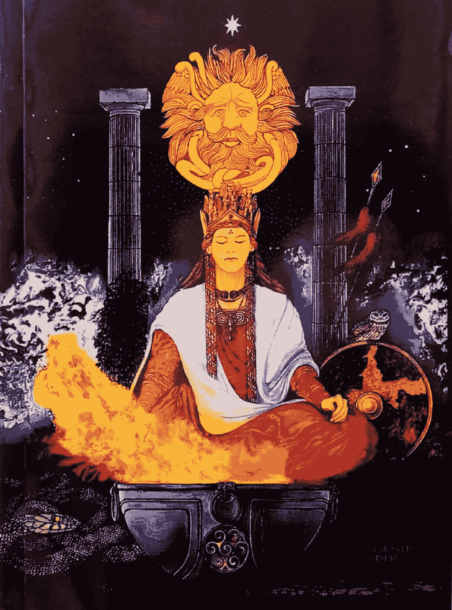

### THE KEY OF SOLOMON

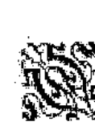

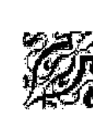

## 所罗门之匙

## 大钥匙

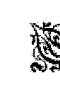

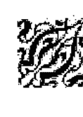

### 编者注

这个版本的所罗门的大钥匙是源于 L.W. deLaurence ( L.W. 迪劳伦斯） 1916 年出版的美国版本.这基本只是那个版本的副本除了以下几点:

- 1. 删除了 deLaurence 所写的不恰当的感叹词,以及含有他明显自我推销意义的首页及其他页面.
- 2. 删除了与文章内容毫无意义关联的脚注.它们主要是由 deLaurence 自大的“戒律”,以及他个人的一些产品广告,和不易理解的注释所组成.
- 3. 文中的图片可能会被移动到与内容相关的页面.
- 4. 格式改为更符合现代的用法.

本杰明·罗
3.23,1999

# 卷一

## 序

所罗门之匙,除了十七世纪法国出版发行的简略不完整版之外,至今尚未出版过,几个世纪以来,它一直以手稿的形式保存在只有几位有幸的学者才能见到的图书馆之中.

它是卡巴拉魔法(Qabalistical Magic)的源头与储藏室,中世纪仪式魔法的起源,这把钥匙一直作为神秘学作家最高、最权威的参考文献;特别是现代的 Eliphaz Levi ,他的著作《Dogme et Rituel de la Haute Magick》也是基于它而完成的。这一定是因为早期的 Levi 读者,他们认为所罗门之匙是他的教科书,在这一卷的最后,我写了一小段所罗门之匙的古希伯来语手稿内容,翻译出版于神秘哲学 (Pilosophe Occulte) ,还有一篇巫术的法则出品称为卡巴拉的所罗门召唤 ( Qabalistical Invocation of Solomon )，与卷一中的那篇可以互相参考，它们同样都是以萨菲罗斯 ( Sephiroth® ) 计划的形式所构成。

- 1. 萨菲罗斯：在卡巴拉学术中是从虚无中开始创世的黑色火焰。

所罗门之匙的希伯来原版的历史会在介绍中提及，但你依然可以有一千个理由去怀疑它已经遗失了，Levi 的学生克里斯蒂安在他的《魔法的历史》 ( Histoire de la Magie ) 中就这么叙述道。

我并不怀疑所罗门之匙的权威，犹太历史学家 Josephus (约瑟夫) 特别提到那位帝王的魔法作品，而且他的魔法技能也经常被年长的达人所提及。

然而，有两部黑魔法的作品，《黑魔法之书》（the Grimo­rium Verum），和《the Clavicola di Salomone ridolta》都扯上所罗门，而它们是和现代的作品所混合的产物。它们都是邪恶的魔法，我不得不强烈地提醒某些学生要远离它们。

还有另一本书称为《雷格蒙顿》（Legemeton），常被称作《所罗门的小钥匙》（the Lesser Key of Solomon the King），这本书里写满了各种灵体（Spirits），和这本书是完全不一样的，但却在它自己的领域中极具价值。

在编辑这一卷的过程中，我忽略了一到两个带有黑魔法性质的仪式，它们明显是源于上文中所提到的两部 Goetic®的作品。我要再次警告实践者对血的慎用。要正确地使用祈祷文、星盘、薰香或寺庙香，否则就会那些堕入邪恶之路。撒开本文的警告，让他自己决定是否要变得邪恶，邪恶必定会吞噬他，让他针扎在现世报的荆棘中。

## 巫术的法则

出品

这篇文章是编辑于几部藏于大英博物馆的古代手稿，它们彼此的切入点都各有千秋，在内容上也相得益彰，但都在某事上达成一致，那就是因为抄写者的忽视，希伯来文字都严重受损。但在星盘中的文字更糟糕，有些字迹过于模糊从而无法辨识出，我这么多年来的工作就是纠正这些在星盘中的希伯来文和魔法符号。学生们就可信任现在正确的复制品。只要我有时间，我就会纠正在咒语和星盘中的希伯来文和魔法名字，我把它们写成最常用的形式，仔细与各种手稿校对。不同手稿中的章节也有些许不同。例如文中的某些内容有移项等。我会在必要时添加注释。

①译者注：Goetia（中世纪拉丁语的英语化写法，源自希腊语 γοητεία goēteia “巫术”），指包含天使或恶魔召唤的仪式，其在英语中的使用源于17世纪的魔法书《所罗门的小钥匙》，其中的第一卷就名为《ARS GOETIA》。

这本书所编辑的手稿是：ADD. MSS.10,862；Sloane MSS. 1307 和 3091；Har-leian MSS. 3981；King’s MSS. 288；和 Lansdowne MSS. 1202 和 1203；总共七部抄本。

在这七部中，10,862 ADD. MSS.是最古老的，它完成的时间大约是在十六世纪末期；3981 Harleian 大约是在十七世纪中期；其他的时间就更晚了。

Add. MSS. 10,862 是以缩短了的拉丁文所写，难以阅读，但是它包含了其他几部中所缺乏的那内容，而且也是一篇重要的介绍。它的表达更为简介。它的标题很简短，只是从希伯来文译成拉丁文的所罗门之匙。这部手稿的作者的签名如下。

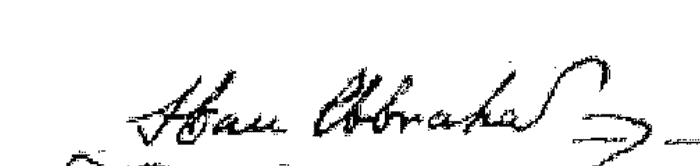

3981 Harleian MSS. ; 288 King's MSS. ; 和 3091 Sloane MSS. 从内容上和措辞上都非常相近;但是后者的抄写存在很多错误。它们都是法文。咒文和词语比 10,862 ADD. MSS.和 1202 Lansdowne MMS.中的更丰富。标题是所罗门之匙，希伯来之王，由曼图亚的权贵授权，亚伯拉罕 (Abraham Colorno) 执笔，从希伯来文译成了拉丁文;近日也推出了法文的译本。文中的星盘图案更加清晰，是用彩色墨水所画，而在 3091 Sloane MSS.中，是使用金色和银色的。

1307 Sloane MSS.是意大利文;它的标题是 La Clavicola di Salomone Redotta et epilogata nella nostra masterna lingua del dottissimo Gio Peccatrix。 它的内容都是关于黑魔法的，混杂了《所罗门之匙》，以及上文提到过的两本黑魔法书。其中的星盘画得很糟。 然而，它有一篇关于 10,682 Add. MSS.的部分介绍，也是仅有的另一部与上一篇手稿相关，保留着另一个意大利文版本的开头的手稿，标题写着 Zecorbenei。

### THE KEY OF SOLOMON

1202 Lansdowne MSS.是真正的所罗门之匙，由阿梅戴尔 ( Armadel ) 所著。它的书写体优美，首字母着色，星盘是使用彩墨细心绘制。风格简洁，但是遗漏了几个章节。文章的结尾是类似从《黑魔法之书》中所榨取的精华-恶魔的封印，严格来说这部分并不属于所罗门之匙，至少我不承认。钥匙的分类明显是在两本书中，绝无其他。

1203 Lansdowne MSS.是名副其实的所罗门之匙，罗宾 ( Rabbin Agognazar ) 从希伯来文译成拉丁文。它别具一格地书写在法国印刷纸上，星盘用彩墨细心绘制。虽然，文中的内容和其他手稿有很多相似之处，但是，它的编排却截然不同；文章没有分章节，融为一书中。

行星魔符的古代遗物和其他诺斯替教的护身符 ( Gnostic Talismans ) 一起在大英博物馆中展示。其中有一印有金星符号的铜质指环，与中世纪的魔法作家所叙述的一模一样。

圣诗中的内容也有所提及，我有很多的证据，都是英文的，而不是希伯来文的。

在某些地方我用 AZOTH 代替了 “阿尔法 ( Alpha ) 和奥米佳 ( Omega ) ,” 例如，在黑柄刀刃上的，图片 62。我或许应该提及一下，魔法剑在多数情况取代普通的刀使用。

总为总结，我只想要为那些不懂希伯来语的人做个提醒，希伯来语是从右至左书写的，它是源自希伯来语的辅音性质，它相较英语而言所需的字母更少。
[此篇序的签名是 L.W. deLaurence ，但被认为是由麦克格雷格·玛瑟（S.L. MacGregor Mathers）所写。

### 介绍

摘自译于希伯来文的拉丁文版 Add. MSS.10862,《所罗门之匙》。

铭记吧,吾儿罗驳安 (Roboam) ! 吾的至理名言, 吾已从神明处得到了智慧。

Roboam 回答道: 我如何才能追随父亲大人的步伐? 你通过神灵的教诲已通晓世间万物的知识。

所罗门说道: 听, 吾的孩儿, 记住吾的话, 向神迹学习。在某天夜里, 当吾躺下准备入睡之时, 吾召唤神之中最圣洁的名字, IAH, 祈祷难以形容的智慧。当吾刚闭上双眼之时, 神的天使, 甚至 Homadiel, 显现在吾的面前, 彬彬有礼地向吾讲述了许多事，并说道：听，所罗门！汝对最高等的那位的祈祷并没有白费，因为你并没有要求长寿、财富或者汝敌人的灵魂，而是要求能执行正义的智慧。神灵这样说道：根据汝的世界，如果吾给与汝智慧和善于理解的心灵，那么在汝面前就不再相同了，也永远不会相同。

当我理解了这番话的时候，我知道我的内在充满了万物的知识，不管是天堂的，还是在天堂之下的；我发现这个时代所有的著作和智慧都是空洞和徒劳的，没有人是完美的。我的内在这成了某种诗歌，我在内心中不断演练奥秘中的秘密，当然，我将它们隐藏起来，我也隐藏任何种类的魔法技艺的奥秘；任何奥秘或实验，也就是那些有价值的科学。我也将它们写在了这把”钥匙“之中，当用它打开藏宝物的时候，也能用它打开智慧和魔法技艺与科学的知识。

因此，吾的儿啊！你可以看见我的所有实验和其他美妙的事物，所有事物都已适当地准备妥当，所以汝或许会因吾而受挫，无论日夜，一切尽有可能；如果不这样的话，汝在吾的作品中看到的将会是谎言与虚无；这是包含所有可实践的奥秘和神秘；它们是关于一个预言或实验，我相信它们是关于未来宇宙万物的。

因此，吾的儿 Roboam 啊，我作为汝的父亲命令汝，汝应制作象牙匣子，将吾的“钥匙”藏于其中，当吾追随吾先父而去，吾恳请汝将其放在吾的坟墓旁，以免其落入恶人之手。就如所罗门所命令的。

当人类在长时间的等待之后，某些巴比伦哲学家到了坟墓，他们一到了那里就集合讨论，其中的几位应重新进入坟墓；当坟墓被挖出的时候，修补了的象牙匣被发现了，在其中隐藏了钥匙的秘密，他们欣喜地取出。在他们打开之后，没有人能明白其中语言和内容的意义，因为他们不值得拥有这项珍宝。

然而，在其中有一人比其他人更有才能，他是 Iohé Grevis，他对着其他人说道：“除非我们真心向神求解，否则我们永远也不会理解其中的意义。”

当其他人都回到自己的床上休息的时候，Iohé 跪在地上，面贴尘土，泣不成声，说道：我比其他人更值得看这个无人能理解的知识吗，即使神对我没有任何隐瞒！为何这些词如此费解？为何我如此无知？”

然后，他跪着将手伸向天空，他说：“哦，神，创世者，汝通晓万物的智慧，汝给予所罗门之子大卫王智慧；请准允我，我恳求汝，哦，神圣万能的父亲，请接收到那一智慧的美德，让我能获得理解这一秘密之匙。

然后，天神和神立刻出现在我面前，说：汝是否记得入宫索罗的秘密对汝显得难以理解，是因为上帝希望这样，这样的智慧就无法落入恶人之手；因而，汝应答应我，汝不让此智慧落入任何生灵，如果汝向任何人展现，需让他们保守秘密，否则秘密亵渎，无效？

Iohé 回答道：我答应汝，吾绝不透露给任何人，除了神圣的神之外，做一有悔悟心，神秘，且忠诚的人。

然后天使回答道：去吧，去读“钥匙”吧。所有费解的词将变得易解。

在一阵火焰之后，天使回到了天堂。

Iohé 大喜，以清晰的思维开始阅读，理解了主的天使的话，他看见所罗门之匙改变了，它显得清晰易懂。Iohé 知道此书可能会落入无知之人之手，他说道：我以创世者的力量及其智慧，祈求它不落入任何不配拥有的人，也向任何不智之人显现其内容。我向神祈祷，其实他得到了，他也永远无法得到理想的效果。那他就会将所罗门藏在象牙匣子中的珍宝储藏。但是“钥匙”的内容分为两卷。

> > 摘自 Lansdowne MSS.1203，“真实的所罗门锁骨①，”拉比·安博那泽尔（Rabbi Abognazar）将其从希伯来语译成拉丁语。

哦，吾的儿 Roboam！阅读所有的的学科都比不上天堂的智慧有用，吾认为这是我在死前的责任，让汝继承吾最珍贵的财富。为了让汝知晓这一程度的智慧，有必要告知汝，有那么一天，当吾冥想上天的力量的时候，我正说着，哦，神的创造多么好啊，神像我显现了！吾突然屏住了气息，在远处树木的尽头，一束光芒形成了一颗熊熊燃烧的星星，用雷鸣般的声音对我说，所罗门，所罗门，不要惊恐；主愿意满足汝，给予汝任何想要的。吾从惊讶中清醒过来，回答天使，根据主的意识，吾只想要智慧的礼物，以神的荣耀，我获得了天堂的至宝，万物的知识。

汝要对吾所说的多加注意，因为吾将要说的是和汝有关，汝因小心谨记，我向汝保证，神的荣耀会对汝友好，天上天下的生物和仅对自然力量有效的学科皆会服从于汝。我将给予汝统治它们天使的次序。为了让汝学会，吾会在此书中详尽阐述。

#### ① The Veritable Clavicles of Solomon

首先，汝须知道，神创造了万物，为了让他的造物服从于他，他希望他的工作能完美，就让一类生物参与了到神圣与大地，也就是人类；人类的身体粗俗且生于陆地，但他的灵魂是崇高的，他们占领了大陆并居住其中，给予他们和天使相似的方法，我将其称为命中注定的天堂造物：某些管理星星的移动，某些寄居于元素之中，有些帮助指导人类，有些则不断地赞美上帝。汝可以使用他们的封印和符号，让他们对汝俯首称臣，让汝得到命令性质相反之物的权利；

吾命令汝，吾的儿啊，将吾所说的深深地印在汝的记忆中。如果汝不打算将吾所教授的用于善事上，吾命令汝将这个护身符投入火中，而不要将这一力量乱用。善良的天使会对汝恶意的需求充满厌烦，也会对哀伤执行神旨的人如此，更会对那些将他所给予和显现的秘密滥用的邪恶之人。然而，吾的孩儿啊，不要认为它不会让汝从神圣的灵体所能带给汝的好运和快乐中获得利益；相反，他们对人类的服务感到快乐，神让他们对那些臣服于人类力量的地面的生物起到保护和指引。

有很多不同种类的灵体，根据他们所主管的不同，有些掌管天神居处（Empyrean Heaven），有些掌管宗动天（Primum Mobile），有些掌管第一和第二晶体（Crystalline），有些是繁星天堂（Starry Heaven）；也有土星天堂的灵体，吾称他们为 Saturnites。有木星的（Jovial），火星的（Martial），太阳的（Solar），金星的（Venerean），水星的（Mercuial），和月亮的（Lunar）的灵体；也有在元素中的灵体，和天堂的一样，有些在炽热的领域（Fiery Region），有些在空气的领域，有些在水的领域，有些在土的领域，他们都对那些学习他们性质并懂得如何吸引他们的人类提供他们的服务。

另外，吾想让汝理解，神为吾们每一个人都指定了一位灵，他照看着吾们，保护着吾们；他们称为魔仆/守护灵（Genii），他们基本与吾们相同，提供给那些气质与魔仆所栖息的元素相对应的人服务；例如，如果汝是火元素气质，那么也就是乐天的性格，汝的魔仆就属于火元素，臣服于 Baël 帝国。除此之外，需要在特定的时间召唤这些灵，在有力量和绝对统治的日子和时辰进行。因此，汝将会在下面的表格中了解到行星和其相关的每日辰的天使，他们所属的颜色、金属、草药、植物、水生动物、飞行动物和地面的动物，以及寺庙熏香，他们所需召唤的宇宙位置。没有被遗漏的，他们相关的召唤咒文，封印，符号，和神圣的字母，吾们所接受力量与这些灵互相支持的方式。

### 表1: 行星时辰表

| 星期日 | 星期一 | 星期二 | 星期三 | 从日出到日落的时辰 | 从半夜到午夜的时辰 | 星期四 | 星期五 | 星期六 |
| :---: | :---: | :---: | :---: | :---: | :---: | :---: | :---: | :---: |
| 水星 | 木星 | 金星 | 土星 | 8 | 1 | 太阳 | 月亮 | 火星 |
| 月亮 | 火星 | 水星 | 木星 | 9 | 2 | 金星 | 土星 | 太阳 |
| 土星 | 太阳 | 月亮 | 火星 | 10 | 3 | 水星 | 木星 | 金星 |
| 木星 | 金星 | 土星 | 太阳 | 11 | 4 | 月亮 | 火星 | 水星 |
| 火星 | 水星 | 木星 | 金星 | 12 | 5 | 土星 | 太阳 | 月亮 |
| 太阳 | 月亮 | 火星 | 水星 | 1 | 6 | 木星 | 金星 | 土星 |
| 金星 | 土星 | 太阳 | 月亮 | 2 | 7 | 火星 | 水星 | 木星 |
| 水星 | 木星 | 金星 | 土星 | 3 | 8 | 太阳 | 月亮 | 火星 |
| 月亮 | 火星 | 水星 | 木星 | 4 | 9 | 金星 | 土星 | 太阳 |
| 土星 | 太阳 | 月亮 | 火星 | 5 | 10 | 水星 | 木星 | 金星 |
| 木星 | 金星 | 土星 | 太阳 | 6 | 11 | 月亮 | 火星 | 水星 |
| 火星 | 水星 | 木星 | 金星 | 7 | 12 | 土星 | 太阳 | 月亮 |
| 太阳 | 月亮 | 火星 | 水星 | 8 | 1 | 木星 | 金星 | 土星 |
| 金星 | 土星 | 太阳 | 月亮 | 9 | 2 | 火星 | 水星 | 木星 |
| 水星 | 木星 | 金星 | 土星 | 10 | 3 | 太阳 | 月亮 | 火星 |
| 月亮 | 火星 | 水星 | 木星 | 11 | 4 | 金星 | 土星 | 太阳 |
| 土星 | 太阳 | 月亮 | 火星 | 12 | 5 | 水星 | 木星 | 金星 |
| 木星 | 金星 | 土星 | 太阳 | 1 | 6 | 月亮 | 火星 | 水星 |
| 火星 | 水星 | 木星 | 金星 | 2 | 7 | 土星 | 太阳 | 月亮 |
| 太阳 | 月亮 | 火星 | 水星 | 3 | 8 | 木星 | 金星 | 土星 |
| 金星 | 土星 | 太阳 | 月亮 | 4 | 9 | 火星 | 水星 | 木星 |
| 水星 | 木星 | 金星 | 土星 | 5 | 10 | 太阳 | 月亮 | 火星 |
| 月亮 | 火星 | 水星 | 木星 | 6 | 11 | 金星 | 土星 | 太阳 |
| 土星 | 太阳 | 月亮 | 火星 | 7 | 12 | 水星 | 木星 | 金星 |

#### 表 2：时辰的魔法名字，统治它们的天使，每天午夜的第一个小时开始，继而在午夜结束

| 时辰 | 星期日 | 星期一 | 星期二 | 星期三 | 星期四 | 星期五 | 星期六 |
|------|--------|--------|--------|--------|--------|--------|--------|
| 1. Yaqn | Raphael | Sachiel | Anael | Cassiel | Michael | Gabriel | Zamael |
| 2. Yaqor | Gabriel | Zamael | Raphael | Sachiel | Anael | Cassiel | Michael |
| 3. Hasnia | Cassiel | Michael | Gabriel | Zamael | Raphael | Sachiel | Anael |
| 4. Salla | Sachiel | Anael | Cassiel | Michael | Gabriel | Zamael | Raphael |
| 5. Sadedall | Raphael | Sachiel | Anael | Cassiel | Michael | Gabriel | Zamael |
| 6. Thamur | Michael | Gabriel | Zamael | Raphael | Sachiel | Anael | Cassiel |
| 7. Ourer | Anael | Cassiel | Michael | Gabriel | Zamael | Raphael | Sachiel |
| 8. Thainé | Raphael | Sachiel | Anael | Cassiel | Michael | Gabriel | Zamael |
| 9. Aeron | Gabriel | Zamael | Raphael | Sachiel | Anael | Cassiel | Michael |
| 10. Yayon | Cassiel | Michael | Gabriel | Zamael | Raphael | Sachiel | Anael |
| 11. Abal | Sachiel | Anael | Cassiel | Michael | Gabriel | Zamael | Raphael |
| 12. Nathalon | Raphael | Sachiel | Anael | Cassiel | Michael | Gabriel | Zamael |

### THE KEY OF SOLOMON

| # | Angel 1 | Angel 2 | Angel 3 | Angel 4 | Angel 5 | Angel 6 | Angel 7 |
| --- | --- | --- | --- | --- | --- | --- | --- |
| 1. Beron | Michael | Gabriel | Zamael | Raphael | Sachiel | Anael | Cassiel |
| 2. Barol | Anael | Cassiel | Michael | Gabriel | Zamael | Raphael | Sachiel |
| 3. Thanu | Raphael | Sachiel | Anael | Cassiel | Michael | Gabriel | Zamael |
| 4. Achor | Gabriel | Zamael | Raphael | Sachiel | Anael | Cassiel | Michael |
| 5. Mathon | Cassiel | Michael | Gabriel | Zamael | Raphael | Sachiel | Anael |
| 6. Rana | Sachiel | Anael | Cassiel | Michael | Gabriel | Zamael | Raphael |
| 7. Aetos | Zamael | Raphael | Sachiel | Anael | Cassiel | Michael | Gabriel |
| 8. Tafrac | Michael | Gabriel | Zamael | Raphael | Sachiel | Anael | Cassiel |
| 9. Sassur | Anael | Cassiel | Michael | Gabriel | Zamael | Raphael | Sachiel |
| 10. Agla | Raphael | Sachiel | Anael | Cassiel | Michael | Gabriel | Zamael |
| 11. Caerra | Gabriel | Zamael | Raphael | Sachiel | Anael | Cassiel | Michael |
| 12. Salam | Cassiel | Michael | Gabriel | Zamael | Raphael | Sachiel | Anael |

#### 表 3：天使长，天使，金属，每周的天数，及与每个行星相关的颜色

| 天数 | 星期六 | 星期四 | 星期二 | 星期日 | 星期五 | 星期三 | 星期一 |
|------|--------|--------|--------|--------|--------|--------|--------|
| 天使长 | Tzaphquiel | Tzadkiel | Khamael | Raphaël | Haniel | Michael | Gabriel |
| 天使 | Cassiel | Sachiel | Zamael | Michael | Anael | Raphael | Gabriel |
| 行星 | 土星 | 木星 | 火星 | 太阳 | 金星 | 水星 | 月亮 |
| 金属 | 铅 | 锡 | 铁 | 金 | 铜 | 汞 | 银 |
| 颜色 | 黑 | 蓝 | 红 | 黄 | 绿 | 紫 | 白 |

### THE KEY OF SOLOMON

## 初步论述

> 摘自阿伯纳扎（Rabbi Abognazar）将希伯来文译成拉丁文的 Lansdowne MSS.1203 “The Veritable Clavicles of Solomon”

每个人都知道不朽的所罗门是通过天使的教导学会知识的，它以那么服从的姿态显现，除了智慧以外，他要求得到其他的美德；这样才能让他的知识不会随着他的身体而埋葬，并得到永久的保存。在他的过世之前，他留给自己的儿子 Roboam 一份遗嘱，其中包含了他生前的所有智慧。后来的拉比们（Rabbis）仔细学习这些知识，称这份遗嘱为《The Clavicle》或《所罗门之匙》。他们将其刻在树皮上，在铜质碟子上刻画星盘及其中的希伯来文字，再将其保存在国王所命令建造的庙宇中。

这份遗嘱在古代由 Rabbi Abognazar 从希伯来文译成了拉丁文，他携带其到普罗旺斯的某个艾尔的镇中。也就是在那里，古老的希伯来 Clavicle 被发现了。在那个城市中的犹太人被屠之后，这本珍贵的书也落入了艾尔的总教主；他将这本书从拉丁文翻译成了通俗语，也就是你们将阅读的这本，同样的措词，并没有修改或增加源译文中的内容。

# 第一章

### 关于在获得这一知识之前的神圣之爱

所罗门，大卫王之子，以色列的国王，他曾说过，我们的钥匙之初是惧怕神灵，崇拜他，以忏悔之心敬仰他，因我们所求而召唤他，并全身心地投入在其中，只有这样，神灵才会正确地引领我们。因此，当你想要获得魔法技艺和技术的知识，你需要按照日时的次序，以及月亮的位置来准备，如果不这样做的话，就无法获得任何。只要你勤劳地遵守它们，你就有可能简单地达到你所有期望的效果。

# 第二章

### 关于天数，时辰，和行星的性质

当你想要做任何实验或仪式的时候，你必须先准备好所有必须的物品，比如蜡烛和薰香，你会在后面的章节中找到详细描述：你会在这个章节中了解需要观察天数，时辰，和其他星座的效果。

所以，我建议要了解白天和夜晚的时辰，总共二十四个，从最高降至最低，每个时辰以有规则的次序由一个行星所掌管。行星的顺序是：ShBThA-I, Shabbathai, Saturn（土星）；在 Saturn 之下的是 TzDQ, Tzedeq, Jupiter（木星）；在 Jupiter 之下的是 MADIM, Madim, Mars（火星）；在火星之下的是 ShMSh, Shemesh, Sun（太阳）；在 Sun 之下的是 NVGH, Nogah, Venus (金星)；在 Venus 之下的是 KVK B, Kokav, Mercury (水星)；在 Mercury 之下的是 LBNH, Levanah, 及所有行星中最低位的 Moon (月亮)。

所以，一定要了解行星与最近名字属性相关的统治权——即，星期六是土星；星期四是木星；星期二是火星，星期天是太阳；星期五是金星；星期三是水星；星期一是月亮。

每个时辰的行星统治从太阳升起的黎明开始，依次序下去的行星会在下一个时辰接管。例如，(星期六) 土星是第一个时辰，木星是第二个，火星是第三个，太阳是第四个，金星是第五个，水星是第六个，月亮就是第七个，接着一轮土星会接管第八个，以此类推。

注意，每个魔法仪式的实践都需在适合的行星条件下实行。例如：在土星日、土星时，你可以从冥府 (Hades) 召唤灵魂，但只能是那些自然死亡的。与这些日子和时辰可实践的类似，能带来善或恶的运气；让熟悉的灵魂在你的睡梦中相遇；为了获得知识，让生意、财产、货品、种子、果实和其他类似的事物，招致好运或不幸；招致毁灭和死亡，并散播仇恨和争吵。

木星日与木星时的性质是获得荣誉，寻求财富；缔结友谊，保持健康；达到你的希望。

在火星日与火星时，你可以做关于战争的仪式；获得军事荣耀；获得勇气；倒戈敌人；甚至招致毁坏、屠杀、暴行、争吵；招致伤害与死亡。

太阳日与太阳时适合：短暂的富裕、希望、盈利、财产，预言、王子的宠爱，解除敌对感，以及交朋友。

金星日与金星时适合建立友情；仁慈和爱情；愉快的事业与旅行。

水星日与水星时适合进行口才与智慧的仪式；商业上的果断；技术与占卜；奇想；特异景象；回答关于未来的问题。这个行星也同样适用于偷盗；作品；欺骗；商品。

月亮日与月亮时适合使节；航行；外交；启示；导航；和解；爱情；以及通过水运物品的获得。

如果你希望成功，你应当守时地遵照这一章中指示执行，要发现魔法科学的真理就得如此。

土星、火星和月亮的时辰适合交流，与灵魂沟通；而那些水星的时辰适合利用灵魂的方法行窃。

火星的时辰适合召唤来自冥府的灵魂，特别是那些死于战争中的灵魂。

太阳、木星和金星的时辰适合准备任何关于爱情、仁慈和隐形，因此需要我们在的仪式中加入相似性质的事物，让其充分展现。

土星时和火星时是月亮与它们相连的日子，或是它们相冲或四分的日子，适合实行关于憎恨、不和、争吵和争端的仪式；同种类型的其他仪式会在之后详述。

水星的时辰适合实行关于游戏、玩笑、笑话和运动之类的仪式。

太阳、木星和金星的时辰适合进行所有与众不同的、未知的仪式。

月亮的时辰适合进行关于寻找失窃的物品，获得夜视能力，在梦中召唤灵魂，以及任何关于水的实验。

金星的时辰适合关于运气、弊害，以及所有金星性质的事，和刺激疯狂的药粉之类的。

为了有效地实行这项技艺，你应当在确切时辰和确切的行星日子里实行，这样才能让仪式的成功率提升，在下面的文章内容中，你将会读到需要遵守的规则，如果你不小心忽略了其中之一，那你就无法完成这项技艺。

然后是关于月亮的事情，如果要做灵魂的召唤，与死者沟通的仪式，寻找已失窃的物品，那么月亮应当在土相的星座上，也就是：金牛座、处女座或摩羯座。

关于爱情，悲悯和隐形的，月亮应当在火相星座上，即是：白羊座，狮子座，或射手座。

关于憎恨、争吵和毁灭的，月亮应当在水相星座上，即是：巨蟹座，天蝎座或双鱼座。

关于无法划入任何类别特殊性质的实验，月亮应当在风相星座，即是：双子座，天秤座或水瓶座。

如果有些事对你而言难以完成，你只需要注意一下月亮，她是否与太阳相连的，特别是当她遮盖他的光芒并显现的时候。而到那时，你可以做任何关于构建的实验和任何事物的仪式。这也是新月到满月间适合任何我们上文中提到的实验的原因。但当她在月亏的时候，就是适合战争、焦虑和争吵的。同样，在她将近剥夺光芒的时候，适合金星任何隐形和死亡的实验。

但要遵守当月亮与太阳相连时不能进行任何的规矩，你可以将其看成会遭致极其不幸的事情。但当月亮开始离开他的光芒的时候，你可以做你任何想做的事情，当然要遵守这一章中的指示。

另外，如果你想和灵魂沟通，应当在水星日和水星时进行，月亮应在风相星座，如同太阳。

无论你是在白天或夜晚进行，将你自己隐藏在一个秘密的地方，在仪式完成前，不能让人看见你或妨碍你。如果你在夜间进行，你应当选择能在夜间生效的仪式；如果是在白天，也就是从太阳升起时开始，但是开始的时辰是在水星时。

确实，没有一个和灵魂沟通的仪式能在没有圆的情况下完成，不管你希望做的与灵魂沟通的仪式是哪种，你一定要学习如何构筑一个特殊的圆；在圆内完成仪式更为慎重和有效。

# 第三章

### 关于仪式

如果你希望那个成功，就要怀有必要的严肃和礼节在合适的日辰中完成下面的实验。

实验分为两种：第一种是实行那种可以不需要圆而简单进行的，也就是可以不遵守任何，你会在适当的章节中找到。第二种是需要圆来完美实行的。为了完美地完成，这项技艺的大师与他的门徒需要在构筑圆之前，记录所有的准备步骤。

在实行前，大师与他的门徒必须禁欲九天，无论是肉体快感，还是虚荣与愚蠢的谈话；就如在卷二中的第四章中所写的一样，在第六天期满的时候，他必须频繁地背诵文中的祈祷文和告解；在第七天的时候，大师需要独自进入那个隐秘的地方，让他解除衣衫，用圣化和驱魔过的水从头到脚地淋浴一番，虔诚地祈祷，“噢，主 Adonai①，”等等，详细内容在卷二，第二章中。

祈祷结束后，大师离开水，穿上干净的白色亚麻外衣；然后，让他与他的门徒一起到隐秘的地方，让他们脱去衣衫裸体；让他用圣化水浇在她们的头顶上，让水流至脚，然后完全沐浴；当在他们头顶上浇灌的时候，大师需说：“让你们重生，新生，洗净和纯洁②，”等，详细内容在卷二的第三章中。

完成之后，门徒需要自己和衣，衣服就和他们大师的一样，是干净的白色亚麻布衣衫；在最后的三天内，大师和他的门徒需要快速观察在卷二第二章中的步骤和祈祷文。

> ①译者注：Adonai：希伯来语中的上帝或天主。

> ②原文是 “Be ye regenerate, renewed, washed, and pure.”

注意，最后的第三天应当是平静的天气，没有风，也没有快速移动的云彩在天空中。在最后一天，让大师和他的门徒去到一个隐秘的活泉水或小溪处，让他们每一个人宽衣解带，庄严地清洗自己，详见卷二。当他们干净而纯洁之时，让他们穿上干净的白色亚麻布外套，用卷二中所写的祈祷文和仪式，门徒在大师诵完之后再诵。完成之后，大师将亲吻门徒的额头作为禁欲的标志，然后他们要互相亲吻。事后，大师将双手举过门徒，做忏悔式，并祝福他们；之后，他要分发要带入魔法的圆中的必要器具。

第一位门徒携带三角鼎、香料和薰香；第二位门徒需要携带书、纸、钢笔、墨水和仁和不纯洁的物品；第三位需要携带匕首和魔法的镰刀，提灯和蜡烛；第四位，圣诗，以及剩余的器具；第五位需要携带坩锅和火锅，以及木炭或燃料；但大师需要携带木杖或杆并亲自带领他的门徒。重要的是如何处理，大师需要与他的门徒一起去事先预定的地方，并建立魔法的圆；背诵卷二中的祈祷文。

当大师与他的门徒一起抵达指定地点的时候，他点燃火焰，背诵卷二中的圣化咒语，点燃蜡烛并放入提灯中，其中的一位门徒需要在大师工作时一直举着它。现在，每次大师想要实行关于与灵魂沟通的愿望的时候，他一定要努力形成某种特殊的圆。为了要形成这种魔法的圆，你需要按照下列步骤完成：

#### 圆的构筑

以卷二中所提及的方式使用你的匕首、镰刀或仪式剑。对匕首还是镰刀的选择，可根据个人喜好。在内圆外，你应当以同一个中心比前者半径长一尺形成第二个圆，描绘 Tau 字母的土元素、神圣不可侵犯的四方符号。在两个圆之间，用魔法艺术的器具画出四个六芒星，在它们中间写上圣名：

-   东南方之间，四字神名 IHVH；
-   西南方之间，重要的四字神名 AHIH，Eheieh；
-   西南方之间，力量之名 ALIVH, Elion；
-   东北方之间，伟大之名 ALH, Eloah；

它们是 Sephiroth 名单中最为至高无上的。

另外，你需将这几个圆限制在两个正方形中，它们的天使名字朝向土元素的四方；在外正方形和内正方形之间的距离应是半英尺。外正方形末端的天使应该写在四个圆的中央，它们的直径应为一英尺。所有的这些需用匕首或被圣化的器具刻画。在这四个圆之中，我们需写上最圣洁的神名，次序依次为：

-   东面，AL，El；
-   西面，IH，Yah；
-   南面，ADNI，Adonai。

在两个正方形中间的四字神名需要以同样的方式刻在图版上。（见图片2。）

当刻画圆的时候，大师应背诵下列圣诗：第二篇；第四十四篇；第五十四篇；第一百一十三篇；第六十六篇；第六十八篇①。
或者他可以在刻画圆之前背诵。

完成之后，根据卷二中关于烟熏礼章节的步骤进行烟熏礼仪式，大师需要集合他的门徒，赞扬他们，使他们消除疑虑，为他们打打气，然后，指挥他们进入圆的某部分（土元素四方的圆中），鼓舞士气，让他们无所畏惧，呆在被指定的地点。被分配到东面的门徒需携带一支钢笔，一瓶墨水，一张纸，一条丝绸，和白棉布。另外，同伴们需要手持一把新的出鞘了的剑。

## 巫术的法则

#### 出品

（除了圣化过的仪式剑），他应将手放在剑柄上，在分配的地点上安静，不随意移动。

在大师离开圆之后，点燃东面地点上燃料，在其上放置香炉；他手持圣化过的小蜡烛，再将其点燃，放置到预先准备好的隐秘地点。再次进入圆中并关闭圆。

大师需重新鼓舞他的门徒，向他们解释该做什么和该遵守什么；让他们保证听命于他。然后，大师便可祈祷：

> 我们谦卑地在这里，请万能的神通过那扇幸福、兴盛、喜悦、仁慈和问候的入口降临这个圆。让所有的魔鬼远离这里，尤其是那些反对这项工作的它们。请和平天使加持这个圆，愿争吵与冲突远离这里。放大延伸我们的能量，噢，神灵啊，汝圣洁的神名，祝福我们的谈话和我们的与会者。噢，我们的神灵，啊，神圣化我们现所在的地点，祝福着我们的您是这一永恒纪元的圣洁者！阿门。

诵完之后，大师跪着如是诵道：

> ①译者注：Psalm ii; Psalm liv; Psalm cxiii; Psalm lxvii; Psalm xlvi; Psalm lxviii，是指《诗篇》（《圣经·旧约》）的一卷中的赞美诗。

噢，万能慈悲的上帝啊，汝不愿罪人死亡，而让他们放下屠刀并继续生活；请赐允汝的荣耀，祝福并圣化这片土地和这个圆。我恳求，大地啊，让最圣洁的 ASHER EHIEH 进入这个圆，与我的手一起共谱。愿神灵，ADONAI，以所有天堂的美德祝福此地，这样就不会有污秽的灵魂进入这个圆，或骚扰这个圆中的人；啊，永远居住在纪元中的纪元的神 ADONAI 啊，阿门。

#### 出品

吾恳求汝，噢，万能仁慈的真神啊，愿汝祝福这个圆，这个地点，在其中的人们，汝将准允我这些汝的仆人，我们只是在演练汝律法的奇迹，一位守护我们的善良天使；他消除我们每天的负面能量；保护我们远离魔鬼和疑难；准允吧，吾之神，让我们能安心地在这片土地上，噢，主宰纪元中的纪元的上帝阿，阿门。

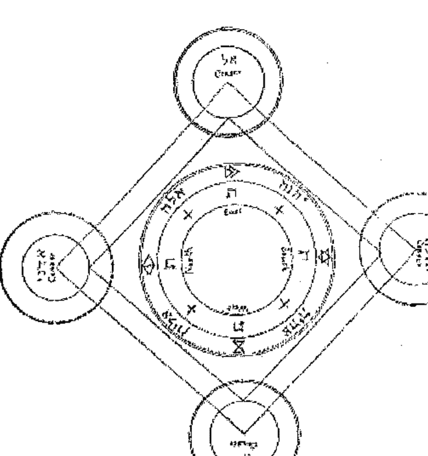

现在，让大师起身，将一顶纸做的帽子（或者其他合适的物品）戴在自己的头上，在帽子上一定要写有（用彩色或其他后文会谈及的必要物品）AGLA，AGLAI，AGLATA，AGLATAI 四个名字。它们要写在前面和后面，及头的两侧。

另外，大师必定要携带星盘或与他目的相关的金属进入圆，它们需按照后文关于星盘的章节中的规定制作。它们应当用钢笔、墨水，血或彩色写在没用过的纸上，根据后文中的相关章节准备好。准备确实需要的星盘就已足够，它们会被用圣化的针和少女编织的线缝在用亚麻布制作的袍子的胸前方。在这之后，大师需面向东方（除非指向相反，或他希望召唤的灵魂是处于宇宙另一个方向的），大声诵念这一章节中的咒文。如果灵体拒绝服从或现身，他必须举起圣化的仪式匕首（构筑圆的那把），如同要攻击一般，将其举至天空对灵体施咒。他用右手将匕首举至封在胸前的星盘或金属上方，跪着背诵下面的咒文：

#### 咒文

噢，上帝啊，请倾听吾的请求，愿汝能听到吾的呼唤。

噢，万能的上帝啊，汝在纪元开始前就已主宰，汝用汝无尽的智慧创造了天堂、地球和大海，只需汝的一句话，就可让事物显现或隐形；吾赞赏汝，吾祝福汝，吾崇拜汝，吾赞美汝，吾祈祷此时此刻汝能对吾显露慈悲。吾是汝手中的作品，是可怜的罪人，拯救吾，用汝圣洁之名指导吾吧，对汝而言，没有困难一说；将吾从无知之夜中释放，让吾从此势不可挡。用汝无尽智慧的火花令吾茅塞顿开。带走吾贪婪的欲望和吾虚无邪恶的言语。带给吾，汝的仆人，一颗善于理解的心肠，敏锐的感知，让吾掌握理解所有学科和技艺；给与吾能倾听的力量，能记住它们的记忆力，让吾能够得偿所愿，理解并学习所有复杂与令人向往的技巧；也让吾理解那些不为人所知的神圣作品。给予吾能理解它们的美德，让吾能够为他人指导时，就像汝命令吾的那样，带着耐心和谦卑说话。

噢，神灵啊，万能慈悲的父亲，汝创造了万物，汝知晓世间万物，对汝而言没有秘密，没有办不到的事；吾恳求汝给予吾，汝的仆人恩典，因为我们不愿在不安的状态下实践这个尝试获得汝力量的仪式，但宁愿我们可能会知晓所有不为人所知的事物的真实。吾恳求汝能慈悲地对待我们；以汝隐秘，宏伟，圣洁，以及神圣、令人恐惧、无法形容的，能让整个世界战栗的名字IAH，以万物服从汝的恐惧，请准允吧，上帝啊，我们也许能变得更易感应到汝的荣耀，我们也就能在汝面前变得更充满信心并能理解汝。那些灵体能在这里发现他们自我，那些温柔儒雅的就能靠近我们，这样，他们就能服从汝的命令，噢，伟大神圣的ADONAI，汝的国土永远存在，汝的帝国随着纪元中的纪元永垂不朽。阿门。

在虔诚地念诵完毕后，大师站起，将其双手放在星盘上，让门徒之一为大师举起书本，他的目光射向天空，转向世界的四方，说道：

> 噢，上帝啊，让吾被能抵御恶灵袭击的高塔所笼罩吧。

之后，转向世界的四方，他将念出下面的文字：

这些是创始者的符号和名字，它们能带给你恐惧。以这些圣洁名之力，以这些神秘的符号之力，服从我吧。

④烟熏法 ( Suffumigations ) : 用以吸引灵体并致使他们物质化。通常用于巫术、降神会和仪式魔法中。

# 第四章

## 驱魔师的忏悔

### 忏悔文

噢，天堂之主啊，吾在汝面前忏悔吾的罪孽，吾谦卑地在汝的面前。吾傲慢、贪婪，对荣耀与财富的贪得无厌；懒惰、贪食、贪婪、纵情酒色；吾肉欲横生、奸情和污秽，这些都是吾所承认的，别人也应当如此；吾亵渎圣物、偷盗、违纪和杀生；吾被邪恶占据利用，吾浪费奢侈；吾所犯下希望和仁慈的错误，吾邪恶的劝解，奉承，行贿，疾病的传播；虐待穷人，在分配中我让物品落入吾的管辖，折磨那些吾授予权利的人，不让囚徒被探访，剥夺死者被埋葬的权利，不接待穷人，即使感到口渴也不给他们一滴水，永远不过安息日和其他节日，更不会虔诚贞洁地过那些日子，准允那些煽动吾邪恶行为的人，伤害而不是帮助那些需要我帮助的人，不聆听那些穷人哭泣的声音，不尊重长者，不履行誓言，不遵从父母之命，不感激善待吾的人，沉浸在酒肉池林中，对神庙不尊敬，不雅的行为对待，藐视庙宇中神圣的器皿，将神圣的仪式变为笑话，用污秽的双手触摸食物并用不纯洁的双唇进食，吾的祈祷和爱慕的忽视。

吾也憎恶用邪恶思绪，空虚，以及不纯洁的冥想，错误的猜忌，和轻率的判断，而付诸的罪孽；吾毫不迟疑地接受邪恶的建议，拥有了肮脏的渴望和肉欲的快感，吾懒散的话语，吾的谎言，和吾的诡计；吾的各种虚伪的誓言；和吾持续的诽谤和诬蔑。

吾也憎恶我所犯下的罪行；吾所煽动的叛乱和冲突；吾的好奇，贪婪，妄语，暴行，诅咒，咕哝，渎神，虚词，辱骂，欺骗；吾违背神戒律的罪孽，吾责任与义务，对神与近邻的敬爱的忽视。

另外，吾厌恶所有吾的感官所犯下的罪行，视觉上的，听觉上的，味觉上的，嗅觉上的，和触觉上的，人类弱点所能冒犯造物主的所有方式；吾肉体的思想，行为和默想。

吾谦卑地忏悔吾所犯下的罪孽，承认是在神的面前最罪恶的人。

吾在汝跟前指责自己，哦，神啊，吾谦卑地崇拜汝。哦，神圣的天使，哦，神的孩子，在汝们面前，吾公布吾的罪行，让吾的敌人无法获得优势，让他们无法在这最后的时刻责备吾；他们无法说吾隐藏着任何罪行，吾将不会在上帝的跟前被指控；但相反地，在吾的述说后，天堂会充满欢乐，因为吾刚刚在汝的跟前忏悔了吾的罪孽。

哦，最万能、最强大的父亲啊，准允吾通过汝无限的慈爱，让吾能看见并知晓所有吾召唤的灵体，让他们能以他们的方式让吾看见吾的意志和愿望的达成，以至高无上的君主和汝妙不可言的无限荣耀，汝是永远纯净、妙不可言的万物之父。

以谦卑的态度，由内至外地完成忏悔，大师需要背诵下面的祈祷文：

### 祈祷文

> > 哦，上帝啊，万能、不朽的神，万物之父，在吾之上散发出慈爱的神圣力量，因为吾是汝的造物。吾恳求汝受到汝的保护，不受到汝敌人的侵害，证实吾内在的真实和坚定的信仰。

> > 哦，上帝，我向汝奉献吾的身体和灵魂，吾只信任汝；吾只能依赖汝；哦上帝，吾的神请帮助我；哦，上帝请在吾召唤汝的时候倾听吾。吾祈祷汝的慈爱不会让吾忘却，也不会将吾与汝分开。吾的上帝成为吾的援助者吧，汝是吾的拯救之神。

> > 哦，上帝，让吾获得一颗向汝敬爱仁慈的心灵。哦，上帝，这些事物等待从汝手中获得的礼物，哦，吾的神，吾的主，汝不朽地生活着、统治着。阿门。

> > 哦，上帝，万能的神，汝拥有伟大妙不可言的智慧，它们与汝一起存在了数不尽的纪元；汝在造就时间的时候，创造了天堂，地球，海洋，和其他它们所包含的事物；汝通过汝的口的呼吸，给万物赋予了生命，吾赞美汝，吾祝福汝，吾崇拜汝，吾歌颂汝。给予汝这个可怜的罪人一点祝福吧，不要看不起吾；拯救吾，帮助吾，即使吾是如双手的作品。吾以圣名祈求和恳求汝，驱逐出吾灵魂中的无知黑暗，用汝智慧的火焰开导吾；让吾远离任何邪恶的欲望，让吾的话语不再愚蠢。哦，汝，活者（the Living One）之神，汝的荣耀，荣誉，和国度与世长存。阿门。

# 第五章

## 祈祷文和召唤文

### 祈祷

哦，上帝之神，神圣的父亲，万能慈悲者，汝创造了万物，汝通晓万物，能做任何事，对汝而言，没有什么事是汝不知道的，没有什么事是汝无法做的；汝知晓吾们并非是为了通过此仪式获得汝的力量，而是为了探知隐秘的知识；吾们祈祷汝神圣的慈悲去引导吾们达到理解隐秘事物的境地，通过汝的帮助，理解它们的性质，哦，最神圣的ADONAI啊，汝的国度和力量与世共存。阿门。

祈祷结束后，让召唤师将他的手放置在星盘之上，门徒之一同时在他面前举着书写着祈祷文和召唤文的书。然后，大师转向每个土地的四方，将双眼对向天空，说道：

> 哦，上帝啊，汝是吾庇护的高塔，远离邪恶灵魂的视线和攻击。

在他再次转向大地四方之后，让他每次转向说出下面的话：

> 看见造物主的符号和名字，汝应永远恐惧。服从吧，以这些神圣之名，和这些奥秘中的秘密。

在他看见灵魂从各处聚集之后。但为了以防他们在其他地方忙绿，或者无法前来，又或者他们不愿前来；然后让他在下面诵念召唤文：

### 召唤文

哦，汝们这些灵魂啊，吾召唤汝们，以神灵的力量、智慧和美德，以自存的神圣智慧，以神的慈悲，以身的力量，以神的创造力，以神的协调力；以神的神圣之名 EHEIEH，它是所有其他圣名的根，躯干，和起源，他们都从他处引入生命和美德，Adam（亚当）召唤之后，他拥有了万物的知识。

吾以不可分割之名 IOD 召唤汝们，它代表着自然神圣的简单与统一，Abel（亚伯）通过它的召唤，他获得了逃离他兄长之手的力量。

吾以 TETRAGRAMMATON ELOHIM 之名召唤汝们，它代表着崇高王权的伟大，Noah（诺亚）念出它，拯救了自己，保护自己不被洪水淹没。

吾以强大的 El 神之名召唤汝们，它是慈爱与神圣美德的标志，Abraham（亚伯拉罕）召唤它，他从占星的 Ur 处获得了前往的价值。

吾以最强大的 ELOHIM GIBOR 之名召唤汝们，他代表神的力量，他惩治罪恶，他搜查出三四代之上的邪恶父亲并惩罚他们；Isaac（以撒）召唤了他，他就找到了逃出 Abraham（亚伯拉罕）之剑的方法。

吾以 ELOAH VA-DAATH 之名召唤汝们，Jacob（雅各布）在遇到危险的时候会召唤他，理解承担 Isreal 之名的重要性，也就预示着神的征途者；他从暴怒的 Esau（以扫）处接到指令。

吾以最具威力的 ELADONAI TZABOTH 之名召唤汝们，他是军队之神，在天堂掌管，Joseph（约瑟夫）召唤了他，发现了从他的同胞手中逃脱的方法。

吾以最具威力的 ELOHIM TZABAOTH 之名召唤汝们，他代表了神的神性、慈悲、壮丽和智慧，Moses（摩西）召唤了他，他就获得了解放埃及的以色列民众的方法，让人民从法老王的奴役中解放了出来。

吾再次召唤汝，神的变节者，神独自创造了伟大的奇迹；以神圣的耶路撒冷；以最圣洁的四字神之名，以让万物苏醒并用其令人尊敬之名 EHEIEH ASHER EHEIEH；汝们应立刻前来执行吾们的愿望。

吾召唤汝们，吾命令汝们，哦，魔鬼啊，无论汝们在何方，以所有这些圣名的美德：——ADONAI, JAH, HOA, EL, ELOAH, ELOHINU, ELOHIM, EHEIEH, MARON, KAPHU, ESCH, INNON, AVEN, AGLA, HAZOR, EMETH, YAH, ARARITHA, YOVA, HA-LABIR, MESSIACH, IONAH, MALKA, EREL, KUZU, MATZPATZ, EL SHADDAI；以所有用血液写在不朽同盟标记上的神的神圣之名。

吾再次召唤汝们，以其他的神之名，最神圣和位置的，以每天颤动之名的美德；——BARUC, BACURABON, PATACEL, ALCHEEGHEL, AQUACHAI, HOMORION, EHEIEH, ARBATON, CHEVON, CEBON, OYZROYMAS, CHAI, EHEIEH, ALBAMACHI, ORTAGU, NALE, ABELECH（或 HELECH）, YEZE（或 SECHEZZE）：汝们应快速前来，不得延误，以神之名执行吾们的命令。

+ 1. Kerubim：天门神兽
+ 2. Seraphim：炽天使

# 第六章

## 更强的召唤文

如果他们立刻显现，这当然最好；如果没有的话，让大师掀开圣化的星盘，用于束缚和命令灵体，他应当在其脖子上系着它，用其左手拿着金属（星盘），右手拿着圣化用的匕首；激励他的同伴，大声说道：

### 致词

这是神秘事物，征服者神的标准、旗帜和横幅的象征；全能神的双臂，驱使着飞行的能力。吾以他们的力量和美德命令汝，来到吾们的身旁，无论汝们在世界的何方，吾们以神和全能者的美德命令汝，服从吾们，不得延误。立刻来到吧，不得延误，谦卑地回答吾们。

如果他们这次显现了，向他们展示星盘，亲切地接待他们；理智地与他们谈话，询问他们汝想要知道的事物。

但如果他们没有显现的话，右手持圣化匕首，掀开星盘上被圣化的遮布，用匕首击向天空，如同要挑起战争一般，安慰告诫同伴，然后，用响亮的声音背诵下面的召唤咒文：

### 召唤文

> 吾再次召唤汝们，急切地命令汝们；吾极度地强迫，限制，和告诫汝们，以最万能的神之名 EL，以正义之神，吾召唤并命令汝们不得延误会，立刻来到吾们跟前，不得吵闹，残缺，或丑陋，而要以柔和的姿态。

> 吾在此召唤汝们，强烈地召唤汝们；以所有这些名字：EL，SHADDAI，ELOHIM，ELOHI，TZABAOTH，ELIM，ASHER EHEIEH，YAH，TETRAGRAMMATON，SHADDAI，他们代表着神的权位和能力，以色列的神，通过其对吾们仪式的保护，吾们定会成功，因为上帝永远与吾们在一起，在吾们的心中，在吾们的嘴中；以他的神圣之名，以至高无上的神的美德，吾们会完成所有工作。

> 立刻前来，不得延误，不得显现怪异的外形，以优雅的姿态出现。来吧，因为吾们以最强烈的IAO和ON之名召唤汝们，Adam（亚当）曾说到听到；以EL之名，Noah（诺亚）听到，拯救其与其家庭免于洪水的伤害；以IOD之名，Noah听到，了解了神全能者；以AGLA之名，Jacob（雅各布）听到，看见通往天堂的阶梯，天使通过它上下，他将它称为神之屋和天堂之门；以ELOHIM之名，摩西在神之山（何烈山）上称呼了他，召唤了他，并听到了他，他从燃烧的灌木中听到他的话。以 AIN SOPH 之名，Aaron ( 亚伦 ) 听到了，立刻变得有口才，聪明，善于学习；以 TZABAOTH 之名，摩西称呼并召唤他，所有池塘和河流在埃及之地被洪水淹没；以 IOD 之名，Moses ( 摩西 ) 称呼并召唤了他，敲响了尘土，人类和禽兽都被疾病侵袭；以 PRIMEUMATON 之名，Moses ( 摩西 ) 称呼并召唤了他，埃及之地下起了冰霜，致死了在那个国家中的藤蔓和树木；以 IAPHAR 之名，Moses ( 摩西 ) 听到并召唤了他，埃及之地立刻出现鼠疫，感染且宰杀了所有埃及的驴子，牛和羊，因为它们都已经死了；以 ABADDON 之名，Moses ( 摩西 ) 召唤并向天空洒落，立刻向人类和家禽降下了大雨，所有埃及之地生命都死了；以 ELION 之名，Moses 召唤了，下起了从创世以来从没有过的冰雹，所有在埃及那块土地上的人类和植物都死亡。以 EDONAL 之名，Moses ( 摩西 ) 召唤了他，埃及大地出现了大量的蝗虫，它们吞食了所有剩余的冰雹；以 PATHEON 之名，招呼之后，埃及大地出现了浓烈可怕的黑雾，持续了三天三夜，所有居住在那的人们几乎都死了；以 YESOD 之名，Moses（摩西）召唤之后，在午夜的时候，所有人类和动物的新生儿死亡；以 YESHIMON 之名，Moses（摩西）称呼并召唤后，红海一分为二；以 HESION 之名，Moses（摩西）召唤之后，所有法老王（Pharaoh）的士兵被水淹死；以 ANABONA 之名，摩西在西奈山（Mount Sinai）上听到后，他知道了如何获得画着创世者神手指的石头；以 ERYGION 之名，Joshua（耶和华）在和摩押人（Moabites）战斗时召唤他后，他击败了他们并取得了胜利；以 HOA 之名，David（大卫）曾经召唤他，他从歌利亚（Goliath）手中获得了自由；以 YOD 之名，Solomon（所罗门）称呼并召唤过，他在睡梦中发现了神的智慧；以 YIAI 之名，Solomon（所罗门）称呼并召唤过，他发现了控制所有恶魔，潜能力量和空气的美德。

> 以这些和所有其他全能神圣的神之名，吾们强烈地命令汝，汝们的罪孽从苍穹的天空，和他王座的跟前坠落；以被投入地狱深渊的他的力量，吾们大胆坚决地命令汝们；以可怕的神的君主审判日，所有地球上枯干的骸骨要听神的话，在全能神面前展现自己；以燃尽万物的最后的火焰；以在神面前的，吾们所熟知的（水晶）海;以造物者妙不可言的美德，力量，以他全能的力量，以从他面容中所散发的光芒和火焰；以天堂中的天使力量，以全能神最伟大的智慧；以大卫的封印，以所罗门向最高等的造物者展示的戒指和封印；以我们所拥有的来自天堂的九块金属或星盘，它们是奥秘中奥秘，也可在吾的手中持有，由必须的仪式净化升华。通过这些，所有在天主和最高等智慧的秘密，在他的手中，在他强大的力量下；吾召唤，强制汝们，汝们应立刻出现。

巫术的法则
出品

吾再次以最神圣的名字召唤汝们，它们是在整个宇宙中令人恐惧生畏的名字，以这些字母和符号书写，IOD，HE，VAU，HE；以最后的审判；以BALDACHI的封印；以他最神圣之名YIAI，当Dathan和Abiram在地球的中央被吞没的时候，摩西召唤了他，并且遵照着神伟大的审判。否则，如果汝们违反抵抗吾们YIAI之名的美德和力量，吾们诅咒汝们进入最深的深渊，如果汝们显现出抵抗奥秘中的奥秘，抵抗神秘中的神秘的话，汝们将会被投掷并束缚。AMEN，AMEN。FIAT，FIAT。

在使用这个咒语的时候，汝应面向东方，如果他们没有显现，汝应面向南面，西面，和北面，对灵重述，重述四次。如果他们还没有显现，汝应在汝同伴的额头上画出TAU的符号。汝应当说：

召唤咒文

注视着，新的天主符号和其名，整个宇宙对它畏惧，颤栗，以他们美德，力量和权利，和他们最神秘的语言。

吾在此召唤汝们，吾用最强烈的力量约束并命令汝们，以最强大的神之名 EL；以摩西听见，与神对话的 IAH 之名；以约瑟夫召唤用于逃脱教友之手的 AGLA 之名；以亚伯拉罕听见后，认识神的 VAU 之名；以四字名，耶和华称呼并召唤的 TETRAGRAMMAON；以 ARPHETON 之名；以 ADONAI 之名，上帝会审判所有血肉之躯，为所有人类发表意见，善与恶，会再次降临，所有人类和天使会在上帝面前的空中聚集，被上帝判处恶性；以 ONEIPHETON 之名，神通过它召唤死者，将他们带回生命；以 ELOHIM 之名，神通过它在所有海洋中激起大风暴，因此而驱逐鱼类，三分之一的人类会在一天内因为大海和河流而死亡；以 ELOHI 之名，神通过它将大海与河流干涸，让人类可以用徒脚走过；以 ON 之名，神用其恢复大海，河流与小溪到它们之前的状态；以 MESSIACH 之名，神可以用它使所有动物互相斗争，以至它们都在一天内死亡；以 ARIEL 之名，通过它，神在一天内毁灭了所有的建筑物；以 IAHT 之名，神将一块石头投射到另一块上，让所有人和国家都会飞离海岸，并对他们说保护吾们并隐藏吾们；以 EMANUEL 之名，神显现神迹，飞翔的生物和在空中的鸟儿将彼此争斗；以 ANAEL 之名，神以其填满了山脉和山谷，让地面保持同一水平；以 ZEDEREZA 之名，神让太阳和月亮暗淡，天堂的星星坠落；以 SEPHEREL 之名，神会进行全世界的审判，就像刚登基的王子欢喜地进入了他的城堡，携带者大量的金币，天使跟随其后，他面向的所有方位都将遇到灾难，一团火焰为他开路，火焰和暴风围绕着他；以 TAU 之名，神带来洪水，淹没山脉十五腕尺；以 RUACHIAH 之名，神用其整肃纪元，他会将他的神圣灵魂降临大地，并会投射汝们，汝们这些反叛的灵体，不纯洁的存在，投射入深渊的湖泊中，受尽折磨、污秽和泥泞，被永恒的火焰之链囚禁在不纯洁的土牢中。

以这些名字，和其他神圣的神名，它们是没有人类可以在它们面前活着站立的，没有恶魔的军队对其不恐惧的；吾们召唤汝们，吾们强烈地召唤并命令汝们，以神和其神圣的居所召唤汝们。阿门。

以上述的这些性质，吾们命令汝们立刻离开现在所在的位置，前来与吾们会和。如果汝们再有所不从，吾们，将以君主与万能神的权利，剥夺汝们所有的特质、环境和地位，将汝们贬到火焰和硫磺的国度，在那被永远折磨。来吧，从地球的世界各地，无论汝们在何方，吾持有著至万物服从的高无上的符号与名字，否则，汝们将被火焰之链束缚，因为这些效果是源自吾们的学科和仪式，汝们将被永恒的火焰折磨，令整个世界颤栗，大地移动，石头撞击，万物服从，叛逆的灵将被至高无上的造物者的力量折磨。

然后，他们肯定会出现，即使他们被火焰之链束缚在某处，除非是被非常强大的影响阻止前来，但在后者的情况下，他们会让使节前来。但是，如果他们在上述召唤文后还没有显现的话，魔法师大师要对他的同伴进行勉励，不要让一次失败而阻碍了最终的成功；让他用圣化的匕首向四方的天空击打；然后，他要在圆的中央跪下，同伴也在他们的位置上跪下，让他们面向东面，用低沉的声音连续背诵下面的话：

给天使的致辞

吾向汝祈祷，哦，神的天使啊，天上的灵，前来助吾一臂之力吧；降临，并注视着天堂的符号，成为吾在无上之主和这些不愿服从的邪恶灵体的见证。

完成之后，让大师起身，用下面的方法强迫他们。

第七章
极其强烈的召唤文

再次注视吾们吧，以神的名字和符号召唤汝们，吾们已经收到了神的祝福，并以最高者的美德。以最强大的神之名，吾们命令汝们，汝们不得再次延误，在吾们面前显现，不得有任何喧闹，而是带着敬意和礼貌地出现，以美丽的人类形态出现。

如果他们这次出现了，向他们展示星盘，并说：

服从吧，汝们，服从吧，汝们，注视着造物者的符号和名字；和蔼亲和吧，服从任何吾们命令汝们的事。

他们然后会立刻与汝谈话，就像一位朋友对另一位朋友那样。以自信坚定的语言，告知他们所有汝的愿望，他们会服从于汝。

但是如果他们没有出现，不能让大师丧失其自信，在这个世界上最能震撼灵体的就是强大的勇气。让他再次检查并重新构筑圆，让他清扫地上的灰尘，向世界的四个方向扫去；将他的匕首放在地上，让他跪下，面向南方。以ADONAI ELOHIM TZABAOTH SHADDAI之名，万能军队的主神，愿吾们能成功实践这个仪式吧，愿主与吾们的心，与吾们的罪同在。

在说这些话的时候要跪在地上，完成后，大师快速站起，展开双臂，如同要拥抱空气一般，并说：

召唤咒文

以在本书中的神的神圣之名，以其他在生命之书中神圣妙不可言的名字，吾们召唤汝们，迅速降临此地，不得延误，以美丽和蔼的形态出现，以神圣之名：ADONAI, TZABAOTH, EL, ELOHI, ELOHIM, SHADDAI, 以神 TETRAGRAMMATON 的伟大之名 YOD HE VAU HE, EHEIEH, ANAPHODITION, 妙不可言；以这些神的性质和力量，他们居于天堂，骑在 Kerubim 之上，在风的翅膀之上飞翔，他的力量在天堂和大地中，心中所想，即为现实，统治着所创造的整个宇宙；以神圣的名字，IAH, IAH, IAH, ADONAI TZABAOTH；以神的所有名字，吾再次念诵召唤文，吾在此召唤汝们，汝们永远在黑暗深渊中的邪恶叛逆的灵魂。

吾祈祷，致辞，并召唤汝们，汝们应当前来神的座前。在他的威严下接受审判，在神的神圣天使前宣判汝们的罪行。

以SHADDAI之名，降临吧，汝们；以EL，IAH，IAH，IAH之名，用其口中呼出的气息创造并形成了世界，用其力量支撑它，用其智慧掌管并统治着它，将汝们的尊严投入黑暗之地和死亡的阴影之中。

因此，以永生神之名，形成上方的天堂，下方的地基，吾们命令汝们，立刻前来，从四面八方降临此地，谦恭地完成吾们的要求；以摩西恳求的妙不可言之名，他从燃烧的灌木中从神处领悟到这个名字，吾们祈求汝们臣服于吾们的命令，谦和地来到吾们的面前。

吾们再次强烈地命令汝们，汝们与所有同志应立刻如微风般地来到吾们面前，完成吾们各种命令与愿望。降临吧，以这些名字吾们召唤汝们；ANAI，ÆCHHAD，TRANSIN，EMETH，CCHAIA，IONA，PROFA，TITACHE，BEN ANI，BRIAH，THEIT；所有这些名字都是在天堂中用玛拉基母（Malachim）字母所写，即是天使的语言。

吾们在神的正义审判之下，在妙不可言、令人尊敬的神之美德下，吾们用力量召唤汝们，吾们强迫并召唤汝们，以神在西奈山上书写在石桌上的名字；以高级牧师 Aaron（亚伦）写在其胸口上的名字，以同样也创造了世界的神之名，AXINETON；以居住在妙不可言的光芒中永生神，他的名字即是智慧，他的灵魂即是生命，在他的面前有火焰开路，他来自火焰形成的苍天、星星与太阳中；他的火焰会让汝们永远燃烧，违背他意愿的人也是如此。

那么，降临吧，不得迟疑，不得喧哗，不得愤怒，来到吾们的面前；不得以畸形或可怕的形态完成所有吾们的意愿；从世界各地前来；因为神灵强大令人敬畏，将会追逐汝们并限制汝们，以荣耀照耀万物；他会强迫汝们，以及黑暗的王子。降临吧，降临吧，黑暗的天使，来到这个圆的前方，不要恐惧，执行吾们的命令，准备完成吾们所有的命令。

降临吧，以汝们君王的王冠，以汝们力量的权杖，和西德，伟大恶魔的权杖；以创造于汝们之上的天使之名；以宇宙的两位王子之名，IONJEL 和 SEFONIEL；以摩西之杆，以雅各布之棒；以大卫的戒指和封印；以所罗门所关联的天使之名；以ANAEL征服灵魂的神圣束缚；以强大的力量掌管剩余的天使之名，以赞扬所有生物，不断向神哭诉者之名；以HA-QADOSCH BERAKHA 之名，它们象征着神圣受祝福者；以十位唱诗的神圣天使 CHAIOTH HA-QADESH , AUPHANIM , ARALIM , CHASHMALIM , SERAPHIM , MALACHIM , ELOHIM , BENI ELOHIM , KERUBIM , 和 ISHIM ; 以天使之名的十二个字母的神圣之名 , 其字母为 ALEPH , BETH , BETH , NUN , VAU , RESH , VAU , CHETH , HE , QOPH , DALETH , SHIN。

因此 , 以这些名字和其他神圣之名 , 吾们召唤汝们 ; 以天使 ZECHIEL ; 以天使 DUCHIEL ; 以天使 DONACHIEL ; 以大天使 METATRON , 天使中的王子 , 在神的面前讨论灵魂 ; 以天使 SANGARIEL , 他守护着天堂的大门 ; 以天使 KERUB , 他是大地乐园的守护者 , 手持火焰之剑 , 是吾们祖先亚当的继任者 ; 以天使 MICHAEL , 他将汝们从天堂的王座投入深渊之湖 , 同样的名字意味着“在大地上谁最像神 ;” 以天使 ANIEL ; 以天使 OPHIEL ; 以天使 BEDALIEL ; 因此 , 以这些和所有神圣的天使之名，吾们强烈地召唤汝们，汝们应立刻从世界前来，不得延误，实践吾们的意愿和要求，快速礼貌地臣服于吾们，以 ALEPH, DALETH, NUN, IOD 之名，降临吧，因为吾们以这些字母再次召唤汝们。

吾们再次驱使汝们，以神之世界太阳的封印；以月亮和星星的封印，吾们束缚汝们；以其他在天堂中的动物和生物，以用翅膀洁净天堂者，吾们强迫并吸引汝们成功地执行吾们的意愿。吾们召唤，迫使，并强烈地祈求汝们，在此地，在此圆之上，完成吾们所有的意愿吧。如果汝们以自愿的意志立刻前来，汝们应当吸入吾们的薰香，及吾们熏蒸的愉快气味，会对汝们充满善意与愉悦。另外，汝们将会看见汝们造物主的符号，他神圣天使的名字，吾们在事后会驱散汝们，并感谢地送走汝们。但如果，汝们相反地没有立刻出现，而反抗吾们，吾们会不断地再次祈求，并召唤汝们，会背诵所有上述的话和神圣的神与天使之名；他们的名字会让汝们产生困扰，如果还不够的话，吾们会加入更强大者，吾们会加入其它汝们还未从吾们口中听到的名字，他们是万能神的名字，会让汝们颤栗，充满恐惧，无论是汝们还是汝们的王子；以吾们召唤的名字，汝们和他们都不应中断吾们的仪式，直到吾们意愿的完成。但如果汝们偶然固执己见，不愿服从，如果汝们抵抗吾们强大的召唤，吾们将以全能神之名拘捕汝们，这一明确的宣判会让汝们坠入危险的死亡和腐败，以神圣的复仇符号，汝们会被恐惧的死亡而毁灭，火焰燃烧并吞食在汝们的每一处上，完全地毁灭汝们；以神的力量，一朵火焰从他的口中呼出，将汝们燃入地狱。因此，如果汝们有所延误，吾们将不会停止这些强大的咒文，汝们将强迫出现。

因此，吾们再次祈祷并召唤汝们，以被释义为神的 ON 的神圣之名，以 EHEIH 之名，神的真正之名，“吾即是他；”以妙不可言的四字母 YOD HE VAU HE 之名，甚至对天使隐瞒的智慧；以 EL 之名，代表着其面容燃烧出的烈焰，会对汝造成毁灭；以从神圣的热情之火中射出的天使的光芒。

以这些，和吾们所念出的源自吾们内心最深处的神圣之名，吾们强迫汝们，如果汝们反抗不服从。吾们将强烈地祈求并召唤汝们，让汝们带着愉悦快速地降临在吾们身边，不得欺骗。

降临吧，降临吧，注视这汝们造物者的符号和名字，以令大地、树木移动、深渊颤栗的美德，注视这个神圣的星盘。降临吧；降临吧；降临吧。

这些事完成之后，汝们将看见灵和他们的王子和上级来自各方；第一组的灵体，如战士，装备着矛、盾和甲胄；第二组的像大财组、王子、公爵、上尉和军队的将军。第三组，也即是最后一组，他们的国王会出现，出现前会出现许多演奏着乐曲的演奏家，伴随着美妙的声音，唱着合乐。

然后，召唤师（仪式的大师）在国王抵达的时候，会看见国王的头上戴着王冠，他要揭开戴在胸前用丝布遮盖着的神圣的星盘和金属，将它们向他展示，说道：

注视着，这个符号和神圣之名吧，他们是在天堂，大地之上，或地狱中令人跪拜的力量。颤栗吧，在强大的神的手之上。

然后，国王会在汝面前下跪，并说道，“汝有什么愿望，让吾们从地狱的住所前来此处？”

然后，召唤师（仪式的大师）用肯定傲慢的语气，命令他安静，让他保持他的随从平静，让他们安静下来。

让他再次熏蒸，提供大量的熏香，他应当立即放在火焰上，让灵体平息，就像他所答应的那样。然后，他遮盖星盘，他会看见奇妙的事物，让人无法置信、触摸。

完成之后，让大师盖起星盘，从灵之国王处许得愿望，如果只有一或两个灵体，那就都一样；完成了他所有的愿望之后，他应给予他们离开的许可。

离开的许可

> 以 ADONAI 之名，永恒者，愿汝们每一位回到汝们的住所；愿汝们与吾们之间保持和平，准备好吾们的再次召唤。

完成之后，他应当背诵创世纪的第一章，‘Berasshith Bara Elohim，在开始......’

完成之后，让他们所有人依次离开圆，一位借着另一位，大师第一位。另外，让他们用圣化的水清洗自己的脸，然后，让他们穿上平常的衣服，做自己的事。

注意并仔细奉行最后的召唤咒文，它是最好重要且有效的，就算灵体被铁链或火链束缚，或者他们被关在其他地方，又或被誓约所束，他们也无法延迟不来。但是，假设他们被其他召唤师用同样的召唤咒文召唤到了世界的其他地方，大师应当在他的召唤文中加入让他们至少派出信使或能说明具体原因的个体的话。

但如果他们不情愿服从（最有可能发生），将他们的名字写在羊皮纸上，在上面弄上泥土或灰尘。然后用干芸香点起火焰，在上面撒上阿魏粉末，以及其他邪恶的味道；之后让他在羊皮纸（未写过的白纸）上写下之前的名字，放在火焰之上，说道：

火焰的召唤文

> > 吾召唤汝们，哦，火焰的创造者，汝们移动了大地，令其颤栗，汝们燃烧折磨这些灵体，以让他们强烈地感受到，永恒地被汝们燃烧。

说完之后，汝应将之前的纸投入火焰之中，说道：

诅咒

被诅咒吧，被永远责骂吧；被永恒的痛楚折磨吧，夜晚或白天，没有休止，如果汝们不听从令宇宙颤栗的他的命令，立刻前来此处；以这些名字，以这些名字的美德，他们只要被召唤，就会受到万物的屈服，以及带着恐惧的颤栗，这些名字可以避开闪电和雷鸣；会让汝们完全毁灭。这些名字是：

- Aleph
- Beth
- Cimel
- Daleth
- He
- Vau
- Zayin
- Cheth
- Teth
- Yod
- Kaph
- Lamed
- Mem
- Nun
- Samekh
- Ayin
- Pe
- Tzaddi
- Qoph
- Resh
- Shin
- Tau

因此，以这些神秘的名字，以这些充满神秘的符号，吾们诅咒汝们，以三大法则 Aleph, Mem, Shin, 吾们剥夺汝们所有的职位和尊严；以他们的美德和力量，吾们将汝们降至硫与火焰的湖泊，进入深渊的深处，在那里永远地被折磨。

然后，他们会立刻前来，并呼喊道：“哦，吾的主和王子啊，将吾们从这一苦难中解脱出来吧。”

此时，汝应当在身边准备好圣化过的笔、纸和墨水，就像下文中所描述的那样。再次书写他们的名字，再次点燃火焰，在上面放上 gum benjamin (树脂植物)、olydbanum (乳香树脂) 和 storax (苏合香)，让其熏蒸；用这些气味重新熏之前写有名字的纸；但汝们应当提前准备好这些名字。然后，向他们展示神圣的星盘，告诉他们汝们的意愿；完成了汝们的意愿之后，遣散灵体，说：

离开的许可

以这些星盘的性质，因为汝们的服从，服从了造物者的命令，感受并吸取这气味（烟雾），汝们回到汝们的住所；愿吾们之间保持和平；愿汝们准备好再次被召唤；愿神的祝福能照耀汝们，让汝们无需庄严的仪式而到吾们的身边，听从吾们的调遣。

另外，汝应用未使用过的白纸制作一本书，在上面写上之前的召唤咒文，迫使恶魔在同一本书上发誓，无论在何时被召唤，都会在汝面前出现。之后，将刻着神圣符号的银制盘（上面写着/刻着神圣星盘）盖在书上。汝可以在星期天或星期四的时候，最好在夜间打开这本书，灵体就会降临。

关于“夜晚”的意思，将其理解为天黑之后，而不是天黑之前。记住在白天的时候，恶魔会“害羞”，因为他们是夜间的动物。

第八章
关于星盘和制作它们的方式

就像我们之前已经提到过的，要通过切实的操作实践，知识，以及星盘的使用，来理解整个科学与钥匙。

任何一位想要通过金属或星盘的方法实践任何仪式的人，首先要将自己变为专家，遵守其规定。让吾的儿，Roboam，知道并理解在前文中的星盘中，他能找到天使向吾展示的妙不可言及最神圣的名字。所以，吾将它们收集起来，安排好，圣化，为了人类和身体与灵魂的保存的原因而将其保留在身边。

星盘需要在当月亮在风相（aërial）或土相星座的时候，水星日和水星时制作；月亮也应当在月盈状态下，与太阳的天数相同。

在室内或在周围放置刚清洁过的衣柜也同样重要，汝可以在其中保持不被打扰，让汝的同伴进入，汝应当点燃熏香和香水。空气中应当充满着纯净与宁静。汝应当准备好一张或多张上等羊皮纸张，我们将在后面更详细地告诉你。

汝应当在上述时间开始书写或构制星盘。另外，汝应当主要使用这些颜色：金色，朱红色，和天蓝色。汝还应照着下面的方式，用圣化过的钢笔和颜色制作这些金属或星盘。无论汝在何时制作它们，汝应在开始制作它们的时间完成它们。然而，如果必须在工作中受到干扰，那么，汝应当等到适当的日子和时辰开始重新制作。

完成了星盘之后，用上等的丝绸布包裹它。之后，将土元素容器装满木炭，在其之上必须放置乳香（frankincense），树# THE KEY OF SOLOMON

树脂乳香（mastic）和芦荟，它们在使用前都必须圣化过。汝自己也应当净化，清洁，并清洗，详细方法会在书中告知。另外，汝应当准备一把魔法用的镰刀或匕首。在其中汝应当制作一个圆，再在其中画一个内圆，在两者的空隙中，汝应当写上汝认为合适的神之名。在此之后，在圆的中间放上燃烧着煤炭和芬香的土元素器皿；用其对上文中的星盘进行熏香礼；

面向东方，汝将星盘举在熏香的烟雾中，虔诚地背诵下面的诗篇大卫吾的父亲：诗篇 viii，xxi，xxvii，xxix，xxxii，li，lxxii，cxxxiv。

完成之后，汝应当背诵下面的祭文：

## 祭文

> > 哦，ADONAI，最强大者，EL最坚强者，AGLA最神圣者，ON 最正直者，ALEPH 与 TAU，开始与结束；汝们通过了

## 巫术的法则

#### 出品

汝们的智慧建立了万物；选择 Abraham 者，汝忠实的仆人，承诺在他的播种下，整个国家的土地将被祝福，因为播种的是在天堂之星繁殖的种子；汝，在仆人摩西在燃烧的灌木中向其显现，让其徒步渡过了红海；汝，在西奈山上给予其律法；汝，为了灵魂与肉体的保存，仁慈地准允所罗门使用这些星盘，吾们真诚地祈求能为神圣的陛下服务，这些星盘就能被汝的力量圣化，拥有抵制所有灵体的性质和力量。通过汝，哦，最神圣的 ADONAI 啊，汝的王国，帝国，与公国永存。

说完这些话后，汝就可以用同样的香味和熏香熏制星盘，完成后，用一块准备好的丝绸包裹它们，汝应当将它们存放在干净适合的地方，汝可以在任何时候打开或盖住它们。我们将从这里解释上述放置，熏制，和洒水等的方法。

### THE KEY OF SOLOMON

我们已经详细描述了关于庄严的灵体召唤。我们已经详述了我们现今关于吸引灵体让它们说话的方法的钥匙。现在，在神圣的帮助下，我将教授汝如何成功实践某一仪式。

注意，吾的儿 Roboam 啊，所有的神圣魔符，字体，和名字（无论是地上的还是天上的，它们是大自然最珍贵的事物），汝应在八月份的第一天日出之前，面向东方，在纯净的状态下，书写在未使用过的羊皮纸（纸张）上，要用普通的墨水分开书写。

## 巫术的法则
#### 出品

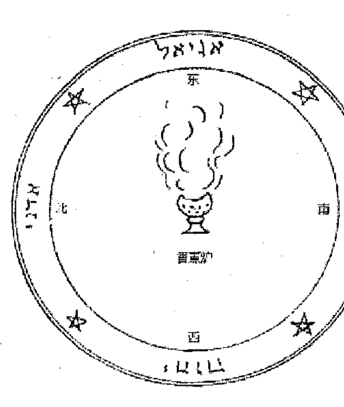

#### 图片3. 圣化星盘的圆

在汝出生的日子与时辰那天，将它们悬挂在汝的脖子上，汝应每天注意上面的名字十次，面向东方，就能确保汝不会被任何妖术或其他危险会伤害到。

### THE KEY OF SOLOMON

另外，汝应当清空所有困惑的思绪，被天使和灵魂珍爱，让汝制作它们符号；吾向汝保证，这是成功的最好方法，在被神圣的名字、字母、符号和魔符祝福后进入遗失，汝会发现正确敏锐的超自然，地上和天堂的事物都会臣服于汝。但只有在星盘伴随的情况下才会成真，看见那些封印，符号，和神圣之名，只服务于受祝福者，保护免受不可预料的意外，吸引友善的天使和灵体；吾的儿啊，在进行任何仪式之前，制造它是最必要的，吾命令汝重读吾的遗嘱，不止是一遍，而是多遍，这样汝才能充分地被指导，不会在仪式中失败了。在刚开始的时候，汝可能会觉得魂困难，很长，在一段时间的练习之后，就会变得简单，且容易掌握了。

吾将告诉你很多秘密，吾要求汝永远不将其使用在邪恶的目的上，会被那位试图抢夺全能神之名的他所诅咒；但是，汝可能没有其他仪式可能用到它们，如果，如同我所说的，汝只能对汝的目标拥有不朽之神的祝福。因此，在教授汝所有的仪式之后，关于实践的方法令人担忧，吾花了很长时间决定为汝选一位秘密分担者；但是，以在汝不试图毁灭邻国的情况为前提，因为他的血液会对神复仇，最后，汝只会受到神性的愤怒。然而，神不会禁止忠实的享受，汝可以大胆地实践以善为目的的仪式。这也就是为何，吾让汝对吾的遗嘱（圣约书）多注意的原因。

### THE KEY OF SOLOMON

# 第九章

关于偷盗的仪式与如何实践

吾亲爱的孩子啊，如果汝发现任何盗贼，汝应当做下面的命令，在神的帮助下，汝会找到被盗走的物品。

如果时辰和天数和仪式中所要求的不同，汝必须要参考所描述的资料。在开始任何召唤失窃之物的仪式之前，要准备好所有必需的物品，然后念出下面的祭文：

## 祭文

> > Ateh Adonai Elohim Asher Ha-Shamain Ve-Ha-Aretz ，等。

## 巫术的法则
#### 出品

汝：哦，上帝啊，汝精心地用手心创造了天堂和大地；汝坐在 Kerubim 和 Seraphim 之上的最高处，让人类无法看穿；汝通过汝的力量创造了万物，在汝的存在下成为了活着的生物，四个反复无常，有六个翅膀，不停地呼喊 ：“QADOSCH，QADOSCH，QADOSCH，ADONAI ELOHIM TZABAOTH，天上地下充满汝的荣耀；”哦，主神啊，汝将亚当从天堂中驱赶了出去，汝用 Kerubim 守卫生命之树，汝是创造奇迹的主；吾向汝祈祷汝的仁慈，以圣都耶路撒冷，以汝四个奇妙的字母 YOD、HE、VAU、HE，以汝神圣令人爱慕的名字，给予吾能完成这项工作的力量和美德，直到这项工作的结束；通过汝，拥有不朽生命者。阿门。

在然后的熏香熏完了“地点”之后。这一上述的“地点”应已净化、干净，不会被打扰，适于工作。然后，在上述“地点”上撒上圣化的水，就像在关于圆的章节中所述说的那样。

### THE KEY OF SOLOMON

充分准备好仪式的所需，汝应预先练习召唤咒文，在练习完后，汝应说：

> > 哦，万能的父亲，万能的主，汝掌管天堂、大地和深渊，汝仁慈地准允吾用汝神圣的四字名字YOD、HE、VAU、HE，以这一咒文吾会获得美德，IAH，IAH，IAH啊，给予这些灵体力量，让他们发现吾们所需，所在寻找的物品吧，愿他们能向吾们展示犯下罪行的盗贼，找到他们的位置。

> > 吾召唤汝，在这一燃烧的熏香之上，再次，上述念到名字的灵体，以所有上述的名字，通过令万物颤栗者的力量，汝们立刻向吾们展现吾们所寻求的事物。

## 巫术的法则

#### 出品

完成了这些事之后，他们会让汝清晰地看见汝所寻求的事物。注意，召唤师（仪式的大师）应该如本章节所要求的方法实践；如果在这项仪式中有必要写下符号或名字，汝应当遵循关于笔、纸、墨水的相关章节中的要求。

如果汝不关心这些事，汝的心愿就无法完成。

## 如何得知谁犯下了偷窃的罪行

在燃烧了一勺半的熏香之后，把一块炭放在悬空的筛子上，筛子的边缘被绳子系牢，由一个人提起。在边缘中间用血写上如图4所示的四部分符号。完成之后，将一个彻底擦干净的铜盆中盛满泉水，念出这几个词：DIES MIES YES-CHET BENE DONE FET DONNIMA METEMAUZ，用汝的左手旋转筛子，与此同时，用汝的右手拿着一根绿色月桂树枝将盆中的水向相反的方向搅拌。当水变得静止了，筛子不再旋转了，不动地注视水中的景象，汝会看到窃贼的形象；为了让汝更容易地认出他，汝应用仪式剑标出他的脸部；汝在水中所刻的标志会出现他个人的身上。

控制筛子旋转的方法，
汝会知道谁是窃贼。

取一个筛子，将一把剪刀插入筛子边缘弄出多个开口点，两个人在用剪刀开口的时候，其中的一人开始祈祷：

### 祈祷文

DIES MIES YES-CHET BENE DONE FET DONNIMA
METEMAUZ；哦，主啊，汝让神圣的 Susanna（苏珊娜）免于不实的指控；哦，主啊，汝使神圣的 Thekla（赫克拉）获得了自由；哦，主啊，汝将神圣的 Daniel（丹尼尔）从狮子的兽穴中拯救了出来，将三名儿童从火焰的熔炉中拯救了出来，将无辜者自由，将犯罪者揭露。

在这之后，让他/她大声念出所有在案发房中的所有居住人的姓名，谁有偷窃的可疑，说道：

> > “以圣彼得和圣保罗之名，这样的人有没有做过这件事。”

让其他人回复道：

> > “以圣彼得和圣保罗之名，他（或她）没有这么做过。”

就这样让每一个提到名字和被怀疑的人背诵说出三遍，犯下罪行的人在被点名的呃时候，筛子会自动旋转，而无法停止，汝就知道谁是罪犯了。

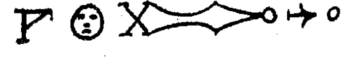

#### 图片 4.

# 第十章

## 关于隐形的仪式，和其施行的方法

如果汝想要实践一个隐形的仪式，汝应该遵循同样的方法。如果有必要观察天数和时辰，汝应当照着相关章节的要求进行。但如果汝不需要观察天数和时辰，汝应当照着上述章节的方法进行。如果仪式的过程需要书写，汝应当照着相关章节的要求进行，使用适当的笔、纸和墨水或血。但如果需要用召唤来完成，在汝进行召唤之前，汝应当在燃烧熏香的时候，虔诚地说：

- SCEABOLES
- ARBARON
- ELOHI
- ELIMIGITH
- HERENOBULCULE
- METHE
- BALUTH
- TIMAYALL
- VILLAQUIEL
- TEVENI
- YEVIE
- FERETE
- BACUHABA

### THE KEY OF SOLOMON

GUVARIN ; 通过拥有统治人类的帝国的他的力量，汝们必须完成这份工作，让吾可以隐身，并保持住。

如果在这项仪式中有比较画一个圆，汝应当照着关于圆的章节中的要求进行，如果有必要绘制符号，汝应当照着相关章节的要求做。

准备好进行这项仪式之后，如果要进行特别的召唤仪式，汝应当以适当的方式背诵它；如果没有的话，汝应当照着常规的召唤咒文念诵，在其最后，汝应当加上下面的话：

> 哦，汝 ALMIRAS ，隐身的大师，汝的大臣 CHEROS ， MAITOR ， TANGEDEM ， TRANSIDIM ， SUVANTOS ， ABELAIOS ， BORED ， BELAMITH ， CASTUMI ， DABUEL ；吾以令大地和天堂颤栗的他之名召唤汝们，这项仪式会根据吾的意愿完美实行，无论在什么，只要吾愿意，吾就可以隐形。

吾再次召唤汝们，哦，ALMIRAS，隐身的首领，汝与汝的大臣，以创造万物的他，以 SATURIEL，HARCHIEL，DANIEL，BENIEL，ASSIMONEM，汝应立即与汝的大臣一起前来，助吾一臂之力，完成这项仪式，通过这项仪式让吾变得隐身，以至无人可以看见吾。

为了让上面的仪式成功，汝必须准备好所有事物，并予以适当的练习；在本书卷一与卷二中所包含的所有情况。汝也应当在同样的仪式中背诵适当的召唤咒文。汝应当稳妥地完成仪式而不受阻碍，汝就能发现它的真实性。

### THE KEY OF SOLOMON

但是，如果汝相反地遗忘了这些事，或者汝忽视了它们，那么，汝不会获得汝所追求的目的；就像吾们无法轻易翻越守卫森严的城墙，但可以从其正门进入。

## 怎样使某人隐身

在一月份的土星日和土星时，制作一块黄色的人形蜡像，在同一时刻，用一根针在其头顶上（熟练地）刻画下面的符号。（图片5.）之后，汝应将头部重新放好。然后，汝应在；一小块青蛙或蟾蜍的皮上下面的词和符号。（见图片6.）在午夜的洞穴深处，用汝的头发悬挂所说的图，在其下方燃烧熏香，汝应当说：


> > METATRON , MELEKH , BEROHTH , NOTH , VENIBBETH , MACH , 汝们所有，吾召唤汝，哦，蜡像啊，以永生神，以这些符号与词语的美德，无论吾合适佩戴汝，汝应让吾隐形。阿门。

再次用熏香在其下燃烧之后，汝应当将其放在小箱子中，埋在同样的地点下方，每当汝想要经过任何地方而不被人看见，汝应当说这些话，将上面的图片放在汝的左边口袋：

> > 快来到吾的身边，无论吾到何处都不离开吾。

之后，汝应当小心地将其放回之前提到的地方，用土覆盖它，直到你下次需要用它。

### THE KEY OF SOLOMON


#### 图片6.

# 第十一章

阻碍运动员的胜利

找一根绿色的接骨木树枝，将其两端处理干净。用黑母鸡血在两张兔皮纸上绘制下面的符号和词（见图片 7.）完成了两张的制作后，将每一张纸盖在树枝的两端，在二月份星期五的时候，汝应当使用恰当的熏香对树枝进行烟熏礼，再将其埋在一颗接骨木树下。之后将其曝露在运动员会经过的道路上，一旦他经过它，他就别指望能在那天赢得任何比赛。如果汝希望再一次以同样的方式在他身上下咒语，汝只要再次将这根树枝曝露在他的道路上；但事前要再次埋在一颗接骨木树下。

### THE KEY OF SOLOMON

ABIMEGH


#### 图片7.

# 第十二章

### 怎样制作带有魔力的吊袜带

找到足够的牧鹿皮制作两根空心管状的吊袜带，在汝缝合它们之前，汝应当使用在六月25日宰杀的兔子血将下面的词语和符号（见图片8.）绘在靠近肉的皮肤上，用在六月25日日出前收集的绿艾草（green mugwort）来填充吊袜带，将吊袜带的两端用白鱼（barbel）的眼珠堵塞；当如想要使用它们的时候，汝应当在日出前将它们收集起来，用流淌的小溪中的溪水清洗它们，将它们分别绑在大腿上。完成之后，汝应当在同样的六月25日那天摘取一根圣栎树（holm-oak）的树枝，拿着它转向汝想要走的方向，在地上写下那个地方的名字，然后就可以开始汝的旅程，在数天之后，汝就会抵达目的地，而不疲劳。

当汝想要停止的时候，汝只需要说 AMECH，并用那根树枝向天空击打。

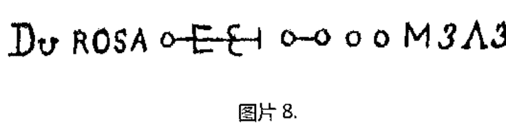

# 第十三章

怎样制作有魔力的毛毯，用于情报的询问，获取知识。

制作：一块白色的新羊毛毛毯，当月亮满月，落在摩羯宫，并在太阳时辰的时候，汝应当远离人类的居住区，到一个远离所有污秽的地方，展开汝的毛毯，其一头面向东方，零头面向西方，制作一个没有它的圆，和一个包围它的圆，汝应当呆在指向东面的一点，每项仪式都手持魔杖并指向天空，汝应召唤MICHAEL，面向南方召唤RAPHAEL，面向西面召唤GABRIEL，面向南方召唤MURIEL。之后，汝应当回到东面，虔诚地召唤伟大之名AGLA，用汝的左手将毛毯的这一点转向北面，背诵召唤，再如此转向其他的点，汝应当提起它们而不让其接触地面，举起它们再次面向冬眠，汝应当说出伟大尊敬的祈祷：

### THE KEY OF SOLOMON

### 祈祷文

AGLA , AGLA , AGLA , AGLA ; 哦, 万能的主啊, 汝是宇宙的生命, 以神圣之名 Tetragrammaton 的四个字母 YOD, HE, VAU, HE 的美德和力量掌管着其广阔辽土的四个方位, 以汝之名祝福这我所举着的覆盖物, 就像汝祝福 Elisha (伊利莎)手中的 Elijah (伊利亚)斗篷那样, 让其被汝的翅膀所笼罩, 任何事物也无法伤害吾, 就算它说: "他应当躲在汝的翅膀之下, 躲在汝所信任的羽毛之下, 对他的信任会成为汝的护盾。"

在此之后, 汝应当将其折叠, 说出下面的话:

RECABUSTIRA , CABUSTIRA , BUSTIRA , TIRA RA , A ; 让其小心地为汝的需要服务。

## 巫术的法则
#### 出品

当汝想要进行询问的时候，选择满月或新月的夜晚，从午夜到黎明进行。如果它是用于发掘财宝的用途，汝应当将它运输到指定的地点；如果不是的话，任何实行的地点应该要干净、纯净。为了要预备晚上的工作，用天蓝色的墨水和鸽毛笔在一张上等羊皮纸上写下这个符号和名字（见图片9.）；将汝的毛毯覆盖汝的头部和身体，拿上香炉，在其中点燃新的火焰，汝应将其放在适当位置的内部或上方，在里面放上一些熏香。然后，汝应当面向地伏在地上，在熏香开始发烟之前，让火焰保持在毛毯的下方，将魔杖竖直摆放撑起下巴；汝应用右手拿着上文中的纸贴在汝的额头上，汝应说下面的话：

> > VEGALE, HAMICATA, UMSA, TERATA, YEH, DAH, MA, BAXASOXA, UN, HORAH, HIMSERE；哦，神啊，幅员辽阔者向吾发出了汝智慧的光芒，让吾发现了吾向汝所寻求的神秘事物，无论那是什么，让吾在汝神圣的大臣RAZIEL、TZAPHNIEL、MATMONIEL的助力之下发现它吧；上帝啊，汝拥有年轻人所想往的真实，在隐藏的事物中，汝让吾知晓了智慧。RECABUSTIRA，CABUSTIRA，BUSTIRA，TIRA，RA，A，KARKAHITA，KAHITA，HITA，TA。

汝会清晰地听到汝所寻求的答案。

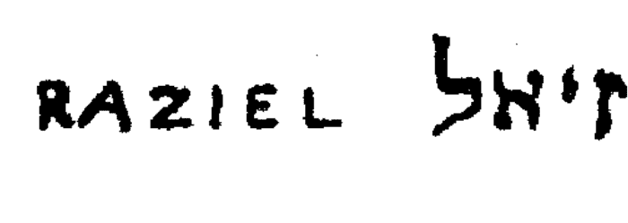

> 图片 9.

# 第十四章

## 怎样让汝征服被灵体占据的财宝

就像吾之前所告诉汝的，地球被大量的天上生物和灵体居住着，他们的预感和狡猾会让他们知晓财宝所隐藏的位置，当人们去寻找这些财宝的时候，通常会受到灵体的干扰，甚至会招致死亡，这些灵体被称为地精（Gnomes）；然而，他们并非因为贪婪而这么做，灵体无法占据任何物体，没有使用物质的观念，但这些灵体是热情的敌人，也就等同于贪婪，吾们人类也是倾向于此；这些宝藏会利用灵体，目的是为了保持其在地球中的价值，将他们视为其的居民，当他们干扰那些探险者的时候，是对他们停止寻找的警告，如果贪婪的探险者硬要继续的话，灵体会对他们的无视产生愤怒，通常会让探险者死亡。

但是，吾的孩儿啊，要知道汝有大量的财宝，汝应当熟悉这种灵体，汝应该通过吾教汝的方法，让他们臣服于汝的命令之下，他们会乐于给予汝分享他们无用的占据物，汝就能更好地利用物品。

### 实行仪式的方法

在七月 10 日至八月 20 日之间的星期天日出之前，当月亮落在狮子座的时候，汝应当通过情报的询问或其他途径去一个有宝藏的地方；汝应用仪式剑在土地画一个足够大的圆；在当天的时候，汝应用合适的熏香熏那个地方三次，在穿着了适合仪式的衣服之后，汝应立刻被一个机械通过某种方式悬挂着开孔的光源（蜡烛）之上，它的油应混合着死于七月份的男人的脂肪，灯芯是由曾经埋葬过的布料制成的。点燃了它之后，汝应用新宰杀的山羊皮腰带绑在工人身上，用于加持，山羊皮腰带上需要用抽走脂肪的死者血液写下这些词和符号（见图片10.）；汝就可以让他们安心地去工作了，警告他们不要打扰## 巫术的法则

出品

他们将会看见的鬼怪，大胆地走开即可。为了以防他们无法在一天内完成工作，每次他们要离开的时候，汝应让他们用木质的盖子盖在孔上，在仪式过程中，要穿着仪式的服装，并拿着仪式剑出现。事后，汝应当背诵这段祈祷文：

### 祈祷文

ADONAI, ELOHIM, EL, EHEIEH ASHER EHEIEH, 王子中的王子, 存在中的存在, 请可怜吾吧, 给予汝的仆人 (名字) 一点关心吧, 吾以神圣强大的名字 Tetragrammaton 虔诚地召唤汝, 命令汝的天使和灵体前来此地, 助吾一臂之力; 哦, 汝的星星的天使和灵啊, 哦, 汝所有的天使和元素灵体啊, 哦, 汝所有在神面前的灵啊, 吾作为最高等者的大臣和最忠实的仆人召唤汝们, 让神自己, 存在中的存在, 召唤汝们降临此地, 出现在这项仪式之中, 吾, 神的仆人, 最谦卑地祈求汝们。阿门。

### THE KEY OF SOLOMON

完成后，让工人们贴补孔眼，汝应给予灵体离开的许可，感谢他们对汝的帮助，说：

#### 离开的许可

哦，汝们善良快乐的灵啊，吾们感谢汝们慷慨地帮助；平静地散开，回到汝们所掌管居住的地方吧。阿门。


# 第十五章

### 寻找好感与爱情的仪式

如果希望实践一个寻找好感和爱情的仪式，那么就要遵守仪式实行的方法，如果它对天数和时辰有所要求，那么就要在所要求的日子和时辰实践，汝会在本章节中找到关于时辰的内容；如果仪式要求书写，那么汝就要遵照关于书写方面的章节的内容行事；如果它是关于惩罚、束缚、契约或烟熏的，那么汝就要按相关章节所要求的使用适合的熏香；如果有必要撒落水或牛膝草，那就按照相关章节的要求去做；同样的，如果仪式需要使用符号和名字等，就要按照相关章节的要求去书写。汝应当在香薰之后，背诵下面的致辞：

#### 致辞

哦，ADONAI，最神圣，最公正，最万能的神，汝通过汝的仁慈和正义创造了万物，准允吾们通过这个神圣完美的仪式，哦，ADONAI啊，汝最神圣的座椅产生光芒，为吾们获得好感与爱情。阿门。

说完之后，汝应当将其放在干净的丝绸之上，埋在四个十字路口的会合处，一天一夜；无论如什么时候想要从任何人处获得荣耀或好感，取出它，根据要求首先恰当地将其圣化，建起放在汝的右手之上，向其寻求汝的愿望，它不会拒绝汝的。如果汝没有小心正确地进行仪式，那么汝就不可能获得成功。

为了获得荣耀和爱情，写下下面的字：

```
SATOR, AREPO, TENET, OPERA, POTAS, IAH,
IAH, IAH, ENAM, IAH, IAH, KETHER, CHOKMAH,
```

## 巫术的法则

出品

BINAH , GEDULAH , GEBURAH , TIPHERETH , NETZACH , HOD , YESOD , MALKUTH , ABRAHAM , ISAAC , JACOB , SHADRACH , MESHACH , ABEDNEGO , 都来助吾一臂之力吧，无论吾想要什么都能获得。

恰当地写下这些字之后，汝也会发现汝的愿望已经实现。

# 第十六章

### 嘲弄、隐身和欺骗的仪式该如何准备

与愚弄、嘲笑和欺骗相关的仪式，可以用多种方式实践。当汝想要对任何人实践这些仪式的时候，汝应当就像吾之前所说的那样，观察天数和时辰。如果有必要书写符号或字，那么就应该写在上等羊皮纸上，就如吾们之后将要向汝讲述的。就墨水而言，如果在仪式中没有特别被要求，建议使用钢笔或针和蝙蝠血书写。但在描述或书写符号或名字之前，所有必要的规矩都要参照相关章节遵守，在仔细地实行之后，汝应当用响亮的声音念出下面的话：

```
ABAC, ALDAL, IAT, HUDAC, GUTHAC, GUTHOR, GOMEH, TISTATOR, DERISOR, DESTAUR, 喜欢嘲弄和欺骗的都快降临此地。让事物消失，让他们隐身的汝们，快降临此地，欺骗所有关于这些事物的人，让他们被欺骗，看不见，听不着，让他们的五官被欺骗，让他们注视错误的信息。
降临此处，并留下，圣化这个魅术，看见万能主之神注定汝们的。
```

当这项仪式根据吾们所教授的方法完成之后，上面的字ABAC，ALDAL，等，需要用所要求的笔书写；但如果仪式以不同的方式实践，汝也要说上述的话，汝应该在给予前背诵。

如果汝以正确的方法实践这个仪式，汝会通过汝仪式的努力而得偿所愿，汝就能轻易地欺骗别人的感官。

# 第十七章

### 怎样准备非凡的仪式

吾们已经在之前的章节中讲述了普通的仪式，它更常被实践，汝会在其中轻易发现吾们完美地告知了汝实践的方法。在本章节中，吾们将讲述非凡和不平常的仪式，它们通常可以通过不同方法完成。

无论谁想将这类仪式付诸实践，都需要像相关章节中所描述的那样观察天数和时辰，并要准备纯羊皮做的纸，由死产的羊羔的皮制成，以及其他必要的物品。准备好相关的仪式之后，汝应说：

祈祷文

哦，神啊，汝创造了万物，给予吾们理解善与恶的洞察力；凭借汝神圣之名，凭借这些神圣之名；——IOD, IAH, VAU, DALETH, VAU, TZABAOTH, ZIO, AMATOR, CREATOR, 哦，上帝啊，汝凭借吾手中的神圣封印让这项仪式变得真实真确，哦， ADONAI, 汝的帝国与世长存。阿门。

完成之后，汝应实践仪式，观察它的时辰，汝应按照相关章节的指示用香薰熏香；撒落圣化的水，按照钥匙卷二中的指示实践所有仪式。

# 第十八章

### 关于神圣的星盘或金属

金属或星盘是用于造成灵体的恐惧、致使他们臣服为目的而制造的。如果汝以这些星盘的性质召唤灵体，他们会毫无反感地臣服于汝，汝会看到他们被恐惧所震撼，他们不会有足够的胆量反抗你的意志。它们也能免于所有土、气、水和火的危险环境，免于所饮用的毒酒危害，免疫所有疾病和生命必需，免于束缚、占卜与巫术，免于所有的恐惧，无论汝在哪里配备着它们，汝会整日安全。

凭借它们，吾们从男人与女人中获得了荣耀与善良的意志，火焰被熄灭，水退潮，所有生物看见名字的标志产生恐慌，因恐惧而臣服。

这些星盘通常由最适于行星性质的金属制成；对于颜色没有特别的要求。它们应当在适于行星的天数与时辰被仪式的器具刻画。

| 行星 | 金属 |
|---|---|
| 土星 | 铅 |
| 木星 | 锡 |
| 火星 | 铁 |
| 太阳 | 金 |
| 金星 | 铜 |
| 水星 | 混合金属 |
| 月亮 | 银 |

它们也可以由上等羊皮纸制作，根据相关章节的要求，用适于行星的颜色在其上绘制。

| 行星 | 颜色 |
|---|---|
| 土星 | 黑色 |
| 木星 | 天蓝 |
| 火星 | 红色 |
| 太阳 | 金色，或者黄色或柠檬色 |
| 金星 | 绿色 |
| 水星 | 彩色 |
| 月亮 | 银色，或者阿根廷土黄色 |

### THE KEY OF SOLOMON

铸造星盘的物质需要贞洁，从没有为其他目的而使用过；如果它是金属的话，它应当被火焰净化过。

关于星盘的大小是随意的，只要它们是根据要求制作的就可以。

神圣星盘的性质比吾之前告知汝的智慧更安全；汝应当在用适当颜色在上等羊皮纸上制作它们的时候万分小心；如果汝在金属上刻画它们，要用吾教授的方法；这样才能看见它们应有的效果。但要将这项技艺理解为并使可以争辩及公开讨论的学说，而恰恰相反，它是完全神秘、超自然的，吾们不应当对这些事物产生争辩，只要深信这些所教授的仪式能成功就已足矣。

当汝想要制作这些星盘和符号的时候，汝不应忘记熏香的点燃，也不要使用任何超过所教授的物品。

最重要的是，永远不要忘记或忽略对星盘与仪式成功要素的关注，在汝的心绪中，只应存在神的荣耀、汝愿望的完成、对邻里的关心。

另外，吾的爱子啊，吾命令汝不得埋葬这项技艺，而要让汝的朋友与汝一同分担，然而，不得亵渎神圣的事物，如果汝或汝的朋友这么做了，那么它将会带给汝们毁灭。

但永远也不要让这些事物落入愚者的手中，这样就像是将珍宝扔给了猪一般；相反，应该从一位圣人的手中传给另一位圣人，这样，秘宝中的秘宝就不会被世人忘却。

### THE KEY OF SOLOMON

尊敬创造这些星盘和符号的最神圣的神的名字，如果没有他们，汝就永远不会获得任何进取，也不会完成秘密中的秘密。

另外，要记得在开始任何仪式之前，汝应当洁净自己的身体和心灵，不得有任何污点，忽略任何准备工作。这把“钥匙”充满了神秘，是由天使向吾揭示的。

诅咒任何实践其中仪式但对吾们的“钥匙”没有彻底理解的人，诅咒他召唤任何神之名失败，对神不信任的人，将会被神抛弃，投入地狱的深渊。

因为神的伟大与不朽，他将与世共存。

## 巫术的法则

#### 出品

ACCURSED BE HE WHO TAKETH THE NAME OF GOD IN VAIN!
ACCURSED BE HE WHO USETH THIS KNOWLEDGE UNTO AN
EVIL END, BE
HE ACCURSED IN THIS WORLD AND IN THE WORLD TO
COME. AMEN. BE
HE ACCURSED IN THE NAME WHICH HE HATH
BLASPHEMED!

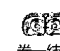

卷一结束

### THE KEY OF SOLOMON

下面将为您介绍神圣星盘的图片和符号，以及他们的特殊性质；使用他们的方法。

#### 星盘的次序

1. 献祭给土星的七个星盘——黑色
2. 献祭给木星的七个星盘——蓝色
3. 献祭给火星的七个星盘——红色
4. 献祭给太阳的七个星盘——黄色
5. 献祭给金星的五个星盘——绿色
6. 献祭给水星的五个星盘——彩色
7. 献祭给月亮的六个星盘——银色

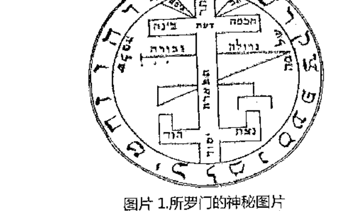

图片 1. 所罗门的神秘图片

### 土星

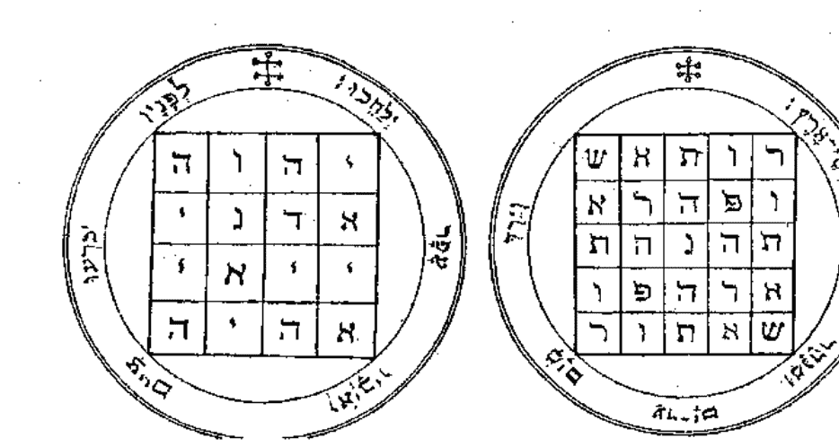

图片 11 和 12

图 11. 土星的第一个星盘——这一星盘对于侵略灵魂领域具有很大价值和功用。因此，只要展现它，就能让他们屈服，在它面前跪在大地上，他们服从。

编者注——在正方形中的希伯来字母是神的四字真名——YHVH, Yod, He, Vau, He; ADNI, Adonai; IIAI, Yiai (这个名字在希伯来语中与名字 EL 有同样的数值；以及 AHIH, Eheieh。源自诗篇 lxxii 9 中的希伯来短诗：“埃塞俄比亚人须在他面前下跪，他的敌人应当舔吻尘土。”

### THE KEY OF SOLOMON

图片 12. 土星的第二个星盘——这个星盘具有应对敌人的价值；它的特殊使用表现了灵体的尊严。编者注——这是著名的

```
SATOR
AREPO
TENET
OPERA
ROTAS,
```

因其字母的排列，这是现今最著名的拼图（double acrostic）；它重复提及了中世纪魔法的记录；保存极其之少；源自未知的星盘。乍看之下，它是五个方格，二十五个字母，加上连接的字母（unity），也就是二十六个，IHVH 的数值。摘自诗篇 lxxii 8 中的希伯来诗歌在其周围，”他的领地也同样从一片海洋到另一片，从洪水到世界的终结。这段文章也同样有二十五个字母组成，也就是其总共的数值（与增加的梳子组成最终的字母），加上名字 Elohim 的，在方格中总共是二十五个数值。”

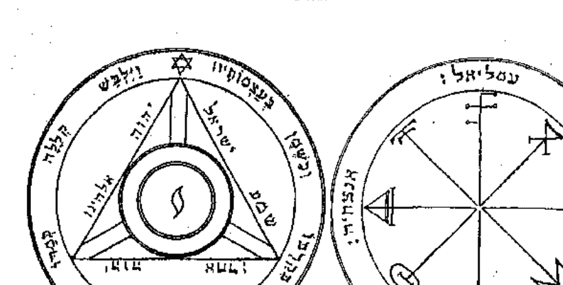

#### 图片 13 和 14.

图片 13. 土星的三个星盘——它需要在魔法的圆中制作，当你要召唤土星性质的灵体的时候，它最适用于夜间。

编者注——在神秘之轮上的射线终点旁的符号是土星的魔法符号。围绕着它的是天使的名字：Omeliel，Anachiel，Arauch-iah，和 Anazachia，皆以希伯来文书写。

图片 14. 土星的第四个星盘——这个星盘是用于所有毁坏，破坏，和死亡的执行。当它完美制作的时候，它也能用于那些能带来新闻的灵体，当你要召唤他们的时候，面向南面。

### THE KEY OF SOLOMON

编者注——在三角形周围的希伯来文字是源自 Duet, vi.4 —— “听, 哦, Israel, IHVH ALHINvH 是 IHVH ACHD。” 围绕在周围的短诗是源自诗篇 cix.18—— “当他穿着被诅咒的外套, 它就像水一样侵入了他的肠, 就像油一样侵入了他的骨。” 在星盘的中央是神秘字母 Yod。

图片 15. 土星的第五个星盘——这个星盘需要用在夜晚召唤; 用于追捕守卫宝藏的灵体。

编者注——十字天使中的希伯来字母是名字 IHvH 的。在方块中的天使形成 ALVH, Eloah。围绕着方块思辨的是天使的名字: Arehannah, Rakhaniel, Roelhaiphar, 和 Noaphiel。短诗意为: “伟大的神灵, 万能, 令人恐惧。” ——Deut x.17。

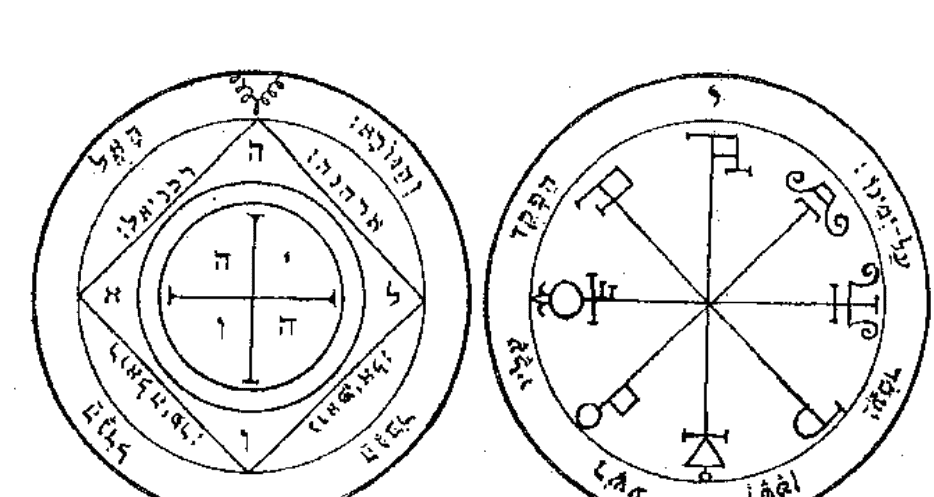

#### 图片15和16.

图片16. 土星的第六个星盘——在这个星盘周围的是象征他们名字的符号。你只要念出阻碍你的人的姓名，他就会被恶魔缠身。

编者注——它是由土星的神秘符号形成的。在其周围的是用希伯来文书写的：“脆弱的人被他掌管，让撒旦在他右手上站立。”

### THE KEY OF SOLOMON

图片 17. 土星的第七个，也是最后一个——这个星盘适用于令人振奋的地震，要知道召唤任何一位天使的力量就足以让整个宇宙震撼。

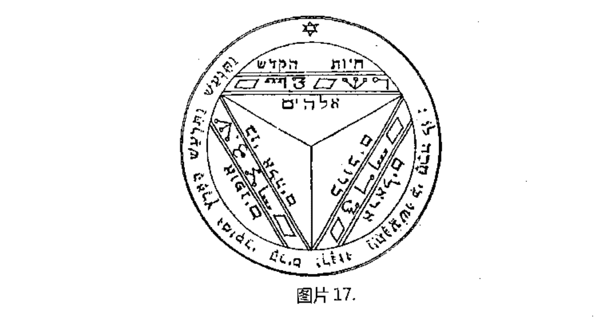

编者注——在星盘中的是九位天使的名字，他们中的六位是原始的希伯来符号，剩下的是著名的 "the Passing of the River。" 这九个名字依次是：1，CHALATHHA-QADESCH，神圣的生物；2，AUPHANIM，轮子；3，ARALIM，宝座；4，CHASCHMALIM，伟大的人物；5，SERAPHIM，炙热的人物；6，MELAKIM，国王；7，ELOHIM，神灵；8，BENI ELOHIM，耶落因（Elohim）；9，KERUBIM，天门神兽（Kerubim）；短诗是摘自诗篇 xviii7 ：“点燃后大地颤栗，山川的基石也在摇晃，因为他愤怒了。”

## 木星

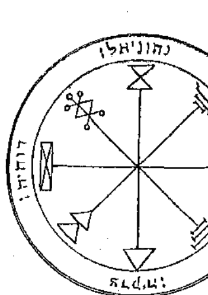

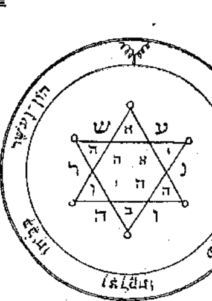

#### 图片 18 和 19.

图片 18. 木星的第一个星盘——它用于召唤朱庇特的灵体，写在星盘周围的名字是神与财宝主人 Parasiel 的名字，教授如何占据他们所在的位置。

### THE KEY OF SOLOMON

编者注——星盘是由木星的神秘符号组成，在其周围的是以希伯来文书记写的天使名字：Netoniel, Devachiah, Tzedeqiah, 和 Parasiel。

图片 19. 木星的第二个星盘——用于获得荣耀，荣誉，尊严，财富，达成心中的宁静；也用于发掘认财宝，追捕占据它们的灵体。它应当用长耳枭的学和燕毛笔写在上等的羊皮纸上。

编者注——在六角星形的中央是 AHIH, Eheieh 的名字字母；在上方和下方的天使也同样，它们是 AB 的名字，父亲；剩下的以为天使名字是 IHVH。我认为这些在六角星形外的天使名字的前两个字是意指摘自诗篇 cxii.3 的短诗——“财与富在他的房中，他的正义永存。”

图片 20. 第三个木星的星盘——召唤它的灵体可用于守护。当他们显现的时候，将它向他们展示，他们就会立刻服从。

编者注——在左上角的是木星的魔法封印和 IHVH 名字的字母。其他的是木星智慧的封印，以及 Adonai 和 IHVH 的名字。围绕它的是摘自诗篇 cxxv 的短诗：“角度的歌曲。靠 IHVH 的人，好像锡安山，永不动摇。”

## 巫术的法则

#### 出品

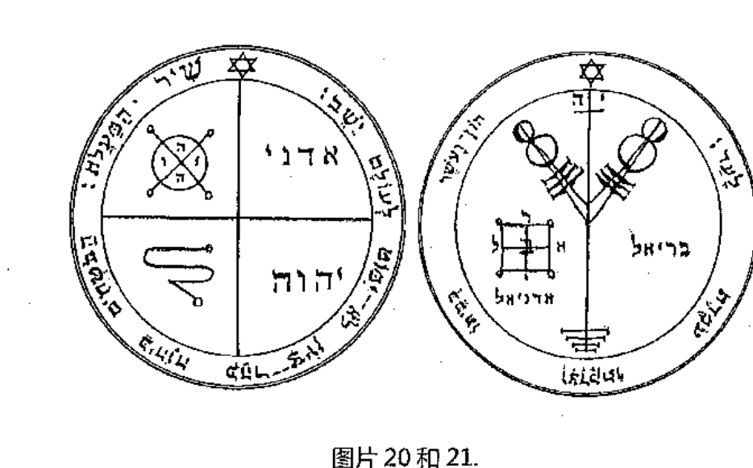

#### 图片20和21.

图片21. 木星的第四个星盘——它用于获得富有和荣耀，增加财富。它的天使是 Bariel。它应当在巨蟹座中木星日和木星时的时候，将其刻在银制品上。

编者注：在魔法符号上面的是名字 IH, Lah。在下面的是天使 Adoniel 和 Bariel 的名字，后者的字母被重新排列成四个部分。它们围绕着摘自诗篇 cxii.3 中的短诗：“财与富在他的房中，他的正义永存。”

### THE KEY OF SOLOMON

图片 22. 木星的第五个星盘——它拥有强大的力量。它用于确认预言。雅格（Jacob）在手放在星盘上，就抵达了天堂。

编者注：在星盘中的希伯来字母是摘自围绕着它的短诗的最后五个字母。它们重新组成魔法名字的形式。短诗是摘自Ezekiel i.1：“当我在 Chebar 河被俘的时候，天堂打开了，我看见了 Elohim。”依我之见，短诗应该只由五个最后的字母组成。

图片 23. 木星的第六个星盘——它用于保护免受所有土元素伤害，在其周围重复着短诗“因而，汝永不丧生。”

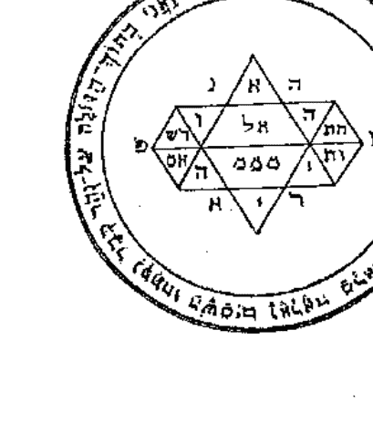

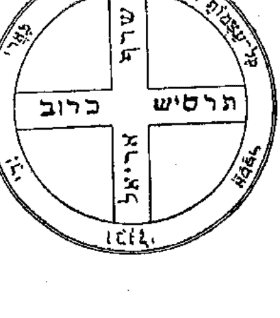

#### 图片 22和23.

## 巫术的法则

#### 出品

编者注——在十字上的四个名字是：Seraph，Kerub，Ariel，和Tharsis；元素的四位统治者。短诗是摘自诗篇xxii 16，17：“它们穿透了我的双手和我的脚，我能感受到我所有的骨头。”

图片24. 木星的第七个星盘——它拥有抵御贫穷的力量，如果你有意使用，重复短诗。它也能用于赶走守卫宝藏的灵体，也同样能用于寻找。

编者注——木星诗句的神秘符号是：“远离贫困，使他们与王子同坐，就是与本国的王子同坐。”——诗篇cxiii.7。

# 火星

图片 24

## 图片 25 和 26

图片 25. 火星的第一个星盘——它是用于火星性质的召唤，特别是写在星盘之上的。

编者注——火星的神秘符号，以及写在星盘周围的希伯来文四位天使的名字为：Madimiel, Bartzachiah, Eschiel, 和 Ithuriel。

图片 26. 火星的第二个星盘——它拥有抵御所有疾病的能力。

### THE KEY OF SOLOMON

编者注——在六芒星中的字母是 He。同样在其中的还有名字 IHVH, IHShVH Yeheshuah（耶和华或耶稣的神秘希伯来名），和 Elohim。围绕着它的是句子，约翰福音 1:4：“在他的生命中，他的生命即是人类的光芒。”

图片 27. 火星的第三个星盘——用于战争，争吵，敌意；也可用于抵御敌人，侵略反叛灵体的领土；万能的神名因此在此处标记。

编者注——Eloah 和 Shaddai 的名字字母。在中央的是字母 Vau，Qabalistic Microprosopus 的标志。在其周围的是摘自诗篇 77:13 的短诗：“谁能比我们的神 Elohim 更伟大呢？”

图片 28. 火星的第四个星盘——拥有战争的力量，它会毫无疑问地为汝取得胜利。

图片 27 和 28

编者注——在中央的是伟大的名字 Agla；在右边和左边的是 IHVH；在上面和下面的是 EL。在周围的短诗是摘自诗篇 110:5：

> “在你右边的主，当他发怒的日子，必打伤列王。”

图片 29. 火星的第五个星盘——在上等羊皮纸之上绘制这个星盘，因其对恶魔极其恶劣，它们会服从汝。

编者注——在蝎子周围的符号是字母 HVL，短诗是摘自诗篇 91:13：

> “你要踹在狮子和虺蛇的身上，践踏少壮狮子和大蛇。”

### THE KEY OF SOLOMON

图片 30. 火星的第六个星盘——武装的力量，如果你被任何人袭击，当你与他打斗的时候，你不会受到任何伤害，他自己的武器会攻击他自己。

编者注——在星盘半径的八个点上是单词 “Elohim qeber, Elohim hath covered (or protected) ，” 用的是神秘的玛拉基母字母 ( Alphabet of Malachim) 。

> 短诗是摘自诗篇 37:15 ：“他们的刀，必刺入自己的心，他们的弓，必被折断。”

图片 31. 火星的第七个星盘——需在火星日和火星时，用蝙蝠血写在上等羊皮纸上。在圆中不遮盖它，召唤其中所写的名字；你立刻能看见冰雹和风暴。

## 巫术的法则
出品

编者注——在星盘中央的是神圣的名字，El 和 Yiahi，当它们以希伯来文书写时具有同样的数值。在神秘字母表中，以希伯来文书写的称为 Celestial，组成灵体的名字。在星盘周围的是：

> “他给他们降下冰雹为雨，在他们的地上降下火焰。” ——诗篇 105:32,33。

### THE KEY OF SOLOMON

图片 31

## 太阳

图片 32 和 33

图片 32. 太阳的第一个星盘——莎代（Shaddai）的面容，万物遵从于他，天神屈膝于他。

编者注——这个星盘包含大天使 Methration 或称 Metatron 的头像，Shaddai 的代表。另一面是“El Shaddai”的名字。在其周围的是拉丁文字：“持有他的脸和形状，他是万物的创造者，万物皆服从于他。”

### THE KEY OF SOLOMON

图片 33. 太阳的第二个星盘——这个星盘属于太阳性质的，它们用于表达太阳性质的灵体的傲慢与骄傲。

> > 编者注——太阳的神秘富豪，和其天使的名字：Shemeshiel，Paimoniah，Rekhodiah，和 Malkhiel。

图片 34. 太阳的第三个星盘——它用于获得国度和帝国，抵御损失，获得荣耀，特别是通过神名，Tetragrammaton，在其中包含了十二次。

> > 编者注——IHVH，重复了十二次；和与 Daniel 4:34 相似的短诗：“我的国度是永存的，我的领土永远存在。”

## 巫术的法则
出品

图片 34 和 35

图片 35. 太阳的第四个星盘——它能让汝看见隐形的灵体；当汝将其揭露的时候，他们会立刻显现。

> 编者注——写在中央的是希伯来文的名字 IHVH，Adonai；在半径周围的是神秘符号 "Passing of the River，" 短诗是摘自诗篇 13:3，4：“使我眼目光明，免得我沉睡至死，免得我的仇敌说我胜了他。”

图片 36. 太阳的第五个星盘——它用于召唤能让汝在短时间内长距离的从一处传送到另一处的灵体。

> 编者注——在 'Passing of the River' 字母表中的符号，形成了灵体的名字。短诗摘自诗篇 91:11,12：'主要为你吩咐他的使者，让汝畅通无阻。他们用手托着你。'

#### 图片 37. 太阳的第六个星盘——当正确制作，它可用于隐形。

> 编者注——在中央的是 Celestial 字母表中的神秘字母 Yod。在 'Passing of the River' 中的三个字母是写在天使三角形中，形成伟大 Shaddai 的名字。依我之见，统一符号周围三边的词是摘自创世纪 1:1：'在 Elohim 创世开始时，等。' 以及 135:16 '让他们双眼蒙蔽，让他们无法看见；让他们的腰部不断地抖动。他们有眼却无法看见。'

图片 36 和 37

图片 38. 太阳的第七个星盘——如果不幸被关在铁栏之后，用它就能立刻获得自由。它应当在太阳日和太阳时的时候，刻画在金制品上。

> 编者注——在十字上写的是 Chasan 的名字，他是风（气）的天使；Arel，火的天使；Phorlakh，土的天使；Taliahad，水的天使。在十字之间的名字是四个元素的统治者；Ariel，Seraph，Tharshis，和 Cherub。短诗是摘自诗篇 116:16,17：

### THE KEY OF SOLOMON

> > 汝应将吾劈成两半。我会为你作为感恩的献祭，并召唤 IHVH 之名。

图片 38

## 金星

图片 39 和 40

图片 39. 金星的第一个星盘——她是用于支配金星的灵体，特别是那些写在其中的。

> > 编者注——金星的神秘符号，天使的名字，Nogahiel，Achelia，Socodiah（或称 Socohiah）和 Nangariel。

图片 40. 金星的第二个星盘——它用于获得荣耀和荣誉，任何关于尽兴的事物都能完成所愿。

编者注——在星盘内与外的字母形成金星灵体的名字。短诗是摘自于雅歌 8:6：“将我放入汝的新房，就如入手臂上的印记，爱至死不渝。”

编者注——在图片中写着下列名字：IHVH, Adonai, Ruach, Achides, Aegalmiel, Mon-achiel, 和 Degaliel。短诗是摘自创世记 1:28：“Elohim 神就赐福给这一切，说，滋生繁多，充满海中的水。雀鸟也要多生在地上。”

编者注——在图片中的四位天使是 IHVH 的四个字母。其他字母形成金星灵体的名字，例如：Schii, Eli, Ayib, 等。短诗是摘自创世记 2:23,24：“这是我骨中的骨，肉中的肉。两者皆从一处来。”

## 巫术的法则
出品

图片 41 和 42

图片 43. 金星的第五个星盘——将它展现给任何人看，它都能煽动爱情。

编者注——在中央正方形周围的是名字 Elohim, El Gebil, 和两个我无法辨识的名字。符号是 "passing of the river" 的。周围的短诗是摘自诗篇 22:14：“我的骨头都脱了节。我心在我里面如腊熔化。”

### THE KEY OF SOLOMON

图片 43

## 水星

图片 44 和 45

图片 44. 水星的第一个星盘——它用于召唤在苍穹之下的灵体。

> 编者注——字母形成灵体 Yekahel 和 Agiel 的名字。

图片 45. 水星的第二个星盘——在其中所写的灵体是用于作用在与自然顺序相反之事；他们易于给出答案，但难以看见。

> 编者注——字母形成 Böel 和其他灵体的名字。

图片 46. 水星的第三个星盘——用于召唤臣服于水星的灵体；特别是那些写在星盘内的。

编者注——水星的神秘符号，和天使的名字：Kokaviel，Gheoriah，Savaniah，和 Chokmahel。

图片 47. 水星的第四个星盘——这是用于获得万物的理解和知识，寻求隐藏事物的解答；命令那些称为 Allatori 的灵体。

编者注——在中央的是神名，EL。所写的希伯来字母是关于"IHVH，冷静下，不要受到虚无的束缚。" 短诗是 "在屋中有智慧和美德，万物的知识用于伴其左右。"

## 巫术的法则
出品

图片 46 和 47

图片 48. 水星的第五个星盘——它用于支配水星的灵体，用于打开关闭的门。

编者注——在星盘的名字是 El Ab ，和 IHVH。短诗摘自于诗篇 24:7 ：“众城门哪，你们要抬起头来。永久的门户，你们要被举起。那荣耀的王将要进来。”

### THE KEY OF SOLOMON

## 月亮

图片 49 和 50

图片 49. 月亮的第一个星盘——它用于召唤月亮的灵体；它也用于打开门，无论是用何种方式锁着的。

编者注——星盘是一扇门的象征。在其中央写着名字 IHVH。在右边的是 IHV，IHVH，AL，和 IHH。在左边的是天使的名字：Schioel，Vaol，Yashiel，和 Vehiel。在名字之上的短诗在另一边，是摘自诗篇 107:16 ：“因为他打破了铜门，砍断了铁闩。”

编者注——一只手指向名字 El，以及天使 Abariel。短诗是摘自诗篇 56:11 ：“我倚靠神，必不惧怕。血气之辈能把我怎样呢。”

编者注——名字是 Aub 和 Vevaphel。短诗是摘自诗篇 40:13 ：“哦，IHVH，请拯救我，哦，IHVH 请帮助我。”

## 巫术的法则
出品

#### 图片 51 和 52

图片 52. 月亮的第四个星盘——它能守护汝免于所有邪恶的东西，避免灵魂或肉体的伤害。它的天使 Sophel 能给予所有草药和石头的知识；任何召唤他的人，他会获得所有的知识。

编者注——神圣之名 Eheieh Asher Eheieh, 和天使 Yahel 和 Sopheil 的名字。短诗是：“愿那些逼迫我的蒙羞，却不要使我蒙羞。使他们惊惶，却不要使我惊惶。”

图片 53. 月亮的第五个星盘——它用于回答关于睡眠的问题。它的天使 Iachadiel 用于毁灭和丢失，以及毁灭敌人。你也可以召唤 Abdon 和 Dalé 抵御所有夜间的魅魔，召唤从地狱离开的灵魂。

编者注——神圣之名 IHVH 和 Elohim，月亮的神秘符号，天使的名字是 Iachadiel 和 Azarel。短诗摘自诗篇 68:1：“愿神兴起，使他的仇敌四散，叫那恨他的人，从他面前逃跑。”

图片 54. 月亮的第六个星盘——如果被刻在银制盘上，它能造成大雨；如果放在水下，只要它呆在那，就会下雨。它应当在月亮日和时刻画。

编者注——星盘是由月亮的神秘符号组成，在其周围的是摘自创世纪 7:11，12 的短诗：“大渊的泉源都裂开了……雨降大地。”

## 巫术的法则
出品

图片 53 和 54

# 卷二

### THE KEY OF SOLOMON

## 序言

所罗门的这本书分为两卷。在第一卷中你可以阅读到如何避免试验失败的方法。在卷二中，你会找到魔法具体运用到指定物品的方法。

因此，你应当小心谨慎，不让其落入俗人之手。因为拥有此书的人，就算根据书中的内容，也无法迫使魔法的使用，但他如果能找到其中的错误并纠正，就另当别论了。

任何这类的仪式都无法达成最终目的，除非魔法书或驱魔者能将它的力量发挥极致，也即是说，除非他能融会贯通，否则他无法达到任何仪式的效果。

## 巫术的法则
出品

因此，我诚恳地祈祷，无论这本钥匙落入何人之手，不要将其与任何人分享。如果他无法守信，我祈求神灵，让他能使其如珍宝，不做任何傻事，或让无知的人参与。以四字神名，YOD，HE，VAU，HE，ADONAI之名，及所有其他最高等神圣的神名，我恳求，拥有此书的人视其如宝，不让任何愚昧无知之人参与。

### THE KEY OF SOLOMON

# 第一章

在汝准备好所有必要物品之后，汝应当为仪式的实行做准备。

准备时间，地点基本上需要准备的日和时均已在卷一中阐明。现在需要注意在实践它的时候需要在哪一时辰完成，所有必需品须预先准备。

汝就可以执行与灵体谈话或召唤的仪式了，如果执行的天数和时辰没有注明，汝可以讲执行的时间选在水星日和水星时，在第十六或第二十三小时，但最好是在八点进行，也就是当晚的第三个小时，在天亮前召唤并使用的，然后，汝就可以将所有的仪式与技艺付诸实践，准备在适合它们的时辰，让他们满足汝。如果没有指定时辰或时间，那就最好在夜间执行，因为灵体在夜间出现会让他们更平和。汝应当仅观察希望召唤的灵体，无论是夜晚还是白天，汝应当选择在隐蔽、方便仪式的地方进行，吾们会在相关的章节详述。

如果汝想要执行找回失物的仪式，无论如用什么方法执行，汝应当尽可能在月亮月盈状态下，从白天的第八个小时开始。

如果是在夜晚，那就应该在第五个或第三个时辰；但白天优于夜晚，白天的光线更适合他们，让他们更适合大众。但如果仪式是关于隐身的，汝应当在火星日的第一、二、三个时辰实践。但如果是在夜间的话，就在第三个小时开始。如果是实践寻找爱情、荣耀、或好感的，应该当同一天的第八个时辰开始实践，从太阳初升的第一个小时开始；从金星的第一个时辰到金星同一天的第一个时辰。

对于关于毁灭和荒废的仪式，吾们应当在土星日的第一个时辰，或是从白天的第八或第十五个时辰开始进行；从夜间的第一到第八个时辰。

关于毁灭和荒废的仪式，吾们应当将它们应用于游戏、嘲弄、骗局、幻觉和隐身，一定要在金星的第一个时辰和白天的第八个时辰完成；夜间的第三个和第七个时辰。

所有实践的时间，月亮应当是在可见月盈状态，月太阳的度数相同；最好是从第一方位到其相反位置，月亮应当落在火相星座，最好是在白羊座或是狮子座。

因此，要以任何方式执行仪式，应当在晴空的月盈状态下进行。

关于寻找爱情和喜爱的仪式，无论想要的是什么，在适当的时辰准备好，在可见的月亮充盈和其落在双子星座的状态下进行，就能成功。

对那些仪式的熟练者而言，天数和时辰的准备就并非必须的，但对学徒与初学者而言就不同，因为那些刚开始进行仪式的人比熟练者对仪式的信心更少。对于初学者而言，他们应当遵照仪式的时间要求。智者只会遵守必要的规矩，对于必要的庄严教条，他们会令人放心地完全遵守。

但是，汝应该在按要求准备仪式的时候照顾好自己，它应当在干净、宁静、温和的天气下，没有大风暴或天气的躁动。当汝在仪式中召唤任何灵体的时候，他们不会在天气变化或大风的时候降临，因为他们既没有肉、也没有骨，由不同物质构成。

### THE KEY OF SOLOMON

- 有些由水构成。
- 有些则由风构成。
- 有些由土构成。
- 有些由云构成。
- 有些由太阳蒸汽构成。

有些由火焰的敏锐和力量构成；当他们被召唤的时候，都会随着吵杂的声音和震撼的火焰性质降临。

## 巫术的法则

出品

当由水构成的灵体被召唤时，他们会伴随着雨、闪电降临。

当由云彩构成的灵体被召唤时，他们会以奇怪的形状出现，并伴随着吵闹的声音，让召唤者惧怕。

由风构成的灵体会形成漂移的形态，当由 Beauty 构成的那些显现的时候，他们会以和蔼的形态显现；如果汝召唤由气构成的灵体，他们会随着微风出现。

当由太阳蒸汽所构成的灵体被召唤时，他们会以美丽骄傲的形态出现。他们很聪明，一旦来当，那些最后出现的都被所罗门在他的美化或 beauty 之书中所指定。他们在他们的服饰中显现出他们的傲慢与虚荣，他们对众多装饰品感兴趣；为现世的美丽、所有装饰品的种类产生高兴。汝应当只在天气宁静的时候召唤他们。

由火焰构造的灵体居住在东面，由风构造的在南面。

注意，进行仪式的时候最好在东面进行，将任何必要的练习面向那一点。

但对于所有关于爱情的仪式，它们应当面向北面。

另外，在每次做任何仪式的时候，为了完美完成，需要有必要的庄严感，如果汝受到打断而重新开始仪式的开始之前的仪式，不需要时辰或其他节日的准备。

如果汝遵照天数、时辰、和其他必要的节日，汝会发现它会失败，仪式一定会在某些方法上产生错误，汝肯定会在一些事物上失败；如果汝在一方面错误，那么这些仪式或这些技艺不会成功。

因此，在这一章节中会向汝介绍这些技艺、仪式的关键，虽然要遵守每一个重大节日，不会有仪式成功，除非汝们可以洞察本章节的方法。

# 第二章

### 大师应该遵守的方式、规矩和自我控制

想要将自己实践在这项伟大困难的技艺之人，应当清空自己的思绪，避免思想的游离。

他应当彻底检查将要实践的仪式，在之上写下过程，特别是这项仪式的目的、咒语和召唤文。如果需要制作任何物品，那应该要按照相关章节的内容使用纸张、墨水和笔。他也应当观察自己将要执行的仪式时间，所需要准备的必需品，应该要增加什么，实施什么。

事物都准备好了之后，汝需要寻找并安排在仪式中可以放置设备的位置。所有的这些物品都应当安排好，如果方便的话，让仪式的大师进入适当的合适位置，或者进入他的内阁或秘密的房间，他可以在那按序安排整个仪式；或者假设没人知道那个地方，或者没人能看见他在那个地方的话，他可以使用其他方便的秘密之地。

在此之后，他应当脱光衣服，进行已经准备好的盆浴，其中的水应该已圣化过，他在其中从头到脚清洗并净化自我，说：

> > 哦，主，ADONAI啊，汝以自己的形象形成了吾，汝的仆人；让这些水净化吧，让它们以让吾的灵魂与肉体健康纯净，让愚味与谎言离吾远去。

哦，最强大妙不可言的神啊，汝让汝的子民在出埃及之地时徒脚走过红海而不沾湿双脚，准予吾让吾通过这些水从过往的罪孽中纯净出来，这样就不会有任何污秽出现在汝的面前。

在这之后，汝应当将自己完全浸在水中，然后用白亚麻布将自己擦干，为自己穿上新的白色亚麻布制衣。

在此之后，汝应当在三天内远离所有的空虚、不纯净之物。汝应当每天背诵下面的祈祷文，早上至少一次，中午两次，下午三次，晚上四次，睡前五次；这就是汝应该在接下来的三天内做的事：

> > HERACHIO, ASAC, ASACRO, BEDRIMULAEL, TILATH, ARABONAS, IERAHLEM, IDEODOC, ARCHARZEL, ZOPHIEL, BLAUTEL, BARACATA, EDONIEL, ELOHIM, EMAGRO,

- ABRA GATEH, SAMOEL, GEBURAHEL, CADATO, ERA, ELOHI,
- ACHSAH, EBMISHA, IMACHEDEL, DANIEL, DAMA,
- ELAMOS, IZACHEL, BAEL, SEGON, GEMON, DEMAS.

> > 哦，上帝之神啊，汝坐在天堂之上，汝将地狱看作下界，准予吾所求的荣耀吧，让吾能完成吾心中所想之事，通过汝，哦，神啊，万物的君主统治者，汝与世共存。阿门。

这三天过去了以后，万事应准备妥当了，汝应当安排好仪式的时间。汝应当准备好开始仪式的时间；但一旦在那个时辰开始的时候，汝就应当彻头彻尾地完成仪式，因为它从它开始的时候释放出其力量和性质，不断随着时辰而释放，让仪式的大师可以完成这项仪式，达成所期望的结果

# 第三章

仪式的大师如何管理他的门徒或同伴

当仪式的大师想要将任何仪式投入实践的时候，他应该考虑其同伴能给予自己何种帮助。这也就是为什么每项仪式都要在圆中实践，最好是拥有三位同伴。如果他没有任何同伴，他应当至少要有一只忠诚、牵着的狗。但如果他必须要有同伴的话，那么这些同伴应该要承担责任，并以誓言听从大师的命令，他们应当学习、观察、仔细地倾听所有的事物。那些与之相反的人会遭受许多痛苦，遇到多重磨难，这些都是灵体对他们造成的，他们甚至会因此死亡。

在门徒被良好的教导、被智慧与善于理解的内心所加持之后，大师应圣化水，他与他的门徒一起进入一个被净化的神秘地方，他要完全脱光他们的衣服；在此之后，让他用圣化的水从他们的头顶浇灌，他应当注意让水从他们的头部流淌到脚部，以便完整地洁净他们；在清洁的时候，他应当说：

> 愿汝从汝所有的品质中新生、干净、纯净，以不可言喻、伟大不朽之神的名字，愿最高等的美德降临在汝们的身上，永远留在汝们心里，这样汝就能拥有完成汝愿望的力量了。阿门。

大师完成之后，让门徒自己穿上衣袍，像大师一样斋戒三天、重复同样的祈祷文；让他们像他一样地行动，让他们在仪式中含蓄地遵照他的命令做事。

### THE KEY OF SOLOMON

但是，如果仪式的大师想要让一只狗成为他的同伴，那么他必须用圣化过的水以同样的方式为它浸浴，并用仪式熏香的香味香薰它，让他对着它重复下面的话：

吾向汝施咒，哦，汝这个生物啊，作为一只狗，以汝的创造者之力，吾以最高等、最具力量、最不朽的神之名为汝洗浴香薰，让汝可成为吾仪式的伙伴，也让汝成为吾成为了吾最忠心的朋友，成为吾将要实施之仪式的伙伴。

但是，如果他希望让小男孩或女孩成为他的同伴，他必须要向狗一样命令他们，他必须剪掉他们手上和脚上的指甲，并说：

吾向汝施展咒语，哦，汝这个造物啊，作为一位女孩（或男孩），以最高等的神、万物之父，以父亲 ADONAI ELOHIM，以父亲 Elion，汝应当没有力量向吾隐藏任何事物，汝会对吾臣服忠心。阿门。

再次用仪式水清洗孩童，让他净化、洁净，并说：
愿汝再生，变得纯洁干净，让灵体无法伤害或忍受汝。阿门

然后用上述的熏香气味对孩童进行烟熏。

当同伴们被命令安排的时候，大师应当要与他们一起完成仪式。他应当愉悦地执行仪式，直到仪式的结束。

但为了肉体与心灵的安全着想，大师和同伴应当在胸前佩戴着星盘，它们应当被圣化过，并有丝绸遮盖着，对其进行过适当的烟熏礼。在他们被星盘肯定与鼓舞之后，假设他们服从大师的命令，他们可毫无恐惧地进入事件，而免于危险，如此，万事就能如其所愿。

在所有的事被安排好之后，大师应注意他的同伴是否完美地被教授所要执行的事物。

同伴或门徒的数量不包括大师应为三位，。他们也可以有五人、七人、或九人；但要听从他们大师的命令；只有这样，万事才会成功。

# 第四章

### 关于斋戒和需要观察的事物

当仪式的大师想要执行他的仪式的时候，在之前应安排好所有必要的观察和执行；从仪式的第一天起，绝对要遵守所规定的守则，远离所有不忠、不纯净、邪恶的事物及灵魂与肉体；作为例子，暴饮暴食，或口出狂言，无礼、打诨，诽谤，污蔑；以及其他空话，永远不忽略走路、交谈、进食、饮茶时的端庄；汝应当在仪式开始之前就这样遵守九天。门徒也应这么做，将所有必须遵守的事物投入实践中。

但在仪式开始之前，大师和其门徒必须重述下面的召唤咒文，白天一次，晚上两次：

#### 召唤咒文

哦，万能的神啊，仁慈地对吾这个罪人吧，吾不值得将双眼望向天堂，因为吾罪孽深重。哦，仁慈的父亲，汝不会让罪者死亡，而是让他们放下屠刀，哦，神啊，请仁慈地赦免吾所有的罪孽；因为吾不值得恳求汝，哦，万物的父亲，汝充满了慈爱与怜悯之心，以汝最伟大的女神，汝赐予吾看见并知晓这些吾所想要注视的灵体的力量，让他们完成吾的愿望。通过汝，征服者，汝世世无尽地被祝福着。阿门。

哦，上帝之神，不朽的父亲，汝坐在 Kerubim 和 Seraphim 之上，汝在大地与海洋之上注视着；吾对汝举起吾的双手，祈求汝的帮助，因为汝独自优异地完成了工作，汝给予劳动人民长眠，汝谦卑不逊，汝是生命的创造家，死亡的毁灭者；汝是吾们的休止符，汝是召唤汝之人的守护者；因而现在守护着吾，也会在吾将要实践的仪式中守护吾，哦，不朽的神啊，阿门。

在开始这项仪式的最后三天中，汝应当每天仅斋戒一次饮食，最好只食用面包和水。汝应远离所有不纯净的事物；重述上面的祈祷文。到了最后的一天，当汝想要开始仪式的时候，汝应当禁食一整天，之后进入一个秘密地点，汝应在那里对神忏悔所有的罪孽。门徒也是如此，应与大师一起用低沉而清晰地重述同样的祈祷文，就像卷一中所说的那样做。

在远离人群、干净、纯净的地方，吃完水和牛膝草，虔诚地完成了三次之后，汝应当说：

> > 净化吾吧，哦，上帝啊，用了牛膝草后，吾应当被净化；
> 洗净吾，吾会被白雪更洁白。

在这之后，用圣化水清洁自己，穿上之前脱下的圣化衣服；用熏香熏自己，让烟雾围绕着自己，在关于熏香和烟熏礼的章节会详述。

完成之后，汝应当与同伴一起前往指定的地点，万事应在事前准备妥当，汝应当按照所描述的方法制作圆，和其他仪式必需品；然后，汝应当开始以召唤文召唤灵体；汝也应当按照卷一所说的，再次重述上面的祈祷文。在完成之后，要互相亲吻对方。

完成到这一步就已很好，门徒应当与大师做同样的事情。

让大师给予他的门徒命令，继续仪式的步骤，勤勉地将其完美完成。

# 第五章

关于洗浴，及如何安排它们

洗浴对所有魔法仪式都相当重要；因此，如果汝想要执行任何仪式，需要根据适当的天数与时辰安排必要的事物，汝应当前往一条河流或小溪，又或者在汝秘密的屋室内的巨大浴盆上准备温水，当汝脱下外衣的时候，汝应当重述这些诗篇：诗篇xiv，或liii；xxvii；liv；lxxxi；cv。

当大师完全裸体的时候，他应当进入水中，并说道：

### 水的咒语

> > 吾对汝施咒，哦，水的创造物啊，他创造汝们，将汝们汇聚在一点并又出现在干涸之地，让汝揭露所有敌人的骗局，从汝们中驱逐出所有的不纯净之物，让它们无法伤害吾，通过与世长存的万能神之美德。阿门。

然后，汝应当在用水将自己完全清洗干净，说道：

- MERTALIA
- MUSALIA
- DOPHALIA
- ONEMALIA
- ZITANSEIA
- GOLDAPHAIRA
- DEDULSAIRA
- GHEVIALAIRA
- GHEMINAIRA
- GEGROPHERA
- CEDAHI
- GODIEB
- EZOIIL
- MUSIL
- GRASSIL
- TAMEN
- PUERI
- GODU
- HUZNOTH
- ASTACHOTH
- TZABAOTH
- ADONAI
- AGLA
- ON
- EL
- TETRAGRAMMATON
- SHEMA
- AREISON
- ANAPHAXETON
- SEGILATON
- PRIMEUMATON

汝应当将这些所有的名字重复二或三遍，直到汝完全清洗干净，当汝完全纯净之后，汝应当完成洗浴，以后文教授的方法在汝身上洒上圣化的水，汝应当说：

净化吾，哦，上帝啊，以牛膝草，吾应当变得干净；清洗吾，吾应当比白雪更洁白。

再次穿上衣服，重述这些诗篇：视频 cii；li；iv；xxx；cxix，Mem，V.97；cxiv；cxxvi，cxxxxix。

完成之后，汝应当背诵下面的祈祷文：

### 祈祷文

强大奇妙的EL啊，吾祝福汝，吾崇拜汝，吾赞美汝。吾召唤汝，吾因为这一洗浴而得以服务汝，让这水能让吾所有的不纯净和心灵的欲望离我而去，通过汝，哦，神圣的 ADONAI 啊；通过与世共存的汝，吾将能完成所有事物。阿门。

完成之后，拿起盐，以这一方法祝福它。

### 盐的祝福

愿万能父亲的祝福降临在这一盐的造物之上，驱逐其所有的邪恶，保留其所有良好的物质，因为没有汝，人类无法生存，吾祝福汝，召唤汝，愿汝能帮助吾。

然后，汝应当在盐面前背诵诗篇 ciii。

然后，将圣化盐的颗粒撒向上文的浴水中；而汝应当再次裸体，说出下面的话：

- IMANEL, ARNAMON, IMATO, MEMEON,
- RECTACON, MUBOII, PALTELLON, DECAION,
- YAMENTON, YARON, TATONON, VAPHORON,
- GARDON, EXISTON, ZAGVERON, MOMERTON,
- ZARMESITON, TIEION, TIXMION.

完成之后，汝应当第二次进入浴水中，背诵诗篇 civ 和 lxxxi。

然后，汝应当离开浴水，并穿上干净的白色亚麻布外袍，关于外袍，吾们会在相关章节中详述，穿上后就应去完成汝的仪式。

门徒应该以同样的方式清洗自己。

# 第六章

关于仪式的外衣和鞋子

仪式大师的外衣和内衣一定要是亚麻制的；如果他有工具，那么它们应当是丝绸制的。亚麻制品应当由年轻的少女织成。

在图片 55 中所展示的符号应当用红丝绸绣在胸前。

鞋子也同样要白色的，在图片 56 中的符号也应当以同样方式绣在其上。

鞋子或靴子也应当用白色的皮革制成，在上面应该有仪式的标志和符号。这些鞋子应当在斋戒的日子制成，也就是那仪式开始前的那九天，在那段时间内，仪式的必要器具也要准备完成。

此外，仪式的大师应当用上等的羊皮纸做成一顶王冠，在上面应该写有四个名字：YOD, HE, VAU, HE 在正面；ADONAI 在反面；EL 在右边；ELOHIM 在左边。（见图片57。）这些名字应当用仪式的墨和笔书写，我们会在相关的章节详述。门徒也应当有一顶用上等羊皮纸制成的王冠，在上面应该有绯红色的神圣符号。（见图片58。）

在穿着上述服装的时候，汝应当背诵这些诗篇：诗篇 xv；cxxxi；cxxxvii；cxvii；lxvii；lxviii；cxxvii。

完成之后，用燃烧的熏香熏这些服装，在其上洒上仪式的水和牛膝草。

但当大师和他的门徒在第一篇诗篇之后穿上长袍的时候，在和他人一同继续钱，他应当说出这些话：

AMOR， AMATOR， AMIDES， IDEODANIACH， PAMOR， PLAIOR， ANITOR；通过这些神圣的天使功绩，吾将穿上这些力量之袍，吾将通过它完成那些吾热切希望的事物，通过汝，哦，最神圣的 ADONAI，汝的帝国与世长存。阿门。

注意，如果那些亚麻的衣袍是祭祀或牧师的法衣，已经被用于神圣的事物，它们对汝而言就是如虎添翼。

# 第七章

关于适合执行仪式的地点

执行完成魔法仪式的地点就是隐蔽、与人类相隔的地方。因此，最适合的地方就是与世隔绝的地方，例如，湖泊的边界，森林，黑暗模糊的地方，很少有人去的老旧荒芜的房屋，山脉，洞穴，山洞，岩洞，园林，果园；但是最好的是在寂静深夜的十字道路。但如果汝无法前往任何这些地方，那么汝的家，甚至是汝自己的房间，用必要的仪式净化或圣化过的任何地方，也会适用于灵体的召唤和集合。

这些仪式应该在指定的时间内执行，但如果没有指定时间，那最好实在夜间执行，因为夜晚对召唤仪式最适合；这也是隐蔽于那些愚者的时间。

但当汝选择好了一个合适的地方，汝可以在白天或夜晚执行汝的仪式。它应当是宽敞干净的，这么做的时候，汝应当背诵诗篇 ii ; lxvii ; liv。

完成之后，汝应当用仪式的熏香熏蒸这个地方，用仪式的水和牛膝草撒在地面上；完成之后，汝就可以在这个地方进行仪式必要的准备。

但在之后，汝应当到这个地方，完成这个仪式，汝应当用低沉清晰的声音背诵下面的祈祷文：

### 祈祷文

最强大的 ZAZAII、ZAMAII、PUIDAMON，最强壮的 EL、YOD HE VAU HE , IAH , AGLA ，帮助吾这个毫无价值的罪人，胆大到念出这些神圣之名，只有人类在非常危险的情况下才能念出并召唤，因此，吾向这些最神圣的名字求助，吾的肉体与灵魂深受危险。宽恕吾，如果吾在某方面有罪孽，因为吾相信汝的守护，特别是在这一旅程中。

让大师随着路边走边洒下仪式的水和牛膝草，与此同时，他的每位门徒应当以低沉清晰的声音背诵吾们在斋戒和准备中所吩咐的祈祷文。

另外，让大师指定他的门徒们携带仪式的必需品。

- 第一位应当要携带香炉、火和熏香。
- 第二位：书，纸，笔，墨水，各种香水。

## 巫术的法则

出品

第三位：匕首，镰刀。
大师：木棒，仪式杖。

但如果有更多门徒，大师应当根据人数分配给每位需要携带的东西。

当他们都抵达地点、所有的事物都放置在指定的地点的时候，大师应用匕首或其他恰当的仪式钢制器具，形成想要构筑的仪式的圆。完成之后，他一定要熏香它，在上面洒上水，告诫他的门徒之后，他应当这么做：

首先，让他应拿着用新木制成的喇叭，在其的一边上应用仪式的笔和墨水写有希伯来文的神名，ELOHIM GIBOR，ELOHIM TZABAOTH（见图片59）；在另一边写上符号（见图片60）。

进入圆并执行仪式的时候，他应向四方吹响喇叭，首先是向东方，然后是南方，西方，最后是北方，然后，他应说：

> 汝们听，汝们准备，无论汝们在世界的何方，臣服万能神的声音及造物者的名字。吾们用这一声音作为召唤汝们到此的信号，汝们准备好臣服于吾们的命令。

完成之后，让大师完成他的仪式，再次画圆，并香薰与熏蒸。

```
אַלְהַם נָצַרְתִּי אַלְהַם נָצַרְתִּי
T.V.A B.Tz M.I.H.L A RVBQ MIH.L A
```

#### 图片 59
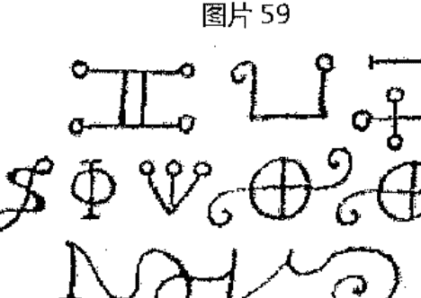

#### 图片 60


# 第八章

### 关于匕首、剑、镰刀，及其他仪式器具

为了完美地执行仪式中最伟大、最重要的操作，各种器具都是必要的，像一把白色刀柄的匕首，及其他事物。

白色刀柄的匕首（见图片61）应当在火星落在白羊或天蝎宫的时候，在水星日、时制作。它应当浸在小鸽的血液和紫繁蒌的汁液中，月亮应在她的满月或月盈状态。刀柄也应被浸没，在其上应刻有所展示的符号。完成后，用仪式的香水香薰它。

用这把匕首，汝可以执行所有必要的仪式操作，除了圆的制作。但如果对汝而言，制作一把相似的匕首过于麻烦，那就用相同款式的；汝应当将其放在火焰上三次，直到它变得红彤彤，每次汝都要将其浸没在之前所说的血液和汁液中，将其绑在刻有上述符号的白色刀柄上，在刀柄上，汝应当用仪式的笔从一头到另一头写上这些名字 Agla，On，就像图片 61 所示的那样。之后，汝应当用那个香薰并喷洒它，用丝绸布包裹。

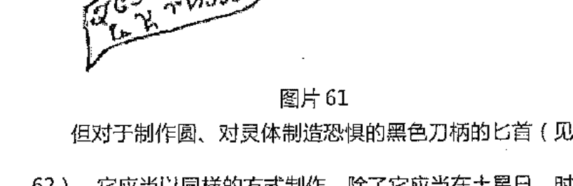

#### 图片 61

但对于制作圆、对灵体制造恐惧的黑色刀柄的匕首（见图 62），它应当以同样的方式制作，除了它应当在土星日、时制作，浸入黑猫的血液和铁杉的汁液，在图片 62 上所示的符号应该写在其上。完成之后，汝应用黑色丝绸包裹。

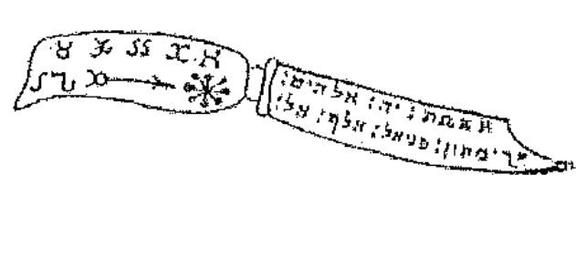

弯刀（图片 63）和镰刀（图片 64）都以同样的方式制作，短剑（图片 65）、短剑（Poniard 图片 66）和短矛（图片 67）也是如此，在水星时、日制作，他们应被浸在鹆血和水银植物的汁液。汝一定要用在日出时一刀切下的白色黄杨木制作的刀柄，切黄杨木的刀应为新刀，或者其他方便的器具。所展示的符号应被刻在其上。汝应当遵照仪式的规则香薰在它们之上；像其他一样用丝绸布包裹它们。

木棒（见图片 68）应用老木制作；仪式杖（图片 69）应用榛树木或坚果树的木头制作，所有的木头应该是新木，也就是只有一年木龄。它们都应在水星之日的日出时被一次砍下。所展示的符号应当在水星之时被刻画在其上。

完成之后，汝应说：

> > 最神圣的 ADONAI 啊，赐予这根木杖和这根木棒祝福吧，让它们能拥有必要的性质，通过汝，哦，最神圣的 ADONAI，汝的帝国将与世长存。阿门。

在香薰和圣化它们之后，将它们放在纯净、干净的地方等待使用。

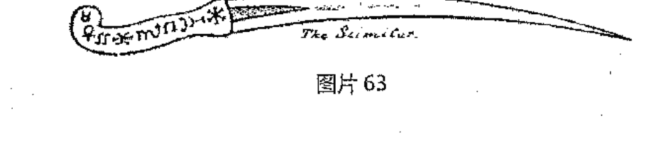

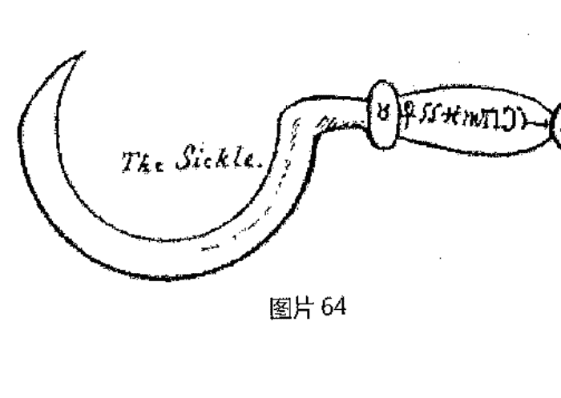

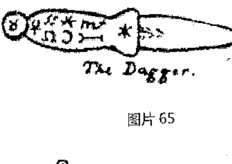

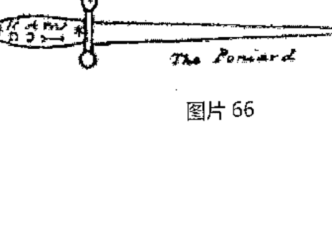

剑也频繁使用于魔法仪式之中。因此，汝应当在水星之日的第一或第十五个小时的时候，将一把新的剑打磨清洁干净，然后，汝应用希伯来文在其一边写上这些神圣的名字，YOD HE VAU HE , ADONAI , EHEIEH , YAYAI ;在另一边写上 ELOHIM GIBOR ( 见图片 70 ) ;喷洒并香薰它，并重复下面的咒文：

#### 咒文

#### 剑的咒语

> > ABRACADABRA , YOD HE VAU HE , 汝为吾所有的魔法操作提供力量和防御，抵御所有吾可见的、不可见的敌人。

> > 吾再次对汝施咒，以神圣不可分割的 EL 之名；以全能的 SHADDAI 之名；以 QADOSCH、QDAOSCH、QADOSCH、ADONAI ELOHIM TZABAOTH, EMANUEL、第一和最后、智慧、方式、生活、真理、首领、演说、赐予、祭司、光亮、太阳、山脉的、荣耀、智慧之石、美德、看守人、牧师、不朽的梅萨雅（Messiach）之名；以这些名字，以其他名字，吾对汝施咒语，哦，剑啊，汝守护着吾，免于任何不幸。阿门。

完成之后，汝应当适当地对其进行仪式所必须的净化与圣化，并像其他器具一样用丝绸包裹它。

另外还得制作三把剑给门徒使用。

第一把的剑柄圆头上写有 CARDIEL 或 GABRIEL 的名字（见图片 71）；在护把上，REGION（图片 72）；在刀口上，PANORAIM HEAMESIN（图片73）。

第二把的剑柄圆头上应写有 AURIEL (图片 74) 的名字；在剑的护把上，SARION (图片 75)；在刀口上，GAMORIN DEBALIN (图片 76)。

第三把的剑柄圆头上应有 DAMIEL 或 RAPHIEL (图片 77) 的名字；在护把上，YEMETON (图片 78)；在刀口上，LAMEDIN ERADIM (图片 79)。

刻刀 (图片 80) 用于刻画符号。在火星或金星的日子和时辰，汝就可以刻画所展示的符号了，在喷洒并香薰之时，汝应背诵下面的祈祷文：

> > ASOPHIEL , ASOPHIEL , ASOPHIEL ,
PENTAGRAMMATON , ATHANATOS , EHIEH ASHER EHIEH , QADOSCH , QADOSCH , QADOSCH ; 哦，不朽的神啊，吾的父亲，祝福这一以汝之名所准备的仪式器具吧，让其可以仅为善之用。阿门。

再次香薰它之后，汝应该将其放置一边，准备使用。针也应该以同样的方式圣化。

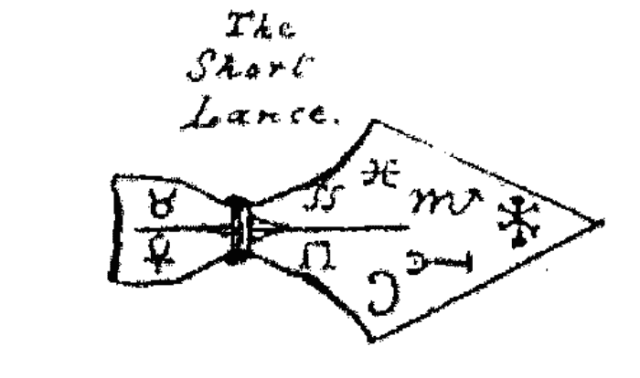


#### The Staff.
图片 68

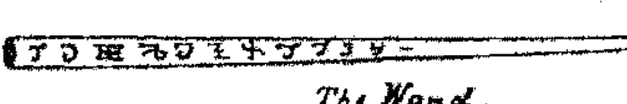

#### The Wand.
图片 69

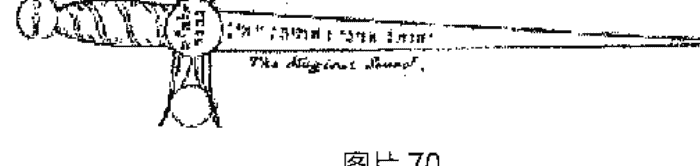

#### The Magickal Sword.
图片 70

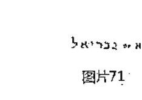

图片71

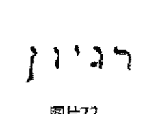

图片72

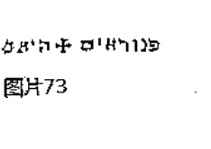

图片73

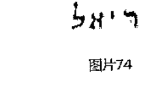

图片74

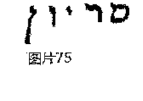

图片75

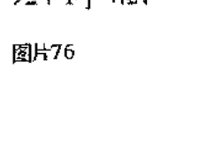

图片76

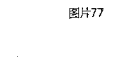

图片77

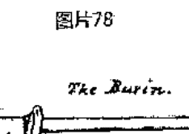

图片78

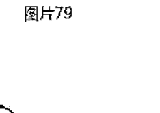

图片79

The Burin.


图片80

## 第九章 关于圆的形成

选择好了准备和构造圆的地方、所有仪式的必需品都已准备妥当之后，汝应当用仪式的镰刀或弯刀扎入想要做出的圆的中心；然后，将九肘尺的绳子一头扎在镰刀上，在另一头上用黑色刀柄的匕首或剑描绘圆形。然后，在圆内划分四个区域，即是东、西、南、北，在其中放置象征物；在圆外，用圣化的匕首或剑画出另一个圆，但要在朝向北面的地方留白，供汝进入和离开圆。在这之外，汝应用上述的器具画另一个一肘尺的圆，也需空白出入的地方，与在另一圆中所预留的出口一致。在这个圆的更远处，汝应当再画一个一肘尺长的圆，它们都是同一圆心，汝应在其周围画上造物者的象征符号和名字。在这些圆的外面，汝应画上限制的方块，在其之外再画另一个方块，让前者的天使可以触碰后者天使的圆心，这样后者的天使可以伸展到宇宙的四方；触碰每个方块的四位天使之后，汝应在其中画上更小的圆，在其中放置点燃着木炭和香料的香炉。

完成之后，让仪式的魔法师集合他的门徒，告诫、确认、鼓舞他们；领导他们进入仪式的圆中，让他们面向世界的四方站立，让他们不要惧怕，待在所指定的地方。另外，让每位同伴赤手手持仪式剑。然后，大师离开圆，点燃香炉，在其上放置圣化的熏香，就像在熏蒸法的章节中所描述的那样；让他拿着香炉，并点燃它，然后放在准备的地方。让他再次进入圆，并关闭之前所留下的出口，并让他再次警告他的门徒，照着相关章节所描述的方法准备好喇叭，让他面向世界的四方点燃熏香。

在这之后，将镰刀、剑、或其他仪式的器具放在他的脚的右上方，让魔法师开始他的咒语。吹响喇叭，召唤灵体，如果需要对它们施咒，就照着卷一中所说的做，完成了他的愿望之后，让他允许他们离开。

这是圆的形式（见图片 81），无论谁进入了它，就像进入了铜墙铁壁的堡垒一样，没有事物能伤害他。

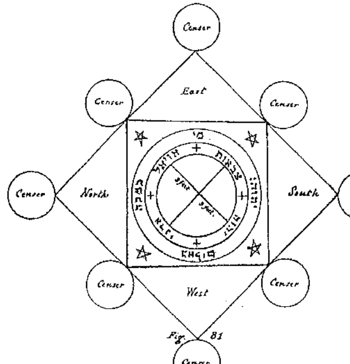

# 第十章

### 关于熏香、熏蒸礼、香水、气味、及在魔法仪式中所使用的类似事物

献给灵体的熏香、熏蒸和香水有很多种；那些甜香味的是用于善意的，有邪恶味道的是用于不幸的。

关于善意香味的香水，汝应将芦荟、豆蔻、安息香 (gum Benjamin)、麝鹿香混合制作。

关于合适的熏蒸方法，汝可以燃烧熏香，让其挥发令人愉悦的味道，让其吸引友善的灵体，强迫邪恶的灵体远离汝；在其面前，汝应说：

#### 熏香的净化咒

哦，亚伯拉罕之神，亚瑟克之神，雅各布之神，赐福这一芳香的熏香，让其拥有吸引善意灵体的力量与性质，驱逐出所有不怀好意的幽灵。凭借汝，哦，最神圣的ADONAI，汝与世共存。阿门。

吾驱逐汝，哦，不纯洁的灵体啊，汝是不怀好意的幽灵，以神之名，汝应离开这一熏香，汝与汝所有的骗局，皆会被全能神之名所净化。愿邪恶的灵体和幽灵永远无法进入这里，凭借妙不可言的全能神之名。阿门。

哦，上帝啊，赐福这一神圣的熏香吧，凭借对汝神圣之名的召唤，让其挽救人类肉体与灵魂。愿所有的造物闻到这熏香所散发的气息之后，身体与灵魂变得健康，凭借形成纪元的汝之力。阿门。

在这之后，汝应当在其上喷洒混合着各种香料的仪式水，然后，汝应将它们用丝绸布包裹，放在准备的地方。

当汝想要使用它们的时候，汝应在熏香炉中点燃新的熏香，点燃之后，汝应将香料放在熏香炉旁，并说：

#### 火焰的净化咒

> > 吾净化汝，哦，火焰的造物啊，以万物的创造者，凭借最高等造物者的召唤，让任何类型的幽灵离汝远去，无法以任何方式伤害或欺骗汝。阿门。

> > 祝福吧，哦，全能的主，祝福这火焰的造物，让其被汝祝福，让其在汝最神圣之名的照耀下，愿其在使用中不被邪恶所妨碍。凭借汝，哦，不朽万能的主，凭借汝最神圣的名字。阿门。

完成之后，汝应当将香料放在火焰上，制作汝所需要的熏香和熏蒸。

对于邪恶的味道，汝应说：

> > ADONAI, LAZAI, DALMAI, AIMA, ELOHI, 哦，最神圣的父亲，给予吾们帮助和汝的荣耀，以汝神圣之名的召唤，愿这些事物可以帮助吾们所希望执行的仪式，让所有的欺骗远离它们，愿他们被汝的名字祝福。阿门。

# 第十一章

### 关于水和牛膝草

要在仪式中喷洒所需要的水就需要一个洒水壶。

用仪式的香料在水星日、时准备香炉。在完成之后，汝应用铜制的器皿，在其中盛满最干净的春水，汝应准备盐，并说在盐面前说：

> > TZABAOTH, MESSIACH, EMANUEL, ELOHIM GIBOR, YOD HE VAU HE: 哦，真理和生命之神，赐福这盐的造物吧，让其给予吾帮助，在仪式中守护并辅助吾，愿其成为吾的援助者。

在这之后，将盐撒入器皿的水中，背诵诗篇：cii；liv；vi；lxvii。

然后，汝应当为汝制作一个的水壶，将马鞭草、茴香、薰衣草、鼠尾草、颉草（valerian mint）、罗勒（garden-basil）、迷失香、和牛膝草在水星之日时、月盈状态下收集起来。一位年轻的少女将这些植物编织起来，在把手的一边上刻有在图片 82 中所展示的符号，另一边刻有图片 83 所展示的符号。

在这之后，只要汝想要使用水，就应该使用水壶，要知道，无论你在什么地方用此水壶洒水，它会追捕所有的幽灵，他们就无法阻碍任何。在仪式中，汝可以使用同样的水。

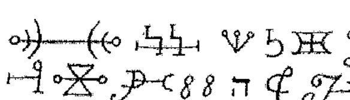

图片82

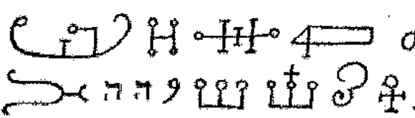

图片83

# 第十二章

### 关于灯具和火焰

在所有的国家中，在神圣的事物中使用火焰和灯具已经成为了习俗。仪式的大师因此也需要将它们用在神秘的仪式中，除了用于阅读咒语和熏香的那些之外，在所有的仪式中，灯具在圆中是必需品。

因此，他应当在水星日、时用未使用过的石蜡制作蜡烛；烛芯应由一位年轻女孩制作；蜡烛应当在月亮月盈的时候制作，每只半磅重量，用短剑或仪式刻刀在它们之上刻画这些符号。

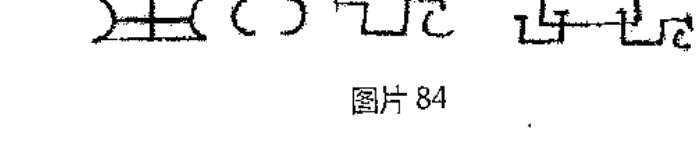

完成之后，汝应当在蜡烛面前重复诗篇 cli；ciii；cvii，并说：

> > 哦，上帝啊，汝以汝全能的力量统治着万物，给予吾这个罪人理解和智慧，去完成汝准予的事物；准允吾恐惧、敬仰、爱戴、赞扬给予吾帮助的汝。准允吧，哦，上帝啊，在吾死亡、坠入下方的领域之前，在炙热的火焰吞食吾之前，愿汝的荣耀不要远离吾，哦，吾灵魂的上帝啊。阿门。

在这之后，汝应加上：

> > 吾净化汝。哦，蜡的造物，以创造万物的他的话，以纯粹真理的他的美德，愿幽灵、曲解与敌方的骗局远离汝，愿上帝的美德和力量进入汝，愿汝给予吾们光明，驱逐吾们所有的恐惧。

完成之后，汝将仪式的水喷洒在它们之上，用普通的香味薰它们。

当汝想要点燃它们的时候，汝应当说：

> > 吾净化汝，哦，火焰的造物啊，以不朽上帝的名字，YOD HE VAU HE；以IAH之名；以EL的力量之名；凭借造物者的力量，愿汝点亮所有进入此圈的灵体的内心，让他们在吾们面前显现，而没有任何欺骗。

然后，汝应找一个方形、玻璃窗格的灯笼，汝应将放在其中的蜡烛点燃，准备形成圆，或其他汝需要用到它的地方。

# 第十三章
### 关于仪式的戒律

那些抵达召唤者等级的召唤师，吾们通常根据等级称他们为魔法师（Magus）或大师（master），当他想要执行任何仪式的时候，在仪式开始之前的九天，暂不考虑所有不纯洁的事物，将自己在这些天中准备好，准备所有必要的物品，在这些天中，所有的事务都应制作完毕。

按时完成之后，让他在仪式开始的时间继续工作，按照相关章节所描述的，前往不同的地方形成圆。让他指导他的门徒待在指定的地方。魔法师应用自信大胆的声音告诫他的门徒：

#### 同伴的告诫

> > 无需恐惧，吾的同伴们，吾们的工作将接近理想的尾声；
> 因此，万事具备，咒语和净化咒皆已实施，汝们应注视国王中的国王，帝王中的帝王，以及其他的国王、王子、和与他们在一起的大臣、以及携有各类乐器的随众，无论是魔法师或是他的门徒都不应惧怕。

然后，让魔法师说：

> 吾告诫汝，以这些神的圣洁之名，ELOHIM，ADONAI，AGLA，汝们不得移动或交换指定的地点。

说完之后，让大师和他的门徒揭开神圣的星盘，并向每个方位的他们展示，展示完成后，会出现躁动。

然后，让灵体的统帅与汝对话：从大 Addus 时代到现在，没有一位召唤师能注视到吾本人，要不是那些汝向吾们所展示的事物，汝们无法看见吾们。但汝们强烈地召唤了吾们，吾相信……## 巫术的法则

#### 出品

信，这个仪式是由所罗门提供的，它迫使我们出现，我因此向你表达我们的臣服。

然后，魔法师应当将他和他同伴的愿望递交给灵体的国王或王子，该愿望应清晰地写在上等羊皮纸上，他会接受它，并与它的首领商讨。之后，他会归还纸张，说道：你的愿望已经完成了，所要的要求均已达成。

### THE KEY OF SOLOMON

#### 第十四章 关于笔、墨水和色彩

在仪式中所有书写需要使用到的物品，均应以以下方式准备：

你应找一只公的小鹅，在其的右翼上拔出三个羽毛，在拔出的时候，应说：

> ADRAI, HAHLII, TAMAII, TILONAS, ATHAMAS, ZIANOR, ADONAI, 将这只笔中所有的欺骗和错误驱逐出，让其拥有我希望的性质与美德。阿门。

在这之后，你应当用仪式的小刀削尖它，香薰它，喷洒它，将其用丝布包裹。

你应当有用泥土或其他方便物质所做成的墨水瓶，在水星日、时，你应当在其上用仪式的雕刻刀刻画这些名字：YOD, HE, VAU, HE, Metatron, Iah Iah Iah, Qadosch, Elohim Tzabaoth (见图片 85)；装入墨水的时候，你应说：

> 我净化你，哦，墨水的造物啊，以 ANAIRETON，以 SIMULATOR，以 ADONAI 之名，以创物者之名，愿你能在我想施展的仪式中助我一臂之力。

就像时常发生的，有时需要用彩色去书写，最好能用新的、干净的盒子保存它们。主要的颜色应该是：
- 黄色或金色
- 红色
- 天蓝
- 绿色
- 棕色

以及其他颜色。你应当以平常的方式净化、香薰、并喷洒它们。

### THE KEY OF SOLOMON

הַמַּפְתֵּחַ שֶׁל שְׁלֹמֹה
אֲשֶׁר מְצָאתִי

图片 85

#### 第十五章 关于燕毛笔和乌鸦毛笔

拔掉燕子或乌鸦的羽毛，在拔出之前，你应说：

> 愿神的神圣天使长 MICHAEL、MIDAEL 和 MIRAEL，天空军队的首领成为我仪式的助手，让我所写的必要事物，让我将要执行的仪式是凭借你和你的名字完成的，哦，最高等的造物者。阿门。

在这之后，你应用仪式的匕首完成它，你应用仪式的笔和墨水在其一边写下 ANAIRETON 的名字（见图片 86），你应当对着它说诗篇：cxxxiii ; cxvii。

### THE KEY OF SOLOMON

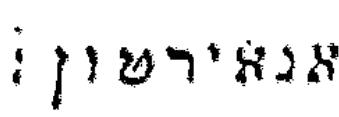

图片 86

## 第十六章 关于蝙蝠、鸽子和其他动物的血液

#### 蝙蝠的净化咒语

找一只活着的蝙蝠，并对它净化：

> CAMIAH , EMOIAHE , EMIAL , MACBAL , EMOII , ZAZEAN , MAIPHIAT , ZACRATH , TENDAC , VULAMAHI ; 以这些最神圣的名字，和其他写在 ASSAMAIAN 之书上的天使名字，我对汝施法，哦，蝙蝠啊（或者其他动物），你在这项仪式中帮助我，以神的真理、神的神圣，创造你的神，以将你的真名强加在你和其他动物身上的亚当。

在这之后，用针或其他方便的仪式器具在蝙蝠右翼的静脉上扎刺；用小型的容器收集血液，你应对着它说：

### THE KEY OF SOLOMON

> 全能 ADONAI ， ARATHRON ， ASHAI ， ELOHIM ， ELOHI ， ELION, ASHER EHEIEH ， SHADDAI ，哦，上帝之神啊，洁白无暇，EMANUEL ， MESSIACH ， YOD, HE, VAU, HE ，助我一臂之力，让这个血液拥有我希望的力量和效果。

香薰它，并妥善保管。
动物翅膀的鲜血可以用同样的方法取得。

## 第十七章 关于上帝羊皮纸、上等纸张，及如何准备

上等羊皮纸是由死亡的小羊皮制成，十分地新、干净与圣化，从没为其他目的使用过。

真正的羊皮纸是许多魔法仪式的必需品，应当正确准备并圣化。共有两个种类，一种称为上等，另一种称为胎制/未生（unborn）。上等（贞洁）羊皮纸是由尚未到生育年龄的动物外皮制作的。胎制羊皮纸是由尚未离开母亲子宫的胎儿的外皮制作的。

选择你喜欢的种类，但它们必须要是公的，在水星日、水星时制作；将它带到没人能看见工作的秘密地点。你应当用一把新刀一刀切下沼泽芦苇，剥下它的叶子，并背诵咒语：

#### 芦苇的咒语

> 我对汝施咒，以万物的创造者，以天使的国王，他们的名字是 EL SHADDAI，汝将剥去这动物外皮的力量与性质，并构筑我将要书写神名的羊皮纸，凭借与世共存的你的力量。阿门。

在切芦苇之前，背诵诗篇 lxxii。
在这之后，用仪式的匕首将芦苇变成匕首的形状，在上面写下这些名字：AGLA，ADONAI, ELOHI (见图片 87)，凭借你这把匕首将完成。然后，你应当说：

哦，神啊，你吸引摩西，你受到敬爱，并从尼罗河岸的沼泽中选出芦苇，准予我凭借你伟大仁慈的力量，让这芦苇接收到你的力量与美德，让我凭借你圣洁的名字和你神圣天使的名字完成我的愿望。阿门。

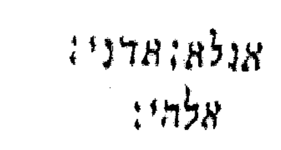

图片 87

完成之后，你应开始用刀剥下动物的外皮，无论它是贞洁的还是未生的，说：

> ZOHAR , ZIO , TALMAI , ADONAI , SHADDAI , TETRAGRAMMATON , 神圣的神之天使; 降临吧, 准予力量和美德进入这张羊皮纸，愿其被你圣化，让我所写在其上的事物获得他们的效果。阿门。

动物被剥皮之后，拿着盐，对着它说：

> 神之神，主之主，从负面的存在创造了万物，赐予这个盐祝福，让其放在我希望制作的羊皮纸之上，愿它能拥有我所书写在其上的性质。阿门。

之后，用圣化的盐擦拭羊皮纸，让它在阳光下曝晒，让其吸收一整天的盐分。然后，拿出内外光滑的土制容器，在其周围写下图片88的符号。

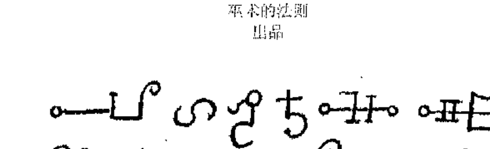

图片 88

之后，你应将石灰粉撒入容器，说道：

> OROH, ZARON, ZAINON, ZEVARON, ZAPHIEL, ELION，降临吧，并赐福这项工作，让其拥有我所期望的效果，凭借天堂的神与天使的神。阿门。

将圣化的水灌入石灰中，将皮放在其中三天，之后你就要将其取出，用芦苇匕首擦掉上面的石灰和肌肉粘附物。

完成之后，你应当一刀切下榛树的树枝，让其长到足够让你形成圆；也要找一根由年轻少女所编织的绳子，几块小石头或溪边的卵石，背诵这些话：

> 哦，神 Adonai 啊，神圣强大的父亲，将美德灌入这些石头，让它们可以用于平展这张羊皮纸，驱逐所有的欺骗，愿其获得你万能力量的美德。

在这之后，将平整好的羊皮纸放在圆上，用绳子和石头捆绑住，你应说：

> AGLA , YOD , HE , VAU , HE , IAH , EMANUEL , 祝福并保持这张羊皮纸，让幽灵无法进入其中。

让其在黑暗荫凉的地方放置三天，然后用仪式匕首切断绳子，将羊皮纸从圆中取出，说：

> ANTOR，ANCOR，TURLOS，BEODONOS，PHALAR，APHARCAR，降临吧，请守护这张羊皮纸。

然后香薰它，用丝绸布包裹保存。
没有成年的妇女能看这张羊皮纸，否则它会失去它应有的性质。让他纯洁、干净并准备好。
但如果上述的准备方法太过残忍，你可以选用以下方式，但它并不是很有效。

### THE KEY OF SOLOMON

取一张羊皮纸，并净化它；准备好有熏香的香炉；在羊皮纸上写上图片89的符号，将它举在熏香之上，说：

> 降临吧，帮助我，愿我的仪式凭借着你的力量完成：ZAZAH , ZALMAII , DALMAII , ADONAI , ANAPHAXETON , CEDRION , CRIPON , PRION , ANAIRETON , ELION , OCTINOMON , ZEVANON , ALAZAION , ZIDEON , AGLA , ON , YOD HE VAU HE, ARTOR , DINOTOR , 神的圣洁天使啊；降临并灌入这羊皮纸美德，让其拥有所有书写的所有名字或符号的力量，愿所有欺骗远离它，凭借上帝神的仁慈和荣耀，与世共存。阿门。

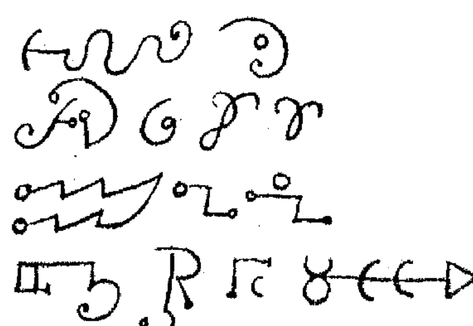

然后，你应对着羊皮纸重复诗篇 lxxii； cxvii； cxxxiv； 和赞美歌（ Omnia Opera ）。 然后说：

> 我对汝施咒，哦，上等的羊皮纸啊，以所有神圣的名字，愿你获得效用和力量，成为净化与圣化之物，让写在你之上的事物不会被真理之书所抹去。阿门。

然后在其上洒水，按照上述的方法保存它。
新生儿的胎膜，在适当的圣化之后，也可用作上等羊皮纸的替代品。纸张、丝绸、缎子之类的物品也可用作替代。

#### 第十八章 关于蜡和泥土

蜡和泥土也会在许多魔法仪式中使用到，无论是制作图像、蜡烛、或是其他事物；因此，它们应当不得用于其他目的。泥土应该由你自己的双手挖出，使其为糊状，不得用任何器具接触它，不然它就被玷污了。

蜡应该取自蜜蜂，而且钥匙第一次制作的，它应从未使用于其他目的；当你想要它为自己或他人服务，你应开始仪式并背诵下面的咒文：

#### 咒文

EXTABOR，HETABOR，SITTACIBOR，ADONAI，ONZO，ZOMEN，MENOR，ASMODAI，ASCOBAI，COMATOS , ERIONAS , PROFAS , ALKOMAS , CONAMAS , PAPUENDOS , OSLANDOS , ESPIACENT , DAMNATH , EHERES , GOLADES , TELANTES , COPHI , ZADES , 神的天使啊，降临吧，我召唤你们为我工作，让我凭借你们让其获得美德与成就。阿门。

之后再背诵诗篇:
- cxxxii
- xv
- cii
- viii
- lxxxiv
- lxviii
- lxxii
- cxxxiii
- cxiii
- cxxvi
- xlvi
- xlvii
- xxii
- li
- cxxx
- cxxxiv
- xlix
- cx
- liii

并说：

> 我净化你，哦，蜡（或土）的造物啊，凭借神与圣洁天使的神圣之名，你受到祝福，凭借最神圣的 ADONAI 之名，愿你被赐福，获得我们所期望的性质与美德。阿门。

喷洒蜡，并将其放置一边等待使用；但要注意，泥土的话，你只有每次要使用的时候才能挖出准备。

#### 第十九章 关于针和其他铁制器具

有多种铁制器具用于各种仪式，像针用于刺或缝；刻刀用于雕刻，等。

你应当在木星日、时制作这类工具，当它完成的时候，你应说：

> 我对汝施咒。哦，铁质器具啊，以神万能的父亲，以掌管它们的天堂、星星、天使的性质；以石头、植物和动物的性质；以冰雹、雪和风的性质；你将受到这类的性质，让你没有欺骗地完成我所愿；凭借纪元、天使帝王的造物之神。阿门。

背诵诗篇 iii ; ix ; xxxi ; xli ; lx ; li ; cxxx。
用仪式的熏香香薰它，用圣化的水喷洒它，用丝绸包裹并说：

> DANI, ZUMECH, AGALMATUROD, GADIEL, PANI, CANELOAS, MEROD, GAMIDOI, BALDOI, METATOR, 最圣洁的天使，降临守护这件器具吧。

#### 第二十章 关于丝绸布料

当任何仪式的器具被适当圣化之时，它应当被丝绸包裹，并保存好，就像我们之前所说的那样。

然后，在任何颜色（除了黑或灰）的丝绸上，写下在图片90中的符号。
用友善的气味香薰它，喷洒它，背诵诗篇 lxxxii；lxii；cxxxiv；lxiv。
在这之后，你应当将它与甜香的香料一起放置七天；你应当用这块丝绸包裹所有的仪式器具。

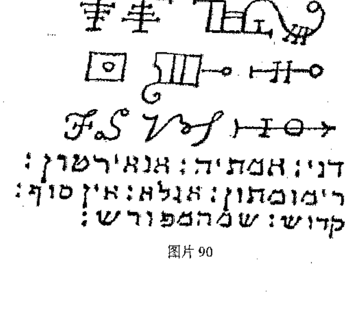

图片 90

#### 第二十一章 关于符号，和魔法书籍的献祭

当想要写那些符号的时候，你会怕失败，要这么做：在开头写下 EHIEH ASHER EHIEH 的名字（图 91），在结尾写下 AIN SOPH 的名字（图片 92）；在这些名字中间写下你的愿望，如果对写在丝绸布上的名字有什么特别的要做的话，你应对着它们说：

> 万物最智慧、最高等的造物者啊，我向你祈祷你的荣耀和仁慈，愿你能准予这些神圣的名字性质与力量，愿你让这些名字远离欺骗和错误，凭借你，哦，最神圣的 ADONAI。阿门。


图片 92

在背诵这些后，你应写下所需的符号，你就不会失败了。

#### 书的献祭

制作一本书，包含十六页的上等羊皮纸，用红色墨水在上面写下所有的仪式祈祷文和以连祷文（Litanies）形式的天使名、他们的封印和符号；完成之后，你应对神和纯洁的灵魂以下面的方式进行献祭：

你应在指定地点放置一小张桌子，用白色的布块盖在上方，你应将书打开，放置在伟大的星盘之上；点燃悬挂在桌子中央上的灯后，你应用白色的布帘围绕着桌子；为自己穿上合适的外衣，拿着打开的书，跪下，虔诚地重复下面的祈祷文：

(详见卷一第十四章中，由"Adonai Elohim"开始的完整祈祷文。)

完成之后，你应用适于行星和天数的熏香薰它，将书本再次放到桌子上，注意灯笼中的火焰要在仪式中持续燃烧，保持布帘的遮蔽。重复七天同样的仪式，从星期六开始，用适于天数和时辰的熏香薰它，注意灯笼中的蜡烛不管在白天与夜晚都应燃烧着；完成之后，你应闭合书本，放置在桌子下的小抽屉里，特意等到必要的场合再使用它；当你每次想要使用它的时候，你应穿上外衣，点燃蜡烛，跪着重复之前的祈祷文。

在书的献祭的时候，也需要召唤所有的天使，他们的名字应以连祷文的形式书写，并虔诚地召唤他们；即使天使和灵体不在书的献祭中出现，不要惊讶，他们是纯粹的自然，通常难以对无常、不纯洁的人类熟络，但是，仪式和符号应该虔诚地正确画出，他们会被迫出现，他们会在第一次召唤的时候出现，并让你与他们交流。但我建议你在不干净或不纯洁的情况下不要召唤他们，因为你的不纯洁，对他们而言十分厌恶；你因而很难吸引他们引导至纯洁的结果。

## 第二十二章 关于对灵体的献祭，与执行的方法

在很多仪式中，以各种方式对魔鬼的献祭显得很必要。有时，白色的动物可用于献祭给友善的灵体，而黑色的给邪恶的。这样的献祭由血和肉组成。

那些想要献祭动物的人，无论它们是什么种类的，应该要选择那些贞洁的，对灵体更适合，使他们更容易臣服。

当血液被献祭的时候，应该要选择四足兽类或禽类，在供奉之前，应说：

> 愿此献祭对你适合，崇高、高贵的生物啊，请满足、愉悦地完成你的愿望；准备好臣服我们，你们会接待伟大者。

然后，根据仪式的规则，香薰并喷洒它。

当必要的时候，在适当的仪式中，使用火堆进行献祭，它们应有对所献祭的灵体相适应的性质的木头构成；例如：
- 杜松或松树应对土星的灵体
- 黄杨木，或橡树应对木星的灵体
- 山茱萸或西洋杉应对火星的灵体
- 月桂树应对太阳的
- 桃金娘科常绿灌木应对金星的
- 榛树应对水星的
- 柳树应对月亮的

但当我们用实物和饮料做供奉的时候，所有必需品应在圆中准备好，肉类应当被优质的布料遮盖在上方，下方也应当有一块干净的布料垫着它们；刚制作的面包和气泡的酒，但所有关于行星、动物的性质，例如家禽或鸽子，应已被烘烤好。你特别需要一杯纯净的泉水，在你进入圆之前，你应召唤灵体的名字，或者至少是他们首领的名字，说道：

> 无论你们在何方，加入这一宴会吧，来吧，准备接受我们的供给、礼物和献祭，你们会满意我们的供奉。

首先，用燃烧的熏香熏蒸房间，再在食物上洒上圣化的水；然后，开始召唤灵体，直到他们到来。
这是在所有必要的仪式中制作献祭的方法，这么做会促进灵体服务于你。

所罗门国王的钥匙到此结束
版本号 01.3.01

## 零术的法则

#### 魔法字母表

### THE KEY OF SOLOMON

| 希伯来字母 | 东方三博士字母 | 天体字符 | 天使字符 | 称为“越河”的字符 | 字符的名称 | 字符的力量 |
|---|---|---|---|---|---|---|
| א | 21 | X | U | H | Aleph Samkah | a' 3 |
| ב | B | 3 | U | I | Beth Ayin | da ng |
| ג | D | ? | J | X | Gimel Pe' | g p |
| ד | S | 7 | Z | F | Daleth Tzaddi | d t |
| ה | P | T | P | N | He Qoph | h q |
| ו | 7 | 3 | I | V | Vau Rosh | v r |
| ז | W | M | T | U | Zain Schin | z sh |
| ח | n | 3H | II | H | Cheth Tau | ch t |
| ט | Finals H.. | U | XX | ? | Teth | t |
| י | 7 | D. | A | J | Yod Final Koph | i y k |
| כ | O | O | O | W | Koph Final Mem | k m |
| ל | I | 3. | L | J | Lamed Final Nun | l n |
| מ | 9 | aG | Y | H | Mem Final Pe | m p |
| נ | Y | G. | L | Y | Nun Final Tzaddi | n ts |# 巫术的法则
出品