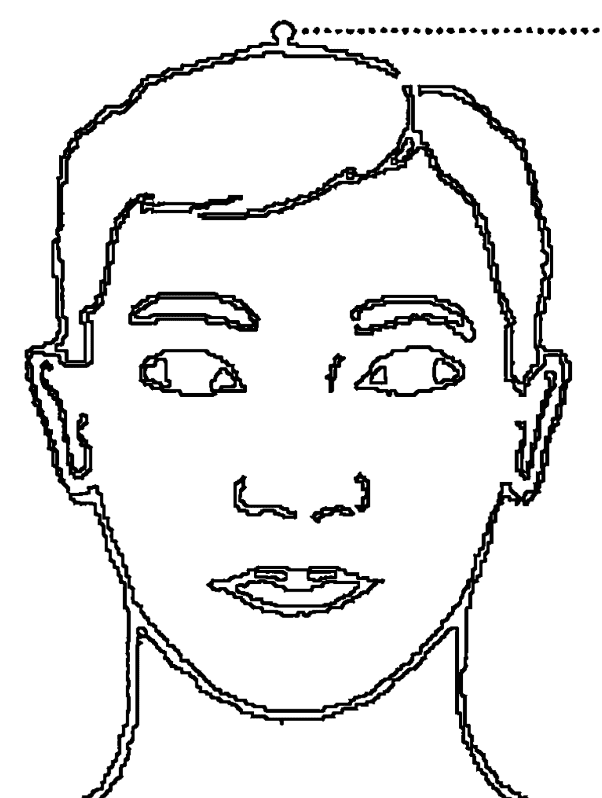

# 打通你的气场

我很喜欢这本书。书里的内容通俗易懂。我试了试其中一些技巧，惊讶地发现困扰我多年的情绪问题真的不见了，而气场则变得通畅起来。感谢加里·克雷格写了这样一
本好书，让大众都能分享。我大力推荐这本书。
——网友“自由降落”，2008年9月15日

其实一开始我也有些怀疑，我不是一个特别容易相信某些东西的人。一个朋友介绍
我去体验一下。出于不忍心拒绝朋友的好意，我决定跟着去试一下。每天晚上半个小时
的心灵按摩，我坚持了一个月，然后接下来不可思议的事情发生了：12年的忧郁症逐渐
减轻了，35年的创伤后遗症消失了。现在，我已坚持按摩了六个月，神清气爽，气场通
畅，就像换了个人似的，工作起来轻松了很多，生活也变得更加舒适。
——读者Zardoz，2010年2月19日

我知道，这个方法有点奇怪，但是相信我，心灵按摩术真的很管用。我是一名心理
医生，每天都会碰到情绪有问题、气场不通畅的人，我试过很多方法，从来没有一种像
它那样具有令人震惊的效果。第一次尝试你就能体验到它的功效。不管是一些表层的问
题，还是内心积压的问题，它都能帮助你。
——读者ghitiudragons，2012年1月7日

效果真的很惊人！可能会觉得这种没听过的按摩术有点奇怪？我第一次听也觉得奇
怪。但是从上个月我改变了这种看法。我真的试过了！它清除了我的社交焦虑症，气场
也从昏暗变得明亮起来。
——读者“疯狂的面包师”，2011年8月22日

# 推荐序

罗大伦

出版社的朋友送来一本书，说是美国人写的，很有意思。朋友说，书中介绍了一种心灵按摩术，可以打通人的气场。开始我有些疑惑：

- 难道心灵可以按摩吗？
- 气场与心灵又有什么关系？
- 难道按摩真有这么大的功效？
- ……

但是，当我读完这本书的最后一章时，不由得心中赞叹。原来，人的情绪和情感不仅蕴藏大脑里，也流动在身体内。正因如此，恐惧的时候我们才会感觉到头皮发麻，伤心的时候才会感觉到心痛，犯愁的时候才会紧蹙眉头。

这本书的作者是毕业于美国斯坦福大学的工程师，他对量子物理十分熟悉。他发现情绪是一种能量，如果它能在身体内顺畅地流动，人的气场就会强大。相反，如果情绪受到了阻碍，形成了心结，气场就会弱小。

现在，人们的情绪问题越来越多，有的内心纠结，如同一脚踩油门、一脚踩刹车；有的总爱抱怨，不停地挑剔伴侣；还有的内心羞愧，缺乏自信……究其原因，皆是因为他们的情绪在身体内流动不畅。关于这一点，作者用了一个十分有趣的比喻，他说每节电池都有正极和负极，如果我们将电池装反了，电流无法通过，手电筒就不会亮。同样，一些人之所以没有气场，也是因为他们在身体内把情绪的正负极装反了。

所谓心灵按摩，就是矫正情绪的正负极。

令人大吃一惊的是，这种方法来源于我们古老的经络学。

读到这里时，我惊讶不已。因为就在前不久，一位民间老中医对我说，通过按揉某个穴位，同时让患者回忆相关的不良记忆，就可以消除人的心理问题。对此，我觉得很新鲜：按摩穴位治疗身体疾病是众所周知的，但用它来治疗心理疾病还从来没听说过。这位老先生自述他的方法是传承于《黄帝外经》，但是，在通常的中医体系里面，却是基本没有的。而且根据现有文献来看，《黄帝外经》早已失传，《汉书·艺文志》里也仅存书名而已。

这本书却让我暗暗心惊，原来老先生所言果然不虚。

看来，学术研究真的会殊途同归。

然而，惊叹之余，又不由得悲从中来：如此好的东西在国内几乎失传了。不过，叹息过后，又多少有些欣慰，因为这种方法毕竟在国外得到了发扬光大。在书中作者通过大量的研究数据，证明了按揉相关穴位，同时进行心理疏导，其效果远远好于单纯的心理疏导。这是一种严谨的态度，正因为有这种研究，他们的方法也被世界卫生组织认定为治疗抑郁症的方法之一。

阅读本书以后，难抑欣喜之情，故乐为之序。

# 写在前面

## 打通自己的气场，你可以的

一场重要的演讲即将开始，作为主要演讲人，你突然感到紧张，一时间呼吸不畅，气场全失，怎么办？
准备已久的谈判进入倒计时，你莫名地感到焦躁，心里像长了草一样，气场在某一个环节突然被堵住了，该如何是好？
向上天祈祷？太慢！这样临时抱佛脚的事太不靠谱。
给最信任的朋友打电话？太远！朋友这时也不知该如何帮你，或者手机根本不在服务区。
更换一身西服？太扯！衣服不是万能的魔术师，紧张或焦躁不会就此消失的。
难道真的没辙了？不是的！如果你掌握了心灵按摩术，只需找准相应的穴位，并按一定的规程进行按摩，紧张也好，焦躁也罢，都会在很短的时间内消失，气场就此打通，你的演讲或谈判定能取得预期的成功。

一切都因为这神奇的心灵按摩术。有了它，你就可以打通自己的气场，做好你想做的事情。

很多人以为，气场与自己的气质、涵养、说话方式等密切相关，而这些都是自然生成，很难改变的。所以，不少人在自己的气场不够通畅的时候往往束手无策。有这种想法的人，是因为他们不知道、没掌握心灵按摩术，一旦他们明白了运用心灵按摩术打通气场的道理，原先的难题就会立刻迎刃而解。

其实在生活的舞台上，我们不仅仅面临演讲或商业谈判这样的戏剧性“冲突”，还有很多更平常的情节，当自己的气场不通畅的时候，一样会遇到“卡壳”的窘境，一样需要打通自己的气场，让生活这幕大戏顺顺溜溜地“唱”下去。

比如说，你可能因为恐高，丧失了一次很好的游览机会，这会让你久久不爽；再比如说，你可能因为愤怒，和别人斗气而发生了汽车刮蹭，致使好几天开不了车，让你心情不舒服、生活不方便；还比如说，你因为猜忌，对自己心爱的人产生了误会，让你觉得眼前的生活变得暗淡起来，等等。

这些时候，你最需要的是用最短的时间，采取最有效的办法，消除这些负面情绪，打通自己的气场，让生活回到正轨。而心灵按摩术，正是这个最有效办法的不二之选。

几十年来，心灵按摩术已经帮助上千万人打通了气场，做成了自己想做的事情，甚至改变了他们的命运。最让你欣慰的是，心灵按摩术简单易学，效果显著，所以，运用它来打通自己的气场，你，可以的！

# 第一章

## The Power of Mind

## 心灵有能量，人才有气场

气场像空气一样环绕在我们的周围，你看不见它，但它却能左右你的命运。

你一定遇到过这样的情况：有的人一走进房间，人们就会不自觉地给他让道，或者不约而同将目光投向他。这些人能轻易融入到一场谈话当中，并成为人群的中心。只要他们一发言，人们不是报以掌声，就是随声附和；只要他们一提问，人们立刻就会给出答案。这些人从容自信，说话清晰且有说服力。即便顶着压力，他们也能才思敏捷。他们有担当、有魄力；他们言行一致，魅力十足；他们是话题的引导者，表现出了令人信服的领袖气质。为什么这些人会有如此强的吸引力呢？因为他们有着强大的气场。

拥有了强大的气场，小则为你赢得一场约会，大则为你赢得整个人生。

那么，气场从何而来？气场不是来源于地位，也不是来源于权势，更不是来源于金钱。

有的人很有钱，但却没有强大的气场；而有的人很贫穷，却拥有令人感到震撼的气场。这其中的关键因素是什么呢？

大家一定对特蕾莎修女不陌生，作为百年诺贝尔奖历史上最受尊崇的三位获奖者之一，她受到了全世界人的爱戴。

特蕾莎修女虽然身高只有五英尺，衣着简朴，而且一贫如洗，但是她的身上却有着强大的气场。就算面对世界上最雄辩的执行总裁、最盛装华服的电影明星，或者最有身价的体育明星，她也丝毫不会相形见绌。41年来，特蕾莎修女凭着一股正气，奔走呼号，让许多执行总裁意识到了穷人们的困境；也正是靠着这一气场，她成功地说服了他们资助自己的事业：建立孤儿院、收容所、麻风病院、医院和施粥场。在她离世之际，世界六大洲123个国家无数民众无不为之动容。

大家一定会问：“特蕾莎修女的气场从何而来？”

我想答案只有一个：“来源于她的心灵。”

### 心灵能量决定你的气场

人生的冷暖取决于心灵的温度，心灵有多强大，气场就有多强大。

从美国斯坦福大学毕业后，我一直牢记着母校的校训：自由之风永远吹拂。尽管我是一名工程师，习惯于缜密的逻辑思维，但自由的精神一直流淌在我的血液里，正因如此，我才没有限制自己的思维，试图用工程师的大脑来破解心灵的秘密。

一切都要从那个灵感开始。

那是一个炎热的夏天，我将房间里一台电风扇的开关打开后，电风扇却没有任何反应。仔细一看，原来是插头没有接通电源。我插上电源后，风扇转动了起来，一阵清凉的风顿时令人心旷神怡。我躺在沙发上，身体感觉到格外的轻松。突然，我心中灵光一闪，出现这样一个念头：人不就像一台电风扇吗？电风扇的叶片和支架等外部构造，就相当于人的脑袋和四肢，但仅有这些是远远不够的。电风扇只有接通电源之后，电流才能促使风扇转动起来；而只有电风扇转动起来之后，才会释放出阵阵凉风。那么，人的心灵之中也会有能量流动吗？这种心灵能量可以产生像风一样的东西吗？带着这些问题，我开始了长达20年的研究，结果发现：

每个人的周围都环绕着一个气场，这个气场就像电风扇发出的风一样，是人们内部心灵能量释放所带来的。它使人魅力四射，具有强烈的吸引力和感染力。

一个人伸直双臂的宽度，再加上身高的长度，就是环绕在身体周围的气场。这个气场是隐秘信息的中心，有着高度敏感的直觉系统。通过这个系统，人既可以把自己心灵的信息传送出去，同时也能接收到别人的信息。所以，人的许多秘密信息都是通过气场来交流的。

比如，在一个伸手不见五指的夜晚，你一个人独自行走在乡间小路上。突然，你有了一种不祥之感，你打开手电一看，前面几步之遥，有一条五步蛇正盘曲在路上。为什么你会突然感觉到有危险存在呢？难道你听见了蛇发出的“咝咝”声？难道你看见了蛇在爬行？没有，因为蛇根本没动。你之所以有这种不祥之感，完全是你的气场感应到了它，是气场这种无形的力量阻止了你前进的步伐，让你在危险面前戛然止步。

气场的发射中心是人的心灵，心灵拥有一种能量，这种能量通过特有的网络流遍全身，并能在向外释放的过程中产生出强大的气场。心灵能量包括人的情感、信念、灵魂和心智模式等诸多方面。信不信由你：一安培的心灵能量，可以释放出一万丈的气场。所以，心灵产生的能量越大，气场就越强。

心灵能量在身体内有着自己的运行网络，这个网络就是经络。经络通畅，心灵能量自如地流动，向外发出的气场就强大；如果经络受阻，心灵能量流动不起来，向外发出的气场就时有时无，黯淡无光。

许多成功人士之所以能左右逢源，机会不断，就是因为他们拥有了强大的气场。因此，征服了心灵，就能征服整个世界。如果你能取得内心的成功，外在的成功将唾手可得。不管是那些商界精英、政坛新秀、影视明星，还是修行的高僧，他们都在用自己的方式努力修心，提升气场。活着就是一种修行，修行就是修心。

每个想提升气场的人，都在寻找最适合自己的修心方式。有的人回归自然，有的人冥思冥想，还有的人写字绘画。令人惊奇的是，修心还有一种更为简单的方法：人们可以通过按摩穴位，疏通经络，清除心灵的尘埃，增强心灵的能量，从而打通自己的气场。我们把这种方法称之为“心灵按摩术”。

心灵与经络紧密相连，实际上，按摩穴位就是在疏通心灵能量的通道。打通经络未必能使你成为武功高手，但却一定会让你拥有明亮的气场，具有强大的吸引力，你的人生也会因此而辉煌。

### 投缘是因为彼此有相同的情感频率

人是一个能量场，每个人的情感都有自己的频率。
当一对恋人四目相望，彼此的心灵对接之后，为什么他们的身体会战栗？浑身上下有一种触电的感觉？
量子物理学认为，人会通过身体的振动频率产生能量，进而制造出电磁场。当两个人的振动频率相近时，彼此的心灵能量就会交汇，于是便有了触电的感觉。正所谓物以类聚，人以群分，相同的震动频率吸引相同的人。
爱因斯坦说：“宇宙间的任何事物，包括我们的身体，都是能量的组合。”量子物理学的发展改变了我们对于世界和自己的看法。现在已经证实，所有的生命体都会产生某种程度的振动，人类的脱氧核糖核酸振动的频率为 5700 兆赫~7800 兆赫，也就是每秒钟振动好几亿次。近来世界各地地震频频发生，人们经常会在电视上看见救援人员拿着一种仪器在地震废墟上探测是否还有人活着。这种仪器叫生命探测仪，它探测的是什么呢？探测的就是生命活动迹象。生命活动迹象为什么能探测出来呢？因为每个人的身体都会散发出自己的能量频率。
对于人体能量频率的研究，医学界做出了不可磨灭的贡献。

首先是荷兰医生威廉·艾因特霍芬，他在 1903 年成功检测出了人体内一种最强的电磁场——心脏电磁场，并于 1924 年获得诺贝尔奖。接着，1929 年，汉斯·伯杰又成功检测出脑电磁场。近年来，随着医疗设备大幅改进，人体内小到每个细胞的电磁场都可以准确测量。身体能量频率的成功检测促进了医疗技术的突飞猛进，核磁共振、心电图、脑磁图等相继出现。电磁脉冲刺激器不仅在抑郁症的治疗中大获成功，还被用于缓解偏头痛、帕金森综合征等身体疾病。

然而，随着研究的深入，人们惊奇地发现，心灵内的思想、信念、态度和情感也会发出频率，而且这些频率还能改变身体细胞的频率。换句话说，我们的细胞组织拥有一定的振动频率，而这些频率与我们心灵的状态直接相关。这一结论说明，心灵是人类力量的真正源泉，也是人们一切行为的原动力。意味深长的是，一些科学家研究物质，从分子研究到原子，从原子再研究到中子，研究来，研究去，却发现：所谓物质，其实就是一种能量场。这一结果与人们对心灵秘密的探索不谋而合。

人是情感的动物，人的能量场随时都会发射出情感的频率。我们的每一个想法、每一滴眼泪、每一次欢笑和每一次感动，都是情感频率的体现。在日常生活中，我们时常会遇到和自己很投缘的人，这是因为你和他（她）有着相同的情感频率，换句话说，你们之间的情感频率恰好对上点儿了。

不同的情感所发出的频率给人的感受是不一样的。当心灵输出爱时，爱的频率就会让我们感到温暖，犹如一阵暖流流遍全身；当心灵输出悲伤时，悲伤的频率就会让我们心如刀绞，浑身颤抖；当心灵输出嫉妒时，嫉妒的频率就会让我们痛苦和烦恼。每一种情感都有自己的频率，每一种频率都会对我们的身心产生影响。心理学家告诉我们，过去的记忆、现在的感受和痛苦的经历等人们所感受过的一切情感频率，都会被编码进我们的生理系统内，并影响细胞组织的生成，使细胞组织产生出一种能反映这些情感状态的特殊频率。

例如，你上小学的时候，很贪玩，总是学不会2加2等于4，老师在课堂上当众羞辱了你，这种被羞辱的感受无疑会承载负面的情感电荷，损害你的细胞组织。如果你一直活在这种记忆的阴影下，长大成人后，这些承载着负面情感电荷的细胞组织就会使你形成一种错误的心智模式，决定你如何面对批评、如何应付权威人物，或如何应付教育、如何应付失败等等。

错误的心智模式会让你陷入自卑封闭的泥潭，散发出灰暗的气场，别人避之唯恐不及，你也因此没有了丝毫的吸引力和感染力。如果不改变自己错误的心智模式，这样的人注定一辈子没有机会，只能一直挣扎在人生的谷底。注意，学不会2加2等于4，并不会使你携带上负面的情感电荷，也不会改变你细胞组织的健康状况。改变你细胞状况的恰恰是老师发出的羞辱的情感频率。而要想清除这种情感频率对你的影响，心理医生通常会让你回到过去，重新唤起你对羞辱的记忆，然后再将这种情感释放出去。

同样，正面的经历所产生的情感频率也会对我们的细胞组织产生影响。想想有人称赞你工作做得很好的时候，称赞你心地善良、热心助人的时候，这时你会感受到一股正面的能量在身体内翻腾。

所以，不管是正面的经验，还是负面的感受，都将被登记在细胞组织中，并留下记忆。世界著名神经生物学家坎达丝·珀特博士证明，人体内的神经肽是一种因情感而生成的化学物质，它就是已经转换成了物质的思想。情感存在于人体内，并与人体细胞组织互动。事实上，坎达丝·珀特博士说，她再也无法将身体与心灵分离，因为在头脑里制造与接收情感化学物质的细胞，也同样遍布在人体内。有时候，身体甚至在头脑记录下问题之前，就已经产生了情感反应，制造出了情感化学物质。想想看，当你听到一声巨响，你的大脑还没来得及思考，而你的身体就已经快速地做出了反应。所以，你的思想和情感存在于体内每个细胞中。但不可否认，我们的心灵是通过一种非常复杂的过程，才把情感转换成生物物质的。

#### 情感也有正负极，短路就会出问题

月有阴晴圆缺，人有悲欢离合。人非草木，每个人无时无刻不是生活在各种情感氛围里，时而平静，时而焦虑，时而兴奋，时而沮丧……

人的大脑就像一块集成电路板，其中的边缘系统负责控制人的情绪和情感。边缘系统里布满了大大小小的线路，这些线路有正极和负极，分别掌控着不同的情感。正极的情感有喜悦、热情、希望、宁静、仁慈、同情、慷慨、宽容和爱等；负极的情感有恐惧、愤怒、焦虑、生气、悲伤、悔恨、嫉妒、羞愧、自卑和憎恨等。

在边缘系统中，每一种情感都对应着一根神经，每一根神经都有正极和负极。这些神经线路交织起来，就组成了一个网络。由于这个神经网络极其复杂，所以，人的情感才会起伏不定，有时波涛汹涌，有时风平浪静。

长期以来，人们一直存在一种错误的认识，认为一个人年满17岁以后大脑便会停止发育，大脑神经线路也就基本定型了。但是，随着研究的深入，科学家发现，大脑神经线路处在不断的变化之中，它会随着外界的刺激而生长，就像练举重会让肌肉增长一样。比如，常年穿梭于伦敦古城大街小巷的出租车司机为了认路，他们的大脑负责记忆与学习的海马区会增大，并产生新的神经细胞。大脑神经线路会根据人的用脑方式而逐渐重构，这种现象被称为“神经可塑性”。这是一个十分贴切的术语，它形象地表明：人们所接受的刺激和经历在重新塑造着大脑神经线路。医学博士埃里克·坎德尔因为一项重要实验摘得诺贝尔医学奖。他在实验中发现：只要不断刺激大脑，短短一小时之内神经细胞之间的突触数量就会增加一倍，如同家里的电线电缆多装了一套一样。可见大脑建立神经线路的速度之快，达到了惊人的地步。

然而，由于这些神经线路会因刺激而改变，这就引发了一个问题：好的刺激让神经线路正常，坏的刺激则让神经线路不正常。坏的刺激常常会让神经线路出现这样的情况：

- 正极和负极被颠倒。
- 线路接错。
- 短路。
- 因接错或短路而被烧毁。

对于经历重大心灵打击的人来说，他们的大脑神经线路十分容易出现短路、接错和被烧毁的现象。所谓精神分裂症，其实就是大脑神经网络因短路而被烧毁，他们没有了恐惧、羞愧和悲伤，也没有了爱、热情和喜悦。一句话，他们没有了正常人的正常情感。

当然，我们绝大多数人的大脑神经线路不会像精神分裂症患者那样，因短路而被烧毁，我们的问题可能是正极和负极颠倒，也可能是某一条神经线路狭窄，还有可能是线路接触不良等。不过，我们也不能掉以轻心，正是这些问题，使得我们的心灵能量弱小，气场不够强大。

#### 如果情感的“电池”装反了，人也就失去了气场

一些人之所以没有气场，丝毫不具有吸引力，是他们情感“电池”的正负极安装反了。

也许举一个例子能帮助我们理解这一点。想想手电筒或者其他任何使用电池的工具，如果取下电池，它们就无法工作。如果把电池装反，效果也是一样。电池上标有符号“+”和“-”，分别代表着正负极。如果你按照使用说明，正确地排列了正负极，电流正常通过后，手电筒就能发出光亮。

假如你把电池装反了会出现什么样的结果呢？手电筒不亮，就跟没装电池一样。同样，你的心灵能量系统也会出现这样的故障。身体里的“电池”装反了，并不会让你的整个系统停止运转，如果是那样，你就会“两腿一伸”，一命呜呼。电池装反了，只会让你的心灵能量流动在某些地方受到阻碍。用工程师的术语，这叫极性反转；用心理学家的术语，这叫心理逆转。

心理逆转最早是由心理医生罗杰·卡拉汉提出的，后来又经约翰·戴蒙德医生发扬光大。毫无疑问，心理逆转是一个神奇的发现。

你有没有想过，为什么运动员会陷入低潮期？他们的身体状况虽没有出现问题，但表现却大不如前。按理来说，不管什么时候，他们总是训练有素，技术也没有问题。但为什么每个运动员都会在运动生涯中经历好几次低谷？

你有没有想过，为什么戒瘾如此艰难？尽管人们知道成瘾危害不浅，不仅有害身体、人际关系，甚至还威胁着他们的生命。对于成瘾的危害，成瘾者全都十分清楚，但是为什么他们却还是照做不误呢？

你有没有想过，为什么抑郁是最难治的心理问题之一？那些求助于心理咨询的人，等待他们的是漫长的治疗过程和高昂的医疗费用。即使有疗效，也慢如蜗牛，这是为什么呢？

你有没有想过，为什么我们有时候会自己跟自己作对？比如，一边嚷着减肥，一边则暴饮暴食。为什么我们要像这样一脚踩着油门，另一只脚却踩着刹车？

解开上述谜底的关键就在心灵能量系统当中。当心灵能量系统的电池装反了，出现了心理逆转，就会导致自己与自己对抗。正因如此，许多心灵超人常说：人生最大的敌人其实是自己。

在心理逆转这个现象未发现之前，人们通常将自己无法实现目标的原因归结为意志力差、动机不强或精力涣散等性格缺陷，事实并非如此。真正的原因则是心理逆转，自己妨碍了自己。

是什么造成了心理逆转？最主要的原因是消极思想作祟。即使是思想再积极的人，他的潜意识当中也会有些自我否定的消极思想，其结果就会导致心理逆转。一般来说，一种想法在意识中越具有说服力，我们在潜意识中就越容易产生心理逆转。

一旦有了心理逆转，人们就会陷入纠结之中，空耗自己的心灵能量。这些人常常自怨自艾，虽然内心波涛汹涌，但却不会采取任何实际行动。就像莎士比亚笔下的哈姆雷特一样，长期处于“是生存，还是死亡”的纠结之中，最后走向了灭亡。

心理逆转常常会出现在抑郁之人身上。抑郁、消极思想和心理逆转是同一屋檐下的三个伙伴。

请注意，心理逆转并不是性格缺陷，而是心灵能量系统长期处于极性反转的状态。一些人正是因为有了心理逆转，所以他们才丧失了气场，做事经常受挫。其实，这并不是世界在跟他们作对，而是他们自己在跟自己作对。一句话，他们身体里面的“电池”装反了。

因此，要想打通我们的气场，发挥自身潜能，必须把安装反了的电池调整过来，保证心灵能量的正常流通。

#### 最强大的气场来自最淡定的心灵

在生活中，每个人都会遇到各种各样的问题和困难，但为什么有些人能够坦然面对，有些人却耿耿于怀呢？关键就在于，你是否能够做到心平气和。

所谓心平，就是心灵能量平稳地输出和输入，没有心理逆转、没有跳闸、没有短路，也没有接触不良。

所谓气和，就是心灵能量稳定之后，所释放出来的明亮而祥和的气场。这种气场具有强烈的亲和力与吸引力。

所以，最强大的气场来自最从容、最淡定的心灵。

低调是最牛的炫耀。

那些拥有大智慧的人之所以能够做到荣辱不惊，是他们打通了全身心灵能量流动的通道，已经成为了不折不扣的心灵超人，就像特蕾莎修女一样。

很多人问我：“克雷格先生，如何才能使自己的气场变得强大起来呢？”我的回答是：“让你的心灵变得简单！”

人们常说童心即佛心，童心之所以像佛心，是因为它简单。简单的心灵晶莹剔透，能使我们的气场变得像阳光一样明亮。大家都知道史蒂夫·乔布斯的气场十分明亮而强大，全世界数以亿计的人都受到了他的影响。那么，他是如何产生这样的气场的呢？

乔布斯说：“专注和简单一直是我的秘诀之一。简单可能比复杂更难做到，你必须努力理清思路，从而使其变得简单。最终它的价值非常大，因为一旦你达到了那一步，就可以撼动山岳了。”

乔布斯还说：“佛教中有一句话——初学者的心态。拥有初学者的心态是一件了不起的事情。”

#### 018 打通你的气场

初学者的心态来自于没有成见的简单的心灵。如果有了成见，心灵变得复杂起来，人也就没有了初学者的心态。

美国成功动机协会创始人保罗·迈耶曾讲过这样一个故事，大象能用鼻子轻松地将一吨重的行李抬起来，但奇怪的是，我们在看马戏表演时发现，这么巨大的动物，却安静地被拴在一个小木桩上。为什么会这样呢？原来它们从小就被驯养师用铁链拴在铁桩上，当时不管幼象用多大的力气去拉，结果都无法拨动这个铁桩。由于幼象的心中有了这种成见，后来虽然它逐渐长大，气力不断增加，但只要身边有桩，它就不会妄动。因为幼时的经验一直存留在记忆里，它习惯性地认为木桩“绝对拉不断”，所以不再去尝试。

其实，不仅大象如此，人也是如此，人虽被赋予了无限的潜能，但心中的成见却形成了看不见的枷锁，阻碍着我们去释放潜能。我们都听过这样的故事：一个小小的侮辱如何毁了一个人一辈子的事业，使他终生都无法得到自己所想要的东西；一次小小的伤害如何长期停留在记忆里，使他一朝被蛇咬，十年怕井绳。所以，我们只有砸碎心中的枷锁，以初学者的态度和简单的心灵去对待生活和工作，最终才能获得成功，获得幸福。

心灵简单不是一件容易的事情，因为它意味着心灵之中没有心结，心灵能量能够顺畅地流动。如此一来，循环往复的心灵能量就会释放出明亮而强大的气场。

任何拥有强大气场的人都有一颗简单的心。乔布斯是如此，巴菲特是如此，比尔·盖茨同样也是如此。奥尔德斯·赫克斯利说：“维持创造力的秘诀，就是到老都一直保持一颗孩童般的心。不论认为自己多有学问或多有经验，你都需要一些额外的东西，那额外的东西就是让自己保持天真的能力。做个万事通或许会使你觉得自己像个天才，但那种生活态度会限制你的机会。”

马克·吐温说：“只要在生活中葆有天真和信心，成功就在望了。”有一则日本民间故事是这样说的——

一个猎人出门打猎时碰碎了瓦罐，大家认为这代表了坏运气，劝他不要去。猎人不信，结果他打中了一只野鸭子；鸭子挣扎的时候，将一条大鲤鱼拍打到岸上；猎人去抓鲤鱼，抓住了躲在草丛中的野兔的后腿；野兔拼命挣扎，掘出了25个芋头；猎人去捡芋头，捡着了一只野鸡；猎人捡起野鸡，下面是13个鸡蛋；猎人捡起鸡蛋，下面是好多蘑菇；猎人回到家，脱下他的肥裤子，里面蹦出了一大群湖虾。幸运的猎人最后满载而归。猎人的好运气是从哪来的？是从天真无邪开始的。

每一个成功的人，别光听他说汗水加智慧什么的，只要去比较一下他们的发迹史，就会发现：成功无不和好运有关；好运无不和气场有关；而气场无不和简单的心灵有关。那些好运连连的人多少都有些天真，他们都是内心淡定的人。

我曾在纽约街头遇到一位卖花的老太太。这位老太太穿得相当破旧，身体看上去也很虚弱，但脸上满是喜悦。我挑了一朵花说：“你看起来很高兴。”

“为什么不呢？一切都这么美好。”

“你很能承担烦恼。”我说。

老太太的回答令我大吃一惊：“耶稣在星期五被钉在十字架上的时候，那是全世界最糟糕的一天，可三天后就是复活节。所以，当我遇到不幸时，就会等待三天，一切就恢复正常了。”

“等待三天。”

这是一颗多么天真而又不平凡的心。

每个人的心灵原本都像一颗水晶球，晶莹闪烁。但由于心灵受到打击，创伤没能及时清除，就会形成一个一个心结，阻碍心灵能量的运行。创伤在心灵中留存得越多，人的心情就越阴郁；人越阴郁，心灵能量就越不通畅；心灵能量越不通畅，气场就越不明亮。然而，只要我们清除心结，让自己时刻保持简单的心灵，强大而明亮的气场就注定会给我们带来好运。就像那位卖花的老太太一样，没过多久，她就被华尔街的一位老板请去帮助管理他的写字楼，这位老板希望她能教会员工如何面对挫折和困难。

所以，一旦遭受不测就背叛生命的人，会在黑暗中渐渐销殒；而心灵简单的人总能将五颜六色折射到自己生命的每一个角落。这样的人气场明亮，终将获得好运。

#### 脾气越大，气场越小

天有阴晴之分，气场也有明亮和昏暗的区别。明亮的气场有一种亲和力，总能吸引来好运；昏暗的气场有一种排斥力，总是拒人于千里之外。

一般来说，气场昏暗的人脾气都很大，别人会躲着他。为什么他们的脾气很大呢？因为他们的心灵能量不通畅，内心因憋屈而烦躁。脾气大的人色厉内荏，外强中干，他们总是用表面的强势来掩盖内心的空虚。所以，脾气越大，气场越小，越没有亲和力。

有一天，能量心理学教授彼得在课堂上问他的学生：“为什么人生气的时候，说话要大喊大叫？为什么恋爱的时候，彼此会轻声细语？”

学生们想了很久，其中一个学生站起来回答：“生气的时候大喊大叫，也许是为了让对方听进自己的话。”

教授又问道：“别人就站在你身边，为什么他会听不进你的话呢？”结果没有一个人能回答上来。

最后教授解释说，当人生气时，愤怒的情绪携带的能量需要快速地经过我们的身心，这时，如果心灵能量的通道本身就

#### 022 打通你的气场

不够通畅，存在着大大小小的心结，那么，这些陡增的能量就会流通不畅，从而使自己感到憋屈难受。由于内心憋屈难受，所以他们就会大喊大叫。遗憾的是，大喊大叫并不能增加他们在人群中的分量，也不能突出他们的重要性，相反还会使他们失去亲和力，让双方心灵的距离变得越来越远。随着心灵距离的疏远，生气的人明显感受到对方在渐渐远去，为了加强自己的控制力，他们会继续提高声音，拼命让对方听清。但由于心灵的距离已经拉大，这时，不管他们的声音有多大，对方都会充耳不闻。因此，生活中越是想控制别人的人，最后都会被自己的愤怒所控制，从而使气场变小。

相反，那些心灵能量系统通畅的人，能够让愤怒的情绪快速通过身心，在短暂的不舒服之后，他们很快又会释放出强大的气场。

教授接着说：“当两个人相恋时，随着爱的频率逐步加大，他们的心结开始消融。爱情就像温暖的春日融化冰封的河道一样，使心灵能量的长河变得顺畅起来。绵绵不断的心灵能量在身心中流淌，没有了堵塞，没有了憋屈，没有了短路，人就会释放出明亮的气场，拥有强大的亲和力。此时，他们彼此心与心之间几乎没有任何距离，两个人心心相印，仅仅用耳语就可以沟通，到后来根本不需要语言，几个眼神就可以传情。”

# 第一章

## Find Your Aura Color

## 找到你气场的颜色

气场不但有大小之分，而且有颜色之别。不同的气场颜色，对应着不同的气场品质，带给人完全不一样的命运。

当一个人鸿运当头时，他的气场就会呈现出明亮的红色，中国人称之为“紫气东来”。当一个人厄运连连时，他的气场就会黯淡无光，中国人称之为“走霉运”。

那么，是什么在决定着气场的颜色呢？是心灵的明亮度。心灵越明亮，气场的颜色越鲜明；心灵越昏暗，气场越污黑。

### 每个人的气场都有颜色

心灵能量在体内顺畅地运行，周而复始，循环往复，人体周围就会形成一圈气场。气场，顾名思义，就是以“气”为核心。“气”是一种能量，就像风一样，除非经过专门的训练，否则，一般人很难用肉眼看见它。

在中国，中医诊病有四种方法：望、闻、问、切。“望”排在第一位。什么是“望”呢？就是观察人的气场，辨识气的颜色和明亮度。既然气是一种能量，它就会有一定的波长，心灵不同的振动频率会产生不同的气，不同的气又会产生不同的波长，而不同的波长又会形成不同的颜色。由于气这种能量的波长极其微弱，就像超声波无法被耳朵听见一样，气场的颜色也很难被眼睛看见，只能通过心灵去感受。一个人心灵能量运行的所有状况，最后都会通过气场表现出来。因此，我们既可以通过气场的颜色来判断心灵能量在哪里受到了阻碍，也可以通过心灵按摩术来疏通心灵能量的河流，打通我们的气场。

我们生活的这个世界上有七种颜色，分别是赤、橙、黄、绿、青、蓝、紫。

科学家经过研究惊讶地发现：颜色也有“重量”。如果你不信，不妨做一下这样的试验：将同样重量的两份东西分装于两只盒子，用手掂量掂量，你一定会觉得用红纸包封的盒子更重一些。显然，颜色的重量不是称出来的，而是心灵感受出来的。戴尔博士经过多种复杂的试验后得出结论，各种颜色在人的大脑中都代表一定的“重量”。他还将颜色按“重量”从大到小排列成如下顺序：红、蓝、绿、橙、黄、白。

每个人都有气场，每种气场都有自己的颜色。当一个人生气之时，他不用说话，不用打手势，你只要看他一眼，就能从他的脸上发现其气场是阴沉沉的。同样，当一个人心情愉快之时，他的身上又会由内而外释放出明亮的气场。人类最理想的气场颜色应该是由赤橙黄绿青蓝紫按照一定的比例搭配而成的，就像阳光的颜色一样。但是，除了那些杰出的心灵超人之外，一般人不可能拥有这样的气场，只能逐步接近于它。

大部分人的气场都有比例失调和不够明亮的特征。为什么一些人特别喜欢某种颜色？因为他们的气场中这种颜色很多，物以类聚，人以群分，气场以什么颜色为主，它就会吸引什么颜色。为什么一些人讨厌某种颜色？因为他们的气场中这种颜色很少。所以，越是走运的人越走运，越是倒霉的人越倒霉。

每种颜色都具有自身固有的、眼睛看不到的能量，这就是“气”。每种颜色的“气”都会被身体需要它的特定部位吸收，比如红色，容易被心脏和性器官吸收，橙色容易被下腹部吸收，黄色容易被胃和神经吸收，绿色容易被呼吸道、咽喉和声带吸收，蓝色容易被大脑吸收……一句话，人们喜欢的颜色，实际上就是他们气场的颜色；而他们气场的颜色，实际上就是他们心灵的颜色。为什么追悼仪式上人们都要穿黑色的衣服？因为这种颜色所携带的能量与内心悲伤的能量相吻合。人们内心有什么样的能量，就喜欢什么样的颜色。人们之所以讨厌某种颜色，是因为他们的心灵缺乏这种颜色所携带的能量。

我们知道，只有饮食平衡，身体才能健康。同样，对颜色的喜好也要讲究平衡，若能做到每种颜色都喜欢，讨厌的颜色很少的话，那就说明我们心灵能量的运行越来越通畅，气场的颜色越来越好。为什么呢？因为你讨厌什么颜色正好表明你缺少那方面的心灵能量，需要去做更多的补充。一般来说，讨厌红色的人，心脏的能量较弱；讨厌粉色的人，体内激素失去了平衡；讨厌橙色的人，肠道的能量较弱；讨厌黄色的人胃功能较弱；讨厌紫色的人，精神上容易失去平衡；讨厌白色的人，肺功能较弱。

气场有自己的颜色，颜色也可以影响人的气场。

科学家告诉我们，颜色可使人的肌肉或松弛或紧张。实验证明，人的肌肉状态最松弛时的正常值是23，蓝色最接近正常值，为24；绿色为28；黄色为30；红色显示人的最兴奋状态，为42。希腊医生以此为基础制定了颜色医疗法，例如，红色是血的颜色，对治疗贫血等血液疾病有效；绿色是让人放松的颜色，对治疗哮喘和心肌疾病有效；橙黄色对治疗支气管炎和风湿病有效；黄色对治疗糖尿病和消化不良有效；蓝色有益于治疗中风、秃头及胆汁异常等；紫色则有益于改善膀胱炎、骨质增生及神经痛等病症。

### 挑剔的人气场枯黄

心灵有很多种能量，每一种能量都对应着一种颜色。如果心中缺少某种能量，气场的颜色就会随之发生改变。例如，心灵缺少了黄色的能量，气场就会呈现出枯黄的颜色。

大家知道，气场中的黄色是一种活泼明快的颜色，它来自于心灵的宽容、快乐和满足。只有内心开朗、心中没有憎恨的人，才能释放出黄色的气场。黄色的气场不仅表达出了自己内心的幸福，而且也能让周围的人感觉到舒服和快乐。气场中的黄色越明亮，就说明内心越宽容。相反，如果内心复杂，九曲十八弯，失去了宽容，那么，气场中的黄色就会变得暗淡，成为枯黄色。这样的人无法排解心中的压力，总是闷闷不乐，喜欢挑剔别人。

气场枯黄的人特别喜欢挑剔，稍不如意，他们就会指责别人，挑对方的毛病，即使是鸡蛋，他们也能从中挑出骨头来。为什么一些夫妻总是挑剔对方？原因就是他们的气场是枯黄的。

乔恩和贝丝就是这样的一对夫妻。

当初，贝丝第一眼看见乔恩时，就被他那英俊的外表迷住了，丝毫感觉不到笼罩在乔恩身上的那种枯黄的气场。他们俩是在学校里相识的，贝丝对乔恩可谓一见钟情，觉得他就是自己的白马王子。同样，在乔恩看来，贝丝也是他理想中的另一半。她美丽聪明，还是家中备受宠爱的独生女。开始，乔恩对贝丝无比爱慕，觉得她是自己梦寐以求的伴侣。由于爱情的力量，乔恩枯黄的气场被暂时压制了下来，这时，从表面上看来，他们是十分般配的一对。

然而，结婚不久，随着爱情的热度慢慢消退，乔恩枯黄的气场便显露了出来。他不停地挑贝丝的毛病，这也看不惯，那也不顺眼，常常弄得贝丝不知所措，左右为难。一些鸡毛蒜皮的小事都会引发夫妻间激烈地争吵，家中几乎没有了宁日。不仅如此，在社交场合，乔恩几乎对每个人都会吹毛求疵，让每个人都感觉不舒服。乔恩的这种行为让贝丝的家人和朋友都开始质疑贝丝为什么要跟他在一起。尽管贝丝爱乔恩，也知道他是一个好人，但她还是觉得如果乔恩不纠正自己的行为，或许婚姻就应该到此为止了。

贝丝从一个朋友那里听说，心灵按摩术能帮助乔恩克服自己的问题，于是便找到了我。一见到乔恩，我就立刻感受到了他身上那种枯黄的气场，他以挑剔的口吻对我说：“克雷格先生，你为什么要把这个房间弄成这种难看的黄色呢？而且连一扇窗户也没有！”原来，我们为了测试一个人心灵能量的状况，常常会把不同的人带进颜色不同的房间。例如，一个心灵能量运转正常的人，如果在一间没有窗户的黄色房间里度过2个小时，就会感觉像过了1个小时一样。不仅如此，人的体温也会因室内颜色的变化而变化。如果把一个心灵能量运转正常的人从红色的房间移到蓝色的房间，他的体温一般都会下降。因为红色使人兴奋、黄色使人明快、蓝色使人沉静、白色使人醒悟……色彩可以直接渗透进人的心灵中去。

黄色是一种快乐幸福的颜色，它可以帮助自己放下过去、原谅他人。美国有一部电影，名字叫《老橡树上的黄丝带》，歌词大意是：有一名男子，刚从监狱里释放出来，正坐在回家的车上。释放前，他曾给妻子写了一封信，说如果她已改嫁他人，他不责怪她，如果她还爱着他，愿意他回去，就在镇口的老橡树上系一根黄丝带；如果没有黄丝带，他就会随车而去，永远不会去打扰她……汽车快到目的地了，远远望去，他看见镇口的老橡树上挂满了上百条黄丝带……我想，凡是听过这首歌曲的人，心中都会泛起一种温馨与感动之情。但不知大家想过没有，为什么宽容和原谅会用黄色来表达呢？为什么那名男子不让妻子在老橡树上挂一条白色或者红色的丝带呢？因为只有黄色才能与内心宽容、接纳和关怀的情感相吻合。

心理学家通过研究发现，一个人可以通过欣赏黄色、吃黄色食物、穿黄色衣服而变得像纯真的孩子一样开朗可爱，想笑的时候就笑，想说的时候就说，而不藏着掖着，这样一来，他们就能够驱赶走内心的自卑，使自己更具亲和力。同时，由于黄色所具有的明快度会刺激大脑，调节神经系统，使各个器官的敏感度增强，所以，黄色还可以缓解压力，保持激素的平衡，治疗胃病、腹泻和便秘，使人的心情变得愉快起来。

为什么我要把乔恩带到这间黄色的房间呢？因为我发现乔恩的气场之所以呈现出枯黄的颜色，恐怕是他的心灵失去了宽容的黄色能量。果不其然，在黄色的房间里我与乔恩待了1个小时后，我问他：“乔恩先生，你感觉我们在这儿待了多长时间了？”

“大概一个半小时吧！”乔恩回答说。

我知道心灵能量正常的人一般会感觉是半个小时左右，而乔恩的感觉长达一个半小时。很明显，乔恩的心灵能量被压抑住了，连黄色都不能使之变得开朗起来，这说明他的心中存在着严重的心结，阻塞了其心灵能量的通道。

原来，乔恩内心里对自己的家庭深感耻辱，因为他的父亲有着严重的心理问题。当他还在上一年级时，父母就离了婚。在此之前，乔恩的父亲开始穿着女装在家里晃悠。后来，父亲还接受了变性手术，完全像一个女人一样生活。与此同时，乔恩被迫在很小的时候就自立。他常常都要独自在托儿所待到晚上八点，偶尔还会被完全遗忘在那里。乔恩同母亲和妹妹住在一起，但母亲更喜欢妹妹。在乔恩十几岁的时候，他被赶出了家门。所有这些童年的经历都让乔恩感觉到羞耻和低人一等，他觉得自己惹人讨厌，品质不佳，是一个多余的人。显然，羞耻和自卑就是隐藏在乔恩内心的心结，阻碍了他心灵能量顺畅地流动。由于羞耻，乔恩始终戴着一副假面具，他认为一旦表露了自己的真实情感，就会失去别人的爱，被别人看不起。同时，为了维护自己那脆弱的自尊心，他常常会挑别人的毛病，以此让自己感觉到高人一等。所以，羞愧和自卑是乔恩一切挑剔行为的原动力。他虽然时刻在挑剔别人，但问题的根源却在自己的心灵。可怜的乔恩已失去了宽容的黄色能量，内心没有了快乐和幸福。他就像一只刺猬，谁去关心他，他就会刺谁；谁离他越近，谁受到的伤害就越深。

弄明白了乔恩的情况后，我运用心灵按摩术，不到三个星期就清除了他的心结，让他的心灵能量顺畅地运行了起来。现在，乔恩枯黄的气场逐渐变得明亮起来，他终于克服了自己挑剔的毛病。看到乔恩的变化，贝丝由衷地感到高兴，她又寻找回了恋爱时的那种感觉，幸福而甜蜜。

### 激情给你带来红色的气场

一个人如果总是激情昂扬，那么他的气场就会充盈强大，就像早上火红色的太阳一样。相反，如果一个人没有了激情昂扬的精神，他的气场就会非常灰暗。

激情和勇气总是相生相伴，它们能给你带来红色的气场。

勇气和激情比任何经验都更有益，它们可以把一次沉闷的汽车旅行变成探险，把额外的工作变成机会，把陌生人变成朋友。爱默生说：“没有勇气和激情就不会有任何伟大的成就。”遇到挫折时，勇气和激情是帮助你坚持下去的黏合剂。当别人叫嚣“你不行”时，勇气和激情能使你发出内心的声音——“我能行！”

德国著名作家兼诗人塞缪尔·厄尔曼说：“岁月让人衰老，但如果失去勇气和激情，灵魂也会苍老。”因此，心灵若缺乏了勇气和激情，气场就会变得灰暗。这样的人孤独冷漠，内心封闭。

勇气和激情可以消除内心的恐惧，给人活力，帮助人提高吸引力。美国钢铁大王卡内基小的时候家里很穷。有一天，他放学回家的时候经过一个工地，看到一个老板模样的人正在那指挥盖一幢摩天大楼。卡内基走上前问：“我长大后怎样才能成为像您这样的人呢？”

“第一要勤奋……”

“这我早就知道了，那么第二呢？”

“买件红衣服穿。”

“这与成功有关吗？”卡内基满腹狐疑。

“有啊！你看他们都穿着清一色的蓝色衣服，所以根本没有吸引力。”那个老板模样的人指着前面的工人说。

说完，他又指着旁边不远处一个工人说：“你再看那个穿红衣服的，那鲜艳的红色多么吸引人呀，我已经观察他很久了，发现他很有能力，过几天我会安排他一个职位。”

因此，要想出人头地，人就必须拥有红色的气场，唯有如此，才能使自己具有强大的吸引力。

很多时候，人们选择什么颜色的衣服完全取决于心灵的状况。沮丧的时候，人们会选择黑色；积极的时候，人们会选择红色；宁静的时候，人们会选择蓝色。那个穿红衣服的工人之所以受到老板的赏识，是他散发出了红色的气场。这种气场让人积极奋进，给人力量。研究表明，看到红色，人的代谢速度会提高13.4%。

心理学家发现，经常欣赏红色，吃红色食物，穿红色衣服，你会感觉体内能量四射，整个人都充满了激情和勇气。同时，红色还能提高一种叫做肾上腺素的激素在血液中的输送功能，使过低的血压能够比较容易地升高，缓解体温低的症状，一些医生常常以此来促进血液循环，收缩肌肉，提高身体的代谢能力。而且越使用红色，身体就越变得灵活，短时间内做的事情就越多。相反，如果失去了红色的气场，人就会消极颓废，内心封闭。

记得那是一个暴风雪的夜晚，我正在家中与家人聊天，突然响起了一阵急促的敲门声，开门一看，一位老人像雪人似的站在门口，他焦急地对我说：“你是克雷格先生吗？”

我点了点头，把他请进了温暖的屋内。

“克雷格先生，你能去看看我的儿子吗？他把自己关在房间里整整三天了，我听邻居说你一定有办法。”

原来，老人的儿子今年28岁，名叫马尔兹，由于金融危机，一个月前丢掉了工作，不仅如此，一个星期前，他的妻子又离他而去。刚失业时，他成天闷在家里，不停地抱怨，觉得人生所有的不幸都被他遇上了。他害怕出门，不愿意看到熟悉的面孔，大街上的热闹景象更是让他心烦意乱。这几天，他虽不抱怨了，却默默无语……老人接着说：“克雷格先生，我真怕他做出什么傻事来。”

我跟随老人向马尔兹的家走去，路上还摔了一跤，摔得鼻青脸肿。我来到马尔兹的家门口，轻轻地叩门，可是没有人回答。我推了一下房门，门没有锁上。我推开房门，看见马尔兹一个人坐在墙角的壁炉前，默默无语。走近他时，我从他那张愁苦的脸上感受到了一股灰暗的气场迎面袭来。

“嗨，马尔兹，我叫克雷格，你父亲让我来帮助你，你需要我的帮助吗？”马尔兹没有吭声。

我自己找了张凳子坐在马尔兹的旁边烤火，我思索着该怎样让马尔兹振作起来。我就那样坐在壁炉前沉思着，马尔兹也静静地坐在那里，屋子里安静极了。突然壁炉中的木炭“啪”地爆响了一下。于是我有了主意。我拿起火钳夹了一块正在燃烧的木炭，把它从火堆中取了出来，放在壁炉的角落里。那块木炭的火焰慢慢地熄灭了，最后完全看不到一点火星了。此时，我又把那块熄灭的木炭从壁炉的角落里夹了出来，扔到那些正在燃烧的木炭中间，那块木炭又重新燃烧起来。从我开始移动那块木炭的时候起，马尔兹便关注起我的奇异举动来，他好奇地看我完成了那个奇怪的游戏。我做完这一切，留下自己的电话号码后，就起身离开了。马尔兹依然坐在那里。

我在暴风雪中艰难地往家走去，此时，我觉得自己的心也像那暴风雪一样凉了下来，因为我不知道自己的努力是不是白费了。但回到家的时候，电话铃响了起来，我接起来一听，是马尔兹的声音：“谢谢您对我的劝告，我不愿意再做一块孤独的木炭了。我需要你的帮助。”我的心一下变得温暖起来。

其实，在这次金融危机中，许多人都遭遇到了失业的打击，但他们并没有像马尔兹那样把自己封闭起来，因为他们的内心还有着红色的能量，这种能量能够让他们勇敢进取，积极向前，对生活充满激情。相反，马尔兹由于心中的能量通道不畅，阻碍了激情和勇气的释放，从而使他的气场因缺乏红色而变得灰暗。灰暗的气场会封闭心灵，远离人群，使自己成为一块孤独而冰冷的木炭，默默忍受人生的荒凉。幸运的是，只要疏通心灵能量，就能打通其气场。第二天，马尔兹迈开脚步，走出了囚禁自己的房间，冒着大雪来到了我的办公室。在心灵按摩术的帮助下，很快他就打通了气场，变得积极起来，不久他便找到了工作，而且妻子也回到了他的身边。

### 气场污黑的人总走霉运

白色往往意味着纯洁。白色能量能清扫掉身体和心灵中的污垢和杂质，使气场变得更加明亮。心灵中如果缺乏了这种能量，气场就会呈现出污黑的颜色，这样的人常常成为生活和事业上的倒霉蛋。

一般来说，白色属于净化色。经常欣赏白色，吃白色食物，穿白色衣服，室内装饰用白色等，可以洗涤心灵，让心情变得舒畅、惬意。同时，白色不仅能保持淋巴系统的清洁，使肌肤柔软润泽，还能增强体力，净化心灵和身体。倔强的人使用白色，会变得顺从，更容易接受新生活、新工作和新事物。

在白色系列中，银白色尤为突出。穿银白色衣服，会使人的兴奋心情得以平静，还能镇静神经的过度兴奋，平衡激素的过剩分泌。银白色还能提高女性魅力、创造华丽氛围。想变漂亮以及想成为明星的人，可以多使用银白色。如果你想变得稳重、直觉敏锐、不轻易发火，那么，就应该经常使用银白色。银白色也是一种跟月亮的波动容易同步的颜色，所以对于美体、调理生理周期有显著作用。

爱丽丝是一位漂亮的女性，今年快30岁了，却一直找不到男朋友，为此，她非常苦恼。我第一次见到爱丽丝时，也不由得心头一惊，她那标致的脸蛋和均匀的身材确实够漂亮的，但是，我却感觉不出她有多少迷人的魅力。为什么这位如此漂亮的女性失去了迷人的力量呢？仔细观察，我才发现她的身上环绕着一圈污黑的气场。爱丽丝对我说：

> “克雷格先生，我为什么如此不幸呢？为什么倒霉的事情总是降临到我的头上呢？人们都说美丽是女人的资本，可在我这里却不是这样的。跟你说吧，不管是什么东西，一到了我的身上，全都颠倒了过来。比如，大学毕业后，我与一个同学到了华尔街的一家公司工作，坦率地说，我的那位同学不仅长得不漂亮，甚至还有些丑。可是，不到一年的时间，我却被公司解雇了，她却在那里飞黄腾达了。又比如，没我漂亮的女同学几乎都找到了男朋友，可是我却一直遇不到自己的白马王子。”

“你的同性朋友多吗？”我问道。

“不多，克雷格先生，我也一直纳闷，没有男朋友不说，为什么那些女性朋友也总是躲着我呢？”爱丽丝愤愤不平地问道。

“爱丽丝，美丽是女人的资本这句话应该不错，问题是你很漂亮，但却不美丽呀！”我不想绕圈子，直奔主题而去。

“什么？克雷格先生，漂亮不就是美丽吗？难道它们还有什么区别？”爱丽丝睁大了疑惑的眼睛。

“没错，这二者之间的区别很大。漂亮主要侧重身体的外表、形状和比例，而美丽不仅指外表，更指心灵，它侧重于由心灵释放出来的气场。一个人有没有迷人的魅力，主要取决于他有没有明亮的气场。如果一个人外表十分漂亮，但气场是污黑的，那么，他就不可能有吸引力。所以，漂亮虽然好看，却不会美丽动人。”我单刀直入，直指爱丽丝的心灵。

“你是指我吗？克雷格先生！”爱丽丝有些恼怒了。

“是的，如果你想改变的话，就必须面对！”我语气坚定。

一阵长时间的沉默之后，爱丽丝坚韧的外壳终于被挤破了，她失声痛哭了起来，我知道那是一种发自心灵深处的求助。

“克雷格先生，你说我还有救吗？”爱丽丝一边哭，一边问我。

“有救，只要你相信心灵按摩术，以真诚之心面对自己，就一定能驱散污黑的气场，赶走霉运，改写人生。”

爱丽丝听从了我的建议，每个星期都会抽出时间来接受心灵按摩。

其实，爱丽丝的气场之所以是污黑的，根本原因是心灵不真诚。真诚是区分幸运者和倒霉蛋的标准。真诚的人不会伪装自己，他们的身体、心灵和灵魂是一个统一的整体。这样的人能释放出一种白色而明亮的气场，去吸引天地间的好运。相反，那些倒霉蛋总是躲躲闪闪，不敢正视自己的内心，他们用虚假的面具伪装自己：与不喜欢的人谈话时，明明瞳孔缩小不爱听，却极力装出一副爱听的样子；明明喜欢别人，却故意做出一种姿势来冷落别人。一句话，这些人的身体、心灵和灵魂是分裂的，缺乏明亮的气场去吸引好运，所以，只能与天地间的糗事为伍。

那么，为什么这些人的心灵不真诚呢？因为他们一直在逃避某种东西。

我们知道人有一种本能，就是逃避伤害和痛苦。但是，人却又是在经历伤害和痛苦中成长起来的，我们承受的伤害和痛苦越多，人就会越成熟；我们越是逃避伤害和痛苦，心灵就会越退化、越不成熟。伤害和痛苦就像横亘在我们心灵能量河流中的石块和木头，如果我们勇敢地接受它，并想方设法疏通拓宽河道，我们的心灵即使接受再多的石块和木头也能保持通畅。相反，如果我们逃避伤害和痛苦，那么，一点点石块和木头也会形成堰塞湖，阻塞心灵之河的通畅。这样一来，人就会形成一种污黑的气场，笼罩上不祥的乌云。

爱丽丝就是这样，童年的伤害在她的心中形成了堰塞湖，使得她一直不敢真诚地面对自己，始终散发着污黑的气场。

后来，通过心灵按摩术，爱丽丝终于清除了心中的堰塞湖，疏通了心灵能量的通道，释放出了白色明亮的气场，迎来了美好的人生。

### 气场明亮的人吉星高照

吉星高照的人往往拥有明亮的气场；而那些走霉运的人，其气场必定昏暗。

什么样的人会吉星高照？意志坚定，胸怀博大，有勇气、有激情，具备了这样品质的人，常常会受到命运女神的垂青，他们的气场是明亮的，他们的事业是辉煌的。

也许，美国立国之初的一件事最能说明这一点。

1776年7月4日，大陆会议通过了《独立宣言》。8月2日，大多数与会者把自己的名字签署在了文件上。由于这一签名构成了他们背叛英国王室的罪名，后来有些人开始退缩了。在最后签名的56个成员中，超过半数是律师、法官和商人，还有很多地主和农民。剩下的那些人当中，有医生、政客和牧师。这些人知道他们冒着什么样的风险，叛国罪的惩罚是处以绞刑，而当时有一支英国舰队已经在纽约港抛锚停靠。威廉姆·埃勒里是一位来自罗得岛的代表，也是一位心灵大师，他饶有兴味地观察了签名时每个人释放出来的气场。

弗朗西斯·霍普金森是一位诗人兼哲学家，他是来自新泽西的一名代表，签名时，他面带微笑，并主动承担起了帮助设计美国国旗的任务。

70岁的富兰克林是签名者中年岁最大的一位。他严肃认真地说道：“我们必须团结一致，精诚合作，否则我们必定会被抓住一个个绞死。”

史蒂芬·霍普金斯是一位接近70岁的人。他颤颤巍巍地握笔签名时这样说：“我的手在颤抖，但是我的决心毫不动摇。”

约翰·汉考克是一位富翁，他的头颅已经被悬赏500英镑。他用很大的字体签名，还用自己独有的嘲讽口气说：“英国佬不用戴眼镜就能够看到我的名字，现在他们可以增加悬赏的筹码了。”

弗吉尼亚州代表本杰明·哈里森是一个大胖子，他对马萨诸塞州瘦小的代表埃尔布瑞奇·格里说：“我在几分钟之内就会死去，而凭你的单薄的身子，你在临死之前得在半空中飘舞一到两个小时。”

……

威廉姆·埃勒里说，尽管这些签名者有的严肃认真，有的诙谐幽默，但是他们都视死如归，有着坚不可摧的信念。他们共同起誓：“为了拥护并支持《独立宣言》，坚定不移地依赖着天意的庇佑，我们共同起誓，用我们的生命、我们的财产和我们圣洁的名誉作为担保。”

在日记中，威廉姆·埃勒里这样写道：“从这些人的身上，我看到了一股强大明亮的气场，这种气场来自于勇气和激情，更来自于博大的胸怀和视死如归的精神，我坚信拥有这种气场的人，一定会吉星高照，实现自己的理想。”

其实，只要翻开历史，我们就会发现，凡是能干成大事的人，他们都有着强大而明亮的气场。马丁·路德·金之所以能成为人们的领袖，也是因为他有着这样的气场。这一点，我们可以从他的演讲《我有一个梦想》中强烈地感受到：

> 我梦想有一天，这个国家会站起来，实现其信仰的真谛：“我们坚信人人生而平等。”
> 我梦想有一天，在佐治亚州的红山上，昔日奴隶的子孙能跟昔日奴隶主的子孙坐在一起，共叙兄弟情谊。
> 我梦想有一天，甚至连密西西比州这片正义匿迹、压迫成风，如同沙漠般的地方，也会变成自由和正义的绿洲。
> 我梦想有一天，我的四个孩子能生活在一个不是根据肤色、而是根据品格来评判他们的国度里。

毋庸置疑，正是这种气场帮助他吸引来了千千万万的人们，成就了其事业的辉煌。

# 第三章

1. 5. 6. 7. 8. 9. 10. 11. 12. 13. 14. 15. 16. 17. 18. 19. 20. 21. 22. 23. 24. 25. 26. 27. 28. 29. 30. 31. 32. 33. 34. 35. 36. 37. 38. 39. 40. 41. 42. 43. 44. 45. 46. 47. 48. 49. 50. 51. 52. 53. 54. 55. 56. 57. 58. 59. 60. 61. 62. 63. 64. 65. 66. 67. 68. 69. 70. 71. 72. 73. 74. 75. 76. 77. 78. 79. 80. 81. 82. 83. 84. 85. 86. 87. 88. 89. 90. 91. 92. 93. 94. 95. 96. 97. 98. 99. 100. 101. 102. 103. 104. 105. 106. 107. 108. 109. 110. 111. 112. 113. 114. 115. 116. 117. 118. 119. 120. 121. 122. 123. 124. 125. 126. 127. 128. 129. 130. 131. 132. 133. 134. 135. 136. 137. 138. 139. 140. 141. 142. 143. 144. 145. 146. 147. 148. 149. 150. 151. 152. 153. 154. 155. 156. 157. 158. 159. 160. 161. 162. 163. 164. 165. 166. 167. 168. 169. 170. 171. 172. 173. 174. 175. 176. 177. 178. 179. 180. 181. 182. 183. 184. 185. 186. 187. 188. 189. 190. 191. 192. 193. 194. 195. 196. 197. 198. 199. 200. 201. 202. 203. 204. 205. 206. 207. 208. 209. 210. 211. 212. 213. 214. 215. 216. 217. 218. 219. 220. 221. 222. 223. 224. 225. 226. 227. 228. 229. 230. 231. 232. 233. 234. 235. 236. 237. 238. 239. 240. 241. 242. 243. 244. 245. 246. 247. 248. 249. 250. 251. 252. 253. 254. 255. 256. 257. 258. 259. 260. 261. 262. 263. 264. 265. 266. 267. 268. 269. 270. 271. 272. 273. 274. 275. 276. 277. 278. 279. 280. 281. 282. 283. 284. 285. 286. 287. 288. 289. 290. 291. 292. 293. 294. 295. 296. 297. 298. 299. 300. 301. 302. 303. 304. 305. 306. 307. 308. 309. 310. 311. 312. 313. 314. 315. 316. 317. 318. 319. 320. 321. 322. 323. 324. 325. 326. 327. 328. 329. 330. 331. 332. 333. 334. 335. 336. 337. 338. 339. 340. 341. 342. 343. 344. 345. 346. 347. 348. 349. 350. 351. 352. 353. 354. 355. 356. 357. 358. 359. 360. 361. 362. 363. 364. 365. 366. 367. 368. 369. 370. 371. 372. 373. 374. 375. 376. 377. 378. 379. 380. 381. 382. 383. 384. 385. 386. 387. 388. 389. 390. 391. 392. 393. 394. 395. 396. 397. 398. 399. 400. 401. 402. 403. 404. 405. 406. 407. 408. 409. 410. 411. 412. 413. 414. 415. 416. 417. 418. 419. 420. 421. 422. 423. 424. 425. 426. 427. 428. 429. 430. 431. 432. 433. 434. 435. 436. 437. 438. 439. 440. 441. 442. 443. 444. 445. 446. 447. 448. 449. 450. 451. 452. 453. 454. 455. 456. 457. 458. 459. 460. 461. 462. 463. 464. 465. 466. 467. 468. 469. 470. 471. 472. 473. 474. 475. 476. 477. 478. 479. 480. 481. 482. 483. 484. 485. 486. 487. 488. 489. 490. 491. 492. 493. 494. 495. 496. 497. 498. 499. 500. 501. 502. 503. 504. 505. 506. 507. 508. 509. 510. 511. 512. 513. 514. 515. 516. 517. 518. 519. 520. 521. 522. 523. 524. 525. 526. 527. 528. 529. 530. 531. 532. 533. 534. 535. 536. 537. 538. 539. 540. 541. 542. 543. 544. 545. 546. 547. 548. 549. 550. 551. 552. 553. 554. 555. 556. 557. 558. 559. 560. 561. 562. 563. 564. 565. 566. 567. 568. 569. 570. 571. 572. 573. 574. 575. 576. 577. 578. 579. 580. 581. 582. 583. 584. 585. 586. 587. 588. 589. 590. 591. 592. 593. 594. 595. 596. 597. 598. 599. 600. 601. 602. 603. 604. 605. 606. 607. 608. 609. 610. 611. 612. 613. 614. 615. 616. 617. 618. 619. 620. 621. 622. 623. 624. 625. 626. 627. 628. 629. 630. 631. 632. 633. 634. 635. 636. 637. 638. 639. 640. 641. 642. 643. 644. 645. 646. 647. 648. 649. 650. 651. 652. 653. 654. 655. 656. 657. 658. 659. 660. 661. 662. 663. 664. 665. 666. 667. 668. 669. 670. 671. 672. 673. 674. 675. 676. 677. 678. 679. 680. 681. 682. 683. 684. 685. 686. 687. 688. 689. 690. 691. 692. 693. 694. 695. 696. 697. 698. 699. 700. 701. 702. 703. 704. 705. 706. 707. 708. 709. 710. 711. 712. 713. 714. 715. 716. 717. 718. 719. 720. 721. 722. 723. 724. 725. 726. 727. 728. 729. 730. 731. 732. 733. 734. 735. 736. 737. 738. 739. 740. 741. 742. 743. 744. 745. 746. 747. 748. 749. 750. 751. 752. 753. 754. 755. 756. 757. 758. 759. 760. 761. 762. 763. 764. 765. 766. 767. 768. 769. 770. 771. 772. 773. 774. 775. 776. 777. 778. 779. 780. 781. 782. 783. 784. 785. 786. 787. 788. 789. 790. 791. 792. 793. 794. 795. 796. 797. 798. 799. 800. 801. 802. 803. 804. 805. 806. 807. 808. 809. 810. 811. 812. 813. 814. 815. 816. 817. 818. 819. 820. 821. 822. 823. 824. 825. 826. 827. 828. 829. 830. 831. 832. 833. 834. 835. 836. 837. 838. 839. 840. 841. 842. 843. 844. 845. 846. 847. 848. 849. 850. 851. 852. 853. 854. 855. 856. 857. 858. 859. 860. 861. 862. 863. 864. 865. 866. 867. 868. 869. 870. 871. 872. 873. 874. 875. 876. 877. 878. 879. 880. 881. 882. 883. 884. 885. 886. 887. 888. 889. 890. 891. 892. 893. 894. 895. 896. 897. 898. 899. 900. 901. 902. 903. 904. 905. 906. 907. 908. 909. 910. 911. 912. 913. 914. 915. 916. 917. 918. 919. 920. 921. 922. 923. 924. 925. 926. 927. 928. 929. 930. 931. 932. 933. 934. 935. 936. 937. 938. 939. 940. 941. 942. 943. 944. 945. 946. 947. 948. 949. 950. 951. 952. 953. 954. 955. 956. 957. 958. 959. 960. 961. 962. 963. 964. 965. 966. 967. 968. 969. 970. 971. 972. 973. 974. 975. 976. 977. 978. 979. 980. 981. 982. 983. 984. 985. 986. 987. 988. 989. 990. 991. 992. 993. 994. 995. 996. 997. 998. 999. 1000. 1001. 1002. 1003. 1004. 1005. 1006. 1007. 1008. 1009. 1010. 1011. 1012. 1013. 1014. 1015. 1016. 1017. 1018. 1019. 1020. 1021. 1022. 1023. 1024. 1025. 1026. 1027. 1028. 1029. 1030. 1031. 1032. 1033. 1034. 1035. 1036. 1037. 1038. 1039. 1040. 1041. 1042. 1043. 1044. 1045. 1046. 1047. 1048. 1049. 1050. 1051. 1052. 1053. 1054. 1055. 1056. 1057. 1058. 1059. 1060. 1061. 1062. 1063. 1064. 1065. 1066. 1067. 1068. 1069. 1070. 1071. 1072. 1073. 1074. 1075. 1076. 1077. 1078. 1079. 1080. 1081. 1082. 1083. 1084. 1085. 1086. 1087. 1088. 1089. 1090. 1091. 1092. 1093. 1094. 1095. 1096. 1097. 1098. 1099. 1100. 1101. 1102. 1103. 1104. 1105. 1106. 1107. 1108. 1109. 1110. 1111. 1112. 1113. 1114. 1115. 1116. 1117. 1118. 1119. 1120. 1121. 1122. 1123. 1124. 1125. 1126. 1127. 1128. 1129. 1130. 1131. 1132. 1133. 1134. 1135. 1136. 1137. 1138. 1139. 1140. 1141. 1142. 1143. 1144. 1145. 1146. 1147. 1148. 1149. 1150. 1151. 1152. 1153. 1154. 1155. 1156. 1157. 1158. 1159. 1160. 1161. 1162. 1163. 1164. 1165. 1166. 1167. 1168. 1169. 1170. 1171. 1172. 1173. 1174. 1175. 1176. 1177. 1178. 1179. 1180. 1181. 1182. 1183. 1184. 1185. 1186. 1187. 1188. 1189. 1190. 1191. 1192. 1193. 1194. 1195. 1196. 1197. 1198. 1199. 1200. 1201. 1202. 1203. 1204. 1205. 1206. 1207. 1208. 1209. 1210. 1211. 1212. 1213. 1214. 1215. 1216. 1217. 1218. 1219. 1220. 1221. 1222. 1223. 1224. 1225. 1226. 1227. 1228. 1229. 1230. 1231. 1232. 1233. 1234. 1235. 1236. 1237. 1238. 1239. 1240. 1241. 1242. 1243. 1244. 1245. 1246. 1247. 1248. 1249. 1250. 1251. 1252. 1253. 1254. 1255. 1256. 1257. 1258. 1259. 1260. 1261. 1262. 1263. 1264. 1265. 1266. 1267. 1268. 1269. 1270. 1271. 1272. 1273. 1274. 1275. 1276. 1277. 1278. 1279. 1280. 1281. 1282. 1283. 1284. 1285. 1286. 1287. 1288. 1289. 1290. 1291. 1292. 1293. 1294. 1295. 1296. 1297. 1298. 1299. 1300. 1301. 1302. 1303. 1304. 1305. 1306. 1307. 1308. 1309. 1310. 1311. 1312. 1313. 1314. 1315. 1316. 1317. 1318. 1319. 1320. 1321. 1322. 1323. 1324. 1325. 1326. 1327. 1328. 1329. 1330. 1331. 1332. 1333. 1334. 1335. 1336. 1337. 1338. 1339. 1340. 1341. 1342. 1343. 1344. 1345. 1346. 1347. 1348. 1349. 1350. 1351. 1352. 1353. 1354. 1355. 1356. 1357. 1358. 1359. 1360. 1361. 1362. 1363. 1364. 1365. 1366. 1367. 1368. 1369. 1370. 1371. 1372. 1373. 1374. 1375. 1376. 1377. 1378. 1379. 1380. 1381. 1382. 1383. 1384. 1385. 1386. 1387. 1388. 1389. 1390. 1391. 1392. 1393. 1394. 1395. 1396. 1397. 1398. 1399. 1400. 1401. 1402. 1403. 1404. 1405. 1406. 1407. 1408. 1409. 1410. 1411. 1412. 1413. 1414. 1415. 1416. 1417. 1418. 1419. 1420. 1421. 1422. 1423. 1424. 1425. 1426. 1427. 1428. 1429. 1430. 1431. 1432. 1433. 1434. 1435. 1436. 1437. 1438. 1439. 1440. 1441. 1442. 1443. 1444. 1445. 1446. 1447. 1448. 1449. 1450. 1451. 1452. 1453. 1454. 1455. 1456. 1457. 1458. 1459. 1460. 1461. 1462. 1463. 1464. 1465. 1466. 1467. 1468. 1469. 1470. 1471. 1472. 1473. 1474. 1475. 1476. 1477. 1478. 1479. 1480. 1481. 1482. 1483. 1484. 1485. 1486. 1487. 1488. 1489. 1490. 1491. 1492. 1493. 1494. 1495. 1496. 1497. 1498. 1499. 1500. 1501. 1502. 1503. 1504. 1505. 1506. 1507. 1508. 1509. 1510. 1511. 1512. 1513. 1514. 1515. 1516. 1517. 1518. 1519. 1520. 1521. 1522. 1523. 1524. 1525. 1526. 1527. 1528. 1529. 1530. 1531. 1532. 1533. 1534. 1535. 1536. 1537. 1538. 1539. 1540. 1541. 1542. 1543. 1544. 1545. 1546. 1547. 1548. 1549. 1550. 1551. 1552. 1553. 1554. 1555. 1556. 1557. 1558. 1559. 1560. 1561. 1562. 1563. 1564. 1565. 1566. 1567. 1568. 1569. 1570. 1571. 1572. 1573. 1574. 1575. 1576. 1577. 1578. 1579. 1580. 1581. 1582. 1583. 1584. 1585. 1586. 1587. 1588. 1589. 1590. 1591. 1592. 1593. 1594. 1595. 1596. 1597. 1598. 1599. 1600. 1601. 1602. 1603. 1604. 1605. 1606. 1607. 1608. 1609. 1610. 1611. 1612. 1613. 1614. 1615. 1616. 1617. 1618. 1619. 1620. 1621. 1622. 1623. 1624. 1625. 1626. 1627. 1628. 1629. 1630. 1631. 1632. 1633. 1634. 1635. 1636. 1637. 1638. 1639. 1640. 1641. 1642. 1643. 1644. 1645. 1646. 1647. 1648. 1649. 1650. 1651. 1652. 1653. 1654. 1655. 1656. 1657. 1658. 1659. 1660. 1661. 1662. 1663. 1664. 1665. 1666. 1667. 1668. 1669. 1670. 1671. 1672. 1673. 1674. 1675. 1676. 1677. 1678. 1679. 1680. 1681. 1682. 1683. 1684. 1685. 1686. 1687. 1688. 1689. 1690. 1691. 1692. 1693. 1694. 1695. 1696. 1697. 1698. 1699. 1700. 1701. 1702. 1703. 1704. 1705. 1706. 1707. 1708. 1709. 1710. 1711. 1712. 1713. 1714. 1715. 1716. 1717. 1718. 1719. 1720. 1721. 1722. 1723. 1724. 1725. 1726. 1727. 1728. 1729. 1730. 1731. 1732. 1733. 1734. 1735. 1736. 1737. 1738. 1739. 1740. 1741. 1742. 1743. 1744. 1745. 1746. 1747. 1748. 1749. 1750. 1751. 1752. 1753. 1754. 1755. 1756. 1757. 1758. 1759. 1760. 1761. 1762. 1763. 1764. 1765. 1766. 1767. 1768. 1769. 1770. 1771. 1772. 1773. 1774. 1775. 1776. 1777. 1778. 1779. 1780. 1781. 1782. 1783. 1784. 1785. 1786. 1787. 1788. 1789. 1790. 1791. 1792. 1793. 1794. 1795. 1796. 1797. 1798. 1799. 1800. 1801. 1802. 1803. 1804. 1805. 1806. 1807. 1808. 1809. 1810. 1811. 1812. 1813. 1814. 1815. 1816. 1817. 1818. 1819. 1820. 1821. 1822. 1823. 1824. 1825. 1826. 1827. 1828. 1829. 1830. 1831. 1832. 1833. 1834. 1835. 1836. 1837. 1838. 1839. 1840. 1841. 1842. 1843. 1844. 1845. 1846. 1847. 1848. 1849. 1850. 1851. 1852. 1853. 1854. 1855. 1856. 1857. 1858. 1859. 1860. 1861. 1862. 1863. 1864. 1865. 1866. 1867. 1868. 1869. 1870. 1871. 1872. 1873. 1874. 1875. 1876. 1877. 1878. 1879. 1880. 1881. 1882. 1883. 1884. 1885. 1886. 1887. 1888. 1889. 1890. 1891. 1892. 1893. 1894. 1895. 1896. 1897. 1898. 1899. 1900. 1901. 1902. 1903. 1904. 1905. 1906. 1907. 1908. 1909. 1910. 1911. 1912. 1913. 1914. 1915. 1916. 1917. 1918. 1919. 1920. 1921. 1922. 1923. 1924. 1925. 1926. 1927. 1928. 1929. 1930. 1931. 1932. 1933. 1934. 1935. 1936. 1937. 1938. 1939. 1940. 1941. 1942. 1943. 1944. 1945. 1946. 1947. 1948. 1949. 1950. 1951. 1952. 1953. 1954. 1955. 1956. 1957. 1958. 1959. 1960. 1961. 1962. 1963. 1964. 1965. 1966. 1967. 1968. 1969. 1970. 1971. 1972. 1973. 1974. 1975. 1976. 1977. 1978. 1979. 1980. 1981. 1982. 1983. 1984. 1985. 1986. 1987. 1988. 1989. 1990. 1991. 1992. 1993. 1994. 1995. 1996. 1997. 1998. 1999. 2000. 2001. 2002. 2003. 2004. 2005. 2006. 2007. 2008. 2009. 2010. 2011. 2012. 2013. 2014. 2015. 2016. 2017. 2018. 2019. 2020. 2021. 2022. 2023. 2024. 2025. 2026. 2027. 2028. 2029. 2030. 2031. 2032. 2033. 2034. 2035. 2036. 2037. 2038. 2039. 2040. 2041. 2042. 2043. 2044. 2045. 2046. 2047. 2048. 2049. 2050. 2051. 2052. 2053. 2054. 2055. 2056. 2057. 2058. 2059. 2060. 2061. 2062. 2063. 2064. 2065. 2066. 2067. 2068. 2069. 2070. 2071. 2072. 2073. 2074. 2075. 2076. 2077. 2078. 2079. 2080. 2081. 2082. 2083. 2084. 2085. 2086. 2087. 2088. 2089. 2090. 2091. 2092. 2093. 2094. 2095. 2096. 2097. 2098. 2099. 2100. 2101. 2102. 2103. 2104. 2105. 2106. 2107. 2108. 2109. 2110. 2111. 2112. 2113. 2114. 2115. 2116. 2117. 2118. 2119. 2120. 2121. 2122. 2123. 2124. 2125. 2126. 2127. 2128. 2129. 2130. 2131. 2132. 2133. 2134. 2135. 2136. 2137. 2138. 2139. 2140. 2141. 2142. 2143. 2144. 2145. 2146. 2147. 2148. 2149. 2150. 2151. 2152. 2153. 2154. 2155. 2156. 2157. 2158. 2159. 2160. 2161. 2162. 2163. 2164. 2165. 2166. 2167. 2168. 2169. 2170. 2171. 2172. 2173. 2174. 2175. 2176. 2177. 2178. 2179. 2180. 2181. 2182. 2183. 2184. 2185. 2186. 2187. 2188. 2189. 2190. 2191. 2192. 2193. 2194. 2195. 2196. 2197. 2198. 2199. 2200. 2201. 2202. 2203. 2204. 2205. 2206. 2207. 2208. 2209. 2210. 2211. 2212. 2213. 2214. 2215. 2216. 2217. 2218. 2219. 2220. 2221. 2222. 2223. 2224. 2225. 2226. 2227. 2228. 2229. 2230. 2231. 2232. 2233. 2234. 2235. 2236. 2237. 2238. 2239. 2240. 2241. 2242. 2243. 2244. 2245. 2246. 2247. 2248. 2249. 2250. 2251. 2252. 2253. 2254. 2255. 2256. 2257. 2258. 2259. 2260. 2261. 2262. 2263. 2264. 2265. 2266. 2267. 2268. 2269. 2270. 2271. 2272. 2273. 2274. 2275. 2276. 2277. 2278. 2279. 2280. 2281. 2282. 2283. 2284. 2285. 2286. 2287. 2288. 2289. 2290. 2291. 2292. 2293. 2294. 2295. 2296. 2297. 2298. 2299. 2300. 2301. 2302. 2303. 2304. 2305. 2306. 2307. 2308. 2309. 2310. 2311. 2312. 2313. 2314. 2315. 2316. 2317. 2318. 2319. 2320. 2321. 2322. 2323. 2324. 2325. 2326. 2327. 2328. 2329. 2330. 2331. 2332. 2333. 2334. 2335. 2336. 2337. 2338. 2339. 2340. 2341. 2342. 2343. 2344. 2345. 2346. 2347. 2348. 2349. 2350. 2351. 2352. 2353. 2354. 2355. 2356. 2357. 2358. 2359. 2360. 2361. 2362. 2363. 2364. 2365. 2366. 2367. 2368. 2369. 2370. 2371. 2372. 2373. 2374. 2375. 2376. 2377. 2378. 2379. 2380. 2381. 2382. 2383. 2384. 2385. 2386. 2387. 2388. 2389. 2390. 2391. 2392. 2393. 2394. 2395. 2396. 2397. 2398. 2399. 2400. 2401. 2402. 2403. 2404. 2405. 2406. 2407. 2408. 2409. 2410. 2411. 2412. 2413. 2414. 2415. 2416. 2417. 2418. 2419. 2420. 2421. 2422. 2423. 2424. 2425. 2426. 2427. 2428. 2429. 2430. 2431. 2432. 2433. 2434. 2435. 2436. 2437. 2438. 2439. 2440. 2441. 2442. 2443. 2444. 2445. 2446. 2447. 2448. 2449. 2450. 2451. 2452. 2453. 2454. 2455. 2456. 2457. 2458. 2459. 2460. 2461. 2462. 2463. 2464. 2465. 2466. 2467. 2468. 2469. 2470. 2471. 2472. 2473. 2474. 2475. 2476. 2477. 2478. 2479. 2480. 2481. 2482. 2483. 2484. 2485. 2486. 2487. 2488. 2489. 2490. 2491. 2492. 2493. 2494. 2495. 2496. 2497. 2498. 2499. 2500. 2501. 2502. 2503. 2504. 2505. 2506. 2507. 2508. 2509. 2510. 2511. 2512. 2513. 2514. 2515. 2516. 2517. 2518. 2519. 2520. 2521. 2522. 2523. 2524. 2525. 2526. 2527. 2528. 2529. 2530. 2531. 2532. 2533. 2534. 2535. 2536. 2537. 2538. 2539. 2540. 2541. 2542. 2543. 2544. 2545. 2546. 2547. 2548. 2549. 2550. 2551. 2552. 2553. 2554. 2555. 2556. 2557. 2558. 2559. 2560. 2561. 2562. 2563. 2564. 2565. 2566. 2567. 2568. 2569. 2570. 2571. 2572. 2573. 2574. 2575. 2576. 2577. 2578. 2579. 2580. 2581. 2582. 2583. 2584. 2585. 2586. 2587. 2588. 2589. 2590. 2591. 2592. 2593. 2594. 2595. 2596. 2597. 2598. 2599. 2600. 2601. 2602. 2603. 2604. 2605. 2606. 2607. 2608. 2609. 2610. 2611. 2612. 2613. 2614. 2615. 2616. 2617. 2618. 2619. 2620. 2621. 2622. 2623. 2624. 2625. 2626. 2627. 2628. 2629. 2630. 2631. 2632. 2633. 2634. 2635. 2636. 2637. 2638. 2639. 2640. 2641. 2642. 2643. 2644. 2645. 2646. 2647. 2648. 2649. 2650. 2651. 2652. 2653. 2654. 2655. 2656. 2657. 2658. 2659. 2660. 2661. 2662. 2663. 2664. 2665. 2666. 2667. 2668. 2669. 2670. 2671. 2672. 2673. 2674. 2675. 2676. 2677. 2678. 2679. 2680. 2681. 2682. 2683. 2684. 2685. 2686. 2687. 2688. 2689. 2690. 2691. 2692. 2693. 2694. 2695. 2696. 2697. 2698. 2699. 2700. 2701. 2702. 2703. 2704. 2705. 2706. 2707. 2708. 2709. 2710. 2711. 2712. 2713. 2714. 2715. 2716. 2717. 2718. 2719. 2720. 2721. 2722. 2723. 2724. 2725. 2726. 2727. 2728. 2729. 2730. 2731. 2732. 2733. 2734. 2735. 2736. 2737. 2738. 2739. 2740. 2741. 2742. 2743. 2744. 2745. 2746. 2747. 2748. 2749. 2750. 2751. 2752. 2753. 2754. 2755. 2756. 2757. 2758. 2759. 2760. 2761. 2762. 2763. 2764. 2765. 2766. 2767. 2768. 2769. 2770. 2771. 2772. 2773. 2774. 2775. 2776. 2777. 2778. 2779. 2780. 2781. 2782. 2783. 2784. 2785. 2786. 2787. 2788. 2789. 2790. 2791. 2792. 2793. 2794. 2795. 2796. 2797. 2798. 2799. 2800. 2801. 2802. 2803. 2804. 2805. 2806. 2807. 2808. 2809. 2810. 2811. 2812. 2813. 2814. 2815. 2816. 2817. 2818. 2819. 2820. 2821. 2822. 2823. 2824. 2825. 2826. 2827. 2828. 2829. 2830. 2831. 2832. 2833. 2834. 2835. 2836. 2837. 2838. 2839. 2840. 2841. 2842. 2843. 2844. 2845. 2846. 2847. 2848. 2849. 2850. 2851. 2852. 2853. 2854. 2855. 2856. 2857. 2858. 2859. 2860. 2861. 2862. 2863. 2864. 2865. 2866. 2867. 2868. 2869. 2870. 2871. 2872. 2873. 2874. 2875. 2876. 2877. 2878. 2879. 2880. 2881. 2882. 2883. 2884. 2885. 2886. 2887. 2888. 2889. 2890. 2891. 2892. 2893. 2894. 2895. 2896. 2897. 2898. 2899. 2900. 2901. 2902. 2903. 2904. 2905. 2906. 2907. 2908. 2909. 2910. 2911. 2912. 2913. 2914. 2915. 2916. 2917. 2918. 2919. 2920. 2921. 2922. 2923. 2924. 2925. 2926. 2927. 2928. 2929. 2930. 2931. 2932. 2933. 2934. 2935. 2936. 2937. 2938. 2939. 2940. 2941. 2942. 2943. 2944. 2945. 2946. 2947. 2948. 2949. 2950. 2951. 2952. 2953. 2954. 2955. 2956. 2957. 2958. 2959. 2960. 2961. 2962. 2963. 2964. 2965. 2966. 2967. 2968. 2969. 2970. 2971. 2972. 2973. 2974. 2975. 2976. 2977. 2978. 2979. 2980. 2981. 2982. 2983. 2984. 2985. 2986. 2987. 2988. 2989. 2990. 2991. 2992. 2993. 2994. 2995. 2996. 2997. 2998. 2999. 3000. 3001. 3002. 3003. 3004. 3005. 3006. 3007. 3008. 3009. 3010. 3011. 3012. 3013. 3014. 3015. 3016. 3017. 3018. 3019. 3020. 3021. 3022. 3023. 3024. 3025. 3026. 3027. 3028. 3029. 3030. 3031. 3032. 3033. 3034. 3035. 3036. 3037. 3038. 3039. 3040. 3041. 3042. 3043. 3044. 3045. 3046. 3047. 3048. 3049. 3050. 3051. 3052. 3053. 3054. 3055. 3056. 3057. 3058. 3059. 3060. 3061. 3062. 3063. 3064. 3065. 3066. 3067. 3068. 3069. 3070. 3071. 3072. 3073. 3074. 3075. 3076. 3077. 3078. 3079. 3080. 3081. 3082. 3083. 3084. 3085. 3086. 3087. 3088. 3089. 3090. 3091. 3092. 3093. 3094. 3095. 3096. 3097. 3098. 3099. 3100. 3101. 3102. 3103. 3104. 3105. 3106. 3107. 3108. 3109. 3110. 3111. 3112. 3113. 3114. 3115. 3116. 3117. 3118. 3119. 3120. 3121. 3122. 3123. 3124. 3125. 3126. 3127. 3128. 3129. 3130. 3131. 3132. 3133. 3134. 3135. 3136. 3137. 3138. 3139. 3140. 3141. 3142. 3143. 3144. 3145. 3146. 3147. 3148. 3149. 3150. 3151. 3152. 3153. 3154. 3155. 3156. 3157. 3158. 3159. 3160. 3161. 3162. 3163. 3164. 3165. 3166. 3167. 3168. 3169. 3170. 3171. 3172. 3173. 3174. 3175. 3176. 3177. 3178. 3179. 3180. 3181. 3182. 3183. 3184. 3185. 3186. 3187. 3188. 3189. 3190. 3191. 3192. 3193. 3194. 3195. 3196. 3197. 3198. 3199. 3200. 3201. 3202. 3203. 3204. 3205. 3206. 3207. 3208. 3209. 3210. 3211. 3212. 3213. 3214. 3215. 3216. 3217. 3218. 3219. 3220. 3221. 3222. 3223. 3224. 3225. 3226. 3227. 3228. 3229. 3230. 3231. 3232. 3233. 3234. 3235. 3236. 3237. 3238. 3239. 3240. 3241. 3242. 3243. 3244. 3245. 3246. 3247. 3248. 3249. 3250. 3251. 3252. 3253. 3254. 3255. 3256. 3257. 3258. 3259. 3260. 3261. 3262. 3263. 3264. 3265. 3266. 3267. 3268. 3269. 3270. 3271. 3272. 3273. 3274. 3275. 3276. 3277. 3278. 3279. 3280. 3281. 3282. 3283. 3284. 3285. 3286. 3287. 3288. 3289. 3290. 3291. 3292. 3293. 3294. 3295. 3296. 3297. 3298. 3299. 3300. 3301. 3302. 3303. 3304. 3305. 3306. 3307. 3308. 3309. 3310. 3311. 3312. 3313. 3314. 3315. 3316. 3317. 3318. 3319. 3320. 3321. 3322. 3323. 3324. 3325. 3326. 3327. 3328. 3329. 3330. 3331. 3332. 3333. 3334. 3335. 3336. 3337. 3338. 3339. 3340. 3341. 3342. 3343. 3344. 3345. 3346. 3347. 3348. 3349. 3350. 3351. 3352. 3353. 3354. 3355. 3356. 3357. 3358. 3359. 3360. 3361. 3362. 3363. 3364. 3365. 3366. 3367. 3368. 3369. 3370. 3371. 3372. 3373. 3374. 3375. 3376. 3377. 3378. 3379. 3380. 3381. 3382. 3383. 3384. 3385. 3386. 3387. 3388. 3389. 3390. 3391. 3392. 3393. 3394. 3395. 3396. 3397. 3398. 3399. 3400. 3401. 3402. 3403. 3404. 3405. 3406. 3407. 3408. 3409. 3410. 3411. 3412. 3413. 3414. 3415. 3416. 3417. 3418. 3419. 3420. 3421. 3422. 3423. 3424. 3425. 3426. 3427. 3428. 3429. 3430. 3431. 3432. 3433. 3434. 3435. 3436. 3437. 3438. 3439. 3440. 3441. 3442. 3443. 3444. 3445. 3446. 3447. 3448. 3449. 3450. 3451. 3452. 3453. 3454. 3455. 3456. 3457. 3458. 3459. 3460. 3461. 3462. 3463. 3464. 3465. 3466. 3467. 3468. 3469. 3470. 3471. 3472. 3473. 3474. 3475. 3476. 3477. 3478. 3479. 3480. 3481. 3482. 3483. 3484. 3485. 3486. 3487. 3488. 3489. 3490. 3491. 3492. 3493. 3494. 3495. 3496. 3497. 3498. 3499. 3500. 3501. 3502. 3503. 3504. 3505. 3506. 3507. 3508. 3509. 3510. 3511. 3512. 3513. 3514. 3515. 3516. 3517. 3518. 3519. 3520. 3521. 3522. 3523. 3524. 3525. 3526. 3527. 3528. 3529. 3530. 3531. 3532. 3533. 3534. 3535. 3536. 3537. 3538. 3539. 3540. 3541. 3542. 3543. 3544. 3545. 3546. 3547. 3548. 3549. 3550. 3551. 3552. 3553. 3554. 3555. 3556. 3557. 3558. 3559. 3560. 3561. 3562. 3563. 3564. 3565. 3566. 3567. 3568. 3569. 3570. 3571. 3572. 3573. 3574. 3575. 3576. 3577. 3578. 3579. 3580. 3581. 3582. 3583. 3584. 3585. 3586. 3587. 3588. 3589. 3590. 3591. 3592. 3593. 3594. 3595. 3596. 3597. 3598. 3599. 3600. 3601. 3602. 3603. 3604. 3605. 3606. 3607. 3608. 3609. 3610. 3611. 3612. 3613. 3614. 3615. 3616. 3617. 3618. 3619. 3620. 3621. 3622. 3623. 3624. 3625. 3626. 3627. 3628. 3629. 3630. 3631. 3632. 3633. 3634. 3635. 3636. 3637. 3638. 3639. 3640. 3641. 3642. 3643. 3644. 3645. 3646. 3647. 3648. 3649. 3650. 3651. 3652. 3653. 3654. 3655. 3656. 3657. 3658. 3659. 3660. 3661. 3662. 3663. 3664. 3665. 3666. 3667. 3668. 3669. 3670. 3671. 3672. 3673. 3674. 3675. 3676. 3677. 3678. 3679. 3680. 3681. 3682. 3683. 3684. 3685. 3686. 3687. 3688. 3689. 3690. 3691. 3692. 3693. 3694. 3695. 3696. 3697. 3698. 3699. 3700. 3701. 3702. 3703. 3704. 3705. 3706. 3707. 3708. 3709. 3710. 3711. 3712. 3713. 3714. 3715. 3716. 3717. 3718. 3719. 3720. 3721. 3722. 3723. 3724. 3725. 3726. 3727. 3728. 3729. 3730. 3731. 3732. 3733. 3734. 3735. 3736. 3737. 3738. 3739. 3740. 3741. 3742. 3743. 3744. 3745. 3746. 3747. 3748. 3749. 3750. 3751. 3752. 3753. 3754. 3755. 3756. 3757. 3758. 3759. 3760. 3761. 3762. 3763. 3764. 3765. 3766. 3767. 3768. 3769. 3770. 3771. 3772. 3773. 3774. 3775. 3776. 3777. 3778. 3779. 3780. 3781. 3782. 3783. 3784. 3785. 3786. 3787. 3788. 3789. 3790. 3791. 3792. 3793. 3794. 3795. 3796. 3797. 3798. 3799. 3800. 3801. 3802. 3803. 3804. 3805. 3806. 3807. 3808. 3809. 3810. 3811. 3812. 3813. 3814. 3815. 3816. 3817. 3818. 3819. 3820. 3821. 3822. 3823. 3824. 3825. 3826. 3827. 3828. 3829. 3830. 3831. 3832. 3833. 3834. 3835. 3836. 3837. 3838. 3839. 3840. 3841. 3842. 3843. 3844. 3845. 3846. 3847. 3848. 3849. 3850. 3851. 3852. 3853. 3854. 3855. 3856. 3857. 3858. 3859. 3860. 3861. 3862. 3863. 3864. 3865. 3866. 3867. 3868. 3869. 3870. 3871. 3872. 3873. 3874. 3875. 3876. 3877. 3878. 3879. 3880. 3881. 3882. 3883. 3884. 3885. 3886. 3887. 3888. 3889. 3890. 3891. 3892. 3893. 3894. 3895. 3896. 3897. 3898. 3899. 3900. 3901. 3902. 3903. 3904. 3905. 3906. 3907. 3908. 3909. 3910. 3911. 3912. 3913. 3914. 3915. 3916. 3917. 3918. 3919. 3920. 3921. 3922. 3923. 3924. 3925. 3926. 3927. 3928. 3929. 3930. 3931. 3932. 3933. 3934. 3935. 3936. 3937. 3938. 3939. 3940. 3941. 3942. 3943. 3944. 3945. 3946. 3947. 3948. 3949. 3950. 3951. 3952. 3953. 3954. 3955. 3956. 3957. 3958. 3959. 3960. 3961. 3962. 3963. 3964. 3965. 3966. 3967. 3968. 3969. 3970. 3971. 3972. 3973. 3974. 3975. 3976. 3977. 3978. 3979. 3980. 3981. 3982. 3983. 3984. 3985. 3986. 3987. 3988. 3989. 3990. 3991. 3992. 3993. 3994. 3995. 3996. 3997. 3998. 3999. 4000. 4001. 4002. 4003. 4004. 4005. 4006. 4007. 4008. 4009. 4010. 4011. 4012. 4013. 4014. 4015. 4016. 4017. 4018. 4019. 4020. 4021. 4022. 4023. 4024. 4025. 4026. 4027. 4028. 4029. 4030. 4031. 4032. 4033. 4034. 4035. 4036. 4037. 4038. 4039. 4040. 4041. 4042. 4043. 4044. 4045. 4046. 4047. 4048. 4049. 4050. 4051. 4052. 4053. 4054. 4055. 4056. 4057. 4058. 4059. 4060. 4061. 4062. 4063. 4064. 4065. 4066. 4067. 4068. 4069. 4070. 4071. 4072. 4073. 4074. 4075. 4076. 4077. 4078. 4079. 4080. 4081. 4082. 4083. 4084. 4085. 4086. 4087. 4088. 4089. 4090. 4091. 4092. 4093. 4094. 4095. 4096. 4097. 4098. 4099. 4100. 4101. 4102. 4103. 4104. 4105. 4106. 4107. 4108. 4109. 4110. 4111. 4112. 4113. 4114. 4115. 4116. 4117. 4118. 4119. 4120. 4121. 4122. 4123. 4124. 4125. 4126. 4127. 4128. 4129. 4130. 4131. 4132. 4133. 4134. 4135. 4136. 4137. 4138. 4139. 4140. 4141. 4142. 4143. 4144. 4145. 4146. 4147. 4148. 4149. 4150. 4151. 4152. 4153. 4154. 4155. 4156. 4157. 4158. 4159. 4160. 4161. 4162. 4163. 4164. 4165. 4166. 4167. 4168. 4169. 4170. 4171. 4172. 4173. 4174. 4175. 4176. 4177. 4178. 4179. 4180. 4181. 4182. 4183. 4184. 4185. 4186. 4187. 4188. 4189. 4190. 4191. 4192. 4193. 4194. 4195. 4196. 4197. 4198. 4199. 4200. 4201. 4202. 4203. 4204. 4205. 4206. 4207. 4208. 4209. 4210. 4211. 4212. 4213. 4214. 4215. 4216. 4217. 4218. 4219. 4220. 4221. 4222. 4223. 4224. 4225. 4226. 4227. 4228. 4229. 4230. 4231. 4232. 4233. 4234. 4235. 4236. 4237. 4238. 4239. 4240. 4241. 4242. 4243. 4244. 4245. 4246. 4247. 4248. 4249. 4250. 4251. 4252. 4253. 4254. 4255. 4256. 4257. 4258. 4259. 4260. 4261. 4262. 4263. 4264. 4265. 4266. 4267. 4268. 4269. 4270. 4271. 4272. 4273. 4274. 4275. 4276. 4277. 4278. 4279. 4280. 4281. 4282. 4283. 4284. 4285. 4286. 4287. 4288. 4289. 4290. 4291. 4292. 4293. 4294. 4295. 4296. 4297. 4298. 4299. 4300. 4301. 4302. 4303. 4304. 4305. 4306. 4307. 4308. 4309. 4310. 4311. 4312. 4313. 4314. 4315. 4316. 4317. 4318. 4319. 4320. 4321. 4322. 4323. 4324. 4325. 4326. 4327. 4328. 4329. 4330. 4331. 4332. 4333. 4334. 4335. 4336. 4337. 4338. 4339. 4340. 4341. 4342. 4343. 4344. 4345. 4346. 4347. 4348. 4349. 4350. 4351. 4352. 4353. 4354. 4355. 4356. 4357. 4358. 4359. 4360. 4361. 4362. 4363. 4364. 4365. 4366. 4367. 4368. 4369. 4370. 4371. 4372. 4373. 4374. 4375. 4376. 4377. 4378. 4379. 4380. 4381. 4382. 4383. 4384. 4385. 4386. 4387. 4388. 4389. 4390. 4391. 4392. 4393. 4394. 4395. 4396. 4397. 4398. 4399. 4400. 4401. 4402. 4403. 4404. 4405. 4406. 4407. 4408. 4409. 4410. 4411. 4412. 4413. 4414. 4415. 4416. 4417. 4418. 4419. 4420. 4421. 4422. 4423. 4424. 4425. 4426. 4427. 4428. 4429. 4430. 4431. 4432. 4433. 4434. 4435. 4436. 4437. 4438. 4439. 4440. 4441. 4442. 4443. 4444. 4445. 4446. 4447. 4448. 4449. 4450. 4451. 4452. 4453. 4454. 4455. 4456. 4457. 4458. 4459. 4460. 4461. 4462. 4463. 4464. 4465. 4466. 4467. 4468. 4469. 4470. 4471. 4472. 4473. 4474. 4475. 4476. 4477. 4478. 4479. 4480. 4481. 4482. 4483. 4484. 4485. 4486. 4487. 4488. 4489. 4490. 4491. 4492. 4493. 4494. 4495. 4496. 4497. 4498. 4499. 4500. 4501. 4502. 4503. 4504. 4505. 4506. 4507. 4508. 4509. 4510. 4511. 4512. 4513. 4514. 4515. 4516. 4517. 4518. 4519. 4520. 4521. 4522. 4523. 4524. 4525. 4526. 4527. 4528. 4529. 4530. 4531. 4532. 4533. 4534. 4535. 4536. 4537. 4538. 4539. 4540. 4541. 4542. 4543. 4544. 4545. 4546. 4547. 4548. 4549. 4550. 4551. 4552. 4553. 4554. 4555. 4556. 4557. 4558. 4559. 4560. 4561. 4562. 4563. 4564. 4565. 4566. 4567. 4568. 4569. 4570. 4571. 4572. 4573. 4574. 4575. 4576. 4577. 4578. 4579. 4580. 4581. 4582. 4583. 4584. 4585. 4586. 4587. 4588. 4589. 4590. 4591. 4592. 4593. 4594. 4595. 4596. 4597. 4598. 4599. 4600. 4601. 4602. 4603. 4604. 4605. 4606. 4607. 4608. 4609. 4610. 4611. 4612. 4613. 4614. 4615. 4616. 4617. 4618. 4619. 4620. 4621. 4622. 4623. 4624. 4625. 4626. 4627. 4628. 4629. 4630. 4631. 4632. 4633. 4634. 4635. 4636. 4637. 4638. 4639. 4640. 4641. 4642. 4643. 4644. 4645. 4646. 4647. 4648. 4649. 4650. 4651. 4652. 4653. 4654. 4655. 4656. 4657. 4658. 4659. 4660. 4661. 4662. 4663. 4664. 4665. 4666. 4667. 4668. 4669. 4670. 4671. 4672. 4673. 4674. 4675. 4676. 4677. 4678. 4679. 4680. 4681. 4682. 4683. 4684. 4685. 4686. 4687. 4688. 4689. 4690. 4691. 4692. 4693. 4694. 4695. 4696. 4697. 4698. 4699. 4700. 4701. 4702. 4703. 4704. 4705. 4706. 4707. 4708. 4709. 4710. 4711. 4712. 4713. 4714. 4715. 4716. 4717. 4718. 4719. 4720. 4721. 4722. 4723. 4724. 4725. 4726. 4727. 4728. 4729. 4730. 4731. 4732. 4733. 4734. 4735. 4736. 4737. 4738. 4739. 4740. 4741. 4742. 4743. 4744. 4745. 4746. 4747. 4748. 4749. 4750. 4751. 4752. 4753. 4754. 4755. 4756. 4757. 4758. 4759. 4760. 4761. 4762. 4763. 4764. 4765. 4766. 4767. 4768. 4769. 4770. 4771. 4772. 4773. 4774. 4775. 4776. 4777. 4778. 4779. 4780. 4781. 4782. 4783. 4784. 4785. 4786. 4787. 4788. 4789. 4790. 4791. 4792. 4793. 4794. 4795. 4796. 4797. 4798. 4799. 4800. 4801. 4802. 4803. 4804. 4805. 4806. 4807. 4808. 4809. 4810. 4811. 4812. 4813. 4814. 4815. 4816. 4817. 4818. 4819. 4820. 4821. 4822. 4823. 4824. 4825. 4826. 4827. 4828. 4829. 4830. 4831. 4832. 4833. 4834. 4835. 4836. 4837. 4838. 4839. 4840. 4841. 4842. 4843. 4844. 4845. 4846. 4847. 4848. 4849. 4850. 4851. 4852. 4853. 4854. 4855. 4856. 4857. 4858. 4859. 4860. 4861. 4862. 4863. 4864. 4865. 4866. 4867. 4868. 4869. 4870. 4871. 4872. 4873. 4874. 4875. 4876. 4877. 4878. 4879. 4880. 4881. 4882. 4883. 4884. 4885. 4886. 4887. 4888. 4889. 4890. 4891. 4892. 4893. 4894. 4895. 4896. 4897. 4898. 4899. 4900. 4901. 4902. 4903. 4904. 4905. 4906. 4907. 4908. 4909. 4910. 4911. 4912. 4913. 4914. 4915. 4916. 4917. 4918. 4919. 4920. 4921. 4922. 4923. 4924. 4925. 4926. 4927. 4928. 4929. 4930. 4931. 4932. 4933. 4934. 4935. 4936. 4937. 4938. 4939. 4940. 4941. 4942. 4943. 4944. 4945. 4946. 4947. 4948. 4949. 4950. 4951. 4952. 4953. 4954. 4955. 4956. 4957. 4958. 4959. 4960. 4961. 4962. 4963. 4964. 4965. 4966. 4967. 4968. 4969. 4970. 4971. 4972. 4973. 4974. 4975. 4976. 4977. 4978. 4979. 4980. 4981. 4982. 4983. 4984. 4985. 4986. 4987. 4988. 4989. 4990. 4991. 4992. 4993. 4994. 4995. 4996. 4997. 4998. 4999. 5000. 5001. 5002. 5003. 5004. 5005. 5006. 5007. 5008. 5009. 5010. 5011. 5012. 5013. 5014. 5015. 5016. 5017. 5018. 5019. 5020. 5021. 5022. 5023. 5024. 5025. 5026. 5027. 5028. 5029. 5030. 5031. 5032. 5033. 5034. 5035. 5036. 5037. 5038. 5039. 5040. 5041. 5042. 5043. 5044. 5045. 5046. 5047. 5048. 5049. 5050. 5051. 5052. 5053. 5054. 5055. 5056. 5057. 5058. 5059. 5060. 5061. 5062. 5063. 5064. 5065. 5066. 5067. 5068. 5069. 5070. 5071. 5072. 5073. 5074. 5075. 5076. 5077. 5078. 5079. 5080. 5081. 5082. 5083. 5084. 5085. 5086. 5087. 5088. 5089. 5090. 5091. 5092. 5093. 5094. 5095. 5096. 5097. 5098. 5099. 5100. 5101. 5102. 5103. 5104. 5105. 5106. 5107. 5108. 5109. 5110. 5111. 5112. 5113. 5114. 5115. 5116. 5117. 5118. 5119. 5120. 5121. 5122. 5123. 5124. 5125. 5126. 5127. 5128. 5129. 5130. 5131. 5132. 5133. 5134. 5135. 5136. 5137. 5138. 5139. 5140. 5141. 5142. 5143. 5144. 5145. 5146. 5147. 5148. 5149. 5150. 5151. 5152. 5153. 5154. 5155. 5156. 5157. 5158. 5159. 5160. 5161. 5162. 5163. 5164. 5165. 5166. 5167. 5168. 5169. 5170. 5171. 5172. 5173. 5174. 5175. 5176. 5177. 5178. 5179. 5180. 5181. 5182. 5183. 5184. 5185. 5186. 5187. 5188. 5189. 5190. 5191. 5192. 5193. 5194. 5195. 5196. 5197. 5198. 5199. 5200. 5201. 5202. 5203. 5204. 5205. 5206. 5207. 5208. 5209. 5210. 5211. 5212. 5213. 5214. 5215. 5216. 5217. 5218. 5219. 5220. 5221. 5222. 5223. 5224. 5225. 5226. 5227. 5228. 5229. 5230. 5231. 5232. 5233. 5234. 5235. 5236. 5237. 5238. 5239. 5240. 5241. 5242. 5243. 5244. 5245. 5246. 5247. 5248. 5249. 5250. 5251. 5252. 5253. 5254. 5255. 5256. 5257. 5258. 5259. 5260. 5261. 5262. 5263. 5264. 5265. 5266. 5267. 5268. 5269. 5270. 5271. 5272. 5273. 5274. 5275. 5276. 5277. 5278. 5279. 5280. 5281. 5282. 5283. 5284. 5285. 5286. 5287. 5288. 5289. 5290. 5291. 5292. 5293. 5294. 5295. 5296. 5297. 5298. 5299. 5300. 5301. 5302. 5303. 5304. 5305. 5306. 5307. 5308. 5309. 5310. 5311. 5312. 5313. 5314. 5315. 5316. 5317. 5318. 5319. 5320. 5321. 5322. 5323. 5324. 5325. 5326. 5327. 5328. 5329. 5330. 5331. 5332. 5333. 5334. 5335. 5336. 5337. 5338. 5339. 5340. 5341. 5342. 5343. 5344. 5345. 5346. 5347. 5348. 5349. 5350. 5351. 5352. 5353. 5354. 5355. 5356. 5357. 5358. 5359. 5360. 5361. 5362. 5363. 5364. 5365. 5366. 5367. 5368. 5369. 5370. 5371. 5372. 5373. 5374. 5375. 5376. 5377. 5378. 5379. 5380. 5381. 5382. 5383. 5384. 5385. 5386. 5387. 5388. 5389. 5390. 5391. 5392. 5393. 5394. 5395. 5396. 5397. 5398. 5399. 5400. 5401. 5402. 5403. 5404. 5405. 5406. 5407. 5408. 5409. 5410. 5411. 5412. 5413. 5414. 5415. 5416. 5417. 5418. 5419. 5420. 5421. 5422. 5423. 5424. 5425. 5426. 5427. 5428. 5429. 5430. 5431. 5432. 5433. 5434. 5435. 5436. 5437. 5438. 5439. 5440. 5441. 5442. 5443. 5444. 5445. 5446. 5447. 5448. 5449. 5450. 5451. 5452. 5453. 5454. 5455. 5456. 5457. 5458. 5459. 5460. 5461. 5462. 5463. 5464. 5465. 5466. 5467. 5468. 5469. 5470. 5471. 5472. 5473. 5474. 5475. 5476. 5477. 5478. 5479. 5480. 5481. 5482. 5483. 5484. 5485. 5486. 5487. 5488. 5489. 5490. 5491. 5492. 5493. 5494. 5495. 5496. 5497. 5498. 5499. 5500. 5501. 5502. 5503. 5504. 5505. 5506. 5507. 5508. 5509. 5510. 5511. 5512. 5513. 5514. 5515. 5516. 5517. 5518. 5519. 5520. 5521. 5522. 5523. 5524. 5525. 5526. 5527. 5528. 5529. 5530. 5531. 5532. 5533. 5534. 5535. 5536. 5537. 5538. 5539. 5540. 5541. 5542. 5543. 5544. 5545. 5546. 5547. 5548. 5549. 5550. 5551. 5552. 5553. 5554. 5555. 5556. 5557. 5558. 5559. 5560. 5561. 5562. 5563. 5564. 5565. 5566. 5567. 5568. 5569. 5570. 5571. 5572. 5573. 5574. 5575. 5576. 5577. 5578. 5579. 5580. 5581. 5582. 5583. 5584. 5585. 5586. 5587. 5588. 5589. 5590. 5591. 5592. 5593. 5594. 5595. 5596. 5597. 5598. 5599. 5600. 5601. 5602. 5603. 5604. 5605. 5606. 5607. 5608. 5609. 5610. 5611. 5612. 5613. 5614. 5615. 5616. 5617. 5618. 5619. 5620. 5621. 5622. 5623. 5624. 5625. 5626. 5627. 5628. 5629. 5630. 5631. 5632. 5633. 5634. 5635. 5636. 5637. 5638. 5639. 5640. 5641. 5642. 5643. 5644. 5645. 5646. 5647. 5648. 5649. 5650. 5651. 5652. 5653. 5654. 5655. 5656. 5657. 5658. 5659. 5660. 5661. 5662. 5663. 5664. 5665. 5666. 5667. 5668. 5669. 5670. 5671. 5672. 5673. 5674. 5675. 5676. 5677. 5678. 5679. 5680. 5681. 5682. 5683. 5684. 5685. 5686. 5687. 5688. 5689. 5690. 5691. 5692. 5693. 5694. 5695. 5696. 5697. 5698. 5699. 5700. 5701. 5702. 5703. 5704. 5705. 5706. 5707. 5708. 5709. 5710. 5711. 5712. 5713. 5714. 5715. 5716. 5717. 5718. 5719. 5720. 5721. 5722. 5723. 5724. 5725. 5726. 5727. 5728. 5729. 5730. 5731. 5732. 5733. 5734. 5735. 5736. 5737. 5738. 5739. 5740. 5741. 5742. 5743. 5744. 5745. 5746. 5747. 5748. 5749. 5750. 5751. 5752. 5753. 5754. 5755. 5756. 5757. 5758. 5759. 5760. 5761. 5762. 5763. 5764. 5765. 5766. 5767. 5768. 5769. 5770. 5771. 5772. 5773. 5774. 5775. 5776. 5777. 5778. 5779. 5780. 5781. 5782. 5783. 5784. 5785. 5786. 5787. 5788. 5789. 5790. 5791. 5792. 5793. 5794. 5795. 5796. 5797. 5798. 5799. 5800. 5801. 5802. 5803. 5804. 5805. 5806. 5807. 5808. 5809. 5810. 5811. 5812. 5813. 5814. 5815. 5816. 5817. 5818. 5819. 5820. 5821. 5822. 5823. 5824. 5825. 5826. 5827. 5828. 5829. 5830. 5831. 5832. 5833. 5834. 5835. 5836. 5837. 5838. 5839. 5840. 5841. 5842. 5843. 5844. 5845. 5846. 5847. 5848. 5849. 5850. 5851. 5852. 5853. 5854. 5855. 5856. 5857. 5858. 5859. 5860. 5861. 5862. 5863. 5864. 5865. 5866. 5867. 5868. 5869. 5870. 5871. 5872. 5873. 5874. 5875. 5876. 5877. 5878. 5879. 5880. 5881. 5882. 5883. 5884. 5885. 5886. 5887. 5888. 5889. 5890. 5891. 5892. 5893. 5894. 5895. 5896. 5897. 5898. 5899. 5900. 5901. 5902. 5903. 5904. 5905. 5906. 5907. 5908. 5909. 5910. 5911. 5912. 5913. 5914. 5915. 5916. 5917. 5918. 5919. 5920. 5921. 5922. 5923. 5924. 5925. 5926. 5927. 5928. 5929. 5930. 5931. 5932. 5933. 5934. 5935. 5936. 5937. 5938. 5939. 5940. 5941. 5942. 5943. 5944. 5945. 5946. 5947. 5948. 5949. 5950. 5951. 5952. 5953. 5954. 5955. 5956. 5957. 5958. 5959. 5960. 5961. 5962. 5963. 5964. 5965. 5966. 5967. 5968. 5969. 5970. 5971. 5972. 5973. 5974. 5975. 5976. 5977. 5978. 5979. 5980. 5981. 5982. 5983. 5984. 5985. 5986. 5987. 5988. 5989. 5990. 5991. 5992. 5993. 5994. 5995. 5996. 5997. 5998. 5999. 6000. 6001. 6002. 6003. 6004. 6005. 6006. 600

凡是气场强大而明亮的人，他们的心灵都很宽阔；凡是气场弱小而昏暗的人，他们的心灵都很狭窄。那么，心灵的宽窄由什么来决定呢？

难道有些人生下来心灵就宽阔，气场就大？
难道有些人生下来心灵就狭小，气场就弱？
不是的！

一些人的心灵之所以宽阔，是因为他们的心灵没有被分割；
一些人的心灵之所以狭窄，是因为他们的心灵被分割成了一个个狭窄的区域，没有连成一片。

是什么在分割人们的心灵呢？这就是心结。
心结是人们心中的堰塞湖。

经络就像一条河流，流淌着心灵的能量；这条河流上有很多峡谷和险滩，它们就是经络中的穴位。如果经络被堵塞了，心灵能量的河流就会形成一个接一个的堰塞湖，所带来的直接后果就是使心灵变得狭窄、气场变得弱小。

只有疏通经络这条河，心灵才会变得宽阔，气场才能变得强大。

## 情感由大脑控制，却流淌在经络里

长期以来，人们只注意到情感与大脑的关系，却忽视了情感与经络的联系。其实，情感就驻扎在人的经络里，总是会在身体中展现自己。

为什么恐惧的时候，我们的头皮会发麻？
为什么悲伤的时候，我们的胸口会疼痛？
为什么紧张的时候，我们每一根神经都会绷紧？

因为情感虽由大脑控制，但它却流淌活跃在经络里。

所谓经络，实际上就是人的神经系统，它不仅存在大脑里，也遍布身体的每一个角落。现代科技告诉我们，每一个细胞都有记忆，每一个脏器都具有情绪的能量。

美国康涅狄格州一家医院曾为一名患者做了肝脏移植手术。手术进行得相当顺利。5天以后，记者对病人进行了采访。

记者问：“手术过后，现在你最想得到什么？”
“实话告诉你，我现在非常想要一杯啤酒！”说完之后，病人自己也大吃一惊，因为她以前从不饮酒。

5个星期以后，患者出院，并被允许开车。奇怪的事又发生了：她凭直觉马上开车直奔肯德基炸鸡店。而手术前，她是从不光顾炸鸡快餐店的。还有一个改变也使她无法解释。例如，她现在很喜欢注视妇女，好像自己是男人一样；她本来喜欢的颜色是粉红、大红色等暖色调，但现在她却喜欢起绿色和蓝色来。后来她得知，她得到的器官的捐赠者是一位18岁的男青年，他在骑摩托时因车祸而丧生。她去了他家，发现这个男青年生前确实喜欢喝啤酒，也爱吃炸鸡块。他喜欢的颜色就是绿色和蓝色。这一现象说明，记忆和情绪不仅存在于大脑里，而且也存在于其他器官里，甚至身体的每一个细胞中。

有记忆的地方必然会附着相应的情感，这也从侧面说明，人们情感并非仅仅“留存”在大脑里，它还在我们身体的经络当中流动。

### 经络受阻，心中就会形成堰塞湖

关于心灵能量有很多种称呼，中国人称它为气，西方人称它为生物电流，印度人称它为心灵能量。在我们的身体内，心灵能量像水一样多变，它有时是液体，有时是固体，有时又是气体。

当心灵能量是液体时，它常常表现为神经肽、血清素和去甲肾上腺素等，人们把这些东西称之为液体的情感，或情感的化学形式。

当人兴奋、激动和愤怒时，液体的情感蒸腾而上，这时，我们就会感受到心灵能量是一种气体，它们从身体里迸发出来，令人欢呼雀跃、面红耳赤或怒发冲冠。

然而，当液体的情感无法流动释放，凝固变成冰之后，心灵能量的河流就会被阻塞，这时，我们感受到心灵能量在萎缩下降，人冷漠孤独，心胸狭窄，气场就会变得萎缩、灰暗。

为了形象地说明这个问题，我们以堰塞湖为例。一场强烈的地震袭来，山崩地裂，巨大的岩石和大量的泥土从山上滚滚而下，顷刻之间，便阻塞了河流的峡谷和险滩。由于河流被堵，河流的下游无水可用，人们焦急地渴望着水的滋润；与此同时，河流的上游洪水越积越多，形成了堰塞湖，气势汹汹，随时都有崩溃的危险。所以，堰塞湖分割了河流，打破了平衡，威胁着人们生存的环境。

同样，每当人遭遇到大的挫折和心灵打击时，身心就如同经历了一场地震，愤怒、沮丧、憎恨和恐惧等这些负面的情感像泥石流一样滚滚而下，蜂拥而至。这时，如果我们的经络足够宽阔，这些负面情感就能顺着经络流走，并从身体中释放出去。相反，如果经络不够宽阔，或者本身就有些阻塞，那么，这些负面情感快速积聚，就会在心灵之中形成堰塞湖，阻碍心灵能量的流通，从而使心灵变得狭小，气场变得昏暗。

比如，一个人被蛇咬之后，巨大的恐惧突然袭来，如果我们的经络十分通畅，那么，恐惧的情感就能顺利从身体内通过。这就像河流平稳度过一次洪峰或一次冰凌一样。如果我们的经络不够通畅，无法承接陡增的负面情感，就会在一些穴位形成堵塞。于是，恐惧的情感没有释放，便被留在了身体内。从此以后，只要这个人一想起蛇或看到像蛇一样的东西，停留在他体内的恐惧感就会被引爆，使他不寒而栗。不仅如此，这些停留在身体内的恐惧感还会逐渐扩散开来，改变其心智模式，造成神经官能失调，从而形成了“一朝被蛇咬，十年怕井绳”这样的感受。

人的所有情感都会通过经络启动生理反应。有些情感如深水炸弹，能引发全身反应。例如，恐惧能启动体内每个系统，包括胃痉挛、心跳加速、冷汗直冒等。相反，爱的情感能让人全身放松，温暖如春。有些情感停留在表面，对身体的影响微乎其微，它们在体内流动，犹如微风吹过水面；有的情感则埋藏很深，被压抑进了潜意识，这些情感在经络中已经形成了顽固的堰塞湖，限制了我们心灵能量的流动。

任何情感如果能通畅地流过我们的身体，都不会对我们造成太大的负面影响。人有各种各样的情绪和情感都是正常的，人可以去爱、去恨、去嫉妒、去愤怒、去悲伤……只要它们能在身体内顺畅地流动，气场就不会变得昏暗。然而，一旦这些情感不能在我们的身体内顺畅地流动，受到了阻碍，一句话，就是经络不通畅，情感被压抑了，那么，心灵能量就会紊乱，气场就会暗淡下来。

比如，生气之后，愤怒的情感无法排泄就会在胸口形成堵点，导致胸口疼痛，这时，人的气场就会变得灰暗；焦虑之后，焦虑的情感无法释放就会在头部形成堵点，导致偏头痛，这时，人的气场就会变得枯黄，特别喜欢挑剔，等等。

### 心有多宽，气场就有多大

法国大作家雨果说：“比海洋更浩瀚的是天空，比天空更浩瀚的是人的心灵。”

心灵原本是无边无际的，完整一体的，可是由于有了一个接一个的心结，它便被分割成了一块块狭窄的空间，于是，我们自己便把自己限制了起来。

当人们遇到不顺心的事情，心中产生不快的情绪时，心结就产生了。心结其实就是心灵中的堰塞湖，它堵塞了心灵能量的流动。

人有着无限的潜能，但因为心结的阻碍，我们常常只能发挥其中的一部分能力，这就像堰塞湖阻断了上游的水流，而下游的广大地区却因缺水失去了生机。

一次，沃伦·巴菲特和比尔·盖茨在华盛顿大学与学生进行了一场对话。一个学生向巴菲特提问：“尊敬的巴菲特先生，您是如何变得比上帝还要富有的？”

巴菲特回答道：“对我来说，这个问题非常简单。原因不在智商，最重要的是心灵。我一直将智商和智力视为发动机的功率，但是其输出功率，也就是发动机工作的效率，则取决于心灵。许多人都有 400 马力的发动机，但是只有 100 马力的输出功率，那还不如一台 200 马力的发动机发挥出全部的功效。那么，为什么聪明的人会做一些阻碍自己发挥全部功效的事情呢？原因在于他们的内心存在着心结。所以，不要自己挡自己的路，就像我说的，这里的每个人完全有能力做我所做过的任何事情，甚至比我做得更好。但是有些人做得到，有些就做不到。做不到的那些人，是因为他们自己阻碍了自己，而不是这个世界不让他们做到。”

最后，巴菲特风趣地说：“显然，我没有上帝富有，因为我的心灵还没有像上帝那样宽广，如果我的心灵像上帝一样宽广，那么，也许我就会像上帝一样富有了。在我这把年纪，我已经很难再拓展自己的心灵了，我已经定型了。但是你们还有 20 年的时间可以拓展自己……如果你们能做到这些，就会发现你们把自己的功率全部输出了。”

巴菲特说完之后，比尔·盖茨接着说道：“我来给大家讲一个故事吧。在美国西雅图的一所教堂里，有一位德高望重的牧师，他叫戴尔·泰勒。一天，他向教会学校一个班的学生讲了一个故事。在一年冬天，猎人带着猎狗出去打猎。猎人一枪命中了一只兔子的后腿，受伤的兔子拼命地逃生，猎狗紧随其后，穷追不舍。但追了一阵之后，兔子跑得越来越远了，猎狗知道实在追不上了，就垂头丧气回到了猎人身边。猎人生气地说道：‘你真没用，连一只受伤的兔子都追不到！’”

猎狗不服气地辩解道：‘我已经尽力而为了！’

而受伤的兔子跑回家后，兄弟们都很惊讶：‘那只猎狗很厉害呀，你又受了伤，为什么它追不上你呢？’

兔子说：‘它是尽力而为，我是竭尽全力。它追不上我，最多挨一顿骂，我不竭尽全力，可就没命了。’”

讲到这里，比尔·盖茨停顿了一下，然后继续说道：“泰勒牧师讲完这个故事后，对全班同学说：‘下个星期上课时，谁要是能背出《圣经·马太福音》中从第五章到第七章的全部内容，我就邀请他去参加晚宴。’

《圣经·马太福音》从第五章到第七章的全部内容有几万字，而且又不押韵，要背诵全文十分艰难。尽管同学们十分渴望与牧师共进晚宴，但由于背诵实在是太困难了，所以几乎所有的同学都放弃了。

一个星期后，班上一个 11 岁的男孩，胸有成竹地站在泰勒牧师的面前，从头到尾按照要求背诵了全文，一字不差，到了最后，简直成了声情并茂的朗诵了。泰勒牧师明白，即使是成人也很难做到这一点。牧师惊讶地问道：‘你为什么能背下这么长的文章呢？’

男孩不假思索地回答到：‘我竭尽了全力。’”

讲到这里，比尔·盖茨望着台下说：“我知道，大家一定想知道这个男孩现在的情况如何？我可以告诉大家，现在，这个男孩就坐在大家的面前，他就是我。”

一阵雷鸣般的掌声之后，比尔·盖茨继续说：“我承认我的记忆力较好，但是我相信比我记忆力好的同学大有人在，但为什么他们背诵不出来呢？因为他们自己限制了自己，有的觉得太困难了，有的不愿意付出努力……总之，人的心灵一旦受到了制约，它就会变得狭小，正如沃伦所说，你虽然有 400 马力的发动机，但却只能输出 100 马力。”

不管是巴菲特，还是比尔·盖茨，抑或是史蒂夫·乔布斯，他们都一致强调拓展心灵、释放潜能。乔布斯有一句名言：“保持饥渴，保持愚钝。”意思就是，人要有一颗童心，时刻保持初学者的心态，做到专注而简单。这样的心灵晶莹剔透，由于没有复杂的心结，所以它很简单；由于简单，所以它没有限制，没有藩篱，浩瀚无际。人一旦拥有了这样的心灵，就能释放出巨大的潜能，形成强大的气场，使自己一步一步走向辉煌。

所以，心灵有多纯洁，气场就有多明亮；心灵有多宽广，气场就有多强大。

### 心有结，没气场，再聪明的人也无法成功

心理学家为了研究心灵与命运的关系，曾经在美国斯坦福大学挑选了 300 名学生，进行跟踪调查。心理学家根据同学的心智模式，将那些能够虚心接受批评，勇敢面对挫折的人，分到 A 组；把那些一遇到批评和挫折，就沮丧羞愧，或不断责备抱怨的人，分到 B 组。

经过漫长的 15 年后，心理学家发现，B 组的 200 位同学中 93% 以上都过着平庸的生活，他们抱怨自己怀才不遇，从来就没有好运来光顾。相反，A 组的 100 位同学中 95% 以上都很杰出，成为了各自领域内的骨干和栋梁，他们都承认自己的运气很好。

毫无疑问，同为斯坦福大学的学生，不管是 A 组的同学，还是 B 组的同学，他们的才华都应该不相上下，智商也相差无几，但为什么 A 组的同学就有好运，而 B 组的同学却没有好运呢？心理学家通过这个调查发现，最根本的原因是他们的身上环绕着不同的气场。前者的气场是强大而明亮的，能吸引来好运；后者的气场是弱小而灰暗的，对好运形成了强烈的排斥力。

进一步分析，心理学家惊讶地发现：A 组的同学和 B 组的同学之所以会形成不同的气场，完全取决于他们的心灵是否宽阔。A 组的同学始终给人一种春风拂面的感觉，即使遇到困难和挫折，他们也能积极面对，并想方设法解决，对未来充满了希望。为什么他们会这样呢？因为他们的心灵之中没有堰塞湖，心灵能量顺畅流动之后，释放出了强大的气场，将厄运挡在了外面，把好运吸引了进来。相反，B 组的同学，由于有许多心结，心灵能量运行不畅，从而使得他们的气场昏暗无光，总是与好运擦肩而过，与厄运相伴相随。

汤姆就是 B 组被调查的人之一。他高我一届，十分聪明，学习成绩一直名列前茅，但人却小肚鸡肠。汤姆总爱指责别人，气场中散发着一股尖刻的气息，人们都不愿意与他走得太近，私下里给他取了个外号——刺猬汤姆。记得一天傍晚，我到一个同学家里参加晚餐聚会。吃完晚餐，我们闲聊着。这时汤姆和他的妻子也来了。他们来得比较晚，我热情地和他俩打了招呼，就在和汤姆打招呼的那一刻，我感觉到了汤姆身上释放出来的排斥力。在谈话的时候，汤姆不停地打断我的话，发表不同的观点，我几乎都不能完整地说完一句话。后来，他迅速地把话题转向了他的生活和工作，我只好坐在那里，静静听着。

大约过了 20 分钟，我察觉到汤姆气场中的负面能量在攻击我。首先是周围气氛的变化，我感到脊背上发冷，觉得焦虑、心慌，右上背部神经觉得有些痉挛和疼痛。这种疼痛迅速蔓延到我的下半背部，右边坐骨神经也觉得有些疼痛。我极力地想要掩饰自己的不适，但那种气场实在令我感到不舒服。于是，我就找了个借口和主人道别，离开了那栋房子。

第二天，我接到了那位同学打来的电话，他气愤地对我说：“汤姆这个狗东西，真把我给气死了。好好的一个晚宴，他一来气氛就全变了，人们像躲避瘟神一样躲避他，你走没一会儿，所有的人都离开了，简直是不欢而散，看来我应该永远远离他了。”

气场是一种亲和力，而汤姆则释放出了一种排斥力。这样的人注定没有好运，难怪他们无法成功。

### 人之所以淡定，是因为经络通畅

人最难做到的一件事情是：心胸开阔，内心淡定。

前面的汤姆之所以不受欢迎，就是因为他的心胸不开阔，内心不淡定。他总是以自我为中心，对一切事情都看不顺眼，处处指责别人，总是按照自己的想法去要求别人，觉得别人处处与他作对。一个人如果没有淡定的心，他的世界就不会清净，一辈子都会耿耿于怀，斤斤计较。他们总是在权衡利弊中时而悲伤，时而兴奋，时而痛苦，时而恐惧。

相反，那些内心淡定的人，将世上的一切都看得很开，因为他们认为每一件发生在自己身上的事情都有它的目的，不用去费力猜测，也不必耿耿于怀。实际上，我们很多人每天都会花费大量精力去分析：“这是好的，这是坏的……”最后，却发现世界一片混乱，似乎每一件事情都在与我们作对。如果我们能做到内心淡定，所有事情都会立刻改观。你不与生活过不去，你就能成为生活的赢家。所以，要改变外面的事情，应该从改变自己开始。

英国一位主教的墓碑上写着这样一段话：

当我年轻的时候，我梦想改变这个世界。

当我渐渐成熟明智的时候，我发现这个世界是不可能改变的，那就只改变我的国家吧！但是我的国家似乎也是我无法改变的。

当我到了迟暮之年，我决定只改变我的家庭、我亲近的人——但是，唉！他们根本不接受改变。

现在，在我临终之际，我才突然意识到：如果起初我只改变自己，接着我就可以依次改变我的家人。然后，在他们的激发和鼓励下，我也许就能改变我的国家。再接下来，谁又知道呢，也许我连整个世界都可以改变。

要改变外面的世界，就要改变内部的心灵。外部世界的混乱是由内部心灵的不平静造成的。而要让内部的心灵平静，就必须先让经络通畅。

平静，不是镇静剂；平静是平衡。

只有疏通经络，等心灵能量在身体内顺畅地流动，每个部分的能量都均匀了之后，我们才能体会到那种心灵深处的平静。

心灵的平静是所有力量的源泉。

平静不是昏昏欲睡，平静是与外力合作而不抗拒，平静是把眼光看得更远、更广，不为小事斤斤计较。一句话，平静能拓宽心灵，使我们具有强大明亮的气场。

现在，世界各个地方的人通过各种方式都在努力追求心灵的平静。有的祈祷，有的静坐，有的冥想，还有的通过按摩穴位，疏通经络，放松身心来使心灵获得平静。

由两所世界著名大学组成的研究小组，研究了 73 位住在养老院的老人，一组完全不做任何处理，另外一组则每天按摩穴位，疏通经络。4 年之后，没有按摩的那一组死了四分之一，按摩的那一组则全都活着。

研究表明：按摩穴位，疏通经络，不仅能放松身心，让人健康长寿，而且还能使人都变得谦逊平和、心胸开阔。许多爱发脾气的人通过疏通经络变得温柔起来，许多沮丧的人通过疏通经络感受到了幸福的滋味。总之，疏通了经络，心灵就会变得平静。

### 疏通经络未必能使你成为武功高手，但一定能成为心灵超人

很多时候，当我们心情郁闷，全身被负面的情感控制时，只要做一个按摩，疏通一下经络，精神压力立刻就会减轻，人又会重新变得神轻气爽，气定神闲。为什么呢？因为疏通经络之后，负面的情感顺着经络流淌，被释放了出去，就像空气流动所生成的风能吹散阴霾一样。如果空气不流动，阴霾就永远存在。这个道理如同：流水不腐，腐水不流。

在中国文化中，人们一直相信，疏通经络可以练就高深的武功。不管是在中国大陆，还是在中国台湾和香港，不管是在新加坡，还是在马来西亚和美国的旧金山，凡是华人居住的地方都流行着武侠小说。在这些小说中，凡是武功高强的人，他们都疏通了全身的经络。换一句话说，只有疏通了经络，才能练就一流的武功。

当然，作为一名从美国斯坦福大学毕业的工程师，我并不相信武侠小说里的东西，但是，我却坚信疏通经络，让心灵能量通畅起来，一定可以成为心灵超人，获得强大的气场。

弗雷德是一位股票投资家，每天都承受着巨大的压力。投资股票是一种高风险的行业，随着道琼斯工业指数的大起大落，人们时而兴奋，时而狂喜，时而懊悔，时而沮丧，弄得许多人神经紧张，无法忍受。但是，弗雷德却在这个行业里如鱼得水，成为了亿万富翁。为什么他的神经如此坚强呢？因为他疏通了身体的经络。我们知道，一些西方科学家认为，经络其实就是人的神经系统。神经系统健康完善，人才经受得住压力。实际上，疏通经络就是在完善神经系统，能使人的心灵变得更强大、更坚强。

弗雷德大学毕业后，应征入伍，参加了越战。在一次战斗中，他不幸被俘，被关在了一间狭窄的囚室里。这间囚室里还关着另一个美国士兵，他们唯一能了解世界的地方，是囚室里那扇一尺见方的窗口。每天早上，他俩都要轮流去窗口眺望外面的世界。开始他俩从窗口看见的都是看守的士兵和高大的铁丝网，内心因此而孤独、焦躁和沮丧。

一天，弗雷德突然想起有一位老兵告诉过他，按摩身体的一些地方可以让人变得快乐起来。他隐隐约约还记得老兵给他示范过的身体部位。当时，心灵按摩术刚刚兴起，知道的人并不多，不过，幸运的是弗雷德从这位老兵那里知道了它。弗雷德运用心灵按摩术后，心灵渐渐宽阔了起来。他站在窗口开始看见了窗外的天空，看见了蓝色天空中的小鸟在自由地翱翔。但另一个人站在窗口却总是关注高墙和铁丝网。显然，通过心灵按摩术，弗雷德的内心变得豁达而高远，而另一个美国俘虏的心灵则始终充满了焦虑与恐惧。半年后，那个人因抑郁而死在了牢房中；而弗雷德却坚强地活了下来。弗雷德曾对我说：“克雷格先生，心灵按摩术给了我第二次生命。现在，我的经络通畅无比，即使明天我在股票上赔光，我相信自己依然能想得开。”

显然，弗雷德已经成为了一个不折不扣的心灵超人。

# 第四章

按摩穴位五分钟，气场增大一倍半

每个人的气场都来源于他的心灵。要想增强气场，就必须让心灵变得淡定而宽阔；而要让心灵淡定宽阔，则必须让身体内的心灵能量达到平衡。按摩穴位就是一种能使心灵能量达到平衡的方法。

那么，为什么按摩穴位就能让心灵能量达到平衡呢？

因为经络实际上就是神经系统，按摩穴位，实际上就是在安抚神经，释放压力，消除负面的情绪。

每当我们感到恐惧、焦虑、愤怒和羞愧时，气场就会因情绪的压力而变得弱小。但是，只要运用心灵按摩术，短短三五分钟内，你就可以清除掉这些负面的情绪，提升我们的气场。根据我的工作经验，只要按摩五分钟，气场就可以增大一倍半。

你觉得这神奇吗？是的，就是这样神奇！

## 人丧失了真实的自我，也就没有了明亮的气场

作为一个在真实的心境下生活的人，不要试图用表情掩盖你内心的真实想法，因为你的气场会泄露心灵的秘密。

保罗·艾克曼研究各个国家人的表情已达40年，美剧《别对我撒谎》就来源于他的研究。据他的研究表明，在超过52块面部肌肉、各种血管、神经和骨骼结构的共同作用下，人类可以产生5000多种面部表情，这些表情所释放出来的气场，都有可能会泄露你心中的秘密。

我有幸亲身体验了一次艾克曼博士的研究成果。会上，主持人先是让我们在陌生人中为自己找个搭档，然后，她让我们做自我介绍，并花上三分钟讨论某个特定的话题。对此，我立刻感到有些犹豫，因为我觉得自己还不习惯跟别人，尤其是竞争者们讨论某些话题。

邻桌的一位女士起身来到了我的身边。我们握了手之后，她便开口说道：“好吧，我第一个来。我叫阿什莉，专攻犯罪心理学，目前和培训服务局合作，负责培训员工们如何识别出恐怖分子。”然后，她转向我，接着说道：“而就在刚才，我在你的下脸庞上看到了恐惧。”我十分惊讶，她说得完全没错。虽然我没有要炸掉飞机的念头，但刚才我的确感到了一丝恐惧。因为我对某人要研究我的面部表情而感到恐惧，那会让我觉得自己是如此的透明和不堪一击。为什么她能看出我的心思呢？我甚至连一块肌肉都还没来得及动，就已经在瞬间被她看透。事实上，我一直都保持着微笑，但对于像她那样一位心灵专家来说，我的微笑就像万圣节面具一样虚假。

其实，每个人的气场都体现了他的心灵。尽管周围的人不可能都像阿什莉那样专业，但大多数人还是能通过你的气场感觉到你的心口不一，因为心口不一的人，所以只能释放出昏暗弱小的气场。

丧失自我的人一般有两类：一类带着假面具；一类则是隐形人。

隐形人在职场中工作没少做，却没多少人知道他的成绩，这是由于他们内心自卑，阻碍了气场的张扬，让别人特别是上司没有注意到他们的存在。我的朋友鲍姆就给我讲了这样一件真事。

冗长的企业咨询报告会过后，出版集团的执行总裁邀鲍姆共进晚餐。席间，执行总裁问道：“你觉得应该把特别荣誉奖颁给谁呢？我觉得应该颁给贡献最大的人。诺姆和纳吉玛都是团队中的主力，不过，还有谁被我漏掉了吗？”

“好吧，既然你问了，那我要说给我印象最深的是韦恩。”

“谁？”

“韦恩。”直到鲍姆重复了一遍，执行总裁才最终搞明白鲍姆指的是谁。

“真的吗？”执行总裁一脸疑惑地思索了半天，还是一副迷惑不解的样子，估计他怎么都想不明白那个编辑部的韦恩会是贡献最大的人。

不错，问题就在于韦恩缺乏气场！他就像个隐形人似的穿梭于各个工作室之间，总是一副没精打采的样子。说起话来声音细如蚊蝇，穿着也邋里邋遢——皱巴巴的衬衫、歪歪扭扭的领带、灯芯绒夹克的肘弯处还带着补丁。

“韦恩？真的是韦恩吗？”总裁不断地嘟囔着。

作为一个局外人，鲍姆为韦恩说了几句公道话，大赞了韦恩在图书策划方面的才能和当书稿内容有所变动需要跟作者协调时所表现出来的卓越的沟通技巧。

听完鲍姆的话之后，执行总裁点了点头：“很高兴你告诉了我这些。像韦恩那种人真是太缺少气场了……你根本就不会留意到他们，不是吗？他们就只是埋头做事，简直太不起眼了！不过，多亏你提到了他，下次发工资时我会留意的。”

这个韦恩最终没有被埋没，然而，世界上还有千千万万个韦恩，难道遇不到伯乐，他们就只能永远那样默默无闻下去吗？到底是什么导致了他们的“隐形”呢？

很简单，这是因为韦恩内心中有种强烈的不自信，导致他惮于与人交流，气场不通畅，难以获得上司的青睐。

事实上韦恩完全可以重新夺回自己的气场，不过他先需要克服自己的心理弱点。如何才能做到这一点呢？最简单有效的办法就是运用心灵按摩术，清除心结，让心灵能量重回平衡状态。

### 获得气场的捷径：按穴位，通心灵

科学研究证明：刺激穴位能给大脑发出信号，释放掉负面的情感和情绪，改变消极的想法。世界卫生组织已经宣布，通过按摩穴位疏通经络，可以治疗创伤后应激障碍、焦虑、恐惧和抑郁等众多心理疾病。

一次偶然的机会，我听说加州南部有位心理学家，名叫罗杰·卡拉汉医生，他能在几分钟内清除人心中的负面情感。许多气场灰暗的人走进他的办公室时，神情沮丧而抑郁，但仅仅几分钟过后，这些人的气场就会变得明亮起来，他们又说又笑，完全变了一个人似的。

听到这一消息后，我欣喜若狂，立刻打电话过去咨询：“请问是罗杰·卡拉汉医生吗？你能清除人们心中的恐惧吗？”我之所以这样问，是因为当时我的一个朋友正被重度恐惧缠绕，气场十分灰暗弱小。

“没有问题，不仅是恐惧，其他负面情感也同样适用，比如抑郁、内疚、愤怒、悲痛、创伤后应激障碍等。”电话筒内传来了罗杰·卡拉汉医生那富于感染力的声音。

于是，我们驱车来到罗杰·卡拉汉在加州南部的办公室。只见一位50岁左右的男人，面带微笑地问道：“是克雷格先生吧，我是罗杰·卡拉汉，你们一路辛苦了！”简单的一句问候，如春风拂面，让人无比温暖。我强烈地感受到他的身上环绕着一圈强大的气场。与之相比，我的朋友则畏畏缩缩，耷拉着头，目光胆怯犹豫，始终不敢用正眼去看对方。

朋友像霜打的茄子一样跟随着罗杰·卡拉汉医生，走进了一间红色的房间，我则留在了外面等候。不到半个小时，他们从房间里走了出来，我看见朋友的眼圈有些发红，有流过泪的痕迹，不过，他的精神却明显好了很多，就像雨过天晴一样。

我惊讶万分：“卡拉汉医生，你用了什么方法，竟然能使他在半个小时内发生如此大的变化？”

卡拉汉医生回答说：“心灵按摩术！”

这是我第一次听见这个名词，当时我的身体有一种被闪电击中的感觉，浑身一颤，也许这就是感应，它预示着我的一生注定会与心灵按摩术结下不解之缘。

现在，我运用心灵按摩术已经20多年了，世界上千万人从中受益。

心灵按摩术十分简单，只需一边按摩身体穴位，释放身体中被压抑的情感；一边用语言刺激大脑，唤醒情绪记忆，接通大脑神经的通路。比如，为了清除心中的怨气，你可以一边按摩胸部的膻中穴，一边默念：“虽然我生气了，但我依然从心底里完全接受自己。”

这样做了之后，很快你就会感觉到一股浓厚的液体从这里流了过去，怨气慢慢地也就消失了。这时，你会惊奇地发现，虽然自己依然清楚记得曾经让你生气的那件事情，但是对它的看法却完全发生了改变。也许，你还会向朋友们提起那件事情，但是自己却能做到心平气和，没有了愤怒、怨恨和羞愧，就像在谈论别人的事情一样。

为什么会这样呢？因为按摩穴位已经将淤积在身体中的负面情感释放了出去，随着负面情感的释放，正面的语言暗示彻底矫正了大脑神经结构中那些短路和接错的线路。大脑神经结构中短路的神经被接通之后，人对事物的看法自然也就改变了。以前让你暴跳如雷、怒火中烧的事情，现在看来不过是区区小事，一笑了之。

许多心灵超人之所以能忍辱负重，气场强大，就是因为他们的经络通畅，大脑神经结构的线路正常。相反，那些心胸狭窄、气场灰暗的人之所以动不动就生气、愤怒和抱怨，是因为他们的经络不通，大脑神经因短路而想不开。一个人如果他的大脑神经线路正常了，他也就想开了。所以，一切情绪问题都是由大脑神经线路不畅造成的，大脑神经短路，你会想不开，想不开的人气场就不明亮，人生的前景就会黯淡无光。

### 为什么心灵按摩术会让人流泪

记得第一次在卡拉汉医生的办公室看见心灵按摩术的神奇力量时，我就对朋友眼圈发红的现象感到奇怪。为什么这种方法会让人流泪呢？当时，卡拉汉医生对我说：“克雷格先生，看得出你虽然对心灵按摩术怀有强烈的兴趣，但不可否认你的心中还有不小的疑虑，总觉得有些夸张的成分。”我佩服卡拉汉医生，他可真是看透了我的心思。

接着，卡拉汉医生又说：“至于为什么心灵按摩术会让人流泪？简单地来说，那些眼泪代表着被压抑的负面情感，而流泪正好说明这些长期被压抑的情感从身体中流了出来，并获得了释放。释放出这些积压的负面情感，经络通畅之后，人就会神清气爽，拥有强大而明亮的气场。”

后来，我逐渐明白：当心灵的堰塞湖崩溃之际，绝大多数人都会流下热泪。在电影《心灵捕手》里，我们可以清楚地看到那生动而又感人的场景。威尔20岁左右，是麻省理工学院的一名清洁工，他绝顶聪明，拥有超人的数学天赋。一天，数学教授蓝勃在教室走廊的黑板上留下高级傅立叶算式，希望学期结束前有人能够把它解出来。解出来的人不仅能获得好的成绩，而且还能名利双收，在麻省理工学院青史留名。这道算式实在是太难了，没有一个人能解出来。威尔在打扫教室走廊时碰巧看到了这道算式，他用很短的时间就轻松地解了出来。所有麻省理工学院的高材生都解不出来的难题，竟然被一个清洁工轻松地解了出来，这令蓝勃教授和所有的人都大吃一惊。但让人想不到的是，威尔却又是一个自甘堕落的人，他经常酗酒滋事，触犯法律，最后被送进了少管所。为什么威尔会这样呢？因为他的心灵之中存在着堰塞湖。威尔的养父是一个酒鬼，童年时他经常被养父毒打，痛苦的记忆使他封闭了自己的心灵，开始变得暴力起来。可以肯定，即使像威尔这样聪明的人，如果不及时清除其心中的堰塞湖，打通气场，他的聪明才智只能使他在犯罪的道路上越走越远。

尚恩是一位著名的心理医生，他决心帮助威尔清除心灵的堰塞湖。经过艰苦的努力，到堰塞湖即将崩溃之际，电影中出现了这样的场面——威尔回忆着自己被养父毒打以及自己如何回击的情景，尚恩拿着童年时威尔遍体鳞伤的照片，动情地注视着威尔：

> “看着我，孩子，这不是你的错！”
> “我知道！”威尔眼圈有些发红。
> “不是你的错！”尚恩继续说。
> “我知道！”威尔又回答道。
> “你不知道，这不是你的错！”尚恩紧逼着说。
> “我知道！”威尔的眼圈更红了。
> “这不是你的错！”尚恩一边说着，一边向威尔走近。显然，尚恩是要让威尔从心灵深处接受这句话，从而清除他心中的堰塞湖。
> “你别愚弄我！”威尔的心灵还想反抗，因为他曾多次被愚弄，正是由于一次次的愚弄，他才把心灵紧紧地关闭。
> “这不是你的错！”尚恩离威尔越来越近。
> “别愚弄我好吗？愚弄我的人不应该是你！”威尔用力一把推开尚恩。
> “这不是你的错！”尚恩继续靠近威尔。

在尚恩一步步紧逼之下，威尔的心理防线彻底垮掉了，他一把紧紧地抱住尚恩，失声痛哭了起来。伴随着流淌的眼泪，威尔心灵中的堰塞湖被清除了，从此之后，他便开始了自己崭新的人生。

其实，在我运用心灵按摩术的几十年里，随时都会见到《心灵捕手》中的那种情景。每当堰塞湖被清除时，人们都会流下热泪。

毫无疑问，心灵按摩术是一次前所未有的神奇体验，它并不是乘坐飞天魔毯前往太虚幻境的缥缈神游，而是放下沉重包袱奔向自由之境的真实旅程。它将带领你的心灵通往平和安宁之境。全世界已有上千万人踏上这样的旅途获得了心灵自由，你也可以加入其中，培养出强大而明亮的气场，化解内心的担忧、恐惧、愤怒、内疚、悲痛及心理阴影。要做到这一点，你无须经历长年累月、艰难缓慢、耗资巨大的治疗，即使心中积聚了顽固的负面情绪，只要运用心灵按摩术，你也可能在几分钟内清除心灵中的堰塞湖，使自己的气场成倍地增加。

### 记住那句能改变你人生的话

在世界各地，我举办过上千次关于心灵按摩术的讲座，每一次讲座，我讲的第一堂课都是：一句话改变你的人生。

开始，许多学员对此嗤之以鼻，有的半信半疑。不过，等到讲座完了之后，许多学员就会挤上讲台对我说：“克雷格先生，你讲得太好了。”

讲座是这样开始的：首先，我打开录音机，播放出一段低沉而幽婉的轻音乐，让学员们与我一起声情并茂地说：

> “我很恐惧！”
> “我很孤独！”
> “我很悲伤！”
> “我无能为力！”
> “我是一条生活中的可怜虫！”
> ……

学员们一遍一遍重复着，越说越无奈，越说越悲哀，越说越迷茫……最后在苍凉的音乐里，一些学员备感压抑和委屈，泪眼模糊起来。

接着，我关掉录音机，重新播放贝多芬的《命运交响曲》，然后，让学员们与我一起说：

> “虽然我很恐惧，但我依然从心底完全接受自己！”
> “虽然我很孤独，但我依然从心底完全接受自己！”
> “虽然我很悲伤，但我依然从心底完全接受自己！”
> “虽然我无能为力，但我依然从心底完全接受自己！”
> “虽然我是生活中的一条可怜虫，但我依然从心底完全接受自己！”

伴随着激荡人心的音乐，学员们越说越起劲儿，越说越振奋，越说心胸越开阔，越说越感受到了一股力量在身体中奔涌。然后，我关掉音乐，大声问道：“你们都体会到了什么？”

“改变！”绝大多数人高声回答。

“我一点感觉也没有！”也有人说。

每当这时，我都会把那个没有感觉的人请上台来，一边按摩他身体上的几个穴位，一边让他重复以前的话。几分钟后，这位学员惊讶地叫了起来：“有感觉了，我感觉到了改变！”有的甚至激动得流下了热泪，心中积淀多年的堰塞湖就这样被轻轻松松化解了。

很多人好奇地问：“克雷格先生，为什么按摩穴位能使那些话起作用呢？”

原来人有一个心理特征，叫不见棺材不掉泪。意思是不触及到心灵的深处，人就无动于衷。很多时候，一句话之所以改变了一个人的一生，是因为这个人当时四处碰壁，已经鼻青眼肿。这时他的心灵是敞开的，很容易听进别人的话。正如躺在手术台上的人最容易听进医生的话，从此戒掉了烟酒一样。不过，我们不一定非要等到那一刻，按摩穴位，同样可以触及心灵。

大家都知道杠杆原理。地面上有一块重达千斤的大石头，如果直接去搬，无论你用多大的气力，它都会纹丝不动。怎么办呢？这时，如果你用一根长长的木杆去撬，千斤巨石就会慢慢移动。穴位是什么呢？穴位就是那根长长的木杆，心灵则是那块被封冻了的沉重的石头，只要找对了点，按摩穴位，使劲一撬，心灵就会开窍。很多时候，一些父母苦口婆心地劝说孩子，孩子一句也听不进去，这时他们就会用力揪住孩子的耳朵使劲儿大喊大叫。其实这些父母是愚蠢的，因为他们没有找对穴位。

日本有一个故事，一位智者打发他的一个年轻弟子到集市上买东西。弟子回来后，满脸的不高兴。

智者便问他：“到底发生了什么事，使你这么生气？”

“我在集市里走的时候，那些人都看着我，还嘲笑我。”弟子撅着嘴巴说。

智者问道：“为什么呢？”

“人家笑我个子太矮，可他们哪里知道，虽然我长得不高，但我的心胸很宽阔呀。”弟子气呼呼地说。

智者听完弟子的话后，什么也没有说，只是拿着一个脸盆与弟子来到附近的海滩。智者先把脸盆盛满水，然后往脸盆里丢了一颗小石头，这时，脸盆里的水溅了出来。接着，他又把一块大一些的石头扔到前方的海里，大海没有任何反应。“你不是说你的心胸很大吗？可是，为什么人家只是说你两句，你就生这么大的气，就像被丢了颗小石头的水盆，水花到处飞溅？”

接着，智者紧紧按住徒弟手上的后溪穴说：“记住，你能容纳屈辱，心灵才能宽阔；你的心灵有多宽，人生的路就有多宽！”随着按摩，这句话如一股电流直通徒弟的心灵，令他浑身一颤，于是他便终生记住了这句话，最后成为了一名高僧，他的名字叫白隐。

关于白隐，后来发生的一件事情尤其值得一提。当白隐成为一位受人尊敬的高僧后，曾因诬陷而被人唾弃。原来，白隐有个邻居，夫妇俩开了一个食品店。一天，他们突然发现女儿的肚子无缘无故大了起来，大为震怒，追问女儿那人是谁？女儿在一再苦逼之下，说出了“白隐”二字。

夫妇俩怒冲冲地去找白隐算账，但白隐只说了一句话：“是这样吗？”

孩子生下来，就被送给了白隐。白隐虽已名誉扫地，但他并不介意，只是向邻居乞求婴儿所需的奶水和其他用品，非常细心地照料孩子。

一年之后，那位没结婚的年轻妈妈终于吐露真情，孩子的亲生父亲是在鱼市工作的一名青年。她的父母将她带到白隐那里，赔礼道歉，并要把孩子带回去。

白隐在交回孩子时只轻声说了一句：“是这样吗？”

显然，这时的白隐已经成为了一名心灵超人，小时候那句深入心灵的话，早已在他的身体和心灵中产生化学反应，生成了灵魂之树，现在终于开出了灿烂的花。

### 上千万人用它收获了美好生活

我们说心灵按摩术是一场革命，因为它与传统的心理咨询完全不同。传统的心理咨询需要花费大量时间和精力去讨论人的童年，话题常常是：

> “你的童年过得怎样？”
> “给我讲讲你的经历。”
> “也许你还隐瞒了一些东西。”
> ……

这样的心理咨询既费时间又费金钱，很多人咨询了一年甚至十几年，结果依然无法清除心灵中的堰塞湖。即使像斯科特·派克那样杰出的心理医生，他要清除一个人对蜘蛛的恐惧，也要花费7年的时间，在《少有人走的路：勇敢地面对谎言》中，斯科特详细讲述了自己的咨询过程。正是因为传统的心理咨询非常艰难，斯科特才把它比喻为少有人走的路。

然而，心灵按摩术与之大不一样，它简单易懂，极为实用，而且见效又快，常常能在几分钟内抚平痛苦记忆，打通我们的气场。在此，我们应该真诚地感谢几千年前那些发现经络的中国人，他们的聪明智慧直至今天仍然让我们受益。

在美国我常常看到，有些人为了缓解困扰已久的恐惧、愤怒、内疚、悲痛和抑郁等心理阴影，进行了长期的心理咨询，结果收效甚微，但运用心灵按摩术后，在很短的时间内，他们的情况便得到了改善。这些人对此惊讶不已，总是会问我：“克雷格先生，为什么这个根深蒂固的问题，你用这样简单的方法就能轻松解决呢？”于是，我便会对他说：“这个方法虽然简单，但原理却十分深奥。就像驾驶汽车一样，你不必去弄懂汽车的化学、物理和工程学原理，只需要学会怎么踩油门、刹车、换挡和操控方向盘，就可以轻松上路了。如果你一定要了解，我建议你去读一读东方经络学典籍，那里面有着关于心灵的一切秘密。”

几十年了，心灵按摩术已经让成千上万人获益——

它把人从消极思想中解放出来，清除了心灵中的堰塞湖，最大限度激发出了人的潜能。

它把人从心理阴影中解放出来，平复了多年的丧亲之痛、自我怀疑和怨恨，消除了心中的负面情绪。

它把人从焦虑不安中解放出来，不再为了平复内心的不安一次又一次地服药、喝酒、吸烟和暴饮暴食。

它把人从身心束缚中解放出来，永别了担忧、恐惧、焦虑、成瘾、抑郁和挥之不去的内疚。

它把人从顾虑重重中解放出来，让人敞开心扉，勇于表达自己的爱，以优雅自信的姿态面对生活。

它把人从故步自封中解放出来，释放出了强大而明亮的气场，从而使人们实现了原本难以实现的梦想：许多人通过它成为了百万富翁、演说家、歌唱家和著名律师；许多人通过它拓展了业务、开创了事业；许多人通过它找到了理想的工作和如意的伴侣；还有许多人通过它拓展人脉，获得了良好的人际关系。

总之，心灵按摩术拥有巨大的功能，足以改变人们的命运。但就是这样神奇的方法，使用起来却并不难，只要按摩正确，区区五分钟就可以让你的气场增大一倍半。

# 第五章 心灵按摩术的几个步骤

心灵按摩术的基本原理是：所有消极情绪皆来源于心灵能量的紊乱，要清除这些消极情绪，必须使心灵能量的流动保持通畅。这是心灵按摩术的理论基石，怎么强调都不过分。当心灵能量的流动正常而畅通，我们便感到身心和谐，气场强大。当经络出现阻滞或发生紊乱，负面的情绪就会使身心的能量失去平衡，导致各种问题的产生。这种观点是中医千百年来的理论核心，正因如此，心灵按摩术又被称为情绪针灸，它既包含针灸对关键穴位的刺激，又需要人们冥想困扰自己的问题，比如痛苦不堪的回忆、焦躁不安的情绪、控制不住的食欲，等等。如果运用得法，它将有效清除心灵之中的堰塞湖，打通我们的气场。

请注意下列现象：

- 其他方法不起作用的心理问题用心灵按摩术通常都能解决。
- 不仅如此，其解决问题的成功率高达 80% 左右，如果由经验丰富的心灵按摩师操作，成功率甚至可以超过 95%。
- 有时心灵按摩术使用一次就能产生持久的效果，有时则需要多做几次。即使情况反复，通常只需如法炮制就能快速见效。
- 人们常常对心灵按摩术的效果感到吃惊，他们对如此简单的方法能产生如此深刻的奇效还不太习惯，觉得心理问题的缓解和气场的提升应该是一个更为复杂的过程，而不仅仅是用指尖按摩穴位就可以解决的。
- 心灵按摩术的基本步骤操作起来极为简单，即使是小孩也可以很快学会。此外它还很便捷，不需要借助特殊仪器，可以随时随地、在任何情况下进行操作。通常只需要花几分钟的时间，你就能改善自己的状况。

心灵按摩术人人适用，绝大多数人反映这种方法平衡了他们的心灵能量，打通了他们的气场。

无论你是刚开始接触心灵按摩术，还是已经亲身实践了很多次，我都非常乐意与你分享它的种种妙处。我百分之百地确信，心灵按摩术将帮助你掌控自己的人生和命运，彻底改变你的生活。

在运用心灵按摩术之前和之后，你都应该做一做自我评估。就是对问题的严重程度按 0 到 10 级进行自我评估，评估用到的表格称为数字评估量表。自我评估的内容可以是头痛、上瘾，也可以是恐惧、焦虑、抑郁和愤怒等。

按摩前后分别评估问题的严重度是一种很好的做法，它将使你直观地了解进展。此外，需要注意的是，你应该评估问题在当前的严重程度，而不是它第一次出现时的情况。

如果你觉得难以确定一个准确的级数也没有关系，新手们有时会在这一步犯迷糊，不知该选 5 还是 6，该选 2 还是 3，从而陷入不必要的困扰。只要多做几次，这一步就简单了。只需给自己一个数字让按摩开始就好，不久一切自会水到渠成。记住，这里的级数无所谓对错，实在无法估计，猜猜也无妨。它只是一个基准，用来与按摩后的结果形成对照。

评估情绪问题时，首先回想困扰自己的事件和心结，无论它在你心中引起了怎样的情绪——愤怒、焦虑、抑郁或沮丧，你只需按 0 到 10 级评估其激烈程度。0 代表此时此刻感觉不到任何困扰，10 代表困扰十分严重。每次运用心灵按摩术时，你都应该做一做自我评估。

下面，我将详细介绍心灵按摩术的几个具体步骤。

## 第一步：自我调整

运用心灵按摩术好比打保龄球。打保龄球时，有机器负责归置球瓶，一一将球瓶升起，排列得井然有序，然后放置在球道终端。球瓶归置好之后，你需要做的只是将球投出，使之沿球道滚动击倒球瓶。同样的道理，在运用心灵按摩术时，你需要调整自己的心灵能量系统，就像归置一组保龄球瓶。这一步骤称为自我调整，对整个按摩过程至关重要，它能使心灵能量系统调整到合适的状态，为接下来的步骤（投保龄球）打下基础。

当然，我们的心灵能量系统并不是一组保龄球瓶，而是一组精微电路。我之所以用保龄球来打比方，是为了让你直观地了解自我调整的目的。心灵能量就像电流一样，有正极和负极。只有正极和负极平衡，人才会释放出强大而明亮的气场。如果负极的电流过大，部分能量系统就会发生极性反转。什么是极性反转呢？就是正极和负极被颠倒了。

### 心理逆转

这种极性反转有个正式的名称，叫做心理逆转。这是个有趣的发现，在打通气场的过程中常常会提到它。这个概念我们在第一章里曾经提到过，这里再重复说一下。

有些人的气场之所以长期灰暗，正是由于有心理逆转的存在。可以毫不夸张地说，心理逆转是许多人事业和婚姻失败的根源。

心理逆转源于自我挫败的消极思想，这种思想通常在潜意识中产生，我们无法感知。当它出现时，有 40% 的可能性会阻塞经络。只有极少数人没有心理逆转的情况，绝大多数人都有或多或少心理逆转的情况。

因此，在运用心灵按摩术时，我们都会进行矫正工作。这一过程只需 8 到 10 秒。

自我调整包含两部分：

1. 将自我肯定的话语重复三遍；
2. 同时矫正心理逆转。

### 肯定语

心理逆转的产生与负面的情感和思想有关，因此，我们的矫正方法就是用自我肯定的话语，清除掉那些负面的东西。以下是肯定语的模板：

> 虽然我__________（这个问题），但我依然从心底里完全接受自己。

你可以把想解决的问题简要填写在空白中，以下是一些范例：

- 虽然我害怕演讲，但我依然从心底里完全接受自己。
- 虽然我经常自卑，但我依然从心底里完全接受自己。
- 虽然我脾气暴躁，但我依然从心底里完全接受自己。
- 虽然我老做噩梦，但我依然从心底里完全接受自己。
- 虽然我害怕坐飞机，但我依然从心底里完全接受自己。
- 虽然我总是挑剔，但我依然从心底里完全接受自己。
- 虽然我心情抑郁，但我依然从心底里完全接受自己。
- 虽然我害怕蜘蛛，但我依然从心底里完全接受自己。

当然，类似的范例还有很多，因为心灵按摩术的应用潜力是无穷的。你还可以换一种说法：

- 我接受自己，尽管________。
- 虽然我________，但我依然完全接受自己。
- 虽然我________，但我依然爱自己，接受自己。

类似的改法还有很多。你不一定要说“从心底里完全接受自己”，可以换成简单一点的：

- 我很好，会没事的。
- 我很快就会好起来的，一切都在好转。

诸如此类。

顺便提一下，这样的改法对儿童比较适用。因为他们还不太理解“从心底里完全接受自己”这句话意味的是什么。如果遇到什么沮丧的事情，他们可以这么说：

- 虽然我把数学考砸了，但我依然是个好孩子，没事的。
- 虽然我不小心把背包弄丢了，心里很恼火，但我依然是个好孩子。

以上这些都是有效的肯定语，因为它们遵循了一个共同的准则，那就是：承认自身存在的问题或缺陷，接纳一个并不完美的自我，从而发挥出自己全部的潜能。

你可以采用上面任意一种肯定语，但在运用心灵按摩术的最初阶段，我们建议你采用第一种经典范本，它非常好记，而且普遍收效良好。这一步有几个有趣的地方值得注意：

- 无论你心中对这句肯定语是否认同都没有关系，把它说出来就好。
- 说的时候最好能够声情并茂，语气有轻有重，不过例行公事地复述通常也能奏效。
- 大声说出来效果最好，但如果你是在社交场合，想要低声细语或是无声默念，那就按你的想法去做吧，也许管用。

### 矫正心理逆转

为了增强肯定语的功效，调整阶段还需用一个简单的步骤来消除心理逆转。这个步骤就是按摩后溪穴，一边按摩一边复述肯定语。接下来我给大家讲解一下这处穴位。

后溪穴位于腕关节与小指之间，手掌外侧肌肉中点，换句话说就是劈掌时掌侧发力的部位。

按摩的方式，可以用手指按压，也可以用食指、中指指尖或四指一起连续叩击后溪穴。

自我调整的所有要领，实施起来非常简单：想一个词或词组填入肯定语中，然后，一边按摩或叩击后溪穴，一边复述肯定语，语气有轻有重，按摩穴位的同时复述三遍。

这样一来，自我调整就告一段落，练习几遍，你就能在 8 到 10 秒之内完成这一步。进行了充分的自我调整之后，接下来我们进入心灵按摩术的第二步。

## 第二步：找准主要穴位，循环按摩

人之所以缺乏气场，最主要的原因就是心中郁结着这样那样的负面情绪。有的是因为内心自卑，有的是因为心中隐藏有怨恨，还有的是因为内心恐惧和焦虑等等。不管是哪一种问题，这些负面情感都会在某一个或某几个穴位被堵塞住，以这个穴位为主，扩展开来循环按摩，就可以疏通经络，打通气场。因此，心灵按摩术的第二个步骤：找准主要穴位，循环按摩。

按摩或叩击穴位时动作要连贯，不可用力过猛，以免造成淤伤。主要穴位按摩的时间要长，叩击的次数要多，其他穴位每处按摩5分钟或叩击7次左右。之所以说“7次左右”，是因为叩击时需要重复几句“提醒语”，难以分出精力计算次数。如果叩击次数稍稍多于或少于7次（比如5到9次）都没有关系。

大多数穴位在身体两侧对称分布，刺激任一侧穴位或是在循环按摩过程中切换至另一侧都没有关系。比方说，假如先前叩击的是右眼下的穴位，接下来可以切换到左侧，叩击左腋下的穴位。

每条经络都有许多穴位，只需按摩或叩击其中几个穴位便可疏通经络。这些穴位位于体表附近，比经络上其他埋藏较深的穴位更容易找到。这些穴位一共12个，分别是百会穴、攒竹穴、瞳子髎穴、承泣穴、人中穴、承浆穴、俞府穴、渊腋穴、库房穴、膻中穴、气海穴和乳根穴。

### 提醒语

心灵按摩术是大家人生道路上不可多得的益友。它的应用潜力是无穷的，可以清除你心灵之中的堰塞湖，打通你的气场。而要做到这些，按摩时的提醒语必不可少。

什么是提醒语？提醒语就是寻找目标。大家知道，橄榄球四分卫在传球时，他是向特定的队友传球，而不是漫无目的地将球扔向空中希望有人来接。同样的道理，心灵按摩术需要针对特定的问题。否则，它就会找不到目标，起不了多大作用。

如何才能“找准目标”？你只需要在操作过程中唤醒自己的问题，让身体系统了解目标。记住心灵按摩术的基本原理：所有消极情绪皆来源于心灵能量系统的紊乱。

消极情绪之所以会产生，是因为你想到了特定的事物或场景，这些想法扰乱了你的身体系统。假如你不去想这些，系统功能就不会失常。例如一个恐高的人在阅读《纽约时报》的漫画版时，他的心思并不在恐高这件事上，也就不会感到情绪紧张。

要唤醒自己的问题，只需要想起它。实际上，提醒的意思就是指想起。一旦想起自己的问题，身体的能量系统就会发生阻塞，也只有在这个时候，心灵按摩术才会起作用。如果不去想这些问题，能量系统就不会阻塞，找不到敌人，心灵按摩术也就毫无意义。

唤醒的过程看起来很简单：一边操作，一边冥想即可。没错，至少理论上的确如此。

但在实际操作中，你可能会发现一边叩击穴位、一边想问题有些费力。这就是为什么我要引入“提醒语”这一概念，你可以在实际操作中不断复述它。

提醒语就是一个词或词组，用于描述你想解决的问题。按摩或叩击穴位时，每刺激一处穴位就大声复述提醒语，不断“提醒”心灵按摩术所针对的问题。

最好的提醒语通常与调整阶段的肯定语保持一致。比方说，假如你需要克服对演讲的恐惧，调整阶段的自我暗示就是：

> 虽然我害怕演讲，但我依然从心底里完全接受自己。

在这句肯定语当中，画线部分“害怕演讲”就是最好的提醒语。

我在培训班教授心灵按摩术时会用一些比较简略的提醒语。比方说“害怕演讲”，我可能省略成“怕演讲”，或者干脆只说“演讲”。这是我们经过多年实践逐渐习惯采取的一种捷径。对初学者而言，最好直接引用肯定语中的原话，这样可以最大限度地避免出错。

心灵按摩术的妙处就在于人人都可以使用它。对于提醒语，它在任何情况下都必不可少，依照指示不断复述，使心神集中在自己的问题上，其重要性不可估量。

“提醒语”这个概念很好掌握，它们简单好记，常常像这样：

- 总是自卑
- 脾气暴躁
- 老做噩梦
- 害怕演讲
- 总是挑剔
- 心情抑郁
- 怕蜘蛛
- 怕蛇
- ......

### 验证效果

运用心灵按摩术时，你可以选择的地点很多，既可以在自家舒适的客厅里，也可以在办公室的沙发上，总之，任何一个安静的地方都可以用来进行心灵按摩。

经过一两轮循环按摩或叩击穴位之后，你需要再回过头来，评估一下自己的问题，按 0 到 10 级评估其严重程度，看它处在何种级别。如果这时原本的问题已经消失，变为 0 级，那么恭喜你，你已经不再需要进行心灵按摩了。如果你感觉问题有所好转但并未消失，那就把问题的严重度记录下来。比方说，你的自卑可能从9级降到了4级；你脾气暴躁的程度最开始是8级，现在降到了5级。记录下级数的走势可以帮助你了解气场打通的最新进展。记录心灵按摩时的情况，坚持数周之后回顾一下以前的记录，你就会惊喜地发现：通过心灵按摩术，你心灵中的堰塞湖正在一点一点消失，气场一点一点被打通了。

当然，要完全打通气场，我们还需要彻底根除心灵中的堰塞湖，继续进行心灵按摩。以下步骤适用于问题仍未根除的人。

## 第三步：后续调整

如果第一遍循环按摩或叩击穴位，只是使问题得到部分缓解，你就需要再进行一次或多次后续心灵按摩。

后续心灵按摩需要对之前的步骤稍加调整，以取得最好的效果。下面讲解其中的原理。第一遍循环按摩之所以不能完全解决问题，是因为调整阶段矫正过的心理逆转再次出现。这一次，心理逆转以一种不同的形式出现。也就是说，这时候虽然气场有所好转，但由于受到心理逆转的阻碍无法进一步打通。

只有将问题表述得直截了当，你才能唤醒潜意识去思考它。在后续心灵按摩中，你一定要让自己明白：目前需要解决的问题是前期遗留下来的。所以，心灵按摩时的肯定语和提醒语都需要稍加改动，变成这样：

> 虽然我还有一些__________（这样的问题），但我依然从心底里完全接受自己。

请注意句式中的黑体字“还有一些”，感受一下它们与之前的句式有什么不同。比如，“虽然我很自卑，但我依然从心底里完全接受自己”，这句话给潜意识输入的信息是：自卑的问题还没有进行清除，正要开始清除。“虽然我还有一些自卑，但我依然从心底里完全接受自己”，这句话给潜意识输入的信息则变成了：经过心灵按摩，自卑的问题已经解决了一部分，但是还残留了一些。因此，你需要根据自己的情况对肯定语和提醒语做出相应的改动，这很简单，多练几次就能得心应手。

下面我就来示范一下，如何修改原来的肯定语：

- 虽然我还有些**自卑**，但我依然从心底里完全接受自己。
- 虽然我还有些**脾气暴躁**，但我依然从心底里完全接受自己。
- 虽然我还有些**挑剔**，但我依然从心底里完全接受自己。
- 虽然我还有些**抑郁**，但我依然从心底里完全接受自己。

提醒语也是一样，把“还有些”加进去即可，如下：

- 还有些自卑
- 还有些脾气暴躁
- 还有些挑剔
- 还有些抑郁

### 互相按摩

需要指出的是，心灵按摩术不仅可以用于自我按摩，还可以用于互相按摩。这两种方式是等效的，并且效果同样显著。如果你在 www.EFTUniverse.com 网站上看过我的教学视频，你就会发现我经常在讲习班上演示如何给他人按摩。

只要掌握给他人按摩的要领，父母就可以为年幼的子女实施心灵按摩术，我们也能帮助那些因为种种原因无法自助按摩的人们。

### 层层剥离

导致气场昏暗的每个问题，都包含了不同的层面，需要在心灵按摩的过程中一一处理，幸运的是这不难做到。

比方说，一些人气场昏暗是由内心恐惧造成的，这种恐惧常常会通过各种各样的形式表现出来，有的是恐高，有的是恐惧坐飞机，有的是恐惧坐电梯，有的是对蜘蛛感到恐惧。如果你想克服的是对蜘蛛的恐惧，而周围又没有蜘蛛唤起你的紧张情绪，那就闭上眼睛想象一只，或者是回忆曾经被吓坏的经历，感觉就像真的看见蜘蛛一样。这时候按 0 到 10 级评估自己的紧张度，假设是 7 级，这样你就有了一个衡量进度的基准。

接下来完整地做一遍心灵按摩，再想象自己看见蜘蛛的情形。如果这一次完全感觉不到紧张就算大功告成。如果还是有些紧张，假设是 4 级，那就需要继续进行心灵按摩，直到紧张度降为 0。

看到这里你可能会想，虽然见到假想的蜘蛛不会紧张，但要在生活中真的见到蜘蛛还能保持冷静吗？答案通常是肯定的！因为在大多数情况下，两者造成的心灵能量紊乱完全相同，对于假想情况的改变在实际生活中依然有效。

但有时候也会出现例外。如果你在心灵按摩的过程中忽略了问题的某些层面，就会影响到效果。比方说，如果蜘蛛爬动的样子也是恐惧的重要层面，而你在假想过程中只考虑到静止的蜘蛛，那么这一部分恐惧依然不会消失。

出现这种情况毫不奇怪，它并不意味着心灵按摩术没有起作用，而只是说明心理问题有待进一步解决。这时候你只需要针对问题的新层面再做一次心灵按摩，直到紧张的情绪完全消除。当问题的所有层面一一剥离，你的蜘蛛恐惧症就会成为历史，以后见到蜘蛛也能泰然自若。

有些人气场昏暗的原因是生活中遭遇到了大的打击。比如出了车祸之后，恐惧的记忆形成了心结，就会阻碍其心灵能量的通畅。对于出过车祸的人，回忆事故发生时的情景可以唤醒他们的心理阴影：迎面而来的车灯、对对方司机的愤怒、尖利的刹车声、车窗撞碎的画面，这些都是心灵按摩时需要处理的层面。

同样，退伍军人的战争阴影中也可能包含这样一些层面：淋漓的鲜血、战友临死前的眼神、手榴弹的爆炸声、炮火轰击与炸弹爆炸等。

而对于害怕演讲的人：台上的话筒、观众投来的目光、当众出丑的经历等都是其心理恐惧的层面。

这里还有一点需要注意，那就是问题的层面不仅可以是具体的事物，也可以是情绪。有些人反映，随着时间的推移，他们对那些引发心灵阻塞的事情完全没有了记忆，这些事情已经积淀成了愤怒、自卑、羞愧或哀伤等负面情绪。所有这些迹象都应该及时予以关注，它们能使你更深入地了解问题，更彻底地解决问题，更熟练地运用心灵按摩术。

层面在心灵按摩术当中是一个非常重要的概念。如上所述，有些问题包含许多层面，只有等它们一一消除，问题才会消失。实际上每个层面都相当于一个独立的问题，尽管它们看起来是一个整体。比方说害怕静止不动的蜘蛛与害怕爬动的蜘蛛看起来是差不多，实际上是两回事，需要分开处理。

在实践过程中，你遇到的任何问题都可能包含不同的层面，需要将它们层层剥离直到问题完全缓解。

请注意，如果一个心结包含好几个层面，只有不断用心灵按摩术一一处理，让所有层面的负面影响化为乌有，你才会真正感觉到问题有所缓解。即使剥离了一个或好几个层面，只要还有层面遗留下来就不能算彻底，你的气场也不能得到完全的贯通。

对心灵按摩术很熟练的人通常将这个过程比喻为剥洋葱，剥开一层还会看到另一层。当一个问题有许多层面，用心灵按摩术层层剥离看起来很繁琐，但是一想到你的气场一点点被打通，看似繁琐的程序也就不再令人生畏，而是让人充满期待。

### 消除创伤记忆

心灵按摩术与所有常规心理咨询最大的不同就在于，心灵按摩术将绝大多数情绪问题都归因于创伤记忆，认为心灵之中形形色色的堰塞湖，都有一个共同的根源，那就是心灵能量系统发生了紊乱，而创伤性的记忆则是引发堰塞湖的强烈地震。

受创伤记忆困扰的人可能会出现一系列或轻或重的症状，这些症状既包括头痛、胃痛、心脏狂跳、出汗、流泪、性功能障碍、做噩梦等身体反应，又包括恐惧、焦虑、紧张、悲痛、愤怒和抑郁等情绪反应。

既然所有消极情绪皆产生于心灵能量系统的紊乱，那么创伤记忆引发的消极情绪本质上就来源于身体经络的“故障”，解决这一问题从理论和实践上都很简单：只要排除“故障”，消除创伤记忆，消极情绪自然就会烟消云散。

极情绪便可烟消云散，噩梦、头痛、心脏狂跳等症状就能通通消失。当然，这一过程不会抹去记忆本身，只会消除它所引发的负面情感冲击。

达到这一目的的手段便是心灵按摩术，稍加运用即可消除心灵中的堰塞湖。值得注意的是，按摩的次数取决于创伤记忆的层面数量。层面，如前所述，就是指能够引发情绪反应的一个个记忆碎片。

大多数创伤记忆只有一个主要层面，做1到3次心灵按摩便已足够，不出几分钟就可解决问题。但也有一些创伤记忆包含多个层面，需要更长的按摩时间，更多的按摩次数。尽管如此，整个过程的持续时间依然可以用分钟来计算，可能耗费二三十分钟而不是大多数情况下的五六分钟。

很显然，找出创伤记忆的层面是消除心结的关键，一旦完成这一步，接下来的工作便比较简单，只需逐一化解，层层剥离即可。我们可以通过“在心中放映微型电影”，有效地找准这些层面。

创伤记忆好比在心灵剧场上映的微型电影，有开端、主角、剧情及结尾。通常情况下这场电影转瞬而逝，每到剧终，当事人总会沉浸在恶劣的情绪之中。由于影片放映过快，我们可能对其中多个引发消极情绪的层面浑然不知，转而认为是故事整体引发了消极反应。如果能将影片慢放，其中不同的层面自然清晰可见，便于逐个击破。慢放便是这一步骤的关键所在。

最好的方法便是将电影场景大声描述出来，可以告诉朋友、对镜自述或者磁带录音。无论采取何种方式，最重要的是场景描述要尽可能详细，这将自动放慢剧情进展，因为脑子总是比嘴要快很多。

在详述剧情的过程中，创伤记忆的层面自会逐一浮现。一旦出现紧张情绪即可暂行中止叙述（记住，按摩的原则是尽可能不让患者痛苦），然后针对当前的层面采取心灵按摩，将它当成一段完整的创伤记忆。其实每个层面都可以独立成一部电影，只是被一部“大制作”所“埋没”。等到情绪平复下来即可接着放映电影，再按照上述过程一一剥离其余层面，直到可以从头到尾放完整部电影而不受任何情绪干扰。

如前所述，大多数创伤记忆的层面只有一个，少数有两到三个，三个以上的凤毛麟角，但并非完全没有。如果恰巧成为极少数中的一员，只要坚持按摩，打通气场依然指日可待。

## 如何找出心结并加以清除

实施心灵按摩术的步骤是先找出心灵之中的堰塞湖，也就是心结，然后再通过按摩穴位来清除它们。这就像电脑杀毒一样，先要寻找到病毒，然后才能清除。要想在最短的时间内打通我们的气场，就需要找准心结。心结是气场昏暗的元凶，它可能需要追溯到人的童年时期，那里隐藏着困扰气场的根源。

有时候，当被问到是什么原因使人变得自卑时，有的人立刻就能回答出来：“我敢打赌肯定和我童年时被老师羞辱的经历有关。”

当被问到是什么原因使你无法自控时，一些人马上就会说：“一想到妻子有了外遇，我就想吃东西，越吃越多，根本无法控制。”

当被问到是什么原因使人变得如此颓废时，一些人立刻就会说：“自从做生意失败之后，我就开始这样了。”

但通常情况下心结隐藏在潜意识当中。潜意识牢牢守护着我们内心的秘密，尤其是那些我们不愿接受的事情。

有时候潜意识隐藏的秘密着实令人痛楚，但是客观地说，大多数引发心结的秘密其实都没什么大不了。

汤姆之所以做不了工作报告，是因为小学四年级时，老师让他当众出过丑。

安妮之所以减不了肥，是因为8岁的时候，母亲说她太胖永远穿不了泳装。

约翰之所以无法开口向玛丽求婚，是因为姐姐经常骂他是废物，没有人肯嫁给他。

苏珊之所以无法坐电梯，是因为几年前她曾在电梯里被困5分钟，当时朋友在身边厉声尖叫。

这些秘密一旦对情绪产生影响，就足以强大到影响一个人的气场，改变他的生活，甚至命运。但是，只要揭开这些秘密，并用心灵按摩术加以疏导，心结就会化解，成为无足轻重的陈年往事。

心灵按摩术的神奇效果总是令人叹为观止。多年来，我经常接触各种各样气场弱小昏暗的人，他们都有着极为痛苦的回忆，这些回忆主宰了他们生活，决定了他们在哪里居住、选择什么样的事业、和什么样的人交朋友等等。但是用了几次心灵按摩术之后，他们突然就像变了一个人似的，不再恐慌，不再焦虑，不再害怕面对过去，谈起往日的创伤就像谈天气一样自如。当往事再也无法对情绪产生冲击，这些负面情绪就会在潜意识中失去影响力，我们的气场就会变得强大而明亮。

要想在短时间内化解心结，就需要把心结细化。对心结的表述含糊不清，只会导致心灵按摩无法切中要害。

初学者所犯的最大错误就是用心灵按摩术解决过于笼统的心结。笼统的心结宽泛、模糊而又不明确，没什么针对性。虽然坚持按摩总会有效果，但远不如针对具体问题富有成效。

多年来我一直不厌其烦地强调细化心结的重要性，让心灵按摩术的使用者们将自己的心理问题化整为零，挖掘背后的具体事件。这样一来我们就不仅仅是在消除表象，更是在消灭源头。

初学者们通常将情绪问题表述得较为笼统，比如说：

- 我感到自己被遗弃了，总是焦虑不安。
- 我小时候经常被虐待，我恨父亲。
- 我很自卑，什么事情都做不好。
- 我感到抑郁，喘不过气来。

对他们来说，这就是心结所在，这就是他们要用心灵按摩术解决的问题。

但是，尽管当事人这么想，他们却完全没有讲到点子上，上面所说的不过是泛泛而谈的表象。真正的问题是一些实质性的心结——那些不堪回首的往事、未经抚平的创伤、未经疏导的情绪。试想，如果没有具体的事件发生，你怎么会感到自己被人遗弃或者遭人虐待？这些感受并不是空穴来风，它们的产生必有其原因所在。

如果我们将问题的表象（比如感到被遗弃）比作桌面，那么桌腿就是起支撑作用的具体事件，比如，7岁死了母亲，11岁时父亲离家出走，去内华达山远足时迷了路等等。

如果我们将心结化整为零，变成一个个催生问题的具体事件，将桌腿截断，那么桌面也就会因失去支撑而崩塌。通过这样的方式我们就能从源头上（相关的具体事件和情绪）解开心结，而不仅仅是消除表象。

遗憾的是，许多人运用心灵按摩术时优先处理的依然是桌面而不是桌腿，于是他们常常这样开始：

> 虽然我感到被自己遗弃了……

把心结表述得过于笼统，这是许多初学者犯的最大错误，甚至一些行家里手也会这样。有趣的是，这样做有时也能起效，只是远不如从桌腿开始那样收效彻底、直击要害。

另一方面，由于表述笼统，无法切中要害，运用心灵按摩术一段时间之后，这些人就会反映他们的心结“开始反弹”。当然，出现“反弹”的是那些没有解决的具体事件——桌腿。

此外，心结表述得含糊不清还会使人的注意力不时从一件事情转移到另一件事情上。如果能由宽泛的问题（桌面）延伸到具体的事件（桌腿），心灵按摩就会更具有针对性，收效更为显著。“感到被遗弃”这个心结就可以细化为：

- 2年级时母亲把我一个人扔在购物中心。
- 12岁时父亲让我从家里滚蛋。
- 3年级时老师对我摆出一副毫不在乎的表情。

这些具体事件比笼统的问题更好解决。如果能集中精力逐个击破，效率就会更高。而且当所有小事件引发的消极情绪被一一疏导，整个问题自然而然就会得到解决。

同样，对于“害怕演讲”、“老做噩梦”或“焦虑不安”等这样的心结。我们也可以将其化整为零，寻找到支撑它们的桌腿，挖掘背后的具体事件。这样直击要害之后，气场更容易被打通。

对于“老做噩梦”这个心结，你可以一次处理一个梦境，或者找出噩梦频发时发生了什么难过的事情；对于“害怕演讲”这个心结，你可以列一张单子，把所有和演讲有关的不愉快经历写下来，然后用心灵按摩术一一处理；对于焦虑、紧张和抑郁这类问题，你需要处理的通常是种种情绪交织在一起的复杂心结，需要一段时间才能看到明显效果，可以从影响最深的一件事情开始着手。

如果实在找不出头绪，不知该如何化整为零，那就给自己提几个问题，比如：

- 我是从什么时候开始出现这个问题的？那时候我在做什么？接下来发生了什么事情？
- 关于这个问题我能联想起什么？

## 心灵按摩术的扩散效应

接下来给大家讲解心灵按摩术的一个奇妙特性，我称之为扩散效应：当几个相互关联的心结得到解决之后，其他类似的心结就会迎刃而解。比方说，假如一个人痛苦的受虐经历多达百次，只要用心灵按摩术抚平其中的四五个创伤，其余伤口就会随之愈合。打一个形象的比喻，就像推倒了名为“心灵创伤”的一系列多米诺骨牌。

这样的结果令有些人觉得耳目一新，他们原本以为自己一生经历了无数次创伤，如果用心灵按摩术一一处理，那将是一个永无止尽的过程。但实际上并不需要这样。如果把心灵按摩术比喻成伐木，那么，只需砍倒几棵树就能摧毁整座森林。你可以登录网站 www.EFTUniverse.com，查找“在退伍军人事务部的6天”这个视频，里面出现的第一个退伍军人里奇接受按摩的例子，很好地说明了心灵按摩术的扩散效应。

具体说来，常用的方法有以下几种：

## 放电影法与讲故事法

我们在运用心灵按摩术时，常常会用到放电影法和讲故事法。两者都是一种回忆过去的方式，其不同点在于：放电影法是在脑海中“闪回”过去的场景，就像看电影一样；讲故事法则是将发生过的事情讲述出来。

电影或故事的“情节”通常比较简短。如果太长，就应当缩减，将情绪高潮限定在一到两个之间，以便于控制目标。但是如果在一开始就切入核心事件着实令人痛苦，可以延长剧情，为第一次情绪高潮预留几分钟缓冲期。虽然事件本身令人痛苦，重现往事却不需要这样。

心灵按摩术是一种温和的打通气场的方式，它不像其他心理咨询那样需要人将记忆的伤口剖开，让所有的细节展露无遗。人们在放电影或讲故事时，如果感到不适可以随时停止，用按摩穴位的方法让自己平静下来，而不要勉强继续。等到紧张的情绪完全消除，就可以接着放电影或讲故事。之后每每感到不适就用按摩穴位的方法进行缓解，直到剧情终结。这样人不仅能在毫无压力的情况下把故事讲完，还能随着故事的结束对这段记忆完全释然。

我们的身体里保留着各种各样的情感伤痕，在心中放映往事重现的电影，可以解开创伤记忆的精神枷锁。用心灵按摩术能缓解往事对人内心造成的情感冲击，将原本交织在一起的心理创伤、痛苦记忆、能量障碍、身体病变与情感包袱疏导开来。当往事不再具有情感震撼力，心理创伤就会变为寻常记忆，创伤的连锁反应随之消失，气场就会变得强大起来。

## 深呼吸法

深呼吸法，就是通过按摩穴位来强化呼吸。它尽管简单，却裨益无穷。现在，大多数人的呼吸都浅短无力，这也是人们气场弱小的原因之一。深呼吸法可以调节情绪，使人放松，常常在几分钟时间内就能让人从紧张焦虑走向心平气和，从而增强我们的气场，达成新的目标。

下面讲讲如何操作。首先做两三次深呼吸，慢慢来，不要过度换气，让肺部一开始就充分舒张。

肺部完全舒张以后，再做一次深呼吸。这时按0到10级衡量呼吸的深度，10级代表肺活量的极限。大多数人一开始是3到9级，那些将初始值估测为10级的人通常都犯了错误，他们会发现做完心灵按摩术以后，自己的呼吸深度甚至达到了12或15级。

接下来完整地做几遍心灵按摩术，可以选择的肯定语如下：

> 虽然我呼吸浅短无力，但我依然从心底里完全接受自己。
> 虽然我最多只能达到八成的肺活量……
> 虽然我还不习惯深呼吸……

说的时候要确保其中包含可能起干扰作用的身体原因，比如：

> 虽然我因为感冒（或者过敏、肺气肿、肋骨受伤等等）而呼吸不畅，但我从心底里完全接受自己。

每做完一次心灵按摩，都应按0到10级估测一下肺活量。在大多数案例当中，这个数字都在持续上升，人的肺活量不断改善。

要找出呼吸浅短无力的情绪症结，可以问自己这样一些问题：

- 关于这个问题我能想到些什么？
- 曾经发生过什么事情令我觉得气短甚至窒息？
- 如果说呼吸浅短无力有情绪上的原因，那可能会是什么？

通常这些问题能提供重要的线索，让你回想起情绪问题背后的重要事件。有了深呼吸法，无论你感到痛苦、沮丧、愤怒、失望、气馁、愧疚、焦躁、哀伤、不安还是不满，都可以迅速找出症结，一一化解。

## 内心祥和五步法

在心灵按摩术的专门网站上有一些教学视频，我在其中讲解了一种简单的方法——内心祥和五步法，它可以辅助化解具体事件的消极影响。当你摸不清问题的症结或者只是纯粹希望每天都有问题可以化解，这种方法就显得尤为实用。虽然这样做不能让你每次都能直击要害，却可以在短时间内释放很多消极情绪。相比于单刀直入地突破症结，这是一种不同的方式，能起到辅助作用，二者的结合将带来更彻底的改变。

请大家现在就开始尝试这种方法。越早尝试，你便能越早迎来真正的内心祥和。

A. 列清单。将所有困扰你的事情用一张白纸或者在电脑上一一列出。如果列不出50个就说明你要么没有认真去想，要么不是地球人。许多人都能列出好几百个。

B. 不要放过每一件事。列清单时你可能会发现有些事情已经不会令你感到不安，列出来也没有关系。你还记得这件事就说明心中并没有完全释然。

C. 把每件事情当成一部微型电影拟一个标题。

示例如下：

- 父亲在厨房里揍我。
- 我偷了苏西的三明治。
- 我脚底一滑，险些从科罗拉多大峡谷上跌下去。
- 我在三年级时做的一次演讲成了全班同学的笑柄。
- 母亲把我锁在杂物室里，关了好几个小时。
- 亚当斯太太说我蠢。

D. 先抓主要事件。列完清单后，找出这座消极情绪的森林当中最高大的参天大树（困扰度最接近10级的事件），用心灵按摩术一一砍伐，直到你可以对这些事情一笑而过，甚至干脆完全没有印象。这样做的时候，要确保考虑到问题的所有层面，将它们视为不同的树木分开砍伐。一棵树完全倒下之后，再砍另一棵，直到所有的参天大树连根拔起，这时候再寻找稍矮一些的大树，以此类推。

E. 每天至少用放电影法解决一件事。最好一天三件，坚持三个月。一天只需花费几分钟的时间，照这个进度，三个月内你就能处理90到270个具体事件。接着感受一下这段时间里你的心灵出现了何种显著的改善：心烦不安的几率如何大大降低，人际关系如何突飞猛进，各种各样的情绪问题如何次第消散。回顾一下某些创伤事件，看看这些曾经带来巨大伤痛的事件如何变得无足轻重。留心生活中出现的任何改善。

我之所以让你时时留心这些情况，是因为如若不然，你就会对心灵按摩过程中潜移默化的改变浑然不觉，甚至对其效果矢口否认：“咳，问题一开始就没那么严重。”这种情况在很多人身上都发生过，需要引起注意。

我希望内心祥和五步法可以在全球普及。每天花几分钟的时间，你就可以在学校表现更为出色，职场进展更加顺利，人际关系更为和谐，身体状况得到改善，生活质量不断提高。这样神奇的按摩法既然对大家有如此大的帮助，何不赶紧掌握呢？

# 第六章

## 按摩12穴位，打通你的气场（上）

每一种负面情绪都有其对应的穴位，人有12种负面情绪，所以心灵按摩术有12个最需要掌握的关键穴位。

在介绍这12个最关键的穴位前，我们有必要回顾一下上一章提到的一个穴位：后溪穴。

后溪穴是自我调整时必须按摩的一个穴位，这个穴位就像一道闸门，按摩开启这道闸门后，我们发出的正面的刺激能量，就会像小溪一样流过，直接进入心灵。倘若后溪穴没有被打开，不管我们如何输入正面的力量，心理逆转的状况都无法改变。因此，只有开启了后溪穴这道心灵的闸门，我们才能够进行心灵按摩。

一般来说，人有12种负面的情感，这些负面情感分别堵塞住了12个穴位，按摩这些穴位，清除堵点，负面情感就会顺着经络流淌出去，这样一来，我们的气场也就被打通了。

许多书中都有一些开发气场的方法，但运用这些方法往往收效甚微。为什么会这样呢？其原因在于它们没有着力于化解人们心中的自我怀疑与自我否定，只是一味灌输积极的生活理念。当然，灌输积极的理念是一种值得肯定的尝试，但遗憾的是，不消除人们心中固有的消极情绪，积极的情绪就无法深入心灵。

庆幸的是，心灵按摩术则另辟蹊径，从灵魂深处给人们带来了改变。我曾亲眼目睹它令许多人改头换面，无数灰头土脸的人运用心灵按摩术后，在很短的时间内，他们的言行举止、姿态礼仪都开始变得积极向上、自信稳健，令朋友和同事刮目相看。

心灵按摩术并没有像传统方法那样力图给人们灌输新的态度和理念，而是将人们从自我怀疑与自我否定中解脱出来。心灵按摩术认为，每个人都有无限的潜能和强大的气场，只不过它们常常被负面情绪压抑在了心灵的底层。消除这些负面的情绪和情感，我们的气场就会焕发出万丈光芒。

现在，初步估计，世界各地运用心灵按摩术的人有近千万，《打通你的气场》第一版就售出了650万册。毫不夸张地说，心灵按摩术改变了成千上万人的命运。

有的人运用心灵按摩术，战胜了演讲时的恐惧，在众目睽睽之下，释放出了光彩明亮的气场，吸引了无数听众的注意力；

有的人运用心灵按摩术，克服了自己内心的焦虑，他们变得气定神闲，从容淡定，吸引来了好运。

有的人运用心灵按摩术，消除了内心的自卑，自信的微笑又重新回到了他们的脸上，从此开始了崭新的人生。

下面，我就来介绍一下这12个穴位，以及按摩它们后对于消除负面情感、打通气场的作用。

### 恐惧藏在头顶，压住了你的气场

百会穴位于头顶的中央，下面就是脑之所在。

百会，顾名思义，就是有上百条神经在这里汇聚。百会穴居高临下，俯视全身，它是心灵能量这条长河中最重要的一个峡谷。这个峡谷通畅，负面的情感就能顺利地流过；倘若百会穴受阻，负面情感无法从这里通过，心灵的堰塞湖就会形成，人的气场就会变得昏暗。

一般的负面情感都不太容易堵塞住百会穴，但恐惧除外。

恐惧是所有负面情感中最可怕的一种。当巨大的恐惧袭来时，这种负面情感所携带的电荷瞬间就会堵塞住百会穴，这时我们通常会感到头皮发麻，头发直立，浑身战栗，这就是百会穴被堵塞时的情形。

百会穴被堵，恐惧的情感不能得到正常的释放，它就会在心灵之中泛滥成灾，以一些奇奇怪怪的形式表现出来。比如，恐惧蜘蛛、恐惧坐飞机、恐惧坐电梯、恐惧演讲、恐惧社交、恐惧针头、恐惧血液和恐惧河流等。如果心灵之中有了这些非正常的恐惧，人就会失去自信，失去气场，招来恶劣的人际关系和疾病，从而导致失败的命运。

恐惧隐藏在百会穴中，它是阻碍你前进的最大的负面情绪，可以摧毁你的梦想和希望，甚至是你的生命。科学家研究证实，恐惧足以缩短人的寿命，因为它损害了人体生理机能，改变了人体各部分的化学组织。世界上不知有多少人，正是被恐惧这一恶魔提早送入了坟墓。一些癌症病人知道自己患病后，很快就去世了，就是因为恐惧。同样，对于正在进行的事业，假若你心怀恐惧，那么，你很可能变得战战兢兢，不堪重任，以致你的事业最终一败涂地。

许多人问我：“克雷格先生，蜘蛛有什么可怕的呢？为什么有些人对它害怕得要命？”要回答这个问题，我们就要来看一看恐惧是如何形成的。恐惧一般都是由某种不愿意接受的事件引起的，比如童年时酗酒的父亲经常与母亲互相打骂、嘶吼，孩子就会产生恐惧。又比如童年时父母威胁说：“如果你再不好好吃饭，我们就会把你扔到大街上，让你自己讨饭去。”这个时候孩子还没有认知能力，无法判断这到底是不是真正的威胁，无法理智地告诉自己：“虽然爸爸和妈妈一直在怒吼，但他们并不是真的要遗弃我。”更没有能力分辨那不过是父母劝我们吃饭的一种方式，一想到自己被扔在寒冷大街上的情景，强大的恐惧感就会向我们袭来。幼小的心灵无法释放这些恐惧情绪，于是它们就会在头顶的百会穴淤积下来，并在头脑之中寻找一个无害的替代品，比如蜘蛛、甲壳虫或演讲等。害怕蜘蛛，其实就是没有释放出的恐惧感以另一种方式表现了出来。蜘蛛不过是一只替罪的羔羊，内心淤积的恐惧才是真正的元凶。

因此，要消除恐惧，就应该疏通百会穴。这样做之后，因恐惧而变得昏暗的气场瞬间就会明亮起来。

全世界大约 10% 的人都有一些非正常的恐惧感，这些恐惧感严重阻碍了他们的气场，限制了他们的生活，甚至使得他们走向了失败的命运。这些非正常的恐惧感千奇百怪：

- 有的恐惧演讲，
- 有的恐惧登高，
- 有的恐惧蛇，
- 有的恐惧蜘蛛，
- 有的恐惧昆虫；
- 有的对牙科恐惧，
- 有的对针头恐惧，
- 有的对驾驶恐惧，
- 有的对坐电梯恐惧，
- 有的对坐飞机恐惧；
- 有的恐惧过桥，
- 有的恐惧被拒绝，
- 有的恐惧性爱，
- 有的恐惧水，
- 有的恐惧速度，
- 有的恐惧电话，
- 有的恐惧婚姻，
- 有的恐惧男性，
- 有的恐惧狗，
- 有的恐惧电脑，
- 有的恐惧蜜蜂。
……

那么，什么是非正常的恐惧呢？任何超出正常警惕范围的“过度恐惧”都称为非正常恐惧。从某种程度上讲，恐惧是不可或缺的，它对于维持人类生存意义重大。在毫无畏惧的情况下，我们可能会轻易跳下高楼、服下砒霜或者在高速公路上打网球。恐惧是人在危急情况下的本能反应，能踩住危险举动的“刹车”，使我们远离伤害。

但有时候这种恐惧也会过头，超出正常的警惕范围，给人造成不必要的紧张。例如，怕蛇或怕蜘蛛很正常，因为有些种类的蛇和蜘蛛有毒，能给人带来伤害。但如果超出了正常的范围，不管看见什么蜘蛛和蛇都拼命尖叫、心脏狂跳、头痛恶心、呕吐出汗，那么，这种过度惊恐的反应就不正常了，它就属于非正常的恐惧。

心灵按摩术的一大妙处在于，它在消除这种非正常的恐惧的同时，不会让人失去正常的警惕，而且其见效速度之快常常令人惊讶不已。那些困扰多年的非正常恐惧感常常能在几分钟内杳无踪迹，但这并不意味着人们会完全放下对危险的警惕，突然做出跳下高楼、亲吻灰熊之类的傻事。

许多人用心灵按摩术消除了非正常的恐惧感之后，当他们再次面对令他们恐惧的事情时，常常比一般人表现得更加镇定。比如，让 100 个人站在高楼顶上往下看，大多数人都会感到些许害怕。这当然也是一种恐惧反应，但对大多数人来说比较轻微，不会影响到他们的日常生活。相比之下，用心灵按摩术消除了非正常恐惧感的人则会平静得多，他们一方面能高度保持戒备，一方面甚至可以整天待在楼上平静地向下注视。

他们为什么能做到呢？

因为一切非正常的恐惧感都是一种消极情绪，其根源在于心灵能量系统出现了“故障”，用心灵按摩术将“故障”排除，非正常的恐惧感通通都会消失。

一提起对演讲的恐惧，我们自然就会想到荣获奥斯卡大奖的影片《国王的演讲》。这是一个真实的故事，英国国王乔治六世是一个害怕演讲的人，但他最重要的工作之一就是演讲。在第二次世界大战时，面对纳粹德国的进攻，他必须不断发表演讲，鼓励人们的斗志。然而，每当演讲时，他都恐惧得要命，口干舌燥，说不出一句完整的句子。不过，最后，在一位民间医生帮助下，他终于战胜了对演讲的恐惧。

与这位国王一样，爱丽丝也对演讲充满了恐惧。爱丽丝是一位漂亮的陆军中士，英姿飒爽，遗憾的是她对演讲却充满了恐惧。每次在士兵面前发表演说，就如同参加一场战争。她对我说：“克雷格先生，我觉得自己对演讲的恐惧甚至超过了死亡。”爱丽丝为了解决自己的问题，特意前来参加我举行的一个培训班。

我把她请到讲台上，当着 100 多位学员的面教她如何运用心灵按摩术。我问她：“爱丽丝，首先，你要尽量回忆这种恐惧是如何产生的，越细致越好。”

“我真的想不起来了！”爱丽丝回忆了一会儿。

“童年你经历过什么大的事件吗？比如车祸、火灾或溺水。”我提醒道。

“父母经常吵架怒吼算不算？”爱丽丝问。

我点了点头。

于是，我便让爱丽丝用了这样的肯定语：虽然我对父母的怒吼吵架怀有恐惧，但我依然从心底完全接受自己。

我一边让她默念肯定语，一边教她按摩身体上的穴位。

按摩第二遍时，爱丽丝突然当着台下一百多人放声哭了起来。她一边哭，一边对我说：“我想起来了，想起了那双恐怖的大眼睛。那是在我 8 岁时，一天晚上，父母吵架的怒吼声把我从梦中惊醒，我害怕得要命，一边哭一边抱着妈妈的腿，对父亲说：‘爸爸，不要和妈妈吵了，好不好！’ 这时只见父亲两只愤怒的眼睛睁得又大又圆，恶狠狠地瞪着我说：‘住嘴，不然我就把你扔出去！’ 当时我就感觉头皮发麻，那双恐怖的眼睛便被植入进了我的心灵。”

等爱丽丝平静下来后，我问她：“爱丽丝中士，现在你感觉如何？”

“我感觉轻松多了，有点像雨过天晴。”

“那么，你能对大家说几句话吗？”

只见爱丽丝一把抓过我手中的话筒，让我坐下，然后向在场的一百名观众讲述了那双恐怖的大眼睛的故事。许多人都掉下了同情的眼泪。等爱丽丝讲完故事后，我问她：“现在，你还恐惧演讲吗？”

“我想，我不会再恐惧演讲了！”

话音刚落，课堂上响起了一阵热烈的掌声。

心灵按摩术就是这样神奇，常常能在几分钟时间内清除掉人们内心长达十几年的恐惧。

茉莉一直恐惧蜘蛛，一想到蜘蛛就会情绪激动，紧张万分。每周七天，有五个晚上茉莉都会做关于蜘蛛的噩梦。一天，茉莉找到我，问我能否帮助她克服困扰多年的对蜘蛛的恐惧。提出这个请求时，她带着几分胆怯和警惕，这是大多数有非正常恐惧感的人求助时常有的反应。

第一次按摩时，我一边让茉莉尽力去想象蜘蛛，一边让她按摩身体的穴位。一般情况下，做一次心灵按摩，就可以清除人们对蜘蛛的恐惧，以后就不怕再看见蜘蛛了。第一次按摩结束后，我让茉莉再想象一下蜘蛛，茉莉告诉我她不怎么害怕蜘蛛了。显然，茉莉不害怕想象中的蜘蛛了，那么，她还害不害怕真实的蜘蛛呢？

为了保险起见，我还是带着茉莉去了一家宠物商店，结果茉莉一看见蜘蛛仍然发出了尖叫声，惊恐地跑出了宠物店。我知道这并不是心灵按摩术本身的问题，而是因为在按摩过程中茉莉没有唤醒蜘蛛所有令她恐惧的层面。

于是，我针对茉莉对蜘蛛其他层面的恐惧又做了一次心灵按摩。

经过短短几分钟的心灵按摩后，茉莉又回到了宠物店，这一次她的恐惧完全消失了，居然可以冷静地观察蜘蛛。

几天后，茉莉打来电话对我说：“克雷格先生，您相信吗？我现在在一个闺蜜的家里，她养了一只蜘蛛，我们把蜘蛛从笼子里捉出来，它现在正在我的身上爬呢，可我一点也不害怕了。”

即使不怎么害怕蜘蛛的人也不敢让蜘蛛在自己身上爬。但是茉莉却做到了，心灵按摩术让她对蜘蛛的恐惧感低于了常人。当然，心灵按摩术并没有让她失去理智。她对我说：“克雷格先生，我真的很感谢您，我现在十分清楚哪些该恐惧，哪些不该恐惧，再也不会让非正常的恐惧感控制住自己了。”

心灵按摩术消除心结所需要的时间取决于恐惧层面的多少。层层剥离非常重要。就非正常的恐惧而言，问题的层面就是能引发强烈恐惧情绪的各种事件。以恐高症为例，大多数患者都曾有过置身高处备受煎熬的痛苦经历，而且这样的经历不止一次。我遇到过的一名男性小时候就曾经被困在水塔顶上，怎么也下不来，当时他坐在上面害怕得要命。我用心灵按摩术清除了他内心中的这一层恐惧，谁知他还有一次登山时被困在了一块巨石上的经历。任何与之类似的可怕记忆都是一层恐惧，每当这个层面被唤醒就会引发恐惧反应。只有用心灵按摩术消除了所有层面负面记忆的淤积，恐惧才会彻底清除。

大多数非正常的恐惧都只有一个层面，因此做 1~3 次心灵按摩就足够了，绝大多数情况下不会复发。如果你不知道自己的恐惧有几个层面也无妨，先假设它包含多个层面，然后对自己能想起来的可怕经历一一处理，直到使非正常恐惧感完全消失。

### 常见问题解答

问：用心灵按摩术消除的恐惧会复发吗？

答：不会。有时看似有所复发，其实是因为某些层面在初次按摩时没有得到处理。这时候自我评估一下，就会发现恐惧的情况已经发生了某些变化。比方说恐惧蜘蛛者的注意力，可能由静止的蜘蛛移到了蜘蛛的爬行上。如果再唤醒自己对蜘蛛爬行这一层面的恐惧，并对之进行心灵按摩，那么，你对蜘蛛的恐惧便会彻底消失。

问：如果同时有好几种非正常的恐惧感该怎么办？
答：逐一按摩。先消除对蜘蛛的恐惧，然后再用心灵按摩术消除演讲恐惧……以此类推。

有些恐惧之所以复杂，是因为它有好几层，比方说对坐飞机的恐惧可能包括：(1) 幽闭恐惧症 (2) 坠机恐惧症 (3) 死亡恐惧症 (4) 气流恐惧症 (5) 起飞恐惧症 (6) 降落恐惧症 (7) 人群恐惧症。如果你能将它们区分开来，就可以把它们当做独立的恐惧层面，用心灵按摩术一一消除。

但如果你无法一一区分，而是针对复杂的恐惧整体进行按摩，坚持一段时间也能奏效，只是按摩步骤可能需要重复多次，直到扫清心灵能量系统中的所有“故障”。在这一过程中恐惧感自然会时起时落，反反复复。

#### 为什么犯愁时你会紧皱眉头？

攒竹穴位于眉头，鼻侧线正上方。
在汉语中，攒，是聚集的意思；竹，是山林中的竹子。攒竹就是说这里聚集了一大簇一大簇的竹子，比喻在这个穴位下面聚集了很多条神经。

为什么人发愁的时候会双眉紧锁呢？因为焦虑的情绪就堵塞在攒竹穴里。这个穴位越堵塞，人们就越容易皱眉头。

焦虑与恐惧相生相伴，也是一种很可怕的负面情感。有这样一个故事。一天早晨，死神向一座城市走去，一个人问道：“你要去做什么？”

“我要去带走 100 个人。”死神回答。

“太可怕了！”那个人说。

“事实就是这样，”死神说，“我必须这么做。”

于是，这个人便跑去提醒所有人：死神即将来临。到了晚上，他又碰到了死神。“你告诉我你要带走 100 个人，”这个人说，“为什么有 1000 个人死了？”

“我照我说的做了，”死神回答，“我只带走了 100 个人，是焦虑带走了其他的人。”

恐惧在前，焦虑在后；隐藏着恐惧的百会穴在上，淤积着焦虑的攒竹穴在下。所以，要克服焦虑，按摩就应该从上到下。

在平常的日子里，恐惧不一定常遇见，但焦虑感却时时伴随。当我们为这事那事焦虑的时候，当我们愁眉不展的时候，按摩攒竹穴就可以让我们松开紧皱的眉头，消除焦虑。

苏珊是一个 18 岁的少女，她亭亭玉立，楚楚动人。但谁知就是这样一个迷人的女孩，却有一个不雅的举止：她常常会情不自禁地咬自己的指甲，尤其是在大庭广众之下，这让她在男孩的面前失去了应有的魅力。

苏珊之所以会在大庭广众之下咬指甲，是因为她内心焦虑。我问苏珊：“你都焦虑些什么呢？”

她回答说：“克雷格先生，我也说不清楚，好像没有什么具体的原因，自己就会莫名其妙地担心起来，至于担心什么，我也不知道，反正就是担心。越担心我就越紧张，这时就会去咬指甲。”

为了改掉苏珊咬指甲的毛病，我教她学会了心灵按摩术，并让她从早到晚一天做三次心灵按摩。这样坚持了几个月后，随着焦虑的缓解，苏珊多年来咬指甲的习惯也不知不觉地改掉了。有一天，她拿起吉他时，才惊讶地注意到自己的指甲太长，已经没有办法弹吉他了。

很多时候，心灵按摩术就是这样，在潜移默化中给你带来改变，而你通常对这些意外收获却浑然不知。当问题被解决，生活重回正轨，看起来……一切都很平常，没什么新鲜事，只有内心的平静。直到有人提醒你，自己才翻然醒悟：原来不知不觉，自己身上已经发生了如此重大的改变。

苏珊就是这样。心灵按摩术一点一点消除了她内心的焦虑，使她放弃了咬指甲的恶习，变得更加美丽迷人。

如果你也遇到了焦虑的情况，不管由什么原因引起，也不管程度是深是浅，都不妨学着按摩攒竹穴，随着焦虑情绪的消失，你一定能松开紧锁的双眉，笑逐颜开。

#### 为什么精神一紧张眼皮就会跳？

瞳子髎穴位于外眼角尽头的眶骨上。
瞳子，汉语中是指眼珠中的黑色部分。在瞳子髎穴这个地方，从浅到深依次为皮肤、皮下组织、眼轮匝肌、颞筋膜和颞肌。浅层布有颧神经的颧面支与颧颞支；深层布有颞深前、后神经和颞深前、后动脉的分支。

紧张的情绪常常会被堵塞在瞳子髎穴中，这也是人们精神一紧张眼皮就会跳的原因。轻按瞳子髎穴，可以释放掉紧张的情绪。

有一次我去讲课，前排坐了一位30岁左右的女性，她身体偏胖，只要我的眼光在她脸上多停留几秒，她就立刻变得紧张起来，接着便会发出沉重的呼吸声。显然，她有严重的哮喘。虽然我尽力不去看她，但周围学员的目光还是不断让她发出了类似于轻微鼾声的呼吸声。因此，整节课上，我不时能听见她那沉重的呼吸声。

下课后，这位女性找到我，原来她叫凯利，她对我说：“克雷格先生，我是鼓足勇气才来听您的课的，我有哮喘，一紧张的时候就会加重，可怕的是一些很小的事情都会让我紧张。比如，我坐在教室里听课，只要别人多看我几眼，我就会紧张起来。您能帮我变得不紧张吗？”

于是我就利用课间休息时间，帮助她做了两遍心灵按摩。按摩结束，我问她感觉如何，凯利体会了一会儿后，语气中透出一丝惊讶：“真的，我感到浑身轻松了许多！”

果然没错，接着上课时，我发现凯利的呼吸声明显减弱了，几乎看不到她有哮喘的迹象。

为什么心灵按摩术会让凯利发生这样明显的变化呢？因为紧张的情绪总是在瞳子髎穴郁结，轻轻按摩这个穴位，就会将郁结在这里的负面情绪释放出去，让心灵能量顺利通过。而随着心灵能量系统的通畅，她紧张的情绪也就消失了。

#### 眼睛下方的承泣穴，承接着抑郁的眼泪

承泣穴位于瞳孔直下方，眼球与眼眶边缘之间。
在承泣穴这个地方，深层眶内有眼球下直肌，下斜肌；有眶下动、静脉分支，眼动、静脉的分支；布有眶下神经分支及动眼神经下支的肌支，面神经分支等。

在汉语中，承，是承接、承受的意思；泣，是流出的眼泪。承泣，意思就是承受悲伤和痛苦的地方。也就是说，这个穴位淤积着抑郁的负面情感。要想消除抑郁，就要按摩承泣穴。

艾丽西亚自从弟弟死后就一直沉浸在抑郁之中，两年过去了，她依然无法自拔，每当提起这件事就悲伤得说不出话来。

一次我受邀为一期培训班讲课，主办方请求我在讲课前对一些学员做心灵按摩，艾丽西亚就是其中之一。我针对她的抑郁进行了按摩疏导。

当课上到一半时，我请课前接受按摩的学员谈谈自己的感受，艾丽西亚第一个站起来，她面对在场的 80 名学员说：“我一直不愿意对别人讲述弟弟临死时的情形，不过，刚才经过克雷格先生进行心灵按摩之后，我突然发现自己能够冷静谈及弟弟死亡这件事情了，对此，我感到不可思议。现在，我不想再压抑那些难以承受的悲伤，令人惊奇的是，这样做了以后，悲伤反而消失了。感谢克雷格老师，她让我对人生重新充满了自信！”

听完艾丽西亚的讲述后，学员们惊讶不已，他们纷纷提问，让我回答心灵按摩术为何会有如此强大的威力。

我对他们说，其实，很多记忆之所以令人悲伤，是因为悲伤还郁积在承泣穴中。只要承泣穴中还郁积着悲伤的情绪，记忆就不会仅仅是记忆，它注定会引起强烈的情绪反应。按摩承泣穴，释放掉郁积的悲伤，就能把记忆与悲伤分离，使过去永远成为过去，记忆仅仅成为记忆。

艾丽西亚就这样，通过按摩承泣穴，释放掉了郁积的情绪之后，她回想弟弟死亡这件事时，便不会再被悲伤的情绪所控制。随着悲伤的消失，困扰她多年的抑郁终将被清除。因为，抑郁从根本上来说，就是紧紧抓住过去不放，换句话说，是承泣穴不通，始终还郁积有悲伤的情绪。

### 常见问题解答

问：如果创伤记忆有好几个该怎么办？
答：逐一按摩。先从伤痛最深的记忆开始，用心灵按摩术将其负面情感冲击力降低为零，接着进一步用心灵按摩术抚平下一段记忆，直到所有伤口一一愈合。在这一过程中，你将体会到类似于欣喜若狂的自由畅快，那是心灵卸下了负面包袱所带来的神奇体验。
有些人的创伤记忆成百上千，参加过战争的老兵便是如此。遇到这种情况可以求助于扩散效应。比方说 100 个创伤记忆可能只需要清除其中 10~15 个，剩下的便可自行消失，不会再产生任何负面情感冲击。

问：如果一味追求见效速度，是否会令人疏于对情绪问题深入探究和刨根问底？
答：常规的心理咨询认为“顽固”的情绪问题必定隐藏在内心深处，根深蒂固，有待仔细发掘，深入探究。如若不然便是“糊弄”患者，放任问题。然而，心灵按摩术的理论则截然相反。

我曾帮助过成百上千名被创伤记忆困扰的人，其中不乏一些重症病人。他们在运用心灵按摩术时，没有一个人对剖析病症感兴趣，对他们来说，病症已经彻底成为历史，能放下沉重的心理包袱便已心满意足。

就我的经历而言，心灵按摩术不仅深入问题的本质，而且效果非常彻底。人们对创伤记忆的态度几乎瞬间改变，谈论过去的方式也大有不同，言语之间由惊恐转变为谅解。这种言行举止的变化充分说明，人们对创伤记忆的看法发生了深刻的改变。他们甚至不再提及过去的创伤，因为内心已经完全释然。

上述情况之所以发生，是因为心灵按摩术排除了心灵能量系统的“故障”。而能量“故障”是一切情绪问题的真正根源。

#### 为了驱散烦躁不安，你可以按摩人中穴

人中穴，又叫水沟穴，位于鼻下与上唇之间的凹陷处。

在人中穴的口轮匝肌中布有眶下神经的分支、上唇动脉和静脉等。人中穴是人体最重要的穴位之一，也是一个相当危险的部位。在中医里，每当人昏迷、晕厥、癫狂、急慢惊风时，人们都会想到去按摩这个穴位。因此，人中穴是中医抢救危重病人的急救穴之一。

烦躁的负面情感常常会堵塞在人中穴里。所以，按摩人中穴，就会减轻烦躁，使人变得心平气和，从而散发出强大的气场。

一天，我接到一个电话，是一家时装模特儿经纪公司打来的，问我可不可以在较短的时间内消除一个人的烦躁不安。原来这家公司一名主力模特儿即将参加一场大赛，但她却总是烦躁不安。这大大影响了她的气场，丧失了她应有的迷人的魅力。

我来到这家公司，只见排练大厅内美女如云，一个个模特儿正在紧张地训练着。经纪公司的经理对我说：“克雷格先生，你知道，为了培养一个有点名气的模特儿，我们需要花费不少的力气。不仅要训练她们的体态和身体语言，还需要训练她们的言谈和说话方式，使她们说出的话来具有强烈的感染力，赢得评委的高分。但很多时候，一些很有潜力的模特儿训练到一定阶段就会陷入瓶颈，不管怎么努力，也不管为她们请多么有名的培训师，她们都无法突破自己，使自己更具魅力。你要见的邦妮就是这样。”

走进训练大厅旁边的一间办公室，一位有着魔鬼身材的美女站了起来，冲我们嫣然一笑，经理给我介绍：“她就是邦妮。”

邦妮说在 T 台下她的言谈举止都很正常，但每当快要走台时，自己就会不知不觉地感到烦躁不安。我看到邦妮那美丽的面庞上隐隐透出了深深的忧伤。她接着说：“过几天就要参加模特儿大赛了，如果再不能克服这个问题，他们就会让我放弃，一年来的辛苦和努力就全白费了，而人的青春又有几个一年呢？” 说着说着，邦妮便哭了起来。

等到邦妮的情绪稍微平定下来后，我对她说：“也许心灵按摩术能帮你解决问题。”

邦妮幽幽地说道：“但愿如此吧！” 显然，她对心灵按摩术还没有太大的信心。

就在那间不大的办公室里，我给邦妮做了两次心灵按摩，大约也就十几分钟的样子，我对邦妮说：“你感觉怎么样？”

“没什么感觉呀！” 邦妮回答道。

“那么，你想象一下自己在 T 台上的情形，还烦躁不安吗？”

邦妮想象了一下，对我说：“克雷格先生，在想象中我感觉不到烦躁了，但这能说明什么呢？毕竟不是真正的 T 台。”

于是，我建议邦妮现在就可以去外面的 T 台试一试。经理让那些正在训练的模特儿暂时停了下来，把整个训练大厅都让给了邦妮。这时，所有的目光都注视着邦妮，所有的灯光都直照着她。只见她面带微笑，充满自信地走上了T台，举手投足都恰到好处。当她走完台步，大厅里爆发出了热烈的掌声。

“太谢谢你了，克雷格先生，我一点儿也不烦躁了！”邦妮走到我身边兴奋地说道。

“恭喜你！”我说。

“可要是真的比赛时，我还是烦躁不安怎么办呢？”邦妮仍然有些担心。

我笑了笑，说：“你自己也可以运用心灵按摩术呀！不管是在什么时候，只要你感觉到烦躁不安了，都可以自己按摩。祝你在大赛中取得好的成绩。”

没过几天，邦妮就给我打来电话，她兴奋地告诉我自己在模特儿大赛中取得了冠军。

邦妮的胜利，也是心灵按摩术的胜利。从这个角度来说，心灵按摩术真的是很神奇的！

#### 承浆穴：抑郁的眼泪在这里变成了自卑的泥浆

承浆穴位于颏唇沟的正中凹陷处。

在承浆穴的口轮匝肌和颏肌之间，不仅布有下唇动、静脉分支，而且还布有面神经及颏神经分支等。

#### 142 打通你的气场

在汉语中，承，是承受的意思；浆，是水与土的混合物，也就是泥浆。

自卑的负面情感最容易在这里聚集，因此，按摩这个穴位能慢慢驱除沉积在自己内心的自卑感，让你的心灵能量无阻碍地流通，气场由弱变强。

大家可以来看一看，从头顶上的百会穴到攒竹穴，负面情感由恐惧变成了焦虑；从攒竹穴到瞳子髎穴，负面情感由焦虑变成了紧张；从瞳子髎穴到承泣穴，负面情感由紧张变成了抑郁；从承泣穴到人中，负面情感由抑郁变成了烦躁；从人中穴到承浆穴，负面情感又由烦躁变成了自卑。

负面情感就像一条河流一样，开始是水，接着眼泪，到了承浆穴这个地方，水已经变成了泥浆，进一步淤积，最终便会彻底堵塞住心灵能量的河流，让人丧失气场。

玛丽是美国得克萨斯州一家律师事务所的员工。她对我说：

“我感觉自己好像遇到俗话说的职场玻璃天花板了，不管我如何努力，都分派不到称心的工作。在业绩评价表上，虽然经理给了我最高的态度分，还给了胜任法律工作等诸如此类的评语。但是，我就是得不到去跟客户谈业务的机会。我确实是在团队里，但我从来都不是首席律师。而要想成为合伙人，你就必须得有业务。如果再过一两年我还是成不了合伙人，那我就要辞职了。”

最后，她得出了下面这个结论：“事务所里的合伙人基本上都是男的，我真的觉得有一种偏见让我无法直接跟客户打交道。可能就是性别原因吧。”

其实，并不是性别原因。

就在前一周，那家律师事务所的资深合伙人打电话来说了玛丽的情况，他说：“玛丽非常胜任法律工作，也很卖力。但是直到目前为止，我们都还在犹豫要不要让她直接跟客户打交道或派她上庭。我说不清到底是什么原因，但她就是缺少气场。我希望你能在那方面帮帮她。”

接着，他描述了玛丽的情况，并说了一句令我记忆犹新的话：“在初次见客户或潜在客户时，她甚至连自我介绍都充满了自卑，严重地破坏了她自己和整个事务所的专业形象。我早就给她提过一些建议了，但是都没有效果。”

虽然玛丽穿着一身典型的职业装，但来的时候，她看上去仍显得至少落后了10年。她握手一点也不热情，整个人都是冷冰冰的，说话也有气无力。双眉间的那道皱纹好像刀刻似的，一直都没有舒展过。当我的同事们聚过来喝咖啡时，我把她介绍给了他们，但她却很难跟他们搭上话。我问她是如何跟客户和律师事务所的领导打交道的，她支支吾吾，说不出个重点。对于我的大部分建议，她的回答永远都是“是的，但是……”，然后就给出一个正儿八经的理由。

我的看法跟她的老板完全一致：玛丽太过自卑，所以缺少气场。没有气场的人很难去和客户打交道、更难为客户赢得官司。

那么，玛丽为什么这么自卑呢？她心灵之中隐藏着怎样的堰塞湖呢？

原来在玛丽9岁的时候出了一次车祸，开车的是她的姐姐，未满驾驶年龄，姐姐在车祸中不幸死亡。从那以后她就变得十分自卑。

她一边做心灵按摩术，一边讲述车祸的来龙去脉。撞车后她跟姐姐一起被带到了最近一户人家里，头皮上的伤口淌着血顺着脸颊流了下来，两个人就这样一直呆坐着等姑妈过来把她们接走，等待的过程倍受煎熬。她还记得两车相撞的一瞬间自己心头涌上的恐惧。车祸所有的消极层面我们都考虑到了，并且一一进行了按摩，却没有看见一丝效果。

突然她深吸一口气说道：“我刚想起来自己忘掉的一个细节。本来我一直知道姐姐还没到驾驶年龄，不能开车，但那天我激将她开了车。”原来如此，是因为玛丽对这次事故充满了内疚感，才使她变得如此自卑。我们针对这一层面做了按摩，很快她便流下了伤心的眼泪，随着眼泪的流出，埋藏在她心灵之中的堰塞湖彻底被清除了。

一个月后，玛丽的老板碰见我时，特意把我叫到一旁说：“玛丽现在就像变了一个人似的，一言一行都充满了自信，客户们都很喜欢她。”

其实，玛丽以前之所以自卑，是她在潜意识中不愿意接受自己；而不愿意接受自己的原因，是那次车祸使她对自己充满了内疚和自责。心灵按摩术先让她再现了事故的来龙去脉，从而促使新的细节从她的潜意识当中被唤醒（激将姐姐开车），通过这种层层剥离，一一疏导，最终使她接纳了自己，打通了自己的气场，获得了内心的安宁。类似的案例在心灵按摩术的网站上还有很多。

# 第七章

## Health Manual

## 按摩12穴位，打通你的气场（下）

在前面一章，我们介绍了6个穴位和6种负面情绪，接下来我们再介绍剩下的6个穴位和6种情感。

### 俞府穴被堵，人就会空虚无聊

俞府穴位于胸骨、锁骨与第一肋的交汇处。
它的下面是胸大肌，布有胸内动、静脉的前穿支，还布有锁骨上神经前支等。
在汉语中：俞，意思是输送；府，是指五脏六腑。俞府，就是说通过这道关口之后，就进入了人体的内部。换一句话说，这个穴位是体表经络与体内经络的交汇点。如果这个穴位被堵塞了，心灵能量无法进入内心，人就会空虚无聊，失去自我。为了填补内心的空虚，这些人就会对很多成瘾物质产生依赖。他们依赖烟，依赖酒，依赖暴饮暴食，依赖别人的评判。总之，他们依赖一切可以依赖的物质和人，唯独不依赖自己。为什么呢？因为他们的俞府穴被阻塞了，内心形成了一个空虚的黑洞，气场也变得狭小黑暗了。

一切消极依赖都源于内心的空虚，一切外在的成瘾行为都源于内在的心瘾，而一切心瘾都源于心灵能量无法进入。因此，按摩俞府穴，打通心灵能量进入内部的通道，我们就能消除心瘾，清除消极依赖，找回真实的自我，使气场重新变得强大起来。

所谓消极依赖，是指人们依赖香烟和酒精等上瘾物质来逃避创伤记忆。一代球王马拉多纳之所以吸毒，就是因为他童年时有过严重的心理创伤。换一句话说，心灵创伤是消极依赖的原动力。要想戒掉成瘾行为，必须抚平心灵之中的伤痕，清除堰塞湖。

然而，在常规心理咨询看来，成瘾是一种恶习：
- 它跟遗传有关。
- 与家族史有关。
- 成瘾者通常意志薄弱。
- 戒瘾难是因为缺乏毅力。

以上观点看似有些道理，但事实并非如此。

其实，成瘾的真正原因是人们的心灵之中隐藏着堰塞湖，这种堰塞湖扰乱了心灵能量的平衡，从而使人们变得孤独、抑郁而又焦虑。人们无法抚平内心这些莫名其妙的负面情感，于是只好依靠某种物质或行为暂时掩饰并缓解纷乱不安的情绪。

在培训班上，我发表以上观点时，许多人听后都恍然大悟，他们一拍脑袋说：“克雷格先生，你真的道出了我们不知如何表达的心声。虽然我们一直隐隐约约感觉到无论是吸烟、饮酒，还是暴食，都可以暂时平复内心深处莫名的不安，但我们却并没有将这一感觉同成瘾的根源直接联系起来。你这一说，我们全都明白了。”

实际上，只要仔细想一想，我们并不难发现这其中的关联。上瘾者常常声称自己的嗜好是为了排遣压力（孤独、抑郁和焦虑）。压力越大，“中毒”越深。没有这些上瘾物质（镇静剂），他们便会心烦意乱（焦虑不安），甚至想象一下失去这种上瘾物质的情形都会使他们烦躁不安。他们常常会对成瘾物做这样的描述：“这些玩意能使我感到心安。”于是，成瘾的根源昭然若揭：如果没有孤独、抑郁和焦虑，何以需要心安？

如果我们进一步探究成瘾行为就会发现：所谓“成瘾是一种恶习”，其实是一种错误的观念。因为成瘾可能确实有习惯的因素在里面，但远非恶习这么简单。道理显而易见，习惯很好打破，成瘾却难以消除。

举个例子，我早上起来穿鞋总是先穿右脚后穿左脚，要改变这种习惯很简单，可以在鞋边放张字条，提醒自己先穿左脚。久而久之就会形成新穿法，无须再用字条提醒。像这样单纯改变习惯的举动十分简单，因为它不会给人带来焦虑。

但同样的方法对“吸烟的习惯”并不奏效，在香烟旁边放张字条绝对白费工夫。这样的字条对焦虑诱发的成瘾毫无作用。

每当心瘾发作，产生“燃眉之急”，人们都会寻找自己喜欢的事物（烟酒等），来安抚焦虑的情绪，这样做无非是为了放松身心，缓解紧张的情绪，而真正的心理根源则是种种不同的孤独、抑郁和焦虑。

因此，成瘾行为是：先有了心瘾，然后再去寻找成瘾物质。一句话，成瘾行为是焦虑引发的自我安慰的强烈需求。成瘾行为真正的问题在于：成瘾物质只能暂时缓解人们的焦虑，逃得了一时，逃不了一世。因此，成瘾物质只是临时的镇静剂，药效一过，焦虑便会卷土重来，这就是成瘾的真相，如若不然，成瘾物只需使用一次便可满足人们的需求。然而，令人恐怖的是，上瘾者必须不断重复自己的行为以缓解焦虑，久而久之便会形成依赖，最后不得不将焦虑与镇静剂联系起来，陷入恶性循环的泥潭。

一旦离开镇静剂，这些人就会有更加强烈的焦虑反应，从而将加重他们的戒断症状，使他们建立起抵制戒瘾的心理防线。戒断症状的代价过于痛苦，使人们宁愿维持现状。

但令人欣慰的是，心灵按摩术能使人们的戒瘾过程变得顺利，常常令戒断痛苦烟消云散。戒断症状既包括身体反应也包括情绪反应。戒断的头三天通常会出现身体不适，这是正常的排毒反应。但情绪症状（焦虑）可能会持续数周、数月甚至终生。

以我的经验来看，焦虑是最主要的戒断症状。这一点在心灵按摩术的运用过程中尤其明显，因为按摩过后，焦虑往往能在短短几分钟内烟消云散，一旦发生这种情况，其余多数症状也会随之消失。

现在我们讲解成瘾的化解之道。首先回顾心灵按摩术的理论基石：所有消极情绪皆来源于心灵能量系统的紊乱，排除了“故障”基本上就可以戒除心瘾。

我说“基本上”是因为戒除成瘾、化解焦虑的道路上还横亘着一大障碍——心理逆转，这在成瘾者身上非常普遍。心理逆转是自我妨碍的成因，是人们竭尽全力恢复健康却亲手将自己的努力付之一炬的心理根源。

所有成瘾者都知道上瘾并不健康，许多人不断尝试戒瘾，即使稍有成效，最终还是会被自己打败，这是心理逆转的典型表现。

心理逆转会出现在90%的成瘾行为当中，这是戒瘾难的原因，也是为什么“燃眉之急”易解，长期心瘾难除。这种现象看似奇怪，却屡见不鲜。如果成瘾屡戒不断，我敢肯定心理逆转是罪魁祸首。

为了有效戒除成瘾，我们必须双管齐下，既缓解“燃眉之急”，又排除心理逆转。在这一方面，心灵按摩术无疑是上选，其调整阶段包含对心理逆转的矫正。

方法很简单，只需针对成瘾实施心灵按摩，每天从早到晚重复几遍。这样做不仅能有效缓解成瘾背后的焦虑，还能矫正心理逆转。

但是心理逆转并不会因为一次自我调整就永久消失，它会在成瘾者身上反复出现。因此一天至少需要保证15遍心灵按摩，最好能做25遍，这很重要。

这样做能使焦虑（及由此产生的心瘾）维持在很低的水平，不断消除心理逆转带来的隐性（及破坏性）影响。假以时日，心理逆转会逐渐消失。

一天25遍心灵按摩需要均匀分配，你可以定个闹钟，每半个小时响一次，提醒自己按摩穴位，或者将心灵按摩与日常活动结合起来，选择一些固定的时间点，比如：
- 早起
- 睡前
- 餐前
- 上厕所时
- 上下车时
- 打完电话
- 坐下时
- 起身时
- 到家或出门时
- 穿过一扇门时

很显然，每个人的生活习惯各不相同，上面有些时间点并非人人适用，仅供参考，人们可以根据自身情况进行安排。

在社交场合（如聚会、饭局等）做心灵按摩可能会令其他人感到奇怪，这时你可以暂时抽身而出，找个方便的地方，比如卫生间或自己的车里。

值得庆幸的是，成千上万人用心灵按摩术成功戒除了上瘾行为。亚伦就是这其中之一。

亚伦以前是一个酒鬼，那时他虽然只有45岁，但酗酒的历史却长达20多年。戒瘾之前他每天都在醉生梦死中度过，家没有了，工作也丢掉了。没有亲戚，没有朋友，成了一个气场十分狭小黑暗的酒鬼。后来他意识到这样下去自己的人生将会毁掉，于是打算用心灵按摩术消除酒瘾，重新找回自己的气场，找回属于自己的人生。

亚伦找到了我，因为这样顽固的成瘾需要做好几轮心灵按摩，我针对他的情况制定了严密的按摩计划，亚伦每天都会做好几次心灵按摩术。最后成功地戒除了酒瘾。

刚开始摆脱酒瘾时，亚伦在超市里看到自己钟爱的啤酒会假装着视而不见，然后内心充满自豪地走开。如今，一年过去了，他看到啤酒只会觉得反感，对所有酒类都提不起兴趣。现在，亚伦已经有了新的工作，也有了新的女朋友和新的人生。

### 常见问题解答

问：戒瘾需要多长时间？
答：这取决于个人。就我的经验来看，对刺激性相对较小的食品（巧克力、咖啡、软饮料等）上瘾的人戒瘾相对容易，只需要几天。我前不久帮助一名女性戒掉了对软饮料、熏猪肉、洋葱圈、巧克力、黏性糖和炸薯条的成瘾，这些物质分别经过一两轮心灵按摩，便可以使它们“魅力尽失”。但是，如果你上瘾的是刺激性强的物质（烟酒等），那么，戒瘾就相对困难，可能需要一两周的按摩时间。我曾见过一名男性只做了三四遍心灵按摩就成功戒除了好几年的酒瘾。这样的例子并不罕见，只是每名成瘾者具体需要多少时间也非我所能预料。这种事情难下定论，关键是火到猪头烂。只要是到了“火候”，心瘾自然会消失；心瘾一旦消失，人自然就会感觉得到他们已经不再需要成瘾物质来维持内心平静，于是，所谓的戒断症状也就没有了生存根基。

问：可不可以用心灵按摩术一次解决好几种成瘾？
答：不可以。不同的成瘾必须分开按摩，不可混同。但是，如果在着力“单挑”的过程中，有其他成瘾跟着消失也不要感到奇怪，这种情况时有发生，因为心灵按摩极大地缓解了人们的焦虑，以至于任何镇静剂都显得多余。这种可喜的现象虽然无法预测，却真实存在。

问：心灵按摩术如何用于减肥？
答：想减肥就要找到肥胖的症结——嗜食，它与其他成瘾一样，都是由焦虑引发起来的。其实，食物是美国的“头号”成瘾物，它与烟酒类似，能暂时掩饰上瘾者的焦虑。有多少次你打开冰箱真的是为了填饱肚子？很少。为什么不饿也要这么做？为了掩饰焦虑？你可能不这么想，只是觉得没事干或者“紧张，想吃点东西”，但这仍然是一种焦虑。
嗜食等成瘾行为背后的焦虑可能来源于生活的方方面面，比如家庭或工作压力、不幸的童年、创伤记忆等等。
要想减肥显然必须消除暴饮暴食的根源——焦虑，还有什么比心灵按摩术更适合担此重任？在尝试内心祥和五步法之余，还要针对暴食行为坚持采用心灵按摩术（一天25次），以化解其背后的焦虑。除此之外，每当不必要的食欲发作时便再做一次心灵按摩，你可以用这样的肯定语：“虽然克制不住想吃那块馅饼的欲望，我依然从心底里完全接受自己。”你这样做了之后，久而久之嗜食的根基便会荡然无存，减肥瘦身就不再是梦想了。

#### 猜忌藏在夹肢窝里，按摩渊腋穴能帮你消除

渊腋穴位于体侧，腋下约4英寸处，与男子乳头齐平，在女子胸罩肩带的中点。
这个穴位下面是前锯肌和肋间内、外肌，布有胸腹壁静脉，胸外侧动、静脉及第四肋间动、静脉；还布有第四肋间神经外侧皮支，胸长神经之支。

如果这个穴位被堵塞了，人就容易疑神疑鬼，心胸狭窄，十分爱猜忌。所以，要想卸掉猜忌这个巨大的包袱，就需要按摩渊腋穴。

人们常常用“神经过敏”来形容一些人疑神疑鬼，经常猜忌。其实，这话十分有道理。经络是什么？如果从解剖学的角度来看，经络就是神经系统。所谓神经过敏，实际上就是经络出现了问题；换言之，人的经络被堵塞，也就意味着神经过敏。由于渊腋穴在腋下，所以人们总是会把猜忌藏着掖着，这样的人注定会疑神疑鬼。

露易丝就是这样。

露易丝是一位28岁的漂亮女人，她十分热爱运动，尤其是搏击操。她喜欢那些大胆而又具有竞争精神的男人，在她看来那些家伙坚强又有趣，似乎没有什么事是他们办不到的。在健身房的搏击操班上，露易丝结识了西蒙。一个周三的晚上，上完高级搏击操课之后，他们一起去了酒吧。那是他们在健身房之外的第一次约会。西蒙和露易丝度过了一段非常愉快的时光。他们聊得很投机，然而，当他们谈起过去的经历时，西蒙却发现露易丝总是躲躲闪闪，远远不及他坦诚。不过，当时西蒙正处于热恋之中，并没有太在意露易丝的这一反应。

那晚分别的时候，西蒙向露易丝提出了继续约会的邀请，露易丝同意了。在关系更进一步之前，他们约会了好几个月，因为露易丝明确地表示她不希望他们的关系发展得太快。一天晚上，他们在西蒙的公寓里共度了第一晚，那一夜真是完美极了。两人配合得十分默契。当他们相拥着躺在床上时，露易丝开始静静地啜泣起来，西蒙则紧紧地拥住她，并被她的情绪深深地感染了。

第二天一早，西蒙为还躺在床上的露易丝端来了咖啡。一切看起来都是那么完美，直到西蒙的电话突然响了起来。西蒙不想打断他们的共处时光，所以他没有接起电话。出人预料的是，露易丝突然就情绪激动地指责起西蒙来，说他之所以不接电话，是怕暴露他和别的女人有染。西蒙被她转变得如此之快的情绪惊得目瞪口呆：前一晚还在温柔地哭泣，怎么第二天一早就雷霆大怒了呢？

原来，这一切皆源于露易丝心中的猜忌。

在露易丝很小的时候，他的父亲就抛弃了她们，露易丝只得与母亲相依为命。童年的阴影一直笼罩着露易丝，并在她的心灵之中形成了一个巨大的堰塞湖。心灵之中有了这个堰塞湖，她就会用奇怪的眼光来看事情，用通俗的话说，就是有些神经过敏。具体来说，露易丝本能地认为任何男人都不可以信赖，与某个男人的关系越亲密，那个男人就越会伤害她。为了保护自己，露易丝自然而然发展出了一套应对策略，这就是警惕和猜疑。一开始，她不愿意和西蒙分享自己内心深处的想法和情感，认为西蒙会利用那些信息来对付她；后来，她不断地试探西蒙，以决定到底要不要信任她。经历一番痛苦挣扎，虽然露易丝终于与西蒙建立起了亲密关系，但是一旦触发了她那根过敏的神经，猜忌的情绪就会爆发出来，使她失去控制。

西蒙深爱着露易丝，为了消除她心中根深蒂固的猜忌，他陪着露易丝找到了我。经过三次心灵按摩之后，露易丝终于在西蒙和我的面前放声大哭了出来，并紧紧地一把抱住西蒙。我很清楚，积压在露易丝心灵之中的堰塞湖被清除了。

#### 搬走库房穴中的抱怨和挑剔，给气场留一个更大的空间

库房穴位于胸部第一肋间隙，距前正中线4寸。
库房穴有两处，分别在左上胸和右上胸。
取穴时，食指置于喉咙底部打领结的位置，在附近向下按，就会发现胸骨顶端有一处U形凹陷，从U形凹陷底端向肚脐方向移动2~3英寸，接着向左（或向右）旁开2~3英寸。这时手指所处的位置是左上胸（或右上胸），使劲按揉附近的区域（作半径为2英尺的圆周运动）就会发现其中有一点非常酸痛，这是因为淋巴在此处被堵塞了。

一些人之所以特别喜欢抱怨和挑剔，绝大多数都是因为淋

#### 为什么愤怒时我们会捶胸？

膻中穴在前正中线上，两乳头连线的中点。
膻中穴的下面是胸骨体，这里布有胸廓（乳房）内动、静脉的前穿支；还布有第四肋间神经前皮支的内侧支。

在汉语中：膻，是指羊臊气或羊腹内的膏脂，这里用来比喻此处的暖燥之气；中，指里面。膻中的意思，就是这里有一股暖燥之气，其味犹如羊肉的辛臊气息。

膻中穴是人体中气的闸门，身体上部与下部的气运行都需要通过这道闸门。如果这道闸门被堵塞住了，人就容易愤怒，变得脾气暴躁。大家可以试一试，当你生气时，觉得胸口隐隐发闷，透不过起来，这时如果你按摩膻中穴两三分钟后，就会深深地呼出一口气来，顿时觉得轻松了许多。为什么呢？因为愤怒的负面情感最容易在这里淤积，及时按摩疏通，就能够把愤怒的情感释放出去。

我在本书的开头部分就说到，人的脾气越大，气场越小，脾气大的人容易产生愤怒的情绪，而运用心灵按摩术按摩膻中穴，可以将愤怒的情绪消解掉，让人的气场恢复乃至变得强大，从而改变其命运。

理查德是一个脾气暴躁的人，愤怒经常填满他的胸膛。在工作中，理查德待人苛刻，争强好胜，还自认为高人一等，容不得半点不同意见。一遇到问题，遭受挫折，他就会暴跳如雷。在家庭中，理查德也十分专断，很少替妻子卡洛琳着想。

理查德和卡洛琳看起来就像一对金童玉女。他们在一所常青藤学校的法学院相识。理查德认为自己聪明机智且出身不凡，所以他的另一半也一定要配得上他。卡洛琳崇拜理查德，并且看起来也不介意他喜欢发号施令的个性。理查德很喜欢自己是众人瞩目的焦点。他是家里备受宠爱的独子，父母从小就给了他一种整个世界都在围着他转的感觉。事实上，只要踏入理查德的生活，任何人也都会开始相信那一点。卡洛琳和理查德的感情越来越深厚：他们完成了法学院的学业，毕业之后就订了婚，并于一年后在纽约的广场大饭店举行了奢华隆重的婚礼。因为理查德的父母想办一场让人难以忘怀的婚礼，所以他们坚持支付了所有的费用。从策划到实施，他们没有疏漏任何一个小细节——只为给理查德最好的一切！蜜月之后，当这对金童玉女宣布他们还有九个月就要为人父母时，没有一个人为此而感到惊讶。看起来，卡洛琳和理查德似乎拥有了一切。

然而，随着卡洛琳的肚子越来越大，众人关注的焦点便从理查德身上转移到了卡洛琳和她那怀着小宝宝的肚子上。已经习惯被人关注的理查德渐渐心中失衡了。夜里，和朋友聚会回来之后，理查德常常变得暴躁易怒，并对卡洛琳百般挑剔。卡洛琳对此却并不在意，她理解理查德是习惯了成为焦点的感觉。于是，她竭尽所能保证他继续得到他想要的那些关注。

然而，就在卡洛琳怀孕七个月的时候，一次差点引发早产的宫缩改变了这一切。医生勒令卡洛琳必须在剩下的日子里卧床休息。得知此事，理查德非但没有表现出关切，反而烦躁了起来。他给卡洛琳的医生打了电话，要求他一定要给出一个不用卧床休息的替代方案来。当医生向他解释了没有任何替代方案时，理查德的烦躁变成了勃然大怒。因为卧床休息就意味着卡洛琳再也无法照顾理查德的需要了。于是理查德对卡洛琳更加挑剔，并常常将一腔怒火发泄到她的身上。理查德之所以这样，是家庭的溺爱使他无法设身处地为别人着想，当他的欲望没有得到满足的时候，他就把气都撒在了别人身上。

后来，卡洛琳实在忍受不了理查德无缘无故的愤怒情绪，孩子出生后不久就带着孩子离开了他。而且，由于理查德脾气暴躁，他的气场越来越灰暗狭小，在事业上也遭遇到了惨败。面对妻子的离去和事业的失败，理查德终于意识到了自己的问题，并发誓一定要彻底改掉自己脾气暴躁的毛病。在培训班上，理查德学会了心灵按摩术。每次当自己控制不住愤怒的情绪时，他都会用力按摩膻中穴，并做一次心灵按摩。不久，他脾气暴躁的毛病就渐渐消失了，他的气场变得通畅起来，现在，妻子卡洛琳已经回到了他的身边，理查德的事业又重新开始起步。

#### 抹掉气海穴中的怨恨，你会赢得好运

气海穴位于下腹部，在肚脐往下一寸半。
气海，顾名思义，指这里是气的海洋。中国道家又把这个地方称之为丹田。
气海穴的下面是腹腔神经丛的中心，这里是生命力的源泉，也是心灵能量最大的聚集地。如果这个地方被堵塞住了，人就会把怨恨留在心中，这样的人毫无疑问气场弱小而昏暗。按摩气海穴，可以释放出怨气，昏暗的气场会因此变得明亮，日子也会豁然开朗。

威尔森已经40多岁了，不仅事业一事无成，而且也没找到心爱的伴侣。他把自己的一切失败都归因于别人，认为是别人阻碍了他事业的成功和美满的婚姻。我第一眼见到威尔森时，就发现他的气场不对劲儿，他给人的感觉就像每个人都欠他100美元似的。
威尔森之所以没有气场，是因为他的心中充满了怨恨。

原来，威尔森的父母是一对酒鬼，他们喜欢美酒胜过喜欢儿子。童年时，威尔森常常被父母扔在隔壁的老太太家里，倍感孤独和落寞。童年的阴影使威尔森的心中充满了怨恨，这种怨恨就像酵母一样在他的心中发酵膨胀，逐步扩散开来。具体来说，就是威尔森把童年时对父母的怨恨扩散到了生活中的方方面面。由于有着太多的怨恨，所以威尔森的气场变得极其灰暗，人们总是躲着他，不愿意与他接触，这样一来，他便失去了成功的机会和好运。

威尔森告诉我，前不久有一位空姐喜欢上了他，她叫爱丽丝。他们在一家意大利餐馆畅聊了一晚，还约好了第二天一起远足。第二天，他们远足后又一起共进午餐，之后还一起看了电影，相处得非常愉快。爱丽丝常常被他的笑话逗得哈哈大笑，显然，她对他一往情深。那晚分手的时候，威尔森提议第二天晚上再一同去听一场爵士乐音乐会。爱丽丝说她非常乐意前往，但作为一名空姐，她将不得不飞去伦敦两天。于是他们说好等爱丽丝回来的时候再另约时间。

尽管威尔森对爱丽丝十分着迷，但他还是越来越担心她将无法满足他的需求。一个成天飞来飞去的人怎么能照顾得好他呢？两天后，当回到家中的爱丽丝发现有一条来自威尔森的电话留言时，她兴奋极了。因为时差的关系，她洗澡并小睡了一会儿才给他回了电话，但他却似乎对她的延迟回电感到非常失望。心中的怨恨不由得喷涌而出。最后他们只好分手。

我对威尔森说：“也许，有一个问题的逻辑顺序被你搞错了。不是你的失败使你怨恨，而是你的心中先有了怨恨，你才失败的。”

“这话怎讲？”威尔森问。

“显然，童年的记忆使你对许多事情都充满了怨恨。你带着一颗怨恨之心，怎么会有气场呢？又怎么能赢得机会和好运呢？”

“克雷格先生，你的心灵按摩术能消除我心中的怨恨吗？”

我点了点头。

就这样，威尔森运用心灵按摩术，在很短的时间内就消除了童年时留下的怨恨，打通了自己的气场。现在，威尔森与爱丽丝已结为夫妻，不仅如此，威尔森也在美国一家大公司找到了理想的工作。

#### 内疚和羞愧是一种不好意思见人的情感，所以它们隐藏在乳根穴里

乳根穴位于人体的胸部，乳房根部，当第五肋间隙，距前正中线4寸。

乳根穴的下面是胸大肌，深层有肋间内、外肌；这里布有肋间动脉，胸壁浅静脉；还有第五肋间神经外侧皮支，深层为肋间神经干等。

由于乳根穴的位置比较特殊，女士们无论在社交场合或是培训班上按摩此处穴位都会感到尴尬。尽管如此，我还是要来说明一下按摩乳根穴的意义。

如果乳根穴堵塞住了，人就容易被羞愧和内疚的负面情感所控制，按摩这个穴位，就可以消除人心中的内疚和羞愧，打通自己的气场，轻松地去做真实的自己。

宾戈大学毕业后，一直找不到工作，人生可谓倒霉到了极点。每天他都会穿着一件黑色的风衣式夹克前去面试。在面试官与他交谈的时候，他的目光总是游移不定，要么直愣愣地看着面试官桌前的文件夹，要么扫视旁边的白墙，很少正视对方。回答问题时，宾戈也常常只有一句话甚至几个词，给面试官的印象是他似乎并不太想来公司。

然而，每当面试快要结束时，宾戈又会突兀地问：“我什么时候能知道结果？”

而面试官通常会这样回答：“我们公司的职位不适合你，你还是另谋高就吧！”

显然，宾戈的身上散发出了一种昏暗的气场，这种气场使他的人生笼罩在了一片乌云之中。

一天，宾戈的父亲带着他来找我，希望我能帮助他。我们相处了45分钟。在这段时间里，我了解到宾戈的心灵之中隐藏着深深的内疚和羞愧。在宾戈8岁的时候，他们家曾遭遇了一次火灾，漂亮舒适的房子顷刻之间便化为了一片灰烬。原来，宾戈在房间里点着蜡烛睡觉，谁知家里的猫打翻了蜡烛引起了火灾。其实，在这件事情上，宾戈并没有错，但他却将事故的所有责任都归咎到自己身上，从此便陷入了内疚与羞愧的深渊。一提起这件事，宾戈便痛苦得直掉眼泪。

在我的指导下，宾戈做了心灵按摩。为了验证效果，我用了20分钟左右的时间跟他讨论别的事情，然后话锋一转，让他讲讲自家发生的那场火灾。令在场所有人惊讶的是，宾戈心平气和地说道：“那不是我的错。”然后就开始谈论别的事情。他没有落泪，没有情绪激动，仿佛就像在谈论一件别人的事情一样，我知道困扰他多年的内疚感已经消失了，而且是在短短几十分钟内。

我之所以讲这个案例，是为了强调心灵按摩术给人带来的改变。也许你在按摩的过程中“没有什么感觉”，但是假以时日，你就会发现自己的态度发生了根本的转变。问题已经不复存在，它们悄无声息地消失得无影无踪。

值得一提的是，宾戈还有失眠的毛病，他每晚只能睡两小时左右，这还是服药后才能做到的。按摩接近尾声时，我让宾戈在沙发上躺下，就失眠问题给他做了一次心灵按摩。过了不到一分钟，宾戈便在沙发上进入了梦乡。我又跟他的父亲谈了半个小时，等我们谈完，宾戈已经鼾声大作。宾戈的父亲惊奇不已，他对我说：“要不是亲眼所见，我根本不会相信，仅仅按摩几个穴位，念几句话，就能让他有了这么大的改变。”

对于初次接触心灵按摩术的人来说，他们对此感到惊讶一点也不奇怪。我在几十年的实践中，这样的惊讶随时都会发生。

在本章中，我只讲述了十几个运用心灵按摩术，打通气场、改变命运的案例，如果大家感兴趣，可以登录网站 www.EFTUniverse.com，那上面还有更多用心灵按摩术创造的奇迹。

如果我们把恐惧、焦虑、愤怒和内疚等这些负面情绪比喻为毒刺，那么，心灵按摩术就是拔掉毒刺的手。我们用手每拔出一根毒刺，自我形象就会发生一次改变。如果我们把刺入心灵的毒刺一根一根全都拔出，心灵就会重新充满活力。正如《圣经》所说：“你征服了自己的心，你就能征服整个世界。”

但值得注意的是，上面列举的这12个穴位虽然分别对应着12种负面情感，但要消除任何一种负面情感，都必须循环按摩这12个穴位，不要遗漏，所不同的是可以重点按摩负面情感对应的穴位，这样效果会更明显。

# 结语

## 做个心灵超人，你会气场无边

人生的任何时候，都必须先处理好心情再处理事情，否则事倍功半。

假如你能够成为一个心灵超人，不但心情问题不在话下，而且因为这个时候你已经真正拥有了强大的气场，所以再难的事情处理起来都会得心应手。

什么样的人才是心灵超人？就是那些充分运用心灵按摩术，让自己的心灵能量系统十分通畅的人。

在前面我们已经看到，只需按摩12个穴位，那些导致你心情不爽的阴云就会逐渐消散，没有各种负面情绪的干扰，心中没有郁结的块垒，你的气场就会迅速放大。

现在，人们都在寻找各种办法，试图以最佳的捷径让自己的气场变得强大起来、明亮起来。他们有的在意自己的说话方式，有的在意自己的着装，还有的故作惊人之举以抬升自己的气场。不能说这些都是无效劳动，但当一个人心情很差的时候，所有上述这些对于打通气场而言，都真的是无效劳动。

所以，心情是气场通畅之本，心灵能量系统的通畅和平衡是打通气场的关键，而心灵按摩术则是疏通心灵能量系统的不二之选，不夸张地说，掌握了心灵按摩术，你就拥有了成为心灵超人的最大利器。

在人生这个境况复杂的江湖中，没人不想成为能够战胜各种对手的武林高手，要做到这一点，不成为心灵超人是没有指望的。有了强大的心灵，你就会有“法力”无边的气场，而成就这一切的核心就在于心灵按摩术。

知晓了这个道理，放下本书，第一件事情就是：开始按摩你的穴位，将气场彻底打通！

# 附录
心灵按摩术的科学依据

## 科学实验证明：心灵按摩术确实有效

这些年来，心灵按摩术以其简单有效受到越来越多人的青睐，与此同时，越来越多的科学家也对之进行了研究，取得了不少重要的成果。

第一篇关于心灵按摩术的研究论文是由澳大利亚心理学家史蒂夫·威尔斯领导的研究小组撰写的。他们对恐惧症患者做了随机对照试验。随机对照试验是研究工作的“黄金法则”，它能排除误差因素的干扰，确保试验过程的科学严谨。威尔斯与同事研究了对蝙蝠、蜘蛛、蛇这类小动物有重度恐惧的患者，用多种方法测试他们的情绪反应，比方说用行为研究法测试患者能与害怕的小动物靠多近。经过半小时心灵按摩，研究人员发现：实验组（心灵按摩术组）与动物保持的安全距离比对照组大为缩短。过了3~6个月，研究人员再对其中一些人进行跟踪测试，发现心灵按摩术的效果在大部分患者身上依然没有减退。

此后，纽约市立大学皇后学院心理学教授哈维·贝克与研究者琳达·西格尔在威尔斯的基础上再次进行了试验。这一次，他们得出了同样的结论。

此外，图森市亚利桑那大学的玛丽亚·萨拉斯、杰克·罗（博士）和奥德丽·布鲁克斯（博士）在前面试验的基础上，将研究范围扩展到了恐高症等其他恐惧症，从而证明心灵按摩术并不仅仅局限于动物恐惧症。

初次试验很重要，重复试验亦如此。一项研究只有经过其他独立小组的再次验证，才能确保其研究成果的准确无误。美国心理协会已将这一点作为判断一种疗法是否具备实证基础的依据。心灵按摩术对恐惧症的治疗已完全达到上述标准，同样，心灵按摩术对焦虑症、抑郁症、创伤后应激障碍等其他心理问题的治疗也都符合标准。心灵按摩术对创伤后应激障碍的疗效已经经过了好几个随机对照试验的验证，我有幸领导了其中规模最大的一个。研究小组的成员包括：治疗师克莉丝朵·霍克，研究员奥德丽·布鲁克斯，陆军医疗中心的医学博士奥利·托克莱赫托，华盛顿大学医学院的博士菲莉丝·斯泰因，以及退伍军人事务部康涅狄格州纽因顿办事处的玛丽亚·雷恩。在这次研究中，59名退伍军人被随机分为心灵按摩术实验组与候诊对照组。实验组在心灵按摩师的指导下，针对创伤记忆做了6轮心灵按摩术；对照组什么也不做，静候治疗。过了一段时间，对照组的病情毫无变化，实验组的病情显著改善。结果证明心灵按摩术能显著缓解创伤后应激障碍。

而另一项研究则由我和一些治疗师合作完成。我们在5天时间内给一群退伍军人及家属做心灵按摩，效果惊人。事后，一名老兵惊叹：“我的生活重新回到了正轨。”如今，他们的经历已被拍成了纪录片《见证：心灵按摩之旅》。为了证明心灵按摩术是创伤后应激障碍的“有效疗法”，马歇尔大学医学院、加州大学伯克利分校及乔治·华盛顿大学的教师组成独立研究小组——重复了上述试验，并取得了成功。

《心灵按摩术与创伤后应激障碍》这本书讲述了许多从阴影中走出的退伍军人身上发生的感人故事，也记录了许多治疗师的切身体会。奥利·托克莱赫托曾是一名饱受伤痛折磨的退伍士兵，现在已经成为医生，在沃尔特·里德陆军医疗中心做心灵按摩术的研究工作，他说：

2006年9月～2007年6月，我跟随第10山地师第2旅战斗队调遣到巴格达，在部队当过哨兵、医学实验室研究员、卫生员、药剂师。战斗的每一天都很漫长，精神高度紧张，随时经受各种各样的冲击，耳闻目睹的只有炸弹爆炸、武器开火、火箭弹袭击、狙击手枪击、各种各样的死伤者（美军、盟军、伊拉克政府军、敌军、平民）、大规模死亡、自杀、自残、离婚、不忠、互殴、强奸、美军俘虏被砍头、恐怖分子被监禁、血淋淋的肢体、尸首腐烂、尸体焚毁、饵雷、车辆被毁，以及对遇袭的无尽恐惧。

回国后，我开始在国防医科大学学医。尽管高分完成了第一学年的学业，但我发现自己的生活质量明显下滑，精力已经无法集中在当下，脑海中不断重演已经发生的事，力图在想象中改变过去。生活中的欢笑渐渐少了，记忆成为难以放下的包袱，我开始怀念从前无忧无虑的日子。

一年过去了，在这段时间里我向各种各样的人倾诉，试图“释放”心中不断郁结的块垒。这样做有一定的作用，但效果仅限于让我对问题的认识更深了一层。我知道自己之所以会这样，其实是“非常情况下的正常反应”，也知道自己已经尽力，在那场战争中属于正义之师，但我同样意识到即使将问题倾诉出去也依然无济于事，又或者说，其实现在过得已经“还算不错”，问题不会因为我对它的理解有多么深刻而发生任何改变。郁结的情绪不断涌现，无从下手，无法触及，无论怎样尝试着改变也无法释怀。最后我得出结论，心灵出现这样的问题是我必须付出的代价，唯一能做的，只有尽自己最大的努力让这个已经蒙上阴影的生活不至于更加糟糕。

大约一个月前，转机出现了。一次偶然的机会，我见到了伊战之前的老相识南希，她问我愿不愿意尝试一种能帮助我走出心理阴影的方法，还特意提到这是心灵按摩而不是心理疗法。我同意了，两天之内我们花了4小时时间做心灵按摩术，效果立竿见影。我切实感受到游离的思绪“回归”到了身体当中，不禁激动得又哭又笑。心神从无意识的戒备状态中解脱出来，不会再有一半的思绪游离在外，观察自己的一举一动。听到哨声和汽笛声也不会像在伊战遇到火箭弹袭击那样立马变得高度紧张。总之，生活回到了伊战以前的正常状态。

这确实是真正的“心灵解放”。从此以后，我逐渐化创伤为动力，精神越来越好。在南希的帮助下，我找出了每一个无法平复的创伤和情绪，用心灵按摩术将它们一一“击溃”。不仅如此，我还学会了自我按摩，每当对过去的事情想不开就用这种方法进行疏导。

奥利·托克莱赫托的故事充分证明了心灵按摩术的作用。

心灵按摩术不仅可以用于退伍军人，还可用于其他人群的创伤后应激障碍。有人曾经针对青少年男孩进行试验，这些男孩来自同一家儿童福利院，因为遭受家暴虐待被法院判决入住于此。研究人员将他们随机分为实验组和对照组，实验组针对最痛苦的童年记忆做一轮心灵按摩，对照组不接受任何治疗。一个月后的跟踪调查发现，实验组创伤记忆的削弱率达91%，事件影响量表（评估创伤记忆的调查问卷）的测试结果回到正常水平。

心灵按摩术对焦虑症的效果同样通过了科学研究的验证。在一项针对大学生焦虑症的试验中，研究人员比较了心灵按摩术、WHEE综合疗法、认知行为疗法，结果发现心灵按摩术的见效速度要高出许多。另一项研究将高中生随机分为心灵按摩术实验组与渐进式肌肉放松对照组，结果发现实验组收效更为显著，焦虑水平下降了37%。在针对演讲恐惧的随机对照试验中，心灵按摩术不仅帮助试验对象克服了演讲恐惧，还使他们在生活中变得更加自信。

关于心灵按摩术最有趣的一项研究是由瑞典隆德大学教授、医学博士古尼拉·布拉特贝格所做的一项试验。试验对象是饱受病痛折磨、身心不断衰弱的纤维性肌痛患者，但整个治疗过程都是在网上进行！患者学习了8周的网络课程，用心灵按摩术进行自我按摩。结果，他们的抑郁症状缓解了27%，疼痛减轻了22%。当你阅读本书或是登录心灵按摩术的网站时，请记住这次试验。即使不刻意针对自己的问题，只是看着网上的教程依样画瓢，也能产生效果。

菲律宾马尼拉圣托马斯大学针对大学生的抑郁问题做了一项独立研究。研究人员选出一组患有中重度抑郁症的大学生，给他们开了4堂心灵按摩课，结果这些学生抑郁症状的缓解程度达到了惊人的72%。

另有一项试验的受试者为医生、护士、整脊治疗师、心理学家、替代疗法治疗师等医务人员，他们在两小时的培训班上进行心灵按摩，结果各自不同的问题均出现了改善：抑郁和焦虑情绪显著缓解，身体痛感减轻了68%，对巧克力、酒类、药品、香烟、咖啡等成瘾物质的渴求减弱了83%。3个月后的跟踪调查显示，心灵按摩术在绝大多数受试者身上疗效稳定，经常使用这种疗法的人病情改善更为显著。

还有一项试验的研究者是德州农工大学教授的杰克博士，受试者是加里·克雷格培训班上的学员。杰克博士测试了102名学员听课前后的心理问题，如焦虑、抑郁等，并进行了两次跟踪调查，结果发现受试者的整体心理状况都出现了明显改善。

心灵按摩术还有助于减肥。澳大利亚格里菲斯大学教师皮塔·斯特普尔顿及其同事进行了一项随机对照试验，发现经过心灵按摩，暴食者对食物的渴求显著缓解。久而久之，受试者的体重也开始减轻。《心灵按摩术与减肥》一书对该试验的成果做了总结。

## 心灵按摩术能激发人的潜能

心灵按摩术不仅适用于被负面情绪侵扰的人，而且健康人也可以从中获益。研究表明，一些顶尖运动员进行15分钟的心灵按摩后，他们的运动成绩会大幅度提高，有的甚至还创造了奇迹。这项随机对照试验由体育教练格雷格·沃伯顿组织，地点设在俄勒冈州立大学，我和格雷格分别测试女篮和男篮的运动成绩。所有球员测完罚球水平和弹跳能力之后被随机分为心灵按摩术组与对照组。结果，心灵按摩组的罚球水平比对照组领先了38%。

澳洲棒球联盟年度投手帕特·阿赫恩说：“心灵按摩术的效果太令我吃惊了，它已经成为我日常训练中的一部分，跟投球、跑步一样必不可少。现在我的发挥更加稳定，控球力比以前更强，在大型赛事中也能事半功倍。通过心灵按摩术，我找到了自己作为精英领先于普通运动员的心理优势。”

亚利桑那红雀队的高尔夫球员塞斯·乔伊纳说：“高尔夫球是一种非常考验心态的运动，打坏一杆一洞都有可能满盘皆输。心灵按摩术使我在球场上心态更平稳，表现更镇静，精力更集中。”

俄勒冈州篮球球员的例子告诉我们，心灵按摩术甚至可以帮助已经达到顶尖水平的运动员提升个人成绩。《心灵按摩术与运动成绩》一书详细讲解了如何运用这种方法提升体育水平。

为什么心灵按摩术会有如此神奇的效果呢？目前已经有许多关于心灵按摩术作用机制的论文发表在同行评审的期刊上，它们讲解了心灵按摩术对人体神经系统、内分泌系统以及基因产生了怎样的影响，从而带来快速的改变。这些关于心灵按摩术或针灸的研究成果揭示了许多重大发现：如按摩穴位同针灸一样有效，按摩穴位能直接向大脑边缘系统发送缓解恐惧的信号，有效消除创伤后应激障碍、抑郁、焦虑、自卑、愤怒和内疚等心理问题。心灵按摩术的专门网站 www.EFTUniverse.com 中列出了这些论文的摘要。

在一些同事及大批热心志愿者的帮助下，我完成了一项探究按摩过程中人体生化反应的试验。志愿者随机分为三组，前两组为实验组，分别接受心灵按摩与常规心理咨询；第三组为对照组，什么也不做，在候诊室静候治疗。试验测试项目除了焦虑、抑郁等心理问题的严重程度，还包括应激激素皮质醇的浓度。当人处于紧张状态，“或战或逃”的反应模式被激活时，皮质醇的分泌量就会增加；当人处于轻松状态时，皮质醇的浓度就会回落。此外，皮质醇还是人体主要的衰老激素和增重激素。长期压力会使人体皮质醇分泌增加，不仅加速细胞的衰老和死亡，还会造成腰部脂肪堆积，因为应激反应调动出来的大量血糖最终都会储存在肝脏周围的脂肪细胞中。

我们的研究小组推论，如果焦虑、抑郁等心理问题得到缓解，皮质醇的分泌就会相应减少。因此，我们在受试者按摩前及按摩结束半小时后，分别测试了他们体内的皮质醇浓度，这一数据的变化将反映受试者心理问题的缓解程度。

我们发现，三组受试者皮质醇的水平都有所降低，但令人惊讶的是，心灵按摩这组的降幅显著高于其他两组。接受心理咨询的受试者皮质醇水平下降了15%，与对照组的结果类似。而在心灵按摩这组，这一降幅达到了24%。

长期以来，认知疗法是心理学的主流，它着眼于改变患者的“认知”，即患者对自我及世界的看法。比方说我们可能会将工作上的问题归咎于主管，国家的问题归咎于政府，恋爱中的问题归咎于恋人，认为问题“摆在那里”，自己无力改变。但当这一认知发生转变，我们就会意识到自身所起的作用，从而建立起改变现状的信心。下面就是认知疗法的一个经典案例：

A先生是一位电脑程序员，他因患有广场恐惧症前来就诊，他已患病至少5年，病情严重到几乎足不出户的地步。尽管他还可以驾车到半英里外的公司上班。工作环境是个小隔间，没什么人际往来。每当需要开车进城会见老友或是到自家附近的商场购物时，他就会想“不行，我做不到的……我会晕倒或者心脏病发作……我会恐慌，失去控制……我会崩溃，杀掉路上的每一个人”，这样的暗示自动唤醒了A先生内心极度的焦虑与恐慌，他的行为反应就是避免开车去公司以外的任何地方，避免去任何可能有人群聚集的场所。每逃避一次，恐惧便加深一层，直到最后病症变得根深蒂固。

治疗师采用认知行为疗法挑战A先生的认知，使他建立起新的认知对抗自身恐惧。

20世纪70年代末，临床心理学家罗杰·卡拉汉在其医疗实践上取得重大突破，他发现中国古老的针灸不仅适用于身体疾病，而且更适应于心理疾病。他的病人玛丽患有严重的畏水症，由此导致头痛频发，噩梦不断。玛丽多年来四处求医，病情始终没有实质性的改善。

卡拉汉医生用传统手段给玛丽做了一年半的艰苦治疗，收效不大，直到有一天他偶然突破了传统精神治疗的局限。那天玛丽说她胃不舒服，卡拉汉医生恰巧正在研究人体经络系统，出于好奇决定尝试一下，他用手指按摩她头顶上的百会穴。

让卡拉汉医生吃惊的事情发生了，按摩完穴位后，玛丽感觉到自己对于水的恐惧感顷刻之间消失得无影无踪。她跑到附近的泳池，开始往自己脸上扑水。没有害怕，没有头痛，所有的不适症状连同噩梦一去不复返，畏水症完全成了历史。这种情况在传统心理咨询中十分罕见，但在心灵按摩的过程中却司空见惯。卡拉汉最终开创了一门全新的治疗学派，叫做“气场疗法”。它通常可以在短短一次治疗中轻松治愈恐惧症，对于抑郁、焦虑等心理问题同样疗效显著。除了按摩穴位，气场疗法中包含复杂的诊断步骤，需要用到肌肉测试，由治疗师对患者身上特定的肌肉施压，检测治疗前后患者肌力强弱的变化。气场疗法还会随着诊断结果的不同调整按摩穴位的顺序，卡拉汉称之为“排序法则”。

我所提倡的心灵按摩术则直接省略了气场疗法中占中心地位的肌肉测试及一系列诊断步骤，只需按摩特定的穴位。这些穴位加起来仅有12处，2分钟内便能完成一轮按摩，即使考虑到所有可能的排序方式操作起来也不费事。这使心灵按摩术更为简单易学，便于自学自用。与此同时，心灵按摩术在按摩穴位的基础上还结合了暴露和认知转变这两种被公认为十分有效的方法，既融合了中医强大的能量疗法，又借鉴了西医最好的两种精神疗法，使患者在短时间内体验到内心真正的释然。由于心灵按摩术简单实用、快速有效，所以，近年来它得到了迅速的普及。

当然，心灵按摩术的研究目前仍然处在早期阶段。当卡拉汉等人发现这种疗法能以惊人的速度治愈根深蒂固的心理问题时，还没有科学理论能够表明为什么会产生这一现象。那时候表观遗传学尚未问世，神经可塑性有待发现，而针灸疗法已经存在了几千年。于是，在黑暗中摸索的先驱们开始从能量、经络与量子物理学理论中寻求答案，虽然找对了路子，却很难加以证明。如今表观遗传学和神经可塑性已经得到公认，心灵按摩术的速效机制也就有了充分的科学依据。

本章列举的各项研究为心灵按摩术的有效性提供了客观依据，随着学习的深入，你将在亲身实践中对其惊人的效果产生主观体验。无论是童年时期的旧痛，还是一小时前的新伤，按摩后你将切实体会到身体内部电磁能的改变是一种什么样的感觉，沉重的压力随着肾上腺素与皮质醇浓度的降低开始缓解，活跃的交感神经活动回归平静。你很快就会明白自己无须再为旧伤的困扰担惊受怕，因为已经有足够强大的疗法掌握在手，它能舒筋通络，改变旧有的生理模式，使身心得到真正的放松。

## 心灵按摩术的常见问题

我在培训班上演示心灵按摩术时，经常会从台下初学者中找5到10个志愿者跟我一起配合。经过几分钟的按摩，他们当中至少会有80%的人的情绪问题得到了显著缓解或彻底消失。比如恐惧减轻，头痛消失，呼吸变得顺畅，情绪创伤被抚平。这时我问台下学员：“在座的各位有多少人对心灵按摩术的效果感到怀疑？”总会有一半以上的人举起手来。

我接着问他们觉得台上志愿者身上的改变是不是真的，他们对此一点也不怀疑。毕竟，这些志愿者大多跟台下一些学员熟识，跟我却是第一次见面，他们也没有必要说假话。“那么，为什么你们会怀疑心灵按摩术的效果呢？”我接着问。于是，学员们就会给出一大堆五花八门的解释，比如：

- 有人说我给志愿者做了催眠。这种说法很有趣，因为我对催眠一窍不通。
- 有人说这只是积极暗示的作用，但从来就没有人见过如此有效的积极暗示。
- 有人说这只是因为当事人想克服自己的问题，是“精神战胜物质”的典型事例。那我想问，为什么当事人上台之前没能克服自己的问题？
- 有人说这种效果不会持久，因为世界上没有速成法。但他们还是会用抗生素这种“速成药”治疗其他疾病。
- 有人说心灵按摩术转移了人的注意力，让他们忘记了自己的问题。提出这种观点的人没有注意到，心灵按摩术只有在唤醒自身问题的情况下才能起效。这与转移注意力完全相反。

现在，我给大家讲讲，这些质疑真正有意思的地方在于：它们没有一个提到心灵按摩术的作用机制，每个人都是根据自己的知识阅历将这一现象同“已知”正确的理论联系起来。而心灵按摩术则不在这一知识范围当中，所以他们联系不起来。几乎没有人会跟我说，“噢，就像你所说的那样，心灵按摩术在唤醒自身问题的时候，调理了心灵能量系统，从源头上消除了负面情绪。”这确实是事实。我在按摩开始前，用了半小时向学员解释这个道理；我把学员请上台来为他们进行心灵按摩，也是在说明这个道理；按摩结束后，台上志愿者身上发生的积极变化进一步证明了这个道理的正确。

另外，人们质疑心灵按摩术还有一个原因，是它看起来有些古怪。按摩过程中，人需要自言自语：一边按摩穴位，一边念念有词。这跟众所周知的心理咨询一点也不像，他们可能一时半会儿还接受不了。但是，当他们了解了其中的原理，就会明白这实际上是在平复身体对创伤经历的应激反应，还会感叹这种方法相见恨晚。

说到这里，顺便提一个有趣的现象。很多人都说“信则灵”，但是在心灵按摩术中，即使你不相信它，也不会影响它发挥效果。有些人错误地认为心灵按摩术之所以有效，只是人们相信它。实际上很少有人一开始就接受这种方法，他们几乎总是充满疑虑，或者半信半疑。尽管如此，心灵按摩术的效果在他们身上依然丝毫不减。

然而，面对心灵按摩术的神奇效果，也有很多人大为惊异，他们坦率发问，表现出了强烈的好奇心。下面，我就将他们的一些常见问题总结如下，一一解答。

问：心灵按摩术与速成药有什么区别？

答：“速成药”这个词本身带有贬义色彩，常用来形容江湖术士兜售的假药。一提到这个词，人们就会想起江湖骗子，心中萌生猜疑和警惕。

心灵按摩术对于各种心理问题见效迅速，与“速成药”有着本质区别，但凡读过书中的案例、看过官网视频的人都会明白这个道理，亲身实践过的人更是有切身体会。我之所以用“速效”而不是“速成”来形容心灵按摩术就是为了表明这一区别。

问：心灵按摩术的效果持久吗？

答：凡是问过前一个问题的人通常都会提出这样的疑问。毕竟，从“逻辑”上讲，速效的东西必定短效。长效必定需要时间，至少大多数人这么看。然而，事实并非如此。心灵按摩术的效果通常是持久的，即使按摩本身只需要几分钟的时间。本书列举的案例就是实证，这些案例只是大量真实事例的一小部分。但是请注意，有时候心理问题看似在复发，其实是由于初次按摩时，问题的某些层面没有攻克。经验丰富的人自然会意识到这一点，他们知道在这种情况下只需要针对尚未攻克的层面再次运用心灵按摩术。此外，他们还懂得将笼统问题细化为具体事件，用心灵按摩术分别处理这些潜藏的心结。当所有心结一一化解，所有层面一一剥离，心理问题自会荡然无存，不再复发。

问：心灵按摩术如何消除极其严重或困扰多年的情绪问题？

答：对于心灵按摩术来说，问题的轻重与存在时间的长短，丝毫不会影响其效果，因为问题的根源始终不变，那就是心灵能量系统发生了紊乱。我们只需要用心灵按摩术疏通经络，调和能量，也就是说只要找准了问题和穴位，无论心理问题多么严重，也都能有效缓解。

常规心理咨询通常从童年的记忆着手，忽视了心灵能量系统的调理，他们不知道恰恰是心灵能量失衡，才导致了人们心理问题的产生。

心灵按摩术有时候也需要坚持运用，但这并不是因为问题严重或存在时间太长，而是因为问题本身比较复杂。所谓复杂，在心灵按摩术的理论当中，就是指一个问题包含好几个层面，需要层层剥离才会完全缓解。层面这一概念我们在本书已经强调多次。

问：按摩过程中，是否有必要改变其对自身问题的认知？

答：随着心理问题的缓解，人们的认知自然而然会发生改变，无须刻意为之，这也是心灵按摩术的一大妙处。按摩后，人们谈论自身问题的方式将发生改变，心态变得更加平和健康。比如强奸受害者会放下心中对男性深深的恐惧和警惕，转而认为是施害的一方心理出现了偏差，需要救助。

心灵按摩术会使沉浸在内疚中的人不再自责，使沉浸在愤怒中的人看得更开，使沉浸在悲痛中的人节哀顺变。

稍微留意一下自己或身边的人如何看待已经痊愈的病症，你就会明白我的意思。看待问题的方式会随着心理问题的消除而发生转变。

最后再强调一点，心灵按摩术能在潜移默化中改变人们的认知，不需要我们刻意为之。

问：心灵按摩术如何缓解压力和焦虑？

答：在心灵按摩术的理论当中，压力、焦虑与其他情绪问题的根源没什么不同，都是因为心灵能量系统发生了紊乱，因此，按摩方式也不会有太大的差异。

焦虑是指一个人在无明显诱因或特定威胁的情况下内心产生的极度恐惧。但在心灵按摩术中，我们给它下了一个更为宽泛的定义，用来指一般的心神不安，这也是人们通常所熟知的定义。焦虑源于外部的压力，它通常会给人带来长时间的困扰。但是，只要坚持按摩，大多数的焦虑都可以消除。按摩了一段时间后，你就会发现自己在遇到困难的时候心态平稳了许多，看待问题的方式发生了改变，人也变得比以前更加爱笑，身心健康状况开始改善，生活也变得轻松了许多。

问：心灵按摩术如何提高运动成绩？

答：一个人的心理状态直接影响到他的运动水平，任何一位有造诣的运动员对此都深有体会。高峰与低谷几乎完全取决于情绪的好坏。只要没有伤病，运动员总能将平时练就的一身本领带上赛场，唯一能影响他们发挥的主观因素就是情绪。

大多数人都会有一些消极想法和自我怀疑，运动员也不例外。看到这里，相信各位读者已经清楚消极的心理状态会扰乱心灵能量系统，引发负面情绪。这些负面情绪会通过各种各样的身体反应表现出来（如心脏狂跳、流泪、出汗等），其中包括肌肉紧张。

在赛场上，掌握时机至关重要，如果肌肉不由自主地紧张，即使再轻微也会使运动员错失得分良机。棒球、网球、高尔夫球对时机的要求尤其严格，击球瞬间1/8英尺的偏差也会使本垒打变为腾空球，发球变成触网，推球入洞变成浪费一杆。运动员对此心知肚明，很多人专门聘用了运动心理学家帮助自己克服障碍。任何负面情绪都有可能对运动员的发挥带来致命的影响，即使这种情绪微不足道或者只存在于潜意识当中。

心灵按摩术解决此类问题的效果尤为显著，因为它的目的就是为了消解负面情绪及其对人体产生的危害。按摩后，人们最常见的一种反应就是觉得自己全身都很放松，其实换一种说法就是紧绷的肌肉松弛了下来。这样的状态对于运动员来说无疑是理想的，既消除了不必要的肌肉紧张，又不会影响原有的运动水平。这样一来，他们就能在没有身体负担的情况下，充分发挥自己的潜能。