對於托特塔羅感興趣，卻困惑於龐大豐富的理論、艱深難懂的神秘學意涵，不知該如何上手的讀者們，這是一本能讓你全面了解托特塔羅基礎知識的必備入門書！

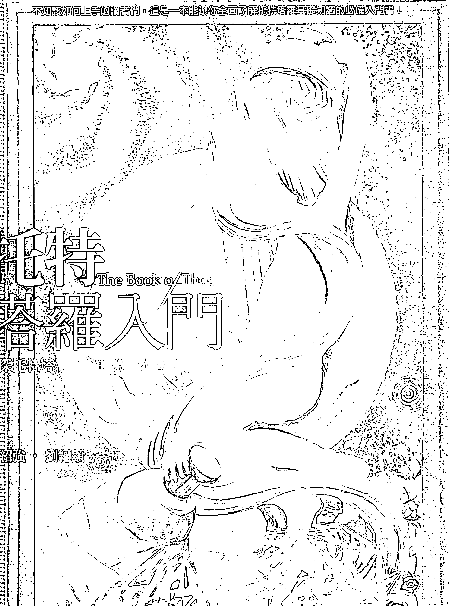

## 托特塔羅入門
The Book of Thoth
初識托特塔羅的第一本書

張韶強 · 劉紀顯

- 敏芳推薦：易經、身心靈課程授課講師 子玄
- 鄭文推薦：『生命之眼』身心靈整合中心執行長 王中和
- 丹尼爾推薦：《塔羅葵花寶典》作者 向日葵
- 道夫推薦：AOA占星學院教師 道夫
- 江國推薦：尚峰塔羅研究和授課講師 江國

## 制作说明：

本書由皇家圣学院出重金从台湾购入的原版书籍扫描制作完成。为达到最好阅读效果，特地把原版书全部切开后，再经由专业扫描设备高精度扫描完成，并经过一张张的PS后期处理最终成书，其间花费大量的人力、物力以及时间，只为能给大家提供经济并优质的神秘学学习资料而努力。

本学院强力谴责某些机构和个人，把本学院花心血制作完成的电子书籍，包装后直接放在自家淘宝网上低价倾销的行为，以谋取不劳而获的经济利益。如果长此以往最终将无人愿意再为大家花心思制作电子书，那以后可能大家再无新书可读。

为让大家以后能够读到更多的好书，也为了本学院的良性发展。本学院恳请大家尽量做到如下几点：

- 一、 尽量在本学院的淘宝网购买电子书籍。
- 二、 请勿用技术手段把电子书内的水印及加密去掉。
- 三、 在收到电子书后小范围传阅即可，千万不要公开传播，更别挂到淘宝网上低价销售。

同时为答谢广大支持者，学院电子书将做如下调整：

- 一、 学院会把一些早已收回制作成本的电子书折价销售。
- 二、 提供现有电子书籍的纸质复印版本，价格可直接咨询淘宝客服。
- 三、 最新制作的电子书籍会开放打印功能，大家购买后有条件的可自行打印成书。

## St. Royal College
皇家圣学院

- ※ 专业占卜预测机构
- ※ 神秘学培训机构
- ※ 水晶能量研究中心
- ※ 上海市黄浦区泰康路274弄25号（田子坊内）
- ※ 官方淘宝：http://strc.taobao.com
- ※ 官方微博：@皇家圣学院

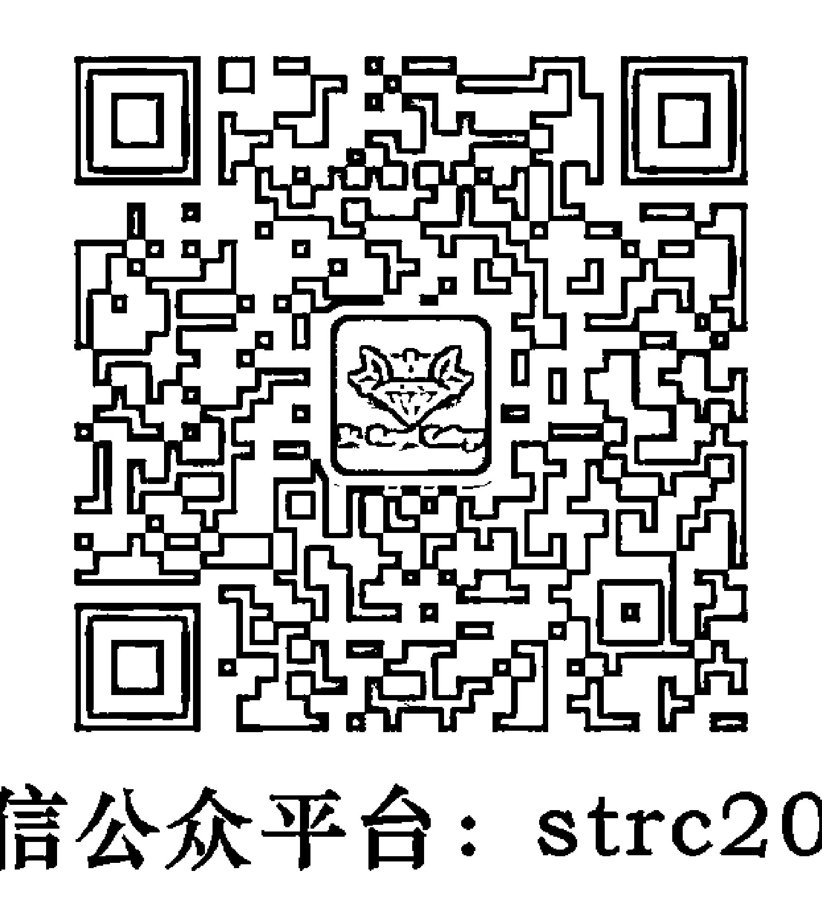

大天使
皇家圣学院 院长
QQ：715104687
手机/微信：13641926204

# 托特 The Book of Thoth 塔羅入門

張紹強・劉紀顯 —著

## 推薦序

### 托特，恭喜你了！

克勞利，托特塔羅牌，一副讓我欣賞又爲難的牌。
欣賞的是，牌的智慧、神祕與深刻。
爲難的是，作者克勞利的極端性格。
這是過往這副牌未能成爲我教學主軸的原因。
但是今天，我看到了解讀托特牌的典範——各位朋友手上的此書。

托特，埃及的智慧之神，《律法之書》的源頭。
艾利斯特·克勞利，一位擁有相當精神天賦以及極端性格的神祕大師。
蘿絲·凱莉小姐，將《律法之書》帶到世間的關鍵媒介。
哈利斯夫人，托特塔羅牌的實際繪製者。
四十年，是托特《律法之書》到托特塔羅牌的距離，匯集了一神三人的生命內涵。
但是，不朽的托特牌仍然需要靈性智慧的解讀。

塔羅牌是西方神祕學裡卜筮方法的佼佼者。
托特塔羅牌則是上千種塔羅牌中融冶神祕學精華的鉅作。
克勞利既是托特牌的指導者，又是從《托特之書》到托特牌的過濾器。
過濾器以自己的性格和信念，影響作品的樣貌與呈現。
是以我們需要一個詮釋者，一個能撥開過濾器的迷霧以呈現本來面目的手。
我相信，現在我們找到了一個稱職的托特牌詮釋者。

這是一本好書，不只是因為它介紹好牌，更是因為它有好作者。
紹強與紀顯，都是深具心靈天賦與潛力的靛藍世代。
筆者從台大塔羅社創社至今執教近十二年，兩位作者絕對是那當中頂尖的一群。
對靈性法則的掌握與熟稔，是本書作者在詮釋托特智慧上極為稱職的主因。
書末的結語更證明了作者不在克勞利的框架之內，而是優遊於托特的靈性智慧裡。
對於這本難得的好書，本人樂為之序。

清風

### 國內托特塔羅玩家必備的經典著作

在我的人生中，我一直認為學塔羅牌是最划算的投資，一朝學會，從今往後不但能為自己解惑，更能造福別人。曾經有位社工對我感嘆道：「我對個案勸的話，說破嘴他都聽不進去，可是拿出塔羅牌來一算，牌說什麼他就聽什麼。有時我都想直接改行當塔羅師，救人還更快。」我只能聳聳肩，對她不好意思地一笑。事情有時就是如此。塔羅師的影響力絕對不能小看。

那麼，學塔羅牌該如何入門呢？首先要知道，塔羅牌粗分三大牌系：萊德·韋特塔羅牌、馬賽塔羅牌和托特塔羅牌。萊德·韋特塔羅牌因為七十八張牌全部皆有具體的圖像，使用者能「看圖說故事」，學習上最為簡易，一向是被視為初學者入門款，因此使用者最眾。

馬賽塔羅牌應是三大牌系中最少人用的，起碼在臺灣而言是如此，原因在於它的五十六張小牌屬於「撲克牌式」的呈現，錢幣五就是五枚錢幣、聖杯八就是八個聖杯，聯想空間少，初學者學習這套牌在記憶上較為困難，因此使用者不若韋特牌多。

托特塔羅牌則是最神秘也值得玩味的牌了。它的小牌雖然近似撲克牌式的呈現，卻額外融入了神秘學的各類象徵，牌面猶如半抽象的藝術名畫，圖像不見得像韋特牌那般具體，然而仔細瞧一瞧卻別有一番天地，每一筆、每一劃、每種顏色和每個元素安放的位置，都有其意義。而即使你不懂那些，托特每張牌都附有一個關鍵字可供聯想，因此在實占上會比馬賽牌容易一些。要算托特牌，彷彿只要會直覺式地聯想感應就可以上手。

不過，淺者見淺，深者見深。任何一位內行人都會告訴你：要真正懂托特牌，必須把西洋神秘學都學通，包括數字學、色彩學、占星學、煉金術、希伯來文、卡巴拉数字学，甚至中国的《易经》。哇，那可真不容易，不是吗？托特牌就是如此博大精深，不但初学者难以在短时间内掌握精髓，它更是专业占卜师趋之若鹜、亟欲征服的圣山，但即使是专业占卜师，对托特牌往往也只是一知半解而已。幸好，我们有了绍强的《托特塔罗入门》。

绍强与我结缘于台大塔罗社，甚早就以推广托特塔罗牌为职志。他有副比实际年龄年轻很多的脸蛋，认识他之后才会发现，他其实拥有古老的灵魂。由于国内的托特专书为数不多，他博览原文典籍，为托特的知识带来了源头活水。《托特塔罗入门》书中，他详细阐述了托特牌的历史源流、破解占卜者常有的迷思、叙述占卜流程与解牌方法，并完整而深入地呈现了七十八张牌义。最难能可贵的是，托特牌中蕴含的占星理论、喀巴拉数字学、色彩学，乃至共同作者暨前台大易经学术研究社社长刘纪显所贡献的《易经》篇章，将本书的深度提升到难以想像的境界。书中文字清晰精辟，字字珠玑。我认为，与其说这是一本「入门」书，不如说是「全书」，因为书中的知识真的不仅仅是入门啊！

还据说，两位作者在研究的过程中，发觉托特牌的设计者克劳利对《易经》的认知有些谬误之处，原来克劳利读的《易经》是经过两次翻译的版本，难免发生文意上的落差。阅读中文原文典籍的两位作者，在《易经》方面理当有更正确的阐释。

读完《托特塔罗入门》后，我大胆提出预测，这本书一定会成为国内托特塔罗玩家人手一本的经典著作。翻开第一章，你必会认同这个预测一点都不夸张！

向日葵
《塔罗葵花宝典》作者

### 開啟托特塔羅的學習之路，將會有意外收穫！

以前看神話或童話，都覺得那是小孩子看故事的層次，可有可無，不當一回事，年齡漸長之後才發覺，事情不是那麼簡單的，不能輕視神話與童話，因為這有如集體潛意識，都是一個文化中深層和重要的部分。起因是身邊觀察到有多位從小受外國教育、有雙語背景的朋友，常常有情緒失控、處世悖謬的現象，由於這種事情和實例觀察多了之後，懷疑心起，開始仔細剖析和研究觀察，了解到這些人都有溝通的障礙。這些溝通障礙，很多來自於他對自己的雙語文化背景並無深切體認而容易滋生困惑，無法定位自己。

文化的深層面，支持人類的精神生活，所以不能只是以工具性的眼光來看待語言，語言背後蘊含的深層文化，和一個人的精神活動與精神狀態，是息息相關的！試問一個能寫英文，對中文（尤其是古文）卻不能寫、不能閱讀而只能聽講的人，此人說自己認同且理解中華的深層文化，豈不可笑嗎？而英文聽說讀寫都還不錯的華人，又有幾個能與歐美文化人士暢談希臘、羅馬與希伯來的文化源流？

要了解一種文化的深層面，從占卜切入是個好方法，因為占卜與宗教、文化根源、人類和老天（真神）的關係息息相關。歷史上，從沒有哪個宗教能夠禁止所有占卜行為的，雖然有些宗教也禁止某種特定占卜法，但也只能禁止該種特定占卜法，卻對占卜行為無能為力。幾千年流傳下來的占卜法雖千奇百怪，卻可從具有古老歷史的占卜工具中顯現人類的宗教意識與深層文化。

塔羅牌是一種西方普遍的占卜工具，就如同《易經》已經是東方普遍的占卜工具一樣。研究塔羅牌，是了解西方深層文化的一個好方法，也可以透過研究塔羅牌，更深刻了解某些宗教中的原型。塔羅牌裡面，諸多象徵意義豐富的符號與圖案，反映了猶太教、基督教、占星術、喀巴拉、曆法學和靈數學等系統對宇宙與人生的觀點，用佛教的講法，這已經牽涉到世界起源與人生未來的緣起觀點。而隨著現代心理學的發展和新時代運動的興起，現代人更傾向將塔羅牌作爲一種自我探索和規劃未來的工具，其應用範圍已經超越了占卜的層次，希望走向術與道合的階段了。

世界各地的一些心理醫生或心靈療癒者，將塔羅牌作爲一種輔助治療手段加以運用。透過塔羅牌對自我內在的探索，引導個人獲得更大的思考空間，對萬事萬物的可能性，有著更自由、更解放之觀點。同時，也將塔羅牌從神祕學的未知領域，提升到可以被了解的生命智慧。傳統上塔羅牌主要分爲馬賽體系、韋特體系、托特體系，不同的體系之間，對於每張牌的解釋不盡相同，大牌（大阿卡納）的排列順序也不完全一致。托特體系的代表作是托特塔羅牌，他的主要設計者艾利斯特·克勞利是二十世紀初年，在歐美有名的黑魔法師，他設計這副牌時花了很多時間，托特塔羅牌擁有豐富的符號體系，因此牌的內涵涉及到廣大的神祕學知識領域，正有如全世界登山冒險家都想征服聖母峰一般，對塔羅牌有興趣的朋友，也都想要征服托特塔羅牌來證明自己的功力。

張紹強先生所著的《托特塔羅入門》一書，非常用心地把托特塔羅牌介紹給華人讀者，除了花了很多篇幅，解釋了托特的符號系統、牌義及占卜實務外，我覺得整個第三章托特牌進階理論的內容，真的寫得很有趣，像是雙環帶扭曲理論或是喀巴拉與生命之樹的介紹，我都看得津津有味！相信不同的讀者都可以在本書不同的篇幅中，發現閱讀的樂趣與學習知識的充實感！

王中和
序於木柵指南山

王中和簡介：一位「身心靈整合學」和「宗教神祕學」的研究者，也是一位作家，「管理雜誌」連年評鑑為全國五百大企管講師，現任「生命之眼」身心靈整合中心執行長，也是「中華孔孟協會」教育委員會主任委員，探索與研究東西方真理二十餘年，平日喜讀書、搜書，會通儒、釋、道，有志於人天之際，而通變古今。

## 作者序 | 托特塔羅，不是直覺式塔羅！

托特塔羅，一個在華文領域中沉默已久，卻早已風行於歐美多年，足以與韋特塔羅並列於西洋神祕學的經典之作，如今，終於不再缺席。

初次接觸托特塔羅，是大學時期偶然駐足於書店時所發現的，當下即被牌上絢麗的藝術畫風與眾多神祕學符號所吸引。當時，坊間慣稱為「直覺塔羅」，但一查後才驚覺並非如此。此牌正是全世界銷量僅次於韋特塔羅的經典之作，是融合占星、喀巴拉等西洋神祕學理論於一體的「托特塔羅」。

雖然當時擔任台大塔羅牌社社長，但十分遺憾，想進一步瞭解這副牌時，卻發現社團內沒有任何一本相關的中文藏書。於是開始查閱了各大學的圖書館、市立圖書館、甚至跑到國家圖書館中調閱歷年出版品資料庫後得知，托特塔羅牌的相關著作，在中文領域中宛如一片荒蕪的沙漠，不論是歷史的脈絡或其中的神祕學理論均沒有相關的中文資料，感興趣的人根本無從瞭解，更何況是在實際的運用上。

空有百般熱情卻束手無策之際，開始收集大量的外文著作與研究文獻，從金色黎明會遺留的的神祕學文稿到喀巴拉理論、從設計者克勞利生平的著作到死後眾多學者的研究文獻，將「托特塔羅」看似艱深、充斥矛盾的內涵用平實的文字呈現。

因此，這本書並不是翻譯之作，也不是看圖想像的解牌書，而是在縱觀各種文獻後，深入去解析每一張牌背後的設計概念、神祕學理論與依據，透過考證歸納等方式而成的一本專書。讀者們不再需要困惑於艱深難懂的占星學、喀巴拉而止步不前，此書提供了另外一條捷徑，即使是完全的初學者，也能夠快速地上手。而對於早已熟悉相關理論的讀者們，亦可通過第三章後的進階理論與占卜技巧，如虎添翼地運用占星、時間預測、對應等方式來做出解析。

這本書是台大塔羅牌社在《塔羅葵花寶典》與《第一次塔羅占卜就上手》後，第三本由成員撰寫的塔羅著作，成書的時間漫長，跨越筆者大學與研究所時期，當時的社員，亦是台大易學社社長劉紀顯協助完成本書關於易經考證與相關論述的部分。我們感謝所有在這段時間提供協助與寶貴意見的前輩與老師們，也感謝出版社大力的支持，最終完成長達兩年的圖片授權洽談，使得這本書能夠順利問世。

現在，《托特塔羅入門》在你手上，希望屬於你的托特塔羅牌旅程從此展開！

張紹強 (晨音)
2014 5月 於台北

> ——

想不到終於要出書了，從大四寫稿以來，中間還歷經了個人的實習、教師檢定、教師甄試等事，一邊也還要急著修稿，一直到現在終於即將面臨最後的這一關。從學習靈性的觀念歷程以來，不斷地在自己的生命中試著去摸索與試探各種更接近偉大本質的途徑，迄今，也許還不是那麼的了悟，卻仍想把自己所學習的、體認的生命哲學透過這本書來告訴你。

雖然時光總在遞嬗，所幸心裡永遠惦記著謙卦九三爻：「勞謙君子，有終吉」的哲學，也感謝紹強學長花費了許多時間與我一起規劃新書的方向，也感謝清風老師一直以來的教導。勞謙君子的人生路，還會繼續努力下去。

劉紀顯

## 目録

### 推薦序 | 托特，恭喜你了！——清風 002

### 國內托特塔羅玩家必備的經典著作 ——向日葵 004

### 開啓托特塔羅的學習之路，將會有意意外收穫！——王中和 006

### 作者序 | 托特塔羅，不是直覺式塔羅 008

### 第一章 | 托特塔羅牌入門 015

### 塔羅牌從何而來 016

### 托特塔羅牌的設計者——艾利斯特·克勞利 018

### 托特塔羅的各元素融合 022

### 塔羅牌的迷思與限制 029

### 占卜流程 033

### 解牌的方法 037

# 第二章 托特塔羅牌的基礎牌義

- 塔羅牌的組成與結構 040
- 大阿卡納 044
- 小阿卡納 133
- 權杖牌組 133
- 聖杯牌組 158
- 寶劍牌組 186
- 圓盤牌組 214
- 宮廷牌組 243

### 第三章 托特塔罗牌的进阶理论与占卜技巧 289

### 双环带扭曲理论 290

### 占星学技巧应用 299

### 时间的推算 309

### 色彩对应准则 314

### 关于《易经》的简介 315

### 喀巴拉与生命之树 319

### 生命之树上的空无 320

### 四棵生命之树与原生四元素 321

### 三柱 324

### 四元素在生命之树的分布 325

### 占星学在生命之树内的对应 327

### 十萨弗拉与小阿卡纳牌对应 328

### 生命之树中的二十二条路径与大阿卡纳牌的对应 351

### 牌背与蔷薇十字 365

### 第四章 牌阵的运用与实际占卜牌例 367

- 六芒星牌阵 368
- 关系牌阵 372
- 四元素牌阵 374

### 第五章 结语 377

# 第一章 托特塔羅牌 入門

你手上所拿的，不是塔羅牌
而是集西洋神秘學各種理論於一身的托特塔羅牌

## 塔羅牌從何而來

塔羅牌是世界上著名的占卜工具，在歐美幾乎無人不知，無人不曉。而在華人世界則是於近幾年西洋占星及塔羅書籍的翻譯和推廣下，才使得越來越多的開始知道塔羅牌，並且驚訝塔羅占卜的準確性。然而塔羅最早的起源是何處呢？有人認為是從古埃及就已存在，有人認為是吉普賽人所傳播，甚至有與撲克牌同時於中國起源的說法，但可惜的是，這些都不盡然是正確的答案。至少，在歷史文獻上找不到這些說法可靠的紀錄。

可以考證的歷史，最早的塔羅牌並不是作為占卜用，而是作為一種稱為塔羅奇（Tarocchi）的紙牌遊戲，在義大利的北部與法國風行，當今僅存最早的一副塔羅奇紙牌：「威斯康提塔羅牌」（Visconti-Sforza Tarot），即是於一四五一年繪製，雖然這副牌的結構與牌數跟目前的塔羅牌有些差異，仍然可以視為塔羅牌的雛形。到了十七世紀初，塔羅牌逐漸在法國南部流傳，著名的「馬賽塔羅牌」（Tarot of Marseilles）即以當時風行的版本作為雛形重新繪製，二十二張大阿卡納（Major Arcana）與五十六張包含數字與宮廷的小阿卡納（Minor Arcana）架構奠定成形。此時，塔羅牌作為占卜的特性也逐漸地開展。

十九世紀中期，教會勢力衰退，塔羅牌占卜廣為流傳，一系列關於西洋神秘學與塔羅牌間的理論陸續發展，相關的神秘學團體亦相繼地出現。其中最著名的莫過於在英國倫敦成立的神秘學組織：金色黎明會（Hermetic Order of the Golden Dawn），它是具有一系列包含占星、煉金術、魔法儀式等神秘學知識傳授的組織，是近代塔羅牌普及化的重大推手。金色黎明會的手稿記載了占星對應、數字對應與喀巴拉（Kabbalah）對應到塔羅牌內的理論，協會內「Book T」清楚地描述了塔羅牌的架構與其神祕學符號對應，這份文件受到克勞利（Aleister Crowley）與韋特（Arthur Edward Waite）的認可，於往後他們所設計的托特塔羅牌（Thoth Tarot）與韋特塔羅牌（Rider-Waite Tarot）亦傳承著金色黎明會內關於塔羅牌架構的理論。

一九〇九年金色黎明會內的成員韋特與繪者史密斯（Pamela Colman Smith）女士出版了萊德韋特塔羅牌，這副牌內參照了少部分法國神祕學家列維（Eliphas Levi）對於塔羅牌喀巴拉對應的闡述，將符號詮釋融入到牌內。與當時抽象的塔羅畫風相較，韋特將小阿卡納中的數字牌單調的圖案轉變成故事性的情境圖像，並且調整了大牌中的順序。這兩項變革使得塔羅牌成為一種便於學習的占卜工具，讓它從少數人的占卜工具走入普羅大眾手中。韋特塔羅牌生動的圖像往往能讓沒有學塔羅牌的問卜者也可一眼看出問題的答案，直指心底，也因為如此，塔羅牌逐漸普遍化，在世界各地廣為流傳。

韋特塔羅與其後相繼出版的金色黎明塔羅牌（Golden Down Tarot）、托特塔羅牌，這三副金色黎明成員繪製的塔羅牌開啟了當代塔羅牌的風行，之後，各種版本的塔羅牌大多以這三副牌的基本架構繪製。

與流傳了近千年的西洋占星、中國的《易經》相較，塔羅牌其實並沒有長久的歷史，它隨著時代的演進，從原本的藝術品、遊戲紙牌，蛻變為目前的塔羅占卜，它容易學習與靈活多變的特性，在近代快速的發展下，已經逐漸發展出了一套圍繞於塔羅自身的神祕學知識，也因此成為了西方世界最為流行的占卜工具。

### 托特塔羅牌的設計者

艾利斯特·克勞利是近代一位具有影響力的神秘學家，也是泰勒瑪（Thelema）的創始者。除了眾所皆知的神秘學、儀式魔法外，他在許多領域中皆有不凡的成果，對西洋棋、登山、文學等也有不同程度的涉獵。克勞利遺留下為數不少的著作，多為魔法儀式理論與少數的個人詩集。他最被人們所瞭解的乃是親自設計的克勞利托特塔羅牌。這副融合占星學、生命靈數與喀巴拉等西洋神秘學體系的塔羅，直到今日還是受到各方占卜師給予高度的評價。在牌面的設計概念上，神秘學符號融入圖像的藝術構圖中，佐以獨特的配色呈現，使人深深地著迷，也因此成為當今世界上出版量僅次於韋特塔羅牌的塔羅版本。

克勞利年輕時曾短暫的進入金色黎明會，這段經歷為他奠定了日後神秘學知識的基礎。

#### 早年

克勞利誕生於一八七五年的英國。二十歲進入了劍橋大學最著名的三一學院就讀，最初主修的是人文科學，而後因故將英國文學轉為主修。在大學時期培養出他的幾個興趣：登山、西洋棋與作詩。自信心強烈的克勞利在大學時期曾攀登阿爾卑斯山、出版過詩集，而且每天花數個小時精進西洋棋棋力，擊敗過許多高手，於當時的校園中小有名氣。但是他風流在外，大學這段時期不間斷的性生活也是他所熱衷的項目之一，他曾活絡於倫敦街頭各式的尋芳處，也曾與男性友人親密交往，他不諱言自己是個雙性戀者。

一八九六年，克勞利有了一次神秘經驗，震撼了他當時的心靈，此後開始涉獵各種神秘學、儀式魔法、煉金術等書籍，一腳踏入了神秘學的大門。經過了一年的學習後，他矢言終其一生投入神秘學的領域，毅然決然地離開了劍橋大學，沒有拿到任何的學位。三年的大學生活轉變了他原本預設的生命藍圖，為日後特別的一生打開了一扇新的大門。

#### 進入金色黎明會

離開劍橋後，在朋友引薦下，克勞利加入了金色黎明會，開始了一連串的學習。兩年的時間過去，他靠著過人的天分在協會內逐漸嶄露頭角，一步步攀上協會內種種階級。然而克勞利在協會內過人的能力與在外荒誕的行徑帶來了兩極的評價。一九〇〇年，克勞利要求晉升階級的儀式被拒絕，而後引發一連串的爭端，進一步導致金色黎明會內部的爭執，造成協會的分裂。克勞利黯然地離開。然而他的神秘學旅程並未結束，反而因此走出舊有框架，開啟更廣泛的視野。

#### 遊歷與見聞

離開協會後，克勞利依然保持對神秘學領域的強烈興趣，這段時間他走訪了墨西哥、印度、舊金山、日本、香港、印度等地，學習了瑜珈，成為日後他在精神鍛鍊上的一種方式。在印度探訪了許多高僧，亦吸納了禪宗與印度教的神秘學儀式。

一九〇三年，克勞利與蘿絲（Rose Kelly）結婚，開始為期一年多的蜜月旅行。這一趟旅程成了克勞利重要的轉折點。於回程經過埃及時，一天夜裡，新婚妻子突然進入了恍神狀態，克勞利一看隨即知道，這是通靈儀式中的降靈過程，但他納悶的是蘿絲從來沒有這方面的學習與經驗，如何能夠在自然的情況下被附身，並且傳遞出古埃及神祇荷魯斯（Horus）的訊息。克勞利帶著妻子到開羅的博物館中，請她指認出神明的圖騰，蘿絲一眼就認出荷魯斯的雕像，並且指認出一塊描繪獻祭給荷魯斯的石碑。

此刻，克勞利開始相信降於蘿絲的靈體，在往後的幾天內，克勞利運用自己所學的召喚術不斷與靈體溝通，寫下了《律法之書》（The Book of the Law）。這本書為他所創立的泰勒瑪建立了一種新的哲學體系，其精神內涵也在托特塔羅牌的大阿卡納中用圖像的方式呈現。

一九〇五年克勞利參與登山團隊攀登喜馬拉雅山，預期攀爬位於喜馬拉雅山脈中的世界第三高峰：干城章嘉峰，雖然未能攻頂，但也創下了當時登山最高的紀錄。之後克勞利走訪當時清朝末年的中國，短暫的停留幾個月後返回英國。

### 托特塔羅牌的誕生

經歷過數十年的探索，克勞利於後半生成立了自己的神祕學組織，將傳承自金色黎明會與多年考察精進的神祕學理論組織成為有系統的神祕學體系。當然兩極的評價仍然一路伴隨著他，縱然當時他已經雄據一方，在神祕學的領域上有所成就，但他熱衷於各種惡魔降靈術、性靈結合儀式魔法、使用迷幻藥物進入恍神狀態以探索更高層次的意識等作為，受到了當代人們嚴厲的批判。

一九三八年，克勞利構思設計一副融合自身神祕學體系的塔羅牌。克勞利透過友人輾轉介紹認識哈利斯夫人（Frieda Harris），由她繪製、克勞利指引的合作模式進行。原本計畫在半年內完成的塔羅，受限於當時經費，使得計畫有所延遲。但這段時間裡哈利斯不斷的鼓勵、說服克勞利將自己所傳承的神祕學知識與新的見解融入到這副塔羅牌中。於一九三八到一九四三年，六年內，一張張托特塔羅牌逐漸成形，克勞利與哈利斯對於每一張牌都做了多次的修正，伴隨著克勞利神祕學知識不斷的拓展，融入了豐富的象徵意義於其中。包括了占星學、喀巴拉、地占術，甚至是《易經》與泰勒瑪的精神。有些牌甚至繪製了數張不同的版本，最後再由克勞利決定出最適合的牌。如部分出版的托特塔羅有三張魔法師，另外的兩張即是當初未被作爲最終敲定的版本。

一九四四年克勞利出版了托特塔羅牌理論的專書《托特之書》（The Book of Thoth），發行兩百本，但在當時並沒有受到重視。直到克勞利與哈利斯相繼過世，托特塔羅牌均沒有正式的出版。一九六九年克勞利生前的神祕學協會首次將托特塔羅牌正式的出版，一九八六年稍微修正後的版本再版，也成爲目前托特塔羅牌的通行版本。

克勞利投入了他畢生的神祕學知識於托特塔羅牌中，在牌的架構與張數上維持傳統，沒有太多的更動。他爲大阿卡納部分牌賦予了新的牌名；在小阿卡納中的數字牌，賦予了原本沒有的牌名以及金色黎明會內占星學符號對應的準則；宮廷牌則是以騎士取代了國王的角色，原本土元素的對應給了公主牌。牌的背面繪上了薔薇十字，以金色黎明會中曾出現簡化後的魔法陣圖形，預留下了以托特塔羅牌直接施法的功能。此外，克勞利並沒有爲他的牌設下逆位置的意義，藉此作爲與韋特塔羅的區別。

### 晚年

克勞利晚年財務上遭遇困難，曾被宣告破產，雖然在神祕學方面涉獵甚廣，成就非凡，但在私領域的名聲卻是惡名昭彰，兩極的評價一直以來在他身上都沒有變過。一九四七年，克勞利於自家過世，爲他飽受爭議的七十二歲生命畫下句點。雖然以學術性的方式鑽研神祕學，以及統合與恢復西洋數術理論，並沒有爲他帶來令人滿意的生活，但對於西洋神祕學的研究卻是無法被抹滅的亮點。克勞利遺留下的大量著作，至今仍被視爲西洋神祕學體系的珍寶，其中最爲著名的，即是生前從未出版的「托特塔羅牌」。

## 托特塔羅的各元素融合

克勞利在晚年時才開始著手設計托特塔羅牌，這副牌包含傳統西洋神秘學的各種元素、符號象徵，宮廷牌內也多了《易經》卦象的詮釋，並且融入不少克勞利自己創立泰勒瑪之精神內涵，以《律法之書》為大阿卡納牌的故事主軸，可以說是克勞利神秘學知識的結晶，不少人也是藉由托特塔羅牌才開始認識克勞利。因此，在學習托特塔羅時，我們不僅要從傳統塔羅牌的理論切入，更要仔細的去瞭解每一張牌被加重賦予的神秘學意涵。

日常生活中，神秘學一詞彷彿如它字面所呈現的，使人們摸不著邊際。而神秘學所指的是什麼呢？

神秘學是一些無法以科學或邏輯方法詮釋的一門學問。想想看在自己的生命中，有沒有過走入某個地方有似曾相似，彷彿在夢中來過的感覺；有沒有神奇無法解釋的巧合，或是特別的神秘經歷。神秘學包含的項目廣泛，哲學層面是探索超自然與形而上的概念，在實務上則是各種關於魔法、預測學（命盤、占卜）、修練等，都屬於其中。神秘學者以獨特的方式對自然界與各種事物做出詮釋，他們相信許多事物雖然以目前科學知識無法完全的解釋，但有朝一日兩者重疊處便會為人們所熟悉。

學習塔羅牌時勢必要拋開部分的理性，嘗試擁抱那不可言喻的神奇之處。托特塔羅牌是神秘學知識的大熔爐，從開始認識每一張牌，進而瞭解其中的象徵意涵，都是一個浩大的工程。而這也歸因於克勞利本身對於各種神秘學的涉獵。克勞利曾經研究過佛學與中國的《易經》，並企圖將這些概念投入自己的塔羅牌中，一些常被歸屬為佛教圖騰或法器的圖會出現在他的牌中（如「權杖二」中出現的金剛橛），或者是道家常使用的太極符號也可以在牌中看見蹤跡（如「圓盤二」），在某些特殊的牌裡，我們甚至可以看見生物學裡的圖像（如「惡魔」牌中細胞的有絲分裂）。托特塔羅牌並不侷限在神秘學的框架之中，克勞利企圖將當代所知的科學與非科學之間建立起一道橋樑，而背後所牽涉的各種東西方的神秘學更是可以看到克勞利的期盼：試圖將一切自己所知一併統整的企圖心。當然許多牌在圖像呈現上採用了較為強烈的色彩與暗示。也由於克勞利個性使然，對於某些東方哲學的詮釋就變得相當的個人主義而偏離原本的意涵，這也是筆者認為相當可惜之處。因此在運用上，我們除了理解每張牌在占卜上的意思，也該深入釐清符號背後所承載的真實意義與起源。

### 四元素

古希臘人認為天地萬物由火、水、風、土四元素所組成，柏拉圖與亞里斯多德透過一系列的論述讓此學說廣為流傳。如今，在西洋神秘學眾多領域中，不難看出其中還保有四大元素的影子，甚至成為了理論根基。四大元素是西洋神秘學裡重要的一環，早期在煉金術和大部分的魔法儀式上都以操控元素力量為概念。在西洋占星與塔羅牌中，四元素更是不可或缺的角色。如占星學當中分為四種屬性的火象星座、水象星座、風象星座與土象星座，西洋儀式魔法上的四方位布陣，塔羅牌當中的元素分布，甚至連喀巴拉當中也存在著四元素理論。在不同領域下存在著相同的四元素學說，使得西洋神秘學得以融會貫通，是四元素學說的一大特色。
四元素當然也沒有在托特塔羅牌中缺席，它分布於小阿卡納牌組之中。

#### 火元素

火元素代表著積極向上的動力，如同燃燒的火焰一般，是意志展現出的驅動力。它代表著光明與勇氣，在黑夜中驅走黑暗，點燃了希望。小阿卡納牌當中，用具有權力象徵的木杖來作為火元素的代表。尖端向上的三角形是火元素的符號，取火焰燃燒的意涵作為圖像。在煉金術中，這是以火焰提升素材層次的符號。宮廷牌當中，火元素對應到所有的騎士牌，是生命之樹當中第二個薩弗拉（Sephiroth，複數形為Sephira，薩弗拉）「智慧」（Chokmah）純粹陽性能量的展現。

| 元素 | 元素符號 | 小阿卡納對應 | 宮廷牌組對應 |
| :---: | :---: | :---: | :---: |
| 火元素 | △ | 權杖牌組 | 騎士 |
| 水元素 | ▽ | 聖杯牌組 | 王后 |
| 風元素 | △ (帶橫線) | 寶劍牌組 | 王子 |
| 土元素 | ▽ (帶橫線) | 圓盤牌組 | 公主 |

#### 水元素

水元素則是情感與心靈運作的象徵。與水元素相關的牌描述的大多是情緒層面的波動，小阿卡納牌以盛水的杯子作為水元素的象徵，呈現出了各種情緒、心理狀態交錯的脈絡，與充滿動力的火元素相比，可以說是一陰一陽、一明一暗的對比。水元素的陰性特質對應於生命之樹當中的第三個薩弗拉「理解」（Binah），沉靜如同大海，這也為宮廷牌當中所有王后牌所對應。

#### 風元素

風元素與溝通、想法、衝突有關，風沒有固定的形狀，可以是豔陽下的微風，可以是大漠上颺起的巨風，可以是春暖花開時撫過情人的春風，也可以是離情依依的秋風。多變是風元素的本質。在小阿卡納中，以寶劍作為風元素的象徵，通常呈現的是多變的現狀，是理性下的現實，流動的風也同時具有訊息傳遞、溝通的特性。

#### 土元素

土元素代表事物的穩定面，與金錢、財富、自然有關。土元素的英文Earth意味著我們腳下所踩的大地，是穩定的基礎。在小阿卡納牌中對應給了圓盤，為實質運用的象徵。

認清四元素所代表的意義後，對於解牌上有著莫大的幫助。筆者在近幾年常常聽聞東西方命理兼學的朋友將四元素與中國的五行說相提並論。其實深究下會發現本質上有偌大的不同。中國的五行分為木、火、土、金、水，其中水、火、土就跟四元素當中重複了三項。乍看之下相似，但細細地去分析，不論在對應上、應用上皆是大大不同。如果宇宙萬物為一，那麼五行之和可以為一，四元素之和也可以為一，但是一拆成五行，或是拆成四元素，它們彼此的意義就不相同。同時學習東西方命理的人必須特別留意此點。

### 煉金術

煉金術（Alchemy）是西洋古代對於探究世界本質的一種神秘學理論，而後演變為科學中的化學（Chemistry）。約從西元前三世紀開始，古人就企圖透過各種不同的物質，以加熱、敲打、混合、結晶的方式合成黃金，也企圖透過「創造賢者之石」（The Philosophers Stone）來合成或純化黃金。由於煉金術本身被視作是探究世界源頭的一種神秘學，因此在進行化學反應（以現在的眼光來看的話）的時間點也必須挑選對應的天象與氣候，因此煉金術從此與占星學掛鉤，變成了徹頭徹尾的一門玄學。煉金術雖然屬於西洋神秘學的一支，但其內在思想也與道家的某些觀念相合，道家強調陰陽二氣的存在，煉金術也以硫磺（父）與汞（母），佐以鹽（中性介質）為基礎原料，企圖調配出各種不同陰陽比例的物質。此外，儘管煉金術被認為是西方特有的神秘學理論，但在西亞（波斯）也發現過關於煉金術的文獻，而東方也有特有的煉金術，被稱為「煉丹術」，其重心不是煉出黃金，而是企圖煉出「仙丹」以延年益壽，祛除百病，甚至羽化登仙。

值得注意的是，雖然煉金術是化學的前身，但煉金術並不能被認可爲一種科學（Science），畢竟現代對科學的定義是：可重複驗證（每次的實驗都可獲得相同的結果）、可證偽（可透過一個反例來否決原本的假設）、自身沒有矛盾。

托特塔羅牌試圖闡述出煉金術的目的不在於點石成金，而是用煉金作爲譬喻，作爲心神鍛鍊的一種方式，透過一系列的操作，將自己的意識翻騰、精純、提升，最後回到了永恆的瞬間。

### 占星學

除了宮廷牌外，每一張托特塔羅牌都存在著占星符號的對應。金色黎明會內部關於塔羅牌的手稿「Book T」清楚的條列了每一張牌的對應，而托特塔羅牌刻意的強調這一點，在牌上直接畫出了相對應的占星符號。對於占星學有基本的認識後，再看托特塔羅牌，即可一眼看清看似凌亂的符號對應後面嚴謹的理論架構，對於解牌預測也有莫大助益。

在托特塔羅牌當中，所運用到的星體爲日、月、水、金、火、木、土七顆星，以及十二星座。至於無法用肉眼觀測到的天王星、海王星、冥王星則沒有爲托特塔羅牌中採用。爲了能夠在占星、喀巴拉、數字學有完整的對應，托特塔羅牌偏向使用古典占星學的理論，不納入三王星，而以火、水、風元素填補了空缺。

### 喀巴拉

喀巴拉（Kabbalah），又譯爲卡巴拉，源自於猶太民族，最早是一種回答宇宙從何而來、世界從何而來、人存在於世界的意義的哲學，然而隨著時間的演進，喀巴拉融入了猶太教部分教派中，而成爲一項隱密的傳承。喀巴拉是一種實踐的修行，一位完整的修行者必須花費四十到五十年才能夠算是喀巴拉的實踐者。喀巴拉之學習，需透過自我意識的提升，經由稱為「生命之樹」的提升之路層層向上修練，最終參透生命本質核心。生命之樹由十顆發散體（Sephira，薩弗洛斯，單數形為「薩弗拉」，Sephira）與二十二條路徑組成，在中世紀，生命之樹的概念與當時的神秘學融合，薩弗拉有了占星學上的對應，二十二條路徑配上了二十二個希伯來文字母，並且納入了四元素於世界創始的概念，可說是集部分的西洋神秘學理論於一身。

生命之樹的理論在托特塔羅牌當中發揮得淋漓盡致，每一張大阿卡納牌下方都存在一個希伯來文字母，指出了在生命之樹上所位於的路徑，而數字牌與宮廷牌則是反映出了牌本身所位於的薩弗拉。

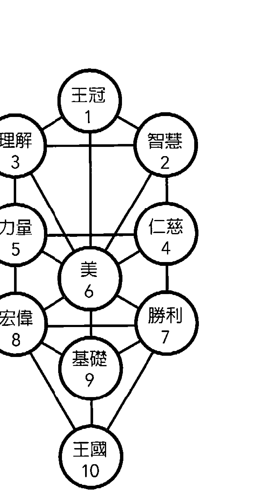

### 地占術

地占術曾經在歐洲盛行一時，是一種隨機觀察地面石頭、沙子的排列，或是直接抓起一把石頭朝天空一丟，依照落下排列的位置與圖形作為占卜。托特塔羅的少數幾張牌有著地占圖形的對應，作為本身牌義的額外補充。

### 泰勒瑪

泰勒瑪是克勞利晚年創立的一種修行體系，亦是結合畢生所習得之神秘學知識而成的一種論述。主要的思想來自於蜜月旅行到埃及時，通靈而寫下的《律法之書》，內容描述了新紀元的建立。可以看作是克勞利自身靈性啟發的創作。泰勒瑪來自於希臘文「θέλημα」，刻在大阿卡納「戀人」牌的天使箭筒上，以及小阿卡納牌的「寶劍王牌」劍柄，本意是意志（Will）。克勞利相信在一九〇四年後，即將邁入下一個新的紀元，舊有的制度即將崩解，在人類的生活及心靈上將開始有重大的改變。大阿卡納牌也是圍繞著這一個主題，一張張牌闡釋著埃及之神荷魯斯接掌世界，象徵著新時代的來臨。

### 《易經》

《易經》自古以來即爲群經之首，是一部淵遠流傳的卜筮之書，在《易傳》的補充下加深了其哲學性質。十七世紀《易經》傳入西方，爲當時以煉金術、占星術爲首的西洋神祕學帶來震撼。十九世紀末，克勞利在金色黎明會中學習《易經》。二十世紀初，他開始遊歷各國，尋訪過各地的神祕玄奇之術回到英國後，他靠著自己豐富的神祕學背景，將《易經》六十四卦與西洋的四元素、占星學和生命之樹做了整合。雖然以現在的眼光來看，許多整合未必是恰到好處，但在當時已經是件了不起的壯舉了。在創作托特塔羅牌時期，每一張宮廷牌都配有一個卦，以爻辭作爲牌義的解釋。此外，其他的少部分牌，也有提及卦象的對應。

## 塔羅牌的迷思與限制

塔羅牌屬於神秘學與占卜體系的一環，因此在傳授的過程中也逐漸渲染上一些特殊的色彩，這些色彩如果被過度的放大，就容易引起占卜者與問卜者本身的迷思，在學習塔羅牌的過程中，我們必須盡可能的瞭解其中的緣由，認清迷思終究只是迷思

### 迷思一

- 解迷一：塔羅牌在占卜的過程中，抽牌是一個必要的形式，進而去找出與當事人相關的判斷依據。而事實上，抽牌的人無論是問卜者自身或是占卜者，都可以有其結論，但由於牌本身是占卜者的私有物，因此使用與照顧上必須考量到占卜者本身的立場——是否願意讓自己的牌出借給他人把玩或是觸碰，故與靈氣較無關，而與占卜者的立場有關。但換句話說，讓問卜者自己抽牌，也能使問卜者的參與感較高，若以心理學者榮格的觀點切入，牌會準是由於共時性原理的結果。由誰觸碰牌並不是問題的重點，因此也並不構成禁忌。若以西洋神秘學的角度切入，塔羅牌也只是占卜的工具而已，占卜運作的地點在於問卜者與占卜師雙方潛意識與超意識的交流，而不在於那看似本身有靈體存在的塔羅牌。

### 迷思二

- 解迷二：占卜過程中的一切事項都與心理認知與情緒相關。若是一開始在心理認知上就已經預設了牌精的存在，則占卜過程中，或是在生活中的互動上，都會真實的體認到似乎真的有此一精靈在介入每一次占卜。換而言之，精靈的存在是由於自身對此副牌所賦予的特殊認知，因此事實上這些影響在一開始就不存在，而是由自己的想法去架構出一個牌精存在的念頭，使自己得以為占卜時的一些小失誤找到解套的說法。當然，某些具有靈視能力的人可以看到牌精的存在，這可能是自身意念強大所招引而來的靈體，或是從自身的意念投射所化為的靈體，那是屬於比較進階的認知，對於我們一般的學習者來說，牌精的存在與否不影響你的占卜，在乎牌精存在與否的信念才會對占卜有所影響。

### 迷思三

- 解迷三：塔羅牌仰賴的是占卜師以圖像解牌的方式為前來詢問的人進行諮商，因此光線原本就應當要充足，以便讓占卜師看清自己面前抽出的是哪些牌；至於吵雜的環境會影響到占卜師本身的心神，間接影響解牌的狀況，況且若是占卜的場合太過吵雜，則占卜師與詢問者之間的溝通也容易因為噪音而出現理解的差異，當然不是一個理想的占卜場合，與所謂的陰氣之類的說法較無直接關係。但由於托特塔羅牌當初設計時，克勞利原本就將這副牌設計為可以作為魔法使用的工具，因此若是將這副牌運用在魔法用途，在擁有相關知識的操作下，並不屬於迷思的範疇。當然，如果來問卜的人自己都覺得占卜的地點陰氣太重，心有顧慮，也是不宜占卜。把握「占卜在一個雙方都感到舒適的地點進行」這樣的原則即可。

方都可以靜下心來的環境」的準則即可。如果雙方都不會受到「陰氣」的影響，那就不會影響到占卜。

### 迷思四

塔羅牌神準無比，因此對於塔羅牌占卜之結果必須全盤接受，沒有轉圜的可能。

解迷四：人的命運並非是單獨直線性的存在，因此對於塔羅占卜的結論也有改變的可能。因爲人有自身心理上的自由意志，可以爲自己的命運做出理性的判斷與分析。而以另外一個角度來看，占卜本身既然與心理狀態有所相關，因此當事人的心理狀況當然也會在牌面上一併被呈現出來。如果當事人在占卜時心情煩躁不安，或者是對於自己所占問的事項執著太過，則此次占卜的可參考性亦會大打折扣，不可將每次的占卜都一概而論之。

### 迷思五

塔羅牌的神準性非常高，因此所有的事件都可以使用塔羅牌來占卜。

解迷五：塔羅牌的確是相當方便且有其準確度的占卜工具，但是在占卜上仍然有一些要點是值得注意的。首先，塔羅牌是屬於神秘學預測術中的「卜術」，因此所占問的問題針對的是單一事件，如果是要詢問何時能夠結婚或何時能有好工作之類的問題，用「命術」的系統（如紫微斗數、西洋占星、八字等等）才能比較容易獲得有建設性的答案。此外，當占卜的問題牽涉到專業能力的認知時（如醫療保健、股票買賣、法律訴訟），尋求專業人士的建議會比塔羅占卜更能獲得直接的幫助。況且對於占卜師本身而言，如果占卜師本身沒有相對應的專業能力，則在牌義的解說上可能也並不能表達得相當理想。話說回來，如果將塔羅牌的占卜結果當成全然的判斷依據，而忽略了其他可尋求援助的途徑，則塔羅牌的占卜結果也只不過是一種自欺欺人的把戲罷了。筆者曾經遇過問卜者詢問自己有沒有懷孕，要解答這個問題，可以請當事人到藥房買相關檢驗物品即可馬上知道答案，比占卜還要實際。當然也並非不可卜，只是占卜師必須自己取捨。

## 占卜流程

克劳利本人曾经写下了托特塔罗牌专用的一种复杂占卜仪式与流程，目前仍使用这种方式的占卜师较为少数。在实际运用上，我们使用一般的塔罗占卜流程即可：

### 1. 敬、静、净

占卜讲求敬、静、净，因此在占卜之前最好先保持自己心态上的平静与安定，才能使抽牌中牌面的解读趋向于中立，而不夹带过多个人的情感。且表达出一个恭敬的态度，对占卜师或是问卜者本身都是一种基础的礼貌，如果占卜师或问卜者本身的态度表现出轻佻浮躁的情绪，则此次占卜并不适合进行。其次是安静的场合，在安静的场所中才能舒适的解牌，并使双方都能避免受到外在环境的干扰，最后是使用干净的器具与牌，因此在占卜的场所最好使用桌布将牌垫着，避免脏污，当一切就绪，就可以开始占卜的流程。

### 2. 发问

在占卜之前，先提出问题，并且由占卜师试着帮问卜者归纳其问题的重点，以便发问，比如说问卜者如果问说：「请问我与○○○会有结果吗？」则占卜师最好试着调整问题为：「请问我与○○○该怎么做，可以有比较好的结果？」或者是「若我以□□的心态面对他，则会有怎么样的结果？」总之，发问必须是有建设性的，尽可能避免提出只有结果却看不出改变方向的問題。通常在占卜時，健康狀況與法律訴訟的狀況也不適合以塔羅牌占卜。畢竟這兩個問題所牽涉的範圍相當廣，在其中參與的人事物也絕非以個人立場所能解釋的，若要強做解釋，則容易只看到當事人對自己身體健康或訴訟官司的心態狀況，而失去客觀性。因此考慮到問卜者與占卜師彼此的立場，通常是不建議初學者為他人占卜健康狀況與法律訴訟。

### 3. 洗牌

發問完畢，則由占卜師亂數洗牌，洗到何時停下都無所謂，只要問卜者或占卜師覺得牌的狀況已經打散了，就可以停下，而在洗完牌的當下，一般會請問卜者先進行切牌的動作，也就是請問卜者將牌切成兩墩再疊回一墩，占卜師可以透過切到的牌（最下方的一張牌）來看問卜者本身針對自己發問的問題所投射出的心態，或是對發問當下的心態想法，這張牌不一定要讓問卜者看見，之後便可以進行抽牌。

### 4. 抽牌

抽牌時，端看環境狀況如何來決定抽牌的模式，如果環境很乾淨，並且有桌布，則可以直接將牌攤平在桌布上，使問卜者依照占卜師所選擇的合適牌陣抽出所需張數。若環境的乾淨度不佳，則可依照問卜者的生日數除以十二的餘數來進行洗牌次數，而洗完牌後，最上面的一張牌則是該牌陣的第一張牌，接著依序往下數第二、三、四……直到最後一張牌。

### 5. 佈陣

在洗完牌之後，占卜師就要針對問題先想好適合的牌陣，在抽牌的過程中，告訴對方需要抽出的張數，接著依照牌陣的順序位置依序排列。一般常使用的牌陣有：六芒星牌陣、情感與關係牌陣、四元素牌陣、課題與建議牌陣等等，占卜師可以選擇使用自己較為熟悉的牌陣。

### 6. 翻牌解讀

佈陣結束後，便是翻牌解讀的開始，注意牌陣的解讀，請不要把每張牌看成獨立的存在，而是注意每一張牌中彼此的連結性與在牌陣中所扮演的角色，將其協調統合成一個比較完整的架構，以針對問卜者所問的問題做剖析，而且在解讀過程中請盡量避免給予問卜者負面的暗示，也就是避免使其感受到恐懼。而是盡量以正面與適當的樂觀態度給予對方說明與分析，而後針對問卜者本身在現狀中所能改變的部分進行建議。而占卜者本身也盡量不要在解讀的過程中投入過多自己的投射，保持中立與客觀的態度，避免引起干涉問卜者選擇的狀況。

### 7. 建議

這部分是占卜流程中最為重要的一部分，解讀通常只是針對現狀與可能的未來做出剖析，但建議則是針對現狀的需要改善之處做出明確的指引方向，使問卜者能夠在瞭解整體狀況之後做出最正確的選擇，使自己的命運得以改善。有人占卜的結果全然是淒慘的未來，這時占卜師應該保持的原則是：除非我告訴他的話對他有所幫助，能夠有技巧的使對方看清楚目前正在步入危機，並且使他認清當下還是具有可以掌控與改變的機會，否則一句帶有負面暗示的話也不該說。算的準與不準是技術，而經由占卜改變了問卜者的想法，進一步帶著對方走出絕望的谷底，找回希望，則是功力。

你也許會好奇，根據占卜結果、精準預測所做下的一針見血或當頭棒喝的解讀，卻必須謹慎地告訴對方，是否失去了問卜的本意？然而每個人對於命運所抱持的想法不同、見解不同，占卜師的話語有意無意間對問卜者所產生的影響也因人而異。當人走向懸崖時，占卜師的話語可以是照亮前方、警示危機的燈火，亦可能是使人無奈、加速衝向懸崖的推手。當對方明白當下永遠擁有無限可能與力量去創造未來時，真實的話語並不會造成開心占卜、哭著離開的窘境；但對預期占卜師話語一定會應驗的問卜者來說，則失去了重新選擇命運的能力，甚至加速擔心事件的到來。在我們不清楚問卜者對未來、命運的觀念時，保守一點的解讀與建議是比較推薦的方式！

## 解牌的方法

塔羅牌解牌方法廣義上可區分成兩種，一種是直覺觀牌法，一種是牌義解析法。兩種方式對牌的解讀不同，在解牌時所投注的專心程度也不同，筆者以下就兩種解牌方法進行簡略的分析。

### 1. 直覺觀牌法

此一解牌方式仰賴的是對於牌面的觀察，諸如圖案的色彩、人物表情、器具擺設、彼此互動等等，所帶給解牌者的感受，以此對問卜者所問的問題做出吉凶的推斷。也因為此一解牌法仰賴的是占卜者本身的主觀認知，因此常常會有許多獨立於原本牌義的延伸牌義出現，甚至出現與原本的牌義完全相反的解讀亦有可能。優點是此一解牌模式常常有所新意，也能因此一新意而使牌本身被賦予不同的牌義，且靈活度大增，能使每次占卜本身都不再是照本宣科的背誦出固有牌義；但缺點正是解牌者本身的立場容易扭曲牌原本的涵義，進而造成對整個牌陣的錯誤解讀，且觀牌法需耗費不少精神去感應牌本身帶給占卜師的感受，因此並不適合進行長時間的占卜，否則對占卜師本身而言是相當大的消耗。

### 2. 牌義解析法

牌義解析法則是分析牌內各個圖案跟人物互動的模式，而後直接賦予此牌一個既定的牌義，此後抽到此一張牌時，就在這些已經既定賦予的意義中挑選適合的意義去對應在此次占卜即可，此一方法的優點在於並不需要每次都耗費許多的精神去感應此張牌本身的意涵，況且許多牌義之所以會被制定下來，就是因爲它能夠同時與許多人的潛在意識相呼應，而被認同爲相同的涵義。其缺點恰與直覺觀牌法相對，如果過於依賴牌義解析法，則解牌時的結論往往會被舊有的牌義給制約，而形成牌義的框架。如果一直被既定的牌義框架給套住，則無法在每次解牌時都給予適當的建議，是個相當需要注意的部分。

托特塔羅牌由於牌圖相當華麗而繁複，因此在解牌時相當仰賴直覺的靈感，許多人在初學托特牌時往往執著於「直覺」兩個字，而忽視了既定的學術理論，也因此在占卜時耗費不少精力在牌義的感覺上。基本上，感覺與學理兩者可以並重，特別是學理的概念可以視爲是「過往占卜師的感應牌義」，也因此在弄通這些學理之後，要由自己的立場再去感應演化出新的牌義，才是比較容易且正確的方便之門，此外，兼顧學理的占卜方式可以使自己減少占卜時精力的損耗，在面對不同的問卜者時，就能夠花比較充足的時間去做出詳盡的分析與建議，對於初學者而言是比較容易累積經驗的法門。

## 第二章

托特塔羅牌的基礎牌義

踏入西洋神秘學的殿堂

穿梭於古老的符號中

### 塔羅牌的組成與結構

目前世界上通用的各版本塔羅牌大致維持著一貫的體系，即為七十八張牌的結構。而這七十八張牌中又可分出二十二張的大阿卡納與五十六張的小阿卡納。阿卡納是拉丁文Arcana的音譯，意思為奧祕、隱密的真理。

二十二張的大阿卡納屬於較偏向心靈意識與整體面向之意涵，若以分析心理學（Analytical Psychology）的理論來闡述，可將此二十二張牌視為二十二種夢的「原型」，也由於大阿卡納牌本身在心靈意識上的連結與對應比較多，因此在解讀上相對也要解讀得比較深入。每一張大牌都對應到一個占星符號：十二星座或七個天體。而額外多出的三張牌，近代的神秘學者將它們對應給了三王星（天王、海王、冥王）。然而三王星被發現之前，塔羅牌就已經存在，當時這額外的三張牌分別對應給了四大元素中的水、火、風三元素，托特塔羅牌延續此種觀點，排除三王星與大阿卡納的對應，而剩餘的土元素則與土星的形象做一個結合，共同對應給最後一張「宇宙（世界）」。一般而言，在闡述大牌的意義時，會將「愚人」視為貫串這二十一張大阿卡納牌的主角，而其他的二十張牌則是「愚人」所進行的生命靈性之旅中會遇見的各種人物特質，或是環境的改變與挑戰，直到最後走向象徵完美結束的「宇宙（世界）」，一切回歸到土元素安定又完美的輪迴，周而復始。

相對而言，五十六張小阿卡納牌對應的特質就比較具體而容易理解。小阿卡納牌中的結構類似於撲克牌，由一號到十號的數字牌，加上四張具有人物形象的宮廷牌，依據權杖（火）、聖杯（水）、寶劍（風）、圓盤（土）的元素分成四組。小牌中的四張宮廷牌會依據塔羅牌的版本不同而有不同的人物形象。如本书所用的托特牌其四种人物形象分别为：骑士、王后、王子、公主，扣除掉公主牌之后，前三张则可分别对应给扑克牌中的K（国王）、Q（女王）、J（侍卫），而四元素（四大法器）也演变转化为我们所熟知的四个符号，分别是梅花（火元素权杖）、红心（水元素圣杯）、方块（土元素圆盘）、黑桃（风元素宝剑）。

除了托特牌的宫廷牌版本之外，也有一些与托特牌特质较为不同却同样盛行的塔罗牌，其中较为著名的两种版本如下：

-   韦特塔罗牌四张宫廷牌分别为：国王、女王、骑士、侍从。
-   金色黎明塔罗牌四张宫廷牌分别为：国王、女王、王子、公主。

也因为各种塔罗牌对宫廷牌的解读、认知不同，因此在学习不同的塔罗牌占卜时，必须要细究其内在对于人物形象的赋予与现实生活意象对照的连结关系。

### 塔羅牌的結構

| 序號 | 占星學對應 | 大牌 | 數字牌 | 宮廷牌 |
| :--- | :--- | :--- | :--- | :--- |
|  |  |  |  |  |
|  |  |  |  |  |
|  |  | The Star | Power | Queen of Disks |
|  | 占星學對應 | 希伯來文對應 | 牌名 |  |

## 大阿卡納
Major Arcana

> 阿卡納，求真者所尋找的答案

托特塔罗牌的大阿卡纳一共二十二张，简称为大牌、大秘仪，克劳利本人称之为ATU（Atus of Tahuti），代表着托特塔罗牌中的核心秘义。大牌以罗马数字编排顺序，牌的下方标示了牌名，两旁标记所对应的占星学元素符号与希伯来文字母。大牌的用色鲜明，主题抽象，一拿起牌往往先被那让人目眩神移的画风所吸引，那些看似熟悉的图像，如同一幅幅解答事物的抽象画作。对西洋命理稍微熟悉的人们，往往可以轻易辨别出隐藏在画作中的神秘学符号。

作爲一位托特塔羅的初学者，了解每一张牌的意涵、交错的符号对应，远比单纯欣赏一张牌来得其次。如果你是第一次接触塔罗牌的人，不妨轻松地从图像上开始熟悉大阿卡纳。大阿卡纳从编号零号的“愚人”开始，从“魔法师”走到“宇宙”牌，二十一张牌串连起了这经过。托特塔罗牌在大牌的部分放入了克劳利自己创立的泰勒玛系统当中新纪元到临的预示，透过几张牌轻描淡写地点出了他在通灵状态时写下的《律法之书》章节内的故事。

在占卜的應用上，大阿卡納牌往往是呈现出事情发展的大脉络，推动事物运行背后的关键，而在搭配牌阵的应用下，可以透过生命之树与小阿卡纳串联作为占卜解牌的技巧，在往后章节将会详述进阶的運用。

請深吸一口氣，放鬆心神，下一頁，我們將進入托特塔羅牌的殿堂……

## 大阿卡納

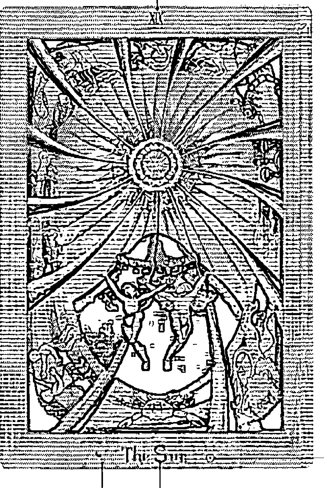

## 小阿卡納：數字牌

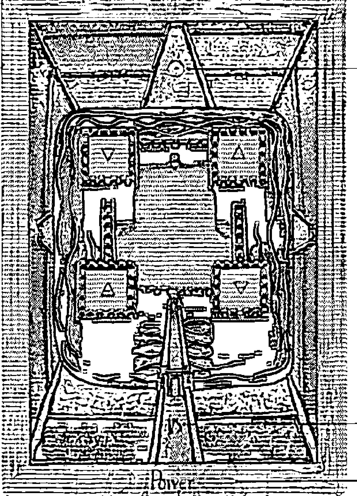

-   - **圖像解析**：分析各種圖像設計背後的脈絡典故與神秘學意涵。
- **基本牌義**：用以理解此牌的中心思想。
- **抽到此牌**：簡單道出抽到此牌意味著什麼，作為解牌與學習的參考。

### 0 愚人
The Fool
### ן Aleph
風元素

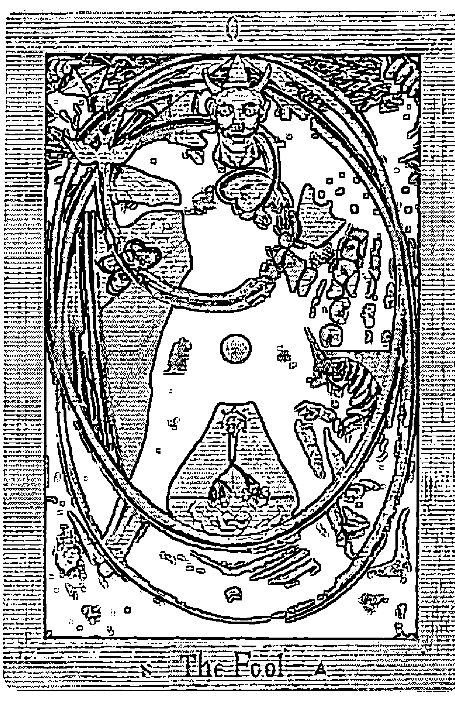

##### 圖像解析

「愚人」牌是大阿卡納的第一張牌，牌上方的編號為零。相對於其他的數字，零代表著空無，本身不具意義，也沒有意義存在的必要。若是世界只有空無，什麼也沒有，那麼無也不能稱之為空無，因為沒有與之相對的「有」，如何能有「無」呢？如同沒有「長」，如何知道「短」。承襲著喀巴拉對於世界的描述，宇宙誕生於無，誕生於永恆的寧靜，但以更高的角度來看待，沒有什麼「有」、「無」，虛空與存有只是為了瞭解而衍生出的名稱，有無本是一體，有就是無，無即是有。「愚人」牌一張牌可以是七十八張牌的縮影，世界萬物、心靈深淵皆存在於此。「0」出現在愚人的正上方，正好也是位於生命之樹圖形中三個虛無的位置，再次強調了這張牌的特性。

### ◉ ן (Aleph)

希伯來文二十二個字母，每一個字母都有其代表的形象，以及對應的牌，「愚人」牌對應的希伯來文字母是א。א有公牛的意思，愚人頭上以一對牛角作為對應。

### ⊙ 風元素

中間一橫的三角形是西洋神秘學中風元素的符號，對應給「愚人」牌飄逸與想法多變的特質。風居無定所，飄忽不定，如同愚人一般無所拘束。

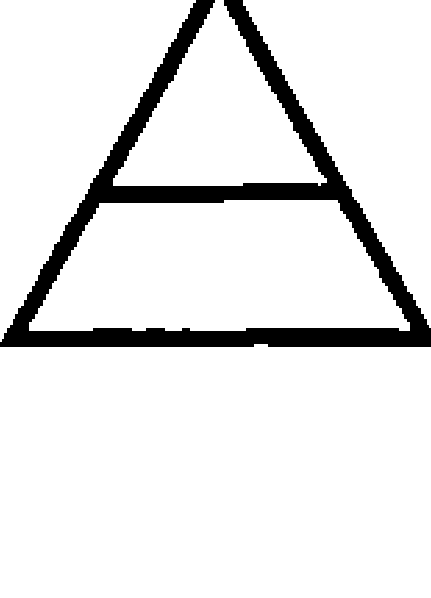

### ⊙ 鑽石皇冠

愚人頭上所帶的鑽石皇冠，代表著生命之樹中第一個薩弗拉「王冠」（Kether）。在喀巴拉中，「王冠」意味著所有的一切，舉凡眼前所見的、耳所聽聞的，一切有形無形皆包含於其中。這是四元素的總和，是「一切」即「一」，「一」即「一切」的概念。

### ⊙ 色彩意涵

背景中與愚人頸部皮膚的黃色是風元素的象徵，呼應著「愚人」牌對應於風元素的特質；綠色的衣服則是春天的對應，是一切的開始，代表著活力與創造力；金色的鞋子代表有如太陽的活力。

### ⊙ 太陽

在牌中央的太陽位於中脈七輪中的海底輪，代表意識最初階段的展現。

> 註 1：在脊柱中的中脈上分布著七個能量中心，稱為脈輪（Chakra），每一個脈輪皆有各層次的對應，中脈七輪這一詞經常在拙火瑜珈、靜坐功法、部分西洋神秘學等被提及。

### 圍繞的圓弧

愚人頭上的三圈線條與喀巴拉生命之樹中的第一個薩弗拉上的三階層相似，意味著世界開始前的虛無。沿著圓弧飛向愚人心臟的鴿子是金星的象徵，為母性能量。蝴蝶代表的是蛻變與轉化，而由雙蛇纏繞的翼神像是埃及的母神Mut，這三者同時進入愚人的心，意味著愚人創造力（風元素）與純淨靈魂的特質。

### 希臘酒神

「愚人」牌在希臘羅馬神話故事中所對應的角色是酒神戴奧尼修斯（Dionysus），點出了愚人享受當下、著重眼前的性格。
牌右方的葡萄酒注入一堆刻有占星學符號的硬幣中，最中間的是太陽，而其外圍有七星的占星符號，最外層則是十二星座的符號，指出了內在世界中蘊藏著萬物。

### 火把與聖杯

左手拿著火把代表創造性的火元素，右手拿著倒立的聖杯意味著擁有陰性的水元素能量。雙手持拿物剛好位於生命之樹中第二薩弗拉「智慧」與第三薩弗拉「理解」的位置，有陰陽之意。而此也同是象徵著煉金術中水火的融合，意味著喀巴拉中經過了水與火的世界後，到了「愚人」牌所代表的風元素世界。

### 鱷魚

下方的鱷魚可以是土星的象徵，也可以代表埃及的神祇塞貝克，是意識創造的象徵。

### 眼睛

睜大的眼睛代表對事物的好奇心。

### ◎ 心形螺旋

心形的螺旋位於喀巴拉生命之樹的隱藏薩弗拉「知識」（Daath），在這邊意指心靈是創造的開端。

##### 基本牌義

「愚人」牌的編號是零，在二十二張大阿卡納中不是第一張牌，也不是最後一張。零代表的是整段旅程，因此有人稱二十一張大阿卡納是愚人的成長途徑，這是一個沒有起點也沒有終點的循環，愚人此刻在起點，亦是在終點。愚人如同剛發芽的意識，沒有束縛他的規則，沒有限制，一切都有發展的可能性。

愚人的雙腳並沒有踏在地上，表示天馬行空的想法，他能夠暫時不考慮實際層面。愚人可以是一位開創者，夢想實踐的旅行者，以不畏艱難、永懷好奇的心態來探索世界。他擁有著酒神狂傲不羈、醉以忘憂的內在，有著水火力量和創造一切之源，即使受到野獸的侵襲也面不改色。最內層圍繞成心形，代表著情感上重生與束縛的解除，右邊的葡萄也有解放的暗示，如同出現在宴會中，是熱情與歡愉的象徵。

第二層鴿子、蝴蝶與雙蛇異像圍繞進入中心，除了代表陰性能量的特質，也象徵第二層的轉化，亦即思想的邏輯化（與最初純粹幻想的區別）。

-   - 註2：生命之樹第一個薩弗拉外有三個階層表示存在前的空無，分別是 Ain、Ain soph 與 Ain Soph Aur，詳見第三章喀巴拉與生命之樹的介紹。
- 註3：Mut 在古埃及文中是母親的意思，同時也是埃及神話中的母神。
- 註4：戴奧尼修斯是希臘羅馬神話中的酒神，也是代表農作物豐收的神祇之一。
- 註5：克勞利在他的書中則是描述為「著了火的松果」。
- 註6：在古羅馬文中，土星稱為 Cronus，與 Crocodile（鱷魚）有相似的字首。
- 註7：Sebek，是埃及代表鱷魚的神祇，在當時鱷魚是尼羅河潛在的危險，當地人藉由對鱷魚的崇拜以減少鱷魚帶來的恐懼。同時 Sebek 也是土地生產力的象徵。
- 註8：Daath 是知識的本體，也可認知為意識的本體。它的特質是轉化。

第三層圈內包含愚人部分的腳、底部擁抱的小孩、花朵與太陽。這裡象徵實質化的創造，由太陽（性能量）、花朵（誕生）和小孩點出了一種由精神化為物質創造的過程。第四層圈內包含了老虎（亦有一說為獅子）與鱷魚，代表了外界環境的威脅與現實。第四層的老虎與鱷魚是心靈深處的恐懼，也可以看成本能中對於恐懼的反應。第四層也可以是內外世界交互感應的象徵，代表由內而外的創造，與從外影響內的途徑。「愚人」牌給出的進階啟示是內外一體的世界觀，如同「吾心即是宇宙，宇宙即是吾心」之啟發。

愚人是最初的體驗者，也是經驗老成的旅行者。他習慣閉上雙眼，忘卻所有的經驗，放下五感所帶來的體驗，在內心的屏幕中看到想法的萌芽、聽見勝利的喝采、聞到喜悅的氣息與溫暖的感觸。愚人不執著於感官的經驗，因為他曉得感官只是訊息的接收者，心靈才是感覺的運作處。

#### ～ 抽到此牌 ～

愚人具有無所畏懼的精神，以及強大的好奇心，他即將踏上全新的探索之路，在這之前準備好的行囊是勇氣，即使遭遇了危險，也能有信心認為一切終將順利，相信一切所缺少的事物可在旅程中補足。

愚人本身的最終目標並不明確，有個模糊的概念，卻無法清楚地說出那是什麼。愚人位於機會開始前的時刻。處在不利的環境中，愚人也能堅信著其中是有意義的。

同時也可以代表一種純真的心態，對於事物沒有成見，永遠抱著樂觀的心情。

然而，愚人缺少了對於未來的計畫與步驟，因此周遭人們對於愚人的描述不外乎是：不拘小節，容易沉溺於享樂，擁有許多天賦，唯一缺少的是自我的約束力。因此偶爾從夢中初醒，回歸於現實，是愚人在面臨成長或挑戰時經常會遇到的狀況。

### 魔法師

The Magus

水星

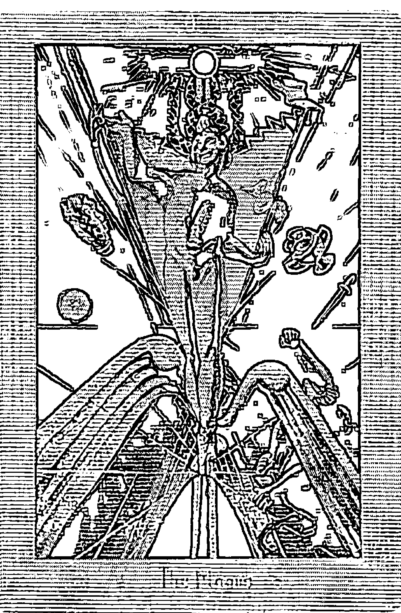

##### 圖像解析

 ◯ 水星
水星是「魔法師」牌在占星上的對應，與水星同字源的羅馬神祇墨丘利（Mercurius）則是神祇之對應。祂作爲訊息傳遞使者，賦予魔法師溝通與口才上的流利。

◎ 魔法師
圖中央的魔法師具有偉大的創造能力，能夠召喚與操控他所存在的世界，宛如魔術般神奇，將強大力量玩弄於股掌間。托特塔羅的魔法師不同於韋特塔羅牌的Magician與馬賽塔羅牌的Le Bateleur（法文，意爲變戲法的小丑）。克勞利使用了Magus這個字點出魔法師並不是玩弄戲法的魔術師，而是擁有操控神祕力量與智慧的賢者。

# ● 托特（Thoth）

托特是古埃及神話中的智慧之神，相傳祂創立了古埃及文字。祂擁有聖鷺（Ibis）的頭、人的身體。而牌中魔法師如同鳥的獨特站姿，則是埃及文化中對於托特的象徵。

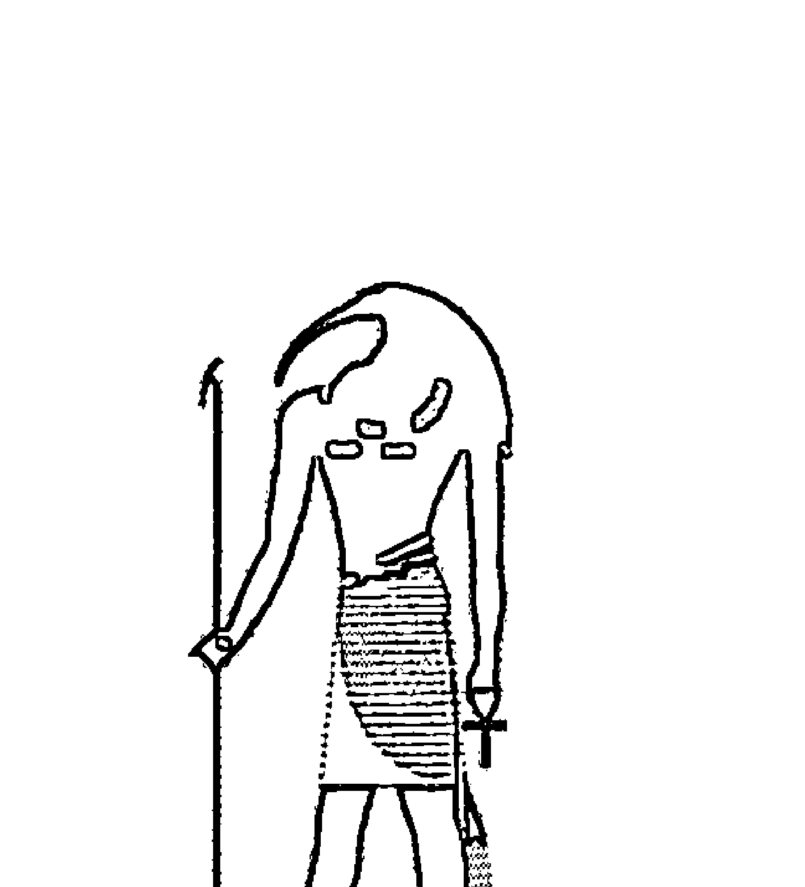

埃及智慧之神：托特。

# ● 圖騰

上方的蛇、翅膀與圓盤是埃及神話中的一種圖騰，圓盤代表著鷹頭神荷魯斯之眼，祂是法老守護神，也是王權的象徵。

# ● 蛇

兩條蛇盤旋於上方，是從羅馬神祇墨丘利所持的雙蛇杖變化而來，除了是掌管生死、醫學的象徵外，也具有守護之意。

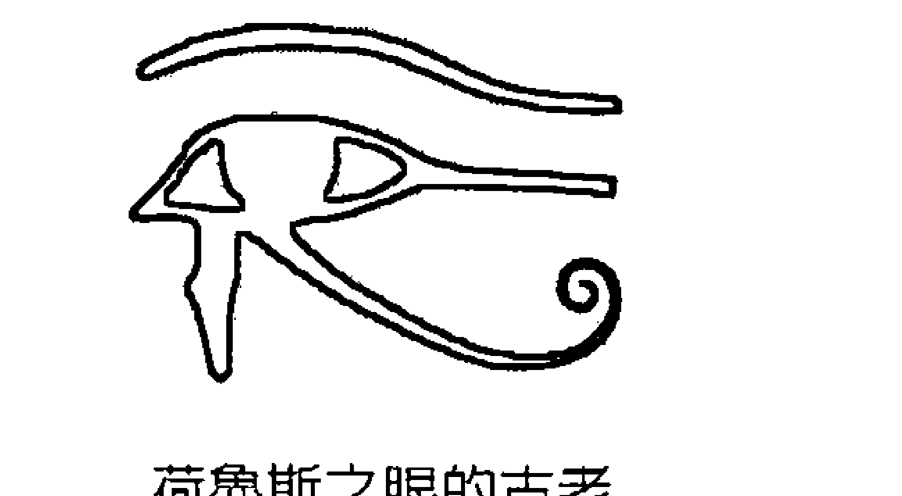

荷魯斯之眼的古老圖騰。

# ● 魔法師的八樣法寶

圖像的左上方，箭有訊息傳遞之意，與象徵訊息傳遞的水星不謀而合，右上方的紙記錄過去先知所帶來的啟示和預言，並且意味著魔法師的創意與書寫，這都是水星本身所附有的特質。下方右邊擁有翅膀的奧菲克祕卵（Orphic Egg）是第五元素——靈元素的象徵，亦是四元素的創造根源，西方人相信蛋具有兩次生命：新生與重生，在此則是指出了重生之意，為之後的幾張牌留下了伏筆。左邊具有聖鷺頭的權杖，也具有智慧之神托特的象徵，是埃及代表力量的圖騰。下方的四樣物品，則是象徵四元素的權杖（火）、聖杯（水）、寶劍（風）及圓盤（土），它們能被魔法師自由的操控。火把來自於希臘神話中的典故：宙斯禁止人類使用火，於是普羅米修斯（Prometheus）從天神所在的阿林帕斯山偷了火到人間。因此利用火把象徵從較高來源帶來的光明之意。

# ## 狒狒

智慧之神托特在埃及神話中亦被描述爲夜晚拿著新月圖騰的狒狒，克勞利將此放入牌的右下方，作爲此牌與托特連結的象徵。

# ## 基本牌義

魔法師站立在一個特別的空間，那是宇宙尚未開創前的原點，他從容的操控象徵世界組成的火、水、風、土四大元素，魔法師眼神透露出信心，沒有特定的目標，強大的能力在他手中創造出無限可能。魔法師能夠運用他所掌握的各種工具，不論是正面或是負面，在他的手中皆有能力可以達成。這張牌也包含許多神話的成分，可以對應到羅馬神話中訊息傳遞之神墨丘利、希臘神話中智慧與訊息之神漢密斯（Hermes）。托特塔羅牌的托特指的是埃及的智慧之神，也是這張牌埃及神話上的對應。相傳托特爲埃及創造了文字、帶來了智慧。在這副牌中被賦予的精神，乃是窮極一生去追求內在智慧，進而領悟世界的本質。克勞利之所以花了多年將他的研究融入到塔羅牌內，並以托特命名，乃是勉勵著後人透過托特塔羅牌而接觸到真正的「本質」。

水星是「魔法師」牌所對應到的行星。在占星學中，水星象徵著訊息傳遞、創造之源與靈感。魔法師站立在世界的起點，也站立在每個人內心的起點，魔法師具有操控世界的能力，正如同每個人與生俱來都有掌控自己的能力，我是我所是，是魔法師的聲明，藉由內外世界象徵踏入塔羅牌的殿堂，納入內心中的世界，找回那屬於自己的力量，是魔法師的意涵。

# ## 抽到此牌

魔法師處在擁有能力或資源的狀態，他知道自己的能力，並且能夠有技巧的操控，「魔法師」常是暗示著當下足以發揮實力、展現能力的牌。「魔法師」也可以代表良好的人際關係、好消息的到來，或是具有信心的狀態。在托特牌中的「魔法師」特別強調的是智慧，它可以是科學、藝術、文學等創造力的表現，具有將內在心靈探索投射到外界世界後所獲得的實際成果。另外「魔法師」也可以是學習、旅行、交流或生意上良好互動的象徵。

「魔法師」牌是一張勇於追求的牌，不同於愚人總是抱持著樂觀，更具備了達成目標的手段與方法，足以面對未來所遇到的種種狀況。

魔法師提醒我們，總是緬懷過去，遙想未來，卻忘記當下此刻，才是我唯一擁有的。

# # 三張魔法師？

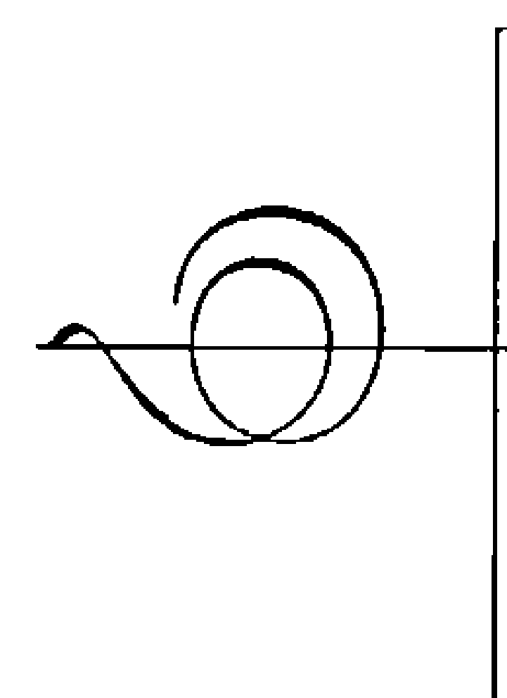

部分托特塔羅牌額外的多出了兩張「魔法師」牌，這多出的兩張牌在克勞利所有著作中從來沒有提及。隨著時間的演進，慢慢的在塔羅牌界中產生了許多說法。有人認為另外的兩張「魔法師」牌分別掌管著光明與黑暗，另有說法則是認為這是依照不同的神話概念所繪製的。事實上，在當初設計托特塔羅牌時，繪製者哈利斯夫人為了將克勞利所敘述的精神融入圖像中，繪製了許多張牌供克勞利做最後的選擇。甚至同一張牌存在了五、六張被捨棄不用的草圖。一直到托特塔羅設計後期，克勞利在神秘學領域上的知識日益增長，因此許多牌甚至重新繪製。

早期的出版商為了填補印刷裁切的空缺（製版時一次印八十張牌），在版型上添加了兩張草圖出版，因而有了八十張托特塔羅的存在。事實上，多出的兩張牌其實只是經克勞利審定後未被採納的手稿罷了，在使用上，建議使用原本的這張「魔法師」牌較為適合。

# 2

### 女祭司

# The Priestess

# λ Gimel

### 月亮

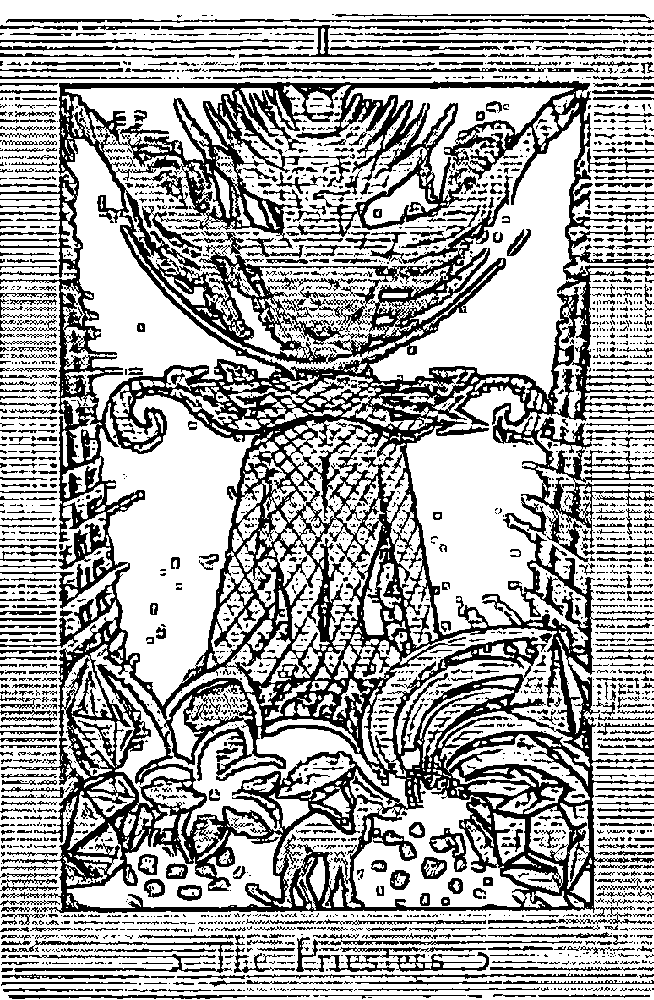

##### 图像解析

⊙ λ (Gimel)
图像下方的骆驼是希伯来文字母λ (Gimel) 的意涵，骆驼拥有自身储备的水分以横越沙漠，在喀巴拉生命之树内为平衡之柱的路径。「女祭司」是站在神圣创造的高点往下迈入物质世界的牌，骆驼指出了由上往下的方向，在生命之树中连接了第一萨弗拉「王冠」与第六萨弗拉「美」(Tiphareth)，穿越了深渊 (Abyss)，意味着穿过意识之上的世界朝向现实中迈进的过程。

⊙ 伊西斯 (Isis)
女祭司可以对应到埃及女神伊西斯、阴性、掌管阴间等女性象征。

⊙ 月亮
女祭司头顶的帽子呈现出月相的变化，对应于此牌的月亮，具有潜意识與深層心靈層面的意涵。女祭司所編織覆蓋大部分畫面的網子，暗示著捕捉浮上心中的潛意識，而其後被遮住的世界是被隱藏的真理。

# ## ◎ 天界三角（Supernal Triangle）

女祭司的兩個手肘與頭頂的帽子，位於喀巴拉生命之樹當中前三薩弗拉構成的天界三角，隨著手擺盪出的弧形將牌劃分出上與下。往上是創造與靈性之源，向下則是邁向靈魂與物質世界。

# ## ◎ 植物

最下方的花朵、水果等物是物質化的顯現，象徵著喀巴拉生命之樹路徑，隨著路徑一再下降，與凝結的創造之光化作了物質。在此象徵生命的開始，物質世界的誕生。

# ## ◎ 阿蒂蜜絲（Artemis）

女祭司也可對應到希臘神話中的月亮女神阿蒂蜜絲，與伊西斯具有相似的陰性特質。中間橫放的是代表伊西斯的樂器，同時也可是阿蒂蜜絲狩獵之弓。

# # 〜基本牌義〜

女祭司具有陰性與平衡的特質，她揚起了簾幕，掩蓋住偉大的真理和光亮，呈現在眼前的是沉澱後的能量，被我們理解成物質。她所掩蓋的是事物的本質，如同最下方的水晶、水果與花朵，它們背後靈性特質之內涵是我們所不可見的。

對於人生的意義與存在的本質，在各種文化中都有許多哲學上的思辨，甚至於宗教上的闡釋，正是因為我們無法一眼就看透真理。真理可見亦不可見，如同女祭司覆蓋上去的那層簾幕，我們無法將它掀開，直接看到背後的世界，只能踏上追尋之路，去尋找那無法被告知的答案。在喀巴拉生命之樹中，「女祭司」牌位於中柱上，意味著平衡穿越了純粹能量（無、陰、陽）與其下天界三角世界間相隔深淵之路徑。邁向深淵到達物質世界的靈魂，必須拋棄部分的靈性與記憶，像是記憶中的一塊被蒙上了面紗一般，因此我們再也看不到那背後真正的本質。女祭司頭上的月亮是月神的代表，也是這張牌所對應的星體，是女神陰性力量的展現。此外，月亮也代表著潛意識，那是在顯意識下不容易去觸及到的本能與原始反應。這張牌在神話上可以對應給所有女神，具有神聖純潔的意涵。內斂的智慧、深邃的洞見、平靜是女祭司的特質。

# ## 抽到此牌

「女祭司」牌意味著我們該放下偽裝的面具，誠實的面對自己內心所求。當你願意，你可以勇敢的踏出下一步，未來的路早已為你所鋪設。這一段時間往往沒有太多的事件發生，你可以盡情地去嘗試，並且在過程中找到自己的答案。你所有的遭遇並不是幸與不幸，而是埋藏於心靈深處，將之招引而來。「女祭司」牌揭示出，需要處理的不是外在，而是自己的心靈。當釋放了壓力，給予了寬恕，為彼此帶來祝福，才能鬆開束縛，擺脫阻礙。

受到月亮的影響，為此刻帶來了寧靜，然而月有陰晴圓缺，事物終有消長，在適當的時機，我們必須向前跨出一步，將所構思的一切化為現實。

# 3

### 皇后
The Empress

𝌇 Daleth

金星

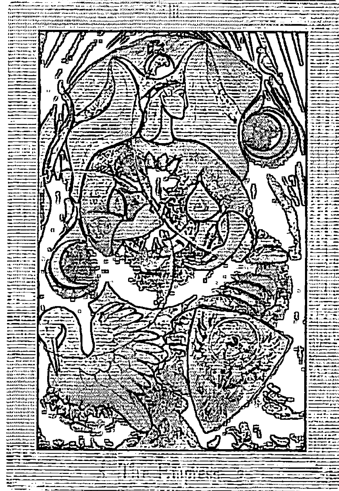

##### 图像解析

# 𝌇 (Daleth)

「皇后」牌所對應的希伯來文字母是𝌇，具有「門」的意涵。皇后身後一扇通往天堂的大門，即是其象徵。皇后是所有母性的集合，孕育著即將誕生的生命，是引領每一個生命通往人間的大門。

# 金星

金星對應於「皇后」牌，也對應於羅馬神話中的維納斯（Venus）。「皇后」牌集女性的美於一身，她是所有陰性力量的代表，同時也象徵著孕育大地萬物的母親。而維納斯的情人戰神馬爾斯（Mars），正是下一張牌「皇帝」的對應。

# ◎鹽

皇后的雙手勾勒出煉金術中「鹽」的符號如右圖。鹽與硫、水銀同為煉金術的三大材料之一。鹽意味著崇高靈性與物質的結合。

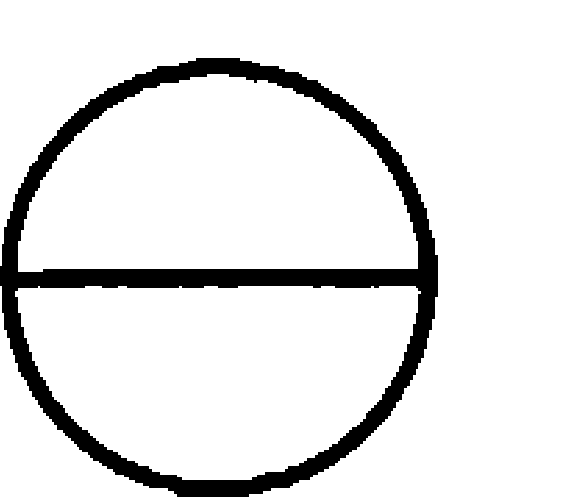

# ◎藍色火焰

皇后身後兩條捲曲狀的藍色火焰，代表皇后從水中而生，依靠著柔性的力量而建立起權力。

# ◎蓮花手杖

皇后手握的蓮花權柄對應給埃及女神伊西斯，在克勞利的泰勒瑪論述中，她是孕育著掌控下一個世代的天神——荷魯斯的母親。《聖經》中記載，聖杯曾經盛裝象徵耶穌血的葡萄酒，而如同聖杯形狀的蓮花權柄即有此意，意味著盛裝了來自太陽的力量。

# ◎白鷹盾

右下方是代表皇后的徽章，這是皇室的圖騰，以白鷹作為象徵。在煉金術中，白鷹意味著轉化與重生，白鷹頭部出現了滿月的圖騰，在煉金術中為銀白色的渲染物，渲染出了「皇后」牌的冷色調。

# ◎鸕鶿

左下方的大鳥為鸕鶿，牠以自己的血液餵食牠的幼鳥，代表無私奉獻的母愛，同時也意味著血脈相傳。

# ◎衣著

皇后頭上的弧形后冠是月亮陰晴圓缺的象徵，衣服上的蜜蜂則是女性的象徵，腰帶上的黃道十二宮圖形代表統御著萬物生長，是無所不在的母神。

# ⦿ 左右兩旁的月亮

傳統上，太陽象徵著父親，月亮屬於母親。「皇后」牌以月亮作爲母性的象徵。圖像中的左右各有上弦月與下弦月的圖像，皇后之冠也以圓弧形勾勒出月亮之形，再次意味著「皇后」是大阿卡納中母性能量的代表。皇后的眼神望向右方的月亮，望著與她相望的皇帝。

# ⦿ 下方的花朵

牌面下方出現了白色的薔薇與百合花，在儀式魔法中，白薔薇是金星的象徵，呼應「皇后」對應的金星，而百合花則具有陰陽調和之意，爲下一張牌的「皇帝」與之後的「戀人」、「藝術（煉化）」等煉金術相關的牌埋下了伏筆。

##### 基本牌義

皇后坐在寶座上，拿著代表埃及女神的花朵，若有所思的凝視遠方。她沒有言語、沒有動作，若仔細的感受，可以察覺到牌所傳達的溫暖與平靜。這是金星所代表能量的最高形式展現，不求回報，不計所有，無條件如同母愛般的付出。

與傳統塔羅牌的女皇相較，她並非是全然的陰性，從皇后嚴肅的眼神便可以看出融合了部分陽剛特質。這張牌充滿許多煉金術的隱喻，皇后本身的動作就是鹽的煉金符號。在傳統煉金術中，鹽是靈性與物質的融合，而以化學角度來看，鹽是陰陽離子聚集的結晶，在這邊都有調和與平靜之內涵。皇后孕育著生命，將之誕生於這一個世界，她是大地之母，爲世界帶來了生命。「皇后」牌可被視爲無私的母愛，而對應於金星的特質可以代表情人，或是豐盛的物質財富。

##### 抽到此牌

皇后擁有創造與支配的能力，同時她也具有培育與照顧的特質。通常抽到此牌，意味著處在一種被照顧的環境中，或是在愛所包圍的氛圍中。皇后也可以代表有主見的女性長輩或女上司，她有圓融的處事手腕與成熟的心靈，不僅能在各種場合應對得體，私底下也會給予許多精闢的建議，她具有堅定的勇氣與慷慨的胸懷，能夠在需要時給予最適當的幫助，使我們感受到溫暖與無條件的賦予。

托特牌中的「皇后」偏重於神秘學上的意涵，與煉金術的元素配合下能夠衍伸出許多解釋。而在一般情況下，「皇后」代表豐盛，允許你盡情地享用生命所帶來的恩典。作為母性的象徵，「皇后」牌的意涵深入到每個民族當中的母性概念，孕育萬物而無所求，是大地之母，是每位母親的象徵。在某些占卜中，「皇后」牌也是懷孕跡象的顯示。

> - 註9：克勞利著作《Liber 777》中曾論述。

## 大牌

# 4

### 皇帝
The Emperor

**צ** Tzaddi

牡羊座

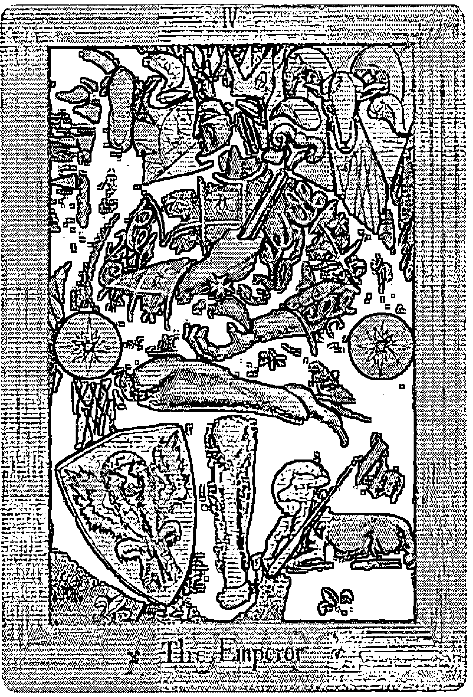

##### 图像解析

◉ **צ** (Tzaddi)

צ是希伯來文中第十八個字母，依照順序對應給「星星」牌，然而在金色黎明會結合占星與喀巴拉對應的理論下，克勞利將צ分配給了「皇帝」牌（詳見第三章的〈雙環帶扭曲理論〉）。

◉ 牡羊座

皇帝為父親的象徵，在此牌中對應到牡羊座。牡羊座的守護星為火星，相應於火星的戰神馬爾斯，賦予了這張牌勇猛善戰的特質。在羅馬神話中，馬爾斯是美神維納斯的情人，因而與代表女神維納斯的「皇后」牌相互對照，兩張牌同時放在一起，會發現彼此存在了相互對應的圖像與象徵。

# ❷硫

皇帝的姿勢與十字盤起的腳構成了煉金術當中「硫」的符號，是為陽性火之能量，使得整張牌呈現出了暗橘色。

# ❸目光

皇帝眼神背後的太陽點出了此牌陽性的象徵。皇帝望向牌的左方，與皇后對望，他的目光兇狠，彷彿準備好隨時出征，吞下敵人的城池。皇帝展現出勇猛善戰、活力十足的特性，如同牡羊座隨時都可以立刻行動的個性。

# ❹塔爾羊

在皇帝身後是兩隻喜馬拉雅野生羊——塔爾羊，作為牡羊座的象徵。野生羊象徵著皇帝的野心，以不受拘束的想法奔馳在世界的草原，牠渴望化為熊熊的烈火掠過，征服這一切。

# ❺小羊

在皇帝腳邊的羔羊，意味著經過權力施展後屈服與順應的象徵，代表臣服於皇帝威權之下。小羊舉著旗子指出，這一張牌渲染出的紅黃色調乃是煉金術中的「硫」所帶來的。

# ❻王杖

皇帝手握著權杖，代表著至高無上的命令與王權的施展。王杖頂端的山羊頭像，再次的指出此牌對應給了牡羊座。占星學中，牡羊座起始點是黃道與天赤道的交點，為曆法上的春分點，代表著不息的生命力，而皇帝手持著權杖，則是象徵著他握有支配生命的權利。

# ❼馬爾他十字 (Maltese Cross)

手上拿著象徵統治權的球，上頭刻有馬爾他十字，此為第一次十字軍東征所使用的符號，在這張牌當中代表著治權的廣布。

# ◎紅鷹之盾

與「皇后」牌相同的位置出現了皇室的徽章，在太陽與煉金術當中的硫支配下，紅色的鷹展現出太陽陽剛性質，盾上的太陽與「皇后」牌中的月亮相對，是一陰一陽的對比。

# ◎衣著

皇帝服裝上的蜜蜂圖騰是代表女性力量的暗示，在此可以代表剛強中陰性力量支持的部分，與「皇后」牌相同的，蜜蜂代表了統領群眾之能力。

# ◎王冠

「皇帝」牌的王冠如同太陽放射光芒之形狀，與「皇后」牌的月亮王冠相對，同樣是一陰一陽的對比。

# ◎硫元素

牌的兩旁出現了兩個圓（薩弗拉），內有十六芒星，十六是硫元素在化學週期表上的原子序，代表了硫元素由十六個質子組成。克勞利試圖用當代化學對硫元素的理解，呈現出這張牌在煉金術中硫的特質。

# ～基本牌義～

皇帝擁有物質世界中最高的權力，在他掌握的世界中，他就是一切的統帥。他擁有權力，擁有想要的一切，然而這並不能讓他感到滿足，他所渴望的不只是眼前的一切，更是眼前所不及者。在托特塔羅牌中，皇帝是一位具有極端活力之人，迫切想要得到一切，彷彿世界就在眼前，等著他去拿取。熱情是皇帝的本質，他無法耐心傾聽身旁的意見，只相信自己內心的聲音。

他施展所拥有的权力，使麾下群众井然有序地去替他完成梦想。
「皇帝」牌对应给了牡羊座，克劳利也为它赋予了炼金术中硫的特质，并且相对于「皇后」牌的月亮，以太阳作为皇帝权力普照大地的象征，这张牌中非常强烈地表现出阳性能量，在仪式魔法中，甚至可以利用此牌作为净化与震慑较低能量之操作。「皇帝」与「皇后」是两张对比牌，它们分别代表着炼金术当中的盐与硫，而在之后的「恋人」牌当中，两位主角展开了「炼金婚配」（Chymical Marriage）仪式，在「艺术（炼化）」牌当中获得答案。透过这一系列的牌，意喻着炼金术已经不再以炼金为目的，而是利用相似的神秘学手法施展于心灵之上，透过提升与转化，使得意识迈向纯粹与精炼，这才是炼金术当中最有价值的部分，亦是托特塔罗所传递的奥义。

##### 抽到此牌

「皇帝」牌可以代表年长者、父亲、工作上的前辈，在事件上可以代表著战争、竞赛。抽到这张牌意味著：对眼下一切仍不满足的你，纵然已经有所成果，纵然身旁的人们总是对你投以羡慕的眼光，而你却还怀著更远大的理想，迫切的相信这一切都是你唾手可得之物。你的脚步或许停歇，但你的心却永远带着最初的热情，你可能孤立于人群，可能熟悉权力的操弄，看著发生的一切，内心暗自窃喜，因为这早在自己的预料之中。然而皇帝的内心却是百般的复杂，他需要戴上面对众人的面具，在夜深人静时却难以将面具挣脱，认清真正的自己，或许有那么些时候，会感到自己的卑微，后悔著自己的冲动，迷惘著究竟是自己操控著命运，抑或是被命运牵著走，然而当太阳升起后，这些都将一扫而尽，再度站上王位，从容展现出自己平日的样子。然而阳刚的「皇帝」牌毕竟缺乏了温暖的依靠，纵使拥有江山万里，却没有自己，在心灵深处永远希望能够回到那熟悉的港湾。

当抽到这张牌，代表一种热诚与一定程度的稳定，只要持续维持，没有什么太大的困境。但须注意自满与易怒的情绪化反应！

## 5
### 大祭司
The Hierophant

##### 圖像解析

-   **❶ 1（Vau）**
「大祭司」牌對應到的希伯來文字母是1，有「釘子」之意涵，牌面上方用九根固定窗戶的釘子作爲對應。而「九」這個數字也可對應給喀巴拉生命之樹中第九個薩弗拉「基礎」（Yesod），此薩弗拉在占星學上對應於月亮，與下方女子所持的月亮相互呼應。

-   **♉ 金牛座**
背景中的兩頭大象及大祭司身後所倚著的牛，是金牛座原始自然的象徵，也是「大祭司」牌所對應的星座。金牛座維持著既有的事物，決不輕易改變，在既有的基礎下運作事物。這張牌的正中心孕育了埃及的神祇荷魯斯，這是大牌中首次出現荷魯斯的形象，順著泰勒瑪中的預示，荷魯斯終將登上王位接掌世界，帶來前所未有的變革。

-   **◎四聖獸**
四元素分佈於牌面的四周，以固定星座中的圖騰作爲其象徵物。四聖獸最初的概念來自於《聖經》〈啓示錄〉中，在伊甸園角落看守生命之樹的動物（四活物），在韋特塔羅牌的命運之輪牌和世界牌中均有出現。傳統上，四聖獸分別是獅（代表火元素的獅子座）、老鷹（代表水元素的天蠍座）、人像（代表風元素的寶瓶座）與牛（代表土元素的金牛座）。然而托特塔羅以泰勒瑪的思想貫穿於其中，並經由克勞利本身的靈視，看見了荷魯斯紀元中圖騰之轉變，故此寶瓶座的象徵物變爲老鷹，而天蠍座則爲人像，四聖獸的排列位置因而有所差異。

-   **◎五芒星與六芒星**
五芒星是西洋神祕學中象徵四大元素與靈元素的圖騰。六芒星則爲四元素符號疊合後之圖騰。傳統上，五芒星是個體實像小宇宙之象徵，六芒星則爲萬物羣體實像大宇宙之象徵。因此，牌中內外一組的五芒星分別代表了外在世界與內心世界的互動，從最內側象徵個體的五芒星作爲起點，擴大到屬於外在世界的六芒星。意味內在心靈觸動外在世界的改變，而非其反道。

-   **◎荷魯斯**
五芒星中間的小孩是古埃及神話當中的神祇荷魯斯。在克勞利創立的泰勒瑪中，荷魯斯出現代表紀元轉換的開始，出現在大祭司胸口的五芒星和外擴的五芒星，暗示著在荷魯斯接管新的紀元之前，祂的教誨早已開始傳播。

-   **◎鴿子與蛇**
上方窗戶邊緣的蛇代表著誘惑與知識的開端，鴿子代表純淨的靈魂，同時也是金牛座的守護星——金星的代表。蛇和鴿子同時出現，象徵對立面共存下體制的穩定。

-   **手持**
大祭司手持的權杖上有三個交錯的圓環，分別代表著泰勒瑪中三個紀元：伊西斯、歐西里斯（Osiris）、荷魯斯。大祭司左手做出了惡魔的手勢，意味著祕傳的神祕學知識。

-   **下方的女人**
克勞利的著作《律法之書》曾經敘述到持劍女人的出現，作爲荷魯斯紀元的預示。在牌面中，她一手持著寶劍，一手拿著半月，這些都是荷魯斯出現的預示。

##### 基本牌義

托特塔羅的「大祭司」牌脫離了傳統上的解釋，融入了大量泰勒瑪的意涵。源自於他本人在一九〇四年受到啟發寫下的《律法之書》，並且以此創立了泰勒瑪。與其說泰勒瑪是宗教，不如說是一種融合了眾多神祕學體系而成的哲學觀。克勞利以古埃及神祇說明了人類經歷過象徵母系社會的伊西斯紀元（Aeon of Isis）、父系社會的歐西里斯紀元（Aeon of Osiris），最後來到了荷魯斯紀元（Aeon of Horus）。每一次的轉變，除了生活本質上的改變外，甚至包括神祕學範疇的魔法、占卜術、宗教等均會有天翻地覆的改變。由《律法之書》所獲得的訊息，克勞利認爲從一九〇四年起世界進入了荷魯斯紀元，在這之後的一段時間，父系社會即將瓦解，文明將會朝向有別於過去數千年的面貌發展。

大祭司的手勢意味著他是祕教的傳道者，培育著下一個紀元的主神荷魯斯，如同中世紀躲避教廷打壓的異教徒，被迫轉入地下的神祕教派。經過了多年的傳承，到了荷魯斯紀元，那些曾被視爲異端、曾經被埋沒的神祕學知識將重現天日，再次颳起一股風潮。托特牌的大祭司著重於神祕學知識的傳承與復甦，他不是天主教的教宗，他是屬於荷魯斯紀元，屬於眾多祕傳團體的導師。

##### 抽到此牌

大祭司可以代表老師、醫生、學者、啟發者等，他在專業領域上能夠引起抽牌者本身的共鳴。大祭司是智慧的追尋者，有自己的想法，即使不被大眾所認同，依然堅信來自內心的聲音，鼓勵著自己保有這一份熱誠。他點亮了後進者的好奇，也照亮了自己前進的道路，這是一條沒有終點的旅程，他不害怕分享他的知識與經驗，因為他永遠都在前進。

由於對應於金牛座，因此在某些面向，大祭司相當堅持自己的想法，不願意做出改變現狀的妥協。「大祭司」也能夠是宗教上的經驗，或是獲得啟發之象徵，它像是一種深入靈魂的悸動，在你瘋狂走入雨中的當下，在你無意識哼出一段曲子之際，在你忙裡偷閒走在街上的午後，在你微笑著入眠的夜晚，在你每一刻貼近心靈的剎那……，使你意識到自己的存在，是那麼的快樂。

## 6
戀人
The Lovers
T Zain
雙子座

### 〰️圖像解析〰️

-   **⊕ T (Zain)**
「戀人」牌所對應的希伯來文字母為 T，具有「劍」的意涵，在牌面上方的數把劍鋒即為象徵物。

-   **⊕ 雙子座**
對應於雙子座雙重特性，「戀人」牌內大多出現成雙成對的角色，包括前面出現過的皇帝與皇后、白鷹與紅獅、兩位小孩等等，成雙出現暗示出這張牌在煉金術上煉金婚配的意涵。

-   **⊕ 莉莉絲（Lilith）與夏娃（Eve）**
根據部分猶太教典籍的記載，莉莉絲是亞當的第一位妻子，是上帝創造出的第一個女人，但因說出了上帝隱密的本名而被迫離開伊甸園，成為對抗上帝的一股勢力。莉莉絲離開後，上帝從亞當的身上取出一根肋骨化爲夏娃。設計此牌時，克勞利將這段未被收錄進《聖經》的創世紀前的故事納入其中，把亞當的兩位妻子放置於牌的頂端，呈現出上帝創造的一善與一惡之女性。克勞利以他對於基督宗教一貫的態度，透露出在歐西里斯紀元內，有一群如中世紀異教徒的人，爲了維護更為完整的宗教內涵，保存那些沒有被收錄進《聖經》的福音或祕典，而淪爲衆人批判指責的異端，事實上，他們才是值得受人尊敬的守護者。

-   **亞伯（Abel）與該隱（Cain）**
下方的兩位小孩分別握住皇帝的長矛與皇后的聖杯，一黑一白如同一陰一陽的對立，是煉金婚配的陰陽兩方，也對應於雙子座的象徵。他們分別代表著亞當與夏娃所生下的兩子。克勞利用非傳統的觀點指出：該隱並非亞當與夏娃的小孩，而是引誘夏娃吃下禁果的蛇與之所生的小孩，他身上流著惡魔的血液，殺死了亞伯，而上帝在他的頭上以血註記了這項罪惡。這張牌雖名爲戀人，也可稱爲兄弟，它是善與惡對立並存的牌。

-   **皇帝與皇后**
皇帝與皇后離開他們的寶座，出現在這張牌當中。「戀人」牌描述的是皇帝與皇后的婚禮，他們凝視著對方，一手握著自己的長矛與聖杯，一手牽起了彼此對立的靈魂，代表著對自身的堅持與傳承。這是煉金婚配結合的兩種元素，是陰與陽的融合，藉由隱士促成這項反應。

-   **隱士**
隱士張開了雙手，祝福著這神聖的婚姻。他施展著祕法，以古代的煉金術士施展魔法的手勢，整合兩種對比鮮明的元素。他的雙手外纏繞著一條梅比斯環（Möbius Band），沿著梅比斯環可以走過緞帶的兩面，意味著正反陰陽一致的奧秘。他是在九號牌中出現的隱士，孕育著底端即將誕生於新世界的奧菲克祕卵。

-   **◎邱比特**
中央上方的是羅馬神話中的小愛神邱比特，祂的箭桶上用希臘文刻著泰勒瑪的希臘文「θελημα」，其意涵為意志，也就是泰勒瑪中所敘述的心靈核心。張弓射箭暗喻著射手座是這張牌的故事續集，對應給射手座第十四號牌「藝術（煉化）」作伏筆。從「魔法師」出現了奧菲克祕卵開始的煉金過程，在大阿卡納的旅程中逐漸取得材料，於「藝術（煉化）」煉成，訴說著荷魯斯紀元的到來（詳見後述）。

-   **◎二元對立**
皇后與皇帝、不同膚色的小孩、手拿的長矛與聖杯、代表皇帝的紅獅與皇后的白鷹都是陰陽相對概念的表示。

-   **◎奧菲克祕卵**
長出翅膀、纏繞著蛇的奧菲克祕卵是一切起源的象徵，將會誕生而成為荷魯斯紀元的世界。奧菲克祕卵是煉金術中的「種子」，透過提升而完成轉化。

### ～基本牌義～

托特塔羅的「戀人」牌是一張與傳統塔羅差異較大的牌，克勞利在這張牌放入了煉金術中的概念。傳統戀人牌是被祝福的愛情，著重於關係上的結合。而托特塔羅則是以「煉金婚配」作為基本的意涵。牌中背後的蒙面人是隱士，他同時是煉金術士，操控著各種物質，使它們組合與分離，用現代的觀點來解釋，即是催化原子與原子間的重新排列組合，發生化學反應的催化物。然而從西洋煉金術的角度來看，所重視的內在精神也隨著化學反應重新組合。煉金婚配將內在的兩種對立層面進行融合，在最後萃取出精華，即是所謂的靈性智慧。

牌中的皇帝、皇后在隱士的祝福下結合，他伸出的雙手施展著結合之力。牌中大部分的圖像都是成對出現：皇帝與皇后代表男性與女性，手持著長矛與聖杯代表著性上的互補，交錯握住長矛與聖杯的黑手與白手，紅色的獅子與白色的鷹，都彰顯了這張牌中的陰陽相對概念與雙子座的特性。

「戀人」牌編號六，六在這張牌中的隱藏寓意為《聖經》《啟示錄》中所提及的野獸數「六六六」，而這個野獸就是泰勒瑪中所述的巨獸（The Great Beast），他將於在第十一號牌「慾望」中出現。隱藏在牌面下的是這張牌的肅殺之氣，陰與陽的碰撞不免有所衝突，看似寧靜的牌上方卻也出現了多把劍，以及邱比特的弓箭、殺死亞伯的該隱，都是已經發生與可能會發生衝突的暗喻。

上方中央的是邱比特，他拿著能使人產生愛慾的金箭搭弓準備射出，他的箭桶以希臘文刻上「θελημα」，代表著承載意志之箭。在隱士的作用之下施展煉金婚配，作用於長著翅膀的奧菲克秘卵，其中記載著生命與世界形成的秘密，蘊含著即將誕生於世界的一切。另外這張牌與「藝術（煉化）」也有重要的相連關係。它們都是對稱的構圖，且都有煉金術的意涵存在，牌上方的邱比特預告著對應給射手座的十四號牌「藝術（煉化）」，是「戀人」進行煉金婚配後的續集。牌背景後的隱士與邱比特同時出現，暗示著神話中邱比特不詳的父親其實是傳說中的煉金術士漢密斯，他們同樣具有遊戲人間、愛捉弄人的個性。牌中出現的隱士在九號牌中會再次的出現。

##### 抽到此牌

托特塔羅的「戀人」牌並不著重在愛情上，這張牌呈現的是煉金術的催化過程，亦即煉金婚配。所代表的是心靈層次的一種轉變。抽到這張牌，表示你可能處在一種不安的環境，周圍發生的事情讓你覺得不習慣，但這卻是非做不可的挑戰。你可能要嘗試著去擁抱你不熟悉的事物，接納新的觀點，在內心經過幾次掙扎碰撞後，終能獲得可貴的經驗。

對於伴侶關係而言，外人從表面看似平靜，事實上你們彼此間存在著一些爭吵，但可貴的是雙方仍有互相珍惜包容的想法，願意為了彼此而修正自己，相互成長。對於事件而言，可能意味著一個合作的展開，或是一種新秩序的建立，你不必太過擔心短期內的變化，這些都只是為了成長，自己給予自己考驗的機會。

隱士不會告訴你未來的每一步在何處，他在黑暗中點燃的燈火，一次只能照亮腳尖前的下一步。因此抽到這張牌同時也告訴我們，看清楚此刻周圍的現況，聚焦在此刻去決定、去思考、去行動，而非讓太過遙遠的未來想像模糊此刻所擁有的機會！

## 7
戰車
The Chariot
ח Cheth
巨蟹座

##### 图像解析

-   **◎四大支柱**
战车的四个柱子代表了喀巴拉当中的四棵生命之树，代表希伯來文字字母拼成上帝圣名的יהוה，它们分开了天与地，作为开创天地的象征。

-   **◎四圣兽**
四只拉着战车的圣兽分别是牛、狮子、老鹰、人，这四圣兽曾经出现于「大祭司」牌当中，是四大元素的象征。克劳利将他们与埃及看守墓穴、寺庙的神祇斯芬克斯（Sphinx）概念融合，形成了四活物的头与动物身体构造的圣兽。他们没有被束缚，自愿听从战士的指挥。意味着战士本身具有号令组成万物之四元素的能力，而他并未轻易的使用，反而留待最佳的时机，于万无一失的时机再加以动用。

-   **◎巨蟹座**
戰士帶著螃蟹的頭飾與遮住臉部的盔甲，暗示自我掩飾的巨蟹座本性，是「戰車」牌所對應的星座，他穿著厚重的盔甲將全身包覆著，隱藏住自己的脆弱，靜靜地守護著聖杯，守護著內心的世界。

-   **◎聖杯**
戰士所捧的是一個巨大的聖杯，這是耶穌在最後的晚餐所使用的聖杯，也是具有神秘魔力的法器。它同時具有木星的暗示，其中透著血色且朝外放射，代表神性誕生於黑暗，照亮了寂靜的空無，逐漸的旋轉擴大如同木星的意涵。而聖杯也是這一張牌的縮影。「戰車」牌在生命之樹中是從第三薩弗拉「理解」到第五薩弗拉「力量」的路徑，而聖杯內的顏色組成，為站在第三薩弗拉（藍）往下方的第五薩弗拉（紅）望去的景象，中間一點紅是下方的第五薩弗拉。

-   **◎頂棚**
上方藍色的頂棚象徵喀巴拉中第三薩弗拉「理解」的大海。

-   **◎輪子**
紅色的輪子是生命之樹中第五個薩弗拉「力量」（Geburah）的象徵，從代表喀巴拉中第三薩弗拉「理解」的藍色頂棚，到代表「力量」的紅色輪子，明確指出了此牌位於生命之樹中連接第三與第五薩弗拉的路徑上（詳見第三章）。

-   **◎ ABRAHADABRA**
藍色的頂棚下緣繡上了「ABRAHADABRA」，這是泰勒瑪中所使用的詞彙，本是金色黎明會中的一個咒語「ABRACADABRA」，克勞利將C換為了H，作為代表荷魯斯紀元到來的暗示。此祕語以五個A夾雜在六個字母間，隱藏由五（個體小宇宙）到六（群體大宇宙）之間的溝通管道。此字也被克勞利運用在許多魔法儀式與降靈術中。

### 〜〜 基本牌義 〜〜

在「戰車」牌的圖像內，戰士安靜而從容地端坐在戰車裡，沒有即將上戰場的姿態，只是輕輕捧著手上的聖杯。他拉下頭盔上的面罩，將自己的神情隱沒，如同巨蟹座般的性格，守著自己的世界，不讓外人隨意的踐踏。頭上螃蟹是此牌在占星學上對應的象徵物。牌中心的聖杯是「戰車」牌的主角，守護聖杯是戰士唯一的任務。聖杯是耶穌在最後的晚餐中用來裝象徵他鮮血的葡萄酒所使用的酒杯。聖杯同時被認為具有神奇的魔力，得以解救垂死之人，並且引導靈魂回到天國。在中世紀的傳說裡，它一直是眾人追尋的至寶，如今被牌中的戰士所守衛著，中心的血紅色是聖杯中神聖的血液，而其位置是戰士中脈七輪當中的海底輪，代表著隱藏在這張牌的寓意是海底輪所驅動的原始欲望。這是戰士的本能，在某些狀況下暗示著與性有關的議題。

戰車由四根柱子撐起頂篷，四根柱子分別代表了希伯來文中組成上帝之名的יהוה（YHVH），具有開創天地之意。在頭上的藍色頂棚，對應到喀巴拉生命之樹當中的第三個薩弗拉「理解」，輪子的紅色則是連結到了第五個薩弗拉「力量」，點出了這一張牌位於這兩個薩弗拉相連的路徑當中。頂棚上繡上泰勒瑪中的咒語ABRAHADABRA，暗示著荷魯斯紀元的到來。戰車由曾在「大祭司」牌中出現的四聖獸所拉動，他們不需要藉由韁繩所操控，自願接受來自戰士的指揮。戰車並沒有行動，因為捧著聖杯的戰士意識到，終點並不位於眼前的任何一個地方，而是位於內心，他端坐著神遊於那不可見的世界，此刻，他已經看到抵達終點的路標。

##### 抽到此牌

這張牌代表著一個過渡時期，你可能抓住了目標，正在前進的路途上，你掌握住了訣竅，能夠得心應手的面對眼前所出現的種種情況。對於周圍的人而言，他們不太能真正瞭解你的想法，如同迷霧中航行的船，人們對你捉摸不定。你善於自我保護，除非有了十足的信心，否則不會輕易出擊。

恐懼是「戰車」牌隱而不見的心態，因為你不清楚前方的道路，你必須在未知的情況下小心翼翼地踏出每一步，有時候你會感到孤獨，感到無比的失落，恐懼在不確定的黑夜啃食你的信心。然而你必須明瞭，不論你在什麼地方，不論你要去往何處，心靈深處的源頭永遠會伴隨著你穿過那些不真實的幻象，最後，你會發現一直都沒有離開過初衷。

## 8
调节
The Adjustment
Lamed
天秤座

##### 图像解析

-   **玛特 (Maat)**
站於畫面中央的是古埃及正義女神、真理女神瑪特，祂維持著自然界的秩序、人世間的正義以及真理，祂仔細的斟酌、小心的衡量萬物的秩序與規律，在祂維護的正義下不容許差錯。配戴在瑪特頭上的鴕鳥羽毛，是秤心儀式中衡量天秤另一端心臟的砝碼，以斷定人們是否有進入天國的資格。

-   **A 與 Ω**
天秤的兩端是希臘文第一（A）與最後的字母（Ω），意味著瑪特衡量著世間萬物，祂維持著平衡，維持著世界創造後的秩序。

-   **聖蛇圖騰**
中央上方是聖蛇圖騰，意味著瑪特具有掌握生死的力量，這是祂被賦予的神聖職責。

-   **面具**
瑪特戴上面具掩飾著情緒。在衡量之時，祂必須拋開自己的情感；審判之時，亦不得透漏任何神情，不允許人們對祂的心意有任何的揣測。

-   **手握的寶劍**
瑪特手握著一柄寶劍，顯示出了衡量善惡時的威嚴，祂脫去了女神原本的典雅與美麗，以寶劍為祂自己增添了陽剛的特質，在審判之時，瑪特被賦予的神性沒有性別，寶劍中和女神的陰性特質，這也是祂為自身帶來的平衡。

##### 基本牌義

「調節」牌所描繪的是古埃及的神祇瑪特。祂是太陽神——拉的女兒，在壁畫中被描繪為展開雙翅、戴著羽毛的女神。根據埃及神話，離開人世後，亡靈必須接受「秤心儀式」，來審判在世時是否有罪，死者的心將被放在天平之上，天平的另外一端放著瑪特所配戴的羽毛，在世時每做了壞事，心的重量就會增加一分，如果生前做太多的壞事，天平就會向著心的一端傾斜，表示將會受到地獄的制裁；相反地，如果達成了平衡，那麼將能夠在死後的世界得到幸福。瑪特維護著世界運行的秩序，祂以神的角度審慎地做出衡量，在神聖的裁奪下，才能彰顯是真正的公平。因此這張牌不同於韋特塔羅牌的「正義」，因為韋特塔羅牌的正義是透過人來衡量，無法做到天神直達核心的公正判決。瑪特握著一柄寶劍，為女神的形象增添一股陽性特質，在瑪特面前善惡昭彰，作惡之人是無法僥倖逃脫的。牌的周圍出現了許多明暗的圓圈，那些是善惡分明的象徵，祂踮著腳立於王座之上，戴上面罩掩去祂的情感，無私地做出正義衡量。秤上面分別放置了希臘文第一（A）與最後的字母（Ω），指出萬物在祂的衡量下没有丝毫的偏差，正如同此牌中图像分布呈现出完美的对称性。

「调节」牌对应于天秤座，符合于这张牌对于万物衡量的描述。在与天秤座的守护星（主宰星）——代表爱的金星搭配下，可以用以解读《律法之书》当中的这一段话：「爱即律法，意志下的爱。」（Love is the law, love under will.）而天秤座的擢升星——土星，为这审判的过程贡献了「时间」，让时间得以穿透凝结于永恒的世界，让仪式得以进行。

玛特衡量每个灵魂过往的人生，而真实自性则是衡量「衡量」本身！在人性意识的投射下，代表最终公正审判的神祇在各文化被创造出来，种种的善恶价值评判准则也随之诞生。执着于善恶分际、追寻绝对正义与对罪恶的批判往往无法抑制恶，反倒拓展了其发展的范畴。因此《律法之书》提及「爱即律法，意志下的爱」，即是告诉我们，在神性之下，没有文字与规范的法条，只有真实自性下纯粹的爱，这才是「律法」本身的真义。

### ～～抽到此牌～～

抽到「调节」牌可能意味着是法律诉讼相关的问题，也可能代表发生了关于是非争执的事件。在「调节」牌的掌控下，任何事物都会获得应有的回报，也就是付出必将获得回馈，投机则将一无所获。早在结果揭晓前，你的心里早就有了答案，而最后的结果也只是将心中不愿面对的真相摊在眼前罢了。对于未来预测的占卜，其实你已经了然于心，在你抛开恐惧后，便可以看到真实的答案，在最终那刻来临前，你永远有办法踏出改变的一步，否则，即将要发生的，也只是将你刻意抹去的真相放在你的眼前，逼迫着你去面对。此外，这张牌也可以意味着你具有独到的眼光，善于做出适当的权衡，你精确的分配你所拥有的事物，不容许它出现任何的差错。别人可能觉得你不近人情，这是为你保有自己的坚持。

律法是为了维持秩序，为了人的存在而设立，然而在心灵的架构下，那只是一种便于解释的规则。放下这些枷锁，你可以看到不一样的自己，你可以以不再被過去所牽絆，過去已然過去，再多的責難也只是加重心理負擔，不如放下以往，寬恕過去所帶來的枷鎖，讓自己得以解脫，獲得自由。

## 9 隱士
The Hermit
Yod
處女座

##### 圖像解析

- ⊙ י (Yod)
 י 是「隱士」牌所對應的希伯來文字母，代表著手，如同這張牌，棲身在黑暗中的隱士只顯示出了被照亮的手，而整張牌的構圖也為 י 的字形。同時 י 亦為上帝名 יהוה 的字首（希伯來文由右往左讀寫，故 י 為字首），代表了無到有的起源，是上帝創造世界萬物的創造之手，閃耀出生命的光輝。

- ⊙燈火
 隱士手持的燈由上下兩個金字塔交疊成正八面體，光源中心是太陽，透露出的光線照亮原本漆黑的背景。象徵智慧的光芒與太陽來自相同的源頭，劃破了黑夜。燈火的位置不位於牌的中央，而是在喀巴拉生命樹中象徵著太陽的第六個薩弗拉「美」之上。

### 奥菲克秘卵

左方缠绕著蛇的蛋，亦曾在「魔法师」、「恋人」当中出现，象征著世界万物的起源，亦为炼金术中的「种子」。如今，它即将要离开形而上、属于精神层次与意识本源的世界，化为孕育我们、使我们感官所能接收到的世界万物。它的表层隐约透出一层七彩之光围绕，那是宇宙本质的光芒。

### 精子

左下方描绘成精子状的权杖，代表著隐士的肉体层面，然而在智慧的追寻上，肉体已然缩小成一部分，它是精神提升后的转变，也可以是追寻一切根源的象征。仔细去看，在精子的头部有一个抱著自己双腿的小孩，他巨大比例的头部令人联想到婴儿，在此象征的是人生命之源头，它即将承载著神圣的生命蓝图降生于世间。

### 三头犬

右下方的三头犬是希腊神话中冥界入口的守护者塞勃洛斯（Cerberus），希腊文的字义是恶魔中的恶魔，然而在隐士的灯光下受到了完全的控制，褪去了凶猛本性，敬畏于神性的创照之光，停步不前。

### 麦田

隐士的身後是一片麦田，谷物对应于土象星座的处女座。

##### 基本牌义

隐士隐身在麦田之中，我们无法看见他的身影，只能隐约看到犹如托特的圣鹫头部与被灯光所照亮的手。对应于这张牌的希伯来文字母「」，本意为手，在牌的设计上只揭露隐士之手作为希伯来文的象征，看不见隐士全貌。

「为上帝之名「」当中的第一个字母，代表创造的开端，是上帝之指，為創造的光輝。隱士如中世紀的魔法師、煉金術士般擁有那神祕之力，他在「戀人」牌中祝福了皇室的婚姻，促成了煉金婚配反應的進行，在這張牌中卻隱身於黑暗。他引導著左下方象徵「人」生命開端的精子，守護著孕育著世界起源的奧菲克祕卵，提著一盞燈光，照亮了麥田中的黑暗。麥田象徵著土象星座中的處女座，因此這張牌對應於處女座，而隱士真正身處之地乃是孕育著生命的子宮——生命的開端，上帝之指諭令生命的起始。「隱士」牌用太陽照破了寂靜的黑暗，用手代表了神性的創造，用蘊藏著人生命起點的精子作為人意識的開端，用了奧菲克祕卵象徵著世界萬物的起源，這種種的象徵離不開上帝創造之指對應於此牌的希伯來文字母。

至此，大阿卡納牌從心靈原始狀態、形而上的世界中離開，準備進入我們感官所認知的物質世界。隱士是導引我們從永恆不變的神性意識進入到個體小我的引路人。在這一段過程中，我們不再是全然的知曉，我們的感官有了侷限，我們的意識產生了區隔，我們遺忘了那更高意識的本源，化為千千萬萬的眾生，來體驗那本來就屬於我們的偉大真理。

##### 抽到此牌

「隱士」可以單純指涉那些不想告人之事，那些隱藏於心中的秘密。隱士不喜宣張，並且對於自己有著一定的要求。你行事小心翼翼，往往只關注於自己分內的事情。外界的紛擾對你而言只是些風吹草動，不容易對你產生動搖。

「隱士」牌追尋著智慧、尋找著答案，往往有著獨到的見解，不希望被告知答案，而是希望自己找尋屬於自己的解答。你善於躲藏，並非是害怕，而是渴望找到一份寧靜。「隱士」也可以是成長的象徵，是追尋者，同時也是開創者。可以為了眼前的事情投注更多的心思，或者就在當下將問題的答案找出來。當你找到時，你會發現自己似乎回到了原點。但你的心境已經全然不同了，開悟之前劈柴挑水，開悟之後劈柴挑水。「隱士」牌所提點的，就是這種妙而不宣的心境。

## 10 命運
Fortune
□ Kaph
木星

##### 圖像解析

### ●命運之輪

畫面正中央是命運之輪，它由十個輪輻所構成，對應給生命之樹當中的十個薩弗拉，它不停地轉動，象徵著世界的組成不停地在交替與變化，在周圍有斯芬克斯、赫瑪奴比斯（Hermanubis）與堤豐（Typhon），他們都是與死後世界相關的神祇。

### ●斯芬克斯

熟悉的獅身人面像就是以斯芬克斯的外型所塑造，斯芬克斯源自於古埃及神話，而後在希臘神話中被塑造為一頭食人獸。相傳祂位於底比斯城外的懸崖上，對每一個經過祂身邊的人問道：「什麼動物早晨用四條腿走路，中午用兩條腿走路，晚上用三條腿走路？」無法回答者將被祂吞下。斯芬克斯位於生命之輪的頂端，手持著劍，由「戰車」牌出現的四聖獸所凝聚化身而成。在祂的面前，人必須真正面對死亡的恐懼。

### ❷赫密阿努比斯

赫密阿努比斯是一個組合字，祂由希臘神話的漢密斯（赫密士）與古埃及神話的死神阿努比斯（Anubis）所組成。祂位於牌面生命之輪的左方，逆著轉動向上爬行。漢密斯與阿努比斯同樣都具有將亡靈帶領到陰間的能力，因此以狼頭狼身作爲兩神融合後的樣貌。

### ❸堤豐

堤豐是希臘神話中象徵風暴的毀滅之神，出現於牌內命運之輪的右方。祂由蛇身與豹頭所組成。豹頭對應給了古埃及的神祇賽特（Seth），祂同樣也是操控著力量的風暴之神。

### ❹木星

這張牌對應於木星，占星學上的膨脹特質使得「命運」牌的空間發生了扭曲，爲「命運」增加了多變的特質。克勞利認爲，木星於占星學上的解釋不應單純只著重幸運，站在更寬闊的角度來看，木星賦予了事物更爲多變的特質。運用此牌解釋時，我們應該去思考，生命之中必須存在著黑暗，才能夠使陽光顯示出價值。變化豐富了經驗，接近了真理，避免將木星賦予較爲狹隘的解釋，是在占卜時需要注意的。

### ❺閃電與風暴

牌中由天上落下了九道閃電，隨著命運之輪轉動引起的漩渦如同風暴一般，將目光往中心吸引捲入。閃電來自於較高的意識，風暴來自於命運之輪的轉動，意味著永無止盡的循環輪轉，萬物不時改變，唯一不變的就是那改變本身。

### 煉金之門

巨輪與背景的三角構成了煉金之門（Porta Alchemica）上的神秘圖騰。相傳曾有煉金術士於聚會中表明能以藥草煉出黃金，並在此門上留下圖騰祕語後走入門內消失，目擊者於石門下發現少量的黃金與煉金工具。此遺跡目前存於羅馬市中心的公園，從一八六〇年至今吸引眾多煉金術士與遊客的目光。而在金色黎明會內，對此圖騰的解析則是平衡交替能量與由木星淬鍊提升的祕符。

##### 基本牌義

「命運」牌代表輪迴與生命的運轉，所有一切有形的、無形的，都將在命運之輪的推動下踏上循環不已的旅程。以托特塔羅牌的觀點而言，「命運」牌是煉金術過程的表現。轉輪上的神祇分別代表了煉金素的三元素——鹽、水銀與硫，在毀滅、轉化與提升之間循環，正如同萬物冥冥中不變的規律。這是一個永不停止的歷程，也是我們不可見的真相。承接著上一張牌，我們將脫離全然的知曉而降生到物質世界，我們在「隱士」牌之中找到了光亮，在落入世界前，看到了永恆循環的命運架構，以命運之輪的形式呈現出這抽象的意涵。閃電與擾動只是那被破壞之物的能量釋放，以及重生之物的凝聚閃焰。

生命有高低起伏，有起有落，沒有人會永遠停留在低點，也沒有人能永遠止步於高點安逸享樂。變化是唯一不變的真理。如果詳加觀察，人們可以掌握到反覆不變的脈絡，可以看透循環的真相，進一步知道自己下一刻會在什麼地方。以印度教或佛教的觀點而言，這張牌可以代表業力循環的部分層面，指出無法豁免的轉變。

然而從整體的觀點來看，業力果報的起源於心念當下，抽去時間的限制，業力在念頭決定的當下已經朝著兩方向互相償還。舉例來說，決定要殺人時，當下就已經做下了體驗殺人與被殺的聲明。心靈的宇宙本是一體，果報在當下是立即發生的，但世界有「時間」的存在，於是拉長了兩者體驗的時間距離，而成爲了我們所謂的業。「命運」牌描述的就是這抽象的觀點，循環是心念的一體兩面，時間造就了循環，而我們才得以認識到命運之輪的轉動。

##### 抽到此牌

此刻你正面臨一個重要的決定，這是一個可以改變的機會，一個轉變的契機，你無法預測未來是好是壞，你只知道做出選擇後，將踏上新的旅程，與現在的自己有所不同。如果你已經滿意於現狀，應該準備應對接下來發生的挑戰，如果身處谷底，在情緒的低潮，別再擔憂，未來的情況將會有所改變。

在沒有其他負面牌的存在下，「命運」牌通常是較幸運的解釋，受到了木星的支配，那是一個較爲輕快的心境，你或許可以放下對於未來的猜測，放心的將自己交出去，相信自己不論做了什麼決定，都是最好的決定。因爲我們所經歷的每一個挑戰，認識的每一個人，都是一份禮物，來自於整體意識所招引而來幫助自己成長的禮物，如果你遭到攻擊，應該祝福那攻擊你的人，他讓你看到自己的脆弱，如果你迷惘，你可以相信，這是讓你重新找到方向的時機。

## 11 欲望
Lust
⊤ Teth
獅子座

##### 图像解析

### ⊤ (Teth)
⊤ 是此牌所对应的希伯来文字母，具有蛇的意涵，七头神兽尾巴出现的蛇就是希伯来文对应字母的象征。伊甸园中诱惑夏娃吃下知善恶树果实的蛇，在这张牌中被描述为赋予人们知识与喜悦的使者。

### 巴巴隆 (Babalon)
骑在野兽上的是泰勒玛中所描述的母性女神、阴性女神，祂并非神话中保守的女神，相反的，祂让自己的欲望尽情展现。祂往往与泰勒玛中代表阳性的巨兽（Beast）同时出现，祂一手拿着圣杯，盛满着神圣之血，与巨兽分享，另一手则拉着缰绳，他们互为一体，是喀巴拉中神圣意识（自性）与本我相互接纳后，所获得的提升。

### ◎巨兽

圖畫中的七頭巨獸是泰勒瑪中的巨獸，也是《啟示錄》當中所描述的七頭之獸，是原始陽性能量的代表，同時他也是克勞利對於自己的象徵。他大膽的行爲彷彿無視於普世的價值觀，他具有原始的獸性，與他所乘載的女神盡情地享樂。獅子的外型對應到這張牌所代表的獅子座，七顆頭意味著具有七情六慾的人們，沉浸於慾望之時的各種神情。

### ◎光點

牌中央上方的光點和向外延伸出的十個圓圈，爲喀巴拉生命之樹中的十顆薩弗拉，以此種方式排列則是對應到《聖經》中代表永生的生命之樹。女神拿著聖杯承接著從中心流出來的聖血，意味著透過「慾」是觸及到更高意識的途徑。

### ◎金黃色

金黃色代表慾望與狂歡，巨獸與女神沉醉在自己的世界中，體驗著那不可言喻的感受。

### ◎聖杯

女神高舉著聖杯，盛滿了聖典與喜悅。那是歡愉中接觸到的神啓。

##### 基本牌義

克勞利將這張牌的牌名由傳統的力量（Strength）修改而成了慾望（Lust），以泰勒瑪中的慾望之女神作爲代表。他不同於西方傳統對於女神貞潔純淨的描述，相反的，他脫去了虛假的外衣，任由慾望在體內自由奔放，這一刻他是自由的，他在這情緒與心靈合一的體驗中離開了平凡，有那麼一瞬間，觸碰到了天堂，經歷到人間無法形容的喜悦。他拿著聖杯，接引著一股神奇力量，那是來自喀巴拉生命之樹中前三個薩弗拉，跨過了天界三角，穿越組成意識之前的混沌而來的力量。他說：

> 「放下恐懼吧，罪惡是虛假，此刻才是真實的。」

這張牌的出現引來了不少批評。在眾多傳統的塔羅牌中，還沒有如此大膽露骨的圖像。克勞利並不諱言這是對於性的描繪，對於慾望至高點的側寫。大膽的嘗試是為了表示出力量背後的運作模式。就好比對美食的渴望，是一種瘋狂，又好比每年新iPhone發表後徹夜排隊渴望拿到新手機的群眾，在那個瞬間，感覺到飄飄然，願意用你的一切交換這一種滿足。你可以暫且放下內心的評判，真真實實的去感覺流竄於內心的渴望，這就是慾，就是這張牌所賦予的精神。

性的高點是體驗神性的方式之一，有那麼一刻，抽離了凡間，來到了天堂，在來不及停下腳步時又墜回了世界，然而這簡單的體驗方式卻得蒙上一層道德的批判，如同伊甸園中偷吃禁果的夏娃與亞當，知善惡樹的果實本身沒有罪，罪惡與批判是人的認知所賦予的。在各個文化的修行體系下，不乏這種入神與狂喜經驗的階段，如坐禪中突然獲得啟示，意識進入狂喜，或是基督宗教中聖靈充滿後的狂喜階段。與之相比，性的啟發反而是比較低階的方式，而克勞利以他大膽又不避諱的性格，使用鮮明的圖像來表達出這張牌的意義。圖案中的慾望女神只是表象，背後的慾念才是這張牌的精神，渴望的事物並非慾望的來源，而是慾望的終點。慾望來自於心底，來自於內在的渴望，來自於內我的神性體驗。克勞利以他一貫的風格，激起人們內在的道德枷鎖，與西方普遍的宗教認知，來闡述自身獲得靈啟與神祕學知識的特異性。此牌以慾望為比喻，闡揚探索內我過程中觸及萬物共通大我的體驗。從外在世界尋覓真理，不如由內在直接找尋，內我會指引出最貼近屬於自己的答案。

「慾望」指出了追求意識上的提升是人們的共同目標，在每個慾望被滿足的當下，不知不覺品嘗到了解脫的喜悅。這張牌無關乎道德的判斷，無關乎沉溺與墮落，它只描述出有那麼一個時刻，放下了所有，單單純純的體驗這愉悅，並且在這特別的體驗中重新找回自己。

##### 抽到此牌

去吧！盡情狂歡吧！誰在乎別人的目光？誰還在壓抑自己的渴望？用力朝著前方大膽地走下去，慾望是你的能源，前方是你的樂園。沉醉後拋開過去，認真追尋真實的自己，清醒前告訴自己，不要忘記每一場狂歡，都是指引未來方向的力量泉源。這張牌可以單純地指出狂歡、盛宴與及時行樂的心態，那是你所期待的，那是你所渴望的，是讓你忘卻煩惱的情境，你想起了多年前難忘的他，你想起了簡單的快樂，你正在記錄著浮光掠影中難忘的章節，閉上眼，掙扎的信念於眼前消失，而你看到的那些虛妄的痛苦，其實根本就不存在。

「慾望」也可以表示此刻你沒有顧慮，順著自己的想法而行，短時間內還沒有什麼阻礙，你善於操控環境，你喜歡站在舞台上享受聚焦的那種時刻，你享受生活，你追求更高層次的幸福。對於伴侶關係而言，可能意味著有一大部分建立在性的歡愉，雙方都樂於享受，對於傳統上的道德約束反而不以為意。

然而「慾」的過度發展也可以代表著迷失，過度沉迷於終點的享受，而忽略了源頭所給予的智慧，予取予求下如同毒癮般的慾望，最終將使自己迷惘。你只是平凡的旅人，偶然碰觸到了天堂的喜悅，別讓喜悅的恩典成為了旅途上的迷霧。

## 12 吊人
The Hanged Man
_mem
水元素

##### 图像解析

### ◎水元素

在海王星被發現後，主流的學派將海王星對應給了「吊人」牌，然而克勞利並未跟進，維持了古典占星學的平衡與喀巴拉的意涵，將這張牌對應給了水元素。是喀巴拉生命之樹路徑中的過渡元素（Transitional Element）之一（詳見第三章〈四元素在生命之樹的分布〉）。而這張牌所對應的希伯來文字母 מ (Mem)，本身就具有水的意涵。

### ◎安卡

安卡又稱為生命之符，是埃及象形文字的字母，廣義的代表生命。許多古埃及神祇配戴有生命之符，它意味著一種神祕的力量環繞，或是護身符。圖像中，倒立的安卡懸掛著吊人，意味著他以自我的犧牲去喚醒受困於黑暗中的靈魂。安卡的十字與牌背的薔薇十字呼應，它們同樣具有儀式上的力量（詳見第三章末〈牌背與薔薇十字〉）。

### ◎姿勢

吊人雙手打開，雙腳以十字交叉形成箭頭符號的姿態吊掛著，如同一道墜入黑暗中的光芒，以一己微小之力，試圖拯救處於無垠黑暗中的生靈。十字，讓人聯想到了耶穌以生命見證了信仰，他是這許許多多以生命擦去蒙蔽於我們靈魂上的灰塵，讓我們看到生命光輝的奉獻者之一。

### ◎綠色

淡綠色的光芒對應給了伊西斯紀元，與代表伊西斯的「女祭司」牌頂端光芒具有相同的配色。那輕柔的色調宛如生命誕生時的柔弱、純真。淡綠也可以象徵來自於金星母性中的優美，以及以愛奉獻的精神。

### ◎蛇

蛇本身具有雙重意涵，牠可以是引誘夏娃吃下禁果，創造了人類與帶來智慧的象徵，也可以是吞噬靈魂的陰間使者。吊人左腳上的蛇意味著創造，牠來自於神性之源；而在頸下方的蛇則意味著毀滅，這是吊人即將要墜入的終點，危機就在眼前，仍然不足以使吊人動搖他的心念。

##### 基本牌義

還記得先前的章節提過古埃及神祇所掌管的三紀元嗎？克勞利以古埃及神祇的輪替作為人類蛻變歷程的象徵。透過代表母系社會的伊西斯紀元、父系社會的歐西里斯紀元與最後到來的荷魯斯紀元，來闡述關於文明的演進、神祕學與人類心靈的進程。「吊人」牌再次的依循泰勒瑪經典《律法之書》的闡述，將吊人描述為存在於各紀元的奉獻者。他本是自我洞察後貼近神性的修行之人，但在進入了歐西里斯的世代，遭逢了如同異教徒般的折磨與審問，然而他依然抱持著自己的神性，保持著自己的信念，毫不動搖，到了荷魯斯紀元，附加於他身上的罪惡將被洗脫。水元素之所以是弔人的象徵，乃是因為他保有伊西斯紀元的符碼。那是遠古的時代，以母性社會為主，崇拜天地母神的力量，而這個紀元對應於水元素。「弔人」牌上方的光芒與代表伊西斯的「女祭司」牌上方的光芒同出一轍，它們都是屬於伊西斯紀元的存有。

弔人自願犧牲，他張開雙手懸於安卡之上，雙腳形成十字與向下之箭頭符號，意味著他將從光芒墮入黑暗，以他的行動喚起了人們對於自性的察覺、對於生命的了悟。他是那千千萬萬奉獻生命而成就理想的導師象徵，用鮮血擦亮了我們的雙眼，喚醒了世俗中庸庸碌碌的人們。他如同耶穌，奉獻了生命，見證了信仰；他如同釋迦牟尼，放棄了皇室的榮華富貴，一心追求內心的解脫。

進到了荷魯斯紀元，這種以生命喚醒我們自性的時代已經過去。「弔人」的水元素與代表火元素的荷魯斯紀元碰撞後，兩者互相平衡，漸趨穩定，但過去那激烈的行為已經足以使我們自我覺察。弔人為了救贖而犧牲，然而救贖本身仍然是一種負面暗示的用詞，意味著我們帶著罪惡，需要被拯救，但最終我們得以明瞭：人本來就擁有著完全的覺察，只是在塵世中受到感官限制而蒙蔽。內我不需要被拯救，真正的工作乃是喚醒，喚醒我們對於真理的覺察，這即是「弔人」牌所包含的寓意。

##### 抽到此牌

「弔人」牌通常可以指向那些無私奉獻的人事物，他們看得見淺而易見的結果，他們知道所做與所得不成比例，但仍然義無反顧地去進行。對於身旁的這些人們，你會感覺到他們是天使，他們可能在微小的地方撼動了你的心靈，讓你改變了看待世界的角度，你不一定會成為跟他們一樣的角色，但你知道從此之後生命中將帶有一塊他們所給予的拼圖片段，爾後當你偶然想起，依然會十分感動，沒有酬勞的付出竟能帶來再多回饋也換不到喜悅。

「吊人」牌也呈現出一種犧牲的心態，你可能會經過一段不太舒適的改變，你知道那是必經之路，在這過程中可能花費了許多心思，抑或是付出了許多體力，可能遇到許許多多使你放棄的念頭，使你解脫的機會，而你在種種原因下卻無法離開，你知道有個目標是你內心真正渴望的終點，如果將這一切都化為熱情，你會欣然接受，這些將成為你路上的動力。也許不獲人們的肯定，但是誰又在剛起步時就被看好呢？你已經是個踏出步伐的勇士，你知道從那一刻起，已經沒有遺憾。

## 13 死神
Death
נ Nun
天蠍座

##### 圖像解析

### ◎ נ (Nun)
是對應於死神牌的希伯來文字母，它具有「魚」的意涵。牌面上的魚是希伯來文字母的對應。魚模糊的隱喻了西方世界的基督宗教，原因可從兩方面來說，一方面來自於天赤道與黃道交會的春分點落在雙魚座的中央時為耶穌誕生之年，一方面則與耶穌的門徒彼得過去的職業為漁夫有關。

### ◎ 死神
死神揮舞著鐮刀，為祂掌管的領域帶來了毀滅，祂帶著屬於歐西里斯紀元的頭盔，跳著死亡之舞，攪動著一片死寂中逐漸成形的靈魂，將他們送入世界。死神的鐮刀與姿勢構成了占星學當中土星的符號 ♄，意味著毀滅與破壞力量的展現。

### ◎ 天蠍座
「死神」牌對應給了天蠍座，取自於那帶有破壞力與神秘的意涵，並且將代表天蠍座的三種圖騰繪入牌內，分別是蠍子、毒蛇與老鷹，分別代表了煉金術最終決定成敗過程中不同的轉化階段。

### ◎ 氣泡與靈魂
「死神」牌是煉金術內的一個過程，使原物腐敗破壞後而醞釀成優於本質之物。因此在牌中除了眼見的一片死寂之外，還能看到來自於萬物滅亡後意識與能量匯集形成的新生命，以包裹在氣泡中的靈魂形式存在，隨著死神之舞，在攪動之下逐漸成長，最終被送入世界，如同從下一張牌「藝術（煉化）」中，從煉金之釜向上發散的一道光芒。

### ◎ 蠍子
蠍子對應給了天蠍座，意味著在死神之力運作下的一種反應。過去的人們發現在環境險惡時蠍子會有自殺的行為發生，抑或是奮不顧身、孤注一擲的表現，然而往往徒勞無功，只剩下腐敗後的軀殼。這是在煉金之釜中較為低階的反應：原料本質被消滅，除了殘骸一無所剩。

### ◎ 毒蛇
在大阿卡納牌中，不斷出現的蛇意味著生與死。意味著在死神之力的催化下，牠不像蠍子一般的滅亡，牠同樣握有生與死的權柄，存在於煉金之釜內，這是面臨煉金烹煮的第二種反應：煉金原料以沒有改變的方式存留。

### ◎ 老鷹
老鷹也是為天蠍座的象徵，在牌的左上方透明的老鷹是經過昇華的產物。這是經由煉金之釜烹煮後的最高層次反應：昇華，意味著拋棄了固體的形式，轉化為氣體而飛升。轉化與提升是煉金術中蛻變的階段，也是煉化成功與否的關鍵，在死神之力破壞下，唯一的目標就是煉化出蛻變後的精神，在這張牌中則是以老鷹作爲煉化成功的象徵。

- ●花朵
下方枯萎的百合花一開放就面臨死亡，代表稍縱即逝的美麗。枯萎的蓮花則是暗示著腐爛後的重生，在夏季過後，蓮花凋亡，埋藏在水底的蓮藕等待著採收，也等待著明年的春天再次萌生出綠色的葉片。

## 〜基本牌義〜
「死神」牌是下一張牌「藝術（煉化）」中煉金之釜內的反應，這是煉金術當中最重要的一個環節，也是提升淬鍊過程的奧祕。藉由腐敗與發酵，得到了建立於本質之上更高的存有。如同葡萄酒的醞釀，沒有發酵的過程，就沒有美味動人的酒香。在這一個過程中所看到的將是一片死寂，再怎麼美好動人的事物都將消逝。所有的一切像是圖像底端的花朵，失去了生命的光輝。於「魔法師」牌中出現代表生命萬物起源的奧菲克祕卵，在經過了「戀人」的煉金婚配與「隱士」的孕育之後，將於下一張「藝術（煉化）」中誕生，而誕生前的最後一步乃是在「死神」催化下進行。畫面底端的蠍子是天蠍座的象徵，過去人們認爲蠍子在極端的環境下具有自殺的行爲，因此以此爲意象，代表毀滅之後的餘燼。而左上方的老鷹則是煉化後的提升，這如同化學反應過後產生的氣體，拋下了屬於物質的形骸，轉變成自由無形的氣體（精神）。牌內以蠍子、毒蛇、老鷹代表經歷煉金過程後原料毀滅、原料不變與提升的三種結果。死神攪動著逐漸茁壯成長、蘊含了靈魂的氣泡，將它們送入世界。蛻變前的死寂是「死神」牌的寓意，也是提升的手段。托特塔羅的「死神」不同於傳統上帶來厄運、結束或痛苦的寓意，相對地，藉由泰勒瑪與煉金術的論點告訴我們：痛苦的感受乃是前往更高階段的捷徑；而轉變過程中的死寂與面對的困境，乃是拋棄舊有框架邁向前方的考驗！

##### 抽到此牌
你可能處在一種讓你感到絕望或痛苦的環境之中，對你而言，放眼望去看不到什麼解脫的機會，彷彿只能不斷的掙扎，無法逃脫。你可能適逢情緒的低谷，或是處於事情落幕後的時刻，你感覺到無助。但是仔細檢視你的生活圈，在你所知道的範圍內，你並不是唯一的受苦者，雖然你不太能聽進周遭的勸阻與鼓勵，但你可以相信沒有度不過的難關，就算失去了一切，就算重頭來過，也並非完全沒有益處，至少沒有了包袱，你可以站得更高、看得更遠。

在某些狀況下，你可能就是別人眼中的死神，你的行事往往無法真正的表達出你的想法與期望，片面的被曲解成帶來痛苦的來源。但不論如何，經歷過「死神」牌的磨練後，你沒有那麼堅持的信念或夢想可能會被擊碎，也可能你抱著堅定的信念度過難關，獲得了蛻變，對於當下而言是痛苦的，是具有挑戰性的，然而事過境遷後你終將知曉，這是一段自我對話的過程，是一個讓自己重新檢視信念的機會。記得，「死神」牌是煉化的過程，是煉金之釜中發生的反應，撐過去，你將脫胎換骨，那是一個跨越鴻溝、自我提升的機會。

大牌

## 14 藝術（煉化）
Art
□ Samekh
射手座

##### 圖像解析

### ◎ 射手座
此牌少部分對應給了射手座中期望獲得成長、期望走得更遠、追尋更偉大目標與自由的特質。在牌上方的兩個半月之弓作爲圖像上的對應。從煉金之釜向上飛出的箭，代表著煉金術經過最終階段後朝上提升的最終產物，那是提升過後的精華，是煉金術的精神所在。

### ◎ 煉金之釜
圖像中央金黃色的鍋子正是用來進行煉化烹煮的煉金之釜，裡頭裝載著腐敗之物，正面刻著烏鴉與骷髏，代表著滅亡之力運行著。整個煉金之釜內發生的反應，即爲「死神」牌所描述的狀況，腐敗與發酵後，藉由煉化的過程提取物質的精華。

### ◎ 皇帝與皇后
「藝術（煉化）」牌的主角是皇后與皇帝的合體，他們在經過了「戀人」牌煉金婚配的過程後，交融成了此牌中具有兩個頭的角色。他們的膚色與手持物交換，是一個平衡之下的結合。他小心翼翼的將水倒入煉金之釜內，用火把攪拌著。

### ◎ 白獅與紅鷹
原本出現在「戀人」牌當中的紅獅子與白鷹，於此牌之內顏色互相對調，以顏色的改變代表結合後能量的交換，白、紅的配色與傳說中紅白並存的賢者之石呼應著，代表原本水火對立的兩面受到了調和。

### ◎ 水火並存
牌下方的爐火與水是並存的，火焰燃燒著水，水澆熄著火焰，在「藝術（煉化）」牌當中，水火原先不相容的特性成爲了一種穩定的煉化之火，呈現出這張牌中陰陽調和的特質。

### ◎ 煉金術格言
後方金黃色的圓形中用拉丁文刻著煉金術格言：「Visita Interiora Terrae Rectificando Invenies Occultum Lapiden」（英文：Visit the Interior Parts of the Earth, by Rectification Thou Shalt Find the Hidden Stone），意爲「探尋那大地的深處，透過粹煉提升、去蕪存菁，將找到隱匿的寶石」，每個字首合體組成了「Vitriol」，是化學中的硫酸，也是代表足以溶解萬物的萬能溶劑。依循著煉金術的格言，指引出能夠點石成金的賢者之石與萬能溶劑即隱藏在我們的周圍，經過煉化提升後將可以獲得。

### ◎ 奧菲克祕卵
象徵宇宙、萬物起源種子的奧菲克祕卵是「藝術（煉化）」牌的主角，但是我們無法從圖像中覺得。因為煉化所發生的一切，就位於奧菲克祕卵內，經歷了前面幾張牌的一系列過程後，煉化是最後一個階段，而後蘊藏於奧菲克祕卵內的世界即將破殼而出。在煉金術中，這是所謂的「種子」，或是在化學反應中提煉結晶的晶種，為煉化帶來轉化與提升的起點。

##### 基本牌義
如果你熟悉韋特塔羅牌，可能會對這張牌感到陌生，對於「藝術」（Art）這個字彙感到疑惑，而它和韋特塔羅牌同樣是十四號牌的「節制」（Temperance）有什麼關聯呢？原本的天使為何變成了雙頭人？於中世紀煉金術盛行的時期，Art這個字彙描述的是一種煉金知識與技巧，克勞利設計此牌時沿用這個單字作為牌名，因此在本書中也稱此牌為「煉化」。
在理解這張牌之前，必須先對於煉金術有所認識。煉金術是托特塔羅牌中大阿卡納的主軸之一，我們若以化學的觀點來看這古老的技藝，可以直接的給予否定，因為黃金煉化是無法成功的，這在克勞利生存的十九世紀末、二十世紀初早已明瞭，那麼，為何還把這種觀點融入到塔羅牌當中呢？
最古老的煉金術目的，乃是人類好奇於生命的產生，結合了儀式、神話概念對於自然界的物質進行的試驗，期望能以沒有生命的死物作為煉化的材料，或是將靈魂注入於其中的一種過程。隨著時代的演變，煉金術的重心逐漸演變為將卑金屬煉化成黃金或其他貴金屬的一種手段。在多次失敗後，成功的煉金術往往流於傳說，煉金術士們慢慢的遺忘了對於煉金術的原始目的。如今，煉金術的名詞、概念與方法對於物質起不了作用，這是因為物質已經深刻的烙印在我們的認知裡，我們無法透過意念去改變既定信念下的物質，因與潛意識相互矛盾的信念形成了這種實像。舉例而言，看到窗外的路燈亮起，轉過身後，你是否還確定路燈依然亮著？你相信，因為每一次看著它都沒有熄滅。而每次看著路燈都沒有熄滅，真的能夠成為轉頭不看路燈也不熄滅的原因嗎？我們已經根深蒂固的認知物質世界的特性，無法改變的特質深深刻畫在我們的潛意識當中。當意識中限制了想像的可能性，煉金術與部分魔法儀式在這個時代便無法作用於物質。然而對於我們認知不完全的心靈深處、內我，對於我們不熟悉的自性，卻是個具有強大功效的神祕技術，在煉金術技法操作下，心靈的鍛鍊與提升，能夠化解潛意識中對於種種想法的矛盾，進一步的達成隨心所欲的境界。

在「藝術（煉化）」牌內，來自於「皇帝」與「皇后」牌的主角融合成一個雌雄同體之人，左半邊的皇后戴著金色的皇冠，拿著火焰攪拌著煉金之釜，右半邊的皇帝戴著白色的皇冠，將聖杯的水緩緩注入煉金之釜中。他們互相對調的物品與膚色代表經過了「戀人」牌煉金婚配後的結合，而原本的紅獅與白鷹也轉化成了白獅與紅鷹。煉金之釜上頭刻畫著烏鴉與骷髏，其內上演者「死神」牌當中發生的劇情（詳見「死神」之解析）。經過了腐敗與發酵後，獲得了拋下形體、提升之後的產物。它從煉金之釜內向上射出一把箭，向上經過心臟而分為兩道彩虹，於皇后與皇帝的肩膀之上，意味著煉金術的產物已經不是黃金，而是一種內化於心靈的領悟。背後的金色圓盤上用拉丁文刻著過去的神祕學團體——薔薇十字會（Rosicrucianism）中煉金術的格言：「Visita Interiora Terrae Rectificando Invenies Occultum Lapidem」（英文: Visit the Interior Parts of the Earth, by Rectification Thou Shalt Find the Hidden Stone），意為「探尋那大地的深處，透過粹煉提升、去蕪存菁，將找到隱匿的寶石」，隱藏之石為煉金術當中具有點石成金能力的賢者之石。此外將這段話每個字的字首合起來可以組成一個單字「Vitriol」，化學中的硫酸，亦是煉金術當中代表可以溶解萬物的溶劑。萬能溶劑與賢者之石其實是相同的概念。想像一下，你在夢中，突然察覺了自己正在作夢，夢境中的你是中世紀的煉金術士，但你沒有醒過來，依然延續著你的夢境，你可以預知夢境的方向，如果你想要，還能夠知道夢境中每個人物的感受，你擁有了比較高的覺察，只是因為你知道了一個簡單的事實：自己正在作夢。在夢中，只要你想要，就能擁有賢者之石，足以把萬物點化為黃金，你擁有萬能溶劑，能夠將一切作為煉化的材料。你並不詫異這一切，因為你知道夢境中的萬物、所有的角色都是你自己夢出的，你尋訪大地的深處找到了至寶，賢者之石並非賢者之石，Vitriol也不是能溶解萬物的溶劑，那只是種比喻，真正的賢者之石是一種頓悟的經驗，那是道，是神性，是內我、全我的意識，不論用什麼詞語，心靈都知道那是什麼，這存在於互古的時間內，存於萬事萬物間，是在夢境當中的自己意識到自己正在作夢的簡單概念。

此外，煉金術的符號、材料與操作方式可以成為潛意識中的象徵物，除了經由夢境來解析潛意識的狀態外，透過煉金術的實質過程，也能反映出心靈在面對內外衝突的運作軌跡。本我本質完美，投射到現實世界中則是創造完美，藉由心靈的創作投射出的完美，即是藝術，即是這張牌的本義。

##### 抽到此牌
「藝術（煉化）」牌通常意味著你處在一種混亂之後的平靜，或是平靜之前的一段時間。你可能經過了一段摸索時期，在此刻，你慢慢地看出所有的脈絡，你有技巧地化解了種種可能會產生的衝突，在其中，你也瞭解了每個人的心理層面、受創的感受，你在這當中看到了每個人的缺陷，你不再為他們挑起你情緒的舉動所觸怒，你看出他們心靈的呼喊，你用寬恕去體諒，你用行動去敞開他們的心房，對立即將化解，所有的人都獲得了成長。

「藝術（煉化）」牌也代表著你本身的實力足夠支撐你將來的作為，你不用刻意去改變，只要一如往常，就算賦予你更大的責任，依然可以做得漂亮，有個讓人稱讚的結果。在平時你積累了夠多的經驗，雖然自己並不覺得，但往往在必要的時刻才驚訝於自己默默積累了驚人的經驗。因為你早已洞悉了一切，讓你足以脫穎而出。

在伴侶關係上，代表雙方經過許多深刻的認識，不論是衝突的經驗，或是喜悅的回憶，都讓你們在彼此身上看到自己的影子，你可能不自覺地說出對方的口頭禪、做出相同的動作、開始有了與對方一樣的喜好，這是一種成長的契機，在水乳交融的經驗下看到了自己，也與之相伴度過了一段不短的時光。「藝術（煉化）」牌通常指出一段關係中的成長，在經歷了許許多多後，你們也許朝著下一步發展，也許有著更親密的互動，那是在彼此心理上的微妙註記，只有彼此才得以會心一笑的認出。

「藝術（煉化）」也可以指出新嘗試與新體驗，過程多變，但結果樂觀。

## 15 惡魔
The Devil
𝌎 Ayin
摩羯座

##### 圖像解析

### ◎ 山羊
山羊對應於這張牌所代表的魔羯座，牠沒有任何畏懼，用著詭異的眼神凝視前方，那是面對名利、慾望、金錢、美色等等誘惑下的神情，看著牠彷彿看到內心的衝動，不得不面對真實的自己。世俗的誘惑本身是中性，甚至許多還能夠帶來快樂，帶來希望，然而人類的想法卻賦予了負面暗示。金錢不見得是骯髒的，不見得如浮雲、如糞土，富人也能夠過得幸福美滿，內心沒有缺憾，這端看如何看待事物。山羊是陽性力量的展現，也是陽性能量極致的發揮，牠可以是對於慾望的不擇手段，可以是對於權力的掌控，在這張牌內，山羊螺旋的角意味著那發展到極致的力量。牠睜開了額頭上的第三隻眼，代表牠有著深刻的洞察，清楚自己的方向。同時眼睛是希伯來文字母 𝌎 的意思象徵。

### ◎ 摩羯座
「惡魔」牌對應到給了摩羯座，摩羯座上半身的羊則被繪製於圖中。摩羯座關心著生活中的現實面，他們擁有務實的一面，成熟的心靈與歷練後的經驗呼應到「惡魔」牌的基本意涵。

### ◎ 權杖
立在於中央的權杖代表了權力與慾望的掌控。那是荷魯斯與歐西里斯的蛇杖，宣示著所擁有的能力。

### ◎ 男與女
在韋特塔羅牌的惡魔牌中，鐵鍊拴著一男一女，而在托特塔羅牌中，則是以成長的型態作爲表示。左下方的細胞內，有著女性在四個生命時期的樣貌，而右方的細胞則是男性的形貌。其中一個長角的男性則是陽性力量的代表，點出了克勞利對於惡魔的詮釋：「惡魔是不存在的，他只存在於我們的心底。」

### ◎ 細胞
下方的兩個細胞（刻意以具有生殖功能的睾丸作爲其圖像）代表誕生中的生命，訴說著我們在最初的階段就本能地擁有對於慾望、對於本能的渴求，那不是惡的意念，那是在宗教與人的定義下才賦予了這邪惡的解釋。此牌述說著我們可以不用強烈的否定本能與渴望，否定與生俱來的一切沒有意義，理解背後的趨使力與面對自己真實的渴望，才是惡魔給予人的啓發。每個細胞內正在進行有絲分裂（Mitosis），是細胞分裂的一種形式，所有的染色體排列在細胞赤道板上，紡錘線牽引著染色體，等待下一刻往兩旁的分裂。另一方面，分裂的細胞也暗喻荷魯斯紀元即將到來。

### ◎ 生命之樹
位於山羊後方的是生命之樹的樹幹，「惡魔」牌描繪出了底部的部分，意味著連結神性的生命之樹其實與較低意識的慾望、邪惡念頭相連。克勞利說明出一個觀點，在宗教的追求、自我修練上，善與惡本是相連，神性與魔性本是一體，它們本來就沒有分割。因此刻意的否定墮落、否定惡，把這些排除到遙遠的天邊同時，也是把自己的善念拒於門外。有經驗的修煉者知道，刻意去區分這兩者無助於修行，所謂的「煩惱即是菩提，眾生皆有佛性」，其意境便與此牌很相近。

## ◎ 性的意象
遠遠的看著這張牌，彷彿是陽具的形狀，它將慾望推送至象徵母性的子宮之中。這是「惡魔」牌對於性慾本能地描述，用陽性的力量，比如權力、金錢、性慾等，來表示我們對於惡魔的想像，這張牌用隱晦雙關的筆法繪出陽具來指出這個事實。

## 〜基本牌義〜
Devil字義上指的是惡靈、魔鬼，狹義的說法則為基督宗教中與上帝對立的撒旦或其陣營的靈體。然而在這張牌，克勞利並未將惡魔的圖像設計於牌內，相反地，他開宗明義點出惡魔根本就不存在。隨著大阿卡納中泰勒瑪神話故事的演進，世界從代表父權控制、對立下的歐西里斯紀元，進入到了容許多觀點的荷魯斯紀元，對於惡魔的闡述也該被重新檢視。若依循著基督宗教的脈絡，檢視《聖經》中的字句便可知道，上帝製造了萬物，並且擁有凌駕於萬物之上的能力。如果惡魔存在，難道擁有凌駕萬物之力的上帝製造了一個無法與之匹敵的撒旦？由邏輯上看來，這即是與假設產生矛盾的推論，當然虔誠的信仰者堅信神性不能用人類的邏輯去推論，惡魔的存在是無法被討論的，但若果真如此，我們更無法以人的想法去認同、去知道惡魔是否真的存在。然而，這看似矛盾卻又無法獲得解答的問題，在荷魯斯紀元，沒有擁有強大權力的宗教給予人們唯一的答案之下，每個人可以自由的相信惡魔和神的存在，抑或予以否定。在克勞利的觀點中，惡魔是過去一種凝集了邪惡意識、異教觀點與罪惡而被塑造出來的，以「惡魔」為名，突顯上帝神力的一種產物。

因此「惡魔」牌不再繪製成惡魔，「惡魔」牌反映出了我們較為原始的本能，比如廝殺、狩獵、性慾、權力的爭奪等。對應於摩羯座，「惡魔」牌是大阿卡納中最適合生活於世俗的角色，它瞭解生存的遊戲規則，熟悉金錢慾望的魔力，在它的支配下，世俗的渴望皆可以獲得滿足。它彷彿是黑社會老大，不會與你雄辯滔滔，只會把事實放在眼前，使你臣服。

牌面上的山羊露出詭異的眼神，那是透著內心慾望的貪婪眼神，深藏在你我之中，你可以否認，可以逃避，但難保一疊白花花的鈔票在面前時不會心癢。面對這張牌如同面對貪婪的慾望，從山羊眼中，你看到了自己的眼神。任你是什麼人，還是得低頭檢視自己面對誘惑下真實的感受。

##### 抽到此牌
如果你詢問關於金錢、事業、感情等問題，「惡魔」牌的答案通常是對你說：你會得到你想要的。你可能會透過各種手段達成目標，且不是那麼在乎手段是否合適，你關心的是結果，你關心的是能否有辦法得到所求，而這一個答案通常是肯定的。在這過程中，你可能會面臨到幾次抉擇，讓你去仔細思考這樣子做真的是對的嗎？這樣子公平嗎？這樣子對他人會不會有傷害？你可能產生猶豫，而這正是你得自己面對的部分。「惡魔」牌不見得是說你用了不正當、不光明的手段，但是你必定會面臨做出抉擇的時刻，你必須自己找到屬於自己的答案。

「惡魔」牌也可以是一種享受生活、滿足慾望的牌，在當下你暫時放開一切，你習慣了世俗的眼光，表面上是個沉溺於物質生活的人，但是你自己知道那凌駕於其上的一面。你不急著放下世俗，過所謂超脫世俗的生活，相反地，你樂在其中，懷著笑意靜靜地看待人生。

## 16

### 塔 The Tower

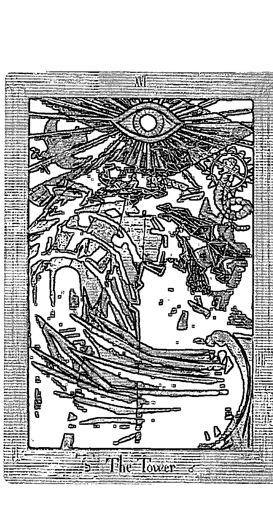

### ∞ 圖像解析 ∞

- ☉ 9 (Pé)
「塔」牌所對應的希伯來文字母為פ，它具有「口」的意涵，在這張牌右下方張開口吐出火焰的嘴巴即是字母的對應。它放出了火焰，燒遍舊有世界的一切。

- ☉火星
火星對應於「塔」牌，取火星的戰爭、破壞之意作為這張牌的闡述。不論是中國占星中的七政四餘，或是西洋占星，火星都被闡述為一顆與戰爭破壞有關的星體。在這張牌當中，我們看到了戰爭般的慘狀，世界在火海的渲染下失去生機，動物們紛紛奔走相告、逃亡。

- ⊙眼睛
牌上方的眼睛具有兩種意涵，一為古埃及的荷魯斯之眼（Eye of Horus），二為印度教中的濕婆之眼。荷魯斯之眼是古埃及壁畫中經常出現的一種圖騰，它意味著無上的治權，也意味著死後的重生，如同這張牌的意象，表示了經過死亡後重生的世界。睜開的荷魯斯之眼揭示出荷魯斯紀元到來。新紀元的到來是大阿卡納的主軸，經過許多張牌的孕育下，荷魯斯紀元終將誕生。另一方面，睜開的眼睛也對應給了印度教當中的濕婆之眼，相傳濕婆的第三隻眼具有無比的破壞力，在末日之時睜開，放出神火，吞噬舊有的世界。

- ⊙逃亡
左上方的鴿子銜著枝條逃亡。枝條是鳥類築巢的材料，而在末日之時牠們仍不忘銜著枝條，以備未來築巢所需，代表了在毀滅威脅下依然抱持著希望的人們。中央許多有角的方塊是對抗末日的軍隊，從高樓墜落，在濕婆之眼的破壞下已經不成人形。他們意味著面對末日抵抗的人們，最終輸掉了身體，輸掉了物質的一切，但靈魂在荷魯斯紀元中將得到解放。

##### 基本牌义

在這張牌之中，我們看到世界徹底的毀滅，當喪鐘敲響，濕婆之眼睜開，火焰吞噬了一切。這張牌延續著泰勒瑪的神話故事，描述進入荷魯斯紀元前，舊有世界毀滅的那一刻。牌正上方的眼睛具有兩種意涵，其一為荷魯斯之眼，是埃及古老的符號，在部分的金字塔或木乃伊上可見，除了代表君權神授的概念外，也普遍的被認為象徵死後世界的重生，而在泰勒瑪神話架構下，這是進入荷魯斯紀元的宣示：荷魯斯之眼出現，舊有的世界終結，毀滅後建立了新的紀元。此外，這也可以對應於主流印度教三大主神之一的濕婆，濕婆是毀滅之神，祂往往帶來了人心深層的恐懼，並使人敬畏。相傳濕婆額頭上的第三隻眼具有強大的毀滅之力，當每一個宇宙走到了終結，濕婆就會睜開祂那第三隻眼，放出能夠消滅宇宙萬物的神火，而在毀滅之後便會進入了新的紀元，接續著宇宙的循環。上一張「惡魔」牌內看到的第三隻眼也是此牌的預示。

毀滅帶來了重生，完全的毀滅帶來完全的重生，這張牌中所要表示的是進入新紀元前的劇變。那往往使人無法接受，並且在當下不知所措，儘管之後被建立起的是更為偉大的世界。「塔」牌的毀滅是必經之路，因為已經走到了盡頭，毀滅是必然的結果，但那不是結束，而是另外一種開始。脫去了過去的包袱，才能夠自由建立新的世界，一次完整的毀滅足以抵過數年的改革，即為「塔」牌的意義。克勞利在一九〇四年寫下了《律法之書》，預示了新紀元的到來，在他的眼中，那是一個多元化的時代，擺脫了過去數千年在宗教壓迫下、在集權統治下對於思想的禁錮，那是一個充滿新思維的世界。更重要的是，那些隱匿數年，被視為異教的神秘學知識，開始流傳與復甦，為新世界帶來了不同的面貌，隨之而起的宗教或其他團體，利用不同的觀點，使人們不再侷限使用單一宗教的思維去瞭解世界的本質，瞭解所謂的真理。物質的改變是必然的，這是根基於嶄新的心靈世界所鋪設的道路，那才是改變真正的意義。站在現代，回顧這多年前克勞利對於新紀元的遙想，我們的生活的確不同於過往幾百年，甚至數千年，我們擁有了較多自由，科技的發展與資訊的累積、傳播到達了有史以來的巔峰，但這只是荷魯斯紀元的起步，在這瞬息萬變的世界隱藏著眾多可能，是幾百年前的人類難以想像的。

「塔」牌也象徵著政權的改變，當每一個國家、朝代走到盡頭，人民揭竿而起，掃除所有的舊規章後，才有地方能夠建立起新的政權、新的國家。「塔」與「死神」雖然都具有毀滅的意義，然而背後的精神卻不相同，「死神」帶來逐漸的凋亡，「塔」則為瞬間的毀滅，「死神」是經歷考驗後的轉化，「塔」則是完全毀滅後的重生。

##### 抽到此牌

「塔」牌可以代表生活中發生的一些小意外，譬如打破盤子、車子被撞出一角、停電等，如果是做不經意的占卜，或是預測生活近況，這些小事情可能就是「塔」牌所提示於你的答案。你對於占卜的「問題」有多麼的瞭解、有多麼的投入、有多麼的重要，「塔」牌的破壞力就有多大。

當然，在一個認真仔細的占卜中，「塔」牌是一種劇變，對於你而言可能是一個難關，可能是一個難以度過的考驗，那往往在你意料之外，甚至覺得自己不可能會有什麼意外。占卜中，詳細闡述「塔」牌的預測對於占卜諮商的品質並沒有助益，反而有可能產生反效果。因為「塔」牌的遭遇在還沒有體會之前，是無法言喻、無法真正令人相信的，過多的描述反而為問卜者留下了負面的心理暗示，即使預測多麼準確，那也只能警告，難以趨吉避凶。抽到此牌，有經驗的占卜者會試圖透過對話讓問卜者看清自己的想法，找出心靈架構下的矛盾處，再給出建議。「塔」牌的劇變往往反映出對內心某種信念的堅持，當下難以接受，過後卻感謝有這些事情的發生。

舉例而言，好比蘋果公司的創辦人賈伯斯（Steve Jobs），如果當年沒有被自己的公司開除，就不會有現在的皮克斯動畫工作室，就不會有現在的智慧型手機，他經歷過如同地獄的谷底，而多年後才明瞭，曾經跌落谷底是生命中最好的禮物。

「塔」並非代表毀滅，只是感覺起來像是毀滅。

## 17 星星 The Star

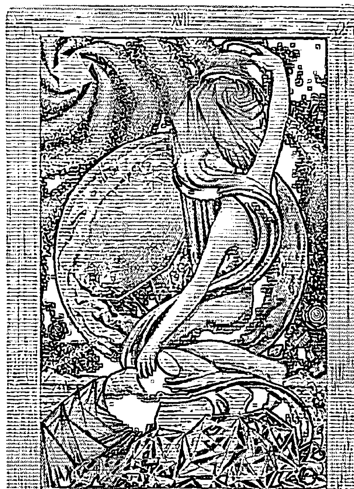

### ～◎ 圖像解析 ◎～

- ◎寶瓶座
在「星星」牌中，古埃及神祇努特（Nut）高舉著水瓶，將希望傾倒入世界之中，這是寶瓶座原始的形象，也是「星星」牌所對應的星座。寶瓶座賦予了這張牌淨化與平靜的特質，透過倒入的水，沖刷掉了過去所殘存的阻礙，洗去了來自上一張「塔」牌毀滅後的廢墟，在寧靜的夜空下，在每個人的心靈之中，架構出一個嶄新的世界觀，建立屬於荷魯斯紀元的新思維。

- ◎努特
努特是古埃及神話中的天空女神，祂是九柱神之一，在神話中，代表著亙古不變的星空。祂生下了伊西斯與歐西里斯，而祂們又生下了荷魯斯，分別為三個紀元中的掌管者。這一切都誕生於努特，在無盡的天空、無限的祝願下，努特的後代分別代表了三種不同的社會與心靈結構，而這一切都發生在這張牌永恆的一瞬間，在努特的眼中，所有的一切都是平靜的，沒有開始，沒有終結。

- ◎七芒星之徽
七芒星之徽是克勞利離開了金色黎明會後自行創立的神祕學組織——A.∴.A.∴.，並且以這個七芒星之徽作為標誌。七芒星的角分別寫上了泰勒瑪中的女神巴巴隆之名，並且以「七」作為數字上的對應。在這張牌中，以七芒星作為荷魯斯紀元來臨的預示，左上方的七芒星代表了《律法之書》所預示出的新紀元，努特水瓶中的星星則為來自亙古的祝福與希望。

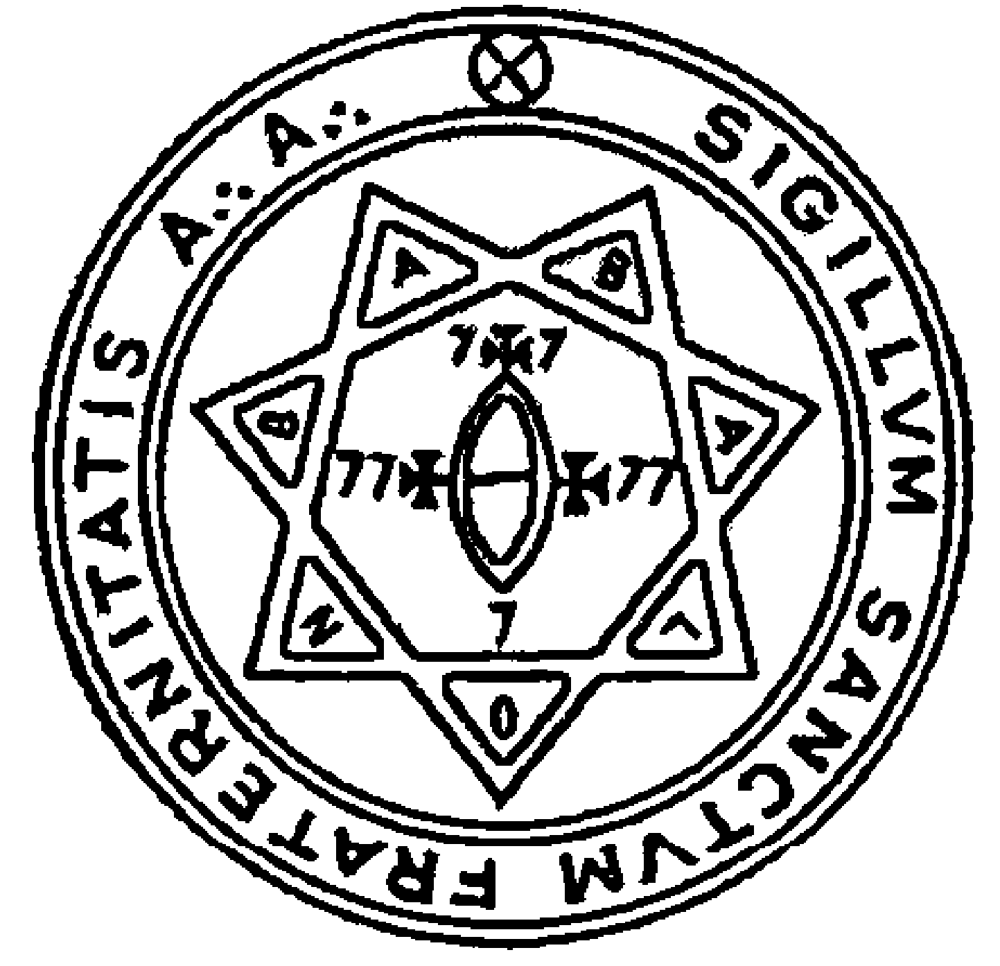

- ◎球
中央像地球的圖像代表了整個世界，代表著新紀元的世界，而努特為它注入了新的希望與祝福，在旋轉中逐漸成形。

### ～ 基本牌義 ～

天空之神努特高舉著聖杯，將星光注入象徵世界的球體。還記得前幾張大阿卡納牌所論及的世界經過了伊西斯紀元、歐西里斯紀元與荷魯斯紀元的意涵嗎（請閱讀「大祭司」、「戀人」、「隱士」、「吊人」、「塔」之敘述）？天空之神努特是古埃及的九柱神之一，生下歐西里斯與伊西斯，而伊西斯與歐西里斯結婚後生下了荷魯斯，祂是泰勒瑪中闡述的三個紀元主神的共同來源。在經過「塔」牌的毀滅後，「星星」牌代表著荷魯斯紀元開始的重建，努特將新的思維注入了象徵荷魯斯紀元世界的球體中，帶來了寧靜與希望。克勞利於寫下《律法之書》、離開金色黎明會後，成立神祕學組織A.∴.A.∴.，並以七芒星作為印記。七芒星內有「慾望」之中所出現的女神巴巴隆，以祂作為新紀元出現的預示之一。在象徵世界的球體內，星星已開始旋轉，代表荷魯斯接掌後的改變。左上方遠方的七芒星暗指著克勞利創立的神秘學組織A∴A∴為揭露荷魯斯紀元到來的先驅。

在努特永恆星空的祝願下，每一個人的靈魂本質並無差別，每一個靈魂都可以是一顆星。如同《律法之書》第一章寫道：「每個男女都是一顆星星。」（Every man and every woman is a star.）「每個數字都是無限，沒有差別。」（Every number is infinite; there is no difference.）進入荷魯斯紀元的人們，將更容易看清自己的自性，更容易將自己渴望自由的靈魂從塵世深淵中救贖出來。

「星星」牌帶來了寧靜與平安，在每一個夜裡，在每一個星空之下的世界，受到努特跨越時間、亘古的祝福。當你抬頭看著星空，從永遠鑲於夜空中的星光即可感受到努特的祝願。每一顆星都是一個靈魂，每一顆星都幫助你看到希望。

### ～～ 抽到此牌 ～

放下恐懼吧，放下無謂的擔憂吧！沒有任何一個恐懼真的存在，沒有一件事可以讓你永遠憂愁，歲月交替更迭，在亘古永恆的星空下只是一瞬間。歷經了許多苦難，你還有自己，度過了漫漫長夜，你還有著希望。你處在平靜中，懷著一些期待，在這一刻，所有的紛擾都停止，你可以看到自己內心中微弱的星光，它讓你看見希望，指引出你的方向。你的心如同星光一樣透徹清明，你可以清楚的抓到來自於潛意識與內心所帶來的訊息、所給你的啟發。這一刻，你的內心充實，你知道自己的目的，在寧靜之中彷彿可以看到未來的自己，看到他清楚的踏著你當下準備要踏出的步伐。

「星星」牌通常代表著祝福，不論是什麼樣的占卜，都存在著美好的預示。可能是生活中遇到使你開心的小事情，可能是你不經意地發現一家舒適的咖啡廳，可能是在混亂過後發現自己還能全身而退，在那個當下，你感覺到心中的平靜，也在平靜之中讓所有的事件都能奇蹟似地順利度過。

## 18 月亮 The Moon

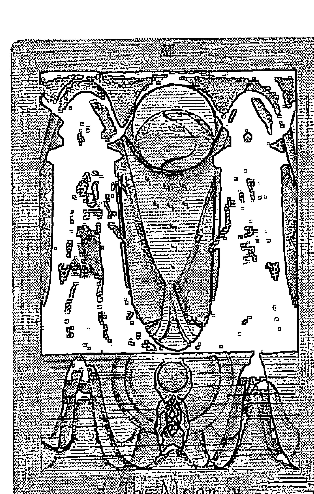

##### 圖像解析

- ◎ 阿努比斯
「月亮」牌兩側的守門人是古埃及神話中的死神、地獄之神阿努比斯，祂有著胡狼的頭與人的身軀，拿著水星之符，在冥界的入口處看著每一個通過的人。

- ◎ (Yod)
牌中央畫了九滴形狀如希伯來文字母 י 的鮮血，對應給了生命之樹中的第九薩弗拉「基礎」，而此薩弗拉也是月亮的對應。代表上帝的創造之指，進入了情緒的深淵，進入了月亮所掌管的領域，將我們從現實世界中拉入了心靈的底層，在最深的黑夜中品嚐自己的陰暗面。月亮是潛意識的感受面，是那些自己所不想看到、所壓抑的情緒深淵。

- ⊙下層背景
牌下方連綿不絕的山峰，太陽照射於其中，意味著存於物質世界背後、表意識之下的心靈底層，這是屬於潛意識的一部分，其中蘊藏著對於世界的幻想、概念、恐懼、情緒等。當太陽落下後，內心世界的太陽升起，焦點從物質世界轉為了心靈本體。對意識底層，我們沒有明確的認知能力，如同圖像中的山峰壟罩著朦朧般的薄霧。

- ⊙聖甲蟲
下方中央鉗著太陽的昆蟲，為與太陽有著密切關連性的埃及聖甲蟲。聖甲蟲是一種稱為堆糞蟲的昆蟲，牠會將動物的排泄物分解成片段的碎塊，並且將它滾動成為球體後推入自己的巢穴中。在巢穴內將此圓球狀的糞便塑造成了梨形，如同這張牌中突出於地表的太陽光輝狀，並且產卵於其內，經過二十八天的孵化，聖甲蟲的幼蟲破卵而出。二十八天的週期與月亮相應，而後出土的幼蟲迎接第一道日光。聖甲蟲推著圓球的動作，就如同這張牌抱著太陽的動作一般，抱日而生具有重生的意涵。

### 〜基本牌義〜

在「月亮」牌中，聚焦於顯意識的太陽沒入了地平線，往下照耀著心靈的幽谷，那是幽暗與恐懼的領地，進入屬於月亮的潛意識中，有如踏入了死後的世界，恐懼的意識、被壓抑的情緒化為形體出現於面前。守在路旁的是古埃及神話中的死神阿努比斯，狼頭人身的形象使每一個經過祂的人感受到了恐懼。

「月亮」牌所描述的是不知不覺中影響著我們，位於自身思想、意識底下的情緒面與擾動面。它無時無刻變化著。那些被壓抑的情感是潛意識中的感受面，是自己不想再次面臨的事件所帶來的恐懼，在層層堆疊掩埋的山腳下，不停的擾動。當嘗試往內心探索，必定會先通過那些駐守在門前的守衛，就連自身也無法保有信心順利地通過，黑夜中吹來的風騷動著意念，畢竟那是不想被別人見到的一面，也是自己逃避的一面，當它落入了意識深谷中，偶爾可以感受到它所帶來的擾動，除非仔細的覺察，靜下心來剖析，否則難以見到真正的樣貌，難以真的化解那一再出現的事件與情緒。

月亮與情緒有關，也與生活中週期出現的事件有關。許多人在每次的戀愛中，因為相同的原因而分手，之後又被相同特點的人給吸引，經歷了相似的事件後再次分手，往往在不同的戀愛對象中體驗相同的經驗，也許覺得那是天意，也許覺得遇人不淑，但是這一切的發生，其實都是在對自己潛意識中的某個部分做出回應，在創傷沒有療癒、沒有獲得寬恕之時，重複的經驗可能隨之而來，而這一切都是為了使自己更進一步的成長。

聖甲蟲守護著牠賴以維生的太陽，牠從中而生，從牠的世界踏入了物質世界之中。如同我們不經意地將潛意識中的情緒投射到世界的過程，形成了我們所要經歷的一切，招來了與我們有著相似背景的心靈，帶著相似需要被療癒的情緒深淵，一起體驗那些發生於你我之間的大小事。

### 〜抽到此牌〜

你可能受到重複出現的情緒所困擾，你可能處在一個不安的情緒之中，但是下一刻，你即將從中抽離。「月亮」牌是黎明之前最為黑暗的時期，在這一刻，你會察覺到以前所沒有想過的危險，你會感覺到平常所沒有的恐懼，甚至是覺得自己終將被黑暗所吞噬，卻又期待著陽光出來獲得解脫的瞬間，你的心情在兩端擺盪著，你自己沒有定見，在混亂中摸黑前進。

當抽到這一張牌，即是對你說著不安其實來自於心底，來自於你心靈深處的恐懼，只有在你真正面對時才感覺得到的掙扎，雖然黑夜終將過去，黑暗將被一掃而空，但是白天過後還是黑夜，黑夜過後還有著無限個黑夜，當意識深淵的障礙還是存在之時，不容易使你真正擺脫那種感受。因此，在面臨每一個恐懼與不安之時，試著任由情緒在你心中發酵，試著感受一下情緒背後被隱蓋住的真實，這是你最貼近傷痕的時刻，當你看出了那造成情緒波動的起源之後，療癒也開始發生，你終將信任自己，這是一個蛻變的過程。

## 19 太陽 The Sun

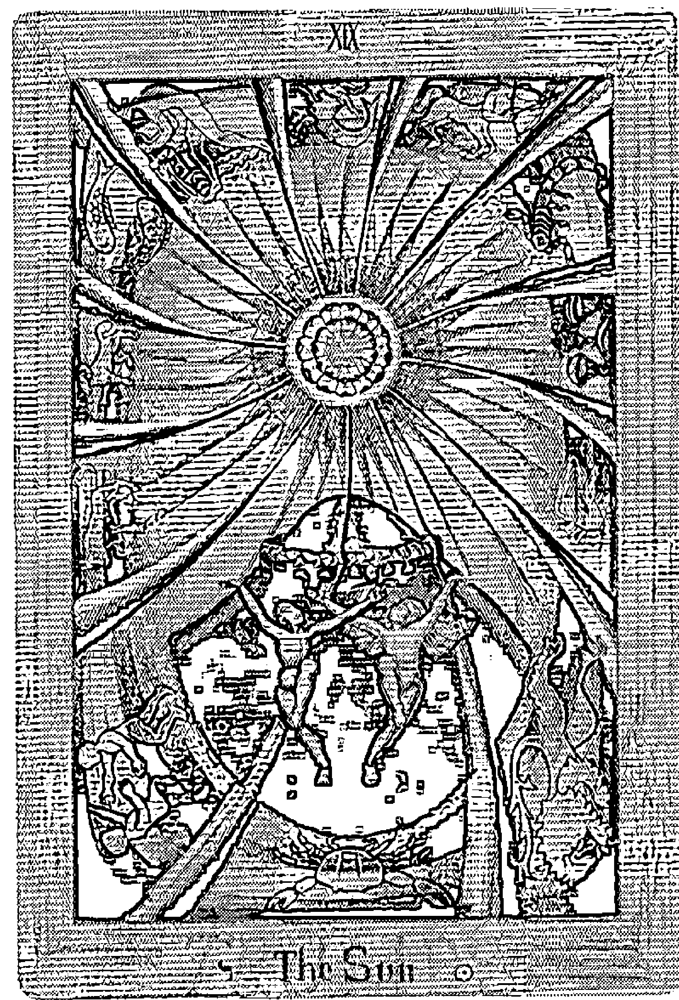

### ~圖像解析~

- ◎孩童
跳舞的男孩與女孩正在慶祝著光明的來到，在泰勒瑪中，暗示荷魯斯紀元的降臨，即下一張牌「新紀元」。他們背後長出來的蝴蝶雙翼是轉化的象徵，如同蝴蝶蛻變的過程。在「塔」牌的破壞之後，經過了「星星」牌的療癒與祝福，度過了「月亮」牌的漫漫長夜後，太陽升起，他們展開雙翅，重獲新生。此外，翅膀也有自由的暗示，暗示著他們不再被傳統的宗教、政治的權威所束縛，在屬於荷魯斯的紀元中，他們的思想可以自由的飛翔。

- ◎太陽
太陽代表的是無上正向能量，也帶來這世界的光明。太陽發散的十二道光芒與周圍繪出的圖騰，正是意味著與之相對應的黃道十二星座。它們重現於星空，為這一個新世界的起點帶來了祝福。

- **薔薇**
中央的薔薇圖騰代表太陽所帶來的綻放，在傳統上，薔薇十字是祕傳智慧的印記，交疊的兩圈薔薇是薔薇十字會的暗號，代表著祕傳的智慧、奉獻與愛的精神，和太陽能量融合，綻放於世界。

- **綠色背景**
綠色的背景是太陽賦予春天的活力，使經過漫漫長夜、漫長寒冬中的大地復甦，萬物在陽光的滋養下欣欣向榮的生長。同時這也意味著新紀元世界的生命力。

- **努特**
最外圍的一圈藍色代表了「星星」牌中所出現的天空之神努特，將距離拉遠來看，新紀元在世界中茁壯，而世界則是存在於努特的局部縮影，在那永恆不變的時間中，總是不斷的變化，然而由外往內看，則是永遠的寧靜，一瞬都不曾改變。

##### 基本牌義

「太陽」是大阿卡納中非常正面且光明的牌，太陽是勇氣與信心的代表，也是照亮黑暗的希望。「太陽」牌周圍的黃道十二宮圖形，照著傳統的位置排列，畫面中央男孩與女孩跳著舞慶祝太陽光明的來到。同時這張牌也是泰勒瑪中慶祝新紀元到來前的歡呼，在晚期的古埃及神話中，太陽神拉與荷魯斯的形象融合，在泰勒瑪中稱之為「赫魯—拉—哈」（Heru-Ra-Ha），意即於地平線所升起的太陽之神荷魯斯，祂帶來了新的律法與嶄新的觀點，照耀了舊體制下的世界。同時代表著光明、愛、自由，解放了舊有的靈魂與心智。

經過了漫漫長夜，經過了上一張「月亮」牌最黑暗的時刻，太陽終於升起，照亮了「塔」牌破壞後的世界，照進了每一個重獲新生的心靈。荷魯斯紀元開始，舊有的一切將一掃而空，大地萬物欣喜迎接這一刻。循著《律法之書》的脈絡，我們處在一個紀元交替的時期，舊有的父系社會、君權、社會制度與宗教壓迫，將隨著荷魯斯紀元的到來逐一瓦解，取而代之的是平等的社會，不再出現父權與母權這些名詞，因為在新的紀元中我們已經沒有兩性優越的認知了，人們試著看穿表象，看進內心，看見靈魂，因而性別的刻板印象也不復存在。除了社會結構的變革外，宗教體系的轉變也是必然的過程，唯一信仰的宗教將慢慢的被多種修行團體所取代，人們將知曉宗教只是邁向真理的一條路，不是唯一的一條路，每個人都有選擇權，走向那條最適合他的旅程。在太陽升起之後，新的思維開始在這世界中展現、流轉。

### ～～抽到此牌～～

「太陽」牌是典型的好牌，當你抽到這張牌，代表阻礙都已經消失，如同陽光劃破黑夜，你的勢力無法被阻擋，你將親眼看到屬於你的光亮。「太陽」牌可能代表著你找到不錯的工作、獲得了一筆財富、找回了希望、身體恢復健康、沉浸於熱戀中等，它具有一切美好的意涵。太陽給人的感覺是溫暖的，在這一剎那你獲得了自由，獲得了心靈的解脫，也找回了單純的快樂。

## 20 新紀元 The Aeon

### ש Shin

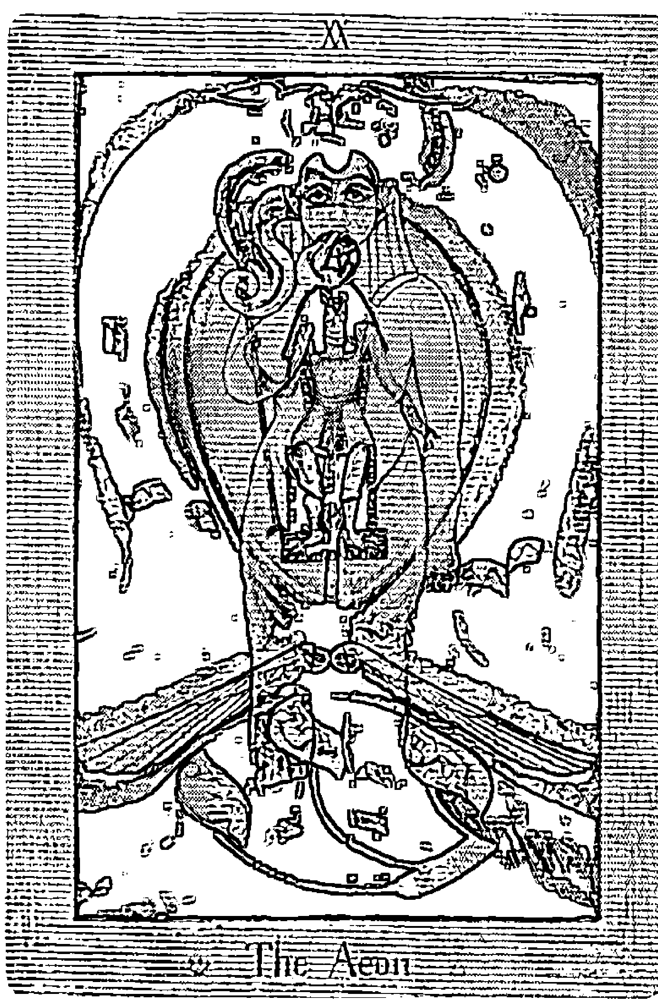

##### 圖像解析

- ש (Shin)
「新紀元」牌中出現的希伯來文 ש 代表「牙齒」，書寫體則像是點燃的火把，象徵著屬於火元素的荷魯斯紀元。在喀巴拉的生命之樹中，連接著第八薩弗拉「宏偉」(Hod) 與第十薩弗拉「王國」(Malkuth)，對應給這張牌的是過渡元素中的火元素，象徵著火焰對於舊有世界的洗禮。牌的下方可以看到希伯來字母 ש 的圖像，三個端點以不同階段的人類姿態表示逐漸成長的思維。

- 火元素
「新紀元」的對應為火元素，它對應到喀巴拉生命之樹過渡元素中的火元素路徑，以火焰燃燒舊有的體制，以火焰淨化投入新紀元的靈魂。

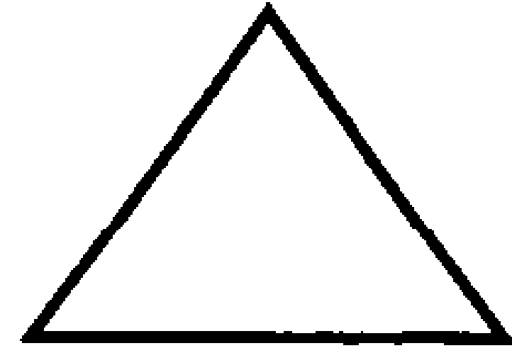# ©荷鲁斯

以线条描绘出透明形体的小孩，乃是古埃及神话中幼年的荷鲁斯形象，而端坐在椅子上的则是掌权后的荷鲁斯。两种形象的荷鲁斯常常并存于神话中。关于荷鲁斯，有着许多不同的描述字汇：

-   ◇赫鲁—拉—哈（Heru - Ra - Ha）：同时具备了幼年与成年形象的荷鲁斯。
-   ◇胡尔—拉—克拉特（Hoor - Pa - Kraat）：消极的荷鲁斯形象，以孩童时期的荷鲁斯作为其形貌。
-   ◇拉—胡尔—库特（Ra - Hoor - Khut）：积极的荷鲁斯形象，以登上王位的荷鲁斯作为其形貌。

这些都是泰勒玛中所运用的字词，不同于一般古埃及神话所用的字汇。

# ©努特

将距离拉远来看这张牌，背后的蓝色形成了天秤座的占星符号，隐约暗示着被取代的审判牌（Judgment），蓝色是天空之神努特的对应。

##### 基本牌义

传统的塔罗牌中，第二十号牌乃是审判牌，意指末日的到来，在这一刻，所有死去的人终将复活，接受神的审判。然而在托特塔罗牌中却没有了审判，原本的审判牌换成了“新纪元”牌。托特塔罗牌的主轴乃是根据于《律法之书》，阐述着旧有的世界价值崩解，新思维的时代即将来临。而荷鲁斯纪元最大的不同，乃是人类的灵性层面发生了转变，对于名利和权力的追逐、对于性别的优越感、对于宗教的权威终将慢慢放下，所关注的焦点从外在移到了内在的世界。因此属于基督宗教的末日审判在进入荷鲁斯纪元之后已经没有存在的意义，人们终将知道末日审判只是一种比喻，那不真的发生。当我们聚焦于内心世界，将新的思维带入了物质世界，我们会用一个更为宽阔的视野来看待这一个启发，审判的目的是为了唤醒人性，唤醒沉睡多时的内我神性，在荷鲁斯纪元中，没有一个人有罪，也没有一个人可以被定罪，我们都具有着清白的自性，具有着纯净的心灵，正如同《律法之书》中所阐述的：“每个男女都是一颗星星”、“每个数字都是无限，没有不同”，不论犯过什么过错，皆不能掩盖住灵魂的光辉。人生如梦，梦如人生，梦醒后没有人会对梦中的人物定罪，因为就连罪恶也是不存在的，它只存在于我们所聚焦的世界，当焦点改变，那也仅仅是个模糊的光影而已。

荷鲁斯出现于牌的中央，祂不做审判，祂掌管了这一个多元观点并存的世界。新的纪元有着诸多的变化，我们回过头来检视历史，在这一百年中，科技突飞猛进、独裁政权瓦解、宗教力量式微、资讯传播快速……，这些都是在历史中不曾出现过的跃进，变化的速度远远超过了预期，而这些变化都只是属于表层，只是属于开端，在荷鲁斯纪元中，真正发生的剧变乃是在于思维，在于物质世界以外的追寻之上。

# ~~抽到此牌~~

关于过去，对你已经没有了影响力，你可以完全活在属于你的新生活中。这可能意味着你的生命中做了一些较大的调整，例如转换工作跑道，结束求学生涯等，它意味着你可以不用再过着重复模式的生活，你可以在新的环境中获得解脱，如果这符合你的期望，那么对你而言这份转变是最好的礼物。

这张牌也可以代表着一种由旧转新的事物、新的尝试与创举。特别的是，这张牌也可以代表一些心灵成长、修炼或自我探索的事物，在荷鲁斯纪元中，多元思维与内在的探索往往是改变的内在因素。

# 21

### 宇宙

## The Universe

### Π Tau

### 土星

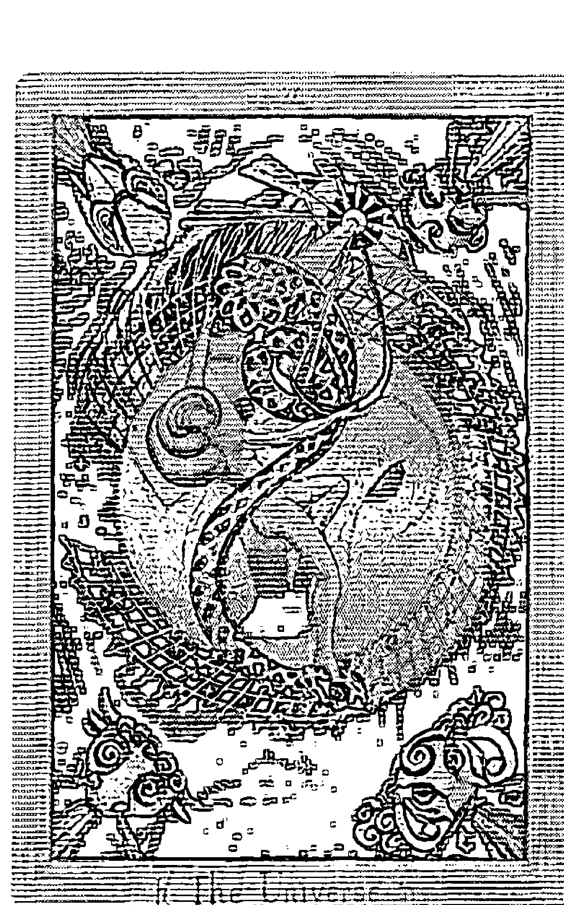

##### 图像解析

### ◎ Π (Tau)

“宇宙”是大阿卡纳的最后一张牌，对应的希伯来文字母 Π 是十字之意。牌中的裸女展开了双臂，接受来自荷鲁斯之眼的光芒，交叉的双腿暗藏 Π 的十字。如果将大阿卡纳看成是一段演进的过程，到了“宇宙”就是最后的终点，然而生命，甚至于世界，若跳离了时间的范畴，就根本没所谓的起点与终点。藏在牌里的寓意指出了这一点。“愚人”牌与“宇宙”牌所代表的希伯来文字母拼起的单字意味着“本来面目”，是所有一切的发生与未发生。

### ◎土星

“宇宙”牌的占星学对应为土星，着重于土元素¹⁰成分，在三王星尚未发现的古典占星学中，土星是移动最慢的行星，沉重迟缓是它的寓意。在喀巴拉哲学中，世界诞生于空无，经过许多火、水、风阶段的沉淀后，形而上的能量凝结了物质，意识开始出现，土星缓慢运行与沉降的神秘学特性，则可以代表这最后所成形的物质世界。

### ◎荷鲁斯之眼与女神

牌中跳舞的女神与“太阳”牌下方手舞足蹈的女孩有着相同的姿势，迎接着荷鲁斯纪元的到来。祂张开的双臂意味着坦然信任的心灵，接受来自荷鲁斯神圣的册封。而蛇是生与死的象征，接收了来自荷鲁斯之眼代表律法秩序的光芒，化作积极与消极的呈现。女神背后的绿色漩涡是土元素的颜色，意味着我们所居住的地球与眼中所见的世界。角落的四个圣兽在“大祭司”牌曾经出现，是重新注入新生命后的四元素。这张牌是泰勒玛中重要的神谕，表明了荷鲁斯纪元到来后，新的神秘学知识、新的科学与新的观念将会重新洗涤这原有的一切。

### ◎孕育出的世界

牌中央的绿色球体是我们所存在的世界，这是经过了前面数张大阿卡纳牌孕育后所形成的世界。围成椭圆形的形状是奥菲克秘卵，是经过“魔法师”、“恋人”与“艺术”等牌的炼金过程后，所孕育出的新世界。七十二个方格围起的圆圈是七十二组喀巴拉圣名，将黄道划分为七十二个分区，这也是小阿卡纳中星座时间对应的分配原则。

### ◎神秘学与科学

牌下方的房子是思想物质化的象征，暗示着从精神层面到物质层面路径的结束，物质是最后的成果，然而对于生活其间的人们而言，它也代表了新的发现，房子刻意画成了类似化学元素周期表的雏形，来点出炼金术是化学的前身。理性科学曾是由类似炼金术等神秘学中获得许多经验累积，并且分化出来的一门学问。克劳利晚年致力于将降灵术、预测术等神秘学知识化为有系统的学科，他认为科学与神秘学并非互相矛盾，只是相互不及彼此所能阐述的范围，终有一天两者会有相互接轨的时刻。房子位于生命之树最下方的萨弗拉“王国”，是我们所见的世界，亦是克努利所认定科学与神秘学发生整合的荷鲁斯纪元。

### ◎隐藏的生命之树

中央的圆圈随着舞蹈而变化形态，在这边有二十二张大阿卡纳牌所对应在喀巴拉生命之树的路径，勾勒出隐而不见的线条。克努利指出，除非具有沉静之心，否则是看不到隐藏在此的生命之树。

# ～基本牌义～

克努利改变传统上第二十一号牌的牌名“世界”，以更广阔的概念——“宇宙”来描述圆满、循环的概念。“宇宙”是大阿卡纳中的最后一张牌，是世界成形的最后一块拼图，是终点，也同样是起点。首尾相扣成了生生不息的循环。每个结束都是下一个开始，每个开始也都来自于结束，以灵性的眼光来看，无所谓开始与结束，而宇宙本身就是一个无止尽的循环。

牌中女神自由奔放的舞蹈，承接了荷鲁斯之眼投射出的律法之光，指出克努利所创立的泰勒玛中荷鲁斯纪元的到来，新的秩序与思维即将产生。“宇宙”牌对应的占星符号是土星，在喀巴拉中土星属于生命之树的第三个萨弗拉“理解”。“理解”是全然阴性的能量，如同大海般深邃广大，也是母亲的象征。同时此牌也是第九萨弗拉和第十萨弗拉相连的路径，代表着从灵性的、精神的世界通往物质世界的道路，寓意上有女儿登上母亲王位之意涵。

注 10：土元素的土源自于四元素说中的土，土星的土源自于五行中的土，两者意涵不同。

“宇宙”牌是大阿卡纳中配色最为均匀的牌，包含了前几张大牌的能量，相互平衡的作用下，凝聚幻化成我们所见的世界与不可见的心灵世界。它的牌义广大，无法全然理解，然而在长时间的观想牌面图像后，往往会有不同层次的见解。

# 〜 抽到此牌 〜

“宇宙”是大阿卡纳的最后一张牌，意味着最后的完成，物质世界的建立，在占卜上，意味着一个理想的实践过程。有可能是一段创业的艰辛，是一连串准备考试的心路历程，是一段关系的起伏脉动，“宇宙”牌并没有做出吉凶祸福的论断，它以中性的观点来告诉你，任何结果都是好的！因为结果只是终点，过程才是真正反应你心灵深处吸引来的体验，过程才是最好的礼物。

# 小阿卡纳 Minor Arcana

## 权杖牌组 The Suit of Wands

> > 权杖牌组，追随自我的英雄之旅

权杖牌组属于火元素，火象星座的牡羊、狮子与射手分别对应到权杖牌组中。火是点燃生命的动力，是源自于内心的渴望。火为大地带来光明，划破黑暗，指引出前进的道路。若我们向牌的中心看，可以看到那来自远古，点燃世界的火元素能量中心。

#### 权杖王牌

# Ace of Wands

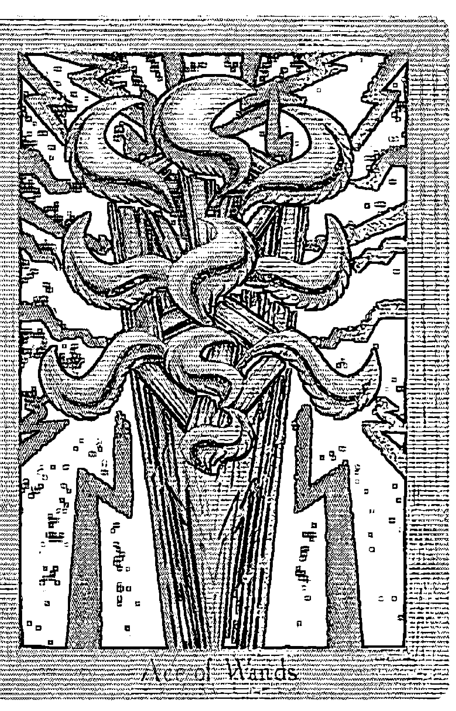

##### 图像解析

◎ 权杖

权杖牌组以权杖作为火元素的象征，火焰点燃了权杖，照亮黑暗，是第一次睁开眼睛的那个刹那，世界的诞生，亦是自己的诞生。

◎ ゛（Yod）

权杖上的十道火焰勾勒出希伯来文字母゛形状，゛是上帝创造之指的象征，意味最初的神圣创造烙印在此牌，火元素为四元素之首，“权杖王牌”以惊人的声势作为小阿卡纳牌组的开端。

◎ 生命之树

权杖中出现了喀巴拉的生命之树二十二条路径与十颗萨弗拉图腾，点出了数字牌组与喀巴拉之间的紧密依存关系，王牌可以是这个元素每张牌的加总，因此十道迸发出来的火焰代表着所有的权杖牌组，代表着“权杖王牌”所具备的火元素特质。

##### 基本牌义

“权杖王牌”延伸出该元素所有的牌组，也为该元素所有牌的源头。严格说起来，小阿卡纳只有四个元素的王牌，其他的均从其而生。因此王牌并非单纯的只是二号牌的前一张，它独立于该元素的所有牌组，是创始前的能量原点。

“权杖王牌”以权杖火的象征，代表着火元素能量的开端。这张牌里，一个权杖耸立在画面中央，中间用木头勾勒出生命之树二十二条路径，并且从十颗萨弗拉位置迸发出十条火焰与十八道闪电，点出托特牌中小阿卡纳牌组与喀巴拉之间的关联性。希伯来文字母，是代表上帝圣名四字母中的第一个字母，代表着上帝的创造之指，归属于火元素，同时点出了牌内出现的是属于原型之界（Atziluth）的生命之树。十条火焰分别代表之后接续几张牌潜在的能量，每一个萨弗拉皆对应到权杖牌组的每一张数字牌，而“权杖王牌”是所有火元素牌组的力量总和，相当于喀巴拉中第一个萨弗拉“王冠”中包含一切的概念。十八道闪电如同春雷一般的迸发，象征着火元素迅速强大的创造性能量不受限制的展现。图像也绘制成阳具形态，作为阳性能量的表示。火元素一般的特质是阳刚、雄心、魄力与热情，数字牌对应到的是牡羊、狮子、射手等火象星座，而“权杖王牌”本身则是对应到北面巨蟹一獅子一处女的天球象限。如同这张牌所呈现的，强大的力量来自于自己，在神秘学操作上，这张牌具有强大火元素的能量，能够作为立下决心和锻鍊毅力之观想。

喀巴拉当中，世界被叙述为四重的组合。我们所认知到的世界，如同一道穿透四种玻璃后的光线，仅剩下微弱光芒，从观测到的细微光线去推敲其上的世界，就像是重新寻回真理的途径。在喀巴拉的哲学观念中，世界上所有事件的发生皆有其关连。举例而言，当被一块石头所绊倒，一般所认知的是“因为石头的出现使我被绊倒”，然而喀巴拉哲学的观点是超脱于物质的诠释：意识当中早有所设定，才出现了这块石头，因此在更上一层的意识所观察到的状态是：“我需要被绊倒，所以我使这块石头出现”。

四种层次的意识中以原型之界为最高层的世界，代表着纯净灵魂的创始，它归属于火元素，也为“权杖王牌”及整个权杖牌组所对应。

“权杖王牌”的特质是活力、温暖、热情、迅速，另外也代表着新的开端，如新关系、方法、机会的出现。它给人的是一种蓄势待发、箭在弦上的动力，譬如运动员上场比赛的活力、做下了一个关键的决定等。

# ∞ 抽到此牌 ∞

王牌必须搭配着牌阵其他的牌来做出解释，若单纯就“权杖王牌”而论，则可以大致推论此刻无法避免的事件，不论好与坏，它所带来的转变是不容易改变的。以长远的眼光看来，这是一个机会重新去认清自己的想法和目标，而外界环境通常也会出现支持自己的力量。这是一个重要的契机，此刻需要知道自己正处在蓄势待发的状态上，现在最重要的是准备好面对的勇气，踏上前一步去实现。你可能心中满怀着热血，恨不得马上出发，马上行动，你集中你的活力，这一刻你没有疑惑，命运握在你手里，你可以马上行动。

在解牌上，“权杖王牌”暗示着可以用喀巴拉解牌法着手。可以利用牌阵当中出现的数字牌或大阿卡纳的路径，找出相互关连之处。

#### 权杖二

统御 Dominion

火星牡羊

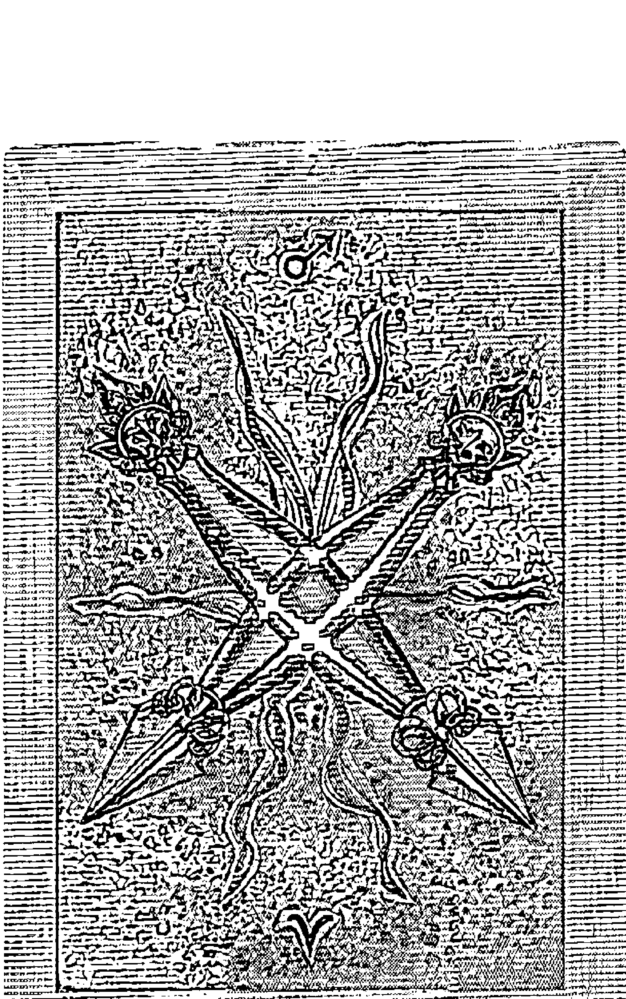

##### 图像解析

◎金刚橛
交叉的权杖是西藏象征雷神的法器：金刚橛，代表来自上天神圣的力量，具有破坏与创造的能力，而其中破坏之力大过于创造。法器一端的忿怒尊源自于藏传佛教神明的形象，具备震慑威吓之力，亦同时具备克服恐惧之意。在这张牌中，愤怒的孔也代表生命能量的强力展现。尖端的两条蛇象征破坏与疗癒（蛇在西方素有医疗的象征）。

◎火焰
这张牌暗藏了一个占星学太阳的意涵在牌的正中央，从中窜出六道强大的火焰，除了说明这一张牌所属的牡羊座守护星（主宰星）回归的力量显化外，也暗示出这股力量不容易受到控制。

# ## 背景

背景的淡蓝色与红色的点，代表着“权杖二”迸发出的火焰照亮了黑暗。

# ## 基本牌义

“权杖二”的占星学对应是火星在牡羊座，牡羊座的守护星火星出现在自己的星座中，增进了火象精神的展现，同时作为黄道十二宫的第一个星座，也有起始的意思。背景中的淡蓝色，乃是代表火元素的原型之界生命之树当中第二个萨弗拉“智慧”的呈色，受到火星与牡羊座的火元素能量影响下，散去的云露出了天空的淡蓝，有如除去了困惑。

“权杖二”如同其牌名，善于支配着周遭，作为它意志的延伸，然而它的想法往往快过于它的行动，让众人追不上它的脚步，就连自己也苦恼着计划赶不上变化，变化又赶不上新计划。

# ## 抽到此牌

这张牌在心理层面代表一种由冲动形成的点子，往往没有特别的目标，也没有明确的规画，但是当下觉得非做不可，如同黑暗中刚被点燃的火堆，不受控制的往四面八方窜，一种强大的心灵力量在推动着行动。受到火星在牡羊座的影响，对于当下的行动充满信心，相信自己目光独到，能够在自己的手中完成一切。

此外，可以代表着未来即将出现挑战，过程往往不是一路顺遂，不过一路上会有许多刺激，使自己觉得一切值得。“权杖二”可以是运动或是参与比赛、考试的暗示，让当事人具有一种热诚，抽到这张牌往往代表著尽了全力去赢得胜利的心态。

#### 权杖三

美德 Virtue

太阳牡羊

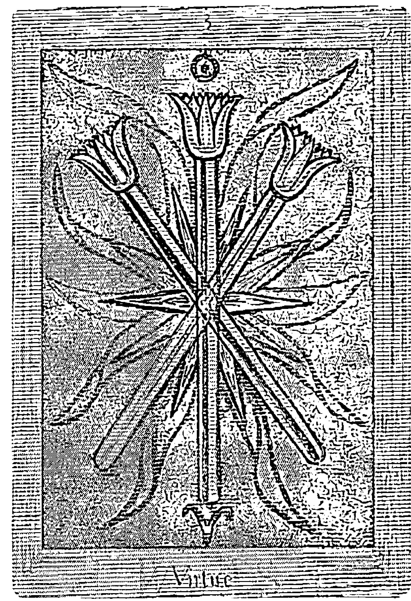

##### 图像解析

-   - ◎美德（Virtue）
“权杖三”的牌名是Virtue，这个字意味着美好德行的展现。在最适当的时机恰如其分的展现，就是这张牌的寓意。

-   - ◎太阳落入牡羊座
太阳落入牡羊座，是历法上的春分点，在西方代表春天的开始。这时大地充满着生机，花朵含苞待放，如同这张牌的牌名，在温和的环境中展现自身的德性。

-   - ◎莲花
牌面由相互交叉（两把倾斜与一把直立）的三把权杖组成，权杖顶端的莲花著生代表生命力的绽放。莲花可以连结到埃及女神伊西斯，具有丰饶与春天的象征，并且代表着先前几张牌较为激烈的意志，在此经过母性能滋养下产生转变。权杖上莲花的九片花瓣可连结到喀巴拉生命之树第九个萨弗拉“基础”，对应给月亮，而月亮对应于伊西斯。此外莲花权杖也是金色黎明会中作为仪式的法器。

# ◎橘红色的火焰

牌中心是太阳的象征，其中有十道尖端的火焰与十道橘黄色卷曲的火焰发散而出，是上两张牌所残余的能量显现。弯曲的火焰来自于由“权杖王牌”所迸发的萨弗拉，而橘红色尖端状火焰则是代表“权杖二”中交叉的西藏法器。

##### 基本牌义

这张牌的占星组成为太阳在牡羊座，太阳在牡羊座是春分点出现的时刻，是为春天的到来。三号牌在生命之树的第三个萨弗拉“理解”作用下，为原本阳刚的“权杖二”融入了阴柔之力。正如同牌中所呈现的，以莲花权杖代表母神伊西斯母性力量的融入，冲动的火能量在母性能量融入后，转变成较为细腻的情感与谨慎的思考。前几张牌的火苗在此已慢慢的成长，尝过了自由奔放，度过了严冬，冲动的性格在此有了收敛，化为了信心。

“权杖三”表示着，在心灵与行动吻合的前提下朝向新的目标迈进是合宜的，倘若不一致，则等待是较好的选择。克劳利特别指出，这张牌可以连结到《易经》中的第十一卦：泰卦。《易经》：“泰，小往大来。”代表阴性能量与阳性能量的交合调节，“权杖三”本身的意涵有展现良好道德之意，而泰卦则是象征阴阳交会的通畅，因此有人际关系互动上的正面意涵，可联想为个人优点的展现吸引了和谐的人际关系。

##### 抽到此牌

代表着先前的准备已经足够，此刻若内心觉得无所阻碍，便是个可以发挥的好时机，如同刚播下的种子，逐渐开始发芽茁壮，不论是关系、事业等，都算是个好的起步。你经过了许多挑战，并且累积了许多经验，此刻正是你行动的时机，只要自己觉得没有什么罣碍，没有后顾之忧，这是一个好的时间点。“权杖三”也可以代表一段刚开始慢慢发展的关系，或是新工作上手后慢慢成长的时刻。

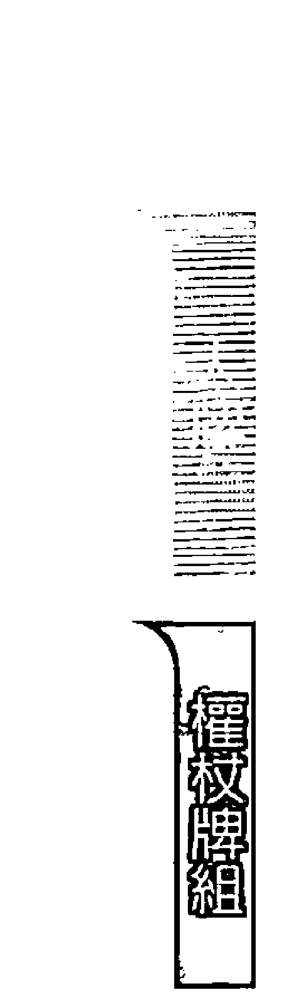

#### 权杖四

完成 Completion

金星牡羊

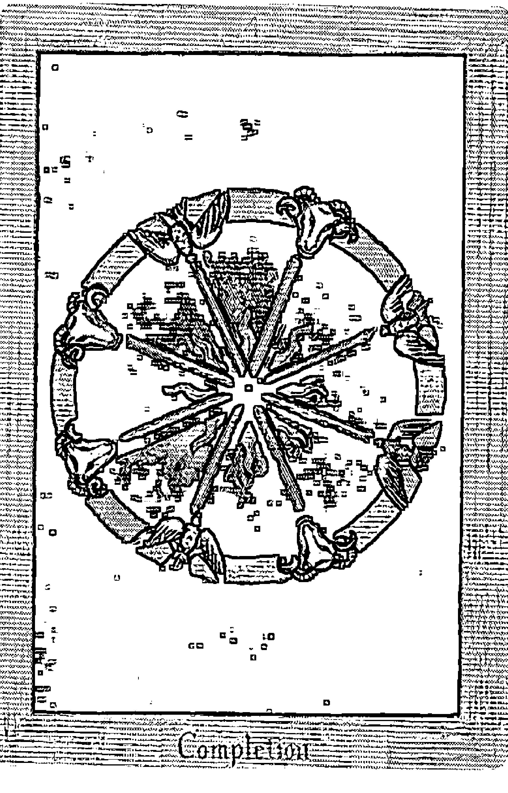

##### 图像解析

### ◉权杖

权杖两端由代表牡羊座的羊头与代表金星的鸽子组成，牡羊座热情冲动之特质，与金星柔性、爱的氛围搭配下，形成圈住火元素的圆圈，意味着过去的想法已经通过行动来实现。若想要再次出发，除了意志运行过程中的已成功心态作祟外，也存在着现实环境上的限制。

### ◉圆形

在权杖端点有一个黄色圆圈围绕，圆圈与中央火元素能量之点构成了太阳的占星符号⊙。暗示着上一张牌火元素能量的展现到此受到了限制（圆圈围住中央的辐射）。

##### 基本牌义

“权杖四”的牌名为Completion，乃完成之意，是上一张“权杖三”行动过后状态。“权杖四”的四把权杖交错构成了圆形，两端的羊头与鸽子分别代表着牡羊座与金星能量的平衡。这张牌削弱了火元素的行动力，在有所收获之后稍微停下了脚步，享受着简单的幸福。完成代表了阶段性任务的结束，此刻是不可多得的宁静时光。

“权杖四”对于能力画下了限制，有所保留，毋须急着展现所有的才华，有所为而有所不为，并且在辛苦后，留有时间去品尝付出所带来的果实。金星落入了牡羊座，为这张牌带来了些许的安逸感，使得热情十足的牡羊停下脚步，慢慢欣赏沿途错过的美景。

##### 抽到此牌

此牌表示事物已经具备了某种程度的发展，现在需要圆润的处事手段与谦和亲切的态度。此外，“权杖四”也有承先启后之意，过去的已经告一段落，暂停脚步，留下时间给自己，然后再迎接新的开端。在这个阶段，你会觉得事情过得很顺利，仿佛顺水行舟，你在不经意中达到了目标。此刻你的内心保有宁静，也正是因为这份宁静投射到你生活的世界，让你记得自己的模样，让你自己去认同，原来你真的可以成为你想要成为的人。

## 權杖五

競爭 Strife

土星獅子

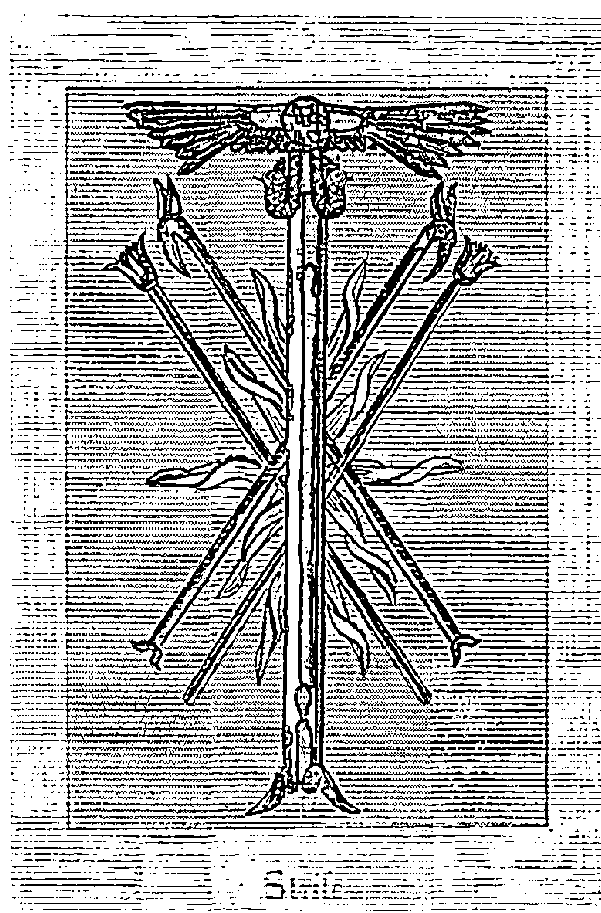

##### 圖像解析

#### ◎權杖

「權杖五」的牌名是Strife，有衝突與相互競爭之意。中間聳立的權杖頂端，分別為古埃及皇室聖蛇像與代表太陽神的雙翼太陽圓盤，在此作為至高無上權力的象徵。此外，圓盤中亦刻上了屬於克勞利的「巨獸印記」。其下的兩把頂端刻上埃及聖鷲的權杖，是魔法中的鳳凰杖，如同「權杖二」的金剛橛，具有毀滅與再生的意涵。最下方兩把蓮花杖來自於「權杖三」，紫色蓮花則是象徵喀巴拉中的第三薩弗拉「理解」，它接納了來自第二薩弗拉「智慧」所發散的純陽性創造之光，蘊藏有母性能量平緩的特質。交叉兩對性質不一的權杖，表現出衝突與混亂。

#### ◎火焰

中央十條波浪狀的火焰，代表這幾組權杖在相互不和諧的能量下衝撞出的火花，當象徵三種能力的權杖擺在一起時，它們彼此無法和諧共存，而有了衝突與競爭。

## ◎克勞利的印記

牌最上方的圓盤中刻有克勞利自己所使用的巨獸印記，同樣的印記在「權杖王子」與「圓盤王牌」還會再次出現。或許是土星落入獅子與生命之樹第五個薩弗拉「力量」所賦予的極端特質，與克勞利本人發生了共鳴，因此在這張牌中放入屬於自己的符號。

##### 基本牌義

「權杖五」所對應的占星符號為土星落入獅子座。獅子座與生具備表現與統御特質，然而土星在此作用下則是削減獅子座的協調性，使對立的衝突展現。「權杖五」已經沒有「權杖四」當中的限制，因此衝突的力量可以不受限制地爆發出來。在圖像的安排上，不同地位的權杖同時放置在一起，象徵著內部的不和諧，如同領導者若無法使眾人臣服，衝突發生也是在所難免的。

「權杖五」存在強大的情緒推力，對應給原型之界生命之樹中第五個薩弗拉「力量」，為這張牌帶來了些許暴力氛圍。土星制約住獅子座渴望站在舞台上獲得眾人喝采的機會，被壓抑下來的獅子座無法擺脫與生俱來的領導者性格，因此衝突就此發生。然而在這張牌中並沒有贏家，甚至可以預言出未來將不停的爭吵。我們必須知道，這樣的衝突來自於被壓抑的天性，「權杖五」可以成為匯集資訊的中心，成為眾人的共主，但也需要接納周遭與自己擁有相同能力之人的雅量。

##### 抽到此牌

此牌代表著從一種緊張的局面、壓力、有拘束的關係下得到了釋放的機會，然而通常是以衝突的方式發生。從內在心靈與外在世界相互呼應的觀點而言，表面的衝突實際上是內心對於自然情感面的渴求。在此須多留意心中是否對某些情況有了長久的壓抑，而在外界不斷的刺激下已無法按耐住心中的激動。你可以對自己有信心，也別忘了相信對方的能力。

你可能對當下不甚滿意，可能希望做點什麼來改變這環境，但外界卻認為沒有什麼是需要改變的。其實真正需要調整的是自己的心，你的情緒像是一頭脫繮的野馬，連自己也無法掌握，任由它帶著自己走。若是調整了視角來觀看，那也僅僅是意識碰撞出的小火花。

## 權杖六

致勝 Victory

木星獅子

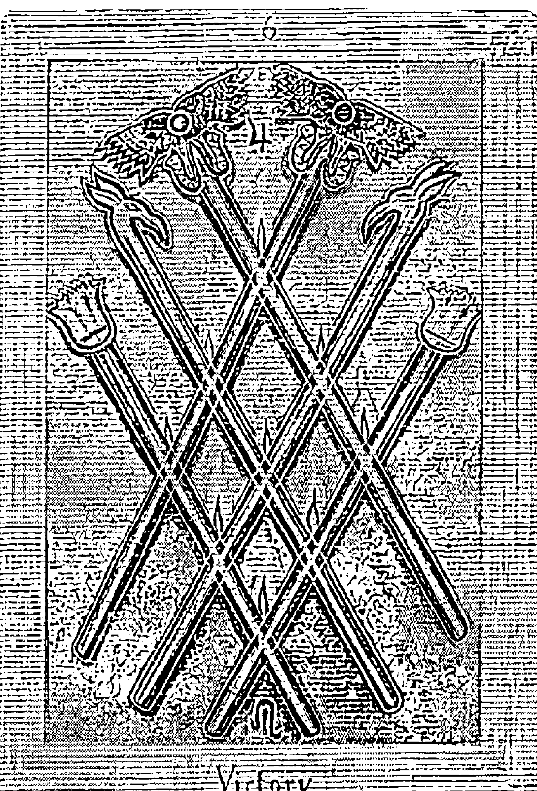

##### 圖像解析

#### ◎權杖

「權杖六」的牌名爲Victory，乃致勝之意，它比「權杖五」多出了一把象徵皇室領導力的權杖，爲原本不平衡的「權杖五」帶來解藥，並且整合群體中的優勢，將阻力轉變爲動力，是一種彼此協調下獲得勝利的象徵。

#### ◎背景

在埃及神話中，紫色代表邁向勝利的突破點，而趨向明亮的紫色背景，意味著勝利到來的心境。

#### ◎火苗

中央代表火元素之源的光點化為火苗，在每個權杖交叉處點燃。這意味著彼此協調之下，火元素能量平衡的展現。在每一個象徵不同能力位階的權杖共同作用之下，施展出相同的能量，不同於上一張牌各自為政的狀態。

##### 基本牌義

木星擴張的力量，落入自我意識、創造性強烈的獅子座，使得事情得以順利的發展，自我表現渴望獲得補償。木星落入獅子座是一個溫暖與愉悅的組合。它的勝利來自於貼近直覺或靈性上的經驗。六對應給生命之樹當中的第六個薩弗拉「美」，它位於生命之樹的正中央，本身可以對應給太陽，而周圍有月、水、金、火、木、土六顆星圍繞，作為靈性、不可見世界與物質世界的橋梁。小阿卡納的六號牌都具備了平和與順利的寓意。「權杖六」沒有「權杖四」的圓圈圍繞火焰，它是一個開放的環境，不需要有所限制，彼此仍然知道自己的分際，達到最完美效益的展現。

「權杖六」這張牌代表身體、情緒、精神、靈性上的醒悟，片刻的安靜讓你足以看清楚內心所投射於外在世界的藍圖，你清楚自己的定位，最終獲得了勝利，這並非意外，而是在發生以前早已經了然於心。

##### 抽到此牌

當夢想還處在猶豫不決、阻礙重重的時候，我們常常會壓抑了夢想，選擇了一條平穩卻不是我們真正理想中的那條路。也許夢想將被現實埋沒，也許夢想付諸行動，卻在實現間停滯，「權杖六」意味著關鍵點在於對夢想全然領悟之下所帶來的開創。當我們的想法在身心靈一致的時候，它自然就會以一種嶄新的方式吸引成功的到來。「權杖六」也代表著我們將以一種更高的觀點來看待我們的夢想，成功不只代表個人的勝利，也是給予群體的禮物。

「權杖六」也可意味著你的想法得以獲得成功，或是新念頭、新點子的出現。目前處在一種情緒舒暢、充滿成就感的時刻中。若你面臨兩難時，可依照直覺，相信自己能做出完美的決定。

## 權杖七

勇氣 Valour

火星獅子

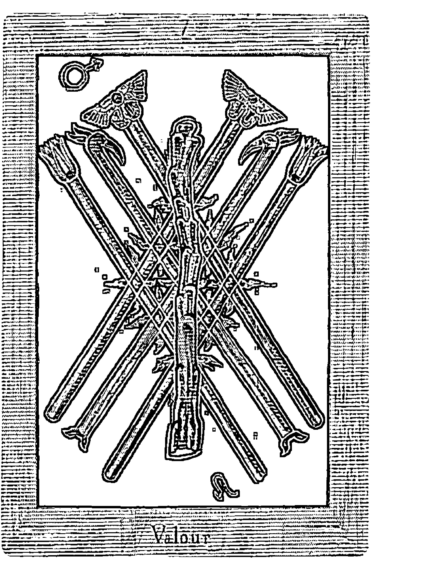

### 〈圖像解析〉

- **●權杖**
此牌中間豎立起一隻木棒。這隻木棒是戰場上英雄（火星獅子座的象徵）手持的武器。意味著當軍隊已經到了混亂的地步，如果獲得勝利，那也是靠著一人英勇的搏鬥所得來的。後方的六把權杖來自於上一張「權杖六」。如今優勢已失，原本有利的形勢已然消退。

- **●火焰**
權杖交錯處的火焰顯得暗淡而沒有方向，意味著火元素能量的消退。這是一個宛如亂世的環境，凝聚力量並不容易。

##### 基本牌義

火星落入獅子座為這張牌帶來了勇氣，但這份勇氣表現在失勢之時，猶如困獸之鬥，不知恐懼為何物。中央的木棒是隨手可得的武器，他尚未仔細思考對策，就拿著木棒上戰場迎敵，他相信自己的能力與優越，能夠在混境中殺出一條血路。此刻的勇氣讓人起敬，但並不能保證帶來勝利。

「權杖七」隱藏衝突的徵兆，他無法容忍被群體忽略，挺身而出，撐起那搖搖欲墜的自尊，也讓他憑著這份感受，捍衛著自己所依靠的榮譽感。即使戰場勝只剩下一個人，他依然會堅持作戰，光榮的死去。
「權杖七」不為勝利而戰，而是為光榮、為尊嚴而戰，哪怕早已知道沒有勝利的機會，也不會退縮，一樣去捍衛尊嚴。「權杖七」所追尋的不是勝利，而是那種為了理念前進的精神，如同戰場上捍衛家園的勇士，他們相信所做的一切，在死後的世界會贏得喝采，死得驕傲。

##### 抽到此牌

你可能處在一種雙面夾擊的壓力下。你不知道怎麼做才是最好的出路，而唯一可以做的，就是為了自己、為了伙伴挺身而出，哪怕是看不到希望，你還是擁有無比的勇氣去行動。此刻的你或許改變了對事物價值觀的優先順位，或許沒有得到周圍人的肯定，在這混淆之際，被迫不得不做出一點行動，讓自己的熱血可以盡情揮灑，讓自己被禁錮的心靈可以再次奔放。
「權杖七」代表你是一個追隨者，追逐著一種信念、想法或態度，並堅信因此自己的生命、生活會更加有意義。然而「權杖七」的背後卻非如此光鮮華麗，為了理想可能得與身旁親近的人疏遠，可能得不到支持，只有相信自己的信念，才得以支撐自己走下去。如果堅持信念，你可能會獲得你所求的，如果你希望勝利，最終將在黑暗中看見希望的陽光升起而突圍。你具有達成心願的勇氣，但前提是得放下自己的執著，並接受可能的損失。

## 權杖八

迅捷 Swiftness

水星射手

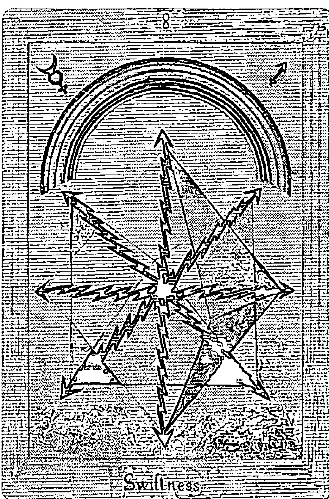

##### 圖像解析

⊙權杖
來自於牌中心，火元素之源進入權杖，將它化為向外放射的八道光線，以光速發散。保留了火元素的紅色，拋下權杖的形體，是訊息傳遞的暗示，或是一種靈感到來的象徵。克勞利賦予這張牌物質轉化為能量的隱喻，他深知神秘學與科學的關聯性，窮其一生試圖把神秘學導入正規的科學中，用理性的方式來驗證。因此利用繪製成「波」的權杖，詮釋煉金術中對於提升的解釋。

⊙正八面體
牌的背景可隱約看到正八面體的疊合，從三維的角度來解析二維的世界，意味著成長後又回過頭來檢視舊有的信念，用不同的角度來看待相同的難題。

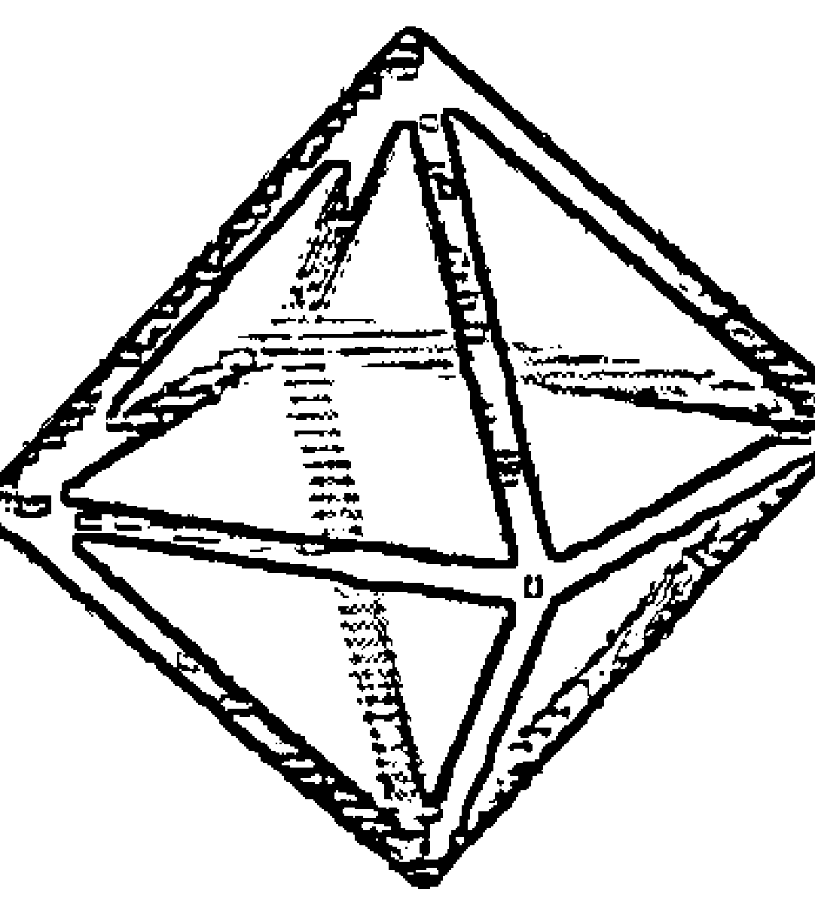

### ●彩虹

彩虹代表著經過提升後的火元素轉化為七彩之光，如同電子吸收了能量後提升到較高能階，再度躍回低能階時放出的光子。可以引申為意識經歷了提升後又再度回到現實世界。

##### 基本牌義

「權杖八」的牌名是Swiftness，有迅速敏捷之意。此牌中的權杖不同於前幾張牌，這是火元素牌組中唯一沒有「火焰」與「權杖」圖像出現的一張，火在進入權杖後轉變為更高層次的光穿透過世界。紅色的波動是光速傳遞的圖像化，顯示出此牌的迅捷感。牌中由一方形與一個正八面體交疊，暗示著突破限制朝向更高層次（維度）的轉變，其上的彩虹代表經過提升的火焰轉變為蘊含七色的光，在此也可以視為由靈性的層次落實到現實世界中。在西洋煉金術中，這是提升轉變的過程。「權杖八」的占星元素為水星在射手座。本身是一個與旅行有關的暗示，可能意味著一個長途的旅行、搭乘飛機等。它也描述著一種迅捷的思考模式，在已經熟悉的架構下能夠很快的對環境有所反應，並且以更高的視角來處理事務，使人們感到滿意與佩服。

##### 抽到此牌

你可能正聽到你所關注的消息，可能收到期待已久的禮物，或是計畫遠行。這是一張行動意味強烈的牌，當下的心情是喜悅的，沒有什麼壓力。「權杖八」也與靈感來源有關，譬如一件思考很久的難題，怎麼也想不出答案，但也許在下班後公車站聽到路人交談的一句話、電影中的一段台詞或街道旁的標語，讓你突然想通，豁然開朗。

「權杖八」的寓意光明、美好，它描述著你所關注的每個消息、起身而行的念頭，混亂的時刻已經遠在身後，眼前正是你躍身的好機會。

## 權杖九

力 Strength

月亮射手

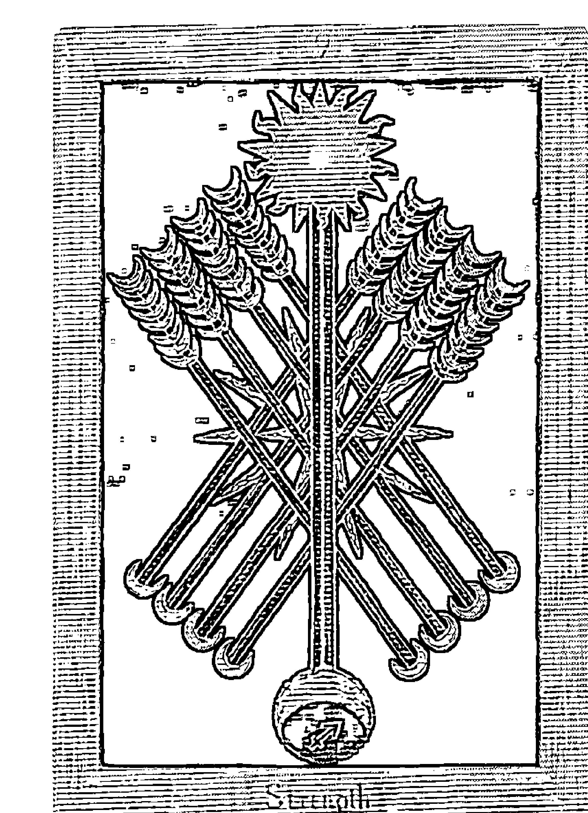

##### 圖像解析

- **⊙權杖**
牌由九把權杖交錯組成，中央立著一把較大的權杖，其餘以弓箭的形式射出，牌的畫面定格於它們交會之時。每一把射出的箭代表著意識發動的作為，它們同時承載著信念而為。每把箭尾的八個新月，意味著來自心靈深處發出的意念，由最前方的新月作爲行動的領導。中央的權杖，意味著喀巴拉生命之樹中連結對應給太陽的第六薩弗拉「美」，以及對應給月亮的第九薩弗拉「基礎」。

- **⊙月亮**
每隻箭上共有九個新月，對應給生命之樹的第九個薩弗拉「基礎」，九爲月亮之數。而牌最下方繪出月相陰晴圓缺的變化，意味著這力量的來源並非一成不變。

##### 基本牌義

「權杖九」的牌名是Strength，中文為力量，而筆者認為在此牌中主要作為力量展現的內在驅力。牌內由八隻箭與交錯月亮圖案構成尾翼與箭尖，是武力的展現。雖然此牌在占星元素的組合為月亮射手，但在設計上同時並列太陽與月亮，突顯出由陰暗到光明、由內在到外在的力量運作模式。太陽在頂端，而其他箭的方向朝著月亮射去，唯獨中央的箭連結著太陽，代表真實的力量源自於潛意識（月亮）浮現於意識（太陽）的過程。而這也是此牌對應射手座位於生命之樹的路徑。連接第六薩弗拉「美」與第九薩弗拉「基礎」，如同「藝術（煉化）」的煉化過程，經過淬鍊提升，將內在的想像成形為實像（詳見第二章〈大阿卡納〉中的「藝術（煉化）」，以及第三章〈生命之樹中二十二條路徑與大阿卡納牌的對應〉Path 25）。從「權杖王牌」以來，火元素牌組表現的都是較陽剛的特性，直到了「權杖九」，月亮與射手座的組合，如同幽暗曠野中的火焰，融入靜態的大地，成為照退野獸的營火。微光降伏無盡的黑暗，如同洞見誕生於無盡的意識，指出方向。

在這張牌所展現的是全我合一的力量，以喀巴拉的觀點而言，當內在心靈沒有矛盾存在，外在的世界也不會有所阻礙。因此在行動上遇到的困境都可以從心靈中找到相互對應的課題，從淺而易見的矛盾，到深埋在潛意識中難以根除的反應，都不斷的藉由外界的困境來使我們意識到那潛藏在內心中的根源，使我們有機會去看到與解放它。

##### 抽到此牌

「權杖九」告訴我們真實的力量需要往內心尋找，內外平衡下，無所罣礙，才不失力量本意。此刻你知道你的方向，你可以放心去做，當你跨出畫地自限的圓圈後，會感到那些阻礙也只是一腳就能跨過去的界線而已。不必給予自己太大的壓力，因爲你已度過了起步的階段，壓力不再是催促你前進的方式，你可以放心的去行動。

「權杖九」也可描述出一種已經做出決定的狀況，這個決定難以去動搖，暫時順勢而爲是適合此刻的方式。放下過去的包袱，停下未來的擔憂，此刻你被授予決定的權柄，每當你回到當下如同此刻的心境，即擁有無限內在之力。

## 權杖十

壓迫 Oppression

土星射手

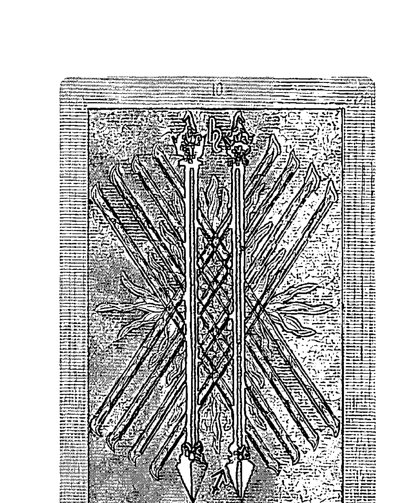

##### 圖像解析

#### ◎權杖

「權杖十」中，八把權杖的末端長出爪子，代表獲得權力後所展露出來的慾望，它們跌入了慾望的深淵，即將被火海吞噬而不自覺。豎立在中央的兩把權杖是曾出現在「權杖二」牌的金剛槓，延長的金剛槓代表著過度與失控的能量。

#### ◎火海

一片火海般的背景象徵著失控的火元素已經化為熊熊的烈火，迎接權杖的墜入。這也表示到了「權杖十」，進入了喀巴拉生命之樹第十個薩弗拉「王國」後，切斷了與上層意識的連結，墜入慾界。

##### 基本牌義

「權杖十」的牌名是Oppression，在此意味著多層面的壓制。克勞利指出，十對應到生命之樹中的第十個薩弗拉「王國」，這與其他的九個薩弗拉無法直接交流，因此「權杖十」獨立於共通的根源，發展為一種激烈的能量。背景的一片火海意味著不受控制的火焰即將吞噬自我。八把交錯的權杖墜入火海，火元素的權威、靈巧的手段與智慧即將喪失，取而代之的是將要到來的後果。權杖牌組到了盡頭，過度發展的火焰終將自己給吞噬，葬身於自己的手上。

「權杖十」的占星元素為土星在射手座，是個互相擾動的組合。土星代表緩慢、沉重、較為灰暗的物質性，而射手座則是敏捷、輕盈與光明。當射手座的特質被土星所牽絆，伴隨而來的是恐懼與加諸其上的情緒性壓力，進而牽扯進許多原本不相干的事物進來，且未曾考慮到後果。慾念所喚起的火焰最終將自己吞噬。

##### 抽到此牌

也許獲得了過多的權力，也許掌握了許多資源，也許處在一個絕對的優勢，但是此刻自己正在墜落，你感到那種沉重，卻忽略了它給你的壓力，只把目光放在目標上，而過度的相信自己所能負荷的能力。「權杖十」提醒著你，此刻你是否還保有初衷、是否把達到目的的手段當成了目的。「權杖十」像是一個努力工作、夢想著未來能夠給家人溫暖而旅行於各地的人，但數十年下來，他樂於工作卻將夢想遺忘了，他把工作當成了目的，而非達到目的的手段，迷失了初衷。

因此，抽到「權杖十」，提醒著內心的自己期待解放，卻可能因自己的負擔過多而無所適從。其實，你永遠都可以去實現自己最想要的選項，用簡單的方式讓自己沉澱，回憶起自己的模樣，不再因為有太多的選項而全然落空。可以為了夢想忙碌，不要為了忙碌而忘記夢想，是「權杖十」的啟示。

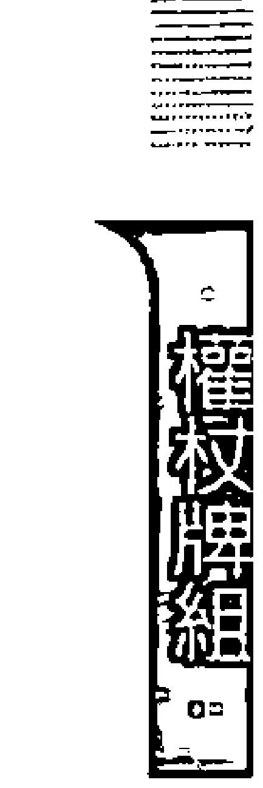

## 聖杯牌組 The Suit of Cups

聖杯牌組，尋訪情感的泉源，傾聽內心的低語

聖杯牌組對應於水元素，三個水象星座：巨蟹座、天蠍座、雙魚座分別對應於聖杯牌組。水元素呈現出心靈深處的原型，刻畫出種種的情緒。水的柔弱陰性本質不顯於外在，需要深具心靈之眼才得以探索。

#### 聖杯王牌

Ace of Cups

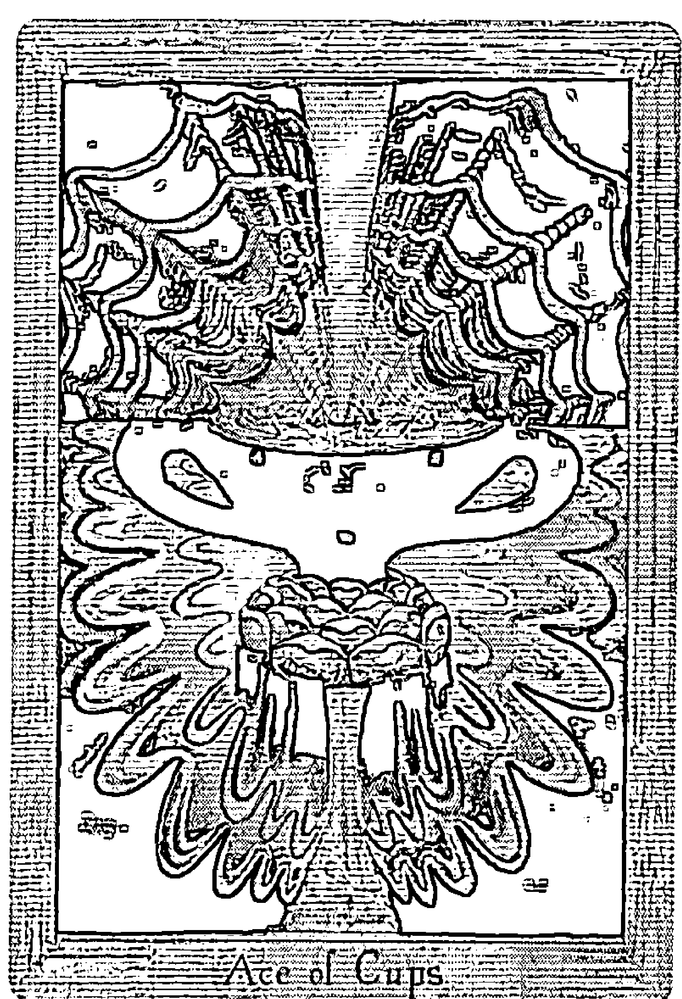

##### 圖像解析

巨大的圣杯出现于画面中央，它是水元素牌组的象征之物，是所有水元素牌组的能量总和。圣杯前隐隐约约可见三个圆圈，是曾经出现在大阿卡纳牌「大祭司」的手持物，三个圆圈分别意味着泰勒玛中伊西斯、欧西里斯、荷鲁斯三个纪元。最上方只有半圆的圆圈代表古老的母神崇拜、母性社会体制下的伊西斯纪元，是对应于水元素的时代。远远的看着「圣杯王牌」，像是女阴的构造，暗示了「圣杯王牌」属于水元素能量的起点。

圣杯浮在一片汪洋之上，以广大无边的海洋为意象，那无边无尽的海水是包容一切的母性，是属于水元素情感的世界。

### ◎莲花

聖杯下的蓮花是伴隨著水元素牌組出現的植物，每一張水元素牌組的特性如同不同的水質，藉由蓮花的生長可以反映出不可見的水質。水元素是隱藏在心靈深處的情感，觀察花朵的生長，如同觀察人的心靈，透過外在的表露來推敲細微的情緒變化。在「聖杯王牌」之中，蓮花含苞待放，水元素牌組的每張牌由此而生。

##### 基本牌義

「聖杯王牌」是水元素牌組的能量根源，亦是每張水元素牌組的總和。牌本身對應到北面天秤—天蠍—射手天球象限。圖面中央水面浮現出一個巨大的聖杯。在西方神祕學中代表陰性力量所賦予的創造心靈；在基督宗教中，聖杯出現於最後的晚餐，裝著象徵鮮血的葡萄酒，代表著耶穌無條件的愛和奉獻。聖杯背景的光芒形成女陰外部，象徵著生命的誕生，生長於白色蓮花之上，像噴泉一般把水噴出注滿聖杯。頂端垂直的光芒指出，來自較高的靈性創造力注入其中。它的寓意廣大，直指心靈深處，那是一片廣大無邊的海洋，是情緒與心靈奧秘的所在。

##### 抽到此牌

「聖杯王牌」可以代表一段情感互動的開始、情感的建立、奉獻與愛的創造、學習與新契機的開端。占卜出現了這張牌，往往暗示了一種愉悅心靈體驗，你感覺到雀躍與期待，你投身於喜悅的光芒中。「聖杯王牌」具有陰性廣大無邊的特質，若搭配牌陣其他的牌解釋，可能會有新生命誕生、母親等意涵。

#### 聖杯二

愛 Love

金星巨蟹

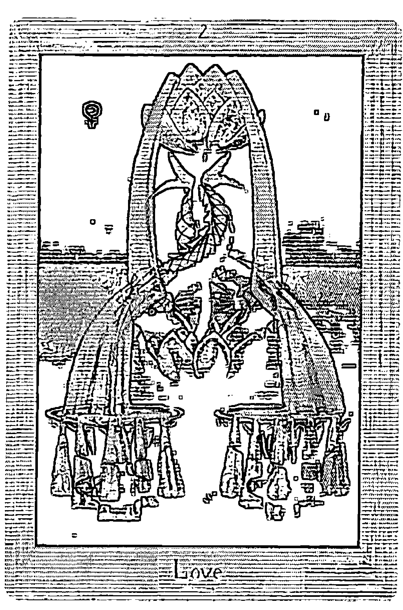

##### 圖像解析

#### ◎聖杯

兩個如盤子般寬闊的聖杯承接花朵流出來的兩道水流，它們有著相同的來源，滿溢後注入背景的大海，代表一種深切的情感交流。背後的大海是包容整體意識與情感的海洋。此牌兩個聖杯如兩個個體來體驗彼此，從對方的眼中看到了自己，不需言語，即可感受到真切的交流。

#### ◎金星巨蟹

天空的兩個占星符號為金星與巨蟹座，是這張牌被賦予的占星學意涵，在此提供浪漫與含蓄的氛圍，也可以是一種溫柔的伴侶關係。在其中的彼此感到無以言喻的喜悅與幸福，那平靜的美好似乎沒有盡頭，彷彿世界就停留在這一刻。

# 花朵

在「聖杯二」大海的滋養下，兩朵綻放的花朵透出粉色，呈現出如同愛情中情感交織的粉紅意象。一上一下開放的花朵與左右並排的聖杯，暗喻了水元素在平衡狀態中得以順利的發展，自然而然地將彼此交融。

# 背景

背景的綠色汪洋是金星的呈色，除了代表情感，也意味著彼此共同分享這一片廣大的情感。

##### 基本牌義

兩道水流從上層的蓮花湧出，落入兩隻纏繞在枝條上的魚的頭部，再落入聖杯。兩朵蓮花代表由原本的一創造出的二元對立。沒有高，無法體會低；沒有大，無法體會小；沒有惡，無法體會善。藉由「不是」而體會「是」，藉由二元對立世界來體會到整體，是此牌在水元素生命之樹中代表純粹陽性能量的第二薩弗拉「智慧」的詮釋。而兩隻海豚（雖然看似鯉魚，但在克勞利的著作中是為海豚）象徵著希臘女神愛芙羅黛蒂（Aphrodite，其發音與海豚Dolphins相似）。愛芙羅黛蒂相對應於羅馬神話中的維納斯，亦是此牌所對應的金星（兩者英文皆為Venus）。

「聖杯二」代表著男性與女性、感性與理性的融合。藉由兩者結合創造出更完整的體驗。「聖杯二」中對立的兩者，來自相同的來源，藉由相遇體驗更高層次的成長。一般來說，這張牌象徵著兩人彼此欣賞時互相萌生的愛意，彼此在和諧的狀況下情感的交流。象徵愛情的金星落入重視安全感的巨蟹座，意味著戀情的開始。在喀巴拉中則是與生命之樹中第二薩弗拉「智慧」連結，是泰勒瑪中的本意「意志」，一個自由的心靈，一對擁抱的靈魂。

##### 抽到此牌

你處在一種幸福的關係中，在這個階段你們彼此互相信任、互相仰慕，你可能暫時忘記了時間，就讓自己自然的沉醉在這種氛圍中，你放下面具，自然而然表現真實的自己，你感覺喜悅與快樂，這一刻體會到人生竟然是如此的美妙。

「聖杯二」也可以廣泛的指出一段關係的信任，一種放心交託的心態，你相信這一切，彷彿相信自己一般，沒有絲毫的猶豫。

#### 聖杯三

丰盛 Abundance

水星巨蟹

##### 圖像解析

◎聖杯
聖杯在這張牌中轉變為了結實累累的石榴杯，從高處承接花朵向下注入的水，再注入底下的聖杯，代表著滿溢的情感、豐盛的時刻。

◎花朵
在這張牌內，從喀巴拉生命之樹第二薩弗拉「智慧」中象徵水元素的大海內生長出蓮花，在充足的滋潤下蔓延茂盛的枝條，一共開出了八朵花，八在生命之樹中是水星之數，與「聖杯三」的占星符號水星對應。從最上方的花朵注入了水元素之流，再滿溢往下流入中間綻放的花朵，然後注入下方的兩個聖杯。中間開了兩次的花朵，代表著經過躍升的能量，它由原本的基礎往上更推進了一步。

##### 基本牌義

「聖杯三」圖像中，每個聖杯上方都有著一到兩朵蓮花，湧出水源注入三個由石榴構成的聖杯，盛滿著水溢流而下。上方聖杯中，由兩朵蓮花注入的水，代表從上一張「聖杯二」二元對立的兩種面向的管道獲得泉源後，再接著往下灌溉。每個聖杯下方的蓮花象徵基石。中間的花朵經由成長後再次提升，將聖杯提升到較高的位置。

這張牌也連結到希臘神話中的冥王之后普西芬尼（Persephone）。普西芬尼是宙斯與掌管豐收和農業的女神狄米特（Demeter）的女兒，被冥王黑帝斯（Hades）搶去做了冥后。因爲失去女兒，狄米特無心過問耕耘，令大地失去生機，直至宙斯出面，令她們母女可以重逢，大地才得以重生。每年的冬天就是她與女兒團聚的日子，她放下工作陪伴女兒，令這段時間不宜耕作，並且說服普西芬尼吃下六顆石榴籽，這迫使普西芬尼每年有幾個月的時間重返冥界，此時大地失去生機，冬天降臨。石榴聖杯即是取石榴作爲豐收的意涵。

流動的水代表情感或意識之流，聖杯代表一段一段的過程，藉由不斷由蓮花流出新的泉源與承接上一段過程中滿溢出來的水（經驗），而達到了一種滿載喜悅的狀態。另外水也可以是靈性創造的象徵，外在世界是內在的投射，最高的聖杯象徵著精神與意識的中心，將處在想法階段的心念落實顯化到物質世界中。

代表溝通表達的水星，落入想像力與情緒渲染力強大的巨蟹座，正好運用這股力量把內心的想法用適切的方式表達展現出來。

##### 抽到此牌

「聖杯三」代表內在逐漸的充實，無論是情感層面或知識層面都有豐富的獲得，也可以視爲是財富的豐盛。此刻你感覺到自在，你的內心填滿著熱情或希望，你可以安逸的享受這一切，畢竟這是屬於你應有的。那是經過了「聖杯二」過程而有的結果。

「聖杯三」也可代表創意揮灑當下的心境，或是只在心裡構築未來藍圖的喜悅，那是一種浪漫的想像，你在心中築起了自己的城堡，喜悅的發現那個屬於自己的天賦，讚嘆於自己的能力，而你可以由此開始起步，畫出屬於自己的一片天空。

#### 聖杯四

奢華 Luxury

月亮巨蟹

##### 圖像解析

❶聖杯
圖像中的聖杯經過雕刻琢磨，有如皇家般的擺飾，它們承接上方的水流，卻沒有滿溢流入大海，代表獲取成果後停留在原地享受奢華的心態。繼續收穫，繼續揮霍，卻失去了原有的平衡，看不見未來的延續。

❷花朵
從海洋生長出的蓮花在「聖杯四」中具有優美的枝條，向下延伸的構造交纏著，並且以不同的姿態綻放，它不再往上生長，專注於當下，用最美的方式呈現。

❸月亮巨蟹
月亮落入自己守護的巨蟹座，為這張牌提供了安全感，提供了安逸與緩慢的特質，也因此「聖杯四」呈現出緩慢的步調，或許有幻想、有希望，卻沒有行動的熱誠，與其改變，倒是寧願停留於此刻的安逸。

# 背景

背後的海水在看似平靜之下卻泛著微微的波浪，暗示失去的平衡已然發生，懸掛月亮與暗色的天空隱約透露出不祥的徵兆。

##### 基本牌義

「聖杯四」的牌名爲Luxury，字面上有奢華與享樂的意思，牌中則是較突顯出「享樂」與「滿足」的意涵，指出付出努力過後，沉醉於等待結果或下一個目標的安逸期。牌中有四組聖杯，分別承接來自上方蓮花湧出的水流，它們來自同一個源頭，卻分別注入四個聖杯內。水流注滿了上層聖杯後流入下層聖杯，卻沒有再流入背景的大海中，與「聖杯三」牌中的多源頭、注入聖杯後滿溢流入大海的意向有極大的差異。在這張牌中，兩個注滿水的上層聖杯，代表已經完成的階段性任務，如感情到達了一個階段、工作上完成了一個企畫案、生活中的現階段目的達成的狀態。而下層兩個即將滿溢卻未滲出水流的聖杯，代表著過於安逸而限制了下一步的推展。四爲穩固之數，在這張牌表現出愉悅後心靈停滯不前的時刻。
水流如同心靈的學習旅程，圖像中的水流雖然豐富了現階段的成功，但如果在放鬆的時刻休息太久，不免會忘記初衷，止步不前讓自己短嘗了快樂，卻爲未來埋下了隱憂。

##### 抽到此牌

這張牌提醒著我們，現在是放鬆的階段，此時你可能會嘗到盼望已久的愉悅與放鬆，可以爲自己安排一段旅程，作爲對自己的犒賞，或是吃一頓大餐、上街購物等。但另一方面，這張牌也暗示著從一個極端邁向另一個極端的過程，生命的歷程不會永遠停在一個狀況，即使有所成果，我們還是要從一個階段邁向下一個階段，如果已經休息夠久了，記得別忘了初衷，別在安逸中迷失了方向，前方還有冒險等著我們去闖。

#### 聖杯五

失望 Disappointment

火星天蠍

##### 圖像解析

◉聖杯
聖杯已經空得見底，經過上一張牌的揮霍後，不再有來自花朵注入的泉源。現況是極度的缺乏，支持你的信念和財富已經不在，情緒可能焦躁，極度渴望曾經擁有過的點滴，哪怕是一點也好。

◉蓮花
在沒有水的滋養下，蓮花已然乾枯，花朵開始凋謝，僅存著當初茂盛時所生出的枝條，在過度的奢華下，真正留下來的也只是曾經風華的歲月。「吳宮花草埋幽徑，晉代衣冠成古丘」即是這張牌的側寫。

◎五芒星
枯萎的枝條形成了倒立的五芒星，那是在枯萎之前就已勾勒出的結果。
正立五芒星的四個端點在神祕學中意味著火、水、風、土四大元素，最上方的一角則是靈性、精神的代表。倒立的五角星指出了上一張牌奢華的經過，將物質的喜悅凌駕於精神（第五個端點朝下）之上，最終導致這樣的結果。

# 火星天蠍

占星對應為火星落入天蠍座。天蠍座是水相固定星座，遇到變動性質強烈的火星，會有極端投入而帶來極端情緒的意涵，火星燒乾了天蠍的生命，而使蠍子走上自我毀滅之路（在過去，蠍子被認為在壓力下有自殺的傾向，詳見〈大阿卡納〉「死神」牌）。

# 背景

紅色的天空是火星的呈色，意味著過度揮霍的態度，以及不安、失望的情緒，原本存在的大海已然乾涸，滋養著花朵的水源消逝，在沒有水的水元素牌組內，呈現格外失落的氛圍。而下方勾勒出的蝴蝶預告了即將出現的變化，蝴蝶由毛蟲化蛹而來，具有蛻變的隱喻。

##### 基本牌義

蓮花生長在乾枯的池水中，整棵植物開始出現枯萎的跡象。原本流出的泉源現已枯竭，象徵內在缺乏帶來的憂傷與空虛。圖像中暗橘色的背景有失望之意。然而凋零卻也代表脫離舊有，邁向下一個階段的躍升，圖下方蓮花的根長成蝴蝶狀，在西洋煉金術中象徵轉換型態到更高形式的過程，在此則有蓄積待發的意思，等待原有的枝葉凋萎，再次從土中萌發。代表陰性力量的水由地面的裂縫滲漏，象徵潛意識中行動的內在泉源已然消退。「聖杯五」的失落來自於無法滿足的慾望，在嘗過了種種奢華後，已經沒有東西可以再給予滿足了，他的心靈是空洞的，他追求著更高的享樂，不斷把心中的底線往下推，最後感覺到深深的無奈，原本簡單的快樂竟然變的那麼難以獲得。

「聖杯五」的失落來自於過去作為所帶來的結果，然而圖中的枝條依然存在，花朵並未完全落下，說明了新枝芽還有再次萌發的機會。

##### 抽到此牌

當抽到「聖杯五」這張牌時，代表著你處在生活中較低落的一段時期，常常伴隨一種莫名的失落與恐懼感，失落來自於沒有能耐去改變，恐懼直到絕望來臨前的那天。但是也別忘了，所有的不如意背後都是一種祝福，在這個階段常常有情緒凌駕於思考的狀況，這時就是個好機會讓我們去探索，那「擔憂的」是否真的值得我們去擔憂。「聖杯五」雖然負面意象較強烈，但潛藏的訊息是：在邁向下一個階段時，感知到原本力量正在消退中的狀況。如果當下已經面臨到痛苦，至少可以慶幸最難熬的階段已經過去。而這段過程是難得的禮物，是在安逸時所無法得到的寶貴經驗。

#### 聖杯六

享樂 Pleasure

太陽天蠍

##### 圖像解析

# ☉聖杯與花朵

度過「聖杯五」的考驗，「聖杯六」的花朵重新綻放，原本乾枯的海洋也被填滿，生長出茂密的枝條，交纏形成飛舞的蝴蝶之形，那是在「聖杯五」中底部的蝴蝶，如今度過了嚴冬，破蛹而出，舞出華麗的姿態。六個聖杯承接著花朵流出的水，它們並未滿溢而出，代表著只是單純接受這滋養的水源。從蓮花的整體生長勢看來，「聖杯六」處在輕鬆愉悅的氛圍之中。

# ☉太陽天蠍

六號牌對應到喀巴拉生命之樹中的第六個薩弗拉「美」。這是太陽原本的位置，上一張牌的衝突已然消失，回歸到互相平衡的能量，帶來養分與滋潤。

##### 基本牌義

圖像中枝條交錯排列成弧形，在末端開出花朵，而六個聖杯坐落在枝條彎曲處。若把「聖杯六」與「聖杯五」相比，可以發現原本「聖杯五」底部蝴蝶狀的根，在「聖杯六」中成長提升至較高的位置，代表新的事物已經萌芽並成長。「聖杯六」的牌名是享樂，不過與聖杯牌組中其他正面意涵的牌有些差異，「聖杯六」經過枯萎的過去後，花朵再次綻放，象徵愉悅是建立在過往努力或失敗經驗之上。

本張牌中央的太陽占星符號⊙，出現在交纏枝條正上方，「聖杯五」中蓄勢待發的蝴蝶，在「聖杯六」受到陽光能量滋潤後破蛹而出，萌發成枝條構成的圖騰。煉金術中，陽光照射到陰性的象徵（水），代表深層意識的形象落實於現實中，在此張牌中具有再次從內在湧出泉源、靈感之意。「聖杯六」的意象光明，彷彿度過漫漫黑夜後再次見到陽光，度過乾旱後喜獲甘霖的心情，知所進退，懂得在安逸時拿捏分寸。

# 易卦解讀

> 《易經》：「觀，盥而不薦，有孚顒若。」

「聖杯六」是少數克勞利提及可對應於易卦的數字牌之一，風地觀卦被認為與此牌有所對應。《易經》曰：「觀，盥而不薦，有孚顒若。」此卦辭的意義便是在闡述誠敬的重要。觀者，觀看也。代表一種透過觀察來瞭解自己並分析他人想法的一個卦，而透過這些分析的判斷，能進一步去修正自我的缺陷與不足，因此觀卦是個不斷自我提升走向靈性的卦。對照「聖杯六」的特質，杯中開出花朵象徵自我修正已經達到了成效，並且達到了一定的靈性高度（因為觀卦也有登高以遠望之意）。

##### 抽到此牌

「聖杯六」的牌名是Pleasure，為享樂之意，抽到這張牌，通常表示處在一種快樂的狀態下，或是有所成果的階段。太陽落入天蠍座，代表有著敏捷的思緒與饒富創意的點子，並且可以安排使自己有舒適享樂的空間，內心愉悅且和諧。你感覺到的，不是那種在派對中、在狂歡中的喜悅，而是從內心自然透出來的快樂，使你在任何場合都保有愉悅。「聖杯六」的快樂來自於你的心中，看到的一切都充滿著舒適。

「聖杯六」可能代表著一種優雅溫柔的氣質，一種使人感到自在的個性。現在你沒有了年輕時的衝動、莽撞，成熟的心思讓你縝密的規畫，讓你能夠在享樂中節制，在眾人沉溺時洞燭先機。你歡迎所有到來的一切，你知道那些永遠是自己所吸引而來的，即使在不利的環境中，你依然保有自己的信心。

#### 聖杯七

沉淪 Debauch

金星天蠍

# 🖼️ 圖像解析 🖼️

**◎聖杯與花朵**
滋養植物的水源已經變為了沼澤，但花朵依然生長與開放，意味著雖然處在不適當的環境中，卻沒有察覺，依然將沼澤的水注入聖杯，污染已經無法避免，但是在沒有自我覺察下，使得整個系統深陷於黑暗，逐漸的沉淪。七個杯子的位置排列成兩個倒立向下的三角形，意味著脫離了更高的理想，向下沉淪與迷失的過程。

**◎金星天蠍**
金星位於天蠍是一個受到牽引的組合，具備優雅、氣質與愛的金星受到天蠍的左右，慾望橫生，對這張牌注入了一種對於信念堅持的強烈情緒，以及盲目的行為。

##### 基本牌義

原本盛開的蓮花在這張牌中轉變為百合科的植物。花朵滲漏出有毒蜜汁，滴入背景的大海中。「聖杯七」代表缺乏平衡所導致的衰弱，圖像中花朵內部腐化而外部完好，意味著在追尋內在的過程中迷失了，甚至脫離了現實。「聖杯七」擁有崇高的理想，但更需要的是一個導引自己的老師。在靈性領域中，「聖杯七」常常出現在剛受到啟發的人身上，有一股熱誠，期望將理想全部付諸於行動，卻遺忘了自己是個剛起步的人，較極端的表現是急著想追尋目標，卻被目標所套牢，心中的方向已經偏差或迷惘，圍繞在目標空殼之外空嘆。「聖杯七」的牌名是Debauch，意即沉淪，在這張牌中，除了字面上的意思外，還有潛意識中「返回幼童階段」的意思。老子《道德經》中提到：最高的境界乃是回到嬰兒的狀態，嬰兒無知無欲，剛來到這世界上，卻未受到世界所污染，是如此的真。而潛意識處在返童的狀態中，往往意味著不受世俗環境拘束的想法，甚至是世俗制約中難以觸及的領域，因此「聖杯七」在想法上具有無窮的潛力。然而當處在一個極端，就等於踏入另一個極端，嬰兒雖然有著最真的靈魂，不過在現實世界中卻什麼也不能做，等到他能的時候，卻已喪失了那原有的純真。「聖杯七」在此所暗示的是，由於內心的失衡導致身心沉淪的階段。

##### 抽到此牌

你知道自己身陷於快樂不可自拔，你有你自己的信念，你相信那是一個美麗的機會，一場如夢的晚會，在無數個黑夜中反覆思量，彷彿走在微霧的小徑中，再往前走一些，探尋被遮蔽的道路，你相信就可到達夢中的天堂，回到喜悅的懷抱。你總是如此自信，但霧散去後，自己卻認不出身在何處。你笑著奔跑，你夢著未來，你對自己真有如此大的把握嗎？夢醒後，重拾自己，現在還有多機會，等著你去思考與前進。

#### 聖杯八

怠惰 Indolence

土星雙魚

##### 圖像解析

# ◎聖杯與花朵

「聖杯八」的蓮花剩下了薄如紙片的枝條與兩朵花朵，在一片黑暗且沒有流動的水源下，失去生命應有的活力，它的枝條纖細，葉片輕薄，風一吹就能將它破壞。具有缺角、量淺的聖杯，代表熱情、生命力的缺乏。最上方的三個聖杯已經乾枯，剩下中間的兩個聖杯被注滿，往下慢慢流入最底層的杯中，卻無法填補那非常淺的容量。牌中的圖像暗喻著背後的心靈動力已經消失，在這樣的環境中讓人沒有心力去行動，只要還能夠維持住原有的部分，就已經滿足了。

# ◎天空與海洋

烏雲遮蔽了陽光，使得蓮花失去了活力，只能在黑暗中慢慢生長，維持著脆弱的生命。黑暗的一攤死水，不再像大海般廣闊，停滯的水源沒有辦法供應蓮花足夠的養分生存，意味著一段長久的平靜後所帶來的心境，或失去活力後的自己。雲海交會之處隱約透出一點光亮，隱喻著此刻並非絕境，在遠方還有一片新的天空，還有一線改變的契機。

# ◎土星雙魚

土星的沉重與緩慢拖累了思想自由奔放與浪漫的雙魚，為這張牌帶來了停滯及無力感。僵化了想像，無力再往前跨出一步。

##### 基本牌義

聖杯牌組第八張的牌名是Indolence，為怠惰之意。偏向暗色的牌隱約透露出了不祥。八個聖杯分布於上、中、下三排，其中最上層的三個聖杯已經乾枯，中間的聖杯承接住花朵滲出的水後流向下面兩個聖杯。水是思想創造的源頭，這意味著最高的意識（靈感）已經枯竭，而剩下的雖有所做為，但也是徒勞。牌中的蓮花缺乏陽光的供給，地面是一攤無法流通的死水，在這樣先天缺乏的環境中難以成長，甚至連存活都有困難。而等著承接結果的卻是量淺、邊緣存在缺刻的聖杯，自然無法有太大的目標與熱情。

怠惰一詞存在負面的暗示，源自於對當下要做或正在做的事情感到無趣，但又得莫可奈何承受的感受。當心靈缺乏新的源頭來澆灌，怎麼會不呈現出懶惰的模樣呢？「聖杯八」用生長在不良環境的蓮花為意象點出此點。上、下的占星符號是土星在雙魚座，土星具有沉重的特性，在遇到如同海水一樣寧靜的雙魚時，產生了停滯不前的意象，因此圖像中的水看不出波動，雲朵也靜止不動。然而，「聖杯八」的怠惰並非全然灰暗，只是在此刻找不到值得付出的熱誠，抽到這張牌也是一個機會，提示你要從中解脫，去思考當前的狀況。

抽到此牌

你放棄了行動，決定維持目前的狀況，等待著下一刻才出擊。然而，真正的你卻是不想有所行動的，你看出了那些脈絡，清楚知道那些狀況，但你卻沒有了熱情，沒有了動力，或許你有足夠的能力，能夠帶來一個最為完美的結果，但是那又如何呢？你知道那些已經不足以使你動身，你寧願安於現狀，至少你認為，那樣子比較沒有擔憂，比較沒有風險。

「聖杯八」也可能直接的意味懶惰的特性，如果出現了其他類似意涵暗示的牌，那麼警示的意味就更為濃厚。

聖杯九

快樂 Happiness

木星雙魚

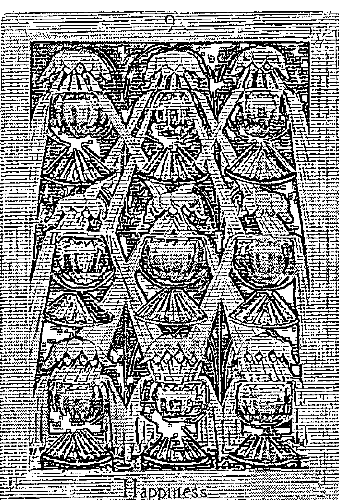

圖像解析

◎聖杯與花朵

在「聖杯九」，回到肥沃的環境，蓮花以碩大肥美的姿態再度綻放，將水注入每一只聖杯內。從上而下的水流意味著情緒與心靈上的暢通，水元素的力量在這張牌內被充分的展現出來，沒有阻礙。心靈能夠自由揮灑，即為幸福。

◎木星雙魚

木星與雙魚的組合為「聖杯九」引入更深邃的內在體悟，由更高的觀點深入內心，重新找回快樂的泉源。

基本牌義

「聖杯九」的牌名是Happiness，快樂，是水能量發展到極致的狀態。牌中九只聖杯排列成三乘三的方形，水由九朵盛開的花朵湧出，注滿每一只聖杯，暗示著幸福的完美表現來自於自我實現。在歷經「聖杯七」、「聖杯八」的課題後，花朵重新開放，所有曾經缺失的部分再次獲得補償。藍天與灰色的地面，呈現出建立在穩定協調基礎上的信心。此牌的占星符號是木星在雙魚座，指出全然的接受、信任與祝福。相對於「聖杯八」的怠惰，「聖杯九」可將其視為反思與檢討的過程，知曉過去雖然靜止卻未必是全然的放棄。

「聖杯九」對應到喀巴拉中的第九個薩弗拉「基礎」，而「基礎」本身的月亮能量加深了「聖杯九」對於水元素、對於陰性能量的穩定，滋養著來自於心中深層的渴望。因此，在「聖杯九」之內感覺到美滿，感覺到幸福。

抽到此牌

你滿心喜悅，具有開放的心靈，樂於與人分享喜悅，對於未來有信心，也有機會朝向更高的生命目標邁進，因為你知道自己是沒有界線的，你充實的內在是最好的行囊，讓自己與靈感的泉源、快樂的頻率再次接軌。在某些形況下，「聖杯九」也與想像力相關，你可能突然文思泉湧，可能在平凡的當下獲得啟發，或是突然找尋到了一種意義，是那樣的引起震撼，引起靈感的共鳴。

「聖杯九」代表快樂的心情、愉悅的環境，此刻擁有信心，全然享受帶有些許慶祝氛圍的喜悅。

聖杯十

厭足 Satiety

火星雙魚

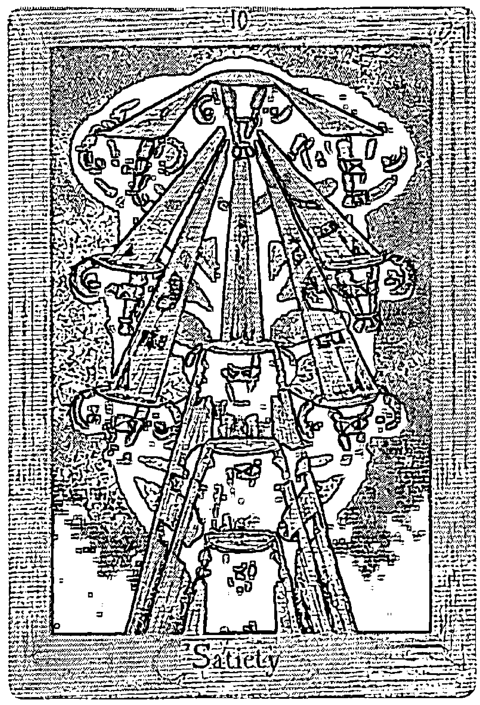

圖像解析

◎聖杯

此牌中，為聖杯注入水源的蓮花已經隱沒於背景，在數字十的能量當中，它的生長趨向成熟，枝條勾勒出喀巴拉生命之樹的線條，而聖杯則分佈在每一個薩弗拉所出現的位置上。水流從第一個薩弗拉「王冠」注入到每一個聖杯內，意味著每一個體驗都蘊藏於最初的心靈之中。下方的聖杯傾斜呈現，當屬於創造之界（Briah）的水源快速落入了最低層的物質當中，對立的特質使此牌受到了擾動，完美的體驗下隱藏著些許衝突。

◎火星雙魚

火星雙魚座的組合帶來精神上的滿足與行動下的熱情，然而卻為平靜的雙魚注入了不穩定的目標，在雙魚的心靈運作下產生些許的疲乏，在極度的發展後，可能也具有逃避的心態。

基本牌義

「聖杯十」的牌名是Satiety，是過飽、厭足的意思。牌中的十只聖杯排列成喀巴拉生命之樹第十個薩弗拉的位置，意味著到了水元素的第十階段，所有的課題考驗均已告一段落，此刻已心滿意足，並且處在平靜的情緒中。然而其中卻隱藏著能量的不穩定，使杯子傾斜撒出多餘的水，意味著承接過多水（滿足、快樂等情緒）造成隱藏在其中的衝突。

紅色背景說明出此牌火星的能量特質。牌中的占星符號是火星在雙魚座。火星的開創配上雙魚的平靜，這兩股對比能量混和下，勢必會產生火花。可以說是心態滿足的雙魚，同時又具有火星創新的力量，暗示著將有轉變的契機，也點明了心靈深處的矛盾。

抽到此牌

你已經走到了盡頭，在此刻已經完成心願了，但你卻隱約地質疑：「這真的就是我想要的嗎？」於是你開始計畫下一步的作為，不希望自己就在這停步。但是另一方面，你卻又難以從這穩定中脫身，畢竟這是經過許久才換來的擁有，踏出下一步邁向未知，是自己不想面對的。當你抽到這張牌，不妨讓自己去做一些平常沒有的體驗，來一段旅行，來一段冒險，或嘗試高空彈跳，離開原有的熟悉，或許會給自己帶來想像不到的喜悅。

在較為極端的案例中，「聖杯十」揭發了一種小我滿足的狀態。水元素牌組是情感、情緒與學習的歷程，十號牌說明了抵達終點後對「滿足感」的留戀。你可能已度過一段美好的時光，此刻雖然沒有什麼大事能讓你抽離那種滿足，你能盡情的享受，但感覺不到喜悅。

當然若不深深的體會，「聖杯十」就是處在一種不缺乏的環境中，即使內心有些空缺，有些遺憾，但相較之下，已經稱得上令人滿意了。不妨想像一下，你走進一家豪華飯店享用自助晚餐，當下滿懷著期待與喜悅，在沒有限制下，你得以盡情享用。經過了一番奮戰，終於吃完了每一道菜，卻突然想起了還沒有吃甜點，此刻對於你而言，不論甜點有多麼好吃，都已經飽到無法再吃下任何東西了，只能徒留遺憾。「聖杯十」即是如此的感受。

寶劍牌組 The Suit of Swords

## 寶劍牌組，奔放的意識之流

寶劍牌組對應於風元素，屬於風象星座的天秤、寶瓶與雙子座分佈於其內。寶劍牌組述說理性、思想層面的世界，也是我們所意識到的這個世界。風元素代表了思考，代表著溝通，每一柄寶劍都是意識的延伸，由內而外指向世界。

寶劍王牌
Ace of Swords

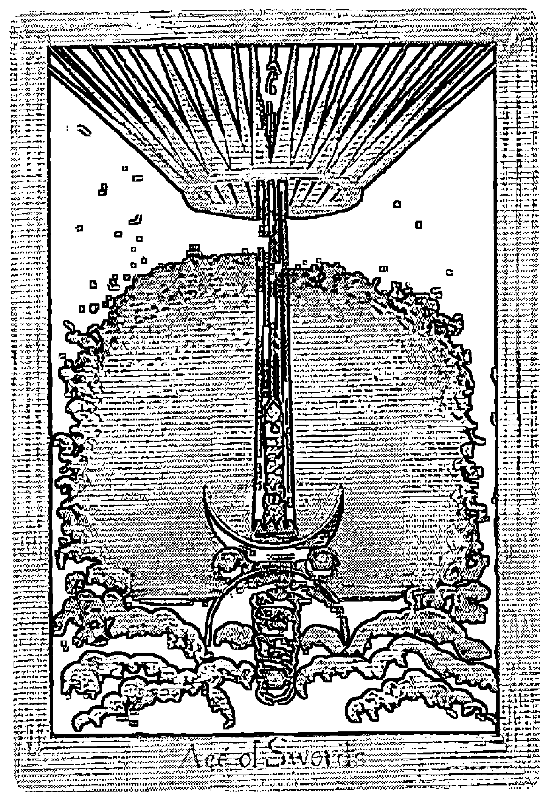

圖像解析

◎寶劍

牌面中，立於雲端之上的寶劍為寶劍牌組的開端。寶劍是意志的展現。它蘊藏了風元素能量所有的特質，亦是所有風元素牌組的起源。寶劍上刻有克勞利創立的泰勒瑪之希臘字源「θελημα」（英文：Thelema），意思為意志。寶劍穿過上方的皇冠，指出意念行進的方向。風元素代表著意念、信息的傳遞，它是潛意識浮出水面後凝結的思想，亦是精神中的一部分，不同於水元素受到情緒的左右，它意念清晰明確，指出了目標，表現鮮明。

◎皇冠

上方的皇冠意味著大阿卡納牌的二十二張牌，也意味著喀巴拉生命之樹中連結薩弗拉的二十二條路徑，刻有泰勒瑪的寶劍刺穿皇冠，一方面是屬於風元素精神的展現，一方面也暗喻了二十二張大阿卡納牌組背後的真理蘊藏於泰勒瑪中，與《律法之書》內的精神相應。

背景

「寶劍王牌」立於雲端之上，雲是風元素的象徵物之一，在雲端之上意味著風元素的源頭，具備風元素蘊含的一切，中央明亮的雲層是喀巴拉生命之樹中成形之界（Yetzirah）的呈色，意味著清晰的思路、鮮明的意識。

基本牌義

「寶劍王牌」是意識的展現，皇冠的二十二道光芒是大牌內二十二條喀巴拉路徑，劍柄的蛇和兩個半月狀的組成，代表才智（蛇的象徵）展現透過背後潛意識（半月的象徵）而浮上來的靈感。乘載意志的寶劍刺穿皇冠上達天庭，驅散了烏雲並綻放出光芒，意識的寶劍利用心靈強大的力量，將事物推廣到物質世界而化為實像。遠處的光穿過了最遙遠的原型之界，於創造之界中隱約透出光芒，最後在代表風元素的成形之界放出光亮，穿過了火與水元素所代表的權杖、聖杯後，我們終於進到了風元素、思想意念主導的成形之界。

「寶劍王牌」是風元素牌組的第一張牌，也是風元素能量的整體展現，風元素所掌管的三個星座為雙子、天秤與寶瓶，而「寶劍王牌」本身則是對應到天球北面魔羯—寶瓶—雙魚的天球象限。在生命之樹中，風元素脫離了較高層次的能量，成為能夠被人們所感知的意識（相較於火與水元素，風元素在喀巴拉中以非不可見、不可知程度的概念呈現）。牌中央的寶劍上面刻有θελημα，是克勞利創立法泰勒瑪的字源，意為意志。源自於一九〇四年克勞利曾與新婚妻子至埃及蜜月旅行，旅程中克勞利進行降靈術時意外的連結上自己的守護天使，三個晚上的時間，經由通靈得到的訊息寫成了《律法之書》，內容主要為一種新的宇宙哲學觀與神秘學體系，其中「泰勒瑪」這個字代表的是人類無法被控制的自由意志。

「寶劍王牌」是個體心靈活動的展現，但它不存在於最深層的意識中，如果代表水元素的聖杯牌組是潛意識，那麼風元素就是位於表層的顯意識了。

抽到此牌

抽到此牌代表著一種新的觀點、新的洞見出現，像是頓悟一般的過程，在不經意的時候想通了困擾心頭之事。在事件上，「寶劍王牌」有撥雲見日、解決問題的意涵存在；在生活上，則是代表出乎意料的事物或神來一筆的想法。這張牌的精神內涵比所指的事件更深，因此抽到此牌較佳的方式是從思想之間去探究背後的心理運作模式。劍柄的月亮與蛇有沉思冥想獲得啟發之意，在某種程度上，這張牌也代表著開始去思考或接觸那些不可見與深奧的事物。

在神秘學的運用上，寶劍具有召集力量的象徵，除了儀式魔法中的操作外，在占卜時也能夠代表當事人擁有能力去做他想要進行的事件，不論善與惡。

寶劍二

寧靜 Peace

月亮天秤

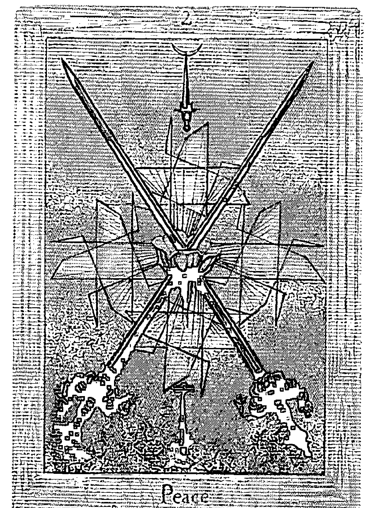

圖像解析

寶劍

兩柄寶劍停止了紛爭，為這混濁的狀況帶來短暫的和平。細長的寶劍穿過薔薇，周圍是刀光劍影凝結而成的圖形。「寶劍二」對應於喀巴拉生命之樹成形之界內的第二薩弗拉「智慧」，將奔流出的意識以寶劍阻擋，減少可能帶來的衝擊。

結晶與花朵

兩柄寶劍穿過中心淡藍色的薔薇，淡藍色連到了水元素背後的陰性能量，意味以強大武力維持了和平，將對立的元素暫時隔離。背後的幾何形圖案是薔薇所閃耀出的光輝，它可以代表經過凝結後的意識，也可以代表能量衝撞後的結晶。

●月亮天秤

月亮落入天秤座為這張牌提供了權衡的時間。如同戰爭時期的傳訊使節，負責在對立的環境之中找尋彼此的共同點，尋覓一個可以溝通的契機。

基本牌義

「寶劍二」的牌名是Peace，在此意為和平、寧靜。在喀巴拉生命之樹中，四個世界的形成分別經由最初的火創始與水的沉澱後，在風震盪中產生了土元素的結晶。而在代表風元素第二個薩弗拉「智慧」的「寶劍二」中，原本應該是較動盪混亂與不穩定的能量，卻在許多相互平衡的元素組成下，促成了一個寧靜的局面。牌中有兩把小劍指著上、下方的月亮與天秤符號，月亮代表著平靜之意，而天秤則代表此牌中各種力量的平衡，兩者共存意味著遵循月亮所帶來的母性與天秤所提供的權衡而行事。兩把寶劍穿過藍色的薔薇，藍灰色在喀巴拉中是「智慧」在成形之界的顏色，代表平靜的能量。周圍由花朵綻放出的圖案，代表著各種能量交互作用下的平衡。

「寶劍二」雖然呈現出寧靜，但背後造成衝突的源頭依然存在，甚至，我們還必須去注意帶來暫時和平的兩把寶劍，本身也具有傷人的能力。

抽到此牌

這是一個較為緊繃的時候，很多即將要發生的事令你難以招架，你可能感到無力與失落，因為你知道當此刻的平靜過去後會有多麼難以度過。此時你可能不適合去改變根深蒂固的部分，盡可能維持住雙方互信與可以交流的層面，似乎是比較實際的做法。

抽到此牌，可能發生了旁人覺得是一團糟的事，你卻能沉穩面對，你有縝密的心思能有條理地同時處理很多事。此外「寶劍二」也暗示清楚的思緒與放鬆的心情能使自己較能掌握現況，不會失去分寸。

寶劍三

悲傷 Sorrow

土星天秤

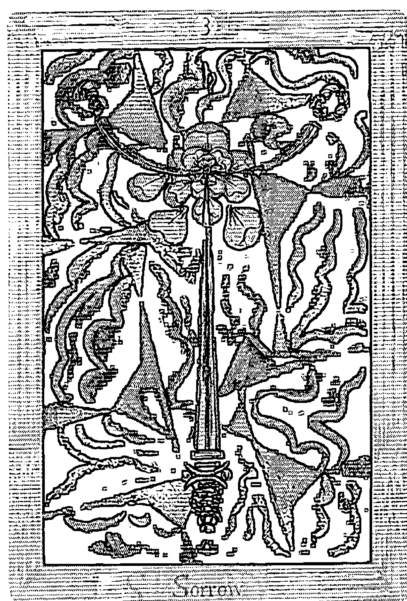

圖像解析

寶劍

寶劍向上刺入了花心，並且劍尖相抵，彎曲了另外兩柄寶劍，象徵深層的刺痛。

花朵與背景

受傷後的花瓣飄落，在漆黑的暴風夜中承受了巨大的打擊。花朵意味著意識下降過程的顯化，但在寶劍的破壞之下已經開始凋落。

基本牌義

「寶劍三」的牌名是Sorrow，意涵為悲痛。牌中出現於「寶劍王牌」的劍，抵住上方兩把彎曲的劍，並同時刺入花朵中，使得花瓣墜落。牌的背景是較為沉重的風暴夜晚。偏黑的配色賦予了這張牌不祥的意涵。三把劍刺穿花心，意味著一種打擊、一種深層的悲痛，並可能伴隨著負面的思考。倘若沒有旁人的點醒或調整心態，可能會鑽牛角尖的給予自己痛苦。

「寶劍三」以悲傷為主體，代表對個人情緒最強烈的傷害，而由於寶劍牌組都與理性相關，因此此牌通常也象徵迫於現實，必須做出最好的決斷而無奈割捨的意涵。

若說此牌是個美好的體會，大概沒有人可以接受，不過在金色黎明會內的解析中卻是如此，請容許我細細道來。當對應於風元素生命之樹第三薩弗拉「理解」，本該是意識接納來自第二薩弗拉「智慧」純粹陽性創造之光後的體悟，然而屬於風元素的意識心智卻無法解析來自更高層的訊息，傷痛於是產生。如同嬰兒出世的啼哭、靈啟剎那間的悲喜，靈體由高至低的沉降，或由低至高的提升，皆產生了共同體悟。然而在一般的經驗中，甚少人會將痛苦、劇變看作是生命的禮物，因此「寶劍三」名為悲傷恰如其分。

抽到此牌

當抽到此牌時，通常指出悲痛的原因已然發生，而它已經過去。如今的悲傷則是負面的想法所造成，當把焦點擺在事件本身時，除了感到悲憤外，沒有其他正面的益處。往好的方面想，抽到這張牌暗示你此刻是個可以離開這種心境的時機，在未來的一陣子是個重新開始的機會。試著接受接下來發生的每件事情，那是個釋放心結與療癒的開端。土星在天秤座的特質通常也代表內在的平衡受到壓力的打擊與束縛，你明知狀況是痛苦的，卻又因為現狀的安定而無法抗拒與打破現狀。

你也許感覺到無法接受，那痛徹心扉的傷痛啃蝕著你的精神，那深入骨的傷痕沒有辦法獲得療癒，你知道這是你難以抹滅的記憶，只能含著淚接受這一切。然而回過頭看，你並沒有失去你自己，你知道你還存在，你知道你仍然是那個原本的你。當情緒過後，你會知道逐漸走出傷痛並不困難。

「寶劍三」也可以是一個不太樂觀的預測，代表著你可能弄錯了方向，可能不經意地讓自己走在鋼索上，但在還沒有發生前，都有可以改變的機會，只要你願意，隨時可以轉個彎，換條路嘗試。

寶劍四

休戰 Truce

木星天秤

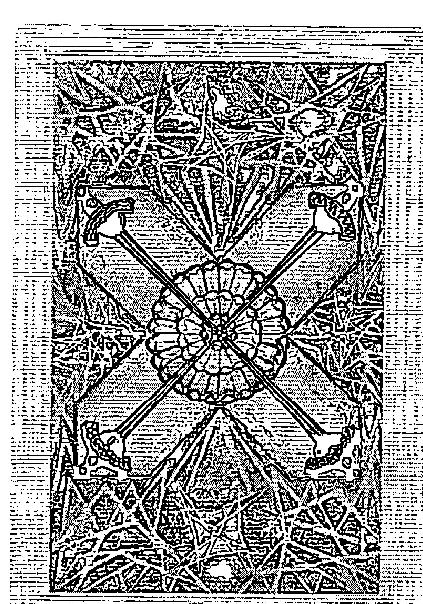

圖像解析

寶劍與花朵

四柄寶劍向內指著花心，然而卻未曾碰觸，它們平均的分配在四個邊角，劍柄上存在了聖安德魯十字（St. Andrew Cross）的紋路，那是取自於耶穌門徒安德魯殉道時所被釘上的十字，意味著在寶劍威嚇力量下已然形成的僵化模式。中央的四十九瓣薔薇以四層的方式圍繞，代表如同社會秩序建構下的和諧，四十九是七乘七之數，七在喀巴拉的生命之樹中為金星之數，是隱藏於此牌中的和諧之力。

背景

藍色背景中出現了不安逸的黃色線條，是混亂的意識之流顯現而出的衝突。「寶劍四」宛如戰亂中的一座城，武力範圍外兵荒馬亂，武力內則是維持一定秩序的平靜。

∽ 基本牌義 ∽

「寶劍四」的牌名是Truce，在此是停戰、止爭之意。圖片中四把劍尖端指向中間的薔薇，沒入花朵中心卻輕巧的沒有接觸彼此。在此，寶劍代表穩固的力量，四十九片花瓣的薔薇則是代表著平靜的狀態。與「寶劍二」相比，這張牌的寧靜是來自於律法、規律，以及權威性的教條。因此所呈現出來的意象雖是平靜的，卻隱藏著來自於心靈內在的逃避，即便是有再多的混亂，再多的煩惱或衝突，此刻只想利用理智上的方式來詮釋，情緒的感受暫且擱在一旁。

四把劍的綠色區域是天秤座的意象，代表著透過律法或理智的思維來維持著目前的情況。背景的藍色代表著木星與生命之樹第四個薩弗拉「仁慈」（Chesed）的呈色，「仁慈」位在生命之樹裡的仁慈之柱中，在此代表著木星居中作用下擴張的穩定力量。黃色的線條與圖案是風元素的呈色，在此代表著擾動的思緒，以及顯化而出的衝突。深藍色的占星符號則是第四個薩弗拉「仁慈」在成形之界的呈色。

∽ 抽到此牌 ∽

抽到此牌，通常代表著是一種暫時的平靜，不論是關係上、生活上。對於事件的占卜，則可能是外力的介入使目前的混亂有所改變。然而即使平靜到來，你也必須知道，造成混亂的背後原因還沒有被化解，現狀只是暫時的穩定，不會存在永恆平靜。

此外「寶劍四」也有自我保護的意味存在，需要注意的是，自我與外界整體互動是否平衡，是否因一己之私而擾動了整體的和諧。為了達到平靜，為混亂的狀況帶來一點和平，暫時藉助強而有力的掃蕩來維持住秩序，當然個人的利益與群體相比之下，就顯得不值一提，但如果拿捏不當，往往又造成了一個新衝突。

木星本身是和善與公正樂觀的星體，落在天秤座，可以闡述為公正將落實在每個人的身上。於此牌的意義是追求真正的平衡與協調，使每個人或每個個體都能在關係中尋求滿足與和樂。在混亂過去後，需要透過智慧與公正的手段，才能走向追求和平的理想途徑。

「寶劍四」代表著一個重新解決對立或衝突的機會。目前的處境是在一個「停戰的狀態下」，並非停下腳步觀望的時機，而是能夠起身做出重要轉變的時刻。

寶劍五

擊潰 Defeat

金星寶瓶

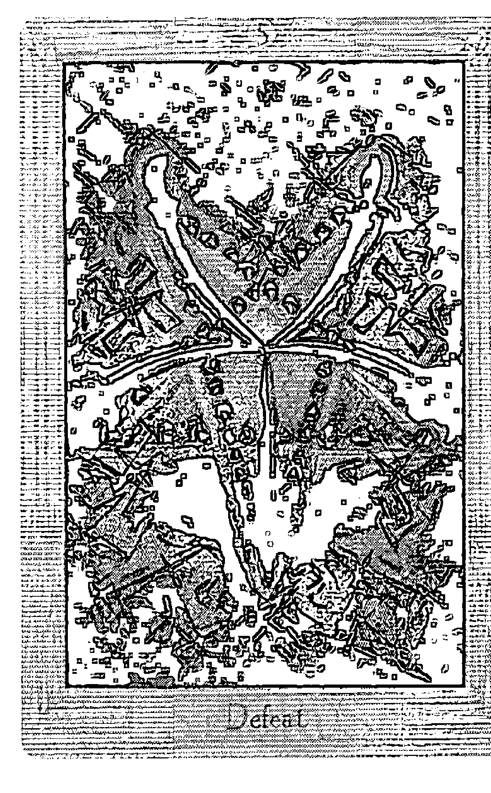

圖像解析

寶劍

此牌打破了「寶劍四」的僵局，外力破壞了原本的穩固，擊毀了薔薇築成的城牆。五把寶劍分別代表了不同的力量。最下方寶劍指向了上方，穿過了倒立的皇冠，在倒立五芒星「精神」的位置，代表被征服的心靈。右下方具有阿拉伯數字六的劍柄，意味喀巴拉生命之樹的第六個薩弗拉「美」，它存在於成形之界的生命之樹的中央，對應於風，屬於此劍的力量。右上紅色劍柄的寶劍對應於火元素，左上的魚狀劍柄對應於水元素，左下的綠色劍柄對應於土元素，取其綠色為土元素的代表。從「寶劍四」過渡到了「寶劍五」，能夠清楚看到四把寶劍背後代表其元素的力量，而擊潰城堡的最後一柄乃是代表精神的寶劍，它讓堅固的防守從內瓦解，突破了嚴密的守備。

⊗倒立的五芒星

五芒星的四個端點分別代表了四大元素，而最上方的端點則是靈性、高我意識的代表。倒立的五芒星是物質凌駕於精神的狀態，在過去是被視為異教徒的惡魔符號。然而克勞利並未將基督宗教偏差的惡魔觀點附加於此牌上，只是點出了錯置順序所導致的後果。

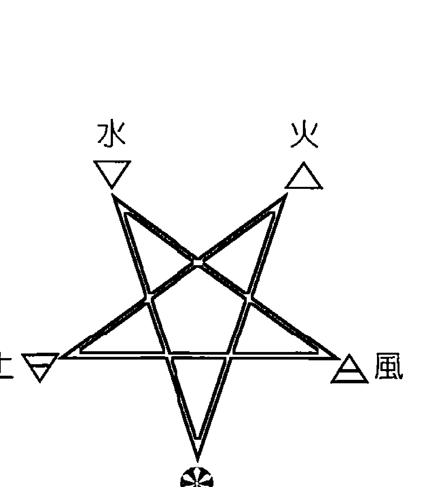

⊗花瓣與背景

背景雜亂的線條是風元素意念的實像化，在「寶劍四」中混亂已經漸趨穩定。而來自於「寶劍四」中的花瓣被擊潰後散落一地，四十八片花瓣在五把寶劍的作用力之下，自然排出五芒星的圖像，第四十九片花瓣留在中央，延續搖搖欲墜的命脈。

⊗金星寶瓶

金星落入寶瓶座是組成「寶劍五」的元素之一，這過於柔弱的組合，在面對寶劍的痛擊下，沒有還手的餘地，迅速潰敗而結束征戰。

基本牌義

「寶劍五」的牌名是Defeat，在這裡意思為擊潰。上一張牌代表平靜的薔薇，在此散落排列成倒立的五芒星。停戰已然過去，到了「寶劍五」剩下的是衝突後的景象。五把寶劍從五芒星的端點指向了中央。向上指的劍倒掛著皇冠，代表著心靈的征服，綠色劍柄代表土元素，魚狀劍柄代表水元素，紅色劍柄代表火元素，而數字六的劍柄則是代表了風元素。四把彎曲的劍是戰後消極的表現，代表著各種支持的力量已經消退，剩下的只是逞著一己之力做困獸之鬥。它同時在五芒星下方端點的位置，意味著不安、憤怒、情緒化。

「寶劍五」的占星元素為金星在寶瓶座。這張牌表現出在金星影響下理智的消退，消極、和平主義充斥是被擊敗的主因。克勞利指出此牌也有可能是遭受背叛的結果。牌面雖然充斥混亂，但五芒星邊緣外透出白光，在這邊暗指「除非我們願意，否則我們不會受到任何的痛苦」。從根源來看，「寶劍五」真正擊敗的是過於安逸與習慣逃避的心，正因為所擊敗的真正對象是心，所以現發生的任何事件只是擊敗心靈的媒介。

抽到這張牌，可能代表不那麼喜歡的人事物即將到來、不想面對的事情即將發生……。對於此牌的建議是接受現在的自己，並且瞭解到：我們所吸引的，是我們內在真正想要的東西；如果有任何事物不斷在我們心中縈繞不去，無論那是我們表面上喜歡的，或是表面上所厭惡的，都是對它投注過多心力所獲得的回響。因此，我們將會在生活中格外敏銳地察覺到深惡痛絕的事物的存在，而在你決定放下之時，這件事便與我們無關，即使你知道目前的你仍然難以放下，但現在你卻可以慢慢的去看清，逐漸的辨別出事件是如何操弄我們的情緒。

寶劍六

科學（理性）Science

水星寶瓶

##### 圖像解析

◎寶劍
六把代表不同行星的寶劍指向中央的薔薇十字，暗喻薔薇十字內所蘊藏的知識。不同顏色的劍柄乃是星體所對應的顏色。在星體能量及背後所代表意識的組織下，屬於理性的科學被寫下。

◎薔薇十字
牌中央的十字正是牌背的圖案。薔薇十字代表了過去的神祕團體「薔薇十字會」所用的印記，指向花心的寶劍說明了當中所蘊藏的知識。克勞利參與的神祕學組織金色黎明會，曾被認為傳承自薔薇十字會，那是一個過去不被認可，並且可能受到迫害的組織。儘管如此，會內對於種種神祕學知識，乃至於化學前身的煉金術，都有深刻的研究與傳承。因此薔薇十字的圖形暗喻了其內蘊藏的科學知識，指出這一張牌所表達的意涵，即為理性分析下的產物。

◎幾何圖形

薔薇十字外的圓形圈出了界線，隱隱約約透露出光輝，內部的線條有規律的呈現，意味著理性探究之下的內在本質。圓內部與外部的方形，代表由內心直達外在世界的個體實像，再向外延伸融入了群體實像。蘊藏著心靈與外在世界一致的奧秘。

◎背景

思路以線條的方式呈現，被歸納後的事實以風車狀的方式存在，代表著凝結過後的思緒。而交錯於圓圈內的線條，則是代表以科學對世界做出精準測量。

基本牌義

六把劍穿越了圓圈，刺進了薔薇十字，作爲風元素、思想的象徵，將理性刺入可見世界與不可見世界之核心。六把劍的顏色則是代表著各種星體呈色，分別爲黃色的水星、紫色的木星、藍色的月亮、深紫色的土星、暗紅色的火星與綠色的金星。薔薇十字花瓣代表的是太陽，在此表現出六種星體的作用力量朝向太陽的平衡。六把劍均分圓周，形成正六邊形的焦點，圓圈內外各包含了一個正方形。圓圈代表著內在的真實，方形代表著外在事物的實像。六把劍刺入核心，意味著運用各種方法來刺探內在神秘的本源。這張牌也具有煉金術的意涵，是薔薇十字會的最終追求，藉由此牌表達出「內煉金術」的最終精神：心靈的提升和轉化。線條則是代表多元的世界難以完美的運用思維或方法去掌握，但是其中仍然可以運用理性的思維去逐一剖析，一一歸納出真理，再由真理直指核心。薔薇十字也代表著大宇宙（世界）與小宇宙（人、心靈）內外一體的神祕呈現。

## 「寶劍六」的牌名是Science，為科學之意。

不少人納悶，和科學似乎存在著對立的塔羅牌，為何會將「科學」兩字作為牌名呢？科學發展的歷程與脫離宗教思維的控制具有密不可分的關係，十五、十六世紀，帶有神秘色彩的自然詮釋與偏離教會的論述遭受打壓，紛紛轉入地下而興盛。早期的秘教團體，乃至後期興盛的薔薇十字會，更是這些探索萬物奧祕與原理的人們逃離宗教壓迫的歸宿，並且孕育了煉金術、占星學等秘術，也孕育了科學的起源。在科學與祕術界線模糊的年代，不少科學家同時也是神祕學者，如眾所皆知的牛頓，晚年亦投入煉金術的研究。

科學指的是利用客觀的方法，實驗與數據的分析，經過反覆驗證後得到結果的歸納。科學是理性思維的展現，不能帶有模糊與臆測。這張牌當中的薔薇十字與每張牌背面的十字，均暗示著探究科學真理的核心秘密。「寶劍六」指出了一個共通點，科學與神祕學的本質都是透過對自然界的觀察而生出不同體系的詮釋，即便演變為不同的體系，但其中皆是來自於相同的源頭。

「寶劍六」所包含的占星元素是水星落於寶瓶座，為這張牌注入了思維整理與歸納的功夫，在極度理性的運作下，對於任何事都具有實事求是的精神，是這張牌所表達的意涵。然而理性剝奪了人性對於象徵描述的自然詮釋，剝奪了編織神話的自然本性，使得理性成為了脫離心靈架構的一種能力，在風元素能量平衡的六號牌，呈現的是理性化的世界，沒有想像，沒有奇蹟，也甚少有失誤的狀態。

##### 抽到此牌

理性是「寶劍六」的態度，當抽到這張牌時，可以代表念頭的興起、有系統性的方法、意見的交流與解決，也可能代表不只一個想法或事件同時出現的當下，仍然有辦法同時處理。你善於分析，不論是對人的分析或是對事物，都能夠看出背後的脈絡。在有條理的運作之中，對於那些你所看不到的人，以及想要掌握的事物都能上軌道，你會發現你是在完整體制下的一顆棋子，你遵循著應有的秩序而行動。

「寶劍六」也可以意味著科學研究，或是一種理性謹慎的態度，為了獲得真正的答案，他們可能不斷的重複嘗試，經過了漫漫長夜無止盡的思考，才獲得了一點點的前進。

在某種程度上，這張牌暗示了你放棄了想像的能力、失去了等待奇蹟到來的心情，你循著別人告訴你的方式去思考，甚至內化成爲說服自己的理由，而遺忘了你是不受限制的。觀看別人的過去來推測你的可能性，對你而言，並沒有那麼的實際，因爲你的人生不見得走在別人曾走過的路上。現在，放下推測後的結論，推開面前的理由，重新對準目標，光是想像，即可明白所產生的信心有多大，終點離你有多麼接近。

寶劍七

徒勞 Futility

月亮寶瓶

##### 圖像解析

六把代表各種星體的寶劍與巨大太陽之劍對抗，是這一張牌的意涵。它們雖然可以對頑大的寶劍產生傷害，卻沒有辦法與之匹敵。

月亮與寶瓶座的組合為這張牌帶來了一種猶豫、妥協的心態。「寶劍七」雖然沒有勝算，但是還保有著活力，它們蓄勢待發，可能不經意地讓人感到驚喜，即使沒有了勝算，即使沒有了希望，可能會妥協，但不會放棄。

##### 基本牌義

「寶劍七」的牌名是Futility，是空轉的意思。牌中有六把小寶劍指向中間較大的寶劍，在這邊意味著六種力量對著中央象徵太陽的巨大且直立的寶劍，彷彿是許多平民面對著一位強者，是一種徒勞無功的行爲。寶劍的劍柄上分別有代表其星體的符號：土星、水星、木星、火星、金星，以及最左邊兩個圓環組成的圖像（筆者推論爲月亮，但克勞利並未指出左邊寶劍劍柄圖像的對應），代表了這些星體所屬的力量均難以與中間的寶劍抗衡。

這張牌的占星元素是月亮在寶瓶座，這意味著代表風元素的理智受到情緒（月亮）所支配。面對挑戰有種遲疑且試圖想要妥協的心態，而一方面對於外界也有力不從心之感。

##### 抽到此牌

當抽到這張牌，代表處在被動的狀態中，可能持續一整天的工作，或捲入了一種投入許多時間卻不一定得到結果的事件。原因來自於分散的精力、目標混淆的行動，縱使看似忙碌，實際上卻是止步不前。雖然自己處於成長的當下，一步步地走向目標，但成功並非一味的努力向前衝，偶爾需要利用喘息的空間思考步伐的方向。試著接受目前的狀態，試著和周遭的人交流，並且放下無益的擔憂、所負的責任、擔心非預期的表現等。當焦點拉回到自身時，周圍的紛擾看起來也就不那麼使人感到無奈了。

月亮在占星學中代表潛意識，寶瓶座代表理性的絕對。許多事物在潛意識中自會完成，並且打理著我們所努力處理的一切，雖然外在的思緒常常容易受擾，但內在的潛意識卻有自我的一套方式去運轉與處理，當我們用思考積極處理我們所期待的事物時，由於外在的干擾，可能造成事倍功半，而應驗了此牌徒勞無功的意涵；一旦我們放下，任由內在的平靜去運行，則內在的解析與處理的速度往往超乎我們的意料，頗有「應無所住而生其心」的味道。

寶劍八

阻礙 Interference

木星雙子

##### 圖像解析

寶劍

兩柄寶劍倒掛於畫面的中央，牽制了後方的六把寶劍。「寶劍八」的衝突表現於內心當中，多種念頭如同後方的六把寶劍一樣，讓自己拿捏不定。六把寶劍分別是不同民族所使用的刀具，它們本身具有一定的使用方式與習俗儀式，而今把它們放在一起，帶來了使用上的困擾，也象徵內心的紛亂。

# 木星雙子

木星雙子為這張牌注入更為廣大的思考層面，因此也造成了多種想法並存下的碰撞。但在木星的能量影響下，並沒有帶來真正的衝突，時間停留在那困惑阻礙的時期。在木星擴張的力量下，雙子座的主體性受到削弱。木星遠大的理想、目標、創意，在雙子座懷疑與理性的思考下，無法充分發揮，轉為一再循環內化的阻礙。

##### 基本牌義

「寶劍八」呈現出懷疑、思慮過多的心態。反映在事件上，則是陷入兩難的困境、理想與現實的衝突。牌面豎立兩把劍，其後交錯六把短刀，暗示著促使目標縮減的力量或想法不斷的出現。暗紫色的背景代表衝突與焦慮。懷疑與批判本是理性的工具，但過度的追求表現、追求細節，則使得狀況紛亂，各執己見。

其實「寶劍八」也沒有那麼的糟糕，那些阻礙使你暫時停下了腳步，讓你暫時免於走入火海，那些混亂的想法來自於自己不確定的意象，面對那麼多種的選擇，能夠沒有迷惘嗎？木星擴展雙子的思緒，多重存在的念頭同時奔放，儘管單獨運作時每個想法都能獨當一面，但同時進行則是寸步難行。

##### 抽到此牌

抽到「寶劍八」，意味著處在一種多慮的情況，可能面臨了選擇、事件、對象或內心的衝突。如果順著理性的脈絡去思考，有可能會鑽入死胡同，讓自己迷失在多重的想法中。混亂來自於自己，也許你有太多的選擇、太多的方法，正如同牌中每一把寶劍，個個都是武器之首，但當用之時，卻無法同時施展。

此刻，你可以去瞭解阻礙著你的「本質」並非於現在所形成，如果思緒找不到出口，回想一下最初，讓自己記起阻礙的起源，試著去看到它，並且相信自己：你本是不受限制的，你有獨具的慧眼，放下過多的思緒，停止追求細節瑣事，即可看見淺而易見的脈絡。

寶劍九

殘虐 Cruelty

火星雙子

# ∽ 圖像解析 ∽

◎寶劍
九把寶劍立於牌面，滴著鮮血的圖像不禁讓人聯想起曾發生的殺戮。每把刀鋒上刻意留下缺刻，為受害者帶來殘忍的二度傷害。紅色的寶劍代表著讓人心寒的事件正在發生，可能是血淋淋的事實，或是難以接受的結果，苦痛一陣陣刺入體內。

◎火星雙子
火星落入雙子座為這張牌帶來了逼迫。火星的紅色渲染了整個畫面，落入了雙子座代表著被逼到絕境的反應，它可能是審問者，可能是讓你面對真相的狀況，任何隱瞞都無法逃過「寶劍九」，它使你必須面對不願意看到的真相。火星雙子也暗示了將事情過度推向理性層面的反應，導致一種心靈拉扯下的痛苦狀態。

##### 基本牌義

「寶劍九」的牌名Cruelty，為殘酷、殘忍之意，由九把滴著鮮血與黃色毒液的寶劍組成。經歷過了前幾張寶劍牌到「寶劍九」，重新回到生命之樹中央平衡之柱的第九個薩弗拉「基礎」。在此之前的混亂狀態已然停止，然而人性的成分在這張牌中也明顯的降低。「寶劍九」是理性的過度展現，如同審問者的角色，只講理不問情，表面看似理性，但心智卻是極端粗暴、嚴厲與無情。生鏽的劍身帶有缺口，為火星力量的表現，血代表的是痛苦，黃色的毒液則可以表示處在一種折磨且被欺騙的環境當中。

這張牌具有某種程度的狂熱性質。在事件上，它可能代表著事情經過許多可能的階段，如今卻落得令人感到絕望的後果。在心態上，則是一種冷酷無情的慣性，可能是為了達到某種手段而對細節不加思索的結果，或是長久以來的習性，造成對於外界事物漠不關心。克勞利指出，在此情況下的反應，通常是消極的抵抗與無奈的接受，甚至使心靈達到瘋狂的程度。

##### 抽到此牌

你可能太關注於表面上的事物，而忽略掉了情感部分。爭吵永遠沒有贏家，尤其是跟互動親近的人。感受到的痛苦與折磨，可能是來自於對某些想法過於堅持。你感覺到痛苦，深深知道那是你總有一天會獲得的體驗，但它卻來得那麼快、那麼突然，使你措手不及。你可能感覺到絕望，縱使在這一段時間不太好受，但是往好處想，誰又能在這種情況下保持樂觀呢？

此過程與你的作為息息相關，你開始察覺到自己扮演的角色，遠遠超乎你認定要背負的責任，當你開始原諒這施加於你身上的痛苦後，就是走出這種經驗的時機。

寶劍十

淪亡 Ruin

太陽雙子

# ～ 圖像解析 ～

◎寶劍

十把寶劍的劍柄分布在喀巴拉生命之樹十個薩弗拉的位置，並且朝向中央，向隱沒於第六個薩弗拉「美」之下的寶劍襲擊，試圖粉碎代表風元素生命之樹的中心。「寶劍十」是風元素牌組極端發展後的結果，每一把寶劍象徵著每一個不同的觀點、立場，在過於批判的理性當中摧毀了自己本身。生命之樹中的第六個薩弗拉「美」是太陽的歸屬，也是這張牌所對應的占星元素之一，被粉碎的太陽象徵著過於理性的想法架空了心靈，走上淪亡之路。

◎太陽雙子

太陽雙子座是「寶劍十」所包含的特質之一，代表著過度的理性，使自己與外界產生了隔閡，拉長了距離，甚至招來了十把寶劍往太陽中心粉碎性的攻擊。

## ～～ 基本牌義 ～

「寶劍十」的牌名是Ruin，是毀滅、滅亡之意。十把劍柄排列成生命之樹十顆薩弗拉的分佈型態，劍尖指向中心。十是元素能量沉降的終點，甚至發展為過於極端的形勢，在「寶劍十」中所表現出來的是風元素過度理性下邁向瘋狂的道路。

寶劍指向生命之樹中的第六個薩弗拉「美」，所呈現的是心靈內部的毀滅。經歷前幾張能量相對穩定的牌，代表心智思想的風元素於「寶劍十」開始崩解，指向中心的劍尖說明全盤毀滅的原因來自於心靈本質的瓦解。淪亡來自於過度發展的信念，架空了心靈，架空了人本來所被賦予的人性，朝著瘋狂之路邁進。這好比極權統治下的領袖崇拜或極端的宗教奉獻精神，以意念創造出一個美麗世界，以思想席捲人心，卻建立於搖搖欲墜的基礎上。

## ～～ 易卦解讀 ～

《易經》：「夬者，決也。」

克勞利指出此牌可與《易經》的第四十三卦：夬卦相應。最上面劍柄的天秤與夬卦均可以代表雙子座的猶豫不決與做決定的困難處境，呼應到整張牌由內（想法）往外擴張的瓦解。
「夬者，決也。」在《易經》中代表的是決斷的力量。
此卦上爻為陰爻，下面五爻皆為陽爻，因此象徵的是一個柔邪的陰爻凌駕五個剛直的陽爻，而下面的五個陽爻則必須決定如何將此一凌駕於上的陰爻處理滅除掉，此是夬卦的意涵，通常與改正自己的缺點，以及扭轉錯誤的觀念有關。而組成此卦的元素為兌卦（澤）與乾卦（天），象徵和悅與剛健，象徵破除個人迷思與邪見後所帶來的剛健自強與和悅安順，要破除自己的缺點，需要強大的決心與規畫，也因此破除所帶來的不僅僅是傷害本身，而是企圖使我們看見破除後的重建。

#### ～ 抽到此牌 ～

抽到這張牌意味著將度過一段不安與難過的時間。不論是何種原因，走到這一步，自己必然會有所知曉。在這個當下，至少你可以預知情況不會更糟，雖然「寶劍十」瓦解的是心靈上的想法，但是透過外界事物的牽動，難免會帶來許多的情緒反應。此牌也指出了若是過於追求想要聽到的答案，反而會招致失望的結果。

在這一個當下，你可能是瘋狂的，你可能聽不進去別人的言語，你信仰你所信仰的事物，朝著火焰撲去，並且滿懷著期待。也許在你感覺到痛苦，也許在看到了被火焰吞噬的靈魂後，才能看清自己走在怎麼樣的路上。

圓盤牌組 The Suit of Disk

——圓盤牌組，觸摸到的真實

圓盤牌組對應於土元素，三個土象星座：摩羯座、金牛座、處女座分別對應於圓盤牌組。土元素是我們對於現實世界的認識，是生活中所追求的功成名就、榮華富貴，是一位腳踏實地的理想主義者。

小阿卡納的土元素牌組通常以錢幣（Coin）、圓盤（Disk）或五芒星（Pentacle）為名，在托特塔羅中，克勞利選用了圓盤取代了其他的稱謂，他認為圓盤的概念才能闡述荷魯斯紀元下土元素的涵義。

#### 圓盤王牌

## Ace of Disks

## ⟡ 圖像解析 ⟡

⊙金幣

正中央的三枚小金幣排列成A∴A∴名稱圖像（詳見本章〈大阿卡納〉「星星」），而外層的七芒星圖案則是A∴A∴會所使用的會徽，同時呼應泰勒瑪中的母神巴巴隆（詳見本章〈大阿卡納〉「慾望」）。這種種的圖騰與象徵，皆連結到克勞利自身。

⊙金幣內的數字與符號

金幣內的「666」在《聖經》〈啟示錄〉中屬於惡魔的數字（詳見本章〈大阿卡納〉「戀人」），中央金幣外圈刻上了希臘文「TO MEGA ΘHPION」（英文：To Mega Therion），意為致偉大的聖獸，這是克勞利的簽名，同時，在克勞利創立的泰勒瑪中，此為大阿卡納中的第十一號牌「慾望」出現的坐騎，數字六六六上面出現的「I」代表著泰勒瑪偉大的女神巴巴隆，祂騎在聖獸之上，征服獸性，於物質世界中體驗更高層的神性。

⊙太陽暗示

TO MEGA ΘHPION以希臘字數字相加為六六六，與中心的阿拉伯數字六六六相互呼應，除了是惡魔之數外，六在喀巴拉的生命之樹中也對應於太陽，在此代表了掌握住物質世界中的魔法精髓。

⊙七芒星

中央三小硬幣外有七芒星包覆，七芒星是女神巴巴隆的象徵，也是A∴A∴的會徽。

## ∽基本牌義∽

「圓盤王牌」是踏入土元素的第一張牌，在這張牌內，充滿許多克勞利創立的祕教符號與象徵，其中包含著邁入新紀元（New Aeon）之暗示。此外克勞利也把自己的圖騰放入這張牌作為托特塔羅牌的署名。「圓盤王牌」本身則是對應到天球北面牡羊—金牛—雙子的天球象限。

土元素代表的是世界穩固的一面，即是我們所見的物質世界，是事物的基礎層面，也可以是金錢、財富、事業的象徵。「圓盤王牌」充滿著泰勒瑪中大地女神符號的隱喻，如同春天的到來，旺盛生命力的展現。

以圓形的錢幣（圓盤）作為土元素牌組的象徵之物，那是可以觸摸得到、可以看到的實質存在物，圓盤牌組並不同於其他小阿卡納牌組，將目標著重於想法、心靈世界或不可見世界之描述。它所觸及的對象，大多為可以真實遭遇的事件、真實人生的體驗，以及可觸摸到的真實。

## 抽到正牌

抽到這張牌可能使占卜師感覺到疑惑，因為它並沒有特別的指出什麼，沒有好與壞，沒有對與錯，也沒有方向，因為這張牌本身就是世界真實的象徵。一般而言，可能暗示傾向現實層面思考的建議，或者以世俗觀點去行事。

此外「圓盤王牌」也可以用土元素基本的意涵去做解析，財富的增加、休假的開始、身體的健康等

> 注11：使用數字學字母對應的運算法，666 + 1 = 8 + 20 + 70 + 20 + 20 + 10 + 50 + 8 + 3 + 400 + 50 + 8 (H KOKKINH ΓYNH) 。H KOKKINH ΓYNH即是BABALON(女神巴巴隆)。

> 注12：TO MEGA ΘHPION 每個字母拆成對應的數字相加 300 + 70 + 40 + 5 + 3 + 1 + 9 + 8 + 100 + 10 + 70 + 50 = 666

> 注13：七芒星的七個七與女神巴巴隆可以用數字學拆解相加互相解釋。七芒星的七個七：(7 + 7) ÷ 7 + 77 + 77 = 2 + 1 + 2 + 1 + 30 + 70 + 50 (BABALON字母相加之數)。

#### 圓盤二

### 變易 Change

### 木星魔羯

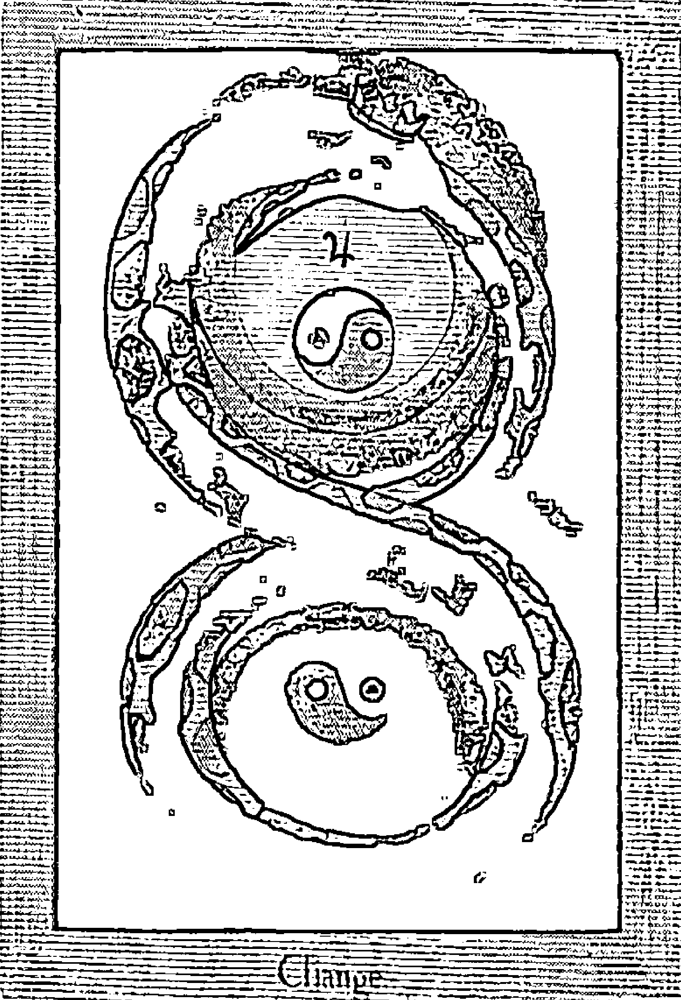

##### 圖像解析

⊕太極
圖像中白色與黑色兩塊圓盤代表陰與陽，上方的太極內畫上火元素與水元素的符號，下方則是風與土元素的符號，互相沿著相反方向旋轉，代表四元素能量運行之下的影響與平衡。

⊕蛇
咬著自身尾巴的蛇構成無限的符號，具有循環、生生不息之意。牠位於太極與四元素之外，代表著循環的法則在物質世界中運行。

##### 基本牌義

這張牌的牌名「Change」等同於《易經》中的「易」，是改變、變化之意。

《易经》的英文译本名为《The Book of Change》，克劳利取用了其中的变化（Change）之意赋予到「圆盘二」当中。然而，易之三名：「简易」、「变易」、「不易」，又以其中的「变易」较为贴近此牌的意涵。

牌面中咬着自己尾巴的大蛇，头尾相接，形成一个无限的符号，意味着生生不息、无限的循环变化，蛇是古老智慧象征的图腾，也象征着自给自足的心灵模式，与生命之树中的第二个萨弗拉「智慧」落入物质之界（Assiah）的生命之树相应。这张牌表现出的是流动中的平衡，事物均会改变，唯有改变本身不曾停止改变，此牌中所呈现的即为如此，流动中的平衡可以是不断变化，也可以没有变化，取决于切入的角度。

「圆盘二」是土元素牌组中第一张分离出的牌，在喀巴拉的观念中，出自于形而上世界，被凝聚而下来的思想，产生眼前如真似幻的物质世界。因此以四元素作为世界万物本源的象征，以生生不息的循环作为「圆盘二」的牌义。

### 抽到正牌

你可能察觉到生活中出现了一些改变，那源自于你心念中的转变，而投射到物质世界之中。生活中的起起伏伏与运势的高低本来就存在着规律，当你在最高点时要留意那下坠的力道，当跌落谷底，记得抬头看看希望的阳光。美国著名投资家巴菲特（Warren Edward Buffett）曾经这样透露他的股市操盘守则：「在众人贪婪时，我们要恐惧，在众人恐惧时，我们要贪婪。」就是「圆盘二」的写照，当你掌握了循环的规律后，你不再随着人生或运势的起伏摆动，你可以自己掌握时机，在适当的时候做出适当的决定。

「圆盘二」可以简单的代表事物开始转变，生活环境转换或人生阶段的前进，也可呈现出希望改变的心理。「圆盘二」透露出改变比一成不变来得适合，至于未来发展的走向，还是需要搭配牌阵中其他的牌来解析。

#### 圓盤三

### 工作（創造）Work

### 火星魔羯

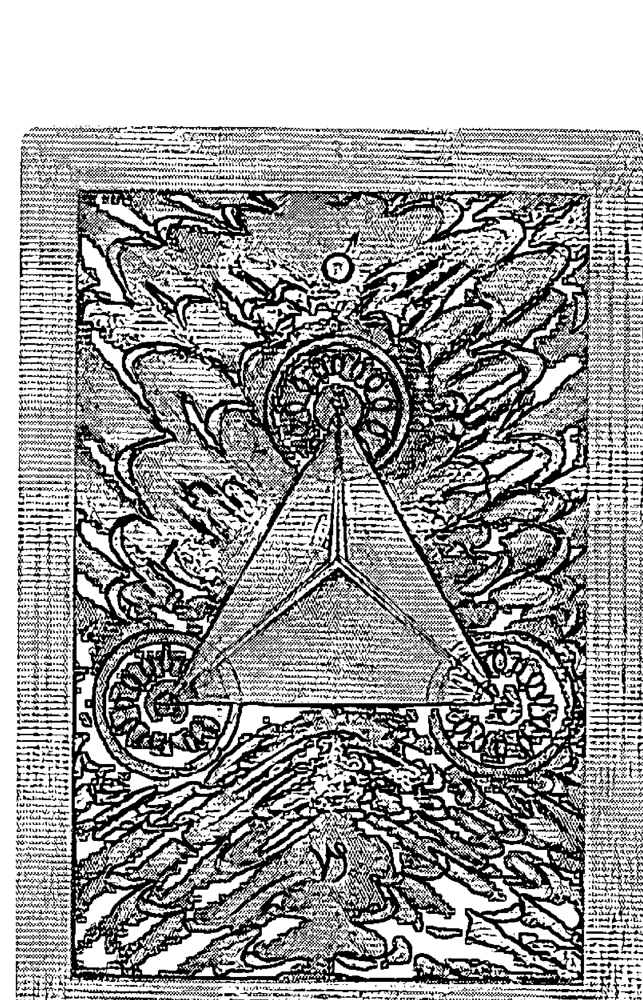

##### 圖像解析

⊕圓盤
三個圓盤分別支撐住金字塔的三個角，圓盤上刻有煉金術的三種原料符號：硫、鹽、水銀，以內煉金術的觀點而言，鹽是身體，硫是內心向上提升的動力，水銀則是事物背後的靈性本質。受到火星能量的渲染下，圓盤轉為了紅色，以煉金術之三要素來支撐浮於上方的金字塔。這意味著一個創造的過程，藉由從集體意識的汪洋中提取靈感，在全我合一（支撐於底部的煉金三要素）的力量下實現理想。

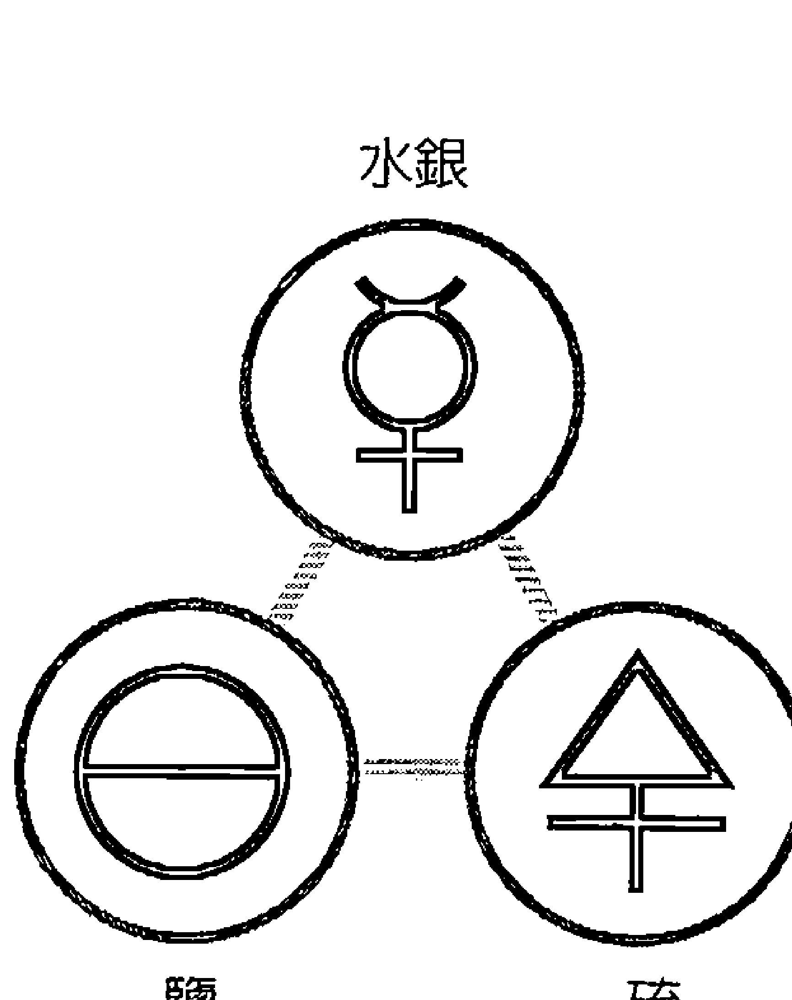

◎海洋與塔
背景的海洋是生命之樹第三個薩弗拉「理解」之海洋，而夜晚漂浮其上的金字塔是第二個薩弗拉「智慧」的象徵，爲喀巴拉生命之樹中的第三個薩弗拉「理解」所承接。當通過第三個薩弗拉「理解」後，即往下進入生命之樹中的第四薩弗拉「仁慈」，穿越了喀巴拉中的天界三角，穿過了超意識間的汪洋。

##### 基本牌義

「圓盤三」正如它的牌名——創造，是個集中精力在特定領域且逐漸實現目標的過程。牌中有著煉金術中的三種材料，代表事前的準備已經充足，有足夠的能力從一定基礎往上建構。此牌的占星元素爲火星落入摩羯座，激發出認真、仔細的想法，並且能在充分準備下行動。

「圓盤三」是一個逐步達成理想的過程，從無到有，必須經過白手起家的辛酸，一路上沒有放棄自己當初堅持的理想，跨過了一開始的鴻溝後慢慢抓到了訣竅，避開了風險，轉眼間已然走在這條路上，小有所成。如果擁有熱情，這會是一個有趣的過程，在許多危急的時刻往往送來了最需要的幫助，憑著對理想的堅持，在每個即將放棄的當下都會得到新的機會，這是「圓盤三」的奧祕所在。「當你真心築夢時，全世界都會幫你完成」是這一張牌深處的涵義。

### 抽到正牌

這張牌可以代表一段集中心力達成某目標的過程、合作的關係或積極光明的心態。目前的狀態是最好的狀態，也處在一個好時機。周圍有所有可以運用的資源，是一個不錯的起始點。若善加運用局勢的話，你可以順利達到最終目標。

然而你必須知道，投注太多精力於其中，有可能造成人際關係上的疏離，亦可能因疲累讓你沒有心思去關心身旁默默支持你的家人、朋友們。因此，避免對目標過於執著，以較為輕鬆的心態來面對未來，你可以做出雙贏的抉擇，可以在快樂中完成工作。

#### 圓盤四

### 能力 Power

### 太陽魔羯

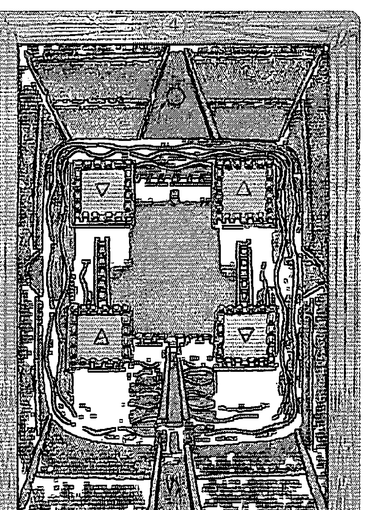

##### 圖像解析

◎圓盤
這張牌中我們看不到圓盤，它轉變成了堡壘邊角的四個瞭望台，四元素的符號刻在瞭望台頂端，代表四種用來防守的武力。而每個瞭望台的每邊都有六塊城垛，以及堡壘城牆外六個凸起的城垛，是太陽的象徵¹⁴，也對應於其上的太陽符號。整體的建築是位於高處，周圍有護城河圍繞。這張牌代表著在四元素能量防守下，為城堡築起了一個無堅不摧的堡壘，內部有著縝密的計畫，以及層層的管理，維持著規律與秩序。堡壘的名聲響亮，但對外面的人而言，往往只看到美好的層面，而猜測不到內部的嚴苛。堡壘唯一通往路面的開口位於下方，從中傾瀉而出的能量朝著喀巴拉生命之樹的第十個薩弗拉「王國」流動。四元素的瞭望台提供防衛，堡壘則使得四元素的力量得以完整的存在，兩者是相依相存的生命共同體。

註14：「六」在喀巴拉生命之樹中對應到了第六薩弗拉「美」，同時此薩弗拉於占星學上亦對應於太陽，因此取六為太陽之數。

### ☉太陽魔羯

屬於冬天的魔羯座位於冬至（十二月二十二日）與大寒（一月二十日）之間，太陽從黃道的最南點往北回歸，當冬天降臨，冰雪覆蓋著大地，這時候農作物無法生長，位於邊緣地帶的盜賊興起，此時正是軍隊進駐的時刻，他們從護城河朝北方進入了堡壘，意味著太陽往北的回歸。這些象徵都對應到了這張牌的占星元素——太陽落入魔羯座。這樣的組合為這張牌帶來了嚴密的社會組織、秩序的建立，也帶來了謹慎小心的特質。

##### 基本牌義

在這張牌中，四元素的符號直接被畫在堡壘上，它具有強大的武力，但卻偏向於靜態，沒有實際力量的展現。「圓盤四」以完美的規律建立起的秩序，讓自己立於一個不敗之地，佐以太陽落入魔羯座的能量，帶來了魔羯座深思熟慮、步步為營的謹慎。堡壘多少有所限制，雖然帶來了穩定，但也可能是一種阻礙。

舉例而言，iPhone內的iOS作業系統就宛如「圓盤四」建立起的堡壘，它是封閉式的系統（護城河），沒有辦法修改字體，沒有辦法隨意安裝從網路上下載來的軟體，因為它的內部有著嚴格的規律（堡壘內的秩序），雖然感覺綁手綁腳，不過它卻不會受到惡意軟體的侵害（四元素的瞭望台與堡壘的阻擋），而且不太容易當機，反應速度快（堡壘內部的秩序帶來的效率）。對外而言，這是蘋果公司進入手機市場的強大部隊，有著種種限制，但還是能夠有亮眼的銷售成績（固若金湯、聲威遠播的堡壘，以及對它的猜想、好奇），但對內部而言，卻是存在著許多嚴謹的環節，絲毫不得鬆懈。

### 抽到正牌

「圓盤四」是對於當下穩定、平靜的描述。它可以代表一種受到管控或限制的情況，即使本身具有能力，也不一定能在當下發揮。通常抽到此牌需要仔細的觀察其他周遭的狀況，它可能代表一種自我控制的能力，也有可能代表過於沉重的壓力。

「圓盤四」的規範可能來自於公司、組織，也可能來自於你對自己的要求，那些規律在你的內心深化，讓你容易運用組織化的概念來行事，如果你維持著這樣的步調，所得到的是穩扎穩打的實力。

但「圓盤四」也可能使人感覺到缺乏新鮮感，感覺到一種僵化的思維，當你在牌陣中關於建議的位置抽到此牌，不妨休息個幾天，讓自己暫時抽離緊繃環境，就能體會簡單的放鬆竟是如此的愜意。

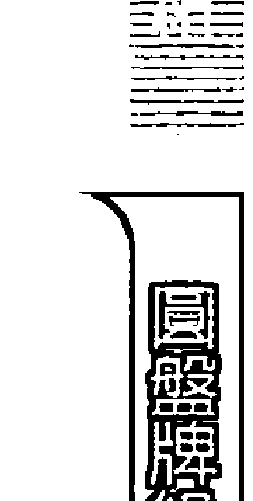

#### 圓盤五

### 憂慮 Worry

### 水星金牛

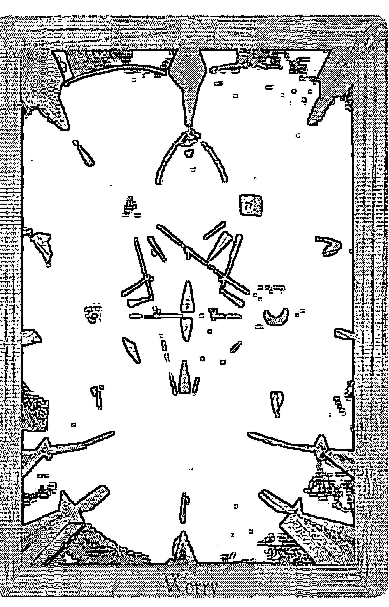

##### 圖像解析

◎圆盘
五个圆盘排列组成了五芒星的图像，其中用了印度神秘学系统的符号来代表五元素：红色三角是火，银色新月是水，蓝色圆圈是风，黄色方块是土，以及黑色之卵代表第五元素的精神体。它们分别是已经停止运转的齿轮轴心，让系统停止了运作。它们彼此的不协调造成了冲突，以至于发生状况后不得不去检视当中究竟出了什么问题。

◎倒立的五芒星
组成倒立的五角星圆盘，代表能量上的失调与不稳定的基础，也意味着物质凌驾于精神之上，呈现出一种迷失的状态。在这张牌内，则是代表各方冲突带来的不愉快所产生的混乱。

### ●水星金牛

水星金牛的組合為這張牌帶來了磨擦，思慮清晰輕快的水星與按部就班、腳踏實地的金牛搭配下，彼此本質上的碰撞，使得整體事件在這一個環節上受到阻礙。如同一位思路敏捷的設計師，指導守舊的工人建造一個後現代主義的建築，雙方各自用不同的風格來工作，大部分的工作時間得投入在彼此的協調上。

##### 基本牌義

這張牌在五顆圓盤的符號上借用了印度體系的思維。四元素在印度體系中，主要是對應自然事物與人的部分特質，譬如人的原始渴望、熱情屬於火，情感特質屬於水，其中的第五元素則是人整體的象徵，人是所有四元素的總和。同時自然界中的事物也可以用此來解釋。與西洋神秘學的符號意涵在大方向上頗為吻合，但主要還是偏向於物質層面上的意涵。這張牌的占星符號是水星在金牛，意味著靈活變通的思緒受困於固執與不變的想法中。因此「圓盤五」的失衡主要來自於長期處於隱忍不安與擾動中。

### 抽到正牌

當你抽到這張牌時，意味著已經經過了一段沒有太大改變的生活狀態，在上一張「圓盤四」的規律處境獲得好處後，到了「圓盤五」，「不變」成了苦惱的開端。這張牌暗示了一種混亂的狀態，使我們不得不從原本的生活中抽離，來面對這個問題。通常當下看到的是一團糟的景象，伴隨著想法的糾結、複雜的事情，以及摸不清的頭緒，但當我們靜下心來思考一下就會知道，乍看之下出問題的小環節，多半是長久的忽略所造成。

此外，這張牌也可以表示受到巨大壓力下的一種逃避心態，煩惱可以視為長時間逃避的一種提醒，告訴我們該是回來正視問題的時候。況且苦惱常是由于欲望的失调所引起，《道德经》有言：「见素抱朴，少私寡欲。」减少自己的私欲，即能有效的减少自己的烦恼，思考自己是否真有达成这些欲望的需要，合理且适量的去克制自己的欲望，也是斩断烦恼的方法。

#### 圓盤六

### 成功 Success

### 月亮金牛

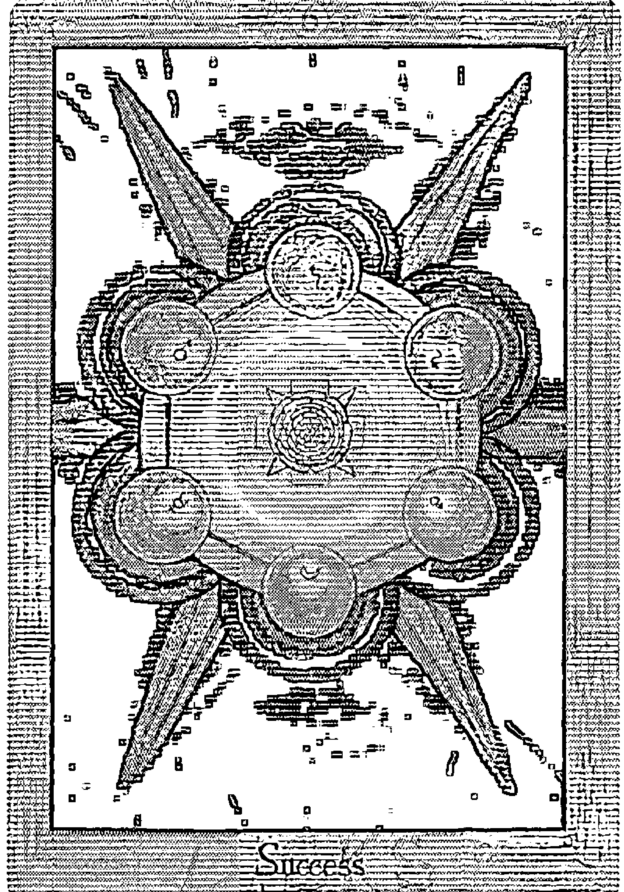

##### 圖像解析

⊙圆盘
图中的六个圆盘刻有占星符号，它们依照生命之树中的位置排列。数字「六」回归到生命之树的第六萨弗拉，对应于占星学中的太阳，以蔷薇十字作为太阳在物质世界（土元素）的代表，而六星体排列于六芒星的顶点上，象征力量分布均衡。「圆盘六」本身的特质吸引了众星围绕，情愿为它付出，共同完成彼此相同的梦想。

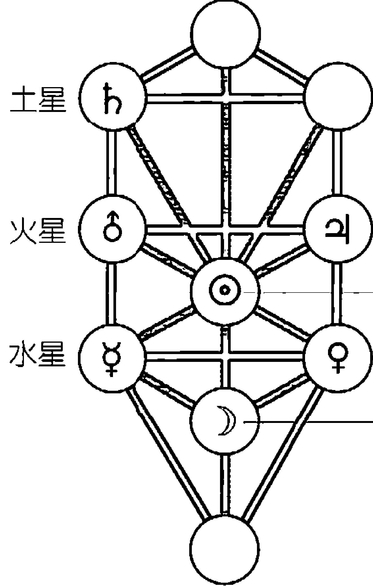

⊙蔷薇十字
不断出现于托特塔罗的蔷薇十字，在「圆盘六」中位于原本属于太阳的位置，暗指秘传的知识（蔷薇十字会），以及那不可见世界的本质。蓝色蔷薇是生命之树第四萨弗拉「仁慈」的呈色，而勾勒出红色十字线条则是第五萨弗拉「力量」的呈色。十字內的四十九片薔薇花瓣代表陰性的能量，中和太陽本身的陽剛，將本質提升而圓滿的呈現。

◎六角光芒
六道光芒是太陽之數六的暗示，意味眾星圍繞輔佐下的太陽，閃耀著屬於自己的光輝，象徵目標的達成、理想的實現。

##### 基本牌義

「圓盤六」的占星元素為月亮在金牛座，是個能量受到提升的組合。月亮是情緒的象徵，也是內在安全感的依附，與金牛座搭配，代表實際上的擁有，填充情緒上的不確定感。當度過「圓盤四」的安定與「圓盤五」的擔憂後，「圓盤六」指出目前已經有了足以支撐夢想、滿足信心的具體把握，而且經過了一段努力之後，現在正是開花結果的時刻。「圓盤六」是一個成功的典範，如同一個樂於分享經驗的長輩。

### 抽到正牌

「圓盤六」的牌名是成功，意味著在生活層面上略有小成，混亂的狀態已經過去。心理上則是有充分的自信與踏實的感受。「圓盤六」允許我們去做我們想要做的任何事，當我們具備了積極的心態與充分的基礎後，即沒有太大的問題，只要準備好，就有相當大的機會實現夢想。而如果已經在最高點，則要謹慎的評估環境，月亮在金牛座的輔助只是暫時，此刻的優勢更需要用有技巧的方式來處理，縱使優勢已過，也不至於跌得太深。

在占卜之中，如果出現了其他星體象徵的牌，則可以作爲相輔相成的解釋。如「皇后」牌內的金星，可以視爲在彼此的合作下互蒙其利，「皇后」牌也沾附了「圓盤六」成功的氛圍，將原本的牌義做了提升。

#### 圓盤七

### 失敗 Failure

### 土星金牛

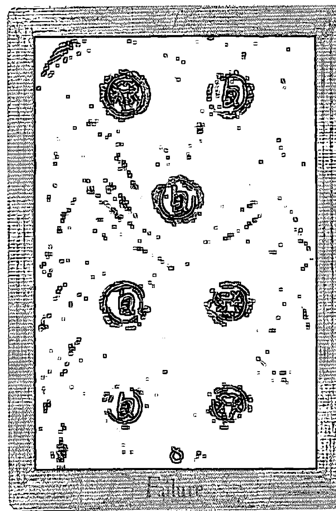

##### 圖像解析

◎钱币
钱币上铸了金牛（牛头）与土星（人脸）的象征图像，四颗土星钱币压过三枚金牛钱币，意味著情势朝沉重险恶的方向前进。土星在炼金术中对应的是「铅」，是为卑金属。在此代表著以含有铅作为材质所打造的钱币，具有质地天生的缺陷。以炼金术的角度而言，意味著炼化过程的失败，本身的特质没有被精炼出来，更没有提升，对应到我们心灵当中守旧、一成不变的心态。这七枚钱币排列成地占术中最不利的图形¹⁵，相当于生命之树中连结六与七萨弗拉的第二十四条路径，对应到大阿卡纳中的「死神」牌，在占星学的对应则是火星在天蝎座，都是对于未来偏向不乐观、失去了原有热诚的意象。

¹⁵：地占术中的 Rebeus 图形。

◎背景
背景中枯萎的叶片衬托出沉默的氛围，在黑夜之中为这张牌带来了些许的不确定感。

##### 基本牌义

接续着上一张「圆盘六」的成功，「圆盘七」戏剧化的转为失败。牌的图像呈现出极端被动的状况，枯萎的植物与钱币排列的图形都暗示着失败。表面上看来是环境因素造成，实际上则是缺乏行动的内在灵魂所导致的必然结果。这张牌是土星在金牛座，土星的破坏力瓦解了金牛物质上的稳定，从一片死寂的背景与暗色的钱币中，可以感受到这张牌的沉默。

##### 抽到此牌

「圆盘七」传达的意涵与失败有关，通常抽到此牌伴随着被动的态度、缺乏追寻梦想的动力与努力，在紧张或不安情绪下自我放逐。在这种状态下，可能会觉得没有奋斗的价值，或是有这样就已经满足的心态。然而这张牌真正要给的启发乃是：透过内外合一的思维，才能顺利的达成目标。

在生活中所做的任何事情都可以找到背后的动机，这在喀巴拉哲学中即是：事物脉络之内不可见的推动力，心灵的状态决定了事情发展后的遭遇，没有这种认知下的人们将之称为运气。「圆盘七」虽然是负面的局面，却指出行为的背后没有真正的热诚，没有值得去做的理由，或是自己也摸索得不够清楚。因此看似失败，却反映出该是好好检视自己内心的时候了，如果期望已经没有办法为自己带来喜悦，也许此时就是放下的时刻了。

#### 圓盤八

### 謹慎 Prudence

### 太陽處女

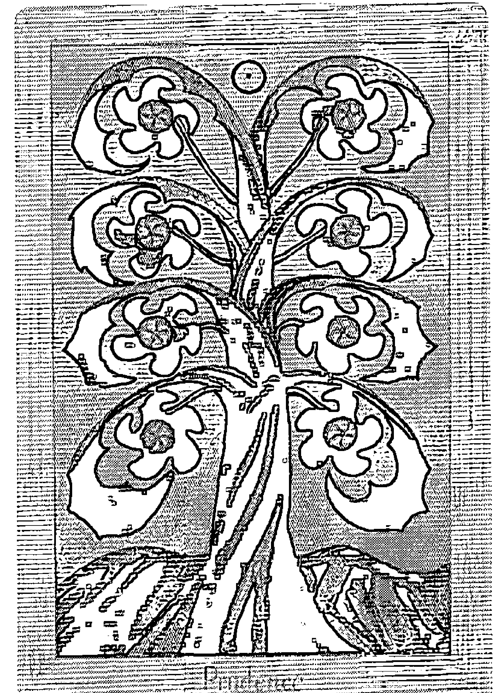

##### 圖像解析

●圓盤
圓盤轉化成了花朵，中間蘊藏著即將成熟的果實，在細心照顧與滋養之下，目標（果實）越來越茁壯。深入地底的樹幹代表著向下扎根的力量，藉由處女座為這張牌注入謹慎小心的能量，逐漸地看著種子發芽、茁壯。八朵花排列成地占術中的圖形¹⁶，意味著力量的回歸、人與人之間的合作。果實與花朵則是代表著在土元素肥沃的資源孕育下，開花結果的過程。

●占星學上的意涵
八號對應到了喀巴拉生命之樹中的第八個薩弗拉「宏偉」，對應於此薩弗拉的星體為水星，而水星正好是這張牌處女座的守護星（主宰星），這隱藏的水星加深處女座的本能，並且在太陽的照應之下謹慎思考，腳踏實地的達成期望。

> 註 16：地占術中的 Populus 圖形。

##### 基本牌義

「圓盤八」的圖像配色上較為光明，具有正面的意涵。克勞利指出，處女座是包含生命秘密的種子，在肥沃的大地上等待著耕耘與成長。種子孕育成長成樹，開花結果，正是土元素力量的完美展現。更深一層的意涵是充滿生機的能量重回到此，經過了上一張牌的死寂後開始重生。

「圓盤八」有著自己的觀點，一次只專注於一個目標，且低調的進行著，而後完成屬於自己的理想。「圓盤八」往往使人出乎意料，在平常不會特別的受到關注，卻忽然看到他有了那麼豐碩的成果，似乎有著讓人摸不透的奇蹟發生。

### 易卦解讀

> 《易經》：「遯，亨，小利貞。」

克勞利提到，「圓盤八」可對應到《易經》六十四卦中的天山遯卦之意涵。《易經》曰：「遯，亨，小利貞。」這個卦的卦意從卦名即可非常明確的看出來，象徵的是隱遯與退避的含意。其六爻中三、四、五、上這四個爻為陽，初二兩爻為陰，因此可以看見陰爻正逐漸向上吞噬掉陽爻的正面能量，因此陽爻必須退避以求安。這樣的特質我們可以將其聯想為夏季的盛陽之相已過，而秋陰之氣漸長，對應到「圓盤八」的占星學對應是太陽處女座，正是初秋的特質。而處女座象徵農獲的季節，遯卦之時，地氣已耗，穀物收割之後便不宜再行農耕，代表地氣需要重新修復的概念。因此抽到此牌，通常代表現況是能夠獲得豐收的良好時機，很多事情可在此時告一個段落。

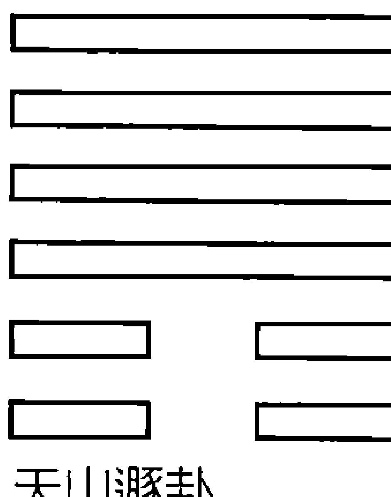## 圆盘八

但相对而言，也因为地气已尽，凡事需见好就收，不宜再逾越界线。

### ∞ 抽到此牌 ∞

「圆盘八」本身有与农业相关的暗示。抽到此牌暗示着播下种子，在细心的照料下，未来定能有所收获。另一方面也有筹划的意涵，代表面对未来的规划能够以绝对的耐心与坚持去进行最后的实践。「圆盘八」对这过程中的一切乐在其中，你默默地耕耘，小心翼翼地让自己走在这条路上，你收集许多资讯，并且保留了对你最有用的部分。

「圆盘八」的成功是一点一滴慢慢累积下来的，在努力过后，你可以顺利获得成果。如果你还在路途中，或是你才刚起步，那么请收下梦想的种子，在你播种后，你会一天天看着它在你的面前成长茁壮。停下思考能否在有限时间内完成理想的疑问，在这个当下，起身去实践你的目标吧！

## 圆盘九

获益 Gain

金星处女

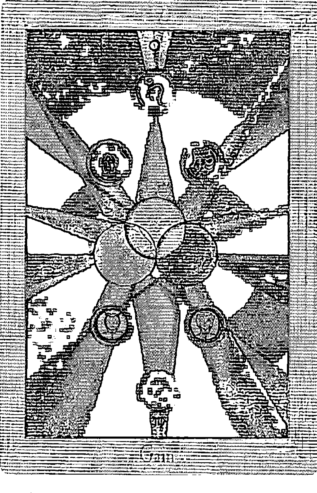

##### 图像解析

-   ◎圆盘
六枚圆盘分布于上、下两个区块，它们分别代表了六颗占星学上的星体，排列相似于「圆盘六」的位置。剩下的三枚圆盘化为光，叠合在一起向外发散。象征着原本均匀的各种力量在一个跃升的机缘下转化，发出了光芒向外推送。这是一个特别的机会，在拥有丰盛后再往上推进一层。

-   ◎光芒
「圆盘九」位于喀巴拉生命之树的第九个萨弗拉「基础」，土元素的力量回归于中柱，准备迈向土元素最后的终点，而闪耀出土元素饱满能量的光辉。对于物质世界而言，那是一种幸运的象征。

### ◎金星处女

金星落于处女为这张牌注入了幸运的元素，除了对应于事件上，也可以意味着一种使人愉快的互动。

##### 基本牌义

「圆盘九」的占星元素是金星在处女座，这本身是一个幸运组合。这张牌可以代表良好的人际关系、幸运的事件。延续着上一张牌的播种，「圆盘九」的牌名是获益，在肥沃的土壤滋养与细心照料下，获得了应得的结果。「圆盘七」所失去的内在精神，在「圆盘九」再次被找回来，有了心灵内在动力的支持下，得以顺利的进展。

##### 抽到此牌

「圆盘九」是意外之财、中奖或其他幸运之事的象征。它意味着我们找回了内在的动力，在生活中有新的展获。但报酬通常不是「圆盘九」所关心的，「圆盘九」在乎的是内心愉快而没有忧虑的感受，并认为所有发生的一切都是最好的安排。

「圆盘九」有可能将幸运反映在你已经拥有的事物之上，让你有机会往原本没有设想的目标更上一层楼。这种幸运其实是发生在已小有成就的状况下，再次往前推进一步，让你看得更高更远。

## 圆盘十

财富 Wealth

水星处女

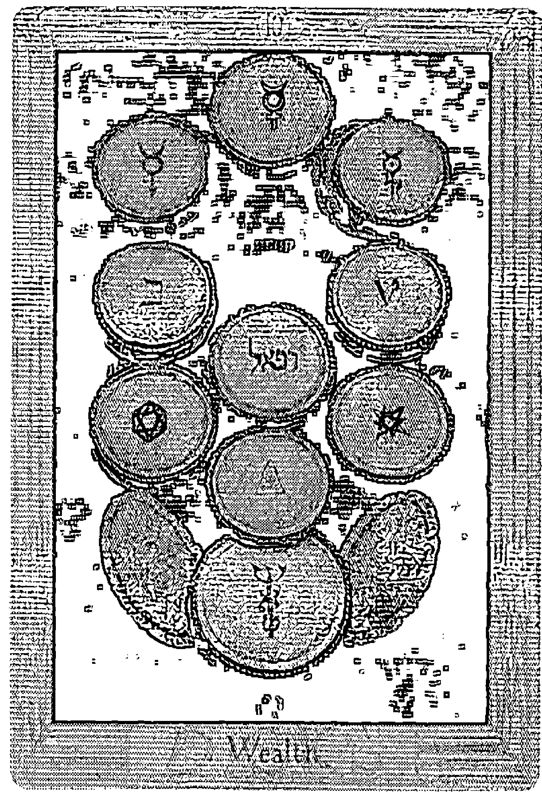

##### 图像解析

### ◎十枚圆盘

十枚圆盘在此牌中排列于生命之数十颗萨弗拉的位置，分别刻上了代表水星的不同符号（除了第八萨弗拉），赋予了这张牌无限创造力，并且获得完美的成果。分别叙述如下：

### ◇第一萨弗拉「王冠」(Kether)

「王冠」刻上了水星的符号，点出了位于源头的创造之力。

### ◇第二萨弗拉「智慧」(Chokmah)

水星符号舞动着姿态，摆出了古埃及智慧之神托特的姿势，与大阿卡纳中的「魔法师」同样是水星的对应，也指出了在整体意识中操控世界的神力来源——心灵。

### ◆第三萨弗拉「理解」（Binah）

此为融合了第二萨弗拉后变化的水星符号，也是属于炼金术中的水银转化符号，代表着来自于自我（神性）的驱动之力。

### ◆第四萨弗拉「仁慈」（Chesed）

像V字的符号是以诺魔法体系¹⁷中的文字，对应到希伯来文第二个字母ב（Beth），在大阿卡纳中的「魔法师」也为水星所对应。

### ◆第五萨弗拉「力量」（Geburah）

这是希伯来文第二个字母ב，对应于大阿卡纳中的「魔法师」，「魔法师」则是水星的对应。

### ◆第六萨弗拉「美」（Tiphareth）

圆盘上希伯来文写上了大天使拉斐尔（Raphael）之名רפאל。拉斐尔是水星的守护天使，在能量汇集的第六萨弗拉中祝福着意识之流的实现。

### ◆第七萨弗拉「胜利」（Netzach）

刻上了八芒星，八是第八个萨弗拉「宏伟」之数，同时也对应到了水星之数八¹⁸。意味着已经逐渐凝结成形的思想，将要出现于物质世界中的意念。

### ◆第八萨弗拉「宏伟」（Hod）

六芒星是太阳的印证，另外也暗示着水星¹⁹。这是唯一一个不以水星作为印证的萨弗拉，隐约以太阳之力推动这创造之流的运作。

### ◆第九萨弗拉「基础」（Yesod）

第九颗球的金字塔内有四组数字，分别是8、64、260、2080，也是水星之数八在魔方阵的各种运算²⁰，代表着水星的创造之流已经到达了一种巅

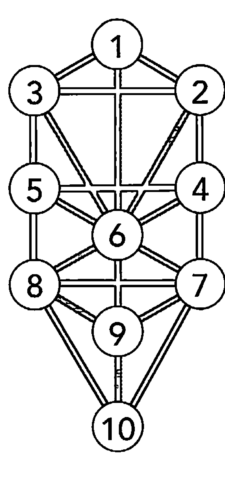

峰，透过各种不同的表征显现出来。仿佛以一种一闪而过的画面呈现奥秘，于这一秒钟看到了天堂，下一秒回归于现实。

### ◆第十萨弗拉「王国」（Malkuth）

最下面的萨弗拉是三个希伯来文的母字母（Mother Letters），分别是א、ה、ש的合字组成了双蛇杖，也是水星的代表，这是希腊神话中的讯息传递使者汉密斯或罗马神话中墨丘利手持的权杖。以希伯来文拼凑出的双蛇杖进行完美的创造与实现。

### 占星与地占术对应

地占术中，水星在处女之后则转变为太阳在魔羯²¹，有重生与回归的意涵，是完美达成与成就之意。

##### 基本牌义

「圆盘十」是小阿卡纳的最后一张牌，从「王冠」在火元素原型之界的创始，到第十个萨弗拉「王国」在土元素的物质之界结束，是喀巴拉中纯粹的精神本体下降到物质世界的完整过程。这是一种创造过程的终点，圆盘代表最后所得到的财富、金钱上或其他物质上的满足。这是梦想从心里诞生，接着付诸行动，然后落实成功，最终坐拥一切的状态。水星在处女则是这种情况的描述。

这张牌也是托特塔罗牌的最后一张，从「愚人」牌坠入世界之后，世界分化成形，从那不可见的心灵世界与更上层的灵性世界形成架构后，思绪、心灵慢慢凝结成了物质，再形成了我们脚踏实地的物质世界。这是一个类似唯心论的说法，我们仿佛只是在我们的心中往外看这个世界，你只能站在自己的角度来观察这个世界，除了你之外没有其他的一切存在，你在自己更为广大的意识中体会片段的人生。而这正是喀巴拉哲学的深层内涵，一切的一切都在心灵内发生，没有巧合，没有奇迹，所有的一切早就在我们内心中架构完整，它们可能埋藏在潜意识内，如同那些被压抑的渴望、被隐藏的情绪，也可能存在于接近神性的内我之中。因此命理与占卜所预测的未来，只是存在于我们整体意识中的片段体验。

许多的神秘学符号指向水星，指向大阿卡纳中对应给水星的「魔法师」牌。魔法师是埃及智慧之神托特的化身，也是托特塔罗牌的精神所在，作为最后一张牌，「圆盘十」再次告诉我们，物质世界源自于心灵内在的精神所刻画，没有例外。而此牌也象征着形而上之物透过创造之光路径沉降通往物质世界的秘法。

作为物质世界的体现，这张牌代表了事物的完成，各种人生体验的极致状态。权力、金钱、成就达到了巅峰，你坐在你自己建立的城堡内，看着那些原本只是存在于内心的想法，它们在你的面前实现，筑起梦想，让你真真实实地去感受，梦想已变成了你触摸得到的真实。

##### 抽到此牌

「圆盘十」的物质世界中的满足，就像是有了一切的富豪一样，对于各种事物的看法也与过往不同。你终于可以安逸地过着梦想中的生活，你的期望有了回应，这一刻你是愉悦的，你在你自己的梦想中体验着自己。

「圆盘十」也可以指出占卜事件中的长辈或前辈，在金钱、健康、成功与否方面偏向较佳的未来。然而「圆盘十」反映在心理上则是具有些许的怠惰，如果过度沉醉于物质上的一切，反而会失去内心真正的平衡与单纯的快乐。

## 宫廷牌组 The Court Card

宫廷牌组，凝神化为意识，觉知即在此时……

在托特塔罗的宫廷牌中，依然以权杖、圣杯、宝剑、圆盘四组牌组成，每一个元素之中再区分为骑士（火）、王后（水）、王子（风）、公主（土）。如果你熟悉韦特系列的塔罗牌，这样的划分可能使你感觉到疑惑，在托特塔罗之中没有国王，取而代之的是骑士，并且加入了公主的角色。然而这样的划分平衡了宫廷的阴阳属性，而且也可以在喀巴拉生命之树既有的理论下并存。

比较特别的一点是，克劳利在托特塔罗的宫廷牌组加入了《易经》卦象的对应，融合了传统中四元素对应的概念，并引用了《易经》的爻辞来对宫廷牌做出额外的解析。以震卦代表火元素，以兑卦代表水元素，以巽卦代表风元素，以艮卦代表土元素。而十六张宫廷牌中，以人物的位阶属性作为上卦，以四元素属性作为下卦，举例来说，「权杖公主」的公主属于土，因此上卦为艮卦，权杖属于火，下卦为权杖代表的火元素，震卦。上艮下震就组成了山雷颐卦。

这样的对应在当时可谓是新的尝试，但如果我们仔细地去深究《易经》中对于这十六张宫廷牌卦象的描述，往往会发觉存在许多的缺失。笔者认为易卦赋予宫廷牌的意涵只能作为组合成整张牌义的一部分，可作为意义之延伸，并不能单纯用一个卦代表一张宫廷牌，毕竟这是两种不同体系下的神秘学知识，无法完全的相等。当然克劳利加入的《易经》阐述，也是有着许许多多巧妙的解读，可以看作是传统四元素相互组合下的言外之意。

#### 权杖骑士

Knight of Wands

火中之火
雷为震卦

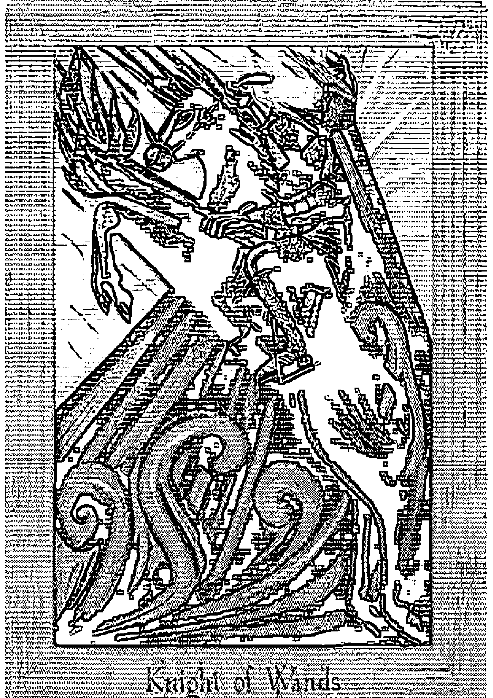

##### 图像解析

-   权杖骑士身上的装备皆有火的象征，意为火中之火。
-   他头上戴的羽毛、黑马跳跃的姿态是火元素勇猛迅速之意的象征。
-   骑士所持的是王牌当中的权杖，那是具有火元素全部能量的强大武器。

##### 基本牌义

「权杖骑士」代表了火元素当中的火，具有冲动与十分阳刚的特性。所对应的是天蝎座二十度到射手座二十度，相当于十一月十三日到十二月十二日之间。权杖骑士具有冲动的个性，他的想法所及就是行动所及，他的活动力与执行力惊人，冒险是他的个性，冲动与自满则是他过度的表现。他望向正前方，准备朝他的目标迈进，他没有失败的考量，在他眼中到达目标即是成功。

### 易卦解读

> 《易经》：「震，亨。震来虩虩，笑言哑哑；震惊百里，不丧匕鬯。」

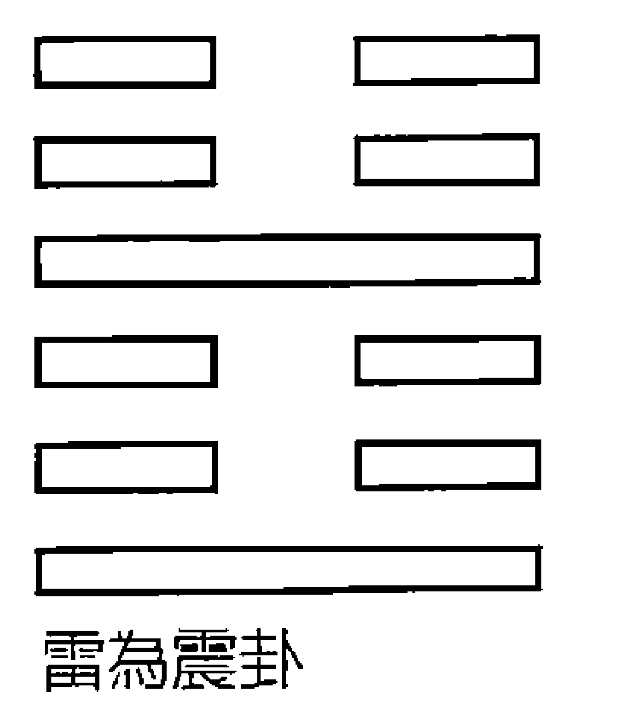

震卦在《易经》中象征强烈的变动，具有非常积极向上、活泼振奋的精神。但也由于强烈的变动，在追求稳定性与平衡性上的特质变得非常薄弱，因此也暴露出了危机与连带的恐惧。权杖骑士是在乱世之中追求个人荣耀与崇高理念的人物，如同震卦积极活跃的理念，但相对而言，环境的混乱与强烈的变动也是相对的考验，因此以人格特质而言，权杖骑士所需要的，反而是透过震卦的变动，来反思自己的决策是否要更稳定踏实些，正所谓恐惧以致福，对于环境的分析与谨慎，能带来更完整的成功，而非昙花政權。

##### 抽到此牌

「权杖骑士」可以代表迅速的行动、赶时间下的反应，或指个性较为冲动的人。权杖骑士通常呈现出充满信心的个性，他相信没有做不到的事情。他有着积极的想法与行动，同时也有强大的主见，可能听不进去别人的建言。他可能代表着具有火象星座个性的人，具有箭在弦上不得不发的特质。

通常抽到这一张牌，代表着你现在就要行动了，像是你要赶着搭一小时后起飞的飞机，要赶着在银行结束营业前汇款，或是对于目标的强大企图心，如果你想要知道这个决定好不好、这样做对不对，「权杖骑士」给你的答案就是：「Just do it！」去做吧！

#### 权杖王后

Queen of Wands

火中之水
泽雷随卦

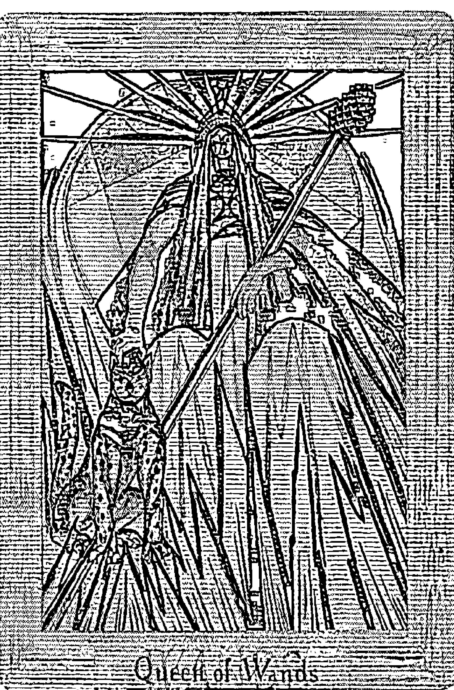

### ∞ 图像解析 ∞

-   ⊕后冠上的十二道光芒与黄道十二宫之数吻合，是权杖王后具备统御权力的象征。
-   ⊕权杖王后手持的权杖上头，有个象征罗马神话中巴克斯（Bacchus）之松果，等同于希腊神话中的酒神戴奥尼修斯，具有带来欢乐等强大感召力之神力，亦同时拥有狂欢享乐之特质。
-   ⊕她的右手放在豹头上，意味着权杖王后具备动物野性的性格，亦存在感召野性之魅力。

### ∞ 基本牌义 ∞

「权杖王后」是火元素当中的水，所对应的是双鱼座二十度到牡羊座二十度，相当于三月十一日到四月十日之间。她本身带有火元素冲动与热情的性格，又带有身为王后接受与柔顺的本性。权杖王后是一位对生命与自然充满热情的女性，然而另一面却带有狂野与不拘的性格。她分享着权杖骑士的高尚地位，却无法按耐虚荣的本性，缺少了对事物理性的判断，而过于强调自己的认知。

她是我们身边的女强人，一方面保有女性的特质，另一方面也有着专业的知识与高超的手段，是年轻女企业家、年轻女上司的形象。

### 易卦解读

> 《易经》：「随，元亨，利贞。无咎。」

随卦是象征从心所欲而无所烦恼的卦，也因此相合于权杖王后活泼却又优雅的风格，震卦刚烈而阳动，兑卦阴柔而和悦，也因此塑造出相当悠游自在、无所烦恼的随卦特质。但真正的随卦本意应是不被烦恼所拘束的潇洒自在，而非任性妄为的放荡叛逆，许多学习随卦特质的人偶尔会无法厘清两者间的差异，因此造就了一些比较负面的形象。其中随卦的六二与六三爻都是阴爻，象征女性，而随卦的初九与九四是阳爻，代表男性。而九四爻由于位阶较高，被视为丈夫，初九爻则是「小子」。克劳利将「小子」理解为类似情夫的概念，因此赋予了随卦与权杖王后放荡淫乱的特质。但是其中的六三爻由于较为亲近丈夫，因此如果能秉持个人的贞节概念与恒定，仍可以有稳定的婚姻与爱情关系。

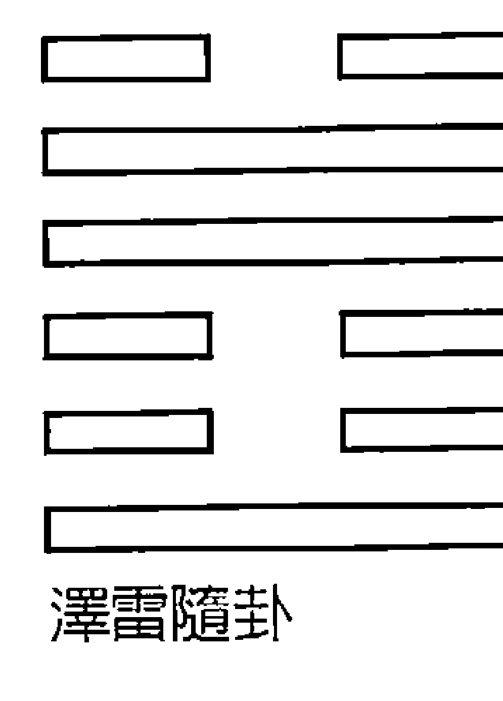

##### 抽到此牌

权杖王后可以代表一个对生命与自然充满热情的人，让人感觉到热情和鼓舞，不拘小节，但另一方面却可能过于享乐，沉醉于奢华。白天努力工作，夜晚尽情狂欢，正是这张牌的写照。当你抽到这张牌，可能意味着身边具有这样特质的人物出现，也可以代表那样的心态。对于人际关系，权杖王后投注了许多热情，似乎永远有用不完的精力，让人感觉到振奋。而在生活中，「权杖王后」牌反映了一种随兴而为的心态，把握当下，享受人生，可以没有梦想，但是不能没有当下。

#### 权杖王子

Prince of Wands

火中之风
风雷益卦

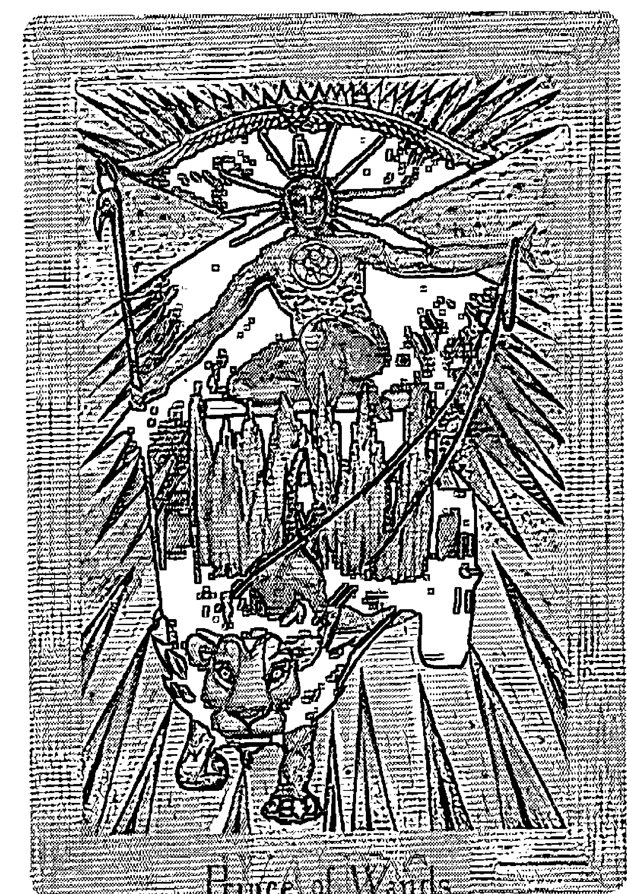

##### 图像解析

-   红色调与尖锐的图形反映出风元素所呈现的迅速。
-   王子张开的双臂显示出行动间的匆忙，亦是他活动力的展现。
-   王子头上戴着象征火元素的王冠，象征着自我意志。
-   胸前具有泰勒玛中巨兽之图腾，除了可以链接到巴巴隆与巨兽外，也是克劳利个人的象征图腾，亦曾出现于「权杖五」。
-   王子右手拿着魔法仪式中的权杖，意味权力之掌握。
-   红色的狮子拉着王子的战车，以充满整张牌的色调与猛兽般的敏捷，反映出这张牌的迅速特质。

##### 基本牌义

「权杖王子」是火元素当中的风，具有传递火元素之意涵。所对应的是巨蟹座二十度到狮子座二十度，相当于七月十二日到八月十一日之间。王子本身具有风元素传递和敏捷的特性，在火元素的加持下更显从容。然而当王子也具有火元素冲动的性格时，他容易被外界左右决定，优柔寡断是他的特性，他有着自己的执着，又擅长广纳讯息，却无法肯定地做下决策，因此虽有满腔热火，却缺少了冷静细心的个性。在巨蟹座的影响下，克劳利指出权杖王子本身带有自满的性格，他可能具有理想，却认为已经达到理想，他善于表现自我的特质，但内心深处却相对有着不被满足的匮乏。值得一提的是，克劳利上升星座所对应的宫廷牌即为因此对此牌留下较为详尽的讯息与个人图腾。

较为极端的发展下，权杖王子可能具有一些许的狂妄，他非常的热衷于他的目标，将尽一切的可能，不计后果地去获得。

### 易卦解读

《易经》：「益，利有攸往，利涉大川。」
在《易经》中，益卦是个非常积极进取的卦，因为风与雷这两种元素在《易经》中是彼此对应的（长女与长男），两者的强度在彼此增益之下，能够释放出非常高度而纯粹的能量。在《易经》中，对益卦的这种特质，将其视为改过迁善的卦，并且透过益卦的积极，透视自己内在的阴影，进而排解渡化；在对外的部分上，益卦则有损上益下的涵义，因此也有扮演领导者的隐含特质在，以一己牺牲奉献，进而转换成大众的集体进步。对权杖王子而言，由于益卦在此暴露出了个人英雄主义的危险，因此必须谨慎确认自己是否在各方面都已做好准备万全。克劳利提到了益卦爻辞中许多与权杖王子有关的对应，让我们进一步来看看爻辞的意涵。

> 六二爻：「或益之十朋之龟，弗克违。永贞吉，王用享于帝，吉。」

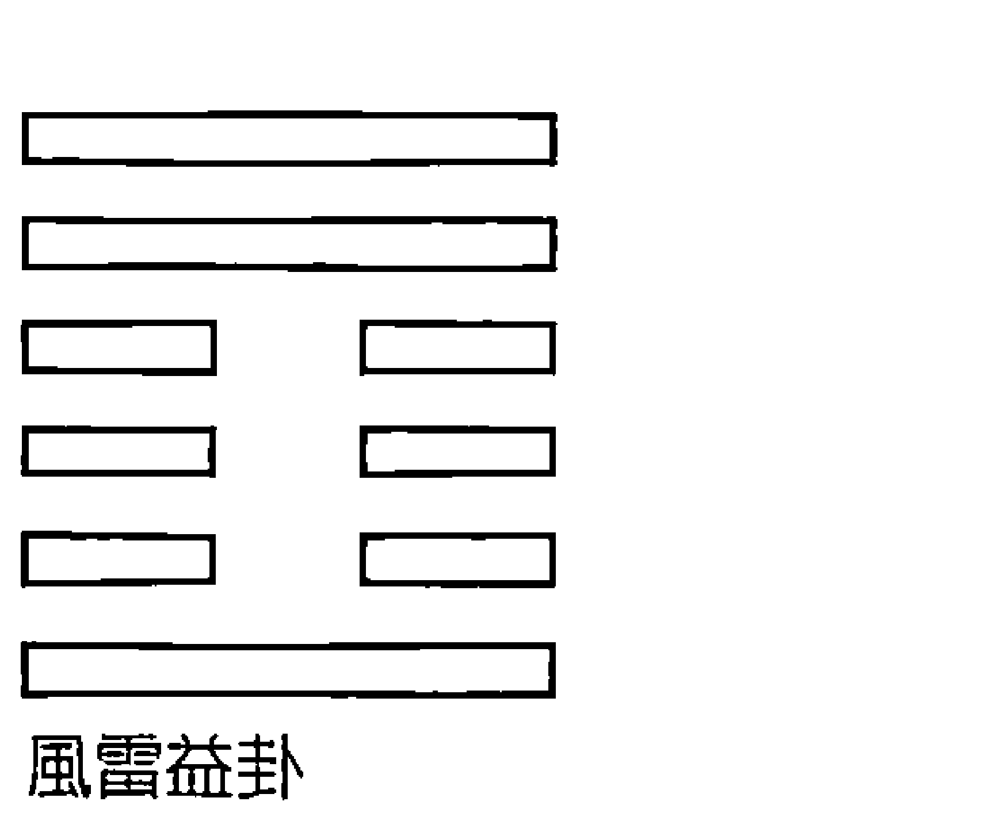

此爻所象征的是透过改善自己的缺点，并且努力不懈地走在使自己成长的道路上，则自己的表现便能够成为朋友间参照的榜样（乌龟是占卜用的动物，引申为了解事件好坏吉凶的对象），并且能够获得在上位者的信任与重视。

> > 九五爻：「有孚惠心，勿问元吉。有孚惠我，德。」

此爻所象征的是用恭敬且谦虚的态度面对身处上位的人（或指天地万物），因此而能广施泽被于身处在下的众多人民，有引领众人一同前进的象征，也代表权杖王子身为众人领导的形象。

> > 上九爻：「莫益之，或击之，立心勿恒，凶。」

此爻象征权杖王子落入执着与忘却本心后的课题显现。王子开始忘记了自己是众人的表率，忘记自己所代表的是整体的形象与利益，此时的他因为耽溺在个人英雄主义的掌声中，而逐渐忘却身后支持者的重要性，因而开始变得骄纵恣肆，产生自我膨胀且刚愎自用的问题，因此「莫忘本来面目」也是「权杖王子」牌非常重要的中心意涵。

##### 抽到此牌

权杖王子是活力的展现者，热情的传递者，他本身具有火元素的积极，另一方面又有风元素外向的性格。他可以对应到活泼热情的年轻人，也可以暗示着事物快速进展下的新消息。

在别人的眼中，权杖王子倒成为了狂热分子，他可能无法让人了解到他的想法，并且也无意去解说，只是朝着自己的目标前进。抽到此牌必须要知道：在一个人的道路上总是存在着危险，虽然你可以忽略它，但它可能会在你注意的时刻，成为绊倒你的石块。

---
**脚注：**
¹⁷ Enochian，西方神秘学体系之一，相传是天使授予人类的知识，以独特的天使语言写成。
¹⁸ 在喀巴拉的生命之树中，第八萨弗拉「宏伟」为水星所对应，因此取8作为水星之数。
¹⁹ 水星之数8的连加（1+2+3+4+5+6+7+8=36）与太阳之数6的平方相同。
²⁰ 魔方阵如下图，其内填入数字使得直、横、斜加数都相同。水星之数为8，8的魔方阵有64格，每一行的总和是260，填入的数字总和是2080。

| 8 | 58 | 59 | 5 | 4 | 62 | 63 | 1 |
|---|----|----|---|---|----|----|---|
| 49 | 15 | 14 | 52 | 53 | 11 | 10 | 56 |
| 41 | 23 | 22 | 44 | 45 | 19 | 18 | 48 |
| 32 | 34 | 35 | 29 | 28 | 38 | 39 | 25 |
| 40 | 26 | 27 | 37 | 36 | 30 | 31 | 33 |
| 17 | 47 | 46 | 20 | 21 | 43 | 42 | 24 |
| 9 | 55 | 54 | 12 | 13 | 51 | 50 | 16 |
| 64 | 2 | 3 | 61 | 60 | 6 | 7 | 57 |

²¹ 由地占术中的 Conjunction 图形变化，上、下两部分置换。

#### 權杖公主
### Princess of Wands
火中之土
山雷頤卦

##### 圖像解析
- 左方是權杖公主所掌管的祭壇，以火焰狀的羊角象徵著春天。
- 公主頭頂凸出的是兩條火焰狀的羽毛，那是古埃及正義女神瑪特所佩戴的羽毛，象徵著追求穩定與正義。
- 她拿著頂端象徵太陽的權杖，舞出希伯來文字母「」的姿態，「」是四聖名中第一個字母，對應於屬於權杖的火元素。
- 被她所拖行的老虎，代表著野性的征服。

##### 基本牌義
「權杖公主」是火元素中的土，克勞利指出這是火焰燃料的代表。「權杖公主」對應於天球北面巨蟹—獅子—處女的空間象限。權杖公主本身以女性之姿表現出英雄的行徑，具有膽識且不失女性的魅力，她沒有王后的崇高與威嚴，擁有較為自由的空間。權杖公主可以被看作是獲得火焰之神眷顧的小女孩，她安分的行事，擁有火焰的剛猛，也有著小女孩般的氣質。

### 易卦解讀
> 《易經》：「頤，貞吉。觀頤，自求口食。」

在《易經》中，頤卦與個人的自我調養有關，通常是代表一個追求安定與自我滿足的卦。對應到「權杖公主」的特質上，可以想像權杖公主是位有理想而自認為獨立的女性，無論在何時何地都能夠保持自己的自在。如果占卜時抽到這張牌，通常與追求自己現在的安定有關，要試著檢視自己內在是否有過度的不安，或者是享受當下真實的平靜。

##### 抽到此牌
權杖公主意味著讓人印象深刻且積極的女性形象，具有正義感、態度從容，個性時而衝動、時而迷糊。她有做事的決心與勇氣，在團體中熱情活潑的表現為她帶來不少目光。當抽到這張牌，你不需要懷疑「權杖公主」的本事，只要保有主動外向的特質，事件就能夠圓滿進行。但需要注意「權杖公主」的行動多半欠缺縝密的思考衡量，如果不想經歷過程中的風險起伏，需要三思而後行。

#### 聖杯騎士
Knight of Cups
水中之火
雷澤歸妹

##### 图像解析
- ⦿ 騎士的雙翅與優雅的姿態，融合了水元素的優美與火元素的行動力。
- ⦿ 手中拿著裝有螃蟹的聖杯，是水元素巨蟹座的象徵，也是騎士征戰的象徵。
- ⦿ 右下方的孔雀充滿自信，具有不吝於表現的意涵。

##### 基本牌義
「聖杯騎士」是水元素當中的火，所對應的是寶瓶座二十度到雙魚座二十度，相當於二月九日到三月十日之間。聖杯騎士帶有水的溫柔與火元素的行動力，但是在個性上則較為消極。聖杯騎士本身具有溫柔、優美的氣質，擁有不凡的談吐與平易近人的態度，對於事物的追求是潛在性的，一旦激發起他的興趣之後，將會非常投入其中，但當他感到熟悉而熱情消退後，往往又回到了原本的平庸。

### 易卦解讀
> 《易經》：「歸妹，征凶無攸利。」

其實在《易經》裡歸妹卦並不是個正面的卦，因為這個卦通常代表不符合社會價值觀的愛情或婚姻。這種情感本身具有非常誘人的魅力，可以與「聖杯騎士」有所對應。歸妹卦本身的兩個元素是雷與澤，即為長男與少女，年齡差異過大的婚姻往往招來不同社會價值觀的壓力，通常可以引伸為聖杯騎士本身有過人的魅力，而使得自己引來了許多不必要的情感糾紛。但排除掉這些部分，由於歸妹卦本身是婚姻嫁娶的卦，因此若是在情感問題上抽到「聖杯騎士」，通常還是代表會有一位理想的伴侶出現身旁。

##### 抽到此牌
這是具有風度、氣質與親和力之人的象徵。聖杯騎士通常讓人感到信心十足，擁有本事卻又不矯情做作。另一方面，聖杯騎士容易受到吸引而對事物充滿興趣，因此也可以代表引起興趣的事物。他可能是你身旁氣質出眾、談吐不凡的人，也可以代表著你對於熱情捉摸不定的心態。

#### 聖杯王后
Queen of Cups
水中之水
兌為澤卦

##### 图像解析
- ◉聖杯王后的身影隱而不可見，她是水中之水，是純潔與美的象徵，繪製成難以清楚辨認的身影，暗示著眼見不一定為憑，因為世界中的真實不能僅依靠肉眼，而是要以心去感受。
- ◉她右手拿著象徵母神伊西斯的蓮花，左手捧著聖杯，裡面的螯蝦是月亮的隱喻。
- ◉上方交疊的圓形暗示著月亮陰晴不定的性格。
- ◉立於水面的鳥是古埃及代表智慧之神托特的埃及聖鷺。
- ◉王后手中蓮花的九片花瓣與喀巴拉生命之樹中月亮之數九吻合，意味著月亮的影響力。

##### 基本牌義
「聖杯王后」所對應的是雙子座二十度到巨蟹座二十度，相當於六月十一日到七月十一日之間。聖杯王后是水中之水，是純潔與美的象徵，她的性格是飄忽、不可捉摸的，她的一切存在著寧靜與夢幻。你無法捉摸到她真正的想法，就像看著這張牌一樣，可以說是霧裡看花。聖杯王后依靠著自己的靈感與直覺行事，她的個性柔軟、用詞輕盈，可能很輕易的就能看穿你的心思。

此外，這張牌也代表著極端的寧靜、智慧的浮現。彷彿是隱居於深山中的修道人，對世界自有一套獨到的觀點，對工作、金錢等世俗之事常常提不起興趣，喜歡安靜的環境，喜歡一個不受打擾的地方。

### 易卦解讀
> 《易經》：「兌亨，利貞。」

兌卦是《易經》六十四卦中的八純卦之一，與八卦中的兌卦可以視爲是同樣的一個卦，也因此兩者特質非常接近。兌卦本身代表湖澤水域，古代中國居民循水而居，因此一旦碰到湖泊，生活上的用水來源即無所匱乏，象徵生活安定的喜悅感，因此兌卦與喜悦有關，而喜悦之後所帶來的便是訊息的分享，因此也與「說」有關。「聖杯王后」與兌卦有所對應，即代表內在的欣喜與平靜是永恆的。兌卦本身在《易經》中屬於陰性的金，因此也有珠寶的含義。由於珠寶需要切磋琢磨才能綻放出耀眼的光輝，所以抽到「聖杯王后」通常也象徵著學習的機會到來，要把握良機好好充實自己，讓自己嶄露鋒芒。克勞利特別提到第六爻與「聖杯王后」的對應，讓我們來看看爻辭中的說法：

### 上六爻：「引兑。」
此爻以陰爻處於對卦上爻，因此代表到達極點之時本身的陰柔難測，而兌卦又有喜悅的意涵，其下兩爻陽爻會受到此上六爻的吸引而逐漸靠近，這是因爲要追求上六爻本身陰柔而令人喜悅的特質。以上爻來講，獲得陰爻是吉象，代表陰性的特質能夠得到完全的發揮，但由於上爻也是最頂端的爻，因此由陰性的爻來當領導的話，未來的發展方向會變得較爲變動不安。因此九五爻與九四爻反而要戒慎恐懼於自己對上六爻的愛慕，並且認清自己最恰當的方向。通常此爻也代表「聖杯王后」本身具有誘人的魅力，但在運用上必須謹慎，才能妥切地拉近自己與他人的距離。

##### 抽到此牌
聖杯王后代表個性沉著冷靜的女性。從她的臉上看不出太多的情緒反應，性格內斂，性情溫和，充滿著想像力，喜歡沉醉於美好的小事務上。她可以是你的長輩或是女性的前輩，你不容易看出她的心思，卻很容易被她得知你的想法，聖杯王后的感覺是很敏銳的，可能連你昨天與情人吵架這件事情都可以被她觀察出來。聖杯王后的心思細膩，她關心她所熟悉的人，並且給他們溫暖。然而若搭配牌陣上其他靜態特質的牌，表示皇后心中可能存有過多幻想而變得不切實際。

此外，「聖杯王后」也能夠代表一種安靜的環境，或是一段能夠觸發心靈的狀態。也可能代表著一段放鬆的旅程，一個讓你暫時抽離環境的機會。

#### 聖杯王子
Prince of Cups
水中之風
風澤中孚

##### 圖像解析
- 圖像中的蒸氣表示聖杯王子是水中之風的代表，背後蒸氣化的翅膀是代表昇華後的靈性之力。
- 他一手拿著蓮花，一手拿著聖杯，而杯中有一條蛇探出頭來，代表由心靈（聖杯）而生的聰明才智（蛇）。
- 王子的頭上與車駕都有老鷹的圖像，這是天蠍座古老的象徵圖騰，同時也是這張牌中沒有出現的隱藏圖騰：蠍子，代表著天蠍座複雜且神秘的性格。

##### 基本牌義
「聖杯王子」是水元素當中的風，所對應的是天秤座二十度到天蠍座二十度，相當於十月十三日到十一月十二日之間。聖杯王子具有縝密的心思與沉穩的談吐，不容易透露出情緒，心底有許多的考量。旁人常常覺得聖杯王子是個聰明的人，他的反應迅速，在問題還沒有說完的時候，就已經知道答案。他善於觀察人，也善於計畫。然而上述優點若過度顯現，他可能變得千計萬算、不講情面，內心深處不相信任何人，以至於也不容易被人所信任。

### 易卦解读
> 《易经》：「中孚，豚鱼吉。利涉大川，利贞。」

在易卦中，中孚卦上卦與下卦各是巽卦與兌卦，這兩卦的中爻都是陽爻屬實，卻組合成一個中心三、四兩個爻屬陰的中孚卦，代表中孚卦內心誠實又謙虛，因此是個講求誠信的卦。但相對應到「聖杯王子」的特質後，即可瞭解中孚卦是「聖杯王子」的反向連結，因此通常抽到這張牌時，代表當事人面臨到了誠信上的課題，可能是自己本身對這件事情並沒有信心，並且包含過多的算計，因此缺乏了中孚卦的正面特質，而中孚卦卦詞中提到豚魚吉的概念，即代表中孚卦本身的誠實謙遜可以感動非人的動物，強調極度的耿介誠實是可以學習改善的方向。

##### 抽到此牌
通常，聖杯王子可以代表天蠍座性格的人，他可能是外表平靜卻有無數令人驚異點子的人。他有許多盤算，不到時機不輕易表示，因而蒙上了一層神秘感。圣杯王子也可以代表著年轻人，特别是「文艺青年」，他们可能有著自己独特的品味，并且善于创作，也许某些情况下带给你一种冲击、一种突兀，但是他们往往就是因为这样才引起了你的注意。

#### 聖杯公主
Princess of Cups
水中之土
山澤損卦

##### 圖像解析
- 聖杯公主是水元素當中的土，因此服飾上以水晶作爲象徵，意爲結晶化（土）的水元素。
- 頭上的天鵝代表了創造的過程。
- 她手中聖杯狀的貝殼裡是烏龜，一方面以烏龜當作土元素的象徵，一方面也作爲創造之光沉降後的產物。
- 牌面左邊是克勞利描述爲海豚的魚，在傳統上對應於金星（請見〈小阿卡納〉「聖杯二」），代表著公主溫柔的特質，以及對愛情的期待。

##### 基本牌義
「聖杯公主」是水元素當中的土，對應於天球北面天秤—天蠍—射手的空間象限。聖杯公主是青春洋溢的少女，她具有天真的個性，充滿著親切與甜美的笑容。溫柔是她與生俱來的特質，聖杯公主也具有部分的夢幻，滿懷浪漫與幻想。無盡的魅力透過她飄忽閃爍的眼神與談吐自然散發，足以使眾人爲之沉醉。

### 易卦解讀
> 《易經》：「損，有孚，元吉。無咎可貞，利有攸往。曷之用，二簋可用享。」

在《易經》中，損卦是個犧牲小我、完成大我的卦，相對於風雷益卦是由在上的領導者犧牲奉獻領導眾人，損卦格局則略小些，代表在下的人犧牲自己的利益，來改善整體大環境，因此損卦是個與克制自我的小我有關的卦，通常是用來對付自己的貪婪，並且仰賴一位更高的領導者來帶領自己。在大方向上，的確可以有正面積極的成長，但就個人的立場來看，則未免受制於人且不夠主動。對應到「聖杯公主」來說，聖杯公主本身是溫和而天真的，因此對於人與人之間的分界並不會算計太多，偶爾似乎會做出爲他人犧牲奉獻的傻事，但由於本身的真善，往往會有更豐盛的回報。

##### 抽到此牌
聖杯公主是具有天真浪漫性格的少女，她親切的個性能夠融化各種僵局，帶來了溫暖與快樂，同時也具有令人稱羨的外表。她可能是身邊出現的年輕女孩，使人重新感覺到青春。

抽到「聖杯公主」也可以代表著一種天真的想法，或是被忽視的努力，但是你並沒有計較太多，覺得只要自己做得快樂就行了。聖杯公主擅長與人分享喜悅，心腸軟，容易受到感動。在與感情相關的占卜中，代表著一位魅力十足的對象，或是沉浸在一段浪漫的關係之中。

#### 寶劍騎士
Knight of Swords
風中之火
雷風恆卦

##### 圖像解析
- • 騎士的奔馳、背景的線條及右下方飛行的鳥，都是呈現出寶劍騎士屬於風元素的奔馳速度感。
- • 騎士手持的兩把西洋劍是刺殺敵人的武器，是火元素的攻擊性質。
- • 頭上的翅膀意味著他有操控風的能力，能夠掀起風暴，亦能夠乘風而行。

##### 基本牌義
「寶劍騎士」是風元素當中的火，所對應的是金牛座二十度到雙子座二十度，相當於五月十一日到六月十日之間。寶劍騎士迅速敏捷、勇猛好戰，擁有敏銳的思考力。寶劍騎士擅長挑戰權威，他具有風元素敏捷的思路，能夠快速的統整出他的知識，作為最有利的武器。寶劍騎士也常常與辯論、爭執有關，他的炮火猛烈，義正嚴詞，讓人一時之間不容易從話語中找到破綻。

### 易卦解讀
> 《易經》：「恒，亨。无咎利貞，利有攸往。」

恒卦本身代表的是永恆不變的特質，但《易經》既稱為「易」經，代表探討的是變動背後的真實。因此恒卦的意義是在於透過微小的變動，使更大的整體保持完整安定，而非絕對的靜止與封閉，其卦象也是由兩種相當具有變化性的元素組成，即雷與風，透過強烈的變化而維持更加恆久的安定；也因此，對應到寶劍騎士的特質，可以想見的是此牌變動強烈，且具有良好的適應力與調整力，甚至轉而改變整個局面的牌。對於寶劍騎士而言，變動只是一個過程，真正的方向則是永恆不變的內在價值與目標。為了達到那個目標，並使其能夠適應各種不同的狀況，因此在看似變動的「寶劍騎士」牌中，也隱含有更深刻的「恆定」的智慧。 而其九三爻爻辭「不恒其德，或承之羞，貞吝」，代表寶劍騎士若太執著於追求變動，忘了恒卦本身追求安定的特質，則會矯枉過正，使原本的安定性完全崩壞，造成裡外兩難的窘境，反而視狀況調整才是最理想的，不要刻意為了變動而變動。上六爻爻辭「振恒，凶」，則是說明寶劍騎士的能量被誤用到了極點，此刻唯一不變的狀況就只有「不斷改變」，因此從基礎開始完全瓦解，無法守恆，也無法安定，導致一個無法統整的混亂狀況。

##### 抽到此牌
寶劍騎士通常代表速戰速決、想法快速之人，可能代表著長輩或上司。他動作敏捷、思想快速，往往在人群中是洞燭先機之人，但他不像權杖騎士那樣的衝動，他的行動都是在縝密思慮後才出擊，與寶劍騎士相處，你可能會覺得難以跟上他的腳步，他總是比你多想了一步，在你打算衝出去的時候，他已經在前面回頭看著你，疑惑著你怎麼現在才想透。

#### 寶劍王后
Queen of Swords
風中之水
澤風大過

##### 圖像解析
- 寶劍王后處在象徵風元素的雲端往下看著她的王國。
- 王后右手拿著象徵風元素的寶劍，左手提著剛被她砍下的老者人頭，這意味著舊想法的破除，另一方面也是位於成形之界生命之樹中理性的展現：代表理性的頭與較低層面的身體分離。
- 她頭上所戴的小孩頭飾意味著創新思維的建立。
- 王后頭上的多角物是思想的圖像化，代表著寶劍王后的絕對理性。

##### 基本牌義
「寶劍王后」是風元素當中的水，所對應的是處女座二十度到天秤座二十度，相當於九月十二日到十月十二日之間。風代表著思考，水是心靈運作與情緒面，而風中之水的寶劍王后則是非常理智的女性。她想法敏銳、觀察入微，本身充滿著信心，行止間優雅不失分寸。「寶劍王后」反映出的特性則是十分果決的態度，但如果發揮過度則失去了情感層面，使人感到冰冷與殘酷。根據常理推論，寶劍王后斬下的人頭多少意味著殺戮之發生，然而這並非此牌所要傳遞的訊息。「寶劍王后」橫跨了處女與天秤兩星座，透過理性切割代表心智的頭與獸性的身體而達成個體之躍升，是此牌原始設計的樣貌。

### 易卦解讀
> 《易經》：「大過，棟橈。利有攸往。亨。」

大過卦本身卦的形象即是陽性太過，呈現本末俱弱的現象。以具體的聯想來看，可以想像成是扶持一間房屋的梁柱已經嚴重歪斜，象徵事態的緊急與危險。但《易經》又稱此卦「利有攸往」，代表危機即是轉機的考驗哲學。寶劍王后是女性的形象，卻手執智慧之劍斬下了一名男性的頭顱，這象徵了時代轉換時有能力的人便會挺身而出，為時代的轉換奉獻自己的心力，但由於剛建立起的一切仍然幼弱，需要柔性的能量來安撫，此時王后的母性形象就出現了，話雖如此，這位母親卻是手持寶劍的理智女性，代表在改革之時徹底的破除與毀滅的形象，可以想見，這樣的結果所帶來的新局面仍然處於一種更動盪的危機之中。因此以大過卦對應「寶劍王后」，大過卦本身即有兩重涵義，可以往內調整，使得原本過強的剛直能夠收斂，而讓整體達成一個陰陽調和的狀態與結構，以這樣的模式去穩固，雖然過往的一些痕跡與缺點可能會保留下來，但至少能獲得快速的安定；又或者是真正有才華與膽識的領導者挺身而出，以絕對的剛強之威將整體新局面更新得淋漓盡致，使舊有的陋習與框架都被完全打破，進而創造一個更有發展潛力的狀況。「寶劍王后」代表了一種考驗，要如何前往，由你自己決定，無論哪個方向都有其困難與值得挑戰的地方，但有能力的人無論如何都可以克服眼下的困難。讓我們來看一克勞利所提及的爻辭與「寶劍王后」的對應：

初六爻：「藉用白茅，无咎。」
白茅的形象是柔弱而潔白的植物。象徵的是陰柔和順的特質，保持低調，過於退守而無法積極，雖然如此，但也由於低調而潔身自愛的態度，得以不招惹麻煩，保持安穩。克勞利則將此爻看成是過度退守，以至於自我封閉，無法發揮寶劍王后積極改革的一面。

九二爻：「枯楊生稊，老夫得其女妻，无不利。」
九五爻：「枯楊生華，老婦得其士夫，无譽无咎。」
九二爻與九五爻可以一同討論，此兩爻是一個一體兩面的現象。大過卦是個太過剛強的卦，象徵「寶劍王后」牌剛烈的肅殺之氣，九二爻則象徵剛強的特質有所退守，因此能持盈保泰。像是枯乾的楊樹重新長出根來，有重生的意象，因此並無不利；九五爻卻是更進一步的剛強，像是蠟燭熄滅前的爆發，因此有枯乾的楊柳樹開花耗盡自己生命能源的感覺，雖然璀璨綻放出花蕊且展現了楊柳樹的生命力，卻也使得原本衰弱的楊柳樹更加頹頹。

九四爻：「棟隆。吉。有他吝。」
此爻象徵的是房屋建築逐漸被建設起來，因此代表一個偉大的目的可以在我們的預期中被達成的涵義，也有寶劍王后改革產生新時代目標的象徵。但由於此爻以陽居陰位（二、四、上爻的位置被視為陰性的位置），所以積極度略有不足，「有他吝」則代表寶劍王后看見可預期的理想後，可能因為自滿而功虧一簣的警示。

上六爻：「過涉滅頂。凶。无咎。」
此爻是大過卦的上爻，代表大過卦剛強的特質已經發揮到了極限，因此物極必反。如同房屋的結構終於無法承受猛烈的力道而受到摧毀。但由於此爻有考驗的涵義，因此也象徵我們在面對自己的困難時，儘管有時候會處理得不好而招來困擾，但是堅持選擇自己的目標，仍然是一種對於自我信念的表態（《周易》對此爻的解釋是：有殺身以成仁，無求生以害仁）。如果不慎落入執著與患得患失的狀況，我們依然有機會使自己調整回平安與平靜的心。

##### 抽到此牌

寶劍王后是一個讓人感到威嚴的女性長輩、前輩或上司。她往往有著非常理性的思維，在她的眼中，對於是非、正義，乃至於專業的要求都非常高，甚至在必要的時候忽略了人與人之間的情感。你可能會覺得她過於嚴厲，讓你產生了壓力，但是必須知道那是一個理性的決定，雖然殘忍了些，但是不得不如此。

寶劍王后本身的女性特質則是以另外一種方式表現出來，你感覺不到她的柔弱，但你可以看到那股女性才有的傲氣。此外，「寶劍王后」也可以代表正在經過一段克己、規律的生活。可能要放下一些享樂，專心投入工作之中。

#### 寶劍王子

### Prince of Swords

### 風中之風
巽為風卦

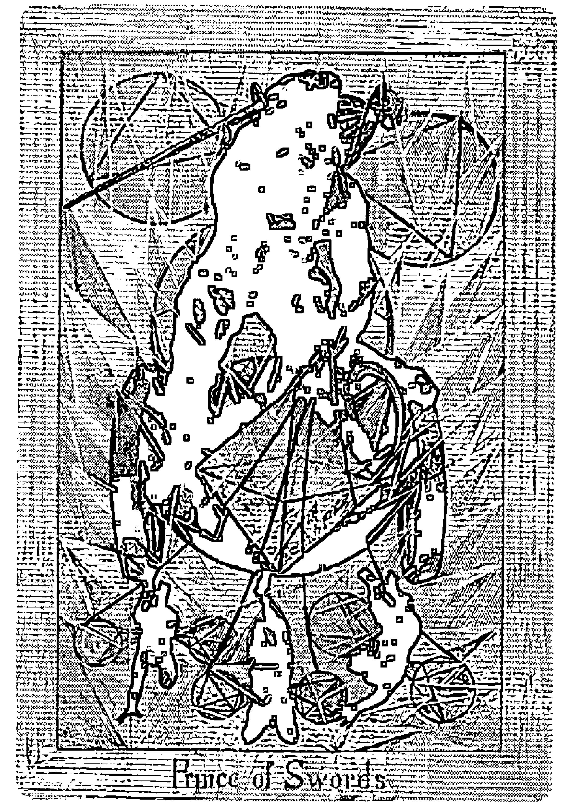

##### 圖像解析

-   王子一手揮舞著產生心智活動與思緒的寶劍，一手拿著鐮刀斬斷摒棄不用的想法。不斷從腦海浮出與沒入的思維，在寶劍王子身上周而復始的發生。
-   周圍不同樣式的金色圓形圖示是心智活動的呈現，不規則的線條則是代表多變的想法與新奇的點子湧現。
-   替他拉車的小孩，朝著隨時改變的目標前進，每一個小孩有著自己的想法（心靈投射出的黃色圓形），暗示著寶劍王子不斷改變的目標。

##### 基本牌義

「寶劍王子」是風元素當中的風，所對應的是魔羯座二十度到寶瓶座二十度，相當於一月十日到二月八日之間。寶劍王子具有靈活的手段與想法，跳躍式的思考使他能察覺到別人所察覺不到之事；他想法多變，念頭的興起與毀壞對他來說是常有的事；他不考慮現實，在腦海中架構他所認同的價值觀；他極端聰明，卻沒有一個穩定的目標。

寶劍王子可能讓人覺得朝令夕改、出爾反爾，他依據他的思考來行動，當他想法一出現，就馬上開始進行，但當他想到另外一個方式時，就放下了手邊的工作，再去做另外一件事。他可能非常忙碌卻徒勞無功。他有絕佳的點子，腦海中有著完美的理念，試圖建立一個理想的王國，他不缺乏計畫，只缺少了一位能夠幫他腳踏實地完成計畫的人。

## 易卦解讀

> 《易經》：「巽，小亨，利有攸往。利見大人。」

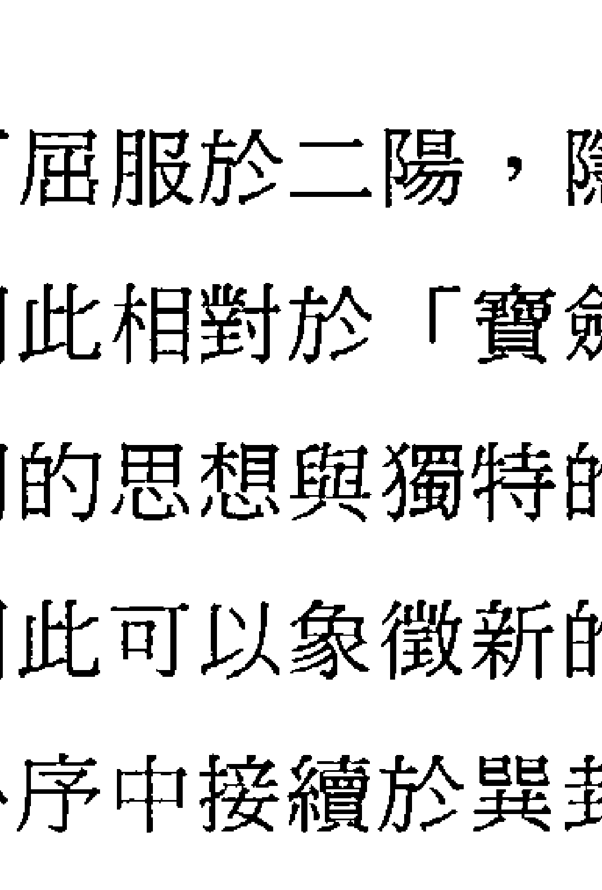

巽卦在《易經》中掌管資料與訊息的傳遞，其形象以風為具體象徵。其卦象為二陽在上，一陰在下，代表在上是活躍向上的氣流盤旋，但基底仍是靜態的沉降氣流，也因此有進入的意思，引申為資訊的傳入。「寶劍王子」牌本身代表的是風中之風，也因此與《易經》中的巽卦特質相近，唯獨《易經》中的巽卦一陰在下屈服於二陽，隱含有服從與和順的特質（近似於《易經》中的坤卦），因此相對於「寶劍王子」而言，真正的巽卦要更柔和得多。寶劍王子有新潮的思想與獨特的創造力，巽卦有虛無縹緲資訊快速傳入與傳出的特質，因此可以象徵新的學習，也連帶引起新舊價值觀的挑戰與對立，《周易》卦序中接續於巽卦之後的卦為代表切磋與喜悅溝通的兌卦，因此也有暗示巽卦帶來資訊的辯證與對立的意涵。通常抽到「寶劍王子」牌時，也象徵新的學習機會的到來，必須善用自己的決斷力，分析自己所學習的新知是否能夠使自己成長，或是將自己引入歧途。

##### 抽到此牌

寶劍王子代表的是想法多變、點子多、極端聰明之人，他追求創新，思考的速度常常讓人驚訝，他有絕妙的點子，卻沒有什麼值得讚賞的成果。寶劍王子像是那些有著夢想的人們，可能在實現夢想的路途上遭遇別人質疑他的夢想、挑戰他的信念，甚至直接的在他專業領域中給了他一個慘痛的打擊，但如果他還懷有夢想，還知道自己所具備的優勢，能夠放下一些不切實際的想像，腳踏實地的去完成理想，便能成長為寶劍騎士。寶劍王子必須知道，他最可貴的財富乃是他源源不絕的靈感與新奇的點子，而他所需要調整的，是讓自己看到一個明確的方向，讓自己一次只為一個信念去努力。

「寶劍王子」在四元素中對應到了風中之風，在某些占卜中，也可以代表消息的到來、電話響起、老友拜訪等事件的發生。

#### 寶劍公主

Princess of Swords

風中之土
山風蠱卦

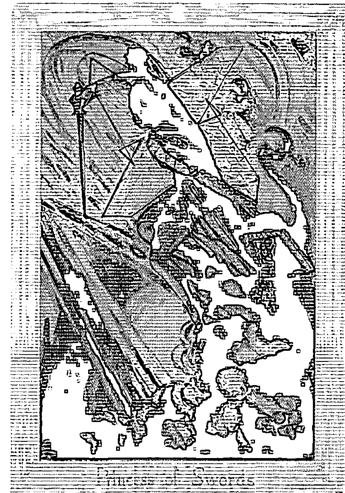

##### 圖像解析

-   公主戴的頭盔是依希臘神話中蛇髮女妖梅杜莎（Medusa）的形象鑄成。在神話中，任何人只要直視著梅杜莎，即會化爲石像，而把思緒（風）化爲石像（土），正是風中之土的化身——寶劍公主的職責。
-   寶劍公主從她所掌管的風元素祭壇出發，揮舞著劍去實現她認定的正義與真理。
-   風車狀的圖案（一說爲翅膀）代表了意識活動的發生，烏雲則是公主內心的一股怒氣。

##### 基本牌義

「寶劍公主」是風元素當中的土，對應於天球北面魔羯—寶瓶—雙魚的空間象限。寶劍公主是意念的實踐者，然而伴隨著寶劍破壞的性質下，往往變身成爲復仇者的象徵。她的個性剛毅，凡是講理，有仇報仇。作爲意念（風元素）的執行者（土元素），她背負了沉重的使命，想趕上寶劍騎士的速度，想揮舞著寶劍王后的理性之劍，但是在過度的發展之下，她的熱誠轉變爲了一種帶有情緒的行動，甚至是用仇視的眼光來看待這個世界。

## 易卦解讀

> 《易經》：「蠱，元亨。利涉大川。先甲三日，後甲三日。」

在《易經》中的蠱卦是指涉「壞極而有事」的現象，其具體的意象則是食皿上的食物腐壞發臭，長出蛆蟲而衰敗不堪，皿字上三個虫字的「蠱」字就是代表食物發臭腐壞的內涵。但在《易經》中講究天道輪迴的概念，因此當食物衰敗腐壞之後，就是一切的淨空，以另一個形式使食物的能量進入自然界中。卦辭中的「利涉大川」即是代表蠱卦的積極意涵，鼓勵人看穿傷痛背後的新契機，能夠實行進取冒險的行為，開創新的局面。但要開創新的局面之前，必須要做出詳細的規劃，因此必須在甲日前三天（辛日）進行更新與創新的構思，而在甲日後三天（丁日）對自己所制定的計畫做出殷勤的叮嚀與分析。

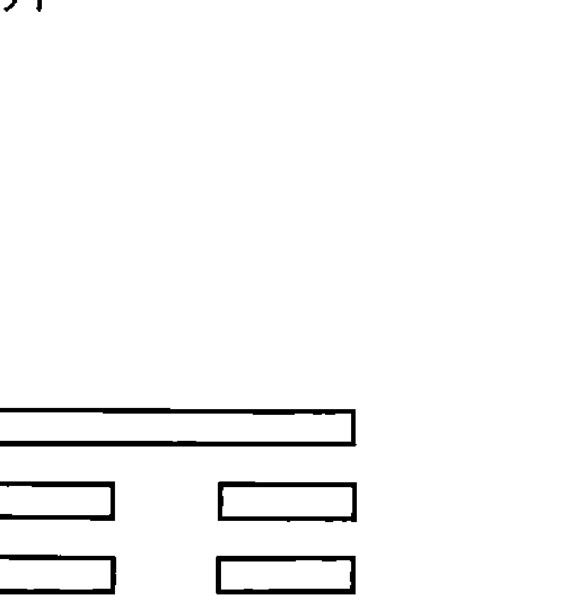

寶劍公主本身的特質就代表了「實踐」，姑且不論是否被賦予了復仇者的特性，其本身對計畫的實踐性與規劃性是非常強烈的（與其內在的魔羯、寶瓶元素有關，此二星座同由土星掌管，代表踏實與實踐）。而蠱卦也象徵一切已經糟到了極點，因此我們總能在最低潮的時刻進行最積極的重建，當我們抽到此牌時，通常代表現狀帶給我們強烈的傷痛，使得我們必須以理性的態度先調節住自己的痛楚，接著以火鳳凰的姿態努力振作起來，換上嶄新的臉孔。對他人的堅持，或許有時會造成對他人的傷害與摩擦，但是對自己信念的堅持，會更貼近寶劍公主內在自立自強的奕奕生機。

上九爻：「不事王侯，高尚其事。」

此爻是蠱卦的上爻，處在卦的最上部，代表最為超然。寶劍公主的特質由此爻彰顯，則代表此爻有寶劍公主獨立自主的意象，「不事王侯」象徵了寶劍公主的獨立與不依靠強權的堅強性，「高尚其事」則指出了寶劍公主對自身能力的自信與孤高的內在特質，有蠱卦「利涉大川」積極進取的精神。雖然有曲高和寡的問題，但也彰顯出「自立自強，處變不驚」的氣節。

##### 抽到此牌

這張牌代表的是行動果決的女性，她個性鮮明、主見強烈，可以為了自己的想法強力的主張，善於處理紛爭，也善於引起紛爭，內心有著高尚的目標，為了達成，可能用盡了各種方法。寶劍公主的內心住著一位期望獲得肯定的小女孩，在朝向理性的成長過程中，小女孩逐漸的被推向心裡深淵，她不斷的告訴自己不能像女孩般不成熟，不能再那樣子看待事物了，她想要即刻的成長，想要獲得成就，然而這一切，只是為了填補小女孩時時刻刻在心靈深處的呼喊。「寶劍公主」帶有風元素能量在沉降過後的理性，亦同時存在失去自然人性的內在衝突面。

「寶劍公主」也可以代表著一些讓你無法應付、讓你氣急敗壞的事情，你可能一時間無法做出抉擇。然而當情緒的烏雲散去後，你會慶幸沒有在當時逼迫自己下決定，而是在逐漸明朗的此刻，用更高與更寬闊的視角看待當下，去做選擇。

#### 圓盤騎士

Knight of Disks

土中之火
雷山小過

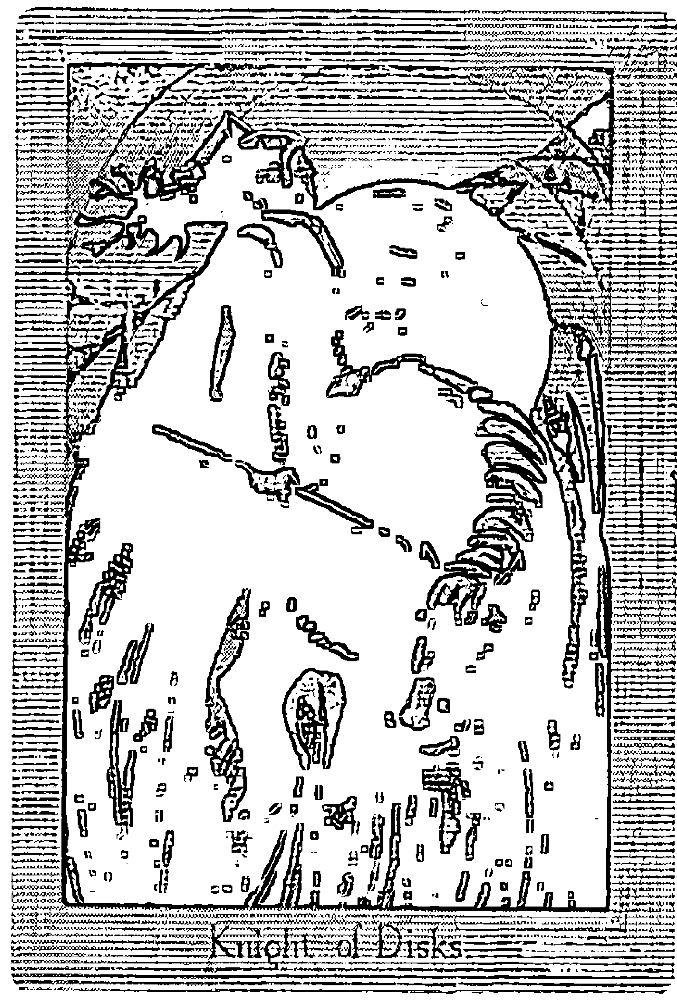

##### 圖像解析

| 項目 | 說明 |
| :--- | :--- |
| 鹿角頭盔 | 圓盤騎士的鹿角頭盔對應到了土元素，意味著圓盤騎士已經不再上戰場廝殺，他回到自己的地盤，開墾拓荒，建立起自己的王國。 |
| 手持連枷 | 騎士手拿的不是雙截棍，而是一種打穀用的農具「連枷」，是農村民兵隨手可得的武器。在此，暗示著圓盤騎士的角色，他不再殺敵，而是專心在自己的領域耕耘。 |
| 盾牌印记 | 圓盤騎士手拿的盾牌有著金色黎明會的階級印記，一方面描繪了克勞利自己對於神秘學方面的耕耘，一方面也代表著圓盤騎士對於生命本質有著深層的體悟，他守護著這智慧，不打算運用那隱藏的能量，他寧可在田野中，靜靜地過著平靜的生活。 |

##### 基本牌義

「圓盤騎士」是土元素當中的火，他所對應的星座是獅子座二十度到處女座二十度，相當於八月十二日到九月十一日之間。圓盤騎士是所有騎士牌中動作最為靜態的一位，他的馬不再奔馳，停下了腳步向四處張望。圓盤騎士是一位拓荒者，是一位耕作者，已經離開戰場，回到他的土地上建立起王國。他拿著盾牌，看著遠方，他在找尋下一塊適合的農耕地。在土元素的影響之下，圓盤騎士必須為了最基本的糧食、物質奔波，他是個穩重的長輩，也許還懷有著理想，但那已經是個遙遠的目標了。

## 易卦解讀

《易經》：「小過，亨利貞。可小事不可大事，飛鳥遺之音，不宜上，宜下，大吉。」 小過卦在《易經》中是一個特質較為弱勢退縮的卦。《易經》小過卦卦辭曰：「小過，亨利貞。可小事不可大事，飛鳥遺之音，不宜上，宜下，大吉。」從卦辭可以判斷，此卦的特質較為虛無縹緲，有如飛鳥飛過空中而遺留下的叫聲，因為這樣的訊息與資訊較為薄弱，所以在行事進退上就必須趨於保守退縮。這樣的特質若搭配給積極振作的騎士牌，顯得非常矛盾，然而對於圓盤騎士卻是恰到好處的解析。

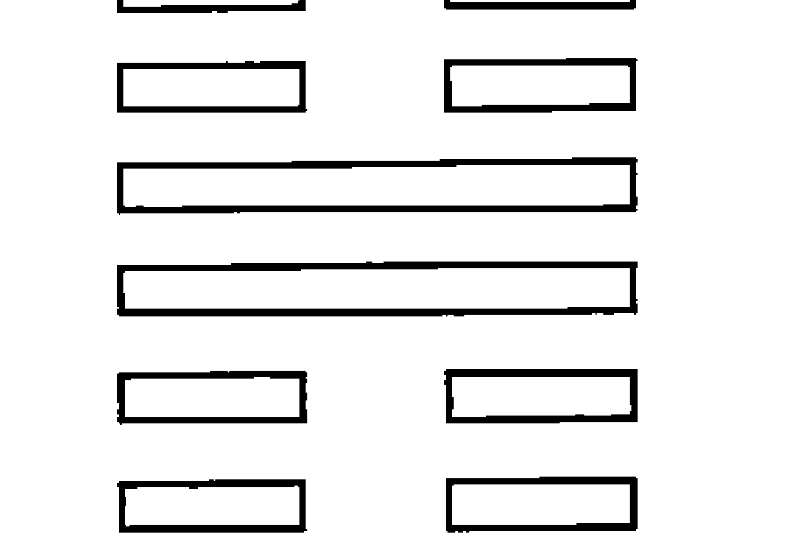

「圓盤騎士」在元素搭配上象徵的是土元素中的火元素，代表了將積極爆發的火元素收斂固化在一個實際且穩健的步調上，慢慢朝目標前進。小過卦則是象徵山（安定）的元素上出現了雷電（變動）的形象，表示變動的能量被山的能量給壓抑住了，因此就變得較為受制。但因為小過卦強調「可小事不可大事」，所以對應在騎士這種積極開創的戰鬥者身上，就顯得這個騎士有點跛腳。但從另一個角度來看，圓盤騎士的形象通常代表穩重的軍官，或許並沒有極大的野心，因為火元素的積極熱忱已經變成了最原始的生命力，所以並不需要非常積極於戰事，甚至可能沒有實權，但其本身仍然掌握對戰鬥的高度專業，只是土元素的特質拖慢了兵貴神速的睿智。因此，通常抽到此牌時，當事人必須先檢視自己的步調是否已經消極過頭，或者是現狀是否真的讓你無法有所進展，緩慢推移會是比較理想的狀況。

##### 抽到此牌

圓盤騎士是一個腳踏實地的男性長輩、上司，他可能跟你談到年輕時沒有完成的理想，可能讓你敬佩他的實力，卻感嘆他沒有位於最適合他發展的位置。然而圓盤騎士並不以此為遺憾，他欣然接受當下的一切，他認為可以握在手中的、可以在眼前看見的才是屬於自己所擁有的，他不再有所期待，因為在他的心裡已經完成了他的理想。

#### 圓盤王后

Queen of Disks

土中之水

澤山咸卦

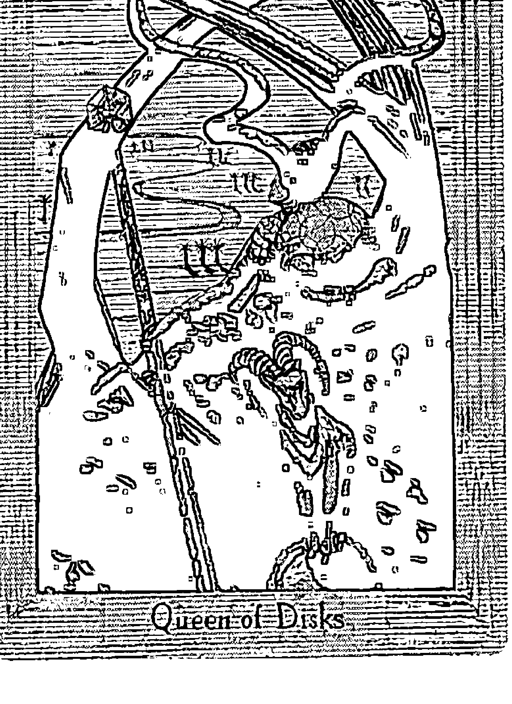

##### 圖像解析

-   圓盤王后一手拿著她專屬的球形圓盤，一手拿著權杖，圓圈交疊的球形圓盤意味著喀巴拉中意識沉降的凝結過程。所有的事物在靈性與意識中架構完成後，藉由意識高度沉降使萬物感知，物質世界因此而生，而這正是土元素背後的神秘意涵所在。權杖一方面代表著王后所有的權力，一方面也彰顯出王后所擁有的豐富資源（資產）。
-   王后的羊角與畫面前方的山羊，都代表著王后關懷著大地、關懷著本土的精神。圓盤王后不住在堅固的城堡內，她居住在她所擁有的肥沃土地之上，是最貼近本土、最關心生產力（農業）的王后，羊角代表的意義便是貼近於此，是土元素的意涵。此外羊角也與摩羯座連結，魔羯座具有羊的上半身與魚的下半身，其中的羊是代表物質層面的欲望。她看著遠方的土地，河水流經了沙漠，形成了綠洲，她終於可以放心於她所掛念的人民。

##### 基本牌義

「圓盤王后」是土元素當中的水，所對應的星座是射手座二十度到摩羯座二十度，相當於十二月十三日到一月九日之間。圓盤王后是一位親切的女性，人生歷練豐富，熟悉人情世故，也關心著世界的變化。對她而言，世界並不遙遠，而是真實的呈現在眼前，她願意以自己的行動照顧那些需要幫助的人，她以關懷的角度切入社會，從每一個善行中獲得一絲的滿足，她覺得自己就是這世界的一部分，雖然坐擁著王后的資產，但對於她而言，最可貴的乃是內心的滿足。

## 易卦解讀

此卦是《易經》下經中的開始之卦。在《易經》中，此卦象徵的是感應與相愛之卦。《易經》上、下二經中，上卦代表的是天地初生、萬物初發的意象，逐漸嫻熟成長後走到坎卦與離卦，至此告一個段落，之後人倫社會若要重新開始，就必須透過人與人的相愛，而後步入婚姻（恆卦），走入一個新的開始。愛情之卦——咸，就是這樣的一個卦，也因此成爲了《易經》下經的第一卦。

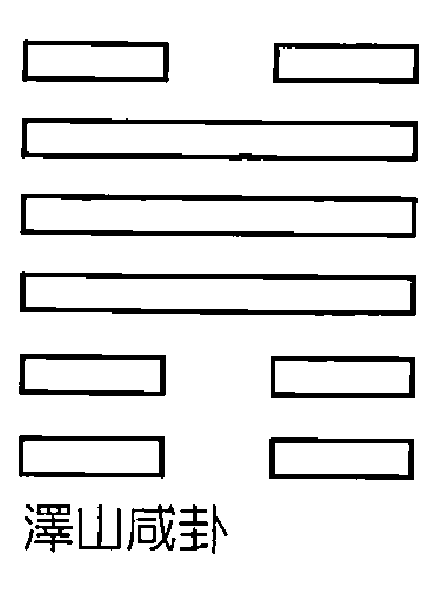

承接著土壤的豐饒氣息，又以涇潤的生命之水孕育萬物的大地之母——圓盤王后，就如此對應給這個卦了。但特別的是，克勞利所設計的「圓盤王后」除了有大地之母的形象以外，也多了柔性的女強人的特質，其頭上的羊角與手上的權杖，都代表了她本身強烈的慾望（羊角有摩羯座的部分特質），以及企圖爲世界創造一個強烈法則的雄心壯志。相對於圓盤騎士而言，圓盤王后更有開創的特質，唯獨咸卦是溫柔的，是一個以愛情爲主體、以體諒爲方式慢慢向目標推進的一個特殊卦象。因此，圓盤王后雖然強勢，但那種特殊的強勢並不會造成他人的不悅，反而宛若依附在圓盤王后孕育生命的溫暖子宮，享受源源不絕的生命泉源。而《易經》中咸卦的六爻也相當特別，從初爻到上爻，分別代表用腳趾、小腿、大腿、軀幹、背、頻舌來感應的現象，從下到上，層層推移，也能看出圓盤王后的溫柔懷抱，使人如沐春風的特殊情感面。

一般而言，抽到此牌，象徵個人在現況中一切良好，與周遭的互動也相當順遂，能夠如此順遂的前提是付出了足夠的同理心與關懷，因此魚幫水，水幫魚，能夠獲得相當大量的回饋。

##### 抽到此牌

抽到「圓盤王后」，可能代表了身邊有一位具有愛心的女性長輩、上司，你可能常常受到她的關心，也常常聽人家說起她的好。圓盤王后給人的感覺就是一位關懷大家的女性長輩，沒有王后的架子，相反地，她可以放下身段，去照顧社會底層的人們。她可能沒有主見，被自己直覺的感受牽著走，也可能因為自己的愛心遭受到欺騙，但是圓盤王后依然有著剛毅的一面，強勢的她即使遭遇困難，依然可以理直氣壯地拿回原有的一切。

「圓盤王后」也可以代表著一個善舉的發生，或是一個較為受到情緒所影響的決定，有著善意的出發點，卻可能缺少了一些具體的想法。

#### 圓盤王子

Prince of Disks

土中之風
風山漸卦

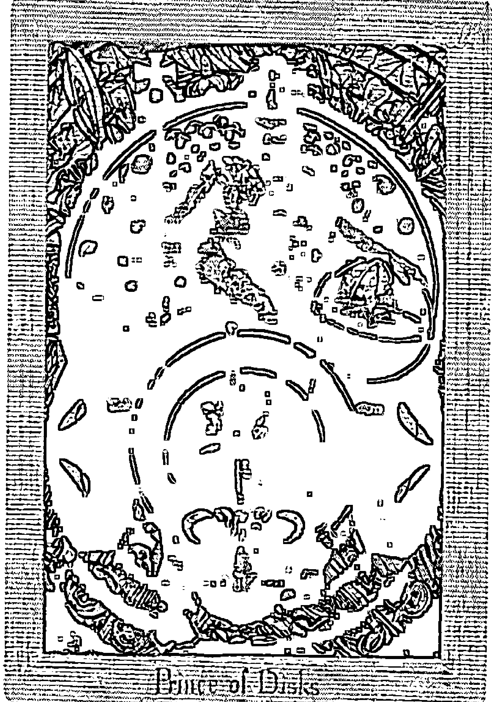

##### 圖像解析

-   王子左手握的地球儀是他專屬的圓盤，上面的線條與其中的正方體勾勒出他對於農業耕耘的縝密計算，他閉著眼睛，不苟言笑，想著如何將計畫付諸實現。
-   王子右手握的權杖代表他對土元素世界的掌控權。
-   拉車的牛對應屬於圓盤王子的土元素，也暗指出了圓盤王子所分割於金牛座零度到金牛座二十度的範圍。
-   背景繪製著豐收的農作，以年輪的方式排列組成，意味著不斷交替的季節循環。

##### 基本牌義

「圓盤王子」是土元素當中的風，所對應的星座是牡羊座二十度到金牛座二十度。他代表著在實質世界的領域中，一個新想法的萌芽。相當於四月十一日到五月十日之間。他有著實事求是的精神，與生俱來的固執，也有著風元素一般的細緻心思。他的行動非常謹慎，每一步都在他的細心規畫之中，雖然有時會讓人覺得可笑，讓人覺得他的行為太過於保守，缺少了靈巧的手腕，但那是圓盤王子最萬無一失的做法，他不追求效率，只追求零缺點的完成計畫。圓盤王子有著風元素的想法與土元素的細心，是一個聰明的人，但是在認識不深的關係中，往往只被人們看到他謹慎又帶點笨拙的那一面。

「圓盤王子」也與潛意識有關。在圓盤王子內心深處住了一個惡魔，他有許多不為人知的秘密，那是屬於他黑暗的一面。惡魔是一種比喻的說法，可以被理解為受壓抑的情緒，當互相矛盾的情緒與意念交纏後形成了心結，表面上你看不出圓盤王子的內心，你甚至難以去感受他的情緒，一旦你有機會瞭解，你會驚覺那一個讓你感到稍微恐怖的真面目。

## 易卦解讀

> 《易經》：「漸，女歸吉，利貞。」

對於這樣的一個卦，《易經》卻簡短的以三個字就解釋完畢了。什麼是「女歸吉」呢？歸就是歸宿的意思，代表女孩子長大了，可以嫁人了，而且嫁得還不錯。以元素能量來看，漸卦的能量是山（穩定）上有風（訊息），因此在安定的狀況下獲得了足夠的訊息，可以開始為自己的未來做打算。而風的形象也代表飛鳥的形象，也就是說有了山作穩定的依靠與基礎，飛鳥就可以展翅翱翔，無所顧忌。

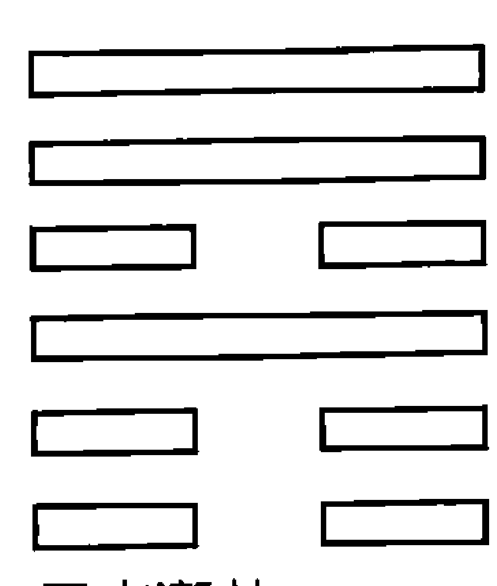

而這樣一個對婚姻有利的卦，又與「圓盤王子」有什麼關係呢？圓盤王子象徵的是較為純樸誠懇的男性，將理性思考的風元素逐漸落實到生活中的柴米油鹽之中（土元素），雖然這樣的王子少了一點浪漫，但的確是對婚姻與生活自有一套想法的王子。由於圓盤王子具有純樸誠懇的特質，若再搭配理性與實際的態度，反應在工作上，是較為實際而穩健的理性派。值得注意的是，圓盤王子與圓盤騎士不同之處在於：騎士內在蘊含的火元素較具有爆發力，雖然排定了工作計畫，卻常常不按牌理出牌，突然一股腦兒統統做完，具有一種狂人特質；相對而言，理智的圓盤王子能用風的速度調和土的緩慢，能夠在一定期限內看見理想的工作成效。有趣的是，《易經》中三個追求進步的卦分別是：漸、升、晉三卦，由前到後，速度由慢到快，但安定性卻是由安定到最不安定。總而言之，能在穩定的進步中看見自己的成長，圓盤王子就是這樣的一種人格特質。

一般而言，抽到此牌，由於牌內在的漸卦能量，通常會帶有一點桃花運，象徵一個機會的出現，但是不能躁進追求。而此牌在工作方面也是相當良好的牌，能夠以合乎自己步調的方式，一步步達成工作，甚至超越原本預期的規模。

##### 抽到此牌

圓盤王子可以代表一位小心翼翼、做事謹慎、看似剛毅木訥的老實男性，在你的眼中，他是安分守己、準時上下班的好人，如果沒有什麼太深的互動，對於他的瞭解可能就僅止於此而已。圓盤王子很好相處，他可以成為你必要時的協助，但是他會讓你感覺到一些距離，感覺到他好像沒有的情感流露，這源自於他的本性，並非有意如此。

「圓盤王子」也可以代表一個穩定的事物，一段細水長流的關係，一切都在控制之中，沒有意外發生的可能。如果是對於抉擇的占卜，建議朝著原本的計畫走，用較為保守的方案，比較不會發生不可預期的結果。

#### 圓盤公主

Princess of Disks

土中之土
艮為山卦

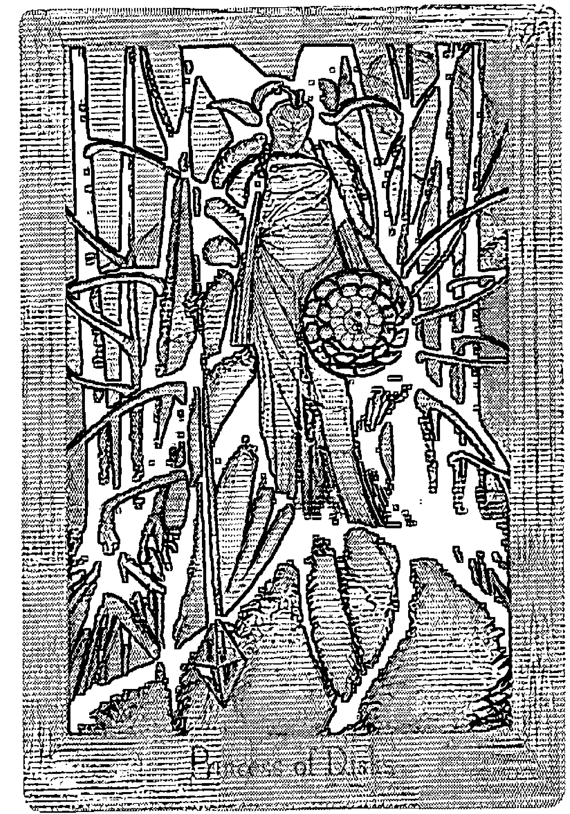

##### 图像解析

- ⊙ 圆盘公主左手拿着属于她的圆盘，中央的太极图形意味着它本身均衡的能量，而花朵的配置则是隐喻了古埃及神话中的女神伊西斯，对应给了圆盘公主大地的母性特质。
- ⊙ 圆盘公主的牛角头饰，一方面点出了她属于代表着大地的土元素，一方面也以农作生产的象征来暗喻她是怀有身孕的公主。
- ⊙ 她拿着属于她的权杖，指向地下，指出了喀巴拉生命之树中创造之流的方向，从上到下，从原本的空无，经过了层层意识凝结的过程后，诞生于物质世界。

##### 基本牌义

「圆盘公主」是土元素当中的土，对应于天球北面牡羊—金牛—双子的空间象限。「圆盘公主」是土元素的终点，在喀巴拉中属于创造之流最后汇集之地，因此她是宫廷牌当中唯一怀有身孕的一位。圆盘公主具有女性本身优美的气质，她凝视着大地，并且融入其中，圆盘公主具有一股平衡的能量，你隐约可以感觉出她所传递的温暖是来自于大地的气息，来自于那广大的集体意识，仿佛是在森林中突然受到的感召，仿佛是在海岸边臣服于美的心灵，当你感觉到那种无法言喻的大地精神，那股自然的气息，就是圆盘公主的本质。

# ～～易卦解读～～

此卦在《易经》中的能量特质反而是偏向于阳性的卦，但有趣的是，在托特塔罗牌中，却将此卦对应给任务特质为女性的圆盘公主。事实上，此张牌所对应的意象可能更近似于《易经》中的坤卦。圆盘公主本身的形象有完美女性的特质，孕育、强健的生命力与即将诞生的生命都与此牌特质相关。需要注意的是，圆盘王后本身也有类似的特质，但两张牌的年龄层相比，圆盘公主更像年轻的母亲，即将临盆而充满活力。相对而言，圆盘王后则较为年长，擅长照顾人与抚慰人，也象征来自母亲的丰厚滋养。

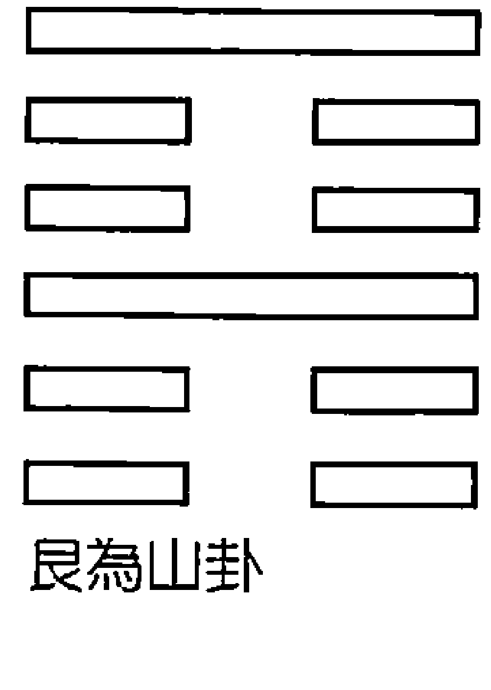

艮卦在《易经》中有静止的意思，也就是平静与宁静的能量，并且透过宁静的反省与思考，获得新的智慧与解脱。此卦与圆盘公主较为链接的部分是静中藏动（怀孕）的内蓄生命力。但相对而言，坤卦所代表的是大地土壤，生命能量比艮卦更为丰盛，也更接近母亲的形象与特质。因此就笔者个人的解读，会认为在解此张牌时，或许艮卦的能量是一个解读的方向，但不妨参照一些坤卦的能量特质一并思考。

##### 抽到此牌

「圆盘公主」使人感觉到一股温暖，那是超然于其他牌的感受，那是一种来自于内心对自然所产生的澎湃热情，一种被美丽的景色所感动的心灵，在这一个时刻，你自然而然地感觉到愉悦，体会到生活的舒适。

「圆盘公主」也能广义地对应于女性，她具备了女性的优美，没有世俗历练下的伪装，在某些时候让人感觉到她的脱俗氛围，那就是她最自然、最原始的样貌，只是我们习惯了扭曲的生活方式，忘记了自然，也忘记了女性本身所散发的原始氛围，那是一种不需装扮的自然之美。

「圆盘公主」可以意味着一个丰盛的结果、一段平和的关系、怀孕的迹象、农作的丰收等。当然它也可以代表着你顺着内心的引导所达成的目标。「圆盘公主」是土元素的汇集，没有好坏，没有吉凶，就是一个圆满。

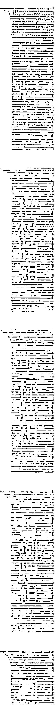

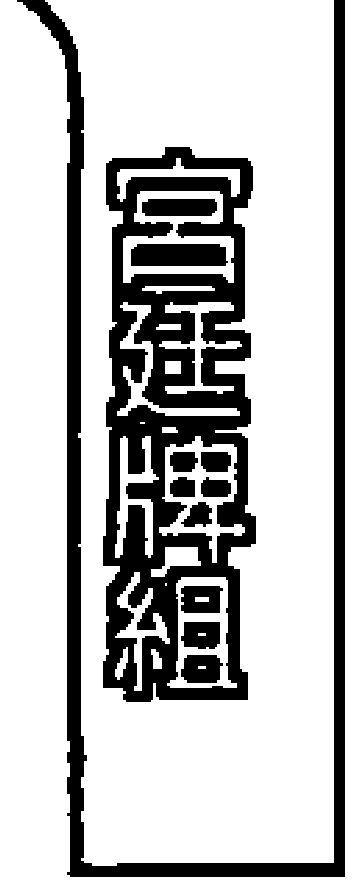

# 第三章 托特塔罗牌的进阶理论与占卜技巧

这是托特塔罗最精采的部分，透过丰富的神秘学符号与理论架构，直指问题核心。

在了解了每一张牌的意义后，接下来我们将要介绍托特塔罗牌进阶的使用技巧。这是托特塔罗牌最为精采的部分，利用牌上面丰富的神秘学符号与理论架构推论，可以将塔罗占卜运用得出神入化，不单单从牌义上来做解析，更能够透过这些符号找出占卜事件中的种种蛛丝马迹。占卜之中，你不一定非要非常熟悉这些理论，但是了解这些知识对于解读问题核心脉络、诠释与建议将有莫大的帮助。

## 双环带扭曲理论

熟悉了大阿卡纳二十二张牌后，你可能已经发现了第八号「调节」与第十一号「欲望」的位置跟一般塔罗牌的排列有所不同，更仔细的读者还会发现，第四号「皇帝」与第十七号「星星」中的希伯来文字母顺序互相交换，这究竟是为什么呢？有什么理由让克劳利在塔罗牌上的顺序做出了改变？

其实克劳利只更动了希伯来文的对应，没有改变塔罗牌的顺序（见右页图）。

# ～ 黄道十二星座与大阿卡纳的难题 ～

我们先谈谈第八与第十一号牌的情况。在早期的塔罗牌，如马赛塔罗牌当中，原本的八号牌为正义牌，而十一号牌属于力量牌，在金色黎明会的塔罗手稿内，也遵循着这样的排序方式，因此克劳利在托特塔罗牌中并没有更动这两张牌的顺序，真正更动的是设计韦特塔罗牌的韦特，他将力量放置于八号，把正义放于十一号，这是韦特塔罗牌的一大创举。往后几年，韦特牌大为畅销，成为了最普及的塔罗牌，它的画风鲜明，并且在小阿卡纳牌中加入了一目了然的故事性图像，让韦特塔罗牌成为许多人学习塔罗的入门款，因此八号的力量与十一号的正义，这样的顺序，就这么根深蒂固地刻印在许多人的脑海中。

为什么韦特要做这种变动呢？这是因为十一号牌的正义对应给了天秤座，如果这张牌位于大阿卡纳的正中央，象征天平两端的平衡，更能使得正义的意涵名正言顺。另外，这样的变动也符合了占星学上的顺序。

在占星学中，黄道十二星座将天空划分为十二个区块，从牡羊座的春分起始点，每三十度的天空范围画出了一个星座，如图3.1。

以传统序列的塔罗牌（马赛塔罗、托特塔罗、金色黎明塔罗）为例，我们把大阿卡纳中对应到星座的牌给抽出来，分别照着黄道十二星座的顺序而排列（图3.2），会发现它们的顺序并没有像十二星座的顺序一样，在狮子、处女、天秤座间的顺序就发生了改变。

塔罗牌的起源至今没有详细的考证，因此我们也没有办法知道，最初的塔罗牌诞生之时，为什么除了这三张牌以外，所有对应到星座的大阿卡纳牌，都照着黄道十二星座的顺序排列？

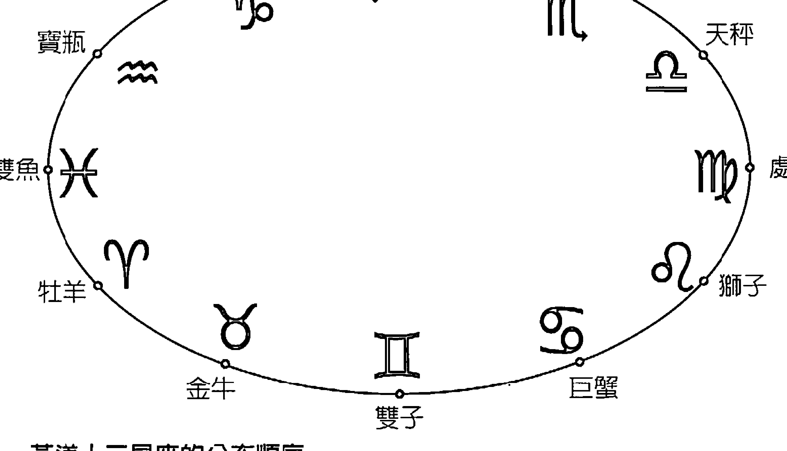

# 图3.1 黄道十二星座的分布顺序。

### 韦特的修正理论

韦特先生在设计韦特塔罗牌时，则是对无法合乎于黄道十二星座顺序的大阿卡纳提出修正理论，他直接把八号牌与十一号牌交换。这一个简单的解决办法化解了占星学的顺序问题，也让对应给天秤座的「正义」牌有了意义上吻合的诠释。调动顺序后，十一号牌变成了正义，位在于大阿卡纳的中央，符合了天秤座的精神，而且在星座顺序上困扰许久的难题也获得了解决（图3.3）。这是一个最广为人们接受的修正理论，也符合牌义上的修正。

### 金色黎明会的修正理论——环带扭曲理论

自从韦特的独特观点面世后，大多数的塔罗牌都跟随着韦特的阐述，不可否认，改动塔罗牌的顺序后在理论上更显得完美，但是，这样的更动却无法解释传统的序列背后所隐藏的神秘学理论。坚持传统牌序的塔罗牌理论者也有一套自己的修正理论，最早在金色黎明会被提出，称为环带扭曲理论。想象一下黄道十二星座的圆环在三度空间中扭曲（图3.4），像是扭曲橡皮筋的一端。在扭曲过后，把传统顺序的大阿卡纳进行排列（图3.5），可以看到了两种顺序路径，属于黄道十二宫的序列是我们所观察到的世界，而外圈的排列则是大阿卡纳的顺序，透过环带扭曲理论，我们可以得知大阿卡纳中隐藏的意涵，即为所观察的世界未必如此真实，这当中存在着空间上的扭曲，而传统的塔罗牌序列则是直接以较为真实的世界作为观察点，因而有这样的排序。

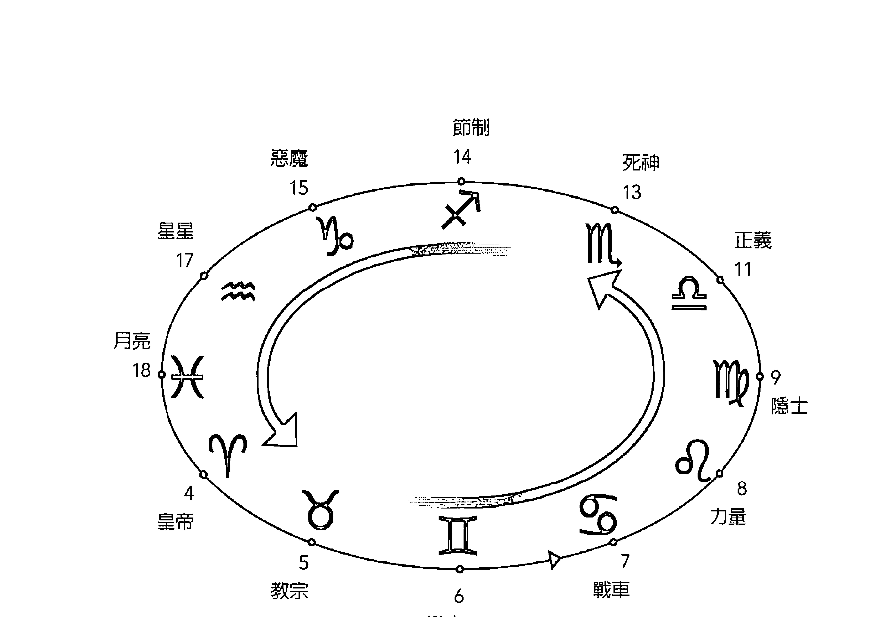

图3.3 韦特塔罗牌交换了八号牌与十一号牌的顺序，使得大阿卡纳能够符合黄道十二星座的顺序。

### 克劳利的修正理论——双环带扭曲理论

托特塔罗牌建立在前述理论基础上，使黄道十二星座的顺序获得了解答。但是在希伯来文字母上的对应互换又是怎么一回事呢？在塔罗牌的理论中，二十二张大牌分别与二十二个希伯来文字母依照字母的顺序相对应，从「愚人」对应第一个字母 א，到最后一张「宇宙」对应于第二十二个字母 ת。
克劳利设计大阿卡纳时，以他在一九○四年通灵所写下的《律法之书》第一章第五十七段文字为依归：「All these old letters of my book are aright; but צ (tzaddi) is not the Star. This also is secret : my prophet shall reveal it to the wise.」（我书中所有的古老字母都是正确的，但「צ」并不是「星星」。这是一个秘密，我的预言者将会揭露其中的智慧。）צ 正好是第十七个字母，而「星星」也正好是第十七号的大阿卡纳牌，巧妙地解决了字母对应上的难题。一九○四年时，克劳利是意外受到感应而写下《律法之书》，那时他根本没有想过要自己设计属于他的塔罗牌，直到一九三八年才开始着手设计托特塔罗牌，以《律法之书》的内容作为大阿卡纳的参考架构，而再看到了这一段文字，不禁让人联想到那是否就是冥冥中的巧合。如果第十七个希伯来文字母 צ 不能作为十七号牌「星星」的代表的话，那么「星星」牌该对应到哪一个希伯来文字母？而 צ 又对应到了哪一张牌呢？

克劳利提出了一个新的理论来阐述这一个变化，称为「双环带扭曲」（The double loop in the zodiac），克劳利认为，原本用来解释牌序的环带扭曲理论并不完整，右方的环带扭曲造成了牌序上的变化，而左方应该也出现了一个反向的扭曲，造成了希伯来文字母对应的改变。
左边的扭转与右边的扭转具有相异的方向性，以扭转橡皮筋的方式即可理解克劳利在此做的修正方式。左与右扭转的方向性，则是改变了牌序或希伯来文字母对应，端看转动的方向。

这双重的扭曲就是《律法之书》中所提到的智慧。这种复杂的概念，需要一层一层的来厘清。在以人类为观察者的角度之下，我们无法观察到黄道具有两个空间上的扭曲，除非在加入另外一个维度的观点下，才得以察觉。观测到的现象显示黄道上的十二星座围绕着天球，构成了一个大圆，传统的塔罗牌序列是在加入了额外一个维度的观点后，揭露右方存在着一个扭曲，那不易想像，也难以去理解，就像大脑无法想像高维度空间下的物体形状一样。也许最初的塔罗牌设计者看到了这一个真相，才把第八号与第十一号牌的位置交换，将这一个秘密隐藏在塔罗牌之中。而第二个扭曲则是克劳利根据《律法之书》的字句推敲而出，试图阐明在单环带扭曲的对称边也有扭曲，正好满足了《律法之书》的阐述，也平衡了星座与字母间的改变。对于克劳利而言是一个巨大的发现，亦是大胆的推论。因此在托特塔罗牌中，第四个希伯来文字母所对应的，应该是第十七号的「星星」牌，第十七个希伯来文字母对应的为第四号的「皇帝」牌。

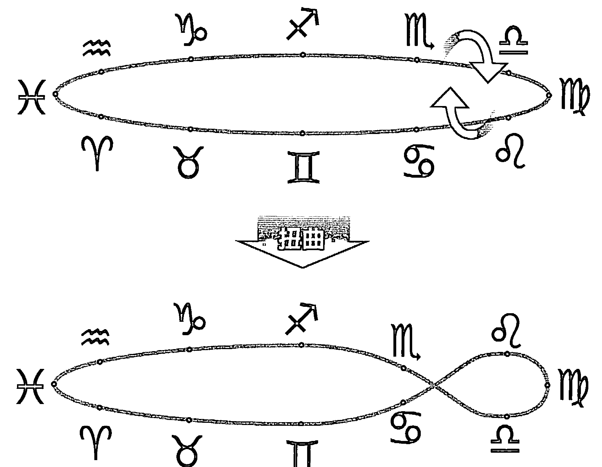

图 3.4　环带扭曲理论，扭曲过后的星座。

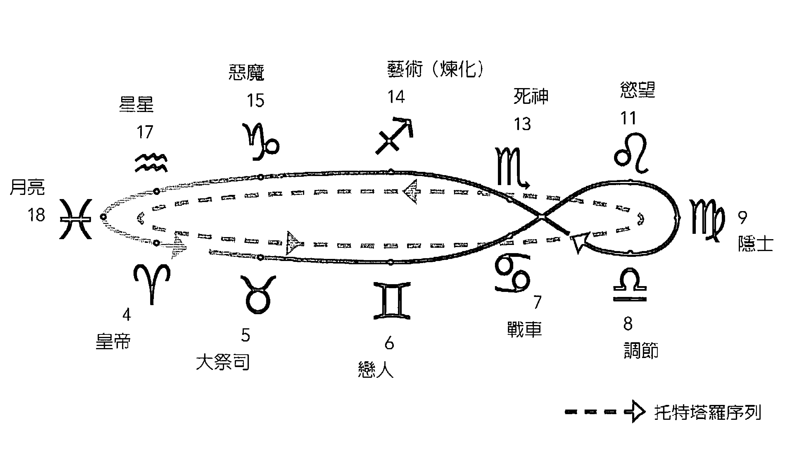

图 3.5　环带扭曲理论下的托特塔罗牌大阿卡纳顺序。

- ——▶ 托特塔罗序列
- ——▶ 黄道十二宫序列

如图3.7，三种路径呼应了泰勒玛中的三个纪元。黄道在原本的空间之中以圆形的方式存在，并没有发生空间上的扭曲，这是属于最初的女性之神伊西斯所掌管的纪元，而当进入了象征父权的欧西里斯掌管后，为黄道添加了一个新的维度，在不同角度观察之下，就形成了只有右方存在的单环带扭曲。最后进入了荷鲁斯所掌管的纪元，再加入了另外一个维度，使得黄道左方也发生了空间扭曲，构成了双环带扭曲。

双环带扭曲理论是托特塔罗牌中用来解释牌序与希伯来文字母顺序的基础，虽然抽象，但对于塔罗牌研究者而言，这是一个经典的理论，也是个大胆的尝试，虽然它对于托特塔罗牌占卜上的应用性不高，即使不熟悉也不会影响到占卜的效果，但是当你掌握许多神秘学理论，慢慢地筑起关于占星、喀巴拉、泰勒玛的知识理论后，你会发觉这其中的巧妙性，这是串起占星、喀巴拉（希伯来文字母对应）与泰勒玛的第一堂课，可以使你对于托特牌中的大牌具有更深一层的认识。

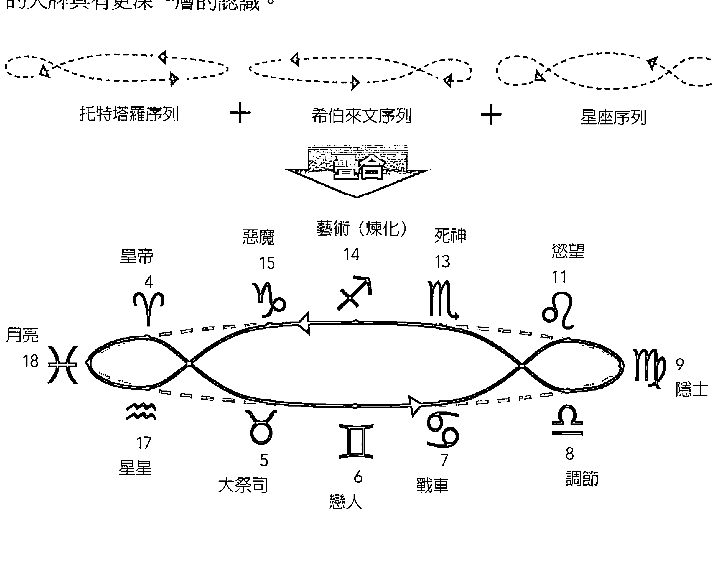

| 编号 | 名称 | 英文名 | 占星符号 | 希伯来文对应 |
|------|------|--------|----------|----------------|
| 0 | 愚人 | The Fool | △ 风元素 | א (aleph) |
| 1 | 魔法师 | The Magus | ☿ 水星 | ב (beth) |
| 2 | 女祭司 | The Priestess | ☽ 月亮 | ג (gimel) |
| 3 | 皇后 | The Empress | ♀ 金星 | ד (daleth) |
| 4 | 皇帝 | The Emperor | ♈ 牡羊座 | ה (tzaddi) |
| 5 | 大祭司 | The Hierophant | ♉ 金牛座 | ו (vau) |
| 6 | 恋人 | The Lovers | ♊ 双子座 | ז (zain) |
| 7 | 战车 | The Chariot | ♋ 巨蟹座 | ח (cheth) |
| 8 | 调节 | Adjustment | ♎ 天秤座 | ט (lamed) |
| 9 | 隐士 | The Hermit | ♍ 处女座 | י (yod) |
| 10 | 命运 | Fortune | ♃ 木星 | כ (kaph) |
| 11 | 欲望 | Lust | ♌ 狮子座 | ל (teth) |
| 12 | 吊人 | The Hanged Man | ▽ 水元素 | מ (mem) |
| 13 | 死神 | Death | ♏ 天蝎座 | נ (nun) |
| 14 | 艺术（炼化） | Art | ♐ 射手座 | ס (samekh) |
| 15 | 恶魔 | The Devil | ♑ 摩羯座 | ע (ayin) |
| 16 | 塔 | The Tower | ♂ 火星 | פ (pé) |
| 17 | 星星 | The Star | ♒ 宝瓶座 | ה (hé) |
| 18 | 月亮 | The Moon | ♓ 双鱼座 | ק (qoph) |
| 19 | 太阳 | The Sun | ☉ 太阳 | ר (resh) |
| 20 | 新纪元 | The Aeon | △ 火元素 | ש (shin) |
| 21 | 宇宙 | The Universe | ♄ 土星 | ת (tau) |

排序对调

希伯来文字对调

## 占星学技巧应用

占星学是托特塔罗牌的主轴之一，除了大牌对于星体、星座、元素的单一对应外，小牌当中的占星组合更是将占星学在塔罗中发挥得淋漓尽致。在平常的占卜之中，我们可以运用占星学到什么样的程度呢？除了单张牌内的占星学意涵外，出现于牌阵中其他的牌也可以交互组合，隐约地说出占卜事件中的蛛丝马迹。我们来看看下面的例子：

## 实际案例探讨

#### ◎提问

小雪再过一周就要面临期末考了，她想要问问看关于考试的情况与结果会是如何。

#### ◎抽牌

对于这一个问题，占卜师选择了时间之流牌阵，分别以过去、现在、未来来分析小雪在考试的表现。她所抽出的牌如下：

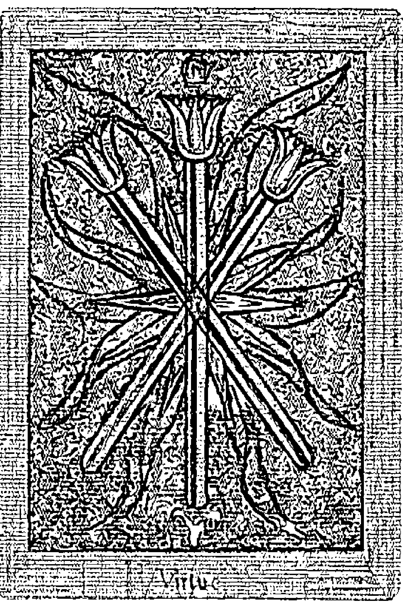

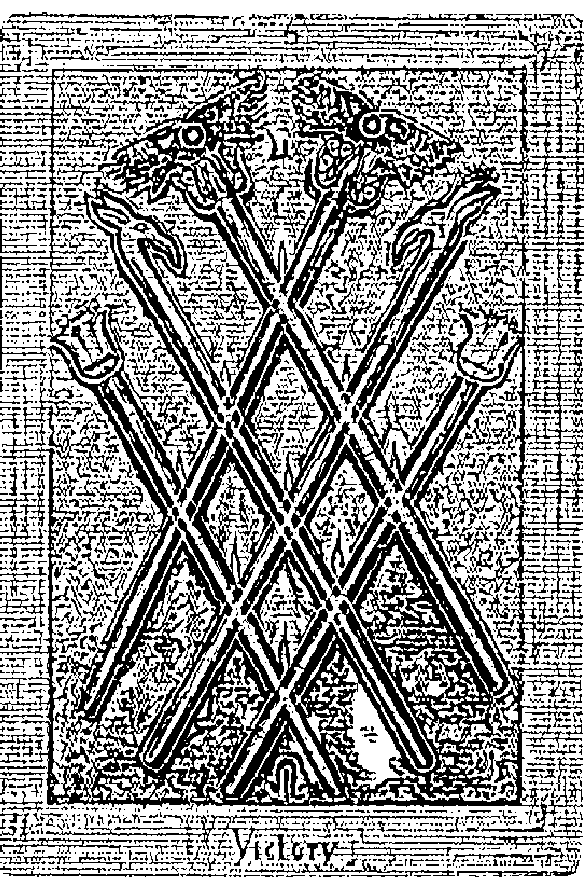

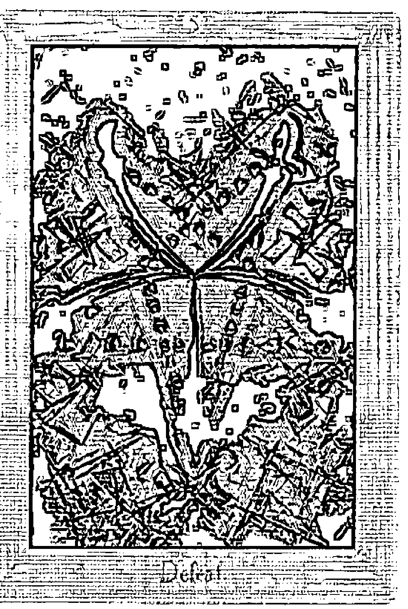

#### ◎解析

从过去与现在的牌看来，小雪算是一个脚踏实地的学生，她用按部就班的态度准备（「权杖三」）这一个科目，可能在期中考表现不错，不需要担心这一科会有不及格的危机（「权杖六」），但是对于期末考，却可能会出现一个让她难以接受的挫败（「宝剑五」）。一个用功的学生，也得过不错的成绩，却将要在期末考面临震撼，依照这样的思路推演下去，不禁令占卜师感到疑惑……

#### ◎占星学应用下的解释

用占星学的技巧来分析，我们就可以了解小雪将会遭遇到什么样的未来，以及背后的原因。首先我们先来看看，小雪是怎么看待期末考的。以星体当作变化的心灵，以星座当作时间的刻度，取木星（「权杖六」内的木星代表此刻的心态）落入宝瓶座（「宝剑五」内的宝瓶座代表未来的考试），当她看待期末考的心态，木星落入宝瓶代表着她觉得自己对于期末考的准备还蛮充实的，她把所有想到会考的内容都复习了一遍。

而在考完试后，她才知道（从未来看此刻的准备，金星落于狮子座）她的准备没有自己所想的那么确实，原本以为自己对于这个科目已经够了解了，但是在考试后才后悔，原来自己以为扎实的准备只是自我感觉良好而已。有趣的是，我们可以发现过去的用功带给她一种满足，一种因为别人称赞所带来的满足（现在看过去，木星落于牡羊），但是曾经有过不错的成绩让她松懈了努力，不知不觉中已经没有当初那种程度的用功了，却还没有察觉到。至于来做占卜，也只是想透过别人来给她一种肯定。

#### ◎建议

如果占卜师熟悉占星学，在翻开牌后马上就可以看出这些有趣的蛛丝马迹，你可以轻松地站在小雪的观点来跟她说明此刻的状态，透过交谈让她自己发现，原来自己真的没有确实地准备好，幸好还有一个礼拜，要补救还来得及。

透过小雪的案例解析，在原本的牌义之下，借由占星学的技巧，便能分析出是什么样的心理变化让小雪无法在期末考拿到高分，也借由这样的心理模式分析，让塔罗占卜后能够做出适当的建议，做出一个让小雪能够听得进去的建议，进一步地让她稍微转向，看清楚自己的步伐后再重新前进。

西洋占星学是一个专门的学问，有意深入学习的读者们，可以从其他专业的书籍来建构自己的占星学知识。碍于篇幅，本书仅仅列出了基本的星体与星座含义，使初学的读者们略窥一二。

# ∞ 占星学元素简介 ∞

#### ◎太阳（Sun）◎

太阳是昼的象征，掌管温暖与光明，因此在占星学中对于太阳所给予的定义都是趋于正面与阳性的：光明、热情、积极等等正面的意象。而太阳本身因为阳性的特质非常强烈，因此也常在婚姻与家庭中扮演丈夫或父亲的角色。也由于太阳本身会自动散发光与热，因此在个人占星上也往往象征一个人的显意识与外在观感，是扮演影响一个人的形象与号召力的重要星体。其占星符号⊙中，外在的圆圈是代表整个太阳系，而内在的黑体则代表太阳本身，也就是说，这个符号所象征的意义是「太阳是太阳系的中心点」。

#### ◎月亮（Moon）◎

月亮是夜的象征，相对于太阳主动地释放光与热，月亮则是被动性地反射太阳的光芒以照耀地球。因此在占星学上，月亮象征的是人较为阴暗的内在意识与情绪，还有个人平常无法触及的潜意识。与太阳相对，月亮代表的是家庭关系中的母亲与妻子，因为母亲与妻子富于情感的形象，所以月亮除了情绪以外，也象征温暖的情感层面。其占星符号☽用的是上弦月的图腾，因为满月的圆球体容易与太阳的符号混淆，而下弦月是逐渐亏损的力量，在概念投射上不如逐漸圓滿的上弦月來得正面。

#### ○水星（Mercury）☿

水星的符號是希臘神祇漢密斯之蛇杖，半圓與圓構成了兩蛇交疊的形象，漢密斯之羅馬名為墨丘利（Mercurius），水星因此而命名。此神為奧林帕斯山信使，速度迅捷且機智過人，是個天生的神偷，也是護送死者魂魄進入冥府的守護神，也因此水星在事物上代表科學、商業、訊息傳遞、溝通、偷竊詐欺；在個人層面上掌管人的聰慧、口才、論辯、邏輯，也掌管人的思考。

#### ○金星（Venus）♀

金星的符號是希臘女神愛芙羅黛蒂的鏡子，也是象徵女性的符號。愛芙羅黛蒂在羅馬被稱為維納斯，是掌管愛與美的女神，金星即以此命名。祂在希羅神話中的形象是位顛倒眾生的傾國女子，嫁給了醜陋跛足卻個性善良的火神赫菲斯托斯（Hephaestus），愛芙羅黛蒂對醜怪的丈夫殊無好感，與戰神亞瑞斯（Ares）的私通故事反而在希羅神話中比較常見。愛芙羅黛蒂掌管愛與美，也因此金星掌管人的美貌與魅力、情感與藝術美感的鑑賞，此外也具備了物質上的豐饒與幸運。此外「金」在東方代表貨幣，在七政四餘（中國古代的占星術）中以五行的「金」分配命名，亦掌管人的財運，與金星在西洋占星術中代表財運之意相應。

#### ⊙火星（Mars）♂

火星的符號是戰神亞瑞斯的盾牌與長矛，也是象徵男性的符號。亞瑞斯在羅馬神話被稱作馬爾斯（Mars），火星即以此命名。戰神是位高大英俊、驍勇善戰、嗜血好殺的男子，雖名為戰神，但在希羅神話中卻屢屢敗在智慧女神雅典娜（Athena）的手下。火星象徵的是人性中衝動暴力的一面，但也代表如男性般積極振奮努力的那一面，也由於衝動與活力的特質，火星掌管

#### ○木星（Jupiter）

木星的符號是天帝宙斯的雷電與獵鷹的形象。宙斯在羅馬又稱爲朱比特（Jupiter），故木星依此爲名。宙斯是全天領導者中最年輕有活力的，因此木星象徵的就是活力與放大的特性，而其幼年險些被親父克羅諾斯（Kronos）吞噬，卻受母親掩護而逃過一劫，此故事也使得木星帶有幸運與勝利的色彩。這個故事是這樣的：宙斯其父受到宙斯祖父烏拉諾斯（Uranus）的詛咒，使得他必須將自己親生子女一一吞入腹中，才能避免被篡位，但宙斯的母親瑞亞（Rhea）以一顆石頭蒙騙丈夫，然後偷偷產下么子宙斯，待宙斯年長，對父奪權成功，也將被父親吞噬的兄姊們一一救出，此後這群兄姊反過來尊宙斯爲長兄，其中著名者有海王波賽頓（Positon）、冥王黑帝斯、天后赫拉（Hera）、農業女神狄米特等等。宙斯神在希羅神話中極度風流好色，與許多女神與女性人類都有愛情史，也因此希羅神話中有許多以宙斯子女爲主角的故事。木星在東、西方皆有幸運之意。在西洋占星學中，木星具有意識擴張之特質，存在樂觀與成長之意。

#### ○土星（Saturn）

土星的符號是來自於神王克羅諾斯的鐮刀。克羅諾斯是天帝宙斯的父親，天王烏拉諾斯與大地女神蓋亞（Gaea）之子。其年少時代替母親攻擊父親烏拉諾斯，在將其閹割之後使天地分離，並奪取父親的政權，成爲神界領袖，但也因爲父親臨走前的詛咒，使得他在年老之後也得受到么子宙斯的奪權而遭到囚禁。他的武器是鐮刀，因此也被賦予農神的形象，在羅馬，人們稱祂爲撒圖耳諾斯（Saturnus），土星也是以此略爲修改而命名爲Saturn。由於土星守護神克羅諾斯被其子宙斯篡位囚禁，因此土星掌管的就是如同受到監禁一般的制約力與框架，也代表對自身的約束與沉重的壓力。對個人而言，土星也代表因爲業力影響所帶來的痛苦與哀傷，但土星在東方被稱爲鎮星，屬於安定與穩固和諧的力量，因此某種程度上也代表框架制約下的安全感與保護作用。

#### ◎牡羊座（Aries）♈

句訣：I am 我是

牡羊座為黃道十二宮起點，節氣點為春分，由此可知，此星座是春天的星座之一，象徵一年的新生，也象徵人與生命的新生。因此，牡羊座充滿活力與生命的衝動，依循生命的本能追求生命自身的價值，其星座符號象徵羊頭，也象徵初生的幼苗。句訣「我是」，強烈的彰顯出牡羊座身為黃道起點的個人主義風格，也是生命誕生那活躍不已的氣勢。守護星為掌管活力與殺伐的火星。

#### ◎金牛座（Taurus）♉

句訣：I have 我有

金牛座承繼牡羊座的誕生而來，因此代表的是誕生之後的「撫育」，牛有舐犢之性，也是農作上重要的牲畜，金牛座便是以撫育為形象，重視生命資源的累積與照顧，進而延伸到金錢財富、社會地位、音樂美術等方面的開創，故句訣為「我有」。也由於牛的形象，為金牛座帶來了一些對生命價值上的堅持，具有腳踏實地的性格。金牛座偏向於維持現狀，過著穩定的生活。守護星為掌管愛與美、藝術與財富的金星。

#### ◎雙子座（Gemini）♊

句訣：I think 我思

雙子座的符號是羅馬字母的二，有由一生二的意象，引申後的概念是「學習」，將一套知識轉換為兩套知識。由於雙子座性喜學習，也連帶重視學習後的思考。句訣「我思」，便是象徵雙子座重視腦智與思考解決問題的態度。而且雙子座對提問乃是家常便飯，且由於是經過思考過後才提問與論辯，常使雙子座被聯想到「口才便給」的形象。守護星為掌管才智、口才與邏輯的水星。

## ♋巨蟹座（Cancer） ♋ 			——————	句訣：I feel 我覺

巨蟹座的符號象徵母親的懷抱，也象徵母親的乳房。代表母愛的具體形象與情感的呵護，巨蟹座本身便是相當善感的星座，對於情感的捕捉與體認非常深刻而細緻，為了避免自己受到多餘情緒的影響，以螃蟹為形象，將自己包覆住，但在硬殼之下仍是那顆重視家人與情感的柔軟細膩的心。句訣「我覺」，便是點出巨蟹座以情感為出發的個人特質。守護星為掌管潛意識、情感與母性的月。

## ♌獅子座（Leo） ♌ 			——————	句訣：I will 我願

獅子座的符號是整頭完整的獅子經過極度簡化後所形成的符號。獅子座由巨蟹座的家庭情愛轉換成人群中引領居首的形象，具有領導者、霸氣十足、不可一世的威風氣概。但此種態度也容易使自己無形中養成救世主情節，而忽略了人的存在必須由自己負責。句訣「我願」，也顯現出獅子座願意領導眾人、為眾人服務以滿足自己領導者形象的自尊心。守護星為掌管顯意識與光明的太陽。

## ♍處女座（Virgo） ♍ 			——————	句訣：I analyze 我慮

處女座的符號是少女的頭髮，絲絲分明，也代表處女座本身極度擅長的分析能力。心細如髮的處女座對於事物的觀察相當細心，並且能分析出相當可信的結果與推理程序。也由於這種一絲不苟的態度，其在占星學上的方向與個人的就業有關，對工作的態度是否能夠一絲不苟，處女座一直都扮演著相當重要的影響力。句訣「我慮」與雙子座的「我思」恰巧是一組，我慮象徵人的分析能力，也許聯想的範圍不夠長遠，但分析的深度卻是十二宮中之冠。且此二星座是黃道十二宮中唯二具有完整人形的星座，也代表思考與分析的能力是身為人最重要的能力。守護星與雙子座相同，為掌管才智、口才與邏輯的水星。

## 天秤座（Libra） ♎ —— 句訣：I balance 我衡

天秤座位於黃道第七宮，是牡羊座的對宮。相對於牡羊座代表個人生命的起點，天秤座則是代表群體互動的起點，星座符號象徵的正是左右對稱的天秤，企圖在人與人、你與我之間建立起一個平等而公正的關係，也由於天秤座希望的是最良好而平等的公正，因此行事的手段偏向於優雅而從容，但偶爾也會有過於追求和諧以至於優柔寡斷的問題。句訣「我衡」，強調天秤座追求真正和平與公平的心態，也矢志於讓自己能處在平衡而不偏倚的狀況之中。守護星與金牛座相同，是掌管愛與美的金星，天秤座的溫文優雅特質亦來自於金星的守護。

## 天蠍座（Scorpio） ♏ —— 句訣：I desire 我欲

天蠍座的符號是蠍尾與蛇的意象，由此二種至毒之物亦不難看出天蠍座本身凶狠狼戾的特質。但是毒蟲本身的毒液是為了攝食之用，是一種求取生存的本能，而毒與藥本為一體，因此天蠍座雖然有殘酷與死亡的意象，但也有經歷磨練之後，進而轉化重生的意象。句訣「我欲」，象徵天蠍以毒求生（包含生活中的各種需求，如基礎的性慾與食慾，進一步的財富與社會地位）的基礎天性，但由於毒與藥的一體性，在經歷生命的磨練之後，開始體悟「我欲即人欲」的道理，原本凶狠狼戾的特質開始轉為仁慈謙愛，並且終究能成為他人生命中重要的心靈導師。守護星有兩顆，古典占星理論採用與牡羊座相同，代表性、殺伐、戰爭的火星，現代占星理論則採用象徵毀滅與重生的冥王星。

## 射手座（Sagittarius） ♐ —— 句訣：I see 我見

射手座經歷過天蠍座的生命磨練，開始體認到反璞歸真的人生哲理，且落入雙子座的對宮，因而在學習上有另外一番新氣象。射手座的符號象徵上弦的箭，隨時都能離弦射出，積極於每一次的學習與體驗，因此句訣「我見」象徵射手座是透過行動而學習的實踐家，喜好每一次的旅遊，願意讓自己看見世界的遼闊。而「我見」二字尚有另外一種含意：洞見。由於「I see」在英文中除了代表「我看見」，也代表「我瞭解」，因此也象徵射手座經過天蠍座的生命磨練後，對人生有了另一層超然豁達的洞見與活潑的學習動機。守護星為掌管幸運、擴張與放大的木星。

## ◎摩羯座（Capricorn） ♑ —— 句訣：I use 我謀

魔羯座透過射手座的洞察，而培養出了成熟的規畫能力。其符號象徵魚尾山羊，具有水陸兩棲的極強適應性，也由於摩羯座落入巨蟹座的對宮，因此巨蟹座對個人家庭的強烈關切，連帶影響魔羯座對自我規畫的積極，透過從射手座學來的高度智慧，魔羯座開始構築起自己的王國，但也由於構築王國的過程是如此艱辛，因此魔羯座除了發揮自己超強的適應力外，也開始善用手段與機謀來達到自己的目標。句訣「我謀」，象徵魔羯座強烈的企圖心，由於羊身魚尾的形象象徵的是山羊的堅毅，以及魚兒如水般的情感性，但魚尾被山羊的上半身給壓制住了，因此摩羯座常被聯想成是冷酷無情的象徵，但以洞察的眼光去觀察，可看見魔羯座受到巨蟹座影響後，在冷酷面具下，對家人與朋友最忠實無悔的關懷與照顧，才是他們使用謀略展現企圖的動機。守護星為代表框架與制約、安定的土星。

## ◎寶瓶座（Aquarius） ♒ —— 句訣：I know 我知

寶瓶座走入獅子座的對宮，代表的是比獅子座追求個人英雄式領導更廣大的群體進步，符號象徵的是水波流動的樣子，但波動本身的存在並不侷限於水，故無線電或聲波都與寶瓶座有關，象徵訊息的傳遞與接收。句訣「我知」，便是代表寶瓶座對於訊息的領悟與接收永遠先於他人一步，也因此在整體領導方面，寶瓶座也能在最快的時間內做出正確的決策。但是，做出正確的決策以改善舊有談何容易？因此寶瓶座始終給人挑戰舊有權威、離經叛道、不守常規的負面認知。話說回頭，人破方能大立，種稻總先除草。寶瓶座優先於他人一步想到的決策，也許一開始總是使自身陷入舊有框架的制約與困擾，但以長久的眼光來看，這世界也因爲這樣的魄力，而永遠呈現出新鮮的生命力，生生不息。守護星與魔羯座相同，爲掌管框架、制約與安定的土星，但現代占星學以寶瓶座敢於開創與突破窠臼的科學風格，將代表革命、叛逆、開創的天王星亦歸類於寶瓶座之守護星。

## ♓雙魚座 (Pisces) ♓

——句訣：I believe 我信

雙魚座走入黃道十二宮末宮，在此，所有的生命都將受到統整而重新進入輪迴，因此個人之間的分野不再重要，一切的對立與衝突也將在此做出一個揉合。符號象徵的是兩條方向相反的魚以絲帶彼此連結，即「未始有封，未始有是非」的涵義。句訣「我信」，正是因爲你與我視爲一體，你所言即我所信，除我之外再無他人的超脫合一境界。但在真正覺悟般若之前，人與人之間的衝突糾結仍在，因此雙魚座時有受人欺騙而不自知的狀況。雙魚座呈現的是人與人之間最真誠無私的信任，雖然偶有過度理想化而忘卻現實世界的狀況，但誰又能保證，我們現在所生存的這個世界，就是絕對的真實？守護星與射手座相同，爲掌管幸運、擴張與放大的木星。但現代占星學基於雙魚座超越現實的高度理想化的特質，將掌管幻想、夢境、眩迷的海王星亦歸類爲其守護星。

## 時間的推算

透過小阿卡納的占星對應，可以在黃道十二星座內做更為細緻的切割，從太陽行經黃道上的日期來做時間的占卜。

### 黃道十二星座的基本認識

黃道十二星座是位於黃道上（太陽在天球上運行的投影軌跡）的星座，在占星學上，以黃道和天赤道交會的春分點為起點，定義每三十度為一個星座，將黃道一圈三百六十度劃分為了十二星座。占星學上的星座與實際星空上的星座位置並不一定吻合。因為每一個星座在天球上占有的面積並不一致，並且在歲差的影響下，春分點在天球上並不是絕對的固定，因此當你觀察到天上的木星位於某個星座之間時，在占星學上並不一定如此，我們還是要回到以春分為牡羊座起始點的位置開始推算起。

也因此定義每一個星座都有著自己的時間，舉例來說，牡羊座是太陽在黃道上從春分到穀雨這兩個節氣1之間，時間約是在三月二十一日到四月二十日之間。

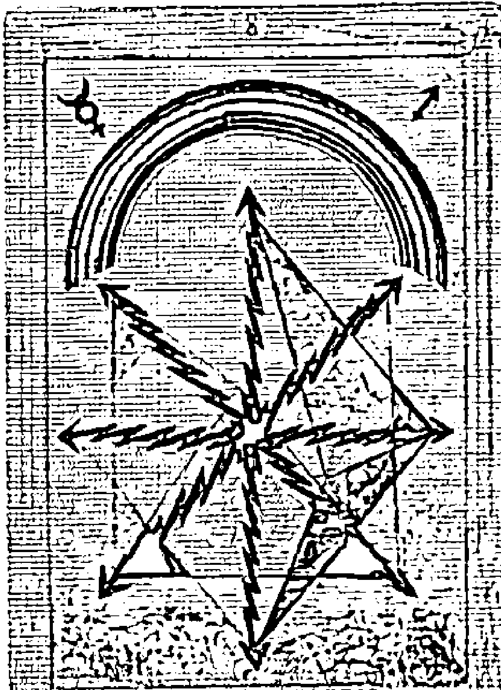

「權杖八」，十一月二十三日～十二月二日。

> 註 1：二十四節氣將黃道劃分為二十四個時間點，每兩個節氣夾了一個星座（二十四節氣屬於陽曆的系統）。

## ～～ 王牌与公主牌的划分 ～～

王牌是元素的能量起点，公主牌则是能量的终点。它们并没有时间上的划分，只有空间上的划分。依照元素的种类，将天球北面划为四个空间象限，依照火、水、风、土的顺序，由牡羊座的起始点开始划分空域，王牌与公主牌坐落于同一片九十度的空域。

## ～～ 宫廷牌的划分 ～～

宫廷牌在去除掉了公主牌后，每个元素剩下了骑士、王后、王子三张牌，正好可以对应于变动星座、创始（基本）星座、固定星座，但是它们并没有刚好位于星座内，而是将自身的三分之二留在对应的星座，三分之一留在上一个星座。举例而言，「圣杯王后」将坐落于水象星座（圣杯）中的创始（基本）星座（王后）巨蟹座中，但是它往前跨越了三分之一，因此它在黄道上的正确位置乃是从双子座二十度到巨蟹座二十度之内，时间点位于六月十一日到七月十一日之间。

## ～～ 数字牌的划分 ～～

去除了王牌后，每个元素的数字牌九张，每三张对应于一个星座，在数字牌上都有画出了对应的星座符号。既然每个星座是黄道上所划分出的三十度区域，那么三张牌对应于一个星座就可以分配给每张牌十度的空间，如此就可以得到对应。举例而言，「圆盘四」是摩羯座三张牌中的第三张（顺序为「圆盘二」、「圆盘三」、「圆盘四」），因此就对应到了摩羯座二十到三十度之间，是一月十日到一月十九日之间。

### 占卜應用的準則

對於時間的占卜必須格外的謹慎，而且在預測的時間或事情發生前，都不適合再做第二次的占卜。因爲這種一翻兩瞪眼的占卜往往會在誤用下漸漸失準，同樣的方法有人可以百發百中，有人卻是完全失誤，這其中的關鍵就在於占卜時的心態。

占卜的心靈狀態決定了占卜的準確品質，古人云：「戲占無益，誠求則靈」、「卦不二卜」的原因就在於此，如果抽牌只是爲了抽到好的牌而多次占卜，無意之間就是在心裏做了一個「我不是想知道真正的結果」的暗示，對於占卜的品質必然會造成影響，而占卜的結果對你而言也就沒有那麼重要了。因此如果你希望在時間占卜能夠不失準，對於這種可以查表知道結果的占卜方式，應該要抱持著謹慎的心態，才可以讓你得到真正的答案。

而在沒有特別指定時間的占卜之中，如果你突然有了靈感，或是對方突然提出想知道關於時間的預測，信手從牌陣當中找出一張牌來作對應，這樣神來一筆的解釋，通常不帶著批判與期望，往往會特別的準確。

## 小阿卡纳与时间对应：

| 星座 | 宫廷牌 | 数字牌 | 所对应的黄道位置 | 所对应的日期 |
|------|--------|--------|------------------|--------------|
| 牡羊座 | 権杖王后 | 権杖二 | 牡羊座0～10度 | 3/21～3/30 |
|  | （接续上） | 権杖三 | 牡羊座10～20度 | 3/31～4/10 |
|  | 圓盤王子 | 権杖四 | 牡羊座20～30度 | 4/11～4/20 |
| 金牛座 |  | 圓盤五 | 金牛座0～10度 | 4/21～4/30 |
|  |  | 圓盤六 | 金牛座10～20度 | 5/1～5/10 |
|  | 寶劍騎士 | 圓盤七 | 金牛座20～30度 | 5/11～5/20 |
| 雙子座 |  | 寶劍八 | 雙子座0～10度 | 5/21～5/31 |
|  |  | 寶劍九 | 雙子座10～20度 | 6/1～6/10 |
|  | 聖杯王后 | 寶劍十 | 雙子座20～30度 | 6/11～6/20 |
| 巨蟹座 |  | 聖杯二 | 巨蟹座0～10度 | 6/21～7/1 |
|  |  | 聖杯三 | 巨蟹座10～20度 | 7/2～7/11 |
|  | 権杖王子 | 聖杯四 | 巨蟹座20～30度 | 7/12～7/21 |
| 獅子座 |  | 権杖五 | 獅子座0～10度 | 7/21～8/1 |
|  |  | 権杖六 | 獅子座10～20度 | 8/2～8/11 |
|  | 圓盤騎士 | 権杖七 | 獅子座20～30度 | 8/12～8/22 |
| 處女座 |  | 圓盤八 | 處女座0～10度 | 8/23～9/1 |
|  |  | 圓盤九 | 處女座10～20度 | 9/2～9/11 |
|  | 寶劍王后 | 圓盤十 | 處女座20～30度 | 9/12～9/22 |
| 天秤座 |  | 寶劍二 | 天秤座0～10度 | 9/23～10/2 |
|  |  | 寶劍三 | 天秤座10～20度 | 10/3～10/12 |
|  | 聖杯王子 | 寶劍四 | 天秤座20～30度 | 10/13～10/22 |
| 天蠍座 |  | 聖杯五 | 天蠍座0～10度 | 10/23～11/1 |
|  |  | 聖杯六 | 天蠍座10～20度 | 11/2～11/12 |
|  | 権杖騎士 | 聖杯七 | 天蠍座20～30度 | 11/13～11/22 |
| 射手座 |  | 権杖八 | 射手座0～10度 | 11/23～12/2 |
|  |  | 権杖九 | 射手座10～20度 | 12/3～12/12 |
|  | 圓盤王后 | 権杖十 | 射手座20～30度 | 12/13～12/21 |
| 摩羯座 |  | 圓盤二 | 摩羯座0～10度 | 12/22～12/30 |
|  | 宝剑王子 | 圆盘四 | 摩羯座20～30度 | 1/10～1/19 |
| 宝瓶座 |  | 宝剑五 | 宝瓶座0～10度 | 1/20～1/29 |
|  |  | 宝剑六 | 宝瓶座10～20度 | 1/30～2/8 |
|  | 圣杯骑士 | 宝剑七 | 宝瓶座20～30度 | 2/9～2/18 |
| 双鱼座 |  | 圣杯八 | 双鱼座0～10度 | 2/19～2/28 |
|  |  | 圣杯九 | 双鱼座10～20度 | 3/1～3/10 |
|  | 权杖王后 | 圣杯十 | 双鱼座20～30度 | 3/11～3/20 |# 色彩對應準則

在西洋神祕學當中，色彩是比較少被討論的一環，但是到了近年卻逐漸的興起，進而有許多關於顏色對應的系統出現。然而在克勞利設計托特塔羅牌的那個時代，色彩學的理論是建立在喀巴拉生命之樹與煉金術的理論當中，因此如果要瞭解托特塔羅牌的配色意義，往往會遇到一些困難，因為喀巴拉生命之樹與煉金術的色彩理論與現在流行以中脈七輪為主的色彩學有一個斷層，我們比較難以用直覺與想像去單純地解釋托特塔羅牌的意涵。

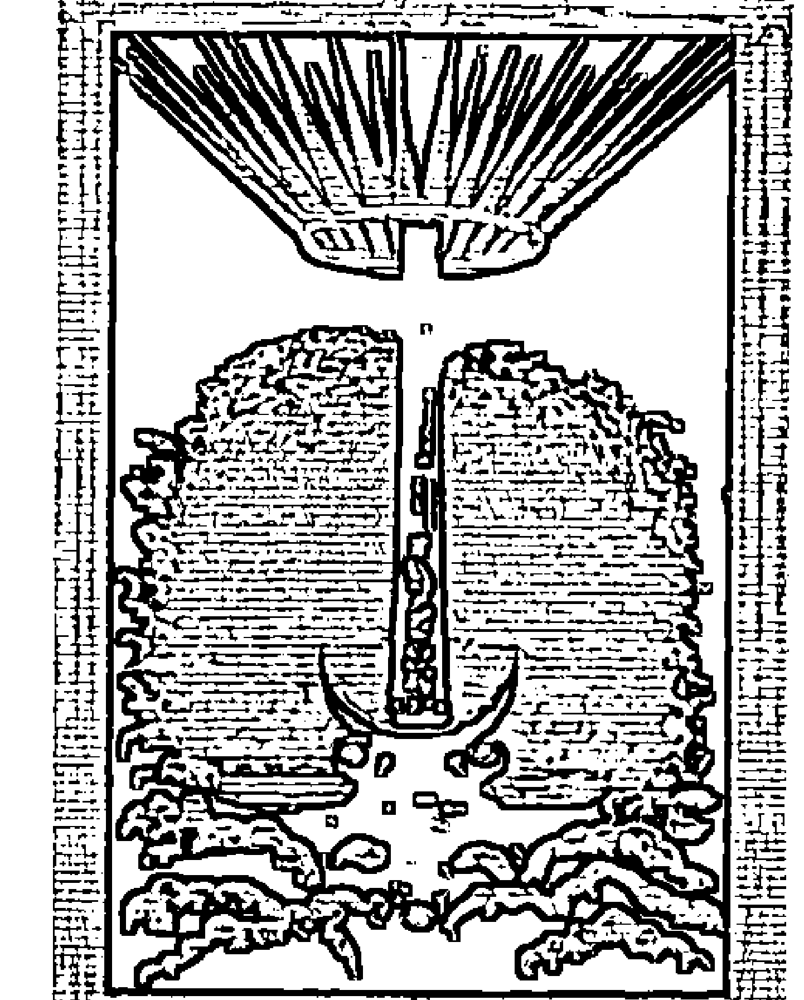

像「寶劍王牌」背後的黃色，我們可以解釋為即將要升起的太陽，但是黃色的真正意思乃是生命之樹中代表風元素的成形之界所對應的顏色。

又如，「寶劍四」背景的藍色，所代表的乃是木星在生命之樹第四薩弗拉「仁慈」的呈色。

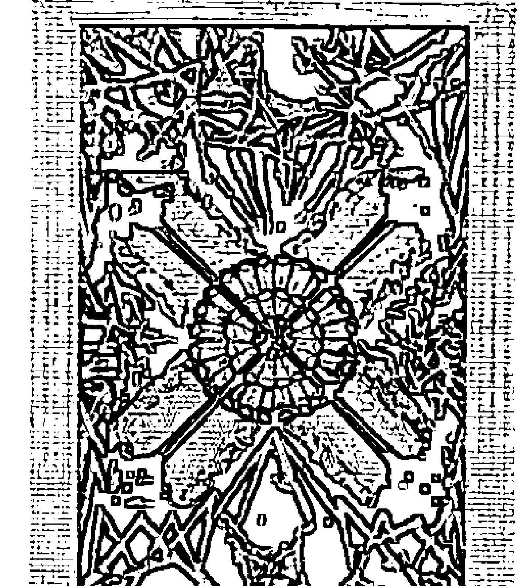

托特塔羅牌絕大部分的顏色都是參照著喀巴拉生命之樹中的闡述，每一個薩弗拉在每一個元素當中都有它們對應的色彩，在每一張牌內大多被非常中規中矩的採用。筆者並不打算一一的列出所有的喀巴拉顏色對應，而是將較為重要的色彩解釋散落於第二章的介紹，以及本章〈十薩弗拉與小阿卡納牌對應〉一文中。

## 關於《易經》的簡介

在《易經》的原始符號學之中，最初的符號是陰與陽兩種符號的存在，代表的是自然界中的兩種對立關係，稱為兩儀。通常來講，陰性代表的特質大約是如此：女性、柔弱的、低下的、退守的、消極的、和悅的、情感性的；而陽性的特質則與陰性相對，常見的特質連結是：男性、剛強的、高舉的、前進的、積極的、暴烈的、決斷性的。而以符號來標記時，常以右圖兩種符號來分別。

由於陰陽有時間性與能量強弱的差異，因此可以再分為少陰、老陰、少陽、老陽四種特性，合稱四象。

少陰者，陰氣自陽中甫生，陰氣雖弱，但已然成形；老陰者，陰氣強盛到了極致，即將轉弱；少陽者，陽氣從陰中轉化，陽氣不強，但逐漸轉盛；老陽者，陽氣剛猛而欲行衰微。一般而言，《易經》經常常用六、七、八、九四個數字來代表四象，其對應如下：

- 六：老陰
- 七：少陽
- 八：少陰
- 九：老陽

為何有此種對應？可以以兩個方向去想。首先，奇數者代表陽性（奇數不成對，有突出之感，是陽性特質），偶數者代表陰性（偶數成對，因此能平分，有平和之感，是陰性特質）。至於為何六為老陰，而九為老陽？則是因為陰性有退守消極之意，陽性有積極增加之意，所以四數中最小的陰數為六，即為老陰，最大的陽數為九，是為老陽。托特塔羅牌中，經常與易卦中某些卦的特定爻有所對應，因此經常可以看見：六三、九五、初六、上九等等名詞。其中數字的六與九是代表該爻的陰陽屬性。但為何不用少陰少陽？因為通常卜卦如果不單看卦意，而要用爻來論斷時，則代表用爻的可變性來參照論斷，要使爻能夠可變，則代表該爻能量相當強盛，而有轉換的跡象，因此會以老陰六與老陽九來代表。

至於初、二、三、四、五、上等字詞，則是象徵該爻在一個卦中的位置在哪裡。

# 以《易經》中的水火既濟卦來舉例：

六爻中形成的結構，由下而上分別將六個爻稱為：初、二、三、四、五、上，因此初爻是卦中最下方的爻，而上爻是最上方的爻。

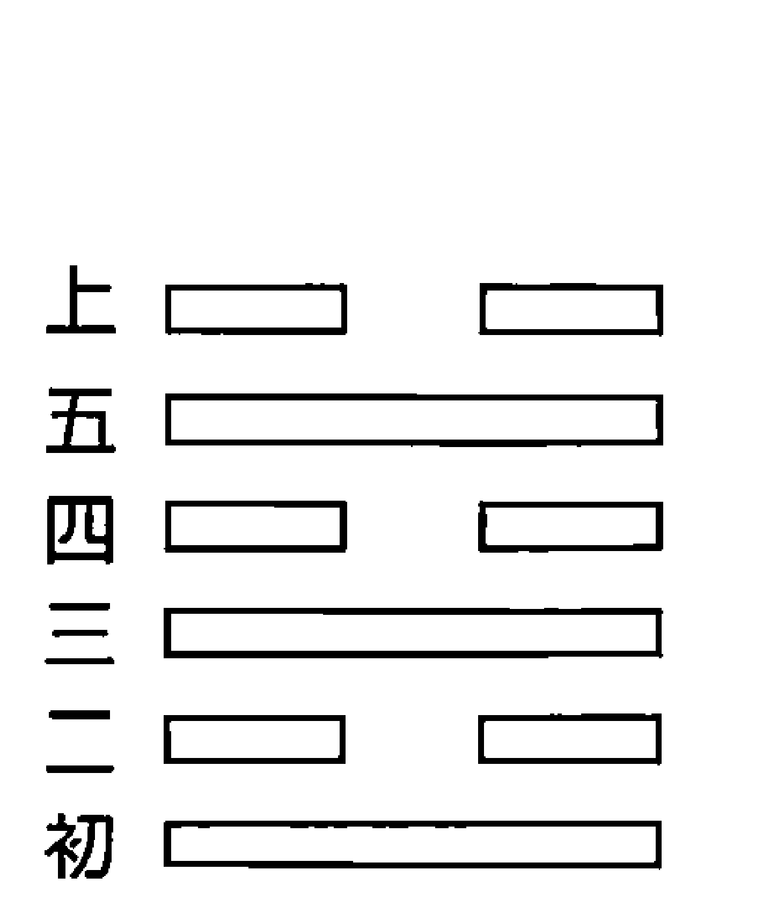

既濟卦中的初、三、五屬陽，二、四、上屬陰，而當我們為一個爻命名時，除了初爻與上爻外，其餘爻都是先講陰陽屬性，再講位置；而初爻與上爻則是先講位置再講陰陽屬性。因此既濟卦中六個爻由下往上的命名分別是：初九、六二、九三、六四、九五、上六。其餘各卦也依此類推。

而每三爻會組成一個卦，最初起源的兩個卦是純粹陽性的乾卦與純粹陰性的坤卦。

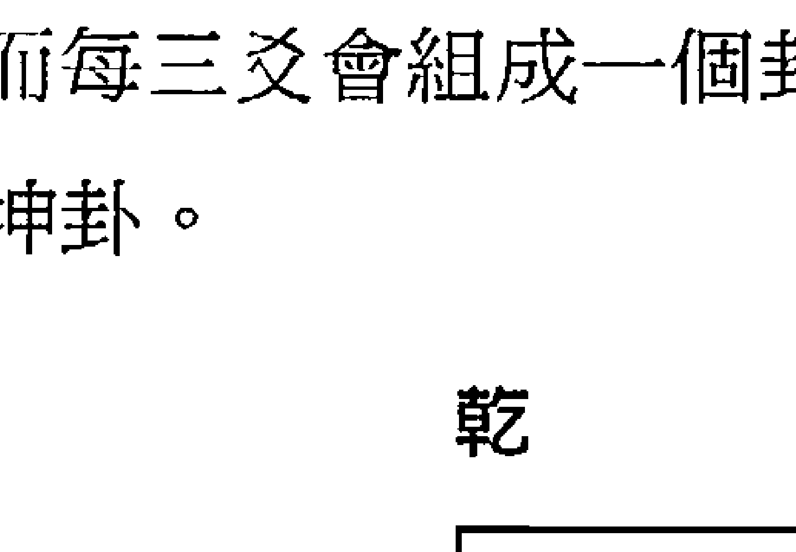

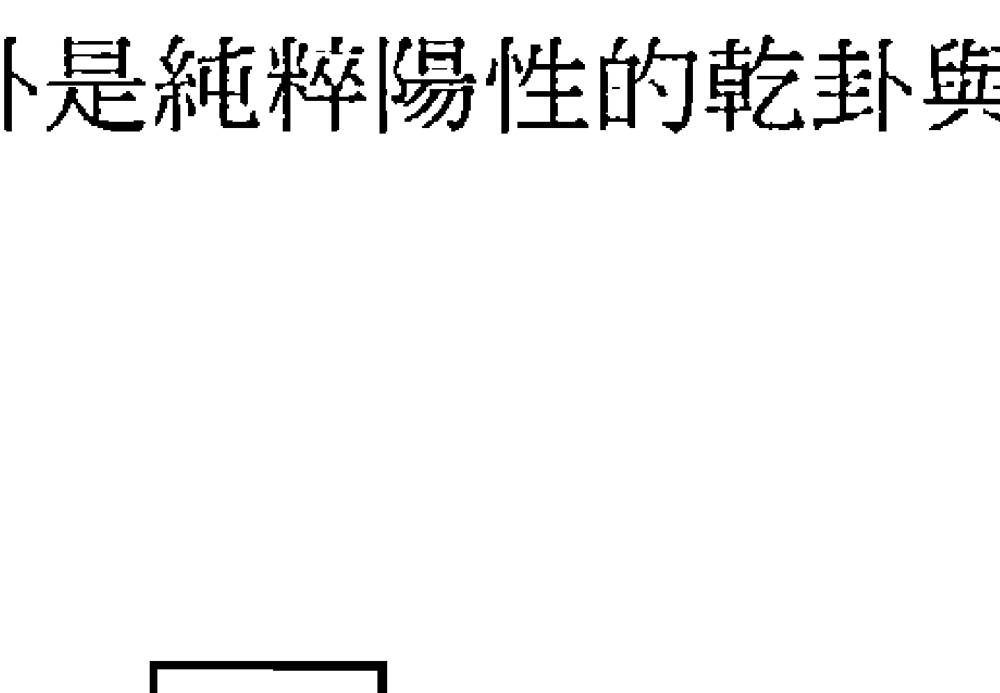

此二卦在《易經》中代表的自然現象是天空與大地，也是萬物起源的父母。父母經過三次交合產生了三批子代，分別是：

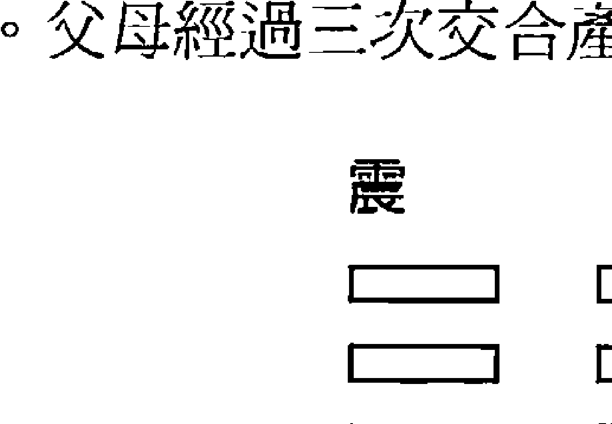

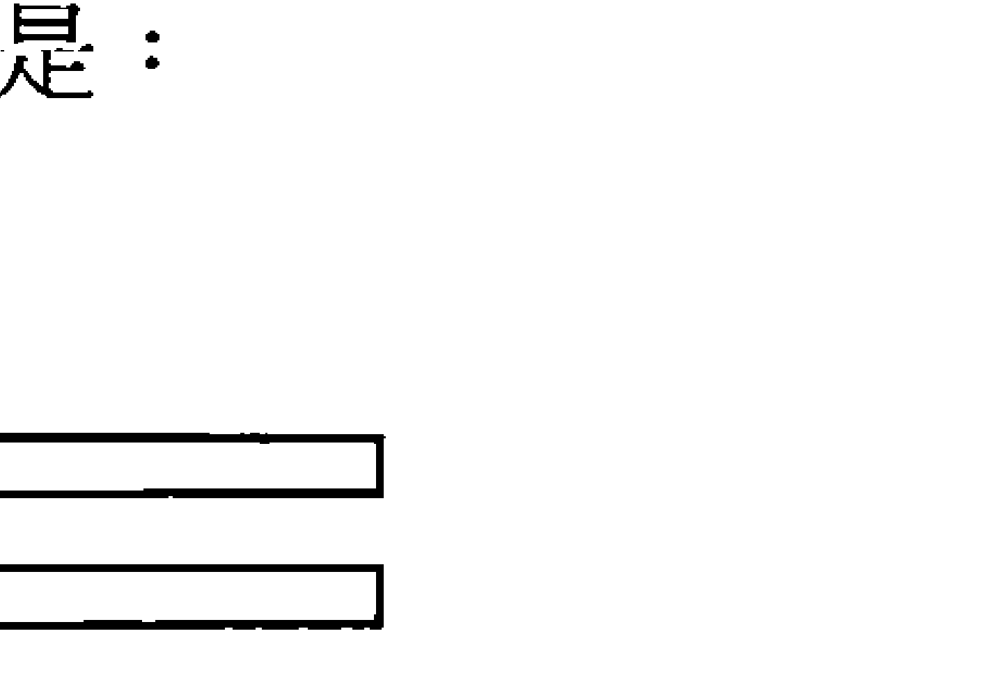

此兩卦爲長男（震）與長女（巽）。自然現象是雷（震）與風（巽）。

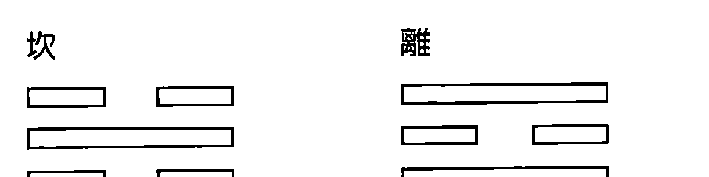

此兩卦爲中男（坎）與中女（離）。自然現象是水（坎）與火（離）。

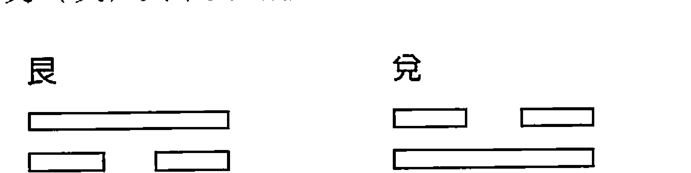

此兩卦爲少男（艮）與少女（兌）。自然現象是山（艮）與沼澤（兌）。

觀察子代六個卦可以發現，震、坎、艮三個卦分別繼承了來自父親（乾卦）的陽爻，因此被視爲陽性卦；而巽、離、兌三卦則繼承了母親（坤卦）的陰爻，因此被視爲陰性卦，而震、巽二卦繼承父母親（乾卦與坤卦）的象徵性爻都在初爻，因此爲長男和長女，其餘四卦亦可類推。

產生了八卦之後，再彼此八八六十四的交錯縱橫之後，又產生了所謂的《易經》六十四卦，而這六十四卦便是我們生活中在論斷與占卜時所使用的基礎，《周易》一書分爲上、下兩經，分別將六十四卦的名稱與排列順序排列出來，詳細如下：

¹乾 ²坤 ³屯 ⁴蒙 ⁵需 ⁶訟 ⁷師，⁸比 ⁹小畜兮 ¹⁰履 ¹¹泰 ¹²否。

¹³同人 ¹⁴大有 ¹⁵謙 ¹⁶豫 ¹⁷隨，¹⁸蠱 ¹⁹臨 ²⁰觀兮 ²¹噬嗑 ²²賁。

²³剝 ²⁴復 ²⁵无妄 ²⁶大畜 ²⁷頤，²⁸大過 ²⁹坎 ³⁰離三十備。

31咸 32恒 33遯兮及 34大壯，35晉與 36明夷 37家人 38睽。

39蹇 40解 41損 42益 43夬 44姤 45萃，46升 47困 48井 49革 50鼎 51震繹。

52艮 53漸 54歸妹 55豐 56旅 57巽，58兌 59渙 60節兮 61中孚至。

62小過 63既濟兼 64未濟，是為下經三十四。

（此六十四卦卦序，被稱為《周易》〈六十四卦卦序歌〉。）

## 喀巴拉與生命之樹

喀巴拉（Kabbalah，Kabala，Qabalah），又稱爲卡巴拉，源自於猶太民族，是一種祕傳的哲學，是一個對於世界的建構、神性的本質論述的思想體系。經過多代的傳承後，喀巴拉逐漸的演變爲靈性修練的途徑之一，其中的生命之樹論也與其他文化融合後，形成了一種純然的神祕學理論。

喀巴拉的修行目的是爲了放下塵世的束縛，使人能夠駕馭自己的心靈，超脫於物質世界，讓屬於精神層次的靈魂獲得解脫。並且將回歸神性所獲得的啓發帶入人間，用超脫的觀點來過人間的生活。

喀巴拉所追求的終點，存在於每的人的心中，是每個靈魂具有的原始渴望，因此它往往卸下了一些宗教的氣息，雖然發源於猶太教，卻是透過每個渴望解脫的靈魂將它發揚推廣。那是一種生活的態度，一種思考上的理解，一種可以與宗教脫鉤的哲學。

喀巴拉是一門龐大的知識，它的分量與等級類似於東方的《易經》，需要經過許多的努力才能一窺其中的一二。喀巴拉中最廣爲人知的部分，就是生命之樹的闡述。

生命之樹由十顆薩弗拉（Sephira，Sephiroth爲其複數形式）的發散體所組成，代表著十種不同能量特質的容器。從上而下如同閃電般的路徑，是創造之光的流動路徑，代表從最初的空無中誕生的意念，經過層層薩弗拉作用下凝結成意識，最後化為物質。生命之樹是說明世界起源的一種哲學，說明了造物者（神性、內我）創世的過程（內我向外投射成為了物質世界），而反向朝上的路徑則是透過修練接觸到神性的內我探尋之路。生命之樹是世界，乃至于造物者的縮影。

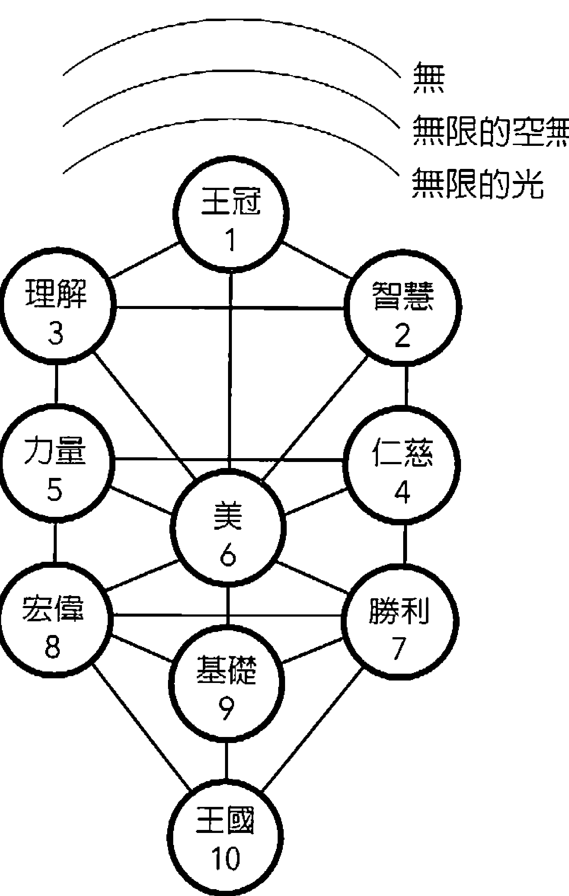

生命之樹與創造之光的路徑。

### 生命之樹上的空無

在生命之樹中，從下層的薩弗拉越往上邁進，就越抽離物質層面。最下方的薩弗拉代表著我們看到的物質世界，中央的薩弗拉則是代表我們的思考面、理性面，是我們可以察覺到的心靈，再往上則是我們的潛意識與神性（超意識）的部分，是我們無法清楚掌握的心靈世界，最上層是回到了最初的創造之源，是我們所無法認知、無法用言語表明的一個階段。在第一個薩弗拉「王冠」的上方還有三層簾幕所覆蓋，分別是無（Ain）、無限的空無（Ain Soph）、無限的光（Ain Soph Aur），分別代表了空無之內所蘊藏空無以外的空無。

如果說世界誕生於虛空，那麼在虛空之前的「非虛空」與非「非虛空」就是這三層簾幕的意涵，如果我們以自我的觀點去觀察，必須經過了三階段的否定，才可以知道那真正的虛無的意涵。

# 四棵生命之树与原生四元素（Primal Elements）

完整的生命之树中，其实包含了四棵不同元素的生命之树，在介绍每一个萨弗拉之前，我们先来瞭解各个元素所形成的世界。

#### 火元素：原型之界（Atziluth）

想像一下，在你有意识之前，一个诞生之前你所在的地方，一个无法去感觉，甚至连感觉都不存在的地方，即是原型之界。前三颗萨弗拉组成了天界三角，在这之内的三个萨弗拉是初始的能量体，代表无极（第一萨弗拉）、陽（第二薩弗拉）與陰（第三薩弗拉），初始的力量運作後才繼續往下沈降。它代表了我們心靈之內貼近神性與萬物冥合的部分，不具有任何的物質特性，因此以沒有物質層面存有的火作爲象徵。在托特塔羅牌內，權杖牌組分別分布於原型之界內的每一個薩弗拉中。

天界三角之下，是通往潛意識的本質面與超意識（內我）層面的世界。而創造之光從第三薩弗拉「理解」而下，到下一個薩弗拉「仁慈」，必須穿過深淵²才得以到達。

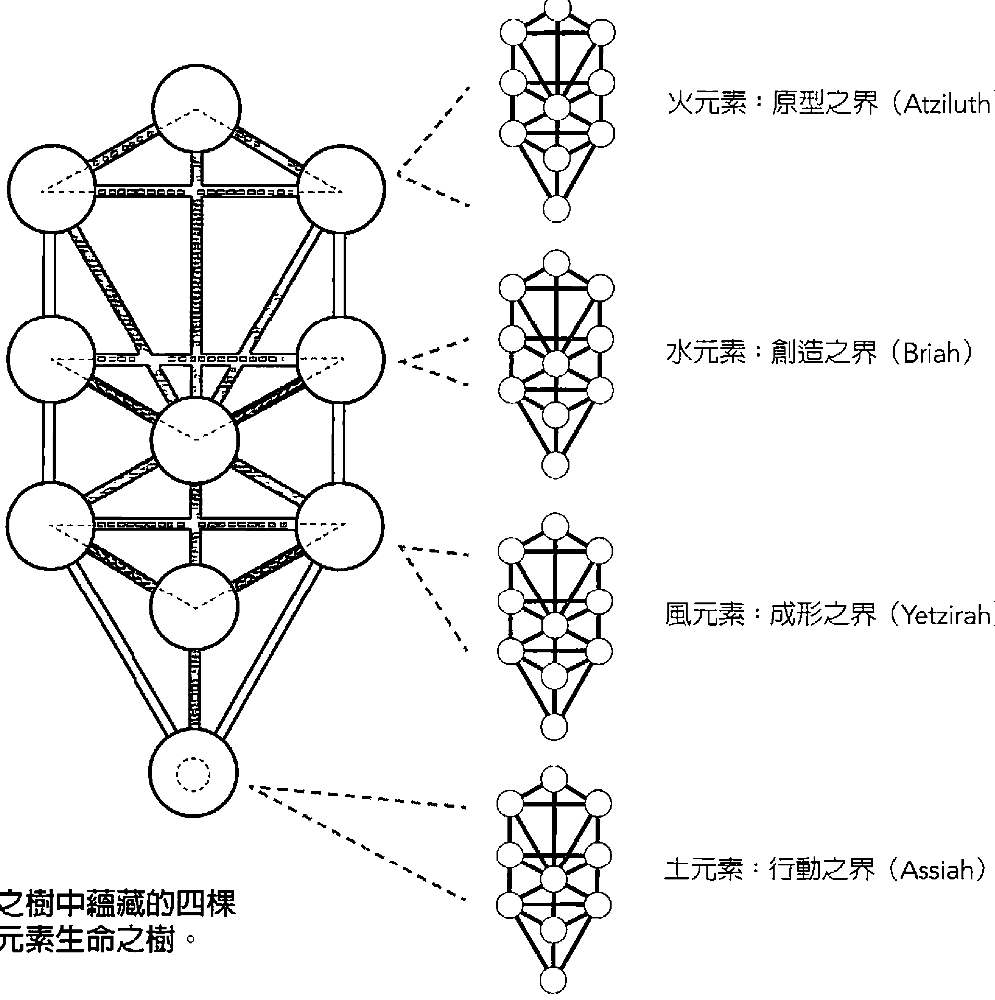

生命之树中蕴藏的四棵不同元素生命之树。

#### 水元素：創造之界（Briah）

創造之界像是常常從心靈深處浮現出來的感覺、想法與靈感。由第四、五、六薩弗拉組成的三角內包含了屬於水元素的創造之界，創造之界內存在著心靈當中被壓抑的潛意識本質，以及較爲貼近神性、高我的超意識部分。創造之界位於天界三角之下，創造之光穿過了深淵，拋棄了部分的靈性之後，成爲了我們可以稍微觀察到、可以稍微探尋的創造之界。雖然它不像原型之界那樣深不可測，無法感受，卻也不是我們隨隨便便就可以接觸到的層面。創造之界有點類似於靈感，有點類似於那種從內心油然升起的感受，經過鍛鍊的心靈，將可以在平靜之中一覽創造之界的奧祕，一覽那智慧的資料庫。

在小阿卡納中，對應給了聖杯牌組的每一張牌，分布於創造之界生命之樹中的薩弗拉之上。

#### 風元素：成形之界（Yetzirah）

由七、八、九薩弗拉所組成的三角，對應給了風元素的成形之界。在成形之界中，來自創造之界中的內我、潛意識本質面、高我的意識凝結成了我們可以操控理解的思想，是一種理性展現的世界。成形之界屬於我們所可以支配的層面之一，它如同想法、思辨，以及我們所感受到的情緒，是一個可以透過大腦來運作與感受的世界。人類心靈的顯意識部分，就是成形之界具體化的其中一部分。成形之界也包含了神秘學的知識，以及對於更高意識的描述。

在小阿卡納中，對應給了寶劍牌組，每一張牌分別對應給了成形之界中的薩弗拉。

#### 土元素：物質之界（Assiah）

物質之界是唯一以單一個薩弗拉獨立存在的層面，它與其他的元素之間存在著一條鴻溝。這是我們所認識到的物質世界，舉凡所看到的、所聽到的、所碰觸到的任何事物，都是屬於物質之界。這也是從全我合一的狀態所劃分出來，體驗片段經驗的獨立靈魂，因為處在了物質之界，我們才得以存在於這人間。物質之界是意識凝結過後的產物，不論是桌椅、高樓、文化、文明……，都是先以概念的形式存在於腦海，再展現出真真實實的物質。簡而言之，物質之界代表了現實的世界，屬於物質層面的世界。

圓盤牌組則是位於以土元素為代表的物質之界中。

> 註 2：Abyss：深淵，天界三角下區隔純粹創始能量與靈性、意識、物質的一條鴻溝，穿過深淵到沉降的靈魂，必須拋棄部分的靈性。

### 三柱

#### ◎嚴厲之柱（Pillar of Severity）

左方的三、五、八薩弗拉構成了嚴厲之柱，這三個薩弗拉都具有較為冷酷、靜態、破壞力的特性，因此稱為嚴厲之柱。在第三個薩弗拉「理解」的統御下，嚴厲之柱本身屬於陰性的能量。陰性代表遭受破壞、削弱之本體。

#### ◎仁慈之柱（Pillar of Mercy）

左方的二、四、七薩弗拉構成了仁慈之柱，它們都具有較正面的特質，創造之光在這些薩弗拉之內轉變為更強大的能量，並且直接往陰暗的嚴厲之柱照射，因此稱為仁慈之柱，本身屬於陽性的能量。

#### ◎平衡之柱（Pillar of Mildness）

中央第一、六、九、十薩弗拉構成了平衡之柱，它們位於中央，又稱為中柱，平衡了兩端薩弗拉的能量，並且將創造之光轉變為陰陽並存的能量向下傳遞。

嚴厲之柱 平衡之柱 仁慈之柱

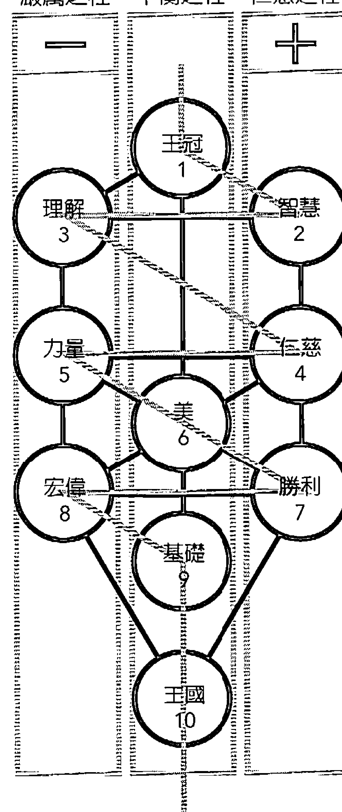

### 四元素在生命之樹的分布

在生命之樹當中，以猶太教中上帝之名的四個字母作爲四大元素的對應，爲「יהוה」（希伯來文，右往左讀），第一個字母 י 代表著上帝的創造之指，《創世紀》中，上帝說：「要有光！」便有了光。（Then God said，“Let there be light！” and there was light.）因此對應給了火元素。之後依序而下，第二個字母對應給了水元素，第三字母 ה 對應給了風元素，最後的第四個字母 ה 對應給了土元素。

在生命之樹中廣泛的借用四元素的概念，而每個概念往往互相獨立，無法混爲一談，因此在應用上，我們必須釐清生命之樹中的每一種意義之下的四元素。

#### ◎原生元素（Primal Elements）

原生元素是生命之樹中所劃分出以四大元素作爲代表的原型之界、創造之界、成形之界、物質之界。對於四棵生命之樹內元素的描述稱之爲原生元素。

#### ◎創始元素（Primordial Element）

創始元素位於第一個薩弗拉「王冠」中，王冠是最初的起點，象徵著創造之光的種子，內部包含著所有的一切，而後分離成陰、陽，再分離成萬物。因此在第一個薩弗拉中即包含了火、水、風、土四大元素，存在於其中的四大元素稱爲創始元素。

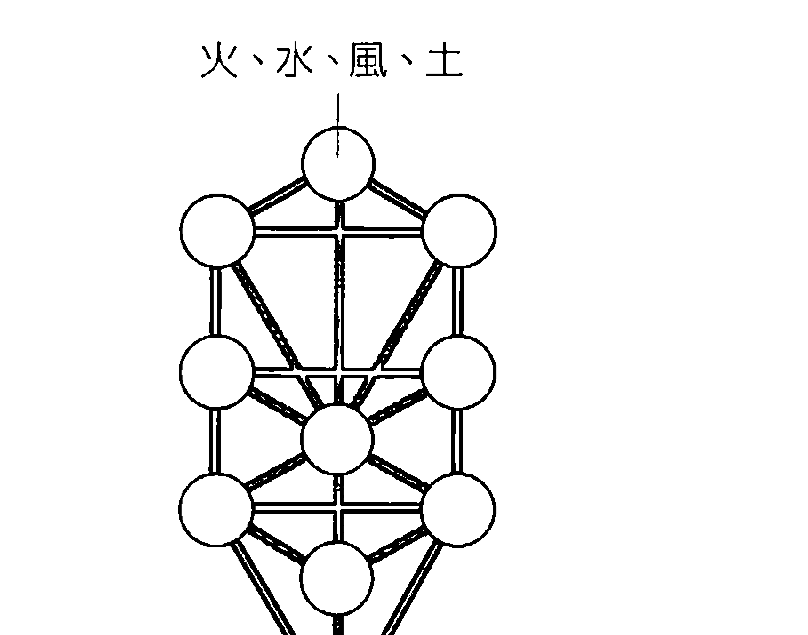

創始元素
(Primordial Element)

#### ◎基底元素（Base Element）

基底元素是相對於創始元素的概念，存在於第十個薩弗拉「王國」。第十個薩弗拉是創造之光的終點，創造之光凝結成了物質，包含著經過所有薩弗拉歷練的過程，也是四大元素最後的匯流之處，因此存在於第十薩弗拉的四大元素，稱為基底元素。

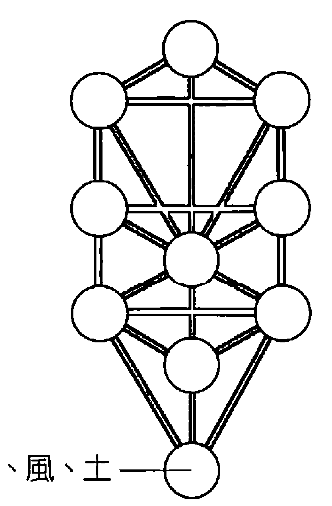

基底元素 (Base Element)

#### 過渡元素（Transitional Elements）

過渡元素不存在於薩弗拉之內，它存在於薩弗拉相連的路徑之中。分別以三個希伯來文字母א、ה、ו作爲風、水、火元素的對應，這三個元素在分別屬於大牌中的「愚人」、「吊人」、「新紀元」。因此對於這三條路徑，或是對於這三張牌的元素描述稱為過渡元素。

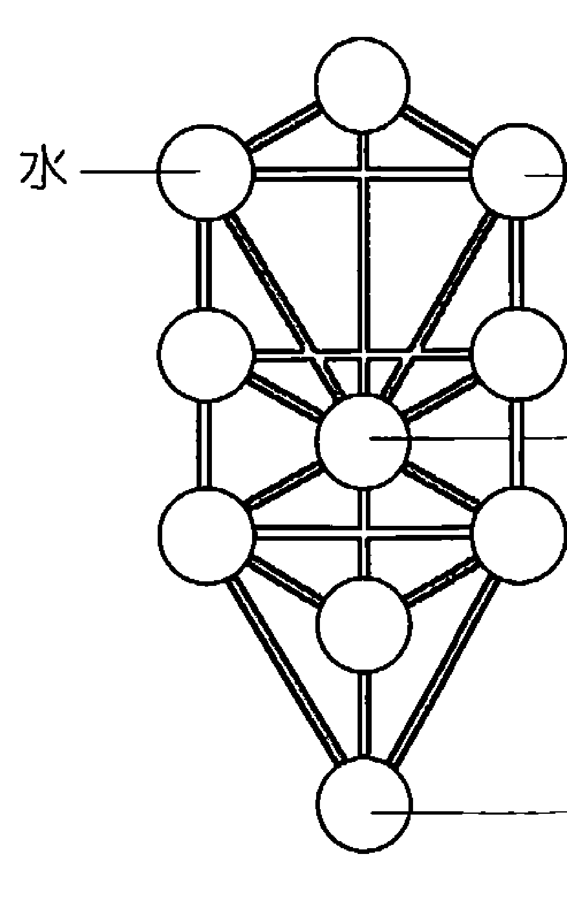

指定元素 (Specific Elements)

#### 指定元素（Specific Elements）

指定元素是以代表陽性的第二薩弗拉與陰性的第三薩弗拉作爲火與水的對應，並且以中央的第六薩弗拉作爲風元素的對應，第十薩弗拉作爲土元素的對應。在托特塔羅牌中，這樣的對應位置屬於宮廷牌內騎士、王后、王子、公主。因此描述宮廷牌屬性的四元素稱之爲指定元素。

創始元素、基底元素、過渡元素、指定元素意義下的四元素。

### 占星學在生命之樹內的對應

傳統的生命之樹在結合了西洋占星的理論後，根據每一個薩弗拉的特性，依序將占星中的七大星體置於其中。第六薩弗拉「美」爲生命之樹的中心點，它位於意識的與兩極的平衡點，象徵著圍繞其轉動的太陽，因此以占星學中的太陽作爲第六薩弗拉的對應。在其周圍分別圍繞著六顆星體。如圖所示：

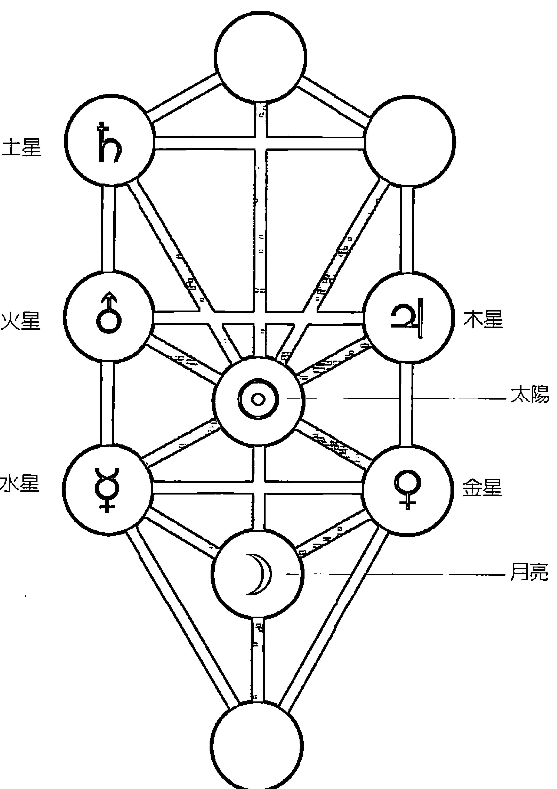

### 十薩弗拉與小阿卡納牌對應

#### 第一薩弗拉「王冠」（Kether）

生命之樹其上有三層不可知的世界，從其中分化出來的第一個能量中心爲「王冠」，是生命之樹中的第一個薩弗拉。「王冠」從虛無中誕生，散出純白的光輝，作爲第一個起源，它無法被賦予定義、描寫，也難以知曉。因爲它的本質就是存在，除它之外沒有一切的意義。它是所有能量起源，是之後發展出其他薩弗拉的能量來源。

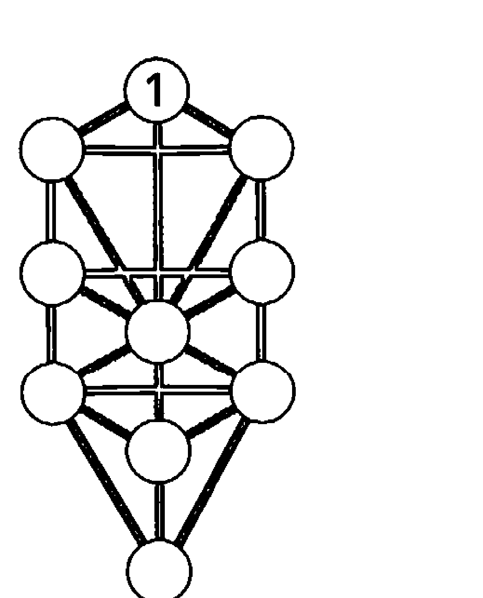

以「王冠」作爲薩弗拉之名，意味著頭頂上存在的光輝。如果說行爲是大腦思考後的表現，那麼涵蓋到整個思考之內的精神本體，之上的最本源就是「王冠」。在此薩弗拉中，所有的一切都是它的縮影。它也是意識、思想背後的靈性指引的來源。

「一切即一，一即一切」的觀念存在於許多宗教與神祕學傳承中，是關於我們所見的一切，所感知到一切背後本質的描述。「王冠」點出了這種思維。王冠所對應的數字「一」，除了是第一個薩弗拉外，也同時擁有「一」在靈性上的意義。

##### 在各元素中的呈色

- 原型之界：耀眼的白光
- 創造之界：白光
- 成形之界：白光
- 物質之界：帶有金點的白色

##### 與小阿卡納的對應

對應到小阿卡納中的是四張王牌。

王冠具有四種創始元素，分別以上帝之名的四個希伯來文字母為代表。在所有的王牌中，分別代表火、水、風、土四種元素能量的起點。王牌是這些元素的能量種子，它包含了之後所誕生出的其他九個薩弗拉特質。

##### ◎權杖王牌——火元素的種子（י）

「權杖王牌」為存在於原型之界生命之樹的「王冠」，而原型之界是喀巴拉中第一個出現的、最高層次的世界，牌中迸發出的火焰勾勒出希伯來文字母 י，暗示著「權杖王牌」屬於原型之界的生命之樹。「權杖王牌」代表了最初時的開端，純淨的靈魂。牌中聳立在正中央的權杖放出火焰與閃光，並以生命之樹薩弗拉的排列表示最初力量的展現，以及神聖創造力量的依存。

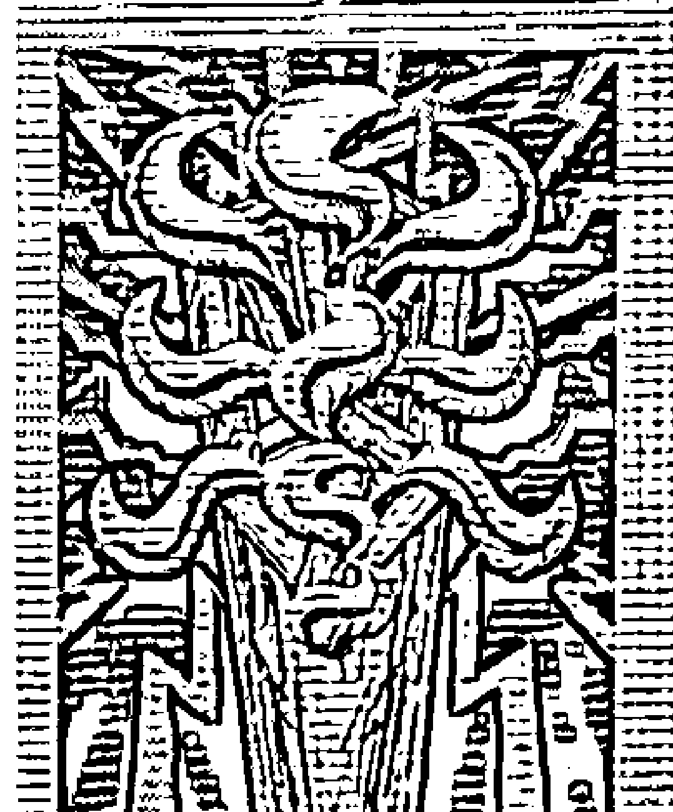

##### ◎聖杯王牌——水元素的種子（ה）

「聖杯王牌」為存在於創造之界生命之樹中的「王冠」，代表心靈力量作用的展現。同時在水元素的創造之界，也有陰性力量展現的意涵。

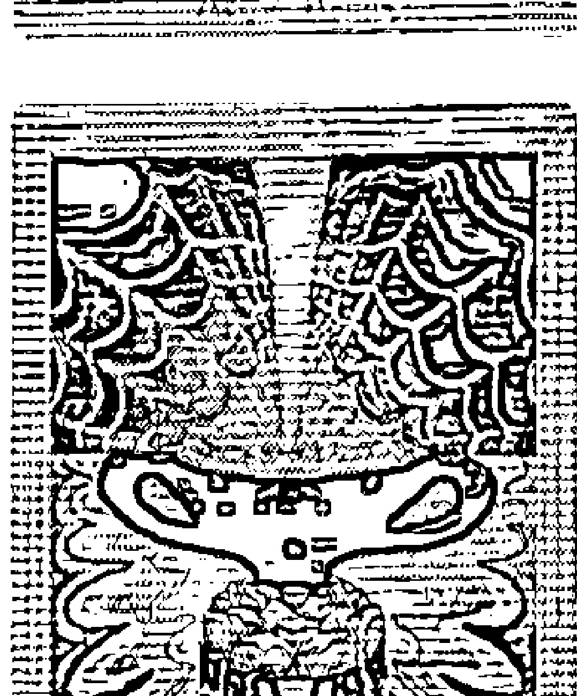

##### ◎寶劍王牌——風元素的種子（א）

「寶劍王牌」為存在於成形之界生命之樹中的「王冠」。成形之界是思想意識開始出現與活動的層次，亦是沒有形體的意識體活動的層次。而「王冠」出現在成形之界，可以看作是想法流通、意識思維開始形成的狀態。意志可以透過行為延伸，它具有為善與為惡的潛力，就如同寶劍一般，可以化作正義的代表，也可以成為邪惡的力量。

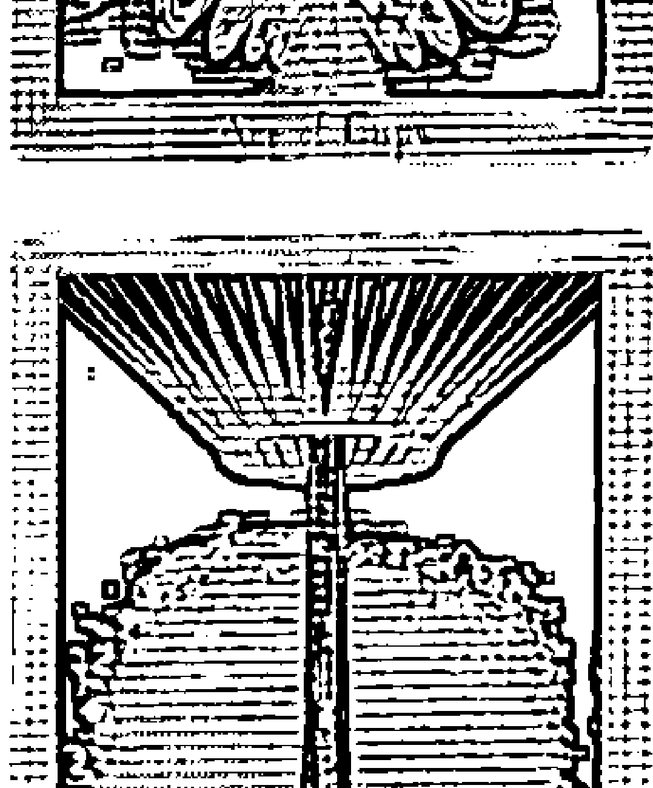

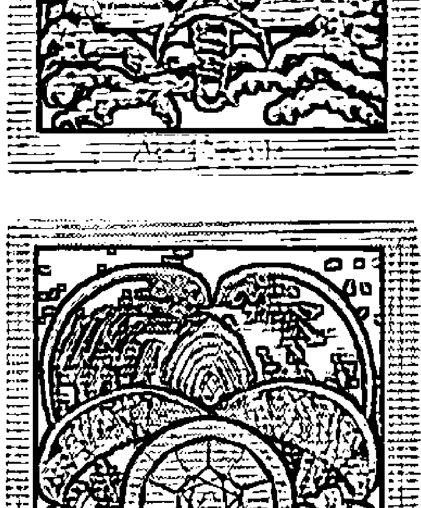

四張王牌## ⊕圓盤王牌——土元素的種子（π）

「圓盤王牌」為存在於物質之界生命之樹中的「王冠」。物質之界是屬於物質的世界，也是我們現在所感知到的世界。牌中央的祕數，除了是克勞利自我的代表外，也是大地女神的象徵，代表我們所感知的世界各種生命力的開始。

## ∞ 第二薩弗拉「智慧」（Chokmah）∞

Chokmah是生命之樹中的第二個薩弗拉，在希伯來文中是智慧之意。到了第二與第三個薩弗拉，從原本「一切即一，一即一切」的「王冠」，化為了陰陽二元對立的開始。有如《易經》中的陽與陰，而「智慧」本身是阳性力量的展現。

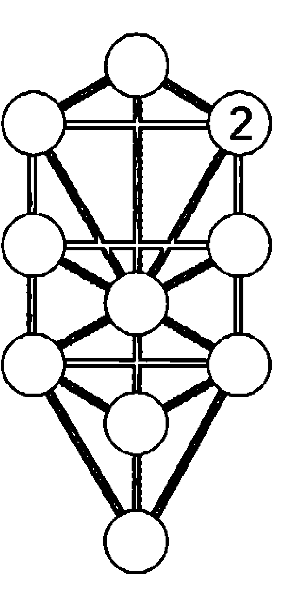

「智慧」是種向外發散創造的力量，傳統的文獻中稱之為偉大的父親，它發散的能量則是由下一個作為陰性代表的薩弗拉「理解」所接收。它與「王冠」的不同在於「王冠」的本質除存在外，不具有其他的意義，而「智慧」則是有神聖創造的意涵，是智慧本質的展現。另外「智慧」也是仁慈之柱的第一個薩弗拉，以指定元素同時對應於四個象徵上帝的字母之一的，之火元素，是上帝的創造之指。

##### 在各元素中的呈色

- 原型之界：輕柔的藍色
- 創造之界：灰色
- 成形之界：珍珠灰
- 物質之界：帶有紅、黃、藍點的白色

##### 與小阿卡納的對應

在塔羅牌中對應到小阿卡納四張二號牌，以及宮廷牌組中的騎士牌。

##### 權杖二——統御（Dominion）

「權杖二」是「智慧」在原型之界的生命之樹中。陽性的「智慧」在屬於火元素的原型之界中發展，牌中以火星在牡羊與金剛礫作爲陽性能量的象徵。在這張牌中，火的力量得以完全的發揮，並且以一定的方式維持平衡。

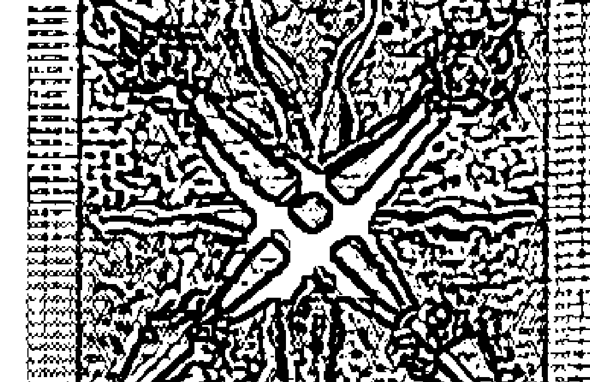

##### 聖杯二——愛（Love）

「聖杯二」是「智慧」在創造之界的生命之樹中。這張牌的牌名「愛」，意味著在心靈世界創造之界中陽性的能量展現。如同緊張、期待、擔憂……，都是內在情緒的感受，而二的意涵是其中較爲開創性、初始性的部分。這張牌中的魚、巨蟹等具有水元素的象徵圖案帶來了各種情緒、幻想、期待等較爲情緒的感受。它是由創造之界中從「王冠」分離出來的第一個能量，也就是《律法之書》內的意志，是泰勒瑪的中心意義。《律法之書》第一章第五十七句：「愛即律法，意志下的愛。」其中所謂的愛，即是「權杖二」中推動愛的意志本源。

>> 愛即律法，意志下的愛。

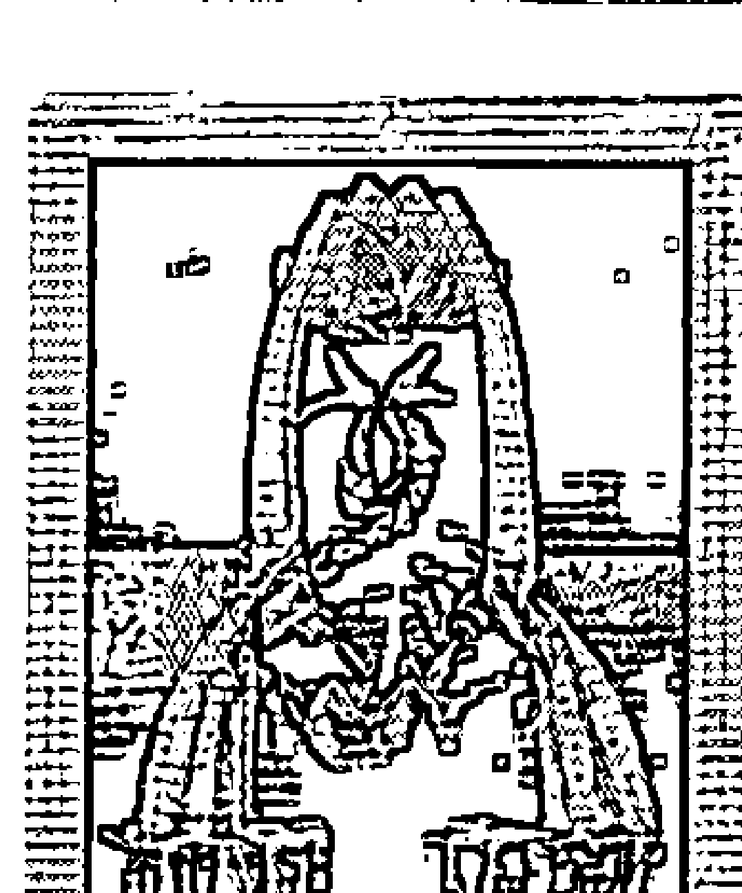

##### 寶劍二——寧靜（Peace）

「寶劍二」是「智慧」在成形之界的生命之樹中。寶劍原本具破壞性，並且帶有一點負面的意涵，但在這張牌中，透過「智慧」的牽制下，達到一種平靜、平和的狀態。圖中央的藍色薔薇具有寧靜的暗示，此外藍色也是小阿卡納四張二號牌。

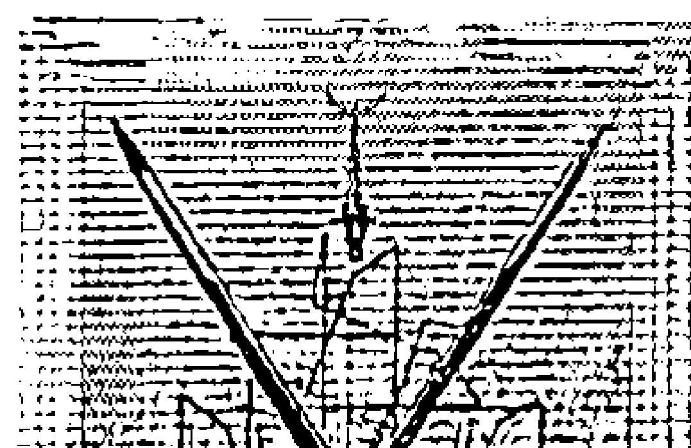

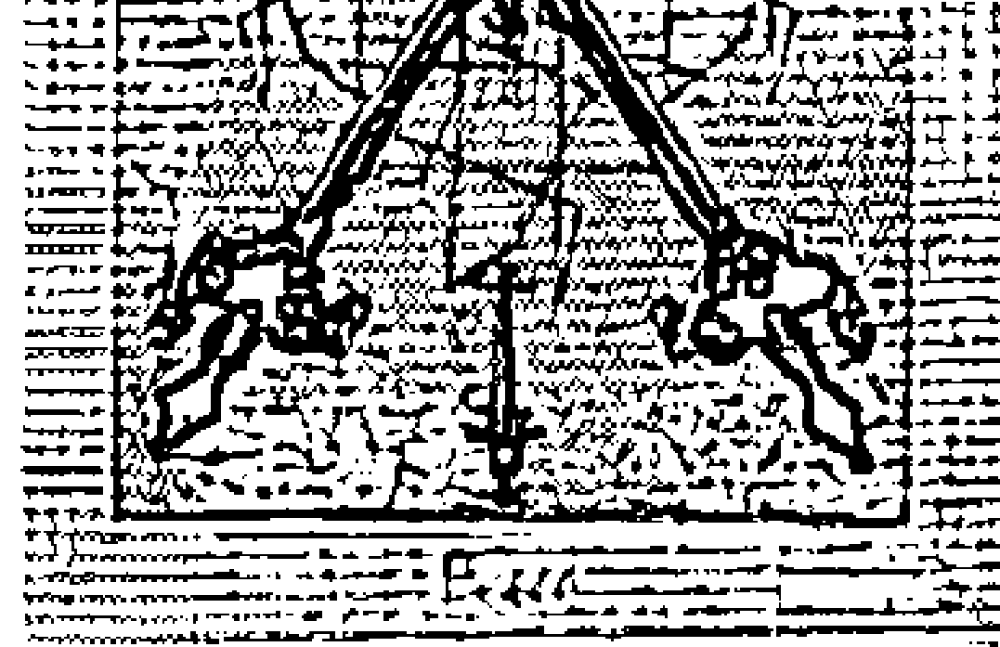

「智慧」在成形之界的呈色。

##### ◎圓盤二——變易（Change）

「圓盤二」是「智慧」在物質之界的生命之樹中。是一個將精神化為實際行動的呈現，它是一種完美的展現。咬著自己尾巴的蛇是古老智慧象徵的圖騰，與「智慧」本意相符。這張牌的牌名之所以為變易，是意味著淘汰舊有，並注入新事物的過程，生生不息，永無止境。這也是純粹的陽性能量投入物質世界中所帶來的變化。

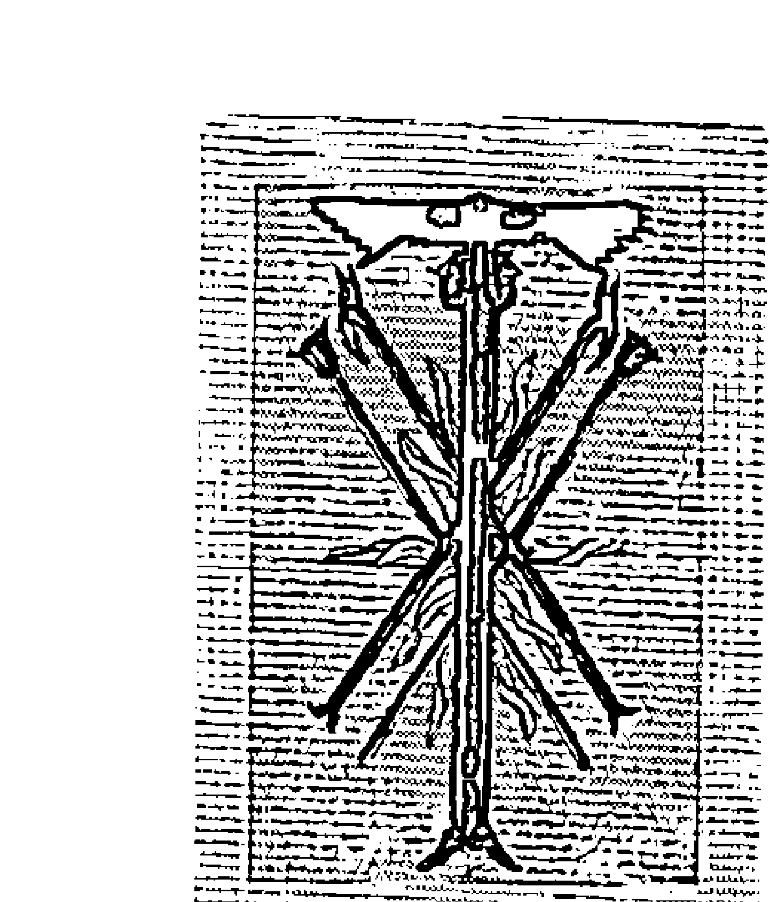

##### ◎宮廷牌組之四張騎士牌

騎士牌以「指定元素」的對應法則，對應到了第二個薩弗拉內。它們的陽性力量被加重呈現。屬於火中之火的「權杖騎士」，如火上加油一般，讓他充滿了動力，蓄勢待發。屬於水中之火的「聖杯騎士」，在心靈的深處形成了一種強大的驅動力，讓他起身去追尋，而第二薩弗拉「智慧」照進了他的心靈，讓他瞬間受到了啟示而行動。「寶劍騎士」屬於風中之火，第二薩弗拉的陽性特質讓他思考敏捷，迅疾如閃電，並且第二薩弗拉「智慧」也加深了他在思考層面上的活力，使得他以迅雷不及掩耳的敏捷姿態飛奔而出。「圓盤騎士」為土中之火，來自第二薩弗拉「智慧」陽性力量的衝動對他來說過於遙遠，被他理解為一步一腳印的開創性格。

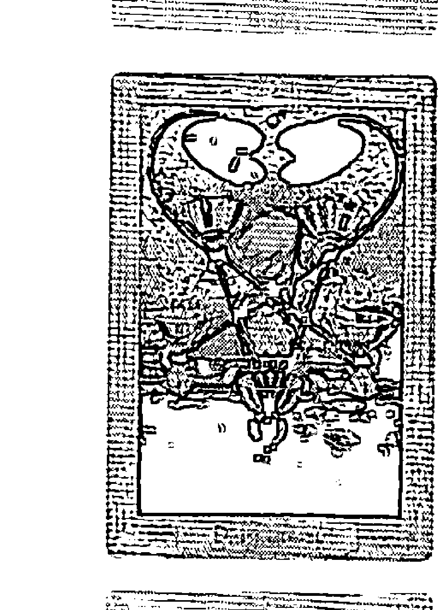

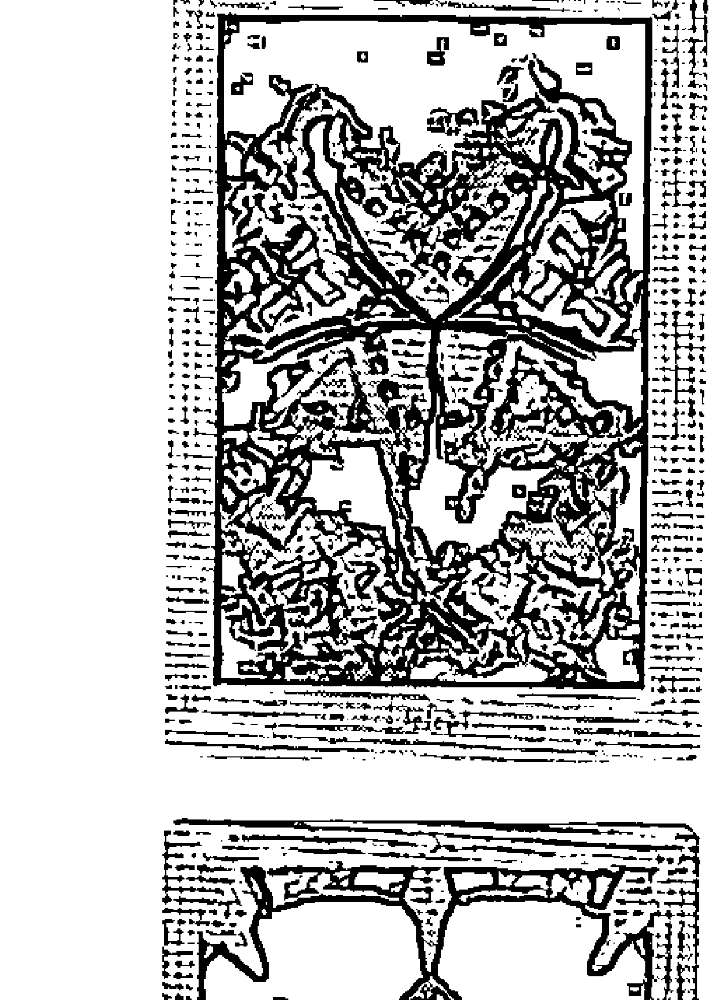

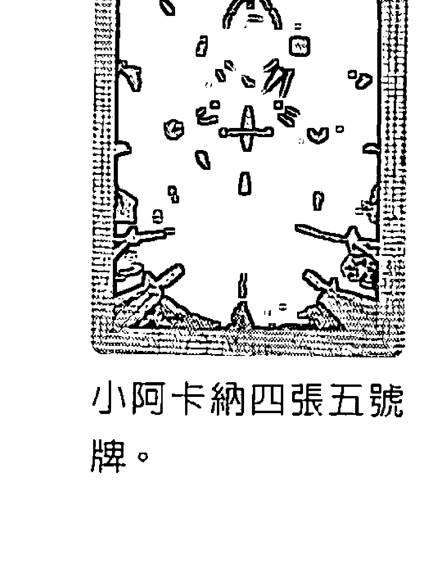

騎士牌。

#### 第三萨弗拉「理解」（Binah）

第三个萨弗拉「理解」是阴性的象征，可以想像成是接收了上一个萨弗拉「智慧」投射出阳性能量的大海。它是阳性的反面，具有大海接纳的特质。「理解」是信仰的源头，可以对应到各个文化中大地女神的象征。而在托特塔罗牌中，「理解」之对应为埃及神话中的母神伊西斯。

土星也是「理解」的代表星体，与希腊神话中掌管时间之神的克洛诺斯（Cronus）相互呼应。作为严厉之柱的第一个萨弗拉，「理解」在某种程度上具有限制与收缩之意。

##### 在各元素中的呈色

- 原型之界：绯红色
- 创造之界：黑色
- 成形之界：棕黑色
- 物质之界：带有粉红点的黑色

##### 与小阿卡纳的对应

在塔罗牌中对应到小阿卡纳四张三号牌，以及宫廷牌中的王后牌。

##### 杖三——美德（Virtue）

「杖三」是「理解」在原型之界的生命之树中，意味着母性能量孕育著事物的诞生。权杖上绽放的莲花则有大地女神伊西斯的象征，同时太阳在牡羊，亦是代表春天降临、生命甦醒。德性的展现是温和的，如同第三萨弗拉「理解」的特质。

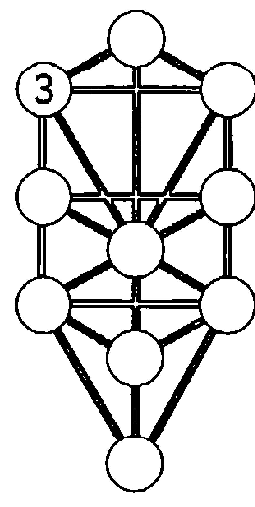

##### ◎圣杯三——丰盛 (Abundance)

「圣杯三」是「理解」在创造之界的生命之树中。占星元素是水星在巨蟹座，这意味着内心深层的洞见。背景深沉的海洋是「理解」的代表，从中流出的水灌注到三个圣杯中，如同来自心灵最深处的了解与接受。当内在的思虑与外在的行为一致，我们不需要要求特定的结果，事情反而会进展得越顺利，这也是「丰盛」的内在意涵。

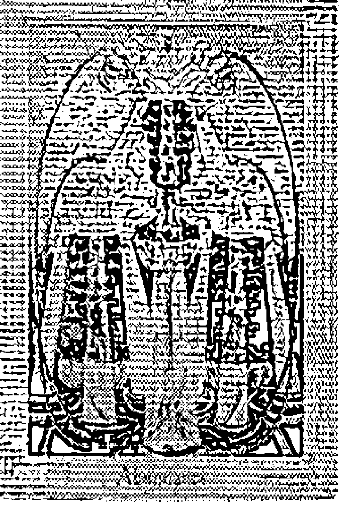

##### ◎宝剑三——悲伤 (Sorrow)

「宝剑三」是「理解」在成形之界的生命之树中。在此，「理解」是从灵性层次往下降到成形之界的过程中，土星力量显露的开始。土星的破坏特性在这张牌中发展成悲痛的感受，感觉虽然深刻，但是短暂。以长远的眼光来看，这是以一种较为强烈的方式去唤醒生命中对于特定事件的省思。而穿越意识层面体验天界三角的觉察，亦会感受到无以言喻的悲痛与不解，在金色黎明会中是至高灵启经验的奥秘。

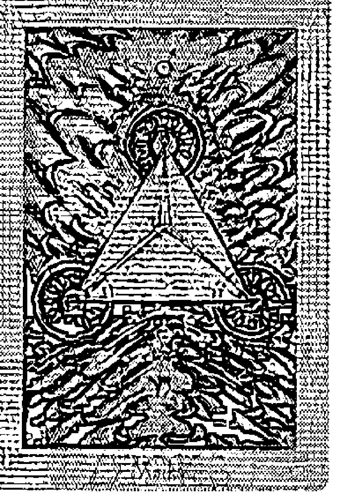

##### ◎圆盘三——工作 / 创造 (Work)

「圆盘三」是「理解」在物质之界的生命之树。图中的三枚圆盘分别代表了炼金术中的三大基本素材，漂浮于代表「理解」的大海上。「理解」是内我的灵感资料库，落实到物质世界中则必须经由工作来创造，来达成目标。在喀巴拉中，这是从不可见的「创造之源」到可见的「物质世界」的必然过程。

小阿卡纳四张三号牌。

##### 宫廷牌组之四张王后牌

王后牌以指定元素的对应法则，对应到了第三个萨弗拉内，所有的王后都接收了骑士牌本身的能量，在女性的基础上建立起了王后牌的特质。「权杖王后」是火中之水，第三萨弗拉的阴性特质为她的冲动带来了短暂的冷静。「圣杯王后」是水中之水，在第三萨弗拉「理解」的能量渲染下，她退居于幕后，活在她的心灵世界中。「宝剑王后」是风中之水，她接纳了「宝剑骑士」的敏捷，对于风元素理性的坚持，并且融入了第三萨弗拉「理解」的特质，让她的理性凌驾于情感之上。「圆盘皇后」是土中之水，第三萨弗拉的阴性能量加深了她的稳定性，她关怀身边的事情，她坐在她的宝座上，静静的看着远方。

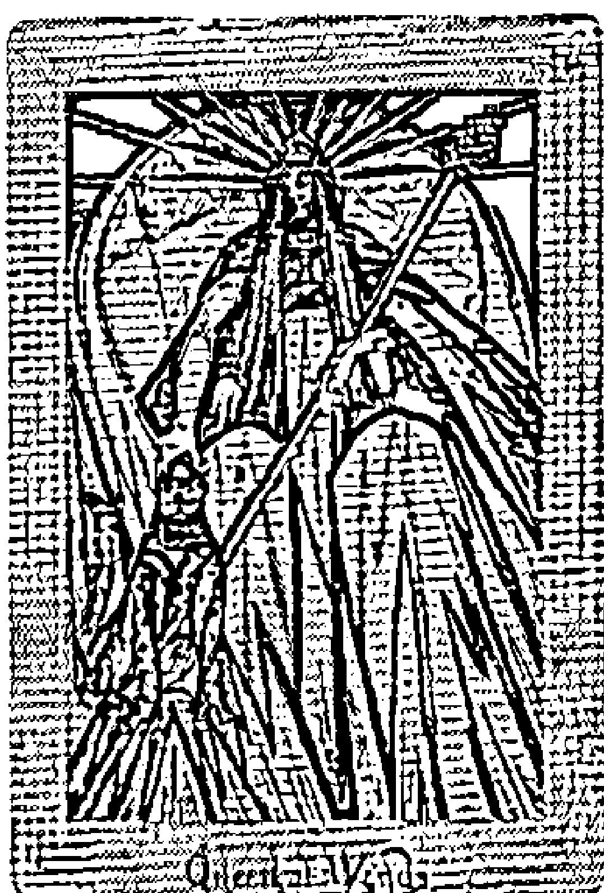

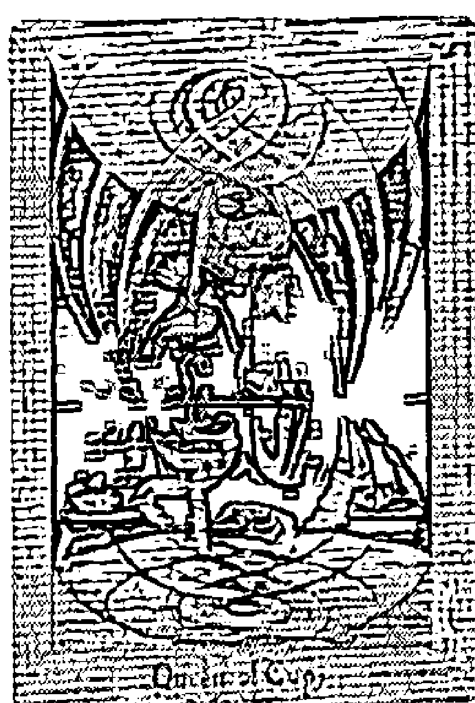

#### 第四萨弗拉「仁慈」（Chesed）

第四个萨弗拉Chesed，具有慈悲与爱的意涵，位于阻隔前三萨弗拉「深渊」之下的第一个萨弗拉，也是创造之光重回仁慈之柱的位置。传统上，「仁慈」意味着爱的本质，无条件的表现，它同时也是创造之光凝聚后的智能。有着来自于天界三角中光明无形的能量形式，是穿过了深渊后，第一个能量稳固的开端，因此「仁慈」具有稳定、稳固的特质，它是一种由神圣本质而来，稳固化后的概念。稳定是首要意涵，爱的展现则是立于稳定的基础上。它与下一个萨弗拉「力量」互为一对，分别代表创造与破坏。

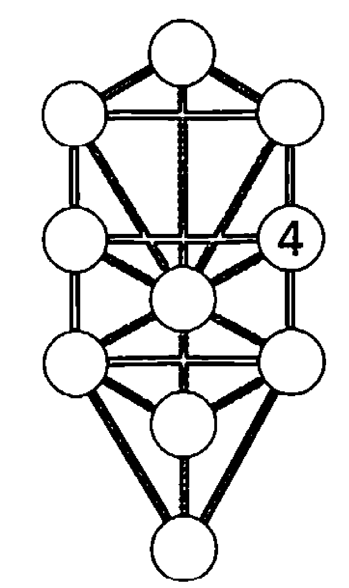

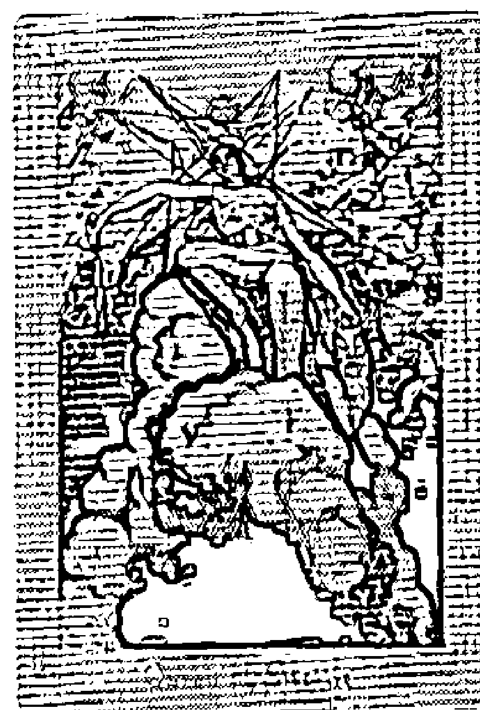

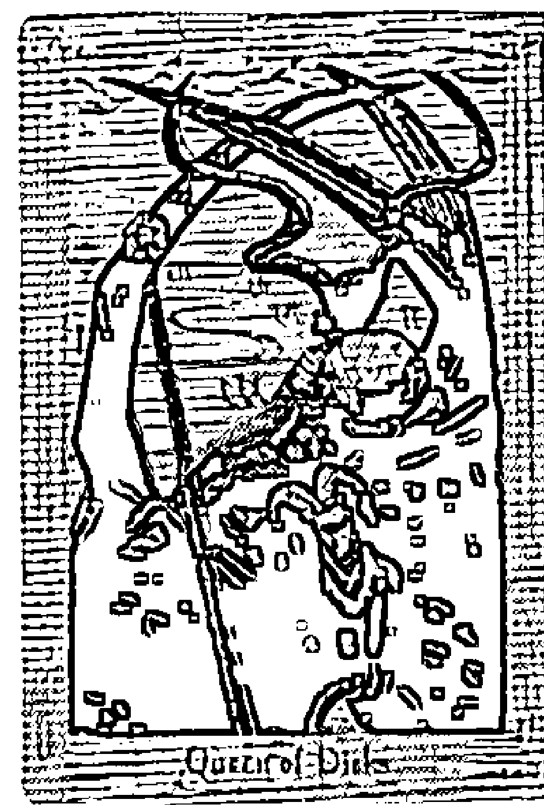

王后牌。

##### 在各元素中的呈色

- 原型之界：深紫色
- 創造之界：藍色
- 成形之界：紫紅色
- 物質之界：帶有黃點的藍色

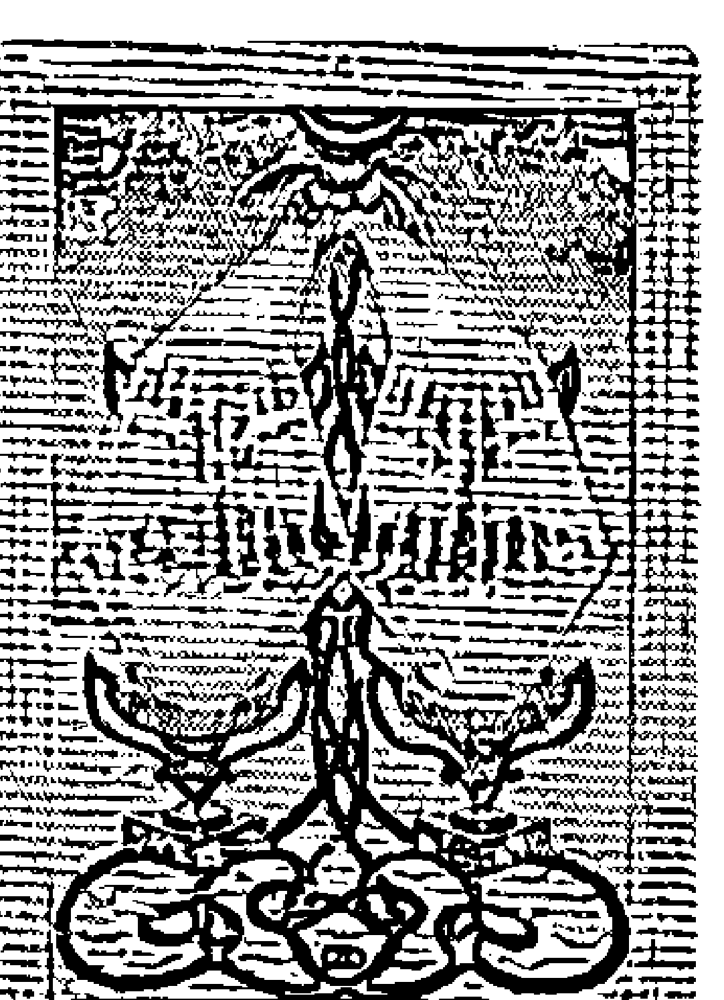

##### 與小阿卡納的對應

「仁慈」對應給小阿卡納中的四張四號牌。

##### ◎權杖四——完成（Completion）

「權杖四」是位於原型之界的生命之樹第四個薩弗拉「仁慈」，由於跨過了阻隔的深淵，創造之光沉澱成為了思想及物質，在原型之界已經完成階段性任務，使得這張牌具有完成之意。

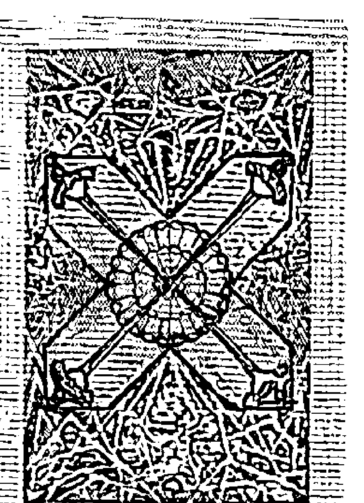

##### ◎聖杯四——奢華（Luxury）

「聖杯四」是位於創造之界的生命之樹第四個薩弗拉「仁慈」。仁慈是由內心而生，因此穩固的含義被強調，並且帶來了內心深處過度的安逸。牌中滿出的水，意味著過度的安逸阻礙了行動，失去了水元素原有的平衡。

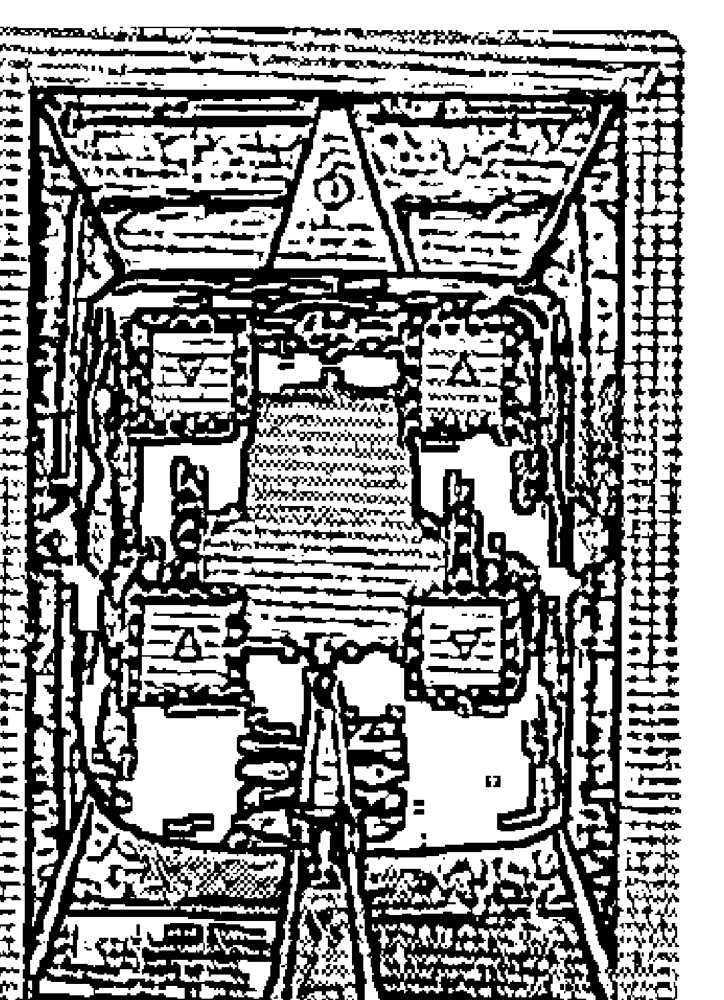

##### ◎寶劍四——休戰（Truce）

「寶劍四」是位於成形之界的生命之樹第四個薩弗拉「仁慈」。成形之界包含了想法與思考層面，而仁慈在此為運用理智的方式來達成穩定。寶劍本身具有的破壞性質於此刻暫時停止。

小阿卡納四張四號牌。

##### ●圓盤四——能力（Power）

「圓盤四」是位於物質之界的生命之樹第四個薩弗拉「仁慈」。牌中用堡壘來表示最穩固的「仁慈」意涵，是透過律法來維持規律，實現穩定。

## ～第五薩弗拉「力量」（Geburah）～

第五個薩弗拉「力量」，與上一個薩弗拉「仁慈」，正好互為平衡的一組。「力量」有如強而有力的武力，它放棄了溫和的特質，運用自身的能量去達到更高的成長，然而當面對「力量」時，它代表破壞、恐懼，它戲劇化的將剛建立好的基礎毀壞。從一個極端走向另一個極端，是「力量」所需要面臨的考驗。此外火星也對應到「力量」薩弗拉，它可以是破壞力量的象徵。在小阿卡納中，「五」所帶來的都是考驗，經過了成長的考驗，才能邁向下一個更大的體驗。

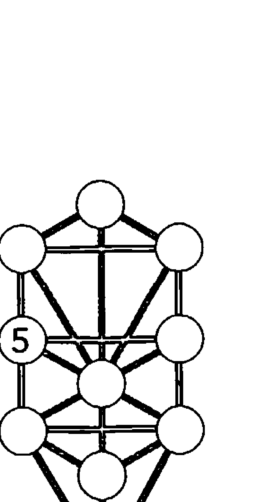

##### 在各元素中的呈色

- 原型之界：橘色
- 創造之界：猩紅色
- 成形之界：明亮的猩紅色
- 物質之界：帶有黑點的紅色

##### 與小阿卡納的對應

力量是對應給小阿卡納中的四張五號牌。

##### ●權杖五——競爭（Strife）

「權杖五」是位於原型之界的生命之樹第五個薩弗拉「力量」，破壞與混亂在最高的層面表現，正好是這張牌衝突的本意。另外，「力量」是位於嚴厲之柱中央的薩弗拉，它有來自於「理解」的陰性之力，是此牌化解衝突方式的伏筆。

##### ⊕聖杯五——失望（Disappointment）

「聖杯五」位於創造之界的生命之樹第五個薩弗拉「力量」。它將水蒸發殆盡，留下的是乾枯的泥土與即將凋謝的蓮花，在第五薩弗拉的作用下，破壞了內心的平衡，是從心靈深處的瓦解，所呈現的情緒是失望。

##### ⊕寶劍五——擊潰（Defeat）

「寶劍五」是位於成形之界的生命之樹第五個薩弗拉「力量」，破壞與分裂的本質在思考層面的表現，是這張牌的組成要素。五把劍分別代表五種不同的力量，分別對中心的堡壘進行攻擊，而造成堡壘真正瓦解的緣故，乃是代表著精神、思想的那把寶劍，也就是第五個薩弗拉「力量」所擊敗的對象。

##### ⊕圓盤五——憂慮（Worry）

「圓盤五」是位於物質之界的生命之樹第五個薩弗拉「力量」，意味毀滅之力在物質世界的落實。牌中用大自然的力量——地震呈現出這一點，在這一張牌中，破壞的力量已經不只存在於思想與情緒，而是落實於真實世界中。

小阿卡納四張五號牌。

#### 第六萨弗拉「美」（Tiphareth）

「美」是生命之树中最重要的萨弗拉之一，它位于平衡之柱的正中央，是整个生命之树的平衡点，连结了其上代表高我的意识，以及下方代表本我的萨弗拉。它宛如灵魂中绽放光亮的太阳，对于心灵内在的探索者而言，是静坐时突然光亮乍现与狂喜的阶段。生命之树的平衡之柱是意识在各种层面的感受，第十萨弗拉「王国」意味着我们所感受到这世界的一切、触摸到的事物、看到的景色与听到的声音等。第九萨弗拉「基础」则是连结我们潜意识感受面、显意识与较高本质的部分。第六萨弗拉「美」是心灵内完美愉悦的一种状态，它是意识的擢升，是迈向高我的一扇窗。此外「美」也是与牺牲有关的象徵，它代表神于世界的投生，祂同时具有神圣本质与肉体的存在，如同西方世界耶稣基督的形象。「美」同时平衡了左与右的各个萨弗拉，它的本意是完美，以「美」这个字作为第六萨弗拉的名称。

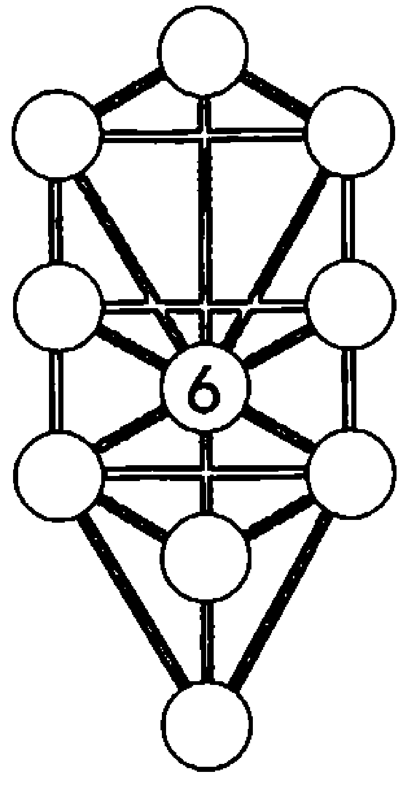

##### 在各元素中的呈色

- 原型之界：玫瑰般的粉红色
- 创造之界：金黄色
- 成形之界：如鲑鱼般的粉红
- 物质之界：金黄琥珀色

##### 与小阿卡纳的对应

在塔罗牌中，对应到的是小阿卡纳的四张六号牌，以及宫廷牌中的四张王子牌。

##### 杖六——致胜（Victory）

「权杖六」是位于原型之界的生命之树第六个萨弗拉「美」，意味着在我们灵魂更高层面的平衡，在认知上可以代表想法与行为一致的行动，意即喀巴拉从上到下，从内到外，整体一致的概念，没有阻碍产生，胜利是唯一的选项。

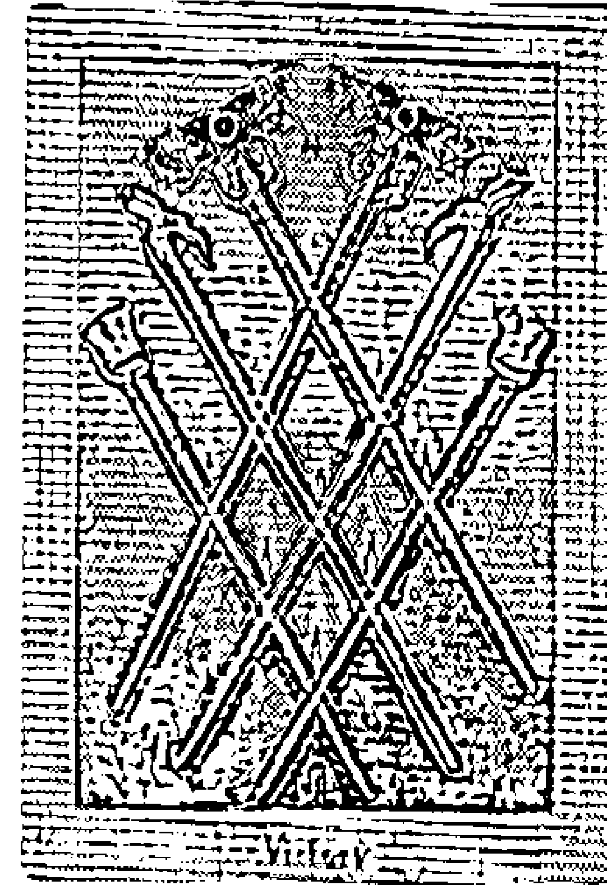

##### ◎聖杯六——享樂 (Pleasure)

「聖杯六」是位於創造之界的生命之樹第六個薩弗拉「美」，意味著在心靈深處的平衡。牌中以重新綻放的蓮花與充滿水的聖杯作爲象徵，代表著來自於內心深處的愉悅。太陽對應給了「美」，而此牌也正好爲太陽落入天蠍座，重新回歸的太陽爲這張牌帶來了復甦的跡象。

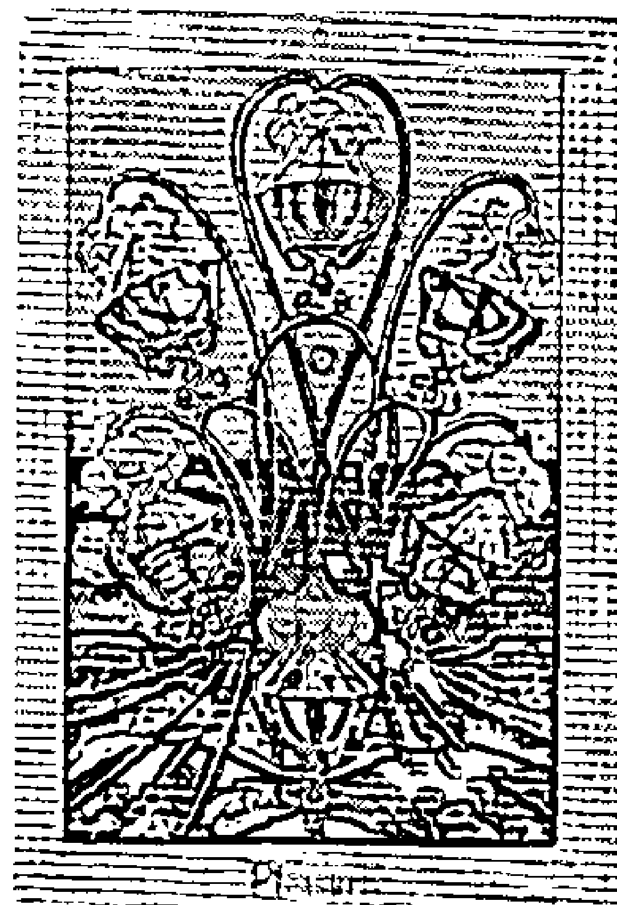

##### ◎寶劍六——科學 / 理性 (Science)

「寶劍六」是位於成形之界的生命之樹第六個薩弗拉「美」，代表思考層面的完整性。克勞利以科學作爲這張牌的命名，圖像中央放上薔薇十字是暗示科學背後的更高本質。「美」連結了上與下、有形與無形的世界，在成形之界暗示著用理性來瞭解世界的手段，反方面也暗示了在追求理性過程中，拋棄了情感、信仰等無法以客觀角度衡量的事物。

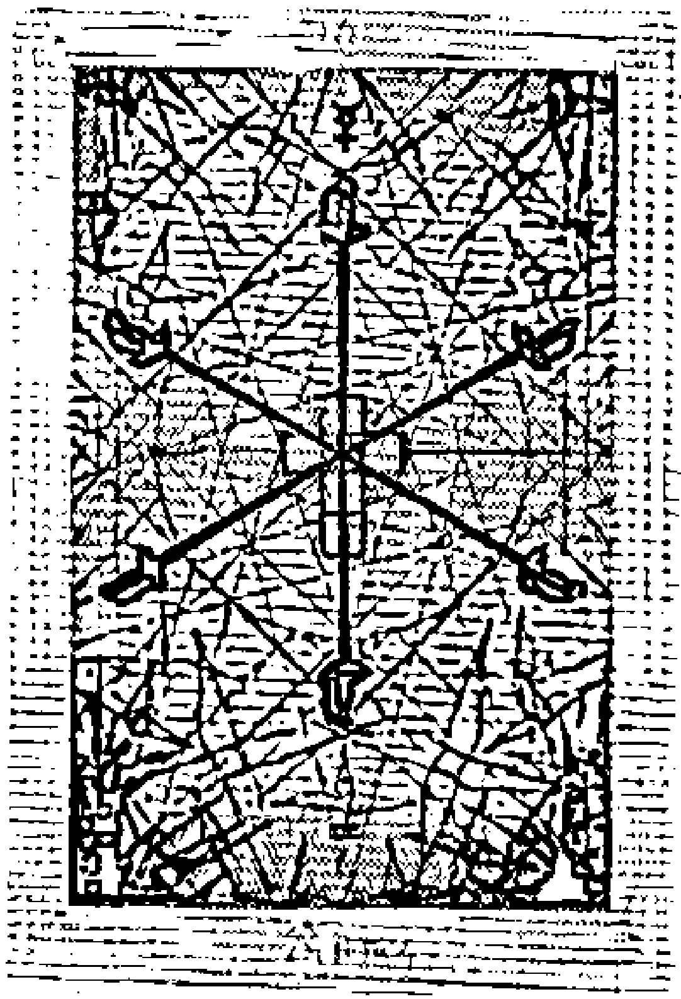

##### ◎圓盤六——成功 (Success)

「圓盤六」是位於物質之界的生命之樹第六個薩弗拉「美」，六個圓盤排列成六芒星的位置，並且刻上了六顆星體的占星符號，按照著生命之樹中的薩弗拉行星對應，以中間的太陽爲中心。意味著圍繞太陽運轉能量的平衡，促使事件圓滿的發生。這也是第六薩弗拉「美」在物質世界中的落實。

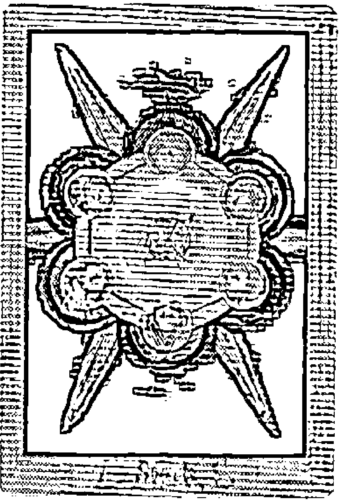

##### ◎宮廷牌組之四張王子牌

王子牌以指定元素的對應法則，對應到了第六個薩弗拉內，王子是騎士與王后的兒子，他融合了來自於陰與陽的兩種能量，並且將之發展。「權杖王子」是火中之風，在第六薩弗拉的作用下，沒有了「權杖騎士」的衝動，也沒有了「權杖王后」瘋狂的熱情，讓他可以在清晰的思考下，更專注的朝著目標前進。「聖杯王子」是水中之風，在第六薩弗拉的平衡之下，能夠迅速的捕捉靈感，傾聽靈魂深處的聲音。「寶劍王子」是風中之風，在第六個薩弗拉作用之下，不斷有新的想法，然而過多的思緒讓他拿捏不定。「圓盤王子」是土中之風，第六個薩弗拉使他從土元素中向上躍升，具有較完整的理性思維，能夠透過計畫來逐步達成理想。

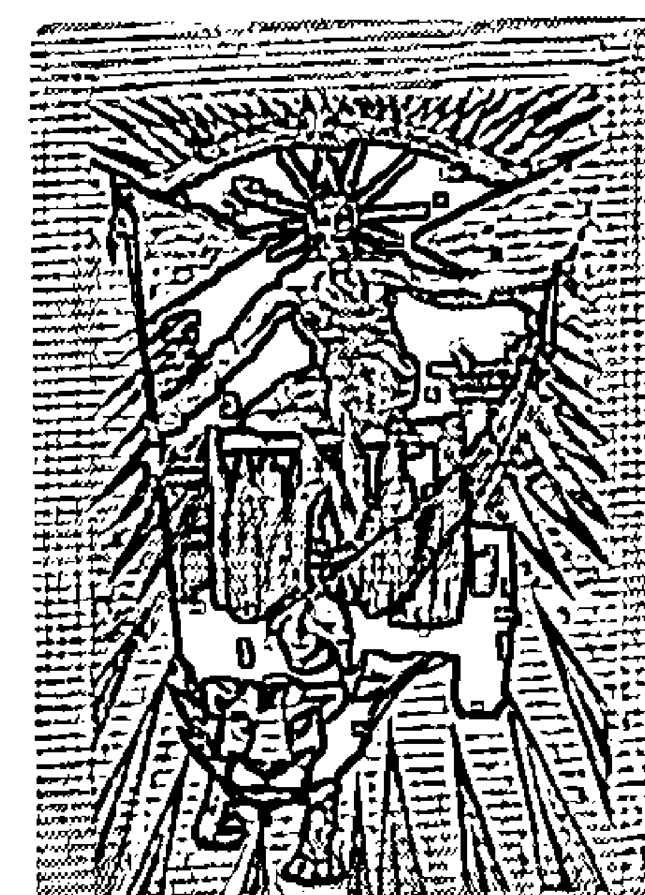

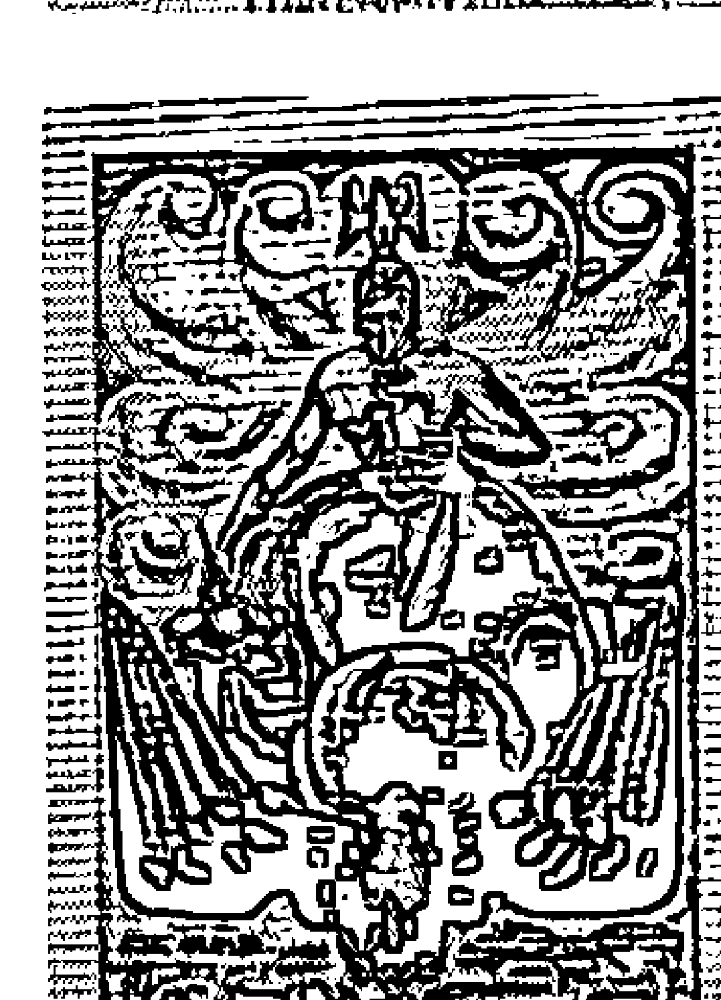

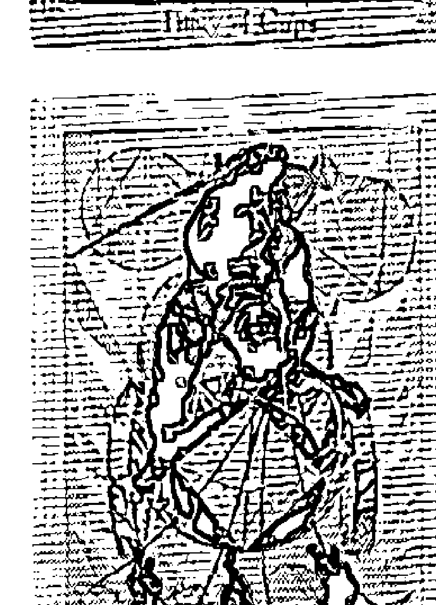

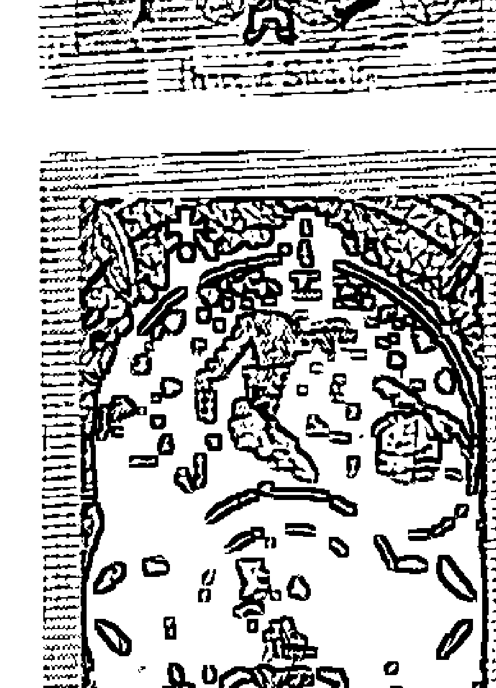

王子牌。

## ～第七薩弗拉「勝利」（Netzach）～

我們之前所談論的六個薩弗拉，是無法去感受到，是屬於潛意識的本質面與內我神性的部分，它們可能偶爾會透露出一些靈感、一些徵兆、一些情緒，浮現到我們可以感知的心理層面或顯意識中。進到了喀巴拉中生命之樹的第三個三角，是顯意識我們可以感受的部分，也屬於思想可以觸及的層面。

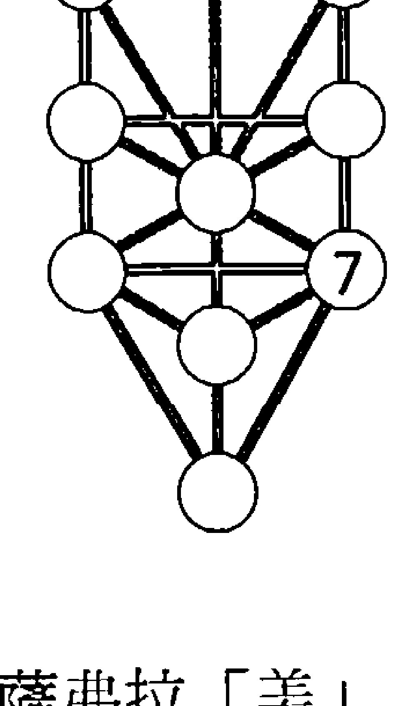

第七個薩弗拉「勝利」，將來自於第六薩弗拉「美」的創造之光散射於我們的思想感受中，讓我們得以一窺思想之上那無法碰觸的一面。舉個例子來說，當你在睡夢中夢到了自己正在進行電玩遊戲，在電玩遊戲中開著戰鬥機。深入敵軍禁區執行任務，夢中的你非常緊張，操控著搖桿穿梭在砲火之中，在電玩中坐在戰鬥機裡的你，生死完全操縱在你的手指之間。此時，握著搖桿的你就是第七個薩弗拉，電玩中坐在戰鬥機的你則是第八薩弗拉之後所形成的世界，而正在睡夢中真實的你，就是第六個薩弗拉以上的部分。在夢中，你不知道自己在作夢，你只是盡情的在玩著電玩，你無法知道在玩電玩的當下還有一個真實的你存在。

第七個薩弗拉「勝利」位於通往更高意識與思想的交會點，喀巴拉的修煉者在靜坐中以靈視能力所觀察到的是一個通往勝利的大門，因此以勝利作爲第七薩弗拉的名稱。此外，第七薩弗拉爲金星所對應。

然而創造之光離開了最爲穩定的第六薩弗拉後，便離開了平衡之柱，投入了第七薩弗拉之中，勢必也帶來了混亂。

##### 在各元素中的呈色

- 原型之界：琥珀色
- 創造之界：翡翠綠
- 成形之界：亮黃綠色
- 物質之界：帶有金點的橄欖綠

##### 與小阿卡納的對應

在塔羅牌中，對應到的是小阿卡納的七號牌。

##### ⊙權杖七——勇氣（Valour）

「權杖七」是位於原型之界的第七薩弗拉，在離開了生命之樹第六薩弗拉的能量中心後，彷彿是光墜落於棱鏡之中，進入了將集中光束分散的世界（顯意識、思想層面），使得「權杖七」帶有掙扎之意，而且有可能將遭受壓制。

##### ◎聖杯七——沉淪（Debauch）

「聖杯七」的占星組成爲金星天蠍，金星爲第七個薩弗拉「勝利」所對應的星體，加重了金星的意涵，然而在創造之界對應的水元素渲染下，原本的勝利倒像是一種浪漫的想像，一種對於未來的遙想。它建立在心靈之上，然而未落實的勝利，永遠也只是空想，卻又不自覺的深陷其中。

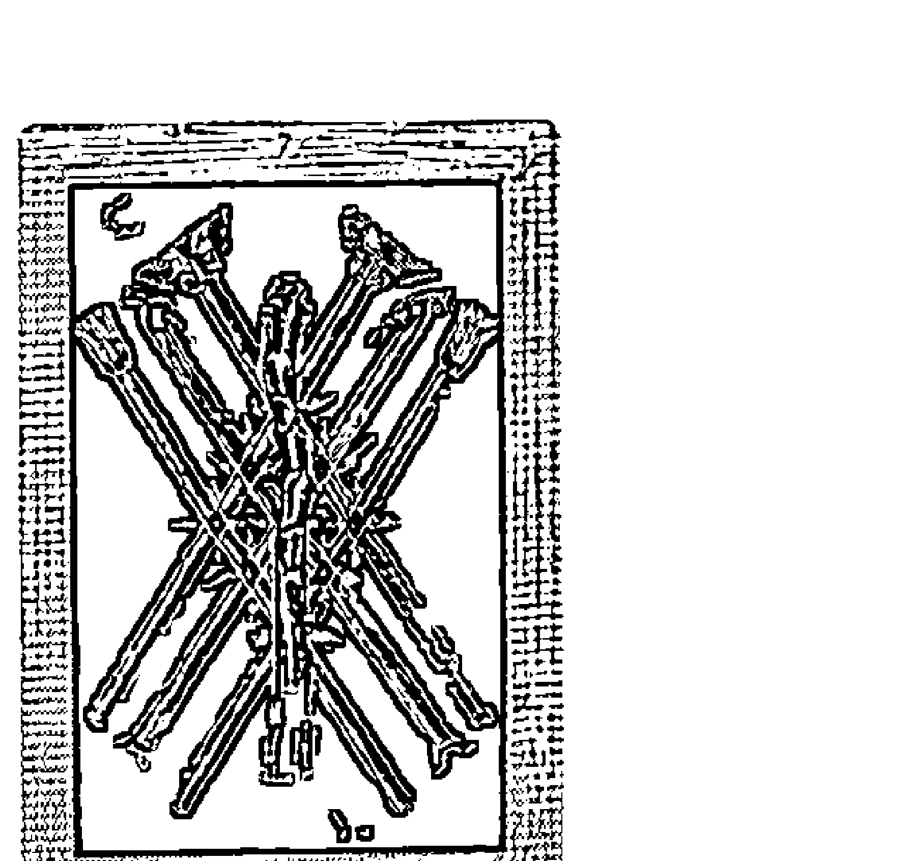

##### ◎寶劍七——徒勞（Futility）

「寶劍七」是位於成形之界的第七薩弗拉「勝利」。屬於風元素的第七薩弗拉落入了以風元素爲代表的成形之界中，創造之光由原本的「一」分化成許許多多的光芒，形成了我們的思緒。在「寶劍七」中，由於過多的念頭存在，分散了主力，再加上消極的態度使然，可能會白忙一場。

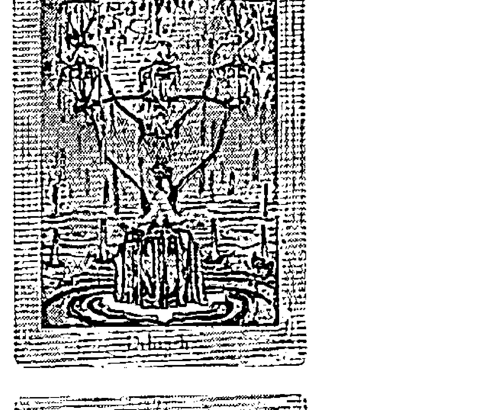

##### ◎圓盤七——失敗（Failure）

「圓盤七」是位於物質之界的第七薩弗拉「勝利」。你可能會疑惑，爲什麼第七薩弗拉不但沒有爲這張牌帶來勝利，反而帶來了失敗的意涵？這是因爲第七薩弗拉將來自於第六薩弗拉「美」的創造之光散射於我們的思想、感受中，在還沒有消化、抉擇之前，就已經墜落於以土元素爲代表的物質之界中，這好比墜落地面紛亂的光芒，沒有思考周全而貿然行動，將自己的缺點外顯出來，導致了「圓盤七」的失敗。

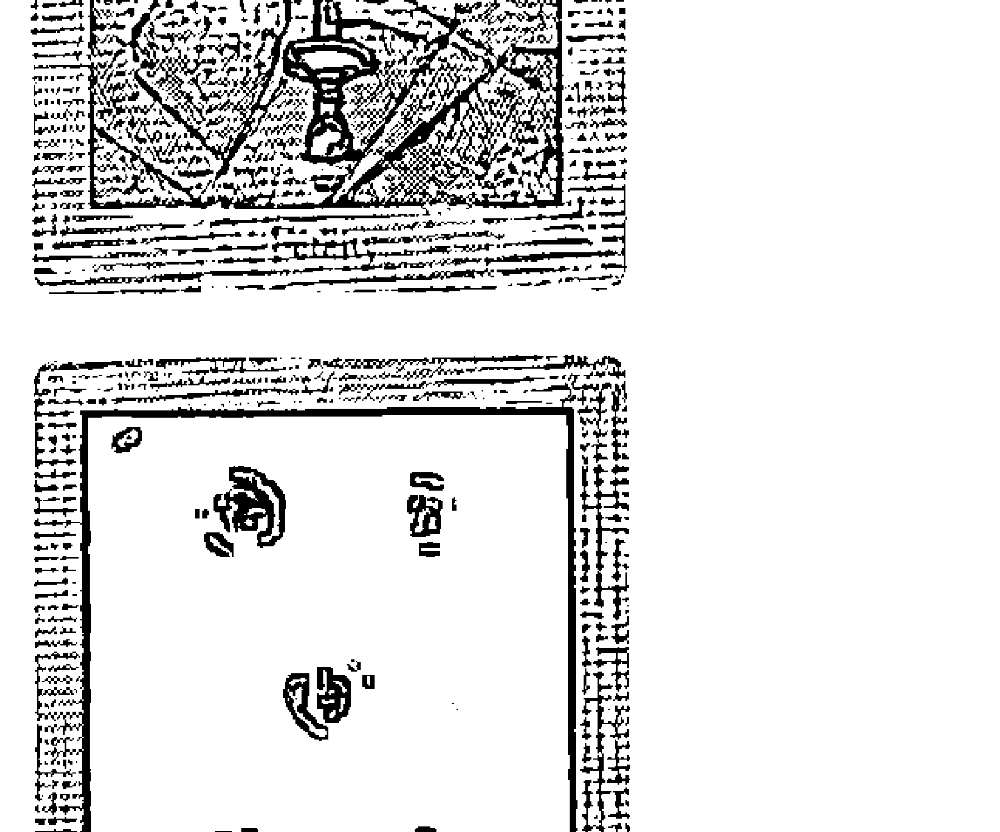

小阿卡納的七號牌。

#### 第八薩弗拉「宏偉」（Hod）

第八個薩弗拉「宏偉」與第七個薩弗拉「勝利」互為一組，接收來自於第七薩弗拉所分散的光芒，凝結成較具體的思想與情緒，利於我們去感知。在這一個薩弗拉之中，自我的人格與思想建立於其中，它接收了內我的訊息，在其中築起了你對這個世界的認知，影響著獨特的情緒反應。

第八個薩弗拉將能量體轉變為我們可以瞭解的形象，諸如各種神的形象。在此書所談及的喀巴拉理論中，平常我們所描述的神即是建立於第八薩弗拉內。祂可能不是以我們想像的方式存在，可能只是一種精神、一種概念，被我們捕捉之後成為了神的形象。這好比各個文化對於大地母神的描述，譬如聖母馬利亞、女媧、觀音等，他們都共同具有一樣的母性能量，在各個民族文化中被描述成了神祇，並在民族的共同意識下有了更為細緻的發展。

第八薩弗拉平衡了上一個薩弗拉的擾動，並且從上接收了訊息，建立了心智的一部分，建立了我們對外在世界的反應，因此第八薩弗拉可說是心靈中的宏偉建築，因而命名為「宏偉」。第八薩弗拉也為水星所對應。

- 原型之界：深紫色
- 創造之界：橘色
- 成形之界：紅褐色
- 物質之界：帶有白點的黃黑色

##### 與小阿卡納的對應

在塔羅牌中，對應到的是小阿卡納的八號牌。

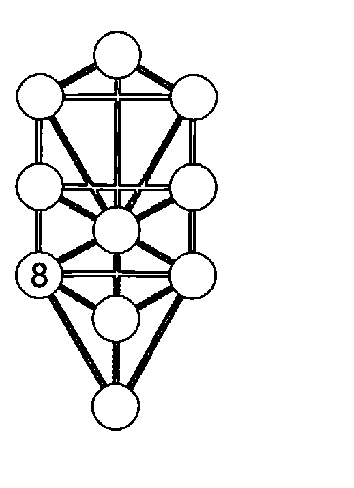

##### ◎權杖八——迅捷（Swiftness）

「權杖八」是位於原型之界的第八薩弗拉，在原型之界中接收了來自於第七薩弗拉所分散出的思緒，快速的將它統整後往下傳遞。而「權杖八」的占星對應為水星落在射手座，與第八薩弗拉對應的水星能量疊合之下，水星所傳遞的訊息含義特別被突顯。

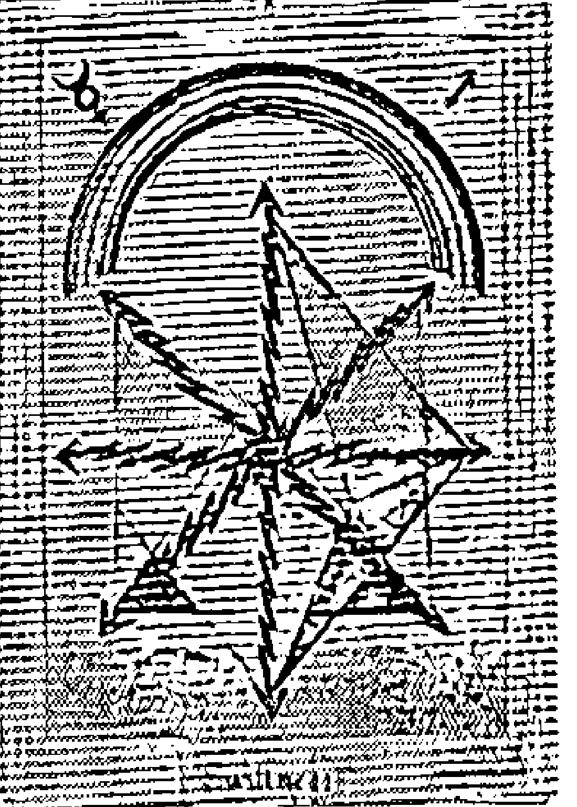

##### ◎聖杯八——怠惰（Indolence）

「聖杯八」是位於創造之界內的第八個薩弗拉，在水元素對應的創造之界中，第八薩弗拉統合了思緒層面，但尚未傳遞到第九薩弗拉使我們去感受，並且與靈感之源的內我有所阻隔，所以在「聖杯八」中呈現出了等待，甚至是過於停滞的意涵。

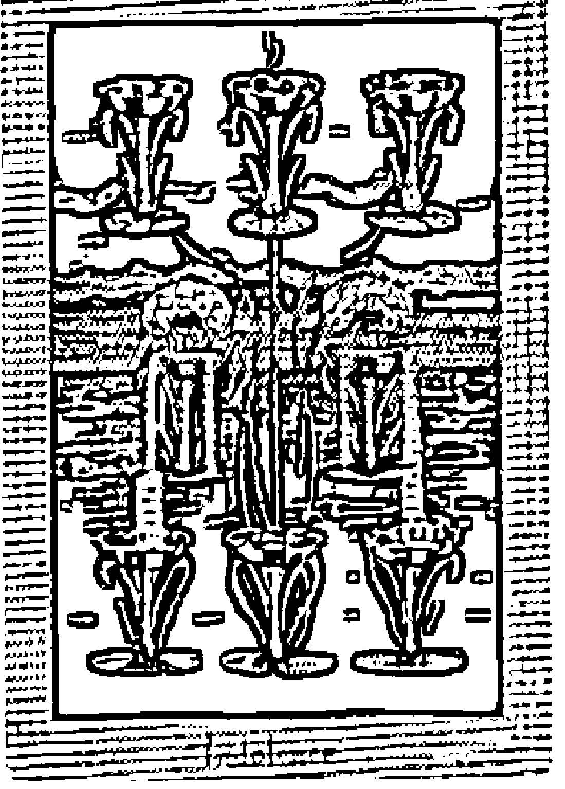

##### ◎寶劍八——阻礙（Interference）

「寶劍八」是位於成形之界內的第八個薩弗拉，在接納了來自於第七薩弗拉的能量後，在成形之界中逐漸茁壯為信念，但也因為如此，與自己已然存在的信念產生衝突或矛盾，所以在腦海中造成了阻礙。也幸好如此，在多種意念的碰撞下，得以去做最適當的抉擇。

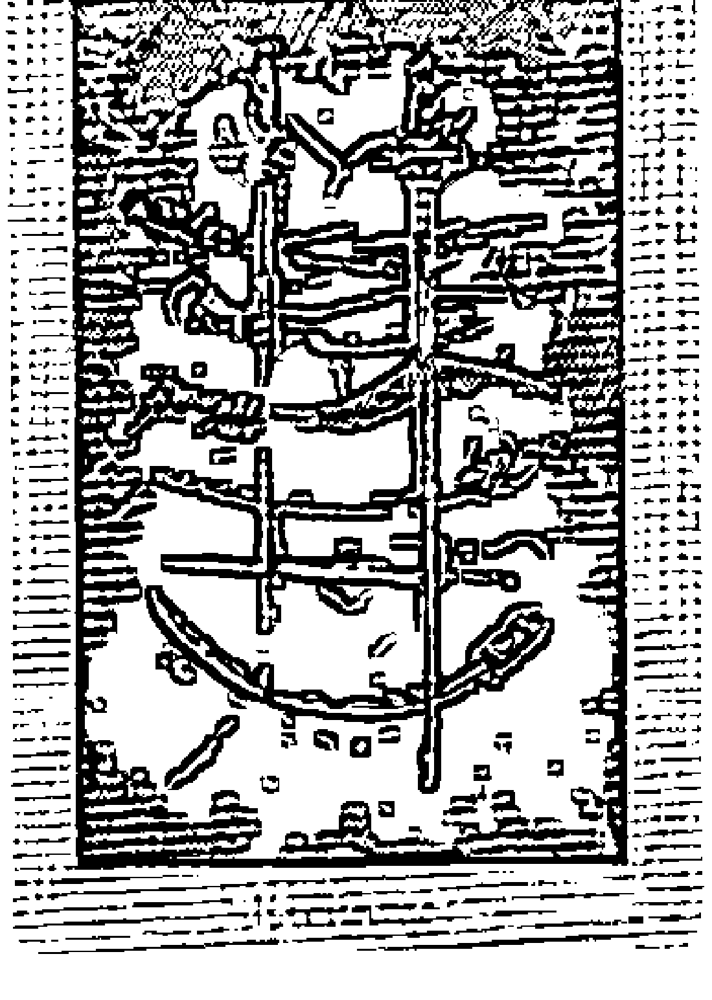

##### ◎圓盤八——謹慎（Prudence）

「圓盤八」是播種後等待收割的時刻，是位於物質之界中的第八個薩弗拉。最初誕生於原型之界的願力已經度過了一個又一個的轉變，凝結成了思想與物質。在這一刻成為了已然成形的信念，如同已經開花的樹，等待著結果，等待著創造之光傳遞到下方的薩弗拉後能有豐碩的收穫。

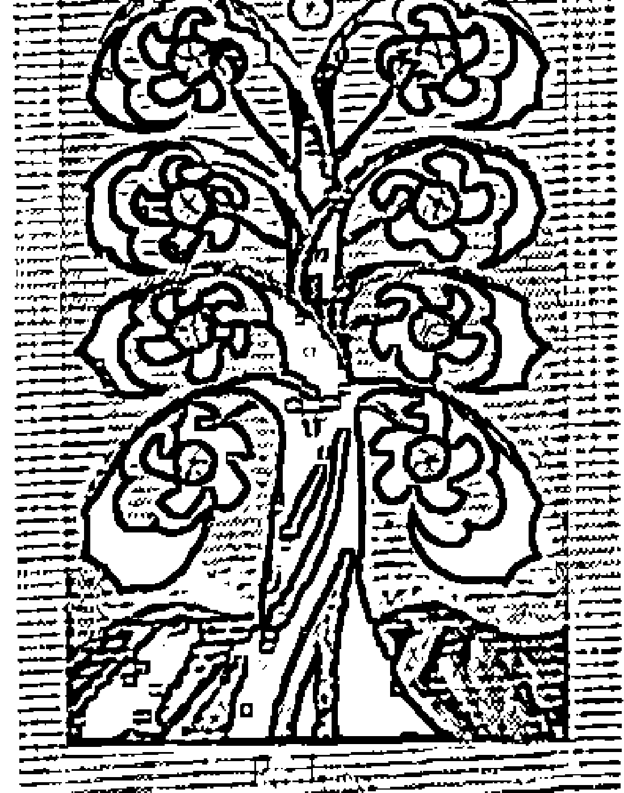

小阿卡納的八號牌。

#### 第九薩弗拉「基礎」（Yesod）

「基礎」是生命之樹中的第九個薩弗拉。從第六薩弗拉傾瀉注入思想層面的創造之光，經過第七與第八薩弗拉的震盪之後，終於回歸到位於平衡之柱的基礎。第九個薩弗拉「基礎」是物質世界與意識世界中的橋樑，它接收來自於外在的反應，以我們建立在第八薩弗拉的認知中去辨認意義，讓我們感受到意義與情緒。此外，第九薩弗拉也將創造之光往下傳遞，在物質世界中建立起了堡壘，實踐了最初的理想。

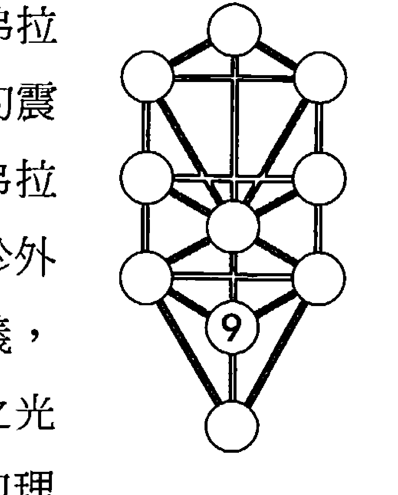

第九個薩弗拉與月亮的對應，也代表了潛意識當中的感受面，它使我們感受到了情緒，將外界的反應拆解後與潛意識組合，內化而成當下的感覺。那種五味雜陳的感受，往往就是混合了潛意識與當下感受而成的情緒。

##### 在各元素中的呈色

- 原型之界：靛藍色
- 創造之界：深紫色
- 成形之界：極深紫色
- 物質之界：帶有淺藍點的檸檬黃

##### 與小阿卡納的對應

在塔羅牌中，對應到的是小阿卡納的九號牌。

##### 權杖九——力（Strength）

「權杖九」是位於原型之界的第九薩弗拉。創造之光在此凝結成了意識，形成了行動背後強而有力的心靈支撐。背後的八把權杖，意味著經過了八個薩弗拉轉變後形成的意識，在第九個薩弗拉的帶領下，落於物質世界中。「權杖九」的占星對應為月亮射手，與對應於第九薩弗拉的月亮作用之下，加重了月亮陰晴圓缺的變化之力。

##### ◎聖杯九——快樂（Happiness）

「聖杯九」是位於創造之界內的第九個薩弗拉。創造之光回歸到了平衡之柱，原本擺盪於兩端的不平衡終於獲得了解脫，回歸於平靜。在「聖杯九」當中，由於第九薩弗拉「基礎」在月亮的對應下，加深了水元素的平靜，也為枯竭的心靈注入一道水流，化解了阻礙，順流而下的心靈感受是簡單的幸福。

##### ◎寶劍九——殘虐（Cruelty）

「寶劍九」是位於成形之界內的第九個薩弗拉。屬於風元素的意識層面在第九薩弗拉中過度的被激發，因而以過分理性追求導致的後果之意融入這張牌內。牌中央的九把寶劍是一種脫離情感後的理智，因為已經脫離了情感，所以沒有了後顧之憂，準備往下一個薩弗拉邁進。

##### ◎圓盤九——獲益（Gain）

「圓盤九」是位於物質之界中的第九個薩弗拉。當創造之光到達了屬於土元素創造之界的第九個薩弗拉內，已經擁有一定程度的物質成果，距離最後的創造終點僅只一步之遙，累積的財富也只僅次於最後的「圓盤十」。「圓盤九」本身是豐盛的，還額外具有了幸運的特質。創造之光除了終點，已無處可以宣洩，因此在這個位置中直接躍升，顯而化出。對於不瞭解心靈背後運作原理的人們，可說是很幸運。

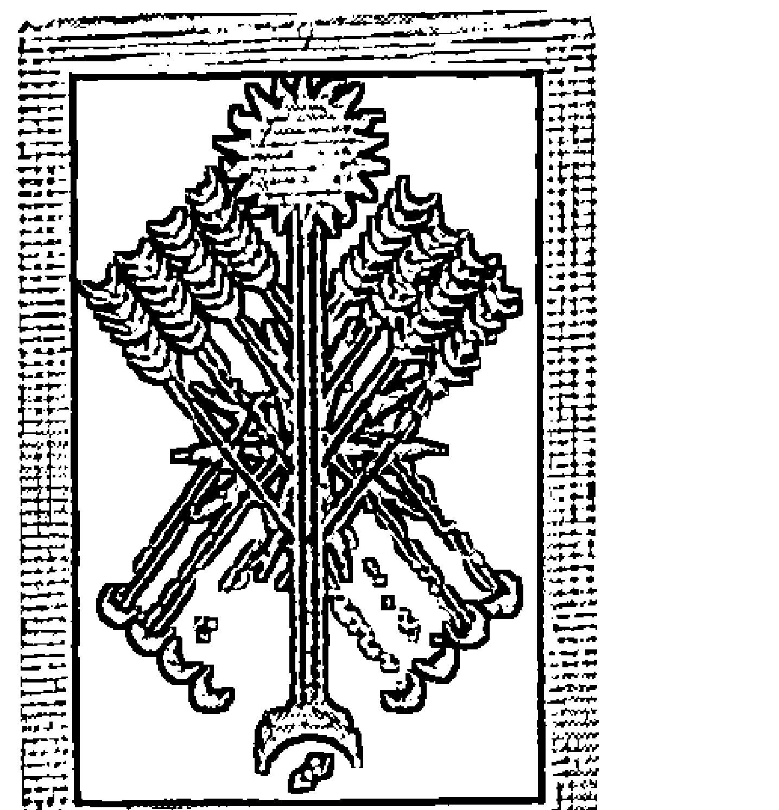

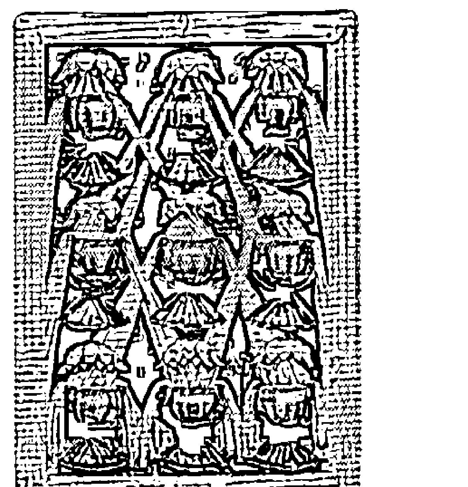

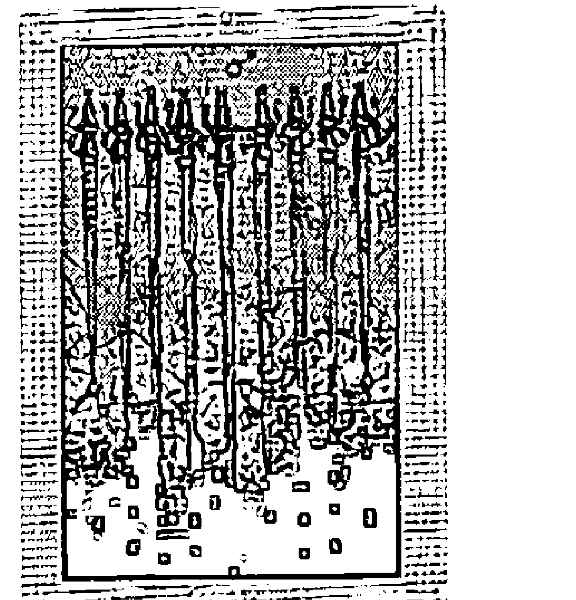

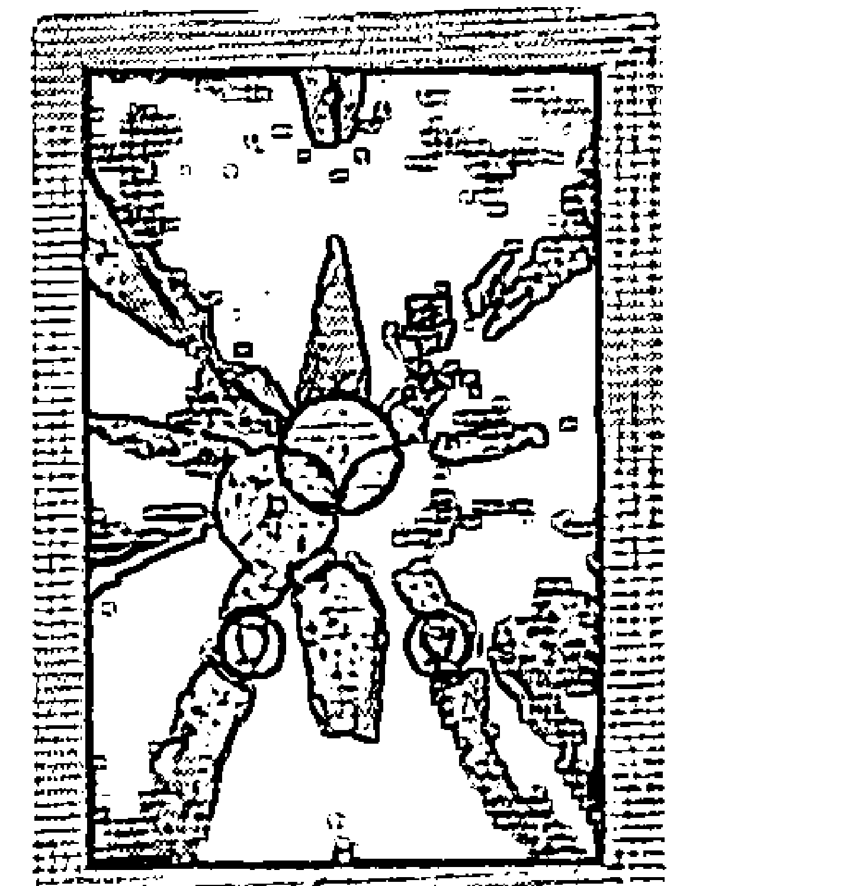

小阿卡納的九號牌。

#### 第十薩弗拉「王國」（Malkuth）

生命之樹的第十個薩弗拉「王國」，是創造之光的終點，來自於最初意識的光，終於在此凝結成形，化為我們肉體所存在於物質世界的一切。我們所認識的世界，人、事、物基本上都是架構於第十個薩弗拉的物質世界中；相對的，在物質世界裡，出現的一切則反映於心靈，在心中照出我們原本投射出的意念。

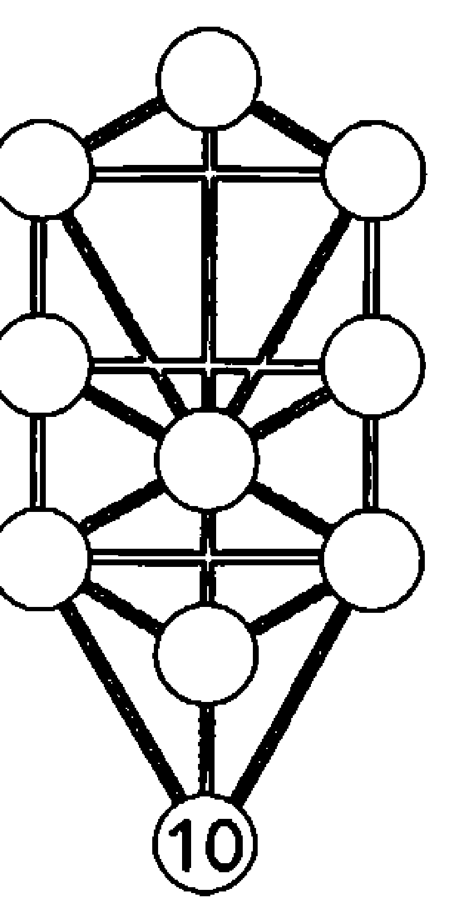

在這樣的認識之下，塔羅牌，乃至於各種占卜命理的技巧、理論與工具，都是以抽象之物來象徵我們的心靈，象徵更高層次的意識。這也是為什麼神秘符號、平安符被認為具有神奇力量的原因，因為這些物品承載了意識所賦予它的精神性質，它是一種龐大的意識能量（如幸運、平安）的象徵。

在物質世界中的我們，習慣於將這些背後的意念、情感、意義投射為物質，或是形成擬人化的神體，藉由這些象徵物，使我們得以接觸到更高層次的意識本體。舉例來說，對於正義這種概念，在埃及以正義女神瑪特作為象徵，在基督教的文化中以死後的審判作為代表，在東方則是以陰間過奈何橋、閻王審判等概念來賦予正義的威嚴性。象徵、符號永遠只是個代表，背後所蘊含的精神性才是真正的本質。

##### 在各元素中的呈色

- 原型之界：黃色
- 創造之界：檸檬黃、橄欖綠、猩紅色、黑色，分布於四個方位
- 成形之界：檸檬黃、橄欖綠、猩紅色、帶有金色點的黑色，分布於四個方位
- 物質之界：黃色的帶狀分布於黑色之中

##### 與小阿卡納的對應

在塔羅牌中，對應到的是小阿卡納的十號牌，以及宮廷牌中的四張公主牌。

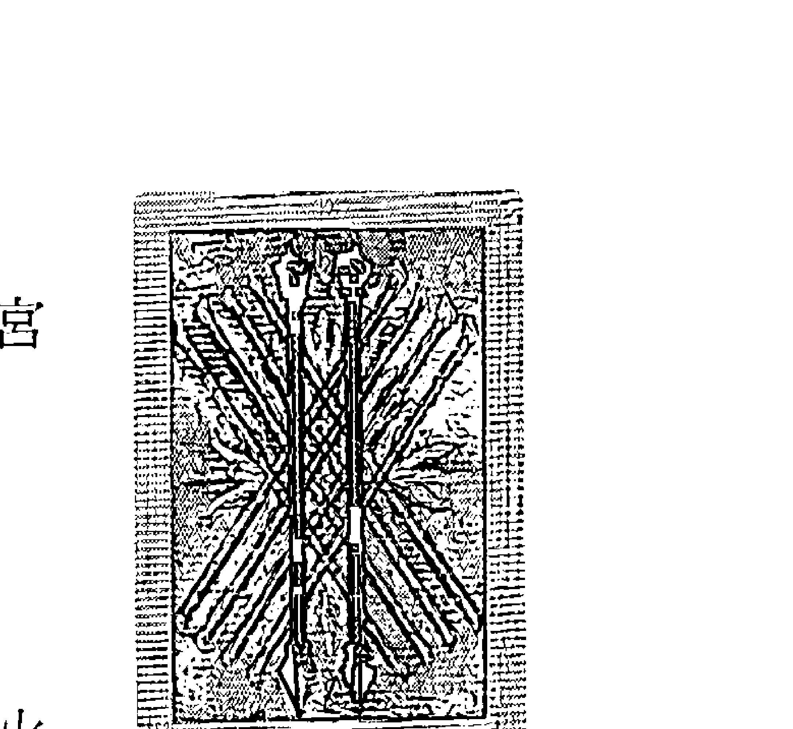

##### 權杖十——壓迫（Oppression）

「權杖十」是位於原型之界的第十個薩弗拉。在以火元素為代表的原型之界中，精神性的火元素成為了第十薩弗拉「王國」背後的深層壓力。第十薩弗拉與源頭的火元素已經失去了直接相通的管道，因此變成了一個看不見的壓力在你身後，可能揮之不去，可能帶來了傷害，賦予了這張牌較為沉重的壓力。

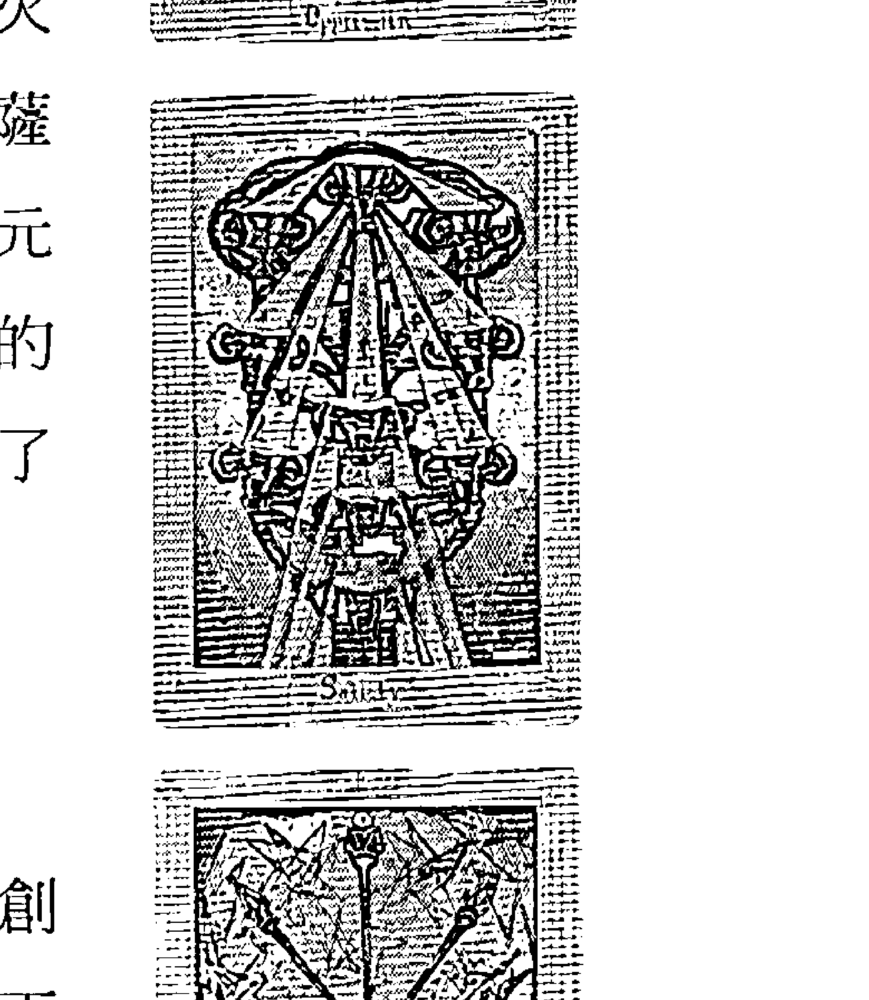

##### ◎聖杯十——厭足（Satiety）

「聖杯十」是位於創造之界內的第十個薩弗拉。在創造之界中的盡頭，聖杯裝著足以溢出的水量，已經無法再容納更多的一切。第十薩弗拉的能量在此受到了限制，源頭源源不絕的注入，卻沒有這麼多的杯子來承接，帶給這張牌豐盛過度的意涵。

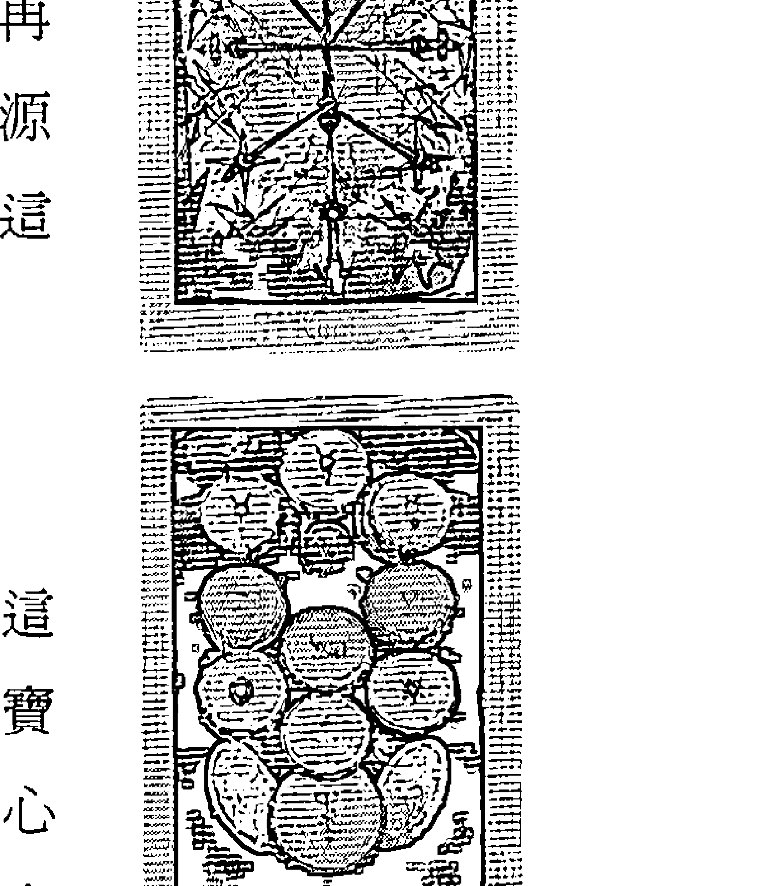

##### ◎寶劍十——淪亡（Ruin）

「寶劍十」是位於成形之界內的第十個薩弗拉。這是成形之界的終點，代表走到了極端的意識，承接著「寶劍九」的理性，在「寶劍十」中完整的發揮。在極端的心智活動之下，對自身亦形成了批判，並且可能瘋狂地把自己推向火窟之中。

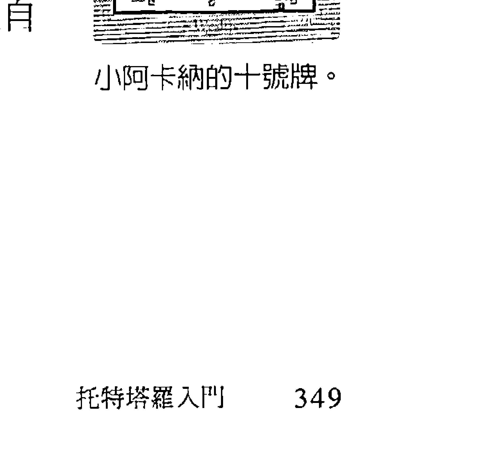

小阿卡納的十號牌。

##### ⊗圓盤十——財富（Wealth）

「圓盤十」是位於物質之界中的第十個薩弗拉。這是創造之光的終點，在物質世界中完美的呈現。因此「圓盤十」是四張十號牌中較為正向的一張，它代表了富裕、健康、成就。在這一個位置之中，代表第十薩弗拉的圓盤被畫得特別大，顯示出走到夢想實踐的終點處所獲得的滿足。

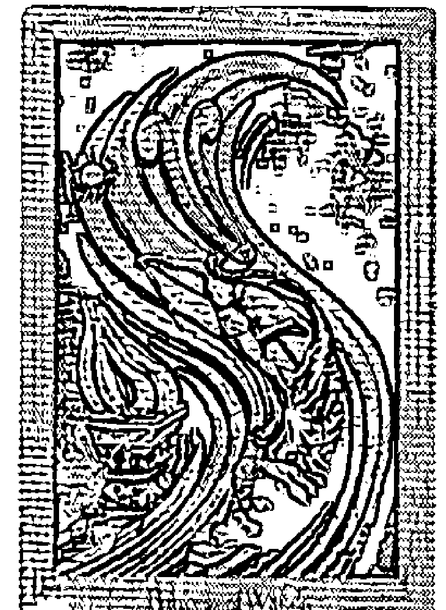

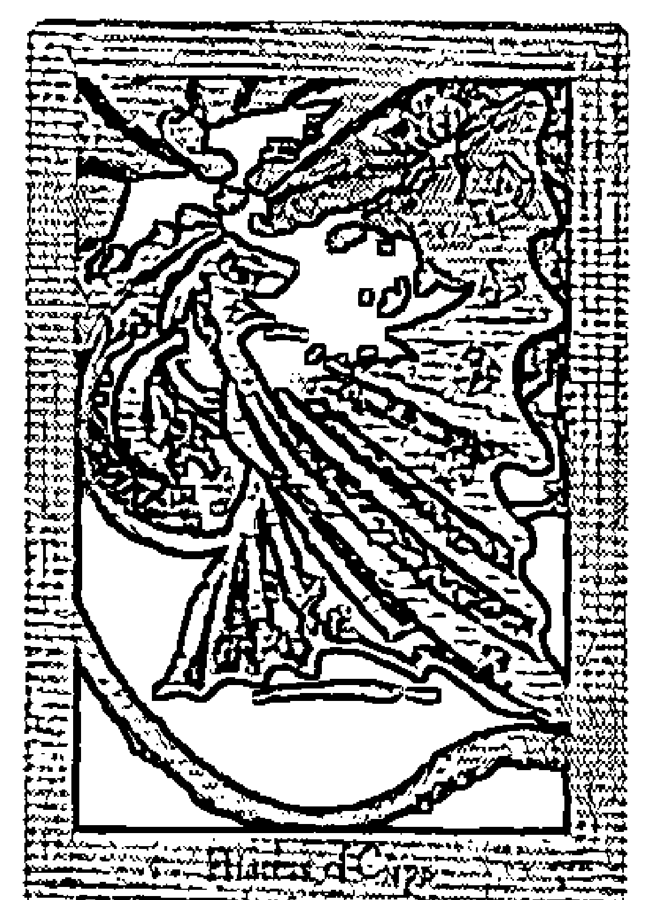

##### ⊗宮廷牌組之四張公主牌

公主牌以指定元素的對應法則，對應到了第十個薩弗拉內，公主牌是元素力量的終點，如果說王牌是包含了元素中每一個薩弗拉的能量種子，那麼公主牌就是包含了所有元素力量的果實。公主牌是位於第十薩弗拉「王國」的基底元素，它們分別是各元素能量經過結晶化的物質。

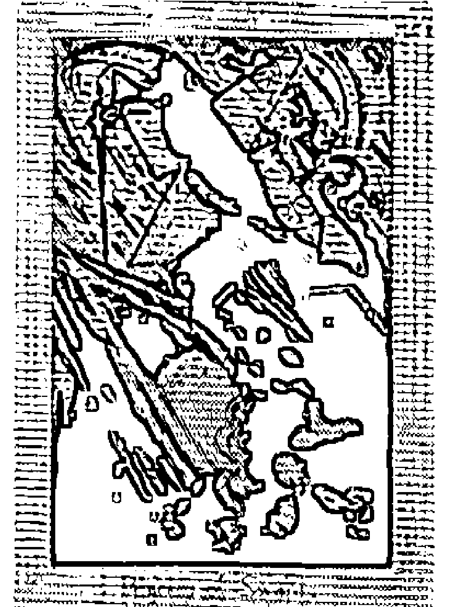

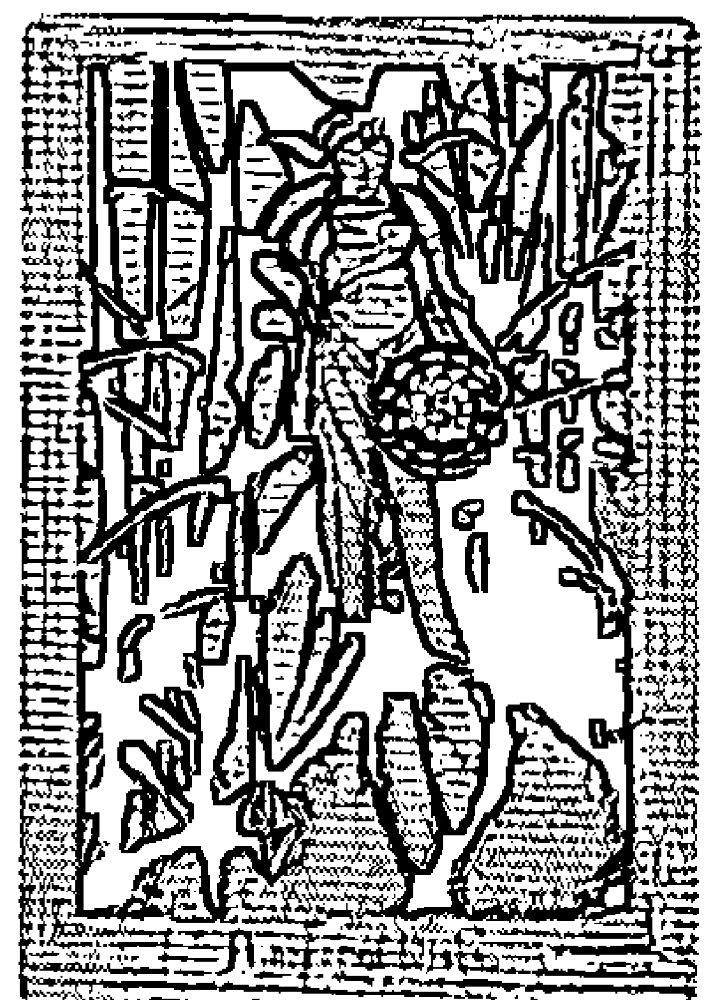

公主牌。

### 生命之树中的二十二条路径与大阿卡纳牌的对应

将希伯来文的二十二个字母，对应到喀巴拉生命之树内的二十二条路径，是由西方的神秘学团体所发展出来的，这些论述并不存在於正统的喀巴拉中，也没有出现在传统的喀巴拉典籍之内。而它们在托特塔罗牌中的详细意义与多重的神秘学对应理论，则是由克劳利所写下，在他的著作《Liber 777》内。接下来我们将在这个基础上，深入了解每一个希伯来字母对应於喀巴拉生命之树的路径所代表的意涵。

路径的本身没有方向性，它串联起了两个萨弗拉，代表了两者之间的平衡能量。每一条路径也都有著自己的编号，由於十个萨弗拉已经分别占用了 一到十，因此路径的编号从Path 11开始。

#### Path 11：0愚人路径

א是希伯来文的第一个字母，也是「愚人」所对应的字母。希伯来文中א具有公牛的意思，因此在愚人头顶端被设计出一对牛角作为א的暗示。א在生命之树中是连接 「王冠」与「智慧」的路径。「王冠」是第一个萨弗拉，是宇宙第一个起源，在此当中没有任何的特性、没有任何的形象，它只是一种存在，相当於佛教对於「空性」的描述。第二萨弗拉「智慧」，则是 由来自於「王冠」的能量开始震荡作用，是阳性能量的开端。路径本身没有 方向性，在这条路径中可以看成由「王冠」流向「智慧」，也能够视为「智慧」流向「王冠」，这条路径是理性、才智的展现，是创造源头流动的过程， 触动了来自於「王冠」的能量，向下引导至「智慧」，从纯粹的存在通往分化 而成的每个部分。这可以是第一个创造能量的表现。

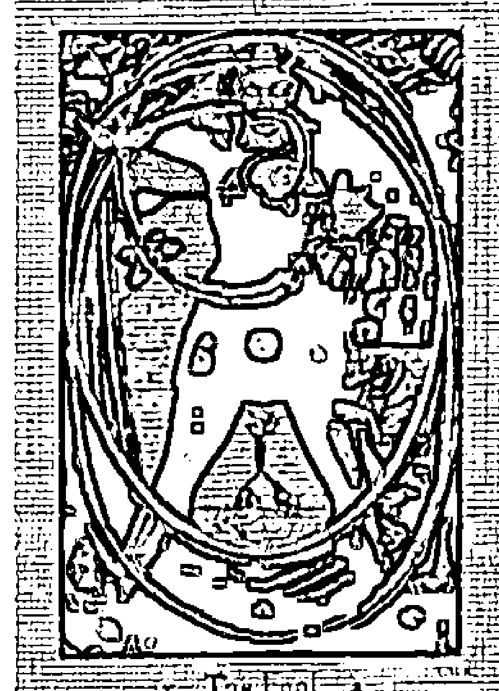

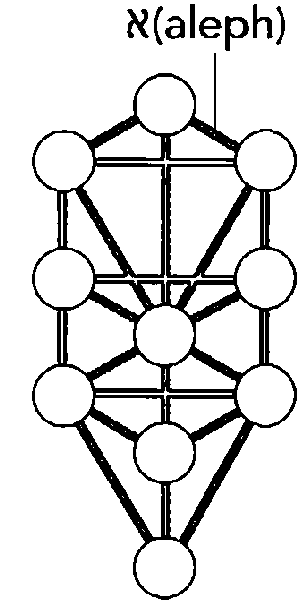

1. 王冠
2. 智慧
3. 理解
4. 仁慈
5. 力量
6. 美
7. 勝利
8. 宏偉
9. 基礎
10. 王國

> Ⅰ ♃ 1 魔法師
> Ⅴ ♄ 0 愚人
> ▽ ♀ 3 皇后
> ☽ 2 女祭司
> □ ♃ 5 大祭司
> △ ☿ 7 戰車
> ▽ ♁ 6 戀人
> △ ♄ 17 星星
> ∪ ♒ 11 慾望
> ☽ ♆ 8 調節
> ◇ ♑ 9 隱士
> △ ♀ 10 命運
> ▽ ▽ 12 吊人
> ▽ ♀ 13 死神
> ▽ ♏ 15 惡魔
> ♂ 16 塔
> ♂ 14 藝術 (煉化)
> ⊙ 19 太陽
> ♈ 4 皇帝
> ▽ △ 20 審判
> ∩ ♓ 18 月亮
> △ ♄ 21 宇宙

如同剛睡醒時半夢半醒、似虛似實的狀態，像是剛墜入身體的靈魂，仍游移在睡夢中的虛無與醒來後的現實感，正是這條路徑的一種呈現。א是路徑中過渡元素裡風元素的象徵，如同生命存在下的氣息，風元素在西方神秘學中具有思想的流通與創造之意，而且愚人本身更帶有一些瘋狂的層面。

#### Path 12：1 魔法師路徑

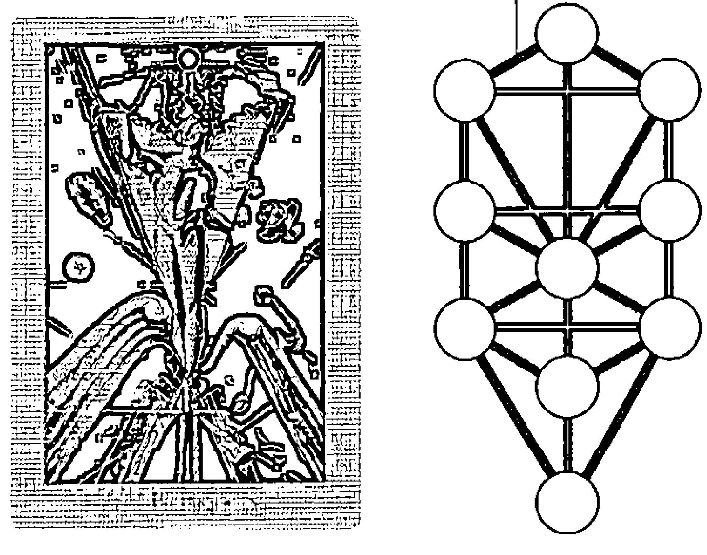

連接了第一薩弗拉「王冠」與第三薩弗拉「理解」，代表了神聖的創造之光照入第三薩弗拉的大海，與之深深的融合，在大海中蘊藏了智慧，蘊藏了來自神聖起源的種子。魔法師以古埃及智慧之神托特的姿態站立於宇宙，得以運用祂所掌握的元素力量。這是與「愚人」相對的一條路徑，「愚人」墜入了陽性力量展現的第二薩弗拉，顯得無所拘束、隨心所為，彷彿是火把掉入了火爐中，兩者相融而忘我，「魔法師」則是墜入了象徵陰性的第三薩弗拉，在大海的滋養下得以增長能力，更利於「魔法師」天賦、直覺的發展。

#### Path 13：2 女祭司路徑

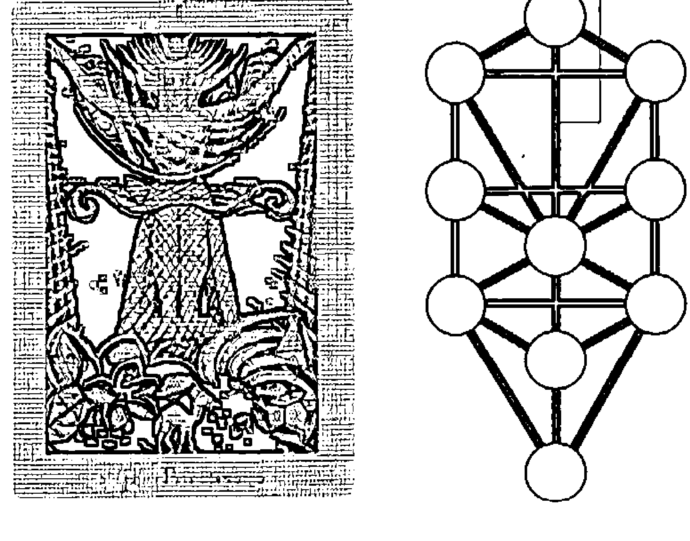

女祭司路徑相連於第一薩弗拉「王冠」與第六薩弗拉「美」，意味著來自神聖的創造之光與生命之樹的意識中心存在著一條通道，得以直接的接收來自更高意識傳達而下的訊息，並且可以以造物者之名來進行創造。此路徑穿越了天界三角底部阻隔意識的深淵，讓它可以與內我（神性）連結。呼應了女祭司本身具有的特殊天賦，能夠傾聽內我的聲音，能夠藉此與不可見世界保持暢通的管道。

#### Path 14：3 皇后路径

「皇后」牌連結了第二薩弗拉「智慧」與第三薩弗拉「理解」，由承載著靈魂的肉體（第三薩弗拉）與精神（第二薩弗拉）所組成，「皇后」先於「皇帝」出現，點出了女性在精神層面上高於男性的特點，這也意味著人類從母系社會到父系社會的過程。皇后是各個民族中代表豐盛、豐收、懷孕的女神。這條路徑屬於創造之光經過的路徑之一，連接了陰與陽，正如同「皇后」牌在煉金術中對應的鹽，本身靜態的存在，是中和過後的產物。它位於天界三角之上，對應於「皇后」強大的心靈感知特質。

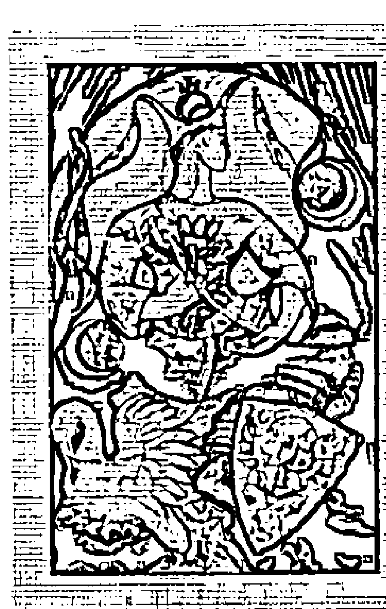

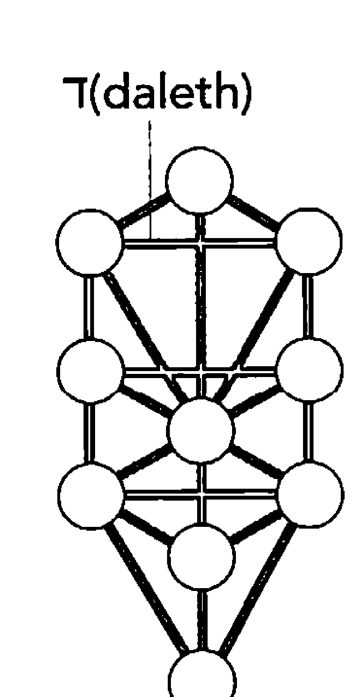

#### Path 28：4 皇帝路径

「皇帝」牌在過去的喀巴拉生命之樹對應法則中，是連接第二薩弗拉與第六薩弗拉的路徑。但是在《律法之書》的預言中（詳見於本章〈雙環帶扭曲理論〉），對應於「皇帝」與「星星」的希伯來文字母互相交換，因此皇帝路徑所對應的字母變為了צ，而在生命之樹中的對應也更改成了連接第七與第九薩弗拉的路徑。在這一條路徑之中，為「皇帝」牌帶來了意涵，卻較不明確，並且沒有特別的張顯。唯一可以對應到的，乃是皇帝對

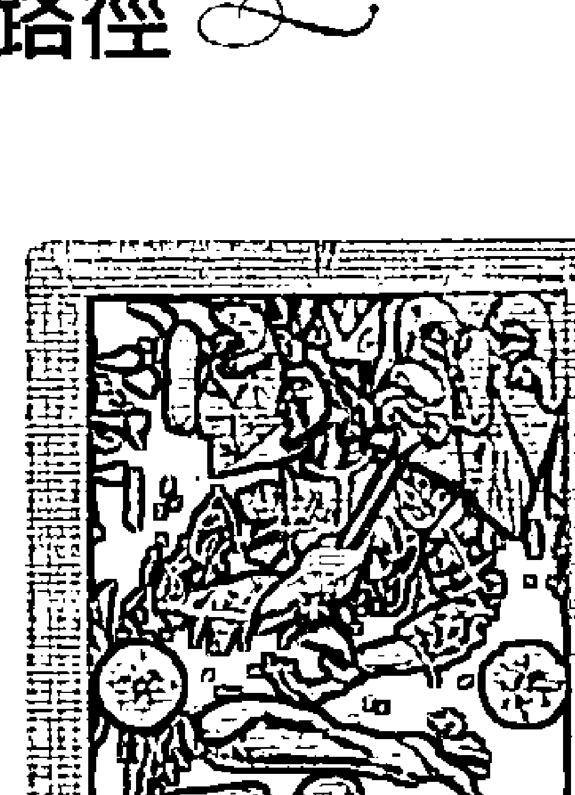

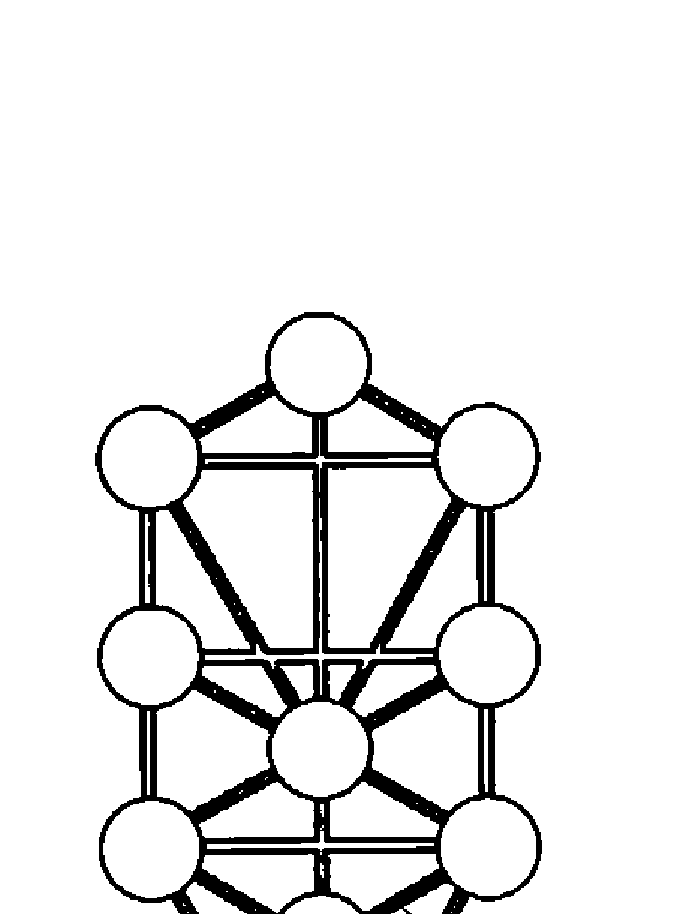

於領土的擁有與下一個征服計畫，如同第七薩弗拉中來自於靈感、內我湧現出的泉源進到了第九薩弗拉之中，他捕捉了這一個意念，將之發揮。

## ~Path 16：5 大祭司路徑~

連接第二薩弗拉「智慧」與第四薩弗拉「仁慈」的路徑，對應給了「大祭司」牌，意味著從虛無當中分化出的陽性能量（智慧）穿越了天界三角的阻隔後，直接向下進入第四薩弗拉（仁慈）之中，將神性的啟發帶入了心靈深處，並且將心靈深處矛盾、衝突、慾望等凝結的意識體向上傳遞給了神（第二薩弗拉的神性），這些工作正好就是大祭司（祭司）的本分，因而以此對應給了「大祭司」。

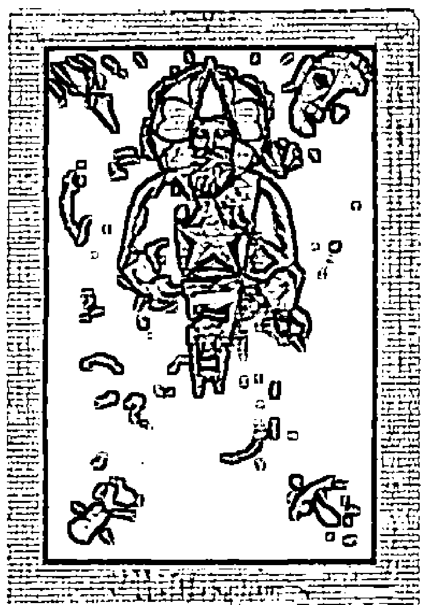

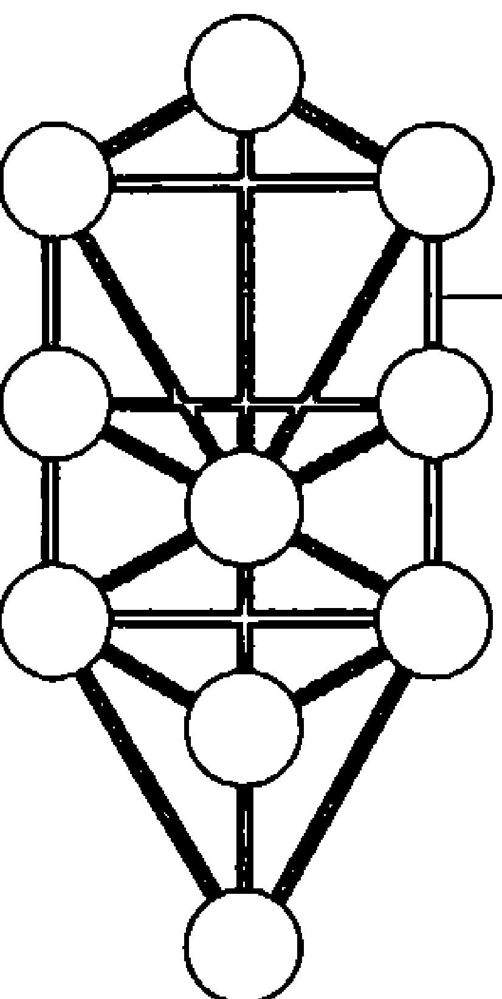

## ~Path 17：6 戀人路徑~

連接第三薩弗拉「理解」與第六薩弗拉「美」的路徑，對應給了「戀人」牌。創造之光經過第二薩弗拉的增幅後，將代表陽性的能量投入以第三薩弗拉為代表的陰性大海之中，因此第三薩弗拉中包含了來自於創造之光的陽性能量。在此路徑中，第三薩弗拉與生命之樹的中央薩弗拉相連，穿越了天界三角意識阻隔的深淵，意味著透過結合（婚姻、煉金婚配）獲得新的生命（第六薩弗拉「美」），以此對應給了「戀人」，結合、煉金術方面的意涵。

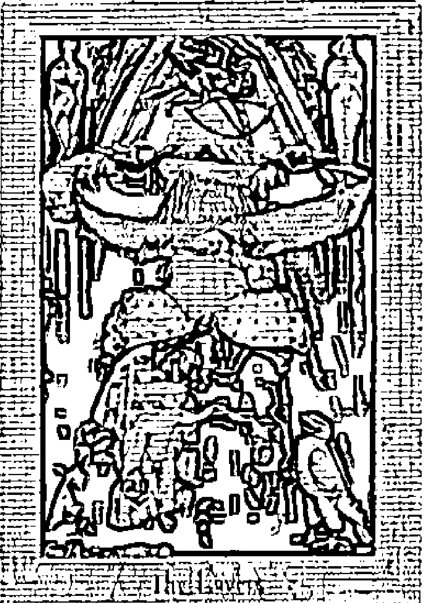

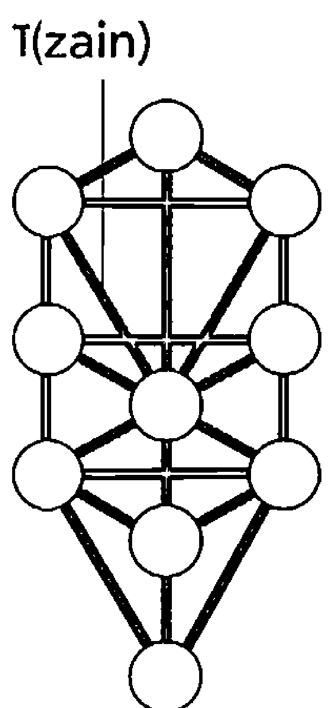

#### Path 18：7 戰車路徑

連接第三薩弗拉「理解」與第五薩弗拉「力量」的路徑，對應於「戰車」牌。在牌中，我們可以透過顏色來找到這條路徑的線索，戰車上方的藍色頂棚代表著第三薩弗拉的廣大海洋，而戰車的紅色輪子則是第五薩弗拉的星色。戰士位於戰車之中，即是這條路徑的象徵。從內我意識的汪洋中，往下連接於具有殺傷力、以戰神火星為代表的第五薩弗拉，道出了「戰車」牌戰士出征的意涵。第三薩弗拉的陰性特質內化於戰士心中，與巨蟹座的特性相應，而戰車則是與第五薩弗拉的戰爭、破壞特質相應。

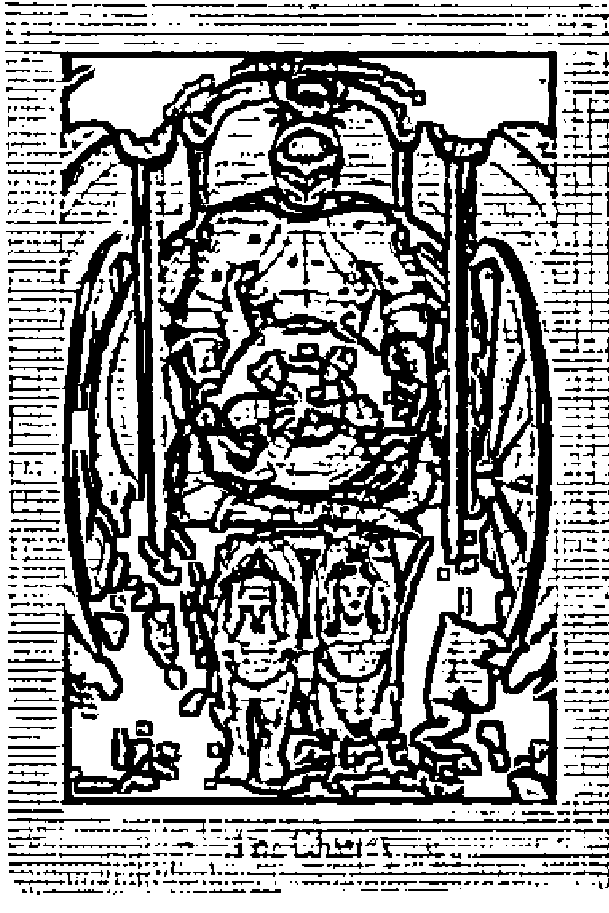

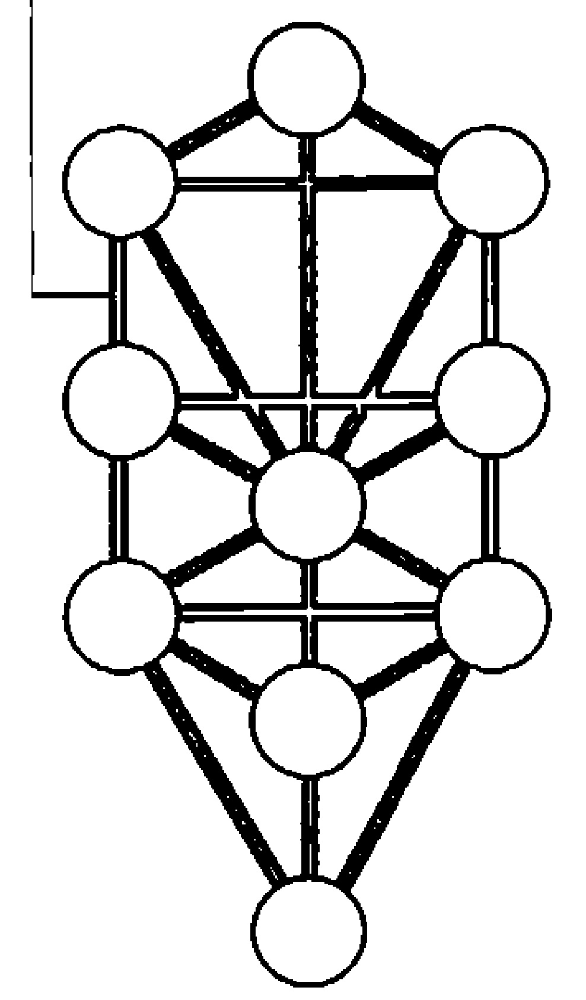

#### Path 22：8 調節路徑

連接第五薩弗拉「力量」與第六薩弗拉「美」的路徑，對應給了「調節」牌。這是創造之光經過的路徑，它經過了第四薩弗拉「仁慈」與第五薩弗拉「力量」的震盪後，收斂了暴戾氣息，回歸於平衡之柱，因此取這回歸的意涵來賦予此牌。將創造之光送回屬於風元素的第六薩弗拉內，屬於理性層面的事件，與「調節」牌對應的天秤座同樣為風元素，加深了這張牌在思考、理性上的意義。

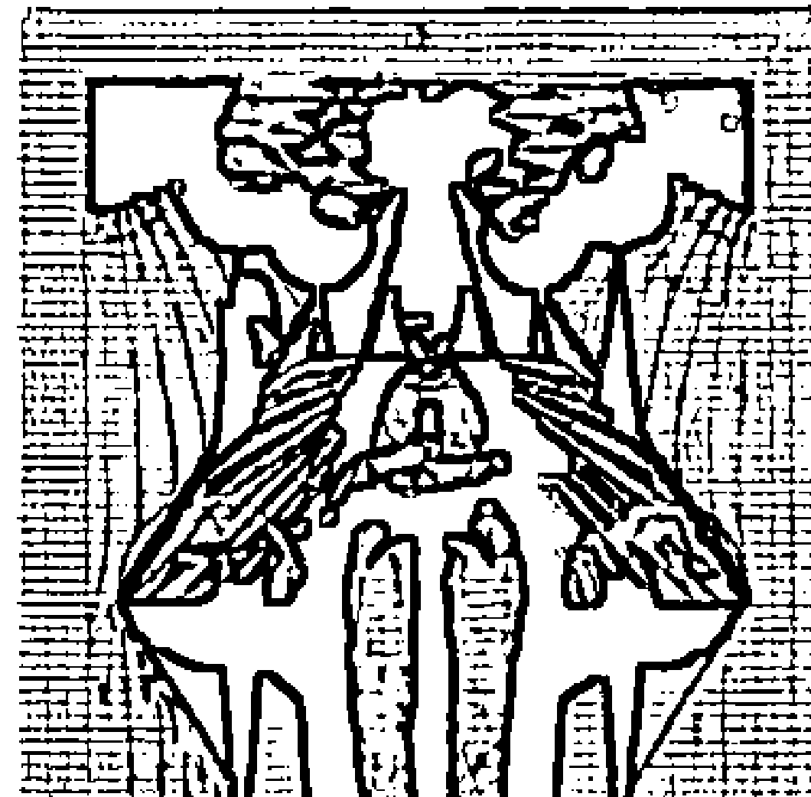

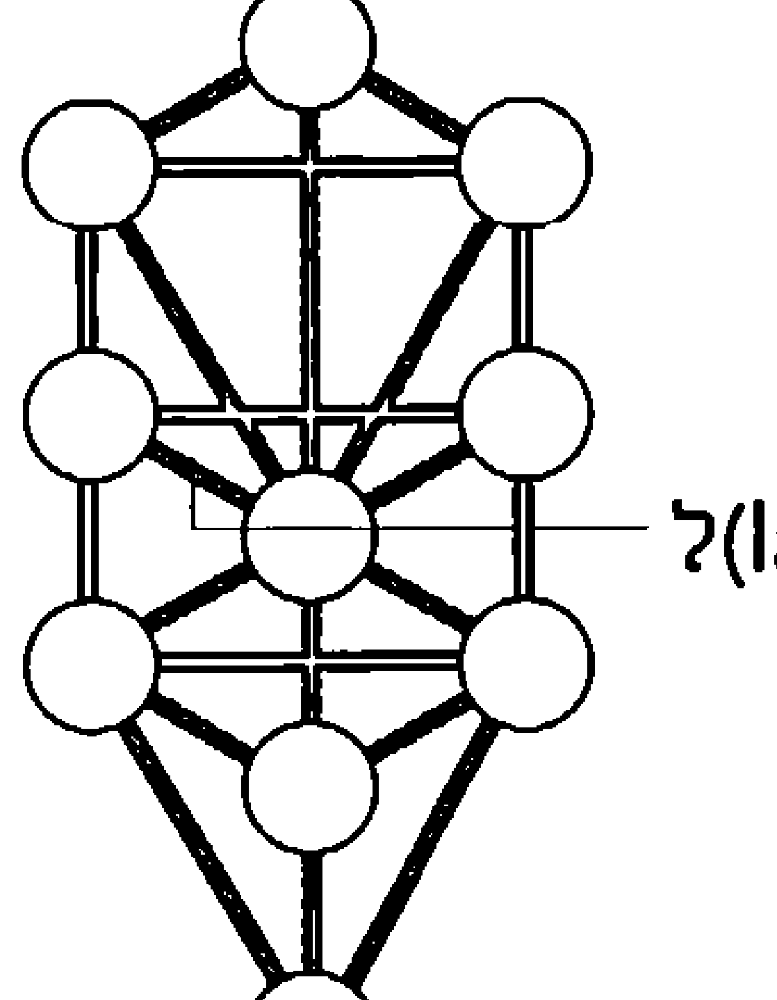

#### Path 20 : 9 隱士路徑

連接第四薩弗拉「仁慈」與第六薩弗拉「美」的路徑，對應給了「隱士」牌。第四薩弗拉「仁慈」是創造之光穿越了阻隔意識的深淵後，第一個到達的薩弗拉，這是創造之光第一次凝結穩固後形成的心智，如同隱士一般，隱身於黑暗之中，唯一透出的光亮來自於他的智慧，來自於凝結後的心智。

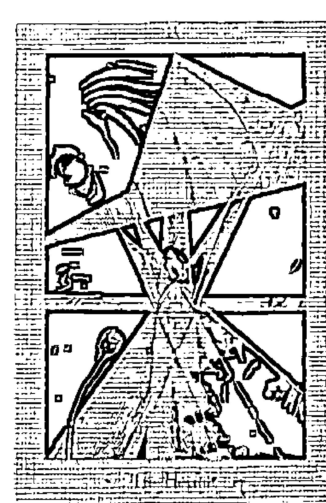

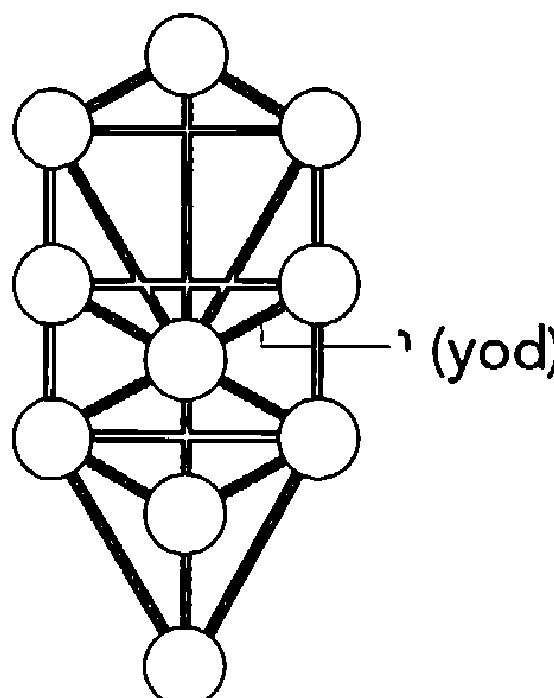

#### Path 21 : 10 命運路徑

連結第四薩弗拉「仁慈」與第七薩弗拉「勝利」的路徑，對應於「命運」這張牌。這是位在仁慈之柱中的路徑之一，它從創造之光第一個凝結心智的第四薩弗拉落到了第一個組成意識、思想的第七薩弗拉，在兩種較為擾動的薩弗拉之間，就如同命運之輪變與不變的特質一般。「命運」牌連接著上方的高我意識與下方的靈魂投生之門，處在兩者變動的中央，如同此路徑。

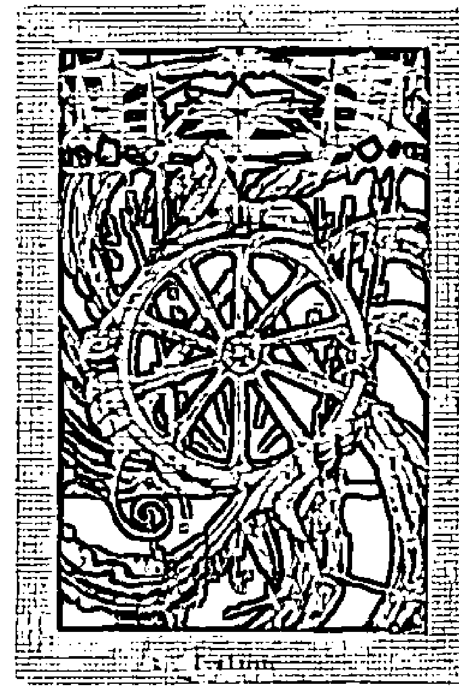

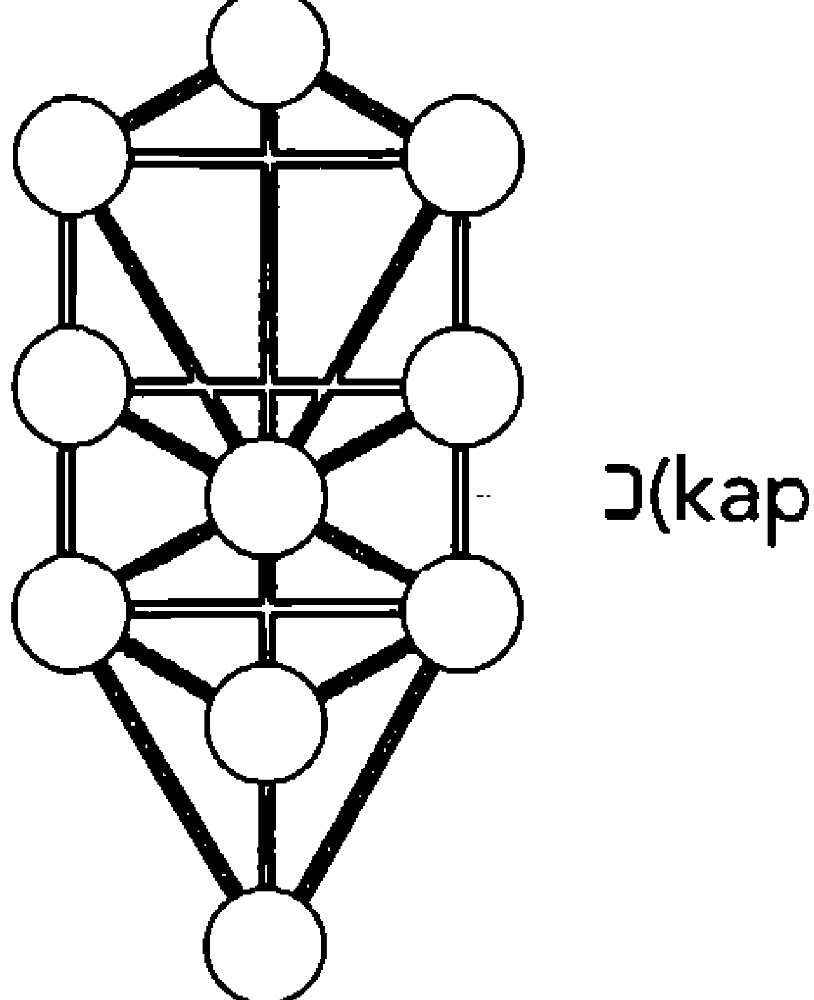

#### Path 19 : 11 慾望路徑

連接了第四薩弗拉「仁慈」與第五薩弗拉「力量」的路徑，對應給了「慾望」這張牌。這是創造之光所經過的路徑之一，也是一條較為極端的路徑。創造之光在第四個薩弗拉中第一次凝結為心智之原型後，投入了第五個薩弗拉，削弱了原本凝聚的光源。連接這兩個薩弗拉的路徑，讓這種凝結、破壞的過程不斷交替，而這些都發生於我們能夠掌握的顯意識身後，我們所能感覺到的不是這種破壞與重生的過程，我們只能感覺到力量背後的兩極性，享樂與行動，放棄與堅持，這是「慾望」的意涵，也是克勞利認為較貼近於這條路徑的意涵，因此取代了傳統塔羅牌較為溫和、撫摸著獅子的力量牌，改以大膽的慾望流露來指出此點。

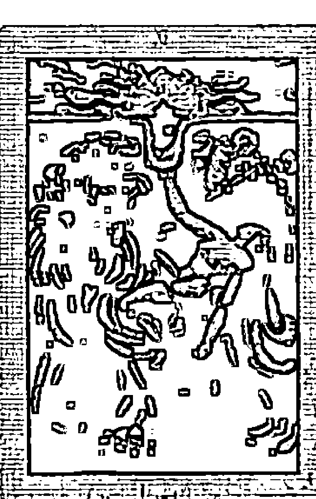

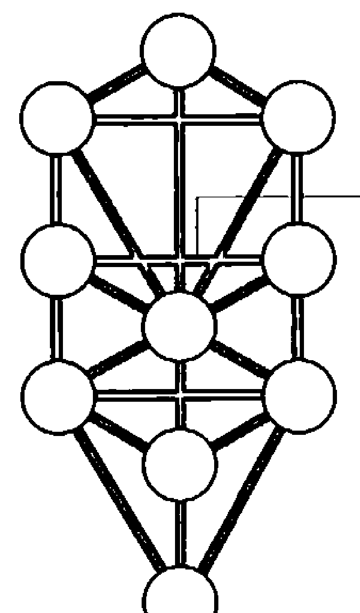

#### Path 23 : 12 吊人路徑

「吊人」所對應的希伯來文字母為n，這條路徑是「過渡元素」中的水元素，並且對應於生命之樹中連接第五與第八薩弗拉的路徑。吊人從代表水元素創造之界的三角，墜入了代表風元素成形之界的三角中，從第五薩弗拉「力量」的破壞中進入了第八薩弗拉「宏偉」之內，克勞利將之闡述為：吊人從以水元素代表的伊西斯紀元，墜入了由風元素代表的歐西里斯紀元之中，接著在紀元更替下，進入到了荷魯斯紀元，赦免了吊人承受的罪惡。這從水到風（原生元素）與從破壞到救贖（第五薩弗拉到第八薩弗拉）的過程，經過了無數的難關，考驗著吊人的決心，是為此路徑所賦予吊人的意義。

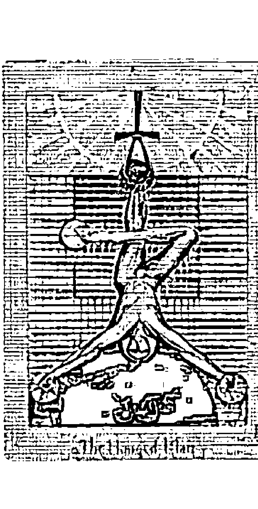

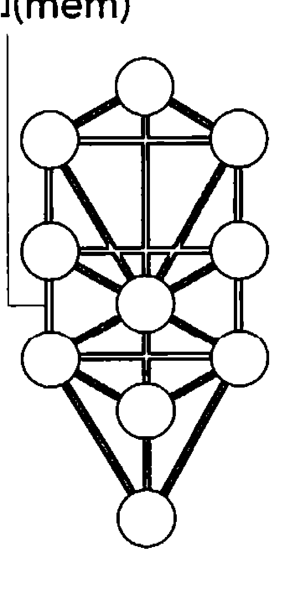

## <Path 24 : 13 死神路徑>

連接著第六薩弗拉「美」與第七薩弗拉「勝利」的路徑對應給了「死神」牌。這是創造之光的路徑之一，也是創造之光離開了內我神性的範圍，投入可以捕捉到的意識面的過程，第七薩弗拉「勝利」將創造之光散發為無數的小光芒，再投入下一個薩弗拉，因此這條路徑本身處於一個非常混亂的狀況之中，如同「死神」牌中所面臨的情況。「死神」牌是「藝術（煉化）」牌中煉金之釜內烹煮的情況，將煉金材料破壞加熱，而後獲取其提升的精華，與此路徑所代表之意義相互呼應。

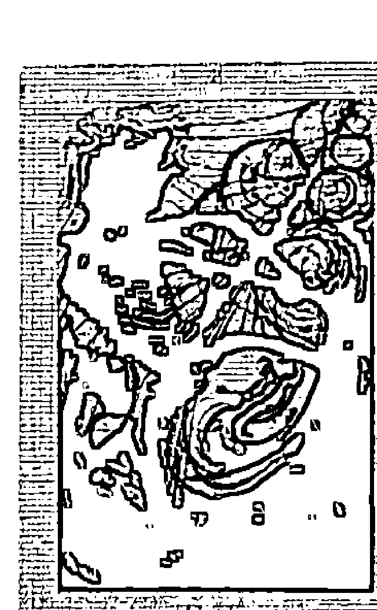

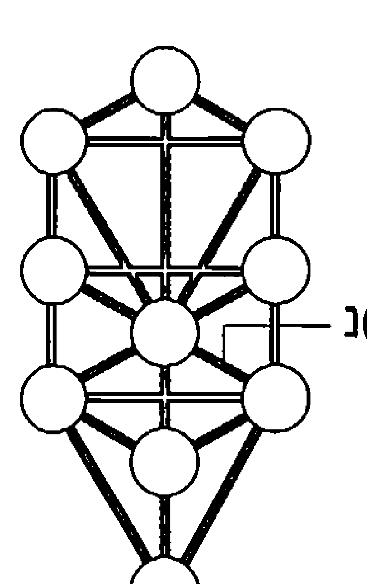

## <Path 25 : 14 藝術（煉化）路徑>

連接第六薩弗拉「美」與第九薩弗拉「基礎」之中，這條路徑直接連接了代表意識層面屬於風元素的成形之界，與包含著潛意識與內我神性的部分（創造之界）。下方的成形之界三角是魔法、煉金術、術法所操控的意識部分，透過不同的儀式，將意識進行加熱、熬煮、蒸餾等煉金術的手段，而開通一條連接著凌駕於個人心靈中的部分，這條路徑就是煉化的目的，就是牌中那條由煉金之釜上升後化為彩虹的路徑。

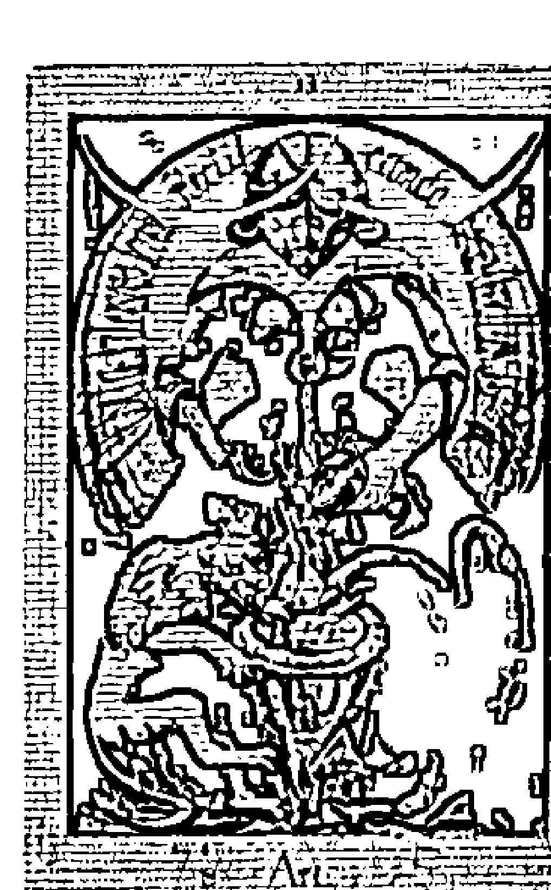

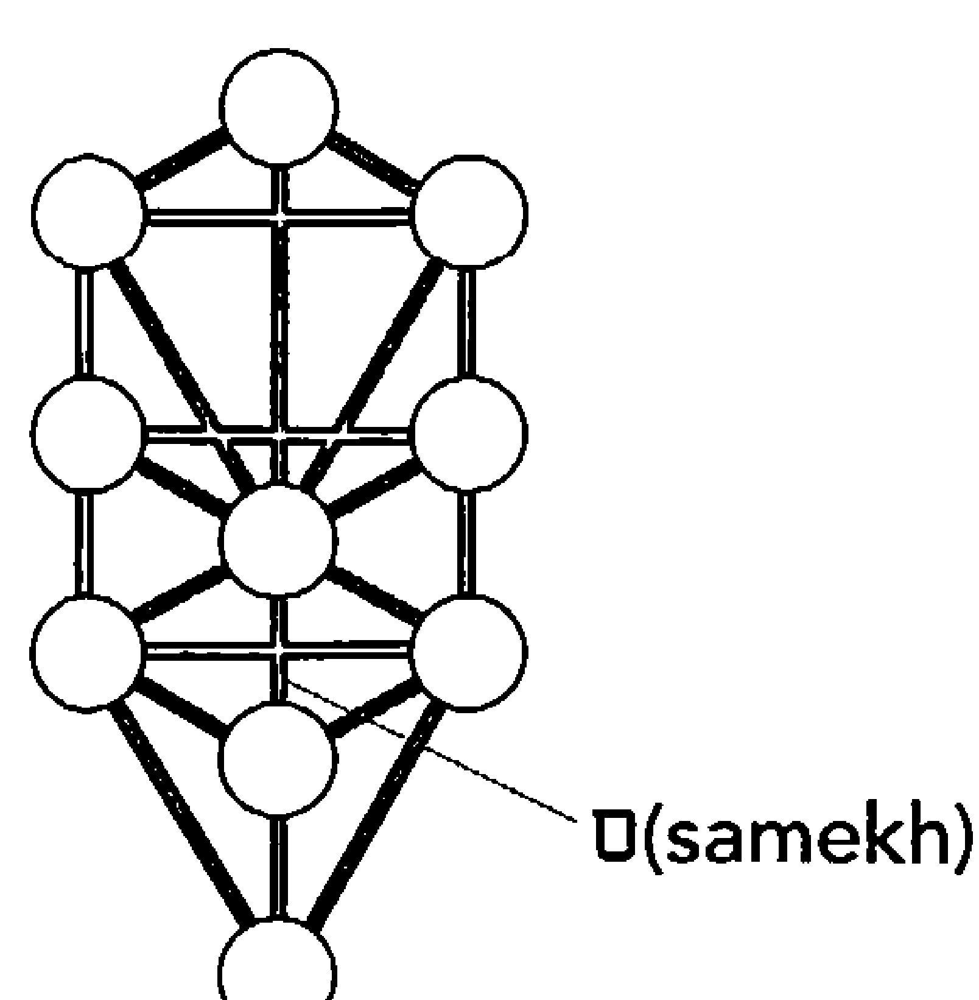

## ~Path 26:15 恶魔路径~

连接了第六萨弗拉「美」与第八萨弗拉的路径，对应给了「恶魔」牌。在这一条路径之中，欲望没有经过分散与筛选（第七萨弗拉），反而直接走向意识之中，所表现出来的是原始的本能、生存的欲望，在这条路径上呈现出不被遮蔽的人性，极端一点的说法，称之为魔性，甚至称呼为魔鬼。在托特塔罗牌的理论下，我们知道魔鬼只是一种虚妄的称呼，背后代表的是我们原始的人性展现，正如同这条路一样，没有经过第七萨弗拉的分化与筛选，直接表现出原始的本性，是为这张牌的牌义。

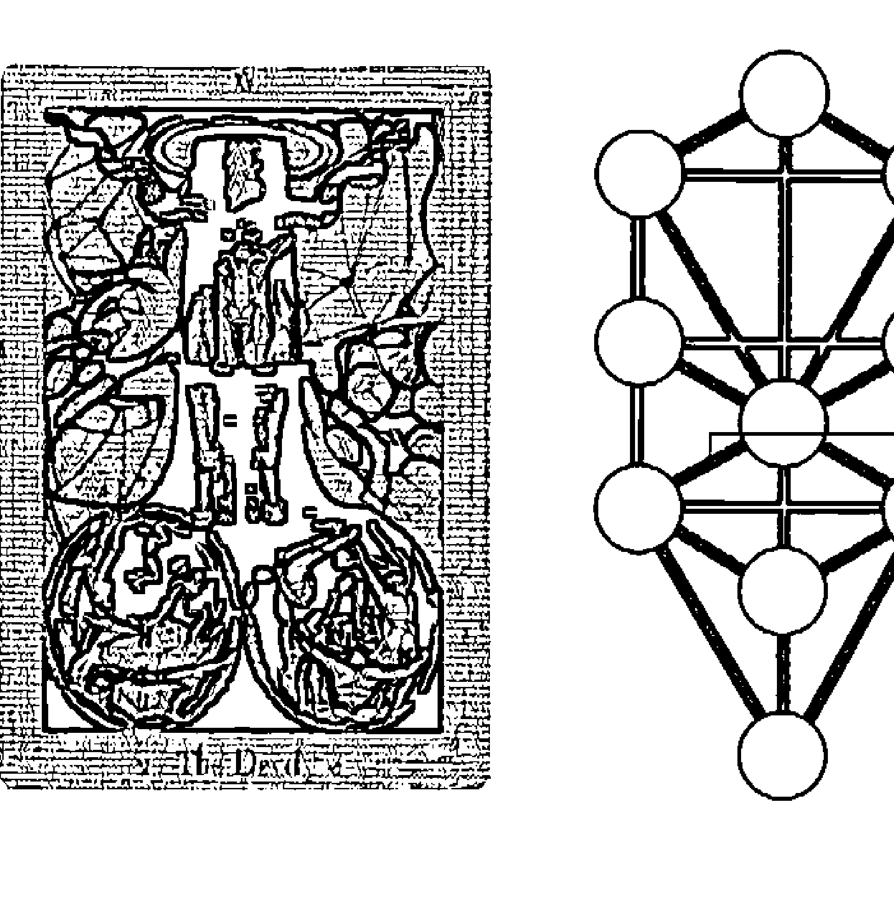

## ~Path 27:16 塔路径~

连接第七萨弗拉「胜利」与第八萨弗拉「宏伟」的路径，对应给了「塔」牌。这是创造之光所经过的路径之一，当创造之光进到了第七萨弗拉「胜利」的发散后，将其投入了第八萨弗拉「宏伟」，成为我们所可以认知的情绪与思想。在这一个过程之中，来自于第六萨弗拉平衡的能量，在第七萨弗拉的作用之下，使得它崩解成许多光束，往第八萨弗拉下坠，因此这一条路径本身就与「塔」牌相同，具有破坏与重建之意含。

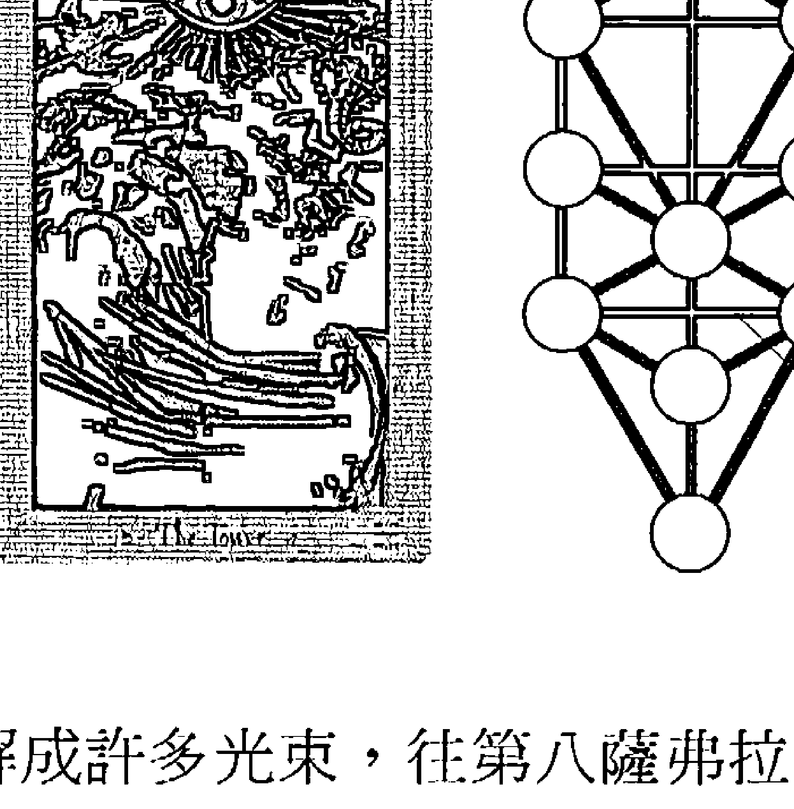

#### Path 15 : 17 星星路徑

連接第二薩弗拉「智慧」與第六薩弗拉「美」的路徑，對應給了「星星」牌。在《律法之書》與雙環帶扭曲理論的闡述下，「星星」牌的希伯來文字母對應與「皇帝」牌互換，所對應的路徑也發生了改變。往上提升的路徑相連了代表陽性力量的第二薩弗拉，以及力量平衡的第六薩弗拉，為這張牌的位階做了提升，將天界三角中的力量源頭導入了內我神性之中，取代了原本「皇帝」牌的位置，正如同這一張牌中的天空之神努特一般，把希望與祝福傾倒入世界，在歐西里斯紀元完全結束後，新的思維在心靈中被建構，是此路徑所代表的意義。

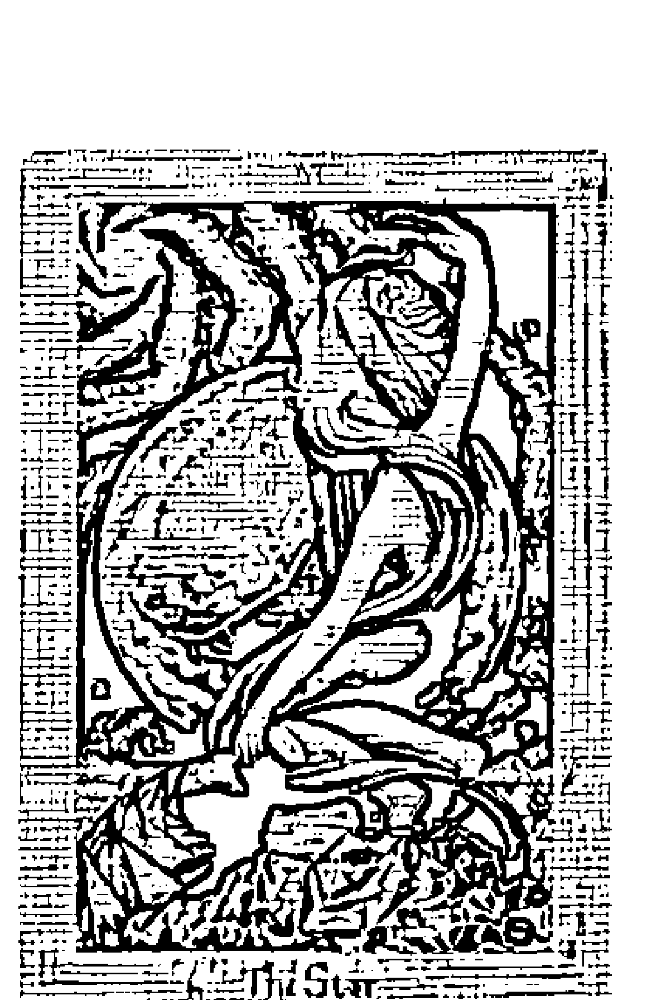

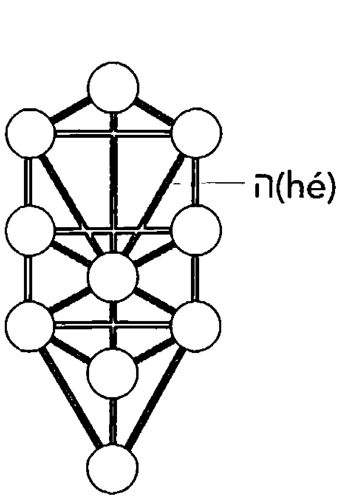

#### Path 29 : 18 月亮路徑

連接第七薩弗拉「勝利」與第十薩弗拉「王國」的路徑，對應給了「月亮」牌。第七個薩弗拉接收來自於內我第六薩弗拉神性的靈感啟發後，傳遞到了第七個薩弗拉「勝利」，並且將這股能量打散成為了許多光芒，傳遞到了第八薩弗拉「宏偉」中，使我們得以理解，但是這條路徑並沒有經過第八個薩弗拉，反而直接落於物質世界中（第十薩弗拉），因此這條路徑具有一種探尋內在經驗、探尋潛意識中情緒感受面之意。

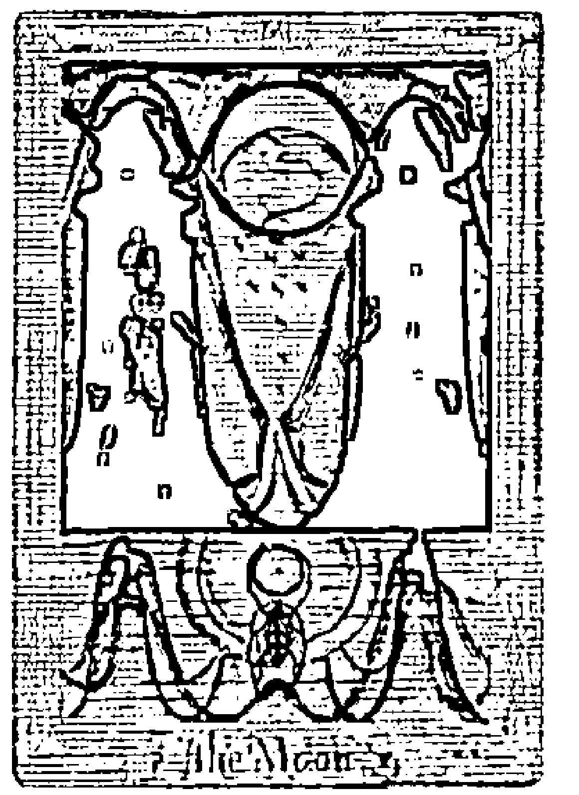

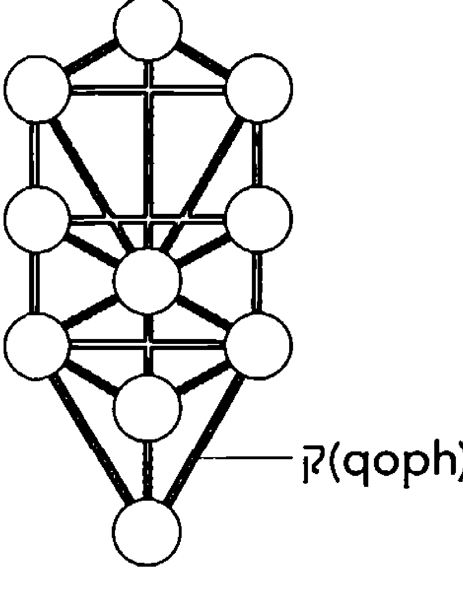

#### Path 30 : 19 太陽路徑

連接於第八薩弗拉「宏偉」與第九薩弗拉「基礎」的路徑，對應給了「太陽」牌，這是創造之光的路徑之一。在這條路徑中，來自凝聚後的思想將下降到第九薩弗拉中，使我們在心靈中獲得了價值觀與感受，同時創造之光結束了最後的擺盪，回歸到平衡之柱，準備將這一切在物質世界之中凝結成現實。因此這條路徑與太陽相同，能夠脫離黑夜（離開嚴厲之柱），重見光明（回到平衡之柱），並且以光芒普照於大地（創造之光凝結於物質世界的第一步），便是這一條路徑所具有的意義。

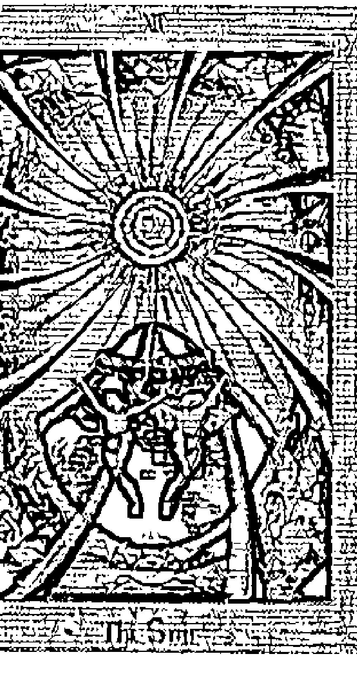

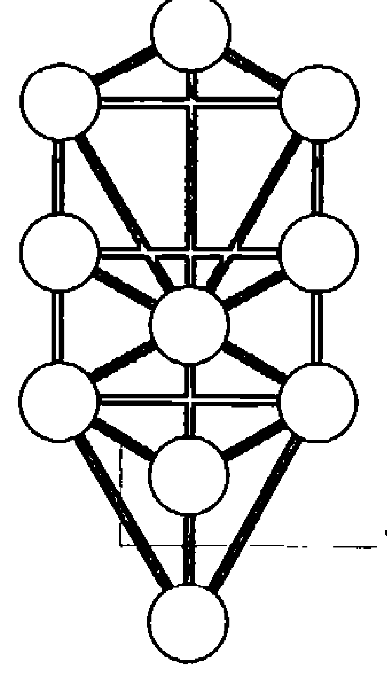

#### Path 31 : 20 新紀元路徑

連接了第八薩弗拉「宏偉」與第十薩弗拉「王國」的路徑，對應給了「新紀元」。這一條路徑是屬於「過渡元素」中的火元素，希伯來文的形象就像是燃燒的火把一樣，以火焰來淨化投入世界的新靈魂。在這一條路徑之中，在第八薩弗拉中建構於心靈世界的藍圖與第十個薩弗拉直接連結，代表著從思維直接到物質世界的過程，其中沒有經過第九薩弗拉的作用展現，代表「跳過了人的進程，直接從心靈源頭所發生的變動」。

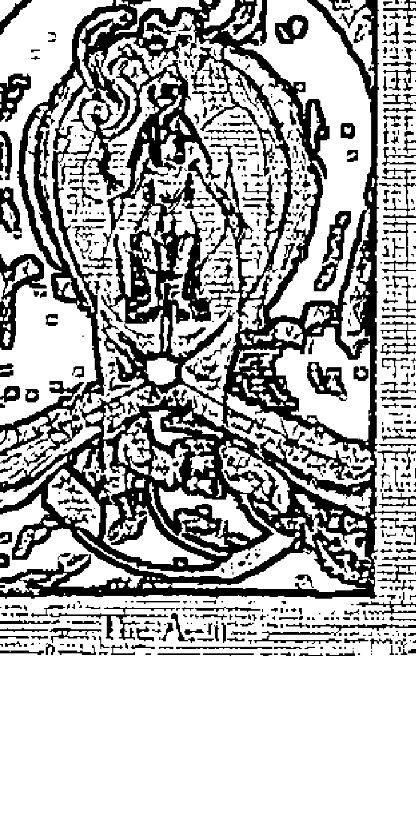

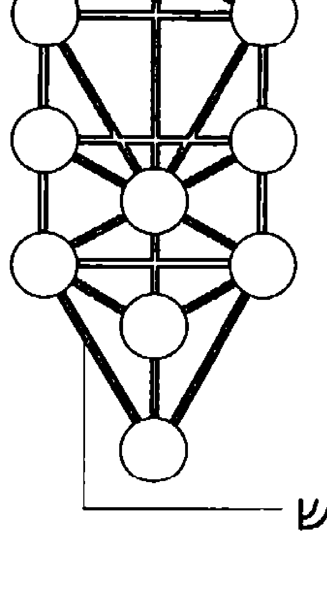

## # Path 32 : 21 宇宙路徑

最後一條路徑，連接著第九薩弗拉「基礎」與第十薩弗拉「王國」的路徑，對應給了「宇宙」牌，這是創造之光邁向終點的過程，一段將思想、意念凝結為物質世界體驗的過程。創造的終點也就是我們投身於這個世界的原因，對應於「宇宙」牌，這是我們所認識包含著萬物的宇宙，而在生命之樹當中，它只是反映出了內我片段體驗的一個縮影。

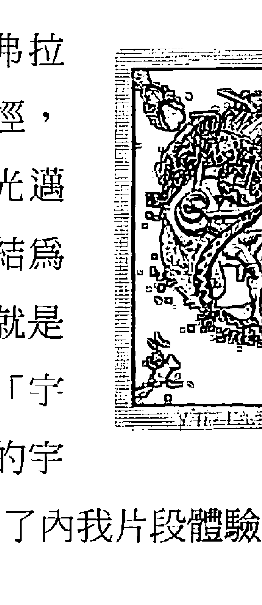

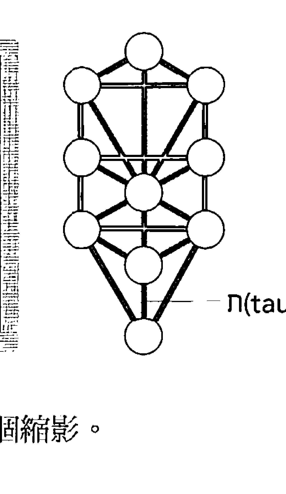

## # 實際案例探討

我們用這一章習得的占星學技巧，以一個實例來解釋喀巴拉在占卜上的技巧運用。

## ◎提問：

小雪再過一週就要面臨期末考了，她想要問問看關於考試的情況與結果會是如何。

## ◎抽牌：

對於這一個問題，占卜師選擇了時間之流牌陣，分別以過去、現在、未來，來分析小雪在考試的表現。她所抽出的牌如下：

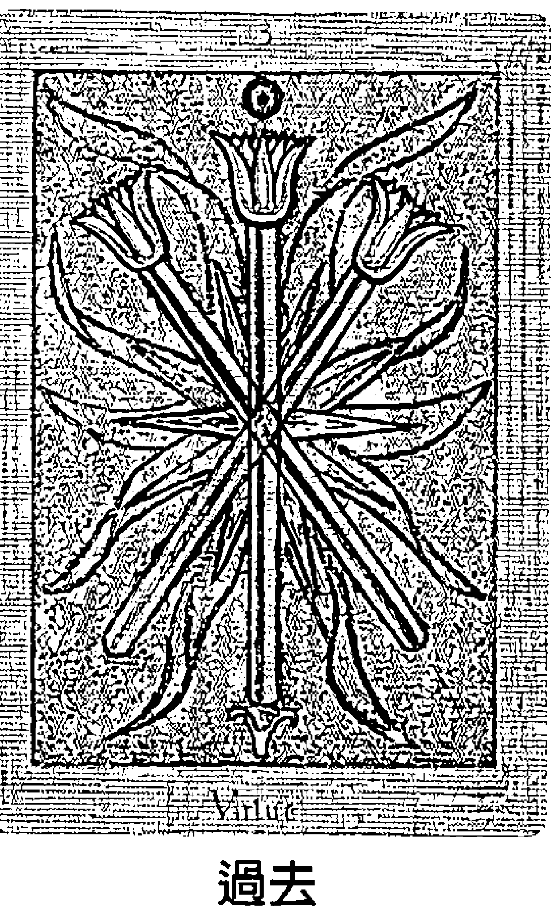

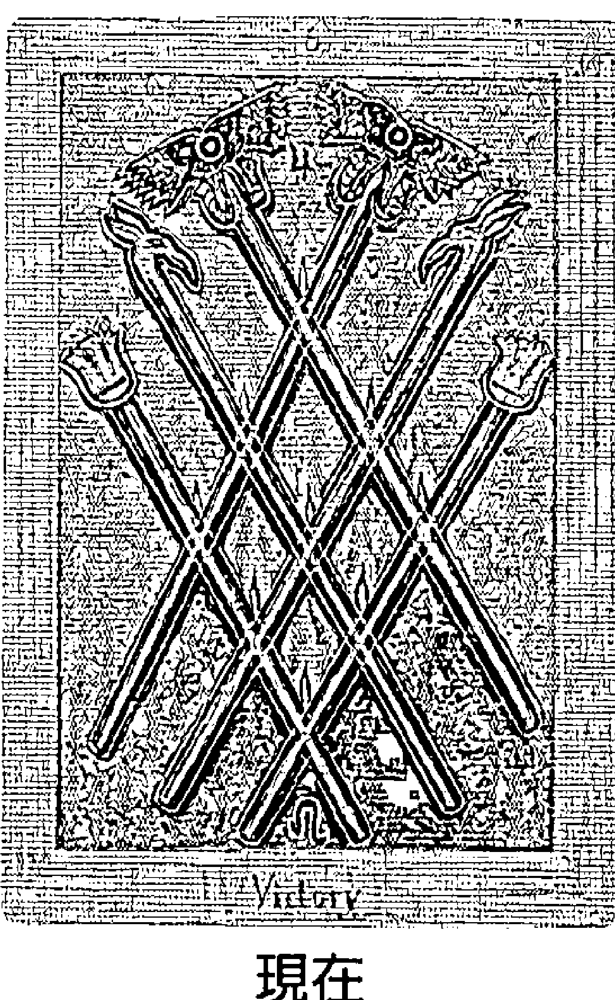

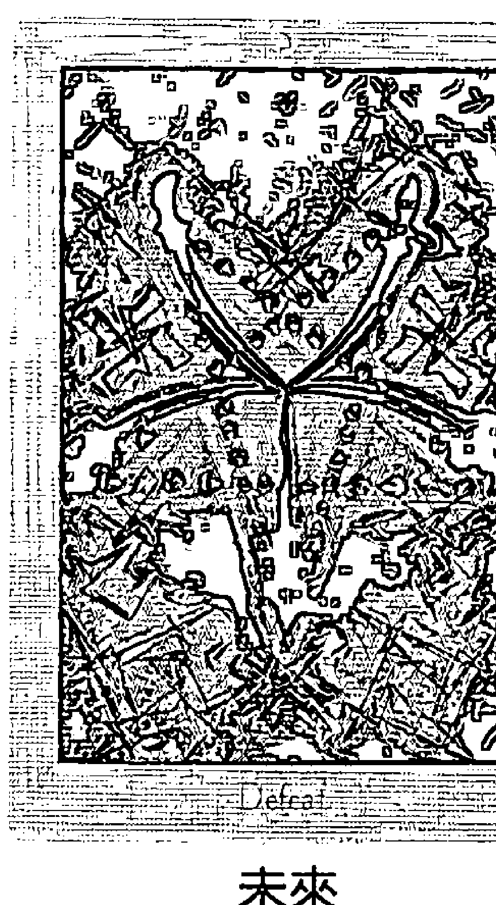

在牌義之外，以喀巴拉的原理入手，我們看到過去的「權杖三」與現在的「權杖六」都位於火元素的生命之樹內，對應於薩弗拉則是第三薩弗拉「理解」，以及第六薩弗拉「美」，連接此二薩弗拉的路徑則為Path 17：6 戀人路徑，在這一個時間軸線內，隱藏著偏向於火元素的「戀人」牌。因此我們可以推斷小雪在看到研究所考試放榜的刺激後，開始萌生了對於未來規劃的念頭。「戀人」牌之內的煉金婚配與奧菲克秘卵較符合喀巴拉火元素生命之樹的精神起源，意味這一個研究所考試的想法，是小雪對於未來生涯規劃的開端，她其實沒有那麼在意是否考上，她真正想要知道的是該把自己擺在未來的哪個位置。

在牌陣之內，透過各種技巧，常常可以發現問題本身的真正原因，有時候是連問卜者也不曉得的。占卜師必須審慎的評估，釐清脈絡後，再給對方一個最適當的建議。

## # 牌背與薔薇十字

托特塔羅牌的背面設計源自於薔薇十字的圖騰，在金色黎明會內的魔法儀式中，有著相似的圖像。

中心總共有二十二片花瓣組成，最內圈的三片花瓣是喀巴拉生命之樹中的三個「過渡元素」：火（新紀元）、水（吊人）、風（愚人）。中圈的七片花瓣則是占星學中的七星，分別為太陽、水星（魔法師）、金星（皇后）、月亮（女祭司）、土星（宇宙）、木星（命運）、火星（塔）。最外圍的十二片花瓣，則是黃道十二星座的排列，分別是牡羊座（皇帝）、金牛座（大祭司）、雙子座（戀人）、巨蟹座（戰車）、獅子座（慾望）、處女座（隱士）、天秤座（調節）、天蠍座（死神）、射手座（藝術）、摩羯座（惡魔）、寶瓶座（星星）、雙子座（月亮）。

而外側十字的四個端點，則是小牌落入的象徵之地。七十八張牌都可在牌背找到相對應的象徵處，代表了占卜中具體而微、相互呼應的準則。另外，除了作為占卜，牌背的圖騰也可作為神秘學上施法的應用。

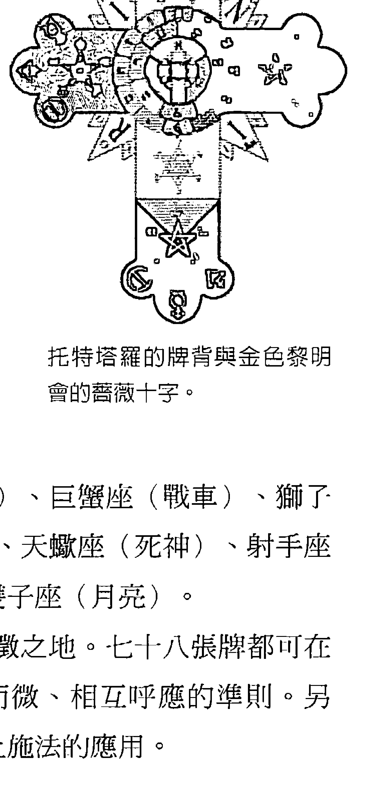

托特塔羅的牌背與金色黎明會的薔薇十字。

### 第四章

## # 牌陣的運用 與 實際占卜牌例

- 活用托特塔羅之各種牌陣
- 拆解種種疑惑
- 挖掘深埋心中的癥結

「牌陣」將提問者的疑惑，拆分成許多小環節，使所抽出的每一張牌對應到現實中。透過牌陣的運用，讓塔羅牌在眾多預測術之中獨樹一格。占卜師可以從牌陣中看到環環相扣關於問題的緣由，掌握了深埋心中的癥結，推斷出未來的脈絡。接下來，我們將介紹幾種常用的牌陣，運用於實際占卜的案例。

## 六芒星牌陣

最近研究所考試放榜，明年就要上考場的小陳不禁覺得有些緊張，應該是要上緊發條的時候，卻總是覺得還差了一點什麼。小陳來占卜，想知道明年的研究所考試該怎麼辦。

## 實際案例探討

小陳想要考研究所，然而此刻卻不太能夠緊握自己的意志，為了幫助當事人更釐清占卜的問題，我們將所要占卜的問題修正為「對於明年就要參加研究所考試的我，該用什麼樣的心態來準備？」

## 占卜牌陣的決定

占卜師選用了六芒星牌陣，是一個有許多歷史的牌陣，以過去、現在與未來的三張牌建立起時間線，搭配了每個時間的對象輔助牌，原因、環境、對策，用以透視問題，可以幫助當事人釐清發問的本質，與擬定未來的方向。

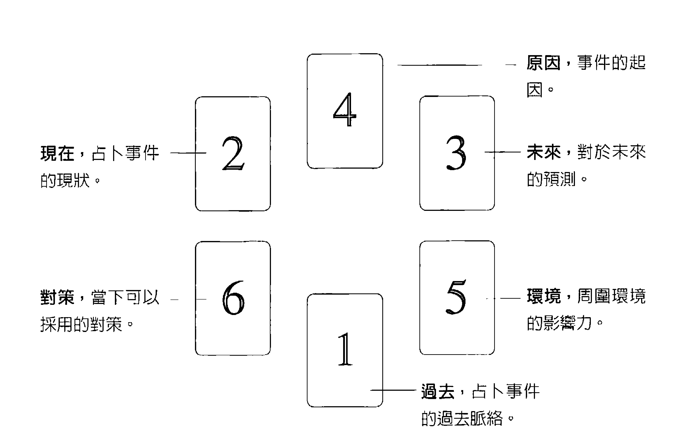

## 占卜結果解析

### ⊙切牌

切牌是「權杖騎士」，反映出小陳占卜當下的心態。在看到今年研究所榜單後，小陳一直心神不寧，一方面距離自己上考場的時間一步步逼近，一方面自己卻完全沒有什麼準備，「權杖騎士」火元素的特性正是小陳的寫照，恨不得馬上開始準備，雖然還沒有開始，卻打算做長久的規劃。

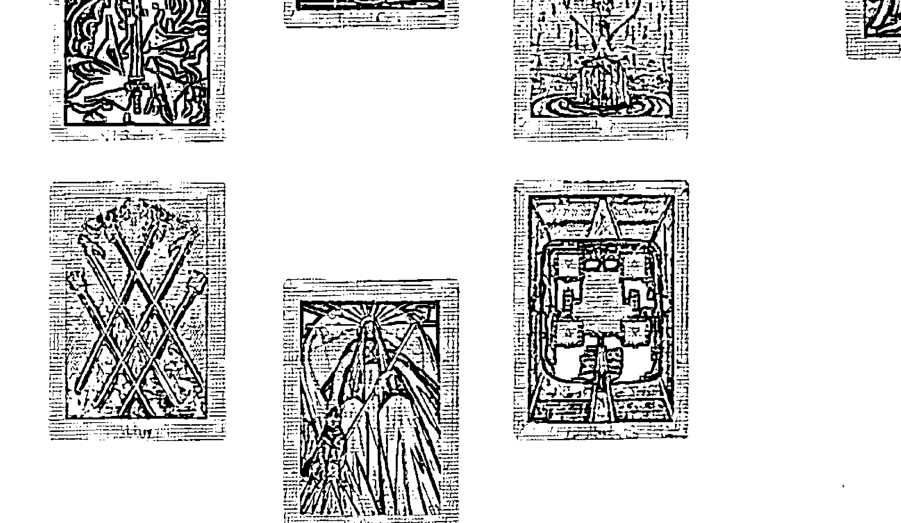

### ◎過去

過去的位置抽到了「權杖王后」，指出了小陳過去總是認爲本身擁有的實力已經足夠，在考試上沒有問題。他有爆發力，卻隱而不用，沉醉於安逸的想法內。

### ◎現在

現在的位置抽到「寶劍三」，有悲傷之意，今年的榜單擊碎了小陳的安逸，讓他從原本的生活中驚醒過來，意識到該是認真面對研究所考試的時候了。屬於風元素牌組的「寶劍三」，代表著理性重回現實的震撼。

### ◎未來

未來抽到了「聖杯七」，有沉淪之意，小陳很有可能如願考上研究所，並且有不錯的表現，然而這張牌卻指出如果沒有細細地想過，考上研究所對自己而言可能也是種隨波逐流的追尋，好像是從一個牢籠跳入了另一個牢籠。「聖杯七」往往點出了追尋過程中的迷失，爲什麼要做這件事？所想要的是什麼？所追求的又是什麼？

### ◎原因

「聖杯王子」代表的是對於既定現實的估算與利益的追求，意即代表研究所考試對小陳而言是因爲有所利益而做的。儘管有利益的事情並不代表不能做，但這個考試對小陳而言並非是出自其原本的意願，而是認爲有利可圖，不妨爲之。此外，「聖杯王子」也意味著它具有能力化腐朽爲神奇，規劃出從起點通往終點的道路。

### ◎環境

「圓盤四」的高度自律正是外界環境所帶給小陳的壓力。他開始戰戰兢兢的準備考試的內容。對於他而言，考試並非挑戰，真正的挑戰在於小陳願不願意放下對於安逸的執著，重新開始。

不願意行動。「圓盤四」反映出在有壓力的環境下，反而能夠顯現出他該有的實力。

此外，「圓盤四」隱約透露出封閉的管理與嚴厲的要求，可能會在未來的研究所生活中再次發生在他的身上。

### ◎對策

對於研究所考試，小陳可能在接下來的一陣子擬好目標，並且充滿信心的去實行。在這過程中，他往往回憶起很多考試得利的經驗。「權杖六」代表追求成功與重新面對自己真正的夢想，維持著這樣的腳步，目標就在不遠的前方。

## 〜 建議 〜

從每一張牌的意義，可以知道小陳在考試方面身經百戰，他有十足的把握可以考上，而差別只在是否開始行動。考上研究所並非小陳所追求的真正目的，以「權杖六」的對策轉變為「聖杯七」的未來，指出他縱使握有最好的武器，也找不到足以發揮的戰場。他的疑惑不在於考試，而是對於研究所的規劃感到迷惘。

透過談話，小陳透漏出對於學術專業上的追求與職業取向的衝突感。一方面他擅長於自己科系的學問，另一方面卻不想以此作為終生的職業。因此研究所對他而言可有可無，在這個岔路上，他還沒有做下決定。此刻，適時的告訴他，對於職業與學業的取捨，你已經開始有了自己的想法，通過這次的考試，以及考後的生活體驗，你會更清楚自己真正想要做的是什麼。

## 關係牌陣

關係牌陣適合運用於戀人、朋友或同事之間的占卜。牌陣中以雙方各自的眼光來拼湊起關係之間的拼圖，再佐以現狀與未來的時間維度，給問卜者一個清晰的答案。

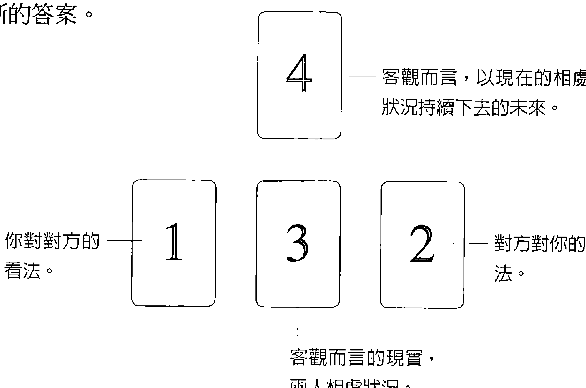

## 實際案例探討

小芳最近與男友的關係似乎有點心結產生，請問現狀的關係如何？又該如何去處理呢？

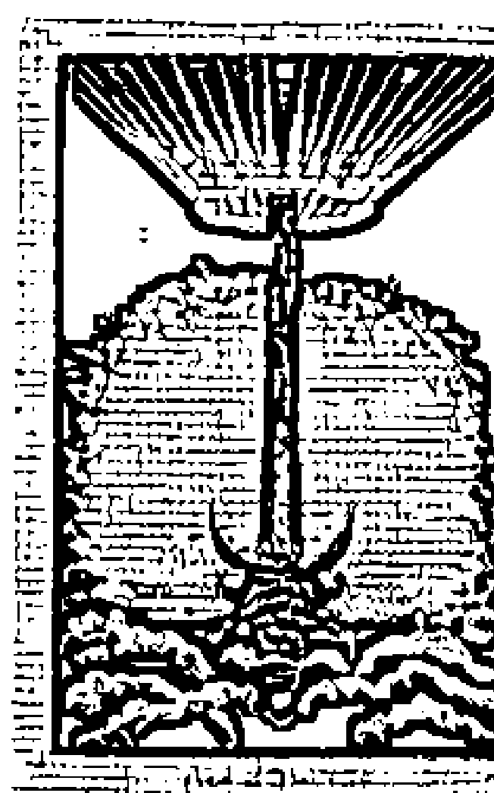

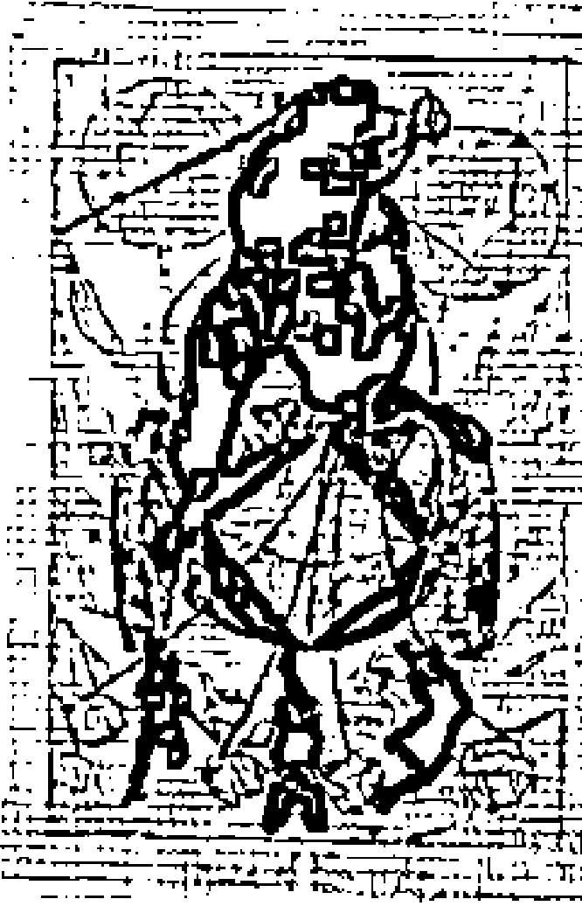

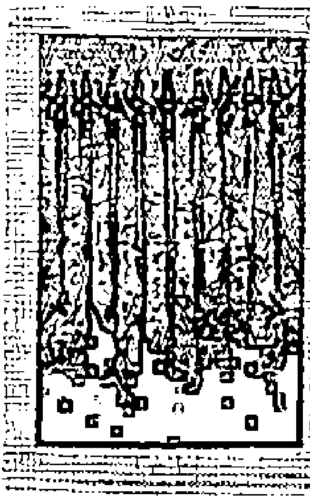

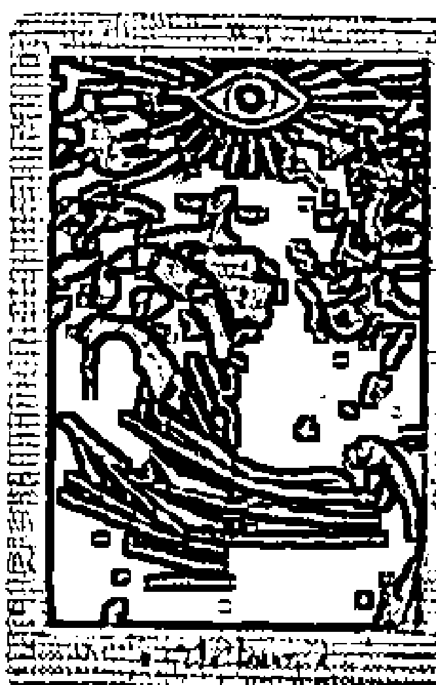

## 占卜結果解析與建議

以此次牌例而言，看出牌陣中出現非常一致的暗淡色調，因此可以想見兩人之間的問題已經存在已久。以問卜者對對方的看法而言，「寶劍王子」象徵對方在自己眼中是個聰明卻無法使人感到安定的人，亦即對方常無法給予問卜者足夠的安全感，此處的狀況可能與問卜者內在強烈的不安全感有關，但也很可能是因為對方，才又加深了問卜者的不安全感。又「寶劍王子」跨越於魔羯座與寶瓶座之間，代表從穩定走向變動，因此對方可能是個相當自我主義的人，較難體諒他人觀感，並會強迫他人打破現在的安定而隨著自己改變。

而從對方觀察當事人的角度來看，抽到的是「塔」牌。「塔」代表突如其來的改變。也就是說以對方而言，問卜者對現狀的不滿是一種突如其來的改變，無法以自己的心態去理解，因而感到強烈的衝擊。以占星學的角度來說，「塔」牌所象徵的行星是火星，代表碰撞與衝擊，對當事人而言，此張牌也代表自己對於情緒的處理並未臻至適度解放，而是以壓抑的方式直到自己終於不堪負荷而爆發，因而給對方帶來強烈衝擊的效應。

從客觀的現狀來看，「寶劍九」代表火星在雙子座，而代表對方心態的「塔」牌亦是火星的象徵，在這裡可以特別注意的一點是，代表衝突的火星雖然暗示雙方情緒都處於較火爆的狀態，卻又落入理性的雙子座，因此可以想見，兩人都是以理性為名，卻以發洩情緒為實。「寶劍九」在此意味著兩人互相折磨，詭異的是彼此都還存在著熱情。

最後的未來牌，則是象徵兩人依此下去的狀況，小芳抽到的是「寶劍王牌」，這是所有風元素的原型，象徵一種絕對理智的形象。但我們知道，所有的理智都只是情感戴上了一層冷靜的包裝，抽牌的結果暗示著兩人或許應該冷靜的思考，彼此相處的點點滴滴代表了什麼意義？為何過往如此甜蜜，現在卻爭執不斷？由此可知，決定權仍然操之在己。換而言之，若能秉持著愛著彼此的初心去探討，最終仍能看見一個可能較為理想的未來。只是在那之前，是要將這寶劍的力量化為理性洞察的睿智，還是將寶劍當成斬斷情絲的兇器？仍然是當事人必須從內在去謹慎思考的重要議題。

## 四元素牌阵

四元素牌阵将问题拆分成四元素火、水、风、土所象征的四个层面，遇到当事人自己也不明白的问题时，这个牌阵能够有助于了解问题本身在各个层面的影响与症结，然后进一步为对方做出解答。

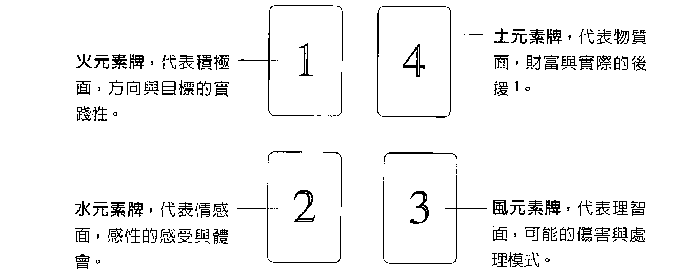

## 实际案例探讨

阿俊目前有一位交往许久的女友，已经论及婚嫁了，关于结婚的整体状况是如何呢？如何才能顺利结婚呢？

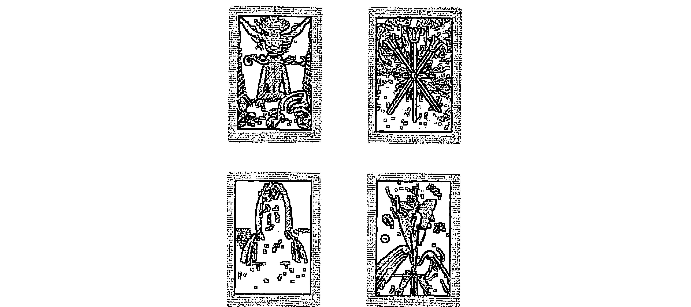

## 占卜結果解析與建議

火元素出現了象徵較為靜態的「女祭司」，代表現在阿俊內心對於婚姻仍有一定程度的觀望。「女祭司」在占星學上對應到月亮，代表人內在的潛意識與不安；落入火元素，則可視為月亮在獅子座的特質，而獅子座與自尊、自信有關，因此通常代表當事人對婚姻實質上的情況仍有不解，例如：夫妻間該如何平等相處……，而且對方可能也呈現出較為強勢的特性，使得當事人對於這段婚姻有所考量。回頭檢視當事人本身，「女祭司」落入火元素，可能也暗示了當事人較為優柔寡斷，不夠積極進取。

水元素牌則是「聖杯二」，此張牌代表的是純粹的愛，也有男女彼此敬愛的意思。以此次占例來說，水元素抽到「聖杯二」，象徵的就是平等的情感付出，也代表由二元對立走向協調的涵義，因此可知對方對阿俊也是付出了相當程度的情感，並且願意走向婚姻。而「聖杯二」的占星學對應是金星走入巨蟹座，水象星座特質的牌對應到水元素，其情感上的特質會更加明顯，因為金星本身即是掌管愛情的行星，落入帶有守候與照顧特質的巨蟹座，可以看出婚姻的承諾性在此表現無遺。此外，托特塔羅牌的「聖杯二」也有情感、意識交流融洽之意。

風元素抽到的是「魔法師」。「魔法師」是張代表煉金術的牌，也象徵自我能力的展現與自信的發揮。以理性面來講，這段關係與婚姻有其實際的必要，對當事人而言也有增進自信心與決斷力的影響。但風元素牌還蘊藏了傷害的特質，表示當事人心中對未來可能懷有恐懼，而透過與女朋友的相處，逐漸發現自己內在的不安從何而來，藉由看見自己的自性，而後獲得幸福的婚姻關係。「魔法師」在占星學上代表水星，落入風元素牌也代表水星進入寶瓶座的特性。寶瓶座擅長分析與決斷，水星則是邏輯、智慧與口才的代表，由此可知雖然在婚姻初期，或是在婚禮的準備籌辦上，會與女朋友有許多言詞爭吵（水星的口才落入代表歧異的寶瓶座），但「魔法師」代表的融合性與協調性，卻足以讓自己更加清晰了解這段情感的意義為何。托特是「魔法師」的主角，他擁有操控萬物生成的能力，亦擁有物質世界中所可掌控的神秘學秘法，於此牌陣中，恰巧落入與之相應的元素特質，透露出當事人可以有自信地做出決定，不必存在過多的擔憂。

土元素部分則出現了「權杖三」，這是張將光明的能量以溫和的方式落實到生命中的牌。「權杖三」出現在土元素，代表現在兩人在經濟上的穩定度足夠，而且對方也是對於家庭具有相當責任感的良好女性。而此牌在占星學上的特質是太陽落入牡羊座，象徵牡羊座的衝動被土元素給緩和、柔和下來，保有了牡羊的積極性，卻平衡掉了草率躁動的特質，而且相對於火元素牌的退縮，現實上卻有相當理想的推動力將兩人往紅毯的彼端推去。儘管現在當事人內心仍有些許困惑，隨著時間遞嬗，仍能理解到對方是自己難得的佳偶，而此牌的美好寓意也將在未來彰顯。

整體上而言，此牌例走入婚姻的正面性相當的高，但當事人目前尚有自己的心理阻礙需要化解。阿俊對於婚姻的穩定度、伴侶的認同度等問題，目前都無法快速釐清，不妨可以給他類似「增加與女朋友相處的時間」等建議，讓雙方透過彼此的互動，來更加確定共同生活的決心，以期成就良緣。

## 第五章

## 結語

你可以成為你想要的任何樣子

你可以創造出你想要的命運

使用托特塔羅牌的你，感覺到那股力量了嗎？

## 結語

熟悉塔羅牌的使用後，你可以替周圍的朋友進行占卜。進一步的練習在書中所學習到的技巧，以及托特塔羅牌的牌義。不需要一頭就栽進托特塔羅牌艱深的理論，先從每一張牌的基本牌義入手，當技巧純熟後，自然而然的再將占星學、喀巴拉等理論串接運用。占卜的品質不在於運用了多少技巧，而是在於給問卜者的感受。當占卜師處於寧靜的狀態下，放下自己對於問卜者的成見、對於問題的感受，準確的占卜往往是在心領神會下自然的發生。

當周遭的人們知道你在學習塔羅，肯定會為你帶來許多的練習機會，你可能會遇到匪夷所思的問題，可能碰觸到你道德底線的疑惑，像是筆者就曾經遇到黑道來問卜。在這種機會當中，我們永遠要記得，放下自己本身的成見，在占卜的當下，秉持著中立準則，給予對方較高覺察的建議。每個人都有自己的成長背景與自我認同，我們不能替對方做決定，更不適合把自己的價值觀投注於占卜之上。

占卜工具有本身的極限，沒有辦法鉅細靡遺的告訴對方每一刻的未來，占卜的結果也並非只得莫可奈何的接受。因為命運的運作不在於外，而是在心靈的深處。自己永遠是自己命運的主人，此刻，你所看到的文字，所聽到的聲音，所處在的環境，都是由無數的過去當下的決定所推動，而此刻正是那個創造每個未來的當下。意識遠遠比想像的還具有威力，這也是托特塔羅牌中喀巴拉理論的一環，所有的一切都是整體意識的運作，因此所遭遇到的一切都是自己給予自己的禮物。使用托特塔羅牌，我們必須要知道，沒有什麼是註定的，除非自己認定那是註定，才有了註定。你可以成為你想要的任何樣子，你擁有無限的可能，你可以創造出你想要的命運，占卜的目的不是讓人們把自己交託給命運，而是把對方自己的力量還給他自己，使用托特塔羅牌的你，感覺到那股力量了嗎？

BF6021

## 托特塔羅入門

- 作者 / 張絹強 · 劉紀顯
- 選書編輯 / 何若文
- 責任編輯 / 林育如
- 特約編輯 / 潘玉芳
- 封面設計 / 林家琪
- 版權 / 翁靜如、吳亭儀
- 行銷業務 / 林彥伶、張倚禎
- 總編輯 / 何宜珍
- 總經理 / 彭之琬
- 發行人 / 何飛鵬
- 法律顧問 / 台英國際商務法律事務所 羅明通律師

出版 / 商周出版
臺北市中山區民生東路二段141號9樓
電話：(02) 2500-7008 傳真：(02) 2500-7759 E-mail : bwp.service@cite.com.tw

發行 / 英屬蓋曼群島商家庭傳媒股份有限公司城邦分公司
臺北市中山區民生東路二段141號2樓
讀者服務專線：0800-020-299 24小時傳真服務：(02)2517-0999
讀者服務信箱 E-mail : cs@cite.com.tw

國家圖書館出版品預行編目(CIP)資料
托特塔羅入門 / 張絹強 · 劉紀顯 著. -- 初版. -- 臺北市:
商周出版 : 家庭傳媒城邦分公司發行, 民 103.07
384面 ; 17X23公分
ISBN 978-986-272-563-4(平裝) 1. 占卜
292.96 103004032

劃撥帳號 / 19833503 戶名：英屬蓋曼群島商家庭傳媒股份有限公司城邦分公司
訂購服務 / 書虫股份有限公司客服專線：(02)2500-7718 : 2500-7719
服務時間：週一至週五上午09:30-12:00 : 下午13:30-17:00
24小時傳真專線：(02)2500-1990 : 2500-1991
劃撥帳號：19863813 戶名：書虫股份有限公司
E-mail : service@readingclub.com.tw

香港發行所 / 城邦(香港)出版集團有限公司
香港 灣仔 駱克道 193 號超商業中心 1 樓
電話：(852) 2508-6231 傳真：(852) 2578-9337

馬新發行所 / 城邦(馬新)出版集團
Cité (M) Sdn. Bhd. 41, Jalan Radin Anum,
Bandar Baru Sri Petaling, 57000 Kuala Lumpur, Malaysia.
電話：(603)9057-8822 傳真：(603)9057-6622

商周出版部落格 / http://bwp25007008.pixnet.net/blog
行政院新聞局北市業字第 913 號

內頁版型、編排 / 林家琪
印刷 / 高典印刷有限公司
總經銷 / 高見文化行銷股份有限公司 客服專線：0800-055-365
電話：(02)2668-9005 傳真：(02)2668-9790
* 本書托特塔羅牌圖像由 Ordo Templi Orientis 正式授權使用，未經授權，禁止使用，違法必究。
□2014年 (民103) 07月10日初版 Printed in Taiwan
□2016年 (民105) 03月09日初版3.5刷
定價 / 480元 著作權所有，翻印必究
ISBN 978-986-272-563-4 城邦讀書花園
www.cite.com.tw

## 踏入西洋神秘學殿堂，探求未解之謎的捷徑，

## 屬於你的托特塔羅牌旅程，從此展開！

淺顯易懂的牌意解析，初探托特塔羅必修指南

托特塔羅牌是神秘學知識的大熔爐，從開始認識每一張牌，進而到了解其中的象徵意涵，都是一個浩大的工程。但托特塔羅牌並不侷限在神秘學的框架之中，克勞利企圖在當代所知的科學與非科學之間建構起一道橋梁，試圖將一切自己所知一併統整。其中包括了占星學、喀巴拉、地占術，甚至是《易經》與泰勒瑪的精神。本書從「初學者第一次接觸托特塔羅」的角度切入，帶領大家進一步由認識托特塔羅而成爲運用托特塔羅的占卜師。

忠於克勞利著作的論點，幫助你全面了解托特塔羅基礎知識

本書淺顯易懂地解說托特塔羅基礎牌義、圖像解析及進階理論與占卜技巧。除了理解每張牌在占卜上的意思，也深入釐清符號背後所承載的真實意義與起源，包括艱深的占星學、喀巴拉實例、進階理論與占卜技巧等，使讀者容易理解托特塔羅的各元素融合，精準掌握每一張牌的架構立論。

圖文搭配實際占卜案例與牌陣介紹

本書帶領初次接觸托特塔羅的讀者，輕鬆地從欣賞圖像開始熟悉各種神秘學符碼，並透過故事般的牌義解析，瞭解每一張牌的意涵和交錯的符號對應，以及抽到此牌意味著什麼。熟悉牌義之後，進而引導讀者如何將托特塔羅與各神秘學理論串接，活用各種適合的牌陣，找出占卜事件中的種種蛛絲馬跡，並藉由實際占卜案例，幫助讀者掌握占卜要訣，找到解惑明路。