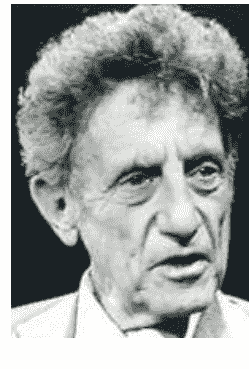
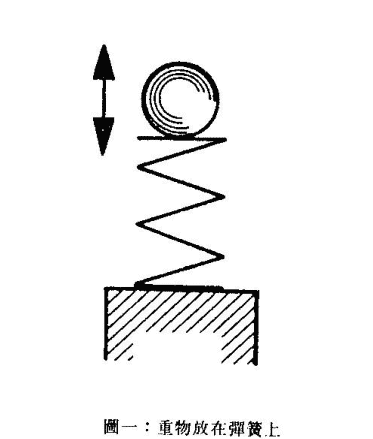
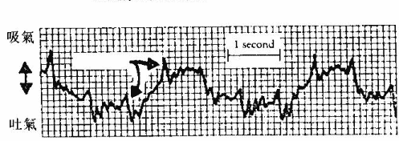

# 拙火經驗

The Kundalini Experience

一部不可錯過的神秘學經典作品

> 無論從靈學或科學的觀點來看，這本書都是美妙地深具遠見，敏銳而且明智。
[「尊重機構」理事基斯·畢瑞博士]

> 多年來，我在課堂及研討會上提及並推薦這塊小小瑰寶的次數，超過其他任何書籍，這是一部極具開創價值的作品。
《心靈危急狀況之概念》作者格洛夫博士

> 這本書對了解人類疾病與治療提供了更大的視野。
《聯合家庭治療》作者維吉妮亞·沙提爾博士

胡因夢 審訂·Lee Sannella 著·梅心 譯

# 拙火經驗

策劃／王季慶
顧問／胡因夢、丁乃竺、蕭明杰、曹又方

在我們每個人體內，都存在著無限的力量，也就是所謂的「拙火」。

這無限的力量以一種潛伏的方式存在著，如果一個人成功地喚醒了它，他心靈的進化無疑的就等於打了包票。

拙火的展現，產生了很多世代中的偉大神秘家和天才；然而它卻不只是少數人可獨享的天賦，而是每個人都存在著的潛能，只是我們該如何來喚醒我們的「拙火」而已。

作者在本書中提出了一系列的案例，一些是源自對多樣文化和靈性傳統的縱覽，另一些則取材自作者身為精神科醫生所獲得的臨床經驗。

兩種「樣本」都可提供我們足夠的資料，讓我們對這種看似神秘的身心轉化，有完整的印象，幫我們釐清一般人的錯誤概念，並對人生的潛能有更深的了悟。

ISBN 957-679-588-5 [175]


國家圖書館出版品預行編目資料

拙火經驗 ／ Lee Sannella著；梅心譯. -- 初版. -- 臺北市：方智，1998 [民87]
面； 公分. --(新時代系列：83)
譯自：The kundalini experience：psychosis or transcendence？
ISBN 957-679-588-5(平裝)

1. 超心理學

175

87011177

ISBN 957-679-588-5

版權所有・翻印必究

方智出版社
FINE PRESS

◎ 新時代系列 83

拙火經驗

● 定價180元

作者／Lee Sannella, M.D.

譯者／梅心

發行人／曹又方

出版者／方智出版社股份有限公司

地址／台北市南京東路四段50號6F之1

電話／(02)2579-6000・2579-1110

傳真／(02)2579-0338・2577-1110

郵撥帳號／13603118　方智出版社股份有限公司

登記證／行政院新聞局版台業字第436號

責任編輯／胡因夢・楊嘉瑞

美術編輯／黃昭寧

校對／胡因夢・任鳳雲・楊嘉瑞

法律顧問／詹文凱

原書名／The Kundalini Experience

原出版社／Integral Publishing

印刷／祥豐印刷廠

一九九八年十月初版

二〇〇二年七月二刷

Chinese characters language copyright©1998 Fine Press Publishing Co.
Original English language edition copyright©1995 by Integral Publishing
through Big Apple Tuttle-mori Agency, Inc. All right reserved.

◎如有缺頁破損、裝訂錯誤，請寄回本公司調換

Printed in Taiwan

# 作者簡介



李・珊那拉（Lee Sannella），醫學博士，是一位心理治療家兼眼科醫師。在耶魯學醫後，便任職於加州大學及其他學術機構。六十歲時，他開始跑步，嘗試節食及斷食，並發現身與心的關連。

1974 年，他參與創立位於舊金山的拙火臨床中心，幫助許多經歷拙火覺醒的「患者」成功地處理此種經驗。

珊那拉博士曾從事尋鬼活動，走訪通靈治療師、靈媒、嘗試隔離艙（isolation tanks）、LSD、梅斯卡林（mescaline），及其他迷幻藥，並且從事各種心靈訓練。

現年七十多歲的珊那拉仍騎車及跑步不輟，而且授課、帶研討班，擁有眾多各式各樣的朋友、求教者，對生命中的許多神秘現象的好奇始終如一。

# 目 錄

+   ◆ 前言
1 今日身心轉化的意義
2 拙火經驗和科學的客觀性
3 拙火經驗：傳統的模式
4 生理性拙火
5 不同文化裡的拙火經驗
6 案例
7 自我報告
8 徵兆及症狀的概述
9 拙火循環：診斷與治療
10 拙火與心靈生活

+   附錄一 身體微動：神經系統演化的重要現象
附錄二 印度「沈醉於神」的諸聖賢
附錄三 人類的敏感度
附錄四 給醫師與精神病學家的備忘錄
附錄五 歡迎你加入拙火研究行列

### 前 言

組織撕裂、血管爆破、血濺出來、體液喪失，及心跳加速、血壓急速升高。還有呻吟、哭嚎和尖叫的聲音。這是嚴重的外傷嗎？不，這只是再平常不過的嬰兒誕生的景象。這聽起來會像是病理的描述，那是因為症狀沒有和結果——新生命的誕生——一併陳述之故。

在暗室中有人獨坐著。他全身肌肉痙攣，無法描述的感受和尖銳的疼痛從腳底向上衝，經過背和頸部。他的頭顱好像快爆裂了。他聽到頭裡有咆哮和高亢的口哨聲。他的手發燙。他覺得身體內部被撕裂。然後他突然大笑，由於經歷極大的喜悅而有些虛脫。這是一幕瘋狂的場景嗎？不，這是和生理上的出生一樣自然的「再生」(rebirth) 過程，這是身心的轉化。這好像是疾病的徵兆，但事實上卻是：一位心靈轉化過的人類。

這過程若在不受阻撓的情況下自行完成，可以使深層的心理平衡、內在力量和情緒成熟廣達到極致。在早期階段，卻保有子宮外人類生命開始時就有的暴力、無助和不穩定。

這個過程幾千年來就不斷地被間接提及過，但通常是以含糊的詞語述說。最早提到的是印度最古老的《吠陀經》(Vedas)。這古老的知識形成了後來秘密教義的基礎，像《奧義書》(Upanishads)、《阿含經》(Agamas)、《密續》(Tantras) 及《本集》(Samhitas)，尤其是哈達瑜伽 (Hatja Yoga) 的許多經典中都有詳細的闡述。

但這「再生」過程的知識絕不是印度所獨有的。在藏傳佛教、中國道教、某些美國印地安土著的靈性活動，甚至是我們將會讀到的非洲布希曼（Bushmen）的秘密教義中，它都是不可或缺的要素。根據 E. A. S. 巴特渥斯（Butterworth）所見，轉化過程的知識的確存在在古代蘇美人的文明中。（譯註：蘇美文化距今五千多年，現址是伊拉克波斯灣一帶。）但我們不必假定它就是從那兒流傳出來的。而是如琴恩·蓋保瑟（Jean Gebser）、伊里克·紐曼（Erich Neumann）、肯·威爾柏（Ken Wilber）和其他人所指示的，早期人類較易有心靈體驗，正如許多非西方民族一樣。

然而，這過程在印度文化中被研究得最徹底，概念架構得最精密。在印度文化中，它被視為是「拙火的甦醒」（awakening of the kundalini）。「拙火」（kundalini）這梵文字的字義是「蜷臥的她」（she who is coiled），這是蛇的意象。我會在後面對這秘密概念和現象的意義做較詳細的解釋。而這兒，只要點出它常被指涉的意義「蛇能」——（serpent power），一種被視為心理靈性能量的型式——就足夠了。它是「意識的能量」（energy of consciousness）。

只要是文字所能傳達的，這本書就會盡可能的闡明其意義。雖然那些熟知拙火過程的前輩們強調，唯有透過第一手經驗，才能如實的了解拙火。

在過去，只有古文化、密教傳統，和少數與世隔絕的個人了解身心轉化的過程；而有關此過程的紀錄，又一直是採用十分個人化的語彙，經常充滿含糊的神秘主義和奇怪的神話。因此，西方研究人類心靈的學生，並不看重這些紀錄，而阻礙了把不同傳統中現有的資料做一系統的比較。但是，只有經過這樣的比較，才能凸顯出拙火是最值得科學家關切的重要現象。所以呢，接觸到這現象的少數專業人士，才會抱持著懷疑和猜測的態度。

1970 年代，產生了兩種重要的發展，使得情勢改觀，足以向當時盛行的專業心態挑戰。第一項發展，是在我們的文化中經歷了密集的身心靈經驗的人數顯著的增加。第二是西方科學家對於意識的數十年禁忌解除了，意識被重新視為是可作為研究的素材，這促成了對這些過程的客觀層面的研究。而在過去，這些過程是只以秘密或象徵性的詞彙描述而躲過了西方科學的探究。今天不只在客觀情況下採用相同標準是可能的，藉著運用統一的標準，來比較不同傳統中生理心靈的經驗，也是可行的。

差異性相當大的各傳統中，對轉化的描述卻有驚人的一致性。這也是果畢·克里希那（Gopi Krishna）的觀點，他的著作使得拙火過程在西方變得更為人所知。他認為從基督教神秘主義者、蘇菲行者和瑜伽士的經驗紀錄，可看出身心轉化的根本特性是相同的。在研究不同傳統的詳細紀錄中，發現了症狀模式與經驗現象和本書中所呈現的臨床案例是一樣的。

我認為這些共同之處有生理性成分，而且單一生理機制的活動，是我們所經歷拙火各式各樣現象的根源。假如以上兩個假設都成立，那麼身心轉化的觀念就不能以一團混亂的原始迷信、宗教教條和大謊言視之。相反地，我們必須嚴肅地重新審視科學家所試圖去揭穿的這個所謂無意義、無價值的幻想。事實上，我們必須開始一種新型態的「神話解構」，解構科學物質主義這個迷思。

我覺得我們必須先相信拙火現象是真實和重要的，才可以提出以下的問題：要用什麼方法才能充分了解這個現象？它的基本特性是什麼？它如何開展？什麼是它的最佳形式？它真的如一般所宣稱能導致心靈異能的產生嗎？這轉化過程和正常，以及瘋狂又有何不同呢？它只是一種意識的轉變，還是另有文章？

我從最後一個問題思索起。既然拙火可以維持數月到數年，那麼這樣的過程很清楚地，就不只是意識狀態的改變。因為它存在的期間，個人進出不同的意識狀態——從醒著到睡眠和作夢，以及在任何狀態中達到高度清醒。這整個過程事實上已在「正常」和「瘋狂」的範疇之外。經歷這驚人身心轉化的人，會有絕非平常的經驗，但也不致失控到瘋狂的地步。

拙火過程並不必然和心靈現象產生關連性。有些通靈者就沒有經歷過這種轉化，而有些拙火已經發動的人，卻沒展現其特殊的心靈能力。也就是說，拙火過程可能——而且經常——促成許多特別的能力，但兩者並沒有絕對的關連性。1962 年，斯瓦密（Swami Vishnu Tirtha）也支持以上的論述。他指出，一位能控制自己心跳活動的瑜伽大師的拙火也可能尚未醒覺，而一位拙火瑜伽行者，則可能是缺乏這類能力的。

最後，這轉化過程有何意涵？我們如何了解它那令人好奇的模式和現象？經歷這種身心轉化過程的人，會很自然地附會以上種種含意。這些可預料的，都是十分個人和主觀的。在這本書裡，我的目標卻是要以可觀察的論述來描述拙火過程。

本書中，我提出一系列的案例，一些是源自對多樣文化和靈性傳統的縱覽，另一些則取材自我身爲精神醫生所獲得的臨床經驗。兩種「樣本」都可提供我們足夠的資料，讓我們對身心轉化有完整的印象。

通常病人提出他自己的案例時，都以爲多少會被接受，即使結論部分可能受到質疑。1967 年，我正準備出版這本書時，當時醫學界的輿論氣氛卻使我有些畏懼於公開我的發現。可是雖然主導的科學典範仍無法接納拙火過程所觸及到的真相和靈性的概念，但過去二十年來，已經有許多鼓舞人心的發展。這使我們採取較寬廣的視野來看待人類，假如沒考慮到靈魂的歸宿，至少也考慮到了心靈能力。我特別要提及下面這些人的作品：肯奈特·帕勒提亞（Kenneth Pelletier）、拉利·杜希（Larry Dossey），和蓋畢安·廣森（Gabriel Cousens）。因此，我就一點也不遲疑地出版了這本書。

這本書所提出的模式，主要是由班托夫（Itzhak Bentov）所制定的，當然仍有待批評和改進。可是這些年來，我並沒發現更具說服力的模式，但這也並不表示就不可能制定一個更新、更好的模式了。科學界被拙火過程所激發出的興趣，很遺憾地，並沒促成對這重要現象作持續和認真的研究。1981 年班托夫和 1986 年果畢·克里希那的相繼去世，拙火研究就失去它最熱切的倡導者了。這剛萌芽的研究領域會如何發展，仍有待觀察。

這本書爲兩個互相連結的主題辯護。第一，通常被視爲「拙火的甦醒」的身心轉化確實是真有其事。第二，這過程是演化機制的一部分，而非是病理發展。我堅信拙火過程是人類心理靈性的擴展方式之一。再也沒有比果畢·克里希那著作中，更大力鼓吹拙火過程的演化潛力。根據他自己拙火甦醒的第一手經驗，他作了以下陳述：

> 「一個新的中心——目前正蟄伏在普遍男女的身內——必須被發動，而更強大的心靈能量之流，必須從脊椎尾部上升到頭部，才能促使人類意識超越一般的限制。這是人目前內在演化衝動的最後階段。人的腦脊髓系統必須經歷革命性的改變，使意識超越最高智力所能達到的極限。一旦達到那個極限，理性將聽命於直覺，而啟示錄將引導人類的腳步。」

我將以討論現今轉化過程的特別意義，和簡要考慮心理心靈狀態描述的客觀性問題，來開始我的論述。然後我要以密宗瑜伽傳統中概念化的模式來看待拙火，因為這個傳統模式最為人所知，而且和其他模式比起來，也更為精細。對生理性詮釋而言，也較易應用。然而，拙火的傳統描述和我自己資料之間的一些不同，使我區分傳統拙火的概念為「心靈能量」，而我的為「生理上的拙火」。

解釋生理上的拙火時，我將使用先前提過的班托夫模式。這是第一個（到目前為止也是唯一）拙火現象的模式受到實驗性的鑑定。班托夫作品的重要意義將被討論，而他有關體內活動和拙火的原作，附在本書後的附錄一。在討論診斷時，我將明顯確認生理上拙火過程和把它與精神病作一區分是可能的，即使這兩種情況短時間內在某人身上同時出現。這樣的區分可幫助醫生避免過去曾犯的嚴重錯誤。錯誤的診斷不只使事情更加複雜，也剝奪了有拙火覺醒中或覺醒後症狀的人身心轉化和展現靈性潛力的機會。

經歷拙火轉化的人通常需要特殊幫助，我將考慮哪些方式的幫助可以給，而那些則不能給。最後，我會對拙火現象所引發的問題和機會，提出整個社會的適應之道。我們可以借鏡於過去梅爾·巴巴（Meher Baba）與印度諸大師的經驗（見附錄二）。

在這本書的結尾一章，提到拙火過程與靈性的相關性。我相信真正的靈性和心靈整個領域的種種經驗之間的混淆很難釐清，當代聖者達愛-阿難塔（Da Love-Ananda）的教導，則可幫我們釐清一般人的錯誤概念，把拙火現象放在適當的靈性範疇中。

附錄三提出了根本的問題：為什麼轉化過程是可能的呢？附錄四和五則分別是供給醫學人士和專家參考的。

雖然這本書原是寫給醫學專業人士看的，許多非專業的人卻也廣泛流傳這本書。依眾多讀者的來信和電話判斷，這本書對他們助益頗大。我希望這本書能對更多人有更多的助益。

## 1 今日身心轉化的意義

半個世紀前，容格（C. G. Jung）和他的同事在一場拙火研討會中，觀察到在西方，這股力量的覺醒很少（假如有的話）得到見證，所以他們反諷地提出了，假設依靠深層的分析，那可能要一千年才能使拙火發動。實在很難相信在現代的歐洲，拙火現象竟不為人所知，因為鍊金術和魔術在歐洲盛行已久。我們難道真的認為過去德魯伊教（Druids）教徒－－不是巫師就是神秘學專家－－對這股力量會毫無所知嗎？或是古代和中古時代基督教世界中的神秘主義者，對它升起時所伴隨的各種現象毫無體驗？那真的倒不如承認以現代的深層分析，可能需要一千年才能使拙火發動還來得簡單。

不管容格認為，在他的時代拙火的意外或自動升起是多不可能的事，他對它的心理上意義，卻有很清楚的掌握。他說了一個比喻：就像一名中古時代的僧侶，到未知的蠻荒森林旅行迷了路，當他要退回原路時，卻發現有一頭兇猛的龍擋在路上。容格主張這猛獸就是拙火的象徵，這股力量用心理學的話說，是強迫人繼續他最偉大的冒險－－自我了悟的冒險。人，唯有犧牲了推動自我發現和自我了解的動力時，才能走回頭路，而這樣的代價是喪失意義、目的和意識。

拙火的覺醒就如同人進入那人類存在的隱藏向度的未知森林中。容格這麼說：

> 「當你成功地發動了拙火，而它開始自靜態的潛力向外移動時，你必然開始了一個和我們世界完全不同的世界。」

容格把拙火描述成非人為的力量，這和印度資料記載相唱和。他不贊同把拙火經驗當成自己所創造，認為這樣的想法是危險的。它將導至自我膨脹、虛假的優越感，可憎的，甚至是瘋狂的。在容格看來，拙火是從無意識中升起的自動過程，而把個人當作它的媒介物。

這轉化過程在容格第一次正視它時還很少見，現在則不同了。今天不管有沒有訓練，拙火的覺醒經常發生，這是怎麼回事？有些人認為拙火的案例事實上並沒有增加，只是思想大環境有所轉變，人們能夠自由談論這些經驗。這也許有些道理，但我大膽提出另一個更重要的原因：人們更常經驗到拙火現象，是因為他們實際上更加遵循導向心理心靈轉化的訓練和生活方式。

自從 60 年代迷幻藥革命以來，在西方社會某些團體中，使用非理性（還不只是荒謬而已）方式來擴張或加強覺知已變得可以接受了，甚至是流行。一些運用靜坐之類的新治療方式逐漸出現。根據報導，數十萬人練習超覺靜坐。許多人練習瑜伽、參與不同的佛教教派——禪、金剛乘、大乘佛教、小乘佛教等。更多的人追逐通靈、魔術、巫術和靈療。相當多的人對這類事即使不著迷，也多少有點興趣。

對這樣的現象，一些社會學家稱之為「玄學復興」，也有「東西會合」這樣的說法，還有些人提出「新自戀主義」的警告。大多數評論家指出，西方文明處在一種極深的動盪狀態。愈來愈多的批評家視此情況為危機，其結果將決定全人類的命運。

容格指出，分裂的時期正是死亡與再生的世紀。他把我們這時代類比成羅馬帝國末期，在衣利亞·普利葛金（Ilya Prigogine）的革命性洞見之前，容格作了以下的評論：

> 「……當某原理達到它力量的極致時，對立的原理在裡面像細菌一樣開始攪動。」

目前被其對立的原理所取代的，到底是哪個原理呢？我們可以在以下幾個人的作品中找到解答：曼弗德（lewis Mumford）、查丁（Pierre Teilhard de Chardin）、羅斯查克（Theodore Roszak）、里奇（Charles A. Reich）、柏曼（Morris Berman）、奇瑟（Jean Gebser）。他們都擁護「新時代」或新意識已誕生的觀念。新意識取代奇瑟所謂的「理性意識」——一種僵化的、以左腦取向的生活態度，以焦慮的自我防衛方式來衡量一切事。

法國精神醫師拉肯（Jacques Lacan）形容自我是一種將自己和其他人分開的「妄想建構」。這正是整個科學界的取向，強調價值和事實，感情和思考的分別——造成如柏曼所說的，對此世界的「解幻」（disenchantment）。然而，這整個取向受到現代量子論和其他前衛科學的質疑。這取向所主導的生活方式——我們嚴重混亂的西方文明，使人覺得有再商榷的必要。

自我設防的理性意識終究不適合生命。並非自我或理性有任何本質上的謬誤。而是一旦把它們當作生活原則時，它們就具有破壞性。自我是人格發展過程一個必要的階段，然而卻不是最高的成就。同樣地，理性是人類與生俱有的特質或力量，然而它只是許多能力之一，而且绝非最重要的。事实上，自我和理性在意识的历史中是最近才出现的。两者注定会被更优秀的存在形式所超越。

愈来愈多的西方人企图寻求意义和快乐，这反映了他们对现代价值、态度和生活方式的深深不满。这是对自我和理性范畴之外的追寻。不幸的是，这追寻旅程通常没有达到自我和理性的超越，反而导致自我迷恋、自我膨胀，和愤怒地拒绝理性、否定自性的不成熟态度。这现象可由当代醉心于灵性主义、巫术和魔法看出来。

我也在一些拙火启动的人身上，看到过这种令人惋惜的倾向。但这和经验本身无关，它不会导致退化。相反地，我视拙火觉醒是一种促成自我超越和心智超越的经验。我相当认同果毕·克里希那对拙火的赞扬。他这么写道：

> “拙火机制是所有所谓灵性和心理现象的真正原因，是演化和人格发展的生物基础，是所有秘传教义的神秘源头，是创造奥秘的解答，是哲学、艺术和科学不竭的泉源，和所有过去、现在、未来宗教信心的泉源。”

虽然我视拙火为近乎完美的演化机制，但我并不希望把它和存在的终极实相画上等号。

## 2 拙火经验和科学的客观性

拙火个人醒觉的纪录中多着墨于情绪、不平常的思路和异象，却很少提到生理现象、症状，或真正的感官觉受。同样地，大部分的冥想经验，也都以主观感受到的能量状态为准而加以描述。

这些纪录绝大部分只是反复述说标准的期望，和公式化的暗喻。容格认为对传统模式的依赖，根源於师徒制所产生的教条主义。老师透过文字或直接灌顶，将原本学生要自己去发现的秘教知识和异象传达出来。换句话说，老师提供了诠释的架构，让学生从事心灵旅程时有所依循。

因为在传统修行教派中，知性分析不被看重，门徒把老师的观念架构当成自己的，也没去注意自己的实际经验和架构是否吻合。甚至心智较独立的学生质疑传承的解释架构时，也少有愿意做激烈革新的。通常需要释迦牟尼佛或耶稣这样的超级大师和圆满人格，才能勇于打破传统。

对传统解释的依赖，可以从拙火的古老纪录中发现，如瑜伽的梵文经典，特别是哈达瑜伽。这种趋势在东方著作中是很明显的，连西方对心理心灵过程的描述也不例外。到目前为止，在“超越性”或神秘经验的范畴中，我们无法去区分心灵和身体的不同层次。还没有共同接受的现象学理，可以使我们分析性地全盘了解这些状态。

举例来说，威廉·詹姆士（William James）在伟大的德国神秘主义者苏索（Suso）身上，就看到一位受苦的苦修者无法将他的痛苦转化为宗教性狂喜。他写道：

> “他的案例肯定是和疾病相关的，他没有尝到一些苦修者所感到的缓和，将痛苦转化为怪异的、快活的转变能力。”

容格和他的同事却有不同的看法，他们认为苏索经历了拙火过程，这些相反的看法，反映了詹姆士和容格在研究苏索时的不同兴趣。詹姆士对于宗教性和神秘主义式生活中的病理方面较为注意，而容格却较关心个人和拙火的关系。

詹姆士和容格服膺客观的科学理想，然而在处理宗教经验这主题时，两人却主要是以比较分析，而非以确实的个人实验，或系统性测试合适的自愿者的方式。当然，比较分析和实验各有其价值。然而，只有实验——不管是自我实验或实验性地研究别人——才能显明我们对心理心灵过程的偏见和预设立场。

这样“客观”的取向，可以去除心理心灵状态和身体无关的普遍预设看法。这种偏见源于二元论的古老传统，它将身体和心智，或身体和心灵看作是分离的。现代心理学和医学已经发现笛卡尔主义这旧科学典范的不足。这些学科数十年来否定意识的重要性，甚至其存在性，现在正重新考量意识才是生命的最根本。简而言之，他们得到一个结论：身体和心智是一个如太极般的整体，或是一个更大的真实层面的两极。

这种转变在马斯洛（Abraham Maslow）的人本心理学中最容易看出来。在他一篇划时代的论文，他指出，正统的客观观念只勉强适用于无生命的物体，或者是低等生物。在涉及动物王国和人类时，冷静观察者要保持超然状态，在马斯洛看来是不太可能的。透过严密的自我检查，是可以去除一些预设的偏见；马斯洛还是认为最好的方式是调整爱的能力，以至于能“客观地”了解和认识其他生命，他写道：

> “当我们能达到不侵犯、不要求、不冀求、不改进的地步，我们才能达到一种不同流俗的客观性。”

在50年代，科学家开始在实验室研究意识的“转变状态”。第一批的实验包括瑜伽士和禅修者的脑波电图研究。后来，在60年代和70年代，许多同样的研究也以超觉静坐者为对象，其他的测试也被设计出来，以探寻难以捉摸的心理心灵过程中生理性的关连，包括心跳和皮肤抗阻的测量。

研究者鼓励更开放和直接的个人经验纪录，特别是身体方面的改变。在这样的研究过程中，有了一个重大发现——心理心灵转化过程中某范围的现象是普遍性、恒常出现的，超越了个人和文化差异。这和传统的看法相去不远。然而，开始更仔细地区分个别差异和可预期的模式是可能的。今天拙火经验不足，限于密教传承中老师主导门徒的进展，所以这种区分也就更加重要了。

拙火经验的普同现象，更是点出这种经验并非幻相，而是真实。

拙火所描述的特征与症状，如情绪和思考的改变，以及经历到影像和听到声音，大部分取决于个人因素和外在环境。但是身体的觉受如痒、心律加速、刺痛、强烈的热和冷，看到内在的光，和听到原音（如“唵”），以及痉挛和扭曲，是这过程中典型的特征，至少是必经的阶段。这种普遍性引导我去假设，所有心理心灵的训练都引发了相同的基本过程，这过程有一定的生理基础。

然而，我们不能低估心理身体转化的情绪层次，因为在转化过程，这是个经验自身意义的泉源。伴随着思考过程的转变，情绪上的改变经常被误认为心理疾病。但是，正如我已解释过的，把拙火经验诠释为精神异常是毫无道理的。虽然这经验包括一些病理的征兆，但这些必须从个人整体生命和拙火经验的意义来了解。

心理心灵过程的主观层面很不一样，经验到的现象横跨了很大的领域——从无助的混乱和沮丧，到超越自我的狂喜和幸福的清明感。这些情绪状态的强烈特质，往往掩盖了生理上的细节，所以拙火过程的经验者，易于忽略他生理状况产生的微细变化。但因为转化过程的智性和情绪方面有很高的差异性，身体方面是较易于做系统研究的。基于以上陈述的理由，我将在拙火升起的生理特质上着墨，以班托夫所发展模式的术语来理解它们。

## 3 拙火经验——传统的模式

每一个心灵传统有其转化过程的模式。这些模式大致上强调经验的主观性，而视客观的症状为意外，或完全忽略它们。因此心理心灵转化的传统描述，对新弟子而言是合适的，却无法作客观的比较，和对过程有全盘的评估。大部分的模式和生理的关连性较少。

然而有些重要的例外，特别是拙火经验的密宗瑜伽模式。根据这印度传统，拙火是一种能量——一种“能源”或“力量”，在人类的身体中潜伏着。它的位置是在脊椎的根部。当这能量发动时，它“觉醒”了，它沿着人体的中轴往上冲，或沿着脊柱到头顶。有些甚至认为它会超过头部。到达那里时，拙火据说会引动意识的神秘状态，一种无法描述的幸福，以及所有二元的分别都停止。

根据密宗瑜伽形上学，在人体内的拙火是在宇宙之先，而且是弥漫全宇宙的超越性能源的一部分。拙火就是宇宙的大能。只有当拙火完全自身体底部上升，或超过头顶的最佳位置，觉醒才发生。密宗瑜伽视整个过程为最终真实的两种基本层面的互动。一种是“能”（Power），或“夏克提”（Shakti），另一种是希瓦上帝（God Shiva）。“希瓦”的梵文字义是“宁静”。在密宗瑜伽中，它代表最终真实的静态或静极（阳极），而“夏克提”这字指的是动极（阴极），“希瓦”代表纯洁、超越主客观的大意识，“夏克提”则代表创造世界的意识能源。

在超越层次，两者永远无法分开。“希瓦”和“夏克提”永远在狂喜相拥中。但在平常人类意识层次中，它们似乎是分离的。因此普通的个人只能尝到超越性能源的一点点滋味，正如他只以个人觉醒形式来经验超越性大意识的一个片断。

伍德洛夫（John Woodroffe）男爵，别名阿华龙（Arthur Avalon），是研究密宗瑜伽的先驱者，提出了以下的解释：

> “不管感受到的、知道的、希望和憧憬的，事实上这个受限的自我的所有不同经验，出现、消失，升起和降落，都像无穷尽的意识大海中的波浪……。人的灵魂存在在任何时刻，都不单单是他在那时刻所有的经验模式的累积。基于实用性的理由，他通常忽略许多经验模式；他通常偏爱某些经验，而视它们为那时刻他所有的一切。但他不仅仅忽略了許多经验模式，他更常忽略的是意识的平静背景或周围，所有的显现都发生在此。虽然这些一直呈现在那里。这是人类不动、平静的层面——“希瓦”层面。相对于它的是那压迫性的、动态的、移动改变的层面——“夏克提”层面。”

他进一步解释：

> “能源是意识中如世界秩序一般压迫、改变的层面。这种改变通常被称为行动或运动。能源被视为那移动、行动、动态的意识层面。假如能源本质的意识被掩盖了，无法辨别出来，能源就是如世界一般不停地改变的创造性冲动——没有休息、持续，没有恒久性……但根本上，它是意识的能源……不仅“希瓦”是“夏克提”的先决条件；“夏克提”就是“希瓦”。”

伍德洛夫观察到“夏克提”的教义是深奥的，当西方人的心智掌握其奥义时，很可能对它着迷。他说得没错，因为最近我们在“新物理”的著作中，发现“希瓦·夏克提”的隐喻。量子物理的革命性发现，使得西方科学家开始重视东方的宇宙观——视真实为在一单一连续的背景中两极互动的过程。这种真实似乎不是物质，而是超物质的，或如一些前卫物理学家争论的，是超物质和超意识的。

如同所有古老的教义，密宗瑜伽视个人为大宇宙忠实的反映。普遍能源座落于人类身体中相当于肛门范围。这是沿着身体轴线散布的七个主要中心或能源位置的第一个。这些中心或“脉轮”（cakras）——通常被描绘成和每个中心不同能量形式相对应的不同数目花瓣的莲花。这些中心点现在是，过去也是能源的器官或四肢。它们是局限住的生物能量漩涡。

在肛门的中心海底轮有一个技术性的名字——“根底中心”（muladhara-cakra），它在传统上被视为和土元素、嗅觉、脚，和在身体内生命能量的散布有关。

上升一些即是第二个中心，所谓的svadhisthana-cakra，座落于生殖器范围。这名字，一如许多秘教梵文词语，很难翻译。它大概的意义是“自立中心”，意指生殖器是人类身体最明显的特征。这能源的焦点被认为和传统水元素、味觉、手和性相关（译按：生殖轮）。

第三个中心称为manipura-cakra或“珠宝品质的中心”（center of the gem city），位于肚脐附近。在某些传统中，肚脐被视为是沈睡的拙火另一个停留的地方。这中心一般被认为和传统火元素、消化、肛门以及视觉相关（译按：脐轮）。

第四个中心在心窝，通常被称为“心莲”和**anahata-cakra**。“安那哈塔”（anahata）这字义是“松开”，也是外在声音“唵”（om）的秘教名字。这声音并非经平常机制而得，乃是有经验的瑜伽士，藉着集中注意力在心莲上而看到的。这中心是和传统水元素、触觉、感觉、生殖器官，和生命力的刺激有关（译按：心轮）。

第五个中心位于喉部，被称为**vishuddki-cakra**或“纯净的中心”。据说和传统以太元素、听觉、口和皮肤有关（译按：喉轮）。

第六个中心，被描绘成位于两眉中心的两瓣莲花，是**ajna-cakra**或“命令中心”。它也是“第三眼”。通常被视为和心智相关。在这中心，据说老师可以和门徒心电感应（译按：眉间轮）。

第七个，也是最后一个，是**sahasrara-cakra**。sahasrara这个字是由**sahasra**（一千）和**ara**（轮辐）所组成。位于头顶这中心的千个轮辐或能量通路，代表当拙火从最低中心到达头顶时，产生的丰沛光明和幸福感的经验。在梵文经典中，这中心被形容为“有光辉的”、“比满月还白”、“分泌丰沛和稳定的甘露之泉”（译按：顶轮）。

果毕·克里希那证实：

> “每当我把心智之眼转向自己时，我总是看见在我头内和外面有一股光明恒常的震动着，好像一股异常微细和光辉的物质，自脊柱不断涌上来，在头颅部分散布开来，以无法形容的灿烂光辉充满和环绕它。”

光亮，如我们所明白，是拙火觉醒的重要层面之一。这是心理心灵的普遍经验之一，所有宗教传统的神秘主义者也报告过这样的觉受。

密宗瑜伽模式的拙火过程的另一重点是，升起的拙火可以经过三条主要“管道”或通道的概念。这些即是所谓的“那底斯”（nadis）。一条据经验是连接所有七个主要中心的直立通道。另两条以螺旋方式环绕着它。中间“管道”（duct）称为苏苏那那弟（sushumnanadi, 中脉）。左边通道称为伊达那弟（ida-nadi,左脉），右边称为平甘拉那弟（pingala-nadi,右脉）。两条螺旋通道在不同中心交错，直到在第六中心（ajna-cakra,眉心位置）相融合。

根据传统的解释，右边的通道有“增温”的功用，左边的通道有“冷却”身体的效用。

在生理层次上，它们分别和交感神经，以及副交感神经相类似。我在经过考虑之后，才用“相类似”字眼，因为一些瑜伽权威人士坚持，通道不可视同为神经系统。它们是微妙的，只有在冥想状态才能体验、明了它们。

密教和哈达瑜伽的经典十分强调为了避免不愉快，甚至危险的副作用，醒觉的拙火得被引入中脉。当拙火沿中脉上升时，不同的中心会开始活动起来，根据某些专家说法，只有在这种情况，中心才开始活动。当醒觉的拙火经过每个中心（脉轮）时，短暂地激发能量，然后，吸收中心的能量继续前进。当拙火到达顶轮时（头部中心），全身其他部分的生物能全被耗尽。四肢的末端变冷，像死尸一般。

和生理现象形成强烈对比的是，随着拙火进入顶轮时，强烈觉受到幸福、光明，和异乎寻常的清澈明白。这不是羊癫症，而是狂喜或三摩地（nirvikalpa-samadhi）的经验。

一开始，拙火力量完全上升只能停留一会儿，数秒到数分钟。之后，拙火移回较低的中心。尽可能重复这种高峰经验，直到拙火恒久地停驻在顶轮，是密宗瑜伽的目标。瑜伽士通常被指导要有意识地引导下沉的拙火，使它不要停留在低于心轮的中心。在下三个中心的拙火活动，通常被认为是十分危险的，包括自我膨胀和活跃的性欲。

拙火上升的背后意义，在于心理心灵转换的过程中也包括了身体。这使得最终的狂喜成就更为圆满。身体在密宗瑜伽中，并不被视为是灵性跃升的阻碍。它被视为圣灵的殿堂。人们该还记得爱因斯坦（Albert Einstein）的论调：那些想要保存灵魂的人，也必须照顾灵魂所依附的身体。这和以下的伟大密宗的教义相吻合：无限的真实（nirvana）和有限的存在（samsara）终究是一样的。在瑜伽的狂喜中，有限的自我意识被超越后，就能发现这种相同性。

## 4 生理性拙火

拙火发动的过程富有戏剧性，在传统上被视为强力的净化过程，而在物我狂喜相融的高峰状态中，达到身心的超越。

拙火在向上移动的路径中，藉着动力作用将遇到的各种杂质燃烧殆尽。梵文经典还特别提到三个主要结构性障碍，也就是一般所熟知的“结”。根据传统的知识，这些结位于几个中心：最低处肛门、心，和眉心后面。瑜伽士受指示，要以单一注意力的集中和专注的呼吸，来穿透每一个结。

但是拙火的路径在它向上弧线的通道上，可能在任一个地方受阻。我们可以将这些阻碍看作是压力点。而拙火上升时，促使中央神经系统释放压力，通常会伴随着痛楚的经验。拙火遇到这些障碍，会持续发挥作用，直到消散为止。这充分显示了升起的拙火会自己找出进行的方向。它自发性的运作，散布到全部的心理生理系统，来达成身心转化。一旦障碍消除，拙火自由地流过那点，而继续向上旅行，直到碰到下一个压力带。拙火能量似乎可以扩散，所以它能同时在许多层次上运作，同时消除许多不同压力点。

拙火一路向上移动，一直到达头顶中心才停止。无论在上升的过程中，拙火能量是多么分散，一旦到达头顶中心，它就集中起来了。我们可以把这个过程类比成电的现象。一束电流通过细钨丝时，会产生光亮，但经过粗铜线时则不会，因为细钨丝提供了相当的阻力，而铜线没有。同样的情况，拙火遇到心理生理系统中存有特别阻力的部分时，会产生惊人的觉受。但是由拙火对抗阻力的摩擦力所产生的热，很快就把阻碍烧尽了，然后觉受也停止了。

还有另外一种方式也可以用来理解这个过程：一股强劲的水流流过小橡皮水管，会使得水管猛力挥动，可是同样的水流流过救火水管，则几乎不会被注意到。同样地，拙火的能量流过身心受局限的地方，会造成混乱，而使人经验到痛苦。当然，这些全都只是比喻而已。无疑地，拙火的真正过程要比电流或流过水管的水更加精细微妙，也更为复杂。

然而，以纯粹的生理的物质用语来理解拙火现象的整个范畴是可能的。班托夫正是这么做的。他的模型能解释很多我和其他人所观察到的拙火现象。以下跨文化的调查和案例研究报道中的自发性身体动作、变动的身体觉受，和其他现象，都能被解释为拙火活动的副产品。班托夫的模型提供了目前最好的解释。

然而，我必须强调，在我的临床观察和传统的模型之间，还是有些差异。最显著的不同在于，拙火能量通过身心的活动。依据瑜伽和密宗的传统经典，拙火自脊椎底端的脉轮中心升起，沿着中脉到头顶。这也是穆克达难陀（Swami Muktananda）和果毕·克里希那在陈述自己经验时所表达的一小部分。而另一方面，我的临床资料和一些非印度传统的记载，却显示拙火的活动是由脚开始，沿着背部或脊椎到头部，再下行到脸部，经过喉咙，最后停在腹部。

化名为卢宽瑜（Lu K'uan Yu）的鲁克（Charles Luk），在道家系统中描述内火的小周天轨道（microcosmic orbit）发轫于脊椎的底部，上升到头部，然后下行到出发点。这和班托夫模式的预测完全相同。

现在问题是：班托夫模式和传统拙火模式之间的差异如何解释？我们可以假设这是两个相关而根本上完全不同的过程。或是假设基本过程是相同的，而不同之处只是偶发的。第一种假设较不可能，因为描述太类似了。而假如第二种假设是正确的话，我是如此认为的，那我们还是得解释这些不同之处。

我们会猜测，这些不同之处可能是由不正确，或不完备的自我观察和描述所造成的。那些拙火自发性觉醒的人，会不会因为没有传统印度解释的知识，硬是找不到适当的语言来表达他们的经验？或者是那些在传统模式的架构中寻求拙火升起的人多少心存预设，而主导了他们的经验？我认为第二个解释更值得采信。语言建构我们的经验。一旦我们采纳某一种模式作为可信的如实反映，我们就不再视它为模式，而把它和真实划上等号。

在拙火的传统模式基础上，致力于拙火觉醒的古老技巧上的瑜伽士，无法避免地会有这样的倾向。他全心期待拙火能量在最低中心（脉轮、脉丛结）醒来，上行到头顶中心（顶轮），在那儿，产生了无可言喻的幸福感。因此他极有可能忽略任何和指示不符的现象。甚至，他可能没有清楚地觉察到任何这样的现象，因为他的注意力集中在整个过程的另一个层面。

照这样看来，那些先前对这过程没有任何概念，而经验到自发性拙火觉醒的人，是较好的观察者。他们会注意到那些从传统角度看来，没有任何意义或根本不存在的现象。在他们的脑中，没有瑜伽士精细抽象的理论架构来过滤真实。因此，他们对于拙火经验的独特征兆较为敏感，特别是在身体方面。

然而，也因此，他们在探索这过程更深的灵性发展方面，处于较不利的地位。原因是在缺乏传统的背景之下，他们并不像一些修道士曾充分地发展出来的，理解拙火的全部潜能。他们也许会同意构成西方文明骨干的物质哲学，他们甚至会以较高层次的思想来理解他们的经验。但是，相反地，他们也会害怕——像我的许多病人一样——害怕自己是疯了。

拙火过程存着许多秘密。有许多是我这个当医生的也不理解的。因此，集中在可以说出有用意见的某些层面是较可行的。而拙火经验的生理向度正是如此。我将用“生理性拙火”（physio-Kundalini）来统称拙火过程中那些能纯以生理方式来解释的层面。生理性拙火是缓慢进行的能量感受之流，发源于身体低处，上升到头，绕过喉咙，到腹部，此时刺激达到顶点。我称这种复杂现象为生理性拙火过程、周期（cycle），或机制（mechanism）。

当拙火能量在途中遇到阻碍时，克服且净化了那阻碍点的心理生理系统，我即称为那特别区位的“开启”（opening）。喉咙的开启就是一个典型的例子。这术语富有描述性，而且适用于生理上的诠释。因此，我们不必沿用形而上且理想化的模式描述，却能与拙火过程的传统模式契合。

## 5 不同文化裡的拙火經驗

### 非洲的「困族」（! Kung）

巴札娃那（Botswana）西北部是卡拉哈律（Kalahari）沙漠——「困族」的家鄉。美國人類學家卡茲（Richard Katz）對這民族神秘儀式的紀錄，使我們看到一些不尋常的線索。在他的紀錄中，「困族」為了熱起「n/um」來達到「奇亞」（! Kia）狀態，往往連續跳舞好幾個小時。卡茲認為「n/um」類似「拙火」。「奇亞」是超越的狀態。這狀態不僅僅是所謂的「高峰經驗」，這經驗也暫時性地超越平日醒著的意識，來容納狂喜感受。這和馬斯洛所謂的「高原經驗」更類似，此經驗是徹底轉化的，整個人有意識地、喜悅地全心投入更大的生命裡面，才會經歷到的。因此，「奇亞」狀態和禪宗的開悟（satori），或印度某些型態的「三摩地」相類似，這不是憑藉感官知覺的喪失就能達成的。

那些被授與「n/um」秘密的「困族」族人，知道如何去引動這力量，和當他面對巨大內在力量強過他的自我感的威脅時，如何克服必將遇到的恐懼。一旦他跨過恐懼的門檻時，他就進入「奇亞」狀態。

「n/um」據說存在心窩處。當它熱起來時，自脊椎底部升到頭部，「奇亞」狀態就在它達到頭部時完成的。根據卡茲的紀錄，一個族人提供了以下的報告：

「你跳舞。跳啊！跳啊！跳啊！然後「n/um」在腹部升起，在背部升起，接著你開始發抖。「n/um」令你顫抖，它很熱。你張大眼睛，但你不四處看；你直直地瞪視前方。但當你進入「奇亞」狀態，你四處觀看，因為你看見每樣東西，因為你看到是什麼在困擾每個人……然後，「n/um」進入你身體的每一部分，從腳尖到髮根都滲入。」

另一個族人這麼說：

「你感到你的脊背有尖銳的東西，它逐漸上升。然後你脊椎底部有刺痛感，刺痛、刺痛、刺痛、刺痛、刺痛、刺痛、刺痛……直到你腦中一片空白。」

在「奇亞」的高度狀態，一個「n/um」的老師可以表演多樣的特殊技能，如醫治病人和玩弄，或走在火堆上。他也可能出現天眼通，看到極遠處的事物。一位「n/um」老師說，當他在「奇亞」狀態時，「我真的再度成為自己」。這暗示著這些超能力事實上是人類本有的。

超越平常意識和自我感之後，一位「n/um」老師可以接觸超自然界和驅鬼。在「困族」的宇宙觀中，鬼會使人生病。驅鬼是「n/um」老師的技藝與能力的重心所在。對他而言，治癒就是贏得了與擬人化的致病勢力的戰鬥。

卡茲指出，「困族」尋求「奇亞」，不只是為了自我成長，而主要是要幫助別人。「奇亞」也不是被他們尋來作逃避日常生活的永久避難所。相反地，族人必須很快回復到平常狀態，以及善盡日常的責任。「奇亞」狀態的延長，並不被視為恩賜，而是錯誤。為了進入生命的神聖領域，接收滋養，然後與自己的同伴分享在治療的過程中所接收到的經驗，是他們追求「奇亞」狀態的主因。

在「n/um」過程中決定誰是專精者的唯一標準在於過程本身。凡經驗到「n/um」，而且能維持「奇亞」狀態的人，自然而然被視為「n/um」的老師。據了解，一個人的感受愈多，想像力愈豐富，他愈有可能達到「奇亞」，也就是超越他的平常狀態。「困族」有一半以上的人能達到「奇亞」狀態，這種能力似乎有遺傳性的。

「n/um」的升起伴隨著恐懼和疼痛，而且無法預測。「困族」相信「n/um」老師能幫助學生熟起「n/um」，而且控制整個過程，以防止過度的懼怕阻礙了「奇亞」的發生。雖然現在「n/um」是個別傳授，「困族」仍把「n/um」當成神賜的禮物。

### 聖·德蕾莎（Saint Therese），基督教神秘主義者

聖·德蕾莎在她一生的回憶錄中，曾描述過她如何為自發性拙火醒覺的類似現象所苦惱。德蕾莎來自一般法國中產階級的家庭，有著快樂的雙親和四個姊妹。十歲時，她成為卡摩（譯註：carmelite，卡摩教派，十二世紀在卡摩山所創立的宗教教派。）修女院的學生。在她入學的幾個月後，突然經常性地頭痛。某個傍晚，正當她準備上床睡覺時，開始無法自主地顫抖。這種情形持續了一個禮拜，而且任何治療都不管用。高燒並沒和顫抖一併發生。而顫抖總是如同來時一般神秘地消失。

幾個禮拜之後，她被幻覺、昏厥和抽搐的奇怪混合感覺所襲擊。她好像發狂般地胡言亂語，對看不見的可怖生物大叫。她在床上痛苦的翻滾，頭部猛烈的撞床頭，好像某種力量正在攻擊她。這些「抽搐」，有時像體操家的軟功，偶爾又會劇烈得把她拋出床外。她整個身體的旋轉和跌落動作，都超乎了她平常的彈性。例如，她會由膝蓋跳起來，不必用手就能使頭倒立。後來，在大彌撒時，她遭受到更嚴重的襲擊，唯有在她殷切的禱告之後才停止。

最值得注意的是，雖然這些襲擊相當猛烈，包括身體奇怪地扭曲和旋轉，但她的身體卻絲毫無損。有時她一頭栽向地板，或被擲向床頭木板，可是仍未受到傷害。

這種奇怪的疾病持續不到兩個月。之後，還有兩次不到幾分鐘的昏迷和僵硬。德蕾莎宣稱她在整個過程中從未喪失覺知，即使在「昏迷」時期，也保持著醒覺，只是她無法控制自己身體的活動。她自述道：

> 「我幾乎一直處在精神混亂之中，胡言亂語，然而我十分確定，我從來沒有一刻喪失理智的思維。我似乎是在近乎死亡的昏迷狀態，連最微細的動作都沒有：任何人都可以對我做任何事－－你可以不費吹灰之力殺了我，可是自始至終，我都能聽見周圍的談話聲，而且記得一清二楚。」

聖·德蕾莎固定接受一位醫術精湛醫生的治療，但這位醫生也束手無策，並且坦白承認完全被她的症狀弄糊塗了，然而，他也堅信，德蕾莎的症狀不是歇斯底里。德蕾莎本人則把自己可怕的經驗斥為「魔鬼的伎倆」。仔細回顧，我們可以在其中看到普遍不為人知的自發性拙火升起的症狀。在基督教傳統中，有多少其他的聖者經歷類似經驗——無論醫學或神學，都無法圓滿地解釋清楚。

### 生理靈性的熱

熱，如生理靈性的熱，在許多宗教傳統中都曾被提及。正如伊利亞德（Mircea Eliade）觀察到的：

我們碰觸到一個非常重要的問題，不只與印度宗教有關，也與一般宗教歷史有關：過多的能量、神奇的宗教能量，被人們十分明顯地經驗的「熱」。這已不是能量的神話或象徵，而是改造了修行者的生理機能的實際經驗。我可以確信古代的神秘主義者、修道者，早已熟悉這種經驗。許多「原始」民族視這種能量為「焚燒」，以帶有「熱」、「燒」、「燙」這些意思的字眼，來描述這種能量。

伊利亞德進一步提到：

我們也要記得，全世界的巫醫（譯註：shamans。此字有兩解，一是亞洲北部某種宗教的祭師，他能召喚善靈和惡靈。二是北美印地安人的巫醫。）和巫師，都以「火的大師」（master of fire）聞名於世，他們可以吞下火爐、手拿紅燙的鐵、走過火堆。另一方面，他們可以展現驚人的耐寒力。北極地區的巫醫和喜馬拉雅山的修道士，因著他們「神奇的熱能」，展現了超乎想像的禦寒能力。

許多傳統，特別是西藏佛教和中國道教，已經有發展出控制生理靈性的熱能之精細理論和修行方法。在西藏，「拙火瑜伽」是六大開悟法門之一。西藏的僧侶很珍視它在冬天使他們免於受凍的附帶效果。「拙火瑜伽」的大師，以在極低溫的情況下還能把他們身上的濕布「烘乾」而聞名。

道教發展出複雜的生理煉丹術－－也就是利用內在的熱（火）來增加活力，以鍊就金剛不壞之身。

安德希爾（Evelyn Underhill）在她那廣為人稱頌的研究中，提到「英國神秘主義之父」羅來（Richard Rolle）的關於「熱」的經驗。羅來在他的著作《愛之火》（Fire of Love）中寫到：「當心智真的被永不止息的愛－－我稱之為熱－－點燃時，人能感受到心的燃燒，不只是希望，而是真切的，心真的轉變成火，釋放出燃燒般愛的感受。」羅來本人對這經驗的強度也很驚訝，那不只是心智上或想像，而是在生理上也有強而有力的印證。在他著作的序文中，他陳述道：「我經常摸索我的胸部，想知道這種燃燒是不是由於外在身體因素所引起的。」一位印度蘇菲老師門下的弟子，也是現代神秘主義者崔蒂（Irina Tweedie），報告了一個類似的熱的痛苦感受。在她的靈性自傳中，她說：

> 「沿著脊椎，內部熱流似火，外部則流動若一股一股的冷顫，一波又一波地漫過腳、手、腹部，使所有毛髮都豎立起來了，好像全身都充滿電。」

另一篇她的日記上則是這麼寫道：

「我內在的力量整夜都沒減弱，使得我無法入睡。我注意到一些完全嶄新的東西。我的血液發亮，而我看見它在我身體內部循環。不久，我察覺到那不是血液，是光，一道藍白色的光，在另一個系統中運行：光從身體中出來，又在不同的點進入體內。仔細觀察，我可以看見無數的光點像一張發亮的網，環繞身體的內外部。非常美麗。沒有骨頭，身體由光所結的網所建構。」

然而很快地，我就注意到身體似乎著火了。這液狀的光是冷的，但它卻燃著我，好像熱熔漿一股股地流過每條神經和纖維，愈來愈亮，愈來愈難以忍受，愈來愈快。我除了躺著，無助地看著這令人痛苦的強烈熱流每秒增強……閃動著、波動著、擴大、收縮之外，什麼事也不能做。活生生地被焚燒。」

白哈瑞（Baneky Behari）也從蘇菲經典中找出兩個值得注意的例子，因為這些例子是「內熱」顯現在身體上的：

「其一：聖者來吃飯，女孩把水倒在他手上。她注意到他內在分離的火燃燒旺盛，以至於水一按觸到他的手，就化為蒸氣。

其二：我發誓，當那位醫生伸手碰我的手時，他的手被灼傷了，立刻出現一塊塊腫脹。這就是分離之火的熱。他了解我的狀況，所以能欣然忍受這種痛楚。」

阿格波（Tony Agpaoa），一位備受矚目的菲律賓「心靈外科醫生」，於 1974 年與我的一次對談中告訴我，他已學會如何以心理方法點燃火，這是他成為治療者的訓練之一。1975 年，穆克達難陀表示，這種能力是某些瑜伽學派的訓練之一。這種實際發出熱能的傳統流傳廣泛，使得拙火覺醒的類似臨床案例更加可信。

最近，許多「自發性燃燒」的例子被披露出來。巴西「生命研究機構」（the Brazilian Institute for Psychobiophysical Research）中的安德略德（Hernani G. Andrade）調查許多自發性的火。有些事蹟是警察親眼目睹，我個人也見過一個案例。

我花兩年時間調查經常引發火的案例。其中之一是，一個年輕猶太人娶一位天主教女子，當他們有了一個兒子之後，這戶人家就開始鬧鬼。這樁婚姻引起家族紛爭，整個情況十分情緒化。起先，鬧鬼現象圍繞新生的嬰兒發生，後來，年輕丈夫決定改信天主教，這件事和愈來愈劇烈的鬧鬼現象，使得全家族都陷入了驚濤駭浪中。

家族中的四代成員和許多外人，都曾目睹了各種超自然現象，如物品自行移動和消失。年輕的夫婦常感受到被撞擊、搖動、抓傷和勒緊的苦痛。女子的母親某一天傍晚被撞倒在地，不醒人事而必須送醫。

每一位家族成員和有些調查員，則親眼看見許多自發性的火。有一天傍晚，我和孩子的祖父到臥室要探看這孩子，發現窗簾著火了。我和他在滅火時，也輕微地傷到了手。一些小規模的火發生時，我也在場。後來，當年輕男子改信天主教後，積極從事教堂活動，而且舉行正式的驅魔儀式，這種現象才告停止。

我們可以視這些案例為被抑制的心理生理能量如何外在化的示範，因為「熱」是活躍的拙火經常示現的活動之一。比起其他生理上的改變，「熱」更容易被觀察和衡量出來。拙火上升到達頭頂時，所產生的熱促成了強烈光明、狂喜的悟道經驗。

### 光的經驗

光的經驗可說是全球性的靈性或神秘經驗。它和拙火力量上升到頭頂（或稱頂輪）關係密切。果畢·克里希那形容道：

> 「每當我將心智之眼轉向自己時，無可避免地，我會看到在我頭內頭外有一道光明之流，在一恆常震動狀態中，好像是一束極微細、燦爛的物質，從脊柱上升，而在頭骨附近漫開來，以無法描述的光輝充滿、環繞頭部。」

穆克達難陀也描述了一個類似的現象：

> 「我環顧四周。大火的火苗在每個方向吞噬著。整個宇宙都著火了……在我頭內，我看到駭人的光亮，我感到害怕。」

最高神秘的覺悟經驗通常被稱為「光明」或「開悟」，並非偶然。所有世代的神秘主義者和覺悟者，說到他們靈性狀態的「光輝絢爛」層面時，並不是種比喻，而是字義上的真實經驗。

「內在光明」的經驗是巫術不可或缺的一部分。愛斯基摩人把一種神秘狀況稱為「柯瓦曼尼克」（quaumaneq），意思是「閃電」或「光明」。沒有這樣的狀況，無法成爲巫師。這奇怪的光充滿了巫師的頭和身體，據猜測這光還可以使他看到很遙遠的、黑暗的地方，甚至未來都看得見。

印度教最早的祕意經典之一《施陀伽耶・奧義書》（Chandogya - Upanishad）中，超越性大我據說是以「內在光明」而存在心的這區域。佛陀夜睹明星悟道，明亮的星星象徵「清澈的光」，或超越一切形式的宇宙實相。西藏密宗高僧警告弟子在死亡的過程要注意這「清澈的光」。

依照傳統的佛陀自傳《方廣大莊嚴經》（Lalita-Vistara），當佛陀進入甚深禪定時，一道光芒會自他的頂輪升起。這令人想起《博伽梵歌》（the Bhagavad Gita）第十四章的一段詩文，它說當真正的知識或智慧出現時，身體會湧出光。中國哲人莊子也說過同樣的話。

《博伽梵歌》有名的第十一章，對於阿朱拿（Arjuna）王子的開悟經驗有美好的描述。他見到克里希那（Krishna）光輝絢麗的榮光，被這象徵最終真實的光芒所震懾。阿朱拿所經驗到的「神性」，是「一團光，光芒四射……簡直像太陽般輝煌燦爛」。

然而，並非所有體驗到非生理性的光亮，都意味著開悟或成道。神秘主義傳統也承認，體驗到光，不見得就表示證得破除二元對立的悟境。哈達瑜伽和密宗的修道士已發展出複雜的觀想技巧，光聯覺（由觸覺、聽覺引發的視覺感受）在其中扮演了重要的角色。這些技巧被視為產生內在光的方法。同樣的，道教高人也開展了「循環」內在光的修行方式，這能使「黃金花」開而獲得「長生不死之藥」。

早期基督教洗禮儀式被稱爲「光明」。聖靈以火餡形式出現。根據基督教傳說，當耶穌在約旦河受洗時，水就放在火之上。

根據古老傳統說法，真正的修道士真的會放出慈悲柔和的光。許多故事提到虔心在禱告的修士放出了光芒。

### 道教傳統

在中國道教傳統中，拙火現象是耳熟能詳的。他們認爲，當人學會制心一處時，隱藏的能力就會彰顯出來。經過許多心智和身體上的訓練，使「氣」（也就是梵文中的普拉那 prana）匯集在下腹部。當心受到控制，氣或生命力會啓動，而在身體的主脈中流動，造成不自主運動（身體自行活動，不受指揮）。氣的發動據說會產生以下八種感覺：痛、癢、冷、暖、無重量、沈重、粗糙和平滑。

生命能是熱的，它不只散布熱到身體各部分，而且會變得明亮，讓靜坐的人看見。在一些較特殊的靜坐者中，它會投出一道確實可見的光。當生命能移動到受阻地帶，則會引發疼痛和粗糙、抽筋的不愉快感受。

化名爲魯克的盧寬瑜提到過，道家高手因是子（Yin Shih Tsu）在 1914 年撰寫的書裡說，感到熱從他的脊椎底部上升到他的頭頂，然後下行到臉部、喉嚨，最後到丹田。他全身翻滾、扭動，並且看到許多內在光。他頭痛，有一次還覺得鼓脹。他的上半身似乎在延長，以至於他覺得有十呎高。這就是佛教經典中的「大身」（great body）。

因是子說，他並非一次就經歷到這些不同的感受，而是在不同時刻的靜坐過程中一一体驗到的。有時循環的熱比較像依循固定路徑的震動。他曾經在晚上不自主地擺出一系列有秩序的瑜伽姿勢，期間長達六個月。

在韓國，禪的傳統中也有相同的例子。1974 年，韓國的禪師，也是政治人物的息歇（seo）博士告訴我，氣從身體——尤其是背部——往上行，然後繞過頭頂到臉部，經過喉嚨，最後抵達腹部。

### 烏洛波洛斯（Uroboros）

烏洛波洛斯——蛇吞自己的尾巴的意思——是個古老的象徵。它象徵著生命的連續性，或天與地的結合，有時，這自我吞食的蛇身被畫成一半黑一半白，類似中國陰陽的象徵，表示了在自然中兩極的運行和調和。若取其調和之意，烏洛波洛斯在諸斯底教（譯註：Gnostic，初期的基督教之一派，重視神直覺，被視為異端。）傳統中，是很重要的象徵，它的入門弟子都冀求超越小我而進入統合的大意識。

十九世紀，德國化學家卡庫勒（Kekule）在夢中就是看到這個原型象徵，而得到靈感，才洞悉苯（benzene）的分子結構是一閉合的碳環。

在艾力卡（Arica）由伊卡若（Oscar Ichazo）所創的現代祕術學校中，「烏洛波洛斯」是一種訓練，藉由呼吸的控制，來引動下腹部的能量。吸氣時，集中注意力在會陰部，起先有感受，然後引導能量沿著脊椎到頭後部，能量繞過頭部，這時呼氣，能量也往下行。它經過頭頂到前額，在眼睛部分分叉，沿著鼻樑兩側下行，經過上唇兩側而在下巴會合。韓國禪宗教法中也有同樣模式。在埃及古老的奧西力斯（譯註：Osiris，原為太陽神，後為其弟所殺，肢體散落大地，其妻愛西斯拾回其屍，而再度復活，成為陰間的主宰和審判者。他和尼羅河被視為大自然更新活力的代表。）之眼的象徵也是一個佐證。能量自下巴經喉嚨前方到胸骨，一直下行到下腹部為止。在一定的時間內，能量自動由腹部走到生殖器官，而完成循環。這個訓練的目的是要在頭內或循環過程中「看到」光。

### 拙火升起的一些古典記載

第一位著書詳細討論拙火經驗的那瑞亞那南達（Swami Narayanananda），對於拙火能量的部分和完全升起作了區分。部分升起會導致身體和心智上各種併發症，只有在拙火完全上升到頭頂時，才會喚醒對圓滿神性或解脫的真正渴求，而在意識轉化上獲得理想成果。也唯有這樣，才能沒有任何副作用地開悟，體驗無上的喜悅。

拙火的升起伴隨著不同的覺受和經驗。以下摘自那瑞亞那南達所彙編的症狀表：

1. 有強烈灼燒感，起初沿著背部，而後遍布全身。
2. 拙火進入中脈時，會有痛覺。那瑞亞那南達特別指出這和其他擾人的現象都不該視為疾病的徵兆。
3. 當拙火到達心臟時，會感覺到心跳加快。
4. 從腳趾頭會有爬行的感覺往上走，有時全身都開始搖動。往上走的感覺有時像螞蟻慢慢往頭部爬，或像蛇扭擺而上，或像鳥從此地跳躍到彼地，或像魚急衝過平靜水池，或如猴子跳到遠處的樹枝。

這些徵兆在印度傳統經典中都被提到，特別是在瑜伽和密宗的系統裡。這足以作為拙火過程有其客觀性的論證。印度當代十分有名的神秘主義者－－聖拉馬克里希那（Saint Ramakrishna），以驚人的相同詞語來描述他的拙火經驗。關於他自然達到的不同狂喜狀態，據報導他是這麼說的：

> 「在這些三摩地（狂喜狀態），人感到靈魂之流像螞蟻、魚、猴子、鳥，或蛇般活動著。
>
> 有時靈魂之流自脊椎升起，像螞蟻一樣爬行。有時，在三摩地狀態中，靈魂在神聖狂喜的海洋中，如魚般喜悅優遊。有時，當我側躺著，我感到靈魂之流像猴子一樣推我，非常喜悅地和我玩耍。我靜止不動。那股力量像猴子，突然一躍到頭頂。這是你看到我突然跳起來的原因。有時呢，靈魂之流升起如同鳥，從這樹枝跳到另一枝。它停留的地方像火……有時靈魂之流如蛇般向上移動，「之」字形前進，最後到達頭部，然後我進入三摩地狀態。除非一個人的拙火被喚起，否則他的靈魂意識不會清醒過來。」

另一位印度權威特莎尊者（Swami Vishnu Tirtha）的作品，尤其值得一提的是，它在正統的瑜珈傳統和現代瑜珈提倡者之間搭起了橋樑。這位聖者以鮮活的個人語彙來描述拙火覺醒的症狀。他的描述涵蓋了所有不同的感官系統、運動神經系統和其他徵候。

吸引了眾多西方弟子的印度悉日雲傳統（Siddha tradition）的大師穆克達難陀，在他的自傳中有豐富而詳盡的描述。他報告了以下情形：身體不自主的動作、固定在某些奇怪的姿勢上、強烈的能量之流流過身體、不尋常的呼吸模式、內在的光影與聲音、令人害怕的影像與聲音，以及許多不尋常的神秘現象。比如，他會在靜坐時聞到香味，嘗到甘露和經歷喜悅幸福之感。

但是也有一些令人不快的副作用。「我的身體發熱，我的頭變得很重。身體的每個細胞都開始呻吟。」他特別指出在肛門附近有刺痛感。此外，他還提到偶爾性欲會強烈得難以抵抗－－蘇菲修行者崔蒂也作了同樣的告白，所有秘教傳統，特別是密宗和道教，都明白生命力的激發與性能量的關連。

穆克達難陀

## 一個美國人的例子

一位電腦程式設計師渥爾夫（W. Thomas Wolfe），回憶起他十二歲時經驗到的奇特現象，回顧起來，算是他第一次拙火的覺醒。那時，他正參加一項速算比賽。當老師讀第一道問題時，渥爾夫感到異常興奮，而他的身體正以某種內在能量震動著。然後，「我注意到有光亮穿越和圍繞著我－－一道從未如此明亮的光。這是種好的感覺，『活』的感覺，而非生病的感受」。

老師一講完數學問題，他馬上脫口說出答案。而在此之前，他從未顯示過速算的特別性向。所以當老師要求他解釋如何迅速得出答案時，他無法回答。但他繼續說出正確的答案，而贏得了那次的比賽和以後幾年的數次比賽。

在十七歲時，這神秘的能力消失了。到 1974 年，當渥爾夫開始靜坐，拙火才再度活躍起來。透過規律性地使用自律控制，這活動更加強了。然後，1975 年三月初，他發生了以下強烈的拙火經驗：

> 「在我剛剛躺下來，等著入睡時，我卻開始在心眼中看到一道微弱震動的光……沒多久，在我體內深處有了內在的疑問。這是有關這經驗是否應該繼續下去的問題……這疑問在近乎潛意識方式下，幾乎馬上被回答了。決定是加油－－加強－－而非切斷這經驗。這一切都在沒有文字的情形下發生。光馬上增強到令我無法忍受。我不怎麼了解這經驗。

這強化的過程伴隨著許多奇怪的響聲－－不和諧，卻又不難聽。這也是我所不能理解的。

> 同時，我感到在我頭中央和前額有強大的氣流流過，而在我右眉停止。這感覺很愉快－－幾乎是性感的……經過初期混亂之後，光有了劇烈的改變。從一個無固定模式快速轉變成可理解、固定，如親筆畫出大而發亮的球形……我一輩子所熟悉的身體感已變成「發亮球體感」，發光範圍的新環境是我的新身體。」

拙火覺醒之後，緊跟著是許多原型式的夢和通靈經驗，包括「傳達」的能力或渥爾夫所稱的「切桑效果」（satsang effect）。「切桑」這印度字是從梵文「切－－桑加」（sat - sanga）而來的，字義是「真理之友」或「和真實相連」。它通常指的是在一位已覺醒或覺悟大師面前（或現身）靜坐的傳統練習。如此貼近覺悟的修行者靜坐，已被公認是靈性覺醒的方法。

這「切桑效果」或心靈感染作用，在一般的情況下也說得通：彼此互相影響彼此的心靈狀況。這很容易證實的，例如當我們和生病或沮喪的人在一起時，我們的能量較易低落；同樣地，在一個快樂的人面前，我們也會受到正面的影響。而拙火覺醒的人，其影響力更是不同凡響。

渥爾夫的拙火症狀逐漸增多。接著，在四月初，他經歷了更多的拙火傳統徵兆。他寫道：

> 「我被下背部強力的擠壓推撞所驚嚇。當這動作開始時，有一個有趣的想法冒出來－－這好像是一隻松鼠，四處碰擊要撞出來。我好像坐在有生命的東西上。很快地，我的胃變得很燙，而我開始流汗。」

接下來的幾天，他下背部的活動仍持續著。而在月底時，「肆虐的熱－－大火般地－－開始慢慢移過我整個頭的表皮」。他聽到巨大的聲響在他的頭顱之內，壓力逐漸升高。他繼續看到光，包括穆克達難陀所強調的藍點（bindu）。接下來，拙火引發了各式各樣自發性的身體動作。一年後，渥爾夫入院接受治療。後來他回憶道：「1976 年中，我有嚇人的瑜伽症狀，使我在冠狀動脈治療中心躺了三天。這經驗和瓊斯（Franklin Jones）－－又稱達愛．阿難塔－－的假性狹心症一樣。」後來他的消化系統有了毛病。

1977 年前期，渥爾夫減少靜坐和自律控制的次數，幾個月以後，拙火活動的副作用消失。當他恢復靜坐練習時，他已以不同的心態來面對：他不再渴求通靈經驗或靈性洞見，他已了解到，沒有任何經驗能給與終極的滿足。他發現了自我超越的真理。

> 「小我必須溶解－－離開。這不是可以強求或努力而得的。當人單單放下，和把自己交托給未來的時候，自然就達到了。
慢慢地，現在，我開始明白了這光。當白晝的光開始穿透窗戶而入時，我的追尋慢慢趨緩。」

## 意象經驗

寇特瓦（Flora Courtois）是一位美國的作家和禪師，她的「開悟」經驗會得到有名的禪師雅蘇塔尼·羅西（Yasutani Roshi）的證可。我認識這女子本人，我把她放在這一段，是因為她的紀錄已經出版了。我舉她的例子以便於和前面提到的渥爾夫拙火經驗作一番確實的比照。事實上，這兩個個案是如此地不同，以至於形成討論拙火升起和我所謂「意象經驗」不同之處的起始點。

寇特瓦的第一次「最深真實」的經驗，是在全身麻醉後半醒狀態下體驗到的。在經過自發性整合經驗以後，她在這種經驗中似乎與自然融合，她對視覺產生了極大的興趣。當她寫下複雜的觀察時，她的一位老師認為她心智不正常，而送她到精神分析治療師那兒。之後的短期入院，使她十分沮喪。而她因為被誤解而意氣消沈，甚至企圖自殺。然而有一天，當「我視覺的焦點改變了，它變成一個無限小的點，不停地在新的軌道上移動，好像來自新的源頭」。

一連好幾天，寇特瓦都處於狂喜狀態中。然而，雖然她沈浸在狂喜的幸福中，她的特殊情況卻並沒妨礙到她的日常活動。從那時起，她過著有創造力和快樂的生活。

除了她的靈性經驗被誤診為心理疾病之外，這案例還有值得注意的地方，就是她少有和拙火醒覺相關的症狀。她少年時期的經驗，會使人預測她在往後的日子將有更多拙火症狀的出現。但事實是 1967 年，她開始學習禪坐時，只有一項奇特的經驗。

她坐在禪堂時，看到了明亮的光。它看起來如此真實，以至於她以為電燈被打開了。後來即使她弄清楚了自己處於相當暗的環境，她卻繼續看到光亮達好幾分鐘之久。

我們知道光的視覺經驗或輻射，是拙火升起的常有徵兆。寇特瓦的經驗若不是不完全的拙火醒覺，就是和拙火不相干的經驗。克里希那的論點是，所有神秘經驗都立基於拙火的發動。的確，他認為，既然拙火是發動人體生物能的發動機，它就是一切經驗的基礎。

我的論點是，本書所討論的生理性拙火，是在廣泛的心理或靈性經驗範疇中，需要特別看待的一組不平常經驗。寇特瓦在這兒所描述的經驗並不屬於拙火。

## 6 案例

本章提出了 17 個拙火升起的案例。其中有 15 位人士是我訪問過的，另外兩位我只是會過面而已，而由我一位同事訪談。他們有些人是因為生理上或心理上的問題，或是靜坐中有了困難，被送到我這兒來的。另一些人則是在我聽過了他們不尋常的經驗之後，將他們挑選出來的。他們之中大部分人後來都與我成為朋友，使得我能更深入地分享他們的經驗。

在所有的案例中，我的追蹤揭示了拙火過程的正常模式，以及這過程和這些人的生理、情緒與智性生活的結合。

### 案例一：人文學科男教授

這位小時候有許多通靈經驗的六十九歲老先生，在 1963 年的某一天，小睡醒來後，發現他手靠著的臀部出現三寸的水泡。這個不尋常經驗，激起了他對心靈能力的興趣。在兩年內，雖然沒有專家指導，他卻有規律地進行靜坐。然後，在 1967 年，他開始正規的學習禪坐。

之後幾個月，在某次靜坐中，他曾被持續了幾分鐘的明亮金黃色光所吞沒。幾星期後，他又有類似的經驗。

在許多次靜坐過程中，他注意到，在他的腿到鼠蹊部、手臂和胸部、背部乃至頭部到眉，部有刺痛和癢的感受向上移動。這些感受會自眉部移到臉頰、鼻孔外部，有時到下巴。後來，在靜坐時，他感到喉部刺痛和癢。所有這些症狀都顯示了典型生理性的拙火循環。

十年後的今天，他已退休了幾年，這位教授不再經驗拙火過程中任何戲劇性的呈現。然而，他可以引動自骨盤而起的能量之流，使它向上擴散。他感到這些能量之流使他更有活力，還治癒了他慢性的下背痛。有時，他感到喉嚨能量受阻，這正是我第一次見到他時，他拙火能量受到阻礙的地方。

然而，最近幾年，他報告了許多有趣的生理改變。只是做些有氧運動，他就感覺年輕十歲。他的肩膀、胸部擴大了好幾吋，他的腰縮小了。他輕了十五磅。有時，他的手很熱。有時，他會聽到鈴聲，有時會被很大的嘶嘶聲所驚醒。

他過著平靜的生活，有時他以前指導的學生會去拜訪他。他對心理層面非常敏感，經常有預知的夢，夢見即將發生的事。

秩序和紀律較易促成生理性拙火穩定的成長，以及它和人心理生理的整合。相反地，較沒紀律、較自由的心理導向，強調出神狀態等類似現象，則較易導向非典型的拙火活動。

### 案例二：高中女老師

這位教授西班牙文的中年老師，已經練習瑜伽和靜坐數年了。1980 年，她開始有一連串的症狀，如頭痛，臉和鼻子刺痛，喉嚨、心臟、腹部痙攣，時而疼痛，全身有爆裂的感受。每當她靜坐時，這些症狀就加重。她有空的感受，也有並非由她自己的感受所發出的聲音。

1985 年十一月，一種劇烈的改變產生了。在 30 天的靜坐期間，她察覺到能量的強流流過她全身。有時候除了頭內的感覺之外，她沒有其他部位的感覺。她感到拙火能量在她臉部和頭頂推拉著。在喉嚨、心臟和腹部的脈輪也有推撞的感受。靜坐愈頻繁，這些感受就愈強烈。這些區域輪流發燙。然後往後幾個星期，她開始陸續聽到機器般的噪音在頭內嗡嗡作響。閉起眼睛時，她可以看到臉和頭部有白色的光流出。

三個月後，這些症狀減輕，但是在密集靜坐之後，又被挑起。拙火能量再次上升而繞過臉部和身軀。她感到近乎忘我的喜悅和高亢狂喜的感受，直到她厭倦神經系統的過度刺激。

沒多久，她的喉部會痙攣，她怕自己會咳死。所有的症狀都重來一遍，一連幾個星期，她數次經歷「心臟病」發作。這些症狀開始減輕時，她又嘗到尖銳的坐骨疼痛，後來由 NMR（核磁共振診斷裝置：利用強力磁氣拍攝內臟或肌肉組織影像的裝置。）診斷出是椎間盤（脊椎骨間的一片軟骨）斷裂，壓在神經上。經過三個月的治療之後，並沒減輕她的疼痛，她同意開刀。那時，經診斷她有足垂症（**foot drop**）。從下背到左腳大拇趾有強烈的痛楚蔓延。從此，她苦於坐骨麻痺和僵硬。然而，不久十分戲劇化地，坐骨疼痛突然緩和下來，三天之內，她除了一點跛以外，已經可以走路了。六個月後的現在，她只有左腳下半部還有些疲軟。

她認為在拙火能量開始活躍於背部之前，她的背部就有隱而未現的毛病，拙火加快了病理過程。她視自己迅速痊癒是一種恩賜。雖然她仍繼續靜坐，但所有的症狀都消失了。

### 案例三：女藝術教師

我第一次見到這位現年四十五歲的女士，是在十年前。那時，她已從事自發繪畫（**automatic painting**）十四年了。過去的兩年中，她不斷創作描述其內在狀態的自發繪畫。而這些內在狀態，常常預示即將發生的事件。

這個循環是有一次她在作畫時，突然失去知覺而開始的。當她恢復意識後，發覺自己躺在地板上，身體劇烈晃動，身上充滿巨大的能量。這種情況持續了大約有半小時，並在第二天晚上再度發生。翌晨，當她在練習瑜伽時，強大的能量及震顫再度襲來。這時，她創作出第一幅自發畫作。

接著她立刻又畫下這個系列中的第二幅畫。在整個過程中，她感受到能量與內在熱力的強烈波動，不知道自己是誰或身在何處。她開始擔心自己要精神錯亂了。接踵而來的，是頭痛及無法控制的焦慮。然後，她便在經驗各種力量形式之幻覺的同時，畫下了她的第三幅自發畫作。

就在這時，她崩潰了。她開始沮喪，覺得自己像是快死了。她周身作痛，並哭了許久，畫出四號作品，她叫它「破碎」，因爲它反映了她內在的混亂。

後來，在兩天中，她畫了一幅自己的臉被一條蛇纏繞著的畫。完成當天的夜裡，她全身顫抖著醒來，看見一個長著象臉的奇異淡紅色生物。「牠」把手指放在她額頭上，然後她便再度睡著了。又夢見自己在畫眼睛，而這些眼睛在她的畫筆下活了起來。第二天的早晨，她開始畫那個藍紅色的「人」。在後來的一幅畫中，她描繪了那人正在治療地破碎的頭。她並在另一幅畫中描繪了一個嬰孩從那人之中出生，而後長大的情景。

在另一次危機中，她畫了一條紅色的章魚。後來，在一次恍惚狀態中，她又創作了一幅畫，畫中有一個頭放在另一個黑色的頭上。畫完這幅畫後，她覺得自己重生了。

可是在她創作她的第三十三號作品時，她的嚴酷考驗又來了。她被沮喪的情緒淹沒，覺得自己像是被關在集中營裡。這些都由她畫中的陰鬱景象反映了出來。這些畫作之後，是一幅有個「波形人」從蛋中出現的畫。這個系列完成時，她感到自己完整地活著。

下一個事件是她感到自己的腿有如火燒，接著又擴及胸部和手臂。她發冷發熱，無法進食。頭部兩側及眼睛後方感到疼痛，並且心跳猛烈。經過測量，她的血壓也升高了。

就在我和她面談之前，她左腳的大拇趾有一種痙攣性的疼痛，就好像釘了枚釘子進去似的。我檢查時發現那枚趾甲很紅，但並非由於流血。這時她並因完全失去聽力達一小時而慌亂失措，相信自己要死了。她去請教醫生，卻查不出任何毛病。

自從與我面談之後，她即報告說，有一種「開喉」（**throat opening**）的感覺，但也有呼吸困難及頭部感到壓力的現象。這些經驗與狀態，似乎與她練瑜伽及從事藝術創作有關。她教書的工作似乎對她有種穩定的作用，而她也承認在開始教書後，整體上感覺好多了。

### 案例四：女心理學家

孩提時代在一次宗教性夏令營度假後的一年裡，這位中年女子體驗到與神和自然合一的感覺。長大後，她經歷過幾次嚴重的沮喪，其中一次還需住院治療。在 **1960** 及 **1970** 年，她曾兩度嘗試自殺，每次都昏迷不醒好幾天。

在 **1972** 年，她開始進行超覺靜坐，這幫助她承受了女兒夭折的悲劇，也治好了她的氣喘。她練習這種靜坐方式大約半年，然後又有半年不曾靜坐。當她再度開始靜坐時，她轉習佛教的內觀，專注於呼吸、身體感覺，以及思緒上。

她逐漸增加靜坐的時間。在 1974 年夏天之前，她每天要靜坐三到四小時。也就是在這時候，她發現她的靜坐不斷加深。在一次靜坐時，她強烈地感到失去方向感，感到自己不在空間中，這使她覺得有些害怕。然後，毫無預警地，她左腳大拇趾根部突然感到激痛，緊接著，一種漣漪般的痛楚感覺傳上她的腿。而後，她覺得自己骨盤下部及會陰像是腫了起來似的。當這種感覺擴散到腰際時，她的軀幹突然猛烈地扭向右邊。（每當一個新的能量中心打開時，她便會感到左腳大拇趾的那種疼痛）。

她在腹部分明地感覺到有聲音說：「我必須拯救一切有情眾生。」接下來是一種冷的感覺由頭頂澆下，流過肩膀、手臂，而到達胸部，並伴隨著「我還沒有準備好」的話語。這一切是在她靜坐一小時後發生，持續了大約十到三十分鐘。

幾個月後，在一次密集的冥想避靜中，她再度感到自己整個身體被一股大能量推來拉去。然後她看到或感到一股光的噴泉，從骨盆部位噴發到頭部，此時她感到身體中央有一道寬寬的裂縫。

1975 年，一位西藏靜坐大師指出她能量的流動偏向一邊。為了矯正此點，她轉習西藏觀想技法。她開始感到身體能量中心沒有原因及順序地開開合合。在靜坐時，頭部及喉嚨會有低頻率的嗡嗡聲，平時偶爾也會有。她身體仍持續有自發動作，也仍有能量湧入及疼痛的現象。然而，在該年終了之前，她每晚又能夠睡上三到四小時了。

後來，在她數次夢到穆克達難陀尊者後，她去找他以尋求精神上的指導。他為她持咒（mantra），教她專注於頭部，而非內觀靜坐的專注於身體。她開始在靜坐時有更多的自發身體動作，但疼痛與恐懼減弱了，而恍惚出神及喜悅的感覺漸增。她並體驗到更多的刺痛及發熱現象，特別是在下背部及手部。

她開始了解她身上有一個頑強的部分，對她的自我成長及精神成熟有何等的負面影響。但直到 1987 年，她才開始有意識地對付這些深植於童年，而在日後成為她心靈上難纏的問題。

在最近後續的面談中，她報告說，她舊有的拙火頭痛仍然持續著，但不再有能量的侵擾了。她現在常與一些活著或已故的導師精神相通，更特別的是，她發展出能夠不時地立刻治癒疾病的能力。

### 案例五：電腦專家

這位男士現在大約二十五、六歲。九歲時，他突然開始有性器及下腹激痛的現象。夜晚躺在床上時，他會感到一股強力推擠下喉管，並伴隨有知覺扭曲的問題。一位醫生試探性地診斷是緣於血糖異常降低症。

十一、二歲時，他和朋友作催眠實驗，發覺自己能夠輕易地與現實分離。在他十六歲時，有一天，當他正安靜地坐著，突然開始失控地顫抖起來，身體變得很熱。他腹部的疼痛再度全力襲來，伴隨著昏眩與噁心的感覺。通便之後，這些症狀便消退了。第二天，也是安靜地坐著時，他有了一次出體經驗。過去他也曾有過一次瀕臨出體狀態的經驗，然而這次，他能夠輕易地在房間內移動，並清楚地看見自己休息中的身體。然後他警覺起來，藉著移動手臂，他便得以滑回體內。這事件後，他的世界崩潰了幾個星期，他覺得自己要瘋了。在學校，他也游離過好幾次。

稍後，當他在參加羅芬（Rolfing）系列的第五次靜坐時（主要乃作用於腰大肌），他有一次強烈的情緒宣洩。他哭泣許久，身體激烈晃動，覺得必須立刻讓自己停下來。突然有一股極大的能量，像消防水龍般從會陰衝上脊柱。當它到達頭部時，他覺得頭骨周圍及內部似有無限的空間，他並覺得額頭上像是被打了一個洞。整個過程中，他的頭部周圍及內部，都有各色光芒展現。在額頭「洞穿」時，他覺得有強大的氣流由開口湧入。接下來，便是在無邊無際的空間中感到無盡的平和。

接著他產生了自己已開悟的妄念（他現在仍如此認為），並以為那無垠的空間及對另一世界的專注，對他才是唯一的真實。後來一位禪學大師告訴他，他那時是處於「悟」（satori）的狀態中。

十八歲時，他的太陽神經叢開始作痛，而令他衰弱無力。如果他讓身體自發地採取各種姿勢，疼痛便會減輕。後來他才知道這些是瑜伽體位法（asanas）。然後他便展開練習瑜伽的課程，包括呼吸控制。到現在，他每天仍至少練習兩小時。他希望這能幫助他再度達到「悟」的狀態。此外他也開始閱讀心靈方面的書籍。

五年後，他發現了達愛•阿難塔的著作。在他研讀這些作品時，他注意到腹部有顯著的飽脹感，後來幾個小時中，肚子都像是著了火似的。他驚訝地發現自己的腰圍增加了四吋，而體重卻毫無增加。

不久之後，他成了達愛•阿難塔的學生。他開始了解自己密集的瑜伽練習是出於對死亡的恐懼，以及想使自己解脫生命壓力的嘗試，他才放棄認為自己已開悟的妄念，也明白了自己沒有一點捨棄自我堡壘的傾向，而這是開悟唯一的重要先決條件。

然後，他第一次正式與達愛•阿難塔靜坐。看著他坐在數百人之前的老師，這年輕人突然被一種惡魔般的欲望所攫住，而想要徹底地摧毀此人。他發覺要抑制自己暴力攻擊的企圖竟是不可置信地艱難。當他正在與這個非理性的衝動交戰時，達愛•阿難塔與他目光相觸，而他便立即被推進熟悉的喜悅且無極的狀態中。但這次他不是一個人在愛的包圍中，他和這位導師全然融合了。這是他在頭一次在愛的空間中經驗到這樣的恍惚狂喜，以及與另一生命合一的經驗。就在此刻，他起了一個念頭：「我等不及要把這件事告訴我太太。」但就在這一秒鐘，一切都停止了。

漸漸地，他對這種新關係採取較為開放的態度，並學著去信賴它。但他仍不時質疑自己經驗的真實性，而中止這種關係。有一段時間，他變得能夠敏銳地意識到自己在玩弄能量的流動，就好像在對神經系統手淫一樣。有些時候，他也會進入出體狀態，但立刻便覺得這不過也是一種耽溺。現在他正創造性地對付他殘餘的抗拒，不斷提醒自己重返與導師精神關係的自然狀態。舊有的恐懼偶爾會升起，但是不再嚴重。而他現在也較能包容這種恐懼，並同時在心中擁有超越恐懼的喜悅與平靜。

### 案例六：女藝術家

當這位現年將近六十歲的女士開始偶爾感到手臂刺痛、手掌發熱時，已經練習超覺靜坐五年了。接著她有好幾天無法成眠，覺得有能量在她整個身體內湧動。並且她幾次夢見自己的意識脫離了身體，頭裡面就開始出現持續不斷的響聲。不久，她的大拇趾就會開始抽筋，接著是腿部出現振動的感覺。一夜之間，她的大拇趾顏色變深，像是被槌子打了似的，最後趾甲一部分會脫離皮肉。腿部的組織感到像是被那振動的感覺撕了開來，而振動不久又擴及下背部，並由那兒掃過全身，直達頭部，使她覺得像是有條帶子繞在頭上，正箍在她的眉毛上方。然後她的頭部開始自發地動起來，繼而整個身體開始彎彎曲曲地扭動，而她的舌頭則自動抵住了上顎。

練習瑜珈者對這兩種現象都不會陌生。舌頭抵住上顎被認為是最神秘的瑜珈密法之一。它的技術性名稱叫作空動身印（Khecari-mudra），也就是「太空漫步式」（space-walking gesture）。這裡的「太空」指的是意識的內在太空（kha）。精通此術的瑜珈行者據說可擁有各式各樣的心靈力量。但在這位婦人的情況中，這種倒轉舌頭的「身印」或是「姿勢」，卻是不由自主地發生的。

她也會感到一種強大的「唵」（om）音－－印度傳統中最神聖的一個音－－從她的頭裡發出。刺痛的感覺蔓延到頸部，達到頭部之上，再下行至額頭及臉。兩個鼻孔都被刺激，感到鼻子像是變長了。有時她的眼睛似乎會個別運動，感覺瞳孔像是兩個洞般鑽進頭部，而在中央會合。然後她感到有極大的壓力在後腦、頭頂，並穿過額頭。在閱讀時這種壓力變得尤其劇烈，使得眼部四周感到強烈不適，頭頂並有脈動的感覺。

接下來是明亮的光，以及喜悅及歡笑的經驗。

刺痛感更往下擴及嘴和下巴。就在此時，她開始夢到天上的音樂，而後，這感覺延伸至喉嚨、胸部及腹部，最後她覺得體內就像是有個蛋形的封閉迴路。能量沿著脊柱上升，再經由身體前方下降。在能量發展的同時，這迴路發動了沿途幾個特殊的能量中心－－由下腹開始進行到肚臍、太陽神經叢、心臟、頭部，最後到達咽喉。迴路完成後，她感覺不斷有能量從臍部湧入體內。這整個經驗有著強烈的性暗示，並有自發性的瑜伽呼吸（微弱而有節奏）伴隨之。

這樣的拙火活動大部分發生在數月之間，其後她只會偶爾經驗到拙火現象－－多半是在靜坐或放鬆地躺著時。在這個漫長的過程中，這位女子才明白，她正在經歷拙火的覺醒，因為她從前讀到過這種現象。一開始她對發生在她身上的一切並不緊張，只是讓這過程自行展開。但最後她覺得困擾，並且無法將她的經驗與日常生活整合在一起。能量的注入使她的正常睡眠受阻達數月之久，由於拙火活動在白天也進行，她發覺自己無法有效率地工作。她覺得自己被拋到一個觀察者的位置，超然地觀察著自己身上的活動。而時機成熟時，她便將這局面控制了下來。

這次拙火的覺醒所產生的影響，大抵上是正面的。這位女子向她所謂的「更高的自我」穩定邁進，與這個「自我」合一的感覺，也與時俱增－－這是一種與一個不可搖撼的核心、一個中心接觸的感覺，這個中心是不會為俗世生活的浮沈所影響的。在我與她後續的面談中，她說：「從那個核心中，我得到指引、平安，以及與事物本來面目之本質接觸、了解的感覺，並且也帶來與眾生合一之感，以及對存在的愛與欣悅。生命成為通往和諧之日常奇蹟的通道，這和諧表現在同時感（Synchronicities），以及一種對一個永不失誤的引導之信賴及安全感。我覺得與我自己接觸，也與萬物的本源接觸。」

她也指出除了頭部的壓力外，所有的身體感覺都已停止。

### 案例七：男科學家

此人現年六十餘歲，1967年開始練習超覺靜坐。五年後，他突然開始會在靜坐與夜晚躺在床上時，明顯地會激烈抖動身體。幾個星期後，這些不自主的動作便消失了。幾個月後，有一天當他正要上床睡覺時，他感到雙腿下半部有刺痛感，接著大拇指也痙攣起來。在痙攣逐漸退去之前，並曾延及其他肌肉。刺痛感蔓延至下背部，他「看見」那兒有微紅的光。這光線凝結成一根桿子，他感覺並「看到」那桿子被推上脊柱。接著它又擴展至臍部，伴隨著許多刺痛及振動的感覺。它逐步延著脊柱上移至心臟，而後又再延展，而刺激心臟神經叢（cardiac plexus）。

當它到達頭部時，他「看到」大片的白光，就好像腦袋內部被照明了似的。然後這光像是個固態的光柱般噴出頭頂。一陣子之後，他感到他的右手臂、手腕，以及左腳上有振動感。當他一注意到這些感覺時，它們便消失了。他也感到能量流以每秒三到四次的波動跑過肩膀及手臂，後來更增加到每秒七次以上。一次，當他專注於頭部中心時，發生了猛烈而無法控制的抽搐。

有好幾次，這種拙火活動都伴隨著各種內在聲音，多半是高頻率的哨聲及嘶聲。有時也會聽見笛聲般的樂音，並時常感到平和與喜悅。

然後他的睡眠又開始被身體的自動動作所干擾，有時他會醒來發現自己正在作自發的瑜伽呼吸，並採取各種瑜伽姿勢。幾夜之後，刺痛感跑到額頭、鼻孔、臉頰、嘴及下巴。這整個過程都伴隨著恍惚入神的感覺，當活動到達骨盆處時，他會感到性衝動。後來所有的作用都中止了，只有當他在夜晚放鬆地躺著時，偶爾會回來，而他只要轉身側睡，便可使之停止。

大約一年之後，晚上他的頭部開始感到有一種壓力，並且逐漸往下移動，同時，會有一種刺痛感從胃部向上移動。他覺得自己彷彿置身事外般地經驗到這一切活動。這兩股刺激在喉嚨相遇，他覺得在會合的地方，像是出現了一個洞。他更進一步感覺到——仍然是以一種抽離的旁觀立場——各種純屬自發的聲音，由喉嚨的那個洞中發出。大約六個月後，這刺激由喉嚨下移到腹部，在此停駐數月後，才繼續下移到骨盆。

這位科學家的神經系統天生十分敏感。但因他明白自己正在經歷拙火的覺醒，知道會發生什麼，再加上他的靜坐訓練所產生的穩定作用，使他較不易受到拙火循環令人慌亂的一面之影響。他明白他所遭遇的任何困難，都只是練習靜坐過於勤奮的結果。因此在此項過程中，他並未被焦慮所困。

### 案例八：女演員

這位四十出頭的女子，自小就有許多心靈經驗。青少年時，她為經常性的偏頭痛所苦，並有心理紊亂，以及衝動的分裂行為。為此她接受了數年的心理治療，但從未住院。二十四歲開始，她嘗試用各種方式靜坐，大約一年之後，頭痛更為加劇，但在之後的數星期內，她的頭痛、心理紊亂，以及分裂性的行為突然間消失了。

在一年之內，她的腿部開始感到刺痛，然後又擴及手臂及胸部。數星期後，又延伸到頸部與後腦，不久又下降到額頭。在靜坐時，此種感覺尤為明顯。每隔不久，她的身體，尤其是雙手，會變得很熱。靜坐時，她會被身體的搖擺及痙攣所擾，並感到焦慮。

事實上，她就是因為嚴重的焦慮和靜坐時猛烈的自發運動而來找我。我建議她停止用她自己設計的方式靜坐，而改採一些正規的方式。在此之前，我建議她停止周期性斷食及嚴格的素食，以暫時降低她對拙火過程的敏感度。當她開始在他人督導下練習超覺靜坐後，所有擾人的症狀不久都停止了。

一段時間後，她的生理拙火循環再度展開。在一次長時間的靜坐中，她以一種新的方式感覺到自己的喉嚨。她覺得頭部好像與身子分離，而飄浮在身體上空，喉嚨開始自動發出聲音。她覺知到一個分離的自我觀察者，這次經驗後，大半的拙火症狀都停止了。這是典型的「開喉」。

從此她的靜坐都是安靜而平和的。她報告說，她的生產力與滿足感都大大地增加。我猜測她人格中許多類似精神病之處，不過是緣於她多年來沒有為她的心靈能量找到一個有用的宣洩。

關於此點，回想一下英國通靈人馬修·曼寧（Mathew Manning）的經驗是有幫助的。他從很年輕時，便為幻聽現象所苦，直到他發現自己能夠自動書寫後，這些現象方才停止。不久，他發現自己能以數位畫壇巨匠的風格作畫，並在十到二十分鐘之內便能完成一幅作品。這後來成為他最有成果的表達管道。一旦他大部分的能量能以如此方式表現出來，幻聽現象也就停止了。

也許，神童們獨特的專長，或者說天分，便是在早年就使他們穩定的因素。比起一個有過多心靈力量，但沒有適當管道加以疏導的人，神童遭遇的衝突較少。由於他們的天才中具有擾人與分裂的特性，幼年通靈人可能在一開始便遭到困擾。真正的心靈性很少像其他才能那樣早便顯現出來。即使是心靈大師，如那撒勒的耶穌、佛陀、南印度聖者羅摩納·馬哈希大仙（Ramana Maharshi），以及當代美國大師達愛·阿難塔，也都是到了青少年或更晚，才能夠樂於享有完全的悟境。

無論是大作家、音樂家、詩人、畫家或舞蹈家，他們的創造力似乎並不特別需要與拙火覺醒相關的那種神經系統變化。也許他們的創作更能穩定他們，或者當才能的管道集中一處時，神經系統的阻塞會比較少。因而神經系統在發生變化時，並不會產生如生理拙火循環般的戲劇性跡象。在此，我也嘗試性地提出：這些天才的創作活動，也許是由神經系統中作用更加精微的區域所產生，比生理拙火顯象所示者要更加微妙。最後，我想提出的是，要有相當成熟的中樞神經系統，生理拙火過程才有可能發生。

### 案例九：女心理學家

在1973年，這位當時四十一歲的女子，發現頭上與胸部開始發熱，在靜坐時，身體與頭部並會有刺痛感。那時她投入各種密集團體訓練及靜坐已有好幾年了。當時還發生了一種奇特的現象：每當她練習冥想避靜時的以舌抵顎動作，便會感到有類似性高潮般的波浪一波波地通過全身。

她常常覺得很熱，特別是在胸部及喉嚨，但偶爾也有冷的感覺。她覺得自己變成蛋形，而她整個的生命已統合為一。骨盆部開始有振動，並由此處沿背部上行到頸部。她覺得胸部柔軟而開放，聽見頭部內有嘹亮的鳥鳴，並在喉嚨感到刺痛。更早的三年前，她曾在靜坐時感覺自己像個巨大的心。當時她感到周身有又刺又癢的熱氣，但她並不煩惱，因為她相信這是成功而集中的靜坐，以及自己與他人交流所產生的現象。她想她正在經歷拙火的覺醒，她認為這種歷程若非由「更高的自我」所主控，會有危險性的。

在1973年發生這些拙火現象之後，又過了幾個月。有一次，她在靜坐時覺得似乎比平常高了兩呎，眼睛則像是由頭頂上方看出來。這時候，她確定自己能夠知道別人的心思，她過去許多的印象也得到了證實。

不久之後，她的腳痛了起來，並且開始頭疼。每當她嘗試要停止體內波動的感覺時，頭痛便會加劇。她注意到，每當她要控制體內能量的湧動時，便會開始頭痛。按摩會使她的腳痛好些，但仍然痛得使她行走困難，而且無法開車。她吃得很少，睡眠也斷斷續續的，並且時感昏眩噁心。與人交談變得很困難。有時她會質疑這些經驗的真實性，不知道這是否只是自己神智錯亂。

她感到半邊背部發熱，並確信若不把熱氣擴散到另一邊，自己就會有危險。她做到了，這個危機也就過去。然後一種刺痛感從骨盆開始移上背部，而達頸部，她開始在頭骨中看到光。她驚訝地發現她也能看見這光一路由脊柱下去。這能量與刺痛移過她的額頭，而聚焦在下巴底下。她覺得頭頂像是有個洞。她變得難以入睡，而在接下來的六個星期中，只有靜坐能使她好過些。她覺得如果自己不靜坐，在她體內流動的熱，將會變得太過強烈，而損毀她的系統。別人如果觸摸她的下背部，則會感到十分燙手。

儘管她時而感到「古怪」，她仍決心不去看心理醫生。因為她害怕會被當成神經病看待。當她無法獨自承受這些症狀時，她求助於數位冥想教師。

然後她開始感到體內有波浪般的感覺，身體還會晃動；她覺得自己像是在被洗滌、被調整均衡。不久後，她的臉頰和下巴底下感到刺痛，然後，所有令人不快的現象都停止了，從此她也不再遭到其他困擾，儘管她還是持續靜坐。這次生理拙火循環歷時一年。為了能夠幫助其他在拙火歷程中遭到困難的人，後來她成功的設立了一個個人成長中心。

她身體上許多令人沮喪的問題，也許是那些深鎖體內的殘存阻塞，以及未解決的衝突所導致。如果她的拙火繼續蟄伏，這些阻塞及衝突也許便不會造成任何重大的情緒或身體上的問題。

在過去十年左右，這位女子以替人治療為業。治療成為她身心靈修行中一個具有整合作用的重要部分。在治療病人時，她能夠接收到他們的情感、身體狀況，以及個人心像（image）。能量的顯現幾乎是恆常不斷地持續著，並且在她花較多時間靜坐時，有增加的趨勢。

隨著她的心靈逐漸靜謐下來，而這寂靜又逐漸加深之後，她得到更高的覺知與感受。她的整個存有開始振動，並且「充滿了覺知的能量」。這振動是水平和垂直方向的，當振動到達最高點時，會使她的雙手顫抖。數年以來，這個覺知狀態之強度與持續時間都有增加，並伴隨著腰間的熱感，這熱感並上升而延伸到頭頂。在這些寂靜的時刻，她能夠感受到體內有各種不同的聲音和顏色。

這其中沒有內在的對話，但當它被要求說話時，其語言中有一種精確性，絕非她平日的話語所能及：「挑戰乃在於能夠流暢自在地出入這種寂靜狀態，並在任何職業性或人際的社交場合，感到舒適與自信。」在這些一次可能持續數日的敏感狀態中，她感受到開放、自由、同情、真理、平靜、欣悅以及愛。

### 案例十：女圖書館員

這位現年四十五、六歲的女士，用自己的方式靜坐已有好幾年了。1968年的某一天，當她把手擱在桌上靜坐時，突然失去知覺。醒來後，她發現桌上有兩塊手印形狀的焦痕（在我來得及去察看之前，她已將桌子重新上了漆）。這種熱的顯現從此未再發生。由於她並沒有出現一般歷程的徵狀，所以我視她為滯阻的生理拙火經驗的一個可能案例。

1969年，她遇到一位「指導靈」，對她的日常生活很有幫助。三年後，她投入對夢與兒童畫的研究，甚至對這個主題完成了一篇令人印象深刻的文章。有了這個新發現的興趣，她的「指導靈」的介入便中止了。

### 案例十一：男作家及通靈者

這位四十歲的男子，是一位多產作家，以及成功的木刻家。當他開始經驗熱感（heat sensations）時，已經進行靜坐了兩年。在一次的熱感經驗中，他用電子溫度計測量了口腔溫度，結果是華氏一百零一度。但是在一兩分鐘之內，便降為九十九度。短時間後，他手上的溫度是一百零四度。而他並沒有生病。

大約在同時，他開始經歷自發的恍惚狀態。在這種狀態中，他會收到靈界的訊息，其中有些後來得到證實。他來找我，是因為這些恍惚狀態為他的婚姻帶來困擾。我建議他試著以意念進入較淺的恍惚狀態，從此，他自發的恍惚狀態便停止了。

這人身體上之象徵與前面兩例類似，他的人格及取向，也和那位圖書館員相像。雖然他曾跟卡斯塔尼達（Carlos Castaneda）筆下的唐望頗為相像的一位治療師短暫地學習了一陣子，他與傳統的靜坐方式卻無甚淵源。他對心靈現象及力量的興趣，要比對容格所謂的「內在對話」大得多。這也許就是他之所以會被恍惚狀態所困擾的部分原因。容格曾經一再強調：潛藏的內在驅力，若非經過夢或某種形式之內在對話的某種處理，將會以自主的方式以變貌顯現，這些方式會造成情緒及身體上的問題。

### 案例十二：男藝術家及治療師

這位年近四十的男子，記得他最早的心靈經驗是童年時的一些清晰的夢。在一個夢中，他看到他的「複身」（double）把掉在地下的床單拾起來交給他。這個經驗栩栩如生得把他嚇著了。

二十二歲時，他開始練習超覺靜坐。他得到許多領悟，並且紓解了許多緊張不安。但在缺乏適當指導的情況下，他的靜坐進步得如此快速，卻使他開始在靜坐時為焦慮所襲。有一次，他見到白光的幻象，然後便失去意識，而在這個幻象之前，他感到有一股能量的流，由腹部開始行進到背部，再上行至頸部，然後到腦後，在那兒爆成明亮的光。他並在腹部及頭部感到熱氣。

接下來，在他靜坐時，會聽到嘶聲及吼聲。由於焦慮的加劇，他轉習坐禪，而得到一些紓解。然後他又再次見到白光的幻象。接著他與家人到海外尋訪了幾位心靈治療師。他為糾纏一生的偏頭痛動了一次「心靈手術」，而從此偏頭痛便不曾復發。他的家人也以同樣的方式治好了許多慢性疾病。

因此，他為心靈治療所深深吸引，又再度回來拜訪其中一位治療師。在他返回前不久，他開始能預知未來，最後他決定跟隨一位治療師學習。兩年之中，他學會了他所能學到的關於心靈治療的一切，並發覺自己做得愈來愈成功。只要一有機會，他便為朋友及相識的人治病。他能感到能量流動，並能透視病人身上的疾病。他的藝術工作也蓬勃了起來。

起初他對自己新得的能力感到十分不確定，舊時的焦慮一度再發。但當他見到幾個重病病人經他治療而康復後，焦慮便消退了。這其間內，他仍持續靜坐，偶爾在兩頰及鼻子兩側，會感到有些刺痛。

### 案例十三：男工程師及治療師

這位前太空工程師，現年六十餘歲，已經靜坐及替人治病許多年了。1973年，他的身體突然開始有不尋常的感覺，偶爾會覺得頭部有壓力，並失眠一個星期。然後這壓力轉變成振動的感覺，並且感到體內發熱。而當這振動從頭部傳到肩膀、胸部，並下達腿部時，他覺得身體好像要爆炸了。當這些感覺到達最高峰時，他的舌根會常常長出水泡。

他感到有彩色的光一波波地湧過頭部及身體，並且在湧遍全身時轉為金色。如此持續了三星期後，他感到自己被滌清，並發現自己能藉著靜坐來控制大部分的感覺。他相信自己的治療能力因為這些經驗而有所增進。這一點在我徵詢他的顧客時，得到了證實。

案例十二及案例十三這兩位治療師展現了極度的自律。年輕的這位向一位成熟的治療師學習，而較年長者則獨自尋求自我訓練，五年來，每晚他都半夜醒來靜坐兩小時，訓練自己能在靜坐後立即入睡，並且學會頭一沾枕，便能將意識分離的本事。他們採取的方式也十分不同。較年輕的是在一個能夠完全喚起他本能的場所，使用訴諸直覺的方式；而那位年長者則投入大量的意志力及專注的努力。

像這種意志力的運用，我在一位成功的通靈者身上也曾見過。我使用班托夫在他奠基性的論文中所描述的方法，用磁場模擬來測試他的右腦。這個實驗中，他要把右腦半球暴露在震動的磁場中。實驗後的一段時間內，他發現自己只能看見光譜中藍綠部分的顏色，說話也

### 案例十四：女秘書

這位女子在 1975 年初，開始在腿部下端感到刺痛與麻木時，已經練習超覺靜坐有兩年了。那時她是二十八歲。不久，因為一條腿變得僵硬，而使她行走不便。她請教了數名醫師，包括神經科大夫。當醫生建議她接受脊髓 X 光攝影術檢查時（在脊椎注入顯影劑後照 X 光片），她拒絕了。她自己發現，在長時間的靜坐後，症狀會惡化，於是她決定轉而尋求關於靜坐對她的影響這方面的建議。

看樣子，她是處於生理拙火循環的早期階段。而緊張和擔憂可能的身體疾病，更加深了她的困擾。我解除她的疑慮，告訴她這些症狀是正常過程的一部分，是她過度地靜坐，而使得神經系統進展得太快所致。由於不再疑慮，並暫時中止靜坐，她不久便復元了。後來她又再度靜坐－－適度地。她的生理拙火循環仍持續進行，卻不再產生不當的副作用。

### 案例十五：家庭主婦

這位婦人現在年近四十，在七十年代中期開始靜坐。她很快就有了刺痛感覺，左腳和腿偶爾會感到麻木。當她的婆婆住進她與丈夫的家後，這些症狀更為加劇。她一腿變得僵硬，而發展為足垂症（foot drop）。她去看醫生，並照了脊髓顯影 X 光片。接著症狀更重了，大夫開可體松（Cortisone）給她。她的神經科大夫甚至告訴她，也許她的腿永遠不會完全復元了。這使她十分沮喪，變得幾乎什麼事都不能做。就在這時候，她來找我。

這位婦人有異常敏感的神經系統，她顯然是處於生理拙火循環的早期階段。她對病情的憂慮以及可體松的施用，導致了背部與腿部的疼痛與僵硬。而一旦正確地指出她的症狀乃由覺醒的拙火所引起，她的康復指日可期。今天，在又經歷了十許多類似的案例後，我會說，這種情形有時仍可能會在功能上，留下一些殘存的輕微損傷。

### 案例十六：家庭主婦

在 1972 年，這位當時五十五、六歲的婦人，開始經驗一連串劇烈而擾人的過程。她突然覺得有什麼東西降到她頭上。英德拉·戴維（Indira Devi）也曾用幾乎一模一樣的字眼描述過這種經驗。這經驗發生在她第一次靜坐時，接著便是自發的拙火覺醒。而這位婦人的情形，是在感覺到這些經驗後，便昏厥了一段時間。這種模式又重複發生了幾次。值得注意的是，她在恢復知覺後，從未感到經常伴隨突發性毛病的虛弱感。醫生也未能給她任何幫助。

後來有一次，她聽見頭中有一個聲音說：「妳準備好了嗎？」然後她聽見內在的音樂。而有一天，她起初沒什麼異狀，但近黃昏時，她的左腳大拇趾根開始作痛。不久，疼痛便上達足脛，她可以感到膝關節中的活動。這痛楚時斷時續，但卻使人無力行動。她躺了幾天，並在床上自發地做了許多瑜伽姿勢。

幾天後，她覺得身上從腳趾到背部，一段一段地被「作用」著。這過程伴隨著鼻子兩側的疼痛，並有能量的波及疼痛感移上頸部，再由臉部下來。她感到頭部四周有強烈的鉗子般的壓力。在這些能量流動時，她有時會被迫用一種歎息的方式呼吸。偶爾她的頭和頸會急促地扭動，能量一度還下移到頭部，使她的頭皮發冷，臉部發熱。

在大約三年之內，她慢慢相信自己是被上帝挑選而重生成為一種進化的人類。因此她走向容格曾警告過的傾向：聲稱這種非關個人的力量，是由自我所創造，結果便掉進了自我膨脹及不實優越感的陷阱。她期望別人了解她所說的一切，並且毫不質疑地接受，而對那些不同意她所作的詮釋的人，變得不信任。這位女子從未隸屬於任何正規的靜坐方法，對我所能提供的幫助也不感興趣。

### 案例十七：男心理治療師

我的這位同事現年四十出頭，已經規律地靜坐了三年，並在他 1975 年經歷拙火覺醒時，擔任我們以磁場模擬裝置所做之研究的受試者。值得注意的事，他有天生的脊椎缺陷，並為此動了一次手術，這導致他從十餘歲起，便有慢性下背疼痛的毛病。

1975 年十二月，這位心理治療師參加了已故的穆克達難陀尊者在加州奧克蘭學校的一次周末課程。一被尊者碰觸，他便進入深沈的冥想，在十分鐘內，他的嘴自動地張大，並伸出舌頭。幾分鐘後，他體驗到一種喜悅的平靜，並見到許多內在異象，在這些異象中，穆克達難陀尊者現身，幫助他體驗與「上師」的融合。幾分鐘後，他「看見」自己腹部、胸部及喉嚨的內部，為金色的能量所照亮。然後他的下背部開始劇烈作痛。但在靜坐快結束時，背痛消失了，以後也沒有再犯過。

然後，在 1976 年一月中旬，他開始發疹，而疹子形成了一條曲線。曲線由下背部開始，橫過脊椎兩次，後轉而向上斜至左肩。他想知道這是否有某種象徵意義，就像是許多基督教神話人物的聖痕（Stigmata）那樣。大約在此時，他也注意到，以前在受過幾個月的磁性裝置刺激後，在靜坐時會聽到的高頻聲音及爬搔聲又出現。

一月他又參加了第二次的周末密集課程，並再度被穆克達難陀尊者碰觸。他立刻感到難受的刺痛及冷與熱的感覺，傳播到上背及頸部。然後他感到內在的平和與喜悅。稍後他的頭開始旋轉，並覺得手掌上有震動。接著他的膝蓋開始發燙，並覺得有嗡嗡聲爬上脊椎，最後在頭部感到光與能量。整個過程中，他的呼吸並不規則——有時快而淺，有時慢而深。他體內的每一部分似乎都被拆散了。他覺得自己像是在分娩。

這次靜坐快終了時，他感到內在極為平和，並深刻地認識了最內在的自性（self），接著是完全的自由與「回家」的感覺。第二天，他覺得難以回到自己平時的狀態。他覺得全身不協調，並無法專注，有好幾天都覺得筋疲力盡。

然而，他的靜坐仍持續加深。後來有幾天，他覺得左腳及左大拇趾十分疼痛，並且擴及腿部下端。他的後腦左半邊也感到疼痛，左眼也被波及，有時會自動閉上。幾天後，這種斷斷續續的疼痛消失，而藥石對之罔效的腿痛，也大約在同時停止。

在日常生活中，家人與朋友覺得他變得較為放鬆。一位時常遇見他的心理治療師證實，我這位朋友自此次拙火覺醒以來，便感到較為放鬆而完整。他那種「回家」的感覺，並演進為一種與世界合一之感。

隨後，他靜坐時額頭開始發癢，臉頰偶爾也會，顯示此生理拙火循環，有了進一步的進展。

1976 年底，他來到穆克達難陀尊者在印度甘那淫婆里（Ganeshpuri）的隱居所。他每天靜坐三次，共計四小時。並花兩到三小時詠唱。在他靜坐時，大都會感到使人心醉神馳的愛與喜悅，並且常常「融入意識的藍光中」。這密集的心靈訓練，刺激了第一和第二脈輪（Cakras）區域的拙火能量，因此他感到有強大的能量湧動，而使他的泌尿——生殖系統產生高潮般的抽搐。他感到精液向上流過身體的中央通道（傳統上稱為中脈）。

他後來明白，這次的經驗是與「第一結的穿透」（piercing of the first knot）有關。他自發地過了一段時間的完全獨身生活，並看到自己兩腳的小趾趾甲The request was rejected because it was considered high risk

天早晨，當我躺在床上即將醒來時，我感到由於自己與肉體並不十分密合，我得要再「進去」幾吋，才能醒過來，所以我便移了進去，然後即刻便醒來了。這並不是一個念頭，而是我的感官經驗。另一件發生過幾次的新鮮事是，我在睡覺時仍然完全有意識（我不知除此還能如何描述它－－我並不是指我也常有的歷歷如真的夢境），還有閉著眼睛，也能看到東西。我只是閉著眼睛躺在床上，卻能游目室內，看得無比真切。這和夢十分不同，它完全就像是靈視。

我最近作了個具有實在肉體感覺的「融合」（merging）的夢－－「融合」一字得自夢中。我與一人融合。開始是稀疏的、空與甜的感覺，接著我們的身軀相融，然後我們得把留在外面的手臂拉進這個合體。

我告訴您這個夢，是因為我知道這是拙火進一步的作用。還是同樣的能量，只是日益精粹。並且無論我是醒是睡，抑或是在靜坐，它都是相同的。

六年後的今天，這女子已停止靜坐，拙火活動也安靜下來了。她現在的興趣主要在於外在世界。雖然仍然常有心靈經驗，特別是預知及歷歷如真的夢，她覺得臍部與心窩中心已關閉了。

## 8 徵兆及症狀的概述

將徵兆（客觀的指徵）與症狀（主觀的描述）區分開來，並將之分別歸入四個基本類型，對了解拙火綜結是有幫助的。這四個基本類型是：運動性（motor）、感官性（sensory）、詮釋性（interpretive），以及非生理性（nonphysiological）現象。

- 1 運動性－－任何可被獨立觀察而測量出來的現象。
- 2 感官性－－像是光、聲音，及感受這類的內在感覺，通常可歸入此類。
- 3 詮釋性－－任何詮釋經驗的心理過程。
- 4 非生理性－－某些必定牽涉到生理學不足以解釋之因素的現象（假定它們是真實的）。

這種四重分類是為了方便而設計的，事實上，生理拙火作用－－像是自發身體動作、刺痛、內光等－－常常只是單一完整經驗中，幾個不同的層面。另一個問題是，有些現象同時分屬兩個或三個類別。例如，客觀的熱力顯現同時屬於運動及感官類；而「單視」（single seeing）既屬感官，又屬詮釋性現象。在這種情況下，我會將該種經驗列在每一個可行的類別下，以利參照，但只討論一次。

### 自動性現象

自發性的身體動作與姿勢：這種在瑜伽語彙中叫作「淨行」（kriyas）的動作是自發的，雖然有時可以以意志來制止。它們可以作用於身體的任何一部分，包括眼睛。動作可能是平緩彎曲，也可能是痙攣抽搐，或者是震動。其範圍小至肌肉抽動、長時間的顫抖，乃至自動採取一些平時難以，甚至不可能做到的瑜伽姿勢（體位法、身印等等）。一個人可能在先前對這些瑜伽一無所知的情況下，做出這些動作，這也許可為這些瑜伽姿勢最初是如何被發現的問題提供線索。這種自發動作也包括自發性的喊叫、發笑、尖叫，或發哨音等。

不尋常的呼吸模式：根據瑜伽理論，生命力（prana，真氣）充盈全身（以及外在世界）。真氣與呼吸關係密切，而呼吸也就是生命力得以進入體內、流行其間，而後離開身體的機制。瑜伽行者，特別是哈達瑜伽行者，冀求能控制呼吸及生命力的流動，以調和身體能量，增加活力。一般認為，這是為了使身體能夠承受心靈歷程的衝擊，尤其是拙火的覺醒。前面我們已看到這種覺醒可能會帶來各種令人難受的淨化性副作用。

這種對生命力的瑜伽操控法，技術上稱為 pranayama，這個字是由 prana（字面意義為「生命」）及 ayama（伸展、延長）二字組成。這個詞通常被譯為「呼吸控制法」。如果我們能記著呼吸承載著生命力，這個譯名倒也堪用。有些瑜伽行者每天要花上數小時來練習各種呼吸控制技法，這些技法一般都包含長時間的閉氣。

不尋常的呼吸模式是發生在生理拙火循環中的自發動作之一，像是快速呼吸、淺呼吸、深呼吸、長時間閉氣等。和其他瑜伽淨行一樣，這樣自發地改變一個人慣常的呼吸模式，可能會導致相當的焦慮。不過，根據道行高的瑜伽行者的說法，這種情況多少算是拙火歷程常見的特徵。然而，這些大師也告誡人們，不要用呼吸控制作為加速拙火躍昇的手段。

**癱瘓**：在深度的冥想中，有時身體會暫時被鎖定在某種姿勢。我在第六章曾討論過的兩位年經女子部分癱瘓的案例，不可視為一般的現象。她們功能的喪失是漸進的，而後持續了一段相當長的時間，並且妨礙到正常的運作。當我得以藉由解釋、情緒上的支持及鼓勵，減輕她們對拙火歷程的恐懼後，兩人的症狀都消退了。可能她們的癱瘓只是一種從屬性（secondary）的症狀，而非出於生理－拙火循環的原始作用－藉由拙火能量的衝擊，而將組織潛在的弱點轉化為外顯的症狀。

### 感官性現象

**刺痛感**：皮膚或身體內部可能會感到刺痛、發癢、搔癢或震動。適切的描述應該是一種深沈而恍惚的癢感，和類似性高潮的感覺。這種感覺通常始於腳和腿，或是骨盤，然後上行至背部、頸部、頭頂，然後再下行至額頭、臉部、喉嚨，而止於腹部。這些感覺很少完全遵循這個順序行進，但我們稱這種行進順序為典型的生理拙火循環途徑。

冷熱感：拙火循環典型地會在全身或局部產生冷熱感。像痛癢感一樣，冷熱感偶爾也可能在體內遊移，但並不總是循著可辨識的模式。這種冷與熱的感覺，可能會客觀地顯現出來，並且，如前所見，可能會有超乎尋常的現象。

內在的光與幻象：生理拙火歷程中，可能會有各種各樣的「光」的經驗發生。某些傳統，甚至會概述這種光現象的整個序列。例如穆克達難陀尊者，便曾區分出如身體大小的紅光、黑白光塊，以及他在其中看到宇宙母型的扁豆大小的「藍珍珠」等幻象。有時也有人「看到」此種或類似的光，照亮身體的特殊部位，像是脊柱或是顱骨內部。

具有各種複雜形式的光也可能發生，雖然較為少見。

我已經說過，光的經驗在神秘世界及心靈傳統中的重要性了。在我有機會研究的生理拙火案例中，大部分都有光的幻象產生。名著《宇宙意識》（Cosmic Consciousness）的作者－－心理治療師理查．巴克（Richard Bucke）認為，光的幻象是一個經驗是否屬於宇宙性（cosmic）的最重要基準。從主觀的症狀到客觀的徵兆，他想像出光經驗的整個層面。最微妙的經驗之中，據他說，照明（illumination）純粹只是一種掌握某件東西的新方式，就像是「啊哈！」（aha！）經驗那樣；然後是一個或數個內光的幻象；再下來是有視暗室如白晝的能力，伴隨內光的經驗；更加客觀，或外在化的經驗是，悟道者周身有靈氣或光圈，能為他人所見。

內在聲音：內在感知的聲音，包括各式各樣特殊的聲音，像是哨聲、嘶聲、鳥叫聲、隆隆聲，以及笛聲般的聲響。我有機會研究過的案例中，大半都有聲音方面的經驗。這些聲音經驗似乎是隨他們所習的靜坐方式而改變。瑜伽文獻，尤其是哈達瑜伽的梵文典籍中，關於這現象的記載很多，有些甚至將這種聲音作正式的排列，由粗糙到微妙，而終於那種叫「天樂」（nada）的「超凡」聲音。這種聲音又稱為神聖的音節－－「唵」（om）。

**疼痛：**「拙火事件的一些作用，對身受者就像是撞牆般的明顯，疼痛是其中之一」。「患者」常會報告頭部、眼睛、脊椎，以及身體其他部位出現疼痛感。這些感覺可能會沒有明顯原因地突然發生，一段時間後（可能是幾分鐘、幾小時到幾天）使同樣突兀而神秘地消失。

第六章描述了一位女心理學家的經驗，這位女子發現她的頭痛是因為她嘗試控制拙火歷程所致。這個例子暗示拙火循環中的疼痛，可能是由對這歷程有意或無意的抗拒所引起的。而那位女演員的案例，則暗示當拙火能流遭遇體內的阻塞時，疼痛便會發生。這種說法是可以解釋的，例如，與拙火覺醒相關之夾鉗般的頭痛。在 1978 年，「新時代」（New Age）雜誌三月號的一篇訪談中，班托夫曾就此點發表意見，以班托夫的思路為基礎，馬克利夫（Mineda J. McCleave）曾就這個主題完成了一篇論文，題目是「拙火、頭痛及生物回饋」（Kundalini, Headaches and Biofeedback）。也許這樣說沒錯：四千萬苦於周期性的緊張性頭痛（tension headache）的美國人中，有好些是正在經歷不完全的拙火覺醒令人不快之副作用的人。馬克利夫作了如下的觀察：

> 「在一個對拙火覺醒過程毫無了解，只是從經驗中得知發生何事，而不知其所以然的國家中，緊張性頭痛可能是未被辨識出的拙火覺醒症狀。而偏頭痛可能是拙火活動的前驅，或相關的毛病。串發性頭痛（cluster headache）——一種通常侵擾男性的特別劇烈的頭痛，可能與拙火的循環性有關。這些頭痛喜好發生於春秋兩季，雖然有許多理論提出，無人確知它們為何如此。這種疼痛可能大約持續半小時到兩小時，然後消失一陣子，每天再發好幾次，疼痛嚴重到會令患者痛苦地在地上翻滾。他們可能會連續數周或數月如此成串發作，然後便完全消失，直到下一個發作季節…有人懷疑有某種具生物週期性（biorhythmic）的化學物質牽涉其中。拙火的研究也許能夠幫助解答這個謎。」

### 詮釋性現象

不尋常或極端的情緒：在生理拙火循環時，狂喜、至樂、平和、愛、喜悅，及宇宙和諧感幾乎與強烈的恐懼、焦慮、混亂、沮喪，甚至仇恨等情緒，同樣容易出現。一般而言，特別是在這種歷程的早期階段中，任何普通的情緒都會較往常加劇許多。而較晚期的階段，則傾向以喜樂、寧靜、愛與滿足等感覺為主。

思想過程的扭曲：思想可能會加速、減慢，或者完全被抑止，並可能會有不平衡、奇特或是非理性的想法。可能人會感到瀕臨瘋狂，進入完全恍惚的狀態，或是變得衝動，感到被孤立而一片混亂。我所研究過的案例，大多曾在拙火過程中的某個階段經驗過這種轉變。華許（Rogev Walsh）關於靜坐與思考的個人自白與此有所關連。回想那次為期十天，期間每天要花十八個小時練習「專注」（佛教的內觀靜坐）的避靜，他寫道：

> 「身處這種心靈所創造出來的奇想中，其微妙、繁複、無限的幅度與數目，以及它迷人的力量，似乎是無法理解，無法與現實區隔開，更加無法對沒有親身體驗的人描述的…這些內在對話與奇想之力，及無所不在的滲透力，使我訝異於我們何以能在平日清醒的生活中對之毫無所覺。」

華許更進一步描述他如何遭遇強烈的焦慮感，以及一旦這無法控制的焦慮消退，他又如何無理地被這個沒來由的恐懼消失了的事實大大煩擾。這種拙火歷程，如同深沈的靜坐，攪動潛意識的淤泥，並逼人面對他最不想去觀察的心靈素材。除了令人不快外，這種歷程也有使人變得更不穩定的危險性。

**抽離（detachment）：** 正在經歷生理拙火歷程的個人，可能會覺得自己像是在從一段距離外觀察自己的思想、情感以及感覺。這種旁觀的意識狀態，不同於僅僅是超然或是焦慮的撤出，因為這個旁觀者自性是以與被觀察者對立的立場經驗自身。蘇菲派的一種說法－－「分離之火」（the fire of separation），以及帕坦亞里（Patanjali）瑜伽中「先知」（drashtri）的概念，都暗示了這種狀態。這種狀態通常並不會干擾個人的正常機能。

**解離（dissociation）：** 抽離的狀態，或是旁觀的意識，乃是藉自性從認同或對相關心理過程的積極涉入中撤出所致。當有深度的心理抗拒、恐懼、迷亂，或是社會及其他環境的壓力存在時，這種抽離的位置便會失衡。如此，這種抽離的位置便會伴隨或導致歇斯底里，或是近似精神分裂的狀態。再者，此人可能變得自我中心地認同於這種生理拙火歷程，而導致，例如，認為自己是為某種使命而被神明挑選的妄想。這種失衡通常可以因著時間過去，或是得到支持性的環境而被克服。

**單視（single seeing）**：這種現象的那種清晰可辨的狀態，藉著那些經驗過的人所使用的生動而大同小異的描述，可以輕易地被辨識出來。例如，穆克達難陀尊者便曾在他值得注意的自傳中，以下面的文字提及這種現象：

> 「我的眼睛逐漸向上滾動，而集中到頂輪的空間（akasha）… 現在它們不再分別地看，而是如同一體地看。」

1976 年二月，一次講課時，他描述一種狀態，其間他的眼睛似乎同樣程度地內轉和外轉，同時「看見」內在與外在的景物。

第六章中我曾述及一位女藝術家的案例，她報告說，她的「眼睛似乎會個別運動，感覺瞳孔像是兩個洞般鑽進頭部，而在中央會合。」一位現代神秘學家－－冠爾托斯（Flora Courtois），也曾寫下她自己的經驗：

> 「我的視力轉變了，集中到一個極小極小的點上，這個小點不停地移動，與舊日慣常的路徑全然不同，像是從一個新的源頭流出般… 它就像是某種內在的眼睛，某種古老的覺知中心，一直都在那兒，只是被恢復罷了。這種內在視覺似乎是以一種與肉眼視力無關的方式聚焦於無極，卻又對視力有深刻的影響。」

容格在他 1932 年的拙火研討班中所作的觀察，進一步闡述了「單視」這種不尋常的現象。當被問到有這個經驗的人是不是失去了一眼的渥頓（Wotan）時，容格說是，並說歐西瑞斯（Osiris）也曾有過這個經驗。然後他繼續說：

> 「渥頓必須犧牲一眼給彌米爾（Mimir）之泉——智慧之泉，也就是潛意識（the unconscious）；你知道，一眼將留在此深處，或是轉向它。因而，當波采（Jakob Boehme）用他自己的話「被誘進自然的中心」時，他寫下那本關於「翻轉的眼睛」（Reversed Eye）的書。他一眼轉向內，不斷看入另一個世界，最後他失去一隻眼睛；在這個世界，他不再有兩隻眼睛。」

也許我們必須將這層意思，至少是其中一部分，歸給「路加福音十一章三十四節」那段我們熟知的聖經話語：「身體的光是眼睛；因此，當你的眼睛為單一（single）時，你的全身也就充滿了光。」這段經文是根據詹姆士王版的譯文。在較近代的聖經版本中，這個字「單一」被改成了「完好」（sound），這是對這個本質上屬於秘教的經驗之秘教的再詮釋。

我們也會想到希臘神話中賽克洛普（cyclops）的獨眼。英國古典學者巴特渥斯（E. A. S. Butterworth）曾有以下獨具慧眼的述論：

> 「我知道除了某種瑜伽體系中的眉間輪（Ajna - cakra）外，賽克洛普額頭上的那隻眼睛，便再沒有可能的解釋了。容我提出，在《奧狄賽》（Odyssey）一書中，奧狄修斯（Odysseus）將這「第三眼」挖出，乃顯示了他反對人類擁有任何這類的視能。」

這種「第三眼」，在圖像上通常是描繪成位於額頭的中央。但是據達愛・阿難塔曾明確指出，它真正的位置應該是腦核本身。

有趣的是，愛麗絲・格林（Alyce Green）曾報告說，某些參加她生物回饋實驗的受試者，曾在深深放鬆時，感到單眼的內在幻象。也許在此我們可以看到第三眼的一種象徵式的表現。

單視有很多層面，但在此書中，我們只將它理解為視覺功能實際上的改變。

大身（Great Body）經驗：偶爾拙火歷程會伴隨著覺得比肉體大上許多的感覺。或許這種現象是被描述成「感到有十呎高」的喜悅狀態之加強版。這時肌肉運動，知覺似乎伸展到平常經驗的疆界之外。人會感到身體像是被充氣一般。

### 非生理性現象

出體經驗：出體經驗（OBE）是以一種沒有形體的意識體，或以一種超肉體複本的形式（「以太的複本」或「星光體」等）主觀感到離開肉體的現象。這種現象引起醫學界的注意，是因為有相當數目的病人報告說，在麻醉或其他無意識狀態時有過這種經驗。醫學上一般將出體經驗視為幻覺或妄想。

然而，超心理學家不斷嘗試建立這種經驗的客觀性。有些證據顯示，出體經驗可以至少是部分客觀的。這對當前西方對於腦與意識的關係提出質疑。如同在單視現象中，用來描述出體經驗的語言是如此大同小異，我們可以料想此種經驗是與其他分離意識狀態明顯有別的。

關於這種經驗，有許多軼事式的報導。其中瑪克艾佛（Joyce Maclver）所提供的一則很有意思。她曾有多次出體經驗，每次都是由她所作的蘇菲派放鬆練習與靜坐所引發。她下面的觀察特別地有趣：

> 「不久，通常是五到十分鐘的事……我會看到大片雲層往下掃過並分開、捲回，然後再以不同的陣勢與色彩再度掃下、分開，總是在中間讓出一條通路……同時會有一種溫熱感及運動感，從我脊椎的尾端開始升起，愈變愈熱，直到肩胛骨上，並有陣陣熱氣上透皮膚，直到手臂、腿、手及背，最後是腹部。有時會感到熱得難受。這「推進者」，我如此稱呼那在脊椎裡爬升的東西，在到達頸部前似乎遇到了些阻礙，但無妨，每次我作此練習時，它都一次強似一次地挺進。最近，在六個星期將盡時，我注意到似乎是在房內近身處，在這私人劇場（Private Theater）之外，有陣陣閃光出現在我眼簾之上。」

如我在瑪克艾佛書中的附錄所言：「我認為她這種進入現實之隱微層次的旅程，顯然對她的生命具有正面的、治療及啟示的作用……這個結論時常受到一種論調的駁斥，認為此種經驗只可能發生在相信它們的人身上。對這個論調，我的答覆是，沒錯，這種經驗只可能發生在相信的人身上，事實上，有時甚至是由於信仰所引發的。但這個答覆並不會減損此一經驗的價值，相反地，它使我們對人類潛力的定義變得更為開放，而不受侷限，並對心靈成長的深度和廣度，提供了無窮遼闊的視域（horizons）」。

關於出體經驗更進一步的資料，我推薦羅拔・孟羅（Robert Monroe）、希文・穆頓（Sylvan J. Muldoon）及羅柏・克魯卡（Robert Crookall）的著作。

**心靈感覺（psychic perceptions）**：正在經歷拙火歷程的人，常常會有特殊的心靈能力或經驗，特別是非經我們知識範圍內之肉體感官而得到訊息的能力。這種超常經驗，如經證實，便應該列入「感官性」一類，並且，如同出體經驗，需要以超越現今神經生理模型的觀點來解釋。

在某些案例中，這些心靈感受顯然是拙火覺醒的作用。然而，這些經驗時常是先於拙火之覺醒的。這可能意味著在天生較為敏感而具心靈力的人身上，生理拙火歷程較容易被發動。

### 班托夫模型之相關性

**運動性跡象與症狀腦波（Motor Signs and Symptoms）**：可能會刺激與群體肌肉運動（像是擺姿勢的反射動作）相關之運動皮質層，或是視丘中心（thalamic centers）。這些運動中，有些具有明顯的非特定性（non-specificity），這可能意味著刺激的焦點是在腦部深處，而非皮質層。呼吸模式也可能是由類似的刺激方式產生，而麻痺，如前所述，則可能是一種從屬性的效果。

**身體感覺**：這些感覺也許可以歸因於產生在兩個人腦半球的腦波，直接刺激負責感覺之皮質層的結果。受影響的身體部位之特殊順序，乃與他們在感覺皮層對應位置的順序相符：先是腳趾，然後是下肢、背、頭、眼、臉、喉嚨，乃至終結於對應在顳葉（temporal lobe）正上方的腹部。根據班托夫的模型，**拙火歷程中最早出現的身體感覺是發生在腳部**，特別是對應於腦的中央溝之左大拇趾。〔神聖的恆河據說是發源於神的左腳大拇趾；在無上瑜伽（Sidda Yoga）體系中，導師的雙腳是特別尊貴的部位，尤其是大拇趾〕。典型的生理拙火循環中，刺激之順序與感覺皮層對應位置之順序完全相符的事實，給與班托夫的模型（至少在這一方面）強有力的支持。

有趣的是，請注意在這個模型中，**喉嚨和腹部是最後開啟的部分**，指示循環的完成。喉嚨的重要性在傳統上早已被認定。拙火的密教名稱之一，便是「瓦格-艾希瓦瑞」（Vag - Ishvari），意即「言語的女神」（Goddess of speech）。也許，要在開喉之後，傳說中大師神奇的力量才會大大地顯現。

**冷熱感**：這些感覺可能是由下視丘的刺激造成。下視丘與身體部位的對應關係，並不像皮質層那樣明確，這也許是冷熱感的移動較不規律的原因。單靠班托夫的模型，很難解釋極端熱度之客觀顯現。這模型與此現象並不相衝突，而是暗示了這種拙火現象可能還涉及其他因素。

**光與聲音現象**：這些現象可能導源於靠近視丘中側膝與中膝

### 拙火：傳統與臨床

如我曾經解釋過，拙火活動主要有兩個模型。一方面是印度瑜伽及坦特羅（Tantra）典籍所描述的傳統模型，另一方面則有班托夫的生理學模型，以及這本書中所提出的臨床觀察。

在拙火歷程中，那些具有純粹生理基礎的各方面，我稱之為生理拙火，而我所作的臨床觀察，多半是屬於此類。這些生理拙火跡象與症狀，與瑜伽文獻中的描述，有一些重要的不同點。其中最值得注意的，是關於拙火能量上升的路徑，以及與此相關的身體感覺。

根據傳統模型，拙火是在脊椎的基部覺醒，或被喚醒，而後直接沿身體的中軸上行，到達頭頂，而完成全程。這個路徑沿線據說有幾個心靈能量的中心。這些中心（或脈輪）中含有雜質，這些雜質必須在拙火能量能夠繼續上行前被清除掉。

相對而言，臨床顯示拙火能量始於雙腿，而後沿著背部上行至頭頂，然後再下行至臉部，穿過喉嚨，到達腹部的終點站。

這兩套描述之間有些什麼關係？

首先，在武斷之餘，我們必須了解，瑜伽的記載常常是非常微妙的。西方科學家堅持，感官知覺的真正位置是在感覺皮質層，即使我們感到那感覺是在身體周邊。同樣地，瑜伽行者的意思則也許是那些在身體各部分感受到的感覺、阻塞，和開上（例如喉嚨的開上），是以某種微妙的方式為脊柱中的脈輪所代表。

穆克達難陀尊者的一位弟子之經驗暗示了另一種可能。他告訴我，他感到拙火能量遍行全身，但是卻是從額頭下行至臉及喉嚨；然後到胸部、腹部，再到脊椎的基部，然後才會進入脊柱而上行。他更說脊柱中的感覺較之周邊部位更為幽微，而不易察覺。他提出的一個可能的理由是，也許在他的情形中還沒有相當程度的能量進入脊軸。

時間因素是傳統與臨床描述之間的另一個不同點。所有生理拙火綜結的特徵，都已為傳統描述所囊括，但我們發現相當「平凡」的人往往在數月內，便完成生理拙火循環，而瑜伽典籍卻設了一個長得多的期限——通常是幾年——給道行最高的入門弟子來完成拙火歷程。我們猜想，完整的拙火覺醒是一個涵蓋更廣的歷程，生理拙火循環不過是其中的一部分。很可能生理拙火是一個分離的機制，可以作為完整拙火覺醒的一部分而獨立展開。但現在要下任何最終的結論都嫌太早。

許多問題都是來自比較不同階段的困難，而事實上，這些過程許多都是同時發生的。個別差異更使問題複雜化。然而，藉由將拙火覺醒視為一種淨化過程的假設，可能可以澄清一些問題。如果這些雜質，或不平衡，有任何客觀實質，就應該有可能可以藉由生理或心理測試顯示其存在。進而測試除去這些雜質是否能使某些臨床跡象或症狀消失。既然班托夫模型已解釋了這種歷程可能如何被發動，既然我們知道如何能在此歷程的初期階段將之辨識出來，這種研究合理的下一步，應該是涵蓋整個拙火開展過程的長期案例研案。這些研究將會是無價的：它們能夠證實在某些特定的現象中，拙火歷程是有益無害的。

班托夫的模型可以詳盡地解釋許多在拙火覺醒過程中觀察到的跡象與症狀。即使最後證明這模型只是部分地正確，或只解釋了所有拙火現象中的一部分，在這一點上，這個模型還是極具啟發性價值的。

班托夫模型與以往解釋拙火之嘗試的不同，在於它提出更進一步的假設，甚至提示許多實驗來測試這些假設。

以下是一些想法：

- 依照柏瑞那（Brenner）、威廉生（Williamson），以及考夫曼（Kaufman）等人所提出的方法，測量靜坐高手頭部四周的微弱磁場。
- 決定在靜坐的何種階段中，不規則的微顫會轉變為共振的振動。
- 發展生物回饋系統，以幫助靜坐者達到共振狀態。
- 研究在頭部一側及兩側施以磁場模擬所產生的影響。
- 研究靜坐者所報告的光、靜及聲音感覺，並決定其中哪些可能與物理上可測量的狀況具有相關性。

## 9 拙火循環：診斷與治療

### 診斷的考量

我手頭的臨床資料顯示，生理拙火綜結與精神變態是顯然有別的。這些發現也為如何分辨這兩種狀態提供了許多準據。在本書所提出的一些案例中，我們看到當一個人歷經拙火經驗時，如果受到來自社會壓力，或早期制約形成的抗拒的負面回饋，則可能會產生類似精神分裂的狀況。

我的兩個案例特別能夠證明這兩種狀態是涇渭分明的。其一是我在第六章所描述的一個女藝術家的案例。另一個案例則並沒有收入此書。那是關於一個人由於不當行為被關進精神病院後，變得「精神變態」的案例。兩人都報告說，當他們待在各自的精神病院時，他們很確定自己（以及其他幾個病人）可以分辨病人中誰是「瘋狂」，而誰只是「通了電而神思不屬」。

這可能是一種「同類才識得同類」的情形，一個正經歷拙火活動的人，能夠直覺地感知他人的拙火狀態。這一點很有價值，因為當我們無法決定某一特定個案是處於何種狀態時，便可以向這樣的人求教（見附錄二：印度之桅 Masts）。

對於怎樣才算是精神變態，臨床醫師通常都有一種靈敏的覺察力。要能夠知道病人是精神失衡，還是正在被一種較為正面的心靈力量所衝擊，我們大半得靠這種對精神病的「氣味」的靈敏嗅覺。一般來說，受過訓練的臨床醫師，多半也能感覺到病人是否對自身及他人具有危險性。在我的經驗中，在拙火覺醒的早期階段，經驗到敵意和憤怒的個人，很少有將這些暴力情緒付諸行動的傾向。

再者，在以拙火成份爲主的案例中，病人對自己的態度通常要客觀得多，也願意分享自己的經驗與煩惱。而精神變態者則多半非常隱晦而保留，完全被其經驗中模糊但顯然相當主觀的方面盤據心頭，而從來無法溝通清楚。

我的臨床資料以及班托夫的模型，突顯出幾點較爲顯著的特徵：熱的感覺在拙火狀態中是常見的，在精神病態中卻很少有。另外，振動或顫動，以及刺痛、發癢的感覺也是很典型的拙火現象。這些感覺會以一定的模式移動，通常是循著前面描述過的順序。但是在那些對於拙火能量應如何運行存有先見之人的非典型案例中，這些運行模式可能是不規則的。此外，經歷拙火歷程的人會在內部見到明亮的光。也許會有疼痛，尤其是在頭部。疼痛會突然發生，然後在整個過程的關鍵階段，同樣突兀地停止。不尋常的呼吸模式以及其他自發性身體動作也很常見。會聽見像是鳥叫，或是吹哨的聲音，但這些聲音很少會像在精神病態的案例中那樣以負面的方式侵入。當聽見聲音時，經歷拙火歷程的人會感覺它們是來自內部，而不會誤以爲是來自外界的現實。

我的臨床資料支持了拙火力量是正面而具創造性的觀點。我的每一位歷經拙火的患者，現在都對自己很滿意。他們全都說自己能夠更容易地處理壓力，並且變得更爲理性。傳統的案例中顯示，拙火歷程的完成，可以帶來特殊的能力〔稱為（siddhis）或「力量」〕以及深沈的內在平靜。但是在初期階段，這種經驗本身所產生的壓力，加上自己或他人的負面態度，可能會令人難以招架，並導致嚴重的失衡。

我的經驗顯示，對待這些案例最好的方法，是給與了解、力量，以及溫和的支持。稍早我曾描述一位作家的案例。這位作家深為自發的恍惚狀態所困擾，當我鼓勵他以意志力進入恍惚狀態後，這些現象便完全停止了。藉著告訴他精神病態與心靈活動的區別，我灌輸他這種恍惚狀態是健全而有意義的態度。因著我對其經驗的接受，他也開始能夠接受了。一旦他放棄對於這些現象及其潛藏力量的抗拒，這些現象也就不再影響他了。

同樣地，那位苦於嚴重頭痛的女心理學家，也以接受取代排拒，而頭痛也在她不再嘗試控制拙火過程後停止了。換句話說，這疼痛並非拙火歷程本身，而是人們對它的抗拒所造成的。我懷疑生理拙火機轉的一切負面作用都是如此。

生理拙火所造成的症狀，都會隨著時間而自動消失。由於我們基本上是在處理一個淨化或平衡的過程，而每個人都代表一個有限系統，因此這種歷程是會自行停止的。而其間的騷亂也不能視作病態。事實上，由於能夠清除潛在的病理因素，它們是有治療作用的。

拙火力量是自發地自「身－心」（body - mind）深處升起，並且顯然能夠自行導向。如此，緊張和失衡都不是來自過程本身，而是來自意識或潛意識的干擾。幫助一個人了解，並接受發生在他身上的事，也許便是我們最該做的事。通常如果我們順其自然，這個歷程將會找到它自己自然的步伐與平衡。然而，如果它已經變得太快或太激烈，我的經驗告訴我，可以用較豐富的膳食，有活力的運動，或是暫時中止靜坐，來使它和緩下來。

拙火過程在那些有特別敏感的神經系統的人身上，最容易一觸即發，並且最容易變得激烈而擾人——他們是天生具有心靈力的人。在我的案例中，許多人在經歷拙火覺醒之前，就會有過某種心靈經驗了。天生心靈敏感者，常常覺得拙火歷程太過劇烈，以至於不願投入往往會加劇拙火歷程的非正規傳統靜坐方式。有時，如果他們不願完全放棄靜坐，他們也許會採取某種自己選擇的較溫和形式的靜坐。他們的焦慮多半來自對此種生理拙火歷程的誤解和無知。顯然我們應該給與他們知識與信心，使得這種過程得以依最舒適、最自然的速率進行，而不是去增加他們的恐懼。

顯然，態度的改變可以有很大的成果。首先要改變的是，正在經歷拙火現象的人自身的態度，而最終是我們整個社會的態度。這對於我們這些在靈性追求中需要可行模式的人是有助益的。不幸的是，在我們的西方文明中，靈性的價值與態度普遍地被壓抑。某些其他文化在這方面較為進步，它們承認精神或心靈上高度發展之個人的正面貢獻。在峇里島，恍惚狀態有幫助孩子適應的重要功能。再如卡茲（Richard Katz）所述，非洲布希曼人（Bushmen）使用恍惚狀態作為增進其社會凝聚力的中心儀式。斯高奇（J. Scutch）曾說，西方心理治療師可能會將它視作嚴重精神分裂的通靈狀態，在某個部落是成為祭司之入門式的先決條件。在喜瑪拉雅山附近的國家中，靈媒具有重要的社會功能。我還可以隨時舉出許多其他的例子。

反觀我們的文化中，有多少具創造力的人，正因診斷的錯誤而受苦，我覺得醫療界特別有義務盡一切努力去糾正這些錯誤。其中一部分努力，便是要認清拙火現象並非一種精神病態。這是很悲哀的，一些有潛力成為具有超凡能力的人，如巫醫、靈媒，以及「為神所迷醉的人」（God-intoxicated individuals）（類似那些印度之「梔」），在我們的社會中，可能正在被「監管照顧」。很可能現在精神病院中的許多人，儘管古怪，還是應該被放出來，如此他們便能豐富我們的生命。

問題在於如何能在精神病院的眾多患者中將他們辨識出來。後面附錄二中所提之梅爾·巴巴（Meher Baba）關於印度之「梔」的著作，也許可以提供有用的先例。如果真像我所說過的「同類才識得同類」，這樣的人對於我們對拙火案例的診斷以及治療性支援，的確可說是無價的。

在那些沒有準備，便遭遇拙火歷程的人之中，有不少人往往會（至少是有時）覺得自己相當瘋狂，為了避免被視為精神分裂，或被送進醫院或精神病院，他們努力使自己行為正常，並對自己的經驗保持沈默。但請試想一下，他們的孤立感及他們與他人之隔離所造成的痛苦。我們必須對這些人及他的家人，甚至於大環境，提供必要的資訊，以幫助他們認清到自己的狀況乃是一種福氣，而非詛咒。當然，我們必須停止對那些正處於重生歷程中的人們施以物理或電擊治療，這些方式與創造性的自我發展以及心靈成熟是水火不容的。反之，我們必須開始承認這些個人－－儘管他們可能慌亂恐懼－－已經由內部展開始治療了，這種治療遠比現代醫療所能由外部施加的治療優越許多。

### 拙火治療作用

我的拙火案例中，有幾個特別地有意思。它們支持了我認為拙火歷程本質上具有治療性的論點。有一位心理學家兼作家，在三十年前曾經住院療養數月。他被診斷為精神病發，特徵是判斷力紊亂、思緒浮動、誇張，以及過動。在此事件後，他有些不穩定，苦於慢性的輕度沮喪。無論如何，有一段時間，他以心理治療為業，偶爾表現不錯，但卻經常涉入反轉移的問題。其他時候，他則無法自己賺足生活費。

1974 年，他成為無上瑜伽大師穆克達難陀尊者的弟子。他發覺自己在尊者的印度修行處的生活，以及與這位大師和其他靈修者的接觸，是極有效的治療。在他追隨穆克達難陀尊者不久後，便開始出現拙火覺醒的跡象，而拙火的覺醒導致－－至少是伴隨著－－他寫作生產力的驚人成長。他也開始享受人際關係的新深度，並對生命有了更確定的掌握。在他生命中的這段重要時期之前和當中，我都時常見到他，可以證實他的整個人格結構、性格，以及處理內在、外在世界的方式，都有戲劇性的進步。

在另一個案例中，一位現年五十五、六歲的女性心理學家，曾經嚴重沮喪數年之久，甚至曾經兩度吞服過量安眠藥自殺，每次自殺後，都有好幾天不省人事。她唯一一次長期住院是在嘗試自殺之前，那次是由於生完頭胎後的沮喪而住院。她擔任一名責任重大的管理者有數年之久，同時也是一名成功的精神治療師。在這段時間，她也正在接受心理治療，包括傳統的精神分析。

1972 年，這位女子參加了一次冥想避靜，其間她每天要靜坐幾個小時。在短時間內，她便開始經歷自發性的拙火經驗。隨後她便成了穆克達難陀尊者的學生。我是在 1973 年認識她的。我們相識的頭一年裡，她有點退縮和保留。但是她後來綻放成一個有安全感，而風趣的人。她告訴我，她從那時起，再也沒有沮喪過。我的觀察也證實了她對自己的評估。

我想起四位具有心靈能力的人，每一位都曾被診斷為患有某種痙攣性疾病，而在他們發現並使用其心靈才能之後，每個人的症狀，以及依賴藥物的程度，都大為減輕了。某些其他創造性的事業，也許也具有同樣的解放作用，這四個人卻選擇成為職業通靈者。基於這個證據，雖然不能正式宣稱他們症狀的減輕，是由於有了這個新的能量宣洩管道，但這因果關係是呼之欲出的。我相當確定，我們將自某些可以經由拙火歷程而變得更有效率的較高層次之功能上，得到各種各樣的益處，包括較佳的健康，以及情緒的平衡。

當然，如前所見，拙火歷程也可以是分裂性的。如果無人指導，一個人很有理由會感到懷疑和恐懼，在一個像是隱居所或修道院那樣的支持性環境中，這些問題都可以輕易地被處理掉。在這種環境中，拙火覺醒所帶來的擾人副作用，能夠被正確地理解、接受，在某種程度內，甚至是受歡迎的。

然而，缺乏這樣的環境時，一個經驗此種力量的人，通常會採取各種不理想的反應方式。不了解的人可能會認為，這樣一個深沈而擾人的內在變化，無疑是意味著自己神智不清了。在第六章提過的女藝術家，以及女演員的案例，基本上便是如此。另外，在至少一個案例中（那位中年主婦），自發的拙火覺醒所帶來的紛擾與混亂，也可能會導致心靈的膨脹，以及自覺偉大的妄想。

那位女心理學家藉著加入各種團體，以及尋找支持性的導師和治療師，來處理她的內在紛擾。她在仰賴這些幫助一年或更久後，才能夠自立。至於那位科學家，他對拙火的了解甚至更為充分，又有相當具支持性的環境，單單只要減低靜坐的密集程度，便可正常生活了。

現在我們應該很清楚，醫師在診斷時，應該對拙火活動的症狀模式保持警覺。神經科大夫在診斷類似精神病的狀況時，如能探詢病人的靜坐歷史，將可能得到寶貴的線索。如此他們便能延緩或完全避免苛刻而不當的診斷程序。心理治療師在處理貌似歇斯底里症狀，或是對拙火覺醒的類似精神病反應時，要記得在精神官能症或精神病的外觀下，有一種過程正在進行。這種過程是遠遠超越精神病學的一般知識，或是像威廉．詹姆士所描述的那種恍惚狀態的。

在精神治療之外，我建議醫生鼓勵有疑似拙火問題的病患，向有這方面經驗的人求教。當然，要找到一位有幫助的人可能極為困難，除非醫生本身很有經驗，或曾做過這方面的研究，否則他所能做的，可能也僅是推薦病人去向這樣的人求教。對於某些案例，也許可以向病人推薦一位眾所周知對拙火現象所知甚詳，甚至（如已故的穆克達難陀尊者）能以心靈傳輸的方式引發此一歷程的心靈大師。

然而，我必須提出一點警告。我堅決相信，那些特別設計用來加速拙火升起的方式，例如稱為 **pranayams** 的呼吸控制練習，是具有危險性的。它們需要在自身經歷過拙火全程，而有能力適任之心靈導師或上師的直接指導下才能施行。刻意地練習瑜伽呼吸技法，可能會在時機未成熟時，釋放出巨大的內在能量，而這個尚未作好準備的人，便無法加以疏導或控制。拙火可以被強迫喚醒，但如此只會對人造成損害。

## 尾 聲

在科學界，有個大家心照不宣的事實：如果一個實驗的結果出人意表，或是無法解釋，那麼便不會被發表；而那些結果能支持心中理想的假設者，則會付印。換言之，我們的科學企業並不像是科學意識型態所假定的那樣客觀。這也解釋了爲什麼一些較具聲望的科學期刊（當然也是最保守的），極少刊載本書所提的這類不尋常現象的原因。然而，仍有許多頑強的研究者並不爲此氣餒，繼續投注心力，以探究心理及心靈的實相。

日本的本山（Hiroshi Motoyama）便是這些自行其是的科學家之一。他使用複雜的電磁裝置，做了許多研究來證實脈輪系統，以及針灸經絡的存在。在他東京的實驗室中，班托夫和我做了一系列的實驗，發現頭部左半及右半部的身體微動（micromotions）之振幅有差異。左半邊的運動要比右半邊強上百分之五十。在注意到這個明顯區別後不久，我們又有了意外的重大發現：當受試者進入深層的靜坐狀態，這種在左右的差異，幾乎會完全消失。

在一般的意識狀態下，大腦一邊的腦電波圖 EEG 振幅會比另一邊大得多。藉著回饋與耐性，人可以平衡這個差異，並在此刻體驗深深的平靜與安詳。或許我們的發現，便是這種心理狀態在物理上的對應現象。

米雷（J. Millay）觀察到在一群受試者中，左右大腦半球間三 EEG 相位相干（phase coherence）達到七至十三赫茲的人，常常會說有寧靜、集中，以及光等主觀感受。克萊尼斯（Manfred Clynes）的作品中，也證實了心理狀態與生理的關連。他顯示出情緒可以被一個對側面及垂直壓力敏感的簡單轉換器（transducer）記錄下來。克萊尼斯令受試者想像某種特定情緒，並同時按下轉換器，結果每種情緒都有其特殊的信號或波形。

布羅蒂（Sylvia Brody）和亞克斯洛德（Saul Axelrod）曾注意到他們所研究的胎兒反應（fetal responses）具有特定的模式、方向，及作用。稍晚，康杜（William Condon）和桑德（Liu is Sander）也發現，嬰兒表面上看來沒有規律的動作，會隨著他們所聽到的大人話語而變動。皮爾斯（Joseph Chilton Pearce）歸結這些科學家的研究而指出：作為成人，我們都有自己的一套微肌肉動作（micro muscular movements）來協調語言的使用與接收。和我前面提過的那些研究一樣，這些研究是感覺－運動聯繫的進一步證據。

我的同僚和我，以及其他的研究者，不斷嘗試要測量出對應於靜坐者所報告的光、熱，和聲音感覺之生理現象。在前面幾位經歷拙火覺醒之靜坐者的案例紀錄中，我曾指出，我們確曾在其中一位身上觀察到溫度的變化。有了最近發展出來的醫用溫度記錄設備，我們可以無需在靜坐中的受試者身上裝置溫度轉換器，便能看見這種變化。

他研究者，特別是杜伯瑞（R. Dobrin），曾經描述使用靈敏的光電倍增管（photomultiplier tubes），來探側受試者身上發出的低強度紫外光的方法。我們測量靜坐者的聲音，感覺的生理對應現象的嘗試並不成功，但我們必須使用改良的設備和實驗程序，在這些方面做更進一步的研究。這將有助於顯示靜坐者主觀報告究竟有何種程度之客觀基礎。

我們曾經用 **Motoyama** 的電場感測器（又叫「脈輪測量裝置」）做了個有趣的實驗。據我所知，這個實驗尚未被證實或複驗過。當受試者安靜地坐在這個機器中時，我們可以觀察到他正常的 **EEG** 波形。經過數分鐘的深度靜坐，或許是當受試者正感到自己跨越一般的意識狀態的當兒，這些信號突然減少，而有一個較高波段（**frequency band**）的振幅相應增加。而我們的實驗者沒有合適的設備來偵測這個波段。令我們訝異的是，這個新波形的頻率，高達 **350** 到 **500** 赫茲，比正常 **EEG** 波形的 **0** 到 **50** 赫茲要高出許多。這些較高頻的 **EEG** 信號，也許可以作爲某些靜坐狀態及體外經驗，或是意識之裝置（**bilocation**）的一種容易測量的指標。果真如此，一個幾世紀來充滿神秘與蠱惑的問題，現在便可能成爲科學上的新闢疆土。

## 10 拙火與心靈生活

如前所述，即使是在心靈上毫無準備，也不曾靜坐過的人身上，拙火覺醒仍有可能發生，也確實發生了。這又帶出了拙火在心靈過程中究竟扮演何種角色的問題。根據某些思想學派，心靈生活必須仰賴拙火的力量。這些學派堅持，在「身心」的潛在能量被發動，而沿身體中軸升至頭頂後，真正的心靈轉化才會發生。果真如此，我們便得對許多心靈傳統打點折扣，世上仍有許多真正具有心靈力的人，從未有意識地經歷過與拙火覺醒相關的心理或身體症狀。他們可能從未經歷過頭痛、燒灼感，或是有令人痛苦的能量流，從雙腳或脊椎尾端激射到頭部，也可能對體內的七個或更多個能量輪毫無所知。然而，他們卻可能經歷過合一的意識，平靜與喜悅。他們甚至可能是通靈人。

如果我們同意果畢·克里希那的說法，假定拙火是一種潛藏在一切心靈與精神現象之下的根本性進化機制，那麼在許多心靈修行者，及有成就的神秘家身上，找不到生理拙火現象的事實，便有兩種解釋。第一種解釋是，在那些人身上比較少有那種往往會使拙火歷程複雜化的阻塞及身心抗拒。第二種解釋是，在他們身上，拙火力量僅僅是不完全地覺醒便導致了他們心靈精神的實現。

兩種說法都各有支持者，而我個人的意見是，要得到最後的結論，還得要借助更多的研究。而我們現在可以進一步討論的問題是，拙火與真正的心靈性（spirituality）之間有何關連。假使拙火果真具有促使「身心」進化的功能，此種機制是否真的和心靈開展有關？

這得看我們所謂的「心靈」是指什麼而定。這裡我們必須注意，一般認為，心靈性主要乃在於可導致心靈經驗或能力，以及異常「擴大」了的意識狀態之態度與技術。

這種觀點無疑將心靈性視為神經系統進化的產物，也的確有人如此聲言。而達愛·阿難塔大師卻提出了一個不同的、較為激進的觀點。這個觀點與世界上一些偉大的非二元傳統－－如吠陀哲學和大乘佛教－－極為相符。他的論點是，大多數所謂的心靈成就，不過是產生於「身心」之內的「經驗」，因此並不真正具有自我超越性。它們是對於自我實現或快樂之偉大追尋的產物。

反觀真正的心靈性，乃在於每分每秒對自我、對「身心」，以及對所有可能的經驗狀態之超越。它與對神或更高的進化可能性之尋求無關。要獲致真正的心靈性，我們必須能直覺地認清我們與生命，或神，或超越的實相（Transcendental Reality）之間並沒有真正的分隔，從而生活在這種認識的基礎之上。達愛·阿難塔如此說明：

> 「我們的職責不是轉而向內，在自身之內尋求神；也不是轉而向外，假定神存在或不存在，而是以一種冷靜或清醒的心態發展自身。我們的職責是覺醒，超越自身，超越身與心的現象，覺醒入一個身心原本都在其中的境地。」

這種覺醒或自我超越，只有在我們開始了解「身心」的傾向之後，才有可能。自我的「身心」具有遇事退縮的傾向，或如達愛·阿難塔所說，它總是「躲避關係」。他說：

> 「你一直以情緒的力量收縮自己。無論你如何努力思想、考慮、經驗、想望、役使或操控你自己，都無法影響這種收縮。拙火的覺醒無法影響它，它與拙火毫無關係。你可以經驗拙火，直到你厭煩得打呵欠了，但還是一點也無法觸及這種情緒的回縮。」

心靈修行主要便是要對付這種從更大的生命（或說是神）撤離的自動情緒撤退。自我（ego）就是這樣不斷的撤退，而自我的習慣，便是在緊要關頭阻止神啟（God-Realization），或開悟。因此，靈修主要乃在於超越自我之牆，以開放的心向外伸展，並無畏地擁抱一切生命。一個人的情感必須是完全清明而完整的。大部分的人都是「崩潰於心」，他們懷疑神、懷疑他人，以及自己。他們情感生命的發展受到阻礙。

在鬱鬱不樂中，他們無休止地尋找能夠使自己覺得好些的方法。如果他們無法以食色、權力等一般樂趣慰藉自己，他們便尋找其他方式來刺激自己的神經系統。於是他們成爲「心靈」追尋者，探索自己身心的潛能。但是，他們逃離疏離與收縮等基本情緒之企圖注定終歸徒勞，人是無法超越他未能認清而理解之事物的。

無論在腦神經的突觸（synapses）中，施放多少煙花炮彈，都無法幫助我們克服心靈的咬嚼。一旦幻象或是喜悅的經驗過去，人便再度回到情緒原來的痛苦狀態。然後，爲了再次感受喜悅，他將重新努力刺激神經系統，或迫使拙火上升到更高的中心。在這方面，心靈或神秘經驗與性高潮，並無多大的不同。無論刺激的是性器還是腦，結果永遠只是心理物理的經驗，而非神啟，在他 1978 年七月八日的一次未出版的談話中，達愛・阿難塔說道：

> 「對腦核拙火的欲望與對性中心拙火的欲望是完全相同的東西，只是朝兩個方向使用相同的機制罷了。而這兩個方向都不能通往神⋯⋯藉著將注意力轉向拙火，或生命之流，而依附於腦，在傳統上，被鼓吹為通往神的道路。這是常年以來潛入心靈傳統的一個錯誤。通往神的道路，並非經由拙火，拙火的覺醒，以及全神貫注於腦核，也不是神啟。拙火和神啟毫不相干，它只是一個調播入一種特殊進化性機制的方法。通往神啟的道路乃是一種能夠理解，並且完全超越此種機制的方法。」

由此可見，真正的心靈性並非虛無縹緲。它始於對自己的情緒反應負起責任——對自己的無愛、不信任、背叛的心、衝突感，以及恐懼負責。這就是達愛·阿難塔所謂「心靈之道」（the Way of the heart）的真義。

> 「心靈（heart）是現實或心靈生活的修行之鑰。人們傾向於專注在心智或身體的層面，而忽略了心靈。然而，心靈性的準則在於心靈，而心靈歷程的火，便是在此覺醒的。這火既不在會陰，也不在頭頂，而是在心靈這個無限之地，存有之根，以及「身心」的情感核心。」

在論及心靈歷程的火時，達愛·阿難塔所指的自然不是任何熱的感覺——熱感屬於生理拙火的領域。火在這裡是一種比喻。心靈的火乃指一種主觀的滌清感，感到所有的假設、意見、幻象、妄想，乃至所有的依附和偏嗜，都逐漸地被淨化；也就是說，我們在意識中對實相（reality）否認或隱藏的每個動作，都逐漸地被淨化。這是一種留駐在一處的狀態，而非去從事任何內在或外在的追尋。任何種類的心理或身體症狀，都有可能伴隨這種淨化——從不舒服到生病，包括發燒及身體各部分的發熱現象。

這是達愛・阿難塔的經驗之談。他熟知各式各樣的拙火症狀，明白也堅持拙火狀態、神秘經驗、心靈現象，以及偉大的心靈覺醒之間的分野。偉大的心靈覺醒和神經系統毫無關係。他知道拙火力量不同於超越的力量或夏克提，這種超越的力量是終極實相本身無極無限的力量層面。

他引用印度的形上學，把這個終極實相稱為濕婆－－夏克提（shiva - Shakti）。濕婆代表意識的層面，而夏克提代表力量的層面。但這兩者只有在概念層次上可以互相區分。實質上，他們是一個同質的、單一的「密集」（intensity）。達愛・阿難塔論道：

> 「一切上升者皆已是濕婆和夏克提的合體。不需要抬起拙火一分一寸，「它」便已經升起來了，並且還在不斷地升起，同時「它」也不斷在下降。「它」是太陽、心靈（或內在的自性）的傳導環圈。當外顯的存在從心靈的觀點生活時，一切的上升和下降都已完成，並且繼續不斷地在完成。」

由是觀之，拙火的能量不過是這個同質而單一的「密集」－－或實相－－的一種顯現。它是在人類「身心」完全覺醒前的一種進化「身心」的現象。

開悟的導師單靠他們自身的存在，便能傳送濕婆－夏克提，或意識－力量。他們事實上已與實相無別，因為他們不再受制於自身是一有限存在的假設，不再受限於始終與其他生命分離的身體與心智。一個開悟的人，便是那單一實相的化身，因此，他只要站在那兒，就具有轉化的力量，就能對那些能夠調整自己而接收到這力量的人有所助益。達愛・阿難塔解釋道：

> 「一位真正上師的夏克提，並不單單只是拙火夏克提。拙火夏克提總是在歸返「真實」(truth)，尋找「真實」，以及尋求與「真實」的融合。而流溢於真正上師身上的夏克提，本身已是「真實」。它是「真實」的力量。」

導師所放送的真實之力，對接收此種心靈傳輸的弟子，具有淨化的作用。而這就是全部的目的。而導師的傳輸在弟子身上，可能會有相當殊異的作用。它可能導致全然的喜悅狀態，或激烈的情緒反應，也可能導致幸福的感覺和疾病的症狀。不論是何種作用，這種心靈傳輸的首要功能，乃在於強化弟子的整個生命，因為經由此種強化作用，他才能對回縮或自我收縮的傾向，變得敏感而有理解力。只有在這個時候，真正的改變或轉化才會發生。而真正轉化的指標之一，便是願意去超越即使是最喜樂的經驗，直到達成一種除那唯一絕對的實相外，別無他物的穩固實現。

達愛・阿難塔的眾多著作，以及弟子們的記述，都明白顯示出這一切並不只是一種哲學。他的話語有著由個人啟悟經驗而來的權威。在他的心靈自傳《聆聽之膝》(The Knee of listening) 中，他描寫道，在他兩三歲之前，他覺得自己就是一個充滿能量、光，與無瑕之喜悅的氣泡，他將之稱為「光明」(the bright)。在失去這個異乎尋常的狀態後，他便展開漫長的追尋，直到 1970 年方止。

在孩提時，他會周期性地進入一種像是高燒譫妄的狀態中，其間他又會回到「光明」的境地。雖然這「光明」已退去，它在他心中仍然具有強力的神秘推進力。然而，直到進入哥倫比亞大學後，他才開始在尋找「光明」之外，有系統地探索人類「身心」的可能性。一夜，當他覺得已經作了一切可能的尋求後，他有了下面的經驗：

> 「然後，相當突然地，在一瞬間，我感到自己身上的能量和覺知，有了一百八十度的轉變。一種絕對理解的感覺，在意識極深極遠的一端張開、上升。而所有往下朝那深度移到的思想能量，似乎在一個深不可測的點上轉向。這個上升的推力，使我站了起來，覺得有一股洶湧的力量從深度上升、擴張，使我整個身體及意識的每個層面，充滿了一波又一波最美、最令人喜悅的能量……我的頭開始因充塞腦中的強烈能量而作痛……最後我在街上亂走，而使自己筋疲力盡，然後我回到房間。」

當他在 1961 年到史丹佛大學之前，他已經能夠確定他自己的意識中，有一種機制使他無法達到開悟的狀態。現在他開始嚴格地觀察這個機制的活動。他借用希臘神話人物納西瑟斯（Narcissus），來象徵這種無愛的自我封閉的機制、這個自我的習慣。這期間，他有許多特殊的心靈及神秘經驗。其中之一特別的有意思。在加州山景市（Mountain View）老兵管理醫院（Veterans Administration Hospital）的一次正式 LSD 經驗中，他爲一種深刻的感覺所淹沒。這感覺起於脊椎的基部，然後上行到心臟、喉嚨、後腦，而終於頭頂。他描述這次的經驗如下：

> 「我開始意識到，我們生命的這個類似神經系統的形式結構，但是，不只於此，我還意識到印度及密術文獻中所謂的「脈輪體」，或是覺醒的「拙火－夏克提」……這個「形式」，這個普通的心靈體，就是我在小時候經歷過而稱之為「光明」的東西。」

他也常常會經歷所謂「星光體」（astral body）的天體形成，以及壓在他身上的「麻木感」。雖然這些經驗有點令他著迷，但他主要的動機，仍是要了解那種「自我收縮」的機制。然後他了解到自己需要一位導師。

1964 年，他開始跟隨一般稱為「魯迪」（Rudi）或魯卓阿難陀尊者（Swami Rudrananda）的阿爾拔·魯道夫（Albert Rudolph）學習。這位曾是穆克達難陀尊者學生的大師所傳授的拙火瑜伽，乃是以自我努力，而非自我超越或恩典（grace）為基礎。在魯迪門下，達愛·阿難塔第一次經驗到師父與弟子間心靈能量的傳輸。

然而，他直覺上認為，心靈歷程應該是一種自我臣服（self - surrender），而非費力的自我鍛鍊。發覺魯迪的瑜伽與他的直覺信念相衝突，達愛·阿難塔轉而向穆克達難陀尊者求助。只在尊者的印度修行處待了三天，達愛·阿難塔便經驗到一種絕對狂喜的狀態，也就是離諸妄想三摩地（nirvikalpa - samadhi）。

第二年，他又回到印度，隨穆克達難陀尊者修行，這次他經歷到拙火，以及幻象經驗的全部領域，包括尊者教學中最為突顯的要角「藍珍珠」。這一切都為尊者的一封信所證實（尊者極少寫信），信中說到達愛·阿難塔已獲致「瑜伽的解放」（yogic liberation），並已有資格教導別人。

但是達愛・阿難塔明白自己的心靈之旅尚未抵達終點，他也並不特別有興趣教導拙火瑜伽。他很確定，即使他曾一再經驗絕對狂喜，也不過是對神經系統操控的結果，更不用說其他的幻象和心靈現象了。所以，這不可能等同於開悟，或是神啟——這些是持續不斷的狀態。因此他加強自己自我觀察和自我臣服的練習。而後在 1970 年九月十日，發生了下面的事：

> 「剎那間，我突然深刻而直接地覺知到我是什麼。這是一種無言的了解，一種在意識本身之中的直接知識。它就是意識本身，沒有添加來自任何其他來源的信息……沒有思想涉入其中，我就是那個意識，沒有一點喜悅或驚訝的反應。我就是那個我所認清的東西，我就是它……然後確實再也沒有什麼需要去了解了。我生命中的每個經驗，都是為了造就此刻。」

在這次覺醒後，一連串的自發心靈活動接二連三發生在達愛・阿難塔身上，到今天仍未停止。這證實了他認為開悟不是目標，而是心靈轉化之基礎的論點。

## 附錄一

### 身體微動：神經系統演化的重要現象

### 前 言

近年來在歐美各地，不論老年人或年輕人，都對靜坐產生興趣。持續練習靜坐，可以幫助人心靈寧靜、精神穩定。長期的練習靜坐，身體會出現許多生理變化。其中之一就是神經系統運作模式的改變。這種變化可以透過某種從心跳動態記錄器（ballistocardiograph）改良的裝置，來偵測靜坐中的對象。

理論上，一個人如果正確地靜坐，最後一定會出現不尋常的身心變化。瑜伽的古典文獻所描述的「拙火覺醒」，就是位於脊椎底部的脈輪或能量中心的某種能量被啟動了，然後沿著脊椎一路向上活動、升起。當拙火上升時，可能會停在脊椎的幾個能量中心，這幾個能量中心，就位於中樞神經系統在腹部、胸部的神經叢，在拙火覺醒的過程中，神經叢也會受到影響。最後，整個拙火的活動結束於頭部。拙火上行時，身體的某些部位常常會引發劇烈的動作，顯示這些地方有「障礙」，阻止拙火前進。拙火覺醒的過程有時候瞬間就完成了，有時則持續好幾年。拙火抵達頭部後，能量會從臉部下降到喉嚨、腹腔。

大部分的靜坐者明白這些是靜坐的自然現象，不會因而驚慌。但有時候，拙火覺醒也會發生在沒有靜坐的人身上。我們的觀察顯示出，當人接觸到某些機械震動、電磁波、聲音，也會引發拙火。這篇文章的目的，正是要讓醫學界人士對於拙火覺醒與相關症狀能夠多加了解。

### 摘 要

心跳動態記錄器的靜坐受測者，是一位能夠有意識地覺察自己的意識狀態的人，當他進入深沈的禪定時，可以顯現出律動的正弦波圖。這必須歸功於大動脈「駐波」（standing wave）的發展，心臟與動脈的震動所產生的共鳴，會引發四個震動，最後產生一個環繞頭部的波動之電磁場。

我們的最初實驗指出這五種共鳴系統如下：

- 1. 心臟與動脈系統在骨骼（包括頭骨）產生七赫茲（Hz）的振動，身體的上半部也出現七赫茲的共鳴。
- 2. 頭顱加速腦部上下微動，產生穿透頭腦的反射平面波，其頻率是一千赫茲。
- 3. 頭顱集中了平面波，指向頭腔，因而引發了第三腦室、側腦室的駐波。
- 4. 頭腔的駐波在可聽見的音頻與不可聽見的超音頻，自動地刺激感覺的大腦皮質，最後產生某種刺激，在兩個腦半球以封閉的迴圈行進。這種行進的刺激可以視為「電流」。
- 5. 這些循環的電流，最後讓兩個腦半球分別產生脈動的磁場。

這個磁場，由頭部輻射出來就像天線一樣，會與環境中存在的電磁場交互作用。我們可以把頭部視為同時是發射與接收的天線，其頻率可以調整成腦部幾個共鳴頻率之一。環境裡的磁場可以回饋給腦部，然後腦部就調整它的共鳴頻率。腦部會將這種調整視為有用的資訊。

這篇論文是一份初步報告，提供了所謂的「拙火」可能的運作機制。作者將拙火效應看成是神經系統演化的一部分。這種演化可以透過練習許多種靜坐技巧的任何一種而引發，也可能自行發生。目前對拙火的研究方興未艾，還有好幾種不同的研究模式也正在進行中。

### 以電容探針測量身體微動

伴隨著血液循環而來的微小身體運動，可以透過電容探針儀器來測量。受測者坐在椅子上，一塊金屬板在頭上，一塊金屬板在椅子下，分別距離身體五到十公分。

這兩塊電容器的金屬板是協調的迴路之一部份。受測的身體動作會改變兩塊金屬板之間的電磁場。信號持續記錄在單一電路記錄器，包括一、胸部呼吸的動作，二、血液在心臟動脈系統流動時與身體互動的動作。記錄器最後描繪出來的線圖（見圖二）非常接近心跳動態記錄器的線圖（參考 Weissler1974）。記錄器的結構，是受測者躺在平台上，平台上安裝了三只互通的測震儀或緊繃的壓力計，好來測量血液流動所引起的身體微動。但是，對電容探針測量儀來說，重力、骨骼的彈性、身體結構則扮演了重要的角色。



圖一：重物放在彈簧上

打個比方，受測者坐在椅子上，就好像一個重物放在彈簧上（見圖一），彈簧代表脊柱，重物代表身體的上半身的重量。當受測者處於相當深的靜坐狀態時，心臟將血液噴注到大動脈，這個重物就開始以自然的頻率擺動起來。

心臟將血注入動脈



圖二：休息狀態時的基準線

圖二顯示出休息狀態的記錄基準線，這時候，身體的微動來自呼吸產生的胸腔動作。這些線條是大而緩慢的波型，周期大約三秒鐘，也就是每分鐘約二十次呼吸。第一個 7 赫茲波起源於左心室將血液噴注到大動脈，使得身體微微向下反彈，然後開始震動。第二個波大約是當血液通過大動脈弓時，身體向上微動。第三個波發生在動脈瓣關閉，血液些微回流時，稱為「二色差異」（dichrotic notch）。第一個波與第三個波緊密對應心跳的第一聲和第二聲。

圖三的記錄顯示的是受測者深入的靜坐狀態，這時呼吸的動作很輕淺，幾乎都是一致的 7.5 赫茲的波。圖二的基準線的不規則狀態已經不見了，現在出現的是振幅頗大的規則波，幾乎是純粹的正弦波，也就是說，身體的微動處於單純和諧的狀態。

圖四顯示相同的受測者再度回到基準線狀態。

呼吸變得比較深，不規則的波型再度出現，但不像先前那麼不規則。這次的記錄前後總共約二十分鐘。

我們注意到這種韻律的規則性是以呼吸作為代價。受測者可以停留在淺呼吸狀態相當長的時間，而接下來不必透過又深又快的呼吸來彌補。顯示出這個時候身體對氧氣的需求量似乎下降了。如果一個人並非在深入的靜坐狀態中停止呼吸一會兒，也同樣會出現這種規律模式，無論如何，當身體缺氧時，就必須過度呼吸來恢復身體的氧平衡，但是在靜坐狀態中，並沒有發生過度呼吸。

### 大動脈駐波的開展

身體的規則微動顯示出脈管系統產生一個駐波，尤其是在大動脈（參見 Bergel 1972）。這是身體的有規律的類似正弦波行為的唯一說得通的解釋。這個駐波，我們稍後會清楚說明，有繁複的後續發展，並且影響了身體中其他好幾個共鳴系統。

大動脈是身體的主要幹道。當心臟的左心室把血液注入大動脈，充滿彈性的大動脈就像氣球一樣膨脹起來，一個壓力波就會沿著大動脈展開遙遠的旅行。當壓力脈動到達迴腸分岔時，部份的脈動產生迴響，然後沿著大動脈向上回傳（見圖五、圖六）。當下行的壓力脈動與向上回傳的壓力脈動同時發出時，就會產生一個駐波。在大動脈處於適當的協調下，這個大約 7 赫茲的駐波，會導致身體以一定的韻律微動。推測起來，在心臟與迴腸分岔之間，一個回饋迴路於焉形成，使得呼吸能夠規律進行。這也使得心臟的進血與出血可以同時進行。在深入的靜坐狀態裡，這些都是自動化過程。

圖六：方向相反的壓力波互相遭遇時，產生動脈管壁的震動與相消干涉模式。

### 身體的聲音平面波

圖七：聲音平面波穿進腦部

身體的微動其實範圍很小，只有 0.003 釐米到 0.009 釐米左右，而身體，尤其頭部，是非常結實、堅固的結構。當頭部上下微動時，腦部承受了相當強烈的上下兩個對立方向的衝擊。如此一來，聲音的平面波，也可能還有電流的平面波，會在頭顱內回響。頭腦可以被視為是壓電凝膠，能夠把機械性的振動轉換成電流的振動，反之亦然。（見圖七）

聲音平面波從頭蓋骨穹頂反射，集中在腦部的第三腦室與側腦室，如圖八、圖九所示（參考 Ruch and Patton 1962）。心臟產生的高頻率聲波也從頭蓋骨穹頂反射而下，集中在頭腦的第三腦室與側腦室。

### 腦室與聲音駐波

在諸腦室裡，除了 7 赫茲的身體微動之外，還有一組頻率更高的身體微動。

我們可以把身體看成是一個具有彈性的皮囊，裡面裝著黏稠的凝膠，並且由精密結實的骨架支撐著。心臟動脈系統的活動導致皮囊裡的凝膠，產生幾種不同模式的振動。假設信號傳播速度是每秒一千兩百公尺，那麼，沿著身體垂直中軸而下，不同部位的基本頻率是：一、腦部，四千赫茲；二、頭顱四周，二二五○赫茲；三、身體從頭到腳，三七五赫茲；四、頭與軀幹，七五○赫茲；五、心跳的聲音，三十五赫茲至兩千赫茲（參見 Staple 1961）。心跳聲音的高頻率成份，雖然強度很低，卻也能直接傳到腦室，它能從左頸部向上傳導到頭顱，然後從頭蓋骨穹頂反射回到諸腦室。

「內在聲音」的頻率分配表得自於一百五十六位靜坐者的自我報告。當他們打坐時，一隻耳朵帶著耳機，一邊聽著音頻產生器發出的聲音，然後比較兩種聲音的差異，一邊旋轉音頻產生器的音量開關，直到符合他所聽到的，或者記憶中的「內在聲音」。這個頻率分配表並不是平滑的，而有幾個陡峭的波峰，有基礎頻率的泛音，可能還有第三腦室與側腦室產生的衝擊頻率。在一千赫茲以下的部分，有傳遍全身的聲音駐波、心跳與心音的較高的泛音。（見圖十）

### 感覺皮質的循環「電流」

圖十一顯示的是側角度的腦部透視圖。沿著 AB 線穿透感覺皮質的左腦橫切面，則顯示在圖十二（參見 Ruch and Patton）。圖十二列出皮質區域所對應的機能名稱，包括許多特定的感覺功能、三個快樂中樞（當這兒受到刺激時，就會誘發快樂的感覺）。三個快樂中樞分別是：一、腦回（腦的表面因腦皮質向內包裹而引起的彎曲性突起）；二、側下視丘；三、海馬回與杏仁核。

就在側腦室的頂上有一道裂縫，從中央將大腦分成兩個半球。

當諸腦室出現駐波時，側腦室的頂上就類似繃緊的鼓面，上下快速震動，如圖九所顯示的。

側腦室的頂上是「胼胝體」，胼胝體是一束神經纖維，連接兩個腦半球（參見 **Ruch and Patton**）。一般來說，當人處於靜坐狀態時，胼胝體與腦部的震動，扮演了定速器的角色，使兩個腦半球產生同步現象。

當感覺皮質受到機械的或電流的刺激，與皮質特定部位對應的身體部位，就會產生感覺異常。這些對應點被圖示在圖十二的皮質表面。

當側腦室的頂上振動時，腳趾會先受到刺激，跟著是足踝、小腿、大腿，當振動傳到腦半球的角落時，骨盆也受到刺激，接著下來，影響身體的軀幹，然後沿著脊椎一直上傳到頭。

從白質到脊髓液，皮質有不同的聲音屬性。白質主要是由鞘化纖維構成的，這些脂肪質的成份可以讓聲音訊號減弱。我們可以把皮質視為主成份為水的凝膠，可以產生良好的振動作用。

因此，在白質、皮質、脊髓液之間，存在著聲音的交界面。皮質可以讓聲音訊號優先通過。

我們認為機械性的振動可以產生皮質組織的電極化作用，使得沿著皮質傳導的刺激可以效果更好。這種移動的刺激可以視為是電流。根據我們的假設，這種電流會引發身體的「拙火覺醒」。

感覺訊號通常會經由視丘傳到皮質，同樣的再經由視丘傳回來處（見圖十一、圖十二）。很有趣的是，我們注意到，面對頭蓋骨的皮質表面所對應的身體部位，當拙火啟動以後，會有特別強烈的感覺。脈輪，或者說能量中心，最容易有強烈的感覺，而其他位於皮質皺褶之內、衝擊緩和的區域所對應的身體部位，感覺就比較不明顯。我們也可以說，由於兩個腦半球頂部與顳葉之間的拱形部位暴露在雙重刺激之下，其一來自下方的諸腦室，其一從頭蓋骨穹頂下來。喉嚨是面對頭蓋骨的皮質最後一處，也是最後啟動的而有強烈覺受的脈輪。推測起來，刺激應該在顳葉的皺褶裡持續，然後結束這個迴路，請參考圖十三。

這張圖顯示出，當人在靜坐時，對稱於中線，兩邊腦半球分別有異極的電流，沿著腦皮質流動。這種狀況發生在 α 腦波與 θ 腦波。

當電流刺激通過時，會經過一個有快樂中樞的區域。當快樂中樞受到刺激時，靜坐者會體驗到某種狂喜的覺受。到達這種境界，也許要付出多年努力從事規律的靜坐，不過，在某些人身上，則是自發性地產生。

一旦這四個震動器－－動脈的聲音、心臟的聲音、諸腦室的駐波、循環流動的感覺刺激，或者說是拙火的電流－－同步、共鳴，身體的所有部位就會和諧微動。當感覺皮質到了最後，兩個腦半球內各有循環的電流迴路，而電流迴路的核心中產生電磁場，第五個振動器就開始啟動了，如圖十四、圖十五所示。

這個電磁場會與其他的振動器和諧地脈動。根據我們的觀察，感覺皮質的電流迴路的「正常」數值是每秒鐘 7 轉。

腦部的循環電流所產生的磁場強度，大約是十的負九次方高斯（gauss）。這些電流可以被貼在頭部皮膚的腦波記錄器的電導子偵測出來。然而，磁場的強度會變來變去。感覺皮質的電流會在兩個腦半球產生左右對稱、異極的磁場，如圖十四、圖十五所示。

綜合上述，我們知道，經由靜坐，我們會慢慢啟動五個和諧的震動器。這些震動器會一個接一個鎖定其頻率。最後，發展出一個包圍頭部的波動磁場。這時候，一個人可以自行發現其他神經系統、血液循環系統明顯的、自動的變化。靜坐的目的其實就是產生這些改變，增進神經系統的能力，能夠更輕鬆面對壓力、克服困難。神經系統會變成流暢、高效率，讓人的身心潛能更加充公開發。

在比較短的刺激期間，五個振動器也可能被啟動其中任何一個，而被啟動的任何一個振動器，就會使感覺皮質產生循環電流，然後迅速鎖定心臟與身體微動進入人為的靜坐狀態。這是一種蠻危險的做法，對缺乏經驗的靜坐者可能會有悲劇性的危害。

### 磁場回饋

十五位以正坐姿態接受外部磁場刺激的受測者，磁場最大強度設定為 0.5 高斯（在頭部皮膚位置測得的數值），頻率為 3.75 赫茲，磁場由一個距離頭部三十公分的 C 型電磁石產生出磁場，維持時間為兩分鐘。這個裝置會產生循環的電磁線，通過腦部。磁場的方向可以逆轉。受測者在「盲目實驗」中所蒐集的自我報告，整理成下面的表格一。

| 受測者 | 推拉感 | 頭痛壓力感 | 眼睛壓力感 | 後腦有感覺 | 頭部有感覺 | 頭內有高頻率聲 | 耳朵壓力感 | 靜望 |
| :---: | :---: | :---: | :---: | :---: | :---: | :---: | :---: | :---: |
| 1 | + | | | | + | | | - |
| 2 | | + | | | | + | | + |
| 3 | | + | + | | + | | | + |
| 4 | | | + | | + | | | - |
| 5 | + | | | | | | | - |
| 6 | + | | | | | | | + |
| 7 | + | + | + | | | | | - |
| 8 | | + | + | + | | | | + |
| 9 | | | | | | + | + | - |
| 10 | + | | | | | | | + |
| 11 | | + | | | | | | + |
| 12 | + | + | | + | + | | | + |
| 13 | | + | | + | + | + | | - |
| 14 | + | | | | | | | + |
| 15 | + | + | | | | | | + |
| | 8 | 8 | 4 | 3 | 5 | 3 | 1 | |

表格一：十五名受測者統計總表。其頭部置於 3.75 赫茲、0.5 高斯最大磁場強度、持續兩分鐘。

五成以上的受測者報告說，他們感到頭部有壓力或者疼痛感，並且有種被磁場或推或拉的感覺。這些結果提示我們，外界的磁場會與頭部本身的磁場發生交互作用。

### 討論

「感覺運動皮質症候群」的症候訊號，或者說，古代文獻記載的拙火過程，可以有很大的變化及個別差異。症候群通常是從腳趾或腳踝的瞬間感覺異常，令人麻木或搔癢。有的時候，會失去觸摸的感覺或疼痛的感覺，甚至是大腿或小腿的局部癱瘓。而且通常會發生在身體的左側，循著上升的順序，從小腿、大腿到臀部，然後涵蓋整個左邊身體，包括臉在內。一旦過程進行到臀部，在腰椎一帶的脊椎感覺到間歇性的悸動、有規律的，像是咕嚕咕嚕的感覺，是經常有的事。沿著脊椎而上，會一直進行到脖子、後腦區域。

在這裡，人們常會感覺到嚴重壓力的後腦頭痛、脖子痛。這種壓力感，大部分只是瞬間的感覺，但有時候也會蠻持久的，它不但會出現在後腦、脖子，也會發生於脊椎、胸部、眼睛、頭部的其他地方。有些人注意到，搔癢的感覺從臉部下降到喉嚨。喉嚨、氣管這一帶，有時也會感覺到似乎有空氣急速衝過。有時也會出現自發性的呼吸，伴隨著突然的最大量的吐氣。人們也報告過經驗到各種不同的聲音，從持續的低頻哼聲，到高頻的鈴響都有。視覺像變差、暫時的視力減弱或喪失，也都曾發生過。症狀繼續進展，就會來到比較下面的腹部區域。

由於轉變中的感覺、運動系統所產生的症狀，或訊號會持續幾個月，甚至好幾年，所以症狀的順序也許不是很明顯，也不見得很邏輯地相繼發生。而且，只有少數的已知個案，所有的症狀都按照這個順序完整進行。一般來說，身體檢查與實驗室檢查顯示，這些症狀並沒有或只有一點點病理學的原因，除了很少數的個案，或者，絕大部分的抱怨會被人忽略，甚至於當作精神病的症狀。

在世界各地，靜坐被人視為消除壓力的過程。上面提到的各種症狀正是壓力解除的現象。根據漢斯·錫來（Hans Selye）的定義，壓力是一種「狀態，顯示出某些症狀，這些症狀包含所有在生物系統內，不明確地誘發出來的改變」。症狀有多嚴重，就代表有多少壓力被釋放出來。以宏觀的觀點來看，這些症狀可以視為身體恢復健康的正面訊號。相對於以前壓力被視為是分散各處的，這種運作機制的特殊觀點，在於當事人所體驗到的是聚集於某個身體部位的壓力被釋放掉了。

大部分曾經靜坐過、服食迷幻藥來轉變意識狀態、承受過嚴重壓力的人，比較容易出現上述的症狀。但是，最後他們都會自行克服，並不需要任何醫療。

倒是那些拙火自行啟動的人，他們不知道這些症狀發生的原因，容易心生恐慌，問題就比較嚴重。這些心理問題看起來與精神分裂症很像，精神科醫師也會這樣下診斷。也許，這種激烈的過程可以因而使問題緩和下來。

所以，清楚明白這些症狀、引發這些症狀的拙火過程是非常重要的，尤其是目前靜坐的人口愈來愈多，這些人都很有可能會體驗到這些壓力釋放的效果。

### 可能的頻率鎖定效果

我們的實驗顯示出，當一個人處於頗深的禪定時，如果突然被外界呼喚，停止禪定，而回到現實狀態，正常的反應是頗不情願放棄先前的境界，然後不久就返回到先前的深沈意識。這個事實似乎暗示著，有一種「鎖定效應」。我們知道，在一個系統裡面，有愈多的頻率鎖定的振動器，系統就會愈穩定，不容易被干擾。

如果有兩個振動器，頻率相當接近，就會出現這種情形。頻率比較高的會把比較低的拉上來，成為相同的頻率，稱為「頻率鎖定效應」。當一個人進入禪定狀態，他的正弦波成為每秒鐘 7 轉時，就很有可能使他鎖定成地球的頻率（見圖十六）。

我們已經討論過共鳴腔，以及一個刺激如何影響它發出共鳴的頻率。我們的地球有一層環繞的傳導層，稱為「電離層」，大約開始於地球上空八十公里處。位於地球與電離層之間的大氣層，也是一個共鳴腔。許多種電磁波在大氣層中旅行，在地球表面與電離層之間來回反射，並且以某種共鳴頻率振動著。

舒曼（W. O. Schumann）在 1957 年，計算出「地球電離層腔」的共鳴頻率是 10.6 赫茲、18.3 赫茲、25.9 赫茲。

近期的研究，J. Toomey 與 C. Polk 在 1970 年則得出 7.8 赫茲、14.1 赫茲、26.4 赫茲、32.5 赫茲。最低的頻率 7.8 赫茲是相當接近電磁波幅射速度除以地球圓周：

```
2.998 X 10^8 m/sec
-------------------
4.003 X 10^7 m = 7.489 or 7.5Hz
```

這是一束電磁波環繞地球一周所需要的時間交互作用。

地球受太陽的影響很大，也相當接近太陽的電漿場。地球與太陽的各種場的交互作用，形成我們生存的環境。太陽生產出光譜寬廣的能量，從強力的 X 射線到聲音訊號都有。太陽風會影響地球的磁層與電漿層的形狀。這些「層」都包含了來自太陽的電離子。在范艾倫輻射帶，這些電離子不停地沿著地球的磁力線在南北極來回振動。振動頻率大約介於一赫茲到四十赫茲之間，與人的生理頻率非常吻合（見 Konig 1971）。

這些振動與地球的磁場變化，之間有很強的關連。這些微波動的磁場強度大約是十的負五次方高斯，比我們頭部的電磁場強一萬倍。

我們生活在這個持續活動的電磁場環境裡，還要加上現在日益混亂的電視、廣播的電磁波。

由於我們就在這樣的環境裡，我們有理由認為許多世代以來，地球環境的各種場的波動，以某種微妙的方式影響人類的進化，至今我們還沒解開這個謎。目前我們的生理學知識認為，人類的神經系統幾經發展到巔峰了，但是，我們先前討論過，某種機制可以改變中樞神經系統。胎兒在子宮裡發育時，重新經歷了人類從魚類進化到兩棲類、哺乳類的過程。但我們的發現顯示出，**人類目前的神經系統還沒充分發揮潛能**。我們可能浪費了許多神經系統的潛能。

我們在上述討論中，大綱式地描繪出神經系統可能進化的下一個階段，而這是可以透過運用某些技巧來達成的。我們猜測，這樣的發展將會使人更明白，自我其實是一個更大的系統的一部分。我們可以假定我們的磁場「天線」能夠接收「我們的延伸系統」（地球與太陽）的資訊，我們將能解讀地球物理學的現象與訊息，而獲得更大的益處。

非常有趣的是，華科特（Walcott）與格林（Green）在 1974 年的合作研究裡，發現鴿子認路回家的定向機制必須仰賴地球的磁場。鴿子的內在磁場會與地球的外在磁場產生互動。當感覺皮質的電流強化這磁場時，鴿子的磁場應該與我們頭上的磁場類似。

班托夫（Itzhak Bentor）

## 附錄二

### 印度「沈醉於神」的諸聖賢

在印地語裡，mast 這個字意思是「頭」，印度大師梅爾巴巴以此字稱呼那些「沈醉於神」的男人、女人。從傳統觀點來看，這些頭腦是有問題的，甚至是瘋子。但他們也可以被視為是一種突變的新個體，與奧秘的真理形成直接的連結。諸聖賢（masts）被認為誕生於人類的危機時代，為了全人類的福祉來到世界上，發揮非常重要的功能。

由於他們的行為常常很怪異，所以容易被視為精神異常者。但是，我們可以從他們對群眾非凡的吸引力，來區別出他們的確與精神病患不同，人們熱愛他們，追隨他們，圍繞在身旁服侍、受教。他們有種明顯的傾向，對於自己的世俗事物，缺乏打理的興趣，不在乎自己的身體需求、人際關係，甚至理性功能。梅爾巴巴曾經與諸聖賢、精神病患為伍過，他小心謹慎地區別兩者。他沒有付出努力來治療他們。他也從未解釋過他為他們做了什麼，而維持某種模糊。

諸聖賢似乎只出現在雄厚的傳統宗教。唐金（W. Donking）是一位跟隨梅爾巴巴多年的醫師，深信這些聖人對於人們的靈性發展，具有重大的促進作用。各種力量圍繞他們，經由他們，產生其他影響而造福人類。對他而言，這些人的力量比起其他道德崇高的人更為自主、根本。

有時候，拙火覺醒會引發各種情感及行爲，與印度諸聖賢非常類似。事實上，印度諸聖賢的特別情況，可能就是自發性拙火覺醒的產物。

現在問題是，我們西方世界如何對待這些聖賢？答案並不難找，我們可以很容易到醫院、精神病院，找到這些高尚的聖賢。這是多麼可怕的損失啊！

## 附錄三

### 人類的敏感度

所有創造力的基礎是有機體的敏感度。從幼兒到大人的成長過程中，提供沒有負面影響的環境，可以讓這種敏感度有計劃的發展。就像我們離開早年家庭生活的保護環境，敏感度的成長，使我們可以適應外面的廣大世界。理想上，我們也接觸到自己的內在世界與過程，所以我們才能自我覺察到我們的敏感，不只是本能的敏感，也同時是穩定地建立在充份了解的基礎上。

概念的敏感應該最好只是後來的附加品，它永遠不可以代替本能，成為我們認識這個世界的管道。和諧的本能是我們自然的動物性遺傳。我們可以從狗與馬的非凡能力看出這一點，牠們能夠隔著非常遙遠的距離，敏銳地覺察到主人的需求。更了不起的是，現在人們知道動物能夠在大地震、大洪水來臨之前，預先準備好，而現代人在自然災害發生時，只會震驚不已。

在附錄一，班托夫說過，人類的頭上有一個拙火效應產生的磁場，使人能夠敏感到地球與太陽的磁場變化，就像鴿子與遷移的候鳥。

在我的研究中，我已經觀察到在人生的稍後階段，這些本能與直覺能力的發展——在更高的、自我覺察的層面——是一種艱難而痛苦的再生過程。但在某些原始部落，例如非洲的布希人、澳洲土著，這些能力非常輕鬆、自然地從孩提時代就開始發展。為什麼我們西方人卻需要出生兩次，才能獲得「天賦人權」？我們必須讓本能直覺能力復甦，因為這些能力已經被殺死了。

對於這種敏感度發展，基因遺傳並不是唯一的幫助。我們也必須考慮到負面環境的影響因素。例如說，在西方，出生之前與出生以後，所遭遇到的各種不利於敏感度成長因素（Pearce），在幼兒早期的發展階段，適當地保護他們的心靈，那麼拙火的覺醒，就會比較容易、比較正常。但是呢，由於與生俱來的遺傳弱點，還有目前負面的環境因素，人的敏感度就受到壓抑。

每一個系統和功能可能都有自己啟動與成熟的時機，其關鍵是在於確保小孩完整與和諧地發展。但我們的西方文化，卻用機械化的冷硬形式，把感覺的纖細幼株斷傷了，所給予的，卻是強迫餵食的維他命和興奮劑，來刺激剛剛萌芽的思想與概念的幼苗。就是這樣子，整個系統於焉不平衡，有機體的和諧發展就變得不可能了。例如說，皮爾斯就曾經建議過，小孩在十歲之前，不應該被教導去閱讀文字。

對某些人來說，其悲慘結果就是精神分裂，也就是思想與情感的運作過程崩潰了。對某些比較有彈性的人來說，他們雖然能夠某種程度地自我保護，卻也變得沮喪憂鬱。他們與內在的情感世界失去聯繫，心腸也變得冷硬、頑固，對於內在與外在世界不夠敏銳。最後的結果是心靈變成石頭、老朽不堪。

從腦波的 θ 腦波與 δ 腦波活動，我們可以偵測出情感運作的痕跡，一般來說，在清醒狀態下這兩種腦波受到壓抑，只出現在某種睡眠狀態中。因此在我們的平常意識狀態裡，感覺或直覺的能力就變弱了，但是，我們永遠不可能在潛意識的領域裡消滅它們。

如果機械化的環境強迫年幼的小孩感覺遲鈍、過早發展抽象思維，導至敏感度的死亡，那麼在他們長大以後，如何能夠完成敏感度的重生？

- **斷食**可以增加我們對內在世界與外在世界的敏感度。
- **斷食**可以有效地提高觸覺、嗅覺、味覺、聽覺、視覺。
- **斷食**同時也可以增加對於內在刺激的敏感度，我們可以從內在視覺與內在聽覺的發生次數增加看出這一點。

在正常狀態或者甚至精神分裂狀態，**斷食**會對有機體施加壓力。這個生理危機，就好像發生在外面世界的危機，使得有機體可以回歸本能，與真相的接觸變得更具體、更當下，因此，可以使有機體更成功地展現出，與認知真相的新方式一致的行為。

一般來說，**壓力**可以幫助人們看到真相，使有機體處於準備好的狀況，或者心智上的警覺狀態，因而能夠面對緊急事件，順利存活。換句話說，在小孩長大以後，為了讓他受到衝擊而恢復敏感度，壓力是非常必要的，雖然在幼兒時期，敏感度已經因為過度的壓力而被抑制了。在發展階段的抽象思維，會比尚未發展的感覺機制更能夠處理幼兒的人際關係危機。然而到了最後，人必須回到**感覺系統**，好來妥善處理因為斷食、戰爭，或其他生死存亡而引發的危機。

**拙火覺醒**是敏感度愈來愈恢復的過程，使我們更能與內在世界、外在世界諧調。無論如何，諧調的成功關鍵，在於一個人在他的生活中，敏感度再度復活的程度有多高。這時候，一個人才能充份整合他的拙火經驗。

## 附錄四

### 給醫師與精神病學家的備忘錄

有許多疾病可以歸納入本書所討論到的許多症候群。對於一個訓練有素的專家來說，並沒有什麼問題。無論如何，當這三個年輕女子去找神經病學家，發現自己有這些變得愈來愈嚴重的症狀，因為她們的無知、恐懼，對醫師的疑惑也就愈來愈大。在這本書裡面，我們沒有辦法討論所有的神經失調的問題。相反的，我會使用一個模糊的疾病來當作討論模式，可以顯現也會發生在拙火症候群的運動、感覺、發燒的變化。

### 冰島病（Icelandic Disease）

冰島病可能是病毒引起的，它的明顯症狀是脖子與背部的劇烈疼痛、皮膚的感覺異常與感覺過敏（皮膚對微小的刺激有極端的感受）、肌肉無力（猶如小兒麻痺症）、身體局部麻痺、神經緊張、失眠、記憶力喪失、常常做惡夢。這些症狀多半發生在二十幾歲、三十幾歲。但是冰島病不會致命。有些病人的手、腳、背部、頭部會疼痛。有時白天會精神亢奮，身體失去平衡，覺得自己的雙腳很奇怪。也有些病人報告說，他們的手腳會發癢、流汗，耳朵會聽見鈴響，感覺到很迷惘。而這些病人所報告出來的症狀，都可以在我們蒐集的拙火案例看到。

在受害者裡面女人比男人多，而且這種傳染病特別喜歡攻擊孤獨的人、人際關係封閉的人。有時候，情緒上會出現過度緊張、焦慮、沮喪。這種疾病會持續一年或甚至更久，還有復發的可能。值得注意的是，所有醫學上已知的神經分配區域，都曾經報告過皮膚感覺異常的出現。

在面對這些病例時，大排長龍的症狀使專家們感到非常的困惑，「我們聽到愈多病人的抱怨，我們就愈感到迷惑，很想找到神經病理學的解釋。」

有一位病人曾經經歷過內在的振動，她整個人從內在被劇烈地搖來晃去。在我們的拙火案例裡，這是常常見到的情形。

這個機能失調有好幾種不同的病名。其中大家最熟悉的是冰島病、重傳染性的腦脊髓炎、變型脊髓性小兒麻痺症、流行性神經脊髓炎。我曾經在一位練習靜坐很久的女士身上看到這些症狀，當時十分嚴重，我想這位女士正處於極為痛苦的拙火症候群。

唯一一個在拙火案例時常見到，而這些病人沒有報告的症狀，是看見內在的光。無論如何，我們必須再一次詢問這些病人，來確定當初醫師是否忽略了這個症狀。一位醫師是不大會想到去問病人這個症狀，就像弟子報告說身體某個部位發熱，瑜伽大師也不太會想到去給他量體溫。

## 附錄五

### 歡迎你加入拙火研究行列

下面的問題是針對欲探索可能伴隨生理拙火歷程之類精神病狀態的醫師與研究者所設計，以作爲一種導引。我對純粹感官經驗的細節描述特別感興趣，而非對這些經驗的詮釋。

如果你希望加入，請將你的個案經過及任何相關資料，包括你出生的地點、日期，以及時辰（如果您知道），寄到下面的地址給本人：
175 Cascade Court, Rohnert Park, CA94928 U. S. A.。

你的敘述應包含對任何心靈經驗的簡短描述，例如精神力量、透視，以及 ESP（超感官知覺，extrasensory experience）等等。例如：

1. 你是否曾在頭部外面沒有任何聲響發出的情況下，聽見像是音調、樂音、嘶聲、吼聲、雷聲、鼓聲，或鈸鏡般的聲音？這些聲音像是來自頭部之內或之外？
2. 你是否曾有過心象（visualization）或是視覺上的幻覺？你是否曾在頭或身體的內部感受到光？或是看見四周被不同於尋常的方式所照亮？那光是什麼顏色？有多明亮？它們有特別的形狀嗎？
3. 你是否曾在體內或皮膚上感到不尋常的熱或冷？它是會移動的，還是停在一處？有任何溫度變化的客觀證據嗎？換句話說，這溫度可被溫度計測量得出來嗎？如果能，它持續多久？這種溫度變化多久發生一次？變化幅度有多大？
4. 無論舒服與否，你體內或皮膚上曾有發癢、刺痛、振動、搔癢，或是爬搔的感覺嗎？這些感覺是否會循一定的模式移動？身體兩邊的感覺是否相同？它們始於何處，又移往何方？請特別註明這些感覺是不是起於腿部，而後依序移往背、頸、頭、臉。
5. 你的四肢、手指，或是整個身體，曾經不由自主地擺出自發的姿勢嗎？是否有或急、或緩，抑或是扭曲、有節奏、痙攣，或是猛烈的自發動作？你是否曾經不經意地叫出聲來，或是低吼、嘶喊、尖叫？你是否曾經長久望著空處出神，或是顯得目光炯炯？是否有時會以奇特的方式呼吸？如果會，這些經驗最常在何時發生？是獨處、靜靜地坐著，或是躺在床上時？

由於我無法保證送還任何資料，所以請勿把原稿寄來。你的資料將會被保密，但若非你特別要求，我可能會希望在此書的未來版本中，以匿名方式引用這些資料。