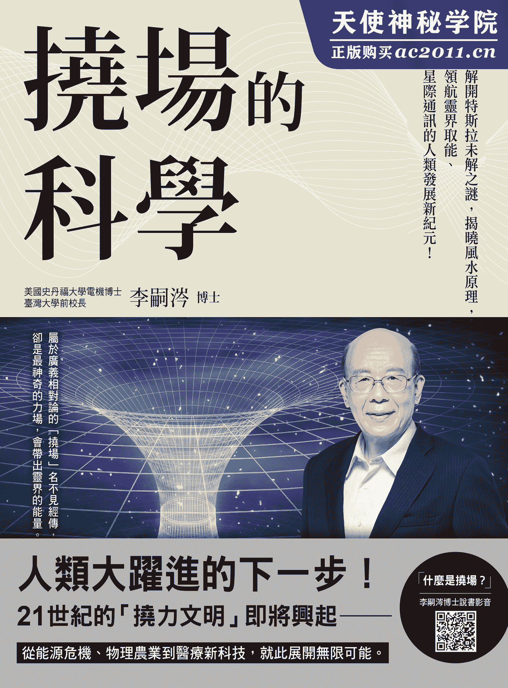

## 自序
特斯拉没有说的秘密——挠场

台大前校长　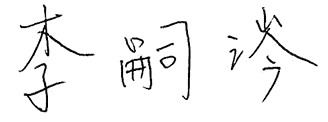

尼古拉．特斯拉（Nikola Tesla）于一八五六年出生于奥地利帝国的一个小镇，在今天的克罗埃西亚共和国之内。他于一八八二年受雇于美国发明家爱迪生（Thomas Alva Edison）在巴黎的分公司做工程师，由于表现杰出，被当地主管推荐到了纽约总公司追随爱迪生研究发电机技术。但是他很快与爱迪生闹翻离职而自谋生存，他所发明的多相交流马达配合交流发电机藉由西屋电气公司（Westinghouse）的推展及商业化，奠定了现代电力公司的基本发电模式，藉由交流发电及变压器升高电压，以低耗损方式传输到远方，再降压给用户使用，当然这也打垮了爱迪生所发展的直流发电机技术，导致两人结下很深的冤仇。

今天我们随时要用电灯、计算机、电视机、电冰箱、洗衣机等电器产品，只要插上电源插头，打开开关就可以享受电力文明的便利，这关键性的多相交流马达的发明要归功于特斯拉具有的一项神奇的能力。他从小在大脑中会产生影像视觉，我们现在叫做「开天眼」，也就是他有特异功能，可以听到远处的声音。当他遇到任何问题，比如设计新的马达，常常有如神助般会有答案，以影像方式呈现在他的天眼上面。更神奇的是，他还可以让马达运转。如果运转不顺利的话，表示设计有问题，他可以在天眼上更改设计直到运转成功。结果在天眼上运转成功的设计，一旦开模做出来，实体机器就一定会成功，这让他发明了多相位交流马达。

特斯拉成名以后，直到他一九四三年八十六岁时过世，这几十年的期间常常发表一些怪异的想法，超过当时世俗的理解。例如，他声称用他发明的特斯拉线圈可以接收到外星人传来的讯息，因此他要发展死光武器以对抗外星人入侵，以避免人类被毁灭；他也收到讯息——地球将会产生温室效应，北极融冰后洪水会淹没城市，因此应该从环境中提取自由能源，以解决燃烧化石能源所造成的大气污染。他的种种观念远远超前他的时代所能接受，而且他并没有留下实体完成的机器如死光武器来验证这些观点。加上他过世后，美国政府把他遗留下的大量文件扣留了很长的时间，而他商业上的对手爱迪生又不断地丑化、打压他，因此特斯拉的事迹逐渐为人们所遗忘。

直到上世纪九○年代，特斯拉遗留下来的部分文件重新出现于世间，并引发了一些神秘事件，由曾经拥有者凭记忆记录下一些断简残篇公诸于世，才再度引起了特斯拉风潮。

我研究特异功能超过二十五年，到最近十年为了解特异功能之谜，我发展出了复数时空的模型来解释宇宙的实像以及天眼等意识的物理。我在二十五年的研究过程中，也遭遇到像星际通信、寻找外星人、真空取能等现象，与特斯拉晚年一样，因此我可以体会特斯拉发现这些现象的激动与震撼。不过，由于要到他中老年以后，二十世纪两个最伟大的理论包括一九一五年的「广义相对论」及一九二○年代的「量子力学」才相继建立，他已经时不我予，无法理解这些新的理论，并应用到他所发现的神秘现象。

但是现在已经是二十一世纪，距离特斯拉当年的发现已经超过一百余年，科学上已经有很大的进步。有些当时感觉神秘的现象，现在已经可以用科学来解释了，因此我尝试在本书用近百年的科学，尤其是「广义相对论」中挠场的发现与物理性质，以及「量子力学」对意识的阐释，来解释特斯拉当年没有说也无法说的秘密。特别是发现挠场可穿梭阴阳界的特质，不但让人体会如何从灵界取能，以及揭露中国传统风水的科学根据，也开始了解了道家奇门遁甲及诸葛亮布八卦阵的原理。希望这些新知识能稍微弥补特斯拉迷过去的遗憾，也预告了二十一世纪挠力文明即将兴起的趋势。

我在另一本着作《科学气功》第三章已经对挠场的发现与历史作了详细的介绍，也提供挠场透过不同物体，如沾湿的滤纸、金属铝、钼、不锈钢等材料，照射去离子水后，水分子团内氧原子同位素 O17 核磁共振图谱的变化，由此证明物理挠场的存在及它的穿透性质，并判断它与水晶气场具有相似的物理穿透特性，从而认定中国传统气功中物理气场如外气的本质就是挠场。因此，在本书中我会交互使用气场或挠场，因为是同一种物理现象，也提出实验证据说明挠场的许多惊人而有趣的性质，可以说本书是挠场故事 2.0 版本。

# 第一章
特斯拉的特异功能与电力产业的兴起

特斯拉于十九世纪末发明了多相交流马达，

导致了近代电力文明的兴起。

他不平凡的一生源于他不平凡的特异功能，

包括影像记忆与开天眼的能力，

他的创造发明有如天助，

实则来自另外一个世界——灵界。

## 世纪天才特斯拉的特异功能

尼古拉．特斯拉如图 1-1 所示，他于一八五六年出生于东欧奥地利帝国的一个小镇，在今天的克罗埃西亚共和国之内。特斯拉的父亲是一位东正教的牧师，也是作家，有一个哥哥、三个姐姐，而他对发明的兴趣也许是受到母亲的影响，因为在他长大的过程中，母亲在家事闲暇之余，常常会制作一些小小的家庭用品。

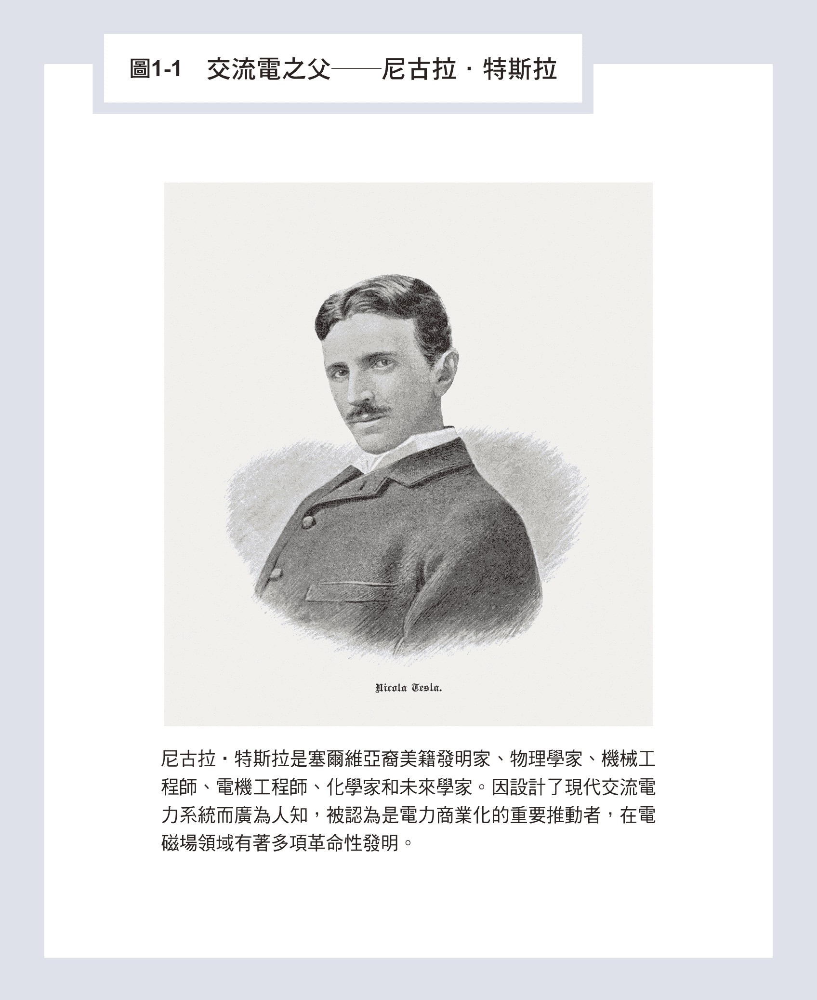

根据特斯拉的自传所述，他小时候很喜欢唸书，可以记下整本书的内容，主要原因是他大脑具有影像记忆的能力，看书时可以把每一页文字就像照相一样照下来储存在大脑记忆库里。当他需要背颂哪一页时，就可以从记忆库里抽出那一页来，像一般照片一样，呈现在大脑的视觉荧幕上，这样他只要看着照片就可以念出来了，而这种影像出现会让他体悟到一阵阵灵感。

特斯拉也说过，他小时候常常会生病，这种所谓的生病是他眼前常常会出现强烈到令人目盲的闪光，接着出现视觉影像。这些影像有时与他刚刚想到的字或想法有关，或是他碰到特殊的问题时，解答就突然出现在影像上，有时他甚至可以听到远方的声音，或只是听到一项物品的名字，物品实际详细的结构就出现在影像中。

这种现象在现代心理学研究的「联觉」（synesthesia）现象中有报告过类似的现象，也就是五官的感觉会互相转换的现象，例如，听到声音会看见颜色或影像；看见某些文字会闻到不同味道等等。更特殊的是，特斯拉可以把他设计的新机器在大脑以巨细靡遗的方式呈现在荧幕上，再用意念让机器转动起来。如果运转不顺利，例如机器卡住了，表示设计有问题，他再在大脑里更改设计，直到运转成功，再把机器结构画出来，开模做成实体的机器 ，通常是一次就成功了。

###  联觉，所展示的特殊才能

我一生中遇过几位具有联觉的人，其中两位非常特殊，也让我了解到具有这种能力的人会有哪些不可思议的表现，就像特斯拉一样。

第一位是科幻小说作家倪匡。二○○二年八月我从台大教务长卸任，六年的行政工作让我决定下半年去美国加州硅谷的史丹福大学休假进修充电。倪匡当时住在旧金山，离史丹福大学不远，经我台大电机系的学弟，也是科幻小说作家叶李华博士的介绍下，因此有一个机缘去倪匡家拜访。

他家面临旧金山湾，在金门大桥附近，房子的设计很酷，晚上屋顶可以打开看海湾夜景及天上星星，他号称是写过最多中文字（六千万字以上）的作家，从十七岁在香港投出的第一篇稿子开始，就从来没有被退过稿。他在写《卫斯理传奇》的系列小说时，可以一天写一本书，速度惊人，原因是他看任何小说时，大脑就会出现荧幕，把小说里文字描述的人物故事以电影方式在大脑呈现。反过来也是一样，当他大脑开始演一齣戏，他只要拿起笔来，把戏剧的剧情照样写下来就好了，因此一天可以写一本书，根本不需要自己花时间编剧情，这表示他的故事是天眼从另外一个世界下载下来的。所以，他曾跟我说过，他把金庸早期写的武侠小说改写过后比较好看，我们一般人却觉得修改以后，原来的记忆被打乱了，变得不好看了。这是因为金庸早年为了他每天发行的《明报》刊载武侠小说赶稿，很多场景情节没有注意时间先后，造成前后矛盾。当这些矛盾的剧情被修正了，倪匡大脑中的电影看起来顺畅多了、也合理多了。

第二位具有联觉的人士是修我课的学生，我二○一三年六月从台大校长卸任，没有压力以后，决定把我从事气功及特异功能研究三十年的成果开出一门课来供有兴趣的学生选修。经过两年多规画，到二○一六年，我在电机系及研究所开出了一门课「人体潜能专题」，由于要做实验，包括心电感应及透视力实验，受限于实验场地，每学期只能收三十六位学生。一开始的前两年，选课时预选同学都有几百位，也造成轰动，但是能修到课的人确实不多。

二○一七年，一位电机系的研究生林同学来修课，她一上课开始做实验时就显现出不凡的能力，心电感应实验的正确率很高，我从她写的作业中才发现她具有联觉的能力。原来她也是一听到音乐，脑中就会出现荧幕、开始演电影，随乐曲的不同，电影内容也变得多彩多姿。她过去曾修过音乐欣赏的课程，她对乐曲启发心智的分析之深入及细腻透彻，常让上课的老师惊为天人。她以为大家应该都跟她一样，直到修了我的课以后，才发觉自己是多么特殊、具有联觉的能力，与别人完全不一样。

在班上做心电感应实验时，我让每个人静坐放空一分钟感应，由同伴提供的五张 ESP 卡片（请见图 1-2）随机抽出一张，发射信号给她。整学期一百次的实验中，她竟然对了四十九次，而一般同学平均猜对的机率是五分之一，为二十次。她统计的显著性超过七个标准差，也就是她具有某种跨越时空的心电感应能力。

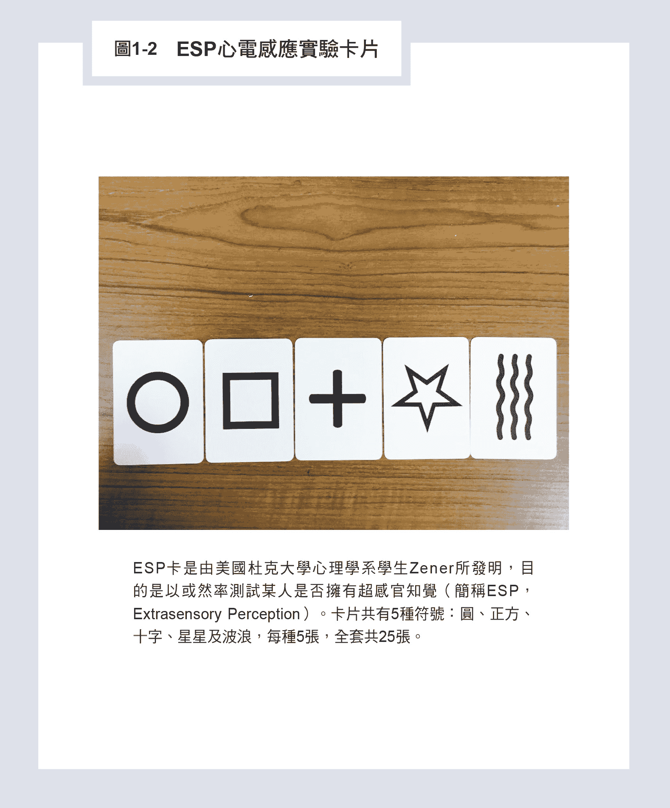

这种特异功能让她在读历史或古文的时候，可以仅凭片段对话及场景的描述，就可以精准判断出这些历史人物心里在想什么，可能有什么情绪，会有什么作法，并能和以后历史发展的情节相符。所以她过去的国文老师特别喜欢她对古文的分析，除了能看到她解释文意，还能解释作者写作的心态和当下的情况，觉得是一种享受。

由于林同学拥有联觉功能，对人心的判断比较敏锐，所以在辩论赛，或和别人谈判时，她能够立即知道对方话中的意思，直接知道对方心里想什么，接下来会说什么，有时甚至能直接预测对方会拿什么当辩论的压轴、谈判筹码，接着直接打中对方弱点。因此不论在哪一种场合，她都会被推派为主讲人，或提供分析和拟定对策的副手。我相信特斯拉也多少具有类似的经验与能力。

###  如何知道自己有没有影像视觉能力？

对研究特异功能的我来说，在二十年前读到特斯拉的自传时，一看就知道特斯拉具有两种能力。第一种是「影像记忆」能力，可以把所看过的图片及文字，以照片方式记忆下来。第二种他所描述的闪光，加上随后出现的影像视觉，其实就是「开天眼」的现象。

如同我们在做手指识字实验时，小朋友必须要等大脑天眼打开后，才能在天眼中看见折叠纸条上写的文字，或画的图形。而且我们发现开天眼前几秒钟，从小朋友双手食指底端的手掌上可以量到几十毫伏的电压，表示大脑内部有放电现象，引发神经脉冲传到手掌上，同时这个放电过程也引发了天眼的形成，让一个像电视荧幕的画面在大脑中出现。

这与特斯拉先看到强烈闪光（大脑放电），再出现影像的过程非常类似，所以这种现象并不是生病，而是特异功能出现的前兆，是特斯拉自己误会了。至于具有影像记忆或开天眼的人在人群中普遍吗？要如何知道自己是不是有影像视觉？这种能力可以训练出来吗？

影像记忆在传统道家修练自身成仙的过程中，叫作「观想」，也就是在大脑中根据过去的记忆无中生有产生画面，比如，闭住眼睛想象一条鱼游来游去、一匹马在原野上奔驰等等。当一般人把眼睛闭起来，会有视觉暂留现象，等到视觉暂留现象消失以后，都是一片黑暗，什么东西也看不见，只看到环境中穿过眼皮微弱的光线。观想就是把存在于大脑神经网络记忆中的影像重新激发出来，栩栩如生地展现，就像张开眼亲眼目睹一样。这种观想能力一旦练成，就可以产生影像记忆的能力。

天生具有影像记忆能力的人，大量存在于画家或建筑师当中。其实一个画家要画好一幅画，除了纯熟的绘画技术外，影像记忆的能力也非常重要。他的大脑可以一边看记忆中的实景一边画，省了很多力气，光与影的布局直接用看的就好了。我认识很多画家都有这种能力。建筑师也是一样，他设计的建筑，如果能在大脑中成像，并且可以旋转，从上下左右不同角度来透视，自然设计会比较完美。当然也有少数人像特斯拉一样，是天生具有影像记忆能力。

二十年前，有一位美国杜克大学的客座教授来找我，他在台湾长大，当年是台大医学系毕业。考大专联考前两天，他梦见了一张数学考卷，花了两天把题目做完，结果进了考场一看，果然是他梦到的考卷，很快就把试卷写完了。由于要四十分钟才能缴卷，他就趴在桌上睡觉，结果监考老师还来推醒他，那年数学题目特别难，他考了九十多分。大一上微积分时，老师第一堂课就调查同学联考的数学成绩，结果发现即使是第一志愿的医学系，大部分同学的数学成绩都不及格，只有他一个是九十分以上。于是老师叫他出去，不必上微积分课了，结果他真的从此不去上课，学期成绩老师给他九十五分。

他说，他具有影像记忆能力，在医学院做实习医生的时候，只要看过的 X 光片，他都能记住。讨论案例时，他可以从记忆库里调出来，不必去查原始纪录，就可以解析得清清楚楚。

他到美国留学任教以后，在某一本医学期刊当了十多年的编辑，只要一有论文投稿进来，他可以在记忆库中搜寻可能的审查人选，完全不费吹灰之力，因此总编辑十多年不放他走。后来一家投资生医产业的基金把他挖去工作，替公司创造了很大的利润，因此派他担任亚太地区分公司的执行长，兼管台湾业务。他回到台湾时，特别来拜访我，分享他的传奇故事。

我在三十年的研究特异功能过程中，设计了一个简单的方法，实验一下就可以知道自己是不是具有影像记忆能力。

请你拿一个水果，例如苹果放在眼前凝视十五秒钟，然后把眼睛闭起来，等视觉暂留现象消失以后，再尝试把苹果想象出来，想象出来的苹果颜色与立体形状必须跟当初看的完全一样。如果你不确定是否完全一样，可以再张眼重新看苹果十五秒钟后再做一次。

我也发现从小有接受过速读或观想训练的小朋友，长大后影像记忆的能力仍然存在。在我的「人体潜能专题」课程中修课的同学，有不少位就是小时候的训练让他们现在二十多岁仍然保有影像记忆的能力。

###  开天眼的能力能否训练？①

我自己在一九九六年七月第一次开了一个儿童潜能训练班，想要验证中国大陆研究单位所声称的儿童可以训练出手指识字功能。随后，我每年暑假开训练班，以四天每天两小时的时间训练小朋友，一直到二○○四年，共计开班九次，总共有一百七十六位小朋友完成四天的训练，其中有四十一位出现显著的手指识字能力，大约百分之二十三的比例出现了相当高的功能（统计出错机率 P＜0.05）。其中三十三位 （约百分之十九）出现了大功能（统计出错机率 P＜0.001）。其年龄分布从八到十一岁的功能都很高，十二岁以后就不行了，人数较少。

这些出现高功能反应的小朋友都会告诉你，他们脑中有一个电视荧幕会打开，文字或图案的颜色先在荧幕上出现，接着文字或图案再一部分一部分出现在荧幕上，直到最后正确答案出现为止。也就是小朋友要开了天眼，才会手指或耳朵识字，不开天眼是没有办法正确答对的。

过去几十年的经验显示，手指或耳朵识字能力主要集中在十三到十五岁以下的儿童，一般相信这是因为大脑松果体在十三到十五岁开始钙化的缘故。问题是，天眼似乎并不是位在松果体，而是在松果体后方五到十公分，这似乎暗示年纪超过十五岁的年轻人仍有机会开发出手指或耳朵识字功能。

我在二○一六到二○一七年，也在台湾大学电机系尝试开发约一百位二十多岁的台大大学生及研究生，仅仅只用了两次、每次半小时的训练，加上课余的影像视觉自我训练，也有百分之三的同学出现了耳朵识字的功能。这结果很令人兴奋，原来年纪超过十五岁，我们还是有机会经过训练打开天眼，开发出耳朵识字的功能。

二十五年的研究经验告诉我，任何人开了天眼，经过反覆的训练，熟悉怎么操纵天眼以后，就会开发出各式各样特异功能。就像小朋友的手指识字功能纯熟以后，就可以开发念力，不用接触就能把盒子中的铁丝折弯、火柴剪断，也可以开发出像五神通的能力，如「天眼通」，可以看到远方的景色或人物；「天耳通」，可以听见远方的声音；「他心通」，可以心电感应到他人的思维；「宿命通」，可以预知未来，回知过去；「神足通」，可以遨游大地、来去自如；「手指及耳朵识字」，五官可以互用；加上「念力」，可以用意念幻化万物、千里搬运等力量，令人目眩神移，不可思议②。

然而有些特异功能人士却不必开天眼也可以做到，例如，民间很多灵疗者可以与病人身上的附灵沟通协调谈判，达成双方接受的条件，而请灵离开，以达到治愈疾病的目的。灵疗者并没有开天眼，但是他的灵魂好像容易脱体进入灵界，直接与附灵沟通，也可以查出病人过去的历史与附灵的恩怨。我认识一位北京的特异功能人士，他声称没有开天眼，但是能从灵界找出犯案者过去行动的蛛丝马迹而破大案，因此受到相关部门的重视。

###  拥有特异功能是福，还是祸？

一个人拥有特异功能，除了表演给一般普通人欣赏，获取报酬或赏识之外，到底还有什么用途？ 对功能人本身来说，是好事还是坏事？

我先举历史上三国时期的两位特异功能人士为例来做说明。第一位是曹操手下具有千里取物的大功能人左慈，第二位是具有小功能蜀汉的宰相诸葛亮。

《后汉书》第八十回《方术列传（下）》记录了不少东汉末年特异功能的方士，有些入朝为官，大部分为民间人士修练有成，而留下脍炙人口的事迹。

左慈，字符放，庐江人也，小时候就有神通，他从星象中预测出汉朝的气数将尽，国运衰落，天下将要大乱，于是开始学道，对「奇门遁甲」非常精通，能够驱使鬼神隔空千里搬运，后来他曾在司空曹操门下任职。

有一次曹操带文武百官出巡，到了吃饭的时候，他对部众说：「今天准备了佳肴招待各位，但是少了吴淞江的鲈鱼。」左慈应答：「这个事好办。」请人拿来铜盘装满了水，以竹竿上饵钓于盘中，不一会儿就钓出一条鲈鱼。曹操拊掌大笑，但其他在场官员均大为惊讶。曹操说：「一条鱼不够让大家吃，你还可以再钓些吗？」左慈乃换饵再度钓之，一会儿又钓出许多鱼，皆长三尺余，生鲜可爱，曹操叫人烹调来招待官员。

接着，曹操又出题目说：「既然已经有鱼，可惜的是没有蜀地的生姜。」左慈回答：「亦可得也。」语毕就取来生姜。曹操生性多疑，恐怕他是就近索取，结果后来证实是蜀国的生姜。

又有一次，曹操到都城近郊视察，跟随者有百余人。左慈带酒一升、肉一斤，亲自给大家斟酒夹肉，结果百官都吃饱也喝醉了，曹操觉得奇怪，派人到附近商家调查，结果发现所有商家的肉及酒都不见了，都被左慈用法术给搬走了，这引起了曹操的警惕，了解此人有大神通非常危险。加上左慈有一次劝曹操把宰相位子让给刘备，引起了曹操的杀机，但是左慈穿墙破壁，让人到处找不着，或在市集看到的所有人都变得像左慈；又或是躲在羊群中，让每只羊的姿势都变成一样，无法分辨他的位置，最后不知所踪。所以大的特异功能有时会为自己引来大祸，非常危险。

三国时，另一位有小特异功能的是诸葛亮 ，他熟读天文地理且精通奇门遁甲、阴阳八卦，不仅能运筹帷幄、三分天下，大展鸿图，在赤壁之战中还借东风打败了曹操，后来又布下八卦阵，困住东吴十万大军，无一不彰显其神乎其神的能力。

虽然有人声称《三国演义》是小说不是正史，陈寿写的正史《三国志》并没有记载这些事情，但是正史是胜利者写的，陈寿虽然是蜀国人，但是后来蜀国被灭以后，他在西晋当官，他写的历史必须配合西晋的观点。蜀汉是前朝魏国的敌人，怎么可以称赞敌人的智慧及骁勇善战，因为他们毕竟失败了，我们才是历史的胜利者及诠释者。我是相信民间的诠释，那才是真正没有被故意删除的历史。

所以综观历史以后的结论是：开发大功能，对功能人本身有危险性；开发小功能，若可运用在功能人的专业领域上，才能运筹帷幄，把专业领域提升一个层次，进入新的境界，对人类文明的提升才有真正的帮助。

就像特斯拉一样，他有小的特异功能，可以开天眼，在天眼里设计多相交流马达，还可以尝试转动马达来测试设计是否正确，结果他所发明的多相交流马达从此改变了人类的文明，进入了电力的时代，驱除了没有太阳的黑夜所带给人类的不便。

###  特异功能要从小训练吗？

小的特异功能既然对人类文明有提升的作用，那一个人到底要从小培养特异功能，像手指识字能力，还是长大了再想办法？这可以从历史的经验寻求解答。

中国大陆在一九七九年首先发现手指识字可以经过短期的训练开发出来，经过四十年来已有大量的实验证明，七到十五岁的小孩子有相当大的比例，经过训练可以开发出手指识字或耳朵听字的特异功能，但是要维持这个能力却相当困难，因为需要不间断的练习，而小朋友一旦升上国中或高中以后，在面对升学的压力下要持续不断的练习是相当困难的。我二十五年的特异功能研究经验发现，只有少数几位当年开发出手指识字等特异功能的小朋友，长大以后还能把特异功能用到他的专业上。一位是大陆当年「扁鹊工程」所培养的黄姓女士，她具有透视功能，目前在法国当医师（是西医师，而非中医师），她的医术可以直接看透人体，成就当然远远超过她的同侪医师。

「扁鹊工程」的目的，就是培养小朋友的特异功能，让他们将来长大以后去学医，成为像扁鹊一样的神医。黄女士的确做到了，但也是我所知大陆唯一成功的一个。

另一位是我培养近二十年的 T 小姐。她天生具有手指识字功能，灵界有一位师父从小在帮忙指导她，但是最后对她专业上有帮助的能力是可以跟动物沟通，这个能力却是她在台湾大学读大学时出现的第二位师父教导她的，过程离奇有趣，给我很大的启发。目前她在美国洛杉矶一家兽医院当兽医，她的医术当然远远超过她的同僚。

T 小姐小的时候有一次去动物园玩，到了猴子的园区，突然听到一只猴子向另一只猴子说：「要不要到我家去玩？」另一只猴子回答说：「好啊！」只见两只猴子手牵手，一跳一跳地回到后面的山洞里。回家以后，她又听懂了鸟爸爸在教鸟小孩的一些事情。不过她这个与动物沟通的能力只维持了三个月就消失了，这次的经验让她非常的怀念，从此下定决心，长大以后要去做兽医，替动物解除病痛。

这就像在两千五百多年前的山东省，就有一位奇特的人物公治长，传说他能够听懂鸟语，并因此获罪入狱。后来，同样的也因为他懂鸟语而被无罪释放，甚至为国家立功。他深受老师孔子的赏识，并最终娶了孔子的女儿为妻。

二○○一年九月，T 小姐从美国回到台湾读大学，她本来想申请就读台大兽医系，但是台大兽医系当时不收外国学生，她只好以美国公民身分去读台大畜产学系。不过因为回到台大，我可以每个月跟她进行一次手指识字实验，到了二○○四年六月，她离开台大回到美国加州大学戴维斯分校继续完成大学学业时，我已累积了大量的遨游灵界的数据，这些实验纪录都收录在《灵界的科学》一书中。

T 小姐从小就有一位灵界的师父在照顾她、指导她，我们在二○○一到二○○三年间也经由手指识字实验与祂对谈，询问宇宙、人类文明、外星人的各种问题，并将答案收录在《难以置信Ⅱ：寻访诸神的网站》一书中。其中有一题就是问祂：「T 小姐何时可以恢复与动物沟通的能力？」师父的回答是：「不要急。」当时的我可是急死了，她已经在读大学了，未来要去美国读兽医学院，到底什么时候才能恢复，听懂动物的话？

T 小姐在灵界的第二位师父于二○○四年一月一日以不同凡响的方式闯入我们在台大电机系的手指识字实验现场，表明祂的身分，正式收 T 小姐为徒以后，T 小姐开始每日勤练打坐与动物沟通的技术。到了当年底，她已经掌握了初步的技巧，可以和一些动物对谈了。

十年以后，二○一三年 T 小姐从美国普渡大学兽医学院毕业，考取执照成为美国加州正式的兽医师以后，我于二○一四年三月邀请她到台大兽医学院演讲，当年拒绝她入学的兽医系已经升格为兽医专业学院，她举出六个案例来说明她治疗动物所观察到现象，包括：狗吞下网球卡在食道，但是 X 光照不出来，经她问出来后，很快就解决了；猫咳嗽不止，正式检查却找不出原因，结果一问之下，发现是家里给牠玩的玩具，因为整理环境被扫进角落去，导致牠不爽的缘故。接着，动物医院及同学抱出宠物给 T 小姐看，其中一只土拨鼠已经一个星期不吃东西，令主人很担心，经过 T 小姐问诊后，才知道是土拨鼠嘴巴痛的缘故，因为牠的犬齿被磨短所造成的。

有一位同学带来家里的猫，最近每天一直叫，令主人很担心，结果她一问猫，猫说牠生了三只小猫，是在教小猫的缘故。主人马上证实，猫的确是刚生了三只小猫。这也表示猫有数字三的概念，令人震惊不已。小说中可以听懂动物说话的杜立德医生已经横空出世了，真让人期待未来兽医的发展，将呈现什么样新的面貌。

开天眼的能力，除了是天生的以外，有时候大难不死或大病不死也会开发出特异功能。

国内有一位大企业家，年轻的时候有一次被闪电击中，昏死过去半小时，醒来以后出现了开天眼能力，可以预知未来，做生意无往不利，常常作梦的时候像特斯拉一样，会有很多新观念、新机器设计出现，经过旗下工程公司验证以后，马上申请专利。他虽然在学校从来没有学过任何工程方面的相关知识，但是所获得的工程方面的专利超过七百个以上，任何学院派的教授都瞠乎其后。当然最容易开天眼的方法，就是经过打坐及相关训练，这也彰显我们训练方法的重要。

###  开发现代的诸葛亮或特斯拉

由于最近几年我从「人体潜能专题」的课程中发现，超过二十岁的成年人也可以开发出耳朵识字的小功能，就像 T 小姐一样，二十岁以后才开发出与动物沟通的能力。

因此我提出一项新的看法，直接训练有专业能力的成年人，开发出天眼能力，我把这项计划及企图称之为「诸葛亮工程」或「特斯拉工程」，也就是开发现代的诸葛亮或特斯拉，利用他们的天眼，提升他的专业领域水平，以进入人类新的文明。

* * *

① 请参考《灵界的科学》。

② 请参考《是特异功能？还是潜能？》。

## 特斯拉与电力产业

特斯拉在一八七五年十九岁时进入奥地利技术学院电机工程系，念了三年后离开学校，去一家公司当了一年助理工程师。在这段时间，他遭受神经崩溃的困扰，后来在父亲劝导下，一八八○年暑期去布拉格的查理费迪南德大学（Charles-Ferdinand University）就读，深受物理学家恩斯特‧马赫（Ernst Mach）的影响。

马赫因研究超音速运动而成名，他大力强调了经验主义和实证主义在科学研究中的重要性，为科学哲学的发展奠定了基础。特斯拉深受马赫的启发，他的天眼内在经验可以大大地帮助他做科学实证研究。但不幸的是，他只读了一学期，就因为父亲过世而离开学校，他找到一个工作，是在匈牙利首都布达佩斯的国家电话公司的电报部门工作。他的天才让他在一年中升为公司主要电机工程师，替国家发展第一个电话系统，也发明了现在叫做麦克风的元件。

一八八二年，特斯拉加入了美国发明家爱迪生在巴黎的分公司，主要业务是推展照明系统，包括了白炽灯及供电系统。当时爱迪生用的是低压（110V）的直流供电，特斯拉的天才让上司非常欣赏，于是把他介绍给爱迪生。一八八四年，特斯拉远渡大西洋到纽约向爱迪生报到，从此留在美国，直到五十九年后一九四三年他过世为止。

特斯拉仰赖他的特异功能，一向自负，碰上顽固权威的爱迪生坚信：「天才是百分之一的灵感，再加上百分之九十九的努力」，两人的冲突当然是免不了的。特斯拉曾说：「爱迪生如果能多想想，那么百分之九十的功夫是不必要的。」他以为别人跟他一样，也可以开天眼在大脑中创造新发明，所以这两人势必水火不容。

传说中，爱迪生曾答应特斯拉，如果他能改善公司的直流发电机，会给他二十五万美元的奖赏，当时特斯拉的薪水是每星期十八美元。后来，特斯拉认为他成功了，但爱迪生认为他只不过是说笑而已，何必当真？只把特斯拉薪水调升为每星期二十五美元，特斯拉一怒之下就辞职而去。有一年时间就靠在纽约街边挖地修电线为生。

就在这样困苦的生活之下，他的天眼传达了以旋转磁场为基础的多相位交流电马达的概念。他在大脑设计好并运转成功之后，说服朋友投资并申请了专利，最后也成功地示范了技术。这个突破性的发明很快地被企业家西屋电器公司的创办人乔治‧威斯汀豪斯（George Westinghouse）注意到了，他当时正在使用欧陆发展出来的交流电发电技术照明，与爱迪生直流电技术竞争。

交流电本来就占有优势，交流电可以用变压器先把产生的电压升高、降低电流作长距离的输送，减少电线电阻导致的电能损失，到用户端再把电压降下来使用，这样做可以很容易地扩大用户分布的区域、增加用户的数目，来降低发电的成本。西屋电器有了特斯拉的高效能交流电马达技术后，更是如虎添翼，用高效率马达驱动发电机可以把发电成本降得更低，很快就打败爱迪生的直流技术独占市场，成为电力企业的标准。

一八九五年，西屋公司承建了空前巨大的尼加拉瀑布水力发电厂，十座涡轮机推动的发电机可以发出五万匹马力，用变压器升高到两万两千伏特，运送到四十三公里外的水牛城。

到这一刻，交流电取得了决定性的胜利，特斯拉也因此获得很大的利润，可以进行他下一步的宏伟企图——无线电力传送。

# 第二章
无线电力传送与特斯拉遗失的文件

在特斯拉过世后，曾记录他创新想法的笔记，

就被美国政府扣押而消失了，

在一九九○年代，

这些消失的文件突然出现在市面而引发轰动。

随着时代的进步，他当时的部分想法，

如温室效应等，已经被现代科学所证实。

## 电磁波的发现与应用

英国科学家马克斯威尔（James Clerk Maxwell）于一八六五年发表了他的「电磁场动态理论」，奠定了电磁波的理论基础，这些电场、磁场互相影响的方程式后来陆续被其他科学家整理成四条方程式，统称为马克斯威尔方程式。

在他的方程式中，预测了一种电磁互相激发振动的波动，叫做电磁波，他从方程式用到的物理量，如真空介质系数及磁导系数所计算出来的电磁波的速度，竟然与过去科学上所量到的光速是一样的，间接证明了光就是一种电磁波。这一石破天惊的发现引发了当时很多科学家的兴趣，开始去找频率比较低的光，也就是眼睛看不见的电磁波。

一八八八年，一位才三十岁的年轻德国教授亨利希‧赫兹（Heinrich Hertz）设计出一套火花间隙放电①的发射器及接收器，用实验方法证明了电磁波的存在，并展示了发射及接收的方法。自从赫兹发现电磁波以后，欧洲及美国很多有创意的发明家开始探索电磁波的应用，其中比较有名的两位是意大利的马可尼及美国的特斯拉。

古列尔莫‧马可尼（Guglielmo Marconi）出身世家，家族拥有庞大的威士忌酒产业，他小时候就对电有很大的兴趣，二十岁时对应用电磁波更着了迷，开始用电磁波做无线通讯实验。后来，他说服父母的支持，带了他自己设计的无线电通讯设备到伦敦来发展事业。在一九○一年十二月，他终于成功地把无线电波所携带的摩斯密码，从英国西南部横跨了大西洋，送到了两千八百公里外加拿大纽芬兰岛圣约翰镇的接收站上，从此轰动全世界，展开了长距离无线电波通讯的世纪。

* * *

① 在电势差很高的正负带电区域间出现闪光并发出声响的瞬时气体放电现象。

## 醉心于无线电力传送的特斯拉

一八八八年，刚到美国几年的特斯拉知道了赫兹发现电磁波以后，也对电磁波着了迷，开始做研究，不过他走的方向与马可尼不一样，不是用在通讯，而是想用来传播电能，也就是无线传导电力。当时的电力产业刚刚萌芽，一般家庭开始使用电器，如电灯、电话就不需要大量投资建置有形的电网基础建设，让使用电的各种新兴产业可以降低成本，也更容易推展。

在今天一百多年后的二十一世纪我们所面对的新科技而言，这个概念仍是具有前瞻性的创意构想。

试想，现代科技中的行动装置最大的瓶颈就是电池不够力，当随身所携带的手机或计算机内电池没有电时，这些装置如同废物，呼天不应，叫地不灵，所有信息都被封锁在装置内，无法对外通讯。这时，最需要的就是无线传播电力的需求，可以直接替电池充电解决困扰。可惜的是，这个问题一百多年来仍然不能解决，也表示特斯拉在没有理论支持下，过早跳入一个需要百年以上才有希望解决的问题，自然会导致失败的命运。

一般电力的传送需要两条导线，电压一高一低让电流从高压流往低压，为了安全起见，现代的导线还加了一条接地的线，与电压较低的导线连在一起，所以插座会有三只脚，其中粗圆的一只脚就是接地。

特斯拉应该很早就知道地球可以导电，因此地面可以当作电的接地那一极，但是另外那一极该怎么办，是用电磁波送出吗？他也知道电力要转换为电磁波的效率并不高，很难做到大量电力的输送，因此在不建造基础电网设施之下，就需要以空气作为通道。他的构想是利用紫外光游离空气分子，在空气中打开一条离子导电通道，用高压放电把电能利用离子通道送出去，而不需要用到一般的电线，并利用地面作为接地回流，他设想用的是低频交流电，可以传递很长的距离。

一八九九年，为实现他的构想，他在美国科罗拉多州温泉市（Colorado Springs）建立了他的实验室，从六月一日起开始做实验，研究在空气中大规模导电的可能性，我们可从网络上看到他做实验时的示意图①，放电现象打穿空气形成紊乱的闪电。

这个实验在半年后的一九○○年一月七日结束，他也离开科罗拉多州回到纽约，另起炉灶，开始进行真正的无线电力传送。这一年中，他募集到十五万美金，在纽约附近盖了一座巨大电塔，声称可以把电力直接从纽约送到法国巴黎。他仿照科罗拉州的实验，建立了一个横跨大西洋的沃登克里夫（Wardenclyffe）通讯设备，但是过了三年，没有做出什么研究成果、钱也用光了，计划无疾而终。

二十五年后，一九一五年特斯拉向美国法院提出诉讼，挑战马可尼的无线通讯专利，认为他比马可尼早一年就完成了无线电通讯，但是最后官司打输了，从此历史上无线电通讯的功劳就专属于马可尼了。

* * *

① 特斯拉在美国科罗拉多州温泉市的实验室研究导电性的示意图。

https://reurl.cc/OqQE37

## 特斯拉线圈的启示

###  特斯拉实验日志

特斯拉曾经声称就在科罗拉多州温泉市实验那段期间，他收到了许多来自外星人的信号及信息，引发了后来四十多年围绕着特斯拉的神奇传说与故事。他在这半年来的实验室日志上面记载了年月日，以及当天所做实验的详情，每天或隔几天就有纪录，记载得相当详细，由此可以知道他的进度。

在特斯拉过世后，因为他没有结婚没有儿女，由他的姪儿打官司取得了这些日志及一些专利文件，后来赠送给南斯拉夫政府，被放在首都贝尔格勒后来建成的特斯拉博物馆中。当然还有很多文件，象是记录他创新想法的笔记，就被美国政府扣押而消失了，在五十年后的一九九○年代，这些消失的文件中有一部分突然出现在市面上而引发轰动。

我记得二○○二年下半年，我从台湾大学休假，回到我念博士的母校——美国史丹福大学电机系进修。那时我正在做手指识字遨游信息场内不同神灵网站的实验，也去访问过具有瞬间科技的不同高等外星文明①。因此对特斯拉在十九世纪末期就收到外星人的信号非常好奇，想知道其中的机缘及详情。

令我兴奋的是，到了史丹福大学不久，我就发现电机系隔壁的物理系图书馆竟然有一本特斯拉当年实验的日志，我马上借出来仔细地读了一两个礼拜，以为可以看到特斯拉记录下来的外星人送来的信号，结果让我大失所望。整本书都是在记录特斯拉调整电阻（R）、电感（L）、电容（C）组成电路所导致的不同频率的电磁震荡现象，相当于现在大学中电机工程系大二的必修课程「电路学」所学习的基本 RLC 电路。

当然，在十九世纪末期特斯拉的时代，这些电路可是最崭新、最先进的学问，但是这与收到外星人所送出的信号一点关系都没有，这些电路中最有名的就是「特斯拉线圈」（Tesla coil），如图 2-1 所示。各位如果上 YouTube 网站找特斯拉线圈的影片②，可以看到各式各样不同的线圈，通常两个线圈工作时，它们互相之间不仅会发出闪电互相接通，还会激发大气产生音乐，大家可以听听看，非常有趣。

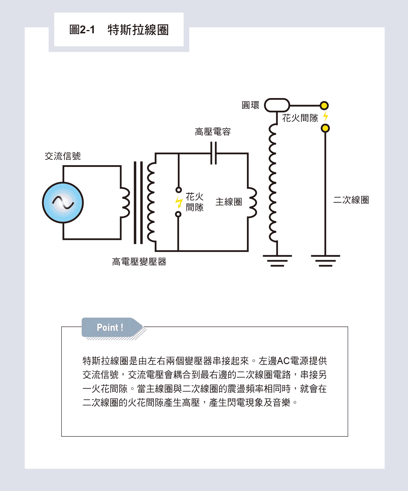

特斯拉线圈其实是由左右两个变压器串接起来，左边 AC 电源提供交流信号，是点火线圈经变压器把电压放大耦合到右边变压器主线圈电路。电路里放了一个可以耐受高电压的电容器用来储存电荷，把电压升高到可以打穿火花间隙（spark gap）的空气绝缘层而放电，产生 LC 电路震荡电流。这交流震荡的电流频率（f）是由电感（L）及电容（C）所决定的，大约是在几百赫兹（Hz）到几十千赫（KHz），属于可以听得见声音的范围（二十到二万赫兹）。交流电压会耦合到最右边的二次线圈电路，也就是 RLC 电路会串接另一火花间隙。当主线圈与二次线圈的震荡频率相同时，就会在二次线圈的火花间隙产生高压，打破空气绝缘产生闪电现象及音乐。特斯拉当年在科罗拉多温泉市的实验室内，可以产生一亿伏特的高电压，导致打破空气的绝缘产生紊乱而巨大的闪电现象。

这个高压线圈放电的现象其实产生了另外一种物理现象——挠场，不过这要到一百多年后的二○一三年，才由我的学生梁为杰博士从广义相对论推导出来③，是特斯拉当年不能理解的物理现象。

后来，我又发现了挠场可以穿梭阴阳两个世界，把灵界的信息及能量带到物质的实数世界，破解了中国传统道家的风水与奇门遁甲之谜，这部分我会在第四章详细介绍。

###  特斯拉曾收到外星人的无线电信号？

十多年后，二○一四年我终于从网络上买到了特斯拉的日志，可以仔细研究他的笔记及后人的加注。

原来在科罗拉多的半年实验中，特斯拉偶然会从他的线圈接收器收到一组一组重复的脉冲信号，与地球上风暴或噪声所导致的杂乱信号完全不一样。这些信号有时是一个、两个到四个一组尖峰，有规律的信号。特斯拉当年强烈怀疑，这是金星或火星上发出来的有意义信号，他猜测这是当地的外星人尝试联络地球文明的证据。不过，后来科学家认为特斯拉可能是收到了木星上电浆环面所产生的无线电信号。

###  特斯拉生命中的最后三十年

一九一四年起，特斯拉已经五十八岁了，他慢慢显现出强迫症的病症，情形愈来愈严重，他痴迷于数字三，比如，要进一栋大楼前，他要先在附近街道走三圈；吃饭时，会要求放一叠三张折好的桌巾在盘子旁边。那个时代的医学不了解强迫症，也无法治疗，因此有些人认为特斯拉疯了，这当然也伤害到他残存的声誉。他没有结婚，一个人住在旅馆里，靠的是西屋公司延后付的专利权利金维生。

一九一七年八月，特斯拉建立了世界第一个雷达（radar）原型的功率大小与频率之间的关系，这个原理协助法国的工程师在一九三四年制造出法国的第一个雷达系统。

一九二○年代，特斯拉据说与英国政府谈判，要制造一个「死光」系统，但最后被特斯拉的政治态度所中止。

最后，特斯拉于一九四三年一月在纽约一家旅馆过世，享年八十六岁。那时正是第二次世界大战期间，他遗留下来的文件资料有几十箱，除了实验室日志及一些专利文件等资料，由他姪儿打官司获得转送给南斯拉夫政府以外，其他的文件经当时美国战争部联系联邦调查局后，宣布为极机密资料，将两卡车的资料完全扣押。直到三十年后，才有部分资料突然出现在市面上拍卖。又过了二十几年，这些资料才被整理成书籍上市，引起轰动。

* * *

① 请参考《灵界的科学》第六章。

② 特斯拉线圈激发大气产生音乐的影片，请见下方连结。

https://reurl.cc/ldnZjd

③ 参考资料：W. C. Liang and S. C. Lee, 2013,“Vorticity, Gyroscopic Precession, and Spin-curvature Force”, Phys. Rev. D. 87, 044024。

## 特斯拉遗失文件中的秘密

一九七六年，一个纽约书商柏奈斯（M. P. Bornes）在新泽西州的纽窝克（Newark）拍卖四箱文件，被戴尔．艾尔扶瑞（Dale Alfrey）以二十五元美金买下。

艾尔扶瑞回家后，稍微浏览了这些文件，发现是尼古拉‧特斯拉的个人文件，记录了他的很多想法。那个年代没有多少人晓得特斯拉是何人，他猜想大概是一个科幻作家的笔记，因为他所读到内容是如此不可思议，它们不可能是真的。他对这些科幻文件兴趣不大，因此把这四箱文件放在地下储藏室内，想说等他以后有时间的时候再来慢慢读一遍。

不幸的是，等到他有时间来看时，已经过了二十多年，这些文件在潮湿的地下室内已经严重地老化，纸张发黄、墨水退色。他决定把文件内容重新复制，以免来不及挽救，然后他惊奇地发现这些文件透露了科学家特斯拉从小到大的秘密生命历程，是他死后的传记从来没有记载过的内容。

一九九七年暑期，艾尔扶瑞已经读完了特斯拉的四箱文件，准备开始用电脑扫描文件，储存到计算机磁碟上。他注意到文件中没有特斯拉所设计机器的草图，纪录也不完整，但是文件里面有年、月、日的纪录，只是中间有很多跳页，因此他相信还有很多特斯拉文件可能被美国政府扣住，或遗忘在某些人家的地下室内。他因此上网发出信息，希望找到更多的特斯拉文件，这很显然的引发了许多对特斯拉文件有兴趣人士的注意，包含准备让文件消失的团体的注意。

一九九七年九月，某一天艾尔扶瑞的太太及小孩去纽约曼哈顿，他独自留在家里做研究，扫描特斯拉文件。当天晚上他接到一通电话，对方自称是 Jay Kowski，对他拥有的文件有兴趣，不一会儿电话断线了，同时他听到门铃响了，他去应门时，却发现门早已打开了。有三个人站在门廊下，三个人穿着一样的黑色正装、白衬衫黑领带，很像殡仪馆的办事员。其中一位好像对他很熟，居然能直接叫出他的名字，希望他不介意让他们进屋。虽然这个人不断称呼他名字，似乎对他很熟，他却一点也不记得在哪里看过这个人，于是，他开始担心这三个人是否为犯罪集团。

那个人继续跟他说：「我们想买你拥有的老箱子及文件。这些文件不属于你，对你也没有用，反而会替你惹上麻烦。」

对此，艾尔扶瑞开始感到恐惧，这三人不是真的要买这些资料，他们是要拿走资料。

那个人继续用缓慢而清晰的话语告诉他：「不管你做什么，都挡不住我们拿走你的资料，你和你的家人最好把我们所需要的东西给我，否则人们会因此而失踪的。」这个人直接站在艾尔扶瑞面前，用他冷静而漆黑的眼珠凝视他，让他一动也不能动，也无法说话。这时，三人突然一起转身快步跑出门廊，消失于夜色中。

过一会儿，艾尔扶瑞从呆滞中突然惊醒，冲出门去找那三人，结果院子里既没有他们的汽车，外面的大街也是一片寂静，三个人就如此消失了。他急忙冲回房间工作室，结果发现放置特斯拉日志及文件的四个箱子、储存资料的磁碟全部都消失了，计算机的硬盘资料也全部被删除了，连他多年来所收集的特斯拉相关杂志资料也被一扫而空。显然那三个在门口的人只是诱饵，是为了把他调离工作室，其他人进了工作室，偷走了所有资料。

艾尔扶瑞在几个月后才恢复正常，他开始凭着过去研究的记忆，一点一滴地把他所记得的资料记录下来，成为后来几本书的题材，例如，Tim Swartz 所着的《The Lost Journals of Nicolas Tesla》。

在这些文件中，特斯拉曾提到他发明的特斯拉线圈可以接收到外星人传来的讯息，如前面所描述的是有规律的脉冲信号，而非地球的噪声，甚至到后来，他可以听到传来的声音告诉他，地球的温度由于人造的污染物进入大气正在上升，最后会溶解北极的冰层，导致海水上升，淹没沿岸的城市如纽约，这就是一百年后二十世纪末大家所知道的大气温室效应。

这些警告也激发特斯拉去设想发明一种不用化石能源的能量，可以降低大气的污染程度。因此，在一八九○年代，他声称设计出一种马达，不用汽油，但可以驱动汽车，这部马达可以不用输入能源，而直接用汽车产生的电去操作和驱动汽车，违反了「能量不灭定律」。后来很多人尝试仿照，并申请美国专利，但因为不能说明能量来源，而被专利局拒绝。

另外，他逐渐怀疑外星人不但存在，也想来地球，因此他要发展死光武器以对抗外星人入侵，以避免人类被毁灭；他也曾提出反重力与飞碟的概念，如何用电力制造反重力……他的种种观念远远超前他的时代所能接受，而且他并没有留下实体完成的机器，如真空取能的马达或死光武器来验证他的观点，因此这些想法很多被世人视为科幻故事，并不当真。

不过，随着时代的进步，他的温室效应想法已经被现代科学所证实，其他如真空中存有巨大的零点能量（zero-point energy）①，也被量子力学所预测，从真空零点能量取能的马达，也有少数一些专利及案例，我有亲自参与，知道真空取能是可以做到的事实。只不过要用到时空扭曲挠场的特性，这是特斯拉所来不及知道的物理。

至于与外星人通信的故事，我在《灵界的科学》第六章有详细的介绍，更提出考古学的证据，证明天鹅座的外星人在五千年到六千年前就来过地球，可以说特斯拉所记录下来的种种令当时人们不可思议的想法，有些已经逐渐被证实是正确的，有些还要等未来的研究成果来证实。而这些想法中，牵涉到一种物理的力场——「挠场」，是特斯拉时代所不理解的现象，也是本书所要描述的重点，看看挠场有什么神奇的特性，可以解答特斯拉的部分秘密。

###  与外星人语音通讯

在特斯拉遗失的文件中，提到他一八九九年在科罗拉多温泉市的实验中，他设计的接收线圈有时会收到有规律的脉冲信号，与地球上风暴或噪声截然的不同，让他怀疑是外星智慧生物送出来接触人类的电磁波信号。但是后来愈来愈多的文件却记录特斯拉收到了外星人的语音通信，告知他地球暖化的趋势，这一点却是有必要详细的分析，到底是怎么回事？

如果语音通讯是经过特斯拉的线圈收到的电磁波的话，就产生了一个技术上的难题，通讯需要有双方共同接受的编码方法，才能上传信号及下载译码。外星人在那个时代不可能与人类有共同商订的编码方式，但是先进的外星文明却可以用意识直接与其他意识沟通，没有语言、文字上的沟通障碍。

因此，我相信这是特斯拉天眼中所接触到的灵或外星人直接告诉他的，与线圈收到的电磁脉冲是没有关系的；而能够有先进科学知识的意识，不会是传统的高灵。根据我多年特异功能实验的结果判断，应该是高等文明的外星人，直接经由天眼告知特斯拉的。

###  从环境中撷取自由能量

在特斯拉年轻的时候，他一八八三年在巴黎工作时，就在思考如何从环境中抽取能量来工作。他读到了英国热力学大师凯尔文爵士（Lord Kelvin）的判断，不可能建立一个热力机制从环境中抽取热量来做功。于是他想了一个方法，可以用很长的金属线从地球伸向太空，由于太空比地球冷，温度之差会引起电流从热端流向冷端，他就可以利用地球热能创造出电流来做功，直到地球冷却到与太空温度一样才会停止。

不过，由于接着几年他忙碌于把自己发明的多相发电机及马达用于电力事业，直到一八八九年，他才有时间来思考如何抽取环境的能量。当时有不少专利也声称可以做到同样的事情，其能量的来源有的是来自太阳光转换为电能，现在这种转换器叫做太阳电池，有的专利是取自太空中的辐射能如宇宙射线等不同的能量。

特斯拉想的是不同的方法。一八九三年，他申请了一个电磁线圈（coil for electro-magnets）的专利用来抽取环境的能量。这个线圈设计非常特殊，不像一般线圈是一条电线绕着圆形长管缠绕，这个线圈是用两条电线并排绕着圆管缠绕，其中一条电线的尾端连接另一条电线的起始端，因此两条电线的电流是大小相同、方向相反。他声称这种设计可以储存比较大的能量，但是没有说明其物理的原理。

对我们做挠场研究的人来说，一看就知道这种设计其实是一种挠场产生器的结构，电流流经线圈产生的磁场会引发时空扭曲的挠场，挠场可以穿入虚数空间，把里面所储存的能量带出到实数空间，让一个发电机产生的能量大于输入的能量，因此这种发电机是不需要用燃料的。

能量不灭定律只适用于实数的物质世界，当有虚数世界的能量注入，当然可以打破实数世界的能量不灭，但是两个世界加总后的能量不灭定律仍然成立。

下一章，我们将开始介绍水晶气场，也就是挠场的物理特性，各种吸引子的穿透性质及气导现象。我们会证明挠场可以穿梭阴阳界，能把虚数时空里灵界的能量投射到实数时空，而产生放大的现象。

* * *

① 指真空中其实仍有能量存在。

# 第三章
特斯拉所来不及知道的「挠场」

挠场所产生之力，比万有引力还弱，却是神奇的力量。

它原属广义相对论的一部分，

但当年被爱因斯坦忽略，

直到一九二○年代被法国物理学家卡坦所加入，

补充成更完整的相对论。

一九六○年代以后，

被俄国科学家所重视而高度发展。

## 「挠场」名词的出现

###  一九九○年从神奇的气功观察到「外气」

我自己一九七○年代在美国史丹福大学念电机工程博士的时候，所研究的主题是半导体材料及元件，必须要熟悉量子力学、近代物理、固态物理及半导体元件物理。一九八二年我回到台大电机系任教的时候，也开这些课程给同学修习，努力多收集相关书籍资料以编写上课讲义，对相关理论非常熟悉。自己也写了一本中文教科书《半导体元件物理》，曾获得过第二十届金鼎奖，对这些物理知识运用自如。

到了一九八七年，为响应国科会当时主委陈履安先生之号召，我参加了国科会主导的气功研究计划。当时我就对气功的外气非常好奇，但是要到了一九九○年，才有机会与国科会所邀请的李师父做气功的外气实验。他用手掌对十五公分外的封闭试管发杀气两到五分钟，结果里面培养的纤维细胞竟然染色体纷纷断裂，蛋白质合成速率下降了百分之四十。这让我百思不得其解，外气里含有震波或紫外线吗？要不然能量怎么能够去打断染色体？可是紫外线也会让师父的手掌受伤啊，但是师父手掌毫发未伤，而且长波长的震波要伤到微米级的分子也是太困难了。那外气的物理本质到底是什么？是万有引力、电磁力、强作用力、弱作用力之外的第五种力场吗？就我当时的物理知识而言是一筹莫展、完全没有概念，就只能把疑问放在心里，等待机缘去了解。

###  一九九九年发现信息场（灵界）

我从一九九三年开始从事手指识字及念力等人体特异功能研究，培训出几位功能不错的青少年，如 T 小姐、王小妹妹等可以从事相当深入的手指识字现象研究①。并自一九九六到二○○○年与大陆中国地质大学人体科学研究所的沈今川教授和功能人孙储琳女士展开多年的念力实验合作，例如让死亡的花生在三十六分钟内起死回生，返生发芽二‧八公分②。

一九九九年，台湾物理学会会长带着十多位物理学及心理学教授到我实验室验证手指识字现象时，我认识了国家同步辐射中心的陈博士，他也是第一个用「佛」字去测试 T 小姐手指识字而发现异象的科学家。由此，我们共同发现除了我们所熟知的四度时空的物质宇宙外，还有另外一个充满意识的信息场（灵界）的存在，里面满布各种高智能意识及信息网站，各种宗教都有祂们自己的信息网站，内容丰富多采多姿。

原来物质世界之外，还存在一个灵界，是意识的世界，前者是硬件后者是软件，软硬合一才组成一个完整的生命。

当时，陈博士考虑要找出一种物理工具来跟灵界的神灵或师父沟通，把灵界纳入现代物理的范畴来研究。问题是，有什么物理工具可以跟灵界沟通？他从网站中找到一些信息，认为用强大的水晶气场就有可能打通两个世界的障碍，与另外一个世界通讯。

陈博士当时在国家实验研究院的同步辐射中心服务，擅长制作精密设备。从二○○○年起，他做了各种水晶气场产生器及气场侦测器，想要量出这些气场的强弱及形状，可是这些磁场、超导或电子侦测器怎么设计都量不到气的信号。T 小姐有特异功能，手掌对气场敏感，可以感觉出水晶气场的强度及形状。因此，她成为我们实验水晶气场物理性质最好的侦测器。但是因为人的感觉只能凭主观的比较，而无法做客观的定量，因此结果只能当作定性的参考，指出一条研究的方向，未来做出侦测器能实际测量到信号时，可以迅速地予以验证。

###  二○○四年挠场突然现身

二○○四年一月，我与汉声出版社总编辑吴美云女士到北京去访问中国地质大学人体科学研究所的沈今川教授及孙储琳女士，共同以对话录的方式出书，讨论两位过去二十年所作的种种不可思议的特异功能的历史与成果，供世人参考。我与沈教授及孙女士之间的合作之前已于二○○○年终止，多年未见，沈教授一见面就给了我两篇文章，作者是北京航空航天大学江兴流教授，介绍前苏联过去五十年所研究的一个领域——「挠场」。天啊！这个名词我听都没有听过，不知道是什么东西。我们白天对谈，录下谈话，晚上休息。我就利用晚上抽空把文章读了一下，没想到越读越震惊、越读越兴奋，迫不及待连读了四、五遍，好像一个新世界在我面前打开。

原来挠场并不是新的观念，早在一九一五年爱因斯坦提出「广义相对论」，认为时间、空间的几何性质是由物体的能量、动量所决定，而质量的存在会造成时空的弯曲（curvature）；但是他为了简化数学，把时空的扭曲也就是挠场（torsion field）省略为零，因此广义相对论是一个无挠的重力理论。如果时空的弯曲等效于产生万有引力，那么时空的扭曲（如图 3-1 所示）当然等效于产生扭力，但是这个力场被爱因斯坦给丢掉了。一九二二年，法国的数学物理学家卡坦（Élie Joseph Cartan）把带有时空的挠率（挠场）的自旋角动量加入广义相对论，补充成更完整的相对论，但是并没有受到应有的重视。

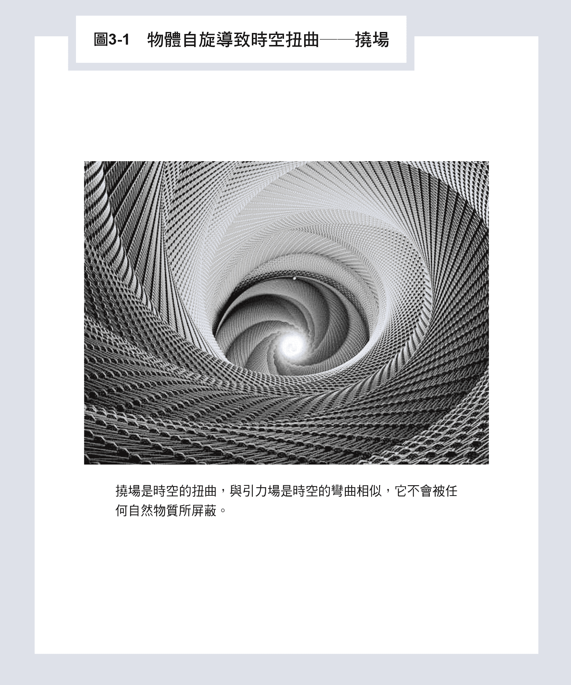

俄国科学家自一九六○年代起，对挠场做了深入的理论与实验研究，得出挠场的几个重要物理性质：

 挠场是时空的扭曲，与引力场是时空的弯曲相似，它不会被任何自然物质所屏蔽。比如，两物体之间有一堵墙，并不会屏蔽引力，应该也不会屏蔽挠场。因此它在自然物质中传播时，不会损失能量，但会被散射，它的作用只会改变物质的自旋状态。

 挠场在四度时空的传递，不受光锥的限制，也就是它速度超过光速，不但能传向未来，也能传向过去。

 挠场源被移走以后，在该地仍保留着空间自旋结构，也就是挠场有残留效应。

俄国科学家所描述的这些挠场物理性质，竟然与我们做了三年所了解的水晶气场完全一样。我马上就了解到，水晶气场就是挠场，第五种力场显身了，剩下的就是设计实验来证实了。

属于广义相对论的挠场名不见经传，却是最神奇的力场，会带出灵界的能量。

* * *

① 请参考《灵界的科学》。

② 请参考《是特异功能？还是潜能？》。

## 水晶气场就是挠场

我在二○一六年写了《科学气功》一书出版，对于一个人练气功时身体的生理现象做了大量统计，并予以分类成「共振态」与「入定态」两类，与大脑中的α波有密切关系。

我们发现，练功时脑α波会大幅增加的情况叫「共振态」，是脑α波与身体经络穴道产生共振的现象；练功时脑α波被抑制消失的情况叫「入定态」。我们也找出了如何用「快速打数」的方法，在几分钟内激发脑α波与身体经络穴道共振，产生「气集丹田」或「气走任脉」的效果。至于，气功中最令人困惑的「外气」或水晶的「气场」等，属于物理性的「气场」到底是什么物理现象？

我在《科学气功》第三章中做了介绍，提供两套实验数据作为比较来确认水晶气场就是挠场。

第一套实验方法，是用前苏联哈萨克共和国工程师 Sphilman 所设计的挠场产生器，以挠场照射去离子水三分钟后，用核磁共振仪（NMR）测量水分子团大小变化的数据，来探讨挠场穿越不同障碍物体所受到的影响（如图 3-2 所示）。

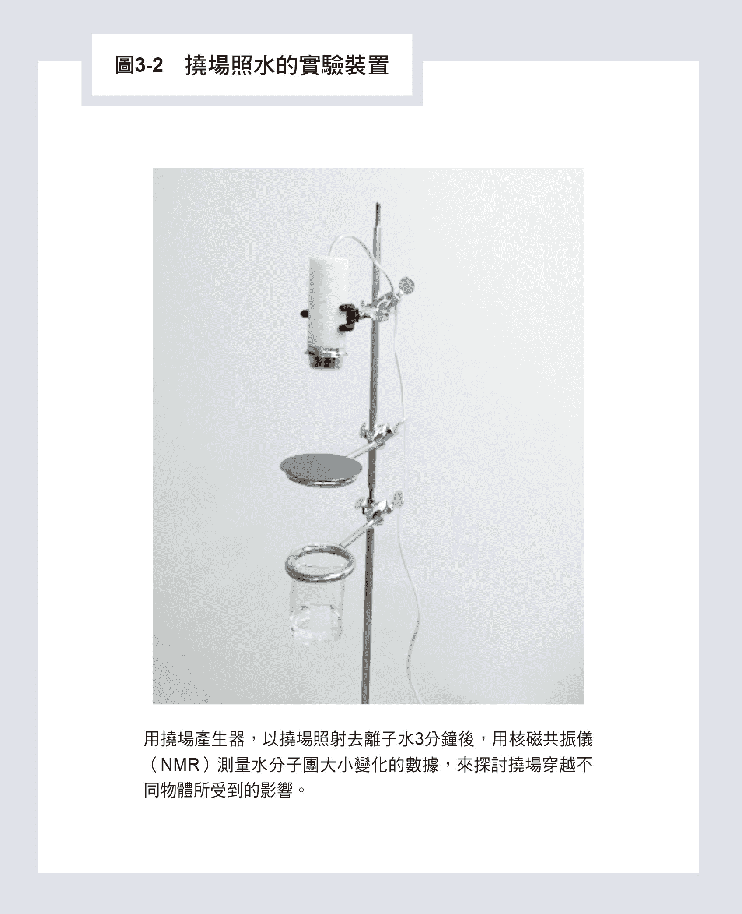

第二套实验是让水晶气场通过一个阻隔物，例如金属、纸、玻璃、半导体等各种不同物质，让 T 小姐感应，看看气场强度与形状在有阻隔物存在下与没有时所产生的变化。

很快的，我们就发现铝箔或两公分厚的铝板挡不住气场。气场穿越而过完全不受影响，表示气场不含电磁波，否则会被铝板严重衰减，含有铁原子的不锈钢（无磁性）或金属钼则会把气场从静态的小圆点变成刺刺的动态气场。

最不可思议的是，一张纸通常不会遮蔽气场，但是纸沾了水后湿湿的，就会把气场完全吸收。正符合了晋朝郭璞所说「气，界水则止」。若把一个风扇叶片拆掉，然后插电旋转，把水晶气场从旋转轴中心照射出去，结果气场会散开变得很长，也符合郭璞所说「气，遇风则散」。初步的实验，就证实了古人对气的描述。

从挠场照水的实验，我们也发现同样的现象，沾水湿透的滤纸可以阻隔挠场的通过，两公分厚的铝板对挠场毫无作用，不锈钢或金属钼都会影响挠场通过，造成水分子团一样的变化。

由于两套实验看到相同的穿透物体行为，因此我们判定水晶的气场就是广义相对论中所发现的挠场，是时空扭曲所产生的力场。

## 俄国挠场研究的两条路线——
Sphilman vs. Akimov

###  Sphilman 的挠场研究路线

二○○四年，我从网站上找到前苏联哈萨克共和国工程师 Sphilman，买了他设计的挠场产生器，如图 3-3 所示，包括正面、侧面照片及核心的环形磁铁，并开始了挠场照射水的实验，慢慢地逐步了解挠场产生器的原理。我在二○一六年所写的《科学气功》一书也是基于这种挠场产生器所做出的实验结果。

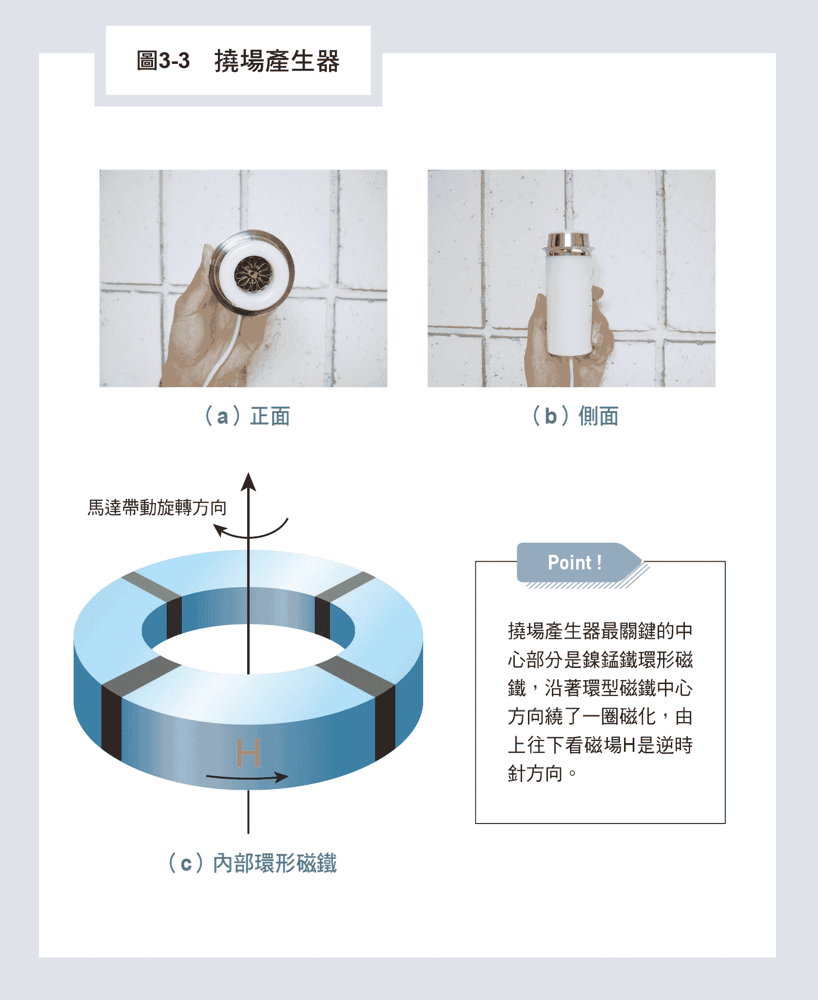

挠场产生器最关键的中心部分是镍锰铁环形磁铁，沿着环型磁铁中心方向绕了一圈磁化，如图 3-3(c)所示，由上往下看磁场 H 是逆时针方向。如果磁环是由光盘机马达带动顺时针方向旋转，如图 3-3(c)所示与磁场方向相反，称为右旋挠场，如果是逆时针方向旋转，与磁场方向相同，称为左旋挠场。这块旋转的磁铁在中心轴方向产生挠场的物理原理由我的学生梁为杰博士从爱因斯坦与卡坦的广义相对论推导出来，二○一三年初发表在国际著名的物理期刊《Physical Review D》，列在本书第二章的参考资料中。

这篇论文的重点是证明电子的自旋角动量如果与电子本身所做的大旋转轨道耦合就会产生可传播的挠场，在原子物理中有一个很有名的「自旋与轨道交互作用」（spin-orbit interaction）就是考虑电磁场在电子自旋与大旋转轨道耦合的效应。但是传统教科书不考虑广义相对论，因此都不知道这种交互作用还会产生另一个场，叫作挠场。

从直观来看，是磁铁中局部的磁性分子的自旋都排列整齐沿着磁铁中心形成一个大圆圈，根据我在《灵界的科学》第四章「一物两象」论述中，假设粒子的自旋是阴阳两个世界的通道，可造成实数时空的微破洞，这些微破洞在环型磁铁中心连起来会形成一个圆形破洞。当磁铁以每分钟三千转以上的速度快速旋转时，圆形微破洞撕裂的时空会扭转附近时空跟着旋转，形成一根轴向的扭曲时空之剑，影响可以长达两到三公尺，经络敏感型的功能人用手掌可以感受得到挠场所造成的刺痛。所以十多年的理论及实验研究，让我确信电子自旋耦合到电子的大轨道旋转撕裂时空是产生挠场的最基本物理。

###  见到 Sphilman 本人的感想

二○一八年十月，我受邀去河北省廊坊市（一座位于北京与天津中间的城市）参加能量医学与生命健康国际论坛会议，在会议上我第一次见到了挠场产生器的制造者——哈萨克的 Sphilman。

他本人年纪已经很大了，很可惜的是，他只说俄文，不会讲英文，只能通过翻译沟通。原来他们古早一派的挠场研究者，都是俄国早年挠场研究代表性的人物柯易瑞夫博士（N.A. Kozyrev）的门徒。

柯易瑞夫认为，一个粒子的不变量通常都会伴随着物理场，比如，粒子的「质量」固定会伴随着「万有引力场」，「电荷」固定会伴随着「电磁场」，因此「自旋」固定也应该伴随着「自旋场」，也就是「挠场」。但是当挠场静止时，它的强度正比于万有引力常数 G 乘以普兰克常数 h，因此比万有引力还弱 1027 倍。万有引力已经是最弱的力量，比万有引力还要弱 1027 倍的挠场很难测量。

但是电子及原子核的自旋所伴随的挠场会聚合成整个原子的挠场。分子中不同原子的挠场又会聚合成分子的挠场。固体中所有原子挠场的合成会形成固体的挠场。因此挠场虽然很弱，但是每个物体包括你我、用具、物品等，都有一个时空的大挠场结构，与物体的体积相当。

大部分状况下，原子与原子间的挠场相位没有一定的关系，大量原子的挠场会互相抵销，不会产生宏观的挠场，因此虽有挠场相随，但是测量不出来也很难感觉到，因此他认为他所制造的产生器所发出的场，他自己都可以感觉得到力量很强，不能叫做「挠场」，应该要叫做「轴场」（Axial field），是中心轴方向产生的场。

我告诉他，我们的理论已经从广义相对论证明电子自旋角动量加上大轨道转动可以发出挠场，就是他发明的设备所产生的场。因为会撕裂时空所以力道很强，而且照射水的实验也表明挠场很强，不是他们以前所认定的微弱的挠场。

从 Sphilman 的认知及反应，我深刻地感受到每个挠场专家受到过去经验及想法的侷限，看法有很大的不同。

###  Akimov 的挠场研究路线

我在二○○四年就注意到俄国的挠场产生器不只一种，除了 Sphilman 的旋转磁铁挠场产生器外，另外还有一种是俄国自然科学院院士 A.E. Arkimov 所设计的电磁震荡电路的挠场产生器，它比较简单、有固定的磁铁，但是没有旋转磁铁的部分，如图 3-4 所示的外观及内部线路照片。这也让我怀疑，难道挠场有不同的种类吗？

二○一六年，我完成用 Sphilman 挠场产生器照水的复杂而冗长三年的实验，证明挠场与水晶气场性质相同以后，写了《科学气功》一书，把实验数据在书上公布。我认为，挠场已经确定了要用电子自旋加上大范围高速旋转撕裂时空来产生，Sphilman 的路线是正确的。

二○一七年，我有机会去北京开研讨会讨论挠场的种种物理性质，一位年轻的工程师高鹏跟随中国地质大学人体科学研究所沈今川所长，合作多年研制各种电子设备产生挠场及侦测挠场，他告诉我一个惊人消息，他说俄国每年都会开挠场的国际会议，召集主要是前苏联作挠场科学研究的专家来讨论挠场研究的进展。他去参加过，发现每次都是一样，分成两派吵成一团，吵了几十年了。

他属于 Akimov 那一派，因为设计电子电路对他相对简单，他很快就可以自己做出来。他也用 Akimov 挠场发射器与纽约市立大学的 Mark Krinker 教授做了从北京到纽约远距通讯几千公里的实验，两人都用同一张照片作为挠场发射起始位址，以及接收挠场的定位器之用，并在研讨会发表他们成功收到信号的结果。

我当时感觉有点震惊，如果这是真的话，难道产生挠场不需要撕裂时空吗？还是有一个新的我不知道的原理在作用？

这让我产生了一些危机感，这里面显然有些挠场的物理性质我还没有完全搞清楚，不过我也知道这篇论文如果属实的话，可能是人类用挠场通信的第一次实验，与马可尼用电磁波第一次横越大西洋通讯一样，是个不得了的成就。虽然电磁波早就在一九○一年就可以做到同样的事，但是挠场通讯可以是星际通讯的工具，未来将远远超过电磁波受限于光速的能力，这点我们在第五章会有比较详细的讨论。

###  Akimov 挠场产生器与特斯拉线圈相似

图 3-4(a)、3-4(b)展示了 Akimov 挠场产生器的外观及内部电路图，主要包含一个静止的磁铁，磁场向上进入一电感器（L），与电容（C）串联耦合形成 RLC 震荡电路，和前面第二章所介绍的特斯拉线圈构造的第二线圈有几分相似性。

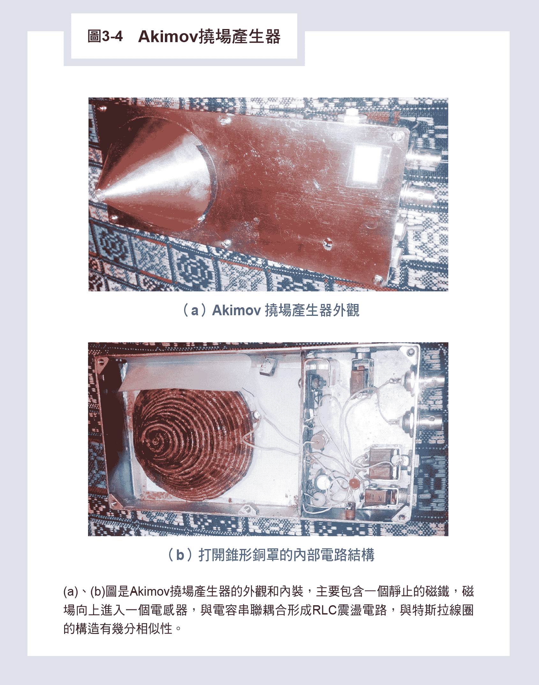

二○一九年四月，有一天我正在思考同类疗法的制剂，为何含病毒的水溶液，每次稀释成十分之一浓度，不断稀释十几二十次后，在地磁○‧五高斯磁场的作用下，溶液竟然会产生几十到几百赫兹的无线电波，然后病毒的信息就会留在水中以供同类疗法使用，可以作为信息水之用来治病①。

无线电波的产生一定跟水溶液中的离子绕着磁场旋转有关，而旋转的频率决定了放出电磁波的频率。突然之间灵光一闪，我意识到磁场会对电子或离子作两件事情：

如图 3-5 所示，第一，电子（或离子）的红色自旋磁矩也就是自旋角动量 Sp 的相反方向会朝磁场方向倾斜或排齐；第二，电子会沿着磁场垂直方向旋转，也就是绕着磁场以一定频率旋转，如果旋转频率与磁场频率一样就会产生回旋共振，磁场能量会大量转移给电子。这个电子的运动不就是梁为杰博士理论推导出来挠场产生的机制吗？因为电子的自旋角动量加上大范围的轨道旋转运动就可以产生挠场。

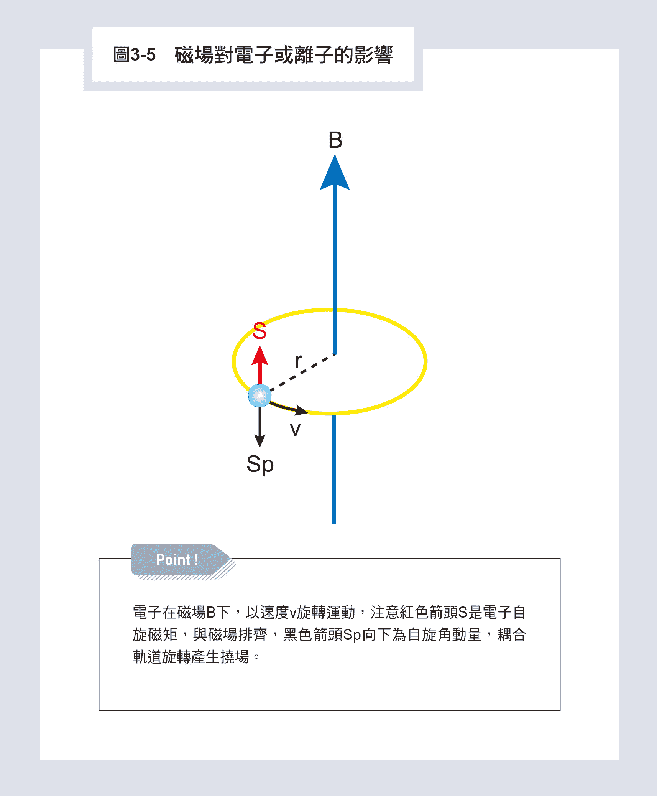

我恍然大悟，原来一个螺旋的导电线圈，也就是一个普通的电感器，经过好好的设计就可以作成一个挠场产生器，电流在线圈内快速旋转流动，不断沿线圈中心产生磁场，让流动的电子自旋排齐。如果在线圈中间加上磁铁效果更好，这些电子的自旋角动量会在实数时空切出无数的整齐微洞通道，再加上快速绕线圈旋转，撕裂出大块时空破洞，这就是挠场。

我松了一大口气，原来 Arkimov 挠场产生器的原理与 Sphilman 挠场产生器的原理完全一样，都是自旋排列整齐的电子作大轨道的快速旋转运动所产生，两者原理获得统一，不再有任何矛盾。

这也让我们想到特斯拉当年设计的线圈。一八九三年，他申请了一个电磁线圈的专利用来抽取环境的能量，基本上就是一个挠场产生器，可以产生挠场发射出去，穿梭阴阳界抽取灵界的能量，灌注入实数世界的发电机内，造成物质世界能量不灭定律的崩溃，因而被崇尚唯物论的现代科学所排斥。

* * *

① 请参考《科学气功》第四章，有关南氏去过敏疗法的内容。

## 水晶气场的神奇特性

水晶本身带有气场，是一般经络敏感型的人都能感觉出来，主要原因是水晶的晶体结构是三方晶系结构（如图 3-6 所示），具有三条螺旋（不同颜色四面体）互相缠绕而成。每一个有颜色的正四面体是 SiO4 小晶体，硅原子（Si）在中心，氧原子（O）在四个角落，整个石英晶体原子平均下来是二氧化硅晶体（SiO2）。这种螺旋规则的结构就有可能产生宏观的挠场。不过水晶本身产生的气场很弱，很难用来做实验，必须予以加强。

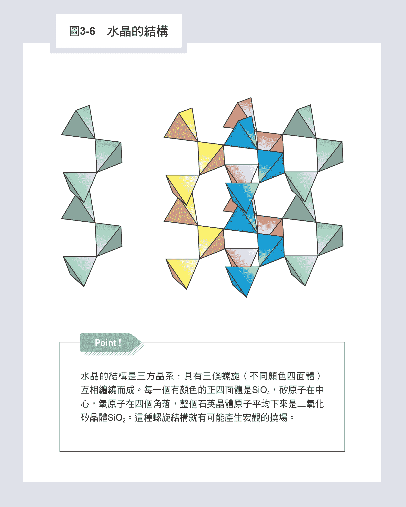

实验制作人选用气场很强但是散乱的捷克陨石作为源头，固定在削成十二面体的水晶尖柱顶较粗的一端，如图 3-7(a)。气场经过水晶分子的螺旋结构会调变聚焦形成一束圆柱状的涡漩时空结构可射出晶体，被敏感的功能人感知到一个小圆点。

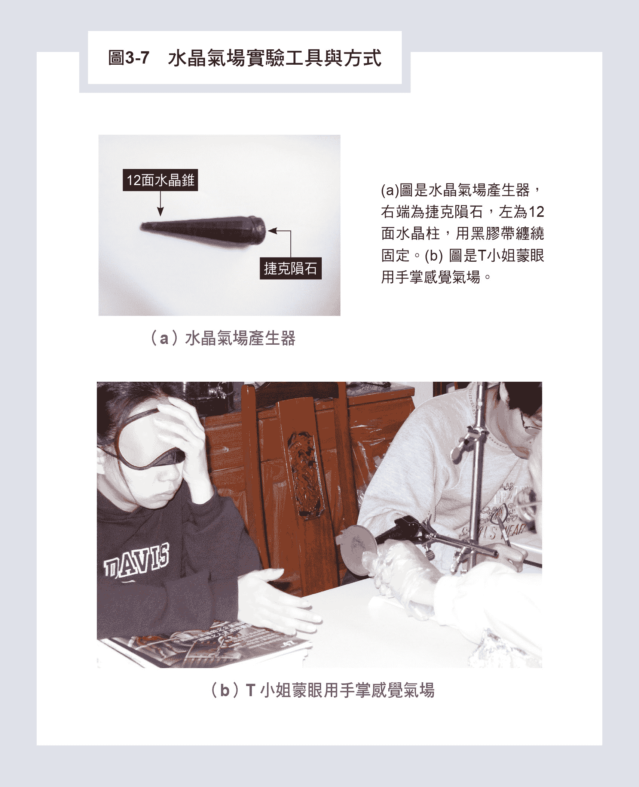

陨石为什么会产生散乱气场呢？这也是与粒子自旋有关。因陨石内部有磁性原子散乱的排列，在磁场互相抵销下而无法产生外面量得到的磁场，但是磁性原子的内部电子自旋排列整齐，过大的自旋角动量会撕裂时空形成涡漩的挠场，也就是形成散乱的气场。我们在《科学气功》一书第三章展示过大量挠场照水后水分子的核磁共振数据，已经推论出水晶气场就是挠场，这里不再重复。以下要展示的是，水晶气场的一些神奇的特性。

###  佛字对水晶气场的吸引与放大

水晶气场还有什么有趣的物理性质吗？这就要靠具有手指识字功能的 T 小姐来感应。

首先我们需要一个水晶气场产生器，这是由同步辐射中心陈博士所提供，他使用一粒捷克陨石作为气场发射源，用黑色胶带固定在切削成十二面锥状水晶柱的后方，如图 3-7(a)所示。此水晶柱可以把捷克陨石发出的气聚焦，像雷射一样射出，气束的直径约为水晶锥口的大小为五毫米（mm）。

实验时，水晶气场产生器以水平方向，架在支撑架上，T 小姐戴上不透光的眼罩，以右手掌距离产生器约三十公分远处，先感觉气场的形状及强弱，然后主试者将遮蔽物放入挡住水晶气场，如图 3-7(b)所示。T 小姐会说出气场强弱及形状的变化，有时感应若不确定，就会重复实验数次。

为验证 T 小姐对气场强弱变化的精准度，比如，气场穿过某一种物体的强度从十减弱为六，我们在做了很多次实验后，会再随机把同样物体重测一遍，不让 T 小姐知道，直到结果一样才能确认。

根据 T 小姐的感应，水晶产生器的圆柱型气场约有九十公分长，在九十公分内的气场强度很均匀。

T 小姐过去在做手指识字实验时，发现某些宗教上的字汇象是佛、观音、菩萨、耶稣等字汇，会使她在大脑第三眼看到异像，例如亮光、亮人、十字架、听到笑声，我们称之为「神圣字汇」。

我们发现水晶气场穿过白纸，或穿过纸上写的普通字，都不会受到影响，可直穿而过，强度也没有减弱。但是当水晶气场穿过神圣字汇如「佛」字时，则会变成大圆，如图 3-8(a)、3-8(b)所示，甚至感受到温温的，表示能量变强、范围变大。

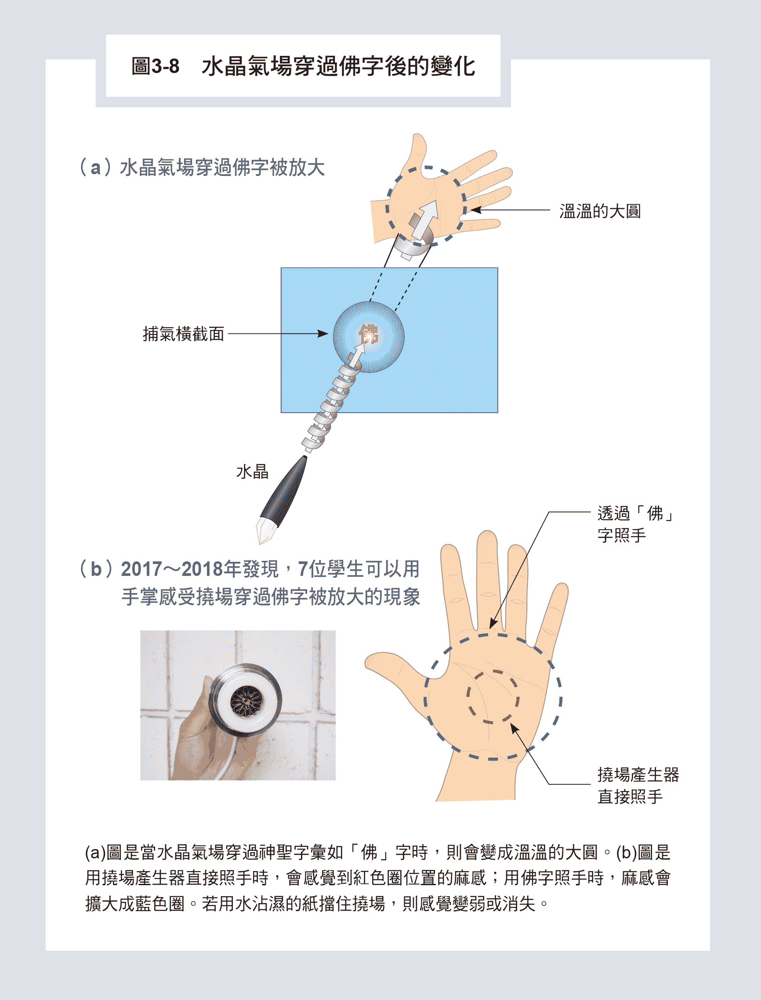

我们在佛字周围移动水晶作气场测试，发现在佛字四周，距离佛字一个字大小范围内，都有同样的效应，能感受到气场变成大圆、变强。也就是说，我们可以定义出佛字的捕气横截面，气场只要通过此横截面，就会被佛字捕捉住，产生同样的效应，这个原因到了第四章内我会清楚的说明。

这个放大效应其他人可以感受到吗？

我二○一六到二○一九年在台大电机系开的课程「人体潜能专题」就会测试修课同学对挠场的敏感程度，方法是让全部学生闭上眼睛，把左右手掌分别放在启动的挠场产生器下二十到三十公分约三十秒钟。如果有人感觉到任何特别的感受如麻、凉、风吹或任何动态的感觉，就选出来做更进一步的实验。

经过四学期约一百五十人的测试，大概有百分之十五到二十的同学对挠场敏感会有一些感受，约有百分之五的同学对挠场相当敏感，不但可以感受到挠场的范围大小强弱，还会引发麻感沿心包经从中冲穴一直走到手肘关节的曲泽穴为止（如图 3-9 所示）。

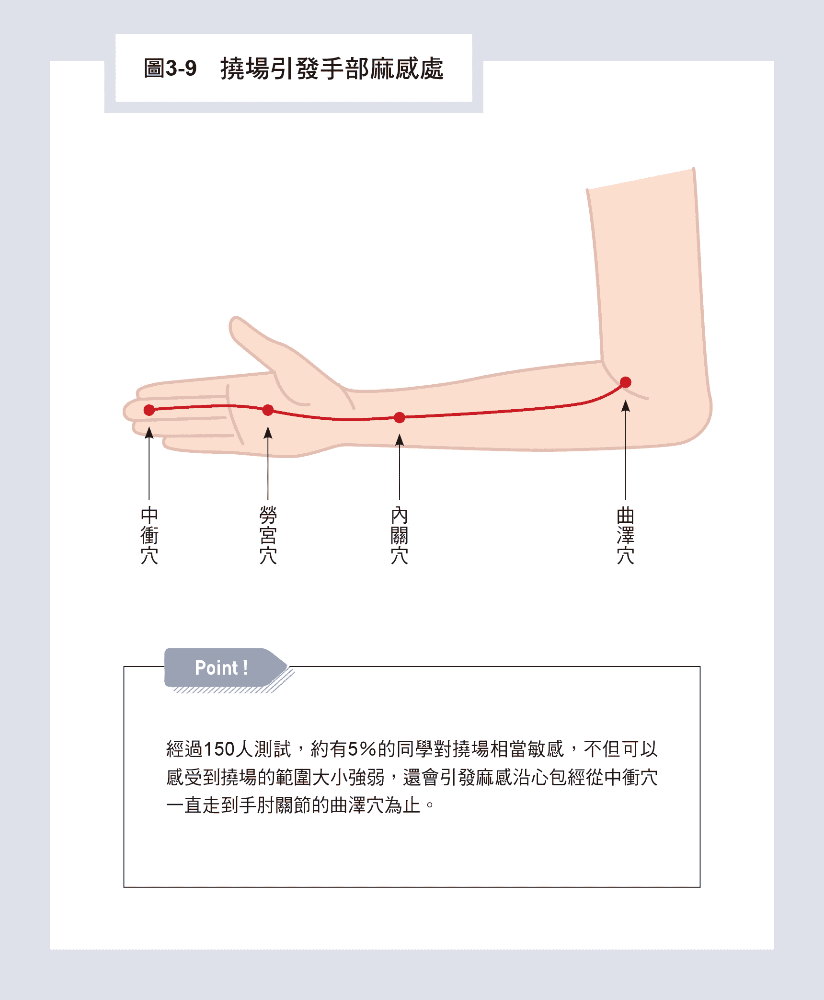

这让我了解到，原来人群中每个人对于经络被挠场扭曲的程度会有不同的反应，大部分人是经络不敏感型，有六分之一到五分之一的人是经络敏感型，仅二十分之一的人是经络极度敏感型。这也说明，感觉挠场需要靠经络敏感型的人来侦测才能得知，像 T 小姐就是。

我们两年中找出七位经络极度敏感型的同学，并发现只要把一张纸用水沾湿挡住挠场，对挠场的感觉就会变弱，甚至消失，也就是水会把挠场吸收。用挠场直接照手时，同学可以感觉手掌中有一圆圆的红圈区域发麻，如图 3-8(b)所示，但是挠场经过佛字后（注意：同学已闭住眼睛，不知道我们做了什么事），他们会很惊讶，为什么红圈区域会被放大成蓝圈区域、超出手心范围，感觉也变强，完全证实了 T 小姐二○○○年初期用水晶气场所做实验的结果，再度证明水晶气场就是挠场。

最近两年经过北京大学任全胜副教授发现，水的第四相可以做为挠场侦测器，不需要依靠人的感觉。经过我们两年用水的第四相做侦测器来测量挠场，大量的实验已证实挠场通过佛字的确会被放大。

我在《科学气功》第四章有讨论过气导与吸引子现象，也就是当我们把佛字写在一狭长的纸条上，佛字大小超过纸条宽度的一半以上时，会发现很神奇的事，如图 3-10 所示。

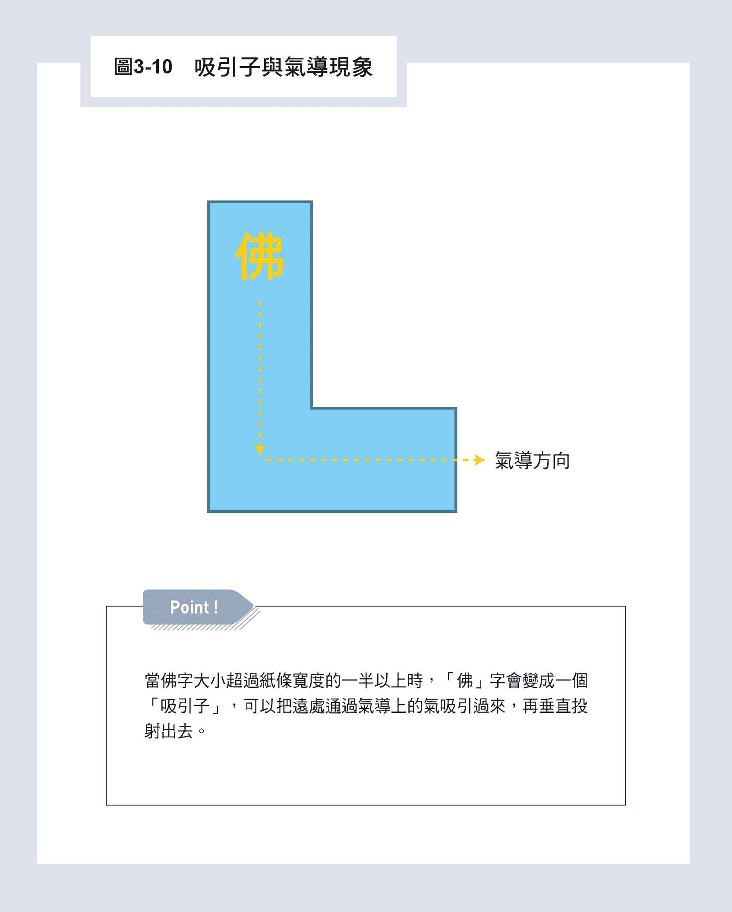

佛字的捕气横截面会沿着纸条扩展到纸条另一端，使得整条纸都变成了气导，而佛字变成「吸引子」，其漩涡时空结构已被迫扩展到整个气导上，可以把远处通过气导上的气吸引过来，再垂直投射出去。

此刻马上出现了一个问题，哪些神圣字汇也会产生同样的现象？

###  佛字捕气横截面被破坏及复原后之放大能力

佛字的捕气横截面是佛字本身大小的九倍，长宽各三倍大，如果其中被其他文字图案破坏，或是剪断又再复原以后，对水晶气场的放大能力会造成什么变化？这是很值得研究的问题。

图 3-11 中显示的就是实验的结果。第一列是直接用气场照手写的佛字，感觉是变强、变大的圆，气场被放大了。第二列是在佛字下方用原子笔画了一条横线，长度比佛字稍大一点，结果气场通过后变成半圆，只有感觉到上半圆，下半圆被破坏掉了。第三列是如果用白色修正带把佛字下的横线涂去，纸上看起来又是一个干净完整的佛字，但是气场穿过的感觉仍然是半圆型，没有恢复成一个大圆，表示圆形气场已经被破坏掉了。这显示物质世界的修复遮盖，不能弥补佛字在虚数时空（灵界）的破坏，也表示气场可以侦测到灵界的时空信息。

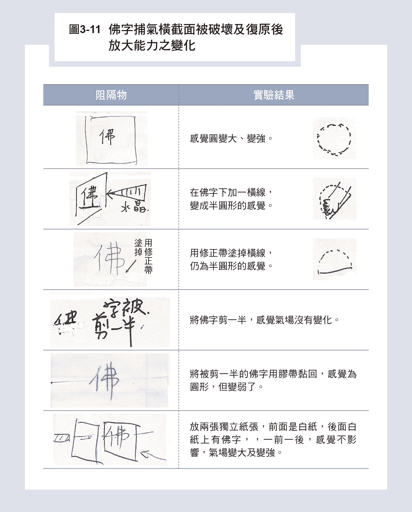

第四列是把佛字剪成一半，当然放大作用就消失了，气场穿越后没有变化。接着，第五列又把剪断的佛字用透明胶带重新黏合起来，看来与原来的佛字一样，结果水晶气场一照之下，感觉又变为圆形，但是强度比原来没有剪过要弱。表示佛字一旦被破坏过，有些伤害已经造成，不过这些伤害主要不在这实数的物质世界，而在另外一个世界，我在第四章会详细说明原因。第六列是在佛字前面加上另一张白纸挡住，结果没有发挥任何阻挡功能，气场还是能直接穿越，因第二张纸上写的佛字而感觉到变大、变强。

###  其他神圣字汇对水晶气场的吸引力

神圣字汇「佛」字是一个气场的吸引子，能够吸引经过气导的气场而趋向佛字向前喷出，如图 3-12 所示。

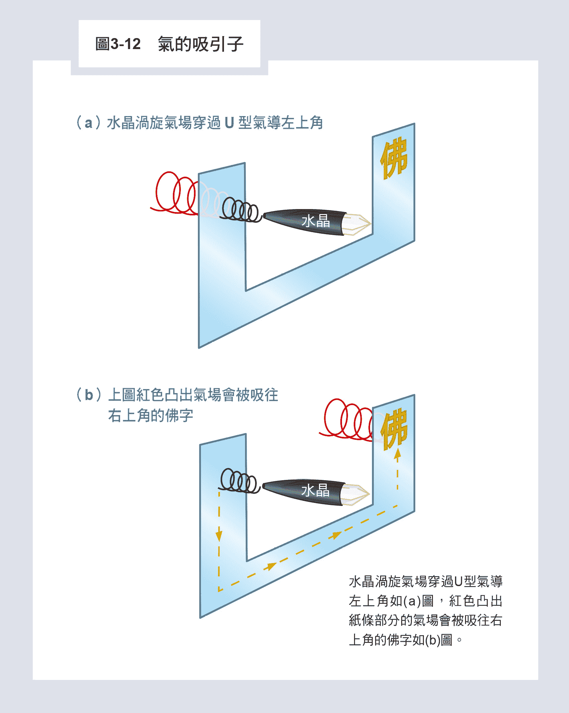

图 3-12(a)是用一水晶气场指向 U 型气导的左上角，右上角写了一个佛字，因字大小超过气导宽度的一半，而形成了吸引子。图 3-12(a)是涡旋气场刚穿出纸面左上角，穿出纸条的部分则用红色的螺旋表示，这一红色部分会如图 3-12(b)所示，被右上角的佛字大涡旋挠场所吸引，而沿着 U 型气导运动走到佛字而向外喷出。这个运动过程会被功能人如 T 小姐手掌所感知。

看到这里佛字的反应，就引发出下一个问题，除了佛字以外，是否有其他的神圣字汇也有类似的放大及吸引气场的效应？

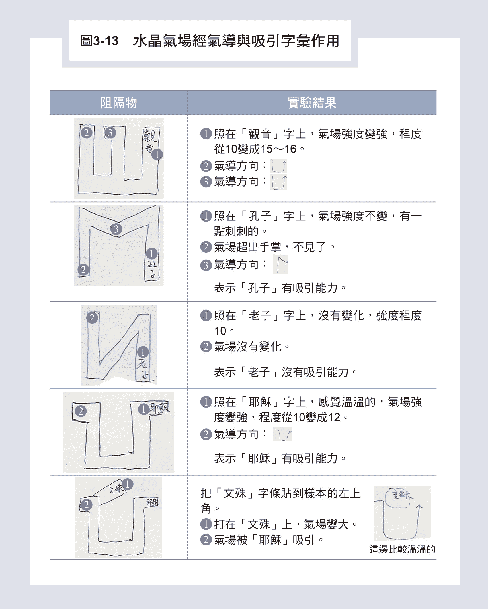

图 3-13 是正常山型、U 形或 M 型气导。第一列的山型气导的右上角写了「观音」两字，大小超过纸条宽度的一半，形成吸引子，当水晶气场打在右上角「观音」两字的位置，气场变强，从原来强度十增加到十五至十六，表示「观音」两字也可以放大气场。如果打到蓝色圈或的位置，气场会被「观音」两字所形成的吸引子吸引，沿 U 型气导走向「观音」两字，实验结果和所示的 U 型轨迹即为 T 小姐手掌的感觉。

第二列的 M 型气导右下方写了「孔子」两字，如果直接用气场打向「孔子」两字，气场会变成动态、刺刺的感觉，但是没有放大的作用，只是由静态调变为动态气场。如果气场打向，气场感觉已超出手掌、不见了。如果水晶气场照到 M 型气导中间的位置，则气场会被「孔子」两字吸引，先上后下传到右下角。原来神圣字汇「孔子」也有吸引力。

但是第三列的「老子」两字却没有反应，不但气场照「老子」两字强度没有变化，也没有从静态调变为动态，表示这个字也没有产生吸引力。我怀疑是当天「老子」并不在他的网站中，因为 T 小姐手指识字辨识「孔子」及「老子」的反应几乎一样，都是有一个暗的人影出现在祂们网站的首页。

接下来，第四列的 U 型气导的右上角写了「耶稣」两字，对气场也有放大作用，可以吸引打在左上角位置的气场，沿 U 行通道运动走向右上角。

后来，我把写了「文殊」两字的小纸条贴在第四列 U 型气导的左上方，如第五列所示。结果「文殊」也可以放大气场，打在位置的气场被两个吸引子拉扯，「文殊」会拉一部分气场去放大；「耶稣」则拉一部分气场走 U 型气导到右上角。

所以，结论是凡是会引发气场变化的神圣字汇，例如把气场放大，或是把气场由静态条变为动态的字汇都是吸引子，会吸引气场经过气导趋向神圣字汇。

###  导致气场产生运动的图案

我们已发现神圣字汇所形成的吸引子可以吸引气场运动，接下来的问题是，有没有其他字汇或图案会引发气场的运动？后来实验发现的确有的，如图 3-14 所示。

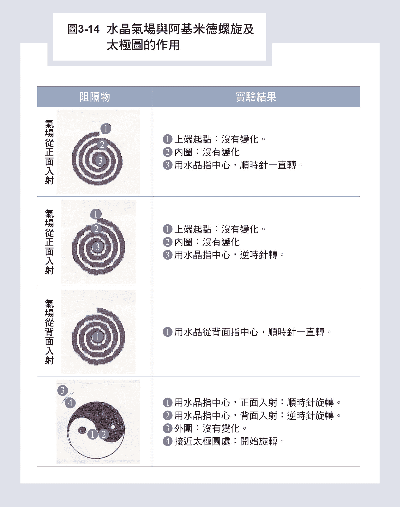

图 3-14 的前面三个图都是在纸上用电脑画出左旋及右旋的阿基米德螺旋，第一列实验是一个右旋的阿基米德螺旋，气场打在外围的位置、内圈的位置，气场都不受影响。但是，当气场打在中央的位置，气场就被螺旋带着由内向外顺时针方向一直旋转。

第二列实验是左旋的阿基米德螺旋，结果也是一样，只有当气场打在中央的位置，气场才会被螺旋带着由内向外逆时针方向旋转。

如第三列实验所示，若是改从背面中央入射，气场则会反转成顺时针旋转。但是如果气场打在三个不同半径的同心圆上，任何位置包括中央均不受影响不会旋转。

这表示气场与螺旋结构而非圆形结构有密切耦合作用，也暗示气场本身就是螺旋结构。

第四列实验的最后一个太极图也会引发气场旋转，当气场打到太极图中央时，会朝着阴或阳的鱼眼旋转，代表鱼眼是阴与阳的通道，而这个漩涡通道可以把气场吸引过去。

###  全世界第一台气的震荡器

由前面的实验我们可以看到如何利用神圣字汇把气场的放大、传导、被吸引子吸引的现象，因此可以仿照电子电路震荡器的原理，将气放大、反馈产生震荡，而做出气的震荡器。任何的电子电路包含计算机、手机、仪器都需要电子震荡器产生不同频率的信号。

图 3-15 就是全世界第一台「气的震荡器」，水晶气场经过三个佛字的连续放大，打在一个由纸条做成的环形气导，在水晶气场穿过气导的地方写了一个佛字，大小超过气导宽度的一半。这个佛字不但扮演第一级放大气场的作用，还扮演吸引子角色，把被佛字放大后，打到对面纸环的气场吸回产生反馈的作用。因此气场被连续佛字放大以后打到气导，又被吸回到第一个佛字，再喷出向前继续放大反馈过程，最终气被放大的程度超过了中途的损失程度，就会形成气的震荡，不再需要外面输入气源。

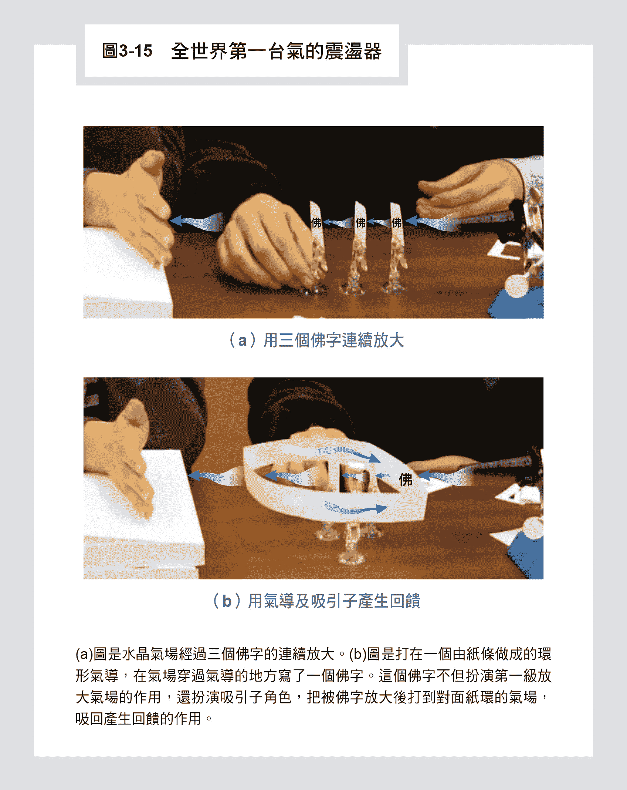

根据 T 小姐用手去接触气场的感觉，整个气场变得很大，被侷限于气导内圈几公分内及连续佛字的路径中，而气导外面的气场很小。我相信这是世界上第一台气的震荡器，以后就可以设计、控制气场做逻辑运算的仪器。问题是，被放大的气场能量来自哪里？

有一天，我在思考这个问题时，突然觉悟到这些能量显然来自虚数时空的灵界，我无意间发明了一个虚空取能器，打开了一扇门。虽然现在取出的能量虽然很小，但是技术愈来愈成熟以后，就可以像特斯拉所说的一样，达到真空取能的目的，一个新的文明、新的能源世界已经在我们面前展开。

# 第四章
穿梭阴阳的挠场——道家风水、八卦、布阵的解密

中国传统的风水，

就是在处理环境居家中物件的摆设所形成的几何结构，

并用风或水调整气场的位置与大小。

因为气场会钻入虚空，

因此挠场穿梭阴阳的气场行为，

就是中国传统风水的科学基础。

## 风水的起源

晋朝郭璞是中国历史上第一个提出风水的概念的人，他认为「气乘风则散，界水则止。古人聚之使不散，行之使有止，故谓之风水。」倡导天地之间存在一股气，遇到风就被吹散了，遇到水就停下来。因此风水就是在选择地形地势，比如，房屋背后要靠山，比较容易挡住风，不要散了气；屋前最好有水塘，利用水将气聚集在生活的空间。

晋朝道士葛洪：「人在气中，气在人中」正气歌：「天地有正气，杂然赋流形」。这种气如果存在的话，与人体的生理、心理状态无关，应该也是一种物理的力场。从此以后，中国人渐渐笃信风水，认为人的吉凶祸福、甚至仕途前程都会受到住屋或祖坟方位环境、规模和形式的影响。

随着历史的演进，风水的知识逐渐演化出了两种形式：

第一种是「环境风水学」，为聚气止气的环境地理学，比如，房子的门口要朝南方，有比较充足的日照阳光；房屋不可以在丁字型路口（路冲）；房子不可以夹在两个高楼之间；房子附近不可以有烟囱、电杆及招牌形成的尖角符号对着等等。

最好的居屋选择是「前朱雀，后玄武」，前面有池塘的叫朱雀，后面有丘陵的叫玄武；「左青龙，右白虎」，左边有流水的叫青龙，右边有长马路的叫白虎。其地形应该为东低西高、后高前低，符合以上条件者便是家居住宅的最佳选择；这种宅型代表出官出贵，为旺丁旺财，家门繁荣昌盛之宅。

这种环境风水学有部分规矩是现代科学可以解释的简单道理，例如，在居住地方聚气，会让居住的人健康有活力，自然事业学业容易发展，而获得荣华富贵；房子位于路冲容易发生交通事故；若位于两高楼之间会有风切现象等等，对居住者不利。但是大部分规矩还是无法用现代已知的科学解释。

第二种是「民俗风水学」，以住屋、祖坟方位环境、规模和内部形式及营造时日等的选择，来调控气，预测居住者的前程，这里面很大一部分是现代科学无法了解的原理。

科学昌明以后，风水被视为迷信而逐渐式微，像中医一样，大部分人都不相信了，只有少数人基于本身经验或祖传教导仍坚信不疑。郭璞所描述的气与我们第三章所讨论的挠场具有相似的性质，例如，挠场会被水吸收（界水而止），水晶气场通过旋转的电扇叶片会被拉长（遇风则散），因此，我知道要破解风水之谜的关键，仍有三个层面的问题要解决：

 要清楚了解挠场的科学性质。

 要了解这个宇宙的实像。

 要了解挠场在真实的宇宙扮演什么角色。

第三章中，我们已描述了挠场的一些科学性质，其他两方面的解答且听我一一道来。

## 八卦与布阵

孔老夫子曰：「五十以学《易》」，并作《系辞》上下二传来解释《易经》。易的境界在卦象与卦数，可以上通天文、下知地理，乃至算命看相、未卜先知。

孔子认为人要到了五十岁，才能累积足够的人生经验及智慧，可以开始学习《易经》了。孔子所讲的《易经》，一般认为是《周易》，是周文王被商纣王关在监狱时研究《易经》的心得纪录，春秋战国时代的诸子百家之说都源于这本书。

传说中，神农时代有《连山易》，皇帝时代有《归藏易》，这两种《易》已经失传很久了，据说中医药、堪舆，还有道家的东西可能是《连山易》与《归藏易》结合的产物。

《易经》里有一个符号体系就是八个卦象，八个卦象两两相配，生出六十四卦，它最令人称奇及津津乐道的是，可以用来算命看相，未卜先知。

我认识很多人去香港看过铁板神算董先生，回来后都跟我说铁板神算命算得极为准确，有一点恐怖的感觉，连几十年前、年轻时曾经交过的女朋友姓什么都算得出来。

在科学的时代，我们该如何去了解《易经》？八个卦象只是○与一的数位组合吗？就如同《道德经》第四十二章所说：「道生一，一生二，二生三，三生万物。」三个爻的八卦组合就可以产生万事万物吗？

在这一章中，我会提供证据，显示八卦的神奇性质不是在这个物质的实数世界，而是躲藏在另一个世界灵界的虚象，而连结两个世界的关键就是「挠场」，所以挠场就是打开易经秘密的钥匙。另外与《易经》八卦有关的谜团是道家的布阵，诸葛亮作八阵图见于《三国志蜀书诸葛亮传》：「亮性长于巧思，推演兵法，作八阵图。」八阵图是公认的极佳阵法，千百年来极受推崇。陆逊火烧刘备连营七百里，孔明巧布八阵图，用石头堆成石阵，再按照遁甲分成生、伤、休、杜、景、死、惊、开八门，吸收了八卦排列，兼容天文地理，其威力之大据传可抵挡十万精兵，被诸葛亮布在湖北入蜀之门户。据说八阵图最主要特点是每时每刻都在变化，这种变化的特征使得人走进去之后，会迷失于其中。

我们小时候读武侠小说常看到这种场景，非常羡慕及向往，但这里面学问太大了。我几年前到了六十岁，超过孔老夫子学《易》的年龄已经十年了，但是懵懵懂懂还没有任何头绪，不知要如何去布阵。直到过了六十四岁以后，用挠场作实验深入了解了八卦虚象在灵界的动态行为后，我的道家朋友才突然教我用八卦布了一个阵法，让我在阵法上的理解突飞猛进，开始理解了布阵的科学根据，并将在本章最后一篇介绍。

接下来，我们要先了解宇宙的实像，才能去了解挠场的神奇性质。

## 复数时空与量子心灵

请参考我二○一八年出版的《灵界的科学》一书，描述了我对真实宇宙提出了两项重大假设的经过与理论内容，当时，这两大假设是为了统一解释宇宙大中小尺度时空所出现的异常现象，例如，大尺度宇宙中竟然有百分之二十三的能量是暗质，百分之七十三的能量是暗能，正常物质世界仅占宇宙只有百分之四的能量；奈米小尺度量子物理中，量子纠缠之间信息传递超光速，违反爱因斯坦的相对论；中尺度的人体特异功能，如手指识字、念力等现象，完全不能用现代科学理解。

二○一四年，我提出一个统一的架构及两个假设作为基础，来了解真实的宇宙。这个统一架构的第一个假设就是：我们所处在的宇宙其实是八度复数的时空，除了我们一般感官能感觉到的四度实数时空，也就是传统所说的「阳间」之外，还有一个虚数的四度时空存在，这个就是传统所谓的「阴间」，里面充满了各种意识及信息网站。

实数、虚数之间虽然关系密切，却是同一复数的实部及虚部，但是其间存在实虚障碍（阴阳两隔），仅仅藉由许多不同尺度的特殊时空点连结，这些连结点都是漩涡状的时空结构，也就是三度空间太极图上的鱼眼结构，两个时空的联通要经过鱼眼的漩涡时空结构。

实数空间的物质要打破实虚障碍，进入虚数空间的关键就是：第一，其尺寸要远比漩涡口孔径小，而正好撞上连结点的通道口；第二个方式是，物质只要进入复数物质波或量子场状态，就可以穿隧进入虚数时空，这也解答了量子力学九十年来的谜团，为什么狄拉克（Dirac）方程式之解粒子的波函数或量子场论中的量子场都是复数函数，过去没有人了解复数的含意，只是把它与共轭复数的乘积解释为在位置 r 及时间 t 发现粒子或场的机率。

我认为这个复数的物质波，就是进入虚数时空的钥匙。此时物质的尺寸不再重要，量子波可以渗漏经过很小孔径的漩涡时空连结点（漏斗口）进入虚数时空。

我的第二个假设就是：复数量子场或量子波函数中虚数 i 就是「意识」，可以说复数量子场或量子波函数中虚数 i 的出现「把意识带进了物理学」，也告诉我们，物体只要进入量子状态「万物皆有灵」，这就是量子心灵的出现。

当物质如基本粒子、光子、物体进入微观或宏观量子状态，物质波出现，这时物质波会钻入虚数时空，在虚数时空中，量子的状态波速可以远高于光速，很快地传布广袤的空间，也可以撷取过去及未来时间的讯息。复数的波函数导致在实数空间无法确切地测量粒子的动态性质，如位置及动量，因为其游走于实数及虚数时空，只能得知其在位置 r 出现的或然率。可以说复数时空的概念彻底解决了近九十年来世人对量子力学本体论的迷惑，也就是量子力学所描述的「量子世界的本质到底是什么？」的问题。

## 手指识字与挠场感应，
是不同世界的物理机制

手指识字是天眼扫描灵界的虚象，挠场感应是感受到物质世界扭曲的时空。由于真实的宇宙是八度的复数时空构成，有实有虚，为各四度的时空结构，我认为实数时空与虚数时空中间的通道是经由粒子的自旋所形成的涡漩时空破口。由于所有在实数空间的物体都是由原子构成，原子中每一个基本粒子都有自旋，都有通往虚数时空的通道，因此在虚数时空中都会出现一破口形成的虚象，是自旋通道在虚空出口的组合，此形状与实物是完全一样，因此形成「一物两象」的现象。

任何一个实数时空的物体，在实虚两空间都有一个形状一样的结构，虚空中的能量形式，如果不包含自旋通道，无法与实数空间沟通，则不会产生实象，是属于暗质及意识的纯能量。但如含有自旋时空结构，其通道出口则会在实数时空形成一个没有物质存在的影像（鬼影）而已。

字汇及物体虚空的结构在手指识字及念力的作用上扮演了重要的地位。我们提出手指识字及念力的可能机制，所有特异功能要能做成功，功能人的大脑中必须出现「天眼」。根据判断，天眼是大脑某一部分的生理食盐水进入量子状态，产生自己的意识，并经过自旋通道渗漏到虚数时空，扫描文字或图案的虚像而非实像带回天眼。

当手指识字辨识神圣字汇时，如「佛」、「观音菩萨」、「耶稣」、「药师佛」、「弥勒佛」等，其虚象已经被这些神圣人物在虚空的意识所修改成大圆、多排小圆、十字架等不同结构。由于这些字汇的虚象已经被神灵改变，因此手指识字时，天眼扫描虚象时看不见字汇，而是看到被改变的影象，如圆形亮光、亮人，或是影像所联通的世界，如神灵网站的首页，或其他虚空的世界。所以结论是，手指识字时天眼所看到的影像是虚数时空的虚像。

功能人 T 小姐对于挠场或水晶气场的感应则有不同的机制。首先，她感应水晶气场时不用开天眼，因此是大脑感应挠场穿越阻隔物体所产生实数空间的变化，而非天眼扫描虚像所感到的虚空的信息。问题是，她的大脑用什么样的生理机制来感应这些实数空间被调变的挠场？

第三章中，我提到二○一六到二○一七年，我们发现几位对挠场产生器所产生挠场敏感的功能人，其中一位是硕士班的王姓研究生，他的手掌劳宫穴被挠场产生器所发出的挠场照射以后，会出现麻感，沿着心包经从中冲穴走向手肘的曲泽穴，然后停在曲泽穴上，有很强的残留效应，回家后要七、八小时才能完全消除麻感。另外用水晶气场照射劳宫穴也会产生麻感，但是因为强度很弱，只要约四十到五十秒钟就会消失。这表示挠场经过劳宫穴会扭曲心包经经络的时空结构，此扭曲的信息经过神经系统的电信号携带传入大脑，而被感知为麻感。因此，我们可以知道，经络是侦测挠场的主要侦测器，但是必须是经络极敏感型体质的人比较容易侦侧得到。

T 小姐与王先生是属于经络极敏感型的少数人，而 T 小姐的劳宫穴被水晶气场照射后所产生的感觉只残留几秒钟就消失了，而王先生劳宫穴的残留效应会随着照射源的强弱而改变，用弱的水晶照射后的麻感为五十秒，用强的挠场产生器照射后的麻感则可以长到八小时。但是对大部分人而言，是无法感受到挠场与神经的作用的。

由此我们了解做手指识字实验时，功能人的天眼会打开扫描字汇的虚空影像，送回大脑由灵魂及第六识合作后看到虚像；而感受气场时，是经由功能人的手上经络探测到挠场扭曲的时空，与其神经系统交互作用后的结果。但是气场与虚像的关系又是如何？我们可以探索虚空的动、静态行为，或测量虚像吗？

## 发现挠场可以穿梭阴阳界

二○○○年，我们之所以开始用水晶气场来做实验，就是看到一个美国的网站声称：水晶气场够强的话，就可以打破物质世界与灵界的障碍，与灵界的师父沟通，因此气场是一个物理的通讯工具，可以沟通阴阳两个世界。可是做了十多年的实验，还是没有办法找到可靠的侦测器，来验证这个说法。没想到，在用水晶气场通过神圣字汇或神圣图案如传统的八卦时，却让我们找到了证据，证明气场不但能穿梭阴阳界，还可以把图案一物两象的虚像之静态或动态行为投射回实数时空的物质世界，被功能人感测到。

这个重大的发现让我们理解神圣字汇及《易经》中八卦的神奇特质，不是存在于物质的实数世界，而是躲在虚数时空灵界的虚像。

由此，我们可以开始了解风水的科学根据与物体虚像在虚空的动态行为有关；道家操控时空结构，以奇门遁甲布阵的秘密也被揭开神秘的面纱。用气场穿入虚空取出可用的能量，变成并不困难的科学操作，特斯拉在二十世纪初期所预测的一些神奇的科幻故事，似乎可以在二十一世纪中叶以前，慢慢地被科学所实现。

###  神圣字汇的启示

功能人 T 小姐用手指识字来看神圣字汇，如「佛」、「弥勒佛」、「药师佛」等字汇会产生异相。

如图 4-1 所示，T 小姐看「佛」及「弥勒佛」时，会看到一个大亮圆，是各自网站的首页图像。而第二列是 T 小姐看到「弥勒佛」网站的第二页是六个小亮圆排成一个圆圈（如图 1 所示），第三页是小圆圈顺时钟转了一圈（如图 2 所示）。

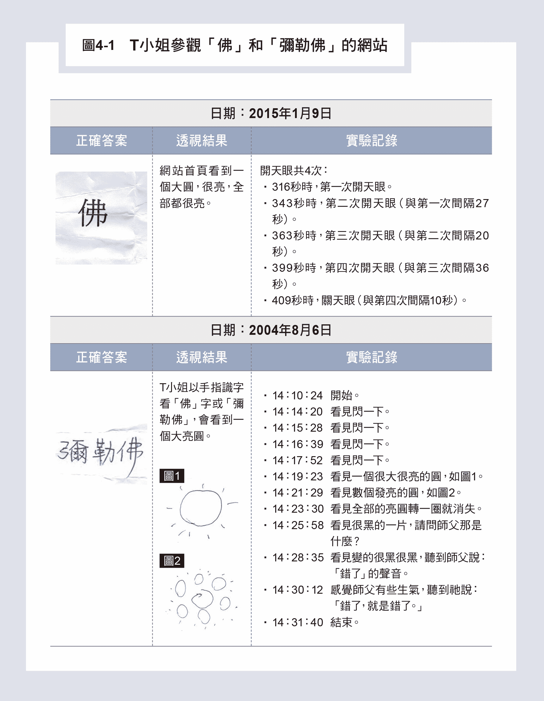

在看「药师佛」时，如图 4-2 所示，T 小姐会看到五个一排，排列整齐一排排的小亮圆，每一个小亮圆是药师佛网站的一个药园，里面有各种不同的信息药草。

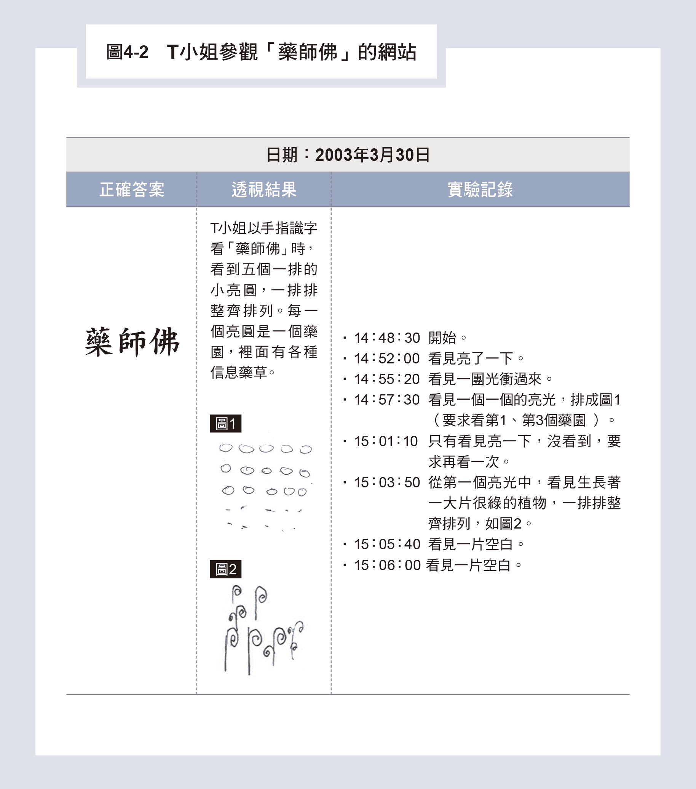

当 T 小姐来感应水晶气场穿越「佛」字时，如第三章的图 3-8(a)所示，会感受到水晶气场变成一个大圆，而且力量变强，竟然与佛字在虚空的虚像完全一样，表示佛字在虚数时空中灵界的虚像已经不是「一物两象」，而被改成一个圆形的大漩涡，也是佛在灵界网站的首页图像。

看起来，挠场是被佛字的大漩涡圆形虚像放大，并且投射到了实数时空，被 T 小姐手掌的经络所感觉到。这表示水晶气场打到佛字时，部分气场穿入了虚空，剩下的部分仍然在实数空间传递；穿入虚空的部分因为被放大，经过实虚纠缠带动下，实数空间的气场也被放大。

当用水晶气场经过「弥勒佛」或「药师佛」两字汇照射 T 小姐手掌的劳宫穴时，其结果如图 4-3 所示。

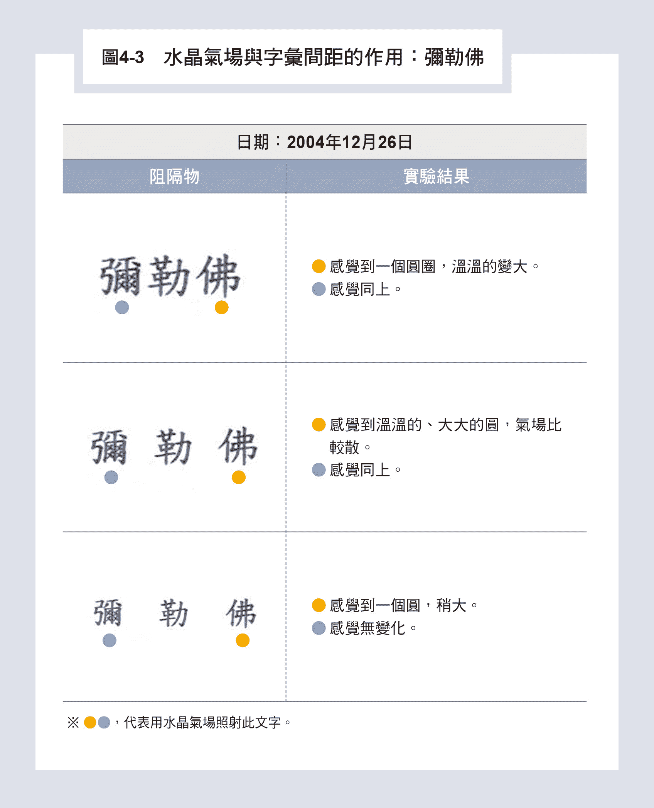

当「弥勒佛」三个字中间没有空格，或只空一格，如图 4-3 第一、二列所示，则不论水晶气场照「佛」字或「弥」字，都感觉到变成一个大圆、有点温度，表示信号变大、变强。

但是，当「弥勒佛」三字中间空了两个空格，如图 4-3 第三列所示，只有照「佛」字时会变成大圆，照「弥」字时没有变化，表示这三个字的空间结构已经分离，「弥」字与「佛」字不再连结，变成普通字，不再影响气场。

这也表示每个字可以影响的空间范围，就在这个字的上下左右一个字的范围。

当水晶气场照到「药师佛」时，会感觉到刺刺的、一点点向右移动，如图 4-4 所示。

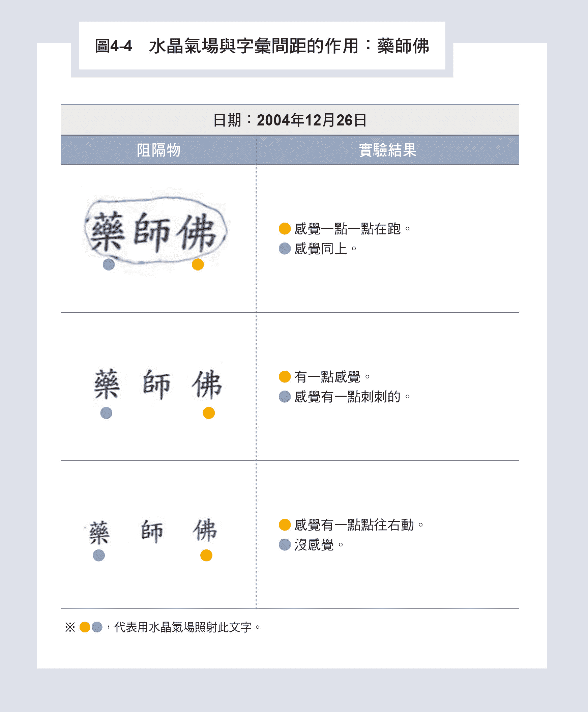

这个实验是二○○四年十二月完成的，当时我还不懂得这个实验的意义，直到二○一六年才突然领悟，这是气场在扫描虚空里药师佛药园内一排排整齐排列的一个个圆形小药园。由于每个药园都是旋转的小涡旋时空结构，如同一个个小吸引子，可以把气场吸过来，因此 T 小姐感觉到一点点刺刺的气场，是不断旋转的时空小锥子，而且会由一个小圆圈传向下一个圆圈而移动。

由这些神圣字汇的穿透实验，我们了解到水晶气场可以把神圣字汇的虚像，如大的圆形或一排排小圆排列的时空结构投影带入实数时空，被功能人用经络感觉到变化。这也显示气场在打到神圣字汇时，有部分气场可以藉由神圣字汇文字内的自旋通道穿入虚空，开始扫描神圣字汇中被神灵改变的虚像。若虚像有圆形涡旋结构，则气场会被涡旋加强，或被旁边另一圆型涡旋时空带动而移动位置。

这些穿入虚空的小部分气场与留在实数实空的气场，是紧密地纠缠在一起，同步变化、互相影响，可以称之为「实虚纠缠」的气场。

###  手写的神秘八卦图案

除了神圣字汇以外，有没有其他图案同样可以看到水晶气场穿越时产生类似的阴阳纠缠的现象？其实还有不少图案可以产生。

我们就以八卦图案来说明，二○一四年以前，所有实验用的八卦图案都是用手握原子笔在五乘五平方公分的白纸上，沿着尺画出，因此没有用电脑印字，也没有注意图案的大小与纸张大小的关系。图 4-5 就是其中一次用水晶气场穿越八卦图案，由 T 小姐来感应的结果。

很明显的是，图 4-5 中左栏第三列的震卦「」及倒过来的艮卦「」产生温温的感觉，表示信号增强，震卦与艮卦反应完全相同；甚至转九十度反应也是完全一样，这表示图案与角度无关。

图 4-5 右栏第三列的离卦「」则会产生凉凉的感觉，表示信号减弱外，其他的卦象都产生动态的感觉，比如，右栏第一列的兑卦「」与倒过来的巽卦「」，会产生一阵阵忽大忽小的感觉，同样显示兑卦与巽卦反应完全相同；甚至转九十度反应也是完全一样，表示图案与角度无关。

图 4-5 右栏第二列的坎卦「」，则产生一点点在刺的感觉。

其中，最值得注意的是红圈内左栏最后一列的干卦「」及右栏第四列的坤卦「」，也是往后研究的重点。干卦的感觉是刺刺的，气场位置原来在掌心，但是穿过坤卦后，气场会从掌心位置跑到食指尖端，当时我并不了解这些感觉代表的意义。

实验有时也不能重复，因为当时我们并不知道图案大小与背景纸张大小要有一定的比例之下，背景纸张虚像才不会干扰到八卦虚像的运动行为。直到二○一四年后的实验才慢慢厘清这些问题。

###  干卦「」的几何规范为何？

如何画三条直线才是干卦？为了确定干卦的几何规范，我们把干卦的三条阳爻的长度都固定为一公分，调整阳爻之间的距离为○‧三公分到一‧五公分，上下两爻与中央阳爻距离调整为对称或不对称，来测量 T 小姐对水晶气场穿越这些图案的反应，以此实验如图 4-6 所示。

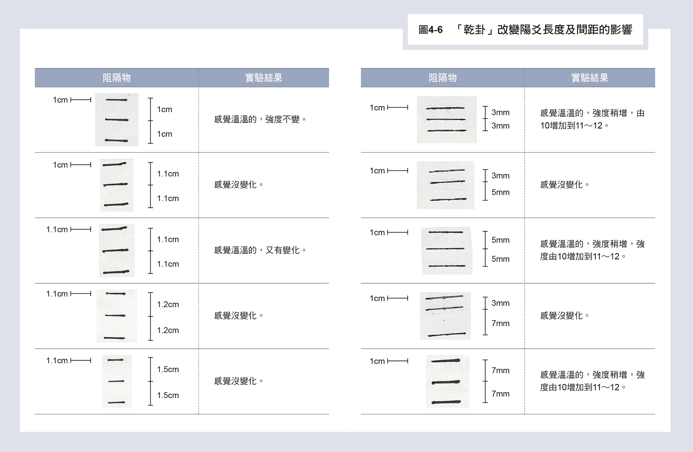

我们在二○一六年后发现不同年代实验所准备样本格式或大小不同，会有一些不完全一样的反应，因为样本背景纸张的大小会干扰到气场穿越八卦图形的行为。但是同一次实验的纸张及图形大小是固定的，因此实验是可靠的。

这一次实验结果，明确显示正常干卦会导致气场变强约百分之十到二十，强度由十增强为十一到十二， 气场也变得温温的，有放大的作用。只要上下两爻与中央阳爻距离为不对称如三毫米对五毫米，或三毫米对七毫米如右栏第二列及第四列，则气场增强效应消失，表示此两图案不再代表干卦。但是，一旦恢复对称如五毫米对五毫米，或七毫米对七毫米，如右栏的第三列及第五列所示，则气场增强效应恢复出现。

当上下两阳爻与中央阳爻距离为一公分，与阳爻长度一样长时，气场不再增强，但有一点温温的，表示这个图案正趋近干卦的几何界线，如左栏第一列所示。果不其然，当上下两阳爻与中央阳爻距离为一‧一公分时，气场增强效应消失，如左栏第二列所示。但是，当间距调整为一‧一公分，而将阳爻长度改为一‧一公分，如左栏第三列所示，则气场增强效应又恢复，由此我们可以下个简单的结论来定义干卦的几何结构。

假设放在邻近的三条等长的横线，其长度为 D，若相邻两横线之间距离为 S1 及 S2，若满足 S1＝S2＜D；则这三条横线的几何结构就代表干卦，原来干卦是有几何结构的规范，不能随便画三条线。

###  坤卦「」的几何规范为何？

首先，我们可以将坤卦「」看成是两个干卦「」放在隔壁，因此判断两个干卦必须遵守自己的规范，如前面所讨论的，至于它们之间的距离扮演什么角色呢？

为了研究这个问题，我们把左右六根阴爻长度固定为五毫米，而改变左右或上下三根阴爻间的距离。图 4-7 显示的是用手握原子笔所绘不同几何形状的坤卦与水晶气场交互作用的结果。

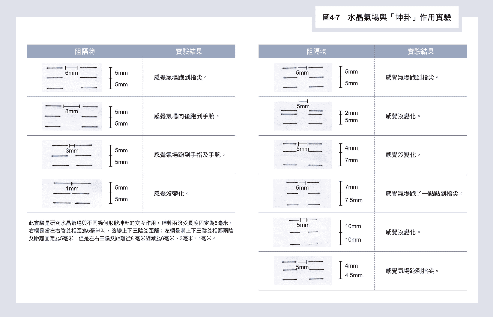

右栏的六列实验是当左右阴爻相距为五毫米时，改变上下三阴爻相邻两阴爻的距离为对称或不对称，或只是对称，但是距离比阴爻五毫米要长的结果。左栏其他列显示的是将左右三阴爻相邻两阴爻距离固定为五毫米，但是改变左右三阴爻距离从八毫米缩减为六毫米、三毫米或一毫米后的结果。

果然如我们所预料的，只要坤卦左右两个小干卦不对称，如图 4-7 右栏第二列（两毫米对五毫米）及第三列（四毫米对七毫米）所示。或者，对称的爻与爻距离等于或大于一公分，如第五列所示，则坤卦效应（气场跑到指尖现象）则会消失。

右栏第四列两个小干卦不完全对称，为七毫米对七‧五毫米，也超过单根横线长度五毫米，这时气场有一点点跑到指尖，表示还有些微的坤卦效应。

右栏第六列的两个小干卦不完全对称，为四毫米对四‧五毫米，则坤卦完全不受影响，气场还是向前跑到指尖。

从图 4-7 左栏第一列开始，两个小干卦距离改变成六毫米，则坤卦不受影响，气场仍然会往前跑到指尖。

左栏第二列中的两个小干卦距离增加为八毫米，气场变成向后跑，往后跑到手腕。

左栏第三列中的两个小干卦距离缩小成三毫米，气场跑到指尖与手腕，看来是分裂成两道气，一道气向前跑到指尖，另一道气向后跑到手腕。左栏第四列的两个小干卦的距离再缩小成一毫米，气场没有改变，坤卦效应消失。

整体看起来，坤卦中的两个干卦会随着阴爻之间的距离相互作用，而产生推挤。

###  气场与计算机印制的干卦、坤卦作用

从以上可实验得知，干卦、坤卦会与水晶气场产生很强的作用，但是用手画的卦比较不规则，重复性会有问题，于是二○一四年后我们改用计算机印制的干卦与坤卦来做实验。同时想到应该要了解干卦及坤卦的虚像为何？会产生动态行为吗？

我在考虑干卦间距必须对称问题时，正好碰到美国纽约大学的前校长提到：纽约大学要在上海设分校，根据法律，大学必修课程要有哲学课，可以选的内容包括《道德经》，他说《道德经》的四十二章有些说法没有道理，如「道生一，一生二，二生三，三生万物」，数位的世界是由○与一构成的，应该是二生万物，而不是三生万物。他的说法提醒了我干卦有三条直线，八卦生万像，为什么是三条而不是两条直线？

有一天早上，我睡醒了躺在床上思考干卦的规则，上下两条长度为 L 的阳爻，在时空创造了两条印痕间隔的距离是 2L，如果第三条同样长度 L 的阳爻加上去，刚好在中间，它影响的范围是自己的长度：上下各 L，刚好接触到上下爻。这样的影响拉动上下爻应该会让干卦旋转起来，如图 4-8 所示。

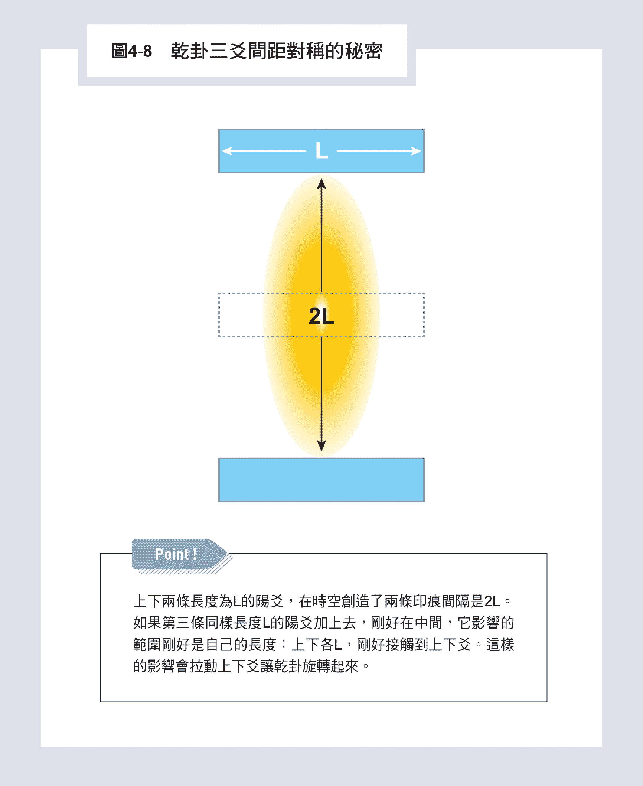

因此，我请 T 小姐用手指识字来辨识两卦的虚像，结果如图 4-9 及图 4-10 所示。

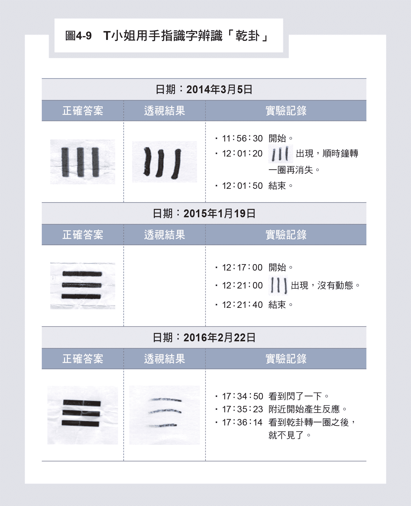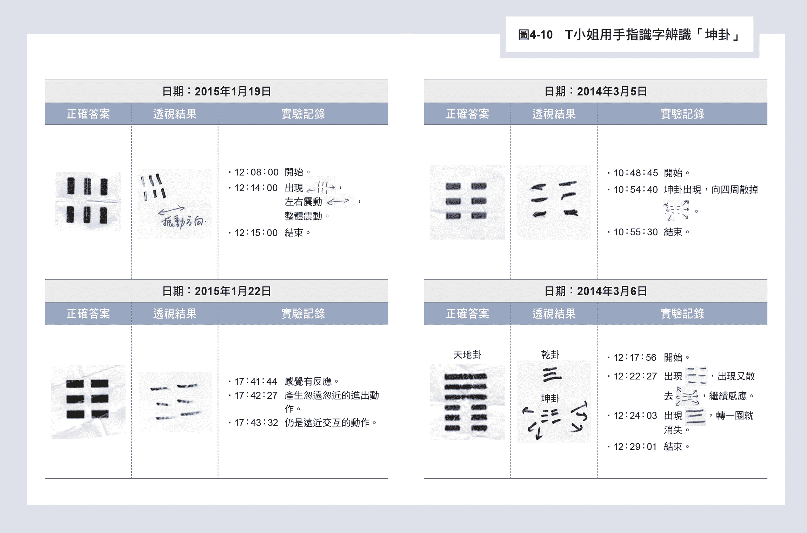

二○一四年，我们第一次做实验试干卦时如图 4-9 第一列所示，干卦的虚像在天眼出现后，真的顺时针转了一圈就消失了，我非常兴奋预言成真了。图 4-10 右栏第二列的天地卦中，干卦被扫描进天眼后，也是顺时针转一圈就消失了，这表示干卦的虚像有顺时针旋转的倾向。

但是，二○一五年做同样实验时，如图 4-9 第二列所示，干卦虚像并没有旋转，令人困惑不已。

后来，我注意到干卦图案似乎太大了，超过五乘五平方公分背景纸张大小的三分之一，表示干卦虚像大小可能超出背景纸张的虚像大小，让干卦虚象的旋转受到背景纸张正方形虚像的干扰。

果然，二○一六年我们缩小干卦在纸上的大小，如图 4-9 第三列所示，干卦虚像果然在天眼中转了一圈就消失了。这表示虚像的运动会受到背景纸张的虚像形状所干扰。

图 4-10 右栏第一列显示的是 T 小姐用手指识字来辨识坤卦时的实验结果，坤卦是两个相邻的小干卦组成，每个小干卦理论上都要各自顺时针旋转，此时六个爻的虚像会互相干扰卡住旋转，结果两小干卦互相推挤爆炸开来，第二列的天地卦下方的坤卦被天眼扫描进去以后，也是六根阴爻炸开。但是左栏第一列显示的是二○一五年一月十九日所作的手指识字实验，坤卦进入天眼后并没有炸开，而是左右震动，整体震动。

一月二十二日重复再做一次手指识字实验坤卦，这一次坤卦进入天眼产生忽远忽近的进出动作，好像六根阴爻本来要要炸开，但是碰到背景纸张虚像的边框又被弹回来，继续震荡。这个行为解释了图 4-7 水晶气场穿过坤卦的行为，打到坤卦的部分气场穿入虚空，被坤卦虚象的炸开行为，把实数时空气场向前带到了指尖，或向后带到了手腕部位。

水晶气场穿越计算机印制的干卦或坤卦会产生什么动态行为呢？

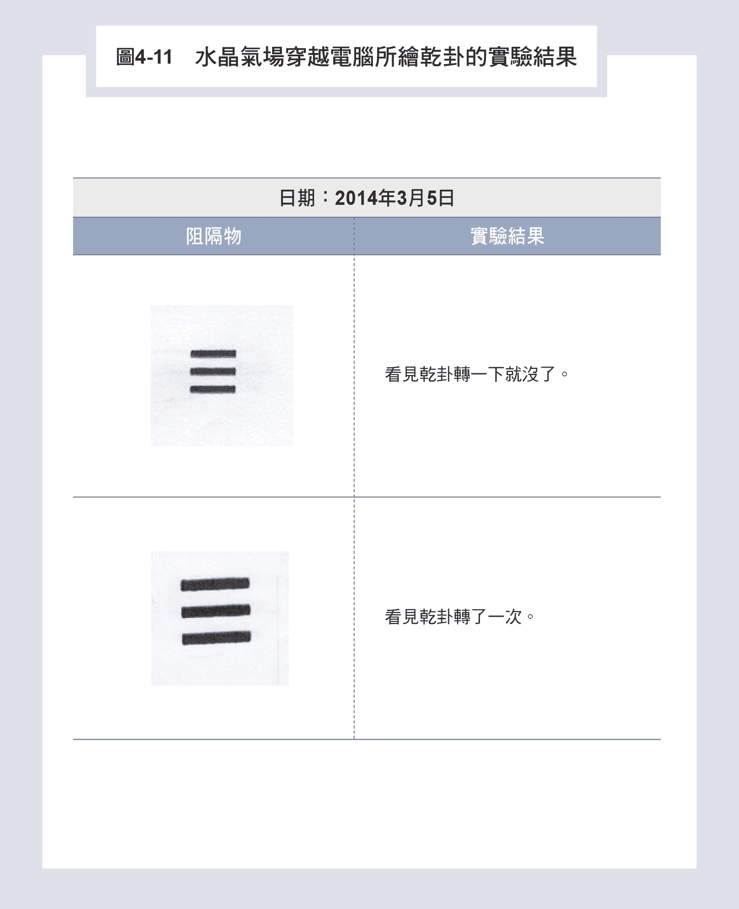

图 4-11 是二○一四年试验两个不同大小干卦的结果，都是顺时针转一圈，与手指识字结果完全一样。这表示水晶气场打到干卦后，一部分气场会穿入虚空，与干卦虚像作用，开始顺时针旋转，经过实虚纠缠带动实数时空的气场也顺时针转一圈，多么令人惊叹的结果，八卦神秘的面纱被我们掀起了一个角落。

二○一六年实验时，我们注意到背景纸张形状的影响，因此除了用正方形纸张外，也开始用五公分直径的圆型纸张，如图 4-12 所示。

右栏第一列及第三列用正方形纸张，干卦约为一‧五公分到两公分的正方形大小，结果 T 小姐感觉到气场要转不转，转不太动，显然被正方形的背景纸张虚像卡住，如红圈所示。

右栏第四列是与上面第一列一样大小的干卦，但是改用五公分直径的圆型纸张，结果气转动起来，不受纸张边框的限制，而且一直转不停，感觉是在钻手心，如蓝圈所示。

右栏第五列为正方形上有坤卦，但没有任何反应，没有炸开的行为，但是左栏第一列改为圆形背景纸张时，气场向前跑到指尖。这表示边框效应一旦去掉，坤卦会炸掉把气场带往食指间。

这也解释了图 4-5 气场穿越用原子笔画的小干卦为何是刺刺的，因为干卦尺寸太小，不会碰到背景纸张，故气场穿入虚空带着干卦虚象一直在旋转而产生刺刺的缘故。

## 其他八卦图形所引发的动态行为

上面我们详细地研究了干卦及坤卦在虚空的动态行为，以及水晶气场穿过两卦后的变化，让我们知道八卦的神秘是隐藏在虚数空间中，而剩下的其他六卦有没有相似的行为呢？

首先，我们来看看手指识字中坎卦的实验结果，如图 4-13 所示，二○一四年的实验没有成功，坎卦的虚像在天眼中没有动作。但是二○一五年一月十九日的实验，坎卦出现后，以绕小圈的方式在动，象是在转圈子一样。

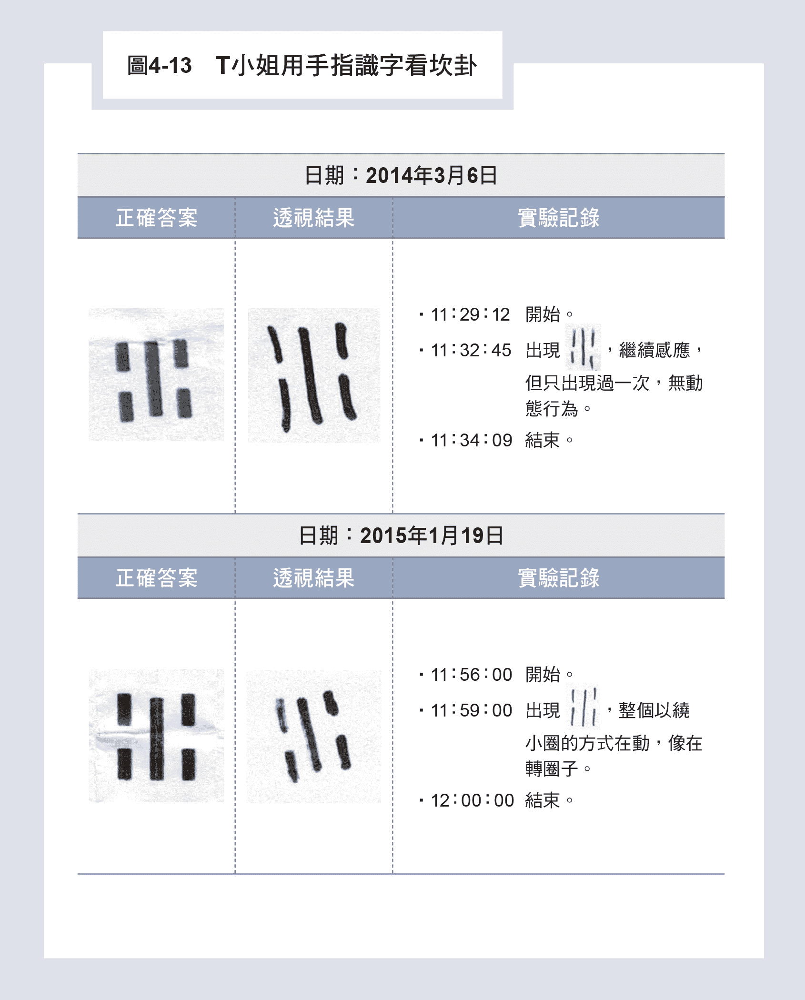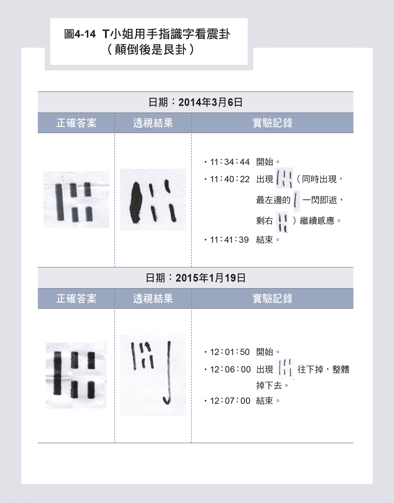

图 4-14 展示的是 T 小姐用手指识字看震卦（颠倒是艮卦）的实验结果。二○一四年三月六日第一次实验时的结果很特殊，震卦虚像在天眼出现后，左边的阳爻突然失踪跑掉了，只剩右边两根阴爻。

二○一五年一月十九日实验后终于搞清楚了，原来震卦的虚象会随阳爻一起运动，前一年的实验是阳爻动了，而旁边两个阴爻没有跟上的缘故。其他三卦「离」、「巽」、「兑」卦则无法在手指识字实验中成功看到动态行为。但是从水晶气场穿越这些卦象中，却全部看到了八卦虚象在灵界的动态行为。

例如，图 4-5 中右栏第一列中气场穿越「巽」卦，或转一百八十度的「兑」卦，会变成一阵阵忽大忽小的动态行为。右栏第三列穿越「离」卦，T 小姐会感觉到凉凉的，都有变化。在图 4-12 中，也可以看到气场穿越「兑」卦会变成温温的，穿越「坎」卦会变成刺刺的，表示气场在旋转。

## 道家的布阵

由这些八卦在虚空的动态行为，我们就知道古代道家如何布阵来产生时空的动态行为，经过气场穿越阵法或空间物体的摆设，再投射到物质的实数空间，让经络敏感型的人能感受到，这就是风水的科学根据及奇门遁甲布阵的科学原理。

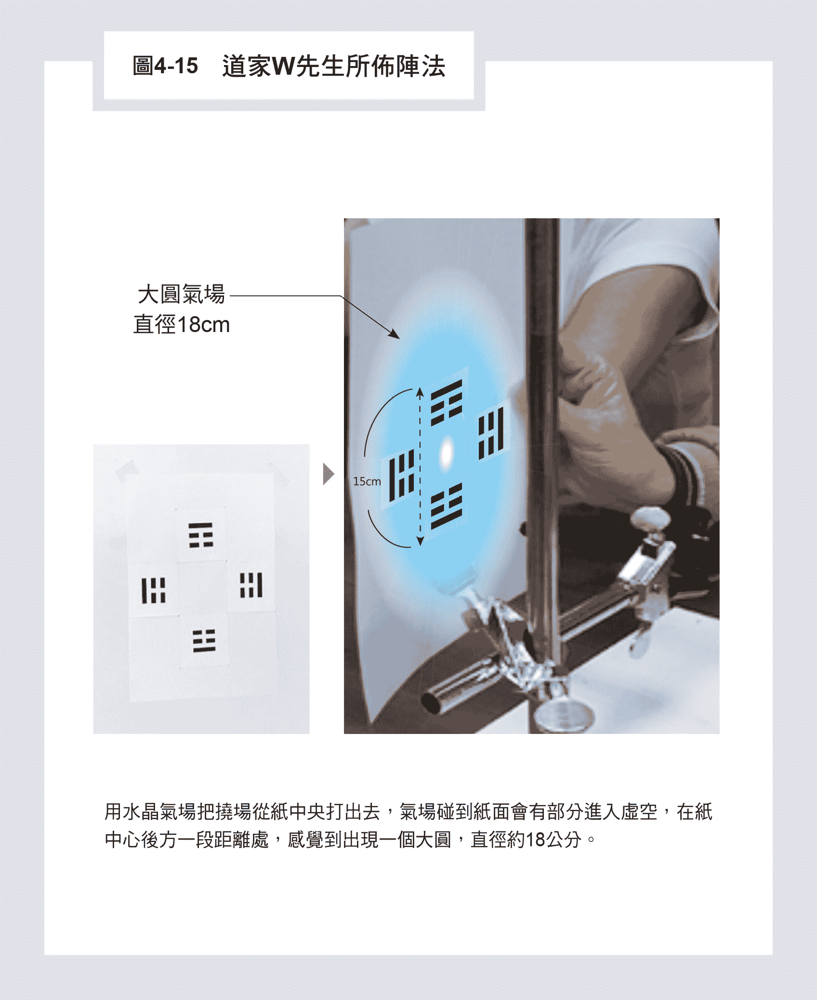

图 4-15 是我的朋友道家 W 先生教我所布的第一个阵法，在五乘五平方公分的纸上印着四张震卦，从上到下贴在十字型的角落，每张依序各转九十度，十字形的每条臂长十五公分。

我们用水晶气场或挠场产生器把挠场从纸中央打出去，气场碰到纸面会有部分进入虚空，被震卦虚像的阳爻带动一起运动，先向右、再向下、再向左，然后向上，等于转了一圈，在纸中心后方一段距离形成一个大圆气场，直径约有十八公分。经络极度敏感的人都能感觉到空间有这一团圆型的气场。这是我有生以来第一次实际观察及验证的一个时空阵法，打出去的气场产生了与理论相符合的气场结构，道家千年来操控空间的学问在此解密。

本章所提供的证据，我们很清楚地了解到，挠场也就是水晶气场，可以穿梭阴阳界，沟通两个世界。

由此，我们了解中国传统的风水就是在处理环境居家中物件的摆设所形成的几何结构，并用风或水调整气场的位置与大小。因为气场会钻入虚空，将虚空中物体虚象所形成几何结构的动态行为投影到物质的实数时空，我相信气场也将虚空的不同意识体或过去未来的信息带入物质世界的阳间，造成相关人士身体的不同感应，以产生吉凶祸福的结果。因此我相信挠场穿梭阴阳的气场行为，就是中国传统风水的科学基础。

# 第五章
二十一世纪的挠力文明

十九世纪末，特斯拉发明多相交流马达，

促成了二十世纪电力文明的开展，

他也提出几项当时认为科幻的创新概念。

这些基于挠场作用的概念，

及挠场侦测器的发明，

将会在二十一世纪促成挠力文明。

## 气场与分子模型及几何结构的交互作用

在第三及第四章中我们看到了水晶气场穿越神圣字汇、螺旋图及八卦图案后的结果，发现了气场可以穿梭阴阳界的神秘特质，原来气场打到纸上写的文字或图案后，会有部分气场穿隧进入灵界，引发这些文字图案的虚像产生动态行为。这些灵界动态的气场会与留在物质界实数空间的气场勾勾缠，物理上的术语叫做「实虚纠缠」，因此可以把灵界的行为投射回实数空间的气场，而被功能人感知，让我们可以了解这些几何图案的虚像在灵界的行为。

这让我们很好奇想去了解更多灵界的几何问题，例如，不同结构的分子模型，它们虚象的动态行为有什么不同？有没有遵循一些规则？同个分子的大小尺寸不同，它们的虚像会产生相同或不同的动态行为吗？

图 5-1 的是 T 小姐感受水晶气场穿越不同分子模型的实验照片。她带着眼罩，因此并不知道我们放在中间的分子模型是什么，同样的分子要重复放置两到三次，直到她确定感觉清楚以后才算完成。接下来，我们会一一讨论实验的结果，看看能不能归纳出一些共通的原则。

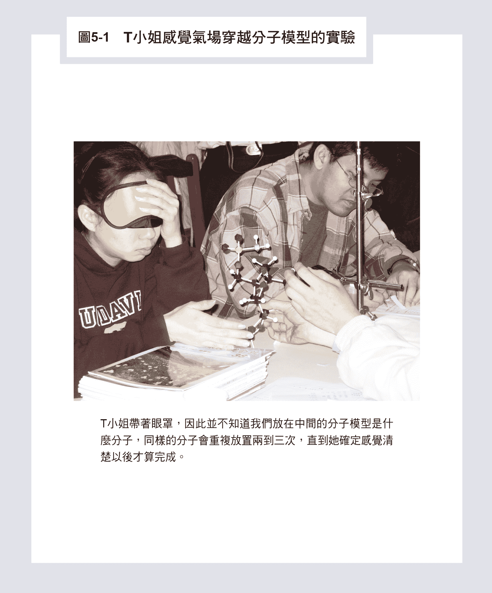

###  简单分子模型与金字塔结构

首先，我们尝试用简单分子模型如乙醇／酒精（C2H5OH）与甲烷（CH4）及纸做的几何结构如金字塔与大型 DNA 模型（长四十公分，直径十四公分），如图 5-2 所示。

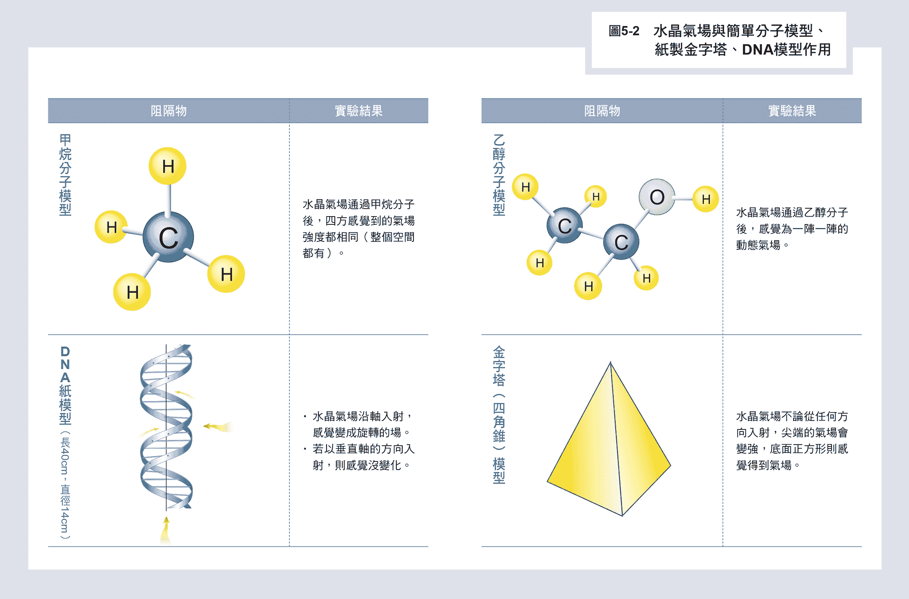

如图 5-2 右栏第一列所示，气场穿过乙醇分子会从静态的一个圆点，变成一阵一阵的动态气场；但是穿过左栏第一列的甲烷正四面体分子（碳原子在正四面体中心，四个氢原子在正四面体的四个角落），却是以碳原子为核心成球形向外扩散，她感觉气场向四周均匀的扩散强度相同。这表示球形对称的分子引发球形对称的气场分布；乙醇分子中，碳─碳─氧三个原子约略呈一百多度夹角的主轴化学键，加上五个碳─氢、一个氧─氢周边化学键的作用，导致气场被不同原子来回散射，变成一阵阵的动态气场，很明显的是，分子的几何结构就决定了气场在空间散布的形式。

图 5-2 右栏第二列是一个纸做的金字塔，几何上来说是一个四角锥，底部是一个正方形，我们发现用水晶气场，不管从哪一个方向入射金字塔，出来的气场方向只有两个，一个是从金字塔尖顶射出比较强，另外一个方向是从金字塔底面正方形均匀地射出来的气场比较弱。这告诉我们，金字塔顶尖的指向是有意义的，气场一旦穿隧入虚空灵界，就可以沿这个方向，以超越光速的速度射向宇宙深处。有一些研究金字塔秘密的书籍声称，金字塔尖端指向的星座，就是与这星座外星人通讯之用，看来有点道理。我也看过很多书籍，声称把食物放在金字塔中可减缓发霉或腐败的速度，我虽然没有做过类似的实验，但是看过一些中小学生的科展部分证实了这些现象，我猜想这跟金字塔内气场的分布有关。

图 5-2 最后一个实验是左栏第二列的纸做 DNA 模型直径十四公分，长度为四十公分，如果气场沿 DNA 轴方向入射，则气场会顺着 DNA 旋转方向旋转，类似第三章图 3-14 所示，气场顺着阿基米德螺旋旋转一样。如果气场是沿着垂直 DNA 轴方向入射，则完全不受影响，会直穿而过。

###  蛋白质分子模型

这一节内容中，我们考虑五个蛋白质分子模型与气场的交互作用，如图 5-3 所示。

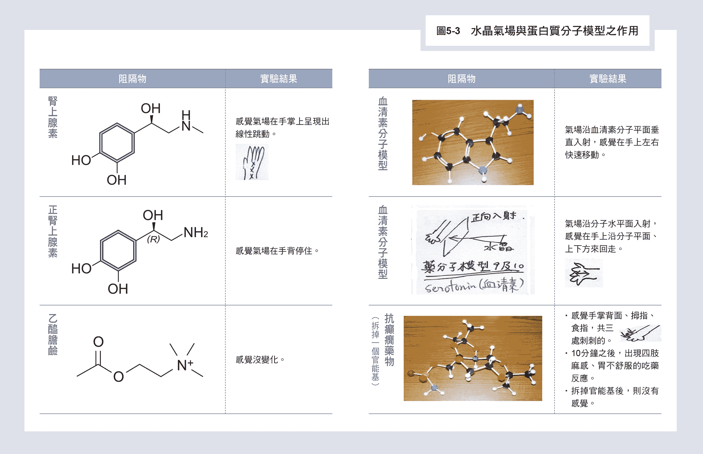

图 5-3 右栏第一列是血清素（Serotonin）分子模型，血清素为苯双环型神经传导物质，主要存在于动物的胃肠道、血小板和中枢神经系统中，它被普遍认为是幸福和快乐感觉的贡献者。如果气场沿着分子平面垂直入射，则气场被调成动态沿着平面来回扫描。如果气场沿着平面平行入射，结果变成气场在分子平面上下方来回走，都变成动态行为，如图 5-3 右栏第二列所示。

右栏第三列是抗癫痫药物 Topiramate 的分子模型，是一位神经科医师所制作的，也是他用来治癫痫病人常用的药物。T 小姐的反应非常奇特，除了在拇指食指及手背有刺刺的感觉，在拔掉一个官能基以后，刺刺的感觉就消失了。实验十分钟后，她出现了四肢麻感、胃不舒服的反应，这位神经科医师在旁边马上说这是吃药反应！真令人震惊，我们只是把分子模型的信息用气场打在 T 小姐手掌上，她竟然出现了吃药反应。这个分子模型大小，是真的药分子一千万倍大，但是没有影响它对身体产生的作用。这告诉我们人体内一件重大的秘密，生理上生物化学的作用来自分子的几何结构信息，与分子尺寸的大小没有关系，药不一定要用吃的，只要药的空间几何结构信息被气场送入身体，就会发生吃药反应，这对我们以后用药治病有非常大的启发作用。

图 5-3 左栏第一列到第三列展示三个分子：肾上腺素、正肾上腺素与乙酰胆碱与气场的作用。

图 5-3 左栏第一列的肾上腺素是一种激素和神经传送体，由肾上腺释放。肾上腺素会使心脏收缩力上升，使心脏、肝脏和筋骨的血管扩张和皮肤、黏膜的血管收缩，是遭遇危难的人或动物会分泌的激素。肾上腺分子会造成气场在手掌到手腕上呈直线点状跳动；第二列的正肾上腺素是一种肾上腺素受体激动药，有收缩血管、升高血压的作用，它会让气场跳停在手背。第三列的乙酰胆碱是神经传导物质，由神经轴突末梢释出之后，会穿过突触间隙和突触后神经元或运动终板的细胞膜上之受体结合。从实验结果发现，乙酰胆碱对气场没有影响。看来扮演激素角色的分子结构，都会造成气场跳动，也许是沿氨环分子轴方向。

有关分子尺寸大小的作用，我们还有一组数据可以说明，如图 5-4 所示，多巴胺（Dopamine）分子模型，不论是用 3D 打印的小模型，或是塑胶球加杆子组成的大模型，形状完全一样，只是大小差了二十五倍以上。气场通过这两种分子后，都会在手掌上很多地方跳来跳去，反应完全一样。

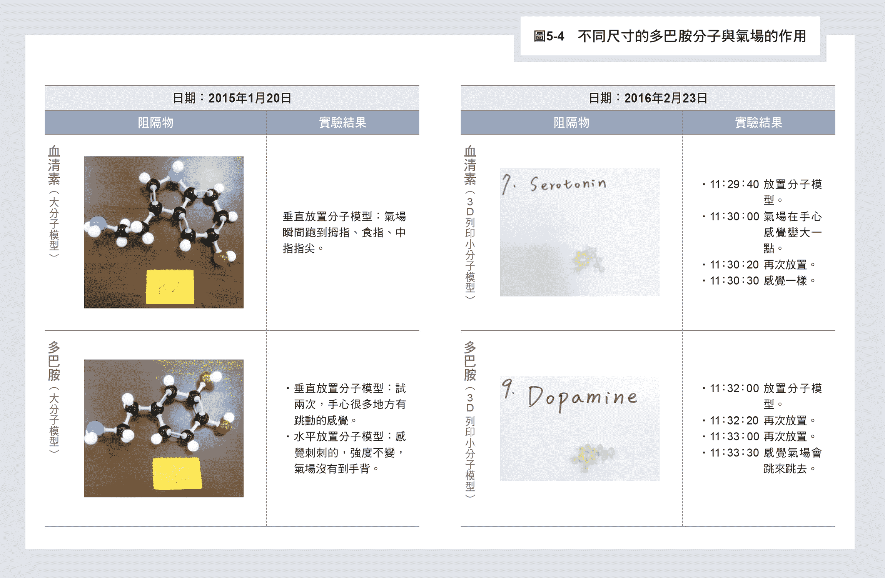

因此，几何结构才是生化反应的王道，跟尺寸大小没有关系，这也暗示在虚数时空中，气场与几何结构作用的原理是「形形相印」，只要几何结构相同，而非绝对尺寸相同，就会产生相同反应的规律。

我们尝试了许多胺基酸与蛋白质分子模型对气场的反应，最后可以归纳出三个结论：

 分子内苯环的胺基酸结构带有特别的讯息。

 单环硷基的多巴胺或肾上腺素类，带有引发气场跳跃的讯息（手指到手心感觉到气场跳动）。

 双环硷基类似嘌呤类分子的血清素、色胺酸、褪黑激素类，会扫描气场到指尖产生刺刺的感觉。这表示气场打到分子模型穿入虚空单苯环的虚像，导致跳跃的气场，而双环硷基的虚像导致扩大的气场，带动实数世界的气场来回走或扩大碰到手掌边界的指尖，而感到刺刺的。

###  晶体模型与实物有相同的反应

物质世界的固体都是由原子构成，如果固体中原子的排列有周期性则形成晶体，这些晶体与气场的交互作用又是如何呢？我们也作了一些实验来了解晶体的单位晶格模型与晶体本身，如图 5-5 所示。

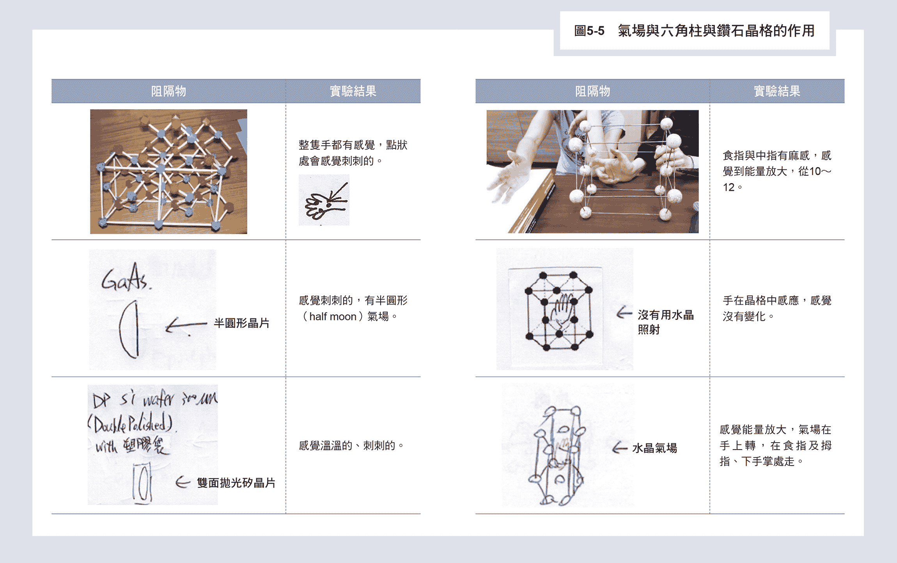

右栏是一个六角柱的单位晶格的反应，六角柱的底面是一正六边形，每边长度相同夹角为一百二十度，六边形中心有一原子，垂直底面的 C 轴长度较长。气场沿平行或垂直 C 轴方向入射，如第一列或第三列所示，气场强度都被放大，导致食指、拇指或中指麻，原来六角柱晶格也对气场有放大作用与神圣字汇一样。如果没有气场入射，如第二列图所示，感觉不变。这表示适当的 3D 空间几何结构也会散射气场来回震荡产生放大作用。

图 5-5 左栏展示的是以钻石结构为基础的重要半导体材料的晶格及实体。第一列是三五族化合物半导体材料砷化镓（GaAs）可以做高速及光电半导体元件，它的结构是以钻石结构为基础，每一晶格点放一对砷（蓝色）及镓（红色）原子做基底，当气场穿过晶格原子 3D 模型（红蓝相间）手上到处都有点状刺刺的感觉。如果气场穿越一片半月形的真正砷化镓芯片，如第二列所示，结果也是一样，手上感觉半月形刺刺的，反应完全一样，再度证实不论模型尺寸相差多大，相同的结构导致相同的气场分布。第三列是半导体硅双面抛光的芯片，硅是集成电路最重要的材料，是真正的钻石结构，把第一列红蓝相间的原子模型改成一样的颜色，就是硅的原子结构，结果气场穿过硅芯片也是感觉到刺刺的、温温的，好像还有一点放大作用。刺刺的感觉表示打到晶格原子散射的气场产生干涉的涡漩小气场，像小锥子一样刺到手掌。

接着，我们来看气场与体心立方晶格的交互作用，如图 5-6 第一列所示。体心立方是一个立方体晶格，长宽高一样长，两两夹角成九十度，正方体中心有一个原子，所以叫做「体心立方」。

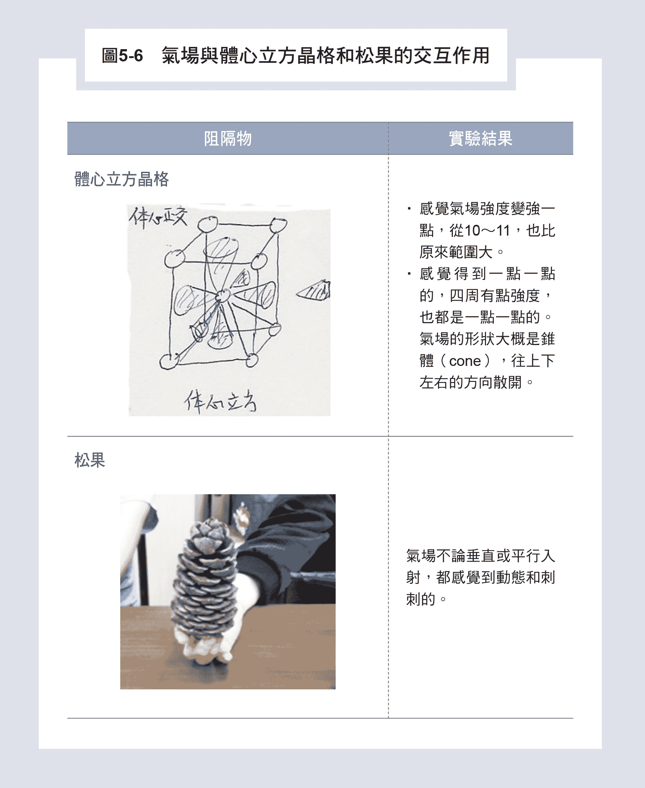

当气场打向晶格，中心原子上下、左右、前后的六个方向都会出现一个锥状气场分布，强度也稍微变强一些，约百分之十。

图 5-6 第二列显示的是气场穿过一个大松果的实验，松果就是大脑内松果体的替代模型，它的几何立体结构与松果体相似。结果，气场不论是垂直或平行松果轴向射入，都是变成动态且刺刺的感觉，这也告诉我们：大脑松果体会与穿梭阴阳的气场产生强烈交互作用。

###  药分子钥匙开锁治病原理

人体细胞内的遗传物质 DNA 是由四种分子：腺嘌呤（Adenine），胸腺嘧啶（Thymine），鸟嘌呤（Guanine）和胞嘧啶（Cytosine）组成，简称为 A、T、G、C，其中 AT 与 GC 分子两两配对，分子形状会互补，如图 5-7 所示。

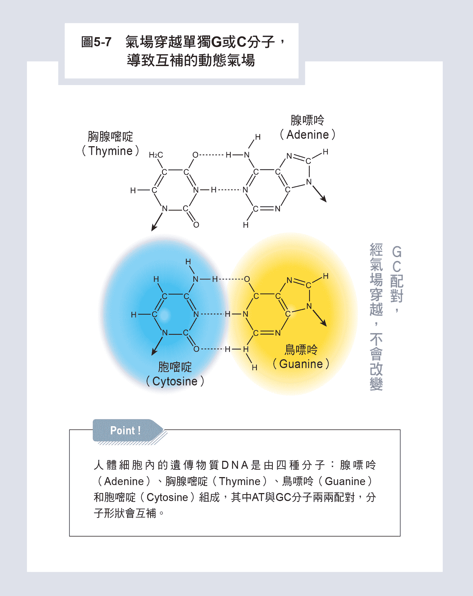

当我们用水晶气场穿越单个 G 分子模型（双环硷基分子），可以感觉手掌中心部位没有感觉，但是手掌周边五个指头会有感觉，好像气场范围扩大到周边；换成单个 C 分子（单环硷基分子），则气场穿过会导致手掌中心处有比较强的感觉。很明显的是，两者对气场的散射刚好互补，一个在手掌周边，一个在手掌中心。接着，我们把两个分子 GC 合并成 DNA 内相连的结构，结果气场穿越合并的分子并不是两者相加造成全手掌扰动，反而是风平浪静，完全没有扰动的感觉。这真是惊人的一刻，原来生物化学反应的钥匙开锁原理，是让两互补时空结构彼此结合，来抚平时空的缺陷，恢复完整平直的时空，而将时空缺陷所造成的动态时空所引起的系统运作问题解决，这也解释了药可以治病的原理。

我在《科学气功》一书中所提及的分子 X 信息，就是这种与分子时空互补结构的信息。至于单个 A 或 T 分子模型，则不会对气场有任何散射，A 和 T 两分子合并结果也是一样，对气场没有散射能力。从水晶气场侦测结果，G 和 C 分子似乎比 A 和 T 更有符号的威力可以散射气场，这可能与 GC 两分子中六环硷基一侧边有 C＝O 结构，另一侧边有 C-NH2 的特殊结构有关。事实上高 GC 含量的 DNA 段落也是高基因含量高转译的区段，也就是好的 DNA 段落。

由这些实验数据我们开始了解，气场打到晶体部分穿入虚空，会被周期性原子虚像散射重组，再钻回实数空间，被手掌的经络感知到。因此实数空间中物质世界不同物体的摆设都会影响气场的分布，进而影响到人体。

过去，我们大多数人并不相信风水，认为风水是迷信，也不重视办公室或家庭内家具的摆设位置，但是从我们的实验结果来看，家具摆设的几何形状与位置的对称或不对称，显然会影响气的运动，造成不同的气场分布，对人体健康可能也有不同的影响。那一般人怎么办？要到哪里去找可靠的风水师来办公室或家里看一看？其实人群中有百分之十五到二十的人是经络敏感型的人，对气场会有些感受，在自己的家里或办公室调整一下家具的位置，感觉舒服的气场就可以了。我相信未来随着挠场研究的深入，挠场散射问题，应该可以逐步用计算机模拟出来，也许未来计算机风水设计师会是一个很夯的行业。

###  气场「界水而止」的原因

我们从二○○○年开始做气场穿越不同物体的实验，马上就发现一张沾水的纸，就可以把气完全吸收，这个实验也被后来其他经络敏感型的修课学生及 NMR 的核磁共振实验所证实。但是我们一开始完全无法理解，水是如何把气场吸收藏在水中？以什么形式存在？

二○一三年，我们开始从事挠场照水的研究，用核磁共振技术来测量挠场照水三分钟后，来了解水分子团大小的变化。我们都是在化学系 NMR 实验室做实验每个星期做一次，总共做了两年多超过一百次的实验。我的合作伙伴蔡博士慢慢发现在实验时，挠场产生器的电线如果垂挂在实验铝架上与实验杯中水接近，与电线拉到墙边、远离杯中水的实验结果竟然会不一样。这让我们伤透脑筋，为什么水吸收挠场以后，会与附近环境的电线产生交互作用？

后来，与 T 小姐做气场实验时，我们才发现两杯水如果放得太靠近，在五公分以内，则两杯水似乎会交换气场信息，这表示被水吸收的气场，并不是侷限在水的内部，而会扩散到附近区域，这就解释了为何环境的摆设会影响水中分子团的大小变化。气会穿梭阴阳界进入虚空，因此我慢慢理解气场经过水就被完全吸收，是因为气场打到水就完全进入虚空的缘故。

由于水分子（如图 5-8 所示）是两个氢原子与一个氧原子化合（H2O），H-O 化学键有两个自旋相反的电子，形成 3D 的太极结构，有两个鱼眼，挠场可以一进一出穿梭阴阳界。但是氢原子核只有一个质子自旋，只有一个阴阳界通道，因此它是单行道只出不进。就像顺向阀筛子一样，挠场打入水中，被单向阀管控全部进入虚空而消失了，自然进入虚空的挠场会与附近环境中物体虚象作用，而干扰实验的结果。由这些实验我们真正了解到「气界水而止」的物理原因，因为全进了虚空。

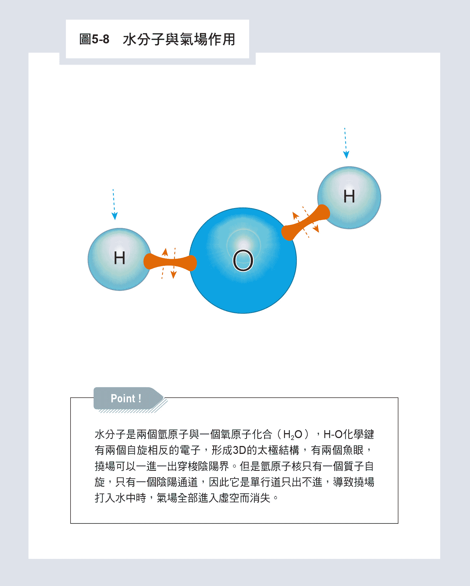

## 物理农业，取代化学农业的未来

农业是人类社会赖以生存的根本，十九世纪中叶以后，科技的发展促成工业革命，机器取代了人力，人类文明日益发展，但是环境却逐渐受到破坏。几千年来日出而作、日落而息的农业也碰到相同的问题，人类生存环境在数十年来的化学资材包括肥料、杀虫剂不当使用之下，受创至深，水质恶变，土壤缺乏生机。尤其不当施用化学农药，导致生态失衡、病虫草害失控与传粉蜜蜂不明原因死亡，恶性循环之下，人类继续不断开发与应用新型药剂，冀求掌控病虫草害，结果却适得其反。在此种无法依循生物共存的情况下，环境也更加快速恶化，可以说二十世纪是「化学农业」的世纪，也造成环境破坏的灾难。

目前农业正处于由「化学农业」向「生态、环保、健康农业」的过渡时期，应该思考如何在无污染的条件下达到增产、优质、减少病虫害的目标。最好能在不使用化学农药、肥料下降低病虫害之影响，同时维持环境与生态中有益微生物、益虫正常数量与活力，故可以开始考虑利用物理方法来聚气、集气达成此目标。

曾与我合作过的台大园艺及景观系的张景森教授把这种概念称之为「物理农业」，实在是一个了不起的创新方向，具体实现的方法是「利用风水布局达到作物健康管理」，研究不同几何图形之气场、风水布局，对其栽培环境中微生物相及益虫、害虫变化之相互关系。

图 5-9 所展示的就是其中一项成果，张教授选择两种植物代表一阴一阳，阳的是绿色的薄荷，阴的是紫色的紫绢苋，分成两种方式合种成一样大的圆形，直径一样，面积固定，如右栏第一列图形显示。两植物于某年六月十九日定植，第一个是种成太极图，第二个是种成两半圆，绿色薄荷及紫绢苋各植一边，从图片由上到下的变化，可观察植物随时间过去生长的情形。七月二十五日修剪后，可看到七月三十一日成长的情形：种成太极图的两种植物维持饱满圆形，互不侵犯，小鱼眼圈中的植物，并没有被外围另一种大量的植物侵入；但是种成两半圆的两种植物则容易变形及缺角，有互相竞争的情形出现。

由于到了夏季的七、八月南向的薄荷成长在两种图形都比较旺盛，实验于八月十二日结束，由此可以看出太极的几何结构所创造的气场，有利于不同物种间的和谐相处。

张教授为了重复验证几何图形对植物生长的影响，曾以太极图、右螺旋或两半圆结合图案分别于冬季种植香草植物如柠檬罗勒、紫罗勒，或夏季种植绿薄荷、胡椒薄荷，结果都是以太极图和右螺旋图对香草植物的植株存活率、生长量、植株健壮表现有显著正向的效益。这也表示农业的栽植，最好不要用简单线条方式种植，而是要改用可以聚气、集气，或导致气场旋转的图案来栽植，可能收成会比较好。

若改以五行图形种植前述香草植物，则以五行金（半圆形）、五行木（细长方形）对植株存活率、生长状态、抗氧化有效成分，尤以三价铁的还原抗氧化能力（FRAP）表现最佳。而以五行火图形（三角形）种植者表现最差。

若利用五行色彩黏板（白、黄、绿、深蓝、黑、红、褐色）吸引茶园，也有益昆虫试验。因试验时，非小绿叶蝉活动旺盛期（五到七月），吸引效果不佳，但以黑色黏板处理时，吸引昆虫略多；黄色则对瓢虫吸引效果有显著性差异。

我与台大园艺及景观学系的张祖亮教授也尝试合作过，把植物种成不同的卦象，放在不同的方位，研究植物的生长状态及叶菜总量的变化。张教授设计出八卦阴阳爻的容器，如图 5-10(a)所示，然后把阴阳爻的容器合组成八卦的卦象，放在园艺系的实验场，做实验培养莴苣，如图 5-10(b)所示。

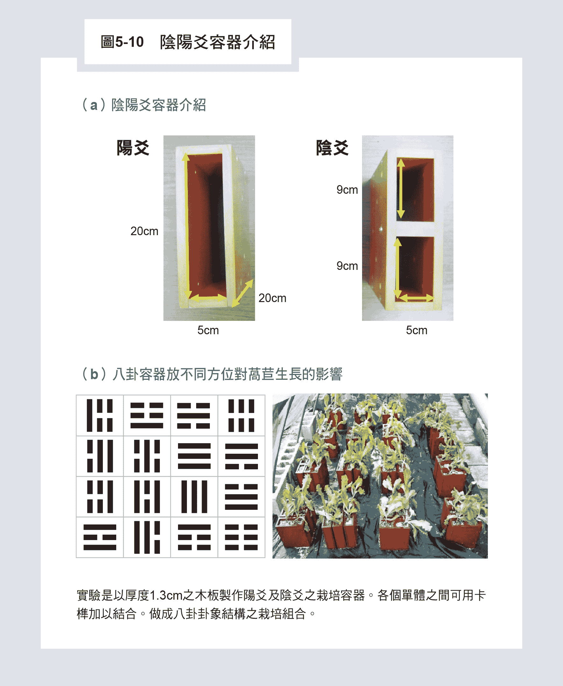

二○一四年十月，张教授种植一百五十六株皱叶莴苣穴盘苗定植于由阴爻及阳爻盆所组成之八卦几何图形。种植三十天后采收，调查叶片数、地上部①长度及地上部鲜重②。最后统计结果包括爻象（阴、阳）与方位（平、竖）的复因子试验分析显示，单一因子（如爻象或方位）对于莴苣地上部生长并无显著的影响。而爻象与方位组合后之互感作用，则对于莴苣的地上部的鲜种、干重具有显著影响。但卦象对于莴苣地上部生长，除叶数外，地上部长度、鲜重及干重皆有显著影响。

此一结果亦显示出卦象空间方位的组合，不是迷信，而确有其物理效应存在。而卦象与方位组合后之交互感应作用，则对于莴苣地上部生长之所有调查项目，皆具有显著影响，这告诉我们种植作物时，面对不同的方向，要用不同卦象的几何图形来种植。其他如茶树的种植、昆虫的防治，也让我们看到一些有趣的现象，我认为「物理农业」是二十一世纪农业科技值得参考的一个创新方向。

* * *

① 作物生长包括地上部及地下部。茎、叶、花、果、芽等位于地面上，为地上部；根深入土壤，为地下部。

② 鲜活的植物采集后立刻测出的重量。

## 挠场可作为星际通信的工具

第三章我已经介绍二○一八年北京的工程师高鹏用 Akimov 挠场发射器与纽约市立大学的 Mark Krinker 教授做了几千公里从北京到纽约的远距通讯实验，两人都用同一张照片作为挠场发射起始位址及接收挠场的定位器之用。虽然电磁波的通信在一百年前就做到同样的事情，但是挠场有一个电磁波没有的特性就是：挠场会穿入灵界。一旦穿入灵界，就不受实数时空、物质世界中广义相对论对信息传递的光速限制，可以用远超过光速的速度在宇宙传播。

我在《灵界的科学》一书曾谈到功能人用意识到四百三十八光年外的外星文明去看外星人，只要一到两秒钟，表示她天眼意识的速度至少比光速快 107 以上，瞬间即至。剩下的问题是：通讯技术要有共同的标准。一开始当然是采用最简单的技术，就像当年发明电报一样，可以用摩斯码一长一短代表一与○，就像数位技术一样「二生三，三生万物」，就可以开始通讯了。但是问题又来了，谁可以去跟外星人谈判共同技术标准？很显然的，就必须找到有电子科技知识的功能人，开了天眼直接去外星用心电感应与外星人沟通，就不需要语言文字，否则还要先学外星语言，那可太难了。至于如何定位的问题，也就是浩瀚宇宙中我们如何互相瞄准集中能量，以免信号能量太弱、噪声太强而无法送去。还好灵界有一套自己的相应法则——「形形相印」，只要几何结构完全一样，或是互补结构，像钥匙与锁，不论尺寸大小都会互相吸引、找到对方，这也是高鹏与 Mark Krinker 教授用同一张照片来做挠场通信的原因。挠场打到发送者的照片后能穿入灵界，并带着这一张照片的虚像在灵界搜寻接收者相同照片的虚象，由于「形形相印」瞬间即至，几乎不用时间，然后挠场经过照片虚象穿回实数的物质世界，带着传送的信号就可以被侦测器侦测到。我相信二十一世纪四十年代以后，我们有机会开始利用挠场与外星文明展开通讯。

## 挠场侦测器，迎接挠力文明的到来

为了迎接挠力文明的到来，科学上最重要的关键就是找到挠场的侦测器，把看不见、不容易感受的挠场测量出来。俄国科学家花了几十年时间测量挠场，但是发现极度困难，他们主要以 Akimov 挠场产生器实验，我认为他们还是在测量伴随产生挠场的线圈电磁场大小，而不是直接测量挠场的强弱。

至于 Sphilman 挠场产生器产生的挠场在二○一六年有一项突破性的发现，北京大学的任全胜教授发现水的排斥区（Exclusion Zone，简称 EZ） 似乎可以侦测到挠场的强弱。

大家都知道水有固体、液体及气体三相，二○○六年美国华盛顿大学 G.H. Pollack 教授提供令人信服的证据①，认为水存在第四相，是一种有规则结构的水。虽然争议很大，十多年来也有其他模型被提出来，但是水的第四相仍然是主流看法。

Pollack 教授发现，将表面带负电性亲水的高分子薄膜（Nafion film）插入去离子水中，水中浸泡有表面带负电的小奈米塑胶球（直径约五百奈米），很快地在几分钟之内，接近 Nafion 薄膜表面之奈米球会全部被排开，出现一个透明的排斥区，宽约几百微米，是一般人头发宽度的五到十倍，如图 5-11 上视图所示，光线是从白色铁氟龙奘水盒子下方往上照，黑色部分就是奈米球，黑压压的一片且不透光，微亮的排斥区在 Nafion 薄膜两测开展。

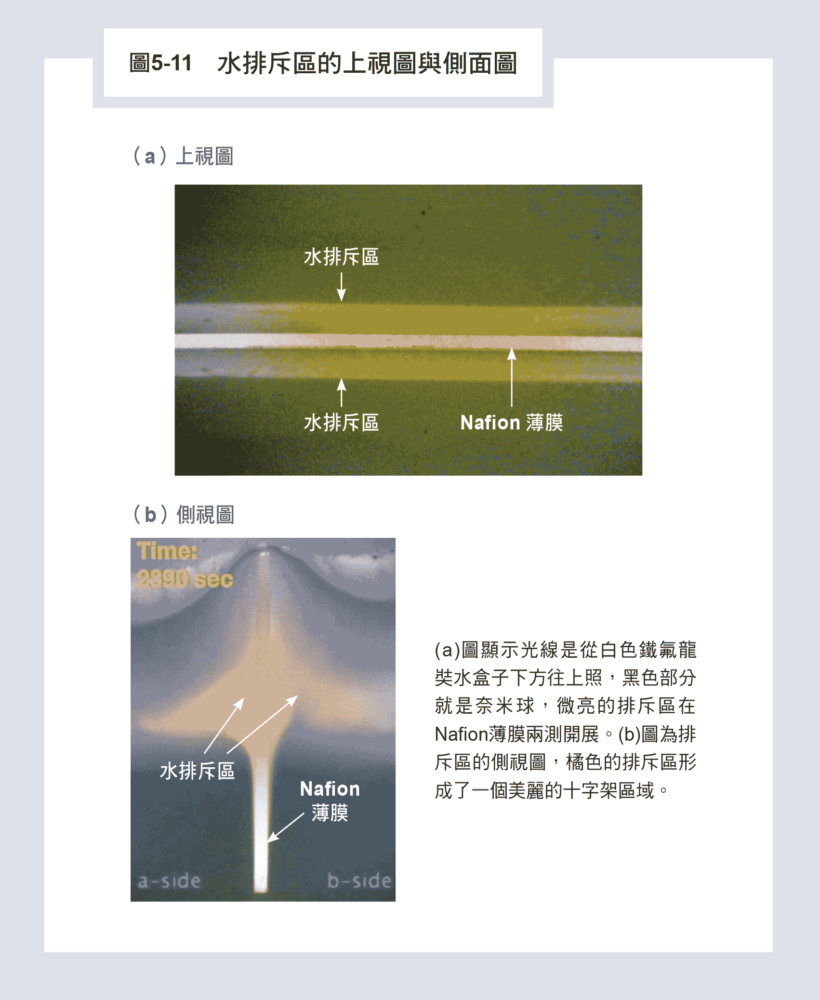

最神奇的是，根据 Pollack 教授的发现，水的排斥区会把氢离子赶出排斥区在外围，氢氧负离子（OH－）留在内，正负电荷被规则排列致密的排斥区水晶格阻绝，无法互相吸引接近而中和，正负电各自累积因此形成一个电池，可以外接导线到正负电荷区域用来发电。

功能人 T 小姐做手指识字实验时，大脑打开天眼时，左右手掌的食指底端会产生约二十到四十毫伏特（mV）的电压，有时电压会延续两分钟之久，好像整个大脑变成一个电池，把电压经过神经送到手上。这让我极度怀疑，大脑中的天眼就是脑中某个区域的生理食盐水被亲水性细胞膜引导，进入水的第四相产生电池现象，局部电压导致水排斥区密度增加到进入玻色─爱因斯坦凝态②的量子状态（Bose-Einstein condensation）而产生天眼。

我的实验室在二○一八年开始研究水的排斥区，除了传统地用显微镜从液面上方观察水排斥区的宽度变化，如图 5-11 的上视图，我们也同时用第二个显微镜观察 Nafion 薄膜附近排斥区的侧面扩展情形，全部过程用电脑控制每秒同步拍照一次，然后相互比较。结果，我们发现排斥区的侧面图形展现出非常壮观的景象，如图 5-11 的侧视图所示，橘色的排斥区形成了一个美丽的十字架区域，橘色是 Nafion 薄膜内杂质在光照之下发出的颜色，本来橘色光被侷限在薄膜波导内传播，但是第四相结构水出现后有比较高的密度，导致光穿出薄膜射进排斥区，让我们看到十字架的排斥区。

果然没错，如北大任教授所发现，用挠场照射水排斥区四十分钟，排斥区会扩展百分之十到二十五，右旋挠场比左旋要强，造成的扩展比较宽。当左旋挠场先穿过佛字，再照向水排斥区，宽度甚至会增加到百分之三十左右非常惊人，也证实了前几章所描述的经络敏感型受试者会感觉佛字放大气场的现象。

未来如果能把挠场侦测器做成面板，像计算机液晶荧幕一样，就可直接看出挠场的强弱分布，风水布局将会简单到变为日常生活的一部分。

* * *

① 参考资料：Zheng, J.; Chin, W.; Pollack, G.H. Advancesin Colloid and Interface Science 2006, 127, 19-27.

② 是指玻色子原子在冷却到接近绝对零度时，呈现出的一种气态的、超流性的物质状态，于一九二○年代，由物理学家萨特延德拉‧纳特‧玻色和阿尔伯特‧爱因斯坦提出预测。

## 完成特斯拉未竟的理想——虚空取能

我在第三章最后一篇，介绍了我无意发明的「气的震荡器」，竟然是一个虚空取能器，只是能取出的能量非常有限，现在无法展现真正的用途。

二○一六年，我遇到高雄一家小电机公司的林总经理与中山大学陈教授，他们合作发展了一台转子为八个电极的发电机，设计非常奇特。林总经理过去因生病开始练气功、打坐，并且注意营养一段时间后就痊愈了，后来他继续打坐时，从灵界下载了这个发电机的设计。

一般发电机的定子上，每个沟槽绕线的圈数都相同，他却采用中国传统《洛书》的设计，相对两沟槽绕线的总圈数固定例如十圈，但是八极各相对沟槽分别为九加一、八加二、七加三、四加六圈依序排列；发电机由马达带动，产生的电力送往负载。神奇的是，在某种运转频率范围下，输出给负载的功率竟然高过输入马达的功率。

林总经理与陈教授遍访国内马达及发电机专家，甚至到国家负责科技发展的科技部，去报告成果，寻求支援，结果一句「这违反能量不灭定律」，只好灰头土脸而回。最后他们看到我是专门做怪力乱神实验的学者，心想也许可以谈谈，跑来找我评估。

我建议他们做一系列实际的路跑实验来验证，用现在的标准电池放在机车上，测试看看跑多少公里后电压会降到四十九伏特以下就要重新充电，结果路跑了四十公里以后就要充电。然后，我请他们把新发明的发电机串接上标准电池当作回充电力系统，应该可以提高电池的效率，然后再路跑一次。当时，我建议他们只要跑到八十公里就好，千万不要超出太多，以免其他人完全不信。

最后，他们将详细的实验结果拿给我看，并且重头到尾用仪表详细记录电池电压变化与里程关系。当车子跑到八十公里结束的时候，用气发明的发电机串接后的电池还有五十五伏特电压，表示还可以继续跑，但这已经是正常标准电池运作可能跑到的最大距离的两倍。这是我亲自参与实验后看到的实情，让我心情激动不已，可惜的是，林总经理二○一九年因病已经过世，他把从国内外获得的发电机专利，加上剩下的研发工作，交给他的家人及高雄市几个大学的三、四位教授继续发展，希望有一天这项技术能真正问世。

这种挠场撕裂时空所产生的力量，同时也是特斯拉一百多年前所「幻想」的世界，已经在我眼前呈现，显见二十一世纪新的挠力文明已经在我面前展开。

###### PopSci 11

#### 挠场的科学
解开特斯拉未解之谜，揭晓风水原理，
领航灵界取能、星际通讯的人类发展新纪元！

作者｜李嗣涔

副总编辑｜郑微宣

责任编辑｜刘汝雯

美术主编｜蓝秀婷

封面设计｜李蕙云

内页排版｜陈育彤

内页插图｜彭綉雯

营销经理｜张育珊

营销企划｜周传雅

发行人︱张辉明

总编辑︱曾雅青

发行所︱三采文化股份有限公司

地址︱台北市内湖区瑞光路 513 巷 33 号 8 楼

传讯︱TEL：8797-1234
FAX：8797-1688

网址︱[www.suncolor.com.tw](http://www.suncolor.com.tw)

邮政划拨︱账号：14319060
户名：三采文化股份有限公司

本版发行︱2020 年 11 月 6 日

* * *

著作权所有，本图文非经同意不得转载。

All rights reserved.

本书所刊载之商品文字或图片仅为说明辅助之用，非做为商标之使用，原商品商标之智慧财产权为原权利人所有。

◎封面图片提供：

vchal／Shutterstock.com

kazumi miyamoto／Shutterstock.com

ZU_09／ iStock.com

注意：书中所附网址仅供本书搭配使用，擅自复制或移作他用者须自负一切法律责任。