# 揭开炼金术的秘密

在中世紀，黃金被認為是物質世界和生命世界不可侵蝕的體現。當人生被看做是無味、淺薄、平庸、粗鄙而又短暫易逝的時候，對那些煉金術士來說，他們提煉黃金的不懈努力，其實代表著對人體內一種永恆不滅的活力的執著尋求。

炼金术是一种奇妙的学问，它催化、催生了现代化学。从沙罗曼蛇、火元素到方程式的加热符号，在古代的炼金术士和现代的原子理论之中，似乎包含着某种哲学思想的关联……

# 前言

人類的思維世界永遠都是那麼奇妙無窮。尋求財富與長生是人類受到一切誘惑中的最大誘惑。有史以來，人類就曾希望自己富有並且長生，為此作過種種的嘗試。在所有的嘗試中，煉金術士的技藝是最具神秘色彩的一種。

所謂煉金術，是中世紀的一種化學哲學，通過改變物質的形態和性質，臆想使普通金屬成長為「高尚的金屬」——黃金。黃金是永垂不朽的象徵，煉金術士們認為黃金是物質世界和生命世界不可侵蝕性的體現。當人生被看做是無味、淺薄、平庸、粗鄙而又短暫易逝的時候，對那些煉金術士來說，他們提煉黃金的不懈努力，代表著對人體內一種永恆不滅的活力的執著尋求。

煉金術的方法據說是一種對造物者創世手段的模仿：宇宙的創造過程可以在煉金術的過程中重現，如以加熱熔化的方式將物質回轉到創世前的狀態，將性靈從物質中解放出來，之後重造物質——點石成金。

在實際操作中，煉金術士們採用的一個相當普遍的方法是把四種賤金屬銅、錫、鉛、鐵熔合，獲得一種類似合金的物質。然後使這種合金表面變白，據說這樣可以賦予它一種銀的靈氣。接著再給它加進去一點金子作為種子，從而使全部合金變為黃金。最後再加一道程序，把表面一層的賤金屬蝕刻掉，露出一個黃金的表面，或者用硫黃水把合金泡過，使它看上去很像青銅，這樣轉變就完成了。

## 探索館

在實驗操作的同時，煉金術士也注重對自己信仰的維護。在東西的許多古老文明中，在奇異的經文、羊皮卷書、紙草書和泥板書中，都不約而同地闡述了淨化實驗者自身性情的必要性，只有這樣才能使精神得到淨化。

煉金術士們相信，煉金術是神賜給有智慧的人領悟真理的工具，而真正的煉金術士必須要有純淨的靈魂。在使金屬成長的同時，煉金術士本身的人格也要不斷完善，達到內心的「平衡」與「協調」。

「煉金術」的精餾和提純賤金屬，是一道經由死亡、復活而完善的過程，象徵了從事煉金的人的靈魂由死亡、復活而完善；普通金屬等於尚未提高自覺意識的「自我」，而黃金因其不易腐敗與永遠閃光的自然特性，代表更高層次的「自性」，煉金術的實驗過程即人為地剔除人們日常實踐中的「渣滓」，使人心淨化，從而獲得幸福的生活、通達的智慧、美好的德行，達到一種自我超越的精神境界。

用心理學的術語來講，可以認為煉金術是一種促進個體健全發展的原始方式。煉金術最典型和最具代表性的象徵語言就是「賢者之石」。所謂「賢者之石」是指能夠轉石成金和發明長生不死藥的物質，象徵再生的工具。煉金術士最初需要「開採」的「石頭」，象徵人們希望找到自身精神實質的強烈願望，最後，當煉金師發現自己就是所要煉製的「金」時，發現到自己體內的一點靈光就是大宇宙本身時，也就是煉金師找到「賢者之石」的時候了。

煉金術士的信仰來自於對宇宙的獨特感知。他們認為，大、小宇宙是煉金術的源泉。一如其在內，如其在外；如其在上，如其在下。」（As within, so without; as above, so below）煉金術的這四句金言代表了煉金術的整個宇宙觀，在上者或在外者，指大宇宙，包括神、自然和整個地球；在下者或在內者，指小宇宙，指人類的靈魂或心靈。無論是神、自然、人類或心靈，內外上下的相應表現的是一個統一、和諧的宇宙。

煉金術士們相信，人體的微觀世界與大自然的宏觀世界之間，存在著某種契合關係。天有日月星辰，人有眼耳口鼻；天有風雨陰晴，人有喜怒哀樂……

在這些膚淺的比附後面，隱含著一種更為深刻的觀念，這就是宇宙萬物與人的血肉之軀，都是用同樣的材料、按照同樣的原則、由同樣的元素構成的。萬物的存在方式是「你中有我，我中有你」，所以，一事物與其他事物是可以相互轉換的。換句話說，黃金雖然珍貴無比，卻可以用別的元素製成——這裏面已然有了現代元素轉化理論的原始成分。在古代銅匠、煉金術士和現代的原子理論之中，似乎包含著某種思辨的關聯……

文藝復興是煉金術的「黃金時代」，在那之後，煉金術逐漸式微，退出歷史廳堂，但其留下的影響仍然巨大。煉金術所做的實驗，奠定了現代化學的基礎；煉金過程中對物質性質的探索，推動了醫學的進步；部分煉金者分離出來，致力於獨立的科學研究；二○世紀中葉盛行的精神病理研究甚至還參考了煉金術士的唯心論和招魂術；除此之外，在煉金術中蘊含著種種不拘一格的奇思妙想，它啟發了文藝復興以來藝術家們的創作思維，至今不絕。

煉金術畢竟屬於人類的蒙昧時代，其中包含了很多過時而且錯誤的因數。但是，牛頓曾說過，為了獲得宇宙的真理，沒有一個研究途徑不該去探索，沒有一塊石頭是不重要而不該翻過來看的。煉金術，也許就是這樣一塊古老的石頭，底下暗藏著萌生的綠意。

我們願意相信，人類，將不斷上升。

# 第一章
歷史與傳說之間
煉金簡史

# 一、從混沌到光明——古希臘煉金術

西方文明的源頭是古希臘，而煉金術的歷史，也恰恰是從那時間開始的。在西元前四世紀，希臘文化最重要的中心是亞歷山大里亞城，這裏興建了宏大的圖書館、博物館和大學，收羅了世界各地的學者和哲學家。各種思潮彙聚交融，形成新的哲學和宗教——這個大熔爐也是煉金術的發祥地。應該說，正是截然不同的三大潮流的最後匯合，才導致了煉金術的誕生。這三大潮流就是希臘哲學、東方的神秘主義和埃及工藝學。

隨著泛希臘化文明的繁榮，人文精神也蓬勃發展——那是一個無所不能的年代。柏拉圖和亞里斯多德是古希臘哲學家中寫下大量著作流傳至今的人，從中可以看出他們創立了龐大的哲學體系。他們的體系在整個西方哲學史中是最早的，也是少有的。柏拉圖認為，我們感覺到的種種變動的、有生有滅的具體事物只是現象，它們是相對的，它們的本質是永恆不變的、絕對的「理念」。亞里斯多德是柏拉圖的學生，這位哲人提出了運動變化的哲學體系。他認為物質是可以按照某種規律合成的，而世界由四種基本元素構成——水、土、火、空氣。物質的所有形態都由這四種元素根據不同的比例組成。按此推斷下去，只要施加外部的影響與催化，泥土亦可變成黃金。柏拉圖和亞里斯多德的學說對於後來煉金術的產生提供了理論基礎。

早期煉金術士的世界觀便和哲人亞里斯多德十分相近。煉金術士們熟諳亞里斯多德的哲學，總是處處加以運用，但是他們又擁有關於金屬性質的極其豐富的實踐知識，這種知識促使他們認為在一旦有必要時，可以修改上述理論或只強調它的某一部分，換句話說，就是隨他們高興而「斷章取義」（這也是人類的通病之一）。

許多學者認為，煉金術士們開始活動的確切時期，大約是在西元一世紀。這是一個自然哲學正在繁榮昌盛的時代，神秘主義思想尚未取得它們日後所佔據的那種統治地位。煉金術士可以毫無顧慮地在實驗室裏工作，去發明新的器械，去仔細觀察他們使用的化學物品發生的各種變化。令人遺憾的是，當時並沒有記述他們工作情況的材料流傳下來。

直到十九世紀初，首先是在來登，隨後在斯德哥爾摩都發現了紙草書，紙草書的字跡表明它們出自同一人之手。這兩份紙草書大概在當初一同放在埃及某一個工匠的墓葬之中，很有可能是這個工匠在工作坊裏供自己使用的筆記。

「斯德哥爾摩紙草書」主要是一些煤染、染色和仿造寶石的配方。配方中沒有發現來自希臘哲學的理論觀念，談的完全是實際操作。「斯德哥爾摩紙草書」中只有幾份配方與煉金術有關，而「來登紙草書」談到的則幾乎全都是煉金活動。我們從中不僅瞭解到這位金屬工匠採用的方法，而且還弄清了他的某些意圖。據這份紙草書來看，至少他想盡力造出貴重金屬銀和金的廉價仿製品。在這些配方的末尾，經常可看到諸如此類的詞句：「生成物將變得和銀器一樣」，還有一些標題，如「黃金偽造術」、「銅器鍍金術」，也顯示出類似的思想。編寫這些筆記的工匠顯然是一位製造金銀仿製品的老手，所製贗品能夠經得起各種檢驗——當時採用的檢驗方法相當簡陋，其中包括用試金石進行核對總和加熱檢驗。紙草書中沒有材料可以表明這位工匠抱有把賤金屬變成真金和真銀的打算，同樣我們也可以認為，當造出在各方面都和他所熟悉的黃金極為相似的某種東西時，他會相信自己確實已製得了真正的黃金。

「來登紙草書」和「斯德哥爾摩紙草書」中記述實際操作的配方，也許能代表經歷許多世紀才積累下來的大量方法和資料。毫無疑問，埃及工匠們從法老專制時期起就在製造這類合金和染料。其他早期文明國家的工匠們也可能掌握類似的配方。只要它們是一些純屬技術性質的配方，那麼，它們就會或多或少地自動傳播開去。

在亞歷山大里亞，工匠們初次受到我們在前面闡述過的那些思想的薰陶。哲學家們的理論已能應用於工匠們從事的工藝過程，而玄奧的思辨則要受到人們對五花八門的物質屬性的實際認識的制約。換句話說，這時理論化學和實用化學第一次彼此結合起來，形成了一種嶄新的產物——煉金術。

最早的煉金術士是一批注重實際的希臘化時期的科學家，他們和埃及工匠一樣，都有著雄厚的技術根底。他們的經歷，大概和來登紙草書、斯德哥爾摩紙草書的編寫者十分相近。他們的大部分工作肯定和這些紙草書所描述的方法有關。起初，這些人都想用廉價金屬來冒充貴重金屬——畢竟這是一件美事。他們採用的技術方法使他們認為有可能如願以償。當他們開始運用佔統治地位的亞里斯多德哲學來考慮他們的工作時，他們沒有理由懷疑自己親手製造出來的酷似黃金的合金不是黃金的某種形式。亞里斯多德關於萬物都趨向完善的思想告訴人們，金屬中那些不夠完善的金屬，總是力求變得像黃金一樣盡善盡美。大自然的這一完善過程是在地下深處進行的，要經過很長一段時間。而工匠們相信自己在工作坊裏用較短的時間也幾乎能完全重複這一過程。只要把方法略微改變一下，工匠們即可全部重現自然界的這個過程，從而用人工方法把純淨的黃金製造出來。這就是煉金術的基本思想，也是從當時的冶金實驗中得出的自以為是的結論。亞歷山大里亞的技術工匠們最重視的是金屬，但從「斯德哥爾摩紙草書」中可以看出，他們同時也是一批從事實際操作的染匠。他們懂得怎樣使用煤染劑，怎樣染出各種顏色。事實表明，他們對顏色的偏愛也曾用於煉金過程。關鍵是要使顏色按一定順序依次變換。對煉金術士來說，金色和銀色是金銀最重要的特性，根據顏色即可判斷他的操作是否成功。當然，僅憑藉光澤和顏色來判斷金子的純度是不夠準確的。希臘化時期著名數學家阿基米德曾無意中發現了測量金子純度的方法，對後人的影響很大。據說敘拉古城邦的國王希厄洛二世定做了一頂金王冠，但有人彙報說匠人往金王冠裏摻進了銅。怎樣判定這頂金王冠是否摻假了呢？希厄洛二世把阿基米德請來解決這個問題。阿基米德苦思冥想，卻不得其解。有一天當他坐在木桶裏洗澡時，發現自己的身體可以在水中浮起，水也溢了出來。他恍然大悟，原來用浮力原理可以測出金王冠中金子的純度。他興奮地從洗澡桶裏跳出來，大叫著：「我明白了！我明白了！」他奔跑回家，進行了認真的測量。原來他發現物體入水後失重，其所失去的重量等於其同體積水的重量。金比銅重，相同重量的金和銅，銅的體積肯定大於金。他用這種比重的原理，算出了那頂王冠裏的金和銅的比重。這種方法顯然比煉金術士們憑藉金子的顏色和光澤來判定金子的純度要科學準確得多。

然而煉金術士們仍然偏愛用顏色判斷。在開始進行衍變（把賤金屬變成貴金屬）時，他們首先著手製取「死物質」，唯有這種物質才能接受他們想要獲得的形式。一塊「死物質」會失掉大部分金屬特性，變成黑色，也就是說會毫無色澤。製取這種物質的過程叫做黑變，或稱黑化。下一步就是白化，或稱白變（有時也叫成銀）。然後才是黃變，或稱黃化（成金）。最早時期，人們經常提到的還有最後一個工序，叫做淨化。淨化可以解釋為使黃金帶上青紫色暈，也可以理解為除鏽。總之，這一工序的產物叫「珊瑚金」，被視為衍變的最後一步。後來，這一淨化工序遭到淘汰，由黑而白，由白而黃的順序變成標準工序。由此可見，這些煉金術士的主要目標是要在金屬表面鍍上特定的顏色，因而當時和後世的人們往往把衍變過程稱做「著色」。

「死物質」的著色過程和植物種子的發育過程十分相似。「死物質」受到文火的慢慢加熱，再經過用某種靈氣或水氣的處理，含在其中的生命即可復甦和逐漸成長。往往還要加進少量煉金術士打算讓它變成的那種金屬，作為「酵母」或「種子」。這樣做完之後，整塊「死物質」就可望在「白銀種子」或「黃金種子」的作用下變成白銀或黃金。當時尚未使用「賢者之石」一詞，但這個概念的基本含義已經在這時顯現出來。

煉金術士們使用的試藥如為液體，即稱「水液」，這通常是一些能在金屬表面塗上顏色的物質。銅可以由於表面氧化或成為硫化物而變黑，也可以用砷進行處理而變白。把金屬黃化成黃金，通常使用的是多硫化合物的溶液。這種溶液叫硫黃水，不過，在希臘語中「硫黃」一詞還含有神聖的意思。因此，硫黃水也叫做聖水，據說它可以用「神力」引起極為重要的變化。

另一種重要的試藥是汞。汞的獨特性質，引起人們的極大興趣。汞貌似金屬，但呈液態，因而往往被劃為「水」一類。直到很晚的時候，人們才承認汞是金屬，並且用占星術中表示錫的符號作為汞的標記。不過，早就存在著這樣一種思想，認為一切金屬既然都能熔化，所以也都具有可以流動的天然屬性，而汞則正是這種屬性的代表。汞能在其他金屬表面留下銀色，這也使它得以在煉金術士的心目中佔有極不尋常的地位。

煉金過程要有大批的設備進行技術支援。煉金術士們不僅需要在高溫下用各種試藥處理金屬，而且常常要經過一道道工序來製造試藥本身。他們從雞蛋之類的物質中提煉出「精英」，這些物質在蒸餾時能生成一種含硫成分，可用於黃化過程。在此後，亞歷山大里亞的化學家們表現出令人驚異的巧思才智，發明了蒸餾器、熔爐、加熱鍋、燒杯、篩檢程式及其他一些化學器具，類似的器具一直沿用至今。

可以看出，亞歷山大里亞的化學家們是一批講求實際、技藝精湛的人。他們活躍在真正的科學已隱約可見、呼之欲出的時代。他們在理論的指導下進行了化學反應的大量實驗，這種理論即使是錯誤的（比如硫這種黃色物質，在適當條件下能把金屬染黃，通過著色使之變成金子，因為金子也是黃色的），也至少能對反應的結果作出解釋，他們的實驗知識使他們在必要時可以對亞里斯多德的理論進行修正。毫無疑問，他們早就搞出了一整套技術名詞，這使他們不僅有了記錄所用物品的簡捷方法，而且還可以用來對公眾保守製作過程的秘密。在風行一時的占星術體系中，每種金屬都是用掌管這種金屬的行星名稱命名的，這是一種明顯易認的辦法。例如，太陽是金，月亮是銀，金星是銅，土星是鉛，火星是鐵等等。他們也可以不用名稱，而用占星術符號作為速記法。其他試藥都各有十分隱晦的名稱，這些名稱因時因地而異。就這樣，經千百術士之手終於形成了一套龐大雜亂的名稱符號體系，導致此後翻譯煉金術士手稿的工作令人望而生畏。可是，人們一看到這些名詞符號，就會清楚地追憶起亞歷山大里亞人巧妙的實驗技術。煉金術是他們創立的，而一千五百年間研究化學變化的人在思想上也無不受到他們的影響。即使到了今天，像「密封」之類的煉金術術語仍然為人們所沿用。

# 煉金術的十二個步驟和黃道十二宮圖

1. 煅燒 ♈ 白羊座，白羊宮
2. 凝結 ♉ 金牛座，金牛宮
3. 固定 ♊ 雙子座，雙子宮
4. 溶解 ♋ 巨蟹座，巨蟹宮
5. 浸煮 ♌ 獅子座，獅子宮
6. 蒸餾 ♍ 處女座，處女宮
7. 昇華 ♎ 天秤座，天秤宮
8. 分解 ♏ 天蠍座，天蠍宮
9. 塗蠟 ♐ 射手座，射手宮
10. 發酵 ♑ 摩羯座，摩羯宮
11. 增殖 ♒ 水瓶座，水瓶宮
12. 投射 ♓ 雙魚座，雙魚宮

## 探索館

到了西元四世紀，東方神秘主義日益高漲的浪潮開始向煉金術襲來。過去在煉金術中間，占星術和巫術可能一直就很流行，而現在這種影響更是與日俱增。煉金術士的那一套符號體系，受到了諾斯替教徒和新柏拉圖主義者的極大歡迎，也大大激起了渴求人類智慧的心理衝動。神秘主義者開始把金屬經由死亡、復活、完善而變成黃金的過程說成是人類靈魂死亡、復活和臻於完善的象徵。當時對大宇宙和人類小宇宙的一致性的認識，使這種想法聽起來似乎很合邏輯。於是各種神秘哲學毫不躊躇地把這套已和實驗室的實事求是的方法徹底脫離的符號體系照搬過來，按照自己的方式大肆發揮。因而，在本來就已紊亂不堪的煉金術辭彙中，又增添了更多的大量哲學猜想，這一類猜想使用的是化學術語，而內容卻幾乎和化學毫不相干。這就把流傳至今的煉金術情況弄得更加模糊混亂，以致直到近年以來，才多少弄清了一些來龍去脈。

不過，雖然煉金術體系混亂不堪，卻仍然有一批煉金術士熱衷於實驗室的實際操作。從事實際操作的煉金術士本來很可能是一些名不見經傳的工匠，因為當時的各種文獻都不曾提到過他們。直到西元三世紀末，他們的工作才稍有名聲。這時，戴克里先皇帝改革了埃及的政治機構和稅收制度。從他的某些舉措來看，偽造黃金想必已成為當時的一個嚴重問題，而且這位皇帝在西元二九二年曾將煉金術書籍全部焚毀。姑且不論此事是否屬實，但它說明公眾早已普遍對煉金術士產生懷疑，這種情緒始終存在於煉金術盛行的整個時期。西元三○○年左右，煉金術的理論已

## 揭開煉金術的秘密

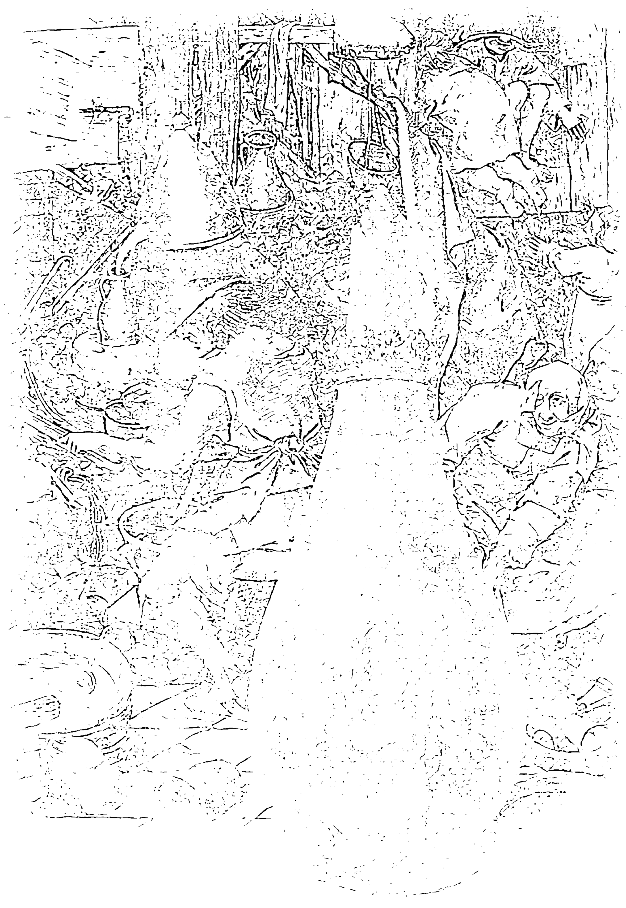

## 探索館

經定型，也不再有什麼新器械和新方法的創造發明了。在後來的拜占庭時期，許多著作雖然一代代繼續傳授早期煉金術士的思想，但煉金術卻依然停滯不前。在這塊土地上，煉金術走到了它的盡頭。

## 揭開煉金術的秘密

## 二、揭開神秘面紗——阿拉伯煉金術

當歐洲的煉金術士們看不清未來時，八世紀中葉，一個版圖遼闊的阿拉伯帝國出現了。它的科學文化為人類帶來了新的起色，其中比較突出的學科大致是：數學、天文學和煉金術。

在煉金術流傳到阿拉伯國家之後，古代埃及高度發達的化學魔術為它增添了神奇的力量。不過，古代埃及人並沒有向它提供任何理性的思想或理論，而只是在技術上進行了很多改進，例如，按處方配製添加劑、舉行宗教的魔術儀式、製作木乃伊等等。但是，當古希臘的哲學思想和古代埃及的化學技術結合起來時，真正的煉金術便在這種結合中誕生了。

阿拉伯煉金術是希臘煉金術的移植，也受到中國的影響。在希臘，將一些金屬通過人工努力，提前加快其「演變成金」的速度，這一思想從柏拉圖起就很明確。到阿拉伯時期，煉金術得到發展，實驗中開始引入了定量分析。阿拉伯人認為水銀可以使金屬互變，他們對很多物質進行了實驗，大大提高了蒸餾等化學技術。在八世紀時的札比爾等人的著作中，記述了從中國傳去的神秘藥丸，據說它可以使金屬變成金子；同時，書中還列舉了風箱、火爐、坩堝、燒瓶等實驗裝置，敘述了對各種物質的燃燒、昇華、熔解等處理方法。雖然煉金術本身的科學意義是否定的，但它的確越來越有後來的化學的影子。

按照傳統的說法，創立阿拉伯煉金術的人，可能都不是煉金術士。西元十世紀時的煉金術士，

這是煉金術士實驗室中的真實一幕。實驗室中其實並沒有什麼神秘而詭異的擺設，相反，它更像是一座小的化學工廠。煉金術士和他的學徒們長年累月地在實驗室中辛勤勞作，以期望能得到神靈的眷顧——親手製出真正不朽的黃金。

在下圖中，學生們在大師嫻熟的指導下專心操作。一個學生坐在左邊，檢驗重量是否準確；另一個站在灼熱的爐前，直接在火上操作。兩人前後的擱板上擺放著各種器具，有蒸餾器和蒸餾釜、長頸甌和圓底燒瓶，鼓風用的皮老虎和夾鉗、坩堝，以及極為寶貴的「分離」錘。

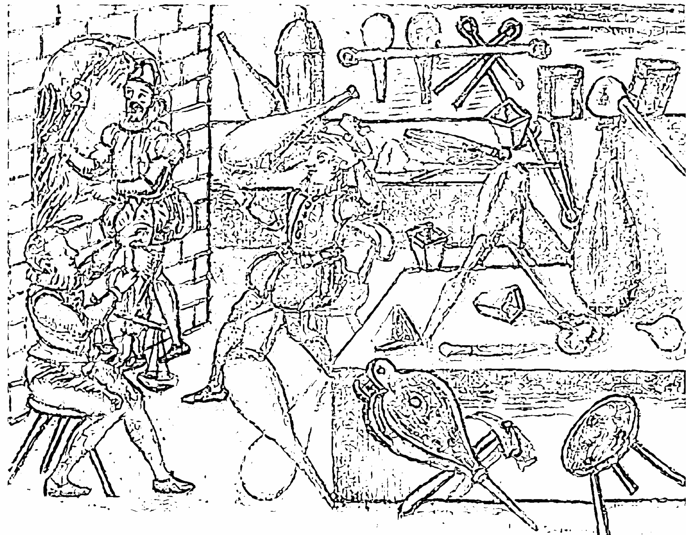

## 揭開煉金術的秘密

大都是些比較顯赫的人物。他們的著述有著固定的格式，他們的某些思想傾向和現代思想有著驚人的相似之處。後世的阿拉伯煉金術士認為他們那門學問的開山始祖是哈利德·伊本·亞連德。繼哈利德之後的第二位煉金術大師是札法·阿爾·沙迪克。文獻還表明，札法成為煉金術大師後，又培養出據說在西元九世紀名噪一時的最傑出的阿拉伯煉金術士札比爾·伊本·海揚，歐洲人稱他為伯格，他也被稱為「化學之父」。札比爾去世二百年之後，人們意外地發現了他的煉金術地下實驗室，在那裏人們發現了很多實驗儀器和一個二·五磅重的金臼子。於是全城震動，人們傳言他是個真正的煉金術士，他的作品被人們傳抄。據說有很多關於煉金術的手稿，不論真假都冠以札比爾的名字，編入了《札比爾文集》。正是那些據說是札比爾·伊本·海揚所寫的《札比爾文集》，給阿拉伯煉金術打下了比較堅實的基礎。這些著作彙編成一部包羅萬象的巨著，其中有研究煉金術、占星術、宇宙論和神秘主義的作品，後世的阿拉伯煉金術士對此深信不疑，認為札比爾是穆斯林世界的煉金術大師。札比爾的名聲遠揚西方，他的那些著作對西方的煉金術理念產生了極大的影響。

翻開《札比爾文集》，可以看到他的基本思想仍然淵源於亞歷山大里亞的希臘煉金術士，還可一直上溯到亞里斯多德的學說。札比爾的「物質」概念的基礎，就是亞里斯多德的火、土、水、氣四要素說，但札比爾認為物質還存在四種性質，即熱、冷、乾、濕。四要素中的兩種要素互相結合，形成世上的各種金屬，並使金屬具有相應的特性。這類特性被稱做「外」質。此外，金屬還含有另外兩種本身固有的性質，即所謂「內」質。例如，黃金的外質是熱和濕，內質是冷和乾。冷和乾又是白銀的外質。只要使白銀顯示出和黃金一樣的內質，就能把白銀變成黃金。要做到這一點，

## 探索館

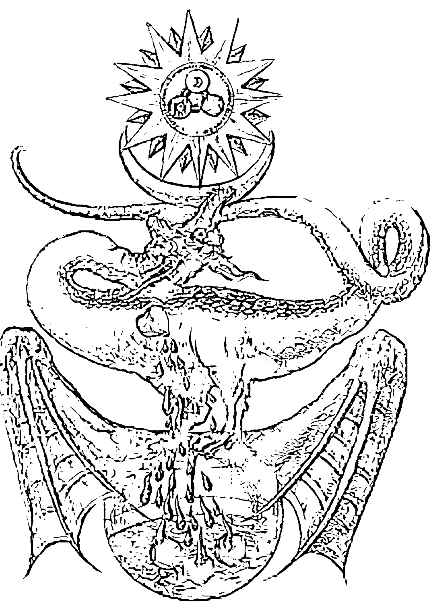

必須使用「煉金藥」。

「煉金藥」這種東西，在希臘煉金術中從沒有明確提到過。中國煉金術士則經常談到它。金丹正是中國煉金術體系的主要組成部分。由此可見，東方煉金術和西方煉金術這兩大流派，很可能在東西之間的阿拉伯世界發生過接觸和融合。札比爾綜合了來自這兩種煉金術體系的對立面學說，認為硫和汞既然基本性質互相對立，所以是直接構成金屬的兩大成分。這種學說後來長期流傳。

札比爾在長期的煉金術實驗中發明了很多不同的煉金藥液，這些煉金藥液可適用於不同的金屬轉換。換句話說，每一種金屬的物質轉換只能由一種煉金藥液所引發。例如，有一個名叫杜拜斯·伊本·馬立克的煉金術士曾講述了一個故事，來例證這種煉金藥液的不同等級和作用力。他說：

「我住在安狄奧克，並且早已在那裏定居下來。我有一位從事珠寶生意的朋友，我經常到他的商店裏去。有一天，當我們正在一起坐著談話時，有一個人走了進來。他打了一聲招呼後就坐下了。過了一會兒，他從胳膊上褪下一個臂鐲，並把它遞給我的朋友。我的朋友拿過來一看，上面鑲

## 揭開煉金術的秘密

嵌著四顆寶石，還配有一個赤金的護身符。在護身符上鑲嵌著一行用綠寶石組成的小字，上面寫著：阿爾·哈希姆·比·阿木里拉敬奉真主（阿爾·哈希姆是埃及的統治者）。我對這些寶石的成色深感震驚，像這樣的珠寶我以前從未見過；我從未想到在世界上能夠看到這樣的珠寶。而且在我看來，這個護身符一定是從阿爾·哈希姆的寶庫中偷來的，或者可能是從他的胳膊上掉下來的，而這個人恰好把它撿起來，因為這樣的寶石只有在國王的寶庫裏或他們的法定繼承人那裏才能找到。

最後杜拜斯花了三千第納爾把它買了下來。在這個護身符裏他發現了一個手稿。因為杜拜斯熟悉哈希姆國王那略帶顫抖的筆跡，知道這是國王親筆所書。內容是講述製作紅色煉金藥液的兩種方法。據說杜拜斯根據手稿的描述成功地煉製出煉金藥液。用第一種方法製成的煉金藥液能夠把比它本身重五百倍的賤金屬轉換成金子；用第二種方法製成的煉金藥液能夠轉換三千迪拉姆的賤金屬。

這當然只是一個傳說，其真實性並不足信。不過，為了進行物質的轉換實驗，煉金術士們確實用各種方法嘗試過煉金藥液的配製。我們知道，亞歷山大里亞和西方的煉金術士一般都喜歡用礦物質來製作金屬轉換的煉金藥液。但是，札比爾在這方面作了重大的改革，他除了使用礦物質之外，還使用動物和植物，來進行煉金術的實驗。在動物方面，他使用過骨髓、血液、毛髮、骨頭、獅子尿、蛇毒、狐狸、牛、瞪羚、驢等，這些動物既有家養的，也有野生的。在植物方面，他使用過附子、油橄欖、茉莉、洋蔥、胡椒、芥菜、梨、銀蓮花等。

在製備煉金丹的過程中，很強調對植物物質，尤其是對動物物質的使用，這是札比爾體系的一

## 探索館

大特點。札比爾和大多數其他阿拉伯煉金術士一樣，在工作中十分重視鹵砂，這對希臘人來說是一種陌生的物質，原指埃及安曼神殿附近出產的一種岩鹽。鹽的揮發性，顯然給阿拉伯人留下非常深刻的印象，引起了他們的極端重視。也許正因為這類鹵砂中有的來自動物體，所以札比爾體系才這樣重視動物物質。

札比爾的著作中很多地方都涉及到化學操作。希臘煉金術在許多製作過程中應用了各種蒸餾術，但是並沒有像札比爾那樣廣泛地用來蒸餾動物物質。札比爾的著作講到一大批動物物質的分解蒸餾。蒸餾的結果幾乎總是生成氣體、易燃物、液體和灰燼。結果正和氣、火、水、土一一對應，而與四元素觀念恰好相互吻合。這些「元素」本身被視為由兩種性質組成，其中一種佔據優勢，兩種性質又都是「和物質」，也就是類似於亞里斯多

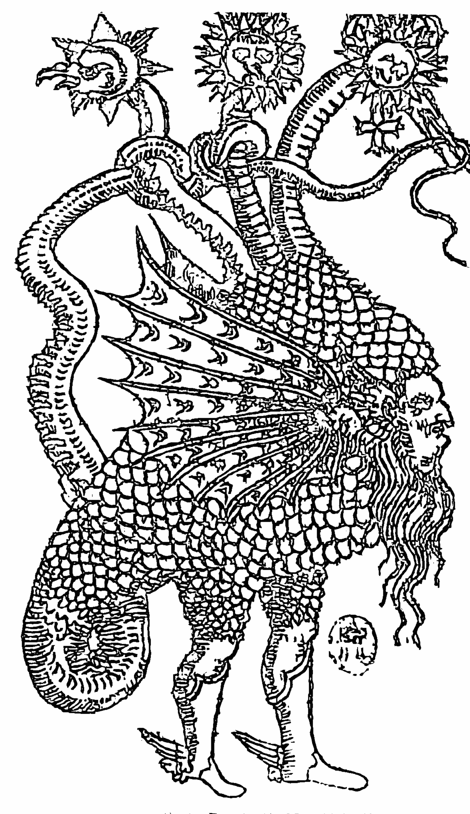

## 揭開煉金術的秘密

德所說的某種「原初物質」。可見，通過連續的蒸餾過程，就能將各種性質分離出來。在蒸餾過程中，最好再加進一些能吸收某種性質的物質。這類操作推動他們採用了各式各樣的器具，《札比爾文集》就載有記述當時的煉金術士使用的實驗裝置的大量說明。

可以看出，札比爾的煉金術理論，比任何一種流傳至今的希臘煉金術思想都要精確合理得多。他對物質進行的分類，也同樣表現出思維的條理性和明晰性。礦物被分為以下幾類：一是「精英」，即遇火會完全揮發的物質；二是「金屬體」，即可以鍛薄，並能在錘鍛時發出響聲的易熔物質；三是「礦體」，即在錘鍛時會發生破裂和變成粉末的易熔或不易熔的礦物。精英類包括硫黃、砷、汞、鹵砂和樟腦。金屬體包括鉛、錫、金、銀、銅、鐵和一種成分不明的合金「中國銅」。這種按基本物理性質劃分物質種類的傾向，是大部分阿拉伯煉金術士的顯著特點。

札比爾在把賤金屬轉變為貴重的黃金的實驗活動中，對煉金術的過程作了很多化學觀察記錄。他個人認為這些觀察是非常有趣和有用的。今天，我們可以通過這些記錄，看到他的冶煉活動的歷史事實。例如，在他的《智慧寶庫》一書中，他最早提到了製作硝酸的秘訣。在另一本書裏，他還提到了銅複合物在冶煉過程中發出的綠色或黃色火焰；他還提到了煉鋼和精煉其他金屬的過程；給布匹和皮子染色的過程；製作防水、防腐的布料，製作閃光墨水的過程；他還提到在製作玻璃時使用二氧化錳；他還知道怎樣通過用醋蒸餾來製作醋酸；此外，他還詳細描述了煅燒、熔解、純化、還原等冶煉過程。更重要的是，他超越一般煉金術士的高明之處在於，他試圖理解在這些過程中所發生的各種變化及其本質。

## 探索館

穆斯林煉金術的第二位大師也出現於西元十世紀。此人名叫阿布·巴克爾·穆罕默德·伊本·沙卡里亞·阿爾·拉茲，拉丁文的名字叫拉茲。他是最優秀的穆斯林名醫之一，他的著作大部分是談醫術的，但他對化學問題也十分重視。在化學研究工作中，他運用了前所未見的實用科學方法。在此後的五百年間，一些傑出的醫生在推動化學前進、使之成為一門科學的事業中作出了重大貢獻，而阿爾·拉茲就是他們中最早的一個。

他寫下不少煉金術著作，其中以《秘密的秘密》最為馳名。儘管書名如此，但它其實是一本工藝製方的集冊。這本書反映了一個事實，即阿爾·拉茲對煉金術神秘的和隱喻的表現手法絲毫

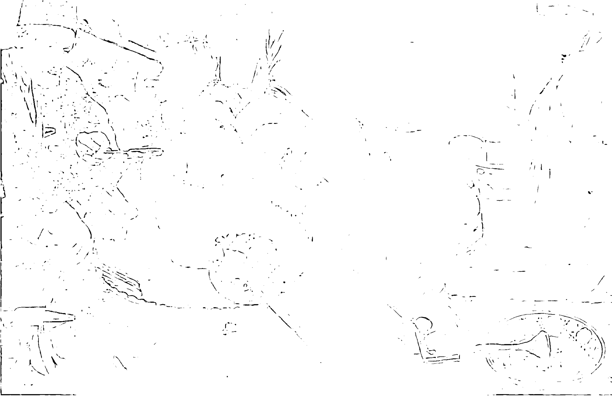

## 揭開煉金術的秘密

不感興趣。雖然他也相信金屬衍變是可能的，但他首先是一位注重實際的化學家。從書所見，他所使用過的主要設備有：傾口的燒杯，長頸瓶，小玻璃瓶，各種盆、玻璃晶體板和罐子；加熱蒸發器、蠟燭燈、石油燈、火盆、熔鐵爐、精煉爐、銼刀、刮刀、鐵錘、鑄勺、大剪刀、鉗子、沙浴盆、水浴盆、蒸餾器、漏斗、蒸斗、蒸餾瓶、搗錘、研缽等。此外，拉茲還詳細敘述了製造更複雜設備的一些過程。在他的儲藏櫃裏擺放著不僅有當時人們所能知道的所有金屬的樣本，還有很多用於煉金術實驗的原材料，例如，硫化鐵礦石、土耳其玉石、鉛礦石、錦礦碳酸鉀、朱砂、白鉛、紅鉛、氧化鋁、氧化鐵、氧化銅、鹼性碳酸銅、醋等。

《秘密的秘密》一書共分三個部分，分別討論了物質、儀器和方法。物質的分類非常精細，和札比爾的分類法大體相似，即有：揮發性精英、金屬體、岩石、磐、硼砂和鹽類。書中載有製取這些物質的大量配方。

值得特別提出的是，札比爾和阿爾·拉茲兩人的著作全都行文明快，擺脫了神秘主義和隱喻手法的羈絆。他們的著作自然受到那些非常注重實用的煉金術士的欣賞，因而對後世阿拉伯和西方的煉金術士產生了巨大影響。他們的物質分類法和關於各種器械、方法的描述，被人們廣泛傳抄。這兩位著作家不謀而合，都認為金屬衍變具有現實的可能性，不過他們並沒有像神秘主義者那樣，把「衍變」視為自己理論體系的核心。

西元十世紀末，希臘的物理學和數學著作傳入西班牙，大約在同一時期，札比爾和阿爾·拉茲的著作也傳到西班牙。當時統治西班牙的阿拉伯人被稱為摩爾人。據說摩爾人的著名占星術士馬斯

圖中的煉金術士注視著統一而和諧結構中的整個煉金術工作。正中，一隻蟾蜍寓意所選定的礦物主體，有時則畫為龜或身披鱗甲的龍，兩者含義相同，都是「存在於鉛的各個部分中和對大自然方式中的二律背反的物體」（阿爾特爾斯〔Artephius〕）。它涉及「有如礦物土的混沌氣，當人們細細觀察它凝固時，它還是易揮發的空氣，因為其內部中心是煉金術士的天國」（菲拉萊特〔Philalete〕）。在煉金理論中，「藉助與上帝同樣的方法的煉金術士在創造之初，必須在自身混沌中擁有物質」。

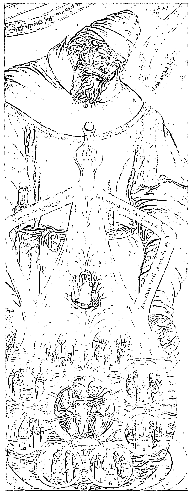

## 揭開煉金術的秘密

拉馬·阿爾·馬奇里梯寫下了第一本西班牙文的煉金術書籍。他的學生把許多煉金術著作介紹到西方，從而促進了煉金術思想向西方的傳播。

在西元十一、十二和十三世紀中，許多煉金術士寫下一些原著，注釋過不少古籍，但他們對西元十世紀的那批偉大化學家的工作幾乎沒有增添什麼新的內容。這一期間，神秘主義色彩較濃的思想盛行一時，因此，煉金術化學成為一門真正科學的希望終成泡影。而早期遲遲未能接受希臘科學思想的西方世界，卻在這時把阿拉伯人傳播的理論繼承下來。因此，這門神秘的科學才沒有失傳。

阿拉伯人傳播了煉金術的真正創立者——希臘化時期煉金術士的思想，但這絕不是阿拉伯人的唯一貢獻。他們把亞歷山大里亞和中國傳來的思想結合起來，為煉金術提供了硫—汞物質結構理論的明確闡述，對「金丹」（某種意義上等同於「哲人石」）的學說作出了清晰透徹的補充說明。又由於受到中國的影響，他們澄清了「哲人石」的療效概念，認為「哲人石」既然能夠治療「患病」的金屬，想必也能醫治人的疾病。在實用方面，他們發現了鹵砂，製出了苛性鹼，認識到動物物質的特性和它們在化學上的重要作用，廣泛運用這些物質的分解蒸餾法，作為分解出這些物質的「基本成分」的手段。他們對無機物的分類，已成為後世西方世界採用的大多數理論體系的基礎。阿拉伯煉金術士在化學方面的功績，遠遠超出了人們的通常估計。他們對煉金術的發展作出了不朽的貢獻。

## 三、點燃永生之火焰——歐洲煉金術

煉金術應該屬於流傳最為艱難的學說。由於講拉丁語的歐洲渴望探索宗教智慧，煉金術學說在中世紀的早期歐洲並沒有得到關注，只在十二世紀開始，才從伊斯蘭國家傳入。最終促使煉金術漸漸在中世紀的歐洲廣為傳播的因素主要有四個：

- 第一，在七世紀的時候，阿拉伯人征服並長期佔領西班牙，在此期間煉金術學說被介紹和引進到了歐洲。
- 第二，隨著煉金術學說最核心理念的成熟，希臘化的拜占庭成為收藏煉金術著作的重要中心——那裏有著洋洋大觀的煉金術書籍。
- 第三，原本在內陸生活的阿拉伯民族的東方神秘思想，與煉金術大有淵源。而其背後的原因正是十二世紀前往巴勒斯坦的十字軍和聖殿騎士團傳播了煉金術學說。
- 第四，阿拉伯人曾經在西元九○二到一○九一年間在西西里島定居，在義大利南部地區的

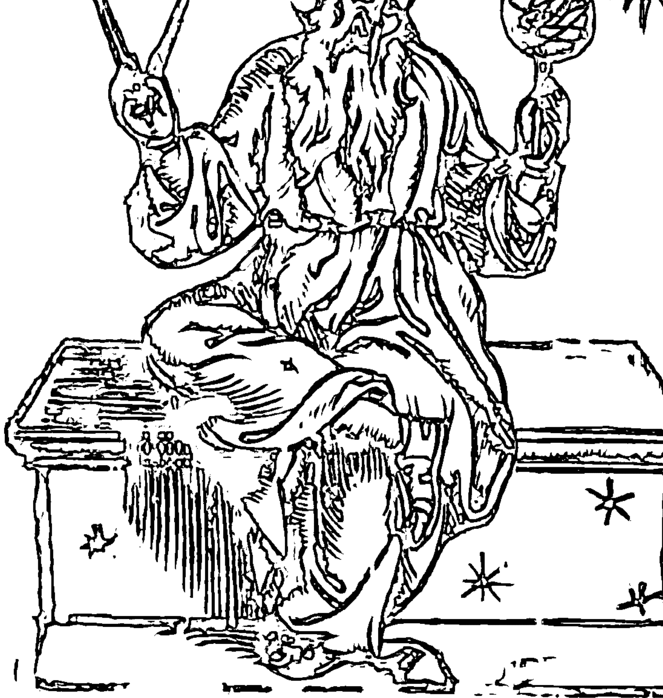

## 揭開煉金術的秘密

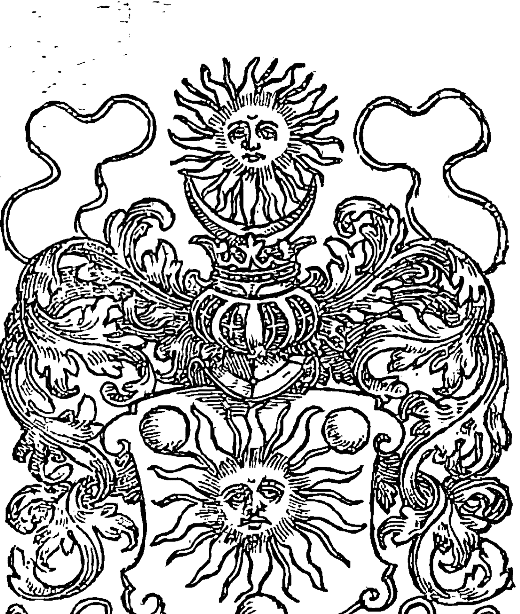

語言和思想上留下痕跡，並且出現了希臘口頭流傳下來的教義。這些神秘要素因為與古代學說相遇受到影響，而古代學說已經成為伊斯蘭民族的遺產。

一般來說，一一四二年被公認為是煉金術傳入西方的日期，那時曼徹斯特的羅伯特翻譯了詳述摩利努斯和哈利德故事的著作，他宣稱拉丁語世界中還沒有人瞭解煉金術學說。在那些被古代著作收錄其中的各種形式的學說傳入歐洲之後，煉金術學說才步其後塵而來。這些論著的最早版本可能都是由阿拉伯文寫成的，隨後便有淵博的隱居教士把這些論著從阿拉伯文譯成了拉丁文和希臘文。就是這樣，煉金術離開了阿拉伯人的寺院到了西方，並且掀起了巨大的波瀾。

在中世紀的歐洲，只有教士才有接受文化教育的機會，於是煉金術成為了宗教階層的特權，赫爾墨斯學說重新回到了宗教的懷抱。

中世紀居住於亞西的薩林姆貝內曾在編年史中描述了煉金術口耳相傳的教義在方濟各會（天主教托缽修會之一，又稱「灰衣修士」）的遭遇。這部編年史中講到了一名叫埃利的修士的生平，這個人在一二一七年動身去聖地傳教，在這個煉金術的誕生之地接觸到了煉金術的奧秘。據人們所知，十三世紀中期，成為了方濟各會會長的埃利，把煉金術學說在方濟各會修士中間廣為傳播，促進了這一門「神聖藝術」

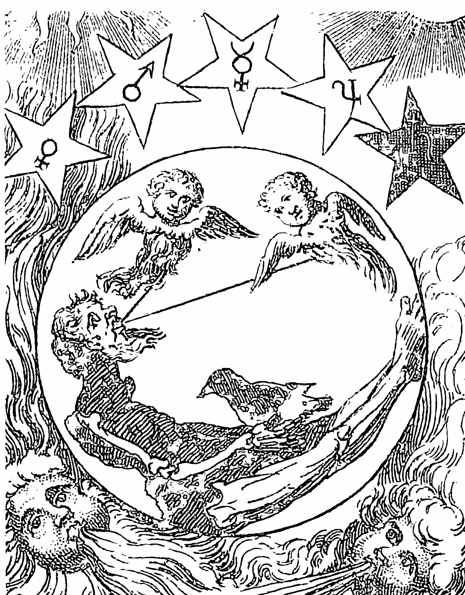

煉金術士老人說：「我的靈魂撕裂……死神摧毀我的肉體，折斷我的骨頭……靈魂和精神棄我而去。我成了令人厭惡之物，就像黑烏鴉……我的體內有鹽、硫和汞，讓它們昇華、蒸餾、分離、純化、凝結、固化、焙燒和清洗吧，這樣可以除去糟粕和污垢，重新變得十分潔淨。」（《煉金術的十二個秘訣》）

## 揭開煉金術的秘密

在西方的重大發展。

這中間出現了許多傑出的人物，比如創作了大量煉金術著作的達西斯，是他使煉金術在操拉丁語的西方得到了重大發展。他是《混合物之書》的作者，被稱為「學者、機敏的人和聰明過人者、過著誠實而神聖生活的人」。還有羅貝爾·格羅斯泰德，他在牛津出版了方濟各會的煉金術著作，而且他培養出了當時最傑出的知識份子——培根，這位博學的大師對於神秘主義、星相學，特別是煉金術抱有濃厚的興趣。他充滿獨立和實驗精神，是遭到教會迫害的第一位煉金術士，後來又作為異端分子被關入監獄。在一二九二年的時候關於他的傳聞突然神秘地消失了，在他去世時，煉金術士生命不朽的神奇傳說已經廣為流傳。

還必須提到培根在方濟各會的弟子，同

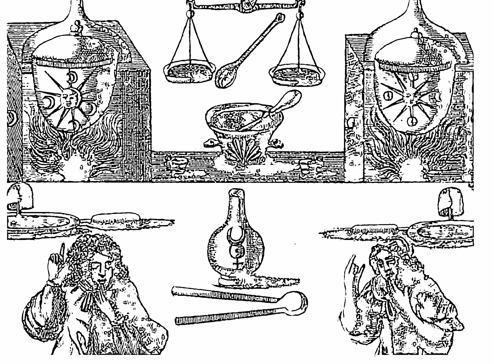

## 探索館

時也是出色的醫生，星相學家和煉金術士的亞諾爾特·德·威蘭諾瓦，他因為創作的著作中存在大量的預言而被宗教當局判定有罪，最後死在獄中。

就在方濟各會的教士們因為煉金術的緣故而飽受迫害時，一個傳說將聖多明我會（天主教托缽修會之一，又稱「黑衣修士」）也牽扯進有關煉金術的事件中來。一二五〇年前後問世的文森特的《偉大之鏡》，被視為當時最重要的煉金術著作之一。據說，聖多明我會因為從事煉金術實驗而向外界證明了其自身的實力與影響力，他們宣稱在中世紀的尾聲造出了點金石，並且把這一秘密傳授給了煉金術歷史上著名的大師阿爾伯特。隨後阿爾伯特又轉授給了他的弟子湯瑪斯·阿奎那，而在阿奎那的著作中，確實曾對煉金術實驗進行過認真的描述。

就這樣，在十三世紀末期之前的歲月中，各個不同派別的宗教寺院中的修士們，在相對安靜平和的環境中研究並且實踐著煉金術。在那些神聖的場合，這種神聖的藝術被看做是自然哲學的一種，而自然哲學則是對《創世紀》的模仿，把信仰它的人們完全引向了對上帝的崇敬。可是教會對於煉金術的默許態度因為兩件事而發生了改變，首先是一些進行煉金術實驗的修士被判定為異端分子，其次是出現了一個新的由學者組成的等級，這個等級並非來自於教會而是世俗社會的各個階層。

據說，因為上述原因，教皇約翰二十二世便在三一七年頒佈法令禁止製造和銷售假黃金，目的是想迫使修士們不再進行煉金術實驗。這也正好證實了當時煉金術流行的程度，而且一些自認為煉金術士的人中開始出現騙子。在修士閉門研究兩個世紀後，煉金術重又回到塵世。隨著它的普及，

## 揭開煉金術的秘密

威尼斯馬爾恰納圖書館收藏的手稿，有一段具有懾服力的誓詞。根據傳說，它是阿馬埃爾向俄賽裏斯之妻伊希斯口授的，其誓詞如下：「我以天、地、光明與黑暗的名義起誓，我以火、氣、水和土的名義起誓，我以土星、豹頭人身神、叫喊的雪爾庫洛波羅斯龍和地獄看守刻耳柏洛斯三頭猛犬起誓，我以冥河上渡亡靈之神的名義起誓，除了向我高貴而可愛的兒子，不向任何其他人洩露這些話。現在，去找農夫，問他有關播種和收穫的事情吧。從他那兒，你會知道，種小麥者得小麥，種大麥者得大麥。你會由此得出創造與繁殖的概念。你會想到，人生人、獅生獅、狗生狗，因此，金子會生金子，而這就是全部的秘密！」

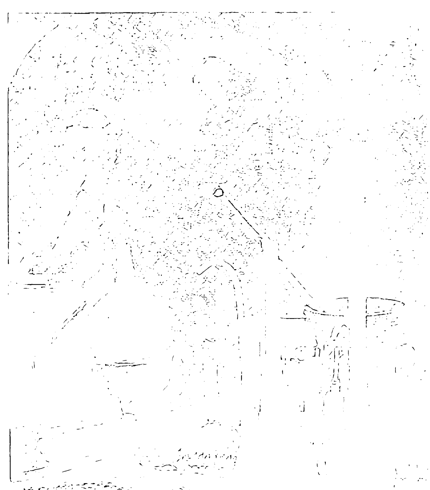

## 探索館

假冒者和騙子越來越多。這些人並未掌握「神聖秘密」的鑰匙，而是把煉金術「世俗化」，當成非法斂財的工具。

為了挽回煉金術學說的墮落命運，幾位傑出的煉金術大師挺身而出捍衛他們的事業。這其中有英國的煉金術士約翰·戴斯汀，他直接給教皇寫信告訴教皇他的重大發現，還有英國西敏寺教堂修道士約翰·克里墨和《煉金術之修正》的作者理查。此外，還應該提到義大利人彼德羅·博諾、創造巴黎聖母院柱廊上煉金術淺浮雕的巴黎的紀堯姆、參與編寫《玫瑰的故事》的德·梅安，以及《翠玉錄》的傑出注釋者奧爾托拉努斯。

煉金術在這個時期突飛猛進，當時還流傳著關於一位煉金術大師的神秘傳說。原本是普普通通的巴黎抄寫員尼古拉·勒梅和他的妻子潘乃麗，得到了一本奇特而神秘的煉金術論著——《猶太人亞伯拉罕之書》，他們經過一番痛苦而艱苦的探索，終於洞悉了這本書的奧秘，並且成功地進行了煉金術操作，得到了「點金石」，從而獲得了永生。

煉金術在文藝復興時期迎來了它的黃金時代。為了復興羅馬的榮光所進行的革命，這個時代徹底洗刷了整整十多個世紀的沉寂，藝術與科學界都產生了眾多令人眼花繚亂的成果。宗教也經歷了巨大的變化，新教在十六世紀上半葉完成了重組。有趣的是，此時

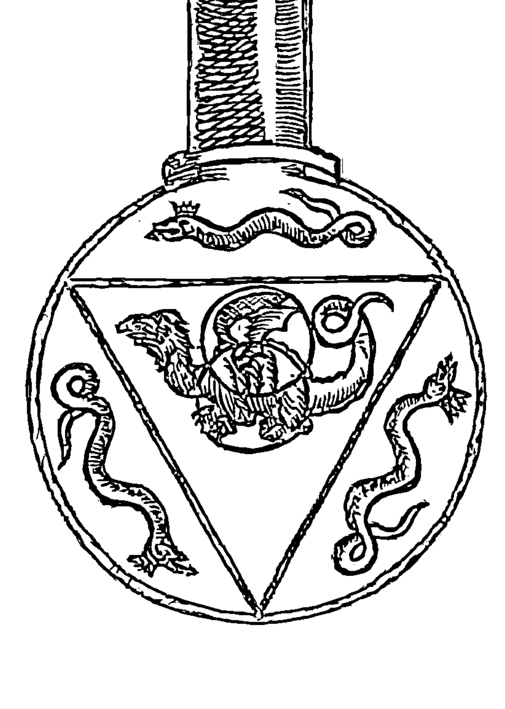

## 揭開煉金術的秘密

的煉金術分成了三個部分：一部分是科學，一部分是藝術，還有一部分屬於宗教。而煉金術在追求「點石成金」的同時，因為他們所進行的艱苦而複雜的實驗，催生了現代化學。

隨著文藝復興的社會思潮變化，科學研究從煉金術實驗中正式分離開來，成為了獨立完整的學科。

如果說對於煉金術的熱情出現於十四世紀，那麼席捲整個歐洲的對煉金術學說的狂熱則產生於十五世紀。在文藝復興的年代裏，所有的歐洲宮廷都歡迎星相學家和煉金術士的光臨，有關煉金術的著作在任何一所圖書館都找得到。熱衷的探索者擁有了越來越精確的工具和指南，便有了更充足的勇氣去準備實驗。

這個世紀，數不清的煉金術大師和論著都證實了煉金術在此時處於它的輝煌的頂點。應當提到的傑出人物有天主教教士特里泰默，荷蘭人以撒，英國人諾頓和里普利、蘭姆斯普林克和斯特拉斯堡的奧拉希、司庫克爾，卡拉布里亞修道士拉齊尼以及貴族特雷維塞，後者因為在長達五十六年時間中潛心研究點金石而名馳遐邇，成為煉金術士堅忍不拔和不屈不撓精神的典範。曾經有個傳說，講述了一四一三年間愛爾富特本篤會修道院的一位修道士的故事，他通過研究曾經創作了《煉金術的十二個秘訣》的巴西爾·瓦倫丁的手稿，並且最終獲得了成功。

到了十五世紀的後期，因為西班牙猶太人向整個世界遷移，以及因為君士坦丁堡衰落使得拜占庭人的大量湧入，煉金術在義大利得到了傳播。連義大利宮廷都對煉金術崇拜得五體投地，權貴們都成了煉金術士的保護人。在佛羅倫斯，馬希爾·菲奇提供了《煉金術文集》的譯文本和勘誤

## 探索館

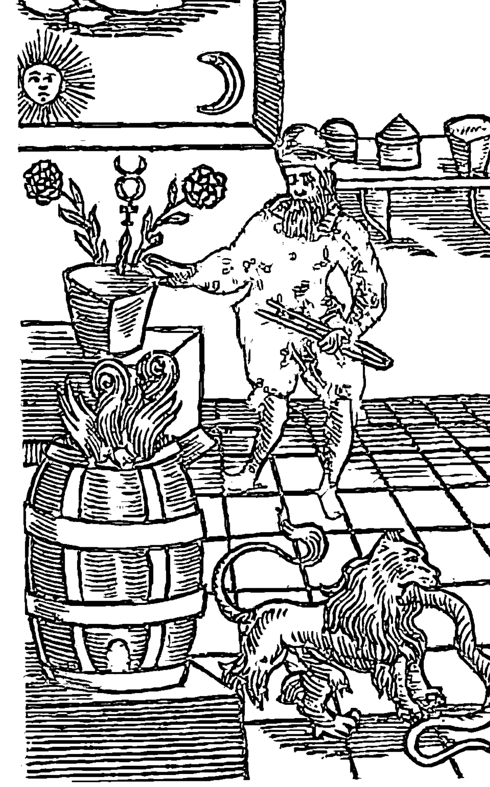

本。皮克·德·拉米蘭朵拉致力於研究煉金術詞義。在范拉萊，博爾索·德斯待成了各形式秘傳學說的保護人，而煉金術列於他所庇護對象的首位。在烏爾比諾，費代里科·達·蒙泰費爾特羅的兄弟奧塔維亞諾·烏巴爾迪尼本人也是煉金術士。

那些原本資助文學藝術的貴族們開始庇護煉金術工作，使得這門學說得到了巨大信賴和支持。同時欺世盜名的騙子也越來越多，幾乎任何人都可以自稱是煉金術士。就在這最輝煌的頂點，煉金術開始走下坡路了。大量頂著煉金術名義的騙子和假冒者，以及他們導致的許多明顯的失敗讓人們對煉金術產生了懷疑，漸漸地煉金術的偉大理想被人們貶低為異想天開，隨後這些赫爾墨斯學說的信奉者們開始經歷兇險的動盪歲月，以事實為基礎的理性主義讓他們備受衝擊，宗教裁判所把他們毫不留情地驅逐出了教會。

在十六世紀這個動盪的時期裏，只有幾個引人注目的宮廷裏存在著煉金術活動，那裏成了秘傳學說和煉金術的活動中心。其中最為著名的是倫敦伊莉莎白一世宮廷。在那裏占星家約翰·德伊，這位偉大的煉金術士和金屬衍變的虔誠信奉者受到了保護和歡迎。其次是哈布斯堡的魯道夫二世，

## 揭開煉金術的秘密

他比其他人更支持古老傳統學說的哲學與理論。為了研究煉金術，他隱居在布拉格哈德卡尼城堡，試圖把首都改造為新的亞歷山大里亞。在那裏他集中了一大批占星家、星相學家和煉金術士，魯道夫二世把這座城市變成了一「魔法之都」，甚至在城內專門開闢出一條街作為煉金術士的集中地，這條街被命名為「金街」。

在十七世紀，因為政府和宗教機構的禁止和迫害，煉金術士們大都處於地下狀態，那些想瞭解煉金術學說的人們為了得到前輩的指導，處心積慮地到處搜尋著煉金術士們。煉金術士被迫處於極其秘密狀態的黑暗歲月。在整整近百年的時間裏，煉金術彷彿消失了一般平靜，沒有什麼偉大的煉金術大師出現，也從未出現過哪位大師獲得實驗成功的傳聞。

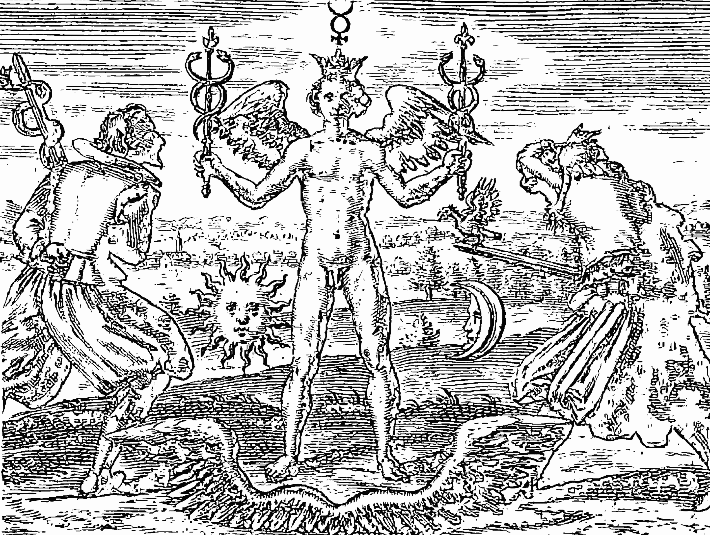

## 探索館

十八世紀是理性的世紀，人們為確定理性的合法邊界展開激烈鬥爭，這使得煉金術的世界更加狹小了。在拉瓦錫等一批現代化學家的努力下，科學化學誕生了，這個與煉金術相對應的學說其實仍受到了煉金術的深刻影響。

在這個科學與理性的世界裏，終於幾位堅持煉金術的傑出人物實現了金屬的轉化，其中最為著名的便是伊薩克·牛頓，他也被稱做「最後一位煉金術士」。有人這樣評價這位偉大的科學家和煉金術士：「他不是理性世紀的第一人，而是最後一位占星家，最後一位巴比倫人和蘇美人，最後一位偉人，他用與近一萬年之前的先人同樣的眼光，深入到可見物質世界與精神世界的內部，而正是這些先人，在開天闢地之初構築了我們的精神遺產。」

在十九世紀，煉金術神祕大師和他們難以置信的奇遇開始層出不窮，這和過去習慣於清靜和內斂的煉金術規則有很大的不同。許多煉金術士都在大肆傳揚他們的成就。聖日爾曼公爵克洛德·路易竭力使歐洲各個宮廷都相信他已經製造出一種具有神奇效果的液體。而他的一個學生——卡廖斯特羅公爵約瑟夫·巴爾薩莫努力使人們相信他已經獲得了永生的秘訣，說他已經是三百二十五歲的高齡了。

可是在這個科學發展的時代，煉金術的影響正日益地萎縮。雖然如此，到了二○世紀，一位名為富爾卡納利的神祕人物出版了《大教堂的秘密》和《煉金術士住所》兩部著作，仍然引起了西方世界的轟動。而他的學生歐仁·康瑟利耶的研究重新喚起了人們對煉金術的興趣，這說明，煉金術這門偉大或者有趣的藝術仍然沒有消失在歷史的煙塵之中。

## 揭開煉金術的秘密

## 四、陰陽五行的平衡——中國煉金術

中國的煉金術和亞歷山大里亞最早的煉金術一樣，都是哲學和工藝技術結合的產物，彼此有著相似的發展過程，只不過中國的煉金術出現得略早一些。遠東的煉金術和西方的煉金術形式稍有不同，可是類似之處甚多，以致歷史學家們在東西方向究竟誰仿效誰的問題上爭論不休。根據現有材料還不能真正解決這個問題。看來最有可能的情況是：儘管每一種文明都可能將某些思想傳給另一種文明，但事實上埃及的煉金術和中國的煉金術卻是分別獨自發展起來的。

從中國文明的遠古時期起，工藝技術就已經包含有化學。最早發現的金屬有銅、金和銀。黃金則不如在埃及和美索不達米亞古文明時期那樣常見。到了西元前四世紀，其他重要金屬都已為中國人所熟知。他們配製出各種金屬化合物，特別是用煉金術士最感興趣的金屬——鉛和汞配製出許多金屬化合物，金屬和陶瓷器皿的製作技巧也已達到很高的水準。

中國人向來以擅長哲理著稱。早在上古時期，

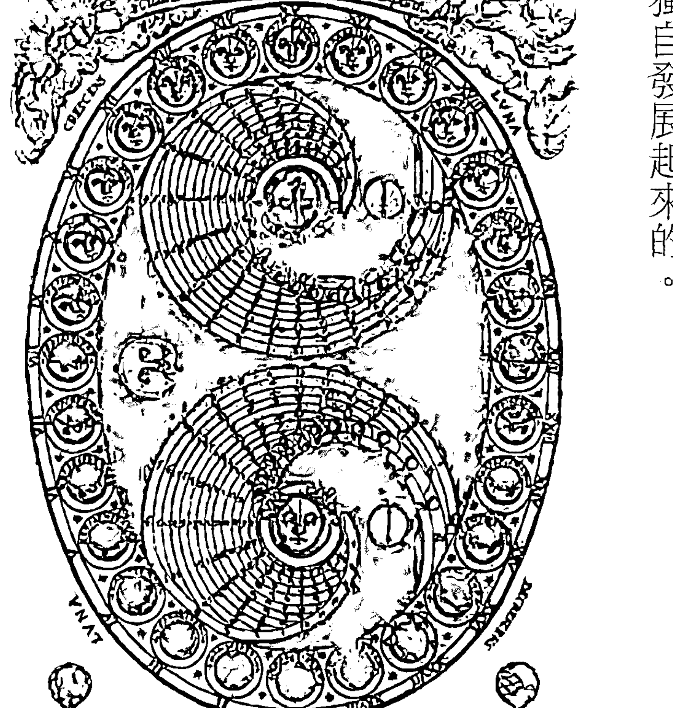

## 探索館

我們就已有了金、木、水、火、土，五行成萬物之說。五行結合以成萬物這個概念非常重要，幾乎天地萬物，諸如星辰、色彩和品德都可劃入這五個範疇。不久又出現了另一種非常重要的思想，即陰陽對立說。古人不是像赫拉克利特的物理學那樣提出一系列對立面，而是將所有彼此相反的事物統統歸結為兩大對立面：陰和陽。

比如晴與雨、寒與熱、天與地、日與月、男與女、靜與動、氣與形等。一般來說，凡是劇烈運動著的、向外的、上升的、溫熱的、明亮的，都屬於陽；相對靜止著的、內守的、下降的、寒冷的、晦暗的，都屬於陰。而且，最重要的是，這二者又是統一的。

西元前的幾個世紀裏，陰陽學說在中國的道家哲學中得到極其充分的發展。道家的創始者是老子。老子哲學的中心思想是，萬物之中存在著一種規律，他把這種規律叫做「道」。隨著歲月的推移，「道」這個玄奧的概念逐漸變得具體起來。「道」者，

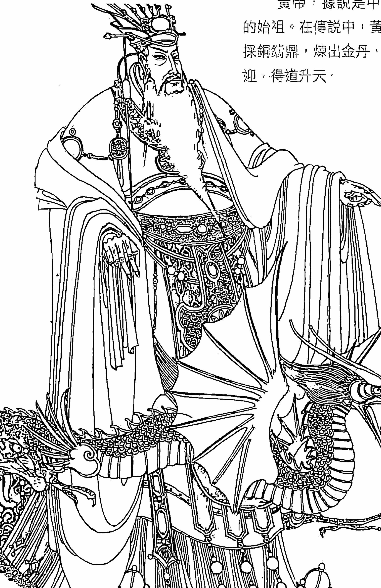

## 揭開煉金術的秘密

「天道」也，也就是能左右宇宙運行的自然法則。這樣一來，「道」就把陰陽五行合為一體。道教信徒們開始用實際操作去尋求「道」的存在。

道教引起了巫術思想，道士們為了自己的好處，極力設法支配大自然，盜取天地造化的精華。

在亞歷山大里亞煉金術興起前的若干世紀，中國的道教信徒就已創造出一套獨特的中國煉金術體系，煉金術已經風靡一時，也和西方的情況一樣，引起了官方的猜忌。西元前一四四年，便頒佈了取締「偽造黃金者」的禁令。西元前五十六年，漢朝大臣劉向公開聲稱要為皇帝煉製黃金，結果徹底失敗。這使煉金術士們更加失寵，因此，煉金工藝在文獻記載中曾一度銷聲匿跡。

然而，煉金術士顯然沒有就此罷手。大約西元一四二年，魏伯陽所著的《參同契》問世。美國麻省理工學院大衛斯教授稱此書為目前所知最早的煉金術專著。「關於魏伯陽和他的《周易參同契》的來歷，還有一段有趣的傳說。

魏伯陽是西元二～三世紀東漢時期的人。他本是名門子弟，喜歡道學之術，而不喜歡為官從政。傳說他曾遍遊名山大川，遇真人傳授煉丹秘訣，並且得到所謂秘笈《龍虎經》，在掌握了書中的煉丹技術之後，他結合自己的修煉經驗寫成了《周易參同契》。魏伯陽在煉金丹的同時，也開門收徒。但是，為了考驗弟子們是否對他忠誠，他便想了個辦法。有一天，他帶領三個弟子進山去煉取金丹。在煉丹成功之時，他告誡弟子說：「金丹雖然煉出來了，但其效用應當先用白狗嘗試一下。白狗吃了如果沒事，人就可以吃這種金丹；如果白狗吃了之後死了，人就不能吃。」於是，他們把金丹給狗吃下，狗果然死了。魏伯陽又對弟子們說：「靈藥尚未煉成，狗因此而死於非命。恐

## 探索館

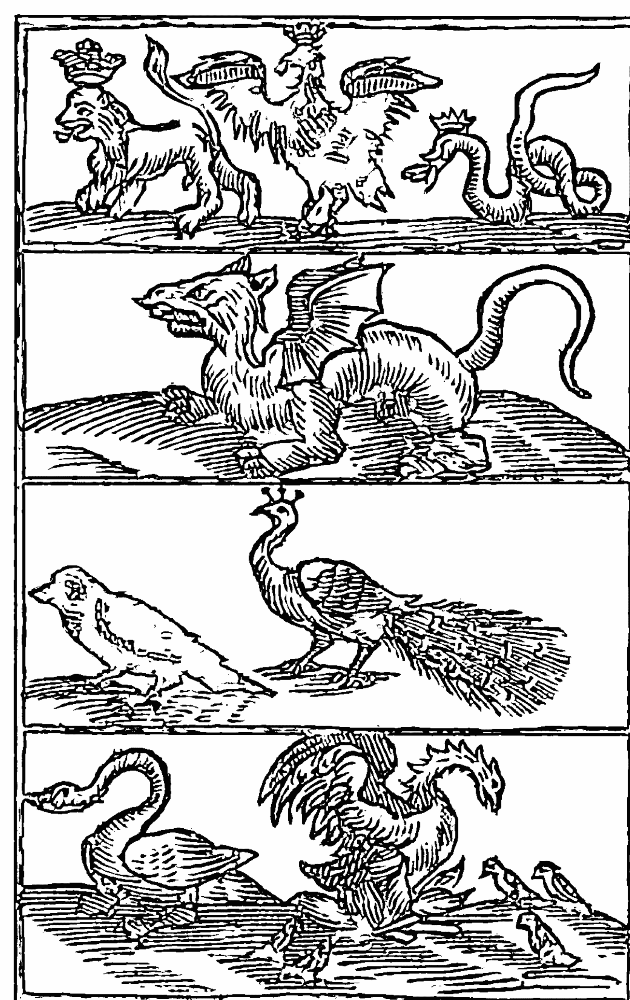

怕我們還沒有弄明白神靈的意思，如果我們吃了金丹，可能也要像狗一樣死去，那該怎麼辦呢？」弟子問道：「是否可以吃這金丹呢？」魏伯陽回答說：「我和世俗人等走的不是一樣的道路。我已經撇家捨業，獨身一人進深山煉取金丹。如果不能煉成金丹，我無顏回家。因此，即使不服此藥活下去，也和服藥而死無異。既然生和死對我來說，沒有任何區別，那麼，我就應該吃它。」說完，他便把金丹吃下，結果立即斃命。

看到這種情況，有一個弟子說道：「我們的師父不是一個凡人，他服了藥死了，他這樣做必然有特殊的目的。」於是，他也仿照師父的樣子吃下金丹，結果也同樣死去。另外兩個弟子面面相覷，他們說：「我們煉取金丹的目的是為了長生不老，如果吃了金丹反而死了，那我們還要金丹幹什麼？就是不吃金丹，我們也同樣能活好幾十年呢。」於是，他們就沒有吃金丹，而是即刻下山，想要尋找棺木埋葬死去的師父和師兄弟。這兩個弟子下山後，魏伯陽就站了起來，並把調製好的藥給「死去」的弟子和白狗服下，把他們救活。然後他就帶著這個弟子和那條狗去過長生不老的生

## 揭開煉金術的秘密

活去了。在路上他們碰到一位砍柴的樵夫，請他送一封信給那兩個下山的弟子。那兩位弟子讀過師父的信之後，後悔不迭，卻已無法挽回。

這個故事當然只是一個傳說，不足以令人信服。但是，它的潛在理論內涵是，煉丹必須心誠。所謂「心誠則靈」就是指做事情一定要有恆心，堅持到底，就能成功。該書運用易理和道家學說探討了礦物製藥的煉丹術，可以表明作者是一位實用化學家。書中還有一段講到中國煉金術的主要目的，表明中國煉金術同旨在仿造貴重金屬的亞歷山大里亞煉金術迴然不同。中國的煉金術士是想製造黃金，但也不單純為了黃金本身。他們相信，凡人服食金丹或某些類似的丹藥，即可長生不老，成為不生不死、法力無邊的神仙。因此，中國的煉金術文獻可分為以下兩

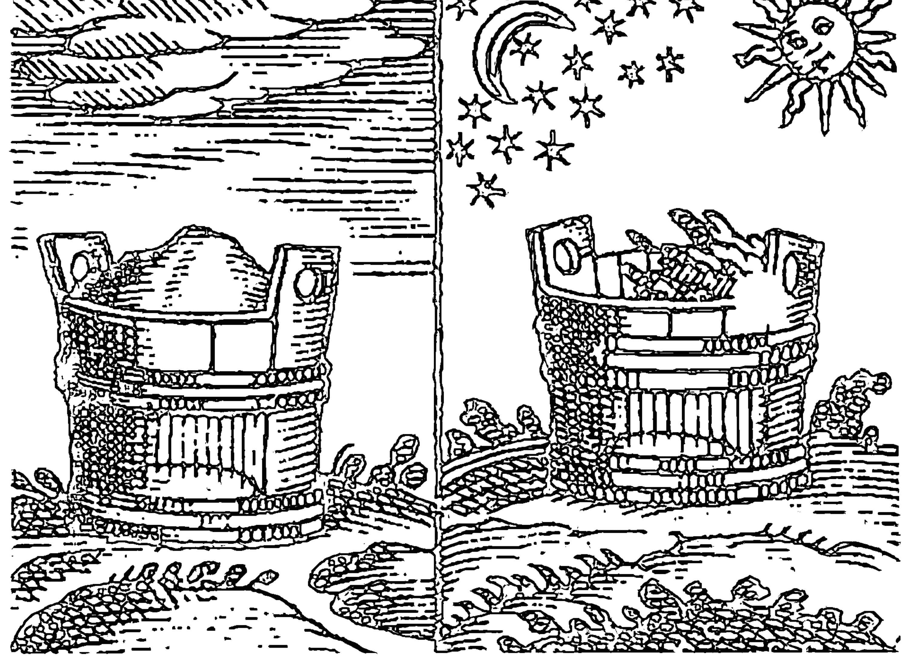

## 探索館

類：使用賤金屬「煉製黃金」術和服用金丹「長生不老」術。這後一種的目的，則是亞歷山大里亞煉金術所根本沒有的內涵。

中國最傑出的煉金術著作是葛洪的《抱朴子》。葛洪（二八四～三六四），字稚川，自號抱朴子，意思是「保留原始樸素的本色的大師」，東晉時期江蘇丹陽句容人，他是三國時期東吳的著名道士葛玄的侄孫，人稱「小葛仙翁」。葛洪的家族地位顯赫，世代都有在朝廷為官者。但是，葛洪在十三歲時，其父在官位上去世，從此，家族敗落。他最初和兩個哥哥在家種地，但同時他也很喜歡讀書，喜歡研究道學知識。十七歲時，他拜煉丹大師鄭隱為師（而鄭隱則是葛玄的弟子）。由於葛洪聰穎好學，深得鄭隱器重。據說鄭隱把煉製金丹的一些書送給了葛洪，例如，《太清丹經》、《九鼎丹經》、《金液丹經》等。由於丹經中有很多隱語，其中的很多道理還必須經過口授，於是他們在馬跡山中進行立壇盟誓，秘密地傳授丹經秘訣。後來鄭隱為逃避戰亂，躲進霍山深處，讓葛洪留在家鄉。葛洪雖然投身軍伍，也立下了戰功，但卻沒有得到重用。在飽受官場爭鬥之苦後，他終於放棄了為官的念頭，專心尋訪煉丹名師，進行修煉。

據說後來他親拜鮑靜為師，刻苦修煉，夜晚還秉燭書寫劄記，深得鮑靜喜愛。鮑靜把自己珍藏的所有煉丹術方面的書籍都送給了葛洪。葛洪便帶著妻子和煉丹的知識回到了句容老家，閉門謝客，專心著書立說和修道煉丹。東晉初年，他憑藉過去的戰功重新獲得重用。當他聽說在交趾（現屬越南北方）地區盛產丹砂時，就主動要求到當地做一個縣令，以便在那裏治煉仙丹。但是，當他走到廣州的時候，在朋友的勸說下，便留在了廣州。他在羅浮山上修建了一座沖虛庵，用石塊砌成

## 揭開煉金術的秘密

有人評價說：「葛洪是個有神論者，但他同時相信任何凡人也都可以修煉成仙。當然，修煉者必須虔誠地對適當的神靈進行祭拜，因為只有那些得到神靈特殊庇護的人才能學會。在他看來，『志誠堅定，無所不濟』，意思是說，只要堅定不移地去進行修煉，就一定能修煉成功。因此，信仰是必須的，信則靈，不信則無。這樣，他把煉丹術和道家學說相結合，甚至使煉丹成為道家修煉的一個必要的組成部分。」

道家的不少經典著作，使我們得以相當清楚地瞭解到中國煉金術的基本原理。掌管著煉金事宜的，原來是一位美貌的紅衣仙女——爐神。她主管廚房飲食和煉製丹藥事務，當然也兼管煉金。開爐前必須先祭祀這位仙人。煉金術士十分熟悉水銀，視水銀為珍品。他們知道怎樣用一種紅色礦石「朱砂」來提煉水銀，這種礦石也很受他們的重視。實際上，他們常把「朱砂」看成是比黃金還要

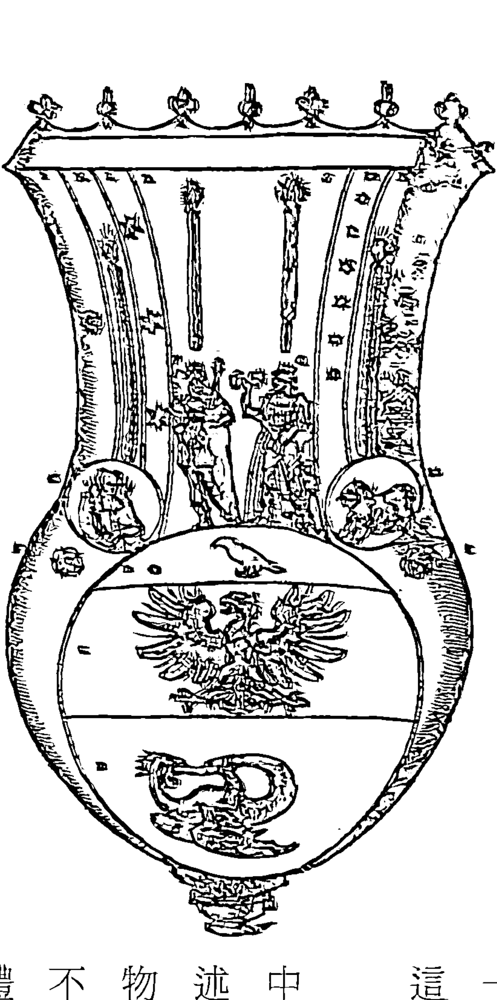

《抱朴子》一書內容龐大，部分章節對中國煉金術作了十分詳細的敘述。葛洪曾描述金藥（金丹）有如下妙用：「夫金丹之為物，燒之愈久，變化愈妙。黃金入火，百煉不消，埋之畢天不朽。服此一物，煉人身體。故能令人不老不死。」

## 探索館

貴重的長生不老藥。有好幾位皇帝就是因為想要長生不老，服用了這種汞化合物而送掉性命的。

中國煉金術士還相信，有一種仙丹可用來點金。這種仙丹和長生不老藥往往是同一種東西，這種仙丹顯然就是後來歐洲煉金術士稱為「賢者之石」之類的東西。

中國煉金術士和亞歷山大里亞人一樣，也使用了名目繁多的器具。他們的用具中，最為重要的大概就是丹鼎。鼎是一種通常有三條腿的大鍋，用做實驗反應坩堝。還有各式各樣的熔爐、水槽、坩堝和蒸鍋等。

概括地說，中國古代煉丹術士們所使用的設備有：

- 丹房。煉丹所使用的丹房是非常講究的。除了必須清淨之外，還要特殊的擺設。前面提到的寺廟的方位圖，就是其中的一種。在每一間丹房內，要用好土建造特製的平臺，牆壁要堅固密封，四周的平臺還要用好草覆蓋其上，以保持環境清潔。
- 丹台。煉丹用的器具要放在丹臺上，丹台通常建成臺階式的構造。
- 爐灶。煉丹過程中，對原材料

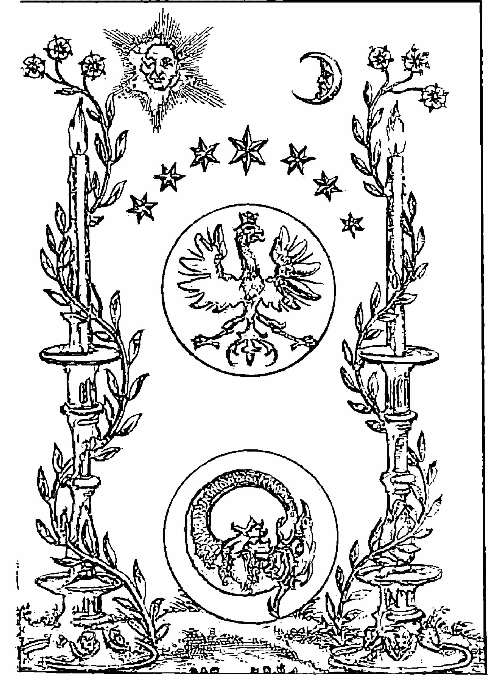

## 揭開煉金術的秘密

進行加熱是非常重要的環節，因此，必須建造適合於煉丹的爐灶。爐灶的種類很多，中國古代煉丹術士們經常使用的爐灶是未濟爐和既濟爐。在爐中有一個特製的反應器，還有放置原材料的火鼎和存放冷水的水鼎。在既濟爐中，水鼎放在上部，火鼎放在下方，最下面是炭火。而未濟爐則相反，火鼎在上，水鼎在下，水鼎和外部有一根水管相通，以便添水和引出水蒸氣。

四．反應器。中國古代煉丹術士們使用最早和最久的反應器是丹釜。它由兩個釜組成，下釜放原材料，上釜倒扣在下釜上，用泥密封。在燃燒加熱之後冷卻，就可以獲得所煉製出來的產品。

五．蒸餾器。和反應器一樣，它也分為上火下水法和下火上水法兩種，其目的主要是把蒸汽引出，然後進行冷凝收取，其形狀類似於現在的蒸餾器。

除了設備之外，煉金術士和煉丹術士都非常重視原材料的選擇和使用。在早期，人們為了煉製可以使人長生不老的金丹，必須把金礦石作為基本原材料，再配合以其他礦物和動植物。後來，人們把煉製金丹改為煉製還丹，因而又增添了一些新的原材料。基本上，他們所使用的主要原材料有：

一．黃金。它具有百煉不消和永不腐朽的性質。古人們相信服用了它便可以使人長生不老。但是，黃金含有毒性，不能單獨服用。煉丹術士們便把它和其他藥物合在一起，祛除其毒性，煉成可以服用的金丹。

二．汞（水銀）。它具有活潑多變的性質。在常溫下呈液態，遇熱就會發生強烈反應，向上飛升，但卻看不見蒸汽。人們一般把它和其他金屬合煉，例如，與鉛合煉成鉛汞丹，與硫合煉成丹砂。

三．鉛。它也具有活潑多變的性質，而且與其他物質化合後，它還能產生紅、白、黃、黑等各種不同的顏色。煉金術士煉製出來的一些所謂白銀，其中的主要成分就是鉛。

四．銅。由於它的顏色最接近黃金，煉丹術士們經常用它來煉製金丹。

五．硫黃。它具有強烈的腐蝕性。把它放在丹鼎中與其他物質一起加熱，可以化蝕各種金屬。煉金術士們經常用它來點化賤金屬，把它們點化成貴金屬，如金、銀、銅、鐵、鉛等。

六．其他化合物。丹砂，即硫化汞。它色澤鮮豔，質地堅硬，具有陽性。它常和金、銅、鉛等金屬合煉，是煉丹常用的原材料。雄黃，即二硫化二砷；雌黃，即硫化亞砷，它們具有活潑多變的性質，而且顏色與黃金相似，且有驅邪殺毒功效。煉丹術士們用它來煉製金丹，而煉金術士們則用它來點化金銀，這種金銀當然是假的。

七．其他原材料。如曾青、磁石、硝石、磐石、滑石、長石、石棉、雲母、鉛母、砒霜、鹽、石灰、醋、酒等礦物類的藥材，以及靈芝、茯苓、五倍子、覆盆子、天南星、皂莢、菟絲、朱草、雞血藤等植物類的藥材。

在有了必要的煉丹設備和原材料之後，最重要的就是煉丹的技術方法了。中國古代的煉丹術士們經常採用的方法有：

一、昇華法。此法的基本步驟是，用炭火給反應器加熱，使反應器中的原材料遇熱發生化學反應，其上升的成分在上部視窗中凝結成粉狀結晶，取下後即可使用。但這種方法只適用於可以遇熱昇華的固體藥物的煉製。另外，在具體煉製過程中，還要根據需要添加其他原料、運用不同的火候，或者進行反覆多次的煉製等。

二、伏火法。此技法的基本原則是，把原材料適當加熱或稍加燃燒，然後立即停止。據說火藥就是煉丹術士們在煉製硝石的過程中發明出來的。根據藥材的不同要求，這種方法對火候的要求非常高。例如，「養火」就是用文火慢燒，或者用文、武兩種火輪流燒煉，但要保持火不滅。有時候，又能減少毒性和副作用。還有用文火把藥物熬乾，來增加它的藥效等等。

三、點化法。此技法要求把少量的藥引子加入到大量的藥材中，使這些藥材發生化學反應，然後變成貴重的物質，這種方法類似於西方所謂的「點石成金」的冶煉技術。例如，把砒霜和粉霜加入到赤銅當中進行合煉，就可以煉製出藥銀。本來，赤銅並沒有多少藥用價值，但經過這樣的合煉，使它脫胎換骨，成為名貴藥材。

四、抽取法。此技法是把蒸餾器中的藥物加熱，使部分藥物變成蒸汽，經過導管流出，然後經過冷凝器，抽取其精華部分作為藥材。例如，從丹砂中抽取水銀就可以使用這種方法，而且隨著煉丹技術的不斷發展，用蒸餾的方法抽取所需的材料比其他方法能提高很大效率。

五、其他煉丹技法。在長期的煉丹實驗中，中國古代的煉丹術士們還開發了其他多種煉丹技法，例如，九轉煉丹法，就是使化學的分解和化合反應循環進行，以提煉出最精華的藥材；水淋法，就是用水淋藥材，以便把溶解液和沒用的藥渣分開，然後再把溶解液熬乾，製成藥物備用。此外還有「水飛法」、「關法」、「浸銅法」、「淋銅法」等等。

我們現在已經知道，無論是煉金術還是煉丹術，都是古代人想要征服大自然，與命運抗爭所付出的一種努力。儘管其中有很多宗教迷信的色彩，也有很多荒誕不經的東西，但它畢竟為近代化學、醫學、藥物學、冶金和實驗科學的發展奠定了必要的基礎，其歷史功績也是不容抹殺的。中國學者認為：「中國煉丹術發展到漢代末年，僅經歷了四百年的歲月，它對古代化學和煉金學就已經做出了極其光輝的成就。那麼，再縱觀兩千年的中國煉丹史，其內容與貢獻當然更加豐富。」

## 第二章 踏上天堂之路 炼金哲学

## 一、尋求生命智慧

人類自從擁有了自己的意識與智慧，便不停息地尋求生命的終極意義——人為何要出生，又為何會死去。在尋找這一問題答案的征途中，各種各樣的學科相繼誕生了，比如物理學與化學等等；同時也催生出不同的宗教信仰。比較起來，兩者截然不同，前者是確定性的學科，而後者則屬於信仰的範疇。然而，在有史記載之初發現的神祕文獻，披露了還存在另外一種形式的學說。該學說聲稱，它是在這兩個領域之間作出的一種折衷，是一門綜合的學科，這門學科使用的是與前述兩者接近然而又頗不相同的思維方式。

在東西的許多古老文明中，奇異的經文、羊皮卷書、紙草書和泥板書，都不約而同地闡述了使物質精神化、使精神物質化，以及淨化實驗者自身性情的必要性，只有這樣才能使最本原的物質和精神得到淨化。此外還有大量的奇異的圖樣附在這些文字之中，描述出煉金爐和蒸餾器，以及具有各種不同意義的神秘莫測的象徵符號。有一些古老的哲人藉助著古老而神秘的操作藝術，試圖通過掌握完全不為世人所知的「實驗玄學」來理解整個宇宙的真面目，這一切在他們留下的圖像中都得到了充分的體現。雖然幾千年以來煉金術都是如同罩在迷霧中一般神龍見首不見尾，但在這些古代文獻中卻顯出了它真實的面目。

文獻中提到可以用四個主要方面來界定煉金術與人類其他活動相比的不同之處：

- 一、確信在生命尤其是有關生命起源的宇宙啟示中，有一種永恆的智慧或有意識的偉大力量在起作用。
- 二、相信生命的永存是完全有可能實現的。
- 三、整個宇宙表現為在某種不可捉摸和不可抗拒的法則統治下有規律地運轉。
- 四、冶金已經達到了相當的水準，以至於可以進行有關製造與轉化物質的實驗。

上面提到的種種因素，在古代埃及、希臘、阿拉伯、美索不達米亞、印度和中國等人類重要的古文明中都曾出現過，正是它們促成了嚴格意義上的煉金術學說的形成，這些從煉金爐中迸發出來的星星之火，似乎想要引導人們踏上通往天國夢想的道路。

印度古代的吠陀教和佛教的經文都曾經提到一種叫做「ratataka」的液體，能夠把銅轉變成純金。在《大智度論》中印度高僧龍樹曾闡述了各種使金屬發生轉化的奇妙方法。按照吠陀派的觀點，從遠古以來，自然知識是通過煉金術途徑得以完善的。這種讓金屬發生轉化的方法是不是真的能夠實現，沒有人知道。但是在中國老子的道家學說中，卻的的確確有通過用煉取金丹的辦法來達到「天人合一」的大智慧的論述。

煉金術在數千年前不但興盛於尼羅河和幼發拉底河流域，而且在愛琴海沿岸附近的內陸地區和群島中也十分流行。煉金術從這些地區開始萌生滋長，成為西方世界神秘學說的主要形式。在這些地區，冶煉術達到了較高的水準，十分明確的教義和宗教體系也發展到相當程度。那裏的居民一方面對宇宙持有統一而泛靈論的詮釋，另一方面選擇了象徵符號作為傳播這門學說的特定方式。在他們的文明中，自然巫術同與宗教密切相關的文學、星相學、科學和藝術形式一樣格外興盛。各種各樣的技術都毫無阻礙地進入宗教場所，據研究，當時所有的社會活動都呈現著濃厚的宗教色彩，一切都披上了宗教信仰神聖的外衣。

煉金術在那些嚴守火的使用和金屬加工之秘密的鑄造工匠團體中悄然滋生，在埃及、希臘和美索不達米亞的神廟內十分流行，那裡成為它滋長的沃土。也正是由於這一點，煉金術才能保持著秘密的宗教儀式、魔法般的象徵符號體系，他們認為其工作的全部意義在於探索自然的奧秘，並且由此而成為一門和宗教一樣神聖的藝術。

也就是從這時起煉金術士們被推崇為「永恆之火」的祭司，在人跡罕至的神廟內，充滿了敬畏之心的煉金術士通過實驗和手工操作，憑藉著他們所通曉的奇妙秘訣，在神秘莫測的自然世界裏遨遊。

要瞭解煉金術，必須試圖領會其基本概念，我們應該時刻牢記，正是這種在現代人思維方式看來空前離奇的學說的精華，哺育了當時人們的思想。也許在今天看來這種理論極為幼稚，是荒唐無稽的奇談怪論。但我們今天的化學在千年以後可能也會一樣顯得淺薄。因此，我們務必要有耐心和洞察力，來理解以下所闡述的煉金術概念。它使我們接觸到一種「大而全一」的哲學體系，而這種哲學體系已經很難在今天的思維習慣中被採用。

凡是知道了那些煉金術大師們的非凡而誇張的概念的人，都無不被其中的內涵吸引住，那些玄妙的概念將帶領我們進入到人類文明的原始領域。事實上煉金術大師們的頭腦卻讓我們懂得了人類社會發展之初的狀況是怎樣的。在那時，個人的心靈還沒有被太多的現代理念和名詞束縛，而是赤裸裸地憑著直覺去臆測天地萬物的永恆秘密。

倘若我們回顧曾經在早期手工藝匠和金屬鑄造匠團體中流行的教義，就不難理解其起源。當時的一個觀點認為，所有存在物的生命都是由唯一的上帝賦予的。這些團體據此進行修行，這個觀點後來也成了煉金術研究的指路燈。他們認為：上帝賦予精神實體以軀體，而整個宇宙便是這些精神物質化實體的總匯。因此，在天地之間、宗教和哲學之間、物理學和玄學之間，不存在任何明顯的區別，所有被造物從多種不同方式看都是同一個來源的。自循環之始，萬物都會生存、生長、繁殖，直到最後消亡，然後開始新的下一輪循環。

煉金術士們決定把最簡單的被製造物當做物件來研究，其目的只是嘗試著把上帝曾經在大宇宙裏做過的那些事情再重複一遍。他們的理想是通過綜合運用全部的知識和智慧來重新建立一個小宇宙，看看「創世」需要哪些成分，從而用人類的手去複製大自然。

有一點我們應該清楚，這門學說同當今時代科學領域之間最大的區別就在於：現代科學側重於去向外認識世界以便對其加以利用，而古老的煉金術則偏向於向內去認識自我，並且最終超越自我。

我們還應該弄清楚，煉金術學說和許多哲學思想之間存在著大量的相通之處，這一點是無可辯駁的。所以，要從年代或嚴格的教義上來完全分離煉金術思想與西方哲理性思辨創始者思想之間的相互影響，是絕對不可能的。

在煉金術士們看來，人體的微觀世界與大自然的宏觀世界之間，存在著一種契合關係。這就是宇宙萬物與人的血肉之軀，都是用同樣的材料、按照同樣的原則、由同樣的元素構成的。煉金術士認為這樣的元素有兩種。一種是水銀，它代表著各種緻密和持久的東西。另一種是硫黃，它所代表的是各種易燃和暫時的東西。所有物質的實體，包括人的肉體，都是由這兩種元素構成的，也可以用這兩種元素再造出來。比如，煉金術士們相信，所有的金屬都是在地球內部由水銀和硫黃生成，就像骨骼在胚胎內由卵子生成一樣。這種比附至今還保存在某些醫學象徵之中。對於女性，人們至今沿用煉金術關於銅的，就是說，關於柔軟東西的標誌——維納斯（金星）；對於男性，人們則沿用煉金術關於鐵的，即關於堅硬東西的標誌——摩爾斯（火星）。

如果我們進一步解釋煉金術的關鍵所在，便可以清楚地認識到：在使所有煉金術士行動一致的上帝宇宙觀和古代智慧巨人思想所確定的基礎之間，存在著極大的類似性和相近性。我們從煉金術概念和思想的種種混合不一的結構中，能夠明顯地分辨出其對於畢達哥拉斯學派的定律、德謨克里特的原子論、柏拉圖的球體體系、蘇格拉底思想的秘傳學說，以及亞里斯多德的元素論所進行的研究與論證。如果我們仔細觀察，就可以看到出自中世紀煉金術士筆下的那些文獻中，曾有過無數的智慧結晶。雖然至今為止人們尚未弄清它們之間是如何融會貫通的。

## 二、宇宙、星辰、時光

作為煉金術基礎的整個理論體系並不複雜，甚至簡單得讓人感到不可思議，這和長久以來人們對於煉金術的想像完全相反。雖然如此，一旦人們深入到這個理論體系當中去時，還是會不可避免地迷失在很有魅力的概念與推論之中。

支撐著煉金術的最基本的觀念是這樣的：在整個宇宙紛繁的自然現象和一切存在物中，有一種唯一而重要的「生命起因」在其中起著作用，而且它是獨一無二的，它通過動物、植物和礦物的種種形式體現出自己的存在。

煉金術士稱這個「生命起因」，或者說整個自然世界的本原為「宇宙神靈」。這種本原彷彿在大自然中經過了長時間的浸泡，以其獨特而永恆運動的方式根據不同種類推動每個宇宙和個體。

所以，煉金術士要從眼前的世界的一切現象中入手，去瞭解這個「一」就是全，全就是「一」的最終奧妙。無疑，煉金術的這種特性讓今日研究煉金術思想的人難以透徹地理解，因為古代哲人們對知識「大而化之」的掌握實在讓令人吃不消，今天的人們每次只能掌握全部知識的一小部分，而不是全部。

在當今，一切科學的理論都已經按照學科分類而劃分成各類專業知識和次要的專業知識。而在煉金術的理論當中，這樣的劃分知識是無法理解的和不應該的。因為大自然是一個不可分割的整體，人只有掌握全面的知識才能很好地理解它。世界上有天文學家和物理學家、化學家和生物學家，以及醫生、哲學家和文學家等等，而煉金術士必須是所有這些學科裏的專家，而且很可能擁有更多學科的知識。

在煉金術士的眼中，神靈與自然是分開的，都是一個方面，而自然是唯一可能被認識的一個方面。探索自然必須依靠於一種絕對不可缺少的分析能力，對於物體間的相互感應關係進行觀察與思考。在這種感應關係的作用下，一切的存在物都與其他的存在物有著聯繫。天與地，水與火，樹葉與輕風，花兒與雲朵，一切的一切都聯繫在一起，成為一個感性的世界。

由於煉金術的目的就在於從實驗方法上使再現大宇宙的創造成為可能。這樣一來就必須預先假定關於宇宙起源和宇宙論的許多相關理論和概念。也許這些概念與現在人們所持的普遍觀點有許多不同之處，但是我們卻絕不應該忽視它們，在它們中蘊含的直觀力，讓古代的煉金術士們形成了一種極為精細的知識，這種知識的基礎，據說是對於整個大自然和宇宙萬物之間相互的結構上完全再現了大宇宙。

這樣，對於作為小宇宙存在的人類而言，世界是一個大宇宙。人類通過積極的靜修和深入的瞭解宇宙奧秘，由此而更清楚地認識人類自己，並且通過深入思考發現自然萬物。煉金術士們認為，一切生物中的頭等位置是為人類準備的，人類是具有神聖起源的宇宙神靈的最佳使者，是煉金術最適宜的接受者和受益者。上帝通過神靈創造了宇宙、世界和人類。而人類具備了智力，因此能夠理解世間一切事物運轉的道理，甚至能理解原始混沌和無生命時代組成存在物的法則。造物主賦予宇宙以生命，人類只要按照相似的方法，就能夠完善自身心靈與肉體的小宇宙，甚至，可以代替造物主行使權利，去創造世界。

如果人們進一步地深入探尋煉金術的奧秘，就可以瞭解到，在煉金術士們認為的物象起源中，有像鏡子映射一樣的相同預先假定，在它的作用下上下兩個世界聯繫起來。所有那些在最高層次佔據優勢的存在物，在較低層次以及更低的層次都有與它們相對應的事物。在一系列同心球體構成的宇宙中，最高點是行星和恆星組成的大宇宙，它對應著人類靈與肉組成的小宇宙。小宇宙是按照大宇宙的樣子複製出來的，在結構上完全再現了大宇宙。

## 人類上升之路

在天文學體系中，宇宙的概念和對它的解釋更加清楚地反映出煉金術學說的傳統宇宙論與理性分析科學之間的區別。與古人的想像如出一轍，煉金術把地球描繪成被星空罩著的盤狀物，而且賦予了它更加全面和深邃的意義。從這些意義當中我們可以看出，古代的人們是真實地描述他們的自然體驗的，這在煉金術中廣泛運用的認識方法中得到了充分體現。

在煉金術理論中，天空通過自身運動測定自然界的時間，確定季節和晝夜，令天體出現或消失，播灑雨露或甘霖。它代表了生物體主動的、男性的一極；而大地則沐浴著來自天空的雨露，滋養並催生植物，養育一切生物，代表了被動的、女性的一極。在這一「天行健，地勢坤」的過程中，煉金術的硫和汞的靈藥把無數類似的對立物集合在了一起。通過協調這種對立而融合為一體，在現實當中表現為「中性人」、「賢者之卵」，還有「雌雄同序」等奇異的概念。

在托勒密的宇宙學說中，地球位於整個宇宙的中心點上，所有的行星都沿著它們的軌道圍繞著地球運轉，而在外面則是靜止的星空和神聖而無限的太空。當人們普遍承認這個學說時，自古以來就存在著的對於自然的體驗和幻想並沒有被完全拋棄，事實上，這種新的宇宙模型進一步肯定了煉金術學說的兩個前提：它首先肯定了宇宙同心而感應的結構，此外還肯定了煉金術這門學說由下而上升華的結構。依照煉金術的理論，地球上每一個存在的事物都能夠象徵性地顯示出它高一級的屬性來，而較高級的屬性又會最終歸依為宇宙的模型。

這是煉金術「乾法」操作示意圖，它由兩個部分組成。左邊的兩只煉金爐，較高的一只呈塔狀，用於煅煉、連接和分離；另一只稱做「沙浴器」，是為特定燒結裝置而建造的，專門用於要求恆定溫熱狀態的工序，所有長時間的蒸煮工序都在這只爐內進行。右邊是赫赫有名的象徵圖像，又稱為「釘死在十字架上的弗拉曼爾之蛇」。

## 揭開煉金術的秘密

本質上，煉金術把日心學說歸納為上帝的感召，而太陽及其對地球的影響向來表現為各種象徵符號。在煉金術士們看來，伽利略革命和哥白尼的「日心說」所創立的這個天文學的模型，並沒有使人類作為上帝委託的使者的角色有所改變。確切地說，「日心說」證實了天文學模型與人類超常直覺之間的密切相關，而太陽的神聖起源是永恆不變的，天地萬物都來源於此，並沿著環形的軌跡周而復始。

以上的理論讓我們身不由己地思考起煉金術士們的時間觀念來，這門學說的環形結構和永恆不變的存在方式，使得煉金術的圖景與宇宙的圖景極端相似。宇宙的大結構及煉金術的小結構都同樣沿著環形發展，這個過程是封閉的，或更確切地說是循環的。所以在煉金術的空間觀念中，時間並不是線性的，而是連續不斷地以自身為中心向四周發展的。其中，神的決定、人的命運和判斷是主要的座標，大自然中所有具有生命的生物無不依從著這些座標。

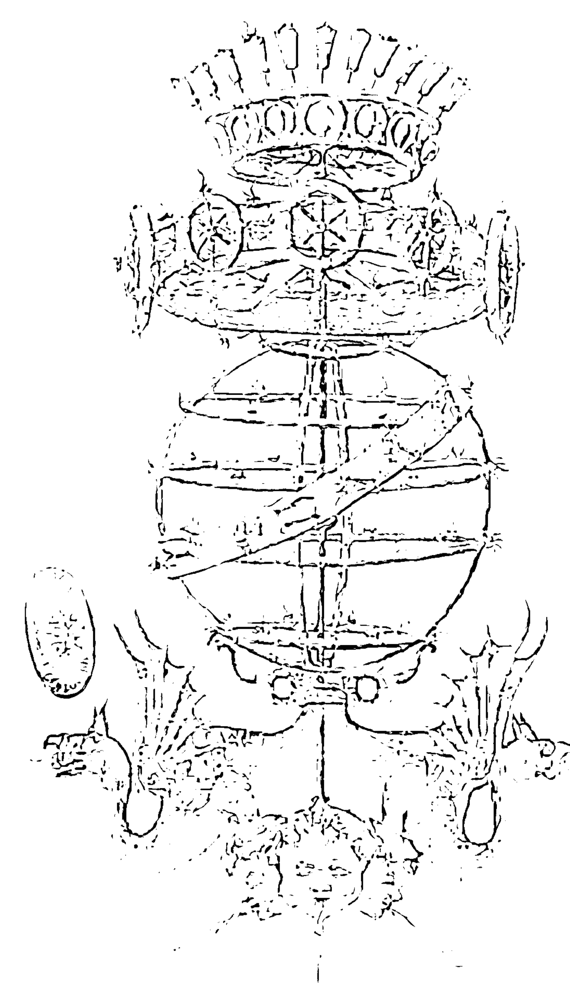

煉金術士們聲稱，偉大的自然女神將智慧賜予了他們。在她的祈禱下，煉金術實驗室的實際操作，得以脫離世俗範疇，而通往「科學之樹」。

而下圖則描繪了自然女神責怪煉金術士的情景。後者打算僅僅藉助於技術手法來探索大自然的奧秘，他過於篤信技術，卻將「獲得感應」和「尋求啟示」的心靈修煉方式拋在了腦後。

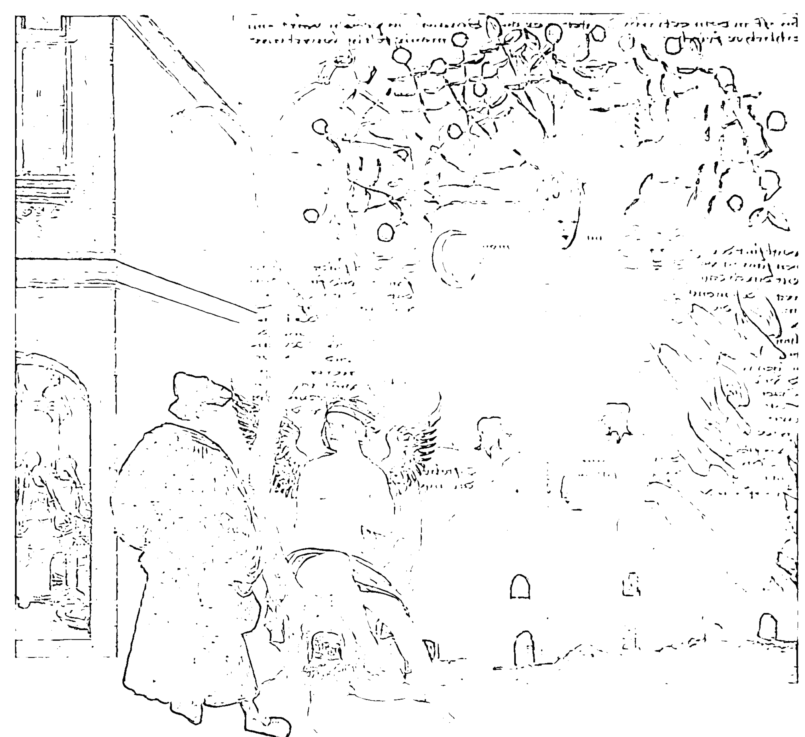

古老的咬著自己尾巴的蛇的圖案是各個時期煉金術士們的標誌。它唯一的目的與其說是象徵著這個相關性，倒不如說是物質統一性的不同概念。那些古代的煉金術大師對這一點都堅信不疑。

科學的目的在於從紛繁的現象中去盡可能多地瞭解本質，展開實驗並尋求解決之道，從而在不斷發展中漸漸分化成不同的分枝；而煉金術士們的信仰則剛好相反，在它的激勵下，煉金術士們去探索世界萬物和人類的精神中心，這個永恆、唯一而無形的中心是統一而有機的。也許，兩者的統一才是合理的人類上升之路。

## 四種元素

在現代人的思維中，「物質」這個詞的涵義，與煉金術中這個詞的涵義是很不一樣的。在煉金術學說的概念中，「感性」與「心靈」緊密地結合在一起，「物質」和「精神」是兩個主動與被動的原始極，世間的萬事萬物都必然在它們兩者之間反反覆覆。「精神」的體現要有「物質」的支持，而「物質」則必須藉助於「精神」的內容才能得以保持。

正是在這種原理的啟發下，煉金術才發展成為一門關於物質與元素的理論體系，這種理論對於自然界的元素進行了分類匯總，它同亞里斯多德的理論具有一致性，以明確的「本性」為基礎。這種「本性」就是作為整個宇宙的本質的四種元素：土、氣、水、火。一切都可以歸納在這四種元素當中。

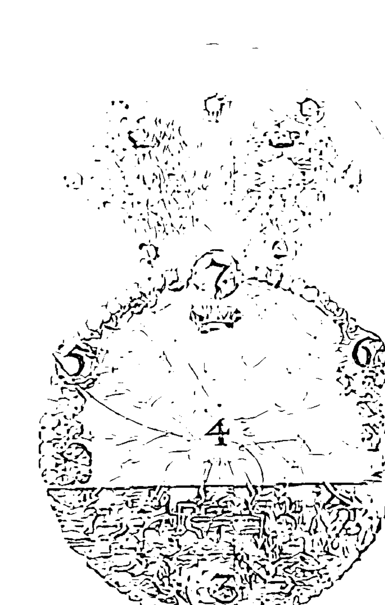

通過上帝創造世界的方式，四種元素體現在具體的事物當中，因為這種方式是同完善和精神的自然中心最為接近的，所以它們還蘊涵著世界的終極力量和第五種元素。

煉金術士把精力主要集中於人類在操作中最為接近的小宇宙——也就是金屬世界當中，因此另外建立了與普通金屬內在本性相對應的七個次等本原。正因為如此，銀、汞、銅、金、鐵、錫和鉛由此組成了造物的本原，而非諸多元素中的任何一種。

「位於上界的物質與位於下界的事物是相同的」，根據這一法則，煉金術士們將元素模型與太陽、月亮和其他五個肉眼無法看見的行星以確定的關係結合起來。為方便起見，精神化物質的塵世與物質化精神的天國之間的直接對應關係，可以歸納為月亮——銀、水星——汞、金星——銅、太陽——金、火星——鐵、木星——錫、土星——鉛。

因而，這種奇妙的關係也將天文學和煉金術聯繫在一起。對於所有的煉金術士而言，天地之間、上下界之間神秘感應的完備知識是他們進行實驗必不可少的基礎。他們認為在火、氣、水、土四元素按照各自等級形成了感性世界中「原初物質」的同時，天上星宿的運轉也在無形中暗暗影響著地底四種元素的合成過程。所以在達到四種元素平衡狀態的時候，一定要把星星的力量也計算在內。

## 三、魔法語言中的隱喻

關於宇宙的理論和宇宙起源的概念，確定了煉金術理論基礎的特徵。可是這些只不過是踏上煉金之路的第一步而已。這些概念所構成的基本原則為以後更為完善的概念提供了理論支撐，但最能體現這門學說特色的關鍵卻在於煉金概念的演繹。

我們沒有必要去從精神分析法中尋找理論支持，或者與西藏秘傳學說作比較，只要我們看一看那些不計其數的煉金術著作，就能清楚地認識到這一點：不論是西方還是東方的煉金術士們，他們所依據的都是同樣的理論，他們也都渴望獲得同樣的實驗結果。這是因為，煉金術士們認為，「宇宙神靈」作為世間萬物智慧與生命的基礎是存在的，是它給予了萬物以生命並讓一切維持著平衡。

他們認為，這種神靈在本質上是被火點燃的，帶有萬能的魔力，所以一些煉金術士把這看做是一切被創造事物的原初動力。他們宣揚只要能控制神靈便能把任何物體轉化成另外的一種物體，從而實現物質的轉化。煉金術操作最為直接的目的就是煉出黃金，以這種物質轉化的成功結果來證明煉金理念的正確，把「神聖的神靈具體化」。

此時煉金術士們又遇到了另一個難題，如何才能夠將他們所謂的「神靈」引入到盛裝它的容器之內，而又保證它不會散失了呢？這樣一種盛放神靈的瓶子在何處才找得到，應該怎樣操作才能讓神靈與瓶子融合，最後又如何封好瓶口讓神靈不會再次消失在空氣中呢？對此，煉金術士們認為：

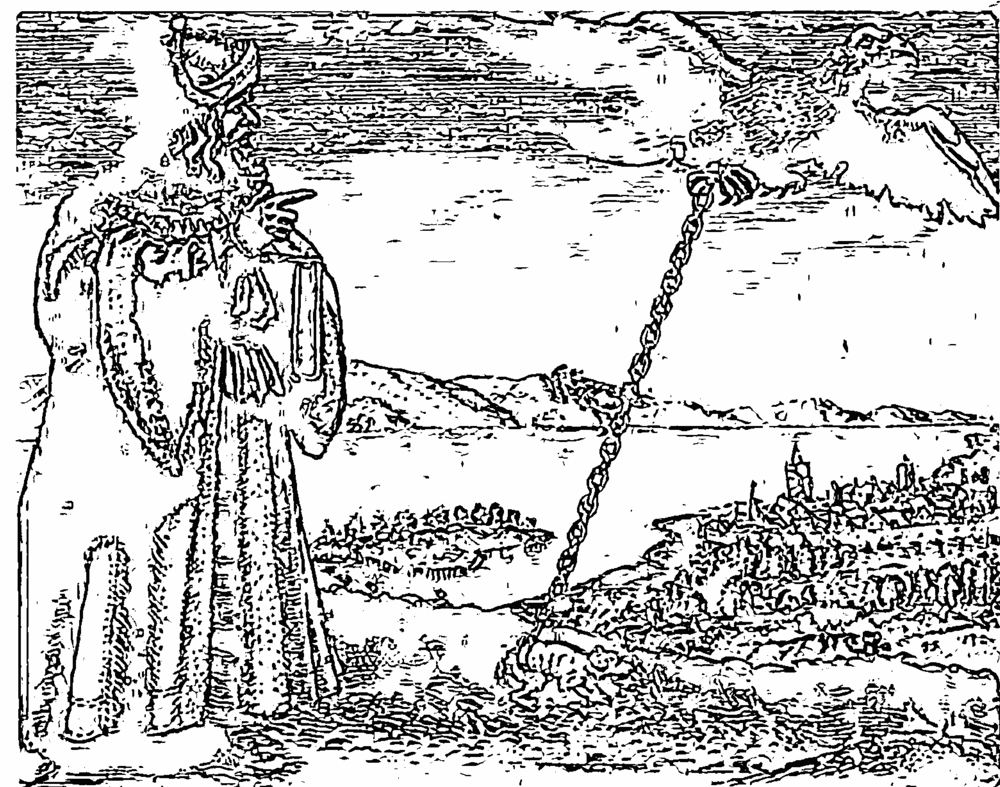

關鍵在於得到真正純淨的元素，可以用這種元素作為宇宙神靈的催化劑，讓它充滿了宇宙神靈，成為物質真正轉化的原動力。這個概念就是磁石靈藥，也就是煉金術士們使用的氧化鎂。

那些下定決心進入到這個神秘莫測的世界，成為一名煉金術士的人，必定要遇到重重阻力和困難。實際上，沒有人清楚那些真正的操作步驟到底是怎樣的，想學習這神聖藝術的人也沒有什麼地方可以藉鑑經驗，那些無緣遇到真正的煉金術大師的人，只能從書籍中尋求答案。

我們現在所看到的情況同過去的正好相反，人們以不同的觀點提出各種方法，所有人都或多或少地以這些方法為範例進行操作。縱觀那些最著名的煉金術大師的一生，我們就能發現他們是怎樣理解煉金術的，這門學說幾乎和大自然存在的時間一樣的久遠而永恆，而且這些大師們到後來都表現出殊途同歸的趨勢。通過比較就能發現差異，煉金術士設想出方法，而實驗操作則不斷地糾正它。

如果我們仔細地觀察這些煉金術士們，會發現在他們的身上都有一個共通之處，那就是凡是理解了這門學說奧義的人，雖然所處的時間與空間不同，但他們都真誠地把其他人看做是兄弟。那麼這門學說的奧義到底是怎樣的呢？實際上它與人們通常所設想的不太一樣。那些關於真正的煉金術大師的文字記載中從沒有提到過它，相反倒是那些剛剛入門的煉金術士們幾乎都遵循這種奧義。新信徒的頭等要事，是變得和要依從的大自然一樣單純。他必須立下誓言，決定保守煉金術學說的秘密，只能讓那些懂得煉金奧義的人知道。而其他一切都是無關緊要的。然而，確實有並不知道煉金奧義的人，完全是通過煉金著作和自身的努力探索到了神聖藝術的真諦所在，不過這種情況是微乎其微的。一般情況下，孤獨的探索者們為理解和梳理那些奇特的概念而費盡心血，他們在實際中遇到的難題更是不可勝數，不過在某些時候，虔誠的煉金術士在神的啟示下，或者得到了真正有價值的記載也能獲得成功。不過對於大多數人來說，要想進入這個神秘的世界，就必須找到一位願意幫忙的大師，請他指點一二，指導進行最初的操作。

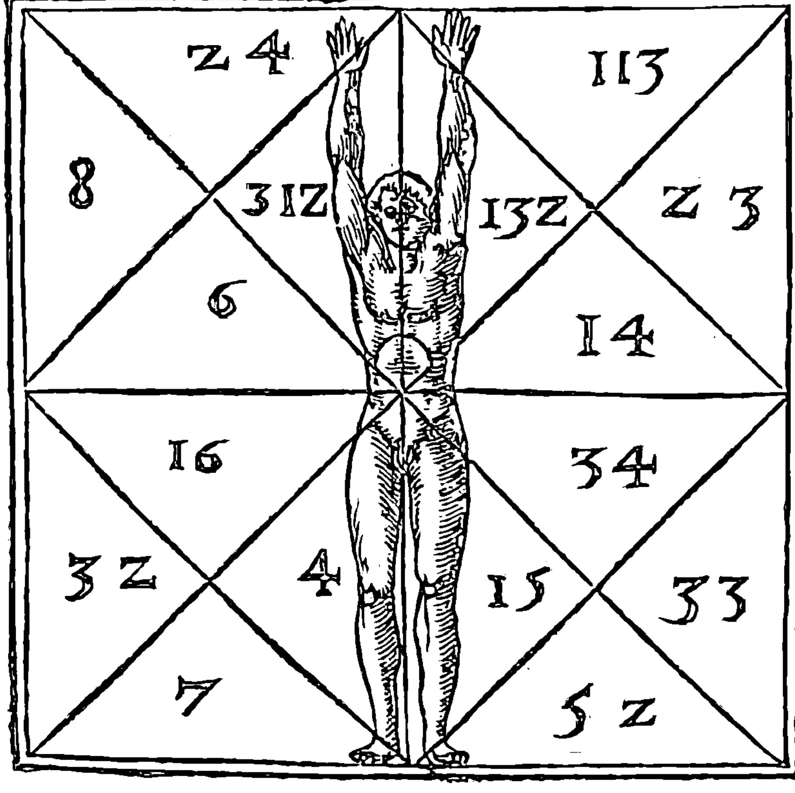

## 煉金著作中的迷宮

人們也許會發出疑問，既然煉金術這門學說如此地希望保持神秘的狀態，又如何有大量的論著傳世呢？可以肯定的是，煉金術起源的性質同它強制規定信徒遵守的獨特規則是完全一致的。煉金術道德規定煉金術士應該既是善良的人，同時又是令人羨慕的人。它明確地規定，煉金術士應該同所有人共同分享神聖藝術帶來的物質和智慧成果，但也必須防止隨意洩露而使得煉金術的原則與技術流傳到世上。

煉金術士的著作有著雙重的意義，一方面是為實驗提供指導，為信奉這一學說的人們提供幫助，另一方面用煉金術特有的語言和概念解釋天地萬物，對高尚的人和卑鄙的人區別對待，只讓那些隨時準備付出整個生命與靈魂的、心地純良並且有高超智慧的人最終進入到煉金術士的行列裏來。如果想弄懂大師們留下來的論著，必須有足夠的耐心和誠意。那些表面看起來正常的邏輯會輕易地被晦澀難懂的表述所推翻，人們會很快發現這些書籍完全是用來實際操作的。所以當煉金術大師的傳世之作中出現不合邏輯的段落、冗長的玄學思辨章節、關於宇宙起源和本質的描述文字、神秘莫測的象徵符號時，閱讀它們的讀者必須要保持正確的理解——論著中的這些難懂的地方只是為了迷惑那些利慾薰心的人，或者是用外人所不能理解的方法來描述實驗室的技術和操作方法。

煉金術士所尋求的實際上並非是一種得到拯救的知識，煉金術士認為堅信與精神物質的感應接觸是得救的唯一道路，而要想得到精神物質的接觸，就必須遵守從遠古時代秘密流傳下來的古老的知識與方法。為了能應用於實際當中，這種傳授採用了一種雙重破譯的方法。一方面它利用一整套複雜而繁瑣的象徵符號，其中包括神與人、現實的動物與幻想的動物、怪物與女巫，通過它們之間有時相愛，有時相殘的複雜關係來提示本原，描述實驗的操作方法；另一方面，它還借用了一種特殊的可以說是迷宮似的闡述方式，按照這種闡述方式，對所要遵循的操作工序如實說明，按年代的邊疆性和起因的聯繫被分割開來，從而形成一種相反意見。有的煉金著作先是描述操作的中間部分，然後是操作的結尾部分，最後才是本應是放在前面的起始部分，由此而得出了不合規則的反常推論。在一些論著中，實驗操作的步驟被分成了幾個部分，要麼散佈在幾本著作中，要麼就是在一本著作的不同章節中。

這種種的難題只是冰山的一角而已，要知道，因為一個詞所表示的含義從來不被視為唯一的觀點，相反它根據在煉金要素、本原、主體或客體中所起的作用具有不同的意思。一個詞在煉金術中通常有數種不同的含義。此外還有其他的決定性因素在起作用：首先是論著的作者們在操作方式上各自有不同的觀點；其次是最優秀的論著，除了自身具有的不足之外，為了保持公允的態度，也會記載多種相反的觀點與意見，因此書中會包括許多虛假而錯誤的方法；第三，自從誕生那一日起，煉金術就一直極力保持著神秘性，用一種複雜而又象徵性的語言把自己掩藏起來，這種語言是天馬行空般地不受束縛，所以人們常常稱之為「通鬼神的魔法語言」。

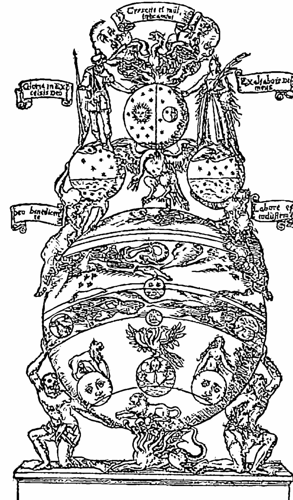

## 魔法語言

雖然與希伯來人的魔法語言比較起來，煉金術的魔法語言在方法上有相似之處，但兩者也存在著巨大的差異。在象徵和寓意的多義表達上，煉金術從一開始便迎合著典型的中世紀人們的喜好。世界各地都流傳著這種煉金術的「通鬼神的魔法語言」，尤其是法國作家們愛此尤甚。從很早的時代起，煉金術就採用中世紀背景來作為自己的語言基礎，並且到現在也是如此。事實上「通鬼神的魔法語言」通常都大量地藉鑒了希臘文，尤其是古希臘文中那些最接近詞源的詞義。總之，整個煉金術的「通鬼神的魔法語言」針對的是最純粹的秘傳學說，同時將類似天方夜譚的語言體系引入傳統方法論和煉金術論著中。這種語言體系的常用詞的含義發生了變化，所以閱讀它們的人不光要按照通常的意義，而且要用與詞音相近的其他辭彙來理解其中的含義。

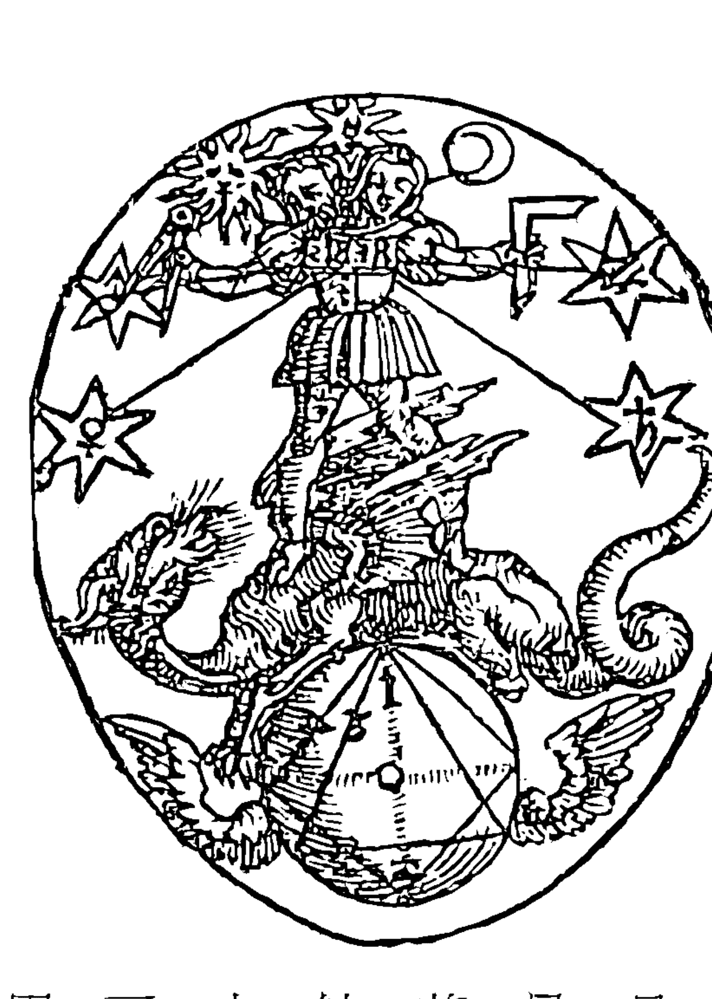

雖然複雜到如此程度，但是「通鬼神的魔法語言」卻根本沒有什麼重要的規則。如果我們進一步地研究就能夠發現，一個詞或一句話在煉金術中的真正含義，似乎往往只有根據所使用的同音異義詞進行的文字遊戲和有趣的由另一詞字母換位構成的詞，通過分段或重組才能推斷出來。因此，過去人們也把煉金術稱做「令人愉快的學說」。

我們可以確信，因為所有這些因素的存在，要想弄懂任何一部煉金術論著都是極其困難的事情。只有那些掌握了煉金奧義的人才能理解並從中得到寶貴的指導。一個普通人是無論如何也想不到，一本名為《anilic》或《人類小藥丸》的書實際上是煉金術論著，書名中的「anilic」是由另一詞的字母換位而構成的；普通人更不會想到，這本書實際上談的是如何從原初物質中提煉出它所包含

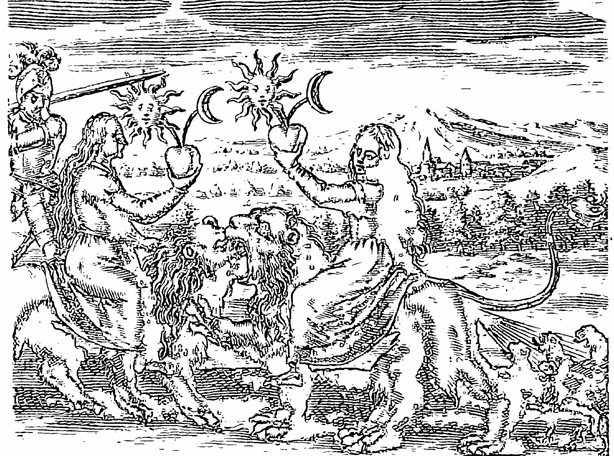

## 《翠玉錄》的十二句話

歐洲最早的煉金術論著是西班牙的阿拉伯人從埃及帶來的，雖然教會嚴格地控制它們的傳播，可是這些文獻還是秘密地流傳開來。在當時，那些深奧難懂的學說只有學者有能力破譯，而煉金術最為特別的是在實驗中要花費大量的財富，畢竟，煉金術實驗需要一種寶貴的原材料——金子。淵博的知識和富有是成為一名煉金術士的基本條件，而這也使得普通人無法參與進來，所以煉金術一開始就被稱為「高貴的藝術」，是只有富有的貴族和他們所資助的學者才有資格進行的一種特殊遊戲。

這種晦澀難懂的煉金術論著同時也掩蓋了作者的真實個性。因此我們除了從「通鬼神的魔法語言」來判斷那些神秘的煉金術以外，別無他法。比如「Byrenee philalete」是杜撰的名字，意思是溫和的真理愛好者；「Basile Valentine」表示具有點金石的神奇德行而像國王一般有權有勢；在眾多的煉金術士中，「Marcel pal ingene」這個名字具有濃厚的煉金術色彩，它綜合了火星、鐵、太陽、輪迴和新生的含義，表明他本人通過鐵實現了太陽——金的新生。

雖然煉金術大師們的論著中並沒有提到關於如何完成煉金操作的方法，但是他們認為人們可以從中發掘出這方面的內容。所以他們建議要「祈禱，閱讀，反覆閱讀，實驗，然後就會得到一。煉金術士們都堅信，只要擁有虔誠的靈魂和投身研究的堅強意志，最終他們會找到打開永恆之門的真正鑰匙。

學者也許總是有探索未知的好奇心，他們試圖通過煉金術來探尋「創世」的秘密。但大多數從事煉金術的貴族們想的卻是「魔法石」能為他們變出更多的金子，最好還能讓他們獲得永生，然後他們就可以永遠享受那些令人心曠神怡的財富。

最早傳入歐洲的煉金術文獻之一就是這部只有十三句話的《翠玉錄》。有人認為，西元前三三三年，當亞歷山大大帝征服埃及以後，他從「赫爾墨斯法老」的墳墓裏發現了它，然後把它帶回了希臘。這裏是它的大意：

當我進入到洞穴之中，我看到了一塊翠玉，上面刻著文字，那是赫爾墨斯的雙手寫出來的，在上面我發現了這樣的話——

> 這是永恆的真理，沒有一絲一毫的虛假，是最最正確無誤的真理。
要創造出唯一元素的奇蹟，要知道，上界的事物與下界的事物是相同的，而下界的事物與上界的事物也完全一致。
那獨一無二的「造物主」創造了世間萬物，所以一切都從同一根源誕生。
太陽是它的父親，月亮是母親。
它在風的子宮裏孕育，大地的乳房滋養了它。
它是世間一切奇蹟的創造者，它具有統治宇宙的力量。
如果讓它落到泥土裏，它就能將泥土從火中隔離，也能讓神奇的事物突破粗俗之物的束縛而顯現出來。

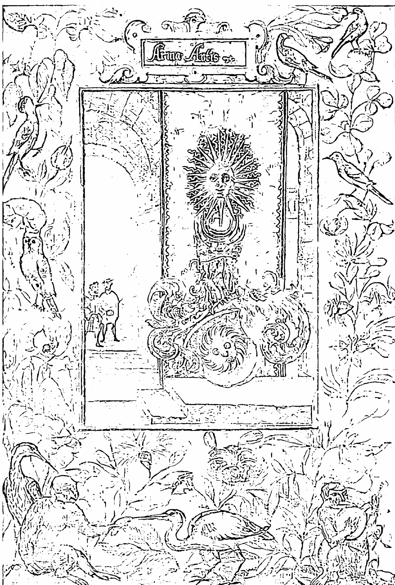

《翠玉錄》的13句話

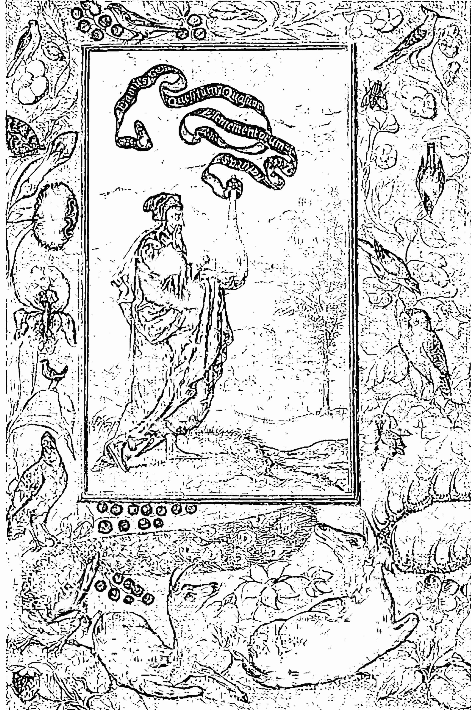

要創造出唯一元素的奇蹟，要知道，上界的事物與下界的事物是相同的，而下界的事物與上界的事物也完全一致。

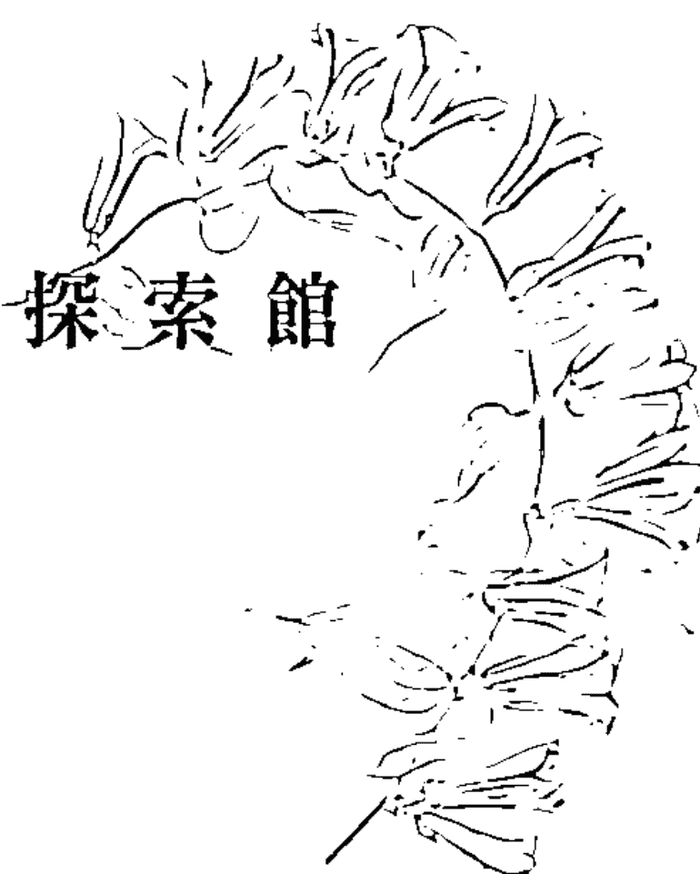

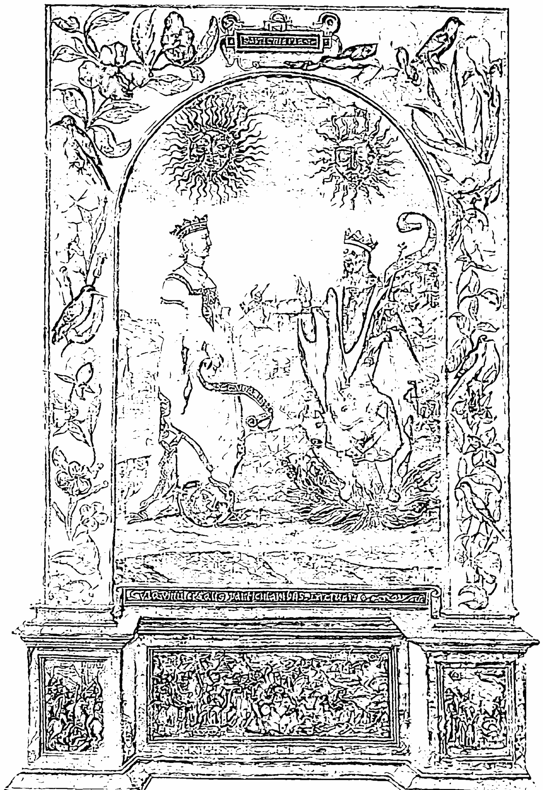

那獨一無二的「造物主」創造了世間萬物，所以一切都從同一根源誕生。

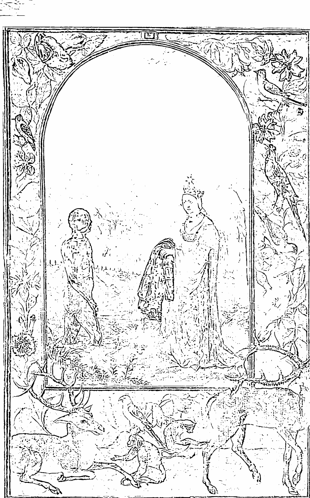

太陽為其父，月亮為其母。風兒將其送入腹內，大地孕育了它。

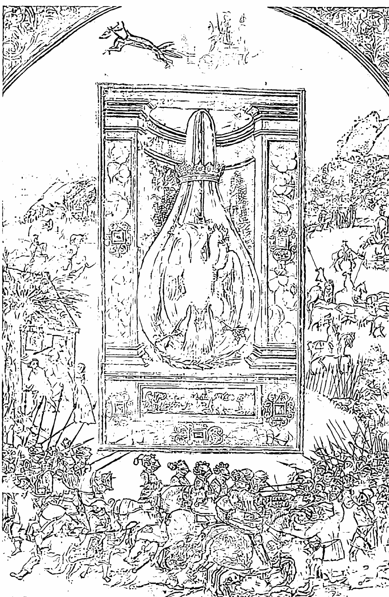

它是整個宇宙中完善的本原。它變成土時，其力量是無窮的。

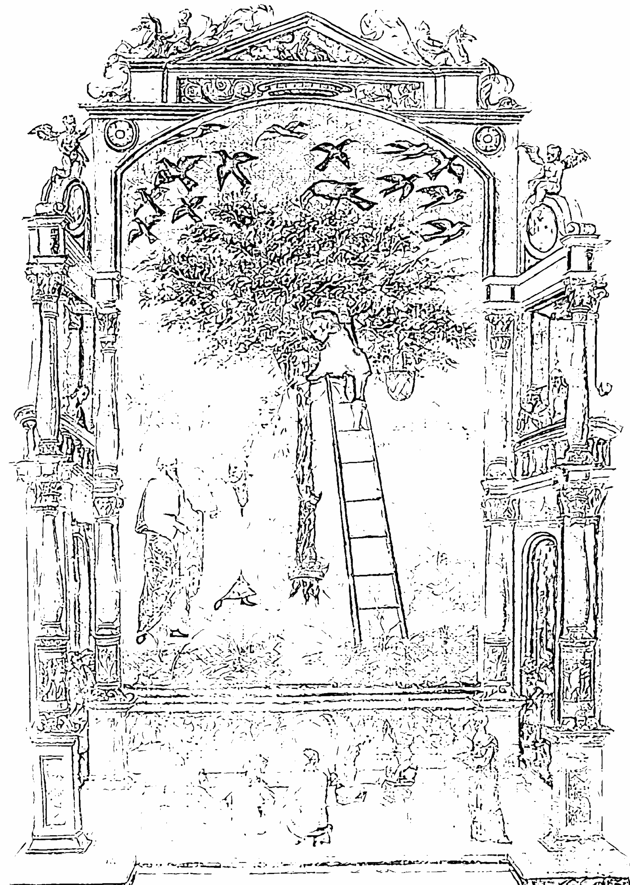

由地升上天，再從天國回到地，聚集上下界萬物的力量。如此，你便贏了整個宇宙的榮光，使自身遠離一切黑暗。

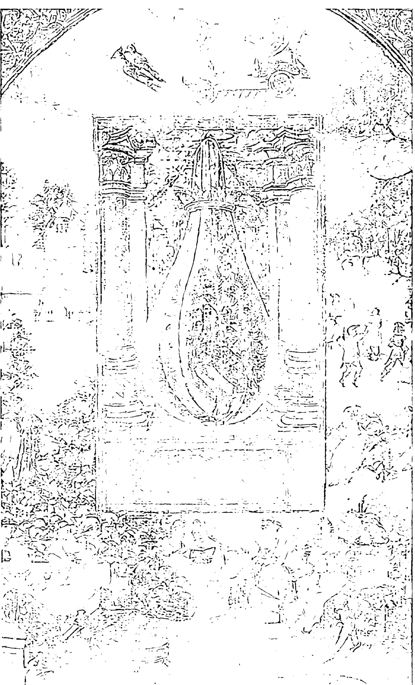

你運用高超的技藝，慢慢地將土與火分開，把稀散與凝聚隔離。

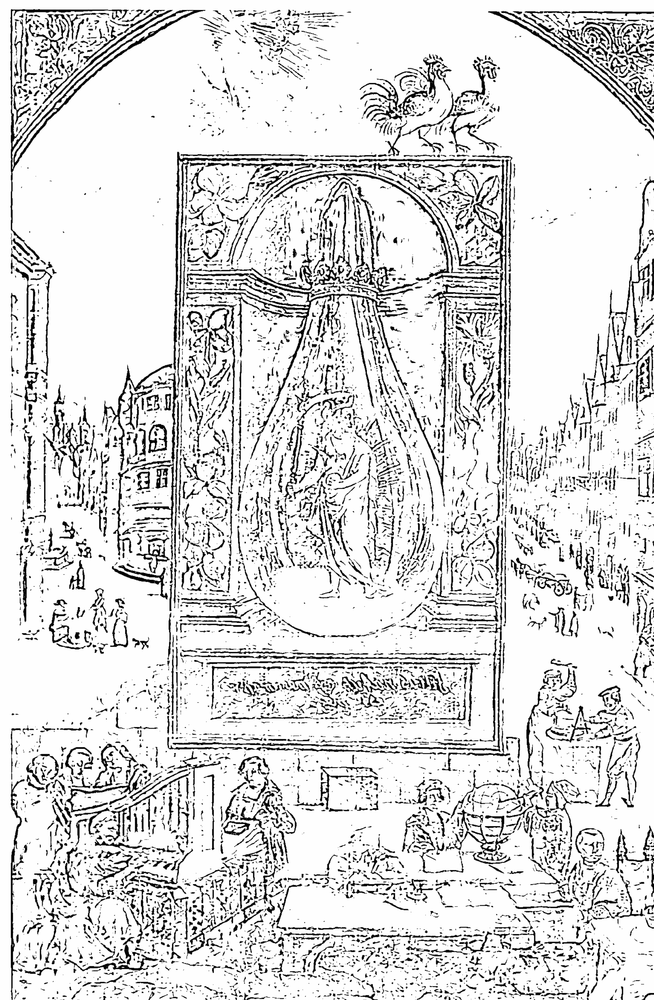

與任何力量相比，它是最強大的。因為它能超越一切精微之物，進入一切固體之中。

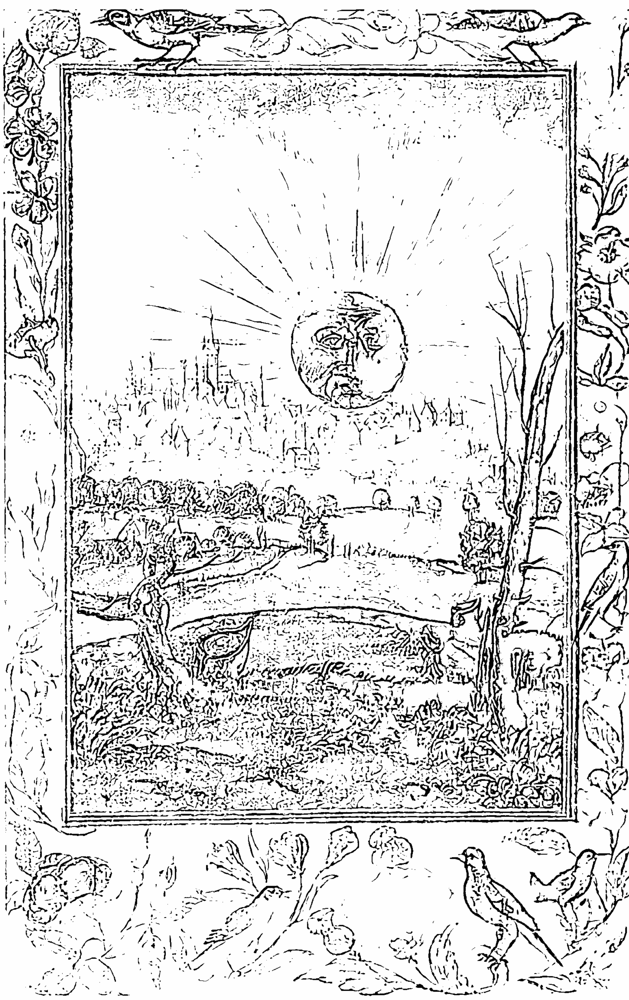

宇宙由此而創造出來。我所說的有關太陽的「偉大的工作」就是這樣完成的。

它能從地面飛到天空中，然後它還能再回到地面，將上界和下界的一切力量集於一身。你會因此而得到全世界最卓越的榮耀，你身邊的一切陰暗都將消失。這是強大的力量中的最強者，它超越了一切奇蹟，也能滲透進所有堅固的事物之中。宇宙就是這樣誕生的。

按照這一過程，唯一的元素產生了許許多多非凡的變化。我被稱做赫爾墨斯的原因，是因為在我身上集中了全宇宙智慧的三種角色，關於「太陽的工作」，這就是我說的全部要旨所在。

《翠玉錄》被歐洲的煉金術士們認為是自從這一學說產生以來最早，也是最權威的論著。所以它也最接近他們所要尋找的真理。所有煉金術士都以這神秘的十三句話作為指路明燈，他們把它寫在實驗室的牆上並且反覆地閱讀和思考。

## 天使送來《猶太人亞伯拉罕之書》

煉金術歷史上最著名的大師之一尼古拉·勒梅，在夢中曾經得到過天使贈送的一本書，而在夢醒後真的有人送來了一本名為《猶太人亞伯拉罕之書》的書，而且與夢中的完全一致。此後尼古拉用二十一年的時間研究這本神秘的著作。為何會用如此長的時間去攻讀這本書呢？就因為它使用的是煉金術的語言，而不是我們這個世界的交際語言和普通文字。這種語言從傳入西方世界開始，就稱為「能與鬼神相通的魔法語」。煉金術大師們希望把自己的知識保存並流傳下去，但是為了能

## 探索館

讓普通人和心術不正之輩知難而退，於是他們便在著作中使用一系列令人費解的圖案和符號。按照常規的閱讀方法，你根本無法看出前後文的聯繫，因為你不明白它的敘述次序，理解也就無從談起。除非你手裏握有打開這種「魔法語言」的鑰匙，那就是尼古拉想從《猶太人亞伯拉罕之書》那裏找到的東西。

如果你得到了這把「魔法語言」的鑰匙，那煉金術著作的全部奧秘便會展現在你面前。從那些雜亂無章的文字中你就能理出實驗操作的頭緒來，那些奇異的符號和圖案就會向你述說它們的隱秘。這就如同在一個陽光燦爛的下午，一位煉金術大師帶著你在美麗的花園裏漫步。這把「魔法語言」的鑰匙被煉金術士們代代相傳，而如果想理解這部《猶太人亞伯拉罕之書》，你就需要找到這把神奇的鑰匙。

如果想理解煉金術著作的語言，首要的就是把我們頭腦中的常識和概念統統忘掉。在煉金術語言中，「太陽」並不是我們所看見的那個太陽，而「鹽」也並非我們食用的那種鹽，「水銀」不是水銀，「硫黃」也不是通常意義上的硫黃。當大師們說行星的時候，其含義是：宇宙以地球為中心，七大行星——月亮、水星、金星、太陽、火星、木星和土星，圍繞著地球運轉，雖然這與我們的常識相悖，雖然我們知道地球並非宇宙的中心，但在煉金術世界中這就是成立的，你需要用煉金思想去思考問題。

煉金術士在描述物質時所說的「冷」、「熱」、「乾」、「濕」並不是在說感覺，而是在指物質的性質。這種對物質分類方法的首創者是希臘大哲學家亞里斯多德。他認為世界是由四種元素構成的：它們是火、氣、水、土。而四種元素具有不同的性質：「火」的性質是「熱」和「乾」；「氣」的性質是「熱」和「濕」；「水」的性質是「冷」和「濕」；「土」的性質是「冷」和「乾」。這則是阿拉伯煉金術大師札比爾的創造。

物質中的四種元素在一定的條件下是能夠相互轉化的。而性質相同的元素之間的轉化要容易得多，比如從「火」到「土」的轉化，因為它們具有同一種性質：「乾」。而「火」與「水」這兩種元素卻有著巨大的反差，性質上截然相反。「氣」與「土」也是同樣的情況，雖然難度要大一些，但這兩對元素之間不是完全不可能實現轉化的。比如，要想把「水」轉變成「火」，那麼就先把它變為一個中間的元素「氣」或者「土」，因為它們都具有一種與「火」相同的性質。之後再向「火」轉化就要輕鬆多了。當然在實際的操作中，一切絕非說得這樣簡單。

另外有一點是極其重要的，中世紀的煉金術士們知道的金屬只有七種——金、銀、鐵、水銀、錫、銅、鉛。而事實上他們使用過的金屬比這要多許多，也就是說他們口中的「鐵」，其實並不僅僅是那唯一的一種金屬物質。你不要指望煉金術士會在他的著作裏清楚地標明這些金屬的名字，他們是不會有「投入鐵二十克、錫十一克，再加二克鉛粉」這樣的表述的——一個煉金術士不會這樣說，只有化學家才會這樣做。典型的煉金術說法應該是「投入九份戰神，再加五份閃電，最後讓農神帶走一切」。

幾乎所有的煉金術士都會用隱晦的神話和比喻來描述他們的實驗，一般情況下他們會用七大行星的名字來比喻七種金屬，這也與一週的七天相聯繫。

## 揭開煉金術的秘密

金：金是來自太陽的高貴金屬，所以用最完美的圓形來描繪。
銀：散發銀色光輝的新月。
鐵：火星戰神的盾和長矛。
水銀：信使之神墨丘利的權杖。
錫：此符號來自閃電之神的標誌。
銅：從海中誕生的維納斯的玫瑰。
鉛：蒼老而遲鈍的農神，頭上頂著時間沙漏，手裏握著彎刀，最後就被簡化為這樣的符號。

也許你已經覺察到，這一系列符號可以用來代表三種概念：行星、金屬和星期。所以當一個煉金術大師說「太陽」的時候，很可能指的是「黃金」，或者「星期天」。其中黃金是最完美的金屬，它是創造宇宙的「第一物質」的完美體現，而其他的金屬則在各自的衍變過程中，因為種種條件或者環境因素的制約而發生了變異。要想加速它們的完美進程，就只有求助於「魔法石」了，這也正是煉金術士們夢寐以求的東西。

## 大師尼古拉留下魔法圖

在《猶太人亞伯拉罕之書》當中，有七張具有重要象徵意義的圖畫，偉大的煉金術士尼古拉曾深入地研究過它們，對此他提出了自己的解釋。

- 一蛇吞吃另一蛇圖：暗喻煉金術實驗中各種物質融合的過程，這是製造魔法石的第一步。
- 被釘死的蛇一圖：這一圖案與耶穌受難圖類似，蛇代表著物質原初不完美的狀態。如同耶穌受難後再復活。「磨難」在煉金術裏的對應意義應該是「腐化作用」，寓意著最初的原料在被轉化為完美的不朽物質之前必須經歷一個腐化過程。
- 沙漠裏的群蛇圖：「荒漠」和「泉水」分別象徵著「乾」和「濕」，兩者共同營造了適合蛇孵化和繁殖的環境，隱喻著魔法石增殖所需要的環境。群蛇象徵著腐化作用產生的腐蝕性強酸，它能調和兩種性質完全相反的物質——金和銀。在煉金術語中，這種強酸有時候也以毒龍或毒蛇的偽裝出現。
- 老人之圖：頭戴時間沙漏的老人代表農神，象徵著鉛，信使墨丘利代表水銀，帽子上的翅膀表示水銀的揮發特性。這幅圖隱喻著用鉛來去掉水銀的揮發性。
- 希律王圖：「聖嬰之死」象徵著實驗的「煅燒過程」，在這一過程中各種元素在燒瓶中被加熱到「死界點」，或者被氧化。在某些煉金術書裏這一過程也被稱為地獄，癲癇病或世界末日，這些意象都與死亡相聯繫，而死亡是腐化作用中重要的一環。太陽和月亮共同沐浴則象徵著「溶解」和「清洗」，意味著物質在燒瓶中被分解，清洗並最終白化。在其他的煉金術著作中，類似的意象還有「國王和王后」、「亞當和夏娃」在長頸燒瓶裏擁抱然後交合，或是赤裸著一起坐在水池或浴缸裏舉行「化學婚禮」。
- 山頂之花圖：圖中有煉金術中主要的四種顏色，藍色代表腐化作用；紅白花隱喻著兩種要素，硫黃和水銀；葉片的金色意味著這兩者通過腐化作用後就能形成更珍貴的金色物質，並最終轉變為魔法石。
- 花園圖：芬芳花園在煉金術裏常常隱喻著煉金術士的實驗室。中空的橡樹象徵著煉金術實驗中使用的爐子或燒瓶。泉水象徵著魔法石的來源。花園裏的瞎子隱喻著假煉金術士，他們在尋找開始煉金術實驗的最初原料。但他們忽視了自然的啟示，所以只能是盲目地尋找。

而這所謂的「第一物質」的秘密，很可能就是宇宙由來的奧秘所在。如果「魔法石」能促進賤金屬的完美，同樣的，它也就一定能促成人體的完美，最終達到不朽。之所以能有這樣神聖的力量，因為人們認為它來自於太陽，因此也有人稱「魔法石」為「太陽之石」。

煉金術實驗所需的最初原料又被稱為「第一原料」，煉金術士常常稱之為「最珍貴之高貴者，同時也是最廉價之低劣者。無處不在，卻也最難尋獲」，它總是可以輕易地從無知者眼前溜走。第一原料似乎與泥土有關，有人認為它就藏在污穢的糞土裏。只有從「第一原料」中才能提煉出能夠使金子繁殖的精華物質——魔法石。這種第一原料是實驗開始的地方，如果沒有大師的指引，你很難知道這到底是什麼物質。第一原料的問題曾經困擾了尼古拉整整二十一年之久，他曾經說：「應該用什麼原料來開始這一偉大工作呢？我始終無法弄明白，我為此而長久地嘆息。」

# 一首煉金術的詩

一條龍騰空而起，它暴露
在馬糞中二十天之久，
吞下它的尾巴直到什麼都沒有留下。
這條他們稱之為咬尾巴的龍
看上去是白色的皮膚上有斑點，
還有一種看似很奇怪的形狀。
當它誕生時，它從溫暖
而潮濕的聯合物質中躍出。
男性和女性緊緊擁抱
一種在海裏出現的聯合體
誕生了這條龍，誠如所言
一個怪物以它全部的能量和裝備
用火把地球的一切燒焦，
它到處游弋來到一個地方，在
尼羅河的激流之中；他那閃爍的皮膚
以及環繞全身的條紋
像金子般的明亮，閃著光芒。
這條龍在海裏被抓住和殺死
你用熟練的技術，快速揮動著刀子
刀刃上冒著熱氣和潮濕，然後
它的屍體上有兩個刀口，流出
膽汁，呈現出黑色的形式，
其重量和實際的膽汁相同；
朦朧的霧氣升騰而起
這些霧氣越變越濃
把那條龍從海裏圍起
把它高高舉起送到一個溫暖的地方，
得到滋養；然後小心翼翼
剝去那些燒焦的東西
在神聖的溪流中改變它的性質
關閉通風口；把水銀倒入
一個開口的甕裏，當它那神聖液體的
溪流不再流動，然後小心翼翼地洗去
沾上泥土的黑色雜質。
光芒又照亮了黑色籠罩在龍的
後代身上的東西，枯萎帶來了
一個難以言說的秘密；
因為它將閃耀著格外明亮清晰的光芒，
而且，通體上下染成全白色，
將展示出不可思議的光芒，
它的黑色全都變成了白色；
因為當雲霧送來的水在它上面流過
把所有的黑色和泥汙洗淨。
這樣它輕而易舉地釋放了自己
通過喝下甘美的飲料，儘管完全死去；
它把它所有的財富統統埋葬
通過它的幫助地球上誕生的萬物得以保存
充滿生機，當他們發現
那驚人的秘密，被混合在一起
將變成銀子，閃耀著眩目光彩的，
沒有一點雜質的金屬，
閃耀著如此明亮、清晰和美妙的白色。

## 第三章 神聖的藝術 煉金流程

### 一、賢者之石

我們已經知道，煉金術是貫穿許多不同文化體系的一種神秘的工藝技術。它對現代自然科學中的物理、化學，甚至人類心理學的影響，在今天看來都是深遠的。煉金術可以分為三個基本體系：西方煉金術、中國煉丹術和伊斯蘭煉金術。除了中國煉丹術追求長生不老之外，其餘兩個體系追求的均是將賤金屬轉化為貴重金屬，即我們俗稱的「點石成金」。

而這塊「點金石」或者說「賢者之石」，就是西方中古時期的煉金術士們找尋了幾個世紀的點石成金的關鍵之所在。《煉金術博物館》一書曾有過這樣的記載：「人們將點金石稱為『賢者之石』，它是最古老、最神秘或是最不為人所知的，從性質上看是最不可理解的，也是天上的、降福的和神聖的。據說，點金石是真實的，而且比確鑿性本身更為確鑿，是奧秘中的奧秘。它是道德和神的力量，但對無知者則是隱秘的，是天底下萬物的極限和目的，一切哲人操作的最終而不可思議的結果；它是所有要素的完美精華，任何要素無法損害或毀壞的不可毀滅的物體，是第五元素；它是自身擁有精神的雙重而有生命的汞，可處理一切不堅固的和不完善的金屬，它是永遠的光輝，是能治癒所有疾病的靈藥，是恩澤天國榮光的不死鳥，是所有財富中最為珍貴的寶物，是整個大自然最重要的財產。總而言之，所謂「點金石」的用途就是把賤金屬轉換為貴重的黃金或白銀。

中世紀的煉金術士們認為，所有的金屬都是由水銀和硫黃組成的，其中水銀是一切金屬的本原，硫黃是一切可以燃燒的物質所共有的部分。金銀含有純粹的水銀和硫黃，普通金屬和貴重金銀之間的不同，僅僅在於其中水銀和硫黃的純度與比例不同。運用「點金石」則能夠改變金屬的性質，它是神聖的，具有魔力萬能屬性。煉金術士用「點金石」這個名字表示完成整個一系列操作工序的煉金術產物。它意指煉金術士努力的完美體現，被稱之為「神靈的物質化」。

煉金術士們在文獻中用莊嚴的筆調指出點金石的力量，把它描繪成帶有太陽特徵之石。太陽的特徵表現為易變的紅色。煉金術士巴西爾對此寫道：「其顏色為近似深紅色的肉紅色，或是接近石榴紅的紅寶石色，至於它的重量，則比人們根據顏色推斷的要重得多。」煉金術士們用種種細節表明，點金石與人們所知的相去甚遠。儘管它的重量接近於金屬物體，但事實上卻和晶體相似。有人對它作了進一步的說明，描述了其外觀、形狀和熔點：「在由大自然完成和形成的最後完善階段，它應該像蠟或黃油那樣會熔化，外觀為半透明和透明之間，而這便是我們的聖石。」煉金術大師富爾卡納利斷言：「具有這些物理特性的點金石綜合了強大的化學性能，滲透力、絕對不變性、使之不能煅燒的不氧化性、極強的耐火性，以及對化學品的極好惰性。」

根據傳說，點金石具有一種神奇的特性，它能使普通的「被授予奧義」者升級至「精通的煉金術士」的行列。「精通的煉金術士」一旦得到了它，便可以將書籍付之一炬，因為再也沒有什麼可學習或可期待的了。獲得上帝的這一禮物，就能得到財富、永遠的健康和真正的知識。為此許多煉金術士竭盡畢生的精力去尋找點金石，無論金屬、礦物、植物，甚至動物的骨頭、血液和肌肉。由於煉金術在一定程度上依賴於宗教（在這一點上中國的煉丹術和伊斯蘭的煉金術也有類似之處），一些國家的國王和僧侶大力支持煉金術，所以他們能得到相應的資助以延續這項艱難的工作。儘管如此，「賢者之石」仍未在現實中出現過，起碼至今也沒有人見過真正的點金石。

只在傳說中，十四世紀的法國煉金術士尼古拉曾經在一三八二年一月十七日製成了點金石，並且用它將鉛變成銀，將水銀變成金。尼古拉在參與煉金之前只是巴黎的一名抄寫員，有一天晚上夢裏的天使給了他一本書，之後真的有人送給尼古拉一本名叫《猶太人亞伯拉罕之書》的書，書中充滿了晦澀難懂的文字和符號。一三七八年，一位改信基督教的猶太老人幫助尼古拉破譯了書中部分符號，四年之後尼古拉煉成點金石，成為當時有名的富翁。他死後墳墓多次遭到盜掘，想得到這本書的人多如牛毛。傳說十七世紀的紅衣主教黎塞留曾經得到過《猶太人亞伯拉罕之書》，但是他仍然不能破解神秘的符號。在他帶著遺憾死去後，這本書就失傳了。倒是尼古拉，有報導說在一七六一年有人在巴黎大劇院裏見到過他和他的妻子——關於他的一切都成為了傳說。

可能最令人感興趣的部分是點金石的煉成方法，中世紀的煉金術士曾將這種方法記錄了下來，其所用的是今天的人完全無法理解的語言：「取哲人水加熱，直至變為綠獅。繼續加熱就變為紅獅。將酸葡萄酒倒入砂溶中，加熱紅獅，再進行蒸餾。水星變為用小刀切開的樹膠。再將樹膠放在賢者之卵中蒸餾，製得不可口的液體、酒精及紅色液滴。所羅門之鬼魂以其披風遮蓋賢者之卵，你可以看見一條龍在容器內，它將自銜其尾。取一條黑龍置於石上，與菩提樹灰接觸即會燃燒起來，火焰呈檸檬色，又生成綠獅，令其自銜其尾，重新蒸餾。最後你必須謹慎清理它，即見熾熱之水及人血，此即點金水。」

圍繞以上一段記述，我們至少有幾點可以關注：

第一點是煉金術的原材料其實都是我們今天所熟悉的某些礦物和金屬，而它的神秘面紗，也正來源於它象徵性的語言和符號。也就是說想要解讀這段話就必須與現在的名詞相對應，好在我們知道其中部分詞語所代表的煉金物質。比如：「太陽」代表黃金，「水星」代表水銀，「黑烏鴉」代表鉛，「灰狼」代表錫，「太陽花」意味著紅色的煉金藥液等等。而煉金所用的設備，如上文中提到的「賢者之卵」，據說則是由埃及出產的一種密封蒸餾器，它象徵著物質轉換跟宇宙相結合而孵化出的蛋。諸如此類象徵性的用法有很多，並且煉金物質和設備都有其相對應的符號。此外，煉金術中所歸納的十二個步驟與黃道十二宮的星座符號相同，這也體現了煉金術與星相學之間密不可分的關係。將這些符號整合起來，所謂的「煉成陣」，某種程度上應該是指煉成某種物質的方法的符號集合表示方式。這在當時也是只有煉金術士才能看懂，而旁人則無法窺探的領域。

第二點是所謂「點金石」的成色，從煉成方法的那段語言來看，它應該是具有人血一般鮮紅的顏色。但是為什麼是鮮紅色呢？這就涉及到除了象徵性語言和符號之外，煉成過程中煉金物質因化學和物理反應所產生的顏色變化。舉例來說，首先，煉金術中的「變黑」是物質混沌而需要融合的階段，在十六世紀的煉金術文本《玫瑰園哲學》中，這一過程被描繪為一個女人與一條龍廝殺的場面，龍殺死了這個女人，而女人同時也殺死了龍；通過「變黑」之後，就可以達到一個新的狀態——「白化」——金屬由黑變白的過程。這個過程至關重要，因為它是一個質變的過程，代表著對立面的統一，也就是說物質達到了一個較為穩定的結構。由黑到白的過程，是說必須由一種物質的消失來換取另一種物質的產生；在「白化」之後，即將達到一個終極的理想狀態，也就是說必須要有「血」，即生命的紅色，才能將理想狀態轉變為存在方式——這就是「變紅」的過程。西方煉金術是如此重視顏色的變化，大英博物館館藏仿羊皮文稿《太陽的光輝》，由十六世紀的煉金術士特里斯默森所畫，書中繪製了煉金容器賢者之卵，公雞和龍、五顏六色的孔雀尾羽等，所表現的都是煉金過程中顏色變化的不同階段。

第三點是煉金術語言的特殊表示方式。比如「通向太陽的通道被綠色的龍吞噬了」，這句話的意思是含有銅成分的金子必須用酸性溶液來溶解，令溶液染成黃綠色，從而祛除掉金子中的雜質，也就是殺掉綠色的龍，開闢出通往太陽（黃金）的通道。龍代表混沌，所以煉金術中的「屠龍」所指的也就是淨化提純的過程。

綜合以上三方面的分析，有人將點金石的煉成方法歸納如下：

- 將金、銀、水銀放入含有硫酸、硝酸和鹽酸的酸性溶液中溶解，把溶解後的金銀汞混合溶液放入「賢者之卵」中，以爐火加熱數月之久。經過一系列顏色的變化，由雜色變為黑色、黑色變為灰色、灰色變為白色、白色變為黃色，最終變成成人血一般的紅色粉末。把純金溶解在坩堝中，分次撒入紅色粉末，最後就形成了紅色塊狀物，也就是點金石。

如此炮製似乎並不麻煩，而這個所謂的點金石也就沒有什麼特別了。但是煉金術士們追尋了幾個世紀的東西果真就是這樣一塊合金嗎？是否真的有人曾經煉成點金石並點石成金？所有的這一切仍然是謎，也許，點金石只是一種美好的象徵，會與追求它的信念一起永遠存在於人類的血脈之中。

那麼又怎樣應用點金石呢？據煉金術士們所言，只要將點金石的力量引向人們決定實施轉化的物質便可，如泡麵一般方便快捷。根據適當的製備，點金石可以相繼對人類、動物、植物和金屬起作用。固態的點金石在與最純的金和銀直接熔化狀態下沸騰時，便是一「噴粉」，即一種可噴成霧狀的半透明塊，根據所使用的金屬呈紅色或白色，專門用做金屬衍變。這種粉末在坩堝內噴在賤金屬上，具有改變其本質並實施轉化的性能。粉末狀態的點金石在動物界和植物界具有多種特定用途。在所有的層面上，它是宇宙的靈藥，能夠治療疾病、保持健康，使植物奇蹟般地生長。它與酒精組成的混合液體，是唯一真正的生命之水，可以讓人擁有神靈般壽命的長壽神水。

傳說點金石可以無限制地繁殖，還可以改變形狀，一旦冷卻之後會處於永久的流動狀態，而不再返回到結晶狀態，它是光明和煉金術士獲得啟示的源泉。按照歐仁·康瑟利耶的解釋，點金石囊集了朝拜初生耶穌的東方三博士帶來的三份饋贈物。點金石給予「精通的煉金術士」三份珍貴的禮物，即財富和香料——神聖智慧的象徵，以及沒藥——古代埃及傳說中所說的使人不死的物質。不過，這些上帝的饋贈只有在操作的最後階段才能得到。在此之前，煉金術士必須經過漫長的實驗，採用無數難以實現的秘密方法。煉金術士為完成這項任務而付出的所有巨大的努力，被冠以「偉大的工作」之名。

## 揭開煉金術的秘密

## 二、偉大的工作

對於「偉大的工作」，煉金術士們是這樣理解的：它指的不僅僅是一系列實驗和操作，實際上指的是尋找煉金術著作並且運用全部精力閱讀它們，同時這也意味著無數個不眠之夜的禱告。可以肯定的是，「偉大的工作」是以其獨特的眼光看待整個世界，他們「滿懷喜悅地環顧四方，翻動芬芳的土地，採摘果實，凝視首飾和瀑布上的彩虹和人體紅潤的皮膚、動物皮毛或閃閃發光的金屬鑄件上的光澤」，煉金術士們開始明白，一切物質的活力都是「偉大的工作」賦予的，冥冥之中有一隻手在勤勞地工作，對整個世界進行不停的設計和改造，有時候它把一切都掌握在手中，使物質變得堅硬；有時候它又把物質研成碎末，讓它們在手指間流動；有時又撫摸它們，讓物質發射出燦爛的光芒。煉金術和一切智慧的奧秘，都包含在揣測這隻勤勞之手的能力之中，而漫不經心的人和悲傷者是壓根兒看不見這隻手的。

對煉金術士們而言，「偉大的工作」的全部含義就等同於煉金術的意義，它表示這門象徵性學說的本質，以及建立這門藝術的最終哲學體系的邏輯方法。這種美好的願望及其特有的方式，體現了煉金術著作《化學劇場》一書中一段話的全部價值：「我們從來都不該擔憂是否真正擁有這一珍貴的寶物，而是應當自問是否目睹世界是如何創造出來的，是否瞭解埃及及奧妙無窮的大自然，是否瞭解彩虹的由來，以及宇宙復興之日恩澤天國榮光的肉體獲得新生的問題。」

黑天使身邊冒著火焰的坩堝、阿爾梅尼的牝犬、哲人之梯、方形石、油燈、朱庇特的方巾、象徵時間的漏壺、火輪、代表重量的天平、象徵測量的圓規，以及球體、耶穌受難的器具、哲人之匙，都是各個時期煉金術士最珍視的象徵物。

所以，那些煉金術大師們總是聲稱秘方是沒有用的，而真正的奧秘存在於大自然中。這是因為，實驗室裏的操作其實是在重複造物主曾經進行過的「偉大的工作」時經歷過的同樣情況，秘密而深奧的自然法則也支配著術士們的煉金術操作，需要他們通過季節的循環來調整，要被動地等待有利的外部條件。對煉金術士而言，重要的是通過操作感應宇宙、天與地、恆星與行星，在其感應活動中與自身的小宇宙建立起聯繫，並把它選定為生命之神靈的容器。

煉金術士們說，「偉大的工作」需要投入所有的精力，普通人通過它的幫助可以成為自己小宇宙的主人。他必須控制自身的混沌物質，將其淨化並重新賦予活力，使之適宜隨後充滿神靈的狀態；他必須把構成物質的不同本質予以區分和利用，然後重新結合成一個統一的整體，通過最終的神靈化轉變成點金石。

## 兩種途徑：乾法和濕法

因為煉金術具有屬於它自己的一系列人們不理解而極富操作性的特點，所以有人稱之為「實驗玄學」。它形成了認識論的神秘體系，也就是某種實際認識論。按照這種觀點，只要動手進行一整套符合煉金術要義的操作，便會有許多出乎意料的奇蹟出現。

為了實現這種奇蹟，煉金術士們採用了許多不同的方法，曾經有過很多關於準備工作或者是操作階段的描述，其中的一些具有高度的概括性，還有一些則十分繁瑣。人們通過這些描述懂得了操作方法實際上是多種多樣的。不過可以肯定的是，工藝的連貫性是永遠必須遵守的，符合規律的循序漸進的操作分為三個階段，其變化取決於不同的方式。

不同的煉金術士採用的操作方式也是不完全一樣的。一些人長期研究並且採用了被稱之為「濕法」的方法，而其他大多數人都偏愛「乾法」。「濕法」也叫做「長時法」，因為它需要較長的時間，使賢者之卵在有利的時機成熟，成為一只封閉的晶體玻璃球。煉金術士採用了這種方法，就可以用肉眼觀察轉化的各個過程，看到被稱之為「孔雀尾巴」的現象，也就是顯示煉金術混合物融合完全成功和物質真正實現轉化的有形結果，以及反覆的顏色變化。「乾法」通常被認為是走霉運的人發明的，也被叫做「短時法」。它與濕法的差異在於更經常性地使用坩堝。常用的方法藉鑑於冶金技術，其所依據的是熔煉原理。包括尼古拉·勒梅在內的許多煉金術大師都借用了這種操作方法。

## 三個階段：汞、硫黃、點金石

那些從事研究的學者在仔細探索完全連貫的操作時，會感到十分困惑。我們早就已經知道，這正是整個煉金術最為隱秘的領域。煉金術士的「偉大的工作」剛起步的時候，選用了哪種材料？他們建議人們何時開始工作？工作又是什麼時候完成的？重複必要的操作的確切次數到底有多少呢？

讓我們來看看那些煉金術大師的觀點吧：煉金術大師魯庇西薩認為：「煉金術的原材料沒有什麼價值，幾乎到處都有……」另一位大師摩利努斯表示贊同，肯定道：「這種物質是特殊的，無論是富人和窮人都可以擁有，它不為人們瞭解，就在所有人的眼前，民眾不把它當一回事，當做爛泥廉價出售，但是煉金術士瞭解它，把它當做寶貝。」

這些說明似乎肯定了煉金術士的工作向來都是運用一種源於無機物的特殊物質。煉金術大師富爾卡納利也證實了這一點，他說：「這種原初汞通過硫黃到砷的乾燥作用而得以物質化，儘管完全是易揮發的，但外觀為固體物質，黑色、緻密、纖維性、脆弱、易碎，它的用處很小，因而在人們的眼中顯得低劣、卑微和微不足道。」

在何時開始「工作」，是非常關鍵的問題。從大量的占星術論著上我們可以確定，春分是最為合適的日期。煉金術實驗是遵照大自然的時令進行的，而造物主確定的使地球獲得生機的春天，當然是再合適不過的了。而依此類推，結束煉金操作的最佳時機應該是果實成熟的秋季。

從總體上說，「偉大的工作」可以分為三個階段，同時有三種不同的物質與這三個階段對應：先用鹽製造汞成分而後製造硫成分，然後將兩者混合進行「蒸煮」（即焙燒），由此得到點金石。在不同的階段裏所使用的方法，隨著個人對於煉金術的理解不同而產生差異。比如煉金術大師阿爾伯特便認為這一「工作」有多個過程：將物質還原到「原初物質」；提取硫和汞；提純所得到的硫使之看上去像金銀；製備「白色製劑」。整個過程分為分解、洗滌、還原、固定等程式。

關於煉金術士的著作十分豐富，可是沒有哪一本曾經提到過三個階段中各個階段的操作次數。曾有人提出，根據日、月的週期，每次操作時間為七～十二天。而煉金術大師康瑟利耶曾作過很有價值的闡述，他斷言第二階段工作應該包括九次昇華（或稱為「鷹」），「蒸煮」在一週內結束，經過蒸煮而產生的和諧的一系列色彩才能向降福的煉金術士顯示獲得了成功——點金石誕生了，爐內物質與煉金術士的精神達到了完美的結合。

「偉大的工作」第一階段

灼熱的火神將兩者結合

火龍的腹內藏著魔鍋

液體呈礦泉水，上面漂著浮渣，將浮渣撇去，用火和鹽清除雜質，連續三次。

假如土星在火星之鏡裡照出了自己的影子，這些就會變得輕而易舉。

## 三、遺囑中的操作

煉金術大師尼古拉·勒梅，原本是巴黎的一名文書抄寫員，可是傳說他在神的啟示下得到了一本書——《猶太人亞伯拉罕之書》，從此走上了煉金術的道路，並最終成為了一位有史以來最偉大的煉金術士。據說他和他的妻子潘乃麗已獲得了長生的方法，一直生存到了今天——當然無人能確切地證實這一點。

不過尼古拉倒的確是有一份遺囑留傳後世，這份文稿是寫給他一個名叫皮埃爾的侄兒的。遺囑被寫在詩集的邊緣的空白處，原稿的文字很難辨認，其內容不是為了交代房產的歸屬、錢財的安排，而是給他比這一切更有價值的東西——一個從人類神話時代流傳下來的秘密，也就是煉製點金石的方法。

下面就是在這份遺囑中尼古拉交代的煉金術「偉大的工作」的實際做法：

在開展一切工作之前，你必須要十分仔細地找到一條成為智者的正確道路。那些造就了大自然的主要原素——太陽、月亮和星星，和在巴黎聖嬰公墓的拱門上顯示的那些圖案完全一樣。然而在長達二十三年的時間裏，我一直都犯著一個可怕的錯誤，那就是，苦苦實驗，卻沒有讓月亮和太陽結合，從中抽取「可生殖污穢」。這是一個致命的因素，因而我無法認清用來加強水銀的媒介，沒有這個媒介，水銀不過是普通的水。

要知道，只有一種金屬媒介能夠讓水銀的作用得以加強，如果缺少了這種金屬媒介，它將永遠不能滲入太陽和月亮的體內。之後它必須被硬化處理，這裏也只有金或銀的硫黃靈魂才能對它產生影響。所以你首先要做的就是用一種金屬媒介打開它，也就是高貴的土星，當水銀被一種哲學的方式啟動以後，你就可以用這水銀將金銀溶解在一種液態當中，並從它們的腐化物中抽取出生殖力的污穢物。

你必須清楚，要想實踐這門神聖的藝術，只有我所說的一切才是通向成功的途徑，除此之外沒有任何其他方法。如果沒有我指導你的實驗操作，那麼它是永遠難以完成的，你找不到正確的路。你必須相信，煉金術原理最為重要的一點，就是準備好智慧的水銀，因為在它的體內包含了我們尋找的一切元素，那些古代的先賢們都用畢生的時間來尋找它。如果缺少了水銀，以及和它共存的太陽和月亮，那麼同過去的許多人一樣，我們將一事無成，因為如果缺少了這三樣物質，這個世界上就沒有誰能得到夢想中的「魔法石」或者是「靈藥之石」。當然，即使把它們全部找齊之後，我們還是要試著從其中提煉出生命和靈魂的種子。

所以要想成功，你必須擁有賢者吃苦耐勞的精神，把所有的精力都傾注在太陽、月亮和水星上面。水銀會「弄濕」金屬而不是你的手，在金屬的裏面，蘊藏著硫黃的不朽靈魂，名為「灼熱的硫黃之光」。你應當親自接觸這些金屬，否則自己就會走火入魔到邪路上去，在任何一種物質裏你都能找到這種「硫黃」。它是極容易被發現的，因為它和金子十分相似。在火星洞穴的最深處，它表現為鐵；在金星上，它表現為銅。在這兩個星辰上它的藏量是相同的，通過認真地研究，你會發現這種硫黃本身具有神奇的力量，它能把純正的銀——原本是潮濕寒冷的月亮染上太陽的金黃色，不過在這樣的過程中，需要有一種精神媒介進行干預，也就是說，得有一把鑰匙打開所有這些金屬。我以後會給你詳細地講解這一點。

第一步要選出土星的第一胎孩子，並把它平均分成九份，接著把上帝的騎士聖餐杯平均分成四等份。再把皇后都放入坩堝裏，等到它變成了柔和的紅色時，就把九等份的土星孩子全部投入其中，這時你會觀察到那些後來加入的物質在瞬間變成了紅色。此時你要仔細地用硝石和酒石把土星表面存留的汙物清除掉，這樣反覆四五次後，你便可以見到一個如同星星一樣的晶體出現了，到此時證明你的操作是成功的。因為你已經製成了鑰匙——軍刀。用它能夠將一切金屬切割開，太陽、月亮和金星吞進了它的體內，這就等於是說，要完美的國王，在運用賢者方法後便能把它推到最光榮和偉大的頂點。土星作為高貴的勝利之藥，是不雌性和雄性共同納入體內，是陰陽同體的水銀。在《猶太人亞伯拉罕之書》的第七頁上，畫著兩條巨蛇纏在一根金杖上，就是象徵著這個土星或兩性體的水銀，需要特別注意的是，你需要準備充足的水銀，需要十二、十三磅或者更多，這同你所期望得到的成果的量成正比。

接著，把神聖的雌雄同體的水銀同普通的水銀相融合，那些普通的水銀將被啟動，把這樣的操步操作你就能得到較之前多兩到三倍的液體，在《猶太人亞伯拉罕之書》裏是以玫瑰樹為象徵，那玫瑰樹從一棵中空的橡樹的根部向上生長。橡樹就是我們的土星，高貴的鑰匙。呈現白色的液體順著溝壑朝深淵流去，這意味著在火力適當的條件下，分量倍增的水銀通過蒸餾器的瓶頸下墜掉入容器。

在操作過程中會有許多難以克服的困難，這裏你只能祈求上帝給你以啟示了，或者有某位煉金術大師能給你以指導，否則你的操作就無法繼續下去。因為水星是不會和高貴的土星結合的，能讓它們融合在一起只有一個方法，而這個方法便是全部的奧秘所在，如果你不打通這一個關口，那你將永遠不能到達成功的彼岸。但是親愛的侄兒，我將會把自己瞭解的一切都告訴你。最關鍵的問題在於月亮和太陽，要是沒有這兩個重要的因素，你的工作就是毫無價值可言的，所以必須讓這位老人，同時也是兇狠的狼去吞噬金子或者銀子，而具體的用量我將告訴你。你必須仔細領會我的話，否則會犯下致命的錯誤，而我就曾經因為這些錯誤而經歷了無數次的失敗。你必須用金子餵食蒼老的龍，在這一過程中你必須萬分小心，因為如果你在這融化的土星中投入的金子太少，雖然金子的確能被溶解，但卻不能被水銀吃掉，這是一種不能調和之物，沒有絲毫用處。如果你投進去的金子太多的話，那些金子根本不能被溶解掉，而它卻會吃掉水銀。等到它們結合在一起，所有的問題便都迎刃而解了，我最後找到了解決的方法。這個秘密必須牢牢地鎖在你的心裏，這是整個煉金術實驗的最大的秘密所在，你必須保守這個偉大的秘密而不讓那些心懷不軌的人知道，否則那會導致毀滅。

下一步，取出十盎司純淨的金紅色的太陽，用這貪婪的狼去純化它九～十次；再取兩盎司高貴的土星，在一個坩堝裏將它融化，然後投入那十盎司的質地純正的黃金，讓它們融化在一起，用一根燃燒過的木炭棍攪拌。於是黃金的一部分將被溶解，然後把它倒在一塊大理石厚板上或一個鐵製研缽中，碾成粉末，再將它與三磅的水銀混合在一起充分研磨，前後反覆的碾磨，直到它們呈現為乳酪一樣的凝乳狀。用清澈的水來清洗這一化合物，直到它變得純淨，銀白純粹如同純銀或皎月。當這煉藥摸起來像黃油一樣柔軟時，黃金與高貴金色土星的結合就實現了。

用亞麻布或上等棉布非常細心地將這一團物質輕柔地弄乾，它就是我們的主角，是哲學化的太陽和月亮的高等級的結合物。現在將它放入一個上等的蒸餾器裏，把蒸餾器放進火爐中，漸漸加熱，再接入一個合適的接收器。這個水銀就是繁盛玫瑰樹之水，也就是《猶太人亞伯拉罕之書》中被屠殺的聖嬰之血，這個水銀吃掉了國王身體的一部分，從此具有了更多的力量去溶解它的其他部分，它將被土星更多地覆蓋。現在，在這藝術的階梯上，你又更進了一層。

將沉澱物從蒸餾器中取出，用強火將它們融化在坩堝中，投入四盎司土星，九盎司太陽。太陽將在這沉澱物中膨脹，被更充分地打開，因為現在的水銀較之從前更具活力，它具有了滲透和吞下更多黃金的力量。將玫瑰樹之水與這新物質結合，碾磨它們成黃油或乳酪的狀態，清洗後再碾磨，反覆數次，直到所有的黑色物質被清洗掉，弄乾後再放入蒸餾瓶，瓶子放入前述的火爐，在兩小時內用弱火加熱，直到足以蒸餾出水銀，使它掉入接收器，然後你就得到了更有活力的水銀。現在你已經上升到這一偉大藝術的更高層次上。

重複同樣的操作十次，前述的水銀就完全被啟動了，充滿了雄性的硫黃之魂，並被星辰的原汁所加強。親愛的侄兒，你要相信我現在告訴你的這一切操作，從不曾有任何哲人宣講出來或在紙上記錄過。這個水銀是一個神奇的短暫存在物，聖人們在他們的書中多次提及，他們證實僅用它成功完成了這項工作，它就是所有金屬的根。你也必能親自去完成。

現在，水銀已經充分準備好了，在它的體內已經溶入了金銀的成分，可以用它輕鬆而簡單地製造出「魔法石」，它可以將所有金屬轉化為金或銀的粉末。

顏色反映物質通過「神靈因素」起了嬗變；「混合物」起先是黑色的，然後變成白色，接著轉為黃色，最後在達到完善狀態時成為紅色。

「偉大的工作」中的某一步驟：哲人之梯將天地相連通，磁石將聖瓶中的「宇宙神靈」固定。達爾達諾斯（Dardarius）為此在《泥炭》（Tourbe）中寫道「汞是永久之水，沒有它什麼也不能形成，因為它具有宗教聖血之力。當它附在肉體上時，會因為彼此融合變成神靈，兩者會成為一個個體，即變成一方或另一方。因為肉體融入神靈，神靈將肉體轉化為神靈、聖血的色澤和顏色，而一切有神靈的物體也有聖血，聖血是一種令大自然安逸的精神體液。」

香水的起源已隨著歲月的流逝而被人們淡忘。如果說在東方人影響下對香料工藝的普遍使用，翻開了香水歷史的第一頁，那麼其後便是阿拉伯人發明的蒸餾工藝對香水的發展作出了新貢獻。阿拉伯人為什麼要進行蒸餾操作呢？是為了煉出能點石成金的「點金石」，阿拉伯人認為水銀可以使金屬互變，他們對很多物質進行了實驗，大大提高了蒸餾等化學技術。阿拉伯的化學家發明並命名了蒸餾器，區別了各種酸和鹽，完成了對無數物質的化學分析，並且還研究和製造了數百種藥品。就在這個過程中，他們中的一些人發現從曲頸瓶中流出來的液體帶有濃濃的香味，並且可以長久地保持不變，可以用來使身體或者衣物變得芬芳宜人，從此香水便流行開來。後來歐洲人進行十字軍東征，在與阿拉伯人的戰爭中發現了香水的存在。這才有了後來歐洲尤其是法國香水的興盛。

一些人認為，當他們製成這神聖的水銀以後，他們就擁有了絕對的成功，這些人大大的錯了。這樣的人只能被玫瑰的刺所傷而採不到玫瑰，因為他們太急躁。當然，如果他們懂得應該採用的量，懂得如何控制爐火，以及操作的正確方法，那他們的確不會失敗。你要非常仔細地觀察操作的每一步驟。

以上帝的名義，你可以按你想要的量取這被啟動的水銀，二～四份的水銀和二份金黃色土星，把它們很好地結合在一起，清洗並弄乾。然後把它放入一個乾淨的玻璃瓶，用「智慧的封泥」將瓶口封好，將它放入火爐中溫暖的爐灰上，以母雞孵蛋的溫度，放置四十～五十天，直到你看到瓶中出現一個白色或紅色的「硫黃」，名叫「哲人的升化物」，它是由前述

## 揭開煉金術的秘密

的水銀自身產生。你用一根羽毛將這硫黃收集起來，它是一「生命之日」和「生命之月」。取出這白色或紅色的硫黃，放入一個玻璃或大理石研缽中將其搗碎，再加入相當於它三分之一重的活力水銀，把這兩者混合成黃油狀的糊。再將這一混合物重新放入一個橢圓形玻璃瓶中，置於先前的爐灰上，保持相同的溫度，一種神奇的物質將會在瓶中慢慢出現。它漸漸發射出各種燦爛的顏色，如果你沒有把自己的心奉獻給上帝，滿懷誠懇，那你就無法看到這美妙的一切。

當物質呈現出紫紅色的光，就標誌著魔法石已經製成，現在你可以用它把任何金屬製成上等的純金。你可以通過洗滌法將其增殖，也就是像你前面的操作一樣，把它與活力水銀混合在一起碾磨，放入同種容器，以同樣的爐火加熱，但所需要的時間要比先前短得多，但它的效能卻能增加十倍。這就是使用活力水銀製造魔法石的全部過程。一些人不相信這是真的，因為他們意志軟弱而愚蠢，根本無法領會這一偉大藝術。

你還可以試試另一種方法。取粉末狀或薄片狀的上等太陽，配以七份的哲學水銀，也就是我們的月亮，又叫活力水銀，神聖水銀，混合成糊狀，將混合物放入橢圓玻璃瓶中，密封好，放入火爐。用可以使土星保持溶解狀態的火力，水銀將在金子體內上下翻滾，漸漸將它吞進肚子，直到它不再翻騰，一切都平靜下來，於是兩條龍之間的融合就完成了。

然後你將在瓶子裏看到一個巨大的黑色物質，如同融化的瀝青，這是黃金的腐化物——死亡的標誌，它就是整個偉大工作的鑰匙。接著要通過調配來喚醒它，要不厭其煩地調配它。在這期間，會發生多種變化，這個物質會煥發出各種顏色：黑色、灰色、藍色、綠色、白色和橙色，這就是真正的魔法石。我沒有指出這一過程所需要的時間，是因為時間長短取決於操作者的勤勞程度。我親愛的侄兒，如果你按照我講授的方法去操作，就不會失敗。

如果你想使製造出的魔法石增殖，就取其一份，再用兩份的活力水銀來洗滌它，混合成一團柔軟而均勻的糊狀物，放入容器，在同樣的爐火上加熱混合。這第二次的哲學之輪將比第一次花費更少的時間，粉末卻會增加十倍。如果你將哲學之輪轉動一千次，或者更多，那麼你就將得到無價的珍寶、健康和財富；如果你能適當地使用它們，那你就得到了這世界上最好的東西。

## 探索館

典型的實驗室應該黑暗，潮濕，四處擺放著不知名的藥品，散發著可疑的煙霧。許多煉金術士在家工作，以節省資金，也避開外人打擾。有些人選擇廚房，可以利用現成的爐火。有些人則搬到閣樓上，以便晚上進行的活動不會被好奇的鄰居發現。這些矮小的權宜之所常常塞滿了各種形狀古怪的儀器、手稿、頭骨、動物標本。為了精神上的禱告，通常還有小型的祭壇。所有這些擺設與其說是代表著科學，不如說是神秘主義的象徵。為了煉製丹藥所進行的工作是最原始的化學實驗，煉金術士是最早嘗試將各種元素分離開的先驅。白磷的提煉，鹽酸的合成就是中世紀的產物。他們用到過的器皿、蒸餾液體、分析金屬的設備，以及種種控制化學反應的方法，至今還在使用。

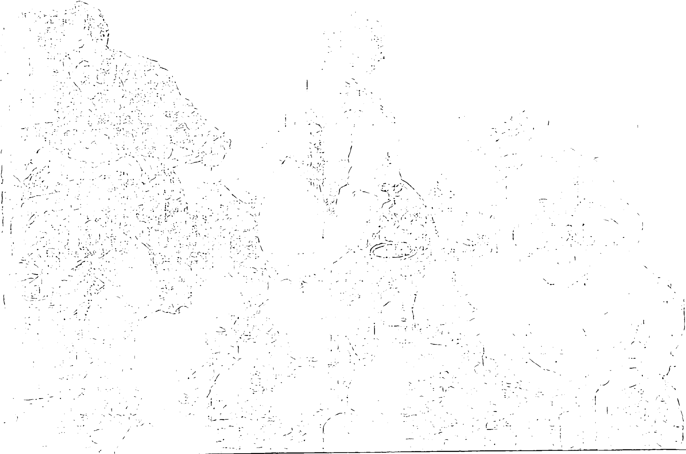

## 四、術士的小屋

現在，讓我們憑藉想像力，手持開啟奧秘的鑰匙，在一個靜謐的春夜，走進一間實驗室，去仔細觀察很多很多年之前的一幕場景：

屋中有一位令人敬畏的長者是老師，而那位求知若渴的則是學生。這是莊嚴的時刻。煉金爐之火在風箱的鼓風下燒得正旺。學生正聚精會神聽從老師的指令，在他「審慎手勢」的指揮下操作，赫爾墨斯兄弟的誓言已經宣讀完畢，因為所有的煉金術士對他們的成果都諱莫如深。在煉金術實驗開始之前，所有的人要先起立並說：「以我的靈魂宣誓，如果對別人顯露今天看到的，即會受到永久的詛咒。」就如同一位叫巴塞爾·瓦倫丁的煉金術士所寫的：「只能仰望，若是傳揚一點天國的奧秘，靈魂將淪落到最深的地獄。」

這麼做的原因有兩個：首先是高人一等的優越感或者是貪婪，煉金術士們將自己的方程式緊緊地保藏。其次是教會，他們認為煉金術是對造物者的干涉與褻瀆，煉金術士從事的是一種魔鬼的藝術；更有高尚者認為，自己的方程式可以成功，一旦落入居心不良者手中，將危害社會，因此要埋藏起來。

在宣誓過後，學生此刻正在等待明確的命令，以便進行各項操作。他清楚，從現在起，過去的他將不復存在。他也熟悉器具，知道把握時機和操作工序，更明白以前的一切，包括他的名字和個性等等不再有任何意義。

使他既期待又充滿惶恐的是，他原來的自己就要死去，將作為煉金術士獲得新生。他知道即使經過多年的研究和堅忍不拔的探索走到這一步，事實上仍處於起點和一次冒險旅行的開端。途中佈滿困難和失敗，一切都不可預測。不過，成功的回報是巨大的。普通人不甚瞭解，但其價值對於優秀的煉金術士可謂是無法估量，也就是聖子降生、神靈的三聖來朝，以及最終隨之而來的聖像牌。

煉金術士既要淨化自身的精神，還要費心安置好實驗室。應用的實驗設備主要有：一口用來熔化和煅燒的大鍋，幾把鉗子，一只鼓風用的皮老虎，幾口耐火陶土坩堝，幾只長柄勺和或多或少的藏書。如果要使這份簡短的清單更為齊全，還要加上一只研缽，一些陶瓷罐和帶柄鍋，幾只蒸餾器和過濾器，幾只能保持不同溫度的爐子，幾只用於盛放東西的短頸大口瓶，以及不滅火之爐。煉金術士的密室是這麼一個地方：通風、純潔無瑕、所處的位置有利於吸引大自然的生命之流體和神靈浸潤，以及太陽和月球投射到地球上的宇宙輻射。

傳說中的城堡深處總是有這樣的實驗室，這也是事實。從地中海沿岸的國王，到波羅的海的鄉下貴族，都把煉金術看成是通往財富的快捷方式。貪婪往往伴隨著腐敗，於是學者中也是魚龍混雜，歐洲並不缺乏高明的騙子和吹牛者，他們的所作所為可以很好地寫成一部浮誇的編年史。但正是，正如不是每個實驗室都能產生弗蘭肯斯坦一樣，煉金術士的努力大多徒勞無功。如果不能夠兌現諾言變出黃金來，付出的代價就是掉腦袋。比如性子暴躁的紅鬍子二世就專門為此打造了一個絞架，用來吊死失手的倒霉術士。中世紀的煉金術士因此敗壞了名聲。

## 探索館

我們現在應該更清楚地知道，煉金術士的真實形象同長期以來文學作品中和拙劣的人物畫裏描繪的業餘巫師相去甚遠。對煉金術瞭解不多的現代參觀者，在實地參觀煉金術實驗室時，定會對目睹的一切平淡無奇的事物非常失望。

## 第四章 見證永生之奧秘 煉金大師

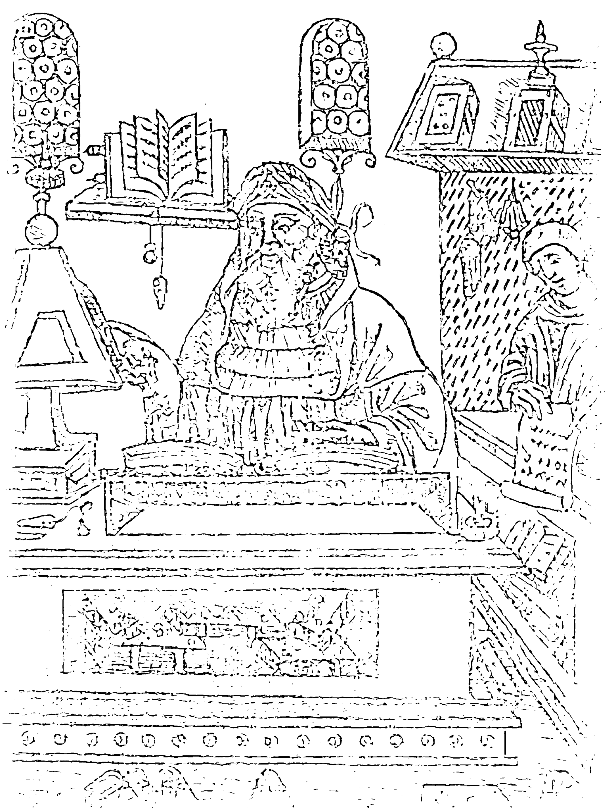

## 一、最後的煉金術士——牛頓

解讀牛頓，應將對牛頓其人及其思想的考察和對與牛頓相關的物理學效應史考察區分開來。通常所說的「牛頓力學」、「牛頓宇宙」與原版的牛頓思想之間既存在著直接關聯，亦存在著重要區別。

從牛頓的物理學公式裏，可以引出一種廣義的宇宙哲學以及一幅相應的宇宙論圖景。這幅被後人稱為「牛頓宇宙」的宇宙圖景所刻畫的是一個無限的宇宙，種種星雲、星系、星體均勻地分佈於無限空間之中且服從牛頓引力定律。絕對空間則是一種無限實體，其中盛裝萬物。這個宇宙必定是無限的，否則按照牛頓引力定律，該宇宙必將崩塌。

然而，「牛頓宇宙」概念的形成史只是牛頓物理學思想的一種效應史，後人從牛頓學說中剔除了某些東西，同時又將某些東西引入了牛頓學說。事實上，近代科學興起於有神論文化背景之中，但自啟蒙時代以來，近代科學知識體系背後的有神論世界圖景逐漸被替之以泛神論或無神論世界圖景，科學家、哲學家均曾貢獻於這一偉大的轉換。因此，我們所說的這部效應史體現了時代的流變，體現了科學思想的變遷。

在神學上，牛頓是一名唯意志論神學論者，這類神學主張上帝的意志是世界的終極本源，而且他在教義上反對三位一體說，信仰早期基督教一神論意義上的上帝。牛頓寫道：「上帝不是作為宇宙之靈而是作為萬物的主宰來支配一切的「一」，「沒有統治，沒有庇佑，沒有終極原因的上帝，與命運和自然無異。盲目的形而上學（如笛卡兒機械論哲學）的必然性，當然也是永遠存在而且處處存在的，但卻不能產生出多種多樣的事物。而我們隨時隨地可以見到的各種自然事物，只能來自一個必然存在著的存在物的觀念和意志」。

由於時間上的距離，由於心靈之間的差異，我們不可能回到過去如實重現牛頓的整體思想，但是，由於時間上的距離並不會抹掉歷史的全部印跡，由於心靈之間還存在著相似的一面，我們還是有可能對牛頓其人及其思想取得某種合乎歷史史的理解。

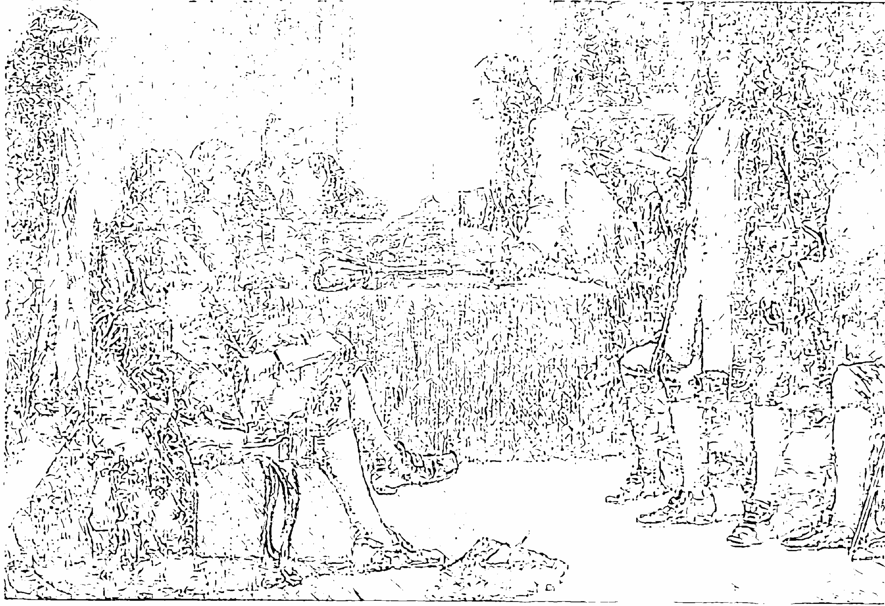

牛頓主持皇家學會會議（左二為牛頓）

重建牛頓的宇宙論思想，我們首先必須尋找一種適當的解讀牛頓的方式。我們不能將我們的視線約束在通常所謂的「牛頓的科學」的範圍內，因為牛頓並不是在此範圍內建構他的宇宙論學說的，而是與自然哲學、自然神學、神學之間存在著內在關聯。

今天的宇宙學探討的問題是：宇宙有著怎樣的結構？有著怎樣的起源？而對於牛頓時代的一位像牛頓這樣的思想家來說，宇宙論的答案則指向以下兩個問題：上帝如何創造世界？如何支配、統治他所創造的世界？

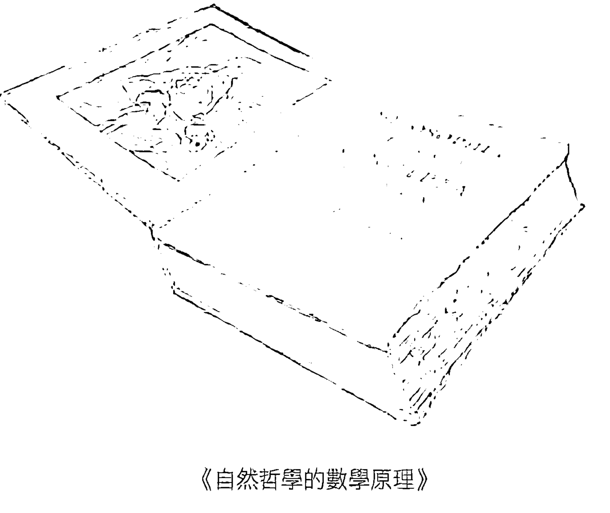

那麼，牛頓究竟以怎樣的方式構築他的宇宙論？在這裏，我們的答案是：今人將宇宙學問題交給科學回答，牛頓則將之提交給自然神學。

「自然神學」在學術語彙中常用以指介於「哲學」（自然哲學）與「神學」之間的中間領域。就基督教文明而言，「哲學」源於古希臘，而「神學」的基本信念則出自《聖經》。自然神學作為哲學與神學之間的中間領域，其興盛與枯萎直接關係著西方思想的整體發展，也直接影響著自然哲學的發展。當自然神學興盛時，介於自然哲學與神學之間的諸多棘手問題往往得到了某種解決，自然哲學也因此獲得較為寬闊的發展空間。所以，在西方思想上多次出現的自然哲學與自然神學協同發展現象不是偶然現象。

牛頓從事自然神學研究的主要目的也在於以下兩個相關的方面：一、為他自己的自然哲學提供辯護、以自然神學為基礎陳述自然哲學方法論。二、探討上帝創世過程以及上帝的主宰作用。牛頓構想的宇宙論學說，是從論說上帝存在及其至上的權力意志開始。在這種意義上，我們可以認為，牛頓是精神一元論者，他堅信上帝意志是宇宙的終極本源，認為作為受造之物的物質本身不具有任何活性和運動能力，活性與運動能力必然發諸上帝。但是，牛頓不願意像某些哲學家或神學家一樣單憑幾條先驗原理自上而下地演繹出上帝創世過程及上帝支配他所創造的世界的方式，也不願意單以人類理性自下而上地理解上帝及其本質。牛頓正是將神學、自然哲學這兩方面的知識結合起來，或者說，將他閱讀「自然」及《聖經》這兩部大書時所形成的全部知識結合起來，構築了一個統一的系統，以闡釋上帝創世及其主宰作用。

如果說牛頓的上帝信念構成了他本人宇宙論方面的全部思想的基礎，那麼，他的自然哲學則為他理解宇宙的性質與結構提供了具體途徑。牛頓關注沒有生命的物質之間的作用規律，也同樣關注生命的生長與增殖現象。因此，牛頓的自然哲學絕不只是關於冷冰冰的無機世界的哲學。《自然哲學的數學原理》只是牛頓全部自然哲學的一部分。須知，牛頓在探討太陽系的運動的同時，也探討物質的內部結構與組成，在揭示宏觀物理運動的同時，也試圖揭示物質的生成與變化之道。牛頓的煉金術、化學以及光學，均是他認識物質之謎的重要途徑，均是其自然哲學的重要組成部分。我們很容易想到，牛頓在探討宇宙論問題時，必定將其發現的引力作用定律引入他的思考之中。在此，我們也應該想到，他的煉金術活動，也像其物理學研究一樣，同樣貢獻於他的自然神學與宇宙論思考。

關於牛頓煉金術與其物質論之間的關係，多布斯曾經在論文中指出：「過去數十年中，一些歷史學家一直不願對牛頓煉金術問題正眼相看，並對牛頓煉金術嗤之以鼻。而現在我們知道，牛頓是將煉金術用做一塊至關重要的砝碼，以填補古代與當時原子論的種種不足之處。這些不足之處涉及內聚性與活性、生命與生長，以及上帝的支配與庇佑。牛頓在煉金術、神學、形而上學，以及觀測方面的探索，促使他逐漸形成了他對於物質的性質以及同物質相關的種種動力的最後結論。關於牛頓煉金術，儘管我們在許多地方不能同意多布斯的看法，但我們贊同多布斯的這一結論，所要補充的只是：牛頓煉金術與其物質理論之間的關聯，正映射著它與牛頓宇宙論之間的關聯。

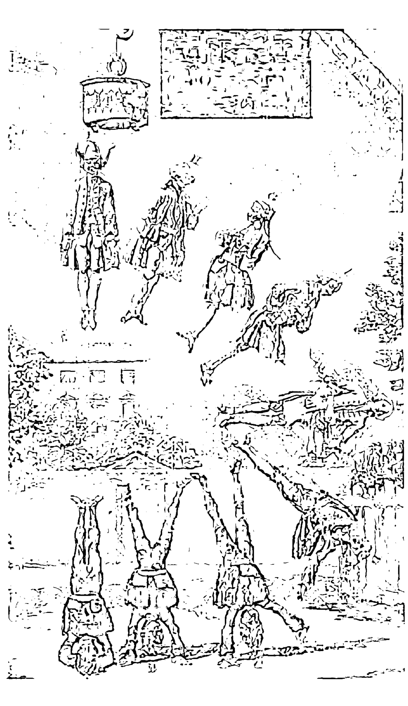

18世紀諷刺牛頓重力理論的漫畫

煉金術活動發展至十七世紀，由於有眾多的江湖煉金術士走街串巷，已開始染上一層不名譽的色彩，但是，正如波義耳在其《懷疑的化學家》中所描述的那樣，煉金術士中既不乏招搖撞騙之徒，也不乏真正的哲人。真正的煉金術哲學家所探討的正是宇宙間最深奧的問題——物質乃至於整個自然的生成與變化之道。他們的煉金術實驗，首先是一種毀金術，在這一階段，煉金術實驗成功與否是以是否能真正摧毀天然黃金為判別依據的；而他們的煉金術哲學則以一種不同於機械論哲學的方式描述了關於宇宙生成與生長的另一幅圖景。波義耳、牛頓等人正是在這種意義上從事煉金術研究，並將之視為自然哲學的基礎，同時將煉金術式的宇宙論思考引入他們的自然神學之中的。

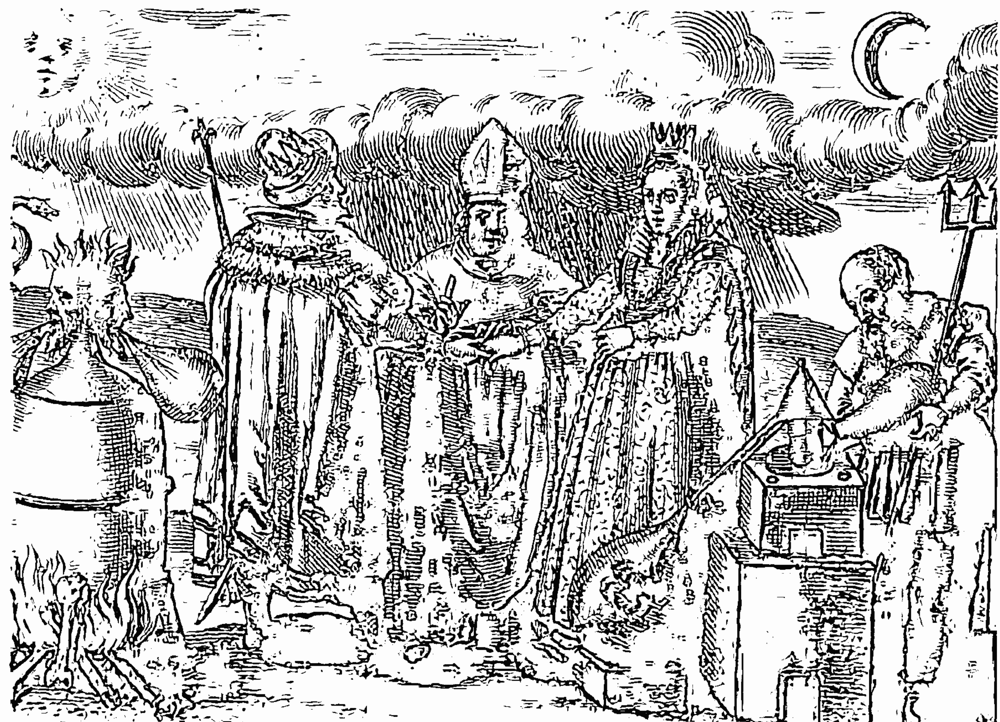

## 作為煉金術士的牛頓

在煉金術史上，牛頓是一位非常重要的人物。有人稱他為「第一位科學家，最後一位魔法師」。

一七二七年，當他去世以後，他的朋友們發現了他留下的關於煉金術研究的百萬字手稿，但當時的英國皇家學會認為這些手稿不適宜公開，因為他們認為這會損害牛頓作為一名偉大科學家的名譽。一九三六年，當牛頓的大批手稿在蘇富比拍賣的時候，人們才開始知道這些煉金術手稿。

研究這些手稿之後，學者們提出，很顯然牛頓的光學原理和重力學理論的靈感都來自於煉金術，而一六八七年出版的《原理》一書更是直接得益於他的煉金術研究。牛頓進行煉金術研究，既不是在他生命的晚年，也不是作為簡單的業餘興趣，而且牛頓花在煉金術上的時間似乎並不亞於他花在數學和物理上的時間。學者們還發現，牛頓把一生中的絕大多數時間都用於煉金術實驗，即使他在科學生涯的後期中斷了神學研究，也沒有中止煉金術研究。這些在兩本傳記中都得到了證實和描述。事實上，與牛頓同時代並對牛頓產生過影響的摩耳、巴賓頓、巴羅、波義耳等人都曾癡迷於煉金術。牛頓認為煉金術著作中藏著從遠古時代就保存下來的智慧，而赫爾墨斯科學又和天地創始一樣古老，是更高的超自然力量賜給人類的智慧。

一個僕人曾這樣回憶他的主人牛頓：「他幾乎凌晨兩三點鐘才會去睡覺，有時候會挨到五六點，每天只睡四五個小時，尤其是在春秋兩季。他在忙些什麼，我無從理解。」春天是開始煉金術實驗的最佳時間，而秋天是收穫的時候，這一點，尼古拉·勒梅在他的自傳裏已經很明白地告訴我們。根據牛頓的煉金術手稿，人們猜測，牛頓正是在這段時間裏進行煉金術實驗。牛頓長時間把自己關在實驗室裏，但沒有跡象表明他獲得了成功。一七二七年，牛頓在臨死之前，曾親手燒毀過一些未發表的論文，許多學者都猜測它們可能與煉金術或魔法有關。

牛頓作為一個集科學家、神學家、煉金術士和管理者等多種形象於一身，集睿智、好奇、孤僻等多種性格於一體的人物，在二〇世紀四〇年代之後的多本傳記中得到了體現。對他而言「煉金術士」並不是一個簡單的貶義詞，實際上煉金術本身具有多層含義。

科學意義上的「煉金術」是把廉價金屬轉換為貴金屬或者製造出為人類服務的長生不老藥，即化學上的物質轉換技術。早期的煉金術士是古希臘時期的工匠，有雄厚的技術功底。他們接受了亞里斯多德的觀念，即一種物質在和別的元素結合時會喪失其全部特性，變成嶄新的物質。因此，金屬中那些廉價、不夠完善的金屬，經過一段時間的處理，就會變成盡善盡美的黃金。這是一種樸素的物質轉換概念。煉金過程要求製造大量的設備，也要求各種試藥，這和現代意義的化學實驗也頗有相通之處。在中國和印度流行的煉丹術還和醫學結合起來。到了十七世紀左右，科學意義上的煉金術一步步地發展成現代化學，相應地，煉金術士變成了化學家。

宗教意義上的煉金術是對上帝創造世界是通過物質轉變的方式的思索，因此煉金術也一直伴隨著占星術和占卜學等一起流行。大約到了西元四世紀，神秘主義開始走向高潮。他們把賤金屬經由消失、再現、完善而轉化成黃金的過程同人類靈魂的死亡、復活和臻於完善的過程聯繫起來並加以發揮，結果把煉金術變成了晦澀難懂、充滿臆測的符號體系，煉金術士成為巫師。

江湖意義上的煉金術則把煉金術變成了騙人的職業，因此使得煉金術變得聲名狼藉遭人唾棄，煉金術士更是變成了騙子的代名詞。不同意義的煉金術，誘惑了許多不同目的和心智的人，也造就了複雜的煉金術士群體。

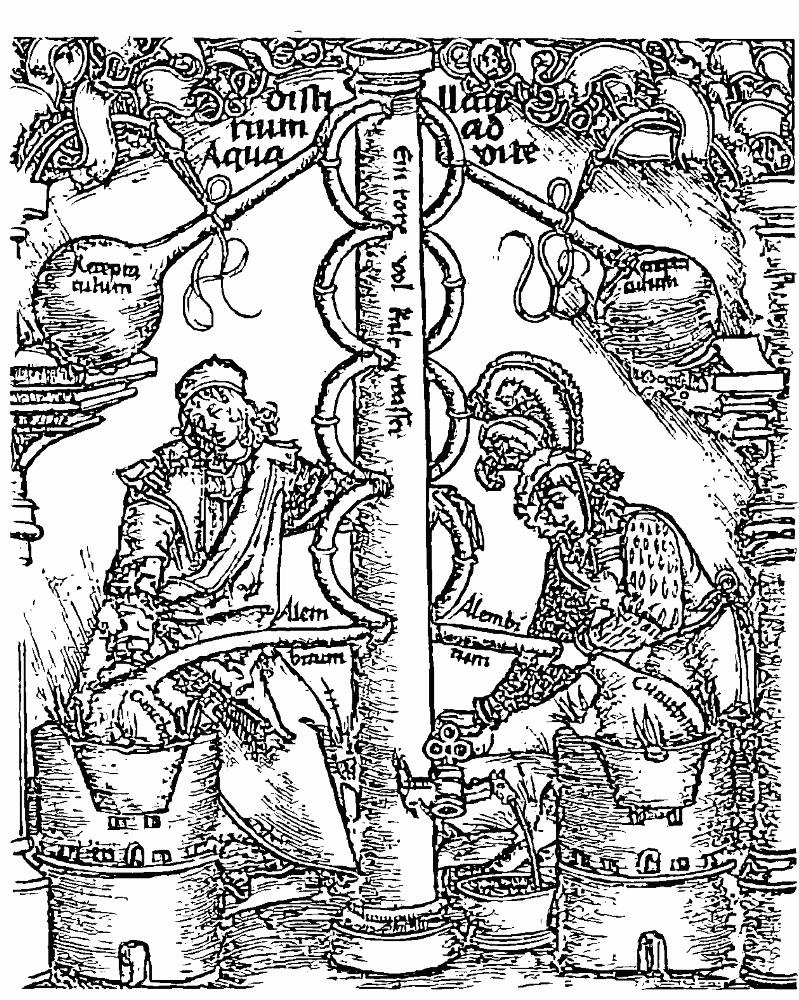

牛頓對煉金術的研究開始於大學時代。牛頓在他的房子後面，也就是在劍橋大學大門口與三一學院禮拜堂之間的花園裏，設立了一個進行光學和煉金術實驗的實驗室。化學實驗比起光學實驗要費事、費時得多，牛頓常常徹夜守在爐火旁，直到一次實驗完成。牛頓在研究過程中，並不是完全孤立的，他參加了當時煉金術活動的核心團體「哈特立布圈子」的一些活動，牛頓更和其中的最著名的人物波義耳有過交流。

牛頓對於煉金術的興趣主要在合金上，特別是物質的結構以及相結合的力。牛頓在《光學》一書中記錄了關於煉金術的一些疑難問題，這些記錄是他生前公開過的極少部分資料。在未曾公開的筆記裏，有很多煉金術的文獻，還有關於火焰、蒸餾、由礦石中提取金屬，以及許多物質和它們的反應的煉金術實驗的記載。儘管煉金術的終極目的在於煉金，牛頓晚年對財富也不無興趣，但是在牛頓留下的煉金術遺稿中，絲毫沒有表現出他對金子的世俗興趣。牛頓的目的是為了找出某種關於物質變化的通用的技藝，一種真理。也就是說，煉金術中存在的真理才對牛頓有吸引力。牛頓相信在那些煉金術文獻中存在著打開知識大門的鑰匙。一種很普遍的說法是，牛頓研究煉金術、神學如同比他探究數學、天文學、光學、力學等一樣，是為了尋找一種能夠統一揭示宇宙秘密的自然哲學。

據說，牛頓發現萬有引力定律的靈感來源於一顆下落的蘋果。當然，這樣的傳說在這兩本傳記中都沒有得到認可。現在看來，他這個蘋果觸發的靈感至少經過了將近二十年的努力——文獻參考、數學運算、實驗印證、同行競爭等等，牛頓才得到了實質性的成果。在這些努力中，牛頓的煉金術研究無疑佔據了重要的一席之地。

## 探索館

在煉金術士的右邊，是煉金術的男性本原，即直立的猛獅、太陽、男人、不死鳥和晝夜閃閃發光的地火之源。女性本原籠罩在黑暗之中，位於煉金術士的左邊，包括「忠實的僕人」月亮、雙乳流淌著生命之液的女人、鷹和從地下湧現的清泉之源。在煉金術士的四周，是環繞著煉金術花園的金屬之樹。在他的上方，是象徵著煉金術不同操作階段的各種動物：烏鴉代表腐：烏鴉代表腐爛，鴕鳥表示煅燒，龍象徵含汞，鸚鵡意味著浸透，不死鳥則代表點金石。更高的天使界中，是作為生命源泉的神聖三位一體，即神秘羔羊、上帝和聖靈。它的中央是煉金術學說的環狀結構，以及低級本原和高級本原的融合。

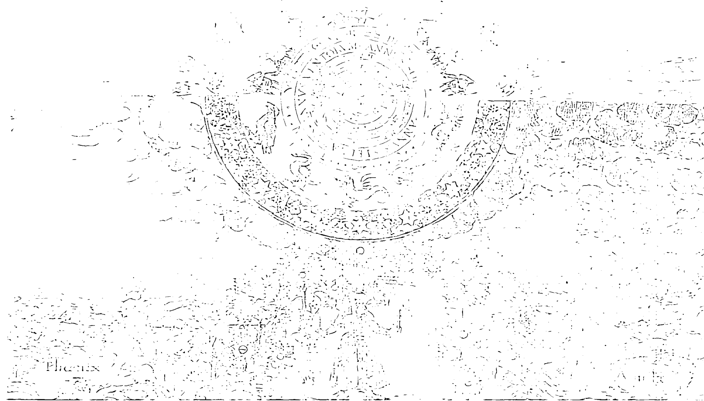

## 揭開煉金術的秘密

金術研究有沒有貢獻呢？牛頓的物理學信奉的是機械哲學——物質具有慣性，物質的運動由其機械學原理來解釋；而煉金術則認定物質中存在活性成分，牛頓可以藉此來完善自己的機械哲學。這種矛盾似乎否定了牛頓的煉金術研究與他的物理學之間的直接關聯。但據說牛頓正是在成功製造錫的煉金術實驗中，發現了吸引力。因為這個錫合金的晶體形狀是：一顆星在中心，光線（力線）向這個中心匯聚，這對他最終領悟出萬有引力作出了沒有預料到的貢獻。

無論動機和目的如何，也無論他的煉金術研究是否有益於他對其他科學的研究，有一點是可以肯定的，即按照現代科學的標準，牛頓進行的主要科學意義上的煉金術——化學，儘管由於他有時無法洞穿籠罩在其中的迷霧，摻雜著一些宗教的思想。

科學史家丹皮爾在《科學史及其與哲學和宗教的關係》中給了牛頓很高的評價。他認為，牛頓對於化學的見解遠遠超過當時的化學家。例如，牛頓認為火焰與蒸氣不同的看法比亞里斯多德關於火是四元素之一的說法和當時化學家用鹽、汞、硫三原質來解釋物質的見解，更接近於現代的思想。化學史家亨利·萊斯特在《化學的歷史背景》一書中也寫道：「在大科學家中，全盤接受了波義耳化學思想的，只有牛頓。」

大約是在一六七八年的一天早晨，大火毀掉了牛頓的科學與煉金術的部分文獻和整個實驗室，之後牛頓把大部分時間用在了物理學和數學的研究中，並於一六八四年完成了劃時代的巨著《自然哲學的數學原理》。牛頓的晚年脫離了科學研究，從科學家轉變成了經營管理者（造幣廠廠長）、行政管理者（皇家學會會長）。但是他之前的偉大業績都毋庸置疑地表明，牛頓是一位偉大的科學家，更是一位不朽的煉金術士。

## 二、中世紀的抄寫員——尼古拉

六百多年前，一個卑微的抄寫員尼古拉·勒梅在巴黎安靜地去世。這個尼古拉·勒梅就是歐洲中世紀最著名的謎：他留下了可疑的巨額財產，一部晦澀難懂、充滿隱語的著作，還有一份用密碼寫成的怪異遺囑；他去世前曾讓人在臭名昭著的巴黎聖嬰公墓屍房牆上刻下了神秘的浮雕；當盜墓賊撬開他的棺材以後，出現在眾人面前的一幕讓人脊背發冷……這些聽起來如同魔幻小說中虛構的情節，卻真的發生在十四世紀的法國。

六百多年來，尼古拉之謎吸引著人類歷史上最優秀、最智慧的精英，在這些人中有我們熟悉的名字：

- 牛頓，曾翻譯尼古拉·勒梅的著作，並也許從中得到某種科學研究靈感，比如關於重力和光的理論。
- 大文豪雨果，把尼古拉的傳奇寫入了他的偉大作品《巴黎聖母院》。
- 法國國王查理六世，曾親自介入調查「尼古拉謠言」的心理學家榮格，曾將尼古拉作為重要的心理學研究素材。
- 紅衣大主教黎塞留，曾為了得到尼古拉的秘密而不惜動用司法程式。
- 超現實主義藝術家安德魯·布荷東，曾聲稱自己從「尼古拉謠言」中汲取了前所未有的創作靈感。
- J.K. 羅琳，在她的第一本暢銷小說《哈利·波特與魔法石》中，尼古拉成為全書的隱然主角。

在 1330 年的法國蓬陀，一個普普通通的男孩降生在人世，父母為他取名為「尼古拉」，當時或許沒有人在意這樣一個小小的生命，但是後世的人清楚，一個傳奇從此開始了。在十四世紀出生並不是一件十分幸運的事，因為這是一個動盪不安的世紀，不斷有可怕的災難降臨人世，痛苦的人們不知是什麼樣的罪過讓上帝如此地懲罰人類。

在中世紀，宗教是保持社會秩序的必需，宗教信仰已經深入到每一個歐洲人的內心深處，從他們出生直到進入墳墓，基督教都會陪伴著他們。羅馬教皇是整個歐洲的宗教領袖，是教徒的最高權威。可是法國所導致的宗教變動卻打亂了這種秩序。

在 1303 年的時候，法國國王菲力四世對羅馬教皇的絕對權威發出了挑戰，他的使臣來到羅馬，不由分說地直走進教皇的臥室，把已經年過八十的教皇卜里法八世關押起來並且侮辱了他。法國國王接著便把法國波爾多大主教扶上教皇的寶座，成為教皇克萊門五世。六年之後，處於法國王室股掌之中的教廷從羅馬遷移到了法國南部的阿維尼翁。這就是著名的阿維尼翁「巴比倫之囚」事件。在這種情況下上臺的新教皇，其合法性受到了眾多歐洲王國的質疑，教皇不得不離開羅馬。在這以後的一個世紀當中，原本神聖而輝煌的羅馬教皇國變得死氣沉沉。

在這樣人心惶惶的歲月中，尼古拉度過了他的童年。戰爭的臨近讓人們感到擔憂和恐懼。終於在一三三七年，英國國王愛德華三世向法國宣戰，長達百年的殘酷的英法戰爭從此開始，幾乎每天都有法國軍隊戰敗的消息傳到國內。而此時的尼古拉僅僅是個七歲的孩子，這場戰爭一直持續了整整一個世紀。直到最終法國戰敗才宣告終結，法國不但丟掉了大片的領土，甚至連法國國王約翰二世都成了英國人的俘虜。

在這場漫長而殘酷的戰爭中，政府為了支持軍隊而徵收沉重的賦稅，宗教機構腐化墮落，野蠻的貴族們肆無忌憚地強取豪奪。這一切讓人民的生活雪上加霜，人們對於宗教所許諾的美好理想再也不相信了。更可怕的災難接踵而至，一三四七年十月，從東方來的貨船停靠在西西里的港口墨西拿，它把「黑死病」——鼠疫帶到了義大利。短短幾個月的時間，這種致命的疾病便在法國傳播開來。此時的尼古拉一家正在巴黎居住。一三四八年這一整年裏，幾乎有一半巴黎人因為「黑死病」丟了性命，整個世界都墜入了深淵，城市變得死一般寂靜。大家眼看著自己的親人、朋友不斷地死去，而自己卻無能為力，最後連自己也不得不可悲地告別人世。

尼古拉的父母在這場人間浩劫中都離開了人世，逃脫了黑死病魔爪的尼古拉用他的積蓄開了一家規模不大的抄寫店，其位置就在巴黎聖雅克教堂附近的「代書人大街」上。他整天在他的小小的辦公間裏為別人抄寫文件，或者是為手稿修飾，或者是替別人清算帳目，並且也銷售書籍和手稿。他的生意在順利地發展，以至於在臨近的街道他又購置了新的分店，雇了三四個抄寫員和畫師繼續他所進行的抄寫與修飾工作，而他從工作中脫身出來，開始為一些沒有文化的貴族上課，為他們教授閱讀和寫作。

傳說赫爾墨斯 (Hermes) 的父親就是托特神。托特是埃及的知識之神，據說他負責掌管時間，並創造了書寫、數字和一切科學。托特是人身鳥頭，有時候是狒狒頭或一隻狗臉的猿。他常常以手拿紙筆的形象出現。他也是冥界的掌管者，傳說托特神就是古埃及《亡靈書》的作者。由此可見「文字—書寫—永生」的內在關聯。文字和書寫燃起人類永生不死的希望。《亡靈書》的作者托特成為誘導人類癡迷於追求永生的魁首。至於抄寫員，是塵世中最接近托特神那「手拿紙筆的形象」的俗人。

這是一段暗無天日的時光，可就在一天夜裏，尼古拉做了一個奇怪而神秘的夢：在他的夢中出現了一個長著翅膀的、渾身散發著耀眼光芒的天使，並且他的手中握著一本厚厚的書，他對尼古拉說：「仔細地研究這本書吧，尼古拉，雖然現在的你和別人一樣，對它所蘊含的秘密一無所知，但總會有那麼一天，從這本書裏你會發現其他人看不到的東西。」就在尼古拉要去接這本書時，夢卻偏偏醒了，天使一下子消失不見了。尼古拉覺得，這是個不同尋常的夢，這是來自上帝的啟示。

在一三五七年，一個幽靈般的人來到了尼古拉的店中，他想把自己的一本書賣給尼古拉。因為抄寫店也是一個兼營書籍銷售的地方，人們可以把他們不再需要的書賣到這裏，也可以從這裏買走他們想要的書。這次尼古拉根本沒有像以往那樣討價還價。他乾脆地出兩個弗洛林金幣的價錢把這本書留了下來，因為他隱約地覺得，在自己的那個神奇的夢中，天使給他的那本書和這本是完全一樣的。尼古拉明白，這位賣書的人對於這本書的真正價值並不清楚。對此尼古拉在後來曾說過：「我想那個賣書給我的人對這本書的價值一無所知，說不定他是從某個處境悲慘的猶太人那裏偷來的，或者這本書是被猶太人秘密地藏在他曾經住過的房子裏，而後來出於機緣巧合被他發現了。」

> 「這本書很古舊，開本也很大，封皮是用黃銅做成的，邊緣都被精緻地修飾過了，在書皮上刻有一些文字和奇怪的符號，顯然並非是拉丁文或者法文，否則我是會認出來的，我猜想可能是希臘文之類的古文字。」

這本書的質地非常特別，和當時流行的材料不同，是用類似於古埃及的紙草製成的。書籍內部的書頁既不是柔軟的橡樹皮，也不是羊皮，而是用某種植物做成的，上面刻著漂亮的拉丁文，能看得出來，書裏的文字和圖都是用燒紅的鐵烙上去的，並且塗上了顏色。尼古拉粗略地翻看了一下這本書，他注意到書的頁碼編排十分古怪：整本書的頁碼都是按照七這個數字來標明的，一共有三個七頁，也就是說，整本書一共有二十一頁。而每個第七頁上都只有圖畫而沒有文字說明。

對於書中的內容他是這樣描述的：「書的第一頁是一段用大字型大小字母書寫的金色拉丁文字——『猶太人亞伯拉罕，王子，祭司，占星大師，智慧的聖人。獻給被驅散在高盧的猶太民族。』接下來是一些措辭激烈的咒語，大概是意思是，除了祭司和抄寫員以外，任何閱讀了該書的人都將受到可怕的詛咒。」此時的尼古拉猶豫起來，拿不定主意是不是應該繼續讀下去，但是他突然意識到自己的職位是抄寫員，這樣一來他就位於不受詛咒者之列。於是他放心大膽地讀了下去。「作者在第二頁上，對他的族人發出勸告，要他們遠離邪惡，尤其是禁止他們進行偶像崇拜。他教導他的族人們要虔誠並耐心地等待救世主的到來，因為世上的一世國王和皇帝都不可能與救世主相比，他將帶來天國的榮光並且賜福於他的信仰者，直到永遠。」接下來，書中便傳授了使金屬發生轉化的秘密，並且在書的空白處畫有操作方法和實驗器械的示意圖。尤其對實驗中物質的顏色變化以及如何保存製成的魔法石作了詳細的說明。

這本書如同具有魔力一樣，每一個看到過它的人都想將之據為己有。這本書能夠激起人內心深處最大的野心和渴望，沒有人會忽視這本書，這本書能將凡人從平庸的生活中解救出來，進入到一個神秘莫測的天地之中，它能帶來無數的財富和無生無死的玄妙境界。這本書之所以有如此大的力量，就因為這是一本傳授「赫爾墨斯」學說的論著。大多數人都認為「赫爾墨斯」是個三位一體的神。他是一位生活在西元前一九○○年的埃及法老，他精通自然科學。法老「赫爾墨斯」被認為是眾神的信使，負責向人間傳遞神的旨意。據說赫爾墨斯的父親就是托特神，是埃及的知識之神，據說他負責掌握時間，並創造了書寫、數字和一切科學。托特是人身鳥頭，他常常以手拿紙筆的形象出現。他也是冥界的掌管者，是古埃及《亡靈書》的作者。而赫爾墨斯的兒子叫塔特，他是一個凡間的祭司。這三個人合在一起，就成了人們世代相傳的「赫爾墨斯神」。歐洲的傳說認為，這三者共同創立並完善了一門神奇的科學，他們把這門科學的全部精髓濃縮為十三句話，寫在一塊祖母綠玉石板上，留給人類。人們把這件古文獻叫做《翠玉錄》。

作為一個卑微的抄寫員，因為職業的緣故尼古拉有機會接觸各種各樣的知識，面對各種各樣的書籍、論文、小商小販們的帳本，神秘者的奇怪的手稿，家譜和讚美詩，以及天文、醫學、物理，甚至主婦的菜譜都有。對於「赫爾墨斯」學說，尼古拉並不陌生，他過去曾經接觸過這樣的書，在歐洲這門神秘的藝術已經流傳了很久了，知識界的先驅曾以巨大的熱情對之進行過激烈的爭論。上流社會開始時還只是私下地討論，後來變成了公開地進行實驗，「赫爾墨斯」學說的另一個名字傳播得更為普遍——「煉金術」。雖然人們對這門神聖藝術的起源來歷並不太清楚，但都認為它能夠轉化金屬，製造萬能的靈藥，歐洲都把埃及的大神「三位一體的赫爾墨斯」作為這門科學的創始人。

## 歷盡劫波

當年巴黎人都沒有注意到，這個名叫尼古拉的抄寫員，在白天做完了一天辛苦工作之後，在夜深人靜的時候，還會悄悄地到地下室裏進行煉金術的實驗。這本《猶太人亞伯拉罕之書》深奧得如同宇宙般難以理解，能否在有生之年解開它的秘密還是個未知數，像尼古拉這樣一個普通人，要想光憑著書中的幾幅莫名其妙的圖和不知所以然的文字就弄懂煉金術實驗，簡直如同天方夜譚一樣。在起初的時候，他只是出於好奇想探尋一下這本書的隱秘，可是隨著研究的逐漸加深，他被這本奧妙無窮的書吸引住了，以至於無法自拔。尼古拉自己曾說：「我夜以繼日地研究這本書，卻始終摸不到它的邊際。我的心情十分沉重。我一個人走在探索未知的路上，感到異常孤獨。」這樣孤獨而苦悶的生活一直持續了十一年，在尼古拉三十八歲的時候，一個將和他共度餘生的女人——潘乃麗出現在他的生活中。這是尼古拉生命中唯一的一次婚姻，對此他曾說：「我的新婚的妻子潘乃麗，我愛她就像愛我自己一樣，聽到了我的嘆息，她是那麼擔心我，我還有什麼好對她隱瞞的呢？我把一切都告訴了她。我給她看了那本美麗的書，那些微妙的圖，還有那些字裏行間隱藏著智慧之眼的文字，她被深深吸引著。雖然她並不能幫助我弄明白其中的秘密，但我可以和一個值得信任的人談論這些，這已經是個很大的安慰。」

為了能夠給丈夫以幫助，潘乃麗想出了一個辦法，在當時的巴黎城中有許多抄寫員，也許他們中的某些曾經接觸過類似的書，而且說不定城裏會有精通這門學說的人。很明顯在沒有人指點的情況下想弄懂這本書是不可能的，於是走投無路的尼古拉決定冒險去尋求其他人的幫助。他盡可能逼真地照書上的樣子畫了幾張圖，然後拿著複製的畫向巴黎其他的抄寫員請教，詢問他們是否曾見過類似的東西，但是沒有人能幫得上他。困惑的尼古拉對此說：「我對他們講，這些圖都是從一本關於『魔法石』的書中描下來的。」可是那些被問到的人都對他提到的『魔法石』大加嘲諷。當時政府一直都在宣傳說煉金術只不過是巫術和騙人的把戲，只有瘋子才會去研究煉金術。只有一位叫安賽的醫生有興趣同他討論關於「魔法石」的事情。對於這門學說安賽也有所研究，尼古拉的圖畫引起他的強烈興趣，他願意付出任何代價，只要能看一看那本書。可是謹慎的尼古拉對他說，他並沒有那本書，這些畫只不過是複製下來的。

對於煉金術，安賽醫生有他自己的一套看法，可是尼古拉卻並不信賴他，他沒有採取安賽的建議，在數次失敗之後，尼古拉終於總結出自己的經驗教訓：「我進行了上千次實驗，可是從未試著用過嬰兒的血，不過那實在是太邪惡了。後來我意識到，『嬰兒血』也許並不是指真的嬰兒的血，而是有象徵意義的。我發現，書中一些地方作者把血稱為『哲人』，它是指眾金屬中最同一的靈魂，各種金屬中都藏著這樣的靈魂，尤其是太陽、月亮和水星。但那些圖太微妙了，我不斷失敗，總是不停地從頭再來，卻始終沒有見到成功的跡象。」在此後的十幾年的漫長嘗試過程中，尼古拉還是沒有什麼重大的突破，可是歲月不饒人，他已經不再年輕了。雖然他擁有稀世珍寶《猶太人亞伯拉罕之書》，可是卻無法探究出其內在的奧秘，這就如同在黑夜中行走一樣，不知道前進的方向，什麼也看不見。沒有親身經歷過的人是不會知道這樣一條路是如何孤獨難耐的。尼古拉在這本書上付出了他二十一年的青春和熱情。一籌莫展的尼古拉說：「二十一年的時光就這樣過去了，我幾乎完全放棄了希望，我覺得自己不可能弄懂這本書的真正含義了。」

此時的尼古拉覺得，除非是《猶太人亞伯拉罕之書》的作者來到他的面前，親自向他說明其中隱含的一切，否則他幾乎沒有希望能弄懂它。一三七八年的一天，尼古拉突然意識到，這樣一直孤獨地藏在地下室裏埋頭苦幹，是不會有什麼希望的，成功的可能性極小，而最終收穫的只有痛苦和失望。而這本《猶太人亞伯拉罕之書》中第一頁中就寫著：「猶太人亞伯拉罕，王子，祭司，占星大師，智慧的聖人，獻給被驅散在高盧的猶太民族。」亞伯拉罕是猶太祭司，而他聲稱書是寫給他的猶太族人，那麼可以肯定的是，精通猶太神秘教義的人一定能看懂這本書。

茅塞頓開的尼古拉打算改變前進的道路，可是事情並非如此簡單。因為他不可能拿著這樣一本書，在巴黎城裏遍地去尋找猶太人，向他們說：「兄弟，幫我看看這本書究竟寫了什麼？」因為在那個時代，和猶太人交往是一件十分危險的事情。在尼古拉的出生地蓬陀就曾發生猶太人殺害嬰兒的案件：幾名猶太人誘殺了當地一名無辜的小男孩，然後用小孩的血來實行秘密的血祭儀式，他們都受到了法庭的審判，而法國政府就借這個事件進行了長期的驅逐猶太人的行動。後來在黑死病流行的年代，人們發現猶太人因為傳染病而死去的人數要比法國人少得多，雖然真正的原因在於猶太人比較講究衛生，可是在那個時代人們卻不懂得老鼠和寄生蟲傳播的病毒才是致命的。法國人心慌意亂地想為這場災難找一個原因出來，他們想以此解除自身的苦難。不久就有人舉報說猶太人夜裏偷偷在井裏投毒，沒人知道具體是什麼樣的毒藥，於是一切的罪名都被加在猶太人的身上。人們認定了猶太人是瘟疫的源頭，無數的猶太人被抓住燒死，他們的財產被沒收。在整個歐洲猶太人都受到了驅逐。但是在當時，西班牙是由被稱為摩爾人的阿拉伯人統治的，在那裏，猶太人是不受迫害的。從法國被驅逐出去的猶太人幾乎都去了西班牙，那裏有猶太人的聚居區。於是，要尋找猶太人的尼古拉決定去西班牙。

這次冒險是尼古拉一生中僅有的一次，他給當地教會的理由是，自己要去位於西班牙的聖迪亞哥大教堂朝聖。聖迪亞哥是耶穌的十二門徒之一，他死後被葬於西班牙的康波泰拉，並為他建立了大教堂，在當時到那裏朝聖是十分神聖的舉動。於是教會沒有什麼便同意了尼古拉的請求，並且為他開出了教會的證明，神父在臨行前為他進行了祝福。就這樣尼古拉出發了：他帶著一頂遮陽的寬簷帽；在肩上扛著一個裝著乾糧和衣服的袋子；手中拿著一根堅實的木棍，用來對付路上的野狗和狼；腳下穿著結實的便鞋。這幾乎是當時每個普通朝聖者的共同的裝束。但是尼古拉還有一件普通人不會有的東西——從《猶太人亞伯拉罕之書》上描下來的圖案。

滿懷希望的尼古拉從巴黎啟程，踏上了充滿了危險的漫長旅途。一路上根本沒有什麼可以指示方向的路標，朝聖者們只能通過星辰來判斷自己的方位。在路上他遇到了各個階層形形色色的人，有國王、貴族、平民、教士，甚至是妓女。最糟糕的是遇到強盜，他們在半路上衝出來截住行路者，搶劫並殺死他們，那些可憐的朝聖者只能聽天由命，任憑上帝的安排了。在半路上尼古拉穿越了比利牛斯山脈，當他在迷霧繚繞或者大雪紛飛的山中行走的時候，每隔幾小時，都會聽到附近修道院的鈴聲，那是專門為迷路者提供指引的聲音。在這樣的天氣裏，一旦迷路就等於死亡。在小路和草叢裏，他能看見好心人用石頭堆起來的路標。沿途還有一些各個地方來的騎士團，他們為朝聖者提供必要的保護，因為在那個黑暗的中世紀，社會治安狀況是十分惡劣的。在路上尼古拉和他的旅伴們還要經過數條湍急的河流，雖然河上有橋，可是昂貴的過橋費卻讓很多人望而卻步，尼古拉大多數情況下都選擇和大家一起坐擁擠的小船渡河，當上船以後他會和其他人一起祈禱；希望我們不會遇到邪惡的船夫。因為那些船夫常常把船裝得超載，他們喜歡看到朝聖者落水的樣子，以此取樂，他們希望客人最好淹死，這樣他們就可以明正言順地把那些遭到不幸的人的財物據為己有。

終於尼古拉到達了他的目的地——聖迪亞哥大教堂，此時他的衣服早就已經發硬板結了，上面落滿了塵土，他的鬍子和頭髮已經長得很長，髒亂不堪了。在那黑暗而混亂的十四世紀，徒步行進

## 揭開煉金術的秘密

當煉金術士們試圖把賤金屬變成黃金時，他們在那熊熊火焰中尋求的就是使這些金屬的可蝕性向不可蝕性的轉化。他們試圖從日常可見的金屬中提煉出那永恆不滅的物質，據說它可以使青春永駐。作為一種基本的配伍成分，每一種抗衰老的藥方都包含金子，煉金術士還勸告他們的主人用金杯飲酒，以延年益壽。

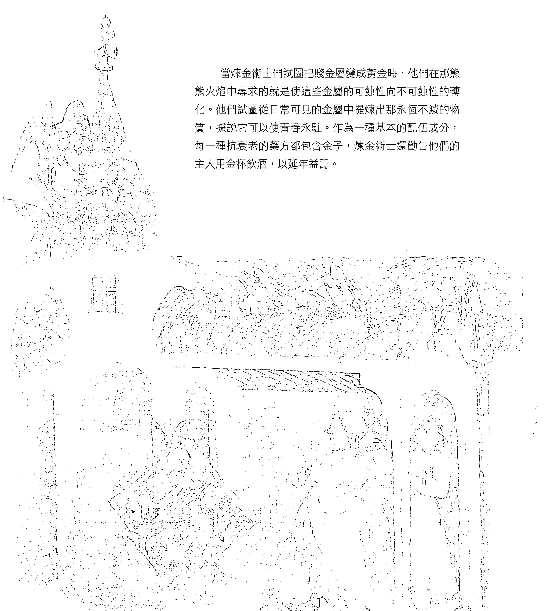

## 探索館

一千五百公里的路程，途經環境兇險的山區，朝聖者的性命隨時都有可能因為飢餓、寒冷、強盜和疾病而斷送掉，可是經過這樣一趟旅程的尼古拉只是很輕鬆地說了一句：「在半路上，我在一個叫『夢橋』的地方作短暫的休整，隨後便一口氣到了聖迪亞哥。」雖然他在康波泰拉足足停留了一年的時間，可是在他的著作中對此卻隻字未提。

在經過了一年時間的遊歷後，尼古拉踏上了回家的路。在萊昂的一個小旅店裏，他遇到一個從潘乃麗家鄉來的法國商人。他們一見如故，談得十分投機。這位好心的商人得知尼古拉想找一位博學的猶太人的時候，便向他提起相識的一個已經皈依了基督教的猶太人。此人就在萊昂居住，人們都叫他「甘切思大師」，是個精通自然科學的醫生。

就這樣，在商人的引薦下，尼古拉在一天夜裏同甘切思相見了，尼古拉對於同這位猶太人的會晤從沒詳細地描述過，也許陌生人見面的程式都大同小異吧。甘切思大師對於這個突然造訪的法國人可能懷有戒心。不過尼古拉很快就直接提到了他的主題。對此他描述說：「我給他看了我隨身帶的《猶太人亞伯拉罕之書》的複製頁，他非常驚訝，同時也掩飾不住興奮。他問我是從什麼地方得到這本書的，能不能告訴他關於這本書的更多的消息。他是用拉丁文問我這些問題的，因此我也用拉丁文回答他。我說如果誰能給我解釋這本書的內容，我會很樂意告訴他更多的東西。大師說，真沒想到啊，大家都以為這本書已經失傳了。然後他為我解釋了書的開頭部分。但這顯然不夠，於是他決定跟我一起回巴黎。」

對於這次會面的情形尼古拉提得很少，很顯然有許多事情他不想說出來。很可能這位甘切思大師為他講述了許多關於《猶太人亞伯拉罕之書》的故事。這本書一定有一段極不尋常的來歷，說不定隱含著驚天動地的大秘密。這位上了年紀的大師甘願冒著巨大的風險跟隨尼古拉，到當時正大肆搜捕猶太人的巴黎去，這已經很不可思議了。

尼古拉對以後的旅程是這樣描述的：「我們一路都十分順利，當我們坐的船進入法國的時候，他已經把我隨身帶的那些圖案都詳細地為我進行了說明，到這時我才知道，那些圖上的任何一個細微之處都是大有深意的，我完全著迷了。」可遺憾的是，甘切思大師還沒有親眼見到這本《猶太人亞伯拉罕之書》，便去世了。這位博學的大師在客船到達奧爾良時，因為一路的海上劇烈顛簸而病倒了，雖然尼古拉一直守在他的身邊照顧他，可是這位老人在七天之後還是去世了。因為這位猶太人已經成為了基督徒，傷心的尼古拉便把他安葬在奧爾良的「聖十字架教堂」。

他們從萊昂出發，從海路回到法國。同所有地方一樣，船上的乘客是些形形色色的人。他們在船上的餐廳裏滿懷激情地高談闊論，說他們的沿途見聞，說他們的人生理想，說他們的家庭瑣事，還有他們做生意的規矩，一些法國人還談到了法國軍隊從英國人手中又奪回了幾座城市。就在他們大聲喧嘩的時候，在船上的一間小小的屋子裏，在閃爍的燭光中，一位年邁的老人和一個普通的抄寫員用常人無法理解的語言談論著煉金術這門關於宇宙奧秘的學說。

## 謠言四起

原本尼古拉設想和甘切思大師一起回到巴黎，他們會共同破譯《猶太人亞伯拉罕之書》的秘密。可是不循常理的死亡把這位曾帶給他智慧的大師帶走了，就如同消失的朝霧一樣不見了。曾有人評論說，甘切思沒有資格看到那本神奇的書，因為神並沒有選中他來進行這個偉大的工作。所以雖然他已經十分接近這本書了，可是最終一股神秘的力量阻止了他。

當一三七九年尼古拉完好無損地回到巴黎的家時，他興奮地說：「我高興得發狂，因為能再次見到我親愛的妻子。我一直在不停地思念她。我一直向上帝祈禱保佑我能平安地回到家，而潘乃麗也在為我的平安而祈禱。」尼古拉又回到了位於「代書人大街」的老房子裏，繼續往日的生活，整日地來往於辦公室和家之間。可是這樣過了幾年之後，突然尼古拉在一夜之間便成了一個盡人皆知的大慈善家。對此路易·費格爾在《煉金術與煉金師》中說：「尼古拉夫婦慷慨地資助窮人，建醫院，修墓地，還捐獻了一大筆錢給巴黎盲人院。受益的盲人也心懷感激，他們當中的每個人都要到聖雅克教堂為這位好心的慈善家祈福。這個傳統一直持續到了一七八九年。」

在巴黎，尼古拉和他的妻子一共捐款建立了十四所醫院和三所教堂，修了七塊教會墓地。他們還在潘乃麗的家鄉做了大量的善事。許多窮人得到了他們的救濟，尤其是那些貧窮的寡婦和可憐的孤兒。尼古拉夫婦還捐獻了一大筆錢給著名的巴黎盲人院。因為這一系列慷慨大方的舉動，尼古拉成為了巴黎的知名人士，而就在不久以前他還是一個默默無聞的小小的抄寫員而已。他和他的妻子成了仁慈的化身，到處都聽得到對他們夫婦的讚美之聲。

不過尼古拉的傳奇暴富讓一些人起了疑心，一個卑微的抄寫員在一夜之間就變成了富豪，這的確令人不可思議。僅僅靠利潤微薄的抄寫是不可能的，他的收入大大超出了附近的商人們。那些多疑的人們覺得尼古拉的財富來得不明不白。各種傳聞流傳世上，不過總體說來都有一個共同之處——尼古拉已經煉製成了點金石。在普通人看來，點石成金這樣的事情似乎是神話，是複雜的傳說。那個時代能進行煉金術研究和實驗的人微乎其微，那是高貴的藝術，普通市民根本接觸不到這樣的事情。所以首先傳播這種流言的人肯定是對煉金術有所瞭解的人，是尼古拉的同行也說不定。

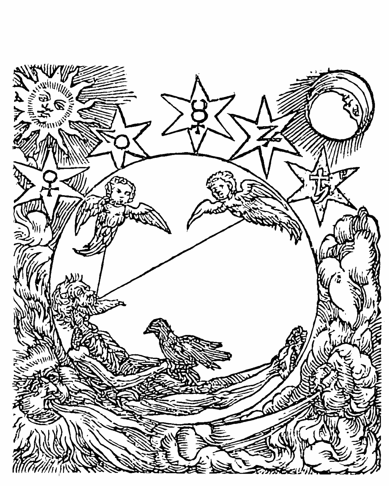

## 探索館

神學家約翰·傑森和紅衣主教皮埃爾·艾里慕名而去訪問這個巴黎最著名的抄寫員時，他們非常意外地發現，非凡的尼古拉住在簡陋的破舊的房子裏，衣著寒酸，用一個陶罐吃粥。

在那些年裏，關於尼古拉和他一夜暴富的故事一定是巴黎最為流行的謠言。這個曾經普通的抄寫員成了人們茶餘飯後的對象。這股風潮在法國的底層平民中和上流貴族中同樣猛烈，以至於後來整個歐洲大陸都知道了這個故事。關於尼古拉的傳說經過無數次地轉述，已經完全走了樣，變得如此奇異：在巴黎有尼古拉這個人，他煉出了魔法石，只要他願意，就能變出山一樣多的黃金！甚至連國王查理六世都聽到了這種傳聞，對此他也頗有興趣，打算對此事進行調查。議員克拉莫西受命去查看尼古拉的財產狀況，想弄清楚這個抄寫員的巨額財富是從何而來的。整個巴黎都在盼望著克拉莫西能將尼古拉的秘密公之於眾，最好能從他屋子的角落裏揪出一個會吐金幣的小妖精讓大家看看。可是大家看到的，卻是克拉莫西從尼古拉的房子裏走出來，禮貌地和尼古拉道別，請他原諒他的打擾。一切依舊，人們大失所望。尼古拉對於外界對他的無端猜測早就心中有數，但他依然平靜地生活著。到了晚年，他的生活更加簡單，每天，早晨從家裏走到店鋪，然後工作，然後再回家。有時候他會和妻子到附近的聖嬰公墓裏散步。

聖嬰公墓是巴黎最臭的地方。它位於聖丹尼大街，隸屬於聖嬰教堂，是十四世紀巴黎最大的墓地。幾百年裏，城裏主要醫院和附近教區的死者都被送到這裏。而在存骨堂旁邊就是一條狹長的過道，教會把這塊空地租給那些小商販以賺取利潤，於是這裏便成了一個熱鬧的市場。小販們在這裏賣便宜的珠寶、花邊、緞帶以及香腸、餡餅；會寫字的人在那裏擺一張桌子，幫人代寫書信；吉普賽人、占星師也聚在那裏，為各種階層的人占卜未來；賣弄風情的妓女則穿梭在人群裏招攬生意，這裏成了巴黎人休閒的好去處。巴黎人的鼻子都像對臭味失靈了一樣，離市場一步之遙的房子裏堆放著成千上萬的死屍，腐臭沖天，而他們在這裏玩得很愉快。

和那些普通的巴黎市民一樣，尼古拉在結束了一天的工作後也會到那裏走走。如果遇到合適的物品也會買下來，還可能聽聽集市上人們有趣的談論。同時欣賞欣賞那些刻在停屍間拱門上的各種雕像。

在尼古拉從西班牙回來後的第十年，也就是一三八九年，尼古拉和潘乃麗為聖嬰公墓捐建了一間「存骨堂」，就是從公墓正門進去，右邊數過去的第四間。「存骨堂」是文雅的說法，其實就是一個單獨的存屍房。巴黎的傳統是，那些捐款修建存骨堂的慈善者都有權在存骨堂的牆上刻上一些浮雕作為紀念。浮雕的風格和主題因人而異，常常體現出捐款者的個人性格和品味，是出資者的靈魂寫照。

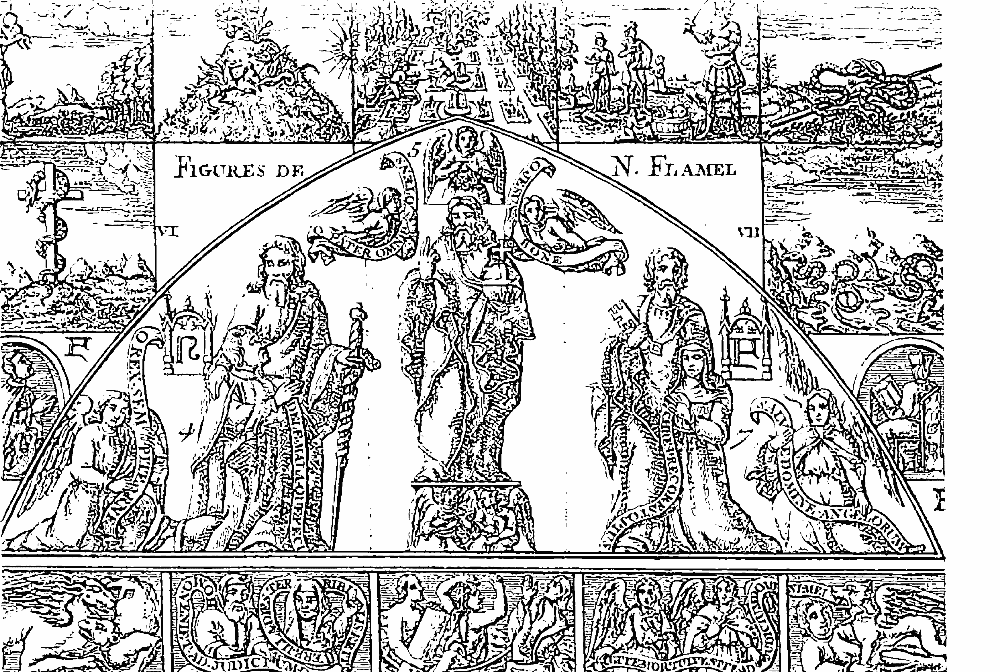

如果你有豐富的想像力的話，你可以假設自己已經來到了一三八九年的巴黎，走進了聖丹尼大街上的聖嬰公墓。這是一個月朗星稀的夜晚，在這樣一個死人安息的墓園裏，一切都靜悄悄的毫無聲息。空氣中彌漫著刺鼻的臭味。在銀色的月光的照射下堆放在倉庫裏的白色骷髏發出慘澹的光，沿著右邊的走廊你向前直走，到第四個墓室停下來，目的地就到了，這個就是尼古拉修建的墓室。

現在你從左向右看，首先映入眼簾的會是一個黑色皮膚的人像，他的眼睛虔誠地注視著他右邊所有的浮雕，在他的身旁寫著一句話：「我看見了一個非凡的奇蹟，震驚不已。」接下來你向左下角看，會發現一個彷彿紋章一樣的圖案，紋章的中心刻著一個筆盒和墨水瓶，它們之間有一根短繩連接著，在旁邊寫著「尼古拉·勒梅和他的妻子潘乃麗」，這表示這個墓室的捐建人是尼古拉和他的妻子。隨後是三幅圖案，從主題來看它們似乎是相關的，共同描述了希律王殺害聖嬰的故事。在這幅圖的下面還配有文字：「希律王下令殺死了聖嬰。」

把視線向上抬，你會看到第二級的浮雕。最左邊的一幅刻著兩條互相纏繞的龍，在漆黑的背景上的兩條龍分別呈黑色和藍色，藍龍的背上長著一雙金色的翅膀，而黑龍的背上什麼也沒有。在中世紀稍懂基督教的基本常識的人都會知道，這兩條龍代表的是罪惡，長著翅膀的龍代表可以祛除和彌補的罪，而沒有翅膀的龍則代表永遠無法抹滅的罪。金色翅膀象徵著最大的罪惡來自於對金錢的無止境的貪慾。人們總是不知疲倦地追求財富。漆黑的背景象徵著罪惡之龍來自於黑暗的地獄，人們應當小心遠離它們。這兩條龍也象徵著圍繞在人們四周無數看不見的邪惡鬼魂，人們做過的一切都逃不出它們的眼睛。在末日審判來臨時，它們將指控人類的一切惡行。

第二幅圖藍色和青色的背景上刻著一對身穿橙色衣服的男女。這對男女由一整條箴言字帶所圍繞，圍繞著男人的那部分箴言寫著：每個人都將接受上帝的審判。圍繞著女人的那部分寫著：那一天將是真正的恐怖之日。

如果向中世紀的人求教，他們會解釋說，橙色代表著「沒有希望」，要麼就是「放棄希望」，這是告訴人們不要把希望寄託於今世。而藍色和青色則暗示人們要更多地思考關於神的事情。這幅圖整體的含義是，人們在末日審判來臨之前，要遠離那些代表著罪惡的龍，也就是遠離邪惡，這樣上帝一定會降福於人們。

在第三幅圖畫上，整個背景呈現出綠色，其上刻著兩個男人和一個女人的復活。其中的一個正從墳墓的棺材裏走出，而另外的一個卻是從地下升起，三個人都被塗上了純淨的雪白色，他們想用手捂住眼睛，但卻忍不住望著上方的天堂。在他們的上方是兩個吹奏音樂的天使，就是這兩個天使負責在審判日把亡靈從地下喚醒。在這兩個天使之上是耶穌基督，他手裏握著世界，一個天使在另兩個的協助下正將一頂王冠戴在他的頭上，左邊天使手裏的字帶上寫著「啊，全能的天主」，右邊天使手裏的字帶上寫著「啊，仁慈的耶穌」。在救世主的左邊，你看見的是身穿白色和黃色法衣的聖保羅，他手中拿一把長劍。在創始者腳下，跪著身穿橙色長袍的男人，男人正在祈求寬恕自己的罪過，緊合的雙手中握著一條字帶，上面寫著「請抹去我一切的罪」，男人身後蹲著一個天使，手裏的字帶上寫著「啊，永恆的王」。在救世主的右邊，是身穿紅黃色法衣的聖彼得，他一隻手握著鑰匙，另一隻手放在正跪在他腳下的女人的肩上。女人也是虔誠地雙手合十，手裏的字帶上寫著「主耶穌憐憫我」，女人的身後也同樣有一個天使，手裏展示的字帶是「頌揚您，所有天使的主人」。

現在你把視線移向下方，在「復活的三人」的右邊，是刻畫在藍色和紫色背景之上的兩個身穿橙色法衣的天使，兩個天使手裏拿著同一個字帶，上面寫著「起來，亡者，接受我主的審判」。兩個天使的旁邊，是一片紫色的背景，上面刻著一個穿紅色衣服的男人手裏抓著一頭有翼獅子的腿，那頭紅色的有翼獅子大張著口，似乎正要把這個男人吞下去。如果觀察這幅圖的人是一位中世紀的基督徒的話，那他會認為這幅圖的含義並不複雜，它所要表達的意思是「復活」和「末日大審判」，不用費多大勁就能看得出來這一層意思。這樣的主題同整個墓地的環境十分匹配。如此看來這座墓室的浮雕沒有什麼值得深入挖掘的地方，就算是一個普通人也能對它的含義說出個大概。

即使那些懷有疑心的人，站在尼古拉在第四墓室的雕刻前恐怕也發現不了什麼值得懷疑的東西，在裏面人們並沒有發現什麼不同尋常的意義。可是在來這裏參觀的人當中，卻總有一些行跡神秘的人長久地不願離去。這是一些煉金術士，他們密切地關注著尼古拉的所有行動，這樣的情況已經持續了好多年了。在第四墓室的牆上他們看到的和普通人完全不一樣，他們透過表面現象深入到內部，證實了他們多年來的疑惑：為什麼聖保羅會在主耶穌的左邊，而按照常規，那裏站著的應該是聖彼得。為什麼聖保羅會穿著白色和黃色的法衣，聖彼得穿著黃色和紅色的法衣？為什麼跪在這兩位聖人腳下向上帝祈禱的男女會穿著有顏色的長袍？按照人人都必須遵守的神聖儀式，在末日審判之日，他們本該全身赤裸，或者僅僅是一具骷髏。為什麼在審判日，他們會在天堂裏跪在聖保羅和聖彼得這樣的聖人面前？要知道，那一天他們應該在塵世接受審判，而不是天堂。為什麼他們的背景會是藍色和紫色？這絕不應該是天使的顏色。最關鍵的是，為什麼天使手中神聖的箴言會結束在旁邊紅色有翼獅子的大口中？看來這些浮雕都是極不尋常的，它們的背後一定藏著特別的意義。

一四〇七年的時候，尼古拉在聖雅克教堂裏修建了一間地下室，作為他自己和妻子去世的安葬之處。作為聖雅克教堂的最慷慨的資助者，尼古拉有資格被安葬在教堂裏，這是一種極高的榮譽，而他的墓穴也會得到妥善的保管。他立下遺囑要和潘乃麗合葬在一起，並且請求每年教堂在他們的墓地前舉行十二次宗教儀式。他已經為自己備妥了一塊樣式奇異的墓碑，等他死後會被封蓋在他的墓穴上。這是一塊巨大的石碑，比普通的墓碑要巨大、沉重得多。尼古拉的這一系列舉動和安排，似乎他是為將來的某種情況作著準備。

就在這一年中，尼古拉出資在「夢瑪希」大街上建了一座三層高的房子，其頂端帶有尖尖的突起，而房子的兩側則矗立著高大的煙囪，這樣的形狀使得人們都稱其為「尖頂高屋」。一樓作為店面租給了商人們做生意，而其餘的樓層則用做旅館，專門招收無家可歸的流浪者居住而不收分文。而作為主人的尼古拉卻只住在地下室裏。

潘乃麗在一四一四年去世，她和尼古拉相伴了四十六年。他們沒有生兒育女，尼古拉對於自己深愛的妻子的去世並沒有太多地表示什麼，但當他提到潘乃麗時，總是飽含深情地說：「我非常地想念她。」這以後的幾年時間裏，尼古拉深居簡出，大多數時間都在家中度過，通宵達旦地寫作。尼古拉的一些不同尋常的舉動引起了周圍人的注意，例如他讓人把耶穌的十一位門徒的肖像刻在他的住所的大門上，而在邊門上則擺上他自己的半身雕像，寓意著他是第十二位門徒。他還讓人在其所捐建的每座教堂的拱門角落裏都刻上他的肖像。尼古拉一生中總共經歷了四位法國國王。一四一七年三月，八十七歲的尼古拉去世。一切都似乎結束了，但實際上，傳奇仍在繼續。

## 解說神秘符號

法國大文豪雨果曾經在他的不朽名著《巴黎聖母院》中寫道：「一四一七年前後尼古拉死在他的小屋裏，從那以後屋子就一直荒廢著。全世界的煉金術士都跑到這裏來，在牆上刻下自己的名字，就這樣把屋牆給毀了……小屋地窖的柱子上滿是尼古拉·勒梅親手刻上去的奇怪符號，尼古拉的『魔法石』可能就埋在那個地窖裏。」在尼古拉去世後，他所留下的一切遺跡便成了世人關注的物件。

在遺囑中尼古拉將他的所有書籍都遺贈給潘乃麗的侄兒皮埃爾，而名下的房產則全都捐給了聖雅克教堂，由教區委員會負責看管。可是從後來的跡象看，教會並沒有盡到他們的責任，因為在此後的一百多年裏，尼古拉的老房子曾被許多不請自來的人光顧過。他們想要尋找的無非是尼古拉煉製的金子，還有傳說中的「魔法石」。就在尼古拉被安葬後的不久的一天夜裏，一夥強盜闖入他的老房子，把整個建築弄得翻天覆地，所有值錢的東西都被運走了。同時強盜們的不法行為還傳出一個令所有人感到驚異的消息，在老房子的地下室牆上刻有大量的古怪的符號。得知了這個消息，整個歐洲的煉金術士們如同潮水一般從各地湧向了尼古拉的老房子，想從中得到有用的東西。

## 探索館

不久以後，一個聲望卓著的學者來到聖雅克教區委員會，宣稱說一位尼古拉的老朋友在臨終前交給他一筆錢，託付他辦理一件事情。他說很久以前他就想修建尼古拉曾經的住所，並把它修建成一座完備的博物館，讓那些敬佩尼古拉的人可以到那裏去憑弔這位行了許多善事的好心人。教區委員會同意了他的請求，於是在加固地基的藉口下，這位學者來到了老房子的地下室。他以為在那些刻滿符號的牆壁裏面一定藏有什麼東西，而這些奇怪的符號就是那個秘密藏寶處的指引標記。他指揮工人把整堵牆亂敲一氣，沒有人知道他到底想要做什麼。可是最終他還是一無所獲地悄悄離開了，並且連工人的工錢都沒有付。

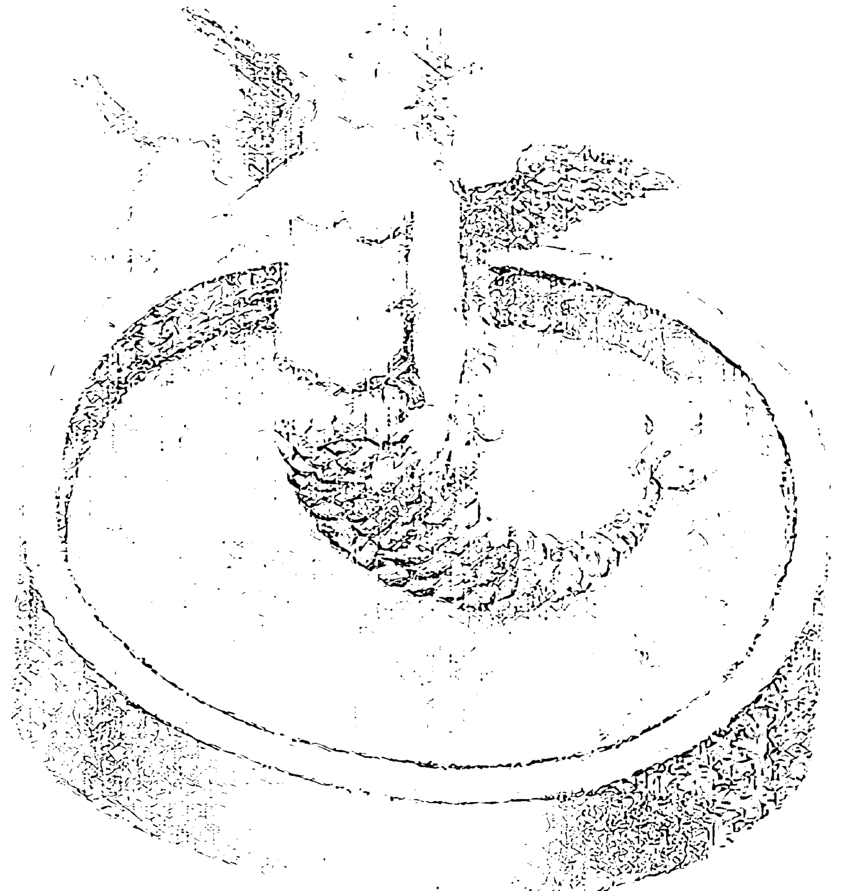

美人魚代表著水、火、土、氣的自然力量。

## 揭開煉金術的秘密

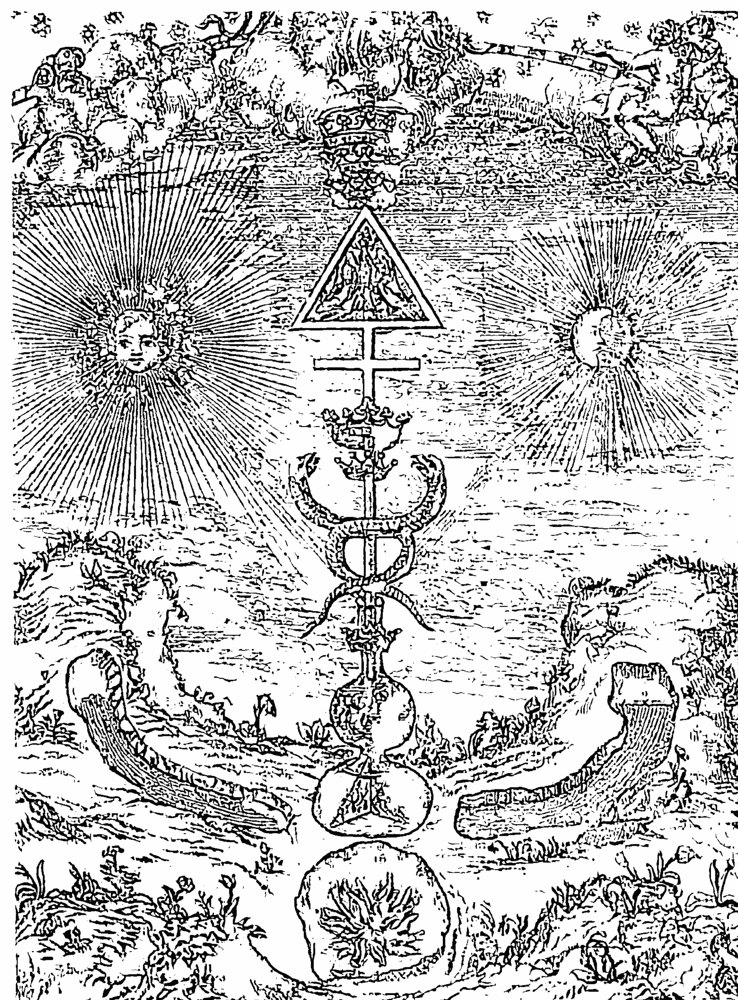

《煉金術的勝利》的卷首插圖，三環符號揭示了「偉大的工作」的三重劃分。

## 探索館

後來又有一位德國的聖芳濟會修士和一位男爵到來了，這兩個人比較幸運，在屋子裏的一個石罐裏他們找到了一些紅色的粉末。隨後，在這所老房子中又出現了一位年輕的女僕，她並不是那種想拼命尋找「魔法石」的煉金術士，她只是負責清理老房子酒窖的。在酒窖裏她找到了大量的石瓶，她認為這些瓶子都是很有價值的，可以擺放在餐桌上，或者用來盛裝物品。可是讓她感到不快的是石瓶中竟然裝滿了沙子，於是她便跑到河邊把瓶子都洗涮乾淨。這個可愛女人的舉動足以讓那些煉金術士痛心得去撞牆了。因為那些石瓶裏的所謂沙子很可能就是煉金術士們備加珍視的「靈藥」。而這個愚蠢的女人卻把它們倒了個一乾二淨。

煉金術已不再僅僅被貴族所壟斷了，普通大眾也開始參與進來，而關於尼古拉的傳說很可能促進了這種普及。一五八六年，教皇西斯圖五世頒佈詔書《天地創造者》，再次嚴厲地禁止煉金術。可是教會應該意識到，這道已經打開的門要想再關上是不可能的了，因為想要通過它的人實在太多了。人們對於長生和財富的渴望如同潮水一樣勢不可擋。

在一六一二年，此時距尼古拉去世已經兩百年了。在巴黎出版的一本書讓歐洲人驚訝得彷彿見到了上帝一般。當這本書出版的時候，書的主人尼古拉和他的妻子潘乃麗正靜靜地躺在聖雅克教堂的地下墓穴裏。如果他們突然醒來，就會聽到巴黎人為了爭論這本書的真偽而吵吵嚷嚷。

這本書的名字叫《解說尼古拉·勒梅刻在巴黎聖嬰公墓第四墓室拱牆上的難以理解的符號》。

## 揭開煉金術的秘密

這本書的編纂者是一個名為亞諾爾特·謝瓦爾的巴黎人，據他說，這本書是他從尼古拉·勒梅遺留下來的羊皮手稿中整理出來的。

在十七世紀末期，著名的大科學家牛頓曾經把這本《解說尼古拉的符號》翻譯成英文。他對這本關於煉金術的論著抱有極大的興趣，並且對其中的內容進行了注解。據說牛頓的許多科學研究的靈感都來自這本書，例如他的力學和光學理論。

在這部偉大的奇書中，有著這樣的描述：

「我，尼古拉·勒梅，一名居住在巴黎的抄寫員。一三八九年，就在位於代書人大街靠近聖雅克教堂的房子裏，我寫下了這些話。我為什麼要在第四墓室的牆上雕刻那樣的圖案？有兩個原因，對於普通的人來說，那些是教授末日審判時靈魂將要接受的神聖儀式。

「而那些略微懂得偉大藝術的人將從裏面看到煉金術的方法。這些方法能把邪惡變為善良，能夠洗淨實踐者身上所有的罪，他將變得慷慨、謙和、虔誠、純潔。這就是促使我在這個墓地裏，以這樣的方式刻畫這些圖案的原因。」

「對於那些在偉大的藝術中獲得美好結果的人，他們會像我一樣，不會吝惜上帝賜予我們的財富，不會用它來買地、買房子，這些都只是世上的虛榮而已，而是會用這些財富來幫助他們的兄弟同胞。」

「從這道牆上學到偉大藝術的人，他應該明白，他是從亡者的墓地裏得到了這個秘密，而他也會加入其中。當公正的審判來臨的時候，他必須解釋自己所有的行為，哪怕僅僅是一句最無用的蠢話。」

當年，尼古拉曾經用了整整二十一年的時間來探索《猶太人亞伯拉罕之書》的秘密。為了找到能給他以指導的猶太學者，他去了西班牙。終於在萊昂他遇到了甘切思大師，當他展示了隨身攜帶的圖畫之後，激動的甘切思大師決定和他一起到法國去。可是還沒有見到那本神奇的書，甘切思大師便死在了奧爾良。身心疲憊的尼古拉回到巴黎後，繼續著以往的生活。可是幾年後他幾乎是一夜之間便成了富豪，不知底細的人們對於他來歷不明的財富眾說紛紜，不過尼古拉仍然不改簡樸的生活作風，雖然他用於慈善事業的捐助多得驚人。

在當初看起來，尼古拉的西班牙之行完全是徒勞的，現在的我們也許以為二十一年時光的白白荒廢已經讓尼古拉完全拋棄了煉金術學說，可是在他做出了那些驚世駭俗的慈善行為後，人們一下子相信他已經成功地得到了點石成金的秘密，所以才會從一個平凡的抄寫員搖身變成了一名富翁。雖然他對於《猶太人亞伯拉罕之書》的研究和進行的煉金術實驗完全是秘密的，可是後來人們把他的發跡同煉金術實驗聯繫起來，說明早已有人關注或者說知曉他的一舉一動了。他曾經複製了幾頁《猶太人亞伯拉罕之書》在巴黎城裏尋找能幫忙解答的人，但是作為一名抄寫員，他向同行請教抄書過程中遇到的問題也很自然，還不至於僅僅因為這一點就引起別人的懷疑。我們都知道，那時候的抄寫員需要接觸各種各樣的知識。他的西班牙朝聖之旅也偽裝得很好，除了他的妻子，誰也不知道他的真正目的，而潘乃麗是個能絕對保守住秘密的女人。而最重要的是，在那樣的時代，對煉金術並不熟悉的普通人是把尼古拉的富有跟煉金術這樣一個生僻的原因聯繫在一起的。可是風行於世的謠言到底從何而來呢？這裏面一定有著莫大的秘密。

的確，那些曾經對尼古拉的來歷不明的財富產生過懷疑的人，可以名正言順地聲稱自己所言不虛了，因為在尼古拉留下來的書中證實了這一點。當尼古拉從西班牙回來之後，雖然表面上看來他重新成了一個平凡而卑微的抄寫員，可是長期的失敗和甘切思大師的死並沒有讓他放棄自己的煉金夢想，反而更加激起了他的決心和信心。在《解說尼古拉的符號》這部書中，他明確地說明了自己財富的來源：「甘切思大師已經教給我《猶太人亞伯拉罕之書》的關鍵原理和象徵意義，雖然有許多東西還沒有告訴我他便去世了，但是我已經找到了進入天堂的途徑，後來又經過了三年的實驗和多次的失敗，我認為我已經成功了。」

尼古拉的成功並沒有像魔幻小說中描述的那樣，電閃雷鳴，風狂雨驟，天上也沒有降下大火，也沒有牛奶從井裏冒出來，死去的人也沒有從墳墓裏爬出來在墓地裏遊蕩，國王沒有做奇怪的夢，也沒有詭異的藍色月光正好照在尼古拉的頭上。一切宛如最平常的日子那樣，沒有什麼異常的地方。尼古拉描述他的這一天：「那一天是星期一，在將近中午的時候，我成功地將半磅水銀轉化為純銀，潘乃麗在一旁見證了這一時刻。我親自檢測了它的質地，然後又請這方面的專家進行鑒定，最後證實它比天然銀礦裏出產的白銀更為純正。一三八二年四月二十五日的傍晚五點，在同一間屋子裏，我製成了紅色的魔法石，用它造出了比普通黃金更純的金子。它看起來成色更好，摸起來更柔軟，更富延展性。我可以很誠實地說，我利用魔法石製造黃金，總共進行了三次。」

## 斯人消失後的歲月

當《解說尼古拉的符號》出版後，法國國王路易十三的宮中出現了一位特別的賓客，他來到這裏是因為他四處傳播他精通煉金術。這個名叫丟比的年輕人是潘乃麗的侄兒皮埃爾的後人。據說當著國王和眾多大臣的面，他用一種粉紅色粉末成功地將一個鉛球變成了金子。國王和貴族們驚訝得目瞪口呆，也許在那一刻這個驕傲的蠢人滿心得意。

許多人以為這個人只不過在耍弄魔術而已。可是那位出了名的殘忍的國家首相和紅衣大主教黎塞留卻十分在意這一切。在這場公開表演之後黎塞留多次秘密地召見了這個年輕人。人們最後一次再看到他已經是在行刑的現場了。因為一個莫須有的罪名丟比被判處死刑，並且被沒收了全部的財產。據說黎塞留逼迫丟比交待尼古拉的點金石煉製方法，以及那本著名的《猶太人亞伯拉罕之書》，可是這個愚蠢的人對此一無所知，他向首相解釋說，那些粉紅色粉末是他的先輩們留下來的，而他自己根本不懂什麼煉金術。就這樣，丟比便糊裏糊塗地被殺掉了。

緊接著，屬於尼古拉的那些房產和物品都被黎塞留查封了。據說他曾派人在房子中進行了數次細緻入微的搜查。結果真地找到了《猶太人亞伯拉罕之書》，他還在盧爾建立了一個不為人知的煉金術實驗室，聚集人手研究這本神奇之書的秘密。在皮埃爾·博寫於一六五五年的《高盧的古老珍寶》一書中對此事進行過描述：「勒梅聲稱他在《猶太人亞伯拉罕之書》的指引下，製成了『魔法石』。許多人費盡心思得到這本書，但卻一無所獲。不過，一位名叫卡布里的紳士向我證實了這本書的存在。我特地前往米蘭訪問了這位先生。他說他有這本書的原版。紅衣主教黎塞留在去世之前曾短暫地擁有過它。」

經過了這位紅衣主教大人的搜查，恐怕尼古拉的老房子中什麼也不會留下了，甚至連牆壁都被拆下來運走了，因為上面刻有大量的神秘符號。關於老房子被破壞的慘狀，雨果曾在他的名著《巴黎聖母院》中進行過精彩的描述：「兩百年來，煉金術大師們從不肯放過這塊土地，他們粗暴地將屋子挖了又挖，直到它終於化成了他們腳下的一堆塵土。」

當丟比因為自身的愚蠢而丟掉性命的時候，一些人正悄悄地潛入聖雅克教堂。這座教堂中的修士們可能早已忘記了在他們的教堂裏埋葬著尼古拉和他的妻子，可是外界卻有人牢牢地記著這件事情。如同貪婪的狼一樣，他們不放過任何可能得到煉金術奧秘的機會。雖然尼古拉成功地造出了點金石只是一些別人口耳相傳的故事而已，但在這些人的眼中這是確鑿的事實，要不然，經過兩個多世紀的歲月磨礪，如果是謠言早就已經被識破了，還會有人至今仍樂此不疲地到處傳揚嗎？況且在尼古拉的《解說尼古拉的符號》中他自己對此也明確地承認了。所以這些潛入者相信如果在尼古拉的老房子裏找不到他的秘密的話，那麼就一定是藏在了尼古拉的墓穴中。

這些人回想起尼古拉用一塊巨大的墓碑蓋住墳墓，並且要求教堂妥善地照看他和妻子的這塊安葬之地，應該是因為他早就想到了以後會發生什麼事。他知道那些好奇的人是不會放過這個可能埋藏著秘密的地點的。即使他的墳墓修在一座山裏，那些對財富和長生有著強烈渴望的人們也會把山挖空。尼古拉的先見之明應驗了，在一個漆黑的夜裏，尼古拉和他的妻子的棺材被打開了，可是讓那些盜墓者想不到的是，兩具棺材空空如也，連塊碎紙屑也沒有。

在《解說尼古拉的符號》出版後，社會上便掀起了搜尋尼古拉遺跡的狂熱浪潮。曾經有一位叫做安東尼·約瑟夫的著名的修士找到了一本羊皮讚美詩集，同其他的詩集的不同之處在於，這本書裏的空白處寫滿了奇怪的文字。安東尼花了很長的時間，才發現那是中世紀人們所使用的法文，只不過每個字母有四種寫法，這是一種密碼。很明顯，作者想把他要說的話隱藏起來。一七五八年，安東尼成功破譯出了寫在讚美詩集裏的密碼文字。這便是尼古拉臨死前留給侄兒皮埃爾的手稿。人們把這份手稿稱為《尼古拉的遺囑》，手稿證實了這位卑微的抄寫員的另一種身份——一個成功的煉金術士。

不過也有人懷疑尼古拉的故事的真偽，艾迪·法蘭西斯·維蘭神父就是這些人中的一位，他認為那些關於尼古拉煉金術的傳說都是虛假的。為了批駁那些盲目崇拜者，他出版了《尼古拉·勒梅歷史考》這本書，在社會上引起了激烈的爭論，可就在這時，傳說中的尼古拉和他的妻子卻不露聲色地回到了巴黎！據說有人親眼目睹了這一切。這是尼古拉去世後的第三四四年。一位叫塞繆的藝術家在巴黎歌劇院的拱門下看到一對奇怪的夫妻，他們的穿著是那樣的陳舊，並且明顯落後於時代。他緊盯著這對夫婦不放，那個老者看到了他便走了過來，似乎想同他進行交談，可是他的妻子馬上過來拉走了他。給塞繆留下最深印象的是那位老人年輕而富有活力的眼神，雖然表面上看來他已經是風燭殘年了。並且在老者的身上還散發出硫黃的氣味。而在那一年，巴黎正在上演拉莫的歌劇《遊俠騎士》，這一消息一經傳播，立刻成了爆炸性新聞：不朽的尼古拉再次光臨巴黎，他喜歡上了欣賞歌劇。在一百年後，著名歌劇《卡門》的作者比材，根據他的故事創作了歌劇《尼古拉·勒梅》。假如那時尼古拉再次回巴黎，看到他的傳奇經歷被搬上了戲劇舞臺，那一定是件很有趣的事情。

## 三、大師們的光輝歲月

### 智慧巫師大愛爾柏特

大愛爾柏特的全名是愛爾柏特·馬格納斯 Albertus Magnus（一二○六～一二八○）。據說他身材瘦小，其貌不揚，之所以被稱為「大愛爾柏特」，是因為他擁有超凡的智慧而並非是身材高大。在他所處的時代，人們稱讚他是「全能的學者」和「時代的奇蹟」，在他還活著時就已經成為舉世公認的偉大的智者和學術權威。

生於德國斯瓦比亞的愛爾柏特是一位伯爵的長子。他在年輕時曾在義大利的帕爾多大學接受教育。他於一二二三年加入了多明我會。在他完成了高等教育後，便開始在德國和法國的一些地方——雷根斯堡、斯特拉斯堡和科隆等地教授神學。

一二○六年的時候，愛爾柏特被任命為雷根斯堡的主教，在此職位上他工作了兩年，此後便來到科隆大學教授神學課程。他的著作幾乎涉及每種學科，他是那個時代物理學、地理學、天文學、礦物學、煉金術、動物學、生理學的權威，雖然這些學科在那個時代並沒有如此細緻的名稱，它們也許都還被稱為自然科學。

曾經有許多傳言說大愛爾柏特精通巫術，他也曾經進行過煉金術實驗，據說曾經成功地實現了金屬的轉化。大愛爾柏特認為許多煉金術士使用的方法並不正確，所以導致煉金術實驗大多以失敗告終。他還認為用所謂的「魔法石」是無法點石成金的，可是當他去世後卻被世人尊為煉金術大師。據說他曾經寫過三十多篇有關煉金術的論文，其中最著名的要數《直接的路》。因為他具有崇高的威望，所以很多人都把自己的書署上他的名字，甚至一些論述動植物的奇異特性、女生理秘密的書，以及許多論述魔法的巫術類書籍都在此列。在這些假託的書中最著名的是《大愛爾柏特的神奇秘方》，雖然這是一本假冒之作，但是其中有些內容還是十分有趣的，比如：

> 「人的頭骨有奇特的療效。如果把人骨磨成粉末，摻在飲料裏空腹喝下，就可以治療癲癇。」

> 「當一個人熟睡時，只要把雞冠鳥血擦在他的臉上，就能讓他看見魔鬼。」

> 「想知道一個病人會不會死，就帶著一束馬鞭草去看他。在病人的床邊問他感覺怎麼樣，如果他回答，好一些了，他不久就能康復，如果是相反的話，則意味著他將不久於人世。」

> 「老鼠屎混合著蜂蜜，塗在頭上脫髮的部位，反覆摩擦，就可以讓頭髮再長出來。」

> 「飯後的唾液沒有醫療價值，禁食後的唾液效用最大，這樣的唾液沾在毒蛇身上，可以殺死它們。」

在一二七八年，年邁的大愛爾柏特立下了自己的遺囑，此後不久便患上了失憶症。一九三一年梵蒂岡將大愛爾柏特封為聖人。除了他本人的淵博學識，愛爾柏特另一個被公認的偉大成就在於他培養了一位天才的學生。

### 稀世天才湯瑪斯·阿奎納

著名的煉金術大師大愛爾柏特發現的天才學生，便是歷史上赫赫有名的湯瑪斯·阿奎納 Thomas Aquinas（一二二五～一二七四）。大愛爾柏特曾預言他會獲得偉大的成功。事實上湯瑪斯也是他最出色的學生。

湯瑪斯出生於義大利，他最為著名的著作是《神學概要》。他對於煉金術的觀點和他的老師大愛爾柏特是一致的，認為煉金術造出的金子可能並不是真正的黃金，實現金屬的轉化是極其困難的，因為在金屬的形成過程中存在著上帝的力量，而人類想要模仿這種力量幾乎是不可能的。不過一二七三年，在他的身上發生了一件奇怪的事。一二七三年十二月六日，他突然告訴他的助手，「與我所獲得的偉大啟示相比，我以前所寫過的所有東西在我看來就像是一文不值的稻草」，於是他停止了寫作，包括未完成的《神學概要》第三卷。

一二七四年，湯瑪斯前往里昂參加一個宗教會議，在半路上被路邊的樹杈打中，從驢背上重重摔下來，之後因此而死掉了。湯瑪斯的死打擊了他的老師大愛爾柏特，他哀嘆「教堂的光熄滅了」。只要有人在他面前提到湯瑪斯的名字，他就會因悲傷而流淚。

十四世紀初，一本以湯瑪斯·阿奎納為署名的煉金術著作《初生的曙光》出版了，這是當時很具影響力的煉金術著作之一。書中詳細描述了湯瑪斯在一二七三年得到的那個神秘的啟示。這本書很可能是其學生對湯瑪斯最後講話的記錄。書裏有豐富的插圖，都是煉金術著作中常見的象徵圖案。一二七七年，在教皇約翰二十一世的詔書裏，湯瑪斯·阿奎納的著作被定為異端學說。大愛爾柏特得知這一消息後立即前往巴黎，為捍衛已故學生的名譽辯護，但顯然他沒有成功。在教皇一二七七年的同一份詔書上，被定為異端分子的還有另一位學者。他沒有湯瑪斯幸運，因為他還活著，因此將不得不面對黑暗的牢獄生涯。他就是英國人羅傑·培根。

### 羅傑·培根成為不朽之神

大愛爾柏特獲得了「全能的學者」稱號，而培根Roger Bacon（一二一四～一二九二）則被稱為「神奇的學者」。一二一四年培根出生於英國薩莫塞特郡的一個富裕的家庭，在他十二歲時到牛津大學接受高等教育，他在那裏的成績十分優秀，當時給他上課的老師都是一些著名的學者和頂尖的數學家。在讀大學時培根加入了方濟各會。從牛津大學學成之後，他前往巴黎，因為當時世界上最好的大學就在巴黎，他在巴黎學習了煉金術和占星學，還有實驗科學。

培根的思想觀點很具有超前性，他認為通過自然科學的教育，人類能夠掌握造物主的知識和能力。回到英國牛津後他一直進行著科學實驗，尤其是對煉金術有著高漲的熱情。培根是一個博學多識，涉獵廣泛的人，他研究了多種學科，比如天文學、植物學、化學、醫學、光學和數學。據說是他發明了顯微鏡、坦克和浮橋。可是培根的思想大大超前於他的時代，也是他悲劇人生的根源。他是現代科學重要的奠基人之一，但在他的時代卻被認為是迷惑大眾的巫師。

方濟各會的私設法庭在一二五七年判定培根犯下了傳播巫術罪，從此培根不得不離開了牛津的學術圈子。據說他被軟禁在自己的家裏整整十年，在這期間他的學術活動停滯下來，沒有任何進步，他把這歸因於健康狀況的惡化。當時到處流傳著謠言說，培根是一個神秘的巫師，甚至有人說他曾經以黃銅為原料製成了一個會說話的頭顱，而且他的知識都是得自於魔鬼，他曾經試著製造能夠飛行的機械，還試著製造用於深海探索的海底呼吸器和一個可以看見未來的鏡子。

一二六三年，關於培根的種種流言傳到了羅馬教廷駐英國使節吉多·伏爾科的耳中，於是他秘密召見了培根。他在一二六五年登上了教皇的寶座，成為教皇克萊門四世，他給予培根以人身自由，而作為報答，培根把自己的全部發現集錄成一本書獻給教皇。一二六八年教皇克萊門四世死去後，培根一下子失去了保護人，再次遭到教會的迫害。一二七七年培根的教學被宗教法庭認為含有「可疑的新奇觀點」，以「異端」罪名判處培根入獄十四年。有傳言說，他之所以最終獲釋而沒有被終身監禁，是因為他把煉金術的秘密告訴了當時的方濟各會領袖雷蒙·伽弗瑞。

一二九二年培根被釋放，就在他獲得自由的第二年便去世了。當時有人傳言他並沒有死去，因為他早就成功地懂得了永生的方法。在他死後，據說他所有的書籍都莫名其妙地釘在書架上，再也沒有人能移動它們，直到腐爛。這使方濟各會的教士們深信培根的確與魔鬼訂下了盟約。培根一共擁有三〇本煉金術方面的著作，其中也有假託他的名字的偽作，其中最為著名的是《鏡中的煉金術之謎》。

### 亞諾爾特·威蘭諾瓦煉出真金

一二四〇年，亞諾爾特Arnold de Vilanova（一二四〇～一三一一）在西班牙的華倫西亞出生。幼年的時候他在義大利的那不勒斯接受了教育，後來又到巴黎大學進行醫學方面的研究。當他完成了學業後便一直在義大利和德國遊歷。他的同時代的人都公認他是歷史上最高明的醫生，甚至

## 揭開煉金術的秘密

連教皇都請他前去診治疾病，有時亞諾爾特還給教皇和王公貴族們解釋夢境。

亞諾爾特的學術研究主要集中在醫學方面，同時他也從事占星學和煉金術的研究。當時許多人都相信他曾經成功地把大量的鉛變成了金子。亞諾爾特曾撰寫過如何通過蒸餾血液製造藥劑的論文，他建議以優質的鮮血做原料。這些血最好從二十五歲到三十歲之間的健康男子身體裏採集。採血的時間以每年四月～五月為最佳。這也正好是尼古拉·勒梅在他的《解說尼古拉的符號》一書中推薦的煉金術實驗開始的時間。這並非巧合，曾深入研究過煉金術的他認為自然的原理是相通的。

在亞諾爾特煉製藥品的過程中，充滿了煉金術的秘密原理。他認為普通的賤金屬就是不健康的金屬，煉金術是用最基本的四種元素醫治那些生了病的賤金屬，使它們成為健康而完美的金屬——黃金。那麼用這種方法，通過調節人體內的四種元素的平衡，也完全可能讓人的身體變得完善而健康，甚至達到永生的境地。

在一二九九年的時候，巴黎的宗教裁判所曾經判定亞諾爾特有罪，並且逮捕了他，不過沒過多長時間便釋放了他。後來在義大利他又被指控為巫師，但他在被送進監獄之前成功逃離了義大利。亞諾爾特據信在一三一一年之前去世，因為在這一年教皇克萊門五世曾經命令歐洲各地的神職人員，讓他們盡一切力量找到亞諾爾特的一部名為《醫學實踐》的論文，原本亞諾爾特曾立志要在有生之年把這部宏篇巨著完成，並呈獻給教皇，可是最終這個理想化做了泡影。

據說亞諾爾特曾給他的一個朋友哈科特寫過一封短信，在信裏他提到「使用這些方法，任何人都可以延長至少幾百年的壽命」。但這份文獻的真實性受到了學者的懷疑，因為在亞諾爾特的文集裏找不到這篇文章。人們說，亞諾爾特是教皇約翰二十二世的老師和朋友，他把煉金術的所有秘密都教給了教皇，這就是教皇金庫裏那筆奇怪巨額遺產的來源。歸於他名下的煉金術著作有五十七部，最著名的、也最長的是《哲人的玫瑰園》。

## 洞悉「偉大秘密」的雷蒙

雷蒙·盧爾Raymond Lulli（一二三五～一三一六）是一位有著傳奇人生的煉金術大師。他於一二三五年出生在西班牙馬略卡島的一個顯赫家庭，年輕時的雷蒙崇尚愛情，沉溺於享樂，是一個喜歡用西班牙語寫作的詩人。他曾經創作了大量的情詩，被公認是西班牙文學的開創者之一。可是突然有一天他發生了轉變，他離開了家庭，拋下了妻子和子女們，將自己的一半財產留給他們，而另一半則佈施給了窮人。然後他跪在十字架下要一生虔誠地信奉上帝，把以前他浪費的光陰都彌補回來。據說他曾在夢中見到了耶穌，這位救世主對他說：「跟我來吧，雷蒙。」而且同樣的夢重複出現了三回，於是雷蒙確信這是上帝給他的啟示。然後他前往西班牙的聖迪亞哥大教堂朝聖，也就是尼古拉·勒梅曾經朝聖過的那個西班牙大教堂。

雷蒙在朝聖之旅後，便一直在深山中隱居，潛心研究古代的科學和哲學。就這樣一直度過了十四年的時間，他結束了封閉孤獨的生活，來到了巴黎。在那裏同著名的學者和煉金術士亞諾爾特·威蘭諾瓦結交成朋友。很明顯地受到了亞諾爾特的影響，就在他們相交後不久，他便不再進行過去一直堅持的修行活動，而是轉向煉金術的研究和實驗。曾有人傳說，教皇約翰二十二世曾私下裏約見過他，很可能因為雷蒙的煉金術實驗獲得了成功。此後不久雷蒙便到突尼斯，他在那裏傳播基督教而被當地政府逮捕並且投入監獄，隨後他被判處死刑。在朋友的多方努力下，最後他獲救了，但是釋放他的條件是他必須立即離開非洲，並且有生之年再不許來到此地，否則死刑的判決將仍然有效。

在逃脫了非洲迫害之後的一三一二年，英王愛德華二世致信雷蒙，邀請他到英國訪問，他高興地接受了這個建議，在英國他為皇室點化了大量的金子，據說一共有六百萬枚金幣。不過也有人認為這些財富並非是煉金術實驗的結晶，而是雷蒙向愛德華國王建議徵收羊毛稅而得來的。西敏寺教堂的院長約翰·克里墨在他的手稿中說，是他促成了雷蒙的英國之行。這位主教自己也一直在進行煉金術實驗，他曾用三十年的時間來實驗「魔法石」，後來一個偶然的機會，在義大利遇到了雷蒙，並且他得知雷蒙已經領悟煉金術的偉大的奧秘。不過關於如何進行煉金操作，雷蒙並沒有向他透露。他只是對這位主教說，應該憑藉自己的努力去發現這一偉大的秘密，過去成功的煉金術大師都是這麼做的。在克里墨回到英國後，便將這件事報告給了英國國王，於是便有了後來的雷蒙的英國之行。

據說雷蒙在英國逗留期間一直住在西敏寺教堂。他離開以後，人們在他住過的房子裏發現了大量的金粉。離開英國不久，他去了羅馬。兩年之後，他又孤身去非洲傳播福音。以前對他的死刑宣判生效了，那裏的人們向他投石頭，把他砸得半死不活，然後把他丟棄在海邊。幾小時後他被一群熱那亞商人發現，他們把他帶上了船，回到馬略卡島，一到那裏他就斷氣了。他傳奇的一生就這樣結束在自己出生的地方。

雷蒙一生留下了大量的著作，共有五百卷之多，內容涉及文法、道德、神學、政治、律法、天文學、醫學和煉金術。他曾經在他的遺囑中說，他一生至少把五萬磅的水銀、鉛和錫變成了金子。在他的大量作品中，最著名的要數《大自然的奧秘之書：關於第五元素》，這本書成了後世的煉金術士們爭相關讀的經典。

