# 攻略情感：塔罗透视关系

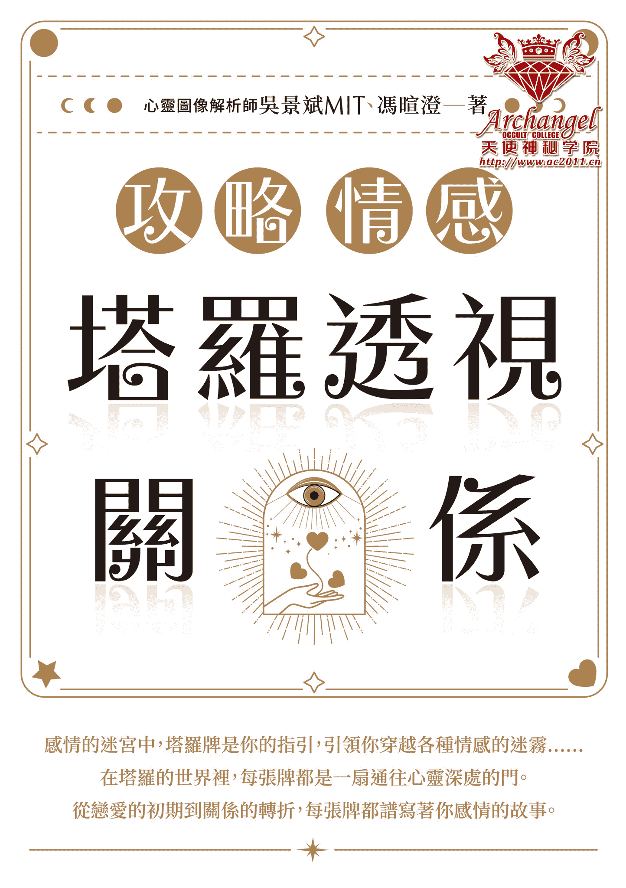

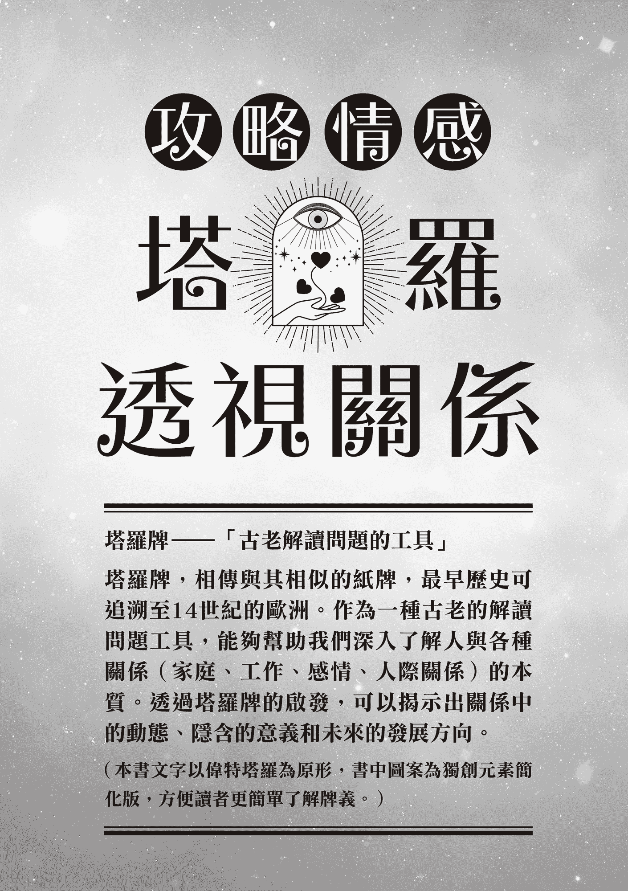

# Prologue
缘起

## 让影子成为背后力量

那个月黑风高的夜让人记忆犹新，我还记得那天傍晚的红霞红得令人目不转睛。因为那阵子工作的停滞不前，我开车去了一个很陌生的路口，那边刚好有一间气氛不错的咖啡厅。

我拿上笔电，想让自己享受完全陌生的静谧，顺一口拿铁的浓醇。

我刚戴上耳机，身边走近一位戴贝雷帽的男子。

“你好，我是这间店合作的塔罗牌老师，我们现在有活动，点咖啡可以免费抽一张牌，我帮你解牌。”

瞬间我为了刚开始的静谧被打扰，感到有些许不耐烦起来。

“我只想一个人待着。”

“你想一个人待着，一定有原因，既然是免费的，何不抽牌看看有没有不一样的视角让你思考？”

我第一次遇到一个不图利自己，而是从关心别人开始的搭讪。我斡旋了好一阵子，仍不见这人要放弃，我就这样带着半不甘愿的心情抽了一张牌，我永远记得那是一张战车牌。

就是这张战车牌，让我对塔罗牌，从不耐、陌生到后来的“玄学”，燃起了新的火花。

✧ 看见心中的那道光

时光飞逝，外头的红霞陡然已变成黑夜，从起初半信半疑的我，开始问起了所有那阵子自己需要解答的问题。他的耐心，给了我思考选择的空间；他的引导，给了我狭路中的一丝亮光。顺顺地走进塔罗牌世界，揭开一些它神秘的面纱。

这位循循善诱的贝雷帽男子，就是 Mit。

这桩故人旧事今日再提起，是我与 Mit 老师的初次相遇，那可不是什么浪漫的偶像剧情节。但我想，塔罗牌其实可以是个很简单的沟通、交流工具，如果你想要与人创建更深入的交流关系，请收下这本书。

因为 Mit 老师对生命与塔罗的热情，打开了我接触塔罗这个神秘领域，每个人都有影子（黑暗面），但如果选择转向阳光这面，影子会成为我们身后的支柱与养分。这给予了我很多与人相处时，知道应对进退的技巧，有时候这道光，可以是别人的灯塔。

所以这本书不是要你成为什么塔罗大师，而是在自己的人生旅途中，找到那个探究自我深处的可能性。

常听见前辈说的一句话：“懂得爱自己，才会懂得爱别人。”

当你在迷惘时，可以从牌阵为自己的大小事情找到方向，这会是一件很纾压的事情，且还可以跟自己来一场深度谈话。

所以一起来学塔罗牌吧！

塔罗牌其实可以很简单，借由 Mit 老师深入浅出的分享与导引，以及每张卡牌的深刻含意，伸出手，一起倘佯这趟心灵之旅！

澄澄

# Chapter 1
揭开塔罗牌神秘面纱

塔罗牌是由 78 张牌组成的解读工具，每张牌都有其不同的象征和意义。其中 22 张大阿尔克那（又称大秘仪牌、大塔罗、大牌，Major Arcana）代表着生命中的重要转折和意义深远的事件，而剩下的 56 张小阿尔克那（又称小秘仪牌、小塔罗、小牌，Minor Arcana）则代表着生活中的日常事物和情境。

## 认识塔罗牌及与人关系

很多人常问我，为何要算塔罗牌呢？塔罗牌是一种链接自我与他人的工具，可让自己充满魅力！

当你专注在一件事情上即可产生魅力。

魅力是一种神奇的力量，它能够让人们被吸引，并与你产生链接。无论是在个人生活中还是工作场合，用魅力吸引他人都是一项重要的技巧。

内在的魅力源于自信和真诚。当你对自己充满自信，并展现出真实的自我，你会散发出一种独特魅力，吸引他人目光。与此同时，保持积极乐观态度，对他人友善和关心，是彰显内在魅力重要因素。

✧ 如何用塔罗与人互动

想要与人互动使用塔罗的话，可以这么做：

1. 解释牌卡：展示对塔罗卡牌的深入了解和知识，解释每张卡牌的象征意义、图像和可能的解读方法。

进行公开的塔罗解析演示，展示自己的解析技巧和能力。可以邀请他人提出问题，并使用塔罗卡牌进行解析，然后解释结果。

2. 创建链接：在开始塔罗读牌之前，先与对方创建链接和信任，确保对方愿意参与并对此持开放态度。

3. 共享体验：邀请对方参与塔罗读牌的过程，可以让对方自己挑选卡牌或者参与解读，这样有助于增进彼此之间的互动和交流。

4. 提供支持：塔罗卡牌可以提供洞察和启示，但重要的是要以支持和鼓励的方式给予对方意见。关注对方的需求，并给予正面的指导。

5. 创建共同体：利用塔罗与人拉进关系时，可以让两人都觉得他们是共同体的一部分。共享卡牌的意义和解读，并将其应用于彼此的生活中。

## 展现牌卡与生命经验链接

你也可以结合小阿尔克那牌（小牌）的解法，带入生命灵数、土水火风元素、牌义的感觉，三者一起解牌。

小阿尔克那牌上的数字，分别象征：1：开始、2：合作、3：成长、4：巩固、5：改变、6：关心、7：分析、8：力量、9：智慧、10：完整。

小阿尔克那在四元素（土水火风）的牌组里，都有其专属的宫廷牌，四个基本角色包括了：侍从、骑士、皇后、国王、分别代表：1:孩童、2 青少年、3 母亲、4 父亲。

同时也可用“脉轮”来解牌，脉轮又被称为刹那（Chakra ）在梵语中意为“轮子”。脉轮，是古代印度哲学和瑜珈的重要概念之一，代表人体的七个主要能量中心，从尾骨到头顶排列于身体中轴者，七大轮位，分别为“海底轮”、“脐轮”、“太阳神经轮”、“心轮”、“喉轮”、“眉心轮”、“顶轮”。

每个脉轮与特定的身体器官、情感、思维和精神层面相关联。

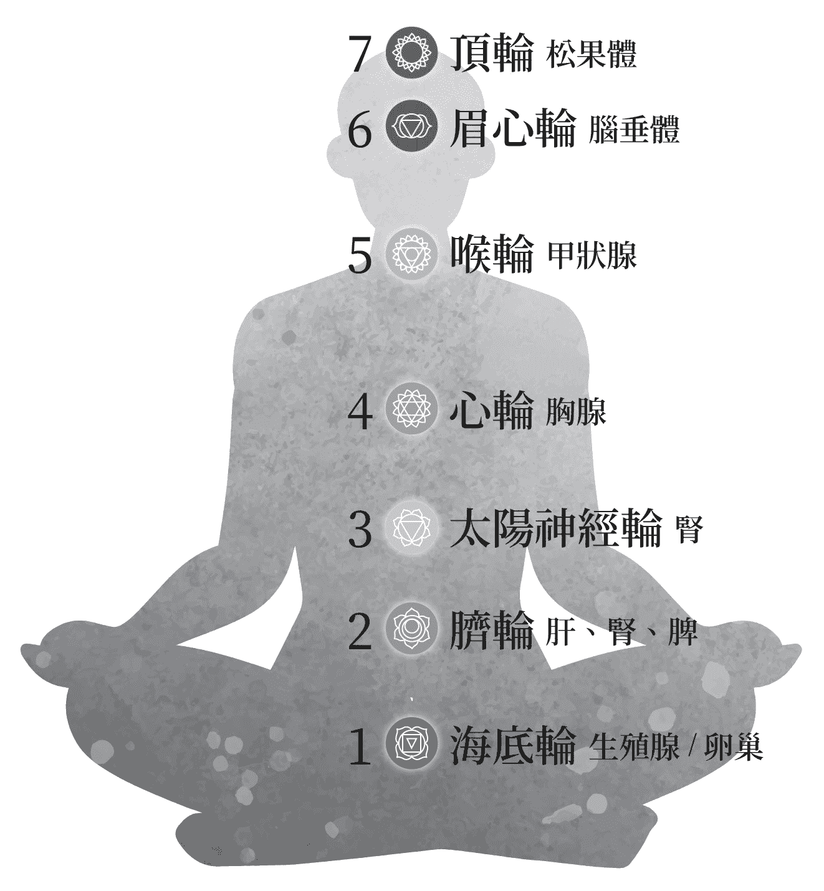

脉轮相对应人体位置图

# Chapter 2
生命指引的大塔罗

塔罗牌的 0-21 号牌通常被称为“大阿尔克那”、“大秘仪”、“大塔罗”等。从“愚者 The Fool”到“世界 The World”，而整组“大塔罗”，可从“人”、“神”或“自然”来串出一个大的完整人生故事。当个案诚心想着自己的问题，塔罗牌丰富鲜明的图像将给予大方向的指引。

## 从大阿尔克那故事的联想

面对未来，放松是必要的！当你无法放松，就会被情绪影响，然而事前的准备，会创化出你意想不到的满意结果。

每件事情的发生都会有他背后的意义，当自己有内在想法时，就会知道自己在做什么，而不会被外在事务影响。

当你使用女性特质时会有温柔的能量影响着；当你使用男性的特质时，会有稳定的力量支持着；当你负起责任时，也就是你提升的开始。

除此之外，适当的规范也是需要的，我们必须在规范中创造自由，让自由与规范并进，这样会让你的生活更具吸引力。

每个人都有爱，爱就是心里的感受，它是真实的存在，但必须真正了解你所想要的，爱你的人、爱你的车、朋友、家人……这些都是爱。

佛家讲“慈悲”，也是一种爱，它是对众生的爱，珍惜就是爱。

当你进入家庭时，会有很多的责任，必须保护自己的家，当然要进入家庭时，必须要做个决定，让人生走入另一个阶段的决定，所以千万不要一直犹豫不决，因为这样会浪费你很多能量跟时间。

✧ 学习展现自我的力量

展现自己的力量有很多方法，每个人都有他自己的力量的展现，以柔克刚、刚中带柔、柔中带硬，适当的时间做适当的事情。除了做事方法，最主要的是要有内在目标，展现内在力量，可以运用之前的经验，然后做整合，这样做的话将形成你独特的能力。

好的环境会有好的学习，所有发生的事情都是让你去体验跟学习的。人生难免有起有落、时好时坏，所以当你用平常心去面对时，自然的心情也就会放松许多。面对社会上许多不公的事情，这时候你需要静下心来观察，宇宙自有定律，当法律失去效力的时候，背后是有原因的，这些原因不是目前的信息可以得知，它必须依循宇宙定律的实行。

所谓的公平正义是需要拉长时间来看待，或许这时间会超过好几百年，当你有这样的认知时，视野自然会拉高许多。所以发生问题时，换个角度想或是转念是重要的。

当你要达到目的，别忘了背后是需要付出代价的，不管是时间、金钱还是精神上的投入，这些都是自愿牺牲所换来的事物，但也有可能会失败，但这些也是一种经验，也是一种所得。

当你利用之前的经验时你将会重生，会有新的境界思考，经历过失去或者失败，更能知道自己想要的是什么？会有内外的平衡，让你自己成长、用自己的节奏学习、用中庸之道来实践自己的生活，可以让你完全的自由。

然而自由的基础，需要满足基本的生活需求，关于柴米油盐酱醋茶都是最基础生活必须，所以照顾自己的神性、也要照顾自己的人性、两者是可以兼得的。

✧ 接纳一切，就会重生

人生活在四季变化的空间里面，突然发生变化时，该如何应对“无常”发生时，该如何转念这就是真功夫了，通常有人会去逃避现实发生的状况，然而这样只会拖延而已。

当你勇于面对所有自己的时候，全力以赴的时候，自然就会有人来帮助你。

然而控制情绪是重要的，每个人都有个性黑暗的那一面，就如白天和夜晚的差别，重点是如何控制它，才不会影响生活。

除此之外，乐观热诚也是重要的，当你用天真热情的赤子之心去面对问题或生活时，相信都会突破所有的瓶颈。

接下来就要接受你自己的黑暗面，接纳所有的你，没有好坏、它都是你的一部分。当你接纳你所有的一切、不再审判你自己时，你就重生了。这样会是以完全不同的视野在看待问题，这种拉高角度来看待事情的方法，会使你一切更圆满。

## 解读
大阿尔克那塔罗

Major Arcana

0 愚者

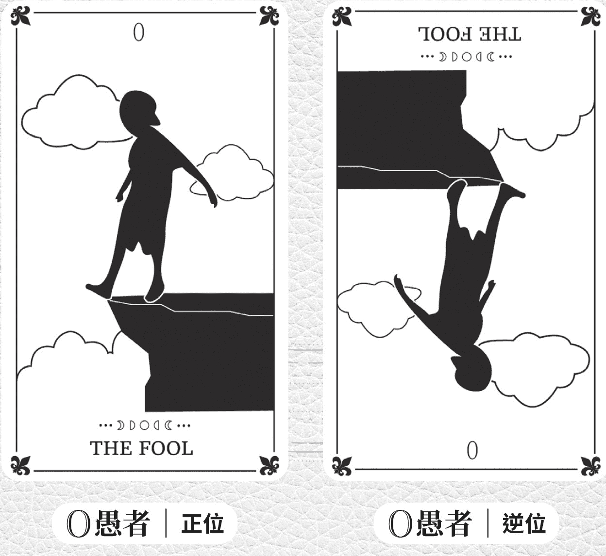

▪ 概义 ▪

正位：轻松、从零开始、放松、陪伴、冒险、天王星。

逆位：不轻松、不快乐、无法归零、冲动、没有计划、无法展现自己、不敢冒险。

▪ 解析 ▪

扑克牌中的鬼牌就是“愚者”，是游戏人间、花俏、大智若愚、无法被定义。衣服上面很多黄色植物的图案，代表成长，白色则代表纯洁、天真。

零是重新开始，人生有很多时候需要像婴儿一样重新开始，这是一个选择而非被迫。

✧ 解牌心语 ✧

愚者带着过去经验，但愿意归零并鼓起勇气往下一个旅程迈进，不畏惧前路可能的风险与危难，因为他知道他的身旁始终有陪伴。

关系关键字：勇敢冒险、快乐、放松、陪伴。

1 魔术师

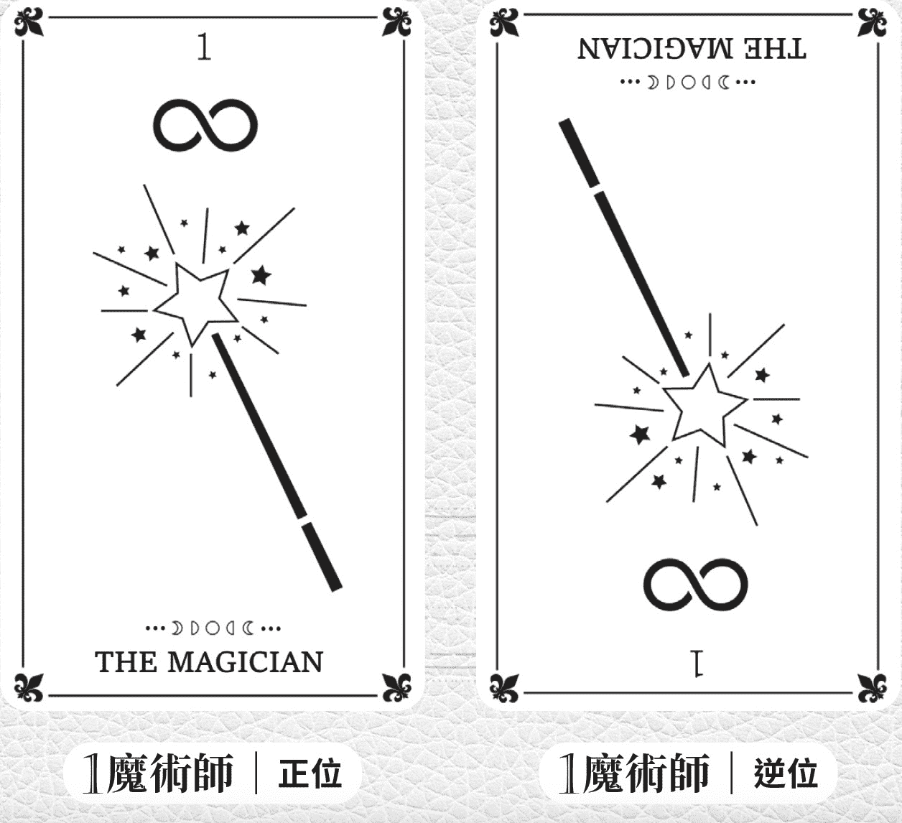

▪ 概义 ▪

正位：有所准备、变化、无中生有、聪明、学习力、水星。

逆位：没有准备好、无法表现、聪明反被聪明误、不脚踏实地、没有自信、没有灵感、无法随机应变。

▪ 解析 ▪

想像日常生活什么时候会需要魔术师？例如学生考试前要准备，就像魔术师表演之前也要准备。

桌上的四个元素，代表地水火风，宝剑、圣杯、钱币跟权杖，代表可以运用他的资源，运用自如，腰带里面有两只蛇，蛇代表阴暗面，奸诈或是比较内在的东西，不择手段，或是比较看不到的东西，同时蛇也代表无限循环的能量，画面中除了黄色还有红色，红色代表海底轮，就像魔术师为了赚钱会用些小聪明。

牌面上很多的花代表天真，所以我们看魔术的时候一定要天真，也代表生长与成长，上面的花是有设计过的，代表做事情的时候需要经过一些规画设计，可以用魔术师的方式去运作，但是要有一些随机应变，魔术师通常不会太单纯，要有计划有准备，工作方面，要经过准备，运用资源，不然单打独斗会比较辛苦，也可以运用一些小聪明的方式来面对，展现自信，发展自己的特质，搭配生命灵数 1，代表独立或独立思考，要把决定权留在自己身上。

✧ 解牌心语 ✧

如果问工作时，可说是以独立思考的角度来面对工作，主导权在自己身上，可以链接的东西有很多，包含变魔术之前的准备工作，还有看牌的感觉。魔术师是有自信的，头上无限大的符号，代表经验的累积，拥有丰富的舞台经验，可以掌控，强烈的自信，权杖代表主导权，在变魔术的时候，他是最大的，拥有权力与自信。解牌时可以利用所有牌面的资源来运作，数字 1 代表独立独创开创，1 加魔术师代表有很多可能性。

关系关键字：初步了解、运用技巧、新朋友、新技能。

2 女祭司

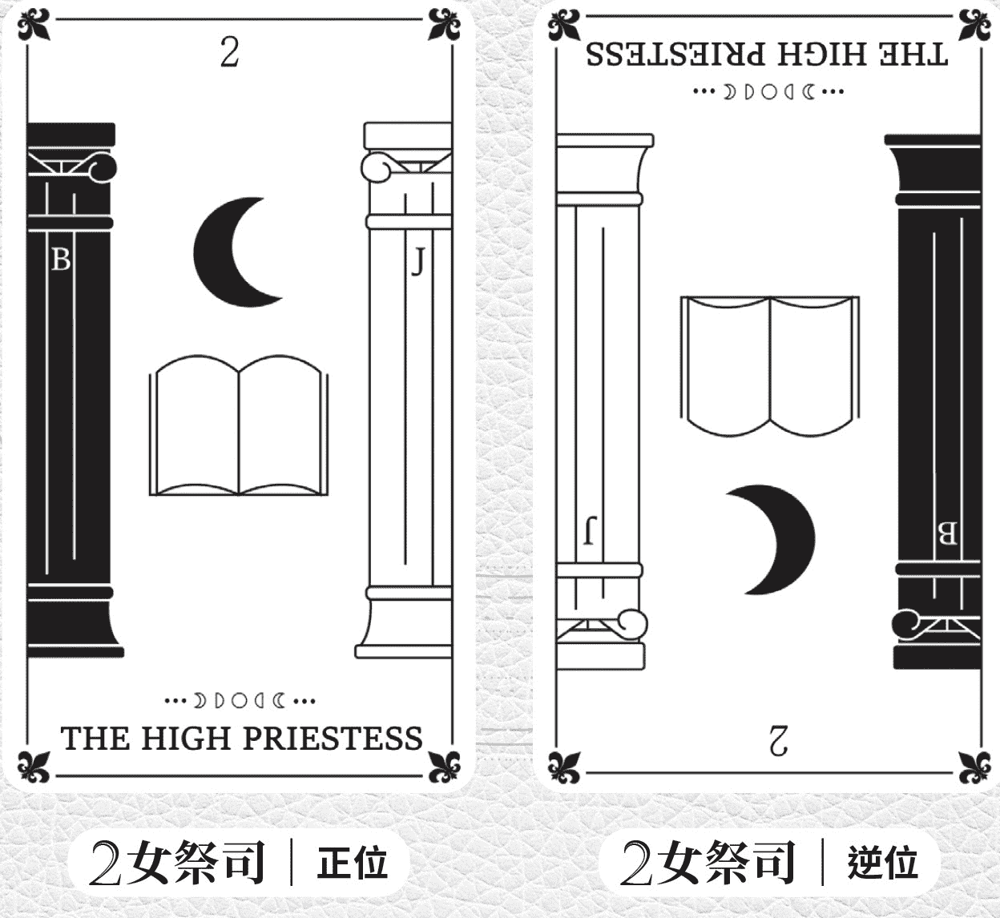

▪ 概义 ▪

正位：直觉力、精神力、严肃、内在想法、形象、月亮。

逆位：失去精神、情绪不稳、创建新的、无法专注、没有信仰、受到影响。

▪ 解析 ▪

代表精神的象征，女性的修行者，尼姑或修女，独立的个体，代表智慧。

生命灵数 2 代表沟通互动，女祭司的表情是中性的，十字架在心轮上，两旁柱子上的英文字母 B 和 J 是守护神的名字，代表二元对立，黑跟白，水代表情绪，月亮代表阴晴圆缺，修行者需要形象，可是他们也会有欲望和情绪，有时候必须压抑住来维持形象，后面背景的石榴代表女性的子宫，后面的水是平静的，月亮代表潜意识的内在，其实有很多欲望，在这张牌里有很多元素是冲突的，代表为了形象去压抑自己的情绪与欲望。

女祭司代表专注和精神力，十字架直接在心轮上，代表有很多东西被制约住，头饰代表月亮，阴晴圆缺，头上带着头饰代表头被罩住，必须压抑自己的想法，表现出完美的形象，但以精神力来讲，女祭司是很专注的，一只手露出来扶着智慧之书，代表追求智慧，愿意做些牺牲。

✧ 解牌心语 ✧

压抑自己的欲望去配合对方，工作方面也一样，愿意把自己的欲望和情绪压抑下来，就为了得到这份工作，黑白对立代表没有灰色地带，只有对跟错，弹性比较小，制约比较重，但为了追求成长，渴望得到智慧，所以愿意做些牺牲。

关系关键字：平静、压抑情绪、探索内在。

3 皇后

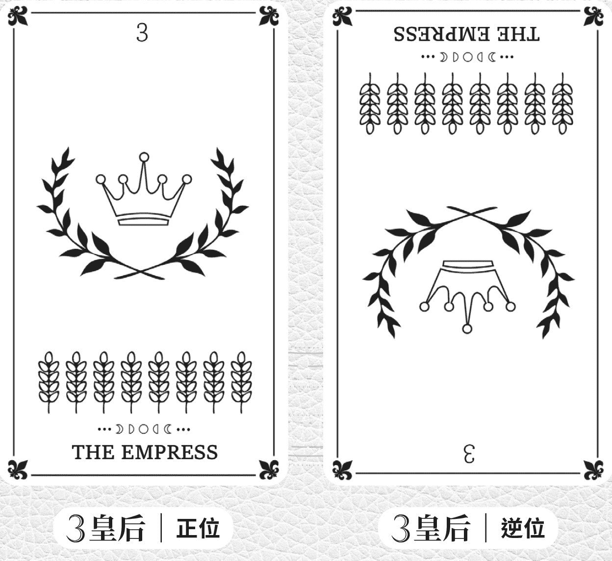

▪ 概义 ▪

正位：母爱、大地之母、柔性力量、魅力、女权、温柔、金星。

逆位：家庭不和谐、计划无进展、不合适的权利、女性的特质受到阻碍。

▪ 解析 ▪

皇后的原型是母亲，大地之母，跟女性和母亲有链接，身上穿的衣服图案是石榴，也是女性象征，爱心和女性符号都是女性象征，代表女性主义者，母亲的力量，他所代表的权力是有能力的女性，类似德雷莎修女的境界，是有权力的，脚突出来代表行动力。

生命灵数 3 也代表行动与行动力。这张牌代表着丰富的资源，女性的力量，女性主义，双脚略微张开，代表这个人不封闭，有着开朗的胸怀，慈爱，母爱的感觉，河流代表资源，水与情绪。

✧ 解牌心语 ✧

如果男生问感情抽到这张，就会说你比较让女生，女生问，就表示对方比较让你，以女性为主。如果问工作，表示可以运用资源，寻求协助，找到有权力的女性协助，母亲的力量也表示可以跟母亲做链接。

关系关键字：丰收、爱、温柔、优雅。

4 皇帝

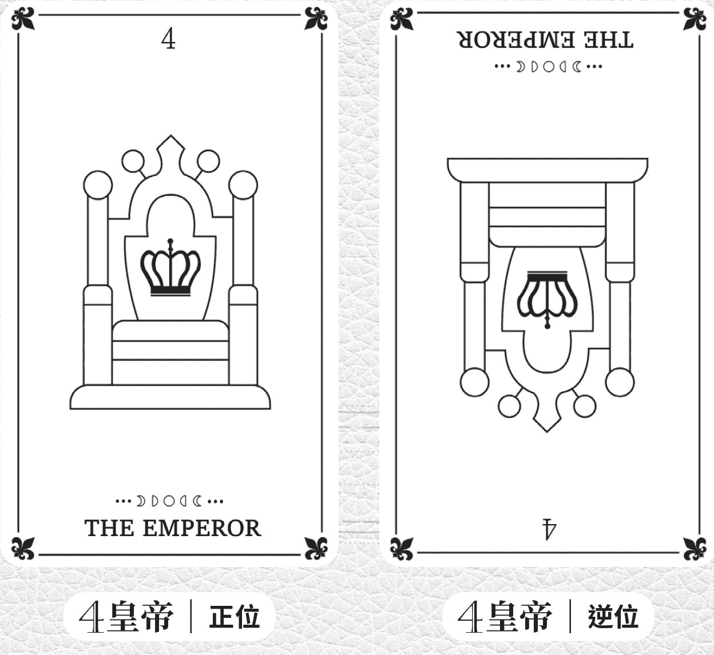

▪ 概义 ▪

正位：严肃、固执、身体力行、权力、稳定、男性魅力、牡羊座。

逆位：失去权力、不稳定、过于随和、没有行动力、缺乏自律、无法展现自己。

▪ 解析 ▪

和父亲有链接，父亲是有责任的，所以压力很大，穿着盔甲，随时准备要打仗，也因此较少人会了解他，不容易敞开心灵。披在外面的红色袍子，代表热情热忱，但手脚都穿着盔甲，代表这份热情有时候是伪装出来的，很难了解内在的想法。座椅两侧有羊头，跟牡羊座有链接，牡羊座代表热情活力，所以牡羊座的个性也可以搭配这张牌说出来。

生命灵数 4 代表稳定，稳定的背后是责任、是压抑，后面是山，代表稳定的状况，也代表固执，下面的水流很小，代表压抑自己的情绪与想法，通常父亲的责任很重的话，就会不开心，但握有很大的权力，手中握有球体，代表世界。

✧ 解牌心语 ✧

虽然在扮演父亲这个角色的时候，必须表现武装的形象，但其实还是有柔软的那一面。

关系关键字：威严、固执、负责任、承诺、言出必行。

5 教皇

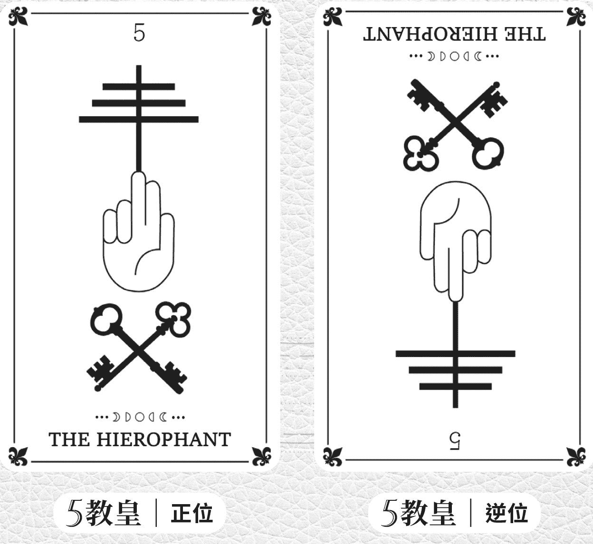

▪ 概义 ▪

正位：心灵提升、自信、规范、心结、注意力、师生、金牛座。

逆位：非主流、必须加强自信、创意、精神目标。

▪ 解析 ▪

道德规范的束缚，代表老师和学生间的教导，这张牌也跟金牛座有链接，钻牛角尖，有自己的一套规则不能被打破。

生命灵数 5 代表自由，所以这张牌也有一种说法是，在规范中创造自由，在自由中创造规范。头上三跟天线衔接宇宙能量或是上天的文字能量，可是在那个时代，认为只有教皇可以衔接，其他人是不行的，所以会创造一些规范，道德来去约束他的信徒和子民，用宗教的方式奴役信徒。

下面信徒背上的 y 字体背带，是古代控制牛或马的缰绳，目的是要控制对方，假设你不接受我的建议和指导，就是触犯了神的罪，那两个信徒的头顶造型，是代表古代的修行者。教皇耳朵被封起来了，表示听不进去别人的声音，他认为他的力量最大，所以他有很多制约，脚是扁的而且被十字架钉住，而且他的海底轮、胃轮和心轮全部被制约，必须依照我的教规，我的律法去做事。他的权力和国王皇后的权力有明显的区别，他的感觉比较拘谨，相对的，这不见得全然是坏事，有时候的确需要一些教条来规范一些人或状况。

这张牌包含很强烈的制约讯息，下面的两把钥匙，代表心结，或是只是盲目的服从，当教条太强烈规范的时候，有些人会对这样的规范产生心结，无法解开，三維的钥匙一上一下，也代表距离和阶级，钥匙旁的四个叉叉代表制约。教皇踩的地板是个长方体，代表阶级，教皇认为自己比较大阶级比较高，右手手势表示跟天链接。

穿红色衣服的国王皇后魔术师和教皇，代表这个人对自己的角色是有热忱的，红色也代表海底轮，是为了生存或需求这么做，所以也可以用脉轮的颜色和感觉来解牌。柱子代表有靠山有支持，有被某种力量支持，这张牌和女祭司有异曲同工的意思，都代表精神的象征，可是女祭司不会去影响别人，教皇是会影响别人，有欲望想要控制别人。

✧ 解牌心语 ✧

问事业，表示你的制约很多，想法很多，给自己订了很多目标方向想法，但你没有办法按照实际的状况来进行，行动力不足，在面对事情的时候，接收到信息就赶快去做，否则会因为想很多而做不了。

其次是信心不足，这张牌里有两种角色，一个是主导的角色，另一个是被主导的角色，所以要看情况去解释。

问家庭，表示家庭制约家庭业力很重，被家族的规定制约，只能服从，但其实你是可以自己做决定的，只是在规范中你不能创造完整的自由。

问学业，重点是自信，有时候没办法把角色定位，以为是老师决定他的分数，可是其实是自己决定自己的分数，会有很多理由去逃避念书，或有很多理由觉得自己不够好，建议要付出一些心力，在规范中创造自由，不要太松散，给自己一些规范，不要太没自信与灰心。

问感情，可能是受到另一半的制约很严重。

关系关键字：传统、安全、稳定、不对等、难沟通、规则、规范。

6 恋人

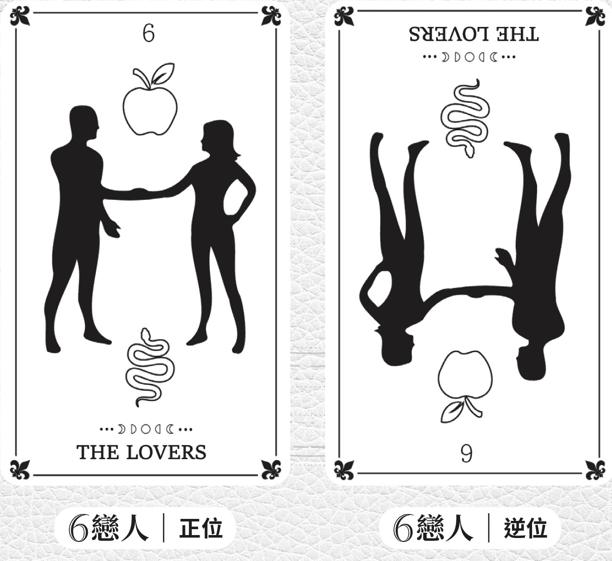

▪ 概义 ▪

正位：大天使拉菲尔、爱、互相喜欢、情感交流、喜爱、互相了解、坦诚、双子座。

逆位：爱情凌驾所有、无法了解对方、未稳定。

▪ 解析 ▪

夏娃的后面有条蛇，代表物质和诱惑，亚当的后面有火，代表欲望。男生女生重视的不太一样，女生重视的是心灵层面，男生重视的是物质层面，肉体与性方面的感官，两者背后都有企图，而且企图是一样的，有欲望有物质两者是相通的，因为两颗树的树根是连在一起的，所以欲望跟物质其实是一体两面。

生命灵数 6 是代表和双子座有链接，双子座表示有两种不同的个性与想法，容易反复。因为与双子有链接，也代表反复，甚至以不同层面来讲，也要接受自己有欲望的那块，例如有些人会排斥性欲，排斥自己认为是肮脏的。

后面的小山代表稳定，但因为山不大，也表示人其实随时在变化。

天使表示是受到祝福的，也代表精神的象征，女性是往上看向天使，表示女性想追求更高的心灵成长，可是男性却是往下看，也暗示着共同信念的重要，在一段感情中，会希望双方有共同的信念，才会达到一致的目标，天使的眼睛往内看，表示我们在选择爱情的时候要往内看，而不是往外求。

太阳很大表示有强烈的热忱和欲望，女生在看男生的角度，和男生看女生的角度是差别很大的。

✧ 解牌心语 ✧

问工作，建议可以跟工作谈恋爱，不要只想到不好的事情。问家庭就跟家庭谈恋爱，这样会比较快速，亚当跟夏娃没有穿衣服，表示坦诚相对，互相了解，没有任何防备和遮掩，可以从个案的氛围去感受他了不了解对方，可以建议他要多了解对方，去感受对方背后隐讳的企图，有时候是需要这样的状态，有时候是已经是了。因为和双子座有链接，也代表反复，甚至以不同层面来讲，也要接受自己有欲望的那块。

关系关键字：吸引力、喜欢、坦诚相对。

7 战车

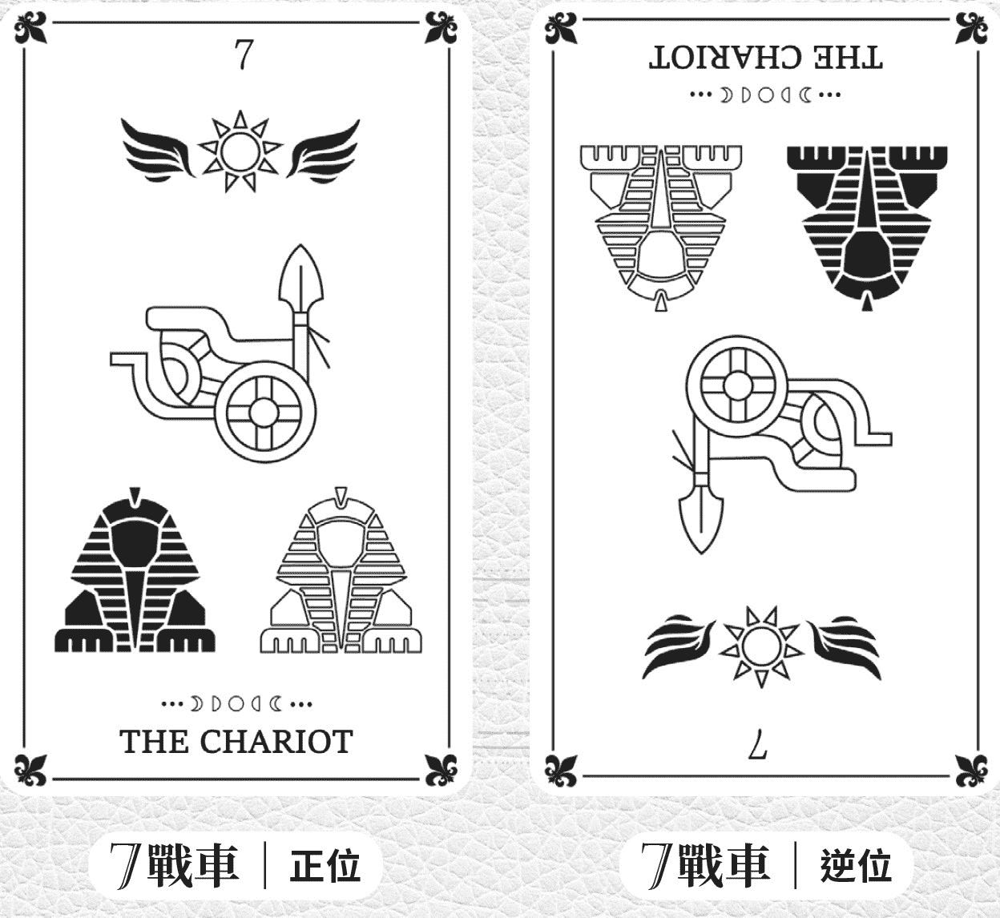

▪ 概义 ▪

正位：保护、指挥、抉择、学会控制、舒适圈、家族、巨蟹座。

逆位：恐惧升高、没有勇气、犹豫不决、过于保守。

▪ 解析 ▪

黑的人面狮身和白的人面狮身，两者的方向是不一样的，所以会很难前进，要下一个决定，不要待在舒适圈里面，人面狮身也表示人性和兽性的结合，表示欲望不够强烈，动力不足，也代表忽略自己的权势和权力，明明有权力却不想用，不想承担和面对，其实在做任何选择的时候都有后果，如果把后果想的太严重，就会这样子犹豫不决，无法下决定。

人的肩膀有两个人脸，一个表情是欢笑，一个是比较生气，代表在选择的时候，会有天使与魔鬼这两面在游移，胸口有一个正方形，战车和巨蟹座有链接，和家庭有关系。

✧ 解牌心语 ✧

如果是问投资案或感情追求对象时，抽到这张牌，无法找到解决的方式，就再请他抽一张牌，如果抽到愚者，就放空地去做，如果抽到魔术师就叫他准备好去做，抽到女祭司叫他专心的去做，如果抽到国王叫他严肃的去做。

这个牌的相反表示很积极努力的面对，如果抽到这张牌的人个性很冲，反而可以建议他休息一下，轮子和战车下面的正方形形状的比例，会觉得好像轮子要前进不是那么容易，代表有很多的制约。人面狮身黑跟白之间在拉扯，又想往左又想往右，没有办法统一方向，想要飞翔的翅膀却锁在战车里面，没有办法随心所欲的行动。

所以这张牌的意思是要下一个决定，去做想做的事情，不要犹豫不决，还有这张牌的整个架构有很多正方形，他本身是防卫的，没有攻击的力道，所以他的企图心比较低，在舒适圈里不敢前进，下决定的时候会怕选错，没有办法完全的对自己负责任，他其实可以有战斗力，只要下定决心就会有力。

关系关键字：意志力、纠结、是非对错。

8 力量

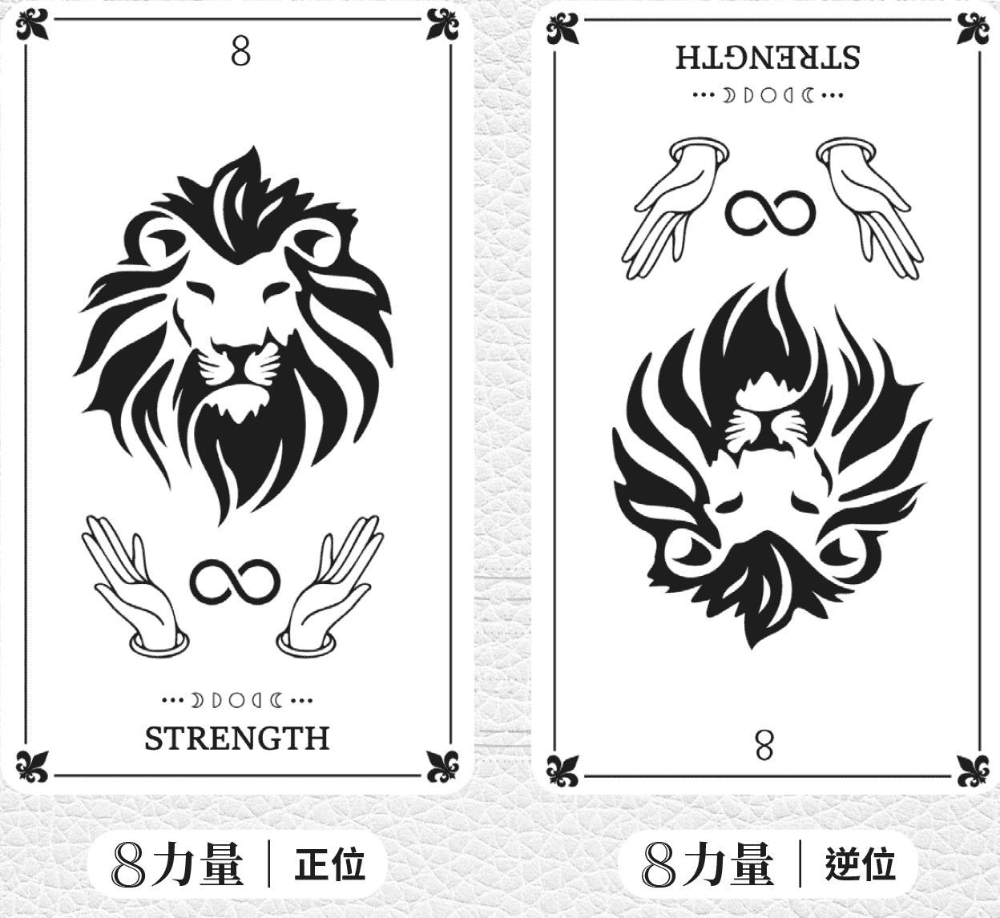

▪ 概义 ▪

正位：掌控、有把握、无限大、驾轻就熟、驯服、狮子座。

逆位：力量不足、恐惧怀疑、压抑、无法掌控。

▪ 解析 ▪

象征以柔克刚，专注，也有掌控的含意，勇气、温柔的力量无限大，这张牌的代表人物是翁山苏基或德雷莎修女，用温柔来感化。

“以柔克刚”顾名思义来说，就是要用温柔的力量来克服对方怒气或情绪，女神的手势也有掌控的意味。

身上有很多花，代表大自然，代表成长，代表新的学习的契机。

力量和狮子座有链接，无限大的符号表示力量无限大，女性力量无限大，魔术师的无限大符号表示经验丰富。

✧ 解牌心语 ✧

在解牌时，要特别注意的是，来到你面前的个案是狮子还是女神？要感觉对方的状态是哪个角色，如果是狮子那就有可能被掌控，或是已经被掌控。

关系关键字：以柔克刚、自我疗愈、温和、内在力量。

9 隐者

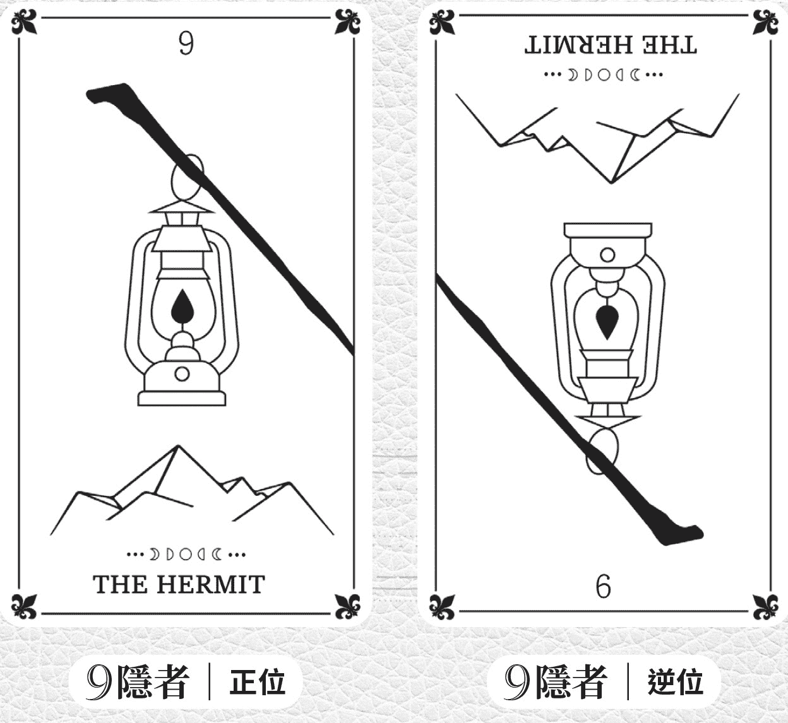

▪ 概义 ▪

正位：低调、目标、内化、隐藏、细节、初心、处女座。

逆位：没有想清楚、没有目标、没有思考未来、自己定位不明确。

▪ 解析 ▪

代表内在的方向，内在的智慧，专注在自己想要的，然后用自己的经验去实现，隐者的年纪是老人，老人是比较有生活历练的。

这张牌和处女座有链接，所以比较注重细节。灰色代表中性，因为每个人内在的目标不一样，也代表智慧跟经验的累积，牌面图案有一盏灯，这盏灯是有目标有方向的，可是人的眼神却是闭着往内看，代表单独但不是孤单。

这张牌还有“支持”的含意，自己支持自己的力量。隐者拿着权杖，权杖代表“热忱”，用自己的热忱去支持自我，也代表精神的象征。

✧ 解牌心语 ✧

比如说问感情或工作事业，表示内在其实已经有些想法，但这些想法可能没有很确切，但已有初步概念，所以你可以大胆的跟他说，你可以实现你的梦想与想法，不用担心，因为你已经想好了！

关系关键字：独立、有主见、有目标方向。

10 命运之轮

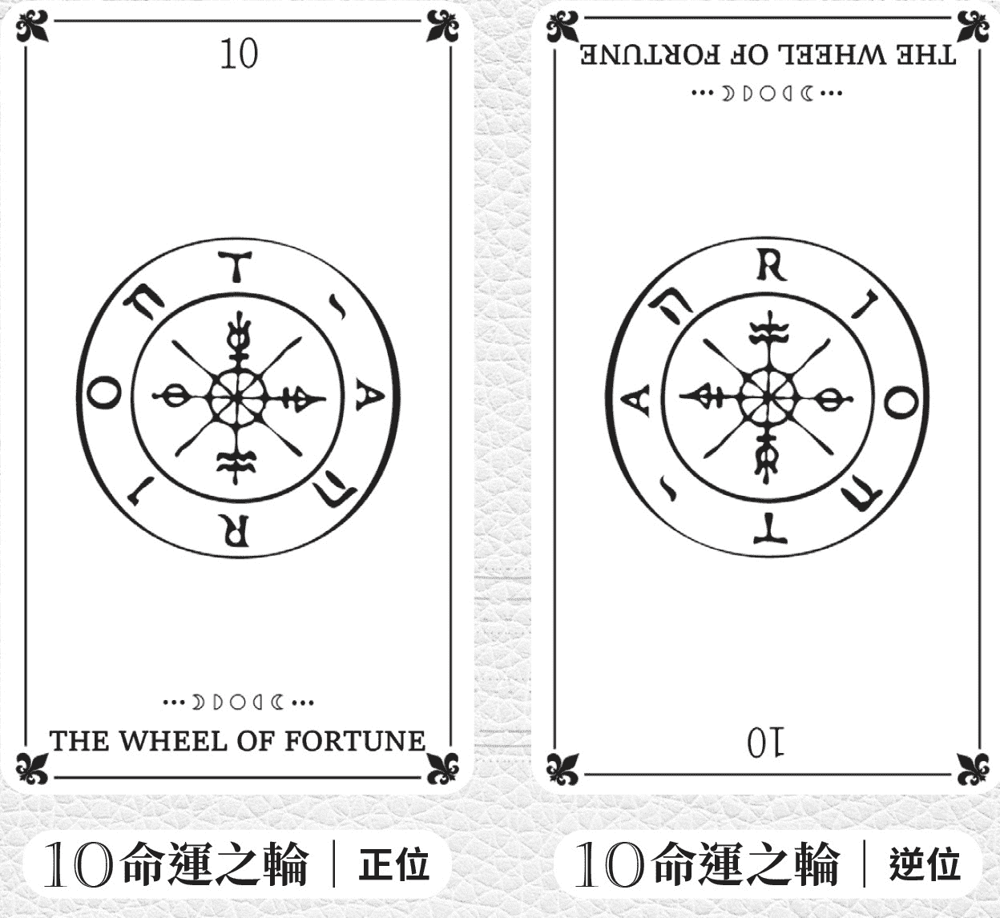

▪ 概义 ▪

正位：时间价值、环境、时机、风水轮流转、木星。

逆位：机会变少、时机不对、压力变大、急迫、环境影响。

▪ 解析 ▪

象征风水轮流转、学习与成长。

四个吉祥物都在看书，为固定星座金牛座、狮子座、天蝎座、水瓶座。代表当我们有撞击有考验的时候，我们会产生某些心境，建议你用学习的心态，罗盘代表方向指引和时间上面的文字是炼金术的文字。

人面狮身拿着剑，代表主导权在自己身上。地狱的使者阿比努斯会旋转，所以有时风水轮流转，会轮到坏或好的运气，也代表转机、新的方向。所以当我们遇到不好运气的时候，就是学习的功课。这个转机不是不好，只是让我们有学习的机会。

蛇代表物质、诱惑，我们会遇到一些觉得不顺心的事情，可是相对的，云的出现也表示事情随时在变化。

✧ 解牌心语 ✧

问感情，如果个案觉得很痛苦，可以说，没关系，这是个学习的过程。塔罗算的时间是三个月至半年，大概三个月之后状况就会渐渐的好转，或是可以询问个案，你在这段感情里有学习到什么吗？如果有，就恭喜你，如果没有，就可能要再经历一遍，视问题而定。

关系关键字：学习、成长、对的时机、好转。

11 正义

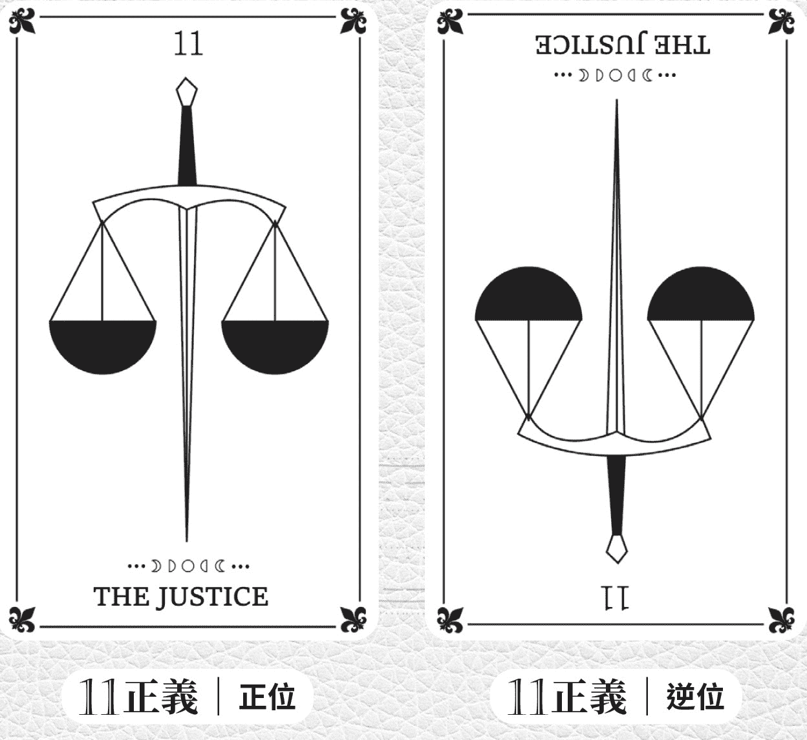

▪ 概义 ▪

正位：公平、法律、审理、道理、因果、定律、天秤座。

逆位：延迟、不公平、法律延伸问题。

▪ 解析 ▪

追求公平，抽到这张牌通常都希望可以得到公平的对待，举凡法律、公平、规则都是这张牌的意思。

有书上写说主角是男的，也有人说主角是女的，跟天秤座有链接。

脚突出来代表行动，两根柱子中间是布幕，布幕的背后真的是正义吗？正义一定要付出代价，但代价是什么我们不知道，所以用布幕来形容。布幕的背后有很多的可能性，例如我想追求公平，而这个背后有什么原因，我们所追求的正义，不一定是正义，而是我们认为的正义，可是如果从不同的角度来看，不见得是正义的，我们认为的公平，可能跟对方认为的公平不一样，柱子和布幕是连接的，某种程度来说是挂勾，所支持的法律和背后所发生的事件是有原因的，是息息相关的。

法官或主管只能依循固定的法规，但在追求我们以为的公平的时候，可能会失去自己的原则，脚有打开，代表敞开，有的时候也代表身不由己。

剑代表决定的剑，剑跟后面的柱子是连接的，代表他的决定是有所依据，跟法律一样是有所依据的，就好比是我今天做了这个决定，不是随便决定的，后面是有法律支持我的。

这张牌也跟法官、上司、主管有关系，有时候主管需要做定夺，需要做些决定或平衡的角色，都跟这些有关系。

头饰上和心轮的方形表示制约，有时候没办法依自己的意愿行动，会被法律所制约框架。

穿红色衣服，红色代表海底轮与欲望，有时候法律上的公平是为了满足某些人的欲望，而不一定是真正的公平。

生命灵数 11 代表两个 1，两个独立的个体。我们在追求公平正义的同时，也会有不同的意见跟想法，在追求公平时，也是需要行动的，不是只有讲讲而已。

✧ 解牌心语 ✧

问感情，就会说你要对自己公平一点，不要一味的付出，很有可能会受伤。问官司，表示可以得到公平的对待。另外要看个案的感觉，有时候是失去平衡，有时候是渴望得到平衡，渴望得到公平的对待。

关系关键字：公平、背后的期望、框架、约束。

12 吊人

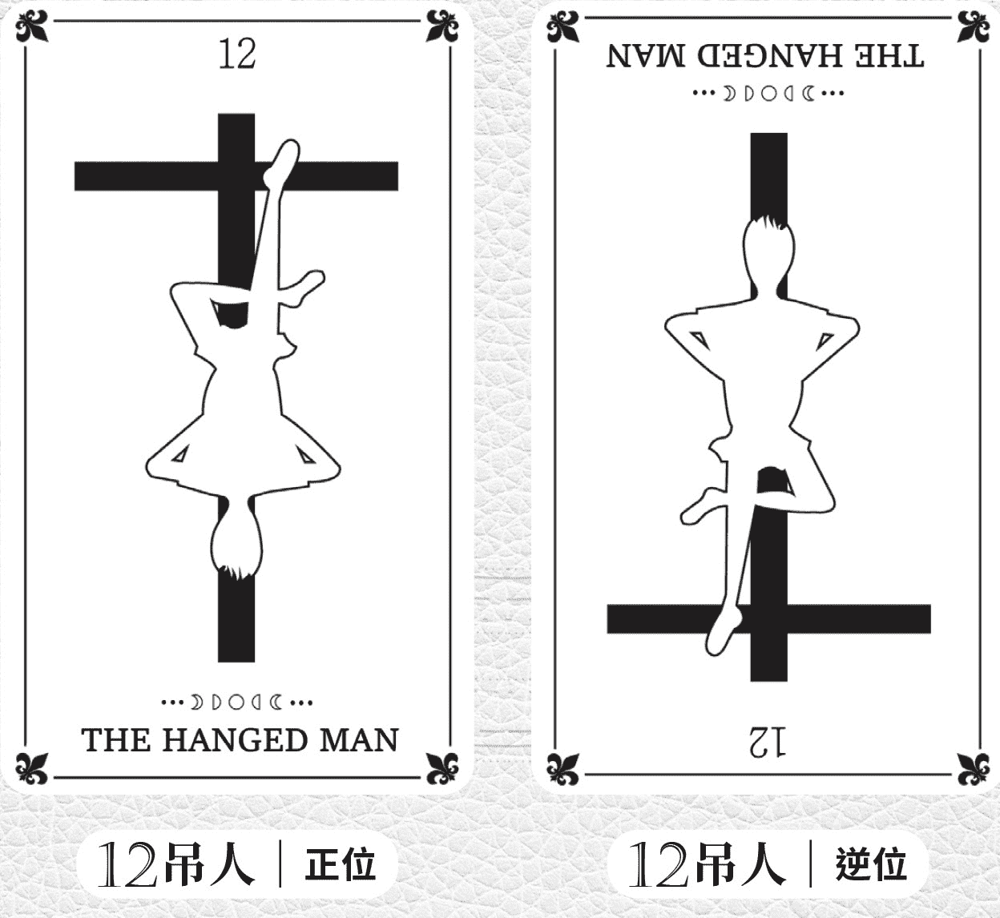

▪ 概义 ▪

正位：自愿牺牲、限制、换个角度想、相反方向、海王星。

逆位：投降、顽固、必须等待时机、绑住、无收获。

▪ 解析 ▪

这张牌有两个意思，第一个意思是自愿牺牲，这张牌的牺牲指的是别人认定的牺牲。

吊人的表情并不痛苦，是自愿的，背后的大树不是自然生长的样子，而是经过加工制作的。

这张牌的另一个含意，是换个角度想，接收到新的事物，让你觉得很开心，从内在升起快乐的心，这和奥修禅卡“新的洞见”有相同的意思。

我们面对的个案有很多是不愿意牺牲的，例如，想要有很多钱，可是不想工作，想要得到感情，可是都在家里不愿出门与人来往，所以必须要自愿付出。

图中的吊人虽然被绑手绑脚，可是还是很开心，因为他可以得到自己想要的，所以头部的部分会发亮。光也表示学习、得到、成长、智慧，得到的东西是从内而外发起的，就好比修行的人必须遵守戒律，自我要求。

抽到这张也可能是需要这样的状态，或是已经是这样的状态，树叶表示自然成长生长，表示除了戒律之外，还是需要回归自然。

这和耶稣的故事有链接，鞋子代表行动，脚挂在树枝上，表示我们在做这件事的时候需要强烈的行动力，就是“动机”。

这种行动力跟法律的行动力不一样，法律指的是正义，这里指的是追求新的方法。另一个层面来说是叛逆的，追求公平的行动，手的部分放在背后，不知道是不是真的被绑起来，衣服的蓝色是代表喉轮──诉说。

✧ 解牌心语 ✧

解释的时候，也可以用换个角度想，以不同角度或甚至相反的角度去讲解。因为正常人是不会倒吊的，两只脚的位置形成一个十字架，是自己给自我的制约，是自愿的。

问健康，可以说你之前对自己太放纵了，需要节制一点，需要自己愿意去牺牲美食，或者放弃不适合自己的食物。

关系关键字：

心甘情愿、自愿付出、愿意被捆绑、有想法有觉知的决定。

13 死神

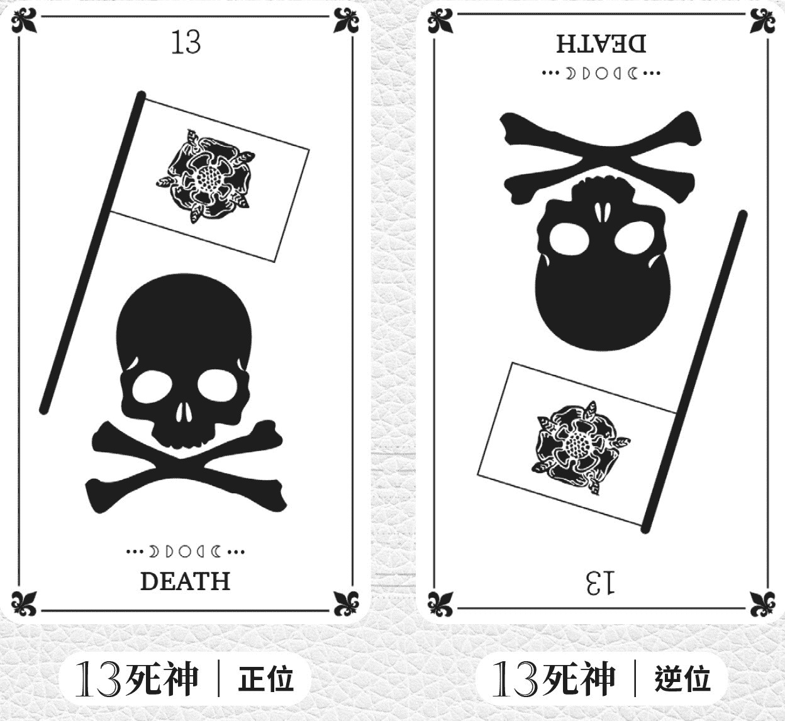

▪ 概义 ▪

正位：重生、最坏状况、过去消失、失去、天蝎座。

逆位：抗拒改变、无法自拔、不认输、向下沉沦。

▪ 解析 ▪

重生，柳暗花明又一村，新的开始。发生一件事情，最坏就是这样，躺在地下的人是国王，不愿面对的是皇后。小孩子代表天真的人，不会在意，直接面对死神。

教皇把权杖放在地上，表示臣服于死神，也代表权力的消失，大家对死神都有恐惧，而且每个人都会发生一些事件，每个人也都会遇到这类型的事情，可是后面有一艘船，意思是说当你面临到任何事情的时候，太阳依旧会升起，别人也感觉不到你的存在，也有另一个含意是，我们所遇到的困境是自以为是的困境，其实对旁人来说根本没影响。

举例来说，每个人都会面临死亡，只是什么时候死不知道。如果太在意执着与恐惧，那就没有办法活出自己，所以这张牌更深的意义是“活在当下”。

这张牌和天蝎座有链接，代表独立、执着，马的眼睛是红的，感觉是笃定往前走，旗子要看颜色和配比，中间这个植物的意思是，死神的到来是没有人能抗拒的，就像植物生长之后也会死亡，这是一个自然现象。

在整个画面里面，马跟骷髅头所占的比例比较大，也表示我们在面对这个事情的时候，如果没有办法接受，就会像这三个角色一样，不是臣服，就是不愿面对，不然就逃避不处理，让事情腐烂消亡。

唯有天真的人才能真正去面对，就像小朋友一样，这也说明了死神的力量是很强大的，我们是无法抗拒的，因为每个人都会经历到。

太阳和愚者的羽毛，代表热忱和活力，骷髅头上的羽毛往下垂，代表没有活力。

太阳代表柳暗花明又一村，新的开始，新的希望。

✧ 解牌心语 ✧

问感情的话，要做最坏的打算，或是有新的开始。

问事业，可能状况不是太好，因为会失去主导权，权力被剥夺，有的事情无法面对，有些事情不得不低头，可能必须重来，有些状况可能不会太舒服。

抽到这张牌也不需要恐惧，因为这些都是必经过程，用天真的心态去面对，不要想太多，过了这关会有新的开始。

关系关键字：结束、重生、恐惧、面对。

14 节制

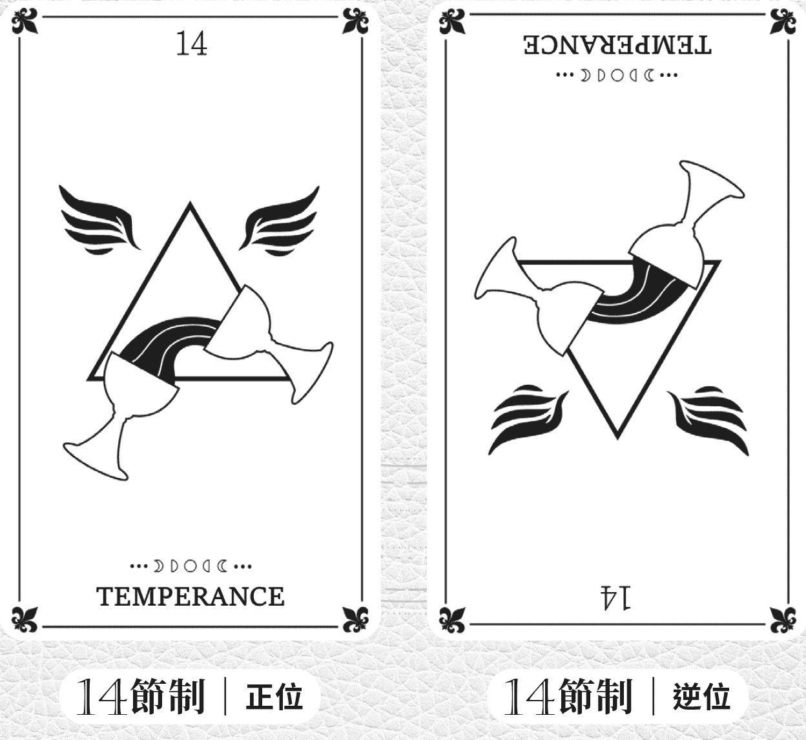

▪ 概义 ▪

正位：大天使萨基尔、中庸之道、提升行动力、自由、沟通、心口合一、用自己的节奏行动、自我实现、射手座。

逆位：不负责任、无法沟通、无法安静、遮掩、纵情。

▪ 解析 ▪

象征表里一致，第一个意思是中庸之道，不偏不倚。第二个意思是用自己的节奏做事情，两个水杯一内一外，有水在中间流动，代表内在和外在的平衡。

心轮的图案代表稳定或向上提升，因为会不停的学习与成长，也具有包容的意思。心轮如果是稳定的话，拥有自己的节奏做事情，就会比较随心所欲。

天使不是飞在半空中，而是在地上，脚泡在水里面，一个意思是行动，另一个意思是代表情绪控制是重要的，因为水代表情绪，而画面中的水并没有波涛汹涌，所以当你控制自我的情绪，用自己的节奏，往内看的时候，就可以得到很多不同的礼物。

跟射手座有链接，眉心轮发亮，眉心轮是跟宇宙有链接的，代表信任自己的直觉，信任自己的节奏，我们要做到心轮的稳定平衡，掌握自我节奏，内在跟外在表里一致，还有行动与情绪的控制，就可以得到完全的自由。

当自己到达这个程度的时候，走的每一条路都会是顺利的，所以图中旁边的那条路是很顺的，直接达到终点。花跟树代表生长跟成长，当我们在面对事情或功课的时候，是会让我们成长的。

当然我们要用自己的节奏做事情，翅膀代表热忱跟飞翔，完全的自由。自由就是能做自己想做的事，不被外界所影响。

天使的眼睛是闭起来的，感觉像是在静心，或是往内看，这张牌比较属于心灵层面，在面对自己事情的时候，要往内看来做确认，或往内看来稳定自己。

伟特牌内的三个天使不一样，恋人是表示自己喜爱的事物，没有武装没有防备的去面对，审判是讲在面对自己内在黑暗面时，必须原谅自己。

✧ 解牌心语 ✧

这张牌问感情、工作事业，大部分都是被自己的欲望和物质所困扰，只要当个案能控制自我情绪，用自己的节奏，往内心察看的时候，就可以得到很多不同的收获。

关系关键字：平衡、按照自己的步调、走自己的路、内心的交流。

15 恶魔

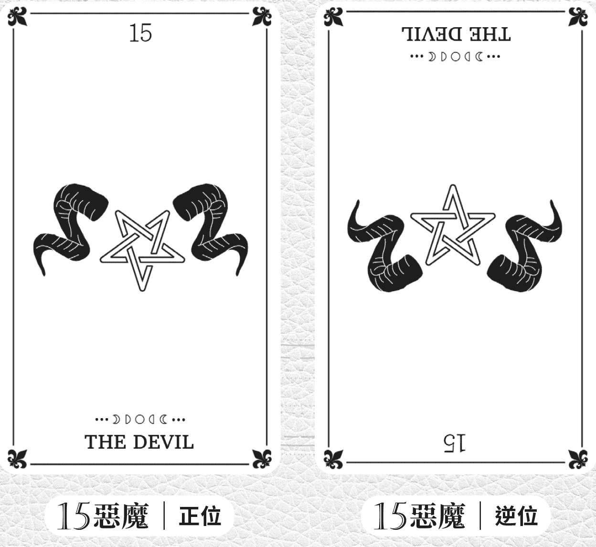

▪ 概义 ▪

正位：限制、不高兴、欲望、生活压力、黑暗、魔羯座。

逆位：舍弃、减少负担、慢慢开放、物质需求过度或不足。

▪ 解析 ▪

这张和恋人牌比较，恋人牌的物质和欲望是由后面的两颗树表示，恶魔牌中则变成尾巴上的图案，跑到身上了，在身体里面扎了根，表示重视物质和欲望的程度已不只是表面，而是内在层面了。

头是羊头，蝙蝠的翅膀，整个恶魔是由五种动物所组成，包含了夜行、飞翔还有地上的动物，表示人和大自然的链接是很深的。隐讳的暗示是轮回，我们有可能都当过这些动物，也有这些动物的习性，所以在过程中我们要尊敬大自然，平等的对待动物。

以中性的角度来看，我们跟大自然和动物都是平等的，人类也具有这些兽性与欲望。

恶魔拿的火炬代表燃烧欲望，头上五角星的符号是向下的，表示向下沉沦，本来五角星表示的是正面力量很强大，但相反用在物质欲望方面的时候，就会被物质所局限。

恶魔右手的手势表示黑魔法，这张牌显示的是内在的心境，当我们被欲望控制的时候，就好像被枷锁控制，但注意看链子其实是有办法拿下来的，愿不愿意拿下来是看自己，而且连着枷锁与链子的柱子不是三維的，表示是自己绑住自己，是自己创化出来的枷锁。某种程度也可能是价值观，集体意识或家族意识的决定。

两个人的表情是苦闷的，背景是黑色的，象征每个人的黑暗面，有些人是抗拒自己的这一面，但其实每个人都要学习去接纳自己的黑暗，和摩羯座有链接。

✧ 解牌心语 ✧

抽到这张牌表是比较现实与务实。问感情的话，表示你对对方的感情，在比例上可能需要的物质层面比心灵层面多，可能只有两成是心理，其他都是物质。可能在感情上有些是交换来的，比如说，我要交换一份安全感，我要交换金钱，或是我要交换性，我只要交换比较物质方面的东西，精神层面上比较少，不是真的爱对方，只是爱对方的某一部分，像财产或是其他物质层面的东西，恶魔是人性与兽性的表象。

关系关键字：性吸引力、黑暗面、欲望、物质、缺少精神层面。

16 高塔

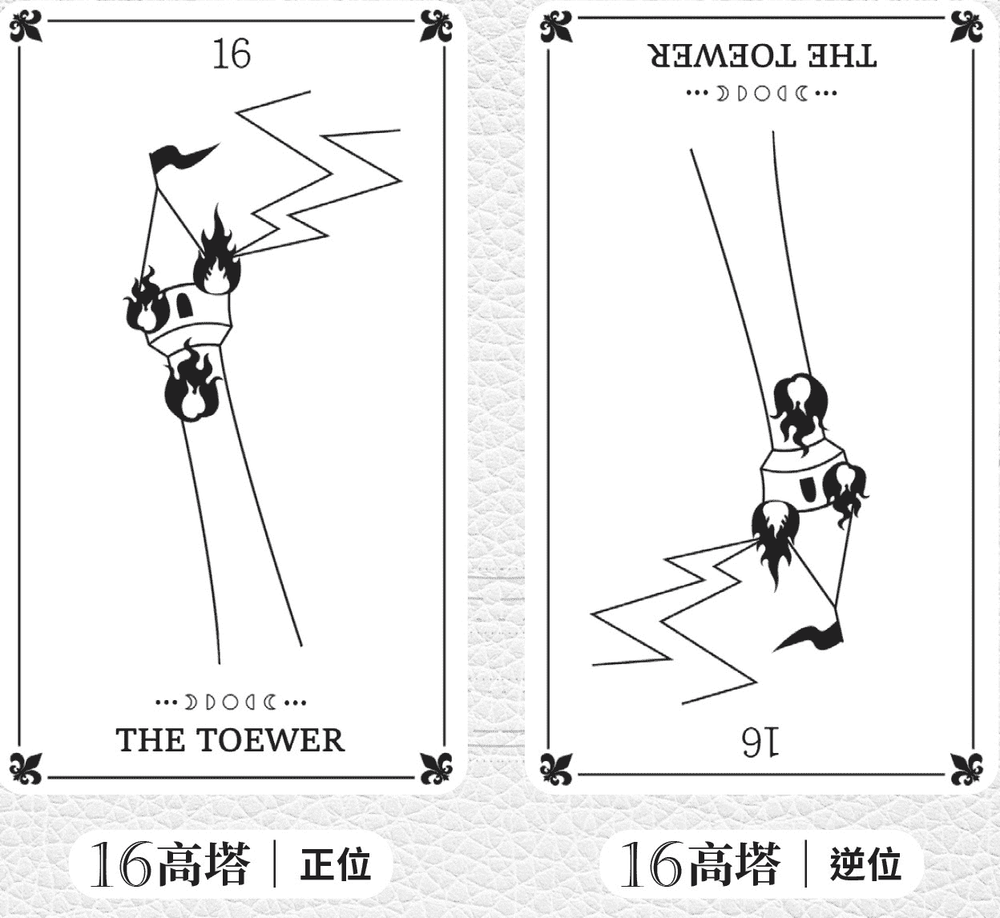

▪ 概义 ▪

正位：逃开、失去、压力、放掉、放弃、十万火急、火星。

逆位：无法预警、避免损失、冷静、逃离、警告。

▪ 解析 ▪

象征突如其来的意外状况，让人措手不及。人生的过程都会遇到一些突如其来的压力或事件，就像塔顶突然打下的闪电，让人必须往下跳，往下跳的国王失去了皇冠与权力，但往下跳未必是不好的。

因为塔底的岩石下方是什么，我们不知道？当不知道下面的状况是什么，是有很多可能性的，而且男生和女生跳的方式不太一样，一个是往下跳，一个是往后仰，往后仰的皇后裙摆连着窗户，挂在半空中，代表太留恋的话，反而会不上不下，要的话就直接往下跳，反而会到达一个不同的境界，不同的新视野。

背景的云代表变化。塔上的火是闪电打下之后着火，代表压力，或急迫的状况需要处理。旁边黄色的点，是跟随在国王与皇后旁边，代表影响力或氛围，这个意外会让你挂心，影响到自己，就好像是我们常在做一件事情的时候，却想着另一件事，这个黄点就是这个意思，会影响我们的内在。

这张牌也代表逃避，因为发生事情时并没有面对，反而是往下跳，这张牌有好几种讲法，好几个角度可以解读。这张牌有点像定格，呈现的是掉下来的瞬间，代表速度很快，意外发生的速度也很快。所以如果想转化，速度也可以很快，这张牌也代表旧有模式的毁坏，对应到光之藏的催魔，奥修禅卡的塔牌。

✧ 解牌心语 ✧

解释这张牌时，在遇到突如其来的事件的时候，有两种选择，第一个是勇敢跳下去，第二个是吊在半空中，如果吊在半空中，就可能会一直怀念，内在里面一直在挣扎，可是如果勇敢跳下去，可能性就会增加。

关系关键字：突发状况、不愿面对的真相、意外。

17 星星

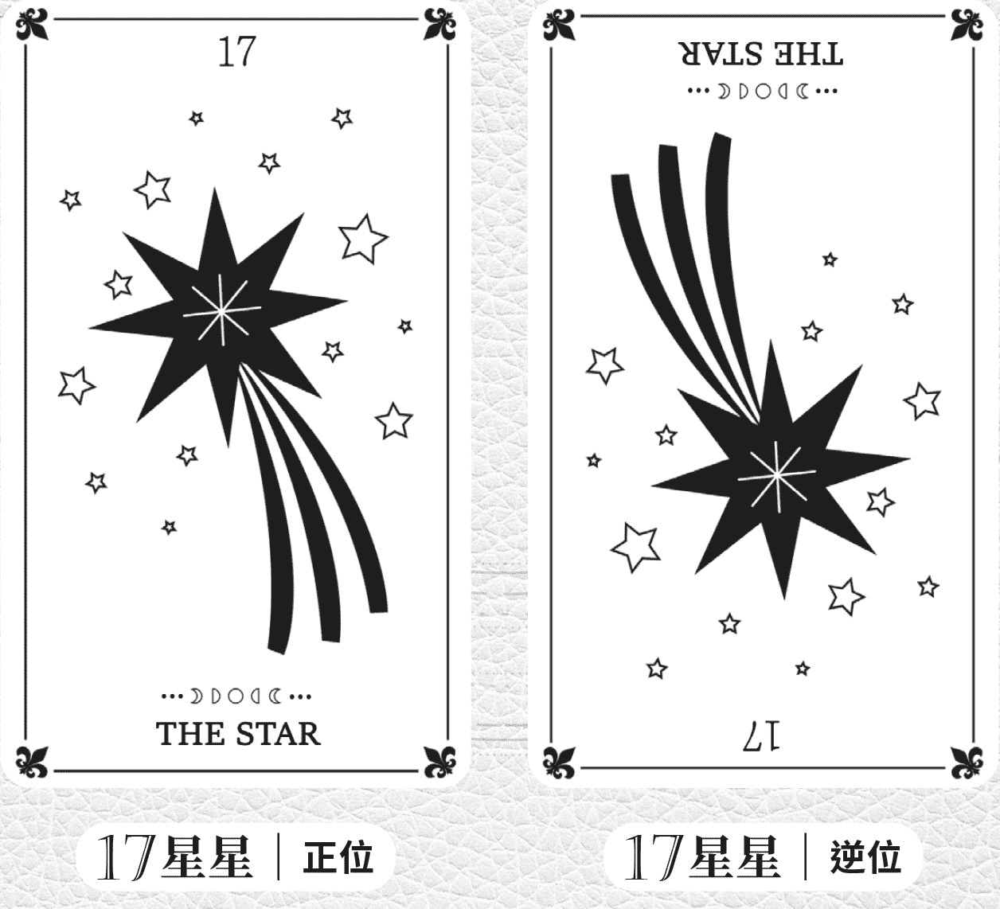

▪ 概义 ▪

正位：转机、全力以赴、希望、沟通、贵人相助、水瓶座。

逆位：没有信心、阻碍、无法全力以赴、没有目标。

▪ 解析 ▪

地上已经有水了，还一直在倒水，表示供养与佈施。因为当我们经历过一些苦难与挫折后，会对大地与众生有一份供养的心，而且心境是喜乐的，比较接近灵魂层次。

这张牌和水瓶座有链接，理性，比较不受情绪影响。鸟代表贵人，当我们供养众生或发菩提心，帮助别人的时候，是会被看见的，受到注目的，没穿衣服的人代表全力以赴，努力做到百分之百，坦诚相对，愿意敞开，因为经历过失去，所以现在珍惜。

另外，在全力以赴的同时，不要求速度快，就像草地上的植物刚萌生而已，意思是要有耐心，慢慢灌溉滋养。做事情的时候，要马上有成绩是很难的，比较像是大我的精神，因为已经历过一些苦难，渐渐好转当中，可是如果当对方完全没有状况好转的感觉，那就建议对方这样做，邀请他佈施，邀请他上课，上课其实也是佈施的一种，对自己佈施，对自己好，佈施也代表无私的爱，包含自己的内在，先照顾好自己也算是佈施的一种，对自己好一点。

八芒星的数字 8 代表无限大，所以当我们愿意全力以赴时，力量是无限大的，八芒星的能量很强，总共有八颗，第八颗特别亮，比较像是心灵层次的目标，剩下七颗排成像北斗七星的形状，也代表目标与方向。

✧ 解牌心语 ✧

这张牌的特色是，当我愿意付出，愿意全力以赴的时候，目标通常会达成，有可能是建议对方这样做，也可以建议做些佈施去帮助别人，会容易受到瞩目。

这张牌也代表经历过很多事件之后的体悟，通常会比较内敛，对大自然会比较敬畏或是产生供养的心。

健康方面，这张牌对应到皮肤，因为皮肤占的面积比较多。

恶魔牌中的六芒星能量也很强，只是它的意思是向下沉沦，以物质为取向，这张牌的牌意，也可以用现实中星星的感觉来解释，代表希望等。

关系关键字：希望、目标、与大自然链接。

18 月亮

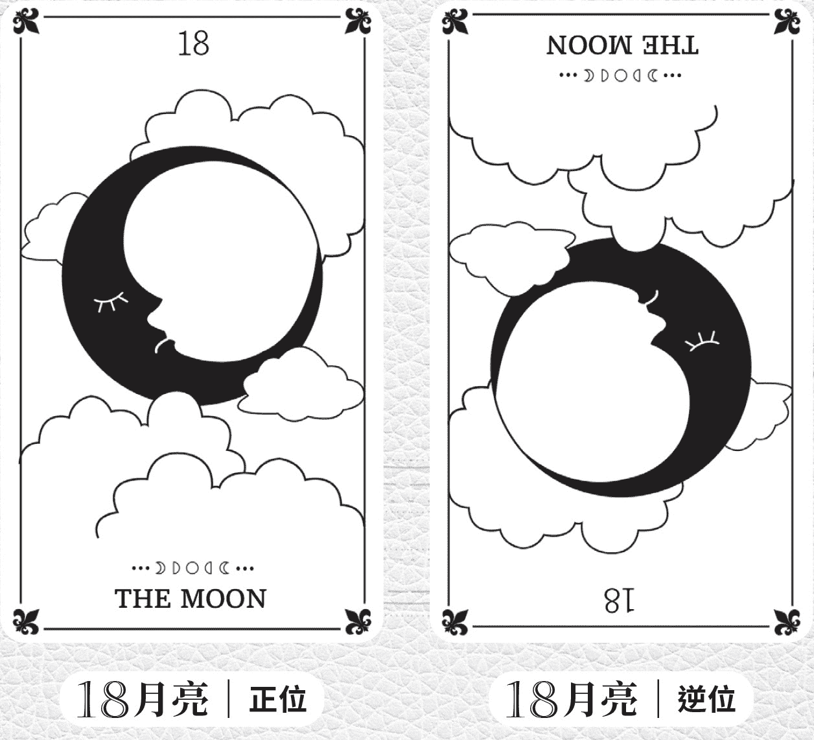

▪ 概义 ▪

正位：时好时坏、心灵、物质压力、内在意识、双鱼座。

逆位：时好时坏、潜意识、惊恐、压力过大、情绪不稳。

▪ 解析 ▪

龙虾代表防卫，龙虾在水里面，水又和情绪链接，代表情绪是阴晴不定的。

月亮的光芒代表影响力，其实人的情绪都会受月亮影响，月亮影响水，影响大海的潮汐。人体内百分之七十也都是水，所以会被月亮所影响，阴晴圆缺，随时在变化，场景在晚上，也代表了梦境、梦幻，或是迷蒙，和晚上有链接。

画面中的高塔，代表压力或突如其来的意外，有没有可能因为情绪会产生突如其来的意外，当我们可以控制情绪的时候，后面的路是会顺利的，但是情绪这关要先过，中间的道路在通过高塔之后，也变得比较平顺，所以问题在于你能不能通过这突如其来的变化呢？这就考验你的情绪。

所以当事件发生的时候，越稳定越安定，越能处理突如其来的状况，就是这张牌的意思，狗跟狼偶尔会对月亮叫，除了表现情绪，也代表欲望，我们的欲望和情绪都是时好时坏，就像月亮的阴晴圆缺，月亮下面的黄点，就如月亮会影响人的情绪，也会影响狼和狗，月亮眼睛闭起来，往内看，也可以跟现实中的月亮做链接。

这张牌主要讲的是情绪和梦境，或是不切实际，失眠的夜晚。和双鱼座有链接，优柔寡断。

✧ 解牌心语 ✧

问事业，情绪会控制你的事业，不要被情绪所影响，不然的话会下错误的决定。如果是找工作的人，会建议面试的时候，需要保持稳定的状态，不要被情绪所影响，晚上要保持好的睡眠，抽到这张通常也表示会比较情绪化。

关系关键字：情绪化、阴晴不定、内心隐藏的声音。

19 太阳

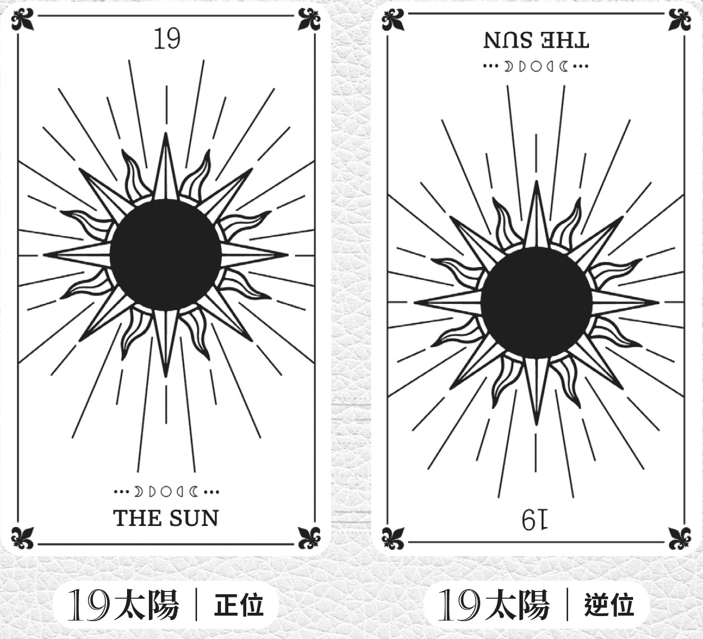

▪ 概义 ▪

正位：热忱、方向、天真、目标、主导权在自己。

逆位：有热忱没方向、不被承认、无法享受。

▪ 解析 ▪

热情、奔放、有自信、活泼可爱，小孩的感觉是很天真开朗又自信，红色的羽毛代表轻松轻盈与热忱，羽毛也表示直觉，会接收直觉，信任自己的直觉，信任自己的内在与外在。

信任自己，拿着旗子代表主导权在自己身上，旗子的红色表示有很大的热忱，可以掌握自我方向、命运与未来，马没有马鞍，小孩子的双手放开，表示全然的信任，并敞开接受所有的一切。

太阳的感染力非常强，强过上一张的月亮牌。太阳是中性的，表情没有好与坏，向日葵代表成长和生长。

✧ 解牌心语 ✧

当我们有热忱有目标有方向的时候，是会一直成长的，图中马的方向是很确定的，然后往前走，灰色的墙代表养分，上面有种向日葵，也可以代表防卫与保护，有种安全的氛围，当作后盾，是正面的牌，表示不错的状态。

关系关键字：热情、天真、勇敢前进。

20 审判

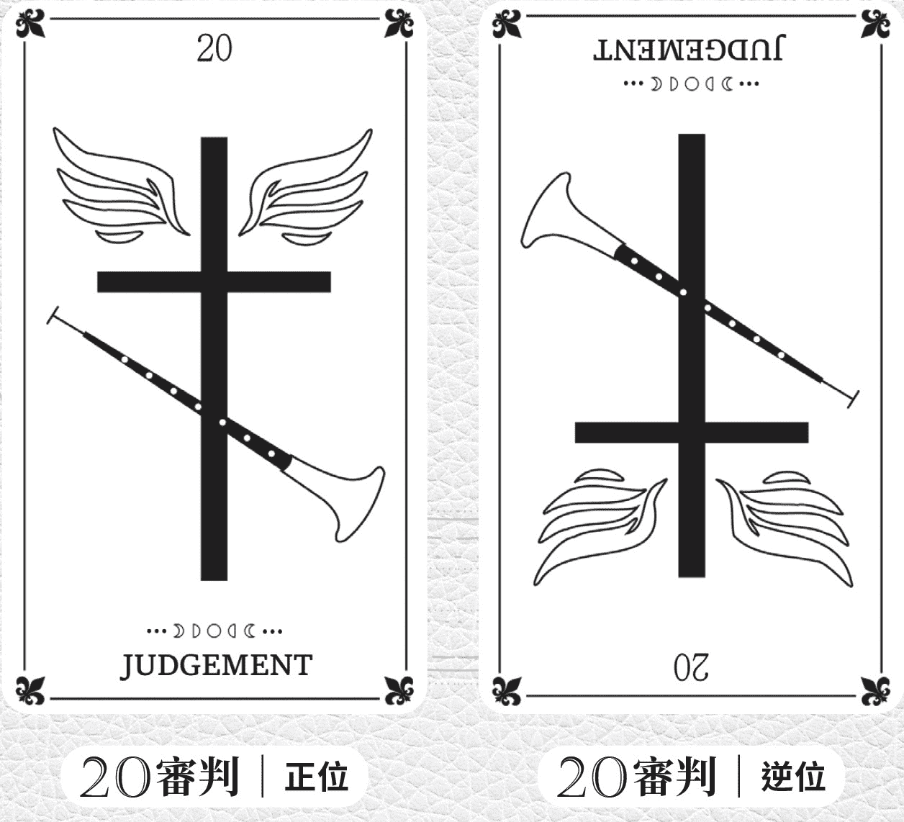

▪ 概义 ▪

正位：大天使耶利米尔、因果、享受、传达、平静、重生、重新面对、不要批判自己、接纳自己的黑暗面、冥王星。

逆位：无法享受、冲动、恐惧、休息的机会。

▪ 解析 ▪

原谅自己，不是审判别人，而是审判自己。

人是从棺材里面出来，而且大人小孩都有，状态好像是活死人，无法原谅宽恕自己，活在过去的印记里，身体是灰色的，代表回归到中性的时候，没有对错。

十字架是救赎，如果你能很深地原谅自己，原谅自己过往的事情、印记或失误，就不会再审判自己。

✧ 解牌心语 ✧

当你越了解自己的时候，就会越得到救赎，包含要面对自己内在的黑暗与坑洞，接受这样的自己，很深地原谅自己，可以参考“零极限”的方法。

小喇叭代表唤醒与传播，每个人或多或少，在内在都有无法原谅自己的状况，真的原谅自己之后就重生了，是新的开始，重新活出自己的样子，可以注意下面人的表情，真的原谅自己的时候，表情是享受的，当面临很重的关卡，审判这张过了之后就是世界牌了！

关系关键字：宽恕、重生、原谅、精神提升。

21 世界

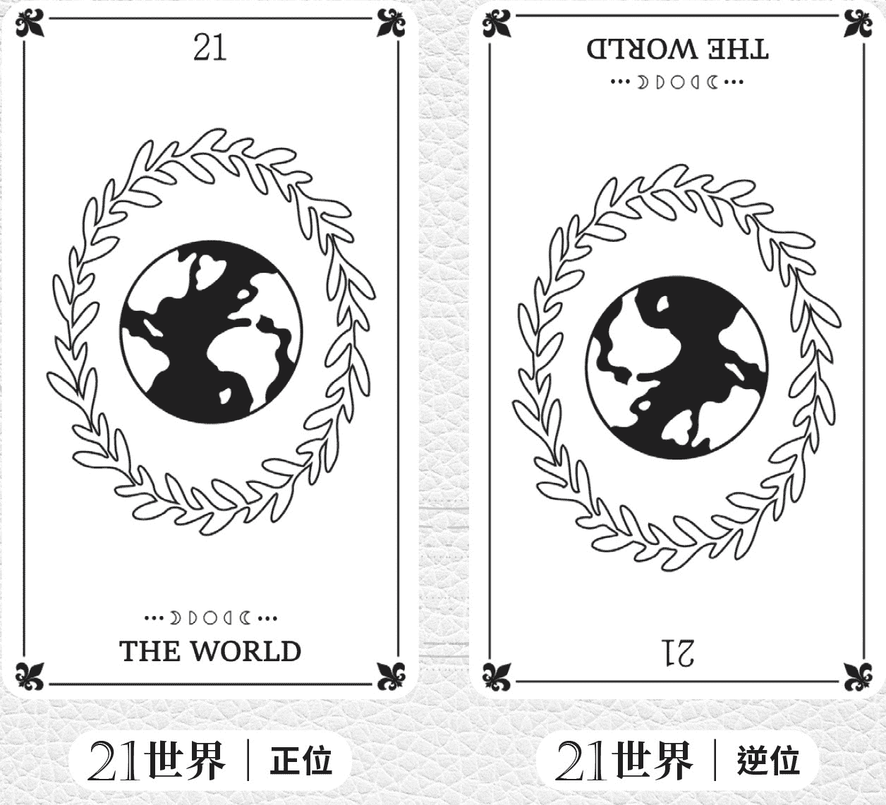

▪ 概义 ▪

正位：全然、美好、全心全意、展现、好的环境、土星。

逆位：追求短暂回报、不满、环境无法提升。

▪ 解析 ▪

完成，和命运之轮相比较，命运之轮周围的动物都在学习，而世界牌周围的动物，都已经学习完成了！

原本就存在，整个状态是放松轻松的，身上的丝巾是柔软放松的，整个很享受，因为已经原谅自己了，所以重生。

这个重生和死神不一样，是真正原谅自己的内在，很多功课已经学习完成的状态，人的周围是一圈胜利的桂冠，圆满的感觉，呼应光之藏中的大圆满，一切俱足。

四朵云只有老鹰周围那一朵是白色的，其他是灰色的，老鹰代表往上飞，建议你用更高视野来看事情，而且老鹰在奥修禅卡中有一张牌，叫“可能性”。其他三个人、狮子和牛都是在地上的动物，旁边的云是灰色的，用灰色和白色来表示角度与视野的落差。

✧ 解牌心语 ✧

问工作，一切俱足，本自圆满，选择环境是重要的，放松。下一张牌又是愚者，开始新的循环。

关系关键字：完整、圆满、完成、进入新阶段的准备。

# Chapter 3
与日常共舞的小塔罗

大阿尔克那牌（大塔罗）讲的是事情发生深层的原因，而小阿尔克那牌（小塔罗）呈现的是表面的事件。小阿尔克那牌组成了 56 张牌，通常分为四种花色：权杖、宝剑、圣杯和钱币，每种花色都包括从 1 到 10 的牌，以及四张宫廷牌，分别是侍者、骑士、皇后和国王。

这些小阿尔克那牌代表着日常生活中的各种情境和挑战。通常用来揭示与个人生活、关系、事业和决策相关的讯息，帮助人们理解和探索各种问题和局势。

## 塔罗四大元素

在小阿尔克那牌里有四大元素，分别是火、水、风、土。这四个元素各有其不同意义，象征精神宇宙与物质世界，也代表世界、人性和创造世界的力量。

四元素对应四个牌组，即是：权杖、圣杯、宝剑、钱币。

❖元素一：火

◦代表：权杖。

◦优点：创造力、进取心、积极努力、热诚。

◦缺点：自傲、毛躁、任性。

◦风格：具爆发力、活跃、鼓舞。

◦荣格理论中的功能：感受。

◦方向：南。

◦季节：春天

◦形象：蜡烛、火焰、火柴、火山、向日葵、狮子以及所有猫科动物。

❖元素二：水

◦代表：圣杯。

◦优点：宁静、爱、有创造力、想像、培养、好的情绪。

◦缺点：喜怒无常、过度上瘾、精神耗竭、情绪变化。

◦风格：流动、扩展、渗透、充满爱。

◦荣格理论中的功能：直觉。

◦方向：西。

◦季节：夏天。

◦形象：杯子、高脚杯、容器、水的成分、子宫、花朵、海豚以及水中所有生物。

❖元素三：风

◦代表：宝剑。

◦优点：洞察力、勇气、力量、真理和正义、决定。

◦缺点：轻率、批判、尖锐言词、恐惧。

◦风格：爆发、冷淡、对抗、概念化、沟通、面对、穿透。

◦荣格理论中的功能：思考。

◦方向：东。

◦季节：秋天。

◦形象：云朵、风、天空、所有尖锐物品、刀子、精灵、四季、鸟类。

❖元素四：土

◦代表：钱币。

◦优点：知识与能力、持久性、稳定性。

◦缺点：紧张与焦虑、固执、缺乏改变能力、占有欲。

◦风格：枯燥、积极、具体化、坚强、明确化。

◦荣格理论中的功能：感官。

◦方向：北。

◦季节：冬天。

◦形象：金钱、圆盘、石头、大地的果实、组织、公牛、母牛、山。

## 解读
小阿尔克那塔罗

Minor Arcana

权杖──热情如火的行动者

权杖在四要素中象征火，充满行动力与进取心的特质，又代表春天、事业。

权杖 1

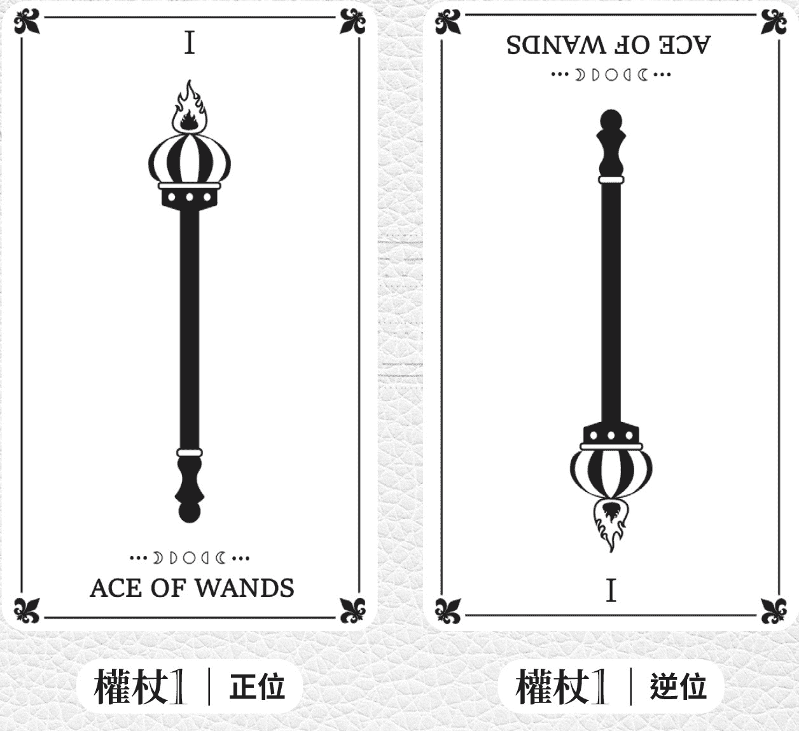

▪ 概义 ▪

正位：权力、有能力控制、热诚、掌握、成长的开始。

逆位：无法掌握、失去热诚。

▪ 解析 ▪

热忱、开始，掌握在自己手上。

所有的权杖都有树叶，代表生长和成长，落叶代表循环，有热忱就会成长，就会往上提升、掌控。

云代表内在，不是真实的，是一个象征。

城堡代表国家集体意识，或是家族意识概念，表示我们的掌握程度和热忱可能会受到影响。

✧ 解牌心语 ✧

问事业，要有热诚，要可以掌握，才有办法往上走，建议他以热忱的方式往前走。

问健康，以掌握的角度来看，可能是心脏，热代表热能，可能是血液循环，尽量不要提到器官，以避免触犯医事法。也可说是胸部可能有问题，或是为了想要冲事业，做你想做的事情，却忽略了健康，产生健康的危机。

关系关键字：积极、创造力、能量。

权杖 2

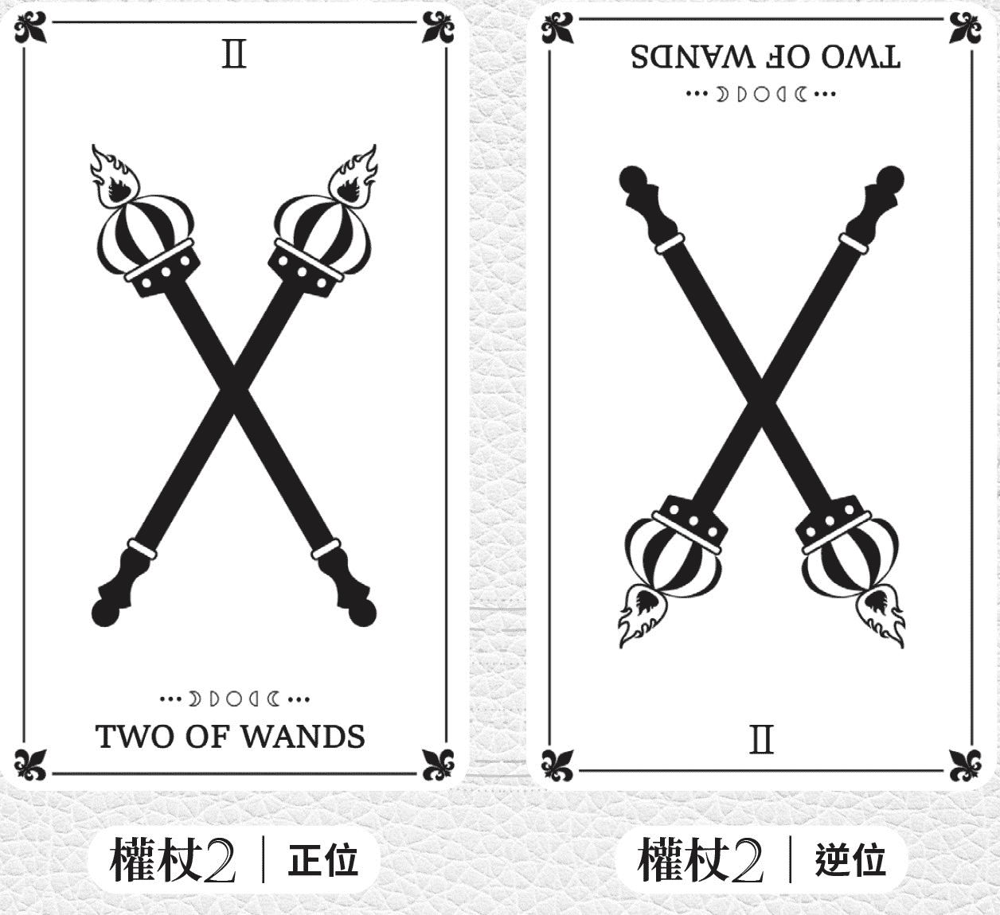

▪ 概义 ▪

正位：计划、有想法、观察、环境变化。

逆位：没有计划、无法观察、随便、失去注意力。

▪ 解析 ▪

人站在城堡上，看着远方、在观察、在思考，观察的过程中，手上拿着像地球的东西，称之为“资源”，代表观察过程是有资源的。

这个观察来自于他的想法、计划和看法，甚至于在观察的过程当中，在思考怎么样去面对下一步？如何去做事情，包括感情、工作、事业，是包含计划在里面，有可能我们在看远方时，会思考一些事情，盘算着下一步该怎么做，该怎么运用这些资源？

对应到生命灵数 2，表示体贴、和谐、依赖，也可再加入火的元素，包括互动，在思考人跟人之间的互动，思考跟金钱，工作，财产之间的互动。这个资源是大家的，因为地球是代表大家的，或是想运用别人的资源。

花代表天真，单纯的思考。花的周围也没有其他生物，代表独立的思考，也有一种意思是，他在想进行的事情上面，遇到很多阻碍，环境不允许，迫使他去思考如何解决问题，但权杖 2 仅止于想而已，行动力比较弱，到权杖 3 的时候，行动力才会变强。

✧ 解牌心语 ✧

问感情、工作、事业的时候，可以建议他，停下来想一想，看远一点，用全观的方式去思考，这边的资源并不是自己的，可能要运用别人的资源，所以他是有些想法的。

右边的权杖是固定住的，无法变动，只有一根是可以变动，他可以掌握一个，只有他自己，是可以变动的，有着无法控制别人，可是可以控制自己的意思。

关系关键字：筹备、思考、运筹帷幄、期望。

权杖 3

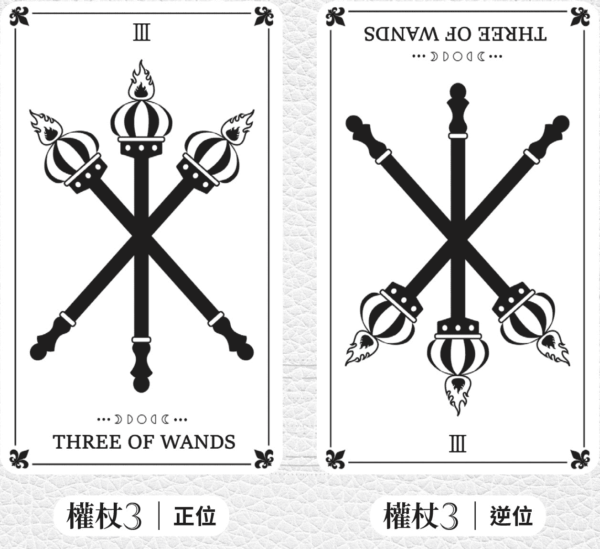

▪ 概义 ▪

正位：商人、扩张、有野心的、持有、商业成就。

逆位：保守、短视近利、没有资源、超出能力范围。

▪ 解析 ▪

行动力，观察自己拥有的资源。

经历过奋斗而得到一些成就的商人，大海中的船队都属于这个商人。他正在观察他的财产、成就，所以他是有行动力的，经过行动而得到目前的成果，也可以说是布署好准备行动，他的观察来自于他已经拥有一些资源，权杖 2 的资源感觉比较少，而且权杖 3 中的权杖都是可以移动的，他自己就是商人可以运用自己的资源，做自己的事情，蓄势待发，准备行动，已经计划好，有自信有野心，想要掌控。生命灵数 3 代表行动。

整张画面都是黄色，代表胃轮，有自信。

举例来说，创业前，没有资源，必须去想钱要怎么来，创业后，已经拥有资源，要去想该怎么卖？

✧ 解牌心语 ✧

问事业，利用自己的资源或专业，计划好，或是行动。问感情，就要看发生什么事情，可以运用资源来维系这段感情，不用靠别人，是靠自己。

关系关键字：自信、发展、精力充沛。

权杖 4

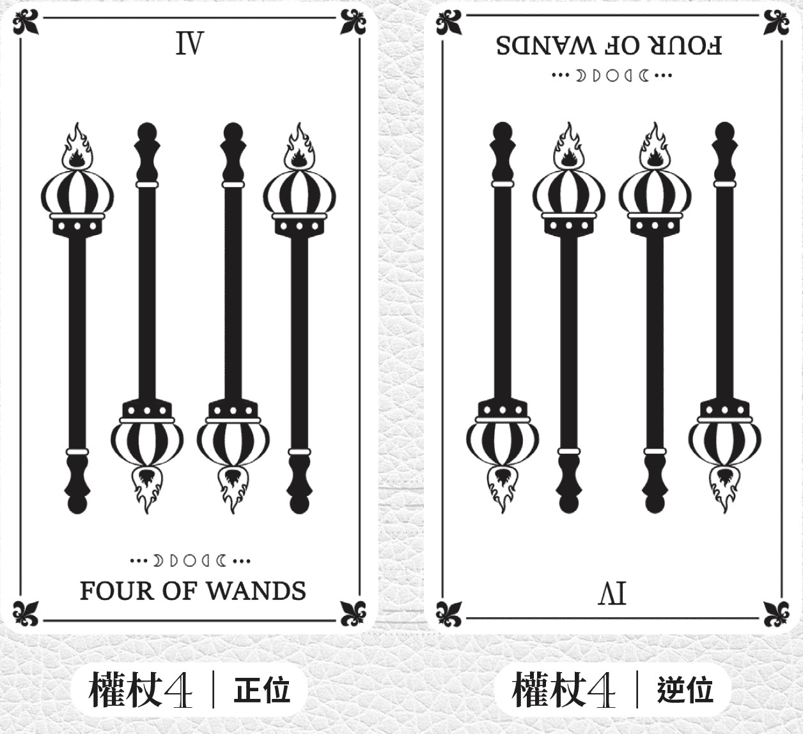

▪ 概义 ▪

正位：稳定、成功、喜悦、庆典、团聚、开心、坚定友情。

逆位：不稳定、不被支持、努力中、局外人。

▪ 解析 ▪

稳定，可以庆祝，是偏向比较正面的牌。

成功、喜悦、庆祝、庆典，城堡代表跟集体意识有关，生命灵数 4 代表稳定。

✧ 解牌心语 ✧

问感情，表示现阶段是开心、轻松、稳定的。

整个牌面有庆祝的感觉，有可能是家族、公司、团体或国家庆典，但也可以把这些元素单独拿出来看，整个氛围是开心的。

关系关键字：稳定、家庭、共同庆祝、承诺。

权杖 5

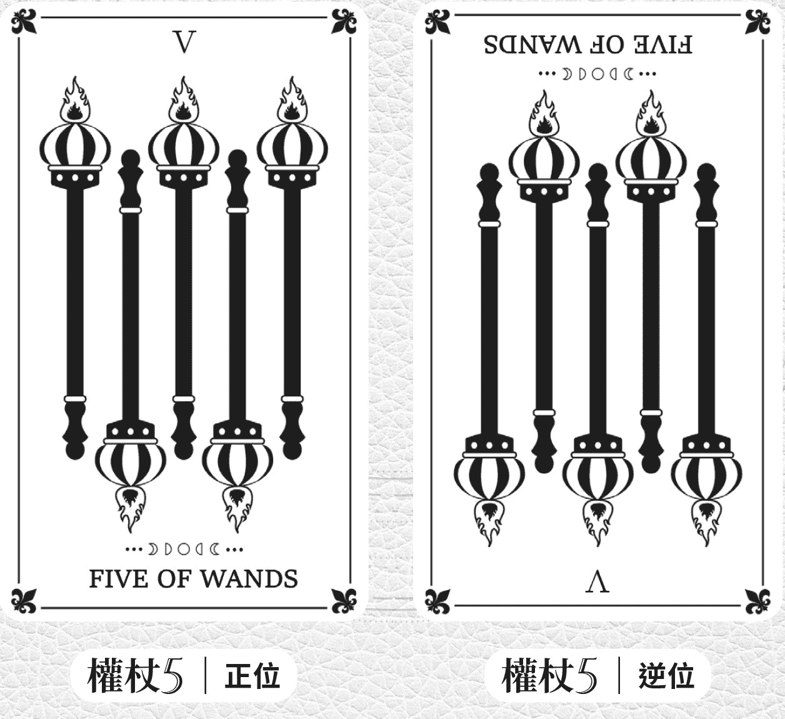

▪ 概义 ▪

正位：纷争、不同意见、各做各的、无法团结、展现个人信念。

逆位：各不相让、无法合一、争执、诈欺、矛盾。

▪ 解析 ▪

每个人都有自己意见，方向都不一样，代表争夺、混乱，无法团结，或是展现自己个人的信念、纷争、有状况、意见很多。

蓝色代表喉轮──沟通。

生命灵数 5，代表自由，所以比较没有规律，建议可以给点规范会比较好。

高塔，表现重整，旧有模式全部打掉，重新开始。

✧ 解牌心语 ✧

问感情，感情很多状况。问工作，工作很多状况，代表他们沟通发生问题，权杖 1 和 2 的背景是灰色的，代表中性，可以请个案再抽一张建议的牌，如果是愚者，轻松的面对。魔术师，准备好再面对。女祭司，专注的面对。皇后，用女性的力量去面对。国王，用男性的力量去面对。问工作，在公司工作的话，是混乱的，没有办法静下心来，有很多思绪想法，可以建议他静心，先平复下来，每一根权杖都代表一个思绪，混乱的思绪，也可以往好的方向去解释，每个人不同的意见，可以激发不同的状况与思考方向，跳脱旧有的思考模式。

关系关键字：争端、争执、竞争对手。

权杖 6

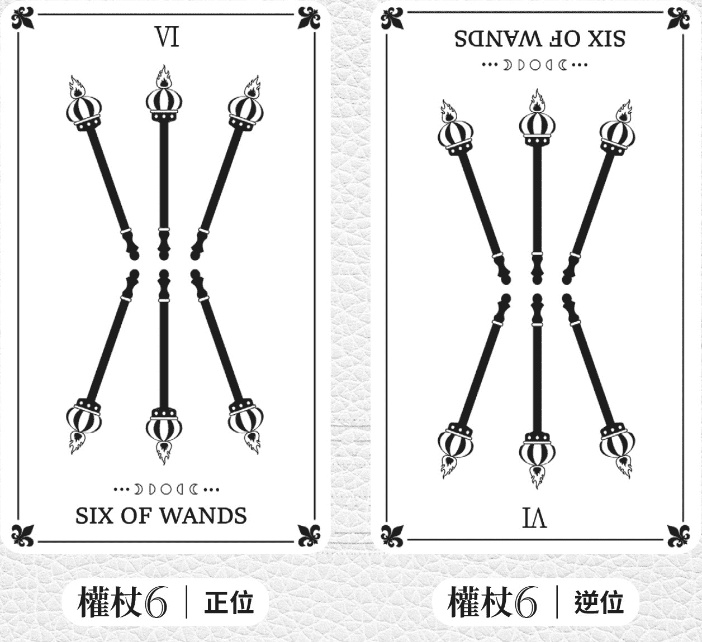

▪ 概义 ▪

正位：成就感、欢迎、胜利、前进、荣耀时刻、衣锦还乡。

逆位：骄傲、失败者、坏消息。

▪ 解析 ▪

成就感、赢得胜利，头往某一个方向偏去，代表重视别人的观感，当他来到这个状态的时候，是会比较有自信的，可是如果自信过头，会变成骄傲。

牌面上的马好像没什么力气，代表太过骄傲有自信的时候，比较没有处于一个战战兢兢的状态，和太阳牌中的马相比较，两者的眼神差很多。

绿色代表心轮，代表成就感是由内而外，从心开始，而不是别人怎么看待你。往外看，注重表象，也许众望所归，但内心有一块是比较不开心的，为了迎合别人，那一圈是皇冠，代表头衔、荣誉、荣耀。

✧ 解牌心语 ✧

解牌时可以提醒对方，我们做事情不是为了别人而做，是为了自己而做。

这张牌的感觉，好像是为了博取别人注意，而得到的成就感，为了掌声而去做，但过头就会变骄傲，也代表努力过后得到的成果，得以衣锦还乡。

关系关键字：成功、支持、努力得到回报。

权杖 7

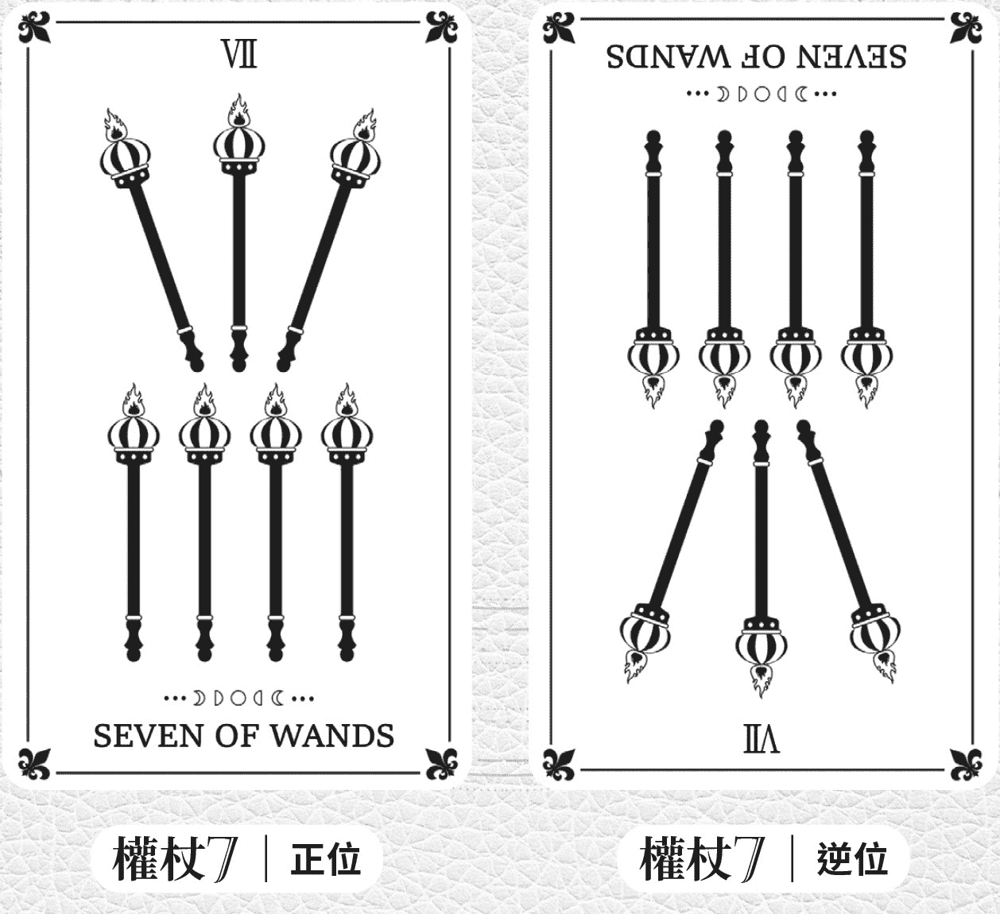

▪ 概义 ▪

正位：辛苦达成、孤军奋战、坚守、努力、决心。

逆位：没有决心、无法下决定、失去了自信。

▪ 解析 ▪

努力达成，孤军奋战终于达成，稳扎稳打，辛苦得来的，他的资源并不多，没有很多人帮忙，因为有热忱，一直努力，所以一个人达成目标。

可以留意他的表情是没有很开心，有点狰狞，表示做得很辛苦，好险有点小小的成就，独排众议，做自己想做的事，会有自己的想法，可是走这条路是比较辛苦的，不讲目的，只讲过程，是辛苦的过程，比较累。

下面的权杖好像是每当我们完成一个目标就插一根，已经达到了很多目标，是有成就的，可是过程是辛苦的，不是从零开始，而是到达一定的程度后，最终是一个人努力的完成，还在过程中，也可能表示被很多意见攻击，独排众议，得到目前的成果。

站在悬崖边，表现辛苦、危险、专注。

衣服是绿色的，代表心轮，跟自己的心链接，代表会这么辛苦，是自己想要的。

✧ 解牌心语 ✧

问健康，感觉手肘是弯曲的，而且会施力，所以膝盖手肘都会有些状况。在工作时，会使用到这些部位，以及图面上的显示，身体容易紧绷，想要达到你的目标，你的肩颈关节都会有一些压力的呈现。

问感情，辛苦维系感情，为了想跟对方在一起，可能家长不同意，经济、环境不允许之类的因素，但已经有些小成就，至少女朋友是爱他的，经营过一段时间的，问要不要分手？其实你很辛苦，要不要分手，你可以自己决定。只是目前的状况是，你之前已经走过这么一段辛苦的路，现在还想分手吗？可以反问他，不要替对方做决定，通常抽到这张牌，想分也分不了。

关系关键字：独排众议、外部因素、保护关系。

权杖 8

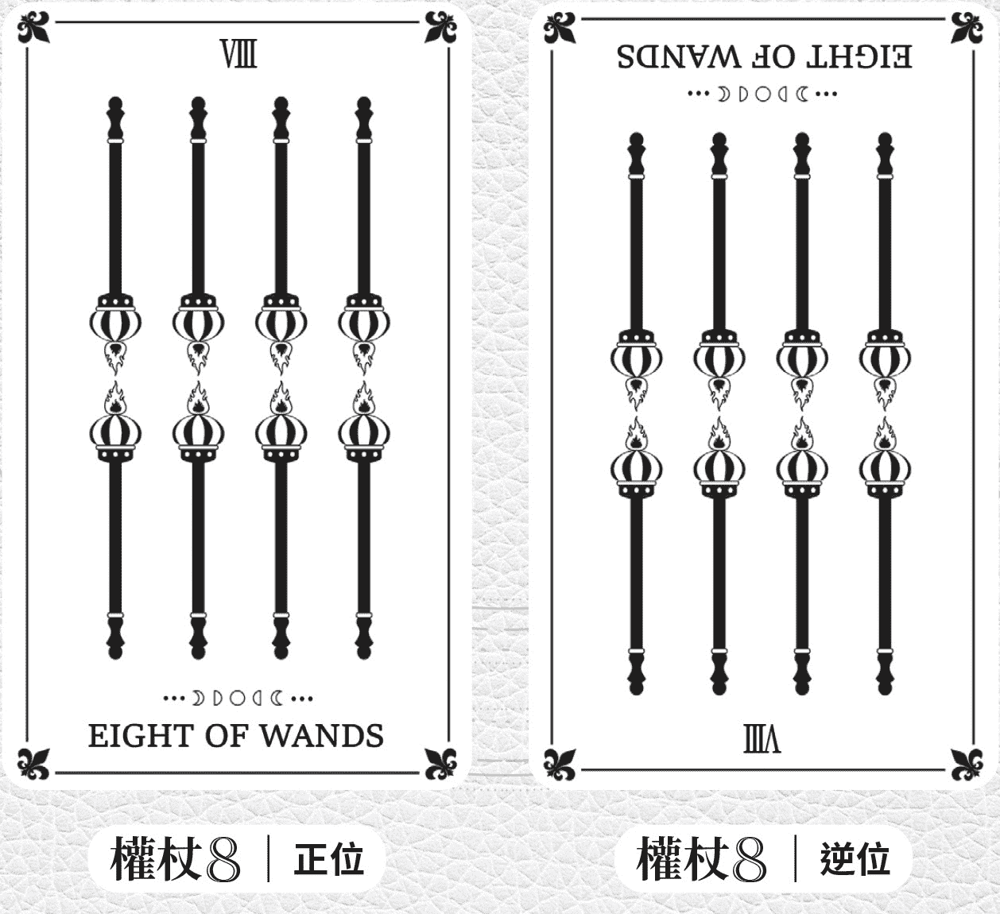

▪ 概义 ▪

正位：速度、快速、无法持久、空中、突然来到。

逆位：步调太快、缓慢、错过时机、失控。

▪ 解析 ▪

表现权杖被投出去的感觉，往下掉的感觉。

原本的权杖一定是在土地上的，上面还有树叶，所有的权杖跟大地有链接支持，只有这张牌没有，东西往下掉，代表速度要快。

当我们来个某个 timing 或节奏的时候，抽到这张牌，代表速度要快，感情，速度要快，工作，速度要快，不管问什么问题，都建议他速度要快一点，达到时效性，也代表这个问题是有时效的，速度越快越好，机会稍纵即逝，权杖 8 代表速度，或无法持久，突然来到的时机。

下面的风景，水代表情绪，情绪是稳定平静的，做决定不会有太大的情绪反应，其实可以勇敢的做决定。看整体的氛围，感觉并没有不好，只是单纯的就这件事而言，要赶快做决定。

✧ 解牌心语 ✧

问感情、工作、事业，代表你抓到这个节奏，用最快的速度去完成事情，行动要快。

问健康，赶快看医生，哪里不舒服，赶快求医。

如果处于两难或二选一的状况，建议对方赶快做决定，可以再抽一张建议牌，如果现在不决定，这个时间过了之后会更难做决定，无法做决定，会更严重，或陷你于不利，求速度，无法停下来休息，举例来说，如果是两间公司要选一间，不快点决定的话，有没有可能两间都没有。或是女生有两位男性追求者可选择的话，不快一点抉择，可能两个都没有。

关系关键字：激情、快速、时效性。

权杖 9

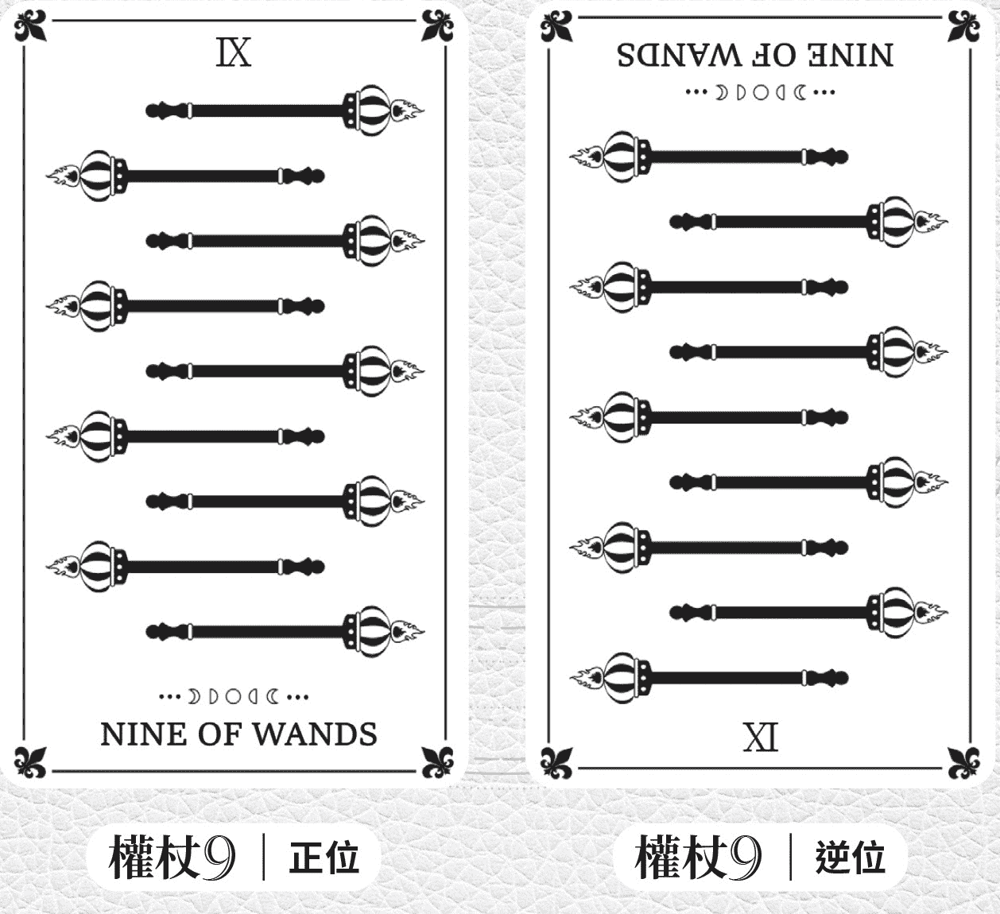

▪ 概义 ▪

正位：受伤、惊吓、保护、防御、准备。

逆位：放弃防御、没有准备好、消极、没有信任感。

▪ 解析 ▪

受伤、惊吓、保护、保卫、防卫，抓着一根权杖，后面有八根，代表界线，也代表防御，准备，想要保护一些事情。

这个人好像是受过惊吓，受伤的感觉，头上有纱布，所以紧抓着权杖，没有办法放松，这个伤可能是心里的也可能是身体的，一朝被蛇咬，十年怕草绳，后面的风景其实一片亮丽，可是就是跨不出这个鸿沟，跨出去其实就没问题了。

背景蓝色，代表喉轮，痛苦都没有办法表达出去。也可以从权杖都比人还高看出来，根本没有办法表达出内在的恐惧，愤怒，烦恼，闷在心里所以受伤，如果可以讲就解决了，甚至你可以建议对方讲出来，找信任的人抒发，愿意讲的话是可以解套的，纾解内在的恐惧。

如果有些人受伤了，没有地方讲，是会生病的，太严重就要找身心科，可能出现创伤后压力症候群。

✧ 解牌心语 ✧

问感情，其实你过去的感情有受到伤害，没有办法复原，你没有办法真的放开，除非把过去的感情印记消除掉，不然可能没有办法接受新的感情。

问健康，没有安全感累积的情绪反应，所以会一直以为自己有病，实际上不一定，有时候是自己想像出来的，人家说什么药好，他就去吃，因为他惊吓过度，会做出过度的反应。

问跟家里的互动，因为家庭让你受伤了，家人对你的意见采取比较否定的状态，甚至是比较激烈的，变成不太敢在家里表达。万一有人说，我没有这个状态，就说牌是你抽的，反映你的潜意识，不相信也没关系。

问金钱，对金钱恐惧，怕花钱，怕失去金钱，紧抓着钱不放的守财奴。

关系关键字：创伤、防备、不安全感、犹豫不决。

权杖 10

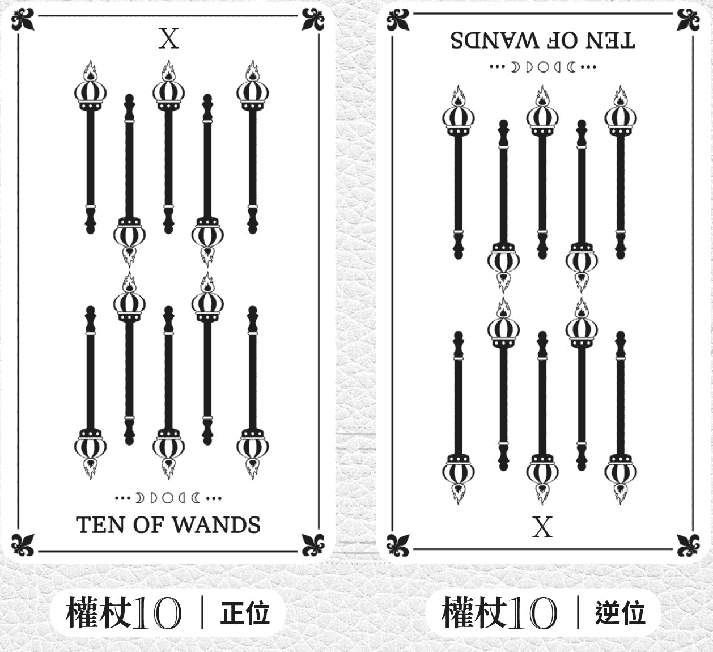

▪ 概义 ▪

正位：沉重、伴随而至的负担、瞎忙、压力大、工作没主轴。

逆位：快要崩溃、放下重担、无法掌握任何事情、抽离。

▪ 解析 ▪

瞎忙，什么都要，太多想要的，没有顺序，什么都揽在肩上，很多压力，包含很多不必要的，别人的工作也拿来做，他人的压力自己扛，把所有的责任都往自己身上扛。

脚很粗，所以他会越来越厉害，可是越忙碌就事情越多，所以这个状况需要的是“分配”，分配工作。前面的风景还不错，在某些过程当中，他的状况虽然很累，但他其实比他想像中还要好。

他觉得自己很累，没有办法休息，其实是可以休息的，已经习惯做这些事，这是惯性，有可能边做边抱怨，认为做这些事，是可以看到未来的愿景，可是实际上，他的眼睛是往下看的，不知道自己在做什么，因为他什么都想要。

可以建议对方，一次做一件事情就好，不要做太多，做好再做下一件，不然什么都想做，太累了，又因为你什么都会，越来越厉害，什么都会加在你身上，重担越来越多，手脚都是粗的。

✧ 解牌心语 ✧

问学业，每一科都要求很好，念书比较没有时间规画、整理，什么事情都挤在一起做，太累了，抓得很紧，不会放弃，而且他甘愿去做。

问感情，什么都要，同时有很多喜欢或暧昧的对象，或同时要求对方什么都有，为了达到对方的要求，失去自己，或是两个人在交往，不知道为什么要交往，没有顾虑到自己的需求，为了别人做事，后面是家庭，表示环境都是没问题的，只是自己在承受。

问健康，头往下看，思绪很多，没办法知道自己到底想做什么，睡眠不会太好，因为手脚需要承受这些压力，所有权杖 10 的东西他都有，想像抱着那么重的东西，哪里会不舒服，那个状态全部都可以讲。

问金钱，什么都想赚，所以压力很大。

关系关键字：思虑过多、负担带大、压力。

权杖侍者

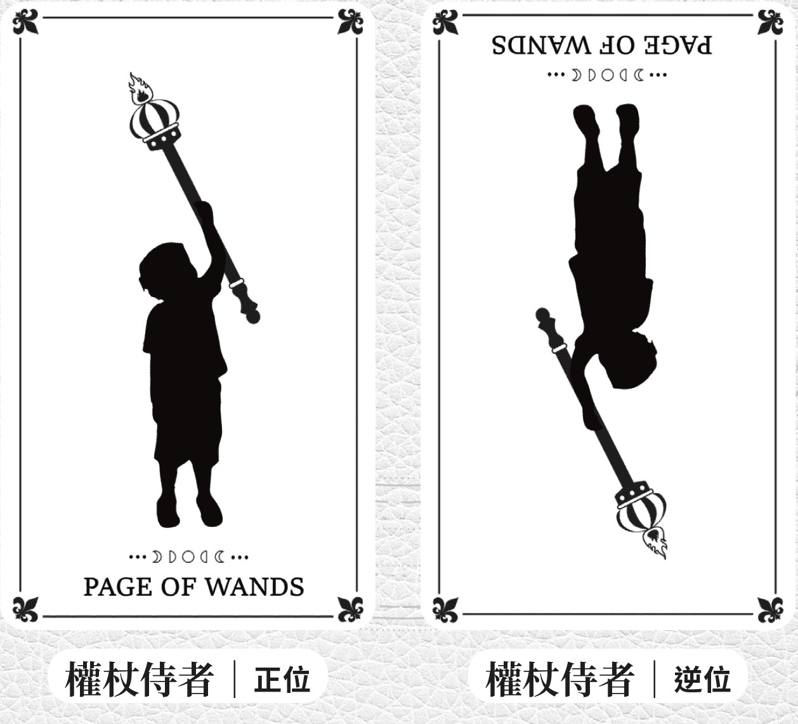

▪ 概义 ▪

正位：专注于自己的热忱、单纯的心、轻松而专注。

逆位：无法专注、思绪繁乱、没有热忱、不喜欢。

▪ 解析 ▪

专注在自己的热忱、自己的世界、信念里，就像小朋友玩玩具的时候很专注，单纯的专注。

因为侍者是小朋友的阶段，他在做这件事的时候、是没有经过思考，没有想很多的，不是为了要有成就才做的，比较深的部分。

坊间塔罗牌课程比较不会教到的是──侍者专注的地方、热忱。有可能是上辈子累积来的，比较没有经验，可是热忱专注。

身上衣服的图案有蜥蜴，蜥蜴是在沙漠中仍可生存的爬虫类，代表克服困难，得到想要的，所以只要有热忱，就可以战胜困难，达到目标。

✧ 解牌心语 ✧

抽到这张牌，表示其实是克服很多困难的。权杖侍者代表单纯的心，单纯专注，专注放松，做自己想做的事情。

不是为了赚钱，只是为了自己想做的，就一直做，做到最后就有成就，可以建议对方，专注、单纯，一次只做一件事情，不要分心，会有好的结果。

关系关键字：新的恋情、惊喜、单纯、热忱。

权杖骑士

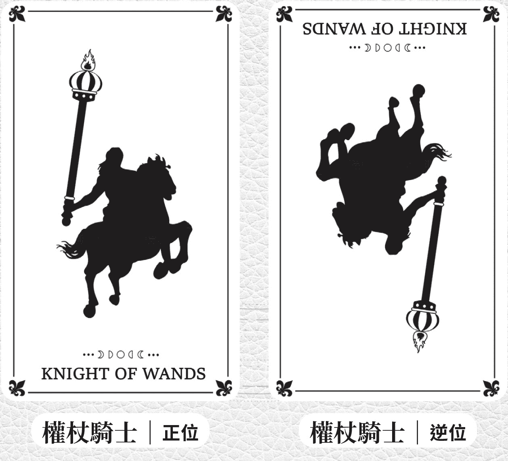

▪ 概义 ▪

正位：积极但不稳定、能量动力、热烈急切、临时暂停。

逆位：中断、突发状况、无法处理问题、失去热忱。

▪ 解析 ▪

一边想做，一边又担心、害怕犹豫，积极但是不稳定。一边前进一边踩刹车，没有明确的知道自己想要什么，通常会暂停，刚开始一头热，后来就冷却。三分钟热度，遇到困难就逃避，这个状态有可能也是累积来的，变成惯性、习惯。

穿着盔甲表示积极热忱，可是遇到困难挫折，就不想做了，盔甲也可说是自我保护，没有办法坦诚相对、卸下心防，用自己固有的模式去运作。自我防卫心重，不接受别人的建议，无谓的坚持。

衣服上的蜥蜴表示在任何地方都能生存，是可以面对很多困难的，可是他不愿意相信自己，拿权杖的感觉，跟宝剑骑士相比较，是不一样的，虽然他有目标有方向，可是遇到挫折就退缩。

金字塔跟宇宙能量链接，代表以宇宙观来看事情。

✧ 解牌心语 ✧

这种突然踩刹车的状况是惯性，是累世习性，权杖骑士是青少年，最冲动的时候，可用青春期的孩子感觉来解释这张牌。

关系关键字：自信、决心、心防、积极但不够稳定。

权杖皇后

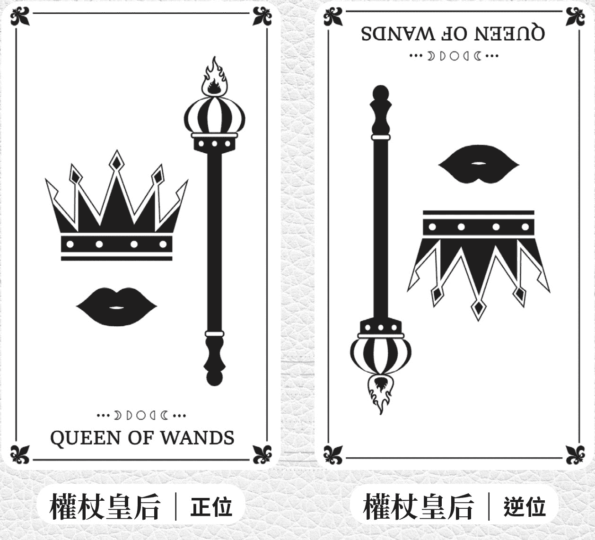

▪ 概义 ▪

正位：很强行动力、执行力佳、爱冒险、对生命有热忱。

逆位：没有行动力、不爱冒险、对生命没热忱。

▪ 解析 ▪

女强人，可以掌握整个团队状况的人，热忱、权力执行。

皇后牌有丰富的资源，但这张牌的资源比较少，为了理想而努力的女强人。

猫是代表精神层面，猫也是不受掌控的，做事情的时候是为了理想跟目标，有热忱的状态，用本身具有的能力做事情，身处的地方没有很多的资源，所以凡事都自己来，独自去面对，握有相当的权力，有资源的。

就像向日葵般，会往想要的地方去，去聚集一些志同道合的人，就像两个人有相同的信念，不是实质的，只是个象征，共同朝一个方向努力，是有这样的一群资源，无形精神力的资源，心灵的力量，显现女强人的那一面。

皇后的资源是物质丰富，两只狮子代表权力或霸气，可以抗压，因为是女强人，对应到女主管、女老板。

三座山，因为责任，与生俱来的责任感，必须扛起这份事业或工作。

脚突出来，代表行动力很强。脚打开，观念比较开放，可以接受新的观念，有些书会提到性开放。

✧ 解牌心语 ✧

问事业，要找一群志同道合的人运作。人际关系上，因为是主管，所以比较有威严，因为角色定位的问题，必须做策略与指令，所以很容易被误解。

问人际关系，可能保持了比较骄傲的状态，建议卸下面具，不要让人感觉有架子。在朋友群里，比较可以在精神层面上领导，不管在哪个团体，就是领导的角色。

关系关键字：温暖、舒适的关系互动、精神与心灵层面的交流。

权杖国王

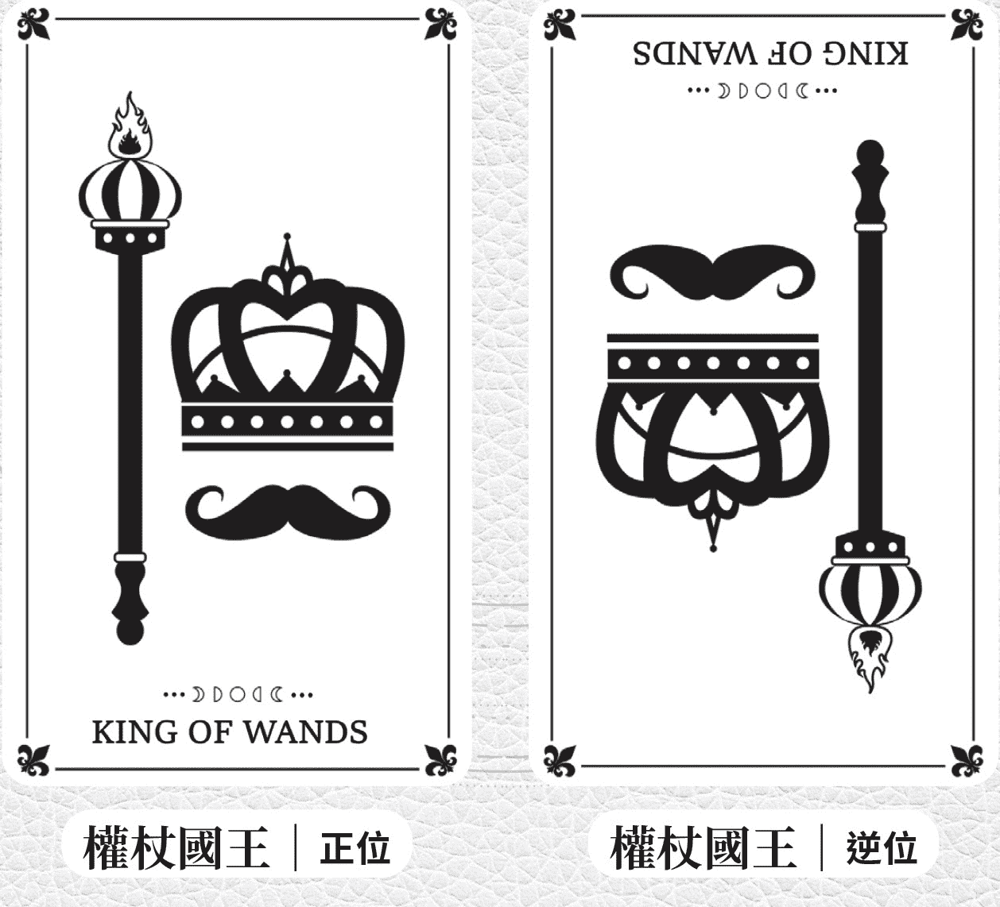

▪ 概义 ▪

正位：威权、热情、活动力强、英勇、豪迈、主导性。

逆位：严格、苛刻、自以为是、失去权力。

▪ 解析 ▪

威权、全然、热忱、权力，可以克服困难。

蜥蜴是可以在很多地方克服天候限制生存下来的动物，针对自己的热忱，去做自己。同时，有些时候自以为是，太过头了，想要有主导权。

人有点侧面，不想让人看到正面，代表没有很敞开心胸，保持一个架子或威严，不想让别人知道他在想什么，针对自己想做的事，活动力很强，就像一个主管想做一件事情，他有热忱，不管别人有没有热忱，他就是要做，固执坚持自己想要的。另一状态是，他不轻易表现出他内心的意图，后面的图案，蜥蜴背后有狮子，表示会有隐讳的企图。

权杖跟地面接触，权杖代表基础，是从基础上来的，他的热情代表一切，把热情为优先，把想做的事摆第一，不见得会听进别人的话，自己的意见为意见，当他的部属会比较累。

✧ 解牌心语 ✧

问目前状态，固执、听不见别人声音，只一径往自己想要去的地方前进。

问健康，就看整个牌面的感觉，感觉好像坐太久，血液循环不太好，脐轮的附近，也可能是嵴椎，进入这个状态，感觉如果位子坐太久会怎样，都可以提出。

关系关键字：权威、主导、忽视心灵交流。

宝剑──如风飘忽的思考者

宝剑是风的元素，代表我们在面对事情的时候，在思绪上可能会犹豫不决，风对应到身体器官是呼吸。

宝剑 1

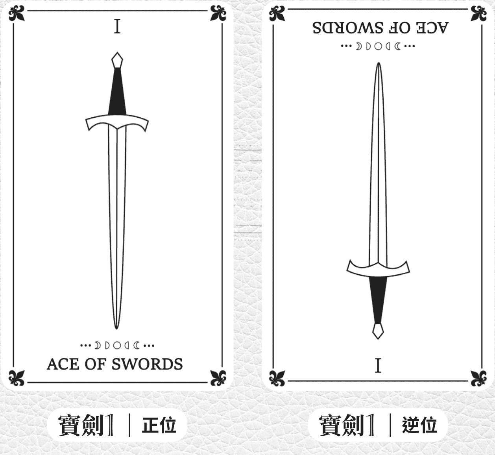

▪ 概义 ▪

正位：主导权、决定的力量、挑战、中立力量。

逆位：无主导权、恐惧、无法下决定、过度用力。

▪ 解析 ▪

下定决心，不要犹豫不决。

皇冠，代表权力、荣耀，紧握着我们想要的。掌握来自于我们要如何下定决心，主导权在我们身上。

皇冠旁的植物，代表成长跟生长。当我们下定决心之后，不管怎么样，都是成长，没有好坏，只有下定决心才有办法成长，会有收获，面对事情的时候，会担心失败，但即使是失败，也可以学到东西，所以注意看，两边是不同的植物，一定会得到一些经验，不管有没有成功都是赢家。举例来说，如果想做一件事情，一直犹豫不决的话，会消耗自己的能量或是力气，可是如果当你下定决心之后，即使是失败，也会得到一些东西，所有的问题没有好坏。

牌面上的云，是灰色、中性的，光辉代表下定决心之后会有一些光环──决心的光环，跟月亮牌的黄色点点一样，是一种氛围，有影响力，笃定往这条路走，独立的做出决定、下定决心，或是用领导的方式来做出决定。

手是掌握、握住的含意，钱币和权杖的背景都是很丰富的，但这张牌没有，代表自己要承担。

✧ 解牌心语 ✧

建议个案一旦下定决心，氛围就不一样了。下定决心之后，就是我绝对要去做。下定决心前，就会觉得要吗？好吗？怎么办？会一直犹豫不决。没有丰富的资源，就要自己学习承担。

关系关键字：思想、心智力量、清晰、诚实面对。

宝剑 2

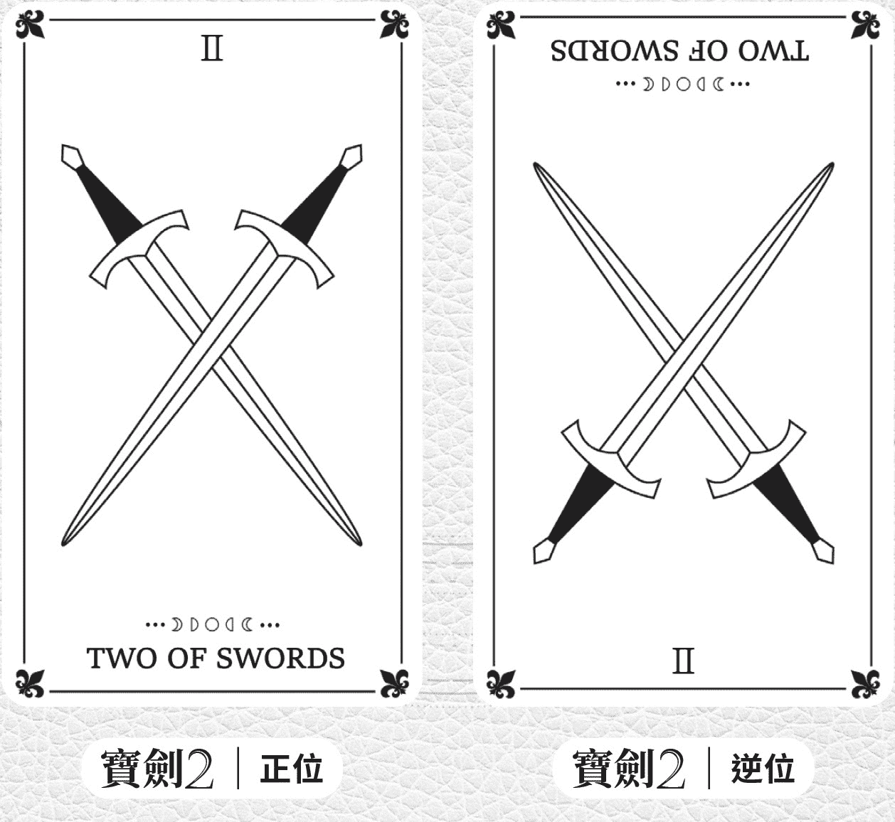

▪ 概义 ▪

正位：拒绝看见、封闭、不接受信息、闪躲、选择不看。

逆位：失去平衡、害怕、无法看见、蒙在鼓里。

▪ 解析 ▪

封闭，眼睛看不见，是自己绑住的，不想面对、观看。

切断，坐得很直，可是整个心轮是封闭的。两只剑是为了保护自己，后面的水是很平静的，习惯切断，不愿意看见，例如有位女孩的男朋友已经噼腿了，女孩却说：“没有呀！他没有噼腿，我过得很好！”明明已经发生问题了，还予以否认，表示自己过得很好。她不会把自己外在跟内在的事情显露出来，就是封闭或切断，不愿意看见。但是她知道真相吗？她完全清楚，但外表是很平静的，内在是切断的，不愿意面对事实。眼睛假装看不见，地球依然在旋转，佯装一切都很顺利，可是内在是封闭的。

月亮，代表阴晴圆缺，他是封闭的，情绪也有受到影响，可是不愿意面对，月亮向下代表闷在心里面，闷闷的、不快乐，可是不让别人看见，故作强颜欢笑。

黄色的鞋子，代表行动，可是他不行动，只要他愿意站起来，他其实是有方法展现的。

黄色代表自信──胃轮。

他虽然切断，可是并不是弱者，是有信心可以解决这个问题的，看他要不要而已。

✧ 解牌心语 ✧

这张牌也有警戒的意思，有些人不愿意让别人了解自己心情时，就会有这个动作。怕被触碰到他最不堪的部分。可是实际上，我们都知道，当你敞开心胸，大家都知道你的问题所在，其实问题就不会如想像那么严重，防卫是来自于他怕受伤害，不愿意面对。

关系关键字：封闭、防御、拒绝沟通。

宝剑 3

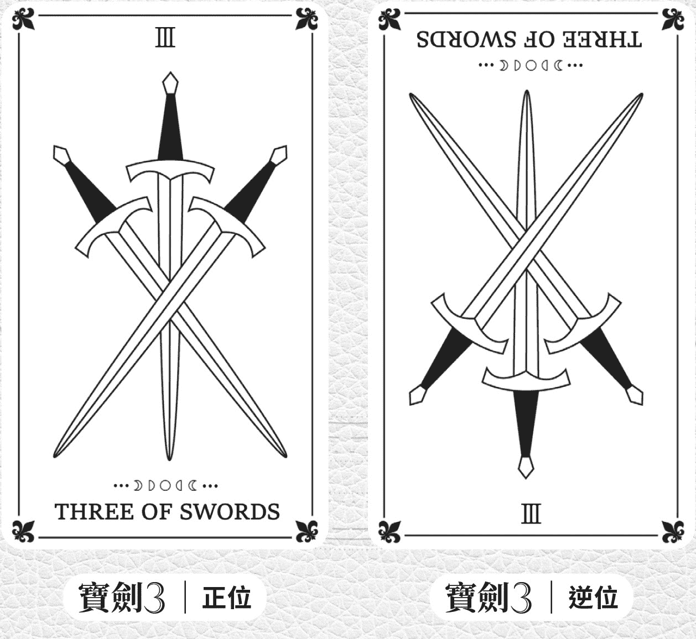

▪ 概义 ▪

正位：悲伤、痛苦、难过、事情放在心上、心痛。

逆位：慢慢走出、独自承受、事件影响、该放心了。

▪ 解析 ▪

心痛、有心事揪着的感觉，好像有事情没解决，像是有痛苦事情的象征。

有些是过去的记忆，有些是被伤害，有些是目前状况，被事情搁着，问感情，被感情搁着，问工作，被工作搁着。

有三只宝剑插入心脏，有种疙瘩在内心里面，没有办法真的完全放松，心没有办法放松，心是紧张的，显现出来的是比较急躁与紧绷的状况，已经影响到他的生活。

背景是下雨，乌云密布，现状是不佳的。

✧ 解牌心语 ✧

塔罗牌只有现象，没有对错好坏，可能个案抽到这张已经不好过了，你还讲得更不好过，可能会让他更伤心。

我们会告诉他，这只是目前的现象，以后会改变的。

问感情，就代表这段感情已经影响到他，心里老是搁着，让他工作学业不能顺利。

问健康，怀疑自己或是家人健康有问题，抑或已出现问题，搁在心上没有办法真的放松，健康的话题在内心里面搁着，心没有办法安静。

关系关键字：心痛、悲伤、心碎、伤痛经验。

宝剑 4

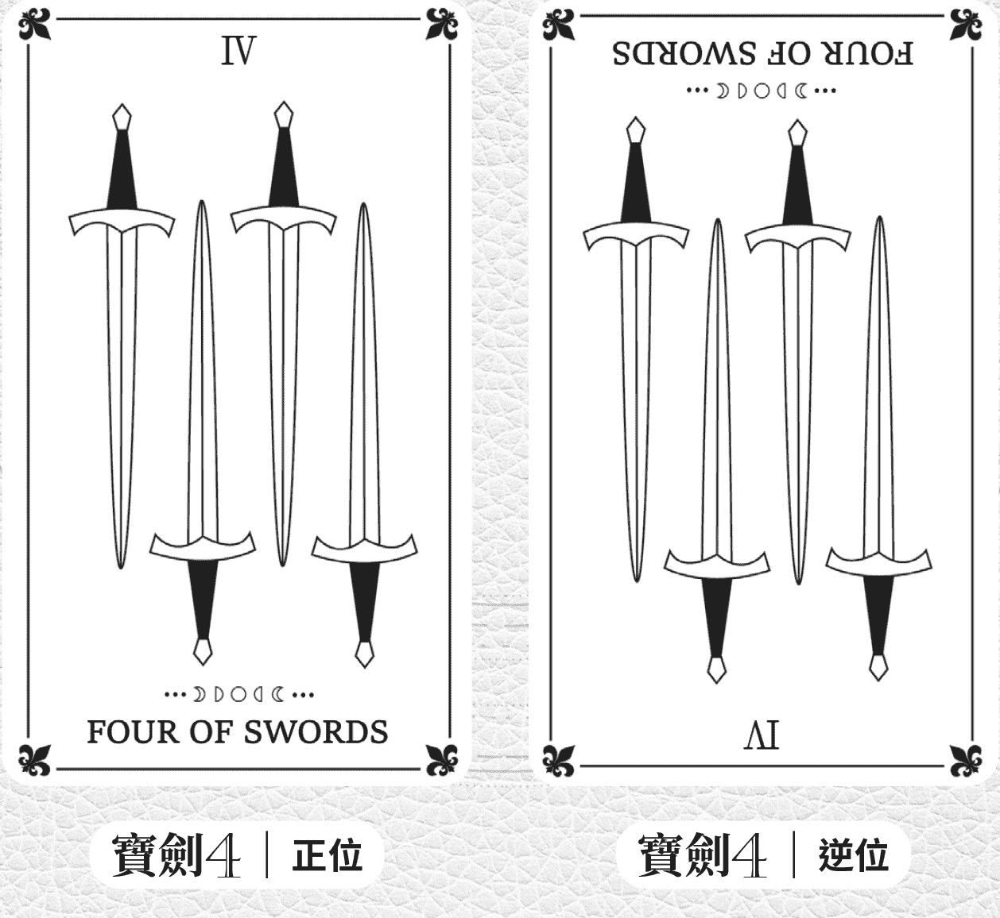

▪ 概义 ▪

正位：休息、储备、充电、没行动力。

逆位：无法休息、超时工作、没有时间、无法专注。

▪ 解析 ▪

身处舒适区、逃避，休息状态，有点像休息。

可是这个休息，某种程度像是在舒适区，就是躺着，看未来会发生什么事情都可以。

这里有三只剑，指着胃轮、喉轮、顶轮，有种威胁的感觉，代表没有什么自信可以展现出来，很多话讲不出来，或是思绪比较多，所以让他变成这个样子，有某种逃避的意思，或是休息的意思。

有一种可以得到救赎的方法，就是宗教，或是精神方面的象征，代表休息，或是很久没休息，就休息一段时间，可以让他舒缓的方式，就是宗教或是精神粮食，所以有个圣母玛利亚的窗户图腾。

下面那只剑就是躺着，是木头刻的，很难拿出来，也很难用到它，和人的状态是一样的，就躺在那边。有时也可能是逃避，或是处于舒适圈，不想面对真正的状况。

✧ 解牌心语 ✧

虽然状态是躺着，但人一旦能起来，这个威胁就没了，只要愿意起来行动就好了，也可能是之前做了很忙碌的事情，现在正在休息。

关系关键字：休息、休养、独处、恢复。

宝剑 5

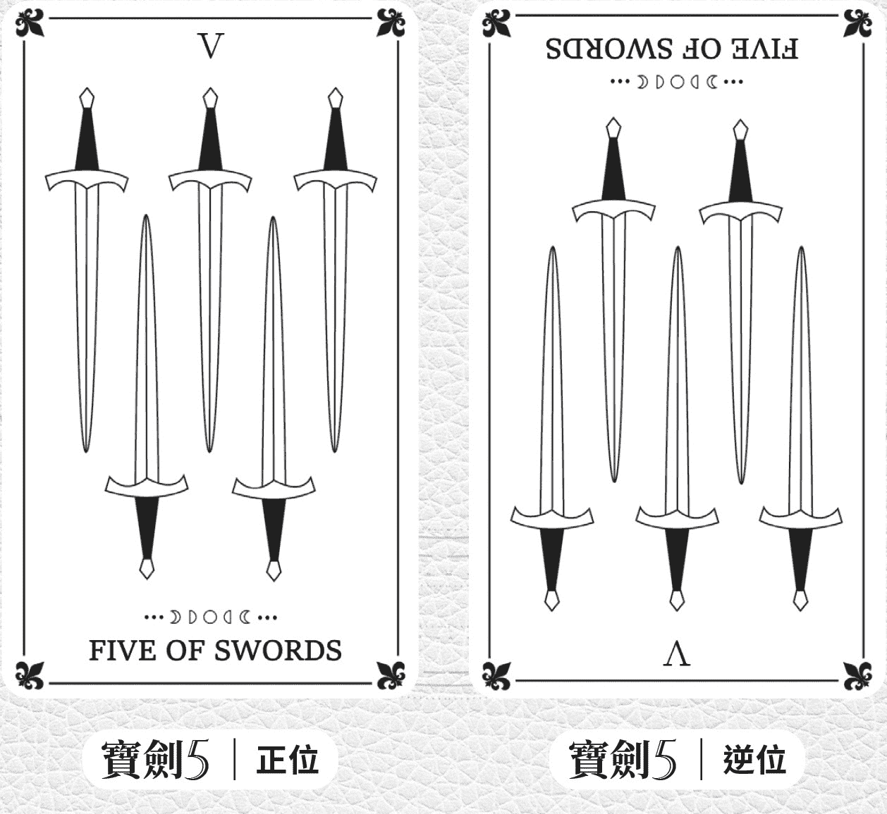

▪ 概义 ▪

正位：损人不利己、不择手段、争执、敌意。

逆位：没有方法、不知道该怎么做、失败、受害、无谓争执。

▪ 解析 ▪

云很像闪电，很强烈、风很大，意思是用强烈的方式得到的成果，有两个人是痛苦悲伤的，只有一个人在笑，无所不用其极地去攻击对方得到利益，或是尔虞我诈，争夺得来的，或是欺压别人得来的东西。类似损人不利己，不择手段得到的利益。

手上拿着很多只剑，代表贪心，因为贪心才会尔虞我诈。

在职场、感情上，都可能遇到这种状况，因为工作的关系，被同业、同事，因为某些原因，掠夺你的资源，通常业务在抢工作就会这样子。

有些人失业、失恋或被倒帐，身体都会不好。因为受欺压的关系成为受害者，以致健康出问题。例如，十年前被人家倒了一笔钱，从此之后身体不好，或几年前因感情因素，受到伤害，从此之后不信任感情，然后间接影响身体健康。

✧ 解牌心语 ✧

问工作，可能被陷害，或是陷害别人，要看对方的感觉，或是他问的问题。某些程度上，跟同事合作的时候，要防止被人家陷害。

问工作，你就是被欺负呀，人家老是丢工作给你，你就一直接一直接，但是开心和失落都是现象，反映出我们生活中一定会发生的事情。

在感情上，有可能是受害者，也可能是既得利益者。为了感情，不择手段去得到他。

问健康，针对某一件事情，搁在心里面生闷气，被欺骗钱或感情，让他身体不适，因为太执着、在意这种事情了，请他去看医生。

关系关键字：尔虞我诈、背叛、维护自己的利益、欺骗。

宝剑 6

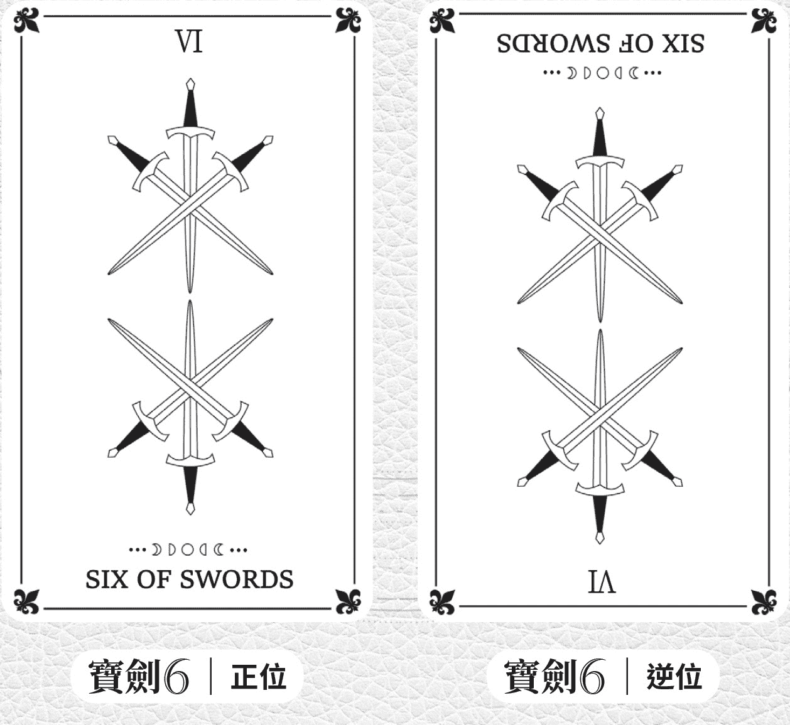

▪ 概义 ▪

正位：缓慢前进、转换远离危险、过度。

逆位：困境、进退两难、恐惧、计划更改。

▪ 解析 ▪

小心翼翼，进退两难或缓慢前进。

进退两难是说，陷在这个湖里面，这个波纹也没有很长，没有什么风向，有点“随波逐流”的意思，缓慢离开或前进的意思，表示他还有一点能力可以慢慢划开。

还有一个风险是，剑如果硬生生被拔起来，就沉船了！

三个人物都不是正面，代表不愿面对，或是远离危险状态。

✧ 解牌心语 ✧

代表不愿面对或远离危险状态，慢慢的转换现状，速度不快，是缓慢进行的状态。

关系关键字：

失落、离开、寻求平静、以安静（不争吵）的方式转换关系状态。

宝剑 7

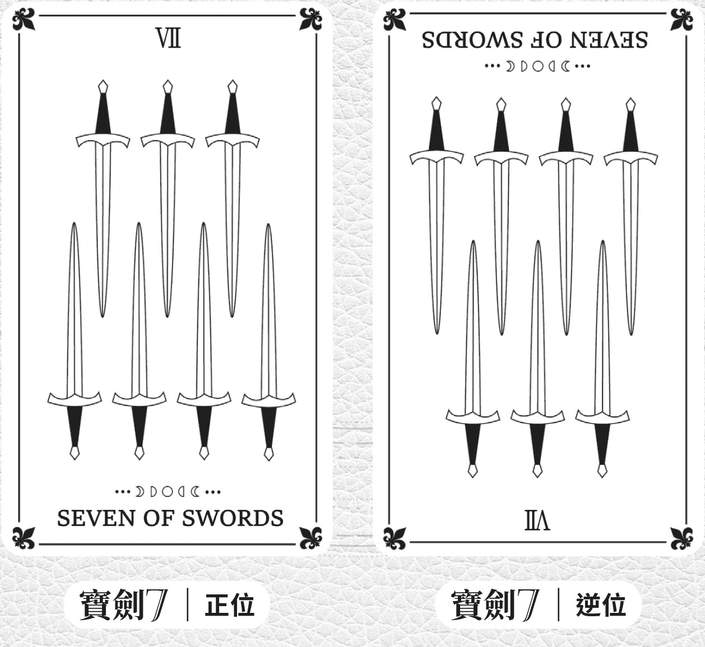

▪ 概义 ▪

正位：不要放弃、窃取想法、准备、组织、重获自由。

逆位：失败、失去自由、没有计划、毁谤、胡言。

▪ 解析 ▪

不要放弃，这个人是个士兵，被抓到敌方阵营当俘虏，可是他想办法要离开，成功了，还把敌方的剑拿走，要赶快逃命，因为这里是敌方阵营，偷偷摸摸。

诡异的象征，代表不要放弃，想尽办法，用小聪明，用方法去达到他的目标，也代表准备，重获自由，或窃取一些想法和概念。

✧ 解牌心语 ✧

问健康，可能健康出状况，可是没有那么严重，不要放弃，代表意念会想放弃，因为身体不舒服，不想检查、治疗了。

关系关键字：投机取巧、不忠诚、谎言、小聪明。

宝剑 8

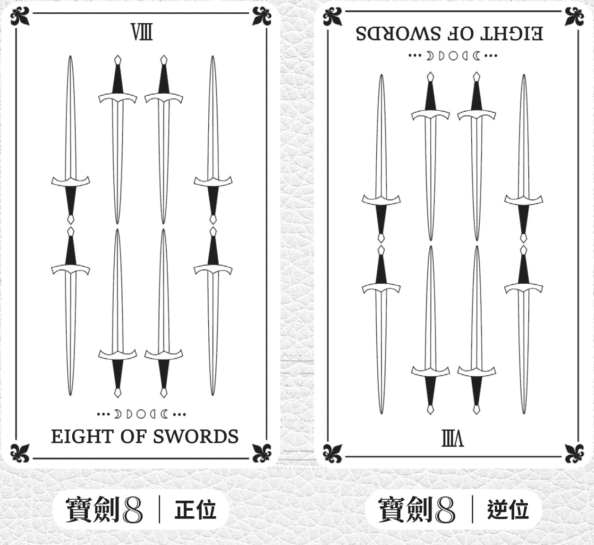

▪ 概义 ▪

正位：自己绑住自己、故步自封、束缚、无法看见。

逆位：渐渐自由、解脱、离开。

▪ 解析 ▪

束缚、被约束、不愿面对、看见，自己绑住自己，故步自封，无法看见。这张牌很特别的是，他的脚没有被绑住，还是可以走出来的，自己绑住自己的例子很多，被工作、感情绑住，都在这张牌作显现。

后面的城堡代表集体意识，例如家庭、国家或是整个氛围，让他感觉到是被束缚的，被集体意识的氛围束缚了。

地上的水没有流动，干枯。水代表情绪，时间一到水会满出来，他会因为情绪的关系，不想行动，不想往前走，现在是可以做些什么改变的，而不是单纯的被动，或是单纯的不去行动，这张牌是自己局限自己。

旁边的宝剑是代表界线或制约，自己因为内心因素把事情想难了，但本来事情就很多，也可以讲，两种状况都是成立的。

✧ 解牌心语 ✧

问健康，被健康问题困住了，还是先弄清楚才来烦恼，而不是现在就开始烦恼。

感情也一样，要先弄清楚状况，现在被困住了很难过，可是你要弄清楚，可以做些什么，让你自己不要被困在里面，你是可以做些什么改变的，不要被困住，工作也是，或是无法看见，代表无法看见死角，需要由别人去提醒他。

关系关键字：束缚、蒙蔽、困惑、忽视错误。

宝剑 9

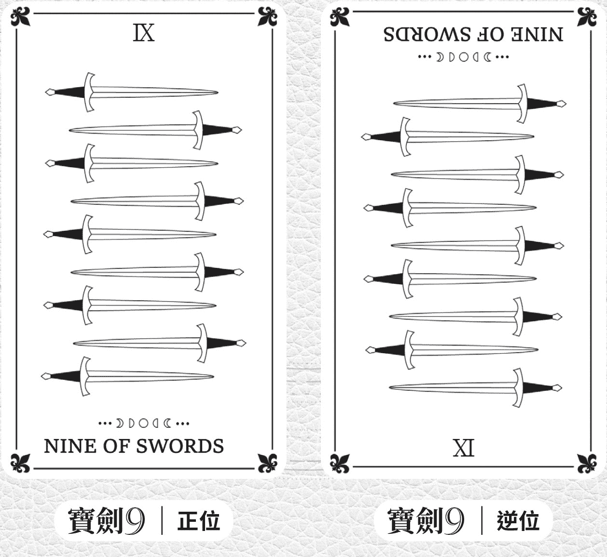

▪ 概义 ▪

正位：恐惧、睡眠问题、压力、内疚、恶梦、悔恨。

逆位：走出忧郁、反省、心理上阴影、面对、慢慢走出。

▪ 解析 ▪

睡眠问题、恐惧、压力、内疚、恶梦、悔恨、难过。

失眠、睡不好，心轮与喉轮、顶轮被卡住，有可能有心事，所以睡不着，话说不出来会睡不着，脑子思绪太多会睡不着，还有一个状况是，风水方位不好，也可能睡不着。

床的侧面有两个人在打架，代表斗争，脑筋一直在动，在打架，都会睡不着。

棉被上有很多月亮之类的符号，代表思绪、事情很多，也会睡不着，重重的压力，让你喘不过气来。

✧ 解牌心语 ✧

代表思绪或压力很多或是话讲不出来，有负面情绪，睡眠品质不佳。

关系关键字：恐惧、噩梦、焦虑、敏感、失眠、负面情绪。

宝剑 10

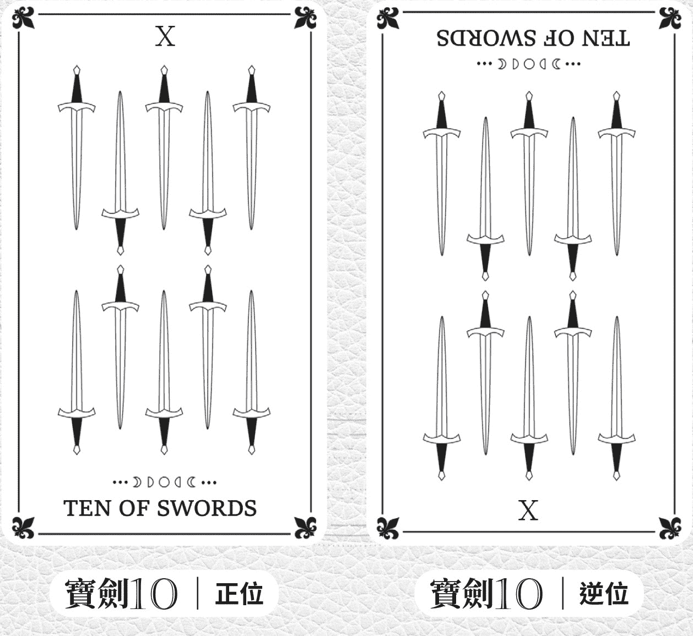

▪ 概义 ▪

正位：痛苦、结束、惨痛、失败、庞大的压力、无法爬起。

逆位：痛苦结束、慢慢好转、难过、无法放下。

▪ 解析 ▪

权力的消失，事件的结束，跟死神有点类似。

不一样的是，这张牌着重的是，权力或能力的消失，或代表痛苦，结束、惨痛，这个事情最痛苦就是这样了，失去原本的权力，财产，比如说，离婚，可能就会失去原本的权力跟义务。

权力怎么看？注意看他的手，这个手势在教皇牌面有出现。教皇代表权力，所以这里的手是失去权力，失去一些东西，无法翻身，有可能是事件的死亡、失败，或是资源的丧失，还有很大的压力。

每个脉轮都被剑插着，还有流血，代表很严重、无法翻身，已经没有转圜的余地了！

✧ 解牌心语 ✧

抽到这张牌可以说只是“现象”，抽到这张牌可能是权力已经丧失了，你再争取或努力，可能比较没有用。

这张牌的意思是外面的水是平静的，代表地球依然在走，不会因为你丧失权力、失败了，地球就停止转动，你还是有机会可以东山再起，这个事件就结束了，不要再留恋了，最坏就是这样了！

关系关键字：绝望、痛苦、谷底、重新来过。

宝剑侍者

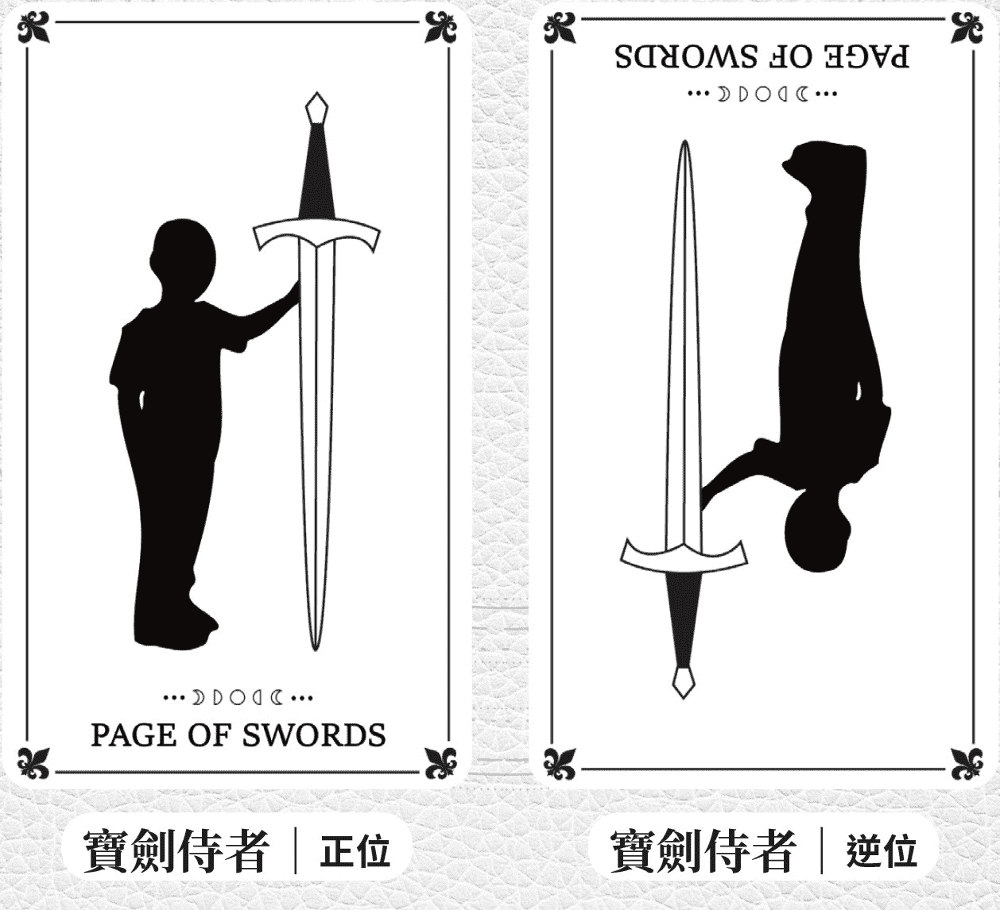

▪ 概义 ▪

正位：分析、信息管理、防御、正义、寻求真相。

逆位：无法保护自己、防御过重、拒绝沟通。

▪ 解析 ▪

风的元素，比较活泼，变来变去，会跑来跑去，后面云变化比较大，代表他看的世界跟我们看的世界不太一样。

后面有一堆小鸟，代表他需要很多朋友陪伴，比较好动型的状况，也代表比较正义，因为他朋友多，会想替朋友出头，也代表为朋友付出的决心。

拿着剑，也代表防御、保护自己。

背景蓝色是喉轮──爱讲话。另一个意思是，对他喜欢的事物，会做一些好奇研究、信息管理，假设有人喜欢积木，就会跟你分享他喜欢的东西。

✧ 解牌心语 ✧

问感情，就像花蝴蝶般飞来飞去很活泼，希望得到朋友的建议，也很希望交朋友。举例来说，有人说要交男朋友，问了半天，还不确定自己要不要，或是说要找工作，再问他找工作的情形，自己也不知道到底找工作好不好？一直问朋友意见，类似这种情况。

关系关键字：好奇心、信息、急功近利、非常规的关系。

宝剑骑士

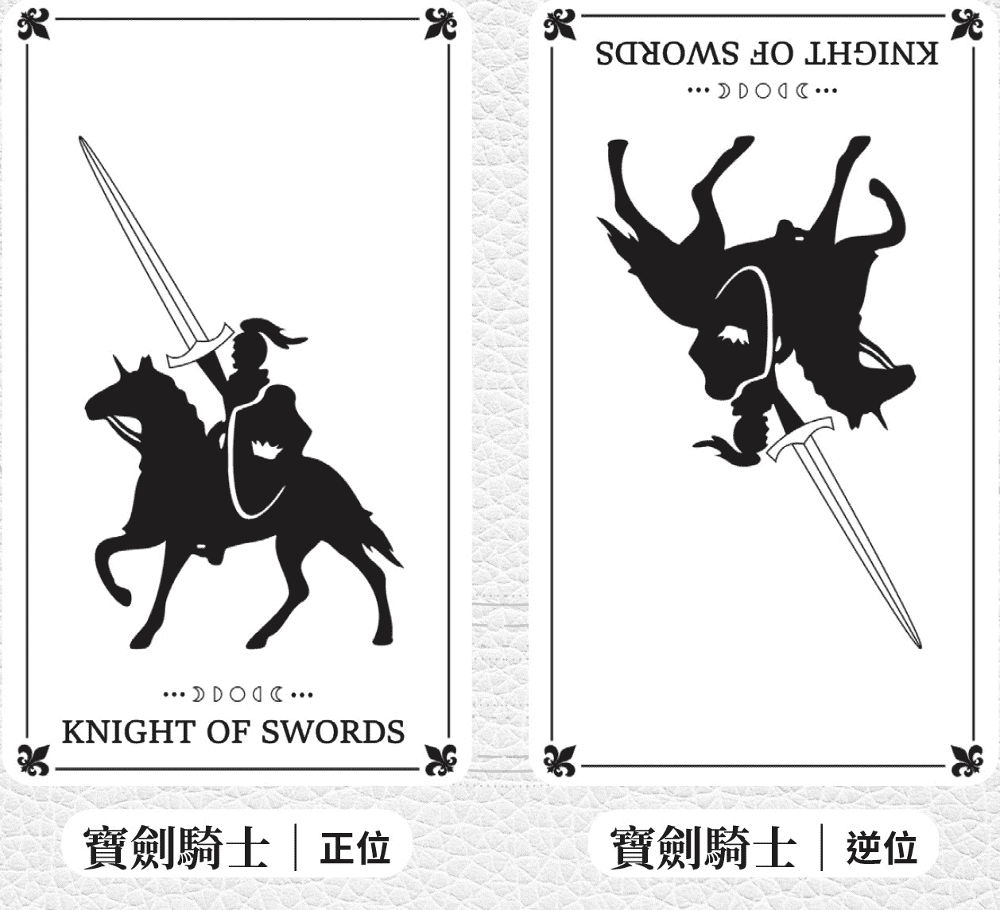

▪ 概义 ▪

正位：积极、不顾一切往前冲、勇敢、果决、没耐心。

逆位：失控、鲁莽行为、退却、后继无力、用错力气。

▪ 解析 ▪

积极，不顾一切往前冲！勇敢果决，没有耐心，代表冲动，很努力往前冲！

注意牌面上马的表情，好像有点吓到，不怕死，往前冲，不管了，有可能表示失去控制，比较没有计划。

骑士是青少年时期，大约在 14～20 岁，未成年，比较冲动的时期。云的形状是撕裂的，代表没有很平静。

右上角的小鸟代表自由、飞翔，想做什么就做什么，很冲动，马身上的饰品有蝴蝶图案，蝴蝶是象征经过蜕变的意思，他不是一开始就这么冲的，是因为很想要突破，从蛹变蝴蝶要突破，一直很想往前走，所以就很积极的去做这件事情，代表很积极的完成，可是看马的表情有点太过积极、太过头！

头盔上的小花表示天真，全身穿盔甲表示保护自己。

✧ 解牌心语 ✧

解牌的时候不会去看太多细节，就说，你太过头了，太积极了，需要作计划，不用太执着于马上得到成果，有时候是急不得的。

关系关键字：强势、失去耐性、急躁、突破、快速创建关系、直接。

宝剑皇后

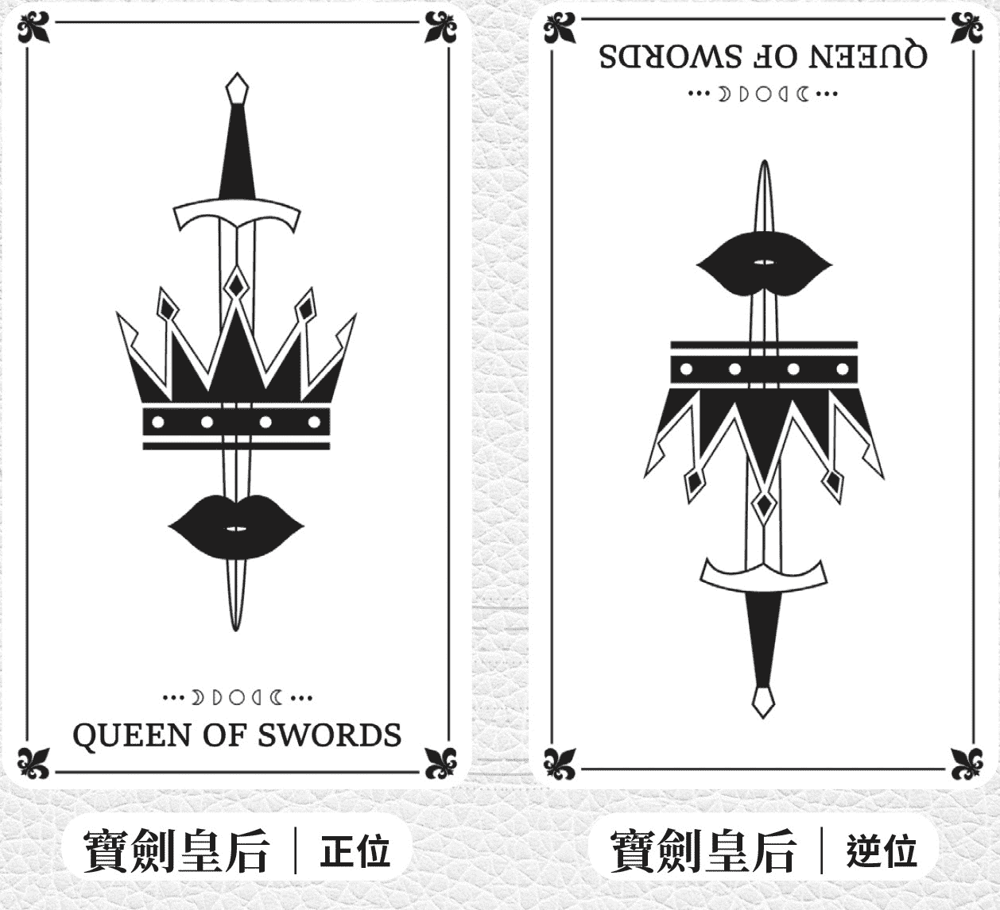

▪ 概义 ▪

正位：传送思想、决定、锋利、职业妇女、女性主管。

逆位：欺骗、怀恨、无法做决定、依赖、缺乏勇气。

▪ 解析 ▪

权力的感觉，比较像是职业妇女或是主管的位阶。

要做一些传达思想、信念，例如传达神是爱我的，或是反核。有一定的影响力，所以会做一些宣示的动作，或是宣达他的信念，也代表职业妇女或女性主管的意思，必须做出一些决定。

椅子侧面的装饰有蝴蝶、月亮、小朋友，意思是还是有需要接受变化的考验，兵来将挡，水来土掩。想法会比较长远，例如为了下一代，比较有长远计划，跟上张牌的宝剑骑士不一样。

宝剑骑士是冲的象征，而宝剑皇后是有计划的，他愿意承受压力，也经过蜕变，所以是蝴蝶，披风上有很多云，意思是必须承受很多变化，接很多变化球。像是主管就是要做这种事情，有事情发生就是要处理，比较独立。

上面有一只鸟，表示独立，用更高的角度看事情。

云在下面，表示跟人很近，在变化，有切身关系，要做决定，随时要接很多变化的状态，甚至是身兼数职在运作，因为职业妇女，是妈妈也是主管，蜡烛两头烧。

穿白色的衣服，表示用单纯的心去面对，想做好。

红色的脚突出，代表热忱、行动力也是重要的。

✧ 解牌心语 ✧

必须做出决定，承受很多变化的位阶，随时处于多变化、身兼数职的状态，以单纯心态面对，也必须具备行动力。

关系关键字：道德、追求完美、自我冲突、害怕自己处于弱势或屈服。

宝剑国王

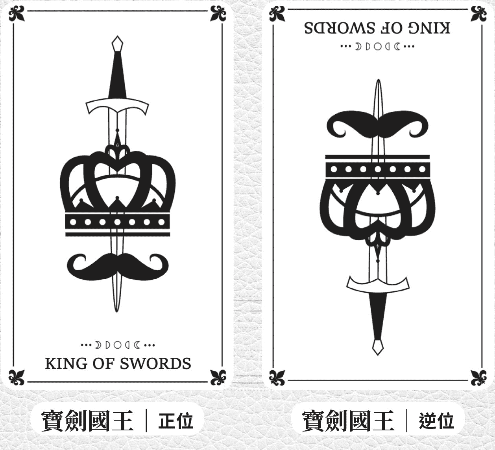

▪ 概义 ▪

正位：分析能力、既定思维、保护、防卫。

逆位：没有同情心、没有同情心、没有决心、无力感。

▪ 解析 ▪

剑是“保护”的感觉，不是进攻，防备心重，比较像是固有的模式。

活在自己思考的模式里面，所以表情比较僵硬、不开朗，做事情会想很多，思考，分析，比较没有信任自己的直觉，较为小心翼翼。

之前可能经历过一些撞击、事件，所以让他变得小心翼翼，可是他又握有权力，比如说，国王本身就是有些权力。小至家长也是权力，或是我有权力做这些事情，可是他又小心翼翼，没有办法完全开放。这也代表既定思维，旧有模式，没有办法变通，保护自己，有点固执。

这张牌是风的元素，因为之前经历过变化、无常历练，所以他会比较没有办法让自己放松。留意牌面上国王的表情，没有很开心、闷闷的，看起来战战兢兢。

国王背后的图案，有精灵、蝴蝶和月亮，表现过往的事件，包含感情或很多因素，因为他坐着，背后有这些图案，代表他的内在、潜意识里面，需要有一个人来帮助或辅佐他。

有两只鸟，代表他的伴侣讲的话可让他听进去，或是好朋友，只有某人讲的话他才听，不然他就活在旧有的模式里面，这个不明显看到。

树代表成长生长，树跟风的元素是有关系的，因为要显现风的感觉，要树来陪衬。

宝剑牌组比较像捉摸不定，还是会成长的，要从基础慢慢做起，而不是随波逐流。

✧ 解牌心语 ✧

这张牌面的意思是，通常来说，背景包含比较深的含意是潜意识，你潜意识的状态是稳定的，例如，他那么没有安全感，其实是希望得到稳定，而且有水，代表还是有温柔的那一面。

关系关键字：严肃、距离感、疏离。

圣杯──被水波动的多情者

圣杯在四要素中象征水，代表感情层面的特质，有着丰富的情感，愿意为爱人付出。

圣杯 1

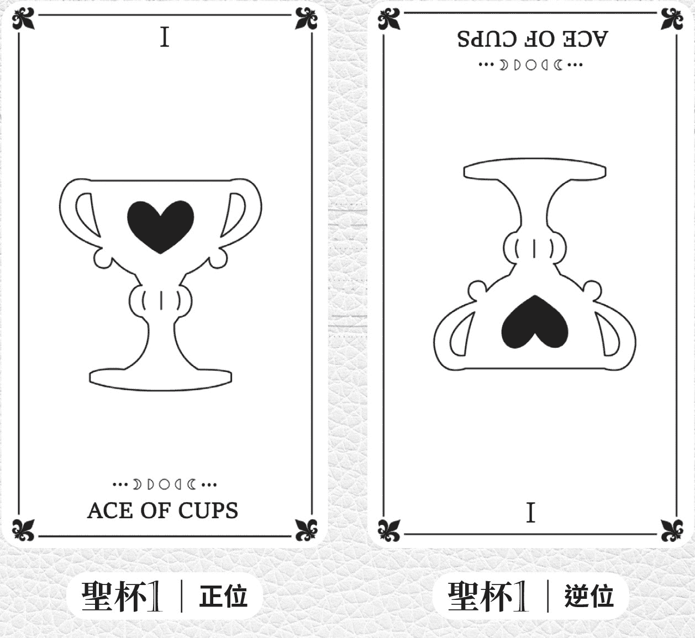

▪ 概义 ▪

正位：掌握情绪、细心呵护、直觉打开感受性强、感情的开端。

逆位：感情失落、分离、情绪失控、无法感受。

▪ 解析 ▪

代表情绪，掌控情绪。

手代表掌控，鸽子往下降，代表新的思考、思绪或是新的灵感。

水是从云里面展现出来的，他也代表是会变化的，情绪是会变化的，或是新的点子与想法，四散的水滴也会影响，代表氛围，下面的浮萍浮在水面上，代表成长。

有些情绪与经验会让我们成长，或代表新事情、新看法，新的情绪，或是直觉，接受新的讯息、新的想法。

字母“M”代表接收接纳，是一个象征符号。水从圣杯中满溢出来，往下流动，代表掌控情绪。

鸽子咬的是钱币，代表新视野、新看法、想法、灵感、念头，突然想吃什么东西，突然想见谁，跟谁互动，也代表新的事情的发生。比如说，恋爱的开始，有时候发生新的事情会挑动你的情绪，比如说新的恋情、工作、旅程，期待某些事情的发生，都有可能会影响到你对这个事情的看法。

✧ 解牌心语 ✧

解圣杯 1，可以用生命灵数 1 的感觉加上水的感觉，再搭配对方给你的感觉。

我们有可能因为过去的印记而影响到新的看法，举例来说小时候被狗咬，那种类型的狗，你就会开始有印记，这个意思是你已经忘记那个印记，抚平这个情绪，会重新开始，印记慢慢消失，已经不怕了，新的开始来面对目前的状况或困难。

关系关键字：灵魂伴侣、新恋情或恋情来到新的阶段、心灵满足。

圣杯 2

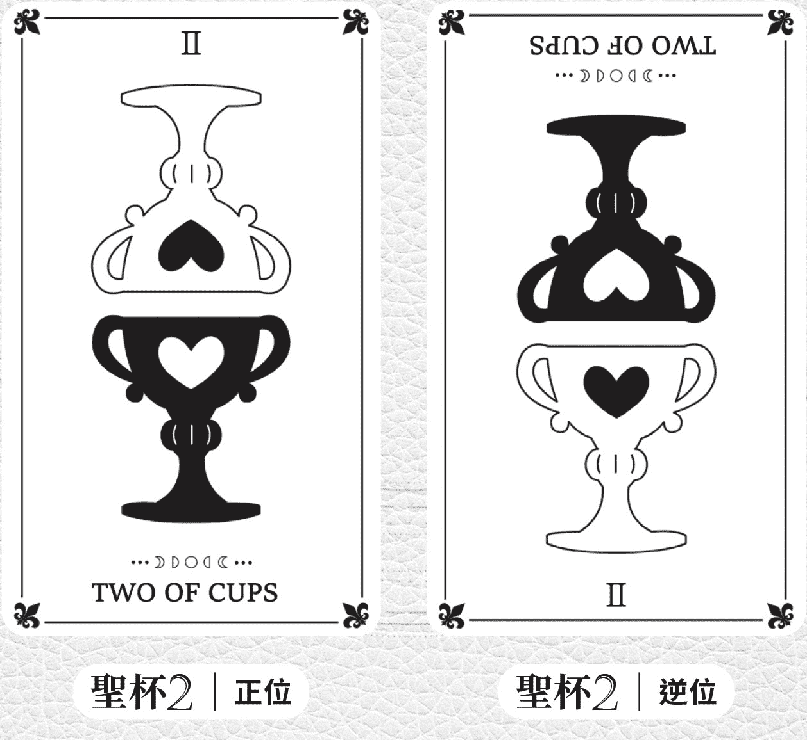

▪ 概义 ▪

正位：情绪交流、互相欣赏、和谐、对等、沟通良好。

逆位：无法沟通、不了解、执着、互相猜忌。

▪ 解析 ▪

小恋人牌，情绪的交流、分享，互动的亲密关系。比较熟悉了，暧昧关系，或互相了解，男生有想去碰女生的手，有点腼腆的感觉。

这张牌还有一个是说──互动，创建一个互动的关系，可以跟朋友互动，创建人际关系，代表好朋友、熟识朋友，有同理心。

蛇和狮子有一种兽性的感觉，也代表隐讳的企图，或不一样的想法。那个想法不会显现在他互动的关系中，可能是内在里面有其他想法，也可说是一种祝福，通常男生跟女生交流是有隐讳的企图。

小房子代表和家庭、家族，都有关系，就是你会跟人家互动，跟家庭关系是有关连的，例如，你个性比较开朗，愿意跟人家互动的，有时候家里面会比较保守，不让自己的孩子跟异性互动，也代表和谐，整个画的气氛是很轻松的。

女生的红鞋代表热忱，虽然有热忱，但女生脚没有动，女生是被动性的，男生是行动、主动。

女生身上蓝色的衣服，代表行动、沟通，而且白色代表纯洁，跟恋人牌很像，但恋人牌是没有穿衣服，坦诚相对。可是这张牌还要注意形象，女生有点矜持，被动，在当时的时代女生都是这样的。

男生身上的蝴蝶代表蜕变，代表带着勇气蜕变，男生跟女生交流也是需要勇气，怕被拒绝。

✧ 解牌心语 ✧

男生问感情，就建议他要主动一点，对方对你印象也很好，暧昧关系。在感情的话，需要跟异性作情感上交流，心灵的敞开。

问金钱，你对金钱没有很喜爱，只是觉得不错，没有很渴切的企图心。

关系关键字：互相吸引、沟通交流、支持、好的伴侣。

圣杯 3

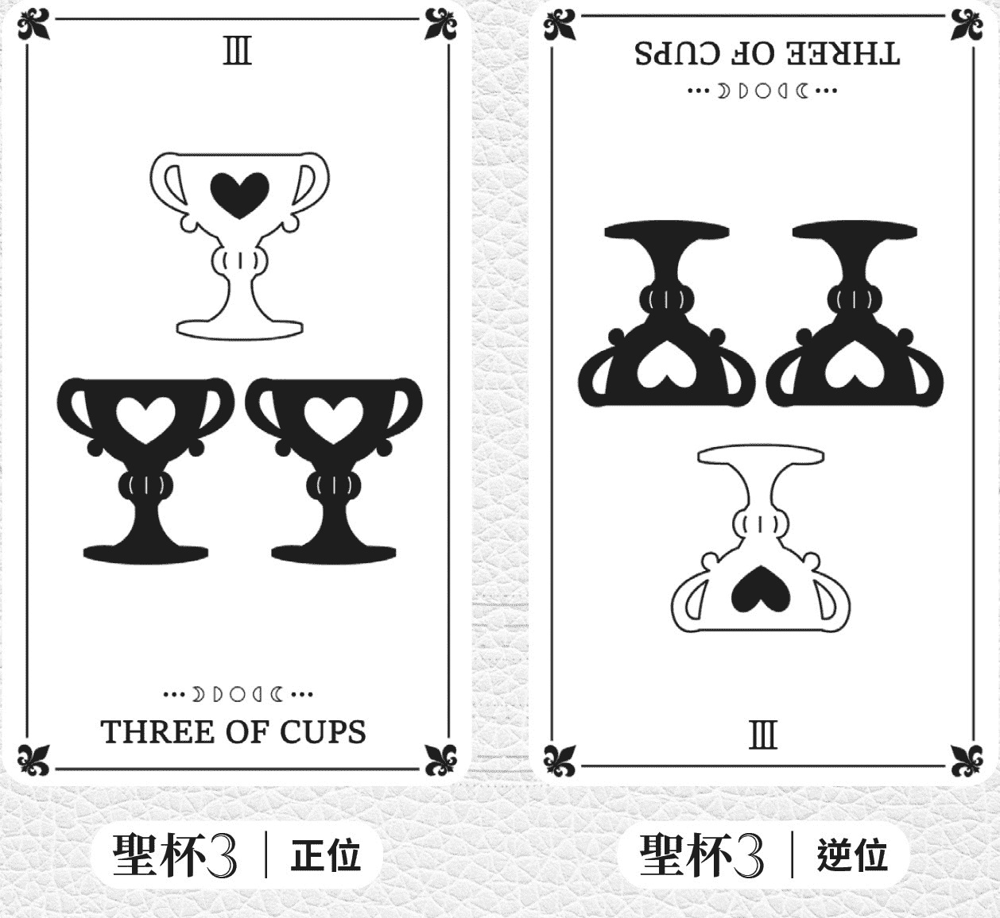

▪ 概义 ▪

正位：庆祝、欢乐、享受、开心、值得、狂欢、丰收。

逆位：扫兴、不开心、情绪失控、互相责怪。

▪ 解析 ▪

庆祝、欢乐、分享，开心，一种欢乐的氛围，一起去玩、聊天、唱歌，一种开心的状况。

地上是熟透的南瓜，代表时机成熟。

最右边女生，手上拿着葡萄，有水果，代表我们在做事情的时候，不会无缘无故庆祝，总会有些值得庆祝的事情。

✧ 解牌心语 ✧

时机成熟才有办法庆祝，因缘聚合，也代表富足、丰富、友情的意思。

关系关键字：庆祝、兴奋、欢乐的时光、聚会。

圣杯 4

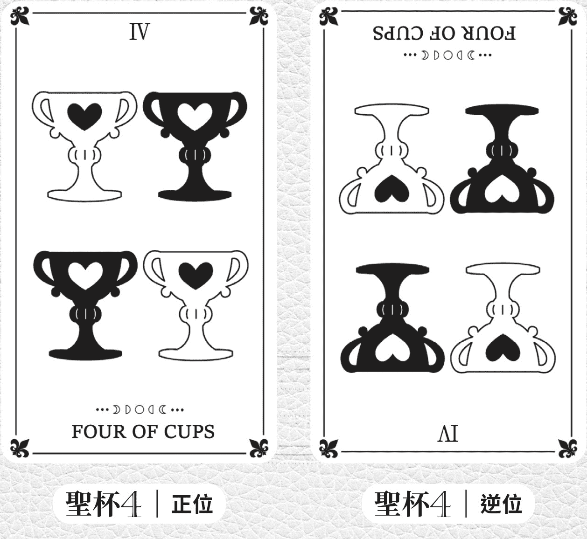

▪ 概义 ▪

正位：情感上感到无趣、无法接收新事物、独处时光、消极。

逆位：行动、不满足即将结束、接受新的事物、合作。

▪ 解析 ▪

处于舒适圈，不想接受其他信息，他有新的想法。

注意看牌面整个氛围，双手插在胸前，不想接受新的想法，拒绝接受他人的建议、想法，活在自己的世界当中，自以为自己不错，有一定的能力，自我感觉良好，所以无法接收别人的建议和看法，自己有一套理论。

后面有一颗树，树代表支持与成长，他靠着那颗树，代表他靠着自己的一套理论在生活，认为自己就会了，不愿意接收新的事物，但其实理论不是只有一种，有好几万种。

云里出现的手，代表新的想法、看法、信息，他都不要，某种程度上，代表满足于现况。

前面的三个圣杯，代表原本可以用却没有用到，原本有机会学却没有学习，摆在那里，没有用没有学，无法看见自己真正想要什么，活在自己的世界里面，用自己的想法去影响别人，一副觉得自己很厉害的样子。

黄色的云代表自信，如果你跟一个人讲新的事物，对方不愿意接受时，可能是对方没有自信。

白色代表纯洁，代表他不够纯洁，他想很多，有时候你好心跟他讲，他会误会你在计较或在损他。

✧ 解牌心语 ✧

活在自己的世界里，容易自我感觉良好，也可能是没有自信，想法很多，有资源却没善用学习。

建议个案用单纯的心，去学习一件事情是比较容易的，可是你想太多就无法学习新的事情。

关系关键字：思考、冷漠、封闭自我、提不起劲。

圣杯 5

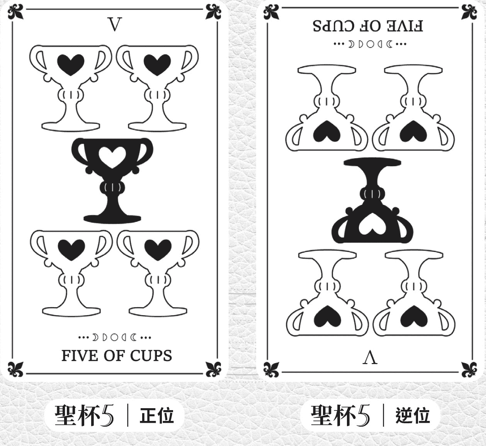

▪ 概义 ▪

正位：注意悲伤失落、其实还是有资源、悲观思想、单独。

逆位：陷入无法自拔的情绪、放大恐惧、孤单、失去支持。

▪ 解析 ▪

往往在面对一件负面事情的时候，都会以为我们失去很多，这张牌整个氛围好像很孤单、很悲伤。

后面有两个圣杯是站着，前面是躺着的，他都一直放大困难、失落、痛苦，可是他都忘记背后还有支持或是爱护他的人。举例来说，有人失去工作，就否认自我价值，或忘记还有别人在支持他。有些人失恋就像是世界末日，忘记还有友情和亲情在支持他，忽略支持他的人，却把自己的悲伤和痛苦放大。

双脚站着，代表呆呆站在那边，有行动力，可是不去做。

水代表情绪，你很悲伤，可是外面的世界还是一样在运转，并没有因为你的悲伤而停滞，水还是一样的流动，背景的桥与房子还是一样矗立着，你再悲观难过，外面的日子还是一样要过，不会因为你很悲伤、失恋了，水就不流了，地球还是在转动，太阳还是从东边出来。

倒下圣杯旁边的红色和绿色，代表心轮和海底轮，失去物质和信心，都可以显现出来。

✧ 解牌心语 ✧

解释时可以劝个案，发生悲伤情境，还是有很多人支持他，可往正向的方向去看，不要一直往负面的方向看，可以想想你的家人或朋友。

问工作，可以想想你的女朋友或家人的支持，看他问什么问题，让他联想身边支持的力量。举例来说，有些人考公职屡次落榜，就失去信心，可是实际上还是有人支持他。有些人不慎遗失一笔钜款，就丧失信心，可是实际上他还是有资源的，遇到困难去解决，让自己有不一样的看法和视野。因为悲观过度的话，会罹患忧郁症。

关系关键字：失望、害怕、悲伤、抗拒。

圣杯 6

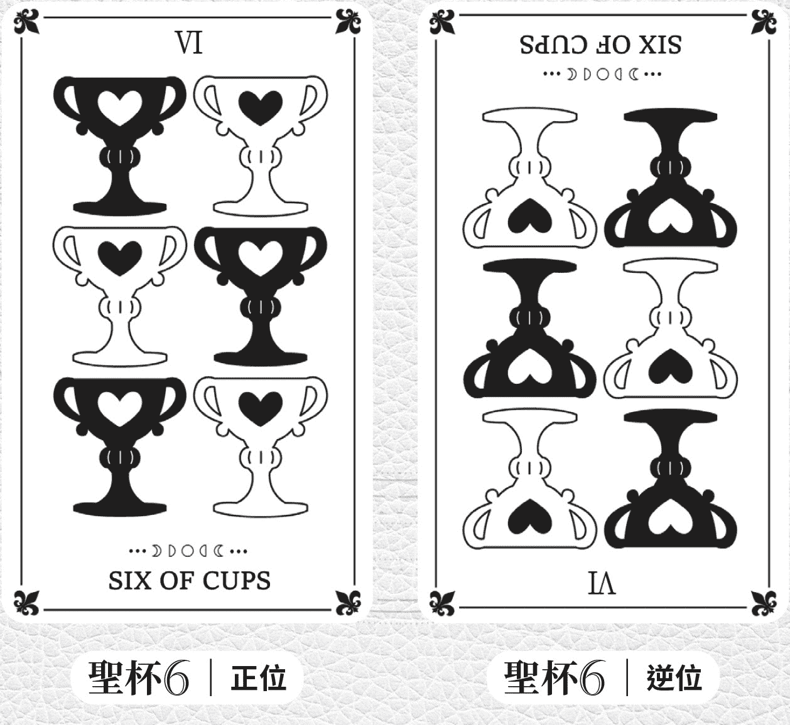

▪ 概义 ▪

正位：玩伴、单纯、分享、重温旧梦、馈赠、无私、天真。

逆位：忽略、遗弃、沉溺于过去、有条件的、隐讳的企图。

▪ 解析 ▪

无私的爱、单纯、玩伴、重温旧梦、馈赠、无私、天真，这个感觉好像是姊姊对妹妹的付出，是没有要求回报的。

花是代表天真，圣杯里面充满了花。

旁边是房子，房子给人的感觉是温馨的避风港，有安全的感觉，旁边有阶梯，代表由上而下的给予，姊姐给妹妹，爸爸给儿子之类的无私分享、无私的爱，单纯的心，单纯的爱。回归单纯的心，或是青梅竹马、儿时玩伴，都是牌意。

阶梯旁边的灰色盾牌，上面有个叉叉图案，代表不需要去拒绝别人，不要拒绝别人。

左边的守卫代表保护，他们是受到保护的，表现无私的爱，你会受到保护的，你若内心良善，必然是受到支持、保护的。

✧ 解牌心语 ✧

象征无私的爱，前提是你必须是善良的，将会在无形当中受到保护和青睐。

问事业，可以做一些宣传，是不要求回报的，例如可赠送样品让人家先试用，对你有帮助。

问健康，就是手腕和膝盖会酸。

关系关键字：依靠、温暖、依赖、回忆、保护。

圣杯 7

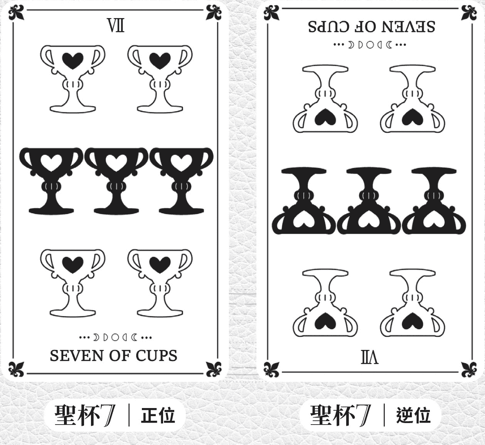

▪ 概义 ▪

正位：幻象、梦境、白日梦、想像太多、不切实际。

逆位：放空、没有思绪、欲望减轻、面对自己。

▪ 解析 ▪

梦幻象征、会想很多却都没做，包含黑暗面跟积极面的很多面向。

为什么是黑暗面，注意看人是黑的，往后看则是背影，隐讳的企图，内在黑暗的想法。

圣杯里的东西都是原型，会面对各种不同的状况，每个都想要，可是都找不到或拿不到，圣杯在云的上面，也代表完全的活在自我的思想里面。

因为云随时在变化，看得到吃不到，幻象、白日梦、想像太多、不切实际。

✧ 解牌心语 ✧

这张牌要表达的意思是说，想要很多东西，可是都是想想而已，没有实际执行，或是想用比较邪恶的方式来做，并没有很脚踏实地去做。

关系关键字：不切实际、白日梦、选择性、逃避现实、幻想。

圣杯 8

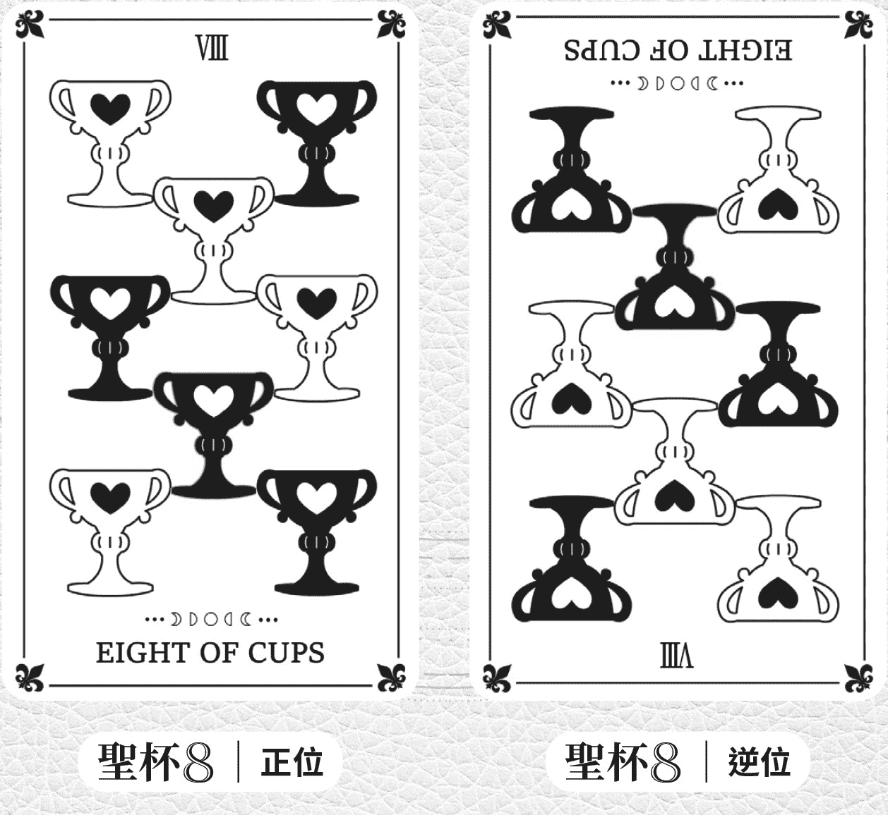

▪ 概义 ▪

正位：放下眷恋，勇敢前行、单独但不孤单、寻找自己想要的、放弃物质快乐追求心灵。

逆位：不愿意突破、留恋其中、处于现状。

▪ 解析 ▪

放下一切，独自踏上旅程，走自己的路。今天我们有做一些事情、抉择，可能我们需要自己做一些决定，放下一切旧有模式，走自己的路，它不是毁坏，跟死神不一样，他是放弃旧有思考、财产，就是想要走自己的路，没有对错，只是一个现象。

月亮代表阴晴圆缺，他必须接受很多考验，所以月亮的表情跟整个感觉，画出来的有半弦月跟圆月，代表可能会经历过一些事情。

牌面有一条河，类似河或海边的状况，是弯曲的，也就是说他的路不是顺利的，河里有很多岩石，可是你必须要坚持支持自己。

这张牌跟隐者有点像，代表走自己的路，必须抛弃旧有实质上的东西，比如说抛弃现金、时间，抛弃你之前的模式之类的，跟隐者最大的差别是，他必须抛去原本的东西，隐者是只有往内看而已，倾听内在的声音，而这张牌是说你已经知道内在有一个渴望的声音，自己想要走跟别人不同的路，这条路是自己决定要走的，跟别人一点关系都没有，别人无法影响他。远离目前的舒适区，远离目前的状态，还要去行动，是真的要走出去。

一个圣杯代表一个情绪，可以说是有很多情绪来攻击、撞击你。

✧ 解牌心语 ✧

当你要做自己，走自己路的时候，是不会顺利的，会有很多攻击、意见。

如果他问，坚持下去会不会有结果？那你要反问他，这真的是你要的吗？如果是你要的就是好的，做你自己想要的，既然都做了，就好好加油，有些人是需要他人鼓舞来做决定。

有人失业抽到这张牌，可以反问他想做什么？因为这张牌代表做自己的事情，如果真的他本身想退休，那就退休。

问感情，你们有没有共同的信念来走、一起做决定？还是各自想法不同呢？

如果一对男女朋友谈恋爱，各自在心里有各自的想法，迟早会引爆争执的导火线。

这张牌刚好是说，原来谈恋爱的情侣，男生想要拥有自我空间，女生想要的则是在一起的生活方式，想法会不一样。如果双方可以讲开来，不见得会分开，可是会有不同的生活，可能需要暂时抽离，暂时离开，这有很多可能性，还有可能是学习，暂时跑到哪边学东西，一起与各自独立想法，都只是现象。

关系关键字：放下原本拥有的、寻找、追寻、内心的落空感。

圣杯 9

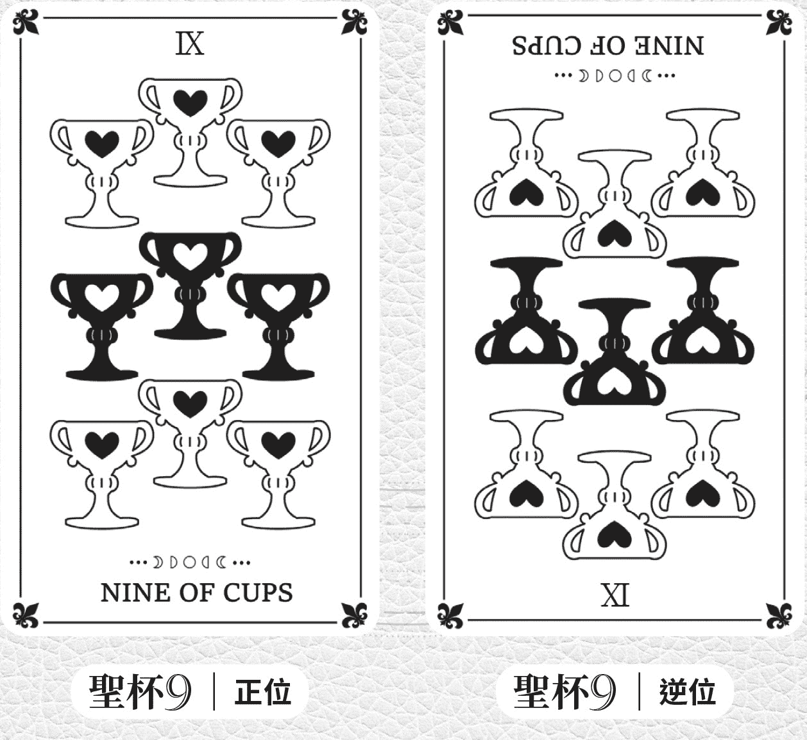

▪ 概义 ▪

正位：美梦成真、富足、开心、自负、享乐、享受。

逆位：无法享受、过度自负、享乐过头、离梦想很远。

▪ 解析 ▪

成功的商人，会有很多的资源，富足、开心、享受、享乐的感觉，他有很大的自信来自于他有很多的财产，是富裕的，是经过经营而来的。

感情上也是一种富足的状态，代表他们很甜蜜。

双手叉在胸前，代表富裕、自信的展现，他也不太接受别人的想法，我就是有钱，志得意满，他行动力还好，已经有经验了。

圣杯下的蓝色布幕，他成功的背后是什么？就是在布幕底下，你可以无限想像，成功的背后是盖住的，不会让人家知道，有可能是一种陷阱，背后有做些什么不为人知的秘密，有隐讳企图或黑暗面。

穿的衣服是白色横条，表现他思绪还是很多，不是纯白色的，愚者的里面那件是白色。

✧ 解牌心语 ✧

这张牌以富足为主，心灵、感情、工作、亲情的富足，都可以解释。

他是经过经营的，比如说，他的钱、感情、事业、健康是经过经营而得来的资产，丰富的资源。

问健康，小心糖尿病，胆固醇，吃太好，小心便秘。

关系关键字：享受、富足、美梦成真、满足。

圣杯 10

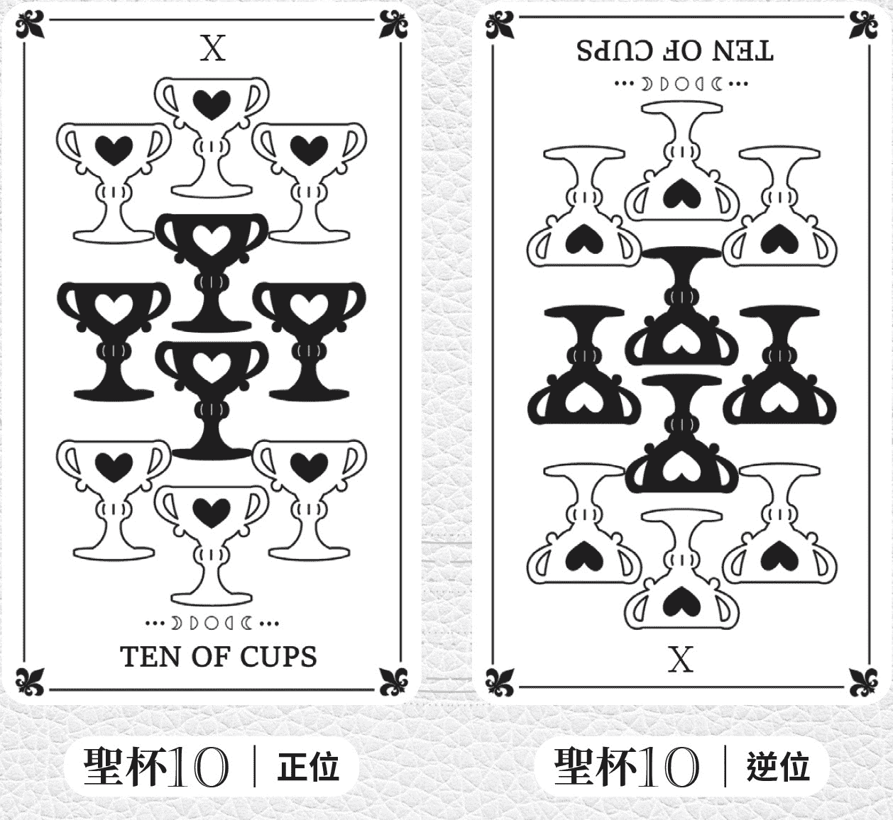

▪ 概义 ▪

正位：和解、家人支持、互相合作、背后支持、欢乐、喜悦。

逆位：不合、家变、翻脸、不体谅、不支持、不理会。

▪ 解析 ▪

家人的支持、互动、和解、合作、欢乐、喜悦，就是跟家人或是跟家族有链接，和稳定有链接。

和家有链接，就是父母亲的支持，也可以解释为朋友的支持，因为有些朋友跟家人一样，代表家族和谐，和家族链接较有关系。

✧ 解牌心语 ✧

问学业，家族很支持你，你可以寻求家人的协助。

问感情，家人很支持你谈感情，或是以结婚为前提，家人是希望你赶快结婚的。

或是在遇到其他问题的时候，有时候家人会支持。

关系关键字：家庭和谐、幸福、创建承诺、携手前进。

圣杯侍者

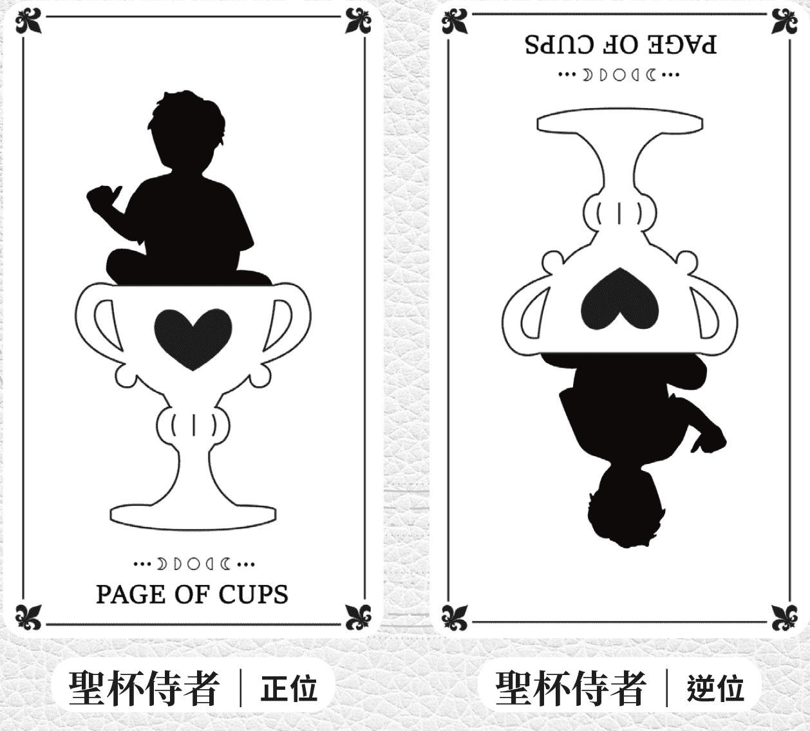

▪ 概义 ▪

正位：专注自己想要的、单纯、天真、心灵沟通。

逆位：无法专注、情绪干扰、烦、乱、三分钟热度。

▪ 解析 ▪

好像跟鱼在对话，有些小朋友跟动物、植物、物品会有链接。

小朋友代表天真单纯的心态，会去跟其他事做链接，代表专注自己想要的。比如我想要做什么事情，会找出很多方法来做，会控制自己的情绪，让自己处于一个平衡的状态。例如有些小朋友可能脾气比较暴躁，遇到动物就会使他温和，这张牌就是类似这样的状况，让他情绪温和的状态。

圣杯侍者又代表单纯，跟心灵沟通，上面的牌是动物，也可以指人跟人之间心灵沟通。

水代表情绪，后面的水代表还是有点情绪，有时候你跟动物，或是所讨论的东西有交流的时候，还是有这些情绪。

这张牌代表跟非人类有交流，通常是动物，因为牌面上有一只鱼，所以可用这个比喻，水代表情绪，也是会被拨动的，假设把那只鱼放回去，他可能心情也会受影响。

✧ 解牌心语 ✧

问健康，注意手和眼睛。

问财富，你要专注于物质界的东西，专注于跟你喜爱的东西，比如说，你喜欢汽车，就可买车，喜欢黄金，就去买黄金，你喜欢股票，可以买卖股票，做你想做的事情，然后跟这件事互动，然后去从事那份工作。

关系关键字：灵性、灵感、敏感、互动、浪漫、脆弱。

圣杯骑士

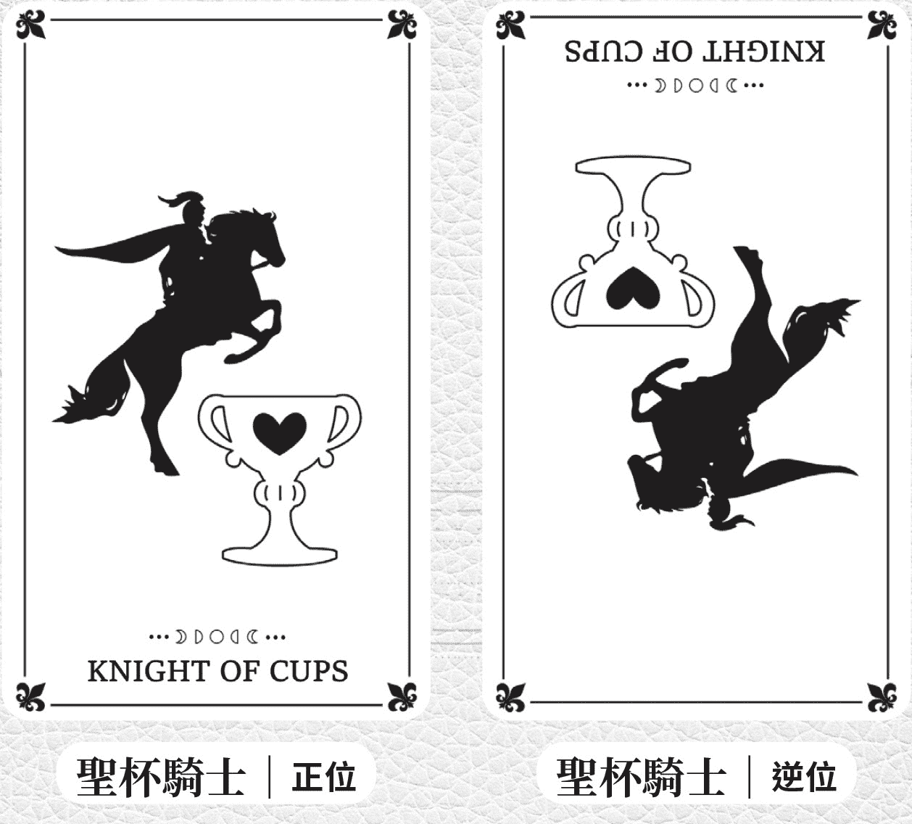

▪ 概义 ▪

正位：稳定前进、梦想家、想法、变化。

逆位：资源不足、情绪失控、花心、不专一。

▪ 解析 ▪

梦想家，稳定前进。

圣杯代表水，水代表情绪，稳定地往前走，牌面上的马也是稳定的往前走，不是用跑的。

看之前的权杖骑士牌是有逃的感觉，然后宝剑骑士牌是冲的，这张圣杯骑士是稳定前进的感觉，也代表在某些程度上，他是自由的，可以用更高的角度看事情。

自由的意思是说，他有希望想做的事情，他用自我节奏稳定的做，他比较慢一点，他很有天马行空的想法，因为他的盔甲上有两个翅膀，他是会谨慎地往前走。

身上有红色的鱼，代表热忱，自由。

✧ 解牌心语 ✧

马代表稳定前进，骑士的脚也有翅膀，只要抓对节奏，照自我的速度稳定前进，但不一定是慢的，可是有自我的速度在，有一种说法，快就是慢，慢就是快，稳扎稳打。

关系关键字：稳扎稳打、稳定、温柔、梦幻。

圣杯皇后

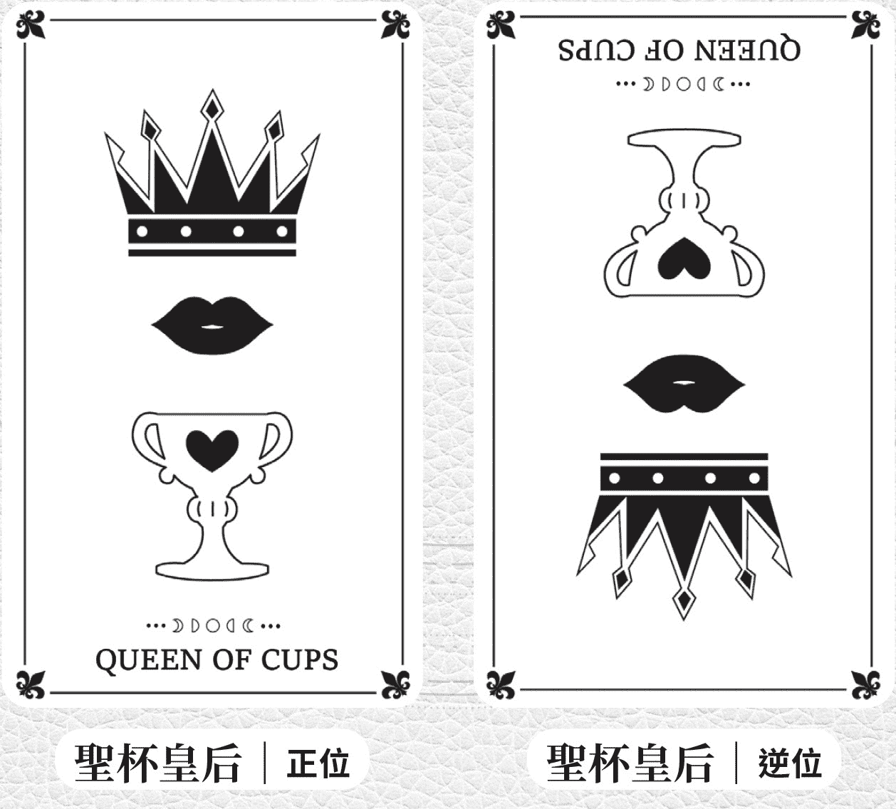

▪ 概义 ▪

正位：梦想家、同理心、专注心灵（信念）、包容、温柔。

逆位：情绪导向、没有生活重心、无法专心。

▪ 解析 ▪

圣杯，这个部分是代表信念、想法，或是精神、心灵方面。

圣杯很特别，两个天使，上面有个小小的十字架，感觉像教堂，他也代表精神，比如说，我专注于精神层面、内在寻求的真理，他有非常大的责任，想要去帮助别人或小朋友。后面椅子上有小朋友，他是很爱护小孩子的。

皇冠很重，他控制自己的欲望，专注于心灵层面的发展，想要帮助幼小的孩童，只专注于前面的东西。

✧ 解牌心语 ✧

他觉得自己有责任要去帮助很多孤儿、小朋友，所以他给自己很大的压力，专注心灵层面的发展。

关系关键字：敏感、精神追求、善良、温婉、平衡。

圣杯国王

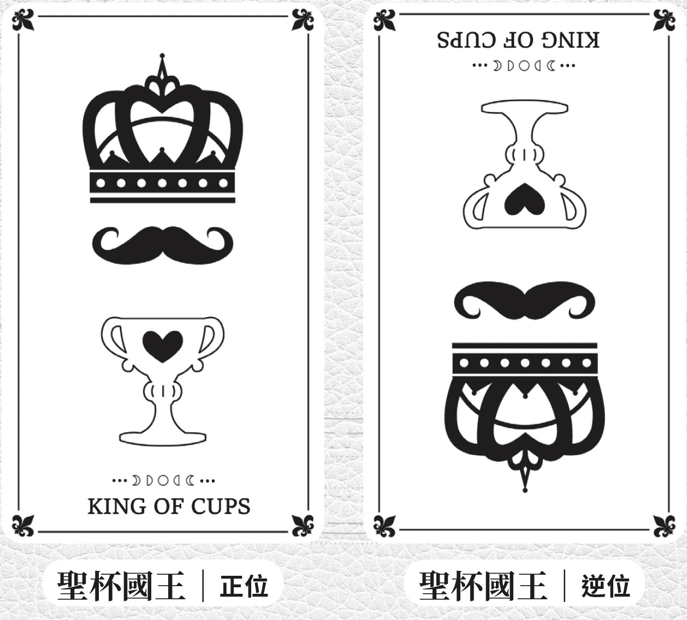

▪ 概义 ▪

正位：领导形像、控制情绪、潜意识浮出。

逆位：失去控制、发泄情绪、跟感情划清界线。

▪ 解析 ▪

圣杯国王代表亲和力，情绪控制得宜，他也是正直善良的人，富有同理心，是一个很好的主管或老板。

水代表情绪，也可以说他是一个很会控制情绪的领导者，但也有可能因为个性过于随和，缺乏果断决心，造成不必要的困扰。

✧ 解牌心语 ✧

富有同理心、善于管控情绪，但有时候会因为顾虑太多，而产生不必要的麻烦，也会因为顾虑人情世故，造成自己的损失。

问工作，适合商业、法律或是艺术相关之职业。

关系关键字：情绪稳定、智慧、善良、同理心。

钱币──安土重财的实作者

钱币在四要素里象征土，代表安全与物质世界，表现按部就班的特质，行事较为稳重。

钱币 1

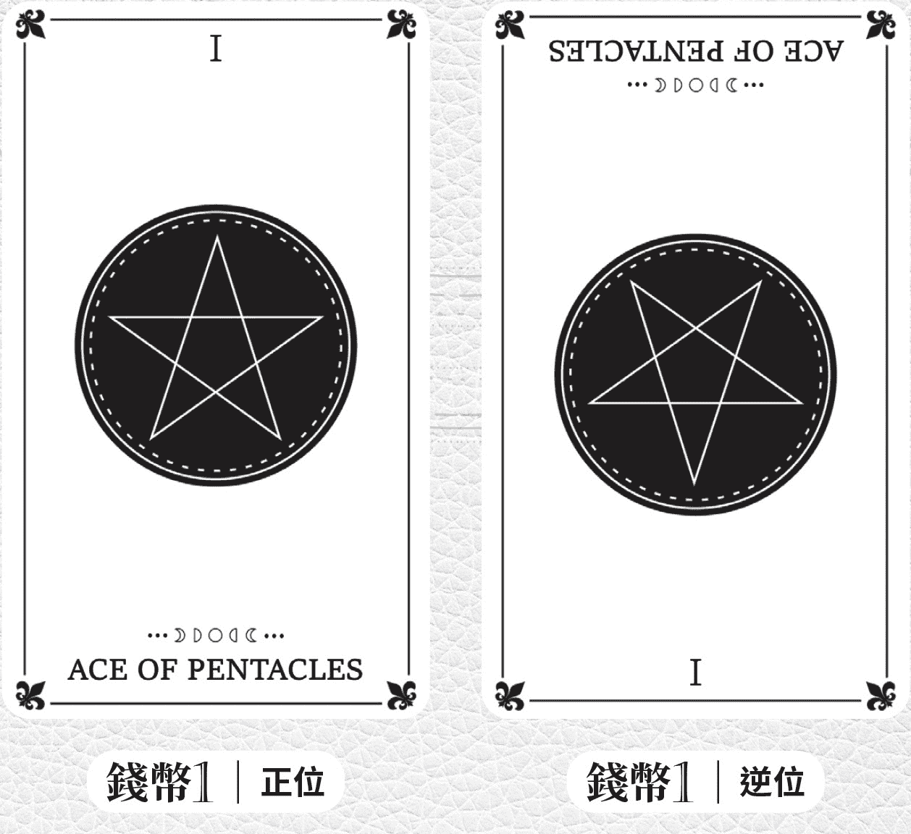

▪ 概义 ▪

正位：新的投资、成长、加薪、化梦想为现实、掌握物质资源。

逆位：无法掌握资源、失去控制、财务压力、投资失利。

▪ 解析 ▪

掌握金钱或是掌握资源，事业或是工作的开始，或将有新的计划，有关财务上的突破，或是得到新的物质上的东西。

✧ 解牌心语 ✧

总之这张牌，是由于钱币代表土的元素，代表安全或金钱上的应用，握有相对资源的含意。

关系关键字：稳定、物质丰富、目标。

钱币 2

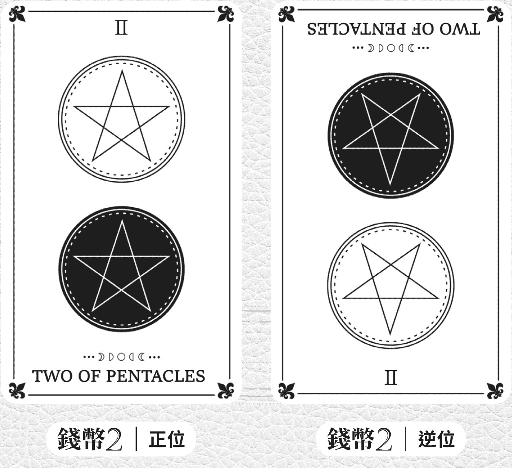

▪ 概义 ▪

正位：周转、失去平衡、情绪波动、游移不定 应付状况。

逆位：周转不灵、情绪压力大、心事重重、不稳定。

▪ 解析 ▪

一个人在前面站得不是很稳定，也就是说经济或物质的支出收入，呈现不稳定状态。

后面的船就是很好的印证，船好像在落差很大的水面上前进，但这样的前进风险很高。

✧ 解牌心语 ✧

包含金钱周转及与物质的交易，这张牌给人不稳定的感觉。

关系关键字：波动、选择、危机、转机、交流、流动。

钱币 3

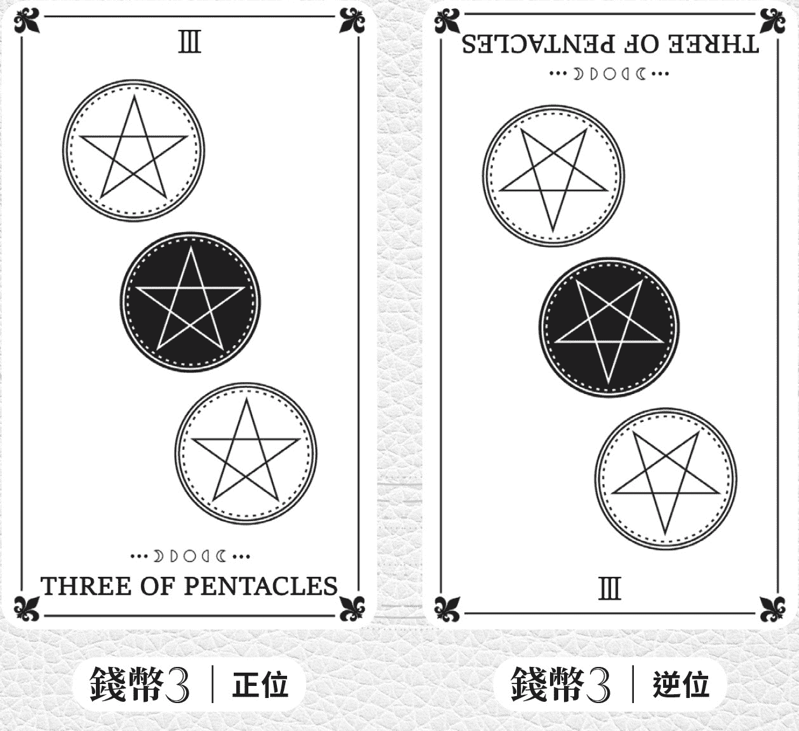

▪ 概义 ▪

正位：计划、合作、询问、团队工作、初步完成、精神上的合作。

逆位：计划失败、无法合作、工作不满意、无共识。

▪ 解析 ▪

钱币 3 的感觉是一种计划跟规画，正准备将计划实现，也代表坚定的信仰或很深的信任。

三个不同职业的人，生意人、建筑师与神职人员在一起合作。

✧ 解牌心语 ✧

代表坚定要将计划实现，遇见的对象，也代表相互合作或是一起学习。如果是恋爱关系，有可能是在工作场所认识，或是因为工作而认识。

关系关键字：合作、规画、学习、协调、调和、工作中遇见的对象。

钱币 4

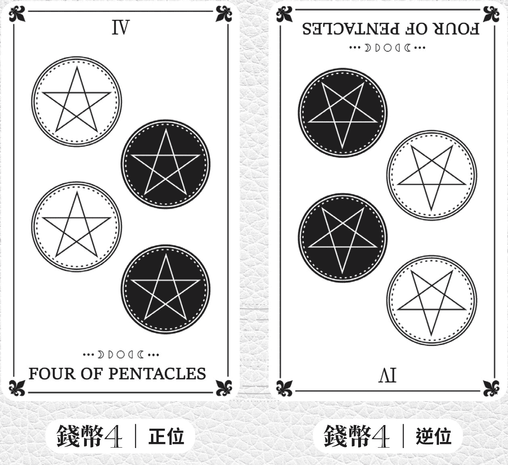

▪ 概义 ▪

正位：守财奴、控制、物质的稳定、小气、无法放下。

逆位：不稳定、无法掌握、守不住资产、失去原有的。

▪ 解析 ▪

这张牌感觉到对于金钱的保守或执着，有节俭的感觉，紧紧抓住金钱或资产不放，脚还踩着金币，头脑想的也是金钱。

✧ 解牌心语 ✧

这张牌代表着你有一定的存款或资产，不愿意轻易拿出来运用，而是守住这样的安全感。

关系关键字：掌控欲、守财奴、守住不放、没安全感、观望。

钱币 5

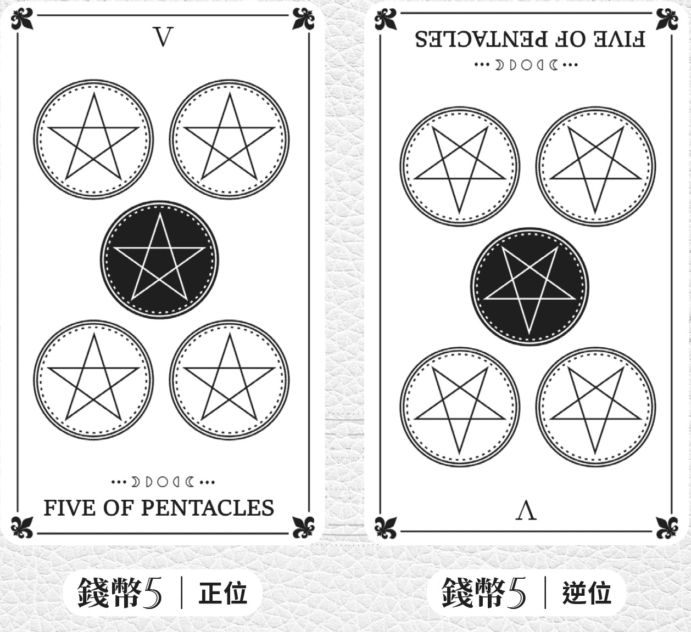

▪ 概义 ▪

正位：艰困、物质上的贫穷、悲观、慢慢前进、知识不足。

逆位：不协调、混乱、毁灭、不和、放荡。

▪ 解析 ▪

这张牌有一种落魄的氛围，表现在财务、生活的压力很重。

教堂上面的五颗星星，也代表须要有信仰或好的信念来支持、滋养空虚的心。

✧ 解牌心语 ✧

这张牌显现可能在生活、财务上的负担压力很重，被社会或是原本的团体放逐，或是影射自己心境的感觉，也可能是精神上的空虚，须有精神粮食来支撑。

关系关键字：艰难前行、困难、自卑、内在匮乏、孤独。

钱币 6

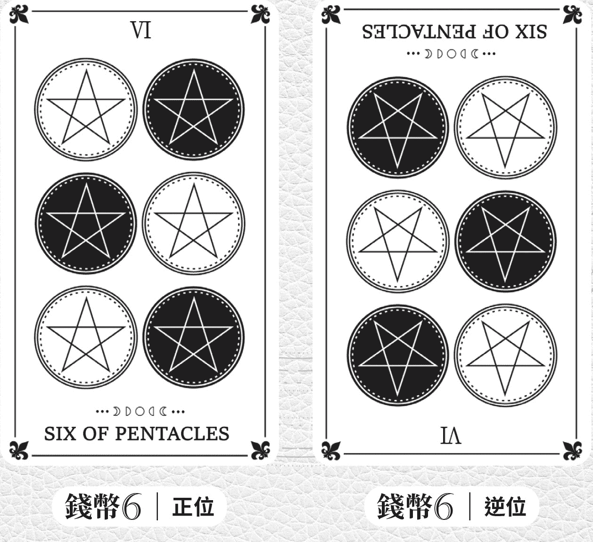

▪ 概义 ▪

正位：施与受、慷慨、公平的交易、精准投资、祈求。

逆位：挪用资金、贪婪、投资失利、不公平。

▪ 解析 ▪

一个人左手拿着天平，右手给予金钱，这样的感觉有点像在衡量这金钱给予的价值或是交换，也可能是使用金钱来掌控一切。

✧ 解牌心语 ✧

期待在商业上获得一个公平的交易，或是得到很好的服务，让你觉得这个交易跟服务很有价值。

关系关键字：给予、仁慈、帮助他人、慷慨、支持。

钱币 7

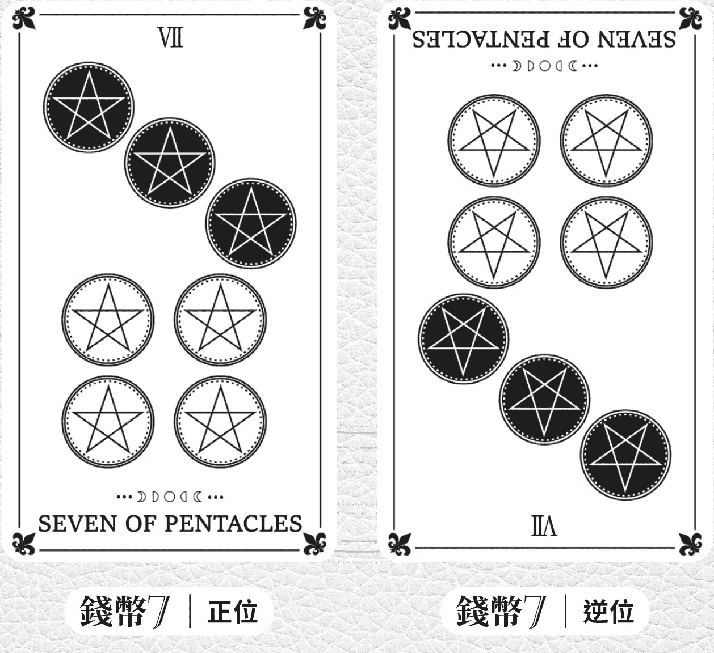

▪ 概义 ▪

正位：暂时丰收、思考、检视成果、评估、收集资源。

逆位：损失、担心、焦虑、过度开发、浪费、缺乏利润。

▪ 解析 ▪

牌面植物上面的钱币果实，会联想到是辛苦工作后的结果。

这有可能是有一个获利稳定的投资，或是满意的存款，你正在看着它，或是想着如何使用这些资产或是再投资，抑或是工作、无形资产赋予的地位与权力。

✧ 解牌心语 ✧

这有可能是稳定投资、有形或无形资产，还是工作上给你的地位，权力，你正在观察它并且想要规画它。

关系关键字：努力得到回报、期待、长期投入。

钱币 8

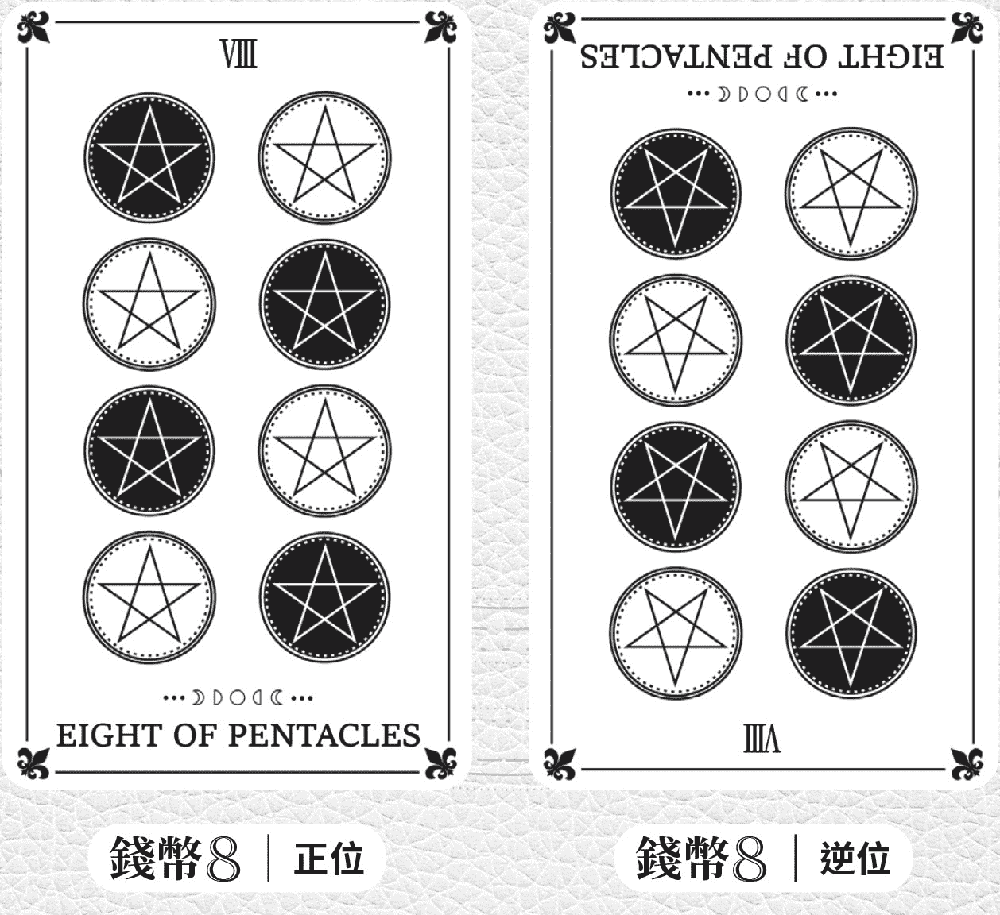

▪ 概义 ▪

正位：专注、脚踏实地、耐心、技术人员、自律、注意细节。

逆位：缺乏训练、轻率、虚荣、无法赚钱、没有耐心。

▪ 解析 ▪

他是一名工匠，专注于手边的工作，脚踏实地的去慢慢累积资产，有可能他的努力而累积到一定的资产，让他更无后顾之忧，可尽情地去从事他的兴趣或是喜欢的工作。

✧ 解牌心语 ✧

这张牌的感觉有专注、脚踏实地的意思，凡是专注在自己的事物上面，一步一脚印地去做，金钱自然产生。

关系关键字：专注、忠诚、脚踏实地、稳固。

钱币 9

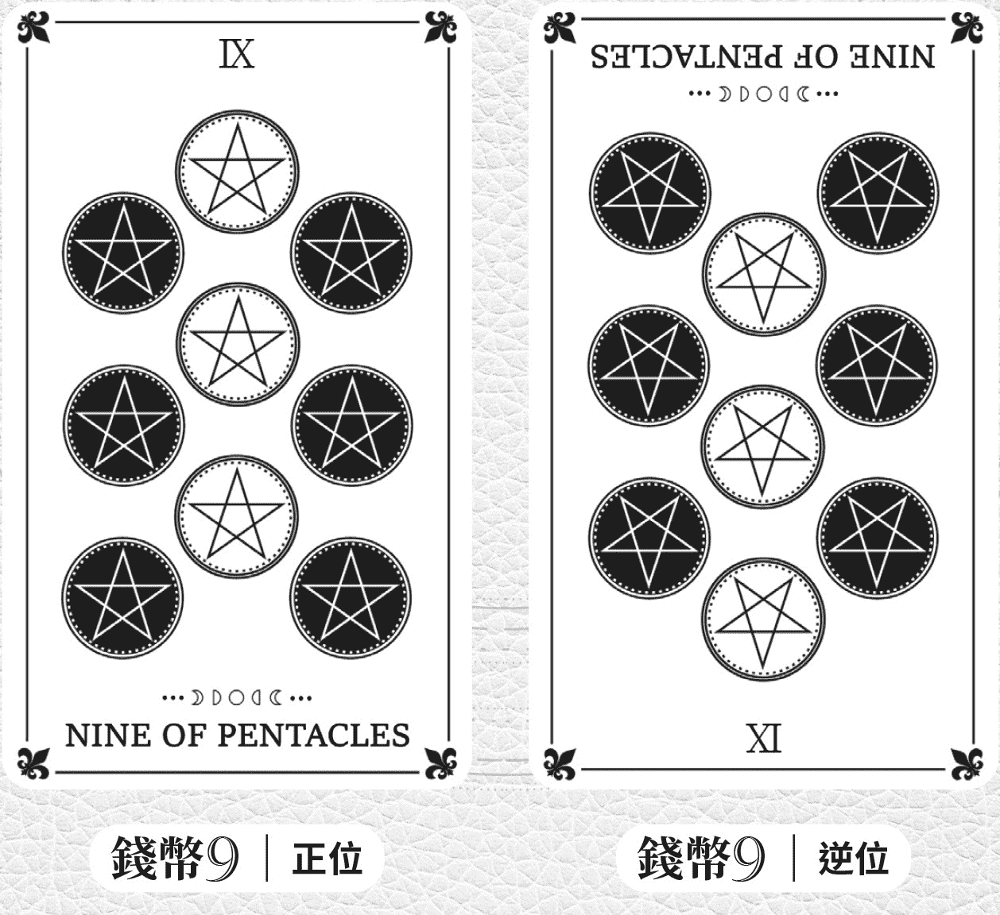

▪ 概义 ▪

正位：悠闲、放松、收获、物质的享受、失去自由、无法全观。

逆位：没有资源、失去拥有的、环境危害、诈欺、受骗。

▪ 解析 ▪

有一种贵妇的感觉，你正在享受美好的生活，那是因为你之前有努力工作，或是投资得到好的结果，也代表满足、喜悦、快乐。

✧ 解牌心语 ✧

这是一张人生胜利组的牌，会得到美好丰收的结果，但前提是你之前必须努力过。

关系关键字：丰收、满足、自信、享受生活。

钱币 10

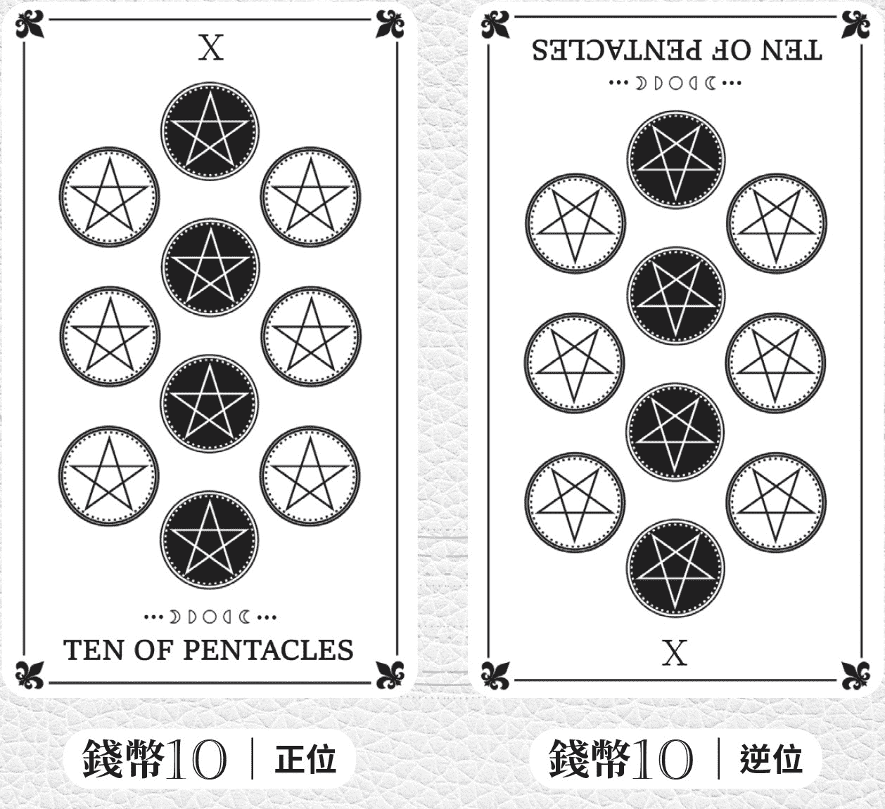

▪ 概义 ▪

正位：稳固安全、重视物质、继承、繁荣、财富、团聚、家族。

逆位：没有安全感、拒绝传统、争吵、家庭不和谐、义务。

▪ 解析 ▪

有家族团聚的感觉，也有可能代表家族意识、家族观念、家族文化，在工作上有可能会跟大公司合作或是成为大公司的一分子。

✧ 解牌心语 ✧

在财务上代表稳定成长，所有面向得到公司或是家族认同。

关系关键字：家族、传统、富裕、长期关系、基础稳定。

钱币侍者

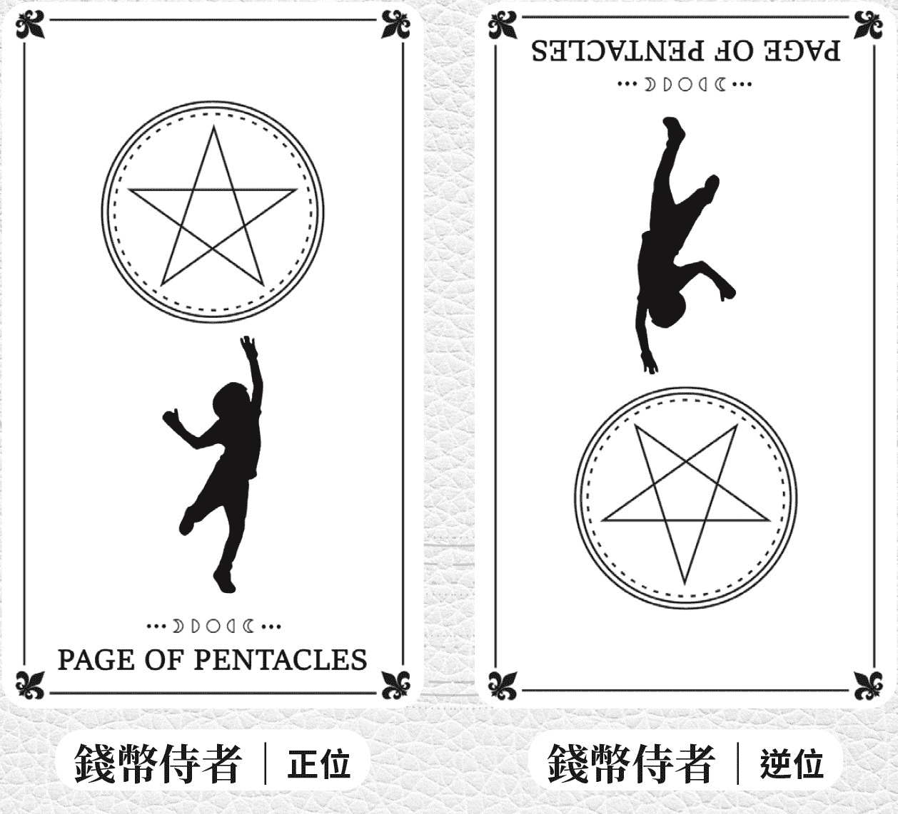

▪ 概义 ▪

正位：寻求知识、大地链接、物质目标、享受生活。

逆位：不切实际、不务实、工作过度、不专注、迷恋。

▪ 解析 ▪

他是脚踏实地的年轻人，用功学生，或是专注于想要成就的人。依照自己的目标前进，也很会照顾人或是动物。

✧ 解牌心语 ✧

他愿意在自己身上下工夫，但需要更有弹性的思考方式，有时候会太执着，也有可能比较无法接受别人建议。

关系关键字：专注于工作、务实、忠诚、忽略浪漫。

钱币骑士

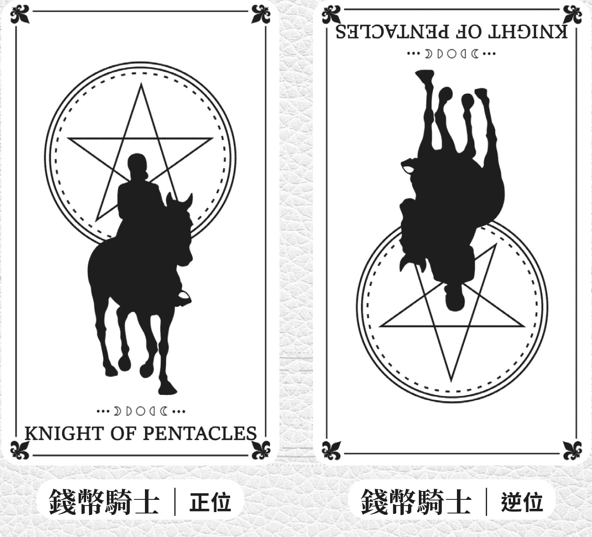

▪ 概义 ▪

正位：稳定、缓慢发展、保护自己、注重安全、过分物质。

逆位：顽固、不宽容、反对物质、失去重心、失去工作。

▪ 解析 ▪

观察细节，过于保守，等待的感觉。

总是要等到做好准备才肯行动，但有时候时机不等人，错过了就错过了！

✧ 解牌心语 ✧

这张牌表示无法真正的去冒险，这个时候必须替个案厘清问题，现在的你适合保守还是进攻？骑士掌握着资源，如果不去行动，优势也许会变成劣势。

关系关键字：重视结果、保守、规画太久、责任感。

钱币皇后

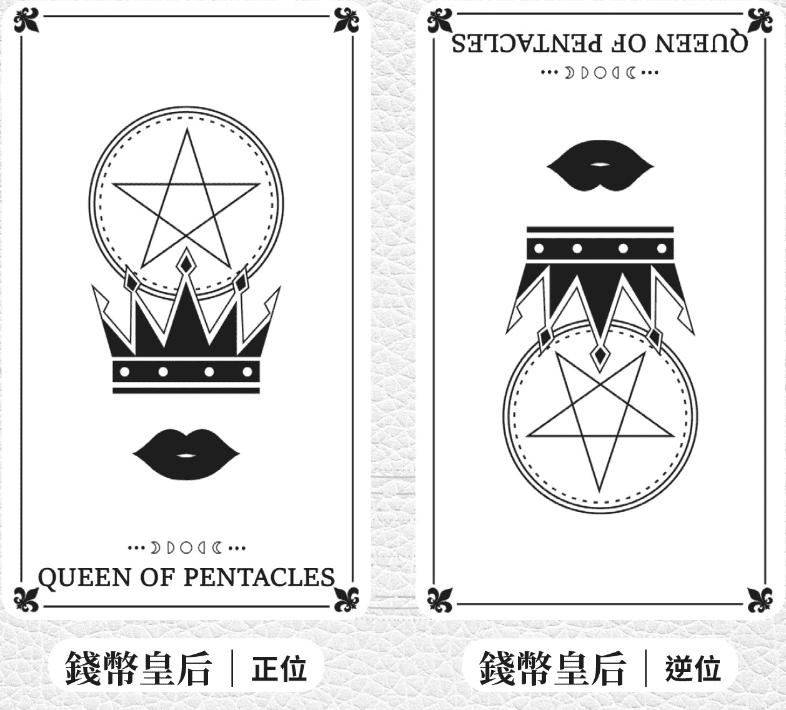

▪ 概义 ▪

正位：保护、需要、信任、安全感、内在活力、物质沟通。

逆位：冒险、不忠诚、财务困难、无法信任、胆怯、中断。

▪ 解析 ▪

钱币皇后能用少量资源，去完成很多事情，并且能够安然的度过一切危险，踏实并且实事求是，也有照顾他人的能量，信守承诺，给人保护安定力量。

✧ 解牌心语 ✧

这张牌显现愿意为他人做任何服务，也可能是长期投资的爱好者，懂得去分配资源，运用自己的能力，创造安全感。

关系关键字：慈爱、温柔的支持、爱心、关怀。

钱币国王

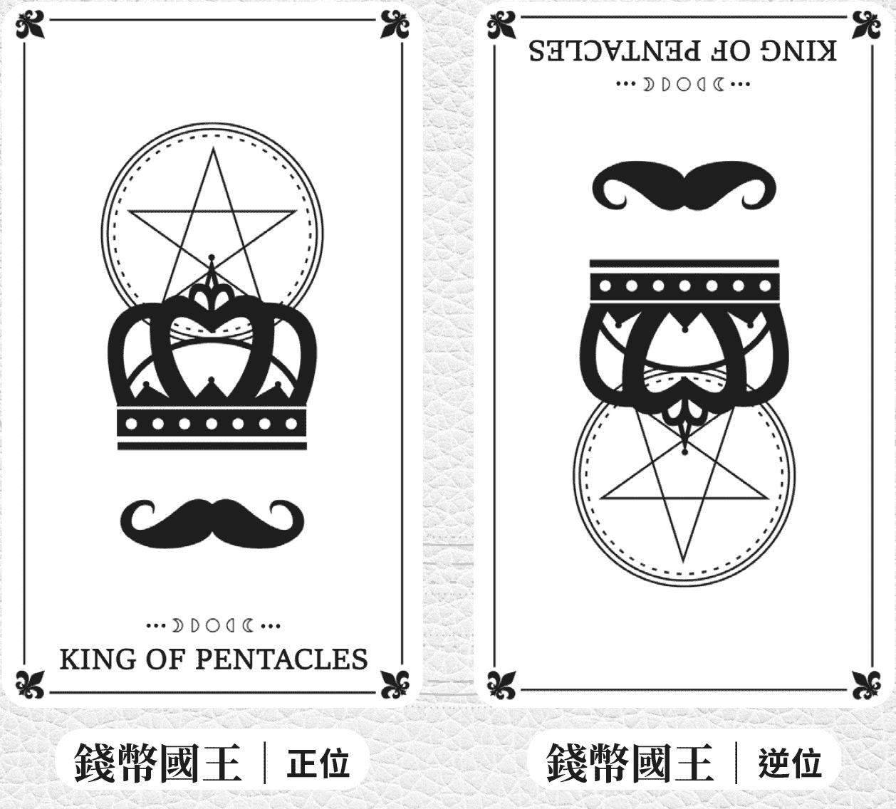

▪ 概义 ▪

正位：信赖的人、掌管金融、计划、执行力负责、往内看。

逆位：剥削、固执、无安全感、混乱、过度保护、成长、过度追求。

▪ 解析 ▪

他就好像是一家公司的董事长，会运筹帷幄来经营事业，运用手中资源去创造财富，并且负责任、脚踏实地来达成营业目标，也是一位慈善家，用各种不同的方式去帮助这个世界。

✧ 解牌心语 ✧

有条理规画、善于运用资源来创造财富，同时也会鼓励人追求他想要的目标，并且脚踏实地的去运作。

关系关键字：慷慨、物质丰富、成功、成熟、可靠。

# Chapter 4
牌阵应用

牌阵对塔罗初学者来说，抽出来的牌各别要如何解释、代表什么意义，很难从直觉立即得到信息，但如果应用牌阵，就能清楚理解每张牌所代表的位置。

## 事件牌阵

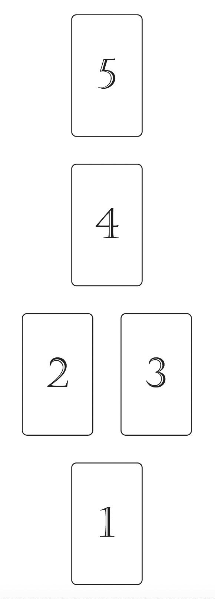

❶事件本质

❷我的心里感受

❸他的心里感受

❹沟通方式

❺解决方案/行动

## 想法牌阵

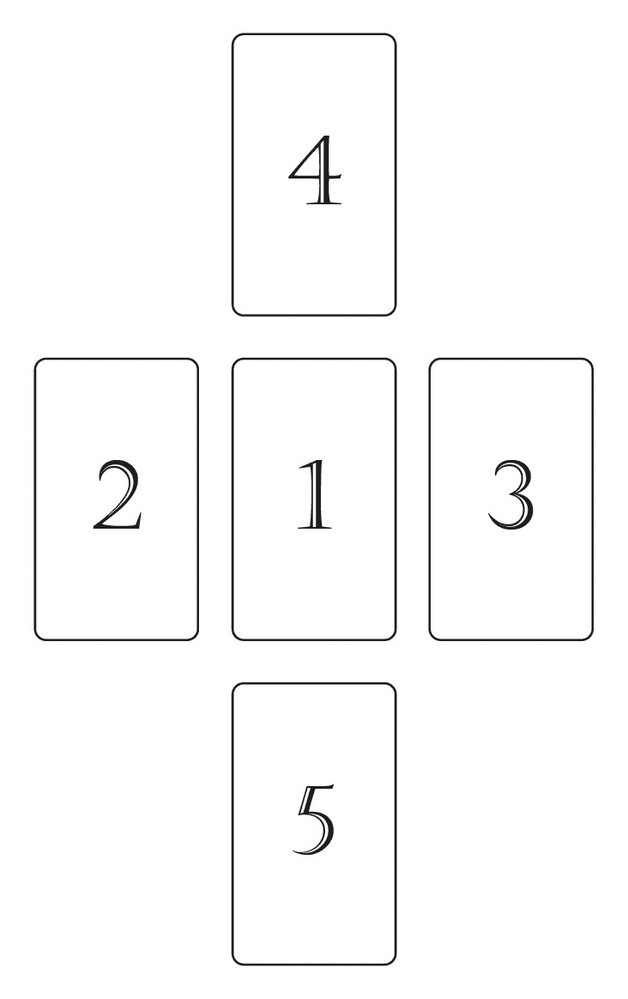

❶现在状态

❷过去状态

❸未来状态

❹表意识/表现出来的样子

❺潜意识/藏在内心的想法

## 选择牌阵

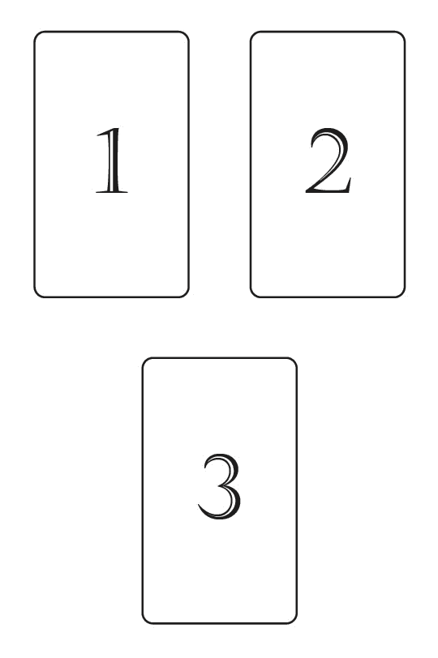

❶选择 A 选项的结果

❷选择 B 选项的结果

❸关系的整体状态

## 关系翅膀牌阵

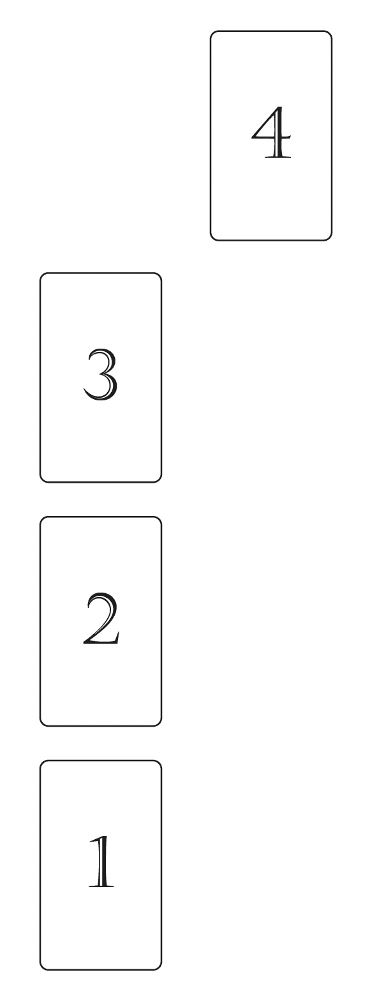

❶态度

❷发展

❸如何做比较好

❹高我讯息 / 建议

## 关系牌阵

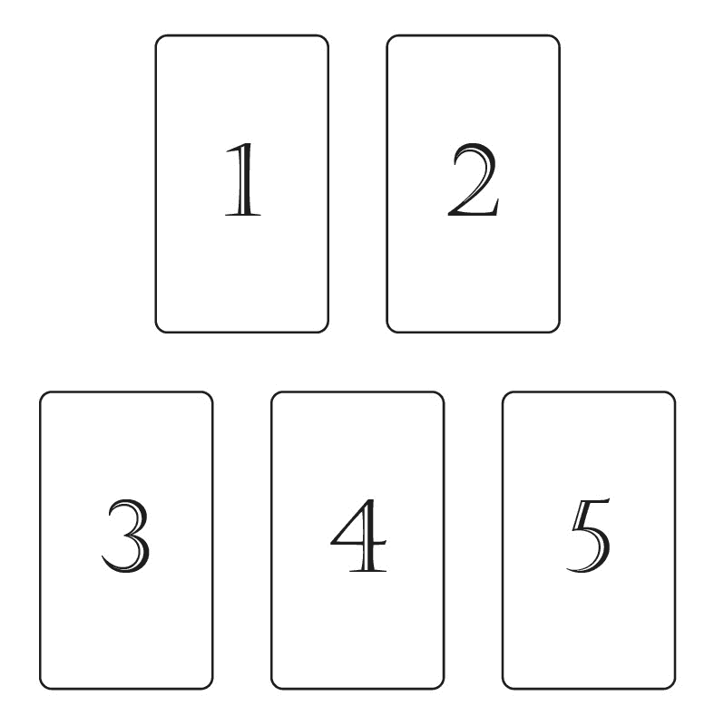

❶我在这段关系的状态

❷他对这段关系的想法

❸短期发展概况

❹中期发展概况

❺长期发展概况

# Epilogue
尾声

## 最后的叮咛

当你利用牌卡进行探索，如果抽出牌卡跟问题格格不入，请不要抗拒它，可以好好的探索，为何对这张牌排斥或是无法理解的状态？在洗牌抽牌时常常抽到同一张牌，或许是它要给你讯息，才会一直出现在你面前。

深入探讨的方法，可用冥想或是觉察生活跟这张牌义的链接。

✧ 客观的解牌话语

基本上，解牌的话语都是依照牌义跟当下的直觉状态说明，但是个案很容易会问关于好、不好、对、不对、是、不是这种问题，但实际的状况是每个问题都有牌义上面的可能性，没有绝对的答案，只有机率问题，在过程中需要的是练习经验，以及增加中性思维的探讨。

✧ 牌阵使用秘诀

不同牌阵有不同牌阵的用法，目的是为了更精准的去探讨问题，同时可增加牌卡的信息来解析问题。

每张塔罗都有丰富的牌义及内涵，需要解析者慢慢发觉，当生活中用到塔罗解析时，就会触发对某几张牌的感觉。

因此牌义上的体验，每位塔罗师也不会一样，因为不一样就会出现不同风格的塔罗师，成为塔罗师的最重要的基础其实就是认识自己，认识自己是谁，适合什么样的生活，本来就没有标准答案。

✧ 关于直觉的应用

解读塔罗不只是牌义上的信息，有时候也会有神来一笔的直觉，而转变的发生必须从思考走。

像感觉可以跟个案比对，照着与个案的互动了解状况，就如同开车，很多时候开车也是直觉反应，这种体验需要大量练习得来，因此相信自己的直觉，是可以加速塔罗的准确度。

✧ 旅程的提醒者

人生就是一场旅程，每张塔罗就是这旅程当下的状态，不管是感情、工作、事业、家庭、健康等问题、都有一定的轨迹，塔罗可提醒你当下的状态，进而协助你作出决策。

# Reverberate
回响

## 塔罗解锁心结与未来

临近公司即将结束营业时刻，虽不至于人心惶惶，还能听见和往常一样的欢声笑语，但我仍然感觉不对，到底是哪里不对劲呢？

我感到头痛欲裂。

偏头痛是现代人的普偏毛病，但关于导因，能用排除法。压力只是部分原因，更何况……对于感情的那些负面看法和低潮情绪，仅仅是稍离公司范围，走到搭员工电梯的地方，头痛症状便淡化、心扉轻松许多。所以……为什么呢？

人遇到困境，当然要懂得求助。我曾因上过老师的课而认识他，于是找老师帮忙抽塔罗牌做解析。

我抽到的牌卡，是圣杯 4。

老师的那副牌很特别，不像一般会按照正立或倒立的，来分为正、逆位，而是正、反有不同形象画面。

✧ 突破误区，看到希望

看牌面，沙滩上倒着四个杯子，中间是大片的海，再远方是船和天空；画面带着灰色调，微微透出一点死寂。另一面，画面也略显黯淡昏黄，杯子同样倒躺在海滩，中段沙地上有一些草，然后有人靠着树坐着。

老师看图了然，指着画面解释，叫我看画面氛围，并说圣杯落在海滩上，而船远航。这也代表要收店是事实，而剩下的员工，即使领资遣费，不知该何去何从，没有希望。另一面，圣杯虽也倾倒斑驳，可画中人却有树能倚靠，这是不同之处。

有树可靠的人是我，因为我除了上班之外，还在外面上了其他课程，并且有证照在手，要转换方向，对我来说相对比他们容易。

但对于解牌提到有关自己较具优势的话，我感到不理解，便请教老师。因为看人力银行的信息，要应征的话，不少工作都会更倾向有经验者。而据我所知，公司里有几位是工作了五年以上的资深员工，至少和白纸般的菜鸟比起来，再怎么样也算经验丰富吧？

老师说照理是那样没错，但另一方面，在同个地方，同一份工作做了那么多年，他们已经适应并习惯了那样的规章、模式，也只熟悉这个工作项目，这时一下子面临变化、要做转换，很容易因为潜意识里对于未知的恐惧，产生看不到希望的负面感受。

我点头，明白了自己的误区。

✧ 恶人容易心生暗鬼

这时，一旁的同学说，虽然他们有工作经验，但可能不想再从事相似的工作，但又不知道还能做什么。

老师接着说，他们习惯了目前公司的制度、模式。他们会想，下一个工作，待遇会比较好吗？然后去新的公司，大家都已经各司其事，会接纳自己这个新人吗？

这句话微微挑起了我的愤慨情绪，冷冷开口回应说道：“他们当初自己也没有接纳别人啊！”因为资历不足的我，曾隐约听闻，或者从他们聊天过程的只字词组里了解，对于我所喜欢的人，他们的挑剔、嫌弃，甚至抹黑。他们当初嘲笑尚不熟悉工作内容的我，我其实没那么在意，但他们对我喜欢的人，背后说的那些坏话，我其实相当介意。

老师说，正是因为如此，所以他们才会担心。他们那么对待别人，潜意识知道，也就怕自己被那么对待。

✧ 学习觉察，划清界线

老师宽慰我说：“公司也只剩下没多久时间，放宽心、保持平静心态。”他并提醒我“觉察”，觉察他们因为感觉没有希望，而生出的负面能量，与自己区隔，不受影响。

老师的塔罗解析，既解决了我的疑惑，也说明了我解决方法。

老师解牌，不是那种死背硬记的死板，于是根据抽牌者的情况，结合牌卡的画面去做说明，会注意让抽牌者听懂、理解，而且当中的一些举例也很日常、生活化。感谢老师的帮助，我也会继续努力学习塔罗。

老师是很好的范本，希望有一天，我也能像老师一样帮助别人。

夕浑

## 塔罗牌星星为灵感的小说── 愿得一人星

穆情醒来后，出神地盯着上方陌生的天花板，满脑子只有一个问题。

这里不是她家，那这里是哪里呢？

就在昨天，学校的期末考终于结束，为了这场期末考，穆情可算是熬了好几天的夜。那天晚上，她是抱持着解脱的心情安然入睡的，她从来没想过一阵爆睡后的自己，竟然会是在陌生人的房间里醒来的。

不就是补个眠嘛？一觉醒来发现自己在别人的房间里，是件很可怕的事耶！

穆情勐然起身，她焦急的在房间里四处张望，试图想从这个房间里找出关于房间主人的蛛丝马迹。只是，这房间连一张照片也没有，她只能从挂在墙上的蓝色制服来推测这房间的主人是个男的。

是男的才更糟糕啊！为什么她会睡在一个男人的房间里啦！？难道她是被绑架？

穆情急得像是热锅上的蚂蚁，她慌张地看向房门，难道她该冲出去吗？

不行！不行！现在冲出去，假如外面有人守着，那根本逃不出去！再说了，到底是谁把她带来这里的？把她带来这里的用意又是什么？

✧ 镜子前的陌生男孩

穆情烦躁地在房里走来走去，在经过镜子几趟后，她才终于发现有什么不对劲。

穆情全身僵硬地看向镜子，她在镜子里看到的，是一个长相如哈士奇小狗般可爱讨喜的男孩，只是此刻他的表情万分惊恐，就像看到不该看的东西一样。

镜里的男孩试探性地举起自己的左手和右手，然后再狠狠地捏了自己的脸颊一下。很快的，白皙软嫩的脸庞上，就出现了一道用力过勐的红痕。

火辣辣的疼痛感在他的脸上蔓延，在意识到这不是一场梦后，一声惨叫响彻云霄。

“为……为什么她变成男的了？”一夜之间一个女人变成一个男人？不可能不可能！这么荒唐的事怎么会发生在她身上呢？

就在穆情极度混乱的时候，房门“砰”的一声，被重重地打开。

一个跟“他”长得很像的男人担心地问：“阿晴，你怎么了？”

穆情一脸呆滞，圆磙磙的眼里迅速复上了一层水汽，谁能来告诉她，现在到底发生什么事了啊？！

穆情“哇”了一声，很没形象地哭了！那个男人快步走向她，将她揽进怀里轻轻拍了拍，“哥哥就在这里，已经没事了。”

穆情花了十分钟嚎啕大哭，在这十分钟里，原本属于“牧晴”的记忆也跟着慢慢复苏。

✧ 重建新生活记忆

牧晴，与她的名字同音不同字，目前就读鹰岚高中一年级，明明长着一张容易让人心生怜爱的可爱脸庞，在校成绩也很不错，但就因为他个性内向寡言，平时去学校，又都戴着一副大得能遮住他半张脸的眼镜，导致他很难与别人打成一片，渐渐地就变成班上的边缘人。

牧晴有个大他五岁的哥哥，名叫牧靖，他十分疼爱牧晴，在牧晴心里他是全世界最好的哥哥，也是唯一能让他敞开心房的人。

这大概就是她还能在这么混乱的时候感到些许安心的原因吧。

发现牧晴冷静得比自己想像的还要快，牧靖这才松了一口气。

“阿晴，今天要不要陪哥哥一起吃早餐呢？”

牧靖的语气听起来，不但没有一丝地不耐，反而还有着满满的包容和温柔，别说是牧晴了，就连她这个跟他相处不到二十分钟的陌生人，都对他存有非常高的好感度。

牧晴红着双眼点点头，再怎么样，他也不想跟自己的肚子过意不去。

“那哥哥先下去准备了，阿晴你好了就下来吧！”

等到牧靖出了房门，牧晴的视线又再度回到那件制服上，奇怪，这件制服他好像在哪里看过？

牧晴歪着头，他苦恼的问题从原本的那件看起来眼熟的制服，到了他所处的这个世界到底是不是存在的？还是这里是人家所谓的“平行时空”？

牧晴的头好痛，要在线索不足的状况下去得出这个问题的答案，实在是太为难自己了。

牧晴顶着发热的脑袋来到饭厅，牧靖手上端着还冒着缕缕白烟的两盘欧姆蛋，向他说道：“早餐已经准备好啦，赶快过来吧。”

只能说，这世界上假如有个好哥哥奖项的话，不颁给牧靖一座奖杯的话，真是太对不起他了，这么温柔又会做菜的哥哥哪里找呀！

牧晴拿起叉子，往看起来松软的欧姆蛋挖了一口，单是这么一口，就足以让他抛下那些还未解决的谜团，心甘情愿的沉沦在他眼前的这盘欧姆蛋上。

牧靖宠溺地看着牧晴，但随后他的眼里又染上了淡淡的忧愁。

“阿晴。”

已经塞得满嘴的牧晴只能歪着头，用困惑的眼神来代替发言。

牧靖戳着盘边的小番茄，试探性地问：“你是不是……又梦到在公车上遇到痴汉了？”

“痴汉？”牧晴第一时间还没反应过来，直到几段清晰画面浮上脑海，他才想起来的确有这么一回事。

大概是因为牧晴的长相太过软萌可爱，导致他遇到痴汉的机率比别人高上许多，尤其是在公车上那种人挤人的地方，因为受害人没地方可以逃，所以被害人就会更加狂妄猖獗，虽然牧晴也曾经上警局报过警，但因为没有明确的证据，所以警察也不能拿对方怎么样，只要那个痴汉继续逍遥法外，牧晴就会每天活在恐惧中。

牧晴会选择戴上眼镜的原因大概也是为了要保护自己吧。

“难道不是吗？”

穆靖的问题真的很不好回答，假如让牧靖知道他的宝贝弟弟体内的灵魂是别人的，这应该比梦到痴汉还要来得恐怖吧？算了，还是就先让牧靖这么以为吧。

✧ 解开角色之谜

牧晴咬着叉子，含煳的嗯了一声。

看到牧晴不想多说的样子，牧靖也只能选择不再多问，打算换个话题来转移牧晴的注意力。

“阿晴，今天悠星不是在市民广场那边办见面会吗？你要不要去看看？”

牧晴又是怔了一回，“悠星？”

这名字好耳熟啊！

牧靖觉得有些奇怪，“你的同班同学啊，而且那孩子还是现在很有名的模特儿呢！”

悠星，有名的模特儿？一个模煳的画面在他的记忆里载浮载沉，直到那个画面清晰的浮上水面，他才终于想起来那个名叫“悠星”的模特儿到底是谁了。

《那颗星映着的是谁》里的男主角啊！！

《那颗星映着的是谁》是之前穆情收藏在她手机许久的其中一部网络漫画，她那时会收藏的原因，单纯只是因为这部漫画的画风很合她的胃口，内容的部分她没有细看，主角是超人气的高中生模特儿──悠星，是穆情对这部漫画的唯一认识。

穿越到她没看过的漫画世界里！？饶了她吧！人家魂穿漫画好歹或多或少都知道一些剧情走向，这样至少心里有个底，也比较好去应付接下来会发生的事情啊！

再说了，现在更重要的是，“牧晴”这个角色在漫画里到底是主角之一？配角？还是反派？角色定位直接给她来个未知……这是要她怎么玩呀！

牧晴抱着头，又再度陷入新一轮的崩溃。

牧靖又被牧晴突如其来的崩溃弄得手足无措，他家弟弟今天的情绪好像不是很稳定啊！

“阿晴，哥哥只是提议，你不想去就不要去……”

“不，我要去。”

“什么？”

“我要去见面会！”他要亲眼去确认牧靖口中说的悠星是不是他认识的那个悠星，假如是的话，那他就能确定自己的确是身在漫画的世界里，在什么情况都还不知道的状况之下，能够先确定一件事是一件。

✧ 勇闯漫画国度

悠星的见面会是早上 10 点开始，依照他对普遍粉丝的了解，大概早上 8 点就有人在那边排队了，还好他起得也算早，早餐吃完就能出门了。

牧靖站在门口，一脸担忧地问：“阿晴，要不要哥哥陪你去？”

“不用啦！你今天不是已经跟梓哥哥约好今天要去约会的吗？”

“可是……”

“没事的！”牧晴跑过去抱住牧靖，“你要相信我啊！我可以保护好我自己的！所以你就安心的去约会吧！”

牧靖本来还想说些什么，但在看到牧靖那写在脸上的坚定神情后，他忽然有种自家弟弟在一夜之间忽然长大的感慨。

牧靖回抱住牧晴，语气里已经没了先前的不安，“我知道了。那你路上小心喔。”

“嗯！那我出门了！”

市民广场前，某期时尚杂志的封面，被放大数倍摆在整个广场最显眼的位置，牧晴站在海报前，赞叹着悠星身为漫画男主角的超高颜值，他望向人头窜动的排队位置。嗯，果然这样的颜值就会有这样的粉丝量。

悠星的五官深邃，隐隐带着若有似无的疏离感，那种带着些许冷艳的气质，让他十分受到化妆品及时尚服饰品牌的青睐，只要代言人是他，被他代言的东西销量就会直线上升，营业额不用说，绝对也是直线上升。

立在广场上的这张海报，是悠星替某家口红品牌拍的宣传照，身穿西装的他躺在撒满红玫瑰花瓣的床上，他胸前的扣子随意敞开，露出白皙的精实胸膛。

他眼里的淡漠在此刻逐渐软化，透出了如蜂蜜般的甜腻撩人，印在他唇边的口红印，让他这个年纪独有的少年感不复存在，取而代之的是成熟大人才有的性感及诱惑力。

这张海报就是《那颗星映着的是谁》的封面，也是穆情收藏的主要原因。

看来这里真的是那本漫画的世界啊！既然这个问题已经确定了，那就回家吧，反正他也需要一点时间，去整理关于这个世界的相关讯息。

✧ 黑衣男的突袭

就在牧晴要转身离开市民广场时，此起彼落的尖叫声划破天际。他回头一看，刚刚本来还排得好好的队伍早就支离破碎，几个身穿西装戴着墨镜，看起来就像是保镳的高大男人，一脸着急的向骚动处跑去。

直觉发生什么不好事的牧晴，一到那边就看到方才的几个保镳围着一个身穿黑色衣服的男人，那男人表情狰狞，手里还拿着瑞士刀正不要命地挥舞着。

因为那个男人手上有武器，所以那群保镳也不敢轻举妄动，退到四周的人们一脸恐惧，完全不知道该怎么办才好。

其中一位保镳向那个男人喊道：“先生！我们有话好好说，先把你手上的刀放下！”

那男人把刀指向刚刚向他喊话的那名保镳怒吼道：“你闭嘴！我和你们没什么好说的！叫悠星那个浑蛋给我出来！”

“你想找悠星做什么？”

“你管我要找他做什么？还不快点把他给我叫出来！”

那个男人很明显的就不是悠星的粉丝，但牧晴也没心思再细想他这么做的用意是什么，不管用什么方法，还是想办法让刀离开他的手上会比较好。

牧晴绕到那名黑衣男的后方，他点了点在他面前的那名保镳，保镳警惕地转过头，牧晴示意他噤声，那名保镳也机灵，很快就领悟到牧晴的意思，他稍稍后退，让牧晴有空间可以往前。

“你不告诉我，我没办法让悠星来见你。”保镳说道。

“你让他出来，你就会知道我要找他干嘛了！”黑衣男子怒吼道。

牧晴蹑手蹑脚地往黑衣男的身后走近，在确认黑衣男的注意力并不在后方，牧晴就举起他的后背包，朝黑衣男的脑袋狠狠砸去。

“唔……！”受到突如其来的重击，那名黑衣男的身子一歪，他手里的瑞士刀也跟着落地。

很好！成功了！

牧晴看准时机，对着黑衣男就是一个重重的过肩摔，黑衣男被摔得七荤八素，等他回过神来，他已经被狼狈地箝制在地面，无法动弹。

“我说这位小哥，带着刀来参加偶像见面会，你的爱会不会太沉重了一点？”

黑衣男发现自己竟然被一个高中生制伏，气到脸都红了，他哑着嗓子向牧晴吼道：“臭小鬼！还不快放开我？”

“保镳叔叔，麻烦你帮我打电话叫个警察好吗？”很明显的，牧晴根本就没有要理会他的意思。

“可恶！放开我！放开我啊！”黑衣男奋力地挣扎着，只可惜，他越是挣扎，牧晴箝制住他的那双手就会收得越紧。

“小哥，你别看我这样，我的力气还不小呢！所以你就别挣扎啦！冷静一下，好好想想等等要怎么跟警察说吧？”

因为兴趣使然，牧晴在之前另一个的世界，就一次就把跆拳道和空手道都学了起来，而且考到的段位也都还不低，但其实他刚刚要出手之前心里还真没底。毕竟，他也不知道这具身体能不能跟上他的记忆。不过，从现在的情况来看来，牧晴不只身体素质不错，而且还意外地力气很大，在使出过肩摔的时候连他自己都吓了一大跳。

被压制在地上的黑衣男精神已经濒临崩溃，那双佈满血丝的眼里，透着他执着于某项事物的癫狂。

“可恶的悠星，该死的悠星，要不是他！现在在这里举办见面会的人就会是我的凯大人了……只要让那个该死的悠星消失，我的凯大人……呜呜……”

看来这个人是个狂热粉呢，而且还是很极端的那种。

“这位小哥，你干麻把自己搞得这么累呢？我有一个更简单的方法能够实现你的愿望，你想听听看吗？”

听到牧晴这么说，那个黑衣男眼里的癫狂更热烈，他激动到全身都在颤抖，就像是已经看到他家的凯大人一样。

“什么！？想！想！你快点告诉我！告诉我！”

警车的鸣笛声离他们越来越近，牧晴灿烂一笑，然后毫不留情地朝他的脖子狠狠地敲了一记，那人两眼一翻，就这么晕了过去。

“给我做梦去吧，混蛋。”

等牧晴作完笔录，本来还一片混乱的会场，已经在工作人员的安排下，恢复到先前井然有序的模样。

工作人员拿着大声公对还在排队的粉丝们说：“悠星的见面会延至一小时后开始入场，造成各位的困扰真是万分抱歉！”

延后一小时啊！这对粉丝来说应该是最好的结果了，只是延后，而不是取消。

✧ 意外变身 VIP

“请问你就是牧晴同学吗？”

叫住牧晴的是一个身穿深蓝色西装，扎着一束低马尾的漂亮男子，他长得十分清秀，颇有古典书生的气质，浑身上下都充满了中西交融的华丽感。

“嗯，请问你是……？”

牧晴向他露出温和有礼的微笑，苏沐枫向牧晴低头致谢，“我是悠星的经纪人，非常谢谢你帮我们制伏了那位危险的狂热粉丝，你应该没有受伤吧？”

“我没事，谢谢你的关心。”

路边开始渐渐有电视台的车子停靠过来，牧晴就怕自己的见义勇为会被电视台大肆报导，牧晴赶紧向苏沐枫说：“那个，我不想上新闻，也不想被采访，所以关于我的事能不能简单带过就好？假如能不提到我的话那更好！”

苏沐枫笑了笑，“要完全不提到的话可能会有点困难，但是简单带过这点我可以向你保证，在见面会结束之际，我也会请悠星在官方粉丝团向粉丝们宣导，假如有录到事件过程，请他们不要上传到任何的网络媒体。”

真不愧是当红模特儿的经纪人，连牧晴没想到的，都帮他一起想到了。

因为这种事而引人注目也是挺麻烦的一件事啊，就各方面来说……。

“那就再麻烦你了。”

苏沐枫看了一下手表，“见面会也差不多要开始了……”

就在牧晴准备要告辞离开时，苏沐枫向他丢出了一个很隆重的邀请。

“牧晴同学，假如你接下来有时间的话要不要来参加悠星的见面会？座位的部分你不用担心，我会安排一个 VIP 席给你的。”

牧晴已经感受到来自粉丝的灼灼目光了，一滴冷汗自他的脸颊滑落，“经纪人先生，你这样不好跟一早就来这里排队的粉丝们交代吧？”

他才不想因为这样被悠星的粉丝记恨呢！粉丝的力量是很可怕的，一个弄不好，第二个狂热粉就出现了！

苏沐枫还没来得及回答，站在不远处的粉丝已经先开口了。

“我觉得没什么不好交代的啊！你刚刚可是救了我们家悠星耶！是恩人！”

“嗯嗯！恩人！机会难得，你就来看看我们家悠星嘛！VIP 席是可遇不可求的喔！”

“我们家悠星对粉丝超好的喔！我相信在这次之后，你一定也会迷上我们家悠星的！”

粉丝们七嘴八舌，不但对于牧晴插队直接插到 VIP 席的这件事，没有任何的不满，反倒还积极的要他参加，去亲身体会一下自家偶像的好。

牧晴默默地瞥了苏沐枫一眼，心想经纪人先生，你们家的粉丝素质可真是高啊！看来臆测会被记恨什么的，完全是他在瞎操心呢！

✧ 近距离看超级偶像

牧晴坐在距离舞台不到 1 公尺的座位上，他终于能理解为什么 VIP 席会那么贵，但依旧有粉丝愿意捧着大把钞票来买的原因了。

这就好比是影片的分辨率一样，越后排的分辨率越低，即使用力想看清楚却还是模煳一片；至于 VIP 席正是最高画质 1080P，是个能 360 度无死角欣赏自家偶像的最佳位置。

“让我们用最热烈的掌声欢迎我们的悠星！”

主持人的嗓音高亢，粉丝们的尖叫声从牧晴的身后传来，要不是这次的见面会是露天的，不然照这样的音量，估计屋顶早就被掀翻了。

今天悠星的打扮，并不像他平时在当模特儿时那样的时尚华丽，简单的白色上衣长裤，更能衬托出他那干净无暇的少年气质，浅蓝色的牛仔外套，替他添了点这个年纪该有的活泼率性。

真不愧是模特儿，这种随处可见的穿搭，在他身上竟然又被升华到另一个新高度……。

牧晴心里感叹着，视线恰好与刚走上舞台的悠星对到，一抹困惑自悠星的眼里一闪而过。

牧晴很能理解悠星此刻的心情，毕竟就连他自己也很困惑，为什么他会和一群知名企业的主管坐在一起，经纪人先生难道不觉得多了他一个，画面看很来会很突兀吗？

牧晴抱着背包，尴尬地朝悠星点点头，当作问好。

悠星对着牧晴浅浅一笑，这笑换得了全场粉丝的热情尖叫，原来坐在牧晴旁边看起来一脸严肃女主管，都已经露出少女怀春时会有的娇羞表情了。

这就是他的超人气同班同学啊……牧晴已经能想像悠星去到学校的时候会是什么样的情况了。

✧ 被超狂热粉丝包围

这次的见面会，主要是以采访的形式来进行，由悠星抽签，主持人来提问。

箱子里的问题，都是从粉丝的信里来挑选的。当然，能放在箱子里的，一定都是能引起话题，但又不触及悠星隐私的安全问题。

由悠星本人来亲口解答粉丝们的最想知道问题，除了能巩固原有的粉丝外，也能趁机扩大悠星的粉丝市场，这种活动在宣传层面的确是起了不少作用。

在见面会要结束前的半小时，工作人员搬上了一台看起来好像很厉害的扭蛋机，透明的塑胶罩子里，有数百颗的彩球在跳动，说是要由悠星来亲手抽出，送给十名粉丝的亲笔写真集。

听到这里，底下的纷丝已经蠢蠢欲动，终于明白这张号码牌的用途为何。

刚才在入场时，每位粉丝都有拿到一张号码牌，工作人员也只有简单提到这是后面活动会用到的小道具，请大家保管好，在经过台上主持人的一番说明后，大家对这张号码牌投以热烈目光。

由悠星亲手给的亲笔写真集！还能跟悠星合照！这有哪个粉丝不想要的！？

牧晴只觉得自己的身后，有一波波的热浪潮他袭来，都把他逼出一身汗来。

看来与这些粉丝们的热情相比，连挂在天上的太阳都相形失色了。

“那么！接下来就有请悠星帮我们抽出十位幸运的粉丝！”

主持人话音刚落，充斥着紧张氛围的配乐响起，悠星慎重地走到道具前，伸手将在他正前方的旋钮用力一转，“喀拉”一声有了，但扭蛋却没落下。

悠星不明所以地眨眨眼，在发现自己转错边后，他默默地将转错的旋钮转向正确的方向，十颗彩球这才骨碌碌地，掉进放在扭蛋出口处下方的篮子里。

大概是因为距离很近，所以牧晴很刚好捕捉到悠星难为情的模样，虽然那是一瞬间的事。

牧晴的嘴角忍不住勾起了一抹姨母笑，这就是所谓的“反差萌”吧？怎么感觉好像有点可爱？

“非常感谢广大粉丝今天的热情参与！请各位回家时务必小心！”

这场见面会就在主持人不变的高亢嗓音下画下句点，牧晴坐在位置上，等着四周的人潮散去。

虽然会参加这场见面会，完全是在牧晴的意料之外，不过想了想这样也是挺有趣的，或许他的人生中也只有这么一次机会，能够坐在 VIP 席上呢！

就在牧晴要起身离开的时候，又有人叫住他。

✧ 看见明日之星

“同学，请你留步。”

回头一看，是刚刚与狂热粉丝对峙的其中一名保镳。

“怎么了？”

“能方便请你跟我们来一趟后台吗？悠星想亲自向你道谢。”

咦？让他坐到 VIP 席还不够，现在竟然还让悠星本人向他道谢？

牧晴不太能理解为什么他们要做到这样？难道是担心感谢得不够周到，怕他会拿这件事在网络上大做文章吗？他看起来像是个那么小家子气的人吗？

牧晴坐在悠星休息室的沙发上沉思着，果然，模特儿就跟艺人一样，不论再怎么不情愿，礼数还是必须要做到尽善尽美才行呢。

休息室的门被打开，苏沐枫朝牧晴笑了笑，“喔！你来啦？不好意思啊，悠星现在还被一大堆赞助商缠着呢！再稍微等他一下吧！”

牧晴点点头，“经纪人先生，就算你们没有找悠星道谢，我也不会去网络上乱说的喔。”

“看得出来你不是这种人。”苏沐枫站在咖啡机前，冲了一杯咖啡和茶，“会让你来到这里，纯粹是我和悠星的私心。”

牧晴听得一头雾水，撇除他是一个替他们解决大麻烦的好心人，他真的想不出来自己有哪里是值得让他们有私心的。

“悠星想亲自和你道谢的私心，以及我想说服你，来当我们家旗下模特儿的私心。”

苏沐枫的开门见山，差点让牧晴手里的那杯茶洒得满地。

牧晴忽然觉得自己好像摊上了一件很麻烦的事，“悠星的私心我能理解，但经纪人先生的私心，我完全不能理解，所以请恕我拒绝。”

这是苏沐枫第一次被回绝得如此干脆利落，通常只要对方知道他是悠星的经纪人，他们原本警戒的表情就会变成心动和犹豫，那么说服这件事也就不算太难。可这孩子连一点犹豫都没有，想要说服他，还真不是件简单的事。

“虽然在模特儿圈里长相可爱的男模特儿也不少，但是像你这样既可爱也能有男子气概的男模特儿，可以说是少之又少，是我们公司完全没有的模特儿类型，所以我才会强烈希望你能来我们公司当模特儿。”

苏沐枫看到牧晴的第一眼，就直觉这孩子只要愿意踏入模特儿界，就一定能红，这跟他当初看到悠星时的感觉是一样的。

“只要你进来我们公司，我会手把手带着你，我有信心我一定能让你变得跟悠星一样红，在不久的将来，我们公司的两大支柱，就会是你和悠星了!”

苏沐枫说得信誓旦旦，可是牧晴的眼里依旧没有动摇，牧晴没有不相信苏沐枫的理由。毕竟悠星的知名度是有目共睹，他知道苏沐枫既然能捧红一个悠星，那再捧红一个他，的确不是问题。

只是，牧晴是真的没有想要成名的打算，不然他刚刚让苏沐枫，把他的事简单带过干什么呢！就是不想太引人注意啊！他还是安分地混在人群里，当个平凡的普通人就好了。

“经纪人先生，谢谢你的欣赏和邀请，只是成名对我来说是一件很困扰的事，而且我也不认为我的个性适合这个业界，所以不好意思，我要再拒绝你一次了。”

被牧晴给了两次软钉子的苏沐枫也不恼怒，他很喜欢像牧晴这种能够贯彻自己意念的人。

“唉，你明明就是个很有潜力的孩子……”苏沐枫一脸可惜，然后从西装口袋里拿出一张名片，推到牧晴面前，“不过没关系，等你哪天改变心意了，欢迎随时来找我。”

“谢谢你。”虽然他是觉得自己不会有用到这张名片的一天啦！

✧ 好友＋1 吗？

休息室的门再度被打开，只见悠星的气息不稳，他的额头上还覆着一层薄汗，这很明显就是一路跑过来的。

“抱歉，我来晚了。”

看到悠星本人出现在自己面前，牧晴拿起放在桌上的矿泉水，向他说道：“辛苦了，先喝个水喘口气吧。”

悠星微微一愣，这还是他成名后，第一次有人能够用如此平常的反应，来对待他的。

牧晴见悠星没有任何动作，忍不住纳闷，他这是怎么了？难道是不想喝却又不知道要怎么拒绝他吗？

苏沐枫偷偷观察着悠星此刻的反应，真是稀罕了，这孩子竟然会在他以外的人面前，露出如此毫无防备的表情。

苏沐枫走到悠星身边轻拍他的肩膀，“悠星，我去跟厂商确认一些事情，你们慢慢聊啊。”

经苏沐枫这么一提醒，悠星这才回过神来，赶紧接过那瓶水。

“谢……谢谢……”

“喔……”现在的他跟在镜头前给人的感觉很不一样呢。

等苏沐枫出了休息室，悠星毫不含煳地低头弯腰，向牧晴说道：“今天的事非常谢谢你！然后害你遇到这种危险的事，真是万分抱歉！”

牧晴轻轻叹了一口气说：“你的道谢我接受了，但你的道歉我可不接受。”

悠星勐然抬起头，他紧握着水瓶，眼里满是不安和惊慌。

知道悠星一定是误会的牧晴赶紧解释：“我那句话的意思是！就不是你的问题，你为什么要跟我道歉？”

“为什么？因为是在我的见面会上……”

“等一下，等一下。”

悠星很听话的没了声音，牧晴坐上沙发，拍拍离他不远的地方说：“我们坐下来说吧。”

等悠星坐定了，牧晴继续说：“那个人呢，是个眼里只有偶像但是没有脑子的狂热粉，只要举办见面会的人不是他的偶像，一律都会被他视为敌人，不管今天办在那里的是谁都是一样，这个就叫做‘无差别攻击’。所以悠星，你现在还会觉得那是你的问题吗？”

原来，这个人是在用这种方式，来告诉他这不是他的问题啊。终于明白牧晴话中含意的悠星，心里轻松了，“嗯！我知道了，谢谢你。”

牧晴被悠星那释然的灿烂笑容，晃得有些睁不开眼，真不愧是漫画里的男主角，太耀眼了！

“唉，假如你的粉丝知道，我用这么随便的态度在跟你说话，他们一定会拿着扫把来追杀我的吧……”

“不会的！其实……我一直希望有人能像你这样，能够以轻松自在的态度来与我相处。”

悠星会有这样子的感受，牧晴也能理解，毕竟艺人也是人嘛！比起被特殊对待，或许他们更渴望大家能用普通的方式来与他们相处，尤其，像悠星这个年纪的孩子更是如此，他在学校会不会觉得自己格格不入呀？

牧晴用一种若有所思的眼神看着悠星，就在他想着以后去到学校是不是要再多照顾他一点的时候，悠星开口问道：“请问你叫什么名字？我到现在都还不知道……”。

“我叫牧晴，也可以叫我阿晴，就看你想怎么叫，你随意就好。”

想要与他再更亲近一点……基于这样的想法，悠星怀着莫名的期待，小小声地说：“那就……阿晴？”

“嗯。”

牧晴朝悠星微微一笑，悠星顿时觉得他的心里，就像是被羽毛扫过一般，好像有点痒痒的。

“阿晴，我们之前是不是有在哪里见过？”

在看到牧晴的第一眼，悠星就觉得这个男孩很面熟，但却又想不起来是在哪里看过。

牧晴讶异地眨眨眼，悠星竟然能觉得他眼熟？他有戴眼镜跟没戴眼镜的样子，差点连他自己都认不出来耶。

“嗯，以前见过，之后也会见到，毕竟我跟你是同一个班的。”

他们是同一个班的！？为什么他会完全没印象？悠星陷入混乱思绪，难道是因为他不常去学校所以连自己的同班同学都记不得了吗？

“抱歉……”

“不用抱歉啦！你认不出我是正常的。”牧晴从背包里拿出那副大眼镜，然后戴了上去，“这样，你应该就有印象了吧？”

脸上多了那副眼镜，悠星这下真的有印象了！原来，坐在他前面的那个人就是牧晴。只是，现在的牧晴怎么跟他印象中的牧晴，好像有点不太一样？

“抱歉，在你们聊得这么愉快的时候打断你们……”之前说去跟厂商确认一些事情的苏沐枫，带着满脸的歉意站在门口，“现在有个赞助商的高层想要见悠星，那个局我不太好推掉……”

“嗯，我知道了。”悠星垂下眼眸，语气里有着淡淡的失落。

牧晴背上背包，利落起身，“没事，我也在这里打扰你们太久了，谢谢你们今天的招待。喔，对了，经纪人先生，我能问你一件事吗？”

还以为牧晴改变心意的苏沐枫，立刻双眼放光，语气略显激动，“行行行！你问！”

牧晴晃了晃手机，问道：“那，我能跟悠星加个好友吗？”

看到苏沐枫和悠星一脸懵的样子，就怕他们误会，牧晴赶紧解释：“你们放心，我对当狂热粉这件事没兴趣，我只是想说我跟悠星刚好同班，他没来学校的时候，总要有人罩他一下的吧？”

苏沐枫倏然转头看向悠星，“你们两个是同班同学！？”

感受到自家经纪人的震惊目光，悠星点点头，“嗯，是同班同学。”

以为他们俩还在怀疑自己的牧晴，耸耸肩说：“我就是问问而已，不行的话就算了。”

“也没……”

“没有不行！”

悠星的反应之大，不只是苏沐枫和牧晴，就连他自己都吓了好大一跳，他这是怎么了呢？

就在悠星还在为自己的失控感到不解时，牧晴噗哧一声地笑了出来。他还真没想到，平时看起来没什么情绪起伏的人，私底下竟然有着情绪如此丰满的一面。

外冷内热的男主角啊，这设定的确是挺讨人喜欢的！

“知道了知道了！不是要加好友吗？来吧！”

悠星羞红着脸，把牧晴加进了好友列表里。

牧晴笑着说：“假如经纪人先生不放心的话，我不介意悠星把我们的对话纪录给你看。”

苏沐枫夸张地叹了一口气，“唉，我本来就没说不行的好不好！你们两个都在比嘴快的，根本就不给我把话说完的机会啊！”

牧晴又呵呵笑了几声，这位经纪人先生就跟悠星一样，完全没有架子，跟他们相处起来挺自在的。

“你们不是还有事要去忙吗？还是别让人家等太久比较好喔？”

苏沐枫一拍脑门，“唉哟！差点就把正事给忘了。”

“悠星，我们赶快走吧！牧晴，刚刚带你来的保镳，已经在外面等你了，不好意思啊，我们没能亲自送你。”

“没事呢，正事要紧。”牧晴灿烂一笑，然后朝悠星挥挥手，“那悠星，我们学校见！”

✧ 对话打开友谊大门

牧晴的离开，使得悠星眼里的光芒逐渐黯淡，不消多久，悠星又恢复到他平时冷淡疏离的样子。

这还是苏沐枫第一次在悠星身上感受到所谓的“反差萌”这回事，他家悠星竟然是这种人设的！？他怎么都不知道？

在震惊之余，如同老父亲般的宽慰，涌上苏沐枫的心头，他家悠星终于有了像孩子的一面了！

等他们从赞助商那里脱身，天空已经是漆黑一片，难得接下来没有任何工作安排的悠星，早早就被苏沐枫给送回家了。

悠星躺在床上，看着在新好友列表里的牧晴，他的目光变得柔软，点开聊天室，尚未有任何对话的一片空白。

不希望他们的关系，只因为短暂的一面之缘而疏离，他皱着眉，思考着要用什么话来当起头。

思考许久，悠星最后选择用贴图来打头阵。

贴图是一扇木门前，有只小小的哈士奇直挺挺地坐在门口，那背影透着一丝丝的寂寥，似乎是在想说，为什么主人到现在都还不回家呢？

“回家了吗？”圆磙磙的字体在一旁，精准的道出小哈士奇此刻的心情。

悠星紧张地盯着那个贴图，但“已读”这两个字却迟迟不出现。

悠星的眼里，染上了与那个贴图相似的寂寥，为了不让自己的心思都在这上面，悠星拿起放在一旁的睡衣，往浴室走去。

二十分钟后，整个身子暖呼呼的悠星坐到床边，打开手机，牧晴聊天室旁的红点正欢快地闪烁着。

悠星飞快地点开聊天室，一只脸上漾着灿烂笑容的小松鼠，捧着满手果实，出现在他的贴图下方。

悠星的嘴角微微一勾，这个贴图跟阿晴真像，那种莫名的疗愈感，光是看着就能让人心情愉悦。

牧晴：“早就到家啦！你呢？还在工作？”

悠星：“今天晚上没工作，我也已经在家了。”

或许是牧晴此刻刚好也在用手机，所以他回的速度极快。

牧晴：“辛苦了～你吃饭了吗？我跟你说，我哥哥今天晚上煮的火锅可好吃了！虽然吃得很撑，但是很满足！”

悠星立刻明白牧晴就是个吃货，想要与吃货拉近关系，很简单，靠美食就行了。

悠星：“谢谢阿晴，我是吃完饭才回家的。阿晴，你喜欢吃火锅？”

牧晴：“喜欢啊！应该说，只要是好吃的东西我就喜欢！”

悠星：“那……作为答谢，我想请你吃个饭，可以吗？”

怕牧晴感到有负担，悠星赶紧补传了一句话过去。

悠星：“阿晴放心，不会太贵的！我就是想跟你交个朋友而已。”

牧晴：“其实，你不用做到这样的。”

牧晴的这句话，让悠星的脑袋瞬间冷静了不少，他这样是不是让他感到不自在了？

悠星垂着眸，他的指头沉重地在手机荧幕上按着。

悠星：“抱歉，是我太急了，吃饭这事我们等之后吧。”

就在悠星要按下传送的那一刻，牧晴接下来的讯息，让他立刻把他原本要送出去的话全数删掉。

牧晴：“我们早就是朋友了呀！”

悠星的耳边似乎传来了牧晴的声音。

“朋友”？悠星抚上心口，他的心跳声看似与平常无异，可是他却觉得这其中好像多了点什么，而且，感觉是他会喜欢的那种什么。

牧晴：“不过，既然我的朋友都么说了，那我就不客气啦。”

悠星：“那阿晴想吃什么？告诉我，我来安排。”

牧晴：“那你喜欢吃什么？”

没想到牧晴会如此反问他，悠星想了想便回：“拉面……之类的。”

牧晴：“嗯，那我们就去吃拉面吧。大明星推荐的拉面店啊……一定很好吃。”

一只口水流满地的松鼠贴图，紧跟在那段对话之后，这就是牧晴现在的心情写照。

悠星：“嗯，那等我的消息。”

牧晴：“当然没问题，等你的好消息啊！”

悠星看向窗外，漆黑的夜空上，几颗零散的星星闪烁着。

其实，他就像是天上的这些星星，夜夜发亮，但却不知道是为了谁亮，直到今天，他终于知道自己该为谁而亮。

他想为那人而亮，希望自己在那人的眼里是最独一无二的存在，能映在那人眼底的那颗星，只能是他。

（END）
