# 整理房间，就是整理运势

# 算運

創造好運的居家、工作空間魔法

整理房間，就是整理運勢

你的房間，就是你的化身。
看房間即可預知未來。

# 感動・感謝

人的緣分

這樣的房間，可以為你帶來好運勢。

創意

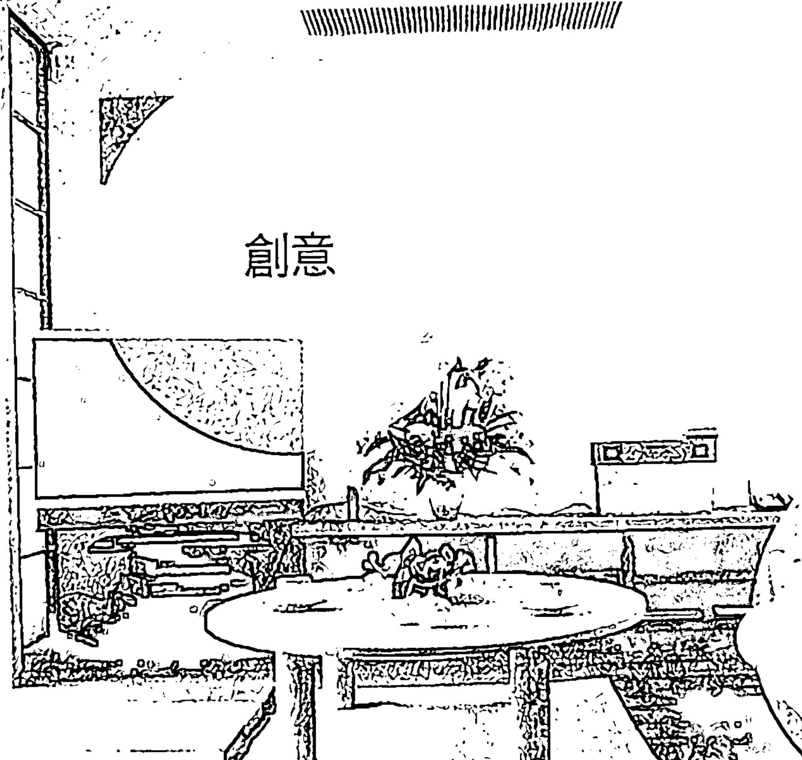

幸福・機運

兼差收入

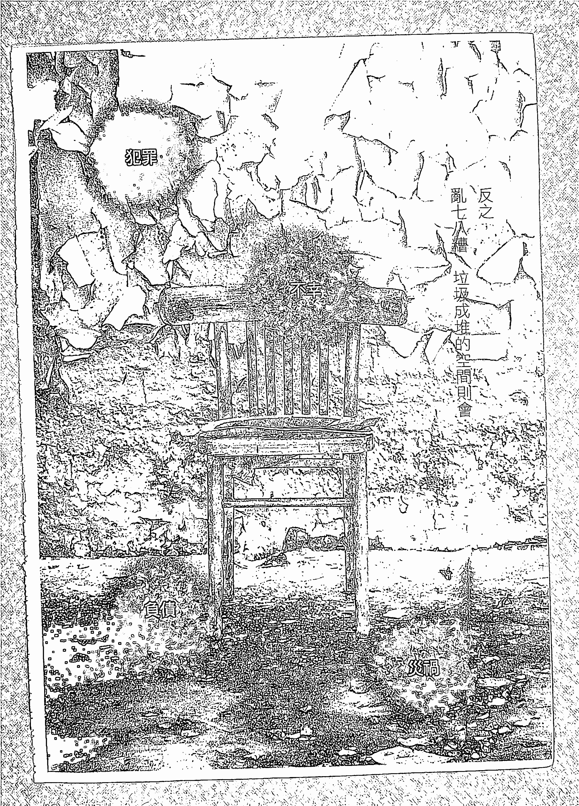

犯罪

不幸

負債

災禍

反之
亂七八糟
垃圾成堆的空間則會

你的房間，是怎樣的房間呢？
你又會擁有怎樣的未來呢？

# 「房間等級檢測表」5個小測驗，預測你的未來

下列的「房間等級檢測表」，可依房間的狀態，來預測屋主的未來。
用這個檢測表來檢測看看你的房間吧！從問題 Q1～Q5 中，選一個最貼近你房間狀況的選項，於□內打√。

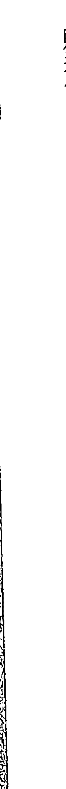

- □ 有種讓人安心的感覺（環境凌亂卻相當舒適）【C】
- □ 明明有想做的事，回到家後卻提不起勁【D】
- □ 房間清爽明亮，進入房間後眼前一片光明、充滿幹勁【B】
- □ 想吐、暈眩、麻痺、頭痛……
  長時間待在房間裡，會出現以上症狀【E】
- □ 感謝和感動的情緒油然而生，情感豐富了起來【A】

## Q2 你如何清潔房間的塵垢呢？

- □ 四處藏污納垢。
- □ 陳年髒污，無法輕易洗淨【E】
- □ 有打掃的習慣，但縫隙中難免有髒污【C】
- □ 看得到的地方皆布滿灰塵，這個狀態已持續了好幾個月【D】
- □ 連看不到的地方也清理得非常乾淨（屋內空氣長保清新）【A】
- □ 運用打掃的技術，將看得到的地方打掃得一塵不染【B】

## Q3 東西的堆積方式

- □ 想修理、想丟棄的物品
- □ 堆滿房間的地板、儲物間和陽台【D】

## Q4

- □ 想修理或丟棄的物品擱置一年以上，數量超過三件【C】
- □ 毀損品、廢棄物堆滿整個房間【E】
- □ 自己不用的東西不會堆置在房內【B】
- □ 自己不用，也不會用來招待他人的東西不會堆置在房內【A】

- □ 意識到來客的舒適度，有統一的設計概念【A】
- □ 在設計概念和用色上，毫無整體感【D】
- □ 設計概念和用色上不統一，但整體看來還算搭配合宜【C】
- □ 看不出房間的原型和家具的造型，
  整個房間已經被破壞，並且一片混亂【E】
- □ 依自己的喜好來決定房間的設計概念和用色【B】

## Q5

- □ 東西收納的很整齊，而且有多餘的空間【B】
- □ 東西多到放不下，有一部分需放到別處【C】
- □ 東西整個滿出來，散落一地，連走路的空間都沒有【D】
- □ 東西多到放不下，多餘的物品和垃圾堆置在陽台和庭院【E】
- □ 能掌握所有東西的收納位置，用心收納每一樣物品【A】

打√的項目中，你的 A ～ E 分別有幾個呢？

- A ＝（ ）個
- B ＝（ ）個
- C ＝（ ）個
- D ＝（ ）個
- E ＝（ ）個

## A 選項最多的朋友

你的房間等級好比「天使空間」

你的未來：將會為眾人帶來幸福、創造奇蹟。

◎詳細解說請見第 83 頁

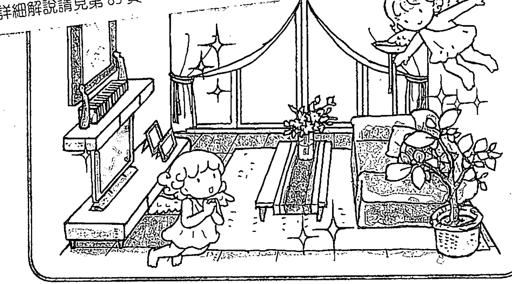

## B 選項最多的朋友

你的房間等級屬於「成功空間」

你的未來：願望將在短時間內逐一實現。

◎詳細解說請見第 78 頁

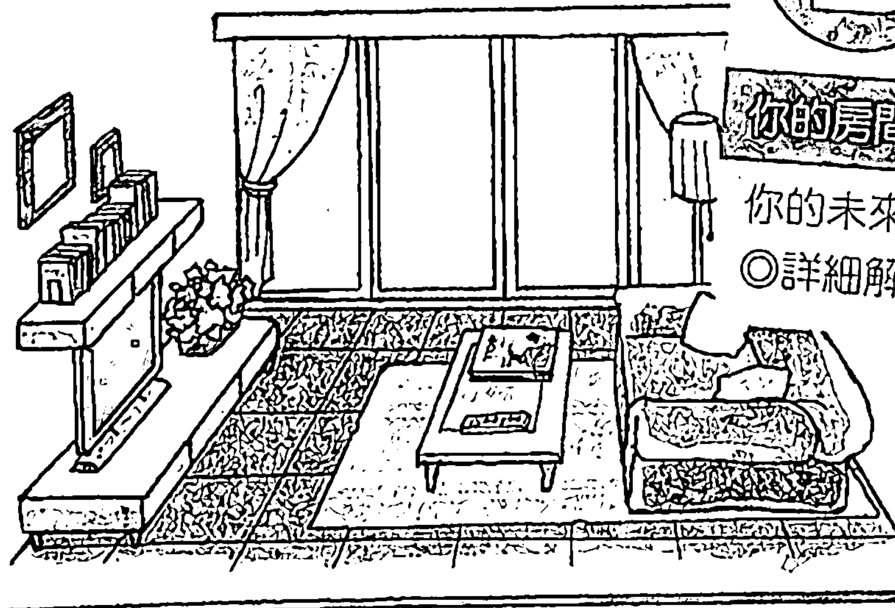

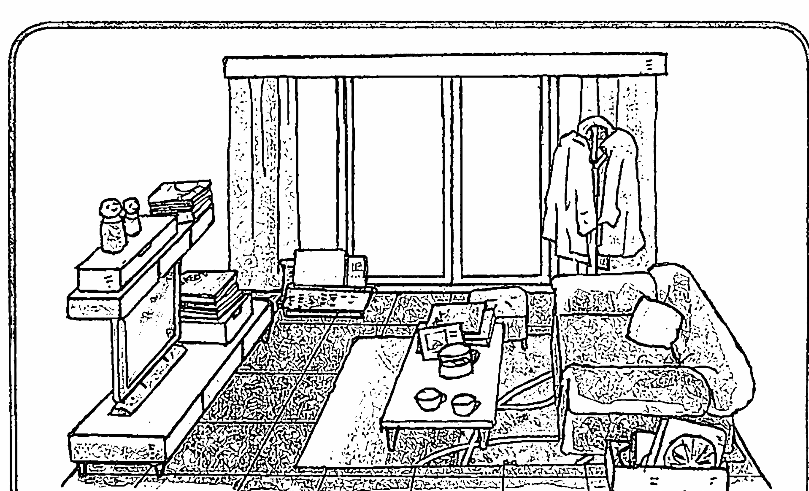

## C 選項最多的朋友

你的房間等級屬於「安心空間」

你的未來：不好也不壞，平平淡淡。

◎詳細解說請見第 60 頁

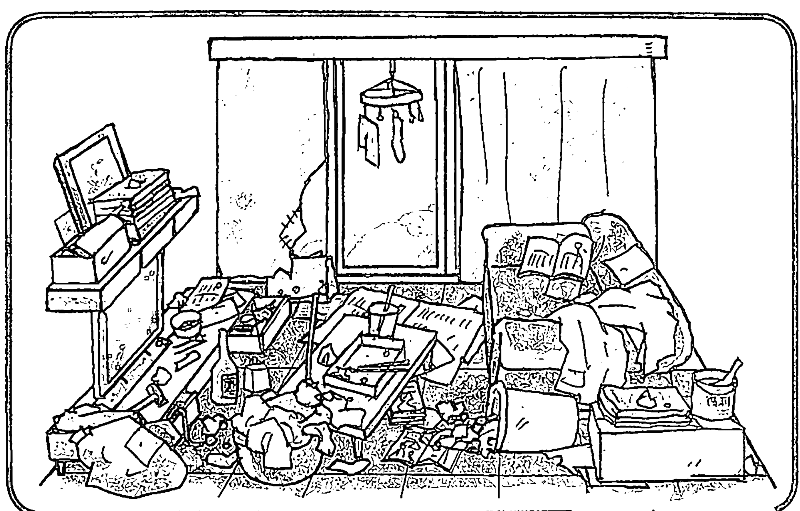

## D 選項最多的朋友

你的房間等級好比「危險四伏的空間」

你的未來：將會有負面的徵兆。

◎詳細解說請見第 66 頁

## E 選項最多的朋友

你的房間等級好比「超級危險空間」

你的未來：將會危機重重、瀕臨崩潰。

◎詳細解說請見第 72 頁

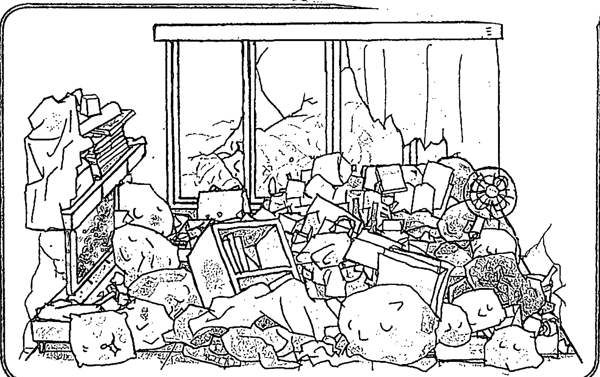

# 【前言】
命中率90%的未來鑑定法

本書將幫助你了解你的未來。

但就算知道未來的走向，又能怎麼樣呢？

如果知道自己的未來一片光明，你就能更有自信，放手一搏。

反之，如果預知的結果不甚理想，也能及早預防。

這全新的方法，能幫每個人預測自己的未來。

只要掌握訣竅，無關年齡、性別、國籍，任誰都能預知今後發生的事。

而且，這種方式不僅限於個人，也能預知企業、學校乃至於都市城鎮的未來。

方法相當簡單，且命中率高達九○％以上。

到底是什麼方法這麼神奇呢？

這個方法就是「觀察你的房間」。

房間？

沒錯，就是房間。你的未來，就掌握在你的房間之中。

在我為期二十一年清掃工作的職涯中，我看過無數的房間，從中領悟出以下的心得。

世上沒有完全一樣的房間，房間會顯現出裡面居住的人數。

房間會顯現出主人的人格特質。

「房間會顯現人心」，而這個「顯現人心的空間，最終將會吸引同性質的能量」，這是一個恆久不變的法則。

從那之後，我運用這個法則，提倡用「掃除力」來扭轉運勢。

「掃除力」系列書籍，至今出版量已累計二五〇萬本。

掃除力系列書籍迅速滲透至各大公司、學校，近來更推廣到中國，成為
暢銷書，今後的發展仍舊指日可待。

世界各國的人，也出現許多藉「掃除力」逆轉人生的案例。

本書就是以掃除力為基礎，創出「房間未來鑑定法」。

你們覺得如何呢？有興趣一試嗎？

本書絕不是單純的占卜。

閱畢後，你就會了解到你的未來完全操之在己。

也可以實際體會到「你絕對有能力去改變自己的未來」！

# 【推薦序1】

# 透過你的房間預知並且改變你的人生

我一直認為，能把房間打理好的人，工作及人際關係一定也能處理得宜，因為照顧好自己是最基本的啊！

這例子在我姨丈身上看得到。姨丈有潔癖，不容許地上掉落頭髮、洗手台周邊水漬沒擦、浴室淋浴間溼答答，所以家裡多年來仍像漂亮的樣品屋，一點也沒有隨時間折舊，這樣的姨丈是做什麼的？他是個成功的鑽石商人，不用我多解釋，有鑽石這兩字就夠了，完全驗證明亮的空間有明亮的人生。

所以要想成功，就得營造出成功者的空間，白話一點的意思就是，學學成功人士怎麼過生活。《算運：整理房間，就是整理運勢》書裡告訴我們，成功空間的特徵有清爽、明亮，沒用的物品不會亂堆，東西一定收納整齊。

咦？這不就在形容我家？

我大學時期寄住姨丈家，耳濡目染下也養成隨時打掃家裡的習慣，每天起床的第一眼，或是下班回家的那瞬間，迎接我的都是整齊舒服的明亮空間，如此一來，不論是早起的起床氣，或是工作一天的疲累，通通在推開門的瞬間煙消雲散，這就是空間磁場帶來的正面能量。

按照《算運：整理運勢》書裡所說的，房間整齊了，未來就會前途無量。好吧！就算沒有因為房間整齊，「錢」途跟著來，但至少心情會很愉悅，做起事來更有動力，人生也就更有方向。所以，如果你正愁找不到人生方向，快來讀《算運：整理房間，就是整理運勢》，它能幫助你整理空間、思緒及心靈，透過你的房間預知並且改變你未來人生，讓你的人生往美好的路前進。

蘋果日報突發中心文字組前副組長、部落客人字拖小姬

李姝姮

# 【推薦序2】
房如其人，騙不了人

終於有一本跟大家分享如何從房子預測未來的書了！我非常相信，這輯其來有自。

一個人的性格會完整的展現在各個地方，說什麼話、穿什麼衣服、吃什麼東西、交什麼朋友、看什麼書，甚至住在什麼樣的空間裡，都掩飾不來。

想認識一個人最快的方式就是看他的房間。

十五年前，當我踏進黃博的房間（學生套房），就知道他是一個（可以讓我過好日子，噗）可靠的人。他的廁所簡單乾淨，沒有太多瓶罐。書架上的書按照內容分類，再按照高低排列，井然有序；書桌整齊，抽屜乾淨。他特別費心整理過，日復一日也沒弄亂他的環境。事實證明他果然是個單純、做什麼事都用心、認真、全力以赴的人。十五年後，他的人和表現也和當時的房間一致。

很多人住進一個新房總愛請風水老師、命理老師、通靈老師來一看再看才能安心。台灣的風水命理節目也因為這樣的特殊文化一個一個竄起，深受歡迎。很多老師都說，進了屋子，感受自己的直覺最重要，空氣好不好？有沒有壓迫感？日照太暗或太強？窗景好不好？風量太大或太小？

我是個相信直覺的人，找房子一定先看廁所乾不乾淨，平常也花最多時間整理廁所。二〇一一年時，日本有一首爆紅的歌曲《廁所女神》，歌曲長達十分鐘，連台灣都為之瘋狂。歌詞寫著：「奶奶說廁所裡住著一位美麗的女神，如果把廁所打掃乾淨的話，也可以變得跟女神一樣美麗喔！」這首歌爆紅之後，全民開始掃廁所！就是希望自己也可以變得像女神一樣美麗。

廁所是一個人的內在。一間餐廳的廁所乾乾淨淨，廚房衛生應該也值得信任。同樣的，一個家的廁所乾乾淨淨，這家人的習慣一定也不差。

還想知道更多？趕緊翻開《算運：整理房間，就是整理運勢》吧！

諮商心理師、暢銷作家、部落客貴婦奈奈

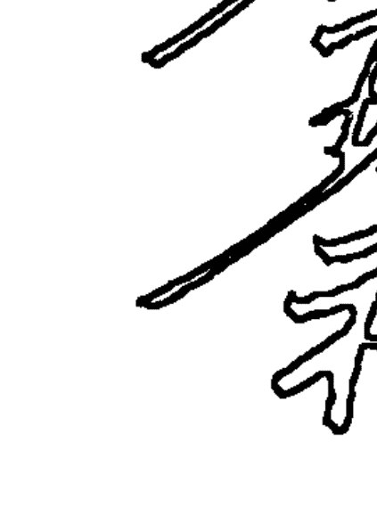

# 第 1 章

## 為什麼
光看房間就能預
知未來呢？

Your Room Shows Your Future!

## 不是占卜，也不是超能力！
全新未來鑑定法

我可以預測到自己今後所發生的事。
我不僅能掌握我個人的未來，也能預料他人的未來。
甚至於公司、學校、城鎮等各個組織團體的未來，也在我的意料之中。
這個預測未來的命中率高達九○％以上，這一點震驚許多人。
事實上，只要抓住大概的技巧，誰都能輕易擁有這項預測未來的能力。
當然，你也能看見自己的未來。

方法無他，就是「觀察受測者的房間」。

只要看過一個人的房間，就可以預測屋主的未來。
透天厝的話，只要看房子的外形，就可以知道屋主的人格類型，以及他

的未來。
再進一步確認各個房間，就連屋主的工作、經濟、健康等方面都可以觀察得到。

前幾天，我受到某公司女性負責人的委託。
她想要擴展公司的規模。但在參觀公司之前，要求我先看一下她的住家。
我參觀過後，馬上作出這樣的預測：「妳的公司，未來業績將提高二至十倍。」

十天後，我接到她的電話，她說之後公司意外地接下一大筆訂單，業績已突破原先的十倍之多。

有一次，某位朋友向我求救，希望我幫他解決他朋友的問題，所以請我去看一下那位友人的房子。

看過那間房子後，我老實地跟房子女主人說：「再這樣下去，你們很可能會離婚；尤其妳的小孩會很容易生病、受傷，需要特別注意。」

雖然當時我也提供了解決方法，但似乎來不及了。幾天後，那位女主人

為什麼
光看房間就能
預知未來呢？

打電話給我，哭著說：「我老公在外頭打人，現在被抓到拘留所了。公司也倒了，看來不得不離婚了。」

進一步追問下，才知道是因為小孩被車撞，雖然傷勢不重，但老公卻為此犯下了傷人罪。

還有一次，一位單身的女性職員想知道她能不能找到男朋友，而讓我參觀了她的房間。遺憾的是，照目前的房間看來，她很難交得到男朋友。

但是，她在工作上則可望有優異的成果，得到升遷的機會。

她的未來正如我所預測，她之後確實在工作上一帆風順，但到現在都還沒有男朋友。

「要怎麼做，才能擁有舛田先生這樣的超能力呢？」

我的預測命中率高到讓許多員工和客戶都感到相當驚訝。

當然，我並沒有什麼超能力，也不具備任何占卜的知識。

我預測的關鍵，就在於我長久以來提倡的「掃除力」。

## 21年的房屋觀察有感

「掃除力」是一種逆轉命運的工具，就是將打掃產生的能量轉為自身的理念之一，藉此創造出正面連鎖效應的磁場空間。

歷時二十一年，在我看過多數的房間後，終於觀察出打掃和心靈之間的關係。

截自目前為止，我做過的幾分工作，幾乎都要進到對方的房間中。

像是在做家教時，因為跟家長互動良好，對方會要求我到家中為他們的孩子作諮詢，為此我必須定期遊走於數個家庭之間。

我工作資歷最長的，當屬清掃的工作。這分工作也讓我研發出了所謂的「掃除力」。

那時為了打掃房子，我曾進過無數的房間，一天最多可掃到三家。其中包括老年人的房間、新婚夫婦的房間、學生宿舍、員工宿舍、有錢人的房間、

債務人連夜潛逃後的房間以及外國人的房間……等等。

此外，我也看過很多公司辦公室及店鋪。

許多大企業董事長的辦公室以及新商品研發的地方，通常都嚴禁公司以外的人進入。但由於我是清掃人員，通常可以進得去。

在看過多數的住家和房間後，我歸納出了二大法則。

### ◎ 法則 1 人心顯現於房間

就我二十一年觀屋經驗，得到了一些心得。世上沒有一模一樣的房間，房間的間數可看出家庭的成員。世上人形形色色，「每個人都擁有一間房間」。

仔細觀察一下，就會發現房間和人可以完全畫上等號；換句話說，就是房間可顯現出主人的人格特質。

因此，我所領悟的第一個法則，就是「人心顯現於房間」。

當抱怨充斥於心，猜忌、憤怒、嫉妒、貧困和難以壓抑的慾望等負面能量占滿思緒時，房間必定東西多而雜亂、滿地灰塵、髒亂至極。從事打掃的

工作，難免會要收拾犯罪或災禍的現場，那髒亂的程度自然不在話下。
反之，當一個人心中充滿關懷、信任、夢想和希望，擁有謙虛和感恩等正面能量，房間必定相當乾淨，東西少且收納整齊。
我想跟各位讀者分享一個實際案例。
在我從事打掃工作的期間，曾定期到某個家庭打掃。
那時能請人到家打掃的人，家境必定相當寬裕。那棟屋子的主人，住的是豪宅，車子也有二至三台。
乍看之下，他是一位成功人士，但終歸一樣米養百樣人。
我很納悶他的房子為何會如此髒亂？
大量的番茄醬沾滿整面牆壁，彷彿醬汁從牆壁中爆裂而出。醬油和味噌湯灑在地板上，衣服脫了就丟，東西不歸位，真是亂到極點。
我每星期去一次，從中漸漸觀察到屋主的特質。
住在那樣的屋子裡，家庭必定不會美滿；錢賺得再多，老公也不會回家，留下焦躁的老婆在家對孩子亂發脾氣。

偶爾家人相聚，必定陷入激烈的爭吵。家庭中混亂的狀態，原原本本地顯現在這間房子上。

不久後，這一家就停止雇用清掃人員。據說是因為家庭失和、夫妻離婚，突然宣布破產；原因眾說紛紜，但終究脫離不了財富地位不保的可能性。

同樣是富裕人家，另一家卻過得幸福美滿。

屋內的空間就像旅館一樣，踏入的瞬間就讓我感到朝氣十足。主人總會滿懷感恩的在門口迎接我，有時候還會跟我一起打掃，並且認真地向我討教清掃的秘招，竭盡全力的維持家中清潔。

小孩個個有禮貌，爽朗有朝氣。一次機緣下，我終於看到男主人，不出所料，他是一位文質彬彬的紳士，我暗自以他為標竿，希望有朝一日能和他一樣成功。

這些經歷，讓我體驗到人心確實顯現在他的房間裡，而人的幸與不幸，也可以從房間看出端倪。

### ◎ 法則 2 空間自有磁場，吸引同質能量

從房間與人心的法則中，我還有另外一項大發現。
「空間自有磁場，會吸引同質的能量。」
屋主的心境會顯現於房間，而這個空間也會具有某種能量，對屋主產生影響。

這個空間所賦與屋主的能量，我稱為「空間磁場」。

舉例，當你陷入低潮、煩躁、焦慮、嫉妒或抱怨連連時，你的住處就會骯髒雜亂、灰塵遍布，這主要是心中的負面能量導致。

這個空間，創造出負面的空間磁場（負面空間）。負面空間則會吸引同質的負面能量，讓負面的磁場與日俱增，不幸的惡運接踵而來。

反之，當你態度正面積極，心存感恩、慈愛、知足，你的房間必定整潔清爽，充滿正面的磁場，所有幸福好運就會紛紛降臨。

這就是所謂的「物以類聚」，也就是所謂的「吸引力法則」；簡單來說，就是同性質的能量會互相吸引。
物以類聚的原理也可適用於空間。人的心境會顯現於房間，而房間本身也會對主人造成影響。
你是否也有受過空間磁場的影響呢？
例如，上班族 A 先生終日暴躁，對工作、人生有諸多不滿，這股負面的能量自然就會顯現於房間，創造出一個雜亂、骯髒的負面空間。
早上起來總覺得精神不濟，慌慌張張地趕到公司，就算「身體沉重、毫無幹勁」，也不得不去上班。
但是一到公司，跟同事講一下話後，就會重新打起精神來。在這個狀態下，出外跑客戶接單，總能達到意想不到的效果。
精神恢復後，心中也出現很多想法，像是下定決心「今天回家後要念英文」、「要整理房間」等等。
就在這個時候，你決定「好！今天回家我要馬上開始念書」，但是一打開家門，卻看到鞋子佈滿整個玄關和成堆的垃圾，後面還有一個髒亂無比的房間等著你。

你那雄心壯志就在進入家門那一刻消失不見，並且突然感到疲累不堪，覺得「今天已經完成很多事了，明天再做也沒關係」，於是打開電視、窩進沙發，陷入無止境的墮落。

你有沒有過類似的經驗呢？

待在家中，總覺得被一股負面的能量圍繞，當出外與人接觸後，立刻又打起精神；然而，回到家中後，這股正面能量卻消失得無影無蹤，很神奇對吧？

彷彿是空間的業障。負面空間對人產生的不良影響，消除你所有的正面能量，讓你充滿負面能量，也為你招來諸多不幸。

一位德國心理學家指出，辦公室中只要有一位員工的辦公桌雜亂不堪，公司就會損失上千萬的歐元。雜亂的桌子會創造負面磁場，對其他員工產生不良影響，進而打擊公司業績。

相反的，當一個人態度正面積極，期望能為眾人帶來歡樂，為家人帶來幸福，為顧客創造成果，這個人所在之處必定瀰漫著正面磁場，為他人帶來能量，好運紛紛降臨。

### ◎每個房間都有各自意義

「人心顯現於房間」、「空間的磁場會吸引同質能量」這二大法則，讓我領會出一些道理。

藉著打掃房間，來改變屋主的心境，讓他的命運從此改變。

這就是我長久以來提倡的「掃除力」成功法則。

掃除力中的「換氣」、「捨棄」、「去汙」、「整理」，如此簡單的步驟，任誰都能輕易實行，為人生創造奇蹟，打造出正面的空間。

以這二個法則來觀察房間後，我體會到每個房間都有各自的意義。因為，房間終究是依照人的想法和目的的需求創造出來的。

舉例，人為了取得食材，放餌捕魚，而捕來的魚，通常會在固定的場所料理，這每日烹調食材的場所就稱為「廚房」。

在「餐廳」吃飯，在「客廳」休息，在「臥房」就寢。

由此可見，所有的場所都是依照主人的想法塑造而成的；因此，每個場所也會反映出主人的心境。然而，依照風水的說法，則認為每個場所本身富有能量，而人會受到這個能量左右，和掃除力的概念可說是背道而馳。

人在做任何事時，都會有自己的用意，為此創出各種房間，而每個場所都顯現出主人特定的心境。

例如，人在廚房做菜，為了家人的健康，用心準備調整食材，對家人的愛就會反映在這個空間裡。因此，廚房髒亂，就會影響到你的戀愛運勢。

臥房是為你消除疲勞的所在，代表你的身心健康。臥房不清潔，你的健康就會出問題。

如此可見，每個房間都具有特別的意義。

只要觀看一個人的房子，就可知道主人所煩的事，以及當下面臨的問題。

就算短期內相安無事，但持續待在這個負面空間裡，負面磁場將持續招來同性質的能量，總有一天災禍會降臨到自己身上。看房間，即可預知未來。

為什麼光看房間就能預知未來呢？

## 解讀自己的未來，你的人生就會一帆風順

首先，只要看你的房間（或是整間房子），就可以了解你人生的現況，以及未來的走向。

做一些運用調整後，利用各個房間（廁所、玄關、廚房等）搭配組合，就可診斷出具體的工作運勢和金錢運勢等，預測出你未來個別的運勢。這個部分，第三、四章將會有詳細的解說。

其中，可能有人會認為「反正現在房間髒得很，就算知道未來如何，也只有窮擔心的分吧？還不如直接教我清潔的方法吧！」。

但是，我寫這本書教各位預測未來的方法，其實有一個很重要的目的。

客觀地了解當下情況，才能真正逆轉命運。如果你一直逃避現在，也不會有機會走向未來；唯有清楚了解當下自己所處的狀況，才能夠採取具體的行動。

再者，了解自身未來的走向，也會成為你啟用掃除力的關鍵。
也就是說，你不太容易被打回原形，能長期維持房間清潔的狀態。
最近，房間未來鑑定法改良後，我才漸漸發現到，大多數的人都無法把握自家房間的現況。

一位報名參加鑑定的B先生說：「我開始實踐掃除力了！」並很開心地笑著說：「我前途將一片光明對吧！」

當我滿懷期待造訪B先生的住家時，我忍不住問他：「你真的有打掃過嗎？」

其實，這種人到處都是。在人前大言不慚地說：「我剛打掃過房間，你們可以來我家了。」但一進入屋內，卻發現屋裡垃圾堆滿地，才剛踏進去，身體就出現噁心想吐，局部癱瘓的現象。

我再次體認到，每個人對於「整齊」的標準大不相同。
因此，我覺得有必要設計一套客觀的方法，讓大家能夠去歸類自己房間的等級。讓大家用客觀的方法，將「房間分為五個等級」。

客觀來說，最高級的空間為「天使空間」。

其次為「成功空間」。

中間為「安心空間」。

中下為「危機四伏的空間」。

最下級為「超級危險空間」。

用這個方法，將房間歸類成五個層級，為空間作分類。

第二章將會解說各個空間等級，分別會引發什麼樣的現象，又會為屋主帶來怎樣的未來。

接下來，我將說明「五大重點」，作為這五個房間層級的分類標準。

## 了解房間等級的五大重點

這「五大重點」，可以判定你房間的等級，解讀你的未來。
從這五個層面來觀察一個房間，就能歸納出空間的等級。五大重點如下：

- 1. 氣氛
- 2. 整潔度
- 3. 擱置度
- 4. 整體感
- 5. 東西的量與收納程度

這五大重點如次頁的圖所示，分為極好（A級）、好（B級）、普通（C級）、差（D級）、極差（E級）五個等級。

確認以下五大重點，用總分算出平均值；如此一來，就可以判定你現在的房間屬於哪個等級。

## 空間鑑定的「五大重點」
Your Room Shows Your Future !

| | A | B | C | D | E |
|---|---|---|---|---|---|
| **氣氛** | 感動、感恩之情流露、情感豐富，內心感到滿足踏實 | 思緒清晰、視野明亮、充滿幹勁 | 安心感、沒有特別感到舒適或不舒適 | 失去幹勁、疲憊不堪 | 想吐、頭暈、身體微恙 |
| **整潔度** | 眼睛看不到的地方也相當整潔、空氣清新 | 每個角落皆一塵不染、已經達到技術上的清潔標準 | 乍看之下很乾淨，仔細一會發現縫隙中累積了不少灰塵，用洗潔劑清洗可清下許多髒污 | 眼睛所見之處可見灰塵髒污，有些地方長年未打掃 | 灰塵髒污充滿每一個角落，髒亂到極點 |
| **寬適度** | 為讓來客有個舒適的空間，東西都收納有度 | 為讓自己有個舒適的生活空間，東西都收納有度 | 有3件以上的東西，1年以上未丟棄或未修理 | 將想丟棄或想修理的物品堆棄在陽台或儲物間 | 毀損的物品、廢棄物、垃圾占滿了整個空間 |
| **整體感** | 整體概念統一，提供來訪者視覺上的饗宴 | 依自己的喜好來設計整體的概念 | 設計概念並無統一，但整體搭配並不會特別突兀 | 整體概念七零八落，能用的物品都拿來用 | 破損、雜亂、髒污成為房間的統一概念 |
| **東西的組織收納程度** | 沒有多餘的物品，空間裡的物品都注入主人的愛 | 收納時，總是讓空間保持一點餘裕 | 東西越收越多 | 所有的空間都被物品占滿，連踏腳的空間都沒有 | 東西滿到房間外 |

那麼，接下來我就針對這五大判定標準作詳細解說。

### ◎ 檢查重點 1 氣氛

檢查房間時，首先要檢查你房間的「氣氛」。這是我在觀察房間時最重視的部分。

直覺至上。

例如，進到委託人的家中時，我會立刻檢查房內的氣氛。一進房間，就可判定氣氛是好是壞。

一般而言，不好也不壞，難以歸類的房間都歸類為 C 級，這個等級的房間會給你一股家的安全感。

當一個空間，讓你一踏入就「沒幹勁」、「感到疲憊」，則屬於 D 級。

如果一個空間，不僅讓你精力散盡，還會使你出現「頭痛」、「頭暈」、「想吐」等身體不適的現象，則屬於 E 級。

相反的，當一個空間，讓你在踏入的瞬間，就感到「精神奕奕」、「感覺良好」、「充滿幹勁」、「神清氣爽」，則為B級。

一個空間讓你「充滿感動」、「賦與你豐富的情感」、「文思泉湧」、「流露出感謝之情」，則屬A級。

一開始可能會覺得很難判斷。而且，在一個場所待得時間越長，感覺越容易麻痺。

這個時候，你可以從一般店鋪、旅館、辦公室等空間，揣摩初次踏入時感受到的氛圍，來藉此磨鍊你的直覺。

### ◎ 檢查重點 2 整潔度

第二個重點是「整潔度」。檢查各個場所的灰塵和污垢。

你的房間會不會外觀乍看清楚，但傳真機和電話卻充滿污垢，櫃子、牆壁、地板的角落都布滿灰塵呢？

這種房間，仔細一點就可以看到灰塵，但還算整齊，屬於C級。

雖然一星期會用吸塵器吸地幾次，但還是有一些細節沒有照顧到；這是因為屋主並不具備任何打掃的技術和知識，只能盡其所能維持清潔的緣故。

當屋主沒有定期打掃，眼睛看得見的地方布滿灰塵和髒污，對於髒亂也不在意，就屬於D級空間。輕微的髒亂，反而能帶給人安心感。

再來，四處髒亂不堪，累積陳年的灰塵與髒污，就屬於E級空間。像是廚房充滿油垢，窗緣牆壁徹漬叢生，髒到最高點。

相反的，房間的每個角落都潔淨無瑕，屋主會善用螺絲起子等工具來消除牆角的髒污，屬於B級空間。而且屋主熟悉每種髒污適用的清潔劑，乾淨到讓人讚不絕口。

當一個房間，連一般人看不到的地方，例如衣櫥內部、桌子內側、冰箱裡都清理得乾乾淨淨，空氣長保清新，即為A級空間。

代表場所為魔法王國迪士尼樂園，其中的人氣設施飛越太空山（Space Mountain），據說在夜晚亮燈時，每個角落都一塵不染。

實際上，白天啟動的時段，雲霄飛車在一片漆黑中穿縮，根本不需要打掃得太仔細，但他們還是會徹底打掃每個角落。

### ◎ 檢查重點 3 擱置度

第三項為「擱置度」，觀察空間裡所擱置的東西。
一年以上想修理、想丟棄的物品超過三件時，即為 C 級空間。我相信在老家裡，一定有很多放置一年以上的物品吧！
當這些待丟棄、待修理的物品逐漸累積，擱置二至三年，堆滿陽台、儲物間以及住家四周，就屬於 D 級空間。
想找一天清理，卻總是一天過一天，家中東西的量越來越多，占滿了陽台、儲物間和屋外的空間。廢棄的輪胎、小孩的腳踏車等垃圾，不知不覺已擱置在家中數年之久。
當廢棄物品擱置於家中超過十年，房間中充滿了各類廢棄物、髒污和垃圾，即屬於 E 級空間，也就是所謂的垃圾屋。
另一方面，當一個空間完全沒有放置任何屋主不需要的物品，為 B 級空間；東西壞了即修，廢棄後立即丟棄，為了長保家中清爽，幾乎沒有放置多餘的物品。

再者，當你能從「為自己營造一個舒適的空間」轉為「為他人營造一個舒適的空間」，將注意力從自己移到他人身上，即為A級空間。

客人來訪時，讓外人看到房間內的廢棄物品是一件失禮的事。例如店裡電燈泡壞掉不換，客人走進來，看到廢棄的電燈泡，難免會覺得掃興。這就不能算是一個舒適的空間。

A級空間和B級空間，幾乎不會擱置非必要的物品；但空間的目的是為了滿足自己還是款待他人，就會造成空間等級上的不同。

### ◎ 檢查重點 4 整體感

第四項為「整體感」。

這時要觀察家的外觀、內部的家具、窗簾、沙發和布質素材的設計風格是否統一。

一般而言，正面空間大多具備整體感；反之，負面空間則都缺乏整體感。

當房間內的用色、設計概念大致統一，卻不全部統一。多數家具和布材只為了「便宜就買」、「急著要用不得不買」，但整體的搭配還算合宜，則為C級空間。

當一個房間缺乏整體感，讓人感到七零八落。「有什麼用什麼」、「別人送的就用」，這種貪小便宜心態所打造出來的房間，為D級空間。當一個空間缺乏設計概念和整體感，空間裡的廢棄物就會增多，最後讓垃圾主宰你的房間。

當家中的家具布材破損不堪，髒到看不出原形，這時空間已經被髒污和雜亂所占據，即為E級空間。這個空間顯然被負面磁場圍繞，讓雜亂和骯髒占滿整間屋子。

相反的，當你有明確的生活願景，想要過著舒適的生活，自然能營造出舒適清爽的空間，這個空間即為B級空間。

舉例，你可以採用北歐風或亞洲風為主軸，或以古董家具和印花布材為設計軸心，也可以創造英國風的自然療癒空間……等等。

在決定設計概念時，試著創造出「讓對方感到舒適的空間」，添加征服人心的要素，就可以升級為A級空間。

例如，東京的文華東方酒店，是所有文華酒店中，最能傳達美好的東方要素的所在，以提供顧客「舒適空間」為宗旨。

服務業，就應追求服務上的整體感。

就算是個人的住家，只要力求為家人打造舒適的空間，秉持著服務的精神來設計空間的美感，也可以進入A級空間的行列。

### ◎ 檢查重點5 東西的量與收納程度

第五項為「東西的量與收納程度」。

檢查餐具櫃、書櫃、衣櫃、桌子抽屜、櫥櫃，檢查房間整體東西的收納程度。

空間內正面磁場越強，東西越少；負面磁場越強，東西越多。

雖然房間不亂，但東西仍超出收納器具之外。例如，東西堆到衣櫃和櫥櫃上，以及冰箱和書櫃周圍。或東西過多，堆到櫃櫃之外，餐桌上也放著醬油瓶和筷桶。

東西過多，無法放置於收納空間之內，即為C級空間。

將多出來的東西布滿整個地面，房間連走路的地方都沒有的情況，則為D級空間。由於多出來的東西堆到櫃櫃上和地面角落，成堆的東西傾倒而下，地板可用的面積越來越小。

而當散落到地面上的物品過多，堆至屋外，即為E級空間，這個時候你的房間已經成為一間垃圾屋。東西亂放，廢棄物品也沒有適時淘汰，東西的量多到難以處置的地步。

相反的，東西放進收納空間仍然覺得空間很大，東西少，房間顯得寬敞，則為B級空間。

由於設計理念明確，屋內物品都為必要品，餐具櫃、書櫃、衣櫃、桌子的抽屜、壁櫥等收納空間尚有餘裕，排放整齊。

如果在B級空間中再多下點工夫，考慮到他人的眼光，試著為他人營造一個舒適的房間，即為A級房間。

處在A級房間裡，屋主可以輕易掌握每樣東西的位置。房間的物品，包含屋主的愛。

如何呢？

我在檢查房間時，都會從這五個細項逐一檢查，來判定房間的等級。

本書為服務多數讀者，特別在第六頁設計「房屋等級檢測表」，讓每個人都能輕鬆檢測自己的房間，判定房間的等級。

你的房間是屬於何種等級呢？

第二章中，我將詳細解說每個空間所會發生的現象，又會為屋主帶來怎樣的未來，並舉出實際的案例。

為什麼光看房間就能預知未來呢？

# 第 2 章

## 解讀未來的「五大空間」

Your Room Shows Your Future!

## 「5個房間等級」——你的房間屬於哪個空間呢？

每個房間都有自己所屬的等級。
你當下房間的等級，將會引導你的未來。
第一章中，利用空間鑑定的「五大重點」，設計成簡單的「房間等級檢測表」（請見第六頁）。

我相信大家已經檢測過了吧！你的房間是屬於哪個等級的呢？
本章將詳細解說各個房間等級所代表的意義。

請見左頁的圖表，前二級屬於正面空間，中間屬於普通空間，後二級屬於負面空間，共分為五個等級。

最上級的正面空間為「天使空間」；次級的正面空間為「成功空間」；
中間的普通空間為「安心空間」；中下級的負面空間為「危機四伏的空間」；
最下級的負面空間為「超級危險空間」。

### # 5 個房間等級
Your Room Shows Your Future !

正面空間 ← → 負面空間

| 房間等級 | 天使空間 | 成功空間 | 安心空間 | 危機四伏的空間 | 超級危險空間 |
| :--- | :--- | :--- | :--- | :--- | :--- |
| 能量組成因素 | 和諧、發展、征服人心 | 和諧、安心、發展 | 和諧、安心 | 抱怨、沮喪、憤怒、嫉妒 | 失望 |
| 房間案例 | 五星級飯店、大教堂、伊勢神宮、迪士尼樂園 | 成功企業家、部長、明星的家 | 家鄉的老家 | 門可羅雀的餐廳、人煙稀少的旅館 | 垃圾屋、犯罪現場 |
| 屋主類型 | 成功人士 | 有上進心、有明確人生目標的人 | (基本上) 好人，卻容易隨波逐流 | 自私自利、自我中心 | 破壞狂 |
| 提高房間等級的掃除力 | 「捨棄」+「去汙」+「整理」+「舒適空間」 | 「捨棄」+「去汙」+「整理」+「舒適空間」 | 「捨棄」+「去汙」+「整理」 | 「捨棄」+「去汙」 | 委託友人或業者進行「捨棄」的工作 |

解說未來的「五大空間」

這個世界上，每一種人的房間都能納入這五個等級。不能完全符合時，取大約值即可；有時，用檢測表作測驗時，會出現數量相同的選項，「可能介於危機四伏空間和安心空間之間」，這個時候請同時閱讀兩方的注意事項。那麼，接下來請容我逐一說明吧！

### 安心空間：充滿重生與和諧的家鄉氣息

我們先從中間的空間開始說明吧！這個空間不好也不壞，立於一個中間的灰色地帶。如果你屬於這個空間，算是勉強合格；而我相信大多數的人都會落到這個空間。
我稱這個空間為「安心空間」，支配這個空間的能量為「和諧」。
我所謂的「安心空間」，就像你的「老家」，是個如故鄉般的空間。例如，

#### 「安心空間」的特徵

- ◎不好也不壞，沉靜的氛圍（就算稍有髒亂也不以為意）。
- ◎平日有打掃的習慣，但仔細一看，還是可以見縫隙中的灰塵髒污。
- ◎想丟棄、想修理的物品擱置一年以上，並且數量超過三個。
- ◎家具和布材的設計和用色不統一，但整體搭配並不突兀。
- ◎東西無法收進收納場所（餐具櫃、書櫃、衣櫃等），必須放置到別處。

這個空間，雖然看得出屋主盡其所能的維持內部清潔，但整體而言，仍然有點凌亂，稱不上乾淨清爽的空間。

房間的擺飾長年不變，每次回去都一樣，柱子上有孩童時代留下的刮痕，這「恆久不變」的安定感，塑造出這個「安心空間」。這也是家鄉總能安定人心的原因之一。

最近，我的老家有了無線電視基地台，於是買了一臺四十六吋大電視放在客廳正中央，讓我很不習慣。古老的住家，突然來了一個現代化的東西，顯得相當突兀。

雖然一成不變，缺乏清爽感，但在家人的細心整頓下，讓空間的磁場充滿著「和諧的能量」。讓所到之人感到安定，一回到老家，就能悠閒渡假。

這股和這股和諧的能量，頗能「治癒人心」，賦與你重生的能量，療癒你疲憊的身心，以及受傷的心靈。

安心空間的屋主，基本上是個溫柔體貼的好人。即將陷入負面空間的人，只要進到這個空間，暴戾的心也會柔和安定下來，人生就此改變。

我在二十幾歲時曾歷經一個很大的挫敗，當我求助無門時，我的父母跟我說：「兒子，回家吧！」於是我在家待了一個月，療癒心中的創傷，重新賦予自己重生的能量。

#### ◎ 你的未來「不好也不壞，平平淡淡」

這個空間，能帶給屋主一個安定的未來，沒有大好也沒有大壞。雖然偶爾會遭遇些許小災禍，但空間本身吸引的磁場以好事居多。

然而，這個空間可帶給你安心和安定，卻無法期待更大的變化、發展與興盛。

需要注意的事是，不要被景氣和周圍的狀況所左右；不要為長期的不景氣和一些小事故，而將生活過得一團亂。

我的一位朋友I先生，三十餘歲，在一般公司上班。由於近年景氣一片低迷，I先生的公司也深受其害，業績一蹶不振。不但領不到加班費，公司對業績的要求也越來越嚴苛。

這個情形，讓向來待人和氣、努力工作的I先生感到相當不滿，因而開始批判公司和主管。

然而，這個負面能量隨即反應在房間上，他的房間漸漸開始亂了起來。

「為排解壓力終日買醉，和同事講別人壞話。假日也無心做其他事，終日悶在雜亂的家中。」這時，他已經陷入了「危機四伏的空間」。

某天，當I先生拖著工作後疲累的身軀回到家後發現，窗戶已被打破，家中被小偷洗劫一空。

處於安心空間的朋友，小心不要和這位I先生一樣，一不小心，失業、公司倒閉、生意失敗、生病、受傷、家庭失和……等不幸的災禍將會接踵而來，敬請注意！

#### ◎ 吸引好運的建議事項

在這裡要給處於「安心空間」的你一些建議事項。

如果你不想被景氣和周遭的狀況所左右，對現況不甚滿意，想要晉級到「成功空間」，就需要實施掃除力中的「捨棄」和「去汙」（詳見第五章）。

確定東西需要的量，能捨則捨，讓家中的物品散發出自身的光芒。

之前提到的I先生，在家裡遭小偷後，覺得這個被外人蹂躪過的房間相當噁心，等警察離開後，他徹夜不睡，努力清除房間的垃圾，徹頭徹尾地將房間打掃過一遍。

之後，他一直將房間維持在清潔的狀態。奇妙的事發生了，他因此更能專心工作，在業界景氣低迷之際，他卻能脫穎而出，最後竟被挖角到新公司，大放異采。

將房間維持乾淨的同時，如果你想再添加一些正面的能量，晉級到「成功空間」，不妨試著統一房間的設計理念，磨鍊打掃的技術；如此一來，你會發現當下的困難迎刃而解，夢想就在不遠處。

### 危機四伏的空間：走錯一步，不幸就降臨

「安心空間」的下一級，我稱為「危機四伏的空間」，充滿負面能量。
當你的房間屬於這個等級時，代表你已經身陷危險。你會不會覺得，最近人生非常不順利呢？雖然不至於一蹶不振，但只要走錯一步，你就會落入危險禁區。

這個空間，相當於瀕臨倒閉、冷清蕭條的餐廳。
牆壁布滿油垢，上面附著灰塵，宛如咖啡色的毛髮；地板也因油垢而容易讓人跌倒。你有沒有到過這樣的餐廳呢？

而這家店的店長，因為客人不上門，而怠於打掃，隨時隨地都在抱怨。
此外，冷清的旅店，以及沉溺於玩樂的學生房間，也屬於危機四伏的空間。這種空間，擁有下列明顯特徵。

#### 「危機四伏的空間」特徵

- ◎ 想要做的事，在踏入家中那一刻就意念全消。
- ◎ 眼睛看得到的地方布滿灰塵髒污，有些地方甚至長年未打掃。
- ◎ 家中堆滿想丟棄的物品、沒洗的碗盤和沒洗的衣服（垃圾堆滿整個儲物間、陽台和庭院）。
- ◎ 家具和布材的設計完全沒有整體感。
- ◎ 東西散落在地板上，連走路的地方都沒有。

這個空間，由於沒有定期打掃，東西凌亂、垃圾滿屋，一進去就能感到「髒亂不堪」。並且充斥著「抱怨」和「沮喪」的磁場，令人一進到這個空間，就會開始焦躁或沮喪。

不久後，你就會變得愛挑三揀四、論人是非，常將「干我什麼事」、「那是他做的」這一類的話掛在嘴邊，愛嚼舌根，抱怨連連。

前一秒還鬥志滿滿的人，一進到這個空間，就覺得毫無幹勁、精疲力竭。

在這種「抱怨」和「沮喪」的磁場支配下，屋主必定會變得自私自利、需索無度。最後將無法壓抑自身的慾望，難以控制自身的情感。

於是，有些人會開始沉溺於電玩、網路或暴飲暴食。

男性會陷入賭博和愛戀女色等惡習。

女性會將重心放在戀愛、購物，並且過度在乎自己的外表（外出時總是衣著光鮮，讓人很難察覺她來自於一個髒亂的生活空間）。

此外，也有人終日沮喪，足不出戶。這個空間也孕育出許多輕度憂鬱症患者，我以前就曾經處於這個狀態。

人生的煩惱、災禍接踵而來，而他們腦中也只擔心自己的事。

#### ◎你的未來「將會有負面的徵兆」

處於這個空間，你的未來不論在工作、金錢、戀愛、家庭、健康，都會受到這個負面磁場影響。可能現階段，你已經開始感覺諸事不順。

這個時候，負面能量已經逐漸充斥整個磁場空間。
如果屋主是已婚人士，夫妻可能會常吵架，也可能完全沒有交流。
當然，這個負面磁場也會對小孩產生不良的影響。在家中受到的壓力，會呈現在他們的學校生活上，例如，遭受霸凌或者淪為不良青年、逃學翹課……等等。

金錢運勢方面，由於你愛購物亂消費而負債累累，常常會有預算外的支出，再怎麼努力賺錢，都不會有富有的一天。在這個狀態下，心情常會處於低落的情緒。

如果你一直停留在危機四伏的狀態中，時間一長就會降級為「超級危險空間」。

#### ◎ 打造輕鬆人生的建議事項

這裡要給處於「危機四伏的空間」的你一些建議事項。
現在，你已經接二連三遇到許多倒楣事，並且精力盡失、焦躁不安，不知如何是好。

沒關係，你的人生還有逆轉勝的機會。

首先，必須開始剔除這些搗亂人生的負面因素，才能讓你免除這些負面災禍。

我想跟各位分享一個實際案例，我曾鑑定過一位從危機四伏空間中逃離出來的女性。

那時我的委託人Y美小姐，芳齡二十餘歲，正面臨一場離婚判決，當時她既要照顧二歲的小孩，又要工作，還要忙離婚判決，致使她瀕臨崩潰。而在決議離婚前，她還曾受到前夫的家暴，心靈嚴重受創。

Y美小姐說：「我又要帶小孩又要忙工作，真的沒時間去研究這個地區垃圾回收的方式……。」

我到她家進行鑑定時，雖然她搬家未滿一年，公寓裡卻堆滿了垃圾袋。骯髒的程度，讓人不禁認為：「可能搬家後一次也沒有打掃過吧！」

這個狀況持續下去，不僅會拉長判決的日程，也會對小孩產生不良的影響。因此，我當下認為，她應該先將房間的等級提升到安心空間。想要脫離危機四伏的空間，首先要實行掃除力中的「捨棄」和「去污」。

因此，我建議她先從「去污」做起。

在清理洗手台水龍頭和堵塞的排水口的污垢時，她開始學會面對那個責備他人、自怨自艾的自己。

雖然她的前夫惡不可赦，但相信他也有自己的苦衷。據說在她將水龍頭擦亮，將排水口的黏液和堵塞物清除時，她也放下了對前夫的怨恨。

所謂「捨棄」，就是丟棄過去那些羈絆你繼續往前走的東西，以及令你不願意面對未來的東西。

於是，她丟掉了所有前夫送她的東西，唯一留的只有一條項鍊；雖然那條項鍊沒有很貴重，但她在收到這條項鍊的當下，是她這輩子最幸福、最受寵的時刻。

當她下定決心捨去過去和對未來的不確定感時，她開始清理令自己停留在過去回憶的漂亮衣服、包包和化妝品，以及為不安的未來所預備的衣裳。

從那之後，Y美小姐在忙碌的生活中，也能抽出時間，遵從地區的規則來處理垃圾，每周也會花一個假日來打掃。

如今，她判決一段落，也找到一分安定的工作，目前正在補習班補習預備考證照。

這個案例中，運用到掃除力中的「去汙」，第五章將會有詳細的解說。

Y美小姐的房間所用到的去汙，主要是捨棄象徵停留的過去與不安未來的物品，決定去汙的先後順序，並將工作程序細分成最小的單位。

試著養成打掃房間的習慣，一周至少一次；如此一來，就可以從「安心空間」晉級為「成功空間」。

### 超級危險空間：負面磁場，讓你諸事不順百事哀

五個空間中，最惡劣的空間當屬「超級危險空間」，這個空間有著強烈的負面磁場，並且充斥著「失望」的能量。當你不斷地抱怨和沮喪，總有一天會對人生徹底失望。

超級危險空間中，必定堆滿垃圾，甚至發生過命案，而這個負面的磁場，還可能會影響到下一位入住的房客或商店店主，可稱得上是「兇宅」。具體而言，有以下特徵。

#### 「超級危險空間」的特徵

- ◎長期處在這個環境，會出現噁心、頭心、頭暈、痲痺、頭痛等身體不適的症狀。
- ◎房間每一處充滿灰塵髒污，污垢已附著多年，一時半刻還清不下來。
- ◎房間裡全是壞掉的物品、廢棄物和垃圾。
- ◎東西堆滿整個房間，已經看不出房間的原形和家具，損毀、雜亂成為這個房間的主題。
- ◎陽台和庭院堆滿了垃圾和私人物品，周圍還會發出惡臭。

這個房間就是所謂的「垃圾屋」，已不是人可以居住的環境。

前一段時間，垃圾屋已經發展成一個嚴重的社會問題；當時出現了一個怪人，他住在一般住宅區內，也不是垃圾場，卻收集了成堆的垃圾和廢棄物。

有些人雖然沒有收集垃圾的習慣，卻長年將成堆的垃圾堆積在家中。房間內垃圾成堆，連走路的地方都沒有。

住在這個空間的人，就算周遭的人想要幫他打掃，他還會把他們趕走。

為了要隱藏自己充滿垃圾的私人生活，他們限制了自己的交友關係，總是戴著一張面具過日子。

這是因為他們無法相信他人。這個表象的背後，隱藏著他們的失望，對社會失望、對人生失望，種種都反應在他們的垃圾屋上。

可想而知，長期處於這個空間，必定會招來各式各樣的惡運在你的人生中接連上演。這完全是受到房間內負面磁場影響的緣故。

這個空間所富含的負面磁場已超出你的控制，將你的人生搞的一塌糊塗。

而住在這個空間的人，也會吸引不安與焦慮等負面能量，並表現在日常生活。

#### ◎ 你的未來將「危機重重，瀕臨崩壞」

住在這個房間的人未來不僅會遭遇不幸，還極有可能遭遇許多負面的「災禍」。人生一再受挫，越發一蹶不振，還會遇到許多事故。

已婚人士夫妻間的感情必定已冷卻，甚至於交惡。而這分不滿的情緒，終將演變成家庭暴力、自殘抑或過度冷漠。

最後，還可能造成離婚、家庭破裂、生病、負債……等等局面。

就在最近，發生了一個家庭慘劇。父母將二個幼兒遺棄，讓孩子活活餓死家中；我相信也有人在電視報導上看過這則新聞，那個家的陽台鄰到不堪入目，堆滿成堆的垃圾，家中也呈現垃圾屋的狀態。

事件現場，事後雖請打掃業者進行清掃，卻仍洗不去空間中強烈的負面能量；鄰居口中流傳著「那間店鋪不斷易主」、「那間店開什麼都會倒」、「那裡鬧鬼」、「夫妻住那一定離婚」等謠言，成為名符其實的「兇宅」。

#### ◎ 脫離不幸的建議事項

這裡給處於「超級危險空間」的你一些建議事項。
如果你希望未來能有所發展，應立即藉助他人的手實行掃除力中的「捨棄」這個動作。
到這個狀況，個人的力量能做的有限。就算有意想要打掃，也會被強烈的負面磁場干擾，不知如何著手。

前幾天，一對苦惱的父母向我求救，他們請我去看一下公寓裡的一間房間。那是一位三十幾歲的宅男U先生的房間。
進到房間後，我看到成堆的垃圾，惡臭撲鼻而來，瞬間我感到頭暈想吐。
U先生不知道要如何整理，也不知道該丟什麼，希望我能給他一些建議。
當時我嚴厲要求他「不可以對我決定要丟棄的物品有意見」，並設置業務專用的垃圾箱，請了五個幫手，大刀闊斧地丟棄大量的垃圾和廢棄物。
清掃作業中，他始終呈現一個不知所措的狀態，當他把廢棄物和垃圾搬出家門，彷彿如釋重負，頹坐於地，當場哭了出來。他哭著答應我他今後一定會振作，好好找一份工作。

之後的兩星期，U先生每天都徹底實行去污的工作；當我再次造訪U先生的房間時，他的改變讓我大吃一驚，完全變了一個人。變得彬彬有禮、口齒清晰、雙眼有神。

從房間就可以看出，U先生今後將會過著全然不同的人生。

現在，越來越多人為這個超級危險空間所困，也有很多業者專門負責打掃這類垃圾屋。

所以，不要恥於求助他人，總之就是斷絕、捨棄、脫離。如此一來，你必定能脫離接二連三的不幸，不要遲疑，快求救吧！

### 成功空間：營造成功磁場，成功者的房間

前面接連講了二個負面空間，生性敏感的人或許會感到有些不適。讓我來幫你轉換一下心情（笑），接下來跟各位談一下正面空間。比安心空間高一個等級，我稱之為「成功空間」。這個空間就是成功人士所居住的空間。

這個空間中的能量，包含安心空間中的「和諧」和「發展興盛」，居住的人也一定具備「打掃的技術與知識」。

所謂的成功空間，就像是你尊敬的部長或社長的家、成功明星的家……等等；看到的瞬間，就會覺得這個房間「宛若天堂」、「真想住住看」。

請想像一下，當你造訪年薪數倍的主管或社長家中的情景。你必定會看到華麗的房子配上精緻的家具，接著會有一位美麗的夫人端上美味的佳餚款待你。這個空間，會勾起你的憧憬之情，不禁想「如何才能住在這樣的屋子」呢、「真想過過看這種生活」。

具體而言，成功空間具有以下特徵。

#### 「成功空間」的特徵

- ◎整體而言，給你清爽的感覺。踏入後讓你視野明亮，充滿幹勁。
- ◎屋主具備打掃的技術，眼睛看得到的地方都一塵不染。
- ◎對自己沒用的物品，不會擱置在空間裡。
- ◎家具和布材的設計概念和用色依自己的喜好統一。
- ◎物品收納合宜，尚有餘裕的空間。

進到這個空間後，視野一片明亮，足以喚起你內部潛藏的力量。
重點是，這個空間隨時隨地都可以邀請人到家中，不需要的物品會立即淘汰，所有的東西都收納於收納空間之內，東西有固定的放置位置，眼睛看得到的每個角落都被擦拭得一塵不染，乾淨的程度已經達到一個「普遍」的標準。

住在這個空間的人有很強的上進心，以及明確的人生目標。所以，清楚知道自己下一步要做什麼，也多半都能專心在工作，創出自己的一片天。

進入這個成功人士的空間，就算自己尚未達到如此成功的狀態，也會有放手一搏、努力衝刺、用功讀書的衝動。這個空間可以點燃你向上的因子，逼出你潛在的能量。

房間可以讓外人看，可以招待人來，就是一種自信的表現。

此外，住在這個空間的人對清潔的標準本來就比常人高，又希望能夠精益求精；為了維持房間的整潔，平日就會研究各類清掃的技術（各類髒污的清除方式、高效率的收納方法等）。

#### ◎ 你的未來「願望將在短時間內逐一實現」

住在這個空間的人，出乎周遭人的預料，都能在短期內實現心中的夢想。

當房間東西過多，就會讓人感到不適，注意力無法集中。但是，只要將房間中不需要的東西清掉，能量自然就會凝聚起來。
因此，你會有很明確的目標，能專心於工作，創造豐碩的成果，得到加薪升遷的機會。如果你是獨立創業的人，將生意興隆，財源滾滾來。
如此一來，你的魅力也會大幅提升，這時吸引到的情人，也必定助你一臂之力。

我指導企業進修課程時，曾到過一家全國連鎖的補習班V公司，當時也看過公司全國各分校業績總表。
奇妙的是，業績前段的分校，大多是有確實實行掃除力的分校。
走訪一遭後，我豁然開朗。在徹底整頓之下，店內空間清爽，每位員工都能掌握東西收納的位置，簡直就是成功空間的寫照。

#### ◎利己利人，共創幸福空間的建議事項

這裡給處於「成功空間」的你一些建議事項。

能將空間維持得如此乾淨，你真是太優秀了。現在的你應該非常幸福，也有足夠的自信掌握自己的人生。

但務必注意，請不要以為這全是你一個人的功勞，以免這種自滿的能量破壞這個成功空間。

此外，記得兼顧工作的成就和家庭的美滿。當你超時工作時，環境就容易髒亂，也會讓你從成功空間墜入危機四伏的空間。

秉持一顆謙和的心，請你了解「今日的成就是靠許多人的幫助」，以感恩的心來面對今日的成功。

如此一來，你就可再接再厲，實行掃除力中的「舒適空間」，晉級天使空間的行列。

### 天使空間：帶給來訪客人幸福的貼心房間

這是最高級的空間，美得宛如天使下凡，舒適溫暖的空間。
這個空間的組成能量為「和諧」、「發展興盛」。
這個空間的主人，不僅具有「打掃的技術與知識」，還有利用空間「征服人心」的企圖。想要征服人心，就必須打造出一個讓他人覺得舒適的空間。
這樣的空間，好比五星級飯店，例如麗池卡登飯店、東京文華東方酒店、希爾頓系列的飯店，有魔力讓世界各地的人在踏入的瞬間就心悅誠服。
迪士尼樂園的空間設計也屬於天使空間，創始人華特·迪士尼（Walt Disney），企圖打造出一個充滿魔法、夢想的空間，讓造訪者能在這夢想的世界中得到一段奇妙的體驗，因此才能召集到一群死忠的顧客。每次造訪迪士尼樂園，都會有一定要再來一次的衝動。

此外，一些能淨化身心的宗教場所也屬於這個空間，不管你是否為信徒，都會受到這個空間所感動。諸如梵蒂岡的聖彼得大教堂、伊勢神宮，都是讓多數造訪者感動的空間。

在這裡舉出一些天使空間的具體特徵。

#### 「天使空間」的特徵

- ◎ 自然流露出感恩和感動之情，情感豐富了起來。
- ◎ 眼睛看不到的地方也精心打掃（空氣長保清新）。
- ◎ 不利己也不利人的物品絕不放置於室內。
- ◎ 意識來客的眼光，設計具有整體感，具有「征服人心」的魔力。
- ◎ 房間內只放置必要的東西，空間裡的物品充滿屋主的愛。

這個空間，好比天使下凡，讓人不自覺地流露出感動和感恩的情緒。
前一節的成功空間，雖然算是公認的乾淨空間，但終歸只是自認為舒適，自我感覺良好的空間。
但是，本節的天使空間，則消除了「自我」的成分，轉而成為能「征服他人」的舒適空間。
住在這個空間的人必定是位成功人士，但他在自身的成功外，還有強烈的意願去造福眾人。
進到這個空間，你不僅會想要奮發圖強，還會想要為他人創造幸福，導正他人的方向。
這就是征服人心的能量所創造出的效果。
為了服務更多的人，企業會去了解客戶的潛在需求，研發出熱賣商品，讓公司的業績瞬間提升數十倍，創造奇蹟。在家庭中，另一半也有望出人頭地，小孩的學習力也有望提升。

#### ◎ 你的未來將「為眾人帶來幸福，創造奇蹟」

處於這個空間，將來你必定能為他人創造出無數的奇蹟。

例如「想要讓對方幸福」、「想要讓對方有很好的發展」，只要持續這種造福他人的意念，福分最終還是會回到自己身上。

正面空間形成後，讓負面事蹟無所遁形，好運旺旺來，正面的能量將與日俱增。

前面舉的成功空間的例子，全國連鎖的補教業V公司，其中業績頂尖的分校，之後又將店內的空間從成功空間提升為天使空間。

別人看不到的地方也用心清理，並以學生的立場來設計教室。讓人進到教室中，就會流露出感動之情。

這樣的教室能夠保持業績第一，也不足為奇吧！

#### ◎ 催生奇蹟，永無止境的建議事項

這裡給處於「天使空間」的你一些建議事項。

這個空間是本書讀者最終的目標。所以給你的建議，就是持續實行掃除力中的「捨棄」、「去汙」、「整理」，打造出「舒適的空間」，征服來訪者的心。意識這幾點，努力維持天使的空間，必定能為更多人帶來幸福，靈感也會源源不絕。

# 第 3 章

## 工作、金錢、人際關係……你能否勝出？

Your Room Shows Your Future!

## 不同場所的搭配，看出你的個別運勢

前章已經教你如何判定房間的等級，並從房間來預測自己的未來。這僅限定於整體的運勢，但我相信還是很多人會想知道「我的工作運如何？」、「我會賺進多少錢？」、「我孩子會有怎樣的未來？」。

因此，第三章和第四章，將教你如何預測工作、金錢、人際關係、夫妻、子女、健康這些個別運勢。

這個部分，需參照第一章所提及的掃除力中「每個房間都有各自意義」。空間鑑定的方法，需依下列五個層面來檢視一個場所，算出空間的級分。藉著三～四個場所的搭配組合，來預測個別運勢的未來走勢。

例如，本章介紹的工作運勢，就是從辦公桌、電腦、包包、書櫃這四個空間來判定。利用九十一頁的「空間級分診斷表」，算出空間級分的分數，例如辦公桌○分、電腦一分。

### 空間級分診斷表

Your Room Shows Your future !

請依據下列表格，評價「空間級分」。「氣氛」、「整潔度」、「擱置度」、「整體感」、「東西的量與收納程度」，依這 5 個標準，於右側填入 A～E。A 是 +3 分、B 是 +2 分、C 是 -1 分、D 是 -2 分、E 是 -3 分。例如，「氣氛」= C、「整潔度」= D、「擱置度」= B、「整體感」= B、「東西的量和收納程度」= C。總分為 0 分時，為負評。（0 分也判定為負評）

| | A | B | C | D | E | 評價 |
|---|---|---|---|---|---|---|
| 氣氛 | 感動、感恩之情流露、情感豐富，內心感到滿足踏實 | 思緒清晰、視野明亮、充滿幹勁 | 安心感、沒有特別感到舒適或不舒適 | 失去幹勁、疲憊不堪 | 想吐、頭暈、身體微恙 | |
| 整潔度 | 眼睛看不到的地方也相當整潔、空氣清新 | 每個角落皆一塵不染、已經達到技術上的清潔標準 | 乍看之下很乾淨，仔細一看會發現縫隙中累積了不少灰塵，用洗潔劑清洗可洗下許多髒污 | 眼睛所見之處可見灰塵髒污，有些地方長年未打掃 | 灰塵髒污充滿每一個角落，髒亂到極點 | |
| 擱置度 | 為讓來客有個舒適的空間，東西都收納有度 | 為讓自己有個舒適的生活空間，東西都收納有度 | 有 3 件以上的東西，1 年以上未丟棄或未修理 | 將想丟棄或想修理的物品堆棄在陽台或儲物間 | 毀損的物品、廢棄物、垃圾占滿了整個空間 | |
| 整體感 | 整體概念統一，提供來訪者視覺上的安妥 | 依自己的喜好來設計整體的概念 | 設計概念並無統一，但整體搭配並不會特別突兀 | 整體概念七零八落，能用的物品都拿來用 | 破損、雜亂、髒污成為房間的統一概念 | |
| 東西的量與收納程度 | 沒有多餘的物品，空間裡的物品都注入主人的愛 | 收納時，總是讓空間保持一點餘裕 | 東西越收越多 | 所有的空間都被物品占滿，連踏腳的空間都沒有 | 東西滿到房間外 | |

空間級分總分

算出這四個空間的分數後，將分數加總。為求簡單明瞭，依最後總分的正分或負分，來作最後的評價。

## 工作運勢端看「辦公桌」＋「電腦」＋「包包」＋「書櫃」

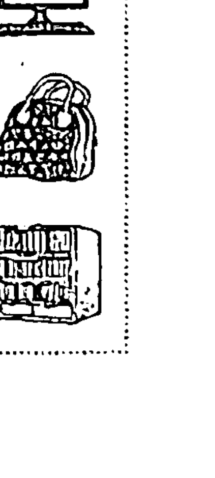

那麼，現在就來看一下你的工作運勢吧！你未來的工作運勢會顯現在辦公桌、電腦、包包、書櫃這四個空間上。

一般來說，辦公桌是保管「生財工具」的地方；電腦是「創造成果」的地方。不過這個模式只適用於從事行政工作的人員，從事技術類工作的朋友則需做一些應用調整。

我以前做打掃工作，這時保管生財工具的辦公桌就會變成收藏打掃用具的「清潔車」；而生財工具自然就是我的「打掃用具」。讀者們只要按照這個邏輯，就可以套用在各類工作上。

用九十一頁的「空間級分診斷表」來確認一下每個空間的級分吧！

### 辦公桌（公司）

了解工作能力

#### 辦公桌的空間級分

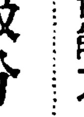

觀察公司的辦公桌，就可以看出你的工作能力。

你每日在辦公桌上工作，辦公桌上聚集了你所有的生財工具，可以明確地反應出你的工作狀態。因此，只要仔細觀察你的辦公桌，就可以了解你的工作情況。

客觀來看，只要你的辦公桌上出現成堆的資料，雜亂骯髒，就會形成一個負面磁場，拉低你的工作能力和工作效率。

想當然爾，當你每日面對成堆的工作，整天處於窮忙的狀態下，自然無法冷靜地省視自我。

奇妙的是，你常會在覺得「工作非常順利的時候」，發現自己的辦公桌已雜亂不堪。這時，你可能覺得自己還撐得下去，但實際上，你已經工作過量了。

此外，雜亂的桌子也會顯現主人當下失志無力、難以專心工作或魂不守舍的狀態。

就結果來說，雜亂的辦公桌即可代表你工作能力降低，表現出你工作過量，抑或失志無力的狀態。

辦公桌也會影響到他人的觀感，宜勤加整理，就連雜亂的抽屜，也會顯現工作能力的下降。記住，你的辦公桌將原原本本呈現你的工作狀態！

如果你讓這雜亂的狀態一直持續下去，會分散掉你的注意力，最後導致你所有的工作都半途而廢，達不到應有的成果。

解決方法很簡單，就是捨棄那些分散注意力的資料。「管理大師」彼得·杜拉克說：「所有的資料中有四分之一不經確認就可以直接丟掉。」

相反的，就算現在工作並無顯著的成效，只要你持續將桌面整理乾淨，抽屜裡只放置工作所需的用品，並固定收納的位置，你自然就能專心工作，工作效率也會大增。如此一來，你就會接到越來越多優質的工作機會，藉以提升自我，創造出豐碩的成果。

如果你是技術工作者，請檢查生財工具保管的場所。保管的場所雜亂，你的工作效率就會降低。我從事打掃工作時，只要保管工具的場所呈現混亂的狀態，當日的工作效率必定不佳。

### 電腦裡的空間級分

觀察電腦，就可以了解你的思維模式。電腦內部容量年年加大，現在的硬碟可同時存入多部高畫質動畫，不像以前僅限於跟工作相關的電子郵件和文書系統。

科技的發達，讓各類資料無限制地存入電腦裡，如不在桌面上設好捷徑圖示，外人也無法一眼看出電腦中資料整合的狀態。

在關鍵時刻，你是否有自信能確切地從電腦眾多的資料夾中，找出正確的資料呢？

事實上，這台電腦就代表你在工作時腦袋的狀態。

檔案管理不當，找資料時得花費大量的時間，既不記得資料置放的位置，也不記得檔名，總是隨便亂放。這樣的人工作時必定一片混亂、精力分散，難有成效。

這時，需將每分資料標上記號，依日期和關鍵字排序；如此一來，你就可以掌握資料的位置，需要時隨手可得，腦部的思維結構條理分明。

讓自己時時處於一個清爽、整齊的狀態，不但可提高工作效率，未來也能夠專心工作，達到優異的成效。

### 包包

了解公私生活的平衡度

#### 包包中的空間級分

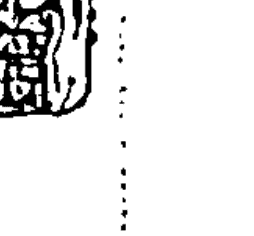

觀察隨身攜帶的包包，就可以知道你在事業與私生活上是否失衡。公司的磁碟通常不能攜帶回家。但你的包包卻跟著你出入家和公司；因此，看一個人的包包，就會了解你在工作和私生活的時間配置。

首先，將包包裡的東西全部取出，一一檢視。超時工作，工作和私人生活失衡時，你的包包就會呈現出雜亂的狀態，裝入許多不必要的東西。

一個超時工作，且從事高壓力工作的人，包包裡塞的東西越多，越沒有能力去處理這些東西。例如，包包裡常裝著幾本讀了三個多月都沒讀完的小說、列印的地圖、收據，以及在街角拿到的傳單、接下來想要吃的糖果和口香糖、餅乾……等等，就這樣，你常帶著一堆垃圾四處奔波。

這時，代表你工作上的壓力已經影響到私人生活。或許你在工作的時候很有精神，但一回到家，就會感到些許憂鬱，緊接著失眠、慢性疲勞、失序的生活習慣接踵而來，讓你悶出一身病。

反之，如果能捨去不需要的物品，讓包包保持在一個輕鬆且清爽的狀態，於公於私必然都能創造出豐碩的成果。在工作上，能專心一致、成果豐碩；私人生活上，也尚有餘力去享受自身的嗜好和各類運動。

此外，和包包一樣陪你出入公私空間的物品還有手機，我這幾年將手機換成 iPhone，愛不釋手。回首過去，於公於私，手機陪伴了我多數的時光。

就我個人而言，iPhone 可完全顯示出我的工作狀態。當工作順利時，就會下載許多增加工作效率的 APP；反之，工作壓力大時，就會下載遊戲的 APP。

現在手機以智慧型手機為主流，可協助你處理諸多事項。你越依賴它，它越能忠實反應你的內心，因此要了解自己的思緒，需同時檢查你的包包和手機。

### 書櫃中的空間級分

觀察書櫃，即可看出你的智慧成長狀況。書櫃可顯示出你對未來工作的投資。

目前電子書籍當道，對社會人來說，從書籍上取得知識，增加智慧，是不可或缺的途徑。

屋內沒有放置書櫃，抑或書櫃中的書長年沒有更替，代表主人思考處於停滯的狀態，在能力上毫無長進，也會對工作造成直接的影響。

當今是資訊化社會，一個人平日是否努力充實自我，在智慧上有所長進，會影響每日的企劃能力、資訊處理能力以及判斷力；而這種種都跟工作能力息息相關，反映在最終的成果上。

因此，書櫃可代表你的智慧成長的狀態。看一個人的書櫃，即可得知今後在工作上的成敗。

我個人，也曾有一段時間陷入能力停滯的時期。

從二○○五年開始，我三年內出版三十本掃除力相關的書籍。除了寫作外，還參與演講活動，努力經營我的事業，因而大量超時工作，無暇念書，作品的品質著實下降許多。

這段時間，書櫃上的書籍從三年前就沒再更新過，偶然購入，抑或他人贈送的書籍，也隨便亂放，不會放在書櫃裡。

為了避免這個狀況發生，也為了能讓自身智慧有所長進，應增加書櫃的「敏健度」。

每個房間書籍收納的空間有限，如果只能收納一百本書，請隨時替換這一百本書的內容；當書籍已不符合你當下的智慧水準，請立即丟棄或回收。

如此一來，書櫃裡的書就會替換，讓你的智慧有長進的機會。書櫃的書經常更動，自身的智慧也可望提升。書櫃中的書籍常處於流動的狀態，即可增加書櫃的「敏健度」。

讓書籍處於一個流動的狀態，光是眺望書櫃，就能激發你的上進心，得到新靈感；隨時都能抓出需要的資訊，不論現下工作狀態如何，未來也會出現一個工作機會，讓你大展長才。

## 預測你未來的工作運勢

如前所述，辦公桌代表現在的工作狀態，以及今後的工作能力；電腦代表思緒；包包代表公私的平衡度；書櫃代表你的智慧成長狀況。看這四個空間，就能完全掌握你未來的工作運勢。

觀察其中一處，就大致可以得知你今後工作的狀態，同時掌握四個空間，更能全面掌握你今後的未來。

以這四個空間級分為準，來預測你未來的工作運勢。將各個場所的空間級分加總，依總分的正分負分來判定空間的狀態。

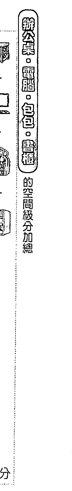

### ◎ 總分為負分的人今後的工作運勢

你有沒有覺得動力消退了呢？有沒有超時工作呢？如果你一直持續這個狀態，再努力工作也終將陷入空轉，難有成果。

對你而言，現在的工作量已難以負荷，抑或工作難度太高，使你陷入一片混亂。

正因如此，你一直無法專心去設定工作的優先順序，注意力易分散，工作成果也大幅下降。

這樣下去，不但你的人際關係會出問題，工作上也容易犯錯。放置不管的話，你很有可能被裁員、失去工作。容易分心，讓你工作難有成果，讓你徹底失去自信，陷入憂鬱的狀態。

首先，你應該就級分最低的場所，進行「捨棄」的動作。

### ◎ 總分為正分的人今後的工作運勢

你現在是否對自己的工作很滿意呢？今後，工作成效將日益彰顯，也會獲得新的工作機會。

你能看清工作的本質，了解事情的輕重緩急，知道什麼事該做什麼事不該做，也懂得適時交付責任。因此，你能專心於當下的工作，提高工作成效。

新的工作，以及能提升自身能力的工作將紛紛降臨，積極地接受挑戰吧！

此時，你可能會被挖角，也會有獨立創業的機會，不妨趁勢順水推舟，放手一搏吧！目前，你的腦袋敏銳清晰，容易抓住機會，也容易得到他人的幫助，是實現自我的絕佳時機。

當你在某個地方得到負分時，應盡早清理該處的東西，徹底整頓一下環境才是。一點小差錯，就會創造出負面能量。從今天開始，應發揮掃除力，徹底整頓空間，營造出舒適的環境，你的未來將無可限量。

## 金錢運勢端看「東西的量與收納程度」＋「錢包」＋「廁所」

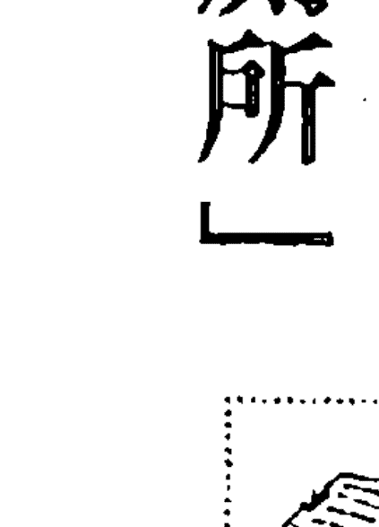

人常說，廁所可看出一個人的金錢運勢。

但是，光看廁所，並無法完全判定你未來的金錢運勢。

要預測你的金錢運勢，應檢查房間整體的收納程度、錢包和廁所三處。

利用九十一頁的「空間級分診斷表」，來算出每個場所空間級分的分數吧！

### 東西的量與收納程度

了解金錢的收支狀況

#### 房間中東西的量與收納程度

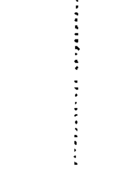

※ 這個章節，只需計算九十一頁的「東西的量與收納程度」的分數。算出你家廚房、浴室等所有出入場所（廁所除外）中「東西的量與收納程度」的分數，並將級分加總。

觀察房間東西的量與收納程度，即可得知你對金錢的掌握程度。這裡可顯示出你是否能有效控制現有的金錢。

東西的「量」和房間的「大小」、「收入」有一個奇妙的法則。

房間東西越少，收入會增加。

房間東西越多，則永遠無法得到滿意的收入。

如果你買的東西，連你自己租得起或是買得起的房子都放不下，代表你生性浪費，帶有購物狂的因子。

東西太多，無法整理，更無法管理，已全然失去理性。

失去理性代表你已經陷入一個無法自制的狀態，而這個狀態也會顯現在你的金錢觀上。

德國的心理學家凱薩琳（Catherine）曾提到：「收入和地板的面積成正比。」

當你的收入越高，地板面積越廣；當你越貧困，地板面積也越狹小。就算你的房間再大，如果東西過多，將地板都占滿的話，地板面積也會變小，你就會越來越窮。反之，就算原先房間面積不大，如果東西少，地板面積大，你就會越來越富有。

據說，所有連續劇在設定有錢人家房間時，有一個約定成俗的規則——必定有一個大客廳，裡面放一些高級家具，其餘東西則越少越好。

反之，窮人的房間，就必須在六個塌塌米的房間內放一個暖爐桌，將東西一個勁的往底下塞，窮人的房間就大功告成。實際上，所有窮人的房間大多是這個類型。

所以，在買東西的時候，需考慮房間的大小和收納空間，決定東西的必要性，理性選購，你就會越來越知道如何用錢。如此一來，你也能適當「管理」你的錢財，往富裕之路邁進。

### 錢包的空間級分

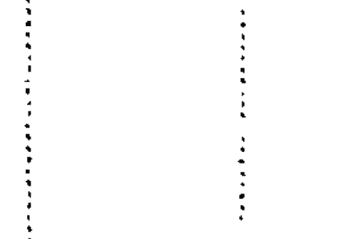

觀察錢包，即可了解你對金錢的態度。可了解一個人愛錢的程度。

一般而言，錢都是收納於錢包之中，所以錢包可顯現出一個人對金錢的信仰（珍惜抑或尊敬）以及感謝的心情。

以前，我曾經上過韓國的電視節目，參與錢包鑑定的企劃。在節目中基本上是就錢包的照片進行鑑定，先是看照片，就可看出「這個人應該終生窮困」，或是「這個人今後將飛黃騰達」。

「錢包破舊髒亂不堪」、「集點卡和收據亂塞」、「鈔票有沒有排放整齊」，光是這幾點，就能看出此人今後是貧是富。

之前，我曾在中國從事錢包鑑定的工作，錢包的的確確能顯現此人愛錢的程度。一個人對金錢的態度，可由錢包上顯現出來，這個特點不分國界，全球皆然。

我在和掃除力邂逅以前，人生陷入谷底，欠債累累；那時我用的錢包是多年前二千日圓買來的破爛骯髒的錢包。

那個錢包裡，塞滿了集點卡，只為了集些點數。當然，最後點數過於分散，並沒有積到點。

此外，錢包中也累積了不少收據；一直想說要記帳，不知不覺就快要將錢包塞爆了。

當時的我，完全不認為要在錢包上花錢。金錢也不過是幾張紙，我甚至覺得放在塑膠袋裡保管也很好不是嗎？

但是，金錢可不是普通的紙張，它能不斷循環，用一個價值創造另一個價值，是個具有生生不息能量的資源。

能夠成為富翁的人，在沒錢的時候，反而會砸下重金買一個好錢包。

這樣的人，懂得敬畏金錢。因為懂得珍惜，所以才會花錢買一個好錢包，並且經常保持內部乾淨清爽。

此外，能成為富翁的人，錢包裡不會放置多餘的東西，也不會有太多的集點卡，就算有也會限定特定的「店家」，並且定期清理錢包裡的收據。

這個概念，和剛才提及的「東西的量與收納程度」息息相關，也就是說能完全掌握金錢，有效管理自身的錢財。

## 了解吸金特質

#### 廁所的空間級分

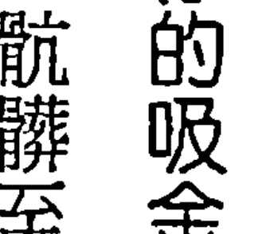

觀察廁所，就可以看出你的吸金特質。

廁所匯集眾人的排泄物，骯髒至極，任誰都不想打掃。

你或許會覺得：「好髒喔！麻煩死了！」但有一天，你試著屈膝跪下，擦拭你的馬桶，會不自覺的感到：「有廁所我才能過得如此舒適，如果沒有廁所，我一定會很辛苦，一切都是廁所的功勞。」這時，你的心自然就會謙和下來，充滿感激。

藉著清理廁所，讓你學會謙虛和感恩。

掃除力讓我了解到「廁所是我的神殿」，從古至今，透過打掃廁所創造奇蹟的佳話不在少數。

這個理論也告訴我們：只要秉持著謙和和感恩的心情，神明自然會站在你這邊；相反的，失去謙和和不知感恩之人，自然無法得到金錢的眷顧。

謙和是一種「不居功」的態度，持有這種情緒，可為你創造出極大的變化。

例如，公司業績長紅時，將功勞歸諸所有員工的努力，以及客戶的關照；對周圍的人、事、物採取一個謙和的態度。

謙和自然而然會孕育出感恩。將功勞歸於他人，自然會衍生出「感謝」之情，也能體會到「一個人的我什麼都不是」。

而一個領導者，會怎樣看待這樣一個謙和的人呢？業績再好，也總說：「多虧同事幫我」、「都是客戶賞臉」、「很榮幸進到這間公司」，這樣的處事態度，自然會讓上司想要栽培他。

這樣的人，一旦成為領導者，也會將功勞歸於工作團隊和主管，因此他不論到哪去都會無往不利，坐領高薪。

這樣下去，金錢運勢就會上升。謙和感恩的人，不論到哪裡，都會受到眾人愛戴，邁向成功的道路。因此，只要打掃個廁所，金錢運勢就會上升，創下無數的奇蹟。

## 預測你今後的金錢運勢

如前所述，東西的量與收納程度，可看出對金錢的掌握度；錢包代表對金錢的態度；廁所代表吸金的特質。接下來，我們來看一下綜合的運勢吧！

觀察其中一處，就可以大致得知你今後的金錢運勢，同時掌握三個空間，更能全面地掌握你今後的未來。

那麼，現在開始就來計算你各個空間的級分，來預測你總體的未來金錢運勢吧！

將東西的量與收納程度、錢包、廁所這三個地方的分數加總，依總分的正分和負分來判定空間的狀態。

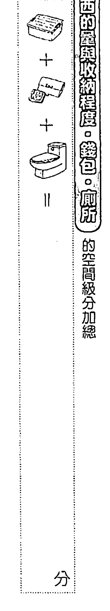

### ◎ 總分為負分的人今後的金錢運勢

你現在是否正為錢所苦呢？總分為負分的人，對金錢陷入一個負面的泥沼，完全無法掌握和管理自身的錢財。

就這樣，開支無度，你將越活越窮。
金錢散盡，借款也無法消除物慾。被竊、被詐、遭小偷，一堆讓你散盡錢財的倒楣事接踵而來。
要脫離這個狀態，首先你應運用掃除力中的「捨棄」、「去汙」，將分數最低的場所清潔乾淨。

### ◎ 總分為正分的人今後的金錢運勢

現在，你在經濟上應該處在毫無壓力的狀態。今後，你的金錢運勢將蒸蒸日上。
現在的你，既知道錢財的管理之道，也能有效控制現在的金錢，不會有任何開支上的浪費。
你能對金錢心存感激，也能夠謹慎使用，自然能具備吸金的特質，有時也會有意想不到的收入。
此外，你能夠得到一份高薪的工作，研發出熱賣的當紅商品，賺錢的好機會無所不在。

如果有任何一個空間陷入負數，請立即「捨棄」、「去汙」，徹底清理該處。稍不留意，幸運之神就會離你而去。運用掃除力整頓每個角落，營造出舒適的環境，今後的發展將不可限量。

## 人際運勢端看「廁所」＋「洗手台」＋「玻璃窗」＋「玄關」

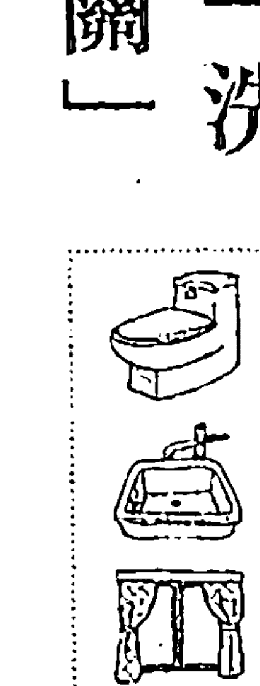

人生於世，就無法避免和人接觸。因此，每個人都希望能和他人保持良好的關係。

顯現你未來人際關係的場所，當屬廁所、洗手台、玻璃窗、玄關四個空間。

廁所和洗手台，顯現出你在面對他人和社會時內心的狀態。

玻璃窗和玄關，顯現出你面對他人和社會時的態度。端看這些地方，就可預測出你未來的人際關係。

利用九十一頁的「空間級分診斷表」，算出每個場所的空間級分吧！

### 廁所

了解你面對他人時的心境

#### 廁所的空間級分

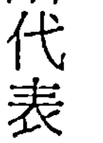

如前所述，廁所代表一個人謙和以及感謝的心情，這些要素深深影響到一個人的人際關係。

看一個人的廁所，就可了解他在面對他人時的心情。

人是無法獨自生活的動物，除了自己的力量外，還需要周圍人的支持，得之於人者遠大於出之於己者。因此，一個人是否懂得謙和與感恩，將決定你的人際關係。

謙虛的反義詞為「傲慢」。傲慢會從自我中心的話語、自以為是、不懂得妥協、不尊重他人等態度中流露出來。這個態度會擾亂你和他人間的和諧。

工作、金錢、人際關係……你能否勝出？

感恩的反義詞為「空虛的狀態」、「無法滿足的狀態」。

當你過度期盼他人，對方又無法達到你的標準時，你就會感到不滿。

於是開始明裡暗裡地惡意中傷對方，讓你的人際關係瀕臨崩潰。

當你對周圍的人喪失感恩之情，這個空間即刻被污染。

骯髒的廁所出自你對周圍人群的傲慢與不滿。

擦拭廁所，對周圍人群的敬畏和感恩之情油然而生，既可改善人際關係，也可提升金錢運勢，讓你能夠跟周遭親密伙伴相處融洽，接二連三為你創造奇蹟。

### 洗手台

了解你與他人的關係

#### 洗手台的空間級分

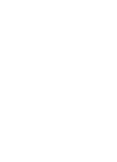

看一個人的洗手台，就知道他與周圍的人際關係。

在人與人的相處上，你是處於一個毫無壓力的健全關係，抑或時而依賴，時而玩弄，還是過度介意而備感壓力？

和人交往，不應存有任何私心和依賴，以及過度的焦慮與偽裝；真心以對，才能建立一段好的關係。

洗手台是你每日洗臉、梳頭、刷牙，為你打造基礎的場所。當你在浴室梳洗一番，回到最純淨的狀態，洗手台上所映照出的，正是最原始的你。

反之，當洗手台的鏡子污濁，沾滿了頭油和化妝品，排水管堵塞，充滿水垢髒污，代表你此時已經迷失自我，戴上了一張厚厚的面具。

當你出外和他人交往時，這層偽裝會促使你過度配合他人，隨時隨地壓抑自我，人際關係終將面臨崩解的狀態。

此外，當你廁所不夠清潔，漸漸地也會影響到你的洗手台。女性大多在鏡台前化妝，在洗手台前打造完美的自我，應該努力維持清潔才是。

工作、金錢、人際關係……你能否勝出？

### 玻璃窗

讓你能巧妙控制人與人之間的距離

#### 玻璃窗的空間級分

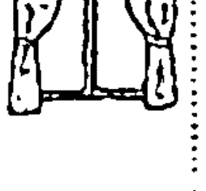

看一個人的玻璃窗，即可了解他是否能巧妙控制人與人之間的距離。
透過窗戶，你可以從家裡看到外面的景緻，也可從外面看到家裡的樣貌。
如果用人體來做比喻，窗戶相當於房子的眼睛。人們常說：「要了解一個人，就要看他的眼睛。」
羞愧時的眼，會閃躲；缺乏自信的眼，會遊移；凝視喜愛的人事物的眼，會綻放光彩。眼睛，可傳達你的內心，外部也可藉著雙眼，來看穿你的內心。
同樣的，家中的窗戶也會向對方透露你的內心，一眼即可望穿當下是內心敞開抑或閉鎖的狀態。
當玻璃窗長年未清洗擦拭，窗軌累積陳年灰塵，即代表你對當下的人際關係已心生疲累，進入自我封閉的世界裡。

當一個人心靈呈現閉鎖的狀態，就難以控制人與人之間的距離。諸如翹課的孩童、尼特族、憂鬱症患者，常會將玻璃窗緊閉；他們會用窗簾或瓦楞紙將窗戶遮住。（註二：尼特族說明，詳見一八四頁）

此外，從事服務業的人，不知不覺也會對人產生厭惡。表面上，你並不會抵抗人群，卻默默地累積許多的人際壓力，這種種都會顯示於玻璃窗之上。

保持玻璃窗清潔，你就可以處於一個安定的狀態，而且還有餘力去關心外界的事物。與人的距離、人際的均衡和應對進退都處於可控制的狀態，一個善於交際、八面玲瓏，懂得控制人與人之間距離的人，自然能保持窗明几淨。

保持玻璃窗清潔，自然能建立新的人脈，在款待他人之餘，也可保有自身的利益和幸福。

再者，玻璃窗髒污積累，也會造成安全上的問題。會招致外部的負面因素，被闖空門的機率將大幅提高，敬請注意。

### 玄關的空間級分

看一個人的玄關，就可看出他如何待人，以何種態度待人。玄關可顯現出主人潛意識中的態度。

如果用人體來做比喻，玄關相當於嘴巴的部分，和玻璃窗一樣，是內部與外部的接口，能量的出入口。

玄關可以顯示出一個人內心的思緒與想法。

當代表感恩謙和的廁所，和表示內心原貌的洗手台藏污納垢，以及顯現人與人距離的玻璃窗呈現緊閉狀態時，種種的雜亂髒污都顯現在玄關，從房子的出入口傾巢而出。

這個時候，在與人的相處上，你的傲慢和矯飾造作，也會從言語細節中流露出來。

玄關基本上無法和房子內部分割，但極少數的情況中，也會出現廁所和洗手台乾淨，只有玄關很髒的情況。這個時候，主人就該檢討對人的態度，極有可能是一「面惡心善（對人態度不佳）」的類型。

玄關是房子的門面，當你能意識他人的眼光，徹底清潔門面，自然而然就會懂得待人之道。

## 預測你今後的人際關係

如前所述，廁所和洗手台代表你在面對他人和社會時的內心狀態；玻璃窗和玄關代表你面對他人和社會時所採取的態度。

看這四個場所，就可以預測你今後的人際關係。

觀察其中一處，就可以大致得知你今後人際運勢，同時掌握四個空間，更能全面地掌握你今後的未來。

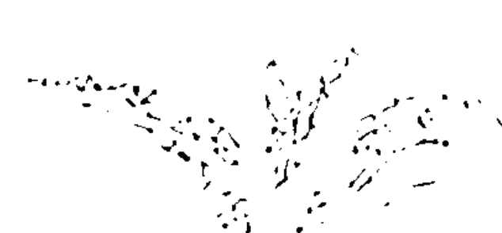

工作、金錢、人際關係……你能否盼出？

將每個場所的分數加總，依正分和負分，判斷整體的運勢。

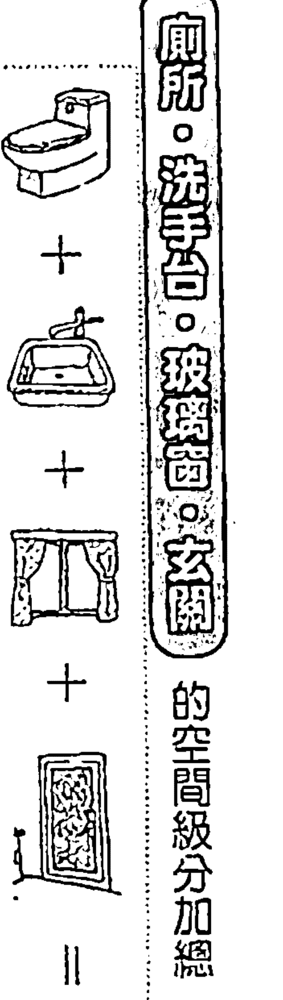

廁所、洗手台、玻璃窗、玄關的空間級分加總

### ◎ 總分為負數的人今後的運勢

你現在會不會為人際關係苦惱，而備感壓力呢？

你的內心，或多或少有點自我。因為在乎自己，讓你隨時都戴著一張面具，而無法表達自己真實的想法。

因此，你無法控制與人的距離，表現出的態度也容易招人誤解。

今後，你的人際關係，將陷入無止境的背叛、嫉妒、猜疑、慾望，而這些人際衝突，也會對你的金錢、工作、家庭……等運勢造成不良的影響，需要立即改善。

首要之務，是先整頓你的廁所和玄關，再就其他分數較低的場所，徹底實行掃除力中的「去汙」、「整理」。

### ◎ 總分為正分的人今後的人際運勢

現在，你正邂逅了一群知心好友，得到一份難得的緣分。

今後，這些珍貴的緣分將整體昇華為你的資產，助你在金錢運勢和工作運勢一帆風順。

力保玄關、廁所、洗手台、玻璃窗清潔無垢，你的人際關係即可進入一個正面循環。

但是，當其中一個場所得到負分時，應盡早進行「去汙」、「整理」的工作。稍不留意，你的人際關係就會瀕臨崩潰。

運用掃除力整頓各個場所，營造出舒適的環境，自然能擴展自身的人際網，讓你今後的人生結實纍纍，一帆風順。

# 第 4 章

## 健康、夫妻、小孩……解讀你的人生基盤！

Your Room Shows Your Future!

## 健康運勢端看「浴室」＋「臥房」＋「冰箱」

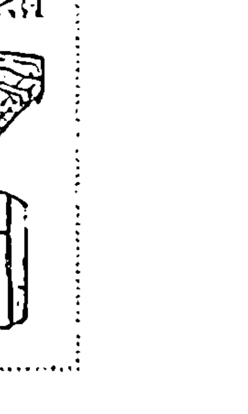

人生中，擁有健康就擁有一切。
想要專心工作、想要談場轟轟烈烈的戀愛、想賺錢、想擁有幸福的家庭，如果失去健康，一切都是空談。
但可惜的是，就算有錢，也不能馬上買到健康，一切還得依賴平日的保養才行。

我已逾不惑之年，對健康相當地重視。
健康運勢端看你家的浴室、臥房、冰箱，光看這三個地方，就能預測你未來的健康。

利用九十一頁的「空間級分診斷表」，算出每個場所的分數。

### 浴室

了解身心疲勞度

#### 浴室的空間級分

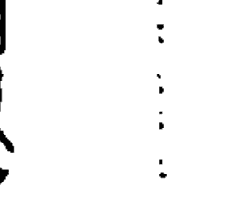

觀察浴室，就可以了解你的疲勞度。了解你現在有多累，是否有得到充分的休息。

浴室可以洗去你一日的疲勞，當你的浴室生垢長黴，代表你生活太忙碌，沒時間打掃。然而，你越是忙碌，越應該好好珍惜你的浴室，因為浴室是為你洗去一日疲勞的場所。

工作回家後，總得泡個熱水澡才能夠徹底放鬆。

如果浴室太髒，你就無法悠閒地享受泡澡樂趣，你的疲勞將無法消散，導致精神不振，泡澡的頻率也會越來越低。

你的身體無法從慢性疲勞中恢復、無法適時舒壓，嚴重時甚至會罹患憂鬱症；所以保暖工作不做好，萬病將接踵而至。

當浴室常保乾淨清潔，代表屋主能充分消除自身的疲勞。

乾淨的浴室可以讓人徹底放鬆、療癒人心，讓人捨不得離去。放上香氣蠟燭，一面閱讀，一面做個半身浴，促進身體發汗，為身體的軸心加溫。
因此，再忙碌也該空出泡澡的時間，保持心靈的餘裕，許自己一個健康的未來。

### 臥房

了解身體充電狀況

#### 臥房的空間級分

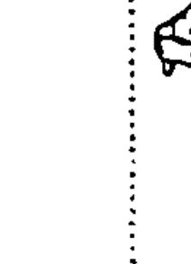

看臥房就能了解你身體的充電狀況。
了解你的睡眠是否充足？是否有充分補充身體所需的能量？
臥房的衣櫃上堆滿東西，衣服多到放不進衣櫃；照明用品和家具上布滿灰塵；寢具周圍放置和睡眠無關的用品，讓臥房淪為一個負面空間。
如此一來，睡眠品質不佳，無法熟睡，醒來時也容易有起床氣。

當你不容易入眠、不能熟睡，上班上學經常遲到、頭腦遲鈍、無法專心工作或專心讀書，產能便大幅降低。

在外折騰了一天，拖著疲憊的身體回到雜亂的臥房時，眼睛忽然亮了起來，於是是你又開始熬夜，無法熟睡，陷入無止境的惡性循環。

人體在入睡前和剛睡醒時，潛意識最容易自我暗示。當雜亂的負面空間刻畫在潛意識時，負面效應就會招來負面的災禍，讓你的人生一蹶不振。

理想的臥房要像飯店的房間。飯店以營造舒適的睡眠環境為宗旨，不會放置多餘的物品；精選寢具，就連枕頭也十分講究。

有些旅館，甚至會依個人需求更換枕頭。選用能讓客人安心充電的床，越是一流的旅館，越能給你一個優質的睡眠品質。

當臥房轉變為一個乾淨的正面空間，你必定能補足身體所需的能量，使你醒來時神清氣爽、朝氣十足，迎向積極正面的人生。

媳婦、夫妻、小孩……解讀你的人生基盤！

### 冰箱

了解營養狀況

#### 冰箱的空間級分

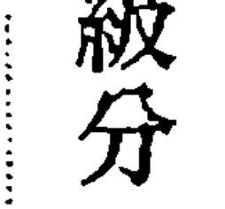

看冰箱就可了解你的營養是否正常。
看一個人的冰箱，就知道他是否有一個良好的飲食生活，有沒有盡吃些垃圾食物傷害身體。

我在接受健康雜誌採訪時，曾聽編輯說他們在製作一個冰箱鑑定的企劃，希望受訪者能「給他們看冰箱中的狀態」。

身材勻稱、身體健康者的共通點在於他們會常常打掃冰箱，清除食物的殘渣和打翻的汁液，保持冰箱的清潔狀態。

驚人的是，他們存放的食物量通常都很少，而且冰箱中清爽乾淨、食物擺放整齊，讓人對食物的位置一目瞭然。

反之，肥胖不健康的人，常會連續好幾個月不打掃冰箱，打翻的汁液凝固成塊，東西太多不加整理，以致食物腐壞過期。
後續也會提到，冰箱的級分會看出你是否能控制你的飲食生活。
冰箱內部髒亂，負面效應形成時，就很難有一個健康的飲食生活。吃東西只挑喜歡的吃，完全沒考慮營養的層面。相反的，冰箱內部乾淨，呈正面空間時，你就能控制你的飲食，營養均衡又健康。
當你能有計畫地購入需要的量，就可以在毫無浪費的情況下，烹飪出健康均衡的飲食，同時也可節省餐費，可說是一石二鳥。
因為食物的量少，當東西打翻或出現髒污時，會馬上發覺，也會定期打掃冰箱內部。
只要冰箱清潔，就可打造強健的身軀，讓你百病不侵，當你冰箱髒亂時，你將來則會營養失衡，罹患成人疾病。
日夜的積累，就能創造出天壤之別。而最後的結果，早已顯現在你的冰箱上。

## 預測你今後的健康運勢

如前所述，浴室顯示疲累程度，臥房顯現身體能量的充電狀態，冰箱顯現營養狀態。端看這三處，就能預測你未來的健康運勢。

觀察其中一處，就大致可以得知你今後的健康狀況，同時掌握三個空間，則能夠全面性地掌握你今後的未來。

以這三個空間級分為基準，來預測你未來的健康運勢。將各個場所的空間級分加總，依總分的正分負分來判定空間的狀態。

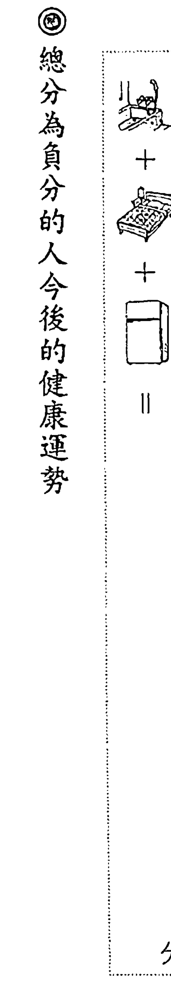

### 總分為負分的人今後的健康運勢

你現在會不會常覺得不舒服呢？再這樣下去，你總有一天會病倒。
身心陷入慢性疲勞的狀態，遲遲無法修復。不易入眠，無法熟睡，早上起來精神不濟，疲勞殘留在體內，讓你感到諸多不適。於是，為消除疲勞，你開始攝取過量的卡路里，使體重上升，淪為肥胖症的一員，也有人為此罹患厭食症。不論是貪食或厭食，終將會導致你體力下降，削弱身體的抵抗力。
這時，由於注意力容易分散，極有可能遭逢意外事故受傷。另外，也要小心憂鬱症或內臟器官等疾病找上門。
首先，你應就分數較低的場所，實踐掃除力中的「去汙」、「整理」，來整頓環境。

### ◎ 總分為正分的人今後的健康運勢

現在的你應該感到精力十足吧！今後，你將會擁有充足精力、體力、注意力，健康狀況十分良好。這三個場所呈現正面空間時，代表你相當關心你的健康，注重平日的養生，請持之以恆。

你對於未來健康所下的投資，讓你獲得充分的精力、體力和注意力，今後的工作、金錢、戀愛運勢也將節節高昇。

當你邁向成功之路，生活忙碌之際，為了鞏固你的健康資本，平日可在浴室中點上香氣蠟燭，挑選可放鬆身心的入浴劑，並在臥房內放置除濕機調整濕度，點上薰香促進睡眠，更換適合的枕頭、調暗燈光，好好照顧你的健康，長期維持你的幸福感，事業上也能有所成就。

當你在某個地方得到負分時，應盡早清理該處的物品，徹底整頓一下環境才是。一點小差錯，即會損害你的健康。

平日也應注意家人的健康，實踐掃除力整理各個空間，你的未來將無可限量。

## 夫妻運勢端看「廁所」＋「共用設施」＋「臥房」＋「客廳」

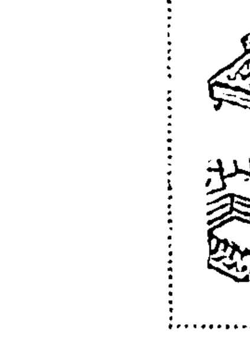

你和另一半的未來，將顯現於廁所加共用設施、臥房和客廳三處。

這些都是夫妻二人平日共用的空間，而臥房和客廳則是一人共同生活的空間。

觀察這些空間，就可了解你們今後夫妻感情會越來越好，還是會演變成貌合神離、性生活不足、外遇、離婚……等不幸的結果。

利用九十一頁的「空間級分診斷表」檢測每個場所的空間等級，算出空間級分。

### 廁所+共用設施

了解彼此的心情

#### 廁所+共用設施的空間級分

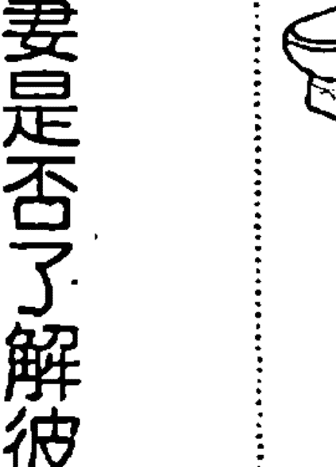

觀看廁所等共用設施，就可以看出夫妻是否了解彼此的心情。

共用設施指的是彼此每日使用的空間。第三章曾提及，廁所會影響到你各方面的未來，可顯現一個人謙和感恩的態度，在這裡我就不再贅言。

觀看廁所，即可知道居住人的個性是謙和感恩，還是傲慢自私。

夫妻間感情好壞，端看二人相處時，是否能懷著謙虛以及感恩的心。

我太太每天把我家的廁所打掃得乾乾淨淨，因此我每次進廁所，都想對她說聲謝謝，使用時也盡量保持清潔。不小心弄髒時，立即自己弄乾淨。

夫妻間關係良好時，當洗手台的水龍頭沒關好，立刻可以體諒對方辛勞而設身處地的想：「一定是因為最近太忙，才會沒鎖緊。」

奇妙的是，只要其中一方釋放善意，另一方也會有所回應。為家人的幸福，大家一起努力，維持環境的清潔。

反之，當夫妻不睦，互相指責批判時，廁所等共用設施就會呈現骯髒的狀態。如此一來，雙方就會喪失感恩之心，不體貼對方、互相指責，將環境清潔的責任，歸諸於對方。

我所鑑定的部分，包括廁所、洗手台、玄關等共用設施。

當夫妻感情不睦，共用設施必定髒亂，當環境髒亂時，夫妻雙方都會將過錯推給對方，例如「這是老公負責打掃的」、「這是老婆弄髒的」……等等。
如果夫妻間無法互相感謝、體諒，必會失和，陷入無止境的爭吵和冷戰，最終走向外遇和離婚一途。

### 臥房

了解夫妻感情

#### 臥房的空間級分

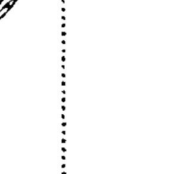

觀察臥房，就可以了解夫妻間是否存有愛與信賴。
雖然平時不會特別注意，但是在睡覺時，每個人都會呈現失去防備的狀態。因此，臥房必定要是個可以讓人安心的空間。
當一個懷有敵意的人在你的房間時，你怎麼樣也睡不著吧！因此，雖然是另一半，如果彼此間沒有足夠的信賴關係，也無法一同入眠。
如果夫妻彼此怨恨，硬要處於同一個空間，只會折磨彼此。就算默不作聲，也會感受到對方的敵意，導致失眠。

## 客廳 了解家庭的和諧度

#### 客廳的空間級分

看客廳就可知道夫妻以及家庭成員是否相處融洽。
客廳位於房間正中央，如果以人體做比喻，相當於「心臟」的位置。
心臟將血液送往身體各部位；同理，客廳也需將能量送往各個房間。
夫妻為家庭的中心，是家中能量的來源。
當夫妻感情不睦，一同在客廳休憩時，二人都會坐立難安。將不滿的情緒留在客廳，各自回到自己的房間。
客廳中彌漫負面磁場，為了省事，東西不歸位、衣服脫了就丟，互推責任，互相責備。兩人無法互相尊重，客廳雜亂的程度也將與日俱增。
相反的，當客廳一塵不染時，夫妻必定琴瑟和鳴，相處融洽。
只要維持客廳的清潔，這股和諧的正面能量也會流向其他房間，進而影響到其他家人。

當夫婦其中一方「能用心營造一個輕鬆、舒適的環境」，客廳就會轉為正面的空間。

當空間中的髒污、廢棄物、灰塵消失得無影無蹤，呈現乾淨清爽的狀態時，對方進到這個空間，心情自然能放鬆，進而湧現出感謝的情緒。這樣的客廳，能讓夫妻同心、兒女群聚，創造和諧幸福的家庭。

### 預測你今後的夫妻運勢

如前所述，廁所等共用設施，會顯現出雙方相處時是否具有謙虛和感謝的態度；臥房顯現出夫妻間相愛的程度；客廳顯現出夫妻間以及家人間的和諧。

光看一處，就能知道夫妻倆大致的未來；同時觀察三個空間，即可預知全面性的未來。

以這三個空間級分為基準，來預測你未來的夫妻運勢。將各個場所的空間級分加總，依總分的正分負分來判定空間的狀態。

#### ◎總分為負分的人今後的夫妻運勢

現在，你是不是覺得另一半無法理解你的心情？再這樣下去，夫妻倆將會漸行漸遠。

就算夫妻間沒有爭執，私下相處也不會融洽。

當房間雜亂，夫妻間必定爭執不斷，互相叫罵。

這種狀態持續下去，終將演變成家暴、外遇、夫妻分房而住、離婚……等愛恨交織的戲碼。

首先，就分數較低的場所，實踐掃除力中的「捨棄」與「整理」。

#### ◎ 總分為正分的人今後的夫妻運勢

現在，你應該相當信任你的另一半。
今後，兩人間將琴瑟和鳴，為對方帶來正面的影響。
這時，要加深夫妻間的感情，二人應設定一個共同的願景。目標相同，加速夢想實現的速度，夫妻間的感情也會越來越好。
你和另一半，在工作上都頗有成就，也能相互扶持，互助互信。夫妻同心，其利斷金，一同創業，另一半也能成為優秀的參謀。
夫妻感情融洽，正是懷孕生子的好時機。這樣的夫妻生育的兒女，也會有個安定的未來。

當你其中一處陷入負數時，請即刻「捨棄」、「整理」該處的環境；一不注意，就會讓二人關係出現裂痕。
每日，對另一半懷著感謝之情，運用掃除力整理各個場所，你和另一半的未來都將無可限量。

## 小孩的未來端看「兒童房」＋「書桌」＋「私物」＋「客廳」

看兒女健康平安長大成人，對父母而言，是最幸福的事。

當孩子問題連連，成績不甚理想又不聽話時，父母就會相當煩惱，自責沒有盡到父母的責任。

如果父母能預知孩子的未來，就有能力導正孩子未來的方向。

想知道孩子的未來，需觀察孩子的房間、書桌以及私人物品；而「客廳」則可看出父母對孩子造成的影響。

運用九十一頁的「空間級分診斷表」，算出各個場所的空間級分。

### 兒童房的空間級分

了解小孩的心理狀態

掃除力讓人了解到「房間就是你個人的化身」。

同理，「孩子的房間，也是孩子的化身」。看孩子的房間，就能了解他的心理狀態。

觀察小孩的房間，父母就能掌握孩子的狀態。

孩子房間雜亂，時常被父母責備時，孩子就容易出現注意力渙散、情緒煩躁、焦慮……等傾向，父母也會成為孩子最大的壓力來源。

當髒亂的程度與日俱增，代表孩子的煩惱越來越多，面臨到的問題越來越嚴重，敬請注意。

孩子的房間整理乾淨，孩子則能安然成長。這個房間代表孩子心靈上的安定。

乾淨整潔的環境，充斥著正面的能量，代表孩子在人際關係、學業、社團活動皆能均衡發展。

因此，父母可依孩子的房間狀態，掌握孩子的未來。

### 書桌

了解小孩的求知慾

#### 書桌的空間級分

書桌可看出孩子的求知慾。

當孩子的房間整潔，書桌卻很亂時，代表孩子可安然成長，但讀書時容易注意力渙散，也沒有求知的慾望。

如不加注意，孩子的成績會日漸下滑，學習落後。

身為父母，應該特別注意小孩的書桌；有時小孩被父母要求後，表面上會將桌子收拾乾淨，但抽屜卻雜亂不堪，由此也可看出小孩在學習上的停滯。

書桌呈現清潔的狀態，孩子就能專心念書，學校的課業不會落後，也能平心靜氣地坐下來讀書，享受學習的樂趣。
就算現在的成績不甚理想，只要將書桌整理乾淨，未來成績也會蒸蒸日上。

### 私人物品

了解小孩的另一面

#### 私人物品的空間級分

看孩子的私人物品，就能了解孩子不為父母所知的一面。
當孩子的東西凌亂，代表孩子有不為父母所知的煩惱（朋友或學業），
或是從父母接收到某些壓力，種種都會呈現在孩子的私人物品等細節上。
此外，越是聽話的乖寶寶，越容易有壓力。
像是課本、筆記、鉛筆盒、書包……等物品，都會呈現出孩子的內心。

小學生會背著書包出入住家和學校，因此孩子在家中和學校受到的壓力，就會反應在書包上面。

當孩子狀況不佳，筆記上會出現凌亂的字跡，書包裡亂七八糟，塞入一堆和學校無關的私人物品。父母需適時檢查孩子的筆記或課本，看看是否有被撕破或被塗鴉的痕跡，即可確認孩子在學校是否有被欺負。

父母們請務必注意，就算孩子的房間乾淨、書桌整齊，這些細節中也可能出現負面效應。

筆記整齊無塗鴉的痕跡，包包裡只放置必要的物品，代表孩子的精神呈現一個安定的狀態。

身為父母，除了要檢查房間外，也要定期抽檢孩子的私人物品。

### 客廳 了解小孩情緒的穩定度

#### 客廳的空間級分

看客廳就可了解孩子的情緒是否穩定。
客廳是家庭共用的空間，可看出父母對孩子的影響。
如前所述，客廳是家庭的心臟。從客廳可看出家庭，特別是夫妻的感情。
夫妻的感情好壞，會對孩子造成莫大的影響。
夫妻的感情不好，孩子則極有可能情緒不穩定。
相反的，夫妻和睦，孩子就能安然成長。夫妻間心靈交流、感情良好，
孩子的情緒就會穩定、努力向學、活潑健康，享受快樂的孩童生活。

### 預測孩子的未來

如前所述，兒童房顯現小孩的心境；書桌顯現求知慾；私人物品可以看出不為父母所知的細節，而客廳可看出父母的夫妻關係對孩子情緒造成的影響。

光看一處，即可看出孩子未來大致的狀況，同時觀察四處，即可預測全面性的未來。

以這四個空間級分為基準，來預測你孩子未來的運勢。將各個場所的空間級分加總，依總分的正分負分來判定空間的狀態。

#### ◎總分為負分的人小孩的未來

現在你應該很擔心你的小孩吧！

需注意孩子是否有遇到學習力不佳、霸凌、誤入歧途、生病、打架、意外事故……等等。這時孩子在潛意識中正在向你求救，父母需及時伸出援手；站在孩子的立場思考，並適時傾聽他們的煩惱。

到這個地步，父母平常應該也沒有打掃小孩的房間、整理小孩的書桌，也沒有檢查小孩的書包吧！這樣下去，並無法徹底解決問題。

當整個空間總分呈現負數，代表父母只想要單方面的改變孩子的想法。

然而，雖說是自己的孩子，也無法支配他們的心。

父母所能做的，就是極力改善環境，讓顯現自身的內在空間以及夫妻未來的空間能煥然一新，千萬不要本末倒置。

#### ◎ 總分為正分的人小孩的未來

現在，你的孩子在平安喜樂中茁壯成長。

學習力和人際關係情況良好，心緒也呈現一個穩定的狀態。

這時，你可以放任小孩自由發揮，並私下默默協助他。父母只需定期檢查孩子的房間即可。

當其中一處陷入負分時，則需特別注意。

父母這時應改善代表夫妻未來的空間。

此外，如果父母能實行掃除力，孩子自然會仿效。現在就開始發揮掃除力，擦亮孩子的未來吧！

# 第 5 章

## 用「掃除力」來改變未來

Your Room Shows Your Future!

### 消除惡果，種下善果

到目前為止，我們藉由各個房間的狀態，來預測未來。

從房間看到內心的狀態，就好比植物的種子。

只看種子，如果不是專家，也無法看出是何種植物。一直到冒芽開花結果後，才能一探究竟。

房間的狀態也相同。

當心境呈負面狀態，就會為房間種下髒亂的幼苗。這幼苗後續將孕育成意外事件、災禍的果實，為你帶來諸多不幸。

本書中的未來預測法，教你如何判定房間等級，預測個別運勢，來鑑定房間裡所播下的種子（房間中所顯現的心的狀態）。

我是打掃專家，辨別諸多的種子後，我得到了些許心得。這就是本書所敘述的預測未來的方法。

好比園藝專家，看種子就能辨別植物的種類。

正在閱讀本書的你，相信現在也有能力預測自身的未來了吧！這個未來預測法，不是占卜也不是靈媒。

只要你能看見自己的未來，其他都很容易解決。

接下來，就試著去改變你的未來吧！

或許在你預測時，已經看到未來的災禍與不幸等負面種子。

解決之道，就是去除房間中的負面種子，我相信各位已經很清楚做法了吧！

沒錯，就是徹底實踐掃除力。用掃除力來去除負面的種子。

#### ◎ 去除負面因子的掃除力

下列五個步驟，可幫助你去除房間的的負面種子，去除心中的負面磁場。

### 掃除力，消除負面能量

- ① 換氣
- ② 捨棄
- ③ 去污
- ④ 整理
- ⑤ 除濕（炒鹽）

依照這五個步驟，可去除未來的不幸種子，增添空間內清爽、乾淨的正面能量。

首先，步驟①的「換氣」為一重要步驟。

實踐掃除力之際，必須將窗戶打開，導入新鮮空氣。這個動作能將灰塵、人體釋放出的熱能和二氧化碳趕出屋外。

不知各位是否遇過這樣的情況：明明知道非做不可，卻打不起勁來打掃，一想到整理就累。這也是垃圾髒污所釋放的負面能量所致。

實際上，丟棄物品去除髒污，耗費的精力遠遠大於體力。藉由換氣，可增加執行時的順暢度，並可趕出負面能量，導入正面能量；下至超級危險空間，上至天使空間的屋主，都應每日實行才是。

掃除力步驟⑤的技巧，就是將鹽拌炒後，撒在房間裡，再用吸塵器吸起來淨化空間，如此一來你的空間就能變得乾淨清爽。但有些吸塵器吸鹽後會故障，無法深入地毯縫隙，挑選機種時請務必注意。（注三：關於炒鹽的說明，詳見一八四頁）

本章就第二章所提到的房間等級為基準，詳細說明掃除力中的「捨棄」、「去汙」、「整理」，以及晉升天使空間時所必備的「舒適空間」要素。

這些方法，可有效改善你的房間。請和第六頁的「房間等級檢測表」，以及第二章、第四章各個空間的級分搭配運用。

### 「捨棄」，幫你脫胎換骨、逆轉人生

「捨棄」具有隔絕能量的效力；可將空間中縈繞不去的負面能量徹底隔絕。

丟棄廢棄物品，可將陰魂不散的負面連鎖效應和不當的生活方式連根拔起。

如此一來，你就可以擺脫惡運。

正所謂「無法脫皮的蛇只有死路一條」。

前些日子，我曾在電視上看到寄居蟹脫殼的畫面，寄居蟹和蛇一樣，不脫殼就會死亡。

在部分生物的生命中，脫皮是必經的過程；不捨去舊的外殼，就無法繼續生長。因此脫皮這一個過程，可以為他們創造強大的能量，掌握今後生死的致勝關鍵。

捨棄物品的道理如同動物的脫皮行為，當你的東西越積越多，你就需要花費許多精力去處理它；反之，如果能夠下定決心做到斷絕、捨棄、脫離，你必定能重獲新生，人生就此改變。

超級危險空間、危機四伏的空間、安心空間的居民，應即刻實行「捨棄」的動作。

#### ◎ 借他人之手，盡情斷捨離！

當一個房間被判定為超級危險空間，空間顯然被廢棄物淹沒，且充滿陳年的污垢。

事已至此，則需要莫大的決心和能量；要跟這人生終極的負面能量對抗，需要極大的力量，一人之力並不足以抗衡。

這時，本人已無法判斷該捨棄哪些物品，需借助他人之力。

有親朋好友幫你固然很好，也可以委託經驗豐富的專業打掃業者。

總之，請下定決心「即刻脫離負面空間」。

接下來，請全權交給他人。事先最好書面註明「對丟棄的物品，絕不多言」。

不過，請事先將印章和貴重物品集中於一處。

將物品全數交與他人處置，才能逆轉人生。請即刻開始捨棄吧！

#### ◎捨去「未來」的不安，揮別「過去」的牽絆，才能更上一層樓

危機四伏空間的居民，房間裡必定堆滿東西，連走路的地方都沒有。雖然如此，勉強能自己決定要丟棄的物品，想要提升房間的等級，必須先將房間內的廢棄物品捨棄掉。

預先勾勒出未來的願景，就能捨棄多餘的物品，例如快用完的短鉛筆、越磨越小的橡皮擦和幾個月前買的雜誌、別人送的碗……等等。

再者，這個空間的居民，常會被過去和未來所束縛。當你沉浸於過去的光景和甜蜜回憶，一味地「想當年」，就難以用正面積極的態度去面對當下的人生，也無法揮別過去失敗和挫折所帶來的陰影，難以忘卻他人的惡意中傷。

現在開始，大刀闊斧地丟棄過去的回憶、勳章獎狀和前男女朋友的照片吧！

此外，有些人為了預備未來，認為「總有一天會用到」，東西捨不得丟。但是，相信我「你永遠不會用到」。「總有一天」終歸是個未知數。

保留這些物品，也代表你對未來充滿不安，一味地想要逃避。因此，你那不安和逃避的能量，終將為你帶來一個灰暗的未來。

如此一來，就會被過去和未來所束縛；現在開始丟掉你「過去的回憶」，揮別「未知的未來」吧！

這些物品只會讓你停留在過去，逃避未來，無法活在當下。

人生在世，生不帶來，死不帶去。赤裸裸地來到這世上，最後終將揮揮衣袖不帶走一片雲彩。請用心領悟這個道理，徹底實踐掃除力。

丟掉阻礙自己升級的廢棄物，揮別對未來的不安與期望、告別過去的失敗和回憶，你就會有勇氣活在當下。

這股力量，才是你將來成功的推手。

#### ◎你有幾枝筆？事先決定數量，能捨則捨

想要從安心空間提升至成功空間，就必須先了解成功空間居民的生活型態。

成功空間的人，會事先決定東西需要的量。不會因為一時衝動，而購入多餘物品。買東西時會有計畫地判定需要和不需要的物品。

因此，也不會有過多的私人物品，讓房間維持在清爽狀態。空間內所有的物品，都有其存在的「價值」。

想要升級到成功空間，需檢視你所有物品的用處，探究「物品的必要性」。

我在課堂上常會進行下列的小遊戲。

> 「回家請試著將家裡所有的原子筆、油性筆等文具用品整理出來。」

假設你總共有三十枝原子筆。

當我問學生們：「你為什麼需要二十枝原子筆呢？」他們的回答通常是：「不知不覺就拿到這麼多。」於是我建議他們：那就盡可能減少這不知不覺的情況吧！

請確定需要的數量：原子筆需要幾枝？螢光筆需要幾個顏色？其他還需要什麼？

當你能夠確切地掌握需要的數量，就可以升級到成功空間。

這裡以筆為例，同樣的思考模式也可以套用在衣服上，來控制襯衫、領帶、套裝、內衣褲的數量，以及包包、化妝品、傘……等雜物，真正賦與每一件物品存在的價值。

當你清點好所有的私人物品，你的思緒就會清晰，目標就會明確。

如此一來，你就能夠盡情發揮你的強項。了解自身的目標、當下的任務，運用自身的強項，確立今後的目標，房間也會晉級為成功空間。

### 「去汙」，把你心中的雜念一掃而空

「去汙」即去除家中的黴、鏽、斑。

去除房間裡的灰塵髒汙，心中的不滿和抱怨也一掃而空。人生少了抱怨，就少了壓力，也會找到解決問題的方法。

當你能去除家中的髒汙，回到清潔的狀態，你就能具備邏輯思考的能力，也會了解你的不滿和抱怨，所有問題的根源都在自己身上。

舉例，當你抱怨「薪水太少，想辭職」時，試著去思考不加薪的原因，你就可以發現其實是自己工作表現不佳、不擅處理人際關係，無法對公司有所貢獻。

了解這個道理，你就能從抱怨的人生中脫穎而出，具備解決問題的能力。

當你能夠理性的面對問題，自然能了解諸多的抱怨只會為你引來更多的負面因子。

將灰塵掃地出門，就能消除心中的不快與焦慮；保持心中的平靜，就能喚回安定與和諧。

危機四伏空間、安心空間的人們，在實踐「捨棄」時，需同時「去污」。

#### ◎決定優先順序，細分實踐步驟，即可去除陳年髒污

危機四伏的空間中，東西過多，長期藏污納垢。

衣櫃、冰箱上、家具上和背面的空隙處，都累積厚厚的灰塵。此外，燈的上方、床底下，本來應一年大掃除一次清理的地方，如今二、三年也未清理。

這些灰塵和髒污可看出屋主的不滿和對未來的無力感。

這些灰塵會致使個人機能停滯，請下定決心去除這些雜物，一掃心中的陰霾。

不知如何著手的人，去除雜污時可先確定優先順序，細分處理的程序。

例如，先掃客廳，再清廚房，再整理臥室等，設定優先順序；清理客廳時再設定先擦茶几，再清地毯和電視上方，依序清除髒污。

將房間清理乾淨後，需定期去污，維持清潔的狀態，養成習慣一天擦一次桌子、一星期用一次吸塵器……等等。

#### ⑪ 擦亮家中的物品，打造能專心的舒適空間

想要徹底去污，需學習各式各樣去污的知識和技術。

了解污垢的性質和洗潔劑的相關知識。去污的步驟為中和→分解→除去。

簡而言之，餐具類等沾染油垢之物的髒污屬於酸性，需用鹼性的清潔劑清洗，可使用家中的蘇打水和肥皂來去污。

水垢和肥皂屑屬於鹼性髒污，需用酸性的檸檬酸和醋去污。

在購買清潔劑時，請詳閱使用說明。此外，細縫中的髒污，可用螺絲起子等工具進行去污工作。

運用清掃的技術去除空間中的髒污和灰塵，可讓屋主有清晰的頭腦，專注於眼前的事物。

意力不易渙散，心中的雜念一掃而空。

另一個去污的重點，就是讓物品散發出自身的光芒。

諸如家中的金屬物品、水龍頭、水槽周圍、廁所的水龍頭、水管、鏡子、玻璃、家電用品以及電視的畫面……等等。

讓家中的物品散發自身的光芒，四處都一塵不染，每天都可看到家中呈現亮晶晶的狀態。

每天處於一塵不染、潔淨發光的環境中，就能喚起你潛意識中成功的能力和感覺，勾勒出未來的願景，激起奮發向上的決心。

這分上進心可讓你專心於當下該做之事，得到優異的成果。

## 「整理」，讓你晉升成功人士的思考模式

「捨棄」物品，減少私人物品的數量後，接下來就要設法收納留下來的物品，進行「整理」的工作。

關鍵是把握東西收納的場所、內容和數量。

此外，為了實現自身的目標，為了能專心處理重要的事，你必須有能力在最短的時間內取出必要的物品。

舉例，做菜時，你能毫不猶豫地拿出調理器具和佐料，讓所有物品擺設都自成系統，井然有序。

一天到晚煩惱「我煎蛋用的平底鍋不是放在這嗎？真奇怪。」、「昆布高湯不是收在這嗎？」終究是浪費時間，從今以後，你將徹底擺脫這些煩惱。

當一切都能井然有序，你可以看清自己的目標，也可以了解達成目標的捷徑，這也就是成功者的思考模式。

### ◎ 使用心智圖，晉升整理達人

想要從「安心空間」升級為「成功空間」，「整理」的工作不可或缺。

這裡我想提供給各位一個整理妙方。

開始整理前，可運用「心智圖」，來決定東西收納的位置。

所謂的心智圖，就是在中央寫下你想要研究的文字內容，或畫下相關插圖，以此為中心，畫下放射狀的圖案，填入相關的關鍵字，藉由分支來擴展關鍵字的範圍，加深理解。

接下來所要介紹的心智圖，是我精心設計的成果。

至於作法，先於中央寫上場所名稱。例如，在中央寫上客廳，再於分支上寫上場所的收納家具，像是衣櫃、CD架……等等。

接下來，再從各個家具的分支衍生下去，畫出各家具的抽屜收納的物品內容。

整理書房的書籍時，我會按照左頁的圖作分類，在心智圖中央寫上「我的書房」。

從中拉出一條線，寫上「書櫃 1」，書櫃有七層，再從書櫃 1 拉出七個分支，在分支上寫上物品的種類；第一層是「文學 1」，第二層是「文學 2」……，第五層是勵志書籍，第六層是靈性書籍，第七層是藝術類書籍和地圖。

接下來，再一一把書放入書櫃。

同理，再於「我的書房」之中拉出「書桌櫃 1」、「櫥櫃 2」的選項，製作設計圖。

用這個模式來整理，可讓你的房間晉級為成功空間。

房間裡沒有髒污和廢棄物品，需要的東西放在固定的位置。東西放在對的位置，可隨時找出需要的物品。

### 用心智圖輔助，讓你整理起來更加得心應手

Your Room Shows Your future !

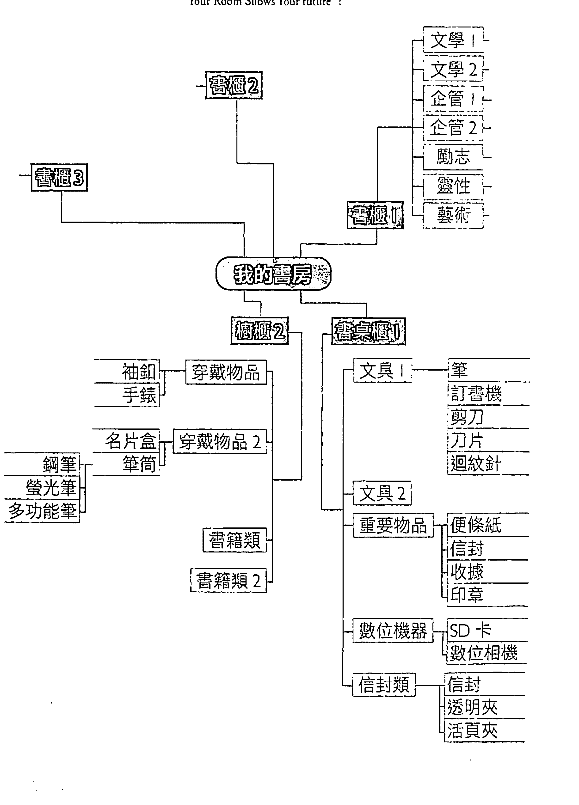

## 「舒適空間」，為自己、為他人帶來幸福

用「捨棄」、「去污」、「整理」來整頓磁場，塑造成功空間後，接下來就朝天使空間前進吧！

晉級天使空間，有一個很大的障礙，有些人一輩子都不知道。

自己成功後，如果能進一步去為他人帶來幸福，人生將有一百八十度的轉變，感動和幸福終將回歸到自己身上。

能為他人帶來幸福和成功的空間，我稱之為「天使空間」。

想要打造這樣的空間時，需重新省視自己的人生和成功的歷程；人終其一生，所有的成就都不是靠一人之力可得，而是仰賴很多人的支持和幫助，

應當懷抱一顆感恩的心。

每日，用感謝的心情，來實踐「捨棄」、「去污」、「整理」；當你能將自身的幸福歸功於他人，對他人心存感謝時，必定會想要泉湧以報。

### ◎ 捨棄成功，你將更上一層樓

當你覺得自己「成功了」，就是停滯的開始。
然而，成功的人常會耽溺於成功。
如果你想要更上一層樓，除了要捨棄多餘的物品，還必須放棄你的「成就」。

當你沉溺於現有的成功，不求改變，只想維持現狀、保全自己，這個心思會立即顯現在你的房間上。

房間不會說謊。你會發現東西越來越多，注意力不易集中，種種都會顯現在你的空間上，降低你的空間等級。讓你從成功空間降級到安心空間。

想要從成功空間進展到天使空間，就應轉變自身的思維，從自身的成功轉為為他人創造成功。

我個人曾經因為成為暢銷書作家而自滿，一心只想「今後要寫下更多著作，創下銷售紀錄」，只想靠著寫作來打下一片天。

那段時間，我活得好痛苦，人生的格局也越來越受限。工作也不太順利，雖然搬到高級大廈，房間也變寬了，但東西也相對增多，房間隨即降級為安心空間。

這時，才意識到我敗在自己的成就上。

當下我就決定暫時停止「寫書」，也放棄居住高級大廈的尊榮。

之後，我開始參與社會公益活動，用自身的能力、金錢幫助需要幫助的人，以改變自身的磁場。

那之後，中國、韓國、台灣都前來詢問，希望能導入這個掃除力的概念，匡正國人的生活概念。

就這樣，當我將注意力從自身的成功，轉為幫助他人成功，獲得幸福時，我自己也更上了一層樓。

現在，我正朝天使空間努力。

### ◎七大要素，打造征服人心的空間

當你想要打造「天使空間」時，想為他人帶來幸福，想要對社會有所貢獻，
就必須思考「你想要為他人提供些什麼？」、「你希望他人有怎樣的改變」。
想要將這個理念呈現於空間時，需具備下列七大要素。

## 打造征服人心空間的七大要素

- ① 光（照明）
- ② 聲音
- ③ 色彩
- ④ 香氣
- ⑤ 室內設計
- ⑥ 植物
- ⑦ 水

設定具體的主體，剩下的都很容易了。

我的家則以「東京的文華東方酒店為準，洗去他人疲勞的療癒空間」為主題。（注四：東京文華東方酒店說明，詳見一八四頁）

為避免刺激交感神經，燈具以白熾燈和崁燈取代日光燈。

聲音以古典音樂和溪水的淅瀝聲等療癒人心的音樂為主。

選用香草的香氣、內裝與用色的統一，也仿造文華東方酒店的配色，以深咖啡色為基底，配上白色和橘色，打造出高級沉穩的空間。為了增添療癒的氛圍，水槽中放入錦鯉，室內放置觀葉植物，醞釀出東方的氣息。

如此可見，想要為對方營造舒適感，就必須秉持服務的精神，來擄獲人心，種種都可透過這七大要素，呈現在空間之中。

將這些要素導入空間的同時，你的空間也將晉級為天使空間。

當你創立一個企業，就必須理解「公司之本在於客戶」，必須要將服務做到盡善盡美，用這七個要素，即可創造出這樣的空間。

依照你的空間等級，實踐掃除力，即可為你創造出一個光明的未來。

# 【結語】

## 能逆轉人生的，只有你自己

你的房間反應出怎樣的未來呢？
是成功？抑或失敗？

我相信本書的讀者已經一目瞭然了。

預測出自我的未來，接下來只要拔除負面的枝芽。方法很簡單，只要實踐掃除力清理房間即可。

我想透過本書，讓大家了解「你的人生掌握在你自己身上」。

你有能力改變自己的人生。

其實，能改變你的，除了自己別無他人。

你的人生是你自己的。

不是父母的，不是老公的也不是老婆的，也不是小孩的。
更不是占卜師的。

我曾經鑑定過結婚三十年以上的女性的家。

看過房間後，我帶著她，一間一間解說房間雜亂的狀況。

「這裡是因為老公沒打掃……」、「這裡是老公負責的……」、「這裡
是我老公……」總而言之，所有的責任都在她老公。

「妳想將這幾十年的不幸都歸究於你的先生嗎？其實，所有的一切其實
是你自己造成的。」

她頓時睜大雙眼，不知道該說什麼。

明明是自己的人生，在自己的判斷下造成的結果，卻一直將過錯推給旁
人，讓自己的未來越來越不見天日，就此否定了自己的人生。

否定的人生中，並無法孕育出肯定的價值。

你的人生看不到希望，也會失去創造力。

從此，你變得沮喪、愛搞破壞，種種都會化成骯髒與雜亂，顯現在你的房間之中。

那一天起，她開始實踐掃除力，依自己的判斷，將家中的物品能捨則捨，將髒污除盡。

從此，她活出了自己的人生。

很不可思議地，她的身心獲得釋放，老公也感受到她的改變，夫妻的感情越來越好。

當你開始感覺到：你的人生操之在己，一切都能有所改變。

因為，不論你當下的人生如何，都有逆轉勝的機會。

不要逃避過去與未來，就能鼓起勇氣改變自己，「積極地去創造自己的未來」。

你可以憑著自己的雙手，開創自己的人生。

我希望大家了解這個道理。

## 用掃除力創造世界和平

我在第五章提到，我的著作榮登暢銷書後，我就放棄寫書了。最主要也是因為我的身體出了些狀況。

我本來住在東京，當時決定放下一切，搬到北海道，我很感謝我妻子尊重我的決定。

之後，我的身體復元，能量恢復後，從二〇一〇年開始，再度從事鑑定房間預測未來的工作，在全國各地開設相關課程，因而交到了許多好伙伴。

那時，我看清楚自己過去的傲慢；一直以來，我只想把所有責任都扛在自己身上。

從此以後，我開始創立自己的團隊，結交和我理念相同，想推廣掃除力概念的好友。

二〇一一年，我開始創立正式的講師培訓制度，預計將掃除力的概念推展至全國。

現在，掃除力已不僅限於日本國內。我至今已收到来自世界各國的郵件，內容都是回報他們實踐掃除力後的心得。我在韓國開課時，也發生同樣的現象。

二〇一〇年，中國引進了我七本著作。同年我到中國演講時，有一位年輕女性哭著跟我說：「我之前得了憂鬱症，實踐掃除力後，我找到了生存的意義。」在中國，最近自殺率也節節攀升。

中國因為政治的緣故有諸多限制，不過我相信掃除力必定能改變他們的國家和人民。讓中國躍升為經濟大國，周旋各國之間，成為世界的領導者。

因此，我現在致力向中國推展掃除力的概念。

我在二〇〇五年出版了我的處女作《實現夢想的「掃除力」》。最終章所提及的夢想，至今仍未改變。隨著時間的累計，我的意念越發堅定。

我的夢想就是和全世界的人一同洗淨地球。

接下來，創立個「世界掃除日」。

如今，世界上實踐掃除力的人越來越多，相信有朝一日，世界上就會出現「世界掃除日」這個節日。

雖然世界上充斥政治、人種等諸多問題，身為居住於地球的一分子，應懷著感恩之心來愛護地球。如此一來，地球必能散發出自身的光芒。

請試想。

如果有一天，各國的領導人集合，脫掉上衣，捲起袖子，一同開始掃廁所。

「地球先生，謝謝你收留我們。」真誠地擦拭這塊土地。

只要一次，各國首領必定就能交心，建立良好的外交關係。

在最後的慶功宴上，互相探討如何擦亮地球，打造美好環境的方法。

就現在的時間點，想要實現這個夢想，算是有勇無謀，應該說是完全不可能。

所以，必須要先改變現況才行。那麼，要怎麼做才好呢？

就是從自己的房間做起。

從擰毛巾做起，一步一步向前邁進。

我堅信掃除力必定能創造世界和平。

在此，我謹感謝在執筆本書之際，協助採訪工作的掃除力講師群、協助我寫作的妻子，以及提供我舒適的空間，為我守護兒子的征子小姐。

還有，長久以來鼓勵爸爸媽媽的小天使，海結和愛梨，謝謝你們。可愛的城，雖然你才二歲，但每次爸爸要在公司熬夜加班時，你總會到門口送我，不停地揮動著小手，看到這幅場景，更加激發了我的鬥志。

此外，還有我處女作的編輯金子尚美小姐，很榮幸能再度與妳合作，我由衷獻上感謝之意。

# 【編輯注】

P.61
注一：《蠟筆小新》又譯作《海螺小姐》或《沙沙惠小姐》，是日本著名的長壽動畫，自一九六九年開播至今已經四十多年。內容以主婦蠟筆小新為中心，描寫他們一家七口幽默開朗的生活，反映一般日本大眾的生活情況。而主角蠟筆小新的開朗、善良以及略為急躁的個性，是受大眾歡迎的關鍵。

P.118
注二：尼特族（Not in Education, Employment or Training，簡稱 NEET）指未就學、未就業，也不接受職業訓練的年輕人。

P.157
注三：炒鹽意即拌炒過的鹽，有除濕的功效。用鋁箔紙包裹起來，置於身體疼痛處，可消除疼痛；將鹽撒在地板上，而後用吸塵器吸起，可消除空間內的濕氣。

P.176
注四：東京文華東方酒店為五星級的高級飯店，可遠眺壯觀的東京城市天際線。酒店四周有許多日本橋的時尚精品店和辦公室，並且以最先進的技術、知名的水療中心、屢獲大獎的餐廳以及無可挑剔的服務，展現出走在時代尖端的新潮風格。

# 吃錯了，當然會生病！（2）

## 發炎，並不是件壞事

但發炎失控卻是百病之源

◎陳俊旭 著

◎頁數：276頁 ◎定價：320元

「心血管疾病的罪魁禍首，不是膽固醇，而是血管發炎了！」其實大多數心肌梗塞、腦中風、老年失智症、糖尿病、肥胖、過敏，甚至可怕的癌症等現代文明病，都和發炎關係密切。作者分享自然醫學的疾病觀與治病處方，首次公開他為這些疾病量身訂做的特殊治療方針，分享給深受難病折磨、關心親友健康的人參考，也希望帶給醫護人員另一種治病新視野。

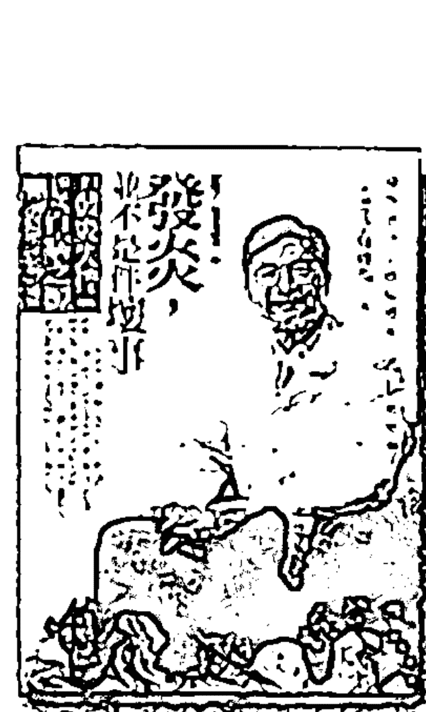

# 吃錯了，當然會生病（3） 健康食譜篇

## 不生病，「食」在很簡單

最實用的72道健康食譜大公開

◎陳俊旭、陳怡靜 著

◎頁數：224頁 ◎定價：350元

學貫中西的自然醫學博士陳俊旭繼暢銷書《吃錯了，當然會生病！》《發炎，並不是件壞事》帶動新一波健康觀念之後，與專業營養師陳怡靜聯手打造台灣第一本自然醫學的健康食譜書，傾力傳授生熟食1比1、多吃好油、吃完整食物、每餐只吃7分飽、少吃精製糖與澱粉等飲食8大原則；並提供最方便、最實用的72道健康食譜，防百病、抗發炎，這樣吃就對了！

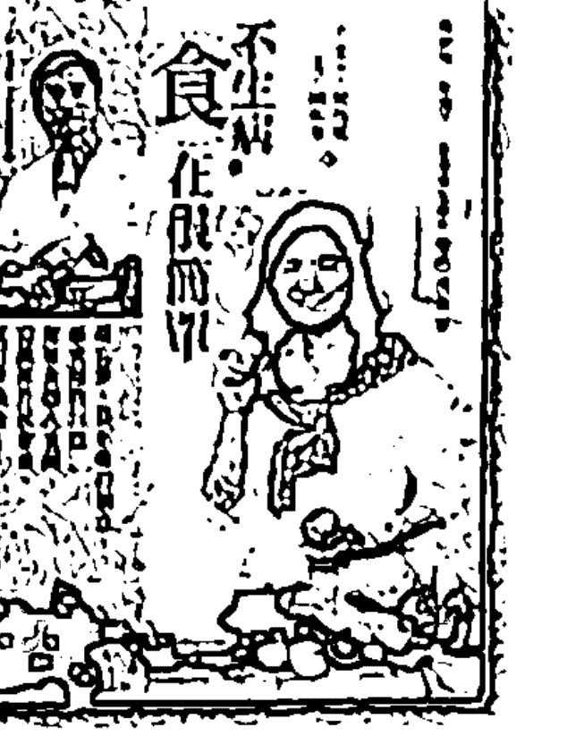

訂購專線：02-23925338分機16 劃撥帳號：50130123 戶名：幸福綠光股份有限公司

75%以上的癌症是可以預防的！

## 癌症，當然可以預防！

江守山醫師的防癌生活手冊

◎江守山 著
◎頁數：276頁 ◎定價：320元

這是一本醫師級防癌生活手冊，抗癌者要遵循、高危險群要落實、癌症還沒找上你的人，從此揮別癌症陰影。作者累積最具實用效果的「防癌之道」，詳盡分析：遠離排名前13大癌症的防癌生活須知、台灣人必改的10大致癌生活壞習慣、絕對不能吃的6大類致癌食物、揪出家中恐怖的致癌健康殺手，杜絕一切養大癌細胞的誘因。

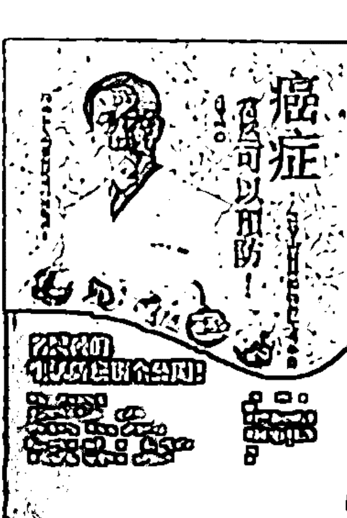

專為國人體質量身打造的保健指南！

## 吃對保健食品！

江守山醫師教你聰明吃出真健康

◎江守山 著
◎頁數：272頁 ◎定價：320元

保健食品已成為國人依賴的營養補給品。但是，究竟有多少人真正買對、吃對？吃保健食品最重要的是「觀念正確」，否則吃再多的保健食品，只是花了冤枉錢，還越補越大洞！腎臟科名醫江守山醫師大膽揭發市場常見名品內幕，並獨家分析國人體質最應補充的10大保健食品，幫助大家建立正確知識，從此有效又安心使用！

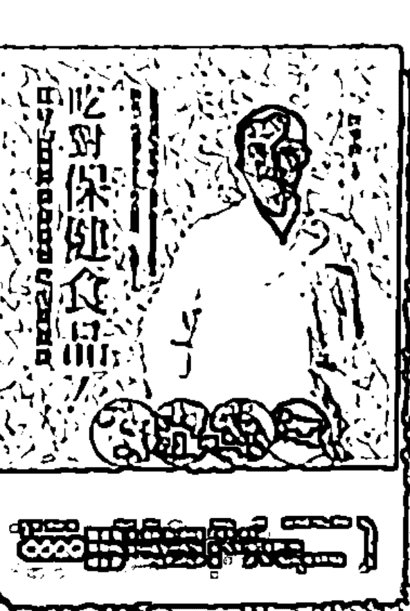

訂購專線：02-23925338分機16 劃撥帳號：50130123 戶名：幸福綠光股份有限公司

# 打造無毒生活其實很簡單

## 無毒保健康

## 如何在充滿毒物的生活中自保

◎陳修玲 著
◎頁數：256頁 ◎定價：260元

本書作者是美國奧瑞岡州立大學專攻毒理學的毒物專家，也是主婦聯盟的消費品質委員會委員和環保講師。她不但具備專業的毒物知識，也從長期主婦聯盟的工作中，累積了許多台灣本土的「防毒、少毒」經驗。因此特別從食、衣、住三方面著手，教你重新檢視生活周遭中的毒物；並貼心提供許多簡單又方便的少毒撇步。

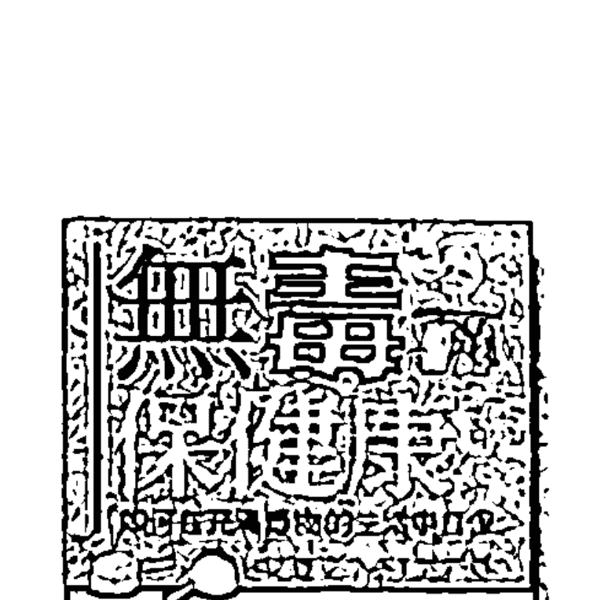

# 台灣第一本優質食材指南

## 只買好東西

## 食材達人朱慧芳採購秘訣大公開

◎朱慧芳 著
◎頁數：248頁 ◎定價：280元

作者破除一般人常見的飲食迷思，包括：外食族吃糙米不一定比吃白米健康、深海魚不一定沒有重金屬污染等。這是一一定要看的台灣在地好食材採購指南，因為食材好，不但美味營養，也才能吃得安心、吃出健康，從日常生活中落實選擇在地當令、健康美味、天然有機、安全又便宜的好食物，做一個精明的食材採買家。

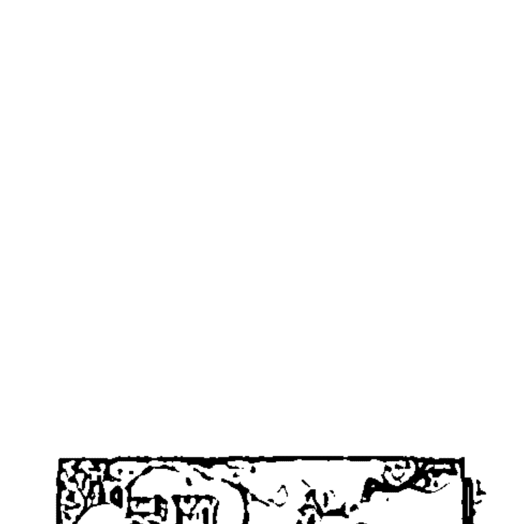

訂購專線：02-23925338分機16 劃撥帳號：50130123 戶名：幸福綠光股份有限公司

狂銷600萬冊暢銷書作者，首度公開青春不老的長壽祕訣

# 新腦內革命

春山茂雄71歲，擁有28歲青春的不老奇蹟！

◎春山茂雄（日本東京大學醫學博士） 著
◎頁數：240頁 ◎定價：270元

曾經在日本創下銷售600萬冊驚人記錄的《腦內革命》作者春山茂雄，再次推出力作《新腦內革命》，首度公開他年過71歲，身體年齡卻只有28歲的青春不老祕訣。本書結合他從醫五十年來的學理研究、臨床應用，並最新醫學發現，針對抗老、不生病及防癌等現代人最迫切的健康問題，提供具體解決方法。甫一上市，即創下不少銷售記錄、震撼各界！

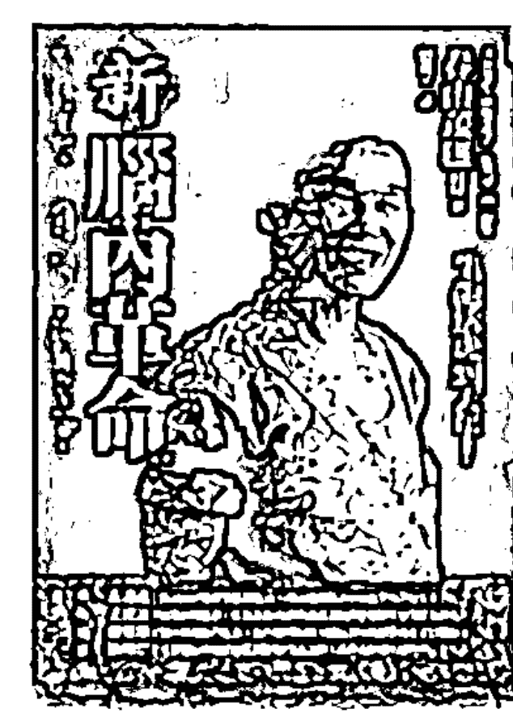

「眼腦並用」的治療新思維，最能恢復、維持視力健康

## 視力，當然可以回復！

重建眼睛健康、激發大腦活力的中川式視力回復訓練

◎中川和宏 著
◎頁數：196頁 ◎定價：250元

你有近視、老花眼、青光眼、白內障或視網膜剝離的問題嗎？你是否認為一旦戴上眼鏡就摘不下來？本書告訴你：「看見物體的是大腦，不是眼睛」，並以「眼腦並用」的治療新思維，提供30個簡單好玩的小遊戲，讓你眼睛發光、頭腦靈光！

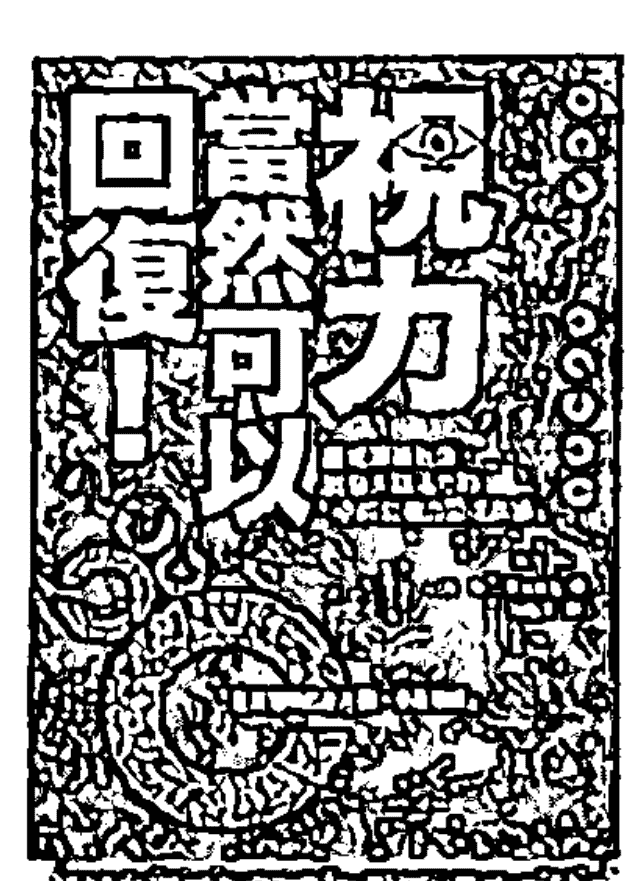

訂購專線：02-23925338分機16 劃撥帳號：50130123 戶名：幸福綠光股份有限公司

具體可行的永續生活設計工具，幫助你創造自己想要的生活！

# 向大自然學設計

樸門Permaculture。啟發綠生活的無限可能

◎孟磊(Peter Morehead) / 江慧儀 著
◎頁數：264頁 ◎定價：380元

作者Peter是台灣第一位引進並實踐樸門的永續生活設計師，隨太太慧儀定居台灣近二十年，他們將自身對樸門融會貫通的設計原則做公開分享，包括土壤重建、用太陽能來烹煮食物、雨水收集、等等獨到的樸門永續設計know-how，在城市裡，也能輕鬆創造與自然共榮，食物垂手可得的永續農園。

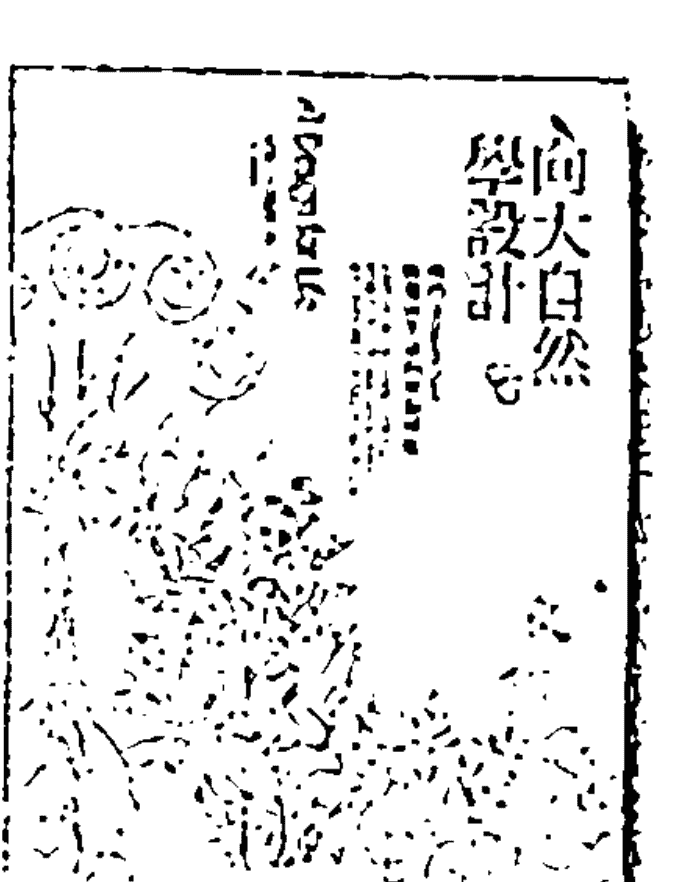

節能。生態。減廢。健康。平價

## 綠色魔法學校

傻瓜兵團打造零碳綠建築

◎林憲德 著
◎頁數：224頁 ◎定價：380元

「綠色魔法學校」是世界第一的「亞熱帶綠建築推廣教育中心」，由綠建築大師林憲德教授負責設計監造，並網羅了對建築的光、熱、風等學有專精的頂尖研究團隊，以及來自台灣的企業綠達人，將百種以上的綠觀念、綠技術、綠建築等許多綠色創舉完美地呈現在其中，尤其造價經濟實惠，證明了環保不必花大錢。

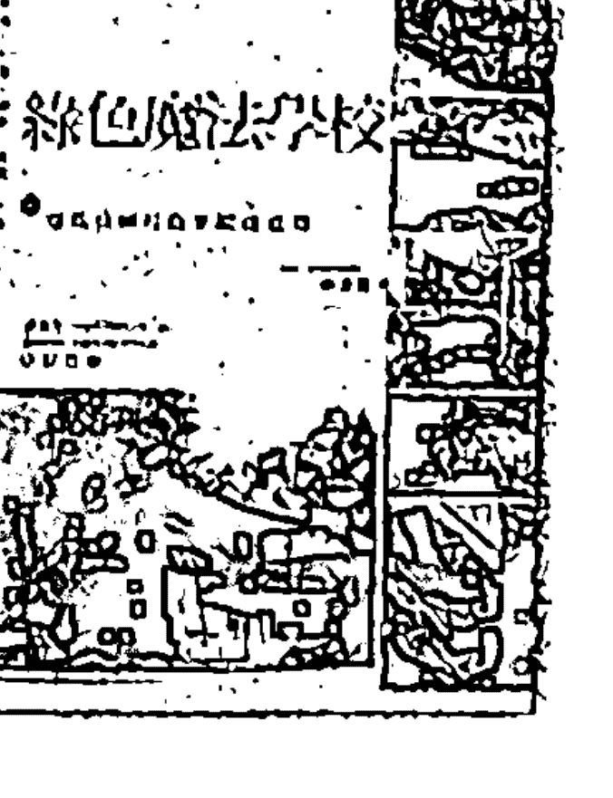

訂購專線：02-23925338分機16 劃撥帳號：50130123 戶名：幸福綠光股份有限公司

## 算運：整理房間，就是整理運勢

創造好運的居家・工作空間魔法

作　者　舛田光洋
譯　者　蔡依倫
特約日文編輯　胡瑋文
封面設計　十六設計
版型設計　陳珊瑩
插　畫　劉素臻
排　版　洪祥閔、柯妙晞

總編輯　蔡幼華
主　編　黃伯瑜
責任編輯　何　喬
發行人　洪美華
行　銷　張惠卿、莊佩璇、蘇倍儀
讀者服務　黃麗珍、洪美月、陳侯光、巫毓麗

出　版　新自然主義
幸福綠光股份有限公司
地　址　台北市杭州南路一段63號9樓
電　話　(02)23925338
傳　真　(02)23925380
網　址　www.thirdnature.com.tw
E-mail　reader@thirdnature.com.tw
印　製　中原造像股份有限公司
初　版　2013年4月
郵撥帳號　50130123 幸福綠光股份有限公司
定　價　新台幣250元（平裝）

HEYA WO MIREBA MIRAI GA WAKARU! by Mitsuhiro Masuda
Copyright © Mitsuhiro Masuda, 2011
All rights reserved.
Original Japanese edition published by Sunmark Publishing, Inc., Tokyo

This Traditional Chinese language edition published by arrangement with
Sunmark Publishing, Inc., Tokyo in care of Tuttle-Mori Agency, Inc., Tokyo
through Keio Cultural Enterprise Co., Ltd., New Taipei City

本書如有缺頁、破損、倒裝，請寄回更換。
ISBN 978-957-696-739-9

總經銷：聯合發行股份有限公司
新北市新店區寶橋路235巷6弄6號2樓
電話：(02)29178022　傳真：(02)29156275

照片提供：典匠資訊股份有限公司（P.3）、123RF（P.4）

國家圖書館出版品預行編目資料

算運：整理房間，就是整理運勢 / 舛田光洋著；蔡依倫譯.
-- 初版. -- 臺北市：新自然主義，幸福綠光，2013.04
面：公分
ISBN 978-957-696-739-9（平裝）
生活指導
177.2 102005093