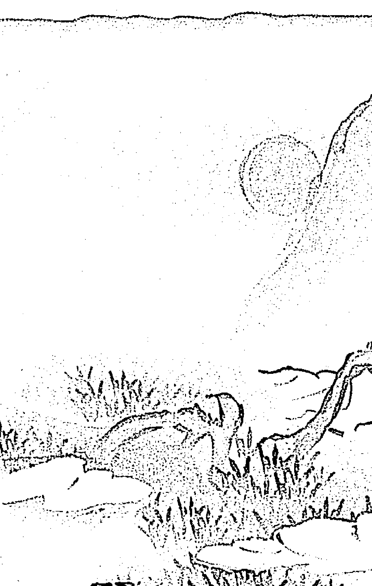
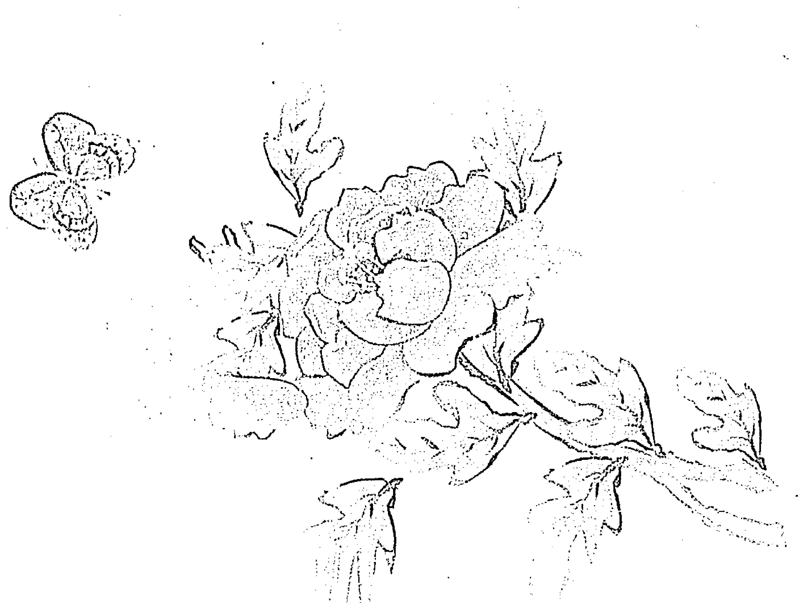
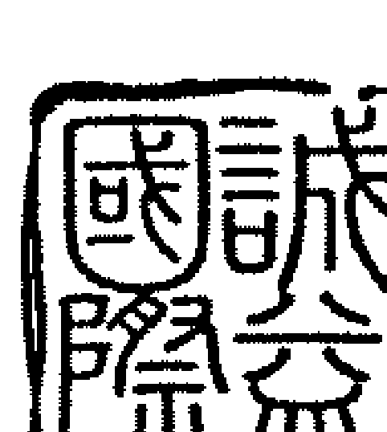

# 斗數卦理應用三

紫雲著

## 實際命例推論與應用

## 斗數懸案探討與分析

紫雲著

# 斗數卦理應用三

# 斗數卦理應用三

# 目錄

# 序文

-   擇偶—談婚姻選擇與個別差異的命理跡象問題
- 命運多乖—談為什麼會如此
- 租地合約糾紛—談相關的命理現象
- 股市大亨
- 他得了什麼病—如何從卦理探討這個問題
- 紅疹發癢難受—談相關的命理因素
- 生小孩和健康問題—談破軍及天梁的疾病作用
- 植物人的爸爸—再談天梁星的疾病作用
- 拆彈引爆
- 餵食流浪狗而喪命—談相關的命理現象
- 高雄市氣爆事件—談相關的命理因素

# 斗數卦理應用三

## 台南大地震—談所形成卦象

傳統的紫微斗數命理是用來探討某些個人的一生遭遇有些什麼變化，甚至可以推演出會造成某事的成敗吉凶的結果和原因。但以筆者在本集所提出探討的文章，除與個人有關的文章外，另有與個人無關，而是經由地下管線洩漏可燃液體而造成相當程度的災害和某次地震天災。

「擇偶」探討的是命造者第一個女朋友，因父母反對而沒結婚，但是後來娶的老婆確實是生活浪費成性的命理跡象，並藉由本文說明太歲入卦之緣起。「命運多乖」則是說明女命因受到某些歹徒的不良干擾而受害的不幸遭遇的命理析論。

在「租地合約糾紛」一文裡，除對簽訂合約後會有履約糾紛的命理跡象作探討外，同時也對該土地及附近環境（包含廟宇）做說明。

一個身家幾百多億的股市金融大亨，最後落到跳海自盡，生前有妻妾情人，死後家產如何分配，在「股市大亨」一文將採異於傳統析論方式說明其命理跡象。

在「他得了什麼病」、「紅疹發癢難受」、「生小孩和健康問題」及「植物人的爸爸」等四篇文章除採用異於傳統推論方式來論斷健康問題外，更進一步說明破軍及天梁二星曜在疾病推論的作用。

本集最後四篇文章皆是以起卦方式，針對特定事件發生的命理跡象加以詮釋。「拆彈引爆」一文係敘述歹徒在一家飲食店裡以炸藥暗置店裡，恐嚇詐財，後來由相關單位派員拆時，不幸而發生爆炸之事。「餵食流浪狗而喪命」則是針對命造外出餵食流浪狗時，被車子撞成重傷並於第二天過世但狗卻沒事的命理分析。至於「高雄市氣爆事件」及「台南大地震」二文，顧名思義，即知其相關事件為何，內容重點分別如下所述。

甲午年（二〇一四）高雄市因埋設經由市區的某種可燃性的地下管線，因為管線洩漏而引起該地區的火災，災情堪稱嚴重。因此筆者就以發生火災的時間起了一個卦象，但沒想到不但和火災地區的氣爆之嚴重凶象狀況相吻合，也和市長陳菊女士所坐入的生年太歲宮位產生相當密切的命理因果關係。

另外台南市也在乙未年底（西元二〇一五年底）發生近年來罕見的地震災害，結果造成一棟大樓倒塌而有不少人因而死傷。這件事件若也以台南市長賴清德的生年輸入發生地震時間的卦象上，也相當吻合事後傳播媒體堪稱的災情情況。

這兩件地方性的災害，讓筆者體會到斗數卦象的玄妙，並不限於只推論一般人的所遭受的命理吉凶現象。因此筆者因而想到某些大眾可能影響的某種吉凶，也可以發生時間以卦裡來推論所造成的影響程度和結果。

這些都是筆者的看法提供讀者參考。

工作室電話：（02）23886193

# 斗數卦理應用三

# 擇偶

### 談婚姻選擇與個別差異的命理跡象問題

### 摘要

一個人常認為婚姻的配對是可以在婚前依每個人的理想而自由選擇，這個也是近代年輕人的婚姻都是經由自由意志而結婚，已經不是老祖母時代，當由父母之命再經媒妁之言的結婚。就命理而言，不管是父母之命媒妁之言或是自由戀愛而結婚，似乎並非婚後都能成為佳偶。本文敘述一個年輕人，由於父母反對他和交往多年女友結婚，後來不再跟這女友繼續往來而最後沒結婚。後來命造者跟另外一個人結婚，但是這太太在日常生活方面確有異常態，意即生活奢侈浪費的習慣，因此使銀行存款掛零。本文探討的是，命造者第一個女朋友，因父母反對而沒結婚，但是後來娶的老婆確是生活浪費成性。因此李君問我這是個命造命中註定喜歡的女友不能結婚，而另娶的老婆確是奢侈浪費的女人。

李先生是我的一系列命理書籍的讀者，他偶爾會以電話問我書中的某些問題。由於他工作繁忙，因此一直沒有見面機會。但是有些問題確實是非電話中三言兩語就可以說清楚，因此曾經告訴他，若碰到較複雜的問題，最好能來工作室面談。前幾天他又在電話中說，有位好友（盤一）的婚姻問題讓他覺得百思不解，因此想約個時間來工作室作詳細面談，以解他想了很久的迷惑。

見面時李先生首先問說，一個人的婚姻有什麼問題，是不是從原命盤上就可以看出？

於是我回答說大體上有可能，但是這問題涉及婚配的個別差異，因此這個問題最好要從個別差異中來分辨。

李先生說：命造者的父母親都是丙申年生，這個父母的生年條件也會有關係嗎？若以現代人的結婚來說，已經不是老祖宗時代的，兒女婚姻都是和媒妁之言與父母之命有關，因此我不曉得你這句話的意思是什麼？

我回答說，你會錯了意，這個個別差異指的是，和婚配對象出生的個別差異有關，所以推論婚姻狀況也就是一個人一生婚姻如何，應該和婚配對象的出生年的個別差異有關。

如何時，一定要依據婚配對象究竟生在那一年來推論，這個是推論婚姻吉凶如何的必備條件。

| 宮位信息 | 天干地支 | 年齡段 | 主星 | 輔星/雜曜 | 神煞/等級 | 備注 |
| :--- | :--- | :--- | :--- | :--- | :--- | :--- |
| 遷移 | 癸巳 | 63-72 | 天相 | 白虎、天福、天刑、咸池 | 二 | - |
| 疾厄 | 甲午 | 53-62 | 天梁、天鉞 | 天咸、刑池、三台、台輔、紅鸞 | 四 | 甲△ |
| 財帛 | 乙未 | 43-52 | 寡宿 | - | 四 | 乙○○ |
| 子女 | 丙申 | 33-42 | 七殺、廉貞 | 陀羅、天八、貴座 | 六 | 1 |
| 仆役 | 壬辰 | 73-82 | 巨門、文曲 | 火星、天虛 | 二 | 壬○△○ |
| 事業 | 辛卯 | - | 貪狼、紫微 | 火星、天虛 | 三 | 辛□ |
| 田宅 | 庚寅 | - | 太陰、天機 | 天魁、大耗、恩光、封誥 | 三 | 庚 |
| 福德 | 辛丑 | - | 官符、華蓋、右弼、左輔、天府 | 鳳閣、龍池 | 五 | 辛 |
| 父母 | 庚子 | - | - | - | 五 | 庚□○◎、1 |
| 命宫 | 己亥 | 3-12 | 破軍、武曲 | 孤辰、喪門、地空、地劫、太陽、權、天喜 | 三 | 己○□□△△、6、天馬、身 |
| 兄弟 | 戊戌 | 13-22 | 天同、文昌 | 鈴星、擎羊、天姚、文昌忌 | 三 | 戊○、3 |
| 夫妻 | 丁酉 | 23-32 | 天哭、祿存 | 天官 | 六 | 8、丁 |

**命主信息**：
- 父：丙申，母：丙申
- 大运：二〇一五年 乙未年，丙申35歲
- 八字：甲甲己辛 子申亥酉
- 男命：辛酉 一九八一年十月六日子時
- 命格：木三局

盤一

# 擇偶

李先生說：他的初戀女朋友是庚申（一九八〇）年生，你看他兩人若是成為婚配的對象，吉凶究竟會怎麼樣？

於是我以電腦排出庚申年女友的卦象（盤二）。依這個卦象的申宮有廉貞雙化祿坐守並會有子宮的一顆武曲化祿，另外又有寅宮的一顆貪狼化權來合，合方的子宮兩顆化科及辰宮有一化科，因此就申宮而言，是個紫府廉武相的三奇嘉會大格局。在命造者的命盤出現這位女友的命理大格局，難怪他兩人會有感情上的投緣而會有意結婚。

李先生說：不過這位朋友後來卻因父母不很贊成兒子跟這位小姐結婚，最後使這樁婚姻告吹了。理由是這個女孩子的家世不是很好，因此父母表示兒子最好不要和這女孩子結婚。

於是我詳細的看了卦象（盤二）以後說，小姐生年坐守申宮並坐會有前面所提到的三化祿與三奇嘉會吉象，但是他父母都坐於丙申年，因此使申宮形成四化忌（丙申年在申宮天干是丙干），並會沖辰宮的一化忌。特別是卦象（盤二）的丑宮有太陽雙忌和太陰坐守，若以這宮的星曜作為女孩子的父母親星曜宮位，則庚申年五虎遁到丑宮為己干，己干雖有武曲化祿在子宮吉會申宮，但是己干也使辰宮的文曲化忌沖申宮，而加重申宮的凶象。
另外若輸入父母的生年資料進入這個卦象（盤二），除了使申宮的廉貞形成四化忌以外

| 白虎 二 癸 △ 巳 遷移 63-72 | 天梁 天福 | 天刑 天咸池 四 甲 午 疾厄 53-62 | 天鉞 七殺 三台 台輔 紅鸞 | 寡宿 四 乙 未 財帛 43-52 | 陀羅 六 1 丙 OO 申 子女 33-42 | 廉貞 天八 貴座 |
| :--- | :--- | :--- | :--- | :--- | :--- | :--- |
| 文曲科 天相 紫微 二 壬 △○ 辰 僕役 73-82 | 父：丙申 母：丙申 | 女友生年太歲卦象 一九八一年十月六日子時 甲子 己亥 辛酉 | 男命 辛酉 | 天哭 六 8 丁酉 夫妻 23-32 | 祿存 天官 |
| 火星 天虛 三 辛 ○ 卯 事業 | 巨門祿 天機 | 二〇一五年乙未年 大運 丙35 申歲 木三局 | 甲子 己亥 辛酉 | 擎羊 鈴星 天姚 三 戊 □□○ 戊 兄弟 13-22 | 文昌忌 破軍 |
| 大耗 天魁 三 庚 □ 寅 田宅 | 貪狼 封誥 恩光 | 官符 華蓋 五 辛 □○○ 丑 福德 | 右弼 左輔 太陰權 太陽 龍池 鳳閣 | 天府 武曲 天喜 | 地空 地劫 孤辰 喪門 三 6 己亥 命宮 3-12 | 天同 天馬 身 |

### 盤二

，而父母丙子年的丙干在丑宮天干為辛，而辛干雖然使巨門化祿，但也使文昌化忌。因此父母說是這個女孩的家世不好，最好不要跟她結婚。

特別是戊宮坐守破軍雖然有雙化權但亦有文昌雙忌，因而使主婚姻的戌宮和申宮由於父母形成的廉貞四化忌夾男命在酉的先天夫妻宮，而這個宮位在這卦象上（盤二）卻是祿存獨坐被申戌兩鄰宮的羊陀夾並有申宮四化忌而戌宮雙化忌夾住這個空弱宮位。因此使命造者聽了他父母不表贊成的意見後，也就放棄了和這位庚申年小姐的感情婚姻。

由於命造者的先天夫妻宮酉宮正好是他的生年太歲宮位，因此若以這生年太歲卦象，也是先天夫妻宮（盤三），也許從這個卦象的組合，也可以看出命造者對這位庚申年生的女朋友並沒有非卿莫娶的堅定意念。

李先生說：如何推論分辨？

於是我說，女友庚申年生，太陽化祿在盤三的午宮，而午宮已有太陽雙化忌（甲申日、甲子時）而庚申年祿存在申宮，擎羊在酉宮。另外由於酉宮和亥宮都是官祿主宮位，若就女友而言，酉宮是乙干，使申宮的天機化祿也使太陰化忌，而亥宮女友的天干是丁，也使申宮太陰化祿而巨門化忌在戌宮。因此就女友而言，這兩個官祿主宮位已經使酉宮成雙忌夾並有擎羊同踞，已經顯示出某程度的不吉跡象。另外，主婚姻有關的破軍坐守巳宮與酉宮成為合方宮位，而女友在巳宮的天干是辛，辛干巨門化祿和文昌化忌都在戌宮，因此使酉宮成為雙忌夾制。另外若就女友而言，主男友的太陽星在午宮，而女友的五虎遁天干是壬午，因而使巳宮的武曲成為雙忌夾忌沖酉宮。巳宮由於武曲破軍同守，因此巳宮除了形成雙忌夾忌以外，而武曲化忌也會使同宮的破軍帶有凶象而不利婚姻。

因此個人以為這命造者對他的這位女友，並不是有非卿莫娶的感情想法，否則不會因為父親表示不同的想法而拋棄這位交往已久的朋友。

另外，由於酉宮不僅是命造者的先天夫妻宮，也是個生年太歲宮位。因此也可以根據酉宮三合宮位的天干來推論，是否對這個先天夫妻宮也有不吉的命理跡象。

酉宮丁干，太陰化祿在申宮，因此使酉宮成為雙祿吉輔，難怪他和這位女友會有感情，但是丁干也使巨門化忌，因此酉宮連同前述情況而成為雙忌夾制。一樣的，亥宮為官祿主宮位而天干是己，己干文曲化忌在辰宮，因而使巳宮成為雙忌夾制，丑和卯宮都是辛干，因而使戌宮的文昌成為雙化忌。尤其是巳宮癸干也使酉宮貪狼又化忌。巳宮的破軍主婚姻作用，因此使酉宮的貪狼又化忌並有卯宮的火星來沖而使先天的夫妻宮成為凶格。

李先生說：貪狼化忌在酉宮會沖卯宮火星，就成為凶格嗎？

化忌沖有火星或鈴星只有增凶跡象，還不至於成為凶格。由於前述午宮的太陽星有主男友或丈夫的作用，而女友五虎遁天干是壬干，而壬干使巳宮的武曲化忌沖酉宮，因此酉宮又會沖有卯宮的火星才會成為兇格（武曲化忌沖火星）。所以，我以為這位命造者並不單純由於父親的反對而不和這位女友結婚。

李先生說：後來命造者跟一位甲子年生的小姐結婚。若以甲子年的女友而言，生年的太歲宮位在子宮有武曲天府坐守，正好和庚申年生的小姐同卦（盤二）。類似這種生年不一樣而推演出來的卦象卻完全相同，就婚姻情況而言究竟有什麼差異？

卦象雖然相同，但是坐守申宮的女友是庚申年而宮干是甲，而甲子年生的宮干卻是丙。由於年份和宮干不同，因此雖然兩人的生年太歲卦象相同，由於有這兩項差異，因此在命理的推論上會完全不同。另外若就本盤而言，申宮的命造者天干是丙，而子宮是庚。也就是說兩位小姐的生年太歲卦象雖然相同，但是兩人的生年太歲宮位本宮都有三個干支完全不一樣的現象。所以命造者不會跟庚申年的小姐結婚，不代表甲子年的小姐也一樣的不會跟命造者結婚。

另外，若就命造者的酉宮而言，這個宮為不僅是生年太歲宮位也是先天夫妻宮。若就盤三的卦象而言，主婚姻有關的破軍正好在巳宮會照先天夫妻酉宮，而甲子年的小姐宮干是丙，丙干使辰宮的天同化祿，巳宮的天干是己，正好使武曲化祿會照酉宮。而婚姻主丈夫的星曜是太陽在午宮，而甲子年小姐在午宮的天干是庚，因而使巳宮成為雙祿輔祿吉會酉宮。由於甲子年生的女友在命造者的生年太歲也是先天的夫妻宮卦象上形成這幾項有利婚姻的吉象，所以他才會和她結婚。

李先生說：命造者在甲午年（二〇一四）和甲子年的女友結婚後。由於命造者的學經歷不差，因此薪水待遇不錯，但婚后老婆颇爱虚荣，因此到了乙未年（二〇一五）銀行存款竟然歸零。太太生年太歲坐守命造者的子宮是武曲天府坐守，又如何來推論命造者娶這個老婆竟然是個頗愛虛榮浪費的女人？

就命理而言，一個人愛慕虛榮應該指的是生活方面有非常態的用錢浪費以求享受，比如說生活用品會買高價位的東西。就命理而言，推論一個人生活方面是否簡樸或虛榮浪費，要取用福德宮。若就甲子年生的這個老婆而言，她的福德宮要取用寅宮的卦象（盤四），有武曲天相坐守。就賦性而言，天相主衣食，也包括生活上的一般用品。因此要推論她的這些習慣，自然要用盤四的寅宮卦象來推論。

李先生說：如何從寅宮的宮位卦象可以顯現出她虛榮奢侈？以寅宮為主和三方的宮干形成的化忌現象，應該就可顯現出現象。

李先生說：是原盤上寅宮三方四正的宮位宮干嗎？

| 白虎 二 癸 巳 遷移 63-72 天機 天福 天咸刑池 四 甲 午 疾厄 53-62 天鉞 紫微 三台台輔 紅鸞 寡宿 四 乙 未 財帛 43-52 陀羅 六 1 丙 □□ 申 子女 33-42 破軍 天八 貴座 文曲科 七殺 壬 △● 辰 僕役 73-82 母父 :: 丙丙 申申 二○一五年 乙未年 大運 丙35 申歲 甲甲己辛 子申亥酉 辛酉 一九八一年 十月六日 子時 天哭 六 8 丁 酉 夫妻 23-32 祿存 天官 火天星虛 天太梁陽權 辛 □△●● 卯 事業 木三局 擎鈴天羊星姚 文昌忌 天廉府貞 戊 ○○● 戊 兄弟 13-22 大耗 天魁 天相 武曲 恩封光誥 庚 ○△△ 寅 田宅 官華符蓋 右弼 左輔 巨門 天同祿 鳳閣 龍池 辛 ○ 丑 福德 貪狼 天喜 五 1 庚 □ 子 父母 地空 地劫 孤辰 喪門 三 6 己 亥 命宮 3-12 太陰 天馬 身 |

# 盤四

理論上就要推論甲子年生的老婆的相關命理跡象，所以我比較主張要取用寅宮和午申戌宮三方四正老婆顯示的宮位宮干。所以，寅宮的天干為丙，午宮的天干為庚，申宮的天干為壬，戌宮的天干為甲。老婆的生年太歲甲子年（丙干）自然也會有作用。因此，寅宮丙干，天同化祿在丑宮，而廉貞化忌在戌宮並有火星擎羊忌煞同踞沖寅宮。午宮庚干，太陽化祿在卯宮，天同化忌在丑宮。申宮壬干，天梁化祿在卯宮，武曲化忌在寅宮。戌宮甲干，廉貞化祿破軍化權武曲化科三奇嘉會在寅宮，太陽化忌在卯宮。另外，子宮的太歲宮位生年甲子年宮干為丙，甲干也使寅宮形成三奇嘉會，但丙干也使戌宮廉貞化忌又有擎羊鈴星同踞沖寅宮。

李先生說：寅宮造成雙忌夾忌又沖有戌宮忌煞交沖，就可以推論為她有奢侈虛榮的心態嗎？

自然不足以顯示她會有這種心態，因此這些跡象我認為：

- 其一：寅宮為原盤上的「大耗」是宮位，一旦忌煞交沖時會莫名其妙的奢侈浪費。
- 其二：戌宮除了有忌煞以外，又有意料之外的天姚星同踞。因為會沖有辰宮的一顆化忌，寅宮的大耗，因此可據以推論這位甲子年生的老婆不知節制的會有意外胡亂開支。

李先生說：據所知道，她在花錢方面都是買一些高品質的奢侈品，這些東西價錢都很高，這個跡象又要怎麼推論？

她原盤上福德坐守寅宮有天魁，午宮又有天鉞來會，而寅午申戌的三方四正宮位的星曜正好是紫府廉武相的大格局，因此她在吃或用品方面需求都會傾向於品質高昂的項目，所以金錢的開支會特別多，難怪她在婚後的第二年幾乎使銀行帳戶已經沒有存款。

李先生說：據說這位太太喜歡到國外旅遊，而且參加的旅行團都是旅遊經費昂貴的旅行團。這個跡象又要怎麼推論？

我認為若以盤四的卦象而論，福德寅宮坐守四馬之地，另外生年宮位在子宮的貪狼和合方宮正好是殺破狼主動態的格局，因此她才會支付旅遊高昂的經費而到遠方旅遊。

李先生說：「假定你碰到客人就命理方面問說：『他或她的一生婚姻吉凶狀況會如何？那你要怎麼回答？』」

首先我會問他或她的婚配對象是哪一年生，其次結婚在哪一年（含大限），因為就命理而言，有人可早婚，也有人適宜年齡較大時才結婚。所以在經驗上我個人認為命理是依理推論而不是依命盤就可鐵口直斷。這也是推論一個人一生的婚姻狀況時，最好重視結婚年齡幾年。

# 太歲入卦緣起

## 斗數卦理應用三

歲和哪一年生的婚配對象，也就是說在婚姻上的個性差異條件究竟如何？李先生說：談到個性差異問題，就讓我覺得好奇。看了不少子平八字和紫微斗數的命理書籍，唯獨你提到談到一個人有生身父母的出生年份的個別差異問題，所以很好奇你究竟為什麼會想到父母的個性差異問題？我聽了以後問說，你覺得提到父母的生年資料在斗數命理上有甚麼特質作用呢？李先生說：你在已出版的十幾本斗數書籍，幾乎都列有命造的父母出生年份資料，我以為若沒有涉及用到，你大概不會提到這父母的出生年份資料，究竟為什麼？這個一直沒有人問我，為什麼我每一篇文章都加註父母的出生年份。由於沒人問，因此我就不會提起，這造成我在談斗數問題時一定要先知道父母的出生年份，這件事距今已隔四十多年。當時我已經拜師學斗數，因此在一次陪老婆到某大醫院的婦產科去臨盆生小孩時，沒想到產科醫院也有好幾個先生在產房外陪老婆生小孩。由於我已經學斗數，所以對小孩的出生時辰會特別留意。記得那一次連同我那小孩在同一個時辰內生了三個小孩。第一個出生時，護士小姐抱著小娃娃出來跟在外面等候的父親說，並說恭喜小朋友已經順利出生。第一次是位面帶凝重臉色的醫生出來跟在外面等的父親說，小孩子已出生，但是身體有點狀況，所以現在在加護病房診治。第二次是一位小姐抱著小孩並面帶笑容地說，太太給你府上添了丁。

這件事情讓我覺得驚訝而百思不解，為什麼同一個時辰生的小娃娃，有的很正常，有的情況嚴重到送入加護病房。在這一年我已學斗數近十年，由於師承不曾提起，所以我也茫無所知，為什麼同一時辰生的小孩，在健康上有那麼懸殊的差別。因此我也請教過不少命理前輩，自然也請問教過子平命理的老前輩。印象中有幾位前輩說：類似我提到出生後即需要進入診治重病的加護病房，不是他祖德有虧，就是和風水不佳有關，而風水是包括陽宅（住房）和陰宅（墳墓）。但祖德問題，指的究竟是父親、祖父、曾祖那一代做過缺德的虧心事而遺禍子孫。

我總覺得這些老前輩的說法，究竟要根據甚麼吉凶來推論對後代子孫禍福的影響，似乎人言人殊。這件事又過幾年後，有一天我突然想起，當年讀書時的選修中有一堂課涉及品種改良的課程，使我想起，下一代的品質如何，應該和上一代有決定性的關係。

也就說，生下來就需住入加護病房的娃娃，應該和生身父母的血緣遺傳有關係。為了證實這個問題，我曾經花了近十年的時間，去搜取親友的正確命盤資料，以及父母出生年，從最清楚的命理現象來探討起，因此想到從健康問題著手，因為比較明顯的疾病問題，不會造成見仁見智的爭論，比如說一個人常會拉肚子，一個人常會頭痛，這種事關病痛的問題，都大概搜取了幾百人的相關資料以後可以確實的證實，談論命理若不輸入父母的生年資料，他的命理推論可能比較不會有完整性。

李先生說：你的意思說，輸入父母的生年資料只能影響到一個人的健康疾病的問題？不是只會影響到子女的健康問題，是因為健康問題比較肯定而沒有爭辯的事實。另外，一個人的聰明才智如何，似乎也有相當明顯的影響作用。

李先生說：若根據你這麼說，那同父母所生的兄弟姊妹，不管在健康方面或聰明才智方面都完全相似了！

依個人的經驗，一個人由於所謂落土時八字命，因此同父母所生的兄弟姊妹的這些問題，雖然在健康方面有其個別差異，但是在聰明才智和性格方面好像就不會差別很多。由於探討這個問題，不僅花了近十年時間，探討過的命例也有上百份之多，因此我才會認為一個人必然會受到生身父母的特質遺傳應該不會有錯。

李先生說：據說斗數命理已傳逾千年，為什麼千百年來的老前輩都沒見過提出這個問題？

我認為這個道理很簡單，因為在老祖宗時代婦女生產都在家裡，臨盆時會找一位接生婆？(近代稱為助產士)來協助處理出生嬰兒的相關事項，因此不會有人想到同一個時辰會有不同的小孩出生。因此古傳的命理，不但是紫微斗數，連子平八字的也不會想到同時辰由不同父母所生的小孩在命理上會有甚麼差別。李先生說：你就是由於小孩出生的時辰發生過剛才說的意外問題，所以才會讓你覺得奇怪而作尋根究底的推論。但是近代研究命理的人若結了婚，一旦老婆臨盆也都會到醫院去，應該有人可能也會碰上類似你碰過的情況，但是為什麼命理界只有你一個人提出這個問題？這個問題我曾想過，也許同行的人會以為老祖宗傳承下的命理要訣已經十分完整，因此不必再去畫蛇添足。不過我個人以為時代在變，人生一輩子各項問題也跟著在變，而命理探討的一個人一生的際遇各種問題，古今已有太大差別。李先生說：所謂的差別，能否說得具體一些。在老祖宗時代有所謂：人生七十古來稀，但是在近代生活水準尚可的地區，由於生活較好，醫療又普遍發展，因此平均壽命幾乎都在八十歲以上。凡人都會老，最後會往生，在命理上人的最後往生是件命理大事，那麼古今之人壽命長短會有這麼大不同，這項差異性幾乎命理界的前輩不曾想過。記得筆者在童年時，有一位住同村的中年人就因急性盲腸炎而過世。這個疾病若在目前，只要及時送醫院開刀，就可平安無事而延年益壽。這也是談命理也要顧及所居住時代和環境的差異條件，而不是同樣生辰八字的人都有一樣的壽命，這正是時代或環境造成的個別差異。

一個人會受到父母個別差異的影響，比較明顯的除了健康以外，後天的教與養也都很有關係。記得筆者小時候在鄉下同村與筆者同齡的小朋友有十來人，而家境環境似乎都沒甚麼差別，但同齡的其他人，除了笔者之外，教育都只讀到小學，唯獨笔者有幸繼續升學。笔者對家父曾經說過：「賜子千金，不如教子一藝」的話留下深刻印象。我認為這也是一項個別差異，因為生是先天而如何教養是後天，因此笔者一生都很感念父母後天給我教育恩惠。

其實在多年論命的經驗上也發現到一個人的處世待人和職業工作上的表現，往往都受到父母和家庭的影響。在心理學上所謂「智力商數」（IQ）和「情緒商數」（EQ）也似乎都和父母的遺傳和小時的家庭教養有關。父母對子女血緣上的遺傳，除了健康方面有密切關係以外，其他如聰明才智和情緒方面也都和父母遺傳上有密切的關係，這些事項在當前應該普遍能為一般人瞭解認同。

如以本文所提到命造者的父親為什麼不會贊成他和庚申年生的女朋友繼續來往後接著談論婚事，所不贊成而反對的理由已如前述，這個雖非遺傳問題，但也是命理上的另一項個別差異。

- 賜子千金，不如教子一藝

至於命造者後來和甲子年生的女友結婚，婚後才發現到老婆生活有奢侈浪費的習性，個人也認為這個老婆在生活上有那種習性，也是個別差異所造成，並非命造者命中註定必然會娶到這種老婆。

## 命運多乖 ——談為什麼會如此

## # 摘要

俗語說：一個人凡事操之在己，意即一個人的遭遇吉凶好壞都在自己的作為上。

但本命例談的是一位命造者，年紀輕輕的卻遭到受到某些不好遭遇，而這些遭遇卻不一定

是她自己所造成，而是受到某些歹徒的不良干擾而受害。

類似本命例的人生遭遇不一定常有，但是為什麼她會如此，只能從卦理上來解讀。

這份命例是在一次研討會中，由一位李姓同好提出。在研討會上每人分有一份命例並註記研討事項。當開始時我跟同好說，這是個看來似乎很簡單的命例，所要討論的也只有兩件事，大家不妨先詳細看過資料後再發表看法。

李：這位命造者在戊寅大限的庚午年（盤一）家中遭歹徒侵入搶劫，命理現象怎麼推論？

於是大夥都落入思考，經過十來分鐘左右，有一位黃姓學員舉手說：大限戊寅限（盤二）的庚午年家中遭小偷。庚午年在午宮正好是命造者五月生人陰煞（小人）坐守宮位，而午宮的天干是壬，壬午武曲化忌沖午宮。若以寅宮為重點宮位論，則寅宮戊干天機化忌在先天田宅巳宮，午宮壬干武曲化忌在先天命寅宮，戊宮丙干廉貞化忌沖寅宮，由於先有寅宮的武曲化忌後有戊宮的廉貞化忌沖寅宮，天府即財帛之主，經雙化忌合沖又會火星與鈴星，因此很明顯的有歹徒入侵搶劫。

另外，由於命造者是五月生人，因此陰煞坐守午宮而天干又是壬，也使寅宮的武曲化忌

命星多重

二九

| 天姚四 辛巳田宅 | 太阳禄天贵火星三 壬午事业 | 陀罗地空寡宿三 癸未仆役75-84 | 禄存左辅文曲紫微 甲申迁移65-74 |
| :--- | :--- | :--- | :--- |
| 白虎华盖四 庚辰福德 | 武曲权 | 大运丁丑年 18岁 土五局 | 一九九七年 甲丁壬庚 辰卯午申 |
| 地劫大耗五 己卯父母 | 天同忌恩光 | 女命 庚申 一九八〇年五月十一日辰时 | 擎羊咸池 乙酉疾厄55-64 |
| 铃星天虚五 戊寅命宫5-14 | 七杀 天马凤阁 | 天刑 己丑兄弟15-24 | 天魁天梁天喜 戊子夫妻25-34 | 天相廉贞 龙池 | 孤辰 丁亥子女35-44 |
| 贪狼台辅身 | 巨门天官 |

盘一

### 命運多乖

| 天姚四 辛巳田宅 | 天機天貴 | 火星三 壬午事業 | 右弼 文昌 紫微天福 三台 封誥 | 陀羅 地空 寡宿 天鉞二 癸未僕役 75-84 | 祿存 左輔 文曲 破軍二7 甲申遷移 65-74 | 紅鸞 |
| :--- | :--- | :--- | :--- | :--- | :--- | :--- |
| 白虎 華蓋四 庚辰福德 | 七殺 |  |  | 女命 一九八〇年五月十一日辰時 | 擎羊 咸池二 乙酉疾厄 55-64 |  |
| 地劫 大耗五 己卯父母 | 天梁 天陽 祿恩光 | 土五局 | 大運 丁丑年 己丑歲 | 甲丁壬庚 辰卯午申 | 天喪 哭門五 丙戊財帛 45-54 | 天廉 府貞 台輔身 |
| 鈴星 天虛 戊寅命宮 5-14 | 天相 武曲權 鳳閣天馬 | 天刑六 己丑兄弟 15-24 | 天魁 | 巨門 天同忌 天喜 | 官符六 戊子夫妻 25-34 | 貪狼 孤辰五 龍池 丁亥子女 35-44 | 太陰科 天官 |

### 盤二

還有，依天梁星若是居守忌煞交沖宮位主意外之說，而卯宮的宮干是己，己干文曲化忌在申宮也沖有寅宮的鈴星。所以命造者家中在庚午年有歹徒入侵搶劫，理應可以從這方面來探討。

於是我說：這麽推論尚稱合理。不過若從太歲宮位來看（盤三），午宮壬干武曲化忌天府在子來沖。而已宮的先天田宅宮坐守天梁又與酉亥未三方宮位成為忌煞交沖，而已宮的天干是辛，辛干正好文昌化忌在午宮會沖有午宮火星和寅宮的鈴星，應該也可以解讀，從生年太歲盤上，也可以顯示出，在第一大限的庚午年家裡有歹徒入侵。

休息了十多分鐘以後，接著李先生再說：這個命造者在己丑限的丁丑年外出時遭遇強暴，性侵者為丁酉年男，命理跡象為何？

示說：性侵是一項強暴行為，而引起性方面的歹念，應該和某些丁級星曜的桃花星又沖有忌煞交沖有關，大家不妨往這個方面思考看看。

又經過幾分鐘以後，有一位張先生舉手說：命造者遭人性侵理當在戶外並不是家裡，因為己丑限的丁丑年，流年坐守紫微破軍在丑宮（盤四），而先天田宅宮在巳宮正好是貪狼化忌，所以正可顯示命造者不在家。很巧的己丑限的丁丑年卦象（盤四）正好是性侵命造者丁

### 命運多乖

| 宫位与星曜 | 宫位与星曜 | 宫位与星曜 |
| :--- | :--- | :--- |
| 孤辰丧门 天铖五 丁巳兄弟 | 文曲 天机 天官华姚符盖 六 戊口◎午命宫6-15 | 破军紫微禄 天官华姚符盖 六 己○未父母16-25 | 大耗 文昌 三7 庚△申福德26-35 台辅 |
| 天天福马 右弼 太阳科封诰 五 丙○△辰夫妻 | 二〇一六年丙申年 大运 壬54戌岁 火六局 丙己庚癸 寅亥申卯 | 女命 癸卯一九六三年七月六日寅时 | 地天空虚 三 辛酉田宅36-45 天府 |
| 天天刑哭 天魁 武曲七杀 二0 乙○□卯子女 三台 | 擎地寡羊劫宿 天相 | 铃咸星池 禄存 巨门权 恩光红鸾 四 甲□子迁移66-75 | 左辅 太阴 一二 壬△戌事业46-55 天贵身 |
| 天天梁同 二3 甲○△◎寅财帛 | 四 乙丑疾厄76-85 | 陀罗火星白虎 贪狼忌 廉贞 二6 癸口◎◎亥仆役56-65 八座 |

盘二

四一

酉年男太歲武曲七殺在酉的變盤。這項兩個人都坐守雙星殺破狼的卦象，可見兩個人都出門在外，假定兩人是陌生人，命造者怎麼會被性侵，這樣子得請李兄先說清楚。

李先生說：的確是陌生人，不過丁酉年的人開車在路上，碰上命造者時向其搭訕，並表示善意的說要載她到要去的地方，所以命造者才會上車而被載到偏僻的地方，才被性侵。問題是丁酉年的人為什麼性侵命造者，從卦象上又要如何解讀？

我聽了之後說：丁酉年的天魁在亥宮天鉞在酉宮，兩人的天鉞輔申宮，申宮正是命造者的先天遷移宮，也是生年太歲宮位，所以命造者才會覺得丁酉年的男人出於善意才要開車子載她，她真沒想到結果是羊入虎口。那麼各位再想想看，丁酉年的男人性命造者的卦理要如何解讀。

有位劉先生舉手發言說，若以盤四來看，丁丑年另一天干是癸貪狼化忌在巳宮，貪狼於賦性上有主與性慾有關，在巳宮化忌又會上三方天姚、咸池、天喜諸桃花星，可以推論為丁酉年男在性慾上有較負面作用。而丁酉年男之陀羅正好在巳宮與貪狼化忌形成風流彩杖格，會丁酉年男所坐之酉宮，因此會有因性侵案而惹出糾紛事情。而上述桃花凶象正好在丁丑年流年三方會照，而對命造者造成極大傷害。

另外，由於武曲七殺均為剛星，加上酉宮擎羊，五行都屬金，個性較為剛直強硬，碰上

## 斗數卦理應用三

上述桃花星負面作用，丁酉年男在處理性怨事上較容易用強暴方式進行。

另外，若採先天遷移宮變盤（盤三），於己丑限時後天遷移宮未宮天干為癸，貪狼化忌在寅宮而造成卯宮到亥宮形成五宮化忌共振現象，寅宮為命宮並沖有火鈴，因此在己丑限時外出事的機率較高。

再則，丁酉年男坐守酉宮（盤三），依理可以以八月份論，而陰煞小人正好坐守子宮，丁酉年男在子宮天干為壬，正好使武曲化忌會沖午宮火星而形成寡宿凶格，且子宮也使卯宮到亥宮形成連忌共振宮位，一旦逞凶時，凶象會特別強烈。

## 租地合约纠纷 ——谈相关的命理现象

## # 摘要

原住民土地是保留地，所有權不能私有，因此命造者使用本文所提的土地只能以租賃方式使用。由於命造者和原使用該地的乙未年女士訂有合約，但是合約訂立將近一年，出租人一直沒有遷離出租地因而引起租約糾紛，後來經過調解委員會調解以後，才解決合約糾紛問題。由於租地並非平坦土地而是崎嶇不平山坡地，因此租地的對外通道並非在正前方，而是要繞道而行，為什麼會如此，在卦象上都有明顯的顯示。又租地上有間廟宇，這個跡象又要如何從卦象上推論出。本文雖然不長，但提出前所未提過的命理跡象問題，應該值得讀者參考。

這個主題是吳先生在一次斗數命理研討會時提出的命例（盤一）。他說命造者在乙未年（二〇一五）時向乙未年（一九五五）女士承租一塊原住民保留地，但遲至二〇一六年三月，乙未年的女士仍然不肯將土地交付命造者使用。因此吳先生提出下列幾個問題，要大家思考相關的命理跡象。

### △承租土地的重點宮位為何？

吳先生提出問題好一段時間都沒人發言，於是吳先生再補充說，命造租土地開發前曾經與乙未年生的女士訂有三十年的租約，因此各位不妨從命造與乙未年生的女士在二〇一五年訂立租賃合約的卦象來思考，究竟承租土地的重點宮位為哪一個宮位。

劉先生說：根據二〇一五年的合約卦象（盤二），則土地的重點在酉宮的天府。天府五行屬土，酉宮又有地空間踞，丑宮也有地劫來沖，就賦性而言，土空則陷，所以這塊土地不屬於任何私人所擁有，正好符合是原住民的保留地。

吳先生說：命造在乙未年（二〇一五）和乙未年（一九五五）女士簽訂合約後，會有履約糾紛的命理跡象又如何？

齊先生說：依盤二的卦象，未宮正好是乙未年生女士的生年太歲宮位。未宮坐守紫微破

| 宫位 | 星曜/内容 | 干支/数字 | 宫位 | 星曜/内容 | 干支/数字 | 宫位 | 星曜/内容 | 干支/数字 | 宫位 | 星曜/内容 | 干支/数字 |
| :--- | :--- | :--- | :--- | :--- | :--- | :--- | :--- | :--- | :--- | :--- | :--- |
| 天姚四 辛○巳田宅 | 贪狼廉贞 天贵 | 火星三 壬●午事业 | 右弼文昌 9天福 三台封诰 | 巨门 | 陀罗地空 寡宿三 癸未仆役75-84 | 天钺红鸾 天相 | 禄存二 7甲○□△○申迁移65-74 | 左辅文曲 | 天梁天同忌 八座 |
| 白虎华盖四 1庚○△辰福德 | 太阴科 | (中央区域) 女命 一九八○年五月十一日辰时 庚申 一九九七年丁丑年 大运 己18丑岁 甲丁壬庚 辰卯午申 土五局 | 擎羊咸池二 乙□△○酉疾厄55-64 | 七杀武曲权 |
| 地劫大耗五 4己卯父母 | 天府恩光 | 天丧丧门五 丙○●戌财帛45-55 | 太阳禄 台辅身 |
| 铃星天虚五 戊寅命宫5-14 | 凤阁天马 | 天刑六 己□□丑兄弟15-24 | 天魁破军 紫微天喜 | 官符六 戊△子夫妻25-34 | 天机龙池 | 孤辰五 丁亥子女35-44 | 天官 |
| 盤四 |

| 孤喪辰門 五 丁口巳兄弟 | 天鉞 天天福馬 | 巨門權 | 文曲 六 戊◎◎午命宮 6-15 | 天相 天官喜 | 廉貞 | 天官華姚符蓋 六 己△未父母 16-25 | 天梁 鳳閣 龍池 | 大耗 三 庚△申福德 26-35 | 文昌 | 七殺 台輔 |
| :--- | :--- | :--- | :--- | :--- | :--- | :--- | :--- | :--- | :--- | :--- |
| 天天福馬 右弼 太陽科封誥 五 丙○△辰夫妻 | 二〇一六年丙申年 大運 壬54戌歲 火六局 丙己庚癸 寅亥申卯 | 女命 癸卯一九六三年七月六日寅時 | 地天空虛 三 辛酉田宅36-45 天府 |
| 天天刑哭 天魁 武曲七殺 二0 乙○□卯子女 三台 | 擎地寡羊劫宿 天相 | 鈴咸星池 祿存 巨門權 恩光紅鸞 四 甲□子遷移66-75 | 左輔 太陰 一二 壬△戌事業46-55 天貴身 |
| 天天梁同 二3 甲○△◎寅財帛 | 四 乙丑疾厄76-85 | 陀羅火星白虎 貪狼忌 廉貞 二6 癸口◎◎亥僕役56-65 八座 |

盘二## △簽訂合約後會有履約糾紛的命理跡象為何？

軍，是個見雙權雙忌又有沖火星陀羅的宮位，類似這種生年太歲架構性格的人都比較固執，也會有比較重（財）利的現象，這因為未與卯宮也見雙祿和雙權。

劉先生說：若以亥宮為重點宮位（盤一），則與三合方宮位形成：未宮己干文曲化忌在午宮，亥宮癸干貪狼化忌在亥宮，卯宮乙干太陰化忌在戌宮，巳宮丁干巨門化忌在子宮。天府在酉宮天干為辛，辛干文昌化忌在申宮。由於亥宮廉貞化忌與未宮是合方宮位，廉貞有主法令的賦性，又未申兩宮文昌文曲雙忌夾未宮，文昌文曲有主文書契約的賦性，因此乙未年生的女士才會不履行合約而違約。

### △乙未年女遲遲不肯將土地交付與命造者的理由為何？

陳先生說：如前所敘（盤二），亥宮貪狼化忌和午與申宮昌曲雙忌所夾而有離正位而顛倒的賦性作用。另外，亥宮合方的巳宮丁干巨門化忌在子宮，卯宮乙干太陰化忌在戌宮，使亥宮成為雙忌夾，而使未宮有紫微七殺帶威權的賦性作用。又未宮與卯的財帛宮雙祿交馳，因此乙未年的女士認為應該可以取得更多租金，因此採取以拖待變，想收取更多的合約租金，所以才遲遲不肯將土地交與命造者。

### △履約糾紛在二〇一六年可順利達成協議，命理跡象為何？

吳先生說：由於乙未年女士不肯交出已訂租約的土地，因此命造向調解委員會申請調解（盤二），這次調解是由一位丙午年（一九六六）的人士主持調解會，結果順利完成，乙未年的女士答應在上半年前搬遷讓出土地，相關的命理跡象又如何？

李先生說：依盤二的卦象，調解會主持為丙午年人士，則丙午年天干為甲，甲干廉貞化祿破軍化權武曲化科，正好三奇嘉會合未宮，未宮又是乙未年女士的太歲宮位，因此調解人認為乙未年女士應該遷出，並說否則若命造者向法院提出訴訟，乙未年女士亦將敗訴，因此乙未年女士亦只好搬離出租地。因此，命造者不追償一年未交付使用的賠償。

### △命造者所承租土地上有供奉神像的廟宇，命理跡象為何？

吳先生提出這個問題以後，過了十多分鐘也沒人發言，因此我想到關於廟宇的跡象，傳統的星曜賦性根本沒提過，而筆者當年跟何老師學斗數命理時，就曾經聽他說過，命盤上的祿存宮位往往可能顯示有廟宇。因此我問說：這個廟宇是很簡樸的，好像台灣鄉下的土地公庙，或供奉其他神明庙宇那麼莊嚴華麗？

吳先生說：為什麼這麼問，難道廟宇外觀有差別嗎？

因此我說：土地公庙的簡樸有別於其他的神庙，這個差別大家都知道；若是這組地的神庙在子宮可能顯示華麗，若是簡樸如土地公庙則在卯宮，因為卯宮和未宮成為合方宮位，乙未年女士，乙年祿存在卯宮，而卯宮是個忌煞交沖宮位，因此卯宮的廟宇應該和土地公外貌沒甚麼差別。（盤二）

吳先生說：卯宮的確有間簡樸的庙宇，據說是以前某宗教所留下的庙宇。（盤二）

△此租地進出口非自門口的正前方馬路，而是由右邊道路進出，命理跡象如何？

劉先生說：依卯宮而言，由於對照宮酉宮天府有地空同踞，因此卯宮的前方顯示為高低不同的地，所以無法從正前方進出，而必須由右方繞過亥宮才能出去，亥宮在星象方面火貪成格，貪狼又有主轉變的賦性作用。所以要從右邊繞道才能進出。（盤二）

△命造者在壬戌限工作上是帶領一個團隊或單打獨鬥，命理跡象如何？

陳先生說：根據盤三的卦象，壬戌大限事業在寅宮，先由廉貞化忌而大限成為化祿，在職業工作上有轉變的跡象。但是由於卯和丑宮都沒有甲級星曜的空宮，對寅宮沒有合併作用，因此寅宮的廉貞事業是呈現單打獨鬥的作用，因此和工作上的團隊無關。

### 阻地合約糾紛

## 斗數卦理應用三

| 孤喪辰門 天鉞 天同 五 丁 OO 巳 兄弟 | 文曲 天武 府曲 六 戊 O□O 午 命宮 6-15 | 天官華 姚符蓋 六 己 O△△ 未 父母 16-25 | 太太 陰陽 科 鳳龍 閣池 庚 □△○ 申 福德 26-35 |
| :--- | :--- | :--- | :--- |
| 右弼 破軍 祿 封誥 五 丙 O 辰 夫妻 | | 女命 一九六三年七月六日寅時 癸卯 | 地空 天虛 三 辛 □□ 酉 田宅 36-45 |
| 天刑 天哭 天魁 二 0 乙 卯 子女 | 三台 火六局 壬54戌歲 | 丙己庚癸 寅亥申卯 | 左輔 天相 紫微 一 壬 戌 事業 46-55 身 |
| 廉貞 擎羊 地劫 寡宿 四 乙 丑 疾厄 76-85 | 鈴星 咸池 祿存 七殺 四 甲 子 遷移 66-75 | 恩光 紅鸞 二 6 癸 △ 亥 僕役 56-65 | 陀羅 火星 白虎 天梁 八座 |

## 股市大亨

### 摘要

本文探討的是金融界大亨的命造，不只少年得志，甚至在股票金融界方面大展雄威。他一生在股票界大展身手，先後經營幾家擁有大量資金的股票經營公司和一家銀行，也幾乎都賺了巨額資金。沒想到在壯年時由於事業上遭遇到意外的官司，又因本就罹患有憂鬱症，竟然會投水自殺了卻一生。命造者在婚姻方面有一妻一妾，並另有一位紅粉知己，所以在感情世界方面甚是豐富。因此本文除了探討命造者的事業所以成功原由之外，也對他在婚姻感情方面所以會有如此的原因。也即妻和妾怎麼分辨的命理跡象又如何。身後鉅額的遺產又如何分配，也是本文探討的問題。

這個命例（盤一）是一次斗數研討會時，由一位吳姓的同好提出。他說：命造者在生時，是位金融界的大亨。他不但少年得志，到了中年間就已經是台灣金融界叱咤風雲人物，但遺憾的是，他卻罹患有憂鬱症，竟然會他在事業頂盛時期老毛病發作投海自盡，而了一生。因此研討會時，提出下列的幾個問題。

## ## △命造者的生年太歲有什麼命理特質？

吳先生：生年太歲宮位的辰宮（盤二），是個紫府廉武相有利於財務金融界發展的大格局。除了這個特質以外，各位看看還有沒有其他特別的特質？

陳先生：這個辰宮的確有吳兄所說的大格局，但是從辰宮的三合方宮位來看，由於文昌陀羅鈴星在戌宮而武曲天相在申宮來會，使辰申戌三宮合有「鈴昌陀武」凶格的特質。大家都知道這個格局是斗數命理上的大凶格局，一旦行限遇到不是事業慘遇意想不到的挫敗，若發生在健康方面時，可能會罹患某項不治之症而亡故。因為古傳賦文有提到，人逢此凶格時將會限至投河。因這位命造者的生年太歲宮位是具有這兩項吉凶差別很大的特質，所以不能全作吉格論，也就是個吉凶參半的格局。

| 巳 (財帛) | 午 (子女) | 未 (夫妻) | 申 (兄弟) |
| :--- | :--- | :--- | :--- |
| 孤辰 天鉞 天梁祿 天貴 天喜 六 乙 ○△ | 喪門 七殺 天台輔 鳳閣 天福 二 丙 1 |  二 丁 | 天官 姚符 廉貞 龍池 五 戊 ○○ |
| 辰 (疾厄) | | | 酉 (命宮) |
| 天刑 華蓋 文曲 天相 紫微權 六 甲 □◎ 9 | 母：丙寅 父：甲子 二○○七年丁亥年大運 壬56寅歲 土五局 甲甲己壬 子午酉辰 | 男命 壬辰 一九五二年八月二十七日子時 | 咸池 五 己 6 身 |
| 卯 (遷移) | | | 戌 (父母) |
| 天魁 右弼 巨門 天機 四 癸 65-74 | | | 陀羅 鈴星 天虛 文昌 破軍 天官 四 庚 □□ 15-24 |
| 寅 (僕役) | 丑 (事業) | 子 (田宅) | 亥 (福德) |
| 火星 天哭 貪狼 封誥 天馬 四 壬 □ 55-64 | 寡宿 三 癸 ●● | 太陰 太陽 八座 三台 三 壬 ○△△◎ 1 | 擎羊 白虎 天府 武曲忌 地空 地劫 大耗 祿存 左輔科 天同 恩光 紅鸞 四 辛 △ 25-34 |

## 斗數卦理應用三

盤一

| 孤辰六乙巳財帛 | 天鉞 天天貴喜 | 太陰 | 喪門二丙口午子女 | 貪狼 天台鳳福輔閣 | 巨天門同二丁未夫妻 | 天官姚符五戊○△△●申兄弟 | 天武相曲忌 龍池 |
| :--- | :--- | :--- | :--- | :--- | :--- | :--- | :--- |
| 天華刑蓋六9 甲○○●辰疾厄 75-84 | 文曲 | 天廉府貞 | | | 男命 壬辰 一九五二年八月二十七日子時 | 咸池五己○△●○酉命宮 5-14 身 | 天梁陽祿 |
| 天右魁弼四癸卯遷移 65-74 | | | 二○○七年丁亥年大運 壬56寅歲 | 土五局 | 甲甲己壬子午酉辰 | 陀鈴天羅星虛四庚戌父母 15-24 | 文昌 七殺 天官 |
| 火天星哭四壬寅僕役 55-64 | 破軍 封天誥馬 | 寡宿三癸丑事業 45-54 | | 擎白羊虎三壬口子田宅 35-44 | 紫微權 | 地地大空劫耗四辛亥福德 25-34 | 祿左存輔科 天機 恩紅光鸞 |

### 盤二

### △吳先生說：命造者在二十五歲退伍後在保險業工作，在三十歲不到就賺到五千萬資本，命理上怎麼研判？

許先生說：以盤三的卦象來看，二十五歲後至三十歲不到，正好行入辛亥限，亥宮有廉貪狼和地空地劫兩煞星同踞。廉貪狼在亥宮是個絕處逢生格局，又有忌煞交沖，在職業工作方面自然不很輕鬆，但若和三合方宮位天干的四化作用，則亥宮辛干巨門化祿在子宮，而卯宮是個武曲化祿會照亥宮宮位，未宮丁干太陰化祿在戌宮，使亥宮成為雙祿輔雙祿的吉化作用。酉宮是天府主財物又是官祿主宮位，宮干又是己，己干使卯宮的武曲化祿，因此使亥宮成為雙祿輔雙祿的吉化作用。亥宮本是個絕處逢生宮位又是忌煞交沖，在命理也辛苦，但是因上述的吉化作用，成果會相當不錯。所以命造辛亥限上半就有不錯的成果表現。

### △命造者在戊辰年（一九八八年）三十七歲壬子大限創立公司，相關命理跡象如何？

許先生說：依盤二卦象三十七歲正好行入壬子限，大限宮位是個紫府廉武相的大格局。另外，辰宮甲干，廉貞化祿在辰宮，使廉貞成雙化祿吉會子宮。午宮丙干，天同化祿在未宮，使未申酉三宮成為三化祿共振。申宮戊干，貪狼化祿在午宮，也使午未申酉四宮成為四化祿共振。大限子宮也是生年太歲宮位三合方宮位，因此命造者在他認為時機和本身條件具備以後，自然有成立公司的企圖心並付諸實現（盤二）。

> △ 這家公司在甲申年（二〇〇四年）癸丑大限間出脫股票（成本一億九千萬）時賺到五億，卻被人檢舉涉及內線交易，在乙酉年（二〇〇五年）被起訴，相關的命理現象如何？

劉先生說：癸丑限（盤四），由於父母的生年資料輸入以後，使巳宮的大限事業宮成為廉貞雙化忌。大限癸丑又是貪狼化忌在巳宮的大限事業宮。另外若以巳宮為重點宮位，則巳宮乙干太陰化忌在辰宮，正好是先天的生年太歲宮位，而有引動太歲宮位原來具有凶格作用。亥宮辛干文昌化忌在戌宮，使辰宮的太歲宮位的凶格作用。丑宮癸干貪狼化忌在巳宮。卯宮主財的天府宮干為癸干，貪狼再度化忌在巳宮，因此巳宮是個忌煞交沖宮位。廉貞主法令，因而有人認為他涉及非法的內線交易而提出告訴。

△ 命造者丁亥年（二〇〇七年）五十六歲，即壬寅大限時，將市價值四百多億的公司賣出，獲利甚豐，相關的命理跡象為何？

> > 吳先生說：也許大家可以從丁亥年這流年來思考比較容易。

> > 蔡先生說：丁亥年流年，亥宮有廉貪狼祿存和地空地劫同守（盤三）。廉貪狼在亥宮，因父親是甲子年（丙干），母親是丙子年（庚干），因此亥宮廉貪成雙化忌又與空劫同踞，因此有絕處逢生的反作吉祥作用。另外若把亥宮和三合方宮位的天干作化祿組合，則亥宮辛干，巨門化祿在子宮，卯宮癸干，破軍化祿在未宮吉化亥宮，巳宮乙干，天機化祿在午宮，對亥宮無吉化，未宮丁干，太陰化祿在戌宮，使亥宮形成雙祿輔雙祿。酉宮是個官祿主宮位又是主財富的天府，天干是己，使卯宮武曲成雙化祿吉會亥宮。則亥宮有雙祿吉輔雙祿，又吉會有卯宮的雙祿與未宮的一個破軍化祿。也因癸干使貪狼化忌而又有空劫同踞，因此有絕處逢生的吉祥作用。亥宮與合方宮位共有七化祿的共振，因此命造者在這一年事業上會大獲其利。

△吳先生說：丁亥年五十六歲，也就是大限坐入壬寅限，他在這個大限所以能大獲其利，要如何推論？

章先生說：據盤五壬寅大限在吉象方面，壬干使卯宮成太陽雙化祿，三方合會的午宮丙干天同化祿在丑宮，使寅宮成為雙祿輔祿。申宮戊干貪狼化祿在子宮，使子丑寅卯四宮成為化祿共振。戊宮庚干太陽化祿在卯宮，吉化寅宮。所以在吉相方面，子丑寅卯四宮成為化祿共振。若再輸入父母親生年資料，則父親甲子年（丙干），甲干廉貞化祿在戌吉化寅宮，丙干天同化祿在丑宮。母親丙寅年（庚干），也吉化寅宮，因而使壬寅大限成為相當吉祥大限宮位，因此命造者在這個大限能大獲其利。不過我聽了以後問說，壬寅大限要探討命造者的事業情況，不是要用這個壬寅大限事業午宮的卦象嗎？若從這角度來思考，則壬寅大限的事業午宮應該是坐守武曲天府（盤六），各位思考一下，為什麼命造者在這個大限能大獲其利。

△壬寅大限事業午宮卦象
張先生說：若以壬寅大限事業午宮的卦象（盤六）來看，午宮丙干天同化祿在巳宮，戊

| 宮位 | 天干地支 | 主星 | 辅星 | 备注 |
| :--- | :--- | :--- | :--- | :--- |
| 子女 | 丙午 | 天同、天梁 | 天钺、天喜、天天贵 | 1, 二 |
| 夫妻 | 丁未 | 武曲、天府 | 天台、凤阁、辅弼 | 二, 忌 |
| 兄弟 | 戊申 | 太阳、太阴 | 宫符、天姚 | 五 |
| 命宫 | 己酉 | 天机、巨门 | 咸池 | 五, 6, 身 |
| 父母 | 庚戌 | 紫微、天相 | 文昌、天官、陀罗、铃星、天虚 | 四, 權 |
| 福德 | 辛亥 | 天梁 | 禄存、左辅、地空、地劫、大耗、恩光、红鸾 | 四, 科, 祿 |
| 田宅 | 壬子 | 七杀 | 擎羊、白虎 | 三, 1 |
| 事业 | 癸丑 | 廉贞、寡宿 | 天马、封诰、八座、三台 | 三 |
| 僕役 | 壬寅 | 天哭、火星 | | 四 |
| 迁移 | 癸卯 | 天魁、右弼 | | 四 |
| 疾厄 | 甲辰 | 破军、文曲 | 天刑、华盖 | 六, 9 |
| 财帛 | 乙巳 | 天同、天梁 | 孤辰、天钺、天喜、天天贵 | 六 |

其他信息：
- 男命：一九五二年八月二十七日子时，壬辰
- 大运：二〇〇七年丁亥年，壬56寅岁
- 父母：丙寅、甲子
- 土五局
- 宫位年龄范围：命宫5-14，父母15-24，福德25-34，田宅35-44，事业45-54，仆役55-64，迁移65-74，疾厄75-84

盤六## 斗數卦理應用三

宮庚干太陽化祿在未宮，辰宮是生年太歲宮位而宮干是甲，甲干廉貞使寅宮成三化祿吉會午宮。父生年甲子（丙干），甲干廉貞化祿使寅宮成為四化祿，丙干天同化祿在巳宮，母親丙寅年（庚干），使午宮成為雙祿輔祿的吉相。武曲主理財，天府主生財，因此壬寅大限事業午宮坐守的星曜不但吉化，又有生財與理財的賦性作用，所以命造者在壬寅大限事業上能大獲其利。

△命造者戊子年（二〇〇八年）五月二十九日飛澎湖，六月二日早上被發現遺體，問題是因官司或其他原因？

吳先生說：剛才已提過命造者罹患有憂鬱症，那麼各位想想看，他究竟是因為官司還是甚麼原因而投海自殺？

> 李生說：據古傳賦文說：「鈴昌陀武限至投河」，也就是說，限運行入這個格局時，在事業上必遭慘敗，在健康方面將會罹患有不治之症。命造者既然有憂鬱症，又犯上有理說不清的官司，因此難免一時想不開而投水自殺。先天上的疾病，後又遭遇官司，對於一個有心神疾病的人恐難承受。因此，命造者的自殺，應該是屬於犯上這兩項難以釋懷的原因。

### 感情世界

吳先生說：命造者先認識癸巳年生的王小姐，後認識也是癸巳年生的葉小姐，最後認識丙辰年（一九七六）生的許小姐。

△問題是，那個為大房、二房、那個只是情人？

吳先生說：也就是說，命造者在感情世界先有大房，次則二房，第三位許小姐只是情人而已。能否分辨那位是大房，那位是二房？

陳先生說：若以命造者的先天夫妻宮而言（盤七），未宮有武曲忌和貪狼坐守。根據星曜賦性說法，破軍有主婚姻（夫妻）的作用。而破軍的卯宮的天干為癸，癸干貪狼化忌在未宮。而未宮貪狼先化祿後化忌，應該意味著葉小姐先有婚姻後來又失去婚姻。以常理而言，命造者是個金融界大亨，不會去取個下台夫人為妻，所以也就是未宮武曲忌的王小姐，才是元配夫人。另外申宮有天姚，申宮戊干貪狼化祿在未宮，可見命造者和葉小姐是屬於婚外感情，所以是二房的妾。

吳先生說：的確如此，葉小姐離過婚後才和命造者認識，繼而隨他為二房夫人，而許小姐只是命造者的情人而已。

△命造者的三個女人，那位對命造者的事業最有幫助？

陳先生說：若以盤四的卦象來看，大房和二房都是癸巳年生，因此這兩位女人都對命造者在事業上都有不錯的幫助，而丙辰年生許小姐，由於盤四的巳宮天干為癸，癸干破軍化祿在丑的先天事業宮而貪狼化忌在巳宮，而亥宮有地空地劫來沖，因此巳宮的貪狼化忌只是顯示工作忙碌而已。因此我認為許小姐對命造者的事業，也有所幫助。

△命造者往生後，那位獲得財產最多？

吳先生說：許小姐因為沒生小孩，因此命造者往生後，財產都由大房與二房分配，那位分得比較多？由於大房二房都是癸巳年生，並都生有小孩子，問題是那位分得比較多？

李先生說：由盤六的卦象來看，先天子女宮在午，有武曲天府坐守。剛才已提過元配夫人的星曜是武曲化忌。而命造者的先天子女宮在午宮正是武曲化忌天府同守。天府的賦性乃指財產（富），因此從這個宮未來看，大房分得的財產會比較多。

## 斗數卦理應用三

## 他得了什麼病
—如何從卦理探討這個問題

### 摘要

從斗數命盤可以推論一個人的健康問題，這件事看起來簡單，但要能徹底了解，卻不是那麼簡單容易。

要推論健康問題，除了星曜賦性要了解外，尚須知曉星曜之陰陽五行及某一項病變為那一顆星曜所引起，雖然說來簡單，但用時卻容易混淆。

這方面之問題，說來還是要多探討命例，若遇有不解之處，得有人指解迷津，否則苦思終年或一生，仍一無所得。

這個命例是去年（乙未）底有一位洪先生在談論他個人的命理事項後，問說：他有個斗數命例自己想了好幾年，也請教過不少斗數自認為是相當有心得的人，但幾乎沒人談對關於這位命造者的健康問題，幾乎都是略看了一下以後就說：這個人跟一般人一樣，除了一些腸胃較差問題以外，應該沒有大毛病，所以壽命也是滿長的，起碼八十歲以上。

接著又說，他來談家人的命理已經好幾次，因為覺得你的論說都很合理，所以這次也就順便請你看看這命造的健康如何？

於是我問他，這個命例是怎麼來的，他的健康情形你都很清楚嗎？

於是他说，這個命造者是我家遠親，他的家人也略通子平法，因此這命例就是問這家長輩的，所以生辰資料應該不會錯。

這位客人他說，他幾乎看了我出版的每一本書，雖然不很深入，但我說的每句話他都聽懂。

既然如此，我就慣例第一次看的命盤，首先要核對一下是這命盤確實無誤。

這命造者命宮在未宮有天鉞生守，兩鄰宮有文昌文曲夾輔，昌曲夾輔旺宮主聰明才智，這個人應該受有不錯的教育。

洪先生說：的確不錯，留洋讀到碩士學位並取得建築師資格，後來就在國外定居下來。

於是我接著說，命宮坐貴向貴，太陽太陰左輔右弼又在丑的先天遷移宮，難怪出國讀書能順遂並取得建築師資格。不過遺憾的是命在未宮有地劫陀羅雙煞同踞，身宮在卯又有地劫同踞，類似這種命格的人，一輩子都比較操勞。

洪先生說：鄉下子弟雖然能得到家人栽培他讀大學，甚至留洋拿學位，但是據說生活節儉，自己家裡的事，能自己來時皆不會假手他人，但據說並不是因經濟問題而是很節省。

洪先生說：你看他健康有甚麼大問題嗎？

據我個人的經驗，比較重大的事，不管在那一方面，很可能會出現在生年太歲卦象上（盤二），因此不妨以這卦象來看看這卦象的結構究竟是個甚麼狀況。若以盤二來看：在有關健康方面，一旦某一個宮位的同宮星曜和三合方來照會呈現忌祿沖又坐會沖有火星和鈴星，大概那個宮位都有相關的健康問題。若以這個卦象來看，鈴星在寅宮而火星在午宮，戌宮也會沖火鈴星。由父戊戌（壬干）生年，因此天機化忌在午天梁化祿在寅宮，母親甲辰（戊干）年，所以天機化忌。所以可能對命造者不利於健康方面的宮位及星曜有午宮的天機雙化忌又會照寅宮天梁同化忌。對午宮而言，乃為木受剋害，依病理而言，五行木主肝經，又肝出竅於目，在疾病方面應該是肝方面疾病或視力問題。以經驗來說，天機在疾病方面大概只要出一項，其他之項就無事。

不過寅宮的天同化忌和天梁同宮，天同屬水，天梁屬土，因此天同化忌會造成水土相克又坐鈴星沖火星，又父戌（壬干）生年，戊干天機化忌，壬午天梁化祿，使天同化忌與天梁化祿造成忌祿沖並會沖火鈴兩煞，故寅宮的健康問題較大。

天梁五行屬土，天同五行屬水，故造成嚴重的忌祿沖，並坐會火鈴雙煞。天梁五行屬土，由於化祿，故無屬土之消化道問題，但天同化忌五行屬水，在健康方面與骨及頭腦有關係。所以看來比較嚴重問題，似乎比較偏向腦部之病變問題。

洪先生說：若是寅宮有頭腦病變，你看大概在哪一個階段？若依盤來看，在丙戌限時，寅宮之凶象已出現，若是如此，這個毛病可能會使醫生束手無策，有這類毛病嗎？洪先生說：就是腦部有腦瘤，雖然經過開刀終歸無效，所以命造者在辛亥年（一九七一）過世。事後據醫生說他是屬腦癌，所以開刀也無效。

洪先生說：但是為什麼也是用斗數但其他人無法推論，而你去能清楚分析與說明，難道說這還有甚麼不傳秘訣？那是一般人的看法，而我是依理類推，當然推論斗數命理問題，相關之星曜賦性要相當熟悉，這當中涉陰陽五行與一些關鍵性之星曜組合都要相當了解並活用。再者，多看命盤，自然會慢慢地了解。

## 斗數卦理應用三

## 红疹发痒难受
——谈相关的命理因素

发痒难受十三年

### 摘要

人吃五谷身体不可能不会有些甚麼毛病。但本文所叙述的这位命造者，虽然不是罹患甚麼大毛病，但是却有奇癢难耐的红疹子现象。斗数命理谈到医的问题，笔者以为主要是依理论断究竟会有甚麼疾病，然后当疾病出现时及时医治，以免久病成疾。但是在传统上关于这个命理问题，似论述不多，不知道是命理界的同好不重视这个问题，或是究竟为甚麼？

## 紅疹發癢難受

乙未年（二〇一五）上半年間，接到斗數同好劉先生的傳真說，他有個兒子在行入戊午大限（二十三－三十二歲）的今年（盤一），身體奇怪一直發癢出紅疹。雖然看過中醫及西醫皮膚科，但是狀況一直沒有好轉，反而是越來越癢，紅疹也到處發生。他要我幫忙看身體問題究竟出在哪裡，以便找對醫療科別。
這類身體奇癢的命例，我倒看過不少，但是就斗數命理而言，就是因為這命造者的武曲（金）受剋有關。但是也發現到同樣武曲受剋的現象，不同人常有不同的毛病出現，因此我傳真給劉先生說，若他能來就這個命盤見面詳談，也許可以更詳盡，而有利於找對醫生治療。
見面時我先把命盤排出生年太歲卦象（盤二）。由於命造者生於癸酉年，因此生年太歲宮在酉而有紫微貪狼坐守並坐會地空地劫，特別是巳宮有武曲化忌來沖，武曲屬金當化忌又分發生特有的毛病。依個人的經驗，這個凶格可能會造成和屬金有關的人體部位過敏，比如常流鼻水或打噴嚏的現象，有人出現大腸方面的便秘或拉肚子的毛病，而有人會有身子若紅疹而奇癢難耐。劉先生我看你兒子命理上正是因為有這現象，所以才會一發癢時有越抓越癢感覺。
劉先生說：他目前行入戊午限（盤三），午宮有武曲化忌天府坐守並沖有子宮的鈴星，也一樣造成武曲化忌逢鈴星的凶格，但去年甲午年的流年卦象也同樣是盤三，流年命宮的午宮也同樣是武曲化忌逢鈴星的凶格，為什麼進入甲午年沒有身體發癢的感覺，而是到戊午大限的第一年，也就是乙未年的時候才會出現發癢的紅疹。待我看了甲午年的流年卦象（盤三）後說，這午宮有武曲化忌和天府坐守，雖然沖有子宮的鈴星，也一樣使武曲成為凶格，但是甲午年的五虎遁天天在這十二宮位上成為丙寅、丁卯、戊辰、己巳、庚午、辛未、壬申、癸酉、甲戌、乙亥、丙子、丁丑。也就是甲午年在十二個地支宮位上的天干，只有申宮天干為壬，壬干才會使武曲化忌成為凶格，但是申宮卻非午宮的三合方宮位，因此流年宮的武曲不會化忌。所以說甲午年不會有紅疹發癢的現象。

> 劉先生說：但是乙未年卦象（盤四）的武曲化忌卻在卯宮，既不會沖火星也不會沖鈴星也沒會沖火星，為什麼卻會發生搔癢呢？

沒錯，依乙未年的卦象的確如此。但是若以生年太歲宮位和戊午限運的相對行限而言，戊午限逆行走入第二宮，而生年太歲在酉宮，則順行進入也是第二宮的亥宮，則亥宮有武曲化忌破軍陀羅坐守（盤五），巳宮的火星來沖亥宮的武曲化忌，使武曲發生相關的凶象，所以到了戊午大限的第一年才會會有凶象發生。

## 斗數卦理應用三

| 宫位 | 天干地支 | 年龄范围 | 主要星宿 | 辅助星宿/信息 |
| :--- | :--- | :--- | :--- | :--- |
| 命宫 | 庚申 | 3-12 | 七杀 贪狼 | 三 庚申 0 文昌 台辅 |
| 兄弟 | 己未 | 13-22 | 寡宿 | 六 己○ 0 天贵 |
| 夫妻 | 戊午 | 23-32 | 咸池 文曲 天梁 天红 官鸾 | 六 戊○ |
| 子女 | 丁巳 | 33-42 | 火星 天刑 白虎 天钺 天相 天福 | 五 |
| 财帛 | 丙午 | 44-53 |  |  |
| 疾厄 | 乙卯 | 53-62 | 天虚 天魁 贪狼 微忌 | 二 乙卯 ○○● |
| 迁移 | 甲寅 | 63-72 | 大耗 太阴 机 右弼 | 二 甲寅 1 三台 |
| 仆役 | 乙丑 | 73-82 | 擎羊 地劫 官符 华盖 天府 | 四 乙丑 龙池 凤阁 |
| 事业 | 甲子 |  | 铃星 禄存 左辅 太阳科 | 四 甲子 △△△● 八座 天喜 身 |
| 田宅 | 癸亥 |  | 陀罗 孤辰 丧门 破军 武曲 禄 天马 | 一 癸亥 ○○□△● |
| 父母 | 辛酉 |  | 巨门权 封诰 | 男命 一九九三年九月十五日寅时 癸酉 天姚 哭虚 三 辛酉 0 恩光 |
| 福德 | 壬戌 |  | 天同 | 壬戌 9 |
| 中心信息 |  |  |  | 太岁相对行限 甲癸壬癸 寅未戌酉 二〇一五年乙未年 大运 木三局 戊午 23岁 父母：丁酉 母：乙巳 |
| 备注 |  |  |  | 盤五 |

紅疹發癢難受

另外，若由流年小限來看，乙未年命造者二十三歲，流年行入未宮（盤四），但小限則在亥宮。若以亥宮的小限而言，由於乙未年酉宮的天府為官祿主，所以五虎遁天干乙會使戌宮的太陰化忌，而流年亥宮五虎遁天干是丁，丁干使巨門化忌而使亥宮成為雙忌夾雙忌，另外武曲化忌來合而成爲五化忌共振又會沖有巳宮的火星，因此也可以用以說明爲何這個武曲化忌沖火星的凶象，要到戊午大限的乙未流年才會發生。

以常理說，金受剋害而發生各種毛病，但這個金受剋可能因每個人的體質不一樣而造成不同毛病的困擾。據朋友告訴我說，台北市有一家小診所據說醫療成效很不錯，因此建議他不妨帶他兒子到這一家診所看看，有句俗話說：先生緣主人福，或許對他兒子的毛病會有幫助。

## 八二

## 生小孩和健康問題
### —談破軍及天梁的疾病作用
## 生小孩和健康问题

### 摘要

這兩個問題是大部份的人都會碰到的問題，但是在斗數的卦理上要怎麼推論，古今以來門派很多。在此文作者提出個人看法，以供讀者參考。

本例命造者在乙酉年太太生小孩，那麼這一年的子女宮要訂定在酉宮或是午宮。但不論訂定在甚麼宮位，您是要提出命理的理由，這也是談命必須提出所以然的理由，所以說是命理。

本文所提的命造者生前經常有身體發燒的一般感冒現象，因此一旦毛病出現時，總是以為感冒看醫生來治病，但沒想到最後一次，也因為發燒不退而到大醫院看醫生，做比較詳細的檢查以後，才知道原來出現有白血球過多的血癌疾病，最後不治身亡。

俗話說：凡人吃五穀雜糧沒人不會生病，但是病有輕重之別，甚至迄今很難治癒的癌症之類。問題是在斗數命理上一般毛病和比較兇惡的疾病，究竟要從命盤上如何分別。雖然命造者罹患的血癌迄今仍無法治癒，但是也有不少癌症只要提早治療，仍然會有治癒的機會。

研究命理目的是在趨吉避凶，但人生一輩子的吉與凶類別既多卻雜。本文提供在有關健康疾病方面的推论方法以供读者参考。也许往后斗数研习者在这个方面的方法，还能推陈出新。

## 斗數卦理應用三

又到了一個和同好在教室裡討論紫微斗數的命理討論會時候，這一次由曾老闆提出一個看似普通平常的命盤（盤一）。曾老闆說：這個命造者於農曆九十三年底結婚，九十四年（乙酉年，戊申大限）年初來問，今年該注意那方面的事情，那麼各位要如何回答？

### 第一問題。九十四年生的孩子是男的或是女的？

這個問題提出以後，有一位一向反應快又快人快語的張姓年輕人說：乙酉年的流年子女宮在午宮有祿存和太陽雙化忌坐守（盤二），太陽五行屬陽火，所以是男生。他說到這裏，又有人問說午宮形成太陽雙化忌又是羊陀夾雙忌，又要做怎麼解說？張先生接著回答說，可能比正常生產過程比較慢，最後所生下的兒子應該不會有問題，並問曾老闆說：是否生男生？

> 「生男生沒有錯，不過上課前，我曾經問過老師，老師說，乙酉年的兒子生年宮位也在午宮，但是宮位上坐守的星曜並非羊陀夾太陽雙化忌的星曜。」

> 「據老師解釋說，「乙酉年的酉宮坐守紫微貪狼，這酉宮的命理作用涵蓋和其他十一個事項宮位的命理有關，而午宮是乙酉流年的子女宮，因此午宮為這一年所生的小孩宮位沒有錯。但是乙酉年五虎遁天干在午宮卻是壬，壬午使羊陀夾天相廉貞雙化祿，因此午宮才是這小孩在乙酉年出生坐守的宮位（盤三）。」

生小亥月建康问题

盘一
| 宫位 | 天干地支 | 年龄范围 | 主要星宿 | 辅助星宿/信息 |
| :--- | :--- | :--- | :--- | :--- |
| 田宅 | 癸丑 |  | 火星 地空 天哭 白虎 华盖 太阴 太阳 禄 | 三 癸 ○□●● |
| 福德 | 壬子 |  | 文昌 武曲 天府 | 三 1 封誥 壬 △△ |
| 父母 | 辛亥 |  | 天虚 天魁 天同 权 | 四 天天福馬 辛 □ |
| 兄弟 | 己酉 |  | 地劫 官符 天鉞 | 五 己 贵池 |
| 命宫 | 庚戌 | 4-13 | 大耗 左辅 破军 | 四 1 紅鷺 庚 □□ |
| 事业 | 壬寅 |  | 文曲 贪狼 天官 | 四 壬 ○ |
| 仆役 | 癸卯 | 74-83 | 天刑 巨门 天机 忌科 | 四 癸 △○● |
| 迁移 | 甲辰 | 64-73 | 寡宿 右弼 天相 紫微 | 六 台辅 天喜 甲 △ |
| 疾厄 | 乙巳 | 54-63 | 陀罗 天梁 咸池 禄存 七杀 擎羊 天姚 丧门 铃星 孤辰 廉贞 | 六 4 二 三 二 恩光 五 5 八座 乙 鳳閣 丙 丁 戊 ○○ |
| 财帛 | 丙午 | 44-53 |  | 身 |
| 子女 | 丁未 | 34-43 |  |  |
| 夫妻 | 戊申 | 24-33 |  |  |
| 中心信息 |  |  |  | 男命 丁巳 一九七七年七月二十一日戌时 父母： 丙申 甲戌 二〇一五年乙未年 大运 丁39 未岁 金四局 甲甲戊丁 戊子申巳 |

盘二
| 宫位 | 天干地支 | 年龄范围 | 主要星宿 | 辅助星宿/信息 |
| :--- | :--- | :--- | :--- | :--- |
| 田宅 | 癸丑 |  | 火星 地空 天哭 白虎 华盖 七杀 廉贞 | 二 癸 |
| 福德 | 壬子 |  | 文昌 天梁 封誥 | 三 1 壬 |
| 父母 | 辛亥 |  | 天虚 天魁 天相 | 四 辛 |
| 兄弟 | 己酉 | 14-23 | 地劫 官符 天鉞 贪狼 紫微 | 五 己 |
| 命宫 | 庚戌 | 4-13 | 大耗 左輔 巨門 忌 紅鸞 | 四 1 庚 |
| 事业 | 壬寅 |  | 文曲 天官 | 四 壬 |
| 仆役 | 癸卯 | 74-83 | 天刑 | 四 癸 |
| 迁移 | 甲辰 | 64-73 | 寡宿 右弼 天同 權 台輔 天喜 | 六 甲 |
| 疾厄 | 乙巳 | 54-63 | 陀罗 破武 軍曲 | 六 4 乙 |
| 财帛 | 丙午 | 44-53 | 咸池 | 丙 身 |
| 子女 | 丁未 | 34-43 | 祿存 太陽 | 丁 |
| 夫妻 | 戊申 | 24-33 | 擎羊 天姚 喪門 | 戊 |
| 中心信息 |  |  |  | 二 〇〇五年乙酉年 大运 戊29 申歲 金四局 男命 丁巳 一九七七年七月二十一日戌時 甲甲戊丁 戊子申巳 父母: 丙申 母: 甲申 |

盘三
| 宫位 | 天干地支 | 年龄范围 | 主要星宿 | 辅助星宿/信息 |
| :--- | :--- | :--- | :--- | :--- |
| 田宅 | 癸丑 |  | 火星 地空 天哭 白虎 华盖 | 三 癸 △● |
| 福德 | 壬子 |  | 文昌 天机 科 | 三 1 壬 □□ |
| 父母 | 辛亥 |  | 天虚 天魁 天马 天福 | 四 辛 ●● |
| 兄弟 | 己酉 | 14-23 | 地劫 官符 天钺 天同 权 龙池 天贵 | 五 己 |
| 命宫 | 庚戌 | 4-13 | 大耗 左辅 武曲 红鸾 | 四 1 庚 △△ |
| 事业 | 壬寅 |  | 文曲 | 四 壬 |
| 仆役 | 癸卯 | 74-83 | 天刑 | 四 癸 |
| 迁移 | 甲辰 | 64-73 | 寡宿 右弼 | 六 甲 |
| 疾厄 | 乙巳 | 54-63 | 陀罗 巨门忌 凤阁 | 六 4 乙 |
| 财帛 | 丙午 | 44-53 | 咸池 禄存 天相 廉贞 三台 | 丙 |
| 子女 | 丁未 | 34-34 | 擎羊 天姚 丧门 | 丁 身 |
| 夫妻 | 戊申 | 24-33 | 天梁 恩光 | 戊 |
| 中心信息 |  |  |  | 二〇〇五年乙酉年 大运 戊 29 申 岁 金四局 男命 丁巳 一九七七年七月二十一日戌时 甲甲戊丁 戊子申巳 |

### 第二題：戊申年的健康狀況如何？

提出問題的曾老闆說，這個命造在戊申大限初問我有甚麼要留意的問題。命造者說：也許長期開車作外勤工作太勞累，因而身體常有發燒感冒的現象。雖然每次感覺到身體不適時都會看醫生，但服了幾天藥以後都會好轉。因此問說，是否因太累才會如此？於是我看了戊申大限的卦象後說（盤四），大限坐守武曲天相又坐入四馬地，難怪會從事外勤工作而到處跑。若以破軍為破耗與疾病有關而言，寅宮的破軍坐守的宮干是壬，壬干正好使武曲化忌在申宮，使申宮武曲化忌與鈴星成為寡宿凶格。武曲五行屬金，化忌又有鈴星同踞，因而會使屬金的肺部發生病變。就一般情況而言，肺部發炎使身體發燒是一般感冒現象，難怪命造自己也說，很可能是工作太勞累因此常發生感冒。

曾老闆接著問在座的同好說，各位的看法如何？大夥專注地看著命盤一段時間以後，有位劉姓年輕人說：若以戊申大限的卦象而言，申宮的三方四正宮位上形成鈴星武曲的架構，若輸入父親甲申年（壬干）生，雖然甲干使申宮吉化成三奇嘉會，但是壬干卻使申宮形成雙忌夾忌，另外母親是丙戌年（戊干）生，丙年陀羅在辰宮，廉貞化忌也在辰宮，使申宮形成「鈴昌陀武」的凶格，以此看來命造者說經常會有感冒的現象，但就戊申限的卦象而言，既成凶格，可能不要輕視這種類似感冒發燒的症狀。

老師曾經在《斗數論卦象》書裡談到一則「鈴昌陀武」的命例，結果是罹患了白血球過多病的「血癌」而過逝。

曾老闆聽了以後說，在最後一次也就是因發燒而到大型醫院檢查後，才明確的證實的確罹患了血癌，終於在乙酉年過逝。

據老師說，從生年太歲卦象就可以約略看出這個命造者健康不是很好，有必要時要到大醫院去做比較詳細的健康檢查。各位看看在卦象上，究竟要從什麼跡象推論所以才會這麼論斷。

希望各位推演看看，究竟要什麼跡象來推論。

大夥經過十來分鐘思考以後，有位齊先生提出他的看法說：命造的丁巳年太歲宮位正好坐守先天的疾厄宮（盤五），因此宮位的乙干一旦化忌又有火或鈴星坐會，健康上就會比較差，而乙干太陰化忌正好在子宮，又會沖有鈴星。另外，破軍賦性有破耗本質，一旦宮干化忌坐會有火鈴星也有健康較差作用。而命造在這個卦象上的破軍在酉宮宮干是己，因此也使文曲化忌在寅會沖鈴星。據老師說法：這兩個對健康不利的命理跡象都屬於一般毛病的健康問題。而像命造者罹患了這種一般較少的絕症，就要以天梁坐守宮位的天干來推論。而這個太歲卦象的天梁星在辰宮天干是甲，甲干使太陽化忌在寅宮並會沖有申宮的鈴星，並與太陰化忌合夾丑宮的武曲火星而成為「寡宿」兇格，這幾個跡象不僅可以推論命造者的健康不好，也可能會罹患有較難醫治的健康毛病。若以命造者而言，應該可以做此推論。

曾老闆聽了以後說，前幾天和老師討論這個命例時也做如此推論。

我聽了以後說，這是我個人的看法，只能說提供給各位參考，也許有關健康的問題還有其他不同的推論方法。

盘四
| 宫位 | 天干地支 | 年龄范围 | 主要星宿 | 辅助星宿/信息 |
| :--- | :--- | :--- | :--- | :--- |
| 田宅 | 癸丑 |  | 火星 地空 天哭 白虎 华盖 | 三 癸 ● |
| 福德 | 壬子 |  | 文昌 紫微 封誥 | 三 1 壬 |
| 父母 | 辛亥 |  | 天虚 天魁 天机科 天天福馬 | 四 辛 △ ◎ |
| 兄弟 | 己酉 | 14-23 | 地劫 官符 天鉞 天梁 太陽 | 五 己 ◎ ◎ |
| 命宫 | 庚戌 | 4-13 | 大耗 左輔 七殺 紅鸞 | 四 1 庚 |
| 事业 | 壬寅 |  | 文曲 破軍 天官 | 四 壬 □ □ |
| 仆役 | 癸卯 | 74-83 | 天刑 | 四 癸 |
| 迁移 | 甲辰 | 64-73 | 寡宿 右弼 | 六 甲 ○ ○ △ |
| 疾厄 | 乙巳 | 54-63 | 陀羅 太陰祿 鳳閣 | 六 4 乙 ○ □ |
| 财帛 | 丙午 | 44-53 | 咸池 | 丙 ○ 身 |
| 子女 | 丁未 | 34-43 | 祿存 | 丁 □ ◎ |
| 夫妻 | 戊申 | 24-33 | 貪狼 擎羊 天姚 喪門 | 戊 △ △ |
| 中心信息 |  |  |  | 二〇〇六年丙戌年大運 戊申30歲 金四局 甲戌 甲子 戊申 丁巳 父母: 丙申 甲申 男命 丁巳 一九七七年七月二十一日戌時 |

盘五
| 宫位 | 天干地支 | 年龄范围 | 主要星宿 | 辅助星宿/信息 |
| :--- | :--- | :--- | :--- | :--- |
| 田宅 | 癸丑 |  | 火星 地空 天哭 白虎 华盖 | 三 癸 |
| 福德 | 壬子 |  | 文昌 太阴 同权 天钺 | 三 1 壬 |
| 父母 | 辛亥 |  | 天虚 天魁 天府 天天福馬 | 四 辛 |
| 兄弟 | 己酉 | 14-23 | 破军 廉贞 | 五 己 |
| 命宫 | 庚戌 | 4-13 | 大耗 左辅 红鸾 | 四 1 庚 |
| 事业 | 壬寅 |  | 文曲 巨门忌 天官 | 四 壬 |
| 仆役 | 癸卯 | 74-83 | 天刑 天相 | 四 癸 |
| 迁移 | 甲辰 | 64-73 | 寡宿 右弼 天梁科 天机 | 六 甲 |
| 疾厄 | 乙巳 | 54-63 | 陀罗 七杀 紫微 | 六 4 乙 |
| 财帛 | 丙午 | 44-53 | 咸池 | 丙 |
| 子女 | 丁未 | 34-43 | 禄存 擎羊 天姚 丧门 | 丁 |
| 夫妻 | 戊申 | 24-33 | 铃星 孤辰 | 戊 |
| 中心信息 |  |  |  | 生年太岁卦象 二〇〇五年乙未年大运 金四局 丁39未岁 甲甲戊丁 戊子申巳 父母: 丙申 甲戌 男命 丁巳 一九七七年七月二十一日戌时 |

## 植物人的爸爸 ——再谈天梁星的疾病作用

### 摘要

這個命例是二十多年前命造者來找我談論他的事業往後的情況時所遇到的客人。就在談完他想知道命理問題後，我問他是否有個孩子健康上有甚麼大問題，他說的確有個兒子得了不醫之症。這件事事隔多年我早已忘記，但是有位斗數同好說，當年論命時他也在場，他說對當時我提起命造者是否兒子當中有甚麼嚴重的健康問題時，一直留有深刻印象，但他一直無法了解我是根據甚麼來推論。

因此他就在一次活盤討論會提出這個命例，來探討，究竟根據甚麼命理跡象來分辨這個問題。

命造有子三人，但大兒子出生後卻變成植物人，因此本文問題是如何從父親的命盤推論出兒子當中有罹患了不醫之症，另外從命造者老二和老三的兒子的生年太歲，如何根據命造者的命盤來推論大兒子的健康有重大問題。

本文根據天梁星的賦性作用，若天干化忌沖有火鈴星會有非常嚴重的疾病，但是傳統有関天梁的這種作用卻不曾提起，而是筆者多年來的論命經驗中發現有這個命理跡象。

### 植物人的爸爸

在傳統上破軍有『破耗』的賦性作用，因此傳統上推論健康問題時都根據破軍的破耗作用來推論。而天梁筆者以為是有非比尋常現象的命理作用，因為當天干化忌沖有火鈴時在健康方面顯示的是相當嚴重的不醫之症。傳統上天梁的賦性作用說有『蔭星』吉象作用，但在筆者多年的論命經驗中發現天梁星具有其他賦性作用，因此特以本文敘述的天梁星另外作用，提出供讀者參考。

## 斗數卦理應用三

這份命例是和一些同好在斗數研討會上，由一位劉先生提出來的。他說二十多年前，看我跟他帶來的客人談論命造者的事業情況以及將來的可能發展。據劉先生說，幾乎談論快結束的時候，我問命造者說，是否有一個孩子罹患甚麼難於治療的健康問題。因此劉先生在聽我論命後，詳細地問了那位客人（盤一），他究竟有幾個孩子，而孩子當中是真的罹患上健康方面的大問題。這件事事隔多年我早已沒有印象，因此他利用這次上斗數研討會時提出來討論，當年我是怎麼推論出來。這個討論會每月一次，命例都由參加的年輕人提出，提出命例的劉先生說：各位想想看，當時老師是根據甚麼命理跡象推論出來的。大家都聚精會神的看著自用電腦，但是隔了十多分鐘左右仍然沒人發言，於是我另做提示說：生年太歲宮位大約可以顯示出一個人一輩子較顯著的吉凶禍福，因此不妨從命造者的生年太歲卦象看看有甚麼明顯的吉凶跡象。又過了幾分鐘以後，劉先生舉手發言說：若以命造者太歲宮位坐守亥宮的廉貪狼（盤二）而言，與卯未合方正好是個雙星殺破狼的大格局。因此可以據此宮三方四正宮位的天干而言：（取其化忌跡象）亥宮丁干，巨門化忌在子宮有火星同踞正好是先天子女宮。

盘一
| 宫位 | 天干地支 | 年龄范围 | 主要星宿 | 辅助星宿/信息 |
| :--- | :--- | :--- | :--- | :--- |
| 田宅 | 壬午 |  | 右弼 天梁權 | 三 9 壬○□ |
| 福德 | 辛巳 |  | 天天姚虚 | 四 4 辛巳 |
| 父母 | 庚辰 |  | 擎大羊耗 | 四 庚□● |
| 兄弟 | 戊寅 | 15-24 | 陀地孤羅劫辰 太天陰機忌祿 | 五 戌○○△● |
| 命宫 | 己卯 | 5-14 | 官符 祿存 貪紫狼微科 | 五 0 己□△● |
| 事业 | 壬寅 |  |  |  |
| 仆役 | 癸卯 |  | 地空天鉞左輔 | 二 甲△ |
| 迁移 | 乙酉 | 65-74 |  | 二 乙 身 |
| 疾厄 | 丙戌 | 55-64 | 寡宿 | 五 丙□ |
| 财帛 | 丁亥 | 45-54 | 破武軍曲 | 五 2 丁○● |
| 子女 | 戊子 | 35-44 | 天府 火咸星池 | 六 戊△ |
| 夫妻 | 己丑 | 25-34 | 鈴天喪星刑門 | 六 己 |
| 中心信息 |  |  |  | 男命 一九六三年癸卯年大运 乙亥 一九三五年五月十日卯時 土五局 己丑歲29 癸丁壬乙 卯巳午亥 |

盘二
| 宫位 | 天干地支 | 年龄范围 | 主要星宿 | 辅助星宿/信息 |
| :--- | :--- | :--- | :--- | :--- |
| 田宅 | 壬午 |  | 三封天台誥馬 | 午 |
| 福德 | 辛巳 |  |  |  |
| 父母 | 庚辰 |  |  |  |
| 兄弟 | 戊寅 |  |  |  |
| 命宫 | 己卯 |  |  |  |
| 事业 | 癸未 |  | 天白華哭虎蓋曲昌殺貞 | 三 癸未 |
| 仆役 | 甲申 | 75-84 | 地空天鉞左輔 | 二 甲△ |
| 迁移 | 乙酉 | 65-74 |  | 二 乙 身 |
| 疾厄 | 丙戌 |  |  |  |
| 财帛 | 丁亥 |  |  |  |
| 子女 | 戊子 |  |  |  |
| 夫妻 | 己丑 |  |  |  |
| 中心信息 |  |  |  | （空） 男命 一九六三年癸卯年大运 乙亥 一九三五年五月十日卯時 |

## 斗数卦理应用三

| 宫位 | 内容 | 宫位 | 内容 | 宫位 | 内容 |
| :--- | :--- | :--- | :--- | :--- | :--- |
| **巳** (福德) | 天姚 天虚 四 辛 巳 福德 擎羊 大耗 三封天 台詔馬 | **午** (田宅) | 右弼 天机禄 三 9 壬 ○△ 午 田宅 太阳 妻：壬午 | **未** (事业) | 天哭 白虎 华盖 文曲 文昌 破军 紫微科 三 癸 ○□△ 未 事业 |
| **辰** (父母) | 擎羊 大耗 四 0 庚 △ 辰 父母 天红 官鸾 | **中央** | 男命 一九三五年五月十日卯时 乙亥 一九六三年癸卯年大运 己29丑歲 癸丁壬乙 卯巳午亥 土五局 | **酉** (迁移) | 天府 二 乙 酉 迁移 65-74 身 八台 座辅 |
| **卯** (命宫) | 官符 禄存 七杀 武曲 五 4 己 ● 卯 命宫 5-14 天恩龙 贵光池 | **丑** (夫妻) | 铃星 丧门 天刑 六 己 丑 夫妻 25-34 | **戌** (疾厄) | 寡宿 五 丙 ○⊖ 戌 疾厄 55-64 太阴忌 天喜 |
| **寅** (兄弟) | 陀罗 地劫 孤辰 五 戊 ○□□ 寅 兄弟 15-24 天同 天梁权 | **子** (子女) | 天相 六 戊 □⊗ 子 子女 35-44 火星 咸池 天魁 | **亥** (财帛) | 巨门 五 2 丁 ○ 亥 财帛 45-54 贪狼 廉贞 凤阁 |

盘二

### 植物人的爸爸

卯宮己干，文曲化忌在未宮，會沖有丑宮鈴星，巳宮辛干，文昌化忌在未宮，會沖有丑宮鈴星，未宮癸干，貪狼化忌在亥的太歲宮位，但不見火鈴雙煞。

而天梁是主意外的作用，據老師說，在健康方面若是化忌又有火鈴來沖，往往是非一般的小毛病，而命造有孩子成為植物人，可以說不是平常的小毛病。尤其是亥宮的丁干巨門化忌有火星同跼也是先天子女宮，因此可以肯定命造者的子女當中會有一個罹患非比尋常的健康問題，而植物人的健康毛病就是不多。

這個看法還算合理，於是問劉先生說，這命例還有甚麼問題？

劉先生說：這個命造者有三個兒子，植物人是癸卯年生的長子，次子是乙巳年，三子是丁未年生。因此接下來的問題是，如何由這兩個兒子推論此大兒子為什麼會成為植物人的命理現象？

隔了一段時間以後，都沒有人提出看法，因此我提示說，可以從次子和三子的生年太歲宮位的個別差異來探討。

劉先生說：這三個兒子都是命造者在己丑大限時所生，因此不必考慮倒命造者在不同大限所生。

## 斗数卦理应用三

我也補充說，就兄弟而言，有個兄弟罹患重大疾病應該可以從其他兄弟中看出，特別是長兄是個植物人。

隔好一段時間還是沒人發表看法，於是我問劉先生說，你可有甚麼看法？

於是他說：次子乙巳年年生，因此生年太歲宮位就在巳宮有廉貪坐守（盤三），與酉丑合方宮位正好是個雙星殺破狼架構，由於要探討兄弟有無重大健康問題，因此盤三裡的天機因為是兄弟主，因此子宮的天機星輪入長兄癸卯年的五虎遁天干是甲，甲干使戊宮的太陽化忌但不會沖火鈴。而主意外事故的天梁星在申宮而長兄的天干是庚，庚午使天同化忌在申宮會沖有子宮的火星，此時天同化忌與太陽化忌使武曲七殺的酉宮成為雙忌夾忌，而酉宮的武曲七殺又會沖丑宮的鈴星。因此，由次子生年太歲卦也可以看出這個癸卯年的長子健康上有問題。

接著有位學員問說，為什麼要用天梁宮位的天干作用？

於是我回答說，一般疾病以破軍（破耗）為推論依據，但是比較嚴重非比尋常的健康問題都和天梁星有關。由於要推論長兄的成為植物人的健康問題，所以要根據天梁星來判斷。

接著有位陳姓的年輕人說，一樣的運用三子的生年太歲宮位在未有武曲貪狼坐守，和亥卯合方宮位也是個雙星殺破狼架構（盤四）。

這個卦象的戊宮正好有天機天梁坐守而長兄的

### 植物人的爸爸

| 宫位1 | 宫位2 | 宫位3 | 宫位4 |
| :--- | :--- | :--- | :--- |
| 天天姚虛 貪廉狼貞 四 4 辛● 巳 福德 | 右弼 巨門 三 9 壬□● 午 田宅 | 天白華文文 哭虎蓋曲昌 天相 三 癸 未 事業 | 地天左天 空鉞輔梁同權 天福 甲○□□△ 申 僕役 75-84 |
| 擎大 羊耗 四 庚○● 辰 父母 | 一九六三年癸卯年 大運年 己29丑歲 | 癸丁壬乙 卯巳午亥 | 七武 殺曲 二 八台 座輔 乙● 酉 遷移 65-74 身 |
| 官符 祿存 天府 五 0 天恩龍 貴光池 己 卯 命宮 5-14 | 土五局 | 破紫 軍微科 火咸 星池 天魁 天機祿 六 戊○△ 子 子女 35-44 | 五 2 鳳閣 丁 亥 財帛 45-54 |
| 陀地孤 羅劫辰 五 戊 寅 兄弟 15-24 | 鈴天喪 星刑門 六 己○□△ 丑 夫妻 25-34 | | |

| 宫位 | 星曜（主星/辅星/杂曜） | 数字/符号 | 天干地支/宫位 | 年龄范围 | 备注 |
| :--- | :--- | :--- | :--- | :--- | :--- |
| 福德宫 | 天姚、天虚、天府 | 四 4 | 辛巳 | | 三封天 台詔馬 |
| 田宅宫 | 右弼、太阴(忌)、天同 | 三 9 | 壬午 | | ○□◎ |
| 事业宫 | 天哭、白虎、华盖、文曲、文昌、贪狼、武曲 | 三 | 癸未 | | ●◎ |
| 仆役宫 | 地空、天铖、左辅、巨门、太阳 | 二 | 甲申 | 75-84 | □△△◎ 天福 |
| 父母宫 | 擎羊、大耗、天红、官鸾 | 四 | 庚辰 | | |
| 命宫 | 官符、禄存、破军、廉贞、天恩、龙贵、光池 | 五 0 | 己卯 | 5-14 | ○ 土五局 |
| 兄弟宫 | 陀罗、地劫、孤辰 | 五 | 戊寅 | 15-24 | |
| 夫妻宫 | 铃星、天刑、丧门 | 六 | 己丑 | 25-34 | |
| 子女宫 | 火星、咸池、天魁 | 六 | 戊子 | 35-44 | |
| 财帛宫 | 紫微、七杀、科、凤阁 | 五 2 | 丁亥 | 45-54 | □△ |
| 疾厄宫 | 天梁、天机(权)、禄、天喜 | 五 | 丙戌 | 55-64 | ○○□△ |
| 迁移宫 | 天相、八座、台辅 | 二 | 乙酉 | 65-74 | 身 |
| | | | 一九六三年癸卯年大运 己29丑歲 癸丁壬乙 卯巳午亥 | 一九三五年五月十日卯時 乙亥男命 | 盤四 |

## 斗数卦理应用三

生年天干在戍宮是壬，壬干武曲化忌在未宮，沖有丑宮的鈴星，所以長兄才會罹患有不治之症。

有位李姓的年輕人說：根據賦文所說，破軍為破耗和疾病問題有關，那麼又和天梁的健康問題有甚麼分別？

於是我說：破軍的破耗如引起健康問題，幾乎都是一般能醫治好的毛病，但若是天梁所引動化忌特別是又會沖火星或鈴星，往往都是屬於很難或是無法醫治好的毛病。由於植物人的疾病迄今治療上還是束手無策，所以在推論上可用天梁星來分辨。

附註：文後資料提供參考。

### 附录 昏迷，植物人与脑死

吕建荣医师（台大医院神经内科）

严重的脑部伤害会影响患者意识，导致患者意识不清。在临床上，我们常用昏迷指数来表示病人的意识状况，正常人昏迷指数是满分15分，当昏迷指数的总分在7分或8分以下时，病人常呈现一种不省人事的情况，这时候，就可以称之为昏迷。不论是什么原因，只要影响到脑干或两侧大脑半球的正常功能时，都会导致病患昏迷不醒。如颈部外伤，脑中风及中枢神经系统感染等都是会造成昏迷。最深度的昏迷，其昏迷指数总分可能只有3分，这时候

常被人误称为病患已经脑死。其实宣布病患脑死是一个很慎重的诊断，医师非得必要，不会轻易宣告病患脑死。我国对脑死的定义有两个特点：第一，国内的脑死定义是根据脑干死亡作为诊断标准，与欧美大多数国家采用的全脑死的标准不同；第二，我国迄今尚未以脑死来定义死亡，死亡仍然采用心肺死亡为定义；只有在病患家属同意器官捐赠的时候，医师才可能宣布病患脑死。换句话说，不要轻易地将深度昏迷的病人称为已经脑死；脑死与昏迷是代表不一样的意义。目前虽然尚未能以脑死来代替死亡的定义，但在医学上已认为，一位脑死的病患，必然会走向心肺死亡这条路。

在临床上还有一群病人，在发生脑伤之初也是呈现深度昏迷，昏迷指数可能只有3分或4分，任凭使用再大的疼痛刺激，病患也不会睁开眼睛；然而在两、三星期之后，病人竟逐渐可以睁开眼睛。之后，病人可以睡，可以醒，但是对周遭的事物却没有感受，即使很小心地观察，也无法确定病人具有认知的功能。如果这种状况持续一个月以上，则称之为持续性植物人状态。在政府颁佈的身心障碍鉴定表之中有一项评定为极重度的植物人，其定义为大脑功能严重障碍，完全卧床，无法照顾自己喂食，起居及通便，无法与他人沟通者称之为植物人。由此可知，植物人是一个活着会睡也会醒，但无法行动的一个

。所以他即不是昏迷，也不是脑死。他是一个活人，是属于很痛苦地活着的那一种人，但我们不该为了解决他们的痛苦而想要解决这个人；正确的做法应该是：因为他们是人，所以我们应该要设法解决他们的痛苦才对。

> > (本资料由陈尚志医师提供)

## 斗数卦理应用三

## 拆弹引爆

### 摘要

传统的命理大致上都要具备有完整的生辰资料，否则无法论断一个人一生中的任何命理吉凶事项。

但若以卦理而言，就可单凭一个人的生年资料，并以发生事故的时间起盘，然后输入命造的生年太岁年份成为卦象时，几乎都可凭此卦象而推论命造者的吉凶祸福。

遗憾的是，以斗数的卦象方式来推论命理吉凶的问题，长时间以来似乎没见有任何前辈高人谈论甚至著书立说过，这正是笔者近年来就以卦理的思维来探讨这个方式的论断精微之处，也许可以弥补传统斗数命理推论方面方法的不足。

本文叙述歹徒在一家饮食店里以炸药暗置店里，恐吓诈财，后来由相关单位派员拆时，不幸而发生爆炸之事。

## 拆弹引爆

小吴提供今年（乙未）十二月份斗数进阶班讨论问题的个案。这个已经历经二十多年，由于一般的命理问题已经讨论不少，因此每次上课负责提出讨论的命理案例时，几乎常是非比寻常的案例，可说是千奇百怪。本文所叙述的这一篇内容是小吴提出的，也是属于不常见的命例个案。

小吴说：这位戊申年的男子在某单位工作，主要是负责库存多年几乎都成为不能爆炸的哑弹清除拆弹作业。他在如盘一的时间，于坐北朝南的一楼进行拆弹作业，不料因为引动炸弹，而当场被炸身亡。

小吴接着说，命造者从事这项工作多年，因此相关作业还算熟悉，但不料在这座北朝南的一楼进行拆弹作业，却引动炸弹，当场被炸身亡。这个凶象究竟如何探讨？

于是大夥看著命盘和电脑集中精神的仔细思考。也许这个案例只提出一个人的出生年份而非一般命例的完整生辰资料，因此约过了一段时间以后，我跟大夥说：这个案例应该可以运用两个卦象来推论，正如我曾经出书的某几个案例，文中只提出属于当事者的出生年和某一段时间所从事的事项项目以及可能发生状况，这也是运用斗数卦象探讨这类问题的最好方法，各位不妨从人与事的两方面运用卦象的方法来推论。

于是一位沈姓的同好举手说道：若以盘二卦象来看，由于命造者生于戊申年，因此太

## 盘一

| 宫位 | 星宿 | 信息 |
| :--- | :--- | :--- |
| 兄弟（巳） | 天鉞、巨門 | 六、乙 |
| 命宫（午） | 左輔科、天相、貞、寡宿 | 天福、二、丙、2-11 |
| 父母（未） | 天、二、丁 | 12-21 |
| 福德（申） | 天梁祿、鈴星、右弼、七殺 | 五、戊、22-31 |
| 夫妻（辰） | 白虎、華蓋、貪狼 | 六、1、甲 |
| 田宅（酉） | 地劫、咸池、天同 | 五、己、32-41 |
| 子女（卯） | 天姚、大耗、天魁、太陰 | 四、癸 |
| 事业（戌） | 陀羅、天哭、喪門、武曲忌、天官 | 四、11、庚、42-51 |
| 财帛（寅） | 天虛、文曲、天府、紫微權、天馬 | 四、壬 |
| 疾厄（丑） | 地空、天機、天喜 | 三、癸、72-81 |
| 迁移（子） | 擎羊、火星、官符、文昌、破軍、天刑、孤辰、祿存、太陽、恩光、封誥、龍池 | 三、壬、62-71 |
| 仆役（亥） | （星宿信息） | 四、辛、52-61 |

中间信息：男命，壬申，一九九二年三月二十六日戌时，水二局，丙午岁，大运壬申年，1岁起运。

## 盘二

| 列1 | 列2 | 列3 | 列4 |
| :--- | :--- | :--- | :--- |
| 天鉞太陰 六乙巳兄弟 | 左輔科 丙午命宮 2-11 | 貪狼 丁未父母 12-21 | 天武曲相忌 五戊申福德 22-31 |
| 白虎華蓋 六甲辰夫妻 | 命造者戊申年太歲卦 | 男命壬申一九九二年三月二十六日戌時 | 地咸劫池 己酉田宅 32-41 |
| 天大姚耗 四癸卯子女 | 水二局 丙午歲 1 | 甲甲甲壬 戊戊辰申 | 天陀羅哭門 庚戌事業 42-51 |
| 天虛 四壬寅財帛 | 地空 癸丑疾厄 72-81 | 擎火官羊星符 壬子遷移 62-71 | 天孤刑辰 辛亥僕役 52-61 |

## 斗数卦理应用三

岁卦象的申宫成为武曲化忌天相右弼和铃星坐守同踞，同时又会冲有房屋坐北朝南宫位的子宫，子宫又有紫微文昌火星擎羊同踞，由于命造者是戊申年生，因此陀罗在辰宫正好和申子两宫成为合方宫位，因而使申子辰三宫形成“铃昌陀武”凶格，依经验而言，这是造成戊申的命造所以会在拆弹时由于引起爆炸而身亡的命里迹象。

隔了几分钟以后，有位黄姓同好举手说道：命造者在坐北朝南的楼房的一楼正好和命造者生年戊申年的太岁宫位成为合方宫位。若以这个一楼的卦象而言（盘三）：则子宫有廉贞天相文昌和煞星火星擎羊同踞。若以子宫为重点宫位和辰午申三宫的天干做四化比对，则子宫壬干，武曲化忌在辰冲子宫，辰宫甲干，太阳化忌在巳宫，午宫丙干，廉贞化忌在子宫，使子宫形成凶悍的火火相克，申宫戊干，天机化忌在未宫。另外由于命造者是戊申年生，因此陀罗就在辰宫，因此子宫也有“铃昌陀武”的凶悍格局形成。这个凶格结果自然以极凶论断，但是究竟因何而形成则视现实情况而定。

我听了以后说道：“铃昌陀武”的凶格在命理上会发生甚麽的凶象，似乎事前很难定论。个人曾经在已出版的文集里谈论这凶局：说来事前很难使人想像得到，文中的所提到的人

## 盘三

| 宫位/内容 | 内容 | 内容 | 内容 | 内容 |
| :--- | :--- | :--- | :--- | :--- |
| **巳 兄弟** (乙) | 六 天钺 太阳 | | | |
| **午 命宫 2-11** (丙) | 二 左辅科 | 破军 天福 | 寡宿 丁 | |
| **未 父母 12-21** (丁) | | | 八三红 座台鸾 天机 | 铃星 五 戊 □ 申 福德 22-31 |
| **申 福德 22-31** (戊) | | | | 右弼 天紫 府微 權 |
| **辰 夫妻** (甲) | 白华 虎盖 六 1 甲 △△△⊙ | 武曲忌 台辅 | | 地咸 劫池 五 己 酉 田宅 32-41 |
| **酉 田宅 32-41** (己) | | | 建物坐北向南卦象 | 太阴 |
| **卯 子女** (癸) | 天大 姚耗 四 癸 卯 子女 | 天魁 天同 | 一九九二年壬申年大运 丙午 岁 水二局 | 陀天丧 罗哭门 四 11 庚 戌 事业 42-51 |
| **戌 事业 42-51** (庚) | | | 甲甲甲壬 戊戊辰申 | 贪狼 天官 |
| **寅 财帛** (壬) | 天虚 四 壬 寅 财帛 | 文曲 天凤天 贵阁马 身 | 七杀 地空 三 癸 丑 疾厄 72-81 | 天梁禄 天喜 | 擎火官 羊星符 三 壬 子 迁移 62-71 | 文昌 恩光 | 天廉 相真 封诰 龙池 | 天孤 刑辰 四 辛 亥 仆役 52-61 | 禄存 巨门 |
| **亥 仆役 52-61** (辛) | | | | | | | | | |

## 斗数卦理应用三

是我相识几十年的好朋友，年轻时不但为人爽朗并且健康甚好，没想到就在甲申年（二〇〇四）病倒，经医生诊断为在当时无法治愈的白血球过多症（血癌），终于在年底左右往生过世，后来细推他的命理以后，才发现到他的生年太岁宫位的三方四正组合正好是“铃昌陀武”凶格。据笔者多年的经验，这个凶格一旦出现在一个命造者的命盘，它的凶格凶象大概都会出现在该盘的事项宫位相关事项上，而且一旦显现出凶格作用后，似乎都令人束手无策，也就是比较严重的凶象必然发生，且也难于事前做任何防患凶象的发生。

附註：本文的資料來源來自：「世界警察博物館櫥窗」—本國館藏故事—楊季章的故事。

## 喂食流浪狗而丧命

## —谈相关的命理迹象

### 摘要

俗语说：天有不测风云，人有旦夕祸福。
本案例谈的是命造者因有喂食流浪狗的善心之念，因此有时间他就会到外面去喂食流浪狗。但不幸的是，最后一次外出喂食流浪狗时，被车子撞成重伤并于第二天过世。
本命例看来并非什么重大命理事件，但是对斗数的研讨者而言，就必须先要了解相关的推论方法，以及所涉及事项的星曜赋性作用，否则无论怎样也没办法了解本命例的解读方法。
也许有人会认为本文似乎没有刊登本专集的价值。但笔者以为，若能从对星曜赋性特质的了解以及相关涉及问题的解读方法着眼，也许读者会同意本文刊登的价值。
人生过程可能遇到吉凶不同的际遇，因此如何去趋吉避凶应该是探讨命理的原则，但不知读者以为如何。

李先生除了参加斗数研讨会的课程外，也经常带朋友来找我论命。他说因工作的关系，除了偶尔跟亲友论命以外，几乎很少有论命机会。因此每当带客人来时，他都在旁听，他说每次听我论命后，都感到很有心得。

在一次跟他带来的客人论命结束以后，他提出这个命例并说，这是某次斗数研讨会的命例，当时他因故缺席，因此他想利用这次讲讲他的看法是否正确。

于是她说：若以盘一的卦象来说，喂食流浪狗的命造是辛卯年（一九五一）生，由于要探讨他的行事和遭遇，因此才取用辛卯年的生年太岁卦象（盘二）。很巧的，卯宫有紫微贪狼坐守，依赋性而言，贪狼指的是动物，而卯宫又是忌煞交冲宫位，因此可以解读为无主人饲养的流浪狗。

但是要根据什么宫位来解读，命造者会去喂养流浪狗呢？

于是我说：巳宫的天相依赋性而言，有主食物食品的作用。若依卦象而言，天相在巳宫而天干是乙，乙干天机化禄在辰宫，使卯宫成为双禄吉辅。若以命造而言，巳宫的天干为癸，癸干破军化禄在亥宫吉会卯宫，而卯宫正是流浪狗和命造者的太岁宫位。

李先生说：根据《斗数论交通事故》（紫云，二O一四年由武陵出版社出版）专书里提到，若天梁宫位干化忌冲有火星或铃星，往往会有意外危险的作用。而天梁在午宫天干为## 喂食流浪狗而丧命

| 巳 命宫 6-15 | 午 父母 | 未 福德 | 申 田宅 |
| :--- | :--- | :--- | :--- |
| 陀罗 天虚 六 0 乙 ○□○ | 巨门忌 天马 二 丙 | 禄存 天相 廉贞 二 丁 ○ | 擎羊 铃星 天哭 白虎 华盖 天梁 地劫 五 戊 |
| 辰 兄弟 16-25 | | | 酉 事业 |
| 大耗 六 甲 △◎ | 左辅 | 贪狼 红鸾 | 男命 丁亥 二〇〇七年一月十一日酉时 | 天刑 五 8 己 □ |
| 卯 夫妻 26-35 | | | 戌 僮役 76-85 |
| 官符 四 癸 ○ | 太阴禄 台辅 龙池 | 二〇〇七年丁亥年 大运 乙1巳岁 | 辛癸壬丁 酉巳寅亥 | 寡宿 四 庚 ◎ | 右弼 天恩贵 武曲 天光 天喜 |
| 寅 子女 36-45 | 丑 财帛 46-55 | 子 疾厄 56-65 | 亥 迁移 66-75 |
| 地空 孤辰 四 9 壬 □ | 天府 天官 三台 | 紫微 | 天丧 姚门 癸 △△◎ | 文曲 文昌 | 天机科 三 | 咸池 壬 ○ | 破军 八座 | 天魁 四 4 辛 □△ | 太阳 天封 凤阁 天福 天诰 |
| | | | 身 |

盘一

### 餵食流浪狗而喪命

| 天干地支与宫位 | 星曜组合1 | 星曜组合2 | 星曜组合3 |
| :--- | :--- | :--- | :--- |
| 陀罗天虚 六 0 乙 巳 命宫 6-15 | 天相 天马 | 火星 二 丙 ○ 午 父母 | 禄存 天梁 |
| 攀铃天白华 羊星哭虎盖 二 丁 未 福德 | 七杀 贞 | 地劫 五 戊 申 田宅 | |
| 大耗 左辅 巨门忌 红鸾 六 甲 ○□△● 辰 兄弟 16-25 | | | 天刑 天钺 五 8 己 酉 事业 |
| 官符 贪狼 紫微 台辅 龙池 四 癸 □◎ 卯 夫妻 26-35 | 火六局 | 二〇〇七年丁亥大运 乙1巳岁 辛癸壬丁 酉巳寅亥 | 男命 丁亥 二〇〇七年一月十一日酉时 寡宿 右弼 天同权 四 庚 □ 戍 僕役 76-85 天恩天 贵光喜 |
| 地空 孤辰 太阴 天机禄科 天官 三台 四 9 壬 ○△ 寅 子女 36-45 | 天姚 天门 三 癸 △● 丑 财帛 46-55 | 文曲 文昌 天府 咸池 三 壬 □△ 子 疾厄 56-65 | 太阳 八座 四 4 辛 ○● 亥 迁移 66-75 身 天魁 破军 武曲 天封凤 福誥阁 |

### 盤二

## 斗数卦理应用三

丙，丙干廉贞化忌在未宫冲煞卯宫，所以命造者才会在喂养流浪狗时意外被车子所撞，是否就是如此？

于是我问说，命造者被车子撞到，那么流浪狗是否也被撞到？

李先生说：据说车子只撞到人，而流浪狗平安无事。

于是我问说：人被车撞而狗平安无事，但是流浪狗和命造者都坐守卯宫，为什么两者之间会有这么大差别？

李先生说：这个问题我倒没想到，那要怎么推论？

于是我就说：午宫的天干是这件事发生的时间宫位，而命造者生于辛卯年，午宫的天干是甲，甲干太阳化忌在子宫会冲有午宫的火星。假定午宫取用丙干则廉贞化忌在未宫冲卯宫，则人与狗都会被车所撞。而真相是狗无事而人被车所撞。所以天梁的午宫天干要取用甲干，就可以分辨出只有人被车所撞，而狗无事。

李先生说：我也觉得百思不解，命造者喂食流浪狗时，人和狗之间应该不会距离很远，为什么只有人被车所撞？

于是我又说：若依盘一的卦象而言，命造辛卯年生，因此太岁宫位在卯宫的卦象是有太阴化禄坐守的宫位，天梁星在未宫而命造者的生年天干是乙，乙干太阴化忌在卯宫和未宫铃星成为十恶凶格。卯宫既然是命造者的太岁宫位而形成十恶凶格，应该可以解读为命造有极大凶险。

在盘二的卯宫贪狼化忌解读为流浪狗，而盘一的卦象贪狼化忌在辰宫，主意外事故的天梁在未宫天干是丁，丁干太阴化禄在卯宫，使卯宫成为双禄。而巨门忌在巳宫，一样的也使辰宫成为双禄吉辅，所以在盘一的卦象上流浪狗也是平安无事。

李先生说：原来要这么分辨，我原先前以为卯宫是命造者和流浪狗坐守宫位（盘二），但为什么遭遇会有这么大不同？

还有命造者被车撞的第二天去世，这件事又要怎么解读？

于是我說：命造者喂狗在十一日（癸巳）被车所撞。第二天也就是十二日的干支是甲午（盘二），甲干太阳化忌在子宫会冲有午宫火星而成凶格。因此盘一的卯宫太阴和盘二的子宫太阳皆化忌分别冲煞有铃星和火星，因此命造者才会在第二天的甲午日去世。

## 斗数卦理应用三

## # 高雄市气爆事件

—谈火相关的命理迹象

### 摘要

应用斗数卦理，通常皆以探讨人为事件之吉凶。古今以来似乎不曾见有事件吉凶之推论与人无关之文字论说，本文叙述高雄市地下埋管因丙烯管线不当包覆于排水箱涵内，因管线腐蚀致输送管中液体丙烯外泄，引起此次爆炸事故。
由于有明确之气爆时间及高雄市陈菊市长之生年资料加以并入运用，而推论此次气爆之严重凶象状况，似乎甚为符合与推论一般人生事项之卦理相同。
此次高雄市之气爆所造成之伤害甚大，虽非个人所造成，但以相关资料采用卦理来推论其吉凶状况亦与事实甚为符合。特叙述笔者个人看法，供读者参考。

## 宫铃星

## 高雄市气爆事件

二〇一四年高雄市气爆事故是二〇一四年农历七月五日九时左右，民众通报疑似有瓦斯泄漏，至七月六日凌晨间，在前镇区与苓雅区的多起石化气爆事件。几个小时间该区域发生连环爆炸，造成三十二人死亡，三百二十一人受伤，并造成至少包括多条重要道路严重损坏。事后经调查认定为四吋丙烯管线遭不当包覆于排水箱涵内，致管壁由外向内腐蚀并日渐减薄，而无法负荷输送管内压力而破损，致输送管中液态丙烯外泄，引起本件爆炸事故。

这件气爆事件，以个人之经验，若以气爆发生时间，以斗数卦理排出气爆时间之卦象，应该可以显示出这件气爆所以会有如此凶险之现象（盘一）。

与一般命理之卦象相同，如取用气爆发生年之太岁卦，则以年份太岁在午（盘二）为重点宫位，再取三合方宫位的天干作化禄与化忌之组合变化，以分辨是否显现凶险卦象。

午宫庚干，天同化忌在巳宫，使流年太岁宫位成为双忌夹忌。

戌宫甲干，太阳化忌在未宫冲丑宫火星，但甲干廉贞化禄。

子宫和寅宫都是丙干，因而寅宫的廉贞成双化忌并火铃夹制。

主意外作用的天梁星在亥宫，天干是乙，乙干使未宫成为四化忌又会冲有丑宫火星和卯宫铃星。

| 巳宫 | 午宫 | 未宫 | 申宫 |
|------|------|------|------|
| 七杀紫微 己巳 子女 34-43 寡宿 右弼 文曲 天梁 天机 凤阁 | 天姚 庚午 夫妻 24-33 台辅 | 天钺 辛未 兄弟 14-23 天官 | 孤辰 丧门 壬申 命宫 4-13 天天贵马 破军廉贞权禄 天红福鸾 |
| 寡宿 右弼 文曲 天梁 天机 戊辰 财帛 44-53 凤阁 | 女命 高雄市气爆时间 二〇一四年七月六日子时 甲午年 大运 金四局 壬申岁 | 官符华盖 左辅文昌 癸酉 父母 龙池 | |
| 擎铃天咸 羊星刑池 丁卯 疾厄 54-63 三台 天喜 丙寅 迁移 64-73 | 陀火大罗星耗 天魁 贪武狼曲科 丁丑 僕役 74-83 一 | 天天哭虚 丙子 事业 一 | 地地空劫 乙亥 田宅 八座 |

## 高雄市气爆事件

天同 天武府曲科台辅 天姚 天钺 太阴忌天官 孤辰丧门 贪狼
五 1 五 四 9 天天贵马
庚 △△△● 辛 ●●● 壬
己 巳 子女 34-43 庚 午 夫妻 24-33 辛 未 兄弟 14-23 壬 申 命宫 4-13 身
寡宿 右弼 文曲 破军权凤阁 天机 巨门
三 1 女命 四 天红福鸾
戊 □□□ 气爆流年太岁 甲午 二〇一四年七月六日子时 癸 酉 父母
擎羊 铃星 天刑 咸池 三天台喜 金四局 二〇一四年甲午年大运 壬1申岁 甲子 甲辰 壬申 甲午 官符 华盖 左辅 文昌 天相 紫微
六 丁 卯 疾厄 54-63 甲 戌 福德 龙池
白虎 禄存 廉贞禄 陀罗 火星 大耗 天魁 天哭 天虚 七杀 地空 地劫 天梁
六 恩封光誥 二 丁 丑 僕役 74-83 二 1 丙 子 事业 六 乙○ 亥 田宅 八座
丙○○○ 寅 迁移 64-73

## 盘二

特别是午宫有巳午未三宫七化忌共振又会冲有五行属火的廉贞化忌，且廉贞化忌又被火星和铃星夹制，因而显现出有某种凶象的发生。另外，若以寅申两宫而论，由于坐守四马之地廉贞和贪狼皆化禄，应该可以解读为有瓦斯在地下管道流通。但是由于坐守午宫的武曲化忌来冲，因而可以解读为有运送中的液态丙烯外泄而导致气爆。

气爆在甲午年间，高雄市是陈菊担任市长，陈市长是庚寅年（一九五〇）生，若取用陈市长生年太岁输入气爆时间之卦象（盘三）时，则太岁寅宫有武曲天相坐守并有火星在丑宫铃星在卯宫夹制寅宫，使寅宫之太岁宫位成为火金相克而成为寡宿凶格。

若以寅宫为重点宫位再和三合方宫位天干作化禄与化忌之组合变化，则可显示陈市长之寅宫卦象呈现相当程度之凶象。

寅宫丙干，天同化禄在丑，廉贞化忌在戌，使寅宫既成为双禄辅禄，但廉贞属火冲被火铃夹的寅宫而增寅宫之凶象。

午宫庚干，天同化忌在丑，使寅宫成为双忌夹忌并火铃夹制而有增凶之象。

申宫壬干，使寅宫武曲再度化忌而增凶。

戌宫甲干，太阳化忌在卯，亦使寅宫再度增凶。

主意外事故之天梁星在卯，天干为丁，巨门化忌在丑宫亦使寅宫再度成为双忌夹忌之凶

## 高雄市气爆事件

天机
五 1
庚□
午 夫妻

寡宿
三 1
戊
辰 财帛

擎羊 铃星 天刑 咸池
天梁 太阳忌
六
丁 ○●●●
卯 疾厄 74-83

白虎
六
丙 △△△●
寅 迁移 64-73

天机
五 1
庚□
午 夫妻

紫微 天姚
台辅

七杀
凤阁

天太梁阳忌
三台天喜

武曲科
恩光
天相
封诰

火大星耗
陀罗
二
丁
丑 僕役 54-63

天魁
巨门 天同

天天哭虚
二 1
丙
子 事业 44-53

天钺
天官

男命
二〇一四年七月六日子时
甲午

天姚

陈菊市长太岁卦
甲甲壬甲
子辰申午

贪狼

孤辰 丧门
四 9
壬□□□
申 命宫 4-13

天红鸾
四
癸
酉 父母 14-23

官符 华盖
左辅 文昌
天廉府贞禄
六
甲 ○○○△
戌 福德 24-33

龙池

破军权
天马 天贵

天马 天贵

八座
太阴

地空 地劫
六
乙
亥 田宅 34-43

盘三

## 斗数卦理应用三

至于有三十二人因气爆而死亡，以卦理论亦是天梁星之宫干丁使丑宫成为巨门忌与火星陀罗呈凶有关。而有三百二十一人受伤，在卦上则取用天梁与天机两宫位之天干之化禄与化忌之组合而推论。即卯宫丁干虽使丑宫巨门化忌而使寅宫之太岁呈凶，但巳宫之己干却使寅宫之武曲成为双化禄并吉会有戌宫之廉贞双化禄，亦即寅宫坐会五化禄，故虽有受伤之人，但仍能存活。

据媒体报道，灾区道路经过多月的施工后于十二月下旬（国历，以下皆同）修复通车。但是高雄地检署于十二月中旬侦结气爆事故，起诉分属高雄市政府，华运公司与李长荣化工的十二人，并将相关事证交由监察院继续追究行政责任。于二〇一五年二月上旬高雄高分检确认高雄市政府陈菊等五名官员获不起诉确定。而监察院在三月上旬通过纠正高雄市政府和经济部，虽然在罹难者中，包含五名警消、二名义消，并造成二十二名义消轻重伤，但因缺乏具体事证可指认市长陈菊有怠忽职责，因此未受弹劾。

若以卦象而论，如盘三陈市长太岁坐守寅宫，与三合方宫位并论是个紫府廉武相的大格局，而甲午年流年白虎在寅宫，由于寅宫有上述之凶象而致被官方起诉，但是也有吉象，所以获不起诉确实。

## # 附录二〇一四年高雄气爆事故之影响

也许读者很难理解此次气爆之严重性，特取用「维基百科，自由的百科全书」所登录灾害受影响之相关资料供参考，以便明了受灾状况。

## # 民生影响

-   一、最多时曾造成 29,789 户停电、23,642 户停气、13,500 户停水、2,780 户停话、69 座基地台损毁、一处中油加油站停业、98 所学校停课，共影响 32,968 户、83,819 人；截至二〇一四年八月六日下午二时，尚有 636 户停电、4,602 户停气、560 户停水、110 户停话、2 座基地台待检修、一处中油加盟站停业。
-   二、有媒体报导称，一些宵小趁机进入疏散的空屋行窃。
-   三、二〇一四年八月二日至八月十五日，连续几天豪雨等级的阵雨，因排水系统遭受爆炸损坏，造成当地积水，一些地方水深及腰。
-   四、二〇一四年八月八日，一心路、凯旋路口因不明气体外泄，现场封锁，并再次撤离居民。

## 工业影响

高雄市政府八月一日下令，行经市区的石化管线全面关闭，华运仓储及中油共四条乙烯、丙烯及苯等原料管线停止输送，李长荣、中石化、台聚、亚聚、台氯、东联、国乔等七家业者将因而缺料，可能有停产及减产危机，其中中油输送给中石化、国乔，以及华运仓储输送给李长荣化工的三条管线都经过气爆事故地点，因此被要求清空管线内残余原料。

李长荣化工于八月五日宣布自六日起停工四天。高雄市政府于八日勒令荣化大社聚丙烯厂停工，该厂年产能四十万公吨，以普通级聚丙烯外销报价每公吨1,510美元计算，单月营业损失逾十五亿元。

## # 台南大地震——谈所形成卦象

## # 摘要

此次台南市发生六．四强震，市民除感受突如其来的天摇地动之外，主要是大部分的人都居在高楼大厦，当天摇地动时会茫然不知所措，因为严重时有楼裂倒塌危险，因此无不逃出屋外。

此次台南的大地震造成ㄇ字型的维冠金龙大楼全部倒塌，经过多方面的搜救，最后有生还者一百七十五人，其中九十六人救出送医存活，但仍有一百一十五人身亡。因此对这个不可预测又无法避开的灾难－地震的防范，是应该从建筑在预防地震方面能做有效措施加以研究改善。否则台湾地少人多，不往高楼住，恐怕无法解决这个住的问题。

台北市有几栋高楼，凡是住台北的人都知道，只不过若是这些大楼万一遇到有如台南市六．四的大地震，就不知道这些大楼的防震措施如何。

## 新闻报导

阳历二〇一六年二月七日，自由时报一版版面大新闻报导：「六、四强震、台南倒九楼十四死」。并据称：此次地震为高雄美浓发生强度芮氏规模六、四的强震，重创台南市，造成五十一间房屋受损，截至今晨零时，已救出一二二四人，十四人伤重不治，但待寻人数仍有一四二人，其中有四十一人为小孩。
地震震央在美浓，受到场址效应影响，震波由东向西北震动，地质松软的台南受创最深，主震达到五级，震度的时间从永康的四、六八秒到新化八、一六秒，但是三级震度以上有四十四秒，合计近一分钟，摇晃时间长，破坏力大幅增加，多栋大楼不支倒地。
其中位于永大路二段与国光五街交会处的维冠金龙大楼，更是完全倒塌。这栋住商混合的口字型建筑，一到三楼是卖场等店家，四楼以上是住户，住户当时几乎都在睡梦中，顺利逃出的居民吓得魂飞魄散，惊呼「遇到了世界末日」，比「九二一」更恐怖」。
把握黄金时间，陆军五四工兵群冒着低温架设起夜间照明设备，并持续以生命探测器协助搜救，也不时传出佳音，救难人员拉出一名女性时，本来以为已往生，成大医师庄佳璋发现她还有气息，即时抢救回来，家属喜极而泣，晚上九时以后先后救出一名五十一岁妇女，...

## 斗数卦理

乙未年宫干癸，贪狼化忌在亥宫有火星同踞，三合方的亥宫丁干，巨门化忌在子宫有铃星同踞，并使亥宫成为双忌夹忌煞凶象，
读者看了以上报导后，谅必体会地震地区所受到严重的破坏，若以斗数卦理而言，地震发生时间（盘一）起一份斗数卦象，然后看其流年太岁卦象（盘二），也许可以从此卦象上看出某程度的凶象。

合方的丑宫和卯宫天干都是己，己干文曲化忌在午宫，使午宫成为四忌共振并冲有子宫的铃星。

由此可见流年太岁的未宫显现某程度之凶象。若以未亥丑卯四宫而言，正是一个双星杀破狼又见左辅右弼的大格局，难怪口字型建筑的维冠金龙大楼会全部倒塌。

另外，若以赖清德市长生于己亥年的生年太岁输入卦象的亥宫（盘三），而以亥宫为重点宫位和卯巳未三合方宫位的天干作四化的比对，则：

-   亥宫丁干，太阴化禄在午宫而巨门化忌在申宫，
-   卯宫己干，武曲化禄在未宫而文曲化忌在午宫，
-   巳宫辛干，巨门化禄在申宫而文昌化忌在申宫，
-   未宫癸干，破军化禄在未宫而贪狼化忌在亥宫。

由此卦可见亥宫是个见左辅右弼的双星杀破狼，特别是未宫成为午未申三宫五化忌共振并会冲有亥宫火星，这也是显现维冠金龙大楼的全部倒塌。

以笔者个人经验而言，卦象的类似这种凶象，往往都是呈现在高楼大厦的建筑物现象上。

至于台南此次地震，据事后媒体报导，其破坏性影响到高速铁路全线行车，直到二月七

| 宫位/信息 | 天干地支/年龄 | 主星/辅星 | 其他星曜 | 备注 |
| :--- | :--- | :--- | :--- | :--- |
| 疾厄 | 壬午 55-64 | 文曲、太阳、三台 | 华盖 | 三方四正 |
| 财帛 | 癸未 45-54 | | 华盖 | 三方四正 |
| 子女 | 甲申 35-44 | 天府、天刑、天铖、文昌、天机 | 孤辰、天钺、太阴忌、禄存、天贵、天福、八座、台辅、红鸾 | 三方四正 |
| 夫妻 | 乙酉 25-34 | 紫微科、贪狼 | 丧门、地空 | 三方四正 |
| 兄弟 | 丙戌 15-24 | 巨门 | 恩光 | 三方四正 |
| 命宫 | 丁亥 5-14 | 天相 | 天梁权、天魁、天哭、官符、右弼、龙池、火星 | 三方四正 |
| 父母 | 戊子 | 铃星、天姚、大耗、咸池 | 天刑 | 三方四正 |
| 福德 | 己丑 | 七杀、廉贞 | 地劫、天虚 | 三方四正 |
| 田宅 | 戊寅 | 陀罗 | 天喜 | 三方四正 |
| 事业 | 己卯 | 白虎、禄存、左辅 | 凤阁、身宫 | 三方四正 |
| 仆役 | 庚辰 75-84 | 擎羊、天同、天官、天封诰 | 寡宿 | 三方四正 |
| 迁移 | 辛巳 65-74 | 破军、武曲 | 天马 | 三方四正 |
| **盘一** | | | | |
| **核心信息** | 二〇一五年乙未年 | 男命 二〇一五年十二月二十八日寅时 | 乙未 (大运乙未年) | 丁1亥岁，土五局，甲戊己乙，寅午丑未 |

## 台南大地震

| 四 辛 巳 迁移 65-74 天马 擎羊宿 太阳 | 三 5 壬 午 疾厄 55-64 文曲 天机禄 二 乙 台 | 二 2 癸 未 财帛 45-54 华盖 破军微科 天刑孤辰 | 一 甲 申 子女 35-44 天贵福座辅鸾 地空门 天府 |
|---|---|---|---|
| 四 庚 辰 僕役 75-84 天封官诰 地震流年卦 男命 乙未 | 二〇一五年乙未年 地震流年卦 甲戊己乙 寅午丑未 | 一 乙 酉 夫妻 25-34 太阴忌 恩光 |
| 五 己 卯 事业 白虎 禄存 左辅 七杀曲 凤阁身 土五局 | 丁亥岁 1 | 五 丙 戌 兄弟 15-24 太阴忌 恩光 |
| 五 戊 寅 田宅 陀罗 天梁权 天同 天喜 | 六 6 己 丑 福德 地劫 天虚 | 六 戊 子 父母 天相 铃星 天姚 大耗 咸池 天魁 巨门 | 五 丁 亥 命宫 5-14 火星 天哭 官符 右弼 贪狼 廉贞 龙池 |

盘二| 宫位 | 主星/重要星曜 | 辅星/杂曜 | 宫干/地支 | 大限年龄 |
|---|---|---|---|---|
| 迁移宫 | 天府 | 天马、擎羊、寡宿 | 辛巳 | 65-74 |
| 疾厄宫 | 文曲、太阴(忌) | 天同、三台 | 壬午 | 55-64 |
| 财帛宫 | 华盖 | (空) | 癸未 | 45-54 |
| 子女宫 | 贪狼、武曲 | 天刑、孤辰、天钺、文昌、巨门、太阳 | 甲申 | 35-44 |
| 夫妻宫 | 天相 | 丧门、地空 | 乙酉 | 25-34 |
| 兄弟宫 | 天机(禄)、天梁(权) | 恩光 | 丙戌 | 15-24 |
| 命宫 | 紫微、七杀(科) | 右弼、官符、天哭、火星 | 丁亥 | 5-14 |
| 父母宫 | 天魁 | 大耗、咸池、天姚、铃星 | 戊子 | (未标注) |
| 福德宫 | 天虚、地劫 | (空) | 己丑 | (未标注) |
| 田宅宫 | 天喜 | 陀罗 | 戊寅 | (未标注) |
| 事业宫 | 廉贞、破军 | 左辅、禄存、白虎、凤阁(身宫) | 己卯 | (未标注) |
| 仆役宫 | 天封、官诰 | 擎羊、寡宿 | 庚辰 | 75-84 |

*（注：此表格为对原图中紫微斗数命盘十二宫信息的结构化提取与重组。原图信息分布在多个区块中，此表将其按宫位逻辑整合。原图中央区域有“男命 乙未 二〇一五年十二月二十八日寅时”、“生年太岁卦象 己亥年”、“赖清德市长”等个人信息与批注，未纳入此宫位表格。）*

盤三

## 台南大地震

日（陽曆）十八點恢復全線通車。其他如公路、自來水供應、電力、農林漁牧，校園等亦有災損，故此次地震造成多方面的災害。

# 國家圖書館出版品預行編目資料

斗數卦理應用 / 紫雲作. -- 初版. -- 基隆市 : 誠益國際，2017.08-

冊 ; 公分

ISBN 978-986-92420-5-9(第 3 冊 : 平裝)

1. 紫微斗數

293.11 106014593

## 斗數卦理應用三

- 作者 / 紫雲
- 出版者 / 誠益國際有限公司
- 基隆市中山區中和路 139-18 號
- 網址 : http://www.unaster.com.tw/
- 電子信箱 : book@unaster.com.tw
- 電話 / (02)2437 - 8720
- 傳真 / (02)2437 - 3482
- 出版年月 /2017 年 8 月
- 版（刷）次 / 初版
- 定價 / 新台幣 500 元

著作權所有 · 翻印必究