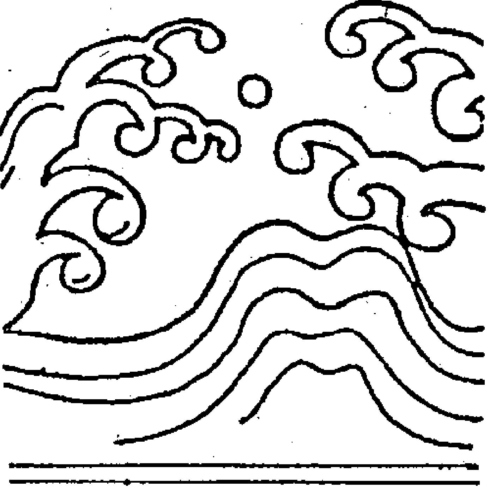
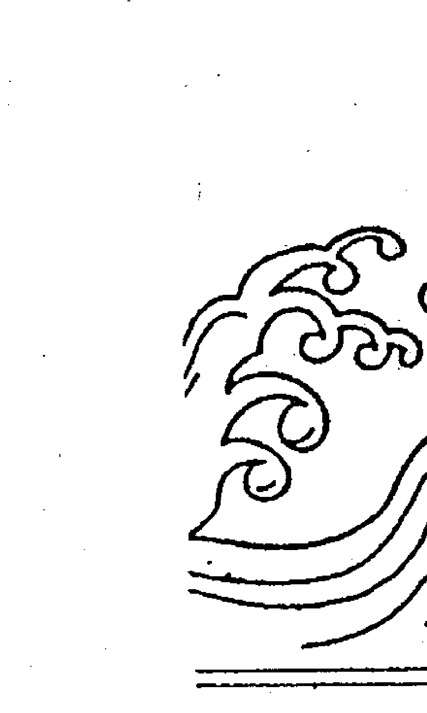
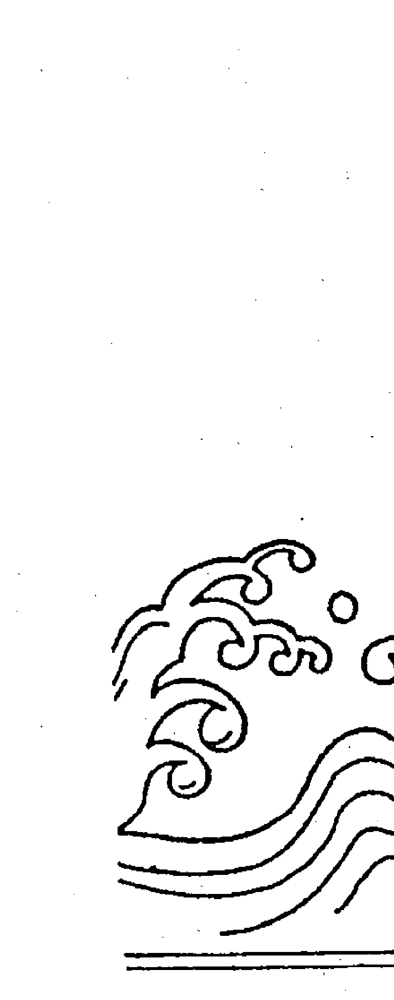
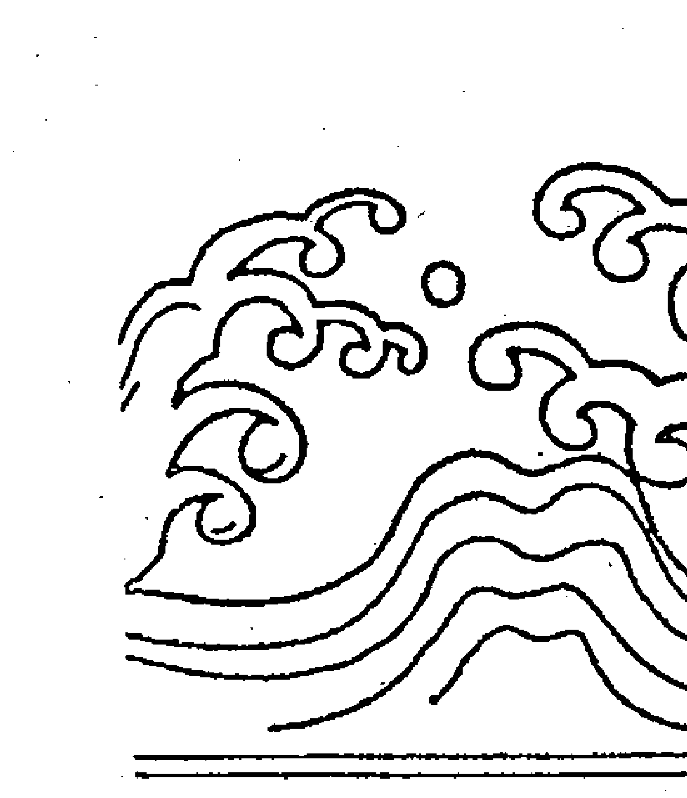

生死有命 100個答案

命理與人生 40

了無居士◎著

時報出版公司

ISBN 957-13-0337-2

# 研究命理應有的態度與認識

## 序

儘管紫微斗數的功能被渲染得像大羅金仙的錦囊，上推天文，下測地理，無所不能，但我們不能否認它所顯示的不過是一種類型，一種特質，甚至於只是一種變化的趨勢——解釋人們所面對的究竟屬於什麼樣的狀況。

命理的『條件說』應包括下列兩點：
- (一) 有了先天命理的條件，然後才可能有後天實際的現象發生，這是『必要條件』（necessary condition）
- (二) 須有後天環境的相互配合，才能形成先天結構上的狀況，這是『充分條件』（sufficient condition）

這個道理若用另一種語詞來敘述，就是「有後天事實的顯現，必定有先天命理的跡象可循」，但是「只有先天命理的跡象，卻不一定有後天事實的表現」。

這些現象乃指個人的事件而言，若是大環境的「劫數」，那就非命理所能推測了。

命理屬於「世間法」，故只能探討人間的事項，但涉及的範圍頗廣，也不可能只有少數幾樣。假如生老病死不能探討，那是企管專家的事。財務週轉發生了問題，那是理財專家的事。人事不能安定，那是人事管理專家的事。

……

那不就什麼也不能討論？當然不是。現代企業機構所擁有的相關專業人才，已經分工到相當細微的程度，以台灣目前較具規模的公司為例，幾乎都網羅了各種專業人才或顧問，協助處理企業經營上遭遇的各種疑難雜症。依理而言，這類公司應該都能解決這類困境才對，但事實真相，恐怕就不盡然了。很多企業在經營過程中遭遇的困境，變化莫測，常使企業專家踢到鐵板，懊惱不已。

人生許多際遇也經常難以常理來想像或論斷，此時，中國不可思議的命理可以略盡點薄棉之力，斗數能夠傳延千年而不輟，不能說完全沒有道理，否則早被淘汰。斗數祿命固然有其無法逾越的極限，但這與人類其他文明一樣，不可能一被創造，就臻於完備。人類的進步，總在不斷的薪火相傳和改善演變的邁進中進行，否則我們必定還在茹毛飲血中過日子。假如我們把劉銘傳時代的火車頭看成古董，那麼，兩三百年後我們的子孫，也會把現代的電聯車和子彈列車看成兒童玩物。自古以來，許多創見最初無不被視為邪說——由於無法提出數據加以證明，因而被看成荒誕無稽，甚至被打殺。中醫學說中的「氣」，就是個明顯的例子。「克利安」（蘇聯人克利安發明，以他的姓氏命名）照相技術發明之後，不但證明人有所謂的「氣」，即使地球上的生命型態，也都有「氣」。森林學家可以根據「克利安」相片中的「氣」，看出林木的色澤（反射在空中的光彩），判別森林的生態，譬如林相的旺衰和病蟲害的狀況。因此我們不應武斷地說，紫微斗數祿命法提示的一些道理沒有意義，或者違反了人類的經驗法則，便棄若敝履，因為經驗不斷地累積，加上整個文明結構逐漸進步，從前不會，並不表示以後也永遠不會。

# 三

斗數的推演所涉及的層面頗廣，大致上說，可分兩個加以探討：
- (一) 程式方面：已知的程式究竟能發揮到什麼程度，很少人能完全透徹。迄今日為止，斗數仍有多當的缺陷，也應該還有一些尚未被人發現的功能才對。
- (二) 推論方面：老祖宗時代的沖天炮自有它的沖天原理，這個原理與近代火箭的射出原理應該近似，可是兩者之間的功能，相差何止十萬八千里。斗數的理論和推演方法是否也有類似的現象存在，值得繼續探討。

依據個人的經驗，紫微斗數的理論和推演技術，目前已有許多的突破，已非陳希夷、白玉蟾等前賢所能想像。

命理既是人文學科，所有的推論就不能像物理化學這類學科那樣地精確和重複實驗。但習命者可以透過「歷史的方法」，利用歸納的原理，找出事項的因果關係，從不斷和無數的命例研判中學習經驗，以探討其具有趨勢性、共通性的普遍法則，逐漸提升到討論許多相關的知識，加強對人生的了解。相反地，我也排斥視命理有如天上神物，可以用來透析人間一切榮枯禍福的觀念，這種觀念無疑的是把命理當做不食人間煙火的玄妙秘術。

# 四

每一種學術的功能都有其極限，作為探討人生運程得失的中國祿命之學，亦當如此。但是學術的探討，卻萬萬不可用個人有限的知識，強說某種學術的能耐只是如何，因為你不會，別人也許會，古人不懂，後人也許懂。應知人類文明始終處於不斷的進步中，對同一件事情的看法，古人與今人的差異，已不能以道理計。瞭解這個道理，對於包括斗數在內的命理探討，雖然漫無限制的意識膨脹是被禁止的，若因個人所知有限而扼殺了這門有益於世道人心的學術發展，也該受到口誅筆伐。

經由命理探討「趨吉避凶」的道理及其方法，應該是學習中最大的驅力，從這個觀點出發，就無所謂鐵口直斷這種事，自然也不會被命理和一些伎倆迷惑了。人生際遇的變數既多且雜，因此命理只能在某一些條件之下，加以思考推論，所以我主張命理應該像醫生看病一樣，採取「診斷」（望、聞、問、切）般的方式進行，若把命理當做神仙之術，那就是迷信，為智者所不取。傳統的斗數充斥著太多似是而非的觀念和方法，正確的觀念是推動一門學問進步的原動力，而正確的方法則是促使學術達到格物致知的不二法門。因此對斗數這門學術的研究，個人認為，若捨此二者，必如緣木求魚，難得正果。了無居士以憚精竭慮的精神，將混淆不清的斗數理念導上正軌，個人除了表示高度的鼓舞之外，也殷切地寄以厚望。

是為序

紫雲
民國八十年五月五日序於台北寓次

# 我們站在巨人的肩膀上

## ——自序

這本《古典篇》原與《現代篇》合而爲一，後來發覺太厚了，於是讓它們分家，各自爲政。兩本書各具特色，前者專門檢討古代的祿命理念，後者則在現代的推算技術上用心，二書合參，才能將斗數祿命法的古與今，貫穿起來。

討論所依恃的古籍，以《清朝木刻陳希夷紫微斗數全集》爲主，這是公認最古老的一本典籍，並旁及《陳希夷紫微斗數全書》和《斗數宣微》兩書，極少的部分來自一些平常議論和道聽途說。

從前，有個朋友曾自豪地說：「《陳希夷紫微斗數全書》我讀過七遍。」我笑答：「那有什麼了不起！光讀，在下本人我絕不少於十遍。」他連忙解釋道：「我指的是讀破七本書。如果只讀，絕不少於二十遍。」我後來發現，他讀書確實相當細心，一邊研讀，一邊做筆記，在空白處劃加眉批，加到後來，面目全非，不知什麼是什麼，只好再買一本，讀破七本，就是這樣子來的。他說，每一次重讀，對斗數的認識便更深一層，很多朋友承認他老兄功力深厚，追根究底，也許真的就是拜讀書勤奮之賜。

高雄有個斗數大師給初學弟子的家庭作業一律叫他們回去抄寫《斗數宣微》，不然就是《陳希夷紫微斗數全集》（當時《木刻全集》尚未問世），目的無他，希望在古籍中打下良好的基礎。由於受限於學經歷，該大師迄今仍未瞭知那些古籍有些觀念固然無誤，荒腔走板的卻更多，不能毫無批判地接受，否則後患無窮。抄書有如囫圇吞棗，即使抄上二十遍，不懂的依然不懂。

古籍存在著許多錯誤，接觸過的人一定深有同感，我在一九九〇年曾費心將《清朝木刻陳希夷紫微斗數全集》加以評註，訂正錯字、落字，行有餘力，再將艱澀的文字語譯，讓一般人能讀。但是問題只解決一半，剩下的屬於祿命理念和推算技巧上的難題，顯然複雜得多，也棘手得多，暫時保留，以待高明。

一般而言，斗數亟待解決的問題實在太多太多，有些看來可以充分討論，尋出正確的答案；像為什麼使用江湖神煞？推測行運為什麼不用歲運的四化？有些則牽涉整體結構與原理的規範，恐怕動彈不得，即使陳希夷、白玉蟾再世，仍要嘆氣。例如：
- (一) 十二個宮位既然不能充分使用，也就是某些宮位既屬不可推算，為何還要設立？
- (二) 為什麼主星只有十四顆而非更多或更少？

在本書中，我們透過問答的形式，將一些懸案突顯出來、歸納起來，並盡可能提出個人主觀的看法。這類問題即使不在學習過程中發生，必在算命過程中出現，答案則眾說紛紜，有些特予檢證，提出結論，有些則只做觀點敘述，留待讀者自己判別。

書中大部分的問題側重在古人論命時所運用的理念和技巧，我們認為檢討這些內容，對現代習命者的影響才是直接而且迫切的，所以包括〈三方四正格局〉、〈看命捷法〉、〈玉蟾發微論〉以及〈諸星格局皆取貴論〉在內，都有詳盡的討論；一部分兼及〈注解骨髓賦〉之類的賦文，而安星、星性和其他次要的賦文則重點選擇，因為已經有人談過，見解比我精采，實無獻丑的必要。賦文雖是經驗的統計，但論命方法才是實際的，探討論命方法，才能了解古人究竟如何論命，以及他們如何將賦文的內涵運用到實際的算命上去。

古人論命，自有他們那個時代的文化與社會等因素在焉，在那種背景之下，思想迂腐，觀念扭曲，一點都不覺得意外，但推論法則亘古不變的，因此我們檢證那些論斷，發現有錯，立刻辯證，並加以修正。我們已有科學方法學可用，自無繼續迷戀土法煉鋼之理。

我們糾正古籍一些祿命觀和推測技術的錯誤，有人甚不以為然，認為那是故意找碴，駁斥說：
> “你們行，為什麼不自己創一個？”其實套一句西方聖哲的話，我們由於“站在巨人的肩膀上”遠眺，才有能力超越古人。換一個角度說，今人超越古人乃是正常之理，落後才是丟臉。但要求今人獨自創立一套祿命術，談何容易。其一是一種祿命術都是偶然發明的，積極去弄一套，不易達到目的，其二是在功利主義掛帥的時代，已無人願意去做那種投資報酬率如此之低的傻事了。

假設紫微斗數就是陳希夷創始的，那麼從《全集》的註解可以推知，從北宋到明末的六百年間，曾經被人註解或修訂過，而且不止一兩次，遺憾的是註解或修訂者不願留下姓名地址，除了白玉蟾之外，後人很難考據出他們是誰。現在可以證實的人和文字是：
- (一) 白玉蟾。留下的文字有〈玉蟾發微論〉、〈攝要六問段〉。
- (二) 無名氏。留下了〈註解骨髓賦〉、〈註解太微賦〉、〈百字千金訣〉以及〈定富局〉、〈定貴局〉等多篇。

至於補輯方面，最明顯的就是《陳希夷紫微斗數全書》，那是清朝江西負子子潘希尹的作品，該書與《全集》最大的差別，在於〈論諸星同位垣各同所宜分別富貴貧賤天壽〉這篇文字（按：此篇名稱很怪，有點聱牙），其餘略同。遺憾的是，這本補輯的價值不高，因為有太多的造假，讓習命者存有戒心，但是奉此書為圭臬者，仍然不少。

此書編寫時遭遇的困難，堪稱罄竹難書，與《現代篇》相較，簡直判若雲泥，蓋後者幾乎全是新的理念，可以盡情揮灑，前者則宛若一隻千年怪獸，張牙舞爪，撲面而來，隨時都會把人吞噬。我們數度陷在牠吐出的混沌毒霧中，迷失了方向，所幸擁有洋鬼子傳來的寶物——方法學與邏輯學，好像王禪老祖傳給姜子牙的杏黃旗與捆仙繩一樣，才能將這隻怪獸擒服。慧耕兄常開玩笑說：「不管答案對不對，能夠把那些艱澀的文字以及所包含的意義釋放出來，讓大家能讀、能悟，就是功德一件。」此說甚獲我心。

這個時候，隱者老師紫雲先生也在為校對他的大作《斗數看姻緣》而忙碌著，但他仍撥冗替我做了一些指導，周惠玲小姐則多次磋題目的安排與答案的撰寫，都是幕後最大的推動者。每次赴北，我都到「清心廬主」彭先生開的茶坊叨擾，和他煮茶議論，他也是大內高手，功力強我許多，獲得他的指點甚多；台中李念學先生幫我挑出許多毛病，讓我不必當場出醜。這些行家彌補了我知識的不足，也提高了這兩本書的價值，必須特別感謝。

了無居士
序於高雄了無居
一九九一年六月廿四日

# 目錄

研究命理應有的態度與觀念
紫雲……3

所有問題都要解決
了無居士……6

自序……

# 卷一 創始與典籍

01 陳希夷真的是斗數創始者嗎？……20
02 紫微斗數有哪些典籍？……25
03 命理是否附屬於民間宗教？……30
04 歷來有哪些門派在爭奇鬥妍？……34

## 卷二 先天與後天

05 推算流年時要參考先天本命嗎？……40
06 歲運有祿有忌該怎麼判別吉凶？……44
07 到底該用流年還是小限？……49
08 流月、流日時該從哪一宮起算？……53

## 卷三 格局與吉凶

09 好命歹命的分際點在哪裡？……58
10 運到底能不能改變？……64
11 貧賤的命理條件是什麼？……67
12 斗數有哪些吉格？……72
13 斗數有哪些惡格？……75
14 夾宮有什麼特殊的作用？……79

## 卷四 星曜的疑惑

15 忌夾代表有志難伸？
16 祿夾財與祿在財何者吉較大？
17 四化的作用古今有什麼不同？
18 什麼條件構成祿逢沖破？
19 煞夾祿有什麼吉凶誘導？
20 四化爭議誰是誰非？
21 廟旺利陷有沒有功用？
22 火鈴和魁鉞怎麼取法？
23 先天格局能決定一生的貴賤嗎？
24 廉貞七殺是「積富之人」還是「路上埋屍」？

## 卷五 十二宮新義

25 命身二宮真正的用途是什麼？……130
26 兄弟宮的現代涵義是什麼？……135
27 夫妻、子女宮的現代涵義是什麼？……138
28 財帛、疾厄宮的現代涵義是什麼？……145
29 遷移、奴僕、事業宮的現代涵義是什麼？……149
30 田宅、福德、父母宮的現代涵義是什麼？……156
31 單星與單宮論命有什麼缺點？……161

## 卷六 古代論命研究

32 《玄微論》中探討了哪些命理問題？……170
33 巨廉貪是註定的凶星嗎？……175
34 可以從星曜判斷適合從事的職業嗎？……182

# 卷七 榮華與富貴

35 〈撮要六問斷〉中有哪些論命技巧值得參考？……186
36 古人論命有哪些秘訣？……189
37 強弱宮的分別是否必要？……194
38 〈三方加會格局〉中古人論命有哪些次第？……199
39 好命的人，妻財子祿一樣好嗎？……203
40 真的有人「出世榮華」？……207
41 婦女難產怎麼看？……212
42 考試中榜文星拱命是唯一條件嗎？……218
43 祿合駕鴦有什麼吉祥？……222
44 日照雷門與夜朗天門憑什麼取貴？……229
45 天梁入廟為什麼就壽比南山？……232
46 石中之玉該如何雕琢？……238
47 貴格的條件是否充分？
48 這些人為什麼不合格局？
49 吉星可以解厄制凶嗎？
50 這些人的命美中不足？

了無居士其他著作

# 卷一 創始與典籍

傳說，陳希夷是紫微斗數的創始者，但是幾乎所有的史料都不能證明此事為真，只好存疑。即使如此，斗數做為祿命術的價值，仍被肯定，是毋庸贅述的事。

斗數有哪些典籍？抱歉得很，實在寥寥可數，好像發明之後，就被鎖進電冰箱裡，直到明朝末年才重見天日，在這五百年漫長歲月的沈寂中，沒有演進，也沒有修正，所以無論祿命觀念，抑或推測技術，只好停頓不前（即使清朝兩百多年間，仍無演進），這也是後代習命者學得如此艱辛的最重要原因。

## 1. 陳希夷真的是斗數創始者嗎？

一般認為，紫微斗數的原始創造者就是五代末、宋朝初的理學家道家兼煉氣士陳希夷，遺憾的是，我們從各種史料中，並未發現陳道長有紫微斗數這方面的著作或創始資料，所以八成又是一個「箭垛英雄」，跟姜子牙、鬼谷子、孔明、劉伯溫一樣，都是後世把帳記在他的頭上。這種說法符合史觀嗎？

雖然許多書籍和許多研究者認定非陳希夷莫屬，但我們不認為此說可靠。

陳希夷單名摶，字圖南，號扶搖子，五代末宋初亳州真源人。他是道家的煉氣士，後半生隱居華山，據說活了一百多歲才羽化登天，生前曾跟宋太祖趙匡胤在華山下象棋，結果老趙輸了，於是把華山送給他養天地浩然之氣。

除了紫微斗數外，他的著作據傳還有《火珠林》、《麻衣神相》和《正易心法》，這些作品極可能都是偽作——別人假托他的名字發表。在中國文化、文學、繪畫、醫學和宗教史上，這是司空見慣的事。

星相術數偽托的情況更為嚴重，許多作品如黃帝著《內經》，九天玄女發明指南針，螺祖發明養蠶，諸葛孔明創奇門遁甲，邵康節著鐵板神數等等，作者其實另有其人。史學家稱這些人為「箭垛式英雄」，意思是他們默默地承受後人所加諸的榮譽，宛如從各個角落射來的飛箭。

□ 有人根據原理和結構發現，紫微斗數可能是明朝以後的作品，因為裡面有西方數學構造的影子，數學是基督教進入中國時傳入的。此說是否可信？

□ 根據歷史記載，意大利耶穌會傳教士利瑪竇（Mateo Ricci 1552～1610）在明朝萬曆八年來到中國，由於他精通天算、輿地、醫藥之術，閒暇時即將那些西洋學術譯成中文，教給中國人，他的譯著包括《乾坤體義》二卷、《幾何原本》六卷，這是西方數學傳入中國之始。推測斗數必成於此時之後。

斗數確比八字更具有數學演算的內涵，譬如命宮及外在三宮在大限中的轉移、四化飛行的軌跡，以及歲運吉凶的界定（有吉化必有凶化，有凶化必有吉化），在在都比八字更具公式化，設若兩者均是五代末宋初的產物，其間的差異，不致如此之大。

□ 有人認為，紫微斗數跟《果老星宗》的牽連最多，甚至於乾脆說，斗數根本就是脫胎於《果老星宗》，此說的真實性如何？

□ 若說斗數源自古代一種什麼體系的術法，學者多半會承認它跟《果老星宗》和《十八飛星》、《紫微斗數》的關係最為密切。目前坊間可以購到星宗的典籍是《增補星平會海全書》十卷，「星」指《果老星宗》，「平」則指子平，也就是一般所熟知的八字，又稱子平祿命術。斗數跟星宗、飛星的結構，十分接近，人事十二宮的名稱，幾乎一模一樣，若說沒有牽連，很難令人信服。唯星宗十二宮的排列順序與斗數有一些差別，那是因為論命方式與命理主張有所差別的關係。

下面是兩種人事宮位的比較：

| 紫微斗數 | 果老星宗 |
| :--- | :--- |
| 命 宮 | 命 宮 |
| 兄弟宮 | 財帛宮 |
| 夫妻宮 | 兄弟宮 |
| 子女宮 | 田宅宮 |
| 財帛宮 | 男女宮 |
| 疾厄宮 | 奴僕宮 |
| 遷移宮 | 妻妾宮 |
| 奴僕宮 | 疾厄宮 |
| 官祿宮 | 遷移宮 |
| 田宅宮 | 官祿宮 |
| 福德宮 | 福德宮 |
| 父母宮 | 相貌宮 |

乍看之下，好像孿生兄弟一般的面貌，所不同者，不過是子女宮改為男女宮、夫妻宮改為妻妾宮，那是因為論命站在男性至上的立場而設計。此外，父母宮稱做相貌宮，涉及妻妾宮……了傳承，也許當年就已注意這個問題也不一定。星曜方面，星宗講的是七政四餘，這是星宗的另一個名詞。主星為日月二星和土星、火星、金星、木星、水星，共七顆，四餘是炁星（木之餘）、孛星（水之餘）、羅星（火之餘）和計星（土之餘）。該術的論命技術像「身宮度主貴人宮，祿馬相生福壽翁，設使逢空星失次，一生蹇滯不通亨」，也跟紫微斗數的主張略近。

星宗始於何時，包括《星平會海》在內有關書籍都不載，究在斗數之先，抑或在我們一無所知。不過，證實兩者必有某種關連，則是一定。

□紫微斗數跟《十八飛星》又有什麼牽連？

□坊間流通的斗數典籍，以清朝木刻版《合刊十八飛星策天紫微斗數全集》最古老也最有價值，同治九年（一八七〇）由羊城青雲樓印行，此書分兩個部分，前半部兩卷，名《十八飛星》或《十八飛星策天紫微斗數》，後半部四卷，名《陳希夷紫微斗數全集》（此部分的現代評註一九九〇年由時報出版社出版），才是我們所習見的紫微斗數，兩書作者同為一人，就是「大宋扶搖子白雲先生陳希夷」。兩套術數相仿佛的地方，仍然很多。

| 紫微斗數 | 十八飛星 |
| :--- | :--- |
| 命宮 | 命宮 |
| 兄弟宮 | 財帛宮 |
| 夫妻宮 | 兄弟宮 |
| 子女宮 | 田宅宮 |
| 財帛宮 | 男女宮 |
| 疾厄宮 | 奴僕宮 |
| 遷移宮 | 妻妾宮 |
| 奴僕宮 | 疾厄宮 |
| 官祿宮 | 遷移宮 |
| 田宅宮 | 官祿宮 |
| 福德宮 | 福德宮 |
| 父母宮 | 相貌宮 |

顧名思義，《十八飛星》的星曜有而且只有十八顆，可是排出來居然十九顆，有點意外，這些星計有：紫微、天虛、天貴、天印、天壽、天貫、天福、天祿、天杖、天異、天刃、天姚、天刑、天哭、紅鸞、文昌、毛頭。其中紫微、文昌、天虛、天貴、天姚、天刑、天哭、紅鸞紫微斗數裡面也有，不過星性和作用略異。

大概是作者同為一人的關係，十八飛星的論命技術與紫微斗數更為接近，譬如「貴福之宿事情稱，求官得遂祿豐盈，更有外局紅鸞照，十年之內作公卿」這樣的句子，看起來十分眼熟，星宗的論法與星曜性質，則與講究五行生剋制化的八字接近。

## 2. 紫微斗數有哪些典籍？

如果我們想找一兩本斗數古籍，照目前的情形，市面街坊可以購得的，以哪個版本最老、最權威？

這方面的書籍少得可憐，一本應有，兩本則無。台北集文書局印行的《合併十八飛星策天紫微斗數全集》，也就是《清朝木刻陳希夷紫微斗數全集》，是現在台灣所能找到的最古老版本，該書是清朝同治九年的木刻再版書。由於是古書影印，內容艱澀照舊，內容雖好，讀過的人恐怕不多，因此時報出版社在一九九〇年推出現代評註版，幫助初學者研究，意義非比尋常。

按：同治是清朝穆宗載淳的年號，同治九年是西元一八七〇年（庚午年），距今已有一百十九年的歷史。該書初版，可推溯到明朝嘉靖年間，至於正確時間為何，缺乏可靠的史料佐證，難免遺憾。

近來有人指出，《陳希夷紫微斗數全書》雖是清朝一個字號叫「貧子」的潘希尹補輯的，但扉頁載有明朝進士羅洪先寫的序，時間是明朝嘉靖庚戌年，羅進士表示他是從陳希夷的後代手上取得，根據該序，證明這個版本比《清朝木刻陳希夷紫微斗數全集》要早一些。此事是否可信？

□明朝嘉靖是世宗朱厚煙的年號，庚戌年是嘉靖二十九年，紀元一五五○，距清同治九年（一八七○年），足有三百二十年之久。我們曾數度聽人提起此事，但做過一些簡單的版本比對之後，發現那並不能證明什麼。

1. 歷史並未記載陳希夷有後——他是道家煉氣士，不太可能成家。
2. 此書既是貧子補輯，顯然有補有輯，問題是他老兄始終不告訴我們他究竟補了什麼？又輯了什麼？
3. 羅洪先的序文是真是假，還有問題（可能也是捏造的）。

我們從該書後一百多個命例可以得知，潘某素有造假的習慣，連帶讓我們無法相信他補輯的資料是否可信，這好像一個說過謊的人，往後他的話都要打個折扣一樣。

純就該二書問世的時間看，《全集》遲於《全書》是必然的，現在當然很難肯定誰抄誰，甚至於誰對誰錯，不過，二書之間，有一些顯著的差別存在，是不容否定的。現在的問題是：

「孰對孰錯？」

□這個問題很難回答，也可以說，用幾句話來概括，是一件很困難的事。有興趣的朋友不妨研究一下二者之間的差異，供做後世習命者的參考。我們還想到兩件事，一是《全集》是一個重刻本，所依據的版本現在不知在哪裡，若能找到，許多懸案即可迎刃而解；二是《全書》也有一個臨本，又是什麼樣子，後世也急想知道。

□許多人認為《全書》早於《全集》，是個正本，《全集》反而只是膺品，故奉《全書》的理論為圭臬，這種作法正確嗎？

□那是他們的自由，不便干涉。

不過，他們最好先弄清楚版本先後與優劣的問題，換句話說，其中的理論固有差異，應該先行實證，判其對錯，然後才決定遵循哪本書的方法。

舉個例說，《全書》提到命宮不起大限，意思是第一步大限不從命宮開始，而是父母宮（順行）或兄弟宮（逆行），是對是錯，不必抬槓，實驗一下即知。

□假設《全書》部分內容牽涉造假，潘希尹為什麼要造假？

□這個問題牽涉很多，我們不大能夠知之詳盡。

有一本書叫《偽通考》，裡面記錄了有史以來一些被認為是偽作的文章或專書，厚厚一大冊，由此推知，中國偽書氾濫，是多麼的嚴重。有關星象術數方面，特抄幾本讓大家瞻仰。

+ (一)《玉照定真经》
+ (二)《珞琭子》
+ (三)《撼龙经》、《疑龙经》
+ (四)《皇极经世》
+ (五)《星命总括》

据说，尚未公开的斗数古籍，还有很多，一些赋文和推演技术也略有出入，若能公开，紫微斗数的面目将有所改变。

古本或孤本，一定是有的。一九七五年南北山人编撰《明版今注命奇签紫微斗数全书》时，就认为他所引用的资料是『海内孤本』，其实该书在当时已被印行过一次，不是什么孤本。

据说道藏收有一部紫微斗数原典，内容与现在流行的版本差不多，也许如此，才未见有人翻印，我们无缘一睹，内容为何，不得而知。佛教排斥怪力乱神，不会去搞算命，但早期的印度佛教徒必须修习五明，其中的工巧明就包括了星相命理。故星相之学在印度存在的时间，颇为久远。密藏中有一本占星术，与紫微斗数部分同，我看过一些条文，可是没什么概念。

台湾侨选民代中有一位泰国籍委员，据说曾获高人秘传，不但精通中国五术，且是预言高手，百发百中。一九七五年的春节，旅泰华人齐聚会馆，参加新春团拜，中午并备办了丰盛酒宴，以飨来宾，酒过三巡，菜出五道，一些华侨敦促该公“预言”一下今年的世界局势”，他于是乾了一杯酒，清清喉咙，然后说道：“今年中秋节下午五时，毛泽东将暴毙。”这些华侨虽然早闻某公的功力，但如此斩钉截铁地下断论，大家相觑而视，不置可否。该公拍胸脯保证说：“如果不验，明年的宴会，由我作东。”到了当年中秋节下午五时，有个老华侨打电话，说现在已经五点啦，却无老毛逝世的消息，是否不准？他说，中国的时差早年，当他离开大陆的时候，囊中装满了五术的典籍，据说拥有一套为数高达百册的斗数巨著，内容详尽，秘法口诀，应有尽有，非台湾目前流行的可比，如果公开，说不定斗数禄命法的面目从此改观。中国大陆在文化大革命期间，几将宗教五术的古书烧毁殆尽，留存的不过是一些私人珍藏，但必须懂得推算或倚此为业，否则恐怕也是束之高阁，成为蠹虫的美食。

## 3. 命理是否附屬於民間宗教？

□命理自是命理，宗教自是宗教，兩者應無瓜葛，可是在中國硬是有了瓜葛，相當怪異。有人問道：「命理是否為宗教的附屬品？」也有人問：「學習命理是否要有宗教信仰？」不知學者的看法是什麼？

□命理的『理』字，除了道理、說理之外，尚有法則、章程的意思，所以具有邏輯推演的形式，而不牽涉精神解脫方面的信仰。

我們不能否認歷來有人把它歸納於道教的範疇內，視為道教『占驗派』的一支，這種說法有著根本上的錯誤。春秋戰國時代，文化大興，百家爭鳴，當時有所謂的九流十家，其中一家名陰陽家，代表人物鄒衍，根據漢書藝文志記載，「陰陽家者流，蓋出於羲和之官，敬順昊天，曆象日月星辰，敬授民時，此其所長也。」道教創始於東漢張道陵，他以符籙禁咒之法廣收門徒，是幾百年以後的事了。現在一些江湖術士兼有道士、法師的資格，也許學有專長，可是給人的印象卻不是很優秀的。一般人以為命理跟鬼神一定有了瓜葛，如此混淆正統命理，在一千年的今天，已經變本加厲。

紫微斗數是陳希夷發明的，而陳希夷正是典型的道家煉氣士，因此想學好斗數，非要同時鍛鍊道功不可。此說是否可信？

道功與邏輯推理絲毫不涉，兩者八竿子打不到。

我們曾遇一些專門搞鬼弄神的行家，他們堅決地說，斗數是透過甚深的禪定後所獲知的一種學理，如果不懂坐禪，甚至不曾修過靈學、靜坐，而想習得最高深的斗數，進而窺破天機，簡直是緣木求魚。據說他們那一派的推命方法都是四禪以上的天仙奉玉皇大帝的敕令，直接下凡教授的，我們這些泛泛之輩當然只有流口水的分了。

據說，天機、天梁、天同這類星座坐命的人，先天上就具備了習道的素質，即使形而下學起命理，也比較能修成正果。此說合理嗎？

好像沒什麼道理。

我們認為無論那種星曜坐命的人，都適合學習中國傳統祿命法，正如你問我那種性格的人比較適合經商、從政、習醫、習畫、做外科醫生一樣。不過，學習是一回事，學好又是一回事。任何一種人參與任何一種學習，一定都會產生適不適格的問題，結果成績就會極為懸殊。

的確，學習祿命法須有很高的狂熱（光有興趣還不行，蓋容易半途而廢），可是這種狂熱到底要用那些星曜來判斷呢？也許就值得討論了。我的老師隱者先生不是機月同梁星坐命，程度卻是有目共睹，我看過許多真正的高手，也不是如此，反而是機月同梁的人學了五年八年，段數仍然鴉鴉烏，譬如在下就是。

□除了斗數推測的基本技術外，真正要替人枚卜窮通禍福，還須具備哪些常識或知識？

□一般常識：所有的人情世故。

□專業知識：邏輯、法律（民法中＜債篇＞與＜親屬篇＞、刑法中＜妨害家庭、婚姻篇＞、經濟學、投資與理財的方法、社會學、行為心理學。大體上而言，凡是牽涉到某種推演時，必須具備該種知識（有時候常識也可，蓋要獲得所有知識是不可能的）。

□瞎子看不見世界，他算命是否就難免受到某種程度的阻礙？

□確實如此，瞎子算命當然也有他們的準確率，讓人趨之若鶩，有些人甚至名滿全台，明眼人看了都要自嘆不如，譬如嘉義民雄的柳相士和新竹關西的瞎眼相士，都是家喻戶曉的算命或摸骨先生。

當然，每個人自有他自己的價值判斷與價值觀念，找人算命，目的為何，每個人也是大不相同，所以瞎子算命、占卦、摸骨，大多門庭若市，成爲一種很奇特的社會景觀。

□方外之人（僧道之流）習命者也多，其中修成正果者，究竟多少？

沒有調查過，不得而知。

古典小說和武俠小說經常描寫一些知命理的方外人，或倚此爲生，或偶爾手癢，露了一手，無不斷驗如神，最有名的例子就是《封神演義》裡的姜子牙和《西遊記》裡的袁守誠，前者後來成爲周王朝伐紂軍團的總司令，後者則是玄奘西天取經的推動者。方外人無慾無私，研究學問，常能修成正果，自然比我們這些汲汲於名利的人，更能達到預期的效果。不過，缺點不是沒有，就是無法親身體驗，命理畢竟是世間法，相當功利主義。

> 紫雲先生說，命理既為世間法，習命者必須熟悉世間相，乃是一定的道理。

一個不入世的人，又如何能知世間事？

## 4. 歷來有哪些門派在爭奇鬥妍？

□中國人辦事做學問，素來喜歡分黨搞派系，強調「非我族類，其聲必異」，進而黨同伐異，用在研究命理上，自不例外，因此光是斗數門派，自古以來就有好幾個，在台灣一地，據說也發展出一些門戶，進行研討，這些派別有哪些？與以往那些有什麼不同？

□「派」用在學術的探討上，指的是「學派」（school），那是一些志同道合的人，使用類似的方法，研究某種學問，如柏林學派、維也納學派、京都學派。在佛教史上，研讀《華嚴經》者，成立天台宗；奉《解深密經》、《瑜伽師地論》者，成立唯識宗；奉《大日經》、《金剛頂經》者，後來成立密宗。

但是中國命理的派門，往往有派無學，由一些權力慾望強烈的人號召而成，因此不可能從那些門派中，找到學習的捷徑。

這份資料只是我們一些記憶，並不完整。民初以前就成型的主要派別，包括：

+ (一) 北派。
+ (二) 閩派。

這些派的重要主張、所奉古籍以及流傳的情形，我們都不太清楚，因為他們均無重要的文件、作品加以普及。根據我們手頭的資料，北派以張開卷寫的一本叫《紫微斗數命理研究》的專書為主，中洲派的祖師是陸斌兆，香港方面都宣傳他師承清朝一位欽天監，他的作品是《紫微斗數講義》，閩派則不知代表人為誰。

### (三) 中洲派。

上述情形有個共通點，就是那些被認為創始人或掌門人的大師，都是「一書祖師」——一生只寫過一本書。遺憾的是，他們的書，經過我們細心檢視，發現與《清朝木刻陳希夷紫微斗數全集》或潘希夷補輯的《陳希夷紫微斗數全書》差不多，如果有人硬說那根本就是抄書，我們也不反對。

□識者指出，北派對星曜的賦性，研究得最透徹，閩派則重消長的轉移，在歲運宮位的演練上，有獨到的見解，不知是不是真的？

□這點我們沒有注意，是真是假，不得而知。

□近幾年來，反而是中洲派在香港發揚光大，這要拜作家王亭之先生之賜，若非他寫了一系列的著作，並傾銷到台灣來（時報出版社印有該派兩本《紫微斗數講義》，據稱那是欽天監秘笈，誰也不知道有此一派。我們這些人都希望知道中洲派有什麼獨門秘法，足以與北派或閩派分庭抗禮？

□中洲派的興起，是最近幾年來的事。在傳統上比較相信八字和鐵板神數的港九、星馬一帶，無疑的是個異數，該派由王亭之（作家談錫永）掛帥，奉陸斌兆為祖師爺，以陸著《紫微斗數講義》為圭臬，從此席捲該地的斗數世界。

據王亭之補註的《紫微斗數講義》記載，該派有三個重要觀念，是其他門派所欠缺的，故彌足珍貴：
+ (一) 借星安宮。
+ (二) 星曜互涉。
+ (三) 見星尋對。

陸斌兆的書原為薄薄的一冊，經王亭之改寫補註，成為二冊，有興趣的朋友可以參考。

由於我們研究斗數的時間略晚，未能躬逢其盛，因此所謂的北派、閩派、中洲派，實際發展的情況究竟如何，幾乎完全沒有概念。至於那些派別之間有什獨門秘法、不傳秘笈以及祿命觀念、著作，也都不很清楚。

□台灣在一九八〇年間，由於經濟景氣低迷，許多人失業，無所事事，開始接觸斗數，布望執業，度過難關，所以學習風氣，意外地蓬勃，門派的出現，宛如雨後的狗屎苔，到處都是，如果統計一下，可能不在少數。

### □台灣斗數的研究

可以說是延續了大陸的傳統，最早的一本古籍是新竹竹林書局出版的《陳希夷紫微斗數全書》，那是一個大陸時代的版本，由於供不應求，後來台北幾家出版社也陸續影印出版，當時的習命者，唯此書為依歸，無不人手一冊。

一些門派也就在這樣的環境中逐漸成形，其中有些派別發展成功，有些因為本來就沒什麼學術底子，風一吹，像蒲公英的花一樣，都散掉了，俗話說：「來的快，去得也快。」，正是此情。在後繼無人的窘況之下，目前那些門派多半名存實亡。

+ (一) 占驗派。
+ (二) 忌星追蹤派。
+ (三) 透派。
+ (四) 四化派。
+ (五) 飛星派。

不過，有些門派實在構不成一派，譬如飛星派、忌星追蹤派和四化派，那不過是一種觀念，甚至推演的方式而已。

□這些派別固然五花八門，據說從安星、星性解釋，到推測的方法，無一不與正統的方法《清朝木刻陳希夷紫微斗數全集》所載）雷同，因此給人的印象是一些人在那裡虛張聲勢，此說確否？

□不錯，正是如此。
據我們觀察，他們提出的理論，均不脫《全集》的範疇，他們的研究，有完全跳不出陳希夷設定的框框。斗數的典籍只有一百零一本，除非研究方法確有極大的不同，否則根本無法自成一派。這是事實。

# 先天與後天
卷二一

命理的先天指的是基本結構，也叫做共盤；後天則是行運，也叫生命週期。算命時，兩者兼顧，合而為一，真的可以透析一個人的窮通禍福。
論命如果只論先天，告訴你這是個什麼構造，適合富或貴，然後拉倒，而置後天行運的得失於不顧，算命只算一半，給二分之一的潤金已足。理論上說，先天必與後天有密切的關係，但分析過程經常不必考量先天結構，其間的分合，該如何拿捏，才能恰到好處，是一門功夫，初學者一定不知。

## 5. 推算流年时要参考先天本命吗？

行运是后天遭遇的事项，依理当用大限和流年宫位（包括外在三方）加以斟酌，现在有个问题：到流年为止，一共用到三个宫位：本命、大限、流年三者之中，哪个的比重（分量）最大？或者必须使用哪个推算，才能观察某些事情？

三者各司其职，各有各的作用，原则上没有大小与强弱之分。

先天结构讲的是星群组合的作用，也就是整体结构的优劣；大限与流年都是后天行运的时间区域，故理论上说，行运消长，宜用大限和流年，而把先天摆在一旁凉快。

后天岁运中，大限涵盖的时间是十年，流年则一年。

算命当有前后顺序、轻重缓急之分，否则未免粗略，无法赶上时代的步伐。随便归纳一下，步骤及次第应该是这样子的：

+ 第一，推敲星群结构的优劣，不妨采用传统的二分法，定出宜往哪个方向——求贵（追求社会地位）或求富（累积个人财富）发展，才能事半功倍。
+ 第二，在大限进行中，探知此命与社会环境的结合，在某个阶段会有哪些得失。
+ 第三，在这漫长的十年之中，若想进一步瞭解某些年分运势的消长，就要一年一年地毯式地搜索、判别吉凶。

□行运得失的研究，古今必然不同，我们不想知道古人究竟如何，而是迫切希望知道现代哪种方法最有效——假设有此方法？

□研究命理跟研究其他的学问，方法并无二致——必须大处着眼，才能修成正果。
现代方法学针对此事，特别提示了两个重要的观念，供作参考，一种叫「巨观」（macro scopic）的哲学，一种叫「微观」（micro scopic）的哲学。「巨观」又称「宏观」，顾名思义，就是大方向、大原则的观念，从大方向、大原则出发，然后才是细节。「微观」又称「弱观」，情况刚好相反，它是从细节出发，然后大方向、大原则一路上去。两者的不同，若以电影镜头的运用为例，「巨观」先用鸟瞰（bird-eye view）照射，过来远距，然后近距，最后特写，「微观」则倒过来运用。
论命的正确步骤应该是：先拉开焦距，观察本命结构的优劣，然后近距或特写作行运得失的探讨。行运方面也有它自己的次第，先是斟酌大限宫位的消长，再来是流年，然后流月流日，一路下来。
台湾目前使用「微观」论算命的人相当多，甚且蔚为风气，顾客坐定，报出生辰，命盘排出，算命先生当下推断阁下昨天去过什么地方，今天中午吃过什么大菜，来此之前曾经发生什么琐事。因此有人指出，能够推到流日和流时，功力才是一流，否则必是三脚猫，持这种观念自然是荒唐的。

有人认为，推到流年的时候，可以不必考虑先天结构，而推到流月的时候，可以不必考虑大限的结构，这种说法是否有些偏颇？

那个人可能就是在下。大致上说，流年只对大限负责，故先天本命可以退休了；流月只对流年负责，故大限必须闪开一边站。道理何在？道理是先天对流年、大限对流月，距离实在太遥远了，一点都帮不上什么忙，否则光是四化星就出现好几组，令人眼花缭乱。

唯一的例外是讨论重大事项时，必须重新检视是否适格，才回过头来，审视一下本命的结构。

据说，斗数论命的最高境界是推算流日流时，包括一个钟头以前发生的事，巨细靡遗，均瞭若指掌，使用的人很多，多半是买卖股票、期货和外汇，由于价格瞬息万变，你无法用流年或流月加以捕捉。这种说法正确吗？

这是某些习命者的主观认定，一种『微观论』的命理思想，以为禄命法泄漏天机，无远弗届，无所不能。其实命理有它的基本功能，结构上也有无法逾越的极致，不是精密度很高的程式，那些鸡毛蒜皮的琐事，是不可能测知的。那些自认可以预知一天或一个小时之前的琐事的人，动机显然不纯，“宿命论者”无疑——他们总以为人一生下来，诸事已定，再怎么踢腾都逃不出命运的手掌。这种想法，久而久之，就自我膨胀为地上神仙。

## 6. 岁运有禄有忌该怎么判别吉凶？

□ 行运中会不会出现大限吉，流年却凶，或者大限凶，流年却吉的矛盾情况，让人无法确切地把握该事项的祸福？

□ 这种状况经常发生，也是必然发生。

传统的算命先生和一些江湖术士由于缺乏命理的真知灼见，碰到这种窘状，只能隐约描绘一个模糊的概况，使用大吉、中吉或大凶、中凶等含混的语词，予以概括。命理轨迹通常不会刚好全吉或全凶，于是只好含糊地猜测一个结果，好像也是满无奈的。一般而言，所谓的吉，在传统命理学者看来，多半是下列这些现象所形成的：

- (一) 大限宫位未会照什么煞忌。
- (二) 大限化禄星照进先天命宫，而化忌星不照。
- (三) 大限化禄星照在大限命宫，而化忌星不照。
- (四) 流年或小限化禄星照进流年或小限命宫，而化忌星不照。

上述宫位与六吉六煞，均以先天诸宫为准，四化也不例外，所以多数人不写宫干，有些人虽写却不用，因此整个命理结构像一潭死水般的宁静。我们翻阅过无数大师批示的命书，证实会使用大限、流年的轨迹转移推算命运的，有如凤毛麟角。

□ 那么所谓的凶，在命盘上，又是一个怎样的凶法？

□ 在他们看来，情况至少是这样的：

- (一) 大限宫位会照了若干煞忌。
- (二) 大限化忌星照进先天命宫，而化禄星不照。
- (三) 大限化忌星照在大限命宫，而化禄星不照。
- (四) 流年或小限化忌星照进流年或小限命宫，而化禄星不照。

江湖算命擅用全吉、全凶或半吉半凶、吉凶参半，来描述一个结果，这些都是含混的语词，极易造成歧义。因此有人就问：“事业肇凶，将肇哪些凶？难道从此不能创业或经营事业吗？”事业肇凶，指事业运程遭到破坏，在正常情况下无法创业，也无法透过事业的经营来获得财利。

是否必然如此？恐怕不见得。有些人霉星高照，居然连续三个大限的事业照忌不照禄，若是无法经营事业赚钱养家，这个人岂非等于废物！妻子儿女该如何度日？命理若持这种见解，不如不知好。

## 7. 遇到上述情形，该如何辨别吉凶并妥善处理？

最高的论命艺术是，“不主观地”判断任何一种状况的吉或凶，以防陷入“自我涉入”(self involve)而不自知。此时，只要将各种优劣、良窳的情况，一五一十，完完整整地描述出来，供当事人参考，就算大功告成。一个叙述 (statement) 原则上是不带任何价值判断的，唯有如此，才能让被分析者知道他目前正处于一个怎样的命理状态（生命周期），所有的吉与凶的认定，宜由被分析者自己去考量。

举个例说，大限的化忌星进入事业宫，是吉是凶，任何一种判断，都难免牵涉到主观偏见的涉入，最好的方法无非是充分描述这十年在事业经营上可能遭遇的挫折与困扰，以及解决之道（如何趋吉避凶），而不必站在自己的角度，要求此人必须立刻关门大吉。

大限化忌星进入财帛宫，情形亦同。

### 当然不致于此，否则此去十十几年就只能坐以待毙，而某些大企业家也不可能在凶运中仍然持续成长。

大限涵盖了十年的时空，其吉与凶，是否十年之内，必然应验？换句话说，譬如凶，是否

大限吉祥，约指化禄星进入大限命宫以及三方诸宫，形成一个极佳的状态，在这个状态中，诸事的成功率大为提高，但因方法学上的推论都是“盖然的”(probably)，非必然成功。

这种观点相当重要，却常为习命者所忽略。

凶的现象刚好相反，凶的运程，不是什么事情都不能做，或者即使拼着老命去做，也不会成功。命理绝无这种主张——命理的凶是成功率较低，对忌星进入或会照的宫位譬如财帛宫象征钱财的收支，比较无法有效控制。

- 十年大限遭凶，若想创业，该如何趋吉避凶？
- 大限事业或财帛逢忌侵入（命宫自坐或从对宫射入），表示这两种情况在这个时候来做，败多成少，但以长期投资或回收较慢的行业所受挫伤最大，暂时不做，改做短期投资以及回收快的行业，虽然利润不如从前，成就也不如从前，却能达到趋吉避凶的效果。

此外，挑选一个好的流年开创，形成一个“好的开始”（心理学上叫“增强作用”），也是一种趋吉避凶的法门，将可避免一做即错的情况发生。

- 哪些事业适合于大限中参与，又哪些事只能在流年中做的？
- 原则上说，长期投资和回收慢的行业，投注的人力物力较大，必须长时间经营，才能步上轨道，进而赚钱，因此十年大限吉祥如意，是必须的。长期投资最大的特征就是慢慢来，握得住煎熬，所以前面两三年业绩不振，不甚畏惧，只要熬过一段时日，自然否极泰来，转亏为盈。

流年只有三百六十五个昼夜，一晃就过，春天耕耘，秋冬收成的行业，最为恰当。这些行业难免带点投机性，风险略大，不是一般人都敢尝试。不过，做事业原本就像赌博一样，有赚有赔，不希望因为时机不对，或者行业选择错误，导致全盘皆失，那真的是时不予了。

> □ 大限除了宫干四化之外，还须不须要自化，譬如事业宫自化、财帛宫自化等等？

自化是某些门派所宣称的独门法诀，据说颇有一些准确度，故爱用者仍不在少数。自化最大的缺点是重覆——事业宫自化，行运走到事业宫，再化一次，星影幢幢，形成累赘。本命结构几个重要宫位如财帛、事业、迁移和夫妻照例都要自化，如此一来，可能出现一个宫位有八颗化禄或化忌的情形，那不是在做命理分析，而是玩弄星际大战。

## 8. 到底该用流年还是小限？

后天行运的推算，是斗数另一种技巧的运用，台湾斗数界目前分成两派，一派用小限，一派用流年，两阵对峙，壁垒分明，两派各自宣称他们学的才是正统。客观地说，究竟哪派较准？

这里并不发生较准或较不准的事，而只是个人的偏好问题。由于未曾统计小限派或流年派的准确度高到什么程度，因此无法判别哪个较准。我们一直使用流年，但这只是我们的偏好，绝对不反对别人使用小限，虽然小限的问题颇多，例如各人起迄点不同，同样的流年，可是小限却落在不同的宫位，有点紊乱，使用流年，就不可能发生这类分歧。

有人反对流年，他们讥讽地说：“譬如今年流年辛未，全世界的人都用未宫的星曜算命，委实不可思议。”是否如此？

其实，同是未宫，其三方的诸星不一定相同，即使相同，大限和大限宫干也未必相同，命与运推进的轨迹自然互异，不必操心。

就普遍性而言，流年命宫同位，才是正确。

- □ 如果小限流年搭配运用，相互奥援，不但可以消除争执，而且有截长补短之效，你们为什么不做？
- □ 据说，许多命理学者和算命先生两者混合使用，先看流年的吉凶，再参酌小限的得失，两者吻合，必然吉或必然凶，万一主吉一主凶，则判为吉凶参半，效果如何，不得而知。不过，从门庭若市的盛况来看，成效似乎令人满意。

但站在研究的立场，希望把上帝的归于上帝，凯撒的还给凯撒，否则准会纠缠不清。举个例说，从高雄坐车到台北，选择自强号火车或国光号汽车，悉听尊便，但绝不能妄想一脚踩着自强号、一脚踩着国光号，否则不但到不了台北，保证在中途就摔得粉身碎骨。

- □ 第一步大限从命宫所在开始，似乎顺理成章，可是有人却主张命宫不起大限——顺行从父母宫起、逆行从兄弟宫起，是否有所本？准确度如何？
- □ 该派的理论依据，就是《陈希夷紫微斗数全书》卷二的〈十大限诀〉——阳男阴女从命前一宫（父母）起，阴男阳女从后一宫（兄弟）起，难怪会理直气壮。

从命宫起大限与不从命宫起大限，时间的差距是十年，譬如阁下土五局，照一般算法，三十五岁起才会发达，由于命宫不含大限，也就是提前在二十五岁就发了，你说这种事可不可能？而一旦发生，又严重不严重呢？

命宫究竟要不要起大限？依我们多年的实验，当然要。斗数最古老的典籍《清朝木刻陈希夷紫微斗数全集》上规定命宫是后天大运的第一步，此说并无异议，也获得历来习命者的认同。

斗数的星座，大大小小排下来，一百来颗是跑不了的，这些星斗究竟是实星（天上真的有此星），还是虚星（虚构的星）？或是一部分实星，一部分虚星？我们不否认有些星曜确实跟天上的星斗有关，甚至于观念就来自天文学，但不能因此断定那些就是实星。谁敢打赌天斗真的有颗武曲星？有颗巨门星？古典小说认为一个人想御点状元，须是文曲或文昌星君下凡投的胎，可是天上真有文曲一星吗？答案不可知。风水有九星之说，这九颗是巨门、破军、武曲、贪狼、廉贞、文曲、左辅、右弼与禄存，跟斗数长得一模一样，所以有人怀疑若说有什么牵连，反而与风水关系密切。中国的风水观念根据天星引力与地磁强弱而定，藉以研究人与大自然的调和，跟斗数结构风马牛不相及。所以我们的看法是，斗数诸星，都是虚星。

紫微斗数跟周易或先天易卦有无牵连？有人指出，不懂易经或易卦；想学好斗数八字这类禄命法，是不可能的。该说正确吗？

不确。

我们不否认中国五术（山医命卜相）的源头是易经，可是五术后来各自发展，分别开创了新的天地，便逐渐脱离易经的结构。距离越远，易经的影子就越淡薄，反之，则越清楚。即使现在一般详知的“五行易”（俗称文王卦，但比传统文王卦变易性更大），几乎已另辟蹊径，更遑论距伏羲那么遥远年代所创立的紫微斗数了。斗数的推命原理，利用诸星的分布和宫位的转移，然后运用禄忌牵引，从中观察命理轨迹运行的方向，判定吉凶与福祸，与懂不懂易理，完全无关。

## 9. 流月、流日时该从哪一宫起算？

□ 流月的定宫方式据传有好几种，几达众说纷纭的地步，究竟何者为真？

□ 传统的方法是找出斗君的位置。故定流月宫位之前，必须确定斗君所在。这里有个一劳永逸的办法，就是利用生年取出斗君的正确位置——从生年地支位置起算，先逆行至生月的宫位，再顺行到生时的宫位，斗君即在此——记下那是生年的什么宫，譬如就是生年的事业宫，那么显示斗君永远在年的事业宫，以后无论走到哪年，斗君位置一看即知，非常方便。

斗君所在地，就是正月，流年的父母宫为二月、福德宫为三月、田宅宫为四月……类推。

另一种方法根本不取斗君，直接以流年命宫做为正月，然后顺行，流年父母宫为二月、福德宫为三月、田宅宫为四月……余此类推。准确度如何？大家不妨实验一下。

□ 流日又是如何定宫的？

□ 流日的宫位是根据流月来的，流日没有固定的位置，而是依附在流月宫上。流日的第一天（初一），与流月的命宫重叠，初二进一宫、初三再进一宫……，一律顺行。由于命盘只有十二宫，所以初一、十三、二十五这三天，都在同一宫位（流月命宫）上。

### □ 流时又是如何定宫的？

流时依据流日而来，以流日本宫为子时，顺时钟方向前进。流时也要四化，该四化则依照今天干支的“五鼠遁”而来。“五鼠遁”是八字学寻找时干的方法：甲己日起甲、乙庚日起丙、丙辛日起戊、丁壬日起庚、戊癸日起壬。举个例说，今天是辛亥日，申时的天干是啥？已知辛日起戊，从子起算，申第九位，故干为丙，即用丙来安四化。

### □ 无论业余研究或者执算命为业，替人论断穷通祸福，有必要推算到流月，甚至流日流时这麽细微的事项吗？

原则上说，算命算到流月的机会已经很勉强了，何况流日流时。如果了解共盘的理论，将会发现流月、流日、流时根本是不存在的，因为同样时辰的人都做相同的事、进行同样的策略，是不可能通过检验的。如果想要运用那些细节，可以，须先输入条件，而非如同某些江湖术士所宣传的，只要坐定，五秒钟内猜出口袋里有多少钱？半个钟头之前去会女朋友面没有？

□ 不推流月流日，是否被人瞧不起？
□ 应该不会。若有人硬是要要求推算，可以明白表示功力没有那么深，因为本来就算不出，不必粉饰太平。

## 卷三 格局与吉凶

斗数的格，广义的说法是几颗主星或辅星各自会照，狭义的说法必须主星与辅星会照；除此之外，古籍多认为必须同宫，现代则认为只要在三方官位会照即可。

八字论命首重格局，研究过《三命通会》的人无不被那些五花八门的格局，弄得眼花撩乱，现代的斗数学者反而将格局束之高阁，不知何故。我们确信，不瞭解格局的作用与涵义，想学好斗数，简直是缘木求鱼。格有吉凶，是一元对立下的一种观念，但是命理不是绝对的，而是相对的，因此吉格不必然全吉，而恶格不必然全凶。

## 10. 好命歹命的分际点在哪里？

□ 中国人算命喜欢强调好命、坏命，并且习惯上把一个命主主观地分成好命或坏命，这种二分法虽然可以清楚分辨一个结构的优劣，却违背推论的客观要求。不过，习惯既然如此，研究命理难免也要顺应潮流，预断好命坏命，做出一个区别。但就客观命理而言，什么才叫做好命？又什么才是坏命？

□ 这类问题经常被人提出，却很难获得正确的答案，尤其适当的、客观的答案，因为任何的答案都难免陷于主观的价值判断之中。中国人善讲中庸之道，命理不例外，八字禄命法认为干支的生克制化，如果“五行俱足（金木水火土样样皆有），而且每种的旺度平均，就是好命，否则便是坏命。斗数虽无此种主张，坚持中庸这种原理，则是英雄所见略同。命盘上，命宫及其三方诸宫自成一个系统，与六亲（夫妻宫除外）所形成的另一个系统，正好分庭抗礼，所以诸星进入命宫这一系统，就绝不进入六亲那一系统，而进入六亲系统，也绝不进入命宫系统。准此而论，命宫见煞星多，六亲就见煞星少，六亲宫遭凶，则命宫得以幸免。

因此，世俗的好命与坏命的分际，在命盘上应该是这样的：

- 第一，无论主星是什么，六吉和六煞的照耀，平均分布最好。
  所谓的“平均”，指的是命宫系统吉煞各三颗，其余的分布到六亲系统。
- 第二，六吉和六煞过度集中，不能算是好命。
  譬如吉星悉数进命，煞星一颗也不见，表面看来，好像我是个好命人，其实煞星必入六亲宫，干扰了我与六亲的正常关系，如此孤高的我，便不能算是好命。相反的，如果煞星都在命宫及其三方，那么我受煞星充分干扰，一辈子忙乱，将成为六亲中最劳碌之人。
- 第三，主星曜的配合也相当重要，太强或太弱，均违中庸的道理。因此最理想的是三方所遇的星曜不能太多，也不能太少。
  举个例说，每个宫位都至少排到一颗主星，这是最完整也最完美的，可是这种命盘在十二张命盘中只有两张，换句话说，全世界另有六分之五的人必然见到一两个空宫，这个比例相当高。由此可见，人间事不圆满者，十常八九。

□ 既然命无好坏之分，算命时该如何把握，才能避免陷入主观的自我主张中？

□ 好命坏命既属主观认定，最好充分避免做这类判决，若要判决，应让当事人自己来做。我们始终强调，命理探讨，最好多用中性词类——完全不加修饰，譬如有入问“那杯水是冷的或热的？”

- （一）冷的。
- （二）热的。
- （三）温的。

除此之外，好像没有别的答案了，故正确答案必在其中。事实上，当中任何一项，都无法避免主观的认定，因为每个人都无法从中获得他所要知道的答案。这时候若有人回答说：“大约摄氏四十度。”这四十度就是中性名词，至于冷是热，由各人自己去体验。

□ 有人认为，一个人只要命不好（先天结构欠佳），这一辈子别想混了，盖无论如何踢腾，到头来仍是一事无成，该如何说明，才能让他释怀？

□ 这确是件很麻烦的事，命理学家还要扮演张老师和心理医生的角色，难免让人疲于奔命。

- （一）依照基督教“原罪”的说法，没有一个人是幸福的；佛教的观点则是“人生必苦”而人生之所以是苦，显系前世业力的牵引，因此人人都应持戒，努力修持，以便解脱。
- （二）命运的好坏，是纯主观的认定，通常随着内心的感受而变化，所以也非绝对的、一成不变的。一个人是否成熟，端视他在苦难的生命历程中学到怎样的适应方法，以及如何去面对他的人生。

当然，一定还有更好更具说服力的说词，足以让人豁然开朗。

- □ 好命与坏命是先天的，既已铸成，想要改变，除非找注生娘娘重来一次，否则只好认了。朋友间道：有没有“歹命一世人”的情形？”台湾谚语有句话说：“播到歹田望后冬，娶到歹某一世人。”这时候是否听天由命？
- □ 一辈子走不到好运的例子，实在不多见，就命理结构而言，这是不可能的，因为大限行进，有禄必有忌、有忌也必有禄，虽然某些运程走坏了，可是换另一运时，也许就如其所愿了，此时若能把握好运，藉运使力，一定可以发挥一点作用。

> 播到歹田望后冬，娶到歹某一世人。

好命或坏命，是对命盘本质的疑问，好运或坏运则是检讨行运中某个阶段运势的消长、兴衰与得失。在斗数禄命术的经验法则里，化禄进入了某宫，那个宫位若在命宫或者三方，就叫好运。

这句话略嫌模糊，再细述如下：

- （一）行运是后天的事，因此所谓的化禄，概指大限或流年而言，绝非先天本命，譬如戊年生人，43-52的大限到寅，内有贪狼坐守，这个贪狼禄是先天化出，此时不再使用，而是改用大限天干甲来四化，廉贞化禄，廉贞在申，正好是大限的迁移宫。紫云先生说，大限走到先天化禄的宫位（一生一次），同样具有吉化的作用，并非全无意义，化忌星亦同。
- （二）大限化禄星无论进入什么宫位，须在三方诸宫见到才能托福，因为三方宫位是本人的宫位，该禄为我享有。廉贞化禄在迁移宫，依古籍的说法，“化禄迁移位，发财于远郡”，从事国际贸易、中盘批发或推销，有利可图。
- （三）化禄即使不入命宫的三方，但从对宫射入，也以吉论，只是吉力稍减。例如化禄在夫妻宫，冲射事业宫，将为事业带来了生气，化禄在福德宫，冲射财帛宫，将带来了财源，自然吉祥如意。

□ 有好运必有坏运，这个坏运又是怎么构成的？

□ 跟上述情况刚好相反，化忌星进入命宫及其三方宫位，就是走坏运。

- （一）化忌星进入事业、夫妻二宫，就是事业走了坏运，经营困难，业绩江河日下，夫妻感情也受到波折。
- （二）化忌星进入财帛、福德二宫，就是财务支配发生问题，霉星高照，有被倒债、迟收货款之情，开销也会突然增加。
- （三）化忌星进入六亲宫位，倒霉的是六亲，坏事与我无关，八成可以高枕无忧。

## 11. 运到底能不能改变？

□ 命既成，丝毫不能改变，可是运程轨迹却非固定的、一成不变的，因此识者就想到变更运程的方法，这就是台湾、香港和星马这些地区江湖术士所强调和民间相当盛行的“改运”。

很多人到现在都还在纳闷：“运，究竟能不能改？”

□ 勉强地说，命是时间与空间垂直交叉的坐标，从坐标九十度角中间延伸出去的一条线，就是运。运，又称“生命周期”(life period)，有起有伏，每个人因为坐标轴不同，所以运的曲线也异，这是必然的现象。

但是，运的轨迹可以随便挪动吗？了解了上述的关系后，就会知道那是不可能的，除非我们同时挪动坐标，也就是返回出生的原点。可是普天之下，谁有那种力量？所以改运云云，充其量不过是一种骗局。

□ 也有人说，不是改运，而是补运，藉着民间宗教信仰不可思议的力量补其不足，像点长生灯、禳解、祈福等，来增强运势的结构，从此又像生龙活虎一般。此说是否可信？

□ 若是可信，这个世界必然不公平，因为改运补运，都需要大把银子花出去，届时变成你有銀子，就功成名就，我沒有銀子，只好窩窩囊囊過一輩子，王永慶、蔡萬霖這些富豪可能活到一千歲還死不了，他們有的是鈔票，可以請來最好的國師，替他們服務。

- 如果祿忌進入的宮位不是事業或財帛二宮，而是與此二宮均無直接關係的遷移宮——祿忌在遷移，均不照人事業或財帛，則吉凶便與自己的事業經營和錢財支配，沒什麼關係了，
- 這時候據說多半會有意外災難掩至，是否如此？
- 遷移宮被用來觀察外出的吉凶，此宮見祿，往外發展，有利可圖，相反的，見的是忌星，往外發展有阻，人際關係、業務方面的麻煩事也是層出不窮。如果原有煞星盤踞，此時化忌，將更棘手，因為忌會挾煞，發出狂風暴雨般的破壞力量，攻擊命宮，所受的傷害，就不只是不順、煩惱而已，極可能帶來身體的殘傷。

除了外出吉凶的象徵外，遷移宮也暗示狀況自外而來，該宮化忌，往外發展有阻，人際關係、業務方面的麻煩事也是層出不窮。如果原有煞星盤踞，此時化忌，將更棘手，因為忌會挾煞，發出狂風暴雨般的破壞力量，攻擊命宮，所受的傷害，就不只是不順、煩惱而已，極可能帶來身體的殘傷。
忌挾煞的作用只是一種暗示（hint）——暗示這種現象的結果極其兇暴，但並非必然發生或必然不發生。蓋災難是獨立自主的，不可能從命盤中顯示它的軌跡，否則一人發生車禍，折斷一條大腿，其餘同命諸人，將無一倖免。這種推論不但不是命理，而且也違背邏輯推理。

紫雲先生告誡說，不能一直強調這種觀念，否則表示對中國命理仍不甚了了。命盤上任何一種凶象（身體健康除外），皆需呼應，才會發生，吉象也是如此。因此一個經常發生災厄的人，遷移宮見到凶象，是必然之理，他遭到事故的機率自然增多。當然，不可以堅決認爲遷移宮凶，此人外出必遭車禍、擊傷等災禍，這止於機率較高而已。若整年居住鄉村，在那種單純的環境中，要他發生車禍，恐怕是不可能的。

## 11. 貧賤的命理條件是什麼？

- 古籍《定貧賤局》一節，陳述了一些結構上微現破綻的命造，加以分析，顧名思義，貧賤局就是命中註定既貧且賤，無論如何騰騰，結局都是一樣。第一個就是「生不逢時」，依照古人的說法，居然只是「命坐空亡逢廉貞」，把廉貞當做惡星甚至凶星，有這種道理嗎？
- 貧賤之事，顯然並非命中註定——只要構成某種條件，一概如此。貧賤是後天形成的，若勉強要說有什麼命理因素，該因素是：
- （一）只是充分條件——貧賤者皆有此條件，但有此條件者不一定貧賤。
- （二）並非必要條件——只要構成，即是貧賤。
- （三）古籍《定貧賤局》一節，陳述了一些結構上微現破綻的命造，加以分析，顧名思義，貧賤局就是命中註定既貧且賤，無論如何騰騰，結局都是一樣。第一個就是「生不逢時」，依照古人的說法，居然只是「命坐空亡逢廉貞」，把廉貞當做惡星甚至凶星，有這種道理嗎？
- （四）貧賤之事，顯然並非命中註定——只要構成某種條件，一概如此。貧賤是後天形成的，若勉強要說有什麼命理因素，該因素是：
- （五）勉強要說有什麼命理因素，該因素是：
1. 真正的命理推論是推不出「生不逢時」這類結論的，因為天下之人永遠不知道什麼時刻，
2. 才是一個人最適當的誕生時刻。即令有此一說（古已有之），也是一些人的主觀見解，與廉
3. 貞坐命、空劫會照（或旬空、截空）無關。
4. 有個朋友說：「這個「生不逢時」的「時」，理論上指後天歲運的遭遇。古籍指先天命局是錯誤的，好像是他應該生於某個時辰，可是他媽媽卻讓他提早出世，或者晚生了幾
5. 個鐘頭，才必須貧賤過此一生，應無此說。」是否如此，請大家研究。

- 貧賤局中有「祿逢兩煞」一節，那是「祿坐空亡又逢空劫煞星」，祿星散發的吉祥全被腐蝕殆盡，只好貧賤以終，真的就這麼簡單嗎？
- 前面的空亡應指旬空和截路，後面的空劫則是地空、地劫，唯有空劫才是斗數的煞星。祿指祿存而言，也就是祿存落陷，並與空劫星同宮安命，就是一世人的撿角。這些星曜都只是次級星或八字神煞，主星是啥，完全茫然，算命能準，必須拜太上李老君爲師。
- 「馬落空亡」的意思是天馬與空劫同宮，馬既空，祿的吉祥被化去，自然無用，因此一世奔馳。不過，此處的空，究竟指地空、地劫，抑或只是神煞旬空、截空，就只有猜測了：當然，依古賦的習慣，後者無疑。研究算命居然還兼猜謎，實在叫人無奈。
- 馬必在寅申巳亥之宮，但這四宮見祿存，必是甲丙戊庚壬五種陽年生人，其餘乙丁己辛癸這五種陰年則不必也不怕「馬遇空亡」。這類只有少數情況才構成的現象，必因缺乏普遍性而被淘汰。

有人問道：「若不用天馬，也不用旬空和截空，那麼就不可能知道「馬遇空亡」這種統計是否正確了？」的確如此，無疑的也是一件無奈的事。

- 「日月藏辉」就是日月反背，但古籍說是「日月反背又逢巨暗」，後面的「逢巨暗」一句，
- 也許後來發現僅憑如此，實在難以自圓其說，才臨時加上『逢巨暗』，把巨門抓來墊背。即
- 使如此，究竟能證明什麼？
- 日月反背指日在酉戌亥子丑寅這六個宮位、月在卯辰巳午未申這六個宮位，巨暗則專指巨
- 門這顆星，因為它『化氣曰暗』。
- 我們在《清朝木刻陳希夷紫微斗數全集現代評註》中業已敘述，這本《古典篇》也曾多次
- 提出日月在上述宮位不是必然反背，因為宮位不等於時間——太陽在子宮，不等於太陽在
- 子時，而月亮在午宮，也不等於月亮在午時。傳統的『日月反背』說詞，有其根本上的錯
- 誤，即使加上巨門和一些煞星，結果並無不同。
- 按：巨門只是十四主星之一，沒有善惡和吉凶的本質。

- 『財與囚仇』的內涵，頗有歧義，蓋『財』專指武曲，本就不通，『囚』為廉貞，會讓人望
- 星生義，武曲廉貞會照，為什麼成為世仇，我們就不知影啦。一般學者知否？
- 古賦解釋說，『武廉同守身命』就是『財與囚仇』，這麼簡單嗎？

由於星曜排列的關係，紫微坐命，廉貞必在事業宮，武曲必財帛宮，形成一個鐵三角，因
此見武必見廉、見廉必見武，走遍天下，都是一樣，不必考慮是否『同在身命』。若是一
命，一在身，從星曜排列的順序看，必是寅申辰戌時生人。

「財與囚仇」究竟何義？老實說，沒有什麼特別的意義，因爲那不過是排列上剛好如此而已。依照經驗法則，任何一種形式的排列，都不具吉兆的內涵。

- 那麼，憑著如此條件就斷定一個人此生苦哈哈兼窮兮兮，似乎沒有什麼道理，聰明如陳希夷者，爲什麼也看不出來？
- 類似的統計，也許只是後人附加上去，把帳記在陳希夷頭上，活該他倒楣。
我們的見解是，一個人之所以窮得像教堂的老鼠，固有先天結構的敗因，但與後天行劣運和努力不當的關係，更爲密切。

- 「一生孤貧」這種詞類看起來怪恐怖的，孤是孤獨，貧是窮困，任何人被告知之後，一定會仰天長嘯。這種人的命理因素是啥？說來可悲，居然只是——「破守命居陷地」，相信的人會很多嗎？
- 有些人即使把他的筋抽了，都不會相信。
破軍守命的機率是十二分之一，在某特定宮位（所謂旺宮或陷地）守命則是一百四十四分之一，就整個人口比例來說，這個數字算是滿高的。

破軍守命，三方所見，必是「殺破狼」組合（七殺在財帛、貪狼在事業），再逢火鈴，成格命也，可以驟然興發。陷地究指何宮，人言人殊，所以這種統計欠缺可信度，自不待言。

- 『君子在野』和『兩重華蓋』都是古怪的名詞，諒必是後人擅自加入的。有些電視連續劇的編劇，編到男女主角遭遇危機，正在千鈞一髮之際，不知該如何是好，於是就讓觀世音現身，來『度一切苦厄』，這種現象就是俗稱的『作戲無法，變個菩薩』，對命理研究而言，
- 這種菩薩有用無用，就不得而知了？
- 這類格局多無意義，只會造成學習上的困擾和疑惑。
前格的附註是『四煞貪刑交會而吉臨陷地是也』，既空泛又含混，實在不能做爲證據。後格則是『祿存、化祿坐命遇空劫是也』，其實『祿逢沖破』固無兩樣，有吉有凶，不可能只肇凶。

## 12. 斗数有哪些三吉格？

- 有些星曜会照后产生的能与质的含量，与恶格正好相反，这就是吉格，依「吉格致吉祥」的传统观点，它们的作用是什么？
- 两颗或两颗以上本来就吉祥如意的星曜互相照耀、感应，产生一种十分高雅柔和的能量，在封建时代，凭这种能量可以建立名望和声誉，就叫吉格。
不过，跟恶格的作用有点不同，原来具有极其强烈的杀伤与挫败意识的煞星，因为相互冲突、震荡的关系，声光化电，负负得正，发生质变，于是产生了吉祥的结果，这个部分在星曜结合中所占比例最大。
- 吉格到底有哪些？
- 从星曜的排列来看，目前已经发现了下列这些：
- 君臣庆会。
- （二）阳梁昌禄。
- （三）火贪格。
- （四）铃贪格。
- （五）火羊格。
- （六）火陀格。
- （七）铃羊格。
- （八）铃陀格。

（一）（二）皆为一般星曜组成，其中「阳梁昌禄」的禄，书中不特定为禄存或化禄，我们比较苛刻，指定非化禄不可。后六者全悉煞星组成，其中六七八在古籍中不列，是我们比照「火羊格」附加的，性质并无二致。
铃星、陀罗的性质比火星、擎羊的吉祥略逊一筹，故与铃星、陀罗结合的格局，其爆发力自然略减一级。
无论吉格抑或恶格，羊陀火铃都是煞星，所以我们把煞星约化为科技星，才得以化解凶性，进而认定学习科技（专业技术或特殊技艺），命中非见这些星不可。
煞星毕竟是煞星，虽已转化，它们的本性全然消失抑或部分消失？吉格中的煞星因为相互冲击，火花放电，这个过程只是物理变化，而非化学变化，煞星不可能完全丧失基本性质，所以煞星仍会破坏和干扰一个人的心灵和意志。

### □吉格招吉祥是否必然？

所有的命理结构（先天命盘）和运势消长（岁运行程），充其量都只是一种虚拟的状况 (fictive condition)，绝非传统所强调的「必然发生」(surely happen)，毫不例外，因此还须有呼应的手续（行为、行动），否则也只是徒呼负负。

欠缺这道手续，结果什么事情也不发生。

这道手续叫做「呼应原理」(principle of correspondance)。吉格也好，恶格也好，如果

### □在什么情况之下，吉格才会招来吉祥？

粗分一下，情况可以有下列两种：

- 第一，如上所述，须有呼应的手续，譬如走财运的人，必须经商或从事其他的求财行为，才能发财。
- 第二，大限使该吉格其中某一星化禄。例如火贪格，必须走到戊的大限或流年，吉格的潜能被释放出来，方能功成名就。

## 13. 斗数有哪些恶格？

几颗煞星会照或者几颗煞星与主星会照，因为碰撞、牵制、感应的关系，产生了一种特殊的破坏力，对命对运，都造成恶质的影响，这是否叫做恶格？

主星与辅星或辅星与辅星之间，都会形成质变，这种变化产生的力量有如雷霆万钧、排山倒海般巨大，结果若是恶的，就叫恶格。

顾名思义，恶格的本质属恶，将带来冲击与破坏，这类情况多为灾难。恶格在哪个宫位，该宫所象征的人事物，就会遭到空前的损伤。

### 哪些格局本质属恶？如何形成？

恶格的形成，颇不规则，有的必须四颗星照齐，有的三颗，有的只要两颗就拉倒，但至少需要两颗。当然，照齐的难度越高，爆发力与杀伤力自然就越高。

下列是一些常见的恶格以及蕴含的特殊作用：

- 1. (一) 铃昌陀武。古书称此格为「限至投河」。
- 2. (二) 巨火羊。古书称此格为「终身缢死」。
- 3. (三) 昌貪。古書稱此格為「政事顛倒」。
- 4. (四) 昌廉。古書稱此格為「粉身碎骨」。

### □「惡格」形成後，具有哪些不良的誘導？

當然還有其他的惡組合，只是尚未被統計和實驗出來而已。

一般來說，惡格造成的結果，一定是災害。其中的「限至投河」的「限至」未免可怕，好像走到那步大限，非跳河或溺水不可；應該從寬解釋為遭遇重大的災難，比較能夠周延。「巨火羊」也不表示一定自殺、投環，而是一個人在走頭無路後，精神苦悶，急需一條解脫之路。「昌貪」和「昌廉」的情況又略減，容易因爲選擇錯誤，造成無法彌補的過失。

一般而言，只有在某種特殊場合或特殊行業中，惡格才不肇凶，不但不肇凶，反而肇吉。例如縣市政府的拆除隊員、外科醫生、新聞記者、品管專家和電腦程式設計員等等，見吉格反而不如見惡格有效。

> 紫雲先生說，「惡格」之為用，須有條件，本命（或歲運）強旺，才有能力制該格，否則仍作凶論。

### □「惡格」構成後，是否必然發生該暗示的災難？

所有的惡格都需要「引動」(或稱「引爆」)，這道手續就是化忌的牽引。一旦缺乏化忌星，惡格充其量只是一顆啞彈。台電有個高級幹部說，擁抱核能發電廠比擁抱女人還安全，道理相通。

- 賦文說「巨火擊羊，終身縊死」，實在恐怖至極，是否就鐵定肇致不幸？
- 喜歡閱讀古籍的人一定瞭解古人著書立說，性喜危言聳聽，語不驚人死不休，所以兩本斗數古書充滿著類似的情緒價值判斷，就不足為奇了。當初，也許真的被前輩學者統計出自殺者中，不乏有巨火羊這些星曜，但那只是一種「偶合」(偶然符合)，由於他們的統計技術偏差，無法辨別偶合與真合的不同。

死亡是個獨立事件，依理無法使用祿命程式予以解釋，所以即使先天構成巨火羊然後大運再逢巨火羊，仍然不能肯定會肇致什麼不幸。

- 「巨火羊」是個惡格，可是「火羊」卻是個吉格，機月同梁組合的人一定同時見到這兩種格局，到底要如何來分別吉凶？
- 任何一種格局的吉凶，照例須有引動的手續，否則不會發生什麼變化。該引動的手續，就是化祿和化忌——化祿呈祥，化忌遭凶。因此歲運走到辛的天干，巨門化祿，火羊被牽引，就是「威權出衆」，若是丁的天干，巨門化忌，則巨火羊逢凶變，「自縊」矣。

- 「鈴昌陀武」情况也差不多，蓋鈴星與陀羅構成「鈴羅格」，具有威權出衆的善根，武曲常伴貪狼，見武必見貪（只有少數例外，如貪在寅申二宮），故鈴與貪構成「鈴貪格」的機率甚大，因此該如何辨別是惡誘導，抑或吉誘導？
- 再用現代語來解釋，「限至投河」就是一個人的事業或政績，忽然從高峰跌到谷底，可是跌到谷底之前，必有個高峰，這個人顯然曾經處在巔峰狀態中。既在巔峰，必然受到「鈴貪」或「鈴陀」吉祥的影響。
- 與上面一句情形類同，走到戊己大限時，化祿引動「鈴貪」吉格，所以人在高峯上，豪氣干雲，等到辛壬癸各限出現，化忌星牽動了「鈴昌陀武」，就會跌個狗吃屎。

## 14. 夹宫有什么特殊的作用？

- 紫微和天府这两颗帝星坐命或者会照（紫府朝垣），依例须逢或遇辅弼之一，「逢」和「遇」究指三方会照，抑或左右夹拱？而该二星夹好，还是照好？
- 会照比夹辅（烘托）好得多。
会照，指的是从外在三方（事业、迁移、财帛）入命，在本质上具备了辅佐、辅弼的作用；夹辅只是别人来帮衬、烘托和抬轿子，不是他本身具有该项潜能。所以会照可成「君臣庆会」大格，夹辅则没什么特殊意义，无法改变紫府不成「孤君」的命运。
「逢」与「遇」的意思相同，均指在三方诸宫会照入命。

- 辅弼等六吉，究竟夹命好，抑或会照好？
辅弼夹的宫位是丑未，必须三、五、九、十一这四个月生人
丙丁年生人，显然都不普遍。
须寅申辰戌这四个时辰生人；魁铖夹的宫位是辰戌，其中辰宫必须壬癸年生人，戌宫必须
经验法则指出，任何一种理论，如果仅适用于少数人，必然无法普遍存在，有违普遍的原则，适应度也要大大降低。

- 羊陀、火鈴、空劫這六顆煞星究竟夾凶，抑或照凶？
曾說過，我們只用羊陀夾，而將火鈴夾與空劫夾丟棄，蓋後二種缺乏普遍性。

如果吉星夾輔象微身旁站了兩個門神或者保全公司的保鏢，那麼煞星夾制無疑的就是站了兩個凶神惡煞或地痞流氓之類，運勢阻滯，不在話下。

煞星的本質是衝擊、困擾、失衡，具有強烈的挫敗意識，煞星照命越多，挫敗意識就越強，所受困擾、麻煩自然越多，其中自以照命為重。

受到六吉夾的同時，又受到六煞夾，有這種可能性嗎？吉凶究竟該如何判斷？

六吉與六煞由於安法互異，故分布十分散落，情形如下：

- 輔弼：三、五月生夾未，九、十一月生夾丑。
- 昌曲：寅辰時生夾未，申戌時生夾丑。
- 魁鉞：丙丁年人夾戌，壬癸年人夾辰。
- 羊陀：任何一種年次，除辰戌丑未外均得被夾。
- 火鈴：寅午戌年命得夾任何一宮。
- 空劫：丑亥時生夾亥，巳未時生夾巳。

從這種分布的情形看，吉凶同夾一個的情形恐怕不多，例如魁鉞可能與火鈴同夾辰戌宮，那必是丙寅、丙午、丙戌年生人，與火鈴同夾辰宮，那必須是壬寅、壬午、壬戌年生人。其餘的譬如輔弼和昌曲同宮出發，但依據的條件（一個用月、一個用時），不盡相同，故不可能同時夾一個宮位，反而是羊陀夾之後再被火鈴、空劫夾的機率較高，例如丙戌年巳未時、壬年丑亥時。由於是固定模式，吉凶的作用也不如想像中那麼有效。

- 雙祿夾輔事業宮，有什麼吉意？
雙祿夾輔了事業宮，前一宮必為合夥宮（奴僕宮），後一宮必為田宅宮（財庫），對任何一個人來說，財庫充實，資金雄厚，財務結構堅強，可以做長期性投資，發展龐大事業。如果合夥人願意無條件前來幫襯，業績突飛猛進，可以想像。

- 雙祿夾輔遷移宮，有什麼吉意？
雙祿夾輔了遷移宮，除了顯示此人際關係大好，外出發展有利之外，就宮位而言，前一宮必為疾厄宮，祿入健康之宮，體力充沛，精神飽滿，創業有成，不在話下，後一宮必為合夥宮，獲得合夥人的讚賞，事業有成，指日可待。

- 雙祿夾輔財帛宮，有什麼吉意？
雙祿夾輔了財帛宮，前一宮必為子女宮，後一宮必為疾厄宮，似乎暗示著健康和子女方面
即使出現問題，也能妥善解決，財帛也自然豐盈。

- 雙祿夾輔命宮，有什麼吉意？
雙祿夾輔了命宮，前一宮必為父母宮，後一宮必為兄弟宮，來夾的都是血親。
祿夾其餘的宮位，雖然不算理想，卻可能造成一些作用，譬如夾福德宮，必有一祿進田宅宮，造成財庫旺極，夾合夥宮，祿一在事業一在遷移，夾疾厄宮，祿一在遷移一在財帛；
夾子女宮，必有一祿在財帛，不能說完全無用。

- 祿不夾命宮或其三方，而是夾六親或其他宮位，情況又如何？
這種情形當然去幫襯別人，替別人發財或成就事業。
不過，六親宮位被祿星夾輔，該祿星所在地也許正好就是命宮及其三方，此時固然協助別人成事，自己也自然而然走了好運。舉個例說，雙祿夾輔合夥宮，前必為遷移，後必為事業，等於十年之間的人際關係和事業運勢大好，雙祿夾輔了兄弟宮，前必為命，後必為夫妻，情況略同。

## 15. 忌夾代表有志難伸？

- 忌夾是否剛好與祿夾相反？
- 不錯，正是那個樣子。

忌星的本質是破壞、干擾，造成行運中某個宮位失衡、混亂，甚至支離破碎，兩顆忌星夾制了一個宮位，該宮將無法有效經營、運用，終至遭到敗績。

- 忌夾事業、遷移、財帛這些外在宮位，會有什麼凶兆？

如果祿夾外在三方諸宮以吉論，那麼忌夾三方，當然要以凶論。下列的敘述只是一些表面現象：

現象：

- (一)忌夾事業宮：事業環境極差，無法獲得外人的肯定，宛如「頂著石磨演戲」——臺上演員演得累死，臺下觀眾看得嫌死。
- (二)忌夾遷移宮：外出發展、從事武市行業，事倍功半。
- (三)忌夾財帛宮：進財困難，稍微有點錢，常被覬覦。

- 忌夾命宮，會有什麼凶兆？
忌星夾制了命宮，顯示父母與兄弟的狀況不佳，難免影響我的情緒以及潛能的施展，故為壞運無疑。

命宮是命運的樞紐，被忌星牽制，所做判斷，經常逸出正軌，並且會做出超乎常理的主張，對己對人，都有害處。

- 忌夾六親宮位，也會造成禍端嗎？
不過，忌星所在地正好就是命宮及其三方諸宮，那麼豈非意味著這步大限的環境極差，連帶地拖累別人。

準此而論，祿忌所夾之宮的作用，遠不如命宮及其三方見祿見忌，來得直接。這也是我們比較注重命宮及其三方的祿忌，而有意忽略祿忌夾宮的原因。

- 如果雙祿夾事業宮，但是雙忌卻去夾財帛宮，這筆帳該如何算才清楚？
其實這種事情只要把握一些原則即可。

1. 被祿所夾的宮位，當以吉論，可以盡情發揮，以獲更大的收盆。
2. 被忌所夾的宮位，當以凶論，應該避免接觸，以防遭致不幸。

### 这个乙酉年命42至51之间的大限在庚辰，先天化禄天机与大限化禄太阳夹辅了大限命宫，但是先天化忌太阴却与大限化忌星天同夹制了大限财帛宫（在子），表示了什么样的吉凶？

大限命宫是一个人的心理状态，十年内所有的行为与思绪发展，概由此处发号司令。命宫稳定，心理状态自然稳定，做任何思考与判断的时候，比较不会出错，也比较不会受突如其来的干扰而发生变异。命宫受到禄辅，较能获得别人的赏识、赞同。

大限财帛宫的涵义当然是指钱财的进出以及处理情形，该宫被忌夹制，进出财物，无法有效监控，因为前后都受了忌星感应，显示求财的外在环境很差，许多事情不能随心所欲，钱财的支配上，也常感拮据。

处在这样的运程上，内心颇为矛盾，盖心里极想做一些事情，可是财务结构却不允许，只好徒呼负负。如果做的事事业充分求财，那么这个十年就不好过了。

### 先天化禄、禄存与大限化禄夹辅了大限事业宫，而先天化忌与大限化忌却夹制了大限财帛宫，原则上说，对一个事业与钱财都想染指的人来说，这又禄又忌的现象，表示何义？

原则上说，对一个事业与钱财都想染指的人来说，这又禄又忌的现象，表示何义？宫，表示对事业有极大的帮助，相对的，被忌夹则不但没有帮助，反而处处掣肘，无法尽情施展。此人禄夹事业，是事业运良好，预料可以成就一番事业，忌夹财帛，理财的部分

| 宫位 | 星曜 | 备注 |
| :--- | :--- | :--- |
| 辛巳 子女宫 | 天机先禄 | |
| 壬午 夫妻宫 | 紫微 | |
| 癸未 兄弟宫 | 火星、右弼、左辅 | |
| 甲申 命宫 | 地劫、天钺、破军 | |
| 乙酉 父母宫 | 擎羊、七杀 | 乙一九四酉五年四月×日酉时 |
| 庚辰 财帛宫 | | |
| 丙戌 福德宫 | | |
| 己卯 疾厄宫 | 天梁、太阳、大禄 | |
| 戊寅 迁移宫 | 地空、陀罗、武曲 | |
| 己丑 合伙宫 | 文昌、文曲、巨门、天同、大忌 | |
| 戊子 事业宫 | 天魁、铃星、贪狼 | |
| 丁亥 田宅宫 | 太阴、先忌 | |

先天结构，相当强势，因为是“杀破狼加煞”（几乎六煞全彰），其中还构成一些特别格局，如事业宫的“铃贪”、事业与迁移的“铃陀”、事业与财帛的“铃羊”，这些格局都具有无限的爆发力，可以突然兴发。

庚辰大限的宫位受到本命（天机）大限（太阳）禄星夹辅，当然美妙无比，显示这个时候左邻右舍都来拱视，如果选个会长、理事长一类无实质意义的头衔，马马虎虎尚有胜算；创业则有可能吃败仗，因为这种现象并非自己的力量促成，千万别弄错。

最背，无法掌握钱财的得失。在这种情况下，事情处理起来就觉得相当棘手，因为事业好，创业理当可以成功，可是没有银子进帐，这样还能叫成功吗？不过，这只是做法的问题，易言之，只要调整经营方法即可。如何调整？根据趋吉避凶的不二法门，只在事业上充分发挥，而把财务或财物交给别人处理，如此一来，事业既能发挥得淋漓尽致，财帛又可不败。

- □大限十年，先天化禄、禄存与大限化禄夹辅了大限财帛宫，而先天化忌与大限化忌却夹制了大限事业宫，这又禄又忌的现象，表示何义？
- □与上则情况正好相反，财帛大好而事业大坏。

这里却又出现一个矛盾，试想，事业不能做或做坏了，又如何进财呢？其实，道理不是这样的。命理所显示的只是一种状况（situation），该状况不过是告诉阁下十年内事业运很差，起伏不定，极难有效掌握，处理时应十分小心，尤其不宜盲目扩充。财运美妙，也非只要做什么，自然财源滚滚——迄今倘不做事业却有钱赚的case发生——因为事业动荡难安，此时要完全靠经营事业来谋利，是相当困难的。在这种窘状之下，最好能从事短期

回收的行业（拖久了，夜长梦多），不然则纯以入股的方式投靠别人，无疑的也是一种极佳的赚钱方法。另外，有种方法很微妙，可以参考，就是买卖股票、期货、外汇、黄金及房地产等业，外表看来，相当投机，但是不必去执行业务，忌星的干扰的成份大为降低，风险少了，利润却增加了。

## 16. 禄夹财与禄在财何者吉较大？

□双禄夹财帛宫，与财帛宫禄星坐守，何者的吉力较大？
□被禄星夹辅，是左邻右舍来拱托我，坐禄则是吉星直接进入我的宫位。前者一看即知是受环境与社会的荫庇，例如某人从事的行业，忽因事实的需要（如三十年前的塑胶业）而大发利市，后者则是完全靠本事来取财。
就结构而言，前者所能发挥的能量，远大于后者，这是因为夹辅是受双禄拱衬，有如众星拱月，而坐宫只是单星，除非事业宫有禄，成为双禄交驰的局面，否则是无法跟夹辅相比的。

- □双忌夹财帛宫，与财帛宫被忌星冲破（坐守或从福德宫射入），何者的凶力较大？
指的是此运取财的外在环境很差，被忌星冲破，则直接造成破财、倒帐、迟收货款的情形。两者只能相提，却不能并论。
- □财帛被忌夹，指的是此运取财的外在环境很差，被忌星冲破，则直接造成破财、倒帐、迟收货款的情形。两者只能相提，却不能并论。
- □与上题一样，被冲击的力量较大。
□双忌夹事业宫，与该宫被化忌星侵入（坐守或从夫妻宫射入），何者的凶力较大？

□另一种情形是，双忌夹制了事业宫，但该宫却被禄星照入（坐守或从夫妻宫射入），这要如何判定吉凶？

□这是外在环境虽不利事业发展，但是本身条件甚好，只要勇往直前，坚持到最后五分钟，便能成事。

□大限事业宫被双禄夹辅，流年事业宫却被双忌夹制，这到底是吉是凶？

□大限统辖十年吉凶，流年管理一年祸福，大限吉祥，十年内诸事大吉，大限不吉，十年处处饱受颠沛流离。这是一定的道理，毋庸赘述。

流年管的虽是一年十二个月的事，期限较短，但吉凶程度仍然一样。我们习惯以为，大限吉祥，十年内从头到尾都是吉祥如意，祸事绝对不临，连杀人放火都不会被判刑。其实所谓的吉祥，是有条件的，该条件有三：

- （一）大限佳美，只是大部分的年分吉祥，而非所有的年均吉祥，可能七年吉三年凶，或六年吉四年凶等等。
- （二）究竟何者为是，并非古籍所说的视南北斗星而定，而是配合实际的流年行程（包括禄忌牵引），以及从事何业来判断，并非一成不变。
- （三）所有吉凶是相对的，化忌星侵入事业宫，对参与一般行政业务的上班族，可能是凶，可能是...

是对从事创作和每天都在思考如何突破困境的人，则是如鱼得水，如鸟归林。

流年被忌夹，此年的事业运势阻滞，无力扭转乾坤，但是一年容易，只要在这个比较背的年分，不做改变，原则上可以高枕无忧。

# 星曜的疑惑
## 卷四

赋文虽然帮助我们了解星性，并进一步用在推算当中，但有些赋文对星曜的认识不是不够清晰，就是违背了经验法则，让后代学者读来，如坠五里雾中。从现代学术的眼光看来，这是因为欠缺方法学知识的缘故，无法正确地归纳与检证。在此我们一一提出论证，希望弄清某些概念和其中的涵义，并加以取舍。 星曜的疑惑多数在一般论命中发生，像庚的化忌是什么，其实在六十年代以前是没问题的，所以人云亦云实在害人。

## 17. 四化的作用古今有什么不同？

□ 四化的作用在古籍中的记载不是很明朗，所以经常造成误会或误用，那么最大或最主要的作用是什么？

□ 依我们多年的实验和统计，四化，不管用在先天命盘的结构上，抑或后天岁的转移上，都是一种调整或突显。当年，陈希夷可能在甚深的禅定中悟出，无论先天或行运，光是原来的架构，似乎太硬太死，不足以描述可能发生的状况。如同是“杀破狼”组合，甲戊庚年生人和乙丁辛年生人，多少会有点不同，可是不同处在哪里？就费思量了。四化安上，答案立即揭晓。此外，在后天岁运中，许多事情明明蠢蠢欲动，甚至已经付诸实行，根据命盘的轨迹，却一点都看不出那种迹象，若以四化做为调整或者突显的作用，将可捕捉该项事项。是否如此，除非把陈道长从坟墓里叫出来当面质问，否则谁都不知道。

□ 四化中的禄权科，理论上是吉祥如意，故古书称为“吉化”或“化吉”，忌则是凶祸无疑，可是每一种四化之中，吉有三而凶才只有一，这是很特殊的观念。就真实人生而言，未必如此。了无居士是首先提议放弃化权和化科的人，这样做有什么特别的理由吗？佛教认识“人生必苦（Man was born to suffer）”，注定受灾受难，但不管遭受什么灾难，人还是要活下去，与其艾艾怨怨度日，不如积极研究对策，找寻出路，勇敢面对，才是健康的人生观。

禄命既然诠释人生，就不能不考虑这种现象，所以多鼓励少谴责，四化有三吉而只一凶，可能就是基于这个理由。

命理研究的精神是认知的、严肃的，只考虑事项的对错与真假，而不考虑世俗看法分歧的问题，“to say what is what”（是什么就说什么）就够了。因此研究也好，论命也好，都只用化禄和化忌两种对等的关系，而将权科弃若敝屣。

紫云先生说，化权，含有权欲、权力、权柄、企图心之意；化科，则有聪明、成名、名誉、声望等暗示，不特指考试成功而言。他指出放弃化权和化科的作法，乃是对权科的赋性及星曜作用不清楚所致。此种见解将导致初学者走向错误的理念，不能不注意。

- □放弃化权和化科之后，准确度会不会因此而降低？
- 依我们研究的心得，应该不会——希望朋友亲自实验，以证真假。

因为权和科在原始作用设定时就偏离了，例如从前的人认为走到化科的位置，功名显赫，

考试中榜，走到化权的宫位，权柄在握，兵权万里。事实上，考试中不中榜，还要看他努力的程度（实力），与化科星照临，并无直接的关系，而一个人会不会掌权以及何时掌权，也与是否化权星加被无关。如果见科人都能中举，见权的人都将掌权，世事未免太简单了。许多人根本不懂四化，也不会运用四化，可是算起命来仍然呱呱叫，每天门庭若市，这又是为什么？

□我们经常套用第五世纪中国禅宗初祖达摩评论门徒的话，来暗示四化的重要性。

达摩到中国九年之后，返回印度，临行之前，把他的门徒叫到面前，要他们叙述自己的悟境。

一个叫道副的弟子说：“不应执著文字，也不应舍弃文字，因为文字乃是求道的工具。”

> “你得我的皮。”

一名叫做总持的尼姑说：“有如庆喜见阿閦佛，一见便不再见。”

> “你得到我的骨。”

一名叫道青的弟子则说：“地水火风，皆空，眼耳鼻舌身，五蕴也非实有，整个世界无一法存在。”

> “你得到我的骨。”

最后，那位后来成为禅宗二祖的慧可，恭敬地向师公行了一个礼，又退回原位，不发一语。

> 达摩说：“你得到我的髓。”

- （一）懂得星曜的性质，他得到了皮。
- （二）懂得星与宫之间的关系，他得到了肉。
- （三）懂得星群组合，加整体性，他得到了骨。
- （四）懂得运用四化，他得到了髓。

一般来说，到流年为止，每一种四化各有三颗：先天四化、大限四化和流年四化，假若算

一个不懂四化或者技术不纯熟的人，当然也能算命，但层次必然不高，譬如写《斗数宣微》的观云主人和时下一些大师，推算命运，到基本命盘就嘎然而止，就不能指望获得什么样的精准度了。不知四化，终究无法确切断出一个命、一个大限以及一个流年将发生何种变化。如果再深一层，他将无法领悟到本命与大限之间、大限与流年之间的关系是什么。

如果单纯的把禄当做吉祥、忌当做凶厄，那么到底多几个禄好，还是多几个忌好，相信不必然争执。在行运中，四化的作用着实叫人迷惑，有些书上写着，“禄多不吉，忌多不凶”，其实性如何？

□双忌夹事业宫，与该宫被化忌星侵入（坐守或从夫妻宫射入），何者的凶力较大？

□另一种情形是，双忌夹制了事业宫，但该宫却被禄星照入（坐守或从夫妻宫射入），这要如何判定吉凶？

□这是外在环境虽不利事业发展，但是本身条件甚好，只要勇往直前，坚持到最后五分钟，便能成事。

□大限事业宫被双禄夹辅，流年事业宫却被双忌夹制，这到底是吉是凶？

□大限统辖十年吉凶，流年管理一年祸福，大限吉祥，十年内诸事大吉，大限不吉，十年处处饱受颠沛流离。这是一定的道理，毋庸赘述。

流年管的虽是一年十二个月的事，期限较短，但吉凶程度仍然一样。我们习惯以为，大限吉祥，十年内从头到尾都是吉祥如意，祸事绝对不临，连杀人放火都不会被判刑。其实所谓的吉祥，是有条件的，该条件有三：

- （一）大限佳美，只是大部分的年分吉祥，而非所有的年均吉祥，可能七年吉三年凶，或六年吉四年凶等等。
- （二）究竟何者为是，并非古籍所说的视南北斗星而定，而是配合实际的流年行程（包括禄忌牵引），以及从事何业来判断，并非一成不变。
- （三）所有吉凶是相对的，化忌星侵入事业宫，对参与一般行政业务的上班族，可能是凶，可能是...

是对从事创作和每天都在思考如何突破困境的人，则是如鱼得水，如鸟归林。

流年被忌夹，此年的事业运势阻滞，无力扭转乾坤，但是一年容易，只要在这个比较背的年分，不做改变，原则上可以高枕无忧。

到流月，则再加一种，推到流日，又加一种，推到流时，又加一种，故最多是六种，总共二十四颗。不过，这只是累计的算法，真正用在算命时，并不如如此烦琐。

- (一) 禄命法的基准是年，算命算到流年就功德圆满了。
- (二) 即使推算到流月或流日，甚至流时，四化星也随之递减，维持在两种之间。譬如，推算流月，使用流年与流月的四化即可，不必把大限和先天的四化搬出来。流日也同，其他的情形，依此类推。

坊间有一些流派据说继承了祖代秘藏，坚认身宫也有四化，各个宫位也应自化，然后又有什么玄空四化、飞星追踪，四化乱飞乱窜，错综复杂，才有禄多不吉、忌多不忌的谬论。

他们恐怕不太会运用四化，也恐怕无法分辨先后天禄忌的作用，当然也可能不知道先后天禄忌运作的方法，才有如此一想。

斗数习命者在试图推演运程的得失之前，必须懂得如何分辨先天命与后天运的差异何在，因为大限不另排一盘，再理解先天禄忌与大限禄忌、大限禄忌与流年禄忌的不同何在。一旦能够分辨其间的差异，就不会有什么禄多不吉、忌多不凶的疑惑了。

## 18. 什么条件构成禄逢冲破？

- □ 化禄遇空劫星，是否叫“禄逢冲破”？
□ “禄逢冲破”有两种情况：
  (一) 禄存或化禄遇空劫。
  (二) 禄存或化禄遇化忌。

从外面三方宫照入也算，只不过照入给人感受的力量，不如直接在该宫盘踞强势。

禄逢冲破向作“吉处藏凶”看，意指表面吉祥如意，可是暗中却破耗连连，有点喜悲交加的样子。

- □ 化忌遇空劫星的机会非常之高，我们经常不知该如何判断吉凶，在判别上，是否有什么终南捷径？

如果禄逢冲破表示“吉处藏凶”，那么忌逢冲破，当然是“凶处藏吉”了。

斗数吉凶的概念应该是对等的，空劫星既有破坏一切事物的均衡的作用，那么该作用无论对吉星对凶星的感应，都是一样。

□有人认为，化禄和化忌无论同宫或在三方照会，吉凶是可以相互抵消的，此说是否为真？

禄忌永远不能抵消，两颗化星的作用、性质在命盘上依然存在。

第一，先天化禄或化忌，到大限时忽然化禄变化忌或化忌变化禄——大限与流年的情形一样。例如，先天财帛宫天同化禄（丙年生人），走到庚寅大限时，天同禄就变成忌了。

第二，禄忌在同一宫或对宫相见，如天机太阴居寅申，走到乙的岁运时，机化禄而阴化忌，或者机在巳而阴在亥，遇乙的岁运。

第一种情形显然比较不构成问题，盖禄忌相互取代（排除），禄转忌当然主凶，忌转禄当然主吉。第二种情形就比较棘手了，因为吉凶并见，很难判别谁较弱以及吉凶感应的顺序，只能靠平时多留意了。

第二种情形若只是对照，较无问题，盖仍可看出吉凶来自何处，两星同位，则要靠经验。

□有人持相反的观点，坚认化忌星只能用化权或化科来抵消，他们并有扎实的证据证明该理论是正确的。意见如此分歧，实在叫人莫衷一是，不是吗？

如果『四化是一种突显』或『四化是一种调整』的说法是正确的，那么这些突显与调整出现后，便不可能相互抵消，其理甚明。

+   □有一种情形在推论行运得失时经常遇到，却不知该如何辨识，那就是：
    (一)禄转忌、忌转禄。
    (二)权转科、科转权。
    (三)权转忌、忌转权。
    (四)科转禄、禄转科。
    (五)禄转权、权转禄。
    (六)科转忌、忌转科。

请问：原来的性质会随之化为乌有吗？

□四化星被取代时，原有的性质将随之消失于无形。但如果本命的四化在大限中被取代，过了此限，将会还原。例如本命事业宫武曲化禄（生年干为己），走到壬限时，武曲将由禄转忌，等壬限走完，进入其他的运程，武曲仍将恢复原来的禄。

在大限和流年中发生的，也作如是观。譬如大限的财帛宫巨门化忌星（宫干丁），走到辛流年时，巨门由忌转禄，当然吉祥，可是一年以后，禄去忌来。

□禄权科忌的基本性质，古书记载的跟现代人的经验，多少有点出入，遗憾的是，各自认为自己的才是货真价实的，我们又如何能确定何者才是正确？

《清朝木刻陈希夷紫微斗数全集》记载的四化，在《诸星入命限吉凶论》一章，有较为详细的说明，其馀散见在该书其他的篇幅上，这是原始的看法，后来加入的一些意见，不外乎是他们根据现实环境的需要，特别赋予内涵或者予以界定，充其量只是一种变通原则或权宜之计，并非完备到无法讨价还价。下列性质只是我们在观察与统计后，获得的一些概，念，不一定正确无误。

- 化禄：自信、享受、财福（物质欲望）。
- 化权：权威、权柄、权势。
- 化科：文名、声望。
- 化忌星：干扰、破坏、牵制和挫折。

现代社会比较倾向功利主义，所以化禄和化忌星所形成的作用，比权科大为突显，感受起来也重要得多。

## 19. 煞夹禄有什么吉凶诱导？

□诸星在命盘上的分布状况本就不是很规则的，因此极易形成一些奇怪的组合，譬如“羊陀夹忌”，主何作用？譬如“火铃夹忌”，主何作用？譬如“空劫夹忌”又主何作用？
□人事十二宫任何一宫与禄存同位，前一定有擎羊后一定有陀罗，该宫的星曜化忌星，就是“羊陀夹忌”。把羊陀换成火铃，就是“羊铃夹忌”。换成空劫，就是“空劫夹忌”。这些现象在命盘上，堪称俯拾皆是。
不过，“火铃夹忌”只能出现在寅午戌年生人身上，而“空劫夹忌”也只能出现在巳亥丑未这四种生时人身上。此外，上述现象，不限于命宫，在命盘十二个宫位中，都可构成并造成一些或轻或重的作用。
一般来说，化忌星侵入后，该宫所象征的事项，将遭受无情、严重的破坏或干扰，无法有效控制；如今又遭煞夹，不但自己不能控制，甚至还要受制于人，有“屋漏偏逢连夜雨”所描述的那种无奈。
□被夹之宫有忌，成为“夹忌”之局，被夹的若是有禄，譬如“羊陀夹禄”，有什么作用？譬

如“火铃夹禄”，有什么作用？譬如“空劫夹禄”，又有什么作用？

□与上题情形略同，却不尽相同，因为禄的本质为吉，虽遭控制，毕竟仍然有利可图。这三种，火铃夹与空劫夹的机率虽高，却非所有生肖都能构成，故普遍性减弱，而羊陀夹则普遍存在各种生肖中，作用最显。

还有一种现象，被羊陀夹时，所夹宫中有禄存，其馀两种不一定有——若再见禄，那就变成羊陀火铃夹或羊陀空劫夹了，严重性自然要大一倍。在某些结构中，还可能出现三种夹的壮观场面，譬如戊寅年九月巳时生人，命宫在巳，六煞都跑来夹巳宫，这种状况若换成正月巳时，所夹者为财帛宫，若换成五月巳时，则所夹的是事业宫。

原则上说，被夹的宫位若无主星，夹制力更强，也就是说必然感到力不从心，而命虽有星三方四正无星（如巨日居寅申），夹制力较弱。若三方四正星旺，就更不怕了。

□“羊陀夹禄”的禄，为什么必须化禄，而非禄存？

□道理其实很简单，因为羊陀本来就夹禄存，何必多此一举！

我们不用禄存，原因有二：

- (一) 禄存又称“十干化禄”，都是八字的专用术语，与斗数无涉。
- (二) 助星（辅星）只有六吉、六煞，忽然跑出一个禄存，该如何给它定位？

这也许只是我们的偏见，不希望读者毫无批判地运用，说不定有一天忽然发现错误，将回过头来，重新评估。

□有些人天生异禀，一连三个大限，均遇到化禄或化忌，前者美妙无比，事业发达，不在话下；后者则可能一败涂地，再起无望。面对这种情形，该如何自处？

□大运行进中，每次与化禄星会照，就叫“连珠格”。行运中不可能每个限干都化禄照命，所以会到先天化禄也算，只是没有大限化禄那么有效罢了。

如果禄星的本质是财福与享受，那么见了禄岂不是意味著做任何事，都有一分保障。
相反的，每次都跟化忌星脱离不了瓜葛，就叫“连忌格”。忌星的破坏力，仍以大限所化出为凶，但当原先的忌再被引动时，双忌相互感应增强，破坏力更为惊人。

“连忌格”的人挫败感一定特别强，因为好几个运程以来，无论做什么事情，总不会太如意，而且再圆满的事只要我来做，就一定出点纰漏，实在让人泄气。

□由于禄夹和忌夹的位置如此紊乱，初学者该如何把握，才能不被迷惑，进而运用自如？
原则上说，只要把握下列诸项，即可以简御繁：

- (一)被禄夹的宫位，成功率提高，一蹴可几，得意非凡。
- (二)被忌夹的宫位，有志难伸，任何事情都是事倍功半。

## 20. 四化争议谁是谁非？

- 四化虽是斗数论命的精髓，可是引起争议颇多，譬如庚年的化忌究竟在天同抑或太阴？
- 一定不是太阴，否则该星将化忌两次（一次是乙干），怎么说都说不过去。所以庚的化忌是天同，不应该造成争议。
- 但是有人却认为，「因为——天同是福星，所以——不化忌」。天同不化忌的理由只因为是颗福星，该理由是否充分？
- 乍看之下即知不充分，不但不充分，而且简直是强词夺理。

我们看是这样的：

- ① 斗数十四颗主星都仅具备基本性质（星性），而无吉凶的内涵，否则某种星曜坐命的人，他的生命历程，早被注定。
- ② 天同曾经化禄（丙干），故须化忌，这是一项规则，也是自然秩序——十干中只有天梁（壬）和破军（癸）化禄后不参与化忌。

如果把十干四化全部排列出来，比对一下，当可发现自然是循着一定的秩序进行。

从这些内容中，可以归纳出下面几个原则：

- （一） 除了壬癸二干之外，化禄的星都要化忌。
- （二） 除了昌曲之外，化忌的星都要化禄。
- （三） 助星只有昌曲和辅弼加入四化的行列。
- （四） 从（一）与（二）两项得知，天同既然化禄，就必须化忌，既然化忌，就必须化禄。
- （五） 有些门派认为庚的化忌既非天同，也非太阴，实为天相。但是天相既不化禄（也无化权化科），自无单独化忌的道理。

| 干 | 化禄 | 化权 | 化科 | 化忌 |
|---|---|---|---|---|
| 甲 | 廉 | 破 | 武 | 阳 |
| 乙 | 机 | 梁 | 紫 | 阴 |
| 丙 | 同 | 机 | 昌 | 廉 |
| 丁 | 阴 | 同 | 机 | 巨 |
| 戊 | 贪 | 阴 | 弼 | 机 |
| 己 | 武 | 贪 | 梁 | 曲 |
| 庚 | 阳 | 武 | 阴 | 同 |
| 辛 | 巨 | 阳 | 曲 | 昌 |
| 壬 | 梁 | 紫 | 辅 | 武 |
| 癸 | 破 | 巨 | 阴 | 贪 |

- 有人指出，紫微本为帝座，集权贵于一身，故化权与化科加身，多此一举，盖同为帝座的天府就不入四化。
- 此说仍有商榷的余地。紫微星为什么只化权与化科而不化禄化忌，我们实在弄不清楚，但该星既为十四主星之一，就不能主观认为权贵的象征，进而推论没有化权化科的必要。
- 为什么有『天同为福星』之说？
- 『福星』一词，首见于国内某人的大作，他依据星曜的性质，分别给予各种不同的主观的定义，譬如天梁在夫妻宫的男人，有娶年长妻子的倾向，因为天梁是一颗多管闲事的星，女人遇之，爱做老大姐。天同主福气和福泽，但经他三拨两弄之后，忽然变成福星，以及「福星不化忌」。

退一步说，若真有所谓的『福星』，那么福星将不只局限于某颗特定的星如天同或紫微，应把其他一些不特定的星曜包括在内，视社会环境、时代背景、工作的不同性质而定。譬如对外科医生来说，擎羊和其他的煞星就是他的福星，对军警、律师、工程师和各类技术人员来说，六煞尤其其构成某种格局的六煞，例如贪狼坐命，火铃之一对对他就是福星，擎羊陀罗甚至地空地劫也可以是他的福星，因为这星曜在特定的行业、特定的时代背景下，会激发他的潜力，助他成功。

- （六）太阴化科两次，其中一次显然多余。太阳与太阴同为中天星辰，故太阳应化科一次，因太阳与太阴同为中天星辰，故太阳应化科一次，因此有人怀疑癸的化科，可能就是太阳。
- 羊陀罗坐命，火铃来照，这两个煞星就是福星，相反亦是。
- 《斗数宣微》上说，戊的化科是太阳，庚和壬的化科都是天府，究竟有何所本？
- 问 不知何所本。

## 21. 庙旺利陷有没有功用？

- 庙旺利陷在斗数的地位有点尴尬，有人视若至宝，有人却弃若敝履，莫衷一是，令人难以适从，究竟该不该使用？
- 我们坚认星曜在各宫的旺度，都是一样的——那只是一种极其平常的排列，没有什么旺或弱的区别，因此也就没什么庙旺利陷那種事。

- （一）没有提得出庙旺利陷的制定，是基于怎样的规则。
- （二）现在流通的庙旺利陷，有许多讲不通的地方。
- （三）不用庙旺利陷也能算命，当然就不用。

关于第二项，特举例如下：

紫微在午为庙，那是因为午宫为火地，五行火生土，故属土的紫微在该宫为庙，这点我们同意。可是紫微进入属木的寅宫，土被木克，居然还庙，我们就不同意。再如七杀在子寅午申四宫为庙为旺，七杀五行属金，进入被克的午宫，仍然庙旺，自然也难得共信。八字概念中已酉丑三合金局，故文昌在该三宫为庙，好像有那么一点道理，但是另一个属金的擎羊，却在辰戌丑未四墓库中，才能为庙。火铃又如何制定呢？抱歉，没有规则。有人表示，制定星曜的庙陷所依据的理由，根本与五行的生克制化无关。好，请告诉大家，依据的是什么？

- 紫云先生指出，学斗数而不知星曜的庙与陷，只能学到皮毛。因此他说，十四颗甲级星曜依庙旺利陷分级，才能充分诠释其赋性与作用。
- 「日月最嫌反背」的反背，指该二星坐落於失陷的宫位——日在酉戌亥子丑寅、月在卯辰巳午未申，可是有些书上又说「日月反背反为贵」，居然还有例外，这是为什么？

出版后，才被突显出来，却不知该见解的界定早已发生错误。

所有的书籍大多认为，太阳坐在卯至申的宫位，因为这是白天时刻，故为庙旺，若坐落於酉到寅的宫位，由于是晚上时刻，太阳失辉，故为陷地。太阴的情况刚好相反，卯到申为陷，酉到寅才旺。即使今天，习命者对这种说法仍无疑议，视为检证日月二星庙旺利陷唯一的方法。

若勉强检视日月二星的衰旺，绝对不能运用传统那种只知其然而不知所以然的方式。我们必须认定，宫位不等於时间，也就是太阳在子宫，绝不等於太阳在子时，而太阴在午宫，也不等於太阴在午时，其理甚明。

### □那么，该如何测量日月的衰旺？

- 答案是：『太阳看生时，太阴看生日。』

举个例说，某甲生於某月十四日亥时，太阳在巳坐命，太阴在酉（事业宫）坐守，太阳因为生於亥时，无光，故弱，但阴历十四日月将圆，所以命虽弱事业却很强。

- 《原版斗数宣微现代评註》（时报出版社）载有蒋中正主席的命盘，太阴在辰坐命，对宫为太阳，照古书说法，这种人不但克母、克妻、克女，而且不会有什么成就，可是事实刚好相反，算命先生无法自圆其说，於是就虚构『反为贵』的理论，来套入蒋介石的人生际遇。

其实蒋生於九月十五日午时，依照我们提供的方法，十五日圆月当空，午时日正当中，命星坐旺，出外的宫位也强，一点都不『反背』。

- 紫云先生说，『日月反背』会吉煞而成为格局实，利於乱世成名。乱世一词，非专指战乱或政治不稳定的环境，有时候泛指高度竞争的杂乱环境。此格人也多为离乡背井，求远方之财。

## 22. 火铃和魁钺怎么取法？

- 依《清朝木刻陈希夷紫微斗数全集》的记载，火铃二星的取法必须使用年时对照，可是《陈希夷紫微斗数全集》里，该二星仅用年支即可，似乎干净俐落，到底哪个才对？
- 根据我们的实验，《全集》所载才是正确的，用生年配合生时取用．先找出两星的起点位置，再顺时钟算到生时。火铃的起点各有不同，详情如下：

- （一） 寅午戌年生人——火从丑、铃从卯。
- （二） 申子辰年生人——火从寅、铃从戌。
- （三） 巳酉丑年生人——火从戌、铃从卯。
- （四） 亥卯未年生人——火从酉、铃从戌。

目前台湾主张仅用年取的人不少，始作俑者可以肯定是《全书》，该书内错误不少，参考时应特别留意。

- 除了火铃，两颗贵人星天魁、天钺的安法，也有些分歧，其中的甲戊庚三个年份，一般认为魁在丑、钺在未，却有人坚持庚应与辛同，都是魁寅、钺午，此说可信否？

不尽可信。

- 八字和大六壬等术法取贵人星，数百年来都用「甲戊庚牛羊」，从未有「甲戊牛羊」和「庚辛逢虎马」的异说，故前者才是正用。从此例可以隐约发现，魁钺这些六吉的作用都不是
- 很明显的，更遑论其余的次级或次次级星。
- 火铃、魁钺这类助星，万一安错了，将肇致怎样的后果？会不会因而发生滔天之祸？
- 不会那么严重。

助星安错，可能什么事都不会发生，因为命理探讨人生，只能检视一部分，而非全部，主要是命理之学尚未精准到弄错一颗星，全盘皆失的程度。当然，确实安星，是一种负责的态度。

- 最容易发生麻烦的是某些特殊结构，像恶格「铃昌陀武」，易铃为火或易火为铃，情况便会
- 一百八十度的转变，此外再如「巨火羊」，易火为铃，杀伤力也就不会有那么强烈了。
- 魁钺的情形比较不显著，弄对弄错，好像没什么障碍。
- 斗数有个简词叫「空星」，众所周知，空星的涵义是很分歧的，遗憾的是却没有一本古籍愿意说明究竟是哪颗星或哪些星，害得后代学者无所适从，争执也多，一般学者的看法究指

旬空或截空？

- 两者皆是——但此二者均非斗数的星曜，而是移植自八字学的江湖神煞。斗数的空星应指地空和地劫。句空就是空亡，据八字典籍《三命通会》记载，此星入命，「生旺则气度宽大，动招虚名，长大肥满，多意外无心之福，死绝则一生成败飘泊」。八字禄命法使用干支论命，可是地支有十二，天干只十，铁定有两个搭不上车，该落空的地支就是旬空，泛称空亡。斗数有十二个宫位，地支排得满满的，故无所谓旬空这种事。至於截空又是什么，另一本八字古籍《命理索隐》上说，「甲己申酉最为愁，乙庚午未不须求，丙辛辰巳何劳问，丁壬寅卯一场空，壬癸子丑君须记。人生值此总多忧，必然更向胎中遇，白发扁簪苦未休。」显然也只是一种强烈而情绪化的主观见解，与斗数所特有的宫星四化推命法无涉。

斗数的空劫是六煞之一，与六吉星的作用正好是相对的。

- 火铃双星五行属火，遭遇空劫，可否解释为「火空则发」——反为吉兆？依此类推，羊陀五行属金，逢空劫可否解释为「金空则鸣」？
- 所谓「火空则发」、「金空则鸣」、「木空则折」、「土空则崩」、「水空则泛」等句。紫微斗数的推算原理建立在星曜、宫位与四化牵引的基础上，跟五行的发嘸折崩氾不相干，千万别一网兜收，放在一个锅子里煮烂。把这种观念引进斗数的人，也许不是《斗数宣微》的作者观云主人，不过他确是将该概念运用到推算的第一人。这种做法难免给人一种「做戏无法，变个『菩萨』的观感，不是什么科学的态度。不过，该书《问答二十五条》第二十条中指出，空星不是六煞的地空地劫，而是截路空亡与旬空，这两样都是如假包换的八字概念。

- （一） 『金空则鸣』与『火空则发』（均指空劫之星）必须本命或运程宫位强旺，始能呈现吉祥，此与『制煞为用』同理。
- （二） 『水空则氾』、『土空则崩』与『木空则折』显系本命或运限微弱，行运至此，必败无疑。他指出，如果本命或大限强旺，遭遇此情，不过是艰辛劳苦而已。盖空本为煞星，具有波动不稳的作用。

确实有点意识膨胀。

### □天马源自八字，当无疑问，安法古来均用年支，不过近代有人改用月支，并坚持那才是正法，实在叫人糊涂，究竟何者为是？

当然用年——寅午戌年马在申，申子辰年马在寅，巳酉丑年马在亥，亥卯未年马在巳。天马一词，在八字叫做驿马，但正统的八字禄命法并不用驿马，因为那只是一种江湖神煞，弃之可也。

- 有人执反对的意见说：「不排天马也许只是一种私人经验，如此一来，像『禄马交驰』、『禄马空劫』一类的古赋，岂非要被闲置？」他们认为如此一来，论断的准确度，就要大打折

我们不安天马，那种源自八字学的神煞，最多只会让人更糊涂。

扣。 现代科学方法学探讨一件事情发生的导因和结果时，首先会找出其间究竟有什么因果的关系，换句话说，因与果必须是关连的、相续的，科学家才会去探究，从中寻出普遍定律，若无因果，谁都不会去接触。 天马是否有用，进一步说，「禄马交驰」或「禄马空劫」是否有用，必须在某件预定的事情完成时，发现事情与该二项之间，确有因果的关系。 根据我们多次的实验，其间并无关系，所以决定放弃。

## 23. 先天格局能决定一生的贵贱吗？

- 有一条赋文表示，「紫府夹命为贵格」，看起来就觉得有点怪异，因为那只是一种星曜排列的顺序，与吉凶无关才对，若是贵格，岂非等于说只要形成某种排列，就一律贵或一律贱？此说有点偏颇，不足为训。

紫府夹命的机会总共只有四次，被夹的宫位都是寅申：

- 1. 紫在卯、府在丑，寅宫有机阴。
- 2. 紫在丑、府在卯，寅宫无星，对宫为同梁。
- 3. 紫在酉、府在未，申宫有机阴。
- 4. 紫在未、府在酉，申宫无星，对宫为同梁。

机阴在寅申必然同宫，是典型的「机月同梁」（子午有天梁、辰戌有天同），命宫无主星的那两个盘，事业宫是巨门，财帛宫是太阳。我们怎么都看不出这样的结构「为贵格」，大概只是一种轻率的统计吧。

有位斗数老前辈曾把机阴在寅申坐命，冠上一个十分浪漫悦耳的名词，叫「探花格」，即使如此，仍然欠缺实质意义。

- （一）命宫有星以及六吉会照，否则也是徒呼负负。本命或行运遇紫府夹，若是空宫，更需六吉照耀。
- （二）机阴在寅申所构成的『探花格』，也需六吉星的会照。
- （三）『探花格』泛指一个人才智高超，而非中榜或当官。

- 《星垣论》和《诸星问答篇》都说，武曲乃财帛主，现在有人把它膨胀为『武曲是财帛』，岁运见武曲化禄，便是财势大好，可望堆黄积白，但实际上并非如此，为什么会有这种出入？
- 『武曲是财帛主』的观念，源自紫微坐宫。紫微坐命，武曲必在财帛宫，进一步说，廉贞必在事业宫，故古书称武曲为财帛主、廉贞为官禄主，道理即在此。这个『主』究竟有何涵义，相信没有人说得上来；我们以为根本就没有什么涵义，可以不予理会。

在命理的推演上，禄权科忌构成什么作用，端视进入何宫而定——禄入财帛宫得财，忌入财帛宫破财...

- 有些认为，禄存坐先天财帛宫，是典型的『守财奴』，一毛不拔。古赋也说，『禄存守于田财，堆金积玉』，看来好像有那么一点真实性，但实际情况又如何？

一般来说，禄存具有金钱、财富、物质享受等素质，禄存照耀，就会出现祥瑞，但禄存有别於化禄，盖天梁和破军之外的化禄星都兼具化忌，禄存则始终不变。於是有人就把禄存称做『天禄』，意思是前辈子累积的，谁都不能剥夺，似乎有理。禄存入命，个性保守，原有二，一是财禄在口袋里，不必再夙夜匪懈地辛劳拼命了，将缺乏积极与冲劲，一是禄存所在，前为羊後为陀，有如被人夹制，有点放不开的样子。守财奴除了自己要辛苦赚钱之外，最大的特色是他们多半不会理财，只会利用最稳当的方法来处理财产，这种方法在今天来看，实在不合时宜，故守财奴与堆金积玉之间，是没有什么因果关系的。

紫云先生说，禄入财宅位另有小富勤俭之义，此格因为不会挥霍，得以积少成多。也许不擅理财而无法大赚其钱，却会守成，故能庆有余。禄存所在之宫，尚需甲级星曜并坐旺宫，才以「堆金积玉」论。

## 24. 廉贞七杀是「积富之人」或「路上埋尸」？

- 何谓「马头带剑」？究竟是「马头带剑」，还是「马头带箭」？它真正的作用为何？
- 擎羊在午坐守，古籍称做「马头带剑」。午在生肖为马，擎羊是颗强烈猛烈的煞星，有如剑戟，此外，五行属金的擎羊落於属火的午宫，金必受炼，有如八字学的食神制煞「假煞为权」，反为吉兆。擎羊居午宫的机会只有两种，一是丙年，一是戊年。「马头带剑」带的应该是「剑」而非「箭」。

「马头带剑」当以贵取，特别是见火铃之一，形成「火羊格」或「铃羊格」，在任何行业都能出类拔萃（威权出众），从事特殊技术如工程师、外科医生、服装设计师等等，多能突破高难度，获得辉煌的成就。

- 理论上说，只有丙戊年生人才有资格入「马头带剑」格，故有宿命论的嫌疑，据此而论，「马头带剑」，镇御边疆」，不就缺乏了普遍性与客观度？
- 确实如此。

凡是肯定某种生庚必将肇致某种特定事项的主张，必然虚假的多，真实的少，「马头带剑」无疑的就是其中一个。其他譬如「天同在戌，丁生人主大贵」、「梁居午位，官资清显」，认定某星进入某宫，或者某种年分生人一概如此，公信力一定不够。进一步地说，即使「马头带剑」成立，结构也是有高有低，最高境界必然是天同太阴居午坐命，戊年三、五、九、十一这四个月出生的人。盖同阴居午，贪狼在未化禄（与武曲同宫），然後与禄存（在巳）夹辅着命宫，而上述月份左辅右弼分别照命，尤其五、九、十一这三个月，右弼化科进命，与命宫构成「双禄夹权」和「权科交驰」，更是吉祥万分。

- 廉贞七杀同宫，前面的赋文说是「路上埋屍」，後面的赋文说「流荡天涯」，又说是「积富之人」，这到底是怎么一回事？
- 古籍常犯这种毛病，原因是後人补充说明或抄写时，顾前不顾後，或者把前後顺序弄乱，才发生如此紊乱的窘状。

不过，这三句话在逻辑上是相容的，即积富之人和流荡天涯的人，也可能路上埋屍，原文并无显着的矛盾，只一个人流荡天涯後，便不太可能积富了，这是西谚所说的「滚动的石子不长苔」（Rolling stone gathers no mash）。

我们认为，「路上埋屍」从命盘上是无法预知的，因为这些灾难充其量只是个案（特例，共盘无法推测特性），为某些人所独有，若得从命盘上推知，岂非同样生辰的人一概如此。「流荡天涯」与离乡背井类似，都只是一种选择。一个人之所以要浪荡，应与杀破狼星群有关，因为七杀坐命，三方必然会成杀破狼之局。

至於「积富之人」，大约是由於这种人离乡背井，不得祖产，全靠自己赤手空拳打出天下，万丈高楼，全凭一个人慢慢建立起来。

紫云先生说，七杀廉贞一说「路上埋屍」，一说「积富之人」，在结构上，略有不同：

- 「埋屍」·廉贞化忌并与擎羊同宫（丙年生人），行运中再遇忌星引动，流羊照入。擎羊同宫时，後天遇丙干引动，当有重大灾难临身。
- 「积富」·甲年人廉贞化禄，或廉杀分居命身旺宫。

「机巨同宫」有时候说是「公卿之位」，有时却是「破荡」，这又是怎么一回事？

天机和巨门在卯酉同宫，外在三个宫位甚弱，盖事业与迁移均无主星，财帛宫则是天同，这样的结构要吉要凶——飞黄腾达或三餐不济，端视六吉六煞以及後天环境的配合。

据说，辰戌二宫是天罗地网，坐命於此或限行至此，运势阻滞，英雄完全无地用武，是否真实？

我敢打赌，斗数十二宫中，绝无一宫叫做「天罗地网宫」。该概念肯定来自八字，是一种主观意识非常强烈的神煞，发明的人认为辰戌是宇宙「阴阳灭绝之地」，贵人不临，只有魁罡不怕死（魁罡即由辰戌构成）。试想，连贵人都拒绝前往观光，我们这些芸芸众生坐命在此或行限至此，还敢逞强乎？

紫云先生说，辰戌丑未在斗数命盘上谓之四墓库，依经验所见，任何星曜进此四宫，会吉不会煞，十分稳定。但稳定或太稳定均非好现象，故有不冲不动、不动不发之说。古赋指出「化禄还谓好，休向墓中藏」，即是此意。

- 女命赋有「杨妃好色，三合文曲文昌」的记载，众所周知，可是昌曲只是两颗助星，强调助星而忽略主星，这样的算命方法正确吗？
- 这种归纳显然犯了过度简单化的弊病，客观不够，很难被众人认同。

一个人之所以好色，环境因素永远强过於命理因素，仅凭「三合文曲文昌」一个条件，自然是不够的。

紫云先生说，昌曲在女命曾有「福不全」的说法，那是因为昌曲主聪明才智，二星坐命或守夫妻宫，多主智性的流露，如果本命稍强，再坐昌曲，则是「意见较多」的妇道人家，在强调「女人无才便是德」和「三从四德」的男性社会中比较难以立足。

女命坐守的星曜（夫妻宫亦同）若属「意乱情迷」型（桃花多见），加上昌曲，将益增其淫欲性质，颇为可徵。但杨贵妃的三合昌曲，谅系後人的伪托。

# 十二宮新義

## 卷五

斗數人事十二宮的涵義在《清朝木刻陳希夷紫微斗數全集》寫得夠清楚，應無再述的必要；不過，我們覺總得古書對一些宮位的說明不很明確，且有太多的宿命觀念，顯非祿命之學的初衷，才不厭其煩地加以探討。現代人必有他們獨特的見解，因為古今無論文化水準、社會狀況、追求目標必然不同，其中最大的歧見發生在奴僕一官，其次是遷移和福德的作用；此外，不可算的宮位（多為六親宮），也確証了它

不論男女，昌曲入命，較易接受新觀念，自然而然不受傳統約束，唯作用的強弱，又與甲級星曜的影響有關。

> □「極居卯酉」，多為脫俗僧人」的真實性為何？

□此說若真，全世界將有七十二分之一的人會出家禮佛，這種統計一看就知道缺乏事實的依據。當年，陳道長也許統計了某些寺廟的和尚尼姑、某些道觀的煉氣士，發現大部分的人就是「極居卯酉」，才得出這個經驗，但這種統計結果畢竟太輕率了些。

> 紫雲先生說，「極居卯酉」的意義宜再作說明：

- (一) 紫微有權貴集於一身的象徵，如帝王九五之尊。
- (二) 貪狼有欲望、權勢、利祿、富貴的涵義。

此二曜坐命就有強烈的享盡人間榮華富貴的欲求，若與空劫同宮或會照，將適得其反，也可引伸為與富貴無緣。脫俗僧人六根清淨，不食人間煙火，完全看淡利祿，一般民眾得之，故此賦宜加「空劫坐守」這一條件，比較切題。

## 25. 命身一宮真正的用途是什麼？

> □命宮是一個個人出生的時間與空間交織而成的坐標點，也是紫微斗數論命的樞紐，所以命宮的吉凶優劣，將直接影響命格的高下與運作得失，換句話說，一般所謂的命好、命壞或好運歹運，如果說有一個衡斷的標準，該標準當然就是命宮的構造，故命宮之為用，大哉。

問題是，「命」（精神狀態）這種事體極難把握，我們又如何僅用一個宮位和幾顆星曜，予以涵蓋？

> □設置命宮的術數很多，《果老星宗》和《十八飛星》無不如此，用法也大同小異。斗數的命宮由生月和生時兩個時間單位的相續組成，與外面三個宮位合稱四正，這是紫微斗數的基本架構。

就現象而言，命宮被用來描述這個人的心理狀態，先天命宮是最初的性質，例如貪狼星在辰坐命，此人的性格、思考方式、人生觀無一不被貪狼的星性所涵攝，若能瞭解貪狼的性質，將可掌握進而控制此人的心性，得知他的思維模式，甚至於處理事情的方法。不過，斗數是整體一致的祿命程式，外在三方諸宮坐守的星曜，都能充分感應命宮，調整或干擾命宮的運作，因此不能忽略，也就是事業宮七殺、遷移宮武曲、財帛宮破軍，均須仔細參酌。

基於推算的方便，把命宮當做一個人心理狀態的控制中心，可以想像，有時候還可進一步訂出該宮的旺弱或吉凶，以便統計命造的優劣與得失。這些情形，大致如下：

- (一) 命旺——命有十四主星之一，例如破軍在寅申坐守。
- (二) 命弱——命無主星，例如武貪在丑而命坐未宮。
- (三) 見祿——命宮自坐或會照化祿星，譬如廉貞坐命，甲年生人。
- (四) 見忌——命宮自坐或會照化忌星，譬如天同坐命，庚年生人。

□幾乎所有的命書都會這樣描述：

- (一) 貪狼星臨命宮，主人面色青白略帶黃色，入廟者多肥胖，高大具有特殊作風，與人相處，能化怨隙。女命貪狼臨命，或嗜酒、嗜賭，且多有宗教信仰。
- (二) 天梁星臨命宮，主人面色黃白，身體胖瘦不一。女命天梁入廟會吉者，主富貴雙全，多才多藝。

□這種方法已有極其長遠的歷史背景，誰能說它錯嗎？

我們如果肯定他們是錯誤的，一定被鳴鼓而攻之。

剛才說過，斗數是一種整體性的祿命術，必須加上外在三方諸宮和諸星，一起衡量，絕不能使用單一的宮位和單一的星曜來論述，否則便有「見樹不見林」的遺憾。

他：「這就是斗數祿命法異於其他五術最大的關鍵。」《玉蟾發微論》中載「觀天斗數與五星不同」，學者的意見如何？

經驗所得，命宮雖是獨立的宮位，卻不能單獨作戰，而是要跟三方諸宮聯合。別人看法怎樣，是他們的自由，我們一點都不關心。

命宮和三方諸宮形成一個強大的組織（架構），將可含攝一個人生命歷程中的窮通禍福與成敗功過；基本結構如此，行運的推算，也是如此。

大限的命宮也要顧及三方諸宮及宮內所有星曜，流年的命宮自然比照辦理。但大限命宮管轄十年運程的興衰，流年命宮則是一年。

命宮受到外在宮位的影響，尤以遷移宮最強，事業和財帛其次。有些人的命宮排不到一顆主星，這時候遷移宮的主星將取代命宮，成為命星，因為會充分感應命宮的緣故。

如果命宮缺乏主星，一生中將無法避免下列兩種事情的發生：

- 第一，承受力微弱，無法承擔重任，甚至於拒絕承擔。
- 第二，所有的星曜都在外，易受外在環境的影響，隨波逐流，見風轉舵，是個環境的產物。

□命宮的定位，使用生辰和生時交叉，這一交叉點有什麼特別的意義沒有？有個學者指出，命宮是太陽與地球磁場交感的焦點，也有人以為那是大自然運行的正常規則。□事實上斗數定宮可以依據其他的條件，譬如年和日、年和時、月和日，無論何者，相信都會有人提出質疑。

□斗數的月是月亮的圓缺，時是太陽照射地球的定點，所以命宮就是日月二星運轉到某個時間的位置，用數學原理來說，那是一個坐標。至於為什麼測知該坐標的定點，就可以預言或推算此人生歷程中一些重要的事項，那就要利用方法學上的「歷史方法」——先做假設，再去尋找證據加以證明。

□古人論命，習慣上把身宮的重要性跟命宮等量齊觀，現代人似乎只重視命宮而將身宮束之高閣，就學理而言，身宮該如何給予定位？□我們確實不太考慮身宮的作用，原因是該宮呈現了不確定性——不固定在某個位置，而是隨著生時逆轉，在統計時，經常造成無法掌握的困擾。□身宮必在偶數宮位，故多屬自由意志可及之事，我們約略發覺，該宮所象徵的事項，最多只會成為一生中的重心。舉個例說，身宮在夫妻宮，無論男女，都十分重視他們的婚姻，如果婚姻美滿，其他即使一事無成，仍不覺得有什麼遺憾，相反的，婚姻破裂，即使公司

# 斗数疑难100问答

> 有人认为，命宫主先天，身宫主后天，此说是否可信？

这种说法有点勉强。过去我们也把身宫当做后天环境的一种考察方式，推测此人将投身一个怎样的社会——身宫旺者，社会必旺，身宫弱者，社会必弱。现在已经放弃，因为后天环境是可以自由选择的，强调身宫的结果，容易被视为宿命论者。

命身的旺弱，排列式不外乎下列三种：

- (一) 命宫旺、身宫弱。
- (二) 命宫弱、身宫旺。
- (三) 命身同宫，旺弱不分。

第一种是旺命投身于弱势的环境，譬如一个豪气干云的人（如“杀破狼加煞”）却去教书，常有怀才不遇的喟叹；第二种则是弱命投身在强大的环境中，譬如一个极想过著安稳生活的人（如“机月同梁加吉”），却去搞建设公司、国际贸易，常会迷失自性。第三种没什麽大的变化，先天後天的世界差不了多少。

## 26. 兄弟宮的現代涵義是什麼？

□兄弟是六親之一，在法律上叫旁系血親，血緣關係仍然濃郁．不過，該宮被排在別人的宮位（命宮及其三方以外的位置），是否蘊含了其他特殊的作用？

□同胞宜細分為兄弟與姊妹，不過在命盤上並無他們確切的宮位。命盤上的兄弟宮只是一種虛構的、暫時性的位置，因為我們無法使用該宮來探討同胞個別命運的興衰與得失，即使如此，該宮仍有存在的價值，就是觀察兄弟姊妹與我的親情、緣分厚薄。由於同胞具有個別差異性，做這方面的探討時，必須輸入他們個別的條件。

在行運中，兄弟宮當做一個普通宮位，隨著大運或流年運轉，例如順行至父母宮時，即以父母宮為大限的命宮，兄弟宮則成為大限的夫妻宮，可以用來觀察婚姻的狀況和擇偶的情形。

□據說，探討六親得失的一本秘笈失傳了，有人說那是被「神仙收回去了」，蓋洩漏太多的天機，對我們這些庸庸碌碌的世間人並無好處，因此這個部分就變得模糊不清，雖經歷代以來命學家的努力，結果仍屬枉然。此說是否為真？

據我所知，根本沒有這樣一本秘笈或神仙手抄。

推算六親之所以經常踢到鐵板，最大的關鍵是六親具有個別差異性——

生辰相同，同胞各異，可是命盤排出，六親宮位和諸星，無一不同。因此我們無法只根據一個命盤，推測六親的興衰與得失，其理甚明，不必勞駕什麼地上神仙、歷代祖師、古刹高僧出馬。

□有的人看法剛好相反——他們認為確有一秘。

□鐵算盤使用了目前仍無法測知的神祕法門，得以推知六親得失的概況，突破了一般祿命式無法超越的界域，引起命理界的注意。不過，包括八字、斗數在內的命學，由於結構簡單，並且無從改善起，仍然無力窺破這層玄機，也是事實。

□因為『鐵板神數』就能正確地推算六親的生肖、數目與排行（譬如有二兄弟我居幼，兄長屬馬，前數已定）這種一針見血的論斷），以及事業成就，甚至於壽限。

從這些鐵的事實，是否證明真有一種不傳秘笈，可資預測？

就命理的經驗法則而言，同胞的數目、性別以及排行，均屬不可推算，蓋有個別差異性存在，無論古人曾經留什麼可貴的秘笈和口訣都一樣，否則，同生辰諸人，這方面的結果將毫無二致，

隨便說給三歲小兒聽，都要大搖其頭。

其實推算同胞或者六親數目、排行這種命定事項，即使百分之百命中，於事又有何補？只有把算命当做一种分析——辨别先天结构的优劣以及后天进程的周期起伏，做为处事待人的参考，才会觉得命理的可贵。

□如果利用输入法，将同胞不同的资料输入命盘（命宫、兄弟宫或其他宫位），加以辨识，难题可望获得解决吗？

□输入同胞某些条件，当可依稀观察他们跟我之间的关系，甚至进一步看出兄弟之间的吉凶祸福，譬如父亲想把他的事业交给子女，不可能根据长幼次序，老大当董事长，老二当副董，老三当总经理，老四当副总，老五当副理，也许老四比较能干，而老爹比较喜欢老三，此时就不能只依据兄弟宫的诸星来判断了，否则跟猜谜没有两样。

□古籍对这种亲情的归纳，不可能正确，最大的缺点在哪里？

□古籍所载的一些诀窍，有明显的错误，例如「天同主五人，加羊陀火铃剋二人」、「天相三五人」、「空劫主无」，其实都是无可奈何的宿命论——只要条件构成，必然如此。仔细思考，即知不可能那么简单，盖同一生辰的人，普天之下，绝不会少于八十一百，据此而论，他们的同胞一概如此。通吗？

紫云先生说，兄弟宫可作兄弟的意识、情分与型态论。宫吉，情缘佳，宫陷，情缘劣，但不同的兄弟姊妹则须从个别差异中加以分辨。

## 27. 夫妻、子女宮的現代涵義是什麼？

□夫妻宮的作用是觀察婚姻的狀況，傳統的習慣包括基礎是否堅固、配偶的窮通禍福，甚至是否幸福、會不會刑剋（生離死別）等等，都可取而查之，有些部分脫出命理推算的範疇許多，誰要推算的出，多被視為神仙之流，真正的作用反被蒙蔽，這是為什麼？

□夫妻宮所象徵的事項，介於可算與不可算之間，理論上說，一半可算，一半即使施出渾身解數，仍如同猜謎。

可算的部分是擇偶——「較好的一半」（the better half）尋覓，每個人均可充分依照他的意願，志向加以找尋。

不可算的部分是，一旦成親，並成為血親之後，情況與其他的血親（父母、兄弟姊妹、子女）並無兩樣，所以婚後的種種得失，包括何時才能生出兒子、與公婆妯娌是否和諧、會不會生離死別以及若想離婚，離不離得成諸項在內。

依照我們的統計，夫妻宮的寓義有三：

- 第一，對婚姻（家庭）將持怎樣的觀念。譬如煞忌沖激，動盪難安，對婚姻將不抱樂觀的態度，家庭觀念也較為淡薄。
- 第二，選擇對象時將持怎樣的觀念。例如該宮是「機月同梁」的組合，喜歡的對象是職業穩定、作息正常的上班族；「殺破狼」則多吸引一輩子波動的野心家。
- 第三，從大限或流年的夫妻宮中，未婚者可以藉此考察將邂逅哪型態的對象，已婚者則用來觀察婚姻在行運中的得失興衰。

一個人究竟應該在何時成家，從命盤上應該可以看出一些軌跡。不過，由於婚姻尚牽涉另一人（配偶），因此無法隨心所欲，在這種情況之下，該如何預知婚期？

理論上說，婚期是不可推算的，否則地球上每一生辰的人都將在同一時日吹吹打打，送入洞房，而雙胞胎就不會出現一個先娶、一個先嫁的意外了。

夫妻宮穩定的人（機月同梁）見六吉星多或其他組合雖見煞星卻有祿星照耀），先天上比較嚮往安逸和諧的婚姻生活，多半會在適婚年齡中成家。『殺破狼加煞』本質主動，且有晚發的傾向，則遲婚較吉。

所謂的『適婚年齡』，究竟幾歲到幾歲，眾說紛紜，莫衷一是，常生歧義，有必要釐清的必要。

一般來說，大限順行，走到福德宮，大限逆行，走到夫妻宮，此去十年就是適婚年齡。但其中仍有一些差異，譬如水二局，22～31之間為適婚年齡，火六局的人26～35之間是適婚年齡，相差高達五歲，好像不怎麼科學。以上述推論，只是一般狀況而已。

從另一個角度說，水二局在二十一歲之前結婚，是否早婚，在三十二歲之後結婚，是否遲婚？□這個問題不易答覆，因為只是一種象徵性說法，並非客觀到必然如此。原則上說，一個人應該在什麼時候與愛侶走進結婚禮堂，還受很多主客觀因素的影響，無法一概而論，因此上述情況，由個人視實際情形進行調整。（這個部分敬請參閱《現代篇》。）

在傳統的宿命習慣中，夫妻宮的作用常被誤解，不然就是故意膨脹，被用來討論一些不可推算或不可能發生的事項，時至今日，等而下之的是做鐵口直斷，誤盡蒼生。這類故事近幾年來時常成為社會新聞，騰笑中外，為什麼會發生這類事項？

□命理之學固有其不可思議的地方，但是離開可以推算的範疇，結論必然無效，這種違規的行為，夫妻宮若被用來預測或觀察下列事項，必屬誤引誤導，當然也不：

- 1. 婚期（該在何年何月成親）。
- 2. 主幾度婚因（結婚幾次或嫁娶幾人）。
- 3. 對象的高矮美醜。
- 4. 是否旺夫益子或夫榮子貴。

紫雲先生說，從第一項仍可測知何年的趨勢最強烈，第三項中配偶的傾向也可隱約得知；在第四項的個別差異中，也能推論其大要。因此並非全然不可知，這牽涉到功力的問題。

子女屬於卑親屬，被設在夫妻宮之下，暗示那是經由婚姻所產生的人，但是子女宮不見得就是用來考察子女的得失與興衰，它真正的作用又是什麼？

古典祿命法將「妻財子祿」做為推算的一些訴求，其中的「子」就是子女，如果不能算出子女的多寡、性別、排列和孝順與否，算命先生的功力將受到質疑，算命的價值也要被否定。為了滿足如此的要求，古書於是就有這樣的統計：

- (一)「天府五人」。
- (二)「貪狼廟旺男女三四人」。
- (三)「羊陀主孤」。
- (四)「先生者弱，後生者強」。

現代人不必經過大腦，也知道那是假的，是陳希夷和他的門徒在尋後世習命者開心。

子女宫所象征的事情在任何禄命法的共同程式中（斗数共盘、八字共干支），均推算不出，即使穷毕生之力，也一定无法突破，这是「程式的不可能」（formula impossible），而非「人力的不可能」，与命式和功力均无关。一千年来的命理学家多受限于知识缺乏和方法学的浅薄，不瞭解这种极致的存在是无可奈何的，误以为只要生命历程中发生的事项，均可从盘上找出轨迹，结果错误百出，似乎必然。

### □若真的要推算子女的种种，该输入什么条件？

输入的条件至少要包含下列两项：

- (一) 配偶。因为配偶不同，子女的多寡、性别、排行，自然各异。
- (二) 子女自己的条件。譬如某甲育有三名子女，他们各自与某甲亲情缘分的深浅，必须提示个别的条件。

如果未曾考虑或根本不考虑这些因素，就铁口直断「紫府同梁武曲多」或「巨阳破杀伤头子女」，即令准确无比，也是猜到的。

子女宫既被设立，当然有其作用，但该作用是极其有限的，只能隐约透露一下子女跟我的关系而已，千万不能再膨胀到连孝不孝顺、百年后送不送终这种细节，都能泄漏殆尽。

□子女通常不只一个，此时就要一一输入条件，否则便无两样。在现实生活裡，子女的贤与不肖，差别很大，俗话说得好，「龙生九子，连母十条心」，仅凭一个子女宫和几颗星曜的组合，就想将其间的关系描述出来，当然是不可能的。□正是此意。台湾过去流行「两个恰恰好」，现在则是「一个也不少」，好像可以使用原来的子女宫加以推论。其实该宫是同一生辰诸人的子女宫，而并非阁下家里那个宝贝儿子的宫位。□如果提示小孩哪年出生，能够断出该子女是男是女吗？□应该不难。□这是后断，后断准，先断一定没问题。譬如刚结婚的夫妇想要一举得男，或已有一男而急想得女，不就可以让他们如愿以偿吗？□这当然是个理想——不很实际的理想。从前，我们利用输入法费心研究生男育女的可能性，发现应验度高得可怕，简直能够透彻注生娘娘的企图，后来觉得玩物丧志，赶紧煞车，故不弹此调已久矣。□推测生男生女，该用先天子女宫、大限子女宫，或者流年子女宫？□理论上说，要用岁运，因为这是后天环境中的偶遇。

有些人婚后正好走到生男或生女机率特高的大限，此时要生女或生男，就无法如愿了，所以人毕竟还是不能胜天。

□此事牵涉两性，该用男方命盘推敲，还是女方？

囗原则上用女方命盘，然后输入男方的命盘——这道手续一点都不能马虎，否则同一生辰的人都该如此。

## 28. 財帛、疾厄宮的現代涵義是什麼？

財帛宮除被用來觀察一個人的物質慾望外，尚有進財方式、理財手段和錢財的承受力，有個朋友說他能據此考量一個人能享多少福，以及享受到什麼時候，我們都指責他吹牛不納稅，他卻言之鑿鑿，命理真的有此能耐？

財帛宮的作用在斗數命盤中是比較清楚的一個（另兩個是事業宮和遷移宮），最大的原因是該宮所象徵的事項，每個人都可以充分掌握，符合了方法學所揭櫫的「個人的意志越能發揮，可推算度就相對越高」的理念。

大致上說，從財帛宮可以觀察一個人下列這些狀況：

- (一) 財物的取得方式。煞星多，方式劇烈，希望立刻橫發，吉星多則溫柔敦厚，不求非分之財。
- (二) 錢財的承擔力。宮與星強，承擔力強，較能發財，相反則否。
- (三) 物質享受的方式與滿足點。星曜越旺，這方面將越強烈，滿足點也越高。
- (四) 理財及取財的手段。煞星尤其空劫照耀，欠缺理財的手段。

上述第一和第二两种状况，自然也包含了会不会发财（发财的条件是否俱足）。当然，发与不发不是两个极端，其间还有许多的灰色地带，按照每个人的命理结构和后天努力结果，

能否断出钱财进出的数量呢？仍是那句老话：‘命理迄令仍然无法量化。’

理财手段的有无或高下，有人认为观察财帛宫即可，有人坚时非由福德宫不可，究竟该看哪个宫位？

我们的经验是，财帛与福德一起看，但财帛为主，福德为副。

这种到处充满赌性危机的社会，自然而然懂一点股票多空、利益输送、房地仲介这样的名词或知识，并可能参与各种求财的活动。

健康是幸福的必要条件，有人说过，没有健康就没有人生，陈希夷设置此一宫位，颇能顺应时代潮流，我们敬佩他有独到的眼光。不过，使用命盘研究疾病，能像医生断症那样达到精准的境界吗？
严格说来，疾厄宜分为疾与厄，前者指健康，后者则是灾难。此二者就命理程式的能量而健康診斷，在中國五術中屬於另一門學術——岐黃醫術。現在的西醫必須接受至少七年的養成教育，並通過國家舉辦的考試，才能取得醫師的資格，命理學者均未受過醫療的專業訓練，故不宜替人診斷；即使曾習醫術，並為合格醫師，最好也要避免據此推測，蓋斗數的星曜無法涵蓋所有的症狀，古今均同。

從邏輯的觀點看，共盤中所有的人不會罹患同樣的疾病，死於同一種病因，雖然他們疾厄宮星曜的組合並無兩樣。

災難指的是突如其來的衝擊（shock），給肉體和精神帶來極大的創傷、折磨、煎熬。由於是突如其來的、不可抗拒的，甚至於是排他的，因此從單純的命盤上根本無法有效掌握它的軌跡。

據《全集》上說，「天機生熱毒」、「太陽頭風寒濕之災」，加羊陀陷地，「目疾」、「巨門血氣血蠱」可能真正統計了一些案例，可是內容難免過度簡單，略諳醫理的人一瞧便知那是怎麼一回事，為什麼仍被記述下來？

從前的道家修士懂得醫理，並不奇怪，譬如煉丹家如葛洪，歷史學者把他視為一個深度的化學家。道士隱居深山，若不懂幾味藥草，生了病怎麼辦？不過，醫理跟命理畢竟還有極大的差別在，因為星曜屬性與疾病種類、治療方法，不盡然相同，最大的差異有二：

- (一) 諸星不能涵蓋所有的症狀。
- (二) 同一生辰的人不一定罹患同樣的疾病。

## 29. 遷移、奴僕、事業宮的現代涵義是什麼？

- 遷移宮在命宮的對沖宮，與命宮的關係最直接，感情自然也最密切，堪稱榮辱與共，不過它真正的作用是否如一般所瞭解的那樣？

- 遷移宮是一個人往外發展所必經之地，所以自古以來被稱為喬遷、離鄉背井、對外貿易等情的關卡。現代社會因為社交風氣已開，還被視為觀察人際關係優劣，以及處理人情世故的手段。

遷移宮（包括該宮的三方諸宮）佳美，譬如照見六吉和化祿，比古籍所說「化祿遷移位，發財於遠郡」更勝一籌，從事國貿、推銷、中盤批發，必然有利可圖。古籍也說，「子午活祿遷移位，夫子文章蓋世」，涵蓋面略窄，蓋侷限於子午二宮，而且需要活祿（未知何義）。

相反的，假若六煞盤踞，化忌居中，往外發展或出外闖蕩，前途當然受阻，從事武市行業，也不會有什麼搞頭。

- 有人把合夥宮改做交友宮，其實依我們看，遷移宮可能才是如假包換的交友宮，因為朋友的定義是外出時隨時隨地碰到的不特定對象，其中一些後來發展成程度或深或淺的朋友。

此说可通否？
称迁移宫为合伙宫是错，为交友宫是对。
迁移宫在命宫的对宫，是一个人往外发展的关卡，所以有人际关系宫的说法，此说比单纯的乔迁、移居更切题，盖出门之后，必然认识一些人，从此展开社交活动。

理由是——合伙对象是特定的别人，在合伙宫内那个人只是别人，迁移宫则因为在自己的三方上，属于自己可以充分管辖的位置。因此合伙的定宫应在原始的奴仆宫，或者其他的六亲宫，绝不可能在迁移宫。

从命宫顺行至第五宫，就是奴仆宫，但那是古代沿用的名，现代人宜其改名，它的作用是是否连带的要被更新？

该宫的原始意义专指下人（奴婢、长工之类），现代社会已无奴仆，故宜改换适当的名词，有人主张改为交友宫，有人主张改为朋友宫，有人主张改为职员宫，依我们实验的结果，此宫宜称做合伙宫。

此外，朋友宫或交友宫该指迁移宫，该宫又称人际关系宫，也就是出外碰到的人。有人于是质疑道：“骗笑的，每天碰到那么多人，难道每个都成朋友？当然不可能都成为朋友，

就因為如此，才叫人際關係宮，那是可以充分憑著個人的自由意志加以選擇的事。

剛才說過，合夥是條件式的，就是當合夥的事實存在了，該宮才連帶地成立，不然只是個備胎——備而不用的宮位。使用合夥宮之時，依例必須輸入一些條件，特別是當合夥人口不只一位的時候。這種情形是有不得己的苦衷，因為不是我的命盤可以合夥，隨便跟阿狗阿貓合，都能順利。

> □古賦有所謂「奴欺主」的說法，那是一個怎樣的景象？
□由於古賦的說法未必周延，我們只好自己試驗，結果發現是這樣的：
(一) 先天命宮的星群組合弱於奴僕宮，就可能形成上述的結局。譬如命宮是『機月同梁』或無主星，奴僕宮必然『殺破狼』(加煞更顯)，如此命弱奴強，所用之人就會把我這個老闆騎到頭上。
(二) 化祿星進入奴僕宮，表示對他們的付出是無條件的。
□有人說不管祿忌有沒有進入奴僕宮，只要該宮的星曜旺於命宮，就算「奴欺主」，也有人持反對的意見，堅認是化忌而非化祿進入奴僕宮，才算。究竟何者為是？
□若是前者，『巨日』和『機月同梁』的人必然如此，你相信嗎？

若是後者，大概對合夥業和必須請人幫忙的行業，早存戒心，想欺侮他還不容易呢！

> □在什麼情況之下，合夥比自己捲起袖子跳出來蠻幹有利？

> □當大限或流年的化祿星進入六親宮，而化忌星進入自己宮位的時候。

> □合夥的種類有好幾種，難道一律運用一個宮位加以涵攝嗎？

> □當然不可能。

一般而言，合夥可分成兩種，一是別人來合我，一是我去合別人。其中還可再細分為下列四種：

- (一)別人合我，只是純投資，不管業務。
- (二)別人合我，既投資又掌管業務。
- (三)我去合人，只是純投資，不管業務。
- (四)我去合人，既投資又掌管業務。

究竟何者為宜，必須觀察大限的消長，才能決定。

紫雲先生說，奴僕宮的本質是事業的屬下或助手（部屬、職員），與合夥人（投資人）有極大的差別。合夥人的重點宮位在遷移宮，而非奴僕宮，千萬不可混淆。

現代社會，職業不分貴賤，行行出狀元，論命時有關事業經營與選擇的種種設定，都要重新修改，譬如有煞忌坐命，在古代由於不能考選功名而被認為無二小路用，現代則非放寬解釋不可，該如何從寬呢？

## 卷五·十二宫新義

- □勢必放寬，否則準是泥古。事業是可以憑自由意志加以選擇或決定的事項之一，處事待人與謀生手段的優劣，自然成為一項重要的條件。俗話說，『先盡人事，再聽天命』，先盡人事就是每個人都要有一份工作，做好自己的本分，然後從命理中找出命運週期的軌跡，加以取捨，知其進退。由於事業可供選擇的，所以跟財帛、遷移一樣，都是一個人面臨抉擇的時候，提供一些資訊，協助他做判斷。

- □從事業宮的星曜組合，可以計量出一個人的成就嗎？

- □應該沒有那麼厲害。

命盤上可以隱約判斷一個人此生將有的成就量（或工作量），看法仍是以事業宮為準，會合該宮的三方諸宮，如果強旺，企圖心大，多半想擁有事業，假使成格，假以時日，可望功成名就。如果極其弱勢（宮內無星或其他宮有兩宮無星），則無事業野心，不一定創業，能獲取一份職業就心滿意足了。

但是，一個成格的命去從政從公之後，究竟會陞遷到怎樣的地位，就不得而知了。

- □為什麼？

□因為影響陞遷的外在因素，尚有很多，無法一概而論。否則跟李登輝同壹生辰的諸人，應該都已顯達，居高臨下，發號司令了。

□有人說，考試的成敗要看流年福德宮，該宮佳美，心情愉快，中榜的機率自然提高，此說好像並不可信，卻又說不出反駁的話來，這究竟是怎麼一回事？

□從前見過一些執業命師依據類似的規則替人論斷考試成敗，可是我們硬是不信。因為推論發現，中榜與否若能從命盤或八字程式中窺破，那麼同壹生辰的諸人都將考上台大醫學系、清大工程材料系：……，每年還可以同時舉行慶生會。目前台灣平均出生率已達110人，大學顯然不夠容納（每校只收一班，每班學生四十人），還須臨時加蓋學舍。邏輯法則指出，其中一人考上台大，其餘諸人也要排隊進台大，命理不該這麼胡塗。

有人問道：「求學期間，學業就是事業，學業（包括各種考試）的得失，長，可以隱約獲知一個梗概吧。「當然可以隱約推敲。但是學業的好壞、考試能否中榜，又與個人的努力程度有關，不能全靠事業運，前已詳述。

□選舉從事業宮加以判斷，該宮吉祥，當選的機率必高？

□在古代，無法循著正軌，從名經科舉出頭的人，只好另外殺出一條生路，這樣一條生路就是八字學所稱的「異路功名」，以別以傳統的「正途功名」，現代的選舉可視為其中一種。

不過，選舉比考試更費神費財，這是當年八股取士所無法想像的事。考試和選舉都需要實力，欠缺實力，即令本命事業成格，歲運祿權科『三奇嘉會』，仍屬枉然。我們常愛開玩笑說，找一個『三奇嘉會』或『雙祿』在事業宮『交馳』的年分參加高考或特考，中得了榜嗎？一定有不少人異口同聲說：『當然會。』若真的中榜了，那才讓人大吃一驚呢！

## 30. 田宅、福德、父母宮的現代涵義是什麼？

□田宅宮始終被認為是一個人的祖基，可以放寬解釋為祖德門風，這裡有一個疑問：假設某個家庭有兄弟姊妹五人，他們的田宅宮組合必然不同，可是祖德門風卻是一樣，我們又如何判別其中的差異？

□先天田宅宮又稱祖基或祖居，前者是抽象名詞，也就是祖德門風，後者則是具體名稱，也就是祖厝（出生時的屋宅與四周環境）。

假設某甲有同胞五人，男女不拘，年歲相差不多，祖代一系的德行門風變化不大，祖厝環境恐怕也不會改變多少，但是他們每個人的先天田宅宮所會照的星曜，卻可能千變萬化，譬如有的是『殺破狼加煞』，有的則『機月同梁加吉』，有的卻遭到忌星沖，不一而足。由此推知，田宅宮與祖基或祖厝無關，絕不能拿來觀察那些具體事項的得失與興廢。

□田宅宮既不能考察祖德門風，也不能研究祖居，那麼到底做何用途？

□坦白說，什麼作用也沒有，這也是備而不用的宮位。可是很多人質疑說，古籍不是有什麼「紫微主田園茂盛」、「天梁入廟得祖業」或「廉貞祖業有破」等統計經驗嗎？難道那只是一個讓人乾過癮而已？是否如此，請大家實驗，也許以後就不再有爭執了。

□先天田宅宮被忌星沖破，等於祖居破碎，會造成離鄉背井這麼嚴重的後果嗎？

□原則上會的。

不過，一個人要不要離家，他可以充分選擇，與田宅宮的組合並無必要的因果關係——只是一項充分的條件。

□大限的田宅宮在近代社會被視為財庫，因為田宅象徵一個人的家，賺了錢就拿回家改善物質生活，進而引伸為藏財之所。在這種情況之下，財庫坐旺（見大限祿星），可望累積財富，衣食無缺；財庫破損（見大限忌星），不但無法聚財，而且還有破產之虞。這種說法是否可信？

□該說顯然可信。

+ 大限田宅宮的作用，是多義的，至少含攝了下列兩種：
- 第一，住所。該宮化忌或被忌星侵入（從子女、兄弟、疾厄諸宮射入），暗示這十年居無定所。
- 第二，財庫。見祿主聚大財，並可望置產，見忌則庫破，生意人有破產的危險。

紫雲先生說，先天田宅宮含有對家宅、不動產稟賦的意識型態。

福德宮的性質一直被認為比較傾向於享受方面，但真正的作用是什麼？

該宮是所有宮位中最難以確定用途的一個，迄今我們仍無法給於確切的定義。

有人認為，財帛用來觀察物質的層面，福德則看精神的層面，一心一物，相互感應，相互牽制，仔細探討，好像不是這麼簡單，因為精神層次的東西根本無法把握，命理又如何能予以規範。

> 「福德宮的作用很清楚，是拿來判斷一個人有無福氣（福澤深淺），你不懂別亂下判斷！」

恐怕也是望文生義，把福德當做福氣，進而推斷諸吉照耀，可享清福；諸煞雲集，必是個終生勞碌之人。

按：「福氣」、「福分」和「福祉」都是佛教術語，約指一個人時常行善，積累了相當的福份，來世將可獲得福報，顯然比一般知道的「精神」（spirit），更難掌握。

很多人將福德宮視為財源，因為跟財帛宮遙遙相對、互通有無的關係。財源泛指來財的方向、項目、種類；也是指一個人會選擇哪種方法獲得生活之資。此說是否可信？

可以相信。福德旺盛但吉煞混雜的人，財源極廣，財通四海，什麼錢都敢賺，相反的，該宮微弱，只見吉而無煞則只能賺少數一兩種財，純粹的上班族也。

紫雲先生說，在財物的判別上，田宅宮主不動產，福德宮主動產。

父母宫最大的用途是观察双亲与我之间的关系、缘分、感情等等，而非推测他们个人所发生的独立事项，古籍所说的「天同父母重拜」、「贪狼父母不得双」和「破军主克父母，弃祖延生」，都具有浓郁的宿命论，毫无参考的价值。是否如此？

由于双亲包括了父与母，假设两人对本人的感情略有不同，若要辨别，当然还要输入他们各自的条件，不能仅凭父母宫的星曜组合加以判断，否则保证什么也看不出来。

□古赋称：「太阴守命，陷则克母；男且伤妻」以及「太阴在身宫逢之，主随母继拜或离祖过房」，是真的吗？

□若是真的，必是个宿命论者。

□那么，万一父母发生了什么重大的事，该如何推测？

用他们自己的命盘推算。

□如果他们忘了生辰，排不出命盘呢？

□那就无法利用这套禄命术推测穷通祸福了。

□为了判别父母的不同，有人把父母分别定宫，父亲仍在原来之宫，母亲则移到兄弟之宫，盖兄弟宫正是父亲的夫妻宫，这种区分值得效法？

□做这样区别的入，一定是命理天才，我们甘拜下风。

如果「父母宮的夫妻宮」是存在的，準此而論，命宮便是祖父的夫妻宮，子女宮便成為弟弟、妹夫之宮，而疾厄宮則是媳婦宮，則《斗數宣微》所說的上下十二代以及他們的配偶的興衰，從我一個人的命盤，悉數窺盡，將不是神話了。然而，不管同胞有多少人，父母是同樣的兩個人，但同胞各自的父母宮或子女宮內的星曜，永遠不可能一樣，這是常識。

## 31. 單星與單宮論命有什麼缺點？

□當然可以。

□為了避免讓人望文生義，斗數諸星可否以改用一些抽象符號替代？

國內知名的藥物動力學專家許興智教授深諳斗數，他認為斗數的星曜性質經過一千年的遞嬗衍變之後，已被一些有心人故意刻畫渲染，賦予千奇百怪而又主觀強烈的涵義，真正的面目反而被掩蓋，後人學來，迷迷糊糊，模棱兩可，學習效果大打折扣，最好的辦法無非是還其面目，排除「望星生義」的陋習，因此將十四主星和六吉、六煞改由英文字母和阿拉伯數字替代，有如數學符號一般，自是一條可行的途徑。

□許多人學斗數雖歷經數載甚至十數個寒暑，仍然一無所成，關鍵在於一顆星接一顆星、一個宮位接一個宮位地學習，所以不得超生，為什麼那種方法是錯誤的？

□方法學指出，方法一旦錯誤，便不可能達到預期的效果。

無可質疑的，紫微斗數屬於一種整體性的、綜合性的祿命術，因此不能違背下列兩個原則：

- （一）它的星曜關係是一組一組的，而非一顆一顆的，宮位也是關連的，而非獨立的。

### □十四颗主星该如何归類？

- 依照佈星的规则，可以归纳成四个系统，又称「星群组合」，每个组合都是一体的，可视为一个族群，不可分割。
第一種是「殺破狼」。
第二種是「紫府廉武相」。
第三種是「機月同梁」。
第四種是「巨日」。

（二）所以斗數的推測原則是什麼星群（例如「機月同梁」），落在什麼宮位（例如夫妻宮），而非哪顆星（例如武曲）落在什麼宮位（酉宮或財帛）。
這些概念與時下大家所熟悉的方法，有相當的差異性，也許是許多人學不到真正的斗數的一個重要因素。
四組星群當中，第一種和第二種得以重疊——二星同宮，例如紫貪同在卯酉、廉殺同在丑未；第三種與第四種得以重疊——例如日月同在丑未、機巨同在卯酉。
「殺破狼」必相互照耀，見一顆必見其他兩顆，故不必再像古籍那樣強調「會破軍，如何如何」、「遇貪狼，如何如何」。

有些組合不一定全部會齊，例如天相在丑未坐命，事業宮無主星、遷移宮紫破、財帛宮天府，缺少廉貞與武曲，所以只是五分之三的「紫府廉武相」，天同巨門在丑宮坐命，事業宮天機、遷移財帛二宮均無主星，則是四分之二的「機月同梁」。

### □四種組合各自具備了哪些涵義？

□所有的涵義無非是人們為了方便而賦予的，並因時代背景和社會環境的不同，而被修訂或注入新的觀念，下列這些涵義，只是我們統計出來的一些主觀見解，客觀度自然不夠，僅供參考而已。

- (一)「殺破狼」·①性格剛烈，衝擊力大，反彈也大，內心始終浮動，難享片刻清福；②多半選擇沖擊較強的武市行業，努力衝刺，並有晚發的傾向，大約要到三十五歲以後奮鬥才告一段落，略見佳績；③離鄉背井（不住祖屋），難守祖業。

- (二)「紫府廉武相」·性格穩定，信心與責任心均強，苦幹實幹，每成國家棟樑或社會中堅（進入權力核心），唯成就的高低，端視輔弼是否照耀而定（照則「君臣慶會」，不照則「孤君」）。

- (三)「機月同梁」·定力夠、耐性強，適於擔任枯燥的行政工作，個性平穩安逸，守己守分，不越矩不踰等，在安定中求進步。

- (四)「巨日」· 性格開朗，豪情奔放，光芒四射，無私無慾，極富社會正義感，略具批判與叛逆性，喜歡打抱不平。

原則上說，四種星群組合只有性質而無吉凶的內涵，所以不能一口咬定「殺破狼」必是邪惡的、凶變的，「紫府廉武相」則是高貴的、吉祥的，否則將失之毫釐，謬之千里。所有的組合均須等候六吉、六煞安置之後，才會產生世俗所謂的吉凶、窮通和禍福。

□照理說，須視照入多少吉與煞，才能確切判別結構的大小與成敗，可是許多人和許多書卻往往忽略了，是故意抑或不知？

□有的是故意，有的是無知。

論斗數者皆知，上述四種組合本身只有性質而無吉凶，若動輒斷言吉凶，譬如說太陽坐命的人必「剋父剋子並剋自己」，廉貞在夫妻宮的人（主夫妻婚）（嫁娶三次），這種人準是宿命論者無疑——故意認定出生的時刻註定一個人的成敗，無須努力和外在環境的配合。

「殺破狼」也不是只要構成（蓋構成的手續實在太簡單了），就鐵定奔波勞碌，死而後已，而是要「加煞」，煞星照耀越多，波動飄蕩的性質就越顯著，若無煞照，與「機月同梁」和「紫府廉武相」固無兩樣。因此斷言「殺破狼」是不吉的，必然勞碌奔波，此人則是無知。

□六吉和六煞究係甲級星或乙級星，人言人殊，莫衷一是，正確的說法是何者？

由 於 人 言 人 殊 ， 我 們 不 想 加 入 爭 戰 ， 而 只 提 供 另 一 種 看 法 。

- (一) 主星 ： 紫微 、 天府 等 十四顆 。
- (二) 助星 ( 或稱輔星 ) ： 六吉 、 六煞 。

這十四顆主星和十二顆助星，加起來一共二十六顆，就是斗數論命必要的星曜，不多也不少。

僅憑區區幾顆星曜，就想處理如此多元、如此龐雜的人間事項，一定有人不以為然。我們也不以為然，在星曜的運用上，我們堅認，如果僅憑二十六顆星就能論命，絕無使用二十七顆的理由，有朝一日，當我們發覺二十五顆就綽綽有餘，立刻放棄其中一顆。

許多人排星，應有盡有，大小一百多顆，躍然紙上，儼然滿天星斗，壯觀異常，光是書寫，就足足耗掉半個鐘頭，差點把手寫斷，既不經濟又不實惠。眾所周知，其中大部分均無意義，論命也用不上，套句歇後語，不過是聾子的耳朵——擺著好看而已。主助星外的一些星辰像祿存、天馬、紅鸞、天喜、天姚、天刑、咸池，以及白虎、喪門、弔客、孤寡等等，均屬江湖神煞，有的源自吉，有的源自八字，有的源自堪輿，最好讓它們物歸原主。

> □為什魔不能一顆星一顆星地分析它們的優劣？

一顆星一顆星地分析，在台灣似已蔚成風尚，翻開任何一本初學書籍，連篇累牘，無不如此，好像不這麼做，不成其為紫微斗數，並將上于天怒。經常聽人問起：「我是天機坐命，你看這顆星好不好？」我竟不知道該怎麼回答。也有不少人告訴我：「武曲坐命的人，據說臉型方正，性格剛毅但無毒，好像滿準確的。」我問根據誰說的，他們大多答是「書上說的」，顯示這種觀念由來已久，堪稱根深柢固，不可動搖。一顆星、一個宮地分析基本性質，甚至標出吉凶的成分，在台灣斗數界已是「老太婆的棉被——蓋有年矣」，我們居然反對，非被鳴鼓而攻不可。時尚的論法也許有那麼一些準確度，但絕對不是正法，缺點是極易見樹不見林，也只是「微觀論法」。改用一組星群、一組宮位來論斷，無論事業、遷移和財帛的吉凶，將可一目瞭然，生命中一切的優缺點，也會躍然紙上。從單一宮位判斷命格的大小、優劣和吉凶，有哪些缺點？有人問道：「我的命宮在未，內有七殺廉貞坐守，你看怎樣？」坦白地說，光是這樣的敘述，在論命中是沒有意義的，也不可能得出什麼答案的。我們始終強調，斗數是整體性的論命方式，論命時須將外在三方諸宮所有的星曜悉數敘述出來，也就是事業宮在亥，內有武破：迁移宫在丑，内有天府；财帛宫在卯，内有紫贪。然后是助星（六吉、六煞）分布的情形，等诸星配置妥当，才能判断此命有哪些穷通祸福。对于这类问题，我们通常都这样答覆：「廉杀在未坐命，必是两种星群组合重叠，其一是杀破狼，其二是紫府廉武相（天相未照），其中还形成「紫府朝垣」。依照经验法则，杀破狼命最好再照火铃，得以形成火贪或铃贪格，而「紫府朝垣」，依例必须再逢辅弼之一，才能构成「君臣庆会」大格，否则孤君而已。」

很少看到了无居士使用一颗星、一个宫位替人推算命运得失，更少见为某颗单独的星曜作诠释，是否基于上述的理由？

不错。我们何尝不愿意去描述任何人的个性和习性，可是对我们来说，这种事有如「挟泰山以超北海」——是不能也，非不为也。

斗数的诸星也好，八字的干支也好，原则上只能显示一些性质，而非全部，这些性质必然是约略的、概然的、模糊不清的。但是人的本性（心理状态）却是时时刻刻在变化，时时刻刻在调整。既连现代心理学家都无法透过实验予以概括，所以才出现六个学派（例如心理分析学、行为心理学、人格心理学、完形心理学等等），形成百家争鸣的局面，我们使用一千年前发明的一种禄命程式，究竟能测知什么，不无疑问。

# 古代论命研究
卷六

命理研究不能不知古人如何论命，学习过程唯靠摸索，古人论命的习惯正好提供了参考的机会，让我们了解当年的社会环境、文化背景，得知某些赋文统计的方法，以及为什么要做那种叙述。三篇古文中有一篇是《玄微论》，一篇是《摄要六问断》，一篇是《三方加会格局》，限于篇幅，一些重要古文只好割爱，以后有机会再补。古人的论述，方法难免夹缠，理念难免不清，现代学术讲究明确精准，干净俐落，对那种拖泥带水的论法，当然不会赞同。

## 32.〈玄微论〉中探讨了哪些命理问题？

> □《全集》中载有〈玄微论〉一篇，讨论斗数的玄秘微妙，首句指出，火星落在庙旺之宫，以财星论，得之必然富庶。记得有人把包括火星在内的六煞视为「偏财星」，以便和八字相互辉映，灵感也许来自此赋。问题是，火星能否不加评估即当做财星看待吗？
□这实在是个好问题，值得学者重视。

我们必须确定一事，什么星是财星？什么情况之下才叫走财运？我们的看法是这样的：

- （一）斗数根本没有一颗星叫做「财星」，好像只要遇到，便可得财。
- （二）从另一个角度说，所有的星曜都叫做「财星」，只要它进入财帛宫。
- （三）走财运的意思则是，行运当中，岁运的化禄星正好进入财帛宫。

因此火星也好，巨门也好，文昌也好，如果不在财帛宫（不管它是旺是陷），就没有叫他财星的理由。
准此而推，羊陀在旺地，应该吉祥才对，遗憾的是仍然是个凶神，这也是令人百思不得其解的地方。不知学者的看法如何？

如果火星在旺地视为财星，那么擎羊在旺地，至少该做一颗祥星，才算合理，古籍一些理论欠缺周延与客观度，在此表露无遗。火星也好，擎羊也好，无论进入哪个宫位，都只是一颗助星（辅星），衡断一件事的吉凶祸福，照例要斟酌主星，然后才是吉煞，绝对不能本末倒置。

一命宫前后两宫都是凶星，被它们团团围住，勉强可以硬撑；若是（凶星）同宫，等于引狼入室，凶祸随时莅临，根本无法防备。」这句话有点含混，到底在讲什么？

其实，这是在预测环境中可能遭遇什么样的意外事故。环境指的是四周的景物，但命理的环境是虚拟的——以时空垂直交叉点为基准，从四十五度角往前延伸的线，就是运，也就是命理的环境。

一般而言，命理的环境有二：

- （一）外在三方，这是自己的环境。
- （二）命宫的前后宫，这是别人（父母兄弟）给我的环境。煞星不入命宫及其三方，必入六亲宫位（及其三方），自己无煞，煞在别人的宫位，受创的当然是别人，似乎与我无关，但这些人对我仍会造成一些负面的作用，是毋庸赘述的。行运中，即使有机会遇到诸煞所夹制的宫中，也没什么稀奇，譬如第二、第四、第六……均是如此。照赋文的说法，煞星环伺，一副虎视眈眈的样子，只要本命吉祥，不必惧怕。相反的，如果煞在命宫，施虐是直接的，多半暗示将有重大灾难掩至。

> > 在这种状况之下，究竟何者为佳？
> > 你认为呢？
> > 当然是前者。因为无煞，可以免灾。
> > 这只是一般人的看法，我们的意见正好相反。

- 1. 第一，煞星不入命宫及其三方，必入六亲及其三方，因此诸吉在命、诸煞在六亲，亲情缘份，破坏殆尽，我虽可免灾，却变成十分孤独（高处不胜寒）。
- 2. 第二，缺乏煞星，等于缺乏免疫力和韧性，禁不起恶劣环境的考验，也无法学习专业技术，容易与时代格格不入。

最好的结构不外乎吉煞平均分配，亲情既厚，又能学习新知，那才是佳构。

> > 魁钺是贵人星，古赋形容它们是彬彬君子，让人如坐春风，相对的，羊陀则宛如好诈小人，实在亲近不得。这种说法有无偏颇之处？
> > 若只说明该四星的基本性质，并无不妥。
> > 赋文曾说，『命理所谓的凶，不会一路凶到底，全无吉意，所谓的吉，也不可能完全吉祥，没有一丝毫的凶厄存在。」这可能是我们遍阅古书后，所能找到的一据最富有现代科学精神的一句话，一般人的看法如何？
□确实如此。吉煞相照，定会产生一些吉凶效应，可是该效应只是相对的——必然产生效应。
举个实例。煞星会聚，并构成「火羊」、「铃陀」等特别格局，你能断定此人一辈子劳心劳力，忧郁以终吗？当然不能，因为其中一些人可能成为外科医生、工程师、电脑程式设计人员、作家或新闻记者，煞星正好给他们带来无限的爆发力与原创力。
□古赋形容说，命宫强但是外在三方却弱，好像一棵根基扎实的树，不怕刮风下雨；假若命宫衰弱但三方甚强，将因为基础薄弱，无法托财托官，且有募然掩至的灾难。这种推论是否可信？
□显然可信。
□命宫与外在三方的旺弱消长，必须搭配得当，命与运也要搭配得当，才算吉祥。这是赋文的说法，据我们所知，好像不太可能，该赋是否有唱高调之嫌？
□搭配是应该的，但是要求命宫与外在三方搭配，或者先天与后天搭配，则是不可能的，也无此必要。

命盘上宫与星的配置，盘根错节，错综复杂，绝无一人能要求或期待某种状况出现，否则将是无理的要求，也是不解命理的作用。

□古人常把身宫和命宫等量齐观，主张二宫不宜会照羊陀四煞，一旦会照，恐怕难逃灾祸，看起来既宿命又迷信，事实真相又如何呢？

□身宫的作用古籍虽然记载，并有用法的叙述，可是真正的作用，还有待验明。我们不赞成使用身宫，理由之一是已有一个命宫，身宫加入后，将有如「双头马车制」，反而造成紊乱，让人无所适从，故应略去，免得发生枝节。

依照经验，身宫所在地，暗示这辈子将以该宫所象征的事项为生活重心，譬如身在夫妻，此人对婚姻和家庭幸福看得比什么都重，只要婚姻理想，即使贫困潦倒，子女不孝，也比较不在意；身在财帛，将以赚钱为职志，并可能使用物质条件做为衡量一个人成就唯一的标准。

## 33. 巨廉贪是注定的凶星吗？

□行运中最怕碰到贪狼、破军、巨门和廉贞这些星辰，偶然遭遇，一定有苦头吃。这是因为古典斗数对某些星曜存有戒心，在今天看来，有点望星生义兼庸人自扰，为什么？

□有些观念猛一瞧即知是人云亦云而且以讹传讹，有些则是前代理学者搞不清是怎么一回事，随便胡诌一个交差。我们确信，斗数也好，八字也好，都是一种集体创作的禄命术，经过一些长短不一的年代，然后完备，因此沿袭从前一些主观的见解，无可厚非。破军这些星曜被主观地视为恶质星曜，其来有自，绝非昨天今天，忽然冒出。我们期望有朝一日，斗数诸星的名称可以换成甲乙丙丁、A B C D 或 1 2 3 4 一类中性符号，重新归划所有的基本架构、星曜素质、论命观念和推测技术。如此一来，就不必再受那些赋文所惑。

□古人的最爱，就是命中遇见天魁、文昌和其他的六吉，岁运中偶逢，可以获得名誉声望或社会地位，古籍言之凿凿，现代人的看法又如何？

□当然不会这么简单。考试或选举（古代考选制度有时合一，有时分开），成败往往不是自己一个人所能决定，所以光斟酌自己的命盘，结果什么也看不出来，这就是经验法则所说的『当环境因素强于或大于命理因素时，不能只考量命理因素』。如果勉强推测，答案是一半，运气好时，命中率自然较高，但是算命不能老是靠玉皇大帝呀。

□大限进行中碰到紫微、天府这种帝星的机率很高，陈希夷他们认为多主进财顺畅，财源滚滚，运气再好一点的时候，可能堆黄积白，成为一方首富。不知紫府为什么拥有这种本事？

□将贪狼、破军、巨门和廉贞当做残暴斗狠的凶星，而将紫府视为遇难呈祥的吉星，都是传统斗数命理的偏见，终不可取。切记，十四颗主星只有星性而无吉凶——所有的吉凶端视六吉和六煞星的会照而定。

□现代女权高张，女人男人，并无差别，古代就不一样了，所以古籍对女命多半另眼看待（勉强算是一种性别歧视），推算她们的命，用的是另外一套理论，先要仔细观察夫妻与子女这两宫，如果众煞盘踞，暗示嫁三次犹不满足，恐怖至极，这简直在践踏一个弱者。

阅读古籍，常有这方面的困惑，这是想否认也否认不了的事实。古代的女性不能独立自主，嫁一个好丈夫、生几个贵子，从此没有遗憾。当年的女人绝无强出头的意愿，即令有之，例如花木兰代父从军、杨家女将披挂上战场、巾帼英雄梁红玉助夫扬威沙场，这类牝鸡司晨，是有其不得已的苦衷，并非本意。

若说夫妻宫诸煞聚集，就主三嫁犹不满足，除危言耸听之外，毫无意义。花木兰杨家女将等人驰骋疆场，出生入死，若没有几颗煞星拱照，如何打仗，进而屈服敌人!?

他们还说，如果夫子二宫见羊、孛二星，丈夫和子女的亲情缘份将被克害殆尽，后半生无以为继，每天只会暗弹珠泪，这种说词显然充满着无可奈何的宿命论。

宿命一至于此，确实让人无可奈何。
孛星者，彗星也。《果老星宗》（七政四余）内有孛星一颗，但斗数无此星，想必从那里移植过来的。

女命重视夫子二宫及所象征的事项，自有时代与文化的背景支持，今天则与男性没什么不同，强弱之宫的分际，已无必要，应当以命宫及其三方诸宫（官禄、迁移、财帛）为基准，

不足」，这种推论绝对经不起考验。婚姻不是一个人独立完成的事，易言之，婚姻是一个人跟另一个人（配偶）共同促成的结果，故探讨婚姻的成败，输入配偶独立的条件，乃是必要。

宫的状况。这是古人沿用已久的理论，我们有点怀疑，因为那些宫位对一个男人来说，不一定最重要的，至少不会比事业重要吧？我们认为，每个宫位都很重要，但这仅指可推论的宫位而言，也就是命宫、事业、迁移、财帛和福德、夫妻等宫，其余的即使想算，恐怕也是老虎吃天——不知该从何处下口。

大限碰到吉星，十年之内，一切动静，和谐安祥，假如坐在凶星会聚之地，一生谋事求人，将没有一件成功。此说有没有道理？

大限运势的推算，不能只看命宫坐什么星曜就遽下判断，那些星曜固然显示了十年环境的强弱，可是还须安上禄忌，才能看清哪些事项被突显或修正，进而研判趋吉避凶的方向。若无禄忌牵引的轨迹，吉凶的方向就找不出来。

古赋指出，女人如果遇到廉贞和禄存坐命，表示性格纯真善良，冰清玉洁。这句形容词显然与《女命赋》记载的“廉贞性白能自守”相近，是否得自该赋的灵感？有此可能。

究竟廉贞禄坐命「纯真善良」和「冰清玉洁」可能，还是与《女命赋》的相似可能？当指后者。一个女人是否纯真善良，以及是否冰清玉洁，均非廉贞的赋性——廉贞不是圣女贞德的化身。

身，千万别错置。

> 「同梁守命的人，必是「机月同梁」的组合，古书说「男人得之，有阳刚豪迈，公正不阿之气」，是不是弄错了？我们的想法正好相反，这类组合多半呈阴柔温驯，欠缺那种豪气干云的气质。

说，六吉照入多者，倾向柔和，六煞照入多者，呈刚烈。

- □若是一半一半呢？
- □譬如如同是一两颗，固然文武双全，却嫌柔性显著，若是三四颗，则文武双全中，刚性也被突显出来。
- □诸星的排列不会正好均匀，即使善良君子，命中可能照到煞星，而小人也有科权禄星，所以不可执一而论，依古赋的见解，此时还须观察「命宫得垣」抑或「命宫失垣」，以及「星座入庙」抑或「星座落陷」。此说是否可信？

这个赋文的前半段合情合理，后半段则不切实际。

庙旺利陷也许还有那么一点道理，可是命宫得垣、失垣，指的是什么？我们完全一无所知。

据说，昌曲魁钺都是秀气十足的星辰，之一照命，即使目不识丁，外表看起来也会像个读书人，这句话的真实性有多高？

很高。这是赋文中少数比较具有客观经验的统计。

有些人虽学了各式各样的专业知识或技术，可是到头来没一事成功，依古赋的见解，这种人的命宫一定有擎羊、地劫和一些别的煞星干扰。真有这回事吗？

若要认真探讨，理由应该不是古赋所描述的那些，而是下列这些：

- （一）该知识和技术均无法与社会环境相互搭配。
- （二）投入用非所学的行业。
- （三）行运不佳，起伏颠倒，惶惶然不可终日，无暇用到专长，非战之罪也。

第二项譬如物理学博士玩股票、炒地皮，成功率必然不高；第三项譬如目前大限化禄进入事业、化忌侵入财帛，他做的是买空卖空的行业，自然赚不到银子。

包括律师、诉讼师在内那些人，命宫大概都见到了生年太岁跟官符这些神煞星，否则怎会一天到晚跟别人打官司，做魔鬼辩护士呢？

古人显把官符这种神煞当做官司、牢狱之灾的同位词，所以命中或行运遇到，必有一场官司可打。我们认为，好讼与命星的关系只是间接的，而与生长环境才是直接的。从逻辑学的角度说，一个人之所以喜欢兴讼，甚至于选择打官司为业，命理因素只是「充分条件」而非「必要条件」——好讼的人多有某些星曜照命，但有那些星曜照命，却不一定好讼。

所谓某些星曜，应指六煞而言，而非神煞如太岁、官符、丧门、吊客之类。

行运遇到旺星，这个旺星有点含混，未知是指主星抑或四化？

原命微薄，运遇强星，就是俗称的「弱命走强运」，此时此地，通常会有两种可能性出现，但与原命会不会转旺无关：

第一，精神状态忽然紧绷，态度转向积极，准备大显身手。

第二，由于环境强于个人，所以做得十分劳碌，常感力不从心或心余力绌。

假设命宫坐在吉星会聚之地，行运中凶星来袭，仍可高枕无忧。有没有这回事？

没这回事。

记住一事——行运的得失，应以大限诸星和四化（禄与忌）加以斟酌，行运中遭遇凶星，十年内阻碍、挫败必不能免，即使禄星加被，仍是惊涛骇浪中渡过，不可能高枕无忧。

## 34. 可以从星曜判断适合从事的职业吗？

□古籍对空劫二星评价不高，故有「半天折翅」和「浪里行舟」的描述，现代人受到蛊惑，也坚认如此，有些名家进而认定空劫入命的人，不宜经商。那么「卯酉二宫遇空劫，聪明才智，高人一等，日后自然发达」的说法，就有点可疑了，不是吗？

□其实，空劫有其积极的一面：沈藏了丰富的联想、虚构、模仿等潜能。其中之一照命，适于从事动脑活动，譬如创造发明、艺文创作，有朝一日，可望成为科技时代的宠儿。

□命身主宫有紫微天府坐守，只是一般星曜排列，不表示什么特殊涵义，但有人却认为这种景观势将财源源滚滚，保证堆金积玉。你相信吗？

这种见解显然过分简单化，不足为训。
一个人是否财源源滚滚，进而富甲一方，至少还要观察下列三事：

- （一） 是否具备富庶的结构，易言之，财福二宫是否构成特别格局？
- （二） 是否走到财运？
- （三） 有无求财的强烈念头？

故仅凭紫府在命身此一条件，就许以富庶，好像没什么道理。

- - 大限行进中遇到擎羊，做这成那或做东做西，台湾俗话叫做「种瓠仔生菜瓜」。但是大限碰到辅弼天相，科权禄来照，一定功成名就，在政府机关做事，位高权重，获得行政院长召见，真有这等美事吗？
- - 此说有点避重就轻，欠缺实际的生活经验。

不管擎羊落在哪个宫位，行运中再度会照是必然的现象，说明如下：

假设命宫坐酉，乙年生人擎羊在辰，先天未曾会照，男命第二步大限在申、女命第二步大限在戌，分别见羊，女命第四步大限在子，又与擎羊照面。

若严格探究，「做东成西」可能是先天本质的问题，譬如忌星在事业宫盘踞，干扰执业的意愿，有一种莫名的不安全感，常思变化，很难做久，也可能构成恶格像「昌贪」，导致「政事颠倒」或「不务正业」。至于升官晋爵的命理因素，不尽然与照到辅弼天相有关，而与事业宫照到化禄有关，不应本末倒置。

- - 古人说命中见羊铃空劫一类凶星，必然是个九流术士，只要条件俱足，必然如此，一个都跑不掉，非常有趣。事实又如何？
- - 九流术士只是一种职业选择——选了九流行业就成九流术士，不选就不是，并非命中注定。

> >「九流」包括：儒家、道家、阴阳家、法家、名家、墨家、纵横家、杂家和农家，这是春秋战国时代对社会行业的一种归纳。后来社会变迁，又分成上九流与下九流，上述为上九流，下九流则指瞽者、驼者、巫、觋、江湖命师、僧、道、倡、优之类身份地位不高之人。

隋唐以后明经取士，形成「万般皆下品，唯有读书高」的狭社会阶级观念，百工的地位从此低下，甚至被人鄙视。现代思潮不变，劳工神圣，行行出状元，煞星越多，越能学习专业技术，在社会上出类拔萃。若无煞星或煞星少于两颗，只好当个没什么前途的上班族，真是此一时、彼一时也。

- - □有些人胸怀远大，志节高超，那是因为昌曲在命的关系，相反的，有些人奸诈阴险，那是羊陀坐命且落于陷地的缘故。这些都是古赋的统计，可信度多少，无疑问？
- - □我们也不信，因为该说过分简单。

> >有人问：「哪种人的志节高超，宛如光风霁月？」

答案也许就是星曜排列平均，六吉照耀，越来越好，但绝对不限于昌曲二星。

> >有人趁机问道：「那么哪种人比较攻于心计，城府较深？」

> >答案可能是：「无论什么主星坐命，『煞星四颗以上会照』。

这些答案的另一层意思就是，煞星照耀越少，心就越横不起来，人也越阴险不起来。所以命中不照几颗煞忌，想在某些特殊行业譬如商场、政坛（特别是民意机构）、公关，甚至黑社会厮混，是不可能成功的。

- - 命宫三方会齐了天机、天梁和擎羊这三颗星的机率虽不会很高，总非罕见，古赋认为这种人注定六亲缘薄——小时候亲人生离死别，到了晚年则孤苦伶仃。看来真叫人莫可奈何，可是真实性如何？
- - 命如果有这么好算，我们干嘛还要如此大费周章！
- - 命宫若见贪狼、武曲和廉贞相互照耀，年轻时期备受贫穷之苦，预料要到中年以后才会发福。有没有这种可能？
- - 此说与「武贪不发少年郎」的赋文涵义相通。
- - 不过，煞星仍是不能免除的，若不见煞，且早行好运，还是会英年早达。

## 35. 《撮要六问断》中有哪三论命技巧值得参考？

□《清朝木刻陈希夷紫微斗数全集》第四卷有《撮要六问断》一节，由白玉蟾提出问题，陈希夷即席答复，一问一答，一拉一唱，颇为精彩生动，其间多半涉及推算的原则和吉凶的判断，是斗数禄命法中属于“心法”（重要的诀窍、关键）的部分，依照传统的习惯，这个部分若非轻描淡写，就是不予宣说，让习命者自己去摸索，因此这些文字的披露，让我们觉得弥足珍贵，一些学者认为可以加以探讨。问题是，这种一千年前的技法和结论对我们有用吗？讨论如何推命的文章，一直是古典命理所欠缺的，所以偶而见到一篇，无不喜出望外，《撮要六问断》提出的问题，不止六个，但每一个都在讨论推测技术，也都具有实用性，可供初学者参考玩味。此类问题我们差不多都会加以把握，仔细研讨，藉以了解从前的命理学家究竟如何进行分析，遇到难题时如何妥善处理，以及如何替人批断穷通祸福。其中诸多观念在今天的人看来，实在可笑，但别忘了那只是一千年前的方法，时代已经进步了，不妨当做反面教材加以利用，有人犯同样的错误，最好尽速改善。

## 36. 古人论命有哪些秘诀？

> 玉蟾先生问：『斗数多矣，何为摄要？』希夷先生微笑答道：『凡人立身安命之后，须看命身有无下列这些现象。』

- (一) 禄马不落空亡，截路最紧；旬空次之。
- (二) 命主星为紧，身主次之。
- (三) 视帝相得何地，方可论贵贱。
- (四) 看贪武得躔何如。
- (五) 看星辰好恶，如帝拱相、君拱臣。
- (六) 日月反背、败耗同居，以驳杂论之。
- (七) 若身命反背逢煞，以贫贱断之。

对任何程度的习命者来说，这些答案难免让人迷惑，因为翻来覆去，都是一些无关紧要的项目，所用星曜也只是一些无关痛痒的神煞，令人怀疑古人论命，只会在这些方面取舍，他们师徒俩的段数，难道就这么逊吗？

> 这种说法问题很多，我们逐条讨论。

第一，根据统计（本书及其他各书均已详述），此项所述，与正统论法有悖，完全达不到预期的效果，可以置之不论。

第二，命主和身主在斗数禄命中，根本无地用武。

第三，此节的帝，专指紫微，应将天府列入。见此二星（坐命或会照），均须再逢辅弼之一，才构成「君臣庆会」大格，否则只是个孤君，成不了大事。只要成格，与得不得地，反而没有关系。天相永在天府的事业宫，故见相必见府，仍要辅弼之一照入，光是得地，作用不大。

第四，武贪与其他主星等量齐观即可，不必过度强调。

第五，星辰就是星辰，每一颗主辅星曜都是中性的，并无所谓的好恶、吉凶这种主观的认定，也不能说「帝拱相」、「君拱臣」就好，而「桃花犯主」就差，若存此一想，保证学不好。

第六，日月反背，没什么意义（前已叙述），故宜弃之，以免迷惑。至于「驳杂论」究系何义，也未有明确的演示。

第七，这种说法未免太简陋，也太宿命论。

老前辈细述的禄命概念和推命原则，居然如此模糊乖张，委实不可思议。我们细思良久，不得其解，后来才体认到，也许与当时的社会、文化背景有关；也可以这么说，他那些话不过是反映了草创之时的一些事项。

> 「摄要」是撮其菁华的意思，但他们说的，都是一些枝尾末节（我很想直说那只是一堆糟粕），并无大用，与现代推测方法比较，差距实在有够大，为何如此？

> 仍是刚才那句老话，那是一千年前的论命习惯——当年他们就持如此观念替人论命。

当然，开始时并没有人会对他的主张抱过怀疑的态度，怀疑是后来的事，也就是经过好几个世代以后，有人不信邪而加以实验，发现理论与实际无法充分配合，于是想到其他的问题，包括像我们一样另辟蹊径。

> 玉蟾先生问道：「命有何星，差定祸福？」希夷先生答说：「当以身命之数吉为上局，凶为下格。」如果刚好构成「一凶一吉受制，为驳杂论，祸福决然。」这种答案我们完全不懂，您能解释吗？

> 我们也不懂，迄今还弄不懂下列这两句话的涵义：

- (一) 「身命之数吉」的数，究竟什么？

> (一) 对『一凶一吉受制，为驳杂论』的内容，相当模糊。

> 这个问题希夷先生还有答案，他说：『太阴文昌受制，反不为福，若居庙旺，则富贵。』这句话语义有欠明朗，不知在说什么？因为(一)受制的内容不清楚，(二)该二星居庙旺就许以富贵，未免太容易了，有违经验法则。

> 其实连我也不清楚他到底要说些什么和在说些什么。据我们猜想，可能是这样的：

- (一) 受制一义，约指落陷，或与诸煞同位，无法施威。
- (二) 太阴、文昌受制是受到煞忌或落陷的牵制，前程有阻。

至于为什么只有太阴、文昌受制才『反不为福』，而别的星曜没有，陈希夷不说，我们当然不知，依理而言，其余诸星自应比照办理，才合乎公平的原则。

> 玉蟾先生问：『富贵已定，又何以知生死？』希夷先生答道：『先看大运，次看小限，大运衰则十年艰苦难支，小限旺不过一年之荣而已。』这些话很明白。不过，下面这句就费解了：『若论生死，先看命宫有无太岁流煞交冲二限，帝禄空亡受陷。』显示他对命理的极欠缺概念性的理解。

> 我们不必学《春秋》专门苛责古人，当年也许认为命理可以讨论生死，才觉得应该制定一些赋文，加以规范。前提既定，接下来当然就是如何安排星曜和宫位了。

从前的人不解命理有许多本身无法逾越的极致，那是因为科技落后知识不丰，无法体验，他们的无知。

情有可原，别说古人，即使今天，许多自称大学教授的命理学者，对这种极致仍然一脸茫然呢！退一万步说，陈希夷等人竟然理解并加以处理，那才叫我们吃惊。

生死存亡是可以讨价还价。此说是否真实？
> 希夷先生的另一句话，恐怕也是问题重重。他说：「若帝相禄存三合可解，只作灾断，万无一失。」那等于说，应该翘辫子的人，因为三合帝相禄存，阎罗王就放了你一马，原来

> 紫微和一些星曜具有解厄制化的功能，古籍明载，不必大惊小怪。从这个角度出发，行运只要遇到那些星曜，再大的灾难，均可化解。是否如此，恐怕还有得争论。他们也许忽略了一个重要的观念：重大灾难是解救不了的。别说帝相禄存，即使化禄及六吉到齐，该遭凶的必遭凶，盖凶变不在命理推算的范围之内，易言之，使用命理无法观察灾难（包括死亡）运作的轨迹。生与死均受个人的业力支配，所以「阎王注定三更死，不会留人到五更」的古说，是颠仆不破的，怎能讨价还价！

> 从命盘上能否隐约观察业力？——但他必须具有宿命通。不过，偶遇这种人，不一定有用，一者他不会玩弄算命这种世间法，二者他大概也不会宣说，因为凡人了解因果并非好事。

## 37. 强弱宫的分别是否必要？

> 玉蟾先生问：「男命如何取用？女命如何取用？」希夷先生答说：「男命女命不同，星辰与命运也有差别，女命以官禄、相貌二宫为陷，以田财为次强，以子息、福德为正强。」

> 取用，正确的说法是「撷取喜用神」，这是八字学的用语，与斗数无涉，可能是陈希夷借过来做为譬喻。

男女命运不同，星辰的对待也有所差别，这是封建时代无可奈何的禄命观，在那种时代背景之下，无可厚非。

> 在封建时代那种「三从四德」的紧箍咒之下，女命以子息为强宫，可以谅解，可是凭什么以福德宫为强宫？

福德宫的位置正好是夫妻宫的事业宫，福德宫佳美（六吉、禄存照耀），暗示将会嫁一个拥有官贵的丈夫，不然也是事业不错的丈夫，从此衣食无缺，故非如此坚持不可。现代社会男女平等，一个人究竟以何者为重，悉听尊便。有些女性事业雄心万丈，照样创业，连锁店一开就是十家，有些人则希望富庶，纵横股市，成为大户或炒手，不一而足。

不过，十二宫所象征的事项，并非全部可算，原则上说，自己的事情完全掌握，当然可算，推中的机率也较高，别人的事（六亲）则属于不可推算，即令命中，不过刚好猜中而已。

上述问题，希夷先生还有别的答案，他说「凡居生旺者，反不为佳，若在空亡，反吉」，表示那些次要的宫位或事项，既然无用，最好都排到落陷的宫位，而不宜占去生旺的宫位。

这是条件式的，为什么会有条件出现呢？

我们承认，命理推论本来就是条件式的，唯有如此，才不至于落入宿命的陷阱。但该条件若只是「居生旺」与「在空亡」，不免令人觉得虚张声势而已。

斗数的推算，应有一套推算的技术，该技术必是客观的、系统的，对吉煞的衡量，在一个标准之下，作福作祸，结果没有不同，古代算命由于达不到这种要求，才会出现公说公有理、婆说婆有理的窘状。

陈希夷后来又告诉白玉蟾说，推算女命，「还要观察桃花、七煞、刑星这些星辰，取此三星与田财、子息、夫妇、福德共同论之，始无误矣。」这些星辰都是神煞，无关宏旨，却会吓死人，持此观念论命，真的无误吗？

除了命宫诸星外，观察外在宫位的星曜，是必要的，不看才觉得古怪，可是希夷先生说的那些星辰无一不是神煞，也无一不充满强烈的主观价值判断，没有意义。若要举星，应举主星或六吉、六煞才算合理。

> 他认为一个女命若是「煞单居福德」，便以「婢娟论之」，此说显然危言耸听，不但恐怖，而且宿命论，不知道陈道长为什么会犯下一般初学者也不易触犯的弊病？

> 陈希夷之所以老神在在，也许与他们所处的社会环境有关，也许只是他对某些结构抱持的一种主观见解。

近来也常听一些大师替女顾客论命，脸不红、气不喘说：「桃花加煞入命，红艳高照，若不沦落风尘，我输你一块钱。」未能证实是否与这则答案有关，颇为遗憾。

也有算命先生对妙龄少女铁口直断：「细姨仔命啦，否则嫁一个离一个，嫁两个离一双。届时不验，请拆招牌。」听过这种断语之后，晚上睡觉不做恶梦的，普天之下，可没几个。

下列这两个观念是对传统禄命观的一个反诘：

- （一）命理之学绝对没有什么元配命、细姨命，甚至交际花命、应召女郎命、红牌酒女命的设定或结论，正如没有总统命、宰相命、计程车司机命一样，更没有只因成长到某个年限，自然而然投入该行业的道理。
- （二）无论细姨、交际花抑或红牌酒女，理论上都是一种选择——是自己挑选的，与命理无关。退一万步说，即使有关（命中六煞全彰，无法自恃），该关系也只是间接的，而非直接的。

> 玉蟾先生问：「格局既定，性格要如何研判？」性格最难把握，古今毫无例外。希夷先生的答复是「若以性格推详，可将主星定宫，如身命一星急、一星缓，则断其人禀性无常，善恶不分，随风逐浪。此外，吉守身命，赋性仁慈，敦厚好礼，煞守身命，禀性虚暴，迂阔寡合。」此说可信度如何？

> 述说的理由还算充分，可以参考——这个部分的述说，永远不可能圆满，也永远只能当做参考而已。

但是所谓的「一星急、一星缓」，不知何义，大概指两种星群组合重叠，譬如紫贪在卯酉坐命，是「杀破狼」兼「紫府廉武相」，这种类型的人多半具有两种迥然不同的性格（双重性格）。

> 他说，还有一个秘诀，不能忽略，就是「看五行生克，推详尤妙」，由此观之，五行的概念还是有的，这是否与方法学的观念有悖？

> 据我们研究得知，斗数推命与八字无关，不必用也不必强调阴阳五行的生克制化。

> 王蟾先生最后问道：「五行取用如何？」是延续上面的答复，希夷先生答说：「先看生克制化之机，次看落于何宫，如七杀火也，在寅乃木乡，木能生火，金为武曲，若与七杀同度，则武曲为财又无用矣。以此推之，如金入火乡之类，皆为受制，如金入土乡之类，皆为得化。「不知学者对这种见解有何意见？」

-   - 「取用」（选取用神）是八字学的理论，斗数不必调和，故无须取用。陈希夷的答复，让我们想到庙旺利陷也许就是根据这种原理加以制定的。依照经验，什么得用，什么无用等结论，无论先天结构的衡量，抑或后天行运的推算，都派不上用场。当然，我们不否认有人将类似的理论用到斗数推算上，并获得惊人的效果，但能否获得共信，恐有疑问。

## 38. 〈三方加会格局〉 中古人论命有哪些三次第？

> 古人论断命运的得失，是有次第的，依《三方加会格局》的记载，命盘排定，首先要斟酌命宫诸星是否在庙旺之地，然后观察三方有什么吉星和化吉（禄权科），若无煞星冲破，便作吉祥论断。古今的论法，有什么差异？

> 从前的人那样主张，是他们那个时代的陋习，我们没有意见，现在只说我们的步骤：

- 1. 首先，看出那是什么星群组合，譬如「机月同梁」、「杀破狼」或「紫府廉武相」哪一种，了解结构的大小。
- 2. 其次，会照了什么六吉、六煞，决定有哪些吉凶的诱导。
- 3. 再来，观察诸星之间，是否构成特别格局？如阳梁昌禄、君臣庆会、巨火羊或铃贪，探测一下具有怎样的潜能。
- 4. 最后，找出禄忌落宫，判别一生之中，哪些事项被突显出来。这些步骤不过是粗略地判别一个命造究竟宜贵宜富，并从中考量结构中具有哪些优点或缺点，往哪个方向发展，才能功成名就。

> 假如命无主星，『三方会照诸吉，仍算入格，无疑问的是个下局』，我们同意这种说法，不过对『入格』和『下局』的归纳，仍不知其所以然？

> 在斗数命理中，『格』指的是一种特殊的组合——两种或两种以上元素（星曜）会合后，产生另外的特殊功能（质量），譬如贪狼与火星会照，巨门与火星、擎羊会照，都分别隐藏了一些特殊的能或质，开发出来，可望成就一番事业。三方加吉的吉，可能只是单纯的吉，不一定成为特别格局。

> 命无主星，却有煞星盘踞，那些星辰均不入庙，下局无疑，纵然外在三方见吉，也不作吉格论。这种人虽然先难后易，仍可成就事业，美中不足的是起伏不一，况且还可能难享天年呢。这些都是赋丈的见解，有没有道理？

煞星具有强烈的挫败意识，超过三颗，造成巨大的冲克，劳心努力，不在话下。不过，煞星带来冲劲、韧度和冒险犯难的积极，常能诱导一个人奋发图强，创造佳绩，不能只往坏的方面想。

命无主星，承受忌挟煞的冲激，常感艰辛，痛苦不堪，无法跟拥有强大星群的人比福气，这点倒是真的，但只要三方吉祥，仍可成事，只是承担力弱，常为环境所迫。

至于日后是否「难享天年」，不能一概而论，因为后天的成败，还有待进一步的讨论，譬如从事何业、行何运程，均有密切关系，不可忽略。

> > 假如命宫诸星落陷、化忌，又被擎羊、火星、空劫照射干扰，有如「屋漏偏逢连夜雨」那么惨惨，一生灾难，连续不断。此话的可信度颇高，不知一般人看法又如何？

> > 相当正确。

煞星固可成格，形成爆发力，但煞星冲击、破坏身心的本质仍不能完全免除。

> > 古人认为，健康宫位遭到煞星侵袭，体质本弱，靠药维生，古从小就有「药罐子」之称（残疾缠身），这种统计可信吗？

> > 显然不可轻信。陈希夷又不是孙思邈或张仲景（此二人均为中医史上划时代的人物），怎么可能根据一个宫位、一些星曜的吉凶，就完成了医生的任务！

当然不止于此，还要「瞧瞧运程中是否再遇煞星，假如煞多，也是如此」，附加这些条件之后，理由是否更充分？

即使如此，仍然不能证明从紫微斗数可以诊疾断情。

健康状况无法探讨，源于一个人的健康消长必与下列二事有密切的关系：

-   - (一) 先天的遗传。

### (二)后天的珍摄。

就逻辑法则而言，同一生辰的人不会罹患同样的疾病，死于同样的症状，可是他们的疾厄宫星群组合并无不同。行运中多出了大限宫位，但所谓「运限煞多者」，究竟该煞进入大限命宫、本命疾厄宫，抑或大限疾厄宫？必须分辨清楚，不能朦混过关。我们确信，煞忌进入先后天哪个宫位，结果一定不同。

> 一部分可靠，一部分则是杞人忧天，故作紧张而已。煞星临于岁运（岁运同为一宫），吉与凶的感受，特别敏锐。不过，推算运岁的得失，不能光瞧原始宫位的吉煞分布，此时还须大限与流年禄忌的牵引——化禄主吉，化忌主凶。

> 大限中，『太岁宫位诸煞会聚，这些煞星并且照入大限命宫，也许还不能算有什么灾难发生，反而是一种变化或调整，但是大小二限都碰到凶星，此时就要担忧了』。此说可靠吗？

煞星聚集的运程中，忌星将来再牵引，忌将挟煞攻身，破坏力更强，杀伤力更炽，让人无法承受，如果先天结构无煞或少煞，此时的承受超过应有的负荷程度，将会痛不欲生。赋文显将流年和小限分开，然后伺机混合使用，故一会儿流年，一会儿小限，或者流年弄不通，就找小限帮忙，一副脚踏两条船的姿态。命理研究绝不允许如此偷机取巧，不然一辈子不得超升。

## 39. 好命的人，妻财子禄一样好吗？

> 命宫无论进入地支十二宫哪个宫位，「只要化禄星会照，另有化权、化科加被，构成三奇嘉会，一定是个贵命，做官的话，八成能高升到一个令人满意的职位」。此说好像无误，事实上并非如此，差异的形成，关键在哪里？

这种说法显然有时代背景的支持，我们不必苛责。不过，光是叙述四化而将主副星曜置若罔闻，绝非正当的讨论方式。

一个人究竟能富或者能贵，应考量他的主星群，也就是命宫及其三方的星群结构，然后观察有哪些吉煞会照，四化当然不能免，但四化只是一种突显或调整的作用，绝不能喧宾夺主，否则我们还排主副星曜干嘛？

> 除此之外，「这种具有官贵福气的人的太太、子女、财产和爵禄，颇为可观，终身有享受不尽的福泽」，有点「一人得道，九族升天」的样子，置其他的社会因素于不顾。命理推论，应该不是这样子的？

> 不错，是有点一厢情愿的样子，所有的推论难以通过经验的检证。

从前的命学家认为，一个「好命的人」或者一个「具有官贵的人」，必然连带拥有优异的「妻财子禄」，因此推断那些身外物可观，照理说并非过份。现代命理的推测则把「妻财子禄」分开计量，不会含混过关，因此该赋被重新评估，理所当然。我们确信，一旦重估，全部主张通不过检证，乃是自然的。

> 运势往前推进，「如果走到吉星照耀的运程，大概没有不发财和升官进禄的」，看来是过度简单的推论，学者相信吗？

> 不但我们不信，稍谙命理的人也一定不信，盖与经验法则相去太远。命理所显现的只是一种虚拟的状况，并不必然发生，因为其中还要满足一个先决条件，就是「呼应」（correspondence）——内心的想像与命理的事项接合，并付诸行动，才可发生预期的效果。欠缺呼应的手续，什么事都不会发生。

举个例说，阁下目前正在走财运，一副要发财的景象，若是商人，因为每天都在将本求利，锱铢必较，那么财源滚滚，日进斗金，成为富奢翁，指日可待；若是一个朝九晚五的上班族，守己守分，不图非分之想，从未买过股票、房地产、黄金外汇、彩券，那么财运再好，运财童子把金银财宝送到家，不开门纳财，就不可能发财。

> 相对说，上述状况即使行遇大凶的运限，也不会有什么重大灾难临身，这些现象都是托「命

壮身强」之赐。好像拥有一副健壮体魄，就比较不怕病魔来磨一样，实际情形是否如此？

确实有那样的意思。中国古谚说得好，『好命不怕运来磨』，指的应该就是这种景象。

所谓「命壮身强」，应指三方四正中至少有三个宫位坐有主星（各宫均坐主星的机率不高，不必苛求），在不考虑庙旺利陷的情况下，只要主星坐守，即算命壮。身宫所在，也是如此，只不过我们不管身宫而已。

> 阁下承认「日月反背」这种统计吗？

当然不承认。

> 为什么？

理由已经讲过n遍，陈腔滥调啦。切记…太阳在酉戌亥子丑寅之「宫」，不等于太阳在酉戌亥子丑寅之「时」。

> 那么「日月反背加煞」呢？

既无日月反背，加什么吉煞，结果并无不同。

「加煞」，是另一种状况，这种人通常需要历尽沧桑，饱受现实环境的折磨、煎熬，方成大器。人生过程的前半段与「日月反背」的描述略似，但两者的型态仍是千差万别。

赋文却危言耸听地指出，「日月反背加煞」的人，这辈子别想发达了，好像一个人一生的成## 40.真的有人「出世榮華」？

這類統計被提出，肯定造成錯誤。

如果進一步推論，一個人的命宮不管落在哪裡，只要太陽在酉戌亥子丑寅這些日落大地之宮，而太陰在卯辰巳午未申這些艷陽高懸之宮，就可以斷定他無法守住祖產，只宜出外闖蕩，因為很多人確實如此。此論可信嗎？

仍不可信。邏輯學有一條規則指出，大小前提中有一則是假的，結論便不可能正確。

- (一) 因為所有的魚都是哺乳動物。
- (二) 所有的鯨魚都是魚。
- (三) 所以，所有的鯨魚都是哺乳動物。

猛一瞧，這個論證的過程並未違背推論的常規，結論也是正確的，可是大前提是假的，因為「所有的魚」不全是哺乳類，故結論即使正確，論證仍然無效。

「日月反背」就像上面那個大前提一樣，既是假的，則離鄉背井的結論即使是真的，不過是個偶合——偶然符合而已。

賦文又指出，假如財帛宮有財星（武曲）或祿星（祿存），並遇化吉星（祿權科），這時候就以「財宮格」論，任何人遇到此情，沒有不發達的。問題好像很簡單，其實習命者進行推演的時候，意外地發現可能相當繁複，令人怯步。為什麼會有這種出入？

「財宮格論」究竟如何論法，以及做什麼用，我們不十分瞭解。一個人能不能發達與會不會發達，是兩件事，因為「能不能」是能力的問題，「會不會」則是機遇或發揮得不當的問題，古賦未能將兩事分辨清楚，有打馬虎眼之嫌。一個人發不發達，除了本命結構之外，行運得失所佔比例甚高，且有推波助瀾之效，故考察運程的消長是必要的，不能光在先天宮位打轉。

有些人生下來就享盡榮華富貴，無敗無破，福澤綿延，到老亨通，這種人「必然先天命與後天運相契，步步彌合，所遇的星曜都在廟旺之地，因此三、五十年來，都沒什麼大的閃失」。這種統計是否為真？世界上有沒有這樣的人？

也許有，但很少就是了。

八字學的精神建立在『中和』，希望每個命都能達到這種理想境界。什麼叫做『中和』？一言以蔽之，就是五行俱足，每一種的旺度差不多，果能如此，則此人六畜興旺，五倫齊備，福澤深厚，一輩子沒有過失，是世俗所稱讚的『好命人』。傳統的斗數觀念也認為命中無煞忌，此人富貴雙全必矣。事實上，把人間事看得如此簡單，當然是行不通的。

大的遺憾：

- (一) 由於缺乏煞星沖激，生命的韌性和積極性均感不足，常禁不起內心的波折和環境無情的考驗。
- (二) 煞忌不在本命三方宮位，必在別人（六親）宮位三方，破壞他們與我的親情緣分，行運到此，也必激起陣陣漣漪，不可能沒有閃失。有些人一出生就托富享福，幸福異常，然後太太賢淑，子女崢嶸，可是到了中年以後，卻連續遭到刑剋，妻離子散，財物耗散殆盡，不然就是本人猝逝，一切化為烏有。這些現象必是『走到凶限所致，否則就是從強限進入弱限（從吉入凶），無法力挽狂瀾於既倒』。此說可信嗎？

前半段若套用一個專門術語，應是「出世榮華」——一出生就有享用不盡的富貴，古代那些投生在帝王、諸侯或員外、土豪之家的娃兒，無不如此。

為什麼不可以？

試問一個問題：僅憑命理結構，也就是出生的時間，看得出「出世榮華」嗎？

若是如此，同一生辰的人，一律給他們享受不盡的榮華，豈非要累死送子娘娘。一個人能否榮華富貴，除了本身的條件外，還須後天不懈的努力；但這些成就並不包括妻與子個別的得失。所以即使中年走了厄運，不見得完全影響得了他們的命運。

出生環境是優是劣，概以父母的條件為依歸，故輸入父母的條件是必要的，缺此手續，所有的推測都只是泛泛之言。

一個人進入哀樂中年，「命宮見到或會照若干煞星，諸吉盡是落陷，太歲又走凶星交戰之地」，處在這種環境中，若非貧困交加，窮得像教堂的老鼠，必然蒙閻王籠召。這種結論有點可怕，是否必然？

生活潦倒也許是真的（仍大有討論的餘地），魂歸離恨天則不見得，因為後者不在命理推算的有效範疇之內。

上述凶象形成的條件，統計一下：

- (一) 坐或會煞星。
- (二) 諸吉落陷。
- (三) 太歲（流年）走到凶星交戰之地。

其實第(一)項的情形不是必然如此，因爲行運中遇到煞星，是很平常的事，不如改爲「遇到忌星」比較真實。第(二)項的情形也不盡然，蓋「落陷」的統計缺乏客觀性，廟旺利陷沒有實際的作用。第(三)項的情況也有爭議，什麼叫「凶星」，又什麼叫「交戰」，均欠缺標準，不能成爲一個條件。

按：一個人之所以窮困，必與行運走背了有關，應該斟酌的大運的得失。

有些人哇哇落地之後卑賤寒微，但是刻苦耐勞，努力經營，開始時歷盡艱辛，三餐難繼，到了中年，忽然平地一聲雷，既有錢財，又得名望，財祿兩遂，威權出衆。這種現象顯必肇因於「命格本身中等，中未限走進強勢的運程，所遇星曜都在旺廟之地，所以先難後易」。

此說甚有見地，我們沒有異議。

平地一聲雷之後，也許還會出現兩種迥然不同的結果：

- (一) 連續發了幾個運，至死方休。
- (二) 一個運發完，就兵敗如山倒。

假設兩個人經營的事業略似，竟然發生如此意外的結局，關鍵即在於：第一種人懂得群策群力，分層負責，分散了經營上的風險，第二種人必一手承擔，以傳統家族企業的手段經營。如果處在吉運中，缺點一時還看不出來，劣運出現，後者就難免要慘澹經營了。

## 41. 婦女難產怎麼看？

昌曲二星不見得就是我們心目中想像的那樣吉祥如意兼詩情畫意，譬如賦文就說，『在巳酉二宮旺地，任何人在此立命，不富則貴」。這是吉祥的部分，但『貪狼在巳亥二宮碰到昌曲，即使目前榮華富貴，過一陣子就會兵敗如山倒」。昌曲之星，是否具有『雙面夏娃』的性格？

這種說法顯然欠缺普遍性，而且語焉不明，容易造成誤會，蓋只用助星而不知主星是什麼，如此算命是不應該會準的，而據此統計的結果，自然也不可能客觀到那裡去。

巳宮見昌，必是巳時生人；見曲，必是丑時生人。亥宮見昌，必是亥時生人；見曲，必是未時生人。這些都是一般排列，與吉凶無涉——斗數是整體性祿命術，不能只用一兩顆主星或助星加以推論。

至於貪狼在巳亥（必與廉貞同宮）遇昌曲，肯定『富貴不久」，也是宿命論——強調只要某星坐某宮，必然如此，既不考慮其他組合的優劣，譬如文昌加廉貞，成「昌廉」，文昌加貪狼，成「昌貪」，都是惡格，也不考慮行運的得失，順行五位，巳亥變成財帛宮，逆行五位，巳亥變成事業宮，可能遇到巳辛癸這種宮干，化忌引動惡格，結果弄得事業潰敗，財物喪失。

喪門和吊客都是神煞，賦文說行運中偶遇，「產婦臨盆，必有災難，而且災難不輕」，但是男人就完全不受影響，這簡直就是性別歧視嘛。

事實上婦女難產只是一個獨立事件，雖然古今中外均視為重大災難，但與命理並無因果關係，當然也與喪門吊客這些神煞無關。
退一萬步說，如果神煞肇凶是無法逃避的，男人女人，並無不同（禍害種類或程度稍有不同而已），認為男女承受程度略異，不是客觀的推論。

賦文又指出，「紫微在辰戌安命，太歲走到這裡，不管男的女的老的少的，一律有災厄和口舌是非」，八成是個宿命論者，因為構成的條件太簡單了，天下豈非要大亂？

確實不可盡信。

紫微在辰戌安命，必與天相同宮，對宮為破軍，有些古書認為構成這種情形，便是「君臣不義」，暗示「君不君、臣不臣」，官場倫理大亂，也許就是此賦的消息來源。
假設「君臣不義」是有的，但絕非只要「紫相辰戌坐命」一個條件就能構成，因為那只是星曜組合。依理而言，(一)必須會照煞星三顆以上，造成結構失衡，(二)不見輔弼，成為一個剛愎自用的孤君。

上述情形嚴重的話，可能發生人員離散，財物損耗等事，並且有人隆重地翹了辮子。『假若缺乏吉星照入化解，大難臨頭，插翅難飛』。真的有這麼嚴重嗎？

之所以有這樣的論斷，可能牽涉另外一個重要因素——辰戌二宮，自古以來，就被視為「天羅地网」，行運至此，諸事阻滯，災禍立至。當然，這個名詞只是八字神煞，即連正統的八字論命都棄若敝屣，斗數自無你丟我撿的理由。

賦文最後表示，『巳亥二宮，紫微或天府坐命、輔弼會照，福澤必厚，再見化吉（科權祿）照耀，一輩子富貴雙全，福壽綿綿』，看起來仍覺得有點簡單，不是嗎？

「君臣慶會」是大格沒錯，但不應侷限在巳亥二宮——其他宮位也算。

這個賦文提供了一個統計上的數據，依照古籍所載，紫府在巳亥並非廟旺之地，但是輔弼照入，構成「君臣慶會」，也必然富貴雙全，福壽綿綿，由此可見廟旺利陷的說法不可靠。

命中吉星照多煞星照少，福澤較厚，這點我相信，但是「福澤」這種事的本質，多少有點不可思議（非我們的知識所能洞澈）。富貴雙全則可以想像，蓋富貴屬於後天追求得來的有形事物，必須全力以赴，方以致之，絕非命中如何，環境就如何。

古人重男輕女，所以同是天梁、天同在巳亥兩宮坐守，男人不過「浪蕩天涯，奔波難安」，女人呢？答案是『做應召女郎，每天生張熟魏，送往迎來』，實在是莫可奈何。
這是一千年以前社會狀況的一種反映，無可厚非。
今天研究命理當然不宜再如此生吞活剝或囫圇吞棗，否則顧客在盛怒之下，可能把桌子掀了，那就自討沒趣。

# 卷七 榮華與富貴

富與貴的分別，是古典命理兩個重要的支柱，在《清朝木刻陳希夷紫微斗數全集》中就有〈諸星格局皆取貴論〉一節，專門記載這種格局。不過，其中大多數只是星群組合，談不上格局。

將命理結構粗分為富貴或不富不貴，早期有其必要，但不能因此強調命理的獨特性，否則易誤認富貴窮通早經註定，這輩子再怎麼努力，不過是去呼應既定的事實而已。古來的祿命觀確實執此見解，難免給人一種無可奈何的宿命觀。我們確信一個人的成就是後天環境造成，命理結構不過是顯示其本質的架構罷了。

## 42. 考試中榜，文星拱命是唯一條件嗎？

《清朝木刻陳希夷紫微斗數全集》卷四載有《諸星格局皆取貴論》，記載了四十一個細心統計出來的格與局，幾將斗數可能形成的格與局，一網打盡。顧名思義，那些格局被認為可以考選功名，成就榮華富貴，但給人的感覺似乎只要合乎其中的條件，地位、財富、妻妾，予取予求。譬如「貪武同行」，意思是貪狼和武曲同宮或會照（依古人的習慣，當指同宮），富貴無疑，好像過分簡單，通得過經驗法則的檢驗嗎？

原註強調「守照身命宮」顯然多餘，因為古書所有類似的敘述，無不針對命身而說的，若提到別的宮位，會另外註明。

貪武唯在丑未同宮，還有一些結構性的問題，不能忽視：

- (一) 武曲在命，必跟紫微星照會（武曲必在紫微的財帛宮，故武曲坐命，紫微必在它的事業宮，形成「紫微朝垣」），若要論貴，須見輔弼之一，否則貴氣將只是中等（孤君），而且不耐久。
- (二) 貪武同行，一定也構成殺破狼，再遇羊陀火鈴，衝擊力特強，多半武職顯貴，除非無煞或煞與祿存並見，才會轉向文職。

〈註解骨髓賦〉說「貪武不發少年人」，指的是第(二)項的現象。

考試（明經科舉）能否中榜，以「文星拱命」為唯一的條件，換句話說，如果文昌不拱命而想高中，簡直在做白日夢。這種結論看來一點都不客觀，當初是怎麼統計的？

當然不客觀，因為那只是某些人的偏見而已。文昌落在命宮，事實上不能稱為格局，蓋機率為十一分之一，實在太高。考試憑實力和一點機運，若無實力而光有文昌拱命或大限行到昌曲盤踞之地，仍要名落孫山。

左輔與右弼同在一宮的機率不高，非四月與十月生人莫辨，這種只有少數人才能入格的統計，顯然缺乏普遍性，值得費心去記憶嗎？

與上題同，輔弼只是助星，依例不能單獨成格。

輔弼在丑未同位，若要坐命，必是四月戌時與十月戌時生這兩種人。假如這種結構真會蔭庇一個人榮華富貴，恐怕也只有少數人得以托福，別人只好在一旁流口水。當然，命理是不該這麼糊塗的。

古書說，祿權科照命，形成「三奇嘉會」，這是一種典型的吉格，顯示這個人先天本質擁有三種潛能，將比一般人容易獲致富貴。此說應該是很紮實的，蓋成爲貴格相當普遍。

任何可以化祿、化權、化科的主星，均能構成「三奇嘉會」，不一定非要古籍所強調的紫微坐命不可。命中雖具三種潛能，但是是否功成名就，仍須視有無激發（是否將三種吉星的潛能表現出來），並非只要構成即可。

「府相朝垣」指的是天府、天相從三方宮位照命，這是星曜排列中一種普通現象，不可能成為一格，古人偏要如此大費周章，爲什麼？

爲何如此，我們不清楚，我們清楚的是，將排列組合視爲格局，在很久以前也許視爲理所當然。

在命盤上，天相永在天府的事業宮，如同廉貞永在紫微的事業宮一樣，此時若要評斷結構（記住，只是結構）的高低，端視是否照到輔弼而定。經驗法則指出，只要跟帝座會照（紫府均同，都稱「朝垣」），須逢輔弼之一，才入「君臣慶會」大格，否則只是一個剛愎自用的「孤君」。

文昌又稱文華、文曲又稱文桂，二星同在一宮坐命，美其名爲「文桂文華格」，原註說此格人以卯酉時生人爲上，是否可信？

昌曲唯在丑未同宮，九月卯、酉時出生的人，方合此論——卯時昌曲在未、酉時昌曲在丑。
這種必須某種特定生年或生時才合格的格局，由於欠缺普遍性，最多只是一種偶爾命中的特殊經驗，無法放諸四海皆準。

- 「七殺朝斗」應該也是一種排列順序，可是許多人堅認那是一個特別格局，遇之者可以榮華富貴，真有這回事嗎？
- 肯定沒有那回事，不必懷疑。

「七殺朝斗」的斗，就是紫微星（應該也指天府），七殺與紫微照面的機會很多，但此格被侷限在子午寅申四宮，其餘不是。照古籍的說法，七殺在上述宮位為廟。守何宮，都無法避免跟天府照會，蓋七殺的對宮必是天府，如影相隨，跑都跑不掉。理論上說，即使「七殺朝斗」得以成立，也只是具備了古籍所說「轟轟烈烈顯身耀」的本質，並不保證功名富貴，一蹴可幾，蓋一來須要輔弼佐助，二來還要後天的努力，機緣成熟，方以致之。

## 43. 禄合鸳鸯有什么吉祥？

紫府同宫的机会只有两个，一在寅、一在申，但都是一种排列顺序的必然，故无强调有什么惊人效果的必要，一旦强调，等于泄漏自己对斗数禄命的无知。

紫府同宫，平淡无奇，若说有什么与众不同之处，只是这张命盘每个宫位都分别拥有一颗主星罢了。

紫府坐命，依例须见辅弼来照，才算入格，这点倒是需要特别强调的。

「廉贞文武格」究指何意？照原注的说法，是「文昌文曲入庙是也」，根本牛头不对马嘴，真相究竟是什么？

我们也不解。照字面的寓意，当指廉贞与文昌、武曲这两星会照。盖廉昌相加，为文·廉武相加，为武，昌武会齐，「文武双全」也。是否如此，我们不敢确定。

赋文指出，此种结构之人「战征武定镇三边」，但镇守边陲，抵御外侮，古今中外，都是武人武将的事，在《今古奇观》和《平西传》章回小说里，偶爾出现文官掛帅，毕竟只是虚构的故事，或只是特例，这些武职人员命中不见一些煞星，委实说不过去。

左輔和右弼分別守垣，是否成爲一格，頗有疑問，原註說「左輔右弼更會科星是也」，意思還須附帶條件，即使如此，能否成格，也許還有爭論呢？

此格與上面那個「左右同宮格」意思一樣。稍微不同的只是，上格的原註畫蛇添足，說什麼「左右同照命」，此格則稱「更會科星」。其實輔弼這類助星，主要的功能，就是協助主星突顯它的功能，而不能獨立存在，進而代替主星發號司令。

斗數盤上列有兩顆貴人星，一是天乙，一是玉堂，兩貴加身，叫做「天乙拱命格」，貴氣十足，是否真有預期的效果？

魁鉞只是助星，依附十四顆主星而存在，並無獨創一格的理由。此處的貴星專指魁鉞，而非另外的天貴星——這是一顆神煞，可能源自《十八飛星》。僅憑貴人在命，就答應給人家榮華富貴，好像沒什麼道理。

在希臘神話中，文星是太陽神阿波羅(Apollo)，在中國的紫微斗數祿命術中，它可能只是一顆助星，或者什麼也不是。「文星暗拱」的原註說「命宮兩旁值昌曲是也」，指的是昌曲夾命，這種夾輔，光明正大，爲什麼叫做暗拱呢？

文星究竟指文昌、文曲？抑或只是化科星？若是化科，那就很紊亂了，蓋武曲、天梁、紫微等星都會化科？

要讓昌曲夾命，命宮必須端坐丑末，而且還有一個不可或缺的條件。命坐末宮，須生寅、辰時，命坐丑宮，須生申戌時。類此之說，普遍性不夠，不能當做普遍定律。昌曲與中舉之間，究竟有無因果關係？意即昌曲的有無，能否決定通過考試或中舉，也有討論的餘地。

貴星是啥？

老實說，我不是很清楚。

顧名思義，可能轉指魁鉞二星，若是如此，或便與上面「天乙拱命格」接近，也可能泛指尊貴之星如紫府、日月一類。

賦文上說，「貴星夾命」是一種貴格，但依據原註的說詞，那是「紫府、日月左右夾命是也」，這句話經常引起誤會，蓋紫府和日月不同系統，怎能相互夾命？

能讓紫府夾的宮位只有寅申二宮——紫在卯（與貪狼同宮）、府在丑（獨坐），夾的是機陰，紫在丑（與破軍同宮）、府在卯（仍是獨坐），夾的是空宮（對宮為同梁）。有人指出，紫府夾命也入奇格，叫「探花格」（探花是科舉時代殿試第三名的別稱）。日月則夾丑末二宮，詳情已如前述。被紫府或日月夾輔，都只是排列中一種極其普通的構造，距「豐衣足食」還有一段遙遠的距離。

化禄加禄存，是双料的禄，花开并蒂之意也，命盘到处见禄，花团锦簇，自然喜气洋洋，『禄合鸳鸯格』也许就是这样子产生的。不过此格是否有用，仍须视主星甚至整个星群组合而定，不是吗？

正是如此。

『禄合鸳鸯』的机率不算高也不算低，具有普遍性，可信度略高，只是我们不用禄存，因为这种格局在我们的书中是找不到的。双禄在命，譬如廉贞在寅坐命（独坐），甲年生人廉贞化禄与禄存，均在命宫；巨门在酉坐命（必与天机同宫），辛年生人巨门化禄与禄存均在酉宫。

但是古人似乎忽略了一个事实：任何一宫跟禄存同位，前必有羊、后必有陀，是个『羊陀夹』之局。被夹，有如被压抑、被牵制，无法充分施展威力，故倾向于文职显贵，不然也只是个安于现状的人，谈不上什么『必英豪』，什么『堆金积玉』，甚至『衣紫袍』这类溢美之词所形容的那么风光明媚。

『双禄朝垣』的朝垣，指的是从外在宫位照入命宫，故此格乃是『禄存、化禄在三方朝命是也』，这样的组合可以成为一格吗？

虽然照见双禄，但与前面『禄合鸳鸯』比较起来，此格显胜一筹。理由是命坐禄存的人须受羊陀夹制，会禄存则不必——会照禄存，只不过其中一宫（事业、迁移或财帛）为羊陀所夹，比较放不开而已。

一般来说，命见「杀破狼」组合，首先应找火铃二星，只要其中一颗出现，顿成火贪或铃贪，富贵可期，因此「三合火贪」是「诸星格局皆取贵论」中，唯一真正可以成为特别格局的一个。原注说「贪狼遇火星入庙是也」，是把范围缩小一些（必须入庙），是否可以不必如此苛刻？

所述甚是。

贪狼坐命寻找火铃，与紫府坐命或朝垣找辅弼的情形类似，只是没有紫府那样把辅弼当做「必要条件」而已。

贪狼见火铃，三方宫位照到即算，也不必非入庙不可。「火贪格」是个好格局没错，注解《骨髓赋》已有明白的交代。

贪铃可以成格，不管自坐或是会照，原注说「贪狼遇铃星入庙是也」，也规定须在庙旺之宫才算，是否有点强人所难兼不切实际？

铃贪略逊一筹，原因是铃星的潜能与爆发力均较火星为弱，即使成格，情况亦同，唯合此格者皆利于武职显贵。

自然界中，太陽與月亮相互照耀的機率不高，在命盤上卻可以相遇，甚至同在一宮。基於傳統二星均須廟旺的原則，這種宮位與星曜的旺弱，計算起來，頗為棘手，因此「日月同明格」就被侷限在「日居午、月居酉亥丑、未宮安命是也」，這是不是畫地自限呢？

依傳統祿命的說法，日月二星所在宮的旺弱是有差別的，換句話說，星在弱宮，一切免談。

原註的部分莫名其妙，應指日在卯、月在亥，未宮安命，而非日在午、月居酉亥丑。日在午，月必在申（與天機同宮），不可能排到酉亥丑。

我們一直不厭其煩地強調，太陽在酉戌亥子丑寅諸宮坐守，並不等於太陽在酉戌亥子丑寅的時刻出現，因此不能憑著落宮判別此星的旺弱。太陰的情況亦同。

若真的想要探測日月的旺度，該以何種方式進行？

日月的旺弱，宜以出生的日時為準——月亮看生日，陰曆十日以後，月亮逐漸轉盈，十七日起轉虧，到二十日止，都算旺相。太陽則看出生時辰，卯時開始，旭日東升，午時日正當中，申時以後夕陽西下。

如此一來，豈非推翻傳統的廟旺利陷觀念？

時代在進步，經驗在累積，凡是經不起考驗的理論，被淘汰出局是遲早的事，不必惋惜。

「二曜同臨」的二曜，依理只是一個普通名詞，泛指任何兩顆主星，原註卻說「丑安命日月在未，未安命日月在丑是也」，未免故作主張，有這個必要嗎？

日月在丑未必同宮，走遍天下，毫無例外，為何成爲貴格，我們不是很清楚。此格若成，命無主星，所有的星辰都在外面，主見與果斷力均嚴重缺乏，極易隨波逐流，見風轉舵，頗能符合「縱然富貴也奔馳」的說法。

該二星在遷移宮，事業宮必爲天同，財帛宮必爲機巨，丁庚年生人有祿有忌，丙辛年生人有吉而無凶，最爲佳美，即使如此，也不可能如賦文所稱，累官至三公。

丹墀是太陽的別稱，桂墀是月亮的別稱，其中之一坐命，就是貴格。所謂的旺宮，當然就是原註所說「日居辰巳、月居酉戌是也」，好像只要構成，吃香喝辣，應有盡有，其實這不是一種星曜排列，沒有特殊意義。是否如此？

正如所述，這類結構若要貴顯，還須六吉、六煞配合得當，最好再遇化祿加被，構成「陽梁昌祿」，否則仍是一般性的組合。

## 44. 日照雷门和夜朗天门凭什么取贵？

日照雷门格是太阳在卯宫坐命，这个宫位尚有一颗天梁，故为「巨日」与「机月同梁」的组合，不过都残缺不全就是了。原註规定昼生人合格，理由是太阳在白天有光，夜间生人将达不到「日照」的效果，而只能「夜朗」了。是否如此？

在方位学上，卯为正东，在卦学上，正东属震卦，故日在卯，事业与迁移均无主星，财帛为太阴，这个太阴正好也是「夜朗天门」，所以构成两个贵格。由于后者须是夜生人，方合此格，看来只能二选一。

赋文说，符此条件的人将生于富贵之家，显係论命的意识过度膨胀，缺乏实证的经验。

因为一个人究竟生于怎样的家庭，不是自己能够作主的——也许当面询问送子观音或註生娘娘她们（佛教的说法是受前世业力牵引的一种异熟果报），这些都是禄命术永远无法逾越的极致，属于「程式的不可能」，不懂是应该的，居然懂了才觉得奇怪。

「月朗天门」的情况与「日照雷门」正好相反，就是原註所说的「月在亥宫，夜生人合局」，限制还真不少。就整体结构而言，月朗比日照略旺，因为前者仅财帛无星，自然要强旺一些。

亥为天门，这是一些像大六壬一类古代玄学的概念。

太阳坐命时，昼生人太阳高照，故旺，还算有理；但太阴坐命夜生人合局，就没什么理由了，因为月亮的盈亏，不是看白天晚上，而是看正朔——初十到二十之间亮丽，此外，都是眉月甚至完全无辉。

「月朗天门」略胜「日照雷门」一筹，不过这样的比较，仍不算公道，因为结构大小的分际，尚须考虑生年（禄忌分布）和吉煞配置，这些情形均不能一笔带过。

若说「田第登庙」是个怪格，一点都不为过，盖什么叫田第，从未说明，只好大家玩猜谜游戏，也许没有人会猜田宅或家门，但猜出原註所说的「科星在命宫，权禄来朝是也」，可能更少。这类格局不但陌生，而且突兀，成为格局，反对的人必多，学者的意见如何？

原註若是真的，不就是「三奇嘉会」的翻版吗？只是这回不必一律在命宫坐守，而是分散在其他的宫位而已。

至于「三奇嘉会」为何变成「田第登庙」，那就不得而知了。

科星与禄存相会，叫做「科名会禄格」，当以吉论，究竟应验在何方，古籍并未交代，其真实性又如何？

大概是具有无限吉祥的效果吧。「权禄巡逢」，照字面的意义，应指权与禄其中一颗坐命，在别的宫位碰到另外一颗，但这种现象相当普遍，有如出门后一定碰到别人。唯原註说「权禄守命是也」，那就不是巡逢了，究竟是怎么一回事？

科权禄均为四化星中的化吉，此类星辰照命，表示结构中具有那些素质，适当时候，激发出来，功名利禄，一蹴可几。不过，化星依附在主星上（昌曲辅弼除外），因此一个人能否荣华富贵，应该斟酌主星，再来才是这些化吉，千万别再本末倒置。

「离明」一词原为大六壬或其他五术的专有名词，斗数借来使用，用得理直气壮，故有「极响离明」之为格，原註说「紫微居午无煞凑是也」，如果只是如此，不就有点虚张声势吗？

紫微在午，俗称入庙，盖午宫的火生助紫微的土，旺极也。即使如此，仍不能忽略辅弼之一的加持，否则準是校长兼打鐘，无三小路用啦。

中国人喜欢把一件稀松平常的事，透过生花妙笔，描绘得七彩繽紛，鲜豔夺目，譬如「金钩掛玉牌」知道什么名菜吗？答案：豆芽、豆腐共一锅煮也。

## 45. 天梁入庙为什么就寿比南山？

「天府朝垣」是天府从外照入命宫，与「紫微朝垣」的效果略同，唯一不同是一为北斗帝座，一为南斗帝座，同时需要辅弼照耀，方成大器。原注说「天府在戌守命无煞是也」，是故意窄化——限定入戌，并且无煞参与。我们认为在任何一宫见到都算，是否如此？

所说甚是。

与上造紫微在午一样，这类将普通星曜排列中的一个结构当做格局来看，完全没有道理，可能是一些对斗数理解不够的人搞出来的把戏。

天府在戌，必与廉贞同宫，事业为武相、迁移为七杀、财帛为紫微，结构旺极，但有无大用，仍须视辅弼的照耀而定。

依照原注的记载，「文梁振纪」的「文」指的是文曲而非文昌，不知何故？「梁」指天梁，大概没有异议。由于文曲的分布与主星不同，故此二星在任何状况之下均可会合，一旦守命而且坐旺地就是贵格，至于是否像「阳梁昌禄」那样贵呢？还是略胜（逊）一筹？却没交代。

依照规则，一在旺地，一必在陷地，不可能同在『旺地守身命』——除非会照，但古籍通常用守而不用照。

这种情形即使将文曲改为文昌，甚至把文昌和化科星包括在内，仍是一种星曜排列，虽具成格的雏形（如『阳梁昌禄』），距真正的贵格还有一段路程。

文昌坐命，辅弼拱照，这种情况算不算贵格？古籍认为算的，就叫『辅拱文昌格』，其实这两颗星都只是助星，没有成格的理由。照顾助星而将主星置于一旁，这种算命方法居然奇準，究竟有多少人相信？

吉星柔弱，无法独立作战，故成格的条件远比煞星苛刻得多，这也是为什么吉星成格较难的一个主因。文星坐命，若让辅弼拱夹，那么命宫必在丑未（与文曲同宫），必须卯酉二时生人，故三、五、九、十一这四个月卯酉时出生的人，得以入格。不过，唯九月酉时生人构成——命坐酉、昌曲在酉、辅弼拱之。经验法则指出，凡是规定某种特定时间才构成某格，必无法普遍。

若只是会照，那就具有普遍性。当然仍是那句老话，不考虑主星是啥或置主星于不顾的推论，必有偏颇。如果不考虑主星，辅弼与昌曲照命，具有贵显的潜力，利于文职功名，是否如同古赋所称掛帅兼振威权，无疑问。

- 就星曜排列而言，「机梁加会」是必然的——辰戌二宫机梁同位，是否因此而成格，就有讨论的必要了。把组合当做格局，无论如何是说不过去的，我们相信陈希夷不会这么糊涂，是否后人画蛇添足？
- 类似的统计显系后人所为，只是未能记述作者的名字，难免成为千古悬案。

财帛宫同阴，「机月同梁」组合，这是个典型的文职显贵的结构，又是如此弱势，古赋却说这种人「凛凛掌兵权」，简直吃人家的豆腐嘛。「凛凛掌兵权」若想达成，加两三煞星是免不了的，不然只能做军师、参谋之类，而无法成为元帅或大将。

「权煞化禄」的煞，据原註说「火星坐命入庙是也」，但是权是什么？却未直说，后人就不得而知了，该是什么星辰？

- 火星只是助星（六煞之一），依例无法自成一格——必须与贪狼或羊陀一类的煞星结合，才能入格，故原註的说词没有意义。
- 「巨日同宫」跟「机梁同宫」的情况一样，因为在星曜排列上，本就如此，实无特别强调的必要；如今强调，那就显示古人论命，段数还不高。原註说「巨日守命旺地是也」，若是真的，显指在申而言，盖申宫的太阳尚有余辉，寅宫则全然阴暗，但巨门为什么被放鸽子呢？

巨日在寅申同宫，这是所有命盘中星曜组合最残缺不全的一个，因为外在诸宫，完全看不到一颗主星。若要入格，这种格局只能叫做「不合局」，主一生一世，贫贱交加。古赋硬说「当为盖世才」，认知差距如此悬殊，真的不知该怎么说才好？

从「寿星入庙」看出，斗数诸命「意识膨胀」还不止一桩。原註说「天梁居午守命是也」，显然把天梁当做寿星，在午坐命，就会长命百岁？

梁居午宫，原则上说只是众多结构之一，并无特殊之处。

天梁被认为寿星，进而推论只要该星坐命，即可活得跟天地同寿，这是延续了一千年的错误——以为人的寿限必与星曜吉凶有关，其实，完全无关。

英星就是破军，入庙是该星在子午二宫，原註说「破军临于午守命是也」，即使如此，这种格局到底有什么作用？

破军在午，俗称「水火既济」，在子则为「还归大海」，其实这些都是巧立名目，旨在让人眼花撩乱，不见得有其必要。

破军五行属水，在属火的午宫为庙，打死都不会相信，这类主张，全无章法，为什么要相信呢？

### 按：「水火既济」和「水火未济」都是六十四卦的卦名。

机巨在卯酉必然同宫，没什么了不起，可是古人却有精彩的描写，像「官封三代」、「位至三公」等等，好像在此立命，荣华富贵，名衔权柄，自然落到头上，毫无例外。其实那些溢美之词，不过是一些空泛之言。问题是，为什么要多此一举？

> 类此之说，民初出版的《斗数宣微》进一步指出：「机巨守命，『纵然富贵也破荡』，不必经过推论，也知道那是一种宿命论。

机巨在卯酉同宫，三方宫位极弱势，盖事业与人际关系均弱，这两方面的承担力不够，距位达三公和荣华富贵的理想，相当遥远。

「权星朝垣」的权星，此处不指化权，而指廉贞，为什么专指廉贞，没人知道。原註说「贞在未申守命是也」，又被限定在未申二宫，其余的宫位再美，都是次级的货色，不知学者对此有什么意见没有？

恐怕没有意见。对于这类莫名其妙的结构，一般学者往往只能掷笔三叹。

廉贞在申独坐，在未与七杀同宫，后者是「杀破狼」与「紫府廉府相」的组合，显然复杂得多，应该细加讨论。不过，既然硬说廉贞为权星，就姑且听之。在命盘中，廉贞永在紫微的事业宫，依例须见辅弼之一，才算声名显达兼优游富贵，否则孤君一个，格局不大。

这里有个格局颇为奇特，叫『化星返贵格』，完全没听说过，盖『化星』可以指四化，『返贵』到底返什么贵，又如何返法，均未交代。原注说是『天同在戌，丁人遇之，巨门在辰，辛人遇之是也』，就这么简单吗？

同巨在丑未同宫，二星行至辰戌，对宫而立，故天同在戌，官禄为机阴，迁移为巨门，财帛为天梁，是典型的『机月同梁』星群组合。

丁年生人禄权科忌，悉数进命，自坐权星，权力欲望极高，就结构看，仍以事业宫的禄科最吉。巨门在辰，辛年生人巨门化禄、太阳化权照耀，自然美妙，唯羊陀分别照入，向为古人所忌，乃吉凶参半也。

## 46. 石中之玉该如何雕琢？

> 「石中隐玉」的意思应该是说，这种类型的人像隐藏在顽石中的翠玉一样，必须经过多方琢磨，方显晶莹剔透的质地。原注说「子午宫巨门守命，丁癸生人合局是也」，实在太大简单了，盖巨门在子午即可构成，不必附带其他的条件，根本没有道理。依我们的浅见，加几颗煞星是必须的。此说确否？
> 
> 丁癸年人合格的理由八成是丁人禄存在午，癸年人禄存在子，在此二宫坐守或从迁移宫照射进命。为何不考虑辛年入？辛年巨门化禄，岂非更吉？也许古人咸认，煞星是挫败的星辰，煞星一旦进命，就无法考选功名，富贵利禄，顷刻之间，化为乌有。辛年擎羊在戌，照入午宫，也是微破，故宁要丁年巨门化忌而不允计辛年擎羊入命的心态，我们瞭解。

「石中隐玉」隐藏的是翠玉，接受环境的雕琢，既然是必要的，若要雕琢，非得几科煞星莫辨。

> 「紫府朝垣」是一种最稀松不过的组合，几乎一半的宫位见得到——「机月同梁」的次宫必是紫府坐命或朝垣，这怎么能成为一格！原注说「庙旺会吉星也」是把条件缩小到庙旺之地，且须吉星照耀，其实是没有什么必要的。这种见解对吗？

命盘上所形成的「紫府朝垣」，确是一种普通星群组合，不能称做格局，不管处在庙旺抑或落陷之地。

至于吉曜，专指辅弼而言。

「将星得地」是个怪格，听过的人一定不多，原註说「武曲临旺宫守命是也」，我们不解的是，武曲什么时候变成将星？即使如此，恐怕也难以成格。

八字置有将星一词，用年支对照其他三支取出，故申子辰年见子、寅午戌年见午、巳酉丑年见酉、亥卯未年见卯，即见将星。《三国演义》记孔明临死之前，曾披髮仗剑，持咒作法，希望镇压将星（本命星），使不陨落，但是天理昭昭，最后一天的夜里，七星灯竟被魏延踢翻，黯然熄灭，功亏一簣。

武曲何时变成将星，我们不清楚。记得一九九一年阳历二月，波斯湾战争打得如火如荼，有个斗数专家在电视上公开铁口直断：「战争若要结束，非等阴历三月不可。」主持人问他为什么，他胸有成竹答道：「斗数里面有一颗战争星，就是将星，也就是武曲，阴历三月壬辰，武曲化忌，扬威不起来，只好停火。」所幸在他老兄预言之后不到两天，布希就下令停战，不然紫微斗数真会有一颗战争星。

## # 47. 為什麼煞星成格比吉星成格多？

〈诸星格局皆取贵论〉臚列了四十一个「贵格」，意思是说，只要入格，便能贵显。我们却意外发现，那些贵格大部分只是星群组合——排列顺序中的必然现象，与一般所称的「特别格局」，迥然不同，因此达不到预期的效果，毋庸置疑。陈希夷以及后来的习命者，用得那么顺手而无人发觉那根本就是一个虚幻的理想，不可能实现的美梦，不知为什么？

我们怀疑做此统计的，不是陈希夷或白玉蟾，而是他们各自的门徒。从另一个角度看，将星曜组合（基本结构）做出吉与凶的定义，才是根本上的错误。我们迄今仍未探知究竟在怎样观念之下，制定这些所谓的贵格（凶格、贫贱格的情形亦同），可以肯定的是，这样的定义，绝对通不过学理的检证。

我们秉持的理念是：

- （一）十四颗主星在佈星分配下所佔的位置，不做格论。
- （二）「格」，也称特别结构、特别格局或特殊组合，是主星与吉煞会照后，形成一种特殊的性质，具有特殊的作用，例如爆发力、原创力等等。
- （三）六吉之间、六煞之间或吉煞之间，也可能构成特别格局。

在这种体认之下，将发现《诸星格局皆取贵论》臚列的四十一个格局，只有这两个成格，

- ①「三合火贪格」，原註说「贪狼遇火星入庙是也」。
- ②「贪铃朝垣格」，原註说「贪狼遇铃星入庙是也」。

其余三十九个，充其量只是星曜排列而已。两个格是：

剩下的三十九个型态，只是一颗或两颗星辰，进入一个特定或不特定的宫位便拉倒，最多再加一两颗神煞，距真正的格局，尚有一段遥远的途。譬如「文华文桂」，构成的条件不过是「昌曲在丑未安命」，九月卯、酉时生人入格，三月卯酉时只照而不坐，未免宿命论。

> （有关「格」的论说，敬请参阅本书〈吉格〉或〈恶格〉两章。）

煞星成格易，吉星则难，这是为什么？

也许就是吉星本质柔弱，即使成格，它的功能也比较无法突显出来……煞星就不同了，煞星性刚，杀气腾腾，一旦成格，立刻发出排山倒海的爆发力，展现面前。此外，它们构成的时间条件，也有一些差别，但这不是重要的：

- （一）六吉中，魁钺用年，辅弼用月，昌曲用时，平均分配。
- （二）六煞中，羊陀用年，空劫用时，火铃比较特殊，年时合用，有些参差。

所以理论上说，辅弼之一和昌曲之一，可以构成四个特别格局：辅与昌、辅与曲、弼与昌、弼与曲。

如果条件不必太苛，其中一些组合像『三奇嘉会』，应是入格。盖化禄、化权、化科照命所构成的『三奇嘉会』，机率不是很高，列为特别格局，一点都不冤枉，为什么成不了格？

事实上『三奇嘉会』构成的条件，一点都不苛。

举个例说，廉破在卯酉坐命，甲年生人廉化禄、破化权，事业宫武曲化科，必入『三奇嘉会』，这是只要排列完成，即可入格的例子。再看一个，命宫在丑，日月在未、丁年生人太阴化禄在迁移宫、天同化权在事业宫、天机化科和巨门化忌都在财帛宫，『三奇嘉会』于焉成立。一般来说，机月同梁的组合，丙丁年生人，多半可入此格。

这类只有某些年份的人才发生的情形，由于欠缺普遍性，不能成为定律，勉强成格，可信度必然不高。

『禄合鸳鸯』指的是双禄晋命，成为一格，也不苛求，『双禄朝垣』的情形类同。命理不算一门严格的学问，可否网开一面？

两种情形大同小异，前者一坐一会，后者两皆会照。会，指从外而来，必是事业、迁移或财帛之一。

一些古籍认为这是「双禄交驰」，作用与「禄马交驰」略同，均主富贵双全。不过，依照经验，禄星具有安定的作用，其中之一坐照，性格稳定，好逸恶劳，不喜波动，故适合从事稳定性强的行业，例如教书、上班，或经商、开店做买卖。若是禄存坐命，前必羊，后必陀，是羊陀夹命之局，一生饱受压挤，性格趋于保守，缺乏开创与冒险犯难的冲劲。退一步说，真要富贵，须视那些禄星进入什么宫位而定——在事业宫、财帛宫，甚至夫妻宫，结果一定不同。我们不排禄存，因此上述两种结构便无地用武矣。

## # 48. 这些人为什么不合格局？

「非格非局，为得为奇。」这是古赋「不合格局」归纳的重心所在，理论上与八字「有病方为贵，无灾不足奇」是相通的。这些赋文进一步推论说，「凡人命不合前格，又犯后论，必然贫贱」，「前格」指的是《诸星格局取贵论》，「后论」则是等一下要讨论的那些统计资料。

看来并不周延，盖犯了过分简单的毛病。古人显然把格局视为富贵与贫贱分际之条件，这种说法是否周延？

人生过程实际上是很复杂的，不但人的本质复杂，所处社会也复杂，绝非那几个宫位和几颗星辰所能规范。卷四这部分讨论的问题，多半具有传统的背景，易言之，那是以一千多年以前宋朝帝国的社会状况与生活方式做背景加以统计，今非昔比，因此不宜生吞活剥，不然準会闹笑话。

「命无正曜」是不合局其中一个，但据我们所知，命无正曜的情形，相当普遍，也实在太多，这种统计是否有其意义？恐怕没什么意义。

傳統的祿命觀認為，命宮無主星的人，人生宛如飄萍，在茫茫人海中載浮載沈，也會浪跡他鄉，娶異鄉女子為妻。事實上，命無正曜只是在星曜分佈時，無法安置一顆主星而已，是否形成一些吉凶禍福，還須六吉、六煞以及祿忌安頓之後，才能決定。我們曾經費心統計並觀察過這種類型的人可能具備的一些缺點，包括下列諸項：

- （一）欠缺主觀意識。
- （二）受環境擺佈。
- （三）極易見風轉舵。

優點應該不少，可有哪些？我們的統計也許不夠客觀，但至少也下列這些：

- （一）不太堅持己見，性喜合群。
- （二）容易吸收新知，學習新技術（最好見幾顆煞星），是時代的寵兒。
- （三）可以在短期內改變自己。

「極居卯位」與「極居卯酉」只差一個字，也就是後者多前者一個宮位可用，其間應該不會有什麼差別才對，可是事實上又如何？一般的看法是，紫微在卯酉二宮坐就宮位而言，不過多一個少一個之分，差別不會太大。

### 命，主有兩大缺陷：

- （一）桃花犯主。
- （二）落陷。

陷宮的意思是說，星曜的正面能量發揮不出，甚至只能發揮負面的作用，故難成大器，莫此為甚。在這種窘狀之下，不如出家禮佛，修得六根清淨，勉強算是一條不錯的路。

上題無論何者，結論應跟〈註解骨髓賦〉中「極局卯酉」相同，這類只憑一兩顆主星的排列就決定了一個人的活路，必然不夠真實，當年為什麼要這樣界定？

紫微在卯酉坐命，必與貪狼同宮，故兼具了兩個星群組合：一是「紫武廉府相」系列，一是「殺破狼」系列，剛才說過，前者依例須逢輔弼之一，才入「君臣慶會」大格，否則只是個「孤君」，後者最好見火鈴之一，構成「火貪格」或「鈴貪格」，都是武職顯貴之格。一旦成格，榮華富貴，唾手可得，怎麼反而萌生出家的念頭！所以，這個「不合格」若要滿足，須視下列兩個情況：

- （一）既無輔弼嘉會。
- （二）又缺火鈴照耀。

憑藉的條件如果只是「極居卯酉」一個，這種說法十足是個宿命論者——青燈木魚，寂寞向黃昏的出家生涯，純屬命中註定。其實出家只是一種事業選擇，與星曜排列全然無關。

「機月同梁」是個星群組合，前面業已充分討論過，理論上沒什麼吉凶的內涵，既然列為「不合格」，顯然應該附加一些煞星，原註只說是「四星遇寅申安命是也」，對為什麼形成「不合格」未加一詞，讓人迷惑。

機月在寅申同宮，其他諸宮·事業天梁、財帛天同、遷移無星，是典型的「機月同梁」組合，同梁在寅申也是個同宮，其他諸宮·事業天機、財帛太陰、遷移無星，也是「機月同梁」。這種組合，安分守己，樂天知命，按部就班，在安定中求進步，所以適合朝九晚五的公職，是古代標榜的貴格，為什麼變成「不合格」，實在猜不透。

「殺拱廉貞」本身就存在不少的問題，究竟是七殺廉貞同宮，抑或七殺廉貞夾拱某宮（丑未），還是廉貞會照煞星（古書常把煞寫成殺）？

陀火鈴——『殺拱廉貞』者，廉貞加煞也。

巨門在十二宮排列上，並無什麼特別的意義，但『巨逢四煞』卻是個敗局，關鍵就出在四煞上，但任何一顆主星加煞，機會均等，為何單找巨門麻煩？是否巨門本質已劣，加煞有如雪上加霜，故列為『不合格』？

在傳統命理的觀念中，巨門給人的印象始終不太優秀，此番逮到機會，好好修理一番，不算罪過。賦文中，跟巨門有關的條文，還有下列這幾樣：

- （一）『巨火羊』。巨門與擎羊、火星會照，入『巨火羊』惡格，古籍提出的災難很凶，主『終身縊死』——沒有『終身縊死』這種名詞，宜改『終於』或『終究』。
- （二）『石中隱玉』。巨門在子午坐命，這種類型的人必須經過刻意雕琢，方成大器。
- （三）〈註解骨髓賦〉上說：『巨機同宮，公卿之位』。
- （四）〈註解骨髓賦〉上也說：『巨日同宮，官封三代』。

『巨逢四煞』的『四煞』，應指羊陀火鈴（空劫排除在外）而言。這也是古典命書一種比較特殊的看法。

依此條件，則（一）（二）符合，（三）（四）因為不能會煞，不在『不合格』之列。

有個再簡單不過的問題，卻經常造成困擾：『馬頭帶劍』是否成為一格？蘊含的本質究竟是吉是凶？

古賦認為，此格是吉也是凶，而且男女有別。

吉的原因是擎羊既為煞星，必肇災禍，但進入屬火的午宮，星被宮制，反為我用，可以用來突破現狀，獲得機先，故吉。眾所周知，擎羊只是一顆煞星，為六煞之首，如此一顆助星被排在午宮，能否成格，實在不必多費口舌。

古籍堅認，任何再大、再佳美的結構，見羊必破，俗稱「破格」。「破格」之命，多主破相、六親無靠、無法考選功名等情，相當嚴重。但這也只是古籍的記載，並非經驗之論。

> 「馬頭帶劍，非夭折和刑傷」

古籍打迷糊仗，便不足為訓，例如照《太微賦總括》的說法是「馬頭帶劍，非夭折和刑傷」，不管理由多麼充分，必無法自圓其說。

確實如此。

我們的看法是，前者可信度高於後者，甚至於肯定後者沒有意義，因為夭折和刑傷這種重大災難，均非命理所能涵蓋。「威鎮邊疆」的現代解說，應指武職顯貴，從事波動性、技術性行業，譬如國際貿易、中盤批發、推銷、業務代表等等，往外發展，有利可圖。當然，光是「馬頭帶劍」是達不到這種效果的，我們甚至不用此格，因為那只是一種星曜的排列

這條賦文的原註還指出一事，「午宮羊刃坐命，卯宮次之」實在費解，與一般的習慣有悖，這是怎麼一回事？

「馬頭帶劍」構成的理由是，五行屬金的擎羊，進入五行屬火的午宮，金受火剋，其威被制，有如兇神惡煞雖然剛殺猛烈，收編之後，改邪歸正，反為我用。擎羊在屬木的卯宮則無此現象——金入木宮，金去剋木，故「卯宮次之」是沒有什麼道理的。

「刑妻剋子」也好，「殘病早亡」也好，這些現象即使是真的，也與「馬頭帶劍」的作用無關，蓋命理受限於時間條件，無法推測討論死亡與災難這類具有個別差異的事項。

「命裡逢空」歷來的爭議最多，沒有人弄得清楚空究竟哪個空，原註說「劫空守命無救星是也」，也是如此。我們認為，命理的詞句、片語以及所描述的詞類，如果還達不到精確、客觀（比較而已，並非完全）的程度，就不可能成為一門學問。是否如此？

這些劫空可能單指截路空亡和旬空，因為那是古籍的習慣，但也可能指斗數的助星地空地劫，不過機率不是很高。

空劫星只是助星之一，是依附在主星上的，應該沒有那麼大的力量作福作禍，否則還要主星幹嘛。

陳希夷道長和他的門徒對「天梁拱月」素無好感，推測可能吃過這樣一些女人的虧，才會恨之入骨，藉機狠狠修理一番，並且把她打入「不合局」第十八層地獄，永劫不復。事實真相又如何？

我們猜想，這是統計上發生的一點錯誤——預設結局的錯誤。陳希夷他們有所不知，十二張命盤中，天梁永遠不可能跟太陰同宮——天梁永在太陰的事業宮，此處拱的意思也許就是會照。由於這個緣故，「女命賦」所載「天梁月曜女命貧」是欠缺普遍性的，自然也是不確實的。

一個人之所以必須浪蕩海角天涯，一定有他個人的主張和環境的因素在焉，有些因素與命理有關，有些則無，不宜主觀地認定全悉命理使然。

「文星遇夾」的夾，應指煞夾或忌夾，古依古籍一貫的作風，當以煞夾為準，也就是羊陀夾、火鈴夾、空劫夾，雙忌夾的可能性不大，因為當年的技術尚未發展到「雙忌夾」這種境界。

文星約指昌曲，也可能單指化科，遇夾則專指煞夾，譬如羊陀夾、火鈴夾、空劫夾，雙忌夾的可能性不大，因為當年的技術尚未發展到「雙忌夾」這種境界。

正如所述，文星坐命正好被煞夾，機率不算太高，所以想構成這類的「不合局」，多半還要碰運氣——碰到了，活該他倒霉。

「科星殺湊」，原註說「雖有科星，凶煞沖湊太甚是也」，有沒有道理？

太甚就是太過，見其中三顆是平均分配，二顆以上才叫太甚。

古賦認為這種人就此歸隱山林，做個像魏晉「竹林七賢」那樣的林下人，青梅煮酒，吟詩弄月，優游林泉，他們多半是道家煉氣士、佛門高僧、清談名家等等，視功名富貴如過眼雲煙之人。

## 49. 吉星可以解厄制凶嗎？

「魁鉞凶沖」意思應該是魁鉞之一坐命，三方會照煞星，可是原註卻說「凶煞多無吉救是也」，全無貴人留下雪泥鴻爪的影子，這究竟是怎麼回事？

古賦顯將某些吉星（昌曲、魁鉞）當做解凶救煞、逢凶化吉的特效藥，事實上六吉均無此能耐。從另一個角度說，命理所謂的凶，只是一種狀況，不一定發生，也不肯定不發生，蓋有不列條件的限制：

- （一）視有無呼應而定。
- （二）一旦呼應，將無法避免。
- （三）重大災難因為具有排他性，無法推算。

「武貪守身」這個身，應指身宮而言，也就是原註所說的「命無吉曜，武貪在身是也」，若是如此，那就更清楚了，武貪只在丑未同宮，既為身宮，則命局何處，並不一，但不會子午時生就是了，否則身命同宮。

武貪在丑而同宮，三方之中，一宮為紫殺，一宮無星，一宮為廉破，兼具了「紫府廉武相」組合和「殺破狼」組合，且為「紫微朝垣」，結構的大小，還要斟酌下列二事：

- （一）輔弼是否照耀。
- （二）火鈴是否照耀。

第(一)項是必須，否則只是格局不大的孤君，第二項有比無佳，但非必要。

賦文說，入此結構的人少年孤貧，其實一個人的少年環境如何，不能只觀察本命或大限的得失，因為少年人無法脫離父母而獨立，故仍須輸入雙親的條件。至於是否孤貧，條件更苛，父母特有的條件更不能免除，否則同一生辰的人都將無一倖免。

「官祿入煞」的煞應指羊陀火鈴，但是原註所說「命無正曜，官祿煞多」，則還須「命無正曜」，似乎苛刻了一些，是否因此而比較真實？

即使如此，仍然不脫宿命論的範疇。

十四顆主星進入十二宮的順序雖是規則的，但每個宮位不一定都分配一星，命無正曜的情形，十分正常。過去有某名家指出，命無正曜，必屬庶出，不然「堂上有二親」，顯然不瞭解命理真正的作用。

「巨機化酉」，究竟何義，知道的人恐怕不多，原註說「巨機酉宮化忌是也」，是否畫蛇添足？

原註可能是後人附加的，不一定對，因為賦文不過是說機巨在酉坐命，不必化忌。為什麼要選在酉坐命而不選在卯，據說機巨五行屬水木，在卯旺宮，在酉落陷。至於機巨化忌，必是丁戊年生人——丁年巨門化忌、戊年天機化忌，其他年次無咎。

天同跟太陰同宮的機會，在十二宮中只有兩次，故「月同遇煞」被稱為「不合局」可以成立，但是原註說「同落陷遇煞」，條件更苛，應指二星在午宮立命，如此一來，是否更為確實呢？

陰同在子午同宮，傳統的見解，同陰五行屬水，在子旺宮，為「水澄桂萼格」，主貴顯，在午落陷，因此該賦的用意，顯指二星同在午宮而言。這張命盤是所有的星曜排列中最弱的一張，因為四個宮位不見一顆主星。同陰在子午，遷移和財帛必然無星，若要說弱，應該是這種星曜分佈的現象所造成，而非廟旺利陷。老實說，我們也不清楚同陰在午是廟是陷。

- （一）壬年羊在戌，陀在午，分別照入午宮。
- （二）丙戌年羊在午自坐，並成立古典命理所稱的「馬頭帶劍」格。
- （三）辛年羊在戌，照入午宮。
- （四）丙年天同化祿自坐，壬年天梁化祿在戌，辛年巨門化祿在申雖然不照，均屬吉祥，應該排除在外。
- （五）戊年天機化忌在戌，這樣的事業宮，才可列為『不合局』。

不過，戊年生人卻構成另外一個一般習命容易忽略的狀況，就是命宮除『馬頭帶劍』外，還具備了『雙祿夾輔』的局勢——戊年祿存在巳、貪狼化祿在未，雙雙夾輔了命宮，場面相當壯觀。

該賦還說，構成這種條件的人，必然『骨瘦體微』，相信也是一種誤解——以為從幾顆星曜的排列，可以透視一個人的高矮胖瘦和健康得失，其實不可能有這麼厲害。

現代醫學認為，身體狀況一部分由先天本質形成，一部分由後天調養所致，若是前者，顯與遺傳有關，若是後者，必與珍攝有關，兩者均須輸入條件。

有些古賦因為傳抄錯誤，或者落字脫字，年代久遠，誰也弄不清是什麼，譬如『四星遇貴』、『失格雜祿』，前者原註說『機月同梁星守命逢貴星是也』，好像不該如此簡陋，後者是『文星失位帶煞破』，縱有文章亦難科第』，則過分簡單，不值得學習。是否如此？

解釋為『帶煞破』——會照到煞星、破碎星（這是八字學的江湖神煞），可是『雜祿』又是什麼祿呢？

一個人的功名究竟早達，抑或晚發，除了本命略為暗示（譬如「武貪不發少年人」）之外，自與好運來得遲速有關，如此便非使用大限斟酌不可。光在先天結構中盤旋，根本沒有摸清門路。

古人論命，相當重視科名星——昌曲與化科，如果該星沖破、落陷，這輩子科第難登，只好改弦易轍，從事百工，故「科星逢破」是一個敗局，可以理解。原註說，構成的條件是「羊刃空劫沖湊」，此說是否真實？

現代的教育雖然普及，大學之門仍是十分狹窄，年輕人為了擠此窄門，無不夙夜匪懈，三更燈火五更雞，從經驗得知，考試的成敗與努力（實力）的關係是直接的，與命理則是間接的，因為運氣再好，如果努力不夠（實力不佳），仍要名落孫山。可是古人堅認與命有直接的關係，始有科名星的制定，進一步認定只要科名之星遭沖遭破，此生便與功名無緣；

這是認知差距的問題，習者須有這樣的體認。

曾拜讀某斗數大師在報上撰寫推測考運的文章，又是權又是科，又是主星，又是神煞，不一而足，完全沒有一個準則，給人一種包山包海的感覺。其實，依台灣目前教育普及的狀況來看，利用命理推算考運的理念若是正確的，那麼其中一個人考上台大醫學系，其餘生辰相同的人也都要進入台大醫學系。試想：世界上有這麼便宜的事嗎？

> 有人正色訓曰：「你說的都是屁話，並非每個人都想唸大學呀！」這種質疑根本不值得一駁。

- （一）根據理論，推算同一生辰諸人中的一人想唸大學，等於肯定其餘的人也會去唸。
- （二）目前台灣義務教育普及，循序以進是正常情況，半途輟學才是異態。

一個人循科舉之路全力以赴，竟無法顯達，聰明的做法，無非是改弦易轍，或退而求其次，在其他的行業發揮，這是「被迫選擇」，即便如此，也不能肯定或否定必須從事哪種行業，因為行業是可以憑藉自由意志加以選擇的。

## 50. 这些三人的命美中不足？

前辈命理学家对空劫一类的星曜，始终欠缺好感，认定会破坏生态平衡，所以提出“命宫吉曜虽多却有空劫，亦主美中不足”这样的见解，一点都不足为奇。时至今日，还有一些专家坚认空劫会照的人，不能经商呢。为什么会有这种偏见？

空劫星虽为六煞之一，作用却是其中最柔弱的、破坏力最轻微的。当然不可能如古赋想像的那么恶质，盖十月生人，地空必在命宫，四月生人，地空必在迁移宫，步亦步、趋亦趋，如影相随。此外，双数月份生人多少会到空劫，若真的如赋文所说，这一生不要混了。就性质而言，空劫具有极其高超的联想、虚构与模仿的潜能，常能突破现况，若能往创造发明的方向发展，前途不可限量，并非全然美中不足。

“命宫虽有贵”的贵，不知指贵人星，还是像紫府那样被认为高貴的星宿？而“官禄却受空”的空，也未知是空劫，还是该宫无主星？特别是后者，只要形成，也叫“不合局”，视为一种败局。

“受空”的空，在此应指空劫而言。若只是欠缺主星，堪称司空见惯，那不过表示事业野心弱，缺乏雄心壮志與豪氣干雲的氣勢，即使貴人提拔，多半也是扶不起的阿斗。

「命宮雖有文星」的文星應指昌曲，有時候化科也算。「三合對宮羊陀空劫」是三合宮中會照了這類煞星（火鈴除外），不知何故，古賦認為這樣的排列有敗，將無法中舉，進而求取功名。我們不解的是究竟有什麼缺點？

仕途阻滯，屢試不第，都是後天運行中的遭遇，依理應斟酌大限的得失，從大限命宮及其三方會照的星群，以及祿忌進入的宮位，加以判別，而不能發現先天照入羊陀空劫諸煞，就加以肯定，否則便是先後不分，並且無視於行運的環境。當然，也不能無視於先天結構的優劣，只不過問題癥結的關係位置，必須先弄清楚，才不致於打爛仗。

「命無吉曜」是命宮不見一顆六吉星，對整個結構當然不利，但此時「疾厄有日月二星」，又是一個怎樣的狀況呢？為什麼這樣的形成「不合格」？

這個賦文讓我們迷惑。

日月在丑未同宮，若是疾厄，則命宮必坐子午，命宮之星必為七殺，僅憑此點，就肯定某一種特殊的結果，錯誤的宿命論無疑。

天機在巳亥守命，吉星會照，合格，主貴；不過性格略為怪異，「其人必定好邪」，不知道這種統計的真實性又如何？

天機在巳亥坐命，事業無星，夫妻宮為陽梁，遷移為陰，財帛同巨。所謂合格，當指六吉加被，不合格則是六煞照耀，或者吉煞並見。

認定一個命『好邪無恥』和『奸盜』（雞鳴狗盜），都是論命者自我涉入(Self involve)，這自然是一種論命技術犯規，任何人都應當避免，否則將被對方飽以老拳。

# 了無居士其他著作

我自認是個相當勤奮並略帶工作狂的人，平常休閒，當眾人正在興高采烈地打球划船、追逐嬉戲、開車兜風，甚至跳舞、喝酒、唱歌的時候，我卻埋首書堆，凝視電腦螢幕，為了詮釋那些艱澀、枯燥又神秘的符號，嘔心瀝血，絞盡腦汁，十年如一日，樂此不疲。

書冊中，《現代人的八字》、《八字的世界》兩書我在一九九一年初費心修訂完畢，還增加了三分之一的新稿，特向朋友報告。

- ① 《現代人的八字》（河畔版、一九九一年增訂）。
- ② 《關公作天公》（河畔版）。
- ③ 《八字的世界》（河畔版、一九九一年增訂）。
- ④ 《推翻姓名學》（河畔版）。
- ⑤ 《紫微論命》（河畔版）。
- ⑥ 《現代紫微》（七冊、希代版）。
- ⑦ 《紫微改错》（希代版）。
- ⑧ 《现代命理现代人》（五册）。
- ⑨ 《紫微之路》（上中下三册）。
- ⑩ 《明天他们将做什么》（时报版）。
- ⑪ 《斗数宣微现代评注》（上下册、时报版）。
- ⑫ 《清朝木刻陈希夷紫微斗数全集现代评注》（时报版）。

去年（一九九〇年）《清朝木刻陈希夷紫微斗数全集现代评注》出版时，我曾说要专注于抽象、复杂的原则性问题，新作完全着重在这上面，诸如普遍定律、涵盖与极限、条件输入及其规则的探讨，都曾深思熟虑和确实试验过，其中有一些新见解与突破，不知对朋友有没有裨益。

未来一年里，也将扩大处理这些问题，希望明年此时，能出版一本论文集，透过严谨的学术分析，将斗数命理的推测，提升到讨论的层次。

若对此书有什么批评或指教，欢迎驾临或写信到「高雄市四维二路五十七巷三十七号（凯撒大厦）十楼三室　无居士工作室」，不然在下午时间电话（07）3332229。

## 命理與人生

社 址：台北市和平西路三段 240 號 4F
電 話：(02) 3066842・3025638
郵 撥：0103854—0 時報出版公司
信 箱：臺北郵箱 79—99 號

### ①紫微斗數新詮

#### 慧心齋主著

### ②如何推算命運

#### 慧心齋主著

### ③紫微斗數看婚姻

#### 慧心齋主著

### ④紫微斗數看錢財

#### 慧心齋主著

### ⑤紫微斗數看工商人

#### 慧心齋主著

### ⑥紫微斗數開發潛能(一)

#### 慧心齋主著

### ⑦紫微斗數開發潛能(二)

#### 慧心齋主著

### ⑧明天他們將做什麼
——20 位政壇名人的命與運

#### 了無居士著

### ⑨斗數論命

#### 紫雲著

### ⑩原版「斗數宣微」現代評註(上)

#### 觀雲主人原著/
了無居士評註

### ⑪原版「斗數宣微」現代評註(下)

#### 觀雲主人原著/
了無居士評註

### ⑫斗數論求財

#### 紫雲著

### ⑬「清朝木刻陳希夷紫微斗數全集」
現代評註

#### 了無居士著

### ⑭斗數新觀念

#### 吳東樵著

### ⑮中國古代算命術

#### 上海・洪不謨/姜玉珍合著

### ⑯紫微斗數講義(一)
——如何排命盤

#### 陸斌兆編著・王亭之補註

### ⑰紫微斗數講義(二)
——星曜的特性

#### 陸斌兆編著・王亭之補註

- ①認識自己改造命運   飛雲山人著
- ②公共關係面相術   飛雲山人著
- ③事業成功準則觀人術   飛雲山人著
- ④現代女性相術   飛雲山人著
- ⑤看相的故事   飛雲山人著
- ⑥看相的故事續集   飛雲山人著
- ⑦看相的故事第三集   飛雲山人著
- ⑧看相從頭學   飛雲山人著
- ⑨飛雲山人看相手記   飛雲山人著
- ⑩相學趨勢   ——手、面相與風水學   飛雲山人著
- ⑪臉的秘密   ——世界名人面相   瑞蘭・楊格著/李雲嘉譯
- 36.為你解風水   宋韶光著
- 37.風水照妖鏡   勞大剛著
- 38.李人奎談風水   李人奎著
- 39.斗數論姻緣   紫雲著
- 40.斗數疑難100問答（古典篇）   了無居士著
- 41.斗數疑難100問答（現代篇）   了無居士著
- 42.紫微論命不求人   了無居士著
- 43.斗數論事業   紫雲著
- 44.頭相、面相概論   ——蕭湘相法（一）   蕭湘居士著
- 45.五官相法精粹   ——蕭湘相法（二）   蕭湘居士著
- 46.面相及面相的流年   ——蕭湘相法（三）   蕭湘居士著
- 47.看星座透視你的老闆   田希仁著
- 48.看星座透視你的男人   田希仁著
- 49.看星座透視你的女人   田希仁著
- 50.看星座透視你的寶寶、婆婆、媽媽、爸爸   田希仁著
- 51.斗數心理學   福耕著
- 52.星空燦爛——紫微技術分析篇   了無居士著
- 53.斗數論田宅   紫雲著
- 54.談命說理——八字命理學   禹沙音著
- 55.易經畫傳（上）   李燕譯註
- 56.易經畫傳（下）   李燕譯註
- 57.紫微斗數導讀   慧心齋主著
- 58.紫微斗數看命宮——現象說及溯因說   慧心齋主著
- 59.紫微斗數看事業宮   慧心齋主著
- 60.紫微斗數看交友宮   慧心齋主著
- 61.日月星座   劉鐵虎著
- 62.選吉利宅看好風水   飛雲山人著
- 63.如何為自己合婚   飛雲山人著
- 64.公共關係血型學   飛雲山人著
- 65.現代神相   飛雲山人著
- 66.命運在你臉上   飛雲山人著
- 67.為三國人物論相   飛雲山人著
- 92. 細說占星術 - 王中和著
- 93. 實用占星術 - 王中和著
- 94. 周易明道錄 - 朱邦復著
- 95. 斗數看人際關係 - 紫雲著
- 96. 人類神秘現象破譯（上）——神秘力量初探 - 柯雲路著
- 97. 人類神秘現象破譯（中）——靈魂與神通的奧秘 - 柯雲路著
- 98. 人類神秘現象破譯（下）——老子・易經・方術・耶穌・釋迦之謎 - 柯雲路著
- 99. 知人知面又知心——現代姓名學應用指南 - 李德綱 涂柏松 合著
- 100. 從科學觀點看紫微斗數 - 許興智著
- 101. 談天說命 - 王明雄著
- 102. 易理探微 - 朱復邦著
- 103. 命理無理——子平合參研究 - 了無居士著
- 104. 紫微斗數話蔣毛 - 潘國森著
- 105. 多度空間的命運觀 - 林相如著
- 106. 破解「閏八月」劫數 - 潘國森著
- 107. 星朶記事——劉鐵虎談星 - 劉鐵虎著
- 108. 神妙的生肖文化與遊戲 - 王紅旗著
- 109. 百家姓運勢預測 - 智旭居士著
- ⑩生活占星學 彭喜豪著
- ⑪遇見 12 星座貓咪——愛貓心性大解碼 吳壁人 心岱 合著
- ⑫斗數論疾病 紫雲著

# 命理與人生 40
## 斗數疑難100問答 古典篇

**作者**：了無居士
**主編**：心岱
**編輯**：郁冰
**校對**：李念學、了無居士
**董事長**：孫思照
**發行人**：孫思照
**總經理**：莫昭平
**總編輯**：林馨琴
**出版者**：時報文化出版企業股份有限公司

108 台北市和平西路三段一二四〇號三樓
讀者服務專線：(02)二三〇六—六八四一
讀者服務傳真：(02)二三〇四—六八五八
讀者服務專線—0八〇〇—二三一—七〇五
郵撥—〇一〇三八五—九九信箱
信箱—台北郵政七九—九九信箱
時報閱讀網：http://www.readingtimes.com.tw
電子郵件信箱—liter@readingtimes.com.tw

**印刷**：盈昌印刷有限公司
**初版一刷**：一九九一年十一月二十日
**初版十刷**：二〇〇三年九月十日
**定價**：新台幣一七〇元

© 行政院新聞局局版北市業字第八〇八號
版權所有 翻印必究
（缺頁或破損的書，請寄回更換）

ISBN 957-13-0337-2
Printed in Taiwan