## 无法识别的标题文本

无法识别的段落内容，可能包含多行文字。

## 大世界 (一)

### 表观生活记载人生

### 认识自我独创格局

## 開卷語 (三)

## 序

時序雖然已入初秋，秋老虎依舊凶猛。在大型的連鎖書店裡，人潮川流不息，安靜的空氣中充滿著濃濃書香，身處在現代化裝潢和燈光明亮的空間裡隨意瀏覽，心中也覺得附庸風雅。唯一不協調的卻是收銀台前異常冷清，與店內的閱書人潮不成比例，店員每天埋怨要花很多時間來整理被翻亂的書堆。台灣人的教育水準很高，民眾的品味也不低，但與買書的風氣並不 成正比。平均每人每年用於購書的金額只有區區的一千元左右，大約只有日本的六分之一而已，自稱是歷史悠久的文化大國豈不令人汗顏，對照書局的閱書人潮，這些人莫非只是進去書局消暑享受冷氣？

根據文建會所做的市場調查發現，全國登記有案的出版社有五千七百家左右，但真正作什樣出書的只有七百多家，每年能出版三十本以上書籍的出版社不到八十家，第一刷能賣完二千本的書商更是只有二十%，這是近幾年來台灣書市的現縮影。最近大環境景氣低迷不振，失業率節節上升屢創新高，大家都在束緊腰帶度小月，俗語說：「襪顧頭腦」，先顧四肚，屬於精神食糧的購書費用成為優先削減的對象，讓出版業更是雪上加霜叫苦連天冬天過不完。

以往暢銷新書每季銷售量要達到十萬本並不難，現在只要達到五萬本就已經是大爆冷門可以躲在門後偷笑了。雖然這波景氣低迷風潮使購買力減弱很多，全省的書店也由五年前的一千三百家萎縮到目前只剩八百家左右，但根據金石堂的統計，全省書市每個月竟然有一千六百種新書上市，數量不降反增，讓一些沒有廣告支持者或作者知名度不夠的新書還沒來得及跟讀者見面就沉沒在書海裡。儘管新書不斷的推出，但賣不出去的書籍不管印刷再精美、內容再豐富也是一文不值。一些較大型的出版商為了維持商業運轉及市場佔有率，反而逆勢操作大量出書，導致退書率衝高到四十％以上，體質較差的小型出版社無法承受只好一一關門暫停營業，而大型出版社為了容納大量的退書，不得不另租倉庫存放，因此國內四大出版商還有「四庫全書」的雅稱。

## 序

蓮田出版社成立時即秉持小而美的經營架構，採取精兵政策和選擇長銷書籍為原則，作為永續經營的理念，所以我們較不受景氣影響，沒有庫存的煩惱和壓力，更不會讓您「覺醒來發現出版社不見了」。我們竭誠的歡迎您參加「天乙文友」，可以優先參加本社所舉辦的各項活動和新書訊息，每年都有好康大禮物送您，這是讀者專屬的園地和權益，千萬別放棄它。

> 天乙文友
> 11001 - 七夕夜

## 现代斗数真诀二 (四)

## 目录

- 作者序 …………… 3
- 目录 …………… 7
- 紫微星格局導言 …………… 12
- 提綱挈領六種基本架構
- 一、紫微在水星、火星單守 ………… 15
- 二、紫破在天父星、天后星同宮 ………… 23
- 三、紫府在天壬星、冥王星同宮 ………… 31
- 四、紫貪在木星、金星同宮 ………… 40
- 五、紫相在天罡星、土星同宮 ………… 50
- 六、紫殺在天貴星、海王星同宮 ………… 58
- 天機星格局導言 …………… 73
- 關於機謀，謀略與比翼鳥
- 一、天機在水星、火星單守 ………… 78
- 二、天機在天父星、天后星單守 ………… 87
- 三、機陰在天壬星、冥王星同宮 ………… 94
- 四、機巨在木星、金星同宮 ………… 102
- 五、機梁在土星、天罡星同宮 ………… 110
- 六、天機在天貴星、海王星單守 ………… 118
- 紫微星格局重點整理 …………… 66

## 目 录

- 一、武府在水星、火星同宫 —— 193
- 二、武贪在天后星、天父星同宫 —— 200
- 三、武相在天王星、冥王星同宫 —— 208
- 四、武杀在木星、金星同宫 —— 216
- 五、武曲在土星、天同星同宫 —— 222
- 六、武破在天贵星、海王星同宫 —— 229
- 武曲星格局要点整理 —— 237
- 天同星格局导言 —— 245
- 悠游好闲，偶遇难破 —— 249
- 一、阴同在火星、水星同宫 —— 249
- 二、阴巨在天后星、天父星同宫 —— 256
- 三、阴梁在天王星、冥王星同宫 —— 263
- 武曲星格局导言 —— 189
- 极星，性格剛毅毅 —— 189
- 六、太阳在天贵星、海王星单守 —— 180
- 五、太阳在土星、天王星单守 —— 165
- 四、太阳在木星、金星同宫 —— 157
- 三、太阳在天父星、天后星同宫 —— 151
- 二、太阳在水星、火星同宫 —— 143
- 一、太阳在水星、火星单守 —— 137
- 紫微斗数格局要点整理 —— 132
- 太阳星格局导言 —— 132

## 目錄

- 四、天同在金星、木星單守 —— 270
- 五、天同在土星、天罡星單守 —— 277
- 六、天同在天貴星、海王星單守 —— 284
- 天同星格局整理 —— 291
- 廉貞星格局導言 —— 298
- 一、廉相在水星、火星同宮 —— 303
- 二、廉殺在天父星、天后星同宮 —— 309
- 三、廉貞在天王星、冥王星單守 —— 316
- 四、廉破在木星、金星同宮 —— 322
- 五、廉府在土星、天罡星同宮 —— 329
- 六、廉貪在天貴星、海王星同宮 —— 336
- 廉貞星格局整理 —— 342

## 我们所知道的地球

## 紫微星格局导言

### 提纲挈领八种基本架构

紫微斗数的格局即是谈论星曜组合的变化，在首册排盘部份不难看出这十四颗主星之落盘方式，有一定顺序及方向，紫微星系以紫微星为定点逆时行落定。天府星系则以天府星为定点顺行落盘。于是在十二宫内，二星系人马时而相逢时而独处，各依紫府二星之坐落点而走马换将，一种米养百种人，当然是因命盘型式具有千百种变化之故使然，现欲使读者明瞭，故而先将四化等问题暂时搁置留待第五册予以专论，以使此魔简化易于学习。

要记住紫微斗数中所有的命盘并不难，只要记住前册所提紫微星之六种组合即可，例如：以紫微星在子午位这六张盘而言，命宫有可能落于十…

一宫中的任何一宫，例如：以紫微星在子午位这六张盘而言，命宫有可能落于十…

产生七十二种不同的生命方式，又如紫微在子或午，只是主星和对宫互…

調而已，結構順序並未改變，任何一張命盤都離不開這六種組合的基本架構，故而只需提綱挈領花點腦筋記一下這六種基本架構，其它的稍加變化即一目瞭然了。從六種紫微架構所演繹出來的七十二種坐命方式之中，若除去四化及其它變化不論，共包含了數十種的格局，成格之中除了『好格局如：日山浮山格、明珠出海格、府相朝垣格等，也包括不少壞的格局如：刑囚夾印格、馬頭帶劍格、梁馬飄蕩格等，亦有同時具有數種格局的，如：既是機月同梁格又是祿馬交馳格，就像一個人拿了就好幾國的護照一樣具有多重身分。斗數的解盤技巧，雖然以本命命宮或大限命宮為運作主軸，但是仍要以其三方、四正的星座組合吉凶，作為研判的依據，是以三方拱照的團隊運作情況，所呈現出的星曜來論斷吉凶禍福，不可以單一宮位的好壞即遽下定論，更不宜忽略夾宮的影響力，大限的四化則扮演畫龍點睛的效果，讀者應予明察秋毫才是。人自出生落地即受命宮星宿主宰，但行運之時也必受大限命宮星宿的

影響，若本命並非成格之造，但大限行至某宮卻具有某種格局，成格的條理也算，但只有該大限十年管用而已，每一種架構，每一種格局，其陽乃四正所照會的星宿不同，故而影響當事者的個性、心態、為人處世之道以及人生際遇各有差別，以下將配合圖表，將紫微六種組合所衍生出來的各主星在命宮的變化，逐一 分門別類加以探討解析，使讀者對斗數能有更深一層的認識。

## 一、紫微星：紫微在水星、火星單守

紫微星是斗數裡最大的星座，卻不是最好的星座。其性質怕孤、怕煞又怕空，喜「百官朝拱」、「眾吉朝垣」。成格「在朝」的紫微更需要以天府為財庫、天相為掌印，以左輔、右弼為傳令隨從。一個皇帝若無天府的庫銀難以治國，無人材的紫印無法行使政令，缺一不可，否則就是跛足的皇帝，執政也不可能有多大的作為。紫微「逢空」主其人行事天馬行空進退失據，個性成見很深，思想頑固難以溝通，脾氣高傲又暴躁，老來親情走避恐成無依的孤獨老人。

個性高傲，又欠缺開創力

紫微是顆帝王星，如果位在水星、火星，因為它屬於北斗主星，所以在火星可說是廟旺之地，這樣的格局稱為「極鄉離明」格，但落於水星則水星之位不得地，屬於落陷的格局。紫微在水星、火星必然是單守，如果二方四正之內若沒加會輔弼二星，那麼這顆帝王星充其量也只

### ★紫微星★

| 巳 太阴 天贵星 | 午 贪狼 火星 | 未 巨门 天同 天父星 | 申 天相 武曲 冥王星 |
|----------------------|-------------------|----------------------------|---------------------------|
| 辰 天府 廉贞 土星 |                   |                            | 酉 天梁 太阳 金星 |
| 卯 木星           |                   |                            | 戌 七杀 天王星      |
| 寅 破军 天王星 | 丑 天后星      | 子 紫微 水星         | 亥 天机 海王星      |

### 紫微單守加煞與府、相拱照的變化

能算是個『孤君』，這樣的格局因為沒有人在旁獻策輔佐，所以既沒有主見，又欠缺開創力，所謂空心的大樹難成材，再加上個性高傲，不願意放下身段委曲求全，所以大事使不上力，小事又看不上眼，無法發揮帶帝王星應有的作為。

紫微單守加煞就好像君主在野，小人得道，於是君權旁落。受煞星的影響，個性暴躁、刁蠻專制，但倘若有紫微有輔弼二星同宮或夾或拱，將能發揮帝王星的權威一呼百諾，但如果沒有左右二星同宮又遭逢煞星，那這顆帝王星就形單勢孤，很容易造成奴欺主的情況，縱使有吉星合照，也可能會喧賓奪主鳩占鵲巢，而淪為在野之君。紫微星只有位在水星、火星，能得到天府與天相的拱照，這樣的組合又稱為「府相朝垣」格。不過，紫微坐於火星較好，除了火生土廟旺之外，其日月二宿皆坐旺地，就好像他的人生路途當中多了兩盞驅暗指路的明燈，紫微單守坐命者通常喜歡幻想，對音樂藝術有喜好，耳根子

軟，常因別人言語或環境而改變初衷，如果會魁鉞昌曲適合服公職，加煞則宜經商。

### 紫微位火星若無煞沖

紫微位在火星若沒有煞沖又得到府相朝拱，甲、己、丁年生的人將有機會命至公卿，而且紫微在火星算是南極，因為火生土亦旺，如無煞來沖破則甲年生人祿存入於財宮與武相同宮，廉貞化祿則與官祿廉府同宮，因而形成「雙祿朝垣」格，己年生人祿存入命且武曲財星又化祿於財宮，也算是富貴雙全，丁年生人祿存入命亦主富中取貴之人或貴而不富。

### 男命：

遇上大事就覺得天好像要塌下來，再加上個性悲觀，遇到挫折打擊很容易洩氣。在感情上喜歡聽甜言蜜語，感情脆弱、容易心軟，愛幻想而不切實際，而且佔有慾強，喜歡掌控一切。

### 女命：

喜歡浪漫的氣氛，常幻想白馬王子的模樣，但因為命格過於強勢，所以名聲、事業有凌駕於老公之上的情形。紫微單守坐命的女性，加煞星必定是個女強人，加煞星則感情空虛，容易孤獨，追求物質生活而欠精神享受。紫微單守不宜會華蓋和空宿，這樣的人雖然有虔誠的宗教信仰，喜歡研究數術之學，但空的時候可能遁入空門。

#### 【兄弟宫】

紫微星坐命者，兄弟宫必定是天机，而天机又是以兄弟为主，所以入于兄弟宫是恰到好处，但手足之中，必有一人让人做养子或重认义父母，乙戊年生人多，忌化入兄弟位，多是非纷争，化禄虽与手足缘厚，但长辈的婚姻可就糟糕了，化忌除了主损及手足间是非多，缘份薄之外，两肋恐怕常朋友多插几把刀了，与其广交不如择友而交。

#### 【夫妻宫】

對象都是俊男美女，但因為夫妻宮在七殺，所以配偶的性情剛強，感情方面只有三分鐘熱度，多屬快速來電型，很少會與人愛情長跑。因為夫妻宮犯隔角煞故不宜加煞，若加煞則會有再婚或添偏房的情形，甲丙年生人不利婚姻，因為四化入於夫官一線，感情生活可能會比較複雜。

#### 【子女宮】

子女宮通常是太陽與天梁，這樣大多註定要「孝順子女」，子女不成器者居多，所謂嬌子不能承業，孩子如果「吃慣了嘴、溜慣了腿」，是很難成材的。

#### 【財帛宮】

財星入財宮，節儉又有理財觀念，「算盤打得精、襪子改背心」，既然有財運就應該多方面運用，壬年生人不宜從事金融事業，是非必多，要

#### 【疾厄宮】

避免為了別人的豆子，炒爛自己的鍋子。

## 紫微星：紫微在水星、火星單守

中年後容易發胖，體質虛火較旺易生痔疾，老了要預防攝護腺病變，先天體質腸胃不好，喉嚨容易倒嗓，後天要特別保養。

#### 【遷移宮】

自我表現力較強，個性較貪卻要得不多，但比較有異性緣，而且興趣廣泛宜多方面學習。

#### 【僕役宮】

若無煞沖破則與朋友較能有良性互動，易與異性相處，男命宜多用女下，女命則屬下容易流動。

#### 【官祿宮】

適合電子業、餐飲業或大型企業等行業，如果會四曲，魁鉞則適合服公職。

#### 【田宅宮】

## 第⑧章 格局篇

II【方位若无煞冲破，主祖业良好，幼年家境富裕，长大后居所宜较高之处或高楼，亦主个性较为独立。】

#### 【福德宫】

精神享受缺乏乏，容易患得患失，得失心较重，欠缺自信心，这种人要学习看开一些，想开点。

#### 【父母宫】

父母宫恰好有天同、且阴，而且得日月相拱，所以父母的成就不错，但亲父母之间意见较难沟通，所谓「摇船不对向，死摇不进港」，彼此之间易形成代沟。

## 二、紫微星：紫破在天父星、天后星同宫

紫、破丑未加左右，易受同宫破軍干擾紫破在丑宮及未宮坐命的差別，一個是受日、月影響，一個是受五行影響。紫破在丑宮，日、月皆落陷，紫破在未宮，日、月皆廟旺，紫、破居末或丑宮，第四大限：定走日、月，此時當然以紫、破居未宮較佳。紫、破如未加左右，都會受到同宮破軍的威脅與干擾——「奴欺主」；如同皇帝到後宮享樂，只剩破軍執掌朝政大權，是一個造反的格局，拿著雞毛當令箭，尤其是像現在政府機關的公務人員，非常像這種格局。紫破若有加左右或會左右，變成是紫微在主導，會去運用破軍的優點展現創意，做事情的衝勁，是別的星座沒有的，此紫微可壓制破軍，但若是沒有左右，則變成破軍為主，紫微去幫助破軍，變成霸道不通情理。紫破能牽制的，讓它的花心稍微收斂，只有身宮天府之人才行，但基本上還是花，只是收斂一些。紫破原本就是桃花，再加一個化科，會更注重打扮。

## 第④章 格局篇

| 巳 | 午 | 未 | 申 |
|---|---|---|---|
| 贪狼 廉贞 天贵星 | 巨门 火星 | 天相 天父星 | 天同 天梁 冥王星 |
| 太阴 土星 |  |  | 七杀 武曲 金星 |
| 天府 木星 |  |  | 太阳 天罗星 |
| 卯 | 紫微 破军 天后星 | 天机 水星 | 亥 海王星 |
| 天王星 寅 | 丑 | 子 |  |

## 紫微斗数真诀(三)

## 紫微星：紫破在天父星、天后星同宫

紫微若无加会左右，则是耳根软的孤君，便抵不过同宫星宿破军的威力，谓之「奴欺主」，为臣不忠，为子不孝，一个脑袋两副脸，为人易翻脸无情，个子不高，外表文静，皮肤较黑，个性难婆，傲气固执，喜出风头，死要面子活受罪，若无六吉星夹制则一生波折颇大，逢吉星拱照宜入政界或民意机构，加煞则适合经商，从事服务业或公共事业皆可，但加煞为人凶暴狡诈难免，且君臣无义，当他的老板恐要花费一番心力加以掌握，否则以狼牧羊不能久长，加魁鉞反而古意到家。

### 紫微遇破军易犯桃花

紫微遇破军很容易放纵情欲，好色而不挑嘴，而且如「免洗餐具」用完就丢，喜扮演第三者，宁可做过，不可错过，腥锅裡熬不出素豆腐，游走于情色边缘，妨害事业发展，若身宫武杀居酉，庚年生人则擎羊在酉陀罗在未，冲命且与化忌同度，此类之命格多有横发一时之得意，但最后终究还是会破败，如果煞星多则更不利运势。紫破坐命若当事者有断掌，较不利其婚姻，身宫若为天相则为人好相处，而且带有幽默感，亦屬於紫相級的，紫破加魁鉞主桃花暗藏，但多是有色無膽，而不以桃花論之，若非此星坐命者，但流年逢此亦須注意有實質桃花的發展，所謂實質桃花可就不是紙上談兵，或蓋著棉被純聊天了，而是有心動不如行動情形，容易有感情出轨的情形。

男命：个性外向、爱出锋头，总是人群瞩目的焦点，而且十项全能，酒色财气样样来，哪管得了酒是穿肠毒药、色是刮骨钢刀，生活精采就好，凡事欢喜就好。

女命：一副忧郁少女的模样，外表文静、喜欢沉浸在自己的幻想世界，很会向人撒娇，饮食上很重口味，疼小孩，婚姻难平顺。

#### 【巨机同宫】

天机星守于兄弟宫，其手足间必有人过房庶出或重认义父母，手足感情向可，只能付出，难有回报。加煞星则有损手足。

#### 【夫妻宫】
对象多是俊男美女，受廉贞贪狼一颗桃花星的影响，在心态上有享齐人之福的贪念，无论男女都很风流，感情方面发展速度快，但也容易冷却，喜欢与各式各样的人交往，甲、丙、戊、癸年生人感情生活多采多姿，屋里不烧火，屋外不冒烟，这样当然不利于婚姻，而且夫妻宫落于四马地，离婚、外遇的机率较高。

#### 【子女宫】
子女通常是过动儿，活动力强，充满朝气，陷地则较文静，本身对子女的教育非常注重，是很标准的「孝廉执行者」，而子女成人后远离身边还是正常现象。

#### 【财帛宫】
财星入于财宫必然有钱，但不宜与七杀或破军一星搭配，这样很容易破财。花起钱来很爽快，财务方面暴起暴落，做生意敢赚敢赔，甚至昨日还是个富甲一方的财主，香车美人琼楼玉宇高坐，今日却一变兵败如山倒，而四处「跑路」，身宫落此亦可视为紫微七杀加武曲破军禄存的命格，壬年生人不宜从事金融方面的事业。

#### 【疾厄宫】
饮食口味较重，肠胃不大好，容易因「吃重咸」引起「肾气不足」方面的毛病，即所谓的「败肾」；女命则容易出现性冷感，或产生性趣缺的情形，除非能遇上「大内高手」才有歌唱。另外须注意容易得精神忧郁症，如宫干化忌可动昌曲二星则会发生，因为此二星于疾病主神经系统的病变。

#### 【迁移宫】
爱出风头、好管闲事，因为爱面子，所以出外很注重穿著，人际关系可以处理得不错，喜结交爱运动的朋友。巨门暗星落入仆役宫，所以与朋友常有口角是非，陷地尤易引起意见之争，常被朋友陷害，无心难防有心人，尤以乙丁年生人须防被朋友拖累，难得知心好友，是非不断，上面一阵风，下面一层浪，交友宜慎选。

#### 【仆役宫】
最好从事与衣食、行乐方面的工作，或是技术性与电机相关的工程承包，身宫若落此，则桃花更是加重，感情生活复杂，更不利婚姻，亦有碍事业之发展。

#### 【官禄宫】
田宅主入田宅位恰到好处，若三方四正无煞主富足，戌位得旺地太阳照会较辰宫好，甲年生人居所较不稳定。

#### 【田宅宫】

## 第8章 格局篇

#### 【福德宫】
生好吃、讲究口味，以及愈老愈唠叨，恐怕到时候老伴的耳朵需要塞棉花，若身宫居此，受天府星之影响，在长相方面，其额头会比较高，而且唯身宫居此方能制破军之恶，生性比较节俭，也比较会打算，同时衣食方面的享受也必然更讲究。

#### 【父母宫】
只要该宫以及其三方无煞，则为借天同天梁之组合，星宿柔和与父母相处融洽，且善福之星入于父母宫与父母必然缘厚，而且能得到长辈的荫福也较多，双亲本身的感情亦和睦，天同一宿虽无化忌，但卯酉时生人者穷劫必在寅申位对照，此种情形对其父母而言较为不利，主其双亲较为劳碌，以及缘份较薄。

紫微星：紫府在天王星、冥王星同宫

## 二、紫微星：紫府在天王星、冥王星同宫
### 傲视群伦，唯我独尊
紫府在寅、申位同宫，在申位比寅位来得好，南斗星与北斗主星都坐在命宫，会有一个特色：一，年轻时目中无人不好管教；二，年纪大时家人都要倒大楣，戴耳罩（因为走到哪、念到哪、念到哪！）星座格局太高主孤，因为觉得世间我最行，没人比得上我。

紫府没有会左右辅弼，只会念，一直念而已，做不做不管你，若是加左右，则念到你点头同意照办才会停止，如同加一个「化权」的意思。像这种命格太高，都主大孤独，四十岁前没什么值得一提的战果。

紫府坐命加空劫——孩子王，孩子性，且很喜欢小孩，此格局之人，天府坐命，对宫一定是七杀。孩子王，孩子性，且很喜欢小孩，此格局之人，天府坐命，对宫一定是七杀。

紫微坐命之人，皆是老来孤单。

愈慢，就愈急死他。

七杀，对付迁移宫七杀之人最好的方式就是「慢」，因为七杀急性子，你

紫府是南北斗的老大，再也没有任何一颗星的地位能与它匹敌，所以

坐命者自然而然就有一种居高临下，傲视群伦，唯我独尊的个性，眼光

★紫微星★

|  |  |  |  |
|---|---|---|---|
| 七杀 申 冥王星 | 天梁 未 天父星 | 天相 午 火星 | 贪狼 巳 天贵星 |
| 天同 酉 金星 |  |  | 太阳 辰 土星 |
| 武曲 戌 天罗星 |  |  | 太阴 卯 木星 |
| 太阳 亥 海王星 | 破军 子 水星 | 天机 丑 天后星 | 紫微 天府 寅 天王星 |

高、性情孤傲那是自然不在话下了，野心大、企图心强，凡事从大处着手，眼光是他的优点之一，爱面子、目中无人，又不愿放下身段从小处着手，是其缺憾之处，如果不是与他命格同等份量的人，很难打开他的话匣子与之煮酒论英雄，最多礼貌上避重就轻的寒暄几句罢了，受紫微星的浪漫影响，喜欢音乐、艺术、耳根子软、心地善良、孤僻、沉默寡言，同时也受对宫七杀星的影响，性子急切。

### 紫府坐命格局高，财运也不低
紫府坐命乃所有格局当中格局最高的，但个子却不见得高，坐冥王星位较天王星位好，因日月二宿皆于旺地，如逢甲年生人必得双禄朝拱，本宫又坐库星必然财大富裕无疑，但夫妻宫落入化权，自然对其婚姻亦有不利之影响，感情易生枝节，随之而来的就是「妻管严」了。己年生人财福一线权禄交驰，财源更是挡都挡不住，令人羡煞，但缺点还是有的，因禄存入夫妻，财宫又化禄，那么一个茶壶可就不只搭配一个杯子了，命格如此之高，其三方四正最好加吉或会禄，尤需左右、昌曲同宫力量了

### 命宫若无加吉则宜和不宜旺
命格高还必须加吉会禄三方无破，才能得到下属拱主一呼百诺，而有实际的权威与作为，若二方不佳无吉逢煞冲破，只是中看不中用，虚有其表而已，况且其命宫过旺，处于逆境又不肯为了生活放下身段，干这些基层或劳役的工作来度小月，于是高不成低不就的，俗云：「心大的蜡烛不耐点」，所以性情上会更加孤僻，不像命格较中和一点的人，对人对事对生活的适应空间有较大的弹性，得意之时偶尔也会逍遥一番，但失意不得志时，凡事倒也能将就将就退而求其次，所谓：「有钱没钱，一样过年、有鸡叫则天明、无鸡叫也天亮。」

> 俗云：「心大的蜡烛不耐点」

一般而言，命格高的都几乎是走中年运，所谓大难晚啼，四十岁之前没有什么值得一提的战果，因最好的三方四正组合已在其童限时照会殆

尽，而童年行此旺运主好玩不爱念书，而且是「孩子王」并无实际建树，甚为可惜，势必要在行第五大限时方能再次走入其本命三方的良好组合之中，因此最早也得要四十几岁，那时若宫干四化也不错的话，就是他大显身手起家之时，若四化配合不好也可能是变「哑巴鸡」。

再者紫府组合因过旺反容易曲高和寡，因为喜欢抓权当老大，不愿屈居人下，纵使吉星拱照，富贵荣显，但也只是其自身好，却不利六亲，

而且这样的人孤独感重，琼楼玉宇高处不胜寒，年老孤单难免，此种组合亦不利落入六亲宫位，同样是过旺主孤，因此命宫星宿过旺或落陷都不

如平和稳定要好，命格高的人所要担负的责任与压力都比别人大，操心劳神，未必是好命。

男命：这样的人怎么看都是一副稳重老成的样子，个性拘谨、内向、不善交际，在人群里也不引人注意，因此生活圈子较小，个性压抑，为廉贞天相者较好相处，会比较有幽默感，事业心也比较重。

女命：这样的女生个性刚毅、不善言词，私心较重，只做对自己有利之事，但如果身宫坐贪狼，个性会较柔而且会长得更漂亮迷人，嘴巴也较甜。

#### 【兄弟宫】
兄弟宫中有一人须过房或让人做养子，而且兄弟少不过二，戊年生人不利兄弟，且多计较是非，手足缘份较薄。

#### 【夫妻宫】
喜欢的对象是个老实人，但是自己的感情却容易出轨，所以男命配偶一半是再婚，婚姻会较稳定，甲己年生人夫官一线入四化，使得当事人的感情生活较复杂，婚姻易生枝节。

#### 【子女宫】
旺地子女好动、活泼、朝气蓬勃；陷地子女较文静，儿子须用心管教，若身宫又坐破军占子女星宿且甲丁年生人忌入子女田一线，较不利子女，除了主损之外，与子女间相处不良有代沟，对子女的付出代价高。

#### 【财帛宫】
把钱财看得比较重，善理财，物质生活享受高，若身宫居此，则眼睛「睁开就想赚钱，钱鼠一个，凡事有钱赚就好说，没钱赚？免谈。命坐库星，身坐财星四化还不错的话，不富也难，而且较趋向于赚现金收入，壬年生人财星化忌，主财务纠纷较多，不宜从事与金融放款等有关事业，以免蒙受不必要的损失。

#### 【疾厄宫】
膀胱不太好，水星入宫多以肾脏、泌尿系统方面的毛病居多，而且罹患糖尿病的比例颇高，尤以疾厄宫干再化忌入水星则更明显，

> 「天怕乌云地怕荒，人怕疾病草怕霜」

建议此命中年之后忌甜忌咸并且少油，饮食清淡为妙，会吃则一顿香，不会吃则一顿伤，宁可嘴受穷，不叫病缠身。

#### 【迁移宫】
在外活动力强，喜欢在奔波劳碌中求发展，命迁入四马之地亦主其在家待不住，喜欢到处跑，若身宫亦居此，那真是典型的「鹿仔脚」，要找人恐怕只有透过大哥大或呼叫器的传达了，性急易得罪人，故朋友少。

#### 【交友宫】
主朋友中年长的对其较有帮助，不乏忘年之交，由于星宿稳定柔和若不会煞主多得知心之友，但戊年生人交友则须过滤。

#### 【官禄宫】
宜参与政治，适电子业、建筑业、代理服务业以及金融界，紫府贪狼者最喜欢开地下钱庄，但壬年生人则不宜。

#### 【田宅宫】
在亥位较巳位要好，是非星坐守，主难遇好邻居，是非多，住家易生白蚁不宜采用木制地板，以及住宅附近有水沟、下水道、铁路边、天桥或地下道等环境，适合住高楼。

#### 【福德宫】
主会藏私房钱，贪狼坐此宫比坐命宫还贪，大小通吃，滴水不漏，因为这点私房钱，其实是房钱却饱饱的，而且欲望永远也无法满足，多多益善，即使嘴巴叫穷，其实私房钱却饱饱的。

#### 【父母宫】
- 申位坐命者得母亲宠爱，受母亲之影响亦大，且有求必应，
- 寅位坐命者因母星落陷，与母亲缘份较淡，受父亲的支助较多。

## 四、紫微星：紫贪在木星、金星同宫
### 情场桃花犯，商场易入奸
紫贪同宫坐命，能牵制的：一‘空’、二、禄存。若加左右辅弼，收敛一些，紫微如果没有加左右，必受旁边的贪狼干扰，如果有会左右，紫微就会比较有权，同宫还有一个贪狼的特性。紫贪若化忌，则是丑闻桃花，层次愈高，杀伤力愈大。

紫贪卯酉同宫，居酉位时，与金星同位，在卯位时与木星同位，紫微属土，贪狼属木，土生金，金克木，贪狼被克落陷，展现出贪狼缺点的『缘』较多。紫贪逢禄存或空亡星，才有自制的现象。贪狼遇截空又会昌曲，表面上假装很『古意』，好康的都自己去，男人和女人都一样，只要命带桃花，眼睛一定看得出来，喜欢斜眼勾人，眼神很少是正的。遇到贪狼的人，若是要和他做生意，带到酒店去就是了，绝对『对味』，生脸才有下文；紫贪若逢空，和他谈石头、古物就对了，谈女人就不对盘，紫贪格者，就算他会赚钱也不会理财，它有很多种格局，不管它加

★紫微星★

| 天相 | 天梁 | 七杀 廉贞 |  |
| ---- | ---- | ---- | ---- |
| 巳 天贵星 | 午 火星 | 未 天哭星 | 申 冥王星 |
| 辰 土星 |  |  | 酉 金星 |
| 卯 木星 贪狼 紫微 |  |  | 戌 天同 天刑星 |
| 寅 天王星 天机 太阴 | 丑 天后星 天府 | 子 水星 太阳 | 亥 海王星 武曲 破军 |

什么，贪狼不是最喜欢火铃吗？加火星成火贵格（只要不逢空），火贵格就是商场得意——奸商，和此种人谈生意，就要去林森北路、北投等有粉味的地方，但此种人赚的钱也有一半是要（投资）花在这些风月场所。贪狼加羊陀为风流彩杖，紫贪就不得了了，又风流彩杖，又火贵格，年老时只换得一身病痛。紫贪之女性还有「特点」：哭功一流，眼泪攻势，她很拿手，命宫或三方有会左右者，你就会死得很难看，如果你心太软了，紫贪「一个撒娇一个哭就够你受了。

### 既然不是仙，若不风流枉人生
紫微遇贪狼可说是桃花犯主，是桃花格局中道行最高的，为人好饮又好色，喜欢风花雪月之类的事，思想中抱持着「人生苦短、何不及时行乐」的想法，就像一首歌曲中所唱的：「既然不是仙，难免有杂念、道义放两旁，把「色」字摆中间」，尤其桃花星又遇上了帝王星，就像有个强硬的靠山一般，自命风流更是肆无忌惮，此命格三方再会桃花星的话那更是「不吃腥的猫，不上竿的猴」，若逢禄存或空亡星较能自

制，但本性难改，花心依管，只是不敢贸然行动罢了。
具有桃花命格者，自然就拥有这方面的条件，如长得俏、眼睛会说话，又善于撒娇、动作骚媚，即使是不经意的一举手一投足，都流露出无限风情万种的劲儿，哪有不招蜂引蝶的道理，尤其紫贪坐命者嘴巴特别甜，很懂得抓住异性的心以及喜好，而且多能搔到痒处，一张嘴更是哄死人不偿命，懂得营造气氛，可说是善于调情的猎艳高手。

### 此局正坐不如借坐
斗数中的桃花星颇多，如廉贞又名次桃花，红鸾化身红艳煞，天姚是风骚之宿，文曲亦属桃花，咸池又名桃花煞，紫贪坐命者若身宫及三方四正桃花星会得齐，定特别喜欢在外风流，但品味也有高低贵贱之分，是风流或是下流，端看其三方四正有无制化而定，反喜火铃之星同宫以泄贪狼之气，而成火贵格或铃贪格，虽然风流不改，花心依管，但事业上较积极，不致因酒色误事而反有富贵。
紫贪坐命做人没有原则，哪里有好处哪里贪，所以容易亲近奸商，一

张嘴光说不练而且撒谎不用打草稿，所谓：「香花不见得好看，会说不见得能干，包子有肉不在皮上，人有能耐不挂嘴上。」此局正坐不如借坐，因为借紫贪坐命三合构成府相朝垣，虽然还是有紫贪的特征，本性还是贪，但只是爱玩而已，借紫贪坐命者因其财宫并非武曲破军，可是不愿为了『贪得』一时嘴而受得『身累』，要他为了声色犬马而一掷千金，他可是没有方法花得下手，紫贪正坐酉位逢金星桃花较重，因贪狼木被酉金克，个性更倔强固执，自私只为自己著想，喜涉足风月场所，而在卯木星位若是不会桃花星则不可称桃花犯主，行为也较收敛。

男命：这种人脾气硬的跟石头一样，既倔强又固执己见，一旦下了决心就不容易改变。对这种人不能用激将法，因为他容易恼羞成怒，而且他的眼睛好像长在头顶上，若他看不起你，你根本没机会与他平起平坐。喜欢喝酒与美食，身材大多矮胖，有啤酒肚，而且额头微秃，借紫贪者身材较高。

女命：长得是美艳风骚，媚劲十足，对艺术有独特的偏好与眼光。没事

喜欢发呆、幻想美好的事情，但也是个爱哭鬼，到处放电，很会撒娇，只要她「发动眼泪攻势」，一般人很难不心软，陷入她温柔的致命吸引力。

#### 【兄弟宫】
必有天机太阴同守，兄弟不超过二个，而且兄弟间必有人过房或认义父母，借紫贪坐命者，有收养的兄弟，乙丁戊年生人四化入兄弟位，有手足争产的情形，以及长辈婚姻感情方面较复杂，或父母之中有一人为养子。

#### 【夫妻宫】
配偶容易唠叨，而且是醋坛子一个，动不动就与人争吵，而自己本身则生性风流，总觉得自家的肉不香，别家的菜有味，为了一笔笔的风流烂债，来得不明，去得糊涂，当他的配偶能不吃醋、不唠叨吗？所以这辈子别想耳根清静，库星入夫妻，财务宜交

由配偶打理。

#### 【子女宫】
旺地子女多主贵，俗云：「歹竹出好笋，黑锅煮出香米饭」，所以子女多能成材，但劳碌是免不了的，因为有人挖坑就得有人补洞。陷地则利女不利男；儿子较不成器，有样学样，上梁不正下梁歪，与子女缘份也比较薄。

#### 【财帛宫】
武曲破军的组合不宜入财宫，财星逢耗星就会破财，散财童子一个，花钱爽快，「千日打柴一日烧」，有米一锅煮，有柴「一顿烧」，超级不会理财，花钱又不知节制，纵使有财运也难留在身边，要守成最好先找好接班人。

#### 【疾厄宫】
酒量好，算是个酒国英雄，但容易得糖尿病，中年后最好别碰甜食，加煞则有吸毒或酒精中毒的堕落倾向，如紫贪坐命常会拉肚子，酉位坐命者须注意心脏方面的疾病，这些都是富贵病，最好要节食寡欲，才能延年去病。

#### 【迁移宫】
借紫贪，所以在外相当活跃，「出门三忘」，忘记家里，如「出笼的鸟，入山的虎」，喜欢新鲜刺激与热闹场面，在外自我表现力强，爱表现又贪玩，一旦外界有诱惑，容易被打动，所谓「人牵不走，鬼牵落落跑」。

#### 【仆役宫】
易与异性相处，男命宜多用女性属下，朋友流动性较快，部属也容易流动，乙丁戊年生人更是难得知心好友与得力之部属，不宜太信任，朋友间多猜忌计较，交友须过滤选择，大限若逆行第一大限，易交到黑道

上角「道友」。

#### 【武曲格】
此命为商界人士而非吃公家饭的命格，若进公门恐怕十个梅子九个酸，十个官儿九个贪，七十二变本性难变，于文官二只手，武官四条腿，也不足为奇，七杀廉贞倾向可以电子为业，或建筑、金融界、服务业以及门市买卖业等。

#### 【田宅宫】
住宅附近有农作物或慈善机构、医院、药房等景物，三台若无煞冲破则能得祖业，田宅富足，由此处亦可看出其幼年家境颇佳，童年蛮好过的。

#### 【福德宫】
重物质享受，爱漂亮，注重外表，三合无煞则安享，吃得饱、睡得

香，晚运吉祥，若逢煞，则未免烦恼过多了。

#### 【父母宫】
与父母缘薄，难以沟通，有代沟，是非口角多，父母之间的感情也不好，波折多，逢煞则父母双全童年必破相。

## 五、紫微星：紫相在天府星、土星同位
### 外表漂亮男女爱情但运势稍弱
紫相辰戌位，在辰与天府星同位，紫相的人长得很漂亮，天相的身材加紫微的气质，不论男女，外表气质男的似将才女的漂亮，但运的际遇却不是很好；夫妻宫若有紫相，百分之百离婚，不然就是聚少离多。紫相格局中，逆行很好，顺行糟糕，紫相对六亲缘情很浓。以男命来说，运的过程是属于快速发展的命格，因为走贪狼时，会有冲的想法。天相的特征优点、缺点，在紫相格局中通通可加进来，例如：鸡婆、挑吃、挑穿，绝对有，甚至严重一点还会认床。愈强势的星座，落入天罗地网格，愈有志难伸，无法发挥。紫相在辰戌位属天罗地网之中，生有志难伸，若无加会左右二辅星，则无力冲破重围而成受困之局，正所谓：「龙困浅滩遭虾戏」，对宫又逢陷地破军照会，故而紫微这颗官贵之星受困而无法贵显，属于官场无缘，做官对他而言没有什么好处，上头只要动动嘴，下头就得跑断腿。

### ★紫微星★

| 宫位 | 内容 |
|------|------|
| 巳 | 天梁 (天贵星) |
| 午 | 七杀 (火星) |
| 未 | 天父星 |
| 申 | 廉贞 (冥王星) |
| 辰 | 紫微、天相 (土星) |
| 酉 | 金星 |
| 戌 | 破军 (天王星) |
| 卯 | 天机、巨门 (木星) |
| 寅 | 贪狼 (天王星) |
| 丑 | 太阴、太阳 (天后星) |
| 子 | 武曲、天府 (水星) |
| 亥 | 天同 (海王星) |

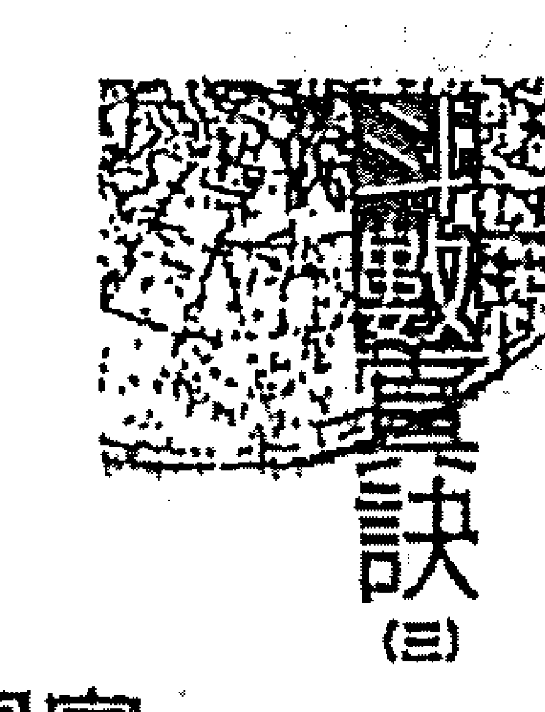

## 第④章 格局篇

渊深似海若是不懂得「捧、送、恭、听、弄」的五字真诀，反而是得不偿失，自讨苦吃。会禄存主富而不贵，忌壬年生人财逢破主虚名而已。

### 紫相坐命身材瘦高，重外表的形象，很注重穿衣的品味，挑食、热心公义，心软怕眼泪或哀兵之计，喜爬山涉水、话多又不懂察言观色，命宫天罗地网宫，做得多收得少，事倍功半，常感不得志，心情容易「郁卒」(大限行此亦如此)，除非会左右或吉星拱照，否则无法突破困境。

男命：好好先生一个，外表看来忠厚老实、稳重老成，重视外表形象、爱面子，所以一定会打扮得体面才出门，但早年不得志，难免会心情郁卒。

女命：身材姣好，是个标准的衣架子，穿什么都好看：辰位坐命个子较高，财帛旺者是女强人型的，气势压过老公，若身宫为破军或贪狼，再逢四化不恰当的话易沦落风尘，但因为外型条件佳而且注重品味，就算在风尘中打滚也会走较高级的路线。

#### 【兄弟宫】

机巨组合不佳，不宜入六亲宫位，除了兄弟不超过三个，以及须有人过房认义父母之外，与兄弟相处也不融洽，意见难协调，是非口角颇多，而且各自为政，手足无情也不会互相帮助，常言道：『兄弟不和、受人欺讹、风大就凉人多就强』，道也是紫相坐命者有志难伸的原因之一，毕竟十人种竹一年成林，一人种竹十年成木。

#### 【夫妻宫】

条件高、眼光挑剔，而且有了这个心里还想着那个，所以感情多变，扶了油瓶倒了醋，因此婚姻波折，多数不美满。男命一生中有与风尘女子结婚过的机缘或同居一段时间，女命则婚后仍然会有出墙的情形，甲戌癸年生人，感情生活尤其复杂，当他的配偶，不愁没有帽子。

#### 【子女宫】

子息主双，聪明好动有艺术天份，未宫男多于女，丑宫女多于男。从此宫亦可看出其「胃口」多变化，一会儿想吃「蜜汁火腿」，一会儿想吃「烧乳鸽」，巴不得自己能当个「美食大師」，大饱口福一番。

#### 【财帛宫】

六合之中以此宫最佳，财星库星皆入财宫，再恰当不过了，主财旺物质享受层次较高，且喜欢济人之困。

#### 【疾厄宫】

酒量不错，辰位坐命者易患糖尿病，皮肤过敏、湿疹，香港脚以及胃寒、胃酸过多等疾，女命武府在子位，罹患子宫癌的机率高，若大运为土星同宫，紫微星，紫相在天罡星，宫干化忌入官禄宫会有引发现象，戌位坐命者除皮肤过敏湿疹、香港脚、糖尿病之外，若戌位会煞则易患肾结石。

#### 【迁移宫】

须承受变动奔波之苦，对环境的适应能力较低，外在环境变动较大，此宫亦为其隐藏之个性，主其平时是蛮好相处的好好先生型，但发起火来六亲不认，连天星老子的帐也不买。

#### 【仆役宫】

机巨的不良组合，一次落两宫，真是曹操背时遇蒋干，儿仆一线全泡汤了。所谓出外靠朋友恐怕也没指望了，与朋友之间相处是非多，意见难协调，口角多，朋友或部属流动快，不易交到可信任的朋友，不易寻获得力部属，尤以了、戌、庚年生人，更是交友宜慎，以免被人家卖了还帮人家数钞票呢！

#### 【官禄宫】

此宫为府相朝，寅位较甲位佳，主野心大，小生意看不上眼，认为小洞里搁不出大螃蟹，鸡窝里搁不出凤凰蛋。较不受传统的约束，适合贸易、建筑、装潢、服务性及公共事业，会昌曲走文化广告，声光传播，资讯等路子。加左右魁钺为公家格局可服公职，因其兄弟仆线不佳，事业规模不宜过大，只要有赚钱就好，不宜与别人投资，童年生活环境富裕。

#### 【田宅宫】

僧五月，且又逢对宫日月照会为日月照壁格（单指田宅宫而言），丑宫较未宫好，因太阴田宅主借人丑宫为旺地又逢对宫旺地太阳照会，主其祖产有份而且自置的产业亦旺，童年住所有附近有水道、井泉、邮筒以及高楼或凸出物等合局。

#### 【福德宫】

福德宫不宜落入杀破狼等宿，七杀在子午位主辛劳，没事会找事做，闷着难过，欠缺精神之享受，年老之时也还想找个义工来做做。女命若其身宫不坐杀破狼的话，则下海的机会不大。此宫又属祖父母之宫位，七杀入宫多半与祖父母缘份较薄，或未曾谋面祖父母即西归。

#### 【父母宫】

父母和高又高寿，得到庇荫，与父母同住的时间较长，两代之间无代沟。双亲的感情和睦，但父母亲与母亲的感情就有碍了，可以说从年。

## 紫微诀（三）

## 六、紫微星：紫杀在天府星、海王星同宫

### 自成引通之局，且我主义观念浓厚

紫微和七杀在巳位与天府星同处，以巳位的火去生紫微的土，紫微的土再去生七杀的金，自成一个引通之局。所以星性静不下来，无法从事研究、策划工作，大部份在商场争战。紫微和七杀在亥位与海王星同处，以紫微之土去生七杀之金，但七杀却把金倒给了海王星，因而失去了七杀应有的冲劲，所以紫杀在亥位绝大部分是从事研究的学者或是艺术家。

紫微能化解七杀之凶而反为我用，也就是化杀为权，两星同宫转成权威，个性霸道，独断独行。若无左、右相辅则视为孤君而不得人缘。其个性、思想偏向顶客族，自我主义观念浓厚，欠缺家庭观念，不论男、女婚姻皆不美，不是保持单身贵族就是婚后不久婚姻就出状况。

七杀原本为孤克之宿，唯有巳亥二位必与紫微同宫，紫微属土，并以土去生七杀之金，且紫微能解七杀之凶而反为所用故而化成权威，因此

### 紫微星：紫杀在天贯星、海王星同宫

### ★紫微盘★

| 宫位 | 星曜组合 | 相对宫位 (箭头指向) |
| :--- | :--- | :--- |
| 巳 | 七杀、紫微、天贯星 | 箭头指向丑、亥、酉宫 |
| 午 | 火星 | |
| 未 | 天父星 | |
| 申 | 冥王星 | |
| 酉 | 廉贞、破军、金星 | |
| 戌 | 天厨星 | |
| 亥 | 天府、海王星 | |
| 子 | 太阴、天同、水星 | |
| 丑 | 贪狼、武曲、天后星 | 被巳宫箭头指向 |
| 寅 | 巨门、太阳、天王星 | |
| 卯 | 天相、木星 | |
| 辰 | 天梁、天机、土星 | |

## 第⑧章 格局篇

主独断独行，若无左右同样视为孤君而不得人缘，但过分霸道主观，反面独来独往，一生逍遥潇洒自在，倒是这种自私、自我本位主义，搞苦了周遭的六亲一票人。

紫杀坐命崇尚自由，不受牵绊。

紫杀坐命者已位者位居天贵星则身材瘦高，亥位海王星则身材较矮，本身已属化权故不宜再化权，否则霸气十足，宁可我负天下人，不许天下人负我，崇尚自由理念，不受人管，喜爱旅游与美食，只愿自己享乐，欠缺家庭观念，即使婚后亦不愿被家庭牵绊。个性皮、会耍赖、喜欢反调，但恶人无胆，三合为杀破狼，一生起伏颇大。逢空亡星则当事者会变得较懒散而没有冲力，但相形之下其人生起伏波动也相对减少，因其祖业甚佳，一旦紫杀逢空，本身就没有什么建树，受荫于「祖公仔屎」而主虚名受荫而已。

紫杀于巳位较亥位为佳，因火以生土、土以生金之故，但巳位较为辛苦，多半不依祖业，亥位则有较多的祖业可依，能得祖上余荫故较懒散，讲究生活情趣，此命不利加煞，尤以羊铃为甚，主血光、破相、不利六亲，岁限逢之谓之七杀重逢，若再逢流年之羊陀相冲、相夹、而无吉相扶，则该年无灾也有祸。

男命：是个自由主义的崇拜者跟实践者，好幻想而不切实际，主观较强，我行我素，只要自己能享乐，其它什么都不顾，有大男人主义倾向，当她的老婆可要有心理准备。

女命：娶了这种命格的老婆，就好像娶了「棵摇钱树，因为她外向能干，精打细算，有机会还会想自己独立创业，但起人比较自私，不会为他人着想。

#### 【兄弟宫】

兄弟不过三个，且有人过房或认义父母，手足之间情份薄，平常没有什么话题，加煞则兄弟必损且易起争讼，戌年生人与兄弟不宜久处，是非挫折多，缘份薄。

#### 【夫妻宫】

男：牛多长得体面，而且会宠爱配偶，与原先所认识的朋友、邻居、同事、结婚的比例颇高，所谓近水楼台先得月，当事者是属于吃窝边草型的。

#### 【子女宫】

子女活动力强，喜欢和父母亲顶嘴，因此小时候挨打也最多，与子女沟通得费一番思考，与子女缘薄，子息难奉老。

#### 【财帛宫】

财帛加上贪狼于是主野心大，于财贪得无厌，而且财务不愿假手他人，独自管理财务大权支配一切收支。

#### 【疾厄宫】

幼年时易尿床，中年后易患糖尿病，身体虚弱，此命亦有患胃下垂之倾向，命坐巳位心脏不好，易患心律不整的毛病，亥位坐命者则易患膀胱炎隐私症，视力不佳或有眼疾，酒量不错。

#### 【迁移宫】

命迁一线入四马地且庙旺，主在家待不住，即使下班没事了，也喜欢到处跑跑或串串门子，迁移宫良好，人际关系不错，是一位事业上的前锋，活动力旺盛，对社团参与方面积极主动，喜结交能力比自己强的人，迁移宫内此种星宿很适合做贸易，业务或市场开拓方面的事业或工作，受天府星之影响，管掌权发号施令，为老板的命格。

#### 【仆役宫】

本宫无星，得日月拱照，若不会煞忌，所以不会被友人拖累，但朋友流动率高，年龄层广老少都有。

#### 【福德宫】

宜从事代理业，财经界或贸易租赁业，旅游、电子、重机械，因迁移官佳事业范围可往国外发展，属国际性的走势；另因其官禄宫有破军坐守因此不宜从事制造业，会魁钺为公家格，若未投入公门，也会在规模较大之企业中平稳工作。一般而言紫杀坐命于巳位者，为白手起家不依祖业，多为商界人士，因此也较为勤快与劳碌，而坐亥位者，田宅宫较旺，有较多的祖业可依，因此为人较为懒散，命坐亥位海王星之地，较有近要人、权贵之机缘，多属公门中人。

#### 【田宅宫】

借日日日会日日月，若无忌冲照主富裕，实位可得祖业，住宅光线良好，附近有水道、水沟、地下道、高起之建筑物以及邮筒等景物，落陷则光线较差。

#### 【福德宫】

表面上一副天不怕、地不怕的样子，实际上胆子很小，所谓「前怕狼后怕虎，睡在被窝怕老鼠」，有艺术方面的天份，喜欢园艺及音乐，本宫无土星，若有煞星坐守则多梦容易心神不宁。

#### 【父母宫】

双亲慈祥和蔼，对子女之照顾无微不至，若无煞忌冲照，能得父母之荫福，与父母之间的互动关系也很融洽，本身亦具有回馈反哺之心。

### 紫微星格局要点整理：

- 男命紫微在海王星、女命在天王星，或者壬、甲年生的人均富贵之命。男命得紫微在海王星立命，应该会与七杀同宫，而壬年生的人禄存也在海王星，且紫微化权，所以算是吉利；女命紫微在天王星立命，当有天府同度，甲年生人，禄存也在天王星，再加上廉贞化禄在火星，三合吉星来照，自然富贵源源不断！但紫府同宫的女命，可能会比较孤独，虽然有富贵，却是美中不足的命运。
- 机、府、武曲在财帛与田宅宫，更是兼具权、禄，是个大富翁。命数中的紫微、天府、武曲、双禄为财星，所以如果在财帛或田宅宫，再逢化吉，一定是大富大贵；但因为田宅是个财库，如果财宫旺而田宅不佳，多是旺而难留，暗中会损财。
- 紫微在木星、金星，或是有空劫、羊、陀者，多为脱俗之人。紫微如果在木星或金星立命，必有贪狼相会，这样的人喜欢神学之术；如果再有劫空会于身宫、命宫，这样的煞星冲破，反而会遁入空门当僧道。但这个格局如果有火星或铃星同则不在此论，反而会有富贵加身，但为人会相当怪异。
- 紫微、破军没有加会左、右，又没有吉星相会，极可能变成凶恶之徒。紫微、破军只有在天后、天父星才会同宫，如果有吉星来会合，则是斗数中之上格；若不逢吉星，更无加会左、右，那么虽然是个当官的，但为人狡诈凶暴，而且多是淫欲之徒。
- 紫微、天府夹命为贵格。紫微、天府二星是南北斗的至尊，如果前后夹命，一定是富贵双全。但是这个格局仅限在天王、冥王星立命者，这样的人一生多贵人相助，而如果紫微在天后、天父星，又有破军同宫，天府在木星、金星来夹命，但命垣无正星，只好借用对宫的天同、天梁来用，这样身宫庙旺，就没有落陷的格局。又如果紫微在木星、金星有贪狼同宫，天府在天后、没有相夹，命宫为太阴、天机在天王、冥王星，并非入庙旺，但因为会合天同、天梁而成「探花格」，但必须要有吉星来相扶持才会富贵，不然也只不过是平常人而已。
- 桃花犯紫微为至淫，男女都很淫乱。桃花即指贪狼。斗数中桃花星很多，像廉贞是次桃花、天姚是风骚星，文曲亦是文雅风流，咸池又叫桃花煞；但紫贪之命者，一定会有出轨的情形。但要身宫与三合有桃花星来会合的才是，仅管如此，也会有贵贱之分。
- 紫微在火星无刑、忌，甲、己、丁年生的人命至公卿。紫微在火星，因帝居南极，而且「火生土」很旺，如果没有刑星「即羊、陀」、忌（即化忌）等来冲破，则甲年生人，禄存与武曲入于财宫，天府、廉贞化禄于官禄，算是「双禄朝元格」；己年生人禄存入命，武曲化禄于财帛宫，也是富贵双全；丁年生人禄存入命，亦主富中带贵（或贵而不富）。
- 紫府朝垣诸禄逢，终身福庆到三公。朝垣，就是三合来照的意思。如果紫府来朝，无煞，则大吉。例如紫微在天王星立命，有武曲、天相守命，或是火星官禄有紫微，天罡星位的财帛逢天府、廉贞，若不逢四煞来冲破，甲年生人禄权并禄存来会合，将是极品之贵。
- 紫微、破军在土星、天罗星，君臣不义。土星是天罗，天罡星是地网，对紫微这颗帝王星很不利（尤其小限逢到此，不论男女老少，都会遇上凶灾、口舌、破财）。如果紫微在土星，那破军「定在天罡星」；紫微在天罡星，则破军「定在土星」，只要身宫、命宫分别在土星与天罡星，又遇上紫微、破军，这样一定会先贵而终败散；但如果命宫有紫微，而身宫不逢破军（身宫有吉星），则另作别论，但是虽然富有却未必尊贵。
- 紫微、七杀加刑忌、虚名受谤。「紫微、七杀化权」反而是件吉祥事，如果再加截路空亡（即截空），则祖业不错，深受荫福，然而本人并没有什么独创建树，只不过空有美名罢了。
- 君臣如果能在土星、火曜星相会，则富贵双全。紫微如果是皇帝，那么左、右就是宰相，而昌、曲是个从，而魁、钺则为传令，天府就是财库，而禄马为掌爵之司…这几颗星会合于身宫、命宫，又没有煞星冲破，可说是君臣庆会之格，主极品之贵。
- 紫微会吉星于迁移宫，因人而贵。迁移宫主要是断定个人外出的吉凶，以及这个人的一生遭遇是否安泰。如果紫微入迁移宫，那么一定多奔波、辛劳离乡，但出远门反而人生得意，而且一生近贵人，容易获得贵人提携而发达，在外的人缘也不错。
- 紫微（在天后、天父星）、武曲（在金星）会擎羊、陀罗，为人喜欢诈欺，这几颗星如果会合于身，命及三方，那这个人一定喜欢作乱，而且为人欺诈。例如：紫、破在天后星，身宫武曲、七杀在金星，庚年生的人擎羊在金星，陀罗于未来冲命。这类命格，虽然会突然大发财，但最后多会破财；而且煞多则有可能死于意外。
- 紫微运破军，婚姻难和谐。紫微在天后、天父星，因为夫妻宫借到廉贞与贪狼，而紫微在土星、天罡星，对宫又有破军冲照，夫妻宫因为贪狼与廉贞交驰，桃花过重，所以有碍婚姻和谐。
- 紫微坐盘四马之地，越多越好。紫微坐命或守身宫，它的好坏全依其三方四正的组合而定。吉星愈多，愈能发挥力量；无吉又煞多，反而是沦为在野孤君。喜欢听美言，喜欢人拍马屁，耳根子软又欠缺主见。
- 紫微加煞，不利六亲。紫微星守于命宫、财帛宫、官禄宫或田宅宫皆为强宫，但入六亲位逢煞忌冲，反不利该六亲的宫位，因其磁场及气势太高，压制星盘的当事者，故不以吉论。
- 紫微、七杀同权，为人逞英雄。紫微与七杀同宫，可以化七杀为权，加火、铃，主其人主观甚强，个性刚强，喜独来独往，不受人约束，欠缺家庭与亲情观念，所谓「千山我独行，不必相送」，正是这种人的个性。

## 天机星格局导言

善于机谋，谋略比军师。

天机为兄弟主，坐命者因夺其星曜，因此不论何宫坐命，或何种组合，他的兄弟必不过三个，所以最好将天机坐命的人在周岁前过房给别人。戊年生的人有给人当养子的命，而且认义父母不但可以避免他不利于兄弟，又可让他的幼年较好养，可说是一举两得。只不过从前是子女一大票，送一两个出去是减轻负担；现在社会子女不多，个个宠得跟宝似的，因此送人的机率极小，所以多半是名义上的过房，只要程序正确，在命理上依旧有效，天机星又是个「招妹」星，如果不将天机坐命的小孩过房给别人，那么下一胎想生个「公」的，就不太容易了。天机星是一颗浮动的星，不但本身好动，他的思想、心态随时都会见异思迁，所以无论大限、小限遇到这颗星，在环境上都有蛮大的变动，它也是一颗宗教星与赌博星，因此坐命者多有虔诚的宗教信仰热诚，以及坚定不移的赌性，有的是择其一而守之，有的则是两者兼俱，于是上山礼佛、下山拜赌神签牌支，成为他日常生活的重要课程，此星不宜再入四化，否则容易沈迷赌博难以自拔，甚至大限走到或三方机梁照会又逢四化进入时，照样应爽。

当了宰相望封侯，做了皇帝想成佛。

天机既是颗智慧星，又是颗计较星，所以擅于机谋，因为智慧高，所以谋略堪称是军师级的，如果赌博也不会输给「赌神」，但生命的人比较适合当副手掌权或是拥有专业技能，但不宜经商，就业反而能独当一面。生命者对数理有专长，适合时下最抢手的电脑软件设计方面的长才，至于动脑企划、研究创新方面也很拿手，为人好学、好动，但个性好高鹜远，吃碗内、看碗外，「当了宰相望封侯，做了皇帝想成佛」，他的欲望永远难以满足。

天机的各种格局吉凶，在于它所会星宿的好坏而定，它是一颗亦正亦邪的星，若旺地加吉星，它的机谋智就会用于研发开创等正途，但如果陷地逢煞冲则邪气上身，它就算有智慧也会用在偏门，为人偷、抢、奸、诈难免。如果此星加煞坐命则早刑晚孤，早年会刑克手足，中年婚姻容易波动，晚年则会孤单。但如果疾厄宫不佳，则刑及自身，会使自身已破相或残障，这是向内的刑损；如果疾厄宫无碍，就应细察其六亲宫位中何宫最弱，则那一宫最先受到波及，此属向外的刑损。

机梁加煞入六亲宫位，则显示其宫有刑损。

机梁加煞也是一样，若落于身宫，则其情况不变，只不过是兑现的时间稍往后延而已，若非天机加煞坐命，而是命盘中有此种组合，则不宜入六亲宫位，入何宫主何宫有刑损，而这种情形就不是当事者有刑克，而是借由其命盘显示出其某宫有刑损状况，例如：天机加煞入兄弟宫，主坐命者的兄弟中须有人过房或有手足有折损的情形，是其兄弟自身的问题，而非坐命者的磁场造成，此点须加以厘清。

天機坐命，一般而言適合女命不利男命，因為凡是此星坐命的人，他的夫妻宮必為太陽，旺地主貴（配偶），女命得之，夫星坐夫妻宮，再好不過了，而男命得之，則老婆為旺地太陽，硬邦邦的不會撒嬌，而且氣勢強悍壓過自己，很容易淪為「PPT（怕太太）」俱樂部的成員。若遇陷地太陽於夫妻宮，則男女命都一樣，夫妻間的的情感較不起考驗，而問題幾乎都是出在天機坐命者本身。因為天機星性浮動，不夠穩重，除非有厚重之星相持，一般都會用情不專，喜玩弄感情，而又過於聰明自我，一生追逐名利與地位，欠缺家庭觀念，不屑親情的溫馨，恰好與其子女宮坐守的武曲相吻合，所以與子女的緣份較淡。

具奪專業技術性或投機性，動腦力的輕鬆之財

天機坐命者，財宮必有天同坐守，財源穩定，同時反映出此星坐命者不大可能賺取苦力財，而是具有專業技術性或投機性，動腦力的輕鬆之財。而其僕役官必有廉貞守官，所以容易與異性交往，無煞忌冲照則能從中獲益，但與同性則交情淺薄，甚至對立。父母宮有紫微坐守，詳細情形還得考慮是單守或何種組合，但一般而言，父母宮過旺反而主孤，父母之間的感情也欠佳，長大後必然逐步疏遠，坐命者還是再認義父母較好。

### 計算天機格局有口訣

此星坐命者大致情形是如此，但更詳細的部份則要再考慮以下幾種情形：天機與何種星座搭配、入何宮坐命、生年四化之分布，以及身宮的落腳之處、男女命的差別。天機也有六種組合，要深刻記住並不難，如紫微格局已記住了，則天機格局只不過是命宮坐落地點不同而已，另外

-   機巨：子午|分守 卯酉|同宮 → 四敗地
-   機梁：丑未|分守 辰戌|同宮 → 四墓地
-   機陰：巳亥|分守 寅申|同宮 → 四馬地

還有一個方法可加強記憶。

## 紫微斗數古書圖鑑

## 一、天機星：天機在水星、火星同行

### 躁動的星，腦筋不停運轉

天機是一顆相當躁動的星座，此星動的特性，是腦筋無時無刻不在想，沒有停止的時候，偏重在智慧，動腦筋的星座，最適合做軍師，但天機的創意和破軍是不同的，天機是在傳統範圍內的創意，破軍是能夠突破傳統，大膽採用新的東西，所以要開創性的東西，是需要破軍，天機比較會侷促於傳統的框框。天機如果沒有會到昌曲、魁鉞、化科，這個人的智慧則很難發揮，意思就是此人雖聰明，但千里馬遇不上伯樂，無人提拔！天機另一特性，是一個很好的機要人材，但絕對不是一個很稱職的老公，若天機的格局成立，則一天到晚是在追逐自己的名利、身分與地位，對家庭的責任比較淡；如果不成格，心態就會退回來，他就比較難顧到自己的家庭，所以天機是比較適合女命，不見得適合男命，天機如果成格，他的智慧、理想才有辦法兌現，大運走天機或天梁，最好是上班一族，不要在此時出來創業。

### ★天機星★

| 巳 | 午 | 未 | 申 |
| :---: | :---: | :---: | :---: |
| 貪狼 廉貞 | 巨門 | 天相 | 天同 天梁 |
| 天貴星 | 火星 | 天父星 | 天馬星 |
| 太陰 | (箭頭線指向天機) | | 七殺 武曲 |
| 辰 | | | 酉 金星 |
| 天府 | | | 太陽 |
| 卯 木星 | | | 戌 天刑星 |
| 寅 天王星 | 破軍 紫微 | 天機 | 亥 海王星 |
| | 丑 天后星 | 子 水星 | |

### 機巨同宮智煞，智慧高人一等

天機如果化忌，此人更厲害，和廉貞化忌一樣，廉貞第六感已很厲害，再遇到廉貞化忌坐命，第六感靈敏度更厲害，精得像鬼不像人，但糟蹋掉，在感情上是一個白痴，為情所困，人再怎麼聰明，都會有一個致命的罩門，沒有十全十美。天機遇到化忌，腦筋更聰明，但是天機和廉貞一樣，是個亦正亦邪的星座，走正還是走偏，完全看三方四正的星座，若三方煞忌一堆，觀念就很容易走偏，若是去犯罪，則屬於智慧型罪犯，若天機化忌之人同宮有陰煞，則離他遠一點。若天機三方四正有會到好的吉星，表示此人是善於權謀，尤其是機巨組合，如果有忌星會到陰煞或者煞、忌一堆，此人就容易心術不正，走偏門，天機星往往好的地方想，會有濃厚的宗教思想，若走偏了就糟糕了，肯定是個智慧型的罪犯。命宮天機，智慧高人一等，會把多少人耍得團團轉。天機在子午位是單守，天機在子位，水生木；旺，天機在午位，木生火，就差一級了，天機在子、午位，對宮一定是巨門，腦筋很厲害，善於權謀，就是屬於機巨的組合，一定帶有巨門的特性，遷移宮的星座就是一個個人隱藏的特性，陳水扁就是機巨組合，巨門文昌，善於權謀炒短線。天機在此格局中，三方四正是很標準的機月同梁格，一般來說適合上班族，不適合當老闆，因為財宮是同梁。

### 天機星：天機在水星、火星單守

天機位於水星、火星，生性多疑

星座單守的時候，星座的特性會比較明顯，而且容易判斷，只要將單星的特性套入個性，再看身宮落於何宮、坐落在哪顆星？然後排列組合就八九不離十了。而天機位在水星、火星，因受到對宮巨門星的影響，所以生性多疑，除非他能善用週邊環境與人際關係，會自行分析利害關係，否則必然多計較無疑。

天機坐火星比在水星來得好，因為星盤上的日月皆落於旺地，但這個命格利女不利男，因為夫妻宮所落的星宿陰陽顛倒之故，坐命者聰明、個子高、心態上常沒有安全感，受對宮巨門的影響，私事常暗藏於心中不輕易表白，所以內心孤獨，雖然愛計較，但心地善良。

## 第④章 格局篇

男命：個性深沈、穩重保守，擅於權謀算計，做任何事都喜歡悶不吭聲，適合做研究技術工作，但因為有什麼委屈都往肚子裡吞，與老婆又少有良性溝通，所以婚姻多半不美滿。

女命：即使遇到心動的對象，也不善於表達，個性內向沉默、多愁善感，但做事頗為機伶，手藝也蠻靈巧的，多屬於一般通勤上班族。

#### 【兄弟宮】

兄弟宮無主星，借對宮廉貪來看，所以手足情淡，感情時好時壞，同處一個屋簷下必定失和，甲戌年生人化祿入兄僕線，應有同父異母或同母異父的同胞手足，因為此宮也為其父母的夫妻宮，化祿進宮，所以長輩有增加之兆。

#### 【夫妻宮】

日月在土星、天罡星對照，形成配偶「明」暗的情形，所以夫妻間的關係也是忽冷忽熱，喜歡玩弄異性於指掌之間，當他（她）的配偶不錯，因爲「升官」，快而且不愁沒有「帽子」戴，只不過清「色」都是「綠」的，而婚姻的問題都出在當事者身上，而非配偶的問題。

女命坐午火星位閉著眼睛都能嫁個好老公，但依舊是身在福中不知福，吃了包子還想餃子，而且行事只編蘿筐不收邊，可憐她老公不但戴綠帽，還要收拾殘局。男命坐午火星位老婆一定很強悍，於是更有理由外出尋覓溫柔知音人，所謂「嚴官府、出能賊」，如果命在水星桃花地生命，日月又落陷，則夫妻之間經不起任何的風波，偏偏其私生活又更複雜，三十歲之前的婚姻不好，很難偕老。

#### 【子女宮】

武殺坐守主先損後招，子女個性剛烈，叛逆性強，不易管教，當事者與子息之間親情較淡，不宜加煞，否則主損以外，還要注意會擁有某方面有缺陷的子女。而且坐命者性慾強盛，不在乎天長地久，只在乎是否擁有，外遇對象是「好吃又不粘牙型」的。

## 第⑧章 格局篇

#### 【財帛宮】

財務穩定，而且是輕鬆之財，多為上班族，財務週轉能力相當強。

#### 【疾厄宮】

容易得糖尿病、濕疹以及下部之疾，乙丁年生的人，「機件」容易故障，應多注重肝的保養。

#### 【遷移宮】

在外是非多，疑心病重，人際關係欠佳、危機意識高又缺乏安全感，心事暗藏不易表露，所以常覺得孤獨，為人容易見異思遷、翻臉無情。

#### 【僕役宮】

狐群狗黨不少，交往份子複雜，且易住偏邪方面傾斜，即使都頗有能力，也很難拿出真心相待，有利害關係者，表面上做做文章，卻很難給于實際上的幫助，一旦患難就可見「真章」。

### 天機真訣（三）

### 天機星：天機在水星、火星單守

#### 【官祿宮】

太陰斗星位失陷，所以女生可往護理方面、男生多適合醫藥化工，而不是吃公家飯的料；在天機位旺地者多屬公家格，會合祿存或化祿宜商場發展，若是機月同梁格為典型的上班族人士。

#### 【田宅宮】

庫星坐田宅宮位主富裕旺足，住所面積寬大、位置較高，附近有高樓、銀行及公家機構等環境。

#### 【福德宮】

借同梁主追求自己的享樂，滿足自己的慾望，所以置親情事足家庭於不顧，通常他的錢財也來得輕鬆，所謂：「雷公打豆腐、專挑軟的下手」，說的就是這種人。

#### 【父母宮】

長輩風流，並且人數有增加或再婚，戊年生人有給人當養子之徵兆。父母之間的感情，年輕時還算不錯，中年以後常會有意見上的爭執，加煞忌恐會見面像仇人般。

## 二、天機星：天機在天父星、天后星單守

### 機巨對照個性深沉內斂，機梁對照思想較為老成
天機在天后、天父位必有機梁對照，雖然與機巨在水星、火星者同為單守坐命，卻因對宮星宿的影響，使得個性上大為不同；機巨對照者個性較為保守，深沉內斂，而機梁對照者思想個性較為老成，愛聊天，且更聰明，具有老人緣，但同樣是利女命不利男命。

### 主觀意識強，喜歡刺激與挑戰
天機在天后、天父位之地，在天后星為陷地（因巳酉丑為金局），為人主觀意識較強，智慧高、反應快，好說著辯嬌羞『名嘴』，爭強好勝，身材瘦高，為人貪小便宜，加煞星則有三隻手的惡習，並非沒錢買不起，而是喜歡刺激與挑戰，認為靠腦筋神不知鬼不覺的弄來，又沒人發覺會比較有成就感。兒童時期尤其明顯，大限逢之也一樣，天機加桃花星如紅鸞、天姚等星宿，那麼坐命者將很愛打扮，而且愛慕虛榮，命遇火四化則好賭且為「發豬型」，一坐下來賭就無法離手。

在丑未宮即是天機、天梁對照，機梁辰戌丑未宮，雖然此四宮皆屬土，但其中的差異，其土裏面含有其他的五行：巳酉丑中間為酉，丑未的土其中含有金；亥卯未也是屬土，但此丑未的土是屬木；申子辰是水庫，寅午戌屬火，抓住此一特點，就知道天機在哪一位置比較好。
天機在丑宮是：金剋木；在辰位的是天機，機梁同宮，水生水，天機的特性比較明顯，機梁在戌宮，木生火、火生土，是天梁的特性比較旺，易得祖產，若命宮又有化權、化祿，絕對是千萬以上。
為何說天機星不利男命？因其夫妻宮陰陽顛倒，是太陽星在夫妻宮坐鎮，不過這也有好處，有時姿勢擺低一點，也可以減少奮鬥二十年，但此格局之人當運走殺破狼時或武曲、天府之星時，就又要開始衝了，老毛病就要來了，婚姻就完了，又追求起名、利。
天機在丑宮，夫妻宮的太陽是落陷的，反而婚姻比較穩定；天機在未宮者，婚姻大好、大壞，禁不起風吹草動，因為他是男人，娶一個太太是太陽的，其結果可想而知。

### ★天機星★

| 宫位 | 主星 | 五行 | 辅星 |
|------|------|------|------|
| 子 | 破軍 | 水星 | |
| 丑 | 天機 | | 天后星 |
| 寅 | 天府、紫微 | | 天王星 |
| 卯 | 太陰 | 木星 | |
| 辰 | 貪狼 | 土星 | |
| 巳 | 巨門 | | 天貴星 |
| 午 | 天相 | 火星 | |
| 未 | 天梁 | | 天父星 |
| 申 | 七殺 | | 冥王星 |
| 酉 | 天同 | 金星 | |
| 戌 | 武曲 | | 天罡星 |
| 亥 | 太陽 | | 海王星 |

### 男命

機梁照會擅於與人談判溝通，聰明、分析力強，不失為一個好的參謀人才，但是自我主觀過強，愛辯又強詞奪理，婚姻並不美滿。

### 女命

開放早熟，思想較為前衛先進，常常語不驚人死不休，個性聰明善變，鬼靈精一個，外形上則具有古典美，喜歡裝可愛。

#### 【兄弟宫】

手足之間各自為政互不干涉，緣份較薄，不宜有金錢上的往來或事業上合作。

#### 【夫妻宫】

命在天父星以女命較佳，容易釣到金龜婿，而且老公是內斂「古意」型的，很好管束。男命就不太妙了，容易娶到悍妻，成為怕老婆一員，如果命坐天后星則夫妻宫落陷，男女都不好，婚姻容易出軌，「牆裡栽花牆外香」，因落陷太陽無力驅巨門的幽暗，所以也是一明一暗。

#### 【子女宮】

子女反叛性很強，不好管教，得府相朝，子女將來出路不錯，其對宮有貪狼星坐守，有收養子女的情形。

#### 【財帛宮】

財務穩定，也就是有固定的收入，此種情形多半顯示坐命者為上班族，並且較屬於勞心而非努力之財。

#### 【疾厄宮】

主肺經之症。咳嗽、氣管不佳，女命若疾厄宮七殺坐守再入鸞喜容易有血崩，因此在生產時須特別小心，若加擎羊，則有剖腹產的情形發生，大限一様，另外坐命者平常四肢常容易有外傷。

#### 【遷移宮】

較不喜歡改變環境，一旦出國就有可能定居，此宮老人星坐守又得日月拱照，所以在外颇受欢迎，尤其特别有老人缘，二方无煞冲则叠适合當義工，並且其自身亦有此種心態，機梁對照，已屬歸才一流不宜再入昌曲，否則乃是「大蓋仙」一個，吹牛會吹得離譜，講話七折八扣再打對折還有找，不過聚會場合有他在比較不會冷場就是了。

#### 【僕役宮】

較易與異性交往，但常受屬下的氣，所交的朋友以同年齡層的居多，但對其有實際助益的知心朋友卻不多。

#### 【官祿宮】

宜門在天貴、海王星動地，工作流動性大，宜一般企業、文化出版或美工設計，以及開口就能賺錢的行業，如律師、記者、外交、仲介、會計師則為講師級的人物，因身命格頗具辦才，若從事電腦軟體設計則是最佳人才。由此宮也可看出坐命者的配偶屬於老實、沈默寡言、不善交際的人，但以在海王星位為佳。

#### 【田宅宫】

主旺又富足，居家附近有娛樂場所、派出所、餐館，高大的樹木、果樹、蘭花、廟宇、公園等為合局，避免選擇三角窗的地方當居所。

#### 【福德宫】

男命天父星坐命，太陰於旺地，主浪漫、重氣氛，而且物質享受重於精神，豐福不淺；女命則反而不解風情，喜吃零食，身體欠佳。

#### 【父母宫】

父母位過旺，宜另認義父母或給人當養子，或承接倒房先人之香火，父母之間的感情亦不睦，與父母緣薄。

## 三、天機星：機陰在天王星、冥王星同宮

### 精明能幹，吉多亦富貴
天機星在天王、冥王星必有太陰同宮，三合必有同梁照會，為標準的「機月同梁格」，喜入公門好修行，又機陰坐命必得紫府前後夾命，若三合會照而由無煞沖照謂之「探花格」，幼年好命如父母捧在手心上的寶一樣，吉多亦富貴，無吉加煞，也是平常人而已，此格多出身為公務員，若無煞有吉可為中級公務員，如局處長之類的。精明能幹、點子多、喜歡「智游戲」。

這個格局在冥王星位立命比在天王星好，因為二星落於冥王星較旺，且雖中日月也旺的緣故，冥王星位坐命的以癸年生人為上格，丙年生人為次之。天王星坐命以丁年生人為上格，壬年生人次之。機陰坐命者個性沈穩、城府較深，喜歡操縱權謀，自私計較，好動重休閒享受，喜追根究底，孝順顧家。「死的不敢抓、活的不敢拿」，膽小鬼一個，逢空亡星則腦筋不靈光，有點脫線秀逗。

### ★天機星★

| 宫位 | 主星 | 五行 | 辅星 |
|------|------|------|------|
| 子 | 太陽 | 水星 | |
| 丑 | 天府 | | 天后星 |
| 寅 | 太陰 天機 | | 天王星 |
| 卯 | 紫微 貪狼 | 木星 | |
| 辰 | 巨門 | 土星 | |
| 巳 | 天相 | | 天貴星 |
| 午 | 天梁 | 火星 | |
| 未 | 廉貞 七殺 | | 天父星 |
| 申 | | | 冥王星 |
| 酉 | | | 金星 |
| 戌 | 天同 | | 天罡星 |
| 亥 | 武曲 破軍 | | 海王星 |

（注：表格中央有箭头线条，从左下角“天機”位置分别指向右上角“廉貞七殺”、中上“天梁”及右中“天同”区域。）

### 坐旺地太陰，不利姻緣
位在天王星的天機較強，對男命較佳，婚姻雖不圓滿，卻至少可以娶到老婆，聊勝於無；女命則因夫星失陷，婚姻不美滿。冥王星位以太陰較強，利於女命，夫星旺可嫁貴夫，有潔癖；男命可就累了，妻宮旺地太陽主怕老婆，而且自己坐旺地太陰奪占妻星，姻緣晚到或難成。

### 機陰組合，探花格
機陰在寅申位，如果是一個女生，則十分聰明；若是男生，則是英俊、古意，機陰組合，若是沒有被煞星衝破，在古文來說稱為探花格，屬於中級的公務人員，在此婚姻會比較穩定的原因，是因夫妻宮太陽落陷，而太陰也是落陷；但如果在申位，則太陰會偏旺，夫妻宮是太旺。天機屬木，在寅位也是屬木，屬於比平穩的位置，但在申位屬金，木則很明顯相剋，星座落陷，顯現出星座的缺點較多。機陰的種類很多，大舉上是寅、申位的差別，再來就是男女的差別，女孩子機陰在申位，是世界上最好命的，看太陽在午位，閉著眼睛隨便也嫁到好老公，在家裏坐著當少奶奶就好了。在批命時，若遇到機陰的人，皮就得繃緊一點，因為機陰的人很會糾纏，尤其是女生。娶到機陰的女生，生活不得安寧，沒有也吵到有。

### 男命
看起來機智幽默，一副陽光男孩的模樣，俊秀帥氣，所以很有異性緣。喜歡與人拉關係、套交情，但孩子氣很重，喜歡在背後說別人長短。

### 女命
外表看來溫柔女性化，相夫體貼顧家，常為家事操煩。思路敏捷，縫功一流，男人一搭上這樣的女性就沒完沒了，而且沒事最愛攀關係，又愛搬弄是非，容易讓人感到厭煩。

#### 【兄弟宮】
兄弟宮雖旺，但自己奪佔兄弟星，所以與兄弟無緣，且兄弟宮旺過於己，無法與之平起平坐，反而旺而無助，而且機陰坐命者往往有與兄弟爭曜的微兆。

#### 【夫妻宮】
婚姻不美滿、多波折，也可能會續弦，與老伴感情淡泊，不宜早婚，配偶年齡最好比坐命者大八歲以上，命在天王星不利女命，思想觀念難溝通。命在冥王星則不利男命，老婆強悍、不解風情。

#### 【子女宮】
財星加破軍坐守，勢必得為子女付出頗大，除了無形的精神付出之外，有形的代價也不在少數，子女常會「不五時捅個漏子讓坐命者疲於奔命。庚壬年生人其子息難兩全，不是「全公的」就是「全母的」，或有一「位可能有殘疾，於是一生只好當「孝子」、「孝女」而無怨無悔。子息不旺，先損後招，且坐命者有先上車後補票的微兆。

#### 【財帛宮】
財務穩定，即有固定薪資收入。

# 第八章 格局篇

#### 【財帛宮】

錢財安穩，適合當上班族，收入穩定，屬於慢聚細散、積沙成塔型，逢祿則大起大落，本身理財概念偏向保守型態。

#### 【疾厄宮】

命坐天王星者除了有四肢的毛病以外，金星位若借紫貪入疾厄宮，則會有心臟、血液循環不良的症狀，癸年生人尤為明顯。命坐冥王星者除四肢的毛病之外，還會有精神方面的症狀。

#### 【遷移宮】

借機陰於四馬之地又落動星，個性外向心不定而四處奔忙，好動不寧，恐怕三不五時會發瘋，流動性較大，不安於現狀，在外須慎防舟車意外，尤以運行命遷線時再逢戊年天機化忌時，更須小心。

#### 【交友宮】

有機會結交黑道上的朋友，最好小心一點，再加上運走兄僕線又逢丙年時，要注意被友人拖累而惹禍上身，即使非機險半命者，但運行機險時也會有此種情形發生，與朋友交往以利害關係為考量，很難持久。

#### 【官祿宮】

適合在公家機構或大型民營公司任主管，適合企劃性、管理性、裝飾業或與女人有關的行業，本身無創新衝刺力，適合個人工作室，不宜當老闆，俗云：「膽小的做不得將軍」，男命多在公家外勤單位工作，尤其以天馬人命遷者離鄉背井服務外勤的比例高，此宮不宜入昌曲，主婚姻不利，男命運行第一大限則會有單戀的情形發生。

#### 【田宅宮】

水星人宮主居家易有漏水之兆、住家環境恬靜、附近有水道、流水、水坑，以及小吃店等合局，天相入田宅主「生優裕，且配合命宮太陰主其祖產有份。

#### 【福德宮】

#### 【父母宮】

父母都蠻「多情」的，尤其貪狼入父母宮，顯示長輩人數有增加的傾向，父母不是再婚，就是自己已有認識義父母的傾向。

巨門坐命者無口才，但巨門入福德那可是話多了，喜歡聊天稱得上是電信局的好顧客，電話一聊就扯個沒完沒了，口才好，會吹噓、喜歡鑽人，打破砂鍋問到底，反應敏銳，精打細算，會鑽牛角尖，身宮不宜居此，否則講話較毒，婚姻不美，俗云：「寸舌害了六尺身」，嘴是沒有個把門的，「刀傷易治、口傷難醫」，不論男女，精神層面都會比較空虛，因而喜歡以八卦傳播打發無聊。

## 四、天機星：機巨在木星、金星同宮

天機與巨門在木星、金星位必為同宮，如果木星位坐命，巨門的元氣被洩，使得天機特性強，星性較明顯，而且坐命者臉型較長。反之，若立命於金星位則金剋木生水，這樣巨門的星性較突顯，坐命者臉型會較方，下巴較短。而且金星是個桃花地，所以臉蛋會長得更好看些，女命尤其美麗動人，但女命機巨在金星，就不宜再會桃花，否則易淪為「海倫綜合症」。

**臉型較好，女命尤其美麗**

天機與巨門在木星、金星位必為同宮，如果木星位坐命，巨門的元氣被洩，使得天機特性強，星性較明顯，而且坐命者臉型較長。反之，若立命於金星位則金剋木生水，這樣巨門的星性較突顯，坐命者臉型會較方，下巴較短。而且金星是個桃花地，所以臉蛋會長得更好看些，女命尤其美麗動人，但女命機巨在金星，就不宜再會桃花，否則易淪為「海倫綜合症」。

**才華內斂不易外露，性情又臭又硬**

機巨坐命者因受巨門星的影響，除了個性好動、計較、聰明、機謀之外，主觀意識也很強，鐵齒不輕易相信別人，多疑猜忌，善於施計，親和力不夠，在團體中其吸引力不足，才華內斂不易外露，處事欠圓滑，人際關係尤其要多加修煉，但如果有昌曲這兩顆善於表達的星宿，就能截長補短。平心而論，機巨坐命者都是四兩鴨子半斤嘴，一張嘴如茅坑的石頭又臭又硬，常容易得罪人而招致是非，俗語說：「茅坑裡丟石頭，激起公憤」，尤以水二局者更嚴重。

**化權又入福德，富貴不淺**

機巨在木星坐命者為「巨機同臨格」，乙、辛、癸年生人更好，因為乙年生人必得雙祿同宮或對照，化權又入福德，富貴不淺，化科入父母位又得魁鉞拱照，必得父母之垂顧，但化忌入夫妻是其須要傷神之處。辛年生人亦得雙祿同宮或對照，富貴無疑，但化權入夫妻，感情生活也足以令其分身乏術，忙得不亦樂乎。癸年生人，命宮化權，且有暗祿跟隨以及官祿宮加會化科而得「科明祿暗」之局，唯夫妻宮之科星雖能獲帥哥美女為偶，但「曝光」機率也較大，恐怕一個雞蛋吃不飽，一身「罵名」背到老，再加上兄僕線化忌，為友拖累的衰事也較多，得失各有不同。

### 天機星：機巨在木星、金星同宮

高，關鍵在是否有會昌曲、魁鉞、化科等，才有格可言。在卯位為天機較突出，在酉位則為巨門比較突出（金剋木），機巨在卯位者臉較圓，在酉位者臉較方，較會有腮幫子。機巨坐命者夫妻宮皆為日月，機巨在卯，太陰較旺、太陽落陷，又再細分男命、女命，日月同宮稱一明一暗，絕對非配偶的問題，而是自己的問題，因為有一巨門在，巨門雖冷靜沈著，但有一個最大的致命傷——疑心病太重。日、月有四化入，會有一明一暗的現象，若沒有四化入，也會很單純，只不過對待配偶的方式會忽冷忽熱，所以舊情重逢的戲碼用在機巨的人身上最多，感情線一明一暗也稱忽冷忽熱。

**機巨借坐佳，外地謀發展較有利**

借機巨較正坐者好，其長相、個性、特徵與機巨相同，但不會有不利兄弟之情形，因其命宮無主星，故而依舊需要認一雙義父母較好，並且其遷移宮較命宮旺，須遠離出生地到外地謀發展較為有利，最棒的是其福德宮有天同星坐守，無煞忌照會必然福厚，田宅又有武府財庫星臨官，若四化恰當的話，反而更有作爲。

**男命：** 這樣的男性聰明、穩重，精於計算，但因爲恃才傲物又固執，聽不進別人的意見，而且個性內斂、不善言詞，所以就算有才華，也很難展現光輝。

**女命：** 內心倔強，不擅於讚美別人，就算遇到喜歡的對象，也是愛你在心口難開。喜歡做家事，但虛榮心重。

#### 【兄弟宮】
本身奪占兄弟的星宿，所以兄弟必然少，手足之情淡薄。若是貪狼坐守，手足有增加之兆，但不是同父異母的兄弟，就是收養的手足，或自宮身過房而得到義兄弟，至於是如何情形，還要參考四化落點及父母宮情況。

#### 【疾厄宮】
機巨坐命者的夫妻宮是非常熱鬧的，因機巨在水星、火星分守，必得日月對照於夫官，而機巨在木星、金星同宮者必有日月同宮於夫官線，皆出「明」暗，雖福不淺啊！至於明的吃香或暗的受寵，端視日月「宿」的旺弱而定，坐命者善於玩弄感情而且忽冷忽熱起伏不定，可能交往「連于後」上斷，過了幾年又舊情復燃的情形，或者腳踏兩條船的情況。

#### 【子女宮】
星曜過旺反而主孤，子息不多，子女叛逆，主觀意識強，但將來出路都不錯，不會煞忌則可因子而貴，光耀門楣。當事者「性趣」很濃，否則怎會喜歡「錦上添花」，還樂此不疲呢！

#### 【財帛宮】
財源穩定，適合上班族，為勞心而非勞力之財，若逢化權或化忌，則喜歡投機炒短線。

#### 【疾厄宮】
易有藥物中毒的情形或吸食毒品，有心臟衰弱、心律不整的毛病，機巨化忌尤其明顯。女命化忌易患經痛，男命化忌易患不孕症，會煞則膀胱須注意結石。酒量好、口味重、性能力強，否則如何應付其夫妻宮——明！暗的需要呢？

#### 【人際關係】
人緣欠佳，不善表達，人際關係有待加強，須注意舟車安全，尤以丁戊年生的人特別明顯。

#### 【事業工作】
易與異性交往，與同性相處較易產生對立，會苛待部屬，不得部屬的心，較難獲得力部屬，當他的下屬也蠻累的，須要賣全力演出才行。

#### 【應對之道】
很會討好上司，喜歡承上欺下，俗謂：「見高的就拜，見低的就踩」、「千真萬真，馬屁不真」。此宮日月對照，工作時間沒有朝九晚五，或有常加班的現象，命宮天機化忌者多趨向傳播界，而巨門化忌者多是走技術界。配偶孝順顧家，性情反覆不定。

#### 【田宅宮】
旺而富足，逢煞則暗耗留不住，附近有高樓廟宇、公共場所或殘破之房屋，山崗寺塔等景物，童年過得辛苦。

#### 【福德宮】
天梁入巳亥動地，所以在家待不住，外表老實、穩重老成，但懶散、衣著不講究並且嘮叨成性，老來清閒，歸依宗教。

#### 【父母宮】
與父母緣份淡，小時候常會因頑皮而挨打，長大後反而比較孝順。戊庚年生人，長輩人數有增加之兆。

## 五、天機梁：機梁在土星、天罡星同宮

文為清顯、武為忠職
機梁入土星、天罡星加會左右、昌曲，為人精明能幹，文為清顯，武為忠良，加煞則權謀心過重，為自身之利益而不擇手段，而且天機不利兄弟，天梁又不利姐妹，於是機梁同宮本來就有孤獨的意味，若逢煞勢必造成「早刑晚孤」，且首當其衝的，必為其手足與婚姻，逢科祿必有事業技術隨身，逢化權則囉嗦惹人嫌，所謂「鹽多了鹹，話多了煩」。

**心地善良、善於談古論今**

機梁坐命為人心地善良，但喜歡博奕，人老孩子性，為人好談理論、分析力強，古文說「機梁相會善談兵」，現代人無兵可談，只好沒事開講或抬槓！於是善於聊天、扯淡、談古論今、上說梁山下說海，若想熱鬧點，就多找幾個機梁坐命者湊在一塊兒，鐵定精采，讓人深感「一人說話全有理，二人說話見高低，三人說話論心機，四人說話都是屁！」喜歡鬥智遊戲或在棋盤牌桌上論兵法比高低，具有宗教熱誠。

**機梁加煞，會華蓋則童年有佛緣**

天機在辰戌位稱機梁同宮，機梁此兩星性，除了智慧，不論同宮或分處命、身二地，都屬親情薄弱或不利親情的組合，個性比較孤僻，對小孩也比較沒有耐性。機梁不宜再加任何煞星，會加重以上的心態。機梁加煞：早刑晚孤，有遇「空」就好很多，較不孤僻，否則機梁加煞是很孤僻，不喜人碰他的東西，也不喜小孩子在旁邊吵。機梁這條線，辰戌都是屬土，但是一個是水位、一個是火位，裏面含五行，也是天羅地網的位置，在這天羅地網的位置，三方四正的格局就很重要。機梁若是會到華蓋，童年開始就有佛緣。機梁兩星會在一起，整合了天機與天梁的優點、特性，機梁只要不會「空」，否則是很會「啃」的，話很多，超會抬槓。腦力運動是機梁最喜歡的。女命天梁像大姐頭，男命天梁外表看起來較古意，女的看起來精明，男女有別。天梁有化權、化祿，敢貪污，沒有則不敢。

**機梁坐命，組織能力強、口才好**

機梁坐命者是一個高竿的參謀人才，以及主任秘書人才，命宮、身宮在天貴、天父星者更精明，好計較且必定心眼小善妒，但組織能力強、口才好；同宮則二星性互有沖銷牽制，個性會較懶散，坐土星的天機特性明顯，外觀下巴較長，較好動，而且怕老婆，在天罡星則天梁特性較強，毛髮較少，長相較老成，更懶散，而且「懼外」，借機梁坐命者較佳，至少免去不利親情之孤獨的欠缺，且福德又正坐福德星，必然很有福氣。子女得府相朝可貴顯，田宅也不弱，老年可得安享，僕役宮亦較穩，若三方會吉則享高壽。

**男命：** 為人忠厚老實，遇到任何人都可以打開話匣子，而且談天說地、無所不談，永遠懷有一顆赤子之心，在處事上擅於謀略策劃。

**女命：** 很會精打細算，而且精明能幹，只要與人一槓上，一定辯得對方無話可說，但老的時候會託付宗教，尋找心靈的寄託。

#### 【兄弟宮】
手足親和能相輔相成，手足雖不多，但很有副老大哥大姐的架勢來照顧手足，對兄弟姊妹付出多於受惠。

#### 【夫妻宮】
天罡、太陽的組合不宜入夫妻宮，是非口角多，男命能娶得能幹的賢妻，尤其命在十一星的人一定會被老婆管。女命婚配良好，丈夫勤勞節儉，加煞則經常爭吵而不利感情，天罡星坐命者當事者在婚姻上主一明一暗，感情易出軌，而且問題是出在當事者的身上，這樣的夫妻宮組合不利女命也不利男命。

#### 【子女宮】
子息很好很有出息，獨立性強，命者勢必要好好的孝順巴結一番而投入二十五孝之行列肯定不會吃虧，坐命者也有認養子女之兆，並以戊己年生人較明顯。

#### 【財帛宮】
主穩定成長的現金收入，命格亦屬「機月同梁格」的一種，皆屬上班族型式的收入，不好賭則大致可稱穩固。

#### 【疾厄宮】
主胃火旺，遇火鈴主胃出血，遇陀羅主胃下垂，疾厄亥位女命經期延後，疾厄巳位則提早，男命易有少年白。

#### 【遷移宮】
人緣不錯，有老人緣，適合移民或應遠離出生地求發展，戊年走遷移宮之時須注意舟車安全。

#### 【交友宮】
友人多無情無義現實，容易受朋友、部屬拖累，所交往的人看似熱心友善，實則不然，欠缺得力之部屬，丙庚年生人化忌入兄僕線，容易被朋友出賣宜慎防，並避免與之有財務瓜葛以免後患無窮。

#### 【官祿宮】
此命格從事服務業者居多，但更適合從事發明研究工作或投機性的行業，多具有專業技術隨身，或文職教書，對歷史有興趣，且口才好，若從事脫口表演，絕不失色，命宮加天刑為醫師格。

#### 【田宅宮】
庫位得府相朝，若命遷線不逢煞，則必然富足，居家附近有金融機構、派出所、軍營、眷村、廟宇、寺塔、公園、果樹、餐廳、娛樂場所，橫樑等環境，且童年不上居住」處，而會住在祖父母或義父母家，童年家境不錯。

#### 【福德宮】
惜陰同坐守、較懶散，不喜歡太劇烈的運動，是個夜貓子，有賺輕鬆之財的投機心態，最好是坐下來動動腦就有大筆財富從天而降的好事，此種心態造就了賭徒的異想天開所謂：『做長工的望落雨，做乞丐的望普渡』。與祖父母緣厚，田宅不差的話能得祖上庇蔭，注重生活情趣，老年安享。

#### 【父母宮】
長輩勤儉持家，家教嚴，父母之間的感情不和睦，與父母相處有代溝，父母親有一個人很霸道。

## 六、天機星：天機在天貴星、海王星單守

**四馬之地，必然會浪走他鄉**

機陰會合必在四馬之地，在天王、冥王星為同宮，而在天貴、海王星則為分守，天機為動星再入動地而坐命者，必然會奔走他鄉，一生環境變動較大，從事演藝圈、航空業者多。天機在天貴、海王星的人更是好動，雙月生人得天馬照會也是典型的野馬，沒事也要找個理由往外跑，乙年生人例外，個性善變，凡事愛計較，自私心很重，五湖四海的酒肉朋友很多，愛熱鬧，個性樂觀外向。

**絕頂聰明，加煞恐偏離正道**

天機在天貴、海王星的對宮必為太陰，所以常會想變動，容易受外界誘惑，虛榮心很重，注重外表形象又善於奉承，一生追逐名與利，忽視家庭與親情，女命也難免如此。這樣的人頭腦絕頂聰明，加煞恐將他的才智做不正當之用途，入邪門歪道就很可惜了，而且會有偷盜或不良嗜好，以及不利兄弟早刑晚孤等缺點，並有暗疾纏身，尤以癸年生人疾厄宮化忌落於水星、火星者更是明顯。田宅宮若穩定，奔馳騷動可緩和天機的組合，最差的就是巳亥位這條線，天機在巳位比在亥位差，因為巳位屬火，在亥位水生木。天機如果在巳位，木生火，元氣被洩，但對宮太陰則十足廟旺；反之天機在亥位，水生木，但對宮太陰則落陷。以整個架構來說，天機在巳位並不旺，但對宮太陰十足廟旺，還是較天機亥位之格局好。機陰巳亥位，市面上的書很難對它有很好的評論，因為天機本來就是一顆動星，四馬之地又是一個奔馳的位子，變成這種星座與此種特性是一種在極不穩定的狀態下，也就是說在人生的過程中無根，很難在某一個地方定下心來，這種格局有補救之道，如果田宅宮是很穩定，對於這四馬之地的奔馳作用，有穩定下來的效果；如果有化忌或化祿入，會更增加它變動，除非是職業使然，天機在四馬之地，現在有許多工作是和它很符合的，例如跑船的啦、貿易的啦、交通的啦、一天到晚往外跑的，所以機陰此星座，是變動性相當大的星座，但因時代性的不同，不能把古文原意原封不動的照抄，因為實際和時代會脫節，研究斗數要跟著時代潮流走才行。

**男命：** 標準的好動兒，個性急公好義、好打抱不平、講話直衝、有理的說實話、無理的說謊話，事業、名利擺第一，不顧親情冷暖。

**女命：** 標準勞碌命，心思不定，喜歡見風轉舵，不喜歡被家庭束縛。如果加桃花星，則是個玩弄感情的高手，有腳踏多條船的傾向。

#### 【兄弟宮】
兄弟不過三個，手足無情且緣份淡薄，各自為政，各奔東西，逢昌曲則在危難時還算能夠團結。

#### 【夫妻宮】
利於女命，旺地必嫁貴夫，只是坐命者卻不會珍惜，容易見異心遷，如夫妻宮坐陽梁或同巨則必受感情困擾。男命不利，晚婚或娶個「某大姐」就可坐「金交椅」，這樣的老婆必定賢良能幹，有幫夫運。

#### 【子女宮】
子女好動又獨立，但親情較淡，因坐命者本身並不重視家庭溫暖，又不需與子女相處，所以子女就算再好，雙方也沒什麼親情可言，子女宮本身並不差，但問題出在當事者。

#### 【財帛宮】
喜歡賺取輕鬆、又帶賭博性質的投機財，或帶有是非與開口財，都是屬於動腦勞心而非勞力之財。

#### 【疾厄宮】
貪狼在火星的，容易生癬皮膚病，在水星須防肝炎，酒量好但須注意肝臟不勝負荷，重性慾，胃口好且食量大，化忌須防花柳病，宮干若化忌也須注意。

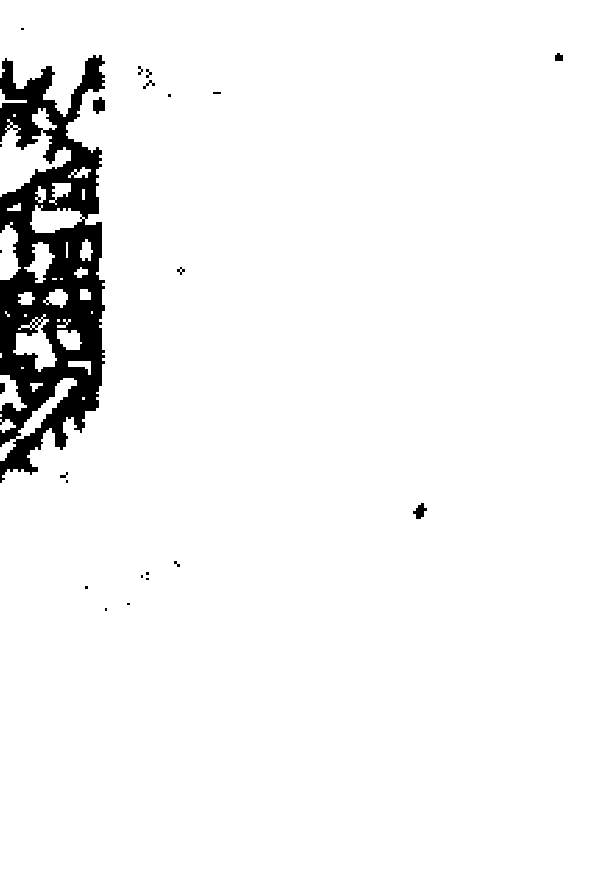

忌入辰卯位易患肝膽之疾，此外四肢筋骨較弱，年齡稍長須注意患五十肩的毛病，天貴星位坐命左手有斷掌或接掌之象。

#### 【遷移宮】

人緣好，有自私及不服輸的個性，旺地宜奔走他鄉謀發展，陷地則依賴性較重，愛玩又稱為享樂桃花，男命很重異性緣。

#### 【僕役宮】

所交往的都是老闆或主管階級的，屬於層次較高的，也就是善於攀龍附鳳拉關係，而且「拍馬有個架，先笑後說話」，很懂得察言觀色，所謂「說話看勢頭，辦事看風頭」。一旦飛上枝頭做鳳凰可就會扯著老虎的尾巴——抖威風，藉以滿足其「高人一等」的優越心。

#### 【官祿宮】

事業不穩，因為做事虎頭蛇尾，容易不滿現狀、見風轉舵，常常換工作。適合當幕僚、秘書或外務技術類工作，旺地較辛苦需在太陽下奔波，陰地較輕鬆，屬於投機性或傳銷的工作。

#### 【田宅宮】

住宅所會漏水，附近有違建、水道、河道、菜市場、屠宰場以及夜市等宮局，購買住宅以二手屋為宜。

#### 【福德宮】

在享受物質享受，很有口福，享華衣美食且隨遇而安，因內心空虛為了引人注意，常會有驚人之舉動。

#### 【父母宮】

通常主孤而無力，想管也管不了，不逢左右則父母感情不睦，與坐命者的緣份亦淡薄。

### 天機星格局要點整理

- ※機月同梁在天王星、冥王星，一生與官位有緣
天機在冥王星或天王星，一定與太陰同宮，三合必見天同天梁二星於財官二地來合，而且紫貪在木星與金星同宮的架構，算是「機月同梁格」的一種，這種格局的人多屬於公務員或上班族。此命前後有紫府相夾，疾厄宮又得府相朝拱，如果沒有煞星，就算是「探花格」，在古代是六品官居第三位，相當於現代公民營大機構的局處長職位。而疾厄宮借紫貪又得府相朝，所以多職掌於大型機構之部門主管，吉星多則富貴，無吉加煞恐怕連九品芝麻官也撈不著了，只不過是個平凡人，而逢天馬或對照則多為外勤工作性質。
此命格之人機智靈敏，中年後得意，女命雖多吉星會合亦美中不足，因天機星好動忽視親情，而太陰又孝順顧家，產生互為牽制又掙扎的現象，外界誘惑多，又想往外跑又擔心家裡；男命主外，家中有賢內助，女命在冥王星較好，在天王星則嫁夫無靠，生子無效，尤以身宮落在夫妻宮或福德宮者更為明顯。

- ※機巨在金星化吉者，縱使有財官也享受不到榮華富貴
金星是木死水敗之地，也是桃花地，所以巨門天機同宮於此，即使有科祿榴等吉星也是枉然，運限佳時或許會有一時的榮華富貴，但最後還是會破敗，大限同論。而我國東南沿海與台灣生人，不作凶論，加吉亦富貴，因出生地的關係，以癸年生人巨門化權上格，辛年生人雙祿入命亦富，甲庚年生人擎羊入或沖命為破格。

- ※巨門天機在木星先退祖而後興
機巨在木星算是廟樂之鄉，天機乙木得祿（乙為天機化祿）又入於陰木卯宮且有巨門的水相生，若有祿存之土來培木，文曲水再相生乃極品之貴格即「巨機同臨格」，但此格的人多不依祖業，早年辛勞奔波多起伏，中年之後勃然而興，皆因天機主奔馳，但巨門主破蕩的緣故，見煞

## 天機星：格局要點整理

- ※機梁守命加吉曜富貴慈祥
即破格且一生中多有競爭，並有刑剋，以乙年生人雙祿入命為上格。癸年生人巨門化權最吉且有天魁貴人同度亦佳。壬年生人天魁入命，祿存落財宮與福德之天梁化祿交馳主大富。丙年生人財富天同化祿，天貴星坐祿，也是雙祿交馳之財，並有天魁，天鉞於海王星、金星二宮來合命，且天機化權入命亦是名利兼收之人。金星坐命必先退祖而後興，理應讓人當養子，自力更生，逢火鈴則浮華不實且一生多是非，縱有富貴亦不耐久。

天梁又名蔭星與天機之善宿必同度於土星或天罡星，坐命者為人心地受此二宿影響必然慈祥且樂善好施，加吉星更有富貴，不在話下，然亦有二星分處旺地命身各一，若加吉星亦同前論，例如天機居午、天梁（同梁）在寅坐命身者即是，機梁守命無論入何宮或同宮或為命身各一者，逢四化必嗜賭且男女同論，丑未宮機梁對照坐命身者為人多疑慮計較，患得患失，小氣巴拉難以相處，內心孤獨，變幻莫測。

- ※天機加惡煞同宮則勞碌
此指天機在天貴星或天后星立命者而言，其為人狡猾好利，所謂「錢如磨盤大，心如磨眼小」。如再加惡煞來相沖，主為人有二隻手之習性，或天機加煞於天貴星，而身宮又入陷地，正星又逢煞沖破者亦同此論，女命則隨客飄蕩他鄉。

- ※天機天梁守命逢空亡，將遁入空門
命坐土星、天罡星借機梁者，無煞有吉亦是富貴，但此時命宮若逢截空、地空則善蔭之宿借來卻逢空即主孤獨，僅宜出家做和尚、尼姑，不食人間煙火或老來修道，若不逢截空旬空而有地劫地空來守命，多半晚年精神寂寞之命。

- ※天機、天梁與擎羊會、早有刑而晚生孤
天梁在土星、天罡星坐命而有擎羊同宮沖破，這樣的人早年父母不全，中年晚婚或早婚而離別，晚年子女不在身邊奉老或無子嗣，例如：

## 天机星：格局要点整理

土星立命逢乙年生人，天罡星守命辛年生人皆得擎羊同宫入命者属之，若土星坐命逢辛年生人，天罡星立命乙年生人皆有擎羊单守于对宫来冲命也多风波，刑克极重，伤及六亲，但较前者擎羊入命者为轻，后者为生不逢时，多是外力介入而衍生的颠沛，好比退伍前几天发生战争争，真哀！

- ※机梁在天机星、海王星陀地易俪腥
天贵星、海王星加煞化忌，男命易有波折，博而不精，变化较多，女命易受感情困扰深缠不放，天机为奔驰与变迁的星宿，天梁在海王星落陷亦主飘荡风流，有蜻蜓点水的不良嗜好，此二星若陷落于身命，地女命逢之必有私奔偷情之事，一生多夫欠贞节观念，所谓「顛狂柳架随风舞，轻薄桃花逐水流」是也！

- ※天机廉存会，事技扬名
机巨在木星、金星坐命逢乙辛年生人，或天机在水、火星巳癸年生人，皆得祿存入命，主有特殊專業技術，為頂尖拔萃人物，也是發明人才，此命智慧高，若從事電腦軟體技術，亦是『級棒的好手。』

- ※天機在天后、天父星逢擎羊、六親刑剋
天機在天后，天父星為陷地，坐命不利六親，宜離祖過房，為人心胸窄小多計較，機梁同宮或單守皆不宜加擎羊。此種組合入何宮則主何宮本身有刑剋，如坐命為早刑晚孤，入父母位主早年喪父或母。入夫妻位主陰陽本身具刑剋而非坐命者之故。主娶壽元較短之配偶而喪偶，再娶或生離。入子女位主先損後招且養兒難奉老。所入之六親宮位皆使該宮不得完整而有所遺憾。

- ※天機帶殺於權謀機變
天機為權謀策士，為算計之星，善於『權謀機變』的參謀之星，故不宜創業當老闆。以副座掌權或專業技能為上局，不宜創業當老闆。

- ※天機之星，亦正亦邪

## 天機星：格局要點整理

天機星的格局吉凶，在於其所會合星宿的好壞而定，旺地加吉星其機謀用之正途，陷地遭煞沖為邪氣上身，為人偷、搶、拐、詐難免。

- ※天機坐命，好動成性
天機本為動星，其人必好學、好動，個性好高騖遠，吃碗內看碗內，慾望永難滿足。

- ※天機樂於玩弄感情
天機因其星性過於浮動，不夠穩重，除非有厚重之星相扶持，一般皆主用情不專，喜玩弄感情。

- ※天機重名利、重自我
天機星坐命的人強調自我，一生追逐名聲、利益與地位，欠缺家庭觀念，不屑親情的溫馨。

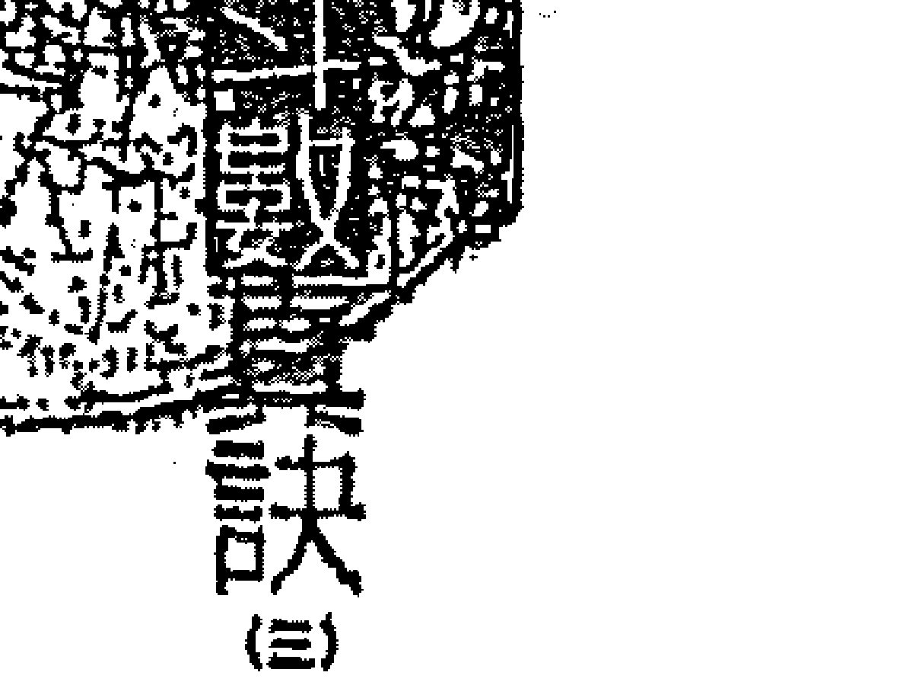

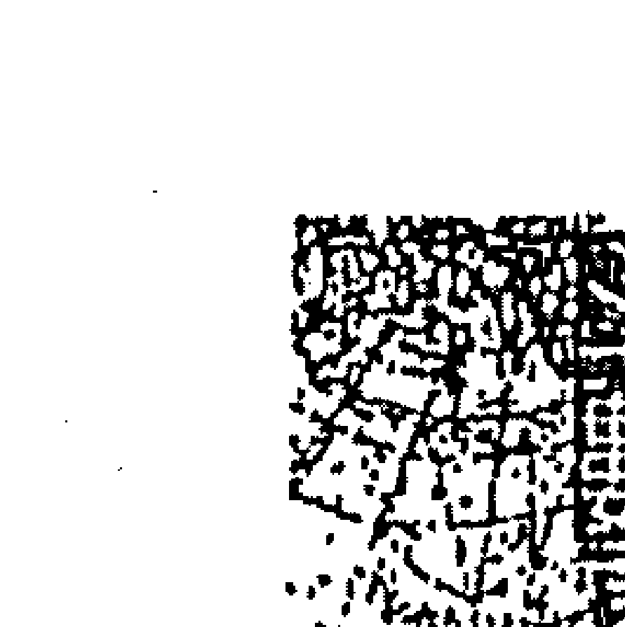

## 太阳星格局导言

> > 燃烧自己照亮别人，无怨无悔

太阳星在浩瀚的星河裡，散發著光與熱照亮整個宇宙，燃燒自己照亮別人無怨無悔，犧牲自己造福大眾的大愛精神令人欽佩，若將其星性印證於人的星盤，也是相當管用而且準確的。日月屬中天的主星，星座中甲級星分南斗、北斗兩個班底，除了此兩者外，還有個中天的主星，就是日月，日月不受五行生剋的影響，日月是以丑未為界，從寅位開始在東方這一邊，是太陽的管區，此區太陽旺地；在未宮以後是屬太陰的管區，太陽是弱地。太陽從寅宮到未宮，是旺地，要此坐命的女生嫁老公，真是不容易；太陽在落陷的戌、亥、子位，它的星性已經很微弱，結婚當然可以，只是結果依然不美滿。所以像亥位、子位的太陽，若它的二方四正裡沒有好的星座來挺它，恐怕此生婚姻還是不能維持有多好。好。

### # 星性如陽光般熱烈，男命事業心必強

當見到太陽坐命的人，先看是女的還是男的，是男的話，第一，此星性愈旺磁場愈強，愈和他的父親不和，因為他佔了父親的星座。另一方面來說，太陽為官祿之，在他的觀念裏，他會把他的事業（官祿宮）擺在第一位，雖然所謂的孝順顧家，有這個心未必有這個效果出來，因為他和父親一定是格格不入，孝心有，可是沒有辦法說和他父親的磁場相融，一般人較通俗的說法是代溝很深。此時母親會是父子很好的溝通橋樑，男人的太陽會把感情丟一邊，不太重視，反而把事業擺第一位，家庭擺到第二位去了。

### ## 女命護家，赴湯蹈火在所不惜

太陽雖然孝順顧家，但旁邊要註明一是有幾個家就顧幾個家，女人就不同了，只要是在旺地太陽坐命的女生，婚姻就沒什麼好談，所以女命太陽，婚姻線絕對是坎坷，但是孝順顧家心態是非常強烈，愈旺愈強

### 心胸光明磊落，女命与丈夫的缘份薄

太阳位在中天，是颗光明的星座，旺地做人处事都相当光明磊落，而且因为太阳主官贵，因此无论男女命事业心都很强，如果旺地必然劳碌无歇。太阳也是颗父星、夫星，所以坐命者无论男女命与父亲的相处皆格格不入，而且女命与丈夫的缘份很薄，除非有禄存解厄或逢空或借太阳坐命，才能免除他与父亲、丈夫之间的磁场相斥与隔阂，至于太阳坐命者的长相与吉凶必须参考以下因素：

- I、生月命——春夏生人脸型较圆，且较秋冬生人吉。
- II、生时——白天出生较好，夜晚生的人即使星入旺宫，还是扣分。
- III、旺弱——太阳星坐命入天王星、天父星皆旺，看起圆脸大眼、入冥王星、天同星則下巴稍尖眼睛細長；天王星、木星、土星身材較高；天貴星、火星過旺主勞碌命，反而不吉。

旺地男命男大男人主義，女命則是個男人婆。
壬星、木星、土星易長青春痘，變成『豆花』的機率高，
太陽坐命者是本家中的貴人，孝順又顧家，打拚事業都是為了家庭，
爲人公正又有愛心，喜歡參與政治與社會福利相關的事，典型是個『燃燒自己，照亮別人』的奉獻者，不但為家庭也為社會，『根蠟燭兩頭燒』相當勞碌，而兄弟宮有武曲星則過於剛毅，兄弟的個性較烈，如果有文星中和才能相處融洽。

福德宮入天機爲人多慮、操煩
太陽坐命的夫妻宮必有天同坐守，當他的配偶真可媲美『郎來享福，天塌了也有人頂著，所以配偶一定輕鬆、懶散。疾厄宮有廉貞坐守因而有心臟病的比例頗高，視力不良或患眼疾的機率也很大，如果太陽

## 第④章 格局篇

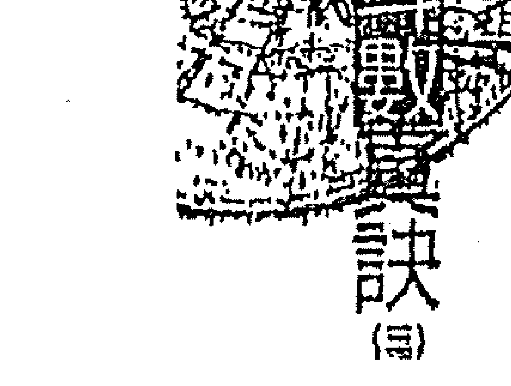

坐於旺地則中年後血壓容易高。至於田宅必有紫微坐守，所以住所宜高且富足；福德宮入天機為人多慮、操煩、心情較無法清閒或放鬆，其它的還需要考慮其命坐何位，各宮星宿組合如何而定。

### # 1、太阳星：太阳在水星、火星单守

#### ## 太阳在水星坐命

因星宿落陷，身材矮胖，多為小眼睛，而且以單眼皮居多，逢煞多有眼疾，但心地善良，能為家勞心勞力，操勞一生而無怨無悔。

男命：號稱「十項全能」，相當出錢頭，但因為賭性堅強，所以要小心淪為賭徒，或是涉入黑幫「特種行業」為伍。

女命：為家、為子女付出一切，一晃眼就這麼過了一生，但老來卻容易孤單，而且會為疾病所困。

#### ## 太阳在火星坐命：

美其名是「日麗中天格」，但需會祿或權才能夠貴顯，否則太陽底下的錢本來就沒那麼好賺，一定會讓人汗流浹背，要是逢太陽化祿則更增其辛勞，必須要當心腦溢血。太陽這顆官貴星如果化權主武職榮顯，個

### ★太陽星★

| 天同 酉 金星 | 太阳 午 火星 | 武曲 破军 亥 海王星 |
|--------------------|--------------------|------------------------------|
| 天机 巳 天贵星 | 天梁 未 天父星 | 天机 申 冥王星 |
| 贪狼 紫微 卯 木星 |  | 天同 戌 天王星 |
| 太阴 天机 寅 天王星 | 天府 丑 天后星 | 太阳 子 水星 |

### 太陽星：太陽在水星、火星單守

性率直，心地善良，而且熱心於社會工作，熱情博愛普照大地，適合當教師、醫師、律師、傳播業與服務業。

男命：外表英俊挺拔，走起路來虎虎生風，是個標準的大男人主義者，行事獨斷，一生為事業奔忙。

女命：外表端莊、注重流行品味，個性爽直、保守、愛面子不服輸又悶不住，但女命早年不利其父，中年婚姻易出狀況。相當有異性緣，所以易遭同性嫉妒，而受到對面影響，常會一副老大姐的姿態。

#### 【兄弟宮】

與手足情淡、無緣，多是各自為政，獨來獨往。而女命與婆家相處容易有芥蒂，不宜久處或同在一個屋簷下生活。

#### 【夫妻宮】

不逢煞忌拱照則相處得不錯，感情雖好但配偶較懶散，男命無妨，但女命可就累了，所谓「嫁漢、嫁漢、穿衣吃飯」，老公懶散久了，老婆一定心生怨尤，而且夫妻之間聚少離多難免，丙丁辛年生人、四化入夫官線，配偶又是個醋桶，這下可就更有得鬧了。

#### 【子女宮】

借梁貪又得府相朝，子息不旺，但子女得此父母庇蔭必然好命，坐命者較重男輕女，子女中必有一位至二位不在身邊，戊年生人有收養義子女之兆。

#### 【財帛宮】

旺地善理財，收支較穩定，喜多角化的投資。陷地財務流動率較大，喜歡賭財短期投機性之財。

#### 【疾厄宮】

因為生活作息不正常或體力透支，生活繁忙而常有病痛，心臟較弱。

### 太阳星：太阳在水星、火星单守

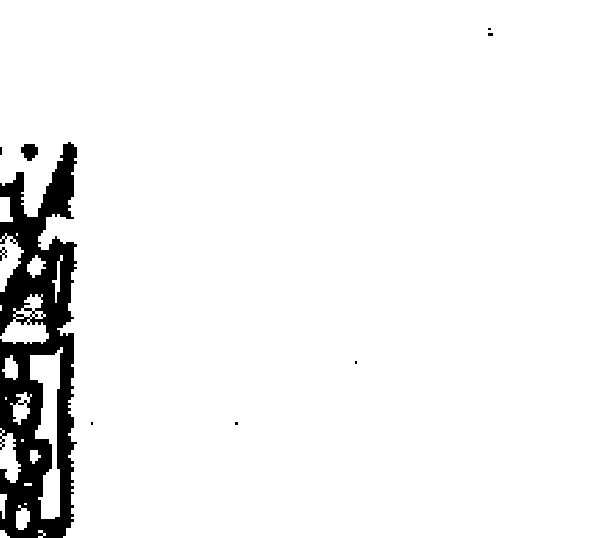

火星坐命的人血压高，而且火气大容易患痔疮，水星位坐命则血压必偏低。

- 【健康】阴星坐守主在外老人缘极佳，发挥爱心，有老吾老以及人之老的胸，以及从事义工服务人群之热诚，退休后投入社工服务的比例高。
- 【朋友】往来多为同年龄层的朋友，而且气味相投，尤其在中年之后会得到朋友的帮助，但如果身为老板或主管，则常受属下的气。
- 【事业】宜从事不动产事业、企业、政经界、贸易与口舌竞争行业，会魁铁道合公职，陷地则为日夜颠倒的行业，在水星者可做照相制版或暗房X光业，或灯光下之工作。

#### 【田宅宮】

紫微坐守，因此節儉異常，財庫很旺，住所附近有高樓或土坡及富裕的鄰居，靠近公園或娛樂場所、派出所、廟宇等地。

#### 【福德宮】

勞碌命、責任心重，為家庭事業操煩，頗有先天下之憂而憂的心境，憂患意識很重，得紫府夾福德、財源頗旺，出身於富裕的家庭，與祖父母緣厚得其寵愛。

#### 【父母宮】

天府坐守得日月夾，父母出身不錯，成就也不小。但對己卻無助力，且父母較囉叨，若身宮為天機，宜過房為佳。

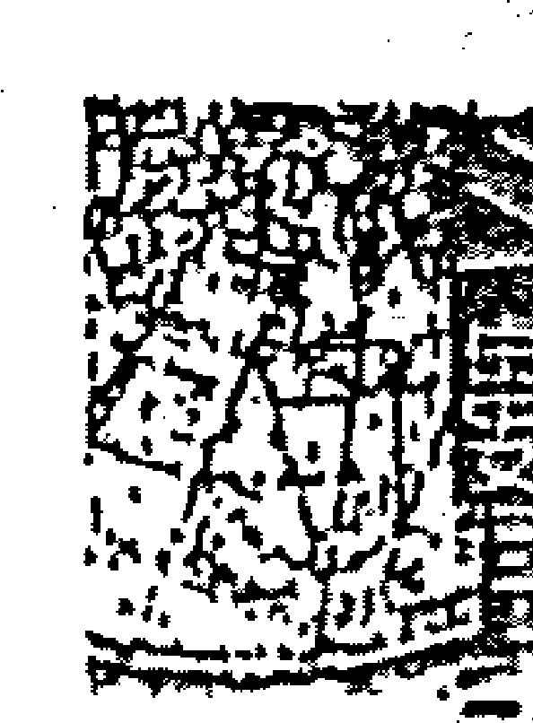

## 太陽星：日月在天父星、天后星同宮

### II、太陽星：日月在天父星、天后星同宮

### 【陰、陽，行事反覆不定】

日月同年命身本為偽格，日月同守本應相輔相成，但太陽的熱心與太陰的自私反而互相拖累牽制，行事反覆不定，心情忽冷忽熱情緒難以捉摸。女命尤其如此，用晴時多雲偶陣雨來形容也不為過。太陽、太陰同宮坐命、命身各一或命遷各一（例如土星、天罡星日月對照者）也是一樣，因為星宿陰陽差別明顯，互有牽制消長，造成他的外型與個性不對稱，如坐命者眼睛一大一小，眼皮一單一雙，或眉毛一高一低的情況，個性也跟著一陰一陽拿不定主意，若會昌曲則打從出生就能享受榮華。

### 偏格除外佳，內則衰又累

日月在丑宮，一個旺，一個落陷，此命格稱做「衰」，男女同論，有這種命格，我都送他一個字——累（例如坐命日、月居丑宮，太陰廟旺，太陽落陷，一個母親、一個父親皆中雙，以後要叫這樣的一個兒子

### ☆太阳星☆

| 天梁 天贵星 巳 日 | 七杀 火星 午 | 廉贞 冥王星 申 |  |
|----------------------------|--------------------|----------------------|---|
| 紫微 天相 土星 辰 |  |  | 破军 天王星 戌 |
| 天机 巨门 木星 卯 |  |  |  |
| 贪狼 天王星 寅 | 太阳 太阴 天后星 丑 | 武曲 天府 水星 子 | 天同 海王星 亥 |

孝順，別傻了，此宮位且不能化忌、不能加煞，加煞刑剋皆中，父母親有一人要買單，如果沒有則換自己要出頭。如果在未宮，太陽比較旺，太陰落陷，如果女命太陽在此，則十足的太陽坐命，只是個性上有很大的差別，照理說女命太陽旺地，此人像男人有豪爽、阿莎力的個性，講難聽一點，除了身體是女生外，其餘皆像男生；但太陽旁邊又加一個太陰，那又不阿莎力了，日月同宮叫做龜毛，若和此人做生意會累死，一個人若是單一太陽星坐命，直來直往，很好說話，但若是日月同宮坐命的人，則是「龜毛」加「豬毛」，因為一明一暗，意思就是之前想的，現在馬上改，和此種人做生意，最好談好了，契約馬上簽，否則明天來了他又反悔。此日月同宮做命的人自己也歹命，此所說的偏格是因為表面上看起來很好看，其實他很累，男的、女的都很累，例如男的，太陽坐命，要不要專心在他的事業？但別忘了，他的命宮還有一個太陰，會不會刑剋他的婚姻？這是單獨一個星座沒有的情形，不管男的、女的，婚姻都不會好到哪裏去！

### # 紫微斗数刑克，己身婚姻不利

有人说用借的比较没有刑克，因为正坐的和长辺、婚姻会有刑克，用借的就没有刑克，孝顺顾家依然存在，看从哪个地方借，例如命宫在未，丑月在对宫丑位用借的，借过来，若是女生，一样代誌大条，太阳落陷，借过来是庙旺，就算没有刑克（没有刑克是父母），借过来是太阳庙旺，要嫁人也难，一辈子就去一半了；又借是日、月一起借，和父亲就不合了，再借一太阴，和母亲也不合，但借没有刑克，要承担的反

### # 日月对照而不宜坐命

生命者的身材，个性必须看他的性别与日月旺弱而定，例如：命在天同巨门日弱月旺、太阴的性质较明显，较不利男命；而天父星日旺月弱，太阳的星性较突显，自然较不利于女命。无论男女命，孝顺顾家都是无庸置疑，但老天爷作弄人，偏偏他的磁场除了不利父亲与丈夫之外，也不利母亲，所以日月喜对照而不宜坐命，若天父、天后星借日月而坐命者反较好，因为除了孝顺顾家日月之性依旧之外，也免除其不利父、夫、母之情况而且迁移得日月照命，前途更是一片光明。

男命：是个闷葫芦，耐心十足、恒心却不够，喜欢投机短利。个性外向好动，但处处只为自己着想，比较自私。

女命：看似温柔却很善变，但家庭观念重，与娘家关系很亲，个性好管闲事爱插嘴，命在天后星的人温柔、在天父星则比较倔强。

#### 【兄弟宫】

星座强势、磁场过旺，兄弟间虽然相处的不错，但双方吵起架来，兄弟比自己还凶，如果有昌曲入宫则相处关系较好。

#### 【夫妻宫】

感情线不稳定，配偶年龄不是与坐命者非常接近，就是差距甚多，而且配偶的出生地与自己相距较远，天父星不宜女命，感情容易反覆无常，而且容易出轨。丑宫男命婚姻难持久，配偶易变心。

#### 【子女宫】

子息不旺、先损后招，子女破坏力强、好动不易管教，利女较不利于子，与儿子缘分较淡，女儿反而较贴心，女命在天后星立命头胎生女，在天父星立命主头胎生男。

#### 【财帛宫】

喜欢赚投机财、赌技精湛，但是最好不要贪小便宜，以免落得“吃饭没锅，睡觉没窝”，乙、丙、壬年生人赌性坚强。

#### 【疾厄宫】

易得心脏疾病，肝火大、皮肤容易过敏，如果廉贞加白虎或对照则可能会得癌症，两眼因日月旺弱而视差大。天父星坐命血压易高、天后星坐命易患痔疮便血等症，丙癸年生人体质较差，毛病尤其多。

#### 【迁移宫】

个性外向，耐力十足，本身又勤快、刻苦耐劳，适合离开出生地往外地发展。

#### 【仆役宫】

所交的朋友多为烈性子之人，常有意见争执，朋友愈多、麻烦愈多，而且朋友中夹杂黑道人物，属下多不得力，生意规模不宜做太大，交友宜重质不重量。

#### 【官禄宫】

适合日夜班轮值或流动服务性的行业，像是旅游、外务、国贸、建筑等行业，而且工作时间多不按朝九晚五的规律，或常加班及兼差“日也拼、眠（夜）也拼”。

#### 【田宅宫】

住所宜高，附近有水道、水坑、小吃店、高楼等景物，居家环境幽静。

#### 【福德宫】

好奇又疑心病重、具投机心态，一张嘴好静嘴硬，又爱打小报告。最常说的口头禅就是：“我跟你讲，你不要再跟别人讲。”

#### 【父母宫】

身体有增加之兆，所以出生后最好先过房给人当养子，或重拜义父母，与父母无缘，双亲之间感情复杂。

### 太阳星：巨日在天王星、冥王星同宫

星性忠于原味，直肠铁齿。

在寅申位，太阳是和巨门同宫，此巨门星主暗最喜太阳，因为太阳的光可以驱暗，变成把巨门的缺点降低很多，但形式上巨门的特性都还在，也就是说此两星座同宫，大部份都是大嗓门，铁齿，太阳巨门的优点就是它忠于原味，因此此人当部属，他不会私底下乱来，因为太阳“直”加上巨门的“忠”。为什么巨门的人会较“死忠”？因为巨门的人没有人际关系，这是它最大的致命伤，无路可闪。所以太阳巨门在寅位，太阳的光驱逐巨门的暗；太阳巨门在申位就差一大截了，太阳的光较弱，已近黄昏，反而是巨门的特性较强，因为金生水，巨门是旺地，所以太阳巨门在寅申位，在寅位的人个性较积极；在申位的人因为太阳已近黄昏，所以做事较有头无尾，比较没有坚持，这是两个位置不同的地方。

巨日坐命的人身材高大，说话声音宏亮，男命喉音重、块头粗，巨门化忌则说话音量较小。孝顺顾家，疑心重，说话不得体，常常得罪人，

### ☆太阳星☆

|        | 午        | 未      | 申      |
| :----- | :-------- | :------ | :------ |
| 巳     | 七杀 紫微 | 天贵星  | 火星    |
| 辰     | 天梁 天机 | 土星    | 天父星  |
| 卯     | 天相      | 木星    | 金星    |
| 寅     | 巨门 太阳 | 天王星  | 天罡星  |
| 丑     | 武曲 贪狼 | 天后星  | 天府    |
| 子     | 太阴 天同 | 水星    | 海王星  |
| 亥     |           |         |         |

### 太阳星：巨日在天王星、冥王星同宫

位在天王星会比在冥王星位好。因巨门之暗得到太阳普照，所以巨门这颗灰暗星无法作怪，但坐命者却是“铁齿仙”一个。巨门本来就利男命而不利女命（因其夫妻宫必为太阴），再加上太阳又不利女命，所以女命得之并不好，三十岁之前就步入婚姻恐怕难以偕老，因为他的命宫、夫妻宫阴阳颠倒过于明显所致，而且女命有迷恋偶像的情形。

- 男命：忠厚老实又诚恳，做事有条理、度量宽宏，外表看来块头粗壮、声音宏亮，是个好老公的人选。
- 女命：注重外表穿著，对人热情好相处，个性豪爽倔强。身材标准、肤白俏丽、称得上是个美人胚子，但敢爱敢恨，对感情占有欲强，感情路上有些坎坷。

### 太阳在天王星坐命：

- 男命：在人群里总是沉默，个性内向保守，做事容易虎头蛇尾，往往只有三分钟热度。
- 女命：个性大而化之，十分男性化，随时保有一颗赤子之心，哪里热闹哪里去，对艺术有兴趣，如果会桃花星则适合往娱乐界发展。

#### 【兄弟宫】

虽是情重，但多是付出却没有回报，戊己年生人有同胞兄弟之兆，与婆居家相处则是以钱来论高低，有钱就有理，没钱算老几。

#### 【夫妻宫】

因命座天王星容易得贤慧之妻，助夫持家，但女命的婚姻路却比较坎坷，一旦不宜早婚。

#### 【子女宫】

子息星性过旺，长大虽可成器，但却各自单飞，很难指望他们尽孝道。

#### 【财帛宫】

喜赚投机性之财，宜保守理财，忌暴起暴落，须多请教专家了解理财的技巧。

#### 【疾厄宫】

容易有心气不足之疾，呼吸器官以及支气管过敏，视力不佳牙齿不好，或眼疾、血压高等病变。

#### 【迁移宫】

在外活跃，但是非挫折也不少，常吃力又不讨好，命迁人四马地爱往外跑。

#### 【仆役宫】

朋友不少但多是吃喝玩乐之辈，于坐命者无实际助益，属下而是心非，须防属下侵占公款。

#### 【乙酉年生】
以走企业界为佳，服务性或口舌竞争的行业，女命若逢桃花星则走演艺界敢步入风尘地。

#### 【丙戌年生】
主命格先苦后甘，主中年之后得以富足，住所有高楼、庙宇、公共场所或山岗寺塔，残旧之房屋等合局。

#### 【丁亥年生】
习惯投机心态，权谋机变，乙年生人赌性坚强难以自拔，老年生活精神孤独又孤单。

#### 【戊子年生】
事亲至孝，就算肝脑涂地也是无怨无尤，忌丙年生人、与双亲较无缘，但孝敬的心还是在。

## 四、太阳星：阳梁在木星、金星同宫

太阳的事业心和天梁的大公无私，会相冲突。
在卯酉位的阳梁，在卯位的太阳刚出来，所以叫日出雷门，它的强弱，先看几月的太阳，如果是冬天的太阳，因为刚升上来，只能感觉温暖；如果是夏天的太阳，肯定会很热情。
两星同宫，都保有各自的星性，太阳的事业心和天梁的大公无私，此两者合在一起，会有冲突。太阳是忙于事业，天梁是一个监察人，是一个幕后的军师，不适合走上台面，所以他最高只能副座掌权，也不宜当老板，但此种论调会和太阳有所违背，所以这种情况多半是比较顶尖的金融机构或者是慈善机构的路线，不会在正式的商场和人征战，譬如阳梁坐命的人，你要他做贸易，肯定会死得很难看，在旺地是如此，如果你把它借到对宫，太阳天梁或是太阳天梁在酉位，肯定是下山的太阳，但还不到落陷的阶段，所谓太阳的特性他都有，但是他的个性会倾向虎头蛇尾，头热热尾冷冷，做事情较不会坚持到底。在戊、亥、子三个位置，百分之百夜猫子，所做的行业是不得见光的。所以阳梁的组合，不论男命，女命，男命婚姻也没有好的，第一：夫妻宫是同巨，夫同与巨门同宫就是一个不利婚姻的组合，如果是女命，肯定这一辈子不用嫁了。

### ☆太阳星☆

| 宫位       | 主星         | 地支 | 对应行星 | 关系线指向      |
| :--------- | :----------- | :--- | :------- | :-------------- |
| 第一排     | 天机         | 巳   | 天贵星   | -> 丑 (天同巨门) |
|            | 紫微         | 午   | 火星     | -> 亥 (太阴)    |
|            |              | 未   | 天父星   | -> 卯 (天梁太阳) |
|            | 破军         | 申   | 冥王星   |                 |
| 第二排     | 七杀         | 辰   | 土星     |                 |
|            |              |      |          | -> 亥 (太阴)    |
|            |              |      |          | -> 卯 (天梁太阳) |
|            |              | 酉   | 金星     |                 |
|            | 天府 廉贞 | 戌   | 天罪星   | -> 卯 (天梁太阳) |
| 第三排     | 天相 武曲 | 寅   | 天王星   |                 |
|            | 天同 巨门 | 丑   | 天后星   |                 |
|            | 贪狼         | 子   | 水星     |                 |
|            | 太阴         | 亥   | 海王星   |                 |

### 日照雷门，以阳化阴

太阳在金星、木星与天梁同行，在木星属东方为震卦，震又称为雷，故称为“日照雷门”。此局以太阳的热情化解天梁之孤，同时太阳以天王星、木星为初升，辰巳为升殿，火星位庙地，金星则不可同论，因为金星为西没，太阳无力显现，故而主其人华而不实，后继乏力，对宫若是逢空为“万里无云格”，于是无云、无雨，心无挂碍，年老入空门去也。

### 外表洒脱，内藏暗性

太阳天梁守命不爱干净，衣着不挑剔，就算穿到破烂也能凑合着用，喜赌博或下棋、门智以及动脑带赌性的东西，说话速度慢，嗓门大，有宗教或五术之偏好，借阳梁坐命者易有酗酒现象，因疾厄宫为七杀。木星借阳梁者较金星为佳，阳梁坐命者身材为太阳星格局中最高者。因炉火旺于是脸上皮肤易呈“月亮表面”状，孝顺顾家，是个夜猫子，女命能干，男命则为事业拼命一生。

### 太阳在未星坐命：

- 男命：脸型圆中带扁像个“葱油饼”，邋遢不爱干净，相当有长辈缘，能得到长上的荫福跟上层的赏识。
- 女命：是个操劳持家的大姐头，处事应对手腕一流，待人亲切慈祥又乐观，家庭观念重，较顾娘家，度量宽宏，具有锲而不舍的精神。

### 太阳在丑星坐命：

- 男命：暗小鬼一个，做事有头没尾，即使有富贵也留不住，而且容易酒色误身。
- 女命：看起来老气横秋，性急、情绪化，动作大剌剌，活像个男人婆。可爱的一面令人惜，不过，其爱恨分明不顾后果的作风，却又让人疼不入心。

#### 【兄弟宫】

手足缘厚情深、相处融洽，感情良好能为他们分忧解劳，承担经济后援而无怨无悔，兄弟多于姊妹，而且下一个多为弟弟。

#### 【夫妻宫】

天同巨门组合本就不佳、且犯隔角，所以不利感情，意见常有不和而争吵，缘薄与配偶聚少离多，不论男女婚姻难得圆满，女命为姨太太命格，若有二婚、三婚也不足为奇，如再加左右同宫，恐怕得过五关斩六将，婚姻得历经二次才能稳定，或做第二任太太，要不然就认命当偏房好了。

#### 【子女宫】

生有不同血缘的子女，本宫坐贪狼又落于水星、火星，所以喜欢巫山云雨，男命是有求必应，女命则是个抽水马达，如果夫妻皆为这命，那真好比是“胭脂马抵着关老爷”，可谓：“谁怕谁？乌龟怕铁锤，蟑螂怕拖鞋”，癸年生人爱作怪，特别喜欢放路障或设机关，胆敢来犯者，一定让你来得去不得，女命头胎生男。

#### 【财帛宫】

是个理财高手，擅于以钱滚钱、理财概念一流，但大限不好时也很容易翻船落水，若不知节制，当心被钱玩完。

#### 【疾厄宫】

肠胃、视力不佳，皮肤不好，土星在廉贞逢化忌主肝硬化，木星立命则易有呼吸系统及气管敏感之疾。

#### 【迁移宫】

在外活跃，且深受年长者喜欢，旺地外出逢贵、陷地则不宜到外地发展，逢空亡星年老人空门。

#### 【仆役宫】

属下不得力，不宜与朋友做合伙事业，友人多无义，容易被朋友出卖，还很高兴的替他数钞票。

#### 【官禄宫】

宜取稳定性的行业或与日月相反之行业，适企业界、政教界、金融保险界，会鼓励宜公职。

#### 【田宅宫】

主有自己的房屋，且住所宜高、居家附近多有富裕之家，以及高楼或土坡。

#### 【父母宫】

长辈固执又霸道，且因命坐太阳与父无缘，易有代沟，童年有破相之兆。天机坐守好动，有事没事喜欢蹦跃，女命爱逛街“瞎拼”，男命喜“哈啦”，适合外地发展，为人多虑易患得患失。

## 五、太阳星：太阳在土星、天罡星单守

### 日月并明，移根换叶异域谋生

太阳在土星的位置，太阴必坐天罡，日月两星皆在旺地，即是正统的“日月并明格”。若是太阳落在天罡位太阴必回到土星位，这叫“日月反背格”。如果身宫是太阴，那就等于日月同宫差不多，很多特性会跟日月在丑未同宫坐命一样。日月辰戌位的格局叫“移根换叶异域谋生”，因此出国机会比别人强，大限走到亦同论，他不在四马之地，只是星座星性的互相牵引效应，因而星皆是旺地，即是所谓的阴阳平衡互动。理论上就是这样，并不见得一定非得移民不可，但难免会为了事业或家庭的因素而当个空中飞人。在辰戌位坐命的日月，移民出国是很正常的，也有人不是日月坐命，只是大限走到而已就包袱收一收就准备走人了，但必须其大限的四化有发动才算数，否则只有心动未必会有行动。

太阳与太阴相对若在土星日月皆旺地，主贵而称之为“日出浮山格”；在天罡星立命则日月皆落陷，土虚，华而不实，好看不好吃，称之为“日月反背”格。然不论男女立命于土星或天罡星，出国运都很强，若拥有一本以上的护照，也不足为奇，个性孝顺顾家，是个夜猫子。受到对宫太阴的影响，与日月在天后、天父星者一样很情绪化，这种格局同样利男命而不利女命。

### ☆太阳星☆

| 地支 | 主星       | 行星/辅星 |
| :--- | :--------- | :-------- |
| 子   | 巨门       | 水星      |
| 丑   | 天相       | 天后星    |
| 寅   | 天同、天梁 | 天王星    |
| 卯   | 武曲、七杀 | 木星      |
| 辰   |            | 土星      |
| 巳   | 太阳       | 天贵星    |
| 午   | 天机       | 火星      |
| 未   | 紫微、破军 | 天父星    |
| 申   | 天府       | 天王星    |
| 酉   | 太阴       | 金星      |
| 戌   |            | 天刑星    |
| 亥   | 贪狼、廉贞 | 海王星    |

### 太阳星：太阳在土星、天罡星单守

### 太阳在土星坐命：

- 男命：身材瘦高，个性沉稳内敛，勤劳又顾家，喜欢接触大自然，爱好运动和户外活动。
- 女命：标准小老婆命格，又要独自立业持家，属人际桃花善于应对手腕，能干好面子，虚荣心强，讲语速度快，像是机关枪。

### 太阳在天罡星坐命：

- 男命：个性直率，但内向不善表达，心地善良，但做事虎头蛇尾，生活作息日夜颠倒，夜猫子一个。
- 女命：劳碌一生，属于贤妻良母型的，虽然感情很专一，但常遇人不淑或扮演第三者者，婚姻多不如意。

#### 【天马星】

手足无情、各分东西、难以回护，若得昌曲等文星中和，于危难之时如还连理。

#### 【太阴星】

男命配偶与自己年龄相近，女命多嫁老夫且为二房、婚姻不佳、配偶多与自己之出生地相距较远，逢天马配偶则有可能为“舶来品”。

#### 【子女宫】

男女诚实、敦厚、爱漂亮，但个性内向，与子女相处得还不错，彼此没有代沟，女命头胎生男。

#### 【财帛宫】

水星、火星位巨门主财旺，多是做生意的、或属口舌竞争而来，最适合直销、中介。

#### 【疾厄宫】

主气血不顺，廉贞加白虎或对照，男须防肝癌，女须防子宫颈癌，加忌煞也是“样”，此命“中镖”机率颇高，所以交往对象最好单纯一点。视力不佳，肝火旺，易长青春痘以及有心脏血压方面的病症。

#### 【迁移宫】

耐力十足，有不服输的特性，非常有异性缘，加上命格出国运旺盛，中年后容易移根换叶移民他乡，在异乡适应力很强。

#### 【仆役宫】

交友的层次较高，其中不乏老板或主管级的人物，土星坐命者较能得到其帮助，本身亦受尊重，天马星立命则友人皆贵，对自己的助益却不大。

#### 【贪狼宫】
工作能力强多走企业界或贸易，医生、慈善事业、宗教团体等须爱心付出的行业，会昌、曲多往文化传播媒体业发展。

#### 【巨门宫】
库位逢紫破，宜及早在名下置产，住所易漏水、居家附近有高楼、水道、河道、运建、菜市场、夜市等合局。

#### 【天机宫】
职家为事业子女操烦，一生心境难得清闲，退休后献身社会公益或宗教团体机会高，若是失去事业或是人生舞台无法继续发光发热，其人生观会立即变黑白。

#### 【天相宫】
长辈婚姻难和谐，有一方蛮风流的，长辈亦有增加之兆，宜认一对义父母为佳，父亲无缘难以沟通。

## 六、太阳星：太阳在天机星、海王星对照

### 男命爱心普施大众，女命着重家庭

当太阳在天贵星位、海王星位必与巨门对照，此时是一个很单纯的星盘，只要以男女命去区分就应很好理解，但是直接的也会影响到对宫的巨门，所以为什么说巨门在亥位坐命，格局上来说它成格，因为它没有暗，是因为对宫的太阳来驱暗，所以当一个男人他是太阳坐命，他的心胸就在於社会广大的层面；他的爱心是普施大众，太阳的人为什么对政治比较热情，比较热心，会去参与，是因为太阳的热心、热情，所以对大众的事情比较有兴趣。如果说是太阳的女命，那抱歉了，她对政治没有兴趣了，她只对她的家庭比较有兴趣，这是男女有很大的差别，当然也有少许是例外。

### 双曜交融，易与巨门相勾

所以太阳在巳亥位，在巳位和在亥位也是一百八十度的不同，在巳位要以太阳旺地的特性来分析他，他一定会把他的心力全部付出在事业上或者是在整个社会。在亥位的太阳是落陷，对宫是巨门，巨门也是落陷，巳位属火，巨门属水，绝对落陷，此形成“双暗交驰”，所以在亥位的太阳统称没什么不良嗜好，只有十项全能而已，绝大部份的人会因为酒色而误身，这种命格的人，很容易扯入别人的是非圈。亥位的太阳，除了本身主暗之外，其仆役宫也是很美妙的组合，所以是非会很多。在子位、戌位、亥位三位都有此共同特征：和黑道有所牵扯、挂勾，自然就会去沾上麻烦。

### ★太阳星★

| 太阳 天贵星 | 破军 火星 | 天机 天爻星 | 紫府 冥王星 |
| :------------- | :----------- | :------------- | :------------- |
| 武曲 土星   |              |                | 太阴 金星   |
| 天同 木星   |              |                | 贪狼 天罡星 |
| 七杀 天王星 | 天梁 天后星 | 廉贞天相 水星 | 巨门 海王星 |

### 热心公益，著重社会地位

太阳星是官禄主，著重他的事业层次和规模，所以它的本质并不主财。太阳的财富并不在他的财富来代表，而是在他整个社会地位的层次作为代表，所以才把它归类在“三心二义”（爱心、热心、耐心、坚毅、公益）人士，什么社团、狮子会、扶轮社，太阳星的人去参加最适合。

太阳入于天贵星与海王星必与巨门对照，一生口福好，太阳在天贵星庙地加吉星主显贵，口才不错，为人心地光明磊落，但阳刚气过旺反而是缺点，男命磁场多不利其父，女命也是一样，且因夫星天同太柔弱亦不利其夫，父母宫坐破军、兄弟位坐武曲多是孤耗之星，通常家中男性运程会有不利之影响，逢煞不利六亲，眼目也有所伤，逢贵虽不致显贵却可为公卿门下士，利于事业，会天马则有出国或居留国外之象。
男命富心机，表里不一，喜搞政治活动或有政治狂热，太阳在海王星则已入陷乡，与对宫之巨门互相比暗，主其与人寡合，易招是非，慎防官讼纠缠不清，命在海王星较利女而不利男，但是无论男女命皆孝顺顾家。

### 太阳在天贵星坐命：

男命：为人处事光明磊落，可以权贵获得财富，口才反应良好，相当热心公益。

女命：外表清秀，虽然穿着开放，但个性保守，不适合婚姻的约束。

### 太阳在海王星坐命：

男命：外表俊俏，但容易因酒、色、赌而误身，行事进退不定、犹豫不决，不能当机立断，容易卷入是非圈，官司难免。尤其难与同性相处，一生劳碌。命在天贵星感情会比较平稳，不随便。

女命：皮肤黑、疑心病过重，嫉妒心强又心胸狭窄，到处与人合不来，得府相朝，无煞忌冲照则彼此间的感情尚可，如果有利益上的牵扯会很容易反目成仇。

#### 【男命】

宫内星宿过于柔弱，配偶依赖心重、且较懒散，宜男命而不利女命。

#### 【女命】

子女好动，个性刚强不易管教，且不得力，女命头胎生男、逢煞则须注意生育有缺陷的子女。

#### 【财帛宫】

属于经手周转性较强之财，逢破则为过路财，太阳亥位单守多属是非投机之财。

#### 【疾厄宫】

主心脏血压、视力不良、膀胱无力症以及「加夜班」所引起的肾虚及相关部位诸疾，所以「房事」应「浅尝即止」，否则容易人未老即「丹田无气」。

#### 【迁移宫】

是非之星入迁移位容易到处得罪人，天贵星坐命迁移之巨暗得旺地太阳普照，为患尚浅，但海王星坐命则太阳已无余光可照较为不利，人际

#### 【仆役宫】

朋友多、份子杂、各路人马都有，多属吃喝嫖赌等十项全能之损友，并且对自己助益不大、难得知心朋友。

#### 【官禄宫】

属于轻工业、娱乐、装潢、建筑等行业或介绍业，也很适中盘经销商。

#### 【田宅宫】

买又高又大坪数之居所、田产旺足、较早取得房产、住宅附近多富庶人家、高楼、银行以及公家机构。

#### 【福德宫】

# 訣 (E)

主劳碌奔波以及为人多计较、赌性及投机性坚强。

#### 【父母宫】

相处情形还不错，但与父较薄缘，且童年有破相之兆。

## 第③章 格局篇

### 太阳星格局搭配管理

※太阳之星、社会之星

太阳星为官禄之主，但本质并不主财，属于贵而不富，追求社会名声、地位，而且乐善好施，是个有爱心、热心、耐心，又兼具坚毅、公义的“三心二义”人士，活跃于社会工作者，并能以事业规模、社会地位而带动财富。

※太阳守命、婚姻高手

男人若要追求太阳星坐命的女子，必须先了解其孝顺顾家的特性，针对她周遭的血缘亲情下功夫，这样才能借力使力博得佳人青睐，所谓知己知彼、百战百胜，但如果要娶太阳星的女子，则需要有扶养一个家庭的能力与度量，要嫁给太阳星坐命的男人，同样要先博得公婆的欢心，才可能拴得住老公的心。

### 太阳星格局要点整理

#### ※太阳守命、爱心无限

阳光普照大地万物，而万物却无一回报之，然而太阳仍旧能为大爱持之以恒，所以坐命者受星性影响，同样是抱着付出不望回报的爱心与宽宏大量，从他的言行之中就可以一览无遗。

#### ※女命太阳、人际桃花

女命太阳，必有男子之气概，大而化之的个性，与男人相处毫无芥蒂，心态坦然，容易与男人打成一片，有一堆哥儿们。作风豪爽，不拘小节，最适合以异性为目标的公关或经理人选。

#### ※女命太阳、家中贵人

女命太阳本是孝顺顾家，星座愈旺愈明显，心中永远以本家为重，任劳任怨、无怨无悔，为了家任何牺牲在所不惜，家中若有一女太阳则远胜三子。

## Infectious Disease: **Answers**

1.  **B)** The patient in the vignette has bacterial meningitis. She has a fever, neck stiffness, and an inflammatory CSF showing elevated WBCs, which are predominantly neutrophilic. CSF is usually significant for an elevated WBC (1000–10,000), elevated protein, and low glucose. The most likely organism is based on the age group.

Neonates: Group B streptococcus, *E. coli*, *Listeria monocytogenes*.

Children, adults <50 years: *Streptococcus pneumoniae*, *Neisseria meningitidis*, *Haemophilus influenza*. Adults >50 years: *Streptococcus pneumoniae*, *Listeria monocytogenes*, Gram-negative bacilli. *Listeria* should be considered in this patient and empirically covered for; however, *S. pneumoniae* is still the most common cause of community-acquired meningitis in this age group.

#### ※日月同在天父星而安命在天后星 - 侯伯之才

日月同宫喜照不宜守命，若天父、天后星借日月立命者，得日月照命吉扶亦贵，古代以公为最、侯伯次之，在现代则官居厅局长的类级，此局并以天父星立命借日月者较丑宫为最，因三合巨机在卯为入庙，如反之则巨机在陷星之地为美中不足。

#### ※日月身命居天父、天后星，三方无吉反为凶

日月守命在天父、天后星正坐日月二宿者，因夺父母夫妻之宿于本身，必须吉星禄马来扶方吉，若无吉星，虽不逢煞亦不利，必与父母及老公较无缘，日月守命者善于欺瞒，个性亦阴晴难定。

#### ※日照在木星、土星与天宝星，虽生富贵名扬

若太阳在木星必有天梁同度，白天生人大吉，更喜有禄马来会：以壬年生人化禄并天魁入命、禄存与旺地太阴在海王星夹合者为上格。

#### ★壬年生人禄存并化权入命，财逢太阴化忌旺地无妨，且福德有禄对照。

+   - 羊年生人化权入命，禄存对宫来合，官禄借巨巨化禄随之为用亦吉。

+   - 最忌庚年生人，虽有化禄入命，却因擎羊在金星对冲多凶险而不利。

+   - 太阴在壬星太阴为对照，亦属巨巨生人及禄马来会

+   - 癸年生人得魁钺夹命，财宫禄存并巨门化权与迁移化科拱照为上格。

+   - 丁年生人对宫太阴化禄，禄存入福德亦吉。

+   - 乙年生人擎羊入命对宫逢太阴化忌较不利。

+   - 天机星旺地太阳星守命与巨门对照，以巨巨生人会吉为佳局

+   - 以辛年生人，化权入命并得双禄朝垣为上格。

+   - 壬年生人天钺入命双禄来合亦吉，惟须注意过于热心为友付出过重而吃力不讨好。

+   - 庚年生人太阳化禄入命并得申位暗禄来合亦吉，但官禄宫太阴与擎羊同度宜军职，若经商则事业多成败风波。

+   - 四正入父星，金星、其土星在命垣，为人先勤后惰

### 太阳星格局要点整理

太阳在天父星则必有太阴同度，必先考其人之形态若有太阳之象，当作先勤后惰论，如形似太阴，外貌文静带羞，而内在性急，则不作此论。

冥王星有日日同度，金星西位逢暗宿大是不利，即使加吉虽有富贵亦是做事有首无尾，好吹嘘，结局仍不佳。

※日在天罗星、金在天后星而安命在天后星，鸿步鸾宫为日月拱命格

蟾宫（月宫）可折桂（桂冠）指金榜题名之意，在天后星安命无煞星冲破，则天梁离间，而财官却逢旺地日月拱之大吉，此类格局多名利双收之士，尤甲年生人，陀罗入命，双禄前后相夹，陀罗金入金库不妨，官禄旺宫虽有化忌亦无大碍，兼是魁钺对照之坐贵向贵大吉也！

※日在木星、月在海王星而安命天父星多折桂，为明珠出海格

阳梁居木星，太阴单守在海王星，若于天父星安命，则日月于旺地来朝以吉论，但此格局命无正星最忌有煞同守，尤以擎羊为最，作破格论之，且多飞灾是非，以壬年生人逢双禄于财官兼日月旺地来朝最吉，丙年生人对宫天同化禄来照亦吉，但较次之，然感情生活亦较「热闹」。

#### ※太阳会文昌于官禄、皇殿朝班

二星旺地于官禄主贵，多是政要大官之左右手，文昌阴金不忌阳火，若文曲之阴水虽不克太阳，但未若文昌之吉也，太阳多主武职荣显，加文昌则允文允武可谓全才。

#### ※日月夹命、不禄即富

太阳乃官禄之主、主贵，而太阴乃财帛之主，主富，二星于旺地夹命，主财权皆隆，如天府在天父星守命则太阳居火星，太阴在冥王星前后相夹是也，以及命坐天后星武贪，必得巨日在天王星，阴同居水星，前后相夹，无煞冲破命垣，均是富贵双全，若反之天府在天后星立命，武贪在天父星坐命则其前后为陷地日月相夹，若本命无吉，均是虚名虚利或富而不贵，中看而不中用矣！

### 太阳星格局要点整理

#### ※太阳居於福德，近贵荣财

福德宫乃财之来源，若太阳旺地逢之，财源甚旺，且太阳主贵，多得贵人之助，故曰：近贵荣财，陷地则不作此论，惟女命比男命更好。

#### ※太阳守命於陷地，酒色误身

太阳居金星为平位，必与天梁同宫，两星均不旺，财逢太阴陷地亦不吉，事业逢阳刚同巨，婚姻亦不美，仆役宫破军坐守难得益友，十二宫中四处碰壁，如同吃炒面遇西北风，喝凉水又塞了牙，背唷！此类格局纵有禄禄亦不吉，必华而不实，做事先勤后惰无法持久，易因酒色误大事，所谓：「织衣织裤，贵在开头，编筐编篓，重在收口」。

#### ※太阳居田宅，得祖荫泽

太阳旺地或日月旺地入田宅位，为「日月照壁格」必得祖上余荫尤喜入墓库，祖业必流传，逢煞冲破祖业难留。

## 第 8 章 格局篇

太阳陷地逢恶煞，劳碌奔波 太阳居天罡星、海王星、水星为陷地，逢煞劳心费力，一生忙碌不得间，与人寡合，易招是非，不利长工，更主眼目有伤，但外出离祖可吉，但眼疾仍然难免。

※太阳在土星，月在天罡星并冲，权禄非薄 男命太阳于土星坐守，太阴在天罡星对照。女命太阴在天罡星坐守，太阳在土星对照。日月并明，逢吉星照会，富贵可期，一生多出国运，空星飞人也，或移根换叶移居国外。

## 武曲星格局导言

### ——武利财星 性格刚毅

武曲是颗财星，所以命坐此星的人是个出了名的「铁鼠」，善于理财多为商界人士，没钱赚的事？免谈！利字当头则一马当先，向钱看，「眼睛一睁、忙到熄灯」，典型的拜金主义者而且永不满足，所谓「牛角愈长愈弯、财主愈大愈贪」，于是快马不用鞭催，响鼓不用重捶，其人势必生活步调积极，就算一生劳碌，也要为钱精打细算。

武曲还是颗「寡宿」星，因为武曲坐命的人过于追求钱财，所以根本无暇也无心于儿女情长之事，而且武曲之星过于刚毅，「一根肠子通到底，很不懂情调、不解风情，而女命又过于粗线条，没什么女人味，所以感情路上总会觉得有点落寞孤独，就算有另一半，生活也非常单调，一般来说姻缘都较晚成，否则中年以后婚姻也容易出现危机。

### 重朋友有信：于事业上有益

武曲入命的人，身材一般都比较矮，声音宏亮、个性直爽，重朋友、讲义气、讲信用，三合逢禄则小气巴拉的，若三合见煞或忌则反而慷慨得过头，与朋友有通财之义。武曲坐命者兄弟宫必为天同，若不逢煞忌，一般而言手足之间相处得都不错，财宫必坐廉贞，此星并不主财，但因其本身即为财星坐命，因此财宫只作为其取财方式的次要参考方向罢了，官禄有紫微坐守，于事业上可居领导地位或挂名负责人为老板格，田宅宫必为天府住所常迁动，宜即早在名下置产，父母宫有太阳坐守，旺地则双亲心地善良社会名望好，陷地或化忌则反之。

### 运限行至三合逢禄不见煞忌，主横发

武曲星的格局中以武府、武相、武贪为进财的组合，运限行至若三合逢禄而不见煞忌，主横发，而以武杀、武破之组合较差，主破财，运限行到此起伏必大，即使有横发之时，终必在该运限之内横破而回归到原点。其来财较不稳定属暴起暴落之走向，故而运限若行此不利之组合最好的避免方法就是稳定上班，不作投资创业或投机行为之打算，否则到头来也是白忙一场，得不偿失。

### 强势武府，危机意识高

在武曲的组合中，有很多种的格局，最好的，最强势的应是武府的组合，这种组合武府在子位比午位来得好，因为天府星是南斗星，南斗星入于北方才是真正得利的位子，武曲在子位，土生金，金生水，拿到午位来，火克金，所以在午位的武府是比子位的武府还要累。武府的格局不用看，夫妻宫一定是破军星，只要看他的三方四正有任何的煞、忌进来，这个婚姻就不保了，可是离婚的却不多。在武曲天府这条线中，「三方」这边是紫相，对宫是七杀，这个格局是一个标准的急惊风个性，所以天府的福德宫一定有一个贪狼，只要是天府星坐命，哪一个不会偷存私房钱？面对这种武府，福德宫是贪狼，所以他的观念中，不管他有多少房产，他永远嫌不够，因为这福德宫的「贪」在作祟，最怕的是存款簿的数字减少了，就开始紧张，讲白一点，是危机意识很强烈，这种人，绝对不能「哈钱」，这是他的个性使然。

### 1、武曲星：武府在水星、火星同宫

武曲加吉，不富也贵，成就惊人

武曲财星与天府库星双双拥抱在命宫，这样的人唯利是图，是个商场将才、经商能手，性急又「憨胆」，加吉星不富也贵，不是老闆就是官铃，这种命格为富与贵的表徵，生命者自然是除了钱以外的事儿通通好商量，爱钱爱面子又好客，但只限于请吃饭，并且多些喜欢邀请到家裡宴客，在外面可是不会跟钞票过不去，为了面子去做散财童子，讲到借钱」一切免谈！与其交往记得「凡事提钱来看」的準则。

此命格甚高，所以中年之前行运是没有啥看头的，因其三合所会皆重量级的星宿，具有实质的开创力量，虽然在童限时没有创业发展之可能，而且在第三大限运行杀破狼时必然历经一番成败起伏而无所获，但行到第五大限时就会有反败为胜」一鸣惊人的成果，而且其财富身价必定与其身材成正比，于是中年起家后即身宽体胖，份量加重，由其外表，显而易见。

## 第8章 格局篇

### ★武曲星★

| 巳 | 午 | 未 | 申 |
| :--- | :--- | :--- | :--- |
| 天梁 | 七杀 | | 廉贞 |
| 天贵星 | 火星 | 天父星 | 冥王星 |
| **辰** | | | **酉** |
| 紫微天相 | | | 金星 |
| 土星 | | | |
| **卯** | | | **戌** |
| 天机巨门 | | | 破军 |
| 木星 | | | 天厨星 |
| **寅** | | | **亥** |
| 贪狼 | 太阴太阳 | 天府武曲 | 天同 |
| 天王星 | 天后星 | 水星 | 海王星 |

### 财星坐命，为钱赌性命

在武曲星里面，财星一旦坐命，这辈子就注定要为钱拼命，为钱赌性命，因此就知道，此人要走少年运就很困难了，一定是中年以后的事，若走年轻的运，就不可能为钱拼命了，11、20岁就让他得志，那还得了，姓什么都忘记了，所以这种星座绝大部份都走中年的运，和七杀有点类似，所以他们的运程里，前半段约四十岁以前，大概都没啥成就，而且武曲都很操，没事要他们在家庭凉，不太可能，浪费了命宫有财星这个星座，在武曲的人脑海中就是MONEY，哪里有钱赚就去了，武曲星从事的工作也几乎是会与现金扯上关系，要他做那种所谓货先送去，月底结账，还开二个月的票这种事绝不可能，他认为这种事情太没把握了，大部份会从事每天收现金的工作，每天算钱就很高兴了，不管是不是自己的。

### 武破计值，必钱破失败

## # 格局篇

想好的地方想，武曲也是脚踏实地，稳扎稳打的星座，要武曲星的人去担当他的信用并不容易，这是武曲星的一个特徵。

武曲的最差一个组合应是武破，武府，武贪，武相都是相当不错的组合，武府、武贪、武相、武破这种组合坐在命宫或是身宫，注定这辈子是来讨债、败家的，生到这种小孩，父母就要劝快点赚钱，和天同一样，天同是出生来享受的，武破是出生来讨债的。武曲不喜欢和破军在一起，财星逢破是第一点，第一点，武曲的星座遇到破军，或是命、身各占其一，组合同论，大部分是因为个性太过于刚烈、燥性，然后很率性的决定一件事情，讲好听一点是这个人很干脆，阿莎力，讲难听一点是这个人做事过于草率，欠缺深谋远虑，眼光浅，没办法看得很远，所以他们的失败，大部分是出于个性太过于冲动。

男命：干劲十足，仿佛有用不完的精力，本身有企划概念，精于记忆跟分析，加上善于理财，相当适合经商做生意。

女命：精明能干，个性独立，作风强悍又明快，虽然不是温柔持家的贤内助，也很少进厨房，却是典型的现代女强人，很可能成为女企业家。

#### 【兄弟宫】

手足之间相处和睦，且兄弟依赖性较重，算是家中的老大，处事能力无人能出其右。

#### 【夫妻宫】

破面将军锁守又犯隔角，夫妻感情通常不大好，彼此观念、理念较难沟通，婚姻难圆满，而且因忙于赚钱，夫妻聚少离多。

#### 【子女宫】

借机巨所以子息有损，而且双方缘分较淡，子女中至少有一位不在身边，女命头胎生男。

#### 【财帛宫】

得府相朝，会吉星财旺，善理财，但身宫却不宜居此，以免构成「财与因仇」之局，反而不美。

#### 【日月同宫】

日月同宫的疾病时好时坏，难以根治，而且视力减退、眼疾难免，这是因为日月的旺弱差距大故而两眼视差会较大，女命多有妇科方面疾病。

#### 【迁移宫】

在外活动力强，在奔波劳碌中发展，且不宜远方行商、性急如风、冲劲大。

#### 【交友宫】

喜爱较年长之朋友，对朋友念旧，能深交，属下亦得力、对外相当好客，要吃要喝没问题，要借钱免谈。

### 武曲星：武府在水星、火星同宫

#### 官禄宫
适合财经界或与财务有关之行业，或是服饰、珠宝、建筑、仓储等业以及与吃穿方面有关之行业，并以收现方式居多。

#### 田宅宫
个性霸气，喜欢在家中显威风，住宅附近有树木、木棚、水沟、下水道、铁路边、天桥、地下道等合局。

#### 福德宫
喜藏私房钱，哪怕有更多的不动产也一样，只在意其手上有多少现金，欲望很难满足。

#### 父母宫
双亲心地善良、为人忠厚、社会名望好、对父母孝顺、受其影响较大。

## 武曲星：武贪在天同宫、天女星同宫

### 勤俭营商，少劳运迟中必发
武曲加贪狼的组合，少年时不容易发达，通常四十岁之前必须经过相当的劳碌奋斗，到中年才会有成就，如果少年时就开始享受，将只顾自己不顾家人，老来必定会孤单。武贪为勤俭的格局，因为财星逢贪必然为财奔走，这样的人不可能会懒散，而且省吃俭用、贪得无厌，财逢贪而敛藏，所以较为吝啬小气，但此二宿皆不宜化忌或加煞，会反而慷慨得过度，此时则不宜经商，最好是靠专业技术谋生，靠自己的努力白手起家，就算有祖业庇荫也必在中年后。

### 武贪会禄，一毛不拔
武贪在丑、未宫，丑宫当然比未宫好，武曲旁边再加一个贪狼，绝对不输武府的，武贪的心，比武府还要大。武府大部份都是白手起家，武贪较好命，因为日月夹命，左右有得靠。武贪为什么在丑宫比较好？因为为日月都在旺地，如果武贪在未宫，日月都落陷，就算是日月夹，也较无力。武贪如果会禄，真的会是一毛不拔，武贪丑未宫不可能和禄存同宫，所以只要会到禄存（或化禄）就不得了，大家一起去吃饭，保证他先落跑，所以武贪此星座不能加煞忌，加煞忌会慷慨过头，就赔钱了，此种武贪加煞忌格叫百工之人，就没什么格，所谓百工之人就是以技艺维生，这辈子要以技艺取胜。

### 武贪坐身宫，大起大落不定
武贪坐命比坐身宫来得好，武贪这个格如果没有会禄，没有成格，摆在命宫比较好，武贪如果是身宫，老来歹命，若是命宫紫杀，身宫武贪，这辈子绝对暴起暴落，就算老了，已经七、八十岁了，都不敢保证两年后会怎样，而且身宫武贪要比命宫武贪来得糟，因为命宫武贪的人较没胆，较怕死只想要赚钱、赚钱。但一讲到投资下去可能会赔多少，就会挥快收回来，身宫是武贪的人，一下子就投下去了，所以大部分人大起大落，但就算是大起，也撑不久，没几年就又回去了，永远都在漂浮当中，很不稳定；命宫武贪的人比较稳定，稳定的原因是较怕死，自然就不会大落。武贪除了煞忌会破坏它的整个结构之外，身宫武贪，绝对老了歹命，这一生中有好戏可看，命宫坐武贪反而没有怎么样，武贪坐命的人，因保守，所以这辈子没啥好戏可看。

### 武曲星：武贪在天后星、天父星同宫
府相朝之格，主早发
武贪坐命者无论男女，门面都长得不错，浓眉绣眼，俊中带俏、秀中带媚，身材不高，体毛较旺，个性胆小但喜好酒食爱热闹，喜欢搞小团体，以便藉着聚会聚餐之名，而行吃喝玩乐之实。这种格局幼年时颇为好命，因其命宫必得日月夹，并在天后星位较佳，因夹宫日月皆旺，如果武贪非正坐而是借武贪坐命者，则为「府相朝之格」而非杀破狼格局，主早发而为老板格，较正坐者为佳。

### 男命
虽然是个名啬小气鬼，但却是个勤俭有成，对朋友讲义气、对长辈孝顺的好男人，个性保守内向，但亲和力强、好相处。

### 女命
是个能干持家的贤内助，不会乱花钱，又有帮夫运，没事喜欢忙里忙外，生活温馨很快，喜欢听音乐做美容，但个性强、度量小，而且「管夫严」。

## 【武曲星】

#### 兄弟宫
天府坐守，天和亲情深，若三合无煞忌冲照，则兄弟对自己是有求必应，像个土地公似的有求必应。

#### 子女宫
天府坐守，对官又逢紫杀，所以配偶很唠叨而且个内，对配偶尊重有加，钱财大多交由配偶掌管，通常坐命者与配偶的出生地相隔甚远，若逢煞则不利感情。子息不旺，通常要过房之后会比较好养，女命头胎得女，若生儿子则会顽皮而好动。

#### 财帛宫
耗星入宫对财较不利，所以不善理财也容易有破耗，不宜从事投机事业，否则偷鸡不成反蚀把米，且身宫亦不宜落此，容易因酒色而加重破耗。

#### 疾厄宫
酒量好、有酒胆，但肺经支气管一脉较弱，天后星坐命者心脏不好，天父星坐命易患肾脏或卵巢方面疾病，小时多半生过一场大病，皮肤不好易患湿疹，并有少年白的倾向。

#### 迁移宫
借武贪并得府相朝，所以在外人缘极佳，并且特别有异性缘，自我表现力极强，适合从事跑外勤的工作，本身亦爱往外跑，外界引诱颇多，在家待不住。

## 第 8 章 格局篇

#### 交友宫
此为次宫，最怕煞星临宫，如逢煞必然所交非人，尤其不利丙戌壬年生人。通常难得知心朋友及得力部属，若二合无煞忌冲照，交友状况则良好。

#### 官禄宫
紫微坐守有主管之格，若迁移宫无煞宜从事与国外有关之行业，工作场所常易更动，若命宫武贪化忌或加煞则为百工之人，凭靠专业技术来谋生。

#### 田宅宫
厝所附近会有树木、木棚、农作物、慈善机构、老医院、药房、土地公庙等。置产顺利，但会有更换居所或搬家。不论有无煞星，都主有祖业，不论庙旺落陷，置产后会守不住。会有搬家或工作场所更换之可能。住宅附近有坡、高楼等景观。

#### 福德宫
注重物质享受、重外表，老来童心未泯、稚气颇重，天相落陷坐守则为「公家之财」即「一人赚，多人帮他花，一家烤肉万家香。

#### 父母宫
主童年破相，与长辈之间有代沟，有心孝顺却不得其法，对长辈没大没小直言无讳。

## 三、武曲星：武曲在天干星，庚干星同宫
热心服务兼财源亨通 武曲爱赚钱又散财，加上天相的服务热忱，所以这样的人虽然热心服务大众，却不忘记为自己找财路，要他服务周到可以，但没钱他可不干，通常拥有一身聪明巧艺，专业技术随身，会魁钺则入公门，加昌曲主文武曲，加左右助此财印二宿，主有权有势，加煞喜投机之财。在寅申位是武曲和天相，武曲的格局是申位要比寅位好，在寅位的武相，两星都落陷，武曲属金，寅位是木，两者相克，天相属水，水生木，水也被抽光了：同样的移到对宫申宫，武曲属金，申位也属金，但此金都是生天相之水，故申位优于寅位。财星和天相，天相是一个服务的星座，箕婆星，这两个星座会互相牵制，优先顺序会有所变更，一般做生意，才有所谓的客户服务卡：武相的正好奇倒，绝对先给你服务，对你好，在做生意之前，他会比别人勤快，是因为天相的关系，先对你好，什么都不说，等到时机成熟了才会开口。

### ☆武曲星☆

| 宫位 | 星曜组合 | 备注 |
| :--- | :--- | :--- |
| 寅 | 天相、武曲 | 天王星 |
| 丑 | 巨门、天同 | 天后星 |
| 子 | 贪狼 | 水星 |
| 亥 | 太阴 | 海王星 |
| 戌 | 天府、廉贞 | 天刑星 |
| 酉 | 无主星 | 金星 |
| 申 | 破军 | 冥王星 |
| 未 | 无主星 | 天哭星 |
| 午 | 紫微 | 火星 |
| 巳 | 天机 | 天贵星 |
| 辰 | 七杀 | 土星 |
| 卯 | 太阳、天梁 | 木星 |

其他的组合武府也好，武贪也好，譬如说保险都买了，保单也送了，客户资料卡列进去后才开始服务；但武相正好相反，在对人尚未了解前，绝对先做服务，过年过节，直到家中送礼，等到觉得对方可以信任了，才把名片递出来，告诉对方自己在做什么的，目的都一样，但作风不同。所以武相和单纯的武曲不一样，因为天相比拟柔、较活泼，较鸡婆一点，较不会像武曲那样太死硬，但也不会真的温柔，因为还有一颗武曲星在旁边。

### 双面武相，不安于室
因为命宫有天相，所以不论如何排列，夫妻宫一定有一个贪狼星，而武府夫妻宫是破军，两者比较起来，当然是武相的人较有便宜可占，而武贪的夫妻宫是天府，绝对占不到什么便宜。所以武相若是三方四正会到昌曲就累了，像一只花蝴蝶，故武相不论在寅位或申位，加昌曲，代表这个人很轻浮，会不安于室，夜不归营。武相的人很容易双职并存，白天做一个工作，晚上再兼个差，甚至是双面人，譬如说曾遇到一个人白天在学校当老师，晚上在酒店当公关，演技真是太高超了，此人重点其实是在她的夫妻宫化禄，在校要如何化禄？所以才要去酒店那种场合才会得到禄。所以武相很多人是双职并存，俗话说武府是钱嫂，其实武相也是，命宫有武曲星，那里有钱赚，眼睛就睁大了，所以武相大部份以金融股务行业为主，再来就是服装业，如果再加上昌曲，因为武曲不喜欢加昌曲，但如果以女命来说，天相加昌曲，整个格就破掉了，所以武相加昌曲或会昌曲，必然会以服务业为先决条件，哪种服务业就见人见智，服务什么您就自己想了。

### 武曲星；武相在天王星、冥王星同宫
武相坐命因受对宫破军之影响，带有武破的味道，行情粗线条，额宽身材多半不高，个性多变、翻脸像翻书、挑剔、重外型形象，倾向「机车」一族，天王星坐命者喜欢「踏咸菜」（跳舞），加会天马则为舞林高手，命入四马地亦主其爱往外跑，野马一匹。

### 男命
看来身材矮胖、个性内向沉默，但做事认真敬业、服务到家，本身多半有某一方面的专业技术，闲来无事还会兼差，很有理财与计划能力。

### 女命
外型艳丽，带点勾嘴型，嘴角若向上，从事的职业大都较高尚；指端细白，多半与特种行业有关，并且是走高级路线，爱漂亮重外表，倾向浓妆艳抹的妆扮。个性上固执豪爽，刚强坦率并兼具温柔之双重个性，爱吃零嘴，身宫不宜落杀破狼或加桃花星，否则易于行运不佳之时堕入风尘。

#### 兄弟宫
兄弟足有损且缘份薄，彼此难相容，不宜经济往来或共有事业，彼此意见难有共识，常易招致口舌是非。

#### 夫妻宫
贪狼坐守，所以选择配偶时眼光很高，并且希望能多几个好选择比较，逢丙千年不利婚姻，逢煞则主二婚，配偶亦带有「贪嘴」的不良习性，尤其贪狼入宫，感情较不稳定，容易见「异」思迁。

#### 子女宫
子女聪明有才干，且具有艺术天份，子女中会有一位不在身边，「性」趣浓郁，「资本」雄厚。

#### 财帛宫
财星入命且财帛宫又有库星坐守必然财旺，并且较注重手上所持有的现金多寡，来财亦收取现方式居多，物质享受品味较高。

#### 疾厄宫
支气管较弱、胃不好，并须防止心脏血管等病变、以及肾脏病引发的腿部水肿，中年后饮食口味甜、咸、辣须管制，天王星坐命者，左手有断掌或接掌的现象。

#### 迁移宫
变动性大，必须承受奔波变动之苦，个性亦多变、不按牌理出牌，若逢煞忌则一生不安定。

#### 仆役宫
是非之星入宫，是非必多，欠得力助手并经常被朋友出卖、故而许多事情事必躬亲而增加许多劳队。

#### 官禄宫
紫微得府相朝虽然很旺，但却因仆役宫太差，而不宜与人合伙做生意，以免「牛打江山狗坐殿，为谁辛苦为谁忙？」。且生意规模不宜过大，男命多从事与电子、设计、服务有关之行业，女命多从事会计、美容以及餐饮业，此局并有双职并存的倾向，并且是性质完全不同的一种行业。

#### 田宅宫
动星坐守又入四马地，主其一生中经常搬家住所不稳定，应以置产为其第一优先考虑，居家附近有大树后面有水道水坑。

#### 福德宫
七杀坐守，男女命皆劳碌不得闲、内心空虚、欠缺精神享受，只好努力赚钱。女命福德不宜落七杀，否则精神空虚，身宫若再逢杀破狼极易下海。

#### 父母宫
对父母亲孝顺，若三方四会无煞主长辈长寿，与父母关系融洽，沟通无碍。

## 四、武曲星：武杀在木星、金星同宫

### 刚毅直冲，不解风情
武杀在卯酉位，在酉位比较漂亮，因为两个都属金，而酉位也是属金，两个都是平和的位置，武曲是一个刚杀的星座，七杀也属金，算是同1种非常刚杀的星座，以男人来说，未免太直又太冲了，脑筋欠缺急转弯；以女人来说，更是要命，看到武曲加七杀，夫妻宫大概就不用看了，夫妻宫再好也没有用。这不是夫妻感情的问题，而是命格的问题，本来武曲生命就严重了，现旁边又再加一个七杀，当事者的个性、观念，第一个「急」，第一个「皮」，第一个「不解风情」，对感情永远少一条筋。武曲、七杀在卯位者，如果遇煞、忌，主意外血光，运走到就会有意外血光；在酉位，那会因财持刀（为了钱的问题而起争执）。武杀因对宫是天府，所以主观意识很强，标准杀破狼组合，属次的高低要看三方四正所会到的吉星、煞星组合状况而论。

### ★武曲星★

| | | | |
| :--- | :--- | :--- | :--- |
| 天同 天梁 | 天相 | 巨门 | 廉贞 贪狼 |
| 太阴 | 天府 | 太阳 | |
| 武曲 七杀 | | | |
| 天机 | | 破军 紫微 | |

## 第8章 格局篇
武曲与七杀星同宫等于武曲逢杀而不利聚财，一生起伏很大，其人冲劲十足，为了钱卯足了劲儿往前冲，但常因其冲劲有余而谋略不足，致使盲目冲到不懂得见好就收，而搞得前功尽弃到手成空，吃进去的又吐出来，实在很可惜，所以早年必是历尽艰辛，中年之后才能稳定下来，运限行至同龄，流年逢之主破财。

武曲与七杀两星，五行皆属金，坐命主其人阳刚之气太重，适合武职或动工作，忠于职守，是最敬业的员工，但也因为如此，当他的属下日子可就不是那么好过了，因为他并非一个体贴下属的上司。坐命者体格健壮，眉长又宽且带棱角，讲话声音宏亮，中气十足，面恶心善，胆小，性急，为人重财重义气，自命不凡，绝不向环境低头。性固执，一日做了决定就很难改变，而且遇事相当劳心努力。

### 要领
一生为财劳碌奔波不得闲，个性直率，诚实善良，不善说谎，个性胆小，性急，为人重财重义气，自命不凡，绝不向环境低头。体格健壮，眉长又宽且带棱角，讲话声音宏亮，中气十足，面恶心善。

### 武曲星：武杀在木星、金星同宫

### 命宫
女命：作风男性化，个性主观又霸道，处事稳重有条不紊，善于应对进退，劳碌难免、婚姻较不圆满。

#### 兄弟宫
手足之间感情好，缘份很厚，彼此之间能相辅相成共创事业，俗云「砖连砖成墙，瓦连瓦成房」，「兄弟同心金不换、妯娌齐心家不散」。

#### 夫妻宫
男命宠受配偶，女命则多受丈夫拖累，且犯隔角煞，夫妻间聚少离多，这种组合利男命不利女命。

#### 子女宫
生子女有损，与之缘薄，子女爱顶嘴，彼此之间代沟很深，宜放下身段多谅解孩子，教育子女以鼓励为上，子女有一至二位不在身边。

#### 财帛宫
不善理财因此不宜掌财，爱钱如己、贪得无厌，但不宜取投机财否则不得不偿失，须实实在在点滴累积方能享用。

#### 疾厄宫
有心脏血液循环系统的毛病，支气管差、胆小易受惊吓、易晕车。

#### 迁移宫
人际关系非常好，积极参加社团活动，喜欢与自己能力强的人交往，适合跑外勤、打公关，为商商场前线战将。

#### 交友宫
若二合无煞主朋友稳定，关系良好、多为实力派的人物，且能得到朋友的帮助。

#### 田宅宫
主田宅丰盛，祖业可继，家庭和谐，晚年享福。适合从事再生、回收或一次加工等行业，而不宜从事制造业，利于武职，但必须会犬刑击羊武职才能从一而终。住所常迁动，中年以后始能稳定，宜考虑优先置产，住宅附近有大树、电杆、木棚等景物。

#### 福德宫
身宫若在福德或丙、丁、壬、癸年生人，老来较孤独，需要多参与社团活动，为老年生涯早作规划。

#### 父母宫
双亲和善慈祥、感情和睦，坐命者孝顺父母，童年却相当叛逆。

## 五、武曲星：武曲在土星、天罡星单守
> 不经一番寒彻骨，那得梅花扑鼻香

武曲入土星，天罡星为旺宫，又为府相朝拱，但土星、天罡星两地亦为天罗地网之地，受到天罗地网的拘束，如果星宿不旺气势不强，难以突围破壳而出，以武曲入宫虽旺，但早年仍然很辛劳，须经艰苦奋斗，中年始有成就，若少年享受老来必不利，常言道：“不经一番寒彻骨，那得梅花扑鼻香”，没有经过暴风雨是永远无法体会阳光的美妙与可贵，而加以珍惜的。

### 武曲单纯，武曲不发少年
武曲在辰戌，对宫是贪狼，这是另类的武贪格，此时身宫就很重要，如果身宫是破军，那就糟了，也成了武破格；若身宫是七杀，那归类在武杀格；若身宫是贪狼，那就是武贪。这个命宫只有一个武曲，单纯、很好理解，但第一个就是武曲不发少年，所以这种情形在三十出头这个阶段才开始。

### ★武曲星★

| 巳 (天贵星) | 午 (火星) | 未 (天父星) | 申 (冥王星) |
| :--- | :--- | :--- | :--- |
| **太阳** 武曲 (土星) | | | **天府** **紫微** 太阴 (金星) |
| 辰 (木星) | | | 酉 (天罡星) |
| 天同 | | | 贪狼 |
| 卯 (木星) | | | 戌 (天罡星) |
| **七杀** (天王星) | **天梁** (天后星) | **天相** **廉贞** (水星) | **巨门** (海王星) |
| 寅 | 丑 | 子 | 亥 |

*图中显示武曲星（在辰宫/土星）与天府/紫微（在申宫）、太阴（在酉宫）、贪狼（在戌宫）之间有连线，表示它们之间的某种关系或组合。*

# 第八章 格局篇

段都是要層層的磨練。武曲星最大的優點就是有錢賺不怕辛苦、勤勞，別人是看遠景，他是看「錢景」，看到錢景，就埋頭苦幹了。武貪在辰戌位的人也差不多，但他的格局要看他的身宮在何處，去遷就武殺、武破、武貪四日，另外命身同宮者，記得身宮要借著福德宮。

### 武曲煞忌，目上之人

武曲在辰戌位者，乍看之下很棒，府相朝，但實際之卻沒有想像中好，例如有一武曲坐命在辰位加文曲，官祿宮紫微天府，卻是從事「黑手」的工作，因為官祿宮旺過頭，違反紫微的定律，紫微講求中庸之道，任何一個宮位旺得過頭，物極必反！入那一個宮位皆不是好事：若夫妻宮是紫微天府，這一輩子若沒離婚，那紫微可以拿去燒掉了，尤其是沒有會左右，有會左右，頂多是「聽某嘴」而已，老婆比較偉大，家中是老婆在指揮，萬一紫微不會左右，那婚姻一定完蛋。武曲加昌曲，會魁鉞，為金融界人；不會魁鉞，肯定當「黑手」，且武曲加昌曲絕對要面對強勢的競爭。武曲在辰位為旺地，會魁鉞必然是金融業或證券業，層次較高者：沒有魁鉞，層次較低。武曲在辰戌位，有遇到煞、忌，就和武貪煞忌一樣，百工之夫，武曲星在辰戌位如果有煞忌，連武職都做不了，只能是百工之人。武曲在辰戌位遇到火鈴，主離鄉背景，遠方發展：運逢祿存，主「丁突發」。武曲化忌在辰戌位，也不輸十項全能的，武曲化忌在此要慎防酗酒、賭博。

### 武職文做，加左右商場稱雄

土星、天罡星入命宮時，體形瘦小、肩寬、直桶腰，而且聲音高、嗓門大，但支氣管卻不好。行動敏捷，但個性剛毅自以為是，講信用、重承諾與義氣，拿人一斤必還人十六兩，會合武曲為武職文做，加左右商場稱雄中年橫發，但武曲又為寡宿星，多有孤獨的意味，如身宮坐紫府、貪狼較吉，如坐破軍、七殺則財逢破較不利，易有起伏，亦不宜入廉相，形成財與囚仇之局。

男命：個性直爽阿莎力，講話不喜歡兜圈子，為人重義氣、一言九鼎，

【女命】一生忙亂為一家老小，喜歡杯中物，心直口快，是個大聲公。保守講信用，忠於職守，人緣好，但不利婚姻，小事喜歡斤斤計較，忙於家庭、事業，一刻不得閒。

【兄弟宮】事足之間感情甚好，並能互相扶持，有求必應，多單向付出有去無回。

【夫妻宮】屬一見鍾情，閃電結婚型，男命妻管嚴，老婆為能幹的小辣椒，女命夫不得力，多半帶有不良習性，宜晚婚為佳。

【子女宮】坐梁坐守得日月拱，主子女聰明老成，人小鬼大、反應力快，卻未必能孝順反哺，亦主坐命者「性」趣缺缺，太沒情調了！

### 武曲星：武曲在土星、天罡星單守

#### 【財帛宮】

廉相人財宮皆不主財，不宜賺取投機的輕鬆之財，必須是老老實實一分付出一分收成而得，嗜賭即破格，財務起伏必大。

#### 【疾厄宮】

肺經支氣管一脈較弱，眼睛或視力亦不佳，牙齒早壞，四肢易受外傷。

#### 【遷移宮】

在外活動力強，以坦白、老實、忠厚得人欣賞，行事作風一板一眼剛正不阿，不取非份之財，忠義傳家。

#### 【僕役宮】

對朋友講義氣，以信用交友，但屬於君子之交淡如水，土星坐命者採用女性員工部屬較有助力。

#### 【官祿宮】

雖為紫府坐守但未必是企業家，好看而已，多走商界以及財經方面有關的行業，會魁鉞公職為佳，會左右為商場得意之人，會曲昌適合照相、攝影、音樂、公關，加煞以軍警為宜或以帶刀之技術業維生。

#### 【福德宮】

不依祖業，需憑一己之力，自力更生、白手起家、居家附近多有高大的樹木、竹林、木棚或電桿等合局。

#### 【父母宮】

雙親慈祥親和，對父母孝順，童年挨打甚多，父母感情難和睦。

## 武曲星：武破在天官星、海王星同宮

### 豪邁灑脫，江湖味濃

武曲在天官星、海王星必逢破軍同宮，擺明了財星逢破之意，這是武曲星系之中最為不利的組合，如運逢此組合主財破敗散且四肢易受傷害，武破坐命者眼睛細小，個性固執、豪邁灑脫，而且情緒多變、說翻臉就翻臉，罵起來口不擇言，哪管什麼風度不風度，江湖味道頗重，

生命者行事作風較不按牌理出牌，吃喝嫖賭樣樣來，出手海派，一副老子有錢愛怎麼花就怎麼花，老子高興就好的架勢，身為其長輩者可要多備點銀兩囉！

武曲最差的組合就是和破軍在一起，財星逢破，賺不及花，除非身宮是天府才有得解，因為天府會牽制破軍，天相會牽制廉貞。武破的人為達到目的，會不惜代價、成本去執行，若身後沒有一個人為他控制財務，家產馬上會被花光。武曲加破軍的組合，其磁場影響是一輩子的，

整個個性操控這個人的腦筋，因為武曲星的豪爽、剛直再加上破軍星的草性，看起來是很性格的樣子，「兄弟氣、江湖味」很重。破軍有祿存，絕對是能屈能伸，不是單純的破軍只攻不守。武曲破軍能化解的只有二個：

1.  身宮天府
2.  會祿存
3.  會截空或地劫、地空

### 武破見煞星，視財無物

武破巳亥位，只要見一煞星入，一定是「破祖」；有化吉星入（化權、化科）無煞星入，表示此人的命格是要承擔重責大任，是做大事的人（化祿也可，但是武曲化祿，非破軍化祿）。身宮天府之人，此天府要會祿存，才有牽制破軍的力量，此天府會祿，使這破軍坐命之人較有成本概念，會收斂一點。巳亥位的武破有一特性，要做什麼事都喜歡找人合夥，但巳亥位的武破，僕役宮一定是巨門，到最後合夥一定麻煩一堆，不是互砍就是互告，怎麼會好？在巳亥位的武破，父母宮是太陽，田宅宮是機陰，家境都不錯，爽快，因為父母宮是旺地的太陽，田宅宮是機陰，破軍若是在亥位，則一上輩的父母都沒什麼錢留下來，所以武破的...

### 武曲星：武破在天機星、海王星同宮

組合，其吉凶端看身宮的搭配是什麼星和其三方四正有沒有吉星拱照而論。

### 武破守成成難

武破坐命一生多起伏，適合離鄉背井往外發展，為人好動喜歡刺激、愛往外跑，觀其面貌若眼睛稍大者，武曲星的特性較重，為人還稍微講點義氣，如眼睛較細小者較趨向破軍之特性，為人多無義，翻臉不認人，這種組合如再加煞生命，則其人花錢如流水，視財為無物，說得出來的享樂他都會，一生只顧自己享受，耗財又耗親，衝刺力過人，有用不完的精力，是屬於開創基業的先鋒戰將，卻不是守成的人選，其豪爽與率性常導致其不懂得珍惜得來不易的成果，千日打柴一日燒，而將辛苦建立的基業毀於一旦，實在可惜。

男命：外表弔兒郎當的帶有一點兄弟味，喜歡刺激、愛飆車，投機、冒險的事找他準沒錯，說話沒幾句就帶一句『國罵』，什麼『靠！』

**女命：**一副大姐頭的形態，個性豪爽、好面子，喜歡穿褲裝，想看她花心思做淑女打扮是難上加難。喜收藏小東西、念舊，但自由慣了、欠缺家庭觀念。

#### 【兄弟宮】

手足無緣，有時只是表面親和，患難卻不能相扶助，相處是非多，只是彼此利用而已，宜各自獨立發展免受拖累。

#### 【夫妻宮】

配偶吃苦耐勞，無怨無悔，命宮星宿不利婚姻，若夫妻宮內逢煞則婚姻多波折。本身喜歡刺激、新鮮，是標準的「免洗餐具」。

#### 【子女宮】

子女宮不旺卻優秀聰明「歹竹出好筍」，疼愛子女，女命頭胎生女。

#### 【財帛宮】

花錢勇敢，爽快就好，美金當日幣，欠缺金錢觀，守成宜找人接班，若身宮居天府尚可節制，身宮最不利入廉殺或紫貪。

#### 【疾厄宮】

四肢易受扭、撞等外傷，胃腸功能欠佳，左撇子比例不少。天貴星坐命者有手有斷掌或接掌之象，心臟不好、易患痔瘡、十二指腸亦弱。海王星坐命宮胃火旺，容易拉肚子。

#### 【遷移宮】

喜歡出風頭、愛管閒事、愛面子又外向，宜棄祖離宗、重拜義父母，在外地他鄉謀謀發展。

#### 【福德宮】

暗宿人儀役所交非良人，一生小人得道，並常把小人當貴人用，分明是鬼當他是神，偏偏有記性沒悟性，身受其害卻老是「好了瘡疤忘了疼」慎防與黑幫為伍，一生難得知心好友與得力部屬。

#### 【官祿宮】

什麼行業都能做，卻做什麼都四不像，總是三分鐘熱度，「頭燒燒尾冷」，過了一新鮮勁之後即興趣索然了，以開店賣衣、食為佳。

#### 【田宅宮】

田宅充足，否則怎麼禁得起坐命者這種花法，但是並非一生不愁花盡，若行至大限田宅不佳之時，則有清倉之可能，機陰入田宅亦有與兄弟爭產之兆，居家容易漏水，附近有樹木、水道、井泉、澤溪之合局。

#### 【福德宮】

年輕時目中無人，揮霍過度，老來嘮叨無人理睬，吃東西口味重有口福，重口腹之欲。

#### 【父母宮】

孝而不順，有孝心但做不到，長輩多辛苦勞碌，要多擔待，畢竟這種命格的人是出世來討債不是來報恩的。

### 武曲星格局要點整理

#### ※武曲臨女命，有男子氣概

大凡武曲星坐命者，必然作風豪爽，個性乾脆，重義氣且好打抱不平，動作粗線條，嗓門又大，這種種的特性哪像是一般想像中的女人，在她的身上恐怕難以找到所謂的溫柔體貼，或是柔情似水，嬌滴滴的嗲樣子，唯有與天相或貪狼同宮時稍解，或許還會撒點嬌吧！

#### ※武曲剛毅，不利感情

武曲星坐命者，必面帶剛毅之色，男的不懂情調，不解風情，對異性不會獻殷勤，不會甜言蜜語討女人歡心，一副公事公辦，鐵鍋子燒飯的樣子，一心只專注於衝刺事業。女的不懂享受氣氛，欠缺詩情畫意的概念，腦中對情愛少根筋，就算現代女命亦只能對事業有利，適合擁有自己的事業，即使已婚必然婦奪夫權，其不利感情的基因仍然難以改觀，

#### ※財帛星坐命，為財奔波

武曲坐命宮，個性急又躁，凡事積極追求，主動出擊，毫不含糊，具有自我鞭策的能力，心目中信奉「人生以賺錢為目的」的信條，對財的欲望，永難滿足，一生追逐金錢，為錢奔波而樂此不疲。

#### ※武曲逢文曲，文武兼備

武曲逢文昌乃金逢金星自吉，逢文曲金去生水亦佳，因此武曲加文星若身命各得其一，為人文武兼備且富貴榮華，若在陷地主為人伶俐有巧藝藝藝急智，但較「膨風」若逢煞沖破，多是辛勞孤寡之人，此格不喜女命，因為雖然能幹助夫，但精神層面多屬孤獨。

#### ※武曲廟垣，威名赫赫

此類格局以西北方生人，年支為辰戌丑未者為上格，廟垣是指四庫（辰戌丑未四墓庫）及水星、火星而言，東南生人富而不貴更無威名，但女命總是美中不足。

> 所謂「牛牽到北京還是牛」。

☆天府星武曲貪狼立命以甲年生人，魁鉞命遷對照為坐貴向貴，陀羅入廟同宮三合祿存來會為上格。天父星武曲化權為最吉，土星以癸年生人則魁鉞夾命，雙祿交馳於財福之鄉，官祿逢紫府大吉，甲年生人則財宮化祿加會則富。

☆天馬星甲年生人雙祿於財宮兩地來朝富貴無疑。

☆如土星立命丙年生人得雙祿夾命而逢廉貞平和之地化忌，魁鉞夾移移主為人親友關係極佳，多貴人有享受，但來朝雖旺而不能聚財，因財逢忌更加上福德為空宮入擎羊單守守財宮之故。

#### ※武曲祿馬交馳、發財遠回

若命逢廟地武曲，再得祿存、天馬同宮或對方來合或分處於財宮二地來朝，則離鄉遠地求財必能得利，且財旺異常，若行限逢之同論，武曲不宜加火星，即使得意終易因財生禍兼有凶險，因火剋金之故，但此時若有貪狼同宮反成火貪可通之局，以更吉論之。

#### ※武曲貪狼財宅位，橫發資財

武曲居廟旺得吉星魁鉞亦旺，魁鉞乃乘旺之輔助星，其五行雖屬火但所輔之正星廟旺則乘旺而不以火剋金論之，此訣論武曲魁鉞旺地於官祿或命垣，多作財經官員，掌理財務、稅賦、或銀行經理人材，若居陷地多收作出納，會計而不能貴也。

命命強宮會武曲財星於遷移來合，主巨富經商之人，遷移宮主人一生之際遇，外出去吉凶，遇吉則吉，逢凶多凶，若財星附有化吉或有武曲魁鉞左輔右弼等吉星會合而無煞沖者，自然大富。

#### ※武曲貪狼財宅位，橫發資財

星同處僅有天后，天父星二宮方可，於旺地主吉又主晚發且多不依祖業，故有橫發之意，中年大運逢之亦同論，財宅逢之財旺，若入田宅但有煞無吉之時多旺而不聚，結果虛發而已。

#### ※武曲破連昌曲、聰明兼巧藝
武曲文昌陰金、破軍文曲陰水，四星會合身命兩地，金水相生，聰明而有巧藝，廟旺可富，陷地一生不遂，但不論廟陷均是一生多奔波辛勞亦有成敗起伏，因文曲遇破軍主貧，文昌逢破軍主刑剋勞祿，若武曲與破軍分處於弱宮，則有傾敗之危也。

#### ※財興囚仇，一生貧困
因仇廉貞，因其陰火剋武曲之陰金，財遭傷主貧困因此二星不可能同宮，僅會分處於命身二處，然亦有得意之人，因其在廟旺之地且有吉多來扶之故，但結果亦不佳，若居陷地則財來財去乾爽一場。

#### ※武曲破軍、破祖敗家又勞祿
破軍又名耗星，財逢此星大不利，此二星廟旺仍有富貴可言，若陷弱在天貴星，海王星或分處身命一地，無吉曜卻又加煞，主破祖業，漂泊勞碌，易淪為黑社會份子。武破同臨財位也是過路財神到手成空，行運逢之破財難免。

#### ※武曲七殺會擎羊、因財持刀
擎羊乃刑殺之宿與七殺同宮更增凶虐，若與財星同處、有因財務糾紛而持刀凶殺之後果，此訣如行限逢武殺同處酉宮、值庚之流年流羊則入宮與之同度，亦有因財持刀之象，如加煞則更凶，有白虎必有刑傷，逢火星則有因財被劫或被倒錢之災。

#### ※鈴昌陀武、限至投河
此四星主星，天罡星入命，主投河溺水而亡或主事業破敗，行限逢之亦作此論，雖未必投河而死而運途已終，若旺地而有吉星祿馬來救亦驚險非凡，再如文昌鈴星武曲二星之行限而流年逢壬則流陀在戌與二星同會，而成為地網更凶，則惡劫難逃，縱不至死必破敗無疑，或主意外災難或事業上有重大之挫折。

#### ※武曲火星為煞宿
武曲財星屬金，帶有肅殺之氣，故女命不宜，加火鈴則金被火破，多婚姻不美滿，早則生離一拍二散，遲至中年多作寡婦論。

#### ※武曲貪狼煞忌、技藝之人
身命武貪不見吉星會合，不能富貴，加煞及化忌來沖，多是百工技藝之人，勞碌飄泊，為福不全。

#### ※武曲貪狼、不發少年
武貪在天后、天父星同宮或土星、天罡星分守身命，少年不利主先貧後富成功來得晚，行限逢之中年後方吉，財星逢貪入命主為人吝嗇守財，逢忌反主暗耗需索，積財不易。

#### ※武府同宮富貴雙全
武府在水星，火星坐命，主壽高，財庫之星坐命亦主富，惟此格過旺少運必然勞碌奔波，中年之後發達，但若逢壬年人擎羊加化忌沖照反而不利。

#### ※武貪逢火鈴會，富貴兼享
武貪逢火鈴不逢煞忌空劫之星沖破，為火貴格主商場得意，男命武職有成，富貴兼享，女命代夫行權，才智雙美。

#### ※武相日月逢，聰明巧藝
武相在天王星，冥王星逢文昌或文曲，必定聰明巧藝隨身，此格女命不宜因福德坐七殺，夫妻宮逢貪狼，戊己壬年生人不利女命。武相天王，冥王星坐命不論男女甚多雙職並存，且是兩種不同性質的行業。

## 悠游好閒，慵閒難破

在斗數裡天同是一個非常好的星座，但星座的好與不好，要看你從那一個角度去看，所以絕對不能像單星所說的那麼肯定或太過於偏激。因為星的組合太多了，而且它組合的變化相當的大，就舉一個天同來說，在古文裏有句話對天同描述道：女命天同必是「閒」，此「賢」到底應該用那一個「閒」？「賢」來形容？依我所見，應是「鹹」字，在我的印象中，「天同」真的是吃重「鹹」的，吃的口味比較重（性方面），（與真正重口味的破軍、七殺不同）。古文中把天同形容成非常好的星座，我認為是時代的問題，以前農業社會中，俗語說知吃、知做就是好，聽話、乖就對了，但現在這個社會，說乖、古意後面就是——「沒出息」。天同此星，以我二十多年的經驗來說，男女差別很大，但是有一個共同點，不管男的、女的，命宮有此，那要命了。第一個就是他的感情困擾恐怕跑不掉了，在他的腦海中甚至一生的際遇裏都免不了這情關，幾乎無一倖免。

## 天同星格局導言

吃穿不虞匱乏，生活寫意閒散

天同星像一個天真的孩童，長得圓圓白白，笑起來甜甜，柔柔的，天同是顆福德星，算是個「好命」的星座，男命注重精神生活，女命則注重事情慾享受，因此生活步調較為寫意與閒散，吃穿方面不虞匱乏即可，倒不一定非要錦衣玉食，更不願為了一張嘴而跑斷兩條腿，與武曲星坐命者為財終日疲於奔命的情形恰好相反，就好像小學生整隊時喊口令：

「武曲星是——向錢看齊（舉起），天同星則為——同情看（放下）。」但坐命者卻不見得都有閒散的命，如果天同逢煞忌或空亡星則福份受損，雖然想閒但在環境上卻無法允許配合，反而勞碌。

安於現狀，坐享其成

天同星坐命，在講義中來說它是一顆福星，可是它是福德宮之主並非命宮，不適合坐在命宮，坐在命宮就是佔了福德的星座，把福德的星座拿來放在命宮，在他的觀念裏就是一種坐享其成的觀念。男命天同叫「懶惰」、「敢死」，一般來說一個男人在古時候，天同坐命的人叫員外命格，這員外也有分大小，天同坐命時，僕役宮特別漂亮，（身宮天同不算），以前的人分天同層次，是看僕役宮的旺弱，為什麼它的名稱叫「僕役宮」？就是他可以用的人有多少，以前的員外分好幾種，有五甲地也是員外，有五十甲地也是員外，看他有多少長工，看他手下有多少個個農替他賺錢。由僕役宮來顯現出來，但把這個理論擺在現在的社會，一個坐享其成，欠缺衝刺力的人，在他的腦中字典裡是坐享其成，那第一個：當他的長輩、手足就得多包涵一點。天同坐命的人，就有一顆財星武曲在父母宮，所以生了一個天同坐命的小孩，父母親就自己認命勤快些！因為有天同這個星座，所以在他的觀念裏就會安於現狀，有得吃、有得用就好，幹嘛賺那麼多？也唯有天同坐命的人，才能在家裡坐得住，所以命宮有天同星的人，他的觀念就和一般人不一樣，不能用我們的思考模式## 感情剪不斷理還亂

天同坐命者有濫情的傾向，不善處理感情問題，不知何時當受何時應擔，尤其是面臨三角習題時無法當機立斷，所以容易產生藕斷絲連，腳踏兩條船的事，只會繫鈴、無法解鈴，甚至剪不斷理還亂，對感情是提得起又放不下，因此感情困擾難免，而且坐命者因為依賴性重、愛撒嬌，不適合做開創性的工作。

### 不善擇友，工作多變動

天同坐命者其子女宮必為廉貞，與子女多無緣，僕役宮必有紫微坐守，所交的朋友層次頗高，但不善擇友，朋友未必對他的本身有實際助益。官祿宮有天機坐守，工作多變動，宜從事較穩定之工作或公職以及開店做生意，其福德宮坐太陽星，居旺地則較積極，陷地則其得失心較重，父母宮坐武曲主其父母較勞碌，對長輩也難以回饋。

## 天同星：太陰同在火星、水星同宮

### 水澄桂萼，忠諫之材

天同與太陰星在水星、火星坐命，是兩個屬水的星座入於水星的水鄉，自然是旺地，逢魁鉞為「水澄桂萼」的格局，若三合不逢煞沖，主得清要之職為忠諫之材，忠於職守。若居火星位則兩星皆屬陷地較無法貴顯，而且意志力薄弱，無法成就大事業，不以吉論。

### 為情所困在所難免

天同太陰在子午位同宮，這兩顆星性皆主悠閒、安逸，欠缺積極的衝刺力，對男命相當不利。其婚姻線要打一個問號，夫妻宮機梁，不加煞還好，有任何一個煞星進來，這個婚姻就好幾次了，這種的婚姻也慢，為什麼慢？因為「早熟」，戀愛線早發，婚姻線晚成，三十五歲娶老婆也是很正常，沒什麼好奇怪，命宮有一個太陰就主慢，但如果把這星座調到午位來，那是兩個星座同時落陷，天同、太陰都屬水，在子位是絕對的旺地，可是愈旺愈糟糕（指男的），若女生太陰天同在子位坐命，長得一定是很漂亮，但天同再加一個太陰的特性，這兩種特性的中和，太陰多多少少有一點潔癖，但是只顧自己本人，其他部份也別擔心她會太勤勞。若是太陰，天同在午位，兩者皆落陷。好的星座如果在旺地，它所展現出來的，是它優點的一面；日月落陷加天同落陷，第一個此人定力不夠，第一個志氣不足。男命天同、太陰在午位，展現出來的是書生的典型，感情的問題還是一樣。以天同所具的享樂與懶散性質，加入妻星又是太陰，這樣的組合皆不利男命，不但有礙於事業的開創以及婚姻圓滿，加上他異性緣太重趨過不斷，而且天同坐命者對於感情問題又較放不開，為情所困在所難免，一生多週旋於風花雪月的泥濘之中，而足以毀心喪志，正所謂：兒女情長則英雄氣短。

大凡屬水的星宿皆帶有桃花性質，這種組合即令對女命而言也屬不利，女命天同與太陰同宮雖美卻重情慾，寧可居無竹，不可食無「肉」，若不逢祿存婚姻均不美滿，一生感情困擾不斷。

### ☆天同星☆

| 地支 | 主星 | 五行 | 神煞 |
|------|------|------|------|
| 巳 | 七殺、紫微 |  | 天貴星 |
| 午 |  | 火星 |  |
| 未 |  |  | 天父星 |
| 申 |  |  | 冥王星 |
| 酉 | 破軍、廉貞 | 金星 |  |
| 戌 |  |  | 天罡星 |
| 亥 | 天府 | 海王星 |  |
| 子 | 太陰、天同 | 水星 |  |
| 丑 | 貪狼、武曲 |  | 天后星 |
| 寅 | 巨門、太陽 |  | 天王星 |
| 卯 | 天相 | 木星 |  |
| 辰 | 天梁、天機 | 土星 |  |

#### 【火貪格】

厚老實，遇到感情只會高唱「心太軟」，但就算遇到挫折仍是個樂天派，而且很愛乾淨、有潔癖，人長得俊秀。

女命：活潑溫柔，看起來像個稚氣未脫的小孩，依賴性很重，不會做家事又喜歡享受，虛榮心重，婚姻多有名無實，或者丈夫常出遠門以致朝朝誤妾期。

#### 【武貪格】

星宿過旺反而以孤論，所以手足不多，兄弟感情親和、姊妹則較淡。

#### 【廉貪格】

機梁坐守、晚婚居多，且須經過一番奮鬥與革命始有成，女命如果身宮是機梁則結婚極為困難，就算結婚也會與丈夫格格不入，貌合神離。

男命宜找「幼齒」的，女命則以嫁老夫為宜。夫妻宮犯隔角聚少離多，配侶為賭徒的比例高。

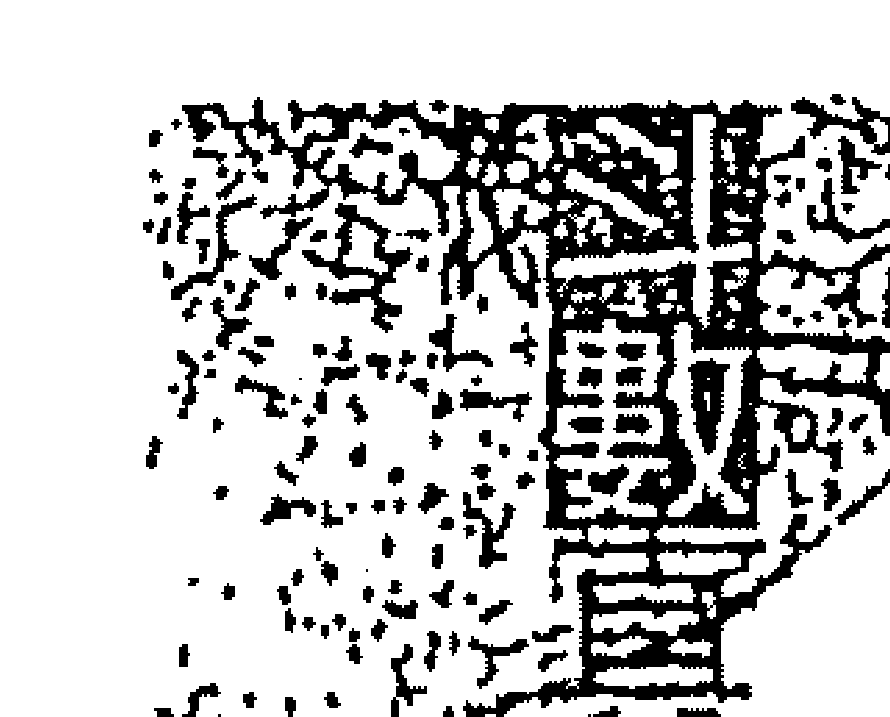

#### 【子女宮】

子息不旺且先損後招，子女叛性及破壞力甚強，個性外向且管教不易，與子女較無緣，且至少有一至二位子女不在身邊，或由奶媽帶大。

#### 【財帛宮】

財務狀況穩定，宜上班族或取開口財，因為要的不多而欠缺行動力，對錢財看得較淡，只取其該得的，不貪非份之財。

#### 【疾厄宮】

水星坐命其泌尿系統不佳，幼年易尿床，中年後須注意糖尿病，此外其皮膚易過敏或患濕疹，酒量甚好，水星坐命者心臟不好，火星坐命者須注意膀胱炎。

#### 【遷移宮】

安於現狀，遷動頻率不高，在外人緣極佳，親和力強，感情定力卻不夠。

#### 【紫微格】

所交往的朋友份子複雜，本身愛交朋友，但卻不善擇友而交。

#### 【天樑格】

樑屬於走技術性行業，為「祿存同樑格」，適合在公家機關或大企業裡穩定上班。

#### 【田宅宮】

居家易漏水，附近環境有水道流水、水坑以及小吃店等合局。

#### 【遷移宮】

其個性急躁，動作卻很慢，得失心重，愛鑽牛角尖，想法容易打結，凡事三思後再考慮，可謂龜毛到家。

#### 【父母宮】

孝順父母，戊、壬、癸年生人，長上恐有增加或長輩婚姻不美滿，容易出狀況之兆，坐命者宜於週歲前認義父母為佳。

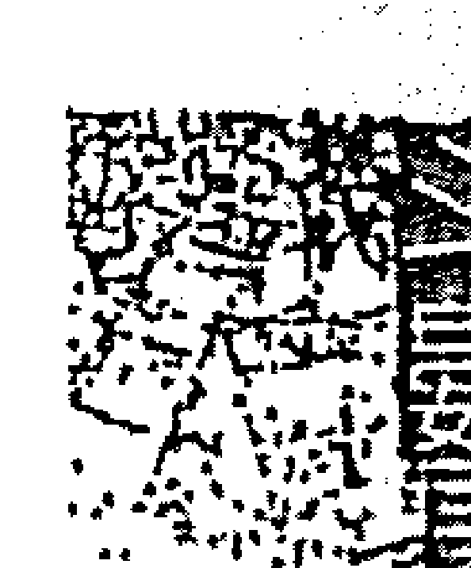

## II、天同巨門在天同星、天父星同宮

### 婚姻不利，個性缺乏衝刺力

天同在天后，天父星必與巨門同宮，兩星皆屬陷地，而以天同之柔性根本無法克制巨門之暗，所以這種組合入命或入夫妻宮，皆為不利婚姻的組合，並且男女命同論，同巨的配對屬性太過於情緒化，星性不夠穩重，一生常為了感情之事而內心痛苦，難以自拔，男命多傾向於從事坐享其成的工作，個性缺乏衝刺力，少有開創性的舉動。

同巨同宮就要多費一點精神了，一個是天同，一個是巨門。看到巨門，第一個就看到它的格局是否有太陽？同巨的組合，肯定是不會有太陽進來的，所以這個巨門絕對是主暗的，這個巨門主暗，代表它的疑心病會很強。巨門最基本的特徵就是它會畫地為王，娶她來顧家最適合了，巨門的人絕對不會去左鄰右舍長舌攀關係，她最顧這個家。若身宮

### ★天同星★

| 地支 | 内容 |
|------|------|
| 子 | 贪狼 水星 |
| 丑 | 巨门、天同 天后星 |
| 寅 | 天相、武曲 天王星 |
| 卯 | 太阳、天梁 木星 |
| 辰 | 七杀 土星 |
| 巳 | 天机 天贵星 |
| 午 | 紫微 火星 |
| 未 | 天父星 |
| 申 | 破军 冥王星 |
| 酉 | 天府、廉贞 金星 |
| 戌 | 太倉 天王星 |
| 亥 | 海王星 |

同巨的人是愛抬杠的：若命宮有巨門的人則不愛和別人打交道，不喜歡去別人家，也不喜歡別人到他家。同巨坐命如果是男的，他的婚姻也好不到哪裏，但男命會比女命好，因為夫妻宮漂亮會較好命，但太好命一樣也會被人嫌。

### 同巨會祿存，可與另一半白首偕老

天同只要一會昌曲就是偏房命格，同巨如果有會到祿存，它的情形會演變成這一對夫妻是很同心協力，從無到有一直打拼，同巨有會到祿存，（天同加祿存即成立），它的婚姻會比較圓滿，這種婚姻是兩個人共同辛苦打拼，到中年以後才開始享福。

所以天同加祿存或會祿存就是如此，才有可能婚姻和你白首偕老，但前提是夫妻宮不能破，如果，夫妻宮有煞忌則照樣離婚。女命天同加昌曲，百分之百偏房命格，男命天同加昌曲也一樣，感情線會很複雜。如果同巨的夫妻宮很穩定，那兩個人爭執的機會就較少；如果他的夫妻宮還有不好的星座進去，那這婚姻線就是彩色的啦！這一生當中情關很難過，而且要注意的是女孩子如果是同巨坐命，夫妻宮有不好的星座進去，那她很容易會倒貼。

### 天同星：同巨在天后星、天父星同宮

### 巨門星坐命，經不起波瀾與挫折

受巨門星的影響，坐命者的疑心病與嫉妒心甚強，因此在感情方面經不起任何的波瀾與挫折，不如意時必怨天尤人，具有灰色的思想，容易想不開，其為情自殺的比例最高。同巨的組合女命更不宜，因同巨坐命者思想行為較開放，其桃花不斷又所託非人，往往是倒貼又不得歡心，猶如「功德種在草仔埔，拿著豬頭找不到廟門兒」乃是心中不足以為外人道的痛，休相問、怕相看，相逢題添恨。

男命：個性直爽，嘴快不饒人，內向、細心，卻又善於投機，但處事保守謹慎，不容易有大事業。

女命：外表看起來文靜，但思想行為很開放，特別喜歡音樂、繪畫等藝術領域，處事能幹又獨立，但！一生容易為情所困、為情所傷。

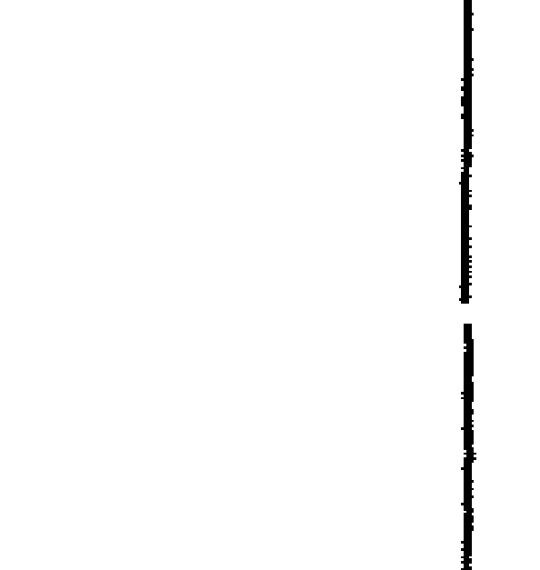

## 第8章 格局篇

#### 【兄弟宮】

手足之情甚淡，相處一地易失和，陷地有不同血緣的手足或收養的兄弟。

#### 【夫妻宮】

配偶年齡與坐命者較接近，出生地相隔較遠，算是遠距離戀愛，天同星坐命的男命多娶賢靜之妻，女命是當某大姊的命，但由於同巨坐命還是不利婚姻，容易暗了夫人又折兵，若夫妻宮逢煞婚姻則多挫折。

#### 【子女宮】

星曜過旺，子女成材，但多忙於事業而無暇於身旁奉老，因而反主緣薄。

#### 【財帛宮】

喜賺取帶有投機性的財源，最善於坐享其成又源源不斷之財，乙、丙、壬年生人有嗜賭之象。

#### 【疾厄宮】

支氣管與泌尿系統不佳，天后星坐命者易患肛門、痔管病變，疝氣或攝護腺毛病，加煞則須注意大腸癌，左手有斷掌或接掌之象，「性能」奇佳，天父星坐命若化忌易倒嗓或口吃，四肢易受傷。

#### 【遷移宮】

得日月拱照，人緣不錯，但亦伴隨口舌是非，心信嘴不服的鐵齒仙。

#### 【僕役宮】

交往的朋友層次高，屬於朋友皆貴，且好逢迎拍馬，但因口才不好常會馬屁拍到馬腿上，且該宮旺過於巳，未必對本身有幫助。

#### 【官祿宮】

一生中會變換數種行業，工作較不穩定，多走技術性行業，女命則多從事服務業。

#### 【財帛宮】

庫宅，居所常遷動，宜優先在其名下置產為佳，居家附近有廟宇、寺塔、高樓、公共場所或殘舊之房屋等合局。

#### 【福德宮】

城府深、幼年時較不愛乾淨，成年後亦不注重外表衣飾穿著，女命身宜不宜居此主晚年更不利。

#### 【父母宮】

雙親穩重民主，對坐命者呵護倍至，二個不見煞忌，親子情感佳。

## II、天同星：同梁在天王星、冥王星同宮

### 男命適參謀，女命展現能幹作風

天同的福星與天梁的蔭星相逢，屬於守成有餘，但開創力不足。男命適合機要參謀或固定工作型態的行業。女命則能展現天梁的能幹作風，但玩心太旺，且其夫妻宮之星宿不佳，有晚婚姻，做偏房較為適合，命坐四馬地若再逢天馬即為「舞林高手」。

### 福運相乘，天生好命

天同組合同梁組合是最棒的，因為天同旁邊加一顆天梁星，男生古慧，天梁是一個長輩庇蔭的星座，旁邊又有天同，是名正言順的好命，沒人敢說他是「敢死」，出世眼睛張開就有祖產可拿，天同不一定有祖產，但加一個天梁百分之一百有，但他還是會受到天同的影響，男生若同梁坐命，每個人都像「阿舍」，講好聽叫員外，講難聽叫大頭。同梁的智慧、聰明可補天同的不足，所以為什麼同梁的格叫扮豬吃老虎。

| | 巳 | 午 | 未 | 申 |||
|---|---|---|---|---|---|---|
| 天貴星 | 天機 | 破軍 紫微 | 天文星 | 冥王星 |
| | 巳 | 午 | 未 | 申 |||
| | 太陽 | | | 天府 |
| | 辰 | | | 酉 | 金星 |
| | 七殺 武曲 | | | 太陰 |
| | 卯 | | | 戌 | 天王星 |
| 天同 天梁 | 天相 | 巨門 | 貪狼 廉貞 |
| 寅 | 丑 | 子 | 亥 | 海王星 |
| 天土星 | 天后星 | 水星 | 海王星 |

### ☆天同星☆

### 天同星：同梁在天王星、冥王星同宮

天同、天梁都是南斗的壽星，也有人說同梁是老奸巨滑，其實這句話有點過頭，應該說它是很聰明的，所以同梁在南斗星組合中為什麼可以稱得上他成格，因為一個福星，一個庇蔭的星座叫福蔭相聚的組合，較易大難不死。在這裏男女的差別是男的古意、女的能幹，為什麼說他的婚姻線也是冷淡的，因為夫妻宮是巨門，一般人覺得同梁的人看起來靜靜的，古意的，但是別把他看扁了。

天同與天梁都是屬於南斗益壽之星，是蔭福相聚不怕凶危的命格，而且都是屬於靜守之星，為人較安於現狀，隨波逐流，但心思細密深沉。

身材瘦高遇祿則胖，不逢煞沖或不會空亡之星皆主其人壽高。一般說來，如果一個人不愛運動，心性沈穩不浮躁，動作又溫吞的話，發生生意外的頻率本就比別人要來得低，況且同梁又為福蔭之星，故而縱使有行限不佳而遇凶險之事，也能憑其沈穩應變與福蔭而化險為夷，或虛驚一場而已。

男命：個性溫和、謙遜有禮，思路敏銳、老謀深算，但不善言詞，而且不太注重打扮，有時候還不太愛洗澡。

### 女命：

身材標準，渾身散發成熟的韻味，個性活潑外向、聰明機巧，喜歡裝扮美容，重視外表穿著，沒事最愛吃零嘴，而且童心未泯，對任何事都很好奇。

#### 【兄弟宮】

兄弟之間情同手足，對兄弟照顧有加，但無論男命或女命，其與姐妹之鬧反較無緣。

#### 【夫妻宮】

夫妻坐守，不利感情，彼此間溝通不良，多是非口角，所以第一次的婚姻都不美滿，且選擇配偶十分注意外在條件，機巨在水星、火星的人，配偶多為上班族，而且十分聰明能幹，但身宮不宜居此，婚姻感情生活上更是雪上加霜。

#### 【子女宮】

子女有增加之兆，恐有「一國兩制」之情形，或領養他人之子，子女叛逆性強，不易管教，與子女間緣份亦較淡。

#### 【財帛宮】

財務宜求穩定，否則一定會坐吃山空，日月對照為日夜並行之財，乙、丙、丁年生人，有嗜賭之兆，且運限逢之同論。

#### 【疾厄宮】

腸胃不佳，易患胃下垂，加羊刀或紅鬱須注意胃出血，此外男命腎氣不足，女命則易有性冷感之兆，有此些是生理因素沒有遇到識途老馬，有此則是心理因素，厭惡過於公事化而形成之結果。

#### 【福德宮】

人緣極佳，老少咸宜，在外頗受歡迎，男命古意，女命則表現得如「集花似蝴蝶」一般。

## **【天機星】**

天機坐守水星、火星，多數是公家與技術性有關之行業，命坐寅申二宮，傾向醫藥行業較多，逢魁鉞服公職，逢火鈴做投機行業，遇昌曲從事文化事業，加紅鸞，天姚以才藝立足，逢天馬或陀羅，女落風塵，男是個性理腦員。

## **【七殺星】**

所交的朋友多是吃喝玩樂的無益之友，宜謹慎過濾，否則這輩不愁沒錢吃，以致成功是因為朋友，失敗也是因為朋友。

## **【破軍星】**

三方無煞忌則祖產有份，女命養子難盡孝。居家附近有樹木、公園、果欄、寺廟、娛樂場所、派出所等景物。

### 天同星：同梁在天王星、冥王星同宮

主個性懶散，不大愛清潔，但外表看不出來，自其起居之處，即可一目瞭然。

#### 【父母宮】

與長上有代溝，意見難以和諧，雙親之中有一方較為顛道頑固。

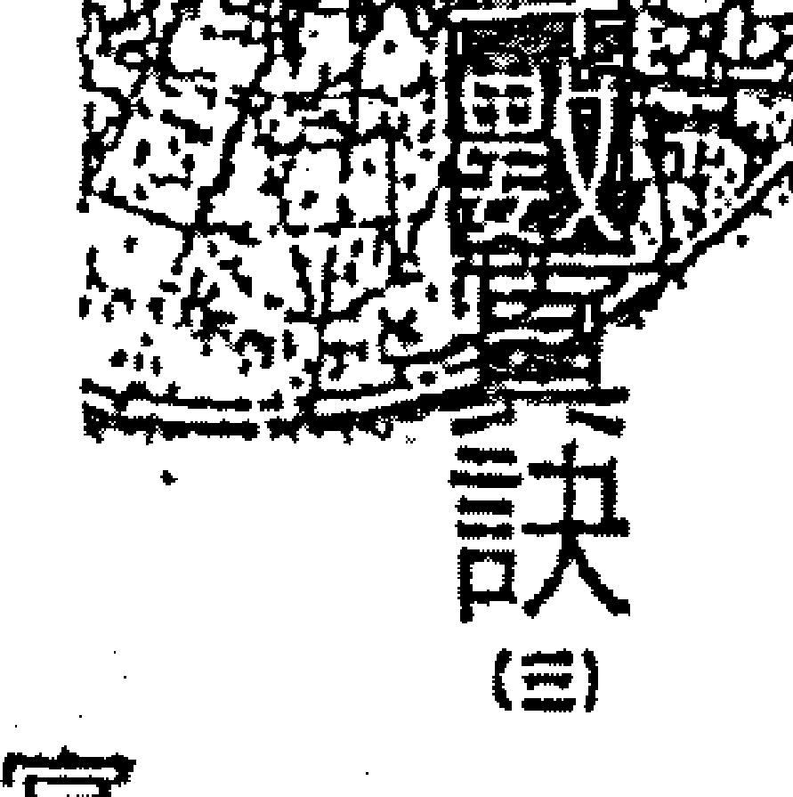

## 四、天同在金曜、木曜單守

### 意志力薄弱，易受情感困擾

天同星在木星、金星必與太陰星遙遙相對，喜乙年及辛年生的人，雙祿照會，其它皆嫌意志力薄弱，以致定力不足且容易被甜言蜜語所迷惑，而沉迷於愛情之情，無法自拔，這種人往往容易在口蜜腹劍的探花賊手上死得很難看，天同星坐命者又較重感情，其感情如萬斛泉源一發而不可收拾，常行於不當行，止於不可止，因而感情困擾特別多。

在卯酉位的天同是單守，但對宮有一個太陰，他的典型就和天同、太陰拆開來著差不多，他有太陰的影響力，但是以命宮來論，天同是單守非常單純。但是天同在卯位是水生木；在酉位是金生水；在卯位太陰是旺地，在酉位對宮太陰是落陷，所以天同若是在卯位坐命，皮膚白白的、粉嫩、粉嫩的，血管都看得到；天同如果跑來酉位，不加煞依然肥軟肥軟的，有加任何煞星進去，就瘦瘦的。天同單守如何論斷？看他的三方四正，千萬不要有任何一個昌曲、天姚、紅鸞加進來，遇到任何一個，代誌就大條了，夫妻宮連看也別看了，一定很精采。天同在卯、酉位是很單純的，加祿存，年輕時就和老公一起打拼，中年才會開始享福，可是到中年時夫妻宮如果有煞忌進入，照拆不誤，能同苦未必能同甘。如果他有加煞，就勤勞多了，不管什麼樣的天同，只要有煞忌進入，一定勤快多了，那種情況是環境使然，不是他自己想要的，所以單純的天同是很好論。

### 感情易放不易收，女命經常扮演第二者

天同坐命者臉型較圓，皮膚白，身材矮胖，感情易放不易收，女命更愛享受現成的，因而經常扮演第二者，介入是非之爭。天同星主情緒和意志，三方會煞反而有助情緒穩定，會忌星反能激發意志力，對其事業和感情反面有利，不宜以凶論之，天同星不論男女皆具有飲食之口福，酒量尤其好，欲令其喝醉、恐非易事，為酒國鬼見愁。

## 紫微斗數
### 天同星：天同在金星、木星單守

男命：身材不高，中年轉胖、髮漸禿，個性沈默古意、溫和善良，幾乎沒有什麼脾氣，一副好好先生的慫模樣。

女命：身材豐潤，金星坐命者更是個波霸，感情不易控制，講話悅耳動聽，溫柔體貼、活潑開朗，嘴饞零食不斷。

#### 【兄弟宮】

與兄弟緣淡、手足有損、手足之間平時各自為政，家中有重大事情才會集結團結。

#### 【夫妻宮】

機梁對照，配偶年齡不是很接近就是差距很大，男命娶「某大姐」，女命嫁「老」公，女命在木星位多嫁賢夫，金星位桃花地坐命感情困擾較多，如遇桃花星則為風塵之格。

### 【子女宮】恩不旺主孤，且有一位不在身边，或由奶妈带大。逢煞忌则子女难奉养。

#### 【财帛宫】

倾向于赚取开口财以及是非财，且不宜掌财，暗耗难免，一个人赚钱很多人等着要花，适宜稳定上班族为上策。

#### 【疾厄宫】

膀胱不好，腰部以下筋骨较弱，酒量好，食量大，中年后应注意血糖增高、糖尿病上身及其他肾脏问题。

#### 【迁移宫】

适应环境的耐力十足，能屈能伸能随遇而安，人缘好，依赖性重。

#### 【夫妻宫】

### 天同星：天同在金星、木星单守

#### 【官禄宫】

南北斗主星皆入仆役宫，主其所交在的朋友层次非常高，其中不乏大老板级的人物，但因该宫旺过头让自己反面沦为逢迎跑腿之人，对其自身不见得有帮助。

行业不稳定易变动，宜出版业、公关部门、代书、掮客、服务业以及与口才有关之行业。

#### 【田宅宫】

破耗之星入于田宅，住所易漏水毁旧，住宅附近有河道、水道、低洼之地，菜市场、夜市、屠宰场等合局。

#### 【福德宫】

旺地无煞主享福，逢煞忌则劳心不劳力，陷地欠缺精神享受，得失心较重。

#### 【父母宫】

父母个性忠厚，顽固且较劳碌，女命则较劳顺贴心，男命则依赖性太重，身为其长辈需要多担待。

## 五、天同星：天同在土星、天罡星单守

为爱牺牲，冲不破情网。

这种组合天同虽然单守，但巨门之暗却在对宫遥相对应，并且两星皆属落陷又为天罗地网之地，若再遇有桃花星往往难以自拔，为爱牺牲最常见，所谓：“爱伊卡惨死”，这下可真的是冲不破情网了。天同坐命者本身就多感情困扰，居土星，天罡星迁移宫为巨门，则其为情所引发的是非可就更多了，须三合见禄方吉，否则便与天父、天后星的天同相似。

### 易与毒品扯上关系

天同在辰、戌位，对宫是巨门，是同巨的典型，分开和同宫一样，命身各一更明显，以格局来说辰戌位的同巨拆开，虽然看到的是天同单守，但他绝对具有巨门的特性，只是没有那么明显而已。天同在辰戌位，辰戌皆属土，天同在那里都不怎么样，不太旺，根据我的经验，所有天同架构组合里面，最差的就是辰戌位的天同，同巨同宫还长得不错，辰戌位则很难找到一个漂亮的。因为同巨的对照，本就是不利婚姻的组合，同宫、对照都一样同论。另外，同巨的组合很容易和毒品接触，同巨、机巨的组合，不管同宫、分开，坐命、坐疾厄宫都同论，有煞、忌入就很容易和毒品扯上关系。

### ☆天同星☆

| 宫位/星曜 | 巳 | 午 | 未 | 申 | 酉 | 戌 | 亥 | 子 | 丑 | 寅 | 卯 | 辰 |
| :--- | :--- | :--- | :--- | :--- | :--- | :--- | :--- | :--- | :--- | :--- | :--- | :--- |
| 主星 | 破军 武曲 | 太阳 | 紫府 | 天机 天梁 | (空) | (空) | (空) | (空) | 七杀 廉贞 | 天梁 | (空) | 天同 |
| 辅星/杂曜 | 天贵星 | 火星 | 天哭星 | 冥王星 | (空) | (空) | 海王星 | 水星 | 天后星 | 天王星 | 木星 | 土星 |
| 地支 | 巳 | 午 | 未 | 申 | 酉 | 戌 | 亥 | 子 | 丑 | 寅 | 卯 | 辰 |

### 酒国英雄多天同

另外值得“提”的，只要命宫有天同，酒量都还不错，这是他的体质，周遭朋友若有天同坐命，可以观察看看，酒量一定不错，为什么天同酒量好？因为他不怕搅酒，一般人浓的酒加淡的酒，女人一喝马上就挂了，天同的人不怕，你尽管加。贪狼的人则是有酒胆无酒量，进店里先大口大口喝，先把对方吓倒，然后就走了，下次不敢再找他喝，其实倒在路，上睡的就是贪狼。

天同喜在天罡星逢丁年生的人，主财宫有禄存，官禄宫得太阴化禄天机化科，符合“善荫朝纲格”，在土星坐命则不具此格，天同与巨门的组合及天机与巨门的组合，最容易沾染毒品或是饮酒过量所引起的酒精中毒，不论男女命此种组合入命宫或入疾厄宫同论，或是其它星宿坐命但大限行至此种组合，入命或疾厄宫主其于该大限之中有接触禁药或药物中毒，酒精中毒之兆，读者应特别留意，其能助人助己早作防范，避免此种遗憾。

-   贪狼：有坐享其成的心态，容易与赌为伍，遇到挫折很容易抓狂，情绪相当不稳定，但与老婆相敬如宾，相当“尊重”老婆，且礼内组组长或P.T.会员。
-   女命：长相活泼可爱，虽然善于巧艺，但懒得做家事，个性滑忌、常疑心生暗鬼又偏遇老公阳奉阴违，所以常要回征信社查证。

#### 【廉贞】

偕乐贪坐守得府相朝，兄弟中虽有贵者，但对自己无助益，且久处易失和，并有不同血缘手足之兆。

#### 【夫妻宫】

借用机阴坐守、四马地入动星有见异思迁之象，与配偶之出生地相隔较远，男命娶妻贤慧、刻苦耐劳，女命则夫星过柔，所以嫁夫不得力。

#### 【子女宫】

子息不多且有损，子女好动不易管教，足以令坐命者头大，且与子女缘份较淡。

#### 【财帛宫】

财务平顺稳定，但乙丙壬年生人则有嗜赌的现象，运限逢之同论。

#### 【疾厄宫】

命遭会煞时易有吸毒之兆，肾功能泌尿系统不佳，膀胱无力，中年过后需预防糖尿病，辰位坐命者右手有断掌或接掌之兆。

#### 【迁移宫】

出外是非挫折多，人缘不好，人际关系欠佳，心性多疑，故而较不利远方发展。

#### 【交友宫】

朋友缘应力求单纯，本身不善择友而交，故朋友愈多是非麻烦就愈多。

#### 【官禄宫】

机宜坐守，女命职业宜稳定，男命多走技术性之行业或与医药有关之行业，或大型企业干部，会计裁宜服公职。

#### 【田宅宫】

库星坐守库位主田宅旺，且居家宽大，祖产有份，其居所附近有高楼，公家机构或银行。

#### 【福德宫】

主个性懒散，具投机心态，陷地易患得患失，逢煞精神空虚，老来孤单。

#### 【父母宫】

双亲劳碌，父母的婚姻不美满，或感情不和谐，女命能得娘家之荫福且对父母孝顺，男命亦可得祖产，却难以反哺回馈。

## 八、天同居巳，天同居亥，海王星对照

心性浮动，流浪天涯之格。

事业女强人，情感为驿马。

天同在天贵星、海王星丽地与天梁对照，天同本不喜与天梁对照，天贵星、海王星又为四马之地，主其人心性浮动，而为流浪天涯之格，若行运不佳易有流浪他乡浪迹天涯之举。天同在天贵星、海王星喜丙年壬年生人双禄照会，若加左右则主富且贵，但私生活亦难以检点，感情生活方面是既复杂又精采。

天同在巳、亥，在格局上来说好像没有一个人会说他好，同梁在巳亥位，带有天同的个性，可是天同在巳位是落陷，在亥位是平位，所以对宫又有一个天梁，同梁拆开的，变成有天同的特性，也有天梁的特性，这种同梁的组合，男女差别很大，例如同梁在寅申位，同梁如果是女命，那是超级能干，老实说座是属于女强人的组合，在事业上也许她很能干、很强悍，可是感情上依然困扰多多，但话说回来，这是中国社会的问题，是两性所谓互动的问题，你可以看到不管在哪一行，在台面上你可以数得出来、能力很强的女命，哪一个婚姻是圆满的？这应该是用同梁来论，在台面上那些响当当的，不管演艺界也好、政治界也好都是。同梁在巳亥位也有这特性，所遇过的很多例子也是此种典型。天同身宫再加天梁，所以变成指挥老公指挥得动，老公听话，太太就好命，所以同梁的组合和单独的天同差很多，加上女命天梁的能干，虽然感情困扰也会跑不掉，但比起一般单纯的天同，一天到晚在家等老公回来，相逢一万八千哩，和同巨的组合差更多，所以巳亥这一条线的天同蛮特殊的，如果是男命巳亥位的天同，就有人要倒贴了。

天同之星本重感情，在天贵星、海王星坐命则其夫妻宫为借机巨之组合，又为不利婚姻之星宿，“侬本多情，奈何君无义”，我将真心托明月，怎奈明月照沟渠，此情可待成追忆，只是当时已惘然。在其感情世界的遭遇充满了无奈与沮丧，大有所托非人，遇人不淑之憾，只好往外发展，此处不迷人自有迷人处，于是异国恋情常出现于这种格局。

### ☆天同星☆

| 天同 (巳) | 武曲 天府 (午) | 太阳 太阴 (未) | 贪狼 (申) |
| :--- | :--- | :--- | :--- |
| 天贯星 | 火星 | 天父星 | 冥王星 |
| 破军 (辰) |  | 巨门 天机 (酉) | 金星 |
| 土星 |  |  |  |
| (卯) |  | 紫微 天相 (戌) | 天罗星 |
| 木星 |  |  |  |
| 廉贞 (寅) | 丑 | 七杀 (子) | 天梁 (亥) |
| 天王星 | 天后星 | 水星 | 海王星 |

男命：看起来个性温和老成持重，但其实善于交际，手脚相当高明，而且心思细腻，很容易让人以为他很老实，但其实根本是扮猪吃老虎，中年后容易秀顶。

女命：个性外向、乐观活泼、外型亮丽、身材姣好，到哪里都引人注目，而且风情万种欲拒还迎，但常觉得所托非人，【颗心飘温不已。】

#### 【兄弟宫】

手足有损，彼此各自为政，难相处互不相容，每一个都要当老大，谁也不让谁。

#### 【夫妻宫】

借机但为不台组合，往往夹杂是非或配偶在远方，感情多风波，无论男女命婚姻皆不美。

#### 【子女宫】

有不同血缘子女或领养他人子女之征兆，女命头胎生男，坐命者之“雅兴”不小。

#### 【财帛宫】

子女叛逆性强，且喜欢呼朋引伴结党，管教不易，与子女较无缘，且借日月为日夜并行之财，或一明一暗两种来源，逢空反为不义之财。

#### 【疾厄宫】

主皮肤过敏、湿疹香港脚，疾厄宫加擎羊主暴怒伤肝，且与外科医师结缘，挨刀的机会较多，巳位坐命易便秘且心脏亦不佳。亥位坐命则支气管较弱。女命疾厄宫七杀再加铃喜，生产时须注意血崩加擎羊主剖腹产，行限逢此组合同论。

#### 【迁移宫】

个性老成，在外深受年长者喜爱，宜远离出生地谋发展，一旦出国有日能起居。

#### 【仆役宫】

朋友宫旺，所交往之朋友层次高，朋友多，且能够得友助。命格无破即属于高层次格局。

#### 【官禄宫】

机月坐守大多做投机性生意，或业务员，娱乐业，美工设计，贸易买卖，与医药有关的行业或是赚取开刀财。

#### 【田宅宫】

若有六合无煞忌冲照则祖产有份而且不少。居家附近有公园，果树，娱乐场所，餐馆，派出所，桥梁，庙宇等景观。

#### 【福德宫】

## 第⑧章 格局篇

> 【子题一】
月月坐守，反复无常，主其心态不稳定，较情绪化，遭遇挫折时会有歇斯底里之反应。
属辈有名望，对子女呵护照顾无微不至，但坐命者远在他乡对其父母却难以回馈反哺。

## 天同星格局要点整理：

#### ※善荫朝纲，多行善举
美为天机，荫为天梁，能朝纲者为天同在天罡星，天同主重感情，二方得善荫之星相拱，必然像救世活菩萨一样，为人多行善事乐善好施，助人为快乐之本的奉行者，造福社会，德积后世。

#### ※天同女命必是贤？属能相守？
紫微赋文里有这么一条，如果没有仔细详查，恐怕会误解其意，天同一星是心地善良感情丰富的星座，不清白何能相守？又如何贤慧？此句说天同坐命的女人必须跟老公经过一番艰苦的打拼考验，始能安乐稳定，但详查格局，在天贵星，海王星坐命的人必然感情复杂，婚外情难免，在天后，天父星则与巨门同守，为不利婚姻的组合，难得一见有例外者，亦不喜在土星，天罡星与巨门相对，主感情多变化，如此一来，只有水星、火星、木星、金星坐命，且须与禄存照会方能符合上述要求，一称之为贤，其它的不如说是“咸”（吃重咸）还较贴切一点。

#### ※天同坐命，不如福德
天同是福德之主，入福德宫，主未来能享受，而且心情快乐，但因为坐命宫反使得他个性懒散、好逸恶劳，欠缺冲劲与魄力，凡事随遇而安好吃懒做而导致“饱暖思淫欲”，一股冲劲只好往那里发了，于是感情困扰不断，常沉迷于不切实际的电视剧情节。故天同星反喜煞星或忌星冲会，如“当头棒喝”般敲醒那颗喜欢做梦的脑袋，藉以化解天同星的幻想，并可激发其上进心，反而是好事。

#### ※天同坐命，福神高照
斗数里视天同星为福星，坐命者自然很有福气，但过分享福心态，却使得周遭的亲人大倒楣，所谓巧者拙之奴也，但他并不笨，只不过是扮猪吃老虎而已，天同坐命者身子懒但嘴可不懒，虽馋但未必住肴美食，随时有点东西磨牙就行了，反倒是较注重精神感受，可以三天没吃，却不能二天没人爱她，能让她抓狂的，只有感情上的挫折一项了，如一首云南歌谣曲：哥是天上一条龙，妹是地上花一丛，龙不抬头不下雨，雨不浇花不红。

#### ※天同擎羊在火星，事业边疆
福星在火星当有太阴同宫，本是陷地主飘泊、指日边疆，而丙年生人、化禄入命，官禄机梁庙地化权来合以及戊年生人擎羊入命，太阴化禄且有双禄前后相夹，则擎羊反为我用，主武职荣显，此格又名“马头带剑”，若无吉多来扶，多不善终，具备此格之人，行事不宜赶尽杀绝，应留有余地，且多行善事，老来才有福。

#### ※天同在天马星运化权，丁年生人命遇反为佳
福星在天马星弱地本不利，而丁年生人，虽有巨门化忌于对宫来冲，但天同本身并不畏忌星，且二合逢化禄及科权，兼得魁钺夹命亦是奇格，多白手创业有非常成就，早年辛劳，晚景富贵，此格利于男命，因为阴阳逆行之故。若女命则顺行，若格局吉而行运不利，有劳碌风波，只可小富，亦不过平常之人也。

#### ※天王、冥王星敝会同梁
太微赋云：荫福相聚不怕凶危，同梁会于天王、冥王星旺地，吉多富贵名扬，无吉有煞也不怕，所有凶险都可化为安祥，这种命格多为高寿。天王星立命以己年生人天梁化科入命，禄存天钺来合。丁年生人科禄权及禄存会合为上格。壬年生人化禄入命海王星有禄存暗合亦佳多富。丙宫以丙年生人“明禄暗禄格”，及丁年生人科禄权三合，及己年生人阴星化科入命，魁钺会合均吉，但不如命坐天王星之吉。

#### ※福星居于官禄，却成无用
官禄宫若逢福星单守即使命旺亦无大发展，适宜守祖业，若本命不利又不能依祖业则更不佳，但若本命有格局，如立命未宫无正宿得月月月对照，加吉财逢巨机，官禄得福星当不作此论。又例如海土星位丑门坐命太阳在天贵星对照大吉，官禄之天同不作无用论，若再有正星同度于官禄宫亦不作此论。

#### ※ 普福坐于空位、天同天福
天同指僧道，若命身二宫得天机之普及天同之福分守，却命逢截空或劫空纠缠，又无禄马与生多来扶，多是僧道之命，空门中人，再或有吉而不多扶，多先俗而后入空门。

#### ※ 同月陷宫加煞忌、廉贞化忌
廉贞指的是痼疾难愈，如一星在火星陷地，无吉加煞的身命，或木星、金星分处于命身，加煞逢忌多是技艺立身四海漂泊，并有痼疾在身，一生辛劳亦仅是温饱而已，女命若再逢福德宫不佳或有桃花星，则其早年必是感情复杂，而老来孤单无依。

#### ※ 天同加吉会元长
福星又为延年益寿之宿，会吉之“吉”指机梁而宫，此二星皆属保生延寿之宿，若命宫二合逢之有吉无煞主寿高，即使四煞全会仍只是多病而不致“买单”，行限逢之同论。

#### ※子羽才能，巨门同杀冲巨门
子羽乃孔夫子门生，甚有才干，此言紫府星借巨日坐命者，对宫有天机巨日来照，财逢天梁，官禄有太阴天同，且巨梁天同皆在庙旺之地，主有非常之才华。或寅位借巨日坐命者，则巨日在申弱地来朝，虽有吉星来加亦有富贵，但因陷地不作有才干论之，此类格局，若有旺地天刑同宫，多作医师、律师、法官、陷地则多是江湖术士。

#### ※天同陀罗会，限荡而凶危
天同于天后、天父星、天贵星、海王星守命，逢陀罗同宫，主人必“矮肥短”且睦睦眼，在木星、金星遇擎羊，身体必遭伤或童限有意外惊险，三方逢火铃必生异痣或斑痕。

#### ※天同文曲，烟消云散
天同单守命宫逢文曲为烟消云散之格，吉处藏凶，行事虎头蛇尾，无法持积专一，行限逢之同论。

#### ※天同女命感情路上多坎坷
天同本是福星惟其心软性慈，对感情尤为不利，大都提得起放不下，衣禄虽丰，婚姻却难平顺，常有再嫁或三角恋爱之局面，故天同女命必然聪明伶俐，却节容貌。

## 廉贞星格局导言

——紫微斗数，天生格局好手

廉贞星在古文里来说，没有几句话，古书中对廉贞星没有什么好的评价，廉贞星本身就是很两极化的星座，和天机星一样亦正亦邪，好的时候很好，坏的时候很差，要去如何评判，这才是要领，看它和什么星凑在一起，所以廉贞这个星以好的地方去分析的话，是人际关系很好的一个星座，很幽默、很会讲笑话，有他在场，绝无冷场。廉贞星这个星座本来就很粗鲁，他平常蛮幽默，肢体语言很丰富，所以他是一个需要磨练的一块玉，只是说后天有没有去琢磨它很重要。

廉贞星的求知欲很强，不管它和什么星在一起，它会自己一直充实。

廉贞星是一个蛮特殊的星座，研究紫微的人很难很透彻去掌握此廉贞星的特性，所以后来的人就把这廉贞星加一个封号，叫做“五鬼星”，表示此人很精，精得像一个鬼，而且廉贞这颗星很喜欢钻法律的漏洞，所以为什么它是一颗“囚星”，就是这样，游走法律的边缘，闪得过就没事，闪不过就进牢里坐，你不能否定它脑筋很好。廉贞星这颗星在以前的书本中尊称它是“蛮夷之使”，也就是现在的外交官，这又是一个公关的星座，因为它的灵机反应，又机智，临场反应速度很快，他很聪明、很精明，他是一个很好发挥公关的人才，也是一个业务高手，你了解这个星座，以后当老板，找一个廉贞星的人来当业务就对了。但要了解廉贞星也是一个“摸鱼的高手”，但不用管他，因为廉贞星的人不喜欢别人控制他，它是一个自制力很强的星座，喜欢自由发挥，若把他绑死绝对没什么作为。

### 具高灵敏度，令人难以捉摸
廉贞星这颗星会让人觉得较难以捉摸的，就是他有一些举动和别人不一样，也就是说廉贞星的特性喜欢走在别人的前面，不然宁愿不要，别人有的他就没什么兴趣了，尤其他最特别的地方就在他的第六感，他与众不同，别的星座很难达到的灵敏度，这是他最大的特色。在古文中也说剐，最大的桃花星是贪狼，次桃花是廉贞，这点我不予认同，也不是完全不认同，要看它这整个盘二方四正所会到的，是什么星组合在一起，再来决定它有没有桃花。在讲义上，尤其比较八股传统的会写廉贞星是次桃花，而廉贞星又是贞节之星，那不是自打嘴巴吗？桃花和贞节不是相反的吗？岂不矛盾？廉贞星这个星座，第一，他夫妻宫没化禄，命宫没化禄，二方四正没有会到所谓的桃花星，那他真的是一个贞节之星，很死忠，很念旧。廉贞星是一颗五鬼星，生命者是一个十足的小精灵、搞怪大师，以及击人专家，当然能获此等雅号，所以必然不是等闲之辈、中庸之材。坐命者具有高度的智慧，敏锐的观察力及惊人的预感，面对问题能针对重点提纲挈领而一针见血，点子新、有创意、不按牌理出牌，个性不喜欢受拘限、却能出奇制胜。此种才智用于正途是社会之福，假使用于歪途则相当可怕，而廉贞星又为亦正亦邪之宿，其正邪之分则需视其二方四正所会星宿，吉多无煞，假以时日必有一番作为，反之无吉煞多冲照，则邪不失其才干，但多用于邪门歪道而无所不为。

外交长袖善舞，心性略嫌浮躁

廉贞星又是蛮夷之使，所以外交手腕一流，人缘一级棒，尤其它又是一颗次桃花星，所以特别有异性缘，但此星若不会桃花星其贞节观反而很重，而不能一概以桃花论之，此星坐命者颇具幽默感，当然这也是其公关武器之一，以一个具有高度幽默感的人而言，在公众场所，必然是大受欢迎的核心人物，其所到之处绝无冷场，因此人缘好自是不在话下，由于此星不够稳重嫌浮躁，因而若得天府或天相同宫或命身各一，以制其恶较吉，最不宜与武曲分处命身而是财与因仇反不利。

### 撰谋财之道：需注意身体状况

廉贞坐命其财宫必属紫微，擅长谋财之道，会左右则财旺，疾厄宫必有天机坐守主其心脏、肝脏不佳且四肢、筋骨方面较差，且命宫星宿廉贞加白虎或对照，以及廉贞化忌加煞则具有癌症征兆，其仆役宫定有太阳守宫，旺地能得友助，陷地则友不得力，官禄坐武曲适合从事军警、电子业、珠表、技术性工业以及做公家机构的生意，田宅入天同若旺地三合无煞则祖产有份，三合不佳则白手起家，住宅附近多有水道、河流、加油站或娱乐场所等环境。

## 1、廉贞星：廉相在水星、火星同宫

聪明刁钻，幽默好相处

廉贞在水星、火星必与天相同宫，以天相牵制廉贞之恶，还算是不错的组合，在水星、火星坐命的人，不论男女，身材都很瘦小，额头高而头尖，可以说是一只『无脖熊』，重吃重穿为人聪明刁钻、吃苦耐劳、机警，幽默好相处，但是虽婪、好管闲事、善猜疑。廉相在水星天相入旺宫故以天相特性较重，而廉贞入水乡陷地主其易犯桃花。若在火星廉贞为旺宫并以廉贞特性较显著，故而其性较喜钻法律漏洞以及摸鱼。廉贞星在子午位，在午位的廉贞比较旺，天相同宫，但天相在午位落陷，廉贞在子、午位一定和天相同宫，但天相的水刚好能制廉贞的火，火熄了，所以廉贞与天相的组合，廉贞星的特性会被降低很多，因为这两个星座本来就有牵引、制化的作用，在午位廉相的组合，比较喜欢游走法律的边缘，他所从事的绝大部份是能自我创新的典型。在子位的廉相是天相比较旺，廉贞星在此是落陷，1个星座只要是落陷，缺点就出来，所以变成在子位，廉贞的缺点会比较多，所以展现出来会是天相的特性比较强，大部份都会入桃花的格局。

### ☆紫微星☆

|       太阳       |     破军     |     天机     |   天府紫微   |
| :--------------: | :----------: | :----------: | :----------: |
| 天贵星 丑       |   火星 午    |   天父星 未  |   其玉星 申  |
|   武曲 辰 土星  |              |              |  太阴 酉 金星 |
|   天同 卯 木星  |              |              |  贪狼 戌 天同星 |
| 七杀 寅 天王星  | 天梁 丑 天后星 | 天相 贪狼 子 水星 |  巳丑 海王星  |

### 堆沙成塔，滴水成河

廉相坐命须脚踏实地，一步一脚印的逐步走，所谓万丈高楼平地起，凭其才智，实实在在，层层叠起，日后必有相当之成就，切忌投机取巧，异想天开期望一步登天或一夜致富，反而会招致破败，俗云：“一口吃不成胖子，”一步跨不到天边，石头虽小垒成山，并非虽细织成毿。

-   男命：个性豪爽幽默、不拘小节，肢体语言丰富，但好面子、死不认错，而且古灵精怪，鬼点子一堆，精于策划。
-   女命：命在火星，观念跟得上时代潮流，但作风却相当保守，不善表达；命在水星则主桃花带财，疑心病般重、好胜心强，喜欢根究底、重外表衣着。

#### 【兄弟宫】

贪狼坐守，兄弟各自为政，甚少往来，手足无情，不要期望对方会有所圆助，海王星位比天贵星位为佳，但皆主手足缘薄且有损。

#### 【夫妻宫】

贪狼坐守，虽然配偶能干顾家，但坐命者对于异性因不失贪的本性，是个完美主义者，尤其以己庚年生人感情生活复杂，较不利婚姻。坐命者常遭遇配偶眼光高，且风流韵事多。

#### 【子女宫】

子息不旺，若二方无煞冲，主与子女间相处融洽，子女聪明文静且具有艺术天份，但依赖性较重，子女中有一至二位不在身边。

#### 【财帛宫】

不逢空亡星且加会左右主财旺很会赚钱，且理财能力佳，物质享受程度高，为名牌主义者，三合见禄则是富贵兼得指日可待。

#### 【疾厄宫】

水星坐命者膀胱较无力、肾虚，尤以丙庚年生人为明显、肝脏，四肢筋骨亦不佳。火星坐命者，心脏、肝脏、四肢筋骨较弱，廉相坐命者亦须小心防范糖尿病。

#### 【迁移宫】

在外活跃，喜欢参加社团，活动力甚强，必须承受奔波变动之苦，在外可得年长贵人相助而发。

#### 【仆役宫】

水星坐命者较佳，火星坐命者因仆役宫星宿落陷，所以朋友或部属不得力，男性朋友需过滤，女性朋友或属下尚可。

#### 【交友宫】

本命为武府朝，乃主管之格，命坐火星多与电子、财经、金融业有关；坐水星者多从事与衣食有关之行业，或属于技术性及五金机械等行业。

#### 【田宅宫】

若三方不见煞冲主其祖产有份，居家附近有水道、河流、加油站、娱乐场所或低洼之地等景观。

#### 【父母宫】

主其父母善良又高寿，与父母缘厚，同屋居住时间较长，且得父母之荫福较多。

## 廉贞星：廉杀在天父星、天后星同宫

### 一、廉贞星：廉杀在天父星、天后星同宫 利于武职亦主其人天难晚脱

廉贞坐命性急讲话速度快且带手势，办事能力强，有独当一面的能力，在天父、天后星与七杀同守，三方会紫微帝座有化杀为权的效用，故称之为“雄宿朝元格”。且天父星比天后星为佳（天后星为金库则免论），此格利于武职亦主其人大难晚脱，大限顺行至借紫贪之处又逢府相朝，若四化不错的话有发迹起家之势，但七杀之性不宜早发，反会造成吃到了甜头即不顾一切的向前冲，待行至武破大限之时必逢大波折而惨遭滑铁卢，此格在青壮年时必是历尽艰辛坎坷饱尝挫折，而累积无数教训与经验后中年方得以发挥所长，展平生之志。

在丑未宫是廉杀的组合，廉贞、七杀这两个星座是非常不搭调的，因为火和金彼此相克，所以这种星座坐命的人，他的脑波里面，个性会自我冲突，他的个性好像日月，会翻来覆去，因为两个星座火克金，廉贞是一个很感性的星座，七杀是一个很冲刺的星座，变成说要冲又要很感性的执行事情，它会彼此相冲突，会产生很多自我矛盾的动作出来。

所以这个星座的冲突点就是要决定于一件事情时，他会想很久，考虑再三。其实在这个组合，廉贞是被七杀拖累的，因为七杀比较冲，他的命格本来就是要先苦后甘，所以廉贞星会被它拖着下去，变成廉杀这个命格会跟七杀一个模子出来，前面二十年大概都会比较坎坷，吃比较多的苦，所以属于从基础开始一步一脚印，逐步上来，因为单纯的一颗廉贞不见得要从基础上来，廉贞很容易跳阶，七杀较死忠，从原地一路干，直升，比较不会跳。廉贞星讲难听一点，不用人家来挖角，自己就跳走了，但有一个原则：职位没有比原来高或薪水没加是不会走人的。

### 男命七杀内敛，女命强悍能干

在廉贞这种格局里，廉杀这个组合是不大好的，老实说是被七杀星拖坏的，所以它前面这段几乎是没什幺好的，适用七杀格局，前面这段如果过得优渥，很幸福、很快乐，那老了就凄惨了，这是七杀本身的特征。男命七杀很古意，很内敛，廉杀男生外表看起来也很古意，脸上好像写了两个字“憨卒”；女命就不同，女命廉杀叫“代夫行权”，是很强悍的，女孩子里面的廉杀，不管在丑宫也好、未宫也好，没有一个是软弱的，很厉害、很能干，所以她嫁的老公一定是乖乖牌的，不然绝对压制不了，故她只要找可以让她吃定的人当老公，否则这格局就很难成立。

-   男命：受到七杀性格影响，个性急、固执，但处事能力超强，能独当一面，能够努力打拼勤俭持家，“生涯遇多起伏”。
-   女命：命在天后星较沉默、在天父星较话唠，女命个性倔强、精明能干，很会精打细算，无论在感情或事业中都喜欢掌控一切。

#### 【兄弟宫】

兄弟间长幼有序、相处和睦，而且会团结互助合作，先得兄弟之助后回馈。

#### 【夫妻宫】

女命往往嫁个古意的丈夫，丈夫负担家庭重任，家中则由老婆当家掌权。男命则喜养“宠物”且顺行至第三大限，夫妻感情易破裂，并有二度婚姻之兆，坐命者与配偶之出生地相距远，丙庚壬年生人，感情生活较复杂，婚姻路上一波三折。

#### 【子女宫】

主先损后招，与子息无缘，相处不佳，子女喜和父母顶嘴，彼此不易沟通，意见难协调。

#### 【财帛宫】

水财欲望过高，贪得无厌，且收支自己掌理，不愿交付他人管理。

#### 【天同星坐命】

天同星坐命者，心脏不佳、四肢酸痛、痛风、胆小，并有痔疮或肛门之疾，右手并有断掌或接掌之象。天父星坐命心火旺容易拉肚子，四肢筋骨酸痛，以及香港脚，支气管不佳。

#### 【天机星坐命】

在社会活跃，积极参与社团活动，人缘好，交际手腕高明，喜结交能力胜于自己之人，异性缘亦佳。

#### 【天府星坐命】

粗视其星宿旺弱，旺地得贵人助，且友人属下皆得力，落陷则男性朋友或部属属较不宜采用。

#### 【天相星坐命】

#### 【田宅宫】

白手起家之格，祖产无缘，住宅附近有水道、井泉、河流、加油站、娱乐场所及低洼之地。

#### 【福德宫】

节俭、守财、掌财能力强、会藏私房钱、具有多项财源，但精神层面比较空虚。

#### 【父母宫】

父母平易近人，对于子女管教严，孝顺父母，能对长上回馈反哺。

武破坐守于其，一生中要换好几次行业，武职例外，适合从事与衣、食、住、行有关之行业及外贸、推销、一度加工或再生行业以及拆解具破坏性之行业，不宜从事制造业或金融业。

## 11、廉贞在天干四化，廉贞星曜守

欲望及理想高，第六感特别强

廉贞在天王星、冥王星为单守，三方构成紫府拱命和府相朝垣双重格局，层次相当高，代表其人欲望及理想亦逐步增加，难以满足，其对宫必为贪狼亦为命坐次桃花，向桃花的格局，为人精明能干，豪放不拘小节，若身宫坐杀破狼之一而无制化，必定是“豪情四海”的“饮食男女”，命宫不会红鸾、天姚、昌曲、化禄、化忌或身宫不入杀破狼则不以桃花论之，否则会因其桃花心过重，感情是非纠缠不清而“玩物丧志”有碍事业进展，廉贞化忌入命其人第六感特别强。这是百分之百府相拱命，有府相拱命的人，中年都很强势，二十几岁就不得了。府相朝最怕碰到空宫，好的格局最怕命宫没有星，他所拱照的是两个桃花星对照，这叫“大器晚成”，他的三方四正架构，若吉星会得很多，必然很多阻碍都会迎刃化解，也就是他的贵人很多；如果他这个格蛮不错，他会到的煞星也很多，在整个人生的过程里面，他的起伏也会很大，阻碍也很大，同样会达到这个目的，只是过程会比较辛苦而已。

### ☆廉贞星☆

廉贞星：廉贞在天王星、冥王星单守

廉贞单守亦正亦邪，若逢吉星照会，主感情融洽，就算已分手仍然“对你怀念特别多”。逢煞忌时主感情受挫，为了要挽回对方的心，什么事都可以做得出来，会为了爱情而失去理智，周旋于爱恨情仇之中而演变成致命的吸引力，廉贞化禄或化忌为情锁，主一生多感情困扰。

-   男命：为人豪放不拘，五湖四海的朋友都有，个性倔强、脾气暴躁冲动，劳碌一生，根本闲不下来。
-   女命：是个精明能干女强人，社交手腕高明、善于察言观色，贪欢酒色名利，有虚荣心，冥王星坐命克配偶、事业心重。

#### 【兄弟宫】

手足之间感情忽冷忽热，天王星坐命者姐妹多于兄弟且与姐妹相处较好，冥王星坐命则兄弟较得力且人数多于姐妹。

#### 【夫妻宫】

逢禄存主清白相守，否则七杀坐守有多疑善妒、速战速决之倾向，不喜做爱情长跑，配偶霸道不解风情且从商者多。

#### 【子女宫】

子息优秀，孝顺聪明，讲话像大人，反应力快，人小鬼大。

#### 【财帛宫】

虽然节俭却不善理财，来去都爽快，但命坐冥王星者财产累积较旺，涉赌者则财来财去一场空。

#### 【疾厄宫】

肝火旺、皮肤易过敏，心脏支气管亦不佳，容易药物中毒，加煞则易患膀胱炎或结石，幼年易受惊吓，易发高烧。

#### 【迁移宫】

在外表现力强，喜欢推销自己，喜欢新鲜刺激，人缘好，异性缘尤佳、食欲重，不易满足，身宫若居此则中年之后，有移居国外的倾向，且中年后多远行。

#### 【交友宫】

贪狼星坐命者以男性朋友或属下较为得力，武曲星坐命者，则以女性朋友或部属助力较大。

#### 【官禄宫】

适合餐饮、食品、游乐、电子、电机、服务业、当铺、珠宝、银楼等业或是做公家生意。

属白手起家，且自置之财库亦甚旺，幼年时家境颇为富裕，住家附近有水道、河流、加油站、娱乐场所等景观。

#### 【福德宫】

破军坐守主其一生劳碌不得清闲，得失心较重，容易患得患失，若身宫居此更明显，且一生起伏更大，亦不利婚姻。

#### 【父母宫】

喜欢和父母顶嘴，对父母说不出什么好话，双方缘分薄，代沟难免，父母之间的婚姻不佳，感情也很复杂。

## 四、廉贞星：廉破在木星、金星同宫

### 思想极端，作风霸道善变

廉贞星的本质是重感情，在木星、金星与破军同宫，是一种带有危险性的组合，古文云：“廉破加煞、公门胥吏、举杆造反、狼心狗肺”，由此可知廉破在木星、金星，其人思想极端，个性反复不定，作风霸道，一生起伏波动，若行运逢之，主其横发横破，逢火铃易有自杀的举动。廉破之组合亦不利婚姻，感情生活复杂，敢爱敢恨，对感情颇敢下赌注，喜强人所难，只许他甩别人而不许别人甩他，喜新鲜刺激与变换口味，不易从一而终，称他“免洗餐具”当之无愧。

对数的组合上最难以让人苟同的就是廉破在卯酉位这条线，破军和廉贞在这里两个是同宫的，然后这整个架构就是被破军破坏掉，变成以廉贞的鬼精灵和破军的破坏力，所以人说廉破是“太上皇”，一个是皇帝，一个是皇后。若再加上煞星、忌星入，这一辈子要成功也很难，因为加上破军这星座的主性就是它自己开创出来的东西自己毁掉，永远没完没了。遇到廉破这种人，他们的磁场是对我好是应该的，对我不好是无礼的，是你不对，他们的观念是这样，所以他们字典里没有所谓的惜福、感恩，这些字对他们来说是不存在的。所以破军有禄存才能屈能伸，知情达理，破军如果没有这个禄存，对他好是应该，对他愈好，他愈不甩你，所以我的字典对付破军的人绝对是吊胃口，你找我，抱歉，不理你。

廉破的人很性格、个性强悍是有名的。廉破的人个性会让人有强烈印象就是：第一，他属于那种破军吊儿郎当的个性，第二，他的得理不饶人很严重，这是他被整个破军来主导，照道理破军也属水，但此水和天相的水不一样，它反而是没牵制。以星座来说，天相会压制、牵制廉贞，它反而是破军的水去浇熄廉贞的火，它展现出来，你所看到的几乎都是破军的一面，所以会让你误判的原因就是这样。

廉破的组合，其星座磁场太过强势，必然我行我素，大起大落，绝情寡义，喜禄存或化禄来化解以改善其性质，否则无以言善，若身宫为天府或命宫会空劫则对廉破有克制的能力，较身宫落于其它宫位为佳，主中年过后渐入佳境。

-   男命：个子不高、英俊潇洒，而且喜欢八字胡，看起来非常性格，但个性急躁、脾气冲，说一套做一套，心机重，处事圆滑，但用情不专。
-   女命：娇小玲珑，生得漂亮，爱美又爱打扮，喜欢到处说人的八卦是非，而且是个茶壶型的女人，爱贪小便宜，容易受人煽动利用，个性逞强而多疑。

#### 【兄弟宫】

手足之情尚可，但争吵难免，与姐妹感情较好，兄弟则缘淡。

#### 【夫妻宫】

借武贪不利感情婚姻，有为达目的不择一切手段的倾向，但并不专情，喜欢吃“流水席”，加上夫妻宫又犯隔角，宜晚婚为佳。

#### 【性情大要】

性情温柔，聪明文静，有艺术天份，但依赖性重，较懒散，且不会主动争取事，子女中有一位不在身边，子女不多，先损后招。

#### 【疾厄宫】

机梁入疾厄宫男主肾亏，女主动感、阳胃及肝功能不佳，加羊陀易肝硬化，金星坐命者其心脏机能欠佳，易患心律不整或心气不足，木星坐命者须注意膀胱炎。

#### 【父母宫】

紫府坐守掌财务收支大权，天贵星财弱，海王星财旺。

#### 【财帛宫】

爱出风头、爱管闲事、人缘好、重形象、爱面子。因外型冷艳，眼神锐利，总让人有严肃不易亲近的感觉。

#### 【仆役宫】

交友广阔，但朋友虽多，对坐命者并无助益，男性朋友或部属尤明显，逢煞忌则易被朋友出卖。

#### 【官禄宫】

武贪坐守在行业上来说并没有什么特性，适合经商、代理业、技术业、二次加工业及回收再生行业，到位坐命者仕途稳定、口月灾事业较稳定，层次较高，女命命宫会无破，从事上述行业比例多。

#### 【田宅宫】

三方无煞忌冲破则祖产有份，居所老旧易漏水、光线较暗、附近有水道、河道、井泉、加油站或低洼之地等合局，幼年环境富裕。

#### 【福德宫】

重外表、好衣食享受，个性主观霸道而且愈老愈唠叨，老来容易孤独。

# 第⑧章 格局篇

### 【女命篇】

一生合無數計上父母和善又高壽，對丈夫孝順，童年有破相之兆。

五、廉貞星：廉府在土星、天罡星同宮

進退得宜；行事輕重緩急拿捏得宜

廉貞星與天府在土星、天罡星同度，為廉貞格局中較好的一種，為人心胸寬厚，逢昌曲相合更可發揮其幽默的優點，斯文有禮，卻又喜歡開玩笑助興，說話得體，進退得當，行事輕重緩急拿捏得宜，善於調合氣氛，撐得起場面。廉府同宮以廉貞的精明配合天府的霸氣，出其人性急，作風強悍又強悍，總之了他，別是有名的「鬥雞」，行事喜走在前頭，當頭打架時也不例外，交際手腕堪稱一流，能無中生有而獨力闖出一片天。

廉貞桃花，結交異性絕對要人財兩得

廉府的組合，在架構上就是廉貞桃花，男女同論，廉府坐命的人，結交異性絕對不是以愛為出發點，絕對是要人財兩得，缺一不可。廉府的優點就是它能無中生有，他腦筋之好，真的是很不錯，他的最大特徵就在於感情觀（男女同論），他所結交的對象必然是人財兩得，所以我們的格局中把廉府列為賺錢桃花之一，這樣說是很難聽，但確實他要不要對這異性付出感情，第一個考量：有沒有錢？即使是大運走廉府，自然就會遇到這樣對象，有人拿錢給你花。經驗告訴我，有這種命格的人，第一次婚姻一定掛，第二次的婚姻就人財兩得，以後的更是一樣；你不是廉府命格的人，大運走到廉府也是同論。

廉府逢煞忌，則喜行投機、好拍馬屁、打小報告，對屬下刻薄、紙醉金迷、流連於酒、色、暗之鄉，或為感情糾紛而犯刑，因其亦有為達目的而不擇手段的作風，婚姻多難有好結局；另外，廉貞除了是桃花星亦是囚星，而天府既是庫星又主官司，因而此一星之組合走法院機率頗高，尤其以流年行至逢煞忌或白虎，易引發是非官司或牢獄之災。

男命：個子不高，性子急但機智，算是短小精悍的人物。好出風頭、處事果斷，很會到處拉攏關係，能無中生有鬼點子特別多。

女命：膚白漂亮，個性獨立開朗、粗枝大葉、大而化之，處事精明能幹。

#### 【兄弟宫】

手足之間感情甚佳，長幼有序，並會互相扶持，相處和睦，但落陷時則較不得力。

#### 【夫妻宫】

破軍星守，獨身觀念較重，不利婚姻、第二次婚姻較難偕老，但如果其配偶為一婚姻者，則情形較佳，因破軍亦主『時質』，與配偶的出生地相距較遠。

#### 【子女宫】

對子女的教管，對子女的管教較嚴，但與子女間之親子關係並不融洽，彼此之觀念無法達成共識，天正星坐命者，子女宮得旺地日月拱，若能善加教導于子女成就非凡。

#### 【財帛宮】

財旺而穩定，且命坐庫星，掌財務收支大權，明帳暗私房，異性之財特別重。

#### 【疾厄宮】

四肢筋骨較弱容易酸痛，肝功能較差、腸胃亦不佳，丙年生人須注意肝硬化及婦科問題。戊年生人肝膽功能易出狀況。戊位坐命者，左手會有斷掌或接掌之兆，此命不論男女、「性趣」濃厚，耐操耐磨，乃「戰車」也。

#### 【遷移宮】

七殺單守於土星、天罡星，交遊廣、人緣極佳，個性急、喜出風頭、作風強勢，易在無形中得罪人。

#### 【事業宮】

此地可得年長之異性相助，陷地較不得力，往來講求利害關係，難得知心的朋友。

#### 【天厨格】

#### 【食神格】

適合從事與衣食相關之行業或從事財務及文化事業。

#### 【正印格】

早年起家，住家不宜採用木製傢俱，易生白蟻，居家附近有河流、水溝、加油站、鐵路邊、娛樂場所、煙筒、地下道、陸橋、下水道以及低窪等地等合局。

#### 【偏印格】

喜藏私房錢，欲望永遠難以滿足，有口福，重衣食享受，且好被人請客，有多種財路來源。

#### 【正財格】

與母親緣份較深，也較有話講、受母親之影響較大，與父親卻觀念不同，難以溝通。

## 六、廉貪在巳亥

桃花過重，感情複雜

廉貪在天貴星、海王星與貪狼同度，為斗數中大小桃花重逢之局，若無吉星化解，難以言吉，因其桃花過重，有礙正途之發展，此局坐命者，無論男女都有著一張天使的面孔，魔鬼的身材，動人的音色，撩人的神態，令人覺得嫁他、娶她不放心；拒他、絕她不忍心；躲他、離她不甘心；愛他、寵她卻又常令你傷心。樹大招風，花香招蜂，因而感情困擾頗多，逢昌曲或化祿或化忌則加重其感情之複雜性。

廉貪在巳亥位，這是兩個桃花星一起同宮，兩個大小桃花重逢在同一個宮位，如果沒有空來拱照的話，男的會很英俊，女的會很標緻，廉貪就是狐狸精的格局。廉貪如果會空劫就會長得很醜，那就不是狐狸精了。廉貪加火鈴本來就是自殺的格，廉貪加火鈴就是灰色思想，所以她就會因感情自殺。廉貪在巳亥位，是一個蠻極端的命格，有加煞星，整個格局就會破壞掉，所謂的破壞，並不破壞他的異性緣，所以這種命格若沒有逢空的話，也是酒色財氣樣樣都來。

廉貞貪狼坐命宮，喜身宮有天府、天相等厚重之宿相加以導正，若身宮逢七殺或破軍，三方再會到昌曲，必然男盜女娼作賊戎，此種格局以廉貞之邪氣與貪狼之善意，為極端衝突的組合，其吉凶之研判，全依其三方拱照的星群以及四化所落的位置而定，若逢煞曜或空劫反而習正。

男命：個子瘦高、英俊瀟灑，再加上注重品味穿著，而且口才好反應快，所以異性緣奇佳，但難逃「英雄本色」，生命風流，一生周旋於脂粉圈之中，又自制力不夠，易因酒色喪志。

女命：個子纖瘦高挑，打扮起來艷麗嫵媚，講話好聽，又很會撒嬌，張嘴盡是甜言蜜語，穿著性感喜歡名牌與美食，性需求較強，生活脫離不了美食與性愛的誘惑。

### 【天梁星三】

# 星訣（三）

### 廉貞星：廉貪在天寶星、海王星同宮

手足之情尚可，與姐妹相處和諧，但與兄弟較不和。

#### 【夫妻宮】

天府坐守主配偶嘮叨、耳根子不得清靜，而且配偶不懂情調、不解風情，真是『騎馬一世，驢背一失腳，大海過多少，小河溝裡把船翻』

#### 【子女宮】

子女優秀又成器，唯依賴性較重，相處情形還不錯沒什麼代溝。

#### 【財帛宮】

紫破坐守、不宜掌財，主耗財，財運易大起大落，女命愛『瞎拼』。

#### 【疾厄宮】

支氣管不佳、血液循環不好、易患花柳病，命宮或疾厄宮化忌加煞則男主人旺福，女主人宮痛或婦科病變，天貴星坐命者心臟機能亦不佳。

#### 【遷移宮】

命宮位於四馬地又得府相朝，主其愛往外跑，人緣極佳，異性緣尤重，且貪念慾望重、外界誘惑頗多，丙癸年生人煞忌入命，遇線主其一生多意外。

#### 【奴僕宮】

朋友不多、但得力，若星宿落陷則較差，朋友更換頻率很快，甚難久交。

#### 【官祿宮】

武殺坐守，以經商為主，宜衣食、娛樂、旅遊及不動產之買賣業等，運行武殺大限時，官祿宮為紫破，只宜開小店面保守經營，否則易因貪得無厭而有大破財之憂。

#### 【田宅宮】

祖產有份，自置穩定，居家附近有水道、河流、加油站、農作物、或醫院，藥房等環境。

#### 【福德宮】

愛漂亮，重外衣，衣著打扮入時，愛享受，愛管閒事，愛跟別人比較。

#### 【父母宮】

與長輩無緣，尤其是父親思想觀念無法溝通，並會頂撞父母，父母之間的婚姻不美滿，感情亦複雜，生命者童年易有意外或發高燒的現象。

### 廉贞守命·第六感敏锐

廉贞一星，别名「五鬼星」，无论男女，主其人精明干练、善于察言观色，先天第六感灵敏，凡事皆有预感，表面上喜欢装迷糊，实际上心里可是比谁都清楚，是个古灵精怪的鬼灵精。

### 廉贞守命·醋劲难忍

廉贞星是紫微斗数中最大的醋坛子，一旦打翻了陈年老醋，可会让也抓狂而找你拼命，并会令他做出失去理智的举动，但廉贞又是个桃花星，乃标准的「只许州官放火，不许百姓点灯」型的醋桶，廉贞星虽然重感情，却又欠理智，故单守时不宜化禄、化忌，容易为情所困而颓废，谓之「情锁」。

廉贞星在天府星、武曲星、破军星中

# 紫微斗数真诀

## （三）

### 廉贞星格局要点整理

廉贞与贪狼在天贵星，海王星同宫皆为陷地，除了显现桃花过重之外，格局二合之组合武曲、七杀、和紫微、破军，皆过于强悍，行运若逢此位其宫干为癸，三方不会禄，不见吉星必有凶险之事发生，虽不至，于致命，亦足以令人虚惊一场吓出一身冷汗。

#### ※廉贞贪狼遇武曲、男不正、女不洁

廉贞与贪狼同宫只有天贵星，海王星两位，加文昌或文曲，男命主不行正道，吃、喝、嫖、赌、拐、骗、无所不为，喜邪淫歪道、花招百出，当心沾惹毒品，并且是一隻不折不扣的『淫火虫』。女命则欠缺贞节观，金玉其表、败絮其中，重淫慾，喜涉足于浮华场所、招蜂引蝶，『堕落天使』当之无愧，此乃丧志堕落的组合。

#### ※廉贞父星、冥王星无煞，『雄宿朝垣格』富贵名扬

夫父星，冥王星为庙旺之地，尤喜生年支为申未年生人立命于此，加吉星会合主富贵名扬。

# 真诀(三)

# 第④章 格局篇

# 紫微斗数单守：

- ★甲年生人，双禄交驰于命迁为上格。
- ★戊年生人，明禄暗禄亦吉，但嫌桃花过重，有碍成就，女命不宜。
- ★丙年生人化忌入命，但有暗禄主一生富裕安宁得祖荫，无大创造。
- ★庚年生人禄存入命，武曲化权入官禄，白手起家，晚年富贵。
- ★己年生人，魁钺会合，权禄加会，多可富不可贵也。

廉杀居未宫以阴火阳金相制为用

- ★戊年生人，魁钺入命迁，化禄入于财帛主富贵，但多武职、不然先劳后逸。
- ★乙年生人，禄存并帝座化科之财，多可富而不可贵。
- ★甲年生人，虽有权禄会合，而有羊陀相冲，名美财虚、结果不利。

#### ※廉贞七杀居庙旺，反为积富之人

二星同度仅天父、天后星一宫，天后星为陷弱，加吉可富、煞多不利，天父星为庙旺无煞主富贵，以火金相制之理，除此之外若身命一居冥王星廉贞、一入火星位七杀皆是庙乐之乡，或七杀在子、廉贞居寅之身命亦属旺地，皆人积富论之，所谓积富者，势必先贫后富而渐入佳境之谓。

### # 廉贞星格局要点整理

### ## ※廉贞四煞遭刑戮

廉贞乃囚恶之星，必入庙方能为福，陷地祸不堪言，若入天贵星、水星之地，逢凶煞聚会主为人凶暴狡诈，多犯法而遭刑戮，或早年横夭，尤以子位水地廉贞之火人于水乡最凶，行运逢之，亦作此论，若有吉星来救仍有长期牢狱之灾，不然伤残难免。

### ## ※廉贞破军火星居陷地、自缢投河

囚耗并火星二宿于木星、金星同宫，若无吉星来救、主「自我了结」即使有吉星禄马来救、亦有自杀而后获救之象，若此二宿分处于身命二地且落陷亦作此论，但情况轻一些，亦主其带有灰色思想。

#### ※女得廉贞具有节烈贞节之德

廉贞清白能相守，是指女命庙旺而言也，天父星虽旺而女命不利因有七杀多刑伤辛劳。

- ★甲年生人立命于冥王星，双禄朝垣为上格。
- ★壬年生人立命于海王星，「绝处逢生格」。有魁钺于卯巳来合，禄存厚重之星入命，兼得天王星有天梁化禄来暗合，乃上上上格。
- ★癸年生人立命水星，乃双禄交驰之局，主富贵。
- ★丁年生人安命于天贵星，当有双禄相交，但正星陷地，虽有魁钺来朝，女命多先贫后荣。
- ★戊年生人立命巳位，虽有双禄入命，因在陷地，且「开出桃花」，多半是美中不足。

> ※廉贞主桃花，非难逃

因星若逢擎羊及煞星于本命宫禄宫，则不论其人之富贵贫贱，主为人心术不正、喜行冒进，一生中必有「踏苦窶」的机会，行限逢之亦作此论。

### 廉贞星格局要点整理

- **※廉破在木星、金星加吉位到公卿、加煞则公卿更显**
二星同度于木星、金星皆非庙地，但如无煞有吉亦有公卿之命、主富贵，尤以戊年生人双禄朝垣为上格，辛年生人有禄存同度来扶亦佳。卯位以乙年生人禄存入命，紫微化科之财可富，此二宫最忌庚年生人煞忌入命迁冲照反不利。

- **※仲由成猛、廉贞入庙遇将军**
仲由又名子路，是孔门四生，威猛正直，此类格局以廉贞入命，甲年生人命坐火星、乙年生人命在海王星、丙戊年生人命入金星、丁己年生人立命天王星、庚年生人安命水星、辛年生人命坐天贵星、壬年生人命在木星，癸年生人立冥王星位必然庙旺，陷地作凶暴论之。

- **※廉杀女命连天后、天父星、夫星拱手**
在夫父星比天后星为吉，主妇人精明能幹、其处事能力，往往胜过丈夫、具有女企业家之格，惟身宫逢破军者反不宜。

※ 廉贞逢白虎，刑狱难逃。 廉贞化忌加官符，廉贞逢流年白虎，廉贞加擎羊天刑，流年太岁或小限遇行相逢，主官非，重者有牢狱之灾。

※ 廉贞会天机巨门，流荡天涯。 廉贞于天贵星，海王星地必有贪狼同行，若身宫逢武杀坐守，必然乐不思家，流荡天涯，亦主孤寒不正。

※ 廉贞遇文昌文曲。 廉贞遇文昌文曲同宫入命，为人讲道理，外表斯文，且对音乐、唱歌有嗜好，甚至对作词作曲亦有相当之造诣。

※ 廉贞遇禄存同宫。 廉贞与禄存同宫入命或入财帛主富有，于天贵星、海王星位逢贪狼更旺，亦主为人相当节俭。

### 廉贞星格局要点整理

※廉贞遇紫府，必有权柄
廉贞坐命若三方逢紫微天府左右照会，主有相当权柄在握，惟廉贞喜左右拱照不宜与左右同宫，运限逢之反主不利，必有官讼或犯刑。入官禄主破败，入夫妻主一拍两散，入子女损胎不育，入财帛主破财。

※廉贞逢禄忌，情锁难脱
廉贞逢化禄、化忌，人命视为情、为人：一生必为感情所困，运限逢之以此同论，化禄是因对象人多而心不平，剪不断、理还乱，化忌则是爱不到而为单相思所苦。

※廉贞在天贯、海王星逢煞忌碎骨分屍
廉贞贪狼于天贯、海王星坐命，运限时必有惊险遭遇，如车祸、摔伤或意外受伤，惟禄马可解其危，逢煞星即有意外，加化忌则更重，运限逢之同论。

※廉贞遇吉乃蛮夷之使，方外之星

廉贞坐命，三方会紫府左右或化吉拱照，主其人具有外交长才，人缘甚佳，在古代为蛮夷使节，现代则为外交人才或从事外贸、公关传播及业务高手。

# # 中国紫微斗数老天乙上人传道授业启事

凡是对紫微斗数有兴趣的人都知道，这门千古智慧的学问易学难精，没有经验丰富的老师指导，绝非可轻易窥堂奥。

天乙上人拥有二十年的教学与执业历练，为无数而临困惑与抉择的人解惑释疑，门下学生近五百位，学有成绩而对外执业的学生更达六、七十多位，并且遍布世界各地，继续地发扬光大此一智慧的结晶。其专业著作出版已有四十余册，精辟的解析与概念，为斗数界的经典教材。

天乙上人倾囊相授从不藏私，授课更有专用的独门精准讲义，以利有心向学的学生能快速的抓到重点，而不会困惑于传统八股、模棱两可的迷思中：让您了解自我，改变机运、掌握未来，并拥有永不褪流行的一技之长。术传有缘，缘至则聚。

结缘专线（０１１）二七四－０九九八 一七七八－九八四一

现代斗数真诀 /天乙上人作.--修订再版.--
台北市 : 莲田, (民95)
册 : 公分. -- (命理丛书)

ISBN-13 : 978-986-81137-6-3 (第三册 : 平装) NT$500
ISBN-10 : 986-81137-6-8 (第三册 : 平装) NT$500

1. 命书
293.1
96015007

# 版权所有 · 翻印必究

# ©莲田出版社

# ©定价：新台币伍佰元

# 现代斗数真诀

-   - 作者：天乙上人
- 编辑：本社编辑小组
- 美术统筹：傅瀚莹
- 出版者：莲田出版社
- 社长：潘蓓蒂
- 地址：一〇六台北市仁爱路四段一九九之二号九楼
- 电话：(02) 27400998
- 传真：(02) 27789841
- 邮政划拨：一九八六七五一户名：莲田出版社
- 法律顾问：蓝瀛芳大律师
- 总经销：联合发行股份有限公司
- 地址：台北县新店市宝桥路二三五巷六弄六号二楼
- 电话：(02) 29178011
- 制版印刷：捷网彩色印刷有限公司
- 电话：(02) 22533570
- 中华民国九十年四月初版·九十八年八月再版