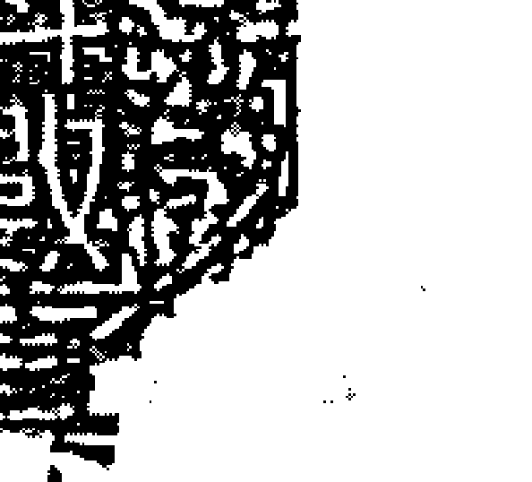
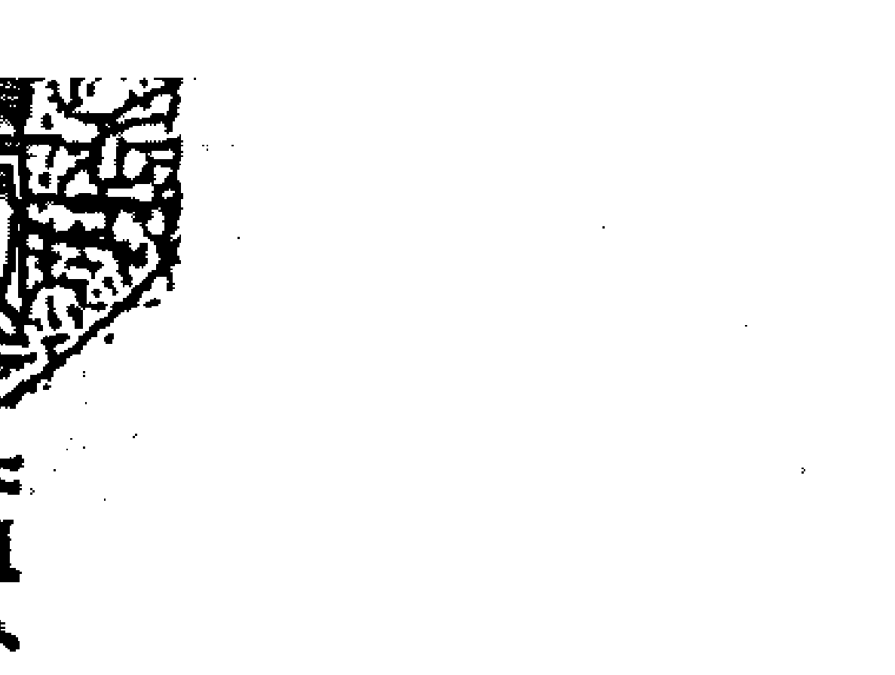
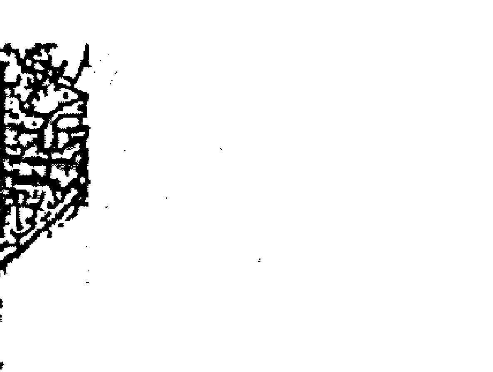
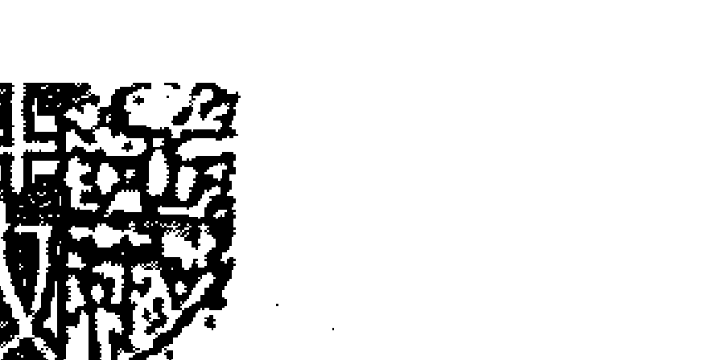
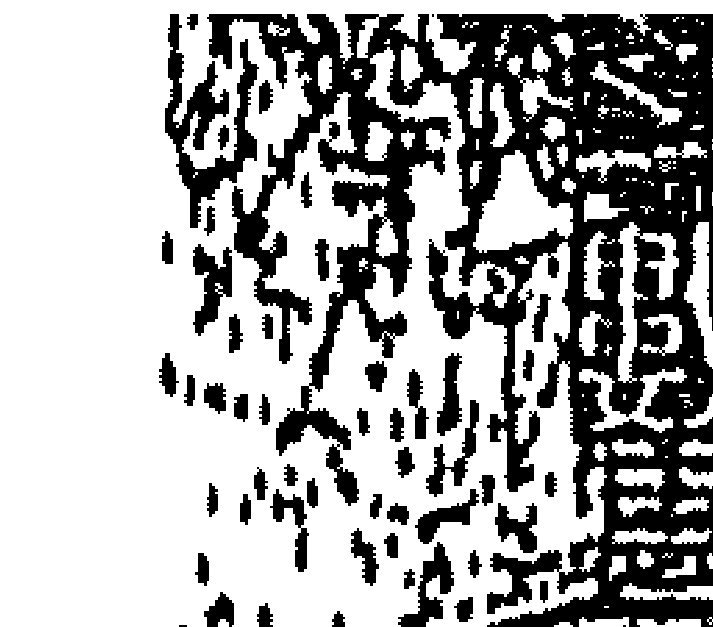
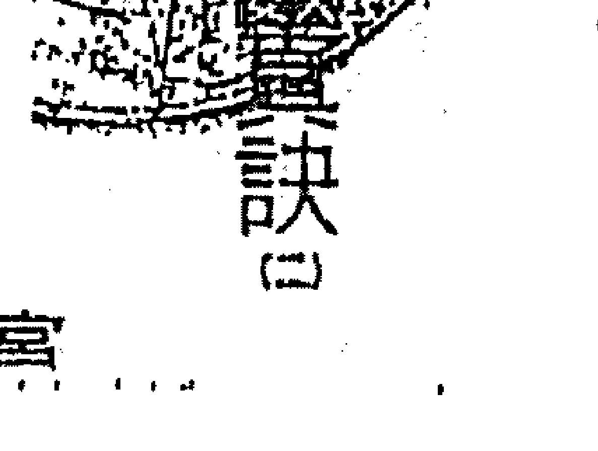
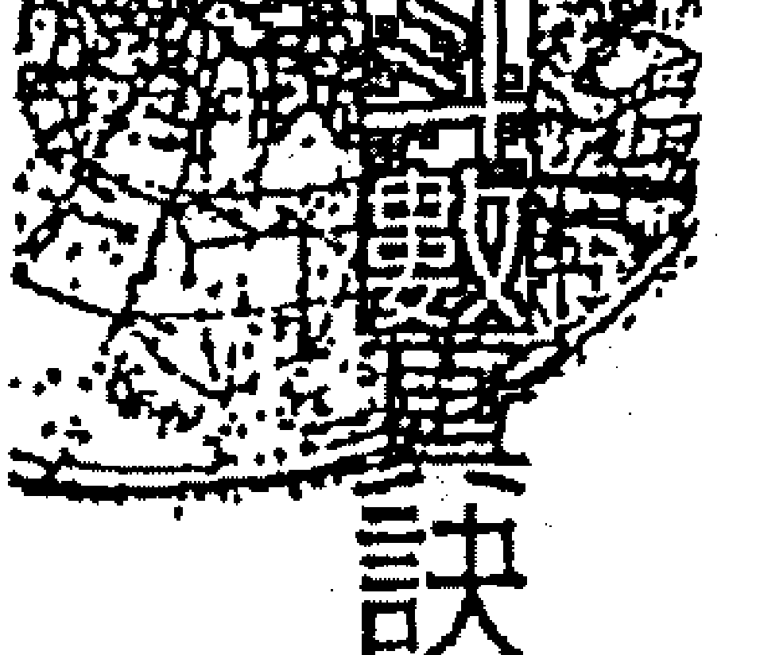
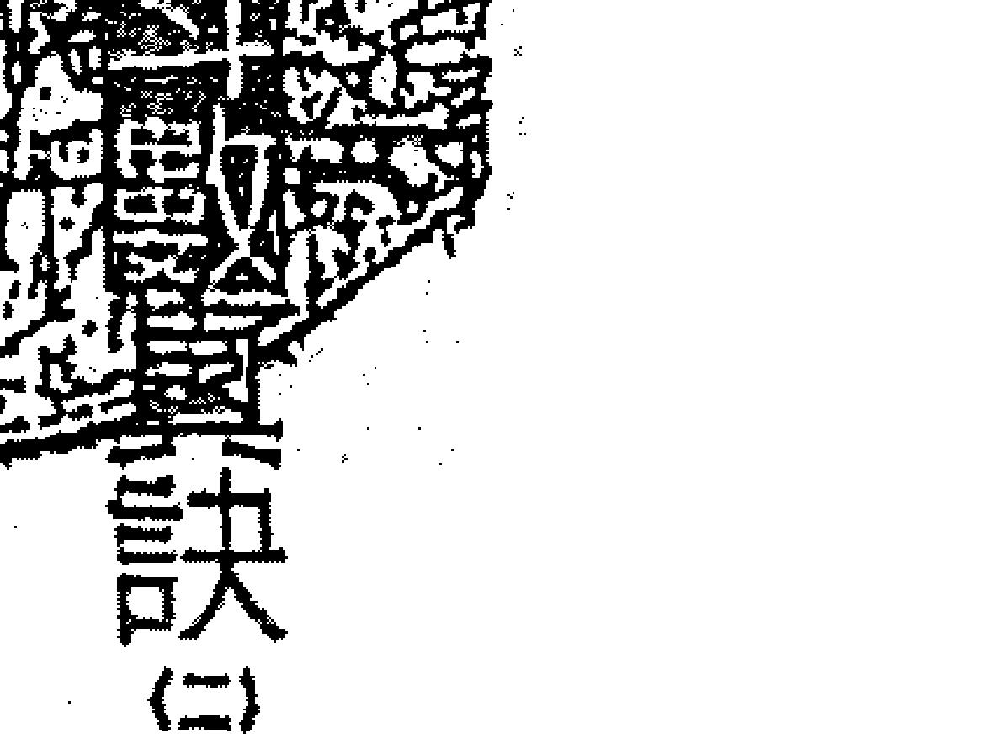
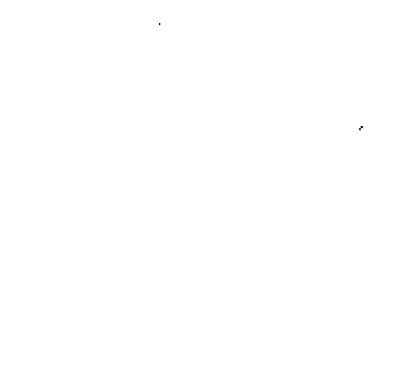
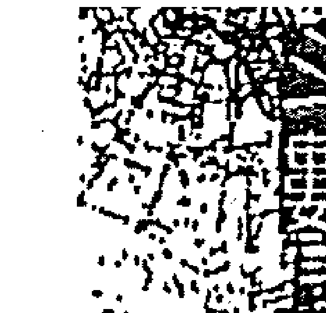

The request was rejected because it was considered high risk

# 如何確定出生時辰

好，摸不到也是枉然。有人說：「人生在世，不在乎天長地久，只在乎曾經擁有」；也有人說：「人生當中的得與失並不重要，重要的是人生的過程是否絢爛，內容是否豐富？」價值觀人人不同，有人只在乎輸贏；有的則是輸贏無妨，不傷和氣，好玩就好，爽就好。

## 二、如何對待命宮及身宮？

> > ——斗數論命第一招

紫微斗數是使用太陰曆的算法，雖然和子平八字一樣都使用農曆的生辰，但是紫微斗數卻不須像子平八字那樣，以節氣交接來計算生月。一個人的生辰是用以排命盤的根據，所以生辰的準確性甚為重要，尤其是子時出生者更須注意是早子時或晚子時，因為二十三點至一點雖屬於同一個時辰，但以二十二點為界，前後已實隔一日了，若沒加以詳察，則雖差之毫釐，必失之千里，因此不得不慎。

欲論命之前，除了按前章所提及的步驟，依序分析之外，必須先詳閱命宮所坐甲級星之長相、個性、及其優劣特徵，詳加研判；並且其星曜之旺弱有別，男女命格亦有差異，其相貌、個性、脾氣等也有分別，必須詳細印證無誤之後才可開始論斷，否則命格有誤，則理論亦難合邏輯，弄得是牛頭不對馬嘴，徒貽笑大方。

# 如何看待命宫及身宫

### ◎命宫与身宫互为表里

命宫代表一个人的先天，命宫里的星座于内主宰一个人的个性、思想与心态，于外则表现该星所特有的长相与身材。而身宫则是代表一个人的后天，是在二十五岁之后才会渐渐发挥作用。虽然是如此，但是在命格上却也具有举足轻重的地位，不容忽视。

身宫是命宫的1个替代宫位，尤其是当命宫里没有主星时，其身宫之星曜必发挥作用，就像家里若是爸爸不在了，就由妈妈当家主事一样。

- 子、午时出生，命、身同宫

命身同宫者较具自我观念，没有第一个职务代理人，或第二种想法，一切思想、特性皆以命宫星宿为主。命、身宫星曜较少者，则受较少星曜之影响，思想、个性都较简单。

- 丑、未時生人，身宮在福德宮

福德宮是一個注重精神享受的宮位，同時也代表著一個人的福份厚薄。若是宮內坐落吉星，主此人較注重生活情趣與享受，就算此人事業心很強，也不忘在工作之餘撥空消遣一番，而且他就有這個福份可以忙裡偷閒。但是福德宮內若是逢煞星坐守，則主其人容易過度操心，杞人憂天，心情放不開，常鑽牛角尖，明明大可放手給別人代勞的事，卻無謂實心而事必躬親，於是要做的與不該做的，全部攬在身上自己做，無形之中徒增了許多勞碌而難得清閒。

- 辰、申時生人，身宮在遷移宮

官禄宫内若逢吉星者，则主其人事业心较重，具有创业之雄心，有工作之狂热；事业上自动自发，不须鞭策，不必担心他會遊手好閑，有事業可做比什麼都開心，從工作中獲得樂趣及成就感，叫他閒在家裡，頓覺百病叢生。假如宮內逢煞星坐守，則主其人事業常更動不穩定，而且創業艱難，起伏不定，一波三折，倍受阻礙，事業上的挫折也比較多。

- 卯、酉時生人，身宮在遷移宮

身宮在遷移宮主其人較外向，愛往外跑，而且必須離開出生地到他鄉謀生。宮內逢吉星坐守者，此人在外的人際關係良好，長袖善舞，而且外出必逢貴人相助，得以衣錦還鄉。

若是宮內坐落煞星的話，則其人際關係較弱，而且外出所遇挫折是非較多，因而奔波勞碌難免，這種情形如果當事人只是一個家庭主婦或公家機構的員工，影響倒還不致於很大，頂多是人緣不佳，人際關係單純而已；但對於從事外交或業務以及公關等，需要靠人際關係來打天下的人而言，可就倍感吃力了。

- 辰、戌時生人，身宮在財帛宮

身宮在財帛宮主此人奉行「人生以賺錢為目的」，金錢觀念較重，愛錢如命。若逢吉星，表示此人精打細算，善於理財；如又逢財星坐守，必然堆金積玉，富甲一方。若逢煞星坐守，則財來財去，花錢勇敢，守成不易，不宜理財。

> 俗云：「生死由命，富貴在天」，一切強求不得，命好不到貧家去，命弱難進富家門；意莫喜於知足，苦莫苦於多願。雖說有錢能使鬼推磨，但有錢人的煩惱卻比別人多，《好了歌》說得好：「世人都曉神仙好，唯有金錢忘不了，終朝只恨聚無多，等到多時眼閉了。」

- 丑、亥時生人，身宮在夫妻宮

身宮在夫妻宮主此人較容易受配偶的影響。如果有吉星坐守，表示能擁有一個好配偶，而且配偶是自己的貴人，能受配偶之助，相輔相成。

夫妻宮內若逢煞星坐落，則會受到配偶的拖累，這種情形之下，在選擇配偶時，可要睜大眼睛，寧缺毋濫，而且不宜早婚，以免草率結婚而抱憾終身。

### ◎星曜強弱影響流年運勢

命宮主一個人的先天以及童年，身宮則主後天，亦表中年以後的情形，且三十五歲之後逐漸發揮作用而產生影響。然而一個人的個性也會受行運時大限的命宮星曜影響，也就是說隨著運勢的運行而有所轉變。

我們不妨仔細觀察任何一個人，包括自己在內，十年前的個性、脾氣和觀念必然和十年後的情形或多或少會略微不同；甚至對事情的看法亦會改變。相信日常生活中，我們常會聽到某人說：『數年前或許我會如何……，但現在不行了』，或是『要是換了我當年的脾氣，早就如何……』等等。可見人的個性、思想會因時間、遭遇或人生歷練而逐漸改變，就連相貌、身材等都會產生或多或少的變化。

## 第⑥章 要訣篇

## ◎透視命、身宮星曜的旺弱

- 命宮強，身宮弱——主少年得志，而晚運較坎坷，或勞心或勞力，是孤寂或是傷病，須視其命格以及行運概況來判斷。
- 命弱身強——主早年必定歷盡滄桑，遍嚐風霜，方能苦盡甘來，安享晚年。
- 命強身強——須視其行運之旺弱而論其吉凶，因其根基穩固，韌性較強，縱使時行運不佳，也尚能勉強渡過，即所謂命好不怕運來磨。
- 命弱身弱——主一生必操勞，事事難以順心，真可謂先天不良，後天失調，行運坎坷，大起大落，險阻重重，縱然能有所成就亦難以守成，此乃先天命所定，父母生成，非弟子作孽也。

## 十二、如何解释命宫星曜？

### 斗数论命第二招

紫微斗数中的星曜，各有所属，也就是每颗星都代表某种身份，且各有所司。例如天机属兄弟主，也就是代表兄弟；破军属子女；太阳则有多重身份，须扮演多重角色，既代表官贵又为父星；亦为夫星；太阴是为田宅主；又为母星，亦是妻星；天同星则为福德主……等等。这些在之前单星系列的部份即已详列，星为某宫之主，以及所司何职？瞭解了这些星宿的身份与职掌，较能够对于坐命者的个性以及六亲状况有更深刻的体会。

命宫当事人的命宫坐何星，可视为当事人被指派在人间舞台上所要扮演的角色。就像童年时所玩的「家家酒」，被选为当爸爸的人，一定要上班、赚钱养家；作妈妈的就必须煮饭、哄娃娃；当哥哥的，可以管弟妹，每一个人都会尽心的扮演被指派的角色。

紫微斗數也是一樣，並且當你命坐某星，就等於你代理了它的身份奪佔了它的地位，包辦了它的職務，當然也要執行它的任務。以下略舉數例為分析。

### 【例一】天機坐命，主兄弟緣薄

天機即代表兄弟之星，姑且不論其人貴賤如何？天機坐命者，因其佔了兄弟之星，因而兄弟的數目必定很少，除非消除這個奪佔兄弟主的原因（即離祖或庶出過繼給別人），否則他和自己的親兄弟緣份必然較薄，尤其要注意的是這種代表六親的星宿，因已有奪佔的意味，於是更不利加煞，否則易造成刑傷，而且此星為兄弟主，所以百分之八十會令他的兄弟受到波及。

### 【例二】破軍坐命，主子女較少

破軍為子女星，命坐破軍者，因其佔了子女的星曜，於是其子女必少，或是所生的子女都是單一「性別，為清一色」，而且此星坐命者非常疼變子女。破军亦为耗损的星曜，因此亦不利加煞，首先也是殃及子女，主先损后招，也是无冲二十五学者。

### 【例三】太阳坐命，与父不和

太阳坐命者，无论男女命，事业心都很强，而且占了父星，于是自己俨然一家之主的架势，老爸只好一边站了，因此和老爸是格格不入，难以沟通。

既然如此，为何又说太阳坐命者孝顺呢？因为他虽是夺其星曜，但并不是要篡老爸的位，而是基于孝顺、顾家，休戚与共，想替一家之主分忧解劳：却是各持己见，意见难和谐，女命甚至有夺夫权之兆，因而不利婚姻。此星同样不利加煞，否则必然也是就其所司星宿之主首先受影响。说起来扮演这种角色是既辛苦劳碌，却又最吃力不讨好，孝顺顾家，却又偏偏与父无缘，跟夫寡合，所以此星喜照不喜正坐。

### 【例四】太阴坐命，与母亲无缘

太陰為母星，坐命者無論男女，與母親緣份較薄，不是相處不來就是聚少離多。此星亦為妻星，於對男命而言，主婚姻有剋，亦多異性緣，此星代表母與妻，故不宜加煞，易因磁場的影響而對母與妻。唯一的好處就是不必擔心沒有不動產，此星坐命不太可能成為無殼蝸牛，除非其田宅宮真的很爛。

### 【例五】天同坐命，生性較懶散

天同為福德主，應該是坐在福德宮，才叫做有福氣。若是拿來坐命宮，一樣是奪了福德的主星，其心性必然較懶散。所以不論男女命，坐命者其一生中感情困擾必多，皆因其奪星曜之所致於本身之故。此星坐命若是再加上煞星，則其福份必會受損，而顯得非常勞碌。所以欲論命，亦須詳查命、身宮所坐主星的特性，以及所奪佔的星曜主的是什麼？

> > ◎天同照會比正坐有利

> 訣曰

## 如何解釋命宮星曜

命宮或身宮無主星時，須借對宮的星宿「用」。若本宮有昌、曲、祿存或羊、陀、火、鈴等星，就不能夠借用對宮星宿。當本宮無主星時，在借對宮星宿時須注意，只能把主星借過來，而不能連昌、曲、祿存及羊、陀、火、鈴等一併借來；但是甲級星若有四化者，則隨甲級星「一同借過來」。

星曜若是用借的，有時反比正坐的要好，如借天機坐命者，其個性、長相、特徵都趨向於天機，但卻不能視為奪占了兄弟之星，而沒有對兄弟不利或緣薄。

而借太陽或太陰坐命者，其孝順、顧家之性依舊，各種特徵、心態都在，但卻沒有他所謂與父母或夫妻無緣的情形出現，奪與佔只能用於正坐其宿時言之。

借用星宿則是有它的形象，就像是把此星當成偶像或模仿的對象，形貌、作風雖然極其神似，事實上卻並沒有真正的反客為主，令它侵占到被借用的宮位；因此，當命、身宮無主星時，宮內就像放一面鏡子，照會到對宮的星曜，鏡中便反映出和對宮一樣的影像。

## ◎借劃四化星利弊參考

至於借用星宿的旺弱問題，一樣必須按該宮之地支五行與之生剋。如天機在寅宮屬木，則視為利；若申位無星而將天機借過來，則金剋木為地支所剋，則此時天機視為落陷論之。

另外，日、月二宿之旺弱雖非以星曜五行與地支生剋，但也必須以丑、未為界來區分旺弱；借用的亦同。如太陽在酉為西沒，若卯位無星，借用酉位太陽至卯，則為日出廟旺。因而命、身宮也好，其他宮位也好，借用星曜有時更好，有時卻不如不借，尤其借到四化星時，如果能不借的話，則比別人多了一個好處，若借到化忌，就反而多了一個麻煩；能不能借用對宮之星是一回事，借來後是好是壞又是一回事哩！

## 四、如何解釋五行生剋？

### ——研究斗數命第四關

地盤裡十二宮位，依其地支不僅分別具有陰陽五行，眾星曜本身亦各有自己的陰陽五行之屬性，在論其旺弱之時，除了星曜與宮位地支之陰陽五行互相生剋之外，同一宮中星與星之陰陽五行，生、剋、制、化，亦非常的重要。

也就是說宮內只有一顆星，則此星只要能適應該宮的環境（即地支的陰陽五行），此星則旺弱立現；但若宮內不止一顆星時，那麼這些星曜除了適應環境之外，尚須互相「法較量」一番，勝者為王，敗者為寇。

就像一個家庭中的女主人，只要能得老公寵愛，地位自然重要，在家中就有決定權；若是家中有個二妻四妾的話，想要當家主事，恐怕除了要得老公疼愛之外，妻妾之間也需要彼此「較量」一番了。

## 第⑥章 要訣篇

## ◎生

各星是以其本身所具有的陰陽五行作籌碼來「較長短」。所謂「生」，是指五行中，木生火、火生土之類。被生者為廟旺，若生對方者，則本身原氣被洩，視為「平」。此時若以陽來生陰或陰來生陽者，則剛柔並濟為上吉；陽生陽或陰生陰者，雖然仍是相生為吉，但較次之。這如同異性相戀，乃陰陽調和，屬天經地義的事；要是換成了同性戀，雖然亦屬相當，但總是不大對勁，而且既不能結婚又不能生子。

## ◎剋

所謂「剋」，即金剋木、木剋土之類。但必須陽來剋陰或陰來剋陽方可，因其五行雖然相剋，但陰陽卻是相生，如父教子，嚴而有情，管教他卻不會害他，主先否後泰。

## 如何解释五行生剋

所謂「制」，即五行相剋而陰陽能相生者。如貪狼陽木在未宮，當有武曲之陰金同宮，未為土，又是木庫，主陽木有根，而且能生金，兩星皆旺。因為貪狼本是惡星，陽木屬於高大之木，得武曲之斧金（陰金）來剋制雕琢，反而可成棟樑之材。又如天府星本身能制羊、陀為從，化火，鈴為用，故天府與煞星同宮，煞星反為我用，主其人做事甚具衝勁而不以凶論。天府就像「一個消化系統很強的人」，遇到某些不易消化的食物，別人吃了會無法消化，甚至腹瀉而受其害，但消化系統強的人，不但吃了不會不適，而且還可將他消化分解而吸收其精華。

## ◎化

所謂「化」，即如火剋金而得土，成為火生土而土生金，這樣引通之局，乃是最上乘之局。例如武曲陰金居於午位，而午位屬火，則武曲被剋，卻得天府之陽土同宮，則形成午火去生天府之土而天府之土又去生武曲之金。如此「一來，自然化解了相剋之凶而成爲引通之局，反爲成格之造。就好像兒子很怕老爸，而不敢向他伸手要錢，但老爸很疼老媽，而老媽又疼愛兒子，於是老爸會給老媽錢，這時老媽又會給兒子錢，於是二人都有錢。

## ◎五行生克與磁場有關

所謂陰陽五行的生、剋、制、化，若以科學的角度來看，可視為互相之間的「磁場」相容與否。五行相生，則表示彼此的磁場相容，如魚得水，相得益彰；若再加上陰陽調和的話，那就更是水乳交融，錦上添花。

還好一對情投意合的夫婦一樣，如膠似漆，難分難捨，互相關照而相輔相成。如果五行相剋，則顯示彼此的磁場不合，甚至互相排斥、互相牽制，使得彼此格格不入，經常背道而融；若陰陽又不調和，那更是水火不容，雪上加霜，如一對怨偶，同床異夢而來電。

屬宿本身的陰陽以及五行，在單星部分已介紹過了，至於宮位的五行，可查看《現代斗數真訣》第一冊列表，以子、寅、辰、午、申、戌為陽宮而其餘則為陰宮，一陰一陽相間排列，如同磁鐵正負相接一樣。能夠分析各宮、各星的旺弱及彼此的互動關係，在論命之時才不致於失誤，否則僅憑單星的性質，尚無法有效的決定吉凶。某星雖吉，但若處於不得地之處也是枉然，吉星處於廟旺之地是錦上添花，處於不得地之處並非主凶，可作減吉或無法發揮其長處來論之。若凶星處於廟旺之地，雖無吉處可言，但總比處於陷地要好多了。因此看命盤若是沒有將旺、弱因素列入考慮，則所論之事必然與事實相去甚遠，所謂差之毫釐，失之千里矣！

## 第⑥章 要訣篇

## 五、如何面對命好運差？

### ——改變命運第五招

命身宮為個人的根基，論命則必須先定此人根基的強弱，再看此人的行限走向。雖然同命盤、同宮坐命，但因為男女以及陰年或陽年生人，以致人限走向不同，使得運勢亦有差別。行限以命宮為起點，但順走或逆走其結果卻有天壤之別，運好，得天時地利，一路行來是過關斬將，「一帆風順」，那些較差部分的運程有可能終其一生都走不到了，多好啊！

以前說同一張命盤而言，若與前者反方向來走，有可能就舉步維艱，處處碰壁，甚而壯志未酬身先死，未及開花結果或苦盡甘至之前即「伸腿瞪眼」了。於是，所謂「命好運差」如李廣不封，有志難伸而抱憾終身，命弱運佳，則小卒也會變英雄，此乃時勢造就也。

## ◎命格旺弱主事業、生財賦

大凡人之命格，不論富貴貧賤，在十二宮中必有旺弱之分，故論命之時，其命、身宮之旺弱、吉凶固屬第一，但格局也非常重要。
所謂「格局」，意為一個形體所具有的格式、款式或是架構，就像一幢建築物外觀所表現的型式，以及內所規劃的格局。而格局有大、小、美醜之分；然而一幢房子即使它的材質、地點都不錯，但卻有可能因它的格局規劃不理想而無法令買主心動。因此一幢好的建築，除了講究其材料配備、施工品質與座落地段之外，若再搭配設計精緻的格局，必然身價百倍不同於一般。
因此若有格局而不逢沖破者，可不論其財、官；當如何？成格逢破，則如美玉有瑕，方須考其財、官。格局逢破，並非原本該有的卻沒了，或是會一敗塗地、破敗潦倒一生之意，而是依然有某些成就，但不及成格局者穩固，必有某方面的破綻，因而要參考其財、官，是富而不貴或貴而不富，或主貧寒而清高。

## 第⑥章 要訣篇

## ◎格局大小夫命早巳注定

高格就如一幢具有藝術性或區域性色彩風格的房子，如哥德式、巴洛克式或傳統鄉土式的建築，必然會因它的獨特性而價值不少；一旦破格就，如同它雖是一幢漂漂亮亮具有特殊風格的建築，但因使用了輻射鋼筋，致使其身價大跌一樣，於是就必須對此建築就各方面條件重新加以估量衡量，因此不能忽略了格局的重要性。

格局的好壞影響一個人一生至為深遠。一個擁有豐功偉業，而叱吒風雲的人物，若將其命盤排出，都少不了具有某些不錯的格局；而一個揮霍無度，慘敗起伏之人，也必擁有一個奇爛無比的壞格局；若是介於二者之間的格局，終其一生也沒啥大不了的事蹟可言，顯得平淡平穩。

當然好與壞並不能以其成名與否來界定，因為就算貴為將相公卿，備極尊榮，但是其所肩負的重任於無形中必然增添其不少的勞碌，或日理萬機，運籌帷幄，或長年征戰戍守邊疆，因此反不如一般凡夫俗子，一生庸庸碌碌之人，論終其一生雖無大成就，但也無大災難，心境顯得悠然自得哉，這但看個人的人生觀與價值觀而定。

## ◎運勢優劣有賴星曜組合

紫微架構共有六種組合，於甲、乙級星單星介紹中已有提及，而命盤共有十一個宮位，每一宮都可能是命宮，故相乘之下共有七十二種變化。於是每一種坐命方式，其命宮、財、官各不相同，成就自然不同。但亦有同盤同宮坐命者，其中之一人或許是某個赫赫有名的人物，而另一人卻只是一個販夫走卒的泛泛之輩而已，這中間的差異，可能在「格局」中可尋得答案。

除了命、身宮以及格局之外，其運勢亦佔有重要之一環，亦有命、身皆居於平和之地，三合並得地，本是平常之人，而其行運逢連珠成格之運，配合得巧妙如及時雨，就像一輛普通車，一出發即上了快速道路而直奔高速公路，天晴路況佳，再加上一路空曠不塞車，而能長驅直入，順利直達目的地，此為時勢造英雄而非關命格也。

## ◎枯木逢春恐難成就大器

有命、身宮居陷地而逢煞星沖破，三台方又無吉星相助，本是孤寒無依，傷天之命，然行運過關，大難不死，而行運忽逢眾吉皆聚，於是如雨後春筍，乃勃然而興，橫發一時，一運十年或二十年，風光異常，得意志非凡：但終因本命不佳，根基不穩，運過即一敗塗地，或因意外而亡，即所謂的「枯木逢春」之運，鮮有後福。

又譬喻一輛性能極差的爛車，一扭一擺二搖四晃的開上路，沒能遇到快速道路，幾經波折驚險的駛過崎嶇小徑，而奮力的開上了高速公路，於是一路順暢而得以與眾車並駕齊驅：但終因性能不佳，不堪長途奔馳，以致半途即因機械故障而告拋錨，終歸停頓。

## ◎命好運差有待動心忍性

具有根基甚佳的，如紫、府、祿、馬皆朝格局，頗為不錯的，宛如其人出身於榮華富貴之家，基業雄厚；但因行運至中年或老年之時，忽遇空劫、四煞等惡曜會集而引起破家敗產，或聲譽掃地等變故；就好比開著一輛「過鹹水」的名牌大轎車，性能、馬力一流，馳騁於康莊大道之上，一路上四平八穩的拉風透頂，於是上山下海，南來北往的無往不利；卻因在回程之時遇到不良的路況，因不及閃避而發生了意外，弄得車損人傷，此乃運也非命也，論命之時，當特別注意以免失誤。

一般而言，命格較高的人，較屬於晚發型的，所謂「大器晚成」。前半生幾乎是忙忙碌碌，辛勞艱苦，雖然在財富上的成就不理想，但在艱苦之中所累積的種種經驗以及磨練，卻是奠定其日後成功的條件之一，所謂「天將降大任於斯人也，必先苦其心志。

© 羅援將軍駁人生無常

人生變化無常，若無堅毅的耐力，將無法通過人間種種的考驗而生存下來。這種耐力並非與生俱來，或一朝一夕所能獲得的，在生活中，若能將種種的挫折與不如意，視為一種成功前的準備而坦然接受，不被擊敗，能擁有這樣百折不撓的精神與毅力，實則已遠勝於事業與財富上的世俗成就，這樣的人，於日後成功之時，也更能珍惜他辛苦拚鬥得來的成果。

反倒是命格普通之人，某些受運勢的影響，早年得意，但往往得來容易而不加珍惜，以致晚年破敗無法守成，而來去一場空，事後怨嘆時也、運也、非我僥倖也，那才真的可惜！

## 如何判斷同人不同命

### 六、如何判斷同人不同命？

大凡人之命格，受先天福份深淺不同及後天的家庭背景迥異，而有不同的際遇。試想擁有一個生辰八字者，何止上百人之多，然而因個人後天生長的環境不同，而有所差別，就算是一對雙胞胎，他們不但是「同」家公司出品，並且是生活在同一個環境之下，將來也未必能同時讀到大學，也不見得會同時結婚生子。

### ◎同人不同命的原因

為什麼同」個生辰八字坐命，卻擁有不同的人生遭遇？其原因歸納如下：

- 1. 因性別不同：雖同命盤同宮坐命，因男女行運方向的差異，使得人
- 2. 因智慧不同：不同的遺傳基因產生不同的智商，對同一件事情的判斷不同，結果當然會不一樣，一個人的智慧差異卻不是命盤上所能看得出來的。
- 3. 因出生地不同：某些星曜坐命者，會因其出生地之方位而產生吉凶不等的影響。如火星、鈴星坐命者利東南生人，不利西北生人；而擎羊、陀羅坐命者，則反之。論命如果連當事者的出生地經緯度都不去校正或注意，那命盤看了也是枉然。
- 4. 因家世不同：八字相同的人未必有相同的家世，因而其生長的環境，生活的方式多多少少有所分別，所受的教育程度也不一樣，如何能相提並論？
- 5. 因後天因素：當事人品格與本身的修養不一，於是對其日後的行事作爲上有其深遠的影響，所造成的結果，自然在程度上輕重有別，此屬人為上的因素。

同二個生辰八字，有的能當將軍，有的也許只有在菜市場當屠夫的份。論命無百分之百的準確，唯有當我們愈瞭解當事者的身世背景，論斷這張命盤的準確度就愈高。

當您手握命盤，劃分各宮位的星曜，五行旺弱以及諸星之性情，並熟記心中，判斷事理自然不難，論事便可應各。然而在論命之時，當存隱惡揚善之心，口不言惡，若有悟出何種隱情，應謹言為要。如家庭、夫妻、父子等對待關係，當一表而過，略備小忌可，切勿存有揭人隱私而沾沾自喜，有損道德。

會來論命的人，多半是因為有了感情、事業、健康……等，須要面臨抉擇而難以取捨；或是在這些方面出現了某種程度的危機與不如意，而急需求助，為其指點迷津。

此時有部分當事者或許此刻心中正承受著某種煎熬與衝擊，以至六神無主，不知如何是好？因此一字一句都須要婉婉謹慎，而且要站在對方的立場來想：並提供一些建設性的建言，切莫加油添醋，危言聳聽，欺世盜名，如此反會引起當事人一時方寸大亂，甚而做出不理智之事，又豈是當事者之所求？但有關於對當事人不利之事，如災病、破財，是非、安危等，則必須給予明確的提示，以利防範。

### ◎按照順序，習盤有條不紊

論命時，看命盤的順序依次為：

- 1. 先看命、身兩宮，對宮兼及合宮為何？
- 2. 再看財、官兩宮為何？
- 3. 接下來看大、小限落於何宮？其對宮兼及合宮為何？
- 4. 次看大限之走向以何宮為強？何宮為弱？以及現行之大限如何？今年小限如何？太歲流年又如何？
- 5. 再以安斗君法定出正月，即可按部就班，逐一演練，孰能生巧，自然很容易進入情況：未達情況，切勿妄下斷語，以免誤判而損人不

### ◎經驗不足，唯靠不斷進修

欲成爲一位稱職的論命者，除了紫微斗數的基本知識要熟習之外，日積月累的論命實務經驗也是非常的的重要。然而在這些專業知識之外，論命者本身亦須時時不斷充實自己以期更上一層樓，並且訓練培養敏銳的觀察力及周詳的分析能力與冷靜沉穩的態度；對於加強周邊的知識亦不能等閒視之。

是很難探索的，善惡往往在一念之間，如果對於心理方面的知識有所涉獵的話，對於判斷當事者之心態必能有所輔助，而不致在尚未論命之前，於核對命盤生辰印證之時，即因當事者有意無意的隱瞞之下而誤導。

> 判曰。其間經驗非常重要，畢竟你我都無法否定後天存在的「道德行爲」因素，在命盤中是無法顯現出來的。

### ○掌權時局，有助運勢分析

論命者亦須時時注意社會動態，以及各方面的資訊，能夠掌握時代脈動，方不致與時代脫節。
在論命之時，上門求教者涵蓋士、農、工、商，不泛各行各業之人，若自己本身對於上述資訊都不了解的話，則無法與當事者溝通，形如雞同鴨講，又如何能夠提供對方因應之道呢？有時尚須考慮到國情以及地方性的差異，才能作出更準確的判斷，並能給予當事者更符合實際的建議，否則只顧專業學術上的理論，而沒能因時、因地、因人來加以考慮的話，縱使是按正確理論來演繹推斷，與事實卻大有出入，並且亦無法提出有效的解決之道，供當事者參考，而流於呆板、不切實際。
是故，紫微斗數乃一門活的學問，不是生硬的法規條文，宜靈活運用，因此若能將之生活化，對人類而言，亦未嘗不是一項了不起的貢獻。

# 图一（一） 三皇图

## 第④章 宮位篇

### 【兄弟（姊妹）宫】

### 兄弟代表手足

兄弟宫代表手足，為六親之一。相信大家讀小學時，曾讀過一篇「孔融讓梨」的故事，甚至在幼小的心靈中，一度很討厭父母老是拿故事中的孔融來教訓小孩，要求自己效法孔融愛護手足。多年前，螢光幕上也曾上映過一部戲「他是我兄弟」，使得不少人為戲中所表現出來的手足親情，一掬感人熱淚。

兄弟弟恭，長幼有序是中國人千古以來對子弟的諄諄教誨，自古至今史科所錄，報章所載，手足中患難與共，相互扶持乃至捨命犧牲之事例，不勝枚舉，令人感佩不已；但是兄弟之間為了權勢、名利、地位而鬧得親情反目，手足相殘的例子也不少見，如唐朝的玄武門之變，以及曹植被迫七步成詩等例，令人聞之莫不感慨！

### ◎現代人和手足不多

在過去的農業社會時代，兄弟的地位不容忽視，因為處在勞動型態的農業環境，大家庭較普遍，家中成員個個生活息息相關，兄弟愈多，家中的幫手愈多，生產力愈強，做任何事不會孤掌難鳴，在大家相互照顧之下，不致於孤獨無依。

隨著時代潮流的變遷，社會型態的轉型，以現今社會而言，生活方式與往昔已大為不同，大家庭已不多見，即使手足不少，但人人自成一體，且婚後紛紛出外自組小家庭；而且身處工商時代，講求經濟效益，並且受家庭計畫的影響，生育重質不重量，沒有人願意再為了養兒防老，延續香火的觀念，使自己像母豬一樣拼老命的增產報國。

於是像過去那樣「七仙女」、「八家將」，擁有一打」乃至一斤」數量孩子的現象已不多見；時下小家庭生育超過雙的子女就已嫌多，歐美社會甚至出現所謂的「頂客族」，夫婦兩人同時上班，擁有兩份收入而不生小孩。如此一來，年輕一代的人就極少擁有眾多的手足，兄弟宫的地位也渐渐式微了。

### ◎扮演角色依各宫而定

兄弟宫排在命宮的次一宮，顧名思義，它是代表兄弟的宮位，依宮內所落星宿可顯示出與當事人之間的緣分與情感。不仅如此，紫微斗数是非常活絡的學術研究，它不能夠太刻板的死守教條，例如兄弟宫它是父母宮的夫妻宮，亦是夫妻宮的父母宮，同時也是僕役宮的遷移宮，所以它扮演了許多重要的角色，須要靈活運用才能夠理解，這也是斗數奧妙迷人之處。

### 兄弟宫的意義

兄弟宮的涵義分為六大重點：

1. 顯示兄弟間的對侍關係
2. 直接影響僕役宮
3. 間接影響命格
4. 分析兄弟的人數
5. 分析父母之間的對待關係
6. 與婆、岳家之間的對待關係

茲將各點列述如下：

### 1、顯示兄弟間的對待關係

兄弟宮內星宿的好壞代表與兄弟之間的相處情形。宮內的星宿性質較柔，如天同之類，則表示當事人與其手足之間的感情好，緣分厚；兄弟宮之三合無煞來沖的話，其兄弟對於當事人之要求，則是有求必應。

### ◎手足是形同陌路？

若宮內星宿剛烈，如武曲、七殺等星，則手足間形同陌路，各自為政，甚至一言不和，大打出手，一時之間唇槍舌戰，南轅北轍，各不相讓。若是再逢煞星或空亡星，則兄弟必損，且煞多損多，或損於幼年，或損於成年，但視行運而定；且於大限兄弟宮凶或宮干爲戊，天機化忌之時較爲明顯。天機爲兄弟主，落於兄弟宮恰到好處，惟其手足之中必有一人須過房離祖，或另認義父母。

## 第⑦章 宫位篇

### ◎男女命意义相反

兄弟宫反映出當事人對待兄弟如何？而他的兄弟對當事人如何，要以該宮的四化星來決定。男命的兄弟宮，代表與其兄弟間的對待關係，而對宮僕役宮則代表他與姊妹間的對待關係；女命則相反。

### 【一、直接影响对宫】

兄弟宮與僕役宮是對等的一條線，互有影響，因爲任何一宮的對宮，都隱藏著該宮的吉凶。

例如：命宮爲貪狼在戌，其兄弟宮必爲酉位太陰，對宮僕役則爲卯位天同，此時研判其兄弟宮爲柔星坐守，該宮星旺而且對宮星宿亦佳，二...

### 兄弟（姊妹）宫

◎表面和谐卻內藏玄機
若是對宮有惡煞坐守對沖兄弟宮，則兄弟宮便逢破，表示兄弟間的和諧只是從表面來看如此，仍符合其兄弟宮內太陰星之性質，實則暗潮洶湧，一旦遇有重大事故，就會「患難見真情」而自掃門前雪；或是來個外科醫師的「鋸箭法」，聊盡本分，只把體外的箭給鋸了，體內的箭頭則推給內科醫師，此即表現出對宮的隱藏性質了。

反之，如兄弟宮落凶星，僕役宮佳，則表示兄弟有損，相處冷淡，或對待關係火爆，須視星性而定；但因對宮不錯，所以還不致於被手足暗算。

最糟的莫過於兄弟僕役宮皆落凶星，不但兄弟必損，而且手足無情，互扯後腿，兄弟間體，明爭暗鬥，甚至大義滅親。古往今來，因為各種利害關係及利害誘因，諸如此類之事，不乏實例可援。

### ○兄弟好坏视主星而定

關於說兄弟宮好，是如何的好，或者是哪一方面的差？需要參考宮內的主星性質而定。而且兄弟宮即使用星宿柔和無煞，但對當事人有否幫助？尚須考其星座廟旺與否以及四化如何？
宮內無主星，則借對宮星宿「用」，如星曜落陷無力或是吉星逢空也是自體，表示其兄弟心有餘而力不足，本身都是泥菩薩過河，又有何能耐來幫助當事人呢？整體而言，兄弟宮內人紫、府、相、日、月、機、梁、同、昌、曲、魁，鉞等諸星都算不錯；坐武、廉尚可，雖偶有爭執，未必有害；若是落入殺、破、狼、巨及四煞，則較為不利。

但是看到這裡，兄弟宮好的勿喜，差的勿憂，因為好壞並非「生」一世皆是如此，因歲月是流動的，命盤亦會隨著年齡而轉移，人情世故亦會隨著時光的流失而產生變遷，人的個性脾氣也會因為大限的改變而受影響。

### ○兄弟情誼受流年影响

本命的兄弟宮好壞，只表示童年與兄弟之間的相處狀態，及彼此一生大略的對待概況，所謂十年風水輪流轉，總會輪到該宮好的時候。其實人與人之間的緣分最好不計以往，不論將來，重要的是把握現在，也就是現行大限的兄弟宮狀況，情況好則樂觀其成，並加以珍惜；若是不好則減少接觸機會，避免摩擦，忍讓包容，畢竟手足之間是血脈相連的，弄得反目成仇、手足相殘，使得親者痛而仇者快，徒增勞人笑柄罷了！

### 二、間接影響命格

### ◎父母兄弟有如左右手

兄弟宮與父母宮為命宮的左右輔佐夾宮，如同架在當事人左右兩旁的臂膀，因此命格會產生扶持與否的間接影響。

例如：天機、太陰在寅位坐命者，其父母宮必有紫微、貪狼坐守，而兄弟宮必為天府，形成「紫府夾命」，南北斗主星分立於命宮左右兩旁，相當於兩條有力的臂膀扶持著當事人，架著他行走。是故，在人生旅途中，無論多麼坎坷，身旁的親人絕對不會坐視不睬，父母與手足總是會適時的給他最有力的援助，尤其是在其幼年走第一大限時更明顯，全身上下就像敷了一層金粉，猶如一朵溫室之花一樣的嬌貴，全家人對他是呵護備至，令人好不羨慕！

### ◎六親無依前途較艱難

著是只有父母宮或兄弟宮之一方好，另一方則爛透了，就像放掉一條扶持的手臂，立即失去平衡，這就較前者吃力許多，形成單靠一方的助力，亦是有限。若是左右兩宮遍佈煞星，猶如姥姥不疼，兄弟不愛，左右無靠，必然六親無依，孤立無援，須自立於外地。因此一個人命格的高低、好壞，除了視其命宮以及二方的好壞之外，身為其左右的夾宮，其重要性亦不容忽視。

### 四、分析兄弟的人數

由兄弟宮的情形可以看出當事人有多少手足，但是有許多外來因素須列入考慮，諸如時代背景、政府的政令、生活的方式等等。

### ◎節育政策造成論命不準

昔日農業社會需要大量的勞動人手，促使家家戶戶擁有眾多人丁，然而近年社會環境急速變遷，以及政府實施家庭計畫的成效之下，使得民國五十年以後出生於城市的人，若要以兄弟宮來推論其兄弟姊妹的人數，已失去準確性；甚至以生活在中國大陸上的家庭而言，受一胎化的政令限制，又豈有手足可言？

惟上一代所傳下來之秘訣，亦有很多值得我們研究，其中有關手足排行有經驗上的印證，對於民國四十年以前出生者，或沒有節育者仍有相當的準確性。

### ◎如何以宫位来推断兄弟对待关系？

- 1. 子、午、卯、酉，为一、四、七胎。
- 2. 寅、申、巳、亥，为二、五、八胎。
- 3. 辰、戌、丑、未，为三、六、九胎。

其演算方式例如：兄弟宫坐子位为第一项，则子位代表他是兄弟中的老大。对宫午位为老四，其余卯、酉依序为第七及第十胎。
再看兄弟宫所会到的另两宫为辰、申，以辰位而言，符合第3项，所以辰位为老二，对宫戌位为老六；余丑、未依序为第九及第十一胎。以申位来看符合第2项，故申位为老二，对宫寅位为老五，余巳、亥分别为第八及第十一胎。

### ◎如何以长生星曜来推论手足甚数？

以上须扣掉自己的排行顺序：手足若超过此数，则后面的排行无法判断。

五行長生星曜也可推斷手足的數目，但必須參看兄弟宮及對宮之星曜，才可做出正確的論斷。

### 如何由旺陷推斷手足之損傷？

- 1. 兄弟宮或對宮有煞星或空亡星者，兄弟姊妹必有損失。
- 2. 長生、帝旺、墓——化祿位
- 3. 冠帶、胎、臨官——化權位
- 4. 沐浴、衰、養——化科位
- 5. 絕、死、病——化忌位

| 狀態 | 基數 | 特性 |
| :--- | :--- | :--- |
| 長生 | 四人 | |
| 沐浴 | 三人 | 衰——主孤 |
| 冠帶 | 四人 | 病——一人 |
| 臨官 | 三人 | 死——主孤 |
| 帝旺 | 五人 | 墓——四人以上 |
| 衰 | 主孤 | 絕——主孤 |
| 病 | 一人 | 胎——四人 |
| 死 | 主孤 | 養——主孤或領養他人之子 |
| 絕 | 主孤 | |
| 胎 | 四人 | |
| 墓 | 四人以上 | |
| 養 | 主孤或領養他人之子 | |
| | | 以上所列之「基數」為四四「百年之後」手足所存之數。 |

### 五、分析父母间之对待关系

化禄位算宫位至兄弟宫。如兄弟宫坐沐浴，则寻化科位数至兄弟宫；其余类推。其中尚须扣除手足折损之数，或加上化禄坐守增加之数，方可准确推算出实际人数。若是无法自兄弟宫中推断出兄弟数量者，可自夫妻宫来求之，因为夫妻宫乃是父母宫的子女宫之故。

兄弟宫为父母宫的夫妻宫，无论男女命，父母宫代表其父，自然兄弟宫代表其母；于是其父母之间的对待关系和谐与否？必然可自当事人之兄弟宫一览无遗。

化禄星主增加，若该宫之中有化禄星，除了表示手足增加之外，其父母的夫妻也有增加之兆，增加方式有明、暗、正式或非正式，以及认识父母等不同形式，需再参考宫内星性及其三方之吉凶而定。

### ◎天機坐命出養機率高

兄弟宮有化祿，而當事人的父母也確有增加的情形之下，就須研判是何種方式的增加，如當事人為天機坐命者，或命宮無主星需要過房離祖之情形，那麼其增加情形以認義父母的型態較有可能；再者所增加的到底是父或母，則就當事人為男命或女命來加以判斷，就可知其兄弟官究竟是父增加或母增加了。

### 六、與遷移宮或出家的對待關係

兄弟宮的下一宮為夫妻宮，因而以夫妻宮而言，兄弟宮為其父母宮，也就是代表配偶的父母，宮內星宿的好壞可以顯露出當事人與公婆或岳父母之間的感情好坏。

### ◎兄弟宫主宰姻亲关系

以男命而言，其夫妻宫为老婆，于是兄弟宫就代表女命的父母宫，也就是老婆的父亲，自己的老丈人，而对宫仆役宫自然是代表父母娘啰！反之以女命言之，其夫妻宫为老公，于是兄弟宫即代表男命的父母宫，也就是头家他娘「头家娘」，而对宫仆役当然就是皇上旁边的「公公」。
如果一个人的兄弟宫或仆役宫很好，于无形之中能够减少许多婚姻问题，婆媳之间或岳婿之间感情融洽亲如一家；若兄弟仆线不佳，并有煞星冲的话，那么最好在婚后自组小家庭，以避免许多不必要的磨擦与纷争，甚而婆媳、岳婿交恶，互相互看不顺眼，使得夹在中间的老公或老婆难做人，而衍生许多婚姻上的不满。

### ◎女命逢之须忍气吞声

- 1. 一般而言，女命之兄弟线不佳较男命不利，虽然目前时代进步了不...

> 訣曰

### 兄弟（姊妹）宮

少，但以現今之台灣社會而言，仍為父系社會，婚後與公婆同住的機會遠大於女婿與岳父母同住。女命兄僕線不佳，同時又嫁了一位孝順、顧家的老公，這下就有苦頭吃了；若換成男命，反正又不與岳父母住一塊兒，平常往來的少，這方面的困擾就減少許多。

另外在昔日舊社會，以大家庭及三代同堂的生活型態較普遍，對女命而言，影響尤大，若沒有公婆的人緣，則辛苦異常，就像日劇中的「阿信」一樣，只有忍氣吞聲的熬。而在今日社會情形就好多了，最多只是相處冷淡或頂頂嘴，甚至不住在一起罷了。

同樣的，若兄僕線不佳，其對待關係也並非永久如此，隨著運勢的轉變，其相處對待關係亦有改善。原因不一，或因個性溫和了，或因看孩子的份上，或是經濟基礎厚實而身價看漲了，須視行運概況加以研判。

- ◎碰到凶星會引發衝突

同理，兄僕線較好的，若在行運之中碰到凶星，則原本的和諧狀態，## 第8章 宫位篇

也会在该大限内因某事引发冲突，而导致关系恶化。因此在论命时，不能把兄弟宫的情形只单一的导向手足之间的事，而忽略了该宫所代表的其他角色。

例如：在论及当年的流年之时候，见流年之兄弟宫不佳，但其目前所行大限之兄弟宫却很平稳，反而是大限之夫妻宫较差，此时情况而言，属于父母或岳父母有事的可能性较大。如果没有注意这种区别，则判断结果将与事实相去甚远，而使得当事人因论命者所提供的错误判断讯息而担心，应加以注意防范的目标，宜审慎之。

### 兄弟宫之主星特性分析：（女命以姊妹论）

- **紫微坐兄弟宫：** 吉星坐守，主兄弟间必出贵者，可以让你依靠或主动照顾你。单主孤，遇空劫则主刑伤或破败衰落者，遇天马则各奔前程。

- **天府坐兄弟宫：**

天府主兄弟多才多艺，手足之间必有人入公门，彼此照应，不拘小节。会合空劫，则需要你资助；不宜会天姚、阴煞，主明争暗斗。

- **太阳坐兄弟宫：** 太阳星主贵，入兄弟宫有化吉者，主富贵。旺地主社交能力强；有刑煞而落陷，兄弟多故或不成器。

- **武曲坐兄弟宫：** 武曲入兄弟宫本无助，亦不宜共事，彼此任性、偏激。喜文星中和；如会合七杀、破军、擎羊，主因财起冲突，令祖上蒙羞。

- **天同坐兄弟宫：** 天同为福星坐守兄弟位，主手足相处和睦。加煞星则是表面和善，私下暗斗，做事互相推拖，分开居住为宜。

- **廉贞坐兄弟宫：** 廉贞守于兄弟位，一般感情尚称融洽。加左辅或右弼，主时好时坏；逢贪狼或破军，主分居不和；遇煞星时易为反目成仇或受拖累。

- **天机坐兄弟宫：** 命坐天机兄弟必少；守兄弟位，兄弟间必有人须过房或认义父母。旺地手足亲和，陷地则心相背；加煞星，互扯后腿。寅、申、巳、亥见天巫，会有兄弟姊妹争夺遗产，反目相向，甚或闹上法庭。

- **太阴坐兄弟宫：** 太阴坐旺地兄弟缘厚，化吉主兄弟富贵多才华；陷地或逢煞，意见难和谐。

- **贪狼坐兄弟宫：** 贪狼主兄弟之间各怀鬼胎，宜分居以免失和。加魁钺，则狼狈为奸；陷地恐有异胞兄弟或领养他人子。

- **巨门坐兄弟宫：** 巨门主刑克不和、口舌争斗，意见难以协调，兄弟各自为政，只能付出，却想回馈；于戌、亥位无煞，主兄弟创业有成。

- **天相坐兄弟宫：** 天相喜入兄弟宫，主手足情深。加左辅或右弼，主有小兄弟；逢化吉或禄存，主兄弟横发；加煞星，主孤独无依。

- **天机兄弟宫（另述）：** 天机兄弟间长幼有序，相互尊重，婚后亦不受影响。但遇天刑会煞，却因兄弟争讼；见天机者，各持己见，加煞必有纠纷。

- **天机兄弟宫（再述）：** 天机兄弟多层无角，各自为政。加左辅、右弼，主刑伤；加魁、钺，主兄弟能贵显；加昌、曲，遇危难时始能团结。

- **天机兄弟宫（总结）：** 机星入主，代表骨肉多商或离散，自身常居长位。与吉星相配合，兄弟能有依靠；加煞，则互不相容。

- 正解一：兄弟宫有煞星或劫杀星者，兄弟姊妹必有所损。

- 正解二：兄弟宫有煞、禄、权者，本身命宫必须有主星旺而无破，才能得到兄弟之帮助；落陷或逢煞冲破，则助也枉然。

## 【夫妻宫】

初恋的人说：“既期待，又怕受伤害”

苦恋的人说：“卿须怜我，我怜卿”

想恋的人说：“问世间情为何物，直教人生死相许”

同性恋的人说：“他抓得住我”

暗恋的人说：“嗯，有妈的味道”

狂恋的人说：“哈咪拢不惊”

热恋的人说：“爱你在心口难开”

失恋的人说：“才下眉头，却上心头”

◎情为何物教人朝思暮想

无论是爱恋、思恋、单恋、迷恋、自恋，或是黄昏之恋，乃至于第六感生死恋，感情路上，有人是一帆风顺，第二千宠爱于一身；有人是情海

### ◎夫妻宫代表婚姻感情

在斗数中，夫妻宫是谈论一个人的感情生活情形，且是针对于两性之间的情感方面。古代的人，婚姻多是媒妁之言或指腹为婚的形式，没有什么恋爱发展的空间，婚后并受传统礼教三从四德等约束，于是在父系社会的生活型态之下，无论其婚姻好坏，对女人而言，没有什么选择的余地，即使婚姻再怎么不如意，大都要“忍”字过一生，故而在斗数古法理之中，女命以之为强宫。

传统发展且由恋爱至婚姻，随着时代的转变，民风逐渐开放，妇女们也冲破传统的束缚走了出来，在男女平等，女权得以伸张的情形之下，两性之家庭、社会地位日渐拉近距离。因此，女人也拥有了对婚姻上的选择权，可以顺心选择的意中人长相厮守；至于在婚姻上有所挫折的，则各有抉择，也因为如此，离婚率与日俱增。

### ◎现代婚姻应参考现代背景

近午来，西风东渐，欧美速食型的爱情观亦随之登陆，年轻一代的爱情讲究“只要我喜欢，有什么不可以？”不在乎天长地久，只在乎曾经拥有。

于是热水泡冲只须三分钟即可吃的速食爱情已见怪不怪，甚至采用免洗餐具，“用”完就丢，而且男人能，女人为什么不能？没有人愿意再当秦香莲，于是陈世美也就没机会再出现。

男人可以问：“男人拥有三妻四妾是否犯法？”，女人亦可反问：“女人拥有一夫四郎是否犯贱？”因而夫妻宫的论法，必须参考时代背景加以衡量评估，方可准确论断。

夫妻宫的六项重点涵义：

- 1. 显示夫妻之间的对待关系
- 2. 显示夫妻婚姻的顺逆
- 3. 影响官禄位（事业）的顺逆
- 4. 了解配偶的个性与长相
- 5. 由己宫反看配偶运势
- 6. 了解夫妻之间的刑克

现将各点列述于下：

## 第7章 宫位篇

### 【一、显示夫妻之间的对待关系】

夫妻宫在婚前看感情，婚后看夫妻间的相处默契，亦代表自己对配偶的好坏；而配偶对自己如何？则看夫妻宫内四化情形。

夫妻宫内不宜坐落过旺或刚毅之宿，例如：天相入夫妻宫，主和睦、感情融洽；若落入火星，则与配偶间的对待关系必较火爆。

本命夫妻宫是当事人与元配之间的对待关系，若有梅开二度，则是由大限的夫妻宫来分析其间的对待关系。

### ◎疼爱大丈夫，也享齐人福

夫妻宫内若有化禄或禄存，表示当事人疼配偶，亦主配偶增加。既疼配偶却又会增加，乍看之下似觉矛盾，但事实上没有。再来一次婚姻的人未必都疼配偶，而坐享齐人之福的，也并非因为原来的配偶不贤慧或当事人不疼配偶才造成的，而是当事人在基本心态上，就有多多益善的想法。

诀曰：
夫妻宫若把夫妻宫视为音乐，化禄当做兴趣，那么配偶就是录音带。于是夫妻宫有化禄者，就好比一个音乐爱好者听到一首动听的曲子，会想要买下它、拥有它；当听到另一首风味不同的曲子，又会动心想再去拥有。

这种情形并非表示已不再喜欢前一首曲子，或前一首曲子不好听，而是想要多听几种不一样风格的曲子。当然也有因为已经听腻了前一首曲子，或遇到曲带报销了，才再去寻找新的曲带。

### ◎昌曲同宫者，坐拥双妻命

因此，夫妻宫有禄星乃至于贪狼等星，主配偶有增加之兆，但为何种情形的增加？须参考其宫内主星之性质及当事人之命格方可论断。如夫妻宫内有昌、曲同宫，则为双妻并存、同时拥有，并情享受鸳鸯蝴蝶梦；若日、月同宫，则主一明一暗，金屋藏娇；谁较吃香，则看日与月何者较旺？若夫妻宫不佳，却又具备增加的条件，多是旧的不去，新的不来；或鸠占鹊巢的情形。

夫妻宫有化权星落入，表示配偶掌权，对当事人会管东管西的。男命则称为妻管严也。化科星入夫妻宫，主配偶“门面”长得不错，带出门蛮撑头的。若是化忌星落入此宫，则此人在感情路上较为波折，主婚姻多挫折或过程不顺利，并且是非争吵不断。

再者夫妻宫的状况并非一成不变的，同样会随着大限的移动而转变。因此，好坏都有机会，只不过本命夫妻宫很好的，而行限夫妻宫不佳时，较能经得起考验，运势一过即恢复；若是本命夫妻逢破或恶煞坐守，再遇行限夫妻宫不良时，较易出状况或生离死别或聚少离多；须视宫内星性及该宫三合，以及现行大限命宫星宿之情形而定。

“一个人其婚姻的美满与否？与其命宫星宿密不可分。例如：阴阳颠倒，如男坐太阴、女坐太阳，分别夺占了其配偶的星座，其本身磁场即与配偶有所冲突排斥，因此要拥有一椿美满的姻缘，谈何容易？另有一机巨、“同巨、武曲加煞等组合入命或夫妻宫，均属不利婚姻。

除此外，亦有因四化问题所形成的原因，如官禄宫化忌冲夫妻宫，若该宫不佳，则主欠缺配偶，大都姻缘较晚出现，或做个单身贵族；如夫妻宫星宿不错，则主在心态上较疼配偶，如同欠他的一样。

### ◎夫妻要恩爱，外在条件多

因而夫妻宫的好坏，只是代表夫妻之间的相处对待关系；而命格所具备的不利婚姻组合，其影响远较夫妻宫不佳要严重！在这些不利婚姻情况下，若耳顺，则婚姻较维持不来。
有关婚姻的顺逆，尚须就夫妻宫之三合列入考虑。官禄宫为其对宫，若有煞坐落对冲，为外来因素所造成的不利影响；夫妻宫之二方若有煞或空劫来拱，属外来之不可抗力因素，而造成之影响百分之九十为死别。

若在夫妻宫之前后12宫有煞星或空劫来夹夫妻，为来自周遭的阻力，如兄弟、子女所造成的不利影响。此种较属于生离的情形。
因此，夫妻婚姻的顺逆在于：

### 二、影响官禄位（事业）的关键

- 1. 格局问题（先天命格）
- 2. 行运问题（大运走势）
- 3. 夫官线（对宫的影响）
- 4. 拱或夹夫妻宫。

除以上因素综合考量外，须再配合时代背景加以研判。

夫妻宫一线，夫妻宫的好坏会间接影响事业。如夫妻宫有煞或化忌对冲官禄位，不但在感情上挫折是非颇多，而且会造成其事业上波动性较大，创业不易，而工作不稳定，常变动。

官禄宫或夫妻宫星宿组合的优劣，会直接影响未来的人生观及对婚姻的做法。例如：武府子午坐命者，其官禄宫必为紫相，夫妻宫则有破军坐守。

### ○事业心太强，难免婚姻问题

以男命而言，这种格局属事业心强，大都投注了大量的精神与体力于事业方面，因而忽略了感情生活，以及夫妻间生活的情趣调剂。久而久之，感情出现裂痕，风波随之而起；其夫妻宫坐破军，恰好反映其婚姻上所显露的波折。

此命格若为女命，同样是事业心极强的女强人类型；若从夫格，除非其身宫居于夫妻宫，尚会尊重其配偶之意见，但婚姻亦难和谐。若再逢运势行至夫妻宫中落入不良之星宿组合时，则其婚姻将在该大运内发生危机。

以目前之社会所见而言，女强人比比皆是，代代辈出。从以上理论观之，作为一个女强人，乃因其官禄宫太旺之故；能同时兼顾事业以及妻子实因职，而拥有美满的家庭，实非易事，这也就是为什么近年来，离婚率有渐渐升高趋势的原因之一。

### 四、观察配偶的个性与长相

未婚者普遍会有一种想法，就是“将来自己的另一半，不知道长得什么样子，个性如何？”。虽然每个人在未婚时都盘算好，将来遇到某种人才会考虑结婚，或遇到某种人决不列入考虑，但婚后往往发现和过去自己所认定的目标差异甚多。

其实在恋爱之时，男女双方很自然的都会将自己最美好的一面呈现给对方，而带动的将缺点加以隐藏，就像孔雀在求偶期，必定会将平时拖垂在地上的羽毛展开展示给异性，以博得青睐一样。倒是从自己命盘中的夫官线来分析配偶的长相与个性，反而八九不离十。

### ○夫妻相越好，对宫必吉星

夫妻宫如前述，是代表与配偶之间的对待关系，而其对宫即官禄位才是代表配偶的长相与个性；若无主星，则借夫妻宫之主星来看。例如：夫妻宫坐贪狼星，官禄宫坐武曲星，则未来配偶的长相及个性，以武曲的星性来论之。但并不表示未来的配偶必定是武曲坐命、身的意思。若是配偶命、身恰好坐武曲，也就是配偶命、身宫星宿与自己的夫官线内的星座相同的话，那就是再好不过了，表示与配偶的思想及观念非常接近，意见较容易沟通，婚姻较禁得起考验。此种看法只限于元配，若有第二春者，其第一任配偶之长相、个性，则需自其大限的官禄位来论之。

### 五、由己宫反看配偶运势

正式夫妻可由自己的命盘来看配偶的长相、个性之外，尚可看出配偶的大致行运概况，但只是大原则的情形，详细情况仍须以其配偶的命盘为主。本命盘的夫妻宫为配偶的命宫，但是其它宫位则与自己的宫位相反，命、兄、夫、子、财、疾等宫位，在自己命盘上的排列顺序为逆时钟方向，而配偶的这些宫位，在自己的命盘上则是顺时钟方式排列，也就是命、兄、夫、子、财、疾等宫位，在自己命盘上的排列顺序为逆时钟方向，而配偶的这些宫位，在自己的命盘上则是顺时钟方式排列。

在反看配偶“行运方面”，其宫位顺序是如此，于自己的福德宫是配偶的财帛宫，自己的迁移宫就成为配偶的官禄宫。

### ◎大限冲夫妻，配偶运不佳

所以在行运时，自己的大限夫妻宫以及大限田宅宫不佳时，可知在此限中自己的配偶有出状况之兆。而在其它宫位尚称稳定之下，只有田宅宫凶，则有可能配偶的健康方面出了某些问题，因田宅宫在反看配偶行运时为其疾厄宫。至于是如何种毛病？则须参考宫内主星性质，以及自己与夫妻宫的三方四正，与四化情形来加以判断。其它有关于配偶的事业、财运、灾厄，乃至于外遇等各方面的情形，亦可依此反看法看出一个雏形。配偶反看法最大的优点，在于当自己心爱的另一半连他自己的生辰都无法查证之时，即可由自己的命盘来推知其大概概况，可说是一举两得；但先决条件必须是正式夫妇才准确。

> 所以若是在行运时，自己的大限夫妻宫以及大限田宅宫不佳时，可知在此限中自己的配偶有出状况之兆。

### 六、了解夫妻之间的刑剋

夫妻宫专司男女之配偶，偕老与否或生离死别，当视其本宫之旺弱，以及是否逢煞冲破而定。

### ◎擎羊或巨暗，坐命多主剋

俗话说的“男剋妻、女剋夫”之命，多是本命坐擎羊或巨暗或破耗等恶曜，再加上夫妻宫正星陷地逢破。 这些个情况，最不利于配偶，这是基于本身命格的问题所造成的。

例如，其本身若为煞星坐命者，则其本身磁场就具有刑伤的力量，至于刑伤何人？须衡量其各宫旺弱及星宿优劣的情形。 如果此时他的夫妻宫也是陷弱不堪，则首当其冲受祸的必然是其婚姻。

另有一种情形属命宫或夫妻宫落入了不利婚姻之星宿组合，如前所叙：或有本命星宿庙旺而有吉，但夫妻宫中恶煞坐守。 此类之命，并非剋夫剋妻，大多是易逢夭折之配偶，或是因一时激动而匹配志趣不同之人，而造成“因不瞭解而相聚，因瞭解而分离”之结果。

### ◎本宫逢煞冲，夫妻难偕老

也有夫妻二人本是两情相悦、夫良妻贤，却因环境之故，终不能携手白首，此种情形为行运不佳或夫妻宫的左右夹宫出了问题，使得外来因素造成的结果。

再者亦有本命平常，但行运逢夫妻宫大佳，此类男女多主忽遇佳偶，且因婚姻而有得助；但终因自身力量不够，即外华内虚，外貌俊美而内才或修养不够，或知识不足以配对方而中途下车。

亦有本命吉，夫妻位吉而夫妻宫之三方四正竟逢四煞全而来冲，无制者，主夫妻本是情投意合，而受外来之恶因算计，结果分离不和之情形。

更有本命及夫妻宫均佳，而行限夫妻宫均佳，但行运中夫妻宫忽逢聚凶集煞，此种情形多是两情无碍，配偶满意，却忽逢横祸而丧夫折妻。这并非其本命有剋，多是对方本有夭折之命，而由自己命盘中的运限显示出来罢了！正所谓天妒良缘。

### ◎命格主孤剋，婚姻难美满

因此，构成夫妻刑剋的原因，有内在及外在的因素，以及命格及运势的因素。是故在研判此点之时，须就以下这几项因素予以详考。

紫府同宫之命，多孤剋，亦主刑剋夫妻。若此一宿宫度寅、申之夫妻位，主晚娶或早娶而得凶悍之妻；亦或早娶而内助，但无子嗣生育；或早娶而分离；以及晚娶而志趣不合等，属于美中不足之情形。

另有本命安于子午而无正星，但夫妻宫有机梁同守者，配偶多贤良，行运之本身逢煞，多丧偶。因机梁逢煞，主早刑晚孤，有刑剋的意味；入命或夫妻，其配偶皆当其害，如天机、天梁、擎羊会等格，已具孤剋，则已不论其夫妻之吉凶了。

如平和之乡，例男命太阴在申，或女命太阳在寅，多得凶悍泼辣之夫妻，以致家宅不安；若加煞，多分离。因其本命宫已阴阳颠倒，而夫妻宫又恰逢日月，又属阴阳反坐，又旺过于己，其不利婚姻之兆更为明显。

### ◎早婚或晚婚，看红鸾动静

夫妻宫在婚前看恋爱方面的事，因而可自一个人的夫妻宫探知其人何时恋爱，几时结婚。一般说来，一个人的适婚年龄约在运行第三大限之时，若在第三大限即成属早婚，而早婚则须具备早婚的要件，例如：红鸾守命者，桃花星坐命者或行运中夫妻宫引动较早之人属之；好与不好另当别论。若于第三大限以后才出现姻缘的为晚婚。先区分此人属上列何型，再看姻缘大约落在第几大限，至于此人何时结婚，须考其是否具有以下之结婚要件：

- ※大限命宫的四化是否引动本命或大限的夫妻位，即四化入夫妻位。
- ※大运本身红鸾、天喜对照时。
- ※流年红鸾、天喜（即太岁流年支，子年起卯）入本命宫及身宫时。

具备以上要件时，再由大限的夫妻位研判四化或有无煞星坐守。

如宫内星宿稳定，而有化禄、化权或化科时，主该限之上五年之中结婚。
反之，若有化忌、煞星坐守时，主姻缘成于该限的下五年。范围逐渐缩小之后，再逐年分析小限何时走红鸾或夫妻位，即可知道何时结婚。若是不具备结婚要件，只是行运桃花星，或小限夫妻宫化禄，或太岁逢红鸾，主恋爱或与异性邂逅。

### ◎是否犯桃花，勿一概而论

对于已婚者而言，运行桃花星，或小限夫妻宫化禄，或太岁逢红鸾等，则有“X年之痒”之兆，即所谓的外遇问题。但要下此定论之前，尚须考虑“这些问题”，否则以流年而言，每个人都有机会逢化禄于夫妻位，都有机会走桃花星及红鸾，如果都不考虑其他因素的话，那岂不是“春城无处不飞花”吗？甚至连庙里都要供奉欢喜佛，人人随时因行运之故而兽性大发，以致“春满人间”，岂不世界大乱？

因此要先考虑此人命格，以及大限状况。例如当事人命坐武曲加煞，外带孤辰、寡宿，此人在感情生活上及个性上来说，已经是孤僻单调无比，若能获得姻缘已属庆幸，还谈何桃花？即使其流年走桃花，最多也不过是该年有机会多认识了几个异性朋友或在一起聊天、吃饭而已。
若其命格已属桃花，流年再走桃花，就有可能会想打打野味了。亦有命格不具桃花，但大限走桃花而且四化又引动夫妻位，就有晕船的可能性了。

### ○流年桃花多，未必有外遇

因此是否犯桃花应看何时开始？再分析其流年走势，即可明瞭有无金屋藏娇。至于有无金屋藏娇，则考其田宅宫有无化禄、化权而增加的情况，若田宅也有增加之情形，即有同居之兆。

夫妻宫乃显示夫妻间之对待关系，当今生活于自由、开放的社会，已非以前农业社会所能相提并论。但先天的命格牵制却无人能免，后天行运的历法，则须以现代的眼光去分析才能确认，不能一味地承袭古法，否则必然与现实脱节。兹融合上一代传下之秘诀，及本身多年之经验累积，详述于后，学者宜多加灵活运用之。

◎夫妻宫不同星曜特性分析

紫微坐夫妻宮：
帝座臨妻宮，配偶宜年長，選配偶眼光較高，不宜早婚；男得賢妻，女嫁貴夫，但須要相當尊重、容忍對方；加魁、鉞須防第三者入替。

天機坐夫妻宮：
天機主配偶年齡相差較大，少配無妨。男命妻賢慧，持家有方，但個性剛烈、多計較。女命：夫多學有專長，少理家務；加煞星主生離或會解除婚約。

太陽坐夫妻宮：
太陽主早婚不得，利於女命，不利男命。女命配偶主貴，但嫌獨裁；男命主因妻得貴，配偶能幹，卻嫌凶悍。女命戌、亥、子，男命卯、辰、巳，主婚姻不好，逢煞有外遇；丑、未，感情複雜。

武曲坐夫妻宮：
武曲為寡星入夫妻位，難以言吉。年齡宜相近，加吉星可因配偶而富。男命配偶個性剛烈，獨立性強，不懂情調；女命配夫「蒼閤有力」，個性暴躁，獨來獨往，不解風情。加煞星主生離再婚，宜自由戀愛。

天同坐夫妻宮：
天同主配偶年齡差距宜大，男命宜娶「幼齒」，女命宜嫁「老公」。男得妻聰明美麗賢內助，女得夫溫柔體貼多疼愛；惟辰、戌、丑、未不佳，加煞則徒有夫妻之名，而難有夫妻之實。

廉貞坐夫妻宮：
廉貞星為正亦邪之星，入夫妻宮，不論男女，婚姻無一能美滿的。加煞，暴力相向；加左、右，爭訟難免；加魁、鉞，綠巾蓋頂；會天府、祿存，則反吉。

天府坐夫妻宮：
天府相生寵愛，較重精神生活享受。男命妻賢，得妻助；女命夫感情豐富，青年才俊。不宜早婚，以免耳根不得清靜；加煞，主生離，不能論死別。

太陰坐夫妻宮：
太陰不利女。男命得美妻，聰明能幹，柔情似水，宜配年少。女命配夫宜年長，性情柔弱，心易向外，喜化吉星化解。加煞星或空劫，主配偶易勞燕分飛。

貪狼入夫妻宮，主對象多多益善，感情不穩定，易受外力干擾，見異思遷的傾向。男女命皆有共同點：喜聽甜言蜜語，風流而下流，講求格調品味。戀愛過程有波折，或婚前有人唱反調的現象反吉。加煞星，主有桃色糾紛；搭配二手貨，可免刑剋。

巨門入夫妻宮：
巨門主配偶有強烈佔有慾與疑心病，常因嫉妒生口角，故年齡差距宜大一點，可免經常冷戰。男命喜歡娶妻賢麗型，女命喜歡配夫有才又有財。巨門主獨坐，配偶任勞任怨，知吃知做；加煞，則主生離死別難免。

天相坐夫妻宮：
天相坐於男命得美妻，賢慧能幹，持家有方；女命得處事穩重的好先生。惟天相欠缺乏獨立性，故易「親上加親」，與原先前認識的親友、同事、鄰居等舊識近水樓台，再結連理機率最高。

天梁坐夫妻宮：
男命娶妻賢能，宜配「某大姊」，相當尊重老婆；女命嫁廷管家嚴，不喜單嬌。加煞星，則當個快樂的單身貴族最好。

七殺坐夫妻宮：
不論男女，對感情較「阿莎力」，多屬「一見鐘情」，難耐愛情長跑，冷熱較快。男命有吉星照會，主妻子莊重有威，精明幹練。女命主夫性情剛強，學有專精。陷地逢煞，主夫妻不和，情無緣來了，糾紛難免。

破軍坐夫妻宮：
夫妻宮有個「破面將軍」坐守，無以言吉，夫妻彼此都想駕御對方，這種組合最需要夫妻多溝通，相互容忍，包容對方，否則只好以破論之。但雙方皆已破過的一手貨反而能互偕偕老，惟仍不宜舉行正式婚禮迎娶，以免再破。

◎子女宮
古人說：「不孝有三，無後為大」。無後在過去人的觀念中，將之歸咎於女人，甚至犯了「七出」之條，可名正言順的將之掃出門，或容忍丈夫納妾。即使在皇宮內，眾嬪妃們一旦能為萬歲爺生個「龍子」，那可就是母憑子貴，可飛上枝頭做鳳凰了。無論生在貧家或官宦之家也好，以女命而言，在過去的農業時代，最可憐的莫過於身為一個無子西瓜，舅舅不疼，姥姥不愛的，難以在夫家立足，更甭說在即時身弱是否得寵？沒被休了已算萬幸——

◎香火觀念早已過時
先總統蔣公曾說：「生命的意義在創造宇宙繼起之生命」，生命重延續、繁衍，因而兩性須平衡。但中國自古以來重男輕女的積習，造成了許多偏差的觀念，認為沒有兒子則香火無法延續，女兒是賠錢貨，女大不甲留，嫁出去的女兒是潑出去的水。
其實，這些都是庸人自擾，傳不傳香火，只不過是姓氏的問題，若是在某些母系的族群當中，情形恰好相反，男人反成了「種馬」。是故在過去的父系社會當中，女人不但要生，而且要生，沒有生到兒子絕不罷休。於是在往往為了要生個兒子，一打一串，拼老命的生，多子多孫被認定是好福氣。
近年來，隨著科學昌明的腳步，以及家庭計畫推展的成效，國人的思想觀念也有了些許的改變，繁衍已重質不重量，多子亦被視為累贅，沒有生男孩的則採用過繼、收養或「抽豬母稅」的方式來補救。
新一代的年輕人也愈來愈令上一代的難以瞭解，於是養兒也不敢再奢望能防老，甚至只希望孩子在成長過程中少捅點漏子，就已認為是祖宗保佑。
者能有半生個孝順的好孩子，不分男女，一兩個就已足夠了。辣椒要是辣，不分青紅，一根就夠你吃香喝辣的；若是不辣，無論是紅是綠，再多亦是枉然。
因此，以現今社會而言，愈來愈少人肯再為了等個兒子接二連三的生，倒是目前大陸上仍存有此種不良現象，因一胎化的結果，造成了留男不留女的後遺症。兩性數量極度的不平衡，數年之後，將造成陽盛陰衰，無妻可娶的嚴重後果，實已失去了延續生命的意義了。

◎子女宮太旺反而不吉
斗數中之子女宮，顯示子嗣之多寡與得力與否？並是否能夠擁有光耀門楣之子嗣論。但是在看子嗣之前，必須先參考子嗣之星宿「破軍」是否廟旺？廟旺主多，落陷或逢沖破主少；或為破軍坐命者，乃奪子息之宿，其子息必然不多，或主晚年得子且多無緣。
子女宮為六親宮位之一，若其旺過於己，多是子勝於父，青出於藍而勝於藍，俗云：「歹竹出好筍」；反之，若本命廟旺而子嗣弱地者，多敗庫之子，所謂：「近視眼生瞎子」，一代不如一代。
如果命強而子嗣亦強者，則父子皆吉，然而因殺、破、狼之故，子嗣一生多大起大伏；或子嗣弱又逢破者，多夭折或不成器。
子女的狀況，除了衡量其旺弱之外，宮內的星曜性質亦不可忽視，每一種星宿在子女宮中所發生的影響皆不同，如巨門一宿雖非煞星，但入子女宮必先損子女，或先得女，而且不論其旺弱，主父子薄緣。
另外天同一宿為福星，入於子女宮反不利，雖然親子之間對待關係因天同之柔和而相處不錯，但因天同是一顆享福之星，落入子女宮，表示子女掌福而且依賴性重，這對於為其父母的當事人而言，可就累了，星宿廟旺則僅可守成，弱地主逐漸敗產而終無發展。

◎子女宮的意義
因此，要先徹底的瞭解各星的性質，才能靈活運用於各宮位而不致失誤。除此之外，該宮不僅僅只是代表子女而已，尚可顯示出：
-   1. 分析子女的好壞
-   2. 與子女的對待關係
-   3. 計算子女的人數
-   4. 意外的判斷
-   5. 直接影響田宅宮的穩定
-   6. 性需求的判斷
-   7. 生男育女的計算

◎子女宮好壞，和田宅宮有關
由該宮之旺弱及其所落星宿，可知當事人與子女之間緣份的厚薄。如丑門一宿坐守，前已提及，不再贅述；另外，命坐子、午、卯、酉者，其子女宮必與命宮相隔一角，為犯隔角煞，與夫妻宮相同，主和子女較無緣，必有至少一位不在身邊，寄養於父母、公婆或奶媽家，或住校讀書種種；大限行於子、午、卯、酉同論，但只限於該大限如此而已。
因為如果子女宮星宿不好，而田宅宮星宿好，子女沒有什麼大作為，雖然子女庸庸碌碌的，但往往會孝順，在當事人身旁照顧。若子女宮星宿好，田宅宮星宿不好，主子女成龍成鳳，因而忙於自身之事業而無暇在當事人身旁盡孝，尤其以田宅宮有煞沖子女宮，多主與子女較無緣。
> 說神仙好，唯有兒孫忘不了，痴心父母古來多，孝順兒孫誰見了？
子女宮之中若有空劫或煞星或化忌，必主損失，而且有『損一』，有『二損二』，在計算子女總數時，必須參照扣除。

◎子女宮星性吉，與孩子較投緣
女命子女宮好，並不代表多產，而是顯示喜歡小孩，與孩子較投緣，溝通良好沒有代溝。其生育能力尚須參考戌位（不論其為命盤何宮），因為人體部位而言，戌位代表女性卵巢部位，生男育女之處，若有化忌或逢煞星單守，則為先天體質上該部位的功能有障礙，因而不孕的機率比其他人高；男命戌位為腎臟部位、脊椎部位，若有化忌或煞星單守，主腰酸或生殖力受損等症。

二、關於子女問題的對待關係
以子女宮所落之星宿，可以判斷當事人與子女之間的相處情形。一般說法，該宮落入較柔的星宿，其彼此投緣，而且對子女的管教方式較民主，孩子具有否決權，當事人也較能接納孩子的意見；子女宮星宿太過剛毅，則易出現代溝，會形成孩子產生「我有話要說」的情形；若入火星或擎羊、化權星，則孩子不但沒有否決權，除了要奉旨遵行之外，稍有不順就有「紅燒佛掌」及「麻辣火鍋」外加「雞絲拉皮」可吃，保證「夠勁」。
該宮若有煞、府坐守，則因過旺反主孤，子女數不超過一人；天機星入於子女宮，則不易招弟，子女宜有一人過房為佳；破軍為子息之宿，入命子息必少，但入於子女位，不致刑剋子女。

三、計算子女的人數
計算子女的人數，除了以子女宮為依據之外，尚須參考疾厄宮以及戊位。前段已提及戊位之處若有煞星或化忌星坐守或對照，則會影響生育能力，此時即使其子女宮反映的人數多，亦是枉然。
另外其疾厄宮不好或有化忌入宮亦會影響生育，因其疾厄宮亦是代表一個人的性能力，此宮欠佳，則當事人屬心有餘而力不足，如「送報紙的」——送到門口就丟，無法成為！個好「騎士」，勢必影響生育。
最後再來參考子女宮作子女數的計算，但須以女命為主，男命子女宮無法計算子女數。計算時以女命子女宮作為依據，計算方式可參照兄弟宮本人數的計算方式比照辦理。遇煞、忌，則扣除損失之數即可得。
以前農業社會以多子多孫為福氣之基，步入工業社會之後，力行家庭計畫，要以斗數原命盤推算子女數，和兄弟宮情形一樣，已失去準確性。因其中已涉入了多種外在或人為的干預，故而對此數量無須過於執著。

四、意外的判斷
意外的種類很多，是何種意外，須考其宮內的星宿以定。但意外的發生地點，則可粗分為家中，或是在外面的場所。因此若命盤之中，其子田一線逢煞星、空劫等，除子女受損之外，且是主在家中所發生的意外；大部份是因為自己的疏忽所造成的意外，與遷移宮不好所發生的，屬在外面的意外有所差別。

◎參考遷移宮，事先做預防
子田線所主的意外，多半是因自己大意疏忽的因素所造成的。如摔倒、遭樑上君子光顧，或祝融之禍等，凡是在家居生活中所發生之意外屬之。至於自己有無「掛彩」，則須再配合疾厄宮來看，或是參考其他宮位好壞，以斷其他六親於該年所發生之事故是不是安然無恙。
而有關出門在外所經歷的意外，如舟車交通事故方面，或山難、摔傷等，屬於外來因素所造成，非本身力量所能防止的事件部份，將其歸為遷移宮的意外。因此，行運之中遇子女宮不佳時，不能將其重點專注於『父、母、同、尚有其他層面須加入考慮；否則未婚者、或孩童、以及沒有生有子女者，將不如如何判斷起。

五、直接影響田宅宮的星曜
基本上每一宮位的好壞，除了其本宮星宿的吉凶之外，該宮的對宮好壞也會直接影響本宮。例如子女宮本身星宿穩定良好，而其對宮田宅位卻有忌煞坐守來沖子女宮，則會沖破子女宮，除了主損之外，並與子女較無緣。若子女宮不好有煞星守宮，則雖田宅宮本身好，亦不以吉論，因遷移宮凶星沖破，除子女有損之外，亦影響其住宅之穩定。

◎子女宮遇沖，不利於聚財
田宅宮除了代表一個人的居家環境之外，同時也是一個人的庫位，即藏財之所。子女宮有煞沖田宅，其庫位亦倒楣，將造成此人聚財不易的後果，縱使此人財宮佳或行運之中財運不錯，勢必財來財去，終將暗耗不留，做個過路財神而已。
受對宮星宿沖破之宮位，其影響的因素，多半是受外來因素的干擾而造成的；而本宮不好的，歸其咎為宮位自身不良而無力伸展所致。因而子女宮的吉凶情況，必然與對宮田宅宮的穩定有直接的影響力。

六、性需求的判斷
談到「騎馬打仗」這回事兒，女人只有不要，沒有不行；男人嘛，只有不行，沒有不要。言下之意，也就是想不想是一回事，能不能卻又是另一回事。能而不想，是踐踐的；但想而不能，卻是人所不能忍受之辱，「批甲四陣」有人是臨陣擦槍，游刃有餘，而有人卻臨陣脫逃，以免遺臭萬年。在斗數中，一個人的子女宮之旺弱，可以看此人的性慾強弱，也就是想與不想；但是能不能則須要配合其疾厄宮來看，因疾厄宮在這方面代表性能力的強弱，在論其需求或能力的強弱，是以該宮所落的星宿為依據。

◎主星強弱，影響閨房情趣
一般說來，在子女宮內若入殺、破、狼及煞星等衝力強的星宿，表示此人這方面慾望強，夜夜念奴嬌，此時若其疾厄宮能配合的話，即能身懷異女，幹勁十足，頗富「騎士」精神，榮封「一夜九次郎」；若是子女宮旺而疾厄差，則美女坐懷也力不從心，只好「霸王卸甲」，望女興嘆，徒得「快槍手」之榮銜。
若是其命盤子位又逢化忌坐守，則有可能「永垂不朽」，坐看一江春水向東流也！因為子位在人體部位方面是代表「山」、「海」、「關」，想要躍馬中原必先征服萬里長城，想要征服長城，君子則須「資本雄厚」，娘子亦要「門面相當」。
子女宮內若入較柔或陷弱之宿，表示此人較清心寡慾，縱使其疾厄宮旺，也不見得會「聞雞起舞」或「夜夜磨刀」。其原因不在於他不能，有可能是其所行運限之中夫妻宮不好，感情有挫折或裂痕而使其失去「性」趣，或因事業忙碌，夫妻聚少離多，無暇顧及。須再參考其它宮位別其原委。

◎流年加煞，有助你僥我僥
如子女宮不旺，連疾厄宮亦陷弱，那就真的是六根清靜了。推判需求強弱，是以該相關宮位內星宿的旺弱來看，並非以其星宿之吉凶來斷，因而有煞星落入，反主衝力。在需求方面亦會隨著運勢的改變而有所轉變。因此強弱起伏都輪得到，有因為上一個大限「口味重」了一點，卻吃壞了胃口，而造成下一個大限需要大修而暫停營業的；也有因上一個大限忙於事業，生活或感情不好，而性慾缺乏，但下一個大限也許孩子都大了，事業也穩定了，又重修舊好而再度你僥我僥；或夫妻有一方已經結紮了，沒有僥孕的壓力，而重燃戰火。其子女宮的轉變所帶來的影響，必與其他宮位有間接

七、生男育女的計算
生男育女是以女命為準，男命子女宮只是顯示他與子女間之對待關係而已，不能作生男育女的依據。
女命頭胎並非看子女宮，而是看命宮。南斗星入命，其頭胎必先生女；北斗星入命者，頭胎必先生男。
-   南斗星入命，頭胎必生男
命宮若有南北斗星同臨，則視其孰旺？孰弱？由旺者決定。如機巨坐卯位，則巨門水生天機及卯木，原氣被洩，以天機為旺；天機為南斗，故頭胎必生男。若機巨坐酉位，則以巨門為旺，故頭胎為女。
若南北斗同宮坐命，但五行相同，該如何去區分旺弱呢？例如紫府寅、申位坐命，紫府分屬南北斗主，五行皆屬土。此時分辨方法是以辰、戌宮為界，自戌位至卯位，為北斗紫府所轄之管區；由辰位至酉位，則為南斗天府所轄之管區。因而紫府坐寅位，頭胎必生女；坐申位，以天府旺，頭胎必生男。

◎落陽宮生男，隨宮多生女
另有中天星座坐命的人，則不以其五行旺弱來區分。因其既非北斗，亦非北斗，所以單視其何星入命而定。如太陽女命，其頭胎必生男；反之太陰坐命，頭胎則生女。若日月丑、未同宮坐命，則視其何者為旺？而日月二宿的旺弱是以丑、未為界；故而寅至未乃太陽旺，申至丑，以太陰為旺。因此日月丑位坐命者，頭胎得女；日月未官坐命者，以太陽為旺，故而頭胎生男。
另有一種情形，為中天星座與南斗或北斗星同官，此時生男育女則仍以中天星座為準。例如巨日坐命者，應以太陽來論其頭胎生男。
以上屬於頭胎之情形，而且不論其是否生產或流產，受孕的當時即定男女。至於第1胎以後的生育性別，則是以女命受孕的當年，其小限子女宮來看，但以當事人之足歲來計算。若子女宮落於陽宮（子、寅、辰、午、申、戌）則生男；若子女宮當年落於陰宮（丑、卯、未、酉、亥）主生女。
但也有一例外之情形：若小限命宮或子女宮當年遇本命或流年之鸞喜，則優先判定。入紅鸞主生女，入天喜主生男。此時就可以不考慮小限子女落於陽宮或陰宮了。另外，在受孕年到生產年，若其小限子女宮有煞或化忌入宮，則須特別注意其懷孕過程，或生產時的過程，主有流產、或懷胎不順，或胎位不正的情形；若疾厄宮也同時入煞星或化忌，則有剖腹產或墮胎現象，宜詳細分析，以免失誤。

紫微坐子女宮：
帝星入子女位，星座過旺反而不利，人數不但不多，又代表子息的氣勢凌駕於當事者，主管教不易。紫微在子女宮顯示後代相當優秀及會有特殊之才能：對子女的要求也就有求必應，當事者必須勒緊腰帶，省吃儉用，用心栽培下一代，二十五孝當之無愧。

天機坐子女宮：
天機星仍代表計較與異動之星，入於子女宮代表子女好動、聰明、活潑，小時候喜歡拆玩具；也代表子女有必須認義父母之兆，或有同父異母、或同母異父之手足。加擎羊則有流產之象；加左、右可能會有領養他人子的情形。對宮有化祿者，須注意「姑子歸宗」或「侄子入替」的情形。

太陽坐子女宮：
太陽於旺地，子女有貴，活動力甚強，充滿朝氣，喜歡戶外運動；也主子女眾多。陷地，子女文靜，依賴性較強；主安穩無大作為。加煞星，不利長男；加空劫或化忌星，須防白髮送黑髮或獨房送終。

武曲坐子女宮：
武曲坐子女宮，主子女個性好強、固執、判逆性，須多用心管教，用耐心陪伴他們成長。武曲星入子女宮，代表中年得子；會左輔、右弼...

天同坐子女宮：
子女早離家庭，獨立自主，命盤的當事者應尽早做好生涯規劃。子女溫柔貼心，乖巧又善解人意；與子女溝通管道暢通，兩代之間沒什麼代溝，父子如兄弟，母女如姊妹。但天同之星太過於柔弱，表示子女耐性較強，當父母的人比較累。遇到化祿星甚至連孩子都得要您操心，遇擎羊或火星，須注意流年子女宮不宜再會合白虎，以免生個弱智或頑劣的小孩。

廉貞坐子女宮：
廉貞星坐守子女宮，為子息造反之局，叛逆性甚強，須防其有呼朋引伴、經常營私的情形。「廉殺」主先損後招；「廉府」主得貴子；「廉相」主做親家；「廉貪」易得中性之子女；「廉破」組合多病災。廉貞單守，主膝下猶稀，有子奉老或送終，已經相當「圓滿」了！

天府、天梁星坐子女宮：
天府、天梁星入子女位，必得孝順之子女，且子息旺盛多產；雖然，子女獨立性強，主觀意識亦高。逢昌、曲或魁、鉞，必得貴子，亦可因子## 第七章 宮位篇

### 太陰坐子女宮

中天之星入子女位，代表子女有藝術天份，對音樂、書畫、設計方面必有可造之材；反應力較敏銳，聰明而具有才幹。旺地主子女富有，陷地則嫌不足。逢昌、曲或化科，必主貴顯；但女勝於男。也代表女多於男，母女貼心，父子則是沒大沒小。

### 貪狼坐子女宮

主子女較懶惰，貪吃好玩，個性倔強，善變，具有不達目的決不停止的特性。照會其他桃花星，須防正室不孕偏房入替之象。夫妻宮有祿、權者，則須防外頭一房多添人口。貪狼入子女宮代表下一代手足難和諧，這才是最值得命盤當事者最傷腦筋的事。

### 巨門坐子女宮

巨門為陰暗與孤獨之宿，入子女宮，主損頭胎；也代表緣薄，喜歡與父母頂嘴，小時候挨打也最多，很不得父母歡心。喜歡三方會合太陽以和其嗜，以免父子各懷鬼胎，各彈各的調，誰也不願先放下身段，彼此坦誠溝通。

### 天相坐子女宮

天相星入子女宮是蠻不錯的組合，代表子女誠實、負責、內向。較缺玩伴，愛漂亮、趕時髦，跟得上時代的新新人類；愛作怪，卻又沒前衛和叛逆的膽量。對宮見煞，則須考慮「移花接木」。先女後男為吉。

### 天梁坐子女宮

天梁星入子女宮，主子女聰明、孝順，活潑可愛，人小鬼大，是同齡裡的孩子王；也代表子女多才多藝，其有多方面之發展。惟加煞易有小產的體質；加昌、曲易有私生子之兆。子女宮天梁逢煞或逢空，主老來孤單。

### 七殺坐子女宮

主子女頑皮、好動，體力充沛，個性剛直，不易教導，對父母的耐心是一大考驗。會刑、忌，易有剖腹產之兆；逢煞，當心擁有缺陷的子女；但七殺成格者或三方吉星拱照，仍主子女有貴。

### 破軍坐子女宮

破軍為耗星入子女位，雖無以言善，主子女管教不易，叛逆性特別強，與子女緣份較薄，惟破軍刑子不刑女，利女而不利子；反而喜歡逢空，可免磨。逢巨門或火、鈴之星同處，則為人之長者，只好更加努力打拼，以供給下一代之花費，準沒錯的啦！

## 財帛宮

古至今，能够令人魂牵梦萦、牵肠挂肚、朝思暮想的，人概除了「情」字以外就属「钱」字了，有人说：「英雄难过美人关，美人难过金钱关。」钱财，被视为权势的象征，身价的代表以及行情的依据，说话似乎是俗气了点，市侩了此，但都无法否认这种情形仔仔在的事实。

人无志短时不免感欢，一分别难倒一条英雄好汉：巧妇难为无米之炊时，亦觉得贫贱夫妻百事哀。有钱能使鬼推磨，钱能使人无德而卑，无势而迁。

### 命格不同，金钱观念也互异

于是女子无才便是德，男子无财便是德，是故，「人为财死，鸟为食亡」。多少人为了「钱来也」，衣带渐宽终不悔，为「伊」消得人憔悴——甚而铤而走险，弄得身败名裂。

錢財能助人，亦能害人，世俗修行甚至把它列入四大（酒色財氣）皆空之）。能夠將它善加運用者可以利己利人，無法加以妥善運用者，到最後反而淪為被錢利用之「錢奴才」而已。

> 俗云：「三代積累，一代開（花）空」。意思類似於「富不過三代」，說明了輕易到手之財，人們較不會去珍惜，唯有辛勤耕耘，積沙成塔之人，才能真正體會「一粥一飯當思得來不易」，而珍惜其血汗代價。

由儉入奢易，由奢返儉難。一個過慣了養尊處優的人，一旦失去了周遭所擁有的，將難以想像其如何因應環境而適存，其因在於對財富份的依賴；若對於一個居於陋巷，簞食瓢飲而不改其樂的人而言，錢財對其影響力則有限。

每個人因命格相異，其金錢觀亦各有不同，因而有的人對於錢財是貪得無厭；有的人是弱水三千，只取一瓢而飲」。花花綠綠的鈔票是人見人愛，有的人見錢眼開，可以見利忘義；有的人是君子愛財，取之有道。然而無論如何，愛財與否和富有與否，畢竟是兩碼事，須依其先天之根基和後天之運勢及努力方能決定。

### ◎財帛宮的意義

財為養命之源，故財帛對於人至為重要。除本命成格或命坐財星旺地於本命之人外，皆應依財帛宮之旺弱以定吉凶。所謂財旺、財弱，必須先就當事人本命盤的根基來考慮，如貧賤者之財旺亦不及富裕者之弱也。

因此命格成格的論格，其財宮則為次要輔助參考；無格則論財。

1.  代表理財的宮位
2.  顯示財運的出入
3.  影響行業的選擇
4.  代表細姨的宮位
5.  代表物質享受
6.  左右命格的高下

現將其一一分述於後：

#### 1、代表理財的宮位

本命財宮可以看出一個人的理財觀念，財宮旺不代表此人很有錢，只是表示此人善於理財，會精打細算。至於有沒有錢，尚須參考其它宮位來看。

而且命和運要配合，命格決定一生，大限決定目前。若其命格雖具有財星，也並非表示與生俱來就有，何時運限達到，才能擁有實質財富。

善於理財的人，不見得都有財可理，日常生活之中，我們也不乏見到此種實例。有人精打細算了一輩子，仍窮苦一生；而有人該用的用，該花的花，照樣的不虞匱乏。當然，其各相關宮位必須強勢，而且配合很好，才能如此。

而對於一個積沙成塔的命格而言，若財宮好，善於理財，可增其財富的累積速度，倒是有畫龍點睛之效；同理，若對於一個承依祖業，又不善於開源之人，若財宮不好，則影響其節流守成，如同手握旱沙而加速頹敗。

#### 2、顯示財運的旺弱

財帛宮是顯示對財務的運作情形，即一個人對於財務處理的概念及運用，而此人雖善理財，但財源旺否？或守得住否？尚須要就財帛、福德、田宅等宮相互配合作用。

因為財帛宮為財的運用，福德宮代表來財之源，而田宅宮則為財之庫位，所以財帛宮好還不如福德宮好，福德宮好表示其來財較輕鬆，而且來源源源方面的；福德宮好，同時也須要田宅宮好，才有所謂的財庫，也就是留得住財富。

但實際上以任何一張命盤來說，前述宮位有「一個或二個宮位好就已經不錯」，想要這三個宮位都廟旺無破，談何容易。

##### 財帛、福德、田宅之旺弱，對當事人所產生的影響

| 組合 | 影響 |
| :--- | :--- |
| 財旺、福旺 | 財旺，福旺則為大富之人。 |
| 財旺、福弱 | 財源不旺，終非大事業之人，能安享，卻不能大富。 |
| 財弱、福旺 | 主財來財去，財旺難留，華而不實，好看不好吃。 |
| 財弱、福弱 | 屬辛勞庸碌之人，但若清高之人，自成格局，雖財福不旺，但主清高，如學者、藝術之人等，亦受人尊敬，卻終是清貧。 |
| 財旺、田旺 | 大富，主財極旺，但終是暗耗難留。 |
| 財旺、田弱 | 有財無庫，終為經手之財，過眼雲煙。 |
| 財弱、田旺 | 主出身低寒，終能勤儉成業致富。 |
| 財弱、田弱 | 主來財辛苦，而能積沙成塔，辛苦有代價。 |
| 福旺、田弱 | 主花的錢總是比賺的多又快，“兩肋”的人永遠不在跟“四柱”的鈔票競賽，比耐力又比速度。 |

財星入財帛宮主財，但卻比不上財星直接坐命於旺地者要好。命格成格者論格為主，財帛為輔；無格者論財，依其財帛之旺弱以定吉凶；命不佳而財官旺，收入雖豐，但終不留。

故其命格根基甚為重要，尤以運行煞星或殺、破、狼之時，為大起大落之勢。若其命格佳，則向無大礙；倘若其命格不佳，於行此運時，必一敗塗地，難以翻身。

#### ◎財富星宿旺陷，對當事人所產生的影響

除了命格與財宮的旺弱之外，財宮內所落星宿之性質，亦須注意。

例如：
- 財宮有化祿、化權：主喜掌財務收支大權。
- 財宮最忌紅鸞、天喜：多喜歡賭博、投機之財，結果難留。
- 財宮主星落陷，孤辰、寡宿居之：主破逼，結果白忙一場。
- 財宮化祿，還不如財宮的暗合位有祿來得好：即所謂的暗祿；加上三方有化科，則為科明祿暗。表示名聲響亮，但賺錢多少沒人知道。

#### 三、影響行業的選擇

- 財宮不利落入火星：為火燒鈔票，有耗財之兆。

一個人會從事何種行業？以何者維生？首先是以當事人命宮之主星作為依據，再看財帛宮、官祿宮之主星，及大限的四化，來作為一個參考指標。

#### ◎依財帛宮主星推斷進財的方式

財帛宮主星因星曜的性質不同，其來財的方式也有不同。例如：
- 紫微、天府、雙祿（祿存、化祿）、太陰、武曲等為財星，入財宮最佳。
- 巨門：居子、午為石中隱玉格，多是由口舌競爭得財。巨門化祿亦主開口財，如律師、仲介等；公務人員多主欺瞞、貪污而得。
- 貪狼：多是批發或因特殊技能而得之財，甚或得女人之財。
- 天機：多是批發或因特殊技能而得之財。
- 太陽：廟地大富，較屬辛勞競爭而來的。
- 天同：主晚發或得祖業而安享，得來較不費力，與太陽剛好相反。
- 廉貞：旺地極富，多進公門之財或加工之財。
- 天相：正常而遂心之財，或國庫之財，以及匯兌支票貼現之財。
- 天梁：主機關賭博，不該得而得之財，或理論之財或善財。
- 七殺：暴起暴落之財。
- 破軍：廟地大富，不然主賣產典當變現之財。
- 擎羊：斗數中五行屬金之宿皆主財，故擎羊之煞雖凶，但如：合會武曲、七殺而得紫、府廟會，反主大富，而富中多有不逞之憾事。
- 昌曲：屬於著作、稿費、版權費、金石、書畫之財，或利息、會饋、支票等，屬於不太旺但細水長流，綿綿不斷之財。
- 左右魁鉞：乘旺則因人而得，否認為調動借來之財。
- 鈴星：五行屬火，主偏財，但必須是有主星乘旺入廟，單守則不作論。
- 四煞：多是伴隨是非或官訟而來之財，總是破敗不留。
- 財宮內有二主星並立：多主財來自多方面，如能成格亦是富足，不然則考其生剋制化及星曜的性質予以定之。

人在一生之中，有時不只從事過一個行業，甚至有時是多種行業並存，也就是兼職；行運中官祿宮若有變動改行，則於該大限之財帛宮的情形，可作為其下一個行業選擇上的良好依據。

#### 四、代表細姨的宮位

財帛除了前述性質以外，又為「細姨」的宮位。「細姨」即娶，俗稱小老婆或二姨太；如以女命來說，則為「門外漢」、「客兒」的宮位。屬於固定而非點心式的，但是並非每個人都具備有這樣的口福，尚須符合以下幾種要件，才能享此齊人之福。例如：
1.  夫妻宮中有祿星，財宮又有化祿或化權。
2.  夫妻宮有貪狼坐守，財宮有化祿或化權。
3.  夫妻宮有日、月同宮，財宮有化祿或化權。
4.  夫妻宮有昌、曲、魁、鉞，若財宮有祿或大限四化加以引動，則此四星視為細姨星。
5.  桃花星坐命者，財宮有化祿或化權。

符合以上幾種情形的條件，則有多出一個配偶的情形。因財帛宮為夫妻宮的夫妻位，因此財帛宮有化祿、化權，則主增加；同時財帛宮化祿，手頭上較為寬裕，自然「增加負擔」較不成問題。而且具有此種命格者，雖曝光後亦牽扯不清，不易斷絕。

遑論其在運行桃花之緣份易合易離之性質不同，一箭雙鵰、左擁右抱，固然令人羨慕，然而卻是福是禍？或憂或喜？則見仁見智。俗謂：「聚散無間一，趨磨無間一冬，耍細姨是無間一世人。」看倌老爺、夫人，您認為呢？

#### 五、代表物質享受

財帛的好壞，代表一個人對於物質生活上的享受及層次上的要求。因此財帛宮愈旺，則當事人愈是誇耀、講究。吃得好、穿得好、用得好，物質享受要求高級，而且講求名牌：汽車要「美英伊老母」（BMW），手錶非「勞力士」、「紅蠣」的不戴；香水要「死豬」（日本）的，衣服要「拉狗屎」（鱷魚）的，於是自其表面看來，行情頗為不錯的。而財帛較差的，其物質享受的程度則相形減低，開個「手」「鋼管仔」國產車，穿著路邊攤大拍賣的便宜貨，也挺開心的。

#### ◎財宮化忌，夫妻聚少離多

財宮除了代表對物質享受的要求之外，亦會影響其精神生活上之享受。

因為財宮的對宮為司精神享受之福德宮，因此只要財宮內落入一顆化忌星，即會影響到對宮。主此人欠缺精神上的享受，以及夫妻感情上的生活，及年老的福份。

因此財宮化忌者，即欠缺婚姻感情上的享受，精神上比較寂寞。故夫多有聚少離多的情形，但不一定會離婚，如配偶因公常出遠門而兩地相隔；或某些職業軍人，或行船人的婚姻生活亦是如此。至於會不會因此而造成其婚姻破裂？則須考慮：
- 若大限中夫妻宮內的星宿平穩無破，則財宮化忌只代表分開。
- 夫妻因故聚少離多，而未必離婚；若是因行運而造成的，則別離只在該大限而已，運過即恢復。
- 若夫妻宮的星宿組合不好時，最怕有第三者介入，則此時婚姻容易亮紅燈而離婚。因為人是感情的動物，夫妻之間不會因為暫別而得不到精神享受，使婚姻決裂，多半是無法忍受因對方的背叛，加上精神空虛，而走上離婚之途。

另外，財帛宮化忌為取是非之財，比較勞心。賺取是非財的行業如：
- 律師
- 醫師
- 保險
- 算命
- 記者
- 大眾傳播
- 影劇演員
……等，凡是有發生是非就有錢賺的行業即屬之。

除了財宮化忌會影響精神享受之外，財宮若有煞星坐守，對沖福德宮，亦不利，主當事人除了勞心勞神之外，亦少得到精神生活上的享受與調劑。

#### 六、紫微斗数的宫位

財帛宮為命宮的三合宮，而命宮、財帛、官祿三合決定人的一生。因此，三合的好壞可以決定一張命盤成格與否？繼而左右其命格的高低。

財帛的好壞在於它能夠直接的影響到福德宮，而福德宮為一個人的福基，除主財路來源、精神享受之外，尚主晚年的福份，對人一生極為重要。

#### 命宮、財帛、官祿互為因果

如果財帛宮不旺但成格，主清高，如專家、學者、藝術家。因此，財帛會影響事業。如：
- 財帛宮旺：主事業規模做得不小，但未必賺錢。
- 實際生活中此例亦不少見，有的公司開得有模有樣的，甚至跨越國際，但是年年虧損或天天軋三點半。當個朝九晚五的上班族反而較適合。

- 財旺官弱：主事業規模不大，但財源廣進。有時在我們日常生活中常會看到，某些小攤子甚不起眼，但每天卻是座無虛席，顧客川流不息，雖是小生意，卻賺翻啦！因此，真正有錢要看財、田之間的相互作用：更嚴格的說法，要將福德宮一併列入考慮。

#### ◎財富與命格，主導從事行業

福德宮旺，其來財之源更旺、更輕鬆，而且能享受到其成果；否則一生辛勤，縱使財旺，富甲一方，辛苦累積，到最後，自己卻享用不到，即羽化登仙了；或是事業、財富之成就輝煌，卻無暇或捨不得逍遙享用，實在在電枉，也實在可憐！

財宮亦可左右一個人的命格，如財星坐命者，其命格具備，則其一生的行業取向，必向該星的性質方向去發展，但其財宮須作為輔助參考。

例如：其財宮之中若有昌、曲等星坐守，則其必會與文化或藝術等行業有所接觸；若其財宮有桃花星坐守，則與異性有關之行業；或財宮有化忌坐守或巨門坐守，則必與是非財有關連，即使是同宮坐命，只要財宮有類似以上所舉數例，只是財宮稍有不同而已，其行業取向雖是朝命宮主星性質去發展，但所接觸的種類，層次必然會有所差別，而人因為接觸的人、事、物各有差異，其命格和人生的際遇自然不同。

### ●財帛宮之主星特性分析

#### 紫微坐財帛宮
紫微並非財星，入主財帛宮並不主富有。紫微是重名聲、面子的星曜，於財帛之位僅主收入較豐厚，是主安定與理財保守。要用便有即應滿足，加煞雖主暴發，卻沒「狼狽久」，反而不以吉論。

#### 天機坐財帛宮
天機主流動性，財來財去，帶有投機性及週轉性質。逢祿、權，為銀行或店面生意。天機又為投機取巧之財，喜走偏鋒，應與「賭」字相關，如股票、期貨、二胎放款等；逢煞或逢空劫，雖機謀巧取豪奪，結果是哪裡得到，哪裡散去，且忙一場。

#### 太阳坐财帛宫
太阳旺地，喜日日生人，喜欢投资生产业，虽主富足，但太阳底下岂有轻松之财？太阳星入财帛位反而不喜欢太旺，於戌、亥、子位陷地，赚钱反而轻松，大部分是从从事夜间活动的生意，或是幹些偷鸡摸狗的勾当。逢忌星或煞星，是非特别多；加左、右则是乐善好施的散财童子。

#### 武曲坐财帛宫
武曲星是财星，入於财帛位甚为得地。武曲是比较偏向现金之掌握与调度，加吉星或化吉者，必定是个「有钱人」；逢破军、七杀或加煞星，赚钱也辛劳：遇空劫者，应多置不动产为宜。

#### 天同坐财帛宫
天同星为享受之星，入财帛宫，主白手起家或固定薪资成家，属积少成多。虽非大吉的组合，但总比天同坐生命的组合要好得多，以与异性相関之服务业最适合。

#### 廉貞坐財帛宮
廉貞是一顆亦正亦邪的星座，入財帛宮絕非善星，主橫發橫破，切忌投機性的投資，以免血本無歸。廉貞入財帛宮不易守，只賺不管視為上策；逢忌星加煞，須防盜賊劫財；逢空劫、擎羊或陀羅，當心官符破財。

#### 天府坐財帛宮
天府是財庫之星，入財帛宮主守財及理財能力較強，須有好的組合才能成富。唯這種組合的人，用錢方法較有計畫，手上現金多就很爽，手上現金少，一點就憂心忡忡；手上無錢可用，晚上必定睡不著。逢空者，主虛有其表而已。

#### 太陰坐財帛宮
太陰旺地喜夜生人，太陰入財帛位，較注重資產不重現金。旺地逢祿，主富足，以不動產聚財最快；陷地則是仲介賺差價，或從娛樂、休閒之行業。加煞主糾紛、破財；陷地化忌又加煞，須當心金光黨或仙人跳。

#### 貪狼坐財帛宮
貪狼之星，貪得無厭。逢祿終能成富，逢化祿為借貸之財；逢火、鈴，主橫發；加廉貞、紅鸞、天姚，主投機行業得利，但個性身上賠光。會空、劫，主財來財去，乾爽一時；加羊、陀，主因「賭」字破財。故貪狼星入財帛宮，應以多方面分散投資為宜，切忌把所有雞蛋放在一個籃子裡。

#### 巨門坐財帛宮
巨門之星入財帛位，主是非競爭、勞心勞力，憑智慧、口才而來。且巨門乃是非之星，守財不易，應以配偶或近親之名置產為宜。喜與太陽同度，主發財遠鄉；逢空劫，主白手起家、上班族；逢火、鈴，須當心因樣破財。

#### 天相坐財帛宮
天相星入財帛位必會天府，逢吉星拱照必然富足。會廉貞，主長袖善舞，商場得意；會武曲為專業技術領域得利；會紫微，則為細水長流，積富之人。天相單守，主財源不斷，正、偏皆有。

#### 天梁坐财帛宫
天梁是理論之星入財帛位，自命清高，雖為錢低頭，無祿同度，大部分是白手起家；逢化權、化祿，為激烈競爭而得，如帶有賭博性的股市或期貨市場。天梁是善於理財，玩財高手，反不宜經商；逢煞、空、劫，則是白做工。

#### 七杀坐财帛宫
主暴起暴落，七殺入財帛位，中年必有財務危機。逢吉星拱照或化吉者，雖主富有，但七殺入財位，主其人花錢勇敢又阿莎力，暗耗不少；逢煞星照會者，則更要小心守穩，切忌招搖臭屁，以免引來劫盜之災。

#### 破军坐财帛宫
破軍旺地得祿存，主暴發或得祖先餘蔭；但破軍為耗星，既耗親又耗財，故破軍入財帛位「如火熔金」縱有祖業亦難守。逢祿存或吉星相配：
- 合於子、午、辰、戌為佳
- 遇武曲，主財東傾西散
- 遇化祿，為典當之財
- 加紫微，為意外之財
- 逢空、劫，為寅吃卯糧

## 【疾厄宮】

人世間生、老、病、死乃大自然之循環，使生命得以生生不息。人吃五穀雜糧，就算貴爲天皇老子或是本身是醫生，哪一位不爲病痛所困。而病有先天不良的，亦有後天失調者。病因有起自飲食不當，生活作息不正常；或嗜好如煙、酒、檳榔；或受感染而引起的。

諸多原因除了先天性所具有的疾病者，及後天遭天災人禍而形成的傷害，令人無計可施以外，其餘的，可借由調整生活的習慣與步調，並透過飲食的節制，以及戒除不良嗜好等方式，來加以導正及改善體質，而避免病痛的發生或惡化。

- ◎避免疾病，預防重於治療

不論動植物，只要具有生命者，都免除不了病痛。當然，人類也不能夠例外，只不過是大病、小病或次數的多寡差異而已。

健康就是財富，人往往在失去健康的時候，才能體會健康的可貴。但遺憾的是等到為時已晚矣！

以下且明白身上之事的優劣狀況，給予一個不用上醫院就可以做的全身檢查呢。

在斗數中的疾厄宮一篇，可每一種不同星座坐命者，分析其先天及行運中的體質變化與病變。而在談論到疾厄宮之前，必須對於五行與中醫理論基礎要有一點認識，則對此篇的學習較能融會貫通。當然，五術之中，醫術博大精深，自成一體，欲通達此術，絕非易事，在此只須有些粗淺的認識即可。

### ◎星宿五行、代表臟腑及生剋

中醫『理』，亦是與五行息息相關，學習斗數雖不一定要懂得四診——望、聞、問、切，內經十二經絡，但各個五行所代表的臟腑及生剋關係，必須瞭解。例如：木、火、土、金、水分別代表肝、心、脾、肺、腎等器官。（後有附表可供參考）

而斗數中各星宿本身也各具陰陽五行，再將前後二者加以聯結，如：

貪狼五行屬木，因而主肝；廉貞五行屬火，於是主心臟；七殺五行屬金，因此主肺經（即呼吸系統）等。

斗數源起自道家，說法偏向於中醫的理論。有關病症方面，除了前面所提按星宿五行來區分五臟六腑之外，另有依星性來區分器官，如：日、月分屬水、火，但也代表眼睛及視力；巨門雖屬水，但主口齒及肺經。

除此之外，亦有因星宿坐落的宮位而有所區別，所主之病症，如天同坐卯位，主膀胱不好；但入於亥位，則主皮膚過敏、濕疹、香港腳之類的病症，因膀胱的部位不在亥位。而且星宿的組合不同，所主的症候亦不同，如廉貞、貪狼同宮，主花柳病或血氣循環不好；而紫微、貪狼同宮，卻主拉肚子或心臟病。何星落何宮，主何病症？本篇將配合附表詳細說明。

### ◎疾厄宮的意義

斗數之疾厄宮所代表的涵意，分為以下七項重點：

- 1. 代表先天體質及病痛
- 2. 代表心情及情緒
- 3. 影響父母宮及相貌
- 4. 分析性能力的看法
- 5. 顯示痣的部位
- 6. 代表辦公室的方位

現就此七點逐項敘述於後：

### 一、代表先天體質及病痛

疾厄宮主病痛，所以此宮不宜太旺。如紫微坐守或太陽入疾厄於午位，因星座過旺，反主多病痛，而且也浪費了，這些星宿，可謂「甘蔗打狗兩頭蝕（賠）」。

疾厄宮內的星宿也不宜太多，因為若是一種星主一種病，則多星自然主多病。因此空星在此宮則是反而受歡迎的，雖不能使當事人病痛全兇，至少平時病痛較少也較輕，只有小限或流年走疾厄宮時才會顯現該宮星宿所主之症。所以疾厄宮有空亡星者，其抵抗力反而較強，正是千金難買一「空」。

要看當事人身體質如何？易患何疾？共有三項可供參考：

- 1. 命宮星宿。
- 2. 疾厄宮星宿。
- 3. 疾厄宮干所化忌之星宿。

每個人身上都離不開這三項星宿所主之症。

然而本命之疾厄宮固然主一生先天具備的體質或遺傳基因，而大運之疾厄宮才是目前身體上的實際狀況。人的體質會隨著大限的轉移而改變，並且受大限命宮、疾厄宮的影響，所罹患的病症亦有所改變。

例如：有些人在壯年之時，忽逢惡疾，驚險異常，遍訪名醫依舊藥石罔效，數年之後，竟不藥而癒。這種情形就是運的問題，大限一過即運過身安。

本命疾厄宮不佳，表示其先天體質不良及童年多病。並非永遠病歪歪。

# 第七章 宮位篇

的，除非行運中四化又入疾厄引動才會引發；至於罹患何病症？須參考星座加以判斷。

*廉貞坐命，主心臟不好，亦主有癌症因子，但癌症有各種類型的癌症，如肝癌、肺癌、子宮癌等等，易患何種癌症？須看同宮星座的組合。例如：廉貞化忌加陀羅，主骨癌；廉貞、貪狼同宮，主肝癌或子宮癌，尤以加煞忌更明顯；入命、疾厄同論。

*天刑入命、疾厄宮，陷地多主小兒麻痺。若正星陷地又加煞，則全身不利；若正星入廟，如天機多主手部之麻痺，而貪狼則主足部之麻痺。

*巨門主哮喘症，坐命而疾厄不佳，或入疾厄於陷地，或加煞者較嚴重，必須命、疾二宮互相參考。而且落於不同部位，則病症有別，如巨門落於子、午位，主甲狀腺；酉位主心臟病；卯位主藥物中毒；巳亥位不利眼目；寅申位主呼吸器官諸疾。

*紅鸞、天喜入疾厄，多有血液方面的疾病；再看其他之主星為何？以斷其症。

### ◎父母宮化忌，易罹遺傳毛病

父母宮若有化忌星落入，其對宮之疾厄宮必會直接受到影響，所患之症，多是不易痊癒之症，如有煞星再落入父母宮或疾厄宮，則多是骨癆、肺癆（屬結核病或是糖尿病）等終身糾纏之疾病。

女命若逢疾厄宮旺，且有驚、喜等星若入疾厄宮，如再加煞於父母宮，則有血崩或難產之厄；若行限逢此種情形之星宿組合，亦作此論斷。

如太陽陷地，大腸不佳，多便血；武曲陷地或太旺，逢驚、喜，多是主肺經方面的出血疾病，即咯血；若與紫、府同宮於疾厄，多屬脾胃方面有關的血疾，常見的如胃出血。這些星宿組合於行限時逢之，即有機會發生。若是再加上擎羊或流年擎羊煞星來沖，就要任人宰割，而有手術動刀的情形；或是有前述情形入疾厄，而小限行七殺或破軍一二星之，亦主有開刀之象。

屬於天機或天馬皆屬動星，顧名思義，其所主之症多屬於流行性或傳染性的疾病，如流行性感冒、登革熱、各類型肝炎等；若行運入疾厄，再參看大限疾厄，以斷何種之症。

### ◎命盤宮位代表人體各部位

| 宮位 | 代表部位 |
|------|----------|
| 子位 | 下陰部 |
| 丑位 | 肛門 |
| 寅位 | 右腳 |
| 卯位 | 腹部 |
| 辰位 | 胸部 |
| 巳位 | 右手 |
| 午位 | 頭部 |
| 未位 | 頸部 |
| 申位 | 左手 |
| 酉位 | 背部、心臟 |
| 戌位 | 腎臟、卵巢 |
| 亥位 | 左腳 |

以天機為例，入命宮、疾厄宮於辰、戌位，才是主肝膽之疾；若落於寅、申、巳、亥，則主四肢的毛病，因其部位並非肝膽之部位；入午、未，則為支氣管的問題。其餘參照附表，不再贅述。

另外，地空、地劫所拱、夾之部位，煞星所拱、夾之部位，以及煞忌對沖之部位，會有受傷而留下疤痕的情形。這種情形是不論被夾、拱的宮內落何星，或是否為疾厄宮而言，只針對宮位所主的人體部位而已。

人之五臟六腑不外乎肝、心、脾、肺、腎等，歸納出五行木、火、土、金、水五大類，除了前述星座組合、星性、宮位與人體部位等問題，來判別病症以外，尚須考慮五行生剋的問題，同樣是以星宿五行與宮位五行來生剋，以及同宮星宿互相之間的生剋；往往星宿被剋的毛病較為明顯。

如火剋金，則金受害，因而多主肺病或呼吸器官方面的毛病；金剋木，多是肝膽有病；木剋土，不外乎脾胃之疾；而土剋水，則多是腎臟、子宮等病；水多剋火，是心臟或眼疾。學者要融會貫通才能發揮學術之力量，千萬不可呆板死背。

### ◎本命疾厄不佳，多主童年病弱

人的體質會隨著大限的轉移而有所改變，本命疾厄不佳的，表示當年多病痛，先天體質弱者，並非一生一世都有病纏身，而先天體質強者，也不見得都不生重病，病不病？何時病？何種病？最重要的還是要看大限的情形。

例如：天相入命或入疾厄者，其泌尿系統較弱，此為其先天體質。若於行限中其大限宮干又為「庚」，則化忌星入其本命疾厄而引發，致使當事人在泌尿系統方面的病症於該大限發作；或大限行至與天相五行屬性相同的星宿，如太陰、天同、文曲等星入大限命、疾二宮，而大限宮干之四化又進入本命或大限之疾厄宮，使其隱藏性泌尿系統方面的疾病發生或加劇，此時之四化可視為一條導火線，無論祿、權、科、忌化入都算，只不過化忌較凶而已。

另外，若大限父母宮有化忌，影響到大限疾厄宮，而此時大限之命宮或疾厄宮又為水星遍佈，則該限於小限或流年行至疾厄宮時，會引發其病症。以上數種情形，在任何一個大限都有可能發生；若同時又逢羊刀，恐怕就要挨上一刀了！

### ◎推判體質變化，應看十年大限

前面提過，一個人其體質的改變是以大限為界，而不可能是二、兩年即可改變的；造成之原因有多種，在此例舉一、二說明之：

- 1. 因為前一個大限運行日、月，而有夜貓子的情形：一個大限十年，長期的生活習慣不正常下，而漸漸造成其生理的變化，亦在十年後它的後遺症因疾厄宮引動而顯現出來。
- 2. 因為前一個大限官祿宮非常旺，以致工作賣命：長期勞心勞力，使得身體內的機件耗損、體力透支，又疏於保養；幾年下來即出現職業病，須要進廠大修一番了。
- 3. 亦有因前一個大限走桃花，於是，翠翠紅紅，處處鶯鶯燕燕，風風雨雨，年年暮暮朝朝；經年累月，足以使一個「天賦稟異」的人「肝兒郎當」或於次一個大限病發，而變成「你膿我膿」的「泡泡龍」。

### ◎解行運走向，可預防體質變化

因此，一個人行何運？遇何事？其生活型態與體質的變化有相當的關聯性，若能了解其中原故，好好的做事前的防範，必可免除許多人為因素所造成的病痛，或將其傷害減至最低的程度。例如：本命盤顯示當事者先天體質上的肝功能欠佳，則可就命盤中研判何時引發？且引發之前行何運？屬何故造成？於是就可提前針對將會引發之病因加以控制，如減少應酬、煙酒嗜好、不透支體力……等。若當事者屬泌尿系統方面的問題，則對於甜食、過鹹或刺激食品、豆類、檳榔等有所節制，可免造成糖尿病、結石及腎臟諸病變的發生機率，能夠因此而博得健康，也才不枉我們學習斗數所投注的心血，有錢難買健康，留得青山在，才會有柴燒，不是嗎？

### 二、代表心情及情緒

疾厄宮除了表示身體病痛狀況之外，也和情緒有關，於是疾厄宮若不好，其宿的好壞，也可以反映出一個人其心情的好壞。因為疾厄宮若不好，有病在身，其情緒必然煩躁、鬱卒，嬰兒尤其明顯，成年人當然另有其它因素存在，如官祿宮於行運不佳，則易為事業前途而煩惱，該年其疾厄宮若還不錯的話，其心情倒是很快能平復，而會較樂觀一點；若疾厄宮該年化忌或加煞的話，當事者的表現則較焦慮、煩躁，思想也容易鑽進死胡同裡而轉不出來。

因此疾厄宮只是表示心情的好壞，其原因則要視行運概況，以及各宮的互動情形來判定。

小限或太歲走疾厄宮時，將該宮引動，該年當事人的情緒就會出現起伏不穩定的情形，如易怒、易躁、易有無名火上身，心情會較煩；至於煩在哪裡？有時連自己也覺得莫名其妙。此時若宮內又落入煞、忌，則情緒起伏更大；若宮內有文昌又化忌的話，則因文昌又主神經系統，當事者甚至會須到「抓狂」的地步。

疾厄宮的對宮為父母宮，而父母宮則又稱為「相貌宮」。其定義並非表示當事人的長相要看父母宮內星宿的意思，而是代表「臉部」的意思，因此，疾厄宮內星宿的好壞會直接對其造成影響。
例如疾厄宮若有煞星對沖相貌宮，則其相貌必受損，也就是俗謂的「破相」。其範圍包括整個臉部，涵蓋四門牙都算；如跌倒而門牙摔斷了，或傷了臉而留下疤痕。此類多半是由外來因素造成的，而且較不易整容。若是兔唇、缺耳等屬先天性的，稱為「殘缺」，而不列入破相之範圍。
若本命疾厄宮有煞或化忌守宮、對沖，而父母宮廟旺的話，主當事人與父母之緣分較淡，如父母宮亦落陷不佳的話，則父母中會有一位早亡或分離。

### 四、分析性能力的看法

在子女宮一篇曾提到子女宮代表「性需求」，也就是「想不想」的問題；而此處疾厄宮則是代表「性能力」，也就是「行不行」的問題，因此，必須搭配子女宮來看。一般說來，此二宮就這方面而言，是不論其落入星宿的吉凶來判斷，而是以宮內星宿的旺弱來決定其能力。

尤其宮內若有殺、破、狼，或四煞星等破壞力較強的星宿坐守，則當事人可就如鐵甲火戰車一般勇猛；若宮內坐落天同、太陰、天梁等柔和星，可就有「辦事不力」的情形，再加星座落陷又化忌於子位，就有「六點半」的可能性。

因為子位的部位乃與性相關部門，有沒有「口福」，可就要參考此位了。通常在子、午位有化忌星的，較有機能故障的情形發生，故而寶刀生鏽，難以出鞘，於是「吃素」的日子較多。同樣性能力的強弱，亦會隨著大限的更換而改變，大限轉移，疾厄宮也更動，於是體質跟著有所變化，自然性能力亦會有差別。

### 五、顯示痣的部位

痣的顯示是以宮位所代表的身體部位為主。痣的顏色有黑，有紅，痣的輪廓有大有小，痣的形狀有平的、有凸的，亦有長毛的；另外尚有一種稱為胎記，常見的有綠色、暗紅色及褐色的，這些都是人體上特有的記號。斗數中研究痣所落的部位與相學無關，並非是論其吉痣或凶痣的問題，而是以其痣所落的部位，來輔助印證生辰的正確性，並能使得當事者更加信服而已。現就各種會形成痣或胎記的星宿提出加以簡述之：
*文昌或文曲坐命者：文昌或文曲坐命者，其二合位逢火星、鈴星者，其身上必有異痣；其部位在疾厄宮或宮干的化忌位。若其宮干化忌入亥位，則表示他的痣會長在下腹部部位或左腳。一般說來，昌、曲所形成的痣多半是小小顆的，又如散彈般的分佈，如芝麻燒餅一樣；而天梁星在子、午位加祿存星所形成的痣，多半是大顆而且帶毛的。

- 文昌、曲遇火、鈴的宮位：不論是否入命，命盤中昌、曲遇火、鈴之宮位，其部位有小紅痣出現。並且某些痣也非一生下來就有，而某些痣又會在數年後消失：尤其當運行昌、曲之大限時，身上會再長很多小痣出來，運過即消掉，學者細心觀察便不難發現。
- 命、身宮有右弼星者：命、身宮有右弼星者，其所落之宮位亦有異痣或胎記。
- 機、梁子午位，紫、貪子午位：機、梁在子午位，或紫、貪入子午位，逢祿存或化祿者，必有暗痣（即隱密之處的痣），其部位在臉上或下陰部。
- 巨門加煞宮位：巨門加煞星所坐落之宮位，必有異痣。
- 貪狼逢四化：貪狼逢四化之宮位，會有暗痣。即戊、己、庚年生人，其貪狼星必逢四化；落於何宮，主何部位，因命盤而異。
- 擎羊所沖的宮位：擎羊所沖的宮位亦有痣。例如：擎羊在子位，沖午位，則痣會長在其臉部。
- 天同加煞之宮位：天同加煞星之宮位，會有痣或斑痣。

### 六、代表辦公室的方位

縱使現在已進入了科技時代，但有許多古老理論與學術，卻依然能在這個時代盛行不衰，例如：堪輿風水學。舉凡購屋、遷新居、定床位、辦公室坐位方向等，事先都不忘請位風水先生來看看，怕萬一擺錯了方向而不利，或擋了財路，等於是和自己過不去。

### ◎磁場旺弱，對健康有影響

實則風水方位之說是有它的科學理論依據的，每個人的磁場旺、弱、喜、忌不同，每個方位的磁場亦不同，同一個方位或許和某些人磁場能夠相容，甚至有加強的作用，而對某些人來講卻適得其反，不但不相容，甚至產生排斥。

*昌，曲在辰，或對照時：昌、曲在辰，或對照之宮位，子、午時生的人，其胸部與背部亦會有痣出現。

如果是住家的話，居住在裡面的人則會受到影響，或生病，或是非不斷，而百般不順，這就是所謂的福地福人居。如果找對了合於自己的方位，則有相輔相乘之效，但是必須要配合自己的命格來找方位，才不致失誤。

在斗數中欲尋得住家的最佳方位，必須以當事者的命盤中的田宅宮來做依據。官祿宮則是用來尋找廠房的方位；而疾厄宮則可用來做為尋找辦公室方位的依據，因為疾厄宮又為官祿宮的田宅宮。

### ◎以疾厄宮干，推斷辦公室方位

其辦公室方位的取用方法，是以當事者疾厄宮干的祿存位，或化祿位來取決最佳方位。例如：某人疾厄宮干為「丁」，則祿存星落於午位，因此南方位可取用；而太陰化祿，則看在其命盤何宮？便可將該宮所代表的方位列入第二順位考慮。

疾厄宮既代表辦公室，則疾厄宮內所落之星宿特性就代表其辦公室內外的環境。例如：某人疾厄宮內有貪狼、文曲坐守，表示其辦公室附近有公園以及學校，而辦公室內則有較大型的盆栽，並且室內有播放音樂的情形。疾厄宮之中若有煞、忌入宮，則表示其辦公室搬動的機率比別人高。因此運走疾厄宮時，並不都發生痛痛之事，必須再參考大限各宮的情形。有時是父母宮出了問題：若父母或自己的健康都不成問題，就要考慮是其辦公室有所異動或搬遷或整修。可配合其它宮位的情形加以研判，便可得知詳細。

### ●疾厄宮之星曜特性分析

以下之圖表供研習者正確的研判參考。

- 文昌坐疾厄宮：文昌於病，主近視及神經系統，肺部咳嗽之類，在辰戌丑未化忌，女命輸卵宮有疾。
- 文曲坐疾厄宮：主近視及神經系統，上火下寒，陰分虧損，抽筋。
- 左輔坐疾厄宮：主脾胃不佳，腳腿浮腫及濕熱等症。
- 右弼坐疾厄宮：
- 天機坐疾厄宮：主消化系統毛病，多脊柱骨病變。會地劫、地空、大腸蠕動不對。
- 有刑於疾厄，主陰府陽痿，先天不足，精神見短，經水不足等。
- 天梁坐疾厄宮：
- 天機於病，主暴怒傷肝、皮膚病及一切火症，拉肚子，人腸蠕動不對。
- 火星坐疾厄宮：主聾啞；加昌曲白痴、瘍疽、濕疹及一切火症，麻面、皮膚痛、香港腳。
- 鈴星坐疾厄宮：
- 鈴星於病，主頭部之疾、偏頭痛、虛火上升；加龍池主耳聾；加鳳閣
- 地劫坐疾厄宮：地劫於病，主手足之疾、胃疾及癌症；地劫、地空會天馬，主有手淫的毛病。
- 地空坐疾厄宮：地空於病，主腹疾，手腳之疾及上火下寒。疾病不易顯現。
- 祿存坐疾厄宮：祿存於病，主脾胃之疾，陰虧陽痿、漲氣、咳嗽等；一作土、土化解、土置等。
- 擎羊坐疾厄宮：擎羊於病，主肺經之疾，加太陽口歪眼斜；加二曲羊癲瘋，午未宮鐵石刀槍等傷等症。
- 陀羅坐疾厄宮：陀羅於病，主肺病旺血，面部有傷，濕氣，脊骨突出，鐵石之傷及筋骨酸痛、头痛、疟疾、筋骨之伤、人命及疾厄，长肉瘤。

化禄坐疾厄宫：化禄于病，主脾胃之疾，与禄存土参看，视所化之星五行而定，主脾肿。

化权坐疾厄宫：化权于病，主肝旺之疾，与贪狼木参看，怕死亦手瘫。

化科坐疾厄宫：化科于病，主阴虚水亏，膀胱等症，与文曲水参看。

化忌坐疾厄宫：化忌于病，主肾寒、阴虚、精冷、淋浊、遗溺、经血不调、赤白带；遇太阳则目疾、阳明症；遇太阴则下寒、白带症等，把病症引发而已。

红鸾坐疾厄宫：红鸾于病，红血球过多，惊喜主血液方面之疾病，主血友病、贫血。

天喜坐疾厄宫：天喜于病，白血球过多、血癌等。

旬空坐疾厄宫：旬空于疾，主犹豫，操心，奔波劳碌，心气烦闷。

天月坐疾厄宫：天月于疾，小病不断。

天刑坐疾厄宫：天刑于疾，主肝旺心急，脾胃之疾，肺热咳嗽等症；与擎羊同论，主血光。

天姚坐疾厄宫：天姚于疾，主阴虚，膀胱湿热，遗漏之类，性花样较多。

三台坐疾厄宫：三台于疾，主脾胃之疾，粉刺，疮疖等症。

八座坐疾厄宫：八座于疾，主脾胃，皮肤病。

天马坐疾厄宫：天马于疾，男为有手淫，遗精之象，女为白带多；主流行性之疾病。

## 第七章 宫位篇

龙池坐疾厄宫：
龙池于病，主有耳疾。（加煞星）

凤阁坐疾厄宫：
凤阁于病，加煞星主牙齿早坏等，与龙池同宫逢煞主肥胖症。

天才坐疾厄宫：
天才于病，肝气之疾病，与天机木参看，神经衰弱等。

天寿坐疾厄宫：
天寿于病，主脾胃等症，与紫微土参看。

天伤坐疾厄宫：
天伤于病，主胃疾之症。

天使坐疾厄宫：

劫煞坐疾厄宫：
劫煞于病，主胸腹、湿气、支气管过敏等症。

恩光坐疾厄宫：

天贵坐疾厄宫：
天贵于病，主阳明火症，眼睛发炎。

### 疾厄宫

天贵坐疾厄宫：天贵于病，主脾胃之症。

天官坐疾厄宫：天官于病，主皮肤之症。

天福坐疾厄宫：天福于病，主脾胃、下寒、膀胱等症。

天哭坐疾厄宫：天哭于病，主肝旺、脾湿、瘉瘍（肺结核）等症，经血枯干之疾，须加煞星。

天虚坐疾厄宫：天虚于病，主虚火上升，心气不顺之疾，行房受风凉，须加煞星或单守。

孤辰坐疾厄宫：孤辰于病，主急热、中暑、闷郁等症。

寡宿坐疾厄宫：寡宿于病，主风火劳伤、气闷、性燥、下寒等症。

### 阴煞坐疾厄宫：
阴煞于病，主隐藏性疾病，或丧事受惊等，冲到中邪。

### 劫煞坐疾厄宫：
劫煞于病，主胸膈腹胀，鱼鳞目，手足等症，老人斑。

### 咸池坐疾厄宫：
咸池于病，主杂痨吐血，虚损或酒色荒迷等症（色痨）。

### 破碎坐疾厄宫：
破碎于病，主心气疾、肝旺、脾胃、下寒、肺部之症。

【附录】以下八图表供研习者对疾厄宫的研判参考。

### ★ 紫微星 ★

|      | 巳                                       | 午                 | 未                                       | 申                                       |
| :--- | :--------------------------------------- | :----------------- | :--------------------------------------- | :--------------------------------------- |
|      | 紫微 破军   <胃气疼 下垂>            | 紫微   <胃气疼> | 紫微 破军   <男生早泄 女主经期 退后> | 天府 紫微   <肝气 脾胃 打嗝>         |
|      | 天相 紫微   <胃气疼 胃酸过多>        |                    | 脾胃之疾，湿气、杂症等症。               | 贪狼 紫微   <小限走煞食 主泻肚子>    |
|      | 贪狼 紫微   <小限走煞食 主泻肚子>    |                    |                                          | 天相 紫微   <合煞星主胃 结石>        |
|      | 天府 紫微   <脾胃 胃气疼>            | 破军 紫微   <男生早泄 女主经期 退后 用手> | 紫微   <胃气疼>                       | 破军 紫微   <胃下垂>                 |

### ★ 天机星 ★

| 巳                                     | 午                                       | 未                     | 申                                                                 |
| :------------------------------------- | :--------------------------------------- | :--------------------- | :----------------------------------------------------------------- |
| 天机 (巳) ^四肢酸痛、 神经痛之类 | 天机 (午) ^子午位属支 气管毛病      | 天机 (未) ^湿疹 ^皮肤过敏 | 太阴天机 (申) ^四肢酸痛、 神经痛之类 加过火、 铃、 主富贵、 手 |
| 天机 (辰) ^四肢毛病， 受伤（除非化到辰、卯位） | 天梁天机 (辰) 女主经血枯干、 加火铃、 肝炎、 皮肤发黄 | 巨门天机 (酉) ^心脏衰弱、 心律不整、 药物中毒 （毒品、酒植之类） | 天梁天机 (酉) 男主肾亏、 女主经血枯干、 加羊陀、 肝硬、 化、 加火铃、 肝炎、 ^皮肤发黄 |
| 巨门天机 (卯) ^药物中毒、 （毒品、酒植之类） | 太阴天机 (寅) ^四肢酸痛、 神经痛之类 加过火、 铃、 主富贵、 手 | 天机 (丑) ^湿疹 ^皮肤过敏 | 天机 (亥) ^四肢毛病， 受伤（除非化到辰、卯位）                  |

### ☆ 太阳星 ☆

**巳位**
太阳
- 高血压
- 头痛

**午位**
太阳
- 高血压
- 偏头痛

**未位**
太阴、太阳
- 眼疾
- 日月同宫难根治，时好时坏
- 视力减退

**申位**
巨门、太阳
- 呼吸器官的毛病
- 支气管过敏

主头部之症，血压太高，太阳不佳、痔漏便血，肝火过旺，或眼疾、斜视、近视、失明等。

**辰位**
太阳
- 心闷
- 呼吸不顺

太阳加火星，青春痘。

**酉位**
天梁、太阳
- 眼睛
- 加煞，则主目疾

**卯位**
天梁、太阳
- 脑部
- 若宫下所化之甲宿属木，则有肝火旺的现象

**戌位**
太阳
- 大肠
- 消化系统

太阳加火星，肝火旺的现象

**寅位**
巨门、太阳
- 呼吸器官的毛病
- 支气管过敏

**丑位**
太阴、太阳
- 痔漏便血
- 眼疾
- 视力减退

**子位**
太阳
- 痔漏便血

**亥位**
太阳
- 眼睛
- 视力

### ★ 武曲星 ★

| 地支 | 星宿组合     | 描述                                                               |
| :--- | :----------- | :----------------------------------------------------------------- |
| 子   | 天府 武曲    | △子宫痛（配合武曲化忌成立） △肠胃                              |
| 丑   | 贪狼 武曲    | △皮肤过敏 △湿疹                                                |
| 寅   | 天相 武曲    | △肾脏、脚部 有水肿现象                                          |
| 卯   | 七杀 武曲    | △心脏、血液 循环不好 △胆量小（七杀亦同）                     |
| 辰   | 武曲         | △肺疾 △支气管                                                   |
| 巳   | 破军 武曲    | △四肢外伤、 扭伤、撞伤 之类                                  |
| 午   | 天府 武曲    | △心脏之疾                                                          |
| 未   | 贪狼 武曲    | △皮肤过敏 △湿疹                                                |
| 申   | 天相 武曲    | △肾脏、脚部 有水肿现象                                          |
| 酉   | 七杀 武曲    | △心脏、血液 循环不好 △胆量小（七杀亦同）                     |
| 戌   | 武曲         | △肺疾 △支气管                                                   |
| 亥   | 破军 武曲    | △四肢外伤、 扭伤、撞伤 之类                                  |

### ☆ 天同星 ☆

| 巳                     | 午                         | 未                       | 申                     |
| :--------------------- | :------------------------- | :----------------------- | :--------------------- |
| **天同** △肾气不足 皮肤过散、湿疹、脚气 | **太阴 天同** ^幼年时易尿床 ^中年后易患糖尿病 | **巨门 天同** ^疝气不足 ^声音疾痼 | **天梁 天同** △肾气不足 △脾胃 |
| **辰**                 | **酉**                     | **戌**                   |                        |
| **天同** 同巨辰、戌位会煞星时会有吸毒现象 | （空白）                   | **天同** 同巨辰、戌位会煞星时会有吸毒现象 |                        |
| **卯**                 | **丑**                     | **子**                   | **亥**                 |
| **天同** △膀胱不好 | **巨门 天同** ^疝气 ^膀胱无力 ^食管病变 | **太阴 天同** ^幼年时易尿床 ^中年后易患糖尿病 | **天同** △胃下垂   |
| **寅**                 | （空白）                   | （空白）                 | （空白）               |
| **天梁 天同** △肾气不足 △脾胃 | （空白）                   | （空白）                 | （空白）               |

## 第七章 宫位篇

### ★ 廉贞星 ★

| 宫位 | 星曜组合   | 健康提示                                                                                                 |
| :--- | :--------- | :------------------------------------------------------------------------------------------------------- |
| 申   | 廉贞       | <皮肤过敏>                                                                                               |
| 酉   | 破军 廉贞  | <心脏> <心律不整>                                                                                        |
| 戌   | 天府 廉贞  | <肠胃不好>                                                                                               |
| 亥   | 贪狼 廉贞  | <花柳病> <男：肝癌> <女：子宫癌> 或血气循环不好 <四肢外伤> <反覆脊椎>                                     |
| 子   | 天相 廉贞  | <膀胱无力、房事过度所引起之肾虚或性器官毛病>                                                             |
| 丑   | 七杀 廉贞  | <痔疮或肛门毛病> <脾小>                                                                                 |
| 寅   | 廉贞       | <肝火大>                                                                                                 |
| 卯   | 破军 廉贞  | <膀胱炎>                                                                                                 |
| 辰   | 天府 廉贞  | <胃疾> <皮肤不好> <化忌肝硬化>                                                                          |
| 巳   | 贪狼 廉贞  | <花柳病> <男：肝癌> <女：子宫癌> 或血气循环不好                                                          |
| 午   | 天相 廉贞  | <膀胱无力、房事过度所引起之肾虚或性器官毛病>                                                             |
| 未   | 七杀 廉贞  | <火气大>                                                                                                 |
| 附表 |            | <癌症、花柳病、心气不足、肝炎失眠等。> <限期最易受惊、发烧> <廉贞化忌加陀罗主骨癌> <富贵病居多> <廉贞加白虎或对照，主癌症> |
| 附表备注 |            | 对应宫位：申、酉、戌、亥、子、丑、寅、卯、辰、巳、午、未                                                 |

### ☆ 天府星 ☆

| 巳                   | 午                       | 未             | 申                   | 酉                       | 戌                   |
| :------------------- | :----------------------- | :------------- | :------------------- | :----------------------- | :------------------- |
| 天府 紫微 △皮肤不好 △胃胀气 | 天府 武曲 ！亦会有痔疮 疾 | 天府 ！亦会有痔疮 疾 | 天府 紫微 △皮肤不好 △胃胀气 | 天府 血 特别留意胃 下垂或胃出 | 天府 廉贞 △皮肤不好 △过敏 化忌肝硬化 胃疾 |
| 辰                   | 卯                       | 寅             | 丑                   | 子                       | 亥                   |
| 天府 廉贞 △皮肤不好 △过敏 化忌肝硬化 胃疾 | 天府 血 特别留意胃 下垂或胃出 | 天府 紫微 △皮肤不好 △胃胀气 | 天府 ！亦会有痔疮 疾 | 天府 武曲 △武曲化忌 女属子宫 痛，男属下 部之疾 ！胃肠欠佳 | 天府 后 女命经期提前 |

### ★ 太阴星 ★

| 地支 | 星曜组合     | 健康问题                             |
| :--- | :----------- | :----------------------------------- |
| 巳   | 太阴         | △肺火、咳嗽、两手                    |
| 午   | 太阴、天同   | △膀胱、疝气及风湿之类                |
| 未   | 太阴、太阳   | △视力 △肩颈骨酸痛 见太阳星           |
| 申   | 太阴、天机   | 见天机星                             |
| 酉   | 太阴         | △盲肠、消化系统不                    |
| 戌   | 太阴         | △盲肠                                |
| 亥   | 太阴         | △湿疹、香港脚                        |
| 子   | 太阴、天同   | △膀胱、疝气及风湿之类                |
| 丑   | 太阴、太阳   | 见太阳星 △视力忽好忽坏               |
| 寅   | 太阴、天机   | 见天机星                             |
| 卯   | 太阴         | △盲肠、消化系统                      |
| 辰   | 太阴         | △眼睛、脾湿（水、胭、斑点）          |

注：表格中部（午、未宫下方）有关于疾病的整体描述：
- □晕车
- □主阴亏、糖尿、疝气、小肠、盲肠、眼疾等症。
- □疾厄宫水星坐守，若宫干化忌入子午位之太阴或天同，则有疝气之疾
- □或与生活不正常有关之毛病

**贪狼**
△神经痛
申

**贪狼 紫微**
见紫微星
酉

**贪狼**
△进竿、陀生
食物中毒
戌

**贪狼 廉贞**
见廉贞星
亥

**贪狼 武曲**
见武曲星
△生藓
△皮肤病
子

**贪狼**
口部神经痛
口小限之疾厄宫贪狼化忌，主花柳病。
肝胆之疾，脾胃不佳、风湿、口癣等。
丑

**贪狼 武曲**
见武曲星
寅

**贪狼**
△神经痛
卯

**贪狼 紫微**
见紫微星
辰

**贪狼 廉贞**
见廉贞星
巳

**贪狼**
△进竿、陀生
食物中毒
午

**贪狼**
若无化忌多
肝疾
未

### ★ 巨门星 ★

| 宫位 | 星曜组合   | 注释                                                                                     |
| :--- | :--------- | :--------------------------------------------------------------------------------------- |
| 子   | 巨门       | <若巨门化忌，主口舌之争> 指气管炎、哮喘症、湿疹、十二指肠溃疡、皮肤及眼目之疾             |
| 丑   | 巨门 天同  | <加煞太阳瘤> <指气管、甲状腺之疾>                                                       |
| 寅   | 巨门 太阳  | 见太阳星                                                                                 |
| 卯   | 巨门 天机  | <若巨门化忌，主口舌之争> 加羊、陀或化忌，主生殖系统毛病；加火、铃主视力问题             |
| 辰   | 巨门       | <暴食冲伤脾> <指气管、甲状腺之疾>                                                       |
| 巳   | 巨门       | 眼睛                                                                                     |
| 午   | 巨门       | <若巨门化忌，主口舌之争> 指气管炎、哮喘症、湿疹、十二指肠溃疡、皮肤及眼目之疾             |
| 未   | 巨门 天同  | <若巨门化忌，主口舌之争> 指气管炎、哮喘症、湿疹、十二指肠溃疡、皮肤及眼目之疾             |
| 申   | 巨门 太阳  | 见太阳星                                                                                 |
| 酉   | 巨门 天机  | 见天机星                                                                                 |
| 戌   | 巨门       | <若巨门化忌，主口舌之争> 男 主胃齿，或化忌或煞星，主牙齿痛                               |
| 亥   | 巨门       | 眼睛                                                                                     |

### ★ 天相星 ★

主膀胱之疾、糖尿病、寒湿及血气疾。

| 宫位 | 星曜组合   | 备注             |
| :--- | :--------- | :--------------- |
| 巳   | 天相 武曲  | <武曲星>         |
| 午   | 天相 廉贞  | <廉贞星>         |
| 未   | 天相       | <紫微>、<廉贞>   |
| 申   | 天相 武曲  | 见武曲星         |
| 酉   | 天相       | <膀胱>、<遗精上膀胱> |
| 戌   | 天相 紫微  | 见紫微星         |
| 亥   | 天相       | <肝脏>           |
| 子   | 天相 廉贞  | 见廉贞星         |
| 丑   | 天相       | 漏尿病、下部必挨病 |
| 寅   | 天相 武曲  | 见武曲星         |
| 卯   | 天相       | <膀胱>、<遗精上膀胱> |
| 辰   | 天相 紫微  | <紫微>           |

### ★ 天梁星 ★

| 巳                     | 午           | 未                                                                 | 申                     |
| :--------------------- | :----------- | :----------------------------------------------------------------- | :--------------------- |
| 天梁                   | 天梁         | 天梁                                                               | 天梁 天同              |
| ∧皮肤病 ∧湿疹 ∧过敏 | ∧火旺 ∧火眼 | ∧思想过多                                                          | ∧火旺                  |
| 辰                     |              |                                                                    | 酉                     |
| 天梁 天机 见天机星     |              | 圃主脾胃不佳，胸闷浮肿，肝火旺等。 □机梁、同梁入疾厄宫，男主肾亏，女主性冷感 | 天梁 太阳 见太阳星     |
| 卯                     |              |                                                                    | 戌                     |
| 天梁 太阳 见太阳星     |              |                                                                    | 天梁 天机 见天机星     |
| 寅                     | 丑           | 子                                                                 | 亥                     |
| 天梁 天同 见天同星     | 天梁         | 天梁 ∧肠胃过多                                                    | 天梁 ∧肾炎 ∧抵抗力不足 ∧皮肤湿疹 ∧过敏 |

### ★ 七杀星 ★

|      |      |      |      |
| :--- | :--- | :--- | :--- |
| 七杀 紫微 见紫微星 丑 | 七杀 廉贞 见廉贞星 子 | 七杀 ^加煞羊主属 怒、伤肝 △便秘 亥 | 七杀 紫微 见紫微星 戌 |
| 七杀 见武曲星 卯 | 七杀 武曲 见武曲星 辰 | 七杀 ^内伤 △劳伤 酉 | 七杀 申 |
| 七杀 ^四肢外伤 寅 | 七杀 廉贞 见廉贞星 丑 | 七杀 ^加煞羊主属 怒、伤肝 △便秘 子 | 七杀 紫微 见紫微星 亥 |

### ★ 破军星 ★

| 午             | 未           | 申         | 酉             | 戌         | 亥             | 子         | 丑           | 寅         | 卯             | 辰         | 巳             |
| :------------- | :----------- | :--------- | :------------- | :--------- | :------------- | :--------- | :----------- | :--------- | :------------- | :--------- | :------------- |
| 破军 武曲      | 破军 紫微    | 破军       | 破军 廉贞      | 破军       | 破军 武曲      | 破军       | 破军 紫微    | 破军       | 破军 廉贞      | 破军       | 破军 武曲      |
|  <断掌或借用> 左手 |  破相     |  见破军星 |  <肾病> 见廉贞星 |  <肾病> |  <肝病> 见武曲星 |  精 <男精冷、遗精> <女白带多> |  见紫微星 |  <寅申巳亥多属四肢外伤> |  见廉贞星 |  <肾病> |  <断掌或借用> 左手 |
| 疾主阴亏、阳痿、月经不顺、腿疾、水厄、遗精、赤白带、小腿、腿痛之症。 | 加煞，眼皮一单一双、破相之灾 | 逢羊、陀、天刑、主手术、血光之灾 | 疾厄宫坐煞、破、狼者、适量较佳 |              |                |              |              |              |              |              |                |

### 【迁移宫】

人生遭遇，因人而异，在古代社会多以务农为本，除了经商者以及为官或从军之人，一般寻常百姓少有远行机会，于是生于斯、长于斯、老于斯，终其一生都不曾离开过家乡的人是大有人在。

随着时代的变迁，以及交通工具的日新月异，远在千里之遥也不难言达。于是天涯若比邻，三藏取经也不须如当年般的辛苦，百里之内，甚或数时抵，一日之间往返绰绰有余；于是抽空探个亲、办个事，或来个一日游的机会较以往增加了许多，时代背景不同，已不可同日而语。

○离家谋展有成有败

今日社会工商业繁荣，乡村人口外流，都市人口集中，年轻人多半不愿留乡务农，于是离乡背井，往工商业繁荣的大都市进军。然而，有人拚斗数年终能得意他乡，并衣锦荣归；同时也有人潦倒他乡，举目无亲，有家归不得，与原先所抱持之理想相去甚远，于是从## 第⑩章 宫位篇

> 「我的未来不是梦」，转变成「台北不是我的家」。

是故，一个人一生何时会远离家乡？因公或因私，以及他乡得意与否？可从命盘中之迁移宫一目了然。

## 迁移宫的意义

迁移宫共包含了以下六项重点：

- 1. 直接影响命格
- 2. 意外的发生
- 3. 代表暗藏的个性
- 4. 表示在外面的活动力
- 5. 显示人缘的好坏
- 6. 代表远行的宫位（表示异动）

重点在于下面分项说明之：

直接影响命格

斗数命盘中任何一宫的好坏与旺弱，是不能单单以所指的那一宫本身的吉凶旺弱即可论断，而是要就那一宫的三方并入参考。譬如说：要看财宫的好坏，除了看财宫本身的吉凶旺弱之外，连财富的三方也就是命宫、福德、官禄的好坏，都须列入考虑的范围之内。尤其以财宫的对宫，即福德宫更是重要，因为只要在福德宫加入了煞星而无制的话，这个财宫就破了，财逢破并非无财，而是无福消受。此处已于前篇论财帛宫时提过，在此不再重覆。

### ◎冲击命宫力量，不可小看

因此，迁移宫亦是命宫的对宫，对命宫来说，有直接的影响力。而命宫又主宰着一个人的一切，故而迁移宫可以直接影响一个人命格的高低。因为一个人命格的高低影响当事人一生的作为甚巨，而要论及一个人的命格，照样须以其命宫与三合来看，即财帛宫、迁移宫、官禄宫。

其中尤以迁移宫为要。

假使一个成格之造，却在其迁移宫坐了一颗凶而无制之煞星，则再好的格亦是枉然，只不过是徒具其形，虚有其表罢了，也就是所谓的「破格」。

例如：武曲、天府于子、午坐命，若三合无破，为巨商高贾，加吉更是财发亿万之格。成格无破则论格，而其财、官仅为次要；但是若于其对宫七杀坐守之虞落入四煞之一，尤以羊、铃更甚，则此武府美格，如美玉有瑕，已身价大跌，成不了什么大气候了。此时格局逢破，必须就其财，官列入评分的参考，若财官尚佳，运行不错的话，依然能够小有成就，如财官欠佳，运行亦不良的话，四处告贷或「跑路」的也大有人在。因此迁移宫的作用力非同小可，不能等闲视之。

## 二、主意外的发生

> 俗语：「天有不测风云，人有旦夕祸福」。

迁移宫内星宿组合的好坏，关系着一个人的外出安全。一个人在外平安与否？会遇到什么样的挫折、困扰或意外，必须看迁移宫的吉凶。而迁移宫所主的意外，是单指出门在外时所遭遇的意外，此点有别于田宅宫所主的意外。

田宅宫的意外是属于发生在家里的，且多是因自己的大意或疏忽所造成的，举凡火灾、瓦斯漏气、地板太滑而摔倒，因烹饪而烫伤或割伤等；而一旦离开了「田宅」的住家以外的地方，所发生的意外，则归纳为迁移宫的事，且大多为不可抗力的，要避免也较不容易，如山难、海难、车祸、仇杀、扒窃、勒索等。

### ◎什么人最容易发生意外？

迁移宫有煞星或化忌星坐守者，当事人发意外的频率较其他人要高。而所发生的是什么样的意外，就须视其宫内所煞的星之性质来作判断的依据。例如：迁移宫有天机化忌坐守的，因为人机车族，于是当事人的舟车方面的意外频率会高出常人数倍，此亦是保险公司列入黑名单的拒保户。

若迁移宫坐会狼化忌者，似乎其浑身散发着一种令异性着迷想要一亲芳泽的香味，于是一出门就围绕着「些猪头三仔，虎视耽耽而伺机上下其手。这种事儿，男女同论，只不过因国情民风不同而稍有差别，例如 欧美国家男士惨遭女人「毒手」的例子就较多，而且较明显。

如果迁移宫有破军、文曲的组合，则最好「在水」方，还是「别浊 那池混水」较好，因为此星之组合有犯水厄之象，最好离水遥远的，甚至喝水也得当心呛着，其余的组合依此推论。

### ◎意外事件中曾否受伤？

迁移宫不好，只是有意外的征兆，但是意外归意外，而受不受伤可就另当别论，是否蒙受皮肉之痛？则要将疾厄宫纳入参考之列。

例如：迁移宫不好，而有车祸之兆，但其疾厄宫却无恙，则所发生之意外，属于车毁人安，虚惊一场。若同时疾厄宫也不好，而且运行有血光之兆，那么最好还是三思而「行」，以免皮肉受苦。

如果仅以车祸一事而言，起因有分内外。小限走到，为内在因素，即自己因为疲累、酒醉或大雨视线不良，而驾车撞到别人或车；而太岁走到，为外在因素造成的，即好端端的，因别人的违规或上列原因而被别人撞上，甚至车子停放路边也被别人撞上。至于挂彩与否？也是要看疾厄宫；而理赔与否？则是要参照财帛宫。其余意外事件，亦是依此同论。

### ◎意外事件何时会发生？

至于迁移宫不好所主的意外是何时发生呢？首先须视其大限状况。本命迁移宫不佳，并非此人永远都处在枪林弹雨之中，而本命迁移宫极佳者也并非一生出门在外都没事见，老天是公平的，所谓十年风水轮流转，好坏都轮得到，只不过是发生时间的迟缓，及程度的轻重与意外种类的不同而已。

迁移宫所主的意外，发生时间多半是：

- 1. 流年或小限走迁移宫，而且该宫又不吉时。
- 2. 运限之四化引动迁移宫，而该宫亦凶时。
- 3. 化忌或煞星入大限迁移宫而小限或流年又走到时。
- 4. 小限或太岁迁移宫有煞、忌落入时。

### ◎意外事件轻重程度如何？

关于迁移宫不好所发生之意外的轻重程度上的辨别，首先看大限迁移如何？若大限迁移不错，则虽本命迁移不佳，亦不致发生多大的事故；而在小限或流年走到，且小限或流年迁移也不好时，虽有意外，但无大碍。

反之，若大限迁移不好，则当事人势必在该限之内，凡有引动迁移宫之年，且当年之小限及流年的迁移宫都不吉时，须要特别的小心加以防范，其程度较前者为重，尤其以运行地空、地劫照会之时更不利。

## 二、代表潜藏的个性

人生如戏，戏如人生。不要笑舞台上的角儿粉墨登场时的嘴脸，真实生活中不也如此吗？细细想来，戏台上顶着面具上演的假戏，却演出了真实的人生百态，而实际人生中的人们却不时带着各种面具演出了幕幕的假戏，就像某知名演员的一则广告词中所说：「是我，非我；我演我，我又不是我。」

为了掩饰人性的弱点，大多数人都曾戴着假面具来面对生活，人心难测，于是乎许多人、事、物真真假假，令人难以分辨，是非黑白使人难以厘清。

一般说来，我们对一个人的了解方法，不外乎是靠与对方的相处沟通，但这却需要花上很长的时间，都还未必能准确得知；厉害一点的是凭自己丰富的阅历，以及敏锐的观察力来洞悉对方。但是对方若是一位城府极深，手段圆滑，又不动声色的人，来个扮猪吃老虎，则对其所知亦极为有限。亦有凭直觉印象去揣测对方的，但最多也只不过能感觉对是好或不好而已，却无法实际了解对方真正的爱、恶、喜、好及心性。

> ◎命宫与迁移宫互为表里

迁移宫在这方面而言，可以补救因识人不清而遇人不淑的缺憾。一个人的长相、特征、个性，固然是以命宫为主，但这些都只是当事人表现在外的表征而已，并且可以伪装假仙的。

命宫与迁移宫互为表里，在指事方面，命宫为自己，迁移宫为外面；但在心性方面，则反之。命宫为表面，而迁移宫才是当事人内在的隐藏个性，并且是无法掩饰的。

迁移宫中的星宿性质虽为当事者之暗藏个性，但平常却不会表现出来，唯有在人心绪低潮、害怕、暴怒，以及情急之下，才会毫无防备而不假修饰的显露出来。于是常听人家说：「借钱一个脸，还钱一个脸」，以及「露出马脚」等言，皆是形容其表里不一。

> 「借钱一个脸，还钱一个脸」

> 「露出马脚」

当然这暗藏的个性也不是没有好的，例如：乱世辨忠奸，患难见真情等，更说明了当一个人在面临了利害冲突、急与抉择之时，所表现的内心深处之可贵或可怕的心性。

迁移宫里的学问，无疑是最有效率的最佳观心术，通过迁移宫也可以对自己、对别人有更深一层的了解与认识，这尤其是对于从事与外交、公关、贸易、服务业等方面的工作，或投资伙伴的选择方面，有莫大的帮助。

### ◎暗藏星性比照命宫来论

至于迁移宫中的暗藏个性，是按宫内星性比照命宫方式来论。例如：命坐天府星者，性急甚于七杀坐命者，因天府坐命者迁移宫必为七杀之故，如命坐寅、申位之廉贞星者，因其迁移宫必为贪狼，故而速比命宫直接坐贪狼星者还要贪心与花心。

若迁移宫无主星者，须借命宫星宿「用」，则命迁：「宫星宿」一样，表示当事者较不善伪装，因此这种人表里较一致。

## 四、表示在外面的活动力（冲刺力）

迁移宫亦代表一个人在外面的活动情形，宫内星宿的旺弱与命宫相互比较，可判定个人参与社会活动的能力和心态。例如：

### ◎迁移宫须与仆役宫参看

迁移宫必须与仆役宫搭配起来看，因迁移宫旺，只表当事者在外之活动力，而在外得利与否？则要参考仆役宫。如迁移宫旺而仆役宫不佳，则在外活动忙碌异常，但往往吃力不讨好，忙而无功，并且是相识满天下，知音无一人；若迁移宫不怎么样的，而仆役宫佳，则为所交朋友不多而皆为知己。

- ※迁移宫内星宿旺过于命宫，喜往外跑，在外活跃。
- ※迁移宫内星宿不及命宫旺，较不喜往外跑，相形之下，较为顾家。

因此，迁移宫旺者，适合从事外交、公关、贸易、保险等行业，并且对于各项社团活动有积极的参与热诚。如紫府、化科入迁移宫，则当事者便会喜欢积极的参与社会上各项（含公益）的活动与团体，如狮子会、扶轮社、公德会等。而迁移宫陷弱者，如酉位天同坐命者，其对宫则为卯位落陷的太阴，则其心态完全不同，较为封闭，并懒于外面的活动。

动：大限同论。

迁移宫有化禄、化权者，喜欢往外跑，而且流年迁移宫有化禄，会有许多人找您出去。迁移宫有化忌者，则喜欢待在家里，外出生是非、挫折较多，其个性会较自我封闭，在外的活动自然相对减少。

### ◎身宫在迁移宫者

身宫在迁移宫者，个性较外向，亦喜往外跑。但若其迁移宫好，则外出生逢贵，顺心遂意；若身宫在迁移，而宫内却有陀罗星坐守，表示当事人虽喜往外跑，但没多少地方可去，因而跑不了多远。

## 五、显示人缘的好坏

人缘的好坏不以美丑作为衡量标准。君不见多少萤光幕前的演员，并不得个个貌如西施，形似潘安，能够解闷逗乐，引人发笑，而颇受大众欢迎的，反而是那些长得其貌不扬的丑角。

当然在实际生活中，一个人外型长得好，会予人一种乍见之下的舒适与赏心悦目之感，但更重要的是此人的气质，而此气质并非一定是何种高水准之才能或条件。因为在日常生活中，我们所见所闻的某些具有绝佳的外型、或实力条件的亲友或大众人物，并不见得他们的人缘有多好，其例子也不少见。

而有时在我们身旁的某些不起眼的小人物们，我们会发现虽然他们各方面的条件都很平常，但与他们聊天却是愉快的，他们的人缘是非常好的，故这一个人的人缘是不受先天形貌、贫富与身份优劣的条件影响。

但人缘要好的必备条件，必须是亲和力、应对能力强，也就是迁移宫要好。

- 人缘坏，须看迁移和仆役宫

我们可以自迁移宫中得知当事人在外的人缘如何？也就是其人际关系的好坏，应从当事者的迁移和仆役宫两方面来看：

### （一）参看迁移宫星宿组合及其旺陷

#### ※ 迁移宫的星宿较旺

迁移宫的星宿旺或星宿的组合佳，或是有化禄、化权情形，则此人必然喜欢往外跑；并热衷于参加外面的活动。社交能力强，属于「在家一条龙，出外一条虫」的典型，而且其人际关系广泛，因此人缘之佳，自然不在话下。

#### ※ 迁移宫的星宿落陷

迁移宫内若星宿落陷，或有不良之星宿组合，或有化忌、煞星坐守，其本身之个性就会显得较为封闭，不喜别人打扰，而宁愿待在家里看电视。因此对外面的各项活动之参加意愿都不高，于是与人相处往来当然不多，其交际圈子狭窄，因此其人缘相对的也较差。

### （二）参看迁移宫与仆役宫互动情形

#### ※ 迁移宫好，仆役宫差

#### ※ 迁移宫差，仆役宫好
迁移宫差，仆役宫好，主人缘不怎么样，交际圈子较小，朋友少，但多为死党之交，而且是酒肉朋友居多。

#### ※ 迁移宫差，仆役宫亦差
迁移宫差，仆役宫亦差者，则不但人缘不佳，交际不广，而且所交的朋友不多，又对自己没有帮助，宜退守自保为宜。

### ◎太阴在盘上大限迁移宫的变化

人缘的好坏亦会受运限的移转而改变。若本命迁移不佳，而大限迁移宫很旺，则其人人际关系势必在此限内会打开；反之，若本命迁移旺而大限迁移不佳，则行运至该大限，当事人较不愿出门，交际范围有缩小的情况，即使本命、大限迁移都旺，则整日难得在家，甚至国内、外到处跑；假使本命、大限迁移都不佳，则如达摩面壁，在家一窗就是好些日子，大门不出，二门不进。因此必须以大限为主来看。

迁移宫有化禄或禄存坐守，则其人缘好，社交能力强，因此适合做进出口与国外有往来的行业，但必须再配合其官禄宫的情况来看；运限同论。若迁移宫有煞、忌坐守且落陷时，不宜做外销方面的制造业，易因制造或品管不良而遭对方退货而蒙受损失。

### ◎贵人星同坐对迁移宫的影响

迁移宫有魁、钺、左、右，在外必逢贵人提携，贵人即命盘中最好的宫位所属之生肖助益最大。

## 六、代表运行的宫位（表示异动）

迁移宫顾名思义，有搬迁、异动的意味，但属于哪方面的异动，则需再参考其它的宫位。例如：

- （1）配合田宅宫来看，则是判断有无搬家的征兆。
如大限子女宫或田宅宫有化忌星坐守，则主该限之住所迁移动机率较高。一会儿住不安宁，一会儿房东要收回房子或交通不方便等，林林总总的原因，使得当事者想搬家或自己置产；但只是想搬，而能不能搬成？以及何时搬？就必须看迁移宫。也就是当运限具备住所有异动之兆时，当年就会搬成；若此际迁移宫有化忌或陀罗星坐守，则无法顺利搬成，而主变动了一下象具的位置而已。

- （2）配合官禄宫来看，则是推断工作上的异动情形。
如大限夫、官禄有煞、忌落入，则当事人于该限之中工作较不稳定。若再加上小限或流年走迁移宫而官禄宫又不好，或走官禄宫而引动迁移宫时，则有另谋高就的征兆：若没引动迁移宫，则只是主工作上有挫折困扰，而想换工作的念头而已。若官禄宫不错，而流年走迁移宫，又引动官禄宫，则主因公出差或因公务而出国考察。

移民或出游，看迁移化禄

若行运中迁移宫有化禄、化权，则有远行之兆；如果只是单纯的引动迁移宫，而不具前二项的情形，则主出国旅游或外出度假。迁移宫有禄存和化禄者，其远行的机会高出别人许多，并且往往拥有不只一本的护照。大限迁移有化禄、化权者，该限之中，其远行机会必然增加许多。
迁移宫中星宿的好坏，亦可作为大运中迁居或移民的参考，即对外界环境的适应力。因此迁移宫好的人，适合迁居移民；如果再加上其仆役宫也不错的话，则颇有发展。反之，若迁移宫不佳者，当事者连外出都不愿意，何况是移民？就算其运限走到而真的移居外地，则必水土不服而难以久居。迁移宫有禄存或化禄者，不宜久居出生地，宜远方谋发展较为有利。

### 迁移宫之主星特性分析

紫微坐迁移宫：在外相当活跃，喜欢参加社团；活动力甚强，积极参与，在外逢年长贵人。

天机坐迁移宫：
不宜久居出生地，适宜往远处发展，流动性较大，有不安于现状的特性，慎防跌伤、车祸等。

太阳坐迁移宫：
旺地时外出逢贵助，与天机星相近；陷地时则不宜到外地发展，不利祖业、不利求财，只利于功名。

武曲坐迁移宫：
武曲星本身即是很强的动星，命迁移变动性更大，但劳心劳力难免。异乡得禄：加煞、忌，因财惹是非。

天同坐迁移宫：
与机阴相反，有安于现状之特性，迁移频率甚低，但寅、申、巳、亥却是浪迹天涯之局。

廉贞坐迁移宫：
经常会有不可思议或意料之外的事发生，宜往都市发展。会有贵人相助而发。

天府坐迁移宫：
同样具有积极参与社团的特性，目的是结交比自己能力强的人，亦代表得贵人助。

太阴坐迁移宫：
耐力十足，有不服输的特性，能广结人缘，他乡白手起家。陷地时，依赖性较重，又称享乐桃花，宜静守之工作环境。

贪狼坐迁移宫：
喜欢换新，喜欢刺激与新鲜，喜欢应酬之乐，易酒色伤身；在外自我表现力较强，喜欢推销自己。

巨门坐迁移宫：
是非之星临迁移，到处偶罪人，较少远行机会，逢禄存可解。主口才好、善辩。子午位与天同同论。

天相坐迁移宫：
到处受人欢迎，喜出风头，爱管闲事，是最佳的公道伯；有特殊机遇，得人拥护，遇合外地财。

天梁到處為鄉 -- 歡不喜歡改變環境，一但出國有可能就是定居，在外深受年長者喜歡，變化橫，化緣著為雲遊異鄉。

七殺到處為鄉
在家待不住，喜欢四处游荡，在外活动力甚强，在奔波劳碌中发展，常常会觉得钱不够用。

破军到處為鄉
走到哪里败到哪里，必须承受奔波变动之苦。对环境的适应能力较低，以专业或技能起家，不宜经商，午破军以紫微论之，逢禄存反吉。

### 运遇火铃或杀、破、狼时

运际逢天机或杀、破、狼坐命，都会有特殊的变动，须留意以下五种情形 --

- 1. 迁移宫的主星比命宫强，必须离开出生地往外发展为吉。
- 2. 迁移宫有煞星坐守，运限相逢或太岁走迁移宫，必生是非或意外。
- 3. 迁移宫有魁、钺、左、右，在外必逢贵人提携，贵人即命盘中最好的宫位所属之生肖助益最大。
- 4. 迁移宫有劫空、哭虚，在外须防被人拖累或嫁祸上身，尤其是太岁走迁移宫，小限运弱时，更需特别注意。
- 5. 迁移宫有化忌星，主在外寡合，人善被欺。

## 【仆役宫】

一个人生活在群体之中，不能没有朋友，每个人在这一当中，或多或少都会交一些益友与损友。但因命格不同，各人交友的状况皆有所出入，故而受朋友的影响，程度亦有差别，基本上还是要考量其命宫星座的旺弱及性质。

例如：当事人仆役宫陷弱且加煞，或兄弟宫有化忌影响仆役宫，主管当事人所交的尽是一些鸡头鱼刺的牛鬼蛇神之辈，并且对朋友的付出很多，易受损友之拖累，谓之「近墨者黑」。

### ◎命宫较强势，朋友影响极有限

但是如果当事人命坐旺地之天府星或太阳、太阴之类的星宿，则受朋友影响之程度就不大，因为命宫较仆役宫强势而不易受其左右为其一，以天府星而言，坐命者本身思想就非常主观，不是旁人能够轻易的左右他，因而影响有限；若以太阳或太阴而言，其本身思想是重家庭之人，兼以太阳亦重心业，心性光明磊落，太阴则保守内向，因此受朋友之影响程度亦不大，其交友观以君子之交淡如水者为普遍，所谓「虽无刻颐交，却有忘机友」。

反之，若以一位武曲或贪狼星坐命而言，其仆役宫遇此情况的话，可就难保不受影响。以武曲坐命而言，本性即重义气，与朋友有通财之义，讲究「好东西要跟好朋友分享」，为朋友可以两肋插刀，因而当其仆役宫又是如此之差时，其受害尤深。

### ◎命宫落陷时，易被损友拖下水

人类在启蒙之后即开始了社交生活，除了家人以外，接触最多的就是朋友。而在其运行第一、二个大限之时，仆役宫除了代表朋友之外，尚包括同学，及其成长踏入社会之后，同事也列入该宫范围之内。

- 1. 一个人在其求学或成长之过程当中，所结交的朋友素质更是对当事人日后的人格发展模式，有着莫大的影响力，得益友则励学互勉，教学相长。

# 第七章 宫位篇

## ◎时代虽不同，上司部属仍有分

长，可于来日同步青云而并驾齐驱；得损友则有样学样，不思进取，以致步入歧途，毁了大好时光而后悔莫及。

以贪狼坐命者而言，为桃花之宿，喜酒食、娱乐、热闹，若其仆役宫如前述情况，且命宫星宿又陷弱时，则生活上更显浮华，加上所交皆为同好，于是易为酒色而误事，甚而为损友拖累而惹祸上身。

仆役宫在过去，除了是朋友之外，尚包括一个有身份或地位的人所拥有的奴仆而言。因而在往昔，可自一个人的仆役宫得知其富贵尊卑，因为凡是高官富贾之门，必有许多可以唤的长工与奴仆，而不须亲自动手料理杂务。因此凡事只要开口一句：“来人呀！”，自有属下为其效劳卖命。

时代变迁，社会转型，现今社会除少数未开发国家外，已无“奴仆”这个社会阶级之分了，因此紫微斗数也必须配合时代趋势而予以合理的解释。于是仆役宫在现代社会主要是指朋友、部属与员工这些层面而言。

这种关系是建立在对方与自己是平辈的，有交情的基础上，如朋友；或是有主属关系的，如自己的雇员，老板与员工；以及有阶级性的，如自己的属下，长官与下属等等。其名称虽与过去不同，但基本关系仍雷同。

## ◎多交好朋友，事业发展添助力

仆役宫以现代的观点，是以朋友、同事、属下论之，因此该宫亦称为“朋友宫”或“交友宫”：以仆役宫星曜之特性，可分析本命及运限所遭遇的人际关系。以前农业社会，日出而作，日落而息，人际关系甚为单纯，以乡谊、宗亲之情为重。

现则今非昔比，俗云：“在家靠父母，出外靠朋友”，于今更形重要。今日社会人际关系型态之复杂，没有一个人能脱离朋友的影响。能结交一些好的朋友，对您的事业、财运能具有事半功倍之效，反之亦然。所谓“近朱者赤，近墨者黑”，根据经验，一个人从第二大限开始，仆役宫即开始发挥无形的影响力，仆役宫之吉凶，往往影响人际行运之顺逆，以及事业之发展。

## ◎仆役宫的意义

仆役宫的涵义，包括以下六个重点：

- 1. 代表朋友、同事、部属间的互动关系。
- 2. 直接影响兄弟宫。
- 3. 视为迁移宫、对宫参考置。
- 4. 事业、成败的重要起点。
- 5. 代表祖上的风水位。
- 6. 显示合伙人的优劣。

现将此六项重点逐项分析于后：

## 一、对朋友、同事、部属的对待关系

### 仆役宫

一个人的仆役宫，可自其中看出当事者与朋友、同事、部下间的相处对待关系如何？除了宫内星宿所主之特性之外，尚须视其旺弱情形。譬如：仆役宫内有左、右、魁、钺、科、禄、权等辅助星，必获友助而成；如夹杂煞星，则必慎选朋友；宫内若为煞星坐守，更须慎防朋友拖累。

仆役宫亦不宜过旺，如宫内星曜比命宫还强，而命宫主星虽旺而无破，主朋友强势，但也能受其助益而发；但如命宫陷弱或逢破，主友人皆贵，对自己却无助益，反沦为迎合之人，因为两者磁场悬殊，如同两位极为不等之人，陷弱者即使为对方立下汗马功劳，亦无法与对方平头论足而平起平坐，或得其提拔而鱼跃龙门。

### ◎当事者与朋友的互动

自仆役宫中的星宿，可看出当事人所交往朋友之层面及层次。观察时应以大限的仆役宫为主，因仆役宫亦会随着大限的运行而改变。因此就大限之仆役宫可看出其目前的交友状况，以及个人的生活情况与人际关系的层次。

例如：仆役宫若有武曲、七杀或廉贞、七杀或是巨门、铃星这样的组合，主所交的朋友中有黑道上的朋友；若是大限逢之，主会于此限遇到或认识黑道上的朋友，至于受不受对方影响？则须参考大限命宫星宿强弱，三限有力则不受其影响；陷弱则易被对方影响而同流合污。

在作人、限从役宫过紫微、天府等星，则其所交往朋友之层次亦随之提高，多为老板级的人物。促成原因与当事人目前之行业有关，但与因此而赚不赚钱却无关；社交与赚钱是两回事，但与其行业上的接触层面则相关遇。

仆役宫坐天梁、阳梁、机梁，多半拥有长于己甚多的忘年之交，而坐贪狼，则多为三教九流，多而无助之酒肉朋友。流年遇仆役宫差，如逢煞、忌等，主犯小人；因何事或何宫受影响，则须参考其他宫位情形，方能有效加以防范。

### ◎当事者与部属的相处

该宫除了看朋友之交往情形以外，如果您是一位企业主、老板的话，从该宫亦可看出当事者与部属或员工之间的互动情形。如果仆役宫好且加吉，则形同属下拱主，当事者除了能够得四方好友相助之外，其部属、员工们也能配合为其效劳，可得负责尽职得力之部属，使当事者能够轻松地迈向事业成功之途。

若是仆役宫不好，如坐煞、忌等星，则除了与朋友之间是非争执多以外，亦难得朋友助上一臂之力，而且无法找到得力的部属与员工，甚至易与员工之间产生对立、争执，或是员工怠工，或流动率高人而导致事业不顺，只好校长兼工友了！而流年遇仆役宫差时，身为老板的当事人，于该年须提防部属背叛或吃里扒外。

### ◎当事者与同事间的相待

若以上班族或公务员的立场来说，则该宫除了看朋友之外，亦可视为同事的宫位：因此，仆役宫的好坏亦代表与同事合不合得来。往往忌坐命，则主与同事易发生吵架争执；此时若其官禄宫也不好的话，除了与同事不合之外，也代表会与上司吵架，此点以流年发生时较明显。

因此，仆役宫代表朋友、同事、部下等角色层面，如果自己是老板，则此三个层面都要衡量：若自己只是一位家庭主妇，那么仆役宫就只代表朋友而已。因此，衡量仆役宫所代表的角色之前，须先考虑当事者自己的角色为何？因为交际圈愈广，其仆役宫愈是复杂而难以掌握。

## 二、直接影响兄弟宫

仆役宫与兄弟宫互为对宫，因此好坏必互相造成最直接的影响。例如仆役宫之中若有煞、忌坐守，无制而对冲兄弟宫，则其兄弟必损，而且于无形之中当事者会为其兄弟付出许多。若兄弟宫尚佳的话，则小有回馈；如兄弟宫亦差的话，则对其付出如“肉包子打狗”，而有去无回。

仆役宫较差，为朋友直接的背叛，或与朋友直接的发生争执与是非。

而兄弟宫较差，则与朋友间的是非争执属于受了第三者的介入而影响。例如：受了第二者的挑拨、唆使，而致当事者与朋友反目，因为兄弟宫为仆役宫之迁移，于是兄弟宫不好，其是非为外来之因素干扰而暗藏是非，此种影响亦会随着行运而改变，朋友间的是非、争执，尤以流年走到最为明显。

## 三、须与迁移宫、官禄宫参看

仆役宫若与迁移宫参看，则是当事人对外的活动力与人际关系；迁移宫为人缘，而仆役宫则是谈与人交往之人际关系，人际关系的好坏可自命宫、三方、四正看，仆役宫不好，其基本的与人相处之道已欠佳，则人面、人际必然狭隘，其交往层次很难提升。

仆役宫与迁移宫的关系与影响如下：

### ◎ 如何判断事业的顺逆？

仆役宫若与官禄宫参看，可看出一个人从事行业的顺逆。若想创业当老板，必须将此二宫列入参考范围，因为官禄宫在此代表老板之宫位，代表事业发展的助力。此二宫的相互影响如下：

- 迁移宫好、仆役宫好：表示在外面朋友多，四海之内皆兄弟，人缘好，到处吃得开。因此不但反映出在外的活动力强，关系打得好，因而事业发展也能得友助力而一帆风顺。
- 迁移宫好、仆役宫差：表示在外面朋友多，人缘好；但所交的尽是一些吃喝玩乐的鸡朋狗友，对自己而言，多半没有什么助益，有时甚至反受其害，共享乐而不能共患难。
- 迁移宫差、仆役宫好：表示在外人缘并不怎么样，因此朋友不多；但所交之人多为知己，而且是对己有助力之益友。
- 迁移宫差、仆役宫差：代表其在外人缘不佳，朋友不多；并且不善择友而交，所交的多为损友。宜“谨慎”，以免受拖累。

- 仆役宫好，应得员工、部属之助，彼此可以和谐相处，能尽职而达成目标，使事业发展顺利而迅速。
- 仆役宫差，上司员工、部属有是非争执，员工无法尽职，容易跳槽或怠工；不得员工部属之助，而反受牵制，致使事业不顺或失败。因此，仆役宫较差者，纵使其官禄宫很旺，但其创业过程都是几经波折。

例如：当事人之事源充足，有不少订单，但员工助手却是不得力，怠工、偷懒，甚而延误交货日期而遭赔款。因而相形之下，仆役宫的重要，在事业上来说，不亚于官禄宫。

### ◎以上班族而言：

- 官禄宫好，仆役宫好：主上下一心，与上司及同事之间相处融洽。
- 官禄宫好，仆役宫差：主与上司相处良好，但与同事之间却是非争端。
- 官禄宫差，仆役宫好：主与上司不和，但与同事间相处却不错。
- 官禄宫差、仆役宫差：则上下失利，四面楚歌，工作上挫折颇多。

## 四、事业成败的重要指标

仆役宫与官禄宫参看，即可表示一个人从事行业的顺逆，自然也可成为当事人事业上成败的重要指标。

一个事业要成功，老板必须拥有一些能干得力的助手，以及和谐、勤劳的员工，否则，即变连天时地利，而员工部属无法配合，甚至怠工、吃里扒外，也是难达成功之途。

### ○投资创业，赚钱最重要

因此，运程中逢官禄、仆役甚佳且众吉照会，其事业规模必然有扩展之势；但赚不赚钱？可就要斟酌财帛宫的情形。此点却是值得注意，因为除了慈善事业不算以外，事业的发展最重要的是在於赚钱，而非规模的大小。

是以各种事业并非规模大就一定赚钱，小本生意，大有赚头的例子也不少见。因此若是仆役宫不佳者，其事业规模不宜做大，反生挫折；若其财帛宫亦不错的话，即使小小的做，一样赚钱，所谓“山不在高，有仙则名，水不在深，有龙则灵”。至于自己不当老板，而是拿钱去投资事业，更需要参考仆役宫及官禄宫的好坏。若是自己投资别人，除了看仆役宫之外，尚须要参看投资是否有展望？如果是别人拿钱来投资自己，须看自己当时的仆役宫状况，尤其不可旺过于命宫，否则表示朋友旺过于己，事事加以干涉而造成喧宾夺土的情形。

## 五、代表祖上的风水位

中国人应用风水地理环境的渊源甚早，小自办公桌床位、床位、神位，大至于阳宅及阴宅方位，都十分讲究。这些无非都是希望借由磁场效应，来弥补或增强先天不足之处，以达转运或庇荫的效果。而相信风水的人，多半会在有用到时，找个这方面的专家，也就是俗谓的“地理仙”，来为其寻个吉方。

除此之外，似乎别无它法，因为信的人多，但真正懂的人少，因而有这方面疑问或需要的人，那只有假手别人为其代劳。

### ◎对照福德宫，代表父母

观若只要您懂得紫微斗数，这一门学问里就已包罗万象，涵盖一切了一切自然风水地理的部分也蕴藏其中：而风水方位有应用于各种像具物品或阴阳宅方面的，在本篇仆役宫之中，则是代表父母的风水位，可以藉宫星瞭解其地理环境。

福德宫为父母的父母宫，即祖父父母的宫位，而仆役宫则为福德宫的田宅宫，即祖父父母塋位；且男命仆役宫为祖父塋，女命仆役宫为祖母塋。

若在祖父母尚存之时，则仆役宫为其居住环境；在驾鹤西归之后方能称之为风水，即阴宅，而仆役宫内之星宿即代表其风水位四周之环境。

当然仆役宫亦会随着当事人之大限运行而改变，若当事者之祖父母尚存，而行运仆役宫改变时，主其祖父母之居住环境有异动或改变；但若其祖父母已殁，则其风水位便不可能说迁即迁，此时则以其风水位四周环境有改变论之。
例如：附近盖了一些房子，或开了一条马路，或原先有池塘而后来填平了。其改变后的环境，必与当事者大限转移后的仆役宫所显示的情形相符；至于其四周为何种环境？则须参考其宫内所落星宿。而何星代表何物，则可参考后篇田宅宫之星宿特性分析。

### ◎祖上风水好，子孙福泽厚

风水位是否能庇荫？庇荫何人？有无特定人选？则众说纷纭，莫衷一是。但就较科学一点的角度来分析此点，则为何庇荫，但以祖父母仙逝之后所生出的后代才有影响。因为人之命格以生辰落定，生辰既定，命格如何更改？此时祖上之风水又能左右其几分？倒是对于未出生者或许会因为祖上葬了一个好风水，而在无形之中某房受其庇荫，而生得一个绝代菁英，较为合理。

因而相信风水的人，对于长上的风水位的选择尤为慎重，丝毫不敢掉以轻心。当事人仆役宫内的星宿或组合好，表示祖上的风水位好，会得祖上的庇荫；若宫内的星宿或组合差，则表示祖上的风水位差，不但不能得祖上之庇荫，反而会有祸害。例如擎羊或煞星单守仆役宫属之。此时就必须借以人伪的方式加以扭转，即另择一处改葬以避免后代子孙受害。

祖上风水庇荫只适用于土葬，若祖上是使用火葬方式，则不适用此风水庇荫之理论。因为采用土葬方式则有一个方向位置可言，而火葬方式仅余灰烬，已无正反方向之别，又如何去定其方位？

### ◎仆役逢四化，庇荫有强弱

风水位的庇荫亦是有特定对象的，风水位是否能对当事者有所庇荫，须看当事人仆役宫干之四化，是否有入当事者之命、身宫而定。因为风水位的庇荫为个别的，如兄弟数多时为分别的个人而非整体，必须依照其兄弟每个人仆役宫的好坏情形而定，其庇荫也相对的有互动的旺衰：大运迁之，亦同论。

仆役宫的好坏会随运转而改变，因此祖上风水的庇荫也会随大运而改变；故可知道行至哪一个大运之时，其大限仆役宫干之四化有化入其命、身宫之时，便会蒙受其祖上之庇荫，并以男命较为准确，女命出嫁之后，因受娘家方面的影响较少，故而较不准确。
仆役宫坐紫杀、紫府、廉破、廉府等组合，为家族基；大运逢之，亦有此倾向。风水位若逢煞星拱或冲，主风水格局有损，因大限移宫之后，仆役宫也不同，风水位亦随之改变，或破损漏水，或周遭环境改变，由破坏了其原有风水的格局，进而影响其后代。大限仆役宫如落入破军或过旺之星宿，则有整修或迁动祖塋之徵兆。

## 六、观察合伙人的吉坏

仆役宫亦代表当事人事业上之合伙人的宫位。该宫内星宿的吉凶、旺弱，即可探知当事人是否适合做合伙生意？以及合伙人或股东的好坏？

在会财经营期中是当事人听对方的，或是对方听当事人的？或和方对当事人会不会造成伤害？等种种问题，皆可由该宫寻得解答。

### ※官禄宫、仆役宫皆吉

如官禄宫、仆役宫皆吉，则适合做合伙生意，可以同心协力，相辅相成；若只有官禄宫佳，仆役宫却不理想，则不宜投资做合伙生意，尤其事业规模不宜做太大，宁可采取独资保守的做较为安全。若与人合伙，则易遭暗算、被坑、被骗而是非纷纭，诸如此类的案件不胜枚举，令人不得不慎！

### ※官禄不好，但仆役宫不错

如官禄宫不好，但仆役宫不错，则可采用信托方式，或交给三个值得过的人去经营事业，但人选必须慎加过虑，因为资金虽是来自于当事人，但此种情形由当事人自己去做与交给人家去经营，其所得之成果是有差别的。

### ※官禄及仆役宫都不好

若官禄宫及仆役宫都不好，除了不宜与人合伙经营之外，甚至自己独力经营都有困难，最好退求自保，做个上班族较为明智。因此一个人因运程的转动改变，其事业及合伙状态亦随之变动，于是可参者宫内星宿互动情形，对事业做一评估，何时该冲刺？何时该守成？以及合伙关系何时会出问题？都可以自该宫预先看出一些端倪，进而做一有效之因应策略，方不致将自己辛辛苦苦打下之江山毁于一旦。

### ◎星宿太旺，不利当事人

仆役宫内星宿旺弱与命宫作一比较，可知在合伙经营的事业当中谁听谁的？其星宿以平稳为佳，不宜过旺或落陷，尤不宜加煞。例如：宫内星宿旺过于己，则于合伙经营期间，易受合伙人之意见左右，事事听其指挥，当事人则形同傀儡，不知其名；若再加煞，则合伙人羽翼丰厚，时机成熟之时，会进一步一步蚕食鲸吞，并渐渐排挤当事人，终将予以『振出局而鸠占鹊巢』。

若仆役宫内之星宿弱于田宅命宫，但平稳无煞且不至于落陷，则与人合伙经营事业，则有当家做主的份，合伙人反倒是听当事人的意见。并且与人合伙，在业务、行政上合伙人干涉得愈少，对当事人而言，是愈有利的，而且最好合伙人是只出资不管事的，因为意见愈多，是非、挫折愈多，主事者无法放手去做，而使公司策略左右不一，徒增困扰。

但是当事人仆役宫太过陷弱，对当事人而言，也不是一件好事，这种情形表示合伙人能力薄弱，而全部依赖当事人，使得当事人匹马单枪，孤军奋战而无后援，反而增添了不小的劳碌；若是再加煞星，则其合伙人不但成事不足，且败事有余，反不如自己小本经营。

### 紫微坐仆役宫：

紫微坐仆役宫，主友人皆贵，只有您便宜。如果您是老板的话，表示属下个个比您大，老板自己拼死拼活的干，部属反而乐得轻松又领高薪；与人合伙事业亦然，劳心劳力，校长兼工友，股东们却坐享其成。加煞星，更是主“奴欺主，养狗咬主人；也主个性逢迎、拍马屁。”

### 天机坐仆役宫：

交往的朋友皆属学有专精或有卓越才干。天机之仆役位，不宜久交，亦不能太信任，君子之交可也。论属下，则易流动、不忠一主，必须有吉星同宫或拱照，才能获得力的干部；股东易合易分；生活圈变换较快。

### 太阳坐仆役宫：

与朋友往来积极，多结交活动力强的能干朋友。但太阳是一个爱心普照四方的星座，旺地只能施予人，求人则不可得；陷地更是恩将仇报，肉包子打狗，不管公司福利再好，属下还是怨言；大堆。太阳陷地仆役位，不宜从事政治活动，慎防轿夫临阵倒戈，或椿脚两头跑。

### 武曲坐仆役宫：

财星入仆役位，主与朋友有通财之义，且人际关系良好，朋友多，层次亦杂，可谓黑白两道、三教九流皆有；惟流动性甚高，难以深交。加煞星或化忌，须防被朋友出卖还帮他数钞票；加桃花星为酒色之友，有的。没的交一大堆，大难临头，各自鸟兽散。

### 天同坐仆役宫：

主人际关系良好，且多结交正派且有实力的人物，彼此以心交住，以情相待，相辅相成，相处融洽。惟不宜加煞星，以免所交非人，一片真心付诸水流。对属下动之以情，绝对没错。

### 廉贞坐仆役宫：

廉贞为公关之星，坐仆役位主交游广阔、人缘好，却难得知心、得力者相助。廉贞又为桃花星，在仆役位主获异性相助，得异性红粉知己：对同性反而须防备小人巴结。逢“廉贞、七杀”或“廉贞、破军”之组合，更须注意结交黑道上的朋友。

### 天府坐仆役宫：

所交往的人际关系层次较高，择友眼光较高。命宫格局无破的话，主能得到朋友的实质帮助，本身亦受尊重与拥护，可得忠心又得力的属下；惟天府星在仆役位的人，来往须假以时日，才能知心，初识时总觉得他很畏屁，眼睛长在天花板上，觑得很呢！

以“君子之交淡如水”来形容太阴星坐仆役位最为贴切，彼此都能“义备至，长久深交，老朋友及知心的朋友很多，纵有忽冷忽热的感觉，亦无妨感情。旺地属下拱主；陷地为爱心有去无回；见煞星或忌星，则需防损友拖累。”

朋友多而无益是也，交往者尽是一些吃、喝、嫖、赌之徒，各路英雄好汉皆聚，难得知心益友；惟老运逢之，方属有。桃花星入仆役位，老板容易与属下恋爱；遇化禄星，属下公物私用或假借公款；见煞星、化忌星，则受朋友或属下拖累，破财又伤心；与人合伙更易是非，不直；肉被吃掉了，连汤都没得喝哩！

### 巨门坐仆役宫：

巨门是是非之星，亦为暗逆之星，所坐之宫位无以“善”，入仆役位应尽量将生活圈和人际关系单纯化，以免多口舌是非。巨门星入仆役位者，命宫一定是破军星，破军虽然善用各种人际关系，但用人反被人。

一山還有一山高，老闆對待屬下無情，利益看得太重，豈能怪屬下無義？

### 武相坐僕役宮：
所交的朋友皆屬年齡層較多，兄弟會、結拜、換帖的少不了。彼此相處百無禁忌，朋友多且有力。天相星是一顆盡責與服務的星座，入僕役位，必然以「信」待人，屬下忠心又得力，並得忠誠的事業夥件。遇忌星，財不宜與朋友通財、借貸或作保，以免吃虧，或代友受罪；加煞星，則所托非人，反受害。

### 天梁坐僕役宮：
天梁之星本已主孤，入僕役位，人際關係單純，朋友不多，交友觀重質不重量，惟天梁亦為老人之星，多父年長的朋友或長官，必有幫助。與太陽照會，主喜歡場面熱鬧、面子好看而已；逢煞，則是「請鬼開藥單」。

### 七殺坐僕役宮：
主殺入於僕役位，無以論吉，近墨者黑，沒被朋友帶壞就已經是萬幸了！朋友交愈多，煩惱、是非愈多，甚至夾雜黑社會份子，見利忘義之徒。當老闆者須防屬下恃才壓主，應強化管理制度。七殺星入僕役位，不宜與朋友合任何事業；加煞星，間事少管，免得惹來破財或殺身之禍。

### 破軍坐僕役宮
俗語說：「生雞蛋的沒有，拉屎的一大群」，用這句話形容相當適合，大部份會因友人而破財，或是因屬下的不忠而破敗，謂之「君臣無義」。只有子午位的破軍稍為好些，逢煞星必加重其傷害程度；勇於與朋友合經營事業，那是「飛蛾撲火」，如果您膽子夠大的話，不妨試試看。

## 【官祿宮】
官祿宮關係每個人的事業成就，俗云：「男怕入錯行，女怕嫁錯郎」，一般人由於對自己的志趣不能充分認識而誤投門徑，再回頭不是錯失機緣，就是自己慢人一大截，白白浪費了許多寶貴的歲月，實在可惜之至！

以今天科學的發達、社會分工之細，早已超過三百六十行，在過去的舊社會中，行業性質以士、農、工、商即可涵蓋大部分；時至今日之社會風貌，各行各業形形色色，推陳出新，拋開其他方面不說，單以賺錢為最終目標之行業而論，就難以數計。

除了士、農、工、商之外，尚有資訊業、保險業、環保回收業、電子業等，是過去所沒有的行業；包括衣、食、住、行、娛樂方面，還有與其有關的中下游之星產業，類別也比過去要複雜、分工更精細；還有一些別有天地的新興行業，也是令人聞為之瞠目結舌，略舉數例言之。

### ◎新興行業，五花八門
每年都有大小不等的考試，如特考、普考、聯考等，於是補習班立即應運而生；甚至於考試當日，考場周邊立即有賣文具的、販售試題等從業人員聞風而至，趕著做個應時的買賣。如此產生了不少相關的、應考的行業。

凡是有車人士都經歷過，每到車輛有異動之時，就必須抽半天空上監理所，詢東問西的忙了個大半天的，才得以辦妥有關事項，於是代為跑腿的「幫辦」行業隨即產生，以服務大眾為宗旨，以賺取代辦費為目的。

現在這個社會只要有錢，什麼事都有人代勞，辦手續找「幫辦」代辦，買保險找代理人，買房子、租房子找仲介，甚至連「嗚呼哀哉」都要找「代哭」。世間事，五花八門，無奇不有，民間有一種第二十六孝的行業「孝女哭墓」一業，正反映出時代變遷之下所產生的怪現象，於是在螢光幕上有「帶動唱」，民間有「帶動哭」與之相呼應。

還有一種不方便掛招牌的「代孕」行業，專門為「無子」夫婦，借腹也好，借種也行，保證品質優良。現代人生活已不如往昔般單純，欺詐、倒帳、外遇事件，層出不窮，於是「代尋」、「代查」的行業也隨之興起，由歐美私家偵探社所衍生而來的徵信社，近年來也應大眾需求而問世，舉凡尋人、商業徵信、查址、外遇搜證等，皆可「一手包辦」，是一支不錯的「抓猴特攻隊」。

### ◎地獄運動·競相投入
許多行業的風行是跟著時代流行的，以休閒娛樂業為例，在數年前一種稱為MTV的東西在坊間出現，看電影不須忍受擁擠嘈雜、不必趕場，而且想看什麼片子都有，一時頗得大眾之喜好；緊接著，卡拉OK以及KTV、RTV如颱風般席捲全省各大都市。這些都是時代進步之下的流行產物，針對現代人的休憩方式所設計的，故而一推出即如颶風般，一鳴而天下皆動。

大凡易流行的東西同時也是易褪流行的，當大眾滿足了新鮮感之後，則又會被下一波的流行風潮所掩蓋了，就像前幾年流行的「拋錢運動」——保齡球業，則又取而代之。剛開始，每一局「10元」，還要求排隊等半天；後來有些地區更是三步一店，五步一家，規模小的有數十個、大的則有近百個球道，彼此競爭激烈，說不定還會出現過五局一百元再附送一包煙的局面哩！若不是有雄厚的資本，這一行是連邊都沾不上的，無怪乎外國人會說：「台灣錢淹腳目」。只是，此一時、彼一時也，此行業也依然如沙灘上的足跡，在下一波流行風潮來襲後，流行熱潮已不復見。

### ◎聲色犬馬，男女平等
在「消遣」行業方面，昔日社會裡尋花問柳，出入聲色犬馬場所，乃是男人們的專利；男人如果「想通了」，可以隨時帶著專用的「自動水槍」到黃山上的忘憂谷內橫掃野雞群，不至彈盡糧絕，決不罷休，正所謂：「男兒立志出番圍，事若不成誓不還」。而女人們若是「想開了」，卻只能爬上枕頭山坐在草席湖畔，低唱何日君再來？苦嘆春風不度玉門關。

時代進步了，男女之地位也漸有拉近距離的趨勢，加上近年來西方享樂風潮東來普渡，女人們總有機會可於「星期五」來個豐年祭，順便點一道「悶騷野鴨」來開開葷、打打牙祭，所謂「花徑不曾緣客掃，蓬門今始為君開」，久不逢「霹靂」，不把「鐵杆磨成繡花針」誓不甘休。於是諸位鐵娘子如剛釋出的餓狼猛虎一般生熟不忌；男女先天條件不同，肥鴨們若是沒有「兩把刷子」，恐怕要不了幾次的摧殘，就要變成「鴨賞」了。

### ◎人妖舞男，青出於藍
所謂行行有本難唸的經，在東南亞一帶有一種行業令人嘖嘖稱奇，名之為「人妖」。此事業予滿足一些具有特殊嗜好或有斷袖之癖的「癮君子」，於是，一隻隻「南京板鴨」在經過了一番「加料調味」之後，展現出活西施一般的風華，能把人迷得滿地找眼珠子；媚功更是青出於藍，無怪乎此道者趨之若騖。還有「舞男」，其性質類似台灣的牛肉場，不過是男女立場對調了一下而已，女人從此也有像男人一樣的享受，可以大大方方的坐在「香蕉樂園」裏欣賞剝皮；尤其在精彩片段時瘋狂的婆娘們嘶聲尖叫、全場抓狂，甚至會搖動著手上的鈔票伺機「探囊取物」。這年頭只要是點子新、花樣多的行業，就比其他行業要吃香。

### ◎期貨股票，投資正熱
西風東漸所帶來的負面影響雖然是不可避免的事實，但從另一個正面的影響來說，就是在科技方面所帶來的方便，使得各行各業之型態及素質大為提升。工業轉型後由勞力密集轉而為資本、技術密集之型態，在發展精密工業之同時，電腦資訊工業也一躍而為世紀新寵。在投資事業方面，黃金、期貨、股票、匯兌等，亦非常熱絡。以上所略舉的這些行業都是過去所沒有的，而紫微斗數針對這許多複雜的改變，又將如何加以明確歸類這些五花八門的行業之所屬呢？本篇中將作一深入淺出的探討。

### ○官祿宮的意義，包括六個重點：
1.  代表行業的選擇。
2.  代表股東的宮位、人數。
3.  顯示與上司的關係。
4.  顯示事業的順逆及異動。
5.  影響夫妻的對待關係。
6.  代表父母的田宅位。

### 一、代表行業的選擇
官祿宮代表事業，但不見得是當事者喜歡或是應該從事的行業，而是顯示其事業或從業的順逆與發展情形。至於一個人會接觸到什麼行業或適合做什麼行業？則要由其命宮來作為優先判斷的依據，除非其命宮星宿組合不佳或有化忌星落入，才要就其身宮、財帛宮、官祿宮加以參看，予以取決。

### ◎武曲是錢鼠，不幹賠錢事
例如：命坐武曲星者，其本身屬聰明、直爽、勞碌、能吃苦，而且武曲是財星，是一隻錢鼠，沒錢賺的事，他是不幹的，因此他會選擇與武曲星有關的行業，如金融業、財經界、五金業或加一、技術性的行業，而不是其官祿宮紫微星之所屬的行業，除非其命宮武曲化忌或逢空，則須考慮其身宮或財帛宮取官祿宮。

假設此時其身宮在財帛宮廉貞星之處，則其行業選擇宜以廉貞星所主之行業如電子業、電器類、警界、司法、公關業……等，為優先考慮，而不宜再以命宮星宿所主之行業為主，因其武曲化忌坐命者，若是再去從事與財經、金融方面有關的行業，必然虧損累累，得不償失。

### ◎命有公家格，適合入公門
基本的命格成格時，便不須考慮財、官，而以其格局來論之，即所謂「有格論格，無格論財官」。如當事人命格具有公家格，則有進公門吃公家飯的機會。

但表示非要如此不可。只是要進公家成為公務員必須具備公家格的條件，也就是命宮之三方四正有加會魁、鉞二星，否則即使已入公門必不具正式資格，或已具正式資格，但不及正式退休之年資，必因故辭職。

具有公家格者，以其命格為「機月同梁」者，較能安穩的終其一生，處於其位，因其命格本身，就屬於一生平穩沒有什麼波動的格局。若是換了「殺破狼」的格局，縱然其命格具有公家格，但因其命格一生起伏較大，容易不滿現狀，因此較不易一生安穩公門；除非其職位較具有挑戰性或活動性，否則要他一生中永遠無變化的朝九晚五打卡上班，坐辦公桌處理公務，不瘋才怪！

### ◎事業有起落，雖富亦沉浮
官祿宮代表事業之順逆，因此須注意宮內所落星宿，及官祿宮之三方四正拱照情形。宮內星宿落陷或有煞、忌，則須注意其事業之營運狀況及工作之穩定性，並且可配合其僕役、財帛判斷其事業何時蒸蒸日上？何時營運不良？病因在何處？如此一來，針對病因對症下藥，無形中可避免許多不必要的虧損與是非。

官祿宮之中落入空亡星，並不代表當事人是個沒事幹的「伸手將軍」，而是意味著該宮的行業不宜去做，以及工作或事業的變動性較大，以及創業不順而已。天同福星入官祿宮，除非其本命為成格之造，否則不以吉論；因天同為坐享其成之宿，並非開創事業之宿，因而入於官祿宮毫無衝刺力，反而無用，最多保持現狀而已。入命宮、入官祿位或大限逢之，依此同論。

### ◎適合做什麼，先看夫官線
一個人在一生之中，除了公教人員之外，未必會永遠死守在一個行業，至於要判斷當事人目前在做什麼？要以其大限為主。

# 第⑦章 宮位篇

### ◎ 同命盤，命格卻有別
同命盤、同宮坐命者，未必都從事相同的行業，有時須判斷其命格之高低。例如：命坐七殺或擎羊者，命格高者可貴為將軍之屬，而命格較低者，或許只是一個屠夫。

### 紫微斗數真訣 (二)
### 官祿宮
恐怕當場暈倒，於是與外科無緣；要從事外科或與刀見血之行業有關者，若無擎羊相助，或與天刑相配合，恐怕只有拿刀子站在一旁發呆的份了。

### 二、代表股東的宮位、人數
獨資生意須本身具有雄厚的資金，否則規模有限，大生意做不到，且賺賠得一個人承擔；合夥生意又必須慎選合夥投資夥伴，其組成分子較複雜，但可集眾人之力而聚集龐大之資本，且損益共同負擔，降低風險，因而各有利弊。

在過濾股東人選方面可借由自己的僕役宮來作為參考，而官祿宮則可得知共有多今股東，方法是以大限之夫妻宮、官祿宮內的主星數量來計算之，但是命格不利合股者或僕役宮非常差者皆不宜合股。

-   ◎找人開公司，合夥要慎重
此處關於股東人數之計算則不須考慮；至於當事者在某大限中所經營之事業，是屬於獨資或合股？則須參照官祿及僕役宮之情形，如大限之官祿及僕役廟旺又入左、右、魁、鉞等星，則表示其事業為合股之性質成份較大。

若僕役吉而官祿宮不佳，主投資別人；交股東掌管；若官祿吉而僕役宮極差時，主小規模自行經營，宜獨資；若與人合股，則大為不利，必蒙損失。大限官祿宮之中，若逢化祿、化權、化科或祿存等星，主人數增加，亦表示事業擴展；無煞，穩定成長。

### 三、顯示與上司的關係
如果當事人並非老闆或投資者，只是一個領月薪的上班族，官祿宮對其則不作股東而作上司論，代表當事者與其上司之間的相處狀況及升遷的快慢依據。其關聯性是互為因果的，例如官祿宮有化祿、化權、化科，顯示當事者與上司之間的相處情形融洽，且願意為其效力，於是在工作方面亦非常努力，責任量也增加，自然能夠博得上司的歡心與信任而予以升遷獎。

### ◎旺地加吉星，較有頭家緣
因此，官祿宮旺地加吉星者較能得上司賞識而受到重用，故而其升遷之速度自然要比別人要快得多。同理，若官祿宮陷地加煞，則較沒有「頭家緣」，於是更甭談什麼升遷了，能安穩的待在一個工作崗位而沒有是非就算不錯了。

流年逢化忌星，在上班族而言，主工作上有挫折或與上司之間相處不愉快，而有做不下去或工作有變動之兆；同時，從官祿宮的情形可看出一位上班族在其工作崗位上最高可發展到何種職位。

### 四、顯示事業的順逆及異動
一個人的事業或工作順利與否，或有無異動，或發展如何？可從其官祿宮以及夾宮，即僕役與田宅等宮看出端倪來。

如果說官祿宮旺且：一邊又有吉星夾宮，如紫府、昌曲、魁鉞、左右、三台八座等星，主當事人於事業上順心遂意一路發，工作夥伴、朋友、員工對當事者都有相輔相成之力，使其坐收事半功倍之效，即使其官祿宮不甚佳，若有吉星夾該宮，則實際情形就不會如想像中那麼差。

反之，不但無吉星夾該宮，反得煞星如羊、陀、火、鈴等宿包夾或空劫夾制，則縱使其官祿廟旺，亦不以吉論，往往在事業上會出現突如其來的意外，橫禍或難關，而使當事者為之措手不及。

-   ◎事業出問題，處理要明快
事業營運狀況一如人體的健康情形，有時是累積已久的病根，久久未予診治而於日後病發，有時卻是突發的急症，令人手足無措；因此須隨時注意運行轉變之後，其官祿宮及夾宮所顯示的狀況而予以當機立斷，方不致延誤時機而造成莫大的損失。

行運中若有四化入官祿宮，則工作上會有變動。如官祿宮化祿星，主行業或工作量有增加之情形——如落入化權星，表示當事人會從事一種以上的行業並行或兼差；若是化科星入宮，主做出名號來了，或為事業而積極打廣告，提高知名度；若是化忌星入宮，則有換工作或改行之兆，但必須參看大限官祿宮是否亦有改換行業之情形。

### ◎是否換工作，先看來年運
至於改換行業之後好與不好，則須研判來年之官祿宮的好壞，與今年官祿宮相比即可知曉。其實社會地位高或金錢收入高的行業，未必就一定適合自己，創業是獨資好或是合伙好？合伙的夥伴如何選擇才能合作愉快且長久？必須觀察命中官祿宮所居之宮位特性，及所坐守之星曜特性加以分析。

若官祿宮差或夾宮不好，上班，不一定非當老闆不可；雖然收入較少，至少可以減少其波動性及損失。中國人都有「寧為雞首，毋為牛後」的觀念，哪一天路邊招牌掉下來，也許可以壓死好幾個老闆或董事長。唉！就是有這麼多人勇往直前的想不開。

一般說來，命坐殺、破、狼三宿者，其財官也必為殺、破、狼，因此在其一生中，事業及各方面的波動性都比其他命格的人要大，因其個性上衝勁足、野心大，常有出人意料之舉及結果；即使非殺、破、狼坐命者，運行殺、破、狼之十年內，其波動性也較其他運限要大。

### ◎運行殺破狼，小心衝過頭
運行殺、破、狼之時，當事人在個性上即會有明顯的轉變，會擁有無比的魄力與鬥志，個個衝勁十足，於是常會因為衝過頭不及節制，遭致慘敗而回到原點。極少有人於行限此十年中前後結算下來，有盈餘賺頭的，大都是拚得要死要活，到最後空歡喜一場而花了不少學費，買得一身教訓。

其實，有時候這也不是什麼壞事，因為經歷一場搏鬥之後，所得來的經驗與教訓，刻骨銘心，往往也是奠定其日後成功的基石，所謂「不經一事，不長一智」、「前事不忘，後事之師」，但此運最不宜行於壯年期，甚為可惜之故。上班族或公教人員，屬平穩上班、拿人薪水的，故而對其影響則有限，起伏不致于太大。此點乃經驗之談，願與讀者共享。

### 五、影響夫妻的對待關係
官祿宮為夫妻宮的對宮，因而官祿宮的吉凶旺弱，勢必對夫妻宮造成最直接的影響力量。如果官祿宮有化忌、化祿或煞星坐守，會影響夫妻間的感情，並且是易有第三者介入的情況。如：外遇或親戚、長輩、兄弟姐妹、或朋友、金錢等外來因素所形成之導因。詳細是何故造成？須查大限各宮之情形來加以比對，即可瞭解。

例如：大限走桃花星或桃花星入夫妻位，此時其大限官祿宮入化祿星，則當事者若為已婚者，則有風花雪月之事，這時家中的老婆可就「升官」做「大姐」了。

### ◎事業太發達，易有空閨怨
夫妻宮與官祿宮要同時都好，實為不易而必偏向一方，此時就可拿此「宮」做一比較，亦可知曉當事者顧家與否？若官祿宮好而夫妻宮差，必較重事業，且易因事業而忽略了家庭；而官祿宮又為夫妻宮之迁移宮，官祿宮逢化祿星又主配偶愛往外跑，因而形成一種惡性循環而易衍生家庭革命。

反之，若官祿宮差而夫妻宮好，表示當事者較重視家庭，而配偶也不會到處亂跑，自然就減少許多無謂的紛爭。

男女之間的感情往往是容納不下一粒細砂，夫妻二人之中若有一人經常喜歡「今天不回家」，另外一個即成為「愛上一個不回家的人」；縱使理由充分，但日積月累，長此以往不免勞燕分飛或給彼此「好看」。

### ◎紫微坐官祿，配偶多艷麗
官祿宮之中的星宿特徵，可以看出自己配偶的長相及特性。例如官祿宮當中有紫殺坐守，即顯示其配偶長得非常艷麗；若官祿宮內坐昌、曲二宿，則其配偶長相斯文，頗富氣質。官祿宮之中若有化忌星者，其姻緣線受影響，時間上略晚，並主當事者之配偶常會製造一些問題，而使婚姻出狀況，至於會出哪些問題？尚需參考其行運中各宮的情形而定：官祿宮化忌者，在心態上都較疼愛配偶，因此，當事者在感情上的付出與犧牲也較別人來得多。

### 六、代表父母的田宅位
在前篇僕役宮單元部份，曾經提及「僕役乃是福德宮的田宅宮，因福德宮表示祖父母，故僕役宮為祖父母生前之田宅位，歸西之後的風水位」。

同理，依宮位之排列順序，官祿宮為父母的田宅宮，故知官祿宮亦代表父母仙逝之後的風水位。其論法與僕役宮相同，並且是以長子的命盤來看最為準確；家中若無男，則以長女之命盤為準，由其官祿宮的星宿吉凶來判斷。

# 第⑤章 宮位篇

### ○ 宮祿宮之星所代表的行業
以今日社會行業之複雜，個人眼花撩亂，欲將眾多型態之行業作「正確」的歸類，實屬不易，但只要把握大原則，針對其行業上的特色，再配合五行以及各星宿之特性，則不難分辨各行業該屬於何種星宿之所屬。

關於某些新興之行業提出加以探索，例如：看到甜甜圈就會想起衣食父母的行業——小巨，因其賺錢方式須要上場打「肥水之戰」，才能「肥如水」，比喻象徵游防於：三國志，簡直是搞「聯合國」了。

此種「干戈相見」的行業應歸屬於貪狼、天姚、紅鸞等宿，與這些星宿有關的行業，尚有挑肥揀瘦的行業——牛肉場；說長論短的行業——舞男；歡迎來稿（搗）的行業——神女；喜歡搭「公」車的行業——人妖，……等。

如電腦軟體行業，涉及智慧、數字、機械，應歸屬天機之範圍，而硬體部分屬電子業，應列於廉貞星所屬；服務大眾性質的服務業就非天同莫屬了。

官禄宫之

相、魅、铁等杂曜星不可了。

至于保龄球馆或最新潮的环保再生行业，则与破军星的破坏性有关；影视声光传播等行业，则属于文昌、文曲、天姚的范围；巨门或化忌星所主的行业，则与是非有关，即是非之财，如律师、新闻记者、医师、保险业等，属于有是非发生，或有开口才有钱赚的行业。其余各星宿所代表的行业分别分析于后。

## 四、官禄宫之工作特性分析

紫微坐官禄宫：

学校教授、工程师、公教政界、民营企业或能独当一面的工作，事业上可居领导地位，或挂名负责人。

天机坐官禄宫：

艺术宗教、印刷、服饰、设计、出版、木器、装璜；原则技术性事业代理、批发，不宜制造业。

## 太阳坐官禄宫：

企业、政界、贸易、独立事业；陷则劳动驾驶、贸易加工、化学工业、一般性劳动事业（含美容业）。亥位加桃花为色情业，加陀罗为定私业；子位照相制版业或医用X光业。

## 武曲坐官禄宫：

金融、实业、运输、保险、财经界、军警或五金业；陷则加工技术性工作。

## 天同坐官禄宫：

政教界、财经界、服务业、装饰业，陷则劳动界或门市生意、超级商店或休闲行业。

## 廉贞坐官禄宫：

企业界、电器、一般工业、警界、司法、理容业、电子、公关、旅游业、顾问业。

## 天府坐官禄宫：

政界、房地产业、矿业、银楼、当铺、农产品、畜牧业、餐饮业、证券业、保险业。

太阴坐官禄宫：不动产业、化妆品、厨具、水电、服饰、自由业、日夜相反的服务业、女用品业。

贪狼坐官禄宫：商界、运输、娱乐、餐饮、旅游业、装璜业、农产加工业、理容业、外务推销。

巨门坐官禄宫：有声出版、印刷、律师、医师、独立性与口才有关的行业或教育界。

天相坐官禄宫：政治、律师、外交、推销业、医药、高级餐旅、经理、摄影、服饰业，进出口贸易或商品代理商。

天梁坐官禄宫：大型企业、中药、出版界传播、公教代表、法官、股票买卖、慈善事

## 第⑦章 宫位篇

七杀坐官禄宫：农林、水产、加工业、军警、直接与衣食住行有关之行业，或宗教慈善事业。不宜文职，以技能起家。

破军坐官禄宫：批发、推销、市场生意、外伤、化学制品、加工业、食品及流动性行业，或环保再生行业。

贪狼坐官禄宫：重工业、钢铁铸造业、演艺、音乐、技术性工作。属消耗体力较多之行业。

紫微坐官禄宫：作家、摄影、公教、图书、广告、美工、演艺界、声光传播、代书、律师、军警、机械、一般商品加工、买卖或市场生意。

## 官禄宫

加工业、自由业、医师、记者、宗教界、哲学研究，或常带有是非性行

## 【田宅宫】

田宅宫，顾名思义有“家”的味道，每个人自呱呱落地，睁开双眼起，即开始对这世界充满好奇心，拚命环顾四周，想多认识自己住的地方，观察老天给他安排的环境和家庭究竟如何。

有人生来就拥有一个温暖的家，然亦也有人不幸生在破碎的家，更有人打自娘胎出生就没见过自己的家，而过着四处为家的飘泊生活；最气人的是，爱家的人生在一个不像样的家，想眼不见为净，偏偏一出门就开始想家。

### ◎不怕叫错娘，只怕投错胎

有此二人是忍耐打拼，一心为了改善家境，建立心中美满的家而省吃俭用，不愿像无壳蜗牛那般，到处搬家却不知何处是我家。这样的人终有

一旦皇天不负苦心人，必能让他积沙成塔而拚得一个理想的家。

反观许多不爱家的人，却投胎在一个令人羡慕的家，自幼即养尊处

优，好玩而时时离家，甚而优裕的物质生活，养成其挥金如土的习性足以败家，且巴不得长辈快回“老家”可以分家。至其婚后各自成家，也常常夜泊桑准近酒家，弄得里外都有家却天天不回家，最后铁定会被赶出家门而无以为家，到老来除了出家去四海为家之外，就只有进入仁爱之家。

### ◎家中有钱无，一目了然

田宅宫除了代表环境和家庭之外，亦主产业以及藏财之所，也就是库位。在过去，女命以之为强宫，通常幼年时，该宫作出世时家庭状况的贫富的判断依据；中年时，主人身心安宁与否？来财是否能聚积？在晚年时，是否能得安享与否？以及子嗣是否能够尽孝道之谓。
该宫亦可显示出意外的情形，但属于在家里所发生的，因自己的疏忽所造成的意外，与迁移宫主在外所发生意外有别；此点已于前面子女宫一篇讨论过，此篇不再重复。

## 田宅宫的意义

田宅宫的意义共有以下六项重点，兹分项叙述于后：

- 1. 代表住家环境及邻居相处情形。
- 2. 代表个人的库位（藏财之地）。
- 3. 间接影响子女宫的吉凶。
- 4. 代表家运吉凶及异动。
- 5. 显示祖产之旺弱。
- 6. 来龙之佳城位（风水位）。

### 1. 代表住家环境及邻居相处情形

田宅宫主当事者幼年时的居住环境，以本命田宅代表家运或家声，其左有疾宫，即官禄宫及福德宫代表其左右邻右舍，而田宅的对宫即子女宫，则为住家的后方，田宅宫的三方，最常住家附近方圆一百到五百公尺

尺范围内的特殊景象，这是对一个大环境而言。至于各方有何特殊景象，则是参考其宫内的星宿，但各星宿所代表的景物要衡量当事者在当时是住在乡间或都会区而加以区别。同一星宿在乡间及都市所代表之物略有不同，如天梁入田宅，若当事者住乡间，主其住家附近有农作物，若住都市，则表示其住家附近有医院。

### ◎住所吉位，依主人命盘判断

论命时在大环境判断之后，可逐渐缩小住家的范围。田宅宫的星宿分布及位置，亦能显示室内的格局，如坐向、大小、颜色及室内的摆设。其中房屋坐向以田宅宫的宫干禄存位或化禄位为好方位，若所化宫位有煞、忌或逢空，则应挑选命盘之中最好的宫位所主之方位为坐向，再将当事人命盘依各宫所主方位与住宅方位套上，即可知道室内哪一个角落位置较好，哪一个角落较差。例如：当事者的住宅为“坐北朝南”，可将他命盘上的子位（为正北方）与其室内圆的北方重叠起来看，则可清楚看出其它各厅房在命盘上的位置。

## 第三章 宫位篇

是何宫，有何星？不论屋宅大小，都可以依此比例方式定出所属宫位，之后按宫位来规划用途，把最好的方位留给当家主事者用，最差的方位用做厕所、客厅或神龛，并依孩子们的昌曲位用来做书房……等。

### ◎室内摆设，可参考田宅主星

田宅宫星宿亦可显示其住所之大小，一般说来平均标准每人六至十坪左右，假使其田宅宫内有天府坐守，则表示其住宅宽广，每人超过十坪以上。

在颜色方面，每颗主星分别代表一种颜色，此点已于单星部分提及。

当事者之田宅宫内主星所主之色彩，可做为其室内配色之参考。

而宫内所落之星宿亦可显示其室内之摆设，例如：田宅宫内坐文曲，则其屋内必有红色香花之盆栽，如桂花、茉莉花等；若有红鸾、龙池等星，则家中有鱼缸；有凤阁，主家中有宠物禽类。

田宅宫左、右一宫位表著左邻右舍，地位也非常重要，因为它影响到是否能够久居一处或安宁与否？如空劫夹田宅，或煞星夹田宅，都主难

得好好邻居，亦主住所不稳定，前为其因为其果。

### ◎环境好坏，看大限田宅宫较准

至于三方的好坏还较次要，单以居住环境而言，以本宫好最重要，如三方不好，也是别人的不好，与自宅的吉凶比较没有直接关系。

一家有数口人之时，应以当家作主者的田宅宫来看其居住环境最准。

然而人：在当中，有时不见得永远居住在同一地点，因此若要知道某人目前之居住环境，须以其大限田宅宫来论之。假使此人从来不曾移居过，而其大限田宅的改变，则代表其住宅虽未迁移，但四周环境已有显著的改变，而改变后的景观必与其大限田宅宫相符。

综合以上所论，现举一例以说明之：某甲为甲年生人，命坐午位破军。欲知其幼年作所环境看本命田宅宫，必有太阴居酉，主其居家环境较为潮湿，房子属长方形且光线较阴暗。夹宫为申位紫府逢空，及戌位贪狼，故而可知其宅为边间，因其夹宫一边逢空失靠，而一边贪狼主多。

# 第4章 宮位篇

诀(二)

再看田宅宫对宫为卯位天同加擎羊，表示该屋宅后方有溪流或水道，以及路冲或断桥的格局。田宅宫的三合方分别为丑位天梁、陀罗，以及

且位太阳，主其住宅方圆五百公尺内有农作物，以及高起之建筑物；若

当事者幼年是居住在都市，主其住所后方有加油站及铁工厂，住宅方圆

一公尺内尚有医院、药局、研磨店，及邮筒或高楼的格局。

### ○居住品质，可由星宿特性显示

田宅宫内之星宿特性，可反映出住所的某些特殊情况，可作为居住的

参考。

如田宅坐破军，主屋子有漏水或违建；坐巨门，则屋内易生口舌，

不宜选择木制家具；有落陷的太阳或太阴坐守，主室内光线不良；有廉贞

或阴煞坐守，则家中须要安神位、十字架或镇宅八卦；坐化禄星，则家

中请客多，化忌，则相反，入化科，则表示主人相当注重田宅的美化工

作及格调品味；坐紫微，主其住宅位置较高，属于山坡上或都市中楼层

较高之处；有天府坐守，则表示其住宅面积相当大，有廉贞、天府同守

田宅，则表示屋大人吵。大限同论之。

## 二、代表个人的库位（藏财之地）

田宅是一个敛藏之处和聚财之所。因一个人有钱无钱并不打紧，重要的是来财是否能够留得住？否则财来财去只是一场空而已，就像银行的行员天天数钞票，但只可以看、可以摸，却不能用，乾爽罢了。

由此看来，一个人若财帛宫旺，远不如田宅富旺要来得实际。世上有财富的人分为两种，一是名下的产业很多，但手头上可供使用的流动资金或现金却很少，此种人可称为“富有人”；另一种人则是手头上随时有现金可供调度自如，但名下却无多少产业可言，甚至是租屋而居，这种人叫做“有钱人”。前者属于田宅宫旺于财帛宫者，而后者为财帛宫旺于田宅宫者。

### ◎田宅不佳，小心钱财留不住

## 诀(二)

田宅库位必须和财宫、福德宫互相参照，若财、福皆旺但田宅不佳者，只能算是个过路财神，虽然经手之财不在少数，但总是留不住；于是何原因使然？就必须详考其他各宫情况。如仆役宫相当差且其命格又重朋友、讲义气，他的钱财流到哪里自内就不难判断，如子女宫很差，而当事人又属于非常疼爱子女之命格，则其所得的钱，几乎都是拿去“孝敬”子孙了；若财宫平平而田宅宫非常好，属于来财辛苦但终必有成。本命田宅宫不佳者并非永远都存不住财，重要的是在行运之中的状况，因此，若要判断某个大限之中有无赚钱，并非看该大限之财宫，而是看大限的田宅。

### 流年逢破，事业投资宜保守

大限财官旺但田宅逢破，则虽在该限之内赚了不少，但势必在该限结束时也花得差不多了；若大限的田宅庙旺无破，纵使该限的财福不旺，但十年下来必然小有所成。

## 田宅宫

在行运之中需注意，当财帛宫不佳，有破财之兆时，应仔细考量其田宅库位状况。若田宅还不错，则所破的财有限，只是流动现金，尚无大碍；如田宅亦陷弱逢破，那么该年所破之财，就不是一笔小数目，而是足以动摇其根基。田宅宫会随着行限而转移，因此若行限田宅陷弱逢破的话，在事业上不宜过度冲刺或作超额投资；其他与财务有关的事务，以及财务可能的流向，都必须谨慎保守，以免造成无谓的损失。

## （）有财无库，后天力量能补救

往昔有些地方的民间习俗是，富有的人家嫁女儿会用房契、珠宝、布匹等作为嫁妆，贫穷人家对即将出嫁的女儿，则是送一件“补”，取其“补钱”，象征有聚财之库的意思。在斗数上来说，如果当事人财帛宫好，但田宅宫不好，主财旺但暗耗不留，也就是俗谓“有财无库”。这种宫位不佳或逢破者，可以借由后天人为的力量去改变，最好的方法是尽快在当事者的名下置办房地产，不论新旧、面积、大小无妨。再者亦可找自己可以信任的亲人为代为守成，当然最重要的还是要谨慎理财，方能有积蓄。

处理财务，不作有风险的投注以及无谓的开支。至于其他天灾人祸所造成的损失，就非人力所能及，只有顺其自然了。

## 三、直接影响子女宫的吉凶

田宅宫为子女宫的对宫，因此田宅宫的吉凶必对子女宫造成直接的影响，子女的有无或多少，均可依此宫作一参考。例如：以田宅宫有化忌坐守者，当事者又为女命的话，可有下列几种解析：

* 田宅宫化忌，落于辰、戌位或子位

若当事者田宅宫化忌，落于辰、戌位或子位，则其生育功能会大受影响，甚而有不孕之可能；加上化忌的宫位是田宅宫，令其子女宫首当其冲，可能作“无”子论。

* 当事者生育力正常时

当事者生育力正常，且子女宫还不错时，则其子女有可能为单一性别，即全部是男孩或全部是女孩，此时田宅宫之化忌做“缺”子论。

## 田宅宫

### ◎子女成器，未必皆能尽孝

田宅宫既可直接影响子女宫，因而亦可自其中看出将来子女是否对当事者能尽孝道？因其对照子女宫，所以如果子女宫虽然庙旺，而田宅宫却是陷地加煞，此种情形多半是子女成龙成凤，但都是忙于自身的前途事业，而无暇在父母亲眼前尽孝侍奉。有点良心的或许花点钱找人代为照顾，一年也难得回来看一两眼；若丧到没心肝的甚至还想把孙子丢给两老照顾，或像踢皮球一样让兄弟们轮流负责，论奉养奉养，初一住老大家，初二住老二家，使得年老了还居无...

## * 田宅化忌而子女宫亦陷弱

若田宅宫化忌而子女宫亦陷弱加煞，这就累了，除了恐有损伤之外，子女必然常常出状况，使得当事者必须为其子女牺牲付出甚多，并且还不见得有所回馈，活像欠子女债似的，此时的情况可作“欠”论。可见仅仅在田宅宫内坐了一颗化忌星，其矛头便指向子女宫，而使得子女情况必构成其中一项缺憾。

# 第⑤章 宮位篇

定例。因此子田线情况若此，当事者还不如早觉悟，趁着年轻之时，好好的为晚年的生涯做一个妥善的规划方为上策。

### ◎太岁逢煞，注意出外安全

反乙，若子女宫平平而田宅宫庙旺者，主其子女将来虽无显达者，但都还在当事者年老之时守在身边照料；因此，田宅宫庙旺者在年老之时较能够得到安享。

前面所提的情形，读者不妨冷眼观之目前社会上之实际情形，加以比对实例便可证明以上所论之情况的虚实。

再者田宅宫亦是子女宫的迁移宫，因此大限若逢煞、忌于田宅宫、主该限内之子女较会发生；此状况，如若太岁或流年再行至子田线，且宫内星辰亦有凶煞坐守时，则必须注意子女的意外状况或在外的安全。

## 四、代表家运出凶及异动

## 田宅宫

田宅又主所居住所之吉凶，以及出外动移之事。以斗数北派论法，如流年擎羊入本命之田宅，多有出行移之象，但是也要考量当事者目前所行之大限情况如何以定；至于南派之论法，流年擎羊入田宅者未必外出，主家中人口有不安刑克的现象。总之无论南、北二派以正星之吉凶庙陷以加煞半论之，大体上没有什么差别。

### ◎家运不佳，影响身心安宁

行运之中田宅宫有煞星坐守，代表家运不好，小限走到代表自己，太岁走到代表家人会出问题。这种宅运不佳的问题是出在哪一方面？就必须参考其他宫位，例如：大限的田宅有煞、忌，而该宫又为本命之兄弟宫，则出问题的就以当事者兄弟的机率最大，而且以同在一个屋檐下的手足影响最大。

无论如何，一个家庭或家族如果家运不好的话，整个住在一起的家人多少都会受到影响：家运的好坏也会直接影响本身的情绪，因此说田宅宫的好坏，代表中年身心是否安宁之谓。

行运有煞星入田宅宫，除了主宅运不佳之外，也可能有其他异动的现象。例如：

- * 小限走迁移宫，太岁四化中的化禄、化权或煞星入田宅，则主搬家。
- * 小限未入迁移宫，而田宅有煞星进入的话，主异动而未必搬家。

## # 田宅异动，未必代表搬家

至于异动又分为两方面，一是田宅本宫有煞所造成的异动，属于内在的变动，其异动情形如室内装修、承购家具、变换家具的位置等，属于环境不动而自己的住宅变动。另一种异动为田宅宫的三方或对宫有煞对冲，为外在环境造成不利之影响，属于自己住宅不动，而外在环境有变动，如住宅附近有动土、挖马路、或拆迁建或盖房子等。

因此说田宅有煞会造成居住不安稳，想迁动的现象，但搬迁之事劳民伤财，并非说搬就能搬，迁动不成就只有就室内环境作一番调整来适应之。

## 五、观承祖产之旺弱

田宅宫主产业，亦可显示祖产的旺弱。命中没有祖产是一回事，但与当事者是否能承接祖产又是两回事。首先须考虑当事者的命格问题，如杀、破、狼之命格或煞星坐命者，大多是不依祖业，白手起家之格，因此即使有祖业也未必能得到，即使得到亦未必留得住，必先耗尽再重新白手起家。

若命坐天同、天梁等星，必能承接祖业。因天同为主成的福星，而天梁为荫星，必得祖荫使然。

### ◎父田宫有力，较能承接祖业

其次要考量四化问题，如巨门化忌在田宅宫，其星宿组合不良，或子女宫化忌必影响田宅宫；以上情形须靠自己努力“车拼”，很难获得祖产。

再者须考虑次级星的影响，某些星宿虽归类为次级星，但入于田宅所

## 第7章 宫位篇

造成的影响却非同小可，如天姚、地空等星入于田宅宫，则主与祖产无缘，不论其田宅有多庙旺，置产仍须靠自己。

另外，还要参考父母宫与福德宫的情形。如父母宫与福德宫比自己的命宫的星宿要旺或组合要好，则表示有祖产可以庇助，因父母宫好，才有资助的能力，且父母宫为命宫的夹宫之一，父母宫有力，对己较有扶持力——福德宫好，则福份重且来财轻松，因此比较有福份承接祖产。

反之，父母宫与福德宫比自己的星宿要弱或组合要差的话，一来父母状况不见得比自己好，属于自身难保，而且父母宫不好，当事者与父母必然缘薄；二来福德宫不好，则来财辛苦，又如何能有福份承接这天上掉下来的祖产呢？但只要当事人本身田宅宫还不错，且行运也不差的话，则并不会因为没有承接祖产而；事无成；反之，能有福份承接祖产者，如果“坐吃山空”，也不见得能荫其一生是吧！——

### ◎禄曜何在，视宫禄田宅之互动

田宅宫内的星宿庙旺或组合良好，是否主有祖产？尚须与官禄宫的

## 田宅宫

看。因为官禄官即父母的田宅官。

* 如官禄、田宅都好，表示父母的基业尚能保留至当事者这一代享用，此为祖产。

* 若官禄宫不佳而田宅庙旺，则表示其父母原无可言，经过父母自身努力积存得来，使得当事者能够得其助。

* 若官禄宫旺无破，但田宅却陷弱不堪，表示祖产到当事者上一代时已耗尽，祖产也甭想了。

* 若官禄宫旺而田宅不佳，除了官禄与田宅无缘之外，就是想分也无产可分。

换言之，官禄宫不佳，亦表示当事者幼年时家境清苦，物质生活较贫乏，加上自己的田宅宫亦不良，表示其父母终其一生都未能够改善经济状况。如此又有何祖产可言？除了官禄宫不好，表示幼年环境清苦以外，若田宅宫的三方四正逢煞星包围，亦主幼年生活环境辛苦，但此种情形多半是属于外力所造成的。

六、未来之佳城位（风水位）風水位。說起安息之處這檔事，在中國自古以來的傳統都視為相當慎重之事；然而各地習俗不同，採用之方式亦有差別。例如說最常見的有土葬或火葬，而土葬亦有分為永久葬以及數年之後再撿骨置甕的方式；另外尚有海葬，乃名副其實的「四海為家」，連風水位都省了，在人滿為患、寸土寸金的時代，這倒不失為一種經濟效益最好的方法了，但恐怕能接受者有限。

### ◎風葬天葬，受民俗影響。

在中國大陸某個地方，盛行一種把往生者的靈柩橫著插入懸崖，露出一半就騰空懸吊著，看得令人觸目驚心，據說這樣往生者可居高臨下鳥瞰眾生，或許這樣也離天堂較近一些，此法名之為「風葬」。還有一種在四川、西藏的特有葬法，名之為「天葬」，其方式更是特殊，據說就是將往生者移到山上特定地點，然後將之粉身碎骨，以便禿鷹來啄食；當地的人相信，若是被吃得片甲不留，則表示該往生者生前為有德之人，靈魂就能升天。但這種方式在漢人眼中看來，實在令人難以接受。

# 田宅宮

人，家人間訊還得慶祝一番；若是生前無惡不作，那麼甭說是禿鷹，恐怕連狗都不啃了。

除了風俗不同之外，信仰不同，其方式也有差別，但綜合起來說，中國國習俗以上葬居多，而且非常重視陰宅的方位，深怕萬一尋錯了方位，對其子孫及家運有不利之影響。因此，碰上了這種事，大都會找個地理仙代其尋得，但好風水也不見得人人消受得了，所以尋方位最好要按當事者之命格來做依據，才是最恰當的。

### (一) 風水吉方，即命盤最佳宮位

三，宅是自己未來的「棲息之地」，尤其田宅宮陷弱逢煞者，建構其最好能在自己有生之年，先建好自己的「○○佳城」，否則百年之後交由子女處理，恐無葬身之處，或者，一把火燒了這身臭皮囊，捅進罐子裡送到塔祠或廟裡落個乾淨；若不想被「草管人屍」，最好早作打算，轉由當事者之田宅宮來看，以該宮的宮干祿存或化祿所落的方位作為參考。

若方位，若祿存所落之處逢空或星宿組合不良，或三方有煞星包圍，則應考慮轉化祿位；若化祿位還是不佳，就找十二宮位中最好的宮位來作考慮。

每一個宮都分別代表一個方位，並以坐向為主。例如：田宅宮主祿存位入於子位，且該宮情況不錯可以考慮使用，則子位為北，故其風水位應選擇坐北朝南，此即為當事者風水位的吉方。

### ◎子女命盤，可代尋父母風水

著重要為父母或祖父等「安樂之地」，在前些篇曾提及。欲尋父母之風水位是看官祿宮，祖父父母則是看僕役宮，因田宅宮既是自己的福地；同理，直線為父母之田宅宮，而僕役為祖父母之田宅宮，各尋其位，方符合原理。

因為注意男女有別，父與祖父以長子命盤為主，母親與祖母以長女為準，當然，若用當事者自己的命盤最好，唯在長輩生辰日不同者的情況下，再考慮用子女的命盤尋方位較佳。

# 田宅宮之主星特性分析：

- 紫微在田宅宮：紫微在田宅宮主富裕，且近富裕之家，高樓或土坡，微高之地吉。
- 武曲坐田宅宮：武曲於田宅，主富足，附近有金融機構、派出所、軍營或眷區、廟宇、寺塔等。
- 天機坐田宅宮：天機於三宅，主有爭持計較之人，與樹木、森林電線桿、木棚等為鄰，以不見為佳，以旺弱論吉凶，化忌，主樹木枯死。
- 太陽坐田宅宮：太陽於三宅，主富足隆盛，附近有高樓及一切凸出物，高起之建築物，郵筒是為上局論之。旺地四方型，光線好，陷地被夾中間，光線不好。

> 訣曰

- 天同坐田宅宮：天同於田宅，主附近有加油站、水道、水溝、井泉、水坑、遊樂場所或低窪之地，皆以吉論。
- 廉貞坐田宅宮：廉貞於田宅，主易有口舌之爭，住家近樹木、籬障、院落及堆積雜物、小廟、寺塔等；入廟為吉，陷地逢煞則凶，住家宜掛八卦。
- 天府坐田宅宮：天府於田宅，主富足，附近境遇甚佳，有高樓，微高之地或公家機構、銀行等。
- 太陰坐田宅宮：太陰於田宅，主富足；近低窪之地，有水坑、水道、澤溪、井泉。屬長方型，光線較陰暗。
- 貪狼坐田宅宮：貪狼於田宅旺地，主富足，陷地多先貧後富。附近有娛樂場所、餐廳、派出所、橋樑、高大樹木、蘭花、果樹、公園、廟宇為合局。

- 巨門坐田宅宮：田宅於田宅，主多搬弄是非，難遇好鄰居，主因門戶不寧，與鄰居口舌。附近有水溝、下水道、天橋、夾道、煙筒，及火車經過之鐵橋、鐵路邊、人行道橋、地下道等。
- 天相坐田宅宮：天相於田宅，一生優裕。近有水道流水，水坑等為入局；居家環境幽靜，附近有小吃店。
- 天梁坐田宅宮：天梁於田宅，主富裕。附近有高樓，微高之地，墳墓及上坡，農作物，和慈善機構，醫院、藥房等為入局，以吉論。
- 七殺坐田宅宮：七殺於田宅，廟旺主暴發富足，陷則破敗；附近有空樓、廟宇、公共場所，或是殘舊之房屋或山崗，寺塔等合局。
- 破軍坐田宅宮：土附近有庫。

- 武曲坐田宅宮：代書政府機關。
- 武曲坐田宅宮：裁派派出所。
- 破軍坐田宅宮：亦是先破敗後成，附近有違章建築、水道、河道、低窪地。
- 文曲坐田宅宮：主晚成。附近有五金行、文具店、學校、新聞事業。派出所、水池、白色香花、樁花、玉蘭花、茉莉花、法院及地面微凹之處為佳。
- 文曲坐田宅宮：主晚成富足。附近有文具店、文庫、學校、報社等為佳。
- 破軍坐田宅宮：主富裕。近有微高之房屋、山地、商業、機構、堤防邊及房屋之廳基等。

### 诀（二）

- 右弼坐田宅宮：右弼於田宅，主基富。近有水坑、水道、水溝、井泉及倚樓而築之小屋。
- 天魁坐田宅宮：天魁於田宅，主富麗。附近有樓牌、亭台、三層及高樓大厦等。
- 天鉞坐田宅宮：天鉞於田宅，主積顯。附近有林園、清靜之地、花卉地及微高之地；注重客廳裝璜。
- 火星坐田宅宮：火星於田宅，主破財。附近有廟宇、山尖、寺塔、煙窗、火爐等。
- 鈴星坐田宅宮：鈴星於田宅，主破財。附近有玲瓏之塔、窗口、池塘及廟宇。
- 地劫坐田宅宮：地劫於田宅，主破蕩。附近有豬舍、墟坑、墳墓、公共廁所及堆積品等。
- 地空坐田宅宮：主破財。附近有壕溝、凹地、煤窶、土崗及微高之地。
- 擎羊坐田宅宮：主破財。刑剋人口，附近有斷橋、叉路、二分之一房地、五金行、鐵工廠、路沖。
- 陀羅坐田宅宮：主破蕩刑剋。附近有破敗之屋、秤磨店、斷橋等。
- 化祿坐田宅宮：主有樹木、森林、屋舍、木器等。
- 化權坐田宅宮：主有土坡、崗嶺及微高之土地。
- 化科坐田宅宮：主有水坑、水泉、水源、文具等。
- 化忌坐田宅宮：化忌於田宅，主有溝眼、水道、暗溝、水坑、水池、天溝等。

- 紅鸞坐田宅宮，主有水坑、水池、水道、魚缸等。
- 天喜坐田宅宮，主有水窪、水溝、水道等。不開花的盆景。
- 陰煞坐田宅宮，陰煞墳墓、陰廟、神壇等。不要探病人，忌喪事參與。
- 天刑坐田宅宮，主有當鋪、刀剪、石塊、雕刻等物。小動物養不活。
- 天姚坐田宅，主有色情場所，暗溝、水坑、水道、公共廁所之類及各種土井。
- 三台坐田宅宮，主有亭台、樓閣、公車站牌、階石、墳墓、地下道、陸橋、山坡、土崗等。
- 八座坐田宅宮：八座於田宅，主有樓台、殿閣、亭棚及土山、三叉路口、山坡、公車站牌、墳墓等。
- 龍池坐田宅宮：龍池於田宅，主有水道、水泉、水井、坑池及微高之土地，一切雕梁、樓台殿宇、水樹、池塘、魚池、魚缸之類。
- 鳳閣坐田宅宮：鳳閣於田宅，主有門樓、牌坊、牌樓、牌坊、三層之樓、雕梁畫棟、雕窗、鴿窗之類。
- 台輔坐田宅宮：台輔於田宅，主有高阜、土坡、土嶺及微高之土地、亭台、鐘塔、銅像。
- 封誥坐田宅宮：封誥於田宅，主有亭台、高坡、土山、土崗、牌樓、牌坊、整齊之處，或主該地很有名。

# 田宅宮

### 诀（二）

- 恩光坐田宅宮：恩光於田宅，主有廟宇、土阜、慈善之地方，玻璃、文具等。
- 天貴坐田宅宮：天貴於田宅，主有土阜、亭台、文雅、喜養小動物，收集古董、玩物等。
- 天官坐田宅宮：天官於田宅，主有丘陵、廟宇、顯然光華者。
- 天福坐田宅宮：天福於田宅，主有道邊之土坡、土崗、土山及房屋等。
- 天哭坐田宅宮：天哭於田宅，主有磚瓦後窗、殘破爛物、悲哀之事皆為入局；逢破巨，主有孤獨人。
- 天虛坐田宅宮：天虛於田宅，主有高處之物，空虛之家、夾道、空屋後窗各種殘破等；屋大人少，家中少訪客。

- 孤辰在田宅宮：孤辰於田宅，主有單座墳墓，丘陵、孤樹、孤峰、亭塔之類，或家中有孤獨人。
- 天馬在田宅宮：天馬於田宅，在家待不住，常搬家或家中人口多流動。
- 蜚廉在田宅宮：蜚廉於田宅，在賭場附近常聽到麻將聲。
- 寡宿在田宅宮：寡宿於田宅，主有空地、空屋、墳墓之類。
- 劫煞在田宅宮：劫煞在田宅，主有階石門坎、土崗、阡陌、殘破、地面不平之處；透天厝小心小偷。
- 華蓋在田宅宮：華蓋於田宅，主有亭台、牌坊、廟宇、墳墓、房舍及旋傘之形勢，儀仗、旗幟、樹木、土崗。家裡有安神明或十字架。
- 咸池坐田宅宮：咸池於田宅，主有糞坑、水坑、水道、堆積破爛物件、垃圾堆及不潔之處、書畫、鏡台之類。
- 大耗坐田宅宮：大耗於田宅，主有大院、空地、火坑、柴草、殘破房門、破爛荒廢地方、廁所豬圈等。
- 破碎坐田宅宮：破碎於田宅，殘破地方、磚瓦、石塊、柴火木料、堆積破爛雜。
- 亡神坐田宅宮：亡神於田宅，主道途隔斷，河道、夾道、空院、空地、空房、破廟，附近有神經失常之人或低能兒童。
- 截空坐田宅宮：截空於田宅，主道路間斷、河道公園、停車場、球場等較大之空地。

# 【福德宮】

茫茫人海，芸芸众生，賢智庸劣，巫醫百工，各展所長，各取所得，有許多人抱怨上天不公平，為什麼有人打出娘胎，上蒼即為他準備了一切別人終身都得不到的優厚待遇：出身名門、才智兼備，平步青雲、一帆風順；步入社會之後，又能受人賞識提拔而位尊權高，甚至不會嘗過何謂筆路藍縷的滋味，只要坐上大辦公桌，聯絡幾通電話，其所得即已遠勝於勞動階層一整年的血汗。是的，為什麼有的人輕輕鬆鬆的賺，財源便能滾滾而來；為什麼有的人哪怕是踏破了腦袋、鑽破了頭，⋯⋯更慘火，更難，⋯⋯以終夜的猛幹，仍是入不敷出。百般無奈之下，只有兩個解釋：「一是人家走狗屎運呀！⋯⋯二是人家有福氣吧！⋯⋯沒錯，這「福氣」就是本篇的主題，也就是要靠「福德宮」天生的好，而這狗屎運嘛，就是除了福德宮生得好之外，還要大限配合得好才行。

### ◎有名有錢，只怕無福消受

您認為一個人最重要的是有錢？有權？有名？或是有福呢？或許您認為「有福」不就都涵蓋在內了嗎？人若沒有錢、權、名，怎能稱為有福呢？此三項必是有福之人才能兼得之。

實則不然，君不見歷來那些身擁億萬家財，一身子骨卻是病歪歪者眾麼？或者有錢卻妻不賢、子不孝的，一家子人一天到晚為了爭家產而弄得雞飛狗跳的，如此能算有福嗎？其次，無論為官、為商、居高位擁要職而掌權柄者，終日公務繁忙，日理萬機，同樣也好，個性也好，敵我也好，年積月柄，挖空心思，稍有不慎即毀於一旦，勞心勞神，難得清間，也談不上是福。

再者，重名聲者，還要看他是威名遠播，還是臭名滿天下？雖然同樣是出名，但萬古流芳與遺臭萬年，可是大有差別，要出名並不難，閣下只要上街裸奔一趟，即名震鄉里，如此可算有福嗎？

其實，即使是威名遠播，亦不得不受盛名之累，所謂：「人怕出名，豬怕肥，況旦樹大招風，一位知名度頗高的政、商或影視名人，絕對沒有不頭百姓活得自在，愛到哪兒就到哪兒，愛做啥就做啥。而名人可就沒這麼自由，一言一行媒體爭相報導，一舉一動保鏢跟前跟後，相信連當事者自己都不認為這是一種福份吧！因此，福氣也好，福份也好，

### ○有福與否，視人主觀感受

關於如何才算有福？那要看是以什麼角度來看，若以當事者之主觀立場來看，那麼必須先考慮當事者的命格，因為命格不同，其思想導向及對事物看法與價值觀的認定，皆會有區別，某些事如能符合其價值觀觀，並能順其意而得之，必能滿足其需求與欲望。這種如其意順其所求，才會使當事者覺得自己有福氣，否則若得到的盡是不合胃口的東西，那麼就算再珍貴，對當事者而言，他也不會肯定其價值而認為自己是有福的。譬如，一位武曲坐命者，若有賺不完的錢；一位太陽或太陰星者，有個美滿的家庭；或紫微星坐命者，有一群效忠聽命者為其奔走效力；貪狼坐命者，若有醇酒美人坐懷兼得三妻四妾；天相坐命者，若有忙不完的事；以及天同坐命者，若有休不完的假等等；則他們才會認為這才是享受，有福氣。反之，天同星若有忙不完的事，天相星有休不完的假，武曲星若有醇酒美人、三妻四妾，恐怕他們自己都覺得世界末日即將來臨，還談什麼福氣。

# 福德宮

### ① 知足常樂，才能安心享福

所以：一個人的福份如何，我們要以客觀的角度來看，並以他在個人精神生活領域上，可獲得的享受多寡來做衡量的依據。若一個人能夠在基本生活還過得的情形下，懂得如何調劑精神生活，使其不致精神空虛、生活枯燥，而能吃得下、睡得著，心胸豁達且常保持健康的身心、愉快的心情，如此還有什麼能比擁有這些更有福氣呢？

有錢固然很好，但只要基本物質生活需要能夠滿足，實也不必太多，因過多的錢財只會帶來煩惱與危險，而且有錢不見得好命，有錢的老牛更是隨處可見。再說精神享受不見得是用錢就能買得到，嗜茶者泡杯好茶是種享受，嗜書者看本好書，分享作者之思緒是一種享受。清心寡慾，凡事常懷「得之我幸，不得我命」之心，對事處之泰然，對人心安理得，生活自然悠哉，思想自然樂觀，能說他是福薄之人嗎？

### ◎福德宮的意義

有關福德宮之重點內容，共分為以下五點：

1.  表示心情、情緒及精神享受。
2.  表示來財之源。
3.  代表祖父母之宮位。
4.  象徵老年安逸之宮位。
5.  影響命格及個人價值觀。

### I、表示心情、情緒及精神享受

一個人的物質享受程度要看財帛宮，而福德宮則是用來看一個人的精神享受程度，並且可由宮內星宿組合的情形，反映出當事者的情緒如何？若宮內的星宿佳，表示其心情好，情緒穩定，精神自然得以安享；若宮內星宿不佳，主當事者心情「鬱卒」，情緒不穩定，如此心神不寧或焦慮不安，如何談得上什麼精神享受？可見精神享受必然與心情好壞息息相關。

### ◎土星過旺，難有清閒享受

福德宮內之星宿不宜太過強勢，否則代表愛錢、衝勁十足，心態較積極，會為錢而打拼，但有無成果還須看財帛宮如何。因此福德宮過旺，也表示當事者較勞碌。如天相坐命者，福德宮、必為七殺，主其閒不住，有工作狂熱，沒事也會找事做，且閒散下來頓覺百病叢生，混身不對勁兒；天府星坐命者，其福德宮必為貪狼，主其企圖心強，權力慾望高，而且永遠難以滿足，這樣如何清閒？其精神享受更是有限。因此，福德宮內星宿最好有平穩較柔的如天同、太陰、天梁等星坐守，因为福德宫内星宿性质愈柔，表示当事者愈看得开，凡事不强求，乐天知命。因此若以天同福星而言，坐命尚不如坐福德要来得福厚，坐命主懒散，不利开创，只能守成；坐福德才是懂得精神享受之人。同理，大限走天同，尚不见得能清闲；大限福德宫入天同星时，该限才是其真能享福的时候。

### 流年逢煞，情绪波动较大

福德宫内有煞星，主想不开，喜欢钻牛角尖，于是烦恼多，事事都要操心。本命福德表示当事者与生俱来的情绪表现及豁达的程度，而目前的情绪是否稳定，则要参考大限及流年的福德宫。

敏感。流年或小限福德宫有煞，则该年心情必然糟透了，而且睡不好、多梦；小限走到属于自己的太岁年，则是因为外来的因素所引发的事情，而导致当事者为之操心烦恼。

### II、表示来財之源

福德宮代表來財之源，也是一個人的基本心態，因此宮內星宿的好壞會直接影響其對來財的觀念與思想。例如：一個人其福德宮的星宿平穩柔和，或有化權、化祿等星，表示此人喜歡安享，要他多賺點錢，而拼死拼活的猛衝或取勞動苦力之財，是不可能的事；凡福德宮星宿平穩柔和，主其來財穩定輕鬆，若有化祿、化權，則主多方而輕鬆之財源來路，來財性質較輕鬆，屬投機性快速回收之財，而且祿存或化祿入福德，亦主當事者偏財多，愛享受以及有口福。

### ◎煞忌同宮，來財倍加辛苦

福德宮如果星宿組合不好，或有煞、忌同宮，則其對宮財帛宮必然受影響，其來財方式較為費力，所得的盡是辛苦之財。若福德宮入煞有例，尚無重大影響；如為煞星單守無制，則其財帛宮好壞非常重要，此時其財宮必須強勢，以對抗其沖的力量，因財源受阻，勢必要有很好的理財能力來配合，不致捉襟見肘，勞而無獲。

福德宮有化忌者，表示一天到晚為了如何去賺錢、掙錢而煩惱，並且因其福德入忌星，主財源是有是非挫折，因此當事者常感衝刺之後，所得並不如預期般的理想，總是覺得錢賺得還不夠，所以始終是在追著錢打轉。

另外，財帛宮若有化忌星坐守，比福德宮坐化忌者之情緒起伏要大，煩惱要多，因財帛宮化忌對照福德宮必受直接的影響，因此該宮所主之事皆受干擾，如：來財之源、精神享受、情緒之穩定，都受到影響：大限同論。

### ◎空劫照會，阻礙是比較多

有一個情形必須說明的，就是無論財帛宮或福德宮有煞、忌坐守並不意味著當事者沒錢賺，或一生貧苦，只是代表其來財過程之中夾雜是非，頗多阻礙或計勞而已，有沒有賺到，則要參考其田宅宮即可明瞭，但缺乏精神享受是肯定的，福德宮即使落入空亡星也不必驚慌，那只是表示當事者較淡泊名利，並非完全沒有財路來源之意。

福德宮最怕的是空劫照會，即財、福線一坐地空，一坐地劫。這會使得當事者來財即為辛苦，得之不易，除了勞心之外，還要努力，而且付出的努力心血頗多，所得的代價卻與之不成比例。綜合以上所論，便知有沒有賺錢？實質上是由田宅宮來決定，而來財辛不辛苦、順不順利？則是由福德宮來做決定了。

### 二、代表祖父母之宮位

紫微斗數的六親宮位，可以看出上一代以及下一代的情形。例如：祖德宮為父母宮的父母位，故知福德宮為祖父母的宮位，但男命福德宮代表祖父，女命福德宮代表祖母。由此宮位可略知上一代的情況，並且是以長子或長孫的命盤所顯示的情況較為準確。

例如：把福德宮當作是一個定點而移作祖父母的命宮，便可據此推論僕役宮為祖父母的田宅位，而瞭解祖父母幼年時的居家環境，以及後來# 第宫位篇

祖父母的經濟狀況如何？是貧寒之家或是出自豪門？以及過世之後葬於何種風水環境？皆可自宮內的星宿而一目瞭然；其他情形依此推論，只不過是把福德宮當做定點罷了。

### 運逢陷弱，注意祖父母健康

福德宮內的星宿除了代表祖父母的大略特徵之外，也代表祖父母與當事者間的對待關係，以及緣份的厚薄，因此福德宮內星宿組合不佳或有煞星坐守者，多半與祖父母較無緣，甚至自出生落地時還尚未謀面，其祖父母就已蒙主寵召了。

當我們在行運之中，福德宮亦會隨著大限而轉移。同樣，祖父母的情況也會跟著有所變動，除非他們已不在世而不須去論他了；因此，我們可根據大限福德宮的情形來分析祖父母目前的狀況，如果大限財、福陷弱、忌落入，表示該大限之內，當事者的祖父母運勢不佳，或身體健康狀況亮紅燈，而須加以注意。

### 四、象徵老年安享之宮位

人因夢想而偉大，每個人生活在這世上，都會有理想與抱負。生活之中忙忙碌碌，堆積財富也好，積穀防饑也好，無非是想趁著年輕力壯的時候打拼一番，扎下根基，到了老年之時，得以隨心所欲並享享清福。如同兒時在學校所學的一首兒歌「小蜜蜂」的寓意，趁著春、夏辛苦一點，以便先苦後樂將來好過冬。可見年輕時辛苦一點並不代表命苦，人都怕年過半百之後，仍無覓冬之處，還須拖著已折傷的差不多的臭皮囊，四處奔波討生活，那才真的是「歹命」。

### ◎ 衝力太強，只怕老來閒不住

倉廩不足，老來還須為了民生問題而辛苦，是屬於無福可享；而腦袋瓜子想不開，已經富甲一方了，還繼續鑽營，忙忙碌碌至死方休，是屬於有福不會享的；以及具有濟弱扶傾之心，服務大眾之熱誠，一旦閒散下來就會感到渾身不自在，連退休後都要找個義工做做的人，是屬於有福不願享的：擁有敵國之富，身子骨卻已癱了一半的，則屬於有福不能享的。這些多少都是福德宮出了點問題所致，因為福德宮代表一個人的心態，宮內星宿好壞會影響其觀念及思想。因此福德宮內星宿柔和，主當事者較懂得調劑生活，平時在工作之餘也不忘抒解身心的壓力。既然注重精神生活的享受，必然懂得對年老之後的生涯規劃，以及年老的因應之道，而不會一味固執的為了追求某些可以放下的事物而苦惱不已，所以福德宮可以看出一個人老年是否得以安享。福德宮的星宿組合不好，例如：有殺、破、狼、化忌等星坐守，或有煞星單守及化權星者，為標準的勞碌命，甚至晚年亦不得享福。如前段所言，這是因其心態的問題，與其經濟狀況好壞無關，並非他享受不起，而是他不願，不想或不懂得去享清福。

## 福德欠佳，臨老尤須多看開

本命福德佳固然是好，但大限的福德宮好坏才是目前的實際狀況，因此本命福德不佳也不須大擔心，若運至年老時大限福德宮好才是重要；反之若本命福德不錯，行運至中年之大限福德宮却奇差無比，只代表該大限心煩氣躁罷了。因此命好也得要行運配合才有實際效用，否則也只是中看不中用。

年老時福德宮不佳，無法得以安享，其原因出在何處？因人而異，可就其命格的思想心態傾向，再配合其大限走勢，並以本命盤各宮位與大限命盤各宮位加以重疊，再察看此時各宮的吉凶旺弱，以及煞、忌所落之宮位為本命盤何宮？又為大限命盤何宮？以及宮內之星曜性質所主何事？便不難判斷：當事者是為財、為名，或者為了兒孫之小操心奔走，而心境無法放開之故。這些緣由是否有解決之道？

「總歸」一句話，還是要看當事者的想法能否改變？並頓悟某些事情要「捨得」。這是「一體兩面」的道理，唯有懂得凡事要先「捨」才有「得」，也才能放下一些糾結而得以清享。

### 五、影響個人命格及價值觀

### ◎ 真權勞碌，有損福澤及造化

『人者，心之器也』，福德宮所謂的影響命格，是因為福德宮主宰著一個人的基本心態，星宿的好壞會影響當事者的思想以及觀念。同樣一件事情會因福德宮不同，思想觀念有別，而導致實際上對於這一件事情的處理方式以及因應之道不同，可知人的思想觀念直接就會左右其本身的作為。

福德宮的好壞可以影響一個人的命格，但此處所說的影響，並非指命格的高低層次，與遷移宮的好壞直接影響命格的高低是有區別的。因為遷移宮不好是直接對沖命宮，而且遷移宮若是不好，會深深的影響其人際關係，而人際關係不好，對當事者生活上及工作上的接觸層面，難以作進一步的提升，這些高低的層次以及價值是顯露於外表的，從表面上即可以分辨的；但是一個人的價值及層次有時是不能用外表、金錢、權勢、地位等世俗標準去衡量他，而忽略了某些內在的精神層面上的價值。

而一念之善與一念之差，及本身作為，往往會在冥冥之中影響著一個人的福基與造化。以一個心胸開闊、凡事不予計較，懂得平淡就是福，生活雖不富裕，但卻過得十分愜意，悠遊自在的人，與一個終日為了名利而披星戴月、明爭暗鬥，忙碌緊張，到老仍不得清閒的風雲人物相比，您認為誰才是真正的好命？

因此，福德宮對於命格的影響，在於能獲得精神與心理的多寡程度，而非其命格的高低與成就的大小程度。命格雖為天定，無法更改，但可藉由人的作為來做後天的改善。例如：屬於愛錢，但財務攸關，需要克制自己的貪性，適時培養一個良性的消遣嗜好；屬於戀家，但家庭過度操心勞祿的，需要看得開，懂得放下，反正一個蘿蔔一個坑，兒孫自有兒孫福；過度的干涉有害無益，只會使他們永遠也長不大。

其他原因亦同，只要針對其問題之癥結所在，加以自我導引轉移或消除誘因，自會減少許多不必要的煩惱與勞碌。當然，這些用說的都很簡單，真正做到還須要經過好一番自我掙扎呢！

### ◎ 行善積德，皆有助福報增加

另外一種後天改變的方法，即是勸人多行善，多積陰德，自然就會增加當事者的福報。福德宮為一個人的福基，並且會影響一個人的壽元，例如，大限行至陷弱之處，又逢空、劫、忌會，且無吉來救，加上殺星包圍，兇險異常；此時當事者是否會「買單」、「回蘇州賣鴨蛋」？就必定要考其大限福德宮及三方四正的情形了；若是福德宮此時有祿存來解，則當事者必有驚無險或死裡逃生。

報章雜誌上亦常刊登過類似小例，飛機失事也好，火口餘生也好，總有些大難不死得以倖免的；甚至還認為三個人覺得不可思議的報導說，跳樓自殺的人平安無事，為他「幫忙」「擔保」「掛」了。

這些鬼門關前轉了一趟又被拉回來的，屬於福德宮有化解的情形所致，或者平時行善積德之人，於危難之際得以逢凶化吉，倖免於難。

這種冥冥之中的無形力量，是令人難以解釋而不得不信的。如果大限如前所言，加上福德宮無吉來解，則表示當事者之福基已盡，無福可享了；倘若田宅宮也不住的話，就是「榮歸故里」之時了。

### ◎ 思想傾向，深受四化星影響

福德宮內的星宿性質，可主宰當事者的思想傾向特質。例如：福德宮有化祿者，較貪吃且有口福，而且來財輕鬆；有化權者，則比命宮坐化權星者還頑固，甚至到迴光返照之時，仍不肯移交產業大權；福德宮有化科星的，則連遺囑都會交代入殮前記得幫他化妝，換一套好的衣服，名符其實的死要面子：化忌星入福德宮的人，出門在外，卻會打長途電話詢問家裡的母雞生蛋了沒有？小孫子晚上睡覺記得幫他蓋被，心裡總是掛礙不下。

福德宮坐貪狼者，會藏私房錢；坐文昌或文曲者，則睡前有看書報的習慣，但是若有昌、曲同宮守福德宮的話，則是蓋仙一個，所說出口的話須要七除八扣再打個對折，俗云：「便所內彈吉他——臭彈」，就是這種類型；福德宮坐天府星，則老伴最好是聾子，主愈老愈囉唆；坐鈴星，主為人頭腦非常冷靜，臨危不亂。

### 福德宫之土星特性分析

### 紫微坐福德宫：
為人勤勉，熱心社會公益，甚具涵養與氣質；內心空虛、精神壓力大，易感孤立，較易患得患失，經常在後悔。女命一生安逸，得長輩愛護，很會佈置家庭。

### 天机坐福德宫：
好奇心重，求知欲強，易患得患失，操勞易失眠，須中年後方能平穩，安定；三十五歲前必勞碌奔波，心神煩躁想不開。

### 太阳坐福德宫：
處事積極，生活節奏快，個性急躁、好動。男命粗線條，喜人女命旺夫益子；陷地得失心較重，但房事方面較快樂。

### 武曲坐福德宫：
一生多操勞，難得清閒，個性急躁且頑固，心情不開朗，著重物質享受。加昌、曲，主喜風花雪月；加煞主孤獨；辰、戌、丑、未，晚年可享福安享。

### 天同坐福德宮：
天同最喜入福德，福澤必然較厚；反應快，善察言觀色，待人世故；做事懶散，重生活情趣，精神生活豐富。

### 廉贞坐福德宮：
心思善變不穩，較煩神操心，一生勞碌；宜忙中享樂，混水摸魚。善於獨自享受，自得其樂。

### 天府坐福德宮：
為人樂觀、冷靜、謹慎，定力十足，屬知足常樂型，有口福之慾；加羊、陀為小器鬼。

### 太陰坐福德宮：
最喜男命於旺地，思想浪漫、重氣氛，偏好物質享受高於精神享受；男命多豔福，女命不解風情，欠缺精神享受。

### 贪狼坐福德宮：
有口福，重生活享受，喜藏私房錢，好勝心強，精神難得鬆懈，喜走動，子、午位福厚例外。

### 天相坐福德宮：
一生安享舒適，較不物質享受，注意外表，具正義感與同情心。晚運吉祥。

### 天梁坐福德宮：
其人重視精神層面的生活環境，快樂享受；逢煞自尋煩惱，好言詞辯。

### 七殺坐福德宮：
一生勞碌，費心費神，女命不宜；有工作狂熱，常心不在焉，無事也得找事做。子、午、寅、申位較佳；逢挫折必傾向消沉。

### 破軍坐福德宮：
精神難得安靜，一生奔忙，自尋煩惱，凡事舉棋不定，計劃一堆，無你兄弟開講，慾望難滿足，心力執行，喜走動，子、午位福厚例外。

### 煞星坐福德宫：
主心神不寧，心煩氣躁，常作夢（流年更明顯）。

### 昌、曲坐入福德宫：
主口才好，反應快，晚上睡覺前愛看書。

### 祿存坐福德宫：
主偏財多，亦主劫儉，有口福，亦具化解功能。

## 【父母宫】

世間上最真、至善、唯美的莫過於父母對子女的愛，這種愛具有無與倫比的包容力，那是一種發自於內心深處，最自然、真誠的情感，一種最完美無瑕的關懷，以及最偉大永恆的奉獻。

這種靈性的光輝，使得宇宙有了生命的節奏，哪怕是用盡了世上最美的形容詞也不足以稱頌它。有一首大家耳熟能詳的兒歌，倒是用最簡單又直接了當的幾句兒語，將父母與兒女的相依之情描述得淋漓盡致：

> 「世上只有媽媽好，有媽的孩子像個寶，沒媽的孩子像根草……」

是啊！父母在我們小時候從來都沒讓我們孤單害怕過，但當他們老了，我們是否也做到了呢？

### ◎ 孝道式微，現代父母多感觸

在大自然中，也有許多動物的親情表現頗為動人，例如：鳥類在孵化期間，父母會輪流孵蛋，好讓另一半去覓食；待滿巢卵都孵化了之後，又得為了餵飽他們，須一趟又一趟的四處去覓食，然後回回巢中一個個的餵食，等孩子們都吃飽了，自己也累得「不成鳥形」了。其他的飛禽走獸也是如此；尤其對襒褓中的稚子更是謹慎護衛。這種親情的流露是與生俱來不待學習的天性。

中國人是一個講求固有道德的禮儀之邦，對於孝道更是推崇有加，而列為百獸之首，諸儒學子除了學識，才能之外，其人品、行為更是受重視。而古代帝王亦有「求忠臣於孝子之門」的佳話流傳，足見孝道自古以來在傳統的中國社會，有多受到大眾重視。

然而在今日，一旦話題扯到父母這兩個字，似乎不太會與孝道這字產生聯想，所想到的多半是——嘮叨、煩、我有三要說，老古板、八股，只要我喜歡有何不可……。不知道是現代父母難做或是現代子女難侍候？

活在咱們這個年代，可說最「哀」不過了，對於接受傳統的「二十四孝教育，教我們對父母要盡孝，現在新增的「孝」一「孝」，又讓咱們變成「孝子」和「孝女」，為下一代盡心盡力，無怪乎現代的「孝子」滿天飛。

### ◎ 親子關係，今昔對此差距大

記得台灣剛光復初期，民生困苦，物力極為缺乏，家家謀生不易，那時做父母的光是顧三餐，家中老少能糊口就須從早忙到晚，累得跟牛一樣，哪還有什麼剩餘的體力與空間搞什麼親子溝通、心理輔導、課業加強之類的玩意；孩子放學後就得趕快回家，幫家裡做事，哪還有什麼時間去想什麼代溝、壓力、苦惱、我有話要說……等問題；但是父母與孩子之間的感情卻是融洽的，孩子會變壞的機率，反而比現在少之又少，這是何故？

現在的父母，說起來真是比過去的時代還要難為，現代的父母為子女所做的一切遠超過往昔數倍以上。從孩子出生開始，一切都是給他最好的，而且已過去用的是麵粉袋尿片，孩子現在用的是紙尿片；自己過去所穿的衣服皆是一手補丁，孩子現在絕不再讓他受這個罪，唸書找好學校，唸，唸不好花錢找家教來教；孩子現在在家中只要把書唸好，什麼都不用做。

孩子乖倒還好，遇到孩子在成長的過程當中三天兩頭的出問題、插稜子，如逃學、翹家、飆車、滋事打架等，做父母的更是會被這些孩子給活活的整瘋，除了自嘆上輩子欠他的以外，又能如何？

### 孩子成材，父母只盼沾點光

「望子成龍，望女成鳳」，幾乎是每一對痴心父母的最大心願。尤其看那每年的全國孝子大會（聯考之日），為了考試忙進忙出，緊張得坐立不安的不全是考生，反倒是考生的家長們，在炎炎夏日為了兒女而做全天候的陪考跟班，打點茶水、便當、提書包、扇風、簡訊代傳，比老祖宗都還細心、周到。考完之後，放榜之前，總是「盼著孩子擔一顆心，一顆心隨著孩子的心情而起伏，甚而好久都不曾想過」的喜、怒、哀、樂了，然而，孩子將來即使個個成就輝煌、名揚四海，除了光耀門楣之外，父母所沾到的，只是一點虛偽的虛榮心罷了！在子女宮一篇就曾討論過，子女成材固然是好，但是也因為如此，所以他們各忙各的，難得再有時間常在父母身盡孝；況且現代的人對於孝道方面的實踐遠不如昔，兒女成家之後，對家中二老也難以兼顧，頂多是偶而打通電話問問即了事。這種冷漠的情形，愈是在進步昌明的國家愈是明顯，實在是一種蠻諷刺的情形，所謂「文明進化，道德退化」。

### 現代父母，兒有如在還債

在美國及西方先進國家，被譬為年輕人的天堂，但同時也被列為老年人的地獄。年輕人為了自己生活不被拖累，而把年邁的雙親往廢料廠（養老院）裡一推，任其自生自滅，似乎已是其社會上的一種普遍現象，令人感嘆！看起來身為現代人的父母，是愈來愈要看開了，養兒育女有如肉包子打狗，當做是承傳延續香火，當做是在還債吧！再則，若事先已知自己的子、田線不佳，最好早點覺悟，早做打算，以免年老後像皮球一樣被子女踢過來踢過去的，或成為廢料廠中的堆肥，豈不慘哉！

### ◎ 星曜變化，影響相貌和健康

世上一切的生物來源，必有其所出的母體，同樣的身為萬物之靈的人類，亦有其所出的父母。所以在紫微斗數的命盤之中，父母宮與兄弟宮是排列在命宮的左右兩旁，藉以輔助命宮，由父母宮內星曜的變化，可以看出自己在孩提時代的家庭環境，父母對自己的庇護程度，以及父母宮的意義。

父母宮又稱為相貌宮，一個人有無破相？可據此宮星宿看出。父母宮又會直接影響其對宮疾厄宮，即自身的健康。所以紫微斗數的宮位並不只代表他本身的特性而已—以一個宮位可當做好幾個問題來看，必須靈活運用不可呆板，才能體會出斗數的精髓。

父母宮共分為五項重點，茲這項分述於後：

1.  代表當事者與長輩的相處情形。
2.  代表父母的婚姻狀況。
3.  影響疾厄及遺傳。
4.  影響命格的夾輔性質。
5.  代表相貌宮。

#### 1、代表當事者與長輩的相處情形
父母宮內星宿的好壞，可以顯示當事者本身與其父母之間的相處對待關係如何？以及彼此之間緣份的厚薄，如果宮內有吉星或較平穩柔和的星宿坐守，就表示當事者與父母親相處極為融洽，與父母非常投緣，並且溝通良好，亦親亦友，不會有所謂的代溝問題存在。

例如：父母宮裡有太陰，天同，天梁，天府，天相等星坐守屬之。父母宮內若有天機坐守，表示父母之中有一人為養子或養女；若有天梁坐于且無煞沖照，則主父母高壽；如有昌、曲坐守，表示父母非常注重子女的學業，並且會以子女之成就品評長論短的，父母的虛榮心較重，因此

### ◎ 星宿落陷，與父母緣份較薄

父母宮若是陷弱無吉，或是星宿組合不佳，以及逢煞坐守，表示當事者與父母相處關係不良，彼此沒有共識，無法溝通，頗有「其實你不懂我的心」的感慨，相互之間容易有誤解與爭執，或是相處得還不錯，但親人之間卻是聚少離多，緣份非常淡薄。父母宮內若是逢四煞單守，則父母更是意見難合，從小就是個皮疙瘩，挨打是家常便飯。父母對子女雖然說是心肝肉，但是五個指頭伸出來總是有長短，就有那麼一、二個孩子特別沒有父母緣，時時令父母覺得礙眼。有時我們在現實生活裡也不難遇見，有些孩子乖巧懂事，一天到晚還幫著父母做事，但是不知怎麼，最惹父母嫌的、被打得最多的卻還是他，這種情形哪怕是當事者父母恐怕也說不上來為什麼？就是覺得和這個孩子不投緣、不對眼而疼不下心。在外人的眼裡會覺得大人偏心，或懷疑孩子是不是他們親生的，若是在瞭解斗數玄機的人看來，就不會覺得有啥好奇怪的，父母宮不好，磁場不合，彼此無緣嘛！怪誰？

既然知道與父母的相處關係惡劣或緣份薄，只有將傷害減至最低，不再惡化即可。其補救之道有減少雙方接觸見面的機會，將當事者過繼出去，要不然只有看開了，隨遇而安吧！

### ◎ 溝通不良，未必因于子女不孝

父母之間的緣份有時是受外力的影響，如父母宮陷弱又逢空劫拱，則主父母中有一位早亡或分手，而使得天倫夢斷，這種情形是人力所不能改變的無奈。另一種情形則屬於相處情形不佳，但並不表示相處關係惡劣，就一定是當事者忤逆不孝。例如：陽梁坐命，其父母宮必為七殺，屬於組合不佳；父母宮入七殺、破軍、貪狼等星皆不以吉論，其間的對待關係必然易起衝突。但命坐陽梁者豈會不孝？這種情形往往問題都出現在溝通的態度，或方法無法令父母接受，而引起的爭執與衝突。雖然本身孝順，但彼此觀念上差異太大。

父母宮的好壞，是以本命星盤為一個概況，而目前實際情形是如何？必須要看大限父母宮的情形。與父母之間的對待關係也會隨著年齡的增長、個性的改變、經濟的狀況，這種種的因素而有所改變，是改善或惡化？可就該宮所落的星宿狀況來判斷。星曜愈是柔和穩定的，愈是好；但是星宿須在旺地才有力量，落陷就不管用了。男命父母宮代表自己的生父，養父則看對宮；女命依此同論。

### 二、代表父母的婚姻狀況
父母宮能顯示當事者父母的婚姻狀況。一般說來，父母宮內的星宿組合不佳或有四化落入，對其父母的婚姻都有不良之影響。因為如果先以宮位方面來看，若化祿或祿存入父母宮，表示父母有增加的情形了；若逢化權入父母宮，則主雙。同樣是增加，既然當事者父母人數有增加的情形，則其父母之婚姻必然曾經歷生離或死別，除非當事者為養子，則其父母已經增加，否則其父母必有再婚之情形，因此對其父母的婚姻都有不利的影響。

再者，若以星宿來看，父母宮若是坐貪狼，則父母「一樣會有人數增加的情形，與化祿、化權同論，因此若是閣下發現自己的子女命盤有此種情況的話，最好在孩子週歲前就給他認一對義父母，去符合他的父母宮狀況，總比到時候自己「升官」做「大哥」，或是「大姐」要來得好吧！

## ○再選之兆，視星宿組合預知

除了父母宮有四化或桃花星，會影響父母親的婚姻以外，若兄弟宮也有前述諸星及四化，同樣也會影響父母的婚姻狀況。因為兄弟宮為父母宮的夫妻宮，也就是說男命的父母宮為老爸，而兄弟宮除了代表當事者的兄弟之外，也代表老媽；女命依此推論。

因此，若是兄弟宮有化祿、化權，父母一樣會增加人數，只不過所增加的對象換了一下而已！若兄弟宮有昌、曲、魁、鉞，而子女宮（父母宮的「二房」）又有化祿、化權，則視為「細姨星」，其父母必有再婚之兆，與夫妻宮的論法「一樣」，只不過是把主角由命宮移往父母宮罷了，其他宮位依序順進。宮位活用必須如此，學習才會有心得，記憶也才會深刻。

## 二、影响疾厄及遗传（间接影响身体健康）

由于父母宫的对宫是疾厄宫，因此父母宫里星曜的好坏，会对疾厄宫间接造成影响。例如：父母宫若是有煞星坐守，对冲疾厄宫，主当事人童年时即破相，以及童年时身体多病痛。至于是什么部位患了什么毛病？就要看当时运走何宫？何星？疾厄宫当时又落入何星？而宫内星宿所主何疾？即可瞭解患何病症。

### ◎煞星坐守，天生体弱又多病

假使同样命盘的两个例子，单以疾厄宫来论病症而言，父母宫有煞星坐守，对冲的命盘当事者，所患的病症势必比父母宫无煞坐守的当事者要严重多了，而且前者的先天体质也必较后者为差，可见父母宫之中所落的星宿好坏，对身体的健康都会造成不可忽视的影响。

父母宫有化忌星坐守的，对身体的影响尤其大，因化忌代表是非与欠缺。所以当事者除了父母感情有是非过节之外，这颗化忌星还会影响到对宫。疾厄宫是代表自己的身体，因此父母宫的化忌，则是代表当事者身体有所欠缺，并且是属于先天性或遗传性方面的疾病，而且多是忽发忽止或常年老疾，以及不易痊愈之症；这种欠缺属于身上少了一些零件之类的。

有从外表就视而可见的，如兔唇、缺耳等症；也有零件缺在里面的，反而却是最麻烦的，如先天性心脏病、心瓣膜缺损、血友病、癫痫、色盲等症。至于毛病会出在哪一个部位？则须参考其命宫、疾厄宫的星宿，以及化忌所落之处。例如：命坐寅位巨、日同宫者，其疾厄宫必为酉位廉貞、破軍，此二宿於酉位主心臟之疾，表示當事者其先天體質上心臟就不好，但尚無大礙；若其父母宮又有化忌坐守，酉位又逢擎羊同宮，此時其病症所在部位就已明顯可見，而且病況則比前述的嚴重多了，時好時壞，而且可能成為困擾其終生的頑症。

在行運之中，若逢大限父母宮有化忌星坐守，則不須擔心前述之問題，因為先天性或得自遺傳的毛病，必須是本命具備才作此論，若是大限逢此情形，最多只代表當事者在這個大限之中身子骨子差了點；若大限疾厄宮也是相當不好，就有可能在該限之中，流年疾厄宮又被引動的當年大病一場。生什麼病？則看星座性質；如果大限的疾厄宮還不錯的話，則不須過份擔憂。

一個的命格，除了受命宮的三方四正影響之外，命宮的左右兩夾宮，也是占有重要的一席之地。此二宮分別是父母宮與兄弟宮分立於命宮兩旁，如果夾宮的星宿非常好，則當事者如同有兩條強而有力的臂膀，幫助他行走人生的路途一樣，既省力又順暢；這個助力一個是來自於兄弟姊妹，另一個就是來自於父母。

### ◎夾輔命宮，最喜吉星來輔佐

因此，夾宮好的人也可以說是比別人都好命，不論人生路途有多坎坷，他總是在最需要支援的時候，就能順利得到援助；特別是在當事者童年之時，那更是如同家人捧在手上的寶一樣的呵護備至。命宮有昌、曲、魁、鉞、左、右、日、月、紫、府等吉星夾，可減少當事者許多勞碌而增福不少。

反之，若命宮左右不但無吉星相夾，反得空劫夾或殺煞星夾，表示當事者之父母宮與兄弟宮皆落凶煞，主與父母、手足皆無緣，且幼時「鼻舅不疼，姥姥不愛」的，六親沒得靠，一切都得靠自己。在童年時尤其明顯，受苦、挨打、責難機會較多，日子過得比較苦；長大了之後，亦是憑著一己之力去闖蕩。自然人生過程所遭遇的困難與險阻較別人要多，凡事都得自己來，因此增加其不少的勞碌。

### ◎夾宮若強，有如兩臂添助力

由此可見，兩夾宮對於命格的影響程度。如果兩夾宮一好一壞，如同原來本架在兩側的手臂，突然放掉其中的一邊，此時，會造成失去平衡而一邊倒的情形，也就是只剩一邊的助力，支撐得很吃力，雖然不如兩邊都強的情形，但總比空劫夾或雙煞夾，兩邊都落空要來得好多了。

大限若行至某宮，而又逢四煞夾，則主當事者在該大限十年當中比較順暢省力，需要支援或即將跌倒之時，總是會適時的下幾場及時雨來解困；但那時的左右助力就不一定是來自父母或手足。同理，若是運行逢空劫夾或煞星夾的大限，則該限十年之中必然不如意之事十之有八九，做事左右碰壁，阻礙難行，不但遇不到及時雨，反而扯後腿的倒是不少；因此身為夾宮之一的父母宮，對命格之影響不容忽視。

## 五、代表相貌宮

### ◎運逢災厄・破相反有助延生

父母宮又稱為相貌宮，其意並非指一個人的長相特徵，或美醜之依據，論長相特徵必須看命宮星宿，而這裡所謂的相貌宮之意，泛指臉部的意思，相貌宮是在一旦遭遇意外之時，用以考慮是否會有傷到長相而破相的參考宮位。所謂破相，即指顏面部份受傷留下疤痕而言，門牙也包括在破相的範圍之內；除此之外，身體或四肢的傷害，皆不能以相貌宮來論。

父母宮有煞星坐守時，其童年必破相，若行運之中某限父母宮逢煞星坐守，則主當事者在該限之中會破相，至於是指那一年？則須看相貌宮何時被引動？或小限、太歲走父、疾線，且該年相貌宮又有煞星坐守時，則為破相之年。

破相並非都不好，因為在遇上了大劫難時，或行血光之運時，若是因破相，則反倒有化解的作用，災難得以逢凶化吉，即所謂「破相延生」的效應。相貌宮引起的破相，多為外來因素造成，而且較不易恢復，也較不易整容。例如：在火場之中大難不死，卻毀了容顏，而得以破相延生的人，多半需要一次又一次的整容，還不見得能夠回復原貌。

當然並非所有的破相情形都如此嚴重，也有只是掉斷了一門牙或撞歪了鼻子，或是臉上掛幾道彩而已。這些都是外力因素造成的顏面傷害；而先天性的兔唇或缺耳等症，屬於殘缺，並不列入破相之列。

### + ◎皮肉挨刀，可化解破相之災

人的天性是愛美的，看完了以上所論有關破相的諸點，恐怕會令許許多多帥哥美女睡不著覺，時時擔心何時父母宮有煞星而發生「有損顏面」的事，或是萬一毀容了怎麼辦？其實相貌宮逢煞的機會多的是，防不勝防；但是若大限相貌宮不具備破相條件，只是流年走到，不致引起多大的作用，了不起只是擦破皮或是小刮傷而已，犯不著寢食難安。

若本命不具備破相條件，但是大限卻具備了，而且流年再走到，則雖有破相之發生機會，其嚴重性亦不致令其「顏面盡失」。其化解的方法可在當年先做個小美容手術，如割雙眼皮、紋眉等，來代替破相的應驗。因為美容手術屬於改變相貌，亦為破相的一種。此法不失為一石二鳥之計，但重要的是破相時間判斷的正確與否？否則甲說今年會破相，該去做什麼美容手術，乙又說是明年，丙則說是後年；眾說紛紜，莫衷一是，而臉皮呢，只有一張，又能經得起幾次的折騰呢？

## 父母宫之主星特性分析

紫微坐父母宫：紫微在父母宫单守不会左右，主父母感情不睦，或先走其一。帝星入父母宫代表权威、老顽固，不易沟通；加煞星，不为父母所疼。

天机坐父母宫：父母之中必有一人过继或离祖，必须祭祀双姓牌位，当事者本身较早离开父母，个性较独立；亦显示其长辈个性温和、平易近人。加煞，以孤论之。

太阳坐父母宫：太陽在父母宮為旺地時，主雙親心地善良，為人忠厚，社會名望好；童年受寵愛。陷地或化忌，則難免有代溝，助力也心有餘而力不足。

武曲坐父母宮：武曲主雙親個性穩重、保守、行事謹慎，是標準的傳統派。逢殺、破必須二姓延生，以免祖產無緣；不逢煞沖，是老子勤儉開創，兒子輕鬆地花。

天同坐父母宮：天同為福星入父母位，雖主長輩慈祥和藹，親子兩代關係良好，但也顯示長輩能安享晚福，當兒女的就更加勤快及勞碌一些。

廉貞坐父母宮：廉貞為孤獨之宿，不適合入父母宮，童年必常挨打，與雙親緣份較淡，難得長上庇蔭；加桃花星，主長輩增加；加煞星，主遠離故鄉。

天府坐父母宮：天府主上一代環境優秀富裕，父慈子孝，親情融洽；會昌、曲、魁、鉞為官貴；會祿則是名望過人；加煞星，主脾氣暴躁。

太陰坐父母宮：太陰為母星入父母宮，旺地表示母親對當事者影響較大，能享受母愛親情；陷地則相反，且須注意有痼疾或感情有問題。日月同宮時，丑宮不利母親，未宮不利父親；加煞、忌，防母寡居。

天梁坐父母宮：天梁代表父母古意，善良又高寿，双亲感情和睦，跟父母同住时间较长；有化吉者，必有祖产庇荫；加煞星，则宜重拜义父母。

七杀坐父母宫：杀星不宜独居父母宫，主长辈固执又霸道，意见难沟通，代沟甚深，对立难免，宜早出独立为上策；喜加吉星化解；加煞星，主离宗庶出或恶疾缠身。

破军坐父母宫：破耗之星入父母位，虽不见得有刑剋，但较受父母怨怼倒是事实；双亲彼此意见难和谐，当事者与父母亦有很深代沟，家中争端难免，子、午位稍好一些；识相者少问尊口为妙，或避免同居，当为上策。

## 中國紫微斗數世界大師 天乙山人 傳道授業臨筆

凡是對紫微斗數有興趣的人都知道，這門千古智慧的學問易學難精，沒有經驗豐富的老師指點，絕非輕易窺堂奧。

天乙山人擁有二十年的教學與執業歷練，為無數面臨困惑與抉擇的人解惑釋疑，門下學生近五百位，學有成績而對外執業的學生更高達六十多位，並且遍佈世界各地，繼續地發揚光大此一智慧的結晶。其專業著作出版已有四十餘冊，精闢的解析與概念，為術數界的經典教材。

天乙山人個性爽朗不藏私，授課更有專用的獨門精準講義，以利有心向學的學生能快速的抓到重點，而不會困惑於傳統八股、模稜兩可的迷信書，讓您瞭解自己、改變機運、掌握未來，並擁有永不褪流行的「技術長」。術傳有緣，緣至則聚。

## 國家圖書館出版品預行編目資料

現代斗數真訣 /天乙上人作. --修訂再版.-- 臺北市 : 蓮田,〔民95〕 册 : 公分.--（命理叢書）ISBN-13 : 978-986-81137-5-6（第二冊：平裝）NT$500 ISBN-10 : 986-81137-5-X（第二冊：平裝）NT$500 1. 命書 293.1 95015007

### ◎蓮田出版社

## 現代斗數真訣

作者 : 天乙上人
編輯 : 本社編輯小組
美術統籌 : 傅瀚萱
出版者 : 蓮田出版社
社長 : 潘葆蒂
地址 : 一○六台北市敦化南路四段一九之二號九樓
電話 : (○二)二七五二六○六六・二七七二六○八八四
傳真 : (○二)二七五二○八八四
郵政信箱 : 台北郵局一○八之四六一號
郵政劃撥 : 一九八六七五一一・戶名 : 蓮田出版社
法律顧問 : 藍瀛芳大律師
總經銷 : 聯合發行股份有限公司
地址 : 台北縣新店市寶橋路一一五五巷六弄六號二樓
電話 : (○二)二九一七八○一一一
製版印刷 : 捷絡彩色印刷有限公司
電話 : (○二)二九五五三五七○
中華民國八十九年九月 初版・一○一年七月修訂四版
◎定價・新台幣伍佰元

> 番不折抵
> ◎本書如有缺頁、破損、裝訂錯誤，請寄回本公司替換