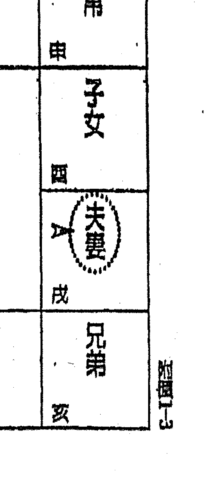
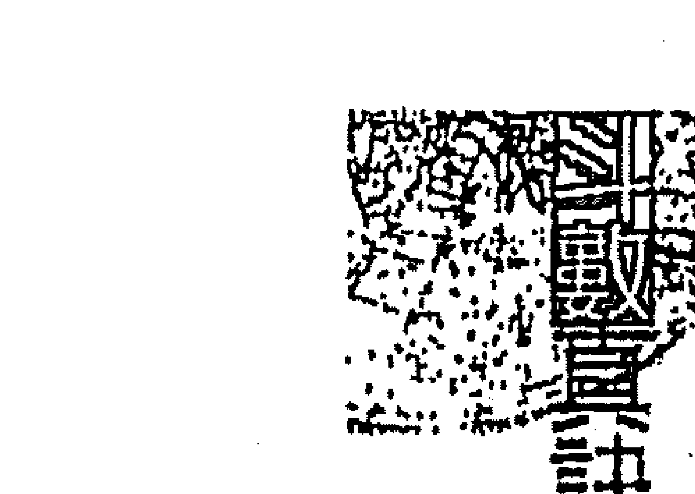
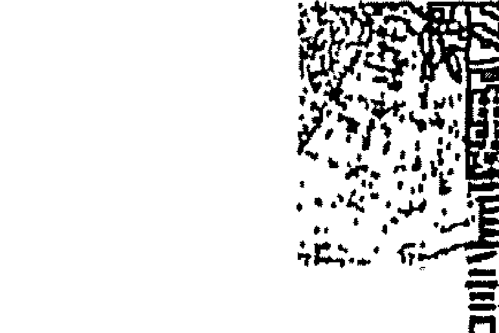

美一天
美图

# 实用口才学

### 渾天圖（六）

常處變极轉乾坤
學堯法湯禹受命呼

俗話說：「一樣米養百樣人」，雖然這只是個比喻，但真實的人生豈只是百態而已呢？在現實的社會舞台上，有人汲汲營營，厚顏無恥、哈腰奉承，只為了升官發財或覬覦特定的利益。有人晨昏顛倒，終日埋首數字牌支而廢寢忘食，只為了夢想一夕致富，麻雀變鳳凰。有人日以繼夜的辛勤工作，為求一家溫飽而不能；有人為富不仁，除了自己省吃儉用，也吝於九牛一毛的公益，累積了大筆財富留給子孫，卻害子孫為爭奪遺產而骨肉相殘。有人為了社會大愛而散盡家財終不悔，秉持一份生命雖死，愛卻可永留人間的偉大情操。更有人為了一份理想或目標而終其一生心血，不論心願是否能如期達成；畢竟人生有夢最美、希望相隨。看盡人生百態，心裡倒也覺得可愛。

## 序

不久前，網路上流傳著一則小故事，一名醫生帶著妻女出遠門旅行，半路上因車子電池耗盡被困在一所荒郊野外，萬分焦急的他求助無門，徒步走了好幾個小時的路，才找到公用電話並向數公里外的一家修車廠求援，不過，心裡其實很擔心，怕因假日遙迢而來的修車人員會趁機敲他竹槓。沒多久，一位拄著拐杖雙腳不良於行的殘障者開著車迅速抵達，原本那位醫生想先詢問價錢，但還來不及開口，對方已很快的將車修好，醫師訥訥的問：「我該付多少修理費？」，卻聽見對方回答：「不用錢」。呆愣之際，修車技師又接著說：「當年，有人幫我脫離比你更糟的險境，我的兩條腿都斷了……救我的那個人並沒有向我要一毛錢，他告訴我，如果我感念這人間有情，就把這份情傳送出去。」隨後，那位技師笑著告訴醫生：「你並沒有欠我錢，只要記得，有機會時，也把這份情一

# 紫微斗数真诀 (六)

## 序

將「現代斗數真訣」、「紫微斗數命例三百」全套付梓發行，把這份學問和二十年實際經驗傳承下去，是我此生最大的心願，雖然付出了六年的心血和五百多萬的經費，讓我無奈的變成一位負債者，但眼看著作品逐步的完成，內心實在充滿無限的安慰和喜悅，辛苦也值得。而為了走更長遠的路，回收製作成本是必需的，以及執行可更廣泛迅速的傳播命理的智慧管道——架設天乙上人網站，提高書價是不得不的抉擇。雖然學問本無價，只在乎內容是否值得、是否合乎您的需要，但因您的少許付出能支持作者，有機會將更多的經驗傳續下去和分享、幫助更多的人，福報肯定會與您相隨的。

二〇〇〇年，中秋于台北居

## 序

# 目录

## 序

# 前言

# 第十一章 暗合宫位的论法

## 命宫坐巳、午位

- 一、命宫与父母宫暗合 29
- 二、福德宫与兄弟宫暗合 30
- 三、夫妻宫与父母宫暗合 31
- 四、子女宫与官禄宫暗合 32
- 五、财帛宫与仆役宫暗合 33
- 六、迁移宫与疾厄宫暗合 34
- 七、命宫与兄弟宫暗合 35
- 八、夫妻宫与父母宫暗合 36
- 九、子女宫与福德宫暗合 37
- 十、财帛宫与田宅宫暗合 38
- 十一、疾厄宫与仆役宫暗合 39
- 十二、迁移宫与官禄宫暗合 40
- 十三、命宫与子女宫暗合 41
- 十四、兄弟宫与夫妻宫暗合 42

# 目录

- 十五、財帛宮暗合父母宮 — 43
- 十六、福德宮暗合疾厄宮 — 44
- 十七、遷移宮暗合田宅宮 — 45
- 十八、僕役宮暗合官祿宮 — 46

## 命宮坐卯、酉位

- 十九、命宮暗合疾厄宮 — 47
- 二十、兄弟宮暗合財帛宮 — 48
- 二十一、夫妻宮暗合子女宮 — 49
- 二十二、父母宮暗合遷移宮 — 50
- 二十三、僕役宮暗合福德宮 — 51
- 二十四、田宅宮暗合官祿宮 — 52
- 二十五、命宮暗合僕役宮 — 54

## 命宮坐巳、亥位

- 二十六、兄弟宮暗合遷移宮 — 55
- 二十七、夫妻宮暗合疾厄宮 — 56
- 二十八、子女宮暗合財帛宮 — 57
- 二十九、父母宮暗合官祿宮 — 58
- 三十、福德宮暗合田宅宮 — 59
- 三十一、命宮暗合田宅宮 — 60
- 三十二、兄弟宮暗合官祿宮 — 61
- 三十三、夫妻宮暗合僕役宮 — 62
- 三十四、子女宮暗合遷移宮 — 63
- 三十五、財帛宮暗合疾厄宮 — 64
- 三十六、父母宮暗合福德宮 — 65

# 第十二章 恋愛與姻緣

- 愛情路上你和他 — 68
- 論戀愛 — 71
- 姻緣天註定（合婚） — 74
- 琴瑟和鳴 — 79
- 刑剋與暴力 — 85
- 論婚外情 — 89
- 桃花舞春風 — 102
- 落跑新娘 — 111
- 勞燕分飛 — 114
- 姊弟戀情 — 122
- 妳幸福嗎？ — 128

### 第十三章 人生百態

- 生角從缺 — 136
- 多胞胎 — 140
- 學歷與考運 — 145
- 現代學子 — 155
- 同性戀情 — 162
- 閏王生死簿 — 167
- 預約人生 — 178
- 創業與改行 — 189
- 毒與賠 — 198
- 貴人與小人 — 206
- 正財與偏財 — 211
- 移根換葉論移民 — 218

# 目录

- 老人悲歌 — 223
- 什么是好命 — 227
- 论官讼与牢狱之灾 — 231
- 再论疾厄 — 237
- 论历法与闰月 — 246
- 再论田宅 — 254
- 论公务员升迁 — 264
- 论残与障 — 268
- 太岁何辜 — 273
- 命理五四三 — 282
- 紫微的人生观 — 291

# 前言

您有過賞星的經驗嗎？您是否曾經在秋高氣爽的季節裡，趁著月兔皎潔，晴空無雲的夜晚，找一處寬廣僻靜之地，躺下來仰望一覽無際的星空而神遊其中呢？當您入神地欣賞這一片靜夜星空之時，是否隱約注意到每顆星星都有不同，星與星之間也有奇妙的互動。繁星點點、大小不一、遠近有別、明暗不等、色彩各具、動靜不定、各有所屬，各具特色，有發出光芒照亮別人的，有依靠別人照亮者，有靜處不動者，亦有四處奔竄亂撞者，隨著天體的運行時而相逢時而別離，時而大放異彩，時而黯淡無光。這一切情景，豈不像極了我們站在超脫現實的山谷上，俯看茫茫人海一般地寫照嗎？有整天忙忙碌碌的朝不謀夕者，亦有飽食終日的無所事事者，有刀頭舔血的人在江湖、身不由己者，亦有醉生夢死的不知今夕是何夕者。芸芸眾生，來自四方，人家各安天命，各盡本份，隨著因緣際會，聚散離合，載浮載沉，閃爍隕落，一切始於緣起而終於緣滅。

人是一種難以理解的動物，研究人的心理尤艱難於生理，相信沒有任何生理或心理的學術，能夠針對隨機選定的某一個人，然後僅憑一張小紙、一點之緣，即能對其生理、心理趨向以及際遇可以立即瞭若指掌：「紫微斗數就在這裡展現其神機妙算的廣袤本事，用古人的智慧結晶，輕易地推論出：人性、人心、人體、人品、人倫、人材、人緣、人壽、以及人生……等狀況，對象涵蓋：富人、窮人、貴人、小人、好人、壞人、男人、女人、文人、武人、吏人、懶人……，且準確性甚至會比FBI所作的個人調查資料還要正確、迅速、經濟與不可思議。

# 前言

世間人有千百種，若要將其加以適當的分門別類，實屬不易，因為衡量的準則難以拿捏，如何歸類，尚視站在何種角度加以區分，若以身為研究者的立場而言，其衡量標準必須是公平的、客觀的、普遍的，在成就上必須不分貧富貴賤、成敗得失，在學藝上不分儒道墨法、士農工商，在地域上不分東西南北、蠻夷戎狄，在關係上不論鄉里鄉黨、親疏遠近，我們不難發現，在人生的大舞台上，若以各個角色在這世上短短數十寒暑的作為與使命看來，可將人大致劃分為四種類型。

## 一、來報恩的人

此種類型的人，就像上輩子受了某人的大恩大德，無以為報，而在這輩子必須以無怨無悔的付出來作爲報答似的，這種類型的例子如：

- 一、女命太陽坐於卯位～未宮者，以及
- 二、男命太陰於酉位～子位坐命者，打出娘胎以後就像小蜜蜂一樣，一生一世忙進忙出的最主要目的，就是為了他那一窩子，勞心勞力、心甘情願地犧牲奉獻，一心一意只希望家人能夠吃香的、喝辣的、穿美的、用好的；而自己卻是省吃儉用，將就湊合著過，哪怕是自己再苦、再累，而當看到家人舒適的享用、自己的汗水心血，而嘴角泛著滿足快樂的笑容時，那種欣慰、歡愉之情甚於「門月」，此境是其他星宿坐命者所無法體會的，於是說明「門月」坐命者是家的貴人一點也不為過，一個家只要生有一個此類命格者，則其他的人就跟著沾光了，所謂：「一人得道、雞犬升天」。
此種命格之報恩對象，僅限於其本姓氏的家（娘家）及自己建立的家，就算結婚後也不會忘了自己的娘家，以致於結婚之後更累，得多加起一個家的負擔，或許旁人會為他叫苦，然而哪知他卻樂在其中，家可是他的精神支柱、活力泉源，家亦是他的甜蜜包袱，不信？不妨向他們求證看看。

## 二、來報仇的人

此種類型的人，就像和人家結了幾世仇一般，又像世上所有的人，都對不起他一樣，自呱呱落地起，似乎看什麼都不對，瞧什麼都不順眼，好像沒有一件事情順他的心，如他的意似的，這種類型的人若處於順境之時，容易驕縱跋扈，目中無人，而當他處於逆境時更是怨天尤人、憤世嫉俗，因而：一股突破世俗，再造新意識型態等……種種思想也就油然而生，並以某種思想主義的衛道者或是正義使者的身份自居，而對社會或特定對象施以無情的摧殘。這種類型例如：黑道、作姦犯科、為非作歹、恐怖份子等命格，以星曜而言，則是七殺、破軍、貪狼、巨門等星座加煞坐命、身者，或煞星坐命，身且三合加會惡曜，或是紫微天府等命格皆屬之。雖然他們的思想令人不敢領教，行為不予認同，但其本身卻認為改變自己是自欺、影響別人是救人，至於手段嘛！只不過討回公道罷了！他們的思想行為是無法用一般的常理來加以衡量的，於是各種非法的事情在他們手上，可就做得順理成章，理所當然的，因此，我們若以客觀的角度去看他們，那不是復仇者是什麼？

## 三、來過債的人

有：利人，終日辛苦攢營，省吃儉用，拚老命來堆積起自己可能一生都不捨得花掉的財富，直到撒手西歸之後，充公的充公、轉手的轉手，留給子孫卻被敗光，自己窮其一生之力如精衛填海般，到最後還是由別人來坐享，自己不過是個盡忠職守的財務管理人罷了，這實在是令人匪夷所思而不知其所為何來，只能說或許他上輩子倒了人家的會錢或欠債未還，而於此生連本帶利的結帳吧！這種命格典型如：

財星加祿存坐命者，武府、武貪、武相坐命者及命身空劫各佔其一者。
另外一種人則如同前生欠了人家多少債似的，而於此生心中常存感恩、惜福之心，於是盡一己之力來造福社會或鄉里，如各慈善機構內的義工，作育英才的教師，以及為民服務的公僕和默默行善者。
社會上極需要這種人，他們就像蚯蚓一樣不起眼卻能夠翻鬆人們的心田，而且辛勤地耕耘不懈，為開路而吞噬泥土，結出鮮美的果實卻供他人享用；這種人和報恩者一樣，註定了一生勞碌的命運，此種命格如太陽和天相的組合格局，以及魁鉞坐命者屬之。

## 四、來財閒的人

這種類型的人，擺明了：大爺我是來這世上花錢的！況且錢賺來就是要花的嘛！幹嘛那麼看不開，花光了大不了再賺不就得了？這一類如：賭徒、吸毒者及公子哥兒們等人，一生只著重於本身的舒適自在與享樂，故其週遭的親友，除了別想在他們身上沾到半點光以外，恐怕還得幫他們料理那擦不完的屁股、收拾不完的殘局；這類命格有：武破、紫殺、紫貪加煞坐命者屬之。

另一種是屬於好逸惡勞而懶散的類型，雖然不見得會惹麻煩或敗家，但也別期望靠他，甚至根本不需要他來養家活口；但是他也不想定要吃山珍海味或穿綾羅綢緞，更不會為了這些而奔波勞累，他只想夠清閒、坐享其成，因此喜歡接受「供養」，人家對他好，他也認為是應該的，於是成為他的家人就註定被判無期徒刑，此種人例如：富豪之繼承人、遊手好閒者、殘障無力營生者（此屬不可抗力因素）等等，其命格多半是為天同組合的格局，或是福德宮有化權、化祿者居多，或許這種人是前世積足了德，或是人家欠了他的債未還而於此生慣選吧！

# 人口迁徙示意图

# 第四章 暗合宫位的论法

## 暗合宫位的论法

命宫、官禄宫、財帛宫这三方组合起来称为「三合」，三合加上对宫迁移宫即成为「四正」的团队，紫微斗数强调的是一个团队的运作，绝不只是单一宫位做解释，任何一个宫位都一样，不管这个宫位是什么星坐镇，七杀也好、天同也罢，重点是你带的是一票什么样的组合，就算本宫星座再如何好，若是你带的是一群老弱残兵，不但无力帮忙，甚至会有扯后腿的情况发生。

二方四正的好坏，对命造的影响力非常大

假设本命的财宫很漂亮，但二方四正会到的都是煞忌一堆，代表的意思就是有很多人等着要花你的钱，可是能确定自己一定都是很赚钱吗？即使赚得再多，恐怕也及不上大家帮你花钱的速度，更别说想多存点钱，以致於无形的财务压力非常大！而且任何一个宫位都同论。只要找到一个定点，拉出它的三方四正的团队组合，这样就可以把这个宫位的重点精髓看得很清楚，是好、是坏，整个吉凶祸福都在这三方四正里，尤其是不可忽视对宫的影响力！而且尽管是福德宫也好，或是田宅宫也罢，都是如此同论。

# 紫微真诀（八）

## 暗合宫位的论法

## 星座组合的论点，不论哪个宫位都同论

本宫的星座组合其实只是表相，是表面上的意识形态，我们不能忽略其三方四正的组合，尤其对宫会发挥很大的力道。当行运时，大运或流年的相关宫位都会跟着动。若以夫妻宫而言，有些夫妻或男女朋友之间的感情线，会让人觉得：这个夫妻宫明明就很不错呀，为什么会出问题？私底下各走各的？其实只要用夫妻宫为定点，来看其三方四正真正的组合就会很清楚，台面上我们都只是看到表相，有些人为了身份，为了维持形象、面子，伴侣之间会私下商量，彼此在公众场合中要作态一下，相互配合以免让外人看了笑话，等派对或宴会结束后再回复原状，回到家后依然照样各睡各的。各位不要觉得奇怪，有些夫妻真的就是这样貌合神离，可是表面上大家很难侦测出所以然，但只要找出其夫妻宫二方四正的组合，感情是好是坏就一目了断。

## 留意五行生克制化的重要

感情线的对待关系，在这个组合判断中即可然说出真假，所以三方四正在解盘的技巧上，可是一个重要依据。仔细思考，紫微斗数是一门逻辑推理，也是一种化学原理，同时是，一种精密的统计学，种种细节环环相扣。至于为什么是一种化学原理？就在于星和星之间的五行融合、生克制化，那就是一种化学调配的理论，所以我们必须要以很多面向来作研判。

# 紫微斗数真诀 (五)

## 暗合宫位的论法

二合为任一宫位的二方所架构的铁三角，是解盘技巧中很重要的支柱，同时也是推论的基础，必须熟记且熟练推演。而每张命盘都有其固定的六冲、六合，举例来说，以任何一个宫位划出对等线的宫位称为对宫，而如此相对的关系就称为对冲，例如寅申对冲、卯酉对冲……等等，依此类推。

### 冲者，外力因素影响也

然而，在什么情况下是为「照」？什么情况下是为「冲」？原因是因为对宫就等同于由外向内的压力，本宫则是代表自己的想法，若是本宫被冲，阁下的状况会很无奈，就好比命宫是擎羊单守，这是不用别人鞭策，自己就会努力拼了！但若是对宫有煞星来冲，那就变成是别人来逼著自己去做，就算不想做也得做；这种就是属于外来环境因素的压力，非自顾性的，本身控制不了的，甚至会把本身的本质改变。所以，若是命宫的对宫有煞星，这就不是本身想要或不要的问题，而是自然有压力来逼着自己不得不去面对，譬如子女宫有煞星来冲，这其实不是自己小孩不好，反而是别人带坏的，子女本身的资质没问题，而是不良的环境或不良交友状况来影响子女的行为。因此，无论是哪一个宫位，只要对宫有煞星来冲，我们都可以直接的解释：『冲者，外力因素影响也。』就这么简单。虽然只是短短的一句话，却必须要广泛地灵活运用才是最重要的。

同理，若是命宫有煞，格局组合又不佳的话，那自己想学坏，甚至把别人也带坏，反之，若是来自对宫的影响力，则是因为交到坏朋友而学坏，这一来一往的关键就在于主动和被动的差异。因此，我们会看到有些人都事事情已经做下去了，错也已经造成了，才开始低着头来认错反省：『对不起，我知道错了，下次不敢了。』会有这种情形则通常是来自对宫的问题。

## 暗合宫位的论法

因此，不可能有十全十美的命盘，因为每一张命盘都会有煞星、化忌，所以哪一张命盘宫位没有冲？哪一个命盘宫位不欠？哪有人或在哪方面不无奈？差别只是冲了谁、欠了谁而已。

我们以往所阐述的理论，不论是合宫或冲照，都是以当事者的命格为基础，来做最基本的学习，目的在于熟练命盘推演，然而在学习到这个阶段，则要开始学习「合宫」的学问。因为以往所学是斗数的「表皮」，表皮是最基本也是平面的，这个平面包括了命宫、身宫以及禄权科忌，都是论命的重点，但我们还有重点精髓的理论。要成为一位专业研究紫微的论命者，则必须要研究到这个程度才有资格帮人论命，被人称作「老师」，否则充其量只能算是一个懂紫微的人罢了，因为表面的东西，坊间各大书房所卖的斗数书籍都有写，大家看一看都好像「懂了」，事实上却不然，很多「江湖」略懂皮毛却自称「大师」者，为了名与利，以不扎实的看盘技巧来帮人看盘却误了他人一辈子。

# 第⑤章 暗合宮位的论法

### 合宮代表著機會和趨力

> 「合宮」對命盤當事人的影響力，是一種機會和趨力，也就是透過周遭人的壓力，讓自己的想法或決策來朝著這個方向傾斜，例如：一個小學生被丟到放牛班去，可以出淤泥而不染，不被其他同學帶壞，成績也沒退步的話，那可是很不容易的事！而若是一個小學生被安排進資優班，很自然的就會受到整個班級的求學氣氛所感染，雖然說不一定能就此出類拔萃，可是卻很容易在其他同學帶動的讀書氣氛下，容易讓成績更進步，這就是團隊的力量。以星盤來說，指的就是命宮三方四正的團隊，如果在命盤上，三方四正有著資優班的團隊，絕對比面對煞、忌、空、劫等三方四正團隊來得好！

## 暗合宮位的喻法

例如，某大運逢機梁組合，當事者自然而然就有機會去認識一些會賭博的朋友，稱為了「賭伴」，慢慢地耳濡目染之下，不會玩也會開始下注，久而久之之後很快地就學會怎麼賭了。反之，若是沒有這樣的運，自然就遇不到這類的朋友，也沒有這樣的環境來培養賭博技巧，甚至不會有想學的想法，因為沒有誘惑和興趣嘛！

再來是為什麼有人會吸毒？道理也是相同，難道當事者是某天一覺醒來就會的嗎？不太可能，一定是具備某些人或事或當下情境的驅使情況下，才會有這個機會去認識那一類的人，也才有可能去接觸到那一類的環境，否則一般人就算是哪天被雷打到，突然想試試的話，恐怕還不知道要去找誰買呢？不是嗎？

但是這種面對不良誘惑的情形，時常會出現在我們的人生旅途中，也許是某一個岔路或是十字路口，就面臨到是左轉還是右轉，還是繼續往前直走的抉擇。而我們雖然走在這被賦予的人生路上，但其實我們內心良知還是有辦法去抗拒「轉彎的誘惑」，選擇更直接坦蕩的好道路。

## 第十章 暗合宮位的論法

同樣的理論也可應用在工作選擇上，以從事保險業來說，都是先認識了從事保險業的朋友，進而接觸到保險業的環境，接著了解保險的好處，最後才萌生興趣來投入保險事業；人是不會無緣無故地跳到一個完全陌生的行業，一定是某種理想或是某種理念相同的朋友應合，然後在面臨抉擇時所做的選擇。

所以，在人生旅途中，我們會因為環境或自覺來學會很多事情，但無論學會什麼都需要一個際遇，一個機會，然後做出一個選擇，無論結果是好是壞，我們的重點就在於研究這個跡象。《斗數派》獨家斗數精髓——「暗合宮」一位稱職的論命者，必定先把基礎學問熟練，也就是我們前面提到的命格，包含命宫、身宫的星性，整体格局的搭配以及四化的影响，再细一点才从六合、六冲的理论来研究，便可找出命盘变化时的原因和理由，而台面下的精髓就在“暗合宫”。

“暗合宫”，顾名思义指的就是台面下的运作，因此一般人在表面上是看不出来的。若以固定格局来说，“暗合宫”强调的是一种“缘分的表现”，在星盘的十一个宫位里，互相产生互动引力的现象。可概括为以下幾項：

## 暗合宫位

- **命宫坐子、午位：**
  - **一、命宫与父母宫暗合（附图1-1）**
    若父母宫内有吉星或其星曜稳定，则通常显示与父母关系密切，亲情缘分深长。若见煞、忌、巨门、破军者，则显现其亲缘浅薄或是异姓诞生，严重者必然生离死别。
  - **二、福德宫与兄弟宫暗合（附图1-2）**
    福德宮代表祖上的宮位，見吉星而有權、祿者，其兄弟可得祖上之產業或庇蔭，若逢煞、忌或空、劫者，就算看得到也吃不到。但因福德宮亦為當事人之精神享受與來財之源，因此若兄弟宮有吉星坐守，表示手足之間和樂相處且有通財之義，反之，若組合不佳，則易為手足之事而操煩，且有耗財之跡。

**紫微1-1**
| 财帛 | 子女 | 夫妻 | 兄弟 |
|------|------|------|------|
| 申   | 酉   | 戌   | 亥   |
| 仆役 | 迁移 | 疾厄 |      |
| 巳   | 午   | 未   |      |
| 官禄 | 田宅 | 福德 |      |
| 辰   | 卯   | 寅   |      |
| 命宫 | 父母 |      |      |
| 子   | 丑   |      |      |

**紫微1-2**
| 财帛 | 子女 | 夫妻 | 兄弟 |
|------|------|------|------|
| 申   | 酉   | 戌   | 亥   |
| 仆役 | 迁移 | 疾厄 |      |
| 巳   | 午   | 未   |      |
| 官禄 | 田宅 | 福德 |      |
| 辰   | 卯   | 寅   |      |
| 父母 | 命宫 |      |      |
| 丑   | 子   |      |      |

  - **三、夫妻宮與田宅宮暗合（附圖1-3）**
    田宅宮內若有吉星坐守或者其星性溫和，代表另一半蠻顧家的，另一半有事沒事會常往娘家跑，彼此互動關係良好，因此會有所謂「女婿如半子」的狀況，或是女兒結婚後還常住娘家的情況，那都是見怪不怪。反之，若組合不好，則代表另一半多和娘家或夫家在相處上有代溝、互動不良，因此彼此較少往來，而造成「親不如友」的現象。

判斷上我們可以分開來看，若是夫妻宮有煞、忌等組合不良，那是當事人和配偶之間相處不良的狀況。但若為田宅宮組合不佳的情況下，則是其本家雙親與另一半在觀念上無法溝通所致。

| 僕役（巳） | 遷移（午） | 疾厄（未） | 財帛（申） |
| :--------: | :--------: | :--------: | :--------: |
| 官祿（辰） |            |            | 子女（酉） |
| 田宅（卯） |            |            | 兄弟（戌） |
| 福德（寅） | 父母（丑） | 命宮（子） |            |

  - **四、子女宮與官祿宮暗合（附圖1-4）**
    代表當事人心中期望子女將來能承接自己的事業或才藝，自己其關鍵點在於僕役宮的星座組合的好壞。若是僕役宮的組合不好，對當事人的財務而言，會有隱藏性的殺傷力，例如容易被朋友倒會、或是友人借錢不還、或是合夥虧本等等，即所謂「友人劫財」是也。倘若僕役宮有吉星來合，則表示朋友對自己的財務沒有的話，則承接配偶的事業也是一樣同論。只要子女宮的組合沒有煞、忌來湊熱鬧，那麼子女當中一定會有人跳出來承接衣缽，但若逢煞、忌或空亡，則子女均另謀他途，以致薪傳無人，後繼無人了。

| 宮位 |  | 宮位 |  | 宮位 |  | 宮位 |  |
| :--- | :--- | :--- | :--- | :--- | :--- | :--- | :--- |
| 財帛 |  | 疾厄 |  | 遷移 |  | 僕役 |  |
| 申 |  | 未 |  | 午 |  | 巳 |  |
| 子女 |  |  |  |  |  | 官祿 |  |
| 酉 |  |  |  |  |  | 辰 |  |
| 夫妻 |  |  |  |  |  | 田宅 |  |
| 戌 |  |  |  |  |  | 卯 |  |
| 兄弟 |  |  |  |  |  |  |  |
| 亥 |  |  |  |  |  | 福德 |  |
|  |  | 命宮 |  | 父母 |  | 丑 |  |
|  |  | 子 |  | 丑 |  | 寅 |  |

  - **五、財帛宮與僕役宮暗合（附圖1-5）**
    其關鍵點在於僕役宮的星座組合的好壞。若是僕役宮的組合不好，對當事人的財務而言，會有隱藏性的殺傷力，例如容易被朋友倒會、或是友人借錢不還、或是合夥虧本等等，即所謂「友人劫財」是也。倘若僕役宮有吉星來合，則表示朋友對自己的財務收入上會有實質的幫助無疑，或是屬下得力認真幫自己賺錢，只是相對地，部屬也會在意薪水的高低。

| 亥 | 子 | 丑 | 寅 | 卯 | 辰 | 巳 | 午 | 未 | 申 | 酉 | 戌 |
| :---: | :---: | :---: | :---: | :---: | :---: | :---: | :---: | :---: | :---: | :---: | :---: |
| 兄弟 | 命宮 | 父母 | 福德 | 田宅 | 官祿 | 僕役 | 遷移 | 疾厄 | 財帛 | 夫妻 | 子女 |

  - **六、遷移宮與疾厄宮暗合（附圖1-6）**
    凡遷移宮與疾厄宮的星曜組合都很平穩，其外出旅遊對環境的適應力較強，身體抵抗力亦佳，較少有水土不服的現象，若有煞、忌的組合，則出門在外容易有舟車之意外，因此這類型組合的人，較不適合移居外地。

| 宫位 | 地支 |
|------|------|
| 財帛 | 申   |
| 子女 | 酉   |
| 夫妻 | 戌   |
| 兄弟 | 亥   |
| 僕役 | 巳   |
| 遷移 | 午   |
| 疾厄 | 未   |
| 命宫 | 子   |
| 官祿 | 辰   |
| 田宅 | 卯   |
| 福德 | 寅   |
| 父母 | 丑   |

## 暗合宮位的論法（續）

*命宮坐丑、未位*

  - **七、命宮與兄弟宮暗合（附圖2-1）**
    當事人與手足之間必然有密切關連，如果命宮主星比兄弟宮要弱勢，則代表兄弟的能力比自己強，必要時他們會來協助當事人。而如果當事人命宮星座比兄弟宮還要強勢，且又形成暗合的效應，那麼照顧手足的責任多半就換成是你來承擔了，倘若兄弟宮再有煞、忌來攪的話，那閣下可得心裡有數了，除了要多賺點錢，還得要有雅量，如此才能承擔手足方面所帶來的麻煩。

| 官祿 (巳) | 僕役 (午) | 遷移 (未) | 疾厄 (申) |
|---|---|---|---|
| 田宅 (辰) | | | 財帛 (酉) |
| 福德 (卯) | | | 子女 (戌) |
| 父母 (寅) | 命宮 (丑) | 兄弟 (子) | 夫妻 (亥) |

> 附圖2-1

  - **八、夫妻宫与父母宫暗合（附图2-2）**
    除了表示当夫妻选择另一半时，会尊重父母的意见之外，也隐含著另一半与父母之间互动的好坏。若是星座组合不佳，大家却同住在一屋檐下，表示容易各持己见而互相呛声，会有僵持不下的状况发生；像这类情况，我都会建议晚辈们乾脆自己搬出去独立，省得一天到晚和长辈或亲家们吵来吵去，当事人夹在中间可是左右为难，里外不是人。相反的，如果是好的星座组合来搭配，那可是丈母娘看女婿，愈看愈有趣！

| 官禄 | 僕役 | 迁移 | 疾厄 |
|---|---|---|---|
| 巳 | 午 | 未 | 申 |
| 田宅 | | | 財帛 |
| 辰 | | | 酉 |
| 福德 | | | 子女 |
| 卯 | | | 戌 |
| (父母) | 命宫 | 兄弟 | (夫妻) |
| 寅 | 丑 | 子 | 亥 |

> 附图2-2

或不是媳妇之间情同母女，彼此感情好到连当事者都会吃醋呢！

  - **九、子女宫暗合福德宫（附图2-3）**
    对当事人来说，孩子是影响本身自我情绪的最大关键——无子女者，会很想拥有自己的亲骨肉；有子女的话，对小孩的成长过程中，无论是读书、就业或是结婚生子，在当事人心中都有无限阻碍，永远担心不完，永远有烦不完的理由。若是子女宫与福德宫这两个宫位里的星性稳定，多半只是其烦燥的程度会稍微减轻一点罢了，否则这种呵护子女或管教方式，可能比「现代二十五孝」的其他父母来得微重。若是两宫相对组合不佳，或逢煞、忌侵入，则显现出子女不受教，两代之间观念与代沟日深，在年老时，子息也难以常相左右，孤独难免。

| 官禄(巳) | 仆役(午) | 迁移(未) | 疾厄(申) |
|----------|----------|----------|----------|
| 田宅(辰) |          |          | 财帛(酉) |
| 福德(卯) |          |          | 子女(戌) |
| 父母(寅) | 命宫(丑) | 兄弟(子) | 夫妻(亥) |

  - **十、財帛宮暗合田宅宮（附圖2-4）**
    若兩宮星性組合良好，代表所賺來的錢多數會拿回家裡補貼家用，或表示其理財方式最喜歡以置產的方式進行，以現代社會情況來說，這種組合非常適合SOHO族，也就是在家裡就能賺錢的個人工作室了。

組合不好，尤其是財帛宮差而田宅宮相對之下較旺，那就表示當事者自己賺錢不夠用，缺錢時還會回家找家人伸手，嚴重一點的話，連父母親的養老金恐怕會被他挖光！這豈不是成了不孝子？所以啊，女孩子找老公可要睜大眼睛，跟這種人結婚，恐怕會「三代沒香爐，四代沒茶壺」，冤死囉——

| 宮位 | 地支 | 宮位 | 地支 |
|---|---|---|---|
| 疾厄 | 申 | 子女 | 酉 |
| 遷移 | 未 | 夫妻 | 戌 |
| 僕役 | 午 | 兄弟 | 亥 |
| 官祿 | 巳 | 田宅 | 辰 |
| | | | 丑 |
| 父母 | 寅 | 命宮 | 卯 |

> 附圖2-4

  - **十一、疾厄宮暗合官祿宮（附圖2-5）**
    這類的暗合通常是職業病的高危險群，須特別留意工作的性質或工作環境因素而影響到自己的身體健康（註），也可能因為自己的身體健康不佳而必須轉換工作的類型。如果兩宮星性搭配温照，則显示身体抵抗力强，尚能承受职业灾的影响，反之若两宫煞、忌聚，则须特别留意因公受伤或是易引发职业病。

【注】：以前高危险群行业的典型之一是矿工，现在的高危险群行业则有长期处于辐射线之下的高科技行业等。

| | 僕役 | 遷移 | 疾厄 |
|---|---|---|---|
| 官祿 | 午 | 未 | 申 |
| 田宅 | 辰 | 巳 | 戌 |
| 夫妻 | 寅 | 卯 | 亥 |
| | 父母 | 兄弟 | 命宮 |
| | 寅 | 丑 | 子 |

  - **十二、迁移宫暗合仆役宫（附图1-6）**
    有一句话可以很贴切的来形容这种情况——「在家靠父母，出外靠朋友」，不过有一个但书，那就是不能有煞、忌来干扰，否则这「靠朋友」却很可能损伤惨重！不是近墨者黑被带坏，就是被朋友拖累而替朋友背黑锅了。如果组合尚佳或有吉星来搭配，那可就帅呆了！不论走到哪里都会有讲义气的朋友来相挺，这莫非您的朋友都是天相星坐命？别忘了，记得一定要广结善缘，准没错儿！

| 官禄 | 田宅 | 福德 | 父母 || 迁移 | 仆役 | 命宫 | 兄弟 || 疾厄 | 财帛 | 子女 | 夫妻 |
| :--- | :--- | :--- | :--- | :--- | :--- | :--- | :--- | :--- | :--- | :--- | :--- | :--- | :--- |
| 巳 | 辰 | 卯 | 寅 || 未 | 午 | 丑 | 子 || 申 | 酉 | 戌 | 亥 |

*命宮坐寅、申位*

  - **十三、命宮暗合子女宮（附圖3-1）**
    代表當事者對子女有永遠卸不掉的責任和負擔，講好聽的話，也可說是自己和子女之間有著深厚的緣份，父子像是兄弟一般好商好量，凡事可以百無禁忌，通常无碍，甚至还有父亲教儿子如何泡马子的。但这种组合最怕逢禄存或是空劫照会，很容易生出先天有残疾的小孩。若是逢煞、忌、巨暗的组合，则子女多让人操心或是长大后常闯祸，一天到晚跟在孩子后面擦屁股，十足的讨债鬼。

| 田宅 巳 | 官祿 午 | 僕役 未 | 遷移 申 |
| 福德 辰 | | | 疾厄 酉 |
| 父母 卯 | | | 財帛 戌 |
| 命宮 寅 (被圈出) | 兄弟 丑 | 夫妻 子 | 子女 亥 (被圈出) |

  - **十四、兄弟宫暗合夫妻宫（附图3-2）**
    显示配偶与自家手足之间的情感互动，若兄弟宫与夫妻宫彼此的组合皆不佳，则是彼此互动关系不良，可能个性不合或是理念作风不同，导致彼此甚少往来，家族里必然缺乏亲情和乐的气氛。相反地，若是有吉星来搭配，彼此在个性或理念上会较接近，不管姑、叔或是姑婶都是欢乐一家人。

| 田宅 | 官禄 | 僕役 | 迁移 |
|------|------|------|------|
| 巳   | 午   | 未   | 申   |
| 福德 |      | 疾厄 |      |
| 辰   |      | 酉   |      |
| 父母 |      | 财帛 |      |
| 卯   |      | 戌   |      |
| 命宫 |      | 子女 |      |
| 寅   | 丑   | 子   | 亥   |

  - **十五、财帛宫暗合父母宫（附图3-3）**
    这类型的暗合，须先检视两宫星性的比重而论，若是财帛宫较旺，则自己赚钱要拿回去奉养父母或家人；反过来若是父母宫较强，则父母多金，私底下会塞钱给您，在阁下人生的旅途上宛如拥有一座稳固的靠山！当然啦，生为一个家中有枪或有权的小孩，其人生岂止只是减少奋斗二十年？而若是星盘的主人命宫为天同星或是破军星坐守，那么其父母可就要倒大楣了，生平努力的积蓄，恐怕要「无额度上限」的供奉给宝贝儿了。

| 遷移 | 僕役 | 官祿 | 田宅 |
|---|---|---|---|
| 申 | 未 | 午 | 巳 |
| 疾厄 | | | 福德 |
| 酉 | | | 辰 |
| 財帛 | | | 父母 |
| 戌 | | | 卯 |
| 子女 | 夫妻 | 兄弟 | 命宮 |
| 亥 | 子 | 丑 | 寅 |

> 注：图中「父母」、「财帛」两宫有特殊圈注标记。

  - **十六、福德宫暗合疾厄宫（附图3-4）**
    意指当事人容易受身体健康状况而影响情绪的起伏，尤其是年纪愈大则情况愈明显，当然这也有比重方面的考量；假如疾厄宫星座组合比福德宫的组合来得差，阁下要当心成为药罐子，饭吃三餐已足，吃药可是要睡前再吃一包呢！若是福德宫比疾厄宫差，那代志可就大条了，当事者可要当心精神方面的疾病缠身，或成为一个孤独老人，要自食其力过生活了。

| 遷移 | 僕役 | 官祿 | 田宅 |
| :--- | :--- | :--- | :--- |
| 申 | 未 | 午 | 巳 |
| 疾厄 (A) | | | 福德 (A) |
| 酉 | | | 辰 |
| 財帛 | | | 父母 |
| 戌 | | | 卯 |
| 子女 | 夫妻 | 兄弟 | 命宫 |
| 亥 | 子 | 丑 | 寅 |

  - **十七、遷移宮暗合田宅宮（附圖3-5）**
    代表當事人即使出門在外，還是老惦記著家裡的大小事情，拜託！長途電話費和手機費都是很貴的呢！若是田宅宮有祿，表示有在遠方置產的心態，逢煞、忌、聚居則是代表其人在一地難久居，所以這單子的住所恐怕得搬來搬去了，也顯示時常在家待不住，出了家門就像走失的小黃一樣——跑得不見蹤影！

| 遷移 | 僕役 | 官祿 | 田宅 |
|------|------|------|------|
| 申   | 午   | 未   | 巳   |
| 疾厄 |      |      | 福德 |
| 酉   |      |      | 辰   |
| 財帛 |      |      | 父母 |
| 戌   |      |      | 卯   |
| 子女 | 兄弟 | 夫妻 | 命宮 |
| 亥   | 丑   | 子   | 寅   |## 第①章 暗合宮位的論法

而如果遷移宮有煞、忌的話，平常沒事，一定是緊守家園，就算出門也是在家附近晃晃，走不了多遠，稱之為「顧家」可個住處！

### 十八、僕役宮暗合官祿宮（附圖3-6）

代表著職場人際關係好壞，作工作上與同事之間的互動情形。星性組合良好的話，除了在工作上容易受到同事的協助之外，也代表適合與朋友共同創業，即便是自己獨立創業也能如魚得水，事半功倍。若是組合不佳並帶有煞、忌或空劫，則必須避免與同事或朋友有任何利益上的往來，以免招惹是非糾葛不斷，甚至嚴重一點的話，即使破財都未必能消災，不可不慎也。

### *命宮坐卯、酉位

#### 十九、命宮暗合疾厄宮（附圖四十一）——

命盤上有這種組合的人，這輩子一定要特別注意將有來自長輩的遺傳疾病，很容易形成先天上的某種缺陷，有些人是缺了某種零件，有些人則是某部位器官較弱。而若是命宮主星較強，則代表其身體抵抗力較佳，來自先天遺傳干擾健康的力道就會相對的減輕，但萬一疾厄宮有煞、忌或是星性組合複雜的話，

| 僕役 | 遷移 | 疾厄 | 財帛 | 官祿 | 田宅 | 福德 | 父母 | 命宮 | 兄弟 | 夫妻 | 子女 |
| :--- | :--- | :--- | :--- | :--- | :--- | :--- | :--- | :--- | :--- | :--- | :--- |
| 申 | 酉 | 戌 | 亥 | 未 | 午 | 巳 | 辰 | 卯 | 寅 | 丑 | 子 |

## 第②章 暗合宮位的論法

## 二十、兄弟宮暗合財帛宮（附圖4-2）

這種類型與兄弟和官祿暗合盤有這些類似，多半都表示當事人和手足可以合作，不管是上班或同公司，或者共同經營家族企業等等，彼此各司其職、相輔相成。當然，在財務的運用上，彼此亦有密切關連，因此不難發現，一些家族企業或是兄弟姊妹共同合夥的事業，有些可以做得很好，彼此相互搭配而把公司經營得有聲有色，有些卻是彼此鬧得不歡而散，這百分之九十的機率多是出在錢的問題上。以星座的組合來說：如果兄弟宮的星座較強，則代表手足對當事人的財務有所幫助，但如果是財帛宮的星座較強，那就倒過來啦！那就變成當事人要資助手足，這責任就跑不掉了。

#### 二十一、夫妻宮暗合子女宮（附圖4-3）——

表達的是配偶與子女之間的互動關係及緣份，若星性穩定，則子女較會黏著配偶，與另一半較貼心，彼此相處的時間也比較多，且較能以愛的教育對待子女。若有不良的煞、忌來合，代表子女容易有偏差的行為，自己當然會傷腦筋，但另一半更是為子女操心不已，養育的過程會較有挫折感，甚至會因為愛之深、責之切，而會有打罵教育的情況出現；若是兩宮的星性都不好的話，難保去喝咖啡啦！哪一天警察局就派人來請他們。

#### 二十二、父母宮暗合遷移宮（附圖4-4）——

代表當事者在外的人際關係和父母之間的影響，但其關鍵在於父母宮星性的好壞而定。若是父母宮有吉星，當事者此生必得到父母的庇蔭與協助，也表示其人依賴性較重；若是父母宮內的星性不吉，則長輩必會約束當事者的交友狀況，或對當事者的朋友有不良觀感，甚至不喜歡當事者帶朋友回家，這也間接地顯示出其人際關係反而較能獨立自主。

## 二十三、僕役宮暗合福德宮（附圖4-5）

代表當事者的情緒波動常會受朋友的行為舉止所影響，一個人心情起伏隨著外界影響而變化大，當然不是好事，因此僕役宮的星座即顯得相當重要，組合尚佳者，朋友帶來的影響力是正面的助力，若是組合不良者，則帶來的反而是阻力，也就是負面的影響。 倘若福德宮的星座尚佳，則影響力還算有限，不至於受人擺佈，但要是福德宮的星座屬於弱勢，那麼恐怕不是交歹朋友被朋友帶壞，就是會被抓來背黑鍋，恐怕就不太妙嘍！

#### 二十四、田宅宮暗合官祿宮（附圖4-6）——

此種命格組合者，住家和上班的地點通常不會離得太遠，也代表當事者心中希望找個離家近一點的公司上班，或者乾脆把工作和住家合在一起，例如我們常會見到有些家庭的一樓可能是診所、辦公室或店面，等進去一看就會發現原來樓上就是老闆的住家，這種情況就屬這類型的暗合宮最多。 當然，也必須先要有這樣的命格，當事者也才能把住家和工作合在一起，但仍然要考量星座組合的問題。組合好的話，當然很容易就能把工作和住家合處一地，但若是有煞、忌來干擾，那麼多半只是想想而已卻未必能如願；加上如果是官祿宮的組合不佳，則多半是工作的內容形態不適合或是不允許，反之，若為田宅宮的組合不佳者，則是家人反對此事。因此，雖名為暗合，但星座組合的強弱好壞，還必須仔細研判才是。

| 僕役 (申) | 官祿 (未) | 田宅 (午) | 福德 (巳) | 父母 (辰) | 命宮 (卯) | 兄弟 (寅) | 夫妻 (丑) | 子女 (子) | 財帛 (亥) | 疾厄 (戌) | 遷移 (酉) |
| :---: | :---: | :---: | :---: | :---: | :---: | :---: | :---: | :---: | :---: | :---: | :---: |
| 申 | 未 | 午 | 巳 | 辰 | 卯 | 寅 | 丑 | 子 | 亥 | 戌 | 酉 |

### *命宮坐辰、戌位

#### 二十五、命宮暗合僕役宮（附圖5-1）

即顯示當個人和朋友之間的互動狀況，尤其是現代的社會環境，朋友的重要性已遠遠超過手足之情，所以僕役宮的星性組合即顯現其指標性的作用。若僕役宮組合尚佳，其一生受朋友之協助必然源源不斷，知遇之心也一定會銘感五內，部屬也將忠心拱主。相反的，若是僕役宮逢巨暗或煞、忌聚集，則十之八九損友圍繞身邊，或是易遭朋友陷害或拖累，本身身為老闆者，亦常逢部屬背主，吃裡扒外而導致損失慘重，不可不慎也。

#### 二十六、兄弟宮暗合遷移宮（附圖5-2）

代表兄弟姊妹之間緣淺情淡，彼此分散各地，平時兄弟登山、各自努力，恐怕要等到逢年過節或是家中重大事件要開會時才會聚在一起。若是兄弟宮的星性溫和，手足還算有情有義，彼此可互通有無，只是其中必有一位離大家比較遠而已，而若是再有煞、忌，那不只是離得遠，可能也不常聯絡，嚴重一點的話，恐怕還有個人睽違難解，因而造成老死不相往來的狀況了。

#### 二十七、夫妻宮暗合疾厄宮（附圖5-3）

夫妻宮暗合疾厄宮為本身健康與另一半的關聯，倘若夫妻宮組合較差而疾厄宮平穩，那麼即使夫妻因為意見不和而吵架，但終無大礙，此乃「床頭吵、床尾和」也，其閨房生活尚稱和諧；但如果是夫妻宮平和但疾厄宮逢煞、忌的話，即顯示其夫妻之間表面上看似幸福恩愛，可這只是為了維護面子所做的假象，私底下可能早已分房而居，彼此心生不滿地互相怨懟，心結難解，若是行運再逢夫妻宮不佳時，會因為長期以往的貌合神離而分手。

#### 二十八、子女宮暗合財帛宮（附圖5-4）——

代表當事人會為了下一代而努力打拼，如果子女宮的組合尚佳，即使辛苦卻也算是拼得有價值（例如自己省吃儉用的，然後把辛苦賺的錢用來送子女到國外留學），如果組合甚差，那就有可能發生「一代累積、一代花空」的情況出現，碰到這種情形，我會建議當事人：對子女好是應該的，但別忘了要設立一個停損點，否則若連老本都「漂落去」，晚景恐怕多淒涼而悔不當初。

#### 二十九、父母宮暗合官祿宮（附圖5-5）——

父母宮和官祿宮暗合，代表當事人所從事的工作，會和長輩息息相關，也或者父母對於本身的工作會有密切關係。舉例來說，若當事人繼承上一代的事業則屬之。以星座的組合而言，若是父母宮的星座較強，則可得到來自父母的資源及協助，亦表示當事人在言行上多會參考父母的意見，而如果官祿宮的星性較強，那麼表示當事人在工作中多能獨當一面，萬一有煞、忌來合，與長輩之間也多有意見上的衝突。

#### 三十、福德宮暗合田宅宮

福德宮和田宅宮形成暗合，主當事者的情緒容易受到家庭狀況的影響，或者容易為家中事操心，進而影響到心情的起伏。若組合佳，則影響力有限，情況尚能減輕，反之如果組合不良或有煞、忌來干擾，則情況加重，當事人必然因為家中的壓力，時常造成情緒不穩，有著啞巴吃黃蓮，有苦說不出的無奈。

## 第十五章 暗合宮位的論法

### 命宮坐巳、亥位

#### 二十二、命宮暗合田宅宮（附圖6-1）——

命宮和田宅暗合，代表當事者多受家庭因素的牽絆而影響行為模式。在命格局的理論來說，命坐四馬地，當運再逢四馬地時必然奔走他鄉，但為什麼有些人就是走不了呢？關鍵就在這裡。以未婚者而言，多半受家庭的牽絆，對雙親的掛礙；已婚者則是多半為了子女所做的考量，此為當事者心中放不下的重要因素，因而行動受限。若田宅宮的星性較強，則牽絆的力道跟著加強，但若是煞、忌來合，則是加重當事人奔走他鄉的推力，帶來的反而不是牽絆而是一種壓力。

## 二十三、兄弟宮暗合官祿宮（附圖6-2）

兄弟宮和官祿宮暗合，代表當事人和手足之間多有共處工作的可能，或是共創合夥事業、合夥工作之推展，彼此可以各司其職且相輔相成，但若組合不良則不宜「作同一處」，否則當事人與手足之間反而容易勾心鬥角，彼此責怪，勉強合夥共處到最後仍然是不歡而散，既然如此，何不自個兒獨自努力奮鬥還來得強，不是嗎？

*注：圖中“兄弟”與“官祿”兩宮位用圓圈和箭頭標示為暗合關係。*

## 第⑩章 暗合宮位的輔法

## 二十四、夫妻宮暗合僕役宮（附圖6-3）

這類型組合的人，感情對象通常都會透過朋友的介紹或安排認識，促成伴侶的機率高，憑藉「口」的邂逅，或是在外活動來認識對象的機率是較低的。 夫妻宮和僕役宮暗合，代表當事者的配偶和本身的朋友的互動狀況，若是星座的組合平穩，則另一半和自己友人之間的關係還算友善，大家平時也多有往來，但若是組合不良，則與自己友人多有意見之爭，或有相互扯後腿的情況出現，組合之中若有煞星來干擾，則不宜合夥投資，否則此舉必然蒙受虧損。

## 二十五、子女宮暗合遷移宮（附圖6-4）

子女宮和遷移宮暗合，代表著當事人出門在外亦多會顧慮子女的立場，或者為了子女的將來著想而四處奔走努力，日夜繁忙。 此類的暗合，子女宮組合的狀況也是非常重要，若是星座組合良好，子女成器且多有反哺回饋之心，常努力還算有價值，但萬一組合不良，甚至有煞、忌來糾纏，這下的努力和付出可說是有去無回，嚴重者甚至會因為子女的行為偏差，而影響到當事人的人際關係和名譽。

## 第⑤章 暗合宮位的論法

## 二十六、財帛宮暗合疾厄宮（附圖6-5）

財帛宮和疾厄宮暗合，代表當事人的體質狀況會影響到賺錢的動力，也很可能容易把錢花在治療身體病痛的情況上，也就是說，大半生努力賺來的財富，待年紀大了之後，反而是要交給醫生來醫治自己身上的病痛，倘若疾厄宮的組合狀況不良，則此種情況會更明顯。 反之，若疾厄宮星座較強，代表身體的抵抗力較強，相對的影響力亦較為減弱。而通常會有這種組合盤的出現，亦代表當事者多有隱藏的疾病，並可能因為長時間勞累而至積勞成疾，因此，後天身體的調養就顯得相當重要。

## 二十七、父母宮暗合福德宮（附圖6-6）

父母宮和福德宮形成暗合，代表當事者的情緒容易受到父母的影響，而父母也會因為當事者的行為，而影響到心情的好壞。因此，在星性的組合中要特別留意，倘若福德宮的星性較強，則代表當事人的主星較強，行為上多是我行我素。

## 第⑩章 暗合宫位的论法

素，父母方面能影响当事者的层面有限；反之，若是父母宫的星性较强，多半对当事者采用命令式教育，即使当事者心中多有无奈，但因为是主观意识较弱，也只能乖乖地言听计从。

## 第④章 恋爱与姻缘

请问世间情为何物？相信没有几个人可回答得出来，爱情是可爱又迷人的，人类不分贫、富、贵、贱都需要爱情的滋润，在人生的旅途上，爱情是扮演多麼关键的角色，有了爱情，人才立刻由黑白变彩色，生活立刻有了动能和活力，思想才由静止而活泼，人才能体会什么是“幸福”、哪里是“天堂”。有了爱，世界样样都美好。但在爱情的三角里，男女观念有别，女人的爱情始终如一却不一定长久，男人的爱情却可能长久却不容易专一。爱情的真谛是要好好的爱自己更爱对方，爱情的快乐不是在激情的拥抱中结束，而是持续的永恒着。

然而，爱情是烦恼，爱情是人间最大的苦，爱是辛苦的，要付出感情，既费时、费力、费钱又费心。爱是神仙、老虎、狗，若有对方的爱，你就快乐似神仙，整天眉欢眼笑地幸福挂在脸上，若对方不爱，就让你饭吃不下、觉也睡不好，晨昏颠倒、神情憔悴地活像只哈巴狗。当两人世界有了竞争者出现，就会展现攻击和防御的本能，轻者打破醋坛子而令人抓狂失去理智，严重的甚至可以连生命都不要了，这实在很苦啊！

爱情是苦的，万一爱上不该爱的人，就如同歌手陈淑桦一首名曲

> 《梦醒时分》：“你说你爱了不该爱的人，你的心中满是伤痕，你说你犯了不该犯的错，心中满是悔恨，你说你尝尽了生活的苦，找不到可以相信的人……。”

肯定让你吃不完兜着走，不用吃药也能自动减肥。多少女性为爱情放弃所学和事业，多少男子为了婚姻而改变生涯计划和嗜好亦在所不惜，欢喜为对方付出而无怨无悔，爱情的力量是何其伟大。

在斗数上占星学里，夫妻宫是主掌感情的宫位，未婚前代表恋爱顺逆，婚后显示婚姻生活幸福与否，夫妻宫里所落的星座属性代表你跟另一半的互动关系和彼此关系的好坏。

夫妻宫是一个感情的宫位，其重要性凌驾于亲情和友情之上，一旦有了恋爱对象，亲情和友情的重要性立刻下降。宫内星性的强弱、吉凶就是观察当事人对另一半的认同度，宫内星性和柔和稳定即显示两人恩爱，彼此个性、观念契合能接受对方缺点。相反的，宫内星性煞忌聚集，则显见两人个性南辕北辙，观念难以沟通，共同生活必然常起纷争，故很难经得起时间的考验以致分手各奔前程，所谓：“有缘成一双，无缘造两对”是也。

### # 论恋爱

步骤：一、先看命格。二、再看大限状况。三、细看流年现状

一、命格：看当事者对异性的吸引力的强弱，研判发生时间的早晚。

- （一）命带桃花则情窦初开得早，于是恋爱也谈得较早，并于第二大限显现。
- （二）须考虑当事者出生时代背景，今日社会可附诸行动，昔日社会也许只能心动。
- （三）早熟的恋爱看第一大限，一般正常恋爱的发生时间是在第二大限。
- （四）恋爱得早并不表示结婚得早，恋爱亦不见得一次即成功，且现今E世代里，恋爱的对象也不见得只是单纯一对一的情况，国父的信徒（崇尚博爱）也是大有人在，恋爱乎？乱爱乎？只要我喜欢，有什么不可以乎？

## 一、流年：看恋爱发生时间及恋爱战况

- （一）第二大限之时当小限或太岁走本命夫妻宫，或走本命红鸾或流年红鸾入命身宫时，称为红鸾星动并视为初恋，此种情形之恋爱较正式而用心，否则若是单纯走到桃花星而不具前述要件，只能说是走桃花运，视为玩票性质之露水姻缘而已。
- （二）红鸾星动时大限若不具备结婚要件时，只主恋爱而已。
- （三）恋爱须分内外，即小限若符合第(一)项恋爱要件时为自己爱上对方，此情形形成成功率较大，此时为对方追自己时要来得大。
- （四）当太岁走到而被对方追求时，若小限亦配合表示自己也有意思，于是互相放电，一拍即合，否则不来电是谈不了多久的。
- （五）反之若小限走到为自己爱上别人，若太岁也配合的话，则对方亦会回电必然宾果！否则只好吃香蕉皮了。单恋。
- （六）前项所谓太岁或小限配合，是指所配合的太岁或小限的夫妻宫，有化权或化禄而言。
- （七）红鸾星动时但流年的夫妻宫若不好，表示其恋爱波折多。
- （八）恋爱中若逢流年夫妻宫之四化有转变，不论是禄转忌或权转禄时，主其当年感情有变。
- （九）恋爱发生当年若其流年夫妻宫干，所化禄出去的宫位所主之生肖，如恰为对方之生肖时，主此人对自己有好处，反之若对方为化忌出去之宫位所主生肖，则自己要倒大楣了，小限走到看小限夫妻宫，太岁走到则看太岁夫妻宫。

## 姻缘天注定（合婚）

以前的农业社会，人们的生活几乎跟着节气活动，日出而做，日落而息，生活方式相当单调，人与人之间的互动机会较少，除了重大节庆之外，适婚的青年男女想要认识对象实在是难上加难，在纯朴的民风之下，就算在路上遇到漂亮的小姐也不敢上前招呼，只有借重媒婆的穿针引线才能达到目的。但是，并不是你喜欢她就一定要得到她，这中间还得经过所谓“六礼”繁复程序才行，所谓六礼就是人名：俗称“求八字”，媒人先将男方生辰八字送到女家，然后将女方的生辰八字送到男家，二天后，双方家中都没有不好的“彩头”，待双方家长都同意后再将二人的八字送去合婚。合婚者，合八字也，是一种民间习俗，作用在于观察二人是否相克，女方是否克公婆，是否不孕，是否宜室宜家，八字没有太多瑕疵。没问题后再进行第二次订盟的程序，订盟：即俗称“文定”、“小聘”或“结指仪”，通常都以戒指“对当做信物。（二）纳采：俗称“大聘”，（因各地习俗不同，纳采的物品也跟着不同）（四）纳币：俗称“大送”，乃男方将家用绸缎、盒担、头钗、金饰等盛仪，担送到女方家，（五）请期：即男方将迎娶所择定的良辰吉日送到女家，并礼仪全帖。（六）迎亲：又称为“嫁娶”，即女婿先至女家，然后将新娘迎娶回家进洞房。民间的习俗和信仰强调，此生嫁谁娶谁都是前世注定的，所以不是冤家不聚头，不是道家人不端这碗饭。 因此嫁鸡随鸡行，大家都很认命，再怎么不合或委屈，也只是吵一吵、二人分房睡而已，少有人提到离婚的字眼。

传统的社会，娶到娇妻或嫁到好庭都是前世烧好香，此世得到神明的回报。台湾俗谚说：“播着歹田望后冬，娶到歹某一世人在，姻缘路上都相当宿命的。现代人向往自由恋爱，强调自我主张。待恋爱成熟后，双方有共组家庭的意愿时才论及婚嫁，是一件水到渠成很自然的事情。

一提到结婚前需要合婚，现代人会觉得那是一件陈腐的观念。其实合婚是一种理智的寻找适当的对象，避免因一时的乱爱而冲昏了头，因此率性的结婚而造成日后的麻烦，合婚有相当积极而正面的意义，大家不必排斥。

从命理的角度，认为个性、生活习性、价值观和家庭背景的相契合或相离，是婚姻成败的重要因素，这个部分从斗数的星盘可以很轻易的分辨，可从五个重点分析：

- (一) 男女双方星盘的结构相同者，例如紫微星共同都在寅位，而命宫在何位无妨，这种组合较能接受对方的习性。
- (二) 男女双方命身宫里的主星相同者，这种组合因星座相同彼此的默契亦相近，个性或嗜好亦相同，结为夫妻当然很适配。
- （三）自己星盘上，夫妻宫的主星恰好是对方命宫或身宫内的主星，这种组合真是天生一对，再好不过。
- （四）男人命宫坐太阴星者，搭配女命太阳坐命宫者，此乃阴阳相吸之绝配也。
- （五）具有互补性质的组合，例如武曲配破军（会赚钱配好花钱），天府配天相（财库配服务），七杀配天机（果断配智慧），天机配天梁（聪明配仁慈），廉贞配紫微（精明配气质）等均是绝佳的配对，婚后必定幸福美满，因为以星座学的理论，双方星宿相同或星性相近或星性能互补者，其磁场相近属于物以类聚，必然思想、观念、嗜好和默契较接近，比较能经得起考验而能白头偕老。

斗数的合婚原则是以先天固定星盘为主，有些夫妻结婚的情形只是大限(二个运而已)，待运限一过，磁场互相消长即愈看愈不顺眼，这种情形所结构的婚姻，其基础多半不甚稳固。

## 琴瑟和鸣

“我俩认识三年恋爱六年，彼此感情稳定成熟，今征得双方父母同意，决定携手共组家庭。业已于五月二十日在台北地方法院公证结婚，期盼亲友能够分享我们的喜悦，更希望能得到您的祝福，谨敬备菲酌，竭诚邀您的大驾光临，礼金千万别太寒酸……”

每当我接到这种红色炸弹，心情总是忧喜参半，满是又怕苦酒可以喝，可以托他们福沾些喜气。忧的是一个朋友尖兵“一”，“PTT协会”又多一个会员，破费事小，朋友的小心肝才重要，但愿他们是经过深思熟虑后才做决定，确定婚姻能让他们得到当下的生活元素，而不是因一时冲动激情“发昏”，想去结婚的人。
人的一生当中，结婚、生子和置产皆是相当重要的大事，在以前父权的社会里，凡事以男人为主导，娶妻娶德，娶到歹某一人世人衰，女人毫无商量的余地，就算嫁着吃喝嫖赌样样来的歹尪，每天“话若要讲透支、二来就挣抹离”，只能顺从三从四德的规范忍辱偷生。现今社会女权高涨，在婚姻生活中女人已站在主导位置，要求另一半遵守新的“三从四得”——第一、对太太的话要“听从”；第二、太太出门要“随从”；第三、太太说错话要“盲从”；至于四则是，太太出门前化妆费时很久要“等得”，以及太太生日要“记得”，还有太太骂你要“忍得”和太太花钱要“舍得”！并帮忙做家事、带小孩，全力做个“新好男人”才能合乎时代的潮流，男人真是愈来愈不好混了。

婚姻的看法：
一、先看命格。
二、次看大限。
三、再查流年。

## 一、命格

首看此人有无婚姻之可能，是早婚或晚婚，是继室或偏房。

（一）先看其命宫是否属于某些不利婚姻的组合，如武曲加煞、机梁加煞、阴阳颠倒（男命太阴、女命太阳），官禄宫有本生年化忌星而欠夫妻者，此种情形如运限不配合，则成为王老五的可能性较大。

（二）符合前项之命格，若具有婚姻者，绝大多数都是大限走势促成的，并于运过之后若逢夫宫不住时易出问题，或生离或死别，则看其运限的走势，以及四化与煞星所落或冲照之情形而定。

（二）前项以命理角度而言，不利婚姻组合的人不如就当一个快乐的单身贵族，一旦走入了婚姻这条路，挫折、分手等风波必多，反而更累。

- （四）本命宫或第一二大限命宫有红鸾星坐守，则属早婚命格，有天喜主缘份，发而未必是早婚。
- （五）日、月、武曲、天梁坐命者感情线较晚开，适合晚婚，或夫妻宫太差如坐机巨、同巨、巨日，故亦利晚婚较佳。
- （六）第三大限结婚为早婚，第四大限之后皆属于晚婚范围，若以年龄而言，男逾二十三，女逾三十，则皆属晚婚。
- （七）女命太阳、太阴落陷以及天同，多为偏房命格，做偏房反而较好命。
- （八）夫妻宫坐破军或左右单守或星宿太差时，适合做继室或二手货较佳。

## 二、大限

以命格推判其婚姻之有无与早晚，后再继查发生于哪一个大限，以属于该限之上五年或下五年结婚，依序缩小范围。

- （一）大限具备要件：大限走本命红鸾，或是大限的权禄入本命或大限之夫妻宫，或本命权禄入大限夫妻宫，则于该限有姻缘机会。
- （二）大限命宫星曜稳定或是夫妻宫有化吉忌，则于该限上五年及下五年。
- （三）大限命宫及夫妻宫有助星或逢煞冲破则：上五年才有机缘。
- （四）确定为上五年或下五年结婚之后，再锁定该五年之范围再进一步缩小范围，以太岁或小限走夫妻宫，或本命红鸾或流鸾入命身宫，且该年之夫妻宫又有化吉者为其正式结婚年。
- （五）第二次婚姻是以月支当年支看，以便查出暗红鸾的宫位，例如：五月生人月支为午，红鸾子年起卯逆行，可知数至月支午，则得暗红鸾于酉位，再以前项目（二）、（三）、（四）点推出结婚年份。
- （六）行限走桃花时，田宅宫有化权或化禄，一般是同居，虽亦有可能结婚，但若不是走婚姻线而结婚，则甚难持久，并于行限夫妻宫逢破时必然分手。

## 三、流年

- （一）流年太岁或小限逢本命夫妻宫或本命红鸾星，该年视为红鸾星动，会有结婚的冲动。
- （二）流年的红鸾星入本命宫或身宫亦主该年为红鸾星动。

## 刑克与暴力

三年前家乡有个林姓富有家的儿子与女友订婚，过没几天父亲就因不明的疾病过世，依照乡下习俗，女孩要披麻带孝持媳妇之礼，并决定遵照风俗在百日内完婚。这段期间婆婆拿了女孩的八字请人批算，才发现女孩八字带剪刀，带铁扫相当不祥，术士断言这女孩不但克死公公，将来还会克死丈夫。婆婆回家后一刹那要求儿子退婚。

有情人从此成为陌路，术士一句话让一段美好的姻缘顿时烟消云散。

传统命理最爱“克”字，什么克父、克母、克夫、克妻、克子、克孙……，无所不克，简直可以克得鸡飞狗跳。其实子平法里所用的“克”字，其实只是压制、胁迫和某种限制，并不一定致死。

论之，那就太不了解江湖术士的本质了，没有夸大其词的引用条文，他们混什么饭吃的？例如父亲发生车祸就可以推脱小孩害的，把责任全权给孩子，这是什么碗糕理论？当然没道理！不过，信服的人就是很多，由此可见现代人教育水准提高了但 IQ 和 EQ 并没相对提高。

在紫微斗术里不喜欢“尴尬”的字眼，平常都以磁场引力来形容，例如太阳坐命的人，无形中会跟父亲较不投缘，那是当事者的个性，观念与父亲位代沟所致，斗数的理论，星盘上六亲位星座的好坏，只是代表当事者与他们之间的对待关系亲疏，以及缘份的深浅而已，绝无刑克亲情的理论。

每个人都独立的个体，这个人如何能活生生的把另一个人克死？除非拿刀把他杀死。在斗数里真的要说得上带有刑克的，只有煞星坐守命宫或是七杀加煞、武曲加煞坐命者还勉强称得上，但绝大多数都是刑到自己的身体，甚少克到其他亲人，所谓“刑克”的论调在紫微的学术里只是个必须面对的“遗憾”罢了。

同样的道理，面对愈来愈多的婚姻暴力，有人说是问题出在星盘的夫妻宫太凶，亦有人说是命宫的问题，但根据我二十年来的实际经验，其实两者都不是，其关键是行运而不在命格的固定盘，试问有暴力倾向的人谁敢嫁他？莫非是白痴？大部分都是随着大运流年的改变、人事的变迁而发生。而会发生婚姻暴力的实例，大约可归纳三种原因。

- （一）命宫拥有多重性格的星座或组合的人，当行运遭遇剧烈变化而产生性情突变，其人格特质起了变化，例如天同运转入七杀运或天机运转入紫微运等，常让人的个性改变不及而难以适应，造成人格分裂，其周遭的亲人当然首当其冲，被拿来当消气散本铺。
- （二）命宫无主星或主星陷弱或是主星被空亡星遮盖了，其个性必然是意志力较薄弱，每当感情、事业、财务遭逢重大挫败时，其挫折感会打跨他的自信心而引发忧郁症或躁郁症，个性行为会变成另外一个人，人格意识完全改变，当流年煞星聚集时即会发作，造成自残或是伤害他人的行为（港星陈宝莲的星盘即是一例）。
- (二) 当行运盘里夫妻宫有煞忌，三方四正又有煞星聚集时，应特别留意你的另一半快要出问题，但每个人的星性不同、四化不同，很难一概而论，但从流年活盘的重叠方法应可看出端倪才对，这种方法是从你的星盘可以看出另一半所面临的压力和情绪变化，能及早因应，及时化解它。
- （三）所以平时多去关心周遭的亲友，多给一点爱的鼓励和安慰，可以减少很多家庭悲剧和婚姻暴力。

## 论婚外情

不久前，新竹科学园区有一家电子公司在公布栏上公告说，该公司严禁员工发生婚外情，一旦发现，不论阶级一律予以开除。这个公告被人贴在网络传闻，引起网友高度讨论，大多数人的意见认为，婚外情也许不是一件值得鼓励的事情，但毕竟是个人的私生活领域，和工作表现无关，因此公司不能以此理由要求员工走路，这是不合法的行为。

其实，该电子公司并不是国内第一家规定员工不能有婚外情的企业，十几年前的中国信托就已经有类似的内规，并且有一位副总级的干部因此而离职，英国保诚人寿也明令禁止婚外情和职场的不伦之恋，这些企业之所以会有这样的内规，除了道德因素的考量之外，也考虑到发生婚外情的人，会因情绪不稳定、家庭不和而影响到工作表现，甚至影响到公司的整体形象。

婚姻与两性关系是属于私人领域的事，公司是不是可以用公权力来介入，是一件见仁见智的事情，不过，不可否认的是，企业宣示捍卫传统家庭伦理，严格禁止婚外情或办公室恋情，对该企业的社会形象有正面的评价，在其中工作的人，多少总会收敛一点，会更懂得约束自己吧！在这两性关系互动复杂而不讲究忠诚的时代，川公司的内规范员工不准发生婚外情，能达到多大的效果，实在令人存疑，

最近咱的国会殿堂也是绯闻不断，大小老婆争战不休，好像电视连续剧一般，几乎每天都有扣人心弦的新剧情，社会大众也跟着剧情起舞，成为茶余饭后的八卦话题，有人大老婆撑腰，有人替小老婆叫屈抱不平。为什么这个私人的婚外情事件会引起社会大众的高度兴趣？除了当事人本身的身份和高知名度之外，另一个重点是，婚外情这档事真的是日常可见，在“外”面随处可“遇”的“生活问题”。尽管养小老婆、包二奶或包养外公的型态已经不像过去，经济独立而不需要被养的人现今大有人在，单纯的红粉知己或性伴侣比例亦不少，但是不论社会风气如何的开放，这种事还是只能做不能说，要不然“见光死”，还能公开出双入对“获得肯定”的，不但有“技术性的困难”，也很容易带来家庭的灾难，婚外情的另一半当然也有“自己的一片天”，但是这片天无论如何就是无法“普照大地，畅行无阻”的。所谓婚外情，顾名思义就是已婚者搞三角或多角关系，又称为外遇、牵牛花或偷腥，在昔日保守社会中则给它扣上一个很难听的名称，叫做通奸，然而不论其称呼如何，可知道这件事情不是只有发生在现代，只是社会背景和道德标准有别。在文明之前或或许此种行为还颇受欢迎也说不定，人人皆可顺性而为，所谓独乐乐不如众乐乐，也许在当时还可美其名为合家欢呢！

在人们接受了文明的洗礼及种种的法律制订之后，这种事情虽然明的不行，暗里却不曾中止过，相信其中有例子里的当事者，为了“续为鸳鸯蝴蝶梦而不惜以身试法或不惜代价，背负着各方的指责而弄得身败名裂仍在所不惜，不禁使旁人疑惑这到底是为了什么缘故，若要分析其中的因素，那可是五花八门、无奇不有，生理的、心理的、内在的、外在的、物质的、精神的……不胜枚举，难以尽述其因，现在我们以研究者的立场，将众多繁复的原因予以简化归纳：可从，命即：一、社会背景，二、本身修为等三个角度来加以探讨：

## 一、命理的角度：

### （一）命格因素

即所谓命带桃花，例如：阴阳颠倒，男命太阴，女命太阳——异性## （二）運勢因素

以一個不具桃花命格且老實、保守或孤獨感重的人而言，桃花就有可能三過其門而不入，其原因為：

- 1. 個性木訥、不解風情而不知情
- 2. 受禮教束縛而不敢逾矩
- 3. 孤僻不喜與人接近，人際關係很爛的人
- 4. 家庭觀念重，怕賠了夫人又折兵而得不償失。

因此，平常若只是流年走桃花，對他們而言較不明顯且並不一定就會發展下去，但也並不表示他們永遠都不會暈船，此種命格會被動搖多半是大限促成的，也就是大限具備桃花要件，則在該限內必然春風滿面，感情生活也較以往增色不少，但運過桃花即逝。

以同樣是走桃花運而言，對於不同命格的人所造成的反應，影響與結果都不同，桃花重的人對於感情剪不斷、理還亂，且迎新送舊視為平常，失戀、分手對他而言不過是多記上一筆風流帳罷了，不足為奇，而非桃花命格的人，是不輕易放出感情的，一旦付出了感情，若逢情海生波，這對他的打擊與傷害則是會刻骨銘心，會因而一蹶不振，甚而憤世嫉俗，或入衙門或入空門或入瘋門？戒之——慎之！

在命理的角度中，是單純的以命格或運勢具備桃花與否，來大膽的假設其發生與否，但事實上，如果我們曾經研究過的命盤夠多的話，則不難發現，未必皆如此。人是具有思想、智慧與感情的靈性動物，是活生生的且是處於瞬息萬變的世界，命理的角度是一個基本的理論模式，若沒有改變的因素與空間，則以宿命論之，則人類已失去生存或奮鬥的必要了，反正一切都是命，上天早已預作安排，那人生有什麼搞頭呢？因此當我們發現在命盤中所顯示應該發生的卻沒發生，或不應發生的卻發生了，這種種的情況在我們遍尋不著原因時，則有可能是以下一種我們即將要討論的外在及人為因素所造成。

## 二、社會關係的角度

### （一）時間因素

在昔日的社會裡，民風保守，外遇這碼子事，幾乎是以男人為主導，女人多受制於三從四德、七出之條等約束，即使對婚姻再不滿意，也不太敢輕易逾越雷池一步，並且古代女人識字不多，又標榜「女紅」無才便是德，而且家務纏身，故而少有接觸外界之機會，自然外遇之機率少之又少；而男人只要不是勾搭上人家有夫之婦，多半不會受到社會多大的指責，況且三妻四妾亦不犯法，二有了哪家的姑娘，只要有一點或對方點頭，就可順理成章的明媒正娶回來做小，娶得愈多，表示資本愈雄厚還愈顯威風，連皇帝老子都是搞外遇的祖師爺咧——所謂有錢人終成眷屬。

時至今日的工商繁榮時代，隨著教育機會平等，女人的知識才華不亞於男人，甚而有過之，男人稍不爭氣，即被比了下去。隨著社會觀念的開放，以及工作機會的均等，女人走出了家庭，甚至擁有了屬於自己的事業，經濟能力也已不在男人之下，社會地位也逐漸提升，於是人際交往頻繁，男女關係日漸開放，閒談之間多少都會拿自己或配偶互相比較一番，舉凡事業成就、學識才華、外貌身材、磨劍擦槍手藝……等，因而一旦運走桃花，遇上了一位文武兼備遠勝於自己配偶的人對自己放電時，恐怕要晚節不保了，其外遇發生比率遠大於往昔，外遇已不再是男人的專利，女人亦有主導的誘因，所以現代的男人再不爭氣點，當心隨時會被身邊的女人放空。

### （二）空間背景

昔日孟母三遷的故事，說明了人受環境因素影響甚鉅，因此若以一直生長於樸實的鄉野間，與長期居住於繁華的大都會裡，或居住在花街柳巷附近的人們來作一比較的話，其生活層面、人際關係、思想價值觀必有顯著之不同。

外遇問題對後者而言，或許因環境關係而時有所聞，見怪不怪，甚至自己也會在不知不觉中效法周遭的人，但于前者生活环境与人际关系都较单纯的人而言，至少所受到的污染都较后者少，即使走桃花面临外遇问题时，顾忌总是比较多，因为前者一夕成名，受到抨击的机率远大于后者。另外，我们会发现，愈是在欧美等进步繁荣的国家，外遇发生机率愈是高，甚至女人还比男人疯狂，或许由于国情民俗不同之故，他们并不会把它看得多严重，反正男女平等，你也会我也会，大家一起来吧！情归情，搞归搞，两码事嘛！反正一人出一样，谁也不吃亏。对于这种讲究及时行乐的人生，在东方或其它某些较为保守的国家，如中东等国，那是不得了的罪行，没有几个人会甘冒当街被乱石砸死的危险来触犯它，因此前述这些时空背景即是影响命盘的变数之一，这是站在社会背景角度的一隅来看。

## 二、本義道德的角度

人的意念可以決定其本身的作爲，同理，一個人永遠也沒有辦法勉強另一個人去做他不願意做的事，只要他的意志夠堅定的話。因此對於一個觀念正確，時時刻刻不忘修持心性，淡泊達觀的人而言，較能剋制各項貪念，而不易爲外界的誘惑動搖其意念，雖然他也會遇到走桃花的時候，或許他也會遇到令他傾慕的對象，但是卻有可能會因爲他本身的修爲及道德觀，促使他產生更強的意念去抑止它發生，於是只有心動而不會行動。

當然這種人實在是不多，但也不是沒有，可以當選爲「剩人」（即道德頹廢之下所剩不多的人）。其實這種事情除非是外來不可抗力因素所造成的以外，如脅迫、還債……等，只要本身行爲不要造成引發的誘因，如對人家放電或加以回應，應不致發展下去，除非自己也樂意，所謂一個巴掌拍不响。纵观以上三种角度：（一）命理、（二）社会、（三）修为，我们必须知道，在碰到一张命盘的外遇和桃花等问题，绝不能只以第一项先天因素来论断，必须将其它二项后天因素列入考量，要去了解当事者的社会背景，此属外来因素，最后一项修为则属人为的内在因素，必须凭借论命者的阅历，并掌握当事者命宫三合所显示的心性及运势来加以判断，如此一来，您的论断必与事实相去不远了。只是在我下海的命理生涯中，最怕碰到就是婚外情这难缠的问题了，当事者一且陷入爱的畸恋漩涡中时，欲望已掩盖了理智，根本听不进你的建言。

有一天，他在人生的旅途中痛苦徘徊面臨抉擇時，請你記得要伸出援手拉他一把，這就對了。

## 桃花舞春風

前一陣子媒體報導說，台北縣貢寮鄉某個偏僻的小漁村，最近被人發現其地理形式好像堪輿學上的「美女獻花」格局，外頭的女人會自動來投懷送抱，全村的男人都犯桃花，……生驗禍不淺。看了這則新聞，我認為那不是個桃花村，而根本是「壯孝維」。

許多人都知道命理有「桃花」這個名詞，其實在堪輿風水裡也有桃花穴的名詞，但從沒聽說過有「桃花村」的說法，肯定是江湖術士在胡亂套用地理的學理。不過，什麼叫「桃花」？不但是見仁見智的問題，也因時代背景不同而有不同的寓意，以子平法而言，「桃花」是個惡煞，舉凡男歡女愛、酒色財氣、章台問柳等一概視為「桃花」，人人避之唯恐不及。斗數裡「桃花」的格局組合亦不下百種，同樣是很複雜的一個單元。

但是，研究命理學術必須學習古學新解，才能跟得上時代的腳步，符合社會的潮流，才不會理論與事實脫節。古時候在外拋頭露面的女性，不是傭人、婢女就是從事特種行業，一般的小姐是不能隨便出門露面的，否則就是不夠端莊，也會被冠以桃花來比喻女性的不正經。桃花除了直指男女接觸外，凡是不正常的異性戀情，都被包含在「桃花的範圍內」。

在現今的社會，講求的是男女平等，甚至是女權高漲，強調身體的自主權，女人不再是男人的附屬品。在人際關係互動頻繁又複雜的社會環境，豈不是人人都帶桃花、天天都在走桃花運？在紫微的學術裡，古文脫女命會昌，曲是唇紅齒白淫巧容。同樣的命格在這個時代，反而是個氣質高雅又能幹的公關高手。

「桃花」是現代已婚者的最恨，是婚姻最大的殺手，最怕另一半走桃花運。桃花日不再是男人的專利，根據我的統計，女性的外遇比率比男性還高。桃花雖然不好，卻是某些人的最愛，例如從事外務工作、媒體傳播、異性物品買賣者和演藝工作者等，尤其是演藝工作者，命格若沒帶一點桃花是絕對不會紅的。
在現代斗數的理論，桃花星是散發出吸引異性的磁場來源，一個人若連異性的吸引力都沒有，就知道他人緣有多差，人際關係肯定是遜色了。桃花對某些人來說是非常適性的，至於是否會亂搞男女關係，就得從格局的組合狀況來論，實在無法一以言之。茲就桃花情況較嚴重的組合提供給讀者參考。

- Ⅰ、色離：紫貪同宮會昌曲，逢流年忌星、煞星，主因色蒙難，桃花江裡翻船導至身敗名裂，名財兩失。
- Ⅱ、情鎖：廉貞化祿或化忌坐命身，或大限逢之，必為情所困。
- Ⅲ、倒貼：天同會昌曲或紅鸞天姚，行運逢夫妻宮化權或化祿時，容易沉迷在情與慾的漩渦中而不知，最容易被騙上當而人財兩失。

### 四、風騷：
機巨加文曲或天同加文曲，廉貪或男命太陽陷地、女命太陰陷地坐命身者，會天姚、紅鸞等星，必然搔首弄姿、招蜂引蝶、不安於室。

### 五、紅豔煞：
天姚或紅鸞坐命或行限逢之易為異性所纏，因其異性緣奇佳，容易得異性之青睞而為其獻殷勤。

### 六、桃花煞：
運限逢日月陷地逢化祿主桃花，絕大部份屬於買賣型的不涉及感情。

### 七、內桃花：
廉貞或貪狼加文曲坐命，主其性好漁色，喜賣弄風情，但屬於細火悶燒型的，其騷勁絕不遜色於外桃花，只是外表較假仙而已。

### 八、外桃花：
廉貞或貪狼加天姚坐命身或遷移宮者較內桃花大膽得多，不會顧及什麼形象，男喜入風月場所，女無貞操觀念可言。

### 九、風流彩杖
：貪狼加擎羊或陀羅，乃好色之徒，並且不挑嘴，老少咸宜。

### 十、風流才子
：紫破坐命會、曲、華蓋、屬於較有才華、格調，屬風流倜儻型，亦為一流藝術人才，類似於古代風流之士唐伯虎等人風流而不下流。

### 十一、風趣桃花
：命坐廉貞、紫貪、天府紅鸞，以及命宮會昌曲或日月反背者，主其為人風趣喜揶揄，喜開桃色玩笑異性緣佳，並非真正的漁色桃花，是屬於人際桃花的一種。

### 十一、酒色桃花
：貪狼加天姚或天同加天姚入命身宮或分守於命身二地，或身宮逢破軍者，主其一生好酒色，性喜風花雪月，奢靡浮華。

### 十一、冷月桃花
天機太陰坐命，男命會左右，女命會昌曲，易因婚姻冷淡精神空虛而引發三角關係，且絕大部份起因於因同情對方而發生之感情，頗有人溺己溺，同是天涯淪落人之情懷。

### 十四、流水桃花
廉貪陷地加煞，或子位廉相坐命者屬之，六根不淨、心神不寧、多慾念、容易沉迷在性慾的旋渦。

### 十五、流浪桃花
命坐貪狼，身逢殺破，且夫妻宮逢破或化祿者，不挑口味、生熟不忌、來者不拒、因而女命易淪入青樓之上垂杆挫鴨，男命謂之免洗餐具。

### 十六、犯刑桃花
運限逢廉貞或貪狼化忌，並與官符、天刑同宮或逢遷移宮煞沖，必因色犯刑而身繫囹圇。

### 十七、醜陋桃花
運行日月反背，而夫妻宮內入流年化科而造成曝光，或流年夫妻宮加魁鉞或祿忌交馳，主私情外洩。

### 十八、點心桃花：
行限夫妻宮有化祿，對宮或暗合位有桃花星引誘，主偷來暗去，無特定對象，行為如蜻蜓點水一樣，如蝴蝶採花一般。而東窗事發，有人要來捉猴子了。

### 十九、重婚桃花：
天姚與紅鸞同宮坐命身位，或天同加天姚或紅鸞者，易犯重婚。

### 二十、人際桃花：
命坐紅鸞星三方四正昌曲照會、遷移宮有祿存或化祿者，或女命太陽旺地坐命者，其性長袖善舞，喜周旋於異性圈裡謀取利益。

### 二十一、敗家桃花：
命坐桃花星，夫妻宮有地劫、地空同宮或相夾或對照，必因配偶或本身外遇而蒙受重大損失。身宮在夫妻位逢煞忌同臨者亦同論。

### 二十二、純情桃花：
運限逢紅鸞或流鸞入命身宮，而沒有引動夫妻宮。

### 二十三、偷香買身：
運行殺破狼，三方逢四煞，空劫交沖或相夾，財帛宮有暗祿者，此桃花為收費性質，可說一舉兩得，賺錢又賺爽。

### 二十四、金屋藏嬌：
命坐桃花星，夫妻宮有暗祿，必有私情，若田宅宮再有化權、化祿者更明顯，必為兩巢元老。

### 二十五、左擁右抱：
夫妻宮有昌曲同宮，無煞星沖破，或夫妻宮有日月同宮或化祿者土雙妻並存，一箭雙鵰。

### 二十六、人麵桃花：
日月落陷反背生命會紅鸞或天姚者，吸引力強，一生異性緣重，桃花不斷，亦適合從事與異性相關之行業。

### 二十七、風塵桃花：
命格具備桃花的組合，運限疾厄宮化祿入命或入。

### 十八、桃花野馬
貪狼、天同、天機入四馬之地坐命，三方會合紅鸞、天馬，主爲情奔馳他鄉，爲愛拋家棄子亦在所不惜。

### 十九、敗家桃花
命格貪狼、破軍分處命身宮，逢紅鸞、天姚、煞忌照會，其性喜投機淫邪行爲，容易不滿現狀而見異思遷，爲追求個人理想而不計後果。

### 二十、情慾桃花
同、梁巳亥位，三方會合紅鸞、天姚、祿忌入夫妻位者，其性如紫羅蘭，體質性慾特強，能夜夜春宵生冷不忌。

## 落跑新娘

春嬌與志明是大學的同班同學，經過二年的戀愛交往，大學畢業後兩人即牽手步上禮堂，成為班上同學羨慕的第一對婚姻，在喜宴上大家慶祝一番。婚後沒多久志明就奉召入伍當兵去了，留下春嬌與家人同住，志明是家裡的獨子，上有父母及五個姊姊，大姊、二姊和么妹尚未出嫁，婚後的春嬌要面對公婆和三個小姑，所有的家事全落在她的身上，每天忙著侍奉公婆、煮飯、洗衣、打掃拖地……等等，整天忙個沒停，根本沒時間打扮，結婚不到三個月就活像個黃臉婆，一點也不像新婚的新娘子。更誇張的是，婆婆和大姑不曉得信奉什麼宗教，居然是每逢三、六、九加初一、十五日吃素，其他日子是葷食，家裡廚房擁有一套設備，只是春嬌弄素食又要弄葷食，經常弄錯挨罵，日子記錯了，也要被唸，每達素食日她就緊張得半死，一餐要煮二份也把她累個半死。
有時候她賭氣故意拖到七點才回家，一進家門就得面對的，是餓著肚子擺出臭臉的公公、婆婆和諸位小姑。午夜夢迴，她非常清楚，這不是她嚮往的婚姻，這家的媳婦比菲傭還不如。這種生活吞蝕忍受了將近半年，趁志明放假回來時，她向戀愛二年的老公遞「辭呈」。

現代的女人，遇上婆媳不合或不平等待遇時，敢率性主動提出離婚的，通常具有三種特徵。第一，經濟上具有自主能力，結婚的目的不是在取得「長期飯票」，不需要看大家的臉色過日子。第二，經由戀愛結婚的比例較高，戀愛結婚的女人視結婚為一種「選擇」，相親結婚的女人，視婚姻為一種「安排」。第三，還沒生小孩，離婚傷害程度較低，沒有子女監護權的問題。

從占星學的角度來說，婚姻的失敗其原因可謂五花八門，無奇不有。正式的婚姻是「兩姓聯姻」，戀愛是兩個人的事，可以「只要我喜歡有什麼不可以」。結了婚之後就是兩個家庭，兩個家族的事，婚後要面對彼此不同的家教、生活習性和環境，要如何學習和平相處則是一門學問，多數的人的主觀意識都較強，不願花時間去適應、溝通，寧願選擇「不玩了」。

所以一個失敗的婚姻，從星盤上顯示，並不一定是夫妻宮本宮不好，也就是說不一定是小倆口感情不好，而是來自外在的壓力，如對宮（第三者介入）和夾宮（兄弟宮為配偶的父母位、子女宮為配偶的兄弟姊妹位），夫妻宮的夾宮忌同臨或空劫夾，則已顯現問題的所在，婚前即應該想辦法防範於未然，等到婚後婆媳過招⋯⋯一回時，你可是豬八戒照鏡子兩面不是人了。

因此當流年引動夫妻宮時，發現本宮無忌而夾宮卻煞、忌聚集時，您就要有心理準備，一樁家庭革命運動即將展開了。

## 勞燕分飛

有一個自稱年過三十，正是青春適婚正當時的女人，在網路上刊登則徵婚啟事，上面寫道：

- 一、因為誰也不知道結婚後老公會不會變心，所以結婚前，要娶她的男人必須先存五百萬在她的戶頭裡，做為她應該擁有的保障。
- 二、不喜歡結了婚就變得不自由不自主，她自己賺來的錢自己自由支配，家裡的一切開銷全由老公支付，但是房子和車子必須登記在她名下。
- 三、因為她不會侍奉老人家，而且為了避免婆媳過招的麻煩，所以她婚後不能和公婆同住。

## 飛燕分飛

- 四、不想當了媽媽後犧牲苗條的身材，又要失去自己原有的生活品質，所以婚後要她生孩子是可以接受，但帶孩子的事就免談了。
- 五、不會也不喜歡做家事，而且婚姻不該讓女人淪為女傭，所以想要娶她的男人必須先請一個菲傭。
- 六、……

看完這則啟事，我差一點當場吐血，她以為她是誰啊！是蕭薔、還是章子怡？我敢肯定她絕對嫁不出去。

現代的女人，一方面追求經濟獨立自主，一方面卻又要求男人給予生活保障。一方面不想放棄單身貴族自由的生活，另一方面又要接受適婚年齡的婚姻壓力，為結婚而結婚。一方面不願意負起養兒育女的責任，一方面又要依循傳統天職生孩子。這是多麼的矛盾觀念啊！

## 第⑫章 戀愛與姻緣

現代人愈來愈主觀，愈來愈自私，凡事都為自己著想，在婚姻的領域裡少了：一些同心協力、同甘共苦的觀念，因此離婚率也愈來愈高。根據台北市政府主計處的統計，民國八十八年台北市有兩千零六十五對新人結婚，同年卻有高達六千三百二十七對怨偶離異，離婚率之高令人憂心，無怪乎咱家附近有一所小學，其中有百分之四十九的學生來自單親、三、親家庭，這已經是個嚴重的社會問題。

同樣的統計，最容易離婚的年齡，男性平均是四十歲，女性則為二十六歲，因此日後婚姻關係除了要提防第一年的適應不良期和『七年之癢』外，更要小心男性的『危險四十歲』與女性的『危險三十六歲』。

以我自己多年來的統計，三十歲左右還未生小孩的夫妻離婚率最高。四、五十歲的中年人離婚率反而降低，可能是為了養兒育女的責任未了，看在小孩的份上，反面較能彼此容忍對方，子女反成了維繫婚姻的橋樑。到了六十歲以上，離婚率反而又升高，現代人對生活的熱情升高，到了這個年齡子女們都已長大成人，人生的重擔卸下，孩子們有他們自己的天地，心理上已無後顧之憂，反而勇於追求愛情的第二春。因而有了所謂「二十年之癢」，甚至「五十年之癢」。

有人說，婚姻是一門有趣，而且必須彼此付出共同經營的事業體，經營事業難免會遇到困難，婚姻的過程也是難免會有波折，例如配偶外遇、彼此理念不合、資金運用的偏差、子女教育的問題等，如果能彼此靜下心來好好溝通一下，找出雙方都能接受的方案，則愛情得以長存，婚姻得以永續。

如果雙方都堅持己見，強烈排斥別人的意見，甚至暴力相向，這樁婚姻肯定要謝謝收看了。離婚後問題表面上是解決了，往後雙方各自男婚女嫁，問題又會各自出現，於是可能又要離一次了。

俗語說：「有緣成一雙，無緣造兩對」，人世間的聚、散、離、合。

The request was rejected because it was considered high risk

## 第15章 人生百態

（八）同一時辰出生之雙胞胎，命宮分坐同一張盤的命遷線，若其中一人命無主星，則須借用對宮星宿，此時因兩人坐命星宿相同，這對雙胞胎必然形貌酷似，例如：一人命坐卯位借紫貪，另一人則命坐酉位借紫貪，此種情形在醫學上稱之為同卵雙生。

（九）同一時辰出生之雙胞胎，若各自命宮都有主星，而不須借用對宮的星座的話，此二人在形貌個性上必有些許外人稍能分辨的不同之處，此屬異卵雙生。

（十）由第（八）項可知在同一時辰內出生之四胞胎之中，第一胎會與第二胎較像，而第三胎會與第四胎較像。

（十一）若雙胞胎當事者對於本身之生時不甚確定之時，可藉由第八、九二項理論，再觀察其形貌神似與否來加以校正。

## 學歷與考選

古語有云：「上品無寒門，下品無世族」，社會充滿封建色彩的「九品中正制」，參加科舉的考生必須身家清白，三代身世清白無人犯法，還規定操賤業的子弟不能參加考試，如家中從事娼妓、屠夫、剃頭、看相算命……等都被摒除於仕途之外，科舉功名被嚴格管制，只有少數人有機會出人頭地，現在的社會人格自由平等，不分貧、富、貴、賤，甚至連犯罪被關在牢裡的犯人都可以請假參加聯考，已真正落實布衣公卿的理想境界。

古代的科舉分童試、鄉試、會試和殿試四個等級，童試屬於縣級，鄉試屬於省級，會試和殿試則屬於中央級，每隔二年考一次，其中逢寅申巳亥年舉辦童試，子午卯酉年為鄉試，辰戌丑未年為中央級的會、殿試，各地學子紛紛上京赴考。古代的科考「進試場三天兩夜不能出場，除絞盡腦汁答題外還要自己升火煮飯，有關吃、喝、拉、睡都在一個獨立的狹小空間裡，現在的考生等試完後，就可以回家吹冷氣、睡覺補眠、養精蓄銳一番，實在有夠幸福的啦！以前童試第一名賜進士及第，鄉試第一名為解元，會試第一名稱會元，殿試由皇帝親自主持，文部閱卷官評出會試前三名皇帝欽定後放榜，榜首者稱為狀元。殿試放榜是三年一度的大事，那日鐘鼓齊鳴，皇帝親自陞殿，禮部尚書宣讀殿試成績，叫做傳臚，小數賦文裡說陽呂呂祿格為傳臚第一，指的就是各級科考的榜首。三級科考都得第一名就叫「三元及第」，為科舉時代最高的榮譽。從宋到清的一千年間只有十一人得此殊榮，朝廷會在他們的故鄉建「三元及第」坊，以資表揚。科舉制度始於隋朝終於清朝，清光緒三十年舉辦最後一場會試然後劃下休止符。十年寒窗無人問，一舉成名天下知，這是中國自古以來對於諸位莘此謀個一官半職，而得以衣食無慮，如此一來、名、利、食、祿一舉數得，是寒門得以進身，布衣得以爲卿相之道，以今日社會而言，學歷亦是廣受重視的個人條件，雖求學的目的已不再拘限於仕途，卻也是將來在職業選擇上，以及工作的競爭上的一個重要依據，並藉由種種不同類的考試加以取才任用，以下就學歷與考運之判別要領分別敘述之。

### 一、學歷

#### （一） 個人的資質

「不會唸經，休當和尚，不會上鞋，休當皮匠」，讀書也要看此人是不是塊讀書的料，一味的揠苗助長是徒勞無功的，有關讀書方面，要判断此人命格中是否具備讀書的命，方法是看化科、昌、鉞在其命盤三方四正的狀況，若三合之中所會到的這些文星愈多愈佳，其中以化科效力最強，例如：化科星坐命者愛現、好面子、禁不起漏氣，因此會下定決心把書讀好，便可在人前人後、咬文嚼字、舞文弄墨的臭屁一番。三合三一星以文昌對讀書才有幫，主其文思敏銳、聰明、領悟力高，這也比別人輕鬆，文曲則是主異途功名，主口才和表達能力，說的話也比別人好聽，魁鉞一星亦是以魁星較為管用，主其考運比人家好，因此過關容易。與科星相反的幾個不利讀書的星有：（一）化祿─好玩、不愛唸書，（二）空亡星─會造成記憶力不佳，（三）華蓋─不利科考，結果會令人跌破眼鏡─在三合中照會愈多愈不利，但並不表示此人智力不高，只是在數學和理化方面會陰溝裡翻船而已，其他方面也並不遜色於人，一株樟樹再怎麼改變也成不了紅豆杉，況且樟樹的用途也絕不在紅豆杉之下啊！天生我材必有用，培育者若過於八股，則當今世上可能會因此而多了一位蒙古大夫卻少了一位藝術天才，豈不可惜！

俗云：「小時了了，大未必佳」。讀書除了命格之條件之外，行運尤其重要並以第一、二大限求學時段為考量，若此人命身會眾多文星，以及小幼年成績不錯，遇第一大限走化祿或空亡星，或大限官干為辛，那麼頭大了，其成績會一路下滑，若能「混」得過畢業，就已算萬幸了，此種情形再逢小限走昌曲化忌位，或走本命官祿宮且小限官祿亦不佳時，當年即有學歷因故中斷之。

學歷亦須參照本命、遷移、田宅、如大限遷移或田宅逢破，則求學過程亦有不順，其原因查小限流年這三個宮位即知是休學、重修或被退學，反之亦有本命平常但求學期間逢科星及眾文星齊會，則借勢「氣呵成，魚躍龍門者亦大有人在，因此在判斷時，命格及大限運勢皆須注意，但是有文命者卻遠不如適時走文運。

#### （二）時代背景

判斷一個人的學歷，須就此人之出生年代的背景加以考量，舉凡在當的教育普及狀況，當時的學制，生長環境的教育風氣，男女受教的機會以及個人的家境狀況……等，種種影響其繼續升學的因素，即便是當事者書唸得再好，有時也會無奈的受制於這些因素，同時在衡量一個人學歷的高低標準，也必須以當時的普遍標準為依據，例如在三、四十年前大專聯考錄取率不到一成，若能讀個大學畢業，就幾乎被視為文曲星下凡塵了，畢業後，政府機構或大型企業搶著要人。而現在，拜託！大專聯考錄取率近九成，造成學士滿街走，碩士多如狗，有博士學位的人，太多因為找不到工作而跑去開計程車，現在也已沒啥好奇怪的，因此前後的標準差別太大了。

### 二、考運

現代人在一生中或多或少都有機會面臨一些大大小小不同的考試，例如：升學考試、公職考試，就業考試、升遷考試、資格考試、專業技術認定考試……等，然而在眾多的考試之中，凡是有經驗者相信都會有一種共識，即過關者未必全是報考者中之佼佼者，或準備充份的，作答完美的未必上榜，所謂：不順文章中天下，只願文章中試行，會讀書的未必考運都好，考試當年的考運若不好的話，偏偏就會抓錯重斷，背熟的沒考、沒背的考題全出了、能奈它何？

至於看各種考試的考運如何？則與看學歷的方法有某些類似之處，只不過看考運是以應考當年之情形為主，其參考要領如下：

- （一）查該年小限之命宮、遷、田宅之好壞，以及流年之文昌、天魁是否入宮或會合，文星會合得愈多機率愈大，若小限官祿……
1.  大限若得眾文星會合，則會提高命中率，但小限此時若不配合亦是枉然。
2.  公職考試必先考其命格是否會魁鉞而為公家格，若命身具有文曲、右弼、天鉞等星，主異途功，待在公門反而沒發展。
3.  不其公家格者，雖於大限走魁鉞時有進入公門的可能，但大限一過，必因故而中斷離職，領不到退休金。
4.  小限走華蓋則不利考試，結果會令人出乎意料之外，成績必然比半時還差。

另外，有關於就業或公職、特種、專業技術等考試，或高普考、資格考等項，除了前述要領以外，尚須考慮以下因素：

- 1.  當事者是否符合該機關所要求之外型條件——如空服、櫃台、接待。
- （二）是否具備該職所要求之各項能力——如外語、社交、領導統御等能力。
- （三）本身之背景是否符合該機關之要求——如身家清白、無前科等等。
- （四）當事者之命格是否具備某職之格——如空服、導遊、外交人士，必須具備流蕩天涯，或日月辰戌對照之格才成立。
- （五）該項考試之招考制度及錄取率。

最後，我們要討論一個眾多學子所關心的問題：我適合讀什麼科系？這點必須以其命格為主官祿宮來判斷，因為此中关重大，有關係到未來的職業和專長之故。大原則是：

- （一）紫微、天府、武曲以商科為主，
- （二）太陽、天機以國貿、化工為主，
- （三）廉貞、破軍以電機、電子為主，
- （四）機月同梁以公職為目標，
- （五）太陰、天同、文昌、文曲以文科或美工為優先，
- （六）天機、天梁加煞或會昌曲以電腦軟體、高科技為訴求，
- （七）巨門、太陽、天樑以文、法學科為主，
- （八）天相、七殺屬銀保科……。

現在社會上的行業種類早已超過三百六十行，要以紫微有限的星曜來細分科系相當困難，須很有經驗的以整個命盤的組合還不一定能「衍」出來，前述的組合謹供參考而已。如果身宮有文曲、右弼、天鉞等，屬於「異途功名」的格局，則選讀什麼科系已經沒什麼重要了，反正所修的科系將來也用不到，只是混張文憑而已，就算讀「見笑死（系）」也無妨。

## 現代孝子

台東縣有個潘姓婦女，十四歲就嫁人，十五歲就生了第一胎，然後一個接一個，生了七男十二女，丈夫去世後再嫁，她又生了四個，二十三年之間總共生育了二十四個小孩，這種「增產報國」的傲人成績終於讓她登上了「最多產的母親」的世界紀錄。生這麼多小孩到底要幹嘛？相信連當事者都說不出所以然來。

這位婦人平均一年四個月就能製造出一個小孩，其勇氣和毅力令人喟嘆！但是這輩子除了懷孕、做月子、哺育外，大概沒辦法再去做別的事，活著，不過是努力做人而已。為了張羅這一大群嗷嗷待哺的小孩，光是三餐的吃就有夠恐怖了，還能奢談其他的品質？對這個苦命的農婦而言「幸福美滿」就像天邊的彩虹般，那樣可見而不可及。

在以前的農業社會，有人人生半斤、一打那是很正常的事，有些人個都生不出來，上帝待人不公，莫此為甚。到底多產與不孕是由那些因素決定？從醫學的角度上看來，顯然是生理結構的問題，從占星學的角度看則是星盤的結構和組合出了差錯。在女性的星盤上子位、戌位和子女宮的星曜穩定和強勢，肯定她生育力很強，體質容易受孕，只要「財過」就有了。若女性的星盤上子位、戌位和子女宮有煞、忌同臨或父馳的話，很容易淪為「無子西瓜」，是不容易受孕的體質。

鐵版神數又說女命辰、戌、丑、未逢文昌或文曲化忌，其輸卵管有阻礙。生男育女雖以女命為主，但男人亦負有「播種」的大任，男人若成位有煞，忌同臨亦容易造成其「精蟲稀少」或「精蟲活動力不足」的體質。

從民國五十年代起台灣地區實施家庭計劃，執行「兩個恰恰好、一個不嫌少」運動，加上現代人注重生活品質及子女養育，教育費用高漲，年青一代幾乎都是生一、二個就不敢再生了。現在政府反過來鼓勵增加生育，每一胎還補助五、六萬元，問題是，有誰會為了領這些補助款去生一個小孩？除非那個人腦殼壞去了。可是，若無法傳宗接代也是一件嚴重的事，平常稱做絕嗣或倒房，此後神主牌沒人供奉，清明無人掃墓，死後到了地府也無顏見列祖列宗。所以現在的時代潮流，不管體質再好也沒有人會多生，倒是各大醫院的不孕症門診大排長龍。古有孝子，而今亦有孝子，只是道子不同於那子，古有二十四孝，個人也將之發揚光大，愛屋及烏而發展為「二十五孝」，每一孝都有個名稱，生於這第二十五孝呢？是否該稱之為「後顧之憂」，若是到頭來所仰賴的是「後生可畏」，倒還令人欣慰沒有白孝一場，若得來的卻是「後患無窮」，那可真是冤枉到家了。且莫笑，君不見當今世上白髮孝子遠多過於黑髮孝子嗎？古人說不孝有三無後為大，於是晚輩為了孝親之故拚老命的傳宗，也因為如此眾多兒女 如油麻菜籽一般，不須太好的環境及照料即可獨立的爭相萌發，父母縱使付出了全部的心力，但在眾多的子女瓜分之下，每人所能得到的關照亦有限，其它的必須要靠自己了，同時也因為他自己須要做得更多，因此他才能更了解父母的辛勞，日後反而更會有反哺回饋之心。

而今，雖不孝有三，卻是無後為大，為了不讓子女再受到自己過去的種種待遇，於是不敢多生，怕生多了無法供給他優渥的環境，打從孩子尚未出生之時，便早已為他佈置好了，一個無所不用其心的育嬰房，各項設備皆採用上好的名牌貨，孩子：出生後那更是陪上了一條老命細心的呵護著，吃好的、用好的、絲毫不敢怠慢，孩子漸漸懂事以後，一股成龍成鳳的使命感油然而生，於是加班賺外快好讓孩子學這個、補那個，巴不得把他調教成十八般武藝樣樣精通一般，好在日後能在人前人後揚眉吐氣，特別是在聯考之日，奔上跑下、扇涼、過茶水、擦汗、打气，侍候得无微不至，恐怕连他自己的父母都不曾得到过。儿子孝孙的这股孝劲，足以令老人家为之气结。然而，当儿女就算真的成龙成凤了之后呢？个个不是忙于自己飞腾的事业，要不就是专注于自己的小家庭，或再次承传孝子之职，鲜有闲空再回来探望上一届的孝子啰！更甭奢望什么反哺回馈了，若是子女日后偏又不成材，那更是欲哭无泪，恐怕孝子还要做到老啦！在现代孝子所培育的下一代中，普遍的都存在着一些后遗症：因成长过程过于安逸享受，故而易成温室之花，经不起风霜，物质丰厚，有求必应，因而没有感恩之心，认为理当如此，且无法体会资源来之不易，在家中一切以他为主，因此稍有不顺遂即无法忍受，父母掏心掏肺的关照与付出，致使他养成严重的依赖性，于是进入了社会之后，较吃不了苦，受不了气，挨不起骂，禁不起磨，并且好逸恶劳、投机取巧而不肯脚踏实地，想想，如果我们将来的主人是这个德行，岂不辜各位孝子原先欲其成龍成鳳之期望，以下幾種情形有現代孝子的傾向：

- （一）破軍坐命者，男女同論，因其為子息之宿，坐命者易有溺愛子女情形。
- （二）太陰坐命者，重視家庭、重子女，母性強，對子女容易過於呵護。
- （三）子女宮有祿存，化祿，化權者，對子女有求必應。

但是子女的好壞優劣則是以子女宮的三合來看，若無煞忌沖照，則子女倘有孝順的可能，反之若逢煞忌沖照，那麼您的付出可能成單行道了，到時別怨嘆「造反有理、不孝應該」。

現代流行的小家庭，其家庭重心未必是夫妻倆，有很多小家庭有了小孩後，整個生活重心都往小孩身上傾斜，中國人一向有犧牲這一代，成就下一代的偉大情操，但結果往往是這一「代確實被犧牲了，但並沒有成就好下一代。其實，子女只是家庭的過客而已，長大後即各自飛翔，豈能喧賓奪主，夫妻才是家庭的主人，既然子女只是家庭的過客，就沒理由成為家庭的重心，當子女長大後各自獨立曲終人散，客人走了，頓失重心的主人將情何以堪。
所以，家庭應以夫妻為重心才是合理的觀念，疼愛子女當然應該，但老伴更重要，否則等你老了您一定會後悔的。

## 同性戀情

劉夫人結婚不到半年，感覺老公對她愈來愈冷淡，夫妻生活情趣每況愈下，連做愛做的事也推三阻四的，沒什麼熱度可言，也完全沒有新婚的情調，經由姊妹淘的建議，徵信社派人對老公跟監。

隔沒幾天，徵信社的人打電話通知她說：「妳老公現在××賓館開房間」，劉太太氣急敗壞的驅車趕去，會同管區和徵信社的人員破門而入，沒想到她定神一看，橫躺在老公身邊赤條條的身子，竟是堂堂六尺以上的男子漢……。

這到底是怎麼回事？原本以為搶她老公的是一隻狐狸精，這隻狐狸精怎麼會是「公」的？難道是一樁騙局？這時候老公總算開口承認，他是同性戀者，跟她結婚只是為了掩人耳目。這個晴天霹靂讓劉太太從原本勝利報復的喜悅中，瞬間跌入萬丈深淵裡，強忍著心中的悲憤向陪同「捉猴」的警員說：「我要告他們兩個通姦妨害家庭！」這時，候管區警員也傻眼，這是他第一次碰到同性戀的婚外情糾葛，而同性戀到底算不算「通奸」？

依現行法律而言，這種問題根本還無法構成「通奸」的定義。換言之，劉太太只能眼睜睜看著老公大搞「婚外情」而無法提出通姦妨害家庭的告訴。劉太太嫁了個不愛女生的老公，真是欲哭無淚無語問蒼天。

在天願作比翼鳥，隔江猶唱後庭花，這個世界無奇不有，上帝在把關於投生「門」之時，不知是忙昏了頭亦或是有意惡作劇跟人類開個大玩笑，錯把陰陽顛倒插，將男人的骰子安置了女人的心，女人的餡裡上了成了黑白的了。這種事情並非現代才有，早在漢哀帝與董賢之時，了男人的皮，這麼一來，人生真的變彩色了，但他（她）們的人生可即已傳下了一句千古名言：「斷袖之癖」。

時至今日，這件事情雖依舊存在，但仍然不為保守的中國社會所接受，於是便得他們這一生在感情的路上，走得要比其他人艱辛得多，真是心事誰人知？

生活在某些自由開放的國家，較不至於受到太多的壓力及異樣的眼光，他們有專屬的聚會場所或俱樂部，甚至在此國家承認他們的婚姻效力，使得他們能像其他人一樣擁有正式的婚姻，或許一般人當在媒體上看到他（她）們的婚禮時，會很難以去想像。對滿臉人鬍子 或 對正山明水秀、側面懸崖峭壁的佳偶們如何在一起相處的情 記，以及他們之間來電的感覺……這種種一串連的問號，或許只有身 為常人才能了解其中的奧妙之處吧！

在醫學研究的角度上來看，同性戀，男女都會發生，並且又分為雙 性戀以及純粹同性戀者，其中又因角色扮演問題又分為零號及壹號扮 演者，而他們除了在性別磁場部份與常人不同之外，其它的一律與常 人無異，他們任職於各種行業，以及居於各種階級之中，成就表現也 都不過也於常人。

## 紫微真訣 (九)

在醫學研究上，尚無法提出造成同性戀原因的有力證據，是胚胎形成之初的基因工程出了差錯，以致於造成了染色體突變的影響呢？或是幼兒在成長過程中的各項遭遇，因而促使其在人格發展上，或精神潛意識，形成了性別上的認知差距，這些至今在醫學領域之中，仍舊是個解不開的謎。
紫微斗數在這方面亦是遇到了某些瓶頸，一是因為在斗數的古論文中並未提及此點，歷年來亦無相關之文獻以供參考研究，一則是同性戀者一直是默默存在的一群隱密人口，有礙於世俗的異樣眼光，沒有人願意讓別人知道，或自告奮勇的供人研究，縱使有一、二人挺身而出，犧牲奉獻，但若非專家，又無從認定其身份之真偽，況且就算曾以手上僅有的數十個有效樣本加以研究推測，但卻未發現有何異實，但屈指可數的「出櫃」人數又不能就以此當作標準界定，此為不足之處，以至於心有餘而力不足。

曾以手上僅有的數十個有效樣本加以研究推測，但卻未發現有何異常之處，命宮三合亦與常人無異，夫官線也沒有什麼特別之處，疾厄宮雖代表身體及性能力，但同性能顯示出些許端倪之處，應該是代表生育能力及性需求的子女宮，出現了某些異常的徵兆，如子女宮有陰煞或空亡星者，而使得當事者在需求的口味上，產生了與眾不同的變化之故，當然，此論亦屬研究當中的大膽假設階段。

而一項具有公信力的研究成果，是必須經過足夠的有效樣本的比對、印證與統計，才能成為被廣泛採用的學說，而今限於各項人力、物力、資料等方面的不足，尚無法揭開其神秘面紗，祈與後學者共勉，繼續努力，集思廣益，希望可在不久的將來，能有所突破以開承先啟後之功，希望後學者持續努力研究，或提供資料讓我做統計。

## 閻王生死簿

在馬偕的安寧病房裡，秋萍半夜起床如廁，返回時看到自己的身影還躺在病床上，她也不知道是怎麼回事，靜靜的再躺回床上，然後睡著了。第二天早晨起來，她感到全身乏力，她大聲說話，別人似乎聽不見。中午時分，一種冰冷的感覺蔓延全身，身體冷得直發抖，旁邊的看護阿桑急忙拿著一桶溫水，把她的腳浸泡進去，把熱毛巾敷在她的額頭，可是秋萍卻覺得好燙，接著，她感覺全身骨頭一塊一塊地剝離下來，大大小小的堆疊在地上，眼淚和鼻涕無法控制的一直流，沾濕了整個枕頭，她覺得身體好虛弱，整個身體一直像要浮起來似的，但心境卻是異常的平靜，眼前呈現了絢麗的光芒和彩虹般的景色……直到老公來跟阿桑換班時才叫醒她。這是秋萍「死去活來」的瀕死經驗。

根據佛家的說法，人死亡的時候，人的肉體必須經歷地、水、火、風「四大要素分解」，當人走向死亡之途時，身體的「火」會先分解，所以才會全身冰冷，溫水都覺得滾燙，再來就是「地」跟著分解了，所以會感到身上的骨頭一塊一塊剝離，當涕泗縱橫的時候，也就「水」分解了，最後一個離開人體是「風」，「風」就是「氣」，因為秋萍氣尚在，所以她又醒過來了。

時間是人類最大的敵人，人活到一個歲數後就會自然老化，然後死亡，塵歸塵、土歸土。時間改變萬物循環的狀態，是宇宙的定律，並非沒有意義，時間讓小孩長大，大人變老，時間也讓窮人有機會翻身，富人有機會考驗。如果時間停止不動沒有循環和淘汰，那這個世界一定很可怕。

不可否認，現代醫藥科技的進步一日千里，不但讓人類有更多的機會會擺脫死神的威脅和疾病的痛苦，還能延年益壽，過著健康的優質生活。近年來人類基因圖騰的突破，更讓人解除了「生年不滿百，長懷千歲憂」的苦惱，長命百歲甚至長生不老，已經不是遙不可及的夢想。如果這個夢有一天能成真的話，那這個地球不知道會變成什麼景象，若是每個人都能活到三百歲不死，那這個世界恐怕連「站著」都嫌擠了，其他的就更不敢想像了。

本篇所要探討的主題，雖然是大家有所忌諱的壽限問題，但若是站在一個研究者的立場而言，又不能因此避而不談或省略過，每個人終究都會走這條路，只不過是時間的早晚差別而已，一般民間所認定的標準，是以活過一甲子而西歸者為壽終正寢，凡是未及一甲子而終者皆視為未盡天年或夭壽。但是在斗數的立場來看並非如此，俗諺云：「棺材是裝死者，而未必是裝老者，而且也未必都是壞人先死，好人不長命，禍害遺千年的例子從古至今亦是多得不勝枚舉」。

## 一個人的壽元要從何處著手加以衡量呢？必須按照以下之步驟逐一考量：

- 考量：
  (一)先看本命格之強弱，一般而言，命格較弱、福份較薄、壽元也較短者，在命盤上較易見之共同點多與空劫有關，如空劫夾、拱、坐命身或命宮、身宮各占其一者，此種情形屬於先天不良。
  (二)再看行運如何，雖以前述之命格，若行運甚佳，眾多吉星來合，亦無夭折之兆，若命格強勢，遇行限不佳，或逢空劫之運，則必有個不小的劫難在等著，但還不致於死定了，最怕命身空劫本是單薄，大限又逢空劫，若四化不美，加以眾凶會集，則如薪盡火滅而回天乏術，此類屬後天失調，具此二項可大致獲悉當事者之壽元長短。

壽限分為一、自然壽盡（未必高壽）二、意外凶限二類，自然壽盡就像一輛車，一直開到不堪使用而報廢，使用年限因車子性能之好壞而不等，另一種屬於意外凶限的部份，好比一輛未屆齡的車，卻因意外車禍之故而使其不堪使用，而不得不提前報廢一樣，因此，自然壽盡好比油盡燈枯較無挽救的空間，而意外凶限多是本來可以避免的，其壽未盡，多因行運不佳，不該死卻不慎而亡者，故其較自然壽盡者易於防範與避免。

### 一、自然壽盡之各種情況

- (一) 命格具備空劫、拱、夾，於大限再行空劫時，必有一劫，若福德及田宅位此時亦不佳逢煞忌則主倒限。
- (二) 本命陷弱或無正星，行限又陷而逢煞沖，或行截空之限亦福德宮有煞忌主自然而亡。
- (三) 本命廟旺，老年行廟旺之地，則過猶不及，如人患腦溢血。
- (四)本命廟旺，晚年行運逢正星廟旺化吉，小限更是眾吉來聚，忽然而死。
- (五)通常人生運行遷移宮之時為六十至七十之間的年齡，此限乃天傷、天使所夾之限，攸關生死，應特別注意，如遷移本宮星宿廟旺而無破則不妨，若陷而逢煞沖，人限羊刀位，小限逢之主凶。
- (六)大小二限一行天傷一行天使，再逢大限的祿存「祿空」亦為死限。
- (七)六十歲後大限行殺破狼限須小心，若四化不好，小限主星落陷，哭虛相夾，再逢祿空馬倒者亦主壽盡。

### II、意外凶限之各種情況

- （一）福德、田宅並未倒，但運限凶，遷移或疾厄宮煞、忌聚集，會提早跟上帝喝咖啡。
- （二）行限逢大限斗君化忌沖命身遷移主有大災禍，再逢祿空馬倒則為死限。
- （三）更有本命應是夭折之局，如巨暗破耗陷地而逢煞多來沖，適逢大限連綿行逢益壽之宿而過關，但限過若不逢吉扶則凶。
- （四）有些成格凶死之命未必短壽，例如：廉貞四煞遭刑戮而未必是夭折。
- （五）命格空劫拱照，大限又逢空劫照會，大限煞、忌入遷移位者，須要先向閻羅王借用免死金牌。

綜合以上諸點可知，有關壽限的分析必須按步就班，先看命格，再考大限，即可大略清楚當事人之壽元長短，以及屬於自然壽盡或意外凶限而亡，然重要的評斷要點有三點，可作為判斷其倒限與否的重要。

### 第十三章 人生百態

- （一）空劫所坐落的位置：因其影響命格的強弱以及運勢的順逆，凡運勢逢空劫照會之處，皆須留意其配合狀況及福德宮以定吉凶。
- （二）福德與田宅宮皆倒之時，意為其福德已盡，所謂「倒」即該宮逢煞忌沖照或空劫夾拱照之謂，非逢忌限將福德忌多來沖則倒限。
- （三）大限斗君入命或沖命身宮，再逢祿空、馬倒之時，亦主倒限，所謂「祿空」乃大限祿存逢空，流年火鈴與煞同宮謂之「馬倒」，若只具祿空一項條件，只表該限內較無福可享，未必會倒限。

但是縱使具備有以上所述之情況，我們也不能十分肯定的鐵斷某人必於何時死於何故，因為尚有一些後天人為因素所造成的影響須加以考慮，但天災戰禍所形成的變故，則不在此研究的範圍以內。

- （一）當行至某凶時，雖具備多項不利之要件，但尚須看當事者目前實際狀況之好壞，若與命盤所示之運勢接近較好，否則其災禍多出乎意料之外的情形下，毫無預警的突然發生。
- （二）行限不吉之時若其六親狀況無恙，則當事人必須自己承擔這些業障，因而在判斷之前，尚須就其六親情況作一了解，若已有損及六親，則其災禍即可減輕。
- （三）行至凶限之時，若逢傾家蕩產、破相、傷殘，則可抵消其業障三延生。
- （四）個人的作為、陰德的積損，必直接影響當事者之福報，當然也直接影響到壽限。

生寄也，死歸也！雖然每個人在人世間所受的待遇不同，有時甚感願為不公，但殊途同歸，到頭來，無論貧富貴賤，善惡尊卑，沒有人能避免這條「不歸路」，同時這也是人生之中最公平的一件事，就算身份、地位、財富再高，一樣不例外，人生的舞台上沒有永遠的主角，然而在走馬換將之後，有些人就必須鞠躬下台而踏入「歸途」，但這意味著又是趕著去下一處，參加另一齣戲的開幕，亦或是總結，生命過來算帳，則無人知曉。

在舊宋的文案裡有這麼一段記載，一位老禪師帶著小和尚下山採藥，在街上見有喪家出殯，送葬隊伍進鄉好幾條街，小和尚看了覺得很詫異，脫口而說：「一群活人在送一個死人，好壯觀喔！」老禪師糾正說：「你說錯了，那是一群死人送一個活人。」小和尚抓頭皮滿臉疑惑，似乎無法領悟其中的涵意。老禪師的意思是說，人活著，難免受到精神上和肉體上的限制，與蹲在苦窯沒啥兩樣，死後如同出牢，是一種解脫，那才值得慶幸。

眾所皆知，當一個新生命誕生時，一個人大哭，遇遭的人都在歡笑。死亡時，一個人歡笑，週遭的人都在悲傷痛哭。這就是荒謬的人生，是非之顛倒，莫此為甚，既然是這樣，人生還有什麼想不開的？您悟出來了嗎？

## 預約人生

民國八十九年元旦那天（西曆二○○○）全省各地都傳出千禧寶寶誕生的消息，那天全世界都在歡欣的期待千禧年的第一道曙光，各地教堂、寺廟鐘鼓齊鳴熱烈的迎接新一個世紀的到來。據說當天甲子時的第一個時間，是「千載難逢」的好時辰，命理師們都說特殊，日後若非將相之材，也是非富即貴。

有這種觀念和想法的人，在這個社會上還真不少，若不是，每逢龍年中國人的生育率就提升不少，謂之龍子、龍女，那雞年生的不都是鳳子、鳳女嗎？這是一般世俗和一廂情願的想法。站在命理的角度，絕不可能因此而大富大貴，反而給下一代添麻煩，試問十六年後升高中的聯考的錄取率不是降低不少嗎？

### 沒有十全十美的命盤

咱們以千禧寶寶為例，換算農曆是己卯年十一月二十五日早子時，排出來的星盤是命宮在子位，（一）天機、右弼加天魁坐守，（二）財帛宮為天同、天梁坐守，（三）官祿宮有太陰、文曲化忌坐守，（四）遷移宮在午位有巨門加祿存坐守。天機守命宮主其人聰慧，善用心機，加天魁卻是古意到家，其三方四正處於機月同梁的星群組合，個性柔和平順，嚮往穩定而安逸的生活，淡泊而容易滿足。

當然就缺少積極奮鬥的動力，缺乏煞星的沖激，當然就缺少積極奮鬥的動力，加上官祿宮的化忌星引發十足的挫折感，在面對積極競爭的現代社會，當然就缺少積極奮鬥的動力，加上官祿宮的化忌星引發十足的挫折感，在面對積極競爭的現代社會，想要出類拔萃只是一種奢談，這種人注定要受社會支使，而無力支配社會，何況夫妻宮要面對忌星，其婚姻波折亦難免，何來富與貴？其人生難稱圓滿也。

### 人為刻意的製造八字，易生變化

現代的醫藥科技每天都在進步，過去懷孕的婦女因胎位不正，而導致生產、小孩因難產致死的事件已不多見。剖腹生產的技術精進，使小孩的存活率幾近完美，實在是人類的福音。由於醫術的先進，讓現代的婦女因為怕痛或是想要保持良好的身材，或是為了怕生產時造成陰道過度的擴張而鬆弛，影響產後性生活品質，而刻意選擇了剖腹生產，進而引伸到特地挑個好時辰來剖腹生產。天下父母心，每個為人父母的都給予女最好的，原本是天經地義的事。但是，想要用挑個好時辰剖腹生產，刻意「製造」一個大富大貴的八字，那是一項不可能的任務。先天上，八字裡的年、月四字在懷孕時即已受到限制了，至於「日」期也受到預產期的限制，總不能胎兒還沒成熟就剖腹把它取出來吧！那樣做是既缺德又很危險的事，一般是預產期前十天為原則，但又不能太接近預產期，否則會有所挑的時辰未到，產婦已開始陣痛的烏龍事件。所以真正能有選擇的時辰只有一周的時限而已，再高明的命理師也只能「盡量」而為罷了。因此要說能為下一代挑個大富大貴的命格，那根本就是騙人的。要培育優良的下一代，是否能提供小孩一個良好的成長環境，才是最重要的。

### 命格的優劣和命格的高低無關

不管是龍年也好，金龍年也好，挑個好時辰剖腹也罷，都是世俗中的觀念，前者由耶穌教所頌揚，中間由江湖術士所鼓吹，最後是俗人一廂情願的認定，無論如何，概與命格的優劣和命格的高低無關。命理是由八字起造而絕不會只管年或只管時辰，更無關生肖的吉凶，再好的事若求全無可樂、人非看破不能開，人有千算、天只一算，但是千算萬算，還是人算不如天算，有智慧的人總是虛懷若谷，順天應人，淡然處之，凡夫俗子常是自命不凡，不自量力老是想做一些老天爺才能做到的事，凡夫俗子人人都想追求完美，有了房子想要車子，有了車子又想要房子，最後即使五子登科了還是斷不了得隴望蜀的念頭，卻不知人道忌滿，人道忌全的道理，日月尚有盈虧，何況人生百態？

每個人都希望自己好命，而且是一輩子好命，殊不知天底下的事是相對而非絕對的，此點相信連愛因斯坦也不會反對，閣下不妨參考一下太極圖內所示意的陰陽定律：孤陰不生、獨陽不長、陰陽相生又可相剋。

同樣如果人人都要好命，那應該誰歹命，那豈不成了三個和尚沒水喝了嗎？好命的標準又在那裡？富貴——歐那西斯快樂嗎？長壽——百歲人瑞個個都過得好嗎？權位——總統樣樣都滿足嗎？美貌——古往今來的各大美人不都是紅顏薄命？如果您對一些您個人認為他很好命的人，作一番仔細的觀察，你必然會發現他們至少都帶有「憾」，或無親情溫暖、或無後、或無疾...因此世人雖有好命與歹命，但都不是絕對的好與歹，世上有好人亦有惡人，但好人也不是絕對的零缺點，惡人也絕非真的一無是處，最起碼他腦筋清晰沒失業，許多事物本來就是互補與互制，就如同陰陽的相反與相剋一般。

在過去老一輩的情形，凡是小孩一生下來，多半會把孩子的生辰拿給「仙仔」批一張紅色的命書，而當時的命理師尚身負一項責任，就是當批到一張很不好的八字時，會建議其父母應予以隱瞞該生辰，並為其另擇一生辰取代之，盼能對當事者有所助益而能逢凶化吉，這種方法甚至時至今日亦有少數人仍沿用之，其用意及動機固屬善意，但...

### 金錢無法買功德

再談到三代的情況，同樣對於不好的八字臨於己身而不能釋懷，介於新舊代之間的思想，使得他們在補救的方法上會有所差別，同時因為方面時代進步了些許，經濟情況亦改善不少，人們在觀念與認知上，亦多少對老一輩的方法存在疑慮，於是不再逃避現實，而比較能以正視問題存在的態度來面對它，但社會上的功利主義與速食文化，再加上一種暴發戶的心態，使得他們在面對生辰或運勢不佳的情況時，會產生一種花錢消災，用金錢買功德，進而祈盼能立竿見影的迅速收到效果，而得到福報、或彌補先天的不足。

您的錢若是以為善不欲人知的方式，佈施於真正需要的人身上，自然老天爺不會虧待您，必然會在您頭上記上功德一件，定有福報，若是以買生物放生的方式則適得其反，且簡直是引誘人作惡，如果您採用花錢做法事的方式，那豈不成了賄賂神明了嗎？而且神明若能用錢收買還能稱之為神嗎？那麼有錢人既可花錢改造命或運，那窮人豈不是永無翻身之日嗎？吾人以為其欲以功德來改造命或運的觀念是對的，不過所用的方式須要再加以深思，其實無論有錢沒錢，凡事只要心存善念，功德必從生活中做起，發揮童子軍所倡導的日行一善、日久對您的福基必有好的影響，即使不能即時行善、造福大眾，起碼不要惡作，總能做到獨善其身吧！

時代的巨輪不斷的轉動著，接踵而至的年輕代，其看法與做法又如何呢？講究創新、突破，沒有什麼是不可能的事，年輕一代的人真的做到了，一如他們的信念，對生辰、命運，他們既不規避亦不矯作，於是藉由醫術的發達，姑且權充上帝，乾脆！來個造命，先請命理師於接近預產期之前的日子，預先選擇一個準父母中意的良辰吉時，屆時安排醫生於該日該時剖腹生產，這麼，來，落土時可是千真萬確，恐怕連上帝也只有愣在一旁搖頭無話可說了吧！

好啊！此時聰明的人類可能會仰天長「笑」自認人定勝天，但是這情況老天爺也在上天俯視著無知的人類，笑而不答，剖腹產若是站在產者的立場上來說，一來孩子有個好命格，二來不須忍受陣痛臨盆之苦，三來可以保持身材，一舉數得有何不好呢？可是站在醫生的立場而言，除非是產婦有任何不利於自然產之狀況，否則基本上他們也不贊同任意的剖腹產，當然若是顧客執意如此，為了賺錢，反正刀是您挨的又不是他，那就恭敬不如從命了。

若是以命理的角度來看剖腹產，雖然孩子的生辰也照算不誤，但其衍生的數種問題卻值得我們深思與探討：

- （一）若其原本應有的福基與命格極弱，但卻被安排在一個相當厚重強勢的生辰之中出生，那麼這個孩子是否能承受得了？有醫師臨床發現，有產婦迷信選擇良辰吉日剖腹產可讓下一代好命，結果反而發生胎兒不足月生產，器官發育未成熟，一出生就因呼吸窘迫症，送進加護病房急救的不幸事件。
- （二）命盤中人人都有四煞與空劫，故而再好的命盤至少也總有一、二個宮位逢破，因此魚與熊掌無法兼得，要成就於某一方面，也必然會犧牲另一方面，取捨由誰決定？
- （三）就算選擇了一個好命格，然而世事如棋局局新，一旦無常萬事休，外在的大環境一旦有所變動，例如天災、國難、戰亂所引發的變故，則非人力所能左右，縱使有再好的命格，也難有例外而得以豁免。
- （四）所託付的命理師是否對於專業的知識火候到家，以及人生的歷練是否足夠，思想與心術是否正派，以及敬業與否？若所託非人，豈不弄巧成拙而得不償失。因為也有人把女命選擇一個太陽在辰位生命的八字。

基本上站在命理的立場，並不鼓勵造命，除非產婦經醫師斷定不能自然生產，才不得不勉強接下這個重任。但須注意以下情形：

- （一）須徵求對方意願，想要何種命格的子女？包括個性、嗜好、事業走向，依據以選擇之。
- （二）擇定之後再將該命格之優缺點，得失之處據實以告，以免日後被埋怨。
- （三）造命之時必考慮對方之六親狀況，力求吻合，並要多瞭解對方的情況，本於善意，盡量運用專業技能，將逢破之宮位安排於對方已承受兌現之處，以免一次傷害。
- （四）若無把握寧可不做，以免自誤誤人。

## 創業與改行

> 俗云：「男怕入錯行、女怕嫁錯郎」

這足見古人對於行業選擇的慎重，並且以選定一行即賴以終身的情形居多，他們那種敬業的精神頗值得現代人效法，但其中有所不同的的是男女的差別，過去的女人一旦嫁作潑婦則一生吃老公、穿老公、灶裡無柴燒老公。如今此種情形已屬少見，女人亦可在事業上佔有一席之地，因而行業的選擇對女人而言，亦同等重要。 天下無無用之人，地不長無根之草，行行出狀元，類類有高低，行船走馬三分命，幹某一行，首先就必須具有幹某一行的命格，先以命宮星宿為主，再以官祿宮星宿為輔來加以判斷，例如：當醫生的，必須他也是要扮演別人的貴人，且須具有愛心、耐心及服務的熱心，因此以命格具有日、月、天相或廉貞會魁鉞者較適合，若為外科醫生尚須帶有擎羊星或天刑才能下得了刀，七殺則是惡人無膽又怕見血，無論加什麼星都當不了外科醫生或護士，而從事美容、美髮業最多的，具統計為日、月或貪狼的命格，因其具有長時間工作以及美化的性質。

行業的「分類」在古時候概以士、農、工、商等五種就搞定，以能謀個一官半職就是人人稱羨的高尚工作，商人則是殿後的，因為在農業社會裡，家無恆產的人才會去做生意，況且生意人予人奸商要詐的印象，一般人都認為生意人只靠那張嘴要嘴皮子，只會呼攏而已，沒什麼事能拿上檯面，所以那個年代的人都認為「萬般皆下品，唯有讀書高」。

大約從民國六十年代起，一些八字命理學者把行業納入五行中，判別行業適性與否，例如屬木的行業包括家具、紡織成衣、文具等，屬土的行業包括房地產、建材、陶瓷、礦業等，屬金的行業包括金融、保險、證券、珠寶、交通等，屬火的行業包括電機、電子、燈飾、印刷等。

## 創業與改行

現在看起來有點「不倫不類」。時至今日，各種商業活動頻繁，行業別早已不止三百六十行，而且各行業分工之精細亦令人嘆為觀止，不相信，您到大醫院的掛號樓旁一站，仔細看診療肯定您會傻眼，站在那兒猛抓頭皮，例如心臟部門就細分為心臟內科、心臟外科、心導管科，心血管科……。

前一陣子我也是一點被客人考倒，他問：「老師您猜我是從事什麼行業的？」，我看他的命盤上此時大限的官祿位是天機忌、天鉞加天馬坐守，我說：「應該是屬交通服務業」，他接著說：「老師您只說對一半，我的工作性質是跟郵局搶生意的民間郵局」，我也很不服氣的回答他說：「郵局不就是屬交通部所管的嗎？你還要再拗嗎？」。

以斗數的立場，要以區區幾個星座來面對那麼多又分工精細的行業，是一項不可能的任務，須要非常靈活的運用和豐富的經驗才會有。

## 第13章 人生百態

### 一、創業

個體出來，千萬不可鎖定某一個星座即代表某一個行業，否則您一定會「相公」。例如太陽星雖主化工，但在寅、申位多數從事與貿易有關；在卯、酉位則是主公家格，在辰位是從事人際關係的業務工作，在巳、午位則多半跟傳播媒體有關；在丑、未則是從事「學無所用」的比例相常高，而且一生中改變好幾種行業的人也很多，堅持一種行業終老的簡直是「稀有動物」了。在斗數的星盤上，官祿宮只代表事業線的順逆和強弱而已。行業的選擇應以行運大限，官祿宮的星座特性作為參考的主軸，以大限的四化趨向去分析，才能更符合、更接近事實。

## 創業與改行

中國人的特性向來是寧為雞首不為馬尾，每個人都想當老闆不願屈就當伙計，因此中小企業佔百分之九十五以上，那天路旁的招牌掉下來準會砸死好幾個老闆。當老闆真的那麼好嗎？答案是：天曉得，只有當過的人才知道箇中滋味。

如果您沒當過老闆，很想要個董事長的頭銜來臭屁一下，我也不會反對。不過，得先掂掂您的斤兩是否稱得上。

-   一、您要創業所需的資金是否足夠？如果創業資金是借來的或自有資金不足五十％，那表示未開業就要先負擔利息，奉勸您「不玩比較不會變臉」。
-   二、所要開創的行業，您是否夠內行、夠專業？隔行如隔山，不要看別人賺錢、生意好您就心動，外行人做內行事是很危險的一件事，除非您錢真的很多，足以花錢買經驗。
-   三、人際關係是否已成熟，現代人做生意，人際關係是成功與否的最大要素之一，人面不夠的化，創業是一件吃力又使不上力的沈重任務，千萬不可以「沒關係，就找關係，就沒有關係」。
如果您符合上述二個要件，您才可以大膽的跳出來計劃創業當老闆，也不一定需要看下一段。

尤其:當事者命格所屬之行業性質，再分析其層次，因為若以同樣屬於生力的行業而言，有的可貴為將軍或外科醫師，有的則是從事層窄的行業，雖然都一樣是掌生殺，但命格之高低不同，故其層次亦有差別，命格、層次都確定之，再看大限，以分析當事者於何限開始薪露頭角，具有老闆格者必在大限強勢，財官都不錯時（廟旺或化吉），小限或太歲再走夫官線或天府星時（無煞忌沖或犯空亡），則有創業的舉動，尤其以大限走殺破狼時更明顯，創業後的好壞則是看隔年的運程，而上班族或公務，若行運如前述狀況，則工作上必有異勵，情形可比照前章論公務員升遷之標準來論之。

大限強勢如前述狀況則有分，一、就同一行業但跳出來自己經營，二、離開先前之行業另創新局面之兆。若大限不佳財官逢破，或夫官線逢煞忌沖照，亦有改行跳槽之傾向，尤以大官線逢雙忌之年尤明顯，以上班族而言官祿不佳，表示與上司不合或工作上無力勝任，若財官不住表示因不滿待遇而萌離職之念，以事業經營者來說，逢官祿不佳但財官運不錯，表示尚有利益，但所得與心血之付出不成比例，而不堪體力負荷或是非太多，而不願再經營下去了，反之官祿好但財逢破，表示生意雖好，但因成本或人事及各項費用過高，而無利可圖甚至虧本，因而想改行。

無論經營者或上班族，若是改行還是上班，則較容易厝，必須先考慮其大限之運勢，若當年換工作之官祿宮平穩，則以其命格為主、大限為輔，按前段行業之選擇方法，來考慮做決定，若該大限結束之前的夫官線都不好，則想換就換，只要待遇合適就可以，不須對工作性質多作考慮，反正做不長久，鴨巢換雞窩，換來換去差不多。

> 「君子藏器於身，待時而動」

若您並非跳槽而是要轉行經營另一種行業，則須慎重，所謂隔行如隔山，但若大限不佳，最好還是當個上班族，暫時度小月，保持原力，别二：「君子藏器於身，待時而動」，反正留得五湖明月在，不怕沒魚下金鉤，若非得已非轉行不可，必須保守經營，當小限或太歲走大限化忌位時，要特別注意當年在事業上必有個坑谷或關卡，跳不過會死得很難看，最好先評估該限十年的起伏狀態，並擇一最有利之年付諸行動，而所轉行之性質，除依前述行業選擇方法加以考慮之外，尚須加入本身條件，對此行的内行度，和目前在社會的大環境下前景是否看好，以及資金回收速度與運勢的配合情況如何？作一個通盤的考量，所謂：「寧做一去百來的生意，不做一去不來的生意」。

## 第15章 人生百態

## 毒與賭

#### 一、毒蟲

環境不住多病毒、百足蛇蟲含劇毒；吮曰大馬嘴巴毒，殺人放火居心毒。當煙槍難斷煙毒，大醉俠難抗酒毒。蛇花蜂最怕梅毒，安公子愈安愈毒。央眠者易染藥毒，亂服成藥易中毒。嗜好中最忌吸毒，缺德莫過於販毒。服毒者尤其心毒，政府正全面掃毒，大家應齊心反毒、是否能以毒攻毒？

## 毒與賭 (九)

談到毒就令我們想起掃毒英雄林則徐，繼而想起清朝時代的鴉片戰爭，中國半壁江山幾乎毀於一旦，在當時毒風大盛，於是上行下效，不僅耗損鉅資，腐蝕民心，使得國力漸弱，國無可用之兵無力攘外，甚至國內亂象四起，民不聊生幾近動搖國祚，可見此毒非同小可也。在您日常生活當中，是否曾見識過或聽過，有關吸毒者的事例，那實在可以說是人生中的一大悲劇，毒品的種類眾多，從高價位的海洛英到較便宜的安非他命MF2，不論是要搖頭、格予或是要搖臂種種「嗨」但不，然而不論何種毒品，一旦沾染則極易一癮難以自拔，可怕的是，它們可以摧毀一個人的雄心壯志，它可以埋沒、個人的才華，銷毀一個人的意志，折損一個人的尊嚴，吸毒者三代累積的財富進而葬送了生的大好前途，幸福家庭、事業、甚至寶貴的生命。相信您也曾在媒體上看到過，吸毒者在毒發之時的那種痛苦，可說是幾近瘋狂，消瘦的臉龐，扭曲的表情中，含著一雙茫然無助的眼神，尖帶著幾許絕望的感傷，好比一首歌曲中的詞：某年某月的某一天，就像一張破碎的臉……。只要是人，見到此情此景能不為他惋惜而感慨良多嗎？更何況看在他親人的眼裡，又何嘗不是一種錐心刺骨之痛，怎敢想像，販毒者有著怎麼樣的一副鐵石心腸，能夠為了錢，置他人生死於度外。此處所謂毒品，除了麻醉毒品之外，長期的服用安眠藥而造成依賴性的，以及長期酗酒而造成的酒精中毒也算，然而會接觸毒品機率較大者，首先必須看當事者之命格是否具備，一般在斗數上來說，毒品必與巨暗有關；尤其以得不到旺地太陽來驅暗的更明顯，於是在命格上面看，命、疾坐于午卯酉位機巨與辰戌丑未同巨者屬之，且命宮星宿陷弱無力者，意志力不堅、主觀性不夠、更容易受影響，命宮星宿廟旺或強勢星宿坐命者，如殺、破、狼者，除非其命盤星宿組合不良或行運不佳者以外，其陷入毒品成癮者少之又少。

除了命格具備以外，另一種情形是雖非同巨或機巨坐命者，但其命盤架構中，屬於有同巨或機巨的組合，並在青壯年期大限走到，或入大限疾厄，並有大限四化予以入宮引動，即須特別注意。尤其再逢小限行至即有接觸毒品的機會，但是如果其命格強勢，思想正派，生活環境單純，或定力夠者，則未必會到受誘惑，命宮星宿柔性或陷弱者，遂此情形就須特別留意了。一旦染上，就難戒掉，則往後的行為就非自己所能夠控制，必定是水泥排牆排——拖屎運。

#### 二、賭徒

-   有錢不賭、對不起父母，
-   賭光輸光、為國家爭光。

種米養百種人，命格不同則個性不同，其嗜好也不同，有人好吃有人好杯，有人好色，有人貪財，有人好賭，亦有人數者兼備，集十人般武藝於一身。賭是人的天性之一，中國人更是賭性堅強而聞名於世。賭能力、賭酒力、賭腕力、賭氣、賭錢、賭命，若真要賭，則什麼都能賭。甚者常聽人家說：我敢打賭某人：定如何、如何。只不過較能小人勝的是賭錢，而常常愛賭錢的人被稱為賭徒，但賭徒當中又分幾級。

-   賭如命贏了乘勝追擊，輸了就想繼續翻本，無視於週遭的陷阱，兩眼不觀河水，一心只想躍龍門者叫作賭「痴」。
-   只要有賭，大小不拘輸贏不論，夜以繼日而樂此不疲者為「賭鬼」。
-   眼觀四面、耳聽八方、賭技精湛、賭錢而不賭氣、贏不戀戰、輸即收兵者可謂中級的「賭聖」。

## 毒與賭

（四）兵不厭詐，只要贏錢即可，不擇手段且擅長移花接木，乾坤大挪移者稱之為老千。

（五）梳個教父頭，穿件大風衣，洗牌像耍特技，洗牌後可記住整副牌的順序，於是不用看即知對方的底牌，這樣的人應該稱為「賭神」吧！

然而，個人是否具有賭的傾向，勢必與天機、天梁這兩顆星有密切關係，首先也是要先看命格具備與否，例如：辰戌丑未機梁或借機梁坐命者，子位太陽會機梁坐命者，及卯酉位借陽梁會機梁坐命者，丑未同宮坐命者，或其他在命宮三合有照會機梁二宿坐命者屬之。其中若是機梁一術仔人四化者，則更明顯，以上之命格行運若再逢機梁照會，並入四化加以引動，則賭博涉入人的頻率較高，屬於此類命格者較喜歡較緩的智力賭博，如打麻將或是下棋、接龍、羅宋、撿紅點或四色牌，其中以丑未宮機梁對照，及機巨坐命者更是賭技一流，而且是採用打帶跑的游擊戰，見好就收，因此在賭場中較佔上風。雖殺破狼或府相級的，命宮三合不會機梁，但並不因此就認為他們不會涉賭，例如：武貪因貪財，武破喜刺激且花錢不節制，故而都有賭的傾向，而七殺較無賭量，涉賭機率較小，武破、武貪之命格較喜「賭性變」，例如一翻兩瞪眼的推牌九或是骰子、梭哈之類的，這種賭法輸贏都快，較符合他們的胃口，但他們常會因其賭性與刺激的個性，致使其贏而戀戰，輸則苦戰，賭錢變成賭氣，到頭來常是輸得「屁股開花」，板凳的，因此這種人在賭場中屬於「賭憨變」，較受歡迎。府、相、殺、破、狼命格者，若逢機梁照會並有四化引動時，即有涉賭之傾向，並於小限再走到時更明顯。賭之所以讓人沉迷，不外下列因素刺激、好玩、鬥智、金錢誘惑，心規想不勞而獲，此處所謂的賭並非指家庭式衛生麻將，消遣娛樂無傷大雅，多半是指金額較大的輸贏，或賭場中的豪賭，賭和毒類似，都會讓人上癮，都會令人玩物喪志，而搞得傾家蕩產身敗名裂，因此智者不宜流連，否則勞神傷財又傷身，就算贏了金錢卻輸掉了健康與幸福，划算嗎？

## 第15章 人生百態

### 貴人與小人

人生透炭是君子，錦上添花是小人，日常生活中，無論對命理有無研究者，都會對所謂貴人、小人有所耳聞，但是在命理方面所說的貴人或小人，並非道德修養上所認定的，有德者或無德者的標準。斗數上，所謂的貴人是指能適時幫助你的人，不論其身份（涵蓋六親）地位、外人，凡是對自己有所助益的就是自己的貴人，即使他是公認的壞人，反之，凡是對自己無益或是扯後腿者，即使他是公認的好人，但偏偏他對別人而言或許反而是貴人，對自己卻是會造成間接或直接的傷害，此種情形視為小人，其衡量的標準較主觀，是以當事者的利害關係為考量依據。

### 一、貴人

一般我們要尋找貴人，有以下幾種星宿可以考慮，化科星、魁鉞、化忌星，在效力方面以流年的科，忌、魁鉞最管用，但期限最短，只主當年有效，大限的效力其次但主十年有效，本命的效力最小但期限最長，而本命魁鉞在四十歲之前行此二星主逢貴，但四十歲之後逢本命魁鉞則是自己要扮演別人的貴人，因而四十歲之後以尋流年魁鉞較為有利，以下是尋流年貴人的方法，大限亦可比照辦理：

-   （一）太歲或小限的化科位所屬生肖，但三合廟旺無煞忌對沖。
-   （二）太歲魁鉞之落宮所屬生肖，但三合廟旺無煞忌對沖。
-   （三）太歲或小限化忌位所屬生肖，因化忌星為多管之宿，該生肖之人當年對自己必會關心，但此種貴人不甚明顯，須當事人先開門引進，否則極易錯失。
-   （四）若以上之貴人皆不理想，不是陷弱逢破，即是逢空無力，則可尋大限之貴人位，在命盤中星宿最穩定平和之宮位，或其對宮永遠不會化忌之宮位所屬生肖。

命運或行運中有沒有貴人，在星盤推佔上是一個重要的參數。在人生的旅程中當面臨關鍵性的轉捩點時，貴人扮演著極具影響力的角色，一般人的印象似乎是生命的過程中如果能遇到貴人拉一把，人生便從此飛黃騰達，麻雀立刻變鳳凰，流年若有貴人相助，所遇的困難即可迎刃而解。所以，很多人便一直在「等待生命中的貴人」出現，但貴人是可以「等」得來嗎？

與其等待生命中的貴人，不如自己先扮演「準貴人」的角色，準備當貴人。遇見貴人不是偶然的機會，而是刻意去製造的機會，你必須先去創造自己的貴人，貴人才得以順勢現身，不是坐在家裡痴痴的等。首先，平時的操守要好，有足夠的能力，有令人欣賞的事才華，貴人才願放心將你引進龍門，沒有人願意搬石頭砸自己的腳。其次，你平時要多做一些別人的貴人，幫別人一點小忙，略施一些小惠，團體性活動熱心的參與，人脈自然日漸寬廣，口碑耳目相傳，人際關係就會愈來愈好。若是有一天你面臨了困難，別人自然會全力相挺，貴人也會不請自來。你要先做別人的貴人，別人才有可能是你的貴人，平時自掃門前雪，只想獲得而不肯付出的人，就算命中有貴人也會過門而不入，這就是「花花轎人人抬」的道理。

### 二、小人

化忌星又代表小人星，其效力與期限亦與前述，但我們並非年年都犯小人，而不須要每年都戰戰兢兢的提防，只有當流年走兄僕線，且兄僕線不佳或走陰煞時須加以注意，其尋找方法為先找流年化忌位，但是以化忌位所沖的對宮所屬生肖為小人，例如：當年化忌星入戌位，則辰位屬龍的人須加以防範，其他的依此類推。

人與人的磁場隨時會因為運勢的關係而改變，例如去年某生肖為當事者的貴人位，今年卻成了小人位，此種情形於實際生活中的例子亦相當多，就像去年還和某人打得火熱，相談甚歡，頗有相見恨晚之感，於是無話不談，而今年卻因為某種原因而擺了道，頓覺所遇非人而悔不當初，只有暗罵一句：「墓仔埔倒水肥」。

不管是命格或是流年，遇到小人纏身都是一件令人煩惱的事。一般而言，小人可概分為兩種，一、是主動招小人，是平時太臭屁、耍大牌、行事太囂張目中無人，是自己故意刺激別人而造成別人的反感，產生負面的抵制或毀謗。二、是被動的招小人，是自己看起來比較懦弱或是流年行運陷入弱勢的是非圈，引來不良人士的欺侮。

不論是貴人或是小人，幾乎每個人都會遇到，貴人的實虛或小人的殺傷力的輕重，都有賴你平時的為人態度和作風，所謂「要怎麼收穫，先怎麼栽」就對了。

### 正財與偏財

錢財雖說是身外之物，生不帶來、死不帶去，但也不能否認錢財為養命的活源，有了錢、萬事圓，錢雖非常萬能，沒錢卻萬萬不能，即便是方外之人也須承認要能「先顧腹肚，才能顧佛祖」。有錢不是罪過，沒錢反而難過，重點不在於多或少，而在於各人的謀財之道是否正當，有人認為君子愛財取之有道，亦有人認為人無橫財不富、馬無野草不肥，於是有的入賺錢方法是光屁股坐板凳——一板一眼的，有的人則是五花八門、無所不用其計。心計受社會現實及功利主義的影響，工業愈發達，社會愈進步，財富問題愈是受到大眾矚目的課題，亦是個人身價及社會地位的表徵，人一旦成為社會競爭的對象時，命就不值錢了。社會上充滿著以貧富論英雄的觀念，富貴的大人物只有患個感冒微恙，立刻有主任級或院長級的醫師替他看診，提供最好的醫療設備和最高貴的藥品來治療。窮人病倒街頭也無人聞問，頂多麻煩社工人員運到公立醫院（私立醫院原則上是拒收的）由實習醫生實驗診斷後，給一帖藥草草了事。人生若是「窮得連鬼都嫌棄，所以不敢隨便生病」，那做人未免太無趣。俗云：「有錢的王八坐上席，落魄的鳳凰不如雞。」況且，人為財死、鳥為食亡，人生能不為五斗米折腰者，又有幾人？因此財帛宮的地位也漸漸重要，若能得其要領，雖不能使人人致富（因命格之故），卻能避免一些不必要的損失，並可了解何時該收、何時該放？財分為正財與偏財二大類，正財即是靠努力或花本錢點滴經營而得之財，偏財則為靠動腦或買空賣空、具投機成份、仲介、屬於較輕鬆較不靠苦力所得之財，而要如何從一個人的命盤之中得知此人具不具備偏財，必須命宮及財帛宮作參考，但須將以下四種條件列入考量：

### 一、命格：

武曲（武貪、武相例外）天府、太陽（旺地）祿存，以上這幾種星坐命或入財帛宮者屬於正財，在他們的心態也不會去動偏財的腦筋，因為他們不去打沒有把握的仗，寧可少賺點也不願冒賠本的風險。

### 二、命身組合：

-   （一）命身宮星宿愈少愈單純，表示此人較屬於取正財傾向。
-   （二）命身宮星宿愈多則其個性愈複雜，而顯得難以捉摸，當然其動腦子賺錢的點子也更多，且層面較廣較活，因此偏財成份居多。
-   （三）若其命身宮互相交纏之下，具多種格局，則須列入考量，如命坐武府原屬正財但身入紫相，則其亦為紫府與武相的格局，因此來財屬於正偏皆有。

### 三、財源：

福德宮主來財之源，因而，一個人的財福線的星宿愈單純、愈趨向於正財，而財福線星宿愈是複雜，其來財愈是屬於多樣化的偏財，再者財福線有權祿或權祿交馳者。除了表示此人來財之源廣泛以外亦顯示此人來財輕鬆，較不會去靠苦力硬碰硬，所謂生意錢三十年，血汗錢出世。因此，像這種來財方式多屬動腦或具投機性的偏財，另外，財福線有忌星人或交亦主偏財，雖不一定大筆，但源源不斷。

### 四、四化

四化入財福線或命宮，財宮之暗合位有四化亦主偏財，但須注意是化吉或化忌，例如：祿忌同宮或交馳於財福線，表示來財夾帶是非，若流年逢祿轉忌則為過路財神，有關正財的來處須考慮命宮、財宮的星性，有關偏財的來路則要以四化來作指標。

在固定命盤的看法，對財帛即有專篇介紹，其要領是以本命格及大限為主，此篇所要談的是有關流年的看法，並如何精細分析財的來去，其要領為：

-   （一）先看此人具備大富的命格與否，或只是小富或小康，先確定其等級和層次，因同樣是發，但貧者之富尚不如富者之貧，所謂黃鱔斷了一截還是比泥鰍大。
-   （二）命格較高者往往是走中年運，然而究竟是在哪一個大限發，好，若得運勢的配合則小卒子有時也會變英雄，如運勢不配合，走到旺運之時不是年紀太小就是太老亦是枉然。就要看大限的祿基，即大限祿存所落之宮位的旺弱，因為此The request was rejected because it was considered high risk## 一、遺傳

醫學上遺傳疾病種類頗多，例如：色盲、白化病、血友病、海洋性貧血、苯酮尿症、乳糖不耐症……等，有來自父母或來自隔代遺傳，此種情形自命盤中也不易看得出來，這種病症較無法加以治療改善，預防之道除了優生學以外也別無他法，其他某些如遺傳性的心臟病、高血壓、糖尿病等則可藉由醫藥的控制，飲食的控制，生活習慣的調理來加以控制；一般而言，會出現遺傳性疾病的命格，多半是以父母宮有化忌星且疾厄宮亦不佳的情形機率最大，因為忌星所欠的宮位為疾厄宮，意即自己的身體零件有所欠缺，若外局無損反倒麻煩，其缺陷必有內部的某器官、基因或功能，且多是來自遺傳，不易治療之症，但未必會危及生命，至於疾病種類，亦是以疾厄宮星性、部位、四化來作為研判的依據。

## III、地區性

某些疾病有發生於某一地帶的情形，在台灣西南部台南、嘉義沿海一帶曾發生的「烏腳病」，與發生以中國男性為主的鼻咽癌，以及流行於西西里、希臘、地中海周圍一帶的遺傳病：海洋性貧血又稱地中海型貧血，在台灣海洋性貧血的帶因者約佔人口的三十分之一，且以客籍同胞發生的比例較一般人高。還有生活在高壓電設施周圍的人，白血病（血癌）的發生率較其他人大，以及生活在空氣不良的大都會區，其呼吸道病變較多……等。

某些局部地區性的疾病，是因為飲用水、化學污染等因素造成的，這種情形有時只需異地而處即可改善，像氣喘、呼吸道過敏、烏腳病以及高壓電或輻射線所引起的病變等類，像鼻咽癌這種疾病，並非只是一個小地區甚或連海外華人都不能倖免，可見其病因就不只是單純的水土環境之故，勢必與其民族性的生活飲食習性有關，並且難以命盤來判斷，此時若只有改變環境，可能效果亦不彰，假使像地中海型貧血這種，不但是大區域性並且還與遺傳基因有關，恐怕綜合以上兩者將居住環境、生活、飲食習慣全部改變，也未必管用。

## 三、飲食習慣與生活環境

會怕吃虧、小吃會、宴席多，有許多疾病是因為飲食習慣不良而發生的，如暴飲暴食、不定時用餐、吃太好、偏食、貪小便宜的心理：婚喪喜慶、喬遷、彌月、開會，都少不了要吃。而且中國人是一個重吃的民族，凡事都要吃，無論是年節、什麼都吃，天上飛的不吃飛機、地上跑的不吃輪船、兩條腿的不吃椅子、四條腿的不吃梯子、四條腿的不吃椅子、會叫的不吃喇叭、帶刺的不吃梳子，不但吃還要補，坐月子要補、病癒要補、「轉骨」要補、冬令還要補，這種吃法能不吃出病來嗎？常道：「少吃多滋味，多吃活受罪」，節食祛病、寡欲延年。近來連營養專家都主張粗茶淡飯、有益健康，並且呼籲少吃精緻的加工食品，提倡食品應回歸自然，注意農藥殘留問題。生於有病的人，在飲食方面可就更要注意了，而且還要適當的忌口，例如：心臟血管病變者少吃高膽固醇類的，糖尿病者注意醣類的攝取，腎臟病者少吃鹹及高蛋白食品……等。在疾病的預防方面，則可配合紫微斗數所作的體檢來加以事先預防，以發揮其最大的功能，祈使其傷害減至最低程度，好比具有高血壓命格者，須在年少時即養成飲食清淡的習慣，具有肝疾命格者則須遠離煙酒以及過度疲勞，寧叫嘴受窮、莫讓病纏身，因為欲改變體質以達預防疾病之效，絕非「一朝一夕之事。還有一些疾病，是基於生活作息不正常所致，像是長期熬夜、日夜顛倒，缺乏運動等，所謂：「水停百日生蟲、人間百日生病，出勁長勁、歇著沒勁」。亦有長期處於緊張繁忙的工作，精神壓力過重，且又得不到適當的放鬆休閒，而導致精神方面的疾病。以上這些病症除了解病情之外，還必須將生活作息正常化，以及好好的規劃一下精神生活，病情自然就會好轉很多，而關於這方面的病因探查，則須視其命格、習性，以及行運概況加以分析，便不難得知。

## 再論疾厄

（接續上文）顛倒，缺乏運動等，所謂：「水停百日生蟲、人間百日生病，出勁長勁、歇著沒勁」。亦有長期處於緊張繁忙的工作，精神壓力過重，且又得不到適當的放鬆休閒，而導致精神方面的疾病。以上這些病症除了解病情之外，還必須將生活作息正常化，以及好好的規劃一下精神生活，病情自然就會好轉很多，而關於這方面的病因探查，則須視其命格、習性，以及行運概況加以分析，便不難得知。

## 論曆法與閏月

在紫微斗数与子平八字，对于闰月生人的月份认定方面的划分标准是有所不同的，各家各派对此更是众说纷纭。是，然而欧美人士采用公历历法又无闰月可言，难道他们都无法以紫微来论命吗？于是谈到这些问题之前，我们不得不先对历法以及闰月等问题先作一个了解，首先就各国所通行使用的历法先来作一个比较：

### 曆法：

為推算年、月、日的時間長度及其關係，並制定時間序列的法則，大體上分為陽曆、陰曆及陰陽曆三類。

### 陽曆：

（此处原有一张图片）

最早埃及人发明了阳历，后世所用即据此加以改进，是依据地球绕行太阳的运动来作标准，所以全称“太阳历”。由于地球绕太阳一周的实际时间为三百六十五日又五小时四十六分四十六秒，与地球自转的时间并不如齿轮那样的啮合，而仍有误差，因而须累积四年置一闰年，将多出来的一日置于二月的最后一天，年的月数与月的日数人为规定，因而有各种阳历类型：

- （一）儒略历：此种阳历为公元前四十六年由罗马帝国的儒略·凯撒大帝所创又称罗马历，公元前八年由其侄奥古斯都作了调整，一年分为十二个月：一、三、五、七、八、十、十二为大月三十一日，四、六、九、十一为小月三十日，二月逢闰年为二十九日，平年二十八日，公元数被四整除者为闰年，年平均长为三百六十五点二五日。
- （二）公历：又称格列高利历或西历，为目前世界上通用的历法，屬於一種陽曆，由羅馬教皇格列高利十三世於一五八二年頒布，消除了從儒略曆實施到十六世紀後期，儒略曆年長度和實際回歸年長度的累積差值，使春分點又恢復到三月二十一日，並為減少今後的誤差又規定公元年數被四整除，而世紀數被四百整除時為閏年，平年三百六十五點二四二二日，每四百年有九十七個閏年，平均年長度為三百六十五点二四二二日。
- （三）公元：又稱公曆紀元或基督紀元，為現代大多數國家採用的紀年法，是以耶穌基督誕生的那一年為公元元年。

### 陰曆：

早在西亞文化時代的歐美人士即發明了陰曆，是根據月球環繞地球的標準來制定的，全稱「太陰曆」。如希臘曆以及普遍通行於回教民族間的伊斯蘭教曆，所以亦有人稱之為回曆，但有別於中國俗稱陰曆的夏曆，陰曆全年亦分為十一個月，單月三十日雙月二十九日，一年共有三百五十四日，由於月亮繞行地球一周約需二十九日又十二小時四十四分八秒，與地球之自轉仍有差數，故仍需置閏年，其設閏法是以三十年為一周期，期中以第二、五、七、十、十三、十六、十八、二十一、二十四、二十六、二十九年等十一年設閏，每逢閏年的最後一個月多1日，以求與地球自轉吻合，雖然如此但平均每年仍只有三百五十四天又八小時四十八分，與太陽曆法毫無關聯，且差距甚大，幾乎每三十二五年多就會相差一年之多，因此陰曆的元旦也許會在陽曆的五月或十一月，於是和季節寒暑，就更配合不起來。

### 陰陽曆：

平均約為一個回歸年，此類例如黃曆、藏曆等，比陰曆、陽曆優越，平均和閏年的日數相差太大，除太平天國所頒布的天曆外，中國在革命前的曆法都屬於陰陽曆，雖然民國以來亦使用國曆（陽曆）依慣於使用黃曆。此曆是黃帝完成創制的，亦是最早的曆法，是依據地球繞太陽以及月球繞地球兩者合計而制的曆法，所以屬於陰陽合曆，這種曆法為最完備的曆法，夏朝並於寅月為每年第一個月，謂之建寅，故亦稱夏曆，因夏曆之數得天正，即合於天道，地球繞月，四季之正，利於農事故又稱農民曆，周曆以子月為第一月，商曆以丑月為第一月，而我國現在仍以寅月為第一月，但不論是建寅，建子或建丑，基本上都是黃帝所創之黃曆，若只稱陰曆或農民曆都不是最正確的。

### 閏月：

由於日、月、地球之自轉與公轉時間，並不能適如其分的成一整數，其相互之間會發生誤差，於是就分大月為三十日小月二十九日，全年共三百五十四日，與地球繞太陽一周的實際時間相差十一日餘，累積三年共差三十三日餘，便置一個閏年與陽曆不同之處為閏年則多一個閏月，這一年就有十三個月，又再過二年，又多設一個閏月，如此算來，每十九年就有七個閏月，故有「三年一閏，好壞照輪」之謬。

### 三、國人的曆法：

閏月是用來調整農曆日期，使之與寒暑節氣相配合，所以閏月較常出現年中時數，最多的是閏五月卻沒有閏一月、閏十一月或閏十二月，節氣為我國曆法所獨有的，是以易經十二辟卦的原理（一歲十二月六陰六陽之象圖），由五日一候、三候一氣、六候一節而定出一年之二十四節氣，自立春、雨水……大寒，其中立春為節、雨水為氣，氣又名中氣其餘類推，而閏月則有節無中氣。

二十四節氣，是依據地球繞行太陽的黃度計算而確定時日，因此其則是固定在陽曆上，如春分多在陽曆三月二十一日、冬至多在陽曆十二月二十二日，與地球沿黃道繞日運行的軌跡完全相合，但須注意南北半球則恰好相反，因此黃曆包含了日、月、地球乃至各行星的運行，為最完整的曆法，而陽曆之月份與月之運行毫無關聯，而忽略了月對潮汐之直接影響，以及對生態之間接影響，而陰曆未顧及繞日公轉所產生的季節寒暑，以及年的長度與實際誤差過大，兩者都是偏頗的，而黃曆與人類的生活及生存息息相關，除計算時間之外，對衣食住行、農林、漁、牧等的關係極為密切，因而得以運用數千年而無誤。

至於閏月生人之月份，因無干支可用，於是子平八字即是以節氣來區分月令，凡是本月節後生人者，即以本月干支為主來計算，若於節之前生人則以上月之干支計算之，如此便都有干支可用。而在紫微斗數方面，並不以日期固定在陽曆上的節氣來劃分換算，而是將閏月生人「併移作下月論，即閏五月生人以六月生人排盤，閏七月生人以八月生人排盤，論流月時，則將閏月均分前後之月各得四十五天論之。

## 再論田宅

三、田宅宮在斗數之中代表（一）住家及附近的環境（二）一個人的財產（三）影響子女好壞的宮位（四）宅運的吉凶與異動（五）祖產的繼承（六）未來的風水位……等，這些部份已在第一集論固定宮位時則【詳述】，此處不再重複，本篇就置產與異動方面的看法，作一深入淺出的探討，而有關其他一些較為瑣碎，或未曾提過的重點，則併入田宅細部，填予以說明之。

### 一、置產

置產是人生當中不算小的一件事，因而必須由大限的情況來看，凡是大限之祿忌入大限子田線，入本命子田線，亦或是大限子田線入本命四化時，皆主當事者在該限之內有置產之兆，而當祿忌入田宅之時，須注意所化之星宿性質，以及四化在田宅所代表的含意：

- (一) 化祿：主田宅增加。
- (二) 化權：主宅內有人爭執、同居、雙住所或長期住院。（須參看疾厄宮）
- (三) 化科：主美化、裝修或添購屋內之重要傢俱。
- (四) 化忌：主異動及是非。

不論的四化入子田線，其置產的方式及購買心態是有所差別的，例如某限祿入田宅，且大限三合亦佳，或該限財祿線比佳，表示該限其財運亨通，手上挺方便的，而有多餘的財力想要置產保值，於是當小限或流年再走子田線時，即有購買行動產生，此時若遷移亦被引動，則當事者有換住新屋之舉動，否則以此種情形所置之產，為保值性質，當事者多屬「有巢氏」因此多半是買了以後租出去，而且此種情況的置產以一次買斷的機率較大。

當化權或化科入田宅，亦會有置產的念頭，能否如願，尚須搭配祿星才會有實際行動，而置產的念頭最強烈的莫過於子女宮入忌星欠田宅的情形，當事者的腦中千方百計就會把置產之事列為最優先考慮，此種情形所置之產恰與前述相反，當事者多屬於迫切需要的「無殼蝸牛」，且是以並不充裕的所得來購買，因而在都需要貸款，買得很吃力，此時若大限財福線尚佳，還能付得起，否則大限財福陷弱無力，恐怕買得起付不起，而又再賣出或成為斷頭，如此勉強購置又留不住，且過手即賠反不如按兵不動，靜待良機要穩當。
欲知置產當年之購買情況，須以當年小限田宅為主來判斷，若田宅入較穩定之靜星主購屋一次買斷，如落入動星則主分期付款，有殺破狼為一手貨，有昌曲化忌者，會因過戶手續拖延而難成，若小限財宮逢破，田宅有動星又逢煞忌而為賣屋抵償，如財宮吉則更主換住所，因此在置產部份除要注意子田線之四化外，化星之性質亦不可忽視。

### 二、異動

田宅的異動所要討論的是住所的搬遷情況，一般而言住所之異動對單身貴族來說較容易，若一個家庭要搬動一次，那可真要勞師動眾，人仰馬翻，這種苦差事除非真有必要，否則沒有人願意輕易的嘗試，因此一生中會舉家遷動的次數有限，在命理上來說，當大限子田線有煞忌或動星之時，主該限內住所會較不穩定，而有搬遷現象，在實際生活中所顯現的，則是因工作、唸書、居住環境、經濟情況……等種種緣故而必須搬遷，然而不論其造成原因為何，現就異動的性質而言，共分為以下一十二個種類：

- （一）銀窗換金窗：大限財福線旺，購買力強，加上田宅有祿星，且流年小限再走田宅遷移則有更上一層樓，而換住更好的房子。
- （二）有巢變無殼：大限若田宅有忌而財宮有祿，或田宅有忌而官祿有祿，待流年行至子田線或將其引動，皆有因手頭緊或因爲要投資事業，而將所置之產變賣之兆，當然形成賣產的原凶尚有多種，只要注意當年所行之運，四化所落之處，即可知道其當年因何故賣產。
- （三）雖窩換鴨窩：田宅宮有化科星而無祿，則不主置產而爲租居，若流年走田宅且遷移亦引動，便有因故而換租他屋而居之兆。其性質爲租屋換租屋。

### 三、田宅細評

#### (一) 家運

田宅宮的好壞可以看出家運如何，且必須以大限的子田線為主，假使某大限之田宅不佳，例如：逢空劫夾、拱或遇巨門坐守或有煞忌沖照之時，主該限之家運不好，庫位逢破，住所不穩定等事，但並非那十年之內年年如此，而是在小限或太歲再走到該大限之田宅宮，也就前述逢空劫、煞忌、夾拱的宮位即應驗所主之事。

家運不好之時，與當事者住在同一個屋簷下者皆有影響，但是這並不能因此而判定當事者是隻不祥的大烏鴉，而把家中一旦發生的所有不幸全歸咎於他，事實上家運的好壞只是藉由當事者的命盤顯示出來罷了，他並沒有什麼天大的本領，足以影響家中所有的人，並且家運不好之時，家中其他人的命盤也必然會相關的有所顯示，因此這絕對不是單純的因為當事者一個人的緣故。

至於家運不好的原因有二種，一是前段所言田宅宮的問題，田宅本宮不好是自家人造成的，同時星性及星宿組合可區別發生何事，若是三方的災宮或三合位不好，如逢空劫、煞忌、火拱沖照，多半是因爲外來的因素使然。
第一種原因是家中的磁場突然有了某種改變，這種改變有些並不明顯，徵兆恐怕只有某些小動植物能察覺，就像水災之前螞蟻會大搬家，地震來臨之前會引起小動物們的騷動不安。
有些磁場的改變其徵兆會較爲明顯的產生某些異象，例如：家中的花木莫名其妙的全部枯萎，魚兒自水族箱內跳出來自殺，玻璃門窗毫無理由的碎裂，家犬夜夜呼嚎……等，這些多半爲不祥之事的先兆，之所以會如此是因爲家中磁場突然改變，有不適合這家人再繼續居住下去的傾向。
第二種原因則與住家附近有興木動土的情形有關，因爲若有上述情

（此处原有一张图片）

#### (二) 意外

子田線不佳，除上述以外，亦主意外，但此種多屬於發生在家中的事故，而命遷線不佳所主之意外，則為在自宅以外之地所發生之意外，然無論何種事故，其嚴重程度須先看大限具備與否即大限子田線之好壞，大限具備者較為嚴重，至於自己受傷與否則參考疾厄宮，以及流年所走之小限、太歲情形，凡疾厄宮逢煞忌（尤以流年煞及雙忌屬凶），或小限、太歲走七殺、紅鸞，或入命疾又遇煞則必有血光之災，其情形嚴重與否，同樣先視大限有無具備而論。

若大限田宅不佳，小限再走到大限的田宅，即不好的那一宮時，是因自己的不慎而在家所引發事故，事故種類則看星性及組合，當中尤以巨門之組合最不吉，單守或化忌主口角、是非爭執、巨火遭回祿、巨陀主墜傷、巨鈴上有毒氣體引發之意外、空劫主跌倒、廉殺、武破主電傷巨火、廉火上電線走火……等，若大限田宅不佳而小限與大限重疊，且引動田宅，則主家裡的人或屋宅有事，如小限犯小人，僕役不住或僕役與田宅重疊，則有樑上君子光顧之虞，或是家中常有不速客造訪，此時最怕逢陀羅，有去而復返之憂，另外，田宅宮的對宮為子女宮，田宅若逢煞星沖破須特別留意子女的安全，不是疾病就是有意外。

命遷線所主之意外在此亦附帶一提，其看法與田宅宮相同，所不同者是發生地點在居家以外，事故之種類亦有分別，如天機化忌在田宅主被房東趕走，或為自宅但因故被迫離開。而天機化忌若在遷移除了主在外與人爭執計較，並主交通事故，因天機亦代表交通工具，若為機巨之組合，則是因交通事故而與人發生口角，其他如太陰化忌主旅遊意外或山難，因太陰代表休閒娛樂之故。廉貞或太陰化忌亦主在外遇見靈異事件，破軍文曲主水厄，擎羊主刀傷血光，武曲主打架，空劫防高處跌下，當年尤不宜坐飛機，火星主燒燙傷，發生時間為太歲或小限走遷移宮，而該年遷移宮有煞之時，若為交通事故再分析內外原因，小限不好是自己撞人，而太歲不好則是別人撞你。紫微看盤的技巧是由本命、大限、流年、流月逐步縮小，按照這個方式去解盤準沒錯的，至於小限和太歲要分盤分清楚，那是一定要的啦！

## 論公務員升遷

此篇是針對上班族而言，自己是老闆則何來升遷，除了公務員須具備公家格之外，其他情形即使是民營機構之上班族，亦可比照使用，升遷對上班族而言，是件大事，尤其是以終身都投入公門中的公務員，對他來說這是他一生的職業，無法輕易的跳槽或說不幹就不幹，因此職位的高低、好壞，會直接影響他收入、心境、理想及生活的穩定，但不得不重視，只是每逢有異動之時，大家是人人有希望，個個沒把握，心裡是七上八下的猜測不知花落誰家？升遷在公門中以年資作為考量的成份大於私人機構，公務員只要勤勞、本份，不犯大錯，年年總是會小跨一步的，日子一久，總有點小成果的，所謂：「多年的尼姑熬成佛、多年的媳婦熬成婆」，即使職位不甚理想，薪餉逐年的累進也是蠻可觀的，雖談不上金飯碗，至少也是個穩定的鐵飯碗，但是在私人機構裡，可就要憑本事來奪標，就像舞獅者使出了渾身的解數，才能領先群獅，而登梯採青一般的競爭。

一般而言，在命格上以紫微、天府、武曲、天相、破軍化權以及官祿宮有祿存者，其升遷速度要比別人快，並且具有主管之格，而天梁坐命者可為副座掌權者，所謂：為人不當頭，為木不當軸，做主管對他而言反而是累。論升遷在看過了當事者的命格，先確定此人最高能升到什麼階層之後，再依次看大限以及流年的好壞，以確定有無升遷之希望，最後再分析升遷的性質是升職、加薪、遷調或降職，以下就升遷的幾種要領分別敘述於後：

- (一) 首先其大限走勢須強勁，官祿宮亦旺，在此限內方有突破，升職之幹勁與希望，尤不宜走天同或空亡星。
- (二) 再看當年的流年之科祿權入何宮位，且必須要入小限之三方四正才有效，但不可犯一個空亡星，否則就是瞎子點燈——白搭。

-   （三）看本生年祿馬、貴人，以及流年天馬、天魁、天鉞和本生年魁鉞有否會合，若斗君及小限宮也相會者必定升遷。
-   （四）分析流年是否走官祿宮或遷移宮而予以引動，若小限走官祿宮而逢科祿權，或是流年斗君宮位有火貪，和流年科祿權相會者，但無天馬或來引動遷移宮者，則只在原機關升官而不調遷。
-   （五）如有本生年科祿權，而並流祿相會，或小限走遷移宮時官祿未逢權祿，則表示只是調動單位而不是升官。
-   （六）升官之要件除了本生年科祿權之外，另有流祿、流魁、流鉞、流馬等吉星必須相會才行，如有大限化祿會合更好，但這些吉星皆不可值一個空亡星才有力量。
-   （七）小限及其官祿中的流年四化引動，及煞星可顯示其升降的動靜，例如小限官祿逢煞沖，或祿、權轉忌表示當年之職位明升暗降（職稱雖好聽，但屬於打入冷宮坐冷板凳的情形）。
-   （八）若小限、官祿逢忌轉祿權則為明降而暗升（例如：佔缺或職位搶手，晉升機會多或是為油水多的肥缺）。

## 論殘與障

殘障分為殘以及障，殘多屬於肢體上的缺陷，障多為智能或中樞神經系統方面的瑕疵，而不論殘或障其原因有先天性與後天性的，在程度上，有分輕度與重度的，而不能一律將其視為社會的負擔，有人說他們是上天派下來考驗人心的小天使，上天交給他們測試人類服務心與愛心的任務，而他們則提供了讓人們發揮愛心廣植陰德，增加福報的機會，至於輕度殘障能自立者，則是提供給我們應借的訊息，以及突破困境的表率楷模。

所謂人生我材必有用，況且亦有不少肢體殘障者的成就遠超過於正常人的情形，足以令一些身心健康卻不求長進者為之汗顏，例如：大音樂家貝多芬在失聰的情形之下，卻譜出了曠世奇作「命運交響曲」，集盲聾於一身的海倫凱勒卻成為知名的演說家，台灣的傑出青年鄭豐喜，以及一生得依靠輪椅的作家杏林子都是殘而不廢的典範。

### 一、智能方面的殘障

先天性的：這些有關這方面的疾病，有智障、蒙古症、水腦症後天人為因素所造成的，如植物人及外傷所造成的腦部損害，以上所舉的病症都會導致智力受損，或成爲白痴，而這種情形多半與昌曲二宿化忌有關，因為昌曲二宿，於人體除了主視力之外，也分別主中樞與自律神經系統，... 倘若逢化忌則易影響人的記憶力、判斷力、視力與理智性，會造成先天性的智能障礙者，多半必須命格具備以下情形：

-   - （一）命坐昌曲，疾厄宮十逢己辛又化忌回命宮者。
-   （二）命坐天機，疾厄宮十為戊化忌回命宮者。
-   （三）本命疾厄坐昌曲且自化忌或化忌回命宮者。
-   （四）具以上情形者，再逢福德宮旺過頭者，如坐天同化祿或權祿...同宮者，智障可能性更大，且藥石罔顧。

若單純只是命坐昌曲化忌或天機化忌入命疾線者不能以此同論，甚至單純只是天機化忌坐命者，反而更聰明且鬼點子奇多，比別人更為機智。至於後天因某種原因，或發燒過度，或意外創傷所造成的智力受損，或承受重大刺激，而造成精神失常，乃是行限遇以上所列之情況而發生的，若大限已具備以上要件，只忌逢小限走到昌曲化忌，則該年即須注意此類事情的發生，如果大限並不具備以上之形成要件，則小限走到時最多只是不利讀書，或因某事煩躁而抓狂一下而已，單忌尚無礙，雙忌則須注意其為何宮之事，但只要大限不具備，就不致造成智力受損之嚴重情況。

### 二、肢體方面的殘障

一般先天性所造成的肢體殘缺情況，有先天畸型，或缺損、原因不外乎是遺傳基因，或孕婦用藥不當，或某些因母體之思疾感染而造成的，這種情形多半是要在命格上具備，疾厄宮相當差的狀況之下才會發生，例如：空劫夾疾厄、四煞夾疾厄、煞忌沖照疾厄……等，其發生之部位則須先參考其命宮，疾厄宮之星性，化忌星之性質，及所在宮位，所主部位，或四煞會集或所夾的部位，以及疾厄宮干化忌位所落部位，來加以參考分析，例如：疾厄宮落天機化忌於巳申位又逢煞夾，則因肝臟部位並非在巳申一宮，且天機亦主上肢，故而大大的提出一些上肢發生問題的機率。至於後天性的因素，有以時代背景作為考量的，例如在昔日因小兒麻痺症的風行，以及預防疫苗不夠普遍，無形中增加了許多下肢殘障的機會，此種情形須瞭解該症，於發病之初會有發高燒之症狀，且多發生於童限，因此對於廉貞坐命會天刑者須多加留意，另一種為行運不佳所造成的，此種多半是遭逢意外的傷害，而形成斷肢或癱瘓，例如大限逢巨門加煞或廉貞加煞，入於大限疾厄，再逢小限或太歲行至該宮，且逢煞忌加以引動，即有發生之可能，受傷的部位亦是前段所述之要領來分析查尋，並且大限命疾內所逢之煞，若為擎羊則有斷肢的可能，陀羅則是傷筋挫骨不致見血光，值得注意的是大限疾厄逢廉貞化忌的昌曲化忌，須防小限再行至該宮又遇雙忌之時，恐有脊椎神經病變或傷害，重則易導致下半身癱瘓，其他的如聽覺、視覺……等傷殘則須考其疾厄宮星性及宮位問題交叉研判即可明瞭。

## 太歲何辜

「太歲」只是個名稱，「安太歲」也只是一項宗教和民俗活動而已，無關吉凶禍福，有些人用「太歲當頭座，無災也有禍」的詞句加諸在太歲身上，實在很不當也很冤枉哩！而這句話在民間流傳甚廣，影蟬力深植民心，一般人聽到後，心裡總覺得毛毛的，誤以為「太歲」是個凶神惡煞，碰到它恐怕會倒大楣或衰運連連。其實那只是傳說而已，大家不明究理地以訛傳訛的，愈傳愈恐怖、愈傳愈神祕！其實「太歲」只不過是個「名稱」而已，根本沒啥好緊張或害怕的。

去年底何，位李姓演員，吃完了朋友的尾牙宴後，酒醉駕車闖了禍，被交通警察帶到分局接受酒測，酒精濃度高達一．一二毫克，已經明顯的「酒駕」駕車了，而「喝酒不開車、開車不喝酒」這句話是人盡皆知的行為準則，這位老兄不但不認錯，還在分局裡大呼小叫的說：「我今年犯太歲實在有夠倒楣，為什麼這麼快，一過年就「沖」到了！」自己做錯了事不思檢討，還把罪過推到太歲頭上也實在太扯了，太歲又何其無辜？

### 太歲的由來

要說「太歲」這個名稱的由來，得追溯到古時的宋代年，由宗教和命理、占卜相結合所引申出來的一個名詞。凡是占卜、八字、斗數等五術皆以「太歲」這個名稱作為流年的代名詞。至於宗教廟宇（尤其是道教）是用十二生肖搭配五行而組成六十甲子為年干支的循環，將太歲的名稱與十二生肖（地支）作為流年的代名詞，例如今年流年干支為甲申生肖屬猴，因此凡是生肖屬猴的人，今年皆是太歲年。

### 太歲是何方神煞？

所以「太歲」既不是神也不是煞，只不過是一個名稱而已，如何能引來禍福呢？根據道教的記載，太歲是由六十甲子裡每一年由一位「太歲星君」輪值當班（類似軍中的值星班長，如文末附表一）負責集合、分配當年的天兵、神將供神佛差遣，其本身並無法力或神格可言，更無權決定人類的吉凶禍福。傳言中的「太歲當頭坐，無灾也有禍」這句話，其實是廟宇在警示民眾：流年的煞方不宜動土或安神位；例如甲申年煞方在南方，凡坐南向北的土地不宜動土，非動土不可的話，就得擺上神案供上三牲素果祭拜一下，也就是拜個碼頭，先「通告」一聲，打個招呼以示尊重。今年若是坐南朝北的房子也不宜入厝安神位，萬一剛好買到這個方位的房子，一般也是以「淨爐」的方式作為權宜措施。所以說「無災也有禍」那也未免太言重了。

### 安太歲的由來

以前的農業社會裡，民眾的知識比較封閉，宗教的影響力相當大，做人也敬畏鬼神，各地方廟宇即是民間的信仰中心，廟方扶乩轉告仙佛的指示，民眾即奉為準則，哪敢不從？廟宇愈大其影響力也愈大。
也不知從哪個年代或從哪個廟宇開始，廟宇扶乩指示信眾——凡屬太歲年生的生肖，都必須在家中安奉輪值的「太歲星君」即可保家平安，大家立即遵照辦理。因此，凡是有太歲年生肖的家庭，都會在客廳內，隔設立神案來供奉「太歲星君」，早晚上香來祈求家中平安（因太歲非神非煞，因此資格不足以供奉在正式神案上，不相信的話，您可到各大廟宇瞧一瞧便知道）。

### 安太歲的演化

所以，「安太歲」是一項宗教活動也是民間習俗，一代接一代的傳下來。當社會潮流的巨輪由農業社會推向工業時代後，以往的四代同堂大家庭已不復見了，改以樹大分枝的小家庭取而代之，農業社會的大型四合院也轉型成高樓公寓，公寓式的房子已沒有多餘的空間可以容納「太歲星君」的神案了。廟方因此靈機一動，接下這件「粗重」的工作，在廟宇的偏殿設立了大型的「太歲星君」牌位，由廟方統一替信眾安太歲和送太歲，將每位需要安太歲的信眾，寫上名字之後逐條貼在兩側，由信眾隨意捐獻香油錢，往後每年農曆十二月二十四日送神後到元宵節前，是每年安太歲活動的高峰期。

「安太歲」的活動，起初是廟方因時代的改變而給信眾方便，由信眾隨意捐獻香油錢而已，後來安太歲的人愈來愈多，廟方乾脆明訂價格由一百元至壹仟元不等，也逐步成為廟宇的主要收入來源之一。此後廟方認為「安太歲」是一項固定的收入，和點「光明燈」一樣，列為過年期間的重要活動。

罵之從不知從何地或何處廟宇開始，又出現了新的廟方公告：

「犯太歲」的生肖是「猴」，固然要安太歲以保平安，但其對沖的「虎」；今年是猴年，其對沖的生肖則是屬虎，沖比犯更嚴重，也應該安太歲才能保平安，所以需要安太歲的人一下子增加了。「但往年更有：「除了犯太歲和沖太歲的人之外，又多了兩個偏沖生肖」也要安太歲才能保平安（按今年偏沖的是屬龍和屬豬兩個生肖）。」

換句話說，十一個生肖裡，每年就有1／3的人都需要安太歲，也造成大型廟宇在每逢春節期間就大排長龍（香火興旺的廟宇更要提早去拿號碼牌），數以萬計的信眾排隊等著安太歲的有趣現象。現在更先進的是，乾脆在網路上設個「太歲宮」，讓您直接點閱來安太歲，每人每次五百元，以趁機海撈一筆，這種景象不但離譜，簡直是太扯了吧！

而除了安太歲和點光明燈之外，還有多項需要「祭改」之事也列為太歲活動項目內容，例如今年屬鼠的人犯白虎、逢屬牛的犯官符、屬兔的犯死符、屬蛇的犯亡神、屬馬的犯喪門、屬羊的犯桃花、屬雞的犯病符、屬狗的犯天狗……等：十一生肖裡幾乎個個無一倖免，變成每個人都要安太歲或是祭改一番，要不也點個光明燈來讓您的流年運勢加持一下也行，反正只是小動作，信不信由您。

因此，節期間是各人廟宇最熱鬧、最忙碌的時候，一些大型廟宇的年度開支差不多這個時候就湊足了！不管是安太歲、點光明燈或各種祭改，這是宗教信仰和民間習俗，大家多抱著寧可信其有的態度來參與，反正花個小錢求個平安、買個心安，又能讓所信仰的廟宇香火興盛，可謂一舉兩得，因此大家樂於為之。其實，欲安歲消災，還不如把家裡的「太座」安好，恐怕還比較實際些哩！

所以，「太歲」只是個名稱，「安太歲」則是一項宗教和民俗活動，根本無關乎個人吉凶禍福，若是連酒後駕車肇事都要怪罪到太歲頭上，那可真是冤枉啊，大人！

### 六十甲子太岁轮值表

| 年度 | 姓名 | 年度 | 姓名 | 年度 | 姓名 | 年度 | 姓名 |
|------|------|------|------|------|------|------|------|
| 戊寅 | 曾光 | 癸巳 | 徐舜 | 戊申 | 俞忠 | 癸亥 | 虞程 |
| 丁丑 | 汪文 | 壬辰 | 彭泰 | 丁未 | 優丙 | 壬戌 | 洪范 |
| 丙子 | 郭嘉 | 辛卯 | 范宁 | 丙午 | 文折 | 辛酉 | 文政 |
| 乙亥 | 伍保 | 庚寅 | 鄭桓 | 乙巳 | 吳邃 | 庚申 | 毛件 |
| 甲戌 | 臨廣 | 己丑 | 潘僑 | 甲辰 | 李成 | 己未 | 傅税 |
| 癸酉 | 廉忠 | 戊子 | 鄧班 | 癸卯 | 皮時 | 戊午 | 姚黎 |
| 壬申 | 劉旺 | 丁亥 | 封齊 | 壬寅 | 賀體 | 丁巳 | 易彦 |
| 辛未 | 李察 | 丙戌 | 向般 | 辛丑 | 湯信 | 丙辰 | 辛亞 |
| 庚午 | 王濟 | 乙酉 | 隔耑 | 庚子 | 詹超 | 乙卯 | 方清 |
| 己巳 | 郭燦 | 甲申 | 方公 | 己亥 | 謝壽 | 甲寅 | 張朝 |
| 戊辰 | 趙達 | 癸未 | 魏明 | 戊戌 | 婁武 | 癸丑 | 林溥 |
| 丁卯 | 耿章 | 壬午 | 路明 | 丁酉 | 康傑 | 壬子 | 邱德 |
| 丙寅 | 沈興 | 辛巳 | 鄭祖 | 丙申 | 管仲 | 辛亥 | 葉堅 |
| 乙丑 | 陳材 | 庚辰 | 重德 | 乙未 | 楊賢 | 庚戌 | 化秋 |
| 甲子 | 金赤 | 己卯 | 伍仲 | 甲午 | 張詞 | 己酉 | 程寅 |

## 命理五四三

### 一、天命無關命理

中央研究院公布，項民意調查，證實有一半的人相信「當總統需要天命」。以前以進步黨前主席許信良先生決定退黨參選總統，他說競選總統是個天命，此生最大的責任就是努力完成「玉皇大帝」交付的任務。因此，任何人想要覬覦總統寶座之前不妨先攬鏡自照，瞧瞧自己是不是像個天子？是否被賦予天命了？令人遺憾的是，天命要從哪觀察得出來，還沒有：本天書或那一位高人洩露過此一天機。據佛教經典記載，當輪轉王誕生時會有七種寶物跟他一起出現，包括金寶、銀寶、兵寶、馬寶、令旗、功過簿和照妖鏡等，供他驅使，以便能號令天下，天子也等同視之。古代的皇帝向來都自稱是龍的化身，凡事都與「龍」有關，穿的是龍袍、坐的是龍椅、吐的痰是龍涎、放的屁是清香的龍屁、高興時是龍心大悅、生氣時叫龍顏大怒；……，連金色和黃色都是皇室專用的顏色，一般老百姓是不能隨意使用的。由此可見君子、王侯不是一般凡夫俗子所能擔當，更不是穿一件「媽祖婆」的戲服，自命天子轉世，就能出來選總統的。

在民主時代已沒有天生的統治者，總統和各級地方官都是人民用選票選出來的，而非經玉皇大帝的欽定，參選者需要的是人格、比政績、比群眾魅力，與命格高低無關。民主政治的年代，只要肯努力，布衣也可以成為將相，只要您有錢，黑道大哥亦可經過選舉漂白而當上國會議員，這又與天命何干。

在任何一個災難中，儘管死傷累累，照例有人倖存也有人大難不死，像高雄縣大樹鄉一位周先生在九月二十日到南投集集訪友，在友人的盛情下留宿一夜，正巧碰到大地震，被壓在瓦礫堆中客死異鄉。 在每一次重大空難發生時，總有一些人因某種因素沒趕上飛機，也總有一些人剛好補上位子上了這架死亡班機。「死亡或倖免」由誰來決定？是上帝還是閻羅王？

根據佛家的因果業力說法，生死存亡由個人的業力決定，當一個人壽盡或福盡時，就會離開這個人間。業力又分「共業」和「別業」之分，共業就是彼此的行為力，由一個家庭、一個團體、一個村莊甚至一個社會的人共生共存，形成一個彼此生命共同體，在生命的歷程中共同累積無數的業力，這些行為逐漸釀成一種磁場，當這個磁場累積到一個臨界時就會爆開來，災難因而發生。例如說殺了一隻大沙魚，宰殺的人是主凶重罪，販賣和購買的是幫凶罪比較輕，但都需要為這隻沙魚的死負「共業」之罪，罪刑輕的就是「別業」。在重大災難中一起死亡的叫「共業」，只受到驚嚇而倖免於難的就是「別業」，當「別業」累積到一定程度也會升為「共業」的。

從大的方向看，佛家的說法不無道理，人類為了一己之私利，無限制的砍伐林木和吸收資源，導致怪異現象，世界各地皆氣象異常，災難頻仍，這就是大自然的反撲，追根究底的話，人類自己才是罪魁禍首，你說：「人若不講天理，天也不照甲子」，日後若看到「七月半」，也不必感到驚訝了。

所以說，重大災難事件不是命理能達到的範圍，遭遇重大災難死亡、八成或九成看得出來嗎？當然看不出來，命理學術只是一種精細的統計學、心理學和邏輯推理，舉凡天災、人禍（戰爭、颱風、水災、空難或火災及交通事故）都不是命理能夠演算或推論得清楚的，命理有其一定的界限，千萬別當它是萬能的。

### 三、共盤的迷惑

小數的星盤是由生辰八字為依據所排出的，八字必有同命盤，因八字必有同命盤，此八字所排出的命盤不是一個人的命運軌跡，而是二、一個人的八字的人所共有的，這種情況統稱為「共盤」。但是，一個時辰包含了二個小時，這二個小時內光是台灣地區少說也有一百人同一時辰出生，若是整個時區計算，那可能要上萬人了，他們的生辰八字都一樣，星盤也一樣，照這樣來推算一個人的命格和行運，似乎有點誇張，算得準是你運氣好，算不準也是正常的，反正瞎子摸象不必苛求。

斗數是：一門很精細的統計學，若是只依照生辰八字的話，粗分為一六八個主格局架構，中分為一○八八個組合，細分為一二四一九一○已經很「神」了，想要再更上一層樓必須再將時辰細分為刻度（以十五分鐘為一個單元。經驗豐富的人其解盤的準確度能達到七十％單元，再劃分其人出生地的經緯度加以區分，此即所謂落土時與落土地的磁場效應，才是屬於你個人量身訂做的命盤。

### 四、命理極限

「喂！仙仔，你有明牌否？報幾支來簽吧！」

「你講啥？什麼明牌不明牌的，你又是誰啊？」

「我是你的讀者啦！你們研究五術的不是很會算嗎？報幾支樂透明牌給我，如果中了頭彩一定分你一半」。

「我是人又不是仙，那有那個能耐算得出樂透號碼，如果真的算得出來，我也自己會去簽，我又不認識你幹嘛告訴你？」。

自從政府開辦樂透彩券後，和之前大家樂正風行的時候一樣，這種對話在我家幾乎每天都會聽到，真的是煩死人，大家有所不知，這種樂透彩券能中獎，依持的是你命中是否有旺盛的偏財運和流年的機會，更重要的是你有沒有這種「福報」。否則就算你花五十萬下去包牌，也是一樣會損龜。如果彩券的頭獎能用算的算出來，那我幹嘛還需要這麼辛苦在這爬格子混一口飯吃呢？

一般人總是喜歡把一項學問擴大解釋，記得民國七十九年時即有一位命理大師，自認是紫微斗數派的股神，在報章媒體廣召會員大肆鼓吹，說股市一定飆上一萬五千點，想賺錢的動作要快。結果，股市從一萬二千點一路崩跌到三千點左右，套死了一缸人不說，他的會員信徒傾家蕩產的有之，臥軌、跳樓自殺的有之，那位大師也從此銷聲匿跡了。

命理只是針對個人吉凶榮枯的演算工具而已，股市是政府當莊家的理財天地，每天都有數以百萬計的人或單位在參予買賣，這麼大的一個磁場豈是紫微星盤所能左右或顯現呢？為了測試這個理論，我不惜花費數萬學費跟一位股市名師學技術分析理論，再花了近一年的時間將它套入紫微星盤。結果，還是自勤放棄了，原因是大盤要用那一張盤為準，是以國運盤？還是股市成立盤？個股的依據是要用公司成立的盤還是股票上市時的盤？同樣是中國人的地區如新加坡、香港、大陸是否適用？答案都是否定的，所以如果有人說用紫微能預測股票市場走勢，那是朦著眼睛在說瞎話。

同樣的，每逢大選時期，總有一些命理大師或面相高人，在電視媒體上口沫橫飛的鐵口直斷，某某人一定當選。也有一些地理仙仔拿著複製煞有其事的分析各個候選人的祖墳優劣，看看誰家的墓碑有出現龍紋？就算他們說的那位真的當選了，那也是被他朦到或是猜到的，絕對不是用命理或地理算出來的，不然就是「事後諸葛亮，事前豬一樣」。因為，真正五術的學術是沒有這麼大的能耐，若是硬拗的話，人家是知恥近乎勇，他們是「無恥更乎勇」。

## 第13章 人生百態

有一些客人每當遇到困難時，總是希望命理師能幫他們化解，就算花些錢也無所謂，這種想法的人，正中了江湖術士的胃口，一邊是希望能花錢能消災，另一邊是錢先收進口袋能不能消災則到時再說，反正一個願打，一個願挨，災劫有沒解那是他家的事。不過，這檔事對我來說是絕對不幹的，各人造業各人擔，為了一點小錢要我去承擔別人的業障，別說是門，連框都沒，我寧願卡歹一點，你說是不是？

## 紫微的人生觀

只要是人類，沒有人逃得過生、老、病、死的輪迴定律。不管您是達官巨賈或是市井小民，只要有一天躺在醫院加護病房的病床上，則是眾生一律平等、一視同仁，再也沒有貴賤之分了。每當我遇到一些為了一點小挫折就呼天搶地要死要活的人，我都會建議他們不妨至大醫院的加護病房外走一圈，然後問問自己到底在爭什麼？有啥想不開的？結果都相當有效，有些人的觀念和個性從此作了很大的改變。

在紫微的研究領域裡，如果您所看過的命盤夠多，就會漸漸體會所謂大富由命、小富由儉的道理，此時雖然對自己的命格不甚滿意，但比較不會怨天尤人，因為當您看的命盤愈多，就會發覺任何再好的命格都沒有十全十美的，縱有好的命格也要看您是站在何種角度去看它，而且較好的命格在廣大的人群當中，所佔的比例實在是少之又少。故而再回頭看看自己的命格，這會覺得比上雖不足，但比下也總有餘了，而且再將自己目前的實際狀況，與大人物或社會眾生比較一下，只要您的欲望不是高不可及，便會覺得雖然不甚滿意，但是也還可以接受。

人們欲望是永無止境的，所謂天大地大未若人心之大，心理學家馬斯洛的需求層次論曾指出，當人們目前的需求達到滿足後，便會依需要的程度作進一步的追求，從生理需求、物質需求……一直到自我實現，這是個難以任何標準來衡量的需求。如果以正面的觀點來看的話，這是人類進步的原動力，社會日新月異的催化劑，然而，任何事情都是一體兩面的，如果站在負面的影響來看，則過度的需求與欲望，亦是人類給自己背負的一大包袱，不僅須要付出龐大的代價，若一直達不到理想目標則恐有兩種情況發生，一是乾脆走捷徑，為達目的而不擇手段。一是永遠處在不滿現狀的困境之中。

如果我們能在眉間放「寬」，凡事不去作過分的苛求，縱使或有所失，但得到的潛在價值也絕非失去的所能比擬，這和宗教界所說的施比受更有福，俗諺「所謂吃虧就是佔便宜」的道理有異曲同工之處，每個人在這人間的大舞台上，所扮演的角色，不管戲份的輕重如何，扮演的是主角還是跑龍套而已，重要的是有沒有盡心盡力的去演好自己所扮演的角色，以及本忠忠地演完這齣戲，說穿了每個人不過是人生中的一個過客罷了，在這短短的旅途之中該去追求有限的物慾，或是永恆的價值，就要看各人在這人生的過程裡學到了什麼？

每個人依據其命格的特色，決定他在人生當中所要扮演的角色，例如：天相或魁鉞坐命者，是扮演別人的貴人，生來就是為了要服務大眾的，也就是來還債的，故而其生性必然是熱心誠懇，而且難纏到家，否則如何能稱職呢？其他的如報恩的、報仇的、討債的，這些都在第一章即討論過，此處不再贅述。另外，一個人有時往往會扮演著多重的角色，例如：在外面工作性質必須扮演別人的貴人，而回到家裡又是一個稱職的家庭主婦（夫），這種多半是因為其命格中有二者以上的星宿組合，如日月同宮加天魁坐命者。如果其命格只是單純來討債的，可能當事者就會不想工作，或賺的還不夠他自己花用，或懶於持家，或總是捅了漏子要人家來為他收拾殘局的，反而是別人來為他服務。談到這裡我們假設一下，如果可以的話，讓您自己做個抉擇，您會選擇哪一種命格？如果您對命理已瞭解得很透徹的話，看到這裡恐怕也令您很難下決定了，當一國之尊好嗎？固然是聲威兼得、貴顯無疑，但他必須服一國之務，因此間不得，且會失去部份自由，故而逍遙不得，平常百姓閒暇之餘只要不違法，想幹嘛都行，但一國之尊哪怕只是想到夜市吃個路邊攤或逛街，恐怕都需要安排討論好幾天，且屆時不把保全人員搞得人仰馬翻才怪。身為豪門富賈好嗎？雖然他們不需苦於生計，物質享受優渥，但爭奪家產、綁票、搶劫、敲詐等事易發生在其身上，精神壓力更大。俗云：「樹大招風、官大有險」，還是不如守著中庸之道要來得自由自在些，許多心理負擔遠重於體力負擔。

我們對許多事情的看法，既不要過分的盲從或迷信，但也不要鐵齒死不信邪，以紫微斗數來說吧！或許有些人對它的看法很不以為然，甚至斥之為荒誕無稽之談，但如果它是這麼沒有價值，為什麼能禁得起漫長歲月的考驗，而流傳至今歷久不衰呢？無庸置疑的是它具有相當的準確度，但這並非鼓勵大家從此就一切聽天由命了，如此豈不過於宿命論，而有失斗數存在的價值，況且若一切命運上天早就已作好安排無法改變，則人生還有啥搞頭了？

命格所決定的是個人先天的條件，且是大原則性的，例如：六親概況、面貌特徵、個性嗜好，行運大致輪廓與吉凶落差的彈性極限，譬如如前面所說的大富由命，這些是屬於天定而難以改變的部份，而一個人的作為，會受其個人的修為、道德、學識、價值觀及人生觀的影響，進而產生不同的因果，於是在其命格吉凶的落差彈性範圍內，改變了某些原本應有的狀況，所謂小富由儉即是一例，這些是屬於用後天人為因素可改變的部份，勝不了天總要勝得了自己吧！既然已成定數的事實部份我們難以更動，不妨就可變的部份來加以強化，也就是除了知福、惜福之外再去造福來改變因果，造福之方必先由內心做起，由內而外，用道德來提昇。然而說理說教過於繁複，幾乎要把大學之道、修齊治平之理，都翻出來講，若舌頭不打結，腦袋不「爬帶」才怪，其實用最簡單的一句話來說就是「積陰德」，如此不但是造福別人，同時也是造福自己，這就像是往別人身上灑香水一樣，自己也會沾上兩三滴。

積陰德的方法很多，簡單的說是隨時隨機的佈施，消極的是「去惡」，積極的是「存善」及「行善」。勿以善小而不為，勿以惡小而為之，俗云：「明有王法暗有神，善惡到頭終有報。」然而道德修養可以幫助我們分辨是非善惡，盡心行善積德便能造福田，進而影響因果，將人事的艱難與琢磨視為一種考驗，若能藉事練心、隨處養心，才不會空過因緣，如同耕田不播種。人生不一定球球是好球，但是有歷練的強打者，隨時都可以揮棒，其實最好的命格是能身體健康行運平安，您認為呢？

## 第10章 人生百態

## 第3章 人生百態

## 中國紫微斗數界耆老 天山上人傳道授業啟事

豐富的老師指導，絕不可忽視，窺堂奧。

凡是對紫微斗數有興趣的人都知道，這門千古智慧的學問易學難精，沒有經驗足已令人嘆服：一位老師的教學與執業歷練，為無數面臨困惑與抉擇的人解惑釋疑，門下學生近五百位，學有成績而對外執業的學生更高達六十多位，並且遍布世界各地，繼續地發揚光大此「智慧的結晶」。其專業著作出版已有四十餘冊，精闢的解析與概念，為斗數界的經典教材。

吳三上人傾囊相授從不藏私，授課更有專用的獨門精準講義，以利有心向學的學生能快速地抓到重點，而不會困惑於傳統八股、模棱兩可的迷思中；讓您瞭解自己、改變機運，掌握未來，並擁有永不褪流行的一技之長。尋傳有緣，緣至則聚。

結緣專線（011）11740-0998
1778-9841

國家圖書館出版品預行編目資料

現代斗數真訣 /天乙上人作. -- 修訂再版.-- 臺北市 : 蓮田, [民95]
冊 : 公分. -- (命理叢書)
ISBN-13 : 978-986-81137-8-7 (第五冊 : 平裝) NT$500
ISBN-10 : 986-81137-8-4 (第五冊 : 平裝) NT$500
1. 命書
293.1
95015007

版權所有・翻印必究

◎蓮田出版社

現代斗數真訣⑤

◎定價：新台幣伍佰元

作 者：天乙上人

編 輯：本社編輯小組

美術統籌：傅慶豐

出版者：蓮田出版社

社 長：潘添財

地 址：一○六台北市仁愛路四段四一九之二一號九樓

電 話：(011)-27400998・27789841・27789842

傳 真：(011) 27530884

郵政劃撥：一九八六七五一一・戶名：蓮田出版社

法律顧問：黃敏彰大律師

總經銷：聯合發行股份有限公司

地 址：台北縣新店市寶橋路二三五巷六弄六號2樓

電 話：(011) 29178033

製版印刷：捷格彩色印刷有限公司

電 話：(011) 29178033

中華民國九十年四月初版・九十八年十月修訂再版

◎本書如有缺頁、破損、裝訂錯誤，請寄回本公司替換