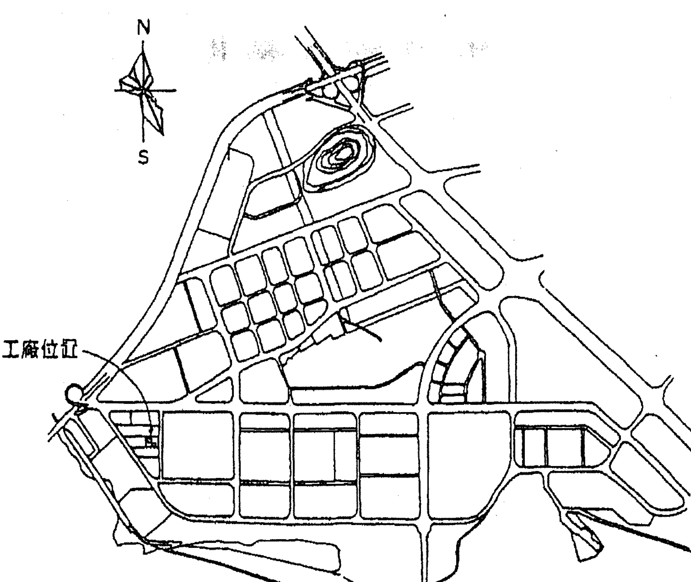
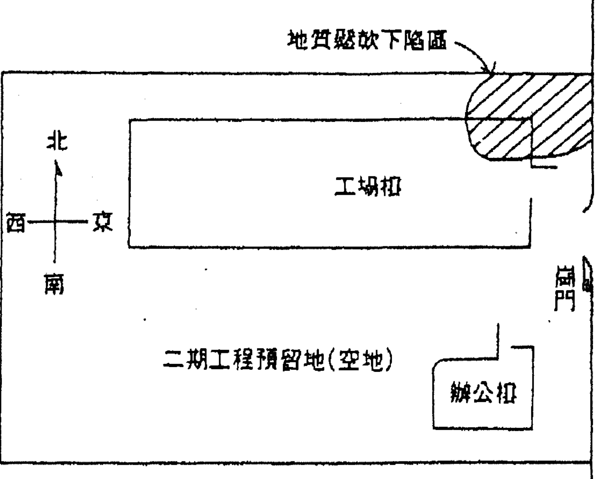

# 斗数论田宅

# 多樣化的田宅宮

## ——自序

傳統的命理，通常以男談事業、女談婚姻為論命重點，很少涉論家宅——田宅宮方面的問題。其實斗數命理，把「田宅宮」列為十二事項宮之一，自有它的道理存在。

近人探討斗數，雖然也相當重視田宅宮，但總把這個宮認定為藏財宮位的「財庫」，因此論及一個人的財富豐缺時，也將田宅宮例入判定窮富的重要依據，除此之外，似乎少有其他論說。

其實斗數命理的這個田宅宮，也跟其他宮位一樣，涵蓋有很廣的命理意義與作用。

若以現代人來說，一天二十四小時，除了工作八小時之外，尚餘的十六小時，起碼還有一半以上的時間待在家裡。若把這種人與家宅的密切情況推而衍之，也就是說，一個在一生的歲月時間裡，最少也有三分之一以上的時間逗留在家中——田宅宮裡。若從這個觀點來看，田宅宮的良窳，對一個可能造成的影響，就不能加以輕視了。

## 斗數論田宅

當今的社會已走入多元化，在這種多元化的社會裡，人們已不再過單純又呆板的日出而做，日入而息生活，因此命理用來探討人生的窮通禍福，也就跟著複雜起來。

筆者在多年斗數探討與業餘論命裡發現到，當今的人在經由命理探索疑難時，已非古人總侷限於妻、財、子、祿方面的事項。同樣的道理，有關田宅宮方面的問題，也跟著多樣化起來。

為了闡釋田宅宮對現代人所可能引起的命理作用，筆者嘗試以各種角度來探討，這個宮位對一個人所可能造成的各種影響，因此除了用實際命例詳盡剖析說明以外，並依命理作用性質，共分為四大類：

- 一、置產篇：俗云有恆產者，則有恆心。因此人們常會在行有餘力時就置產。一個人的行為乃先源自於心理作用，繼而產生思想或觀念，然後再付之實際行動。若從這個角度來探討一個命造者，他之所以會置產，以及置產付之行動後的得失結果，就不難了解，他在這方面所以會有所得失的原因。

- 二、田宅篇：一個人一生既然有三分之一以上的時間待在家裡——田宅宮，那麼田宅宮的良劣必然會影響到他的家居生活，因此這個宮位，也就不可等閒視之了。

當然家居生活，也一樣的包括很廣層面。「一樣米，養百樣人」，同樣屬於家居生活，但絕大多數的人，也都有不一樣的家居生活方式。從命理的觀點來探討，自有其道理存在。

- 三、投資篇：古人買不動產，多半不是為家宅住用，就是買農耕用的農田，但當今已非全然如此。

把投資不動產當做一種事業經營或是一種生財之道，大概是在二十世紀開始以後的事。因此傳統的有土斯有財，在今人的心目中，已不全為用來農耕生產，而是跟其他商業投資一般的，做為賺取財利的手段。

- 四、方位篇：堪輿的思想與觀念，自古已有。但提到這個問題，一般國人都會認為，只有手捧羅盤的風水先生才懂得這個學問。其實斗數命理在這方面，古傳已有，所遺憾的，今人在斗數利用於堪輿方面的論說，似已少見。

筆者在此篇裡，提出「磁場理論」，用以闡釋斗數命理在堪輿方面的原理與作用。斗數命理在這方面的實用性並不亞於傳統的堪輿學。

本論集在二十篇文章裡，列有三十八份命盤，為的是從多方面的角度能更詳盡的剖析個中道理。也希望讀者從類似而不同的命盤裡，能體會出文中所闡述含義，因此初看時，也許會覺凌亂，但相信若能再三詳閱後，就應該能體會了解。

好友彭金盛先生百忙中幫我閱稿與編校，也提出不少寶貴高見，謹此申表感謝。

十二宮位的專論，筆者希望能逐一順利完成。但寫作這種斗數命理的文字，總是在慎審中下筆。這本「田宅」專論，雖然無法介紹完有關「田宅」方面的全部命理作用，但讀者若能舉一反三，諒必從中可領悟更多的相關道理。

期待前輩高人的不吝賜教，並盼同好讀者的鼓勵和支持。

紫雲 謹識

壬申年壬子月于台北客寓

# 導論

傳統的斗數命理，「田宅宮位」並不列入探討一個命造者，一生榮枯禍福的重要宮位，但筆者卻以這個宮位做為專論成集，除了想要完成十二宮位，每宮一集專論的目標外，在近二十多年的斗數研習經驗裡，卻也發現，有關田宅宮方面的命理作用，也常是你們日常生活，甚至與事業息息相關的一個很重要宮位。

由於「田宅宮」在斗數命理的應用範圍甚廣，為了易於闡述，使讀者在翻閱命例文章時易於了解，因此將二十篇文字分成四大類篇，以收條理分明之效。

# 置產篇

中國人在老祖父時代，就有一種「有土斯有財」的觀念。這個觀念若從農業生產觀點來看，因為有了土地才能耕耘生產五穀，也因有五穀才能養家活口。但時代日新月異，社會結構與經濟活動的遞演更變，當前人們在「有土斯有財」方面的觀念，已經不再侷限以生產為目的，往往把擁有土地以及任何不動產，皆視為集聚財富的一種手段，也因為這個「有土斯有財」的意義，在一般人的心目中，產生了重大變化。也因如此，這種「土」與「財」所發生的必然關係卻也成為根深蒂固的深植在人們內心裡，這也是很多人一旦有了錢以後，所以會想要建置不動產的原因。

擁有不動產和建置不動產，因此也就變成很多人所企盼冀求。但就斗數命理而言，不動產的有與無，和能否於企盼中取得擁有，並非人人可在勉強中辦到的。

從斗數命理跡象和累積的經驗中得知，不動產的擁有與否，在人之一生裡，也如一般的命理行運，有一種興衰起伏的高低變化。而主宰一個人一生在不動產方面的有無和過程中的興衰起伏，除了做為命理運轉樞紐的命身宮位以外，就要以田宅宮為重點。田宅宮旺且吉，則置產順遂興隆，田宅宮弱且凶，則置產艱辛或者潰敗。

但置產之事，自然要有其社會背景條件因素，若在一個不允許有私有財產制的社會裡，田宅宮再旺再吉，也不可能擁有私人不動產，就遑論置產之事了。

# 田宅宮

本篇闡述田宅宮在一個命造上的某些特殊命理作用，這些作用涵蓋有，一個人的家居生活，有無家產與家產的繼承命理條件和推演方法。

家庭主婦，自古以來有「主中饋」之稱，但「主中饋」不應該僅指狹義三餐炊事，應該還包括有家務整理和一般的理家雜碎瑣事。這個時代雖然有很多家庭主婦走入社會當起職業婦女，但並不意味著她就可以不分擔家務事，不盡「主中饋」之責任。在斗數命理上，諸凡女命田宅宮忌煞交沖的命造，不管她是否職業婦女，這種女人不只不理會什麼叫「主中饋」，必然懶於整理家務，也必定使家居雜亂有如狗窩。因此田宅宮的旺弱吉凶，在女命的命盤上，已不單純是個庫旺財豐問題，往往就是作為推論是否盡責理家的依據宮位了。

擁有不動產，可能來自上一代的繼承，也可能經由本身的建置所得來。不動產來源不同，在命理跡象上自應有所差別，但如何分辨，也該是斗數命理探討的範疇。

什麼樣的田宅宮屬於有祖產可繼承，什麼樣的田宅宮，要不動產得賴自己去開創建立，這些問題，也是本篇列入探討的一個要項。

某個命造必定能繼承到不動產嗎？蔡辰男先生曾繼承有上一代的龐大家產，但跟他同一命盤的人，也都同樣的繼承有上一代的家產嗎？這個問題也是懸案，筆者再以個別差異的「太歲入宮」一法，提供這懸案的解決方法。但這個方法只是開啟這個問題關鍵之鑰，至於讀者看完書後能否靈活運用，就得全憑個人的領悟了。

無住屋者——無殼蝸牛族越來越多。台灣地少人多，人口又大量聚集都會區，因此這個族群所造成的問題，也會越加嚴重。

# 投資篇

由社會所造成的問題，通常不是短期間所能輕易解決，因此面對無住屋者面談命理時，筆者總是採取一種積極鼓勵態度，要他們竭盡所能的去購買住屋。

凡人常有惰性，在經濟上若沒有直接迫切負擔，往往都會因循苟且，而得過且過。

有很多無殼蝸牛，一輩子買不了住屋，有時並非全為庫虛財弱，田宅宮有什麼重大瑕疵，而是自己的缺乏這方面的企圖心罷了。

有錢購置房地產自古已有，但把房地產做為投資，當做事業來經營，或是以投機方式來掙財求利，那是近代才有的現象，當然也只有在自由經濟體制，人民可以擁有私有財產權下，才有的經濟活動。

台灣近幾十年來的經濟發展，不但使土地不再做為單純的農業用地，尤其在各種產業不斷增加需要用地之下，土地價格不停的高漲，房地產也因人口集中都會區，使其價錢飛漲不跌。因此土地與房地產，就在這種情況下，不但造就了某些投資者因而致富，也促成了這個行業的蓬勃發展。

投資不動產得宜，固然是發財捷徑，但在命理上，想要走這條捷徑發財，並非人人可能做到，否則一旦走上這條途徑，不是會跌得鼻青臉腫，也會偷雞不成反蝕把米。

在多年斗數命理的探討經驗中發現，諸凡從事房地產事業經營的人，除了必須具備財官兩旺的條件外，由於這個行業必須具備龐大資金，再則這個行業資金周轉較為緩慢，因此還需具備有強旺的田宅宮位，因為只有田宅宮強且旺，才能庫旺財豐，也因此才能擁有雄厚資金，否則無以營運。因此有關不動產的投資與這方面的事業經營，田宅宮的強弱，往往成為一個極其重要的關鍵宮位了。

至於一般性的房地產投資或投機，田宅宮的強弱，除了顯現其財力資金的狀況以外，田宅宮旺者，也是代表這個命造者，在房地產方面比較有強烈的企圖心，另外在置產或投資方面，也能做出較正確合適判斷。若是田宅宮弱，則在投資置產方面，比較沒什麼企圖心理，要是田宅宮呈凶象或惡格，一旦投資或置產，必將會做出錯誤的判斷，最後遭受嚴重虧損。

田宅宮的旺弱吉凶，不只影響到一個命造者是否庫旺財豐、窮與富的重要宮位，也是不動產投資與任何置產的一個關鍵宮位了。

# 方位篇

斗數命理，古傳就已論及方位問題，但很遺憾的，有關斗數方位的推論原理和方法，卻不曾詳見於典籍裡。當年筆者從學於恩師——何老師時，曾授有此方面的基本法則，為使斗數方位能有更多人參與探討，因此在本篇裡，特將曾取得的，又適於發表的幾個實際命例，分別論述，做為同好探討之參考。

斗數方位可應用的範圍甚廣，也相當實際好用。小焉者，可用於家宅方位選擇，大則可運用在廠房興建佈局參考，至於床位與辦公處所的佈置擺設，也與一般堪輿之學，有殊途同歸之妙。

斗數方位學的探討不難，只是必須具備下述幾項條件，然後才能得到合理的活用。

第一：正確了解羅盤的運用原理和方法，筆者曾親眼目睹某位以堪輿為號召的命理大家錯用羅盤。羅盤使用不當，方位自然量測有誤，就無法根據方位做出正確的判斷了。

第二：熟練斗數命理基本法則與推論原理，因為其吉凶判斷原則與一般命理的原理無異。

第三：熟悉星曜賦性與陰陽五行，及其相生相剋的原理，否則無法據以了解和判斷方位上的「磁場效應原理」。

第四：星曜在十二地支宮位上的廟旺利陷區分，藉此以判定方位氣勢——磁場效應的強弱問題。

第五：方位的應用往往涉及「標的事物」的類別問題。「標的事物」有別，對方位適宜性常有所差異。因此方位的吉凶分辨，也就常因「標的事物」功能目的有異，而有相當大的差別。

本方位篇，雖僅闡述五篇文字，內容也都只限於提綱挈領的談其要則，目的在於提出斗數命理尚有一「方位」之學可探討，也用於說明方位之學，自有其可用性與實用性。至於某些命理專家常用方位學上的雕蟲小技，用來談論有關房屋週遭環境的一些雞零狗碎景象，並無實際的利用價值，所以本論集略而不予敘述討論。

# 結語

斗數命理的田宅宮，在實際命理的探討上，當然並非只限於本論集裡，各篇文字所提到的功能和作用，只是一本論集，文字篇幅自有其侷限，再則筆者曾經實際談論過的某些特別命例，也因情況有些特殊，因而無法在此論集裡公開提出討論，若今後還得機緣，再另以其他方式提出探討，以饗讀者。

## 卷一

# 置產篇

# 陳老闆的不動產

——論獨鍾不動產投資的命理因素

【提要】

建置不動產，有的為住用，也有為商用，當然也有為投資想賺錢。他是位中藥商人，不是專營房地產的營建商，但他在不動產方面投資既多，種類且雜。特別是集中在辛酉大限最多，也最複雜。有事實的真相，必定有其命理跡象，但陳老闆的這個命例，不但不多見，在命理推論上，也有異傳統方法。命理，一定要言之成理，也就是要合命理邏輯，否則就變成胡言亂語了。

# 前言

壬申（一九九二）年，有次公差高雄，趁便晚上赴訪了無居士弟弟府上，閒聊間，他提起我在他提供「陳老闆」（詳見《斗數論事業》乙書）命例文中，論及這位命造者有關〈投資房地產〉一段，雖然也有敘述他所以會建置很多不動產的命理分析，但經過查明陳老闆置產的詳細狀況以後，發現有很多無法理解的問題。在一夕詳談後，他建議我，也把它撰寫成文，諒必值得讀者同好們，有關推論建置不動產方面的參考。

# 對不動產情有獨鍾

黃：「他這一輩子的事業當然以中藥材生意為主，但他的生財之道，卻對建置不動產情有獨鍾，這在命理上，究竟做何解釋？」

| 丁巳 | 戊午 | 己未 | 庚申 |
|---|---|---|---|
| 紫微七殺 天鉞 | | | 鈴星 |
| 事業宮 | 僕役宮 | 遷移宮 | 疾厄宮 54-63 |
| 天機天梁 | 一九九二 陳老闆 | 男命 癸酉年十月×日戌時 一九三三 | 地劫 廉貞破軍祿 |
| 丙辰 | 81 大運 壬申年 | | 辛酉 (身宮) 財帛宮 44-53 |
| 田宅宮 | 庚60 申歲 | | |
| 天魁天相 | 金四局 | | 壬戌 子女宮 34-43 |
| 乙卯 | | | |
| 福德宮 | | | |
| 太陽巨門 文曲 | 擎羊 | 火星地空右弼左輔貪狼武曲 忌 | 祿存文昌太陰天同 科 | 陀羅 | 天府 |
| 甲寅 | 乙丑 | 甲子 | 癸亥 |
| 父母宮 | 命宮 4-13 | 兄弟宮 14-23 | 夫妻宮 24-33 |

陳老闆在辛酉大限間，在不動產方面，不只買得多也投資得雜，這段命理跡象，要怎麼推論？看完本文，有讓你意想不到，有異傳統的推論方式供你參考。若一次看不懂，看兩三次應該就可理解。

答：「所有的命理現象，都必須以命身宮格局作用為基礎。因為命身宮的特質，代表一個人的性格與能力條件；這兩個因素，不但會主宰著他一生的榮枯禍福，也會左右他在其他十一事項宮位的命理作用。

至於他獨鍾於建置不動產的問題，當然還要以其先天的田宅宮，做為推斷依據。

黃：「能說明的更具體些麼？」

答：「從命身格局而言，他是個見左輔右弼又雙星主開創的〈殺破狼〉格局命造，尤其是化祿與化忌在他的身命宮位，又都坐守地劫與地空。這種身命架構，特別在命宮又有昌曲來輔，因此在行事與求財方面，會有下列的四種特質：

- 其一：處事靈活達變，並有為達目的，而竭盡所能的特質。
- 其二：利之所在，必定全力以赴，並有謀大財不計小利的作風。
- 其三：紫殺帶威權，因此處事充滿信心，衝勁十足。
- 其四：不做附加價值小的生財事業與投資。

以上這些特質，不只出現在他的中藥材生意事業上，在建置不動產方面，也會出現他這種特有的風格。

# 初次置產

至於他的田宅宮方面，先天田宅在辰宮機梁坐守，會有子宮祿存與同陰的〈水澄桂萼〉格，星曜組合甚為佳美，尤其申宮照會有個可錦上添花的鈴星，更增添這個先天田宅宮的吉象作用。（註）

先天田宅宮佳美，往後每遇大限運強，限運田宅宮又佳時，他一有資金，自然會有強烈投資不動產的意願與行為。

黃：「陳老闆雖然做生意出道很早，但一直租屋而居。直到三十八歲（庚戌年一九七〇）時，才買塊地來蓋房子當住家用。這時他行入壬戌限的運程裡，大限田宅宮在丑，武貪皆化忌，又會照有空劫身與火羊，堪稱凶到極點，怎麼可能會置產？」

答：「大限田宅丑宮雖不佳，但是壬戌大限的壬干天梁化祿，使先天田宅辰宮出現與子宮所會有雙祿並照。到了三十八歲的庚戌年，正好大限與流年重疊，庚干不只使寅

## 大力投資房地產

宮的太陽化祿與子宮的祿存輔丑宮，庚年的流祿在申也會照先天田宅辰宮，使這個宮位集三代祿星的吉象出現。

先天田宅吉，大限與流年的田宅宮雙祿輔，只要他有資金，自然會顧慮到優先解決住屋的問題。

黃：「但這年的田宅丑宮，除了本宮凶以外，流年羊陀也分由酉和未宮沖照丑宮，難道沒有凶象的肆虐增凶作用？」

答：「當然丑宮的凶象再加上羊陀會更凶，我認為除了買地來自建房子以外，在買地與蓋房子時，在資金方面相當捉襟見肘，大概要到處借貸，或是從銀行貸款來解決，應該不是在資金充足之下，既買地再蓋房子。」

黃：「他的確在貸款之下來解決買地和蓋房子。」

黃：「依命理跡象而論，你看他在壬戌限裡，還會否再有購置不動產的機會。」

答：「建置不動產不像買部機車，三兩萬元就能買到。他在壬戌限運程甚弱，大限雖吉化先天田宅天梁化祿，但究竟限運的田宅丑宮太凶，何況丑宮又是他的先天命宮，因此在大限運程弱，事業難能大展得厚利，田宅丑宮也破，自然使他難能聚大財，因此在壬戌限內，的確只在庚戌年買地蓋房子來住，其他並沒再買什麼不動產。」

我認為，他能先解決住屋問題，已經托天之大幸，恐怕很難再有餘資投資其他不動產。

黃：「不過限入辛酉限時，他在不動產方面的大力投資，幾乎到了狂熱程度。在這個限運間，固然是他的本行中藥材生意最興旺的一個階段，使他比較有充裕資金移作其他投資之用。但據所知，當時的財力還不足以讓他在不動產方面作那麼多投資。在斗數命理上，限運的田宅宮在子，文昌因辛干而化忌，使這個宮位，也變成羊陀夾忌的凶格，他怎麼會在投資不動產方面，幾乎銳不可擋，也大部份都獲利豐厚？」

答：「辛酉限他在事業上的盛況，在《斗數論事業》一書中，已有詳細敘述，當然比之前一個壬戌限，他應該財力會好很多。至於他在投資不動產方面的積極與得利，在斗數命理上，我認為具備有下列三點的特質：

其一：先天的田宅宮佳，大限田宅宮在子，不只是〈水澄桂萼〉的吉格，而且太陰為〈田宅主〉，故有加吉作用。

其二：大限本宮有破軍化祿，田宅子宮有祿存，這兩個祿星，有互為吉化引動作用。

其三：先後天的田宅辰子兩宮三合照會，在作用上有互為增強作用。」

黃：「文昌化忌，不是使子宮成為羊陀夾忌的凶局嗎？」

答：「這是傳統上的一個很大誤解，文昌化忌在這個地方，我認為不只不凶，反而有因沖而動的吉化作用：

其一：祿存宮必定受羊陀夾，因此這個宮位有被受困之害。這種宮位在田宅宮，將會守成有餘而開創不足。

其二：化忌的是乙級星曜，正好有使子宮脫困的沖動作用。假定化忌是甲級星曜的太陰（或天同）星，那才會造成真正的羊陀夾忌凶格作用。」

黃：「文昌化忌，不也與申宮的鈴星會沖而對子宮，形成忌煞的沖害作用嗎？」

答：「當然也多少有些凶煞作用，但申子辰的星曜組合究竟還是吉大於凶。另外辛酉大限本宮的三方四正，形成極強的吉象限運，這種吉象限運，自然能夠抵禦限運田宅宮的某些小凶的危害作用。這也是我一再強調，一切論斷必須跟本命宮或是大限本宮為基礎再判斷的原因。假定說子宮的忌煞交沖有其必然的不利作用，很可能是陳老闆在此運程的不動產投資，會出現下列的幾種現象：

其一：資金不是很充足，可能仍需貸款融通。

其二：買到什麼有瑕疵或被動買進什麼不動產。

其三：買進的不動產，也會在這限運內賣掉。」

黃：「陳老闆在辛酉大限間，所投資的不動產次數，經可查證到的大概不少於二十件。我還是弄不清，從命理的跡象上，他對不動產投資，怎麼會狂熱到這種程度？」

答：「除了前述的命理因素以外，我認為在辛酉大限裡還有下列的幾種情況可以說明，他之所以會如此的原因：

第一：辛酉大限不只是他身宮的所在宮位，而且還是很強的限運，特別是辛干巨門化祿，使他先天命宮成為雙祿所輔，因此會強烈的增強他處理，包括投資不動產方面的積極意願，並力求付之實現。

第二：他的命身格局，這種會左右，又雙重的見紫殺帶威權的〈殺破狼〉格局，企圖心本就極為旺盛。辛酉大限走入這個命身格局三合方運程，處理事業投資不動產，自然就有如吃了熊心豹膽的勇往直衝。

第三：自然是先後天田宅宮皆吉，這種限運只要他有資金，又只要有投資不動產的環境與機會，他就不會輕易放棄了。

第四：辛酉大限正是民國六十五年到七十四年（一九七六到一九八五），正是台灣房地產由盛而衰時期，也正好他在本行事業最飛黃騰達時候，因此資金與房地產價格，正是他正逢最有利階段。」

黃：「他在這運程投資的不動產種類甚雜，有透天厝，小套房，商店面，餐廳，魚塭，工業用地兩大筆，買地蓋大樓，辦公大樓。另買到因經營不善，以中藥廠抵貨帳的廠房有兩三家，尚未列入規劃的農地，甚至買開酒廊的店面，名目之多，真可歎為觀止，這又如何從田宅宮來論斷？」

## 斗數論田宅

答：「他投資不動產，所以雜到這種程度，當然不是先後天田宅宮問題。我認為與他先天的命身格局有關：

日月旺位輔命宮，在星曜賦性作用，也是一種有利田宅——有如〈日月照壁〉的特質。因此當辛酉大限使巨門化祿，造成先天命宮被日月雙祿所輔後，也會激起陳老闆，在房地產方面投資的重大興趣。

命宮在丑貪狼化忌受昌曲來夾，是個〈離正位而顛倒〉的格局，但在他這種強勢命格與運程下，會出現一種「不按牌理出牌」的命理作用。只要讓他認為有利可圖，就不會管它什麼樣的不動產，一有機會就買下再說。

另外命身格局皆坐空劫，另有一種〈異路功名〉的命理作用，這種作用，常有歪打正著的特質。」

當然以上這兩者，都由煞星成格，因此也難免會有失算的時候。在「陳老闆」乙文裡談到，他開餐廳與酒廊，又開魚塭養魚，恐怕不只賺不到錢，等到不經營時要出售，可能也多少要賠些本賣出。

## 那來的資金？

黃：「我真懷疑他在這段期間會有這麼多的資金，去投資這麼多的不動產？他當時的中藥材生意，雖然賺錢，但絕對賺不了這麼多錢可供他投資在不動產方面。這在命理上又怎麼解說？」

答：「建置不動產，不是做小生意，非大資金莫辦。從命理方面，除了自有資金以外，我認為他很可能採行兩種方式來籌措資金：

其一：銀行貸款融資，他以先買後貸方式來籌集下次再投資的資金。」

黃：「這在斗數命盤上，可以做出合理解釋嗎？」

答：「破軍在財位化祿，有所謂〈典當之財〉的賦性作用。命盤的破軍化祿，不只在他先天財帛宮，也是他身宮所在宮位，這種人堪稱融資老手——以抵押貸款借錢。辛酉限他正好進入這宮位，因此我認為他應該會經由金融機構，貸得不少〈典當之財〉。」

黃：「是啊！他常說：『借不到錢，能做出什麼生意？要做好生意，要先學會借錢。』他一生的較大投資案，幾乎都經由貸款籌來資金。」

其二：大限本宮坐會空劫並忌煞交沖，再精明的人，行入這種運程，都會有馬失前蹄失算時候。我認為他會及時把投資不甚妥當的，或是中長期看不出有利可圖的不動產隨時出售。出售後，自然就會有多餘資金，做再投資的資金了。」

黃：「你又憑什麼做此推斷？」

答：「這種命格局的人，生性果斷，應該不會讓投下的資金長期耗利息而無大指望，還會長期保留該項投資。」

黃：「他的確如此。」

又，「大限田宅在子，本宮忌祿自沖，這種跡象，本就有出售不動產的命理作用。因此我認為，他會毫不猶豫的，只要有接手，他就會出售。」

黃：「在辛酉大限間，雖然買進很多，但也賣出不少，但他並沒浪費資金閒著，總會很快的把它再投資在另個不動產上。」

## 庚申大限又如何？

黃：「就投資不動產而言，庚申大限又會如何？」

答：「這個問題也需從兩個方面來談起：

大限本宮是個空弱宮位，與辛酉限差距很大，雖然因庚干太陽化祿，使先天命丑宮也成為雙祿所輔，但究竟庚申限還是不比辛酉限強。因此在氣魄和衝勁上，已不如上一限運強。

其次，庚申的太陽化祿由寅宮來會，與破軍化祿自坐有別，其吉化作用差很多。另有辛酉限和其田宅子宮各有祿星互為吉化，因此對田宅宮產生強烈吉象互相引動作用。

而庚申大限的田宅亥宮，雖有天府並為紫府相大格局，但卻沒祿星的吉化，因此在亥的田宅宮與子宮比較，就顯得差多了。」

黃：「天府星不也〈在數掌財宅〉嗎？」

答：「我只說比較差而已，並沒說很差。因此我認為他進入庚申限後，還是會再投資買不動產，只是數次個案少很多。」

黃：「從五十四歲（民國七十五年，一九八六）到目前僅投資三處不動產。雖然近幾年來也陸續在洽談不動產投資，但已經沒像前一限運成交得那麼熱絡。」

黃：「依你所提出的理論，辛酉大限所以會投資那麼多不動產，乃與在子的限運田宅宮有關。當庚申大限時，因庚干天同化忌，使子宮延續辛酉限時的兩坎化忌，子宮應該會顯出凶象作用來。這種凶象究竟是怎麼一回事？」

答：「忌祿自沖，當做出售論。我認為跟前述所論一樣，他會把在辛酉限買下的不動產延續到庚申限還留下來的，諸凡在中長期認為無利可圖的，就會相機出售。」

黃：「會虧老本出售嗎？」

答：「應該不會。先天田宅辰宮不成凶格，大限田宅亥宮也不為凶。出售以前投資留下的不動產，只是賺多少問題，當不至於賠本出售。」

註：鈴星雖為六煞星之一，但此星有會凶煞成凶象，會吉星卻有呈祥助吉作用。

## 她有不動產嗎？

——兼論「重點宮位」的理論與運用

【提要】

先天田宅宮星曜格局不錯，但限運田宅宮卻很差，很多初學者，當推論到這種先後天田宅宮有這麼大差異時，幾乎都會傻了眼，不曉得如何論斷。

探討斗數有很多觀念和方法問題，若是沒弄清楚，碰到類似這種命盤時，就不曉得怎麼論斷。

筆者很早以前，就提出「重點宮位」的理論，但據不少讀者反應，對此理論還是不甚了解。因此在本文裡，就用這個理論來詳加說明，諒必能使讀者對這個「重點宮位」有更深入了解與知道如何運用。

壬申年中（一九九二），接到斗數同好丘先生電話說，有份人言人殊的斗數命例，希望能在禮拜六下午，和幾位斗數同好碰面研究，屆時一定要我參加。

近幾年來，經常會有年輕同好，要我參與斗數命理討論。為了增廣見聞，只要時間許可，無不欣然赴約。三人行必有吾師，這些受現代教育的年輕人，往往在命理討論之間，常有異於傳統理念的觀點。我有很多突破窠臼的斗數理論與方法發現，常常都是由此引發而來。世事有如長江後浪推前浪，時代不斷新人換舊人，斗數命理將來能否繼續發揚光大，得賴這些受現代良好教育的年輕人了。

禮拜六下午我應約到忠孝東路一家茶坊時，他們已經在黑板上排好命盤。待我喝了杯茶後，丘先生開口說道：「大家詳細看看，這位女士在丁卯大限間，有否擁有不動產？」

「丁卯大限田宅宮在午破軍廟旺坐守，嘉會來自寅子兩宮的祿存與廉貞化祿，不只擁有不動產，若與一般人比較起來，應該還算不少。」洪先生人爽直，一馬當先的提出看法。

| 己巳 夫妻宮 25-34 | 庚午 兄弟宮 15-24 | 辛未 命宮 5-14 | 壬申 父母宮 |
|---|---|---|---|
| 太陽忌 | 文曲 破軍權 | 寡宿 | 天機 天鉞 |
| 火星 | 武曲科 | 一九九二 | 女命 甲申年八月 日寅時 | 地空 | 太陰 |
| 戊辰 子女宮 (35-44) | 大運 壬申年 | | 癸酉 福德宮 |
| 擎羊 | 右弼 天同 | 丁卯 49歲 | 貪狼 |
| 丁卯 財帛宮 45-54 | 土五局 | | 甲戌 田宅宮 |
| 天馬 | 祿存 七殺 | 陀羅 地劫 | 天魁 天梁 | 鈴星 | 天相 廉貞祿 | 左輔 巨門 |
| 丙寅 疾厄宮 | 丁丑 遷移宮 | 丙子 僕役宮 | 乙亥 (身宮) 事業宮 |

這位命造者，於戊辰大限時大肆投資不動產，到了丁卯限時，這些不動產——土地大漲其價，因而賺了不少錢。限運的田宅宮這麼凶，怎麼會大肆投資土地？閣下若先看本盤，能否看出她為何在戊辰限時，因置不動產而致富？若推論不出，詳看本文就可了解。

「破軍文曲為〈貧士〉，是個不很好的組合。照會雙祿雖做吉論，但若以午宮的這個大限田宅宮而言，似乎是個〈吉中藏凶〉的宮位，因此我認為，她的不動產，在這個限運內，會從無到有，再從有到無。」小蔡接著提出略有不同的見解。

「那你意思說，她的不動產，是從這個限運開始才建置，也會在這個限運內賣掉了？」洪先生追問道。

林：「我認為這個問題，理應從先天的田宅宮看起，然後再追索到丁卯限的田宅宮，如此前後綜合推論，才能真正推論出，這個限運田宅宮，究竟是吉或凶。」林先生喝了一口茶後繼續說到。

「先天田宅宮在戌，是個帶有〈火貪〉會祿存，主變化的〈殺破狼〉格局，架構美好。到了丁卯限時，後天田宅午宮也不錯，文曲破軍，雖然不是個好組合，但午宮並不會凶煞與忌星，鈴星與貪狼合成〈鈴貪〉會照午宮。先後天田宅宮都好，因此在丁卯限時，理當會擁有不少不動產。」

「她的確在丁卯大限間擁有不少不動產，也因不動產不少，堪稱小富婆。」丘先生終於說出答案，接著又問道：

## 不動產怎麼來的？

「那她所擁有不動產，究竟是繼承而來的？或是自己建置的？」

老蔡：「通常先天田宅宮吉美的人，比較會繼承到祖先的不動產。她的戌宮星曜組合不錯，理當有不少不動產可繼承。」

洪：「先天田宅宮雖然不錯，但戌宮的主星，貪狼會有文曲，而有〈離正位顛倒〉或〈粉身碎骨〉的凶格，因此她在丁卯限間的不少不動產，理當是先變賣祖產，再另買新不動產，也就是賣舊買新的結果。」

「有道理，先天田宅戌宮，正好和丁卯限田宅午宮相會，應該會有這種去舊換新的作用。」朱先生附和的說道：

「要不然從她所經歷過的己巳、戊辰和丁卯三個大限田宅宮，都不是非常佳美，很難讓她在丁卯限間，因擁有不少不動產，而成小富婆。」

也許大伙認為很有道理，因此經過十來分鐘，都沒人再發表意見後，我才提醒說道：

「先天田宅宮，雖一般做為論斷能否繼承祖產的依據宮位，但並不能據以推論，凡是這個命造的人，必然能得到祖產。因為祖產的繼承，一般都來自父母那一代。父母有不動產，子女才有祖產可得。從單一命盤裡，很難也幾乎不可能，據以推論，她必然有祖產可得。」

「另外先天田宅宮，也代表一個命造他在有關不動產方面的意識型態。田宅宮佳，只要他有錢，他會有較強烈的意願去建置不動產，否則錢再多，他對建置不動產，也會興趣缺缺。當然田宅宮的命理作用涵蓋範圍很廣，這裡僅指有關不動產建置方面的作用而言。」

洪：「那要如何來分辨，這位女士，有否繼承到不動產呢？」

「最好有他父（母）親生年資料來輸入分辨，也就是根據『個別差異』理論來推斷，她究竟有無從她父（母）親得到不動產，因為總不能說，凡是這個命盤的人，必然都會或都沒繼承不動產。」我據理的答道。

丘：「這位女士從小家境不佳，並沒繼承任何來自上一代的家產。」

## 那一個限運投資不動產？

話題一轉，丘先生接著問說：「那她在丁卯限運所擁有的不動產，究竟是在那一個大限所建置的？」

大伙望著黑板上的命盤落入沉思，於是我為大家泡茶，並整理狼藉不堪的茶桌，又請服務生再送來一泡鐵觀音。

老煙槍抽煙找靈感，不抽煙者嗑瓜子想思路。過了一陣子後，只聽老林喃喃說到：

「庚午限，限運本宮既強又會雙祿，限運財帛宮與福德宮皆佳，理應財運不錯，但年紀太輕，不太可能買不動產。己巳限，雖坐太陽化忌，但在旺宮不做凶論。這時限運己干武曲化祿，使先天財帛卯宮成為雙祿所輔，大限財帛丑宮也是雙祿輔。先天財帛宮吉旺，進財甚佳。」

「另外己干的武曲化祿，也會入大限田宅申宮。申宮紫府極旺，又會有子與寅宮的雙祿，因此己巳限的田宅申宮，堪稱吉祥畢集。」

「財帛宮好，田宅宮旺，有錢自然會傾向於不動產的投資。因此她在丁卯限的不動產，理當從己巳限時，就開始陸續的購入。」

老林依理談來，條理分明，堪稱絲絲入扣，但大伙看丘兄和我都沒表示意見，也許覺得實際並非如此，於是又再度落入沉思。

「不對！不對！」洪兄提出不同意見說道：「己巳限文曲化忌，正好和先天田宅的貪狼合成凶格——〈粉身碎骨〉格，就算有買不動產，也不可能買很多。」

「老師一直強調，不可以只看後天「田宅」，而棄先天「田宅」於不顧。這個運限，我同意她進財不錯，也許買一間住屋，應該還不會在不動產方面做太大投資。」

「戊辰大限貪狼化祿照會大限本宮，使〈火貪〉吉化而成橫發，大限財帛宮在子有廉相化祿坐守。戊子兩宮的祿星，會大限本宮，會使她財利廣進。大限福德在午，三方的戌、子、寅有三祿照會。先天福德酉宮雖然忌煞交加，但在戊辰限裡，並沒引動凶象，因此在戊辰限時，由於財帛宮佳，福德午宮吉，因此賺進來的錢不但多，也都能保得住，因此她必然有錢——有充裕的資金，可以投資不動產。」

「尤其在己巳限時，她的財帛宮就很好，延續到了戊辰限時財運更加，因兩大限的累積，所以到戊辰限，她的財力才真正足夠投入不動產投資。」老蔡從進財的財帛宮和積財的福德宮來探討這個問題。

林：「但戊辰限時，大限田宅在未天機化忌，未宮又會有羊陀地劫諸煞，也形成〈天機天梁擎羊會〉的凶格於限運田宅宮。限運的田宅宮這麼凶，又是她的先天命宮，若真的買不動產，恐怕買到的都是一些毫無價值的荒地或是爛房子。特別到了丁卯限時，因擁有有不少不動產而成小富婆。戊辰間果真大量買入不動產，到了丁卯限時，若不貶其價值，已經托天大幸了。」

## 重點宮位的確定

大伙又經過一段意見紛紛的辯論後，還是談不出個結果以後，我才說道：「你們的分析都很有道理，但由於沒抓住論點的重心所在，所以還是沒有推論出實際真相。」

於是我提出個人的看法說道：

「第一：先天田宅戌宮，原本就是個架構不錯，會祿星又有〈火貪〉橫發的〈殺破狼〉格局。這種田宅宮的命造，一旦有充裕資金，又有適當環境，就會產生強烈投資不動產的意願。

第二：從己巳限的武曲化祿，到戊辰限的貪狼化祿，兩大限延續吉化先天田宅戌宮，使〈火貪〉格局為之吉化作用。

第三：正如前述，延續己巳和戊辰兩限的財帛宮都不錯，理當財利滾滾。對於一個無祖產可繼承的人，己巳大限進入社會工作，除非中馬票或作奸犯科，不可能在十年間，從一無所有，到有大筆資金可廣置不動產。但延續兩大限的財利聚集，就不無可能了。」

「那你意思說，她的不動產，可能都在戊辰大限時所投資的了！」洪先生心有疑惑的說道。

「理當如此。」我隨口答道。

「不過戊辰限的田宅未宮這麼凶，你怎麼捨而不顧，只看先天田宅宮的吉相呢？」

洪先生追問著說。

「這個涉及推論上的「重點宮位」問題，因此要從下列現象談起：

打從可能由自己賺錢來投資不動產的己巳限運起到丁卯大限止。

己巳大限，武曲化祿吉化先天的田宅戌和申宮。

戊辰大限，貪狼化祿吉化先天田宅，但後天田宅未宮呈凶象。

丁卯大限太陰化祿對先後天田宅宮戌和午，既無吉化也沒化忌呈凶。但限運的田宅午宮，會照有雙祿，並有鈴貪合照成吉格。先天田宅戌宮吉，限運田宅午宮佳，因此這個限運的田宅仍作佳論。

根據以上延續三個大限的先後天田宅宮情況，先天田宅宮，在三個不同運限裡都呈吉。但三個運限的後天田宅宮，先而吉，再而凶，繼而再再吉。使此三運限的後天田宅宮形成既非全吉，也非全凶的不規則情況。

另外：先天田宅戌宮，原就會照有寅宮祿存，當己巳限和戊辰限時，分別使武曲化祿和貪狼化祿。類似這種限運使先天田宅產生雙祿時，在建置不動產時，先天田宅宮，它的作用會比後天田宅宮強。戌宮的先天田宅，更歷經己巳與戊辰兩大限的化祿吉化，因此這兩限有關建置不動產的重點宮位，自然要以先天的戌宮作用為主。

類此情況的田宅宮重點宮位，理當取用戌宮宮位。因此當戊辰限，戊干使貪狼化祿後，自然激起她積極投資不動產的意念與實踐。」

## 後天田宅宮凶象的分辨

老蔡：「戊辰限時，天機化忌引動的兩個凶象，究竟要做如何解釋？
其一：先天命宮未，也是戊辰限運的田宅宮，忌煞交沖的這個凶象，若沒影響到投資不動產，那凶象究竟呈現在那方面？
其二：天機化忌和巳宮的太陽化忌夾制大限福德宮——主〈貧士〉的宮位。先天福德酉宮不很好，大限福德午宮也不佳，可能聚大財來投資不動產嗎？」

我看了命盤後說道：「這個命造者天機坐守命宮羊陀沖照，到戊辰限時，天機化忌引凶，可能屬於身體健康問題，也就是在戊辰限間，她原本體質不佳的身體，開始出現某些明顯的毛病。未宮到了丁卯限時，又再度有巨門化忌延續沖照，因此她的身體一直不很健壯。」

所以我認為戊辰限的未宮忌煞交沖，比較偏向身體健康問題。」

丘先生接著說道：「她原本身體不很健壯，戊辰限後身體健康一直不好。」

於是我又分析著說：「戊辰限的福德午宮，雖然雙忌夾制，但大限本宮是個會雙祿的〈火貪〉格，福德午宮會有戊、子、寅三宮的祿星，因此財源極佳，至於午宮被雙忌夾制，應該只代表，這個限運生財雖豐，但倍加辛勞，錢多可不是輕鬆賺取而得的。」

「依老師的延續理論，她在戊辰大限買不動產，大限田宅宮在未有天機化忌，到了丁卯限又因巨門化忌沖擊未宮，理當不可能使上一限所買的不動產，會有增值之利，為什麼惟獨她會例外呢？」洪先生不解的問說。

於是我隨即答道：「這也正因上面所說，這個命造者，她在戊辰限投資不動產的命盤重點宮位不在未宮，而是在戊宮的原因所在。

戊辰限的田宅未宮，又因是先天命宮，理當在田宅方面也有什麼不如意狀況出現。

天機主家務事，也許在這個戊辰限間，她家裡曾經有什麼困擾事發生。」

## 為什麼看不準

「戊辰大限投資不動產，把吉象宮位定在戊宮，但到丁卯限時，並沒吉象來引動戊宮，為何她戊辰限投資的不動產，到丁卯限會增值？」林先生還是心有疑惑的問道。

我看大家都沒意見再發表時，於是說道：「只要先天的田宅戊宮佳，丁卯限的田宅午宮又好，雖然丁干的祿星吉化沒引動這兩個田宅宮，但仍不影響這兩個田宅宮的吉象作用。也因為當丁卯限時，先後天田宅宮皆佳，所以她在戊辰限時投資的不動產，到了丁卯限時，仍會增值。假定丁卯限的田宅宮繼續呈凶，丁干的祿星又沒吉化到先天田宅戊宮，那麼戊辰限投資的不動產，到丁卯限時，就算增值，也將極其有限了。」

「這個命例，幾乎論斷過的斗數高手都認為，會在己巳大限大賺錢後去大量投資不動產，但到了戊辰限時，因為限運田宅未宮呈凶格〈天機天梁擎羊會〉，所以也會在這個運限裡敗光。」

到了丁卯限時，巨門化忌進入大限財帛宮，大限福德宮在巳太陽又有先天化忌。因這這個運限的「財」與「福」兩敗，所以是個經濟拮据困窘的運限。

丘先生繼續又說道：「以前我懷疑這個生辰（命盤）是否正確？或是斗數命理，在類此命盤上無法推論出正確命理運程作用，沒想到應該用這種「重點宮位」的理論和方法，才能做出正確的論斷。」

斗數命理應用之妙存乎一心，這種「重點宮位」的理論運用，懂得的人還不多，當然遑論如何應用了。

## 限運「財」與「福」兩宮的凶象徵兆

蔡：「丁卯限的福德宮在巳會雙忌（丁干巨門化忌），並會沖空劫與陀羅，巨門化忌，也會照巳宮的太陽化忌與卯宮擎羊，一樣呈現凶象，據丘兄說，她在這運限裡，為什麼還會是個小富局面。」

於是我指著命盤說道：「她的財庫之位——先後天田宅宮皆佳，庫旺財旺，小富的格局，其基礎理當在田宅宮。

她的先天福德宮在酉，太陰雖旺，但犯空亡並會忌煞，後天福德宮在巳，也是忌煞交加，這些凶象意味著：

- 其一：雖已小富，但仍閒不下來，一樣勞碌命。
- 其二：無法控制的開支花費會較多。
- 其三：切忌做動產方面的投資，否則必敗無疑。

丘：「她到了丁卯限時，不再投資不動產，但把賣土地的錢，大量買進黃金。這幾年來黃金價格每況愈下，價錢跌得叫她心痛不已，似乎沒聽過買股票，否則也會很慘。」

## 命理條件與社會背景

最後我補充的說道：「戊辰大限三十五歲開始時是民國六十七年（一九七八），四十四歲時是民國七十六年（一九八七），這一段時間，正是台灣房地產由盛而衰，再由衰而盛的期間，也是正好她在己巳和戊辰延續二十年財利收入最好的限運階段。

手頭有錢，命理上又有如此的田宅宮，加上當時環境，房地產不景氣下價格較低時，自然會導引她把資金投入不動產。所以她才能由毫無恆產而變成擁有不少不動產，繼而成為小富婆。

因此類似這種命造，她之所以因投資而成富有，固然有其命理條件使然，但時代與社會背景的配合，也應該是不可忽視的一項重要因素。」

## 從有到無，再從無到有
——論析田宅宮的得失之道

【提要】

這位命造者，在年輕時，就繼承有田產，也自己買有田產，但一轉眼，所有的田產都賣光了。

到了中年起，他又再度置產，從此田產只有繼續買進，不再賣出。

繼承家產與自行建置田產，在田宅宮方面應該怎麼分別？把繼承的不動產賣光了，只是先宅宮的問題嗎？與命身格局有何關係？

一個命造者，「有土斯有財」的意識很強烈，在命理上，應該怎麼解說？

細看本文，會使你了解探討這方面問題的正確觀念。

壬申年底，小蔡電話約我在忠孝東路（台北）一家茶館見面，說是有個叫他看不出也想不透的命盤要討論。電話中又說，他從花蓮帶來一個晶瑩剔透的仿古玉石雕刻品要送我，希望我能撥出時間。

與年輕朋友探討斗數命理，已成我近十來年間暇的一種消遣與興趣，但他多禮，雖然受之有愧，但卻之也不恭，我也只好感激的帶回擺飾。

見面時他拿出這份蔡先生的命盤來問道：

> 「先天田宅在戌，這麼弱勢宮位，可能繼承到祖產嗎？」

待我詳看了命盤後說道：「因人而異，不見得田宅宮弱，就無祖產可得。」

蔡：「那麼要如何來分辨他是否可能繼承到上一代的祖產？」

答：「一般人繼承上一代的祖產都來自父親，當然也有少數人例外。但只要有所繼承，先天田宅宮必定與把家產給他繼承的人，有某種吉化關係。」

蔡：「他父親生於民前十二年（庚子，一九〇〇）。」

## 得祖產的命理條件

| 己巳 | 庚午 | 辛未 | 壬申 |
|---|---|---|---|
| 夫妻宮 25-34 | 兄弟宮 15-24 | 命宮 5-14 | 父母宮 |
| 火星 | 右弼 天梁 天機 科 | 蔡先生 | 男命 己巳 一九二九年七月八日丑時 |
| 戊辰 | 大運 壬申年 丙寅歲 64 | | 癸酉 (身宮) 福德宮 |
| 子女宮 35-44 | 土五局 | | 地空 左輔 |
| 丁卯 | | | 甲戌 |
| 財帛宮 45-54 | | | 田宅宮 |
| 巨門 太陽 | 貪狼 武曲 祿 地劫 | 天魁 太陰 天同 | 鈴星 天馬 天府 |
| 丙寅 | 丁丑 | 丙子 | 乙亥 |
| 疾厄宮 55-64 | 遷移宮 | 僕役宮 | 事業宮 |

先天田宅宮很弱，能得到祖產繼承嗎？得到的祖產能留得住嗎？他一輩子能否有自行建置家產的機會？家產有與無之間的消長又如何？看完本文，可使閣下能進一步了解，有關這方面的論析之道。

## 命身格局與祖產

答：「庚年祿存在申，與午宮的祿存輔他在未的命宮，庚干太陽化祿在寅，會照先天田宅戌宮。這兩個吉化——一個雙祿輔命宮，一個化祿會先天田宅宮，我認為他應該從他父親裡繼承到一些祖產。」

蔡：「他在庚午限下半結婚並與兄弟分家，而繼承到兩甲左右的農地沒錯。庚午限，也正好太陽化祿照入先天田宅宮，似乎很巧合。」

蔡：「但先天田宅宮這麼弱，他雖繼承到這些農地，你看他是守成，或是把它發揚光大，還是給敗光了！」

答：「這個問題須從命身格局先談起。他命宮無甲級星曜，以丑宮武貪照入為用，因此命宮也算是一種見祿星吉化、的〈武貪不發少年人〉的命理格局。

身宮是雙星的〈殺破狼〉，雖見昌曲，但不會左輔右弼，尤其加上祿權忌以後，使他在一輩子的處事上有一種積極果斷，勇往邁進的堅強意志。

一般而言，這種命身格局人，若先天田宅宮欠佳，就算繼承有祖產，通常會先敗而後再建立。他所繼承原有的家產，恐怕很難留存到四十多歲以後。

蔡：「他在庚午限時繼承有家產，你看他，會守成或會賣掉？」

答：「他在這個庚午限運得家產，這限運的田宅宮在酉，這酉宮的三方四正既旺且強，因此不但沒有敗掉祖承家產，我認為他的田產還會增加。」

蔡：「是否和限運田宅宮會祿權，又庚干使武曲再度化權，當然就主一種田宅方面的增添作用了，因此他理當會增加田產。」

蔡：「他的確還在庚午限間，分家後又自己購置了兩甲多的農地。但己巳大限呢？這個限運走強勢宮位，他在不動產方面，又能有另番輝煌局面嗎？」

## 強限宮的田產

答：「己巳限坐紫殺，見武貪雙祿權，氣勢甚強。他先天命格也是個天府坐事業宮的〈府相朝垣〉格，因此碰到限運本宮旺，事業酉宮也強時，他應該會在事業上奮發圖強。不過他這種命身宮都是〈殺破狼〉格局的人，先天不坐會左輔與右弼，因大限走入紫殺限運又有文曲雙忌自坐，他在事業方面，鬥志雖然很強，但會呈現極其不穩定的傾向。也許屢戰屢敗，敗而再戰，有一種越挫越勇的極強鬥志。

但我認為他在整個己巳大限於事業方面，其結果應該是乏善可陳。

蔡：「他在這一限運，的確做了很多行業，但都沒成果，那麼他在家產方面，你的看法如何？」

答：「限運本宮雖強，但星曜組合結構並不佳，因此我認為他在事業上沒什麼成果。在這一段期間，他假定安分耕田，也許在農耕方面花樣多些，但不至於大敗，但若從事其他生意投資經營買賣，可能就要吃大虧了！」

蔡：「從命盤上，似乎不能看出他會吃大虧嘛！」

答：「先天事業宮天府五行屬土，被地空與地劫夾制，有一種土空則陷之害。亥宮另有顆鈴星，也使亥宮成為〈空劫夾煞〉宮位。另外己巳限己干使文曲形成雙化忌沖擊亥宮，會使先天事業宮為之破碎。這種傷害力道之大小，就依這命造者他在事業上的實際表現而論定。耕田盈虧差別不會太鉅大，但若投資做其他事業生意經營，成則為富，敗則變窮了。

蔡：「他不務農，反而搞了一些不很上道把戲。大概就因限運遷移亥宮，有你所說的凶象，因此也交上了一些不是很好朋友，最後的確把事業一個個的搞垮了。

那他這個限運的田宅宮，究竟要當吉或做凶論？」

「他的先天田宅宮弱，己巳限的田宅宮也不佳，我看他很難保有原有的家產：

第一：大限田宅申宮無甲級星曜，雖日月來照，有主一種〈日月照壁〉的有利田宅作用，但可惜子宮有顆地劫來沖，使〈日月照壁〉產生一種因波動而破壞之弊。

第二：申宮既不見先天四化的祿權吉化，也不見後天的祿權化吉，使〈日月照壁〉的有利作用，無法凸顯。

第三：先天田宅弱，後天田宅差，他是個殺破狼命格的人，偏偏又行運到己巳大限時，不耕田而做其他生意，我看最後就因生意失敗，而把庚午限間原有的田產，全部給賣光了。

蔡：「的確如此，就在己巳大限時，賣光了所有田產以後，遠走他鄉。後來又買了幾分農地，但最後也因經營小買賣不起色，在債務逼迫下，又把那幾分地賣掉了。」

## 弱限下的田宅宮

蔡：「他約在戊辰大限初期，浪子回頭似的回到老家，從此埋頭苦幹，做鄉下各種粗活營生，以養家活口。大概就在戊辰限的後半，他又開始陸續的買地。據了解，他在四十四歲前買進了二甲多地。

大限戊辰，天機化忌自坐，天機忌星也沖他的先天田宅宮，後天田宅未宮也是個空宮，他怎麼可能會置產呢？」

答：「這個問題，要從幾個方面來談論：

其一：大限天機化忌與火星自坐，只代表他操勞，辰宮的忌煞沖先天田宅戌宮，是他的祖產宮位，他的祖產早已賣光，因此不受影響。

其二：戊干的貪狼化祿，也是他先天命宮。先天命宮經由再度化祿，有一種擊發他生命活力使強盛的作用。同時丑宮的武貪也是他限運的田宅宮照用星曜，經雙化祿吉化後，自有其吉象作用。

其三：丑宮的武貪因有日月旺宮夾輔。日月夾輔宮位一旦成為田宅宮，星曜又強旺時，對田宅宮有一種極強的吉輔作用。因此丑宮星，照入未宮為用時，力道自然增強很多。

蔡：「戊辰的田宅未宮，究竟是個無甲級星曜的空弱宮位，未宮有顆擎羊坐守，亥宮也有鈴星來沖，不也有煞星作用嗎？」

答：「當辰與未兩宮產生互動作用時，辰宮的火星，不但可以克制未的擎羊，火星與丑宮的貪狼（照入未為用），也可成〈火貪〉作用。另外亥宮的鈴星與丑宮的貪狼會入未宮時，不也成爲〈鈴貪〉格嗎！

若從這方面來論，未宮擎羊與所會鈴星，就不能做煞星論了。

至於未宮空弱問題，我認為他當時買地時，大概並沒有足夠的資金，可能是部份資金由借貸而來的。」

蔡：「他一輩子買土地都是利用貸款來買。這是否與先後天的田宅宮不是很旺有關係？」

答：「我同意你這個看法。武曲為財帛主，化祿入命宮有一種善於運用資金的作用。」

## 忌煞交加的田宅宮

蔡：「你看他在這戊辰限所購買的田產，能否留得住？」

答：「我認為可以留得住：

第一：在此限運前，既已破掉祖產，人又到中年才自行置產，只要往後限運不太差，應該可以保住。

第二：戊辰限運的田宅宮很強已如前述，往後又沒一個限運的忌星，會對未宮造成摧毀性破壞。

第三：丑宮作為他戊辰限田宅宮星曜的作用宮位，在他整個命盤上，就是以巳酉丑三宮最強，有一種搖撼不動的堅固氣勢。」

蔡：「他的確從此限以後所買的田產都全部留下來了。不過丁卯限，限運的田宅宮在午，是個祿存獨坐的弱勢宮位，但他在這十年內，卻買了四甲多田產。」

答：「限運田宅午宮，雖然因羊陀夾制而不佳，但這個宮位也是日月照會的宮位，何況有〈田宅主〉的太陰化祿來吉化，不也使午宮成為雙祿交馳嗎！

蔡：「但午宮也會有丁干的巨門化忌與空劫兩煞星，不有干擾阻礙作用嗎？」

答：「田宅宮忌煞交沖，買田產除了意味著一種資金不足，需由貸款來買以外，也代表所買的都不是很好的農地，至於他為何要買這種農地，就不得而知了！」

蔡：「他在戊辰限以後買的農地都不是很好，但他利用來開墾養魚的魚塭用地，並非用來耕作種農作物用。」

我聽了後應道：「原來如此，除非移做他用，否則太差的農地，買來種不了田，可就變成廢地了。」

## 有土斯有財的命理原由

蔡：「這個命例的田宅宮很差，但他生前一直把『有土斯有財』的話掛在口上，我就看不懂，在命理上做何解釋？這問題我也請教過很多高人，但沒有一個人的說詞能讓我信服。你的看法究竟怎麼樣？」

答：「這個問題，我認為要從兩方面來談：

在命理方面：日月於旺宮合照田宅宮位，有所謂〈日月照壁〉的吉格作用，另外，命宮坐守太陽或太陰，又兩星互相會照的命造，也有種傾向這種購置不動產的命理趨勢。

像這位命造者，他日月於旺宮輔武貪化祿權，在命理的作用上，也會有一種強烈購置不動產的意識型態。

在非命理方面：我認為他出生在農村，長在農家，假定他出生在都市裡，他可能買的是一般建築用地或房屋類，而不是買農地開池塘養魚了。

這個命造的事略你很清楚，究竟是什麼親人？」

蔡：「正是家父，他於今（壬申）年上半年去世了。」

哦！原來是蔡老太爺的命造，難得小蔡會緬懷先人的創業維艱，他既然能知道得這麼詳盡，往後必然能有一番作為，以告慰老太爺在天之靈！

## 乘桴浮於海
——析論田宅宮的吉化延續作用

【提要】

田宅宮不但沒甲級星曜，而且還忌煞交加不做佳論，但這位命造者，他在五十多歲前，就曾購置了不少房地產，也在房地產方面賺了不少錢。

有其事實表現，必有其命理跡象。但類似這份命造，假定不懂得推論原理方法，那座所推論出來的結果，必定與事實真相不吻合。

本文也介紹行限走過寅宮時，連續四大限有天干雙重重複的四化，其所衍生的作用問題。這種重視四化，往往在行運上，產生很大的影響作用。所以行限經過寅宮的命盤，就不能不格外留意其作用了。

小高是在幾年前，何老師開班講授斗數課程，我去代講星曜賦性課程時的學員之一。

## 先天田宅宮欠佳

那次由於學員多，因此學員姓名，我記不了多少人，但小高因上課時，問題特別多，因此在當時就留下深刻印象。這個班結束後，他開始陸陸續續的找我談斗數問題。

壬申年中秋節假期間，他來舍下問道：「先天田宅宮很好，除了比較偏向於能得祖產之外，也似乎比較可能在後天裡自行置產。」

我聽了後反問道：「依你這麼講，富的人會越富，窮的人，只好越窮了！」

接著我又說道：「你究竟有什麼問題，最好能提出實際命盤來討論，若再打高空空談，我說不清你也聽不懂，那可累人啊！」

於是他從口袋裡掏出一份命盤問道：「這位林先生，他先天田宅宮在申有陀羅和文昌化忌坐守，不但沒甲級星曜，也是忌煞同宮，這種田宅宮不做佳論，因此他不得祖產，似乎很吻合。你看他這一輩子有沒自行置產的機會？」

我看了命盤後問道：「他幹什麼行業的？」

| 火星 | 右弼 七殺 紫微 | 天鉞 文曲 科 | 陀羅 | 文昌 己忌 |
| :--- | :--- | :--- | :--- | :--- |
| 癸巳 命宮 2-11 | 甲午 父母宮 | 乙未 福德宮 | 丙申 田宅宮 | |
| 天梁 天機 | 一九九二 壬申年 大運 庚子歲 水二局 | 林先生 | 男命 一九四一年六月 日寅時 辛巳 | 地空 | 祿存 左輔 破軍 廉貞 |
| 壬辰 兄弟宮 12-21 | 天相 | | | 丁酉 (身宮) 事業宮 | 擎羊 |
| 辛卯 夫妻宮 22-3 | | | | 戊戌 僕役宮 | |
| 天魁 巨門 太陽 祿權 | 地劫 | 貪狼 武曲 | 鈴星 | 太陰 天同 | 天馬 | 天府 |
| 庚寅 子女宮 32-41 | 辛丑 財帛宮 42-51 | 庚子 疾厄宮 52-61 | 己亥 遷移宮 | | | |

先天田宅宮做弱論，他沒得什麼祖產，但後天田宅宮也不是頂佳，但他卻建置不少不動產，也在此方面賺了不少錢。這種命理跡象原因何在？本文有詳盡解說，可供參考。

高：「幹什麼行業和建置家產有關係嗎？」

我聽了後，覺得好笑的答道：「不一定絕對有關係，但和經濟收入有關係。他假使一輩子是單純的上班族，他若買得起一間住宅房子，就已經托天大幸，但這種人一旦做買賣經商，必然很有搞頭。這種命格一有錢，必然會在房地產方面大投其資，至少到目前已擁有不少不動產。」

高：「他做某種商品的地區經銷已逾二十多年，也就是在辛卯大限時就開始。二十多年來，他的確在生意上賺了不少錢。」

接著小高又說道：「正如你說，尤其在近十多年來，他不但在買賣生意上賺錢，尤其他投資在不動產方面所賺的也不少。這正是我的問題所在，先天田宅宮欠佳，限運的田宅宮，也不甚好，為什麼他會對投資房地產方面會那麼熱衷？又會在這方面，讓他那麼發財。」

## 限運田宅宮

高：「他約在辛卯大限時離開老家，跑到南部去應徵某種產品經銷商。真是時來運轉，就在辛卯大限末期，先由租房而居，接著就買一間三層透天厝來住。

辛卯大限田宅宮在午，文曲天鉞坐守，都是乙級星曜，因此做弱論。雖然會有辛干使寅宮巨門雙化祿太陽雙化權照午宮，但午宮也會有擎羊和鈴星雙煞來沖。吉凶相抵，很難憑午宮，就看出他出道不久，就可能買三層樓房的道理來。

到了庚寅大限，更不得了，竟然在一條市街道旁買了塊地，自己蓋起一棟雙店面的四層樓房了。

庚寅限的田宅宮在巳，雖然紫殺會左右坐守並照祿存，但地空地劫也由合方來沖，怎麼看都是波動不穩的田宅宮，但他竟然樓房買得一次比一次大又高。

在這個限運，據所知他也零碎的買了些地點不錯的老房子來當經銷商品的倉庫，房子雖舊，但地點不錯，地皮後來也漲得滿高的。我就看不懂，究竟是怎麼一回事。」

The request was rejected because it was considered high risk

## 卷一

## 宅經

## 主中饋

——從田宅宮談女命理家之道

【提要】

什麼樣的女命才是一個盡責的家庭主婦？這個問題，在命理上從沒人談起。沒人談起，並不代表這不是個值得探討的問題。自古以來，女人有所謂「主中饋」之稱，什麼樣的女命才是個稱職的「主中饋」一件？

稱職的家庭婦女，除了養兒育女之外，應該還包括其他的家務處理。

本文從另一個角度來探討，這個前人所未談的問題。結過婚的男人，應都能體會到，娶到一個善理家務的老婆，也是很重要的一件事。

壬申年中，有一天接小林電話說，好久沒開講，想約定個週末下午在忠孝東路的一家茶館聊聊，有幾位曾經在一起研討斗數的同好都會來，一定要我到，否則就起不了頭了。

那天我準時到茶館時，一伙人都已來齊，並泡好茶，每人也都拿幾份斗數命盤相互熱烈的討論著。

待我喝了杯茶後，小林又殷勤的遞香煙後問道：

## 女命田宅宮的命理作用

林：「女命田宅宮不甚好，在命理現象上，究竟代表些什麼作用？」

王：「你書讀到那裡去了？田宅宮就是『庫』，田宅宮不佳，就是庫虛財不藏，也就是成不了富婆，這麼簡單的道理還要問。」

張：「那不一定。當前有很多職業婦女走出廚房做事，我曾經看過很多都是田宅宮忌煞交沖，所以在小孩長大後家裡待不住，就設法去上班，根本和財利無關。」

陳：「這種人不能主意買房子，或是投資房地產，否則必出紕漏無疑。」

## 斗數論田宅

洪：「小陳你從事房地產仲介買賣，連談命理也三句不離本行。你有沒有其他的新義呀？我可認為田宅宮好壞，也意味著一個人的家居生活如何。一個已婚婦女，若田宅宮不好，恐怕很難事奉翁姑和與家裡的人相處得融洽。」

尤：「你老婆侍奉過翁姑了？當前台灣的社會，大部份都是小家庭，當媳婦的腦袋裡，有幾個人有事奉翁姑的觀念和經驗？」

幾個年輕人各抒高論後問我究竟誰講的正確。於是我提出個人的看法道：

「你們都說得有道理，起碼都沒離題。田宅宮在女命的命理上，都可以涵蓋這些作用。只是以女命來探討這個問題，似乎要從一般已婚婦女共同的問題來探討。

在傳統上，一般家庭所謂男主外女主內。「主中饋」也就成為已婚婦女的代名詞，因此探討女命的問題，尤其是娶親討老婆時，能否娶個能幹伶俐的「主中饋」老婆，應該也是一般男人所重視的。」

王：「女人是否能幹伶俐，重點不全都在命身宮的格局作用為主嗎？」

## 理家的重點宮位

尤：「女人能否當得起好老婆，恐怕不單是能伶俐就夠格，有時太能幹型的女人，反而有牝雞司晨的困擾，對家庭反而不一定是好現象。」

楊：「能幹型的老婆有什麼不好，至少可以幫老公一起為家庭生活重擔解勞分憂。」

尤：「小楊你尚未結婚，你當然無法體會婚姻和家庭生活的密切關係。剛才紫雲先生提示，應該要從一般性的共同問題來討論。否則從「個別差異」條件而言，這個問題，就沒個準則可談了。」

張：「老婆能否幫忙賺錢還在其次，最要緊的，還是在於能把一個家理得井然有序。紫雲先生所說傳統的「主中饋」，當然不全在廚房的烹煮工夫如何，應該包括理家方面的問題。

理家如何，應該和窮富有關而與是否職業婦女沒有必然性的衝突。紫雲先生，你該是指此而言吧！」

於是我說道：「除去由『個別差異』來談論女命的田宅宮問題外，就一般而言，這個宮位，往往是推論女命理家情況的一個重點宮位，尤其是能否把家理得井然有序方面。」

## 重要宮位的作用

為了要使探討範圍縮小，以便能較深入討論，因此我要提供命盤資料的小林，能把主題明確指出，因為「理家」的範圍包括與家人相處，家庭理財，家事整理，也包括是否善於烹調的「煮」婦之類。至於子女的管教，也常是一位主婦，需要扮演的重要差事。

林：「這三份命盤，都是家庭主婦。甲女士近年來連續開過兩種不同行業的門市生意。乙女士，是個純家庭主婦，不上班也不作任何兼差。丙女士，是位職業婦女。三個主婦在「理家」方面各有相當不同的表現。這也是在我百思不得其解後，所以才請教諸位的地方。」

楊：「紫雲先生常強調，不管論什麼事項宮位，都必須以先天的命宮為基礎來推論。因為命宮可以充分顯示一個人聰明和笨拙，以及勤惰的狀況，因此我認為這兩項理家的問題，還是以命（身）宮格局的條件為基礎來論斷。」

尤：「我不認為如此，固然命身格局是推論所有事項宮位的基礎，可是一旦提到理家一事，重點宮位還是在田宅宮。因此絕不能忽視田宅宮而不論。」

洪：「那這三位主婦的先天田宅宮，甲女士只會沖一個旺宮的天同忌星，乙女士也只沖照一顆屬〈善宿〉的天機化忌；丙女士田宅宮不坐忌星，但卻於三方沖照有空劫與火星。這三人的田宅宮，其吉凶各有不同，至少不能全做吉或全凶論，但林兄已言明，三人在理家方面的表現各有不同，這你要做何解釋？」

其他人有的主張「重點宮位」應該在命身宮，有的強調應該在田宅宮位。有人又認為兩者——命身宮，和田宅宮，應該兼併合論，只是說不出個合理的解釋來。

因此我最後才提出個人的看法說道：

「命身宮格局，固然是推論其他事項宮位的基礎宮位，但談論有關一個命造者與「家」有關的問題時，必然與「田宅」事項有關。

依我提出的「意識型態」觀點，田宅宮的吉凶，就「理家」而言，有某種程度的相關。田宅宮吉，『理家』較佳，田宅宮忌煞交加，或是呈凶格，理家似乎就比較笨拙或偷懶。這種現象，尤其在已婚女命方面相當明顯，這大概與偏向『主中饋』有關。

在男命方面，有些男人在家裡，不管他幫不幫忙理家事，凡是田宅宮不佳的人，大概也比較不重視家裡是否整理得井然有序。要是個光棍漢，他的住處，必然雜亂得比狗窩還糟，甚至他上班的辦公桌上也一定相當雜亂。

因此依我看法，『重點宮位』應該放在田宅宮。」

## 甲女士

王：「那麼甲女士先天田宅機梁坐守於旺宮辰位，只會天同化忌，但在子旺宮凶性不大。先天田宅宮不凶，因此她該是屬於善理家事的女主人了！」

楊：「我同意這個論點。她命身宮是個雙重的〈紫殺帶威權〉，〈殺破狼〉格局，何況又有〈火貪〉成格，能力必然很強。能力強，田宅宮不太凶，應該是個很能幹，也很會管理家的家庭主婦。」

陳：「天魁坐命，正是個坐貴向貴的命格，也是增加她善於理家的一個重要因素。」

洪：「你這種靜態的看法，不很對吧！己丑大限文曲化忌沖先天田宅辰宮，戊子大限天機在忌在辰宮，都是先天田宅宮位。到了丁亥大限與丙戌大限，也連續使限運的田宅寅宮化忌，丑宮忌煞交加。到了乙酉限時太陰化忌又使先天田宅會沖雙忌。這種先天田宅會忌，延續的限運田宅不是化忌，就是忌煞交加，可見她的田宅宮雖不做凶論，但也好不到那裡，因此我認為，她不是個善於理家的女人。」

尤：「對！像她這種命身格局，必然相當的好動，田宅宮又不佳，要她定下心來整理家務，恐怕很難。」

王：「紫雲先生曾說，天機主「家務事」，天機會天同忌星，看似不很凶，但主「家務事」的天機受到忌星來沖後，在這個命造上，就理家一事，大概不很好吧？」

總算有人論及「重點宮位」的星曜作用，因為若在推演時只顧忌煞或只做四化星運用的推論，是種極膚淺的論法，因此我接著說到：

「甲女士命格強，會羊陀及火星，又有地劫來沖也不見左右，因此人雖能幹有衝勁，但心性不穩定沒耐心，這種女命先天田宅宮若欠佳，連續限運田宅宮又忌煞交沖，將很難有耐心於家事整理，甚至連開店都待不住。所以我也認為她在理家方面，應該很差。」

林：「何止很差，從小她不理家事，她睡的房間亂如狗窩，婚後家裡，一樣雜亂得一場糊塗，也別提好好燒飯了。她近年來開店，就是待不住，全依賴僱人看店做生意，因此生意清淡，店裡經常門可羅雀，沒生意可言。」

林：「那乙女士呢？」

## 乙女士

王：「乙女士先天田宅宮有天同坐守，三方不見煞，雖有天機化忌來沖，但天機屬善宿，另外還照會四顆吉星。又卯宮有咸池會未宮天喜雙桃花，田宅宮尚可做吉論，因此她應該是個很重視家居生活，會把家裡整理得窗明几淨的人吧？」

楊：「不過她的命身宮六吉不會，又沖羊陀火星三煞之餘，空劫也沖命身宮，這種性格不穩。先天田宅宮和甲女士一樣也有顆天機忌來沖，恐怕在整理家事方面，也有勤惰不穩狀況出現，有時整理得很好，有時很亂！」

洪：「我同意楊兄的一部份看法。但由第一限運到辛酉限，先後天田宅宮，似乎都還不差，但從庚申到己未限，先是天同化忌，接著文曲化忌延續沖卯宮，似乎意味著，到辛酉限時，家裡還整理得不錯，但從庚申至己未限，似乎就懶於整理家事了。」

陳：「庚申限太陽化祿會進後天田宅亥宮，己未武曲化祿，也使田宅戌宮成雙祿交馳，會懶於理家事嗎？」

王：「不是，天同在先天田宅宮，庚與己兩干，先後化忌沖動先天田宅宮，何況天機已有先天化忌在，因此庚申與己未兩限引動的現象，應該大於大限田宅宮。除此之外，天機主「家務事」，一旦化忌，就會使家務事紊亂如麻。天同為福星，雙化忌沖動後，恐怕再不是窗明几淨，相反的會室內髒亂，窗几蒙灰。桃花沖犯忌煞星，家裡恐怕會亂得很熱鬧！」

我接著說道：「小王說得有道理，但若再加上命身格的會五煞，不見六吉，更會使庚申與己未兩限時的田宅宮，加強其凌亂作用。」

林：「大概情況的確如此。」

## 丙女士

尤：「與女人的『更年期』有否關係！」

「這事可要請教醫生了，但命理上，卻可以依此論斷。」我應著說道。

王：「她的先天田宅卯宮，是雙祿交馳的巨機吉格，從限運引動而言，直到目前及往後的延續運程，都沒有忌星來干擾到先天田宅宮，因此我認為她是三人中，理家務最好的一位的家庭主婦。」

楊：「但卯宮也會照有空劫與火星，不也是一種干擾作用嗎？」

王：「先天田宅宮成為吉格，又是雙祿，我認為所會的三顆煞星，雖有不利影響，但為害不大，所以尚可當吉論。」

尤：「我也認為就理家事而言，卯宮尚可稱吉。特別是先天命身宮格局坐守旺宮，這種命格，不管男女，性格都很穩定。另外三對六吉，左右、昌曲、魁鉞各會一半，這種人應該很能幹伶俐。」

雖然是個職業婦女，但一個賢慧的女人，照樣可以內外兼顧，——工作表現好，家裡也整理得井然有條。她為什麼能內外兼顧，本文有明確分析，詳細看完本文，自然對這個問題能有個概念。

## 女命的田宅宮

命格配上田宅宮皆吉，兩者相得益彰，因此她雖然是個上班的婦女，我不認為她會因此疏忽了家務事。不曉得紫雲先生的看法如何？

「命宮與田宅宮及運程兼併推論，不中也不遠，我同意丙女士是位會把家理得井然有序，不會髒亂的女人。」用這種辯論式的探討命理，這些年輕同好，常要我提出看法。

林：「的確如此，丙女士要上班，但仍能把家事理得很好，家裡成員還不少，但她公私都能游刃有餘，的確是她先生心目中的好老婆。娶妻有此，這種男人，他前世起碼修了五百年。」

楊：「原來田宅宮在女命還有這些作用，可真是前所未聞。要找個好老婆還不很簡單呢？」

林：「小楊，你至今早逾『而立』之年還不結婚，你常說至今找不到一個『太歲宮位』適合的女孩子。要是再考慮老婆的田宅宮問題，看來要成家可難了！」

尤：「世上無完人，有時要挑人，也得先秤秤自己有多少斤兩。婚姻靠緣份，能否娶得善於理家的老婆，也得看男人自己有多少福份了。」

人生嘛，的確在這些方面要有緣份和福份，有時也強求不得！

## 從田宅宮談家產

——析論家產自創與繼承之別

【提要】

田宅宮謂之「庫」，也就是藏財之所的意思。因此「庫」需旺，財才可殷實，所以一個命造，是否成為豪富，田宅宮，往往是個重要的關鍵宮位。

但一個人成為豪富，在實際人生裡，卻有兩種截然不同的成富之道：一種是白手成家，事業有成，然後掙得龐大財富；另一種是得先人庇蔭而繼承鉅大家產，也一樣可能成為豪富之人。

但這兩種人，在命裡上，尤其在某些宮位方面，卻有相當的差異性。從田宅宮裡，可以看出財富賺取的難易與財富守護的成敗狀況。

斗數同好周先生有一次碰面時提起，一個人一輩子所擁有財富的多或少，究竟要根據什麼宮位來判斷？

我聽了後說道：「傳統有所謂『庫旺財豐，庫虛財弱』，這個『庫』指的就是田宅宮。因此一般屬於富有人士，斗數命盤上的田宅宮都不會太差。」

## 蔡萬春的田宅宮

周：「有些命盤看來似非如此。你在《斗數論名人》乙書裡析論蔡萬春先生的命理，他的田宅宮在寅，無甲級星曜做弱宮論，但他在蔡家還沒分家拆產以前，他也稱得上鉅富之人。這種現象，似乎就和富者必有強旺田宅宮的條件不甚符合。」

答：「蔡萬春的田宅宮的確如此，不過，太陽太陰於午申旺宮照會田宅宮，對這個在寅的田宅宮位，就有〈日月照壁〉，最利田宅的作用。」

周：「但在寅的這個田宅宮，也會沖有擎羊和地空，不也對寅宮產生沖煞作用嗎？」

答：「寅宮無甲級星曜，以申宮的天機太陰照入為用。太陰本為『田宅主』，何況寅宮是日月旺宮所照會的〈日月照壁〉宮位。出身於貧窮家庭，但中年後卻能創造擁有龐大家產，究竟原因何在？筆者從另一個角度來探討這個問題，也許更能觀察出無數命理的全貌與真象。

其次，從庚子、辛丑、庚寅到辛卯大限，延續四大限使太陽、巨門反覆四大限化祿照會寅宮。到了壬辰大限時天梁化祿和天同化祿會申宮，使申宮因吉化而更吉更強，因此對寅宮，產生五大限連續的吉化作用。

蔡萬春出身窮困，中年後雖成鉅富，但鉅富的過程曾歷盡艱辛，並非一蹴而得來。就因田宅宮坐空位，又有擎羊和地劫來沖，最後雖然成為鉅富，但過程之艱苦，恐怕就不足為外人道了。」

## 王永慶的田宅宮

周：「王永慶先生的田宅宮，天機化權在午并擎羊，為〈馬頭帶劍〉兼「祿權科三奇嘉會」格，似乎正是個屬於鉅富的田宅宮。」

答：「王永慶的致富，完全靠他在事業上拼鬥而得來，他有台灣「經營之神」的讚譽，也一樣的出身於貧困家庭。若從田宅宮來看，這個宮位固然擁有吉格條件，但從另一個角度來看，也帶有某些出身貧窮家庭，到了中年後才擁有龐大事業與財產，這是很多白手成家者的典型模式。但王老闆在事業上的成就，卻能享譽海內外，就不是一般白手成家者所能比擬。一個人要業大，必要財粗（旺），否則難成氣候。本文從另個角度來探討他所以會財大（粗）的道理。」

## 由『艱苦得』的命理現象：

其一：〈馬頭帶劍〉格，這個格局原做『武職顯赫』或『威在邊疆』解。這在命理作用上，須經一番艱苦卓絕的拼鬥，然後才能有成。因此，這種格局的田宅宮所擁有財富，自然也需經過一番艱苦打拼才能得來。

其二：先天田宅宮雖佳並成格，但要到乙未大限後才引動吉化。乙未大限他人已進入中年。往後延續的丙申與丁酉兩大限跟隨著吉化田宅午宮，使這個宮位繼續壯大。

周：「田宅午宮坐會的擎羊和火星兩煞曜，難道沒有什麼干擾作用？」

答：「當乙未限，天機化祿，天梁化權，丙申限，天同化祿天機化權，丁酉限，太陰化祿天同化權，午宮一旦得到吉化，擎羊和火星，就被午宮制煞為用，因此在這三大限時，王永慶不管在建廠購地，或是任何置產，都會較順利無阻。但到戊戌大限天機化忌時，擎羊與火星就會產生煞星的干擾破壞作用，因此王永慶在這限運裡，就較會為購置土地設廠而掀起風波，不像以前那麼順利了。」

## 陳老闆的田宅宮

周：「你在《斗數論事業》乙書裡，所寫陳老闆的財產，也是屬於「白手成家」的命造，他應該也擁有十來億家產吧？」

答：「十來億大概有，詳細數字就不很清楚。」

周：「他的田宅宮機梁在辰宮，主要吉象乃會有在子宮的天同太陰和祿存。除此之外命盤上的先天田宅辰宮，似乎看不出有什麼特殊優越條件，為什麼還能擁有十來億的財富？」

答：「十來億家產，雖不是鉅富，但在當前也可列入富有行列。因此他應該也會有個不錯的田宅宮。

先天田宅辰宮，三方四正合成會見祿存的機月同梁組合，因不會沖忌煞，因此也作佳美論。

只是這位陳老闆，有關家產的聚集，在他的命盤上，除了先後天田宅宮以外，我認為，他命坐丑宮，有日月旺宮輔佐，應該會有很強烈作用。

日月旺宮坐會田宅宮，或是日月旺位輔命宮，只要田宅宮不太差，都一樣會有〈日月照壁〉，有利家產累積的吉化作用。

陳老闆先天田宅宮，雖只是不會煞的機月同梁組合，但他的命宮武貪在丑，左輔右弼同坐，有日月旺宮來輔，這種命造的家產累積，命宮格局往往扮演著很重要的推動作用。

「武貪不發少年人」，陳老闆在四五十歲間的辛酉大限才發跡，也在此限才擁有龐大家產，因此也是個標準的白手成家命造。」

## 家產創建者的共同特點

周：「這三位擁有大財富的命造，在命裡上擁有某些共同特點：

第一，命或身宮都屬於（殺破狼），主開創白手成家的命理格局，也都出身於比較貧窮家庭。

第二：財富的累積，都在中年以後。

第三：田宅宮都不錯，甚至還成格局。

答：「一個不依賴祖產要能成富，必須要具備事業開創命格，除此之外，做為財庫的田宅宮必定要既強且旺，否則有財難聚，就很難成富了。

創業維艱，守成不易，因此命身格局和田宅宮條件，往往是決定一個人，是否能由創業而致富，所必須具備兩個不可或缺的重要條件了。」

## 蔡辰男先生

周：「創業可以致富，但有些人卻得先人之蔭，因繼承家產而致富，好像田宅宮也都不錯。

在《斗數論名人》乙書裡，提到蔡辰男先生的命造，他繼承有龐大家產。他雖然會受國泰信託風波而有所損失，但他所擁有的龐大財富，依舊相當可觀。

他的先天田宅，太陽化祿於巳宮，既強且旺。所不明白的，這個巳宮會有地空地劫和擎羊三煞，難道沒有吉處藏凶的作用嗎？」

答：「據經驗所知，凡是因繼承家產而成富者，先天田宅宮都不會太差。蔡辰男正是一個很好的典型命例。

至於他先天田宅宮的三煞沖照，我認為在命理論斷上，會有下列作用與分別：

假定財產全部經由自行開創而擁有，則這三煞，乃主這些財富賺取過程的艱難辛苦。

假定財產經由繼承而來，則在繼承後，恐怕難免會遭受什麼損失。

蔡辰男棄守讓人的國泰信託，正是他經由繼承家產的一個最大事業機構，這件事我認為在命理上，正與先天田宅宮逢此三大煞星有關聯。」

## 葉禾田先生

周：「依你這麼說，那麼在《斗數與人生》一書裡提到葉禾田先生的命例，他的田宅宮巨門化祿在亥與鈴星同坐，兩鄰宮另有地空與地劫來夾制，也會使所繼承的家產有所損失了？」

這個命造繼承有龐大的祖產。先天田宅亥宮的三方四正所會照星曜都不錯，但鄰宮有地劫與地空夾制這個田宅宮位，究竟意味著什麼吉凶徵兆作用？

答：「記得在他生前曾經提過，他繼承的祖產單就農地，就有數百公頃之多，這些祖產，在一九五三年台灣施行「耕者有其田」的土地改革後，絕大部份被徵收放領給承租佃農。雖然政府也發放給由移轉國營事業民營化的某些公司股票。但這些股票在當年價格賤如廢紙，因此他經常感嘆，人生的福份無常。」

周：「不過他的命宮在申這麼旺，身宮在戌，雖坐會貪狼與地空擎羊，但有雙祿所輔。命身宮皆佳，所繼承祖產雖有破損，但還不至於敗得一無所有吧？」

答：「當然不會，據我所知，他在辛卯和庚寅兩大限間，還曾經建置過不動產，因此到他壬戌年（一九八二）八十二歲仙逝前，一直還擁有不少財產，雖稱不上鉅富，但至少也是台灣話所說的：「好額人」（有錢人）。當然他的富有也與繼承祖產有關。」

## 家電大亨

周：「依蔡辰男和葉禾田兩命例來看，先天田宅宮強且旺，所以他們繼承有龐大家產（當然有其個別差異條件），也因田宅宮有破，因此所繼承到的不動產，也都曾經有過損失。那麼你在《斗數論事業》書裡提到那位家電大亨，他的田宅宮，要到八九十歲的庚戌與己酉兩大限時，才會有忌星沖破，在這之前，雖然經商不甚順利，也將無損於所繼承的家產了？」

答：「這位家電大亨的田宅宮，有天機太陰與祿存坐守申宮，三方不會忌煞惡曜，可做上上大吉論。

不過這位命造者，他的命身宮都是雙重的殺破狼格局，尤其身宮坐守紫貪會七殺，另具有「帶威權」性格。這種命格的人，一旦走上經商之道，萬一遭遇挫折，也將會硬挺著拼鬥下去。因此在事業經營上，有一種不屈不撓、永不屈服，苦撐下去的脾氣。

他的先天田宅宮雖好，但後天的田宅宮，打從壬寅限後就不甚佳。這種後天田宅宮欠佳，一旦從事一種比較有大賺或大虧的事業投資或經營，就會出現庫弱不聚財的凶象作用。

若以這位家電大亨的壬寅大限而言，他在這個限運開始自立門戶開創事業。這個限運使後天田宅宮因武曲化忌而使巳宮成為「寡宿」凶格（與火星同宮），再往後癸丑大限與壬子大限，也先後不斷的使命身宮化忌。因此我認為當他在這兩限運間，若事業經營仍然大揮大闊，必會遭遇難以控制的損失。

事業宮欠佳，限運的財庫田宅宮既虛又弱，因此我認為將會有損於他繼承得來的「財富。」

## 自創家產者的福德宮

周：「以上這兩種自創家產和繼承家產都成為「富人」的，都一樣擁有不錯的田宅宮，但經你這麼分析以後，才知道竟然還是有其不同之處。」

答：「當然每一個人的際遇各有不同，行運也都不會一樣。但這兩種不同類型的富人，在另一個宮位——先天的福德宮方面，似乎又有兩種截然相異類型出現：

蔡萬春的先天福德宮七殺廉貞化忌坐守於丑宮，也是身宮所在宮位。廉殺在丑為陷弱宮位，因此不能做吉論。

王永慶的福德宮在巳，只有祿存獨坐，被羊陀夾制。合方又沖地空與地劫兩煞星。這種福德宮很差，因此雖掙得鉅大財富，自然是經由極辛苦中得來。

陳老闆的福德在卯，天相坐守，算是（府相朝垣）並會破軍化祿，但天相在卯是平和的弱勢宮位，三方也另會有地劫與陀羅雙煞，因此也不是一個很好宮位。三位財富自創者的福德宮不甚佳。福德欠佳，雖能掙得一片家產，自然是在歷盡艱辛中所得來。

## 家產繼承者的福德宮

周：「很妙，是否正好是項巧合？三位家產繼承者的福德宮，正好和前述三人大異其趣：

蔡長男——福德武曲化權在辰旺宮，三方來會，是個見祿存的（君臣慶會）格，又三方四正另有火鈴與貪狼來會成格於辰宮，因此是個很好的福德宮位。

葉禾田——福德宮在戌貪狼坐守也是身宮所在宮位，同宮雖有地空與擎羊，另有火星由辰來沖，但戌宮卻被鄰宮雙祿來輔，使戌宮諸煞不呈凶，反有火羊、火貪遇空而發的吉化作用。因此這個福德宮初看似不佳，但詳推卻大吉。

家電大亨——他的福德宮在未有天府坐守為旺宮，鄰宮又有日月又有雙祿所輔，正是個日月夾財的好宮位。

答：「這三個由繼承家產而成富的命造，除了先天田宅宮佳美之外，先天福德宮，也都相當不錯。」

問：「這是個很有趣，很值得探討的問題。好像只有田宅宮好，才能創造並擁有龐大家產，或才能繼承得到龐大財產。而福德宮好，是否就意味著，這種命造者，比較可能經由不勞碌，就可獲得家產的繼承？」

答：「福德，即意味著福份，命薄者福不厚，命好的，福澤綿綿，這兩者之間，大概多少有些關係吧！」

## 繼承祖產

——從田宅宮論祖產繼承之道

【提要】

同命盤，但一輩子的命運不一定相同，這是共所周知，但理由何在？要怎麼推論？

本文就繼承家產來討論這個問題。也就是同一命盤的人，不一定代表他們必然都或都不能繼承有家產。

這個問題關鍵就在「個別差異」條件。但如何運用這些條件，正是本文討論的重點。

另外，田宅宮吉或凶，在繼承家產方面，又有什麼差別？如何去分辨，也是本文探討的另一個重點。

很多讀者看書千百卷，也許在某些問題方面，還是千頭萬緒，但相信細讀本文後，必有豁然開朗的心得。

## 先天田宅宮

林兄近年來由於上班不得志，曾經開店也不賺錢，因此乾脆什麼事都不幹。他說，人在行運不濟時，一動不如一靜，反正收房租和投資建築公司分得的紅利也可以過日子，只要不奢侈浪費，生活照樣可以過得了的，因此這幾年來，他把時間和精神投入在學命理和面相方面。

他說，做生意因找錯夥人，最後虧錢，就因不識命理不知進退，因此希望透過命理與面相，能知所進退和能識人，免得以後再犯錯。

他參加過我曾為幾位年輕同好，舉辦過的斗數命理研討班，他學得很勤，問題也很多。這篇有關家產的繼承問題，就是他在一次討論會時所提出來探討的命例。

林：「這位己卯年生的王先生。先天田宅宮在未，日月坐守，雖會照左輔和右弼，但也是個羊鈴同踞會忌星宮位，這個宮位不很好，能否據以論斷，他不能繼承到祖產？」

蔡：「我也有個命例，這位己丑年生的李先生，先天田宅宮在子，雖也會沖文曲化忌，但本宮是個〈石中隱玉格〉，能否據而推斷，他必得祖產繼承？」

朱：「一般書上都說，先天田宅宮吉的人，可以得祖產，凶的人，無祖產可恃。」

王：「先天田宅宮的吉凶，正是反應一個人與祖產福緣的厚薄，因此先天田宅宮也有祖蔭之說。」

陳：「就祖蔭祖產得否問題，在我碰過的命例中，似非如此。先天田宅宮好壞，好像和能否得到祖先的不動產，並沒絕對的關係。」

我聽了他們發表各自的意見以後說道：「先天田宅宮佳，就會有祖蔭，就能繼承到不動產，傳統有此論說。但我以為這個問題，會因人而異，似乎不宜單憑先天田宅宮吉凶，就據而推斷，他必然能或不能得到不動產。」

## 個別差異問題

林：「究竟能否從一份命盤裡推論出，某一個命造，他能否得到祖產繼承？

大伙對這個問題，經過一番莫衷一是的討論以後，小王問道：「前人傳下的典籍就曾經提到，某種命格，必然有祖產可繼承，但紫雲先生你卻說不一定，究竟為什麼？

答：「命盤上的先天田宅宮，我認為只是代表一個人在不動產方面的意識型態，就繼承祖產方面來講，也許只代表他對所得祖產的一種重視程度，以及如何處理的一種意識型態。

比如說，有些人得到祖產後，一輩子只能很安份的守成，有人可以藉祖產為基礎來發揮他的事業，有些人雖然得到祖產，但卻無福享受，因為把它敗光了。

這種守成，發揮與敗光祖產的不同情況，我認為比較可以根據先天田宅宮來依理論斷。」

林：「那有沒辦法根據命盤來推論，有否祖產可得？」

答：「這個問題，很難用純理論來說明，就以王和李兩位先生的命例來討論吧，首先，我得先知道，他倆人的尊翁出生年份。

依常理而言，大部份的人，他所繼承而得的祖產，多半來自他的父親那一代。雖然也有少部份繼承自祖父甚至其他親戚或由母親而得來。

假定他的祖產經由父親這一代繼承下來，就必須要有父親的生年資料。若得自其他親人或長輩也一樣需要那人的相關資料來輸入推論，依我經驗得知，幾乎都可以從這個人的生年資料中，發現到與繼承者在命盤上，有某種特殊命理跡象。

林：「王先生的生父早逝，出生年份不知道，但母親生於戊午年（一九一六）。李先生的尊翁為辛未年（一九三一）生。」

答：「王先生的父親既然早逝，若他有不動產可繼承，那麼理當來自他母親。

他母親生於戊午年，坐入王先生生命盤上的午宮，一個武府雙祿並坐宮位，這宮位氣勢甚強。另外戊干使貪狼化祿在申宮，正好使王先生的先天田宅未宮成為雙祿所輔。

未宮雖然欠佳，但經雙祿輔後，就有其吉象一面，因此可以據以推論，他應該可從母親處繼承到不動產。」

林：「他正好在丁丑大限時，從他母親分得一些不動產，蠻有道理的。」

在李先生生命盤上，他父親生於辛未年。未宮雖坐會四煞，但辛干化祿為巨門，使李先生的先天田宅子宮，成為雙祿的〈石中隱玉〉格。因此我認為，他也可以從父親手中繼承到家產。

林：「李先生的確從他父親處繼承到不動產。」

## 同中有異

朱：「不過這兩個命例，有個很特殊的強烈對比：雖然兩個人都從父母那裡繼承到不動產，但王先生的先天田宅宮不佳，但他母親所進入的太歲宮位很旺，相反的，李先生的先天田宅宮成吉格，但他父親所進入命盤的太歲宮很弱，這究竟有何意義？」

答：「太歲宮若是吉宮位，它所引發的四化星星命較強烈；吉的會更吉，凶的比較不凶；若是太歲宮位弱或凶，則其四化作用，吉的不強，凶的會較凶。

王先生的母親坐入武曲天府並雙祿星宮位，既旺且強，所以戊干所化的貪狼化祿，就會格外有種強勁的吉化作用。因此在午申兩宮雙祿強力的輔助之下，雖然未宮很弱，也會產生相當程度的吉化作用。

這種加強吉輔未宮，我認為讓王先生不但名符其實的繼承到祖產，也讓他會實際的利用上了。

至於李先生的老太爺，雖有辛干的巨門化祿，使先天田宅子宮宮成為雙祿〈石中隱玉〉格，但未宮天相為弱宮，且有四煞坐會，因此辛干的巨門化祿吉化作用會較弱勢。

另外辛干的文昌化忌也由午沖子宮，另與申宮文曲忌星，使子宮也成雙忌交沖。昌曲皆化忌雖不很惡，但由於辛干的宮位在未，就因為多此文昌忌星的化忌作用，就會降低子宮雙祿後的〈石中隱玉〉格局的大吉作用。

這種作用，可能會使李先生雖繼承有家產，但在他一輩子裡，並不一定有什麼實際的利用價值或機會。

林：「王先生繼承的祖產，到目前是守成或破敗，還是發揚光大？」

答：「先天田宅宮忌煞交沖，到了丙子限廉貞化忌正好沖照原為吉化未宮的午申兩宮，這兩宮也都有煞星同踞，因此破壞了午申兩宮對未宮原有的吉輔作用。我認為他在丁丑限時繼承而來的不動產，就在這丙子限時已開始頹敗。

另外大限田宅卯宮空無甲級星曜，並會照有先天田宅未宮的一干煞星，因此限運的田宅宮也做不吉論。

先天田宅不佳，後天田宅不吉，自然很難繼續保有所有繼承的祖產。

到了乙亥大限，乙干太陰化忌，使先天田宅未宮成為〈十惡〉（太陰化忌遇鈴星）與

## 太歲宮位影響的作用

林：「他早在丙子限後期，就賣盡了祖產，目前是屬於無殼蝸牛族。」

蔡：「依你這麼推論，那麼李先生在辛未大限文昌化忌，庚午大限天同化忌，己巳限運又文曲化忌，這種延續三大限皆有忌星沖擊先天田宅宮，豈不是也會把所繼承的不動產賣掉了？」

王：「對！延三大限化忌沖子宮，謂之『三胎』，蠻凶的，看來他也保不住祖產。」

我不以為然的說道：「子宮是個〈石中隱玉格〉，天機為善宿，又是坐貴向貴（魁鉞坐會）的宮位。這與宮位帶有（十惡）與〈人離財散〉惡格的本質有異。另外三大限所化的文昌、文曲與天同都不是凶星，因此這種忌星的凶性不大，不可因『三胎』的忌星沖害，而做大凶論斷。」

朱：「那李老太爺辛干引動的文昌化忌，你剛才不是說凶性較大嗎？」

〈人離財散〉（太陰化忌遇擎羊）雙重凶局，因此我認為他所繼承的不動產，理當保不住。

答：「沒錯，若再加上三大限延續化忌沖子宮，我認為對子宮的影響，只是李先生雖繼承祖產有份，但他到己巳大限間，這些祖產大概還沒有實質的利用到。應該是還未曾做過任何運用吧？」

林：「李先生中部人，辛未大限時來台北創業有成，所得的祖產在老家還是原封不動。」

蔡：「這該是跟他命身格局，成為雙星的雙重〈殺破狼〉，屬白手成家有關吧？」

王：「『白手成家』，不正指的是不得祖產，而自己建立家業的人嗎？」

朱：「那有這回事，不依祖業而自己創業有成，不代表這種人一定得不到祖產。」

我聽了後接著說道：「『白手成家』的意義，一向被誤會很大。我同意朱兄的看法，自己創業有成與能否繼承家產，完全是兩碼不相干的事。否則只有窮家子弟，才能稱為『白手成家』，實際上有不少富人子弟，不依賴祖產家業，也一樣能自行創業有成。」

## 資料輸入法

運用上一代的資料來判斷，一個命造能否繼承到祖產，除了上述所舉的兩個命例以外，還有不少實例，也同樣繼承有來自父親的祖產，但推演方法卻有所不同，因此我在黑板上排出我在《斗數論名人》乙書裡，論述蔡辰男和蔡辰洲兄弟兩人的命盤。如眾所周知，他兩人都繼承有來自其父親，蔡萬春先生的龐大家產，但在推論方法上，卻有異於王李兩命造的方式。

因此我指著蔡辰男的命盤說道：「蔡老先生生丙辰年生人（一九一六），在這個命盤上，老先生的太歲宮位，即是武曲化權坐守的辰宮，那麼應該如何來推論，蔡辰男所以會繼承得到龐大祖產的命理原由？」

蔡：「辰宮三方所會是個紫府相見祿權的大架構，也是火鈴貪狼成格局宮位，老先生生丙年生人，流祿在巳宮，又有天同化祿在卯宮，使辰宮成為雙祿吉輔。辰宮不只是先天福德宮位，也是蔡辰男生年太歲宮位。這個宮位既強又旺，父子又生年太歲同宮，

## 繼承祖產

| 辛巳 田宅宮 | 壬午 事業宮 45-54 | 癸未 僕役宮 | 甲申 遷移宮 |
|---|---|---|---|
| 太陽祿 | 左文破 輔曲軍 | 陀羅 | 天天 鉞機 |
| 火星 | 武曲權 | 蔡辰男先生 | 男命 庚辰年三月△日寅時 |
| 庚辰 福德宮 | 一九九二 壬申年 53歲 | 大運 | 擎地 羊空 |
| 天同忌 | 壬午 | | 乙酉 疾厄宮 |
| 己卯 父母宮 15-24 | 土五局 | | 丙戌 財帛宮 |
| 七殺 | 地劫 | 天天 魁梁 | 鈴星 |
| 戊寅 命宮 5-14 | 己丑 兄弟宮 | 戊子 夫妻宮 | 丁亥 子女宮 |

這個命造者繼承有家產，及眾所周知，但凡是這個命盤的人都繼承有先代的祖產嗎？這個問題應該怎麼分辨？命盤要用什麼方法來推演？若閣下想不通，則請詳閱本文，就可解開這個謎題了！

因此他應該可以繼承到他爺爺的龐大產業。

朱：「我們現在談的是，如何從田宅宮來看，為何可以繼承到不動產，並不是繼承事業經營。別搞錯了！」

王：「老先生丙年生人，丙年祿存在巳宮，正是蔡辰男的先天田宅宮位。這個宮位原有太陽坐守旺宮並化祿，本已很強且旺，再加上老太爺的祿存後，豈不成了錦上添花宮，因此我認為，理當可以用此方來推論。」

林：「辰宮上的庚干四化，若可以運用，那太陽再度化祿於巳宮，這個作用那就更加強烈了。」

蔡：「庚干也可以在四化上運用嗎？」

答：「太歲宮位理當涵蓋該宮位裏的天干，因為這種輸入用法，本來就是運用這個命盤來推論兩者的互動關係，因此輸入資料的天干與原宮天干，應該要同時併用才合理。」

蔡：「那四化星不充滿命盤而混淆難辨嗎？」

答：「取繁取簡，只要理念清楚，應該不會混淆。」

## 繼承祖產

| 祿存 | 擎羊 | 天機 | 地劫 | 破軍 | 紫微 |
|---|---|---|---|---|---|
| 癸巳 (身宮) 事業宮 | 甲午 僕役宮 | 乙未 遷移宮 | 丙申 疾厄宮 | 丁酉 財帛宮 | 戊戌 子女宮 |
| 陀羅 | 太陽 | 一九七九 己未年 大運 辛卯歲 34 土五局 | 蔡辰洲先生 | 男命 丙戌年八月十八日申時 | 火星 | 天鉞 天府 |
| 壬辰 田宅宮 | 右弼 七殺 武曲 | | | | 太陰 |
| 地空 | | | | | |
| 辛卯 福德宮 25-34 | 文昌 天梁 天同 科 祿 | 天相 | 文曲 巨門 | 鈴星 | 天魁 左輔 貪狼 廉貞 忌 |
| 庚寅 父母宮 | 辛丑 命宮 5-14 | 庚子 兄弟宮 | 己亥 夫妻宮 |

蔡辰洲先生也繼承有家產，但在命盤上的推演方法與其兄長蔡辰男先生不一樣。既然有繼承家產的事實，在斗數命盤上，應該也有個合理解說，不知道閣下的高見如何？

## 怎麼推論？

接著我要他們看看蔡辰洲的命盤，他也一樣的繼承有龐大家產，他父親雖然同樣進入辰宮的太歲宮位，但卻無法用前述的三個命例所推演的方法，來析論蔡辰洲所以能夠繼承到他父親所給的家產原由。

幾位年輕人，左思右想，一直想不出個所以然的道理來，因此要求我解說。

這叫我想起當年，經常為著一個問題而苦思數月，甚至整年而不得其解。現在眼看這些小伙子這麼不用心，只想輕鬆的撿便宜，就希望能速成學會，因此不以為然的說道：

> 「學而不思則殆，思而不學則罔」，斗數要進步和深入，絕對不是光靠問可以得來的！

因此我要他們自己學習思考，從熟悉斗數推論方法與星曜賦性著手，再從宮位作用原理入門，就應該可以從中理出這個問題的頭緒來！

## 買殼蝸牛

——從田宅宮談購住宅房屋

【提要】

人口流動性大，又集中在都會區，住宅房屋也其昂無比，這是造成當前台灣社會，無住屋人口——無殼蝸牛眾多的三大原因。這三大原因，不獲得疏解，太多的無殼蝸牛問題，永遠得不到解決。

但每一個離鄉背井的人，都會長久有這個問題嗎？筆者從多年探討斗數命理的經驗中了解，一個人只要能透過斗數命理上的諮詢——知其行運，而後在適當的運程裡來解決這個問題，往往是一個很值得參考，也很可行的解決之道。

沒有資金可買住屋，但可用貸款來分期攤還，正是有效解決這個問題的最好辦法。因此選擇最佳的限運，就成為購買住屋的最重要關鍵。

本文撰寫的兩個命例，是筆者在遇到無數個這類問題中的其中兩個實例，應該值得

## 斗數論田宅

斗數同好，研究此類問題的參考。

辛未年（一九九一）中，小王有天問我，從台北往桃園途中的龜山地方，有位朋友介紹買在那裡興蓋的住宅，問我說，不曉得他能不能買得起？

原來小王家住南部，幾年前單身匹馬到台北闖天下，一直租房而住。獨身時，可以隨遇而安，但結婚後，想到有了老婆和小孩，長期租屋來住，不但房租貴，而且租屋小如鴿籠，所以一直想買間房屋。但也為薪水有限，房價又其昂無比，因此經常聽他歎說：台北居，大不易！這大概是所有住台北的無殼蝸牛共同心聲。

其實我也是個過來人。老家在南部，老厝雖然房間多，但人在台北，就曾經苦於住而沒個自有的房子。

## 先後天田宅宮

小王這幾年也跟我一起探討斗數，因此我問明了他的命盤後說道：「大限辛亥，辛

## 買殼蝸牛

| 陀地地 羅空劫 | 七紫 殺微 | 祿存 | 擎羊 |
|---|---|---|---|
| 乙巳 田宅宮 | 丙午 命宮 | 丁未 僕役宮 | 戊申 遷移宮 |
| 鈴星 右弼 文昌 天梁 天機 科 | 一九九一 | 王先生 | 男命 丁酉年七月△日午時 |
| 甲辰 福德宮 | 大運 辛未年 辛亥歲 35 | | 己酉 疾厄宮 |
| 天相 | 金四局 | | 左輔 文曲 |
| 癸卯 父母宮 | | | 庚戌 財帛宮 |
| 巨門 太陽 忌 | 貪狼 武曲 | 太陰 天同 祿權 | 天魁 天府 |
| 壬寅 (身宮) 命宮 4-13 | 癸丑 兄弟宮 14-23 | 壬子 夫妻宮 24-33 | 辛亥 子女宮 34-43 |

這個年頭，無殼蝸牛很多，但無殼蝸牛，也有很多人想買個殼來住，但想的人多，辦得到的人少，所以才會有那麼多無殼蝸牛走上街頭抗議。
其實透過命理分析，可以使人了解，在考慮這種問題時，能否順利解決？
要怎麼去解決？以及解決過程中，應如何去面對問題？這些都可以從斗數命理中，得到良好參考。

## 斗數論田宅

末年才是這限運的第二年。這個限運不買房子，尚待何時？」

王：「我的先天田宅宮紫殺在巳，雖強但不會吉化與左輔右弼，也和空劫同踞，並不是個好宮位。大限田宅原本有太陽與巨門化忌，在此辛亥限裡，因巨門化祿而成忌祿自沖。這種運限的田宅宮勉強買房子，不會因為付房屋貸款而攪得昏頭轉向嗎？」

看來小王這幾年來在斗數方面的推論也滿熟練的，但我聽了後，並不以為然的說道：

「先天田宅宮不佳，或許只應在你不一定能得到實際而有用的家產，並不代表你一輩子沒恆產或房屋。

以限運田宅寅宮而言，巨門由忌轉祿，再會午宮的祿存，也成為雙祿交馳吉象。巨門的忌祿沖，只是代表在此限運，沒有十足財力一次付清屋款，若用分期付款，那就可以迎刃而解了。」

## 屋款何來

另外，天府也主〈財宅〉，只要你在工作上好自為之，財力應該足可應付房屋的分期

## 付款。

王：「亥宮的天府會沖有羊陀與空劫，還能主財嗎？」

答：「你為什麼不看巨門化祿作用到申宮（空宮）時，使未宮的限運財帛宮成為雙祿所輔。因此這個限運所會照的四顆煞星，只是代表錢財由辛勞中得到，並不代表無財可得。」

另外天府也屬財星。大限本宮主財，限運財帛宮又成雙祿所輔，雖然不能說成財源滾滾，但只要你肯幹，我想必有不錯的收入，至少用來負擔房屋的分期貸款，應該綽綽有餘。」

王：「根據你提出的『延續作用』理論，下一個庚戌限，我的財帛宮在午，祿存獨坐羊陀夾制，庚干的天同化忌又由子宮來沖，豈不形成極糟的財帛宮。下一個限運的財帛不好，那上個限運的財帛宮，要好到那裡，恐怕很難吧！」

答：「你這麼論沒離譜，但午宮還會有庚干的太陽化祿照會，不也使午宮也成雙祿交馳嗎？你說的那些作用，也僅主進財的辛苦，不代表辛苦而進不了財。」

買殼蝸牛

## 田宅宮的限運延續

王：「假定辛亥限的田宅宮，像你所說的那樣好，但到了庚戌大限時，限運的田宅宮在丑，雖然有武曲化權，但丑宮的三方照會有羊、陀、空劫、火五顆煞星。田宅宮不好財不聚，不要攪得辛辛苦苦分期付款買的房子，到了庚戌大限負擔不起又賣了，那豈不白忙一場！」

答：「你犯了只看凶不看吉毛病，另外也犯了些嚴重錯誤觀念：

其一：這個在辛亥限時買的不動產，行運到了庚戌限時，其重點宮位還是在寅宮，並不跟隨跑到丑宮來。

其二：當庚戌大限時，又使寅宮延續太陽化祿，一樣的也有寅午兩宮的雙祿交馳。

辛亥與庚戌兩限延續化祿吉化寅宮，也就意味著你在辛亥大限時買的房子，不只可輕易付清，而且這房子也會大大的增值。

其三：庚戌限運太陽化祿，天同化忌，使限運田宅丑宮成為雙祿輔與雙忌夾制。丑

宮在這種情況的判斷可依丑宮星曜的吉凶來判定。假定丑宮星曜凶，則雙忌夾制力量大，假使丑宮星曜吉，則雙祿的吉輔強。

丑宮在庚戌限時，有雙祿來輔武曲化權，同宮的貪狼與火星就帶有〈火貪〉吉格作用。也因火星來會，使丑宮另有羊陀煞星被制煞為用。

丑宮雖然會因諸煞，使限運的田宅宮顯得紛擾，但我仍視作，財富與不動產的聚集，乃由艱辛中所得到，因此絕不做大凶論了。

小王聽了我一番說詞以後說道：「看來好像非買不可了，不過分期付款負擔很重呀！」

我聽了後說道：「套用蔣經國先生的一句話『今天不做，明天會後悔。』你夫妻都在上班，想要買個窩，若不下定決心，必然一輩子都是個無殼蝸牛。」

## 李兄的房屋問題

談完小王的買房子的事後，我念出一位李兄的生辰資料，要他即時排張命盤來。

## 斗數論田宅

| 丁巳 兄弟宮 | 戊午 命宮 6-15 | 己未 父母宮 16-25 | 庚申 福德宮 26-35 |
|---|---|---|---|
| 陀羅 | 太陰祿 | 一九七八 | 李先生 |
| | | 大運戊午年 | 男命戊辰一九六六年四月日亥時 |
| 丙辰 (身宮) 夫妻宮 | | 壬51戌歲 | 辛酉 田宅宮 36-45 |
| 文曲 天府 | 火六局 | | 地劫 太陽 |
| 乙卯 子女宮 | | | 壬戌 事業宮 46-55 |
| 甲寅 財帛宮 | 乙丑 疾厄宮 | 甲子 遷移宮 | 癸亥 僕役宮 |

先天田宅宮在酉，三方四正的星曜組合不錯，但在壬戌限時，還是租屋而住。人到半百之齡，連住用的窩都沒有，還得租來解決，總不是個好辦法。因此他毅然買下住宅房屋，但對一個領薪水的上班族，他又如何去解決房屋價款問題，這個問題，順利解決了嗎？

這位李兄某國立大學機械系畢業。我和他認識約在壬戌限中期，他當時在一家汽車製造廠（應該說是配製廠）當工程師，小家庭只依靠他一份薪水過著清苦生活。老家在中部，因此在台北上班，也只好賃屋而住。當時為了省些租金，因此房子租在三重埔。據說不只房子小，環境差，大兒子到台北上高中和他到台北上班，父子倆每天都要辛苦的擠公車，因此相當不便，但也很無奈。

有一次李兄和另外一位三十多年前的老同事謝兄約我在一家咖啡廳談件生意，談完公事後，老朋友於是閒聊起來。記得當時謝兄提起，他鼓勵李兄到台北買房子的事，但李兄一直以錢不夠來搪塞。後來謝兄心血來潮，閒話一句說：

> 「好！請相命仙的來相相看，若可行，不足付前款的錢，我負責先墊，以後再分期攤還。」

十多年前，我就如此這般的幫李兄斷起買房子的事，還很清晰的記著。

## 限運不佳，但田宅宮尚吉

記得那年是戊午年（一九七八），李兄大限行入壬戌運，太陽落陷又有地劫同宮，行運不濟，難怪他懷才不遇而鬱鬱寡歡。但限運田宅丑宮，除了會有壬干的武曲化忌外，其他三方四正的星曜組合並不太差，何況巳宮有雙祿來會，並有火鈴與貪狼會而成格，因此我向李兄說：

> 「一次付清買房子的錢不夠，但付個部份價款應該沒問題吧？」

李兄答道：「最近看過幾個新蓋中的房子，但存錢只夠付三分之一價款，錢差太多，想到買房子就覺得洩氣。」

> 謝兄聽了後應道：「你只管付三分之一，餘額的銀行貸款，包在我身上。我幫你想辦法。」

因此謝兄又說：「買了！只要『仙的』說可，你還猶豫什麼？」

小王聽我如天花亂墜的說了一陣以後問道：「田宅宮雖佳，但限運不好，錢怎麼賺

## 丑宮的吉化延續作用

王：「那你也一樣，依他在壬戌大限的田宅丑宮而論斷吧！」

答：「本來就是這個樣子。壬戌限時的田宅丑宮星曜架構不錯，往後的癸亥限，癸干又使破軍在丑宮化祿。這種下限運天干使上限運田宅宮化祿而吉化現象，凡是用貸款買房子的，都有能力負擔起分期付款，凡是投資置產的，時間到了，一定會有相當程度的增值。這種實例我看過不少，似乎還沒遇過例外。」

王：「依你麼推論，那麼他現在不但已經還清貸款，房價也高漲很多了？」

## 斗數論田宅

答：「原訂分期付款的銀行貸款有七年，但他不到七年就還清。他的房屋三十多坪，就在和平東路師範大學附近一棟外觀看來不錯的住宅公寓。目前那裡的房價貴得很，若和當年他買時所繳的房屋價款相比，可能要用幾倍來計算。

沒想到當年謝兄的閒話一句，又加上我的讖言，不只解決了李兄的住屋問題，否則李兄老來退休，又需再租屋而住，那種無殼蝸牛的滋味，可就難受了！

小王呀！你今天不買，明天就會後悔的，不必再猶豫了！」

# 無殼蝸牛族

——談無自有住屋者的命理跡象

【提要】

當前無殼蝸牛很多，一般人總認為房屋天價，財力有限，因此買不起一個殼來！其實有很多到中年而無殼的人，並非買不起房子，有些人是因意識型態不同所使然，不見得完全因為財力因素。

新屋買不起，可買中古屋；市區買不起，可以買郊區房子；大房子買不起，鴿籠小屋也勉強可住。但有些人，說不買，就不買，寧願當租屋而居的無殼蝸牛。

人到中年尚無殼，往往有很多屬於意識型態的理由呢！

看完本文，你也許對這種問題與命理推論方法，有個初步瞭解。

小陳於壬申年初，有一天約我在一家茶館見面，與我討論些斗數命理問題。閒談之

間，他提起近年來，傳播媒體偶有提到無殼蝸牛的住宅問題乙事問道：

「無自有住屋的問題，近年來越來越嚴重，政府雖然竭盡所能的用長期低利貸款給購屋者，或是營建國民住宅給無住屋者申購，但這些措施總是杯水車薪，無濟於事。有些人大半輩子沒有自有住屋，這在斗數命理上，是否有什麼特殊現象？」

「關於有無自有住屋問題，我認為涉及時代背景與社會環境問題。比如說，在老祖宗時代，一般人皆安土重遷，只有少數人會離鄉背井。因此一輩子住在老家的人，他可能住的是祖宗留下的老厝家宅，根本沒有住的問題存在。

而你所提的這個問題，應該指的是，類似台灣目前這種自由經濟，私有財產制度下，一個人在成家立業後，過了大半輩子還沒有自有住屋問題。

據我個人經驗所知，以台灣而言，固然因為房地產價格高漲，使很多經濟能力比較薄弱的人，無力購得自有住屋，但有些人並非單純的因為經濟問題，而無法買得起自用住宅，而是在購買住屋心態上有些特殊情況，因此大半輩子就成了無殼蝸牛，所以才須依靠租屋而居了。

這種心態上的問題，若你能提出命理實例出來依理解說，就可以談得更貼切，你

可以聽得更易理解。」

於是小陳從手提包裡，拿出幾份斗數命盤來。

首先小陳指著呂先生的命盤問道：

## 呂先生的田宅宮

「這位呂先生，命宮坐天府。天府有主〈財宅〉的作用。在『財』的方面，他從乙卯大限出社會到現在，可真會賺錢。他所從事過的各種行業工作，幾乎都很賺錢。因此要說買房子對他並不困難，可是他卻一直是個無殼蝸牛。在斗數命理上，就因為先天田宅宮有巨門和地空與陀羅雙煞同踞，所以才會沒法買房子嗎？」

答：「一般而言，大部份的人會在三十歲左右的大限裡結婚成立小家庭。這個小家庭除非得有祖產，要不然一個剛成家的小伙子，一般都無財力可置產，因此這種年齡，租屋而居是很平常現象。但若是經過十幾二十年以後，仍舊買不了房子，那就有些問題存在了。」

陳：「這個問題怎麼看法？」

答：「像這位呂先生，他行運走到丙辰限時，也就是先天田宅宮位。大限本宮有雙祿輔，丙干天同化祿由戊宮來朝。在這種限運裡，庫吉財豐，必然有足夠經濟能力可買得起房子來住。到了丁巳大限時，他大限坐天相及祿存，丁干使主「田宅」的太陰化祿照田宅申宮，雖然申宮也會巨門與天機化忌並有辰宮的地劫與陀羅諸忌煞交沖，但我認為，只要他想買房子，至少還可利用分期付款方式，照樣可以買得起才對。」

陳：「他到丁巳限時，生意還做得很賺錢，要買房子，並非買不起。只因他從年輕時，一直想要移民國外，沒在此落根準備，也就不準備買房子了。他曾說，何必多此一舉，因而一直沒想到要買房子的事。」

答：「其實移民和買房子，並不相悖，若從斗數命理的跡象而言，先天田宅辰宮，固然有雙祿吉輔，丙干也使天同化祿來照會，原是個不算太差的宮位。

但若另從所行限運的「連煞」田宅宮來看：

乙卯限太陰化忌沖大限田宅午宮，

丙辰限廉貞化忌沖大限田宅未宮，

# 無殼蝸牛族

| 丁巳 事業宮 44-53 | 戊午 僕役宮 | 己未 遷移宮 | 庚申 疾厄宮 |
|---|---|---|---|
| 丙辰 田宅宮 34-43 | | | 辛酉 財帛宮 |
| 乙卯 福德宮 24-33 | | | 壬戌 子女宮 |
| 甲寅 父母宮 14-23 | 乙丑 命宮 4-13 | 甲子 兄弟宮 | 癸亥 (身宮) 夫妻宮 |

有錢不買住屋，每人都有他的一套說詞，這位命造者，當然也有他的理由，什麼錢都肯花，就是不買房子，因為他說，這是多此一舉，因此他也是無殼蝸牛族。

## 斗數論田宅

丁巳限巨門化忌與天機化忌，沖大限田宅申宮。

限運田宅宮在這種延續三大限的忌煞交沖之下，謂之『三胎』。這種凶格的形成，也是造成他在購買住用房子方面，產生一種意願不高的心態。

他準備移民而不想在此地買房子，但他可曾在要移民去的地方預先買過房子嗎？有很多人，在移民前就先在移民目的地先買好房子。依我看來，他也沒在國外買過房屋。

陳：「他的確在國外也不曾置產。」

答：「所以說，不買房屋，他以要移民為藉口，實際上，在他內心裡，根本就沒有想到要買房子來住的念頭，所以他才至今仍舊是個無殼蝸牛。」

于無殼

陳：「這位于先生，人到中年也一直過著租屋的日子。這人更妙，他說，一間房子好幾百萬元，稍大要上千萬元，把買房子的價款拿來存銀行生利息，用利息來付房租，必定綽綽有餘，只有傻瓜才會去花鉅金買房子來住。」

他這種心態，是否和他先天田宅宮羊、陀、火、鈴、空劫六煞全彰有關係？」

答：「這個問題，我認為要從兩方面來談起：

從命宮太陽化祿在子，會祿存於先天財帛宮的人，本是一種〈燈火辛勤〉格局，他又有文曲同宮三方又不會煞星，這種人在財利方面比較會精打細算。他說用買房子的錢來生息付房租的確可以綽綽有餘，但他可沒想到，錢會貶值，房價也會高漲，房租也會水漲船高，但銀行利息高低起伏不穩定。這種人是標準明察秋毫不見輿薪，精明過了頭的人。

另外，從先天田宅宮來看，這個宮位是紫貪坐守的雙星殺破狼，又六煞全彰。這和田宅宮會使于先生在置產買自用房屋方面，產生一種舉棋不定的心理。這種心態也會使他在購買房地產方面，變成毫無定見，或是缺少一種正面積極的心態。

若從田宅宮之為庫，庫位煞星重重，自然以做虛弱論。庫虛弱不利聚財，因此我認為，他就算走入中年的己卯大限，他有否足夠錢財來買房子，也是一大問題，因此類似于先生的迄無自有住宅，我認為應該要從以上所說的這些重點來分析，也許比較符合實際狀況。」

## 斗數論田宅

| 辛巳 僕役宮 | 壬午 遷移宮 | 癸未 疾厄宮 | 甲申 財帛宮 |
|---|---|---|---|
| 天相 | 天梁 陀羅 地劫 | 天鉞 七殺 廉貞 | 天馬 祿存 |
| 庚辰 (身宮) 事業宮 | 一九九二 81壬申年 大運 己43歲 卯 火六局 | 于先生 | 男命 一九五〇 庚寅年七月△日申時 |
| 地空 | 貪狼 紫微 | | 擎羊 火星 |
| 己卯 田宅宮 36-45 | | | 乙酉 子女宮 |
| 文昌 太陰 天機 科 | 天魁 天府 | 文曲 太陽 祿 | 鈴星 |
| 戊寅 福德宮 26-35 | 己丑 父母宮 16-25 | 戊子 命宮 6-15 | 丁亥 兄弟宮 |
| | | | 左輔 天同 己忌 |
| | | | 破軍 武曲 權 |

把租屋金，拿來和購屋價款的利息比較，這位命造者，就這一念之差，因此不買自用住宅。這家無殼蝸牛，就是麼這造成的，你說他的主張對嗎？

陳：「大體情況的確如此，看來他這種觀念不改，這一輩子想要有自有房子，可能很難。」

# 先天田宅尚可，後天田宅欠佳

「這位尤先生也是年已半百，迄今仍是不曾買過自用住宅。他年輕時買不起，後來他老婆因在公營事業機構上班，分配有公家宿舍可住，也可能因此得過且過，不曾有過買房子的打算。」小陳繼續問道：「他的先天田宅在亥宮，武曲與破軍化祿坐守，雖屬弱宮，但有化祿吉化，因此應該不可做太弱論吧？」

答：「亥宮破軍化祿必會貪狼化忌，但武破在亥為陷弱宮位，因此貪狼化忌來沖，就會沖淡破軍化祿的吉化力量，何況陀羅也在亥宮，因此使亥宮的田宅位，成為陷弱的忌煞交沖宮位，幾乎沖淡了化祿的吉化作用。

另外，他命宮無甲級星曜，以寅宮的太陰照入為用。太陰原為〈田宅主〉，但被寅申的地劫與地空沖破，使〈田宅主〉的太陰，有一種因犯沖而破，不利田宅作用。這種作用會使尤先生對購屋來住，產生一種不積極心態。

假定這個命盤排成，太陰在申，太陽在午，武破化祿在巳為田宅宮，命坐寅宮又不會沖地空與地劫，那麼尤先生就會很在意而積極的去想買房子了。

這也是我一向主張，論命時，不管什麼事項宮位，必須要和命宮相提並論的原因。

> 陳：「他的限運田宅宮也不甚佳：

戊午限田宅在酉為空宮，有貪狼化忌轉化祿來沖，丑宮另有擎羊與鈴星來會，

丁巳大限田宅在申也是空弱宮位，有巨門化忌沖照；

丙辰大限田宅本宮，廉貞化忌，本宮三方有羊陀鈴星三煞，另有貪狼化忌也跟著來湊熱鬧，也是個極凶宮位；

乙卯大限田宅在午宮，雖天機化祿與子宮的祿存來會，但三方仍有火星地劫與太陰化忌來沖，因此使這個宮位，成為似吉而不吉的宮位。

從戊午、丁巳到丙辰限運的田宅宮都不好，不買房子的道理可以理解。但像乙卯大限田宅宮，這種吉凶混雜局面，究竟要推論成會買房子，或者還是買不起？」

> 答：「若以尤先生的這命例而言，我認為他還是不會去買。因為乙干使天機化祿太陰化忌沖空劫，會形成一種不穩定變化。大限本宮會照先天田宅宮的破軍化祿，本來也有主利建置不動產的一種吉象作用，但奈何限運田宅午宮，受寅宮的忌祿沖與地劫及子宮的火星雙煞來沖擊後，已形成極端不穩定宮位，因此午宮會產生極大的干擾作用，恐伯很難使他下定決心去買間房子來住了。

> 陳：「大限乙干使天機化祿與田宅宮天梁化權，難道沒吉化決定買房子的堅定意志？」

> 答：「假定寅宮沒有地劫這顆主〈浪裡行舟〉的星曜沖入午宮，不會使天梁化權所形成的堅定意志為之波動搖擺。

太陰為〈田宅主〉，化忌主不利田宅諸事。若逢同宮有地空或地劫，有一種反凶為不凶作用。但寅宮交會地空與地劫，寅宮又是忌祿自沖，因此寅宮所造成不利置產的作用，就會形成一種，既想買，又因諸多難題困擾而舉棋不定，最後還是買不成。

因此我認為寅宮在乙卯限的限運田宅宮，扮演著一個極具影響作用的重要宮位。」

# 牝雞司晨

談完尤先生的命例，接著小陳又拿出一份田先生的命盤來，他說，這位老兄到己卯大限，若想買一間中古屋一定沒問題，或是用分期付款方式，一般的住宅房子也可以買得起，奈何在買房子一事上，一直和她老婆意見無法一致，偏偏他家的經濟大權，又操縱在他老婆手上。也因為如此，迄今還是租屋而居。

無殼蝸牛的造成原因，真是無奇不有，這位先生就因為家裡有隻會叫晨的母雞，又是「大錢在握」她手中。這種老婆也許很能幹，但「坤」「乾」顛倒，「陽」「陰」不分，當男人的，一輩子只有做個「小丈夫」的命了。

老婆在買房子方面會這麼堅持，必定不是個軟腳蝦，因此我問道：「他太太生於何年？」

陳：「壬辰年（一九五二）生肖屬龍。」

我聽了後隨即應道：「壬辰年，壬干使紫微化權，武曲化忌，羊陀分坐子與戌宮，

## 斗數論田宅

| 辛巳 侯役宮 | 壬午 遷移宮 | 癸未 疾厄宮 | 甲申 財帛宮 |
|---|---|---|---|
| 地空 地劫 天梁 | 右弼 七殺 陀羅 火星 | 天鉞 | 祿存 左輔 廉貞 |
| 庚辰 本業宮 | 壬申年 大運 己卯歲 火六局 | 田先生 一九九二 男命 庚寅年五月△日午時 | 乙酉 子女宮 |
| 咸池 巨門 天機 | | | 擎羊 鈴星 |
| 己卯 田宅宮 36-45 | | | 丙戌 夫妻宮 |
| 戊寅 福德宮 26-35 | 己丑 父母宮 16-25 | 戊子 (身宮) 命宮 6-15 | 丁亥 兄弟宮 |
| 貪狼 天刑 | 天魁 太陰科 太陽祿 | 天府 武曲權 | 天同忌 |

無殼可住，原因很多，唯獨這位田先生的原因與眾有異。連買房子，老婆都有意見，難怪人到中年還得租屋而住。你說該怪誰？

因此壬辰年的這位太太，居坐辰的太歲宮位，與先生之間，將會有下述情況：

其一：紫相辰戌會破軍，本是個〈君臣不義〉格局，壬年的流年羊陀與權忌化星，益使這個女人有一種「武則天」的專橫跋扈性格。尤其擎羊與化忌在田先生的命宮裡，將使他在太太的心目中永遠好像矮了半截。難怪連買房子與太太意見不合，他就沒轍了。

其二：辰宮有天姚與咸池雙桃花星來夾，昌曲坐會辰宮，壬年生人，魁鉞又輔辰宮，這種人在很多方面較會求完美。因此他不會同意買中古屋，或是房屋外觀格局不甚好看的房子。

其三：辰宮原有天干為庚，庚干使亥宮的天同再化忌。天同雙化忌為田先生先天田宅宮的三合方宮位，經此加強的忌星沖動後，會使老婆在買房子乙事，和他總是意見無法協調一致。

另外若就田先生的先天田宅而言，卯宮的巨機雖是旺宮，但三方會照有羊陀火鈴四煞並天同忌星。這種忌煞交沖的田宅宮命造，在住家房屋方面比較不會挑剔計較，因此不會拒絕二手貨房屋，也不會斤斤計較於房子的外觀格局，是否很好看。

另外，壬年流祿在亥，使子宮成為雙祿輔。但武曲化忌再遇擎羊，除了解說成先生的經濟大權被老婆剝奪而旁落外，也可說成，他老婆在買房子方面常會錙銖必較。我認為這也是讓他們一直買不到房子的一大原因。」

陳：「情況的確如此。他們一直沒買自有住屋，倒不是全因經濟問題，而無法購買，因此才租屋而住。」

「不過從限運田宅宮而言：

己卯限田宅宮在午，會沖有文曲化忌，

庚辰限田宅在未，會沖有天同雙化忌，

辛巳限田宅宮在申，會沖有文昌化忌。

往後也延續成三大限田宅宮成為連忌現象，看來他們想要買間房子來住，恐怕就不甚容易了。」

# 無殼蝸牛的共同現象

陳：「看來這四份無殼蝸牛的命例，他們之所以年逾中年而無殼，似乎有個共同現象，就是先天田宅宮欠佳，後天田宅宮也不盡好，所以不會積極的想去買房子。」

答：「田宅之謂庫，傳統上有指『財庫』之說，因此田宅不佳人，很多都是庫弱財不聚，因此沒錢買房屋。

但我認為田宅宮，也意味著一個命造者，在有關田宅方面的一種『意識型態』。這種『意識型態』，若表現在購置自用住宅方面，就會顯現出他在這件事體上的傾向。田宅宮佳，他會想盡辦法去解決買房子的各種問題，田宅宮欠佳，那在買房子的意願方面，就會興趣缺缺了。

在工商業社會裡，離鄉背井而遷徙外地的人很多，這種人口流動越大，會對住屋需求越來越多。如以當前的台灣而言，地狹人稠，人口又大多集中在大都會區裡，自然會造成一屋難求，而房價高漲了。

台灣目前有太多無自有住屋的無殼蝸牛，但從命理而言，一個人到中年，若還是個無殼蝸牛，在斗數命盤上，很多應該都是屬於田宅宮有所瑕疵，因此才會一輩子租屋而居。」要解決這種問題，政府固然有其責任，但無殼蝸牛們，若在心態上不略作修正，恐怕就很難買有自有房屋了。

# 卷二十三投貲篇

# 她投資房地產，賺到錢嗎？
——論營建房地產的必要條件

【提要】

她原來從事室內裝潢事業，幾年下來也蠻有成果。在己巳年（一九八九）中，經一位命理專家的積極鼓勵下，毅然投下鉅資頂下一棟老舊樓房，想要改建大樓。結果是慘不忍睹，她為此背了鉅額負債而欲哭無淚！為什麼裝潢生意可以做得有聲有色，大賺其錢，但投資起營建樓房，就會破敗如山倒？

這位「命理專家」，為什麼會「鐵口斷錯」，這些涉及某些觀念問題，若不先釐清，再高明的「命理專家」，都會踢到鐵板。糟糕的是，這位章女士，就因誤信專家之言，因而不知何時才能還清鉅債。

# 前言

壬申年（一九九二）初，當《斗數論事業》乙書快完稿時，有一天接到小陳來電話問起，新書預定什麼時候可以出版，並提到，下一本書將寫什麼宮位的主題。我回答說，打算寫「田宅宮」方面的專集，因而要他幫我提供命例。

這年輕人，跟我探討過斗數命理，我知道他搜集的命例不少，因此請他幫忙。

於是他提到章女士的命例，這是個庚午年初經由他介紹來找我談論命理，一個從事室內裝潢的女人。為了解章女士有關那樁大樓改建案的結果，因此我在幾天以後，和小陳做了一夕之談。

章女士留給我的印象深刻，但這件大樓改建案的實際狀況並不清楚，所以需要了解，我給章女士談論後的實際狀況。寫文章，首重憑實據。空口談談也許可以唬人一時，但白紙寫黑字，終究還是無法欺人。

| 己巳 兄弟宮 | 庚午 命宮 5-14 | 辛未 父母宮 15-24 | 壬申 福德宮 25-34 |
|---|---|---|---|
| 陀羅 | 太陰 鈴星 咸池 | 祿存 貪狼 擎羊 地劫 | 巨門 天同 |
| 戊辰 夫妻宮 | 己巳年 大運 41歲 癸酉 | | 癸酉 田宅宮 35-44 |
| 左輔 天府 廉貞 | 一九八九 章女士 | 女命 己丑年元月日申時 | 天梁 太陽 科 |
| 地空 | | | 右弼 七殺 |
| 丁卯 子女宮 | 土五局 | 甲戌 (身宮) 事業宮 | |
| 紅鸞 文昌 破軍 天姚 | | 天魁 文曲 紫微 忌 火星 | 天機 |
| 丙寅 財帛宮 | 丁丑 疾厄宮 | 丙子 遷移宮 | 乙亥 僕役宮 |

做裝潢生意，主要依靠有專門技術——設計和施工。這個行業所需的資金，不一定要很多。但營建大樓所需要的资金就要比較龐大了。這兩種行業，雖然都是一項事業經營，但所需資金方面差別很大，因此推論的重點宮位有別。若沒了解這一點，則這件大樓投資吉凶，其論斷結果，會與事實背道而馳。

# 命身格局

見面時小陳問說：「你直誇章女士是位能力很強的人，你是否從她的命身格局來論斷她的做事能力？」

「當然如此。」我接著說道：「她的命身格局具有下列幾種特質，

其一：命宮貪狼坐守於旺地，有祿同守並鈴星成格，這種人能攻能守，處理事業進退得宜。

其二：身宮在戌為先天事業宮，七殺乃〈數中之上將〉，合命宮會紫微成為〈紫殺帶權〉，因此處事能力極強並具果斷與信心。另外坐會在右弼與左輔，會使她做事遇困難更具耐力。

其三：命身宮強，貪狼化權又見昌曲，使她在事業處理上，頗能獨具眼光和因事制宜，不會墨守成規。」

陳：「文曲化忌和貪狼，不也成〈離正位而顛倒〉嗎？」

她投資房地產，賺到錢嗎？

# 行業與行運

答：「若是命宮弱，昌曲化忌與貪狼，就成〈昌（曲）貪〉凶格，但在她這個命盤上，因紫貪都在強位，因此不做凶論。反而會呈現一種不按牌理出牌作用，另外若遇高難度之事，她會有特殊處理辦法和能力。」

陳：「這種人從事變化多端的室內裝潢事業最恰當。咸池坐命會紅鸞，這兩顆桃花星，對她從事這種行業，該有某些作用吧！」

答：「裝潢必須講究實用和美觀，上述命身格局在這種行業上，最符合裝潢工程的實用性，紅鸞與咸池正好呈現在美觀方面。這個命造從事這種行業，至少在命理上，堪稱配合得恰到好處。」

陳：「據所知她幹這個行業已好幾年，應該從壬申限就開始，事業還算順利，也多少賺到錢。但壬申限武化忌，限運事業宮有文曲先天化忌。這種限運本宮化忌，事業宮也有忌星之下，事業怎可能做得順利？」

答：「壬申限三方不見煞星，是個見左輔的紫府相〈君君慶會〉大格局。另外，壬干紫微化權，不只在限事業宮，也使先天命宮成為雙化權。這兩個化權星，不只強化本命，也吉化限運事業宮。

限運坐入先天福德宮會坐雙忌星，它的凶象只會出現在一種為事業與求財利，而顯得較忙碌辛苦，並不足以形成對事業有什麼大破壞作用。

當然所有的事業經營，都會遇困難與不順利時候，章女士，在壬申限時，也難免會碰到，但大體上還不會太差。」

陳：「的確如此。但癸酉限時，陽梁在酉為落陷，太陰在財宮為反背，丑卯皆空宮無力，但她的裝潢生意，也一直做得不錯，似乎有些講不通。」

答：「癸酉限的確很弱，這個事業若由這限運開始，就很難做好，但她的事業卻是從壬申限開始延續而下，因此不能以差論之。」

陳：「為什麼不能論差？」

答：「壬申天梁化祿，正好是癸酉限本宮，癸干破軍化祿，也在上一限運的三方宮位裡。這種上下兩限化祿互為交相出現，主要上下兩限運勢不太弱，在運程上有一種承上啟下，互為吉化作用。所以在癸酉限裡，雖然已酉陷弱，丑卯空宮，本來她這個限運經營事業應做弱敗推論，但就因有申酉前後兩限吉化的交復作用，因此事業才不致於太差。

比如說，她到癸酉限時，大概有不少客戶，就在上一個壬申限時，就來找過她承包工程，到了癸酉限時，一有裝潢機會，還是繼續來找她。甚至有些新客戶，也是經由老客戶輾轉介紹而來。

陳：「大體情況就是如此。但為什麼坐守日月反背的限運，還是沒什不好影響？」

答：「日月反背也主事業經營的高度競爭與極度勞碌。台灣的房地產，雖然在近二十年來有澎勃發展，但裝潢生意却也成為劇烈競爭行業。章女士在這行裡，自然也不能例外。

# 頂購老舊樓房

陳：「章女士在己巳年中（一九八九），經人介紹看中一棟老舊樓房，因為土地面積

## 房地產大亨

——論投資房地產的盈虧之道

> 【提要】

在房屋代銷公司從事房屋銷售業務，業績頂好，因此獎金相當多，若就房地產行業而言，應該算很在行。

就為著想賺更多錢，也是一股事業雄心，所以他開始投資買地蓋房子，希望在這個行業大展鴻圖。但沒想到，結果事與願違，不但自當老闆的建築公司垮了，多年來賺到的錢，也都虧損精光。

行業雖同，但扮演的角色功能有別，在命理條件上，就相差很大。他代銷房屋做得很好，不代表他也可以當老闆，自己興蓋房屋來銷售。

這個問題，在命理推演上，涉及論命者的命理觀念，與命盤重點宮位的運用。假使觀念不正確，重點宮位也拿不準，推論起來，就不會與事實吻合。

壬申年中，有一次遇到周兄提起，從事房地產行業的人，是否一定和命身格局以及田宅宮，有必定關係？

這個問題，有些觀念要先澄清，然後才能說『是』或『否』。

其一：一般所指的從事房地產行業，包括有——從事土地投資買賣；買地來蓋房屋出售的建築商；與地主合建房子出售，專門替建築公司代銷房屋；從事新舊房屋仲介或買賣；專門土地買賣仲介；一方面當仲介也兼著投資房地產。因此在這個行業，有很多人，扮演不同的角色功能。角色不同，在命理條件上，所需具備的條件，也各有差別。

其二：命格雖然有使一個人，對從事某種行業，具有一種傾向，但只能說可能，並非必然。

其三：若在房地產界，扮演的是一種『服務業』角色，而不需動用大筆資金，則跟他有沒有殷實的財庫——田宅宮，就不是很重要。

| 癸巳 命宮 2-11 | 甲午 父母宮 | 乙未 (身宮) 福德宮 | 丙申 田宅宮 |
|---|---|---|---|
| 文曲 太陰 科 | 天鉞 右弼 貪狼 | 巨門 天同 祿 | 陀羅 |
| 壬辰 兄弟宮 12-21 | 一九九二 壬申年 大運 辛42丑歲 水二局 | 男命 一九五三年 辛卯年 五月 日丑時 | 丁酉 事業宮 |
| 天府 廉貞 | | | 祿存 文昌 天梁 太陽 權 忌 |
| 辛卯 夫妻宮 22-31 | | | 擎羊 火星 地空 七殺 |
| 庚寅 子女宮 32-41 | 辛丑 財帛宮 42-51 | 庚子 疾厄宮 | 己亥 遷移宮 |
| 天魁 破軍 | | 地劫 | 紫微 鈴星 | 天機 |

這個命造從事房地產行業，當他在房屋代銷公司專做房屋銷售時，業績奇佳，因此業績獎金進帳相當好。但他為了賺更多錢，而自行投資買地蓋房子，結果是，完全走了樣。為什麼會如此，本文有明白交代，詳細看後，自然會了解。

## 命身格局與行業

周：「這命造者太陰在巳為命宮，和事業宮的太陽，正好是個日月反背的命理格局。太陰為〈田宅主〉，在巳宮雖然是陷弱宮位，但這個宮位有祿存和太陽化權來會，這種人從事房地產行業，由於命格具備與不動產有關條件，因此應該很符合吧？」

答：「單就命宮格局而言，可算沾到邊，問題是看他在這個行業裡究竟扮演什麼角色？」

周：「身宮在未巨門化祿與天同坐守，三方除了鈴星以外，不會其他凶煞。另外左右兩星也在鄰宮輔助，因此身宮該是一個不錯的宮位吧？」

答：「你分析的這些吉象都沒錯，只是天同巨門在未宮，也是個陷弱宮位，因此雖有化祿和左輔右弼在午申兩宮輔助，但陷弱宮位的化祿與吉輔，其吉化作用不做強旺論。命身宮雖不凶，但都居陷宮雖有吉輔，也不做強勢宮位論，這種人在這個行業上，只適合上班做事領薪，若想當老闆恐怕會力有未逮。」

## 斗數論田宅

問：「辛卯限中後期，他在房屋代銷公司當業務員，除了基本底薪外，還領有業績獎金。這種空弱大限，業績表現可能好嗎？」

## 限運與作為

答：「大限辛卯本宮，因無甲級星曜做空弱宮論。但在這個限運裡當業務員，跑房屋銷售，一因辛干巨門再度化祿，使大限事業宮有雙化祿之外，未宮又有左右夾輔，因此限運事業未宮可以吉論。

其次，辛干太陽化權照本大限，也使先天事業宮化雙權。太陽為〈官祿主〉，化雙權後，會促使這個命造者，在事業上全力衝刺。」

問：「未與酉宮不也是陷弱宮位，可不可當吉論？」

答：「若當老闆，不做吉論，要是當伙計從事銷售業務，那就不錯了。」

## 財利滾滾

周：「他在丙辰年（民國六十五年、一九七六），二十六歲時進入一家房屋代銷公司當業務員，專賣房屋銷售業務。這是家專門承包大建築公司所營建樓房代銷的公司。丙辰年往後幾年台灣房地產業，正是逐年景氣上昇的時候，因此公司生意鼎盛，有接不完的代銷業務。這個業務員也業績奇佳。他的底薪雖少，但是業績獎金，卻是相當可觀。先天財帛宮空弱，限運財帛宮，天機與鈴星都非主財之類星曜，為何業績獎金會很好？」

答：「他的業績獎金，是一種由「勞務」付出而得的財，也就是只要有業績，就有獎金可得到。限運事業未宮有如上述的吉象，因此只要他勤於跑業務，自然業績會蒸蒸日上，獎金也會緊跟著而來。

因此類似這種命造，有關求取財利的推論，首先必須了解，他究竟用什麼方式來求財。若是他從事一般商品的買賣業，可能就會造成生意雖好，但利潤太薄，因此幾無財利可言。」

## 投資不動產與籌措資金

周：「這又憑什麼來推論？」

答：「職業上的報酬，理當以財帛宮的吉凶為推論依據，他的先天財帛在丑空宮，後天財帛宮，天機在亥為平和之地，所以兩個宮位都不能做大吉論。
商品買賣賺取差價利潤，在推論時，固然事業宮不可忽視，但財帛宮要是有瑕疵，不是利潤微薄，恐怕就有呆帳問題。
這人的先後天財帛宮雖不做吉論，但也不呈凶或帶大凶象，所以未宮受吉化後，就使他的獎金跟隨在奇佳的業績後頭，滾滾而入了。其實，未亥兩宮本成合會，因此未宮也對亥宮有其吉照作用。」

周：「在這種行業從事房屋銷售業務，常和證券公司的營業員一樣，業務做久了，又賺到錢，總會涉入自行買賣。因此證券公司的營業員自己買股票，做房屋銷售的人員，也會私自投資買不動產。因此他就在辛卯大限時，由於業績獎金收入可觀，就自行買起不動產來。

辛卯限巨門化祿，使先天田宅申宮成為雙祿輔。大限田宅午宮，雖然沒被大限天干吉化，但這個宮位是個會照〈火貪〉和〈火羊〉見右弼組合，也算是個很強宮位。

另外，他先天命宮太陰坐守，雖在陷地，但也屬〈田宅主〉的星曜。這些條件應該都是他在這個限運裡，賺到錢後，所以會投資不動產的原因吧？」

答：「我的看法和你一樣，有命格和行運如此，一旦讓他從事這種行業，只要他一有資金，自然會涉入房地產投資。」

周：「他當時投資不動產，包括有，買下建築用地和房屋，件數之多和所需資金之鉅，我當時一直不相信他會有那麼龐大資金。後來才知道，他當時眼見投資房地產，真是一本萬利，所以有很多資金都是向外借貸而來的。

借貸的資金，應該屬破軍的典當之財，但破軍在寅，辛卯限時，根本沒吉化，也非財帛宮，他怎麼會經由貸款籌措資金來投資？」

答：「若一定要論貸款籌措投資資金，寅宮經由未酉兩宮的甲級星曜作用到丑卯宮（因空宮）時，不是也呈雙祿所輔嗎？
寅宮雖非先天的財帛宮，但在這個命盤上，正好照會先天田宅宮，這種會合，也可以憑而論斷，若是資金不足，也可能經由借貸而取得資金。
不過我看問題不在如何取得資金，而是他若經由借貸而投資，是否有勝算？」

周：「為什麼？」

答：「武相在申並非旺宮，未酉兩宮的甲級星曜都坐陷弱宮位，因此未酉兩宮所成的雙祿輔助申宮的力道，也只能當普通吉象，不能當大吉論。
大限田宅午宮，雖然有前述的吉象，但是個會照地空地劫與火羊雙煞的宮位，這種宮位有不穩固現象。田宅宮最好固若磐石，要是波動不穩，動則破，破就敗了。」

周：「左輔和右弼分居申午兩宮，這兩星宿不都有穩定的賦性嗎？」

答：「左輔與右弼在這個命盤所表現的賦性作用，要根據下列的兩項情況來判斷：

其一：左輔與右弼賦性雖有穩定作用，但這些乙級星賦性的作用要發揮到什麼程度，需依同宮甲級星曜的旺弱而定。逢強則強，逢弱則弱，並非有一定程度的穩定作用。因此這兩星在這兩個宮位，所發揮的穩定作用，就不一定很大了。

其二：左輔和右弼另有一種「多重」或「多次」的賦性作用，他會利用貸款湊合自有資金來一再投資不動產，就與先後天田宅宮分坐這兩星曜有關。

不過這兩個先後天田宅宮，既非很吉又不是很穩，除非買進後，一旦有賺就很快的脫手賣出，否則，恐怕很難在又需借貸資金之下，可能投資太多不動產。」

周：「初期買不動產時，一有賺錢他就脫手，所以在這方面也讓他賺了不少錢。也讓這種一進一出的買賣讓他既順利又大票的賺到錢後，他越發心大，把賺進的錢全部再投資在不動產上，以後借貸資金也越來越大，到了後期，他已不再當小業務員，代售房屋，進出門搭有司機開的進口汽車，儼然是個房地產大亨了。」

## 投資不當

我聽了後覺得怪怪的，明明這種命格與行運，若論很好，也只是曇花一現，不可能好景太長，因此說道：

> 「本大限空宮，文昌雙化忌自然對卯宮造成不利作用，若把它和大限田宅午宮的貪狼合併而論，即成為〈昌貪〉，〈離正位而顛倒〉或〈粉身碎骨〉極凶作用。

這種凶格作用，會使他在房地產投資方面產生錯誤，因而為之虧損或套牢。難道他在這限運的房地產投資，都很順利？」

> 周：「當他在投資房地產賺到錢後，曾經認為買地來自建自售，應該會獲利更多。

因此他就在己未年（民國六十八年一九七九），蓋起一大票房屋。這一下自行營建房屋，所需資金更多，當然都需從貸款籌來。

但人算不如天算，就在這年台灣和美國斷絕外交關係，使房地產景氣一落千丈。他所興蓋的那批房屋，也就使他元氣大傷，從此走下坡，最後一蹶不振。

人在倒楣時，什麼楣事都會發生，他在那幾年曾經買一棟透天樓房，就因鄰近空地施工，可能因基地受震動不穩，使整棟樓房傾斜，至今尚未處理。因此鉅額資金被套牢，而不知如何是好。

這種超越自己能力的房地產投資和營建，大概就是因為〈昌貪〉凶格，做了不該做的事吧？」

答：「人在行運不濟時，所以會有挫敗，就因為限運或流年凶象干擾，以致判斷錯誤，所以才會失敗。

就辛卯大限而言，事業宮不差，所以他當業務員代銷房屋還算不錯，但若想當大老闆，大力投資房地產和營建房屋出售，不管先天命身格局和後天運勢，都嫌不足，何況先天的田宅宮，都不是吉，甚至有瑕疵，怎麼可能在不動產投資與事業經營方面，會有什麼大的發展。」

## 行限運程積弱

問：「假定他當時不因自營興蓋房屋而賠損，他只做房地產投資買賣，只賺買賣之間的價差，或是把當時買下的土地和房屋，都留到庚寅大限的丁卯（一九八七）到己巳年（一九八九）才賣，豈不大發了？」

答：「這個假定很難成立：

第一：先後天田宅宮不是很吉又很旺，庫不可能很殷實，資金雖然可經由融資解決，但貸款總需付利息。在非全屬自有資金之下投資不動產，除非短期間脫手，否則利息的負擔，可能難以招架。

第二：先天田宅申宮，到了庚寅限時，因天同化忌，使這個宮位形成雙忌夾煞（陀羅）。武相在申原非強宮，再經雙忌夾煞後，幾成破損。

這一破損，將會使他在資金金融通方面大為吃緊。庫破財虛，就算他是個融資高手，恐怕也杯水車薪，無法解危。

第三：依辛卯限推論，他所以會大力投資不動產的重點宮位在申宮，也就是先天田宅宮。到庚寅限時正好形成雙忌夾制，這在命理的作用上，意味著資金會更加吃緊，就因庫弱財虛。

另外雙忌夾制申宮以後，也意味著他在辛卯大限時所投資的不動產，會有被套牢之害。若資金全為自有，可以不理套牢，但奈何他動用貸來資金投資，若套牢太久，恐怕就難能支撐了。

丁卯年三十七歲，他已進入庚寅限的後半期，他可能支撐得那麼久嗎？」

周：「沒那麼久，到庚寅限初期，就因房地產景氣大滑落後，他就在債務逼迫之下，拋售所有在辛卯限投資尚留的房地產，唯獨那棟傾斜的樓房還留著。

他在房地產曾經風光了幾年，沒想到一念之差，一步棋錯，全盤皆輸。風光時進口車好幾部，風光過了，連開部國產老爺車都成問題。」

我於是歎道：「人心不足，有如蛇吞象。一個人在志得意滿的時候，都會認為鴻運必然長久跟著他，也因此才會做出超越本份能力的事業來。人生的禍福無根，總是咎由自取！」

## 中古屋買賣

——從田宅宮談房地產投資買賣

【提要】

在房屋仲介公司做中古屋仲介業務，必定會涉入自行投資買賣嗎？雖然有很多人，因為工作環境因素，所以較有機會，自行投資買賣。但不見得所有在這行工作的人，都會如此。為什麼會有如此差別，本文有明確交代。

大家都知道景氣好時，生意怎麼做怎麼成，但景氣差時，就會困難重重，成功的機會不多，但有些人卻是執迷不悟，因此常使投資或投機越陷越深，最後無法自拔。

這位命造者，在中古屋買賣方面有此遭遇，因此……

壬申年中，有一天當我在茶館寫稿時，碰到小李，他提出一個近幾年來，在房屋仲介公司做事，又兼做中古屋買賣的女命命盤問我說：

「這位王小姐在己巳年時，經由我帶您來找您論命。當時您曾跟她提到，庚午年後，自行投資買賣中古房屋的生意少做，或是特別小心，否則不虧本也會套牢。但當時王小姐因為幾年來在這方面賺了不少錢，因此對您的忠告，並不以為然，她滿懷信心的說道：『是賺多賺少問題，絕不會虧錢或套牢！』但沒想到，隔年的庚午（一九九○）年以後，她私下投資的中古屋買賣，不是賠錢，就是倒貼利息，甚至套牢而無法脫手，因此資金利息負擔，壓得她喘不過氣來。對她這幾年在中古屋買賣方面的吉凶論斷，我實在攪得迷迷糊糊，不知如何分辨。」

原來王小姐在一家房屋仲介公司服務，在這種公司服務的人，只要自己多少有些資金，碰到自己可以吃下的案子，總會相機為自己找外快。她曾經說，業績獎金再多，都沒有一進一出的價差那麼多，因此她近幾年來，的確在這方面有不少進帳。但她還是繼續在這家仲介公司掛名工作。她說，這才能近水樓台先得月！

## 斗數論田宅

| 辛巳 | 壬午 | 癸未 | 甲申 |
|---|---|---|---|
| 田宅宮 35-44 | 事業宮 | 僕役宮 | 遷移宮 |
| 左輔 | 破軍 | 天機祿 | 紫微科 |
| 文曲 | | | 天府 |
| 太陽 | | | 天鉞 |
| 庚辰 | 大運 | 女命 | 乙酉 |
| (身宮) | 壬申年 | 一九四三年 | 疾厄宮 |
| 福德宮 25-34 | 辛巳 38歲 | 乙未年二月 | 右弼 |
| 擎羊 | 土五局 | 日丑時 | 文昌 |
| 武曲 | | | 太陰忌 |
| 乙卯 | 己丑 | 戊子 | 丁亥 |
| 父母宮 15-24 | 兄弟宮 | 夫妻宮 | 子女宮 |
| 祿存 | 七殺 | 天梁祿 | 貪狼 |
| 天同 | 陀羅 | 地劫 | 火星 |
| | | | 地空 |
| 戊寅 | | | 丙戌 |
| 命宮 5-14 | | | 財帛宮 |
| | | | 鈴星 |
| | | | 天魁 |
| | | | 天相 |
| | | | 廉貞 |
| | | | 巨門 |

這位小姐在房屋仲介公司服務，除了接辦公司房屋仲介業務以外，也私自兼做中古屋投資買賣。她私做的投資買賣賺錢嗎？她為什麼會私做這種投資性的中古屋買賣？這些命理現象應該怎麼推論？本文做有詳細的敘述與推論。

## 私自買賣房屋原因

李：「丁卯年（一九八七）時她三十三歲，到己巳年（一九八九）時三十五歲間，連續三年，她私下做的中古屋買賣都賺錢，但是到了三十六歲以後三年，為什麼只虧不賺呢！」

答：「三十三和三十四歲，大限運還在庚辰宮。大限庚干太陽化祿，武曲化權。大限雙祿輔武曲化權，使她產生強烈的工作與求財意願。除此之外：

庚干的太陽化祿為先天田宅宮，大限田宅未宮，有天機先天化祿坐守，更奇特的是，先天的天梁化權在丑，會照先後天的兩個田宅宮位。

這種祿權會照田宅宮，只要有資金，就對不動產有強烈興趣。

大限武曲為「財帛主」，化權正好強化求財慾望。先後天田宅宮和大限本宮因互為引動，自然會使她在有機可趁之下，會為本身發財著想。」

李：「他買賣中古屋房子，你怎麼不看財官兩宮，而專挑先後天田宅宮來看？」

答：「她在仲介公司上班，若接辦屬於公司業務的案子，不管買或賣，都是屬於職業業務性質，因此要用事業宮來論斷。但是若屬於她私下投資買賣，由於屬於不動產，所以要根據田宅宮。田宅宮佳，則投資不動產方面會賺錢，否則就虧。因此私下投資買賣中古屋，不能與辦理公司房仲介買賣所負責業務相提併論，自然不可混淆不分了。

## 流年大吉

丁卯年流祿在午，巳宮有大限太陽化祿，未宮有天機先天化祿，流年在卯宮有祿存，流年太陰化祿來會天同化權自居，這一年不管大限流年本宮都極旺且吉，除此之外，在

## 田宅方面：

先天田宅巳宮為太陽化祿，
大限田宅未宮為天機化祿，
流年田宅午宮為双祿輔祿存。
三代田宅宮皆吉，私自買賣中古屋自然以吉論而賺錢。

戊辰流年、流祿在巳，貪狼在戌會辰宮，使流年本宮為双祿所輔並會化祿。

大限田宅依舊在未，仍有天機化祿，也是流年的田宅位。所以只要投入也會有錢賺。

李：「戊辰年也是天機化忌，庚辰太限天同化忌，使未宮形双祿與双忌的忌祿沖，還能論吉嗎？」

答：田宅宮忌祿沖，主有不動產出售之象，双祿使她主買進，双忌使未宮成為忌祿沖，因而主賣出。因此我認為她在這年私下買賣房子，甚為頻繁，也因而賺更多錢。

李：「那年他房屋買賣次數很多、自然賺了不少。但己巳年（一九八九），流年田宅宮並不好，為什麼買賣中古屋，還是賺錢？」

答：「己巳年己三十五歲，大限進入辛巳限，正好流年大限重疊。

大限辛干，巨門化祿，太陽化權，巳宮為先天田宅宮，限運行入這個宮位，不管置產或投資不動產，吉凶都會加強。特別在這個限運，巨門化祿來會大限本宮，太陽會天梁皆化權，因此讓她會產生一種投資房地產買賣的強大慾望。

己巳年流祿在午，武曲流年化祿，使巳宮成為双祿所輔又坐會双權和一祿宮位。

這年大限和流年田宅都同坐申宮，會有流年的武曲化祿，所以這個田宅宮做吉論，

## 流年大凶

李：「很奇怪，她到辛巳大限時，只有三十五歲的己巳第一年，自行買賣中古屋賺

因此只要有買賣，自然會賺錢。」

李：「那大限事業酉宮與流年事業宮重疊，酉宮又有大限辛干的文昌化忌，巳宮再來個流年己干的文曲心忌。昌曲主文書，她這一年的買賣房屋不會有文書方面的困擾嗎？」

答：「這是傳統對昌曲賦性的最大的誤解。若真如此，己和辛年生人，就算命身不會昌曲化忌，在行限中也會遇到這兩星的化忌，那麼只要己和辛年生人，就註定一輩子會有什麼文書困擾了？

己巳流年使本宮和事業宮集三代忌星於事業宮，依我看法，她大概專心灌注在自己投資買賣中古屋方面，對公務上的業績，可能不盡理想，只此而已，昌曲化忌與文書困擾無關。」

錢，往後不是不賺錢，就是被套牢而賠付利息，究竟為什麼？

答：「辛巳大限本宮的強旺，已如上述，但限運的田宅申宮，紫府坐守雖旺，但卻逢地劫與羊陀三煞，先後天的祿權吉化也都不照入申宮，使這個宮位顯不出吉象作用。

大限田宅宮不佳，流年田宅宮再欠好，還要自行買賣中古屋，恐怕很難討到好處。

以庚午年而言，雖然庚干使太陽化祿於大限本宮，武曲化權照會大限田宅申宮，流年祿存也在申宮裡。但天同化忌由卯沖酉，恰好進入酉宮的流年擎羊交會，使這個流年田宅宮集三代忌星，因而凶到極點。

太陽大限化祿和大限田宅申宮流祿入坐，使王小姐視中古屋投資景氣還是上上大吉，但流年田宅的忌煞交沖，使她在實際的中古屋投資方面判斷錯誤，因此這年的投資，自然討不到便宜。

辛未流年，流年本宮，會三代祿星（巨門有大限與流年化祿），但流年田宅在戌，流羊也在戌宮。戌宮不會化吉，只見諸煞，這年若再自行買賣房子，也討不到便宜。

壬申流年，天梁化祿會大限巳宮，紫微化權在流年本宮，武曲化忌在流年財帛宮。

這個流年也是大限田宅宮，因此只要她還在房地產仲介公司上班，她也必定會繼續買賣

## 田宅宮與命宮的互動作用

李：「我百思不解，我知道你論斷置產或投資甚至投機不動產都依田宅宮來判斷，

中古屋。」

李：「你看結果會如何？」

答：「流年走入大限田宅，由武曲化忌引動三方所會三煞星凶象發作。武曲為財帛主，再化忌會流年本宮（也是大限田宅宮），若再投資中古屋，勢必套牢，早賣少虧些，放久了不賣，可能會虧損更大。

另外流年田宅亥宮，巨門雖然有大限的辛干化祿，另會先天天機化祿，流年祿存也進入亥宮，表面看似乎吉祥畢集，但亥宮究竟被空劫夾制，也被流年羊陀所夾制，就有一種中看不中用，看似很好，得不到實際利益的吉處藏凶作用。因此壬申年，不做則已，一旦做了中古買賣，恐怕會被套牢得更利害。」

李：「的確是如此。當時她把你的話當耳邊風，如今吃到苦頭，也夠她傷筋的。」

但做不動產宮位的田宅宮，並不在命身宮或大限本宮三方四正上，怎麼可憑以論斷有關這方面，所做所為的吉凶呢？

答：「先天命身宮主宰命盤，所以也是這個命盤的樞紐宮位。大限本宮，主宰十年，對其它宮位，也居於樞紐地位，所以論一個命造的任何一宮，都要以命宮為主宰，大限本宮，在十年限運間也該做如此觀。

但命盤除了命宮以外，尚有十一個各主其個別事項的宮位，因此談論起個別事項宮位時，自然除了命宮或大限本宮以外，就得以個別宮位做為推論的重點宮位了。

如購買或投資不動產，首先除了資金的必要條件以外，有關不動產的購置、投資或投機，往往命宮和田宅宮間皆互有關係。如以王小姐而言：

她的財帛宮貪狼並火星坐守，也會坐福德的身宮，而她的田宅宮坐會文曲與文昌。

因此當她擁有資金，又適逢機緣時，她就會想到用投機方式——昌曲與貪狼所造成〈離正位而顛倒〉的方式來，也就是經由投機生財。

庚辰大限太陽化祿，辛巳大限巨門化祿照巳宮，就有引動昌曲和命身所會先天財帛宮，而產生一種投機心態。

## 斗數論田宅

很多從事其他行業的人，也會有這種「投機不動產」情事，詳看他們的命盤，不是先天命宮和田宅宮有此星曜搭配，就是限運與田宅宮星宿有此組合。

王小姐的先天命身宮和田宅，星曜搭配正好有此昌曲星與貪狼配合，就難怪她利用工作之便，投機中古屋賺取外快了。

另外，一個人在思改能力方面，在一生裡的大概情況，當然以命宮為主，行限運時，自然以大限為主要判斷依據。因此當大限好，他有關土地等房地產投資買賣方面的改慮及處理方法，總會比較週全。因此不管購置投資或是投機，總會比較順利如意以償。

若是限運本宮差，田宅宮又不吉，在這方面的所有作為，就疏漏百出。先天命宮與田宅宮，在這方面的互動作用所產生的後果，也可做如此觀。

## 環境問題

李：「台灣的房地產景氣，約在丙寅（一九八六）下半年間開始復甦，因此房地產市場逐年熱絡，己巳年底（一九八九）到達高峯，到了庚午年（一九九〇）上半年後，

又開始一年比一年的下降。

王小姐這幾年在房地產方面的盈虧，是否與這種景氣狀況脫不了關係？

答：「自然有關係，不過我認為，盈虧之間，還是操縱在她，可不能說，她的投資好壞，完全被控制在景氣的大環境之下。」

庚辰大限時，她限運好，限運的田宅宮好，所以她福至心靈，會因投機不動產而賺錢。但是到了辛巳大限文昌化忌（先天田宅為巳宮）與命宮所會的貪狼，巧成〈昌貪〉化忌的凶格以後，她就會在投機不動產方面動則得咎。但是大限太陽化權又會先天太陽化權，自然又會叫他繼續往房地產方面去動賺錢腦筋。

從經驗累積得知，很多投資房地產和股票的人，有不少人最後陷入泥淖而脫不了身，並非不知道景氣不佳，不可隨便投資，但從這些人的斗數命理裡發現，他（她）們都有個共同現象，就是在所投資的相關宮位方面，不是形成大凶象就是成凶格，因此毫不理會景氣如何，依然如鬼差神使的，直往泥坑裡跳。等到有一天深陷其中，才驀然驚覺，想要脫身，已經太遲了。

## 押寶

## ——如何研判不動產投機

【提要】

中長期性，又是經常在做的房地產投資，先後天的田宅宮，往往是個論斷這方面投資的重點宮位，但偶而來次投機，有時流年的田宅宮會顯得更重要。

凡是投機性的投資，不只重視投入時間，更重要的是要掌握什麼時候要回收這項投資，要是拿捏得準，一旦發生錯誤，輕則小賺，重則反賠，那就失去投機壓寶的目的了。

十多人一起投機壓寶，在斗數命理推論上，要採用誰的命盤來論斷？本篇提供一則由筆者推斷的實例，並以當時筆者所推論的方法，提供同好參考。

辛未年底，有一次到高雄公差，打電話向一個老親堂問好。這位親堂伉儷都是虔誠

的佛教徒，我在南部的老家有些事，曾煩託他們幫忙，因此每次南下，總要撥個電話問安。

電話中他要我趁此秋高氣爽時候，讓他完成朋友再三交待的差事。電話中他要我騰出時間打一場高爾夫球。我問說究竟誰要他代請打球，若不講清楚，無功不受祿，打球可以，但費用需自己來。不過這位親堂還是說：見面時再談。

待我處理好公事後，有天下午，如約和他伉儷在南部一家高品味的球場見面。在開過球走上球道後，老親堂才開口問道：「你是否還記得民國七十七年（戊辰一九八八）時，有一次電話中問及，有塊地看來值得買，但不知道勝算如何的事？

你當時問說，是我自己一個人購買，或是多人合夥投資。由於人多，還有兩位人在台北，但卻是這一伙人中的意見領袖。我雖也參加一份，但只是跑腿代勞，做不得主。」

我聽了後問道：「後來這塊地怎麼了？」

說實在的，這件事若他不提起，我早已忘了。

「當然如你當時所預料，年份時間和賺錢的情況都很脗合。錢賺到了，他們交待說，當時假定沒你的讖言，就算買成，也不會留到今年才賣出，而賣到好價碼。所以他們一

## 福至心靈

定要我代邀你打場球。」
原來如此。舉手之勞，小事一樁，當時可沒曾想到其他的事。

在打球時，黃先生提起當年一伙人一起合資買地的情況。原來在戊辰年中有一天他碰到一個土牛（土地捐客），問他要不要買塊邊鄰河川，約有一公頃多面積的耕地。這才讓他想幾個月以前，曾在無意中，聽到一位見多識廣的朋友提及，南部有某個地段，已有關建某種用途區域計劃案，但有關政府辦理的事，除非付之實行，否則誰也料不準，中途會有什麼變化。而這塊要賣的地，正好在這個計劃區裡頭，只是邊鄰可川，崩塌不少，因此這地並不因計劃有案而價格暴漲。

但黃先生卻不做此想，他認為只要是計劃區域內的地，必然值得投資。因此他要求捐客等他三天後答覆。

於是他先以電話告訴丙子年生的事業伙伴，並要他轉告丙戌年生的朋友，再通知有

意集腋成裘的其他人。同時也電話問我，今年是否適合土地投資，經我讜言以後，終於
十多人集了近二千多萬元，買下了那塊土地。

這塊地前後經過四年當中，曾經好幾次有人出好價要求讓手，但據黃先生說，當時
我曾強調這塊地，若能待到民國八十年（辛未年一九九一）才出售，獲益會更多。

由於丙子年與丙戌年生的兩位投資者，都與我舊識，因此他們三人，就如此這般的
堅持不賣。直到辛未年底出售時，果真的讓他們賣得比原價三倍以上的好價位。

## 黃先生的運勢與田宅

黃先生雖是十幾個股東之一，但這件買土地壓寶的事由他而起，雖然買與賣的最後
決定並非都由他一人的意見來決定，但有關該地的行情變化，利多或利空，總是是由他來
提供訊息。因此他的命理跡象，對這個投資案應該會有某種程度的影響。

戊辰年四十五歲，大限行入己巳宮，文曲化忌在限運田宅申宮，正好會照先天田宅
辰宮的太陽化忌，使先天與大限田宅宮皆坐化忌。

## 斗数论田宅

| 己巳 | 庚午 | 辛未 | 壬申 |
|---|---|---|---|
| 火星 | 文昌 天机 | 地空 | 天钺 右弼 左辅 破军 紫微 |
| 事业宫 42-51 | 仆役宫 | 迁移宫 | 疾厄宫 |
| 太阳己忌 | 一九八八 戊辰年 大运 己巳 45岁 | 男命 甲申年四月△日辰时 | 天府 天福 |
| 戊辰 | | | 癸酉 |
| 田宅宫 32-41 | | | (身宫) 财帛宫 |
| 擎羊 地劫 | 七杀 武曲科 | | 太阴 |
| 丁卯 | 水二局 | | 田戌 |
| 祯德宫 22-31 | | | 子女宫 |
| 铃星 | 禄存 天梁 天同 | 陀罗 | 天魁 天相 | 巨门 | 贪狼 廉贞禄 |
| 丙寅 | 丁丑 | 丙子 | 乙亥 |
| 父母宫 12-21 | 命宫 2-11 | 兄弟宫 | 夫妻宫 |

他的先后天田宅宫虽不顶凶，但也不甚吉，但一伙人，却在他奔劳之下，集资买了一块土地，结果竟然给他赚了钱。做生意想赚钱，就得凭努力，但赚这种押宝似的土地投资财，有时也要靠几分机运，并非全靠努力争取可得。

己巳大限空宮而弱，先後天田宅宮皆坐忌星，雖不做凶惡論，但在這種大限運程投資買地，想要撈一票並非易事。

不過若從流年來看這事，大限己干武曲化祿，流年戊辰，戊干貪狼化祿，這兩個天干四化運用以後，頓使吉凶狀況起了重大變化：

首先廉貪在亥雙化祿照入巳宮為用（巳為空宮），和卯宮的武曲化祿輔流年辰宮。辰宮是先天田宅宮。

其次流年田宅在未宮，戊辰年時使未宮照會先天廉貞化祿和大限武曲化祿，以及流年的貪狼化祿。三代化祿擠入未宮，使這個流年的田宅宮吉象畢集。

流年被雙祿所輔，流年田宅未宮紫破化權，另有左右又坐貴向貴，只是煞星空劫羊陀皆見。據黃先生說，這塊地分成兩筆地（兩張所有權狀），又鄰河川有部份崩塌，若依未宮星曜結構而言，倒很昭合。

只是流年戊干天機化忌，正好和大限文曲忌星夾住未宮，使未宮、也成雙忌夾制再會照三代祿星，因此很難據以論斷，究竟可否投資。

## 丙子年生的運勢與田宅宮

戊辰年時五十三歲，大限正好在巨門化祿的辛卯宮位。大限田宅宮在午只會照有戊辰流年的貪狼化祿，先天田宅在丑，坐會空劫，不做吉論。

流年戊辰，被雙祿所輔，流年田宅宮在未，雖為空宮，但亥卯兩化祿星合照未宮，尚可稍做吉論。

這也是個大限田宅並非大吉，流年田宅稍吉，但又有流年天機化忌沖照流年田宅未宮的組合。同樣是個吉凶難清晰分辨的宮位。

若要勉強分辨，只能說，流年田宅宮，略好於大限田宅宮位。

這位命造者，正是這一伙十幾個參與投資人的龍頭老大，大伙以他的意見為意見，因此他的主意應該最重要。斗數命理，若真能反應一個人在這種壓寶方面的贏輸情況，這命造者的命盤，理當能看出某種程度的吉凶現象。

| 癸巳 疾厄宮 | 甲午 (身宮) 財帛宮 | 乙未 子女宮 | 丙申 夫妻宮 |
|---|---|---|---|
| 祿天存梁 羊 | 七殺 三台 | 鈴星 | 廉貞忌 |
| 陀羅 | 右天紫弼相微 | 一九八八 | 男命 丙子年七月△日戌時 |
| 壬辰 遷移宮 | 大運戊辰年 辛卯歲 木三局 | 丁酉 兄弟宮 | 地劫 天鉞 |
| 辛卯 僕役宮 53-62 | 巨天門機權 | 戊戌 命宮 3-12 | 左破輔軍 |
| 庚寅 事業宮 43-52 | 文貪曲狼 地空 | 辛丑 田宅宮 33-42 | 太太陰陽 火星 | 文天武昌府曲科 | 庚子 祐德宮 23-32 | 己亥 父母宮 13-22 | 天天魁同祿 |

先後天田宅宮並不好，但能在戊辰年(1988)裡，一買就中的，賺了一筆土地投機財，這在命盤上應該怎麼推論？賺到這種財利，應與事業無關，那麼類似這種財利——想要投資或投機在土地方面，其勝敗關鍵宮位，究竟要用什麼宮位來論斷，本文有詳細敘述與分析。

## 丙戌年生人的行运与田宅宫

戊辰年四十三岁，大限辛卯，巨门化禄在丑宫，大限田宅午宫是紫微擎羊坐守双禄所辅的〈马头带剑〉格。当戊辰年时，贪狼化禄由子来照午宫，难怪他对这次压宝，显得兴致勃勃。

流年戊辰，卯宫有辛干的太阳化权，巳宫有先天天机化权，辰宫虽然坐会有铃陀空劫四煞并忌星，但流年贪狼化禄照会后，也另有〈铃贪〉成吉格的吉祥会合。

流年田宅宫在未空宫，但三方四正不坐会忌煞星曜，却有丑宫天同巨门双化禄直照而入，另外大限太阳化权与大限阴流年化权，也分由卯亥合照未宫。也就是得吉化的一个〈日月照壁〉的流年田宅宫。

大限田宅午宫吉，流年田宅未宫虽弱，但仍做吉论，堪称三人当中，大限与流年田宅两项都是较好的一位。

这位先生分析事理精明独到，很为丙子生年的那位龙头老大所重视，因此他的意见

## 限運與田宅宮各有異趣

也有頗大份量。這正是我要黃先生至少提供三個人生辰資料供研判的原因。

黃先生坐己巳大限空弱，在此大限時的先後天田宅都不做很吉論。但辰與申，都只坐忌星，尚無其他凶煞照，因此還不做大凶論。在這種限途裡投資不動產，將依流年本宮和田宅宮吉凶來研是否可行。並不是全做不吉論。

丙子年生人，先天田宅丑宮坐會空劫欠佳。大限田宅午宮，七殺擎羊並坐的〈馬頭帶箭〉，由於大限辛卯本宮是個「巨機在卯」，〈公卿之位〉的吉格，因此當午宮有祿吉吉化時，一旦投資買地，就會有獲利機會，否則雖有意於此，但不見得都能稱心如意。

丙戌年生人，先天田宅在寅宮忌煞交沖不做吉論，大限田宅與大限本宮倒是三位中最佳一位，因此在投資這塊地時，他在搜集資料與訊息方面最為積極。

## 斗數論田宅

| 癸巳 遷移宮 | 甲午 疾厄宮 | 乙未 財帛宮 | 丙申 子女宮 |
|---|---|---|---|
| 祿文天機
存曲機樑
擎羊 | 紫微 | 破軍 |
| 陀鈴
羅星 | 七殺 | 一九八八
戊辰年
大運
辛卯歲
木三局 | 男命
丙戌年十一月△日丑時
一九八八 | 天文
鉞昌
科 |
| 壬辰 僕役宮 | 天太
梁陽 | 丁酉 夫妻宮 |
| 辛卯 事業宮 43-52 | | 戊戌 兄弟宮 |
| 火星 | 左天武
輔相曲 | 巨天
門同
祿 | 地劫 | 右貪
弼狼 | 天太
魁陰 |
| 庚寅 田宅宮 33-42 | 辛丑 (身宮) 福德宮 23-32 | 庚子 父母宮 13-22 | 己亥 命宮 1-12 |

先天與大限田宅宮，似乎都不怎麼好，但他卻在適當的年份裡，用一種押寶似的心態投資房地產，雖然僅賺兩三百萬元，但押寶似的投機，可說是可遇而不可強求。你認為這種行運，為什麼能賺到這種土地財？

## 流年田宅，異中有用

正如前述，這三人的流年田宅宮，在吉象方面雖有程度上的差別，但所顯現的「大體吉象」，卻是相當一致。流年本宮不弱，流年田宅宮吉，購置不動產比較有利無礙。若是壓寶似的投機，也比較有壓對寶的機會了。

黃先生的田宅未宮，在吉象方面原本就〈三奇嘉會〉，又增添己巳大限與戊辰流年、武曲和貪狼兩顆化祿來吉化。紫破坐守在未宮為強旺宮位，又集左右魁鉞於一宮，昌曲鄰宮輔助，堪稱集大吉於戊辰年的流年田宅宮位。

丙子年生人，流年田宅未宮，雖空無甲級星曜做弱論，但照會有辛卯大限巨門化祿太陽化權，天機化權與亥宮的天同化祿，也集兩祿雙權照會未宮，雖仍不足以做大吉論，但這種流年田宅，又當貪狼化祿會照大限田宅宮時，應該還可做吉論。

丙戌年生人，流年田宅未宮，就在辛卯大限的戊辰年，使未宮一樣照會巨門與天同都化祿，太陽與太陰皆化權，祿權照田宅，帶有因增置不動產而獲得利益的作用，特別是日月照會於旺地所成的〈日月照壁〉田宅宮，更是吉祥。

## 那年出售獲高利？

類似他們這種壓寶似的置產投資，絕對是期待從近年台灣不動產節節高漲的趨勢中去賺取價差利益，因此什麼時候買進什麼樣的標的物，再於什麼時候及時脫手，成為這類壓寶式的投資，所最重要的關鍵。

一個二千多萬元投資，就要集十來人的資金，當然參與者，不全是財力很好的人，因此從戊辰年後，每隔一段時間，總有人打電話問黃先生，漲勢行情如何，並表示如有賺，應該就可脫手。特別到庚午年（一九九○）台灣股票大崩盤，房地產也跟著看跌時候，不少參與的朋友，常催促黃先生，若有下手趕快在尚有賺錢時讓出，以免再往下跌時，就會偷雞不成反蝕把米。

黃先生只好把這些意見轉告丙子生人，但沒想到這位老兄卻說：某某人不是說稍安勿躁，他的推論我有信心，大家耐心等著吧！該賺的，為什麼要少賺？

這位老兄話如其人，在斗數命盤上的那種堅毅性格，完全表露無遺。有一次黃先生從高雄打電話，很謹慎的再向我求證問道：「這一塊地，真要到民國八十年（辛未，一九九一），才能賣掉嗎？」

我記得當時跟他回答說：「要賣掉隨時都可以。你們若想多賺錢，那就耐心等吧！」

## 壓對寶

辛未年正好是戊辰年時的流年田宅宮，這年在他們三人的命盤上的情況：

黃先生命盤：雖然流祿在酉，巨門化祿在子，和未宮沒形成照會，但未宮卻是坐會己巳大限武曲化祿，和戊辰流年貪狼化祿的雙祿並照宮位。這種吉化未宮來自於大限和壓寶的年份，正好都會齊在辛未流年，正好有一種前後的因果關聯。另外，大限文曲化忌在申宮，戊辰流年天機化忌在午宮，也夾制未宮。到了辛未年文昌再度化忌時，他極烈的主張在有利可圖之下，應該及時脫手，看來也很脗合。

丙子年生人，辛未年巨門化祿再照未宮，也使未宮多增吉祥，看來也很符合，因此到這年才出售，應該更有利可圖。

至於丙戌年生人，一樣的巨門化祿再度照未宮，和丙子年生人一樣，在這年同樣使未宮呈現三祿照會。

我不知道是他們幸運或是我僥倖而朦對。我當時想，既無法搜集所有參與者的命盤，再說十多人，也不見得在命理上都會呈現一致的吉凶現象，也許只能說，若是壓對了寶，那行運欠佳的人，只要不表示太強烈主張，應該也可以沾上光。

所以我當時就用他們三人的命盤，如此這般的給提供意見，沒想到果真給說準了。

打完球，在吃飯時，黃太太叫了一頓好豐盛的菜餚，對這對伉儷的盛意招待我很感謝，但我笑著對老親堂說，若其他人不招待打球，往後斗數可能會看不準了！

「哈哈！誰叫你跟他們都認識，碰到老朋友只好免費服務了！」老親堂開懷笑道。

## 大田鼠——談一則熱衷投資土地的命理因素

【提要】

先天田宅宮巧成〈七殺廉貞遇擎羊〉的〈路上埋屍〉凶格，但為什麼會特別熱衷於投資土地？

所有的凶悍格局也和煞星一樣，也有被制煞為用的可能，一旦被制煞（凶）為用，它的正面激發力道就會相當強勁，而非只有負面的凶格作用。

但「凶格」究竟有其凶悍的一面，一旦被忌煞引動呈凶時，它的凶性自然就會爆發出來，因此也會格外凶狠。

所以在推論這種凶格時，應該格外小心。

小李在壬申年底，與我談論這個在民營企業工作的陳先生命例。他說，陳先生雖在民間公司上班，但十多年來非常熱衷於買賣房地產，因此曾經笑他，他的上班是項副業，倒像個以房地產為正業的人。

陳先生搞房地產買賣起自壬寅大限後半期，先是由較小面積的土地投資買賣，到了癸丑大限後，房屋兼土地投資買賣都做，當然有賺有賠，只是賺的較多，賠的較少，因此益發使他熱衷在房地產買賣上。

小李問說：「他的先天田宅未宮，七殺廉貞與擎羊正好構成〈路上埋屍〉的凶格，另有會沖地空地劫與火星三煞。先天田宅宮凶成這個樣子，壬寅與癸丑兩限的田宅宮也不見得好到什麼程度，為什麼他對房地產投資買賣會這麼著迷？」

我詳細看了命盤後說道：「這個未宮的先天田宅宮，若把天機和太陰化祿作用照入申宮（空宮）為用後，未宮就成為雙祿所輔。雙祿吉輔後的這個田宅宮位，具有下列幾項特質：

## 先天田宅宮的吉凶

| 宮位 | 星曜 |
|---|---|
| 乙巳 父母宮 | 陀羅、天相 |
| 丙午 福德宮 | 祿存、文昌、天梁 |
| 丁未 田宅宮 | 擎羊、地空 |
| 戊申 事業宮 | 七殺、廉貞 |
| 己酉 僕役宮 | 文曲 |
| 庚戌 遷移宮 | 右弼、巨門忌 |
| 辛亥 疾厄宮 | 天鉞 |
| 壬子 財帛宮 | 左輔、天同權 |
| 癸丑 子女宮 | 地劫 |
| 壬寅 夫妻宮 | 貪狼、紫微 |
| 癸卯 兄弟宮 | 鈴星 |
| 甲辰 命宮 | 太陰、天機祿科 |
| 乙巳 父母宮 | 火星 |
| 丙午 福德宮 | 天府 |
| 丁未 田宅宮 | 太陽 |
| 戊申 事業宮 | 天魁、破軍、武曲 |

先天田宅未宮會照諸煞，成為廉貞七殺遇擎羊的〈路上埋屍〉格，堪稱甚凶。但這個命造者，他卻獨鍾於土地——不動產方面的投資。究竟是怎麼一回事？看完本文可使閣下對不動產投資的論析方法，會有更進一步的了解。

## 斗數論田宅

其一：雙星的〈殺破狼〉宮位，又有諸煞交會，會使這個命造者在有關田宅宮方面的意識型態，形成一種積極而活躍的開創作用。

這位命造者，他能在適當的環境與機會裡，搞起房地產投資買賣，正與這個宮位的星曜組合有關。

其二：廉貞七殺並擎羊，若是遇廉貞化忌，才是極凶的〈路上埋屍〉格，假定遇上廉貞化祿，或是未宮有雙祿來輔，反而變成積極主動開創的〈積富之人〉吉格了。

他在投資不動產方面，所以能有進帳，在命理的作用上，應與此有關。

至於地空坐守並會地劫在殺破狼格局裡，會加強其波動性。假定未宮會忌煞太多，或是未宮被雙忌夾制，則其波動，主負面不利作用。但這個未宮被雙祿輔，所以就會反成，越波動越有利的正面作用了。

## 限運的作用

「但這個未宮，在壬寅大限與癸丑大限，兩大限間，也都對未宮產生了不同的引動作用。

壬寅大限時：

壬干天梁化祿，觸動午申對未宮的雙祿吉輔作用，使原來吉凶未明的未宮，就因雙祿所輔而呈吉。但壬干也使武曲化忌沖擊未宮。未宮受此武曲化忌沖動，使未宮另成一種忌煞干擾的波動不穩作用。

未宮雙祿吉輔，但又因武曲化忌而引起的干擾，我認為當初陳先生在投資房地產時，可能偏向於未開發土地，土地零星購買，而非一大片投資，而且在買入後，一見有差額可賺，就會很快的出售。

李：「他在壬寅限後期開始土地投資時，一因初入行又在上班，因此與人合夥投資。他住在鄉下，民國六十多年以後，因逐漸新闢社區，建設道路，而使土地價格慢慢高漲。那時腦筋動得較快的人，都想在投資土地上能撈它一筆。他就在這種情況下，與人合夥，陸陸續續的做了不少土地小買賣。但你憑什麼斷定是投資未開發土地，又零碎買賣與買賣頻繁？」

答：「田宅宮由忌煞交沖而投資的房地產，若是土地，應該屬尚待開發，比如買時是農地或雜地，而非建地，以後再開發成建地。未宮究竟忌煞交沖得太厲害，這種標的物，應該不是大面積，所以是屬於零碎的小面積。至於買賣頻繁，很快脫手，就因坐會地空地劫為之不穩的〈浪裡行舟〉有關係。不過，由於武曲化忌會未宮擎羊，巧成〈因財持刀〉凶格，因此我不認為，陳先生在壬寅大限投資土地時，只賺不賠本，或是連套牢的情事都不曾發生過。」

陳：「有呀！就在庚申年（一九八十）他三十四歲時，曾買過一塊地被套牢，因受不了利息負擔之重，最後削價出售，而多少虧了老本。奇怪，你在推論壬寅大限的投資土地時，為何不看限運田宅巳宮，而只看先天田宅未宮？」

答：「他的限運田宅巳宮有天相陀羅坐守，亥宮有武曲化忌與丑宮有火星會沖巳宮。巳宮無吉化反有忌煞交沖，這種限運田宅宮，對他投資土地起不了什麼有利作用。但未宮卻集先天雙祿與大限壬干天梁化祿來吉輔，因此在田宅宮的吉凶方面，就應該採用這個未宮的宮位，而不用巳宮。除此之外，壬寅限太陰化祿自坐，也是個〈三奇嘉會〉宮位。太陰為〈田宅主〉，遇化祿和三奇嘉會，只要他所屬的環境有這種投資房地產生財的機會，他必然會腦袋靈光的去投入。因此壬寅限，陳先生會恭逢其盛的投入土地買賣，在命盤的命理作用上，壬寅大限本宮，也扮演者一個很重要的宮位角色。」

## 先天田宅忌煞交沖的作用

李：「那麼癸丑限時，破軍化祿，貪狼化忌都會照未宮，這限運他再繼續投資土地和其他房地產買賣，究竟要把重點放在什麼宮位？」

答：「前面已提過，先天田宅宮因為原本是雙祿所輔，因此當大限化祿又來吉化未宮時，則行限的重點田宅宮位，自然還是要取用未宮，而不是辰宮了。」

李：「那麼未宮既會破軍化祿，也沖貪狼化忌，這在未宮上會起什麼樣的命理作用？」

答：「跟上一限一樣的，還會繼續做房地產買賣，但這一次因有破軍化祿會照未宮，因此他會更積極於房地產投資，一樣的偏向尚待開發的土地投資，但投資的面積與金額應該比上一限運要大很多。也因未宮忌祿沖與忌煞混雜，我看他買的地很雜，諸凡他認為可賺錢的地，他都會買，同時也是買賣頻繁。」

李：「的確如此。他買得最瘋狂時，連工業用預定地也買，可能蓋房子的山坡地也買，有可能編入住宅區的農地當然也買，反正他買的地五花八門。也許曾經吃過套牢的虧，因此在癸丑大限時，他在土地投資方面，只要賺錢他就賣，所以買賣頻繁。在癸丑大限間投資房地產的金額的確越來越大，就因為未宮會照有破軍化祿嗎？」

答：「不全因為如此。大限本宮天府坐守，天府為南斗主，並主〈財宅〉，合巳宮天相是個〈府相朝垣〉格，這個格局的聲勢要比寅宮〈機月同梁〉大很多。因此我認為，他在癸丑限對不動產的投資金額，會越來越大，應該與限運本宮有關係。當然了，他越做越有經驗，資金也會累積越多，自然他在這方面的投資，不論膽識與金額方面，自然會比先前加強很多。」

## 壬子大限又如何？

李：「那你看他在壬子大限，若繼續在這方面的投資，勝算又如何？」

答：「我看要小心了，別投資太多，否則恐怕會偷雞不成反蝕把米，你提醒他別膽子太大再亂買地，要不然被套牢恐怕就後悔莫及！」

李：「怎麼會如此？壬干不也使天梁再化祿嗎？天梁一化祿，不也使未宮再成為雙祿吉輔嗎？」

答：「壬子的天梁化祿，其力道沒有壬寅強。因為機陰在寅算旺宮，也是個照會祿權科宮位，因此所化出來的天梁化祿吉化力道很強。相反的子宮的太陽為陷宮，它化出來的天梁化祿吉化作用力道較弱。其次，也因為武曲化忌與擎羊會成〈因財持刀〉凶格，因此他若不小心胡亂投資買房地產，可能就有被牢牢套住之慮了。第三：未宮經壬寅限的武曲化忌，癸丑限的貪狼化忌，到了壬子限武曲再度化忌，已經使未宮連續受三大限化忌的沖擊，這種沖擊，若延到第三次（大限）出現，其忌星的凶性，將會更強。也因如此，壬寅限，未亥兩宮擎羊與武曲化忌所造成的〈因財持刀〉，若與之壬子限的〈因財持刀〉比較，前者有如小巫，後者就是大巫了。」

李：「唉！在劫難逃，他看中意已好幾年的一塊黃金地，偏偏就在今（壬申）年初下訂金成交。沒想到原已低迷不振的房地產，又在政府竭盡所能遏阻土地操作措施下，原為極熱門的黃金地，下半年來不只接手無人問津，他買下那塊地的地區，所有快被炒熱的土地，也全部給冷卻下來，因此陳先生經常唉聲嘆氣的說道：『十多年來的積蓄，這一陣被套住，不曉得要待什麼時候才能解套了！』」

很多人常會在某些方面有些成果或收穫以後，一直認為，財神爺必定會永久護著他，所以處事或投資方面，才會膽子越來越大，甚至到膽大妄為程度。但時運一過，環境跟著變化，又有誰能十拿九穩的確信，自己必定能永久什麼都稱心如意呢？

# 卷四 方位篇

## 邱老闆的工廠——論方位吉凶與運用

【提要】

斗數命理可以運用在方位學上，如同堪輿一般的玄妙，但這方面前賢不願公開，當前懂得的高人也秘而不宣，因此幾乎使此斗數在方位方面的應用將成絕響。但願經由筆者公開以後，能引起年輕同好，往這方面研討的興趣。

這篇文章筆者保證，絕對不是憑空杜撰，但也無意憑此而炫耀什麼，只是告訴同好，斗數命理在方位學上，亦有其玄妙之處。

不過這個方法牽涉及羅盤的使用問題，若是不懂羅盤的使用訣竅，最好別亂鐵口直斷，以免害人也害己，那就非筆者本意了。

壬申上半年，小王來電話說，邱老闆要我到苗栗去看看他的工廠。我一時想不起印象中的邱老闆。小王才說，就是去年底，曾經找我談過斗數命理，專門製造精密電線的邱老闆。

小王又說，邱老闆近年來工廠方面有些雜七雜八的事，攪得他很煩，因此前後找過不少風水師幫他堪察過工廠。結果不但人言人殊，而且依風水師指導方法照辦一番以後，不但仍無見效，甚至有每下愈況的情形，很叫他傷透腦筋。

邱老闆和小王在一次閒談裡提到這個問題，邱老闆問說，我有否幫人看工廠的事。

我不曉得小王在陳老闆面前怎麼吹噓，因此才約定在一個禮拜天，由小王開著車，又和同好趙先生，直奔邱老闆在苗栗的工廠。

## 工廠簡介

這個工廠由一片山坡地開墾而成，規模不大，但製造的精密電線可比頭髮還要細小，是一般電訊電纜和電子產品所必須用的電線。據說國內這種廠家不多，邱老闆的這家工廠，在同業間算是佼佼者，因此打從壬戌年（一九八二）建廠以來，生意蒸蒸日上，所以廠房也就一直應業務成長而擴建中。

但不曉得究竟因為邱老闆常年奔波國內外接洽業務，以致廠務疏於管理，或是那個地方不對，近兩三年來，人事一直不安定，更糟糕的在生產方面經常發生莫名其妙的糾漏，機械也常會有意想不到的故障發生。

生產高度精密的電線電纜，品質容不得有絲毫差錯，否則已往建立的信譽掃地之外，所遭受的損失，也將不堪設想。在近幾年中，不只請教過堪輿家，也找過人事管理專家幫他診斷規劃，以求改善。但最後還是讓邱老闆搞到筋疲力竭，有時想把工廠結束掉，但又覺得不甘心。

三人在工廠辦公廳喝茶時，邱老闆一直訴苦不停。

再堅強的人，當他碰到這種百思不得其解決困境時，難免會洩氣。很多問神、算命，看風水，大概都由此而來。邱老闆雖是學科技的人，似乎也不能例外……唉！人嘛！

## 座落方位

於是我帶著羅盤到廠房前方測量，這家廠房是個坐「西北偏西」的方位，這個方位所顯示的星曜，正好和廠房蓋成長方形的甚為吻合。廠房的前方地勢較低，左前方底窪並有排水溝，右前方是地勢較低的水田。

工廠蓋在山坡上，因此後方倚山，左右和正前方除了地勢較低以外，地形都甚雜亂，看來跟命盤上諸宮所顯現星曜非常符合。

邱老闆說，初建廠時資金不多，因此買上這塊山坡地開墾建廠，可節省不少資金。只是位置偏遠，對外聯繫比較不便。但現在可用廠地貴得嚇人，只好將就使用下去了。

## 廠區佈置

因廠房依山坡興建，因此從外表看是一層建築，其實在已使用平行而蓋的三棟長方型廠房，都是上下兩層。還在修蓋中的新廠房也依同方位併排而建雙層，因此整個廠房的測方位問題比較簡單。

辦公大樓接鄰在廠房右側，也座落同一方位，只是這樓房前後長形（辦公室大門方向與廠房同），因此不是和廠房同樣左右長形併排。

因受地形和土地產權限制，因此廠區入口大門就開在整個廠區的偏向「西南偏西」方位。

## 廠房的機器安裝方位

量好廠區建築佈置與其方位後，再進入廠房內，依羅盤測其機器安裝位置。

因為廠房成左右長方形，每前、中、後棟廠房又都連結（中間有道牆壁隔開），因此除了最前棟的右邊開有一道貨品進出門以外，三棟廠房的中間都開有道門相通，以利各廠房間的來往。所以三棟廠房中間的通道處，都不裝設生產機器設備。這條貫通三廠房（上下兩層都一樣），在羅盤上，也正好出現在坐「西北偏西」貫通「東南偏東」的方位上。

這個方位在命盤上呈顯忌煞交加，正好和通道上還擺著許多雜物很吻合。

三棟廠房（上下兩層）的機器佈置有個共同特點：

其一：所有比較屬於初製產品機器，以及用電量較大，甚至廠內凡裝設有變電設備，都安裝在廠房的左邊，也就是方位上的「正北」方位裡。

其二：屬於第二次製造（或加工）的機器，大部份都安裝在座落「東北偏北」的方位處。

其三：製造中的使用原料或不用的舊機械，都堆放在「正南」方位。

## 機器安裝位置的理由

廠內因加班，機器吵雜聲音不小，因此只好回到辦公室詳談。

我問邱老闆說，當時根據什麼理由來安裝這些機器？

他說：一因機械全部開動時聲音很大，而以初製產品機械聲音最大，所以儘量遠離辦公室。再製產品機器聲音較小，就往中間移。備用原料和舊機械，只好往接近辦公室這邊堆了。

趙先生和小王，一直很少開口，緊跟著我看遍廠內各處。但這時，他倆人開始有問題。

小王：「邱老闆設想很周到啊！否則的話，辦公室的人，整天會給吵得雞犬不寧！」

趙：「周到是周到，不過似乎有些不對勁！」

邱老闆有點緊張的問道：「有什麼不對勁？」

趙：「這可要老師說明了。」

## 方位的吉凶分別

於是我問邱老闆說：「變電設備近年來，可有什麼毛病發生？」

邱：「有啊！常有莫名其妙的發生短路跳電！但經檢查後，總查不出什麼大毛病，不知道為什麼？」

王：「工廠用電量大，機械老了，當然會有毛病。你大概不常保養吧？」

邱：「那裡！新廠新裝的變電設備，也會莫名其妙的發生毛病，該不是老設備和保養問題吧！」

接著我又問說：「初製產品部份機械，也常有意想不到的紕漏發生吧？」

邱：「對！對！對！我很納悶，工廠裡所有屬於初製產品的機械設備性能，按道理說都不錯，但做出來的產品，常會參差不齊，甚至常常機械故障，就是不曉得為什麼？」

王：「不也都是在『正北』方位嗎？怎麼搞的？」

趙：「那麼屬於再製產品的部份，大概機械和產品，就比較順利了。」

邱：「的確如此。你們一提，我才想到一向的確如此。」

趙：「坐『東北偏北』的方位不錯，理當如此。」

## 吉凶的原因

王：「怎麼會有如此現象？」

於是我指著命盤解說道：

「『正北』方位，到了邱老闆行入丙午限時，這個方位成為沖雙忌的『刑囚夾印』凶格。廉貞化忌成邪火，又有鈴星肆虐，三方又有『邪金』相剋，陰水來相沖，陽火來助惡，因此不利於電路與機械設備。所以變電機器與初製產品機械安裝在這個方位，到了邱老闆行入丙午限時，毛病逐漸會發生。」

邱：「對了，初安裝幾年都蠻好的。」

我接著說道：「當然跟機械用了多少有關係。只是從方位上看，這些機械安裝在這個方位裡，機械折損和產品耗損率會增高，另外機械故障也會增多。」

邱：「但再製品的機械，卻沒什麼毛病呀！」

趙：「『東北偏北』的方位忌煞不見，自然少有問題。」

## 解決之道

邱：「那怎麼辦？」

王：「把『坐北』方位變電設備和初製產品機械搬到『正南』方位來，至少要比較好些吧？」

趙：「但太吵雜的問題，恐怕不好解決！」

邱：「全廠的機械全動起來，除非把辦公室遷移隔開，否則受不了，聲音太大了！」

小王說得很有道理，但不是最好解決之道，於是我提出建議說：「把變電設備（在最旁邊）盡量往前方移（移向西北偏北方位），初製產品的機械也向前移，同樣移入『西北偏北』方位，應該可以比較好些。

再製產品的機械，可以原地不動，這是全廠最好的方位，不必動它。」

邱：「幾乎每一棟同樣方位的機械，都有類似好與壞現象，真是怪事！看樣子，只好下決心移動方位了。」

## 人事流動問題

王：「不會麻煩嗎？」

邱：「那不會。只要能解決，再麻煩還是要做。」

邱：「我近年來也被人事不安定，攪得煩透了！是不是與工廠犯什麼沖有關？」

王：「你有否請什麼高人來幫你指點過？」

邱：「唉！甭說了。窩囊的很！」

趙：「先後天僕役宮都蠻好的，怎麼會人事不安定？」

我看了命盤後說道：「破軍有主『僕役』的賦性。丙午限不只會照子宮的『刑囚夾印』，三方並有火鈴陀羅和地空諸煞來沖。午宮犯沖的凶性不小，因此在這個限運裡，不用先後天的僕役來論斷。」

最困擾的，首推重要幹部的流動問題，今年（壬申）恐怕流動性相當大吧？」

邱：「沒錯，重要幹部走了大半，而且還打算唱對頭戲，同樣開這種工廠來搶生意！」

真是氣煞了！怎麼辦？」

我隨著說道：「經營事業最困擾的就是人事問題，我認為你應該要從制度和員工福利著手解決，我不認為一批年輕人，就能輕易的創業成功。也許他們認為報酬不合他們要求，應該是人事不安定的重要原因。」

王：「你憑什麼如此論斷？」

我跟他說：「這個問題，涉及命理問題，回台北路上，再慢慢給你分析。」

## 大門入口問題

趙：「大門入口座在廠區的「西南偏西」方位適當嗎？」

邱：「有地理師提到大門要改方位，但怎麼改呢？」

我聽了後說道：「受限於環境與對外通道問題，看來很難改變。不過我認為只要進出還方便，原地開門也不能說有什麼不好。」

## 後記

回台北途上小王問說：「你剛才似乎言有未盡，究竟什麼問題……關於人事流動方面。」

「邱老闆先天福德宮武曲化忌又會諸煞，武曲為『財帛主』，化忌為『寡宿』。當丙午大限時，不但會子宫凶格，兩宮也有煞星來沖。因此他在員工待遇酬勞和福利方面，恐怕作得不盡如人意。

另外大限坐破軍會諸凶煞不利僕役。員工不爽，當然就再見了！」

趙：「很奇怪，跟你看過幾次廠房，好像都蠻有些道理。

「這些有點『莫名其妙』，不知為什麼會如此，我也一直想不透。我不願相信『莫名其妙』的東西，但事實證明，又很難叫人否認。」我應著說道。

老祖宗很神！他們很早就能發現很多很奇特的現象，但咱們還是不知道，其中道理究竟為何？

## 宮本先生的工廠

——從方位研判廠地的地質問題

【提要】

依斗數原理探討方位吉凶，依理應當到現地量測方位，但若遇地方偏遠無法到現場時，可依標明有南北方位指標的地圖量測方位，同樣具有可靠性。類似本篇所採取的方法，筆者已有不少命例經驗，因此絕非因「巧合」可一言蔽之。

斗數應用於方位，所以會有其可用性，也許可以用「卦象原理」來解說。人與人之間互動吉凶，固然可以用「卦象」來解說，人與事或物之間，自然也同樣可用「卦象」來檢討，其互相間的關聯性。這也是斗數用於方位探討的基本原理。

本篇所述斗數在方位方面的應用方法，只是其中一例，並不代表在方位上的應用，僅限於此。

## 宮本先生

一九八九年（民國七十八年）中，有一天上班正忙著昏頭轉向時，接到小邱公司一位小姐的電話約略說，若我在辦公室，邱老闆會給我打傳真並通電話。過不了多久，公司的秘書小姐拿給我一份由傳真而來的斗數命盤，這份命盤用中國大陸一家大飯店信紙寫成，我才知道小邱原來跑到大陸接洽生意去了。

命盤寫明是一位叫宮本先生的命造。小邱幾年前跟我研討過斗數命理，但遇有疑問時總會來電話討論，他千里迢迢的用傳真傳來命盤，大概又遇到難於解析的問題，只是叫我想不通的，他並不是很通日語，怎麼會跟日本人扯起斗數命理來。

當我還在納悶時，總機轉來他由大連打來的電話，他在電話中說，這位宮本先生是日本某商社派駐大連的業務代表，全權負責與東北地區的生意買賣業務。電話中小邱要我對這位宮本先生命理大概情況表示看法。

記得我當時依命盤約略的說道：「這是命身宮皆居主多姿多彩的雙重〈殺破狼〉格

## 斗數論田宅

局命造。從年輕開始，經歷遭遇變化較大。雖利於以技術性為主從商，但不利於自當老闆做生意。因此在大商社做事上班，應算適宜。

小邱在電話中接著問道：「他目前在東北地區有件較重要業務在進行，跟一位乙亥年生（一九三五）人的中（國）方代表接頭，這個人可否信賴？」

我看了命盤後應道：「乙亥年生人坐入命盤的亥宮，也是宮本先生先天事業宮和身宮宮位，難怪他會有緣和宮本先生接洽生意。只不過這個宮位雖居〈絕處逢生〉宮位，但先天與大限丙辰，使這個宮位成為廉貪雙化忌，再則乙年擎羊在辰，正好進入宮本先生的大限宮位，另外乙干的太陰化忌，正好在大限的遷移戌宮，使丙辰宮限遭受忌煞交加之害。

亥宮嘉會左輔右弼與魁鉞，乙年祿存在卯，使亥宮照會雙祿，因此在吉象方面，這位乙亥年生的中方代表，應該算是位很有能力的人。只是在凶象方面，亥宮除了有三個化忌以外，另有陀羅同踞，火星由巳宮來沖，因此跟這個人合作談生意，應多加防患因其心術不正，可能造成有害於宮本先生。」

## 原來是台灣客

有些年輕同好常用電話和我探討斗數問題，我經常談過即忘，小邱的這個案例也不例外。但在庚午年初（一九九○），有一天又接到小邱來電話說，宮本先生來台北想趁機約我見面，並說有些問題要當面討教。當時我心裡有些納悶，這位日本人究竟還有什麼問題可談？但沒想到見面時，宮本先生卻以一口標準的台灣話向我問好，並要我好好的給他提供某些正要在大連進行的業務拓展意見。

當我還在驚訝宮本先生為什麼會說台灣話時，小邱才說明道，宮本先生姓白，祖籍東北，但生在台灣，也在台灣讀完大學後才到日本深造。後來因娶了一位日本老婆，又為做事方便起見，才歸化日本籍，因此宮本算是他歸化後的日本姓。

話匣子一打開後，小邱又說道，那一次他在大連跟我通電話時，宮本先生在另一個分機接聽。他說沒想到單憑一張命盤，卻可以把一個沒見面人的命理狀況勾劃得如此明確。因此他要趁來台北之便，能當面討教一些問題。

## 廠地方位

小邱曾告訴宮本先生說，我可以經由斗數命理判斷堪輿方面的問題。我不知道小邱如何對他加油添醋，替我向宮本先生吹噓了什麼大話，因此這次台北之行，他特別把公司預定在大連某工業區的佈置方位圖帶來，要我對他公司預定要蓋廠問題提出意見。

工廠遠在中國東北的大連，無法親臨堪察方位與地形，只好把宮本先生帶來的經濟技術開發區圖用來比對，好在這份藍圖還算詳盡，並註明有方向指標。於是我宮本先生指出工廠預定地的位置，然後把羅盤放在這張開發區的佈置圖上，測出工廠預定地，位在西南偏西方位，也就是命盤上申宮的位置。

宮本先生看我聚精會神在量測時，迫不及待的問說：「這塊地宜否建工廠？」

## 填土的廠地

於是我反問道：「這塊地目前看起來還平坦嗎？」

宮本先生應道：「很平坦，應該算是一塊很理想的廠地。」

我聽了後覺得很奇怪，申宮無甲級星曜，應以陷弱論。陷弱宮位的土地，若不低凹下陷，也不可能很平坦或飽滿。我還在猶豫不確定時，小邱也說道：「那鄰近的幾塊預定廠地，看起來也都很平，並沒高低不平現象呀！」

經他兩人這麼一說以後，我還是覺得很懷疑，在我不少的經驗裡，不管在現地，或據平面圖量測，幾乎不曾有過不符合的情況出現，於是我以肯定的語氣說道：

> 「從方位推測，這塊廠地附近的土地，原本應該不是很平坦才對。但目前看來很平，有可能是經由開發填土才給填平。這件事最好在蓋廠以前，能事先了解，以便在營建廠房時，能預先做好必要的工程措施。」

小邱不甚其解的問道：「廠地原本若真的低凹，既經填平再建工廠又有什麼不好

| 火星 | 天鉞 | 文天曲機 | 破紫軍微祿 | 文昌 |
|---|---|---|---|---|
| 丁巳 夫妻宮 26-35 | 戊午 兄弟宮 16-25 | 己未 命宮 6-15 | 庚申 父母宮 | |
| 太陽 | 78大運己巳年 | 宮本先生 | 男命癸巳年八月 | 地空 | 天府 |
| 丙辰 子女宮 36-45 | 丙37辰歲 | | 日寅時 | 辛酉 福德宮 | |
| 天右七武魁弼殺曲 | | | | | 太陰科 |
| 乙卯 財帛宮 | 火六局 | | | 壬戌 田宅宮 | |
| 天天梁同 | 擎地羊劫 | 天相 | 鈴星 | 祿巨門存權 | 陀天羅馬 | 左貪輔狼貞忌 |
| 甲寅 疾厄宮 | 乙丑 遷移宮 | 甲子 僕役宮 | 癸亥 (身宮) 事業宮 | | |

斗數應用在堪輿上，最好能親臨該地量測方位，但若地遠而無法親臨量測時，可利用標定有南北指標的圖面來量測，同樣可以推演判定。這個道理乃依方位卦象而推論。本案是個真有其人，確有其事的範例，謹提供同好研討這方面問題的參考。

## 大連經濟技術開發區
項目佈置圖

## 廠房佈置圖

嗎？」

我聽了後說道：「一般填土大概不會在很短的幾年內，能使填土的地基紮實，萬一地基的土疏鬆不穩固，蓋上廠房建築物時，地基恐怕會有龜裂現象。」

山本先生接著說道：「蓋食品加工廠，廠內會裝設很多管線，萬一因地基不穩固而發生龜裂那就麻煩大了！」

小邱：「那要怎麼辦？」

於是我建議道：「首先要查清楚，這塊地是否由低凹不平的地填平。果真如此，在蓋廠時，基礎工程要加以特別設計和施工，只要在工程設計和施工時能克服這些問題，應該沒什麼關係。」

這件事談後大概經過一個多月以後，有一天我又接到小邱來電話說：「宮本先生回大連後即刻去探查廠地的地形問題。因為這開發區已開發了好幾年，因此目前的管理單位也弄不清楚原來的地形究竟如何？後來在宮本先生鍥而不捨的追查下，找出管理單位所保存開發區原有地形地貌圖後，果真的證實，這塊廠地原來由高低落差很大的低窪地，再經填土整平。

## 廠內地質

宮本先生在電話中還說道：「開發區的人覺得很奇怪，為什麼他回台灣一趟再來時，就會懷疑這塊地的這些問題，莫非得到奇人異士的指點。但在那種不信「異說」的地方，宮本先生也懶得跟他們明說，因為說了也沒人會相信。」

宮本先生為慎重起見，就在營建廠房前，又把廠區建築物的佈置圖傳真過來，要我幫他鑑定，計劃中的廠內建物佈置是否妥當。

這個工廠的圍牆大門朝正東，因為東邊接鄰通道馬路。廠房東西走向而靠廠區的北邊圍牆。經以羅盤量測後，位在廠區東北角方位，有可能是整廠區裡，地質最疏鬆不穩所在。這位置正好在命盤上的寅宮宮位上。因此我要小邱轉告宮本先生，在工程施工時，特別留意這個地方的地質。

小邱問說：「同梁在寅為旺宮，怎麼會在這個地方地質會有鬆動不穩現象？」

於是我答道：「這是根據【卦理】來研判。這個案例的宮本先生己巳年（一九八九）

## 斗數論田宅

跟我談起，今年庚午（一九九○），明年（一九九一）辛未。這種連續三年的天干使文曲、天同和文昌延續化忌沖動寅宮，寅宮延續遭受三年化忌星的沖動，自有其凶象作用，因此我認為在寅宮方位的地方，很可能會有問題。

小邱：「那要怎麼辦？」

答：「我想這個問題交給土木工程師或建築師應該不難解決。」小邱聽了後說：「他會很快的給宮本先生傳真轉告他應該如何處理的意見。」

和小邱談過這件事後，約莫過了兩個多月，他又接到宮本先生的電話說，為了慎重起見，在廠房興蓋前，他先請來土質鑽洞探勘技術人員，在廠房用地四週鑽了二十幾個洞，果真的，就在廠區的東北角方位發現土質疏鬆並暗埋有大坑洞，後來經過填土石再壓紮堅固以後，才施工蓋廠房。

電話中，宮本先生一再要小邱轉告對我的感謝之意，並說要是事前我不給他建議，一旦不明就理的施工蓋廠，恐怕過不了幾年後，後果真會不堪設想。

壬申年六月間，我接到宮本先生主持下的工廠開幕酒會邀我參加請帖。但路途遙遠，我又公務纏身，只好電傳祝賀他，開工順暢，生意興隆。

## 住宅失竊

——從方位探討遭竊原由

【提要】

住家遭小偷，有人認為那是特例，不可能在斗數命理推論得出。但也有些高人與命理專家，專文用天橋把戲式的方法在唬唬初學者，害得學了一大堆不管用的絕招，也枉花了一大把學費，最後在這個問題上，還是原地踏步。

住宅遭特殊禍害——諸如火災與竊盜，都涉及方位問題，因此在這種問題的推論上，必先要知道住屋的坐向方位，然後再依理推論。

因此筆者對此類問題，一向以普通的命理問題來處理，也不把它當做秘訣而來敝帚自珍。也希望能透過公開論述，使有志於此學的同好，不再被人盲目胡亂引導，把斗數理念，引入死胡同。

看完本文，必有很大幫助，也會知道，遭小偷失財物，應該怎麼推論。

## 斗數論田宅

壬申年中，有天上班時間接到小張來電話問：「田宅宮忌煞交沖，家裡是否一定會怎麼樣？」

我正和公司的一個部門主管商討一件新投資案的細節問題時，忽然間聽到他問這麼個問題——沒頭沒腦的問題，我只好回著說道：「這類問題，若沒香醇的咖啡或阿里山的高山茶可喝，可沒靈感談出個所以然來。」

這個年輕人，據他說，花在拜師學斗數的學費不少，但幾次和他在咖啡室喝咖啡，或茶館飲茶，他可省得很，所以和經常在一伙討論斗數命理幾位年輕朋友，不是喊他猶太人就是鐵公雞。但他還是堅持著說，節省總比浪費好。

幾天以後，又接到他電話說，己約好幾位同好，禮拜六下午在忠孝東路的一家茶坊見面。

## 田宅宮忌煞交沖

服務生泡好茶後，小張迫不及待的問說：「田宅宮凶——忌煞交沖，究竟會怎麼？」

陳：「若投資不動產，不被套牢也會出其他紕漏。」

王：「田宅宮凶即是破，也就是虛。庫虛不藏財，多半家裡經濟欠佳。要是做中長

性投資必敗無疑。」

林：「田宅即家宅，也就是家居，這個人可能經常不在家，因為田宅凶，不喜歡常

待在家裡。」

李：「家居當有家人，田宅宮太凶，我看家裡的人大小欠平安。」

曾：「紫雲先生曾經說過，田宅宮凶煞交沖，不宜養寵物，否則連寵物都養不好，

甚至養不活。」

小張聽了大伙的高論後說道：「你們歪論蠻多的，但沒有一人說對，別以為斗數那

麼好學的。」話說後朝我看著。

喝了口小張所特別為我點的高山茶後，我接著說到：「大家所說都不是歪論，田宅

宮不好，你們所說的這些現象都可能會出現。但不一定會全部都出現，否則這個人何以

為家？豈不比「無殼蝸牛」還要糟糕了！」

曾：「那如何來分辨呢？」

## 住家遭小偷

答：「田宅宮不好，不外乎宮位落陷又忌煞交沖，甚至成為凶格。它所出現的凶象狀況，有時還因星曜五行的相互剋害，也會產生凶象出來。另外那就需依甲級星曜的賦性，以及凶煞與忌星的引動來分辨，究竟會發生什麼凶象作用。可不是一旦田宅宮凶，就什麼毛病都會冒出來。
這種問題空談理論，很難說清，說了也難使你們聽懂，若有實例用來說明，就好說明也容易聽懂了。」

於是小張從口袋裡掏出一份命盤排在桌上說道：
「己巳年（一九八九），這個人剛行入庚戌限，家裡就出了問題，你們看看出了什麼問題？」

大伙聚精會神的望著命盤看著。過了幾分鐘後小林指著命盤說道：「這個大限田宅宮，正好是他先天命宮，庚干使天同化忌，三方四正恰好成為〈巨鈴羊〉雙忌的凶格。

## 住宅失竊

| 乙巳 享宾宫 | 丙午 侯役宫 | 丁未 遷移宫 | 戊申 疾厄宫 |
|---|---|---|---|
| 陀羅 | 天機科 | 祿紫存微 擎羊 | 破軍 |
| 甲辰 田宅宫 | 一九八九 己巳年 大運 庚33戊歲 木三局 | 男命 丁酉年十一月△日亥時 | 鈴星 天鉞 |
| 癸卯 祈德宫 | | | 己酉 財帛宫 |
| 文天太 曲梁陽 | | | 地劫 天廉府貞 |
| 壬寅 父母宫 | 癸丑 命宫 3-12 | 壬子 兄弟宫 13-22 | 辛亥 (身宫) 夫妻宫 23-32 |
| 火星 左天武 輔相曲 | 巨天 地 門同 空 忌權 | 右貪 弼狼 | 天文太 魁昌陰祿 |

大限田宅忌煞交加，但流年的田宅宫在申，却不犯忌煞，怎么住宅会被小偷侵入偷窃？本文提供一个正确的推论方法，希望读者不再给故做神秘的命理专家胡乱吓唬，也可免去花了太多的束脩去学一大堆不一定管用的把戏。

## 斗數論田宅

流年羊陀再由未巳來沖丑宮，田宅宮凶象因先天命宮而加凶，這年肯定家裡有問題？」

張：「什麼問題？」

李：「家人欠安，或是這位老兄和家人不和，巨門化忌主口舌是非，何況又成凶局。

己巳年流虎在丑入先天命宮，也是大限田宅宮，這年他和家裡人，大概紛擾不寧。」

小陳和小王也有類似的看法，但小曾卻獨排眾議的說道：「他這年若買房子，可能

產權有問題，或是房子出了什麼紕漏？」

小張又朝著我問道：「這年他的確搬進才買的房子，產權沒問題，能否從田宅宮位，

看出究竟什麼凶象？」

於是我看了命盤後答道：「這種限運田宅宮，特別是己巳年於三方會到時，丑宮凶

象通常較會出現。

田宅的丑宮並不好，他大概沒有太多資金去買新房子，因此會買老舊房子來將就。

這種房子買過手後，當然要花一筆錢整修一翻。就田宅宮而言，我認為僅此而已。」

張：「不對呀！他也在這一年被小偷光顧，還被偷去不少。紫雲先生，你怎麼沒

能看出來？」

## 斗數論田宅

我聽了後笑而不答。這時小曾開口說道：「紫雲先生不會跟你一般見識，他當然不會貿然這麼論斷。」

小曾聽過我幾次有關田宅宮方面的探討，他知道，有關田宅遭小偷時的論斷依據，所以他才有此說。

張：「不過我請教過以前教過我的一位高人，他卻能隨口斷出遭小偷的事，是否他還有什麼秘訣？」

曾：「你可問過你那位高人的老師，凡是這個命盤的男命，在這年都會買房子，都會遭小偷？」

張：「這個問題，以後待我碰到另一個又遭小偷的命例時，我才起了懷疑。為何這個甲戌年生命造，在丁卯年時也遭小偷，但大限和流年田宅宮，為何不是頂凶呢？」

陳：「你請教你那位高人老師，他怎麼講？」

張：「他說命盤可能有誤，所以不能從田宅宮看出住家遭竊的現象。問題是，這個命盤真確無誤，所以我覺得奇怪，是否有什麼特殊看法？」

李：「你大概先生禮（束脩）不夠多，所以他的秘訣不傳吧？」

陳：「小張拜過的高人還不少，先生禮付出的，可比他的教育費還多呢？先生禮怎會少付？只是這種場合，我們只配喝蓋杯茶。」

這些年輕人一碰面，總是不饒小張。人太節儉有時也會招人嫌。

曾：「為了要了解這兩個命造田宅宮的論斷，害我犧牲了一個午休時間，專程出去量測這兩家的方位。這筆茶費你要付，晚上的聚餐你也得付一半，另一半我們幾個人分攤，否則這個問題，到此為止，另外我們也有好多問題要請教。」

小張：「好，好！一切照辦，又被你們吃定了！」

## 房屋坐向方位

曾：「丁酉年命的住宅，坐東北偏北的丑宮住在一樓，甲戌年命房子，坐南朝北的午宮，住七樓，八樓看起來是以後加蓋的一層。」

張：「遭小偷跟方位有關係呀？」

曾：「只有你那位高人老師才能鐵口直斷，而不知道有關係。否則同這兩個命盤的其他人，不都同樣要失竊了。」

陳：「有道理。這正是紫雲先生一向強調的『個別差異』。」

林：「丁酉年命的大限田宅很凶，己巳年羊陀再由未巳沖照，難怪會出問題而遭小偷。」

陳：「最凶的是形〈巨鈴羊〉格，理當是〈水火交戰〉的火災之類，怎麼會是小偷？」

答：「這個組合的〈水火交戰〉，假定同時會照火鈴兩個五行都屬〈火〉的煞星，又和都屬水的巨門和天同雙忌，就成為水火交戰。另外庚戌大限庚干太陽化祿照酉宮，使酉宮的鈴星的凶性降低，因此在丑宮的〈水火交戰〉之勢不大，所以不能作火災論斷。」

李：「小偷之類的凶象，憑什麼而斷？」

答：「類似丁酉命的這個田宅丑宮，基本上巨門與天同坐丑宮以陷論，另有己未兩宮有羊陀照會，庚戌限使丑宮化雙忌，因此這還是個極差的田宅宮，也是個很凶的方位。己巳年來時，羊陀再沖入，凶象於焉發生。據經驗所知，由羊陀引起的凶格或凶象，也是一種小人入侵的禍害，也就是小偷進屋偷竊財物了。」

## 住宅失竊

## 方位與樓層

陳：「那麼甲戌年生人，丙寅限住坐南朝北的午宮有太陽化忌於旺宮，丁年雖有巨門化忌由戊來沖，只能論水火相剋，並不見羊陀，怎麼也會遭小偷呢？」

李：「是啊！丙寅大限田宅宮在巳，丁年時，大限天同化祿在辰宮，流祿在午，使大限田宅成雙祿所輔。難道流年田宅在年，又坐午宮方位、只因太陽與巨門化忌，就會遭小偷？」

林：「小曾，你方位有沒弄錯？」

曾：「不會，絕錯不了。」

張：「紫雲先生，這又怎麼說？」

答：「這位甲戌年生人住七樓，八樓是加蓋的，我推斷，失竊的是八樓不是七樓。」

張：「對呀！怎麼看的嘛？」

曾：「晚餐吃牛排，全由你付，否則咱們另請教其他問題。」

小曾真會吊他胃口，大伙也起哄說，幾十萬的束脩都捨得花，就想用半餐飯學絕招，那有這麼便宜的，小張只好認了吧！

待他們哄鬧過後我才說道：「他住七樓即在子宮，八樓就是丑宮，即由午宮順行而下，就是樓層宮位。七樓在子，只會午宮的一顆太陽化忌，但八樓的丑宮除了丙寅限的丙干使廉貞化忌與地劫及陀羅同踞外，酉宮有地空，巳宮有鈴星雙煞來沖。丁卯年流羊在未，流陀在巳沖丑宮，使丑宮成為忌煞交沖之餘，也因為成為廉貞化忌七殺逢擎羊的〈路上埋屍〉凶格，所以才會發生小偷入侵的失竊凶象。」

張：「原來還有這麼多道理呀！」

李：「小張呀！你以前的學費白花了！讓你花一頓牛排還算便宜了你呢！」

林：「丁酉年生人，在庚戌限時的第一年正好住入丑宮方位的房子，也在己巳年發生失竊，但先天和流年田宅宮都沒什凶徵，若不是由方位來看，的確不容易看出凶象，與發生什麼凶事。但甲戌年生人，丙寅限使先天田宅丑宮廉貞化忌。這忌星也和丑酉其他煞星沖大限田宅已宮。丁卯流年田宅在午，也是雙忌（太陽和巨門）交沖。因此使他的先天、大限和流年三個田宅宮都呈凶，能否藉而論斷遭小偷？」

曾：「只要想到，同一個命盤的人，是否也都會遭小偷的道理，就不難明白。」

陳：「那當然不會。」

張：「真怪了，一到七樓不偷，偏偏偷最頂樓。」

林：「所以說呀，整棟樓，以第八層最凶，所以才會有梁上君子光顧。」

曾：「不過以丁酉年生人丑宮方位的房子，除了遭小偷之外，應該也有其他什麼問題吧！」

張：「對！還有件傷腦筋的問題！大家猜猜看！」

曾：「什麼猜猜看！你以前學的大概只學到猜的方法了？」

林：「丑宮〈權〉與〈忌〉交沖，該是所有權問題。」

李：「任何買不動產的人，都會經過代書查證，沒問題才買，這是常識，應該不會犯這種錯誤。」

陳：「天同巨門在陷宮又化雙忌，大概會有水災問題。」

曾：「地勢不低，應該不會因雨成水災。」

我看大伙說不出所以然後才說道：「巨門與天同雙化忌坐陷宮，若地勢低，遇大雨容易水氾成災，有淹水之害，地勢若不低，就要當另外的水問題了！」

張：「什麼問題？」

答：「不是下雨漏水，牆壁滲水，就是二樓的水滲漏下來，若不大修，恐怕一年到頭整棟房子都濕漉漉的。」

張：「就是如此，全說對了。」

## 無窮無盡的學術

林：「看來田宅宮論點還真多的，咱們已往學的還都不足！」

曾：「何止不足，簡直殘缺不全。」

李：「小張啊，晚餐的牛排還要加啤酒一打，否則太便宜你了！」

不過我最後還是說道：「這些論點，只代表我個意見，只供各位參考，我只是在業餘探討，可不敢說這個觀點必定正確無誤，我也沒擁有什麼秘笈可言。斗數這門學術，一個人就算耗盡一輩子，也很難能窺其全貌於萬一呀！」

## 回祿之災
——從方位談火災問題

【提要】

住處屋宇發生火災，雖說是特例，但在斗數命理上，卻有跡可循。凡是有跡可循的命理事項，應加探討，不要以特例而拋開不研究。

筆者在累績的經驗中，探索出這一類命理跡象的推尋方法，只是這種推理，必須充分了解五行的生剋制化原理，要不然，五行不分，就難能了解個中道理了。

這兩個雖是很平常的實例，但卻可充分用以說明個中的道理來。讀者慢咀細嚼，必定能夠體會出個中的原由來。

小黃在壬申年初，有一次碰面時問起：「住家發生火災，能否從命盤裡看出？」

我回答說：「推論火燒厝的問題，必先要知道這個房子的坐向宮位，只要命盤正確，房屋座向方位也清楚，應該可以依理推斷得出來。」

於是他拿出一份庚寅年生女命的命盤來，並說道：「這位女士於庚申年（民國六十九年，一九八〇）時，住家發生火災。雖然那個房子是租來的，發生火災時，人也沒受到傷害，但房子裡的全部家當給燒個精光損失不少。這個命盤的這件火燒厝，我討教過不少命理高人，不是講得莫測高深不知所云，就是說命盤有誤，因為根本在丙戌大限時，不會住到發生火災的房屋。」

我詳細看了命盤後才試著問道：「要是火災發生在庚申年，那麼這個房子的座向方位，可能是坐北朝南了。」

小黃稍加思索後說道：「的確坐北朝南沒錯，為什麼坐北朝南，就會發生火災？」

答：「坐北朝南，就是背向子，面向午的子宮方位。這個宮位，在方位上有幾個特點。

這個命造者的先天田宅宮忌煞交沖，也會見有水火相剋的星曜組合，那麼她就注定會有機會遭遇住宅發生火災嗎？假定你一向認為必然如此，那你可想到同盤的人，也都有相同遭遇嗎？假定不該如此，究竟為什麼？

其一：武曲化權與天府坐守，是個紫府相見祿權的大格局宮位。這種宮位若運用在屋宇而言，這種方位的房子，在當地必定不是個低矮房屋。「是棟七層樓房，在當地而言，真的不算低矮房子。」

其二：「火星與鈴星分坐亥丑兩宮。這一對五行屬火的煞星，正好夾制子宫，使子宫的武曲金，受到火剋金的相剋之害。

其三：火鈴兩星乃成對的煞曜，當這兩顆星夾制一個宮位時，往往會對所夾住的宮位產生「生剋制化」作用。

假定亥丑兩宮另有雙祿輔子宫，則，火鈴星會對天府產生，火生土的相生作用。

但在亥宮裡，坐有天同（五行屬水）已成化忌，使亥宮水火兩星自行水火相剋。亥宮水火相剋，就會引動另一個成對星曜的鈴星，也會在丑宮興風作浪。因此類似這種火鈴夾制某宮位時，一旦火鈴所在的任一個宮位，受到忌星引動，必會造成火鈴對所夾制宮位的一種煞害作用。

## 方位受剋制

黃：「那又如何推斷出，會發生火災呢？」

答：「庚申年她三十一，歲限在丙戌運：大限丙干，使廉貞化忌沖子宮。廉貞五行屬火，化忌成邪，因此化忌後廉貞邪火也正好剋害武曲金。武曲金，在子宮原本就受火鈴相夾而剋害，再度受到廉貞火的剋害以後，其凶更甚。」

黃：「依你的理念，方位在子，也就是房子坐武府這個宮位，這時子宮原有天干戊的四化有沒作用？」

答：「在推論這間房屋時，既以子宮的方位為重點，當然就是命宮，因此這個戊天干當然有其作用。但由它四化而來的作用，只運用在有關這間房子的相關問題，可別亂加使用，免得化星滿天飛。」

黃：「若用戊子的戊干，則天機化忌在卯宮。這個天機化忌，對在子的命宮，會否發生什麼不吉作用？」

## 觸動相剋而成災

答：「命宮受忌煞夾制並相剋，卯宮為子宫的田宅宮，天機一化忌後，使亥卯兩宮，產生更劇烈的水火相剋作用。因此這位庚寅女命，她在丙戌大限租住這間座北朝南房子，似乎就有如住進火山邊緣地帶的房屋，隨時都有被毀滅掉的危險。」

黃：「如依你這麼說，那鈴星所在的丑宮，也坐會羊陀空劫與鈴星五個煞曜，亥宮雙忌（王同與天機）與火星陀羅，卯宮的忌煞交加可就有羊陀，地劫、火星與天同及天機皆化忌，也不是個很好宮位了？」

答：「就論這間坐子宮方位的房子而言，我認為亥丑與卯三個宮位都有關聯。這三個宮位特別凶，也都造成星曜相剋交戰的局面，這正是這間房子會發生火災的理由所在。」

黃：「庚申年天同化忌，流羊在酉，流陀在未，似乎不對子宫造成什麼危害作用？」

答：「怎麼會沒作用：

第一：庚申流年在申，正好坐入丙戌大限的廉貞化忌年份。這年流祿在申，不也是使申宮成雙羊陀疊併又夾忌嗎？這種羊陀疊併又夾忌所發生的邪火力道很強，因此使子宮金受邪火剋，凶象於焉發生作用。

第二：剛才一直在強調中的亥丑與卯宮，就在庚申年時，亥宮天同再度化忌，丑卯兩宮也有酉未兩宮雙羊雙陀來沖。因此在庚申年時，對亥丑卯三個宮，都造成非常強烈的煞害沖擊作用。

子宮原有火星與鈴星夾制，並有先天天同化忌在亥宮引動亥丑兩宮火鈴兩星，對子宮產生相剋。

丙戌大限丙干廉貞化忌對子宮，再來一次相剋催化。

到了庚申年，申宮成為羊陀疊併夾廉貞化忌，逐使子宮的剋害因而引動，一場祝融之災，於是不可避免。」

> 黃：「她住在七樓，樓下是家餐廳，火是由餐廳不慎所引燃，結果整棟樓房都受災殃。」

## 大太極與小太極

依你這麼解說，房子的方位還是最重要，像這棟七層樓房，一旦底層著火，很快就會燒遍整棟樓房。這個道理沒錯吧？」

答：「方位是個大太極或是大宇宙，方位裡頭的樓層，是大太極中的小太極，或是大宇宙中的小宇宙。因此當大太極發生問題時，居其中的小太極自然會被影響。就因這個道理，所以房子的方位，自然比較重要了。」

## 另一個案例

談完庚寅女命的火災事件後，他再拿出一個也住過火燒厝，戊子年生的男命例來。

黃：「這個人在戊辰年（民國七十七年，一九八八），住家也遭火給燒了，燒掉所有家當，好在家人無傷。這個火燒的案例，我也討教過好多位大師級高人，但就沒有一位的說詞能叫我信服。更離譜的，還有位高人說，這個人的住家注定在戊辰年會遭火燒，只是這種論斷法，除非交付學費（一大筆），否則不便明言。這個人真的注定那年必定如此倒楣嗎？」

答：「如這位高人論調，你可曾想到，諸凡這個時間生的人，因為命盤都一樣，所以也會注定在戊辰年時，同樣都會發生火災。你認為可能嗎？」

黃：「我當然不會認為那樣，只是當場不好明問，以免這位高人老臉掛不住，那可尷尬。那麼這一年的火災，究竟又要怎麼看呢？」

## 也是方位問題

答：「同樣還是要從方位來鑑定。既然發生火災，也必然住到一個不很好的方位。」

黃：「這個房子也是坐北朝南，即坐子宮向午宮。這個方位雖然見羊陀與火鈴四煞，但就是不會忌星來引動，怎麼可能發生火災？」

待我詳盡的看了命盤以後說道：「若從方位而言，子宮可是坐在一個四面埋伏，危機重重的非常不好的宮位上。

戊辰年四十一歲，大限行入庚申運，庚干使天同化忌在丑宮。

所坐方位的子宮天干為甲，甲干太陽化忌在卯宮，也是以子為命宮的田宅宮位。

如此一來，辰宮鈴與陀羅，正好被卯宮的太陽化忌與巳宮的天機化忌所夾制，而成為雙忌夾煞凶格宮位。

申宮的破軍五行屬水，與火星本就是水火相剋，當行入庚申限使天同化忌，由丑照入未宮（空宮）為用。

方位在子的甲干使太陽化忌後，同樣的照入酉宮為用。因此使申宮成為雙忌夾制，原就五行相剋的申宮兩顆星曜，因而形成相剋交戰起來。

## 煞星的剋害

午宮擎羊受到由天同化忌作用到未宮後，正好被和巳宮天機化忌所夾制，也使午宮成為雙忌夾煞凶宮。

辰與申兩宮的被雙忌夾煞，都是五行屬火的鈴星與火星。這對火鈴被雙忌夾制後，為之變邪為惡，只要時間一到一受引動，凶性於焉發生。更巧的這對火鈴在命盤上，正好在合方宮位，因此一旦被引動，必然狼狽為奸，互相為惡。

辰、午、申三宮，正是子宮的三方宮位，若從這個角度來看，不正是充滿凶象嗎？

五行屬水的災害，不是水災就是屋宇積水漏水，那麼五行屬火的煞星來沖，所造成的災害，自然就是與火有關的問題了。

因此戊辰年（正好和子宮成三合），當巳宮被羊陀疊併又天機再化忌，終於引動，辰午與申宮因煞星的沖擊，而使凶象——一場火災燃燒起來。

黃：「我原認為火星與鈴星會貪狼，有〈鈴貪〉與〈火貪〉的吉格作用，但沒想到這兩顆星反成殺手，造成這棟房子遭受祝融的光顧。」

答：「任何一顆煞星，可以為凶，也可以成吉。但火星與破軍，本就水火相剋，又受雙忌來夾制，其相剋交戰之凶，自然可以想像而知了。至於鈴星，也是經由雙忌夾制成邪火，再與同宮的陀羅煞星因相剋（陀羅屬金）而加惡。辰宮與申宮合會，因此申辰兩宮的金火交戰與水火相剋，就會互為肆虐。這種情況下的火災，自然一發不可收拾。

黃：「午與辰宮的擎羊和陀羅都是煞星，這兩煞星對這件火災，有什麼為害作用？」

答：「擎羊與陀羅之為煞星時，它的破壞力極大，這也是當戊辰年，天機再度化忌，午辰兩宮又有羊陀進入時，因而使這個火災一旦發生，就無法及時救火了。」

## 火災的共同跡象

由這兩個同是火災命例，似乎可以歸納出幾個共同現象來：

- 其一：房屋坐向方位的凶象，是個重要關鍵條件。
- 其二：房屋坐向宮位被左右鄰宮或火鈴雙煞夾制，或者火鈴由三方來合會。
- 其三：火鈴所在宮位，不是成水火相剋，就是被鄰宮雙忌所夾制，使火鈴這兩顆煞星，顯現出其為惡的邪火作用來。
- 其四：當火災年份，必然會有忌煞來沖動房屋坐向宮位，於是一場火災於焉發生。

## 方位的功能問題

我不知道住進好方位的住宅，能否使一個公務員升官，給一個做生意的人發財。但我看過不少遭小偷失竊財物，和給祝融光顧過的火災命例，似乎都與方位有關。因此當有朋友要我提供方位供購屋參考時，我總以此兩件事為首要斟酌的要件。至於住進去後，能否升官或發財，我認為那是他自己應該奮發自求多福的事情了。

## 福地福人居
——兼論磁場原理

【提要】

傳統的住家房屋除了重視方位之外，也忌諱房子建成歪斜不正的外形。房子一旦蓋成歪斜不正，概作不吉論。

假定你看過老祖父留下的古厝老宅，必定會發現，絕對找不到一棟外形歪斜不正的老屋。

但時代變遷，地少人多，蓋房屋的用地，也常因土地所有權問題，或是地勢與地形的限制，以致現代有不少房屋，無法像老祖父時代，蓋成有模有樣非常得宜的外形。

這些蓋得歪斜不正的房屋，真的住起來不好嗎？雖然很多人有此一說，但真相究竟如何？

看了本文，你就可以在這方面有個概略的了解，從此不會人云亦云！

壬申（一九九二）年底有一次碰到小洪，他問說：「一般人都認為，歪斜不正的房子都比較不好住，住這種房子的人，不是家人不得平安，就會虧錢。」

我聽了後應道：「在傳統的觀念裡都認為這個樣子，但據個人經驗，實際並非一定如此。也許因為有人住了這種歪斜不整的房子以後，正好家運不濟，所以才會被人附會著說，就是因為住上歪斜房子，才會倒楣吧！」

接著我問道：「你有什麼發現是不是？」

洪：「你記不記得丙寅年（一九八六）初，有一次我請你幫我表哥在安和路和敦化南路（台北市）口附近看棟斜歪不正房子的事。」

答：「依稀還記得，你表哥後來買下這棟房子了嗎？」

洪：「買下了，也住進去了。算來前後也已經住了七年。七年來不但合家平安，子女上進，我表哥在工作上也滿順利的。我表嫂當時對那棟房子外形的疑慮，根本沒什麼事發生。」

我聽了後應道：「那就好，要是說錯了，你可要挨罵，說你找『江湖仙』的來幫他們亂出餿主意。」

| 辛巳 兄弟宮 13-22 | 壬午 命宮 3-12 | 癸未 父母宮 | 甲申 福德宮 |
|---|---|---|---|
| 擎羊 天刑 | 太陰 忌 | 一九九二 一九八六 丙寅年 壬申年 五十八歲 五十二歲 | 男命 乙亥年八月△日卯時 | 七殺 武曲 |
| 庚辰 夫妻宮 23-32 | 木三局 | | 乙酉 田宅宮 |
| 祿存 右弼 天府 | | | 太陽 |
| 己卯 子女宮 33-42 | | | 丙戌 事業宮 |
| 陀羅 地劫 | 鈴星 | 破軍 紫微 科 | 火星 | 天魁 天機 祿 | 左輔 |
| 戊寅 財帛宮 43-52 | 己丑 疾厄宮 53-62 | 戊子 (身宮) 遷移宮 | 丁亥 僕役宮 |

這位命造者住上一間外形歪斜不正的房子，據傳統說法，主不吉利，但他已住了好幾年，情況都很好，究竟為什麼？本文筆者首先提出「磁場效應理論」，特此聲明。

## 大樓歪斜不正

洪：「這個房子在這棟樓房的第九樓。整棟大樓可能是由於地形關係，因此蓋成，沿街道面的前方，看起來和其他鄰接樓房平面成一排，但大樓左側，從前緣開始到後面牆壁，成為三十多度的歪斜面。

這房子當時我表嫂一直反對買，就因為整棟大樓歪斜不正，但我表哥很滿意，在無法決定之下，所以才經我請你來鑑定參考。」

洪：「從他們住進這個房子以後，我隨時都在留意，他們的家居生活，以及我表哥的工作是否順利，結果這些年來，情況都很多。

我當時很留意你在大樓前後觀察和方位的鑑定，以及到樓上詳細的看了房間以後才表示意見。我至今搞不清楚，你當時憑什麼道理贊同買這間房子？」

聽了他這麼一問，我實在早已忘記當時的詳細情形，因此我問他可有他表哥的生辰。

沒想到他卻拿出一份命盤來，說是原來我給他表哥排的命盤，難得他還一直保留著。因此我問他這棟房子的座向方位。

洪：「依你當時用羅盤測定後說，這棟樓房是坐東北偏北，朝西南偏南。」

我看了命盤後才想起，這棟房子是坐丑向未。因此說道：「這方位對你表哥很好呀！

我相信，他住得很好，買後不久，這棟房子的房價也會成倍數高漲才對。」

洪：「正是如此。但你為什麼對這棟歪斜不正的房子，會表示肯定與贊成？」

答：「丑宮的方位，在命盤上不見忌與煞星，這與那棟房子的四周環境不雜亂吻合。

我記得，這房子當初原屋主在裝潢時，還匠心獨具的設計過，使房間內部看不出有如房屋外形的三角斜形。這種室內設計，至少人住在裡面，在感官上會覺得舒服些。」

洪：「曾聽你提過，諸凡與人有緣的房子，在很多方面往往會顯示在斗數命盤上。

那麼這房子座落丑宮方位，又如何反應出，它是外形有這種歪斜的造型外觀。」

## 「磁場效應」理論

答：「丑宮有紫破坐守，是個雙星的〈殺破狼〉組合，類似這種組合和方位的房子，多半比較不屬於有規則四方或長方形，而比較偏多邊形的房屋。如以這個丑宮而言，昌曲在未，貪狼在巳，會照丑宮後，形成昌曲貪狼組合，這〈昌貪〉有一種屋形不正，也就是非一般屬較四方或長方的外觀了。

洪：「那一般人總認為屋形成尖角的歪斜房子不宜住，那你又偏說，我表哥住這個房屋會很好，究竟為什麼？」

答：「這是從斗數理論的觀念來論斷這一件事。

在你表哥的這個命盤上，丑宮的三方四正，也就是巳酉丑三方宮位和未宮，不會任何凶星忌煞，六煞星之一的鈴星在丑，又正好和巳宮貪狼，成〈鈴貪〉的〈橫發〉吉格。

以斗數命理來探討房屋的方位問題，乃根據「磁場理論」來解說。

假定這房子是坐北朝南，也就是坐「子」和「午」方位，那麼辰宮會有太陰忌與擎羊及天刑，申宮有地空來沖，使子宮成為忌煞交沖宮位，這種忌煞交沖結果，會造成下列情況：

在外表有形方面，若忌煞交沖，房屋週圍環境不是雜亂，必然嘈雜，人住在這種環境會不得安寧。

這種顯現在外觀環境方面，很奇怪的，只要命盤對，方位又不錯，這種狀況，幾乎都會出現。

在內在的無形方面：太陰化忌與擎羊，正是主〈人離財散〉格，加天刑增六親刑剋。

因此若住在『子』的方位，住久了將會使家人糾紛不斷，紛擾不得安寧。

若以這個命盤的『子』宮有天機坐守，因天機主『家務事』，因此將會增強因辰申兩宮諸忌煞來沖後，所產生的不吉作用。

以上這種現象，為什麼週遭的外觀環境，竟然會如命盤相互吻合，這個道理，我一直想不通，但至於內在無形方面的作用，我認為可以用『磁場效應理論』來解說。

也就是說，坐子向午的房子，它會對這個命造者造成某些不吉利磁場來干擾。因此使家屬與家人，甚至健康方面因出現不吉利磁場，人一旦住入這種不相宜磁場房子久了以後，就會逐漸的受到感應干擾，最後產生各種家屬不寧，家人病痛等等的作用來。

## 傳統的觀念

洪：「那一類人，為什麼會認為類此有歪斜尖角外形的房子不宜住？」

答：「我不曉得一般人為什麼會有這論調，我也不知道傳統的堪輿學家是否也認為這個樣子，不過一般比較重視方位的人，都共同有一種看法，除了歪斜房屋不取外，房屋前面不宜有電線桿，屋前不宜對照有屋角，甚至任何尖銳的東西，都在避開之列。

至於屋內，也同樣忌諱有兩牆壁砌成銳角，使房屋內形成有尖角房間。

假使家居住宅，房屋內外有此現象，一般皆以不利住宅論。」

洪：「傳統有此一說，難道都屬無稽之談？」

答：「是否屬於無稽之談我不敢講。但我從師學到的這套理論，再經過我二十多年來不少應證，我只能說，斗數命理，在方位方面的應用，似乎滿有道理。

很多傳統的觀念所傳留下來的，很遺憾，讓後人只知其然，而不知其所以然。因此我有時會懷疑，一般人的很多觀念，是否常在似是而非之間呢？」

## 磁場效應

洪：「那你認為這房子坐丑向未，很利於我表哥住，道理又何在？」

答：「我剛才已說過，丑宮的三方四正忌煞不會，觀之屋外環境很符合，前面雖是安和路，有車水馬龍，但他住九樓，應不至於有太大汽車及行人來往吵鬧聲，屋下的環境也不雜亂。

另外，依『磁場理論』，這種方位所產生的磁場，起碼不會造成擾亂性的干擾作用，人住其中就可以心平氣和，因而身心安寧而健康。

若再從『相對磁場理論』來講：大環境（地球）是個大磁場，小環境的房屋自然也有其磁場，人體更是一個活生生的『太極（或宇宙）』，因此也有人體的磁場存在。

所以在斗數命理應用在方位上時，就是選擇這種，使大中小三宇宙，（大環境，房屋與人）三種磁場的盡量和諧。磁場和諧，人住起來自然精神爽，身體也就健康，家人和樂了。

諸凡所住房子的方位宮位強，三方來會也吉，這種三方四正所產生的磁場必強，也必定與人體的磁場相契和諧。相反的若所坐宮位弱，所會三方也弱，那磁場也弱。若是再忌煞交加，所產生的不利人體磁場，也必然會產生極大的干擾作用。

這種『磁場理論』，幾乎可以應用在所有有關方位方面的探討與研判上，幾乎有其極為神奇不可思議的作用。只是這種理論的應用，若不能充分了解斗數命理的相關基本原理，再加上相當的經驗，再則不考慮房屋用途，而胡亂應用，不但會弄巧成拙，會害人也會害自己，因此應用時，不能不加慎重。

## 坐吉方位

洪：「依你這麼講，那我表哥這房子的磁場究竟好到什麼程度？」

答：「紫微破軍在丑為旺宮，因此這房子本身就居於吉方宮位。對照的天相雖是個不強不弱的平宮，但有昌曲的文桂文華同坐，我想他住進這個房子以後，他還有小孩在讀書，必然讀得很順利。」

廉貪在巳雖弱陷，但和丑宮的鈴星合為〈鈴貪〉吉格，因此也做吉論。

七殺武曲在酉為旺宮，丑宮的天干為己，使武曲化祿來照丑宮。這房子買於戊寅大限的丙寅年。

戊干使貪狼化祿會丑宮，丙干使天同化祿照入寅宮（空宮）後，使丑宮成為雙祿所輔。

丑宮為旺，經雙祿照會與雙祿所輔之下，你表哥住入這方位的房屋，自然得諸良好磁場的有利契合，當然可以用大吉大利來論斷了。

洪：「丑宮不是我表哥的命身宮，當年買時，也不是行入丑宮大限。買的那一年住進去就可以做此論斷嗎？」

答：「這一份就是你表哥的命盤，每一個宮位都是他本人的一部份，因此住進任何一個方位宮位，都會和他產生磁場的互動作用，自然可以憑此而論斷。

記得那時，我也考慮到第二年，五十三歲時，他已進入己丑限，因此若能買來住入這個丑宮房屋，應該可做吉論。」

## 福地福人居

洪：「聽我表嫂說，這房子在他搬進去住以後才知道，原屋主已移民多年，因此讓售的紅紙已貼了好幾年，但來看房屋者，總認為房屋歪斜不正而無法賣出。沒想到，我表哥聽了你的意見後，很快就買下來。

當初住進去時，我表嫂心裡還一直嘀咕，為什麼方方正正的房子不買，偏要來買這房子。有時家人小孩有什麼身體不舒服，還在擔心是否因為住進這棟歪斜房子的關係。

但這麼多年過後，卻又感謝我，說好在當年能找來那位風水仙的一番贊言，否則不曉得會買到什麼亂七八糟的房子。

更叫我表嫂眉開眼笑的，這間房子，到了丁卯年（一九八七）間，房價成好幾倍高漲。她們以低價位，買到以後變成高價位，住起來又相當舒坦，怎麼會不叫她感到高興。」

我聽了後說道：「福地福人居，該是他們走好運關係吧！」

## 新書預告

——《斗數論人際》

他和三位老闆相處如何？

這位李先生，約在丁未大限初進入一家規模不小的民間企業機構服務。到了丙午大限初，晉陞為公司的高階層幹部，因此所經辦業務，直接向頂頭上司——總經理負責。

丙午大限間，他的頂頭上司是位乙丑年（民國十四年，一九二五年）生人。到乙巳限的庚午年（民國七十九年，一九九〇年）間，公司的總經理，換一位辛巳年（民國三十年，一九四一年）生人擔任。

到了辛未年（民國八十年，一九九一年），所服務公司公佈退休優惠辦法，他因得一位辛酉年（民國十年，一九二一年）生人的老闆挖角，因而趁機領了一大筆退休金後跳槽，到東南亞去當新老闆（辛酉年生）公司的高級工程師去了。

從丙午到乙巳運的兩大限間，他先後跟過這三位頂頭上司老闆，問題是：

第一：他先後跟這三位老闆相處情形如何？

第二：跟老闆相處情況，難免會影響到工作表現。他在這三位不同老闆下做事，其工作表現各如何？

下一本書，將寫《斗數論人際》，本文將在這本書裡公佈論析方法。

> 「學而不思則殆，思而不學則罔」，鑽研斗數命理，「學」與「思」並重。但不知讀者同好，閣下對這個命例的問題，可有什麼高見？

## 命理與人生

社 址：台北市和平西路三段240號4F
電 話：(02) 3066842、3025638
郵 撥：0103854—0 時報出版公司
信 箱：臺北郵箱79—99號

- ①紫微斗數新詮 懸心齋主著 140元
- ②如何推算命運 懸心齋主著 120元
- ③紫微斗數看婚姻 懸心齋主著 110元
- ④紫微斗數看錢財 懸心齋主著 120元
- ⑤紫微斗數看工商人 懸心齋主著 160元
- ⑥紫微斗數開發潛能(一) 懸心齋主著 170元
- ⑦紫微斗數開發潛能(二) 懸心齋主著 170元
- ⑧明天他們將做什麼 ——20位政壇名人的命與運 了無居士著 170元
- ⑨斗數論命 紫雲著 170元
- ⑩原版「斗數宣微」現代評註(上) 觀雲主人原著／了無居士評註 170元
- ⑪原版「斗數宣微」現代評註(下) 觀雲主人原著／了無居士評註 170元
- ⑫斗數論求財 紫雲著 170元
- ⑬「清朝木刻陳希夷紫微斗數全集」現代評註 了無居士著 350元
- ⑭斗數新觀念 吳東樵著 130元
- ⑮中國古代算命術 上海·洪丕謨／姜玉珍合著 160元
- ⑯紫微斗數導讀(一) ——如何排命盤 陸斌兆編著·王亭之補註 80元
- ⑰紫微斗數導讀(二) ——星曜的特性 陸斌兆編著·王亭之補註 140元