# 新巴赫花精疗愈

# 中文版推薦序 花朵間的陽光——自然中的精微能量

你在花叢樹間睡過覺嗎？

這是「台灣工作傷害受害人協會」成員陳麗華的畫作，麗華每天早上掃馬路和公園，那是她的工作。一日，麗華畫下於樹間花叢椅子上的流浪漢，我於數年前買下這幅素人的畫作。

這漢子無良宅美屋，但在自然中如此安逸入夢也是安在於一方了。然而，在這都市中忙來忙去的我們呢？累呀！倦呀！

王真心為笛特瑪·柯磊墨翻譯的《新巴赫花精療癒》及《新巴赫花精身體地圖》二書的努力，正是想讓我們也能如這花間漢子，在花精順滑入口或貼膚滲體之際，陽光與精微能量釋放鬆解出一方的身心空間。我們該感謝柯磊墨與王真心針對我們與自然失聯的苦因做出的貢獻！

——輔仁大學心理學系教授 夏林清 2014.03.18

身體心情調整，而且可以及時在局部止痛或止癢，這種新的施診方式被稱為「新巴赫花精療癒」。

該療法另一特色是引介了同樣是自然醫學療癒師的彼得·達密安（Peter Damian）運用簡易的占星術來選擇花精的方法（見本書第七章），他採用了巴赫醫師最初發現的十二種花精，並與占星術中的黃道十二宮出現的時間相比對，而找出了明顯的人與天象的關聯，因而能幫助診斷每個人因出生時辰的不同，而展現所關聯的花朵的特性，也就是找出了哪些花會影響其生理及心智的層面。這顯然證明新巴赫花精療癒實際上是對身、心、靈整體的療癒。

新巴赫花精療癒也介紹了人體上的「皮膚反應區」，而反應區的劃定基本上是根據人體的「氣場」，這氣場是在「靈視者」的協助之下畫出來的，在系列第二本《新巴赫花精身體地圖》中有詳細的圖，也記載了不少的例證，及一些痊癒的佐證。這也說明了「新巴赫花精療癒」，更確切的表達出花精療法是真正整合了「身、心、靈」的「全人療法」，這正是筆者多年來從事的醫療方向。筆者也正努力把近二十年服務了八千八百餘個案的成果公諸於世，因此也希望能早日看到這項新療法的成果報告，共同為此神奇而有效的療法發展繼續奮鬥。

——新圓山診所院長 崔玖 教授

# 中文版推薦序

「花精療法」在當前大家對健康或是醫療保健非常重視的今天，逐漸受到重視。因為新型的疾病，好像已經不是現行的醫療服務體系，所能周全的照顧到了。有心的醫療者逐漸把民間尚未失傳的所謂「傳統醫療」方法，用「現代科技」處理後，整合到了現行的醫療體系中普遍的運用著。例如「針灸」、「氣功（導引）」、「按摩」等，這些方法主要是針對身體上各種的「痛」及「傷」的處理。至於對身體的「病」的部分，也開始採用些由植物各部分取出來的成分作為藥品，統稱為「植物用藥」，最通用的就是中國民間一直用著的「中藥」。因此二十一世紀可以被稱為是一個「整合醫療」的世紀，換句話說是一個整合傳統與現代、東方與西方醫療方法的時代。

筆者在過去六十年作醫療服務的後半段就一直作著這「整合」的工作，因此會注意到本世紀更重要的是人們普遍的發現，太多的病痛是來自於「心理」的創傷，有些身體的病痛也能導致「心理」的異常。不管源自何處，「心理病」越來越不可忽視了。隨著對「心理」更深度的瞭解，深知健康服務的內容也必需包括「心理」或是「情緒的平衡」，因此在歐美已相當普遍採用的「花精療法」就漸受重視了，筆者所服務的診所也已採用了近二十年。欣見德國兩位學者將「花精療法」創始人愛德華．巴赫醫師原著的精華作了詳盡的介紹之外，還集合了三十八位醫師在過去四十八年的臨床經驗，寫出了這兩本書。

本系列書的第一本《新巴赫花精療癒》是作者介紹他們在臨床上使用花精療法經歷的累積，他們對巴赫醫師當初研發出來的三十八種花，找出了一個更有系統的用法，更重要的是不僅幫助了「情緒的平衡」，還找到了每個人有負面情緒何處的皮膚會有反應，再又找到可能去除掉這反應的對應花精，塗抹在皮膚上來調整情緒。這一個新的發現使得花精療法不止可以同時加惠於

# 关于印发《关于进一步规范和加强中央企业采购管理工作的指导意见》的通知

各中央企业：

为深入贯彻落实党中央、国务院关于深化国有企业改革的决策部署，进一步规范和加强中央企业采购管理工作，提升采购效率和效益，防范采购风险，根据《中华人民共和国招标投标法》、《中华人民共和国政府采购法》等法律法规，我们研究制定了《关于进一步规范和加强中央企业采购管理工作的指导意见》。现印发给你们，请结合实际认真贯彻执行。

附件：关于进一步规范和加强中央企业采购管理工作的指导意见

国务院国有资产监督管理委员会
2023年X月X日

# 关于进一步规范和加强中央企业采购管理工作的指导意见

为深入贯彻落实党中央、国务院关于深化国有企业改革的决策部署，进一步规范和加强中央企业采购管理工作，提升采购效率和效益，防范采购风险，根据《中华人民共和国招标投标法》、《中华人民共和国政府采购法》等法律法规，现就进一步规范和加强中央企业采购管理工作提出如下意见。

# 作者序

愛德華·巴赫醫師 (Dr. Edward Bach) 於一九三一年出版《自我療癒》(Heal Thyself)，從此開啟了醫學歷史的新紀元。但是，如同其他天才發明家，巴赫醫師遭遇了相同的命運：縱使他與他的後繼者成就斐然，可是自書出版後的數十年間，此療法卻幾乎不為人所知。

四十八年之後，他的著作：《自我療癒》與《十二位醫者》(The Twelve Healers)，連同惠勒 (E.J. Wheelers) 醫師所撰寫的《巴赫花精資料庫》(The Bach Remedies Repertory) 集結成一冊單書《巴赫花精療癒》(The Bach Flower Remedies)，該書出版之後並以德文版本發行。

從此巴赫花精的相關書籍，熱潮湧現，光是在過去的兩年當中，在德國以巴赫花精為主題的書籍，就有九本新書以及三本再版上市。

現在在您眼前的這本書書名是：《新巴赫花精療癒》。為什麼稱它是「新」療法呢？答案很簡單：在臨床工作當中，以及運用更具敏感度的方法之後，巴赫花精有了一個嶄新的治療結果；這為巴赫花精療法在診斷與應用上，開啟了一個全新的道路。一種透過「花精軌道」與「巴赫花精皮膚反應區」治療的方式誕生了，而且逐日發展成為一種獨立的治療方法。

新療法以下列四個要素建構起基礎理念：

# 考慮花朵之間的關係

透過花朵之間的關係（所謂的花精軌道），我們可以判定哪一種花精是用來治療問題的表面症狀、哪一種是治療深層的病因。如此產生了一個深淺有序的階層體系，並確立了如何治療的下一步。這個方法十分有用，特別當病人看起來需要很多花精，而我們一開始又不知道該從何著手的時候。一旦緊急問題的症狀消失之後，這個體系也可以幫助我們判定，是哪一種更深層的負面心靈想法，導致了目前的病症。如果當事人願意，我們接著就可以使用相對應的花精，來進行以擴展意識為目的的治療。

# 透過「巴赫花精皮膚反應區」來做診斷

每一種巴赫花精都與人類身體皮膚表面的某個部位有關聯，這概念類似中國人的腳底穴道反射區。某種負面的情緒會影響某個特定的皮膚部位，並且在該部位產生能量結構上的變化外，通常還會影響身體，伴隨著疼痛或感受能力的失調狀態出現。因此，只要找得到正確的身體皮膚反應區的位置，就可以診斷出相對應的花精。

# 應用花精在皮膚上

將適合的花精直接使用在受到干擾的皮膚反應區，可以大幅度地提升花精的療效；使用這種方法，基本上會比花精口服法更快的改善負面情緒狀態，而且直接將花精使用在皮膚上之後，通常會迅速緩解身體上的不適。

因此，巴赫花精療法不只能幫助「內心和諧」——人人津津樂道的心靈清潔劑——它同時也是一種可以療癒身體病痛的療法。

# 客觀診斷的可能性

我們剛才所提過的巴赫花精軌道與針灸經絡之間，存在著直接的相關性。「花精軌道」是從巴赫三十八朵花精彼此之間的對應關係演繹出來，而經絡與花精軌道的表現形式，在理論上是根據同一個原理，但兩者卻是作用於兩個不同的能量頻率層次上。從花精軌道理論我們可以擬出豐富多元的診斷與治療的新可能性，其中包括了：經絡的走向提供我們線索，找出所需要的花精軌道。同樣的，當疼痛經常在某個特定時辰出現時，我們便可依據中醫經絡運行的時辰表，提供有力的佐證，找出巴赫花精治療相關的花精軌道。

至於根據「月線」（Mondlinien） 1 作出新測試與新治療，則是我個人的新發現。月線也與針灸經絡在一個更精微的能量層次上相互對應，這方法開啟了另一個可能性，可以客觀地進行巴赫花精診斷，也幫助我們在一些症狀不明顯的案例當中，選擇出正確的花精。

我們在《新巴赫花精療癒》一書中，探討了花精之間彼此的關係，與從其中延伸出來的治療觀，書中更談論了今日眾所皆知的花精運用方法。至於如何運用「巴赫花精皮膚反應區」，與如何使用針灸和月線進行客觀診斷的可能性，我們會出版專書加以說明。 2 至於在描述每種不同的花精時，我們使用了病人的原始紀錄，讓讀者對這些花有更深動的印象。

1 譯註 根據古埃及書的記載，月線是由人體腹部特定排列的一系列穴點所組成。這些穴點與花精軌道互相對應，可以在此特定點施以相應的花精加以治療身心的症狀。

2 原註 透過使用敏感診斷法測試脈輪的這個部分，我們會在《新療法：使用顏色、聲音與金屬》(Neue Therapien mit Farben, Klängen und Metallen) 一書中加以說明。

# Chapter 1
前言

愛德華・巴赫醫師（Dr. Edward Bach, 1886-1936）出生於英國，他是一位正統的西醫，也是一位名聞遐邇的病理學家、免疫學家與細菌學家。巴赫醫師在上述領域的發明，是深具時代意義的，他研究發展出來的藥物，被命名為「巴赫病理試劑」（Bach Nosodes），該病理試劑在同類療法（Homeopathy，又譯順勢療法）的歷史上佔有永久、無可取代的地位。

雖然他成就非凡，但是他對當時的醫療技術仍感到不滿意。對他而言，疾病是身體與心靈無法和諧共處的後果，並不僅僅是「人體機能的失調」；疾病的症狀，對他而言是負面情緒狀態的對外表達，是種物質表現。他的前提是：「治療人，而不是治療病症」。他認為：病由心生，疾病因是負面情緒，例如：擔憂、恐懼、不滿、不耐煩、悲傷等等。基於這個理由，他走向尋找可以對疾病原因真正對症下藥的心靈良方。

愛德華・巴赫醫師喜愛大自然，體質十分敏感。在尋找新藥的過程裡，他會走入大自然，摘取植物上的葉子，放在自己的舌尖上，巴赫醫師運用他過人的敏感度，感知植物對人類的身體與心靈所造成的影響，他運用這種方法找到了他認為能夠對應並治療人類負面情緒狀態的植物。他所使用的植物部位，並不僅僅是野花的花朵，也用野生灌木、矮樹叢或喬木的花朵。

巴赫醫師製造花精的方法有兩種，一種是「陽光萃取法」：在氣候良好、陽光普照、溫暖的夏日，摘採花朵，再將它們放到盛滿新鮮泉水的玻璃缽，泉水盡可能是從鄰近植物生長的地帶取得，花瓣的數量則只要能夠覆蓋泉水的表面就足夠了。隨後，將此玻璃缽放在太陽底下，陽光充分照射兩到四個鐘頭。根據愛德華·巴赫醫師的說法，太陽會把花朵的頻率轉化到水介質中，讓水變得充滿能量。之後，取出花朵，在缽中加入與泉水等量的白蘭地，加以保存（巴赫醫師使用白蘭地）。以此方法得到的溶液，就是所謂的「母酊液」。母酊液會在下一道步驟中加以稀釋，方法是再次加入白蘭地，然後裝到瓶子中，我們稱它為「花精儲存瓶」（原液瓶），也就是我們在商店買到的花精。當我們要用此儲存瓶中的花精來做治療時，會將它們再度稀釋。

並不是所有的花種、灌木、矮樹叢或喬木開花的花期都是陽光普照的季節。因此，我們必須採用第二種方法「煮沸法」來製造花精：如同陽光萃取法一般將花朵與花苞採下，再加入水中烹煮。這種方式製作出來的花朵精華液，要過濾數次後，才能再添入適量的白蘭地加以混合，成為母酊液，讓物質能量得以保存，不致腐敗。至於之後進一步的處理過程，與陽光萃取法製造的花精方式相同。

根據愛德華·巴赫醫師的說法：「疾病唯一的目的就是矯正錯誤，疾病既不是在報復人，也不可怕。疾病其實是用來服務我們靈魂的一種方法，它指出我們所犯的錯誤：為了保護我們不至於犯下更大的錯誤、為了阻止我們不至於蒙受更大的傷害、為了引領我們回歸真理與光明的道路，那是一條我們永遠不該背離的道路。」

巴赫醫師在文獻的另一處寫道：「如果你受苦於關節或四肢的僵硬症狀，這時你可以確信你的思想也僵化了，因而，固著於某些……你不應該執著的觀念；如果你患氣喘，你可能以某種方式窒息了別人的人格，或者你缺乏勇氣做正確的事情，而讓自己感到窒息。」

身體會將真正疾病的原因，例如：恐懼、猶疑不決、懷疑等等，反應在身體的功能與器官組織的失調上。

對我們來說，身體器官語言並不陌生，俗語說：

+   ♣ 背脊發涼。
♣ 不勝（腎）負荷。
♣ 這讓人頭昏腦脹。
♣ 這讓人消化不良。
♣ 這讓人難以下嚥。
♣ 他大動肝火。
♣ 肩上的重擔。

愛德華·巴赫醫師認為在人格與高我之間有三十八種「美德」做為連繫，「高我」這個顯著字眼，在每個文化與宗教的秘教教義當中廣為人知。高我代表著我們內在更高的權威。根據這些教義，當人類無法與自己的高我和諧一致時，就會產生痛苦。根據巴赫醫師的想法，這種不和諧會把美德轉為負面的心緒，例如會造成：

+   ♣ 由勇氣與信賴轉為恐懼。
♣ 由自我信賴轉為自卑情結。
♣ 由喜悅轉為憂鬱。
♣ 由寬恕轉為罪惡感。
♣ 由希望轉為失望與絕望。

由信仰轉為懷疑與悲觀。

巴赫花精透過它們的能量頻率，幫助我們再度建立起自己與高我的連結，並幫助人們再度發展出與巴赫花精相對應的美德。我們不需要把這些負面的心靈狀態當做是症狀加以「對抗」，因為透過對抗只會讓它們更生機蓬勃。如果讓更高層的和諧能量頻率浸潤著這些負面的心態，將會是更好的方法，它們會如同巴赫醫師所說的，「如陽光下的白雪一般，消融了。」

這三十八種巴赫花精是來自於巴赫醫師口中的「更高秩序的植物」。每一種植物都代表特定的心靈概念，能夠像催化劑一般幫助靈魂消融阻礙，再度恢復與人格之間的連繫。

在《新巴赫花精身體地圖》一書中，我們會詳細說明負面心理情緒的理論，以及它們所帶來的影響，也會特別對人類精微能量體加以說明。愛德華·巴赫醫師將負面心理情緒分為七種：

+   - 恐懼。
- 不確定感。
- 對目前情境缺乏足夠的興趣。
- 孤單寂寞。
- 對他人的意見與外來的影響過度敏感。
- 過度擔憂別人的福祉。

本書則根據我的臨床經驗，以不同的方法分類花精，接下來會加以詳述這個更為實用的分類方法。

# Chapter 2
巴赫花精新分類

# 外在花精

外在花精（Outer Flowers）用來治療由外在環境影響，或因為外在原因引起的反應而導致的負面心理狀態。

屬於外在花精的花朵，有下列五種：

+   - 伯利恆之星：心理上的震驚、傷害，或因失望導致的結果。
- 榆樹：害怕無法勝任外來的挑戰（考駕照、大學聯考、日常工作任務等）。
- 胡桃：面對人生的新階段沒有安全感（青春期、更年期、新職業、搬家、結婚、離婚、不在預期中的懷孕以及氣候的變化等）。
- 金雀花：看似找不到出路的狀況，而產生的絕望感。
- 白楊：來自星光體能量空間的影響而產生模糊、無法描述的恐懼。無法用意識去理解它，卻感覺受到威脅。

這些心理狀態十分重要，因為它們屬於表層情緒，所以必須優先處理。只有排除外部影響後，而且生活一切恢復正常時，才能處理到更深層的心靈問題。否則，持續不斷的與周遭環境對立、衝突，將會阻礙我們處理深層的心靈衝突。

# 內在花精

內在花精（Inner Flowers）可分為十二類組，我們稱為「十二花精軌道」，每一軌道分別有一支溝通花精、一支補償花精與一支失調花精。十二花精軌道皆以基礎花精（落葉松）為基礎。基礎花精無法歸類到任何一個類組當中，只能因應病症而搭配其他花精使用。

# 溝通花精

溝通花精（Communication Flowers）概念反應我們最切身的人格，它象徵著我們與周遭世界溝通的方式。

如果我們與我們的高我協調一致，就會呈現正面的心理狀態，擁有如：勇敢、溫和、謙遜……等等美德。如果我們與高我的交流受阻，就會與周遭世界溝通不良，產生沒有安全感、害怕、懷疑、驕傲……等等反應。活在這些花精所代表的負面心理狀態時，又會因此在生活裡製造、或不斷的出現問題。但這只是一種情境，而不是問題所在，情境只有在在我們無法處理它時，才會變成困難。

這些負面的心理狀態，提供我們認識它們、轉化它們的機會，並藉此轉化阻礙，重新讓自己與高我交流。

# 補償花精

補償花精（Compensation Flowers）意指當我們未能學會溝通花精所象徵的生命課題時，就會企圖補償這個缺失。舉例來說：水蕨的負面心理狀態是沒安全感，此時就會透過展現自信與力量、甚至是追求權力、掌控，在最極端的狀況下還會以專橫暴虐的方式予以補償（葡萄藤狀態）。

這一一種因為內在因素而導致的人為狀態並無法持久不變。按照上面所舉的例子，若再繼續處在失衡的狀態之下，這一個人將會從他虛假的力量中，退縮成徹底沒有安全感與缺乏目標的情況，這正是野燕麥花精所呈現的狀態。

# 失調花精

失調花精（Decompensation Flowers）的失調狀態是精神病理學上的最終狀態。當事人感覺到他們好像掉入黑洞當中，無法單靠自己的力量爬出來。當我們辨識出個案處於這樣的情緒狀態，首要之務是同時以相關的外在花精進行治療。

失調狀態不僅是巴赫花精療癒必須優先處理的障礙，也是其他治療法，如針灸、同類療法與其他心理治療必須突破的阻礙。例如：野薔薇的病人很少會再去打聽其他的治療方式，因為他在心理上處於屈服、內心放棄和聽天由命的狀況，這種狀態對全身都有影響，尤其是循環系統。這些人經常受苦於極低的血壓，他們甚至無法透過濃烈的咖啡或合適的藥物提高血壓，也無法透過長時間的睡眠、新鮮的空氣、泡冷水澡或是冷敷等等方法，消除隨之而來的疲憊感。

有此症狀的人們描述，在他們服用野薔薇花精後，有立即清醒、煥然一新的感覺。也有人敘述服用野薔薇花精給他們的印象，好像是電燈突然點亮了一般。

失調狀態還包括了：

- 極度絕望。
- 自責、罪惡感。
- 極度沒有安全感與失去目標的感覺。
- 緬懷過去以逃避現實。
- 毫無緣由地陷入心情低落與憂鬱的狀態。
- 強烈的身體與精神的緊張狀態。
- 感覺幾乎快發狂，伴隨著強迫性行為。
- 感覺到內在不純潔、骯髒。
- 令人痛苦或苦惱的想法重複出現，無法排除或忘卻它們。
- 批評成性、傲慢自大、無法寬容。

治療首要目標就在於排除上述的失調狀況，唯有如此，意識才有可能處理更深層的心靈狀態。即使不用失調花精，也可以以其他花精或其他治療方式，緩解意志力缺乏、無安全感以及急躁等較深的情緒狀況，但這並非全面性的治療，成效也有限。在多數情況下，病人會詳加描述失調時的負面狀態，並當成是最迫切的問題，因此無法忽視失調狀態的重要性。

在下一個章節當中，會介紹十二花精軌道的內在花精。我稱它們為「花精軌道」，因為精神上問題的發展就像是火車沿著軌道推進一般，從溝通狀態到補償狀態、最後進入失調狀態。

## Chapter 3
内在花精——十二花精轨道

### ◇ 第一花轨 ◇

- ✿ 溝通花精 → 矢車菊 CENTAURY
- ✿ 補償花精 → 冬青 HOLLY
- ✿ 失調花精 → 松樹 PINE

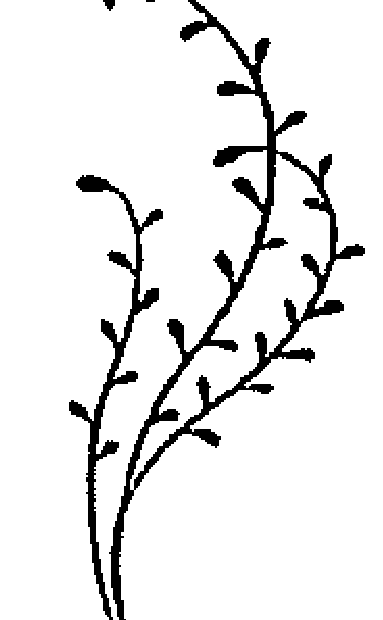

## 矢車菊 { 溝通花精 }

Centuary Centaurium Umbellatum

矢車菊類型的人是有魅力的、體貼的公民。他們慷慨大方、樂於助人，處處受人喜愛。這一「高貴」個性特質背後所隱藏的動機是：渴求認同與被愛。他們害怕因為傷害別人而失去他人的認同與愛，他們不惜犧牲自決權與實現自我的價值；在幫助他人與服務周遭人時，總是犧牲自身的利益為代價。到了後來，因為自己害怕失去別人的認同或是失去愛，而讓他們心甘情願地成為某個有支配性人格者的奴隸。

矢車菊類型的人，常常用下列詞句形容自己：

- 我很善良。
- 我不想傷害任何人。
- 我意志力不堅定。
- 我難以拒絕他人。
- 我容易被說服，但是事後往往後悔不已。
- 在新的人際關係當中，我經常找不到時機說：「夠了，不要再繼續下去了！」
- 我總是為他人而活，將自己的需求拋諸腦後。
- 我從來沒有勇氣頂撞他人。
- 我成熟得很晚。
- 我害怕無法滿足他人的需求（甚至別人根本沒有提出他的需求）。
- 我經常感覺到被人利用。
- 我難以開口說出心中想要的東西。
- 我極度懦弱、任人欺壓。
- 我經常自問：「你為甚麼不去爭取？」
- 我害怕當我說出我的想法時，沒有人會再愛我，因此我經常說出「好」。
- 我需要被認同。
- 我害怕被拒絕。
- 我害怕堅持己見。
- 我害怕被排斥。

處在「矢車菊狀態」的人們，與人握手時通常缺乏手勁。

矢車菊還有更深層的意義：這朵花與劃清界線有關，不但是劃清個人界限，還有劃清能量層面的界限。

劃清個人界限，是區隔自己的意志與他人的意志。若區隔失敗，當事人會因意志力薄弱，而成為另一個較強性格的人所任意擺佈的工具。在能量層面上，是區隔自己與周圍環境的能量場。如果區隔未能達成，當事人常常會苦於無法解釋的疲累狀況。例如他會說：面對某些人時會疲倦無力。有時候他們會說，他們害怕其他的人會將自己的能量吸走。這時矢車菊可以幫上大忙，讓氣場再度關閉，同時保護能量體與個體不受到身旁環境的影響。

我們建議，凡是因為他人存在而感到疲倦、被掏空的人，都可以在這樣的情境下，直接（不稀釋）將花精儲存瓶中的矢車菊花精滴一滴在舌下，他瞬間會有能量充滿、再度甦醒的感覺。調配矢車菊與胡桃的花精複方，被證明可以有效保護個體免受「星光體空間」的影響。

每一個診療室都少不了ー小瓶矢車菊花精，治療師的意志再堅強，都難免會在面對不幸的病人時，升起強烈的同情心，因而進入急性的矢車菊狀態。極度虛弱的重症病人，也會由於他們與周遭環境的能量落差，而自動吸取周遭的能量，這時，幾滴矢車菊花精就可以中止這種狀態。如果治療師被一個病人拖垮，就很難再去治療其他的病患，實在是沒有任何益處。

以這種方式為了他人做犧牲並不值得，我們要從有力量的位置來幫助他人。高茲·布洛姆（GÖTZ BLOME，德國自然療法醫生）針對此點寫道：任何出於軟弱、而非出於信念與內在法則所帶來的犧牲（根本就不是犧牲），不僅沒有價值，甚至是有害的。因為出自不真實的內在而來的犧牲，是寵壞了施者與受者。

再次重申矢車菊花精的基本理念：在矢車菊狀態下的當事人，對周遭物質環境或精神環境少有抵制力量。矢車菊花精能在精微體能量層次上，關閉並鞏固當事人的氣場。它在性格、人格層次上也有鞏固的作用。因此，矢車菊是最重要的巴赫花精之一。它最重要的意義在於：幫助人重新獲得獨立、自主的生活。

## 冬青 { 補償花精 }

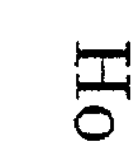

Holly *Ilex Aquifolium*

冬青花精幫助我們釋放憤怒、仇恨、羨慕、妒忌、猜疑與報復的情緒。冬青人常活在煩躁不安的狀態、常常控制不了自己，容易暴怒。在某種極度激怒的狀態下，連牆上的蒼蠅都會點燃他們的怒火。他們經常抱怨他人，責怪他人是使自己心情不好的罪魁禍首，他們永遠找得到可以怪罪的對象，即使是自己造成的錯誤，也要尋求他人成為代罪羔羊。

冬青類型的人會如此描述自己：

- 我很容易陷入盛怒。有時候，我的神經是如此緊繃，一點芝麻綠豆的小事都會惹惱我。
- 我經常生自己的氣，特別是當別人說服我去做我根本不想要做的事情。
- 我經常控制不了自己，勃然大怒。
- 我毫無理由地感到不滿與痛苦。
- 我的朋友們說我脾氣不好，容易生氣。
- 有時候，就算是沒有正當的理由，我也有不友善的反應。
- 半夜裡，我常被自己的聲音吵醒，聽到自己大聲地罵人。
- 我很容易懷恨。
- 我很難原諒自己或他人。
- 我很多疑。
- 我善妒。當我的先生提早出門參加活動，他得每一個小時打電話回來。
- 我常羨慕那些比我漂亮的女性。

冬青類型的人容易出現燥熱性與劇烈性疾病，這些常常發生在他們身上的生理折磨，頗為符合他們的脾氣，例如：突然發高燒、發炎、紅腫、灼熱或奇癢的皮膚疹子、過敏、膽絞痛。咳嗽與嘔吐也是冬青情緒狀態所表現的攻擊與發洩方式之一，咳嗽表示：「吐怨氣；嘔吐表示：這令我噁心。」

這些極具破壞性的情緒狀態是如何產生的？有人說，恨是愛的負面鏡像。為什麼一個人對閉了自己，不願意去愛呢？他害怕愛嗎？還是他只想要保護自己？他過去曾對別人表達了太多的感情，而對方令他失望透頂——亦或是他也對自己失望了——以至於害怕感情？或者，當冬青類型的人說：「我很難寬恕；既難寬恕自己，也難寬恕別人。」這個時候就是在表達因失望而害怕感情的狀況嗎？

讓我們回顧一下矢車菊的心理圖像。這些人在面對周遭環境時，給予太多的同情心，因此難以說不。他們付出太多，幾乎只為別人而活，期待從別人身上得到認同與愛作為回報，一旦事與願違時，他們常會抱怨：「我覺得被人利用了。」當這抱怨出現時，當事人可能發生兩種應對行為。第一種可能是：他們學到生命的教訓，運用意志力，將生活掌握在自己手中；第二種可能是：為了補償這個弱點，他們封閉了那些曾經使自己受傷的情感，熱烈奉獻轉成拒絕。與周遭環境採取必要的界限原本是矢車菊的正向狀態，此時卻轉變成補償的狀態，被人利用的負面經驗，讓他們轉而採取自我防衛。由於自己意志力十分薄弱，因此變成一再地防衛他人；而當當事人相信別人會在某些方面阻礙他們時，因此又攻擊別人。

冬青類型的人犯的錯誤是：他們抗拒愛與關懷。然而本質上，他們因此拒絕了自己最需要的東西。在矢車菊狀態，他們強烈地渴求愛與認同，甘心為他人付出一切，只求得到他們的感情。是的，他們甚至不惜將自己的需求擺到一旁去，害怕自己不能滿足別人的要求，因而失去他人的愛與關懷。

要改善這個現象的第一個步驟是，釋放在冬青情緒狀態時所封閉的情感，而且不要一直停留在冬青階段，因為真正的病因還在更深層的地方。唯有治療矢車菊情緒狀態，才能根除冬青時期具有破壞性的負面情感。

冬青是溝通花精矢車菊的補償花精，矢車菊代表一種極陰狀態。陰是中醫學的說法，是指在兩極平衡的定律中，朝向「較少」移位，因此極陰代表非常不平衡的狀態。由於不平衡是不穩定的現象，因此不可能長時間地單獨存在，按照平衡的原理，會由極陰狀態轉向極陽狀態。陽是陰的對立面，意味著「過多」。這就像是時鐘的鐘擺，從一端擺向另一端，然後再擺盪回來。

由於矢車菊屬於極陰的狀態，因此補償的冬青狀態就是屬於極端的陽，讓患者做出過火的反應。如果不排除冬青狀態，它會再度由極陽狀態擺向極陰狀態，出現失調的狀況，也就是松樹的狀態。

## 松樹「失調花精」 Pine *Pinus sylvestris*

需要松樹的人常常苦於良心不安。面對生活中所有可能或不可能發生的情境作出諸多的臆測，好讓自己找到理由內疚。即便他們是成功的，他們仍然會責怪自己未能做得更好一些。如果他們遭受指責，他們會以自責的方式折磨自己。當別人對他們讚譽有加時，他們卻無法接受這些好評。

我們常聽到他們說：

- 這是理所當然該做的事。
- 這沒什麼特別的！
- 這是我該做的事！

他們往往難以接受禮物，因為他們認為自己不值得擁有它們。

他們慣用語是：

- 我當初要是……！
- 為什麼當時我……！
- 對不起……！
- 我很抱歉……！

## 松樹類型的人如此描述自己：

- 我經常覺得心虛。
- 我總是在找自己犯了什麼錯，即使有可能是別人犯了錯。
- 在經歷不愉快的情境後，我會覺得都是自己的錯。
- 我常想到過去不愉快的場景，至今仍感到內疚，有時候這種糟糕的感覺，讓我感到不耐煩，我甚至覺得整個身體都因此僵硬緊繃起來了。
- 過去的荒唐歲月至今仍折磨著我。
- 我今天還在責怪自己過去沒為孩子做得更多。
- 我經常怪罪自己，沒能給孩子足夠的愛。
- 我常譴責自己。
- 一旦我沒有優異的表現，我就會責怪自己。
- 即使我生病了，我還是會良心不安。如果藥物無法立刻起作用，我會覺得那是我的錯。
- 有時候我很難發自內心的快樂，因為我不斷地意識到，我似乎錯失了什麼。
- 在性愛方面，我有很深的罪惡感。
- 我經常認為我該為別人的錯誤負責。
- 如果別人寡言，我會責備自己，一定是我冒犯或傷害了他們，即使他們否認這點，我還是會覺得內疚，因為我認為別人是出於禮貌或出於體貼而不願意承認。
- 我很難真正感到快樂，經常覺得悲傷或沮喪，如果有人責怪我，說我是個破壞氣氛的人，我會內疚不已。
- 我經常因為自責，以至於難以入眠。如果我隔天一早疲憊不堪，而難以應付生活，我會感到更加內疚。
- 如果我拒絕幫助某人，我會在事後感到良心不安。

松樹的圖象包含了強烈的受虐成分。個案認為，他們得不斷地懲罰自己。這種自毀性的錯誤態度是如何產生的呢？

讓我們回顧一下：松樹狀態緊隨著冬青的狀態而來。在冬青狀態時，當事人不斷地在他人身上尋找過失。在松樹狀態時，當事人則在自己身上找尋過錯。冬青類型的人對他人感到不滿，因此時常有惱怒與攻擊性的反應。松樹類型的人則永遠對自己不滿，他們是將攻擊轉向自己。

松樹是矢車菊花精的失調狀態。在矢車菊狀態下，當事人難以開口說不。在冬青狀態時，又掉到另一個極端，他們變成不斷地說不。這樣的結果使他們在接下來的松樹狀態時，因為自己不斷地拒絕他人而又感到內疚。

剛開始他們渴望認同與被愛，這個渴望常導致自我的喪失。之後，他們覺得被人利用，因此以攻擊的方式與他人劃清界線。這個劃清界限的動作，又讓別人馬上收回他們剛得到的認同與被愛，因此冬青的狀態不可能長時間維持下去，它會進入失調的狀態，產生罪惡感。對許多人來說，這造成了一個惡性循環，因為出於罪惡感他們又無法開口說不，甘心讓人利用。整個遊戲又回到原點，重新開始。

罪惡感是先前矢車菊狀態的結果。由於受到他人責怪，而做出了懦弱的舉動，罪惡感便由此而生。這就像俗話說的「咎由自取」。

在治療矢車菊狀態時，首先必須確認當事人是否已經處在失調的狀態，否則會出現以下的狀況：服用矢車菊精後，重新獲得的自我意志力反而加強罪惡感。他們會感到害怕，並抱怨在經過治療後情況反而「惡」化了，而周遭的人也這麼說。

一向都在討好別人的當事人，常常被旁人利用他們的好心腸。突然間，他不再討好他人，判若兩人地展現自己的意見時，的確像是「負向」的改變。但是，周遭旁人並沒有意識到：以前當事人被剝削的狀態，才是不正常的。

在這關鍵性的改變時刻，我們一定要支持當事人去面對旁人，並且透過談話幫助他釐清目前自己意識上的變化，這一點非常重要。

## 第二花軌

- ✿ 溝通花精 ↓ 水蕨 CERATO
- ✿ 補償花精 ↓ 葡萄藤 VINE
- ✿ 失調花精 ↓ 野燕麥 WILD OAT

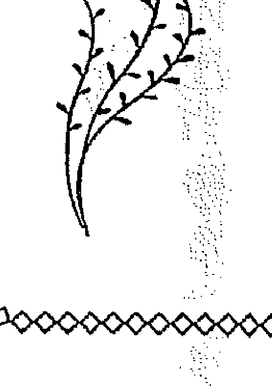

## 水蕨 { 溝通花精 }

✿ Cerato Ceratostigma Wilmottiana.

水蕨類型的人求知慾極高，勤奮好學。他們熱衷閱讀，而且經常參加再教育課程。他們在學校裡的研討會、講座當中，常提出許多問題，也可能導致演講者無力招架。由於他們提出的問題中，多半繁雜瑣碎，也讓我們懷疑當事人能從這些問題裡得到什麼益處？有時這些行為，讓我們覺得他們只是為了發問而發問。

在診所或是自然療法專家的診療室裡，他們常常想要知道診斷的過程和詳細的檢驗結果，有時還會把它抄下來。偶而，他們會帶著備忘錄，逐一劃掉上面記載的每個問題，以確保沒有遺漏任何一個。

除此之外，他們經常針對治療方法的作用、風險與成效提出疑問，還會要求治療者提供治療成功的案例，有時候他們也會為了釐清一些問題而額外約診。

他們經常在同一時期內諮詢多位治療師，並且詢問相同的問題，也常因此聽到不同的答案，而變得更沒有安全感。到了後期，他們可能閱讀相關的書籍之外，還會參加專業醫療的演講，以便把問題弄得更清楚。

水蕨類型的人承受的最大痛苦並不是身體上的疾病，而是對自己疾病的不確定感。

水蕨類型的人熱衷蒐集資訊的癮頭，有時候甚至會擴展到無形界的知識領域上。如果這些人接觸了神秘教義，他們可能會在做任何決定之前都要先占卜一下，因而過度依賴占卜感應力工具、曲解誤用「靈感」。

究竟是什麼背景與原因，導致過度渴求資訊行為的發生？

基本上，他們有著非常強烈的不安全感，尤其是在做出判斷與決定這兩件事上，當事人因為懷疑自己的想法，所以會向他人尋求建議，也因為這不安全感，讓他們的生活變得十分艱難；他們雖然比常人擁有更多的知識，卻常常被他人誤導，因為他們相信其他人比自己知道的更多。

水蕨類型的人如此描述自己：

- 我經常花很多的時間來做決定，同時也會向他人尋求建議。
- 我很重視其他人的意見，並經常懷疑自己的決定。
- 當我想將決定付諸行動時，我必需尋求外界的認可。
- 如果有人反對我的觀點，我會徹底不安。
- 我經常會被他人的觀點說服，因而違背自己的想法。
- 我很不獨立。
- 我的觀點時常搖擺不定。
- 我會把閒暇時間拿來閱讀。

這種內在的不安全感和缺乏獨立性，導致多多少少在行為上有意地依賴他人，其背後的原因為何？這是因為當事人在個性上拒絕接受發自內心衝動的行為，反而在外在世界尋求真理。由於沒有安全感，他們有意識地壓抑部分的靈感與直覺。但是我們的意識無法長時間的排除靈感與直覺，刻意壓抑的東西，反而特別會以鏡像投射的方式，反應在我們生活的周遭環境裡。

當事人透過觀察周遭他人的反應，很清楚不斷提問看起來十分可笑，同時也曉得這項行為令人討厭。於是這個得不到關愛反而被排斥的事實，迫使他們找尋解決方法，因此有兩種可能會發生：第一個是，他們接受這個學習的機會，並聆聽自己內在的聲音，自己做出決定也樂意承擔責任，這個機會也包括學習勇於犯錯、不怕犯錯；第二個是，他們被迫將內在的不安全感向外移轉，以展現權力、力量的方式，來補償自己懦弱的內在。

## 葡萄藤 { 補償花精 }

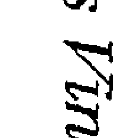

Vine *Vitis Vinifera*

葡萄藤類型的人外表顯得相當能幹，而且特別有自信。他們似乎是天生的領袖，對於這點他們自己也是深信不疑。在危機時刻，他們會以敏捷的洞察力與沉著冷靜的態度掌握全局，因此常扭轉劣勢、拯救別人脫離困境。

他們擁有堅強的執行力與意志力，但另一方面，他們也必須承擔可能為了私利而濫用權力的風險。他們通常不能理解為何別人指控他們渴求權力與控制欲強；在他們的觀念裡他們確信：基於他們擁有更強的能力，因此服務他人的最好方法就是指揮這群人，並且告訴這群人必須做甚麼。

葡萄藤類型的人如此描述自己：

- 我命令別人時都是為了他們好。
- 當別人不願意的時候，我還是不會讓步。
- 目的、榮耀、手段。
- 我就是知道這樣做會更好。
- 他們要以我為表率。
- 別人都指責我，說我像個獨裁者、堅持自己的權力。

面對周遭的人，他們會展現出：

- 嚴厲。
- 自信。
- 冥頑不靈。
- 強勢。
- 不顧及別人。
- 不擇手段。
- 不屈服。
- 無法處於下屬的角色。
- 冷酷無情。

該如何解釋這種強人所難、又不顧他人的性格呢？在某些特定的情況下，他們甚至會讓周遭人的生活像是活在地獄中一般痛苦。

在上一個章節中我們已經看到，處在水蕨狀態的人嘗試以展現自信來掩飾他的不安全感，將自己應該承擔的生活責任，交付到他人手上的極陰狀態，發展至極陽的狀態。在此極陽的狀態時，這些人相信自己必須承擔起他人的責任。

他們在水蕨的狀態時向他人尋求意見，現在他們處於葡萄藤狀態，便轉為告訴他人必須做甚麼。他們過去總是追隨他人的權威，現在他們對自己的權威堅信不移。這些人早在水蕨狀態中就擁有超乎一般人的能力與意志強度，卻因無法相信自己而鎖住自己的能力。他們錯誤地認為可以從外在世界、而非內在自我，找到生命的問題與困難的答案。

葡萄藤類型的人從不承認自己在水蕨狀態時的弱點與沒有安全感，他們過當的行為其實是害怕暴露自己。有一句俗語為此做了最好註解：攻擊是最佳的防禦。但是當事人可能無法意識到這一點，因為造成他們沒有安全感的原因，他們早忘了——可能是事過境遷的陳年舊事，也有可能是發生在童年時期，或者是人生中一個非常短暫的事件。

即使當事人認為水蕨的症狀從不、永不符合他們，也與他們的過往毫無關聯，這也沒關係，因為在治療過程的某個時間點，水蕨症狀就會活生生地浮現在意識層面。如果我們仔細傾聽，就可以找到水蕨圖像的隱藏線索，例如：過度渴求知識、大量地閱讀書籍，或是當事人其實十分重視他人觀點的事實。當事人佯稱不會聽命於他人，但事實上還是唯命是從。

對一般人來說，極端的葡萄藤狀態是很可怕的；我們只要想一想葡萄藤狀況的歷史代表人物，例如：希特勒與拿破崙——處於失調狀態的他們，在世間造成毀滅性的後果。原本以過度自信掩飾沒有安全感的行為，最後成了極度迷失方向的狀態。

## 野燕麥 { 失調花精 }

Wild Oat Bromus Ramosus

野燕麥類型的人是永遠的尋找者。他們為了有所成就而努力，但仍未找到使命。他們對目前生活感到不滿意，因為沒有一個明確規劃的目標。

這些人經常更換工作、夥伴、住所，著手許多事卻虎頭蛇尾，因為他們缺乏真正的滿足感。生活單調乏味、沒有高潮，一切事情裡他們都找不到意義。他們經常覺得生命如浮光掠影，他們只是在虛度寶貴的光陰，縱然對這種狀況感到悶悶不樂，卻不知該如何改變。

野燕麥的人如此描述自己：

- 我經常感到內心空虛，總是在尋求內心的安全感。
- 我對甚麼事都提不起勁，因為我不知道要做甚麼。
- 我缺乏生命的目標。
- 我在目前做的事情中找不到意義所在。
- 我為選錯行業感到非常不滿，我寧可做別的事，但又不知道該做甚麼才好。
- 我覺得十分不滿意，因為我眼前沒有目標。
- 萬念俱灰。
- 我有所期待，但甚麼事都沒發生。
- 我無法真正的感到快樂，因為我身邊沒有甚麼特別的事發生。

他們試圖找尋人生的意義與目標卻徒勞無功，因此經常透過享樂（豪華名車、追求時尚、旅遊、花天酒地）或全心在事業上加以補償。隨後他們會發現這些外在事物也無法帶來巨大的滿足感，空虛感終究戰勝了一切，顯然地，沒有東西可以填滿它。

野燕麥的狀況也在生理症狀上顯現這種不明確的情緒，例如：

- 與任何具體疾病都沒有關聯——無法確切描述的症狀。
- 無法確切描述的身體不適。
- 有生病的感覺，卻講不出任何具體的病痛。
- 卡在初期階段的感染問題。

野燕麥狀態的特徵是找尋與等待自己的使命。在先前的葡萄藤狀態中，他們相信：他們是受到召喚、帶領他人並指引他們道路。現在他們處於野燕麥的狀態，他們將目標指回自己，卻是處在漫無目標與迷失方向的狀態。如同在葡萄藤狀態，他們的才幹雖在，卻無從發揮。他們無法專注、缺乏決心與毅力。

總而言之，最初是處於水蕨狀態的不確定感，在這個階段他們得不斷向人求教，之後透過葡萄藤狀態的自信舉止與佯裝強勢加以補償，然而不確定感的最終狀態是完全迷失方向，甚至連日常生活中的愉悅都不再有任何意義。

如果當事人試過許多花精，卻看不出任何明顯的趨勢時，很多治療師會採用野燕麥以釐清病症。

## 第三花軌

- 溝通花精 → 線球草 SCLERANTHUS
- 補償花精 → 岩水 ROCK WATER
- 失調花精 → 酸蘋果 CRAB APPLE

## 線球草 { 溝通花精 }

Scleranthus Scleranthus Annus

線球草類型的人十分多才多藝、思想活躍。他們內在的靈活度，讓他們能認識事物的正反兩面，有能力去思考事物的極端面向；但是當他們必須在兩者之間做抉擇時，這種靈活度就成了致命傷。因為總是同時看到問題陰陽兩個面向的線球草，常常得經過一番掙扎後，才能做出決定。他們在做出定奪之後，內心對這件事情的糾結仍存在，遲遲難以平息，因此他們常常陷入內心的衝突中，事後又撤回已做出的決定，反反覆覆，常給周遭的人很不可靠的印象。

線球草類型的人如此描述自己：

- 魚與熊掌難以兼得，我很難做二選一的決定。有的時候我才說某件事是對的，但是隔天我改持相反的意見。因為這樣，別人指責我很不可靠。
- 我非常善變。
- 我的情緒起伏很大，樂則高聲歡呼、憂則鬱悶垂死。
- 低潮過後緊跟著高潮，我感覺幾乎可以擁抱整個世界。
- 我常熱情洋溢，幾乎稱得上是狂躁。
- 我活得淋漓盡致，消耗大量的精力。
- 我生理上的病痛如我的心理一般都很多變，一會兒這裡痛、一會兒那裡痛。
- 對我來說我最大的干擾就是自己。有時候我開始一項工作，很快又把它擱置一旁，然後重新開始另一項新的工作。接著我開始徬徨，到底應該先完成第一個工作、還是第二個才好。
- 我出門後經常折返，查看自己是否已把爐子關掉了。雖然我從來沒有不熄火就離開，但是這種不確定感一直折磨著我，有幾次我甚至不惜開車回家查看，害自己上班遲到。
- 在某處把車子停妥後，我會再次繞著車子巡視一番，看看是否所有車門都鎖好了。我常常才走開沒幾步，又再次折返，再一次檢查是否所有的車門都關妥。很有可能我會忘掉其中一扇車門。我知道這很無聊，但我就是忍不住要這麼做，這不確定感好像是個魔咒一樣折磨著我。
- 我經常煩躁不安的在房間裡來回踱步，我想要完成很多事情，卻不知道該從何處著手。
- 最好的情況是，我一次做完所有的事情，但這是不可能的，因此我很難下決定。
- 一旦我開始做一件事，我就開始猶豫不決，覺得是否其他的事比目前這一件事更重要。
- 我經常處於壓力之下，快要把自己整慘了。
- 我經常有一種感覺，好像我在生命中錯過了某些東西。

線球草類型的人經常活在一種難以取捨的感覺當中，這就好似德國文豪歌德的作品《浮士德》中的哀嘆：「我的心中住著兩個靈魂。」或是莎士比亞筆下的哈姆雷特所說的：「做或不做，這是一個值得思考的問題。」

這些人內心的躁動與不安，經常表現在緊張和失序的肢體語言上面。因為他們的腦子裡同時思考許多事情，與人交談時，經常不專心、經常岔開話題或從一個主題跳到另外一個主題，結果在身體上就是出現反應心理善變狀態的生理症狀：

- 極度飢餓轉換成缺乏食慾。
- 腹瀉轉換成便秘。
- 過度活躍、疲憊不堪交替出現。
- 症狀不斷轉變，無緣無故的出現，又突然消失。
- 全身上下輪番出現的疼痛。
- 由於缺乏緊張與放鬆之間的平衡，而引起白天疲憊、夜裡失眠。
- 血壓變化（有時太高，有時太低）。
- 失去平衡感。
- 暈車、暈船。
- 孕吐。

我們之前已經學過了兩種其他「不確定感」的花精：水蕨花精與野燕麥花精。這幾朵花精的不同，可以藉由下面的例子解釋清楚。請你們想像有三個不同類型的人進到一家鞋店：

第一個，野燕麥類型的人站在鞋架前，面對眾多的選擇完全不知所措。對他而言，甚至很難先挑出幾雙鞋，之後再做出更進一步的選擇。

第二個，水蕨類型的人會攜伴幫他挑鞋，他會果斷的走向鞋架，並很快的挑到一雙適合他的鞋，緊接著，他請教那個同伴，這雙鞋是否適合他。如果同伴給的答案是肯定的，他會立刻買下鞋子。但如果同伴給的答案是否定的，他的信心就動搖了，並很可能把鞋子放回鞋架上。這項行為會一直重複到他選的鞋受到同伴的肯定，認為適合他，他才會買下這雙鞋。如果水蕨類型的人獨自走進鞋店，他就會向店員尋求肯定。

第三個，線球草類型的人從琳瑯滿目的商品中，可以很快的找到他喜歡的兩雙鞋，但要從兩雙當中選擇其中一雙，卻成了一個大問題。他試穿其中一雙，確信這雙鞋很適合他。為了確定這一點，他便會試穿第二雙。這時候，他改變心意了，覺得第二雙更好，於是傾向選擇這一雙。但是為了確信這一點，他會再次試穿第一雙鞋，於是這個遊戲又重頭開始。他來回擺盪、難以決定。他們與水蕨類型的人不同的是，他們不求教於他人。寧可掙扎地做出自己的決定。

線球草的象徵是天秤。有時這一端高、有時那一端高。這種持續擺盪與長時間的不確定感，對當事人造成了嚴重的問題。在時間的壓力之下，迫使他要找到解決之道。他們開始找尋能夠幫助他們做出決定的方法，於是來到補償階段。

## 岩水 { 補償花精 }

Rock Water Quellen

岩水類型的人懷抱著理想。當他們認定生命中某件事情正確無誤時，便會努力遵守這個準則生活，因此他們常嚴格對待自己，拒絕許多不符合他們特定原則的事物。他們努力說服他人認同自己的理想，試圖成為模範。

岩水類型的人如此描述自己：

- 我有崇高的理想，因此不得不做出犧牲。
- 我有極強的道德觀念。
- 我注意到我的道德觀經常不吻合我的慾望，使得我常常要壓抑自己。
- 我希望別人會感激我的付出。
- 我要活出理想，作為別人的表率。
- 我試圖把每件事做到完美，成為他人的榜樣。
- 在人前我要表現得當。

處在岩水狀態的人會堅持己見，他們會做許多「正確」的事情。他們經常從理想主義者轉變成狂熱主義者，也常常成為極端主義團體或教派的成員，希望說服別人相信他們的「福音」。

「極端主義」的代表性例子為：

- 嚴格的素食主義，當他們參加宴會時只吃馬鈴薯與沙拉，以忠於他們的原則。
- 嚴格的長齋者，到熟識人家中甚至會為了不受誘惑而自備食物，以忠於自己的飲食原則。
- 嚴格的禁酒者，甚至連聖體聖事中的聖血（葡萄酒）都不沾一口。
- 嚴格的禁菸者，不停地逃避二手菸，甚至拒絕他人邀請進入有人吸菸的地方。
- 屬於特別宗教教派，想要在人間就可以成聖。
- 追求開悟者，他們將所有閒暇時間投入瑜伽練習與靜坐當中，徹底放棄「俗世」的快樂，如：社交活動、打保齡球、看電影、上劇院等等。
- 同類療法醫師，他們花費好幾個鐘頭在書堆中找尋「一帖」藥方。當症狀不明時，他們嘗試只開立一種藥，而不是以特例處理，給予複方以迅速緩解病情。

這類型的人很難意識到這些嚴格的規定，只會更加複雜而非簡化他們的生活。他們嘗試以明確而且具體的決定，來終止線球草狀態中的不確定感，以及不斷來回擺盪、難以抉擇的困境；然而這個決定卻剝奪了當事人行使自由意志的機會。為了讓自己從「選擇的痛苦」中解放出來，他們反而成了一次性原則的奴隸。他們堅守自己的理想的緣由，是因為害怕，怕無法控制自己又退回到三心兩意的線球草狀況。

這種僵硬的、死守原則的態度，漸漸的也會透過與身體僵化有關的疾病表現出來，例如：關節僵化與動脈硬化。中世紀的煉金術士醫師、來自高鄉的帕拉塞爾蘇斯（Paracelsus von Hohenheim），也認為僵化的思想會導致關節僵硬。

當事人為了秉持原則，所以必須不斷壓抑享樂的行為或想法，最後會導致他徹底喪失生活上的樂趣。另外，因為長期忽視內在需求，而漸漸形成的無形壓力，也迫使他必須面對自己的內在衝突。

此時這裡有兩種解決的方法：第一，當事人願意放棄他嚴格的原則，承認和接受自己的需求與慾望，面對日常生活中的挑戰時，做出所有必要的決定；或者第二，當事人竭力避免所有不符合自己僵化原則的事物，因而進入了失調狀態，從死守原則退化成過度的完美主義。

## 酸蘋果 { 失調花精 }

Crab Apple *Malus Pumila*

酸蘋果類型的人十分盡責、整潔有秩序。他們總是一絲不苟地做好事情，一不小心即會吹毛求疵，成了潔癖與完美主義者。另外，還有可能成為極端的案例，例如：打掃狂的家庭主婦；或是完美的模範生，該模範生因內在酸蘋果無形的驅策，總是盡心盡力、完美地完成家庭作業。

而且這些人不只是對他們覺得不乾淨的具體東西感到噁心，像是髒亂、細菌、汗水、所有身體的排泄物，他們也會針對精神上的不純潔，例如：不道德的念頭或是心情不好。他們受不了任何失序的狀況，只能在所有的事物都就定位時，他們才會找回心中的安寧。

酸蘋果類型的人如此描述自己：

- 我做所有的事都非常仔細，幾乎是一絲不苟。
- 我只要別人看到我好的那一面。
- 在我的職業上，我十分吹毛求疵。
- 當我達不到自己的期許時，我會自覺不純潔。
- 一切都必須井然有序、完美無瑕，否則我就會有壓力。如果不能成功，我事後就會感覺像個失敗者。
- 微不足道的小事經常控制著我，我被困在枝微末節的事情裡。
- 我對雜亂的東西很感冒，不管是發生在自己身上或是別人身上，都十分令人討厭。
- 我很害怕被傳染。
- 蛇和蜘蛛令我感到噁心。
- 汗水和疹子令我到噁心。
- 我每天淋浴不止一次。
- 有時我甚至一天洗兩次頭。
- 我的潔癖症狀近乎是恐懼症的程度。
- 我無法使用別人的廁所，因為我覺得它們很噁心。
- 我對自己的排泄物感到很噁心，我不想要消化任何東西，因此也不想吃任何東西。
- 在某些情況下我覺得必須淨化自己，因此去沖澡或是催吐。
- 當我吃太多或吃下不該吃的食物，我會把手伸進喉嚨催吐出來，否則我會覺得自己不乾淨。
- 我覺得肉體是不潔淨的。
- 性行為讓我有一種骯髒的感覺。
- 我不斷嘗試抵擋負面的因素，避免受到毒害。
- 我害怕精神上受到社會這個大染缸不良的影響。
- 我不跟酒鬼及流浪漢打交道。
- 有時候我覺得內心不潔，特別是在生氣過後。

酸蘋果在某些點上與松樹類型的人有些相似，由於兩種情緒狀態的動機相當分歧，因此很容易區分此兩種類型：

| 松樹類型的人 | 酸蘋果類型的人 |
| :--- | :--- |
| ◎容易感覺內疚。 | ◎自覺內在不潔。 |
| ◎有所疏忽時，就會感到良心不安，認為自己沒有達到別人的要求，並且害怕隨之而來的後果。 | ◎有所疏忽時，會感覺內在不潔，因為無法達到對自己的期許。 |
| ◎在性事上有困難，因為感覺到性是一種被禁止的行為。 | ◎在性事上有困難，因為感覺到性是一種不道德、不純潔的事。 |
| ◎罪惡感與自責會在生理上表現出：胃痛、薦骨疼痛或從頸部蔓延上來的頭痛。 | ◎跟身體有關的任何事情，例如：親吻與餵奶，都是個問題。 |
| | ◎不潔感，是一種對處境的不滿，在生理上表現出皮膚疹、過敏或典型的酸蘋果症：暴食症。 |

在這種極端的狀態，出於恐懼自己的身體與精神上害怕被感染，生命降格成為無菌狀態，這是怎麼形成的？我們已經了解，岩水類型的人由於害怕自己不能忠於原則與理想，於是極力避免一切在他們眼中是誤入歧途的不道德行為，在極端的狀況下，他們甚至不與「不潔淨」的人交往，例如：吸菸者、肉食者或無信仰者。可是身為人，是無法持續排除人格中某些特定的面向，當他們自己無法遵守自行立下的禁令，違反他們自己所訂下的狹隘的道德規範時，就會感到內在不潔淨。漸漸地這種不潔的感覺獨立出來，並投射至外在生活領域上。內在的「骯髒」轉化到周遭環境，讓當事人激烈地對抗所有形式的不乾淨。但我們在外在世界所對抗的一切，事實上正是內在干擾我們自己的部分，一如古代神祕教派的名言：「如其在上，如其在下。」（As above, so below.）

在我們拒絕俗世物質的同時，事實上也拒絕了在其背後的那個神性法則——不論我們選擇要如何稱呼它。因此，主導了岩水狀態的意識型態，到了酸蘋果狀態時，變成不斷質疑世間事物。岩水狀態下的「脫離日常生活」發展成了「與生活敵對」的酸蘋果狀態時，在不知不覺中走入了死胡同。當事人不斷地對抗被自己視為有敵意的環境，同時間也對抗環境中所有的層面。酸蘋果狀態的防衛態度表現在身體上的症狀是過敏。

治療師運用酸蘋果花精治療皮膚疹、過敏、受感染的傷口，也可以使用外敷方法，如貼敷布、乳霜或乳霜繃帶預防感染。若是已經受到感染的傷口，上述方法也都有很好的效果。

## 第四花軌

- 溝通花精 → 龍膽 GENTIAN
- 補償花精 → 楊柳 WILLOW
- 失調花精 → 野薔薇 WILD ROSE

## 龍膽 { 溝通花精 }

Gentian Gentiana Amarella

龍膽類型的人是永遠的悲觀主義者。他們懷疑一切，也懷疑每一個人，甚至常為自己的負面看法找到合乎邏輯的藉口。面對外在的困難，他們容易感到氣餒與消沉；由於害怕出錯，他們傾向提前放棄，正是這種負面的預期心態，阻礙了成功。

這些人在面對家庭、職業或疾病上的挫敗時，整個世界就崩解了。即使是小小的困難，他們也承擔不起，經常鬱鬱寡歡。

龍膽類型的人如此描述自己：

- 我經常擔憂。
- 我不斷苦思。
- 我質疑一切，卻沒有得到結果。
- 我很難看到積極面。
- 我是個悲觀主義者。
- 我的理智常說：「你不可以什麼都相信。」
- 我無法相信，並嘗試以務實的眼光看待一切。
- 我害怕信賴被濫用，因此盡可能小心謹慎。
- 我擔心所有事，想著：「什麼事會做得更好？如何做得更好？會從生活中得到什麼？」
- 我常對生活感到失望，過去負面的經驗讓我總是看到負面的事。
- 我很難積極地思考未來，因為我不相信可以改變現狀。
- 遇到困難我很容易氣餒，懷疑事情會順利。

龍膽類型的人給予他人的印象是：也許是為了合理化他們悲觀的生活態度，他們不斷地找尋負面的事物。有時候人們甚至覺得，如果他們的生活很順遂，他們反而會覺得渾身不對勁。因為，他們總是看美中不足的地方，死抓著負面看法。

當他們去度假時，經常讓芝麻綠豆小事破壞了玩興。他們甚至會故意以負面角度詮釋事情、扼殺喜悅，證明他們悲觀的態度。

例如他們會說：

- 根本沒這麼棒。
- 根本不值得花這個錢。
- 花這麼多錢，真是不值得。
- 我們在家裡也可以享受這個。
- 幹嘛從大老遠來到這裡？

但有些龍膽類型的人在初識時並不明顯，比較難被認出來，他們會爭辯說：「我只看積極面，雖然有很多困難與令人生氣的事情，但是我相信，我一定辦得到。」就算當事人預設的目標是正面的，並自認是樂觀主義者，然而，預期困難仍是一種消極的態度。

另外一類龍膽類型的人，總是一再強調他們有很強的批判性，或者是抱持懷疑的態度。他們明顯的負面心態底下隱藏著恐懼，一種害怕被科技社會當成天真或容易受騙的恐懼。這些矯飾的懷疑論其實是自我保護與偽裝強勢。基本上他們最大的困難是缺乏自信，這也讓我們想到落葉松花精。然而，這些不斷說服自己是懷疑主義者的人，遲早都會淪為悲觀主義者。

一開始面對新的事物就抱持著懷疑的態度，會阻礙我們客觀地去檢驗一件事情，最好的做法是對所有新的事物保持開放的態度，觀察之後再形成自己的觀點。如同聖經所說的：「檢驗一切，保留最好的。」

龍膽的狀態也有可能是久病後的結果，當事人灰心喪志，懷疑自己能否再度康復。或是長期困在無法解決的困難裡，像是婚姻問題、惡劣的就業狀況（也許是沒有升遷機會與轉換工作的可能性）、長期失業與其他看似沒有出路的境況，都會讓人想到龍膽。當然，我們在此要能分辨當事人是處於懷疑、受挫、聽天由命、以及內心投降等的哪一種狀態。

龍膽花精是用於治療外因性引起的憂鬱現象，也就是一種透過事件或外在情境而引發極度的沮喪感。龍膽類型的人應該謹記在心：他們持續不斷的負面思維種下了前因，因此引發了後果，負面的預期成真，這是恆古不變的吸引力法則。成功是正向思維的結果，失敗是負向思維的結果。

此外，事情也不是像人們想像中的那麼嚴重，俗話不是說：「事情沒有想像的那麼糟糕。」

這些人落入了悲觀的深淵，所有事物都籠罩在烏雲中，因而遮蔽了生命的美好，徒留空虛。

這是悲觀思維的果，而非悲觀思維之因。龍膽類型的病人顛倒了因果，由於生命當中的所有事情看起來都不順遂，很容易讓他們覺得自己遭受不公平的對待，是命運的犧牲者，於是進入補償階段。在此階段，他們將自己人生不順遂的責任歸咎於他人身上。

## 楊柳 { 補償花精 }

*Salix Vitellina*

楊柳類型的人，在他們的生命裡歹運不斷。他們以受害者自居，總有個罪人一手造就他們的不幸，這個罪人可能是鄰居、壞媳婦、雙親、或是老闆，在極端的情況下，他們會怪罪社會或甚至是命運不公平。

他們通常相信自己受到不公平的對待，但他們並沒有反抗，反而在生活中不斷地退縮，變得愈來愈憤世嫉俗。他們自怨自艾地抱怨著命運，不斷哀嘆的名言是：「我怎麼會這麼歹命？」

楊柳的人會如此描述自己：

- 我覺得自己沒有受到公平的對待。
- 我常自問：「為什麼正好是我？」——命運對我不公。
- 我覺得自己是命運的犧牲品。
- 我從不抽菸、不喝酒，飲食也很健康。我自問生病的為什麼是我呢？我怎麼這麼歹命？
- 有時候我忌妒別人擁有健康的身體。
- 我嚥下這口氣，是因為跟別人爭吵不是我的風格。
- 我經常得吞下很多的憤怒，現在才會滿腹委屈。
- 我永遠不會忘記那些曾經傷害我、造成我莫大痛苦的人。
- 我絕對不會原諒那些曾經傷害過我的人。
- 自我毀滅的憤怒甚至讓我一度試圖自殺。

我本來想進修別的工作，但我沒有錢上大學，我的一生就這樣毀了。

那群醫生是罪魁禍首，他們太晚診斷出我的病，害我的身體變成現在這樣。

我再也無法真正地感到快樂。

在龍膽狀況下，當事人常將他們自己的不幸投射到他人身上。如此一來，他們完全不需要為自己的命運負責。他們不願去正視他們本人即是造成自己所抱怨的情況的主因；也許因為他們將目標設定得太高，於是無法實現而失望；也許是因為他們沒有能力去適應那些無法改變的事情。

處在楊柳狀態的人，緊握著所有負面的觀點不放，有時候旁人甚至會覺得：他們沉浸在自己是受害者與被虐者的境況裡。

楊柳狀態的當事人常常以憋住、向下垂的嘴角，來表達他們的不滿，漸漸地，他們的嘴角與下巴因此留下深深的皺紋。有靈視能力的人告訴我們，這些怨天尤人的當事人，通常帶著瀝青般烏黑的暗色氣場，暗示他們既悲觀又負面的生命。

縱然，這些人的外貌看起來非常熱絡、熱忱，但是憤怒與辛酸如暗流般隱藏在表面之下。相較於冬青類型的人，他們的攻擊不會向外；楊柳類型的人不會爆炸或開罵，他們反而會使用嘲弄奚落的語言，去報復那些他們認為想傷害自己的罪人。

冬青狀態中，當事人負面的情緒與情境有關，是被外部事件引燃；而楊柳的狀態裡，消極與負面是他們性格的基調。楊柳代表著對內的攻擊，是針對自己而發的——自我的攻擊。它的生理表徵是「風濕」。在「風濕」的症狀中，平常用來攻擊外侵者的抗體，反過來破壞自己的身體，特別是在關節處。最後，當事人會痛苦地意識到：他們必須在自己身上尋找問題的起因。

根據因果法則，龍膽狀態下一直預期壞事發生的悲觀態度，為自己招來了惡運。然而，如果當事人無法認出自己的錯誤，反而覺得是環境或命運愚弄他，因此帶著心酸與痛苦的情緒退縮與遁逃；如果無法阻止這種自毀的狀態出現，失調的狀況便會隨之而來。在失調的狀況中，他們被自己造成的苦難壓垮，內心徹底投降。

## 野薔薇 { 失調花精 } Wild Rose Rosa Canina

野薔薇類型的人在內心豎起白旗，他們完全地被動而且不快樂，絲毫不想改變他們的境況。野薔薇狀態經常在以下的情況下出現：

- 令人不滿意的職業。
- 慢性疾病。
- 不愉快的婚姻。
- 非預期得子嗣。
- 牢獄之災。
- 貧窮。
- 富裕（厭倦生活）。

這些人不再想像目前的生活狀態可以改變的可能性。他們不發一語的接受自己並不滿意的生活，進而變得麻木不仁、冷漠消極、對周遭事物完全失去興趣。萬事萬物對他們來說都無關緊要，因為一切都沒有意義。他們相信他們的歹運是命定的，疾病是遺傳的因素、甚至不治之症也歸咎於業力。

野薔薇類型的人如此描述自己：

我聽天由命了。

萬事萬物都毫無意義。

我感覺我的內心空虛。

我經常萎靡不振，不能吃、不能工作、高興不起來。

我做任何事都沒有樂趣，我看不到生命的意義，沒有任何事情會讓我快樂。

我覺得自己好像死了一樣。

生命對我來講，並沒有甚麼樂趣。

我常想要自殺。

我自我放棄。

我常感覺到我的靈魂枯竭，並常想著：「我不行了，我甚麼也不要了，一切都沒有用。」

野薔薇類型的人沒有精力也沒有動力，總是疲累不堪。說話時的音調多半是單調、又沒有表情。他們的皮膚蒼白、無光澤，血壓很低，甚至用最強的提升血壓的藥劑也無濟於事。

我們有很多個案都是野薔薇，他們並不是發自內心想來診所，而是被親友帶來。他們從一開始就不期待治療會成功，因此常常聽到他們如此提問：「治療有甚麼用啊？」

也有一些野薔薇類型的人並不容易被辨識出來。他們雖然活躍，卻不期待在活動當中得到滿足感，他們工作是出於義務，從中得不到快樂（橡樹性格）；有一些人甚至可以鼓舞激勵他人，但內心卻置身事外（馬鞭草性格）；甚至有一些人從外表看起來十分快樂，卻對周遭的人隱藏他們內心的空虛（龍芽草性格）。

在某些情況下，當事人已經部分克服了野薔薇狀態，但是野薔薇狀態的頻率，仍無意識地出現在他們的生命狀態當中。因此，我們在面談時應該要詢問當事人，是否曾在生命的某個時期自我放棄過？這類型的野薔薇狀態不太容易被認出來，極低的血壓可以做為關鍵的判斷因素。即使當事人表示，自我放棄已經是多年前的事了，但是，我們還是建議給予這些個案幾滴野薔薇花精，滴在相對應的人體反應區，這些人通常會表示，馬上感覺到清醒了很多。這是判斷野薔薇狀態的好指標。

基本上，在判斷野薔薇狀態的方式中，透過身體上的皮膚反應區做客觀的診斷，會比面談容易。在《新巴赫花精身體地圖》一書中，我們會詳盡闡述這種巴赫花精療法的新形式。

野薔薇狀態是先前楊柳狀態的結果，儘管這個狀態可能只是短時間出現，但是，它殘留的影響力非常大，這是因為當事人在放棄自己之前，在心態上會先出現拒絕接納外界情勢的現象。他們曾經處在楊柳消沉退縮和痛苦的狀態中，到了野薔薇的狀態時，他放棄了所有的希望，變得更屈從於命運，宿命地任由命運擺佈。

基於這個理由，拒絕世界、放棄希望的野薔薇狀態，會是治療過程中最强的阻力，我們不可以忽略這一朵花，否則，任何治療——不僅限於巴赫花精治療——想要取得成效都會有困難。

## 水堇 { 溝通花精 } Water Violet Hottonia Palustris

水堇類型的人非常獨立、很有才幹，優秀與寬容的特質讓他們深受人們喜愛。面對艱難的情境時，他們是搶手的諮詢者，因為他們客觀、冷靜、又不會試圖強加自己的意志在別人身上；他們也不干涉旁人的事情，因為他們己所不欲，也勿施於他人。
他們在內心與周遭事物保持一定的距離——這一點獲得旁人的高度評價。不過，長期來說，

◇ 第五花軌 ◇

- 溝通花精 → 水堇 WATER VIOLET
- 補償花精 → 栗樹芽苞 CHESTNUT BUD
- 失調花精 → 樺木 BEECH

這可能會帶來大問題，因為這種態度也是一種優越感；他們極力避免對立的情況發生，一方面是認為對抗毫無用處，另外一方面，也覺得這麼做有損他們的尊嚴。但是到了最後，這些人發現自己在各方面都比其他人優越，因為那種自豪、傲慢的心態已經生根了，結果讓他們變得更加地自命不凡。他們發展出了一種超乎常人的感受，因此內心深處與周遭的距離愈來愈大。

雖然水堇類型的人在工作上通常扮演舉足輕重的角色，也十分受歡迎，但私底下卻愈來愈退縮，甚至成了獨行俠或局外人。對別人來說，他們變得無法親近，他們自身也覺得寂寞，在人際關係與溝通上開始出現困難。

隨著傲慢、內心的距離擴大、以及孤立的狀態與日俱增，他們很難再發展出對他人的同情心、談一段感情、或是對鄰人的關懷，甚至掉入了冷漠之中。這些情緒狀態，經常以頸椎疼痛與頸部的僵硬形式出現，十分符合內心缺少謙遜、以及沒有辦法屈服的性格。

水堇類型的人如此描述自己：

- 我有時候覺得自己比別人優越。
- 我對待別人很傲慢。
- 別人認為我是個自命不凡的人。
- 在學校、學徒的學習期間，以及工作上我都是佼佼者，我的座右銘是：「在我的字典裡沒有失敗這兩個字。」
- 我經常有孤立感，內心會與別人保持一定的距離。
- 我比別人更有經驗。
- 我潛藏著自己擁有比別人更多想法與能力的感覺。

接受菁英教育的貴族、天賦異稟的人（像是資優生、天才、成功人士）、或是有特殊長才的人（例如：美若天仙者、模特兒、健美先生），在心理上也容易有水準狀態的獨特傾向。某些受人崇拜的職業、形象良好的工作，例如藝術家、藝人、政治家……等等，內心都會有與眾不同的感覺，因此不自覺的以為自己確實比他人優越。

這群人經常嘗試著將每一件事都做得完美無缺，好讓自己鶴立雞「群」。高茲・布洛姆寫道：

> 「驕傲的人需要仰慕者，驕傲會摧毀所有天生卓越品質的純潔性……它形塑了階級，將我們與鄰人隔開……驕傲是一種不人道的質地，它讓我們忘記人性，而自高自大……它阻礙我們友善地思考、說話或行動，並在我們與他人之間築起藩籬。」

- 我寧可親自處理事情，因為別人無法像我做得這麼好。
- 我寧願是自己幫助別人，也不要別人幫助我。
- 我不允許別人幫助我，如此一來，我事後就不用感謝任何人。
- 我無法忍受別人干涉我的事情。
- 我內心經常有優越感。這有時令人尷尬，有時又十分美好。
- 我總是讓一切顯得很有品味。
- 我不與特定的人士打交道。
- 我很難當別人的屬下，即使我上頭還有個上司。
- 我很怕平庸地活著、隨波逐流。
- 我難以謙抑自下。

如果沒有中止這種優越感，就會陷入以下的危險：認為自己超越了那些在他們眼中微不足道的平凡瑣事。若是如此，他們就會與生命中最重要的任務以及課題擦身而過，進入補償狀態，極力去避免任何不愉快的事情，因為這有違他們的尊嚴。

## 栗樹芽苞 { 補償花精 }

Chestnut Bud Aesculus Hippocastanum

需要栗樹芽苞的人們很難從錯誤中學習，注意力不集中又膚淺，因此錯失生命中許多事情。他們經常重蹈覆轍，而且生活中常忘東忘西，出現以下的小事：

- 忘記帶鑰匙。
- 忘記關掉爐子。
- 每次在同一個十字路口，都沒讓別人優先行駛。
- 晚上與電視難分難捨，隔天拖著疲憊的身軀去上班。
- 在節食過後又立刻吃甜食，然後為新增的體重生氣不已。
- 才剛戒菸，又拿起菸來吞雲吐霧。
- 經常一再地上同一種類型的人的當。
- 雖然過去已經為此支付高額的維修費，但每一次都買同一廠牌的二手車。

生活裡重要的大事，他們也不斷重複相同的錯誤。例如：不論吃盡了多少苦頭，卻一再地與已婚人士有染；或是再度開始學習新的課業，仍依舊虎頭蛇尾、無法完成。

栗樹芽苞類型的人如此描述自己：

我有時很隨興。

原則上我避開所有的問題。

我一直拖延工作，直到最後一分鐘才趕著做完。

我很容易拖延令我感到無聊的工作。

我經常瞎混工作。我可以把重要的事情擱在一邊，只是為了完成無關緊要的事。

我經常犯同樣的錯誤。

有時候我的想法會突然斷線，突然間我不知道到底要做甚麼、或是剛才想說的是甚麼。

儘管上次他們把沖淡的番茄醬當成番茄湯端上桌的事情把我氣炸了，我還是在同一間餐廳向同一位服務生點了同一道湯。

我只要有約會必定遲到。就算我家的鬧鐘已撥快了半個小時，我還是磨蹭到最後才匆匆忙忙出發。

我不斷地買書，但是只隨手翻翻，從來沒有認真閱讀過。

我從電視上把所有我感興趣的影片錄下來，我因此擁有一間大型的電影館，只是我幾乎沒看過這些電影。

我會快速地對一件事情熱衷起來，但最初的興奮感只是曇花一現，只有三分鐘熱度。

我經常同時閱讀許多本書，因為我對一本書的狂熱，在短時間內就消退，之後，我又很快地對另外一本書感興趣。

我經常同步開始許多事情，但都沒有完成它們。

我腦子裡想的總是快兩步，並且思索下一步要做甚麼，但如此一來，我就無法專注在眼前的任務上。

※ 我為將來制定許多計畫。
※ 我經常違反我內在的聲音去做事情，即使我一開始就知道這麼做會出錯。

這種心態也會表現在不斷反覆出現的身體病痛上，就好像當事人的身體也得持續不斷地犯錯。諸多栗樹芽苞的病人，製造出與他們情緒衝突相同的生理上的病變。例如：行走的困難的症兆，亦是象徵他們常常走不了、想逃避。

這一類型人的典型是對很多事情著迷，卻對日常生活的事物興趣缺缺。他們腦海裡經常轉著雄心勃勃的大計畫，並考慮下一個案子的下一步該做甚麼，然而現實生活裡，他們根本沒有執行任何一個眼前的工作。也因為這個原因，他們無法集中注意力、十分健忘、無法盡責執行責任。他們常常同步啟動多件任務，卻虎頭蛇尾、無法完成。他們將不愉快的事，或目前不感興趣的事擱置一旁，打算以後有興趣做的時候再完成，於是我們發現他們身旁有成堆的報紙、與翻了幾頁日後想讀的書籍。

生活中充斥諸多瑣事，反而成了他們將重要的工作擺在一邊的藉口，如果當事人被指責不務正業，他們常有令人信服且合乎邏輯的正當理由。他們常辯解說：因為工作負荷過大，所以無法完成工作。

栗樹芽苞類型的行為特徵是：逃避不愉快、不感興趣的事情，甚至是逃避自己。他們的內心好似有個噴射火箭不斷地射向新經驗，腦子裡轉著上千種想法，一直不停地在擬定未來計畫，但是卻活得內心匆忙。他們的心智感官因此超出負荷，引發了種種失能：精神不集中、記憶力不佳與無法勝任日常生活要求。於是他們變得對所有事物都漠不關心，對於當下也興趣索然。

但相較於愛幻想、整日做著白日夢、活在空中樓閣的鐵線蓮型的人，栗樹芽苞的人比較會把注意力集中於具體的事情，也會實踐他們的想法；而忍冬類型的人也屬於活在充滿空想的世界中，但不同的是，他們是沉緬於過去美好回憶裡。

栗樹芽苞是水堇狀態引伸出來的結果。處於水堇狀態的人們，一旦在內心深處開始逃避他們認為不符他們尊貴身分的事物，就會進入栗樹芽苞的狀態，開始與外在事物保持距離，排拒一切不愉快與不美好的，拖延一切必要卻不喜歡做的事情，直到不得不去做它們為止。

他們一而再、再而三地犯相同的錯誤，這是在提醒人們不可以罔顧生活中的教訓；然而在當事人還沒有準備好去面對自己的錯誤時，就會進入失調的狀況。此時，他們藉由挑剔他人的毛病，來掩飾自己犯的錯誤。

## 樺木 { 失調花精 } 🌸 Beech Fagus Sylvatica

樺木類型的人永遠都在冷嘲熱諷。他們不斷地探察事件的負面面向，因此只能看到美中不足之處。在他們的生活裡，看不到他們在他人犯小錯時發揮的同理心、包容心與理解。相反的，嚴以待人的樺木類型的人，經常抱怨小事。最經典的憤怒抱怨是：「你怎麼可以這樣……！」說話的同時，他們的嘴角往下拉，百分之百地表達他們的不悅，旁人通常認為他們傲慢自大。他們尖酸刻薄的幽默感與輕蔑批評，讓他們在團體中越來越不受歡迎，其他人則因為常被他們貶低，心裡覺得受傷，因此避開他們。

樺木類型的人如此描述自己：

- 我喜歡批評。
- 明顯的弊端出現時，我無法閉上自己的嘴巴不批評，縱然此行徑會讓我不受歡迎。
- 我經常指責別人。
- 別人稱呼我為「牢騷鬼」。
- 我出於善意才指責別人，想要透過指出錯誤來幫助他們。
- 別人的膚淺常令我不舒服。
- 我在思想上有貶抑他人的傾向。
- 我有嘲笑與譏諷別人的傾向。
- 我很自豪能精準、貼切地使用諷刺漫畫語言來描述淒慘的狀況。

我可以成為一個很好的諷刺家。
做錯事的，該受嘲弄。
我冷嘲熱諷的幽默感常觸怒他人。
我的朋友說，我的尖酸幽默腐蝕人心。
我認為，不懂得嘲笑別人錯誤的人很可憐。
如果有人不能接受非惡意的嘲弄與批評，覺得自己被侮辱，絕對是他咎由自取，與我無關。
我不懂為什麼有些人那麼敏感，對小小的批評強烈反彈。
我不喜歡別人毫無緣由地挑剔我，我只在絕對必要、並出於好意的情況下，才會批評別人。

樺木狀態的出現，表示當事人已經處於失調的階段，因此要優先處理；尤其是在當事人認為這朵花並不是特別重要，寧可將它換成其他的花的時候。樺木狀態在人格的表現上，會企圖掩藏自身犯的錯誤，因為他們拒絕面對自己的不完善，所以開啟自我防衛機制，採取激烈、專制的方式挑剔他人犯的小錯，將注意焦點從自己鑄成的錯誤中轉開。

當事人先前處在水堇狀態時，為了要「鶴立雞群」，他會盡可能地完善處理他認為重要的事情，然而在他進入了栗樹芽苞狀態後，終於被迫承認自己常常重複同樣的錯誤，尤其是在那些毫無起眼的生活瑣事上。到了樺木狀態，他們找尋別人身上的錯誤，這是為了將注意力由自己的不完美轉移開來；這些不完美傷害他們傲慢的虛榮心，干擾著已深化在內心裡的優越感。當他們看到別人犯錯時，他們就比較可以接受自己過去老是重複同樣的錯誤、無法從錯誤經驗中學到教訓的這件事。

優越感與傲慢的性格，再加上拼命尋找他人身上的錯誤，當這兩者雙雙出現在當事人身上時，最後會導致他成為一個偏執狂與自大狂。當事人很有可能不覺得自己的態度倨傲，也不覺得自己挑剔的做事方式是個問題——因為他們將別人的怨言當成是「過度敏感的反應」。然而這種態度會嚴重地在身體部位上顯現，不寬容的心態漸漸地轉化到身體上，讓他們因為小事或無傷大雅的東西，如：花粉、塵埃、羽毛等等，產生激烈的排斥，這是因為他們對別人缺點的「過敏」，已經傳到身體上了。此時，樺木類型的人最重要的一件功課是：放下趾高氣揚的態度，承認自己與他人所犯的錯誤。否則，這種錯誤的行為不僅讓人不愉快，假以時日還會變得危險。就像譏諷與批評別人被視為是侵犯的行為，因此威脅著人格，當它轉移到身體上時，將會以過敏的極端形式出現——過敏性休克——甚至會對生命造成死亡威脅。

## 第六花軌

- 溝通花精 → 馬鞭草 VERVAIN
- 補償花精 → 角樹 HORNBEAM
- 失調花精 → 白栗花 WHITE CHESTNUT

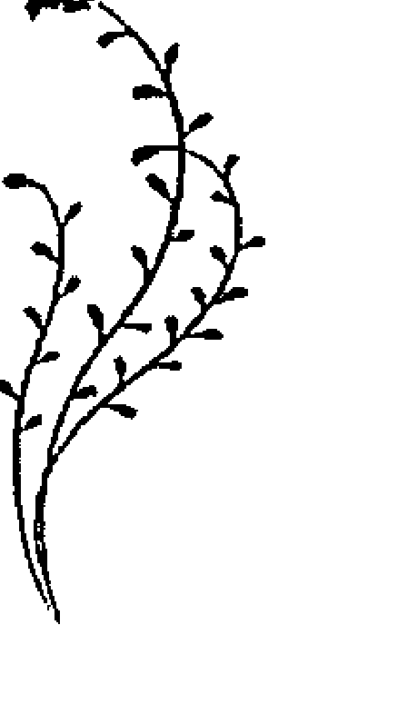

## 馬鞭草 { 溝通花精 }

Vervain Verbena Officinalis

馬鞭草類型的人是理想主義者，熱情洋溢。他們熱心地想與別人分享他們的觀念與知識，並嘗試以慷慨激昂的言論打動他人。如果他們不成功，他們會感到失望與沮喪，並重新在腦中找尋正確的新詞彙，用來說服對方。他們持續不斷地想要教化別人，內心因此常無寧日，甚至還超出身體的負荷而疲憊不堪。也因如此，他們經常神經緊繃、難以入睡。他們最關心的是，如何說服周遭人相信自己所相信的事情，然而，常常出乎意料之外地，自己成了狂熱、專橫與過度教條份子。他們常無休止地與人討論，因為固執己見而陷入爭端，甚至想要強加自己深信的觀念給別人。有時候他們覺得在某方面說來，是命運揀選了他們來開導別人；對旁人來說，這種傳教士般的熱情讓人感到乏味又緊張，常讓別人敬而遠之。

馬鞭草類型的人如此描述自己：

- 當我對某件事充滿熱情時，我必須立刻與他人分享。
- 如果別人不想聽我說，我會有種天幾乎要塌下來的感覺。
- 如果我有好主意，就想立刻告訴別人。
- 就算這些人對我的話題不感興趣，我還是經常試著說服別人來相信我的觀點。在這之後，我常是精疲力竭，因神經緊張而無法入睡。
- 我能夠將全部精力與信念投入某件事。
- 只要我確信某事，我會有堅定的理想。必要時，我可以為此奮戰到最後一滴血都流盡為止。
- 對我來說，最嚴重的事情是：我要說，卻不能說或不准說。
- 我無法忍受不公不義。
- 我對自己的期望很高。
- 我想要把每件事都做得完美。
- 我想成為完美無缺的人。
- 我試著要打動別人。

我想要對別人有正面的影響力，必要時，我會施加壓力。

說服別人，輕而易舉。

我會在我的生活中設定目標，直到目標完成，我的心才能安歇。

我做每件事情都很仔細，但我只期許自己這樣做，我不在意別人是否也是如此。

我受內在緊張的折磨，無法放鬆自己。

我最大的問題是內在的緊張，我的身體常有緊繃之處。

馬鞭草類型追求完美的特質與酸蘋果類型不同。酸蘋果類型的人，是出自於內在的執著，以吹毛求疵的方式，小心謹慎、並盡責地完成所有交代給他們的任務，否則會出現內在不潔淨感。但是，馬鞭草性格的人則是為了他們所熱衷的理念，而全心全力投入工作，除此之外的事情，根本都是雞毛蒜皮小事，完全不會注意。

酸蘋果類型的學生會在所有的科目上都取得優異的成績，馬鞭草的學生則是一兩個科目上表現優異，並且打破所有的紀錄，但在其他科目上則表現平平，因為他們對那方面的教材根本不感興趣；另外一種可能是所有的科目都表現得很慘，因為他的嗜好佔據了他所有的時間。

馬鞭草學生很會引起他人注意，當他們想在課堂上發言時，他們不只是依慣例舉手，還會打響手指頭、起哄、吵鬧，努力地搶到發言機會，傳達他的意見。馬鞭草性格的成人，則會在他人演講時，突然發言岔入他個人的意見，嚴重地干擾演講者，稍後，他們會說這句話來道歉：「我有話憋不住！」

他們與岩水的不同在於：岩水人為了要向別人證明，他們的觀點是可以實踐的，因此想要活出某個特定的理想或意識形態；而馬鞭草類型的人則是無法忍受平庸，只想要向自己證明某些事

## 角樹 { 補償花精 } Hornbeam Carpinus Betulus

需要角樹的人覺得自己不堪重負，他們相信自己目前無法承擔起日常生活的重任，他們覺得虛弱、無力且精神疲憊。每一天對他們來說，都像是陷入星期一症候群，想要盡可能地賴床。但越是賴在床上，他們就越疲憊，一想到要去工作，又更加虛弱。奇怪的是，當他們一旦開始工作，工作就順手。

角樹的人會如此描述自己：

- 我最近感到精疲力竭。
- 我很累，很想一整天都躺在床上。
- 我最近常常超量工作。
- 早上起床時比前夜上床睡覺前還累。
- 我一想到工作就全身無力，我得費很大的勁才能開始工作，但是一旦工作開始，上手之後就越好做越好。
- 目前的工作對我來說很困難，一想到我當天要做的所有事情，我就感到心煩意亂。
- 我覺得無法再勝任工作。
- 我覺得身心俱疲。
- 我常常無法集中注意力。
- 我很難思考問題。
- 有時我磨蹭了幾個鐘頭，才能讓自己振作精神，開始做事。
- 如果我工作或看電視到深夜，眼睛就會因疲累開始發酸、流淚不已。

角樹狀態是馬鞭草類型的人長期心智過度負荷的結果。常常發生在用腦過度的工作者：大學生、秘書和管理階層等等諸如此類的白領階級。因為過度使用腦力，外加缺乏身體上的運動，造成精神與肉體上的不對稱，進而引發大腦自動關機。這是強迫當事人重新建立精神與肉體兩個層面之間的和諧與平衡，角樹狀態可視為對當事人的警訊。

角樹與榆樹、橄欖與落葉松有某種程度的相似性，因此要能分辨這些狀態的不同之處。

落葉松類型的人也感到不堪重負，但是不是因為虛弱或操勞過度，而是老在懷疑自己的能力、缺乏自信。

角樹類型的人則是感覺到目前負荷過重，他們說，他們現在沒有辦法，但是等他們睡飽、體力充足時，就有能力執行了；但落葉松的人在睡飽後，依舊懷疑自己的能力。

橄欖類型的人像是身體與心靈都處於精疲力竭的狀態，當事人完全沒有能力去完成任務；不似前述的角樹狀態只是心智上疲憊，還可以振作，也有能力完成任務。

相對的，榆樹狀態則是緊急情況，像是當事人自我期許過高、或是他人交付他們過多工作時，例如：考試。這些任務對他們來說，像是一道無法跨越的高牆，他們不似角樹或橄欖狀態般缺乏精力，而是缺乏鍥而不捨的能耐。

如果不注意角樹狀態，它就會發展成爲失調狀態，也就是白栗花的狀態。

## 白栗花 { 失調花精 } White Chestnut Aesculus Hippocastanum

白栗花類型的人很難將頭腦關機，他們腦袋裡繞啊繞著不同的問題，卻完全束手無策、無能為力。這些不斷盤旋的思緒，像一張不斷重複的跳針唱片，想不到答案，也永無安寧的困在問題中。這會造成頭痛、注意力不集中、額眉深鎖、眼睛痛、內心緊張不安。

他們常以下面的詞句形容自己：

- 我的頭腦很難關機。
- 我常自言自語。
- 我的腦袋千頭萬緒，我很難集中注意力。
- 我常常想到不愉快的情境，再度干擾自己。
- 我常常試圖將這些思緒推到一旁去，但是我辦不到，它們似乎陰魂不散地跟隨著我。
- 我常回憶過去讓我想要鑽進地洞裡的尷尬處境，縱然我對自己說，都是過往雲煙了，但是我還是無法驅散這些想法。
- 我經常想到很久以前的某段談話，我還是耿耿於懷當時我未說出口的話。
- 我常常在腦中不斷播放稍早的談話內容，並且想著當時該如何回應才是。
- 如果有人惹我生氣，我腦海裡就會重播當時的情境好幾個小時，甚至是好幾天；我在想，下次該怎樣做才能夠保護自己。
- 我在蓋房子時，常常會有新點子冒出來，我總想著該如何做不一樣的規劃。因此，我無法滿意現在的房子，儘管房子早已經完工了，但我的心裡仍不斷地想著該怎麼蓋才會更好。
- 我希望自己可以停止這些持續出現的想法，讓內心恢復平靜。
- 我很難入睡，因為無法將腦子關機。
- 我經常覺得疲累。

白栗花與鐵線蓮、忍冬有某些相似之處，然而當事人所想的事情會有朝向現在、未來或是過去的差別，我們可以很容易地分辨這些花精。

鐵線蓮類型的人也經常活在幻想世界，胡思亂想一些愉悅的白日夢，當事人非常樂意沉溺在其中；但在白栗花狀態中，想的事情完全無用，甚至令人生厭。受此折磨的人，很樂於擺脫這些具有強迫性的思緒；忍冬類型的人也活在空想世界中，但他們是活在過去的記憶中，沉溺於過去的美好時光，藉此逃避現實。

白栗花經常與松樹、龍膽或伯利恆之星一起合用：

如果當事人同時具有松樹狀態，那麼想法上就會染上一層罪惡感與自責的色彩。當事人常會說：「如果我當初……」

如果當事人會顯現沮喪的想法，外加擔憂與悲觀的情緒，那麼需要白栗花與龍膽合併使用。

如果白栗花與伯利恆之星合用，代表著當事人早期的心靈創傷重新浮現，再度壓迫著他。

白栗花是先前馬鞭草與角樹狀態引起的後果。當事人在馬鞭草狀態下，因為巨大的熱忱導致了心智過度耗竭，因此他在角樹狀態時，出現心智疲憊與能量虛弱的現象。極端外向的陽（馬鞭草）勢必要進入補償性作用的陰的狀態（角樹）來平衡。當事人因此消極作為，最極端的狀況會是：當事人一整天虛耗在床上。

早在馬鞭草的狀態下，因為過度強調智力活動，而忽略身體。因此到了角樹狀態時，由於腦力耗竭，所以體力和腦部的活動力都降低到最小狀態。但是身體無法停止活動，甚至連一秒鐘都不可能，心臟時時刻刻跳動著。因此，身體需要的活動能量，在此狀況下便轉換成思想上的活動能量。根據同樣的機制，午間長時間午睡的人，到了當晚就難以入睡。

角樹階段有時候很短，如果使用刺激性食物，如咖啡、紅茶、可樂或尼古丁就度過了；在失調狀態時，他們會持續服用刺激性食物，但這又強化了白栗花的狀態。眾所皆知，咖啡刺激人不斷地思考而導致了失眠。

若要脫離失調狀態，我們不可以一直忽略身體。慢跑、騎腳踏車等等運動，加上泡湯、乾刷皮膚與按摩，這些活動對身體十分有益，特別是後者，如果在入睡之前這麼做，它會除去折騰人的思想，並幫助人睡得又香又沉又甜。

## 第七花軌

- ☆ 溝通花精 → 龍芽草 AGRIMONY
- ☆ 補償花精 → 馬鞭草 VERVAIN
- ☆ 失調花精 → 甜栗花 SWEET CHESTNUT

## 龍芽草 { 溝通花精 } Agrimony Agrimonia Eupatoria

龍芽草類型的人狀似愉悅、無憂無慮，他們總有好心情，而且笑話不斷。他們是令人愉快的夥伴，人緣好，經常營造良好的氣氛。他們蓬勃的生氣感染周遭，有他們在的場合，很少人會感到無聊。

不過，他們表面愉悅的背後，隱藏著深沉的內心痛苦。煩惱、憂慮與恐懼深深地折磨著他們，他們因此尋求別人的陪伴，與朋友相處時，他們可以忘記自己的問題。因為不想造成別人的負擔，所以他們老是試著壓抑自己的問題，叫它們噤聲、保持安靜。如此一來，他們不斷地逃避自己，持續從事一些興奮、刺激的活動，來應付自己的煩惱。

由於他們極端敏感，而且愛好和平，因此在待人處事上也盡可能地避免衝突與爭論。不和諧與不協調令他們十分難受，因此會很快地妥協與屈服。

龍芽草類型的人會如此描述自己：

- 我把問題留給自己，不想造成別人的負擔。
- 我自己處理困難，不讓別人聽到這些難題，相反的，我靠聽音樂與閱讀來轉移注意力。
- 我害怕向別人打開心房。
- 從小時候到現在，我隱藏很多事情，而且從來沒告訴過任何人。
- 我害怕坦露心聲。
- 說到問題時，我會輕輕一筆帶過，並經常將最重要問題藏在心中。
- 我坦白說出內心話的時候，感覺糟透了。
- 在工作場合，我戴著面具，有時候這面具幾乎像是牆一般厚。
- 我的生存原則是：「保持微笑！」我是這樣被教養大的。
- 我可以隱藏自己的恐懼，騙過其他的人。
- 就算在做心理治療時，我在初期也有所隱瞞。
- 以前我總是佯裝快樂，參加許多派對。其實我內心感到絕望，夜晚睡夢中，我不停地磨牙。
- 我不讓任何人接近我。
- 我害怕與別人培養深入的情誼，寧可保持表面的接觸。
- 我不會在別人面前承認我的感情。
- 因為我過去隱藏了很多事情，因此現在還是得掩飾下去。
- 我無法盡情地感到快樂。
- 我嘗試幫助別人，藉此逃避自己的感覺與需求。
- 如果我壓抑自己的情感，就會感到呼吸困難、不順暢。

龍芽草的狀態很容易被忽略，因為當事人連在面對他們所求助的對象時，也不能完完全全的誠實。他們在談話當中會迴避問題，或將大事化小、小事化無。直指問題核心的直述句，會被他們在下一個句子轉成問句，或用「可能」、「也許是」、「或是」、「我傾向於」等表達方式，把問題輕描淡寫地一筆帶過，當他們好不容易談到自己的問題時，卻只涉及表面。他們試圖淡化自己的病情，把嚴肅的檢驗結果當成笑話來說。

為他們做身體檢查時，常常出現下面狀況：根據病例報告和實驗結果，原本該對壓力反應敏感的穴位，在這些人身上卻完全沒有反應。壓抑的生存原則，從心靈的領域移轉到了身體上，因此無法透過預警性穴位發現他們失調之處。

這些人在遭受到心理壓力和內心不安時，通常會有這些現象：因緊張而用手指扣擊、雙手發抖、肌肉抽動、緊張性的抽搐或夜間磨牙。晚上他們躺在床上，卻難以入睡，因為白天壓抑下去的所有東西，在此時浮上意識。在床上躺越久，就越感到平靜不下來。為了要逃離那些折騰人的想法，他們常常坐在電視前面、或看書到深夜，或用其他方式來分散注意力。他們無法抵抗酒精、藥物與毒品的誘惑，因為這些東西能夠讓他們忘卻煩惱。

煩惱也同樣折磨著龍膽類型的人，他們抓住悲觀主義緊緊不放，不斷地反芻著自己的難題，而煩惱不已。然而龍芽草類型的人，則試著擱置所有負面的事，但這些問題無法完全被驅離意識之外，而是像一隻迴力鏢不斷地回到原點。因此，當他們試圖壓制煩惱時，內在的反作用力會增大，逼使當事人逃到外在世界，以更多的「活動」讓自己沒時間去思考事情。

因為對外佯裝無事，內在卻不得不承受持續增加的內心壓力，這些個體因此越來越緊張，也更加的不安。結果，象徵「執著」的身體症狀開始出現，例如：便秘與緊張性的頻尿。他們排尿時，通常只排掉一部分，其餘的尿液還是在膀胱裡面。排尿時的疼痛也說明了，患者認為「放下」是痛苦的。

龍芽草類型的人與人交往時，常出現困難，但是他們通常並不清楚這點。因為他們擔心過度的親近會暴露自己，所以他們與旁人保持一定的距離，並且所有的人際關係都停留在表層，無法與別人建立深入的心靈接觸。

另一方面，龍芽草人又冀望與別人建立較熟的交情，好讓他們有個抒發自己的煩惱與困境的管道，換言之，他們渴望擁有深入的關係，但是建立關係的同時，他們的內心世界還是充滿恐懼地與他人保持著一定的距離。他們害怕真正的感情，因為這種感情會嚴重危害到——盡可能維持在表面上的——「朋友」關係。

這種經常對外隱藏自己情感的人，都存在著一種危險：到了最後，他們不再清楚自己的感覺。隨著時間的流逝，外在的面具變成了第二個自我，他們強力認同它，以至失去了自己真正情感與需求的自我意識。

不斷增強的痛苦，讓人格不得不去找一個出口，釋放越來越劇烈的內在緊張。若是想要脫離進退兩難的困局，最簡單的方法是：釋放它。但是，這對當事人來說，是生命中無法想像、而且是最艱難的任務。若無外力的介入與幫忙，他們無法釋放，因而進入補償階段。在這階段，他們會以更強烈的方式逃避到外部世界：他們透過某個理念與理想來鼓舞他人，他們相信如此一來，可將自己與他人的注意力從己身轉移開來。

龍芽草被證實是最難下診斷的花，通常我們不能單純根據當事人的陳述下診斷，而要依賴治療者的觀察力。抱怨內心不安寧時人卻狀似平靜、很快停止流淚又馬上快樂起來的人、將不愉快的事隱藏得很好的小孩，都可能是龍芽草類型的人。龍芽草的候選人通常有某種潛藏的缺失，例如：減重無效的肥胖者。即使當事人在節食課程中，減掉幾磅脂肪，但是課程之後，又因不斷貪嘴進食而復胖。這現象顯示，他們靠吃東西來尋求慰藉，補償心靈上的衝突。

當事人在面臨急性危機時，也常會發生龍芽草狀態。例如當事人必須馬上處理掀起個人內在衝突的事件：親屬去世之際、或與伴侶分手之後而伴侶找到了新情人：……等等狀況。龍芽草狀態也可能追溯到童年，當時父母親可能給予當事人過少的時間，以至於他不得不學會處理自己所有的事情。有時候，小孩也會承襲父母親的反應模式，俗話說：「男子漢大丈夫有淚不輕彈！」正是壓抑情感的最好寫照。

原則上，我們可以假定，這種心理狀態是先天上就存在的特質，相應的情境只是個導火線。在這種情況下，本命星象盤可以幫助我們準確地判定這種狀態，在這些案例裡，應當特別注意流年星盤中的上升點和當時月亮所處的位置的相位。另外，面對抗拒治療的個案和上述的案例都值得試試龍芽草花精，因為龍芽草讓人「坦承不諱」。

## 馬鞭草【補償花精】 Vervain Verbena Officinalis

在此，馬鞭草的狀態是以龍芽草的補償狀態出現。馬鞭草的症狀與在「馬鞭草—角樹—白栗花軌道」中描述的症狀相同。但是，引導這個狀態出現的動機，以及互相對應的補償或失調的方式，都會有所不同。

如果當事人服用馬鞭草作為溝通花精，是因為當事人過度興奮，企圖要用自己的理念說服他人；因過度熱心而耗盡能量，以致於精疲力竭，迫使當事人進入短期的補償狀態。

然而，當馬鞭草狀態是以龍芽草狀態的補償狀態出現時，當事人會過度活躍地參與眾多活動，藉以隱藏內心最深處的自我。

透過極度外向的生活方式，當事人成功地將自己的注意力從心靈上的痛苦、煩惱與恐懼中轉移到外在。萬一內心悲傷的內憂，加上了命運的外患——打個比方說——超出極限了，當事人便再也無法將這些問題隱藏起來；相反的，積壓多年的新仇舊恨加深了痛苦，他們會反應出一種極度的絕望。他們將會相信：命運已經徹底擊垮他們。

## 甜栗花 { 失調花精 } Sweet Chestnut Castanea Sativa

需要甜栗花的人是徹底絕望了。他們可能處在無法再繼續忍受的臨界點：遭受突如其來、毫無預警的命運打擊，或是身處走投無路的狀況；他們無所適從，能做的都做了。因此，他們認為以前的所作所為都徒勞無功，意義全無。

這種全然無望感，迫使他們面對心靈深處最深的絕望與空虛的內在，覺得自己被上帝所遺棄，無法靜心祈禱，甚至欲哭無淚，擔心自己因為命運的捉弄而心碎。

甜栗花類型的人會如此描述自己：

- 我覺得極度沮喪。
- 我走到絕路了。
- 我再也無法忍受這種情境。
- 我再也無法歡笑或哭泣，感到內心極度空虛，我不知道接下去該怎麼辦。
- 我甚麼都試過了，現在感到徹底絕望。
- 我不要再忍受了，要不然就垮掉了。
- 上帝捨棄了我。

> 巴赫醫師針對甜栗花寫道：「在這時刻，身體與心靈感覺被壓迫到無可忍受的臨界點，面臨著屈服於命運和精神崩潰之間，唯一的出路似乎只剩下破壞與毀滅。」

處於甜栗花狀態下的人像龍芽草狀態的人一般，將痛苦埋藏在心裡面，他們不像金雀花的人對每個人哀嘆著痛苦。縱使他們重創程度已經到了忍無可忍的極限，他們仍控制著情感。相反的，櫻桃李類型的人一旦崩潰，就可能選擇自殺。而甜栗花的人則仍然會與看似不可改變的命運爭論、垂死搏鬥。甜栗花如果要自殺，一定是長期策劃自殺行動，但如果是櫻桃李的狀態，則是出乎意料之外地突然發生。野薔薇狀態下的當事人則已經放棄一切，考慮自殺是想要一了百了。

像是摯愛親人過世，這一類突如其來的命運打擊，有時候也會引發甜栗花狀態，而當事人在此之前，似乎沒有過任何甜栗花狀態的問題。然而，事實上並非如此。人的本質決定了他們的心靈在遭逢極端變故時的反應：龍芽草人壓抑負面情緒；甜栗花人陷入絕望；龍膽人悲觀負面；楊柳人一開始會與命運對抗，隨著心理壓力的增加，成了放棄抗爭、聽天由命的野薔薇。

人的靈魂在突然遭逢變故時，潛藏或潛在的情緒衝突就會浮出意識的表層，沒有預警地將當事人彈射到失調的狀態。因此，若要幫助這些人順利地度過當時的危機，便要加入隱藏在當前問題背後的花精。這一點非常重要，因為，真正的問題並無法透過使用治標花精獲得解決。

## 第八花軌

- ☆ 溝通花精 → 岩薔薇 ROCK ROSE
- ☆ 補償花精 → 龍芽草 AGRIMONY
- ☆ 失調花精 → 櫻桃李 CHERRY PLUM

## 岩薔薇 { 溝通花精 } Rock Rose Helianthemum Nummularium

在極端歇斯底里的情緒出現、有危機時，或是所有會引起當事人害怕、驚恐的外部境況，我們都會用到岩薔薇花精。

下面的緊急事故會導致當事人進入急性的岩薔薇狀態：

- 意外事故。
- 命運的打擊，例如：親人過世。
- 突發的疾病。
- 罹患重病，不太有復原的希望，例如：心臟病發作或中風。
- 突發的驚嚇，例如：在漆黑的地下室，突然有老鼠跳到面前。
- 性命交關的情況，例如：差點溺斃、高速下差點出車禍、窒息發作。

當事人在上述情境下經驗到：

- 恐慌。
- 驚駭。
- 毛骨悚然。
- 極大的恐懼。
- 嚇得魂飛魄散。
- 嚇癱了。
- 無法清楚思考。
- 感覺徹底任人擺佈。
- 以為心臟停止跳動了。

當事人通常會用這句話來描述：「這簡直像晴天霹靂一般！」這種恐慌可能引發下列的生理症狀：「癱瘓、失去意識、突然失聰或失語、全身冰冷、顫抖、失去控制。」岩薔薇狀態通常只出現在緊急的情況，當然也有一種岩薔薇類型的人，是習慣用震驚的方式來面對討厭的事情。他們很敏感、容易陷入驚慌之中，過於神經脆弱會導致他們罹患精神官能症與自律神經系統的病症，有些治療師則認為這與腎上腺激素分泌不足有關。

正如上面所描述的療法所顯示，起因往往是出生時的經驗。就某種意義而言，每個誕生都是創傷經驗，我們會在伯利恆之星的篇章再次談論這點——許多治療師在第一瓶巴赫花精複方當中，都加入伯利恆之星作為心靈創傷的花藥。如果在出生時出現了對死亡的恐懼，我們就得額外開立岩薔薇。

有件事值得留意：過去數十年來，幾乎所有在婦產科診所出生的新生兒，他們的臍帶在出生之後就馬上被剪斷。除了所謂的「溫柔的分娩」之外，至今這個「惡習」仍然存在。新生兒在尚未開始自己呼吸之前，臍帶就被切斷，因而緊急陷入了死亡的恐懼中。它必須要馬上呼吸，否則就難逃一死。我們可以明顯地看到許多新生兒臉上，都有這種害怕死亡的表情。生命的第一次呼吸，就伴隨著對死亡恐懼的哭聲，而事後人們卻將此哭聲詮釋為健康的象徵。如果它不能馬上自己呼吸，就會挨上那著名的「屁股一拍」（這是一個如此瘋狂的世界，剛進入世界之門，就有人等著要揍它，免得它才剛進入，又急於逃離）。

這種狀態下引發的岩薔薇狀態，通常很難被人發現。雖然惡夢可以看作是一條模糊的線索，但是，通常在沒有詳細的症狀下是很難診斷出這一朵花的。

## 龍芽草 { 補償花精 }

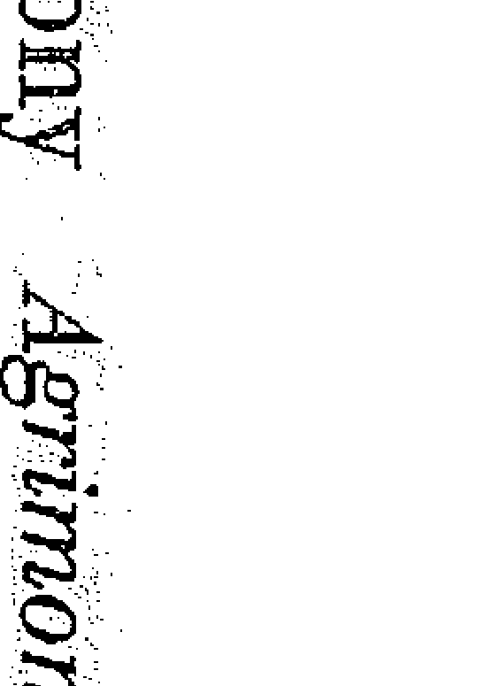

Agrimony Agrimonia Eupatoria

在此，龍芽草狀態是作為岩薔薇狀態的補償狀態。當事人壓抑了對過往創傷的恐懼與回憶。我們先前描述的龍芽草狀態是在「龍芽草—馬鞭草—甜栗花軌道」，是當事人嘗試將他的情緒困境隱藏起來，不對外顯露，假裝無憂無愁、快樂的假象。

龍芽草的圖像在這兩種情況下是相同的，只不過是在不同的層面上壓抑自己的不愉快。龍芽草狀態在補償階段，主要是面對自己的內心。而在溝通花精的階段時，則是個體與周遭環境的互動。基於此，如果當事人正處在補償狀態，他更不會覺察自己壓抑的情緒，對治療師來說也更難辨識當事人的狀況。這種內心的衝突——被極端的恐慌或者是對死亡恐懼的經驗引發時——是要等到當事人成了失調的狀態才會被發現，此時被壓抑在潛意識的內容，會強而有力的浮現到意識的表層，造成當事人的恐慌及懼怕，運用意識壓抑的機制失去功能，而且讓當事人失去控制。

在此，龍芽草狀態是個保護屏障，將自己與具有威脅性的潛意識內容隔離。在這種情況下服用龍芽草，要謹慎給予劑量，並且在服用後密切觀察反應。被壓抑的潛意識內容很可能以夢境、重新經歷的恐懼、或清晰的記憶等等形式，再次回到當事人的意識。

如果在服用龍芽草之後，出現內心焦慮不安，而這不安甚至不斷地加劇時，就應該要暫時停止服用這種花精，並轉而開立失調花精，即使剛開始這看起來並不怎麼對症下藥。

## 櫻桃李【失調花精】

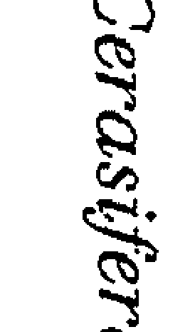

Cheery Plum Prunus Cerasifera

需要櫻桃李的人，覺得內心像是有顆隨時會引爆的不定時炸彈，他們害怕自己的感情，擔心一旦失去警戒，就會大難臨頭。

害怕發瘋與發飆的恐懼把他們帶到絕望邊緣，在這種極端的情感狀態下，他們害怕無法控制自己，並做出可怕的暴力行為。在他們強迫性意念中，他們看到自己以恐怖的方式殺害別人或傷害自己，他們害怕自己會將這些瘋狂的意念付諸實行，這害怕幾乎讓他們失去理智。他們相信自己一定會發瘋、精神崩潰或被押進精神病院。

需要櫻桃李的人如此描述自己：

- 我害怕控制不了自己而亂發火。
- 我害怕發飆。
- 我內心緊繃無法放鬆。
- 當負荷過大時我害怕自己會失去控制。
- 我經常在想：「你現在在做什麼？」「你現在發瘋了！」「你發生了什麼事？」
- 我害怕自己會有暴力行為。
- 我害怕有天會失手殺死我的祖母。
- 把孩子扔出窗外的這種妄想折磨著我，我知道在正常的情況之下，我不會做出這樣的事，但是我非常害怕哪天我抵擋不了這種內心的衝動時，會做出可怕的行為。

我從來無法真正的放鬆，雖然我沒有真正的失控過，可是當我自我控制保持冷靜時，就會出現偏頭痛。

我小時候母親患有嚴重的心臟病，爸爸經常對我說：「安靜！否則媽媽會生病。」

我經常有種如果孩子發生什麼事，我肯定會發瘋的感覺。

我害怕自己，害怕自己的感覺，害怕自己內心深處不光明的想法。

在靜心時，有時候一切會變得黑暗陰森，而在我看到扭曲的面孔時不得不停下來。

我經常受到痛苦情感的折磨，我內心有種深深的渴望，想要得到靈魂的救贖，這幾乎將我的心撕裂了。

在一次簡單的放鬆練習當中，有個病人告訴我：「我不能閉上我的眼睛，因為我害怕失去控制，我擔心在精神上會發生我事後無法挽救的事。」

櫻桃李是由先前龍芽草的狀態延伸的後果，在龍芽草狀態時，不愉快的事情被壓抑下來，成為櫻桃李狀態，這些被壓抑下去的事引發了恐懼。吸毒嗑藥後也會出現類似急性櫻桃李的狀態，覺得無法控制自己、暴力、抓狂等等上文描述的緊急狀態。有時候，縱然當事人已經停止服用毒品多年，這種急性櫻桃李狀態仍然存在。這些人有很明顯的特徵：由於害怕自己會發狂，因此連五分鐘都無法等待，他們寧可散步一會兒。

我有一個熟人在服用了迷幻藥之後，陷入了這種急性櫻桃李的狀態。他再也無法容忍單調的噪音，這狀況在搭公車時成了問題，因為他確信公車馬達運轉的噪音會讓他瘋掉，所以公車有時得在半路上停車，讓他下車，他再徒步走幾公里路回去。當時我的手邊沒有花精，但我還是很成功的透過簡單的冥想練習，讓他學會有意識的放鬆，冥想後他馬上不再恐懼。事後他告訴我，在冥想練習之後，他隨即搭了公車回家，他甚至很享受那段車程。

櫻桃李類型的人必須學會內心的放手與放鬆。他們滿懷恐懼，那個因為不願意面對自己的陰暗面而產生的強烈恐懼感，把所有源於潛意識的衝動都壓抑下去，因此在心中產生了反作用力。

這反作用力將過去努力壓抑下去的人生經歷與人格的黑暗面，狂暴地推向意識表層。

如果當事人學會承擔起源自潛意識的印象與影像，不去反抗與抵制，這時他們心中幽靈般的不安感，相對地很快就會消失。如果持續抗爭，反而會維繫這種狀況，我們所對抗的一切，都會纏住我們不放。

櫻桃李的狀態不總是像剛才描述的那般緊急。在某些特定情況下，它已經持續悶燒好幾年。

典型的櫻桃李狀況，是當事人在精神上感受到一股難以掙脫的壓力，在這種狀況下，我們可以將櫻桃李與其他的花朵合併使用。

這些花朵是：

- 酸蘋果：強迫性的清洗。
- 龍芽草：強制自己保持微笑。
- 樺木：無法克制地批評與指責。
- 白栗花：無法停止的強迫性思考。
- 白楊：強迫性的恐懼妄想。
- 水蕨：強迫性提問。

## 鳳仙花 { 溝通花精 }

Impatiens Impatiens Glandulifera

鳳仙花類型的人是很沒有耐心又急躁的公民。他們做事快、說話快、動作更快、甚至吃得也很快，唯一一件快不起來的事就是——入睡。他們忙碌的生活方式，讓他們飽受神經緊繃的困擾；他們很難放鬆下來，像是體內有個火箭驅使，來去匆忙並且聲聲催促；他們無法諒解那些做事比他們慢的人，他們眼睜睜看著別人——根據他們的看法——浪費他們的寶貴時間，這簡直要使鳳仙花類型的人抓狂。如果事情進展不如預期中快速，他們會變得不耐煩、容易被激怒、甚至很快就生起氣來，因此他們寧可獨自工作，不需顧及別人。他們強烈地尋求獨立自主，因此在很多情況下，他們顯得孤獨寂寞。

萬一生病，他們便很惱怒，並希望盡快恢復健康，他們會指示治療師開出快速療效的藥物處方。因為緊張倉促的工作方式，讓他們容易發生意外事故，但他們閃電般的反應能力，多半也阻止了最糟情況的發生。

鳳仙花類型的人如此描述自己：

- 我是一個很沒有耐心的人。
- 對我來說什麼事都不夠快。
- 我做事總是速戰速決。
- 我常常缺乏耐心導致錯誤。
- 我經常因為沒有耐心搶了別人的話。
- 當別人行動笨拙時，我會接手別人的工作並完成他們的工作，我不能坐視不管。
- 我常常催促別人要快一點。
- 我經常說：「快來！」、「開始工作！」、「行動吧！」、「快做！別睡著了！」、「做事不要那麼遲鈍！」

當我請別人遞東西給我，他卻不立刻做時，我會馬上開始咆哮。

如果我必須要等待，我就會開始思考，有哪些是在我等待的期間可以同時完成的事情，這讓我煩躁不安。

我痛恨等待，當我不得不等人時，我馬上會問：「還需要等多久？」然後離開片刻再回來。

如果我不能超車，我就緊跟著前面的車輛行駛，跟在開慢車的人後面真令我抓狂。

如果因早到而要等待，那我寧可晚點到。因此我傾向於晚點離家而非提早出門，如果有需要的話我可以把車開快一點。

我內在那無法控制的急躁感，經常使我喘不過氣來。

鳳仙花類型的人，總是處於必須做點什麼事兒，或是必須工作的內在壓力下，因為這種不耐煩和暴躁脾氣，代表有一股內在的壓力無論如何都要找尋出路發洩出來。在這樣的性格下，他們經常受到內外壓力的折磨、肌肉抽筋與疼痛、背部疼痛、神經質的胃痛與腸胃毛病、神經性的抽搐……等等症狀所困擾，內心壓力的上升也經常造成血壓上升；而快速的思維，也導致了脈搏跳動的頻率升高。

是甚麼導致了當事人如此快速運作的內在，讓他們難以與趕不上鳳仙花速度的環境互相協調配合？一方面，是天性使然——眾所皆知牡羊座的本性是十分浮躁與衝動的——另外一方面，也有證據指出這種行為是受到外在環境——如母胎期——的影響。

托瑪斯·沃尼（Thomas Verny）在他的書中《新生兒的精神生活》（*Das Seelenleben des Neugeborenen*）寫道：「如果嬰兒的出生日，只是比預產期早了幾天，幾乎不會有什麼後遺症；如果是早幾個星期則會有較嚴重的後果；至於提早幾個月的早產，則對小孩的身體與心靈方面都有巨大的破壞力。我在出生時早產的病人身上觀察到『最無害的』影響，是他們長時間地活在倉促與煎熬的感受裡。在我看來，這種永遠無法趕得及與無法停下腳步的感覺，就是早產的最直接後果。他們的生命一開始就被驅趕，即使多年之後，這種感覺依然存在。」關於出生時造成的創傷，因而產生的負面心靈印象，我們已經在岩薔薇篇章提過了，我會在伯利恆之星的花精案例當中，再回頭談此議題。

◇ 第九花軌 ◇

* 溝通花精 → 鳳仙花 IMPATIENS
* 補償花精 → 橄欖 OLIVE
* 失調花精 → 橡樹 OAK

## 橄欖 { 補償花精 } 🌸 Olive Olea Europaea

需要橄欖的人無論在生理上和心理上都已燈枯油盡。他們筋疲力竭，以至於生命對他們來說像是浮沈掙扎，日常活動如洗衣、刷牙、上廁所都似一道無法跨越的障礙。他們臉色蒼白、面無表情、看起來冷漠、有問才答，聲音也十分微弱，他們毫無動力，唯一的願望是睡覺。

過度工作、長期擔憂勞累、與長期嚴重的疾病之後，都會出現橄欖狀態。此時，當事人已經與這些苦難進行過長期激烈抗爭，此時他們所有儲備的能量已經耗盡，此時當事人的狀況——與角樹相反——已經沒有能力完成他們的任務與職責。

需要橄欖的人會如此描述自己：

- 我非常疲倦，只想睡覺。
- 我所儲備的能量已經消耗殆盡了。
- 我這麼累幾乎走不動了。
- 我覺得筋疲力竭。
- 任何事都提不起我的興趣了。
- 此時生命對我而言是個重擔。
- 我沒有能力再繼續下去、我不要繼續下去了。
- 我已經燈枯油盡。
- 上班時我數著時間等著下班。

根據當事人的體質和消耗的程度不同，橄欖狀態可以緩和或急性發作的形式出現。橄欖狀態不全都是在長期的過度勞累狀況下發生，一次性消耗大量能量的事件，也會引發精力枯竭。在這種情況下，當事人的體能通常是逐漸消失的狀況，但是身體儲存的能量基本上尚未完全耗盡，此時使用橄欖花精，會加速能量的再生。

橄欖狀態是前面鳳仙花狀態引起的結果，鳳仙花類型的人因為過度活躍的生活方式，經常在生活中蠻幹到底，耗盡的力氣遠遠超過身體能供應的能量；強烈的飢餓感是個指標，提醒他們，身體的能量幾乎消耗殆盡了，要節制，否則要面對自己造成的後果。否則，能量全然耗盡的橄欖狀態，會造成功虧一簣，反而無法達成他們一心追求的目標。然而，他們經常試著以巨大的意志力，克服橄欖狀態的弱點，以便繼續工作並完成任務，這就成了以橡樹花精為標記的失調狀態。

## 橡樹 { 失調花精 } 🌸 Oak Quercus Robur

橡樹類型的人很有責任感、很可靠，相對的也可以完成許多事情。他們錯誤的義務感，讓他們承擔太多事，有時候甚至是扛下了旁人的重擔；他們從不抱怨，甚至在面對最大的困難時，也不會動搖。

他們一旦生病就像鳳仙花類型的人一樣，想要盡快好起來，如果他們的生活一事無成，他們會非常不滿。

橡樹類型的人如此描述自己：

- 我有強烈的責任感。
- 我覺得自己對很多事情都有責任，非得賣力的工作。
- 我對自己的要求很多。
- 我是個不折不扣的工作狂。
- 我不能把事情交給別人，因為我覺得自己對它有責任。
- 即使早已超出我的能力之外，我仍堅持不懈，縱然透支我的體能，我仍發揮耐力，強迫自己繼續做下去。我也只有在發燒到四十度時才會待在家裡。
- 即使我沒有體力了，我還是要繼續工作，即使是頭痛或暈眩也阻止不了我。這些症狀在一小時之後就會消失，所以我也不用採取任何措施。
- 大約晚上九點半時，我的體力進入最低潮，只要克服了低潮，我就可以輕易熬到凌晨一點。

| 行為 | 橡樹類型的人 | 馬鞭草類型的人 |
| :--- | :--- | :--- |
| 過度操勞 | ◎出於過度的責任感。 | ◎純粹出於對事物的熱衷。 |
| 承擔別人的工作 | ◎當別人做不來時。 | ◎即使在他們自己都做不好的情況下，還是全力要教會別人該如何做。 |

橡樹恰好是金雀花的反面，需要金雀花的人通常很容易洩氣、失望與灰心喪志，而橡樹類型的人即使體力已經不行了，也不放棄，還會以巨大的意志力強迫自己繼續不斷的工作。甚至在看似無望的情況下，其他人早已放棄時，他們還是會繼續勇敢的工作奮戰，必要時會堅持到自己完全崩潰為止。

馬鞭草類型的人也經常過度工作，他們傾向跨過「不歸路」。這兩朵花的動機不同，如上表說明。

橡樹狀態無法輕易地辨認出來，因為當事人常不能意識到他們的不當行為傷害了身體；相反的，他們問心無愧，因為他們相信自己是在履行職責，如果身體透過疾病拒絕過勞，他們會把疾病視為必須盡快克服的障礙。

如果病人卯盡全力對抗病痛，而非靜觀病情變化，回應身體想要充分休息的渴求，我們便可視其為需要橡樹的明顯線索。橡樹的狀態不僅在過度勞累的狀況下出現，也可能因為長期的病痛、持續的工作困境與家庭問題而發生，例如：為了小孩，用最大的意志力維持一段不愉快的婚姻。長期照料生病的親人，也都可能引發橡樹的狀態。

是甚麼原因導致當事人憑著意志力持續工作、無法停止，以至於身體與精神都陷入極大的壓力與緊張狀態呢？

我們從橄欖狀態的例子中見到：鳳仙花類型的人急躁與過動的天性，很容易耗竭能量、疲憊不堪。這類型的人因為內心焦躁以及愛動的天性，縱然自己疲憊不堪，仍然持續工作，無法停下休息。他們會嘗試盡快恢復精力，強迫自己從暫時的疲累低潮中恢復，因為他們把休息當作是純然的浪費時間。

如同馬鞭草類型的人，他們也會有暫時衰竭的階段，馬鞭草類型的人透過咖啡、紅茶等等刺激物，來排除心智上越來越嚴重的疲乏狀態；而橡樹類型的人則需要強大的意志力，來排除精神和身體上的耗竭。

橡樹的這種行為，漸漸發展出一種心態，把不適與虛弱的狀態，當成是完成職責的障礙，一定要迅速排除；這些人並不一定意識到：這種責任感是剝削自己健康的最大藉口。如果不停止這錯誤行為，而任由這種心態繼續發展的話，當事人會堅持到底，直到自己完全崩潰為止。往往到了最後，他們必須痛苦承認：真正的動機並非義務感，而是內心的執著，執著於他們完全超出負荷的生活和工作方式；而這行為又與內心無法放鬆、無法放下息息相關。

## 菊苣 { 溝通花精 }

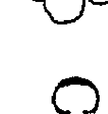

Chicory Cichorium Intybus

菊苣類型的人友善、樂於助人，有很強的家庭觀，他們貼心地照顧家人，在這方面「任何工作對他們來講都不嫌多」。在他們幫助人的時候，通常把自己的需求擺到很後面，而且很能為了別人犧牲自己。他們強烈地厭惡孤獨，因此想要他所愛的人，都能常常在他們身旁。然而事實上，他們持續不斷地關心別人的快樂與幸福，並不是出於大愛，純然是一種自私的愛，他們並不是無私地幫助他人，他們要別人感謝他們，熱心助人的行為，是為了將幫助的對象綁在自己身邊，讓這些人生活在他們的影響力之下。菊苣類型的人時常施予道德壓力，責怪別人欠自己恩情。

菊苣類型的人如此描述自己：

- 我總是為別人的幸福著想。
- 我關心我周遭的人並試著幫助他們。
- 我經常給別人善意的建議，如果這些人不聽我的話，必要時我會鼓動全家人來影響他們。
- 如果我的小孩不按照我要的去做，我會嘗試用些手段讓他聽我的。
- 因為我一開始就知道，如果我請孩子陪我一起去購物，他一定不要，所以我告訴他要好好待在家裡，於是他二話不說的跟我去了。
- 如果我幫別人一個大忙，我當然會期待他回報。
- 我的感情很容易受傷。
- 如果別人不做我要他們做的事，我會覺得很受傷。
- 我害怕會成為孤獨老人。
- 我一輩子都為了我的兒子而活，現在我的媳婦把他奪走了。

菊苣類型的人常將他們的義舉善行強加在旁人身上，如果人們拒絕他們的幫忙，或不遵行他們的建議，他們很容易就感到難過，自艾自憐地抱怨：「我純粹出於好意，現在你居然這樣傷害我，我所做的一切不都是為了你嗎？我看你沒有我該怎麼辦！你這個不知感恩的人！」等等。他們總是企圖讓別人依賴他們，或是利用已經存在的依賴關係，例如：在親子關係裡支配孩子。他們樂於提供建議給旁人，也喜歡干涉與他們毫不相關的事物。漸漸的，隨著時間的推移，他們試圖在別人的生活中擴大自己的影響力，慢慢地別人大大小小事情，都會請他們來出主意。如果其他的人，就算是已成年的孩子們做出獨立的決定，他們就會覺得自己不被尊重，受到極大的冒犯，這種感覺會令他們久久難以釋懷。

他們對權力的需求，不像葡萄藤類型一般那樣明顯，而是以比較有外交手腕的方式婉轉取得。他們提出要求時，通常像是心照不宣的暗示，讓被請求者毫無招架能力，只好聽從他的指令，甚至覺得不照著他們的想法做的話，是虧欠他們的恩情。他們的策略是如此的善巧，讓人以為他們非常替人著想，他們的一切所做所為都是為別人好。

我在這裡舉幾個例子，來說明這種佔有慾強和自私的人格：

一個需要居家護理的老太太，只想被某個特定的親屬照顧，如果這位親人不在場，老婦人就拒絕進食。有一次，當這位居家護理的親人想要去渡假，老婦人企圖強迫他留在家裡，她無所不用其極地使出各種手段逼迫他，到了最後，她得留在醫院裡打點滴，接受人工補充營養。

有一個大學生，經濟上是靠父母給的錢，不過只夠付房租與日常開銷，不足以買三餐。食物都是從家裡帶過來的，他並不樂意，但是他的父母親用這種方式強迫他每個星期回家。他不是透過銀行定期轉帳的方式收到錢，而是他父母以分次匯款的方式入帳。他的父母親認為透過匯款的方式，可以避免兒子以為出錢資助他，是父母親理所當然得承擔的義務。儘管經濟上有所損失，但有幾個週末，孩子沒有回家，他的父親便會因為「一時疏忽」而忘記匯錢給他。因此，孩子必須打電話回家時，爸媽就會提起身為孩子的「義務」，經常還會帶著責備的口吻，問道：「金錢難道是與父母親之間的唯一聯繫？」因為父親堅決拒絕在電話上談論有關經濟問題，一旦有額外支出時，他就必須多回家一趟，親自向他父親乞求。

有個小女孩，每隔一段時間就用下面的話勒索她的玩伴：「如果你不跟我一起玩，我就不再是你的朋友了！」

有個女病人在我的診療室裡，每隔幾分鐘就會身體不舒服與煩躁不安，她認為這與某種輻射有關，也許是因為地面的輻射或電磁波干擾。她宣稱我的診療室受到輻射汙染，但是經過探測器的測量，證實並未受到汙染。但也因此，我也只好轉到候診室，為她進行巴赫花精的評估——我還得把寫字版放在我膝頭上書寫，這對我來講非常不方便。在我做同類療法診斷時，也必須將所有的同類療法全套製劑搬進候診室，這巨大的工程，沒讓她感覺到一絲絲歉意。相反的，她給我一種感覺，像是如果我想治療她，就必須這樣費心地、努力地付出。

菊苣類型的父母在外人的眼中是很好的父母親，他們非常盡力照顧孩子，隱藏在背後的事實卻是：孩子的靈魂，在這種過度被保護的原生家庭中幾乎要窒息了。這種被侷限住、呼吸不到空氣的感覺，會透過身體傳達出來：菊苣類型的父母親，教養出來的孩子經常患有氣喘。因為這個

> ◇ 第十花軌 ◇

✿ 溝通花精 → 菊苣 CHICORY
✿ 補償花精 → 紅栗花 RED CHESTNUT
✿ 失調花精 → 忍冬 HONEYSUCKLE

麻煩的病症，小孩更需要被好好照顧，因此更依賴父母親，導致惡性循環。這類孩子通常很晚婚，即使他們結了婚，也常常是在母親過世後，才能真正進入婚姻生活。

菊苣類型的父母親嚴格教養孩子的理由是：他們得為小孩子的發展全權負責，必須如此行事，才能保護孩子免受傷害。但實際上，這只是一種施展權力的辯解。

巴赫醫師針對這點寫道：「一旦自我負責的能力發展完成之後，我們得逐步放棄來自父母親的所有控制，之後，沒有任何來自父母親的限制或錯誤的義務感，可以阻礙孩子的靈魂去實行必須履行的天命，……任何想要控制或是任何想要形塑年輕生命的企圖，只要是出於私人的動機，就是一種恐怖的貪婪，我們絕不可加以支持……」

菊苣類型的父母親，認為他們為孩子所做的一切，都要從孩子身上得到回報。因為他們給予孩子的關懷與愛，他們自己的父母親都曾經在他們身上付出過。某個程度上，他們想要「雙倍的進帳」。在這裡我舉個例子加以說明這個想法：有對父母抱怨他們已成年的兒子「不知感恩」，違背他們的意願，搬到一個對他們來說太遙遠的地方，按照他們的講法是：「母親不只是你來到世界的入口，小孩也有為雙親盡孝道的義務。」

菊苣類型的人遭受各式各樣疾病的折磨，並藉此向周遭的人勒索關懷，他們特別「鍾愛」那些能讓別人把注意力轉移到自己身上，或激起同情心的病症。例如：心臟病就很有一成功的效」，因為這會引起別人的恐慌。其他可以讓他們顯得楚楚可憐、或需要被看護的病症，也會帶來他們期待的關愛。

菊苣類型的人特別會在別人違背他們意願、自行行動的時刻立刻發病，例如：

| 菊苣類型 | 野薔薇類型 | 櫻桃李類型 |
| :--- | :--- | :--- |
| ◎嘗試自殺，因為無法得到他所想要的。 | ◎因為一切看來都沒有意義而想死。 | ◎因為經不住內在的壓力而崩潰。 |
| ◎動機：勒索。 | ◎動機：放棄希望。 | ◎輕率的舉動。 |
| ◎事先威脅別人將要自殺。 | ◎只對最親近的朋友透露自己自殺的意圖。 | ◎對他人說自己快瘋了但沒有人認真的看待這件事。 |
| ◎如果外在的境況看起來很恰當，他們會嘗試自殺。 | ◎自殺經過長期規劃。 | ◎自殺是完全出乎意料的發生。 |
| ◎計畫好，但及時被發現。 | ◎計畫一定成功。 | ◎沒有經過計畫。 |

- 配偶想要離婚。
- 成年的孩子離家。
- 伴侶想要重新開始工作。

只要菊苣類型的人見到他們的期待破滅，他們可能會企圖自殺，但是這與野薔薇和櫻桃李類型的自殺，是有所區別的（見上表）。

菊苣很難在成人身上診斷出來，因為當事人通常沒有意識到這種心理狀態，他們常常用聖經的誡命，來為自己對孩子的索求做辯護，聖經說：「你應孝敬你的父親、你的母親。」能提供關鍵性線索的，通常是他們的親人，但大前提是：這些親人能清楚地意識到來自父母親的壓迫。

菊苣類型的小孩則很容易辨識。當他們被拒絕時會任性地哭泣，他們常常試圖招來同情，往往意志不堅的大人很容易就被予取予求，遭到這類小孩的壓榨擺佈。

菊苣圖像最明顯的線索是：極端地害怕孤獨。任何抗拒治療的狀態，都有菊苣的嫌疑；病人因為可以從他的疾病裡得到好處，所以根本不想真的復原起來。歇斯底里的症狀也讓我們聯想到菊苣，這症狀很適合引起注意力。最能代表菊苣圖像的特徵是「逃避自己，逃向他人」，藉此，他們把對自己的認同，投射到他人身上。菊苣類型的人讓旁人依賴自己，因為他們自己也依賴著對方，如果缺少此人，他們的生命就毫無意義。

菊苣類型的人在轉變朝向自己的真性格時，內在會經驗到自周遭關係解脫出來的過程，這個蛻變的經歷，最終會成就本具的自我。然而如果少了專業治療（不論是否使用巴赫花精）的協助，這個過程將無法完成，此外，我們也需要他周遭環境幫忙一起解決。高茲·布洛姆寫道：「附和菊苣類型家長的擔憂（比如拍拍他們的背，以示支持），是極度有害的。他們恰好必須要從這種病態的情緒依賴，和常常渴望得到關注的需求裡解脫出來。如果已經存在這種類型的關係了，要沒有危機——常常就是療癒的本質——出現的話，解脫的過程也不會發生。」

## 紅栗花 { 補償花精 }

Red Chestnut Aesculus Carnea

紅栗花類型的人，他們生活在不斷地為他人擔心受怕的狀況當中，似乎他們所有的心思意念，都被親朋好友的福祉與健康所佔滿。他們經常事先預見困難，想像著最糟糕的事情即將發生，只要他們的親人微恙或身體稍不適，他們就開始擔心會發生嚴重的疾病。

如果家庭成員沒在約定好的時間內準時回家，他們會立刻陷入煩惱，擔心他們遭遇不測。紅栗花類型的父母親，在他們小孩跟同學出遊數天時，得忍受著巨大的恐懼。他們要求孩子，每晚一定要打電話回家，確認無恙。因為擔心，他們總是想要知道親人的狀況。

紅栗花類型的人如此描述自己：

- 我常為他人擔憂。
- 我經常害怕我的孩子會發生什麼讓他們受苦的事。
- 我不只擔心我的家人，也擔心我的朋友。
- 我常希望可以幫孩子承擔痛苦。
- 如果家裡有人開車出去，他一定要在到達目的地後，打電話回來，要不然我會擔心。
- 當我把女兒送到學校後，我很害怕會傳來她發生了什麼可怕的事情的消息。

紅栗花是菊苣的補償花朵，紅栗花狀態是當事人對於自己處在菊苣狀態時，要求權力的自我辯解。在這個階段，他人必須知恩圖報，壓制別人和偶而出現的自我懷疑的指責，都被擱置一旁。早在菊苣階段，他們已經在人前找出一個解釋自己行徑的堂皇理由。他們宣稱因為關心這些人，所以他們所作所為都是為了別人好。到了紅栗花狀態中，這個解釋——自己沒有意識到是個託詞——衍生成他們真心地開始擔憂。

這種逃避自我的狀態，現在在他們身上以自我錯亂的樣貌出現了。先前他們透過技巧性的手段，間接地控制別人，現在演變成他們自己被別人控制了。意即他們的思維，只能一而再、再而三地在關懷這些人的福祉上打轉。由於投射自身的恐懼與擔憂在旁人身上，他們越來越沒有自我意識，同時間也成功地逃避自己。但是紅栗花狀態的當事人付出了甚麼樣的代價啊？

他們周遭的人並沒有意識到，這種深層的內心衝突，造成的影響範圍有多大；通常他們認為紅栗花類型的人，具有高貴的人格，像是聖經中出現的撒馬利亞好人一般，無私地行善助人。此時，大眾誤解宗教教育與基督宗教的博愛理想：「除非為他人擔憂，否則就不是真的愛人。」

因為錯誤的動機，紅栗花類型的道德主張在此成了託詞。幫助別人更佳的方法是：將他們託付給上帝，而不是為他們的命運擔憂。對上帝缺乏信賴與不是真正的大愛，所以才會發生這種反常的關心形式。

紅栗花類型的人身上的恐懼與擔憂，並不會真正幫助到旁人，相反的，他們造成他人的負擔、並限制了自由，恐懼的思想頻率會傳送到他們所關心的人身上，敏感的人確實可以感受到並被影響。在記載巴赫醫師生平的相關文獻裡，有段十分知名的描述：「旁人的任何念頭，只要是出於憂鬱、擔心或恐懼，就會令愛德華·巴赫醫師在身體上發生劇烈的痛苦。」過度擔憂所造成的傷害，也可能因此原因而傳遞到身體上，例如：紅栗花類型的父母親，通常會在小孩子生小病時，因為害怕小病會發展成重病，就馬上給予強效藥物。由於父母親想阻止更嚴重的病情發生，就不斷地使用強效藥物、不停地壓制小病，長久下來，反而會傷害孩子的身體。

如同我們看到的，紅栗花與菊苣有很多相同點。某些個案裡，我們很難界定兩者，因為兩者狀態之間有流動性的過渡期。

## 忍冬 { 失調花精 }

Honeysuckle
Lonicera Caprifolium

忍冬類型的人多半活在過去而不是現在。因為後者沒有辦法滿足他們，所以他們逃離當下，回到過去美好的記憶當中；他們連結現況與過去，做過比較之後，覺得過去的一切比現在美好多了。由於他們對當前的生活不滿，所以讚美過往的日子，導致下面的信念發生：「除了過去的幸福之外，沒有什麼好期待了。」因此發展出對過去那一段時日的強烈渴望。於是，與別人聊天時，他們總是歸結到「過去那段美好的日子」，總是以這樣的口吻開口：「過去那段時間，當……！」他們在白日夢當中遙想著最美好的記憶，工作的時候無法專注，因為他們的思想早開小差去了。

忍冬類型的人如此描述自己：

- 我生命當中最美好的時光已成過往，我經常回想起它，我能如實地記得當時的感覺，甚至是味道。
- 我經常活在過去的記憶當中，特別是童年的回憶。
- 我經常想起我的童年，希望能回到過去。
- 我經常沉溺在懷舊的情緒當中。
- 我常常想家。
- 我經常回想著「昔日美好的光陰」。
- 我常常憂鬱地懷念著那段孩子還在家裡的日子。
- 我經常渴望回到生病之前的那段日子。

### 忍冬狀態經常發生在下列情況：

- 在搬家之後。
- 在失去所愛的人之後。
- 當孩子們長大，離開家裡之後。
- 退休之後。
- 臨終之前。

我有一個病人，她在獨子長大、搬出家裡之後，將二十五年前過世的女兒的玩具小鴨擺在廚房，放在她視線可及的位置上，好讓自己每次看到玩具小鴨，就回想起過去的美好日子。她的動機是出自於對女兒存在的強烈渴望，如果她的女兒還活著的話，她就不會像現在一樣孤單了。

另一個女病人告訴我，她長期都陷在一種懷念與嚮往的情緒裡，但事實上她自己也不知道她在懷念什麼，反正就是一種哀傷的感覺，以及強烈渴求某種她不知道的事物。在做完一次轉世治療之後，她告訴我她在療程當中，回憶起她某一生的經歷，讓她了解她渴望的原因，所以現在她也知道自己在嚮往什麼了。而這種不確定的哀傷感，總會在與「那一世」相似的場合中浮現。透過使用忍冬花精，她的渴望在很短的時間當中消失了，伴隨忍冬狀況發生的生理疼痛也一併消失。

忍冬花精的使用原則是當事人在懷念自己曾經經歷過的事件，若非如此，鐵線蓮則會是更適合的花精。忍冬類型的病人經常遭受心臟疾病的折磨，他們的身體試著象徵性地提醒他們，把「心」——也就是他們的情感，從過去帶回到現在。縱然忍冬狀態乍看時並不戲劇化，但它仍是屬於失調狀態。忍冬狀態的當事人，在思想上以及感覺上都活在過去，但身體卻生活在現在，這種身心「分裂」的狀況，讓他只能運用到一小部份的智力潛能。換句話說，忍冬狀態的當事人，他自我逃避的現象已經進入到最後一個階段——逃離此時此刻。從自我異化的紅栗花狀態，進入到俗話中「與現實脫節」的狀態。

忍冬狀態的當事人在現實世界當中找不到出路時，他們的意識就停留在過去，眼光總是向後看，無法展望未來；他們的情感凍結了，像影子一般地活著，雖然人在這裡，卻不是真正地參與生活。

## 第十一花軌

- 溝通花精 → 溝酸醬 MIMULUS
- 補償花精 → 石楠 HEATHER
- 失調花精 → 歐白芥 MUSTARD

## 溝酸醬 { 溝通花精 }

Mimulus Mimulus Guttatus

溝酸醬類型的人充滿焦慮、極度敏感，而且特別容易受到驚嚇，像是一朵活生生的含羞草。令他們過度敏感的項目繁多、不勝枚舉，以至於他們身旁的人常常難以顧及他們。讓他們敏感的事情有：

溝酸醬類型的人最明顯的性格是：恐懼。與白楊的恐懼相較，這些恐懼通常發生在日常生活中，針對具體的事由，例如：

- 大聲的噪音。
- 高聲說話。
- 刺眼的光線。
- 霓虹燈。
- 不友善的措詞。
- 寒冷。
- 衝突。
- 他人的攻擊。
- 疾病。
- 暴風雨。
- 水。
- 疼痛。
- 注射。
- 牙醫。
- 意外事故。
- 開車。
- 搭飛機。
- 宵小侵入。
- 動物。例如：小狗。

溝酸醬類型的人如此描述自己：

- 過去開車對我來說不是什麼問題，但現在我好害怕我會出事。
- 這個世道什麼壞事都可能發生，這讓我無法放心地做我想要做的事情，這真是太可怕了！
- 沒有人能說服我去坐飛機，雖然我也很想搭飛機，但是擔心飛機失事而卻步。
- 我人在高處時會害怕，例如：站在梯子上或是爬上一棵樹。
- 我無法從二樓的窗口往外看，我會立刻感到驚慌失措。站在陽台時，我的情緒總是很紛亂。
- 我一直害怕失去工作，每次老闆找我過去，我就很害怕他是要解僱我了。

敏感的體質使得溝酸醬類型的人生活得很辛苦，雖然不是有意的，但他們還是常常專橫地強迫別人配合他們過度敏感的那一面。這類型的人的日常生活，可以透過下面這個稍嫌誇張的例子來說明。我們假設有個溝酸醬類型的人接受主人的邀請，在主人家中過夜，由於屋子很小，所以他被迫和主人睡在同一張床上；由於溝酸醬類型的人，每天都有固定的生活習慣，所以接下來，可能出現下列情境：

主人必須遷就他那位敏感的客人，比平常早一點上床，因為客人如果不在他習慣的睡覺時間上床，就會無法入睡。百葉窗必須留點縫隙，因為客人怕黑；鬧鐘必須遠離臥房，因為它的滴答聲會阻礙他進入夢鄉；客廳裡的大立鐘也必須停下來，因為它報時的敲擊聲，可能將他從睡夢中嚇醒。

第一天晚上，主人被叫醒很多次，因為客人請求他停止打鼾。三更半夜，他又被客人再次叫醒，此時，他眼前站著一位憤怒的客人，殷切懇求他讓他一個人睡覺，因為他到目前都無法闔眼。主人很禮貌的離開臥房，睡在客廳裡有點不舒服的沙發上。

第二天清早，已經煮好的咖啡不得不倒掉，因為主人忘了咖啡會使他敏感的訪客變得精神緊張，還好冰箱裡還有一點牛奶。平常伴隨早餐播放的音樂，同樣的也要關掉，因為音樂讓他過度興奮。去博物館的行程也得提前結束，因為那裡太擁擠，他的客人在人群中會害怕。參觀電視台也變得相當辛苦，因為他們避開電梯，只能爬樓梯。

找個合適的餐館吃飯也不容易，不是這家太吵，就是那家有菸害。原本計畫好要到迪斯可舞廳跳舞也泡湯了，因為音樂太大聲、舞廳旋轉燈發出的光芒太刺眼，客人無法忍受。最後他們一致同意去看電影，電影不是特別好看，所以電影院幾乎是空的，這倒成了一件好事。

也許這個例子有點誇張，但的確有溝酸醬類型的人，真的是這個樣子生活，他們在這個不敏感的生活環境下實在是很難生存，從外人的眼光看來，他們的生活像是諷刺漫畫一般，但這的確是他們的真實狀態。

| 溝酸醬類型 | 落葉松類型 |
| :--- | :--- |
| ◎對新環境的焦慮，例如：小孩害怕第一天上學的日子。 | ◎預期的焦慮，害怕沒有辦法應付新事物，害怕失敗，害怕出糗。 |
| ◎與某個對象有關的恐懼，例如：害怕陌生人。 | ◎與自身相關的恐懼，是主觀的恐懼。 |
| ◎考試的恐懼，害怕主考官。 | ◎考試焦慮，害怕被當掉。 |
| ◎原因：生來就怕東怕西的。 | ◎原因：缺乏自信心。 |

他們越不留心自己就會變得越敏感，像是享受喝一杯濃咖啡的「自由」，最慢到當天晚上，他們就會收到「自由」的迴力鏢。對他們來說，完全不可能只靠自己的力量，就可以打破這種惡性循環。在這樣的狀況下，治療師要盡可能用引導的方式，來幫助溝酸醬類型的人，讓他們能夠再一次有尊嚴的生活。因為，他們時時刻刻都有再一次落入舊的行為模式的危險，這些行為模式像是電腦程式，深深灌注在心靈裡。如果是上述的極端案例，也只有透過外界的幫忙，才可能改變。

如同文獻記載，預期性的焦慮，部份原因可以歸納到溝酸醬花精的症狀；但是落葉松類型的人也受到同樣的折磨。由於兩朵花的背後動機不同，我們可以將它們做出如上表的區分。

溝酸醬類型的人通常是封閉的人，他們試圖隱藏他們的害怕、焦慮，而且不想讓周遭的人知道。這些害怕、焦慮經常不為人知，唯獨無法隱藏的是自己極度敏感的狀態。直到進入補償狀態的階段時，因為他們受到的痛苦過大，而且必須依附著他人，我們才會清楚看見他們令人矚目的行為背後，其實隱藏著一種深層內在問題。

## 石楠 { 補償花精 }

Heather Calluna Vulgaris

石楠類型的人需要觀眾，他們會告訴剛在路上遇到的每一個人，目前他們關心的事。他們相信別人有興趣知道，發生在他們身上令人興奮的經歷。他們不知道甚麼是秘密，甚至還會跟陌生人述說自己的困難，而且最重要的一點是：有人在聽他們說話。

在跟別人聊天時，他們很喜歡插話。他們覺得每一個停留在他們旁邊的過客，都和他們有緣，就開始滔滔不絕地說話，他們也控制整場談話，對方絲毫沒有開口說話的機會。在聊天的同時，他們會侵略性地移動腳步，越來越靠近受害者，讓受害者更是沒有脫身的機會。我們可以簡短概述石楠類型的人的行為模式：「他來——他看——然後他說！」

石楠類型的人如此描述自己：

- 我需要很多愛與關心，如果我遇到問題，我一定要跟別人討論這個問題。
- 感覺很糟糕的心情，經常折磨著我，在這種情況下，我需要有人聽我說話。
- 當我獨自一人時，我很快感到寂寞孤單，這時我需要跟別人講電話，至於是在電話的那一頭，對我來說都不是那麼重要了。
- 我經常依賴著別人；我有一種教人喜歡的性格。
- 我常覺得自己很可憐。
- 我生病的時候，不允許我的先生離開我的床邊。
- 我的醫生告訴我說，我不該把注意力放在身體的症狀上，因為我的病都是我想像出來的。
- 我的朋友們抱怨說，我一直在講話，都沒有辦法聽別人說話。
- 我無法參加任何不允許我說話的聚會。
- 我不計代價地要成為眾人矚目的焦點。
- 在社團還沒有以我為中心前，我無法歇息。
- 我不斷地換衣服，甚至有時候一天換上三次或四次，直到我感覺我已經吸引旁人的目光、被人重視為止。
- 如果我認識一個富有的男人，可以供應我所需要的一切，甚至讓我出名，我一定會馬上嫁給他。

石楠的人完全以自己為中心，事事都只想到自己。因此，他們很難傾聽別人說話，甚至對別人的問題一點都不感興趣。在他們身上，每一件事情都繞著自己的個性與人格打轉。他們說話的句子多半是以「我」作為開頭。由於他們完全無法獨處，徹頭徹尾依賴著別人，愛德華·巴赫醫師形容他們是「糾纏不休」的人。他們極度需要別人的同情，因此強迫別人給予他們所需的關注，他們沒有意識到，他們這種行為讓別人感到十分疲憊，甚至到最後只是出於禮貌才聽他們說話。

石楠類型的病人經常坐在候診室時，就開始談論自己的完整病史，當他們終於見到治療師時，他們傾倒了所有的怨言；當他們懷疑自己有病時，會鉅細靡遺地觀察自己，好向別人兜售自己所有的症狀；他們喜歡渲染小事，小題大作，言過其實；他們覺得自己很可憐，也期望對方同樣地可憐他們。石楠類型的小孩很容易認出來：大人談話的時候，他們會插嘴，經常讓大人無法繼續談話，他們會嘗試所有的方法來成為大人注意的焦點。如果無法以正常行為達到目的，他們就會做出愚蠢的行為、或是扮演滑稽的角色。他們常會故意做出不當的行為而被懲罰，但是對他們來說，被懲處總比沒有得到任何關注要好。

我再舉兩個例子：有一個八歲的男孩，在我的診間裡吹口哨，試圖干擾他母親與我的面談。母親警告他、要他停止之後，不久又傳來了各式各樣不同的噪音，例如：大聲啵啵啵的親嘴聲、或用舌頭發出嘖嘖的響聲。他的母親告訴我，他努力成為學校裡最差勁的學生，別人才會注意他。他的理想是：成為人群裡最懶、最淘氣、最粗魯的那一位，這樣他就可以成為眾人目光的焦點。

一個年輕的女士在舞會當中，突然驚慌地尖叫：「我的天啊！我的小孩肯定喝醉了！」所有人的目光都集中在那位三歲小孩的身上，他搖搖晃晃地穿過房間，看起來像是盡力嘗試筆直地向前走，不讓自己摔倒。他跌跌撞撞的模樣，讓在場圍觀的人如同參加閱兵典禮一般，無不屏息以待；有些人很震驚，有些人覺得很可笑，有些人責備自己，因為他們把自己的酒杯不小心放在某處。過了一會兒，這個小男孩突然又變得完全正常了。「作秀」結束，他達到他所想要的，他可能是滴酒未沾啊！

石楠是先前溝酸醬狀態延伸的結果。在溝酸醬狀態，當事人不談論自己的害怕與問題。現在，由於害怕與其引起的壓力，大過於他們敏感特質所能忍受的範圍，因此掉到另外一個極端，也就是石楠的補償狀態，於是他們開始與所有的人討論自己的恐懼和問題。在溝酸醬狀態時，當事人應該學會的功課是：發展出勇敢與信賴的美德，以打下同理心與樂於助人的人格基礎，以上兩者是石楠花朵的正向特質。由於沒有發生這個過程，當事人在心態上便完全依賴他人的幫助。處於石楠狀態下的人有種錯誤的理解，以為信賴感可以在別人身上找到，殊不知這項美德只有在他們內心深處才找得到，並以此來克服恐懼。

## 歐白芥 { 失調花精 }

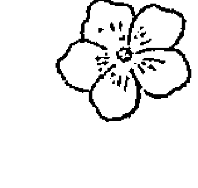

Mustard Sinapis Arvensis

需要歐白芥的人受到週期性極度沮喪的折磨，這種沮喪沒有明顯的理由，也不是任何外在因素引發，但它也會突然消失，正如巴赫醫師的描述：「如同冰冷的烏雲壟罩著他們，掩蓋著光亮與生命的快樂。」他們敘述這種狀態像是內心徹底地空虛，因此，所有的事情突然間都失去了意義，好像有人把電燈關掉一樣，一切都黯然無望。這種狀態也好像是晴空萬里時，突然出現了閃電，心理上出現的症狀包括：憂鬱、悲傷、缺乏動力、因為無緣故的壞情緒轉成的嚴重沮喪。在醫學上，稱這種沒有明顯外在理由的憂鬱狀態為：內源性或內發性的抑鬱。

需要歐白芥的人會如此描述自己：

- 我的情緒常常像天氣一般陰鬱，我也不知道是甚麼原因。
- 不可解釋的悲傷斷斷續續地折磨我。
- 我經常處在憂鬱的階段，沒有任何外在的誘因，憂鬱就出現了。
- 有時候突然烏雲罩頂，籠罩在突如其來、深深的悲傷與憂鬱裡。
- 我有個好先生、兩個正常的孩子、一棟房子還有美麗的花園，我不曉得我的憂鬱是從哪冒出來的。
- 有時候我感覺到我好像被關在一個漆黑的鐘罩裡，無法走出來。

歐白芥類型的人通常內向、身體反應緩慢。這是因為憂鬱的情緒癱瘓了他們的活動力，他們經常從周遭環境中退卻下來，希望單獨面對自己的困難；他們通常缺乏食慾、有睡眠障礙、頭疼，身體上還會出現很難用正確的語言去定義的不適感。但是上述這些症狀，不一定都會出現在歐白芥病人身上。在一些病情輕微的病例當中，很有可能沒有任何症狀，卻只是無緣由的憂鬱，這應被視為歐白芥狀態的線索，特別是在病情不明確時。

基於這個理由，高茲．布洛姆推薦我們，在潛伏性憂鬱症出現時使用歐白芥，這是一種隱藏的、病人不自覺的憂鬱狀態，會導致醫學病理檢驗檢查不出病因的身體失調現象，它們被視作疾病的起因。他寫道：「在潛伏性憂鬱症中，我們推薦使用歐白芥。透過對病人整體性地密切觀察，我可以從身體症狀，看到憂鬱的成分……原則上，有機體總是試圖將心靈層次無法解決的問題轉移到身體上，或使它被意識捕捉到。」在此我要特別提出，大多數對潛伏性憂鬱症的診斷經常是不正確的，因為以自然醫學的方式診斷，多數個案都可以找到疾病發生的原因。

與歐白芥的憂鬱相反的狀態是龍膽的憂鬱，那是我們找得到原因或外部事件所導致的沮喪感，它們因此被稱為是外源（從外部而來）、反應性（透過環境中的刺激）所產生的憂鬱。

歐白芥的狀態是先前石楠狀態的後果。石楠類型的人，在別人的身上尋找他們其實只能在自己靈魂深處才能找得到的信賴，這信賴可以克服溝酸醬狀態的恐懼。因為外在世界無法為他們提供這種最深的信賴感，因此在失調的狀態下，生出了一種感覺，讓他們自覺哪裡不對勁，卻又不知道那不對勁到底是什麼。這些人與高我的連結受到了阻礙，無法從內在的源頭找到力量，因此內心產生了一種不知打哪來的空虛感，因為他們並不是有意識地感受到這個空虛。

## ◇ 第十二花軌 ◇

- ✿ 溝通花精 → 鐵線蓮 CLEMATIS
- ✿ 補償花精 → 鳳仙花 IMPATIENS
- ✿ 失調花精 → 歐白芥 MUSTARD

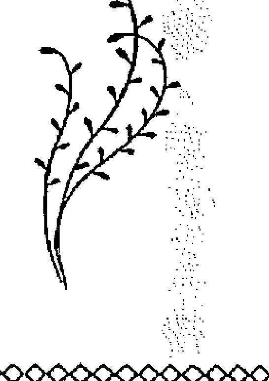

## 鐵線蓮 { 溝通花精 }

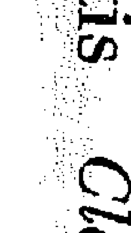

Clematis Clematis Vitalba

鐵線蓮類型的人是做白日夢的專家，他們經常心不在焉地、睜著眼睛做夢，而且他們活在幻想世界的比例，比活在現實的世界還多。他們鮮少對當下發生興趣，而是從「冷酷」的現實中逃到夢想的世界，那裡的一切看起來更美好、更和諧。他們對周遭世界提不起興趣，也顯得漫不經心，經常給人一種睡眼惺忪、或是人在心不在的印象。這些也可以從常常發生在他們身上的小事得到印證，例如：跌倒、絆倒或在哪裡被勾到，不小心碰撞到別人或東西掉落地面，在鐵線蓮類型的孩子身上特別容易觀察到這些行為。

基本上他們對外在的事物缺乏興趣，所以他們的思緒經常漫遊四方，工作的時候不專心，很容易分神，而且非常健忘。有些時候，他們的夢想世界與想像世界佔據了他們的身心，讓他們很難去應付真實的生活。

一旦生病了，他們很少認真努力地讓自己再度復原。相反的，他們常常給人一種印象，他們利用生病來逃避現實世界。對他們來說，躺在床上、沉浸在夢中，比待在真實世界舒適、安逸，也更具有吸引力。他們習慣很長的睡眠時間，因為他們不認為自己會錯失什麼，他們最想要從社會生活當中抽身，單獨地讓幻想與他們作伴。

鐵線蓮類型的人如此描述自己：

- 我經常陷入沉思當中，通常思考的不是真實的事件，而是想像與夢想。
- 我經常沒有注意到我周遭發生的事情。
- 我恍恍惚惚地做著手邊的事，因為經常自顧自地做夢，夢想我得不到、卻想要擁有的東西。
- 對於未來，我有非常多的憧憬。
- 我總是夢想能夠把所有的事做得更好更完美；有時候我會夢想讓世界變得更好。
- 即使在人群中，我還是在想自己的事，完全沒有意識到我周遭發生什麼事，經常會因為有人問我問題，而把我嚇一大跳。
- 當熟識的人邀請我們去作客，回家後我的丈夫會罵我，因為我根本沒有加入大家的談話，只是陷入自己的空想狀態。
- 看電視的時候，我經常沒有跟上節目的內容，因為我的思緒完全在外。
- 我開車經常因為不留神而開錯了路。
- 在開始工作之前，我會胡思亂想一陣子，因而進度落後，事後總要快馬加鞭把事情完成。
- 我漸漸地陷入絕望中，因為我的工作毫無進展，主要的原因是我的思緒經常跳到別的地方，做起白日夢。
- 有一次我魂不守舍地先拿牛奶到地下室，之後又端進房間，最後我才想起我是要把牛奶端到廚房。
- 我經常忘記約會，因此很多人都將日記當作禮物送給我。

鐵線蓮、忍冬、白栗花以及栗樹芽苞類型的人都有過度活躍的思緒，四者的差異在於當事人的念頭關注的內容有所不同。上方表格清楚地比較出這些花精。

鐵線蓮的主要症狀之一是缺乏動力，同樣的症狀也會出現在野薔薇、角樹與橄欖、歐白芥的狀態上面，但導致這症狀的先決條件卻完全不同。我們可從下頁的對照表當中，看出其中的分別。

| 鐵線蓮類型 | 忍冬類型 | 白栗花類型 | 栗樹芽苞類型 |
| :--- | :--- | :--- | :--- |
| ◎幻想，夢想，白日夢。 | ◎懷舊，渴望過去美好的時光。 | ◎糾纏不休並無法屏除的思緒。 | ◎計畫，腦裡想著比目前執行的計畫還要快兩步的點子。 |
| ◎關於未來的想法。 | ◎關於過去的想法。 | ◎強迫性的想法，持續不斷的內在對話。 | ◎關於下一步要做什麼的想法。 |

| 鐵線蓮類型 | 野薔薇類型 | 角樹類型 | 橄欖類型 | 歐白芥類型 |
| :--- | :--- | :--- | :--- | :--- |
| ◎常生活在想像的世界，對目前的現況沒有興趣。 | ◎放棄希望，內心舉白旗投降，任何事情似乎都沒有了意義。 | ◎心智上過度耗竭，筋疲力盡只想睡覺。 | ◎徹底的疲憊感，目前無法完成任何耗費體力的活動。 | ◎在憂鬱期間，動力全無。 |
| ◎長期的狀態。 | ◎時間長短取決於外在的狀態。 | ◎通常是急性症，也可能成為長期狀態。 | ◎急性的狀態。 | ◎暫時的狀態。 |

鐵線蓮的人通常會有視力以及聽力的障礙，身體試圖透過這些症狀，表達他們對外在世界缺乏興趣。循環系統的問題、手腳冰冷、膚色蒼白也顯示當事人沒有積極參與生活。另外，因為他們沒有賦予生命特別的意義，因此死亡對他們來說有某種吸引力，愛德華·巴赫醫師針對這點寫道：「有一些案例甚至樂見死亡，期待著更美好的時光——或者他們懷抱著希望，能夠再度與某些人會面，這些人因為死亡，痛失所愛。」

鐵線蓮花精可以消除人們精神恍惚的狀態，因此在一些失去知覺、昏厥、虛脫的病例中會起相當寶貴的作用，它幫助人恢復身體的意識，因此在緊急的狀況下甚至可以挽救生命。出於此因，它是救援花精的主要成分之一。（請參考第六章〈救援花精〉）

## 鳳仙花 { 補償花精 }

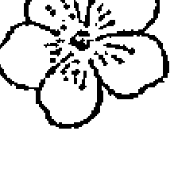

Impatiens Impatiens Glandulifera

這裡的鳳仙花狀態，是由鐵線蓮的狀態發展出來的補償狀態。它的症狀與我們先前在「鳳仙花—橄欖—橡樹軌道」中，所描述的鳳仙花狀態並沒有任何差異。但是在不同的階段，鳳仙花狀態的差異在於：在補償的狀態下，當事人並不是天性急躁。他是由長期處在心不在焉、逃避到幻想世界的鐵線蓮狀態發展出來的。鐵線蓮類型的人經常在瞥見手錶的那一刻，突然從白日夢裡驚醒，他們痛苦地察覺到，因為精神恍惚，浪費了很多的時間，現在得在短時間內，將荒廢的工作進度追回來。

透過這種不得不的忙碌，他們很快被拉回到現實生活裡，他們必須完成任務，否則不能再度逃避現實。由於是自己造成這種匆匆忙忙的狀況，難免會有擦槍走火的反應，他們急躁、快速地完成工作，以便盡快結束這段進入現實世界的短暫旅程。如此一來，原本是被動的、內向的陰極狀態，產生了一種過度活躍、外向的陽極狀態，也就是以鳳仙花為標記。

## 歐白芥「失調花精」

Mustard *Sinapis Arvensis*

外在環境強迫當事人急急忙忙地完成工作，以彌補因沉浸於白日夢而疏忽的事情。由於必須盡快將工作完成，以便再次進入幻想世界，因此產生了先前補償狀態下的急躁工作方式。這看起來是個沉重的負擔，使得當事人難以橫跨冷酷的現實與完美的夢想世界之間的落差，他們的生活變得更加困難。

當事人在現實的日常生活中，隨著時間的流轉消逝，產生了一種不確定的、無法定義的失落感。在越來越少有時間做夢，或越來越不能實現夢想的情況下，失落感就越來越強烈。他們只是感覺到失落了什麼，卻又無法意識到自己到底失落了什麼，這就會引致當事人進入失調的階段——一種空虛感，正如我們在「溝酸醬—石楠—歐白芥軌道」中描述的一樣。日日的憂鬱與沮喪，將內心的空虛帶到意識表層，象徵著那條通往心靈深處真正喜樂泉源的通道，已經被堵死了。

# 关于印发《关于进一步规范和加强中央企业采购管理工作的指导意见》的通知

各中央企业：

为深入贯彻落实党中央、国务院关于深化国有企业改革的决策部署，进一步规范和加强中央企业采购管理工作，提升采购效率和效益，防范采购风险，根据《中华人民共和国招标投标法》、《中华人民共和国政府采购法》等法律法规，我们研究制定了《关于进一步规范和加强中央企业采购管理工作的指导意见》。现印发给你们，请结合实际认真贯彻执行。

附件：关于进一步规范和加强中央企业采购管理工作的指导意见

国务院国有资产监督管理委员会
2023年X月X日

# 关于进一步规范和加强中央企业采购管理工作的指导意见

为深入贯彻落实党中央、国务院关于深化国有企业改革的决策部署，进一步规范和加强中央企业采购管理工作，提升采购效率和效益，防范采购风险，根据《中华人民共和国招标投标法》、《中华人民共和国政府采购法》等法律法规，现就进一步规范和加强中央企业采购管理工作提出如下意见。

## 一、总体要求

（一）指导思想。以习近平新时代中国特色社会主义思想为指导，全面贯彻党的二十大精神，坚持市场化改革方向，以提升采购效率和效益为核心，以防范采购风险为底线，建立健全科学、规范、高效的采购管理体系，推动中央企业高质量发展。

（二）基本原则。
1. 坚持依法合规。严格遵守国家法律法规和政策规定，确保采购活动合法合规。
2. 坚持公开透明。推进采购信息公开，接受社会监督，确保采购过程公平公正。
3. 坚持竞争择优。充分发挥市场竞争机制作用，择优选定供应商，提高采购质量。
4. 坚持降本增效。优化采购流程，降低采购成本，提升采购效益。

# Chapter 4
基礎花精

## 落葉松【基礎花精】
Larch Larix Decidua

落葉松類型的人，自認自己不如他人能幹。由於缺少自信，他們懷疑自己的能力，讚嘆別人的成功。害怕失敗不斷地折磨著他們。面對較大的挑戰或考驗等情況時，他們容易失去勇氣、提早放棄。有些人百分之百確信自己是無能的，甚至很多事情都不願意嘗試，因此他們周遭的人會認為他們懦弱無比。面對他人時，他們覺得自己矮人一等。與他人交往時會害怕出糗、害羞與壓抑自己。自卑感讓他們強烈地敬畏權威，並甘心臣服。他們在面對批評與責備時都過度敏感，在錯愕之下會有很激烈的反應，同時可能會大發雷霆。

需要落葉松的人會如此描述自己：

- ❖ 我懷疑能否達到對自己的期許。
- ❖ 我對自己信心不足，成功時我常感到很吃驚。
- ❖ 很多事我都不敢去做，而且我有很強烈的自卑感。
- ❖ 我害怕失敗。

落葉松類型的兒童十分害羞、容易臉紅，有時會緊張到說不出話來。如果不是因為受到驚嚇而引起的口吃，通常就是處在落葉松狀態，如果小孩有學習的障礙，特別要記起這朵花。

落葉松也是治療陽痿的主要花精，即使在治療陽痿的當下，並未發生損及當事人自尊的事情，或是自尊在此障礙形成的因素裡，還不是扮演重要的角色；然而陽痿遲早會導致自尊的失落，因為父權社會中假定男性的性功能就等於權力與力量，因此床上的失敗者，就是徹底的失敗。

- 我經常不敢主動跟女人說話。
- 我不敢去公家機構，經常委託別人去。
- 我對還沒發生的事情感到焦慮。
- 我特別害怕來到我生命中的新事物。
- 當我開車到我不認識的地方時，我會感到不安，甚至會害怕找不到路。
- 考試的前幾週，我就被恐懼考試的心情折磨。
- 有別人在場的時候，我會擔心我的國語不夠標準。
- 我笨手笨腳的。
- 當我還是個孩子時，我就放棄了運動。
- 當我沒有完成事情時，會覺得自己像個笨蛋。
- 我有時候感覺自己沒有價值。
- 我有陽痿。
- 我對批評與責備都十分敏感。

| 落葉松類型 | 龍膽類型 | 水蕨類型 | 榆樹類型 |
| :--- | :--- | :--- | :--- |
| ◎因為不相信自己做得到而懷疑自己會成功。 | ◎擔心事情會出差錯。 | | |
| ◎懷疑自己「有能力」做些甚麼。 | | ◎懷疑自己「應該」能做些甚麼。 | |
| ◎因為懷疑自己的能力而預期失敗。 | ◎由於不幸的際遇而預期失敗。 | | |
| ◎害怕考試；考前幾週就開始焦慮，考期日益接近，焦慮與日俱增。 | | | ◎害怕考試；在應考時或應考前，突然感到非常焦慮。 |
| ◎外顯行為是氣餒，還沒開始就已放棄。 | | | ◎外顯行為是應考時「腦中一片空白」，所學的一切全部忘光。 |
| ◎起因：缺乏自信。 | ◎起因：悲觀的態度。 | ◎起因：不相信自己的觀點。 | ◎起因：一時期望過高。 |

落葉松與龍膽、水蕨、榆樹有特定的相似之處，但是它也可以容易地區分出來，如右頁對照表所示。

落葉松狀態根植於人格當中，但是也可能是因為外在的影響而發生，尤其是小孩子在幼年時缺乏來自周遭的肯定，或是當事人被灌輸負面的信念。「你還小，這個你不會」這類的措詞如果聽多了，小孩就將他們內化到骨子裡。某些情況下，他們會不假思索地依照這個信念作出反應，很多事就不再去嘗試。「我辦不到」這個信念，就像魔咒一般烙印在他的意識當中。當父母親說「你這小笨蛋」之類的話時，並沒有惡意，卻經常在孩子心中留下痕跡。小孩從年長者與「有經驗的人」那裡聽到的一切，都不假思索地當成真理放到心上，毫不懷疑地接受。當事人在不知不覺中相信自己在智力上不如別人。

有個病人曾經告訴我，他的母親在他小時候告訴過他：「你有兩隻左手！」（意指笨手笨腳）這句話是不合理的。這位病人長大之後，在手工藝上展現了極大的天賦。過去他的母親拿年幼的他與身為成人的父親比較，父親當然擁有比較靈巧的雙手。

我們不應該把自己的標準擺到孩子身上，而必須依照孩子的狀況來調整標準，也要建立並強化他們的自信。相對於一味責備，我們應該要養成習慣以正面的方式去鼓勵他們。「剛開始這樣就很不錯了，如果你多加練習就會做得更好。」正向的話語比起毀滅性的批評，更能鼓舞小孩。

我稱落葉松為基礎花精，是因為許多負面情緒的起因源自於缺乏自信。落葉松無法被歸類於任何特定的花精軌道中，卻可以與軌道當中的每一種花精結合使用。我們可以依照當事人的狀況加入此花精。落葉松花精與溝通花精結合使用時，會得到最大的效果，因為它會強化溝通花精的功效。

| 落葉松類型 | 冬青類型 | 楊柳類型 |
| :--- | :--- | :--- |
| ◎讚嘆他人的成功。 | ◎羨慕他人的成功。 | ◎因自己的失敗感到懊惱。 |

下列例子可以更清楚說明：

- 單獨給予落葉松花精可以強化自信。
- 落葉松與松樹花精結合使用，可以加強自信，同時也可以減輕罪惡感。
- 落葉松與矢車菊花精結合使用，不但可以幫助當事人重新獲得自我意識，也更容易建立起他的意志力。矢車菊花精的功效在與落葉松花精結合使用之下，基本上會比單獨使用，更快起作用。

落葉松作為基礎花精，特別適合與強調陰極（陰陽兩極中的陰極）的溝通花精結合使用，例如：龍芽草、矢車菊、水蕨、龍膽與溝酸醬。

## 关于印发《关于进一步加强和改进新形势下高校宣传思想工作的意见》的通知

各省、自治区、直辖市党委教育工作部门、教育厅（教委），新疆生产建设兵团教育局，有关部门（单位）教育司（局），部属各高等学校党委：

现将《关于进一步加强和改进新形势下高校宣传思想工作的意见》印发给你们，请结合实际认真贯彻执行。

1. 高校宣传思想工作队伍是高校思想政治工作的重要力量，包括学校党政干部和共青团干部、思想政治理论课教师和哲学社会科学课教师、辅导员和班主任、心理咨询教师等。
2. 要按照政治强、业务精、纪律严、作风正的要求，着力建设一支信念坚定、师德高尚、业务精湛、结构合理的高素质宣传思想工作队伍。
3. 要完善选拔、培养、激励机制，在职称评定、岗位聘用、评优奖励等方面给予倾斜，吸引优秀人才从事宣传思想工作。
4. 要加强教育培训，提高宣传思想工作队伍的政治素质、业务能力和育人水平。
5. 要关心宣传思想工作队伍的成长发展，帮助解决实际困难，增强他们的职业认同感和归属感。

中共中央办公厅
国务院办公厅
2015年1月19日

# Chapter 5
外在花精

## 伯利恆之星 {外在花精}
Star of Bethlehem Ornithogalum Umbellatum

伯利恆之星可以運用在所有難以處理的困境，例如下列情況：

- 心理衝擊。
- 巨大的悲痛。
- 心靈困境。
- 遭受打擊之後。
- 不幸事件／意外之後。
- 失去家庭成員。
- 聽到壞消息之後。
- 過去事件的衝擊造成的後果：如童年的震驚、出生創傷、懷孕。

生理上的傷害也適合使用伯利恆之星，因為這些驚嚇經驗，也會在受傷的身體細胞上呈現出

## 伯利恆之星【外在花精】
Centaury Centaurea Cyanus

伯利恆之星類型的人因為曾經受到傷害，因此變得脆弱。心靈上的衝擊留下了深深的傷口，每個新的創傷都會掀開舊傷口，會讓已經發生的痛苦加劇，他們耐受力的門檻因此日漸低下，漸漸地連一件小事就煩惱不已。在極端殘酷的情況下，甚至會產生歇斯底里的反應。

需要伯利恆之星的人會如此描述自己：

- 我感到非常失望。
- 我經常一整天都無法忘記不愉快的事情。
- 我常常回憶起過去不愉快的事件，有時甚至會以夢的形式出現。
- 一想到過去的事，我經常會掉淚。
- 小時候我目睹過意外事件，至今記憶仍然揮之不去。
- 曾經有醉漢進入到我的汽車裡，我嚇壞了，這事情困擾我很長一段時間。
- 我叔叔過世之後，我覺得內心空虛，沒有什麼可以填滿它。
- 過去，我被母親揍得很嚴重，至今我仍然無法釋懷。

心靈上的衝擊會混亂整個能量系統，如果不去處理，這個衝擊的信息會持續停留在能量系統上，導致各種功能系統的混亂。出於這個理由，伯利恆之星狀態需要被理解為是一種治療的關卡。驚嚇發生在多久以前並不重要，被遺忘的童年驚嚇、出生創傷、甚至在母胎期的心靈創傷，都可能在日後生命的某個階段引發一段明顯、又意識得到的一連串混亂現象。

托瑪斯·凡尼（Thomas Verny）博士寫道：

> 嬰兒誕生的過程，是孩子經驗到的第一個在心靈上及肉體上的創傷經驗，而小孩也從來不曾完全遺忘。胎兒時期，他們在感官上經驗了難以描述的愉快時光：母親溫暖的羊水包裹他的每一寸肌膚，體驗母親肌肉的按摩。誕生時，溫暖歡愉的時光頓時消失無蹤，取而代之的是巨大的疼痛與害怕……
> 前一刻他還愉悅地漂浮在溫暖的羊水中，下一刻他被推進產道，遭受持續數小時的嚴酷磨難。最可怕的考驗是母親子宮的收縮，那就像使用鐵砧猛力地捶打著胎兒……我們只能猜測想像那是多麼巨大的收縮力量；最近進行的X光研究顯示，隨著每一次的子宮收縮，胎兒拼命地揮打胳膊與大腿，宛如在做垂死掙扎。

出生記憶的主觀體驗，可以透過再生治療、重生治療以及催眠等回溯技術重新啟動，這些回溯經驗，也證實了凡尼博士的觀察。嬰兒誕生時的感覺經常是具有創傷性的，例如：與母親分離、被驅逐的感覺；寒冷吵雜、過度明亮的房間；被陌生人觸摸以及無助地被擺佈的感覺。

有關母胎期的創傷，托瓦·德雷夫森（Thorwald Dethlefsen, 1946-2010，德國人，超個人心理學和再生療法的代表人物）寫道：「相對於出生前的經驗，童年早期的經驗簡直像是無關緊要的小插曲。」胎兒在腹中時完整體驗到母親的經驗，它直接參與母親的感受，同步體驗她的害怕、擔憂、苦惱與痛苦。胎兒特別能感受到母親對它的態度，對於她在她體內發展出的新生命，是感到喜悅呢？還是她排斥這個小孩（經常是無意識的）？或者母親會企圖墮胎卻沒有成功？在母胎中所體驗到卻未被意識到的記憶，會影響往後的生命，下面便是個活生生的例子：

我年輕的時候不用看譜就可以演奏出某一首曲子，這非比尋常的能力，令我感到十分驚訝。那時我第一次指揮某一樂章，突然間，大提琴聲部歷歷出現在我眼前，在尚未翻頁前，我就知道整個音樂接下來的模樣。有一天，我對身為職業大提琴手的母親提到這件事，我想她會很驚奇，出現在我眼前的總是大提琴的聲部。但是當她聽到是哪些樂曲時，謎底揭曉了，那些我不需要樂譜就記得的篇章，都是母親懷我時經常演奏的樂曲。

我兒子出生之後，我也經歷了類似的現象。當我對兒子唱起那首在他出生前，我與太太幾乎天天對著腹中胎兒唱的歌時，他會馬上安靜下來；當我對著兒子唱另一首歌，雖然音調類似，他又開始哭叫起來。

受孕時的傷害，例如：因強暴而受孕，這會影響當事人（孩子）日後的生活，以及未來的性行為。這類因為外來因素而在當事人身上留下的創傷，也可以使用岩薔薇加以治療。下頁表中將伯利恆之星與岩薔薇做比較，可以更清楚看出兩者的不同。

急性受驚與受創的情況，我們通常使用救援花精。那是一種已經調配好的複方，配方中包含了上述兩種花，適用於所有的緊急狀況。在所有沒有療效回應的治療，都應考慮使用伯利恆之星，因為病痛的背後很可能藏著更深層的心靈創傷。

下列的身心疾病，也經常是因創傷引起的，然而當事人目前的狀況，讓他無法意識到這個壓抑在潛意識裡的創傷：

- 精神官能症。
- 歇斯底里症狀。
- 甲狀腺疾病。
- 神經性吞嚥困難。
- 功能性心臟疾病。
- 支氣管哮喘。
- 性功能障礙。
- 頻尿。

每個人在生命的某段時期，一定都會遭受到心靈上的創傷，許多治療師在調配第一次巴赫花精複方時，原則上都會加入伯利恆之星，以便一開始就消除由創傷所造成的治療障礙。

| 伯利恆之星類型 | 岩薔薇類型 |
| --- | --- |
| ◎心靈創傷。 | ◎恐慌與致命的恐懼。 |
| ◎例子：親眼目睹事故，看到受重傷、血跡斑斑的事故受害者。 | ◎事故的當事人，雖從死裡逃生，卻被嚇癱了。 |
| ◎極陰狀態。 | ◎極陽狀態。 |
| ◎此急性驚嚇狀態與使用鴉片進行同類療法的情況有某些相似之處。 | ◎此急性害怕狀態與使用烏頭進行同類療法的情況有某些相似之處。 |
| ◎結果：能量系統受到阻塞，會產生隨之而來的傷害。 | ◎結果：恐懼被壓抑下來，造成補償性的龍芽草狀態。所導致的傷害通常會到失調階段才看得出來。 |

## 榆樹【外在花精】
Elm Ulmus Procera

急性的榆樹狀態出現在以下的情況：外在環境提出過多的要求，因此當事人不堪負荷、無法勝任。通常這些人都是能幹、有效率的人，常常不費吹灰之力就可以完成任務；但是現在，他們卻覺得工作幾乎要把他們壓垮了。這個不勝負荷的感覺，可能是周遭環境過度的要求（例如：考試、職位晉升、面對截止日期的時間壓力、突然意識到必須獨自一人扛起重擔……等等狀況），其中也包括了對自己的要求過高（馬鞭草類型的人），讓自己設定的成就壓力壓垮自己。

需要榆樹花精的人如此描述自己：

- 我此時此刻覺得自己無法達到已經設定好的要求。
- 不論主觀或客觀，對我而言都已經超出負荷，我就是完成不了。
- 此刻我害怕無法完成被託付的任務。
- 此刻，我完全無法完成被託付的工作。有這麼多的事得做，我根本不知道要打哪下手，完全崩潰了。
- 新的任務讓我毫無喘息的空間，我想我受不了了。
- 我老是在想接下來必須做甚麼事，這讓我感到十分緊張、甚至到夜裡也無法入眠。
- 我眼前的工作像是一座無法攀越的高山。
- 在學校時，我的腦筋經常一片空白，突然不能集中注意力。
- 考試時我總是害怕、感到不安，然後甚麼都記不得了。
- 平常我是個能力很好的人，考前也不害怕；但是在考試面試當天，平常知道的事情一件也想不起來。
- 在面試時我突然變得膽小，一句話也說不出來。
- 突然必須幫別人代課，讓我無法很快適應，因此感到相當沉重的壓力。突然接下代課這種事，我很不在行，經常不知所措地站在班級面前，不知該怎麼辦。
- 如果我在比賽前看到對手，並清楚察覺自己即將面臨的挑戰並不輕鬆時，那麼那一次上場，我會頭腦一片空白，表現比練習時來得差。另一次比賽前，我戴上了隨身聽在戶外散步，轉移自己注意力，在那一場比賽，我就表現得很好。

需要榆樹的人是由於一時過高的要求，短時間內喪失了自信；而落葉松類型的人則是一直懷疑自己的能力。與橄欖和角樹症狀相反的是，榆樹狀態的無力感僅發生在要求過高的情況下，所引發的無法勝任感。這個狀態會在出乎意料之外、戲劇化的情況下出現，在極端的狀況下當事人甚至會虛脫。榆樹狀態的基本特徵是心理上突然失能，部分則會以生理上失去力量的方式展現出來。

下列狀況也可能伴隨榆樹狀態出現：

- 神經性的吞嚥困難。
- 注意力不集中。
- 強烈的緊張感。
- 虛脫。
- 心悸。
- 神經衰弱。
- 突然感覺無力。

## 胡桃【外在花精】
Walnut Juglans Regia

胡桃是迎向新生的花精。它減輕人們在經歷生命巨大轉變過程時，脫離舊有事物，並且接納新事物時的不適應感，從而進入新的生活。它也被稱為「突破花精」（Breakthrough Flower）。

> 「它是一朵幫助我們成功穿越過渡階段的花。讓我們毫無遺憾地揮別過去、無懼未來，因而解除在大轉變時，思想上、生理上隨之而來的壓力。」

胡桃對內在轉化的階段、荷爾蒙的調整以及智力發展的過程，都十分有幫助。典型的運用範圍是：

- 遷居。
- 職業變動。
- 轉學。
- 離婚。
- 改變宗教信仰。
- 退休。
- 大病初癒。
- 殘疾。
- 長牙。
- 青春期。
- 更年期。
- 中年危機。
- 懷孕。
- 出生。
- 死亡。

需要胡桃的人如此描述自己：

- 我要搬家，但我還不是很喜歡新居。
- 我想要辭掉工作，開始新的生活。雖然內心早已辭職，我卻還無法下定決心。
- 我目前處在劇烈變動的階段，內心對新的生活還無法真正接受。
- 我想要有新的開始，卻執著於過去。
- 我面對所有新的事物都感到不安。

溝酸薔薇類型、落葉松類型與胡桃類型的比較：

| 溝酸薔薇類型 | 落葉松類型 | 胡桃類型 |
| :--- | :--- | :--- |
| ◎害怕新的情況。 | ◎害怕出糗、失敗。 | ◎無法適應新環境。 |
| ◎原因：害怕。 | ◎原因：缺乏自信。 | ◎原因：無法堅定志向。 |

溝酸薔薇類型與落葉松類型的人，在面對新環境時也有困難。上方的表格幫助我們區分此三朵花的不同之處。

是什麼原因導致一位人格穩定、性格堅強、一向不容易出現不確定感的人，變得無法堅定志向？他們深受眼前即將發生的改變所影響，因此也勢必要對此做出反應。例如：如果有位丈夫想要換工作，他身為家庭主婦的妻子也會因此深受影響，因為她得冒著經濟上的風險，甚至可能失去社會地位，或者失去與過去同事們的妻子之間的往來。當事人不止必須斟酌自己的決定，同時也要能夠說服周遭的親友。這時會出現一種風險，那就是他人好心的建議，會使得他們心神不寧。光是考慮社會的標準、主流的習俗和道德規範，就已經難以做出決定並付諸實行了。

高茲·布洛姆描述這種胡桃狀況，是我們內心需求與外部壓力之間的衝突。這時胡桃可以幫助一個人忠於自己，根據自己的信念去行動。胡桃提供一件厚盔甲，保護個人不受外來干擾的影響，同時能夠逆流而上，幫助我們抵擋外界的力量。如同矢車菊，胡桃一樣可以保護我們不受精微能量層的影響，也幫助敏感的治療師免於感染到病人的症狀。不同的是，矢車菊的影響（經常在不知不覺當中）在於流失過多的能量給周遭的人。當有能量不足的人在場時（例如病人），矢車菊類型的人通常會有被掏空的感覺，出現一種無法解釋的虛弱狀態。

胡桃也幫助人度過內心的轉化期，例如青春期、更年期，以及處理來自內在的衝動。它可以協助個體更容易面對心靈轉化的過程，幫助人順利地迎向下一個新生命階段。女孩在青春期變成了女人，這個過渡階段常會引發恐懼，導致象徵內心衝突的生理症狀。粉刺是這個生命階段的典型症狀，它代表著人類對剛萌芽的性慾背後，藏著無意識的恐懼。那張被青春痘扭曲的臉，會讓異性避之唯恐不及，如此一來便可以避免可能引發恐懼的邂逅。粉刺以這個方式保護個體不去面對性慾。線球草象徵著內心在受新事物的吸引與恐懼之間的拉扯狀態，而酸蘋果的狀態則是線球草的失調階段，性慾在此被視作骯髒的東西，人們會因為性幻想而感覺到內在的不潔（在這個生命階段是不可避免的）。這種感覺也以皮膚不潔的形式表現出來，酸蘋果與胡桃結合使用，是青春期問題的主要良方。

更年期的失調症狀，暗示心靈上無法處理進入新的生命階段時的轉變。喪失生殖力經常與失去女性魅力劃上等號，因而產生了一種害怕失去吸引力的恐懼，擔心自己不再是男人所傾慕的對象。荷爾蒙分泌的減少被視為令人擔憂的事，它引發了一種性感不再的想像；身體嘗試透過潮熱來象徵這個女人依然「火辣」，由於多數身體的語言並不能被理解，因此開立荷爾蒙的藥方。潮熱停止，問題看似解決了，但這只是個假象。因為真正的問題是個體如何面對性；這問題在心理與精神的層面上依然存在。如果當事人以「我們已經過了那年紀」為道德藉口，嘗試逃避問題時，可以額外加入岩水花精。把逃避性的問題當成美德，並無法解決問題，也成了老古板。倘若要在這困難時期增強自信，我們也可以考慮額外增加落葉松花精。

## 金雀花【外在花精】
Gorse Ulex Europaeus

金雀花幫助那些經歷許多失敗、看似沒有出路，因此失去勇氣的人。那些經歷過長期病痛折磨、看不到復原希望，因此失去了信心的病人，也可以使用金雀花花精。這些人感到絕望，對他們來說一切都顯得空虛與沉悶。他們多方嘗試、挫折不斷，以致於什麼都不想要了。任何更進一步的努力，對他們來說都無意義，因為他們相信沒有人幫得了他們。他們不再抱怨病痛，因為抱怨看來也無濟於事。有時，他們會為了不辜負家人的好言相勸，因而姑且嘗試，但他們開始嘗試時，內心深處卻覺得這些努力其實毫無用處。

金雀花類型的人通常有張蒼白的面孔，眼睛下方帶著兩個深深的黑眼圈。他們如此描述自己：

- 我內心感到無助、悲傷，我覺得沒有任何人能夠幫助我。
- 我感覺失落。
- 到了這無望的境地，我徹底絕望了。
- 我深感內心陷入泥沼。
- 我得了不治之症，沒有任何康復的希望。
- 當我得知這一消息，我徹底感到失望，並且害怕自己會爆炸。
- 我是個無可救藥的病人。
- 除了我以外，沒有人像我一樣受這麼多病痛的折磨。

| 龍膽類型 | 金雀花類型 | 甜栗花類型 | 野薔薇類型 |
| :--- | :--- | :--- | :--- |
| ◎容易灰心，很快就放棄希望。 | ◎失去勇氣、不抱希望、絕望。 | ◎極度絕望，看不到任何出路。 | ◎聽天由命，向命運屈服。 |
| ◎懷疑、不信賴外界的幫助。 | ◎放棄並等待外界有所改變。 | ◎無力感，不知道還可以做什麼。 | ◎放棄希望，對生命已無所期待。 |

以治療師的觀點來說，金雀花類型的當事人是十分難處理的個案。對於這些不抱康復希望、不相信病痛可以緩解，甚至不是出於自己意願來求診的人，我們能做些什麼呢？他們心裡抗拒治療，就是走向健康大道的最大阻礙。旁人通常會感覺到，這次的治療對他來說，似乎只是為了向家人再次證實治療終究會失敗。他們早在治療之前，就在心中輸入了療癒必然會失敗的心理程式。如果治療的效果與預期相反，出現了小小的成效，他們經常會要求中止治療，理由是「再多努力都是不值得的」。他們已經習慣在餘生中，忍受疾病所帶來的痛苦。

金雀花可以幫助他們排除心理障礙，好讓治療繼續進行。因為他們內心緊抓著病症不放，這可視為疾病不能治癒的真正原因。金雀花扮演了情緒的音調調諧器，因此在慢性及逐步惡化的疾病裡、康復過程中出現停滯、或是治療無效時，都應該嘗試使用金雀花花精。

金雀花在某個程度上與龍膽、甜栗花、野薔薇有相似之處，我們以絕望情緒的強烈程度來對比這些花朵的症狀，可以清楚認識各個花精不同的特質（見上方表格）。

補償性的馬鞭草狀態隨之而來，這代表當事人為了逃避內心的焦慮，過著極度外向、多彩多姿、活動不斷的生活。然而，如果這些人突然遭受命運無情打擊時，他們會產生極度絕望的反應，這是因為他們早活在壓抑和忍受巨大的情緒壓力的狀態下，至今忍無可忍，因而進入甜粟花的狀態。

野薔薇的狀態是早期龍芽草與龍膽狀態所發展的結果。由於悲觀、負面的預設心理，讓當事人覺得旁人不當地對待他們，或受到命運的愚弄。這負面思考導致他們害怕的情形一再出現，最後，他們成為自己害怕之事的犧牲者，而必須屈服於無可避免、不可改變又看似難以脫逃的命運之下。以至今日，他在面對所有的事情時，都只能看到、並預期負面情況，如果真有嚴重的事情發生，聽天由命便成為他唯一的選擇。

然而，金雀花狀態出現的原因，是因為挫敗不斷、成功已然無望。

至於龍芽草類型的人，在相對應的情境下，會發展成金雀花狀態或是甜粟花狀態，是取決於龍芽草狀態的當事人在臨界點到來之前，他所承受的心理壓力與外部情況的強度。如果他已經處於馬鞭草的補償階段，則會傾向進入甜粟花的狀態，相較之下，那些隱藏人生大問題的龍芽草類型人，則會進入金雀花狀態。

## 白楊【外在花精】
Aspen Populus Tremula

白楊狀態的人活在無法具體描述、模糊不清的恐懼煎熬裡。他們會說，他們感到害怕，卻不知道自己在害怕什麼。有些人備受不祥預兆的折磨，他們想像可怕的災難或大禍即將臨頭，當他們的非理性恐懼增高時，腦袋幻想的恐懼就會糾纏著自己，生活宛若活在地獄。他們幻想出許多令自己害怕的事情，怕鬼是典型的白楊例子，害怕蛇與蜘蛛也屬於白楊的狀況，因為這些動物在我們日常的生活環境當中，不具什麼威脅性，此種恐懼根本完全沒有根據。

白楊類型的人會如此描述自己：

- 我特別害怕我不能直接掌握的東西。
- 無緣由的恐懼折磨我，以前我甚至害怕鬼與黑暗勢力。
- 在黑暗中，我害怕會發生危險。
- 夜裡我躺在床上時，經常感覺到胸悶，然後非常恐懼，但我不知道自己在恐懼什麼。我經常感到害怕，特別是害怕夜裡出現週期性的恐慌。
- 我害怕自己的恐懼。
- 當我獨自一人時，恐懼會毫無理由的出現。
- 我經常因為害怕，不敢出門。
- 我怕黑暗，森林裡的暗處特別令我感到毛骨悚然。
- 走在暗夜的街道上，會將我置身於恐慌當中，於是我就開始奔跑，越跑越感到膽顫心驚。
- 夜裡我經常被惡夢驚醒，驚恐不已。
- 我怕鬼。
- 有時候我有種奇怪的感覺，好像有人站在我背後一般。
- 在城裡，我突然感到暈眩，無緣由地害怕起來。
- 我害怕男人的暴力行為。
- 我怕被強暴。
- 我買了把催淚手槍，因為十分害怕遭到突襲。
- 在醫院裡，我嚇壞了，害怕被下毒，醫生說，我有急性的精神官能症。
- 我害怕有一天會崩潰，雖然我目前十分健康。
- 有時候，我會有可怕的事情即將要發生的感覺，事後證明，擔心是毫無根據的，完全是我想像出來的。
- 如果別人身上發生了可怕的事情，我立刻害怕同樣的事情也會發生在我身上，我甚至可以說服我自己這壞事會發生。
- 我害怕未來。
- 我經常突然惶恐起來，有大禍即將臨頭的感覺，但我也不清楚有什麼禍事會發生。
- 在某些地方，我感到極端不安、有害怕的感覺。也許這跟地表輻射或其他負面的磁場有關。
- 我無法在房間某個地點久留。

白楊與岩薔薇類型的比較：

| 白楊類型 | 岩薔薇類型 |
| :--- | :--- |
| ◎無緣由的害怕。 | ◎真實事件引發的恐懼。 |
| ◎害怕有可怕的事情發生。 | ◎因為有特別可怕的事情發生，而感到害怕（事故、親人過世、重病等）。 |
| ◎詭異的恐懼感不斷加劇，一直到恐懼甚至恐慌的地步。 | ◎因為外部原因驚嚇得要死，陷入恐慌中，嚇得幾乎失去理智。 |
| ◎在黑暗中會驚慌失措。 | ◎在黑暗中被嚇著，陷入恐慌中。 |
| ◎做惡夢，害怕所夢到的東西。夢境中所經歷的恐懼，持續到清醒狀況。害怕又作惡夢，不敢再次入睡。 | ◎做惡夢，因為在夢中經歷了可怕的事情，在驚恐中醒過來。可能在夢境中重新經歷了意外事故或災難。醒過來以後，害怕很快就消失無蹤。 |
| ◎害怕身體暴力，遭到突襲、強暴與虐待。 | ◎遭受過身體暴力、搶劫、強暴或是虐待事件，引發恐懼。 |
| ◎生活在恐懼當中。害怕自己想像出來的事物，會毫無根據地升高成了恐慌。 | ◎慢性的恐懼，真實經歷到令人驚恐的事件，一有類似外部事件發生就容易驚慌失措。 |

## 白楊類型

## 溝酸醬類型

- ◎模糊不清的恐懼：恐懼不明之物。
- ◎害怕具有威脅性的未來即將到來，不祥的預感。
- ◎害怕死亡與伴隨死亡過程而來的事物。
- ◎毫無理由地害怕被搶劫與身體暴力。
- ◎不明原因哭泣的嬰兒。

- ◎對不熟悉但卻可以具體命名的東西所懷的恐懼，例如：度假時的陌生環境或不熟悉的食物等等。
- ◎由於特別的原因害怕未來，例如：因經濟困境、失業與債務。
- ◎害怕死亡，害怕伴隨死亡過程而來的疼痛。
- ◎害怕宵小光顧；害怕什麼東西被偷走。
- ◎嬰兒因某些具體原因哭泣，雖然我們不知道究竟為什麼哭，但能推測出原因，例如：吵雜的聲音、刺眼的光線、陌生人的聲音。

白楊的恐懼與溝酸醬的恐懼性質不同。然而，在一些情況下我們不太容易決定當事人的恐懼是模糊不清的恐懼，還是與具體的恐懼有關，上方的對照表幫助我們作區分。

白楊狀態的特質是針對無法具體掌握的恐懼，在宗教信仰與死亡相關的議題上，特別容易出現這種恐懼。白楊類型的人熱衷這類的議題，也因此強化他們的恐懼。

白楊的圖像混雜著對神秘事物的著迷，同時又害怕它；這個著迷現象又讓當事人特別容易被他們所害怕的對象吸引。恐怖的感覺、雞皮疙瘩、毛骨悚然與毛髮直豎的現象，對這些人而言，正是超自然事物存在的「證明」。他們因此很難放棄這種恐懼感，因為他們下意識地擔憂，如果放棄這種恐懼感，會失去體驗超自然現象的機會。

很多人也有意地助長他們自己的恐懼，因為他們從這種恐怖事件中得到樂趣。我認識一位年輕男子，他為了這個原因半夜去墓地走動。另外有一些人，他們用撲克牌、靈擺或使用占星術，用來預測事故、不幸事件、甚至是大災難的發生。他們生活在自己「預言」即將要實現的恐懼中，這裡有兩個案例：

有個我認識的朋友，如果星座運勢指出當天是意外事故發生的日子，他絕對不開自己的車，如果是感染的風險，他在這天就不打針；另外一位女士絕望地問我，她可以為兒子做些什麼？因為，她在星座運勢上看到兒子難逃一場嚴重不幸的劫難。

這類型的人很容易成為自我錯覺的受害者，更糟糕的是：他們預期的不幸事件，有時確實會發生，這就成了「自驗預言」；這根本不需要負面想法就會發生。根據吸引力法則，就會將所害怕的不幸事件，以一種不可見的方式引發出來。因為密切期待，導致事件發生在當事人身上；當事人透過自己的行為，成了事件的引發者。例如：預期事故發生，因此他小心翼翼地開車，開得格外地慢。他過度小心的行為造成了交通阻礙，刺激了其他的人冒險超車；或是，他以蝸牛般的速度爬行十字路口，尾隨在後的駕駛因為無預期他的龜速，追撞了車尾，造成車道上的事故。事故一旦發生，也許純屬意外，但是此人就把它當成是他「第七感」的明證。從此之後，他所有的預言都被認真看待，而由於他的動機出自恐懼，因此他只會預見壞事發生。

在伴侶關係上，這類的預言也會引發災難性的後果。如果事先預設婚姻會失敗，他就會拼命地找理由。也由於這些人基於這些「啟示」，對伴侶做出許多與事實不符、含沙射影的指責，也因此為婚姻失敗提供了理由。

白楊類型的人特別地敏感，有些人甚至擁有通靈的天賦。通靈的天分若與恐懼結合，會吸引當事人所懼怕的黑暗勢力，這是巨大的危險，因為他真的會體驗到令他感到害怕的無形界東西，而造成了以下的現象：著魔、恐懼的幻象、看見鬼臉與幻覺等等。

這一類的白楊狀況也可以理解成：當事人感受到一種精微能量的影響力量，可是無法將它清楚地歸類，於是這種感知在心理上引發出模糊、無法命名的恐懼。好比說，當我們觸摸一個灼熱的烤盤，皮膚上出現一種我們可以描述的疼痛感，我們的意識會稱它為灼痛感；而當我們感知到星光層的波動時，這波動會在我們身上形成一種感覺，可是在缺乏正確知識的情況下，我們將這個經驗詮釋成恐懼感。敏感的人解釋說，過去，當他們感知所謂的靈界（星光層）會出現害怕的覺知，但是他們現在已不再害怕了，因為現在他們認得這感覺，並且知道如何與之共存。這種短暫的恐懼感對他們而言，不過是與另外的次元空間接觸時的特殊記號，好比是身體皮膚上發生灼熱的痛感，是因為皮膚接觸熱爐子後產生的標記一般。

基於這個理由，請不要試圖去說服白楊類型的人不要恐懼，或是將他們的感知當成是幻覺。縱然他們是出自於恐懼，也確實有過多的想像力，但是他們的想像是來自無形界、精微存在層面的「真實」影響，可是他們無法清楚地意識到這一點。由於此種覺知無法歸類，因此他們將自己的感知，命名為恐懼，並且試圖用他們的想法去詮釋這些無法解釋的、怪誕的感覺。因為（情緒的極端性）刺激了儲存在潛意識的衝動與深沉的恐懼，他們體驗到一種妄想與星光層的混合物。

重要的是：向當事人解釋他們所面臨的情況，並盡可能地向當事人解釋他們感到恐懼的背後成因，幫助他們控制自己身上過度敏感的體質。因為，不被了解的感覺，會在當事人身上造成更多的恐懼，他們特別恐懼自己得孤單地面對這些現象。

換言之，我們必須幫助當事人有意識地從這些神秘現象中解脫出來，換句話說，有意識地「視而不見」；治療者應當協助當事人明瞭：如果他們感到害怕，這害怕會打開自己的頻道接收到靈界訊息，然而這只會帶來傷害，因為靈界的意志會透過恐懼發生作用。只要當事人自恐懼中解脫出來，不再恐懼，這些現象就會消失。

事實上我們從來就不是獨自存在的，整個宇宙間充斥著不可見的震動頻率與存在，時時刻刻圍繞我們身邊，因此沒有任何理由對此感到不安害怕。大自然將我們的感知力侷限在物質層面，好讓我們不必一直面對其他的次元。白楊類型的人必須學習：沒有陷入恐慌的理由，當他們感知到這個次元時，他們應該要嘗試轉移自己的注意力，視而不見，不要把心思放在這些事物上，因為恐懼將會強化他們自己的靈敏度，並創造出與所見之物的連結。唯一可以幫助他們的是：有意識地脫離它們。

上面所敘述的白楊狀態十分少見，但十分地戲劇化。最常出現的白楊式的恐懼較為溫和：當事人抱怨模糊、不明確的恐懼，或是對黑暗的恐懼。這些恐懼產生的機制是相同的，服用花精就足以去除這類恐懼。然而，在極端嚴重的白楊狀態，上述的處理十分必要，否則患者遲早會發展成急性的精神疾病。

## Chapter 6 救援花精

「救援花精」（Rescue Remedy）是一種配製好的花精複方，是遇到各種緊急狀況時的首要急救措施。此複方包括了以下的花精：

- 伯利恆之星：用於受到驚嚇的狀況。
- 岩薔薇：去除急遽的恐懼與荒亂感。
- 鳳仙花：去除內在的緊張感與壓力。
- 櫻桃李：去除對崩潰（因絕望而引起）的害怕。
- 鐵線蓮：去除魂不守舍的感覺。

這個救援花精複方的適用症狀範圍，從緊急的心理狀況，如：突然受到驚嚇、聽到壞消息、突聞噩耗等狀況；到生理上傷害，如：燒傷、意外事故等等。在循環系統的衰竭與過敏病例發生時，救援花精複方是在「採取緊急醫療措施」之後，接下來的急救措施選項，用來消除這些緊急狀況下，幾乎都會出現的恐懼感。

當事人遭遇巨大威脅、危及自己生命的緊急危險情況時，需要使用救援花精，因為巨大的驚嚇會癱瘓人體的能量系統；人類的意識在遭受危險急難的狀況時，會產生一種從身體退縮的傾向，在極端嚴重的狀況下，意識甚至會離開身體。有靈視能力的人說在這種情況下，「星光體」甚至會完全脫離肉體。

我有個朋友在一次交通事故中，意識清晰地經歷整場意外：撞車後，他是從車禍現場的上方，向下看到自己深受重傷的身體，一動也不動地躺在機車的殘骸當中。在這種情況下，肉體完全被遺棄了，因此無法啟動自我療癒。救援花精能很快排除這種能量紊亂的情況，盡速啟動身體的調節系統，進行必要的自我急救措施。因此我們可以理解，為什麼救援花精在不同的危急情況下，拯救過無數生命。當有嚴重事故或生命受到威脅的情境下，它是醫生到達之前最實用的急救良方。

有個例子，可以讓我們見證到這個花精複方快速的功效。有一位四歲的男孩被撞掉兩顆門牙，又大量流血，痛得哇哇大叫。人們馬上在他舌下滴上幾滴救援花精原液，隨後又給他一杯水，裡面加了幾滴救援花精和同類療法的傷口癒合藥劑，讓他每隔半分鐘喝一小口。受傷十分鐘後，他在母親的懷裡睡著了。幾個鐘頭後，他醒過來時，疼痛已經徹底消失了。

巴赫醫師在一九三〇年第一次使用救援花精，當時它還是原始的複方，包括岩薔薇、鐵線蓮與鳳仙花，當時，另外兩種花精尚未被發現。有一次，一艘載滿了屋瓦的小船因遇上強烈的風暴，在克羅莫海岸發生了船難，兩個男性船員緊抓著船上的桅杆，好讓自己不被風暴扯離那載浮載沉的小船。由於海上風浪巨大，他們在水中停留了很長的時間，直到最後被海岸巡邏船救起。兩位船員中較年輕的男人已經昏迷不醒、臉色發青。他的衣服由於海水鹽分的浸泡已然發硬。當時巴赫醫師住在岸邊的村莊裡，他跑向大海，並登上巡邏船，當人們將兩位船員抬上巡邏船時，巴赫醫師用救援花精沾濕他們的雙唇，從海灘到位在附近旅館的整個路途中，巴赫醫師不斷地以救援花精持續治療。在他們還沒到達旅館之前，那位年輕船員就已經恢復意識了。當人們把抬著他的擔架卸下時，他已經可以向別人要根菸來抽了。

## Chapter 7 找到適用的花精

### 面談

找到適用的巴赫花精，最重要的診斷法是與當事人面談。其他診斷方式都只能作為面談的輔助，協助更全面地治療。《療癒人類心靈的花朵》是第一本以德文出版的巴赫著作，藉由該書，我們知道若要找到最適合的巴赫花精，最重要的方式是透過面談，察覺目前痛苦背後的心理因素。

出於同樣原因，自我診斷在療癒上不會有太大效果，除非是我們已知的負面情緒狀態造成的急性失調狀況。沒有一個人能真正客觀地面對自己，我們需要一位對象，來反映我們自己問題的癥結。他人與我們的問題之間存在著一個必要的距離，所以可以看清問題。因此，唯有旁人才能提醒我們：注意內在錯誤的態度。另外一個透過面談找尋花精的重要理由是，當事人必須意識到這些花精，將在心理層面造成何種影響。如此一來，當他們出現可能的身心反應，例如出現治療前期的惡化現象時，不致驚慌失措。因此在面談的最後階段，應向當事人解釋所選擇花精的使用效果。如果他能夠閱讀一些巴赫花精療法的相關文獻，亦或在家閱讀不同花精的內容都會有幫助。

以下的問卷包含了相關花精的輔助資訊，讓初學者可以在對花精內容了解不深的情況之下，也能進行一次詳細的面談。對於已經有完備花精知識的人來說，並不需要這份輔助資料，你們也可以在附錄當中找到一份簡明版（沒有包含詳細解說）的問卷。

### 【問卷】

①在哪些情況下，你會感到恐懼？

- ✿ 白楊：模糊不清的恐懼、莫名的恐懼、與宗教或死亡相關的恐懼、在黑暗中（黑暗的地下室或墳墓）感到恐懼不已。
- ✿ 溝酸醬：具體的恐懼，例如害怕水、暴風雨、小偷潛入、動物、疼痛（例如牙痛）。
- ✿ 岩薔薇：害怕困在自己無法控制的情境下（例如：害怕搭飛機、待在電梯裡、進入隧道裡，或雲霄飛車上）。
- ✿ 櫻桃李：害怕失控與發狂，感到內在的壓力。
- ✿ 紅栗花：擔心親友出事。
- ✿ 落葉松：害怕考試，怕失敗，因此許多事情不敢嘗試。
- ✿ 酸蘋果：當別人咳嗽或感冒時，害怕自己受到感染。
- ✿ 矢車菊：害怕沒人感激他的付出。

②在哪些情況下，你會感到不安？

- ✿ 落葉松：由於缺乏自信心，在人前會不安，害怕在團體面前說話。
- ✿ 水蕨：常質疑自己的意見，別人不同的看法很容易引起自己的不安。
- ✿ 胡桃：生活中想要改變某事時，會感覺到不安；他人容易影響自己的計畫。

③你偶而會不專心嗎？你在工作時容易分心？

- ❀ 鐵線蓮：常忘東忘西，錯過約定的時間；愛做白日夢，常跟不上現實的腳步。
- ❀ 栗樹芽苞：常心不在焉，對不是真的有興趣的工作，常分心，老是在想下一步要做的事。
- ❀ 角樹：因為疲憊而無法專心。

④你偶而感到孤單嗎？

- ❀ 石楠：無法獨處，總是需要有人陪伴；經常與人通幾個小時的電話。
- ❀ 菊苣：當所愛的人不在，便會覺得孤單與受傷；感覺被拋棄。
- ❀ 水堇：喜歡獨處，退往內心世界；與別人同在時感覺孤獨。

⑤在哪些情況下，你會受到影響？

- ❀ 矢車菊：很難說不，會為了維持和諧而讓步。
- ❀ 胡桃：想在當下的生命階段做出改變，卻因為他人影響而放棄計畫。
- ❀ 水蕨：自己的意見容易受到他人的左右，很快採取他人的意見。

⑥在哪些情況下，你感到膽怯或是絕望？

- ❀ 金雀花：受到打擊後，失去勇氣，不再相信會成功。
- ❀ 伯利恆之星：受到心靈創傷後，完全脫離常軌，像是癱瘓了一般。
- ❀ 甜栗花：徹底絕望——無法再忍受痛苦，自覺被上帝遺棄。

⑦你擔心他人的福祉嗎？

- 菊苣：總是想著別人的福祉，給予一堆良心的建議（但是當別人不重視這些意見時，就會覺得受傷與屈辱）。
- 馬鞭草：擔心周遭環境或人類，受不了不公義之事。

⑧你很敏感……？

- 溝酸醬：巨大聲響、強光、冷、他人的攻擊。
- 龍芽草：細微雜音或是小聲的背景音樂，都會讓自己從工作或是閱讀中分了心；對衝突與不和諧的狀況很敏感。
- 菊苣：對於不知感恩或他人不友善以及不禮貌的態度。
- 樺木：對於他人做的蠢事與錯誤。
- 馬鞭草：不公不義——為弱者與無助者出力；無法看暴力影片，容易因感動而哭泣。

⑨如果你有時間思考時，你都在想什麼？常想過去事、現在事情或是未來事？

**現在事情**
- 鐵線蓮：夢想美好的事情；常心不在焉，不知道周遭發生甚麼事情。
- 栗樹芽苞：放下手邊的工作，想著下一步要做的事；浪費時間在不重要的事情，把重要的事情往後延。

**過去之事**
- 伯利恆之星：過去不愉快的事情總是不斷地出現，讓此刻受到干擾。
- 忍冬：陶醉在過去愉快的回憶，生活在過去，沒有活在當下。

**未來之事**
- 為將來煩惱；擔心經濟上的安全，例如會擔心失去工作。
- 龍膽：害怕未來；未來好似達摩克利斯之劍※威脅著自己。
- 白楊：外在情況（如工作、婚姻或居住狀況）不符合期待，但是還沒有能力改變。
- 胡桃：不滿意現在的處境，希望能回到從前。
- 忍冬：不滿意目前的生活，想要改變些甚麼，但不知道是甚麼該改變。
- 野燕麥：身心極度疲憊，甚至連爬樓梯都很吃力。
- 橄欖：持續無力，希望能夠睡一覺；早上無法從床上起身。
- 角樹：極度需要睡眠。
- 鐵線蓮：由於過去心死過，失去了力量（野薔薇是第七頸椎不通，要用野薔薇精油治療）。
- 野薔薇：因他人在場而精疲力竭，好似這些人吸乾了自己的能量。
- 矢車菊

⑩你對目前的生活狀況滿意嗎？甚麼讓你不滿意？

⑪你常覺得疲累或無力嗎？什麼讓你無力？

※通常被用於象徵擁有強大的力量，卻非常不安全，很容易被奪走，也就是感到末日的降臨。

⑫什麼事會讓你筋疲力盡？

- 🌳 橡樹：工作過度，基於責任感驅使繼續工作。
- 🌳 角樹：由於用腦過度，導致腦力耗竭。如唸書、打電腦、或是挑燈夜戰念書。
- 🌳 榆樹：突然就筋疲力盡，腦袋一片空白。
- 🌳 矢車菊：在人群裡待久了會體力枯竭，因為工作上無支援而工作過度。

⑬你能由衷感到快樂嗎？你有時候會難過或是受挫嗎？

- 🌳 金雀花：被擊倒，因為困難似乎沒有解決的希望。
- 🌳 伯利恆之星：因為創傷事件傷心難過、失望、心靈受到創傷。
- 🌳 龍膽：常煩惱，常因為悲觀陷入負面的情緒。
- 🌳 歐白芥：無緣由地感到憂愁，會有憂鬱期。
- 🌳 菊苣：當所愛的人不在，會感到傷心、感到被遺棄。

⑭你在哪些情況下會哭泣？

- 🌳 伯利恆之星：因煩惱與痛苦哭泣。
- 🌳 甜栗花：因絕望而哭泣。
- 🌳 馬鞭草：因為感動而哭泣；看電影時受到感動，淚水就會流下來。
- 🌳 菊苣：當自認不被了解時就會流下鱷魚的眼淚；被批評時就會馬上聲淚俱下；哭泣是為了對別人進行情緒勒索。

⑮你忽略細節或是吹毛求疵，你是完美主義者嗎？

**忽略細節與邋遢**
- 做事很表面，總是心不在焉，拖延不愉快的事情；房間總是髒亂，未經過打掃，但是髒亂不會干擾他。
- 因為疲憊而忽略細節，平常不是如此。

**完美主義者**
- 絕對地吹毛求疵，強迫自己每樣事情一定要很仔細，要不然就會不舒服。
- 只對感到著迷的事情要求完美，其他的事情完全不重要。

⑯當你被迫等待時，你在乎嗎？

- 失去耐心，無法忍受需要等待的時刻；大排長龍是件無法忍受的事情。
- 生氣浪費掉的時間；一直在想，在這段時間可以做甚麼有意義的事情。

⑰你常常犯相同的錯誤嗎？

- 心不在焉，經常犯一些同樣的錯誤，如忘了關燈或忘了關門。
- 因為做白日夢，不專心而犯錯；跟不上現實發生的事，忘記約會，忽略職責。

⑱你感覺到自己比他人優秀或是比不上人？

- 自覺比他人優秀——有優越感，讓他人覺得自己很驕傲。
- 自覺比不上別人，缺乏自信。

⑲如果犯了過錯，你會長時間地怪罪自己嗎？

- 松樹：自覺有罪，長時間地怪罪自己；身為父母親的人常自責，未能給孩子足夠的時間或是太不關心他們。
- 酸蘋果：自認犯錯是一個污點，錯誤地認為這個過錯讓自己有罪惡感。
- 馬鞭草：對自己的要求很高，因此常常怪罪自己。

⑳你經驗到忌妒？羨慕？

- 冬青：常感到忌妒與羨慕；常忌妒別人有自己想要的東西。
- 楊柳：看不得別人比自己幸運；覺得自己很歹命運。

㉑你自覺受到不公平的對待？是否有不能寬恕的人？

- 馬鞭草：強烈的正義感——但其實是源自於內在的無力感。
- 楊柳：滿腹苦水，很難寬恕；常常想要報復。
- 菊苣：舊事重提，利用別人得罪自己的事情，來使人覺得虧欠於自己。

㉒你如何面對批評？

- 落葉松：錯愕——自信心潰堤。
- 菊苣：無法處理批評，感到受傷、受辱；有時候會大哭起來。
- 樺木：把批評擋回去，感到受傷，但是馬上開始指責他人的錯誤。
- 水堇：超越任何批評。

㉓當你需要做決定時，你會採取甚麼做法？購物時，你會有困難決定想要買的東西嗎？

- ❀ 水蕨：需要他人贊同，每一件小事都要詢問他人；帶著別人一起去購物或是問店員。
- ❀ 線球草：無法從兩者中選擇；在兩者之間拉拉扯扯，常常去換貨。
- ❀ 野燕麥：在太多的貨品中，很難抉擇，站在商店卻不知道應該如何開始採購；翻看菜單數次，無法下決定。

㉔你是較樂觀的人或是較悲觀的人？

- ❀ 龍膽：一開始就預期會有困難；煩惱未來；悲觀者。
- ❀ 龍芽草：表現得很樂觀與快活，底子裡被煩惱折磨，假裝樂觀。

㉕你是否有時候希望自己更有自信？你能夠對著群眾說話嗎？

- ❀ 落葉松：很多事情不敢做——害怕使別人的期待落空，有上台恐懼症；缺乏自信心、很難在群眾之前說話，對權威者有過高的敬畏。

㉖面對別人時，你如何堅持己見？

- ❀ 馬鞭草：想辦法說服他人。
- ❀ 矢車菊：無法說不，很快放棄。
- ❀ 葡萄藤：強力制人，讓人妥協。
- ❀ 菊苣：採用外交手腕；告訴別人自己為了他做的所有事，讓他知道自己有所讓他知道自己有所虧欠。

㉗甚麼事情讓你感到生氣？

- ✿ 冬青：雞毛蒜皮的小事；容易暴怒，怒吼對方；很難平撫下來，會記仇。
- ✿ 葡萄藤：當別人不按照自己所說的去做，會用命令的口吻大聲吼叫。
- ✿ 樺木：對別人做的蠢事、因一些小錯而發飆；批評指責，用尖酸刻薄的話傷害他人。
- ✿ 鳳仙花：當事情進行緩慢——無法等待；對行動慢的人感到惱怒。
- ✿ 馬鞭草：生氣不公義的事情，因為以高標準要求自己，所以也常常氣自己犯的過錯。
- ✿ 矢車菊：氣自己不能說不，氣自己讓人利用。

㉘髒髒讓你不舒服嗎？你覺得外面的廁所噁心嗎？

- ✿ 酸蘋果：對令人不舒服的味道、汗水、髒髒與細菌感到噁心，不敢碰觸到陌生的廁所，也不敢坐到上面去。
- ✿ 栗樹芽苞：髒髒完全干擾不到他們。

㉙你怕蜘蛛或是蛇嗎？

- ✿ 酸蘋果：對爬行動物、蜘蛛與蛇，強烈感到噁心。
- ✿ 白楊：害怕蜘蛛與蛇，覺得牠們具有威們具有威脅性。

㉚你難過時，想要有人安慰你嗎？

- ✿ 龍芽草：眼淚往肚裡吞，不願用自己的困難造成別人困擾，用其他方法轉移注意力。
- ✿ 石楠：需要有人陪著一起哭，強烈渴望他人的安慰，並且自憐不已。

## ③1 你獨自處理困難，或是與他人一同？

### 獨自解決困難

- 龍芽草 不會對外承認有困難，常常只給別人看到表面的開心。
- 水堇 太傲氣，不接受幫助，也不請求幫忙。
- 線球草 自己努力找到正確的決定。

### 與他人一起

- 水蕨 小事情也請教他人的高見。
- 石楠 需要有人傾聽他抒發積鬱；會依附他人。

## ③2 有些東西是你很刻意放棄的，因為他們與你的生活原則相抵觸？

- 岩水 壓抑自己的需求，以便忠實地遵循自我原則。

## ③3 你是一位很好的聽眾，或是常打斷人家的談話？

- 馬鞭草 因為無法剎車似地過度熱忱，常打斷別人的話；害怕忘記重要的觀點，因此馬上就上台發言。
- 石楠 讓自己成為眾人目光的焦點，很難傾聽別人，經常打斷別人。
- 鳳仙花 如果這個人說話速度太慢，會因沒耐心聽人講話而搶話。

## ③4 你擔心什麼？

- 石楠 擔心自己，懷疑自己有病。
- 紅栗花 擔心親人安危。
- 菊苣 擔心所愛的人，希望他們過得好，總是在想如何協助他們。
- 龍膽 擔心未來，擔心失去工作或是沒錢。

## ③5 你曾經不抱任何希望，死心了？在你一生當中，你曾一度放棄一切嗎？

- 金雀花 絕望；相信沒有人能夠幫助自己，雖然想要被幫忙。
- 野薔薇 聽天由命，在內心中投降了，沒有能力做什麼，什麼也不想要了。

## ③6 你有過讓你驚嚇不已的經驗嗎？

- 伯利恆之星 心靈的震撼、心靈的創傷、親人過世、意外、失望。

## ③7 是否有些你排除不去的思想，一直縈繞著你？你有時會自言自語嗎？

- 白栗花 念頭不斷，無法中斷。
- 馬鞭草 說服他人信服自己的理念，自言自語，不斷重複自己所感興趣的話題。

## ③8 哪些情況你的內心會很緊張？

- 櫻桃李 害怕失去控制，內心一直保持警覺，不論外在的狀況如何，肌肉一直緊繃。

## ③9 你容易看到他人的錯誤嗎？

- 樺木 在任何情況都很容易看到別人的錯誤；指責、抱怨、對人下尖酸刻薄的評語。

## ④0 你可以接納目前的自己嗎？

- 酸蘋果 不接受自己的體型與體重；把自己犯的錯誤當成污點。

## ④1 你感覺到自己已經找到生命的使命？找到生命的定位？你受困於無聊嗎？

- 野燕麥 還在找生命的定位，感覺到還在尋找某物，在所做的事當中找不到滿足，不知道閒暇時可以做甚麼，常感覺到無聊。

## ④2 你有時候會感到過度負荷嗎？你感覺到無法勝任目前的任務？

- 榆樹 感到過度負荷，看待目前的工作像是無法攀越的高山。

## ④3 你的記憶力如何？

- 栗樹芽苞 在敘述事情時會忘記，事後又想起。
- 菊苣 有些事情記不起來，一面敘述事情，一面哭泣，因為常忘記事情而懷疑自己的記憶力不好。
- 鐵線蓮 不專心，把書讀了一頁後，卻不知其內容。

## ④4 睡眠如何？很快入睡？一覺到天亮或是夜裡常醒過來？

- 白栗花 因為不斷地想事情，難以入睡。
- 龍芽草 雖然白天心情很平靜，但夜晚會因不安而難以入睡。很淺眠，有聲音就會醒過來，滿月時一夜無眠。
- 橡樹 放鬆躺在床上卻無法入睡。

## ④5 夢境沉重嗎？

- 岩薔薇 惡夢尖叫驚醒，但是會馬上再睡著。
- 白楊 惡夢的恐怖不會因為醒過來而結束，因此不敢再入睡。
- 龍芽草 夢見不舒服、有壓力的情境，那些白天被壓抑下來的事物，會自夢境當中出現。

## ④6 你目前最大的困擾是什麼？

## ④7 你最想要改變的是什麼？

## 同伴診斷法

有些當事人會在面談過程不停地抱怨別人。對象可能是刻薄的婆婆、專制的上司、壞鄰居、頑皮的孩子，或甚至是自己的妻子——當事人總是可以將自己的不幸怪罪到別人身上。然而，最常發生的情況是，他們讓別人有機會來影響自己的際遇。

在診斷時，請好好利用這些抱怨，讓當事人詳細描述他們腦袋裡的那個人，那個人是誰都無關緊要，不管是在私生活或是工作場合中，從談話中你可以從中了解當事人的性格。那個對象對當事人來說，在某種程度上是他的同伴，因為他像是當事人的一面鏡子，迫使當事人對他做出反應。因此，不一定要是配偶，生意夥伴也可以——透過他們的行為——引發當事人的行為或是情緒反應，成為當事人的生活重心。

從當事人敘述的例子裡可以了解，當事人是以何種方式與他人形成一種共生關係。這個過程對較弱勢的一方來說，通常是很痛苦的。如果當事人形容他的夥伴是專制的、殘暴的，我們就應該要問他為什麼要忍受而非抵制。葡萄藤類型的人需要矢車菊類型的人來當夥伴，好幫助他們追求權力。

菊苣類型的人不斷強調他們為別人做的事情，以及別人欠了他們多少恩情，他的提醒通常都會引起對方的愧疚感。在談話當中，如果當事人提到了菊苣類型的人——不管是配偶、母親或主管——就應該要考慮使用松樹花精。菊苣類型的人的孩子總是懷著愧疚感的。

對石楠類型的人來講，一旦有甚麼事情發生，或是有甚麼事情震驚他們，他們就必須馬上去告訴別人。他們總是需要聽眾，一旦抓到了就絕對不會放手。只有善良的矢車菊同伴才能當個好聽眾，因為他們有好心腸去接受石楠類型的人過當的行為。

馬鞭草類型的人興致勃勃地要周圍的人都信服於他的信念，他們需要水蕨類型的人來傾聽他們。當水蕨類型的人找到一位願意給他們忠告的人時，通常會很高興，他們因為內在的不安全感，總在尋求他人的建議。

還有一些花精類型的人不是尋求可以互補的同伴，而是在尋找與自己有同樣缺點的人。高茲・布洛姆寫道：「龍芽草花精可以用來治療性格相近的夥伴，這種性格特徵的人，只能與同樣行為模式的人生活在一起。龍芽草類型的人矯揉造作的行為只能被同類型的人接受，因為只有同樣不以誠待人的人，才會喜歡同伴一樣虛偽的生活。這就像是早就排練好的舞台劇一樣。」

樺木花精也適用於治療性格相近的同伴，如果兩人的關係處於和諧的狀態，他們就會沈浸在「臭味相投、沆瀣一氣」的格言狀態裡；如果夥伴的關係處於不和諧的狀態，他們就會互相批評、彼此指責，抱怨對方不包容自己。那些抱怨別人無法包容的人，通常自己也是心胸狹窄，否則他們根本不會在意別人的不包容。

## 身體器官語言診斷法

根據愛德華・巴赫醫師的說法，身體上的病痛是負面思想的表現形式。因此，透過身體症狀找到需要的花精是一條捷徑。但是，若要使用這個方法，我們必須了解身體的「語言」，並正確的解讀症狀。以下提供了一些可能的線索給大家參考：

1. 習慣用語提供我們找到情緒狀態與其器官之間的相關線索。例如：
    - 肝：我動了肝火。
    - 腎：腎不好，人生是黑白的。
    - 心：我心碎了。
    - 他鐵石心腸。
    - 胃：我難以消化。
    - 甲狀腺：我嚥不下這口氣。
    - 頭：我絞盡腦汁。
    - 這搞得我頭昏腦脹。
    - 這讓我頭痛不已。
    - 眼：不要睜一隻眼閉一隻眼。
    - 耳：不聽老人言，吃虧在眼前。
    - 脊椎：這個人沒有骨氣。
    - 皮膚：如坐針氈。
    - 血管：這使我血管中的血凍僵了（呆若木雞）。

2. 我們也可以從身體器官的功能推論心理上的偏差。例如：
    - 雙腿幫助我們前行，腿部的病痛（如膝關節或髖關節），意味著此人想要逃避某些東西。
    - 皮膚是我們與環境接觸的部位，皮膚問題象徵接觸外界的困難。問題皮膚的質地提供我們特定類型線索。牛皮癬意味著當事人披上了一件「厚厚的盔甲」。他將自己與環境隔離開來。
    - 將膀胱排空是一種被動的行為，它是透過放鬆膀胱括約肌而達成。這個功能若是失調，則象徵當事人無法放下。排尿疼痛型的膀胱發炎，顯示當事人覺得放下是一件痛苦的事。
    - 人們經由大腸將無用以及不再被需要的廢物排泄出來，便秘象徵著當事人不願付出，並拼命抓住某物。
    - 腹瀉意味著對失敗（考前焦慮）的害怕，以及害怕失去他人的認同。

3. 身體反應的類型，也可以推斷情緒的缺失。例如：
    - 人體有發炎現象時，自體免疫系統會與「侵入的敵人」戰鬥，例如對抗細菌、病毒或黴菌。每一種發炎現象都代表身體免疫系統進行戰爭似的對抗。托瓦・德雷夫森寫道：「每一種感染都是一種衝突的物質化。我們避開的心理衝突（與衝突所帶來的痛苦及危險），都會迫使自己在生理層面上，以發炎的反應得到正名。」
    - 過敏時，身體的免疫系統對抗著完全無害的物質，例如：花粉、室內灰塵。身體忍受不了這些物質，便開始激烈地保護自己。這種對外的攻擊就以發炎、紅腫、發癢、打噴嚏等形式表現出來，甚至某些過敏反應症會危及生命。
    - 自體免疫疾病是身體的免疫系統攻擊自己的細胞。根據不同類型的疾病，影響到肌肉骨骼、軟骨、或血管，這就是醫學上所說的「自我攻擊」。它象徵一種向內而非對外的自我攻擊。
    - 記恨會在身體上造成鬱積的發炎現象。如果有人經常怒火中燒，而不是向外發洩，或找尋解決衝突的途徑，攻擊就必然會轉向身體層面。因為，所有我們在心理層面不願意去經驗的事情，必定以症狀的形式，在身體層面與我們再度相遇。我們無法逃避生命的課題，我們的身體阻止我們逃避。透過身體層面的痛楚，迫使我們尋找問題的解決之道。

身體器官的語言可以幫助我們透過病痛，找到心靈上的病因。但是我們無法將特定的疾病與特定的花朵作配對。只有急性症狀會給予我們線索，告訴我們當事人的心理可能發生了甚麼事。

例如：沒有任何的花朵可以直接治療低血壓，但如果低血壓的人覺得自己無法勝任日常生活上的責任時，我們馬上會想到角樹；當人有明顯自暴自棄的跡象時，也可以考慮使用野薔薇。

以上描述的發炎症狀案例讓我們想到冬青；過敏現象是樺木的身體在表達他無法寬容；風濕症狀是自我攻擊的現象，需要使用楊柳。然而這些推論只能當作參考，我們還是必須透過面談才能確定。

如果有人想深入了解身體器官語言，可以在托瓦・德雷夫森的《疾病之道》（Krankheit als Weg）這本書裡找到一系列的指引。

## 巴赫花精皮膚反應區診斷法

巴赫花精皮膚反應區診斷法，基本上比身體器官語言的診斷法來得容易，因為我們不需要做任何的詮釋，也不需要事先具備任何身心症或身體語言的相關專業知識。每一朵花的身體反應部位就像腳底反射區一樣是固定的，因此可以直接從這些皮膚反應區「讀出」所需要的花朵。人體皮膚反應區的地圖涵蓋了全身。

以下有兩個分類方式可以找出相關的皮膚反應區：

1. 疼痛的身體部位是受干擾的部位。只要找到疼痛的部位，就可以找到相對應的花精。
2. 有些皮膚反應區是「沉默」反應區，雖然該區受到了干擾，但該區卻未出現病痛，這時要透過敏感診斷法，設法找出來。

根據花精軌道，疼痛與「沉默」反應區之間有相關性。對於那些無法或不願意使用任何敏感診斷法的治療師，可以根據花精軌道的評估找出可能受影響的「沉默」反應區。

巴赫花精皮膚反應區的詳細內容可見《新巴赫花精身體地圖》一書，該書內容還包括氣場診斷法與其治療的可能性。

## 占星術診斷法

愛德華・巴赫醫師本人似乎相信占星學的價值，在巴赫花精療法發展初期，他曾經考慮列入占星術的觀點。然而在這個方法被證明之前，他也不敢果斷發表聲明。一九三三年，他在一封信裡寫道，因為他無法對星座與花精之間的關係下定論，所以決定刪除《十二醫者》一書裡與占星的相關資訊。他覺得只要他無法釐清星座與花精之間的關係，他就不會公開出版相關資訊。

自然醫學療癒師彼得・達密安（Peter Damian）重新挖掘這個主題，並以簡單易懂的方式出版《十二星座中的十二醫者》（The Twelve Healers of the Zodiac）。在此書中，他詳述如何運用簡易的占星術來選擇花精，這個診斷法簡單到即使是不懂占星學的門外漢也可以操作。彼得・達密安根據巴赫醫師的書信，將巴赫醫師最早發現的十二種花精歸列為主要花精，稍後發現的花精則分類為輔助性花精。這十二種主要花精，最早公開發表在一九三三年發行的《十二醫者》小冊子上，而這些花精出現的時間明顯和黃道十二宮有關聯。

「十二醫者」後，巴赫醫師接下來又發現另外七種花精，並命名為「七個助手」。一九三五年，他在寫給同事的信中提到，後來他陸陸續續發現的（十九朵）花精，每一朵都和十二醫者或七個助手中的一朵或多朵花精相對應。例如，一位處於鐵線蓮狀態的個案，雖然他的療程進展相當好，但是沒有完全復元，因此在後來的治療裡，巴赫醫師加入較晚發現、並與鐵線蓮相應的花精，幫助個案康復。

基於上述緣由，彼得・達密安在他的占星術診斷法中，只用了巴赫醫師最早發現的十二朵花精，他定義其他二十六種為輔助花精，只有在需要時才會派上用場。

在我建構的花精軌道系統中，「十二醫者」即是溝通花精，而每一朵溝通花精又與其他兩種花精相關，構成一條花精軌道。十二花精軌道總共有三十二朵花，我命名這三十二朵花為內在花精。也因為花精軌道中的溝通花精即是十二醫者，所以彼得・達密安的占星術診斷法，也可以納入內在花精和十二花精軌道的觀念。而剩下的六種花精當中，它們是用來治療因外來影響而產生的行為和結果，因此不能併入占星術的理念中。最後一朵是落葉松，它是基礎花精，要根據需求使用，也因此獨立於其他花精系統以及占星術診斷法之外。

彼得・達密安的占星術診斷法包含了七條判斷準則：

1. 小孩出生時太陽的位置，象徵了基本性格特質。它代表自尊、果斷力、耐力、個體生命的力量和能量。它關係著我們陽剛、主動的那一面。
2. 上昇象徵我們的個性，以及我們在外在環境中的形象。上昇顯示出我們的脾氣、性情、解決問題的方式，以及我們如何處理生命賦予的使命。
3. 月亮代表我們的感情世界、我們的渴望、和我們的熱情。它代表了我們陰性、被動的一面，因此也是代表潛意識。愛德華・巴赫醫師在《十二醫者》一書中提到：「生命的秘密在於：我們要忠於自己的人格，不容許外在影響力的干預。我們出生時的月亮星座揭露了我們的人格，但是我們千萬不要過度強調行星的影響力。如果我們堅持自己的人格，並忠於自己，就不用擔心來自行星或其他外來的干擾。花精可以幫助我們堅持自己的人格。」
4. 水星象徵著我們的心智，也就是我們智力水平與思考模式。它代表了理性的理解能力、邏輯思維能力、求知慾、熱情以及一切出於心智思考後設立的目標。彼得・達密安提出：「水星提供我們自己思考模式的線索，這是一個重要的事實，因為使用花精會影響到心智體質。」
5. 土星代表了人類對於受到保護以及安全感的需求。出於此因，我們築起保護性的邊界，然而，這個邊界也限制住我們，成了我們生活上的難題來源，因此土星也成了約束與限制的象徵，同時也顯示我們性格上的弱點，與人生旅途上的難關。恐懼也和土星有關，當約束、窄化與限制了我們的自由時，恐懼自然生成。
6. （從上昇開始算起的）第一宮象徵著「我」，它顯現個人的基本面向，好比心理層面（例如：人格特質、意志力）與生理層面（例如：體態、面貌特徵、體質、生理缺陷）。
7. 上昇星座的守護星。見下表查詢。

| 星座 | 守護星 |
|---|---|
| 白羊座 | 火星 |
| 金牛座 | 金星 |
| 雙子座 | 水星 |
| 巨蟹座 | 月亮 |
| 獅子座 | 太陽 |
| 處女座 | 水星 |
| 天秤座 | 金星 |
| 天蠍座 | 冥王星/火星 |
| 射手座 | 木星 |
| 摩羯座 | 土星 |
| 水瓶座 | 天王星/土星 |
| 雙魚座 | 海王星/木星 |

我的臨床工作證明，在解讀本命星象盤時，將天頂與北交點合在一起詮釋，極具深意。上昇顯示我們在他人眼中的形象，天頂則象徵著我們這一世的生命中應該發展的真性格，也代表我們從事的職業以及人生的目的；另一方面，北交點代表了我們生命道路上的課題。和達密安為占星門外漢發明的簡易占星術比較起來，依據占星心理學教導的規則來詮釋本命星象盤，能提供更細緻的線索，也能更精準的解讀。

人們可以輕易從網路上提供的程式繪出本命星象盤，一旦擁有自己的本命星象盤，就可以運用達密安所傳授的占星術診斷法，找到適合自己的花精。達密安的技巧很簡單，就是在本命星象盤上查詢上昇、守護星、太陽、月亮、水星和土星所在的星座符號。如果第一宮裡有一行星，而且此行星的星座符號與上昇的星座符號不同，那麼就要再加上這個星座符號。

## 占星術診斷法範例

下方資料僅在示範如何運用占星術診斷法，因此不需要分析下方的本命星象盤。初次接觸占星術的入門者，在此也不需要學習占星術裡的星座符號以及代表意義。

下列數字標示出每一顆行星在各個星座宮位的度數、星座、及宮位。按照占星心理學的慣例，這張本命星象盤使用克賀（Koch-Häuser）分宮法計算黃道十二宮的位置。

姓名：弗里茨・慕斯特
出生日期：1951.05.21
出生時辰：17:30
出生地點：德國法蘭克福
經度：8° 41'
緯度：50° 07'
宮位：克賀分宮法

上昇：13° 40' 天秤座
太陽：4° 40' 金牛座 (7)
月亮：27° 2' 射手座 (3)
水星：3° 48' 金牛座 (7)
金星：12° 12' 雙子座 (9)
火星：11° 18' 金牛座 (7)
木星：0° 55' 白羊座 (6)
土星：26° 28' 處女座 (12)
天王星：6° 11' 巨蟹座 (9)
海王星：17° 43' 天秤座 (1)
冥王星：17° 25' 獅子座 (11)
月交點：16° 43' 雙魚座 (6)

依據彼得・達密安的七步驟分析，得到下述結果：

1. 太陽在金牛座。
2. 上昇在天秤座。
3. 月亮在射手座。
4. 水星在金牛座。
5. 土星在處女座。
6. 海王星位於第一宮，因它與上昇符號一致，不需要列入考慮。
7. 守護星是金星，在雙子座。

結論：金牛座、天秤座、射手座、處女座、雙子座。

與這五個星座對應的花精便是占星術診斷法的結果，我們可以在下方的「巴赫花精與相對應星座歸類表」找出範例個案所需要的花精：

| 星座 | 花精 |
|---|---|
| 白羊座 | 鳳仙花 |
| 金牛座 | 龍膽 |
| 雙子座 | 水蕨 |
| 巨蟹座 | 鐵線蓮 |
| 獅子座 | 馬鞭草 |
| 處女座 | 矢車菊 |
| 天秤座 | 綠球草 |
| 天蠍座 | 菊苣 |
| 射手座 | 龍芽草 |
| 摩羯座 | 溝酸漿 |
| 水瓶座 | 水堇 |
| 雙魚座 | 岩薔薇 |

因此我們可以推敲出弗里茨・慕斯特應當使用下述五種花精：龍膽、線球草、龍芽草、矢車菊與水蕨。

根據達密安的說法，不管當事人願不願意接受本命星象盤顯示的結果，我們都應該開立這五種花精給當事人。他的理由是，沒有人百分之百地對自己坦誠，因此說真話的本命星象盤，應該是比當事人的自述更為客觀。

如果與當事人談話之後，發現還需要其他的花精，就應該把這些花精裝在另外一瓶，並與透過占星術花精診斷法得到的花精輪流使用。例如：其中一瓶花精在晚餐前使用，另一種則在晚餐後服用。根據達密安的說法，同時使用超過六、七種花精也沒有關係（但是這個說法與英國巴赫中心的建議相反）。按照他的方式，當事人常常需要使用到十至十二種花精。

我本人長期實行達密安的診斷法，並得到以下結論：當我合併使用占星術診斷法和面談診斷法得到的花精時，可以注意到明顯地正向療效。常有當事人報告，他們經驗了前所未有的激烈夢境。然而，當我單獨使用占星術診斷法得到的花精時（並且沒加入從面談中得出的花精），要麼是甚麼效果都沒有發生，要麼是發生不良的反應（例如：加深現有症狀、出現內心焦慮），真正地病痛並沒有好轉的跡象。但是那些透過面談、或占星術診斷法得出相同花精組合的當事人則屬例外。

這些反應引領我推敲出一些結論，首先，透過占星術診斷法得出的花精，可做為花精治療時的催化劑，加強花精複方的效果，或是去除治療中阻塞的能量。如果我們光是使用「催化劑」，那麼只會產生副作用，並不會改善症狀。

其次，透過花精軌道理論，我們會得到完全不同的結論。如果比對當事人以上占星術得到的花精和依據症狀得出的花精，我們會注意到下列狀況：

## 關於第1點

除了申明這種情況不常發生之外，暫無其他評論。如果這是慣例的話，我們就可以占星術取代長時間的面談。（如果使用電腦占星軟體，只約需五分鐘的時間即可得到占星術診斷法的結果。）

## 關於第2點

這是理想中的個案。就像我們在敘述各個溝通花精時一樣，本命星象盤也揭露了當事人的情緒問題，這個問題才是當事人目前遭遇的各項問題中的根本肇因，然而當事人往往沒有察覺到自己的情緒。再來，只有當事人處在補償或失調階段時，他們潛意識衝突第一次以問題的形式顯現出來，此時他們才會外露心中的煎熬。

## 關於第3點

如果有人接受占星術診斷法推論的觀點，但是服用根據占星術診斷法得到的花精後，卻沒有效果，此時只有一個結論：占星術推斷出來的問題，並不是當事人的急性症狀。因此，沒有任何理由在急性症狀時使用這些花精，如果有任何療效的話，也是安慰劑的效果。

## 關於第4點

顯然地，要預知自己的命運是不可能的。感謝我們的自由意志，讓我們能積極主導自己的命運，避開無可避免的事情，同時也能找尋新的生命課題。也因為自由意志的關係，因此電腦占星教條式的預言註定失敗。然而，治療師只要「遵循占星心理學的規則」，占星術在他們手中仍是極具價值的工具。

尤其當小孩來看診時，占星就能提供相當有價值的線索。因為藉由談話方式來診斷小孩，幾乎是不可能的任務，因此我們得依靠自己對家長的觀察。在這種情況下，有時我會自問，究竟是誰出了問題——是父母這方？還是小孩這方？此時，查看小孩的本命星象盤即可瞧出端倪。

對我來說，占星術心理學與虹膜學是相似的診斷工具。它們同樣揭露了人的情緒特質、優點及弱點，以及由此產生的衝突與爭論。以隱喻法來說，占星術顯示了人生裡有哪些備用馬匹，我們可以自由地決定最想要騎哪一匹。因此，當我們進行占星術診斷法時，要時時自問：「當下個案最想學的是哪一門功課？依據占星觀點，目前個案是活在哪一種情緒狀態下？」

縱然占星術向我們顯示個案的背景，但是我們挑選花精的基本原則，仍是根據與個案面談的結果。縱然如此，占星術還是指引了我們人生方向，在縱觀生命的各個面向後，讓我們免於忽視本質。我相信這是占星術的最重要功能。

愛德華·巴赫醫師亦指引了一條重要的線索：「月亮星座絕對重要。」我自己的觀察也可以證實這點。大多數個案的主要問題，多半都與月亮的位置、上昇的位置，或是兩者的位置有關。

至於太陽的位置——反而和假設相反——並不是大問題。

我的工作經驗證實最佳的花精診斷方式，是在進行面談診斷法時加入占星解說，並將結果填入表格。如此一來，在面談中某些連結會更為清晰，因此我就可以針對一些關鍵問題，進行更深入的詢問。此時治療師也要特別注意，與個案月亮星座與上昇星座相對應的花精。

當個案處於失調階段時，正是學習辨識自己人生問題的最重要機會。這與上述第二、第四點相吻合。至於上述第三點，則可以忽略。以我個人的觀點來說，治療師只能使用個案認為適合的花精，如果治療師要使用他們認為是合適個案的花精之前，必須獲得當事人的特別許可。

如果當事人拒絕某個花精，很有可能是因為他們還沒意識到這個花精代表的主要問題，或者他們不願意學習該門功課。由於我們不能干預他人的自由意志，在缺乏當事人的同意之下，我們就不應該使用這個花精。

一旦當事人實際的煩憂消失後，而且也不再需要更進一步地使用花精時，在徵得當事人同意後，我們便能實驗性地考慮使用第三點中，以占星術診斷法得到的花精。然而，治療師必須確認那些花精的確是適合當事人使用的。另外，在實行時也要十分謹慎，如果當事人在進行治療時尚不知自己性格缺陷，那麼他的身上可能會出現劇烈的副作用。例如，鐵線蓮可以幫助水星在巨蟹座的人活在當下。他們本來習慣性地沉醉在自己的白日夢當中，而且這個習慣並沒有在他的生活上造成問題，因此他們認為陶醉在白日夢是正常的生活狀態。然而，在使用鐵線蓮之後，意味著當事人會開始專心的完成工作，相較以往，他們可能會以更清晰、更清醒的狀態體驗現實生活。原本當事人在遇到不開心的情境時，思緒飄流到幻想世界的狀況漸漸消失，取而代之的可能是痛苦的覺醒過程，在特殊的情況下，也許還會導致短期憂鬱症發生。反之，當鐵線蓮用在那些飽受幻想折磨的個案身上時（例如：常常強迫自己投入工作，因此出現頭痛症狀的人），上述的反應就不會出現；相反地，還會幫助個案從頭痛的症狀裡解脫出來。

若是以擴展我們的意識為目的而使用巴赫花精時，原則上我們應該要優先考慮溝通花精，尤其是那些已經在個案身上使用過的補償、失調花精，而同一花精軌道上的溝通花精，因為過去看起來不適合而沒有採用的這朵花精。此治療路徑自有其深意，它顯示當我們開始使用這朵溝通花精時，亦即代表我們已經開始治療當事人症狀的（潛意識）原因了。假如我們最後選用了前述第三點中透過占星術而取得的花精，那麼在治療的最後階段，這些花精一樣會發揮療效。

恰當的運用占星術可以幫助我們選擇正確的巴赫花精。我們時時刻刻都應該意識到：如果生命象徵學校，那麼每一朵花都是一個課程，本命星象盤則展示了每個人的「課程表」。然而，假如自己的狀況良好，生命自然會接受出現的課題，而曾經學過的功課也不會在課程表中刪除。我們越在自己生命下功夫，也就離占星象的預言越遠。

## 其他診斷法

生物能電子穴道檢測診斷法，可用來測量特定穴位的皮膚電阻。我們在穴位探針和電子設備的電子線路之間，放置一個蜂窩狀鋁製盤，在該鋁盤上的小孔，放入所要測試的一次性劑量測試瓶或小藥瓶。將藥物放入測試電路中，就能夠透過皮膚電阻的變化，看出某一特定的藥物是否適合當事人。這種測試方法並不像第一眼看起來那麼簡單，需要有豐富的經驗，才能透過它取得可靠的重複驗證的結果。

健康觸摸法是一種肌力測試法，受測者盡力將一隻手臂張開，並且使盡全力向上方推擠，治療師在同時間則用力將受測者的手臂往下壓。這裡要測試的是：面對外部壓力時的抗阻力。如果受測者手中握著藥物，阻力就會改變。因為受測者的身體，下意識地對受測物質的震動頻率產生反應，因此根據藥物是否適用於測試者，當事人抵擋的力道會變得更好或變得比較不好。

我們可以在上述兩種測試方法中觀察到，它們只能夠測試出表層花精。這些機械的方法，無法依據花精軌道理論，找到更深層的心理狀態。當事人在意識層面上無法意識到的東西，在生理的其他層面也一樣無法「知道」。因此，不可能使用任何——身體的——測量技術來擷取這類訊息。

我認為只使用某種測量方法，來找到對應心靈層次的物質是沒有什麼意義的。同樣地，使用靈擺來檢測巴赫花精，也一樣沒有意義。它是一種心智的操控，當事人無法意識到這種操控的結果外，它也會嚴重地干預了人類的自由意志。基於這個理由，我很難想像一種沒有經過周延的面談，就冒然進行的巴赫花精治療。當事人必須先透過談話，意識到自己想要的改變，才能透過服用適合的巴赫花精啟動改變。

初學者可以在學習初期使用上述的診斷技術。在緊急的狀況下，如果經過面談後，還是在兩朵花之間難以決定何者適用時，可以用「健康觸摸法」判別。倘若複習一下各花精的適用症，也許更能釐清頭緒。因此，把時間花在研究不同的花精，也許比使用機器還來得值得。

有些治療師把花精放在當事人面前，不讓他們讀到標籤，然後請他們憑直覺挑選花精。我在診所不使用這種「直覺抽選」的方法，依我的看法，這只會將巴赫花精推向類似紙牌占卜的境地。如果（無心地）將巴赫花精療法塗上玄秘的色彩，對此嚴肅性的療法絕對不會有特別的益處。

# Chapter 8 巴赫花精療法實作

## 根據花精軌道進行評估與分層治療

最容易也最能全面評估當事人的方法，就是用筆把適用的花精，記在本書附錄所列出的評估表上。我們可以使用三種不同顏色的筆，分別代表下述三個類別：

- 1 能夠在當事人身上，找到強烈明顯符合花朵的特徵，無論是否全都符合文獻所描述的性格特徵，或只有少數符合。唯一重要的關鍵在於：相對應的情緒狀態的強度。
- 2 能夠在當事人身上，找到中等明顯程度的花朵特徵，與第一點相較只有程度上的差異，提供我們作為評估的標準。
- 3 花朵的特徵只有少數符合當事人的狀況，或症狀只偶而出現。這類組還包括了當事人認為不適合的花精，但根據這組花精所象徵的心理狀態，極有可能就是正確的花，只是當事人尚未意識到。

在下面案例的評估表中，第一類花精用黑體、第二類用明體，第三類用行書體。

以花精軌道理論作評估，可以幫助我們在找出花精之後，選擇出治療初期階段適用的花精，也就是用於治療問題較表面的部分。如果一開始就開立治療更深一層情緒的花精——特別是當潛意識被啟動之後——反而可能會令當事人出現不舒服的反應。為了避免這種情況，我們建議遵循下述分層治療的流程，這將使花精的選擇更為容易，特別是需要同時使用多種花精的狀況時。

## 初診時的花精複方

原則上，初診的花精複方應該包含以下花精：

- ❖ 伯利恆之星。每個人在生命的某個時刻，都經歷過精神上的震驚。出生的過程對很多人來說就是驚嚇，尤其是當臍帶被剪斷、而自己尚未開始自行呼吸的瞬間。這一刻他們正經歷對死亡的恐懼。因此，伯利恆之星成為第一瓶花精複方的最佳良方，如此一來，便從一開始就把可能存在的治療阻礙移除。伯利恆之星是外在花精。
- ❖ 縱然當事人身上並未表現出強烈明顯的對應特徵，其他的外在花精也應該包含在處方內。我們一開始就開宗明義的闡述，當心靈不再被外界因素製造的衝突困擾時，才可能開始處理內心世界深層的情緒衝突。
- ❖ 我們找到的失調花精。文獻提醒我們最多不要使用超過七種以上的花精，但是有時候卻是不可避免地必須破例，因為有些未加以處理的表面情緒障礙，會在治療過程中增強不適感。

## 第二次復診時的花精複方

通常一開始，當事人需要相當多的花精，來幫助他脫離失調階段，同時也為日後處理他個別的個人問題作準備。然而，在接下來的療程當中，所需要的花精數目會循序漸進遞減。

一些案例裡，當事人看似適合使用許多種花精，這時我們會建議先只開立單一的野燕麥花精以釐清狀況，因為病人很明顯地，無法從多樣的花精中選擇適合自己的花精。依照我的經驗，我們做自我診斷的時候，才會出現這樣的問題。我們透過與別人的詳細談話所找到的花精，通常都是我們所需要的，我們可以再利用敏感診斷法檢測氣場，作為有利的佐證。

大約四週後我們應該要評估，在已經使用過的花精當中，有哪些花精應該要繼續使用。為此，我們需要與當事人再一次討論初診時已經描述過的症狀。最好的方法是，將當事人所說的話，原封不動、逐字逐句地念給他們聽，這樣最容易幫助他們辨識自己的狀態。然後，我們把結果記錄在第二張評估表上面，這時分層治療就會顯示第二次的花精複方的評估表上。如果我們將這個結果與第一張評估表加以對照，便可控管治療過程。

我們常常觀察到，有些症狀雖然沒有給予相對應的花精，但同樣也得到改善，其原因在於，當事人在服用了外在花精與失調花精後，症狀大獲緩解，幫助目前的意識有能力去處理先前被過多痛苦擋住的內心衝突與境遇。基於這個原因，需要重新評估的花精，不光只是那些已使用過的花精，連在第一次談話中找到的所有花精都應該要再重新評估。新的花精複方是根據目前的情緒狀態而開出的。

我們根據重新評估後的結果，開出與其同一軌道的下一朵深層的花精，用來代替那些不需要的花精。其他的花精繼續使用下去，直到不再被需要為止。

負面的心理狀態要由「上」往「下」治療，也就是說，要從與它慢慢形成的相反順序加以治療。

在服用失調花精後，我們緊跟著喝補償花精，最後才是溝通花精。當然，我們只開立那些符合病人狀態的花精。如果在談話當中，只出現花精軌道當中的溝通花精，這表示病人目前尚未處在補償或失調的狀態。但是，也有可能是當事人正處於失調的階段，然而自己卻沒有意識到，因為自己早已進入花精軌道中下面兩個更深層的情緒狀態。

從第三次花精配方開始，我們就可以推進到使用同一個軌道的兩朵花，以重新評估病人所要處理的情緒困難。這個方法特別適合用在當事人的主要難題發生在溝通花精的面向上。但是，這個方法限於一次使用一組軌道，或最多使用兩個軌道。至於其他軌道，我們還是要遵循上面所描述的方法，只使用單一的花朵。如果當事人出現明顯心理衝突或身體病痛時，我們也用這個方式挑選花精，用在相應的皮膚反應區上。

最後，我要特別提出警告，不論是外用或內用，都不要同時使用同一個軌道的三朵花。當我們運用這個方法篩選花精時，要特別注意，必須遵循規則，否則會出現極度強烈的反應。

## 後續的治療程序

如上所述，每隔四至六週都應該要重新評估每一次的花精複方，並開立新的花精複方。一旦表面的問題平息了，複方的成分沒有太大改變時，重新評估的間隔也可以延長。

基本上，根植越深的問題，花精的療程也需要較長的時間，一如急性的病症只需要較短的服用時間，慢性的疾病通常需要一年至一年半的時間，才能夠徹底調整好。

在進行大約三個月的治療之後，有些治療師會中止治療二至四週，好讓這三個月期間所服用的花精充分發揮療效，同時也可以觀察其改善的狀況是否穩定。在這段中止使用花精的休息期間，我們也可以觀察，當事人在不使用花精的情況下生活及身心的狀態，同時，當事人將會清楚地意識到自己還需要哪些花精。暫停治療的意義是可以在休息期間澄清病情，特別是當受治療者需要很多種花精，或是已經試過許多種不同的花精，卻無成效的時候。除此之外，我不認為有暫停治療的必要性。

## 實際案例

### 案例 1

此案例是特別設計過的，這裡透過這個簡單的例子，來說明治療的程序。一般來說，花精與花精之間的關係，並不會像這個例子一樣搭配得如此完美。我們通常必須要清楚分辨，哪種花精適合眼前的問題、哪種花精適合過去的症狀，哪個只有瞬間的相關性。

讓我們假定，根據評估結果我們開立了如左頁上表的花精（順序與附錄中的評估表格相同）。

罪惡感被列為主要的問題。除此之外，當事人還缺乏決斷力，在面對周遭的人，無法自主的情境下，引發了屈就感。同時，當事人覺得受到同事們不公平的對待，因此想要換一個工作，目前也已經有個新職缺正等著他；即使他的內心一直焦躁不安，頻頻催促他，但是他卻勇氣不足，無法跨出這一步。

初診時的花精複方是：伯利恆之星、胡桃、金雀花、松樹、野薔薇。

在下一次的談話中，可能出現下面的進展：野薔薇狀態不再出現；胡桃的症狀整體而言改善了，但仍以微弱的形式繼續存在著；罪惡感沒有太大改變，它們通常是根植於深層的問題。

第二次複診時的花精複方：胡桃、松樹、冬青、楊柳、鳳仙花。

四個星期之後，我們預計會在面談中出現以下情形：急躁不安只有改善一點點，然而罪惡感卻已完全消失。

第三次花精複方：冬青、矢車菊、鳳仙花、落葉松、龍膽。

八個星期以後，當事人的臨床狀況可能是這樣：目前，他換了新工作，與預期相反的，他居然適應得相當得好。同時，他也明白了一件事（由於使用龍膽花精），自己並不如他一向自認的那麼樂觀地去看待一切事物。他也不再那麼容易生氣了。

無法對人說「不」，依然是他的老問題。他的自信心也還有待加強，不過急躁不安感卻消失了。

### 第四次花精複方：

矢車菊、龍膽、落葉松。

第四次的花精複方可以在不進行太多監控下，較長時間的使用，因為它涵蓋了當事人內心最深層的情緒衝突。也就是說，這是專屬他個人心靈上的「體質療法」（constitutional remedy）。

### 案例 2

下面例子中並沒有提到症狀，因為我只想示範如何以花精軌道理論作出的評估表來配製花精。

透過面談我們得到左頁上表的結果。

### 我們開出以下花精複方：

伯利恆之星、金雀花、松樹、野燕麥、野薔薇、酸蘋果、栗樹芽苞。

對照「巴赫花精皮膚反應區」，以外敷法將松樹、野薔薇和伯利恆之星用在皮膚表面上。當事人使用這一處方與口服法聯用三個半月，期間定期進行面談。左頁下表為隨後的臨床發展。

當事人的情況有全面性顯著的改善，絕望感（金雀花）完全消失了。由於外在環境的關係，當事人由急性的榆樹狀態替代了金雀花狀態。冬青和葡萄藤狀態有了明顯改善，雖然我們只有給出相對應的失調花精，而沒有給出這兩種花精。這是常常可以觀察到的現象，也顯示了同一軌道中各個花精之間的關聯性。如果使用一種花精發生了緩解現象，那麼同一軌道中的其他狀態也會有所反應。

接下來的複方由下列花精組成：
伯利恆之星、榆樹、楊柳、野薔薇、角樹、馬鞭草、栗樹芽苞。

白栗花和樺木沒有被考慮採用，因為它們只存在於潛伏狀態，不代表當前急迫的問題。最急需處理的花精是角樹和馬鞭草。

下一步的療程如果沒有被任何外在情況影響、也不需要使用其他花精的狀況下，我們只要加入龍膽就可以了。一般說來，是以循序遞減的方式，拿掉不必要的花精，減少使用的花精數量。

### 案例 3

在這個例子中，因為與本命星盤有著有趣的關聯性，所以另外開立了占星術的診斷。在本命星象盤中不太明顯的花精，也被挑選出來。矢車菊軌道的負面情緒狀態，被列為主要的問題（見左頁表格）。

雖然這個表格第一眼看起來非常凌亂——畢竟，用了十六種花精——但依循著花精軌道理論進行分類是很容易的。最終得出的花精複方為：

- 1 所有必要的外在花精：伯利恆之星、金雀花。
- 2 所有必要的失調花精：松樹、樺木。
- 3 當事人認為必要的補償花精，依照所重視的程度依序為：冬青、橄欖、楊柳。

基礎花精落葉松，可以加入下一次來複診時的花精中。

### 案例 4

最後這位個案使用了十七種花精——幾乎使用了一半數量的花精。花精軌道理論幫助我們，在這樣一個極端的案例中理出頭緒，確保我們的治療有一個清楚的脈絡。透過面談我們得到以下（上表）的花精。

| 松樹 | 野燕麥 | 櫻桃李 |
| :--- | :--- | :--- |
| 冬青 | | 龍芽草 |
| 矢車菊 | 水蕨 | |
| 野薔薇 | 白栗花 | 歐白芥 |
| 楊柳 | 角樹 | 鳳仙花 |
| 龍膽 | 馬鞭草 | |
| 伯利恆之星 | | 胡桃 |

| 松樹 | 野燕麥 | |
| :--- | :--- | :--- |
| 冬青 | | 龍芽草 |
| 矢車菊 | 水蕨 | |
| 野薔薇 | | 鳳仙花 |
| 龍膽 | 馬鞭草 | |
| 伯利恆之星 | | 胡桃 |

個案主要的問題是在矢車菊的軌道上，它同時是本命星盤中月亮所在的位置。

我們開出以下花精複方：

- 伯利恆之星、松樹、野燕麥、野麥、野薔薇、櫻桃李、歐白芥。

三個月後，花精評估表結果如右頁下表。

這案例如同第二個例子中所使用失調花精的情況，雖然我們沒有給出適用的花精，但深層的狀況仍獲得了改善。

然而，我們觀察到胡桃狀態有轉壞的情況，這很可能是因為我們沒有開立胡桃花精，胡桃本身為外在花精，本來應該最優先讓病人服用的。透過服用花精，心理層面上會出現一些轉變，如果表面的症狀沒有得到處理，它們就會以強烈的形式出現，來引起我們的注意。

因為使用了松樹，連帶的也增強了冬青的狀態。我們經常觀察到這個現象：當事人的罪惡感減弱後，他不再那麼膽怯。這表示該要開立冬青花精的時候了。

第二次開出的花精複方為：

- 伯利恆之星、胡桃、松樹、野薔薇、野燕麥、冬青。

使用新的花精複方兩個月後，只有冬青與伯利恆之星的對應症狀強烈，而馬鞭草則被評估為中等強烈。其它的症狀則已經平息，或只存在於潛意識當中。這個案例顯示，使用花精軌道理論，可以有系統地減少所使用的花精數目，只保留少數幾種花精，這些花精是代表著心靈的「體質花精」，應該要服用較長一段時間。

不要被文獻中只用一至三種花精的案例誤導。在那種案例中，很可能只是針對最明顯的症狀來治療，也可能是為了用來說明某種花精的臨床使用，而被挑選出來的案例。

雖然如此，在一次周延詳細的談話當中，通常會出現八至十二種的花精。上述最後的這兩個病例是比較極端的，它們示範應用花精軌道理論，能容易地解決「困難病例」。對於所有可能的適用花精，都應該要問這一個問題：為什麼當事人需要的正好是這一種花精？也許它只能掀開問題的淺層表面，而真實的原因卻隱藏深處。

我們要嚴肅執行巴赫花精療法對我們的要求：對個別的問題做徹底檢查和處理，幫助當事人重新建立與高我的聯結。

## 花精的配法與用量

### 慢性病處方

從花精儲存瓶中各取花精三滴——假如是救援花精則取六滴——滴入三十毫升的藥瓶內。加入少量酒精以方便保存（烈酒、白蘭地、燒酒或藥用酒精），再將礦泉水加滿整個瓶子。含鈣量高的水可能導致沉澱，因此要特別注意水的礦物含量。水與酒精的比例大約為四分之三的水、四分之一的酒精，如果是純度特別高的酒精則可少用一點。

兒童使用的花精，可以減少酒精含量，盡量經常配製新鮮的花精複方。對有酒癮的人要完全放棄添加酒精，寧可使用保存期限較短的花精。如同所有大自然的藥物，巴赫花精在任何情況下都不該放到冰箱內保存，應該避免強烈電磁場與太陽直射，因此不要把花精放在電視或是音響上。

每天應該服用四次花精，每次二至四滴。第一次最好是在早晨空腹時服用、第二次在午飯前、第三次在晚餐前、第四次在就寢前。如果有必要則可一次服用更大的劑量，或是每天服用更多次數。愛德華·巴赫醫師寫道：「劑量沒那麼要緊，因為即使是大量的服用其中任何一種花精，也不會造成些微的傷害，雖然實際上小劑量就已足夠。」

很多病人慢慢地會發展出一種能力，知道自己需要多少的滴數。有時候，這些人也會感覺到，更換花精配方的時候到了，因為他們突然對服用花精產生本能的厭惡感。

如果在敏感的當事人身上出現較強烈的反應，可以減少使用劑量。必要時，可以將花精滴在杯水中稀釋，一天啜飲一至兩次。

### 急症的處方

在緊急的情況下，從花精儲存瓶取兩滴花精（救援花精的話取四滴）加入一杯水中，讓病人每隔十五至三十分鐘啜飲一小口——在極端的情況下每五分鐘就喝一小口。在特別緊急的時候，可以將救援花精（不稀釋）直接滴在病人的舌下。根據我的經驗，如果在診所裡病人出現虛脫現象時，在我配了循環系統的藥之後，會馬上給他們喝救援花精，因為它會迅速帶走這類情況下常出現的恐懼感。

外在花精也同樣適合放入水中稀釋後服用。例如：榆樹花精，在考試前或比賽前，可將它加進水中，一口一口慢慢喝，這麼做，可以防止腦袋突然一片空白。如果有必要，它可與救援花精與橄欖花精一起使用。如果自信不足，可以給予落葉松花精；落葉松花精可以和其它適用的花精一起調配，以平日花精複方的方式長期服用。因為與自信心相關的問題通常都是深層的，所以在受到壓力的狀況下短期服用通常無濟於事。然而，救援花精和橄欖卻只需在比賽「之前」服用。

在受到驚嚇或失望時，用水稀釋伯利恆之星花精，以杯水法服用，可以馬上中止上述狀態，效果比以正常的方式服用來得快速。然而，我們在這種情況下通常還是使用救援花精，因為它包含了其他類型的救援花精，像是治療驚恐、慌亂的岩薔薇。

當事人在生活上有所改變時，或者時間至關緊要、不夠用時，用水稀釋的胡桃花精也能協助他更快地調適。有些治療師把花精分類為慢性與急性，急性的用藥形式都是用水稀釋。

### 其他形式的運用方法

#### 外用法：使用敷布與藥膏

敷布法：我們也可以在身體的局部區域使用巴赫花精。從每種所需的花精當中取出兩滴，滴入盛有四分之一份水的杯子當中，並將一塊布浸入水中，即成敷布。這種處方要在每一次敷布使用之前重新配製，並建議使用一次性布片，因為濕疹和傷口可能會將病菌帶到布料上面，傳遞不和諧的能量訊息。

藥膏：從每種所需的花精當中吸取兩滴，滴入十克的藥膏當中——可以是中性藥膏或已準備好的乳霜——將它們調配成花精藥膏或乳霜，同時也可以加入精油或其它材料，這麼做並不會損及花精的效果。為了讓花精能均勻地分佈在藥膏當中，攪拌的時間要長一些。救援花精藥膏在市面上都買得到，若是燒傷時，可以直接將救援花精不加稀釋地滴在皮膚表面，或是使用救援花精藥膏，這種方法大多可以防止水泡的形成，並且加速康復。

皮膚疹可以考慮使用下列花精：

- 酸蘋果：用於潔淨。
- 冬青：用於發炎或發癢。
- 櫻桃李：強迫性地要用手去抓癢。
- 松樹：如果病人已經把傷口抓破並流血，它可預防可能出現的罪惡感。（松樹是冬青的失調花精。另外酸蘋果與櫻桃李也都是失調花精。）

如果想要對付極端的生理反應——例如，皮膚疹和過敏——通常需要使用失調花精和外在花精（主要是伯利恆之星）。

#### 巴赫花精沐浴法

我們可以從花精儲存瓶取數滴花精加入浴缸中，進行沐浴。橄欖花精泡澡，是很受歡迎的精神恢復法；用腦過度而疲憊的情形，可使用角樹花精泡澡。

治療皮膚疹時，除了口服花精外，我們還可以在泡澡水中加入數滴酸蘋果花精。在泡澡水中放入其它添加物，並不會干擾花精的功效。

#### 眼藥水

巴赫花精還可以當成眼藥水使用。但是，我們必須注意一些原則，以防止眼部的感染。只能使用消毒過的眼部點滴器，眼部點滴器在藥房都買得到。基礎溶液必須使用標準的、與血液濃度相同的生理食鹽水，最好是放在注射用的小瓶子裡。我們將生理食鹽水與花精均勻混合在只使用一次性的注射器裡。無論如何，都不可以為了保存而添加酒精，因為它會刺激眼睛。另外，一定要注意不要讓點滴器碰到眼睛；只要不受到外來的污染，這個溶液是可以保存的。我們在溶液加入每種花精各兩滴。伯利恆之星被證實對眼部的受傷和結膜炎特別有效。

有些治療師還把滴眼液用在遠視或近視的治療上面。針對這個治療，我沒有發現具體的成果，但我相信，是有成功的可能性。一位美國的貝茲醫生（Dr. Bates）表示，不只是瞳孔，其實整個眼睛都可以得到調節，在經過長時間的眼部訓練之後，人人都可以不必戴眼鏡。（見《脫掉眼鏡，卓越視力》〔Better Sight Without Glasses〕，哈利·班傑明〔Harry Benjamin〕著）。

#### 噴鼻劑

花精也可以作為噴鼻劑使用。再次提醒大家，絕對不要使用任何酒精，因為它會刺激鼻腔內部的黏膜。跟滴眼液一樣，我們也建議使用與血液濃度相同的生理食鹽水，也可以把花精加入已是成品（盡量是天然的）的滴鼻藥水中。

平常感冒可以考慮使用下列花精：

- 酸蘋果：用於清潔。
- 冬青：治療黏膜發炎。
- 伯利恆之星：防止外來傷害，像是冷空氣、氣流、寒顫。
- 橄欖：治療過度勞累引起的免疫力缺乏。
- 松樹：治療罪惡感，因為病人不斷打噴嚏和擤鼻子的行為干擾到別人。

出現花粉熱的時候，可額外再加入其他的花精：

- 樺木：治療過敏。
- 櫻桃李：無法克制打噴嚏的慾望。

在此必須特別強調，開立巴赫花精處方，不應以疾病症狀為基礎。雖然所建議開立的花朵是根據身體器官語言，但是，我們要與病人一起討論這些花朵，給予客製化的處方，例如一個看似稀鬆平常的感冒鼻塞，背後可能隱藏著深植於內心的衝突——當事人長期被「緊緊塞住了」，也許甚至塞滿了怨恨，身體的症狀是我們的身體嘗試要把壓抑下去的心靈衝突，藉由身體器官語言帶到意識表面。

#### 隨身瓶

有些治療師，為了加強花精複方的效用，讓他們的病人將花精裝入小瓶配掛在身上。當治療出現抗拒問題時，可以將花精裝入迷你容器貼到相關的皮膚反應區，以取得長期的效果。夜間，將裝有花精的瓶子放到枕頭下，同樣也是一個很受歡迎的使用方法，個案們常回饋說，作夢的頻率增加了。

花精使用的形式多采多姿，似乎沒有甚麼限制，每個人都可以各自發揮創意使用，也許在相關的問題上，用花精沖洗耳朵也會有效；如果有人怒髮衝冠，也許可以用花精來作成頭髮乳液；或在腹瀉時，用來灌腸或洗腸。

另外還有一種被證明為不值得一試的使用方法：注射。由於花精涉及能量訊息層次，至於將它們放在皮膚上或皮膚下，其實無關緊要了。與其他使用方式比較後，將花精塗抹在相關的皮膚反應區，被證實是最有效的方法。

### 服用後的反應

有些人在服用花精之後，立刻覺得輕鬆、自在。特別是體質敏感的人，身上的症狀迅速獲得改善。一般而言，通常在療程剛開始的幾週，進展速度較慢，但會持續改善，就算原來的疾病沒有立刻好轉，也很快地感覺到大體上都有進步，也會感受有某種東西正在發生作用。通常，當事人會注意到自己對於那些看似無法克服的問題，開始以一種積極、正面的心態面對。

在一些情況下，會發生瞑眩反應（最初階段的病情惡化）。而某些狀況下，當事人出現強烈的情緒波動，生理症狀與心靈問題都加重了；如果停止使用花精，這些不舒服的現象就迅速消失。因此，不需要懼怕這種瞑眩反應，這個反應表示，心理層面出現調整性的移動，因此要以正面的態度來評估這種反應。當瞑眩反應減緩之後，應以較小的劑量繼續使用相同的花精。花精的滴數，應該作適當的控制，不讓瞑眩反應再出現；如有必要可將花精滴入杯水中加以稀釋，讓病人每天一至兩次小口地啜飲此花精；特別勇敢的人，則繼續按照原來的劑量，服用花精，有意識地忍受那一一些不舒服的反應，以便能夠更了解自己。被壓抑的情緒，經常會重新浮現，讓病人認識到是什麼讓他們「生病」。

如果減少了花精劑量，但是那些不愉快的反應還是繼續出現，我們就應該檢查在花精複方中，是否遺漏了哪一種主要的花精。我經常觀察到當事人在服用矢車菊花精後，加深了原有的罪惡感，這是是可以理解的：因為，給予病人溝通花精會將他們推向失調的狀態，如果我們根據花精軌道來開立處方，就可以避免這種情形。自從我開始用這個方法工作之後，瞑眩反應很少發生。

單用占星術的方法來選擇花精複方，經常會導致瞑眩反應，某些情況下，甚至會引發相關的劇烈心理反應。

### 夢

夢來自潛意識，透過服用花精，夢境可以象徵性地指出我們日常意識不可及的領域，發生了什麼事情。簡而言之，花精會加強做夢，許多當事人都會提到他們的夢。由於具有指示作用的夢境，通常都會在初次服用花精的夜裡出現，因此，可以提醒病人注意夢境，也請求他們記錄下夢境。一般說來，夢境會顯示我們目前所處理的問題，我們不需要擁有很多解夢的知識，就可以判定使用的花精適合與否。

如果夢境很明顯讓人不舒服甚至具威脅性，而且同樣的夢境一再重複，這意味著此花精複方沒有處理完這個問題；如果夢的象徵非常明顯，病人自己就可以確認問題的所在，這麼一來，要判定需要的花朵就不再是一件困難的事；如果夢中出現了一個人指責著做夢者，這可能是與松樹狀態有關（指責他人會導致自己的罪惡感）或與落葉松狀態有關（困窘的結果）；被迫捕的夢境，意味著做夢者在真實的生活當中，逃避了某些事情，我們可以透過談話澄清他在逃避哪些事情；如果當事人不斷地逃避不愉快的境況，則提供我們線索，指向他可能需要栗樹芽苞。

可怕的夢境象徵著藏在意識的事件是有威脅性的，此時，櫻桃李會是最適合的花精。我們也可以考慮使用岩薔薇（治療驚恐）和白楊（針對陰森恐怖的恐懼感）。如果可怕的夢境是服用花精後引起的後果，則只需要考慮使用櫻桃李。

### 障礙

J．伊文斯（J．Evans）發表在《巴赫時事通訊》（Bach-Newsletters）上的文章曾指出，有時候我們看似正確地選擇了花精，卻沒有預期效果，可能因為下列幾點原因：

1. 疾病是病人學習的機會。
2. 時機未到。
3. 病人想要維持生病的狀態。
4. 故意拒絕治療。
5. 堅持度不夠。

#### 針對 1

有時候身體常是透過疾病，強迫病人改變他的生活方式。如果當事人持續自己錯誤的習性，例如：他總是工作過度，或是晚上遲遲不上床睡覺，隔天早上又起個大早，並且喝太多咖啡來提神，那麼康復自然是緣木求魚。

#### 針對 2

病人還沒有學會疾病要教導他的完整功課，例如：他不喝咖啡了，但還是像原來一樣很晚上床睡覺。那些因為缺乏睡眠而發生的病症，例如：筋疲力盡、頭痛或內心的緊張，在身體得到必要的休息之後，才會消失。例如：濫用橄欖花精，使身體無法得到充分休息，反而更進一步的剝削它。

#### 針對 3

有些人常常需要一位治療師治療他的原因，是由於內心的不滿或出於無聊。在原有的病痛消逝之後，他們根據需要又製造出新的症狀。這些病痛通常是不明確的，一下這會痛、一下那會痛，當事人總是遭受小病痛的折磨。這些病人常常成了治療師的惡夢，這些案例好像是在砍殺九頭怪蛇，根本無法預見治療上的真正進展。治療師能感受病人並不是為了治療他的病痛而來，只是想在治療過程中獲得關心。

在這一類的案例中，若想要獲得預期的效果，唯一的辦法是使用石楠花精，但大前提是，當事人願意服用它。有時候，甚至是這樣的情況：病人根本不想恢復健康，他們根本不是出於自己的意願前來，而是被家屬推進了診間。這種情況下，治療只是被當作應付親人的託詞。

同樣的，我們也要考慮到這個事實：每一種疾病都會帶來某種好處。例如：病人不再需要去工作，還有人把飯端到床上來，親人會騰出時間陪伴當事人，這是先前不曾發生過的事。病人又有了屬於自己的時間，還可以繼續讀完擱在一旁的書籍。當事人再三思考後，樂意接受一點病痛或不舒服作代價。

每個疾病都提供我們一個機會去衡量當事人的利弊得失，對他來說何種狀況較有優勢？這一點可以用來評估，當事人迅速恢復健康的可能性有多高。

#### 針對 4

當事人就是不肯相信精微能量的花精具有療效，病人的潛意識對抗花精的頻率，這也讓療癒成了遙不可及的事。

#### 針對 5

幾乎所有病人都有他最關注的症狀，當這些症狀不能馬上消除，他就會宣稱治療失敗。基於這個理由，治療師要在新的面談中，提及第一次談話中所有談過的症狀。如果當事人在剛服用花精四到六週後，有感覺到明顯的改善，我們可以推斷治療已經在整體上啟動了。

針對已經存在多年的痼疾，或是心靈困境，我們一定要特別有耐心。在自然療法中，有條古老的黃金守則：「疾病發展了多少年，就需要花多少個月的時間，讓它消失。」

要不然，在巴赫花精療法當中，有針對特別急性子的人提供了一種「急性子滴劑」（鳳仙花）！

### 人際困境

在治療的過程當中，病人有時會出現人際關係上的困難。因為旁人在當事人服用花精改變行為模式之後，直接影響他們中間的互動以及相處模式。例如：矢車菊與葡萄藤的同伴關係，矢車菊向來是兩者間較弱勢的一方，但在服用矢車菊之後，兩者關係無法依照先前運作的模式，因為矢車菊現在展示了堅強的意志力，他抗拒外在的影響，並且拒絕繼續扮演別人的腳踏墊的角色，因此葡萄藤的同伴，必須適應新的情況，無法再繼續他的權力遊戲。剛開始，同伴會負面地詮釋這些改變，我們經常會聽到當事人抱怨說：「我的另一半說我經過花精治療後變得更糟了，雖然知道自己做得對，而且不再讓周遭的人利用我，但是我還是覺得非常不安。」旁人口中的「更糟」，是表現在這些事情上，例如：另一半現在得自己擦靴子，不再飯來張口、酒來伸手，而且必須放棄某些他過去習慣以犧牲他人獲得的生活樂趣。

有一點很重要：不僅僅是開給病人花精處方，同時還要提供協助與建議，在他們的工作上支持他們，特別是面對以及處理職場上的關係，我們必須小心翼翼地進行，因為同事或甚至是老闆，多半無法理解這位好脾氣、又熱心助人的同事，怎麼突然間出現「滑稽」的行為。當事人不再讓人繼續利用他，而這種情況下，其他的同事必須再找到另一個「傻子」。

因此，我們不應該忘記，這些同事通常不會意識到自己自我中心的行為，這情況很可能是隨著時間的推移慢慢形成的。矢車菊類型的員工過度熱心助人的行為模式，影響了其他的人。由於他總是自願超時工作，又一再強調，他不在乎在下班後繼續待在辦公室裡，或是偶爾在週末工作，因此，其他同事就將越來越多的工作推到他身上去。

所以可以推想他的同事們對於這位矢車菊同事的新行為模式，有多麼的震驚，特別是當這位同事一夕之間，意識到自己長久以來被利用，因此瞬間做出強烈的自我防衛。我親身經歷過的一些案例，在極短時間之內，個案的家庭和辦公室鬧得人仰馬翻；一個治療師告訴我，他病人的兒子搬出了父母親的家，因為在他的父親服用了矢車菊幾個星期之後，展現強烈的自我意志，使得兒子無法忍受。

與旁人的互動當中，矢車菊軌道扮演了重要的角色。根據我臨床工作上的統計，我發現矢車菊與松樹是最常使用到的花精。

### 自我療癒的可能性與限制

巴赫花精療法的簡易性與無害性，非常適合作為日常小病痛、稍稍不適時、與一般預防各種疾病時最理想的良方，以及自我保健方式。

使用花精作為自我保健的例子：

- 害怕考試。
- 旅途不適。
- 上學的第一天／上幼稚園的第一天。
- 開始新的工作。
- 過勞的後果。
- 熬夜工作後的緊張勞累。

#### 有效的花精復方

應考花精滴液（依照朱利安·伯納德（Julian Barnard）的配方）：

- 龍膽：懷疑與氣餒。
- 榆樹：暫時失去自信。
- 鐵線蓮：針對經常出現的心不在焉或夢幻不實感。
- 落葉松：無能為力感或挫敗感。
- 白栗花：增強注意力。

上學第一天的花精復方／幼稚園第一天的花精復方：

- 忍冬：針對「想要回家的思鄉病」。
- 溝酸醬：針對面對新境況的不安與害怕。

救援花精適應症（請參見救援花精的適應症列表）：

- 發怒後的後效作用。
- 心靈受傷與受到驚嚇的結果。
- 失敗的自責感。
- 治療動物與植物。
- 胡桃：幫助轉入生命的新階段。
- 橄欖：面對新環境，因心理上的能量耗損所產生的疲憊感。

旅行不適花精複方（暈船、害怕搭飛機或暈機）：

- 線球草：暈眩、暈船。
- 救援花精：針對一般性的興奮。

戒菸花精複方（多數自然療法醫師採用針灸做為解癮輔助方法）：

- 龍芽草：治療上癮。
- 櫻桃李：治療強迫性的行為（特別是菸不離手的人）。
- 石楠：把抽菸帶來的滿足，代替所缺乏的關懷與愛。
- 落葉松：建立更多的自信心。
- 矢車菊：針對意志力薄弱。
- 龍膽：治療對成功的懷疑。
- 胡桃：促進身心的調適。

## 救援花精的適應症

- ✦ 受傷。
- ✦ 燒傷（外用）。
- ✦ 意外事故（在醫生到達前的急救手段）。
- ✦ 手術前後。
- ✦ 疼痛。
- ✦ 昏厥。
- ✦ 精神錯亂（醫生到達之前的急救手段）。
- ✦ 看牙醫。
- ✦ 離婚日。
- ✦ 聽到壞消息的後果。
- ✦ 喪親之慟。
- ✦ 爭吵過後。
- ✦ 過度勞累後，精神崩潰。
- ✦ 因為壓力或是「過度興奮」後失眠。
- ✦ 看恐怖片之後。

如果沒有詳細的診斷，或是我們並不確定應該選用哪一朵花精時，要把握自我治療的經驗法則：「緊急狀況時，首先使用救援花精。」當身體的自我治療機制需要被啟動的情況下，就非常適合使用救援花精。喬治·法拉密斯（Gregory Vlamis）在《巴赫花精的療癒力量》（Aquamarin Verlag）書裡，描述了將近一百九十位使用救援花精急救成功的案例。

## 疾病的預防

愛德華·巴赫醫師說道：「情緒可以帶領我們找到療癒疾病的方法，情緒也可以作為威脅性病痛的早期預警，因此給予我們機會停止病痛的攻擊。」

小湯米從學校回到家裡，感覺到不尋常地疲累、昏昏欲睡、煩躁不安，想得到注意力，或是想要獨自安靜一下等等。這時，我們會這麼形容：他不像是「他自己」。這時，剛好鄰居過來，告訴他說：「你快感冒囉，要好好照顧自己喔！」但是，為什麼要照顧自己？如果根據情緒狀況來治療小湯米，他要從「那個不太像他自己」的人，還原「舊有的自己」，如此一來，威脅他的疾病，無論是何種疾病，就不會爆發，或是當疾病爆發時，也是較輕的形式，讓人幾乎察覺不出生病了。

每一個人都適用這個原則：「在身體病痛發作之前的某一段時間，我們會覺得身體不對勁、或是感到精疲力竭。在這個時間點，我們一定要好好處理症狀，讓自己復元，以阻止更嚴重的疾病發作。」

## 自我療癒的限制

在我們嘗試使用花精療癒自己之前，先要讓醫師或自然療法醫師檢查生理的不適，因為在無害的症狀背後也可能隱藏著嚴重的疾病。疼痛是一個身體的警訊，在找出疼痛的起因之後，要盡可能優先處理疼痛。

在明確的疾病中，巴赫花精療法很容易與任何其他的療法合併使用。巴赫花精不會削弱其他藥物的藥效，甚至高劑量的同類療法藥物，也不受影響。巴赫花精只會加速療癒的進展，加強其他治療法的功效。巴赫花精常常如同催化劑一般，發揮著它的功效。只要病情允許，自然療法的藥物基本上優於對抗療法的藥物，因為後者經常在生理層面將症狀壓抑下來，而巴赫花精療法則是試圖由心靈的層面去處理症狀。嚴重的心靈問題，要由經驗豐富的治療師處理，我們在此警告大家千萬不要嘗試自我醫治，因為病情嚴重的案例，需要豐富的經驗與細緻的敏感度。

處理深層的心靈問題與內在衝突時，要避免自導自演。人類無法百分之百誠實地面對自己，光是這個事實就足以造成自己在選用花精時，無法克服的障礙。縱然占星術可以提供眾多有用的線索，但大前提是，占星術需要能夠客觀地解讀本命星盤，並與當下的病痛連繫起來。

自己檢視花精複方服用後的效果，並且試著解讀自己的反應，例如解釋自己的冥眩反應與夢境，這些行為都在個體的能力範圍之外。因為，如同我們先前舉證的案例，除了身心反應之外，周遭旁人也會對個體改變的行為舉止做出連鎖反應。因此，我們需要一個對象，來客觀地評估我們問題的癥結。

從經驗得知，在治療師的幫助下找到花精複方的人，日後能夠自己獨立使用巴赫花精，繼續自我保健，例如：當他們有感冒、鼻塞、咳嗽等等症狀時，他們能夠使用巴赫花精成功地治療自己。因為他們在花精治療期間，認識了自己的動機、與自己的優點與弱點，因此，有能力在目前的問題中，辨識出自己的錯誤心態。

## 治療動物

動物對巴赫花精療法有特別良好的反應。由於動物無法透過語言進行交流，我們只能依賴觀察能力，而且還需要相當多的同理能力與診斷能力。例如：有一隻狗，在牠的小主人擁有了第二隻狗之後，突然發瘋了，我們推測原因在於嫉妒。在這個案例上，我們應當考慮使用冬青；如果這隻狗，被鄰居的貓抓傷之後，茶飯不思，我們可以考慮使用伯利恆之星，幫牠克服驚嚇；而當牠看到體型比牠小的小狗時，竟然還夾緊自己的尾巴，我們就要給予落葉松加強牠的自信。

### 案例：

有一隻鸚鵡，只要有人靠近，就大聲尖叫、躲到鳥籠裡最遠的角落，在服用了岩薔薇之後，牠就不再驚慌失措，甚至可以與人接近。

我的同事告訴過我：「有個女病人在我這裡治療了一段時間，我觀察到每一次她進到診間時，手臂上都有抓痕，我問她妳的手怎麼了，她回答說她的雄貓菲力克，經常抓她咬她，而且每一次都是發生在她撫摸過另一隻母貓，接著又去觸碰雄貓菲力克時發生。狀況平息下來之後，牠又變成最討人喜愛的雄貓菲力克，她也完全無法再見牠。」女病人說道。

如果雄貓菲力克不是被主人第一個撫摸，牠很明顯地嫉妒，牠的反應是攻擊並抓傷女主人的手，稍後，牠又明顯有罪惡感，想要用溫柔的行為彌補過失。治療師建議這位女病人，將冬青與松樹花精加到雄貓每天喝的牛奶當中，一個星期之後，她滿懷喜悅地進到診間，她說：「菲力克完全改變了，服用花精的第二天，就出現轉變。」她高興地把手指給治療師看說：「我的那隻雄貓，再也沒有出現攻擊行為了，而且，現在牠也不需要我的撫摸了。菲力克現在溫柔地對待那隻母貓，同時從牠身上獲得了愛撫。」

由於對動物進行治療的先決條件是，要先擁有巴赫花精治療的一些經驗。因此，我建議在嘗試第一次治療時，最簡單的方法是給幾滴救援花精，大部分的緊急狀況，都是由於外在環境的影響造成的，因此救援花精作為通用急救藥方，鮮少會無效。

動物性格上的缺陷則有點難以治療，也許目前很流行的動物占星學，可以提供一些有效的診斷線索，有個有趣的事實是：動物與牠們的主人常常會需要相同的花精，因為動物模仿人類，而且很明顯的，他們接收了主人的習氣。

## 治療植物

植物對巴赫花精療法也很有反應，我們可以從花精儲存瓶中取一兩滴花精，直接加入澆花的水中。

一九六〇年代著名的貝克斯特實驗（Backster-Versuchen），在學術上確實證明了植物的確也有感情（《植物的祕密生活》〔The Secret Life of Plants, by Peter Tompkins & Christopher Bird〕）。植物比動物更不能夠與人類溝通，因此我們完全要依賴推測進行診斷。單單從凋落的花朵、或是變成褐色、垂下將落的樹葉，我們可以推斷這棵植物一定生病了。如果這些問題是在移植之後出現，我們可以給予胡核桃，幫它適應新的開始，或是施予伯利恆之星，治療移植時受到的驚嚇。

如果植物被移到新的位置，我們也可以考慮胡桃；當它無法適應新環境的時候，可以考慮使用忍冬，處理可能出現的思鄉病；有些植物會感到受傷，因為它們被移植到新址後，不再位於中心位置，因此得到較少關注，這時候我們選擇石楠，作為它的處方。

如果忘記給植物澆水這類的問題，那就需要給予伯利恆之星花精治療驚嚇；也可考慮使用岩薔薇，治療可能有的死亡恐懼；如果植物仍然無法復原，可選擇野薔薇，治療它的放棄心態。

酸蘋果可以對付各式各樣的小蟲，同時被證實十分有效。

### 案例：

有一棵鵝掌柴從陽台門邊，被移到一扇大窗戶旁邊，換了新的位置之後，它開始掉葉子。同時，窗台旁的一棵毯蘭也開始掉葉子，兩棵植物都顯得毫無生氣，因而我太太早就不對它們抱任何希望了。我給了鵝掌柴冬青花精，因為它很明顯嫉妒毯蘭能夠擁有窗旁的位置；而毯蘭得到石楠花精，鵝掌柴的入侵顯然傷了它的心，它不再是唯一的植物，也很可能毯蘭純粹是在自艾自憐而掉葉子。短短幾天內，兩棵植物都恢復生機。

有個同事寫信給我，提到了下面兩個案例：

當我診間開張時，有人送我一棵棕櫚樹，它看來十分健康、神采奕奕，但是過了一陣子，這株棕櫚樹變得憔悴不堪，樹葉也開始枯萎，樹葉從外到裡變得灰暗、枯黃。我到一家花店尋求諮詢，是否我做錯了什麼，害了這棵植物，答案是否定的；回來之後，我將三滴胡桃放入澆樹的水裡，加速它適應新的環境，棕櫚樹在短時間內恢復健康，現在看起來就像第一天一樣，閃耀著它的光彩。

另外一家美容院裡，有一棵漂亮的荷荷巴棕櫚樹，所有見到它的人都對它讚嘆有加。然而有一天，另一棵樹放到它的前方，這棵荷荷巴棕櫚樹就不是那麼明顯了，不再是一眼就能注意到它。於是，它的樹葉瞬間開始凋零；當我們再度把它擺到前方時，它又復原了。因此，我們做了以下的實驗：將它移回到另一棵植物的後方，同時將冬青與石楠放入水中，澆灌荷荷巴棕櫚樹，這回這棵樹沒有像第一次般出現負面反應。直到今日，它都生氣盎然，雖然它被擺在後方的位置上。

若想要更細緻的區分花精的異同，最好的方式是：常常練習使用巴赫花精，再加上一些直覺。

因此，我建議一開始嘗試時，也與治療動物一樣，可以先使用救援花精。

## 关于印发《关于进一步加强和改进新形势下高校宣传思想工作的意见》的通知

各省、自治区、直辖市党委教育工作部门、教育厅（教委），新疆生产建设兵团教育局，中央和国家机关有关部委教育司（局），教育部属高等学校：

现将《关于进一步加强和改进新形势下高校宣传思想工作的意见》印发给你们，请结合实际，认真贯彻执行。

中共教育部党组

2015年1月19日

## Chapter 9 未來的新展望

如同本書前言所敘，如何在人體的皮膚反應區上使用巴赫花精，是另一本書《新巴赫花精身體地圖》的主題，但是，它們也不是唯一延伸出來的治療方法。其他成功地使用巴赫花精的方式還是相當的多。

目前，我使用的新療法只是開了一扇小門，我也不知道這扇門的背後，還有何等堂奧之妙正等著我去發掘，我也無法臆測能用這些花朵做多少事情。但我可以確定一點，那就是我們使用的新方式全都以花精軌道為基礎，也將透過花精軌道理論評估個案。

## 关于印发《关于进一步加强和改进新形势下高校宣传思想工作的意见》的通知

各省、自治区、直辖市党委教育工作部门、教育厅（教委），新疆生产建设兵团教育局，中央和国家机关有关部委教育司（局），教育部属高等学校：

现将《关于进一步加强和改进新形势下高校宣传思想工作的意见》印发给你们，请结合实际认真贯彻执行。

中共中央办公厅

2015年1月19日

## 关于进一步加强和改进新形势下高校宣传思想工作的意见

为深入贯彻落实党的十八大和十八届三中、四中全会精神，深入贯彻落实习近平总书记系列重要讲话精神，进一步加强和改进新形势下高校宣传思想工作，全面深化高校综合改革，办好中国特色社会主义大学，现提出如下意见。

### 一、充分认识加强和改进新形势下高校宣传思想工作的重要性和紧迫性

1. 高校宣传思想工作是中国特色社会主义事业的重要组成部分。高校是意识形态工作的前沿阵地，肩负着学习研究宣传马克思主义、培育和弘扬社会主义核心价值观、为实现中华民族伟大复兴的中国梦提供人才保障和智力支持的重要任务。做好高校宣传思想工作，加强高校意识形态阵地建设，是一项战略工程、固本工程、铸魂工程，事关党对高校的领导，事关全面贯彻党的教育方针，事关中国特色社会主义事业后继有人，对于巩固马克思主义在意识形态领域的指导地位，巩固全党全国人民团结奋斗的共同思想基础，具有十分重要而深远的意义。

2. 当前，高校宣传思想工作面临许多新情况新挑战。世界范围内各种思想文化交流交融交锋更加频繁，国际意识形态领域斗争依然复杂，一些西方国家加紧对我国实施西化、分化战略，企图争夺高校这块重要阵地。国内社会思想意识多元多样多变更加明显，各种社会思潮此起彼伏，网络舆论生态复杂，对师生思想产生着潜移默化的影响。高校宣传思想工作还存在一些薄弱环节，如部分高校对宣传思想工作重视不够，工作理念、方式方法、体制机制还不能完全适应新形势新要求；一些教师教书育人意识淡薄，学术研究中的浮躁之风尚未根本扭转；网络阵地建设和管理还存在不少问题；宣传思想工作队伍建设有待加强等。这些问题必须引起高度重视，切实加以解决。

3. 加强和改进新形势下高校宣传思想工作的总体要求是：高举中国特色社会主义伟大旗帜，以马克思列宁主义、毛泽东思想、邓小平理论、“三个代表”重要思想、科学发展观为指导，深入学习贯彻习近平总书记系列重要讲话精神，全面贯彻党的教育方针，坚持社会主义办学方向，遵循宣传思想工作规律和高等教育发展规律，以立德树人为根本，以理想信念教育为核心，以社会主义核心价值观为引领，以提高教师队伍思想政治素质和育人能力为基础，以加强高校网络等阵地建设为重点，积极培育和践行社会主义核心价值观，不断壮大高校主流思想舆论，着力加强中国特色社会主义理论体系学习教育，着力培育和践行社会主义核心价值观，着力加强高校宣传思想阵地管理，着力加强高校宣传思想工作队伍建设，着力加强党对高校宣传思想工作的领导，为实现“两个一百年”奋斗目标、实现中华民族伟大复兴的中国梦提供有力人才支撑和思想保证。

### 二、着力加强中国特色社会主义理论体系学习教育

4. 深入学习贯彻习近平总书记系列重要讲话精神。把学习贯彻习近平总书记系列重要讲话精神作为高校宣传思想工作的首要政治任务，纳入高校党员干部和师生教育培训体系，推动讲话精神进教材、进课堂、进头脑。组织编写《习近平总书记系列重要讲话读本》等辅助读物，开发网络学习资源，帮助师生全面准确理解和把握讲话的丰富内涵和核心要义。坚持学以致用、用以促学，引导师生把讲话精神转化为推动学习、工作和生活的实际行动。

5. 加强马克思主义理论学科建设。把马克思主义理论学科作为重点学科、优势学科和基础学科加大建设力度，巩固马克思主义在高校意识形态领域的指导地位。实施马克思主义理论学科领航计划，建设一批马克思主义理论学科重点研究基地，产出一批高质量研究成果。加强马克思主义理论学科与哲学社会科学其他学科的交叉融合，推动马克思主义中国化时代化大众化研究。支持高校设立马克思主义理论一级学科博士点、硕士点，扩大马克思主义理论学科研究生招生规模。

6. 深化思想政治理论课教育教学改革。全面深化高校思想政治理论课改革创新，完善课程体系，改进教学方法，增强教学实效。编写充分体现马克思主义中国化最新成果、体现中国特色社会主义最新发展、体现各学科领域最新进展的思想政治理论课统编教材。加强思想政治理论课教师队伍建设，实施思想政治理论课教师队伍后备人才培养专项支持计划。推动领导干部上讲台，邀请党政军机关、企事业单位、社会团体负责人到高校作形势政策报告。加强形势政策教育，建立形势政策报告会制度。

### 三、着力培育和践行社会主义核心价值观

7. 把社会主义核心价值观贯穿高校办学育人全过程。坚持育人为本、德育为先，把社会主义核心价值观落实到教育教学和管理服务各环节，覆盖到所有学校和受教育者，形成课堂教学、社会实践、校园文化多位一体的育人平台。完善中华优秀传统文化教育，形成爱学习、爱劳动、爱祖国活动的有效形式和长效机制。推动培育和践行社会主义核心价值观同师生日常工作生活结合起来，同高校精神文明创建活动结合起来，同校园文化建设结合起来，引导师生从我做起、从身边做起、从点滴做起，不断增强对社会主义核心价值观的认同感和践行力。

8. 健全高校师德建设长效机制。把师德建设摆在教师队伍建设首位，建立健全教育、宣传、考核、监督、奖惩相结合的师德建设长效机制。实行师德一票否决制，对师德表现突出的教师予以表彰奖励，对师德表现失范的依法依规严肃处理。加强教师队伍管理，严把教师聘用考核政治关，引导教师以德立身、以德立学、以德施教。加强学术诚信建设，完善学术规范，坚决反对和抵制学术不端行为。

9. 加强高校校园文化建设。弘扬中华优秀传统文化和革命文化、社会主义先进文化，培育优良校风学风。加强高校校园文化环境建设，注重以文化人、以文育人，开展丰富多彩、积极向上的学术、科技、体育、艺术和娱乐活动，把德育与智育、体育、美育有机结合起来，寓教育于文化活动之中。加强高校哲学社会科学报告会、研讨会、讲座、论坛的管理，坚持“谁主办、谁负责，谁审批、谁监督”的原则，实行“一会一报”制度。

### 四、着力加强高校宣传思想阵地管理

10. 严格高校课堂教学纪律。坚持学术研究无禁区、课堂讲授有纪律，决不允许散布违背党的理论和路线方针政策的意见，决不允许散布违背中央决定的观点，决不允许散布丑化党和国家形象的言论。加强高校课堂教学管理，完善教学管理制度，建立健全课堂教学管理办法。加强对各类讲座、论坛、报告会、研讨会的管理，严格执行“一会一报”制度。加强对境外非政府组织在高校活动的管理，依法依规进行审批和监管。

11. 加强高校网络阵地建设。实施网络内容建设工程，推动优秀传统文化和当代文化精品网络传播，制作推介适合网络传播的音频、短视频、网络文章、纪录片、微电影等，让主流价值充盈网络空间。加强高校校园网站建设和管理，打造示范性高校主题教育网站和网络互动社区，推进辅导员、班主任、思想政治理论课教师开通实名微博微信。加强高校网络舆论引导，建立网络舆情监测、研判、报告机制，及时回应师生关切。加强高校网络安全管理，落实网络安全责任制，提高网络安全防护能力。

12. 加强高校出版物和各类宣传阵地管理。加强高校校报、校刊、校内广播电视和宣传橱窗等传统阵地管理，坚持正确舆论导向。加强高校出版社、学报、学术期刊管理，坚持把社会效益放在首位，实现社会效益和经济效益相统一。加强对高校内设机构、学生社团、学生自办媒体的管理，规范其活动内容和形式。加强对高校哲学社会科学报告会、研讨会、讲座、论坛的管理，严格审批程序，加强现场管理。

## 附錄

### 問卷（簡明版）

① 在哪些情況下，你會感到恐懼？
白楊、溝酸醬、岩薔薇、櫻桃李、紅粟花、落葉松、矢車菊、酸蘋果。

② 在哪些情況下，你會感到不安？
落葉松、水蕨、胡桃。

③ 你偶而會不專心嗎？你在工作時容易分心？
鐵線蓮、栗樹芽苞、角樹。

④ 你偶而感到孤單嗎？
石楠、菊苣、水堇。

⑤ 在哪些情況下，你會受到影響？
矢車菊、胡桃、水蕨。

⑥ 在哪些情況下，你感到膽怯或是絕望？
金雀花、伯利恆之星、甜粟花。

⑦ 你擔心他人的福祉嗎？
菊苣、馬鞭草。

⑧ 你很敏感於……？
溝酸醬、龍芽草、菊苣、樺木、馬鞭草。

⑨ 如果你有時間思考時，你都在想什麼？常想過去事、現在事情或是未來事？
現在事情
鐵線蓮、栗樹芽苞。
過去之事
伯利恆之星、忍冬。
未來之事
龍膽、白楊。

⑩ 你對目前的生活狀況滿意嗎？甚麼讓你不滿意？
胡桃、忍冬、野燕麥。

⑪ 你常覺得疲累或無力嗎？什麼讓你無力？
橄欖、角樹、鐵線蓮、野薔薇、矢車菊。

⑫ 什麼事讓你筋疲力盡？
橡木、角樹、榆樹、矢車菊。

⑬ 你能由衷感到快樂嗎？你有時候會難過或是受挫嗎？
金雀花、伯利恆之星、龍膽、歐白芥、菊苣。

⑭ 你在哪些情況下會哭泣？
伯利恆之星、甜栗花、馬鞭草、菊苣。

⑮ 你忽略細節或是吹毛求疵，你是完美主義者嗎？
忽略細節與邋遢
野薔薇、野燕麥、鐵線蓮、栗樹芽苞、水堇、石楠、角樹、歐白芥。
完美主義者
酸蘋果、馬鞭草、岩水、水堇、石楠、矢車菊。

⑯ 當你被迫等待時，你在乎嗎？
鳳仙花、馬鞭草。

⑰ 你常常犯相同的錯誤嗎？
栗樹芽苞、鐵線蓮。

⑱ 你感覺到自己比他人優秀或是比不上人？
水堇、落葉松。

⑲ 如果犯了過錯，你會長時間地怪罪自己嗎？
松樹、酸蘋果、馬鞭草。

⑳ 你經驗到忌妒？羨慕？
冬青、楊柳。

㉑ 你自覺受到不公平的對待？是否有不能饒恕的人？
馬鞭草、楊柳、菊苣。

㉒ 你如何面對批評？
落葉松、菊苣、樺木、水堇。

㉓ 當你需要做決定時，你會採取甚麼做法？購物時，你會有困難決定想要買的東西嗎？
水蕨、線球草、野燕麥。

㉔ 你是較樂觀的人或是較悲觀的人？
龍膽、龍芽草。

## 问卷（简明版）

②5 你是否有時候希望自己更有自信？你能夠對著群眾說話嗎？
落葉松。

②6 面對別人時，你如何堅持己見？
馬鞭草、矢車菊、葡萄藤、菊苣。

②7 甚麼事情讓你感到生氣？
冬青、葡萄藤、樺木、鳳仙花、馬鞭草、矢車菊。

②8 飢餓讓你不舒服嗎？你覺得外面的廁所噁心嗎？
酸蘋果、栗樹芽苞。

②9 你怕蜘蛛或是蛇嗎？
酸蘋果、白楊。

③0 你難過時，想要有人安慰你嗎？
龍芽草、石楠、水堇、伯利、伯利恆之星。

③1 你獨自處理困難，或是與他人一同？
獨自解決困難
龍芽草、水堇、線球草。

### 與他人一起

水蕨、石楠。

③2 有些東西是你很刻意放棄的，因為他們與你的生活原則相抵觸？
岩水。

③3 你是一位很好的聽眾，或是常打斷人家的談話？
馬鞭草、石楠、鳳仙花。

③4 你擔心什麼？
石楠、紅粟花、菊苣、龍膽。

③5 你曾經不抱任何希望，死心了？在你一生當中，你曾一度放棄一切嗎？
金雀花、野花、野薔薇。

③6 你有過讓你驚嚇不已的經驗嗎？
伯利恆之星。

③7 是否有些你排除不去的思想，一直繁繞著你？你有時會自言自語嗎？
白粟花、馬鞭草。

③8 哪些情況你的內心會很緊張？
櫻桃李。

③9 你容易看到他人的錯誤嗎？
樺木。

④0 你可以接納目前的自己嗎？
酸蘋果。

④1 你感覺到自己已經找到生命的使命？找到生命的定位？你受困於無聊嗎？
野燕麥。

④2 你有時候會感到過度負荷嗎？你感覺到無法勝任目前的任務？
榆樹。

④3 你的記憶力如何？
栗樹芽苞、菊苣、鐵線蓮。

④4 睡眠如何？很快入睡？一覺到天亮或是夜裡常醒過來？
白栗花、龍芽草、橡樹。

④5 夢境沉重嗎？
岩薔薇、白楊、龍芽草。

④6 你目前最大的困擾是什麼？

④7 你最想要改變的是什麼？

## Appendix 2

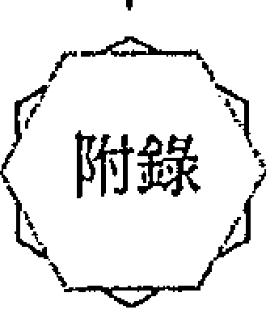

## 評估表

姓名：

## 巴赫花精中英文名稱對照表

1. 龍芽草 Agrimony
2. 白楊 Aspen
3. 樺木 Beech
4. 矢車菊 Centaury
5. 水蕨 Cerato
6. 櫻桃李 Cherry Plum
7. 栗樹芽苞 Chestnut Bud
8. 菊苣 Chicory
9. 鐵線蓮 Clematis
10. 酸蘋果 Crab Apple
11. 榆樹 Elm
12. 龍膽 Gentian
13. 金雀花 Gorse
14. 石楠 Heather
15. 冬青 Holly
16. 忍冬 Honeysuckle
17. 角樹 Hornbeam
18. 鳳仙花 Impatiens
19. 落葉松 Larch
20. 溝酸醬 Mimulus
21. 歐白芥 Mustard
22. 橡樹 Oak
23. 橄欖 Olive
24. 松樹 Pine
25. 紅栗花 Red Chestnut
26. 岩薔薇 Rock Rose
27. 岩水 Rock Water
28. 線球草 Scleranthus
29. 伯利恆之星 Star Of Bethlehem
30. 甜栗花 Sweet Chestnut
31. 馬鞭草 Vervain
32. 葡萄藤 Vine
33. 胡桃 Walnut
34. 水堇 Water Violet
35. 白栗花 White Chestnut
36. 野燕麥 Wild Oat
37. 野薔薇 Wild Rose
38. 楊柳 Willow

## 附錄

## 巴赫花精相關資訊

## 新療法國際中心

巴赫花精、精油與寶石的新療法國際中心設立的宗旨：

- ✦ 將「新療法」介紹給廣大群眾。
- ✦ 提供演講與工作坊給有興趣的愛好者。
- ✦ 提供治療師一個紮根的訓練課程。
- ✦ 提供執業者一個交換經驗的平台。

目前新療法國際中心在十個國家以七種語言進行推廣工作，在不同國家負責此工作的地區性推廣中心有：德國／哈瑙 Hanau/Deutschland，義大利／米拉特 Merate/Italien，奧地利／葛拉茲 Graz/Österreich，荷蘭／巴德賀威朵朵 Badhoevedorp/Holland，法國／巴黎 Paris/Frankreich，墨西哥／聖佩德羅加爾西亞 San Pedro Garza Garcia/Mexiko，以色列／艾里艾爾根 Elyakhin/Israel，台灣／台北 Taiwan/Taipei。

## 德國新療法國際中心的聯絡地址與網址如下

Internationales Zentrum für Neue Therapien
Dietmar Krämer & Hagen Heimann
Postfach 1712
D-63407 Hanau
Fax: 06181 - 24 640
E-Mail: info@bach-bluten-ausbildung.de | info@bach-bluten-ausbildung.ch
Internet: www.bach-bluten-ausbildung.de | www.bach-bluten-ausbildung.ch

## 英國巴赫中心

The Bach Centre
(home of Dr Edward Bach and the Bach flower remedy system)
Mount Vernon Bakers Lane Brightwell-cum-Sotwell Oxon OX10 0PZ U.K.
Phone: +44 (0)1491 834678
Fax: +44 (0)1491 825022
Email: centre@bachcentre.com
Website: http://www.bachcentre.com/

## 延伸阅读

The Bach Flower Remedies, New Canaan, Conn. : Keats, 1977, includes Heal Thyself and The Twelve Healers and Other Remedies by Edward Bach, and The Bach Remedies Repertory by F. J. Wheeler.

Barnard, Julian. The Guide to the Bach Flower Remedies. Saffron Walden, Essex: Daniel, 1971.

Chancellor, Philip. The Handbook of the Bach Flower Remedies. New Canaan, Conn.: Keats, 1980.

Damian, Peter. The Twelve Healers of the Zodiac: The Astrology Handbook of the Bach Flower Remedies. York Beach, Me, L Weiser, 1986.

Krämer, Dietmar. New Bach Flower Therapies. Rochester, Vt.: Healing Arts Press, 1995.

Scheffer, Mechthild. Bach Flower Therapy: Theory and Practice. Rochester, Vt.: Healing Arts Press, 1988.

Scheffer, Mechthild. Mastering Bach Flower Therapies. Rochester, Vt.: Healing Arts Press, 1996.

Vlamis, Gregory. Bach Flower Remedies to the Rescue. Rochester, Vt.: Healing Arts Press, 1990.

Weeks, Nora. The Medical Discovery of Edward Bach, Physician. New Canaan, Conn.: Keats, 1979.
