# 新巴赫花精身体地图

# 推薦序

> 身體與心靈並非兩種不同的事物，只是以兩種不同的方式去覺知同樣一件事物。
——愛因斯坦

我們生活在一個靈性革命的時代，這個時代讓我們有機會擴展我們的意識，也讓全球性的心靈研究、醫學與治療成為可能。身心靈整體醫療提供人類親身體驗靈性的機會。目前我們生活在一個受到毒化、環境污染嚴重、生活品質日益降低、免疫系統低落以及頻頻發生危害人類事故的世界裡，整體療癒觀念使得治療植物、動物與人類成為一件有意義的事實。

現今全球人類陷入一個階段，在這個階段由於人類過度干預自然，導致千千萬萬的人受傷、生病、無家可歸、而且被大自然的力量反撲，當務之急是培養身心靈整體性的觀念、以及全人的療癒方法，例如：英國巴赫醫師所研發的「巴赫花精療癒」，可以幫助人類從驚嚇或負面情緒當中解脫出來，全面性的療癒，使得身體上的疾病與受到的傷害能迅速恢復與康復。

透過本書的兩位作者，「巴赫花精療癒」有了進一步的發展，指示我們必得面對大自然與人類陷入的危機。學術界與靈性圈的研究都證實了我們過去並不了解大自然裡充滿無數創造性的力量與能量，然而現在人類發現這些力量，並將它們有效地應用在醫學與治療當中，同時達到了很好的治療效果。

——德國知名療癒師、靈性老師 迪娜·雷斯 (Dina Rees)

# 中文版推薦序

「花精療法」在當前大家對健康或是醫療保健非常重視的今天，逐漸受到重視。因為新型的疾病，好像已經不是現行的醫療服務體系所能周全的照顧到了。有心的醫療者逐漸把民間尚未失傳的所謂「傳統醫療」方法，用「現代科技」處理後，整合到了現行的醫療體系中普遍運用著。例如「針灸」、「氣功（導引）」、「按摩」等，這些方法主要是針對身體上各種的「痛」及「傷」的處理。至於對身體的「病」的部分，也開始採用一些由植物各部分取出來的成分作為藥品，統稱為「植物用藥」，最通用的就是中國民間一直用著的「中藥」。因此二十一世紀可以被稱為是一個「整合醫療」的世紀，換句話說是一個整合傳統與現代、東方與西方醫療方法的時代。

筆者在過去六十年從事醫療服務的後半段就一直進行這種「整合」的工作，因此會注意到本世紀更重要的是人們普遍發現到，太多的病痛是來自於「心理」的創傷，有些身體的病痛也能導致「心理」的異常。不管源自何處，「心理」越來越不可忽視了。隨著對「心理」更深度的瞭解，深知健康服務的內容也必需包括「心理」或是「情緒的平衡」，因此在歐美已相當普遍採用的「花精療法」就漸受重視了，筆者所服務的診所也已採用了近二十年。

欣見德國兩位學者將「花精療法」創始人愛德華·巴赫醫師原著的精華做出詳盡的介紹之外，還集合了三十八位醫師在過去四十八年的臨床經驗，寫出了這兩本書。

本系列書的第一本《新巴赫花精療癒》是作者介紹他們在臨床上使用花精療法經歷的累積，他們對巴赫醫師當初研發出來的三十八種花，找出了一個更有系統的用法，更重要的是不僅幫助了「情緒的平衡」，還找到了每個人有負面情緒時何處的皮膚會有反應，再又找到可能去除掉這反應的對應花精，塗抹在皮膚上來調整情緒。這一個新的發現使得花精療法不止可以同時加惠於身體情緒調整，而且可以及時在局部止痛或止癢，這種新的施診方式被稱為「新巴赫花精療癒」。

該療法另一特色是引介了同樣是自然醫學療癒師的彼得．達密安（Peter Damian）運用簡易的占星術來選擇花精的方法（見本書第七章），他採用了巴赫醫師最初發現的十二種花精，並與占星術中的黃道十二宮出現的時間相比對，而找出了明顯的人與天象的關聯，因而能幫助診斷每個人因出生時辰的不同，而展現所關聯的花朵的特性，也就是找出了哪些花會影響其生理及心智的層面。這顯然證明「新巴赫花精療癒」實際上是對身、心、靈整體的療癒。

「新巴赫花精療癒」也介紹了人體上的「皮膚反應區」，而反應區的劃定基本上是根據人體的「氣場」，這氣場是在「靈視者」的協助之下畫出來的，在系列第二本《新巴赫花精身體地圖》中有詳細的圖示，也記載了不少的例證，及一些痊癒的佐證。這也說明了「新巴赫花精療癒」，更確切地表達出花精療法是真正整合了「身、心、靈」的「全人療法」，這正是筆者多年來從事的醫療方向。筆者也正努力把近二十年服務了八千八百餘個案的成果公諸於世，因此也希望能早日看到這項新療法的成果報告，共同為此神奇而有效的療法發展繼續奮鬥。

——新圓山診所院長 崔玖 教授

# Chapter 1

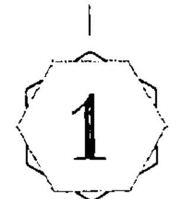

## 基礎篇

### 前言

英國的愛德華·巴赫醫師（Dr. Edward Bach, 1886-1936）窮盡一生的研究主軸：治療整個人，而非治病。這個主軸像是一條紅色的絲線貫穿了他畢生的工作。他工作的重點在於消除負面的情緒狀態，他認為這是導致疾病發生的主因：「如同我們的治療方法說明的，讓你的病人從這樣或那樣的情緒變化中釋放出來，病人自然會好起來。」

巴赫醫師觀察到情緒狀況與疾病相關連，並會隨著病情而改變；情緒改變的現象，經常是發生在初期症狀出現之前，他寫道：「相較於其他的生活面向，生病的時候情緒狀況會因此而改變。如果我們仔細觀察便會發現，這些改變通常在我們感知自己生病前出現，有時甚至是早在疾病發作之前。因此我們可以透過治療情緒，即時阻止病症出現；如果疾病已經持續一段時間，受到病痛折磨的病人的情緒，同樣可以幫助我們找到正確的治療藥方。」

這一段引述藏著一個明顯的線索，指出預防疾病發生的可能性。然而愛德華·巴赫醫師主要的工作重心是在治療生病的病人，這一點可以在他諸多文獻中提到的個案看到。他關心如何使用一種簡易且無害的方法，來幫助受苦的人類，可惜這個重要本質，近年來漸漸退居第二線。到了今天，「巴赫花精」通常與新時代（New Age）連結在一起，它被當成是克服內心衝突的助力、當成是一種在自己身上下功夫的方式、當成靜心冥想的輔助、當成潔淨心靈的方法，或甚至是作為心靈的衛生保健。然而巴赫醫師一開始踏上花精研究的初衷，是希望在他研發的病理腸道細菌之外，再找出一種以植物為基礎的藥劑選項，因為基本上植物是比較容易製成藥物的，相較於細菌，可以發揮更好的療效，並能用來治療至今仍然無法治癒的疾病。後來，他果然成功地配置可以緩解關節炎以及嚴重頭痛的藥方，這個一開始以注射方式施用的藥方，在當時的醫學界是件空前的事。

他配置的同類療法（Homeopathy，或稱順勢療法）製劑被稱為是「巴赫病理製劑」。這製劑不但在當時造成了轟動，同時也成了同類療法歷史上的一大盛事，愛德華・巴赫醫師因此享有赫尼曼（Hahnemann，同類療法的鼻祖）第二的盛名。因此，非常難以想像後來他居然放棄了這有效的同類療法，再去尋求提升人類健康福祉、帶來情緒上和諧的治療方式。他的目的在於除去心靈上的病因，好使病由心生的身體疾病得以消失。為了達到這個目的，他使用花精時不只採用內服法，在身體生病的部位，他也使用敷布作為外用，或採用塗抹的方式，他寫道：「有疼痛、僵硬、發炎或任何局部的不適時，可以額外使用乳液。我們也可以從花精儲存瓶中取出幾滴花精，滴入一碗水中，然後將一塊布浸泡在花精水裡之後，將此敷布覆蓋住相關的部位，根據病人狀況的需要，可以不斷地重新潤濕這塊敷布。」

這裡有一個例子可以說明巴赫醫師的使用方式：

在他發現馬鞭草的療癒力量不久之後，巴赫醫師被找去探視一位病人，這位病人在人行道上滑倒，腳踝扭傷得很厲害。當巴赫醫師大約在晚上十點到達時，這個人的腳踝關節已經腫脹地十分嚴重，而且變得僵硬，引起非常強烈的疼痛。

這位病人年約五十，是個孔武有力、極度沒有耐心的男人，他猜想自己受傷後，大概要花三個星期的時間才會完全康復，而且他確信自己在休息這麼長時間後，將無法勝任他的工作。他是一位活力充沛、熱情無比、工作時也全身投入的拼命三郎；他覺得自己很難放鬆，在他身體需要休息的時候，他強烈的工作意識，驅使他不停地繼續工作下去。

病人的個性缺乏耐心，需要開立鳳仙花花精；另一方面，針對他內在的緊張、工作狂熱和持續不斷活動的傾向，則要給予馬鞭草花精加以治療。

於是，開給這位先生的花精處方如下：鳳仙花花精、馬鞭草花精各兩、三滴放到盛滿溫水的碗裡，然後將紗布墊浸泡在這碗花精水裡，接著再把紗布墊拿出裹在病人的腳踝上。醫生同時指示他只要紗布墊乾了，就趕緊再將它潤濕敷上。

第二天，他已經可以回到職場上克盡職守。同一天晚上，他就可以正常走路了，旁人看到他用那隻受傷的腳跺腳，然後說：「這不是真的吧！我扭傷了我的腳踝？」

如同娜拉·維克（Nora Weeks）撰寫的巴赫傳記中所記載，愛德華·巴赫醫師用類似的方式，治療許多嚴重的病症，例如：氣喘、風濕、白血病等等。

巴赫醫師闡述自己研發的新療法，是同類療法的延續發展。在一段提到關於同類療法的談話中，他表達了對於同類療法發明者的想法：「赫尼曼的研究貢獻龐大，他在這條路上跨出了一大步，並以身為人的短暫一生，奉獻於此；現在輪到我們，將他手中的研究繼續進行下去。他功勳卓越地為同類療法這個完美治療奠下基石，今日我們則要繼續擴建它的架構。

同樣地，「新巴赫花精療癒」，這個從臨床工作和運用敏感度測驗方式研究出的新療法，也是延續發展愛德華．巴赫醫師的工作，這個新療法同時也補充並且延伸了巴赫醫師口中「更高層次的植物」的三十八種花朵的知識。它不是質疑發明者樹立的原則與方針，也不是反對他的學說；只是單純想要在他既有的研究結果當中，繼續取得新知識，並且在原本巴赫花精療癒的鑲嵌畫上，有所建樹地添上幾塊小拼圖。在過去的五十年當中，巴赫花精療癒幾乎沒有新的進展，但是同一段期間內，同類療法的知識卻有長足的進步與增益。

他的學說並不是要樹立新的教條，我確信這是巴赫醫師當時的想法。

他在一封描述有關星座、行星、身體系統與花精的系統歸類的信中指出：「……我的任務似乎在於給出一個通則，具備詳盡知識的人可以藉此通則，像你一樣發現到偉大的真理。因此，在我還不是很確定之前我不願意遽下結論。」

在另外一封信當中他寫道：「所有真實的知識都只來自我們的內在，當我們在靜默中與自己的靈魂溝通的時候。

理論與文明奪去了我們的安靜時刻，也奪去了這項知識：我們的內心明白一切。

我們受到他人的影響並相信必須有人指引我們，因此我們自己的靈性自我便被壓抑了下來。

巴赫醫師的方法不受醫學那些精細的知識與智性包袱所羈絆，而是盡可能簡單可行：「我想將它變得簡單可行：像是我餓了就到花園去，在那兒採一盤沙拉；所以如果我感覺到害怕時，我就喝一劑溝酸醬。」

使用「巴赫花精皮膚反應區」的治療方法，讓治療變得更容易了：相較於透過面談方式，從眾多花精當中找出適用的花朵，或是透過身體語言來詮釋症狀篩選花精的方式，從當事者身體病痛不適的位置讀出需要的花精，更為簡單。這是一種再度簡化的方法，更能對症下藥，能夠療效豐富地運用花精、治療身體的病痛，一如愛德華·巴赫醫師的初衷。

「巴赫花精皮膚反應區療法」，是敏感體質的人研發出來的新治療形式。本書的目的，是想讓所有不敏感的人也能使用這個方法。對敏感者來說，這個治療方法除了延伸他們既有的靈敏的敏感度之外，還可以提供他們實際運用他們的能力的可能性。這個原則也適用於巴赫花精療癒，愛德華·巴赫醫師本人就是個敏感者，他只要把植物的一片葉子放在舌尖上，就能感知這株植物可以治療何種症狀。他針對花精與症狀做出歸類——靠他的敏感度發現的——使得每一個人都能夠依照他所制定的花精圖像，做出必要的治療。

## 人類的氣場

自古以來，就存在著人體能量場的相關知識。能量體也就是所謂的氣場，在《吠陀書》、《德基安之書》（Book of Dzyan）、埃及的象形文字的文本……等等這些知名古老的文獻裡，都有提到關於氣場的知識。幾千年來，印度的瑜伽行者冥想著氣場中的能量中心——也就是所謂的脈輪。在歐洲，也留下了許多關於氣場非常詳盡的描述：

- 德國的神秘學家約翰·葛利果·吉須特（Johann Georg Gichtel，1638-1710），他是雅各·波瑪（Jacob Böhme）的學生，一六九六年，他出版的《神智學實踐法》（Theosophia Practica）中也同樣描述能量中心；在他死後，這本書中加入吉須特親自繪製的圖片，圖片中顯示各個脈輪在身體的位置。
- 奧地利男爵博士卡爾·馮·萊辛巴赫（Carl von Reichenbach, 1788-1869）嘗試系統性地研究人類能量場的擴散。
- 神智學協會的創辦人布拉瓦茨基（H. P. Blavatsky, 1831-1891）與其繼承人安妮·貝贊特（Anni Besant）和愛麗絲·貝利（Alice Bailey）在他們發表的文章中，第一次將被當作「秘密」的知識，介紹給一般的廣大群眾。
- 在魯道夫·史坦納（Rudolph Steiner, 1861-1925）創立的人智學當中，將人體能量場的知識帶入自然療法醫學的領域裡。史坦納同時也設立一家藥劑公司，在他們所出版的資訊小冊子中，我們可以看到植物是被氣場光環所圍繞的。
- 一九六四年首次出版的德語書《看得見與無法看見的人類》，作者萊德彼特（C. W. Leadbeater）說明，該本書中的人體光環插圖，是具有靈視能力的敏感體質者指導藝術家所畫出的圖片。

上個世紀初，一對俄國夫妻謝苗和瓦倫蒂娜·克里安（Semjon und Walentina Kirlian），他們首次成功地以電子儀器拍攝下氣場光環，讓我們能夠清楚看見氣場。他們把要測試的東西放在金屬盤上，並將高壓電場的高頻率啟動器和此金屬盤連結，而產生電火花的放電現象。位於受測物質與金屬盤之間的底片因此感光，攝下了照片。這些照片顯現出的氣場，與能看到氣場光環的人對物件氣場的描述十分类似。

此方法的原理是：人體氣場的變化與皮膚電阻的改變相關，根據皮膚電阻的不同，人體放電的強度也不同，因此人體放電的強度即是顯現人體氣場的變化，所以氣場可以間接地被拍攝下來。

根據這一對夫妻的家族姓氏命名的「克里安攝影法」，在一九六〇年代的超心理學界掀起了一波熱潮，一開始它們被稱為「氣場光環攝影法」。然而可惜的是，那些拍攝下來的照片中散發的能量放射，雖然某些部分與靈視者描述相近，但卻不能完全符合；若施予的高壓電量不同，拍攝出來的照片也會有所不同。

然而，同樣令人吃驚的另一個事實是：因為外在刺激引起的氣場光環變化，同時也可由克里安攝影照片中顯示出來。如果氣場光環在某處斷裂，此處也不會有電火花放電；而如果氣場光環在某個地方有擴大的現象，我們在照片上也可以看到一個擴大的能量放射狀態。只有能量放射的詳細模樣以及顏色，無法符合靈視者的觀察。以上描述的事實，讓我們做出可以用儀器拍攝出氣場光環的結論。

如果我們將植物的葉片切下一角，那一角雖然被切除了，但是在短時間內，缺角還是會繼續顯現在克里安照片上，照片中會呈現出整片完整葉子的能量放射狀態。有些人在截肢之後，依舊抱怨那個已經不存在的身體部位仍有疼痛的現象，也就是所謂的幽靈痛。這些現象可以解釋，切斷部位的氣場（以及體驗感受的能力）依然如以前一般存在著。

德國的自然醫學專家彼得·曼德爾（Peter Mandel）發現，克里安攝影拍攝下來的能量放射狀態，與針灸經絡能量系統有關，也就是與中國人所謂的「氣」有直接的關係。

五十年來，為了研究克里安攝影而成立的研究中心，已經有系統地不斷研究如何將克里安攝影技術運用在醫學上。目前這個技術已經成熟，成了自然醫學診斷流程中最頂尖的方法。

什麼是氣場？我們可以把它設想成一種能量場，它圍繞著人類的身體，如同磁力場線包圍著一根磁棒一般；氣場光環看起來好像是一顆發光的蛋，而人類的肉身就處於蛋的內部。

當人的身體健康、充滿活力時，它會擴大到極致；如果身體是處在虛弱的狀態，譬如生病、或者是在過度操勞之後，氣場就會縮小。越欠缺氣場就越小，當人在死亡前幾天，整個的能量場幾乎會瓦解，只有超出身體約一、兩公分寬。

這個精微覆蓋層的氣場光環顏色則會反映此當事人的情緒狀態，它會依照目前的情緒狀態不斷地變化，灰暗的顏色代表較低的情感與本能，明亮的顏色則是代表高貴的性格特質，像是：愛、寧靜、樂善好施、宗教真誠等等。例如：溫柔的玫瑰色是充滿奉獻之愛的線索；而憤怒以猩紅色至暗紅、混濁的紅色等不同的顏色光譜表現出來；憎恨會以稠密黑色的烏雲呈現，它們散佈在整個氣場籠罩了整個身體。

在氣場光環之內，還會依據情緒的強度不斷變化。沸騰的情感看起來好似流動的漩渦；害怕的情緒則像是氣場在震動；暴發的憤怒宛如霹靂閃電射出氣場，朝向當事者憤怒的對象射出，有些時候真的會射中該人。因此憤怒的情緒確實會傷害他人，如同俗話說的「怒氣沖天」，怒氣也會沖人。

能看見氣場的能力常是與生俱來的，通常幼兒具有這種能力。他們會跟大人敘述他們所看到的，但是大人常常無法理解；他們觀察並描述氣場的言語，常被當成是小孩子的幻想而不被當真，甚至將這些話當成童言童語。由於沒有人嚴肅看待這項能力，因此形成小孩與周遭大人相處上的困難。一般說來，在這個狀況之下，他們的靈視能力通常在童年的早期就漸漸衰退、消失。

克里·史考特（Cyril Scott）在他出版的《小男孩的光眼》一書中，記載一個小孩的日記，這個小孩打從出生就有靈視能力，他在寫這本日記時，還不知道他周遭的人無法看見這些光芒。因此，當他天真無邪地告訴旁人他所見到的，卻常常無法理解他們的反應。下面，我們節錄書中一段日記，可以幫助我們了解他面對的困難：

> 「在爸爸、媽媽說完那位可憐艾太太的故事之後，我問他們：『為什麼他們的光（氣場），是教堂裡面經常塗上的那種較深的藍色？』，他們怎麼回答我呢？媽媽說：『我問我自己這個小男孩的眼睛是不是哪裡不對勁啊？』爸爸回答道：『可能是肝臟出了問題。』

> 『為什麼媽媽不回答我的問題呢？』我真的很想知道為什麼爸爸頭上有這麼多黃光，好像是蒲公英噢，而媽媽頭上只有藍光。可是當媽媽緊緊擁抱我的時候，光芒又會變成染上玫瑰般的顏色。

> 『我也很想要知道米德特的光，為什麼呈現亂七八糟的樣子，看起來好像是個骯髒的蛋。當我告訴他們這些事情時，他們卻對我說閉嘴、你瘋了。』

> 第二天，這個小男孩就被送到眼科醫生那裡做檢查，醫生當然找不到任何視力上的毛病；而另一個死硬派的對抗療法醫生，也沒有辦法在小男孩身上診斷出任何差錯，為了安全起見，他還是開給他一個藥方。之後，他們又另外再去同類療法診所進行諮詢，那個醫生立刻否定了這個處方。這個小男孩在日記上，寫上這一段治療的嘗試過程，並在日後加上了自己的註解：『這位新的醫生完全不理會我的狀況，只建議我到海邊去呼吸不一樣的空氣，並做水療，這完全是多此一舉的建議，因為這方法也沒治好我的靈視。』

> 蕾雅的身上也發生類似的事情，這個小女孩問：『阿嬤，為什麼這些顏色這麼漂亮？』阿嬤回答道：『不要跟別人講這些包圍著人們的彩虹，其他的人都看不到，妳會讓他們不舒服。』

> 如果這些小孩能與了解氣場的專家見面，那麼可能會有訓練他們靈視能力的機會，還有機會讓他們在過了童年之後，繼續保有這項能力。

> 在克里·史考特書中描述的男孩，就找到這樣的專家作為他的老師，他在日記中又寫到：『帕老師說我看到的那些光芒，叫做氣場，他還教我如何拼出這個字來。在下課時，我們會討論很多有關氣場的事，老師好像很喜歡這個主題，因為他提出一大堆的問題問我，我告訴他有一些人的氣場，好像一團骯髒的東西，另外有一些人卻被明亮顏色的美麗光環所包圍著，也有一些人的光』環突然結束了（意思是：他們的光環有銳利的輪廓），就好像媽媽的光環一樣，而有些人的光環邊緣，看起來很虛弱像雲一樣。

漸漸地，這些孩子學會詮釋他們所看見的顏色，並能夠「第一眼」就看穿其他的人。

蕾雅寫道：「文帝叔叔是綠色的，他喜歡畫畫。大人們說他是個很有創造力的人。」像這樣，這個小女孩就學到美麗的磚綠色，意味著這些人很喜歡創造一些東西；也有其他綠色的人們，例如她說：「委內叔叔，他總是擔心錢不夠，他的綠色是在某種綠與棕色之間，我不太喜歡這個顏色，雖然我很喜歡這個叔叔。阿嬤的彩虹是所有人當中最漂亮的，她擁有許多創造性的綠色，好像是文帝叔叔有的那種顏色……當阿嬤寫詩的時候，這是她常做的事，綠色的光就會在她的周圍流動，一直到地板都是綠色……」

「阿公的顏色是藍色的，他比家裡所有的人擁有更多的藍，阿公認為所有的事情都要以特定的方法去完成，如果我們沒有這樣做，他的彩虹就會變色，變得非常非常紅，那時候阿嬤就會說：『唉！約翰啊！你生氣之前要好好想一想啊！』」

於是，這小女孩很快學到：原來紅色是代表憤怒，這是一種非常不舒服的感覺，是生氣、不快樂的時候。她接著寫道：「不過，當星期天鄰居盛裝來拜訪我們時，他們會坐在客廳。這時，我的阿公就會說：『每一個人都該幫助其他的人。』這時候一股柔軟的藍色，就會洶湧地由阿公的心流出來。」

我們認識一個擁有靈視能力的小孩，在兩歲半的時候，他看著一個正在抽菸的男子，看了很長的一段時間之後，驚慌失措地說：「當他抽菸的時候，他的光環整個變黑了，他自己都沒注意到嗎？」

他也告訴他的爸爸，當爸爸打完坐，他的氣場看起來是亮綠色的，爸爸回答說：「這是當我正確地打坐時。」隨即，這個小男孩又開口說：「當你打『錯』時，你就變成黃色的。」黃色是思想的顏色，顯然爸爸在打坐時分心了，沒有把念頭安頓下來。

還有一次，爸爸狠狠地罵他，因為他做錯了事，並問他是否承認自己的錯誤，這小不點回答說：「但是你剛才整個人都是暗紅色的。」這句話要表達的是，他的爸爸在罵他之前，就已經是滿肚子的憤怒，他顯然是藉著一個外在的小事件，讓他的憤怒有個出口。

有些大人會感到不好意思，當他知道這麼一個「傻小孩」居然可以感知到他的內心、他不為人知的喜好與天分，同時也知道他的弱點與秘密的惡習。

## 發現巴赫花精皮膚反應區

在靈視者的協助之下，他們推動我們診所發現「巴赫花精皮膚反應區療法」。這些靈視者看得見氣場光環，他們事先在不知道診斷結果的情況下，經常告訴我們，那些他們觀察到的病人當時的情緒狀態。對我而言，這些觀察是十分寶貴的訊息。

在他們的貢獻中，我對於那些對任何治療方法都起不了作用的病人的觀察特別有興趣，當靈視者在描述這些治療毫無進展的個案時，我們發現他們的氣場幾乎都出現同一種典型現象。以下是他們觀察到引人注意的狀態：

- 基本上患者的氣場光環都有很深的顏色，大部分都是暗紅色、暗棕色與黑色的組合。
- 氣場光環有破洞。

根據相關文獻的說法，黑暗的色彩出現在憎恨與心酸的情緒狀態下，當我針對這個問題向當事者提問時，他們通常會回答，以前有人嚴重地傷害了他們，儘管這一事件已經是陳年舊事了，但是直至今日他們還是無法釋懷。而其他的個案中，有些人覺得受到不公平的對待，甚至覺得自己是命運的犧牲者。這些人當中有幾位，則是覺得委屈不已的同時也放棄了自己；在接下來幾年的經驗當中，我也確實證實：楊柳與野薔薇狀態是最難突破的治療。

常的身體感覺。

十分鐘後，她從診所的病床上起身，不再全身疼痛。左頁兩張克里安攝影照片，是治療前與治療後所拍攝的，我們可以看到能量的流動以及巨大的轉變。

在下圖當中，她的腳型已經明顯可見，這表示身體中能量阻塞的狀況已經解除，手部部位的能量場——原先顯示荷爾蒙失調——也恢復正常。我們因而百分之百確信：罪惡感會引起下腹器官的荷爾蒙失調，這些年來造成身體不適的主因，極有可能就是這罪惡感。一星期後，這位女病人回診時，再也沒有其他病痛。從此以後，我們依據同樣的模式，建立起「巴赫花精皮膚反應區身體地圖」。

由於全神貫注地觀察氣場變化，我們也變得越來越敏感——當病人靠近我們身邊時，我們可以在自己的身體感受到病人身體不舒服的部位。例如：毫無理由地自己的右手臂上開始有灼熱感，於是我們將心智專注於這個區塊，試著理解這個右手臂上灼熱感要傳達的訊息後，選出幾個可能的花精——在這個案例是野薔薇花精——搽在不舒服的皮膚上。當我們選對正確的花精，不舒服的現象頓時退散。同時，造成我們身體不舒服現象的病人也需要這個花精，他的氣場絕對忠實反映他身體上的病痛。

我自己（柯磊墨醫師）的敏感度也越來越強，即使我人待在另一個房間，仍可以感受到診療室裡病人的狀態；我的同事維爾則是因為工作時密集觀察氣場以及大量使用巴赫花精，所以他後來也能看得見氣場。我們倆常常在病人踏入診療室的那一刻就開始診斷了。

除此之外，我們也能感受到不舒服的皮膚區塊所散發出來的負面情緒狀況。到了後來，我們能察覺自己皮膚和情緒的對應狀態，當我們憤怒時，對應冬青花精的皮膚區塊會出現刺痛感；當我們因某些情境而不耐煩時，對應鳳仙花花精的頭皮區塊，會非常不舒服地癢了起來（有趣的是，許多人在焦躁不安時也會下意識在這區塊搔頭）；當我們輕易讓步時，胸口則是悶了起來。刺痛、搔癢、發癢、灼熱、悶等等不同的感受，傳遞了隱藏在花精裡的情緒特質。

我們也學到負面情緒不僅改變了氣場的顏色，同時也有不同的形狀。例如：憤怒時除了顯現出暗紅色甚或黑色的氣場外，肝臟區域也會內縮變小。情緒的強度會影響氣場的狀態，可能會在氣場形成一個小洞、或是凹陷，而當事者情緒平靜下來後，氣場也會恢復正常。然而，長期的怒氣會有持久性的影響，它會在對應的身體區域形成病徵。

我們依據中醫裡臟腑與情緒的關係，依此劃分特定的「巴赫花精皮膚反應區」。可是，大多數的皮膚反應區塊無法按此模式進行，它有一套自己運作的規則。舉例來說，腎臟在中醫裡主恐，然而在「巴赫花精皮膚反應區」的身體地圖中，這理論無法完全適用。按照身體地圖，左腎臟是處理內在不潔淨感。左腎臟不僅是排泄穢物、潔淨身體的器官，按照《黃帝內經》的說法，左腎臟是下焦，還具有清理身體不乾淨能量的功能，換句話說，食物消化的能量匯聚在下焦，分離出清的部分與濁的部分，並將濁的部分排出體外。因此將酸蘋果花精對應在左腎臟是非常合理的。

而右腎臟就十分符合中醫裡腎臟對應恐懼的說法，尤其是無法解釋、沒有理由的恐懼和害怕（請參見《新巴赫花精療癒》第七章〈找到適用的花精〉裡的「身體器官語言診斷法」一節）。

但是為什麼左腎臟和右腎臟會對應不同的花精呢？很有可能是腎臟和左右腦一樣對應積極與被動，左邊主積極行動和理解力，右邊是實行被動元素，如情緒。

## 在皮膚上塗抹巴赫花精後，氣場的變化

在「巴赫花精皮膚反應區」滴上數滴相對應的花精後，在肌膚上抹勻，原先破洞的氣場在數分鐘內會產生下面的反應：

首先，氣場破洞邊緣的顏色會混合在一起，新的顏色會按照混色定律出現，如藍色加黃色成了綠色，紅色加藍色變成紫色，諸如此類。然而，氣場顏色持續改變也是有可能的。這個氣場的邊際，也就是沒有被花精滋潤到的皮膚邊緣，會形成一條細線外框，勾勒中間的混色氣場。

接著，在氣場破洞最薄的地方會開始形成黏黏的、泰半是紫色的、比周遭氣場更稠密的大量氣流，宛如火山熔岩流，緩緩地流入、填滿氣場破洞。

氣場破洞填滿後，會形成如皮膚般的表層。這個表層的顏色較為輕盈，也像是防水布，布滿了整個區域，保護它不被外在環境影響。這個表層及其顏色會一直持續不散，直到負面情緒在意識層徹底移除才會消失。這個階段有時會持續幾個星期，有時得花上數個月才會完成。一旦負面情緒消失，原本的破洞區域會融入氣場周圍的顏色，消失不見。

按照情緒失衡的複雜度，氣場破洞常在治療後的數小時、或數天之後又會出現，因此單單一次的治療是不足的。若是施以錯誤的花精進行治療時，氣場顏色也會混合，然而在數秒之內，氣場顏色又會散去，回歸成原本的狀態。

每一個人都擁有一朵獨特的花精，這朵花精符合他／她自己最真實的個性，不似其他花精僅能對應特定皮膚區塊，而是全身的肌膚都對它起反應；我們稱這朵獨特的花精為「體質花精」（或稱人格花精）——這和同類療法的概念雷同，每個人都有個屬於自己的體質療法（constitutional remedy）。這朵花並不好找，它並非是當事者最外顯的個性，然而，在花精面談的過程裡，我們多半可以找到體質花精。找到體質花精後，使用「巴赫花精皮膚反應區」療法會輕鬆多了，比起不斷嘗試和使用似是而非的花精，它會引領療程並顯現正向的療癒成效。在巴赫花精治療的療程裡使用體質花精，會徹底驅散深藏在底層的負面情緒。

## 身體及心理層面產生的影響

如果氣場破洞補起來後，破洞維持一段時日都不再出現，那麼當事者可能會出現下列反應：

身体上或是情绪上的诸多抱怨顷刻消失，尤其是那些敏感的病人，有时藉由敷布法或是药膏，可以永远消除他们身体不适的症状。对于此类病人，就不需要再施行其他的自然疗法或辅助疗法。这里有两个案例：

二十七岁女病人的左下腹剧烈疼痛，过去她的卵巢曾经发炎过，所以她担心自己以后再也无法生育。我们使用岩蔷薇花精，并按摩该区块，弹指间，她的腹痛就消失了，之后也不再复发。

六十岁女病人告诉我们她过去几个星期个性变了，毫无理由地好斗，有时候她自己也不理解为什么对着他人大吼，她说这些事从未发生过，她非常担心自己性格上的转变。她也陈述自己感觉到最近的生活了无生趣，还有觉得跟一切都「离得很远」。

我们滴三滴冬青在后脑勺的冬青区块上，并滴一滴矢车菊在她的舌下，以开启她的气场。疗程后没多久，她觉得自己完完全全恢复正常。两年后，一切如常，那些「新个性」再也没有出现过。

当下病人并没有立即感受到疗效，但如果每天定时使用花精，几天或几周后，抱怨会逐渐减少。

- 病人的病情非常嚴重，已是病入膏肓的階段。此時，縱然病人每天按時使用花精，但仍無任何感受。在此種情況下，負面情緒已經根深蒂固附著在情緒體上，花精療法的力道已經不足，無法除去傷害。因此要改以其他治療方式，如同類療法、針灸、自然療法，治療時再繼續輔以花精療法，這會加速療程的進展，也會徹底消除因情緒困擾造成疾病的病因。

另外一些個案，氣場破洞只是短暫消失，即使重複療程，肉體病徵也沒有消除。下列說明造成此現象的原因：

- 病人在心理上尚未準備改變，或者依照他／她的現況，他／她也不想除去負面情緒。如果是此類個案，巴赫花精療法少有成功案例。
- 身體能量場主要阻塞的區塊位於他處。在治療過程中尚未找到真正造成身心不適的核心問題。

就算沒有靈視能力，我們依然可以採用《新巴赫花精療癒》中教導的花精軌道法來刪選適合的花精，以及在皮膚反應區上使用這些花精。大多數的個案在療程後都有正面回應，不論是當場就立即改善身心不適現象，或是個案在進行數次治療後，在療程現場主觀陳述自己的身心反應。

因此，我們在施予「巴赫花精皮膚反應區療法」後，可以觀察到下列可能發生的感官感受現象：

有些個案，原本身體並無明顯病痛，但是在療程裡釋放了負面情緒造成的能量阻塞，因而出現了典型的治療特徵。案例如下：

- 好輕鬆的感覺，好像移走千斤重擔。
- 心頭覺得放鬆了、自由了。
- 覺得看到的事事物物都比以前更清楚、更明亮。
- 有種放下和安心的感受：肌肉不再緊繃、臉部肌肉開始放鬆、有時會綻放微笑。
- 覺得比以前更清醒也更清晰，特別是在使用橄欖花精或野薔薇花精之後。

二十七歲女病人因強烈罪惡感和不斷自責自咎而苦惱不已。我們在她的薦骨區塊上施予松樹花精之後，她經驗以下反應：首先，她感覺在治療的皮膚區塊上有股強烈暖流，接著這股暖流向前方，進入女性生殖器區域後，再繼續向上，最後來到位於太陽神經叢的松樹區塊。緊接著，她覺得腦袋煩亂不安，一波又一波的亂流，來來去去，但只有左半腦感受得到。這時暖流變得越來越強，往兩邊散開，接下來，她感覺暖流流向她的臉、流到她的左臉頰（顴骨）正上方的同時，那股煩亂不安的感受消失了，而薦骨區塊變得灼熱，她覺得越來越疲倦，等到此次療程結束時，她已經精疲力竭了。

一個年輕人回饋：在右手臂塗抹完野薔薇花精的剎那間，他覺得自己好像是打開一個活開門，身上所有的負面情緒都從此開門逃走。再來，他覺得自己無論是內在或外在都無與倫比地輕鬆，相較之下，過去好像籠罩在一股負面力量之中。一年後，他告訴我，那一次療程的成效一直持續著，他再也沒有感受過以前治療期間生命陰暗無趣的狀態。

上述的例證，都是觀察在「巴赫花精皮膚反應區」上，塗抹相對應花精時的反應。如果在身體不適的地方，施予錯誤的花精，我們並不會觀察到正向回應，只會有因為花精水從皮膚上蒸發，所產生「涼涼的」反應。然而，如果是採用「體質花精」，正向效果仍會發生。身體的每一寸肌膚都適合使用體質花精，它跟對應花精塗抹在相對應區塊時的反應一樣，都會在氣場上呈現正向效應。然而，體質花精的效果較溫和，不似對應花精塗抹在相對應區塊時般強烈，相較之下療程進展也較為緩慢。

不過，也有些個案是因為使用體質花精，而有突破性的發展，但這些是特例，鮮少發生。下面是使用體質花精的成功案例：

六十三歲的女病人因右大腿上方感染黴菌而苦不堪言，感染的範圍約一手掌大，皮膚紅腫外加結疤，位於龍芽草區塊上。因為平時用來治療黴菌的藥膏無效，導致感染區域擴散，她的家庭醫師因此開了腎上腺皮質激素藥膏作為治療處方，但是她不想用這麼強烈的藥物，於是尋求比較溫和的醫療方式。

我們在日益惡化的皮膚上使用體質花精，而非平時的對應花精。在滴了數滴菊苣花精在感染區上後，紅腫的狀態很快減輕。此次療程之後，這名婦女按照指示直接取

## 沉默反應區

我們可以根據氣場的變化判斷這些身體部位也同樣出現了紊亂現象。相較於活躍的反應區，沉默反應區尚未出現任何明顯的不適症狀。以下是可能的沉默原因：

1. 情緒上的衝突引發的失調狀況，尚未由身體上的反應區表達出來。透過使用對應的花精，治療這些身體皮膚反應區，基本上會比內服法更快地解除失調的狀況。
2. 能量阻塞的狀況出現在其他的身體部位上，而真正的「病灶」卻是沉默的。在多數的案例中，沉默的部位和出現能量阻塞的部位，通常是出現在同一朵花精之下不同的皮膚反應區部位；偶爾也會出現與它有關聯的花朵，而這種情況下，很明顯可以看出花精軌道中兩朵花之間的相關性。
3. 能量阻塞的根源是發生於過去的情緒衝突事件，縱然該事件已經解決，但負面情緒的信息卻仍然滯留在身體的部位上，一直要到細胞中的「記憶」被刪除，負面情緒阻塞能量的狀況才會完全消失。

一個鮮少出現的情況是，病灶的部位和病痛不適出現的地方完全不相關，這時候使用敏感診斷法（見本章下一小節）會有很大的幫助。另一種可以嘗試的治療是透過對話找出個案的體質花精，而這個花精相對應的皮膚反應區很可能就是病灶部位。

然而某些沉默反應區在身體結構上就很明顯，人體皮膚表面就能提供線索，這些區塊可能會有下列特徵：

## 尋找沉默反應區

沉默反應區的現象，顯示了若只是意識的改變，還不足以完全排除情緒的問題，負面的情緒在能量體上滯留錯誤的訊息。在治療上，沉默反應區是比活躍反應區有著更大的能量阻塞狀況。
如果只是辨識出問題，但是並沒有實際地改變自己的行為，是無法解除根植於人格與高我之間的衝突。相反地，反而會造成負面的情緒被壓擠進入潛意識的危險，而後出現更明顯、更強烈的身體病症。

- 有許多胎記。
- 特別多毛。
- 與其他的部位相較，有較少的體毛覆蓋。
- 皮膚有特別明顯的發紅或顏色褪色。

## 身體的病痛

如果治療活躍反應區後，卻無法產生療效，此時就要懷疑主要被阻塞的能量是不是在沉默反應區上。而如果連敏感診斷法也不能釐清這個問題時，我們建議進行下面的方法：
首先，我們應該嘗試活躍反應區的相對應花精，治療此花精的其他反應區部位，試試看是否有正面的反應。根據我們的觀察，軀幹的部位通常最有反應，所以在治療原本活躍反應區失敗之後，可以將治療限定在軀幹上的沉默反應區。

為了避免治療幾天之後，才發現治療沒有效果的情況，我們在此建議的花精療法是外用的敷布，因為敷布的療效，基本上會比使用乳霜的效果還要迅速。

只要病人的病痛獲得輕微的緩解，就可以得知正在治療的這一個反應區是正確的區塊，但是請不要期待奇蹟立刻發生，因為治療終究需要一些時間。只要診斷出正確的反應區塊，在使用幾次外敷法之後，必然會感受到療效。此時，堅持持續進一步的治療，就會達到我們所想要的療效。

如果病情還是沒有改善，我們就要調整方法，改成治療根據花精軌道而找出來的適用花精，以及該花精所對應的反應區，尤其是軀幹部位的反應區。（請參考下一小節「根據花精軌道進行診斷」。）

如果連上述方法都無法獲得正面的結果，我們就要從面談當中，篩選當事人最需要的花精，治療其對應反應區。

最後，如果所有的方式都沒有效，那就很有可能是因為有治療上的阻礙存在。（請參考《新巴赫花精療癒》第八章〈巴赫花精療法實作〉中的「服用後的反應」小節。）也許是因為生病帶給當事人很多好處，骨子裡他根本不希望恢復健康；也很有可能是在一連串的失敗治療與打擊後，當事人已經沒有辦法相信自己會復原了。在這種情況下，我們會治療金雀花精的反應區部位，這絕對是值得一試的好方法！金雀花精反應區的軀幹部位，位於左肩邊緣，會對壓力極度敏感，我們可以嘗試治療這個區塊，並最好以杯水法——口服金雀花精作為輔助。

諸多個案中，在使用松樹花精治療薦骨區塊後，會消除阻塞在此區塊的能量，荷爾蒙也會重新調整、恢復正常。松樹花精治療的罪惡感，最常出現的原因是源於潛意識，或者出於宗教教義，覺得罪惡感是「正常」的。而罪惡感反應在身體上的位置是：太陽神經叢、後腦勺，以及最常出現的薦骨部位。罪惡感的出現會干擾到身體的整個內分泌以及能量調節系統，薦骨同時是骨盆器官的反應區，而這個區域會製造影響情緒平衡的重要荷爾蒙；下丘腦、垂體、松果體和胼胝體的反射點也是位在松樹花精的反應區塊。基於這個理由，我們在治療時，如果松樹花精是治療選項之一，請務必優先治療它。

對一些不明確的病症，當我們無法確定它的反應區部位時，則可以透過情緒症狀來做判斷。

比如：如果是一個疑病症患者抱怨他們心痛，就要處理心臟部位的石楠區；如果一位心臟病患者有強烈的思鄉病，就要治療他的忍冬區。最後，我們要強調，治療活躍區通常會出現效果極佳的療效，但大前提是，花精的療效足以治癒相應的身體病痛。如果身體已經出現大規模器質性的變化，那麼花精只能扮演其他治療方法的輔助角色。（請參考本書第一章裡「身體及心理層面產生的影響」一節。）

前面描述的治療步驟，只是幫助我們在治療階段，如果沒有出現療癒效果時的權宜之計，而不是慣例。

## 情緒問題

如果想單純透過皮膚反應區，來治療心理上的情緒問題時，我們會建議，先從最強烈的失調花精開始。如果沒有機會測試身體上所有的反應區，那就先將這一朵失調花精，使用在軀幹以及頭部的皮膚反應區上，如果同時需要好幾朵失調花精的話，那麼一次最多可以同時使用三朵花精。

此次之後的療程，我們可以進入到病人最迫切需要的花朵，治療此花精的相對應皮膚區塊。

但是，這只是個選項，也不是非得如此。因為一旦失調的狀況去除之後，通常只要使用內服法服用花精，就會有良好的療效，不必再輔以皮膚反應區療法。簡而言之，我們以花精療法治療情緒。

問題時，通常只有在治療的初期階段，才會額外使用外用法加強。另外，嚴重的情緒失調以及內在衝突的問題，以花精內服法治療卻遇上瓶頸，此時皮膚反應區療法是非常值得試用的方法。至於日常生活的困難、考試的恐懼、聽到噩耗後的驚嚇、憤怒等狀況，採用花精內服法治療就綽綽有餘了。

## 根據花精軌道進行診斷

如果將適用的花精在相對應的皮膚反應區上做治療，卻無療效時，可能是因為病人已經處在花精軌道的補償狀態、或是失調狀態上了。這時將此一花精軌道上的表層花精敷用在相對應的皮膚反應區上，通常都會發生期待的效果。在這裡我舉一個例子：

有位中年的女病人抱怨她頭痛，我們使用岩水花精塗抹在相對應的部位，但是她沒有感到疼痛有任何減少，然而，在我們使用少量的酸蘋果花精貼敷在這朵花對應的脖子部位時，疼痛就立刻減緩了；很明顯這位女病人已經處於失調階段，否則岩水花精就足以讓她產生正面的反應。

在此，我再一次強調：透過皮膚反應區治療，只是巴赫花精療法的部分面向。在每個治療之前，原則上都要進行詳細的訪談，藉此釐清當事者目前狀態，他的病痛可能是因為表層的補償狀態或失調狀態所引起的。

治療時開立的花精處方除了額外的外用花精外，還要開立內服花精；因為我們要打從一開始就要避免因為阻塞的情緒能量而導致的失敗治療。在此要特別強調：必須避免給予同一條花精軌道上所有的花朵，這會引起非常強烈的反應，而這個反應在這裡不能單單以花精效應來解釋出現的狀況。

在一些特殊的先決條件下，可以針對特殊的情況使用整條軌道的花精，這會加強花精效果，但是我們必須遵守特定的規則。（請參考第六章〈其他可能的展望〉。）

如果同一條軌道中的三朵花精同時出現在處方上，而疼痛顯現在溝通花精所屬的部位時，我們會建議使用下面的方法：

首先，我們會給予內服的溝通花精與失調花精，同時在外用上使用溝通花精，當失調狀態解除之後，則可以給予他們內服補償花精，此時溝通花精持續以外用的方法保持下去。在此，我特別舉出下面這個例子：

假設病人抱怨位於胸腔的矢車菊反應區有疼痛現象，另外也存在著強烈的罪惡感，在這種情況下，除了同時內服矢車菊花精與松樹花精外，還要以加入矢車菊花精的敷布或是乳霜治療疼痛的部位；如果治療狀況還是沒有進展，就要額外加以治療松樹花精的皮膚反應區。以這個個案為例，則是優先考慮治療最靠近太陽神經叢的松樹反應區，因為此區塊最靠近病人主訴的胸腔矢車菊反應區。

當病人的罪惡感漸漸消除之後，就要調整內服法的處方，將原本的松樹花精改為冬青。如果，身體上的不適還沒有完全消失的話，就要持續治療位於胸腔的矢車菊反應區。否則，採用內服法就夠了。

## 根據氣場進行敏感診斷

依據氣場狀態選擇適合該區塊的巴赫花精，以及使用該花精於皮膚反應區上，這個根據能量體的氣場狀態做診斷的方式，是目前已知唯一一種客觀的測試方法。（然而，如果是以特定的皮膚診斷壓力點來篩選花精，則是將花精軌道當成整體來做觸摸，而不是選擇單一的花精。此節可與本書第六章做比較。

氣場不只可以顯示當事者需要的是什麼花，也可以顯現身體何處需要這朵花。透過氣場的幫忙，可以同時發現病人沒有意識到的情緒衝突，以及處於潛伏期的身體失調狀況。它很直接地顯示出負面情緒與身體失調的相關性，有時候甚至可以明顯地看到整條花精軌道，例如：氣喘（矢車菊區）、膽結石（冬青區）與胃潰瘍（松樹區）。

出於這個理由，敏感診斷法是很值得學習的一件事情，尤其是學會觸摸氣場的能力。我在研討會與演講當中常常一再地證實，在場的人當中有三分之二的人，在正確的引導之下，都能夠學會這個方法，就算他們事前從未意識到自己擁有這樣的能力。

我們在後面的文章會詳細地說明這個主題。在這裡我們不討論靈視者擁有的天賦，如同本書一開始就強調的，靈視能力在現實生活中非常罕見，只有特殊的狀況才能學會。

可以用雙手感受到氣場現象的人分為兩類型，第一類型的人：可以觸摸到氣場的邊緣，並用這種方式找到氣場的隆起、凹陷處；另外一類的人，則是能夠感覺到氣場的變化，當他們感覺到氣場的隆起處時，手部會有溫暖的感覺，至於氣場的凹陷處，則會讓他們立即感覺到寒冷感。他們也會感覺手部發癢、發麻等等其他的現象。

藉由下面的練習，你們就可以確認自己是否屬於這兩種類型之一。如果確定知道自己所屬的類型，就有可能透過進一步的練習，來提升你們自己的敏感度。

### 1 觸摸氣場邊緣

慢慢地移動你的一隻手，漸漸靠近另外一個人的身體，這時，請同時注意你手部的感覺，也許你在特定距離時會感受到一個相當小、幾乎覺察不到的阻力。以同樣的方式靠近身體的其他部位，在同樣的距離下，你也能感覺到這個阻力。

現在試著集中精神，認真地覺察你所感受到的。接下來，請試著維持這個距離，用手觸摸這個人身體之外的氣場能量，同時維持手部對這份阻力的感受。如果你能成功以上述方式，讓你的手確實地沿著氣場能量邊緣滑動，在某一些地方用你的手些微的往上或往下移動，來回幾次，你就可以確定氣場凹陷的位置，甚至是毫釐不差的感受到。除此之外，你還可以感覺到氣場凹陷處是急遽下陷的，或是感覺平軟下滑有如鬆軟的沙地。

在不同的距離之下，會出現「碰撞」的感覺，在離身體五到十公分的距離處，你會感覺到所謂的「內氣場」。在離身體大約十三到二十公分處，你可以觸摸到「外氣場」。氣場的距離以及兩層個別的厚度，則會依照個人的情緒狀態與健康狀況而有所不同。使用「巴赫花精皮膚反應區」來做診斷時，我們只對內氣場有興趣。

第二個能力需要多一點的時間練習，因為你要感受的是氣場的變化，而不僅是確定氣場的邊緣。如果你做練習時恰巧碰到一個十分健康的部位，當然也感覺不到任何東西。

### 2 感受氣場的感覺

請用你的手很慢很慢地靠近另外一個人，在距離他的身體約二到三公分處輕撫過去，同時注意你手部所有的感覺。如果你的手部在某個地方出現溫暖或是冷涼的感受時，請試著盡量仔細定位這個引起你手部感受的身體區塊。也許可以拿一枝化粧用的眉筆在皮膚做上記號，方便待會兒在身體地圖上查詢，並找出這個身體區塊是對應哪一朵花精。

不要讓一開始的失敗嚇倒你，也許你測試的對象心理上十分平衡和諧，因此你只能找到少數的區塊。你從氣場所感受到的冷或熱的感覺並不是皮膚的溫度，即使你透過衣服觸摸，還是同樣可以感覺得到不同的感受。

我並不推薦使用靈擺當作氣場的測試診斷工具。基本上，觸摸氣場或感受氣場會比透過靈擺這條歧路更為精確，靈擺只能間接地顯示這些現象。除此之外，這些有能力使用靈擺的人通常都觸摸得到氣場，因此靈擺的這個「另類選項」是沒有必要的。

# Chapter 3 巴赫花精皮膚反應區療癒實務

使用「巴赫花精皮膚反應區療法」的最大準則，在於病人本身有沒有想要改變的意願。因此，必須以《新巴赫花精療癒》書中詳述的面談方式來評估病人意願。如果單單根據皮膚反應區就能明顯做出診斷、而不需要面談的個案，我們也一定要在使用巴赫花精之前，解釋此療法運用在皮膚上的效應及效果。如果當事人在情緒層面上並不想改變，也不了解花精的相關知識，療癒師也沒有徵得他本人的同意，在這些情況下就冒然施行此療法，是違反了個人的自由意志，可能導致劇烈的反應。我們不能因為「巴赫花精皮膚反應區療法」非常簡單，就不道德地使用它。對於病情嚴重的病人，要簡單妥切地解釋情緒是影響身體症狀的肇因，並徵得當事人同意後，才能進行療癒。

## 可透過皮膚反應區治療的適應症

### 身體上的不適

每一種生理疾病都能劃分、歸類在三十八朵巴赫花精主要的適應症下治療。疼痛是身體發出的警告信號，當我們知道病因時可以進行治療。然而，像是有致命危險的急性闌尾炎，當闌尾破裂時，則要趕緊送醫急救。文獻裡記載愛德華．巴赫醫師即使是面對重症，也幾乎單用巴赫花精來治療。身為醫生的他明瞭自己在做什麼，如果病人對花精治療沒有反應，他也有能力在緊急情況下，採取另一種方法醫治。到診所或醫院去，請自然療法醫師或一般醫生檢查急性疼痛症狀是非常重要的，我們不建議自行診斷急性病症。巴赫花精可以作為西醫或自然療法的輔助療法，或生小病時使用，例如：

- 因為過勞或睡眠不足引起的緊張性頭痛。
- 脊椎兩側過度緊繃，像是頸部疼痛或肩膀緊繃僵硬。
- 因過度勞累而抱怨不休。
- 肌肉酸痛。
- 小傷、跌打損傷、擦傷。
- 因情緒狀態引發的身體現象，例如：憤怒時膽囊疼痛、爭吵時腹痛、在不舒服的情境時皮膚搔癢難耐：……等狀況。
- 瑕疵不潔的肌膚和粉刺。
- 無害的皮膚疹，如神經性蕁麻疹（皮膚發紅、蕁麻疹、搔癢）、曬傷和日光過敏、輕微的燒傷、皮膚化膿或是其他需要向醫生或自然療法醫師諮詢的外傷。
- 單純的感冒、鼻塞、咳嗽。
- 沒有明顯潛在疾病的慢性疲勞。
- 皮膚感覺到刺痛或其他形式的不舒服。

### 情緒上的不適

在眾多心理治療方法中，「巴赫花精皮膚反應區療法」是最直接處理情緒問題的方式。負面情緒會顯現在氣場的特定區域，經過治療，如果問題還沒有解決，身體不適的症狀就會持續出現。使用皮膚反應區療法，負面情緒會比口服方式更快消失，有時候負面情緒甚至是剎那間就消逝。整體而言，心理治療時運用「巴赫花精皮膚反應區療法」，療程進展會更快速。

我們注意到某些個案，治療早期以口服方式服用花精數週、甚至數個月都不見效果，但同一朵花精改用皮膚反應區療法治療後，卻在極短的時間內發揮效果。依此看來，負面情緒似乎是儲存在身體細胞內，在重度情緒衝突的個案中，如果在特定身體區塊帶入特定的訊息，這種治療方式即會成功地釋放儲藏在該身體區塊內的情緒。彩光針灸的成功療效似乎證實了這一理論。而最近的研究證明，細胞確實儲存了真實的記憶。

### 預防性處理

如同我們先前提到的，在病人的初期症狀出現之前，他們的情緒狀態通常已經開始改變。當病情終於發作時，這些負面情緒所屬的一個、或多個皮膚反應區，就會明顯反應出病症。為了預防因生病而帶來的巨大情緒轉變，我們可以在對應這些情緒的皮膚反應區塊上塗上花精，如此一來，就可以避免身體因心靈受到干擾而導致的後果。同時，如前所述，在皮膚反應區上使用花精，基本上會比內服法更迅速解除負面情緒。

根植於病人內在深層的情感衝突，需要更多的時間才能徹底轉化、消逝。基於這個理由，我們認為預防性處理是可行的，例如：膽汁質類型的人，可以將冬青花精塗抹於肝臟部位，以預防膽結石的形成。

## 巴赫花精應用在皮膚上

### ……敷布

從花精儲存瓶中取出滴管，將沒稀釋的花精直接滴在相對應的皮膚區塊上推揉，這是最直接有效的療法。僅次於這個方法的是敷布療法。由於第一種直接取用沒稀釋的花精的治療方式，它的後座影響力對療癒師而言實在太強大，我們並不推薦（原因詳見本章下一節「治療者可能產生的反應」）。因此，敷布療法是症狀強烈時、或是久宿病情的首選。

作法：選取適當的花精，滴兩滴在半杯水裡混勻，再將一塊布浸到花精水裡。如果超過一種花精，那麼每種花精各兩滴。如果已經知道該個案的體質花精，也可以將其加進水裡增加療效。每日將濕布敷在肌膚上十分鐘，一次至三次，次數可按個案病情的嚴重性做調整，如果是病情嚴重的個案，可以增加敷布次數。

### 乳霜

花精乳霜是最簡單方便的使用方法。我們可以將花精（最多三朵花精）混合在乳霜裡。然而塗抹複方花精乳霜在皮膚反應區上得到的效果，和單方花精乳霜是一樣的。塗抹花精乳霜時，乳霜會在肌膚上形成一層薄薄的薄膜，並暫留在皮膚表面，乳霜基底則會緩緩滲入肌膚。在實驗數種乳霜基底後，我們發現膠原蛋白乳霜的效果非常好，它不似羊毛脂基底乳霜或是其他乳霜般黏稠，清爽也親肌。

作法：一○公克的乳霜加入花精各兩滴（最多可加入三種花精）。每天塗抹花精在皮膚反應區上二至三次，可以根據當事者的需求，增加使用次數。

縱然花精乳霜比敷布法簡便，但是它的效果溫和，不似敷布法有戲劇性的強烈效果。如果是長期困擾個案的病情、劇烈的疼痛、或是抗拒治療的個案，應該率先採用敷布法；如果花精乳霜效果並不明顯或是無效，我們也會建議改用敷布法，一旦立竿見影的效果出現，或是不適症狀消除了，再回來繼續使用花精乳霜治療，此時，花精乳霜的療效也已足夠。

### 酊劑

我們推薦以酊劑方法治療頭髮下的頭皮皮膚反應區部位。酊劑和內服花精儲存瓶裡稀釋過的花精液濃度一樣，製作比例同樣都是一○C C的水加入一滴花精。酊劑的水，最好是使用能放在室內較久、而且不變質的蒸餾水；要避免使用酒精，以免長期治療時酒精刺激頭皮。吸量管比點滴器易於使用，因此建議治療時以吸量管取代點滴器。

### 乳液

花精乳液是另一種運用在巴赫花精皮膚反應區的方法。然而，花精乳液只適用於體質花精。體質花精在所有有問題的皮膚反應區都能發揮效果，所以非常值得製作一瓶體質花精乳液。它的使用方式是：每天洗完澡之後，以花精乳液塗抹全身，如此一來，原本有問題的皮膚反應區會在無形之中得到治療。但花精乳液僅限於使用體質花精，否則不會產生預期效果。

今日我們已經確認體質花精對全身的皮膚都會產生正向且良好的反應。我們可以毫不含糊地診斷出敏感病人的體質花精。至於不敏感的病人，找出體質花精最簡單也最安全的方式，是藉由身上有反應的皮膚反應區找出相對應的花精來治療。假以時日，個案最深層的負面情緒將會浮現，我們因此可以找到對應負面情緒的數種花精，而這些對應花精中其中的一朵，很有可能就是體質花精。

經由「巴赫花精皮膚反應區」的治療，病患將會了解情緒和肉體病徵息息相關。如同巴赫花精的內服法，患者將會覺察自己和環境的互動，和自己對應每日作息的心態；在療程裡，他們學會修正自己的行為舉止與態度，進而克服問題或是預防疾病的發生。因此，他們分分秒秒全然經驗、實證，以明瞭人生課題，這個實證過程即是「心智拓展」的真義。

※這種「捷徑」方式找到體質花精也有其缺點，與面談方式比較，它缺少了與當事人談論臟腑器官語言、或是探討問題皮膚反應區時，帶來極為有用的洞見，進而更深入了解病人發生目前問題的內在原因。

## 治療者可能產生的反應

在一開始尋找「巴赫花精皮膚反應區」和描繪身體地圖之際，為了要研究花精是以何種方式與氣場、身體和情緒的反應互動，我們採用沒有稀釋過的花精原液滴在病人身上。我們的經驗顯示，在特定狀況下，療癒師在此療程結束後，會產生強烈的反應。證據顯示療癒師如果沒有意識到或是清理自己，那麼病人的肉體症狀和情緒就會轉移到療癒師身上，這些症狀和情緒可能會持續幾天，有些個案甚至持續了數星期。

可是，直接從花精瓶中取出沒有稀釋過的花精原液，滴在自己身上則是無害的。這麼做的唯一風險是擦了花精之後，過沒多久，皮膚反應區會再次出現強烈的反應，或是同一朵花精的另一個皮膚反應區也會開始不舒服，但這些不適症狀，在再次塗抹花精之後即會消失。或者是在不適的皮膚反應區，施以兩星期的敷布法，也可以完全避免不適症狀的出現。

基於切身經驗，我們必須鄭重警告療癒師：千萬不要直接使用沒有稀釋過的花精原液在病人身上。我們推薦敷布法或是乳霜，這兩種同樣都是快速又有效的方式。根據文獻記載，愛德華·巴赫醫師從不使用原液，永遠都是採用稀釋過的花精來治療；即使是急症患者，他也以外敷的方式治療：敷布法、泡澡、海綿按摩、或是乳液。已經喪失意識的個案是唯一的例外，巴赫醫師會施以急救花精原液急救一名漁夫。

這些干擾區可能引發身體其他部位的不適。

人體的能量是在經絡上流動的觀念要銘記於心，針灸穴位可以促進能量流動點上皮膚電阻的變化。同理可知：功能失調的疤痕，也會在皮膚組織旁造成不同的皮膚電阻，因此也有可能干擾到經絡功能。所以，身上疤痕可能造成身體其他部位不適的理論是說得通的。

在非常罕見的情況下，我們才會將這些疤痕視為身體受到干擾的部位，這時靈視者會在能量受阻部位的氣場找到一凹陷處。或者，我們可以靠皮膚電阻測試法或是執行試驗性的治療，取得氣場是否受阻的訊息。自然療法醫師通常會在疤痕上做局部麻醉注射。如果猜測是正確的，那些因為疤痕阻礙所引起的病痛會在幾秒鐘之內消失。因此，我們稱它為「數秒鐘現象」。

胡桃花精與麻醉注射具有相同的效果。在使用胡桃花精治療疤痕時，是用未稀釋的花精原液，如果在擦上去之後，身體直接出現任何形式的感覺上的變化，那麼此疤痕必定是阻礙能量流動的成因。至於療癒師會不會因為直接使用未稀釋的胡桃花精，而在自己身上產生了負面反應？依我的經驗來看，還沒有發現過。

胡桃花精治療疤痕的特色是不會造成任何疼痛，因此特別適合用於口腔部位，例如拔牙後的傷口與扁桃腺傷疤，我們只要滴幾滴胡桃花精在棉花棒上面，再將沾了花精的棉花棒擦在傷疤上即可。

如果要使用胡桃乳霜治療疤痕，每天規律地塗抹，大約需要四星期的時間才會復原。當然也可以加上精油來加強效果。至於乳霜的基底，我們建議採用會橋接起中斷的皮膚導電性的乳霜（Zellstrom Electrique Creme），這個處方會加速消除疤痕以及促進皮膚的再生。

## 心靈美容

負面情緒會顯示在我們周圍的能量體（氣場）。根據情緒的強度與持續時間的長短，最後同樣也可能會在我們身體的外表上明顯地顯示出來。皮膚因此成了反映我們情緒的鏡子。舉個例子，激動的時候會臉紅、驚嚇會導致臉色蒼白、不安的時候排汗會增多。

如果我們在情緒已經滿溢、又不留心自己的身體狀況時，或是我們將負面情緒藏在心裡好長一段時間，這些情緒就會以問題肌膚的形式反應出來。例如，自覺不潔淨，就會反映在皮膚上的斑、痣、粉刺等等不潔的小瑕疵；如果我們將自己與週遭的環境隔絕起來，皮膚就會產生皮屑，日後發展成魚鱗般的「防護裝甲」的厚皮。

因此我們不為人知的情感、大大小小讓我們天天煩心的擔憂、我們的困難與內在衝突，都不是秘密了；根據下面的格言，皮膚透露出我們的內在：「疾病說實話。」皮膚甚至可能顯示出我們在尷尬時，想在別人面前隱藏的情感。臉部是最容易看清需要治療的負面情緒。

愛德華・巴赫醫師曾經在美容的目的上使用花精。諾娃・威克斯寫道：「有個四十幾歲的男人，額頭上長了個很不雅觀的肉疣，這個肉疣嚴重地影響到他的健康狀態。他是個和藹可親的人，他最快樂的事，是和哥兒們在一起談論上帝與世界，和談論他自己的身心健康問題。依據他基本的情緒心態考量，石楠花精處方似乎很對症下藥。巴赫醫師開給他石楠花精乳液的處方。使用三個星期之後，他的肉疣完全消失了，甚至沒有在額頭上留下一丁點的疤痕。」

彼德森同樣也報導了一個使用巴赫花精來美容治療的類似案例：「有個十二歲的女孩，臉上有皮丘疹，雖然醫生向母親保證，皮丘疹會漸漸消失，但是女孩還是非常不快樂，而且變得很沒有自信。她是個十分安靜、畏縮的孩子，經常沉醉在自己的白日夢當中。針對她這種愛做白日夢的狀態，我們開立了鐵線蓮花精。很快地小女孩有了反應，她變得活潑，對學校與家庭的活動發生興趣，根據她母親的說法，她甚至開始對很多事情發展出強烈的熱忱，在她服用完第二瓶花精後，所有的皮丘疹完完全全消逝了。

若是想要進行心靈美容，我們可以根據下面的準則來選擇花精：

- 根據人格特質所找出的體質花精，可以達到相當正面的結果，如上面所敘述的兩個案例一般，完全不需要身體地圖，就可以找到適用花精。體質花精在治療初期並不太容易馬上發現，可以透過面談嘗試找出幾朵花放入乳霜（上限三朵）當中，合併使用。
- 通常人體器官語言可以提供我們一條清楚線索，指引我們推測當事人的基本心理狀態，這些心態可能是特定皮膚問題發生的原因。例如，十分敏感的皮膚表示，當事人可能是伯利恒之星類型的人，這類型的人擁有容易受傷的性格。
- 如果我們根據面談找出的花精，與根據器官語言找出的相比較，會引導我們找到造成皮膚毛病的相關花朵，這時候可以讓當事人內服花精複方，並額外使用外用花精乳霜。與透過皮膚反應區治療身體上的病痛一樣，也可以將花精（上限三朵）放入乳霜當中使用。
- 另外一種辨識的方式是透過身體地圖中的皮膚反應區找到負面情緒症狀，這時通常可以發現當事者主要心理難題的線索。例如上嘴唇皮膚上的皺紋，是楊柳狀態的投射，如果同時存在著恨意，這皺紋就會延伸到嘴角，甚至一直延伸到冬青反應區，有時，還可能會留下深深的溝紋。這是因為引發皺紋出現的負面情緒事件，雖如過往雲煙般消逝了，但是留在皮膚上的恨意及其刻劃下的痕跡，至今仍在，歷歷可見。

## 使用案例

治療青春期的青春痘，可以考慮下列花精：

- 胡桃花精：幫助我們過度到另一個人生的階段。
- 酸蘋果花精：針對通常是不自覺地對「性」萌芽的恐懼，感覺到性是一種「骯髒」的事情。
- 鐵線蓮花精：針對這個生命階段典型的狀況——沉醉於夢幻中。俗話說這是一種無法實現的「青春夢想」。

針對青春痘，我們一般會建議使用膠原蛋白乳霜，因為它會修補青春痘，也有預防青春痘阻塞毛孔的排毒作用。

針對不潔淨的皮膚，可以在洗面乳當中加幾滴酸蘋果花精。

特別蒼白的皮膚提供了鐵線蓮花精狀態的線索；在此狀態時，當事人的個性十分不活躍，消極地生活著。

鬆弛的皮膚表示出此人性格鬆垮，這種狀況可以使用下列花精：

- 角樹花精：針對興趣缺缺以及缺乏動力，與持續用腦過度而導致疲憊與體力耗竭有關。
- 矢車菊花精：針對意志薄弱的人格，他們無法說不，因此常被別人耗盡力量。
- 楊柳花精：針對那些因為內心投降、聽天由命，而導致的麻木與漠不關心。

（在某些特定狀況下，當事人可能經年累月處在野薔薇的狀態。）

- 落葉松花精：當事者已經不再信任自己的能力。
- 歐白芥花精：當事者已經被憂鬱症困擾多年，對他來說人生空洞乏味、沒有意義。

製作巴赫花精美容保養品的方式，是將花精儲存瓶中沒稀釋過的花精液，滴入已經做好的美容保養乳霜當中，同時也可以額外再加入精油，這並不會影響花精的效果。

最後，要強調一點，我們並不是為了外貌美麗這個目的而使用巴赫花精美容。因為在多數的案例中，我們治療的皮膚區域確實是他們受到干擾的反應區，因為這個原因使用花精治療皮膚——以及疼痛的部位——也的確可以輔助人格成長。出於這個理由，稱此花精治療為「心靈美容」也絕對是恰當的。

但是，想要以美容為目的，總括性地將花精歸類，並以特定的美容保養主要難題、或者甚至以皮膚狀況來分類，不一定可行。另外，源自此一想法所研發出來的皮膚保養品，也可能會有問題，因為配方中使用的花精，通常在長期間內「沒有受到控制」，根據我的經驗，以這種方式使用花精，在某些情況下，很有可能會引起負面的心理反應，特別是在忽略《新巴赫花精療癒》一書中所提到的長期使用原則時。我們只推薦正在接受巴赫花精治療時，客製化的美容配方。

### 案例 3

女患者在塗抹了忍冬花精之後，疼痛立刻消失，幾個鐘頭之後，疼痛又慢慢回來，女患者再一次在胸部塗抹忍冬，疼痛又消失了。接下來幾天，她繼續採用這種治療方式。五天之後，她在電話上告訴我，除了她的胸部疼痛完全消失之外，折磨她的憂鬱症也不藥而癒，這種憂鬱與一種渴望的感覺相關，至於她在渴望什麼她自己也不知道。

一段時日之後，這位女病患又因為嚴重的頭痛來到診所，她已經嘗試過各式各樣的止痛劑，這些藥除了副作用以外，並沒有任何的療效。我根據克里安攝影照片找出幾個適當部位，並在這幾個點上注射同類療法藥物，這位女病患隨後就不覺得疼痛了。儘管如此，我們還是建議她如果疼痛又回來的話，在這個地方塗抹岩水花精。

幾個星期之後，她用電話告知這個治療的成果只持續了一天，第二天劇烈的疼痛又出現了，然而，在她使用岩水花精之後，幾秒鐘內疼痛就完完全全消失了。

一位三十四歲的女病人，因為肩膀以及頸部越來越加劇的疼痛而來求診。她已經接受了一個月的疼痛治療，但是直到那天都沒有見效，疼痛感還不斷地增加，因此她必須持續服用止痛藥，讓她撐過一天。當她來看我時，她因為肩頸疼痛而曠工多時了。我在她頸部與肩部疼痛的部位塗上兩滴橡樹花精之後，她表示這個區塊的疼痛，瞬間消失了。但是，疼痛以更劇烈的方式向前方轉移，在左邊甲狀腺的區域與胸鎖乳突肌部位，而她感到特別疼痛的部位正是馬鞭草最占優勢的區塊。

我在這個疼痛區塊滴上三滴馬鞭草，結果發生了什麼事呢？這位女病患事後告訴我，她體驗到一種恍惚的狀態，塗上幾滴花精之後，她瞬間進入到一種平靜、完全放鬆的狀態，她無法張開她的眼皮就坐在椅子上睡著了。事後，她告訴我她可以覺知到周遭所發生的事，身體卻處在一種舒服的寧靜狀態中。到底是發生了什麼事？

三天後，她又回到我的診療室，告訴我她在這次治療的前幾天，身體操勞過度，幾乎完全無法休息。在塗抹了花精之後，身體恢復了平衡的狀態，也就是在主動性的陽原則與被動性的陰原則上、在精微層次上，獲得了平衡的理想狀態。

基於她過去幾天的經驗，她不得不承認，活動與休息的天平極度失衡；過度熱心、過度活躍的生活形態，過度消耗她的健康，身體逼迫她要趕快去休息，以便進行身體上的平衡。這就是為什麼她在治療時，馬上沉沉睡去。為了預防疼痛再度出現，我讓她在家裡繼續使用敷布貼敷這些區塊，從此以後，這些疼痛就不再出現了。

### 案例 4

一位三十六歲的男病患來到我的診間，指著他的病痛給我看：肛門部位的瘻管。他抱怨說：「我很難坐下來，因為這個地方帶給我要命的疼痛，一旦我坐下來，我就渾身不舒服，也因為這瘻管，讓我只能坐在一邊的屁股上。」

我在有瘻管的部位給了他兩滴甜栗花，於是疼痛一分鐘一分鐘地漸漸退去，五分鐘之後，疼痛完全消失了，而病人又可以毫無不適地坐下來。接下來，他在家裡自己使用敷布繼續治療，瘻管就慢慢穩定癒合了，四個星期之後，就幾乎再也看不到它了。

### 案例 5

一位四十七歲的女病人，因為左上顎部位朝著耳朵方向擴散的疼痛，向我尋求諮詢，她告訴我說，耳鼻咽喉科的醫生確認在左上顎寶有一顆囊腫，他必須進行手術取出囊腫。

在使用橡樹花精於左面頰與左耳後面的部位之後，她對我說，她聽到一陣潺潺流水聲，從耳朵向左顎寶擴散；她有一種感覺，好似有人在這個部位將空氣壓縮，讓它通過，好讓寶洞與通道暢通無阻，同一時間內，她感到一種前所未有的放鬆。後來，她自行在家裡使用敷布外用法在這部位進行治療。八週之後，她回到耳鼻咽喉科醫師那裡回診，醫生對這個結果感到吃驚不已，絕口不提動手術一事。

### 案例 6

一個四十六歲的女子來到診所，表示她的月經停了好長一段時間了，她的醫生把這歸因於更年期到了，因此要她不要太擔心。

我個人認為療癒師的職責在於：盡可能地幫助女人維持住月經。我們清楚女性月經的週期代表一種能量上的充電與放電，月經釋放的同時也是在清理身體。

基於這種考量，如果是與月經有關的問題，我們總是要問：是什麼原因誘發而且造成荷爾蒙失調的問題？大多數情況下，多半源自於不當的情緒及不當的心態。

這正好是這位女子的情況。她無法享受性愛，每次和先生睡過覺後，她都感到有罪惡感。在薦骨部位使用松樹花精後，她表示，好像有陣灼熱的火光在她的小腹流動，這個狀況如閃電般地突然出現、又立刻消失。但是，腹部的熱流感覺依然存在，並持續一段時間。我建議她，每天用松樹花精敷布貼敷這個部位。三週後，她回到我的診所，高興地說：她的月經又恢復了。

### 案例 7

七十四歲的老婦因為週期性支氣管炎來到我的診所。生病初期，她看內科醫師，但是胸痛和咳嗽一次又一次復發。她指著胸前投訴：即使輕輕地碰那一點，也是無法忍受的痛。在該區塊塗抹橡樹花精後，她覺得她的胸腔變輕了，過了約莫一分鐘，她的胸痛完全消失。我教她正確使用敷布的方式，讓她可以持續在家治療。兩星期後，她回診說她自第一次治療後，再也沒有咳嗽了。

### 案例 8

三十三歲女性因為甲狀腺腫大而來到我的辦公室。她無法忍受炎熱的天氣，因為會讓她的甲狀腺腫大，發生吞嚥困難、呼吸困難、和頭暈的現象。她已經持續看西醫一年了，卻毫無成效。我在她的甲狀腺部位擦上馬鞭草花精，病人覺得她的甲狀腺持續腫大並且快要爆開，當壓力轉移到腺體上時，我則改用水堇花精。過一會兒，她覺得壓力慢慢下沉，沒多久就消失了。她按照指示每天在這兩個區塊塗抹對應花精。幾個星期後，她回報症狀消失了，也不再因為天氣炎熱而備受折磨。

### 案例 9

七十六歲男性因為氣喘常常發作而來找我。他的呼吸非常沉重、也喘個不停，縱然是最強的特效藥都無法幫助他。他的胸腔非常疼痛，以至於他在夜晚時非常不舒服，也因此常常一大早就醒來，但他起床後總是精疲力盡。

我們以橡樹花精擦在他的胸前、溝酸醬花精則塗抹在背部，他回應他的胸口有刺刺的感受，同時覺得上方的脊椎部位熱熱的。五分鐘後，他說他的胸口有股解脫感，而他已經有好長一段時間沒有這種感受了。他按照指示在家繼續使用橡樹、溝酸醬花精，以敷布外用法繼續治療。

一星期後，他回到我的辦公室時，仍成功保持著療效。他非常驚訝只是外用的幾滴花精，就能對他的肺部發揮強大的影響力。他決定不再另外門診，因為他怕如果他再繼續治療，他的老症頭又會發作。

### 案例 10

四十四歲女性患了急性感冒，咳嗽、流鼻水、和支氣管炎。她呼吸非常困難，聽診她的胸部時，我聽到劈哩啪啦的大聲噪音。當我塗抹矢車菊花精在她胸口之後，她呼吸狀況轉好，原先令人擔憂的噪音也消失了。

### 案例 11

一位個性非常急躁的二十二歲男性，因為掉髮和頭皮刺痛問題而苦惱不堪。他髮量已然稀薄，所以他非常害怕自己很快會變成禿子。他的頭皮非常敏感，當他大量掉髮時，頭皮也會爆出刺痛。

這位病人收到一瓶由蒸餾水製成的生髮劑，我們在生髮劑裡加了幾滴鳳仙花花精。另外，我給他一瓶同類療法藥物治療他可能掉髮的肇因，外加一瓶花精複方內用口服，花精複方的處方隨著每次診療面談的內容而調整。

三星期後，病人的病痛減輕許多，幾乎不痛了。他停止落髮，頭皮痛也只是偶爾出現——當他急躁不耐煩時，但是只要他擦上加了鳳仙花花精的生髮劑，疼痛在數分鐘內即會消失。

### 案例 12

三十一歲的病人因急性頭痛與肩頸僵硬來求診。他告訴我說，當天他睡醒時，這些症狀就陪他起床，我們在他肩膀塗抹橄欖花精，在前後頸部塗抹水薑花精後，疼痛即刻消失了。

### 案例 13

有位上了年紀的男性病人抱怨他心臟不舒服的問題。他說他感覺到他的心臟周圍有股讓他非常不舒服的壓力；如果他聊天聊很久，他的心臟會負荷不了，他覺得他的心臟緊縮、脈搏好像正

### 案例 19

有位六十歲的女病人，幾個月以來都有呼吸上的困難，她表示有種「寒冷」的感覺，好像是她吸進了冷空氣一般，因此無法順暢地呼吸。我們將馬鞭草花精塗抹在對應皮膚區塊上，幾秒鐘後，她可以正常地順暢呼吸了。並且僅僅使用一次馬鞭草花精，就永遠地解除她呼吸困難的難題。

### 案例 20

一位我認識的朋友，一次在電話中告訴我，她右邊的額頭上有種壓力感，使得右眼無法看清楚，像是眼睛前面有個東西擋住一般，阻礙了她的視線。我建議她在這反應區塊使用橄欖花精，在她擦上橄欖花精之後，一瞬間她額頭上壓力馬上解除了，眼前被遮擋的感覺也消失了，視力也完全恢復正常了。

### 案例 21

五十九歲的病人，臀部兩邊疼痛。他因為其他大大小小不同的毛病，在我的診所裡長期接受同類療法的治療。在定期服用高濃度的同類療法製劑後，他的病情已經很穩定地漸漸好轉，唯有臀部的疼痛在治療之後，仍然毫無進展。我建議病人每天使用甜栗花敷布貼敷在兩邊的屁股上。過了四個星期，病人在門診時告訴我，疼痛消失了。他表示，他一生當中經歷了許多事件，因而多次引發死蔭幽谷般的絕望感，雖然這些事件大多數都發生在遙遠的過去，其中一件是發生在他一歲時，但是這些絕望的情緒其實都還儲存在他的身體裡面。

### 案例 22

三十二歲女病人一年多來，因為頭部左半側不可思議地發麻而就醫。她的症狀偶爾會延伸到頸部，一樣是發麻或是發熱。她已經到醫院以最新的醫學儀器進行檢測，醫師也找不到發病原因；就算是電腦斷層掃描，還是無法解釋症狀起因。

同時間，這名女性活在重度恐懼中。她常常覺得有人站在她背後和命令她去執行某些事情；在她開車時，這種感覺最強烈，她覺得當她開車時總有人跟著她，並踩在她控制油門的腳上強迫她加速，她必須用盡全身力氣去反抗。她厭惡這些發生在她身上的事件，這些事件導致她身體的循環系統功能下降，而且她很怕自己有朝一日就突然崩潰了。

有時候，她在走路時像是酒醉一般必須扶著牆壁才能行進；過馬路時則是驚恐不已。她一直怕壞事會突然降臨在她身上、或是怕自己跌倒，更怕自己會發瘋。

在擦了葡萄藤花精在相對應的皮膚區塊後，原先頭部發麻的症狀轉換成一陣一陣跳動式的疼痛，一會兒之後，連脖子都出現一樣的現象。於是我們塗抹水堇花精在她的脖子上，本來沉重的感覺瞬間消逝，但是她左肩膀仍然會痛，而且這個痛擴散到左手臂上，在施予金雀花花精之後，這些症狀也馬上消失。

半小時後，發麻的現象又出現了，我在她的舌下滴兩滴白楊花精，也在她下脊椎的地方擦上楊柳花精，她發麻的症狀立刻停止了。於是我指示她每天以稀釋過的葡萄藤、水堇、金雀花花精擦在相對應的皮膚區塊；口服花精複方除了包含白楊、櫻桃李、楊柳花精之外，也添入處理她過去情緒創傷的伯利恆之星花精，最後，再加入診療談話裡找到的失調花精：松樹、樺木、歐白芥。

一般使用外用花精的標準是不要超過七朵。但是這個個案是個例外。由於此個案對巴赫花精皮膚反應區的相對應花精有良好反應，因此在處方裡必須使用相對應花精；另一方面，個案本身停滯於失調花精的負面情緒狀態，需要立即處理。雖然是同時開立口服花精複方和外用花精複方，但是兩個處方中使用不同的花精，可以避免強烈的冥眩反應。此次療程之後，個案就不再需要七朵以上的花精進行治療，處方裡的花精數量銳減。

三個月之後，當我再見到這名女病人時，大體說來，她的身心狀況好多了。頭部發麻的現象幾乎消失，若是非常罕見地再度復發，擦上外用花精複方的處方後，也立即見效，症狀馬上消失。

至於有人在她背後指使她的感覺也不見了。

一名二十六歲的患者，不斷地喊累，我們將野薔薇花精擦揉在她右手臂的相對反應區上，她立即感覺清醒了許多。

如果我們一直對生命中的某些事件耿耿於懷、無法放下，那麼這些塵封往事引起的情緒會烙印在右手臂上，引起鉛一般沉重的疲憊感，阻礙治療。一旦開始治療這個反應區，疲憊感會立刻消失。我們經常觀察到，在此區塗抹野薔薇後，引發的作用好像是一杯咖啡一般，頭腦通常會覺得更清楚、更明晰。但是，在此我們要特別警告各位，不要使用不稀釋的花精原液治療這個部位，千萬要注意這一點。

# Chapter 6 其他可能的展望

除了本書與《新巴赫花精療癒》書中所描述的使用可能性之外，還有眾多可以依據花精軌道觀念發展出來的治療方法。花精軌道彼此間的關係提供我們不少寓意深遠的診斷線索，也開啟了新的運用可能性。將花精直接用於身體上的效果非常顯著，尤其對那些抗拒治療的個案，於身體上使用花精更是別具寓意。

在執業過程中，我們發現身體上有特定的「診斷點」，在這些點上施予壓力，並檢測個案對此壓力的敏感反應強度，可以讓我們診斷出個案所需要的花精軌道。個案在施壓點所感知到的強度，反應著此花精軌道受到干擾的程度大小。使用這種方法，很容易可以測試出哪條花精軌道「最活躍」，它也象徵個案目前最主要的問題。我們透過客觀檢測所下的診斷，也可以如諮商面談一般，得到高品質的評估結論。

這一整套自成系統的「診斷點療癒法」，與巴赫花精有直接對應的關係。當病人的病情已深入肉體臟腑，一般的花精效果不足以消除症狀時，療癒師可以用此診斷點治療法，持續在病人身體上使用花精。通常，我們不會改用其他治療方法，而會根據在診斷點上的施壓敏感測試方法來篩選巴赫花精，之後再根據病情的嚴重程度，在診斷點上注射同類療法酊劑，或是照射彩光針灸。

在許多案例中，我們也發現，使用指壓就綽綽有餘。

在巴赫花精診斷點療癒法的治療過程中，大多數的個案都有下面經驗：在診斷點上使用花精

## 樺木 Beech

區塊：右下腹

丈量方式（上方三角形區塊）

丈量方式（鼠蹊部）

上框線：肚臍，水平方向劃條隱形線。
外框線：肚臍向右推 3 指寬，向下劃條垂直隱形線。
內框線：上起點為肚臍；下終點為外框線與上框線交點，往下推 5 指寬。連接起終點的隱形斜線。

上框線：臀骨上緣，水平方向劃條隱形線。
下框線：鼠蹊部上緣，水平方向劃條隱形線。
內框線：人體中線向左推 4 指寬，劃條垂直隱形線。
外框線：內框線向左推 2 指寬，劃條垂直隱形線。

丈量方式（中間）

上框線：肚臍向下推 3 指寬，水平方向劃條隱形線。
下框線：上框線向下推 2 指寬，水平方向劃條隱形線。
內框線：肚臍向右推 3 指寬，向下劃條垂直隱形線。
外框線：右乳頭，向下劃條垂直隱形線。

⊙以上兩區塊互相連接。

## 樺木 Beech

區塊：右側身

丈量方式

- 上框線：第五節胸椎上緣，水平方向劃條隱形線。
- 下框線：第八節胸椎上緣，水平方向劃條隱形線。
- 前框線：右手臂與前身軀交接皺褶線，向下劃條垂直隱形線。
- 後框線：人體中線向右推 8 指寬，劃條垂直隱形線。

## 樺木 Beech

區塊：左大腿外側

丈量方式

上框線：左臂夾下推 1 指寬，水平方向劃條隱形線。
下框線：左膝蓋骨上緣上推 1 指寬，水平方向劃條隱形線。
前框線：上起點爲左手臂與前身軀交接皺褶處，向下劃條垂直隱形線，與上框線的交點；下終點爲左膝蓋骨外緣向後推 2 指寬，劃條垂直隱形線，與下框線的交點。連接起終點的隱形直線。
後框線：上起點爲左手臂與後背交接皺褶處，向下劃條垂直隱形線，與上框線的交點；下終點爲左膝蓋骨外緣向後推 4 指寬，劃條垂直隱形線，與下框線的交點。連接起終點的隱形直線。

## 矢車菊 Centaury

區塊：胸腔、右鼠蹊部

丈量方式（胸腔）
上框線：第三胸肋間，水平方向劃條隱形線。
下框線：第六胸肋間，水平方向劃條隱形線。
左框線：人體中線向左推 2 指寬，劃條垂直隱形線。
右框線：人體中線向右推 4 指寬，劃條垂直隱形線。

丈量方式（右鼠蹊部）
上框線：恥骨下緣，水平方向劃條隱形線。
下框線：右臀夾下推 1 指寬，水平方向劃條隱形線。
內框線：人體中線。
外框線：人體中線向右推 4 指寬，劃條垂直隱形線。
◎此區塊同時包含了部分生殖器官。

## 矢車菊 Centaury

區塊：上背

丈量方式（上方區塊）

丈量方式（右方區塊）

上框線：第二胸椎上緣，水平方向劃條隱形線。
下框線：第三胸椎上緣，水平方向劃條隱形線。
左右框線：人體中線往左右方向各推 2 指寬，各劃一條垂直隱形線。

上框線：第五胸椎上緣，水平方向劃條隱形線。
下框線：第八胸椎上緣，水平方向劃條隱形線。
內框線：人體中線往右推 2 指寬，劃條垂直隱形線。
外框線：內框線往右推 6 指寬，劃條垂直隱形線。

## 水蕨 Cerato

區塊：右背

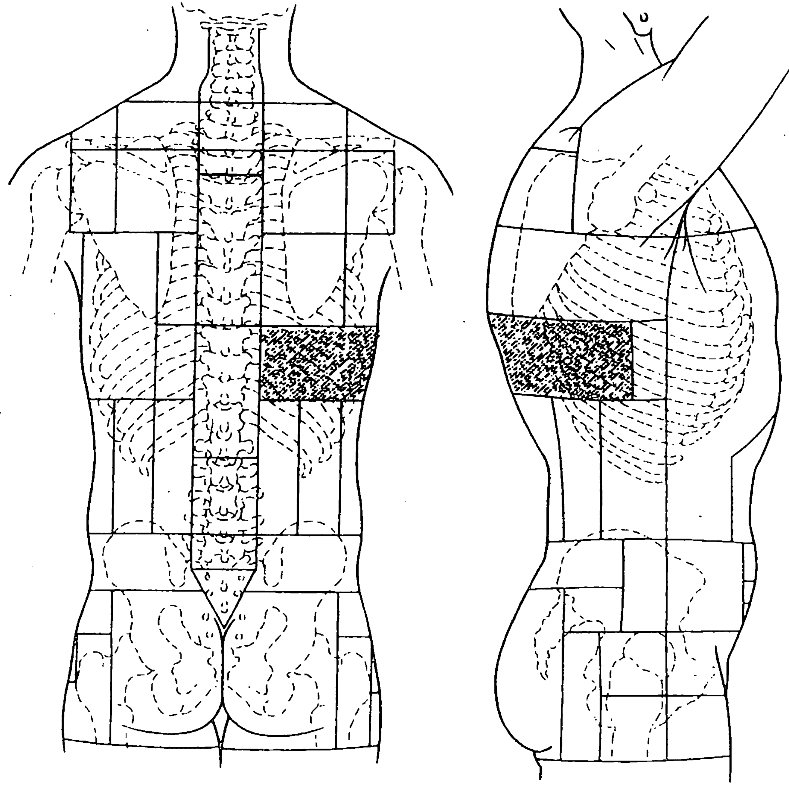

### 丈量方式

上框線：第八胸椎上緣，水平方向劃條隱形線。
下框線：第十一胸椎上緣，水平方向劃條隱形線。
前框線：手臂與前方身軀交接皺褶線，向後推 2 ½ 指寬，劃條垂直隱形線。
後框線：人體中線向右推 2 指寬，劃條垂直隱形線。

## 櫻桃李 Cherry Plum

區塊：左後腰

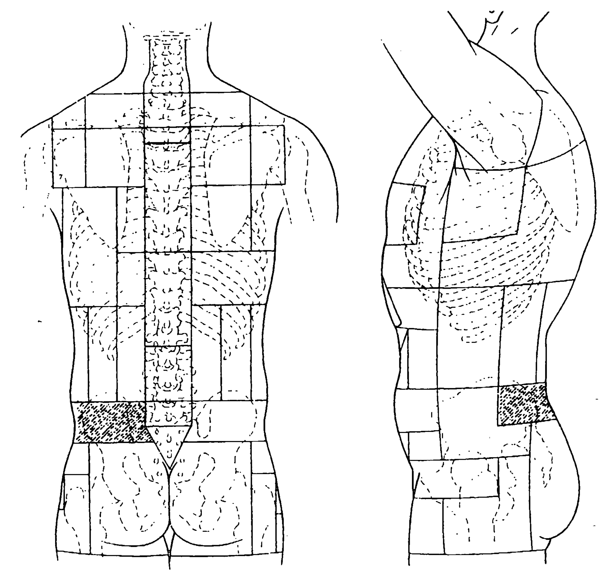

### 丈量方式

上框線：第四腰椎上緣，水平方向劃條隱形線。
下框線：薦椎高度的中點，水平方向劃條隱形線。
內框線：上起點為人體中線向左推 2 指寬與上框線的交叉點；下終點為下框線與薦椎的交叉點。從上起點開始沿著脊椎外緣向三角形薦椎方向運行到終點的隱形折線。
外框線：左手臂與後身軀交接折線，向下劃條垂直隱形線。

## 金雀花 Gorse

區塊：左胸下方、右大腿

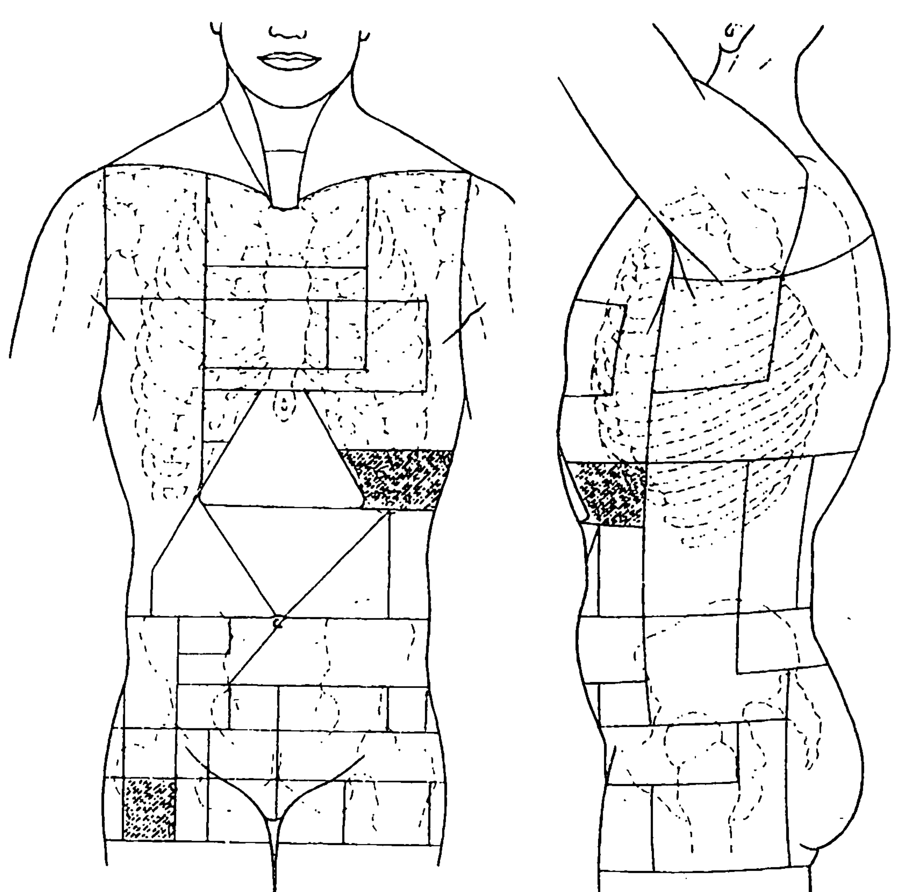

### 丈量方式（左胸下方）

下框線：肚臍和胸骨下緣之間距離的中心點，水平方向劃條隱形線。
上框線：下框線上推 3 指寬，水平方向劃條隱形線。
內框線：胸腔內緣斜線。
外框線：左手臂與前身軀交接的皺褶線，向下劃條垂直隱形線。

### 丈量方式（右大腿）

上框線：恥骨下緣，水平方向劃條隱形線。
下框線：右臂夾下推 1 指寬，水平方向劃條隱形線。
內框線：右乳頭，劃條垂直隱形線。
外框線：右手臂與前身軀交接的皺褶線，向下劃條垂直隱形線。

## 冬青 Holly

區塊：右前身軀

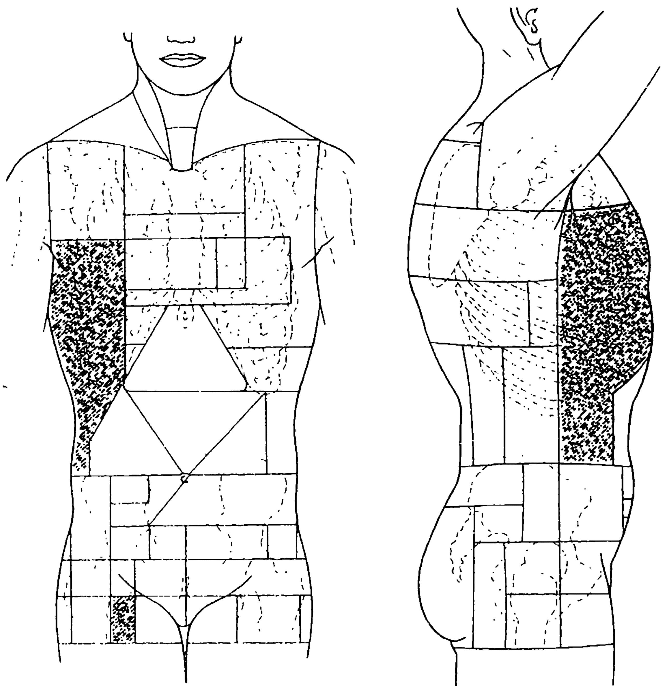

### 丈量方式（上方區塊）

上框線：第三胸肋間，水平方向劃條隱形線。
下框線：肚臍，水平方向劃條隱形線。
前框線：頂點為人體中線右推四指寬，與上框線的交叉點。從頂點開始，垂直向下延伸到胸腔底端，接著順勢沿著胸腔下緣斜向第十一條肋骨底端，在此向下劃條垂直隱形線。
後框線：右臂與前身軀相交的皺褶線，劃條垂直隱形線。

### 丈量方式（下方區塊）

上框線：恥骨下緣，水平方向劃條隱形線。
下框線：右臀夾下方1指寬之處，水平方向劃條隱形線。
內框線：人體中線右推4指寬，劃條垂直隱形線。
外框線：內框線右推2指寬，劃條垂直隱形線。

## 冬青 Holly

區塊：左手背、右手掌

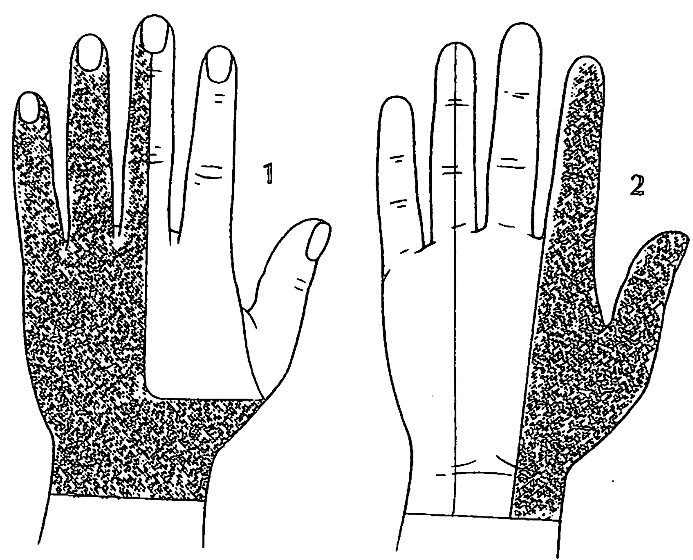

### 丈量方式（1）

下框線：左手腕往手肘方向推 1 指寬，水平方向劃條隱形線。
外框線：起點為下框線與手臂的交接點；終點為左手中指指尖中點。起點開始順著手腕、手背外緣、小指、無名指、中指外緣運行到終點的隱形曲線。
內框線：起點為左手中指指尖中點；終點為大拇指掌指關節下端；中線：左手腕往指尖方向推 3 指寬，與終點同高。起點開始向下劃條垂直隱形線到中線，沿著中線往終點方向前進的隱形 L 型線。

### 丈量方式（2）

下框線：右手腕往手肘方向推 1 指寬，水平方向劃條隱形線。
外框線：起點為下框線與手臂的交接點；終點為右手食指指尖左側。起點開始順著手腕、大拇指、食指外緣運行的終點的隱形線。
內框線：起點為右手臂外緣向內推 1 指寬與下框線的交接點；終點為右手食指尖左側。連接起終點的垂直隱形線。
◎此區塊並不包含食指內側區域。

## 忍冬 Honeysuckle

區塊：前身軀

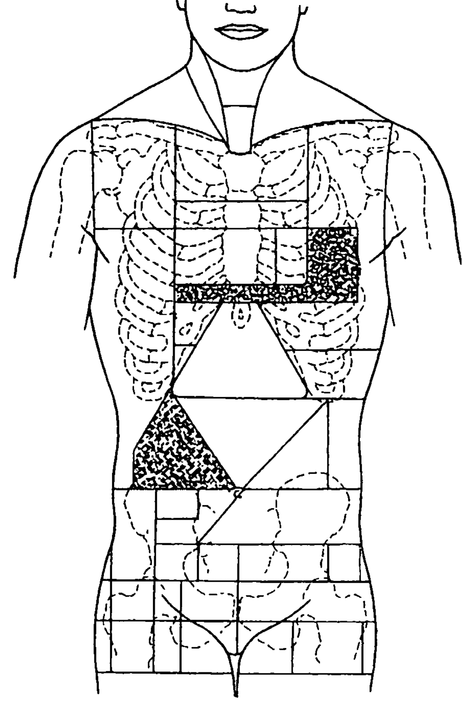

### 丈量方式（左胸區塊）

上框線：第三胸肋間，水平方向劃條隱形線。
下框線：第七胸肋間，水平方向劃條隱形線。
外框線：人體中線向左推 8 指寬，劃條垂直隱形線。
內框線：外框線向內推 4 指寬，劃條垂直隱形線。

### 丈量方式（中央區塊）

上框線：第七胸肋間，水平方向劃條隱形線。
下框線：上框線向下推 1 ½ 指寬，水平方向劃條隱形線。
外框線：人體中線向左推 8 指寬，劃條垂直隱形線。
內框線：人體中線向右推 4 指寬，劃條垂直隱形線。
◎以上兩區塊相接成倒 L 型。

### 丈量方式（右腹區塊）

下框線：肚臍，水平方向劃條隱形線。
內斜線：起點為右側第十節肋骨內緣；終點為肚臍。連接起終點的隱形斜線。
外框線：起點為右側第十節肋骨內緣。從起點開始順勢沿著胸腔下緣斜向第十一條肋骨底端，在此向下劃條垂直隱形線。

## 角樹 Hornbeam

區塊：左側身

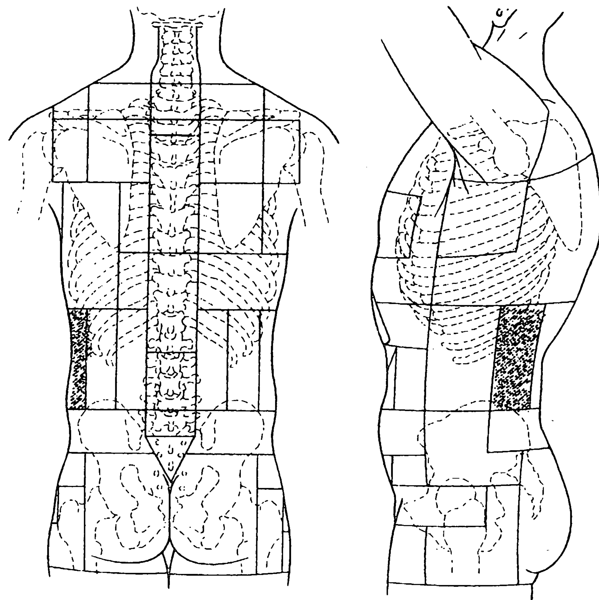

### 丈量方式

上框線：第十一節胸椎上緣，水平方向劃條隱形線。
下框線：第四節腰椎上緣，水平方向劃條隱形線。
前框線：左手臂與後身軀交接皺褶處，向下劃條垂直隱形線。
後框線：前框線向後推 3 指寬，劃條垂直隱形線。

## 溝酸醬 Mimulus

區塊：背部

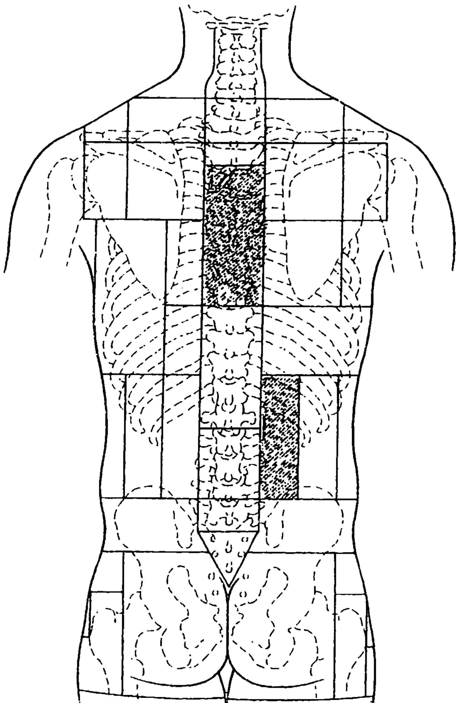

### 丈量方式（脊椎區塊）

上框線：第三節胸椎上緣，水平方向劃條隱形線。
下框線：第八節胸椎上緣，水平方向劃條隱形線。
內外框線：人體中線為基準，往左右方向各推 2 指寬，各劃一條垂直隱形線。

### 丈量方式（右下背區塊）

上框線：第十一節胸椎上緣，水平方向劃條隱形線。
下框線：第四節腰椎上緣，水平方向劃條隱形線。
內框線：人體中線為基準，往右推 2 指寬向下劃條垂直隱形線。
外框線：內框線為基準，往右推 3 指寬，向下劃條垂直隱形線。

## 橄欖 Olive

區塊：上背

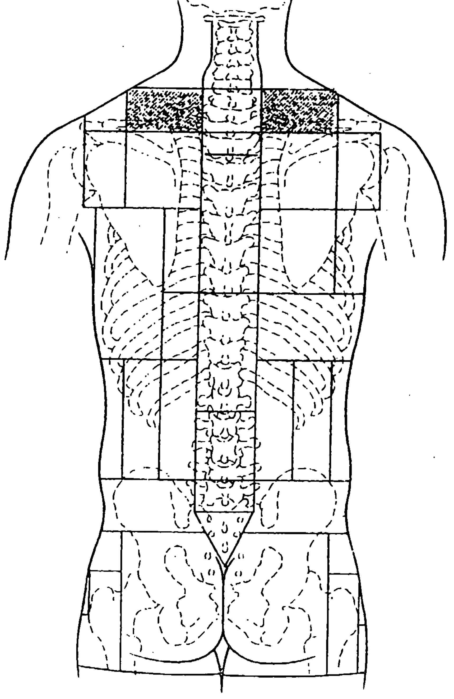

### 丈量方式（右上背）

上框線：第六節頸椎上緣開始，沿著斜紋肌的上緣肌稜線往右推展。
下框線：第二節胸椎上緣，水平方向劃條隱形線。
內框線：背部中線開始，往右推 2 指寬，劃條垂直隱形線。
外框線：內框線往右推 6 指寬，劃條垂直隱形線。

### 丈量方式（左上背）

上框線：第六節頸椎上緣開始，沿著斜紋肌的上緣肌稜往左推展。
下框線：第二節胸椎上緣，水平方向劃條隱形線。
內框線：背部中線開始，往左推 2 指寬，劃條垂直隱形線。
外框線：內框線往左推 6 指寬，劃條垂直隱形線。

## 松樹 Pine

區塊：右側身

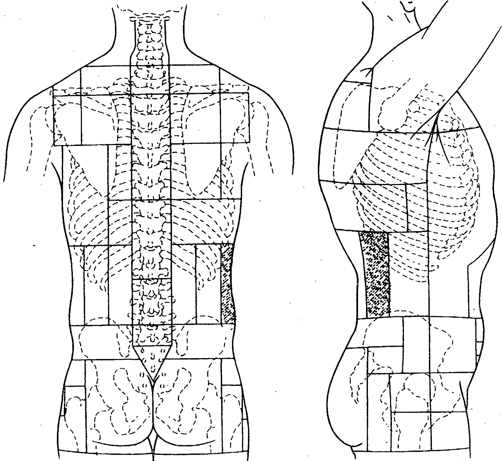

### 丈量方式

上框線：第十一節胸椎的上緣，水平方向劃條隱形線。
下框線：第四節腰椎的上緣，水平方向劃條隱形線。
前框線：右手臂和後身軀交界皺褶處，向下劃條垂直隱形線。
後框線：前框線向後推 3 指寬，劃條垂直隱形線。

## 松樹 Pine

區塊：左臉頰

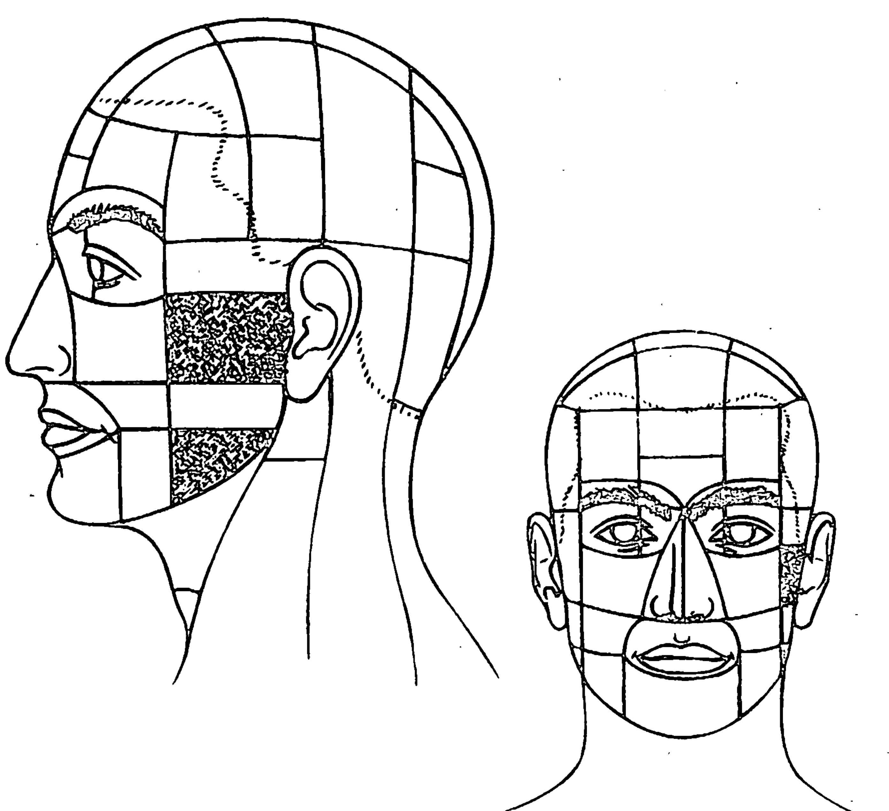

### 丈量方式（上方區塊）

定位點：左眼眶下方稜線水平方向向耳朵延伸和左眉眉尾向下垂直對齊之點。
前框線：左眉尾，向下畫條垂直隱形線。
後框線：臉與左耳廓前方的交接線。
上框線：前框線與左眼眶下方稜線的交點，水平方向畫條隱形直線。
下框線：鼻底，水平方向畫條隱形直線。

### 丈量方式（下方區塊）

定位點：左嘴角水平方向向後延伸和左眉眉尾向下垂直交會之點。
上框線：左嘴角，水平方向畫條隱形直線。
前框線：左眉尾，向下畫條垂直隱形線。
下框線：下顎骨稜線。起點為前框線和下顎骨稜線的交接點；終點為上框線和下顎骨稜線的交接點。

## 紅栗花 Red Chestnut

區塊：左背

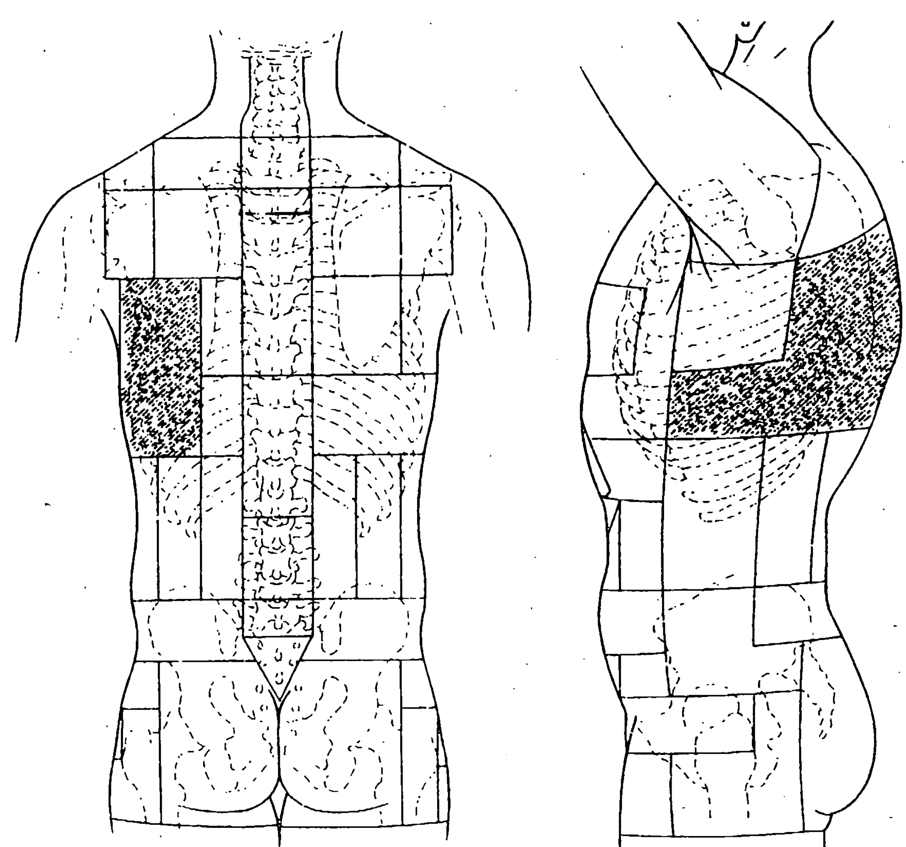

### 丈量方式（左後背）

上框線：第五胸椎上緣，水平方向劃條隱形線。
下框線：第十一胸椎上緣，水平方向劃條隱形線。
內框線：人體中線往左邊延伸 5 指寬，劃條垂直隱形線。
外框線：左手臂和後身軀相交皺褶線，向下劃條垂直隱形線。

### 丈量方式（左側身）

上框線：第八胸椎上緣，水平方向劃條隱形線。
下框線：第十一胸椎上緣，水平方向劃條隱形線。
前後框線：左手臂和前後身軀相交皺褶線，各自向下劃條垂直隱形線。

◎以上兩區塊相接成 L 形。

## 紅栗花 Red Chestnut

區塊：左肩

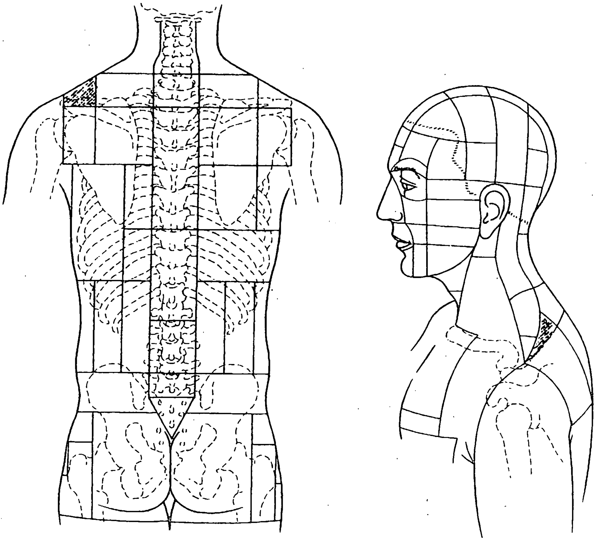

### 丈量方式

- 上框線：斜方肌上緣肌稜線。最高點與第六頸椎上緣同高。
- 下框線：第二胸椎上緣，水平方向劃條隱形線。
- 外框線：手臂和後身軀交接皺褶線，向上劃條垂直隱形線。
- 內框線：外框線向脊椎方向推 3 指寬，劃條垂直隱形線。

## 岩薔薇 Rock Rose

區塊：下腹

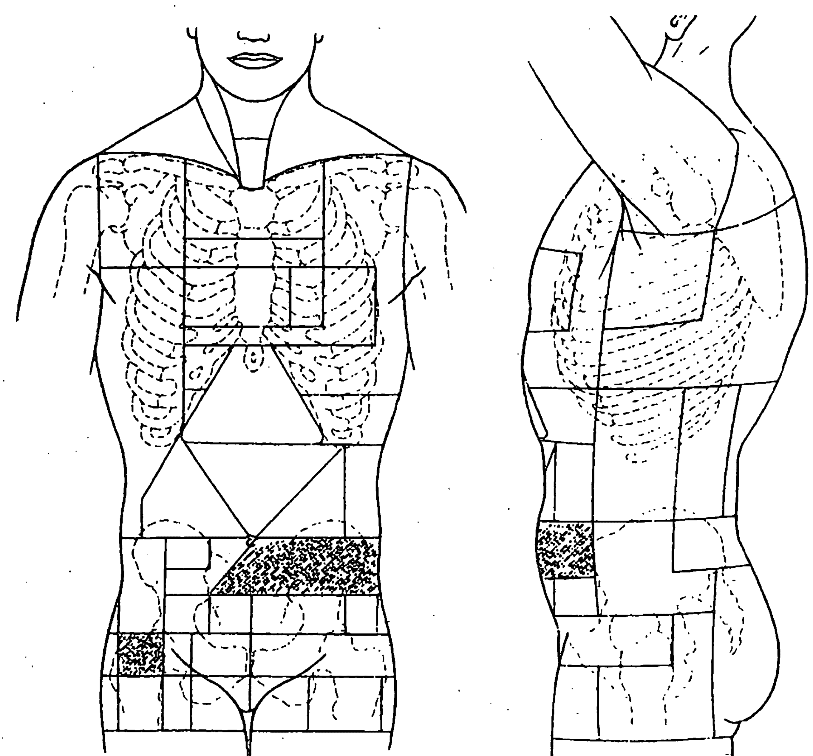

### 丈量方式（左腹區塊）

- 上框線：肚臍，水平方向劃條隱形線。
- 下框線：上框線向下推 5 指寬，向左找到骨盆髂脊最上端突出點，水平方向劃條隱形線。
- 內框線：上起點為肚臍；下終點為人體中線與下框線交點再左推 3 指寬之處。連接上起點和下終點的隱形斜線。
- 外框線：左手臂和前身軀交接皺褶處，向下劃條垂直隱形線。

### 丈量方式（右下區塊）

- 上框線：恥骨上緣上推 2 指寬，水平方向劃條隱形線。
- 下框線：恥骨下緣，水平方向劃條隱形線。
- 內框線：右乳頭，向下劃條垂直隱形線。
- 外框線：右手臂和前身軀交接皺褶處，向下劃條垂直隱形線。

## 岩水 Rock Water

區塊：骨盆左側

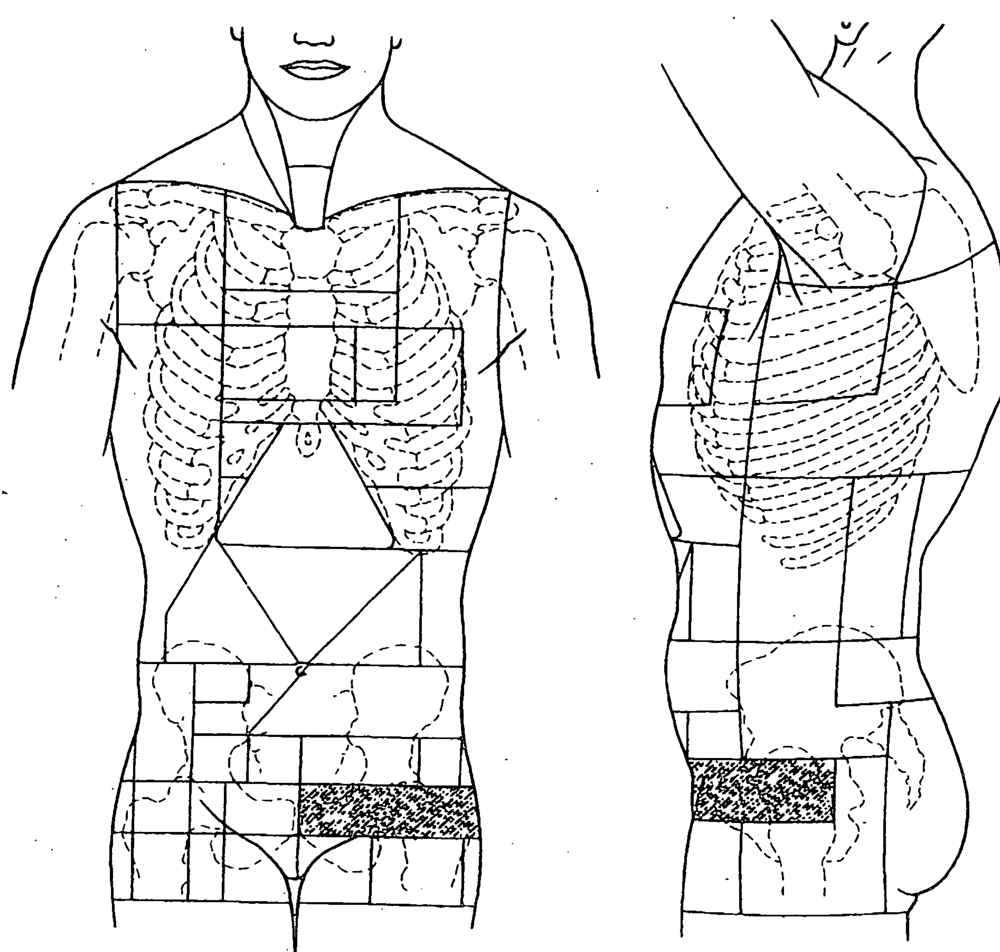

### 丈量方式

- 上框線：恥骨上緣上推 1 指寬，水平方向劃條隱形線。
- 下框線：恥骨下緣，水平方向劃條隱形線。
- 內框線：人體中線。
- 外框線：左手臂和後身軀交接皺褶處，向下劃條垂直隱形線。

## 甜栗花 Sweet Chestnut

區塊：臀部

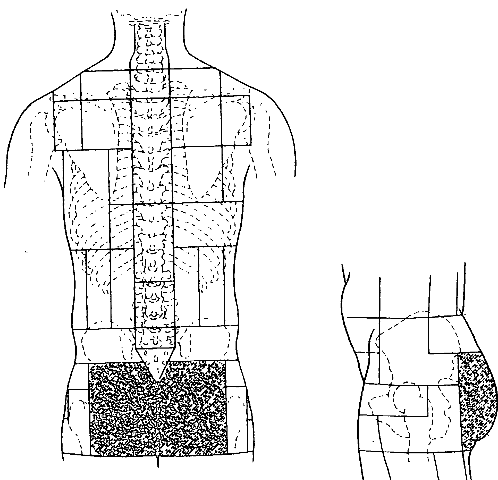

### 丈量方式

上框線：薦骨高度中點，水平方向劃條隱形線。
下框線：兩臀夾下推 1 指寬，水平方向劃條隱形線。下框線在兩腿間結束於肛門和生殖器的中間。
左右框線：以臀股溝爲基準，各往左右推 2 手掌寬，各劃一條垂直隱形線。
◎此區塊緊鄰 204 頁松樹的倒三角形薦骨區塊，甜栗花區塊要劃除此松樹區塊。

## 甜栗花 Sweet Chestnut

區塊：左腰

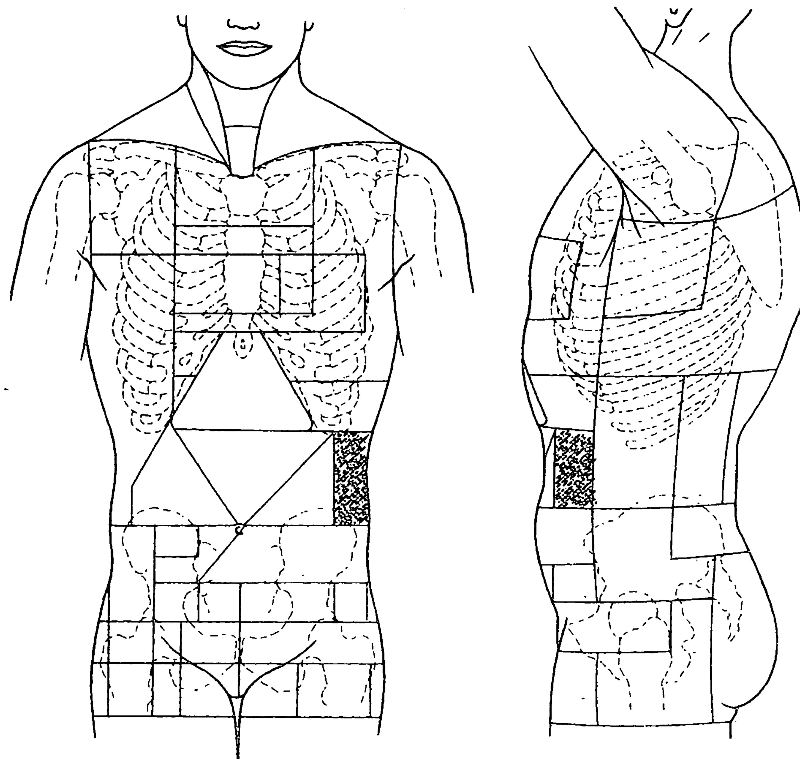

### 丈量方式

- 上框線：肚臍和胸骨下緣的距離中點，水平方向劃條隱形線。
- 下框線：肚臍，水平方向劃條隱形線。
- 內框線：左乳頭，向下劃條垂直隱形線。
- 外框線：左手臂和前身軀交接皺褶處，向下劃條垂直隱形線。

## 馬鞭草 Vervain

區塊：前身軀

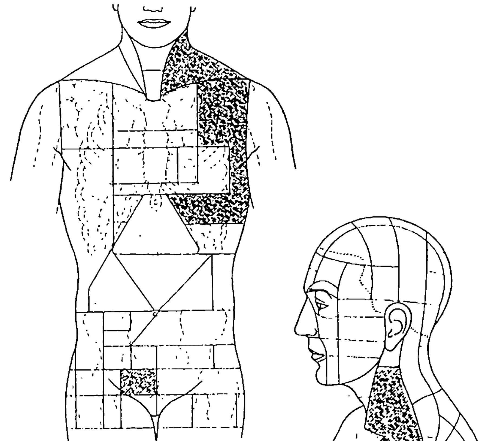

### 丈量方式（左頸梯形區塊）

上框線：左耳下方約 2 指寬之處，水平方向劃條隱形線。
下框線：鎖骨上緣稜線。
內框線：順著胸鎖乳突肌內緣稜線運行直至鎖骨突起處。
外框線：順著斜方肌外緣稜線運行，下滑至肩手交接線的上方中點。

### 丈量方式（左胸上部區塊）

上框線：鎖骨上緣稜線。
下框線：第三肋間，水平方向劃條隱形線。
內框線：人體中線向左推 4 指寬，向下劃條垂直隱形線。
外框線：左手臂與前身軀交接的隱形弧線。

### 丈量方式（左胸中間區塊）

上框線：第三肋間，水平方向劃條隱形線。
下框線：第六肋間，水平方向劃條隱形線。
內框線：人體中線向左推 8 指寬，向下劃條垂直隱形線。
外框線：左手臂與前身軀交接的隱形弧線。

### 丈量方式（右下區塊）

上框線：恥骨上緣上推 1 指寬，水平方向劃條隱形線。
下框線：恥骨下緣，水平方向劃條隱形線。
內框線：人體中線。
外框線：人體中線向右推 4 指寬，劃條垂直隱形線。

### 丈量方式（左胸下方區塊）

上框線：第六肋間，水平方向劃條隱形線。
下框線：胸骨下緣下推 3 指寬，水平方向劃條隱形線。
內框線：沿著胸腔內緣下滑的隱形線。
外框線：左手臂與前身軀相交皺褶線，向下畫條垂直隱形線。

◎以上四區塊相接。

## 水堇 Water Violet

區塊：右側身

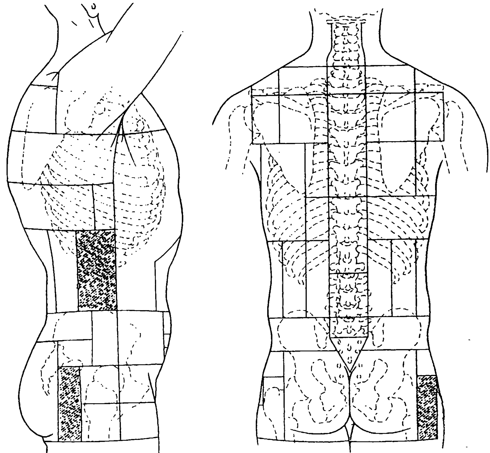

### 丈量方式（上方區塊）

上框線：第十一節胸椎上緣，水平方向劃條隱形線。
下框線：第四節腰椎上緣，水平方向劃條隱形線。
前後框線：手臂和前後身軀交接皺褶線，各自向下劃條垂直隱形線。

### 丈量方式（下方區塊）

上框線：恥骨上緣上推 1 指寬，水平方向劃條隱形線。
下框線：右臀夾下推 1 指寬，水平方向劃條隱形線。
前框線：右手臂和後身軀交接皺褶線，向下劃條垂直隱形線。
後框線：前框線向後推 3 指寬，劃條垂直隱形線。

## 野燕麥 Wild Oat

區塊：前身軀右側

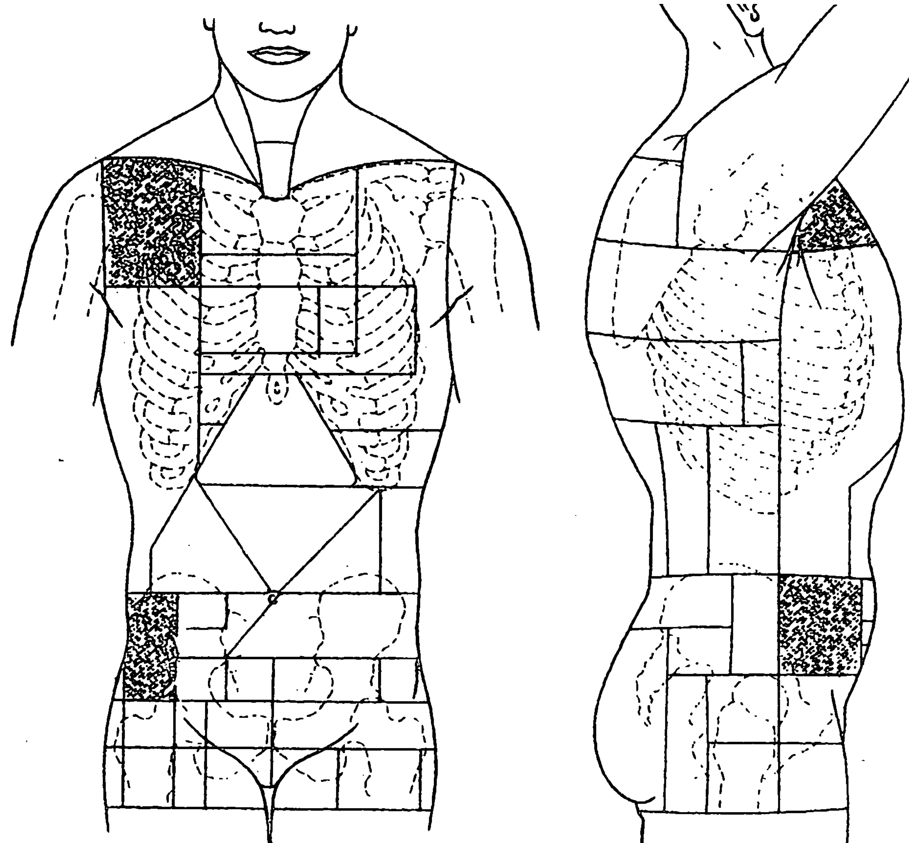

### 丈量方式（上方區塊）

- 上框線：右鎖骨上緣稜線。
- 下框線：第三胸肋間，水平方向劃條隱形線。
- 內框線：人體中線向右推 4 指寬，向下劃條垂直隱形線。
- 外框線：右手臂和前身軀交接的隱形弧線。

### 丈量方式（下方區塊）

- 上框線：肚臍，水平方向劃條隱形線。
- 下框線：恥骨上緣上推 1 指寬，水平方向劃條隱形線。
- 內框線：右乳頭，向下劃條垂直隱形線。
- 外框線：右手臂和前身軀交接皺褶線，向下劃條垂直隱形線。

## 野薔薇 Wild Rose

區塊：左側身

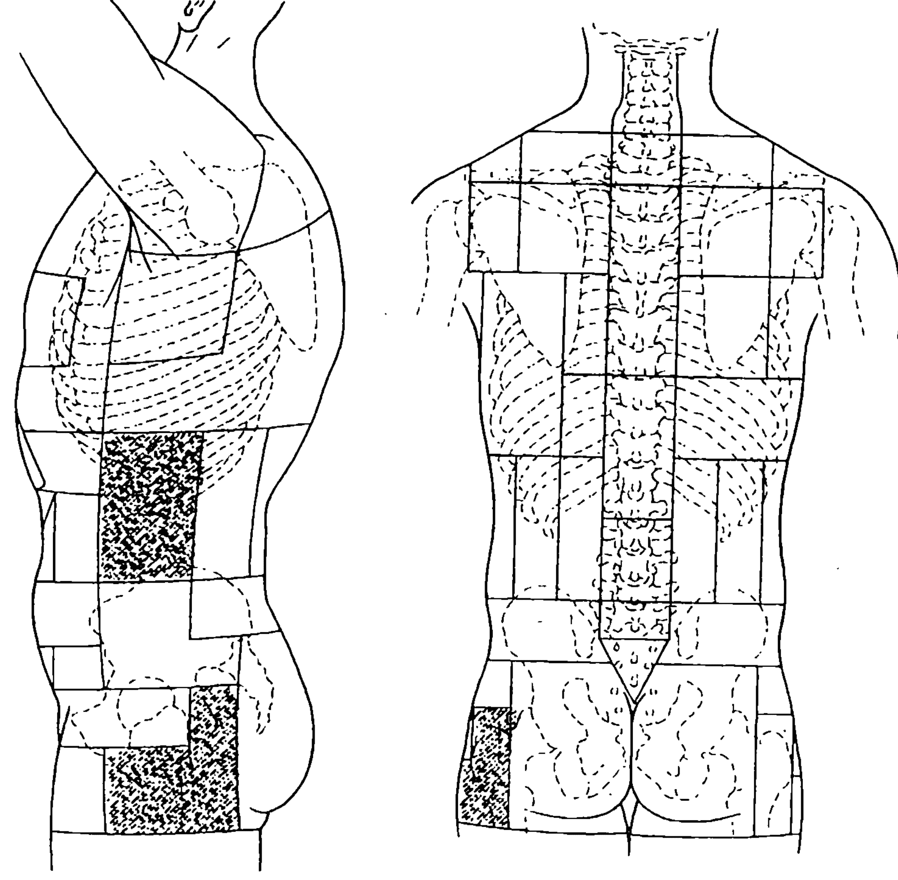

### 丈量方式（上方區塊）

上框線：第十一胸椎上緣，水平方向劃條隱形線。
下框線：第四腰椎上緣，水平方向劃條隱形線。
前後框線：左手臂和前後身軀交接皺褶線，各自向下劃條垂直隱形線。

### 丈量方式（下方區塊）

上框線：恥骨下緣，水平方向劃條隱形線。
下框線：左臀夾向下推 1 指寬，水平方向劃條隱形線。
前後框線：左手臂和前後身軀交接皺褶線，各自向下劃條垂直隱形線。

### 丈量方式（後側區塊）

上框線：恥骨上緣上推 1 指寬，水平方向劃條隱形線。
下框線：左臀夾下推 1 指寬，水平方向劃條隱形線。
前框線：左手臂和後身軀交接皺褶線，向下劃條垂直隱形線。
後框線：前框線向後推 3 指寬，劃條垂直隱形線。
◎下方與後側兩區塊相連接。

## 楊柳 Willow

區塊：後腰

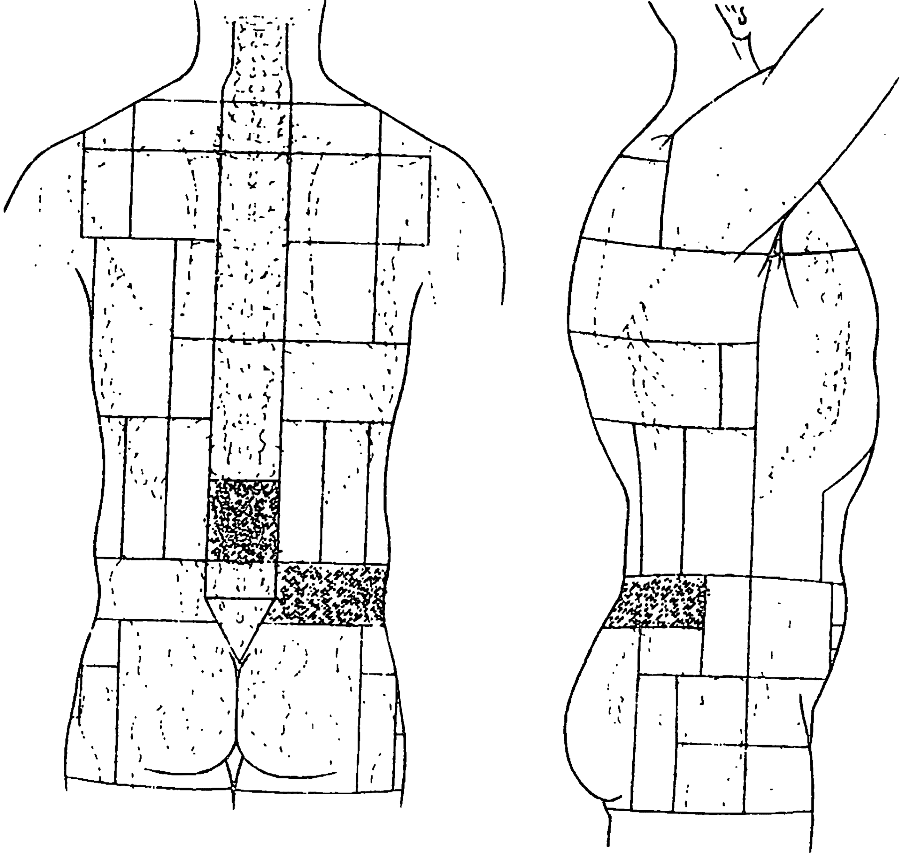

### 丈量方式（腰椎）

上框線：第一節腰椎上緣，水平方向劃條隱形線。
下框線：第四節腰椎上緣，水平方向劃條隱形線。
左右框線：人體中線為基準，往左右方向各推 2 指寬，各自劃條垂直隱形線。

### 丈量方式（右後腰）

上框線：第四節腰椎上緣，水平方向劃條隱形線。
下框線：薦骨高度中點，水平方向劃條隱形線。
內框線：第四腰椎右側向下運行至倒三角薦骨，再沿著倒三角薦骨斜線下滑至斜線中點的隱形折線。
外框線：內框線向右推 10 指寬，劃條垂直隱形線。

## 按圖索驥、做自己的療癒師

{新巴赫花精身體地圖} 完全圖解！

本書兩位作者都是擁有高敏感度的自然療法醫師。他們成功地透過所發現的「巴赫花精皮膚反應區」，將巴赫花精的治療帶向了一個嶄新的境界，讓巴赫花精的治療變得更簡易、更迅速、更有效。不敏感的人可以直接運用皮膚反應區的檢測與療癒方法來有效工作，治療師可以用在他的治療工作上，而花友們則可以運用在自我療癒上。

- ◎ 圖解花精與身體對應的部位，讓個人療癒更簡易進行
每一種巴赫花精都與人類身體某部位的皮膚表面有關聯，這近似中國人所謂的腳底穴道反射區。負面的情緒會在這些部位產生能量結構上的變化，通常伴隨著疼痛或感受能力的失調。它們一共有兩百四十四個反應區，這些反應區以兩百張清楚的圖片呈現出來，我們可以清楚地看到它們坐落的位置，讓我們輕易地從身體的部位直接認出當事人所適用的花精。

- ◎ 巴赫花精外用法大幅提升花精療癒效果
透過使用敷布或是乳霜，將其放置或塗抹在受到干擾的反應區，就可以大幅度地提升花精的效果。比起內服花精，花精外用法不只更快速地使負面的情緒狀態獲得緩解，連身體上的不適也會在使用花精皮膚外用法後獲得改善。

- ◎ 巴赫花精在心靈層面及美容上的運用
我們可以藉此處理心靈上的困境，例如：有關罪惡感的問題，我們可以在罪惡感在身體上作用的部位直接加以處理；我們也可以透過皮膚反應區做預防性的處理，比如若有攻擊的傾向，我們就可以預先處理相對應的巴赫花精皮膚反應區，以避免膽結石的形成等等。書中描述了很多案例，為巴赫花精的新療癒形式的有效性，提供了有力的佐證。
而由於心理層面的狀況會反應在皮膚表面上，我們現在也可以將巴赫花精運用在美容上。許多實際例子說明了巴赫花精在化妝品上的運用。

> ※ 本書適合對象遍及：身體工作者、心理輔導工作者、能量療癒師、中醫師、自然療法工作者、靈性工作者、對花精有興趣的自學者。
新竹馬偕醫院院長 楊秋興、李順哲中醫診所院長 李順哲、加拿大自然醫學醫師 王佑驊
一致推薦

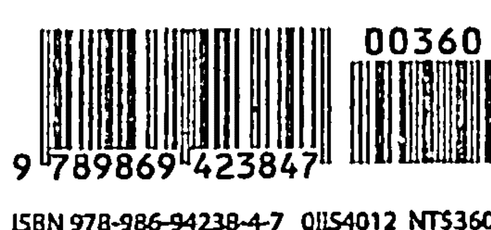

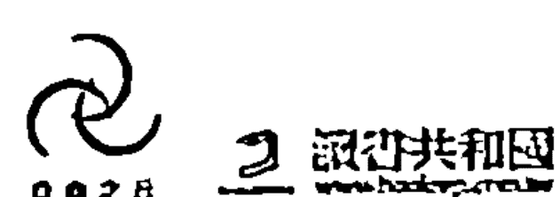