# 新月水晶50+完全解密

# 序

前年春节我刚从埃及出差返台，就在我把以当地所产雪花石膏雕刻成的伊西斯女神（Isis）和一只青金石猫雕件摆在祭坛上时，很久未联系的一位前辈突然发讯息给我，说出版社的朋友希望能做一本以水晶为主的书籍，问我有没有兴趣。

有趣的是，这位前辈其实算是家族友人，我们认识多年，她知道我跟水晶的缘分是我于 2013 年在内湖开设一间身心疗愈和水晶工作室之时，我还记得她当时选择的是温柔美好的紫锂辉首饰，特别衬她充满智慧且低调的气质。

我非常热爱水晶和宝石，我们家中三位女性的英文名字亦都是宝石。无庸置疑，晶矿是我的爱好，但在专业方面，当时的我并没有把握，毕竟国外的水晶大师这么多，我自己都是诚惶诚恐地阅读那些资深水晶能量老师与灵媒的著作，要自己写一本还是不免有些紧张，为此我跟出版社来回讨论的时候很难定位这本水晶书的方向，但这些讯息或许就像晶矿孕育的过程，不同的有机与无机成分堆积、聚合，经历温度与湿度变化和时间的沉淀才能形成矿脉；而我更像是采矿人，会遇见不同的矿脉，再选择适合雕琢与使用的给读者。

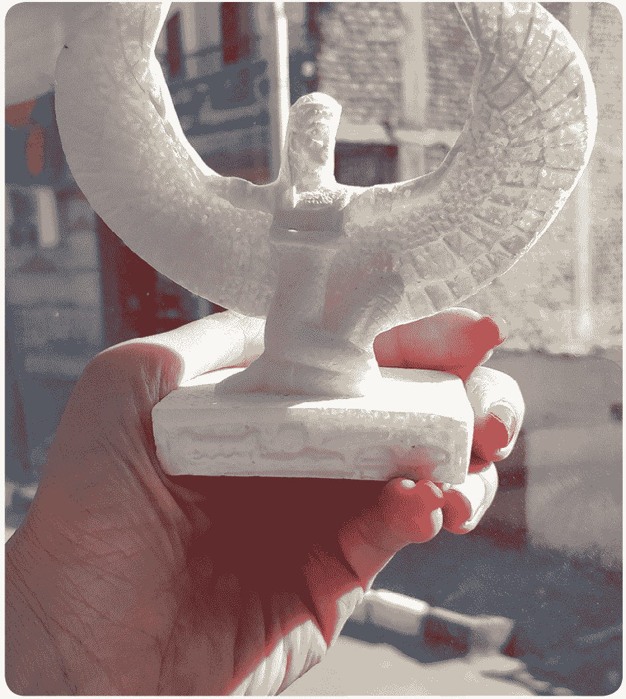

图 以雪花石膏刻成的伊西斯女神

起初，想用占星学的角度来做水晶书，丰富的星盘谘询案例让我倍增信心，加上从事文字工作 16 年，我总是希望自己写的东西是普罗大众都可以轻松理解并受用，然而就像大众很容易被坊间流传的错误或偏颇的星座内容淹没甚至误导一样，我发现水晶与晶矿的信息就像占星学一样庞大，且不同派别间之意见经常分歧，这些内容过于繁杂，对读者来说实用性真的很低。最终我跟出版社决定将范围缩小在水晶本身，并基于实用性的考量，把这本书聚焦在新月许愿和开运的应用。

这本书绝对不会是你探索水晶与宝石世界的终点，但希望它能成为你的一块入门砖，帮助你与这些大地的馈赠创建起更个人化的链接，并将它们的美好融入生活当中。

# 我与水晶矿石的不解之缘

约莫小学六年级，某天放学回家经过新北市某条有名的老街，发现一间卖串珠的店面。猜想老板娘看我是个孩子，没敢大力推销名贵的矿石；当时什么都不懂的我凭直觉挑选一条紫水晶和黑曜石手串。之后，还因听信老板娘的话，将紫水晶放入冷冻库净化，没想到，它里面出现了冰裂痕迹，那时心里真的非常难过。母亲还因看不上这串在路边乱买的水晶，特意向进出口晶矿的熟人买条 AAA 级的紫水晶手串给我。但我也不知为什么，就是特别执着自己买的那一串。

十几年后，至加拿大求学八年再度返台的我，绝对想不到在历经跨洋跨洲、北美东西岸长途搬家无数次之后，这两串珠子依然对我不离不弃。某次在朋友的聚会上遇见一位女生，看起来特别仙气：一头长卷发和一身波希米亚风的打扮，告诉我她自己从事能量工作。于是我向她请教，是否有正确净化这些手串的方式。孰料她不但愿意帮我处理，还跟我解释：手珠就如同电池一般，需要正负极能量依序正确排列，才能发挥出它的功效。我十分信任地将其中一串称不上好看、但我宝贝十几年的紫水晶手串交予她处理；当我们再次相约，她将手串还给我，并为我戴上。神奇的事情就这样发生了，我在她跨过桌面取饮料时，第一次感受到能量；我明确感知到手上的紫水晶在她靠近时“动了”；看着我震惊的表情，对方并没有多做解释，只说了些普通人听不懂的能量术语。后来，这个人成为我的能量治疗师，并带我踏上身心灵成长的道路，我们变成相伴十几年的挚友。

我属于“敏感”体质，从小经常遭遇民间所称的“鬼压床”，虽然我不觉得害怕，单单觉得无法好好睡觉很麻烦，但这些经历也足以说明为何在我第一次进入晶矿世界时，便直觉地选择具有保护与扎根效果的紫水晶与黑曜石；那时我还是个喜欢粉色与蓝色的少女，却反常地选择了老人系的深紫色跟黑色的晶矿。

我正式开始接触能量物品时，首先选择的是含有水晶精华成分的 Aura Soma，接着，便在朋友的收藏中购入货真价实的黄水晶，亦很快地和矿石产生能量链接。尽管当时坊间盛行招财与招桃花之法，却仍未影响我选择矿石的种类。没过几年我迎来人生第一次的土星回归注 1，莫名丢掉高薪的工作，使我陷入迷茫。这时的我，正陷入对晶矿，即被高品质的青金石和菱锰矿吸引的狂热，此时若踏入任意一家水晶店铺必定会被狠狠地洗劫一番。急着找到新出路的我，就在逛某灵性服饰店时一眼看上老板娘额外经营的晶矿首饰，竟突发奇想地有了创业的冲动。

我谘询了专业的占星师，她说我与晶矿有着累世的缘分（我平时并不迷信，但不知为何，只要一沾上和水晶有关的事就会丧失理智）。于是乎，冲动地拿出前公司打发我的数十万，批下老板娘所拥有的全部水晶，打算开设一个水晶工作室！殊不知这个工作室不仅不会帮我带来任何财富，还让我快速负债。整个过程令我身心千锤百炼，并在这样的淬炼中开发诸多潜能，让我重新认识自己，奠立成为能量疗愈师与占星师的根基。

掏出仅有的存款买下大量水晶后，我甚至为那些还未谋面的晶矿们租下内湖一间实木地板的套房，且面对着一座不对外开放的公园，环境清幽。一心想脱离原本的生命状态：在金融业几年不上不下，盲目追逐着股票与社会认同，身心在大量外在刺激下无比疲惫，早已顾不上自己根本没有任何关于水晶矿石的专业知识，便轻易在极短的时间内逐一个大梦，且等着被击碎。

当一箱箱的晶矿抵达时，我呆住了，除了曾在店里看到的少量首饰和天使雕塑品仍在发光、发亮外，半数以上的原矿都灰不拉几的；还有许多水晶、矿石串珠和黄铁矿串令我不知从何下手，再加上几十个大型水晶球，天啊！完全懵圈的我只好求助治疗师，尽管她斥责我怎么会做出买下一整间店水晶的这种荒唐行为，仍不忍地前来救火。

因为拥有的水晶数量实在过于庞大，若按照我平时以 Aura Soma 大师精华来养护的习惯进行，净化这么多箱晶矿的成本势必会高得吓人，亦会耗费大把时间。于是，她教我一个方式：让可以碰水的晶矿沐浴在花精制成的能量水中，同时趁我不注意时对所有水晶们画下灵气符号，跟它们沟通“现在已经易主”了。接下来的一个星期，我一反平时浮躁、爱玩的状态，乖乖地在工作室里洗晶矿，很神奇也十分迅速地和它们创建起链接。我开始边哼着未知语言与即兴的音符，边不由自主地拿起软刷子，刷洗泡过的晶矿与串珠；接着，播放使用水晶钵的音乐，捧着鼠尾草在工作室跳舞静心。

一周后，水晶的前主人来到我的工作室交予电子磅秤、水晶书籍与手工制作工具等。她万分震惊地发现这些矿石们仿佛整形般脱胎换骨，甚至指着几个小型白水晶簇与天河石串珠大喊“你到底是谁？”据她当时的说法，当天河石放在我手上，由原本的浅蓝绿色变成天蓝色——如拉利玛般的蓝色；绿色电气石也隐隐发出内涵的蓝宝石光芒，透露着深层疗愈的能量。现在回想起来便不难看出，这是意识与认知要翻转和扩张的症兆。在她巡视一圈这新空间时，有一座比较大的紫白水晶骨干突然裂开，掉下一片单尖白水晶——它后来变成我进行身体疗愈的工具。当时我随意地把几颗不同颜色的方解石球摆放出来，她问我“你在摆阵吗？”我回答自己从没学过，只是按照直觉摆放，殊不知自己确实有感受到晶矿的本质与拥有排列它们的潜力。

我花时间阅读关于水晶的书籍、蒐集晶矿的资料，为的是要在市场上售卖这些宝贝，但除了首饰、矿石金字塔和透石膏权杖外，均很难销售出去，尤其是我自己做的饰品根本就“没人要”。我焦急地请教几位前辈，得到一致的回复：如果水晶们在你这里过得太好，它们是不会离开你的；你最好每天告诉它们：你们必须出去工作！

我照办了，但它们还是不愿意出去工作，没有固定收入却仍要负担各种开销，我绞尽脑汁地喂养它们和这美丽清幽却乏人问津的工作室。约莫有半年的时间，为了不继续负债，什么样的创作工作都得揽下来；疗愈性质的工作少得可怜，生活作息与饮食习惯却改变许多，从原本身穿套装、踩着高跟鞋、追着股票的都会女性，摇身一变成为素颜、着棉麻宽松衣裤的疗愈系女生。整个人慢下来、瘦了一大圈，我的自我认同不再来自于我做什么工作或拥有什么能力。

我第一次明白生活的一切随时可能改变，根本不需要被所谓的定义僵化。忽然之间，生命的意义再也不是去抓取什么物质，或是以成就换取自我价值，也不是靠各种努力与作为得到认同和安全感。生活本身就是毫无目标地全情投入，在我每日与晶矿静心并感到一股前所未有的自在与喜悦时，接到一通来自陌生人的电话；聊几句（其实比较像是质询）后，我被邀请前往深圳三个月，进行科技公司的内部英语培训，不仅包交通和住宿，还要给我一百万！莫名地解除负债，再次踏上异乡的新生活。

之后还发生了许多高潮迭起的故事。

我至今还没改掉一进水晶矿石店就有可能花光现金或刷爆信用卡的习惯，或一看到他人家里的水晶，甚至是看见风水易经馆中的晶矿乱放而忍不住亲手重新摆阵……，所幸我已从对水晶矿石一无所知、单凭直觉拍板的小女孩，经历 16 年的淬炼，跟随过数十位能量学、家族系统排列、谭崔、静心冥想、头荐骨、色彩脉轮学、生物能呼吸、创伤治疗身心学、觉醒心理学、现代心理占星、原型与本质占星、能量疗愈、萨满能量、TA 沟通分析、脑神经科学音疗、舞动治疗等领域的国际大师学习，成长为踏足埃及、希腊与巴西等古文明与神话发源地，且拥有众多能量工作经验的疗愈师。

今天，我想透过这本书分享的不只是晶矿和仪式相关的知识，还有一份发掘的历程——发现自己、发现晶矿、发现宇宙与自然的周期，以及每个人和万物的链接。相信每一位阅读此书的你，都能在独一无二的链接与探索当中，找到生命赋予的意义。

* * *

注 1：土星回归是一个人生命当中很重要的流年。第一次发生大概率在 27-31 岁，时长约莫两年半，第一次发生的时候一个人会在土星严苛的挑战与考验下，经历社会化并成长为适应物质世界生存的个体，这个时期通常人们会经历大大小小的冲击性事件。

# Chapter 1 基础应用篇

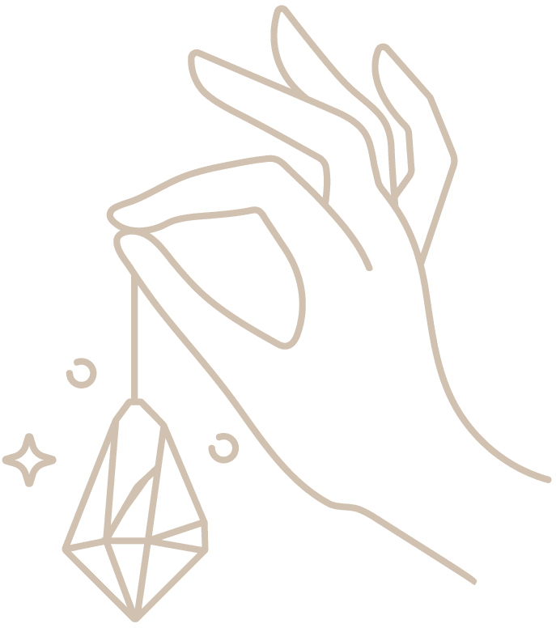

## 水晶矿石的介绍与疗愈功能

千百年来，水晶与矿石深受人类文明重视，可谓是大地历经时间与变迁生成的礼物，一方面十分珍贵美丽，另一方面拥有独特的振动频率和能量，可疗愈身体、心智，甚至是灵魂。从古老的美索不达米亚文化到古埃及、古希腊与罗马文明、中国古代、玛雅人和北美原住民，都曾留下使用水晶作为祈愿与治疗的记载。直到文艺复兴时期，欧美文明受到主流宗教的影响，人们开始相信晶矿的疗愈特性来自于天使，那些后来被统称为“萨满文化”者便不再普及民间。

约莫四五十年前，以水晶作为能量疗愈的法门再次于欧美国家崛起，加上现代科技具备的各种频率测量仪器，虽然尚未得到传统医学的认可，但晶矿的能量与它们可能带来的益处已经变得不再那么玄秘了。

什么是水晶？

水晶（crystal）一词源自希腊语的“冰”，是地球上的天然物质——氧与硅在环境中经过时间的孕育凝聚而成。这些自然产物实际上包含水晶、宝石、矿物与岩石，它们有着不同的物理结构和特性，只是被通俗地以水晶作为总称。

但若是想要了解它们如何使用、保养和存放，以及在购买时如何识别真伪，就需要知道其中的基本差异性，比如常见的天然石英与玛瑙均属于六方晶系的水晶，硬度较高。又如，属于隐晶类的玛瑙也可算是矿物和岩石。

宝石是指被切割且抛光过的水晶、矿物或岩石，切割过的钻石囊括了水晶、矿物或岩石这三种标签。矿物是天然形成且具有特定规律的化学结构，仅是未达到结晶程度，蛋白石和萤石便属此类；加工后它们可以成为昂贵精美的宝石，却不是真的水晶，硬度比较低。岩石则是由不同矿物聚合堆积组成，例如大理石是变质岩、黑曜石是火成岩，但两者都不算是水晶，硬度也偏低。

晶矿庞大的家族分类

晶矿又可分为结晶质与非晶质（amorphous）两类。结晶质内部的原子排列有其周期性，依循特定规则生长成结构对称的物质，且其外部具有规则的几何外型。若原子排列规律且结晶化，矿石的能量就会相对稳定。而非晶质的原子排列不固定，会带来不同的能量变化。

结晶质的原子排列方式固定亦会决定晶体的独特形状。依据晶体结构方向不同、结晶轴长短和晶轴间夹角等关系，又可区分为不同晶系（crystal system）：如等轴晶系、正方晶系、六方晶系、三方晶系、斜方晶系、单斜晶系和三斜晶系。

晶体结构会赋予矿物不同的特性，例如钻石与石墨的原子都是碳，却因生长环境不同，一个经历高压、高温，最终形成稀有罕见且能量非常高频的钻石。而非结晶的石墨却因质地脆弱，难以承载汇聚太多能量。由此可见，水晶的晶体结构必然会决定其能量属性与价值。

晶矿的简易使用分类

晶矿具有不同的颜色，这取决于内含何种矿物、化学成分和杂质。不只如此，还与吸收的波长光线有关，例如全面吸收光的晶矿，外观呈现黑色，不吸收光者呈现透明等。这些晶矿的外观颜色与透光性的差异除了会影响吸引力，也定义其能量与疗愈特性。

晶矿大致上可以区分为：不透光的和透光的。不透光的晶矿可抽出毒素及负能量，透光者则可增加能量与活力。

| 晶矿颜色 | 适合的脉轮 | 功用 |
| 白色或透明的 | 大多适合所有脉轮及身体部位 | 用来增加能量 |
| 紫色系 | 适用于第三眼和顶轮 | 有助于打开直觉力并将人与灵链接 |
| 金色或黄色系 | 适用于脐轮和太阳神经丛 | 可以带来正面的能量与想法若将金色透光的晶矿置于海底轮能打开物质丰盛 |
| 红色系 | 可以用在海底轮或心轮 | 支援心与性的敞开和链接，亦可增加力量与扎根 |
| 蓝色系 | 适用于喉轮或第三眼 | 启动沟通管道并和灵性链接 |
| 绿色系 | 一般适用于身体不同部位或脉轮的修复，特别是心轮 | 带来生理与情感双重层面的疗愈 |
| 银色系 | 适用于腿部、双脚和海底轮 | 达到扎根和吸引丰盛的效果 |
| 黑色或灰色 | 适用于海底轮或任何有强烈创伤或负能量的部位 | 一方面用于扎根，另一方面移除负能量 |
| 粉红色系 | 适用于脐轮或心轮 | 能打开慈悲心与自爱，同时可平衡情绪 |
| 橘色系 | 适用于海底轮、脐轮及太阳神经丛 | 能打开这些脉轮并重新扎根 |

北美的原住民曾将水晶置于枕头下方来催生梦境，以探索意识，并将大型的石英当作透视水晶，用来预知未来。而现代科技大量使用水晶来传输能量，像手表、传感器、变频器、镭射、超音波等精密医疗仪器内部结构都会用到水晶，可见从形而上学到现代科技，水晶代表的意义与使用一直都随着人类与社会生活持续进化。

其实一个人不需要钻研庞大的资料就能在生活里运用晶矿，这本书将最常使用在仪式里和许愿中的晶矿做基本介绍，有了这些基础概念再配合个人的直觉与喜好，你会更容易去选择自己当下最需要且最能支援到自己的矿石。

## 选择适合自己的晶矿

市售的晶矿五花八门，对于新手来说真的很容易眼花撩乱。原则上，建议你可以按照“招财、招桃花、助事业”这几种大方向的需求来选择就会简单许多。当然你也可以更细致一些，依据脉轮能量系统的几个主题来选择相对应的颜色的晶矿，针对性地给予身体和能量体所需的加持。

不过无论是水晶疗愈还是魔法许愿仪式都相当重视“直觉”与“链接”，我将介绍简易的直觉式选择晶矿的方法。

直觉式水晶选择法

以直觉来选择晶矿其实就是看它符不符合你的眼缘了！前面提过，小时我第一次逛晶矿首饰店，莫名地选择紫水晶和黑曜石这两种完全不符合小女孩审美观的手串。那个时候的我还不知道自己属“敏感体质”，即晚上睡觉经常会遇到“鬼压床”；长大后经历多方面身心疗法（body oriented psycho-therapies）与能量学（metaphysical studies）的探索和学习，才能明白那经年累月的睡眠不佳现象，很可能源于神经系统的惯性紧绷，以及精神耗弱所导致的生理感受。能量纯净与否完全是另一个层面的现象，不应相互混淆或以一概全。若整合生理与能量振动频率，紫水晶有助于神经系统放松，自然地成为绝佳的冥想石；黑曜石则有稳定与保护作用。由此可见，小时候的我，全凭直觉亦能符合自己当下的生理与能量需求。

成年后的我曾有很长一段时间，只要进入任何一间晶矿店里，都会被青金石吸引住。在这之前，我尚不知道它与我一直很喜欢的埃及古文明有着很深的渊源，直到多年后，自己前往埃及探索金字塔与各座神庙时，才真切地感受到青金石与我的深刻链接。这些亲身经历让我相信：每个人的感受力与直觉力都可以被开发，且能运用它决定当下所需要的晶矿。

Step 1

以直觉选择晶矿除了视觉上的吸引与喜好外，亦可运用其他感官知觉来判断。建议将晶矿放在不常使用的那只手中（例如习惯右手写字的人请使用左手；若你是左撇子的话，请使用右手），并握住放在胸口前方，花一段时间去感受它带给你的感觉。你可以观察一下自己：

（1）你是否觉得亢奋，还是变得平静？

（2）你是否感到情绪波动、焦躁，还是思绪像污泥般在水中逐渐地沉淀、静止？

当然，“没有感觉”也是一种感觉，但是这绝对非意味着你跟此晶矿无缘，可能只是你和它无法在短时间内创建起能量上的链接。

Step 2

你也可以握住晶矿再闭上眼睛。视觉是一个能量外流的感官，当人将双眼闭上，很容易将专注力带回自身内在。其他感官（听觉、嗅觉、味觉、触觉体感、心灵感受）的接收性会进一步被打开，此时，你可以探索并感受一下与晶矿链接所带来的感受，和先前未链接时有何不同。

Step 3

除了胸前的位置外，将晶矿置放在眉心前方也是一种测试与晶矿链接的方法。眉心这位置对于能量的感应特别敏锐，不过在这位置接收到的讯息更倾向于画面或是不带有情绪的意念或想法，而非触觉或体感。

无论是在哪一个位置，因为你已经在过程当中主动、邀请，且与晶矿创建链接，便能据此判断这是否为当下你想要一起工作的能量物品。对于新手来说，建议避开那些让你感到不舒服的晶矿，而选择让你觉得轻松、稳定、清晰，甚至是愉快和敞开的晶矿。

以我自己为例，我是神经系统非常敏锐的人，许多高频能量的晶矿对我来说，并不适合用来配戴或贴身使用，例如这几年非常受欢迎的赫基蒙水晶和闪灵钻，我握着它们会感受到心脏几乎要从胸口跳出来，且手心发热、思绪快速，有点“魂不附体”的状态。但同样属于高频率水晶的超七或捷克陨石，却能让我在一小段时间的刺激后，逐渐感受到能量场域开始扩张，并在展开放大后进入安顿、沉淀的状态。蓝晶石则可以在不过度刺激神经系统的情况下，迅速协助我进入放松和稳定。

不同晶矿给人带来的感受是非常个人化的，同时需要注意：人的能量状态绝对不是恒常不变的。你可能配戴某晶矿几个月后，便不再需要贴身使用它，这或许会和你自身的变化有关，因此鼓励你多尝试，并记录下自己和不同晶矿链接的感受与感知变化。这些纪录会帮助你更多且更好地了解自己的能量，亦能和晶矿创建更良性的运用关系。

此外，值得一提的是，有些人在水晶矿石数量多的地方会感到头晕。我自己到某些晶矿店时，也会出现发热、冒汗或不太舒服的反应（如肚子痛），但在宝石首饰店却完全没有任何症状出现。这是因宝石店的晶矿纯度高，能量相对集中且稳定，而售卖大量原矿的店铺通常未净化过晶矿，或者未将它们整齐分类安置；尽管风水店号称有将其净化过，也可能程序不完整，或是未定期处理，所以神经系统比较活跃或平时睡眠品质比较差的人就容易产生不良的生理反应；能量体边界感较薄弱的人若身处这些地方，比较容易受到混杂的振动频率影响，产生不良的身心反应。建议有过类似经验的朋友，若打算前往晶矿店可以穿着黑色或深棕色的衣服，使肉体层面先带入扎根与保护的振动频率，或者配戴防辐射与电磁波的物品，减轻潜在的干扰。

## 常见晶矿的功效与应用速览

力量健康系

| 茶晶 | 链接大地的能量、扎根 |
| 红玉髓 | 支持扎根、物质丰盛 |
| 玛瑙 | 调和情绪失衡、扎根 |
| 石榴石 | 带来创造性的能量 |
| 血石 | 促进净化淸理、身体疗愈 |
| 赤铁矿 | 支持扎根、物质丰盛 |

桃花人缘系

| 玫瑰粉晶 | 吸引更高的爱、恋情 |
| 红纹石／菱锰矿 | 打开心、疗愈情伤 |
| 珊瑚 | 链接古老、萨满的智慧 |
| 珍珠 | 链接智慧、阴性能量 |
| 红宝石 | 发展较高脉轮、创造力 |
| 草莓晶 | 调和关系、提升爱的力量、吸引姻缘 |
| 蛋白石 | 促进情感疗愈 |
| 月光石 | 平衡情绪、唤醒透视能力、直觉 |

财富事业系

| 黄水晶 | 链接智慧、疗愈第三脉轮 |
| 虎眼石 | 支持扎根、打开力量、平衡第三眼 |
| 琥珀 | 链接古老的智慧、力量 |
| 玉／翡翠 | 代表帝国和皇家、古老的智慧 |
| 黄铁矿 | 吸引物质丰盛 |
| 靑金石 | 促进更高的表达 |
| 苏打石／方纳石 | 打开喉轮 |

潜能开发系

| 碧玺／电气石 | 灵性打开 |
| 托帕石 | 促进自我表达、音乐及艺术的天赋打开 |
| 砂金石 | 疗愈身体的疾病 |
| 绿松石 | 链接不同向度的沟通、萨满能量 |
| 海蓝宝 | 链接上师与灵性引导者、打开喉轮、歌唱的管道 |
| 橄榄石 | 带来疗愈 |
| 舒俱莱石 | 打开第三眼 |
| 钻石 | 唤醒通灵力、带来淸晰 |
| 祖母绿 | 链接上师、灵性引导者、阳性能量 |

疗愈保护系

| 紫水晶 | 促进灵性成长、深化静心 |
| 白水晶 | 净化与清理、促进顶轮的活动、所有脉轮的敞开 |
| 方解石 | 切断能量索、淸理负能量、为其他水晶充电 |
| 孔雀石 | 带来情绪的平衡 |
| 黑曜石 | 唤醒蛰伏的潜能、淸理负能量、扎根 |
| 鱼眼石 | 链接天使 |

## 晶矿的净化与保养

晶矿具有吸附和储存指定能量的特性，而能量可分成正面和负面，因此定期净化正在使用的晶矿并且为它们充电是非常重要的。

通常“满月”是净化与充电的最佳时机。当然你若刚入手一些晶矿，就不需要等到满月才净化。净化与充电可以采用几种不同方式：水、火与光。这三种自然元素的净化与充电效果都不同，在条件允许的情况下建议你可以尝试看看，去感受和探索晶矿的变化。

水净化法

以水净化包含实际上的清理，先将灰尘与污垢去除是必须的。然而有一些晶矿的组成与物理结构并不适合碰水；莫氏硬度 6 以上的晶矿通常以水清洗，甚至浸泡都不会有任何问题，但硬度 5 以下者就不能泡水了，例如透石膏。水是指自来水或蒸馏水，并非含盐的海水，甚至是自制的盐水。坊间有不少以海盐或食盐水净化晶矿的错误说法，如红玉髓，即便其硬度高达 7，若将之浸泡在盐水里，必然会破坏它的颜色与结构性，因此一定要谨慎确认自己拥有的晶矿物理属性。

若用干燥的岩盐或海盐来净化不会对晶矿造成破坏，但需要的量比较大，建议还是购买与石英水晶结构相似的泻盐（epsom salt）来使用。它的功效跟盐灯差不多，摆放几盆在居住或办公环境的角落中便有净化的效果，过了一阵子，待其受潮或弄脏再丢弃，也不致于造成环境污染或产生太多花费，十分方便。

那些硬度 6 以上的晶矿则可以带至大自然里净化，用溪水洗涤或是稍微浸泡一下是极佳的净化与充电方式。只是在水流湍急或海浪波荡的地方必须谨慎、握紧你的晶矿，或者拿有深度或有盖的容器盛装好，否则一旦晶矿渴望回归自然，在水里纵身一跃就跟你说 bye bye 了。用海水净化也非常的棒，就是需要谨慎确认你的晶矿不含太高的铜或其他易锈金属成分，不会被海水里的盐分腐蚀，同时还得具备较高的硬度。一般来说，石英家族的白水晶、黄水晶、紫水晶、粉晶、钛晶都没问题。

水的净化法我个人最喜欢使用英国品牌 Aura Soma 的大师精华 Serapis Bey。这种净化能力强大的精华也是不少资深水晶治疗老师所锺爱，无论是首饰配件还是小型原矿，只要滴上几滴在晶矿表面，再将其搓开，立刻能感受到能量上的变化。同时 Serapis Bey 也具有帮晶矿充电的功能，拥有双重功效真的十分方便。此外，我也运用 Aura Soma 其他颜色的大师精华来为我的晶矿充电，基本上会选择颜色与能量振动频率相对应的产品来做搭配，如果晶矿的量或体积比较大，可用盆子盛满水，滴入大量的 Aura Soma 精华让它们浸泡一会儿，再洗去表面灰尘，可将它们完整地净化与充电。

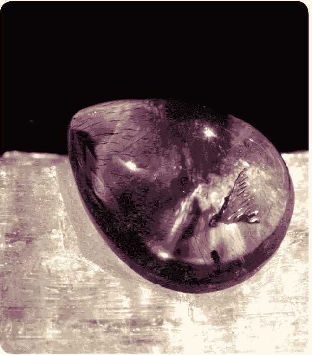

图 超七属石英家族，可使用水净化法

火净化法

那些绝对不可以泡水的低硬度矿石与铜矿、铁矿家族，采用火的净化法是最佳的选择。燃烧白鼠尾草或秘鲁圣木 Palo Santo 的烟就能用来净化晶矿。传统的药师、巫医或是萨满也会用雪松或熏衣草等来燃烧，以其熏香来净化人或物品。先依自己方便购买到的熏香来进行，也可以不同草药尝试看看，再根据你最喜欢的效果去选择。多试几种便可察觉火净化法与水净化法在能量上产生的差异。火净化法也可以用在较硬的石英水晶和其他疗愈用的晶矿上，我个人的经验是：吸附型的水晶需要先火再水，若硬度不够可单用火净化法；而放射型水晶只需单用水净化法即可，除非是转手易主，否则不太需要用到火净化法。

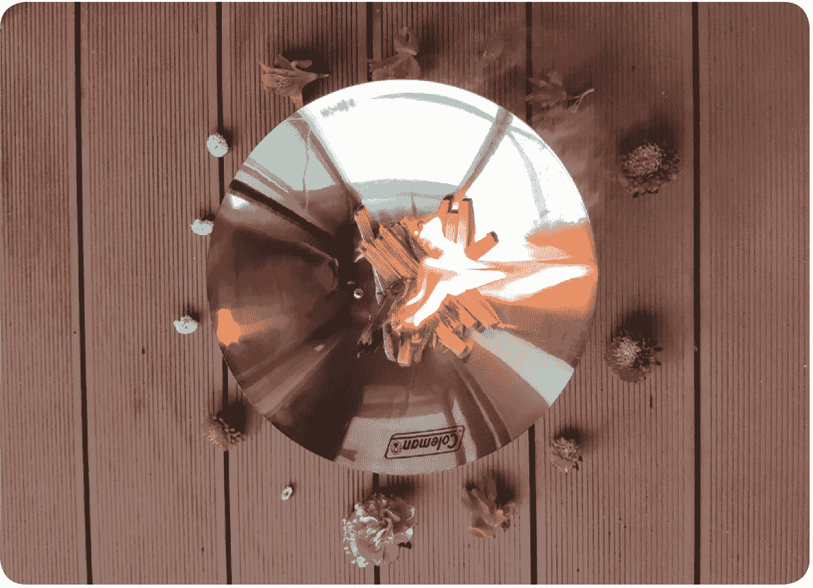

图 火净化法

光净化法

再来就是光净化法，自然的光净化法可分为日光和月光，其中日光和水净化法一样有些限制需要特别注意：硬度较低且半透明的水晶受到强光照耀会受损或变色，例如方解石、透石膏和天青石。而紫水晶与它的近亲紫黄晶、黄水晶虽然硬度高，但日光曝晒会让它们褪色；其他浅色的晶矿像是海蓝宝、萤石、紫锂辉与绿柱石也得避免强烈日光照射；而红玉髓与赤铁矿这种鲜艳的深色晶矿就不会有任何问题了。

日光曝晒法约莫在日出到正午期间都可以进行，时间不需要太长，两个小时就足够了。采用月光来净化与充电则需要比较长的时间，通常需费时四至六小时，在月亮能量最强的满月来进行是最合适的了。

其实只要是能看得到大部分月亮的夜晚，像是盈凸月和亏凸月也可以。连续几晚让晶矿受到月光的滋养，效果会更好！在春季与秋季，即太阳曝晒不多的时节，可以选择在晚上将晶矿放在照得到自然光线的窗边或花园中，让它们整个夜晚到隔天中午 11 点之前接受日月光线的洗礼，你会发现这样的光线接触能让晶矿能量焕然一新。

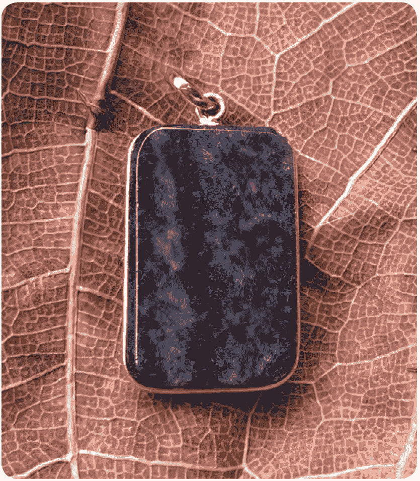

图 大理石可采光净化法

其他净化法

除了上述三种基础晶矿净化与充电方式以外，音乐、晶洞、水晶板，和意念也能用来调频或唤醒、重启晶矿。针对初次使用晶矿的朋友，我建议先以水或火净化法作为“归零”或“重置”，接着再用指定频率的音乐或意念与晶矿调频。现在许多线上音乐平台很容易找到冥想用的特定频率音乐，这些都可以用来替晶矿调频或充电，我也经常使用有水晶钵的静心音乐帮晶矿充电，效果非常好，感觉一屋子的晶矿能量都鲜活跳跃起来。意念调频的效果则需要多一点经验来尝试和练习如何与晶矿调频，最基础的方式就是用意念想像不同颜色的光，把这样的振动频率带入晶矿里，其他的意念调频法我会在月亮周期的仪式篇章中做解说。

晶洞、水晶板或是任何体积较大的水晶簇也可以用来净化体积小的晶矿或水晶首饰。一般常见的就是紫水晶洞，而大块的白水晶簇或大片的透石膏也有不错的净化与充电效果。坊间有以白水晶碎石净化的说法，我试过效果不是特别理想，主要是因市售的水晶碎石在加工过程可能在能量上受到比较大程度的破坏，对于新手使用者来说比较难判断它们的状态，因此还是建议采以大型原矿、晶簇或骨干水晶、水晶板或晶洞更为妥当。

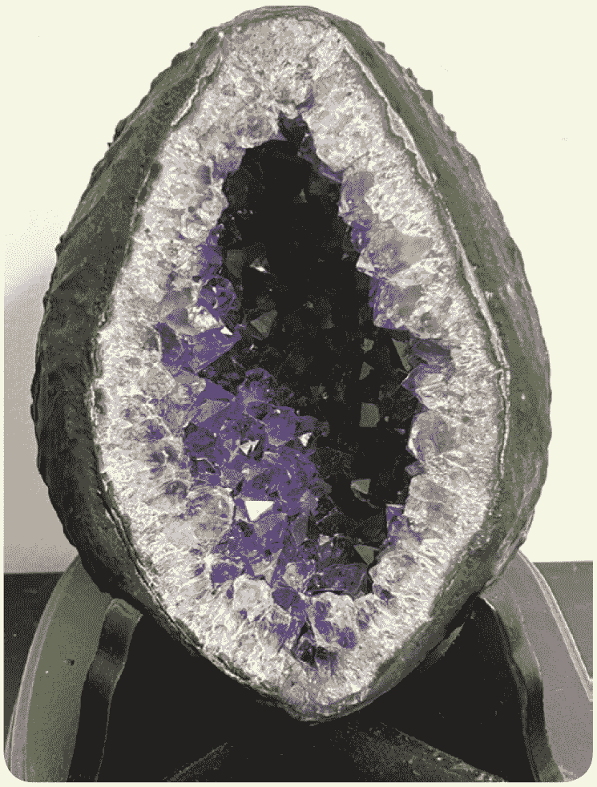

图 坊间常见的紫水晶洞

## 脉轮系统简介

其实大部分的水晶疗愈法门创建在脉轮系统的基础上，特别需要注意的是某些脉轮的颜色范围比较广，且不同的脉轮系统会含括多种颜色（例如心轮除了绿色以外也包含粉红色）。而有些晶矿本身颜色多样，所以并非一种水晶仅对应一个脉轮能量，在此提供一个比较容易理解的介绍。

什么是脉轮能量

Energy 可泛指宇宙生命能量，它和道家修炼法门里所谓的“气”、印度瑜伽传承里提及的 Prana（生命气息），以及西方心理分析学家所指的 Orgone（宇宙能量）是同一种概念。宇宙万物不仅有人和动物这样的生灵，就连花草树木与水晶矿石都拥有其独特的频率，它们也不会在物质形体陨落后立刻消失。人类自文明发展以来，一直对能量学的运作和使用努力地探索和研究，这是因为它不但对社会发展演进有关键性的影响，亦对个人的健康与生活品质方面十分重要。若能对自己的不同能量中心与能量体的状态有一定了解，甚至进一步养护，相信对于提升一个人的生命品质很有帮助。

几千年前的印度发现了脉轮，脉轮运转能支持生命能量流动，而生命能量是一种性能量，当这些能量中心运作良好时，你的生命力流动会非常顺畅，感觉会很好——可感受到放松、自在、喜悦、和谐、自信、充满活力。

每个脉轮都是一个人生命能量的不同示现，不同的能量会创造出各式不同的生命状态及生命体验，例如运动健身、关爱照护小孩、工作、与伴侣的亲密关系、随着音乐起舞、拜访寺庙、诵经礼佛、教会礼拜、祷告祝愿、做瑜伽或冥想等，这些日常的活动都能创造不同的能量体验。而能量敏锐度的高低起伏会让这些活动带来的经验与感受不同。举例来说，脉轮若出现紧绷，生活会以困难、问题与挑战的方式显现；而能量自然流动的脉轮则赋予愉快且正面的经验。每个脉轮都与身体及外层的精微能量体紧密相关，这些能量体会形成你的光圈（Aura）与能量场，并时时刻刻与周遭的人事物与环境产生互动。

当然，除了脉轮这些能量中心以及相关的精微能量体外，每个人的内在还同时存在着两种能量：一阴一阳。这两股能量的相互作用形成了我们如今的样子，包括我们的思想、人格与行为模式。若这两股能量达到平衡，生命就会显出和谐、创造力与合一；相反的，若两股能量失衡则会导致冲突与矛盾。这两种能量及其两极性无时无刻地存在于生活当中——积极或消极的反应、精神或物质的需求、睡眠或清醒的状态、有意识或无意识的行为。一个人的能量结构会直接影响其与他人的互动和链接，当一个人自身的内在男性与内在女性能量间存在着对立，便会导致日常生活、工作、社交乃至精神、情绪与身体状态变得紧张、矛盾，甚至混乱。

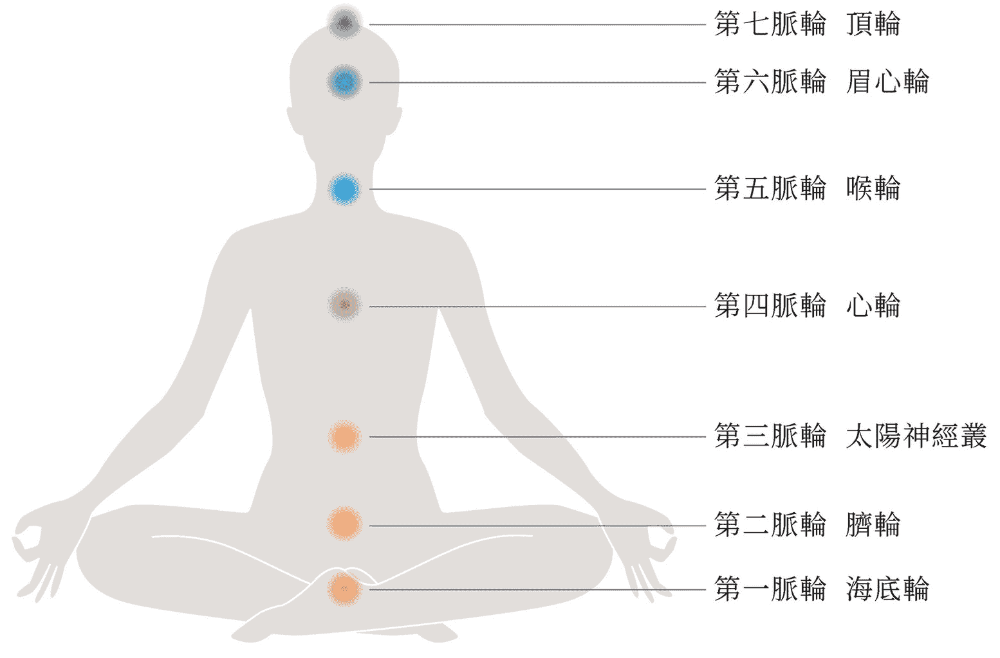

图 脉轮系统

第一脉轮：海底轮

| 主题 | 性（物种繁衍与生殖）、活力、动力、自我实现、自信心、全方位的信任、做出必要决定的能力、追求成功、勇气、决心与毅力 |
| 能量颜色 | 红色 |
| 身体关联性 | 身体关联性 海底轮掌管所有生命基础功能的肾上腺与身体里所有体液，平衡体温 |

第一脉轮是红色的能量，它是关于我们物质的身体、动物性本能、土元素以及与大地能量的链接。这个脉轮是关于人类的基本需求，它和生存、人的恐惧息息相关，也掌管人必需的食物、基础开销所需的金钱、安全的居所与性。它代表一切物质世界的需求，包含一个人务实工作与脚踏实地生活的能力。

| 相关晶矿 | 红石榴、赤铁矿、黑曜石、黑碧玺、茶晶、红宝石、红虎眼、红碧玉、次石墨 |

第二脉轮：脐轮

| 主题 | 性欲望与感官性（生殖以外的情感成分）、热情、信心、链接、友情、社交性、建设性、独立性、活着的喜悦、助人 |
| 能量颜色 | 橘色 |
| 身体关联性 | 脐轮掌管脾脏与生殖腺。第二脉轮的活化工作可以强化运作不良的血液循环、心脏问题、疲劳与倦怠，和平衡能量状态（过高或过低）。 |

第二脉轮是橘色的能量，它是关于我们的感受体、身体的感官、水元素以及与外在的链接。这个脉轮是关于人的感受与情感链接的需求，和感性与生活的享受与愉悦有关，它影响一个人的感受能力、敏感度、身体感知与性能量。性能量与第一脉轮的物种繁衍动物性需求是不同的，此充满感官知觉的，也涵盖关系及上瘾相关的议题。

| 相关晶矿 | 红玉髓、红石榴、茶晶、红宝石、红纹石、红兔毛、琥珀、橙色方解石、珊瑚 |

第三脉轮：太阳神经丛

| 主题 | 力量（个体性与独立性）、喜悦、慷慨、乐观、成功、自我展现、兴趣广泛、经验与情绪／感受的整合 |
| 能量颜色 | 黄色、金色 |
| 身体关联性 | 太阳神经丛的脉轮和胰腺有关。这个脉轮的活化有助于刺激身体、智力与神经系统，同时也支持身体的排毒及排泄。 |

第三脉轮是黄色的能量。它掌管人的情绪体、火元素与情绪。太阳神经丛这个脉轮代表一个人的尊严，它意味着“我可以”的自信心，是一个人的个性与力量，在这个能量里，每个人都是国王与皇后。

| 相关晶矿 | 黄水晶、黄虎眼、黄铁矿、钛晶、太阳石、黄色方解石、黄金、黄拓帕石、黄碧玉、琥珀 |

第四脉轮：心轮

| 主题 | 心与放 松，同理心、信任、空间感、慈悲、和谐、稳定、适应能力、心灵丰盛、大自然、免疫系统 |
| 能量颜色 | 绿色、粉红色 |
| 身体关联性 | 心轮掌管胸腺。第四脉轮的能量工作能缓和并放松心脏与神经系统，同时也对年龄增长的过程（如更年期）有正向的支持。 |

第四脉轮是绿色与粉红色的能量。它掌管着人的心智体、风元素与想法。心轮是关于一个人的爱、纯真、友善与喜乐，它是慈悲、接纳、感恩，也就是“临在”的状态（presence），在这个能量与维度里，人能够同理他人并产生怜悯心。

| 相关晶矿 | 绿东菱、绿蛋白、苔藓玛瑙、翡翠、绿碧玺、孔雀石、玫瑰粉晶、蔷薇辉石、红纹石、草莓晶、天河石、海蓝宝、祖母绿、蛇纹石、绿龙晶、拉利玛、葡萄石、橄榄石 |

第五脉轮：喉轮

| 主题 | 耐心、诚实、可靠、信心、平静、和平、静心、忠诚、真实 |
| 能量颜色 | 天蓝色、蓝绿色 |
| 身体关联性 | 喉轮与颈部和甲状腺有关。这个脉轮的活化有助人体系统全方面的疗愈，特别是高血压、炎症、偏头痛、失眠与更年期症状 |

第五脉轮是天蓝色与蓝绿色的能量。它掌管人的灵性体、乙太（第五元素）与信念。喉轮代表着一个人的灵魂、表达、创造力与声音，是关于艺术、灵性和臣服，也就是存在的祝福。在这个能量中，人能够传达出自己的灵魂。

| 相关晶矿 | 蓝晶石、方纳石、硅孔雀石、天河石、拉利玛、坦桑石、海蓝宝、蓝宝石、蓝玉髓、绿松石、拓帕石、蓝方解石 |

第六脉轮：第三眼、眉心轮

| 主题 | 想像力、洞见、觉察、理解、智慧、启发、灵力、直觉、觉醒 |
| 能量颜色 | 靛蓝色、紫色 |
| 身体关联性 | 第三眼脉轮掌管脑下垂体。它混合并融合其余六个脉轮的颜色与振动频率，这个中心掌管生命之流、成长、新陈代谢和左右脑的协调。 |

第六脉轮是靛蓝色、紫色的能量。它掌管人的星光体、精神与梦境。第三眼代表着一个人的内在觉知，它是关于魔法、超自然能力、预知能力及静心冥想，也就是灵魂的洞见。在这个能量里，人能够真正地看见。

| 相关晶矿 | 青金石、蓝晶石、月光石、方纳石、舒俱徕、透石膏、坦桑石、天青石、堇青石、蓝铜矿、蓝宝石、蓝硅铜矿、锂云母 |

第七脉轮：顶轮

| 主题 | 灵性能量、物质与灵的链接、灵的转化、灵魂 |
| 能量颜色 | 紫色、白色 |
| 身体关联性 | 顶轮掌管骨骺与松果体，能支持两极能量（红色与蓝色的振动频率）的链接与互融，这个能量中心会影响所有较低的脉轮。第七脉轮的能量工作可以溶解整体能量的阻滞，并支援任何一种疗愈的过程。 |

第七脉轮是紫色、白色的能量，它掌管人的宇宙体与神性。顶轮是人与存在的合一、与宇宙的链接，它是关于狂喜、庆祝与开悟。

| 相关晶矿 | 紫水晶、月光石、白水晶、舒俱徕、白纹石、透石膏、紫黄晶、赛黄晶、坦桑石、钻石、赫基蒙水晶、紫龙晶、堇青石、鱼眼石 |

# Chapter 2  新月许愿晶矿篇

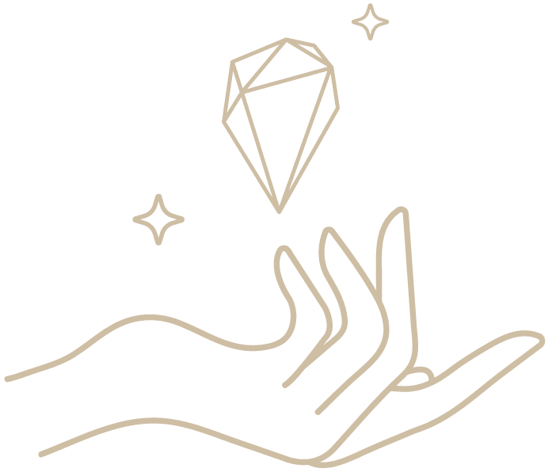

## 月亮的周期与显化的力量

在宏观的天文科学里，月亮是地球的卫星，它本身不发光，仅是反射出恒星太阳的光芒。在人的物理视角上，月亮的能见度可分为八个盈亏周期，也因为距离近，她小小的身躯居然能够遮住实际大她 400 倍的太阳，形成日蚀的现象。作为最靠近地球的星体，月亮牵引着海洋的潮汐及地球上所有生命体的运转，当然也影响着人类的生活作息、务农和收成周期。此外，在以地球视角并同人类文明和认知一起演进的占星学中，月亮与太阳同样被视作“发光体”，具有影响情绪、性格特征与脾性的力量，其状态映照出一个人成长的家庭环境、母亲性格的原型、内在的世界、情感运作模式与核心的需求，每个变化都牵动着我们的亲密关系，甚至是饮食的口味与爱好。

在许多古老文明里，月亮代表着阴性能量、直觉与魔法，她的变化与流动性是智慧的象征，更是生命与死亡周而复始循环的缩影，人们相信她能成为意志与生活目标的引导，指向灵性的道途。本书整理出不同文化传承的许愿仪式与意念校准规则，将月亮不同周期的力量与天然晶矿相互结合，让每个人都能运用这些能量帮助自己实现梦想，让生命更丰盛。

整体来说，月亮的周期变化对人的身体与情绪都有着不可磨灭的影响，多数人以为只有女性因生理周期与月亮一致，能量上才会和她有连动性；事实上并非如此，无论是男性还是女性，内在都有阳性能量与阴性能量的特质，分别由左脑与右脑掌管，七个脉轮中心亦有其阴阳极特定的循环结构。以我自己为例，在我的出生星图上，月亮落在第一宫，并且是在 29 度这样的边界位置，从小就发现自己深受月亮周期变化的影响，像是满月前一晚与当晚都容易失眠，也很高机率会记得自己的梦境。同时，我的情绪转变比一般人快，对他人的负面情绪更是十分敏锐，易产生共振；甚至，当月亮落在弱势位置时，例如行经天蝎座或摩羯座，又或者和火星、土星、天王星、冥王星产生重要相位时，我的生活都会发生不寻常的人际交流，内在情感亦有明显的波动。我有位对能量商品和仪式不特别感兴趣的身体工作老师，他是典型的火象星座钢铁直男，他说年轻时总会在新月开始的时候感觉到自己需要独处，满月的时候又格外渴望亲密，因此经常顺着这种内在情感脉冲来决定是否离开女朋友或回到她身边。可想而知，这种变动与反复让他自己和对方都十分抓狂。其实每个人若观察自己在新月和满月时的生理与情绪状态，都不难发现其中有特定的模式与规律。

月亮周期依循其对照太阳与地球位置变动的能见度而定，而有渐盈与渐亏两种状态。渐盈阶段从新月开始，接着是眉月、上弦月和盈凸月，这四个渐盈的周期最适合着手规划新的项目、开展新方向、或在工作创新和设定新的目标。因为这个阶段带着一股增长的动力，积极性的活动都能获得月亮能量的支持。

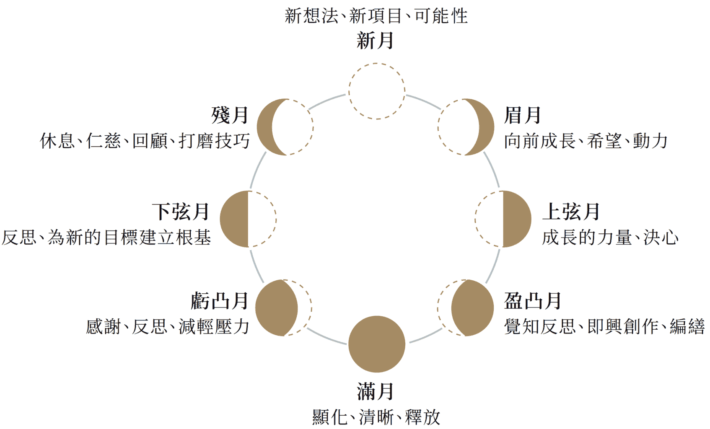

图 月亮周期图

渐亏阶段从满月开始，接着是亏凸月、下弦月和残月。这是一股收敛的能量，适合释放、清理、过滤与删减不合适的想法与项目，甚至是那些不再服务于我们生命的人际关系。当一个人能够放掉无法帮助自己成长的欲望与期待时，那些被占据的精力与被绑住的空间才能够释放出来，为将来更有意义的目标与理想所用。

月亮的整个周期是 29.5 天，这个过程正是所有生命的缩影：先是播种带来的期待、嫩芽新发的喜悦、翠柳抽枝的活力、绽放开花的美好、凋谢枯萎的空无……每个阶段都具有独特的灵性意义。一个人若能和月亮的不同状态调频，便能运用这股能量去链接内在核心的潜力与本质。有趣的是，中华文化里有每月农历初一、十五拜拜的习俗，这通常会对应到新月（初一，有时候精准时间会落在初二）和满月（十五，有时候精确时间会是十六）的周期，也显示出我们的文化里已包含了关于月亮的魔法，只是不同的季节对应不同的节气主题。建议将每个月这两天的心情与思想状态记录下来，借此探索月亮周期对你的影响，也可以作为选择晶矿与相应许愿仪式的依据。

从占星学的角度来看，每个月的新月，意即太阳与月亮在黄道带上的同一个星座形成合相，这个时候可以依据该星座的相关主题来制定新月愿望或仪式。譬如 2022 年 10 月 25 日的天蝎座新月，这个周期的主题便可以设定在情绪清理、断舍离人际关系、工作项目或整理重组投资标的，让自己能更好地专注在一个够深入且有真实意义的目标上；到满月时，意即太阳与月亮坐落于对宫的两个星座，形成对分相，此时适合用来验收前半个月的努力是否达到想要的成果。又譬如 2022 年 11 月 8 日的金牛座满月，就可以从物质和财务的安全感、生活与居家环境的舒适度来检视目前的状态是否已经达到自己真正渴望的目标。以此类推，射手座的月分便会和射手座与双子座的主题有关，像是制定与显化人生的理想和学习的目标般。

其实也不需要每个新月和满月都做仪式和许愿，可以挑选跟自己的日月星座最相关的月亮周期，比如你是摩羯座（太阳星座），出生星盘上显示月亮落在处女座，那你就可以选择自己生日的那个月分（12-1 月）和处女座的月分（8-9 月）来安排你的新月与满月仪式。另外你也可以依据那一年的交点主轴月分来安排，像是 2022 年的月亮交点（南北交）落在天蝎座与金牛座，那 5 月和 10—11 月的新月与满月的能量就会格外强大，这些周期的愿望与仪式必然会有更显著的效果。

尽管不同的古文明与魔法传承里的月亮仪式有其差异，使用的晶矿也不尽相同，但共通点都是新月到满月之间的仪式要召唤增长、推动前进的能量（扩张），而在满月后到新月前所进行的仪式则要以减少、排除负能量或问题（收缩）为主。只要掌握这样的大方向，安排你的许愿和使用晶矿种类就会变得容易许多。

## 适合新月的许愿作法与晶矿

每个月最适合以晶矿来许愿的时间自然是新月了！这个时候的太阳位于月亮的后方，导致她面向地球的那面看不见，是黯淡无光的黑暗期，却蕴含着无限潜力与能量。因为月亮的魔法正在增强，因此你可以扬起斗志与热情，乘上这股汹涌的暗潮去显化你内心深处的渴望。

新月无疑是每个月最适合探索新想法、新事业和创建新目标的时候，所有能量皆处于新鲜、干净的状态。正因为一切未可知，因此把意念放在生活正面的事情上会变得格外重要，这时候可以运用水晶阵为你的梦想播种，也可以用特定的晶矿来做正念冥想，为你的意识打开“心”的可能性。提前确实地列出愿望清单会是一个非常关键的步骤！

不同的古老文化与萨满传承对于新月适合使用的晶矿都不一样：

| 白水晶 | 驱除老旧模式和任何过去残留的负能量，让一切重新开始 |
| 黄水晶、紫水晶 | 支援人在新月时确立清晰的意图，并提供积极成长和实现目标的动力 |
| 绿东菱、月光石、拉长石 | 能稳定人的心绪，让你可以带着信任与信心往前走 |
| 海蓝宝 | 具备极佳的显化力量，又能稳定情绪 |

这些都属于很适合用于新月许愿的晶矿。

由于新月是月亮周期的开始，能量上它代表着无限可能，因此打算使用哪一种晶矿端看你在这个生命阶段最迫切的需求是什么，你也可以根据功能性或近期比较吸引你的主题来选择想要使用的水晶。

一般性仪式

适用于任何目标。

1 选择这段时间最吸引你的晶矿，或者依据功能性来选择一种能支持你生命与意识扩张的水晶。

2 若你选择体积小的晶矿，你可以在新月这一天的晚上，握住它来做冥想与静心。若是体积较大的原矿或水晶球，你可以将它（们）摆放在你的静心空间，与它的能量调频。

3 集中意念与疗愈能量校准。你可以同时在所处的能量场域里播放相应震动频率的音乐。晶矿对于音乐会有立即的回应，让自己接受它与音乐的调和或加持。

4 有意识地放松身心。从感知脚趾开始，接着扩散这份对于身体的觉知到整个脚，再往上到小腿、内侧与外侧，接着，延伸往上，清晰地感受你的膝盖；再继续往上到你的大腿、内侧与外侧、骨胳、肌肉、皮肤，甚至是毛孔，然后到骨盆区、整个躯干、颈部与头，这个过程是放松且缓慢的。发展身体意识的链接能够帮助你在静心冥想的过程中保持扎根，也会让你的能量体更好地向晶矿与月亮的振动频率打开，保持你整个系统的接收性。

5 想像自己被白光以及／或其他晶矿所吸引来的光芒和色彩围绕，心中确信你与晶矿的能量一起工作，以达到调和、平衡及疗愈的目的。

基础财富水晶阵

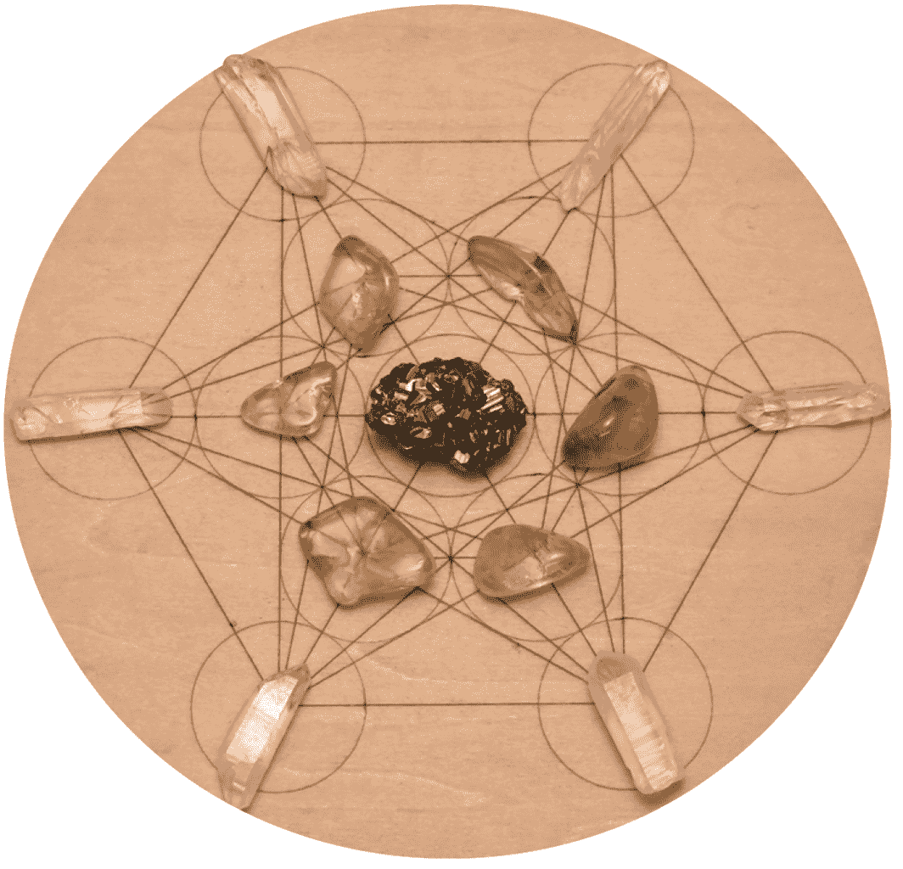

1 选择你喜欢的金色或黄色系晶矿，它们具有召唤“丰盛”的能量，像是黄水晶、黄发晶或黄铁矿。

2  先用较小的晶矿围绕着较大的晶矿。必须将吸引能量的水晶放在中间，如果这段时间有特别吸引你的神圣几何图案，只要图案与你想要做的许愿仪式主旨相符，也可以打印出来放在晶矿的下方。

3 用放大型的单尖水晶来扩大丰盛的振动频率，像是白水晶或紫水晶，但得确保尖端朝内（吸引）。

4 摆放好晶矿后，专注意念，意识敞开，明确地说出你想要吸引的丰盛目标（客户、业绩、投资报酬等）。

晶矿的选择与搭配

晶矿的种类、品质与体积会决定它的能量，因此使用纯天然的黄水晶会优于加热生成的，不过它们的价格存在不小的差距，因此性价比颇高的黄铁矿是很不错的选择，当然招财力 Max 又自带威武感的黄发晶或钛晶是首选！如果你的预算有限，也可以选择比较大但单价低一些的晶矿，像是金色或黄色的方解石球。我拥有十几颗直径 12 公分以上的金黄色系方解石，我将它摆放在工作的环境里；但若以水晶阵来说，柱状或尖型的晶矿更适合。

图片的水晶阵是基础的组合搭配，你可以依据手边有的晶矿来调整，或者是根据你的预算购买相应的数量，比如将一颗体积足、纯净且高品质的晶矿放在中间，再用价格比较便宜的招财系小矿石在四周围绕着。单尖的水晶是很实用的工具，有时候批量购买会比较优惠，有些商家甚至会推出招财组合包，可用它来搭配你最有感觉的主晶矿使用。

许愿与意念是一件需要极高清晰度的事，因此目标必须相当直接。例如你想要客户购买更多商品，你可以给自己设立一个业绩目标、想要拓展的客户族群，甚至是让用户画像清晰，这样也能帮助他们真实出现购买意愿，而你的自信与力量便是促成交易的关键。你想要吸引的金钱与财富的使用目的也要越清晰越好，比如你的目的是买一辆车，就要写下来和说出来；若是想要休假一段时间去旅行，也要把目标说清楚，要谨记：显化是将无形变成有形，越具象，你的愿望越快也越可能实现。

许愿时间的选择

财富许愿可以在任何一次新月时执行，但若在金牛座（4-5 月）和天蝎座（10-11 月）的月分时，这股力量会更强。此外，你也可以选择自己月亮星座的月分，让需求与渴望能同频共振地被宇宙听见与回应。

★你可以将这个水晶阵设置在祭坛或者办公空间的财位，记得定时维护晶矿和阵型的清洁。

基础桃花水晶阵

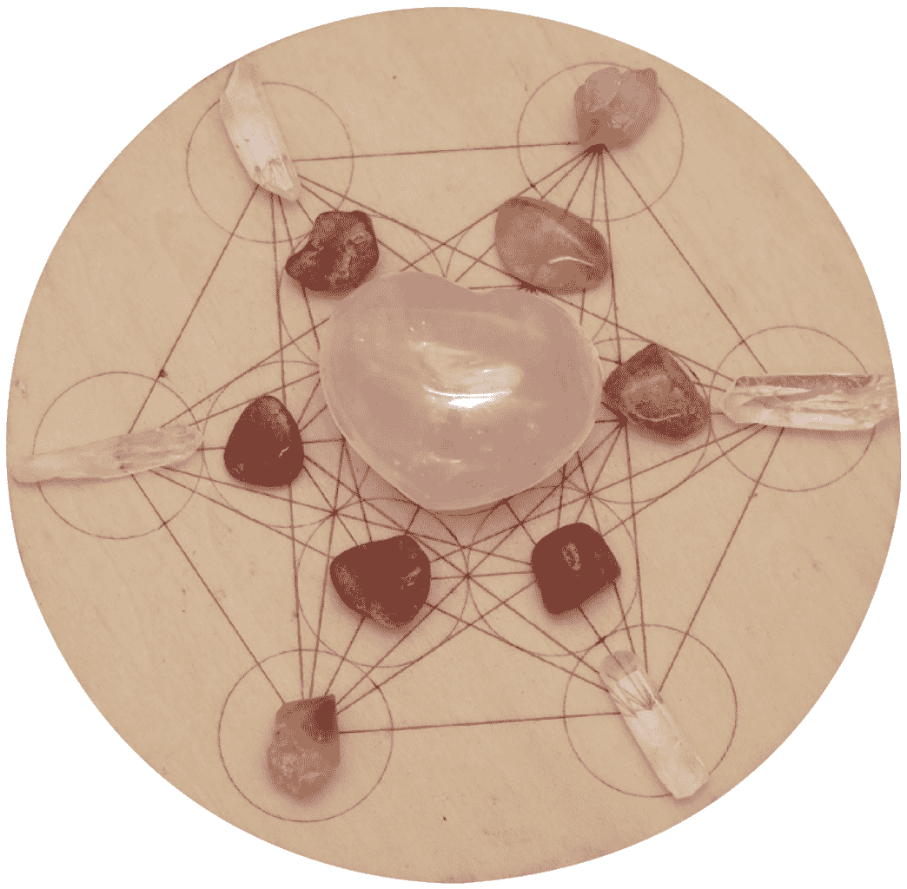

1 选择你喜欢的粉红色或红色系晶矿，它们具有召唤爱的能量，像是玫瑰粉晶、草莓晶或红纹石。

2 用较小的晶矿围绕着较大的晶矿，将吸引能量的水晶像是粉晶柱或是粉晶爱心摆放在中间，如果这段时间有特别吸引你的神圣几何图案，只要图案的意义与你的愿望主题相符，也可以打印出来放在晶矿的下方。

3 再用放大型的单尖水晶来扩大爱的振动频率，尖端朝内（吸引），或者是将小的同质性、对应心轮的晶矿围绕在四周，并以红色或粉色的鲜花或干燥花点缀。

4 摆放好晶矿后，专注你的意念，并将意识敞开，明确地说出你想要吸引的爱或关系目标（什么样的对象或哪一种类型的关系）。

晶矿的选择与搭配

一般来说，不太透光的粉晶价格都不算太高，你可以购买较大的心型粉晶或粉晶柱来进行你的桃花许愿仪式。草莓晶虽然价格相对高出不少，但像左方水晶阵中这种小的草莓晶碎石就很容易取得，你可以多准备一些。

红纹石／菱锰矿是产量相对稀少的矿石，虽然它的硬度偏低，价格依然不菲。若你很喜欢它，却有预算上的考量，自然不用选择宝石级或市售所谓冰种的等级，可以用体积大一些、不透光的原矿来做仪式，或者是使用蔷薇辉石的原矿也可以，跟随你的直觉与喜好即可。搭配原则和前述的财富水晶阵是一样的。

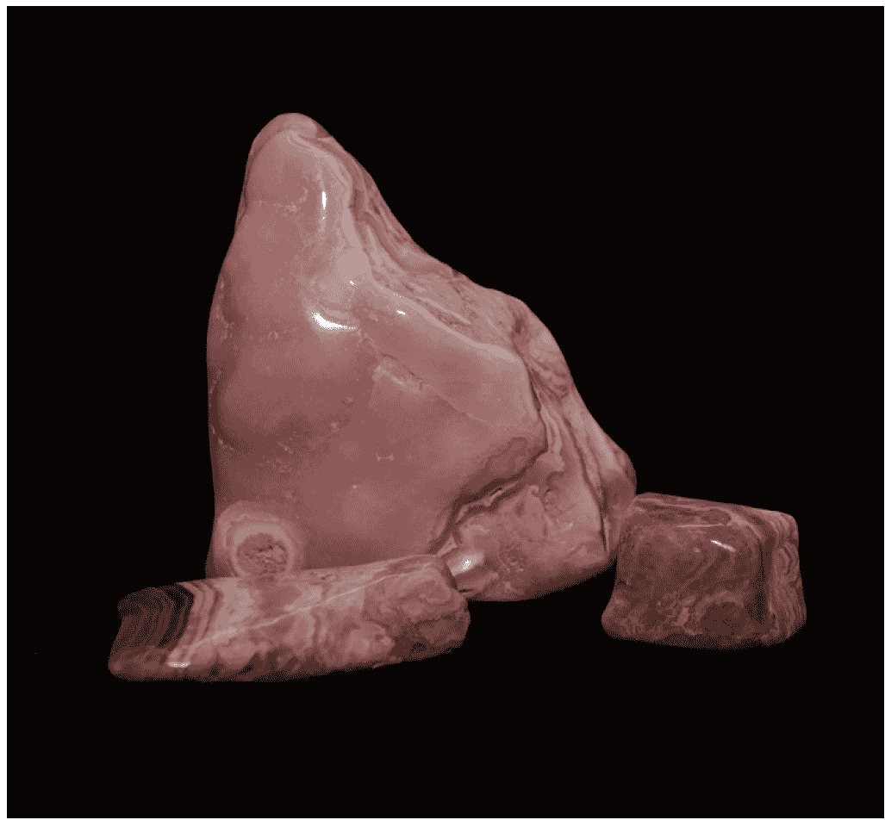

图 红纹石原矿

桃花与爱情相关的许愿是一个很有趣的过程，因为它不像财富那么具体，有一个明确的金额或者是一种资产（所有物）。这种渴望与情感有关，所以你有可能会在许愿仪式过后开始出现一些关于潜在对象或关系的梦境，你比较难具象地许愿说要一个身材和长相跟彭于晏或是 Blackpink 的 Lisa 差不多的男／女朋友，当然我不是说这不可能发生，说不定你就是宇宙的宠儿，只是以桃花许愿来说，你最好是将关系的状态，还有另一半的特质明确写下来、说出来。比如你想要一段很滋养你的关系、你想要一个很欣赏你的恋人，甚至是你想要一个愿意为你付出许多物质并稳定支持你生活的婚姻对象，都可以把它清晰地说出来。有时候梦境也可能出现这个人或者是这段关系的场景，如果你会画画，也可以将晶矿放在你作画的桌上，帮助你把这个人与你们的关系画出来。

许愿时间的选择

桃花许愿可以在任何一次新月时执行，但若在狮子座（7-8 月）和天秤座（9-10 月）的月分，爱恋的力量会更强；你也可以选择自己月亮星座的月分，让你的情感与安全感更易被宇宙听见与回应。

入门款的能量矿石

 白水晶 Clear Quartz

白水晶是透明石英水晶的通俗名称。石英是氧与硅原子在地球岩浆层或海底热泉里所形成的火熔岩晶矿。

世界各地均有出产。主要的商业矿区位于巴西、中国、南非、马达加斯加、澳洲、加拿大、美国、墨西哥、英国与俄罗斯。算是与地球万物生灵并存许久，应用非常广泛，一款入门的能量矿石。

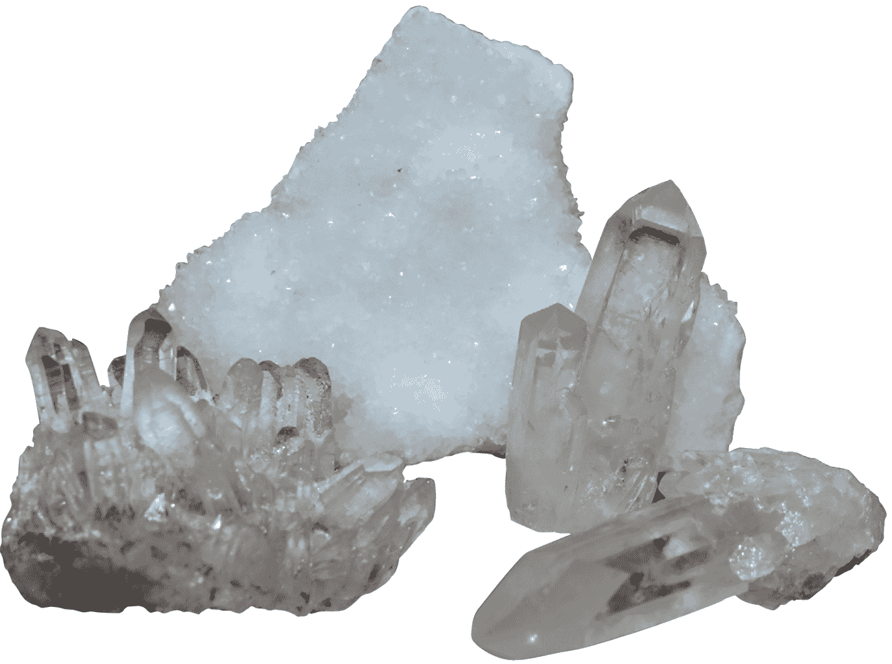

石英是地球上第二丰富的矿物。根据结构可将之分为粗晶（macrocrystalline）和隐晶（cryptocrystalline），前者在岩体或晶体中有肉眼可看见的颗粒结构，像是玫瑰粉晶、赫基蒙钻石、白水晶、紫水晶、东菱石与虎眼石；后者就是玉髓，属于较小且更为压缩的石英体，例如红玉髓、绿玉髓、血石、碧玉和火石。由于石英水晶的矿型种类繁多，国际矿业协会将其分为两大类，一种是微量元素内建在晶体（晶格）当中，例如紫水晶、黄水晶和茶晶；另一种则是在石英生成、结晶的过程中混进矿物或液体，如蓝水晶、粉水晶、水胆水晶和绿水晶。

由于石英水晶多样，硬度为 7，故容易切割、抛光与塑型，自古以来便具有商业价值。此外，热衷形而上学的人们更是热爱蒐集与挖掘各类石英水晶的能量特性，像是含有金红石的发晶、含有火山泥之类的氯化物幽灵水晶、经历变质生长形塑的缝合水晶等，不同的特性与稀缺性提高其收藏价值与市售金额。

初步了解石英水晶庞大的族系与种类后，不难发现它的确是具进化性质的晶矿，不论是在外型、颜色或内部结构上，均随着地球长久以来的变化而发展，加上其能量与用途具备十足的社会性，从人类文明发展中的钟表、建筑材料、医疗器械与手机零件等，都会使用到它。石英水晶在灵性发展方面更是如此，多会伴随着人类科技与意识层面的提升。

能量属性与用途

在能量上，石英属于放大型的水晶，对应着人的第七脉轮——顶轮。因具有强大的扩张力量、重新点亮意识之火，并回归真我，引导人走向开悟的道路，因此非常适合作为冥想静心的晶矿。一直是仪式中不可缺少的要角，常被镶嵌在权杖与魔法棒上，亦会出现在组合水晶阵里。正是因为它除了可放大其他晶矿的能量外，还仍支持与较高意识和神性的链接。

在疗愈方面，白水晶适用于各种情况，它具有保护、清理与净化的作用，可以将之置放在身体主要的能量点与穴位上，排除负面与恶意的能量，促进流动并充电。这不只限于肉体层面，也包括思绪和信念，以期达到身心灵整体的平衡，让人更聚焦、专注于此次生命的任务。

净化与充电

虽然不少资料表示，白水晶自带净化功能，不需要被清理，但我亲身的使用经验发现：它其实就是躺在空间的任何角落都会“持续清理不好的能量与频率”，所以建议：仍请定期烟熏净化，或在满月时接收月光的能量。更好的方式是将它带到海边或河流，让大自然帮它重新刷新与充电。如果购买的是较大型的晶簇原矿时，可用来净化其他水晶与矿石，帮它们充电。若需要使用白水晶来放大其他的矿石或能量物，建议以其平面处对接，再将白水晶的尖端朝向需要接收能量的地方。

| 守护星座 | 十二星座均适用 |

吸引丰盛的招财石

 黄水晶 Citrine

黄水晶属于石英家族，因为含铁的缘故让它呈现出黄橙色的光泽，通常会在白水晶矿床中被发现。

它的名字源自于希腊语的κίτρο（citron），也就是我们现在所称的香水柠檬。黄水晶产地遍佈世界各地，品质最好的多半来自巴西米纳斯吉拉斯区、斯里兰卡与印度。近几年马达加斯加出现了十分特别的黄水晶，且秘鲁、俄罗斯与美国也发现不少黄水晶矿区。

市面上常见有两种黄水晶，一种是十分普及的黄紫水晶，也就是被加热处理过的紫水晶或茶晶。它外观的黄色会相对饱和，虽然也有能量，但大部分情形下仍不如天然生成的黄水晶。黄水晶颜色清透，是一种透光、整体泛金的均匀淡黄色，和紫水晶或茶晶的市价天壤之别。购买时一定要仔细确认是否为你想要的种类。

从古文明的晶矿使用历史来看，许多黄色的宝石或晶矿都被统称为黄水晶，但其可能是金绿柱石，甚至是黄色的拓帕石、黄玉或黄东菱。不过这也证实了黄水晶高频的能量自古就在世界各地被广泛使用。

能量属性与用途

黄水晶具有放大能量的效果，它对应第三脉轮太阳神经丛，代表丰盛与力量，被认为能带来成功、增加自信并提升自我形象，促进创造力与意志力。再者，它能让思绪变得更清晰，使人对目标的积极性提升和方向定位更坚定，有助梦想和渴望的显化，对于新项目或工作的开始也是极佳的支持。黄水晶是极佳的许愿晶矿，你可以将自己的愿望写下来，每天早晨醒来一小时内握着它，向宇宙大声说你的目标，它便能放大这股愿力，给予你需要的创意或改变，让被动的思考与渴望转变成聚焦与实现。

自古以来黄水晶就是不同文明里常用于改良风水的矿石，适合放在家中或办公处的后左方，也就是财位，这个方位由人走进门往室内看来定位。若是经营生意或店面，则可以将黄水晶置于收银台或储放现金的地方。

| 守护星座 | 牡羊座、双子座、狮子座、天秤座 |

全方位疗愈的放松石

 紫水晶 Amethyst

紫水晶属于石英类，是六方晶系，有放大能量的效果，被视为多功能水晶。天然紫水晶的颜色来自于伽马射线及晶矿里的铁元素，市面上也有加热处理过的绿紫水晶，又称堇云石，或者是黄紫水晶，颜色与天然黄水晶不太一样。

紫水晶多产于巴西、乌拉圭、斯里兰卡以及德国，不过似乎每几年地球上就会发现新的紫水晶矿床，例如卢旺达紫水晶。

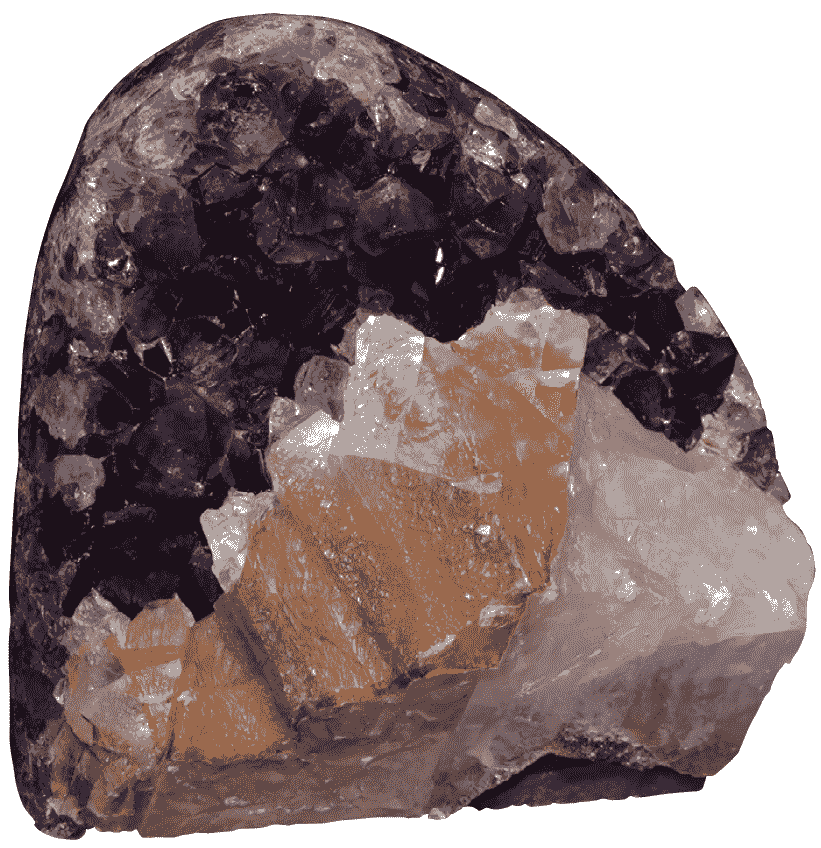

紫水晶的英文源于希腊语 amethystos，意味着未醉。在神话里，阿梅西施是一名贞节的少女，当她启程前往戴安娜神殿朝拜的路上遇见了酒神狄俄尼索斯。追求未果的酒神派出两只老虎扑向少女，此时戴安娜出手相救，将少女封印在巨型水晶矿里。不满的酒神将葡萄酒浇灌在上方，让原本透明的白水晶增添紫色的光芒。

不过有一些神话的版本认为少女后来变成了红石榴石，无论如何，紫水晶用来预防酒醉是有其纪录的：当用紫水晶制成的酒杯盛装清水时，因光线折射而让水看起来像酒一般，如此得以蒙骗宴席上意图灌酒的人，避免醉酒。除此之外，这也是出行之人或朝圣者的保平安石。紫水晶也被记载可用来疗愈上瘾症，除了生理上的上瘾也包含情绪层面，帮助人打破受害或受苦模式，助其接纳改变并在意识层面中成长。

能量属性与用途

紫水晶的能量对应第三眼或顶轮，应用十分多元。它能形成保护层让人的心智常保清明，且使意识与较高频率调频，打开眉心多向度的直觉力。因此紫水晶经常被用来转化负能量或减轻失眠、多梦，甚至是噩梦的情况；或者用在释放压力与焦虑，帮助人更好地开发直觉和创造力，超越固有僵化的认知且与高我链接，使意念显化，是一款很棒的冥想静心用的水晶。当你带着感激和奉献与紫水晶调频，便能活化本身的能量场，将宇宙之爱吸引到你的身边。

| 守护星座 | 处女座、射手座、摩羯座、水瓶座、双鱼座 |

守护爱情的恋人之石

 月光石 Moonstone/ Hecatolite

月光石又名月亮石或月长石，属于长石家族，含有铝、钾、钠与硅酸盐等成分，名称来自于其光折射产生的月光效应。目前主要的产地包括斯里兰卡、印度、巴西、缅甸、澳洲和马达加斯加。

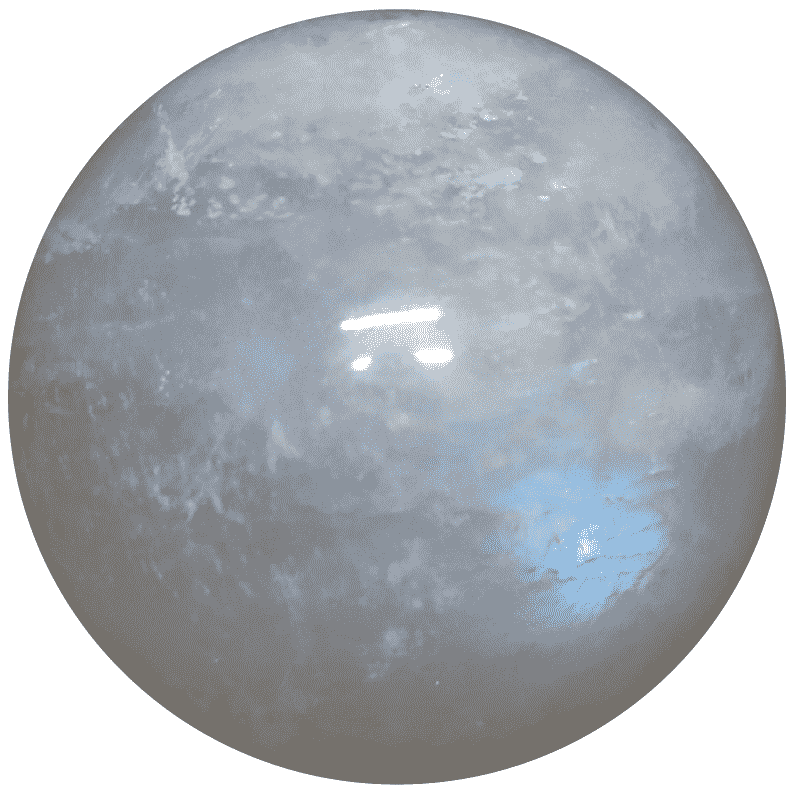

拥有特殊乳白光晕的月光石价值不菲，是最合适用在新月许愿的晶矿之一，这是因为它将大地母亲的能量融入配戴者的能量场内，帮助人去触及内在深处的灵性，具有最高层面自我发现的功效。许愿时请让月光石的能量激发你的直觉力与灵通力，在你自我成长的道路上支持你，或是抓住眼前的机会以自我实现。

能量属性与用途

月光石帮助人链接更高的向度，包括神性与直觉。它对应第三眼与顶轮，能减少一个人受到日常生活的压力或外界声音的干扰，给自己更多的时间与空间来理性思考，而做出恰当的决定。加上它能链接灵感、支持更清晰的自我表达，让人在面对难题时突破限制框架，找到解决的可能性。

月光石有安抚情绪的功效，适合用来缓解关系里的冲突，促进和平沟通，因此也被称为恋人之石，可以守护爱情。此外，它柔和的能量可促进阴性品质的流动与展现，被认为能平衡女性内分泌系统、提高生育力，且能纾缓生理痛，有助女性气色佳，也算是低调地招桃花吧！想怀孕的女性亦喜欢配戴月光石助孕。

由于月光石的能量被认为有调和内分泌的效用，细致且疗愈的能量有效支持女性的情绪调节、缓解负面情绪，消融并释放情绪问题与创伤，让心灵获得平静安稳，让自己能更从容优雅地面对各种情况。当你觉得自己心浮气躁时，可以佩戴月光石来减缓负能量。

比较需要注意的是月光石的工作方式，即“放大”，有些人刚开始配戴会异常烦躁，那是因为月光石必须先让内在不好的情绪释放出，才能腾出空间让柔和的阴性品质进入，所以这时候配合一些情绪宣泄的静心会是非常好的。

搭配使用建议

月光石与大部分单斜晶系的矿石一样，具有保护的功效，适合进行水上或夜间旅行的人。月光石是一款极佳的静心冥想疗愈石，它的高频振动很适合搭配其他晶矿使用，像是透石膏，能透过梦境将人链接到其他维度的领域，支持意识的扬升。若搭配蓝晶石、堇青石、蓝硅铜矿、坦桑石或蓝铜矿也有相似的效果，可以视自身被哪种晶矿吸引来尝试看看。

| 守护星座 | 巨蟹座、天秤座、天蝎座 |

能量强大的魔法石

 拉长石 Labradorite

拉长石属于斜长石家族，是由欧洲第一批前往加拿大纽芬兰布道的摩拉维亚传教士发现，并以“发现地”拉布拉多平原来命名。因富含各种元素的多层结晶折射而产生的七彩光晕则被称为拉长石变彩（Labradorescence）。

现今拉长石的主要产地为美国、加拿大、马达加斯加、俄罗斯、挪威与英国。此外，在芬兰发现一种蕴含全彩光晕的拉长晶矿，被命名为光谱石（Spectrolite），这是非表层反射却由宝石内部聚片双晶对光的干涉和衍射才形成的多层色彩光晕。

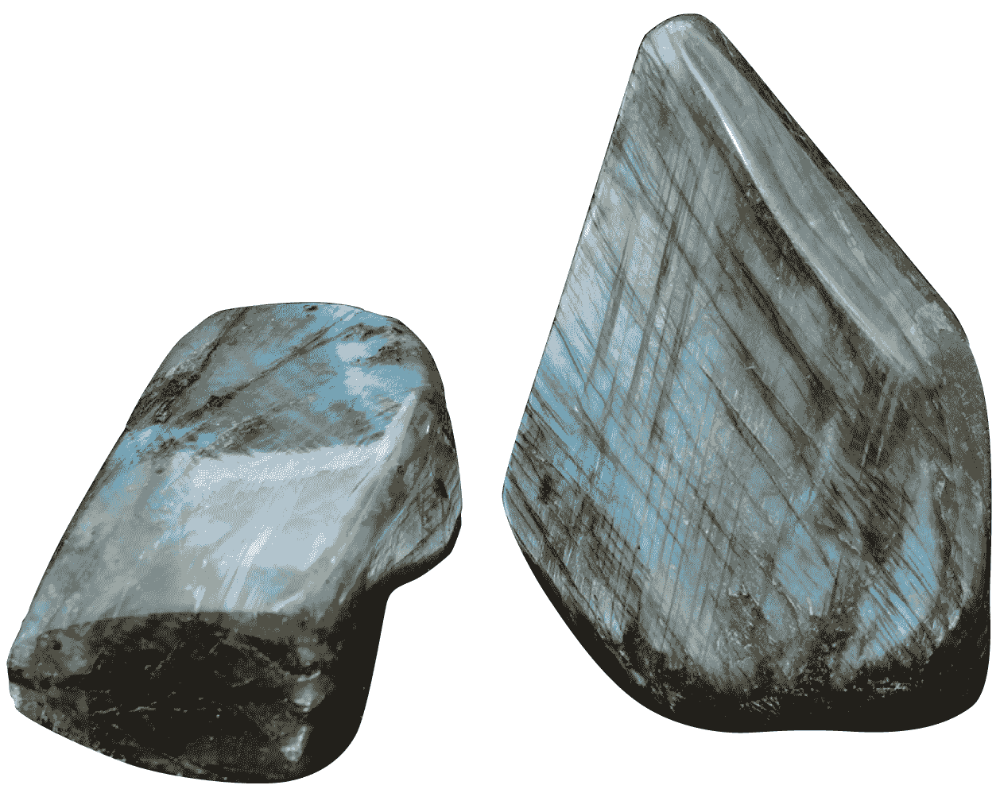

能量属性与用途

拉长石被认为是对应第八脉轮的宝石，即内在蜕变的能量。它很适合在焦虑时，或者是对自己产生怀疑、难以放松时配戴，用来作为静心冥想石。人们很容易忘记头脑与思绪产生的影响，在面对困难和挑战时，头脑能引发各式各样的批判，将人拉至与现实越来越远的地方，导致紧绷与焦虑，而在各种标签里迷失。此时，拉长石能支持意识扩展，看见头脑里负面信念生成的束缚及限制以外的空间，进而链接到价值感与可能性。就像拉长石灰色表层底下闪烁的七彩光芒般，帮助人的心绪平复。这种镜射的品质不只是物理层面也是能量层面的映照，在适当的光线下，能看清拉长石的光辉。同理，在恰当的视角，人亦能看见自己与他人的光芒。

拉长石被认为是能量强大的魔法石，长久以来被魔术师用以作为变幻、转移和传导能量的工具。它的光晕形成一种能量斗篷，得以保护人的身体与灵性状态，并支援生命天赋潜能的唤醒。

| 守护星座 | 金牛座、狮子座、天蝎座、射手座、双鱼座 |

展现优势与自信的幸运石

 东菱石 Aventurine

东菱石又称砂金石，它的名称源自意大利语的 ventura，是机运的意思，目前主要产地为巴西、中国、俄罗斯与西藏。它属于六方晶系，由石英混合其他矿物所组成，赋予其各种颜色，包括蓝、绿、红、橙、黄或白色，不过以绿东菱最常见。

能量属性与用途

石英是其主要成分，故东菱石是一种能量放大型的晶矿，可以依据其外观颜色对应的脉轮来做疗愈工作。蓝东菱石能优化沟通与表达，帮助显化目标，也能提升一个人的自律性；绿东菱则可提升领导力，同时被认为能带来成功与好运，亦有促进慈悲心和无条件的爱之功效，故能释放焦虑的情绪。红东菱与橘色的东菱石则能提升一个人的内在安全感，有助于情绪的稳定。白东菱石有促进一个人与其高我之间的沟通和交流，且促进所有脉轮的能量循环与流动之效。黄东菱帮助提高一个人的自信心与执行力。

在新月许愿仪式里通常会使用的是绿东菱，平时可在重要的工作会议中使用：将一块绿东菱放在口袋里，能够帮助你展现自己的优势与能力。

正能量发电机

 绿东菱 Green Aventurine

绿东菱是石英家族里以二氧化硅为主要成分的矿石。它绿色外观来自于其中的铬云母颗粒，目前最主要的产地是南印度。

绿东菱对新月许愿与仪式来说是很好的矿石，它代表力量、自信、勇气与喜悦，能注入乐观的态度帮助一个人重燃追求梦想的动力，并相信自己有能力在这个世界中实现内心的渴求。它让人愿意跳出舒适圈、抓住机会，去迎向崭新的道路。

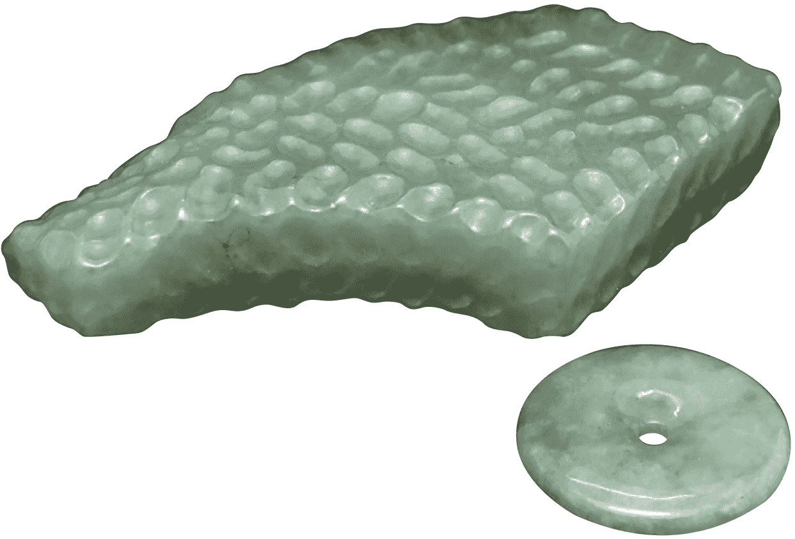

能量属性与用途

绿东菱有缓和情绪体的功能，但刚开始使用时，其净化过程可能会令你有点不舒服，特别是平常紧张时胃部的紧绷与焦躁便会浮上台面。不过，这是要帮助你成长为一个个体，让你勇于冒险，才能成就这段生命旅途的意义。

绿东菱支持心轮分享与信任的品质，让配戴者能享受生活本身，并乐于将自己的能量与经验分享给亲近的人。而这种变化是会往外共振的，令周遭的人能够感受到你的变化并受到启发，被感染而想做出改变，这也是为什么绿东菱经常被认为是正能量发电机，且还是用爱发电。

开运与疗愈

绿东菱自古就被当作是能带来好运的矿石，透过调和配戴者的能量去帮助显化丰盛与梦想，带来新的机会；也让人意识到生命的可能性。可带它去竞赛、游戏，甚至是赌场，当然除了年节麻将局和扑克比赛以外，亦可以带着它去参加面试、进行重要的工作会议或聚会，甚至是第一次约会。

为什么说绿东菱能帮助显化正桃花呢？如果一个人希望在生命当中拥有更多的爱，首先自己需要有足够的空间，因此在获得新的关系之前，最重要的是释放掉对过去不好的感情经验的伤痛与执念，这些怨恨、苦涩通常被埋藏在心的角落，需要被清理任。绿东菱能在你的能量场，尤其是心轮，扫除这些残留的负面情绪与信念，让人打开心，重新去信任。

绿东菱是不错的扎根矿石，和其他深色矿石直接拉回海底轮不同。它助人从头脑回到心，再由心的感知回到身体和大地，这对于长时间使用手机与平板、暴露在过多数码信息的现代人来说，是很好的放松与纾缓的晶矿。

在晶矿组合使用方面，绿东菱很适合与青金石或煤玉一起工作，它们都是千百年来替人们吸引好运与富足的矿石。

| 守护星座 | 牡羊座、狮子座 |

神奇的“怯场退散”法宝

 海蓝宝 Aquamarine

海蓝宝是一种非常稀有的石头，比较容易在白云母矿周围被发现。它是绿柱石的蓝色品种，属于六方晶系，而蓝色来自晶矿里微量的铁。

海蓝宝的使用记载可以追溯到西元前 400 年的古希腊，然事实上它早被不同文明使用了两千多年。目前海蓝宝的主要产地在巴西、美国、墨西哥、俄罗斯，但市售价值最高的海蓝宝石多来自巴基斯坦和阿富汗。

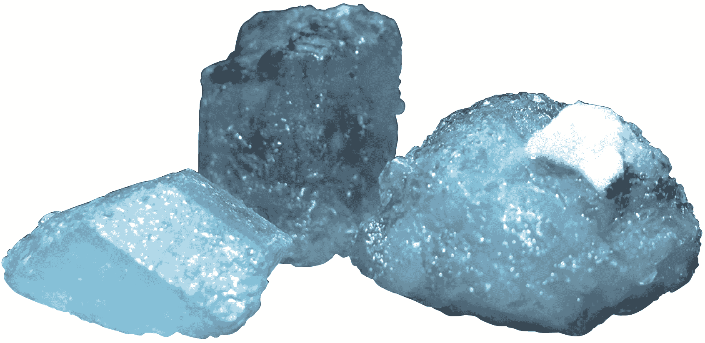

能量属性与用途

海蓝宝的能量属于放大型，是绝佳的显化助力，它能在心与喉轮间创建清晰的信道。而这关键的链接得以让一个人能说出内在的真相、心中的真理。海蓝宝还可以冷却那些令人感到淹没的强烈情绪，平息焦虑和惊恐，因此能缓解冲突、争执与分歧。水元素的清澈在晶矿上闪耀着光芒，促使配戴者剥下自我的保护层，允许内在的本质发光。此外，海蓝宝还可以促进情绪的刷新与调节，提供头脑层面的清晰；有时候人的心虽然敞开，头脑却仍处于迷雾之中，此时海蓝宝就能将“意会”的部分“言传”。

海蓝宝的能量有益于开展智慧，让知识化为有用的想法，头脑运转更加清晰。当一个人敞开的心与清晰的头脑同步运作时，机会和人脉关系便会源源不断。这清澈水蓝的晶矿象征着纯粹的沟通，每天佩戴有助你与人交谈时易使用更正确的用字遣词，及更恰当的语气去传递重要的想法；即便在意见相悖时，也可以柔和表达，让关键的想法获得聚焦、有效的传递。

海蓝宝非常适合从事教育、管理、治疗和谘商工作的人，或是经常需要公开发言的人。因为它的能量可以增强一个人对一群人说话的稳定度与信心，是神奇的“怯场退散”法宝，帮助你对外展现自己的价值观与信念，且更好地调动言词来进行群体沟通时必要的互动和感染力。

搭配使用建议

在灵性的层面上，海蓝宝具有极高频的振动，透过平衡并校准脉轮的能量来助人发现并开展自己的精神领域。它与水晶王国其他晶矿并用的效果颇佳，十分推荐与其他心轮系的晶矿一起做冥想，像是蔷薇辉石、绿蛋白、玫瑰粉晶、粉红石盐、硅孔雀石和绿方解石。将海蓝宝与这些晶矿结合使用能打开、净化、清除，并加快心伤疗愈的速度。

| 守护星座 | 牡羊座、双子座、双鱼座 |

## 适合满月的许愿作法与晶矿

另外一个适合做水晶魔法仪式的阶段就是满月了！当地球运行至月球和太阳的中间时，就会形成满月的现象，这是月亮周期的中点，此时她的能量达到最高峰；你会更深刻地觉察到自己真实的感受、愿景和内心的想法。因此满月仪式的主题通常跟显化意念与心愿、清晰困难情况与挑战、释放老旧模式与负面能量有关。

满月能量最强大

满月是月亮最亮、最强大的时候，这圆满且充满光彩的时刻最适合检视成果与收割。你先前设下的意图会在此刻化为现实，带着感恩的心收下一切吧。当然这也是放手的时机，借助月亮的能量去检视过去一段时间的表现，看清楚什么对自己有利，什么对自己不利，那些不再服务于你生命的一切人事物都该在此刻抛下。这个阶段的能量高昂，亦非常适合用来净化水晶与矿石，为它们刷新和充电。

这个时候也可以检视那些尚未实现的渴望与目标，在月亮光芒的加持下，将高振动频率带到所有你想要加强、显化意念的地方。如果此时你觉得需要支援，可让自己和亲友相聚或去参加共同成长的团体课程或活动，这是一个人们荣耀彼此、互相鼓舞和庆祝生命的好时机。

晶矿的选择与搭配

支持扎根与意识扩张的雪花黑曜石很适合做为满月仪式的矿石，而次石墨具有强大的疗愈力又能提供保护，硅孔雀石则能带来宁静、安抚情绪，又能协助头脑与思绪的清晰……它们都是这个时期很好的选择。不过因为满月的能量强大，又是一个总结的时刻，所以要使用哪一种晶矿端看你当下或指定阶段的具体需求。月光石、白纹石、玫瑰粉晶这些能纾缓情绪又能链接神性与爱的晶矿，自然也能带来莫大的支持，让你确信目前的生活处于最佳状态。

满月也适合强化你对于生命目标与生活状态的清晰度，因此白水晶亦可在这个时候使用。此外，以月亮女神塞勒涅命名的透石膏则是能够捕捉满月供给的强大光束，让你可以运用她的高振动频率来提升自己的能量。自然地，此晶矿也是欲进行满月仪式很好的选择。

基础净化与保护水晶阵

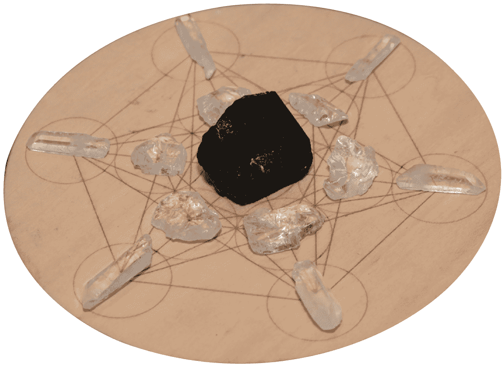

1 将一块大的黑碧玺或黑曜石放在中央，它们具有排除负能量与恶意的效果。

2 用白水晶柱或小块白水晶原矿围绕在周围。

3 用放大型的单尖水晶来推开你不需要的负面振动频率，且尖端朝外（排除）。

4 摆放好晶矿后，专注意念，让自己保持扎根的状态；嵴柱摆正、双脚踩地，明确地说出你想要释放和舍弃的人、状况或能量，将一切交还给大地。

晶矿搭配与购买建议

满月仪式的装备真的特别划算！无论是黑碧玺还是黑曜石均很容易取得，体积大一些的价格也不贵。觉得自己有敏感体质者完全可以购买一整袋原矿，将它们随身携带或放置在床铺下方脚端的位置都很合适。不过黑曜石是比较软的火山岩，不耐刮也比较容易破裂；黑碧玺硬度高一些，只是原矿的纹理处必须要谨慎些，过于用力或以重物按压也可能裂开来；特别是那些能量上欠缺保护罩的人，刚开始接触这类矿石特别容易发生“破坏性”意外，若真的裂开了就谢谢晶矿帮你带走一些低频或负面的能量吧！图片可参考保护和净化的水晶阵，晶矿体积与形状的搭配原则和前述财富与桃花水晶阵一样。

净化与保护的仪式可能吸引梦境，再加上满月前后能量高涨，可能使夜晚不容易熟睡，或在半梦半醒间会浮现一些讯息与画面，这个时候如果做奇怪的梦，甚至是可怕或诡异的梦境都可称得上很正常，不用担心，把这些当作是潜意识里的恐惧在释放。如果夜晚的梦境遇到重复的主题，可以在白天的时候静心冥想以支持这个过程：建议选择白水晶与透石膏这种同时具备能量清理且有“开智慧”功能的晶矿，或许会有些新的理解出现。这些洞见很可能帮助你真正放下或舍弃一些旧有的局限性信念和负面模式，所以可将这个满月仪式作为一个净化与清理的开始，梦境、画面、想法甚至是情绪都有可能会持续几天。为了帮助能量更好地去移动与刷新，或许你需要搭配一些情绪宣泄或是舞动释放的练习，让意识的转变能扎根在身体里。原则上这个阶段是能量输出优于输入的时候，宛如蛇要脱皮般，让那些不再服务于你生命的一切离开。

仪式时间的选择

净化仪式可以在任何一次满月时执行，但在双鱼座（2-3 月）和射手座（11-12 月）的月分时，灵性与意识进化的力量会更强。你也可以选择当年月亮交点的月分，比如 2023 年 7 月中旬，南北交点轴就会离开金牛座与天蝎座，进入掌管自主与关系、战争与和平的牡羊座和天秤座，在这些关键时间点上，顺应宇宙星体的能量去做相关主题的净化仪式。

满月是一个很特殊的阶段，这是充满魔法力量的时间，所以我想介绍一些简易、可搭配水晶进行的魔法仪式。由于萨满仪式来自世界各地不同的古文明，记载与流传下来的内容与方式缺少许多细节，步骤也不一致，再加上魔法主要还是强调直觉与传承，所以你可以选择自己感觉比较有链接的主题与作法来尝试看看。

这边提及的仪式所需要的道具比较简单，如果你是一个拥有乐器也喜欢唱歌的人，这类型的仪式会非常适合你！你会发现自己在唱颂或演奏／倾听音乐时，仿佛进入一个更广阔的能量空间，一切都是可能的，都比头脑所想与认知的更大，而这一份心的信任与空间会帮助生命穿越任何的局限或挑战。

召唤金钱财富的仪式

1 将铸铁炉装入一半的水，放进一个银色的钱币。

2 将炉子放在月光照得到的地方，搭配以黄水晶为主的财富水晶阵（以水晶围绕着魔法炉）。

3 使用月光石或拉长石权杖将银色的月光扫进炉子里，口中念着祈祷文。

美丽的月亮女神（Lovely Lady of the Moon）

快快将你的财富赐予我（Bring to me your wealth right soon）

将我的双手盛满金银（Fill my hands with silver and gold）

你给的全部，我的包都可以装下（All you give, my purse can hold）

（重复三次）

4 将水倒在地上。

强化灵识防护罩的仪式

（满月前的晚上）

1 将魔法炉放在祭坛上，摆放拉长石或月光石为主的水晶阵，红色蜡烛放在右侧，黑色蜡烛在左侧，白色蜡烛在后方。

2 在魔法炉周围洒下一圈草药：接骨木花、马郁兰、薄荷与芸香草。

3 在小瓶子里混合精油：丁香、乳香、茉莉与熏衣草。

4 将小瓶子放到魔法炉里，置放一个晚上。

5 在满月当天的晚上，泡澡净化，穿上白袍。

6 在每个房间里烧起保护熏香，点上蜡烛。

7 面向东方，高高举起魔法匕首，念祈祷文：

透过升起太阳的力量，我生命中所有邪恶都结束了（By the power of the rising sun, all evil in my life is done）

8 面向南方，高高举起魔法匕首，念祈祷文：

透过正午疾风的力量，终于所有都在我掌控（By the power of the noonday blast, all control is mine at last.）

9 面向西方，高高举起魔法匕首，念祈祷文：

透过夜晚黑暗的力量，我的防护坚强，我的盔甲结实（By the power of darkness night, my shield is strong, my armor tight.）

10 面向北方，高高举起魔法匕首，念祈祷文：

高悬黑夜的满月，我并非孤身一人（By Full Moon in blackened sky, I am not alone.）

我的援助近了（My help is nigh. ）

女神的双手一直守护我，让我夜晚白天都安全（The Goddesses hands around me stay, to keep me safe by night and day.）

去吧！邪恶的灵，这里不欢迎你（Begone, foul spirits, unbidden here.）

我将你送回。我不害怕，我已然胜利（I send you back. I do not fear, for I have won.）

我已解放，你再也无法影响我（I am set free. You have no further power over me.）

11 将油滴在额头、心、太阳神经丛、手腕和脚踝。想像一套闪烁着蓝光的盔甲将落到你身体上，完全保护着你。

灵识吸尘器

 黑曜石 Obsidian

黑曜石最早的记载出现在西元 77 年大普林尼的《自然史》中，然而它被人类用来作为武器和工具的痕迹可以追溯到 7000 年前。在古代，黑曜石因易于制作成箭头和刀片且非常耐用，而被赋予高的价值。更有趣的是，在玻璃出现之前，黑曜石被抛光的唯一目的就是被当成镜子使用。

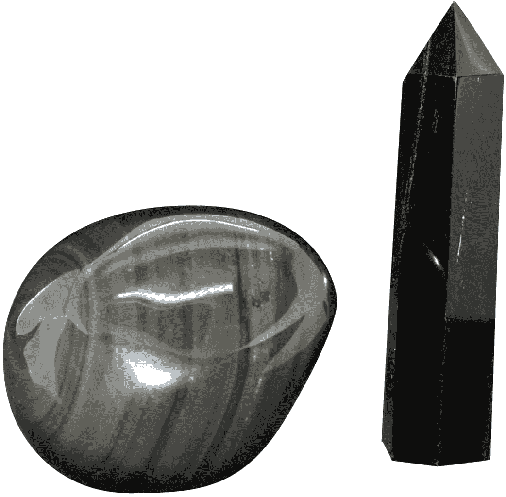

能量属性与用途

黑曜石是由没有足够时间冷却成玻璃的岩浆而形成的石头，这种火山岩具有保护、扎根和灵性传导的特性。强大的负能量与情绪垃圾清除功能使它被喻为“灵识吸尘器”，可以快速净化人的气场和空间。

黑曜石具有稳固扎根的频率，可以在需要时候提供强而有力的精神、意识保护。黑曜石也能激发一个人各个面向的创造能量，让创造力融入，活跃于每个行动。创造性的能量对人来说就是需要保持自由流动的，是生命能量的显现。当一个人减少创造力的输出时，这些能量会进入休眠状态，仿佛生活不再需要它一样，若想要重燃这股能量会变得十分困难，因此最好让它时刻运转着。

搭配使用建议

黑曜石与许多晶矿都能很好地配合使用，它属于能量放大型的石头，可增强能量。和煤玉一起使用能带来双倍的保护与扎根效果。当你需要进行萨满旅程或意识探索的时候，这样的晶矿组合得以保持你在高振动频率的守护下进入其他维度或空间，并能提供有效的保护。茶晶是一种转化负能量的矿石，与黑曜石搭配使用能带来强大的净化与蜕变，对于人和空间都有转负为正的功效。黑曜石也适合与捷克陨石一起使用，它们会透过净空一切来推动更高维度的自我转化。

| 守护星座 | 天蝎座、射手座 |

终结能量内耗的疗愈石

 雪花黑曜石 Snowflake Obsidian

雪花黑曜石的“雪花”来自火山岩内含的白色方硅石成分。这种黑曜石品种主要来自北美和南美的矿区，有一小部分来自非洲和亚洲的产区。

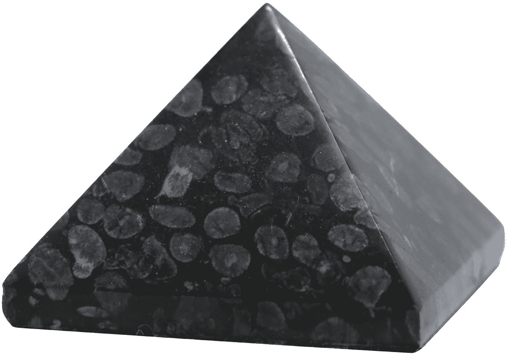

能量属性与用途

雪花黑曜石有助于平衡、净化和扎根一个人的心智、身体和气场，同时可以启动海底轮和第三眼两个脉轮中心，增强人的灵通力，尤其是前世回溯的能力。使用雪花黑曜石做冥想能让人获得关于前世的记忆，甚至是影像，而这些过去世的记忆在此刻示现都是为了要支持意识与心智慧力的扩张。指导灵将帮助进行回溯旅程的人从过去世的经验和课题中获得此生需要的知识与智慧。

清理信道与老旧模式

此探索过程所收到的信息纯粹是为了让你能解决当前所面临的生命课题。指导灵传递的讯息是前世曾经经历过的困难，于这一世重现的模式，但觉知能帮助现在的你去克服它，成为一个更强大、更永恒的意识。链接这些指引并从过去世学习可能是漫长且具有挑战性的，但此旅程能带来很大的收获；你可能无法在刚开始的链接尝试中得到太多，但继续尝试却能够帮助你的意识更放松地获取关键的信息。冥想时建议可以同时使用石化木，因它和雪花黑曜石都是古老的意识工具，能让人的意识状态更清明，向天使展示“你已经准备好接收讯息了”。

雪花黑曜石亦有让人保持脚踏实地和平衡的奇效，它能帮助使用者与地球进行深度链接，让头脑免于无休止的喋喋不休，这样便可以专注并坚定眼前和当下的任务，同时消除分散能量的内耗，对于拖延症有很好的效果。雪花黑曜石能放慢思绪的转动频率并将人带回现实，对那些经常做白日梦的人提供很好的支援。

搭配使用建议

对于戒掉坏习惯和上瘾症，雪花黑曜石是很棒的选择。它首先会净化和加强你的心智，进而消除不良习惯对于你的控制和消耗；当它的能量开始运作，你会发现若自己不再经常想着坏习惯或瘾头是如何吞噬和吸取能量，你其实足够强大到可以忽略甚至超越它。透过净化你的思绪并让它保持专注和扎根，使一切都变为可能。

针对戒掉恶习与上瘾，建议将紫水晶与雪花黑曜石结合使用。随身携带二者，将大幅降低你重复老旧模式的风险，因为这两种晶矿都具有强化心智和净化心灵的功效，从而减弱不自主的冲动，让你不再被旧习惯把控。紫水晶与雪花黑曜石都有提升意识和加强自律的效果，随着心和智慧力往积极的方向扩展，你自然而然会适应心智清明的状态并降低对旧习的依赖。

| 守护星座 | 处女座 |

排毒与清理负面信念的净化石

 次石墨 Shungite

次石墨是一种稀有的碳质非结晶矿石。最初是在卡累利阿共和国（俄罗斯北部地区）的 Shunga 村被发现，而因此以此村庄命名。这种矿物首次于 1879 年被记载，含有超过 98%的碳，后来在奥地利、刚果、印度和美国境内均发现了次石墨。

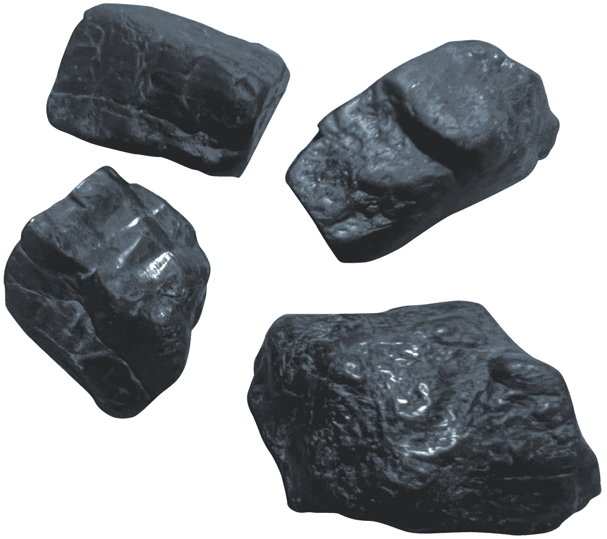

1996 年诺贝尔和平奖授予三位在次石墨中发现天然抗氧化剂的科学家，这种新形式的碳元素被称为“富勒烯”，自此被用于科学突破。当彼得大帝听闻次石墨的治疗效果后，利用其净化水的功能在矿区附近创建第一个俄罗斯 Spa。大帝甚至让士兵随身携带次石墨，以便在旅途中净化水。

有一种称为贵族次石墨更为纯净，表面呈银色，这种极为罕见的矿石价格昂贵，物理结构几乎完全是碳，导致其他元素的杂质更少。次石墨的导电特性有助于抑制环境里的电磁辐射。所有常见的家用电器用品或多或少都会产生微量辐射的电磁场，建议可将次石墨放置在电子设备的底部和手机背面，将有助于在不干扰操作的情况下，减少辐射输出。

能量属性与用途

次石墨是一种具有强大疗愈力的矿石，能启动人体的七个脉轮，为身体排毒并清理负面信念，同时也能净化气场。次石墨对于情绪容易失控的人很有帮助，因为它能将光带进身体并驱逐负能量。佩戴次石墨制成的首饰或携带次石墨矿都可以增加气场的防护，因为其具有很强的扎根能量，能帮助使用者链接大地本源的神圣力量。

自古以来，次石墨亦被用来制作成灵丹。古人认为，将次石墨浸泡在水中一段时间后，其净化过的水助人长生不老。不过用现代的观点来看，饮用纯净水有利于细胞生长，并帮助身体排毒，然而还是要留意并非所有次石墨都可以服用，务必购买标示饮用安全的次石墨产品。

| 守护星座 | 巨蟹座、天蝎座、摩羯座 |

修行者和疗愈师的必备品

 透石膏 Selenite

透石膏是一种硫酸钙矿物，为石膏的结晶透明品种，以块状、针状、颗粒状、板状和棱柱状碎片的形式来结晶。它是瑞典化学与矿物学家 J. G. Wallerius 于 1747 年发现的，用以希腊词语的月亮命名，象征着苍白泛蓝光的颜色。透石膏的矿产极其丰富，几乎在世界各地都可以找到，目前市售的多来自墨西哥、美国、巴西、马达加斯加、澳洲和摩洛哥。

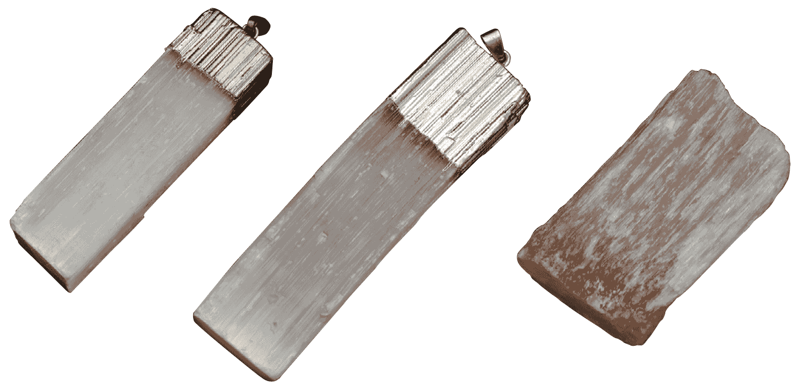

墨西哥北部契瓦瓦州有一个银、铅和锌矿产区，名为纳艾卡矿洞。此地因发现大量相当于都市建筑物高度的透石膏棒而闻名于世界。矿山入口下方近 1,000 英尺的水晶洞里蕴藏着人类有史以来发现的最大天然晶体，由于此处高温达摄氏 65 度、湿度 99%，晶体才能以如此惊人的速度生长。原本访客可以参观这个具有纪念意义的晶矿发现地，但后来因潜在的洪水风险而于 2015 年关闭了。

能量属性与用途

透石膏基本上就是“物理封装”起来的纯净白光，是每个修行者和疗愈师的必备品。它巨大的能量能够修复人的气场与灵妙体，亦有助于消除人在日常生活中吸收到的负能量。使用透石膏在第三眼或顶轮做冥想，可以扩张人的意识和直觉力。而这种扩张的效应已超越了心智掌管之领域，进入梦境的向度。因此，让人无论是在清醒或睡眠时，思绪、想法和愿景都会变得格外清晰。

这些显意识和潜意识的召唤会对使用者的日常生活带来直接的影响，推动人改变生命道路的方向以实现更高的意义。除了将透石膏放在床边辅助梦境的记忆与探索之外，也可以将其佩戴在身上以净化周围的能量场。这种矿物不会沾染负能量，还能够净化其他晶矿并作为其充电的绝佳工具，只要将最近使用或购买的晶矿放在透石膏附近或上方，便能达到清理的效果。此外，透石膏也能净化空气并为空间充能。

搭配使用建议

透石膏是非常棒的疗愈晶矿，可搭配其他水晶和矿物做不同的用途。当它与黑碧玺结合，可以用来做身体层面的疗愈。若需要扩展意识或进行其他向度的旅程探索（如回溯治疗或进行萨满旅程等）时，可以将透石膏与硅铍石、堇青石、蓝线石、蓝硅铜矿和捷克陨石等高振频晶矿一起使用。若一个人想要打开个人意志并解锁天赋，则可以用透石膏与石榴石或红玉髓一起冥想，以强化蜕变的能力。若与蓝色方解石、硅孔雀石、拉利玛、蓝玉髓和绿松石等晶矿配对，便能打开喉轮的沟通管道，丰富表达能力。

| 守护星座 | 双子座、巨蟹座 |

镇定恐慌情绪的宝物

 硅孔雀石 Chrysocolla

硅孔雀石是一种含水的铜硅酸盐矿物，常与孔雀石、蓝铜矿一起被发现。它最早的记载来自于西元前 315 年古希腊科学家泰奥弗拉斯托斯的研究，名字源于希腊语的“金胶”，因为它常用于焊接黄金。目前市面上最美的硅孔雀石多出产于智利、刚果、俄罗斯和美国。

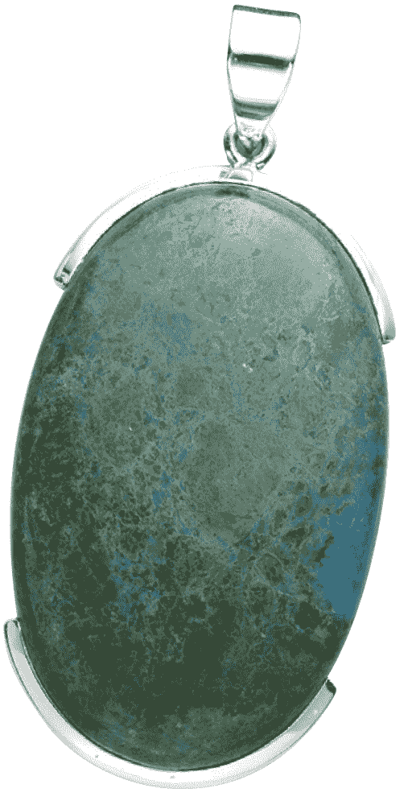

能量属性与用途

硅孔雀石是赋予力量、沟通和镇静的矿石，有助于降低不知所措时的恐慌感，并且在压力下或者需要做出艰难决定时，支援使用者保持清醒的头脑和冷静的思考。当然，它也非常适合情绪容易不稳定，甚至失控的人。硅孔雀石可助人清楚地传达出自己的理念，同时提高智慧以将它实现。这种晶矿适合佩戴在靠近喉轮的位置，以最大限度地发挥其功效。

有些硅孔雀石内含石英，这种特殊类型的晶矿被称为硅化宝石或硅孔雀玉髓。由于石英具放大的特性，它的能量十分强大，使用者能以非常清晰、易于理解的方式呈现自己的内在真相。

搭配使用建议

硅孔雀石很适合与其他铜硅酸盐晶矿搭配使用，像是阿霍埃特（Ajoite）、孔雀石和蓝铜矿，它们都属于能量强化石，彼此能协调互助。若是与硅铍石一起工作则可以极佳地帮助人理解内心深处的渴望，并更好地传递这份愿景。

| 守护星座 | 金牛座、双子座、处女座 |

## 适合眉月的许愿作法与晶矿

新月之后的阶段就是眉月，代表着向前成长、希望和动力。这个时候的月亮右侧被照亮，宛如一把闪烁着银光的弯刀。这样的月亮有股涌动的能量，意味着往前行进与成长，象征着种子的发芽。现在是将先前新月时的想法化为概念的时候，加深自己的决心，开始制订详细计划，以支持自己更接近目标并有更好的表现。

月亮渐盈是关于探索梦想、带着信心往前走，一段充满希望的时期，你可以跟随自己的心与感受去流动。眉月推动你采取行动，未来才能实现抱负，而绿东菱和绿蛋白带来希望与信心，赐人前进的勇气；苔藓玛瑙和翡翠这两种吸引丰盛与富足的晶矿也很合适这个阶段；黄水晶也能在这时候帮助聚焦和行动，玫瑰粉晶作为爱之石则能够助你在实践当中保持与心的链接。基本上，支持繁荣和成长的晶矿都是这阶段的理想选择。

完美的脉轮疗愈石

 蛋白石 Opal

蛋白石又称欧泊，英文源自印度梵语的 Upala，是珍贵的宝石之意，传至古罗马后演变成拉丁文 Opalus，是汇集各种宝石于一身的意思。这些不同文化的描述都是因为蛋白石经光线折射会形成独特的七彩色斑，像结合了不同宝石色彩那般五彩缤纷。

蛋白石的种类繁多，从稀有的黑蛋白到常见的白色都可能生成惊艳的游彩光芒。除了罕见且价格不菲的单色蛋白石，像是火蛋白和粉红蛋白以外，还有其他在移动光源下会闪烁出不同颜色的变色蛋白石。

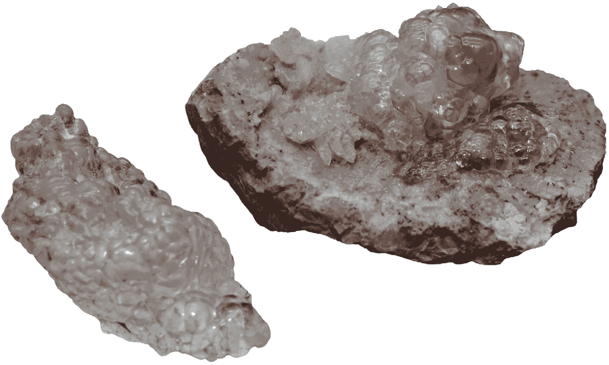

很少有比蛋白石更受神话和传说影响的宝石了。蛋白石的开采可以追溯到西元前 4000 年，在非洲肯尼亚的洞穴中与埃塞俄比亚的雕刻里都可见它的踪迹，几乎地球上每个古老的文化都有这种神奇宝石的传说。

古希腊人认为蛋白石是宙斯击败泰坦（更古老的神族）后因喜悦流下的泪水。神话里还记载它与希腊春天女神（Persephone）有关，能够带来新生命并提高生育力。在罗马神话里，蛋白石则与地中海女神（Cardea）有关，能保护家人和孩子免受试图越过门槛的邪灵侵害。澳洲原住民则相信造物主是乘着彩虹来到地球，降落地上的岩石就变成了蛋白石。印度教的传说则描述嫉妒的母神将彩虹变成了蛋白石。

能量属性与用途

几千年来，蛋白石被认为能带来好运，赋予使用者神奇的力量，如隐身术、读心术，还能治愈眼疾。此外，古人还相信蛋白石能调节人体内的胰岛素，帮助肝脏解毒和再生；同时它也被认为有助女性分娩和减缓经前综合症，并刺激膀胱、肾脏和淋巴结。此外，它还能缓解肌肉紧张和下背部、腹部疼痛，也可以改善记忆力和刺激神经末梢，被认为有益于帕金森症患者。再者，据说对患有焦虑症或惊恐症的人亦有帮助，能加快长期患病者或经历手术者的康复时间。

开运与疗愈

整体而言，蛋白石具有激发创造力、自发性与自我表达的功能，是一种与爱、欲望有关的矿石，它能支援使用者摆脱制约与自我设限，释放内在狂野和冒险的一面。

蛋白石缤纷的色彩让它具备不同颜色的疗愈震频。特定主色的蛋白石能够连接到对应色的脉轮，对情绪产生强大的影响，有助疏通和重新校准此脉轮的运作，例如绿蛋白或粉红蛋白石带有振奋的能量，能治愈心中的伤痛、疗愈心碎的经验，并缓解嫉妒和怨恨。以黄色为主的蛋白石则能激发创造性；以红色为主的可增强安全感和信心，并提高性欲和生育力；以白色为主的蛋白石则具有平静的效果并能带来好运；黑色能带来保护及扎根的效果，这些强大的功能让蛋白石堪称完美的脉轮疗愈石。

净化与充电

蛋白石含水量高达 20%，因此色彩变化无穷，不过也因这样的组成让它格外脆弱。在清洁和充电时需要十分小心，不能让它长时间曝露在阳光下，导致褪色或裂开，也不能放在盐水里清洗，化学物质会分解蛋白石。

蛋白石可以在泉水或自来水下冲洗，或以鼠尾草或圣木快速熏香净化，再置于月光下充电。切记：温度骤变会损坏蛋白石。

它在风水上也被广泛应用，水蛋白石一般被认为需要置放在房屋的北方以改善职业与生命道路；火蛋白石则得放在房子或房间的南边，可激发热情与行动力。从事创意领域工作的人则可将蛋白石放在办公桌上或口袋里，来激发创新的想法。

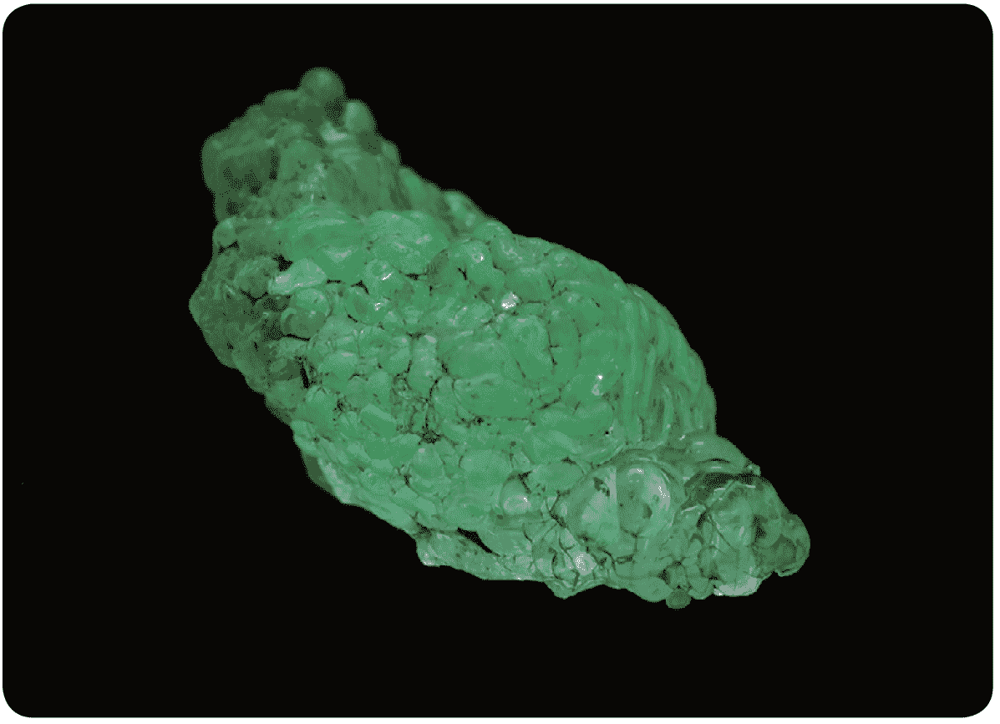

图 白蛋白石在紫光下的效果

链接内在力量

 绿蛋白石 Green Opal

绿蛋白石是一种常见的欧泊，颜色从浅象牙色到深绿色都有。它的矿区分布是蛋白石家族中最广的一个，遍及六大洲。市售最常见的绿蛋白来自巴西、澳洲、美国、墨西哥和秘鲁。

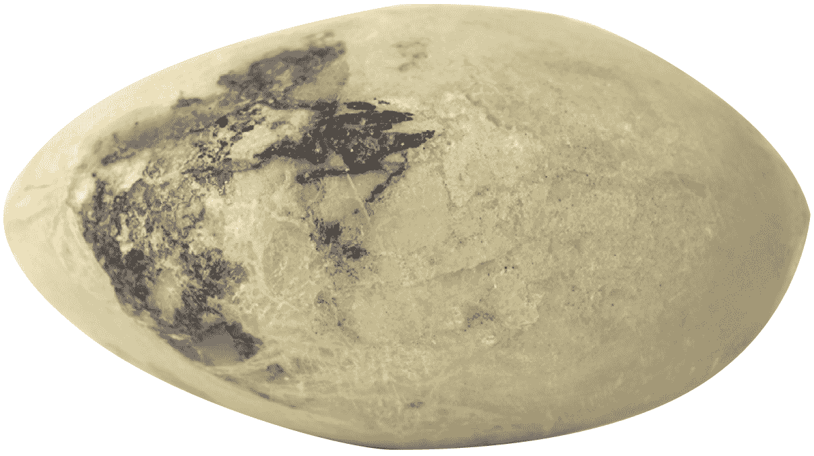

能量属性与用途

绿蛋白对应心轮，能够为在心碎经验中挣扎的人注入滋养与恢复活力的能量。对于正在经历悲伤、关系破裂、严重分歧的人，或是刚遇到重大创伤事件的人，绿蛋白会是绝佳的疗愈石。它能支持人重新链接曾经拥有的力量，同时鼓励、提醒使用者向前看，并以此力量重建新生。蛋白石的讯息是：

事实上，人的一生已拥有足以提醒自己具备内在力量的一切。

绿色蛋白石也可以帮助人在情绪激动的时候平静下来。握住或触摸它时可感受到舒缓的能量，建议经历情感煎熬的人以绿蛋白石做日常冥想，它不仅能平息情绪，还可以让思绪慢下来。在这些艰难的时刻，远离生活琐事并把自己放在第一位是非常重要的；持续以绿蛋白做冥想将有助于一个人清除心中抵触且不必要的情绪，让心全然地敞开。

搭配使用建议

对于那些经常放空或做白日梦的人来说，绿蛋白十分有益，它能清空思绪、创造空间去增加对周围环境的觉知。人们确实经常身处于各种干扰当中，以至于忘记感知环境和接收单纯的频率，绿蛋白能提醒人们活在当下、享受周围的事物，而不是那些会让人分心的思绪或想法。因此它也很适合与其他心轮系晶矿一起使用，像是蔷薇辉石、绿方解石、玫瑰粉晶和天河石，这样的晶矿组合有助净化并打开一个人的心。需要在冥想静心时扎根的人，建议结合使用黑碧玺、赤铁矿或方铅矿。

| 守护星座 | 牡羊座、射手座 |

专注目标的多功能开运石

 玛瑙 Agate

玛瑙属于六方晶系的石英家族，最常见的是玉髓，所以它具备放大能量的特性。一般被认为能够帮助人达成愿望。不过因为玛瑙有着各式各样的色彩，除了最普遍的红色以外，还有黑色、蓝色、褐色、灰色、绿色、橘色、紫色、白色与黄色，甚至是多色一体，故它的应用层面非常广。

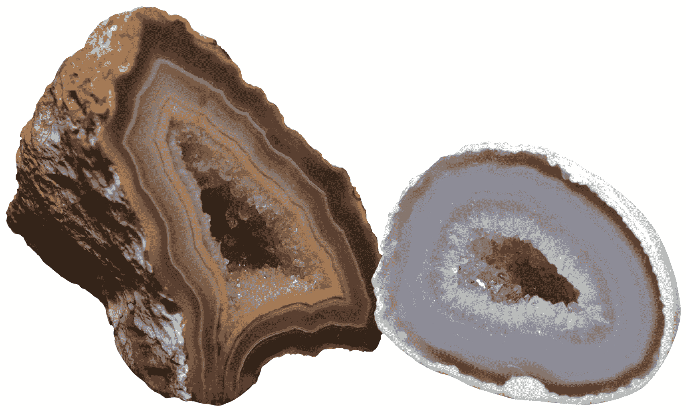

能量属性与用途

玛瑙被认为有平衡情绪、带来平静、专注目标的功效。较常使用在疗愈工作和许愿仪式的玛瑙，包括橘色或褐色玛瑙，能支持人在不稳定的时候找到一些自制能力。粉色玛瑙带来慈悲，蓝玛瑙象征真诚，有助于真实明晰的表达与沟通。适合用在眉月仪式的苔藓玛瑙则象征着无条件的爱。

我年幼时曾在花莲的海边捡到许多玛瑙石，亦曾在大陆东北的黑龙江旁捡到不少，虽然很多地方都有产区，但市场上还是有许多人造玛瑙。最简单的识别真伪方式就是将矿石放在阳光下，看看是否能透光。

祈求好运与丰收的幸运符

 苔藓玛瑙 Moss Agate

苔藓玛瑙属于玉髓的一种，主要成分是二氧化硅，另有铁、锰与方钠石等矿物和微量元素在胶体中，经长时间外在环境温度的变化，逐渐形成近似自然景色的纹路。除了如水草或青苔以外的绿色，也会夹杂黑色与褐色的花纹；每一块晶矿都长得独一无二。

苔藓玛瑙在世界各地都有产区，包括美国、巴西、乌拉圭、印度、南非、俄罗斯与澳洲，它就像是大自然景色的缩影，让人精神为之一振的同时也有纾缓放松的效果。

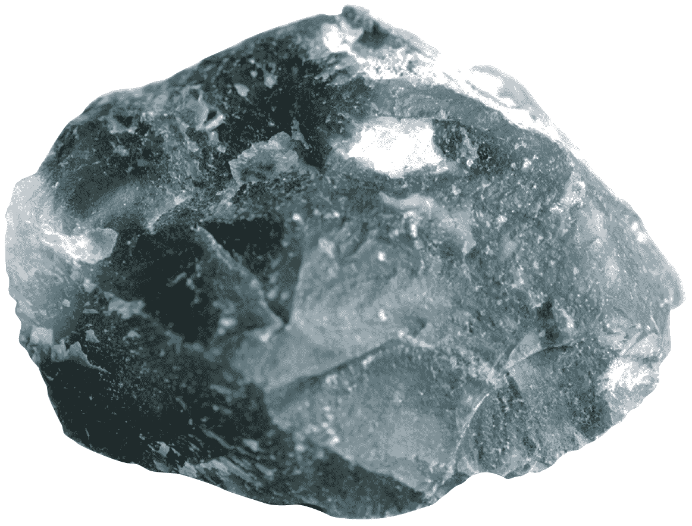

能量属性与用途

古时欧陆的农民相信苔藓玛瑙能为土地招来繁荣与富足，于是将它挂在农地树木的枝干以及畜养牲口的角上，以求好运及丰收。此外，它也被置放在花园里，甚至是盆栽中，让花看起来更朝气蓬勃。这种催生般的能量振动让古人把苔藓玛瑙做为幸运符，放在营业场所能让生意更加兴隆。

开运与疗愈

苔藓玛瑙象征自然中的清新，如流水岩石、阳光穿透绿荫，很适合用于呼吸冥想练习，帮助你扎根并重新与大地母亲链接，也能快速扫除忙碌生活带来的窒息感与压力。绿色对应心轮，因此苔藓玛瑙可以疗愈疲惫的心并将人带回平衡状态，重新获得面对生活的活力，同时因为它能减轻紧张的情绪并增加安全感，也能进一步带来行动力和勇气。

如同大部分来自火山矿床的晶石，对应心轮的苔藓玛瑙能量比较温和，能稳定暴躁易怒或情绪容易失控之人，促进配戴者与周遭人的关系和谐；也帮助过度付出或讨好型人格者提升自我价值感，更多地将关注回到自己身上，对于一般人则有招人缘的效果。此外，苔藓玛瑙蕴含的自然力量能净化体内与能量场内的毒素、缓和发炎症状、促进消化、强化心脏与血液循环，进而刷新免疫系统的运作，保护人免于传染病的侵害，被认为是对整体健康有益的晶矿。

| 守护星座 | 处女座 |

转化负能量为爱和喜悦

 翡翠 Jade

玉是两种矿物的统称，第一种是软玉，为硬度 6 的钙镁硅酸盐。最常见的软玉介于淡绿到深绿色，并混有淡黄色调，但也可能有白色、灰色、棕色或黑色的色调。它常在新西兰的蛇纹石矿床和水源边缘被发现，此外，澳洲、俄罗斯、中国、台湾、加拿大、津巴布韦和美国等地也都有软玉出土。

第二种玉被称为翡翠，是硬度 6.5-7 的硅酸铝钠。翡翠不像软玉般拥有玻璃光泽，看起来有点雾濛濛，色彩却非常鲜艳。虽然最常见的是绿翡翠，也有白色、橙色、黄色、灰色、黑色和淡紫色，它最早的纪录是被中美洲的征服者发现并带回欧洲。目前市售翡翠主要来自缅甸，但在日本、危地马拉、哈萨克斯坦、加拿大、土耳其、古巴、俄罗斯、南美洲和美国等多地也有产出。

区分软玉和翡翠最简易的方法就是透过敲击的声音测试；用硬物敲击时，软玉会发出乐音，翡翠则不会。

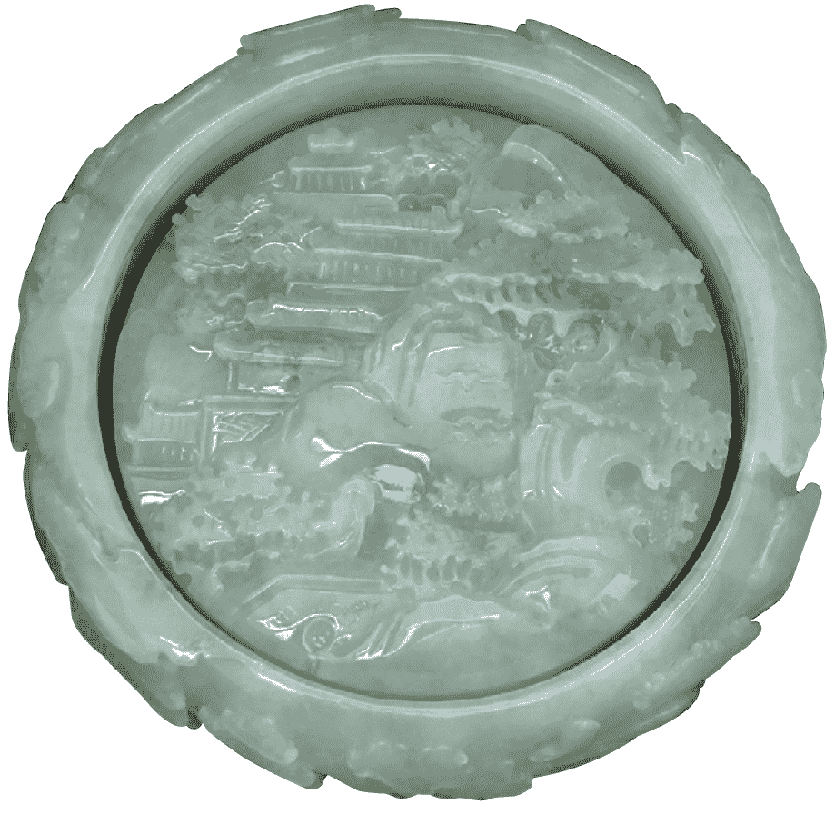

能量属性与用途

绿色翡翠是硬玉最常见的一种，它是强大的心疗愈石，几乎可以在触摸时立刻感受到。直接将握住翡翠的手放在胸口，让能量流向心并注入爱与和谐，消融心里那些沉重的负担。翡翠的能量与使心柔软、包容和滋养的本质共振，因此它能疗愈、补给和支持这个脉轮。这股稳定的能量滋润心之后可以传递到整个系统，给予生理、情感和精神三方面的支持；使用绿翡翠的疗愈工作能创建起心与心真正的链接和神性的爱。

绿翡翠是代表土元素的矿石，与大地母亲有着深厚的联系，它能成为亲近自然的媒介，让人连接上大自然的力量并与之整合，这也是为什么中华文化自古以来就认为翡翠能够养“气”，而将它制成各式各样的发饰与首饰配件。人的气场结构像大树一般，需要将下丹田扎根于大地（自然），而中丹田（心）的稳固与滋养则能促进向上和往外的蓬勃发展，这也是为什么远离自然的现代人很适合配戴、使用绿翡翠，以保持与天地自然能量的链接。

开运与疗愈

绿翡翠是少数能转化一个人周围负能量并将之释放为爱和喜悦的矿石之一，这种蜕变的震频对配戴之人周围的环境亦有益，因为它能带来身心和谐，促进个体的稳定性。翡翠能带来的平静力量适合那些难以面对的纠纷与冲突情况，或容易被环境里的能量或情绪淹没的人，因为它能帮助人们意识到自己不过是透过肉身的经历在完成一段精神的旅程，这种对于灵性本质的认知有益于人在物质生活中活出本然的样子。

其他灵性用途

翡翠亦是特别适合小孩的矿石，它能保护孩子的纯洁和宁静，让他们免于世俗复杂的伤害。有鉴于此，翡翠也很适合那些觉得与自己内在小孩失去联系的人，帮助修复过去的情感创伤，回归赤子之心。此外，翡翠也被认为有助于生理外伤的修复。睡前，若将翡翠放在口袋里能够让身体在休息时得到全面的调和。翡翠也是一种有力的梦境石，睡前放在枕头下，甚至是贴在额头上，有助于有意识地进入梦乡，并提高醒来后回溯梦境的能力。

翡翠自古以来一直被视为能吸引富足和丰盛的矿石，也被用来辅助萨满旅程和星光体旅行。在中国的传统文化里，认为玉石能强身健体，且在人死后保护其灵魂，因此考古学家在古代遗迹中会发现大量的玉坠、玉制乐器和各种大小的玉宝石。在《旧约‧圣经》中也记载了玉是大祭司和摩西的兄长亚伦胸甲中使用的宝石。

| 守护星座 | 牡羊座、金牛座、双子座、天秤座 |

纯爱之石

 粉晶 Rose Quartz

玫瑰粉晶属于六晶方系，盛产于巴西、印度、日本和美国。在能量传导上有放大的功能，能够带来对自己的爱、情绪疗愈、喜悦、平静和游戏的心情。

玫瑰粉晶是纯爱之石，象征着宇宙性且无条件的爱、慷慨与慈悲，有助唤醒配戴者内心最纯粹的爱的潜能，找回对自己和他人的爱，因此很适合用来支持“原谅”。它能净化心，让心敞开、十回信任，重建关系里的和谐，是绝佳的自我疗愈晶矿。此外，这种心灵的觉醒能带来深刻的自我实现与满足感，有助于使用者与地球、宇宙和神性调频，让人能够将自己的心与他人的心深深地链接在一起。

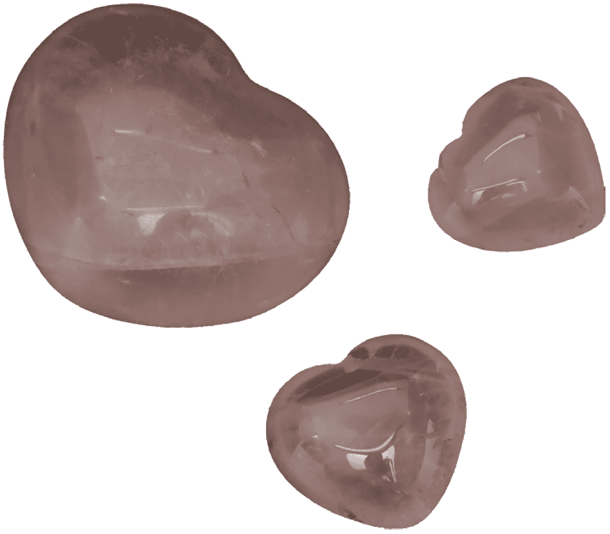

开运与疗愈

虽然第四脉轮（心轮） 的基础颜色是绿色，但许多粉色系的晶矿都能在这个位置发挥很好的效果。如玫瑰粉晶特别适合用在与亲密关系有关的情绪疗愈与释放，像是分手、背叛，或者是失去所爱之人带来的哀恸。这颗能在暴风雨过后带来平静的晶矿可帮助使用者的心更有力量，愿意再次敞开、与人链接，并增强链接当中喜悦的感受。

使用玫瑰粉晶进行冥想时，可以感受到它与心的链接，这是因为它舒缓的能量能护持心并使其恢复活力。接着，心的能量便能扩展到整个身体和所有脉轮，让其他中心与心纯粹的意志达到和谐与平衡。将玫瑰粉晶佩戴在心脏附近，或握在胸口是最容易感受到它振动频率的方式，也能帮助人更清楚意识到周围的负能量。此外，玫瑰粉晶会吸引新的爱情和亲密关系，也可用来促进与家人和朋友间更紧密的链接。

艺术创作者也非常适合使用玫瑰粉晶，它能启发对一切事物美的体悟，从而刺激想像力转变成各种形式的艺术。

其他灵性用途

除了恋爱关系外，玫瑰粉晶携带女性能量的品质，像是慈悲、和平、温柔和治愈，有助提供滋养和安抚的感觉。它的振动频率得以净化情绪和整体能量场，治愈心的伤口，并促进紧张和压力的释放，化解愤怒和怨恨，驱散恐惧和怀疑，重建希望和信仰。

玫瑰粉晶排除负能量后可以在有能量毒素的环境里形成保护，带入爱的振动频率，提升他人对自己的信任与价值感，故它对于一般的人际关系可带来很好的调和作用。若与人发生争执或不愉快，便可使用它来缓和自己的心情，重十对关系的信任。

搭配使用建议

玫瑰粉晶自古以来便被认为能够强化心脏与人体的循环系统，支持体液代谢掉体内的杂质，帮助生病的人恢复健康，同时也被认为可以舒缓低血压、支援胸腺与肺相关的困扰、促进肾脏与肾上腺机能，及减轻眩晕症和白血病带来的不适。此外，玫瑰粉晶还被认为可以提升生育力，保护母亲与胎儿，在孕期降低流产风险。

玫瑰粉晶与多数石英水晶一样，能够与所有晶矿协调运作来净化和平衡能量。若是与翡翠一起工作，心的觉醒会增强，并深化与金星的能量链接。与虎眼石一起工作时有助实现内心的愿望，并带着希望与信心前行；蓝虎眼可强化玫瑰粉晶辨别负能量和净化气场的能力。与捷克陨石搭配使用时，它会透过心中心和爱的力量为一个人的灵性觉醒带来更大的动力。

| 守护星座 | 金牛座、天秤座、天蝎座 |

## 适合上弦月的许愿作法与晶矿

上弦月被称为半月，这时候的月亮只有半亮，象征着种子生根发芽，植物形态初步展现。这个阶段代表了力量、成长、决心和坚定的意志，继续坚持执行你计划的工作。若你对现状或项目的进展不满意，这时便该重新确认、积极调整方向，带着逐梦踏实的心态来做事。

这段时期你可能会面临感到怀疑和恐惧的情况，适时借助月亮的力量帮助你聚焦、克服恐惧，重新回到自己内在的力量中心以迎向挑战，鼓励自己往前奔向终点，或是根据实际情况去冷静检视，再积极地做出必要的改变。

虎眼石和红玉髓这种类型的晶矿会支持你找到内在的力量和行动力，克服这时冒出来的不自信与害怕，让你能保持扎根的状态和坚定的态度。萤石则能帮助你思虑清晰、聚焦目标，且有结构、有效率地按部就班实现计划。

象征勇气与胆识的保护石

 红玉髓 Carnelian

红玉髓是一种橙色、泛红色的晶矿，有些甚至呈现近乎全黑，属于六方晶体，是石英家族中最受欢迎的成员之一。它的名字源于中世纪的拉丁语 Corneolus，指的是原产于南欧的植物品种樱桃（ Cornelian）。

红玉髓遍布世界各地，目前市售的大多数来自巴西、乌拉圭、马达加斯加和印度。此外，冰岛、俄罗斯和秘鲁亦产有此晶矿。

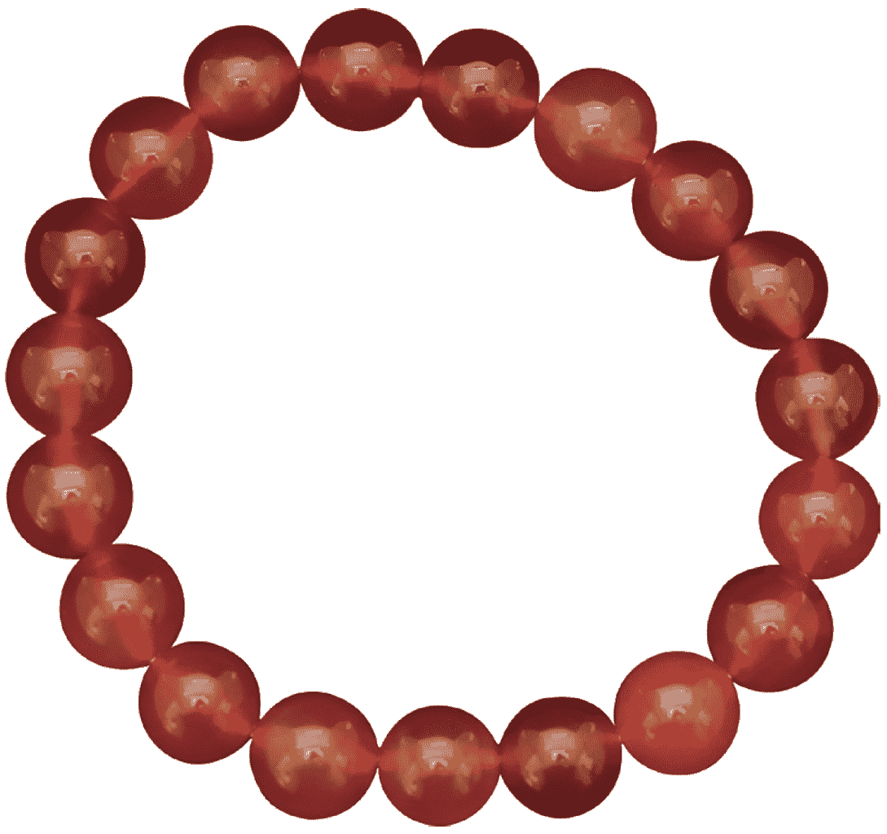

能量属性与用途

红玉髓常见的颜色有棕橘色或红橙色，对应人体的第二个能量中心——脐轮。红玉髓对于强化一个人的自我意识、平衡过度的情绪可达很好的效果，同时它也能促进安全感、提升意志力与决心，或者是复苏关系中的热情。

有另一种肉红玉髓（Sard）和红玉髓外观几乎相同，但硬度较高、颜色较深。一般来说，玉髓（Chaledoney）较粗糙和密集的部分被称为 Sard。红玉髓则是历史上使用最广泛的石头之一，从先知穆罕默德到拿破仑都有记载。古埃及文明相信死者佩戴一条红玉髓项链便能获得伊西斯女神（Isis）之血对来世的保护。而《亡灵书（Book of the Dead）》第二十九章则是被刻在红玉髓石碑上。据说伊斯兰教的先知穆罕默德在右手小指上戴了一枚红玉髓戒指。另外亦曾在考古学发现，于西元 300 年日本铁器时代，死者的脖子会挂上红玉髓护身符。再来就是拿破仑一世和二世在执政期间，二人均戴着红玉髓的印章。

开运与疗愈

红玉髓之所以被使用了这么长时间且受这么多不同文化喜爱是有原因的。这块石头具备强大的力量和活力，当一个人的下方三个脉轮中心被红玉髓带动起来并连贯运作时，个人意志会开始超速运转。红玉髓象征胆识与勇气，配戴此晶矿能够支持生理上的虚弱，或在情绪脆弱的时候重十力量并链接到热情，因而它也被认为能带来好运及成功。

古时伟大的领袖与国王十分重视红玉髓的力量，并运用它来传递最强烈的开创信念，他们的伟业造就了现今的世界。从现代的观点来看，每个人都是自己的国王、王后和神，有能力自主选择、表达自己的意识形态并传递内心的火焰。过去只能当成一个梦的想法和目标，打开力量后有可能实现，毕竟是否让自己的信仰在现实中扎根是个人的决定。

人体较低的脉轮中心有种能量形式能定义我们是谁，这是一种基础。它位于人体鼠蹊部区域，负责召唤、启动生命能量，也就是一般所说的“性能量”。它的力量不限于物种繁衍和生存的性力，有时候也会保留性能量并转化、运用它，如此会比为一时爽快去释放它，更有益于个人的成长。换句话说，人可以妥善运用这股能量并将其引导至更高目标或更大意义的事情上，而不是仅用在单一目的或个人身上。许多伟大的学者和思想家便将其性能量转化为惊人的创造力，进而改变人类的生活，例如发明家与电学、电磁场研究的先锋尼古拉特斯拉。而红玉髓能帮助人快速存取这种巨大的能量潜质，强化蜕变的过程，以更好地实现更大的梦想和愿望。建议将红玉髓放在鼠蹊部做冥想，促进生命能量的流动。

其他灵性用途

红玉髓适合用在艺术创作方面，甚至是艺术疗愈上，让创作始于于不设限的表达。此外，它能让色彩、细节和符号的象征意义流经人的思想和身体，让这些讯息在画布上挥洒出来，或是透过音乐和表演艺术等管道将能量传递给世界，这才是创造的真正意义。建议将红玉髓放置在自己或团队将想法转为现实的工作空间里，因为它丰沛的活力会注入人的创造力中心，并将内在孩子般的天真与无限生命力唤醒。在孩子的视角里一切梦想都可以成为现实，如何可松绑人成年后僵化的思维控制，让内在探索与实践的精神推动人进入生命最多元丰富的体验。

属于吸附型水晶的红玉髓有提升能量与活力的作用，可以在运动的时候配戴，或者放在办公的地方，有助工作时精力充沛，因此不适合放在卧房。此外，红玉髓能支持并转化被剥削或虐待的经验与创伤，帮助人回到当下的力量，也能保护被嫉妒的能量影响。过去红玉髓也曾因其加强声音与力量的功能，而被需要公开演说的公众人物使用。

| 守护星座 | 金牛座、巨蟹座、狮子座、处女座 |

吸附机会的开运石

 虎眼石 Tiger Eye

虎眼石是石英的变种，它在青石棉的化学纤维被二氧化硅取代时，形成一种假晶形（pseudomorph）替代品，颜色通常是金棕色、黄色、米色或棕褐色的组合。

此晶矿最早出现在 1892 年地质学家 J. D. Dana 的纪录中，因与虎眼相似而得此名。虎眼石最丰富的矿源在南非，此外印度、缅甸、澳洲、中国和巴西也产有虎眼石。

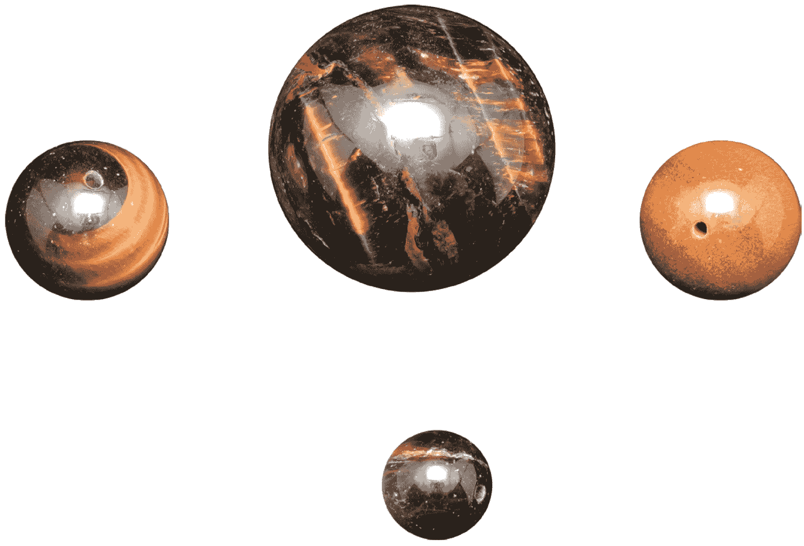

能量属性与用途

虎眼石以其在适量光源下产生的猫眼效应而闻名，一块被正确切割和抛光的虎眼石能展现出真正的猫眼光泽。这种效应由矿物的天然平行结构和反射光照到细微的针状纤维而产生；这种变彩若隐若现地覆盖在石面上，仅在恰当的光线下才能看见。虎眼石及其所有品种的鹰眼石、彼得石和红虎眼石是现存极少数能展现这种神奇猫眼效应的矿石之一。

虎眼石可以启动第三脉轮的太阳神经丛，也就是个人意志。当一个人能打开并使用第二大脑，也就是肠道，便能展现丰富且真实的情感与品质。此时若能保持专注，个人发展的可能性将是无限的。配戴或使用虎眼石会让机会像磁铁一样吸附在你身上，你可以创建新的开始，但是否能善用宇宙所提供的资源，完全取决于你自己。虎眼石所具备的积极能量与热忱会不断扩张人的意识，并将使用者推向更高处，让人依循感受而非以思考来行动。

再者，虎眼石助人获取内在力量，若将其引导到个人的需求和愿望，可能会以创造力、驱动力、决心和更加专注的方式来显现。这种矿石有时会引发人轻微的痴迷症状，带出精力充沛的一面，并将太阳神经丛真实纯粹的爱引导到真正热爱的人事物上；周遭的人可能会发现使用者的变化而感到不适应，导致某些问题产生。这其实是因为使用者个人意志的蓬勃发展，引发周围他人对自己人生道路感到不满意而产生的投射。这些人可能会因此人自我提升的转变而将矛头指向他，甚至不会意识到这种针对性所产生的负面影响。虎眼石不仅能够让人预见自身的潜力，还可以明晰预见与周围其他人的关系。

搭配使用建议

若是长期或大量地使用虎眼石，使用者可能会发现自己开始舍弃那些“不适合”的人事物，甚至可能是与你有长久关系的人。当一个人开始体验精神上甚至是灵性上的觉醒，或当他/她开始突破并全然投入一条积极正面的人生道路时，可能会发现自己所爱的人并非在帮助生命前进，反而是带来伤害。想要提醒使用者，别让这个舍弃的过程阻碍你成长，因为其他人需要依循自己的节奏来觉醒，谨记所有的接纳和成长都源自和平与爱。

建议每天早上或晚上使用虎眼石冥想，将想法和愿望放在意识里，说出这些想法让宇宙听见，并支持你梦想实现。虎眼石的能量像魔法般带来一种一切皆可能的振动频率，生命就是无极限的信念，这会将人摆在一种“想法即能化为现实”的状态里。虎眼石很适合与橙色方解石、大黄蜂碧玉、黄铁矿、桃花心木黑曜石、橙色东菱石和黄水晶等具有创造性质的晶矿一起使用。

| 守护星座 | 狮子座、摩羯座 |

打开智慧与创造的疗愈石

 萤石 Fluorite

萤石属于等轴晶系的能量吸附型晶矿。它对应水星的能量，能够带来清晰并有助于智力与思考能力的提升，除了对考生、秘书、会计师与交易员的学习与工作带来支持外，萤石对于需要做任何重要决定时的平衡考量也有很大的辅助作用。

萤石产地遍布世界各地，像澳洲、巴西、美国、墨西哥、阿根廷、南非、卢旺达、英国与中国，经常在石英与方解石矿床附近被发现。

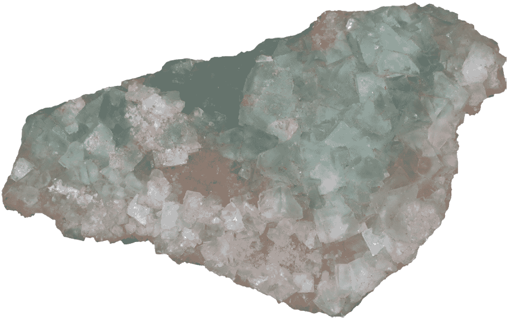

能量属性与用途

由于色彩多样，应用功能十分广泛，常见的萤石从淡绿色到深紫色的组合都有，甚至还有绿、紫、粉、蓝、白渐层的彩虹萤石。它能启动整个脉轮信道，让能量在不同脉轮中心之间顺畅流动，达到系统性的平衡与稳固，进一步衔接身、心、灵三位一体，适合用在脉轮系统相关的疗愈工作。

单色萤石也可以依据颜色在对应脉轮上使用：粉色通常会在氟铝石膏矿床附近被发现，它能支持心轮敞开，促进自爱与疗愈。黑萤石则是绝佳的净化工具，可快速清理负能量，也会在情绪体周围形成保护。紫萤石则有助心智与较高的振动频率调频，可支持一个人的灵魂与意识扬升。蓝萤石能支持想法以朴实且清晰的方式表达，很适合教师、演讲者或艺术家。透明萤石是打开直觉的晶矿，能启动第三眼，强化灵通与透视能力。绿萤石将头脑与心链接，让情绪与思绪间取得平衡。黄萤石能在太阳神经丛与第三眼之间创建链接，让真实的自我找到最好的表达与显化管道。

搭配使用建议

整体来说，萤石最主要的功能是让思绪变得清晰，激发直觉并促进更高视野的表达，让人能够在烦躁忙碌时平静下来，快速找到结构性，回到头脑清明的状态。它也能提升创造力、链接神性，在一个人面对工作繁重和需要大量产出时，能带来显著的调和与平衡效果，是很不错的冥想石。

萤石的主要缺点是它很软，怕被刮伤且易碎，使用与保管都要格外注意，记得不要与其他晶矿存放在一起。萤石与石英水晶一起使用能强化对应色彩之脉轮的运作与能量流动，与煤玉或黑曜石一起使用则能快速净化人的能量场。

| 守护星座 | 天秤座、摩羯座、双鱼座 |

## 适合盈凸月的许愿作法与晶矿

盈凸月期间超过一半的月亮被照亮，仅有一点点黑暗和看不见的部分，这股能量仿佛是即将开花的花蕾，此时你可能正全力冲刺工作、执行计划，并开始在意你付出的劳动能带来什么样的成果。这时要仔细留意你的表现、更深入你的期望，反思如何才能更好地完善自己的目标。

盈凸月主要与觉知反思、即兴创作和编缮有关，是一个孕育的阶段，成长看得见，期待自然也产生了，耐心是此时的关键。先前的付出即将回收，千万不要半途而废，若能适时做出一些修正和调整，会有很不错的效果。此外，这时月亮的疗愈力十分强大，可以善用时机来处理情绪或灵性方面的议题。

在这个月亮渐盈增长的阶段，建议使用白纹石来帮助你保持和高我的链接，确保你带着正面的态度，持续在自我进化的道路上前进。黄铁矿可以坚定意志，让你心无旁骛、保持专注来继续冲刺。萤石则会协助你厘清思绪与工作的细节和框架，适时做出灵活的调整与变动。苏打石让你在这个过程中用恰当的语言对外沟通需求与看法。

寻求预言的仪式

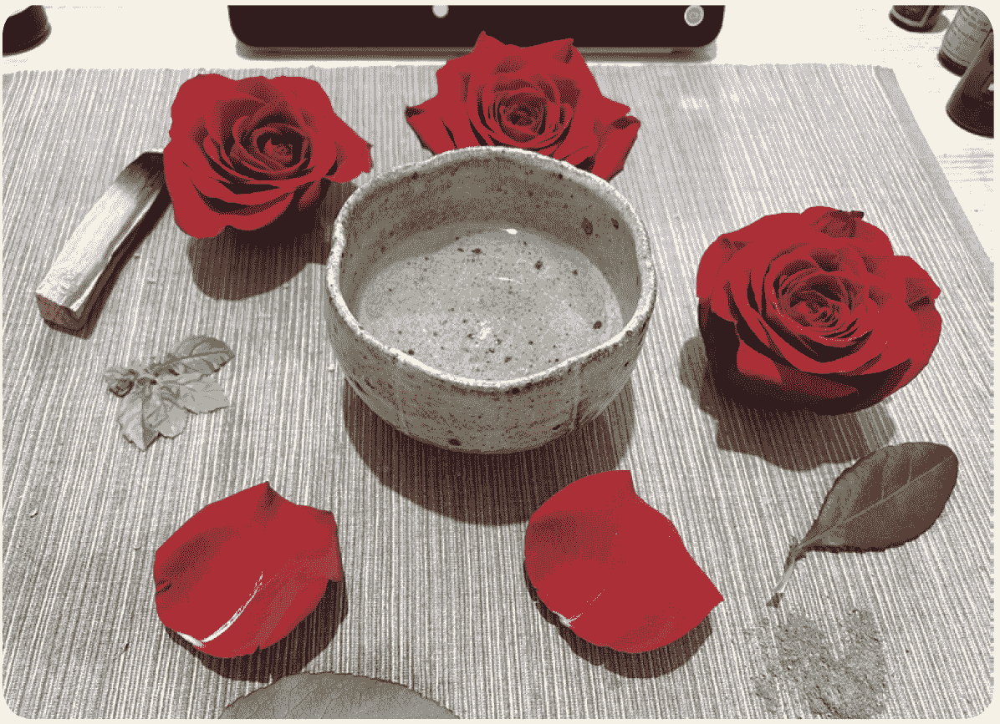

1 将铸铁炉装一半的水，周围放置紫水晶、白水晶或透石膏。

2 点燃两根占卜用的紫色蜡烛与熏香。

3 燃烧艾草、蒿草。

4 将手轻放在铁炉两侧，望进炉底。

5 对着水吐气，并念祈祷文：

魔法炉，让我看见我追寻的（Cauldron, reveal to me that which I seek.）

伟大的母亲，打开我内在的视线，让我能真正看见（Great Mother, open my inner eye that I may truly see.）

召唤桃花与真爱的仪式

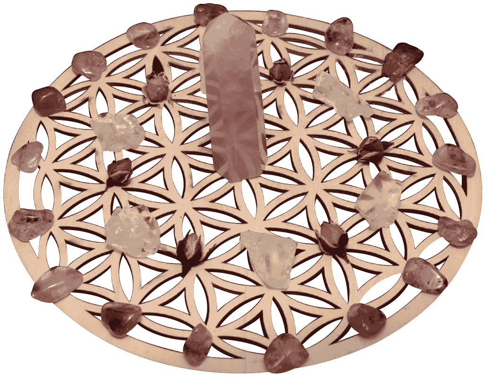

1 将魔法炉放置在两支粉红色蜡烛之间，搭配以玫瑰粉晶为主的桃花水晶阵。

2 将紫红色蜡烛放到魔法炉中。

3 点燃爱的熏香和粉红蜡烛。

4 用魔杖敲击魔法炉三次。并念桃花咒：

追寻他/她的人（One to seek him/her）

找到他/她的人（One to find him/her）

带来他/她的人（One to bring him/her）

绑定他/她的人（One to bind him/her）

心对心，永远一心（Heart to heart, forever one）

至此我说，爱的魔咒以完成（So say I, this spell is done.）

5 再敲击魔法炉三次。

6 点燃紫红色蜡烛以加快咒语实现的速度。

点亮灵性智慧的情感护身符

 白纹石 Howlite

白纹石也称为菱镁矿，是一种硼硅酸钙氢氧化物，常以块状、结节或棱柱状的形式结晶，外观是由大面积的白色和如静脉般的黑灰色纹理所组成。1868 年在加拿大新斯科细亚省温莎镇附近被知名化学、地质学家亨利‧豪（Henry How）发现，待他去世后便更改成其名。白纹石也在德国、塞尔维亚、土耳其和美国被发现。

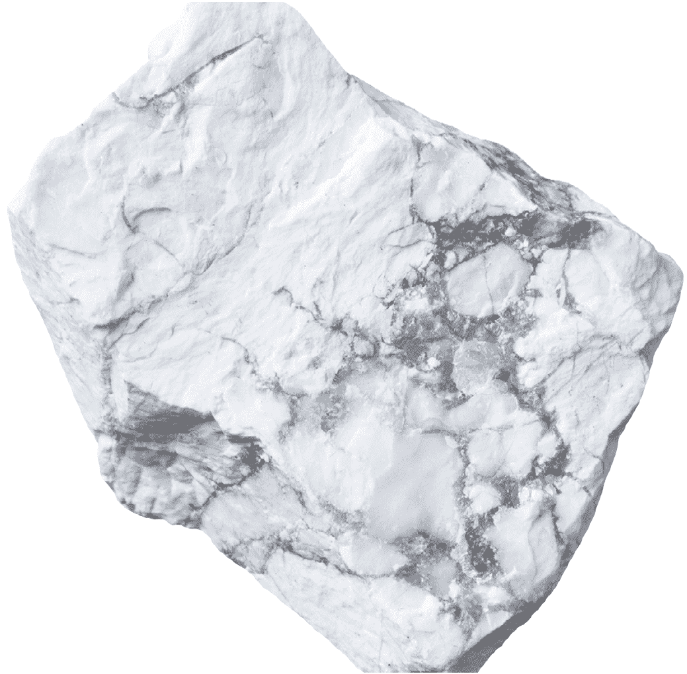

白纹石经常被当作仿石的材料，市面上有许多假的绿松石，实际上是染色的白纹石。这是因为绿松石硬度低且易碎，除非有基质支撑否则难以被使用。很不幸地这样的工续在矿产市场中被广泛接受，导致矿石展会、奇石店铺，甚至是珠宝店都可能有染色的白纹石，建议购买时检查人造色素与硬度水准。

能量属性与用途

白纹石与人的海底轮和顶轮共振，这种第一个和第七个能量中心的链接形成独特的组合：一方面往下扎根与大地母亲融合，获得她赋予的支持与资源，同时向上与高我保持联系，这是白纹石最强大的能量。握住它能让人感受到一种平静覆盖下来，肩膀上不必要的重担被移除，感觉自己站得更挺直、更稳固。它能提高人的信心水准，促使内在力量觉醒。

白纹石会提醒你，看见并实际感受到自身拥有的力量，拥有这样的底气后，你便可以自如地存取、掌握它来疗愈。这矿石能带来滋养并点亮人的灵性智慧，让你意识到灵魂来到地球的任务。

搭配使用建议

白纹石是绝佳的情绪疗愈石，它让使用者意识到自己的内在力量，有助于面对创伤事件带来的悲伤与哀恸，甚至转化这些情绪底层的愤怒与怨怼，慢慢重建一个人的情绪体，并支持创伤后应激障碍带来的焦虑和忧郁。在艰难的时刻，白纹石能将一个人的能量扎根、保持思绪的清晰，在疗愈和修复身心的整个过程做出更恰当的判断和决定。白纹石也能作为一种情感护身符，让配戴者感受到无论经历、承受多大的痛苦，成长和过新生活依然是可能的。它适合与绿松石、紫水晶和苏打石搭配使用。

| 守护星座 | 双子座、处女座、天蝎座 |

打开沟通管道让自信 MAX

 苏打石 Sodalite

苏打石又称方钠石，属于长石家族。最早的纪录是 1811 年欧洲人在格陵兰岛发现，但近代考古学家在研究美洲大陆的古文明时，竟追溯到秘鲁利马附近的卡拉尔人在西元前 2600-2000 年将苏打石使用在贸易上。

它很少以晶体的形态出现，有时会在白色方解石的矿床中被发现。苏打石主要的颜色为蓝色，但也有白色、黄色、红色和绿色；它的矿物家族还包含青金石、蓝方石和黝方石。

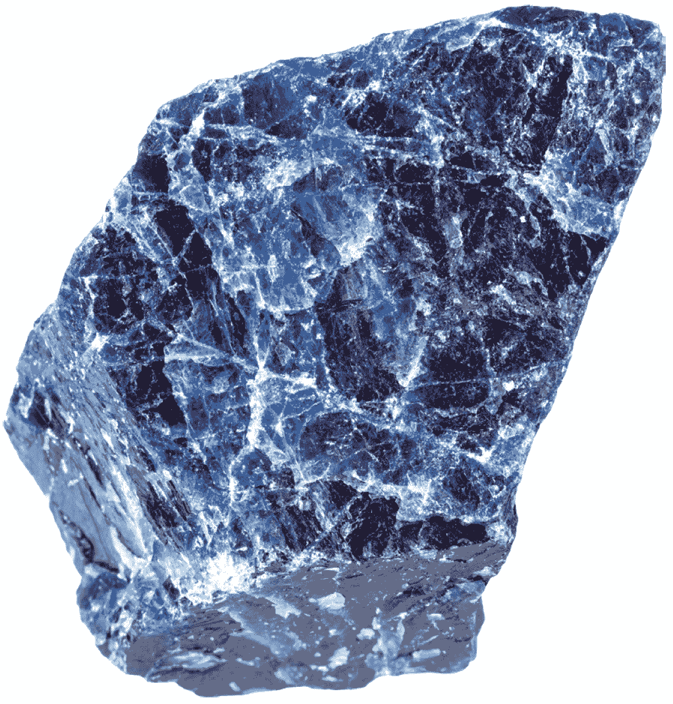

能量属性与用途

苏打石是一种能增强洞察力和智力运作的矿石，它的振动频率可以解锁一个人的直觉。当这方面的能力被激发时，人便能克服每天因为过度思考所产生的心理障碍，头脑不自主产生的矛盾与拉扯会慢慢地减弱。某程度上苏打石是很个人化的矿石，深入一个人的潜意识，促使人去评估自己，看清自身的优劣势并做出更理性的判断。

苏打石有助发展一个人的直觉，它的高振动频率能够指引内在的真相，在平静里激发反思的能力，让人意识到自己需要修持的部分，也消除内心消极的情绪。苏打石对应喉轮，这是人体重要的能量线，但大多时它没有获得恰当的表达。苏打石有助扩展沟通表达的中心，将平时无法厘清的想法用语言传递出来。人们总认为解读他人很难，然而解读自己的感受似乎更具有挑战性，因为人总是对自己内心的渴望有偏见，为回避自我批判导致做决定时摇摆不定。苏打石亦可以将喉轮和第三眼连接在一起，帮助他人更好地理解自己的感受，并以正确的方式去表达诉求。对于那些辞不达意的人，或是在生活中难以传达自己的意见和声音的人，苏打石绝对是非常好的助力。

搭配使用建议

在晶矿搭配使用方面，苏打石和青金石能强化第五和第六脉轮之间的相互运作，带来更清晰、中立的思考，并获得真正有用的洞见。捷克陨石则能增强苏打石的转化能力，延长它的效果。玫瑰粉晶和苏打石可共同创造高频振动，快速释放使用者内在或所处环境里的负能量，将纯净的光重新带入生活。

| 守护星座 | 射手座 |

显化力强大的决心石

 黄铁矿 Pyrite

黄铁矿又被称为愚人金，是一种硫化铁矿物，以块状、立方体、钟乳石和葡萄状的形式结晶，这种矿物也会与石英、绿松石和青金石共生。黄铁矿的名称来自于希腊语 pyro，是火的意思，最早记录出现在西元 50 年古罗马医生 Dioscorades 的研究当中，之所以会选择这个名字是因为两块黄铁矿碰撞在一起会产生火花。

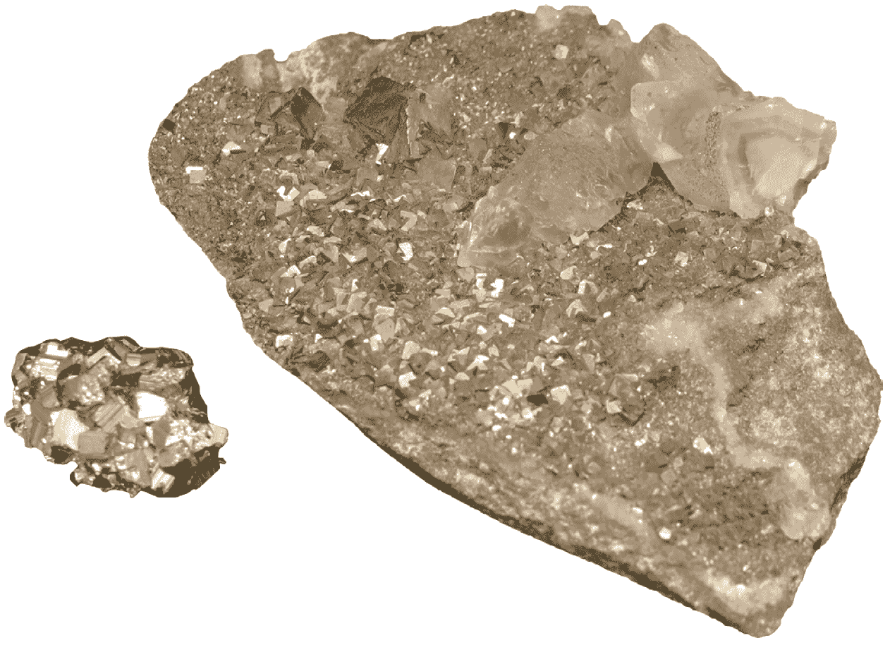

黄铁矿在古文明中有许多用途，是希腊和罗马帝国时期常见的矿石。考古学家发现许多由黄铁矿制成的护身符、戒指、盒式吊坠、别针和耳环；美洲原住民相信它有强大的治疗能力和魔法，故常用来作为冥想和仪式的工具。

能量属性与用途

黄铁矿是强大的决心石，它的能量会直接与太阳神经丛脉轮产生共鸣，激发个人意志力以实现人生成就，这个过程需要努力付出和全然投入；黄铁矿能确保使用者维持在正轨上，坚定地往目标迈进。将具备强大显化能量的黄铁矿当作冥想矿石或小配件随身携带，绝对能为生活注入活力与力量。如同所有具备显化能量的晶矿一样，建议你在冥想或仪式时清楚说出内心的渴望，让存在和自己的较高意识听见，这时矿石的能量便可协助你将概念和想法逐步化为具象的现实。

想要健身锻鍊却难以坚持的人建议可以寻求黄铁矿的力量，如在家运动的人可放一大块黄铁矿在健身的空间里，它会帮助你在锻鍊过程保持专注。有时候你会发现当身体感到疲劳时，思绪会开始令你分心，黄铁矿便可以开发意志力和身体的潜能，让你保持专注并加大锻鍊的力度。

搭配使用建议

黄铁矿适合与白水晶或透石膏结合使用，因为这两种晶矿都有助于增强黄铁矿投放到你生命里和这个世界的能量。若将这三种晶矿与像硅孔雀石这类喉轮晶矿一起做成水晶阵，除了可以刺激个人意志力和信心以外，对于同步支持对外沟通和传递个人想法亦有非常好的效果。

| 守护星座 | 狮子座 |

## 适合亏凸月的许愿作法与晶矿

满月的光辉过去后，月光在逐渐减弱，其右侧开始形成阴影，这个月相标志着显化周期的结束。随着月光的消逝，你可能会注意到前方的道路正在发生变化。好好收获上一个阶段的成就，准备让自己摆脱那些没有建设性的想法，或为你生活带来压力的习惯。

亏凸月的许愿以感谢、反思和减轻压力为主，这时的月亮渐亏，是一个适合整理与断舍离的时候，得腾出空间，让崭新的机会到来。如果有想要戒掉的坏习惯，这是个好时机！或者单纯运用这段时间来休息、喘口气。

此时建议向内看、反思在这次月亮周期开始时为自己设定的意图，或许你需要释放一些想要抓住的东西，此时茶晶或血石能够在这部分支持你。有助于驱散负能量并消除压力和焦虑的晶矿也是这个阶段的理想选择，像是锂云母、天河石或多色碧玉。

净化与保护的仪式

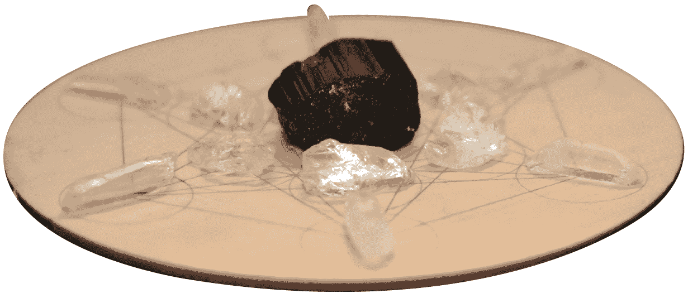

1 将空的铸铁炉放置在祭坛上的两支白色蜡烛之间，点燃蜡烛。

2 点燃保护的熏香，搭配以黑曜石或黑碧玺为主的净化保护水晶阵。

3 穿上白色的袍子站在祭坛前。

4 将魔法炉从祭坛上举高，对神致敬。

5 将魔法炉放到胸前的高度，轻轻地对着炉口呼吸，说出你想要从生命中移除的习惯、人或经验。

6 在祭坛上将魔法炉倒扣，并念祈祷文：

我将这炉子里的一切交予你，伟大的神（The contents of this vessel I give to thee, Great Ones.）

以此换来更好的经验（Exchange these experiences for better.）

7 将草药和牛奶等供品放到户外（一楼的门口或公寓的阳台或花圃）。

强大的负能量转化石

 茶晶 Smoky Quartz

茶晶是一种从自然辐射获得黑色或烟熏色的石英水晶，是六方晶系里有放大能量功效的万用晶矿，颜色从黄褐色到灰黑色都有。它遍布世界各地，品质最好的茶晶大多产自非洲、澳洲和美国的新英格兰地区。

茶晶已经有悠久的地球文明使用历史，它是苏格兰之石。因为在凯尔特、萨满文化里，德鲁伊特族人使用茶晶来深化并稳固他们与灵性世界及大地的链接。

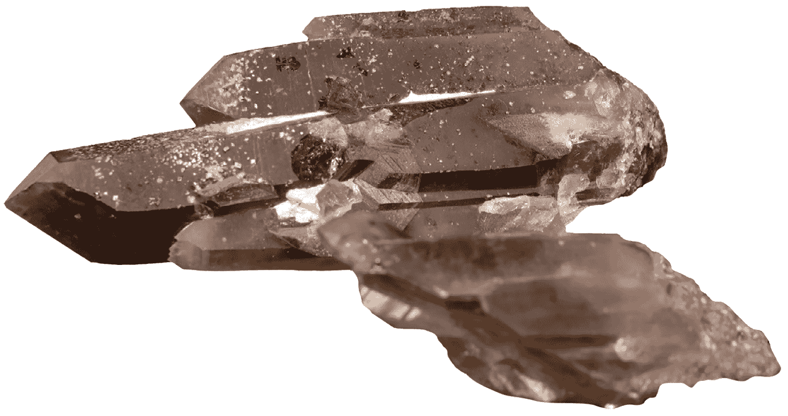

能量属性与用途

茶晶的净化能力强大，可以将负能量转化成正面的频率，经常是仪式和许愿晶矿的首选，因为它可以将光从顶轮带到海底轮，快速清除陈旧的负面情绪与信念，支持所有脉轮之间的链接，对于蜕变固有模式有很大的帮助。另外它也被认为具有排毒的功效，在深层疗愈的过程当中，茶晶能够帮助人卸下捆绑已久的情绪重担或纠缠；在更深的层面臣服这些伤痛，放掉内在的抗争，逐渐回到平静与稳固的状态。

除了打开海底轮和太阳神经丛外，茶晶还可以帮助人扎根，因此特别适合那些经常心不在焉、无法集中注意力的人，它不仅能清理头脑里的混乱思绪，还可以让心智变得清晰。茶晶支持人寻回在忙碌或一成不变的日常生活中所丢失的动力和决心，唤起人对于梦想的渴望，从庸庸碌碌的状态中清醒过来。

茶晶的能量要提醒你，在你的生命当中应该将自己的需求放在首位，若对生活现状不满意，你不需要妥协，直接大胆地对宇宙下订单，说出你的愿望，借助它的力量将愿望变为现实。茶晶足以成为你收藏里最强大的显化工具之一。

其他灵性用途

茶晶被认为可以保护一个人的气场和身体免受负面振动频率的干扰，并帮助那些已经存在的负面信念被消融，转化为积极的想法与动力。此外，亦可帮助一个人链接真正的内在力量，以此打破坏习惯和旧模式。内在缺乏力量的人是混乱的，总想要透过控制来规避风险和不安，但这也让生命变得越来越局限。生活中总会有一些不得不面对的逆境，若一个人能链接到核心的稳固感与信心，便不会在困境前退缩，而茶晶正好可以支援你应对这些挑战。

茶晶也很适合用在居家环境的能量平衡。除了可以将茶晶碎石绕着屋子外围、铺放一圈做为保护和磁场转化，也可以放在你所居住的房间、店铺或办公环境里。

| 守护星座 | 天蝎座、射手座、摩羯座 |

赋予力量的勇者之石

 血石 Bloodstone

血石也称为血玉髓（Heliotrope），这个名称源自于希腊语“转动太阳”的意思，所以中文俗称太阳石。它是一种不透明的隐晶质石英，属于玉髓家族。在这种矿石中会发现一些绿色，来自于微小的绿泥石和辉石内含物；红色则是小部分集中的氧化铁矿物，通常是赤铁矿。目前在印度、中国、马达加斯加、巴西、澳洲和美国都发现了丰富的血石矿床。

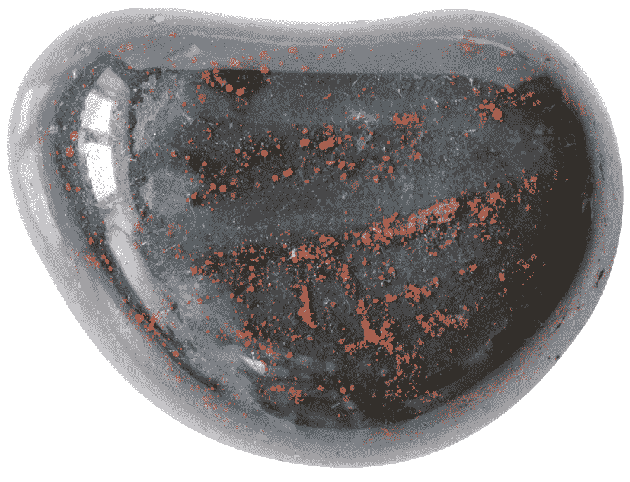

能量属性与用途

血石在印度文化中被认为是一种春药，通常会将它磨成细粉并以高价出售，这种磨碎粉末的价格甚至会比原始的血石原料还高。这让顶级血石变得更有价值。

历史上血石被不同文明推崇着，据说石头上的红点象征着基督的宝血，故亦曾作为基督徒的护身符。它也被用于出血检查，据说意大利著名的文艺复兴画家乔尔乔‧瓦萨里曾在剧烈大出血时，用一块血石置于肩胛骨间来止住血。

当血石被放入水中时，会形成一种微红色的色调，经太阳光照射会更明显，古文明甚至认为它能够将太阳变成血红色。西元三世纪末的莱顿纸、莎草纸以希腊语记载了血石能够赋予佩戴者的庞大力量：“佩戴者无论说什么，都会被相信。无论是谁拥有这块宝石，并念出刻在上面的名字，就会发现所有的门都会为他敞开来，束缚和石墙将裂开”。

开运与疗愈

血石能唤醒被恐惧掩盖的内在力量、意志力和勇气，它是负能量的净化器，可以将这类想法和感受转化成积极正面的。血石能打破一个人单调循环的模式，帮助他成为自己真正想要的样子。这种水晶提醒：每个人的思想和行为只能由自己来评估，不是由他人来评判；生命选择的方向只能由自己决定。血石为人带来渡过难关必要的自信和坚定，并相信未来可期。

血石是一种引发思考的护身符，有助于配戴者将潜意识里的想法变为现实。思想的力量和人们自身的不安全感让想法和情感在这个世界被隐藏起来，然而当人们能允许直觉和真实的经验时，这个世界便会走向变革的道路。

| 守护星座 | 牡羊座、天秤座、双鱼座 |

守护孩童的情绪疗愈石

 锂云母 Lepidolite

锂云母是一种锂钾铝矿物，是云母家族中最常见的成员之一。这种矿石以块状、板状、叠片或棱柱的形式结晶，呈现的粉红色和紫色源自于其化学成分中的微量锰杂质，其名字由希腊语鳞片（lepidos）和石头（lithos）组合而成。

锂云母产地遍布世界各地，在巴西、马达加斯加、澳洲、俄罗斯、日本、加拿大、英国、墨西哥和美国均有丰富的矿脉。它是一种柔软易碎的矿石，只有在石英体内发现它时才能切割、成型或抛光。这种罕见的特性让它能加工制成精美珠宝及高级椭圆形宝石，并以巴西米纳斯吉拉斯州出产的最出名。

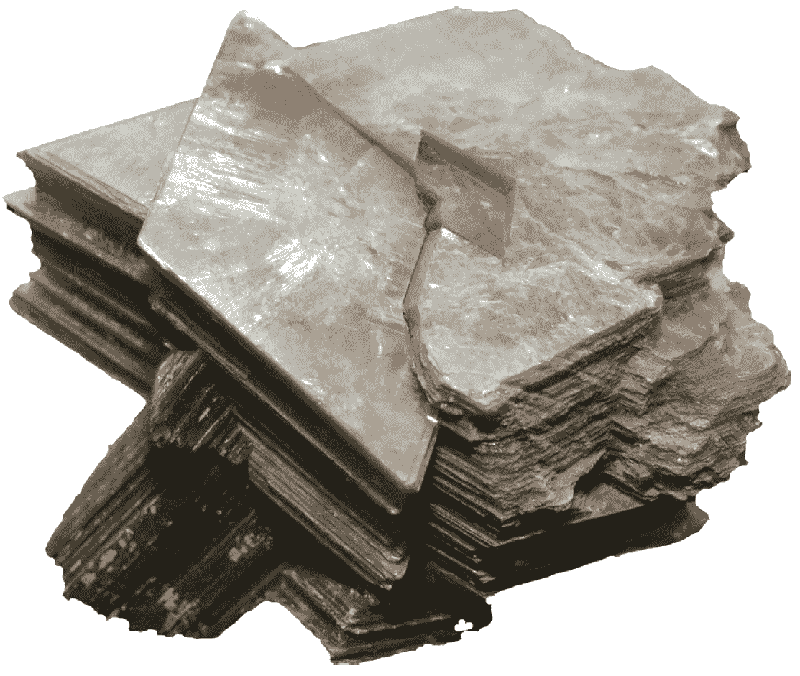

能量属性与用途

中世纪时大片的锂云母从矿体中被分出来，用来覆盖建筑物内的大开口处，这就是人类社会最早使用窗户的纪录。锂在现今社会中被广泛使用，像是电动车、电池以及现代医学用途，而这神奇的元素持续有新应用被开发出来；锂云母是目前含有最丰富锂元素的矿物。

在医疗用途方面，锂作为可摄取物质是因它能稳定人的心智，故多半会以处方成分开给患者服用，用来辅助治疗双向情绪障碍症等精神疾病。锂云母含有高量的锂成分，冥想时可以直接放在第三眼或顶轮上，能对身心带来正面的影响，让人的态度变得积极、自信，并且在生活小事中找到快乐。

开运与疗愈

锂云母具有软化的能量，可以纾缓人的情绪体，让精神状态保持平静。只要握住一块锂云母，与它的能量链接，整个脉轮系统就会被启动并校准。锂云母的频率体现出自我成长的概念，配戴者能向周遭的世界敞开心扉。虽说从内在寻找幸福感可能不容易，但锂云母会提醒你总得/至少要从一个地方开始，即便外求。治疗师把锂云母视为快速启动石，因为它会用一股生命力能量唤醒我们。

锂云母与人体所有脉轮都能产生共振，不过它特别有益于第三眼、顶轮与心轮之间的联系。使用时你可能会发现自己更能触及梦境中的情绪，不久后甚至开始有更多身体的体验。再者，锂云母能将人的心智与周遭景象或画面的象征性意象调频，包括与日常生活的同步性，若你开始有更多似曾相识的感觉出现，要相信自己和直觉，因为锂云母的能量在这不断变化的旅程中将会持续引导着你。

推荐有新生儿的家庭可在孩子的房间里放置一大块锂云母，就像粉红蛋白石一般，它平静的能量与年幼的灵魂有着一种特殊的链接，能将爱和滋养带到这空间中。孩子容易因为对周围环境缺乏意识而哭泣；人类从出生开始就会被负面情绪影响并留下习惯，若不加以处理，可能会导致未来的生活出现像是焦虑、抑郁和创伤后压力症等问题。

| 守护星座 | 天秤座、双鱼座 |

促进和谐沟通的魔法石

 天河石 Amazonite

天河石又名亚马逊石，这个名字源于盛产这矿石的巴西亚马逊河。它是微斜矿的一种，属于硷长石矿物，以小棱柱形晶体或大块状结晶成形，颜色从深蓝色到绿松石色、或蓝绿色都有。

天河石最早出现在 1847 年德国矿物学家布赖特豪普特的研究里，不过人类使用它已至少 4,000 年，据说埃及、印度、美索不达米亚等古文明都使用过，甚至在图坦卡门的法老墓室中，发现一个特殊的圣甲虫戒指，此经常出现在魔幻影视作品中。由于天河石是大量形成的，过去许多文明都使用亚马逊石作为盔甲、避邪物、护身符、小饰品和书写板。

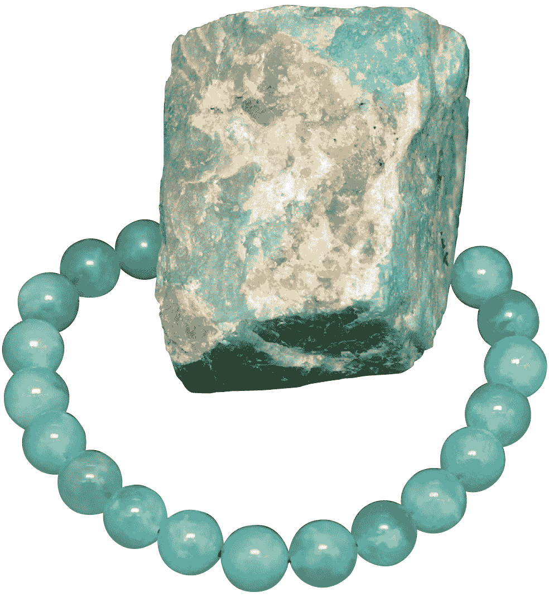

能量属性与用途

天河石是平静、真理、和谐与沟通的石头，它能温和地舒缓神经；触摸此石便可感受到这股能量。而它散发出的蓝色光芒能带来振奋精神和恢复活力的频率，让心平静下来。将天河石放置在空间里可使能量平静下来，并让氛围充满正能量。很多人平时要发自内心地说话是有困难的，因为头脑和情绪总容易带来沟通上的阻碍。

天河石让人的心和喉轮能够连接在一起，帮助最真实的感受与想法浮出水面，再以轻松的方式表达出来。因为这种沟通上的特性，天河石被誉为和平之石，赋予使用者的能量就如同孕育它的亚马逊河般，鼓励人去冒险和爱，同时给予灵感和畅所欲言的自由。若你想要和所爱之人沟通一些困难的话题，建议可在口袋里放一块天河石，让它支持你，也让它的能量缓和你所在的场域，驱散可能存在的负能量，接着对话便能自然顺畅地展开，将真相与真心说出来。

天河石也具备设定意图与强化意念目标的功效，为使用者最大的梦想和愿望铺路。建议在仪式中握住一块天河石，将愿望说出来，让宇宙听见你的计划、目标，以及缺省想要实现它的路径，它会支持梦想成真。天河石传递出：一个人掌握着自身的命运，自己的决定会影响面对的结果之讯息。

搭配使用建议

天河石可以与茶晶或黑碧玺共同使用，这两种组合都能提供自我转化的频率，同时也将灵性能量扎根于大地。能量是真我发展与成长的核心，使用天河石时，要将它放在喉轮的位置以解锁这个能量中心，其他同样发出蓝光的晶矿亦具有高振动频率，像是硅孔雀石、海蓝宝和绿松石，均可与天河石一起使用，让它们强化你的沟通能力，并赐予真理传递的信道。

| 守护星座 | 处女座 |

体现真实自我的矿石

 多色碧玉 Polychrome Jasper

多色碧玉又称沙漠碧玉，是这几十年才在马达加斯加发现的碧玉品种。当时市场疯迷海洋碧玉，2008 年搜索更多矿床时意外发现了第一个多色碧玉矿床，在那之后全岛又发现了两处。值得一提的是，由于地形和各方面条件十分恶劣，所有的矿材都需要手工挖掘。

多色碧玉只能大块形成，也因独特的棕、红和褐多种色调混合的外观得名沙漠碧玉。这些明亮的颜色来自内含的铁金属杂质。由于多色碧玉吸引了大众关注，工匠、雕塑家和雕刻师们都喜欢蒐集这种原矿。

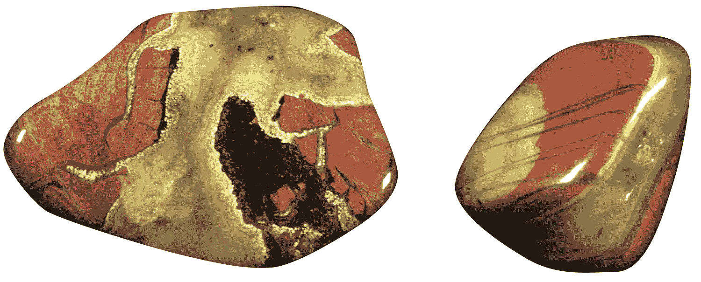

能量属性与用途

多色碧玉是一种体现真实自我的矿石，可帮助一个人将自己的能量传递给身边亲近的人。它能促进内在的平衡，同时适应当前的外在环境，光是这一点就能支持许多人减轻日常生活中不能真实做自己所导致的压力。由于更多的能量回到自身，多色碧玉能帮助人更了解自己，进一步往自己想要的生活方式迈进。这款碧玉运作的方式是先定位人的心智状态，接着务实层面的一切会跟随——所谓心之所向、身之所往，意识自然要紧随灵魂的指引。

当一个人接触到多色碧玉的频率时，便会链接上古老的地球能量，全面地将使用者的肉身扎根于大地，并开始在乙太体周围生长出真正的“根”，同时它也会引导滋养的能量来提振你的生命力，这种鲜活的能量可让使用者恢复活力，重燃内在的火焰。使用多色碧玉会让人感受到一切皆可能，你才是自己真正的创造者。

| 守护星座 | 水瓶座、双鱼座 |

## 适合下弦月的许愿作法与晶矿

在最后四分之一的月相中，月亮的左半边被照亮，右半边被阴影覆盖。这个时期月亮的“电力”只剩下一半且持续下降，现在是真正放下仍残留在生活中的负能量的理想时机。执着于那些扯你后腿的人事物毫无意义。新月阶段播下的种子已收成，现在要进行一些回顾和省思，为下一个周期的新目标做好准备。

在这个过渡阶段，情绪可能会淹没你，使你崩溃，甚至会感觉自己正在消失。随着月亮渐亏，这些情绪都是正常的，但利用这段时间重新调整目标，放过自己和原谅他人同样重要，特别是当某些事的发展出乎意料，且梦想没有实现时，你必须提醒自己，有时这些发生与你的作为或不作为无关。重新评估自己的状态，找回平衡与信任。

增加专注力并且帮助你拥有更高视角的晶矿是此阶段的理想选择，运用萤石、西藏水晶、钙沸石和白水晶，能让你放松思考和心智状态，释放不必要的挫败感。清空前尘再去链接更高的智慧，你便能获得对未来的清晰。

启动与平衡脉轮的奥秘之石

 西藏水晶 Tibetan Quartz

西藏水晶是石英水晶的一种，具有惊人的透明度，通常含有一些黑灰色杂质，很可能是碳或锰，虽然具体成分至今仍是个谜。

它的晶体常会呈现彩虹光且多为双尖形式。据称它蕴含古西藏的奥秘与智慧，目前产地包括中国和尼泊尔。

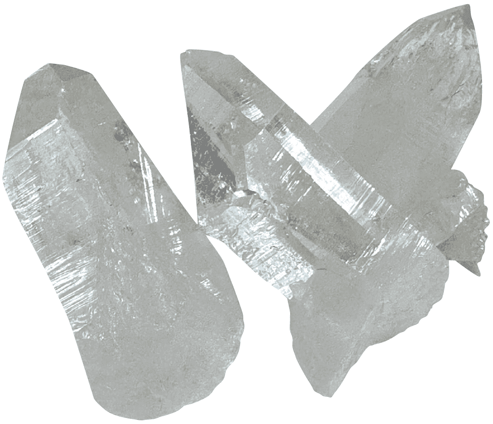

能量属性与用途

除了一般白水晶所具备的品质外，西藏水晶另外有强大、聚焦和中性的线性能量，非常适合作为主控水晶或魔杖。考量此水晶的能量强度，建议使用者需要拥有其他水晶疗愈的经验。这款水晶神奇之处在于即便它的能量属于阴性、女性的，亦与佛有关联性，同时也与三位一体有链接。

双尖的品种通常与顶轮和海底轮的能量共振，并不触及中间其他脉轮。西藏黑水晶释出的能量被认为可启动并平衡脉轮及经络系统。

其他灵性用途

西藏水晶以保护和净化的力量著称，它可以清除负能量和扩展气场，提高振动让肉体和光体调频。它有助于开发灵通能力，放在第三眼的位置时，自然会振动宇宙神圣之声 Om 的频率。

它还能保护使用者免受负面干扰，据说用它来冥想能让人链接西藏僧侣的智慧。此外，它被誉为人类所知最强大的灵性保护石之一，随身携带这种双尖水晶能让身体周围产生“光泡”，仅允许正向频率穿过抵达使用者的气场，助人完全回到中心。

| 守护星座 | 12 星座通用 |

气场全面净化石

 钙沸石 Scolecite

钙沸石是一种含水的钙铝硅酸盐，属于沸石家族，是玄武岩、花岗岩和正长岩气孔及裂隙中生长出来的次生晶体。它第一次被记载是在两名德国化学家在 1813 年的研究里，并以希腊语的“虫”字来命名，是因钙沸石加热后会卷曲成虫形。

钙沸石多以细长棱柱状晶体或大型块状成形。颜色从白色、粉红色、紫色、黄色和红色，甚至透明无色都有。矿床分布于全球各地，但在冰岛和印度等少数地区会出产罕见的晶体。

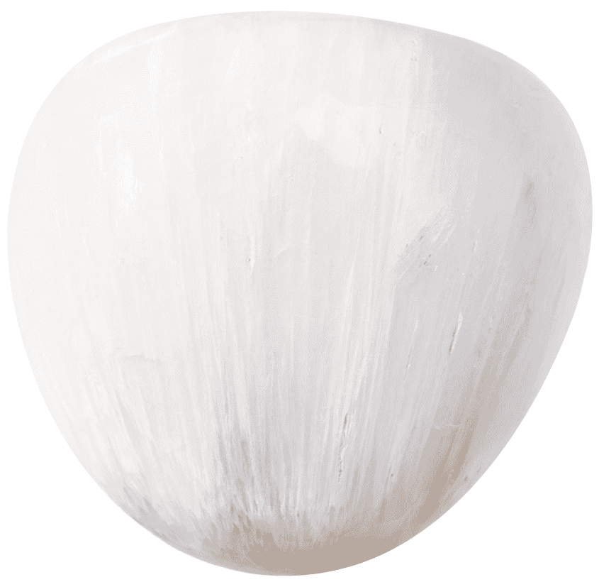

能量属性与用途

钙沸石是带来内心平静的矿石，对忙碌一整天后想要放松的人来说是完美的解药。这种矿石通常适合作为冥想工具，因为它能打开人体的较高脉轮中心，放在第三眼上便可立即感受到缓慢振动地按摩第六脉轮。钙沸石能强化第三眼的能量运作，让人清醒地经验到梦境，或者对于夜晚跨维度的旅行有生动和清晰的记忆。

若想要用钙沸石冥想来净化气场或自我疗愈，记得要从心出发，就算钙沸石与较高脉轮一起在更高的频率下工作，它也会解锁心的中心，促使它释放任何造成痛苦的东西。钙沸石是一种气场全面净化石，会吸附负能量，故可以经常使用，以它来进行大扫除。每天随身携带钙沸石能让你在归于中心的同时也对周遭的人敞开心扉。对于想要做梦境工作或增强记忆力的人来说很实用，因为它支持梦境中异象的理解以及实际生活所代表的意义。

搭配使用建议

钙沸石非常适合与其他高振动频率的晶矿搭配使用，像是硅铍石、赛黄晶和捷克陨石，因为它们帮使用者创建并加强与更高维度的联系，其中捷克陨石可以提高心的能量，并为整个系统注入疗愈的频率。这些矿石相互结合能加速一个人的转化过程。

| 守护星座 | 摩羯座 |

## 适合残月的许愿作法与晶矿

残月是月亮周期的最后一个月相，此时月亮被照亮的部分越来越小，力量会持续减弱，直到下一轮新月带来新的开始。此时最好不要冲动地投入新事物，以休息、回顾和打磨技巧为主。与其随性地展开计划或行动，不如带着慈悲与友好的态度检视自己，或许可以提升一些有助于你未来目标所需的技能，也算是为下一个周期做准备。

月亮此次环绕地球的旅程就要结束，是时候释放掉负能量了。这是一个疗愈的时期，最后阶段你只能选择臣服。然而这也是为了下个周期创建更好的开始，可以选择用这段时间做全方面的清扫与整理，无论是你的衣橱还是旧相册，甚至是情感上的伤痛，好好反思并放下所有不适合你的一切。

建议在此阶段使用支援心轮的晶矿，像是玫瑰粉晶、蔷薇辉石、绿帘花岗石或蓝色方解石，它们都有助于恢复情绪平衡并将爱给予自己。

促进净化与平衡的爱之石

 蔷薇辉石 Rhodonite

蔷薇辉石是一种含锰的链硅酸盐矿物，于 1819 年首次被发现，因为它的外观呈粉红与玫瑰色，便以希腊语“一朵玫瑰”来命名，不过它也有偏棕红或黑色的品种。

蔷薇辉石早期的矿床在俄罗斯的乌拉尔山脉附近，目前在印度、墨西哥、瑞典、马达加斯加、巴西和美国也都已经发现矿床。

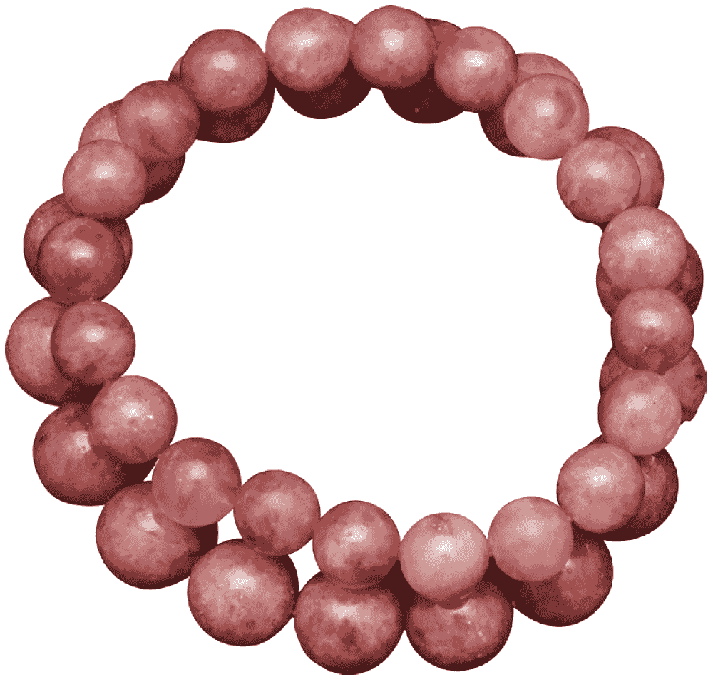

能量属性与用途

蔷薇辉石是一种充满爱与平衡的水晶，能够完全净化、刺激和重新启动心轮，被称为“爱之石”。蔷薇辉石的能量振动往外，帮助人找回自爱和价值感。它的讯息是你得先真正的爱自己，才能对外去分享这份爱。建议你经常使用或携带蔷薇辉石带来慈爱、喜悦和幸福。

蔷薇辉石在减少和抑制焦虑方面非常有力，它能带来抚慰心灵的能量，适时地“拥抱”你，甚至在感受到痛苦的时候将其放在手中摩擦。在你感到最脆弱的情况和环境中，它可以助你提升心的力量，让你感受到自己远比想像的强大。此石非常适合有忧郁、焦虑症状或缺乏信心的人每天配戴。

其他灵性用途

虽然蔷薇辉石主要在心轮和海底轮同时工作，具备惊人的通灵潜能，因此，无论是在深度冥想或是睡觉做梦，都可以帮助使用者清晰地了解过程中内心的体验，这将有助于解读静心时的感受和梦中的异象，让它们从抽象层面来到现实生活更务实的层面，发展出可以实现的途径。若想要激发这些通灵能力，建议将一块蔷薇辉石放在枕套里。

蔷薇辉石几乎可以与所有对应心轮的晶矿结合使用，像是与玫瑰粉晶或祖母绿一起使用时效果最强。这两种晶矿都为心和身体带来深刻的疗愈，将蔷薇辉石与石榴石一起使用有助一个人实现内心深处的梦想，因为石榴石具备显化的能量，并且能重燃你内心的火焰。

| 守护星座 | 金牛座、狮子座、射手座 |

蜕变情绪的护身符

绿帘花岗石 Unakite

绿帘花岗石是一种非常常见的花岗岩类型，其内含绿帘石、粉色钾长石与石英等矿物。它的名字源自于被发现的位置，也就是美国北卡罗莱纳州西部的 Unaka 山脉。

绿帘花岗石的硬度和耐用性让它成为新手把玩的选择，也是珠宝商切割为椭圆宝石的流行材料。此外这种花岗岩还被作为房屋、博物馆或专业建筑的装饰材料，最著名的就是华盛顿哥伦比亚特区的美国国立自然史博物馆。

除北卡罗莱纳州外，这种矿物在美国境内有多个产区，包括纽泽西州和弗吉尼亚州都有丰富的矿脉。其他拥有绿帘花岗石矿床的国家包括中国、巴西、南非和塞拉利昂共和国。

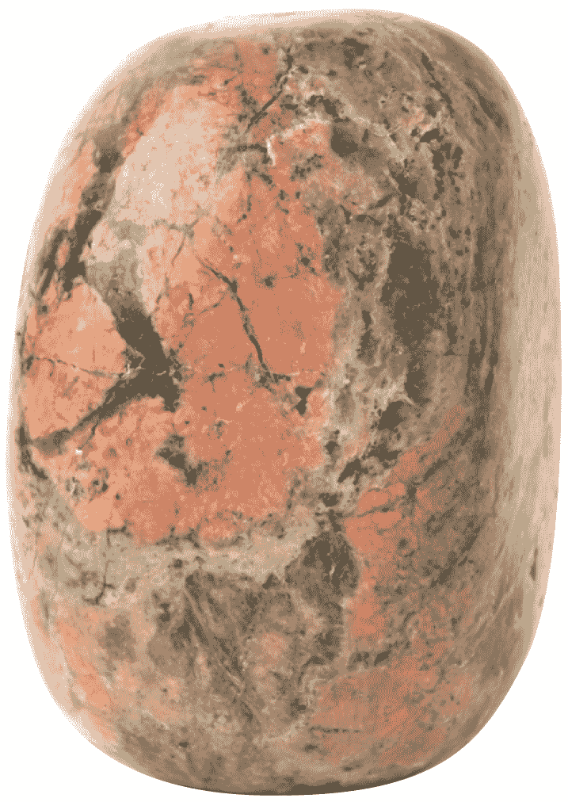

能量属性与用途

绿帘花岗石与人的心有着特殊的链接，可以帮助人更深入地了解自己的情绪体。用它来冥想能消除情绪包袱与沉重感，使用者会意识到这些情绪没有正面的作用，却占据心的空间。此外，它亦能助人克服这些困难，无论如何痛苦都能找到内心的平静。这种矿石的触感柔软，能在处理最痛苦的情绪时带来抚慰，成为带来蜕变的护身符，除了可强化心的力量以外，还能在转换的空窗期内提供一份支持的能量。

由于所含的绿帘石是天然的情绪或频率放大器，若正面对一些不愉快甚至是糟糕的情况，建议暂时不要将绿帘花岗石留在身上，先放在一旁等到隔天重新开始，让它助人保持头脑清醒与态度积极。

| 守护星座 | 天蝎座 |

解锁人的通灵能力

方解石 Calcite

方解石跟石英水晶一样是地球上很常见的矿物，它的主要成分是碳酸钙，由于晶体结构的分层，通常会呈现块状和立方结构的形式结晶。它可能呈现珍珠白／粉白，也可以是淡白色，甚至是浅灰色。透光的方解石被称为冰洲石。

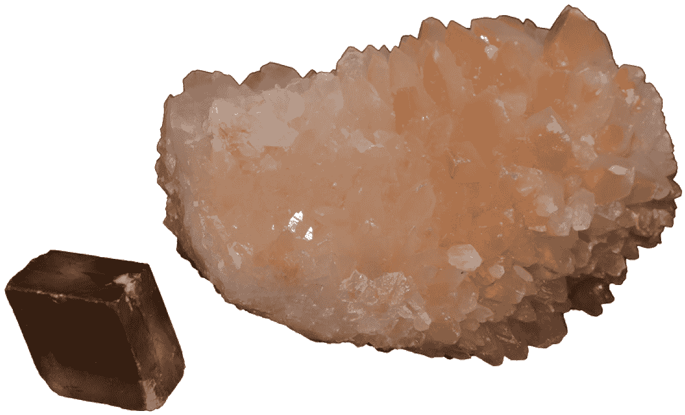

市面上大多数的方解石来自于墨西哥，它的摩氏硬度仅有 1，故每块或每磅的价格非常便宜。我很喜欢蒐集大颗的米黄色或金黄色方解石球，在家里做装饰或夜灯都很合适，又能为空间注入一股柔和的能量，不愧是值得任何人享用的晶矿！

能量属性与用途

方解石有解锁一个人内在视野的潜力，也是萨满与魔法传承里认为的灵通力，因此不同颜色的方解石常被用在回溯疗愈或不同维度的意识旅程上。方解石帮助一个人获得清晰的洞见，看清现在的处境，并凭借接通灵视力或感知力重新唤醒天赋，甚至透过链接这些能力来穿越时空、深入意识的旅程，有点类似杨紫琼在《妈的多重宇宙》里呈现出来的概念。这些可以透过方解石的辅助在梦境中完成，也可在深度冥想中完成。

在链接这类型的体验时，尝试在第三眼上放上一块方解石，刚开始可能会感到轻微的刺痛，或者是整个人的能量场围绕着喜悦与轻盈。方解石支持一个人跟随自己的直觉，引领通往更高存在的生命道路。

方解石对应第六与第七脉轮，其他颜色的方解石则对应同色彩频率的脉轮。

| 守护星座 | 双子座、巨蟹座、水瓶座、双鱼座 |

过滤负能量的保护石

蓝色方解石 Blue Calcite

地球每一块大陆都有方解石矿脉，然而蓝色方解石却只在少数几个国家出土，像是墨西哥；最深的蓝色晶矿则来自南非。

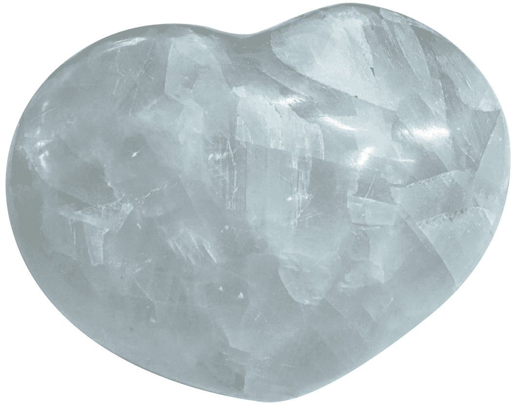

能量属性与用途

蓝色方解石能有效地舒缓和放松情绪体，并提供心智体和乙太体的保护。此外，它更是绝佳的气场保护石，就像海绵一样，会吸收所有周遭的能量，将负面的频率过滤掉，将之转化为高频积极的能量。不可讳言因它提供强大转化力而成为十分受欢迎的能量疗愈石。

蓝色方解石对患有焦虑或忧郁症的人有正面的影响，强大的蓝光振频能舒缓和放松神经系统，并对心有镇静的作用，让使用者更冷静地思考而非仅是陷入情绪当中。蓝色方解石能够在人的头脑运转和情绪感受间创建良好的沟通管道。

再者，蓝色方解石也因能够激发人的创造力而闻名。它舒缓和放松思绪的效果让使用者跳脱混乱、跳跃的头脑运转，进入有意识、更具觉知的探索，此时更加创新和有趣的想法自然会浮现。蓝色方解石强化使用者的梦境感受，并对梦里的经验以及当中的意象产生更生动的印象，为这些画面与讯息带来更好的理解。此外，它支持喉轮的能量流动，使用者将可以更好地表达自己的见解。

搭配使用建议

捷克陨石和蓝色方解石是非常强大的能量保护与蜕变组合。若是需要消除第三眼的阻碍并调频到更高的频率，建议搭配硅铍石。海蓝宝石与蓝色方解石则是解锁喉轮的梦幻组合，可让人更放松地去表达深层的情绪和感受。

| 守护星座 | 巨蟹座 |

# Chapter 3  其他仪式作法与晶矿

## 脉轮相关的水晶仪式

水晶疗愈与脉轮排列完全是一个独立的学科，台湾有许多疗愈师提供这样的服务和培训课程，在这里提供一些水晶爱好者能够自己尝试的简单排列与仪式，透过水晶的摆放做一次身体与能量的内在旅程，亦可以和好友（信任且有心链接的人）一起做尝试与探索，可能会有意想不到的发现喔！

扎根与创造丰盛用的水晶疗愈排列

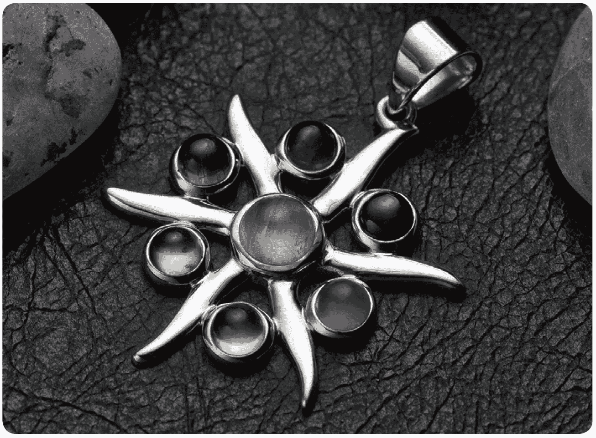

1 用较小的晶矿围绕着较大的晶矿。

2 在脐轮放置红色与橘色的晶矿，小石头围绕着一颗较大的石头来排列。

3 使用深色或黑色的晶矿，从脐轮轻拍往下至生殖器区域与腿部。

4 在额头放置蓝色或紫色的晶矿。

5 用你的权杖在石头上方引导能量由上往下，从顶轮去到双脚。

手法可以用意念移动或声音引导来替代，把这个当作是一个探索能量的学习之旅。

促进灵性发展的排列

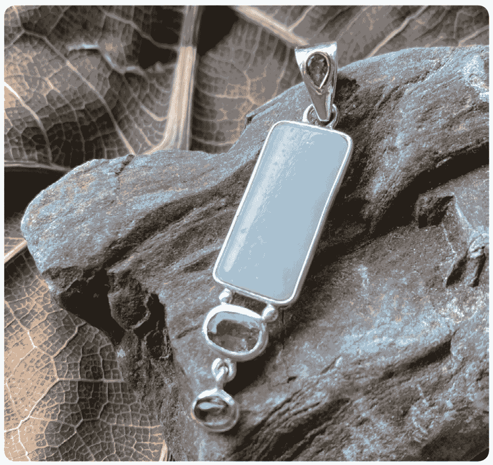

1 将白色、金色、蓝色、紫色及粉色的晶矿放置在上胸以及较高的脉轮，每个脉轮上都有较小的石头围绕着一颗较大的石头。

2 将一颗金色或橘色的晶矿放在脐轮。

3 生殖器区域使用一颗深色晶矿或者 riverstone（河床石，大理石的一种）。

4 用权杖在晶矿上方引导能量往上去到顶轮。

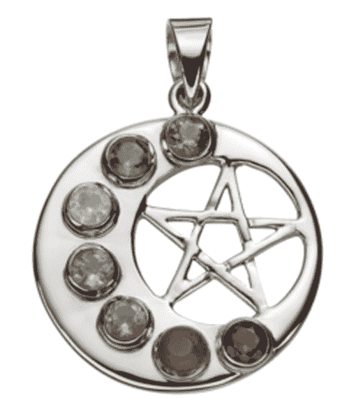平衡脉轮的排列

1 使用七颗对应七脉轮振动频率颜色的石头：

*   将一颗石英水晶指向头顶上方*   紫水晶放在第三眼上*   海蓝宝、绿松石、苏打石、萤石、青金石或蓝玛瑙择一，放在喉咙*   玫瑰粉晶置于心轮*   孔雀石置于太阳神经丛*   黄水晶或其他黄色系晶矿置于脐轮*   茶晶、黑色或棕色石头或者河床石放在耻骨

2 将透明色晶矿放置于胸骨上，指向任何一个需要支援的脉轮。

3 用权杖刷过晶矿，启动能量。

你也可以选择将七色的小型脉轮晶矿摆成水晶阵，放在你静心的空间或是办公的环境里。

清理脉轮的水晶疗愈排列（适合满月）

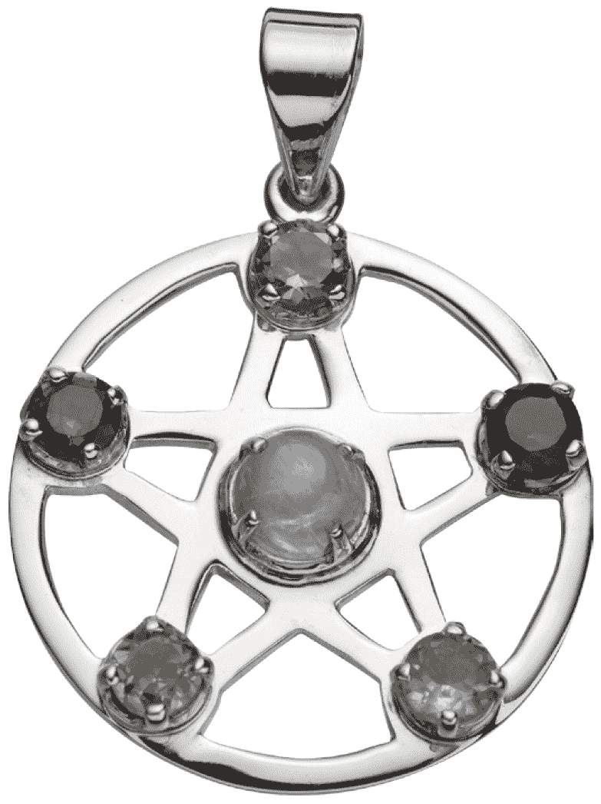

1 将透明石英水晶放在两只手中。

2 将河床石指向每只脚，一颗指向头上方（5 颗晶矿排列成星型）。

3 其他 4 颗较小的石头放在身体上，指向需要充电的脉轮（成十字体）。

4 将脉轮石（脉轮的颜色）放在脉轮中心。

5 用权杖刷过全部的石头，再将星星的能量带入脉轮。

## 其他仪式常用与适合新手使用的晶矿

负能量转化器

 黑碧玺 Black Tourmaline

黑色电气石又称黑碧玺，是一种含硼的硅酸盐矿物，属于六方晶系，是碧玺家族中最普遍的成员之一。

它在西元 1400 年时以德国萨克森的一个小村庄茨肖尔劳（Schorl）被命名。虽然地球七大洲都可找到各类型的电气石，但宝石结构的晶体十分罕见，也可能非常昂贵，目前市售的主要产地在巴西、澳洲与美国。

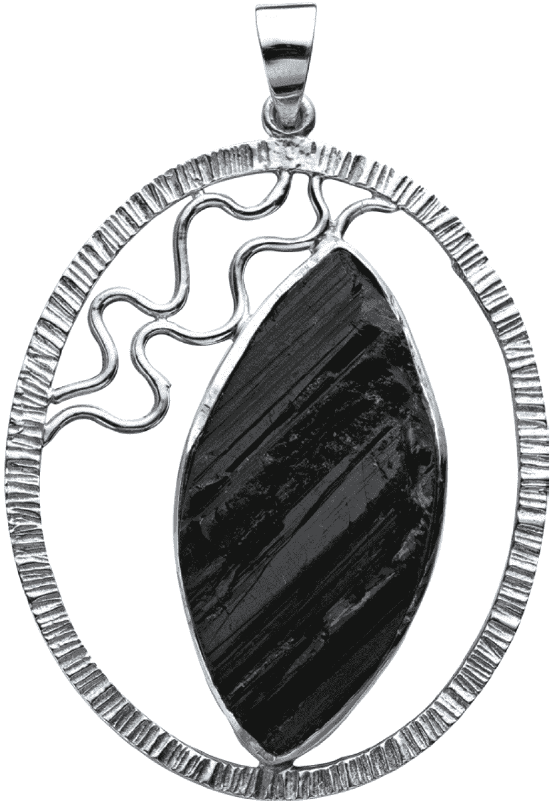

电气石和石英水晶一样，天然的结构让能量可快速传导，它们与地球共生许多年，种类与色彩繁多，流传的应用也广。在此之前电气石被发现用于古代地中海区域，在印度雕刻的亚历山大大帝雕像可证实，此历史可追溯到西元前二或三世纪。但在大约 150 年前，它变成一种非常流行的时尚宝石。美国矿物学家乔治．坤斯（George Kunz）在 1876 年将原产于缅因州的绿色电气石卖给现称为 Tiffany and Co.的珠宝公司。而美国加州所产的碧玺在 1800 年代更因慈禧太后的喜爱，间接促成了中国与美洲的矿区直接贸易线。

能量属性与用途

所有颜色的电气石都可以用手指摩擦两端带电，从而吸附空气中的颗粒。黑碧玺是灵修中最受欢迎的宝石之一，它是一种极佳的保护型水晶，能吸收负能量并快速帮助人扎根，非常适合日常使用。古时候魔法师会用黑碧玺来驱逐邪灵与恶鬼，因此它也很适合用来净化空间里的情绪垃圾，并为环境带来保护。由于黑碧玺属于吸附型水晶，如果在配戴或使用时自行断裂，很可能意味着它已经吸取过多的负能量，建议将它回归大地，购买新的来取代。

搭配使用建议

黑碧玺对应海底轮，对于保护灵识有很明显的效果，因此除了可随身带着或放入口袋中以外，也适合放在床边。如果生活中有无法避免的负能量来源，比如家人或同事，可以将黑碧玺放在你们中间，能有效地释放压力并清理负面情绪。这块实用的晶矿会透过净化和保护一个人的能量场，起到阻断负能量的作用。黑碧玺提供的净化非常适合容易陷入焦虑、愤怒和常与不必要想法抗争的人，因为它是一个转化器，可以吸收人周围的负能量并清理它。

对于那些需要面对消极同事或客户者，若在工作环境中放一块黑色电气石最能够阻挡负能量的侵袭。此外黑碧玺可以平衡并激活左右脑，进而促进体内杂质与毒素的排出，对人体健康有正面的影响。若能和透石膏和玫瑰粉晶一起制作成魔杖效果更好。

其他种类的电气石

除了有七种色彩的碧玺对应七个脉轮使用外，还有黑碧玺与石英共生，形成的黑发晶。市面上常见的黑发晶与黑碧玺同样具有能量保护的功效，不过它和其他颜色的发晶内含成分不同。金发晶与红发晶内部不是碧玺而是金红石，其中含钛成分更高的金发晶被称为钛晶，被认为具有招财的功效而广受市场欢迎。这些年越来越常见的红发晶（红兔毛属于一种）则被认为有招桃花的功效，这些晶矿的功能属性可以直接对照其色彩对应的脉轮。

| 守护星座 | 摩羯座 |

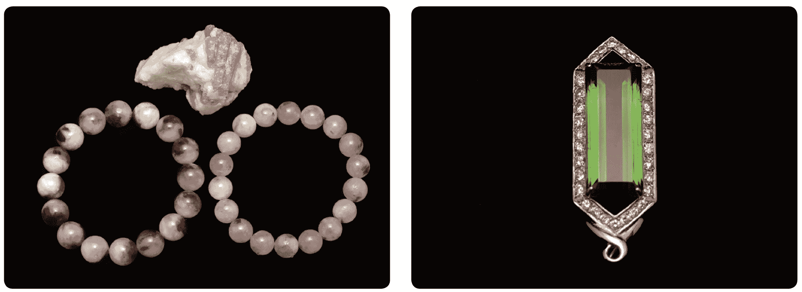

吸收负能量的守护石

 赤铁矿 Hematite

赤铁矿是一种常见的氧化铁矿物，以块状、葡萄状、板状和最稀有的菱面矿体结构存在。这种矿物最初被称为 Haematite，这个名字源于希腊语中的血液 haima，颜色来自于其中的氧化铁，这种矿物研磨成粉末时会变成血色。

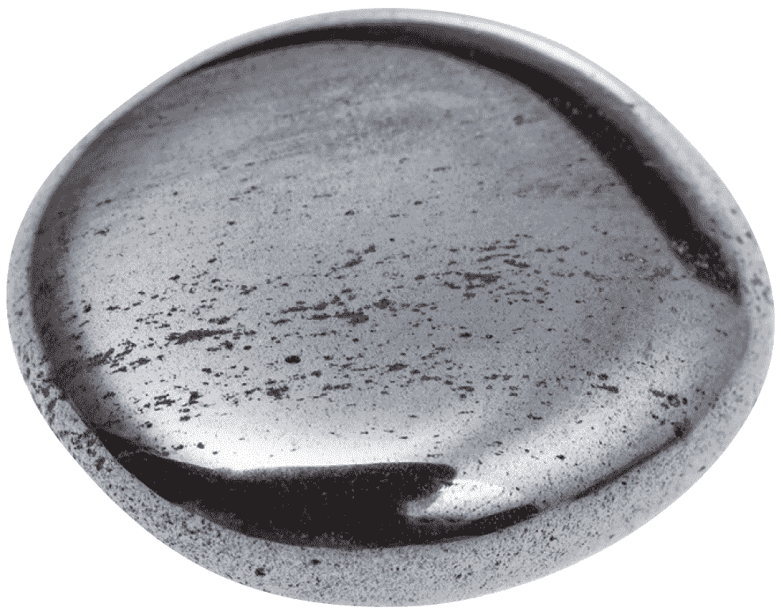

能量属性与用途

实际上赤铁矿一直被认为能促进人体的血液循环和排毒，具有扎根与“卫”气的效果，是强大的保护之石。赤铁矿也是一种非常特殊的矿物，有些记载甚至认为它在 164,000 年前就有人类使用过。南非莫塞尔湾以南的一小块区域自 2000 年以来遭多次挖掘，出土大量数十万年前的古文物，其中一次发现洞壁上有以红色粉末物质书写的痕迹，而后的研究和分析证实了这种粉末就是赤铁矿。

许多古文明里都能找到赤铁矿的踪迹。市面上常见的赤铁矿呈黑灰色，但表层经常泛着彩虹光，带着一种油脂般的润泽感。赤铁矿盛产于美国、瑞士、英国、澳洲、中国、印度与巴西。赤铁颜料有接近四万年的使用历史，特别是被摆在重要人物的陵墓里，显示古人相信它具有神秘的魔法及守护的功能。

开运与疗愈

赤铁矿对应第一脉轮海底轮，具备稳固能量与扎根的作用，它属于吸附型矿石，能抵挡负能量与灵识上的攻击，是敏感体质人的首选矿石。赤铁矿平稳的能量很适合用在压力大或情绪起伏的时候，同时它也能帮助使用者放掉对于自己无意识的设限，让人更有信心专注在需要执行的工作上。

在焦虑、没有安全感、缺乏信心和意志力或做决定感到摇摆不定时，赤铁矿能帮助吸收负能量，调和一个人的气场。但也因为如此，体积小的赤铁矿容易因为能量消耗而破碎，这时候就需要让它回归大地并更换新的。赤铁矿除了适合在医院探病与参加丧礼时用来守护个人能量场以外，也被视为是处理争端和诉讼的守护石。

| 守护星座 | 牡羊座、水瓶座 |

调节人际关系的疗愈石

 绿松石 Turquoise

绿松石又称作土耳其石，属于三斜晶系的吸附型晶矿，是一种铜铝矿物。铜成分给予这个矿石明亮的蓝色，褐红色的部分则是铁斑点。它的名字来自法语的 Pierre turquoise，是土耳其石头之意，这源自于土耳其位于欧洲和亚洲之间的位置，自古就有大量的绿松石在此交易。

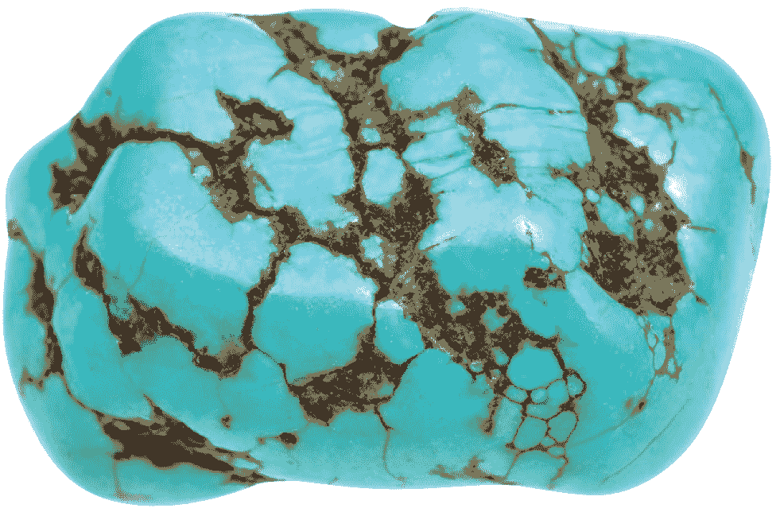

能量属性与用途

绿松石是人类历史上使用时间最长的石头之一。在伊朗发现的绿松石珠可以追溯到西元前 5000 年；埃及人则在西元前 3200 年左右开采。约莫 1000 年前，美洲原住民开始发现绿松石并将其用于珠宝、武器和护身符的制作。这些原住民相信绿松石能让人对宇宙提供的无限可能性敞开心扉，这种石头在美洲南北两个大陆的原住民墓地中亦很常见。

绿松石的产地遍布世界，在许多古老文明与部落中都曾记载它被用来做为魔法石，尤其是对萨满和战士具有保护作用，同时这些原住民相信绿松石可以促进清晰的洞见与预测，链接人的灵性力量。

绿松石对应第五脉轮喉轮，可用来做项链配戴，帮助人真实、真诚地表达心中的感受，常被用来调节人际关系里的冲突，在工作和事业方面也可支持人将创意的想法更明晰地表达出来。

开运与疗愈

绿松石被认为能带来幸运与成功，亦能让人链接自信，变得更有力量。对于过于保守的人建议可使用绿松石让自己变得更积极、有行动力；对于激进急躁的人，它能很好地吸收浮躁的能量，调和整体的状态。自古以来，绿松石被旅行的人大量使用，因为它能保护出行安全（预防坠马）和降低被盗窃的机率。比较需要注意的是市面上许多假绿松石，多是用白纹石染色而成，购买需要谨慎。

| 守护星座 | 天蝎座、射手座、双鱼座 |

探索潜意识的通灵石

 蓝晶石 Kyanite

属于三斜晶系的蓝晶石主要成分为硅酸铝，从外表可看见明晰的长刀锋结构，晶矿的颜色通常会混和白色、浅蓝色与深蓝色。它的英文 kyanite 源自希腊文的 kuanos，即蓝色之意，主要产区为巴西、缅甸、墨西哥、南非、纳米比亚与肯尼亚等国。

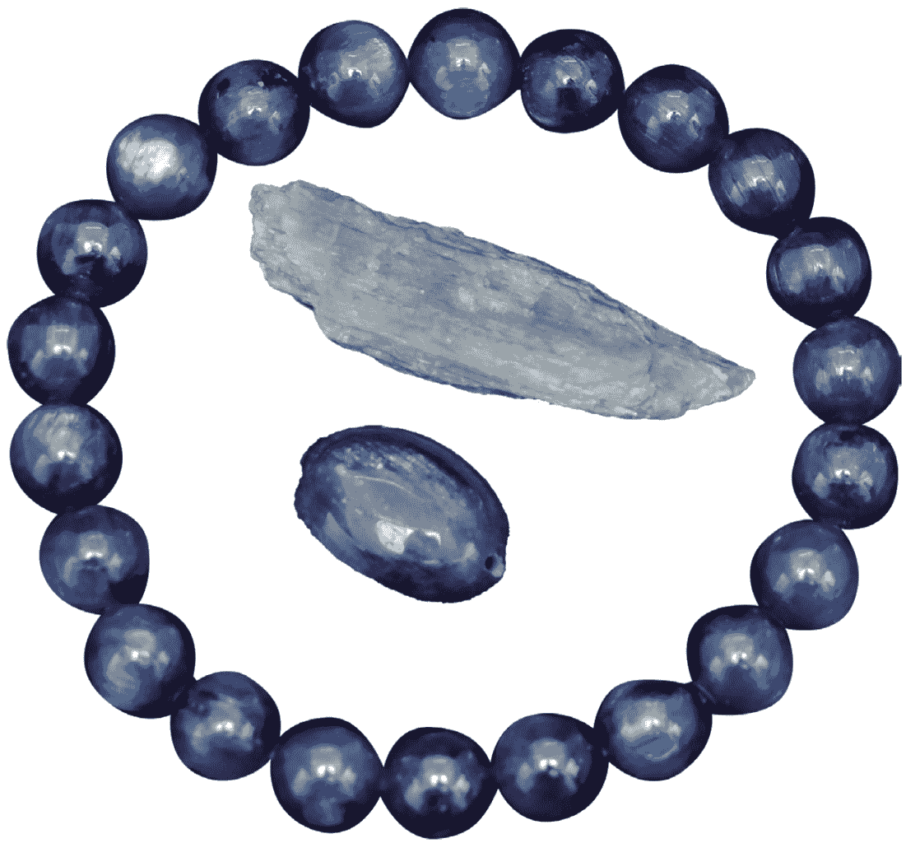

能量属性与用途

蓝晶石是一种具传导性且促进能量移动的晶矿，它不会吸收负能量，因此不需要净化，很适合用在灵气或其他能量疗愈的工作当中，也可在水晶排列中作为不同晶矿间的能量桥梁。

开运与疗愈

蓝晶石能成为存取意识的桥梁，并支持灵通力的扩展。它主要作用在第三眼与顶轮，链接两者可让使用者理解不同频率的讯息。使用时请将蓝晶石放在床头，甚至直接在睡前放在第三眼的位置，随着身体进入睡眠与休息，意识将展开另一段旅程。在睡梦中使用者可能会接收到灵性引导者、守护天使或宇宙的讯息，蓝晶石会支持对这些讯息的理解和领悟。如果你在生活当中遇到一些不确定性和迷茫，也可以使用蓝晶石帮助你在梦境中寻找问题的源头，甚至是答案。

蓝晶石除了能用在梦境与潜意识解读工作以外，也能支持星光体投射，就是灵魂旅程。因为蓝晶石能够协助意识调频到日常理解以外的维度与境界，持续推升往更高频率与向度的移动。使用者能够吸收能量并且将之扎根，这意味着你做灵性工作都能在地球上被显化。

| 守护星座 | 双子座、双鱼座 |

保护力强大的觉醒之石

 黑蓝晶 Black Kyanite

黑蓝晶在富含铝的伟晶岩当中经历极度高压所形成，因此具有独特的扇型结构。市面上大多数的黑蓝晶源自于巴西米纳斯吉拉斯州，另外就是缅甸、南非与印度。

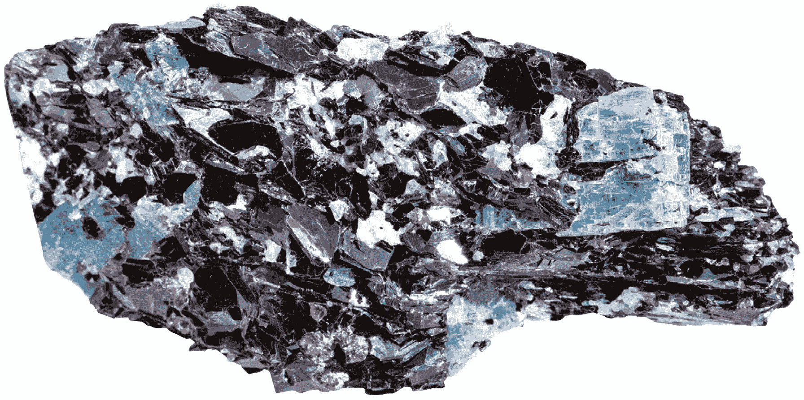

能量属性与用途

和多数的黑色晶矿一样，黑蓝晶具有强大的保护力，但它亦是“觉醒之石”，因为它能在一个人的能量场周围形成一种无法被穿透的乙太泡泡，让头脑运作缓和下来并放松，让威胁或有害能量无法干扰，一个人可以安心地转入内在，平静地呼吸。

开运与疗愈

黑蓝晶对于悲伤之人，或经历打击而情感脆弱的人具有极佳的情绪体安抚效果，当然如果一个人正面临极端的压力甚至是创伤事件，也很适合使用它。因此，若你必须要进入一个令你感到不舒服的环境或情绪激动的情境，可以随身携带一块黑蓝晶稳定和保护自己的能量场。

黑蓝晶能够启动人体脉轮的整个信道，并支持身心灵全面的重新校准与平衡，非常适合用于冥想或呼吸疗法，长期使用会发现日常生活的负面思绪与信念越来越少，做决定时也更加清晰。使用时请将黑蓝晶的扇面朝下，像扫把一样把能量体里的污染与阻碍清除。

| 守护星座 | 牡羊座、天秤座、双鱼座 |

激发最强生命力的能量石

 石榴石 Garnet

石榴石在西元前 325 年就被亚里士多德的传人泰奥弗拉斯托斯记录过，其英文 garnet 源自于 gernet 和 granatus，有深红色、榖物或种子之意，比喻它像水果石榴的样子。石榴家族包含六种晶矿：铁铝榴石、镁铝榴石、锰铝榴石、钙铁榴石、钙铝榴石与钙铬榴石，产区遍布世界各地。

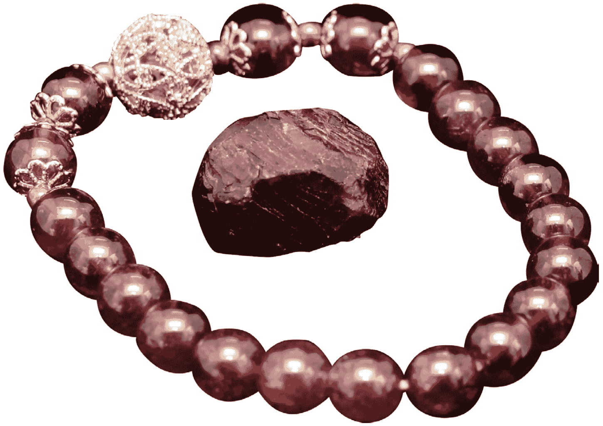

能量属性与用途

它自古以来被认为对于出血、发炎性疾病及压抑的愤怒有奇效，古时医生相信类病类治，因此与血有关的疾病通常都会将石榴包含进药方里。亚洲部落的族人甚至将石榴石做成子弹，认为它比一般子弹的伤害力更大。从这样的晶矿使用历史不难看出为什么石榴石被认为具有唤醒一个人内在的火焰、激发出最强生命力，并能带出核心的力量，它能将一个人的自信与坚毅带到顶峰。

开运与疗愈

当一个人能够回归本然的自在，即便是最负面的振动频率都能够蜕变成正面的频率，且日常的焦点会回到自身以及个人的成长。人在一生当中难免会遇到身旁有人否定我们，或者是试图用他们的价值观与世界观来改变我们，然而只有我们自己才能去经验生命的课题、明晰这趟旅程的学习与意义。石榴石蕴含的大地能量可以帮助使用者获得内在掌理的力量，消除外在声音的干扰，从而恢复灵体原有的秩序。

石榴石具备显化与实现的能量，象征生命力的红色光芒唤醒人内在的渴望，并获得逐梦踏实的实践力量。使用时建议将内心的目标对着手中的晶矿说出来，一方面是对于你意识明确的提醒，像是播种一般，让有声的语言与晶矿的显化力结合，令这些梦想伴随你的付出与努力成真。

| 守护星座 | 牡羊座、狮子座、处女座、摩羯座、水瓶座 |

避邪的负能量克星

 孔雀石 Malachite

孔雀石是一种以独特的漩涡状形成的碳酸铜矿物，结晶形式的矿体极为罕见，它于 1747 年被正式记载，由矿物学家 J. G. Wallerius 命名，取自希腊语的 malache（锦葵），代表它鲜艳的绿色。孔雀石矿通常与蓝铜矿和硅孔雀石一起出现，目前市售的孔雀石多来自于非洲的刚果与赞比亚、俄罗斯和中东一些地区。

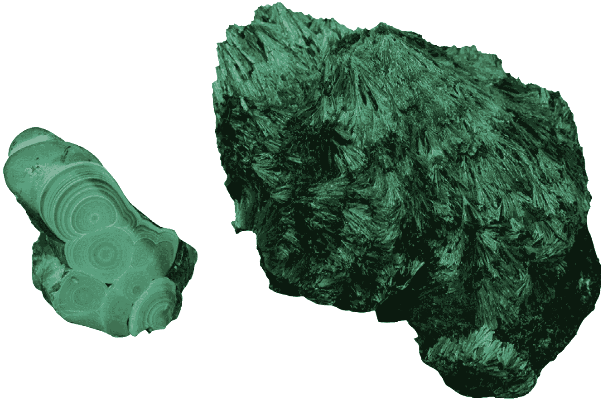

能量属性与用途

据考古研究发现，早在西元前 3000 年孔雀石在埃及就被广泛用于珠宝和饰品的制作。中世纪时孔雀石被人们视为具有保护作用的矿石，可以避开邪恶之眼，此外它也被当作治疗胃病的药物。

孔雀石是抵御负能量的首选矿物之一，它使我们的能量场保持正面积极，同时可以将负面消极的能量向外推散。孔雀石以能在使用者周围形成“隐形斗篷”而闻名，让使用者远离魔法或能量攻击，不易受到负面能量的影响。它有助于情绪平衡，尤其是当一个人感受到周围的人将精神或情绪包袱丢在自己身上的时候。

孔雀石能赐予一个人面对、克服生活中所遇到的情感挫折和身体障碍，激发他们迎向挑战的意志力，因此它也能支持缺乏自信和自我责任感的人。

开运与疗愈

孔雀石鲜艳的绿色对应心轮，这种能量强大的矿物能打开心扉，帮助人在生命的各个层面实现平衡，因此可以很好地协助一个人打开精神之旅，是修行人内在探索与自我工作的成长必备品。

平时使用特别要注意的是孔雀石属于能量吸附型矿石，结晶状的孔雀石可以在光滑面使用水来净化，非结晶状的孔雀石原石只能简单快速地用烟熏净化法。它在疗愈方面虽然效果显著，但矿石本身能量消耗很快，建议不要用体积太小的孔雀石来做疗愈，它很快就会被损耗而变得灰白并失去光泽。

| 守护星座 | 天蝎座、摩羯座 |

王后首选超级桃花石

 红纹石/菱锰矿 Rhodochrosite

菱锰矿俗称红纹石，也称为印加玫瑰，是一种稀有的碳酸锰矿物，地球上仅少数地区存有此矿脉。菱锰矿多以块状、柱状、葡萄状和球状（通常为带状）的形式结晶，很少会有晶体形式的菱锰矿，只有少数矿区有生产宝石级的菱锰矿；也因为它是宝石王国中为数不多的菱形晶系矿物，在市场上甚至可以卖到 5、6 位数。

美国科罗拉多州阿尔玛市的 Sweet Home Mine 矿区曾是少数开采出近乎完美菱锰矿宝石的地方之一，其他主要产区包括阿根廷、秘鲁、俄罗斯、乌拉圭和南非。

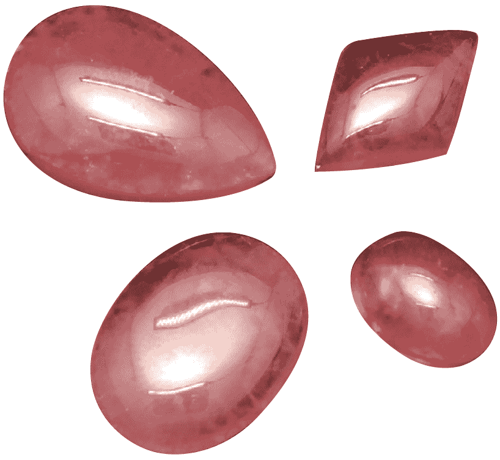

能量属性与用途

菱锰矿是阿根廷的国宝石。12-13 世纪时印加人在大量开采银矿时发现了菱锰矿，他们相信这些石头是失落的印加帝国国王和王后的鲜血硬化而成，因此菱锰矿象征力量、权力和毅力。

菱锰矿的能量光谱由白色、粉色到暗红色，对应第一脉轮和心轮，它能把光带入心的伤痛，这种振动频率能激发爱的勇气，就像是一位战士，即便负伤也不会放弃心的追寻。

开运与疗愈

菱锰矿最关键的功能是疗愈情绪体，让受伤的心愿意敞开接受光，它像是一种提醒：将自己放在第一位，照顾好自己，因为失去身心健康和力量的人无法提供爱和帮助给有需要的人。菱锰矿可帮助人放下内心的悲伤与痛苦，能提供患有创伤后压力症候群（PTSD）的人一份支持与疗愈。

每天佩戴或携带一块菱锰矿有助于人平复情绪，并将意识推向喜悦与幸福的状态。它的镇静和舒缓能量可以将爱、平静、和谐与和生命力注入一个人的气场中，让经历重大情绪事件的人有机会恢复如初，并支持他/她去面对并克服生活中的困难与障碍。感到担忧或悲伤时，可将一块菱锰矿贴近心口，链接并接收它稳定的振动频率。

菱锰矿是高频能量的矿石，它能让人感受到新的开始和机会就在眼前，只需要一点点自我的爱便能往前迈进。

| 守护星座 | 狮子座、天蝎座 |

打开心轮的公主系桃花石

 草莓晶 Strawberry Quartz

草莓晶是一种稀有的石英水晶，含有赤铁矿与云母的成分，它的颜色深浅取决于石英晶体中的铁含量，含有大量云母片的草莓晶甚至会有映射现象。草莓晶在中国与巴西均有大型的矿床被大量开采。

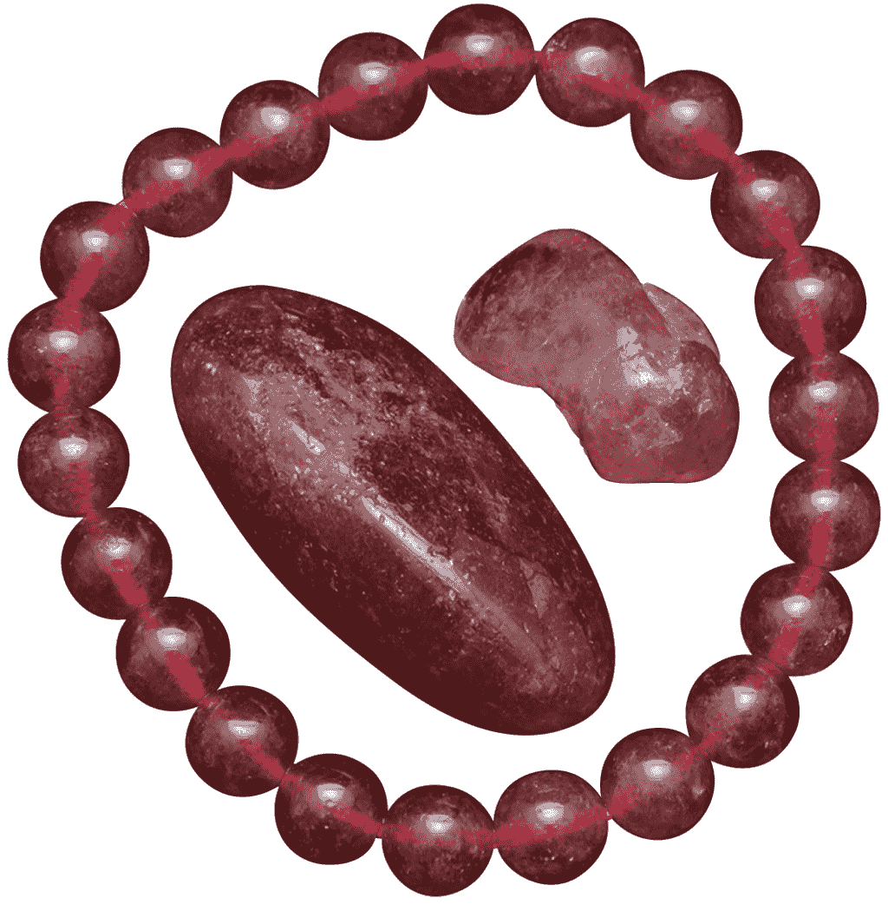

能量属性与用途

草莓晶能照耀心轮，让一个人的能量场往下扎根。使用它来冥想可以感受到其中锂云母温柔的能量自然流动，你只需感知它并允许这股阴性的力量舒缓你的身体。这种矿物的组成有助于校准脉轮系统并调和人的能量，帮助使用者找回内在情绪的健康与平衡状态，进而支持更好的表达和发挥。当一个人开始深入地了解自己，便有机会发现长久以来忽略的兴趣与热情。草莓晶亦能支持受过打击的人找到新出路，再次为生命注入新的希望。

其他灵性用途

草莓晶的能量非常适合正在处理焦虑、PTSD、忧郁症或其他情绪障碍的人，因为这些问题多数源于压抑的情绪和未消融或未解决的负面感受。草莓晶会支持一个人打开心轮，或在心轮中探索曾经因为一些过往经历而封闭起来的原因。你可以尝试将一块草莓晶放在心轮上做冥想，并允许潜意识或能量层面的状态浮现出来，或许会带来新的启发与开示。

使用草莓晶最需要注意的就是很容易买到伪造与人工合成的晶矿，天然草莓晶的颜色区间很大，真品通常也会有矿缺与裂痕，建议问清楚产地并向有信誉的商店购买。

| 守护星座 | 12 星座都通用 |

生育和财富的护身符

 捷克陨石 Moldavite

摩达维石俗称为捷克陨石，被认为是由 1480 万年前在地球上坠毁的陨石所形成的。陨石碎片散布在整个现今的捷克共和国，就是波希米亚平原。这些“残骸”几乎都是随机被发现的，预估当时陨石的撞击高达 6 万亿兆吨，被认为已完全穿过地壳进入地球核心。

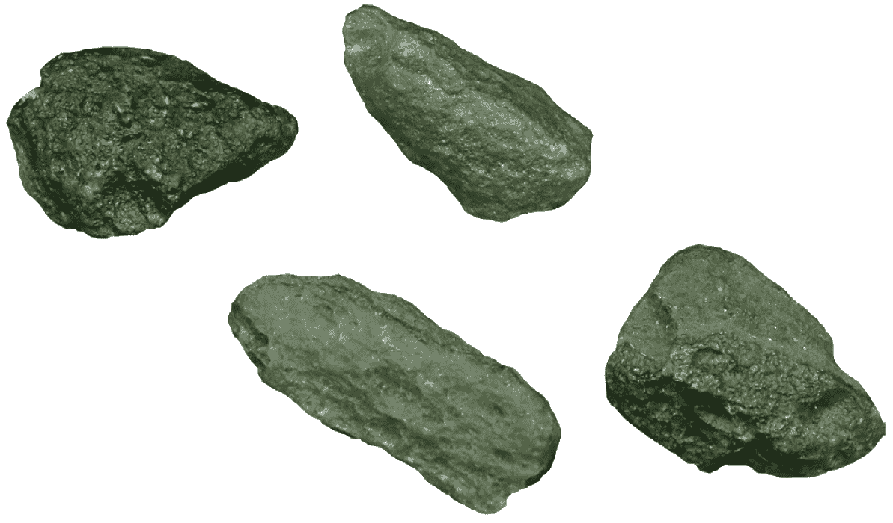

能量属性与用途

人们使用捷克陨石的历史可追溯到西元前 25,000 年，东欧新石器时代的人们将它视为生育和财富的护身符，考古学家也发现它被制作成为箭头。1908 年“维伦多夫的维纳斯”（据信有 30,000 年历史）出土时，在旁边发现了陨石护身符和切割工具。关于摩达维石最广为人知且最具争议的是：它是圣杯上的石头。当时被认为是祖母绿，但亦有其他不同的看法。

传说描述了圣杯如何被用来治愈人们并且能自行补充和恢复，而捷克陨石确实具备这些特性，因此它被认为是转化之石（Stone of Transformation），从古至今和祖母绿一样受到人们的喜爱与追捧。

搭配使用建议

捷克陨石属于能量放大型晶矿，很多人第一次触碰它时会感受到一股热流，这种现象非常普遍，甚至出现“Moldavite flush”这词汇，就是用来形容它放送出来的能量冲刷效应。

这种冲刷会将振动频率传递到全身，并产生一种轻微的刺痛感，有些刚接触捷陨的人会承受不住它强大的能量，配戴时恐会感到头晕目眩而需要取下来。若你遇到这种情况，建议在第一次使用时搭配一块扎根的晶矿，像是红玉髓、黄铁矿、红石榴石、雪花黑曜石这些大地系晶矿，或者是搭配粉晶、海蓝宝这类温和的晶矿；而孔雀石则是能很好地调和捷陨强大的能量。

我自己配戴和使用捷陨的经验是，要等待一段时间后才能慢慢适应它的能量，那种刺激的身体感知与生理反应才会缓和许多。水晶治疗师推荐将捷陨和赫基蒙闪灵钻搭配使用，我觉得这种飞天组合不太适合初阶选手，建议交给经验丰富的水晶能量治疗师比较妥当。

| 守护星座 | 12 星座都通用 |

结合热爱与行动力的疗愈石

 橄榄石 Peridot

橄榄石是一种富含铁和镁的硅酸盐，它经常可以在玄武岩矿脉里被找到，通常以微小颗粒的形式结晶，或小棱柱状的晶体，偶尔会形成大块的结构。

由于橄榄石中的铁含量不等，它的外观色彩从淡黄绿、柠檬绿、橄榄绿、翠绿、棕绿到深绿色都有，因此它的能量对应着第三与第四脉轮。橄榄石的已知人类使用史存在着不小的争议，最早的纪录出现在西元前 300 年，这独特晶矿的主要矿床位于澳洲、巴西、墨西哥、中国、巴基斯坦、斯里兰卡和美国亚利桑那州。此外，在一些坠毁于地球上的陨石里也发现了橄榄石，让它借此多了一个星际水晶的标签。

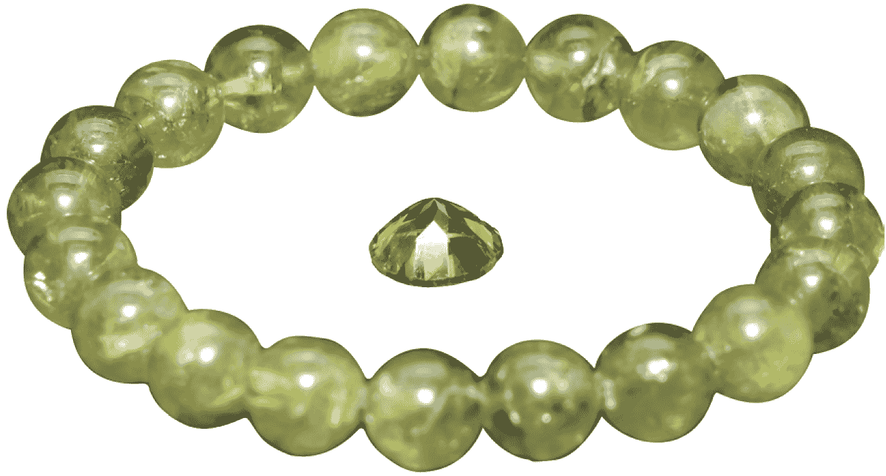

能量属性与用途

作为十分受欢迎的疗愈石，橄榄石可带来一个人内心的向往和个人意志两者间的重大改变，这种整合第三与第四脉轮的能量工具很珍贵。人的心每天都在感受和释放情绪，脐轮负责情绪的处理过程，肠道被称为人的“第二大脑”，它可以解读来自人体最重要器官的不稳定情绪；积压的负面情绪若未能消融，可能会嵌入内在和意识的核心，从而导致日常的焦虑状态与不适。

冥想时使用橄榄石，它的绿色振动频率会配合指定的呼吸技法，辅助使用者来消融这些埋藏在深处的情绪与感受。橄榄石亦能打开配戴者的心，帮助这个人深入自己的系统，整合肉体、情绪体与灵性体，让他明晰自己是谁以及生命的方向。橄榄石的能量还可以守护一个人的内在完整性，让他有足够的力量与稳固去穿越生命的挑战，支持他适应生活中的变化。

其他灵性用途

除了疗愈能量场和身体以外，橄榄石也能提高一个人的频率，并支持脉轮系统整体的平衡与协调。首先橄榄石会提高一个人的自信，获得设定新生活目标的意志力，整体的信念感随之提高，务实来说，这会让人在情感上更加独立，并让你创造自己的时间和空间去厘清渴望与实际行进的方向，不被外在的噪声所干扰。

透过使用橄榄石做冥想和静心，你能更好地与自己链接，这会让一种内在的洞见与清晰油然而生，获得新的生命视角，甚至找到力量去超越自己，投入更多的创造与显化。

| 守护星座 | 狮子座、处女座、射手座、天蝎座 |

亚特兰提斯的疗愈智慧

 拉利玛 Larimar

拉利玛被称为亚特兰提斯石、海豚石或 Stefilia's Stone，是一种极为稀有的钠钙硅酸盐，属于针钠钙石家族。虽然针钠钙石矿脉遍布世界各地，但多数呈现灰色或白色，拉利玛柔和的蓝色是因为矿成分里的铜取代了钙。

在剧烈的火山活动期间，熔岩的流动吸收途经地质的所有矿物，直到熔岩流过洞穴和堤坝，美丽的拉利玛矿便在玄武岩的缝隙或孔洞中形成。目前这种独特的矿石只在多米尼加共和国的巴奥鲁可省山上有出土。

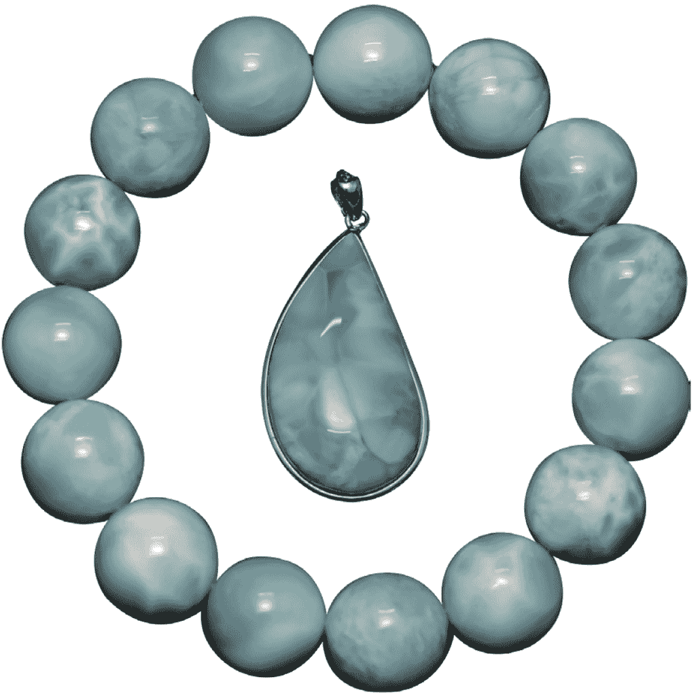

开采背景与有趣故事

据记载，拉利玛海纹石首次被开采的时间点可追溯到 1916 年，但采矿任务在开始前就因负责加勒比海岛上探险矿业部拒绝勘探而失败了。直到 1974 年地质学家 Miguel Mendez 和美国和平部队的志愿军 Norman Rilling 在巴奥鲁可山脚下的海滩发现了拉利玛的碎片。

当地人不认识这颜色奇特的石头，以为是海水冲刷带来的，Mendez 却认定这是一块全新的矿石，并以女儿 Larissa 的名字命名为“Larimar”，mar 西班牙语中是海的意思，最后经过大量的研究和测试后才宣布拉利玛来自上方的山脉。这促使拉利玛最重要矿区 Los Chupaderos 的成立，该矿如今仍在使用中，并拥有 2,000 多个持续运作的竖井，这也是地球人取得这美丽的海洋之石的唯一途径。

能量属性与用途

拉利玛对于总是控制情绪且难以表达内心真实感受的人来说，是绝对完美的疗愈石。它能激发并解锁喉轮，促使一个人向身边亲近的人敞开心，探讨自己正在面对的问题。这种矿石有助人的头脑平静下来，让心里真实的感受与情绪浮现。

当人可以去描述并与他人分享自己正面临的困难时，他很快便能够意识到解决方案确实存在；透过喉轮流动，也就是言语的表述，人可以更好地了解自己和需求。反之，当一个人的头脑不清晰，或是被不必要的负面信念或消极想法污染，就很难找到解决办法。拉利玛可支持一个人链接到内在的力量，并体会表达心中感受的重要性。

其他灵性用途

对于在生命中经历过创伤以致于无法继续前进的人而言，拉利玛非常有效，因为它能调和情绪体的状态并消融心中的焦虑与不安，且创造出应对当下生活的内在空间，去发现这些艰难的事件或挑战需要莫大的勇气与力量，而这正是自己内在拥有的潜能。这些经历是绝佳的学习机会，帮助一个人意识到自己是谁。

作为水晶治疗师首选疗愈石之一的拉利玛，能量温和亦强大，可以选择随身配戴或放一块原石在口袋里，这能有效地推动一个人朝解决问题、放松和自我进化的方向前进，透过深入痛苦来获得巨大的成长。

| 守护星座 | 狮子座 |

古埃及的智慧与王者象征

 青金石 Lapis Lazuli

青金石是一种富含钠铝硅酸盐的矿物，经常与它生长周围的变质岩成分结合，像是天蓝石、方解石、黄铁矿和方钠石。它的名字源自拉丁语 Lapis 石头之意，而波斯语 lāzaward 的意思是天空或天堂。在古代青金石曾被误称为蓝宝石或拉丁语 Sapphirus。

目前市场上品质最好的青金石矿床位于阿富汗巴达克山省的 Koksha Valley 的 Sar-e-Sand 区，与多数矿物不同的是青金石是在洞穴中被发现，而不是在传统矿山中。青金石目前的其他产区包括智利、加拿大、俄罗斯、缅甸和美国。

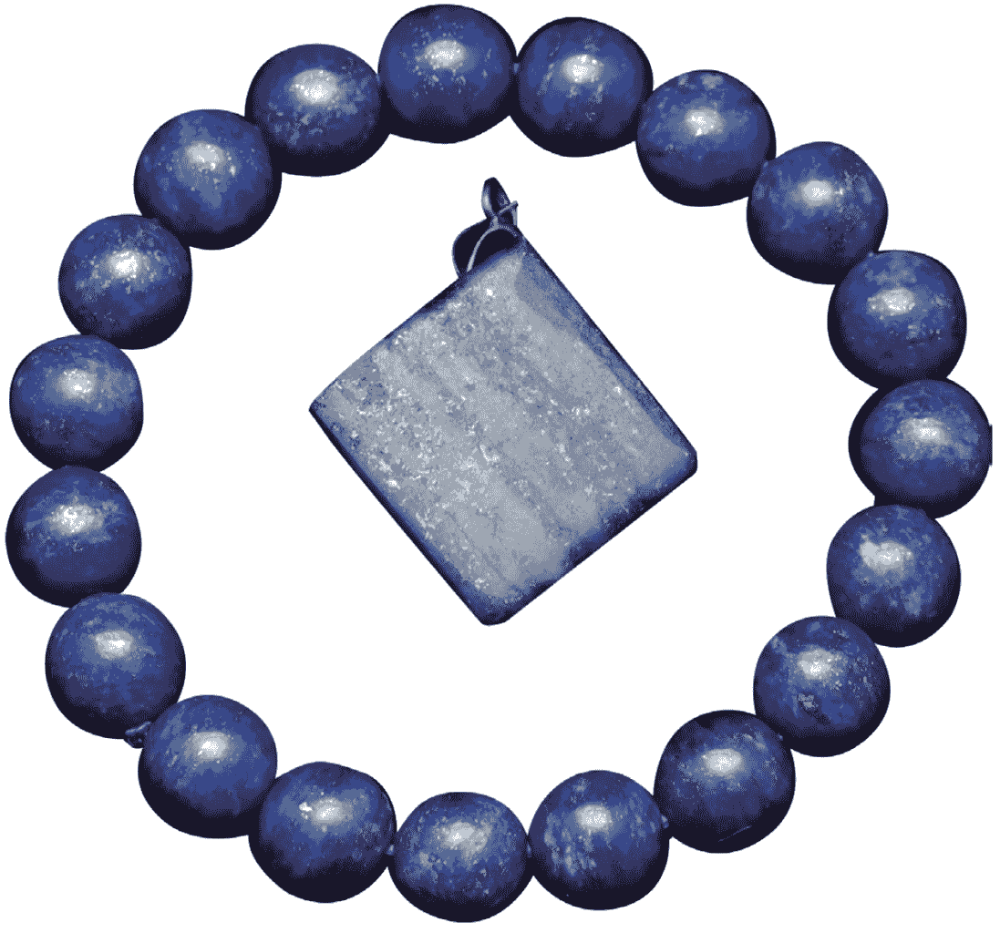

历史背景与运用

青金石在整个人类文明史上都被当作是尊贵的宝石，只有帝王与皇室成员可配戴，无论是好莱坞的电影《埃及艳后》或中国宫廷剧《步步惊心》里都常见到。近年来青金石则因为 New Age 新时代运动获得人们更广泛的追捧，因此市场上常见伪造的青金石，像是染色的玛瑙呈现出亮蓝色。建议仔细检查并确认产地，且最好是向值得信赖的商家购买。

这种矿石最古老的社会用途可以追溯到青铜时代，在东地中海、古埃及、美索不达米亚平原两河文明的考古研究中都有记载：青金石出现于各地的贸易。圣彼得堡大教堂的柱子、图坦卡蒙国王的石棺、埃及艳后的眼影等亦都记载使用了青金石。此外，青金石还曾被磨成颜料，被达文西与米开朗基罗等著名艺术家用于绘画中。《圣经旧约．出埃及记》里也记载着：若站在一块青金石上便可看到以色列的上帝，这艳丽尊贵的矿石自诞生以来就影响着地球上的人类文明发展。

能量属性与用途

青金石的振动频率主要对应第六脉轮的第三眼，是一种强化头脑、喉咙和心中心之间交流的石头，使用者很快便会发现自己往外辐射出情绪体的真相，同时它的能量可提升智力、内在的视野并扩展心智能力。

不只是西方的国王、王后、公爵和埃及法老锺爱，中国的皇帝与高级官员也会配戴使用，这些古人都意识到青金石对大脑的强大影响，透过深度冥想静心，青金石启发带来的讯息有助于理解自己的想法并调整行为。

开运与疗愈

天蓝石是青金石的主要矿物成分，它具有高振动频率，能打开一个人的第三眼，促进意识提升、吸收更高维度的知识来追寻真理。当这些属性与其他矿物成分，像是黄铁矿、方解石和方钠石结合，人的本质与天赋仿佛被重新点燃一般。其中，黄铁矿有助处理想法并将它变成现实；方解石的成分可唤醒一个人体内潜伏的神秘能量；方钠石则增强洞悉真相的能力，让人真正了解思绪想法和情绪体状态的关联性。想法是人每天都在发出的强大振动频率，当人能理解思想与信念的源头时，便能更好地掌理它。

| 守护星座 | 射手座、水瓶座、双鱼座 |

高振频的新时代宠儿

 闪灵钻 Herkimer Diamond

闪灵钻石是 18 世纪工人在纽约赫基蒙（Herkimer）郡莫华克河谷切割石头时发现的石英水晶，预估这种矿石有 5 亿多年的历史，它在新时代运动中变得十分受欢迎，因为它能增强一个人的灵性潜能并提升意识的频率。

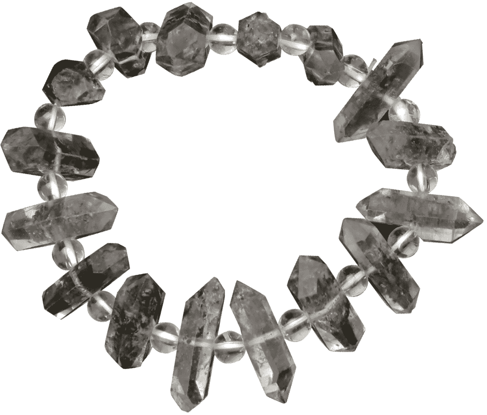

能量属性与用途

赫基蒙钻是一种非常高振动频率的水晶，常被称为调频之石（Stone of Attunement），它的能量可以帮助人在不舒服的环境中得到放松，并在遇到挑战与困难时引导人往正确的方向前进。在静心冥想中使用这种水晶有助星光界与物质界的频率链接校准，提升一个人的心电感应力，促进与指导灵更好的沟通。

赫基蒙钻的高振动频率让它经常被灵媒用来做透视与预测，也被认为能提高一个人在这方面的灵通能力。高振频的能量透过赫基蒙钻来传递，这让它常被用在萨满通灵手术相关的治疗，将它放在身体疼痛的部位，几分钟内就会感受到纾缓。

| 守护星座 | 牡羊座、射手座 |

调和情绪的多功能法宝

 琥珀 Amber

琥珀是一种已经石化的天然植物树脂，内含碳氢化合物等成分。从技术上来说，地质学家们不会将琥珀定义为晶体，因它是有机物质所生成，且大多数是由 4 千万年到 1.2 亿年前存在的树木所形成。

目前人类发现最古老的琥珀可以追溯到 3.2 亿年前，是 2009 年自美国伊利诺伊伊州的一个煤矿中出土的。地球上最大的琥珀矿床位于欧洲波罗的海区、西亚以及俄罗斯的柯尼斯堡。市场普遍认知：将近 90%可提取的琥珀来自俄罗斯。海浪将这些上古遗骸从洋底撕下碎片，再将它们抛到海岸线上，人们才发现了琥珀碎块。其他重要的琥珀产地包括缅甸北部克钦邦、乌克兰西部和多米尼加共和国。

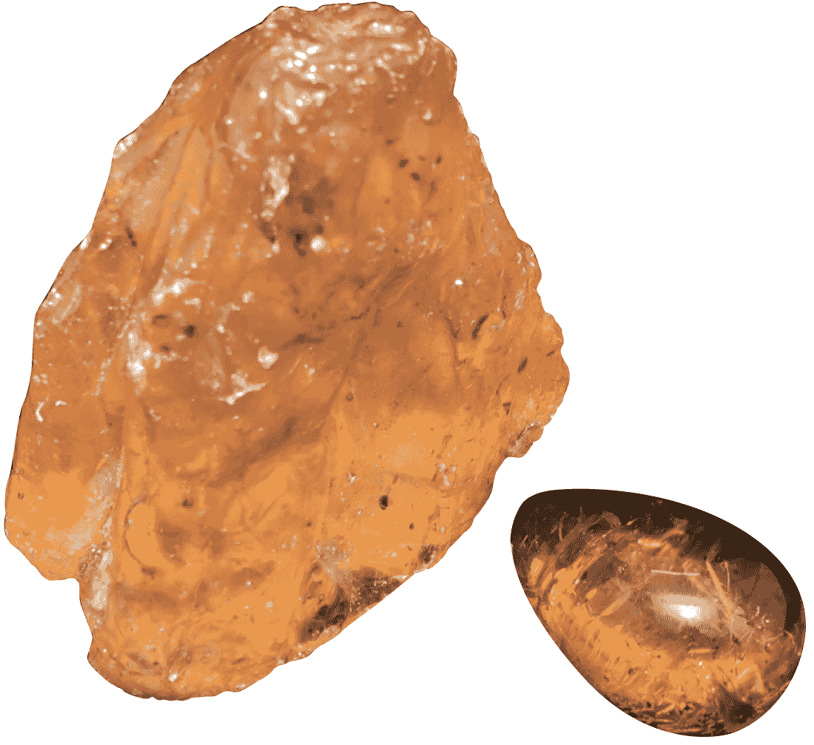

悠久的人类使用纪录

琥珀通常呈现太阳光般的金黄色调，但也有些是深黑色、灰色或蓝色。它还有个好玩的别名，因其外观神似山猫（猞猁）凝固的尿液，所以又称为 Lyncurius；而这也和它的神秘背景有关，琥珀是人类最早使用的天然资源之一，目前最早的发现是在新石器时代（12,000 年前），后来在荷马的史诗《奥德赛》中也有记载。古人认为它有疗愈的功效，还能抵御邪神恶灵，因此用它来制作珠宝、护身符和小饰品。而琥珀的药用特性纪录遍布全球各地古文明遗迹，在埃及古墓、印度神庙和历史悠久的亚洲祈愿胜地均发现了碎片。此外，在古代和现代中医疗法中也记载了琥珀丰富的疗愈功效，它舒缓和恢复活力的作用被认为得以用在癫痫、血液疾病、健忘症、泌尿系统疾病和血瘀，通常会被磨成粉末做为口服药方，知名老中医焦树德的研究中就有记载。

琥珀中藏有昆虫的事情多年前已经被电影《侏罗记公园》广泛传开，生物学家确实透过琥珀所包裹的生物颗粒得以更仔细地研究古代生命，像是原始世界中已经灭绝的物种和物质。至今光是从缅甸克钦邦的琥珀中便发现了 1,300 多种物种。

能量属性与用途

琥珀的震动频率对应第三和第二脉轮，经常佩戴它可支持一个人的直觉变得更加具象与清晰。人的第二大脑位于肠道，这个能量中心几乎囊括形塑“这个人”的所有成分，若是不再使用、扩展个人知识，这些决定“一个人是谁”的特质便会变得不活跃甚至凝滞。琥珀的能量可以刷新并重塑一个人的情绪体运作，引导人呈现真实的本质，促进内在和外在的成长。它会强而有力地在你的心智结构中注入改变和不适（本应当被重视的），催化更快的、正向的自我发展。

使用琥珀时别忘记你手中握的是一块在完全不同的世界与时空中形成的古老物质，上古地球内部的能量极不稳定，蕴藏着强大的生命力，那是个允许巨人、神奇动物和草木繁荣生长的时代。它曾经为地球奥秘的生长提供了必要的养分，现代的你也能够运用这种能量。建议使用一块喜欢的琥珀开始静心冥想，透视眼前的人生道路。此外，将琥珀带到体能锻鍊或健身课程也能增强意志力与专注度。

琥珀与柯巴脂的区别

琥珀和柯巴脂（Copal）经常被混淆，市面上也有些不肖商人将成本较低的柯巴脂当作琥珀来贩售。琥珀和柯巴脂都是树脂，两者都是有机宝石，都可能内含植物或昆虫等其他物质，但它们年龄差很大！前者是上古时期经石化后的碎片，后者却仍是易融的状态。与其他宝石相比，它们相对柔软，前者的摩氏硬度约 2-3，后者只有 1.5。柯巴脂是一种特殊树脂的名称，它来自生长在美洲中部的马蹄果树（Protium Copal，橄榄科），也可以在位于东非的疣果孪叶豆（Hymenaea Verrucosa，豆科，台湾也有）树上找到。因为用途广泛，柯巴脂在中世纪时被整个欧洲大量使用和交易，从药用、珠宝到流行一时的木材抛光剂都有它的踪迹。据说古代马雅人将柯巴脂作为仪式的天然香焚烧，这个传承至今在美洲原住民部落都还存在。

近年来科学家的研究发现，接触柯巴脂会令动物的焦虑行为减缓，和古人将其作为抗焦虑物品或药方的纪录吻合。以颜色来区分，柯巴脂和琥珀还是有差异，虽然一般都认为琥珀是浓郁的暗金色调，柯巴脂是淡黄色或无色；但比较有根据的测试方式像是指甲测试硬度结果呈现，柯巴脂较容易被指甲刮坏；当然，最理想的情况是用紫外线测试，就是将黄色宝石放在紫外线灯下，若完全没有颜色变化的，便是柯巴脂，若变成淡蓝色，那就是琥珀。另外，就是摩擦测试，用软布（最好是羊毛）用力擦拭宝石，真的琥珀会散发出树脂香气，同时获得大量静电荷，很容易吸附小纸片或头发。如果是柯巴脂，摩擦会让它变软，甚至摸起来很黏。再来就是盐水测试，将食盐和温水混合，琥珀放进水中会漂浮，柯巴脂或者是混合塑胶的人工品则会下沉。最后就是针刺，加热一根针后于不明显处戳宝石，若它开始轻微熔化，那就是柯巴脂，若没有那么快融化并开始散发出轻微的烟熏松香，就是琥珀。

| 守护星座 | 狮子座、天秤座、水瓶座 |

消除恐惧的贵族之石

 红宝石 Ruby

红宝石是一种极其坚硬的氧化铝（被称为刚玉），属于六方晶系，与蓝宝石并列为刚玉的主要品种。红宝石的颜色范围包括红色、粉红色和血橙色，有时也会找到蓝色和绿色品种。强烈且大胆的红色来自于矿石内的铬元素，有些红宝石内的氧化钛含物会导致光扩散效应而形成六角星形。名称 ruby 源自拉丁文“红色”的意思，目前世界上主要矿区分布在缅甸、印度、巴西、泰国、斯里兰卡和美国。

这种独特的晶矿早在圣经时代就存在，直到 1800 年代初，许多红宝石都由现在被称为红色尖晶石和石榴石组成。许多古老的神秘传说都围绕着人类的红宝石使用史，传说将红宝石植入人的肉体会使其刀枪不入并提供保护；在中世纪的欧洲，红宝石被用来促进使用者的身体健康和消除负能量。中国传说元世祖忽必烈用一整座城市换取一颗巨大的红宝石。

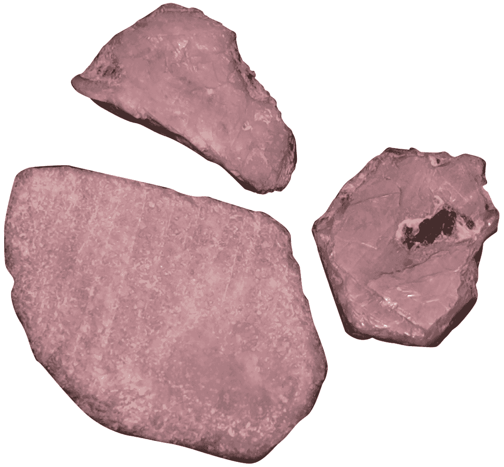

能量属性与用途

一直以来，红宝石都被称为贵族之石。红宝石散发出最高振动的纯红光，这个频率与终极生命力会产生共鸣，这让它成为一颗强大的扎根石，可促进气的循环、生成与滋长，让身体所有系统和器官生机盎然，从而发挥最佳效能。它刺激气与能量的调和与流动，将生命力直接吸入根部，有效地激发生理、情绪和心智各个层面的活力，让红宝石成为那些常感到缺乏力量的人的最佳转化工具。红宝石能有效聚集并放大能量，同时让精神集中，使用者可将庞大的能量聚焦在目标上。

红宝石能带出一个人内心的坚毅，赋予逆境前行的勇气和力量，同时激发使用者对生活的热情，鼓励追求自己所向往的。在面对失败或痛苦的情况下，这块宝石的震动频率会消融绝望和挫败的情绪，有效避免消极情绪的内耗。红宝石可以支持任何对自己缺乏信心而焦虑的人，以及那些经常害怕未来和改变的人，因为它的能量可化解对死亡的无明恐惧，不让害怕与犹豫阻止一个人在生活中前行。除了克服阻碍行动的恐惧以外，它还能进一步激励人去直接面对任何可能带来的消极心态和导致焦虑的障碍。红宝石也有助于梦境探索，想要将意识与清晰度带入梦境的人可以使用它，它强烈和生动的能量会增加人对于梦中意象的理解。

搭配使用建议

由于红宝石自律与决心的属性，它所传递的力量和勇气能很好地与蓝宝石结合。而玫瑰粉晶与红宝石的组合则能带来炽热的激情，有助疗愈和修补任何破裂或老旧的关系。

| 守护星座 | 牡羊座、巨蟹座、狮子座、处女座、天蝎座、射手座 |

带来慈悲与自爱的珍宝

 祖母绿 Emerald

祖母绿是绿柱石的一种，常以块状和棱柱状的形式结晶。这种宝石曾以希腊语Σμάραγδος（Smaragdus）命名，是绿色宝石的意思。不过历史研究认为过去记载的许多绿色宝石并非真正的祖母绿，目前世界上最高品质的祖母绿来自哥伦比亚，此地出产的含有最纯净的铬／钒色调，让这些宝石散发出深绿色的光芒。此外巴西、俄罗斯、非洲、埃及和澳大利亚也有可观的祖母绿矿脉。

由于祖母绿独特的颜色，让它自人类社会发展以来便受到追捧与使用。托特神的祖母绿石板便是一本炼金术书，据信这本以祖母绿雕刻的书记载了地球上最古老的奥秘知识和神秘力量。所罗门王被上帝赐予四枚力量戒指，其中一枚便是祖母绿。新格拉纳达（南美洲北部）区域的古代原始部落将祖母绿作为观赏祭品，献给他们的太阳神和月亮神。早在 1242 年，人们认为蛇看到祖母绿就会失去视力。1967 年哥伦比亚的小镇加查拉（Gachalá）出土了有史以来最大的祖母绿矿，这颗加查拉祖母绿重达 858 克拉布，现在被收藏在美国史密森尼博物馆。

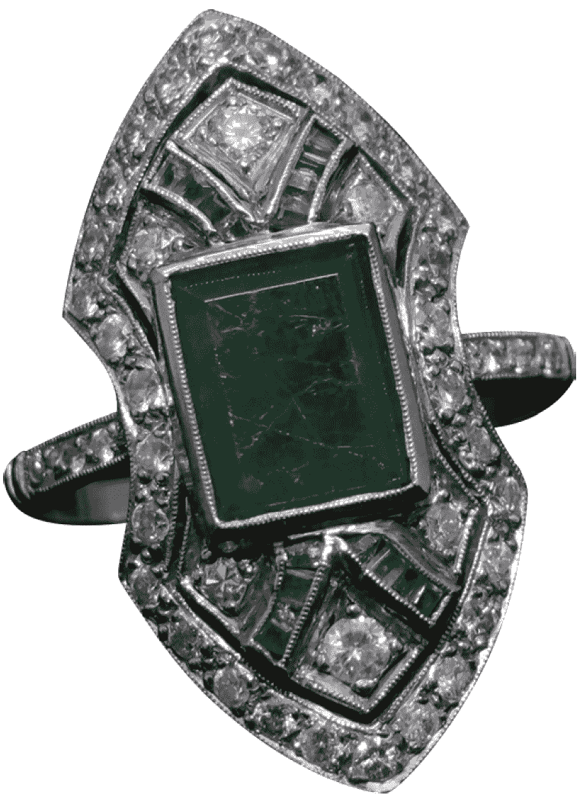

能量属性与用途

祖母绿具备自由流动的能量，并直接供给第四脉轮心轮能量。这品种的绿柱石震动频率是纯粹的爱、慈悲、感官性与疗愈。这种珍贵稀有的晶矿能汲取一个人情绪体的真相，并将之投射、显化到物质世界。人的心空间能容纳各种情绪，为了维持心的宁静，我们需要自行释放那些不必要的执念。无论一种经验的好或坏，若是无法释放它，那相关的情绪便可能让一个人对新的经验却步。这种“紧抓”的模式源自于害怕面对这类经验所引发的情绪激荡。

祖母绿的能量会帮助一个人看见自己周遭形成一层爱的防护罩，然而这种爱仅是表象，是一个虚假的盾牌，为头脑和情绪体的产物，目的是要防御心的空间。这个保护屏障一开始会让人觉得有安全感，但时间一久，它会开始影响你的整个系统，因为心无法透过真正深入的链接获得滋养与生命力，最终导致敏弱和不安全感。当一个人经常配戴或使用祖母绿，便会为这个防护机制的形成原因产生洞见，只要理解了缘由，此人便能选择解决议题的根本而不是继续使用防卫。当人开始有意识地照顾自己的身心，他会发现心中渴求的、纯粹的爱一直都在内在。

| 守护星座 | 牡羊座、金牛座、双子座 |

# 后记

这本新月水晶的书的初步资料蒐集与照片拍摄和整理，我其实四个月内就完成了，朋友们一开始很惊叹我写稿的速度，但其实这对于占星从业人员来说，不是什么太难的事情，毕竟十二星座的月运势随便写写就一万五千字，倒是跟出版社沟通如何让这些原始内容、充满身心灵术语的字句更“大众化”，并且让新手更容易理解，我需要花更多时间去展开说明。校稿与调整花的时间很长，却也在这个过程当中和晶矿们的能量共振，甚至在一个天蝎满月时做仪式，蜡烛发炉到损毁不少器具和硬件，无疑是相当强烈的沉浸式体验。

在长达半年的来回校对过程当中，我意识到需要把那些形而上学的能量体验与魔法仪式用更“亲民”的方式呈现出来。这主要是因为市售的水晶与魔法书籍多数由所谓的“传讯者”撰写，这意味着他们是接收到“其他次元或维度的讯息”，再去转译、传递给地球上的人类，若是用教科书的方式阅读，会很难明白这类型书籍里的信息，必须要透过实际操作才能体悟。

起初这本书的晶矿信息很大程度是头脑理解层面的说明，后来在我整合晶矿与月亮周期内容的过程当中，发生了许多有趣的事情，对我本身亦是很大的学习。我的经验就如同晶矿的孕育原理，自然矿物形塑程序里没有单独的元素，也没有独自生成的矿脉。

一向鲜少对外求助的我，在撰稿之初主动寻求 Starry Studio 塔罗馆的馆主 Kit 协助，借出她的水晶、宝石、翡翠收藏让我们进行拍摄，这里面甚至出现几款平时要锁在保险柜里的维多利亚时代古董珠宝，让这本书揭露的晶矿样貌增添了历史感与多元性。

然而在没有出版和印刷经验，原以为书是魔法主题，而和人物与产品专业摄影师纪超选择了带有神秘感的黑底来拍摄大部分水晶，但出版社考量阅读舒适度，最终决定将大多数的水晶改为白底，这些费时费心拍摄的照片反而造成美编排版更费时，在不失去矿石原色的原则下，增添不少本书完成的困难度。

神奇的是，当我盯着变色的晶矿照片，苦恼该如何解决这些困难时，发现有几款矿石都跟我正在面对的议题直接相关。在重新阅读并反思那些内容的过程，我自身的能量深度共振了这些晶矿的频率，无论是能量还是意识层面都得到清理、净化与疗愈。之后便陆续出现不同行业的朋友协助我联系几位收藏家，最终顺利取得照片。

我在修编魔法仪式章节时，疗愈师朋友们与萨满执行师也主动提供我各式各样的启发，甚至带了收藏的讯息水晶到我的工作室做仪式，和我原本的晶矿收藏相互共振，好不热闹。我们几个人在这个过程的相遇、链接与互动，仿佛是不同时代与地壳移动碰撞而共生出来的晶矿，能量迥异却能相互融合。这是一段美好的经历，希望阅读此书并开始实验与探索的你，也能创造属于自己的神秘体验。

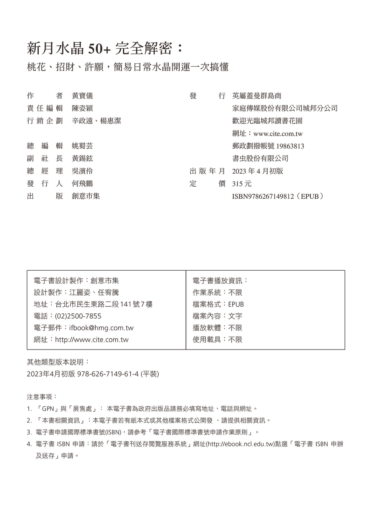