## 【開運鑑定館】35

## 新版

## 十二星座都是騙人的!?

以精闢解說與對照論證的手法，用全新的角度詮釋十大行星的意義及十二星座特質，為占星學裡的星盤分析提供靈活而適切的解盤觀點。

作者◎天空為限 人氣部落格版主

## Are the astrologers all liars!?

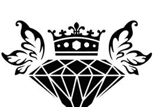

## St. Royal College
天使神秘学院

-   ※ 专业占卜预测机构
※ 神秘学培训机构
※ 水晶能量研究中心
※ 官方淘宝：http://strc.taobao.com
※ 官方微博：http://weibo.com/715104687
※ 新书发布QQ群：316790219
※ 购买更多好书请联系院长大天使

大天使
天使神秘学院 院长
QQ：715104687
手机/微信：13641926204

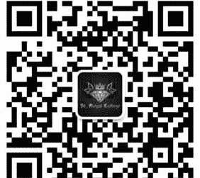

微信公众平台：strc2011

## 制作说明：

本书由《天使神秘学院》出重金从台湾购入的原版书籍扫描制作完成。为达到最好阅读效果，特地把原版书全部切开后，再经由专业扫描设备高精度扫描完成，并经过一张张的PS后期处理最终成书，其间花费大量的人力、物力以及时间，只为能给大家提供经济并优质的神秘学学习资料而努力。

本学院强力谴责某些机构和个人，把本学院花心血制作完成的电子书籍，包装后直接放在自家淘宝网上低价倾销的行为，以谋取不劳而获的经济利益。如果长此以往最终将无人愿意再为大家花心思制作电子书，那以后可能大家再无新书可读。

为让大家以后能够读到更多的好书，也为了本学院的良性发展。本学院恳请大家尽量做到如下几点：

-   一、尽量在本学院的网站购买电子书籍。
-   二、请勿用技术手段把电子书内的水印及加密去掉。
-   三、在收到电子书后小范围传阅即可，千万不要公开传播，更别挂到淘宝网上低价销售。

同时为答谢广大支持者，学院电子书将做如下调整：

-   一、学院会把一些早已收回制作成本的电子书折价销售。
-   二、最新制作的电子书籍会开放打印功能，大家购买后有条件的可自行打印成书。

天使神秘学院

2017年6月

## 十二星座都是騙人的!?

作者 天空為限

Are the astrologers all liars!?

## 【開運鑑定館】35

## 新版十二星座都是騙人的!?

作 者◎天空為限
總 編 輯◎馮國濤
出 版 者◎達觀出版事業有限公司

編 輯 部◎11670台北市文山區景文街1號4樓之2
Email:gwotau2004@msn.com
電話◎02-29351011
傳真◎02-29353488

法律顧問◎明業法律事務所

總 經 銷◎吳氏圖書股份有限公司
新北市中和區中正路788-1號5樓
電話◎02-32340036
傳真◎02-32340037

二 版◎2016年5月

售 價◎NT$280元

All Rights Reserved 有著作權・翻印必究

> 國家圖書館出版品預行編目(CIP)資料
十二星座都是騙人的!? / 天空為限作. -- 二版
. -- 臺北市: 達觀, 2016.05, 256面; 17*23公
分. -- (開運鑑定館; 35)ISBN 978-986-5958-
87-9(平裝) 1.占星術, 292.22, 105005495

## 推薦序

### 李孟浩◎深度心理占星師

記得當初看到「天空為限的神秘學札記」部落格，就覺得這位女巫神算館站長 & 占星版版主很有思考能力，擅長找出自己認為合理的推論邏輯。相信各位讀者只要看懂天空的靈活推敲過程，就能很快提高自己占星推論的水平。從我過去六年心理占星的教學經驗來看，占星學的象徵符號的確需要「靈活的推論」，不能是「制式化的老調重談」。以星座的符號來說，就像天空為限在「前言」中提到很多人只會機械的講星座的零碎性格特質，卻沒對星座的涵義做深入的推論和剖析。比如說，天空為限提到：「一般人對火元素的印象，比較強調在人性面的慾望跟自私的這一面。但我個人本身在使用塔羅牌或是解讀占星命盤時，遇到跟火元素相關的特性，只要是正面的，我反而會覺得它跟水元素一樣具有昇華的特質。」因為我自己都在身心靈中心教課的緣故，我發現具有火象星座的學員都有強烈的自我成長傾向，經常會因為一些自我突破的經驗，而能爆發性的提高自己的精神體會。就像胡因夢月亮在獅子座一樣，她追求靈性成長的決心非常強烈，一度有人質疑她是用心靈來美化自己，最後結果證明她集中能量在心靈昇華的信心不曾動搖過。

以行星的符號來說，很多人都害怕土星，老認為這是帶來苦難的凶星。

> 台灣的占星學界普遍對土星不太友善，認為土星壓縮核心的涵義就代表了一切的阻礙跟負面意象。……土星的困難讓你的步伐變慢，反而讓你走每一步時，都有時間去覺知、去看清身邊的環境。

所以，土星能帶來「慢慢累積的智慧與成熟度，另外百分之三十的人土星正在鍛鍊忍受挫折的耐力，最後有百分之三十的人土星陷入難以掙脫的困境。

從我教學和個案的經驗來看，有百分之三十的人土星先天就有沈穩度和成熟度，我在這邊也補充一下十大行星的綜合看法。一般來說，星盤具有十大行星，可分成代表性格特質的五大個人行星（太陽、月亮、金星、火星和水星），以及代表人生功課的五大外行星（木星、土星、天王星、海王星和冥王星）。

五大個人行星代表自我意識的不同功能。太陽代表我們的自我意志和成長動力，月亮代表我們的情感需要和生活習性，水星代表我們的思考方式和說話風格，金星代表我們的人際關係和愛情需要，火星代表我們的戰鬥精神和行動效率。

當我們把這五大個人行星加上十二星座和宮位之後，就可以知道你的太陽具有什麼樣的自我堅持，你的月亮有什麼樣的情感需要，你的水星有什麼樣的說話特質，你的火星有什麼樣的做事風格，你的金星有什麼樣的愛情需要。

星座就打好占星推論的基礎。相信各位讀者可以從天空對星座特質的歸納和分析當中實務工作經驗結晶的功課。本書，等於是透過自己水星金牛三宮反覆舉例說明的過程，來完成土星六宮寫出占星當然，整個星盤的重頭戲就是個人行星與外行星的相位。我們可以從個人行星與外行星的相位，馬上看出個人行星要完成什麼樣的外行星功課。比如說，天空寫這一次變求新的改革動力，海王星的宮位會帶給你心靈的期待和昇華，冥王星的宮位會帶給你生存和轉化的力量。五大外行星代表靈魂進化的功課和使命，會成為左右你人生發展的無形力量。因此，外行星的宮位會影響你整個人生劇本的發展方向。比如說，木星的宮位會帶給你成長和發展的機會，土星的宮位會帶給你阻礙和困難的考驗，天王星的宮位會帶給你舉例來說，太陽摩羯沈悶狀態太過嚴重的話，可以關閉水星雙子與人聊天的功能，轉成看新聞雜誌就好，也可以關閉金星天秤裝扮自己和愉快交往的功能，轉成配合別人就好。此外，太陽和月亮分別是理性自我和情感自我，水星、金星和火星只是三種功能。各位讀者要記得自我的重要性大於功能。也就是說，太陽的理性自我和月亮的情感自我可以運用和強化水星、金星和火星三種功能，也可以弱化和關閉這三種功能。

## 推薦序

### 丹尼爾◎塔羅教父

很快提高自己星座推論的功力。

> （李孟浩的心理占星塔羅與花精網站：http://blog.yam.com/leeastro）

由於占星學是一個包羅萬象的學科，因此在占星學當中各種的派系、術語、觀念也極為複雜，一般初學者往往受到通俗的「十二星座」所影響，以致於在學習占星學時倍感困難與疑惑，通俗的星座書太過簡略覺得沒意思，專業的占星書又太複雜看不懂，相信這是很多占星初學者的心聲。

想要學好占星學，基礎的概念當然是最重要的，所謂「師父領進門、修行在個人」，好的老師幫助你入門，最重要的即是在基礎觀念上讓你能確實理解、融會貫通，只要達到入門的境界之後，各種的招數大多能由自學的方式慢慢演練熟悉；許多人的占星學不好，正是因為基礎觀念不通，又拼命學習各種獨門秘招，到最後連一招都用不出來。
天空為限是一位對占星學極有研究的老師，順著她的引導來瞭解占星學的基本觀念，可謂有趣又不失專業；例如在解釋一個行星的概念時，她不只是給你一堆關鍵字，而是把關鍵字「埋伏」在一篇文章當中，讓你瞭解為什麼這一堆關鍵字會和這個行星的概念有關，透過比較生活化、在地化的實例說明，相信你也能很快抓住這個行星的概念。

每位占星學老師的說法都是自成一家之言，在讀書的時候也別太拘泥於文字上的差異，透過這些文句把觀念讀懂、讀通才是最重要的事情；天空為限老師的語調比較輕鬆、行文比較隨興，但內涵絕對有專業的水準，如果你是一位想要把占星學好的初學者，那麽好好順著這本書的順序從頭到尾讀一次，相信一定會有觀念上豁然開朗的感覺。

> (丹尼爾：神秘學研究者，著有《給十二星座的求職必勝手冊》、《學會塔羅的十六堂課》、《塔羅逆位精解》、《天使全書》。官方網站——丹尼爾的神秘學世界，網址http://www.taipeidaniel.idv.tw/)

## 推薦序

### 彭姝樺 (Tarnayo) ●《色彩會說話·從心出發》作者

第一次見到天空！坦白說，讓我有不少驚訝……一個沒拜過老師，僅以自學來詮釋占星塔羅，卻又能把這些深奧難懂的學問，整理成一套有自己的邏輯見地，且言之有理的人，在我經驗裡，真的不多見。在我眼裡——她是個天資聰慧、天賦異稟的天才型人物！在接下來，與她往來相識的這段友情與合作關係裡，讓我有機會更深入看到她犀利敏捷的反應能力（儘管有時會讓人覺得無法招架）及感性與理性的交錯……也因此，她的解說裡，總是涵蓋了許多的人性觀察體悟與各類理論邏輯性的結合，讓人很容易了解與學習。（我常覺得，或許這才是一個教授者對別人最有貢獻的地方。）

約略看完她這本書的初稿，發現她果然也發揮了理性架構中說另類故事的本領，輕鬆的跳脫了占星學一直以來給人生硬難懂的感覺，讀來有種似曾相識的熟悉感。

坦白說，對於占星學，其實我個人涉獵並不深，倒是有機會認識了不少資深占星師，也因為此我能了解這是一門很需要「功力」，才能詮釋完整的學問。

> 而天空這本書，卻讓我在不感費力的閱讀中，逐步的領會著這門學問！

（彭姝樺，一九九九年完成英國知名 A.S.I.A.C.T 學院高階色彩諮商師課程之後，從事多年色彩心理諮商師。）註：A.S.I.A.C.T 為 The Art & Science International Academy of Colour Technologies

## 推薦序

### 子玄 ◎ 《愛上塔羅》、《神話塔羅》 作者

初識「天空為限」，覺得這個名字很美，像一隻往上飛的鵰鳥，不斷的往上攀舉，直到天空的盡頭，但其實天空並無盡頭，那究竟天空為限以何為限呢？另一方面，我又覺得這人怎麼這麼驕傲，取名「天空為限」，竟是以為自己無限，像鵰鳥睥睨麻雀般，傲視四周人物。

直到真正認識「天空為限」後，發現我的猜想並無所差，她對天空的幻想很美，對星座的注解很透徹，所以學習占星特別的快，寫起占星的書籍、教起占星的課程也特別入味，她的名字原來是說，「當你抬頭望天，我們就以所見天空為限，說說故事，講講道理吧！

天空為限講起占星滔滔不盡，每每讓我留下深刻的印象。其實，在占星的知識上雖然我是先學，但她的實力卻已超出我及時下不少占星師許多，她學習的神速、邏輯的推演，讓我很是驚訝。
但最讓我佩服的，是她有話直說不藏私的個性，對於她不喜歡或不認同的人事、觀念，她直言其錯，並不畏縮，對於學生或朋友占星上的問題，她也樂於分享，我就常向她請教，每每得到通透的答案，跟她聊占星是很愉快的。
此次，天空為限將她在占星上的學習分享大眾，讓我及一眾友人相當期待，這實是學習占星學的眾之福，她以自學為經、靈感為緯，定可作為一般想學占星者的參考書籍，只要從基礎學起，一步一步讀來，讓你無需一般占星名師灌頂也可有成，相當受用。
當「天空占星書」初成之時，我得有幸先窺一隅，看了幾篇文章後，我發現書理有風象星座清晰的理路、水象星座感性的對談、火象星座澎湃的情緒、土象星座務實的編序，綜合四象之大成，讓想學占星的人可得清晰之條理，想玩占星的人得輕快之節奏，若是閒暇之時讀此書，也可讓你覺得不失樂趣，多有心得。在此，願人人都可經由學習占星得到一顆平安喜悅之心。

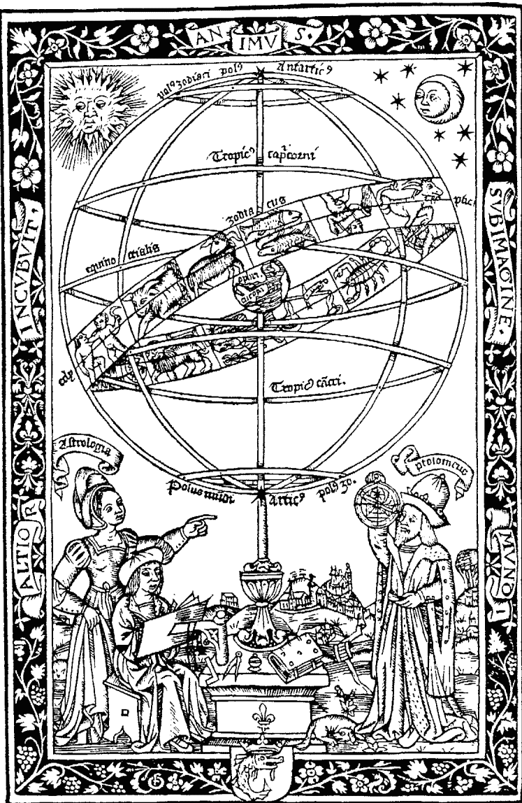

觀星圖的版畫（一五一五年，德國）

（子玄，現任台北大學易經研究社指導老師／東吳大學塔羅社指導老師。曾任：「捷運快報「塔羅牌專欄」、「面相專欄」作家。）

## 推薦序
### 思逸 SEER ◎ 能量療癒師

還在台灣東線旅行，在山光水色中接到星星的呼喚。
星座似乎已經是一個耳熟的能量詳的名詞，但是一直到近年台灣人才進化到占星學的程度。占星不再只有十二宮，行星的角度與座落等精微的占星技術與知識開始推進台灣的西洋占星領域。
然而，隱藏在這些專有名詞後面的星星故事以及文化內涵，更應該是我們注目的焦點，個人在閱讀一個占星本命盤的時候，常發現這其實是用眾多星辰的故事來繪述一個生命的變化以及劇本，而天空為限的筆跡中帶領我們進入星相的內在意涵，這裡面關鍵字成了靈活的引線，串起星星與人類真正的連結。天空為限讓每一個行星都化成生命中的一個角色，熟悉到令人無法輕易遺忘，最後用身為占星師的經驗勾引出畫面，這個行星就在她的手上活現。
身為一個閱讀故事的人，我也看見天空專注的架構起占星的網絡，從陰陽到三方四正，引領我們編寫故事可用的脈絡竟是如此清晰透徹，當最後進入十二個星座宮時，就彷彿織繡了十二面錦畫，一氣呵成且密密實實。我想她不只是要引逗起初學者對於占星的真趣，還有那些已涉獵的玩家們另一種說星星故事的方法。

> （思逸，占卜及能量諮詢的個人諮詢師／並帶領能量療癒工作坊／能量治療師／古徑塔羅課程講師。新浪部落格：荒人巫思手抄）

## 推薦序

### 吳美華●道家書院星命系列講師

時光飛逝，沉浸在命理的領域上，也將近有十五年之久，從東方的易經、卜筮、六壬、紫微、八字、姓名學、陽宅...到七政四餘、果老星宗而切入西方的占星學、塔羅牌、靈數學、色彩學、靈氣療法...等等學科，讓我領略到雖然東西方文化有所差異，但是大自然的語言，宇宙的垂象，萬法歸宗，殊途同歸。

認識天空老師是因為塔羅牌，當時她不是很有名，也沒有什麼資歷背景，但對於長期浸淫在命理領域的我，不但吸引我，還深刻的影響了我。

一向本著引經據典，知其然，知其所以然的學習及教學方式，沒有全方位、廣博的解說，是無法吸引我的。一個自學的小女生，居然總是能把牌的情境敘述得很傳神，不是準不準的問題（事後也證明大多符合她所描述的），而是她精闢的見解，總是能掌握到事情發展的走向，讓我好生佩服！

譬如說我是太陽獅子座，一般都說獅子座自大強勢，但天空老師顛覆傳統的看法說：獅子座的人，其實本質上是溫良恭儉讓，而且還具有在意別人看法、眼光，以德服人的領袖氣質，這樣的看法確實有別於坊間的說法，而且也確實掌握到學問的精髓；上課方式啟發多、教條少，跟一般老師不一樣，但又百分百符合基本原理，可以讓學生產生另一種思考方向與見解（華人普遍會流於單方面思考）。

進入東西方命理的領域上，我師承多位名師，天空出道時間不長，因此她目前或許不是名聲很響亮（出此書之前），但她有她的特色，她的獨特之處亦不亞於所謂的『名師』，相信假以時日，她在西方命理的領域上，會是未來的一顆閃亮之星。

（吳美華，現任道家書院監事／道家書院星命系列講師，曾任：道家書院理事／道家書院星合參講師）

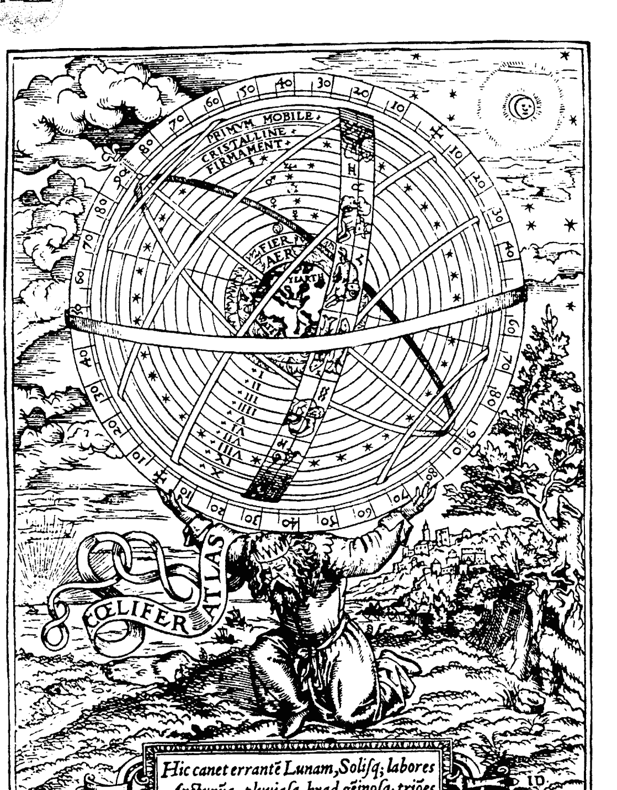

> Hic canet errantē Lunam, Solisq; labores Arcturūq;; pluuiasq; hyad.gēimosq; triões

### 資料圖 地球中心星象圖，1559年

## 現在開始架構「星座」的面貌

## 自序

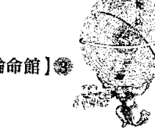

在我還是學生，對正統的占星完全沒有一點概念時，很喜歡跟同學聊聊各種星座，那時的星座書大多還只是小冊子或是粗糙的蓋棺論定的型式，我跟同學談論星座時，一向興致勃勃，也有很多同學忘了哪個星座的特質時，就會第一個想到來問我，並且很專注又帶著敬意的聽我講的每一句話（高中生、國中生真的是滿好哄的，呵呵）。但事實上，當年也還只是學生的我，就已經不太相信十二星座的精確性了，而且跟現在大部份的人一樣，我認為星座是一種統計學，會這樣想也很情有可原，因為拿雙子座來做例子吧！我認識的雙子座同學譬如有七個，裡面會看得出有很明顯雙子座特質的，大約只有三、四個，另外有兩個會一半一半，只在某個部份看得出雙子座的個性，剩下的一個，是就我能看到的部份，把他翻來覆去也找不到一丁點兒雙子座的影子，當然那時我們都只知道太陽星座，所以難免會出現這樣的不確定，跟比對困難的狀況。

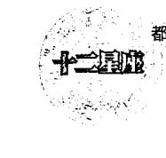

人人都會斬釘截鐵的告訴你：「雙子座就一定愛說話，上課時也不例外。」完全忽略掉愛說話只是雙子喜歡交際的其中一種特質，那如果某位雙子座同學上課時不愛講話，我們就會覺得他『不像雙子座』，完全忽略掉他其實很愛傳紙條，跟作文分數很高的特性。

星座專家告訴你：「金牛座的人很愛精打細算，很實際。」我們就會對有點愛慕虛榮，老愛帶著爸媽從日本帶回來的鉛筆盒、香港帶回來的皮鞋向大家炫耀的同學感到懷疑，覺得他大概是出生後晚報了戶口，完全沒辦法理解就算是愛錢的人，也有他不同的愛錢理由跟花錢的方式，有很多星座都算是實際的人，但實際的地方跟價值觀還是各自不同。

那時普遍庸淺的星座書就這樣在純粹的十二星座，以及粗糙的論定方式上打轉了很久，最後總算有點新東西出來了，開始有些書或雜誌專欄提到星座的「風、火、水、土」四大象了，這樣看起來大家是覺得有點道理，因為四象的特性更為籠統，當然也就更容易找到符合的地方囉！

不過雖然是如此，三個火象星座中，也可以區分出最像火象的星座跟最不像火象的星座，當然其他的水象、風象、土象也是同樣的狀況，這樣就讓我們又開始困惑了，只好轉回頭又去翻那些歸納得很表面的十二星座特質。沒辦法，因為星座專家只告訴我們星座有分這四象，沒告訴我們這四象在一個星座特質中扮演的是什麼角色，佔# 目录

# 推荐序

# 【自序】
## 现在开始架构“星座”的面貌

## 【前言】
## 星座最常被人误解的地方

# 【第一篇】
# 星座分类

- 阴阳性
- 三态宫（特质分类Quality）
- 四象宫（元素分类Element）
- 基本性质
- 数字学

## 【第二篇】太阳与九大行星

- 太阳
- 月亮
- 水星
- 金星
- 火星
- 木星
- 土星
- 天王星
- 海王星
- 冥王星

## 【第三篇】星座四象

# ◆三个火象星座的特质

- 第一个火象星座 牡羊座 (Aries)
- 第二个火象星座 狮子座 (Leo)
- 第三个火象星座 射手座 (Sagittarius)

# ◆三个土象星座的特质

- 第一个土象星座 金牛座 (Taurus)
- 第二个土象星座 处女座 (Virgo)
- 第三个土象星座 摩羯座 (Capricorn)

# ◆三个风象星座的特质

- 第一个风象星座 双子座 (Gemini)
- 第二个风象星座 天秤座 (Libra)
- 第三个风象星座 水瓶座 (Aquarius)

# ◆三个水象星座的特质

- 第一个水象星座 巨蟹座 (Cancer)
- 第二个水象星座 天蝎座 (Scorpio)
- 第三个水象星座 双鱼座 (Pisces)

## 【附录】

- 星座分析
- 推荐序

# 前言
## 星座最常被人误解的地方

虽然“星座”只是精密的整体西洋占星学中一个小小的部份，但是正式的星座命盘解读起来不容易，光是十大行星十二星座，就够叫人组合到头昏眼花了，使得想快速了解各种人格特质的朋友们没有耐心慢慢研究，所以在社会上流传最广、最为人所知的，还是简单的太阳在十二星座的基本人格特质。

但是不用我说，大家都可以发现，光用太阳星座，甚至近来也引起注意的“月亮在什么星座、金星在什么星座”来解读人的个性，出错跟不符合的比例还是非常高，原因很简单，光是看行星星座落的星座位置，本来就太狭隘，人性可是非常复杂又立体化的，不只公认有双重性格的双子跟双鱼座，而是几乎每个人都有双重以上的个性。

仔细想想，我们每个人的身边一定都不乏一些“在外人面前活泼、回家却沉默寡言”的人，或是“在外人面前害羞文静、在熟人面前却任性跋扈”的人，以及“在公司极度认真负责、但回到家却连一根指头都懒得动”的人，不是吗？

这些多重特质，都是因为我们每个人的命盘中，都有十颗行星、十二个星座、十一个宫位，及最少四种的相位交织出我们细腻的个性跟喜好，以及在不同场合、不同人面前会产生出来不同的反应及面貌，怎么能光是用“你是个活泼的人喔！”（如果是一个够格的占星师，要能告诉你：活泼是活泼到什么程度？侵略性的活跃还是单纯的人缘好？）或“你对你身边的人一定很好！”（够格的占星师，是要能够告诉你：身边的人是谁？家人？情人？还是朋友？好又是怎么个好法？会做些什么举动？）这一类的简单结论就可以归纳呢？

而市面上除了只用星座来当作人格分类的项目，失之于草率之外，各类的星座书也都大同小异，往往过度着重在其中的一个部份或一个特质上大作文章（而且我怀疑这些所谓星座专家，是不是根本参考的就是同一个来源或资料？不然怎么会解读的角度完全大同小异，不同的只是一些延伸出去的特质，并且还错误百出呢？其实就算是单单星座一项，也应该可以发展出很多角度才对），以致于读者看完这些资料后，如果跟眼前出现的人对比之下，往往是不符的，造成更多的困惑或是一些自以为独到的胡乱解读，以讹传讹之下，自认为“懂星座”的人其实一步步陷入错误的泥淖，而不相信的人更可以轻易的就找到“星座这种东西根本就不准嘛！”的大量证据。

当然，市面上完善而详细的占星书籍跟占星课程也不少，但除了占星本身的繁复度增加了入门的门槛之外，由于要讲完整个占星命盘的解读方式已经占去太多篇幅，或是上课时各种有的没的基本图表跟术语已经把学生搞得头昏脑胀，占星师们往往对于星座、四象等等的基本涵义没有办法做太深入的剖析，造成学不来的朋友们直接放弃，有毅力深入研究的朋友们又由于基础不稳，好不容易学会“阅读”一张命盘了，却看了半天只说得出一些模糊概念、甚至语焉不详的情况。

我就常常在初阶课程开课的消息公布之后，收到这类的询问：“我已经学到解盘／合盘／高级班／流年盘……但是我发现我在解读方面还很薄弱，所以我想请问，除了妳所公布的课程外，还有没有高阶的课程，可以让我进一步研究呢？因为初、中级的我都已经会了。”

我的回答往往是：“现在资讯那么发达，网路是万能的，我没有什么你自己找不到的资讯可以给你。基本上只要观念正确，再怎么高阶的学问跟资料都是可以免费取得跟消化的，因此如果你觉得遇到瓶颈，那么绝对不是你学得不够高阶，而是你的基础根本就没有打稳，因此我建议你还是从我的初级班开始了解，中高阶的反而没那么必要。”

市面上可以把命盘的细部、占星软件的判读教得好的讲师非常多，但是花很多时间去把一些硬底子的观念“灌”进学生脑袋、把重心放在扎根上的课程就不多了；一旦把我教的基本概念了解后，除非学生没时间自学另行要求，不然我是很懒得开中高阶班的，因为我觉得基本逻辑是相同的，只要肯用心，没有自学不来的道理。

渐渐的，想写一本让人觉得『占星很可亲』的想法，就在我脑子中逐日成形了，有鉴于市面上教导读者全面性占星盘解读的工具书已经又多又详尽了，因此我不打算再另外写一本差不多的书。而占星的元件虽然那么多样化，最引起大众兴趣的还是星座的部份，所以我决定先从星座的角度切入，先把众说纷纭的星座特质做一些解析和根源的探讨，让读者们可以简单的了解星座特质的根源涵义，毕竟星座的种种说法虽然流行，却大部份都是片面而不完全正确的，值得详细叙述、引人入胜的地方还有太多太多！学问这种东西是见微知着的，能够了解基本的由来后，我相信其他的书跟资料，要理解起来一定都会简单多了。（因为我的初阶课教的就是观念的正本清源，所以许多学生才上完一、两堂课，回去后就发现他们以前买了却看不懂的占星工具书，突然都变得简明又易读了，我相信对你来说，一定也不会困难到哪里去的。）星座之所以这么流行的原因，是因为人们对于“个性、心理分析”有着莫名的信任跟兴趣，因此这本书的内容，比起课程内容来说，是已经简化过了，全部着重于“人格、个性”的层面，目的是要有助于读者去印证、补充自己的发现，“可扩充性”非常高，所以对“专业的占星”既好奇又有着恐惧的朋友，或是已经不满足于肤浅的十二星座特质、想要多了解一些的朋友，这本可深可浅，比流行星座有内容又准确，又不像专业占星般细节繁多、消化困难的书，会是你很好的基本入门资料。

以下我们就来看看，一般市面上因为流行星座学而发展出来，积非成是的一些常见说法：

一、我的生日是双子座的第一天，所以我『金牛双子』喔！？
嗯～当然不是啰！不管再怎么接近，太阳的位置只能属于一个星座，这种讲法在我完全不懂占星时也相信过，因为那时我们都不晓得有其他的行星、其他的位置，在个性上出现跟我们的太阳星座不同的地方时，就觉得困惑又无法解释，只好极力找出有没有一些其他的可能性，如果我们出生的日期刚好在两个星座之间的交界点，当然而就会自认为找到一种合理的解释了。基本上这样的讲法，是以猜测跟趣味性为基本出发点的，没有什么可靠的论据来源。
那为什么真的有『我是双子座，但我某部份的个性也很像金牛／巨蟹这些在双子前后的星座耶！』这样的情况产生呢？有很大的可能性是出自于现在大家也很熟悉的金星跟水星。金星掌管我们对于感情的观点，水星则掌管我们说话的表达方式跟思考的模式，这些部份都是很容易被察觉到的性格面，而金星跟水星是距离太阳最近的两颗星，它们进入的星座当然也不会离太阳星座太远啰！如果你的太阳在双子，那金星、水星就会在不远的前面或后面一、两个星座之中。当然啰！这也只是一部份的可能性。
就一般正式的占星观念来说，太阳在一个星座越前面的部份，反而会带有这个星座越纯正的特质；越后面的部份，则越容易接近下一个星座。这又是另外一个可以解释为何出生日期在星座交界处的人，性格上会出现类似其他星座的原因。

二、占星不过就是统计学
我从小学开始看“星座书”时，就常常看到一种论调：“占星学是一门统计学。”甚至一些流行星座小册子，还会附上一个星座的每个特性，并在该特性的后面加上一个百分比，例如：双子——口才佳85%，诚实65%……
诸如此类，表示如果你是个口才不佳的双子座，也只因你是那常态之外的15%。
虽然我不敢说我研究占星比别人深入多少，但是在我拿得到的资料来说，看得出来所有占星的起源，就逻辑上来说，勉强有可能是因为统计而来的部份，就是天象对气候跟社会事件的影响，但在人性解读方式，实在很难想像出“统计学”的可行性；
论占星盘的重点是在于行星、宫位及相位，并且一个命盘的位置确定跟紫微斗数类似，但还比紫微斗数精细不少——可是也从来就没听人说过：紫微斗数是一门统计学。
如果真要统计，若从正道的占星学来说，几乎没有任何两个人的命盘是一模一样的，如果要统计，必须是要在很多相同的命盘中，计算出各种特性的百分比，然后精密分析出这些命主的“每一面人格”，如此“统计学”一说才能成立。
再来，古时候各地之间的交通不便，人口也不多，请问要怎样“采集到足够的样本来『统计』呢？”能统计的顶多只有星体运转的数据，历法对气象的影响──诸如这一类，对于人性跟心理变化要用统计的？你得先让所有的人口都愿意把每一个念头都向你报告，才有办法做到『统计』这个动作。

这些怪说法，我实在是觉得纯粹出自于现代人的想像，因为不知道如何解释占星这门学问，又不肯承认自己不了解的部份，所以就直接用自己的猜想来当成理论，说得跟真的一样，道理就跟前述的什么金牛双子是一样的意思。

另外，说出“统计学”这个理论的人，也必须对“统计学”使用的部份跟定义有足够的了解，目前市面上流传的“统计学”说法，跟实际的统计学相似之处不多，应该说，就目前“大家认为的”所谓“统计学”说，应该就是只针对“太阳星座”而言──不过就算只看太阳星座，这种统计也还是没有办法成立。

一个人的占星命盘中，有十颗行星，落入不同的宫位、相位，就会带来不同的特质，这些特质混合后交互影响，所呈现出的面貌又不能清楚的划分出：这个性格是这颗星带来的、那个性格又是另一颗星……因为交互影响后产生的是“化学变化”，就不能划分成：这个部份是面粉的感觉、那个部份是牛奶的口感……一个蛋糕的口感，在于所有的成份加起来后，综合呈现出来的表现。

像用面粉、蛋、牛奶、水、糖……制作一个蛋糕，你吃这个蛋糕时，不能划分成：这个部份是面粉的感觉、那个部份是牛奶的口感……一个蛋糕的口感，在于所有的成份加起来后，综合呈现出来的表现。

同样的，人的全面个性也是自己整个命盘所有要素加起来之后，综合呈现出的面貌。

# 31. 前言 星座最常被人误解的地方

# Are the astrologers all liars!?【开运论命馆】

光说双子座的人“反应快”这个特点好了，你怎么知道，这个人的反应快，真的是来自于他“太阳在双子座”这个原因？也许是来自他落入第三宫的水星，也或许是来自于他的水星跟天王星的相位，更或许是来自他行星聚集最多的天秤座（因为天秤也在某个层面反应很快，但方式跟表现跟双子完全不同，要这样统计，得先分出十二星座、十大行星的反应快慢速度分别为何？是哪种模式？彼此之间的所谓“反应快”有哪些定义上的不同？这只是第一步，要真正统计的话，那种工程之浩大并非讲出这种谬论的外行人可以想像的）……
换句话说，很多星座跟行星特质名称相同，共享同样的关键字，但实际上的出发点、背后成因都不同，真要统计，谁有办法研究完数以千计的命盘，对每个人分别做深入的心理分析后，再将这些“整体呈现”的性格特质界定区分解体，然后再来“统计”……这样合逻辑吗？
所以这种“统计学说”看起来，实在很像过于迷信科学的人，硬要将神秘的事物套上科学的解释，但是对这门学问又完全陌生，只是“想当然尔”的，用他的想像以及贫乏的认知程度，证明出这种肤浅的理论……所以我每次听到有人很冠冕堂皇的对我说：“占星？不过是一种统计学罢了……”藉这句话要来证明占星学的“没啥大不了”、“没啥大学问”，我都很想请他小声一点，因为这种外行讲法也不过是人云亦云的一种无知，并不是经过他自己的了解跟认识得出的结论，充其量也只是听说来的，那股得意劲儿实在是没什么道理！

三、不是听说又有第十三个星座出现，那以前的星座学还准吗？
其实，每个月太阳走到哪个“星座”这种说法是便宜行事而已，重点并不在那个星座，而在太阳处于黄道中的哪个位置。

黄道被划分为十二个位置，简称为“黄道十二宫”，太阳进入第一块黄道的领域，就会有第一个位置应该具备的个性（见图一），依此类推；那为什么要称为“牡羊座”和“巨蟹座”之类呢？因为黄道带中的第一个位置，刚好有巨蟹星座在旁边，第四个位置，刚好有牡羊星座在旁边，因此为了快速辨识，就直接讲星座的名称。就像如果台北市有几百条马路，我们全部都讲编号的话，给人的印象就会太模糊了，所以就帮每一条马路都取一个简单又有代表性的名称，才比较容易辨识跟记忆。
所以，多年来所谓“新发现、将取代射手座的蛇夫座”，即使跟射手座共同位于黄道带的第九个宫位，也不可能改变射手座的性格，因为重点在于“黄道第九宫”这个位置（见图二），而不是在于被拿来当路标的“星座”本身。

# 第一篇
# 星座分类

阴阳性＼三态宫（特质分类Quality）
四象宫（元素分类Element）＼基本性质＼数字学

# 阴阳性

● 性质
阳性（奇数宫位为阳）雄性、坦白、积极、阳刚、开朗、活泼、好动、敏捷、开创、动态、主动、主观、富有能量、外放、草率、轻浮、欠思虑、自我。
阴性（偶数宫位为阴）雌性、隐藏、隐瞒、阴柔、内向、沉着、自制、保守、静态、客观、易受影响、内敛、内心化、被动、消极、抑郁、悲观、过于压抑、忍受、易失良机。

● 宫位
● 阳性宫位
牡羊、双子、狮子、天秤、射手、水瓶。

# 阴性宫位

- 金牛
- 巨蟹
- 处女
- 天蝎
- 摩羯
- 双鱼

# 三态宫／特质分类（Quality）

基本宫（牡羊、巨蟹、天秤、摩羯）：源起、发育、加速生长、目标、开创、行动力、能量充沛、不断追寻目标、集中创新、诱因。

固定宫（金牛、狮子、天蝎、水瓶）：不容易受影响、停滞、不变化、固执、能量平衡、稳定持久、定性、自恃、目标集中在扩展、顽强、不让步或习惯偏好。

变动宫（双子、处女、射手、双鱼）：容易混乱、变化、不定型、浮动、喜新厌旧、易受影响、善变、环境适应力强、变通、反应快、目标不明确、前后不一、以变应变。

基本宫代表一件事物最源头的发轫点，最新鲜、最充满能量，但也尚未成形；等到进入固定宫之后，就像从跳脱不安的幼年、青春期，走入稳定的成人阶段，坚实、有力量，又不受外界影响；到了最后的变动宫时，象征了凡事已达到最高点，要开始转化，以便为跨入下一个阶段做准备了，所以变动宫比基本宫来得消极；基本宫是由不稳定进入稳定，固定宫是恒常在稳定的情况下，变动宫则是从稳定的状况脱离出来，迈入不稳定。

# 四象宫／元素分类（Element）

风&火｜能量

水&土｜质量（物质）

风代表较为浮动的能量，火代表较为集中的能量

水代表容易分解的物质，土代表凝聚成形的物质

风&水｜心理面

火&土｜实际面

风代表知性方面的思考，水代表感性方面的想法

火代表实际上的行动跟目标，土代表实际上的资源跟收获

风&土｜理性、逻辑

水&火｜情绪、理想

风代表思维、创意方面的逻辑，土代表整体考量、有秩序的规划

水代表人我之间的情绪交流，火代表个人自我的情绪表达# 基本性質

# 火

陽性（牡羊、獅子、射手）

熱能、光量、力量、明亮、轉換物質的屬性、熱氣上升、燃燒。

- ● 人格特質的延伸
  行動、有衝勁、企圖心、熱情、堅持、生命力、活力、權力、動力、容易影響（改變）他人、直覺、集中、突破現狀、樂觀、領導者。

- ● 情感關係的延伸
  熱戀、主動積極、慾求、爭吵、正面發展、加溫。

- ● 工作的延伸
  升遷、創業、工作環境（職務）的提升。

# 土

陰性（摩羯、金牛、處女）

- ● 健康的延伸
  短期的健康、好轉、急性、容易根治。

- ● 人格特質的延伸
  不動、包含各種元素、基礎、豐饒、養育各種動物、植物、固定。
  物質、實際、財富、固執、規劃、堅持、實在、守成、務實、統治者、行為上的包容。

- ● 情感關係的延伸
  有基礎、穩定、持續。

- ● 工作的延伸
  居高位、收入好、企業家特質、政治、農夫、金融、公家機關。

- ● 健康的延伸
  狀況持續、穩定、沒太大的變化、老毛病（宿疾）、慢性、長期。

# 風

陽性（水瓶、雙子、天秤）

- ● 人格特質的延伸：變化、善變、不穩定、不固定、迅速、鑽縫隙、交流、介質。思想、表達、智商、理性、創意、溝通、隨性、適應力強、善於分析、沒有既定立場、改變中的狀態。

- ● 情感關係的延伸：氣味相投、知性、注重個人空間。

- ● 工作的延伸：自由工作、企劃、創意、律師。

- ● 健康的延伸：狀態不穩定、病情有復發的可能、時好時壞、對事件的精神壓力。

# 水

陰性（雙魚、巨蟹、天蠍）

- ● **人格特質的延伸**
  可變成各種形體、流動、洗淨力、往低處流、隨環境做變化。
  感情、情緒、柔性、容易被影響、好逸惡勞、浪漫、感受敏銳、順從、被動、第六感、優柔寡斷、沒有執行力、情感的包容。

- ● **情感關係的延伸**
  順從、關心、感性。

- ● **工作的延伸**
  服務性、藝術工作、融入人群、心理醫生、護士。

- ● **健康的延伸**
  心理影響生理、由人際關係所產生的情緒。

# 數字學

## 1

陽性
對應
牡羊座

- 開創性
- 獨立
- 堅持
- 能量充沛
- 企圖心與行動力強

## 2

陰性
對應
金牛座

- 兩極化
- 對立
- 吸引力
- 接納性

## 3

陽性
對應
雙子座
合作、溝通、創新、社交、傳遞。

## 4

陰性
對應
巨蟹座
領域、穩固、封閉、家庭化、組織性、囤積、鞏固。

## 5

陽性
對應
獅子座
充滿變動的環境、舞台、群眾、觀眾、從穩固中走出來的新型態或變動。

## 6

陰性
對應
處女座: 療癒、修復、服務、計算整體局面、就事論事、以群眾做基礎、互惠、和諧。

## 7

陽性
對應
天秤座: 學習、考驗、知性、人際關係、專業、探索。

## 8

陰性
對應
天蠍座: 巨大、多數、企業、性、累積的能量。

## 9

陽性
對應
射手座
哲學、靈性、旅行、超越、超脫、巔峰。

## 10

陰性
對應
摩羯座
充足、圓滿、完成。

## 11

陽性
對應
水瓶座
太陽黑子及各項事物的週期、超脫於世俗之外。

## 12

陰性
對應
雙魚座
整體、完整的組合、一次大的循環。

# 十二星座三態四象速查表

| 火象 (陽性) | 土象 (陰性) | 風象 (陽性) | 水象 (陰性) |
| :--- | :--- | :--- | :--- |
| **基本** | + 牡羊 | - 摩羯 | + 天秤 | - 巨蟹 |
| **固定** | + 獅子 | - 金牛 | + 水瓶 | - 天蠍 |
| **變動** | + 射手 | - 處女 | + 雙子 | - 雙魚 |

# 第二篇

# 太陽與九大行星

太陽、月亮、水星、金星、火星
木星、土星、天王星、海王星、冥王星

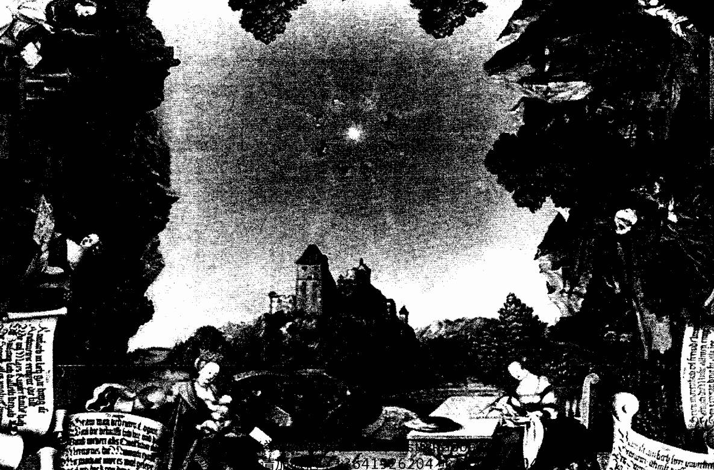

# 太陽

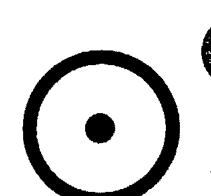

### 太陽的運行週期

- 走完黃道一圈的時間：一年
- 走完每個單一星座的時間：三十天

- 行星類型：恆星

### 太陽最常用的關鍵字

- **人：** 自我成就、父親、女性命主的丈夫、老闆、上司、首領、權威人士、帶領者
- **事：** 名譽、對外的言行舉止、地位、形象、表演場合、開創性、明顯
- **物：** 黃金、獅子、天鵝、心臟、脊椎、眼睛、血液循環系統、照明器具

- **公眾人物**

### 太陽特質的由來與歸納

雖然以實際上的天文現象而論，太陽是恆星，地球圍繞著太陽運轉，但在占星學中，天宮圖是以我們所在的位置，觀看天上各顆星星，因此在地表上人類的眼中，太陽還是動態的、運行在黃道十二宮之中，太陽一個月走完一宮，每宮分為三十度，剛好是一天一度，也就是太陽在天宮圖中，是一天前進一度，因此列入占星學中的十大行星之一。

太陽的存在提供溫度跟亮度，正是地球上所有生命的源頭，對遠古人類而言，夜晚充滿了危機、寒冷與威脅，而每天永不缺席的太陽一露臉，就用它的光跟熱幫助人類驅走混亂、恐懼跟未知的部份，因此太陽是被人們所仰仗、依賴的，對我們來說，它是一個「尊貴的保護者」，也由於光跟熱是地球上一切生命的源頭，太陽源源不絕的提供了生命所需的能量，所以理所當然的代表了父親形象中的「父性」，以及「給予者」，因為太陽給了地球生命的喜悅，所以這種父性不是屬於規範式的，而是一種來自於兩者緊密連結之下，自然而然產生的彼此認同及互動，所以太陽的父性是真情流露的本性，而非結構及形式上僵化的父權。

代表的是父愛而非父權，既成熟又天真

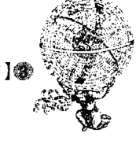

他是檯面上的人物，功能就是當招牌

父親這個角色，等於是家庭與社會銜接的橋樑，因為原始的群體中，父親是必須到外界取得生存資源（從耕種、打獵，到現代的上班工作）的人，其實也象徵了來自社會對於個體的支持跟協助，受到格的尊重和注目，這種角色除了是一個家庭中的父親，也是「丈夫」、「元首」，一家之主的原型擴大到整個群體來講，就變成了萬民之父，也就是「國王」、「丈夫」、「元首」。一國之君的角色類似父類是家庭跟外界的聯繫一樣，各個古早的民族對君主的認知，往往都是天神的化身或後代，他們代表的角色是天與人之間的橋樑，正如同父親是家庭與社會的橋樑一樣。

太陽所到的地方，陰暗隨即被暫時驅走，所以太陽又象徵了令人愉悅的形象、溫暖的助力，而它每天準時升起，帶給我們希望跟喜悅，於是他也代表人性中的樂觀、友誼、生命力，具有活潑、外向、愛表現的人格特質，加上前面說過的「外在形象」，整體而言，也就是代表一個人在公開的地方顯露出來的特質，因此就是命主「最明顯的特質」，尤其是在同儕的圈子之中。

太陽可以改變整個天地的形貌，自古以來便是受人們崇拜的對象，就是「精神領袖」，精神領袖的特長不在於經營跟管理，而在於給大家一個理想性的目標跟心理寄託，當一個開創者（而非守成），所以同時也延伸成太陽所象徵的「權威人士」、「外在形象，也常常有人把太陽或獅子座跟表演欲——理所當然的連結對應到演藝人員，但其實太陽過於強調光明面，代表的是一種很外在的皮相，比較不具備藝人需要的敏感跟藝術性，因此我認為實際上太陽代表的是「公眾人物」、「權威人士」，也就等於賦予了他「決策權」。

綜合以上的特質，我們可以看到，太陽代表的是一種最核心的能源力量，因此在健康方面對應了人體中心——心臟跟脊椎，以及血液輸送系統，都是人體生命力的重點所在。在人方面，通常被我們視為「在上位、核心者」，有上就要有下，所以太陽的影響力雖然強大，也必須要有一個受者來配合，我們很容易可以聯想到，傳統五倫之中的「君臣、父子、夫婦、兄弟、朋友」中的「君、父、夫、兄、友」，都是太陽可以指向的對象，也就是一組互動關係中，主動的那一方。

你可能會問，太陽代表了「男性的長者」，同時也代表「自我的意識、認知、形象」，這兩者可以視為等同的個體嗎？其實，就像本篇一開頭說的，太陽看似在動，但真正行進的卻是地球，就像坐在行進的車上向外望時，就我們的觀感中，卻是窗外景物在往後移，不覺得是自己在動。這就像是我們跟父親之間的關係，「父親」這個角色，是我們在對外的態度跟社交方面的範本，我們雖然覺得父親是一個「他者」，但其實我們身上很多特質，都是受到父親的傳承跟長年累月的影響。父親的形象，就是我們人格逐步成形中邁向的那個目標，所以自然也就可以從太陽窺見最根本的自我定位，這形成我們在不知不覺中，呈現在別人眼裡的人格，乃至在外的行事作風。

### 太陽特質的經驗談

在我剛學占星不久時，有一個網友提出一個有趣的問題，她說：「我有個女性朋友，她對自己星座有點質疑，像她的上昇跟太陽都在雙魚座，但是她從外型到個性，沒有任何地方像雙魚，所以我那位朋友覺得，占星是不是其實只是機率統計或聯想而已，會準都只是湊巧，並沒有實質根據可言，不然怎麼會一點都不符合呢？」

我想了一下這個情形，一般來說，我們的上昇點就代表人的面貌、打扮跟氣質，所以太陽如果很靠近上昇點的話，應該就代表她的穿著打扮，會很有太陽的味道。

太陽的耀眼、活力，以及力求受人注目跟帶頭的特質，跟雙魚的的確完全不同，因此我就太陽靠近上昇的特質，問這位網友：「妳這位女性朋友，是不是打扮比較誇張、個性活潑，很容易成為大家的焦點，還有點愛照顧別人的個性（太陽靠近上昇）？只是她看起來能幹，但在生活細節方面，卻是不太注意，甚至有點迷糊，反而很需要人家提醒她、幫她打點（太陽跟雙魚的共同特質相乘）？」

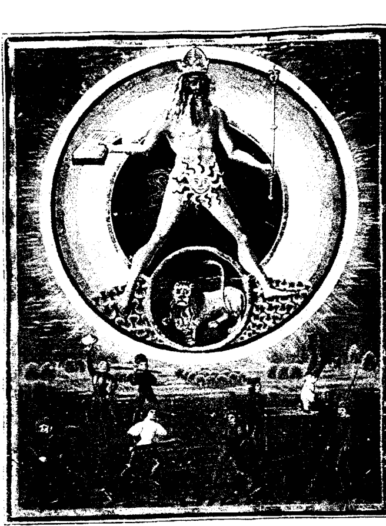

她驚奇地說：「對耶！就是這樣，所以我們才覺得，不管是打扮或是性格，都跟雙魚座不像啊！」事後我才告訴她，我分析的根據為何。

其實，雙魚的影響力還是有，但太陽的個性較為外放，很容易第一眼就被人看到它的特質，所以這位小姐展現出來的太陽特質，就會強過她的雙魚特質囉！

## 月亮

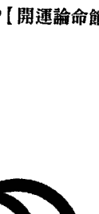

### 月亮的運行週期

繞完太陽一圈的時間：約二十八天
走完每個單一星座的時間：接近兩天

類型：衛星

### 月亮最常用的關鍵字

- **人：** 母親、男性命主的妻子、家人、血親、親近的人、跟隨者、輔助者、服務業人員
- **事：** 連結、依賴、安全感、情緒、內心隱藏的那一面、記憶、私人、起伏性
- **物：** 白銀、珍珠、兩棲類有甲殼防禦的動物、子宮、卵巢、乳房、消化器官、家居用品、日常消耗品

### 月亮特質的由來與歸納

月亮是天上群星當中，跟我們最親近的一顆星，也由於它是我們的衛星，因此跟地球也是最親近、最形影不離的（甚至有天文學家提出，月球應該不單單只是地球的衛星，而是跟地球共組為一個雙星系統）。因為距離近，月亮繞太陽一圈的速度也特別快，不到一個月就可以走完十二宮了，所以我們常看的「月亮星座」，都是不到兩天就換一個星座了。

運行軌道的快速，加上月有陰晴圓缺，從身處地球的人們眼中看來，月亮就是短期內變化性極大的一顆星，但憑著它跟地球的親近，又帶有一種長期的熟悉感。眾所周知的，月亮有一面永遠是背對著地球，所以代表我們永遠不會浮到表面上的原始心靈，也就是我們深處的本性，就很自然的月亮對應上了。同時，它也象徵著一天當中永遠的另一面：也就是夜晚。

月亮雖然自己不發光，只是反射太陽的光線，但這些光線卻是在最需要它的夜晚時出現，並且月亮跟太陽不同的地方是，它的光芒不至於太刺眼，因此我們是可以直視它的，所以月亮雖然形體不比太陽大，卻能讓我們更容易親近，更不具威脅性。月亮在每個夜晚發亮，就是在人惶惑不安的時候，提供了一種慰藉和依歸。其他夜行性的生物，也因為有月亮提供類似太陽的功能，而創造出了夜晚的另一個世界。

太陽守護白晝，月亮守護夜晚，這兩者形成了地球的兩大光源，也就是生命的提供者，因此它理所當然的變成了太陽的另外一半，象徵著母性以及生命的孕育者。月亮提供的能量，並不是充沛而強大的，而是在最需要的黑暗，照射出適當的光線，讓人在不可預測、充滿危險的夜晚，得到一絲的保障。雖然月亮是夜晚光與熱的提供者，但是月相變化甚大，能照耀的光線忽明忽暗、忽東忽西，人們夜晚如果不在屋內，在面對黑暗的遼闊幅員的情形下，還是無法抑制所感受到的潛藏在自己無法控制下的恐懼跟不安。

### 白天不懂夜的黑，暗處是最好的儲藏室

月亮處於一個太陽照管不到的時段，雖然發揮的功能不及太陽本身，但卻是在太陽再次升起前，有著過渡、連結、維持基本需求（也就是生存）的功能，等於是太陽不在時的值班人員，但是由於去掉了大量的光線、熱能以及生命動態，不會形成干擾分散我們的注意力，當周圍平靜下來時，我們反而有了空間好好的跟自己相處，人在面對卸掉白天所有的頭銜跟武裝——那個真正的自己時，往往有一種矛盾的情緒，我們可以感受到自己內在的渴望跟需求，卻也因為不習慣去檢視自我，在長久隔閡又接近時，有一種陌生的恐懼感，造成我們會刻意忽視自我的某部份特質，但被否認或埋藏的這個部份並不會消失，反而因為沒有宣洩口，被積壓成了一股強大的能量，進駐在我們深層的內心，潛意識會不知不覺驅動我們一切言行跟選擇，所以月亮會引發人們一種想逃避卻又無法切割的心理狀態。而如果這股能量沒有轉化成潛意識，還是在表意識上起作用的話，就是我們常說的情緒化，嚴重時會到歇斯底里的程度。太陽代表的是我們對外、創造出來的那個自我，月亮卻代表了我們真正的感受、需求，以及我們要建立表面上的那個自我時，必須有我們的生命經驗（有時不只我們幼時，還牽涉到前世的所有經驗）、基因遺傳、生長環境——等等與生俱來的本質來做為基地，月亮就代表了在自我形象初成形時，我們就擁有的喜好、天性、記憶跟家庭給予的影響。追到了最深層，就回到我們個人最初的發源地。有什麼是跟我們本身有著不可分割的關係的？就是來自於本來跟我們緊緊相連的母親子宮（也包括更源頭的卵巢）。在子宮內，母親並不是一個個體，而是我們的全世界，跟我們無分彼此。要到出生並長大後，我們才會認知到，母親也是世界中的一個個體，因此人們小時候對母親普遍有著強烈的認同感，一旦長大必須發展自我（這個自我就是太陽代表的），就又開始反叛和脫離我們的母親與家庭。這種根源的情結就跟我們成年離家四處生活後，存在我們內心對故鄉的感覺一樣，這種感覺是長期在我們內心深處、支持著我們的力量，有如植物的根之於它們。

### 它是城堡的地基，大樹的根

太陽是一個對外的自我形象核心，而月亮就是由自我反溯回去，找尋源頭，不只是「我」，月亮就代表這些源頭的基礎特質，它不代表「『我』的本身」，而是「『我』的背景」、父母、經驗，種種組合成「『我』的材料」（最後成形，浮出檯面的才是那個稱之為「我」的個體，這個「我」是太陽所代表的）。正如我們在「太陽」那一章提過的，太陽是五倫之中主導的那一方，月亮理所當然就是五倫之中接受、被動、隱藏的那一方，但處於後方就是比較弱勢的嗎？也不盡然，就如同君跟臣的關係中，當然以「君」為首，但君只能有一個，「臣」跟「民」卻是有千千萬萬，才形成一個群體社會最主要的成份，兩者各自發揮著不同的作用。也因此，月亮特質常代表著副手、人民、基層人員以及從事服務業者，因為往內在探索，向下紮根，才能形成支撐太陽往上延伸、向外發展的基礎跟力量。

### 月亮的經驗談

月亮的特質，是極為重視一種人跟人之間緊緊牽絆的關聯性，但是因為太重視了，讓人不得不懷疑，是因為月亮在親密感跟安全感方面特別缺乏，因此才會格外的害怕失去？這方面，我之前並沒有特地去找答案，只是某一天，我又遇到一張月亮剋相很重的命盤，感嘆這樣的命主心理陰影之大，幾乎可以算是一種心靈上的殘障了，突然冒出一個念頭：「如果這顆月亮落入會加強它情緒及感受性的位置，那可能一生都要常常接受這種考驗了。」而月亮最怕的，就是跟最親密的家人有生離死別等失去的感受。

這時不知為什麼，我想起了我月亮在巨蟹的妹妹，巨蟹剛好是一個會增加月亮安全感的星座，而我妹妹從小就交給褓姆帶，跟褓姆培養出感情後，又得硬生生被接回到家裡住，跟我的感情越來越好後，又面臨父母離婚因此必須分開的狀況。這時我可有興趣了，把我身邊月亮巨蟹的朋友全都問一次，果然，雖然不是每個都跟我妹的狀況一樣，但都接受過跟家人的生離死別；一位二十八歲的男性，平日看來上進活潑開朗，怎麼看也不像是失去親人的人，可是詳談之後他才告訴我，高中時代他的父親才正式告訴他，他是父母收養的小孩，跟他所認定的父母並沒有血緣關係。另一位五十歲的女性，跟母親感情不錯，但父親早就去世了。而一位二十多歲，個性爽朗樂觀的女孩，也是在詢問後才很驚訝的發現，她的親生父母從她小時便失去音訊，她是由伯父一家人撫養長大的。之後再「普查」過身邊的親朋好友，凡是月亮在巨蟹的，都接受過這種跟家庭的撕裂經驗。
陸續跟他們深談後，我感到很無奈，從家庭裡帶來的傷，恐怕不是之後的人生美滿就能彌補的，月亮的傷是最深、最初的痕跡，只有認清現實，接受自己要獨立的事實，才能拋開潛意識中那種「被拋棄」（有時父母就算是死亡，孩子還是會有一種被孤零零丟在世上的遭遺棄情結）的陰影跟毒素！

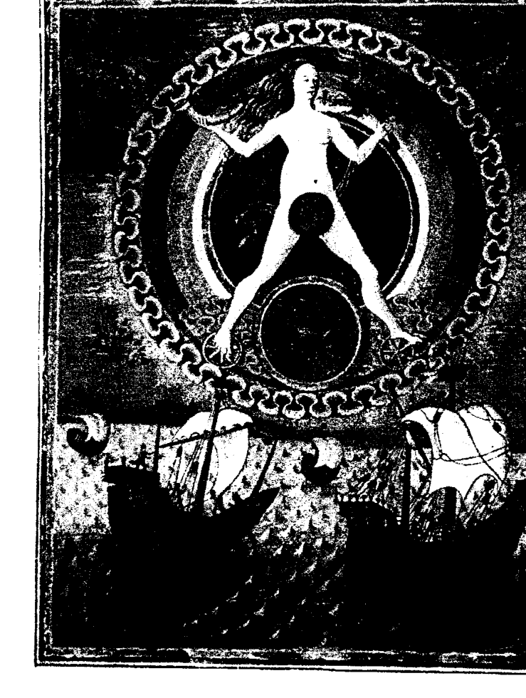

### 月亮版畫（十五世紀義大利）

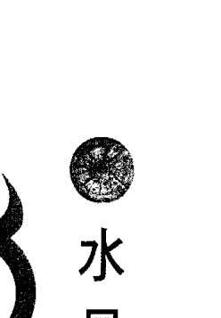

### 水星的運行週期

行星名稱： Mercury

繞完太陽一圈的時間： 兩個月又二十八天

走完每個單一星座的時間： 六～七天

類型： 太陽系行星

### 水星最常用的關鍵字

- **人：**
  - 兄弟姐妹
  - 朋友
  - 鄰居
  - 所有的平輩跟同儕
  - 能言善道者
  - 作家
  - 年輕男性

- **事：**
  - 速度
  - 連結
  - 溝通
  - 思想
  - 言語
  - 資訊
  - 初等教育
  - 短途旅遊
  - 大眾性
  - 技術

- **物：** 鸚鵡、猴子、水銀、翡翠、呼吸系統、手、神經、大腦、文字及符號等象徵、義務教育的學校

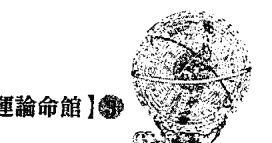

### 水星特質的由來與歸納

水星是一顆非常有趣的行星，它在太陽系的九大（或現在的八大）行星中，是最靠近太陽的一顆行星，因為如此，所以公轉的速度非常快，在超前其他行星沒多久後，又從其他行星的背後追上來，從地球的角度看出去，像是來來回回於不同的星球之間，因此用Mercury這位穿著長了翅膀的鞋子，來回於各個神祇，甚至天上、人間、冥界之間的使者來命名。水星的速度雖快，但它貼近地平線，又太接近太陽，觀測起來非常不容易，在人造觀測器出現前，天文學家幾乎是沒辦法看清水星表面的，它又總在晝夜交界之時才容易被人看到，就很明顯的給人一種快速跟變幻莫測，總是位在兩個地方的交界處的印象；水星是公轉快但自轉慢，而且因為太靠近太陽而沒有大氣層來調節溫度，因此水星上的日夜溫差可以相差到數百至上千度，所以它也擁有其他行星所沒有的兩極化特性。

# 無所不在，神通廣大的智多星Mercury是羅馬神話中的名字，同一位神祇的希臘名是Hermes，在羅馬神話中，大地女神的女兒被冥王擄走時，是由Mercury前往冥府溝通，才達成各退一步的協議：半年的時間回到人間來陪伴大地母親，半年的時間在冥府當她的冥后，也如此才有了四季的變換。說到這裡我也想起，埃及神話中也有一位水星神祇Thoth，看不出牠屬於任何階級，卻頗具影響力，不管在什麼事件中，牠總是會插上一手，常常擔任談判、溝通，或是出主意的角色，事實上Thoth這個名字也就是「三倍偉大的Hermes」。

在埃及神話中，最初的父神（大地之神Geb）與母神（天空女神Nut）因為私下結合，被拉（Ra）神懲罰：在法定的日子中（三百六十天）都不准生育，這時表面上完全看起來跟牠完全無關的人——Thoth就會很多事的跳出來，拿智慧之書當賭注跟月神下棋，贏了月亮七十二分之一的月光，另外創造出五天不在法定內的日子，供Geb與Nut生育；從這裡就可以看到，水星之神所扮演的角色，永遠是在正規的狀況下形成了障礙時，牠就會出現來想辦法、協調，以及扮演轉圜、折衷的潤滑劑。

當然，這種無人能及的說服力跟急智很可貴，但由於言語是太容易接收的東西，所以人們往往著重表面的言語來判斷而忽略了本質，有時就會形成了謊言跟偽裝（記得嗎？水星是忽明忽現，很難看到真面目的喔！），所以這顆星給人的印象是有正有負，就像太聰明的人，也容易招致兩極化的評價一樣。

以上的共同指向，可以歸納出水星的確就像Mercury一樣，永遠來回於某兩者、銜接起某兩者，或是同時具備某兩者的特質，從它這種永遠站在連結線的中央點來看，就像是物體與物體之間的一種介質、觸媒，所以它最大的意義，就是擔任橋樑跟溝通者。水星除了是各層面之間的連結者之外，因為它總來回於黑暗與白晝之間，所以也被認為是各種不同層次之間的階梯，可以串連起不論是橫向或縱向、時間或空間等的任何領域。如此快速轉換、跳躍於不同領域卻能泰然自若的特性，所以我們也認為水星具備了高度的適應力，以及飛快的反應能力，這些特質都需要非凡的心智才能辦到，水星也就理所當然的成了我們口中稱的『智多星』囉！

如果你要擔任兩者之間的橋樑，必定是這兩者之間有了溝通上的誤差，要傳達兩者間的意思並達成共識的話，必須要了解雙方的需求，並且有能力表達。語言、文字、表情都是表達工具之一，從這些工具的不同，可以象徵各種行業，如果用語文傳達就是：外文翻譯、通訊。傳送的如果是實質物品，那就是：郵遞、貨運。也有可能是單向傳達，就是一方發出一方接收，如：大眾傳媒、初等教育……。凡是從一邊傳送到另外一邊的，不管在哪個層面，都是屬於水星的管轄範圍。當然，傳送不會是原封不動的傳送，中間要經過轉化處理的，就像我們在美國買東西的話，要先把台幣兌換成美金才行。

除了傳達跟溝通之外，水星也掌管了創造力，但這種創造並不是無中生有的，而是發揮水星「表達、分析」的特性，將原有的東西分門別類集中焦點，賦予它明顯的定位。《聖經》中，創世紀也寫：「……一片空虛混沌，淵面黑暗，神的靈在水面上行走，神說：『要有光。』就有了光……」神講的這句話，就是一個「介質」，一個「觸媒」，讓混在一堆混沌中的光能找到管道跑出來，因此只要是五感之內可以接收的訊息，像文字、符號、圖形、聲音、語言就都是「管道」，創作者腦中的所有感覺，都是透過它們表達出來，讓他人能夠看到、聽到，所以作家、企劃、記者、講師：：：也都是水星的行業，因為這些行業，都是經由這些管道當媒介（話語、文筆），把他腦中的東西呈現在大家眼前。

人們常常在說水星代表的醫療，不同於海王星的治療，水星的醫療是有關症狀的部份，也就是比較偏向化學類的醫藥（一個元素加上另一個元素可以變成第三種型態的化合物），可以馬上看到效果，化學前身的煉金術，也是旨在改變金屬的分子排列結構，但因為水星的醫療針對的是症狀本身而非病患，所以得到的效果也是局部性及短暫的、有副作用的，就像不良的煉金術士會淪為變戲法（也是水星代表物之一）。

以上種種相加，水星代表的是醫療技術及化學成份，多應用在人體上，就不包含心靈跟精神方面的作用了。就前述的特質講也一樣，水星代表智商卻還不到智慧的程度，也許就是它花太多心思在跟俗世有關的部份，而且水星太靈巧太聰明，在俗世會生活得如魚得水，人卻必須遇到阻礙跟失敗，才會有更上一層樓的動力，凡事順利的水星，反而就會失去上進的理由了。水星以廣泛的定義來說，除了思想跟口才外，也可以解釋為任何有通訊跟管道意味的東西，只要有接起兩個部份的事物，都可以拿來觀察水星，所以用這個廣義的象徵，有時相互之間看似無關的事件，其實都是由同一顆星引起的效應。

話說有那麼一次，我突然覺得那幾天自己的腦袋變鈍了，以往可以馬上反應消化的資料，都得慢慢的想上一陣子才會理解，跟朋友在聊天時，也必須在他講完時，把對方講的話在腦子裡重新想一遍，才能反應過來，接下去回話，更不用說對突發事件的臨場判斷了，這讓我很震驚，想說我年紀輕輕，癡呆症不可能這麼早就發作了吧？於是，開始有了一點小小的沮喪，這個情形唯一的好處時，我平常嘴快、嘴賤的毛病，不需要任何努力就改掉了，因為在頭腦運作遲緩的狀況下，實在是要賤也賤不起來，接著在某天晚上跟朋友講市內電話講到一半，突然沒聲音了，檢查了半天，原來是電話線無預警的失效，第二天去電器行買了電話線更換後，緊接著手機又頻頻斷電，想上網用skype跟msn，偏偏不知道為什麼連線一直失敗，我本來以為是我常犯的「電器八字不合」狀況又發作，沒想到之後是馬桶阻塞不通了......

在我詛咒著怨天尤人，並且很任性的認為一定是我的東西約好了一起跟我作對時，突然冒出了一個念頭（嗯！腦筋真的變慢了，平常不需要這麼久就應該要想到了）：腦袋、電話、手機、網路……馬桶水管？除了水星之外，還有哪位仁兄會搞這種鬼！趕緊直奔網咖，打出我當月的流月盤來看，果然發現我的本命水星跟一堆流年行星嚴重衝剋（處在一種被壓制跟無法伸展的狀況下），一切都有了答案——果然不是我的電話跟我上輩子有仇（廢話）！當下只好想開一點，當一陣子謹言慎行的人吧！

### 水星特質的經驗談

## 金星

### 金星的運行週期

行星名稱：Venus

類型：行星

### 金星最常用的關鍵字

-   人：美女、受人愛慕的對象、商業設計師、享樂主義者、情人
-   事：感官享受、人緣、異性緣、愛與和平、品味、打扮、大眾藝術、流行時尚、珠寶、名牌、喉部、聲帶、頸、腰
-   物：銅、白鴿、玫瑰花、裝飾用的物品（包括化妝品、服裝、飾品）、貴重物品
-   金融業

### 金星特質的由來與歸納

古時候的人心中的大地之母，通常指的就是孕育我們的這一塊大地，也就是地球，但是占星學中的行星並不包括地球，因為地球是我們觀測的立足點，地球的運行已反射在其他各大行星的運行中（就算是我們的移動，速度跟方向，在我們眼中看來，也會變成其他行星的移動，就像我們坐火車前行，但視覺上會覺得是旁邊的景物往後飛一樣），所以應該由地球來代表，這種女性的特質是比較務實而表面化的那一面，因此有重視感官享受及外表、喜歡與周遭人交流、以及親和力的特質，因此總是可以維持跟他人互動時，付出與接受時的平衡點（也就是我們所謂的「和平」）。這些特性，讓它總是很符合眾人對女性的期望及要求，所以金星也代表女性在當代完美的形象（所謂的當代的標準就是跟著時代走，沒有太固定的模式）。金星不但大小與地球相差無幾，繞行太陽的距離也很相近，真的可以被拿來當成我們對地球的一種投射，所以我們會拿它來觀察社會中文化性的那一面，例如藝術品、審美觀、以及對食衣住行的品味。金星又稱「晨昏星」，常在太陽升起及落下之前出現，一年中有兩百六十天是這樣的現象。它是除了水星外最靠近太陽、也最靠近地球的一顆星，所以特別醒目，還曾被誤認為是『不明飛行物體』，是除了月亮外最搶眼的一顆星，被拿來當美麗、受人注目、以及吸引力的代名詞。每當我在為人隔空解占星本命盤時，如果看到命盤中金星靠近上昇點，或者是位於一宮內，不用見到本人，我就可以知道命主的外表必定非常出眾，而且有時外表優越並不代表一定有異性緣，但金星的出現，會讓他、她的外表不僅出色，通常還是社會上最主流的那一款，會受大多數的人喜愛。如果有人想了解自己的戀愛運、桃花運、群眾魅力（就是人緣囉！），或是自己的外型優勢，通常也都是看金星。

經由以上種種可想而知，為什麼會拿最美麗、象徵愛情的愛與美女神——維納斯（Venus）來給它命名了。Venus是羅馬神話中的名字，她的前身就是希臘神話裡面的Aphrodite，通常希臘跟羅馬神話中的神祇跟故事，除了名字外其他並無二致，但這位女神的出身很特別，她是由一位男神被割下的陰莖，掉入海中後升起的泡沫中誕生出來的，而希臘神話中的Aphrodite，形象是一位剛柔並濟的美女，但以她為藍本的羅馬神話Venus，卻相較之下顯得社會化又嬌弱多了，沒啥志氣，整天只想著愛情跟你們對她的崇拜，可以說是沒什麼建設性的一個神祇。

### 既放縱又收斂，矛盾的女性之星

其他多數神祇的故事跟形象大都沒啥變化，為什麼這位愛與美的女神形象會隨著時代改變呢？又為什麼這麼一個女性化的代表，出身居然是陰莖變成的？乍看之下雖然有點矛盾，但經過細想就會覺得很合理，金星是一種社會化、文明化的象徵，但文明是為了人的需要而產生的，因此基礎還是來自於人的本性跟本能（也就是故事中的陰莖）。隨著年代的推進，人性會越來越被修飾，「本性」及「原始」的部份自然也會被去除得越來越徹底，金星代表的是一種「把人類與生俱來的特質精緻化及改造的過程」，就像小孩子在嬰兒時期，想吃想睡都會放聲大哭，隨著自己的本性走，完全不會顧慮到他人的立場，隨著年紀越長越大，越來越意識到別人的存在，因為渴望被接納、融入群體，所以越來越必須學著禮貌、為他人設想，反之也越來越要壓抑個體性，好用來維持與群體的協調。換言之，金星的中心特質，有點像中國的儒家思想，以一種無形的標準成為一個成熟社會的基本架構。在這種傳遞的過程中，文化的特質會一代比一代重，所以比希臘晚期的羅馬，對女性的要求標準自然更加的嚴格，Venus比Aphrodite還要柔弱跟纖細，還要「像女人」，也是很正常的現象了。

### 禮教——始終來自於人性

之前我常有想研究占星的朋友，看了資料說金星代表女性，就理所當然的把金星 幻想得很靈性，接著就說金星跟海王星的特質太像了，他們不知道有什麼差別，但 其實從金星的文化性我們就可以知道，不同於月亮代表的是女性的責任及根源，金星 的女性化是一種社會身份跟角色，以及生存工具，並不完全那麼的虛無飄渺。

我們常聽人家說：「所謂相反的東西，往往就是一體的兩面。」這種講法是非常 有道理的。金星跟火星是相反的一組行星，但金星的文化卻是從像火星特質的陰莖變 化出來的。金星是把人的種種「慾望跟原始本能」（火星代表的）精緻化，但人性只 是多了一些包裝，還是不會消失的，像火星原始的口腹之慾，就被金星處理過後成了 「美食主義」。火星鬥爭、搶奪資源、比高下的本性，被金星改良成了自我的形象的 要求，以爭取他人的認同（服裝跟化妝品這一類建立自我形象、把身份表面化的東西 就產生了）。火星的性慾需求被溫和化，成了人們口中的愛情（不然你覺得談戀愛談 到最後是要做什麼？呵呵），性行為也淡化為如同金星代表的接吻、擁抱、肌膚之親 等等滿足感官的手法。

金星必須拋開自我的個人重視，要求自己與他人和平的交流跟互相幫助，才能維 持一個社會的結構與運作，才能脫離蠻荒與原始的生活方式，算是一種進步的象徵，雖然必須有某種程度的自我壓縮，但每個人都讓出一塊自我的空間，一個群體才能有餘裕，在人跟人的緊密相處中，不致於互相碰撞。金星希望雨露均霑的追求整體的協調跟平衡，但要維持在一個剛剛好的平衡點真的是比較困難，有時會太強調表面的和諧，變成見不得任何有一點點的不相容，但我們大家應該都同意，很多時候真正的和平，是需要經由「衝突」這個過程，才能真正互相了解，如果太過害怕衝突，不擇手段的刻意避開，甚至有意無視群體中不同的需求，講好聽一點是溫和，但這股能量沒有被善用，也就演變成膚淺、虛榮、矯作，甚至是沒原則、沒主見、優柔寡斷等負面性質了。

從2004年開始，不管是哪一方的命理界，都盛傳著：「將出現女性元首」的傳言，東方命理界的觀察根據是什麼，我沒有研究，但西方占星界會這樣的預測，就是因為2004年，每一百多年發生兩次的「金星凌日」天象出現了。

金星凌日出現的兩次相隔大約整整八年，2004年6月8日出現一次，下一次就是2012年6月6日，再接下來又要再等一百多年了。金星凌日出現時的現象，是金星變成一個黑點，橫越過太陽表面並且留下陰影，金星凌日一向是被當成女人凌越男人的代表，因為金星本來就是一顆充份代表女性特質的行星，而太陽不但代表男性，還代表男性中的威權份子，受人注目，而且社會地位不低。柔軟溫婉的女性行星橫掃代表領袖的太陽，自然有牝雞司晨的味道，象徵著女人會佔據原本是男人所在的位置。美國在2008年呼聲最高的總統候選人，就是前任總統柯林頓的妻子——希拉蕊，而且從她決定參選開始，人氣一直居高不墜，當時看來當選的可能性很大。一向比美國政界還要沙文主義的法國政治圈，通過第一次投票的兩組候選人中，其中一位就是女性——左翼社會黨的賀雅爾，雖然最後沒有當選，但就法國政治屬性來講，已經是難能可貴。天文現象是個全球現象，當然女性出線的機會也在全球普遍提高，連一向是男性佔據政壇的國家也開始改變局面了，在台灣的話，當然是時任副總統的呂秀蓮女士宣佈參選這件事較有代表性，不過呂副總統得到的支持，就沒有美國及法國的女候選人來得高。這次的金星凌日週期持續到下次的金星凌日出現，也就是2012年6月6日，適逢台灣的總統大選，果然出現了勝選希望極高的女性候選人——蔡英文女士。我希望金星並不只狹隘的代表女性，就算不是女人，也希望各國能擁有像金星一樣愛好和平、重視文化的新首領，我相信這不只是金星凌日的現象，也是未來時代的趨勢。

### 金星的經驗談

# Are the astrologers all liars!?【開運論命館】

## 火星

### 火星的運行週期

行星名稱：Mars
繞完太陽一圈的時間：約兩年
走完每個單一星座的時間：約兩個月
類型：行星

### 火星最常用的關鍵字

-   人：軍人、屠夫、運動員、金屬類的工匠、破壞者、暴力型的罪犯、前鋒、嬰兒
-   事：挑戰、競爭、各種人類的本能慾望（性慾、權力慾、佔有慾）、魄力、魯莽、衝動、侵略性、破壞力、戰爭、主動
-   物：鐵類、狼、獅、虎、各種兵器及武器、破壞組織的器具、針、金屬器具、頭

### 火星特質的由來與歸納

不論在中外，從古到今的占星者，都對火星充滿恐懼，在中國它更是名符其實的災星——古名叫做「熒惑」。這顆紅色的行星挾帶強大的能量，掌管一切猛烈而具傷害性的事物，據中國很多記載來看，熒惑一旦出現，就跟戰爭及禍事有關，甚至還有熒惑精靈下凡，到中國各地掀起戰爭及橫禍的種種傳說，我卻覺得火星是可以代表災難，卻也沒那麼絕對，還是看它的能量要怎麼發展，畢竟火星代表的沖刺激力跟開拓局面的決心，也是挑戰大環境時不可缺少的一種特質。

當然是天下大亂，但如果原有的局面太過沉悶停滯，或者已經走到一個瓶頸，其實就很需要火星的能量，用最快的速度突破一切現況，創造出一個新局面。它的戰鬥力跟破壞力是同樣出名的，像亞歷山大與成吉思汗，必須不斷的拓展他們的版圖（雖然我不是那麼認同），還有運動員得不斷挑戰自己的極限刷新紀錄，這些需要強大能量的非常任務，不靠火星決斷的魄力是很難辦到的。

### 野獸派的人性本能

火星在本質上也跟代表社會整體的金星完全相反，火星是非常個人化、非常自我中心的，代表了原始生命力跟完全未經過任何加工的能量，活生生而赤裸裸，這種新生的能量是沒有經驗的、不加思考的，人在未受教育跟規範之前，所具有的天然特質，都在火星的掌管範圍之內，除了前述的嬰兒特質，還有像莽男魯女、未開化的人及動物的獸性，以及食慾跟性慾。有一本書，名為《男人來自火星，女人來自金星》，雖然作者只是拿來區隔男女完全不同的思考模式，但就像金星代表女人一樣，火星的確是男性化的代表，更有趣的是，代表愛與和平的Venus，跟戰神Mars，在神話中居然是一對情人（這樣兩極化的組合，其實也滿符合事實的，可能是越是相反的事物就越有吸引力吧！），不需要神話告訴我們，我們也可以知道男女特質的分別在哪裡，火星在人性中，就代表侵略

### 不停在找宣洩口的爆發性能量

在前一篇金星文中我們提過，希臘人敬重Aphrodite這樣帶有勇氣的女性特質，賦予她崇高的形象，而羅馬卻認同極度依賴的Venus。同樣的，希臘對男性特質的評價也跟羅馬不太相同，希臘中的戰神雖然好勇鬥狠，但真是遇事則又會表現出懦弱的一面，羅馬則極度推崇Mars，把他塑造成一位偉大又英勇無匹的神祇，羅馬的國名就是照火星Mars跟Rhea Silvia所生的雙胞胎兒子Romulus跟Romus取的，相傳他們就是羅馬的建國者。基本上，希臘的男女特質比較符合人性，沒有完全的男人或完全的女人，羅馬就把男女當成兩種極端，比較偏向社會賦予的理想化形象了。

Mars跟Venus的結合，寫實的反應了火星代表的戰士進入金星代表的群體時，會有什麼樣的狀況，他們兩個人生的兒子，一個叫Phobos，意味著「恐懼」，另一個叫Deimos，意味著「驚慌」。神話常常是這麼的寫實又合理，讓我不能相信這些故事會如同人們宣稱：「只是幻想出來的」呢！

市面有些星座書，因為看到火星的集中力與勇往直前，會認為火星應該是顆代表領袖的行星，可是身為管理者必須有全面性的考量，而火星太過忽略整體的重要性，眼裡除了目標外，看不到整體，所以不能算是一個很好的統治型領袖，要它去打天下是沒問題的，問題是得到天下後，火星很難當一個面面俱到的守成者，以火星的衝勁，與其當領袖，不如就當一個打前鋒的先驅者、拓荒者，它擅於打個人戰，可以淋漓盡致的發揮，不需要擔負後續責任，又可以滿足火星的自我重視感，那是最理想的。

我們可以看到，火星的代表職業都是軍人、戰士、運動員等重視一個人成就跟體能的領域。

跟太陽相較之下，火星代表的是男性特質中比較幼稚且自私的一面，它不像太陽一樣，有一種照顧人及維持全體利益的使命感。相反的，火星會用盡身邊所有資源，只為了達成自己心中設定的目標，講得難聽一點，就是格局並沒有那麼大，也沒有耐心去跟身邊的人好好相處，可以說是正在血氣方剛時期的男人。這時，它的肉體慾望跟自我表現慾都特別強，很努力的要釋放出自己所有的能量，而這股能量絕對不能夠被壓抑，否則會把衝勁扭曲成為暴力跟攻擊性！

著名的大師奧修也說過，慾望得到滿足的男人，打仗是沒辦法贏的，而性慾被壓抑的男人，殺戮攻擊力才會特別強，我覺得這是一個非常正確的觀察，所以不管是男人女人，每個人的命盤中，一定都有火星的能量，有一些不願意面對，或是不容於社會的慾望，就必須轉向，盡力去尋找一個正確的釋放管道來處理，能量不能被壓抑，但它是可以被轉化。

### 火星的經驗談

別人身上，但是衝刺的時間再久，總是要有休息的時候，火星能量太過集中卻不夠有遠見，所以雖然有爆發力，持續力卻不夠，到時火星就會發現自己過於一心一意向前，以致除了目標（通常是事業目標）外的生活是一片貧瘠，而火星也不擅於思考，恐怕為了避免面對這種情況，又會給自己訂下更多的目標，終至鞠躬盡瘁，這也反映了火星雖然習慣獨立，卻不善於面對自我的特性，如果見到命盤中火星特質太強的人，既然不可能勸他慢下來，不如就引導他為了比較公眾性或利他性的事項當衝鋒陷陣者，目標一定會比預期更快達到，也可以避免那種緊隨著成功之後，馬上會到來的失落感，畢竟火星雖然喜歡獨當一面，但沒有人可以分享的成功，也不是它想要的。

火星會散發自己本身的強烈能量，凡是我們感受到一股超越我們可以思考、掌握範圍的情緒跟衝動時，那就是我們命盤中火星掌管的部份，因此只要是一切強力的、會侵蝕我們思考能力的，就都可以列入火星代表的部份，例如我們發脾氣時會氣昏頭、談那種強烈到會被沖昏頭的戀愛、或是肚子餓到沒辦法思考、想要某一樣東西想到其他什麼都不管了……這些本能駕馭理智的狀況，都是出自火星的能量。

因此在看命盤時，只要火星落在很重要的位置，例如跟太陽或上升點會合在一起，或是跟月亮的位置太近，或是在命盤上的狀況有嚴重受剋的人，都比較難控制自己的情緒，常常會是被身邊親友冠上「火爆、衝動、自我中心、不理性」等等評語的人，而事實上也是這樣沒錯，因為他們一旦有某種感覺或是某種想法，往往都比別人有更強烈想要湧出來的衝動，也無暇去接收外來的訊息，當然就更不可能考量到身邊整體的狀況，所以火星特質重的人，在占星中常是等同於壞脾氣、本能慾望強的人。

但還是有些例外個案，不會被火星的熱血及衝動給控制，那就是火星盲目且狂熱的衝動，被轉移到需要大量熱情跟專注力的地方，像需要數倍於常人體力跟練習的運動員，或是需要蠻力的拆除建築物之類的工作，只要這樣的強力能量能夠有其他的發洩口，情緒自然而然就會穩定下來了，因此遇到這樣的命盤，我通常不會要求命主要「修身養性」，只會依他命盤上顯示的職業或興趣，替他訂定一些需要全心全力投入的規劃，這樣就可以很自然的把這種強烈能量用到更有建設性的地方囉！

## 都是騙人的!? 十二星座

（注：此标题下内容接续火星讨论，可能为误标或子标题，但根据原始结构保留为一级标题。）

## 24 木星

木星的運行週期

| 行星名稱 | Jupiter |
|----------|---------|
| 類型 | 行星 |
| 走完每個單一星座的時間 | 一年 |
| 繞完太陽一圈的時間 | 十二年 |

木星最常用的關鍵字

- 人: 旅行家、哲人、貴人、修行者、教師、德高望重者、助人者、慷慨的人、異國者
- 事: 膨脹、擴大、轉化、幸運、求知慾、長途旅行、哲學、宗教、高等教育、知識、藝術
- 物：錫、大象、鯨、腿部、胰臟跟肝臟、海外的相關事物、開放空間、法庭、學

### 木星特質的由來與歸納

木星真的就是一顆堂堂正正的大行星，存在形態跟成份可說都直追太陽，在冥王星尚未被除名的九大行星時代，單單一顆木星的質量，就已經是其他八顆行星加起來再乘以二了！跟地球相較下，木星的質量是地球的三百多倍，體積則是一千倍！另外，它還帶著六十顆左右有行星性質的衛星，幾乎等於是在太陽系之內，又另外成立一個自己的小王國！

木星的偉大並不在於它的性質，或是它有什麼特殊的作為，光是憑它的體形，憑它巍峨的存在，就足夠產生強大的影響力，讓人心生敬意，無法忽視。有些靈學派別的說法，會認為越是具有影響力的靈魂，存在的形態就越大，不管做的是大善事還是大惡事，不是大靈魂就做出來，幸好木星秉性單純，再壞也有個限度，頂多是往「鈍」的方向，不太可能往大惡發展。

這顆巨型行星，以它偉大的份量來代表膨脹跟擴張，這兩個名詞都是中性的，往好的方向來說，我們要伸展自己的視野，挑戰自己的極限，當然就必須不斷擴大自己，往好的方向，就是自我提昇、超越原來的環境，讓自己的眼界跟胸懷可以容納各種不同的事物，這時的木星就受到人人的稱羨。如果往不好的方向伸展，就是木星對未知的東西都興趣盎然，眼光看遠不看近，擴張雖快，但並沒有真正的了解做基礎，很容易搞不清楚現實狀況，變成了一味的自滿，造成混亂，這種受剋的木星在星盤上一出現，往往可以當成白目跟天兵的代名詞（在身體上的負面膨脹，當然就是發胖囉！）。果然是顆大行星，不只優秀起來可以比別人優秀，負面影響一出來，也會比別人更讓人頭痛，呵呵！

### 一個不斷突破的夢想家

不過，有一個很神奇的天人感應現象發生在木星上面，占星學界從很早以前，就用木星來代表一切的特質，神奇的是，那時雖然可以觀測到木星，卻沒有現代這種進步的儀器，可以知道木星真正的質量跟體積，而那時的占星師為什麼會把木星定義為巨大的代表呢？這就有待我們對以往留下來的知識做更進一步的了解了，一定有很多被現代人忽略掉的東西。

木星的伸張力是多元化的，其中最廣為人知的一個部份就是長程旅行，木星是沒辦法滿足停留在現有的狀況下的，如果它不時時的自我更新、充電，那就失去了它生命的意義，而旅行就是一種脫離現有的環境，去涉獵一些在已知範圍之外的事物的典型作法。從這個基礎上，我們要了解木星其他關鍵字的意義，也就很簡單了，例如哲學、宗教的意義就是相近的，都是在滿足了生活的基本需要，想要追求更高一層生命型式與意義的途徑，它能打開另外一種生命的面貌。

大學以上的高等教育也有同樣的意涵，在所有普遍為人知的常識都吸收完了之後，需要的就已經不是背誦跟單方接受，接下來的教育型式，就必須兼具「吸收各種角度的看法」，跟「刺激自己的思考跟結論」這兩方面，才能完全轉入另一種不同的境界。至於藝術，就是人的現實面都已經探索過之後，剩下的就是需要去感受存在現實之外的另一個領域，藝術的來源可能是潛意識，可能是消失的歷史，也可能是人類未知的部份，去欣賞跟創作藝術，都等於是在開發自己另外一個感知的管道。

從上文就可以知道，木星的關鍵字有那麼多，但不管是哪個角度的意涵，都不脫自我超越這個主題。

Jupiter同樣是一位羅馬神祇，也是木星的英文原名，很多書把它翻譯成朱比特，所以就常有人問我：「木星就是那個拿著愛之弓箭的邱比特嗎？」一般讀者有這種誤會也就算了，我甚至還看過不用功的翻譯，就把Jupiter直接翻譯為邱比特，還多事的註解說它是愛神（還好這不是一本占星書），其實羅馬的Jupiter，就是眾所皆知的希臘主神——宙斯。

我們大家對宙斯最深的印象，就是他到處拈花惹草的劣根性，但若我們不要套用社會傳統價值觀來審視，光從神話描述他到處尋覓美麗的女子，用盡變身、拐騙、追求種種辦法跟美女結合，以及生養眾多這些特點看來，很明顯的就對照出了不斷追求新刺激、專心一致達到目的，以及創造力旺盛等等的木星典型特質。也由於木星樂觀、進取，視阻礙為無物的特質，讓它做什麼事都很容易成功，也常遇到受其感召而願意幫助它的同好，才會被視為幸運星。我們看看宙斯，也就是Jupiter，不也是如此？

### 與其說他是聖人，不如叫他「朝聖者」

身為眾神之王，在故事中並沒有看到祂有什麼具體的作為跟施政，反而祂在自己的享樂方面還下了比較大的功夫，但因為祂的身世及與生俱來的法力，還是能得到眾人的尊重，也能在遇到敵人時，有足夠的智慧及能力抵禦外侮，可說是個得天獨厚型的人物，光是存在就是一種不凡了。

一般占星書中，給木星的稱號包括了哲人、聖人、修行者，也泛指一切受人敬重的人，好像跟木星給人飛揚跳脫的印象合不起來，其實那是我們一般人對於修道跟追求生命意義這件事，看得太過嚴肅了，追求更高更遠的目標不應該是一種目的性的行為，如果我們把「成道」或「品行提升」看成一件足以自傲的事，那就算表面上看來是達到一種成就，實際上還是一種世俗的虛榮心。

要自然而然達到生命的更高層次，就必須出於對生命、對自我的真正熱愛，並且不讓自己的求知慾被任何事物阻擋住，如果我們不那麼重視結果，只管放開自己的心胸，用愉悅的態度面對生命給你的一切，把追求的過程就當成是一種對生命的探索，無所謂成功或不成功的話，才是真正具有聖賢的本質而非表相，別人眼裡的成功或失敗，也無從影響你對自己的評價了。只有純然的快樂跟接受性，才是不辜負自己生命的正確道路。

### 木星的經驗談

雖然木星是占星學上的第一大吉星，不過依我看盤累積的心得來說，木星的幸運會這麼出名，是因為它的好運通常表現在顯而易見的地方，而且由於它是轉化之星，帶來的改變幅度極大，自然就會受到人們的重視跟讚揚。

不過，木星的轉動是無時無刻不起變化的，它帶來的通常只是「機會」，而不是無窮無盡的好運。換言之，它能影響到的是「運」而非「命」的部份，木星帶來了好運，要我們自己伸手去抓住，而且好好把握，才能把木星的能量轉成對我們有用的東西，如果好運來了，我們只抱著享樂的態度，沒有好好去規劃應該用這一陣子的天時地利，去為自己打些良好基礎，那麼木星的好運不久也就會產生變化，一切的好運也就跟著變質了。

而眾所皆知的兇星——土星卻正好相反，它會給我們帶來無數的考驗跟磨難，但是當我們在這樣的逆境中匍匐前進時，不但是在發揮自己本身對環境的影響力，這種努力的過程經驗也會在我們的體內生根，等逆境慢慢過去，走上平坦的路時，我們的體力跟耐力，會比終年走在坦途上的人還更有競爭力，這種影響就是長期的、內化的。一個人的命盤內如果有木星的幸運，土星卻不佔有重要的位置時，就等於是天生好命的人卻少了必要的鍛鍊，雖然運氣一直都不錯，但很難有突破自我，或是把生命格局擴展到超出本命限制的機會。好好利用土星跟木星所替我們創造出不同的時空，去體驗生命的每一面，才能累積出駕馭環境的能量，一個人才會變得更加完整。

## 土星

### 土星的運行週期

| 行星名稱 | Saturn |
|----------|--------|
| 繞完太陽一圈的時間 | 約二十九年 |
| 走完每個單一星座的時間 | 約兩年半 |
| 類型 | 行星 |

### 土星最常用的關鍵字

- 人：老人、政治家（或政客）、企業家、嚴肅的人、堅忍不拔者
- 事：緊縮、限制、考驗、難關、刻板、整體性、社會、大型企業、政治、老化、退化、世俗業報
- 物：鉛、煤、禿鷹、害蟲、骨骼（包括牙齒）、脾臟、皮膚、高山、古蹟、廢墟

### 土星特質的由來與歸納

就像太陽與月亮是相對的、金星與火星是相對的一樣，土星跟木星所代表的事物，也呈現相對的兩極，木星既然代表了所有的、擴大的事物，土星當然就相對的代表一切限制跟被困住的狀況，但並不是因為它的星體特別小，而是因為在前幾個世紀，天王、海王、冥王三顆外行星尚未被發現，因此在地表可以觀測的行星中，土星是離太陽最遠、最外圍的一顆行星了，也因為如此，所以土星的軌道特別大，運行的速度相較其他行星也就慢多了，看起來像是在天上以緩慢的速度，最符合這顆慢吞吞行星的當然就是老人的形象了，之後土星發展出來的其他涵義，也都是繞著『慢』跟『老』這兩個主要中心在打轉。

人在面對大環境時，『慢』會讓人花許久的時間才能獲得稍許的進展，老則是代表能量已經消磨了大半，失去突破的衝勁。不過，時間不只會消耗東西，也會累積東西，所以我喜歡從好的一面來看土星，它也有成形、完成的意思存在，而且花了這麼多時間才完成的事物，自然不容易在短期的時間內損耗或崩潰掉。

我認為循序漸進是正確的，也是預防大起大落的好方法，但是在急功近利的現代社會，用長久的時間來慢慢累積出屬於人生的重大成就，就顯得不夠出色也不夠強勢，必須要到了人生的晚期，才會明白雄厚基礎的重要性，而這種打基礎的過程，在一個一般人的眼裡，只不過代表不敢冒險、老派、守舊、保守的意思罷了，因此台灣的占星學界普遍對土星不太友善，認為土星壓縮核心的涵義就代表了一切的阻礙跟負面意象，但是我覺得人在年輕、意氣風發的時候，往往只想到「自己想要什麼」，而其實並不真的了解「自己需要什麼」，在這種心態下快速累積起來的東西，到了最後也很容易發現它的浮誇與不必要，這時要重頭再來，恐怕力氣跟信心也被磨損得差不多了，土星的緩慢，正好防止了一切事物太快定型、讓人往錯誤的方向越走越遠的隱憂，給人在過程中修改人生方向的機會，而經過長久了解跟考量之後得到的結果，都是淬煉過後的「結晶」，不至於讓人覺得「這好像不是我想要的」，因為土星的困難讓你的步伐變慢，反而讓你走每一步時，都有時間去覺知、去看清身邊的環境，所以很多人會說，不知道土星另一個智慧老人的涵義，是表現在哪些特質關鍵字上？其實，「智慧」並不是土星另外延伸出來的意思，而是早就包括在原有一切看起來好像是缺點的特質中。

### 磨难中的成长，才能形成金刚不坏之身

土星能帶來這樣的智慧與了解，所以我比較不喜歡把土星講成是限制跟運氣不好的來源，雖然土星真的會帶來環境上的困難與痛苦，而且這種困難不同於火星代表的災禍，是突然降下來的。土星的狀況是一點一滴的縮緊，就像如果你開了一間其實是虧損的餐廳，雖然是虧損的，但你每天還是會有現金進帳，讓你可以解決眼前的問題，像在吃自己的手腳一樣惡性循環，讓你雖然心裡有點擔憂，卻不覺得需要很緊急的去處理，等到一個月、一年結算下來，虧損的數目一次呈現，會當場讓你的生活崩塌。（土星二十九年左右繞黃道一圈，也就是每隔二十九年左右，天上的土星就會回到你出生時土星的位置，我們稱之為『土星回歸期』。超過三十歲的朋友們可以想想，在二十八到三十歲之間，是不是有出現過這種前面的人生中所有沒處理好的事，一次出問題，讓你不得不修正自己的性格缺陷，替自己找一條安定下來的正確道路的狀況？）

### 良好的骨幹，才能支撐起整體

一個健全、成熟的團體生活規範，例如傳統價值觀與社會倫理、民族意識等等，都不可能是由哪位天才一力承擔「發明出來」，一定都是由整體份子，在漫長的歲月中逐步累積發展出來的。我們也都知道，凡是流傳越久的習性跟觀念，就越牢不可破，因為我們改變不了前人留在我們身上的教育，以及社會造就出群體的共同價值觀。

凡是越大型、越長久的群體，就越需要養成這些共同性的文化作為發展的基石，才能在不斷往外拓張的同時，穩固原來的基地屹立不搖，所以土星也代表了社會、大型企業或公家機關等等，一個國家不可或缺的基本組織，而這些組織維持一個國家獨立運作、生成的部份是器官、肌肉等軟組織，但脆弱的軟組織也絕對不能失去骨骼的支撐跟保護，否則它們所有的功能都會很快被瓦解掉。

這就很像現今大多數的民眾，需要依附在一個社會體系以及公司的運作下生存的狀況一樣，因為我們是習慣性的依附這個體系，所以平日不太會強烈感受到它的存在，到了你會感覺到時，往往就是受到它的限制了。這時，我們就會對這個阻礙我們無限擴張的東西，例如：政府、公司制度、校規、法律條文等等深痛惡絕，甚至認為它是迫害的來源，卻忽略了它平日帶給我們的保障跟支持，這也很有趣的反應了人性的弱點，難怪土星被視為一顆忠實反映整體人性狀況的世俗之星了！

### 土星的經驗談

最好的土星經驗，就是從我個人的土星回歸期談起了，我的土星回歸期得天獨厚，剛好遇到天、時、地都對土星考驗最為嚴格的時候，讓我把土星的滋味嚐得非常徹底。

正當我開始邁入土星回歸期時，剛好天上的土星也遭逢非常強烈的剋相，影響之大，襲捲整個社會，記得幾年前有好一陣子，全國人民憂鬱指數上升，自殺跟自殘事件層出不窮，讓全民開始關心起憂鬱症這個議題來的那個時期嗎？對，我就是在那時步入土星回歸期的，但那時就連命盤跟土星沒有牽扯的人，都受到這麼大的牽連，何況是我這個正值土星回歸期，首當其衝的砲灰呢？

我從小就可以算是個運氣不錯且開朗的人，但進入了這個慘烈的時期，我的事業開始不知不覺的走進死胡同裡，沒發生啥大事，但平日理所當然的人生道路居然一條斷掉，不但事業困頓，我的個性也莫名其妙變得悲觀而消極，跟我以前凡事往好處想、想到就做的個性完全連不起來，那時的我不管要做什麼，都會先認定失敗的結果，進而裹足不前。更嚴重的是，本來應該只影響我幾個月的土星，居然逆行了兩次，等於我花了一年多的時間，才渡過這三次土星回歸期。雖然是一段很黑暗的歷程，但經過這段日子後，我再也不認為所有遇到的好人好事都是應該的，會對生命中的恩典開始有感謝之心了。不過我的例子算是特殊狀況，一般人的土星回歸期，都不太可能剛好碰到這麼惡劣的土星相位，所以頂多是格局無法拓展、新路子打不開，或是沒有辦法用自由自在的方式工作，但只要沉潛下來，規劃出長久之道，土星一過，你的人生就會比之前更美好。

## 天王星

### 天王星的運行週期

| 行星名稱 | Uranus |
|----------|--------|
| 類型 | 行星 |
| 走完每個單一星座的時間 | 約七年 |
| 繞完太陽一圈的時間 | 約八十四年 |

### 天王星最常用的關鍵字

- 人：天才、怪胎、資訊從業人員、革命者、反傳統份子、先驅者、先知
- 事：標新立異、突破窠臼、顛覆、基因突變、未來性、非大眾性的、違反倫常、同性戀
- 物：鈾、電波、鳥群、松果體、小腿、科技性產品、無形的傳訊工具、未知的領

### 天王星特質的由來與歸納

如同你看到以上的介紹，天王星代表一切特異的、不符合傳統價值觀的人、事、物，天王星的石破驚天之處，從它被發現的那一刻起，相關人、事、物的組合都是很難想像的。

首先，發現天王星的威廉·赫歇爾爵士，本身並不是一位天文學家，在發現天王星之時，他正式的身分是一位音樂家，但由於他對天文學的高度興趣，使得他狂熱的投入了觀測天象的行列，而且據說由他自行研發的望遠鏡，比當代很多大規模天文台的設備都要精巧跟實用，在發現了天王星而聲名大噪後，他才正式成為專職的天文學家。

1. 金、木、水、火、土等行星，都是自古以來就有記錄流傳下來，最顯而易見的行星，天王星算是第一顆被人類「發現」的行星。
2. 威廉爵士一開始觀測天王星時，並不是想尋找一顆行星，當時天文界有一波尋找彗星的風潮，威廉爵士正是認定這顆新發現的星體是一顆彗星，這誤會直到半個世紀後才解開，因為天王星的行進比一般人們所熟知的行星要慢了許多，所以之前沒有人把它當成一顆行星來記錄觀測，其實在十八世紀就有人曾經對天王星做過觀測記錄，只是那時天王星被認為是一顆恆星。
3. 第四：天王星被發現時的運行軌道，跟以往對它的記錄並不相符，顯示天王星可能由於一些外力或其他不明的原因，曾經改變過軌道，甚至也無法預測出這顆星在短一、兩年之後的所在位置，這在我們所知的行星來說，是一個比較少見的狀況，也超出當時天文界的理解範圍，由於想解開天王星的不規則運行之謎，才推測出尚有其他未發現的行星存在，進而尋找、發現了海王星。
4. 第五：我們都知道，地球的地軸是呈二十三度半傾斜的，火星是二十五度，當然其他行星也或多或少有它的傾斜度，地軸不是正垂直的，但天王星也真的太特異了，它的地軸是完全打橫，也就是說用「躺」的方式在自轉（有科學家推測，這可能是經過其他天體的「撞擊」——又是一個天王星代表的項目，而這個撞擊留下的殘骸也形成了天王星的十一條光環跟二十顆衛星，巧的是，水瓶在黃道上的位置也正好是第十一宮）。

### 站在新舊之間的交界點

上面花了這麼多字數娓娓道來，就是要讓大家知道，這顆星是怎樣的特別、怎樣的令人意外，從發現它的人、發現它的過程、乃至於它存在的型態本身，都是多麼的讓人費解，這些不同凡響之處都是天王星核心性質的精髓，讓它的出現能打破以往天。

### 天王星的發現與影響

文界认知中的行星知识，更重要的一点是，由于发现了在土星的更外围还有其他的星体，等于是把太阳系的范围拉得更广了。
占星学界也因为纳入了三颗外行星后，解读的层面由纯物质面的环境提升到包括心理层面，一切的突破跟更多可能性，都是从这颗天王星开始的，从这里大家应该都可以看出，天王星为什么常被拿来当成拉开另外一个全新时代或领域的序幕曲了（威廉·赫歇尔从发现天王星之前辛苦筹款自制望远镜，到发现天王星之后一跃成为正式天文学家，从音乐到科学之间的转折，变化就跟天王星一样剧烈又快速）。
世界上一切事件的前进，并不一定是缓慢累积、逐步成形的，而是进展到一个临界点时，冲破了现有的范围，打开另外一扇通往更宽大领域的门，就完全转变成另外一种不同的形式了，就像蝴蝶、蛾这一类的完全变态生物，不是像我们人类一样一点一滴长大，而是进入了蛹的状态之中，做一次彻底的转化。
天王星也代表了基因突变（或可以说是一切性质的突变），突变之后的产物往往就会形成另外一支新的体系，拿动物做例子，一支颇有特色的猫品种：折耳猫的折耳基因，也是从一代一代的正常猫咪中突然出现，进而被特意强化保留下来，就形成了另外一种猫咪的特定外型，所以天王星的改变跟特殊不是短期的，而是具有决定性的改头换面，藉由推翻旧有模式的变化，开拓出另一种新的格局，因此天王星的这种显著特质，常被拿来当成革新、革命，或是任何新兴思维的代表，这种主张因为跟以往大家熟悉的事物不同，常常会引起人们的排斥跟恐惧，造成天王星不被大众理解、一直需要孤军奋战的尴尬处境。

人是偏安的，一旦拥有了一个安全的范围，就不太愿意往外接受其他挑战，天王星就是扮演把人们拉出安全范围，以求超前突破的角色，它不畏惧失去任何旧有的东西，只要再追求其他更广大的就好了，也不留恋已经拥有的一切，因为要有彻底的舍弃才能有更伟大的收获，它推翻的一切也包括「自我」在内，所以是不用担心天王星会僵化、流俗的，它永远都在制造下一场引爆、下一个完全扭转的新局面，这种精神让天王星会很快的接受并理解大多数人还无法想像的事物，让它的思考不受限制，超越既有的认知，许多发明家、创新的科学家，或是跟科技业、电脑资讯业中的翘楚，多数都是天王星在他们的命中有著重要影响的人。

### 他跟我们活在不同的年代

优秀的人很多，但是独特的人很少，走在所有人的前方固然能受到大家的景仰，但天王星就往往超前太多，跑得让后面的人根本连它的背影都看不到，当然也无法跟随它了，这样就难怪天王星总是跟大多数的人无法沟通，正面一点的发展是优秀到常人无法理解的天才跟奇葩，往负面发展的话，就是大家口中的怪胎跟外星人了，说到这儿，现在日本当道的所谓「御宅族」——电脑知识强、不擅于跟外界沟通、思维跟一般人不同……看起来还真是可以当天王星的代表族群呢！对于这颗怪行星，用Uranus这位脾气喜怒无常，最后还被自己的儿子亲手阉割的神祇来命名，真是很有贴切。不晓得是因为这个故事中，性特征被除去的意象，还是上文我们提过的社会边缘化性格，才让天王星在感情方面象征的是突发式的恋情、远距离之恋、同性恋等无法真正跟异性建筑起亲密、深厚的关系？但欲望这种事，就算无法循正常管道满足，还是会有种另辟战场的发泄，像婚外情、恋物癖、同性恋等不太合一般伦常的恋爱模式，也都是归在天王星座下。

自古以来，天才跟英雄都是寂寞的（天王星注定了要承受不被当代赏识的宿命，就像很多艺术家或先驱者，之所以伟大，就是因为周围群众的眼界还没拓展到可以看清楚他们的不凡，等到大家的品味慢慢累积到可以接受更大格局的时候，属于他的时代也已经过了。

不过，从另一个角度想，是不是就因为没有人可以围绕在天王星的身边牵绊它，所以它没有迷失跟盲目的机会，才会把不可见的未来看得那么清楚呢？果然，想要有真正清明的智慧，追求更高境界，往往要付出「孤独」这种代价，但若能有幸懂得「享受孤独」，就不是付出代价，而是上天的恩赐了。

### 天王星的经验谈

天王星的能量一向既怪异又猛烈，任何行星碰上它，原来的特质都会被扭转成另一种特殊性的面貌，像如果天王星跟代表外貌的上升点结合，好的话是充份了解自我特质，绝对不盲目跟随潮流，坏的话就是打扮怪异或是不合时宜，更严重的是就算到有碍观瞻的地步，他还是感受不到自己对身边人投出去的炸弹，像许纯美虽然出生时间不明，但流传的几个出生时间打出来的命盘，好死不死的天王星都占了极重要的位置。

天王星如果跟代表爱情的金星有了不好的组合，通常他的择偶标准都会让四周的人跌破眼镜，因为它眼里没有世俗标准，只以他个人的喜好跟感受为主，所以违反正常法则的感情，如同性恋、对象不合宜等，都可以常常在这种组合的命主身上发生，幸好天王星只是不合主流，并不是有多坏的心眼，所以虽然严重时会被人视为有点变态，但如果没有其他行星跟组合推波助澜，通常还不至于发展到犯罪或危害到他人的地步。

而若在代表个人成就或职业的宫位中看到天王星，要论定他是什么职业，没有他的部份搭配，就会很难说了，因为天王星是站在潮流前端，领先改变世界的一份子，因此只要是打开全人类视野的工作，就有可能是天王星适合待的地方，像帝制流行了几千年，在世界潮流改变的那些年，天王星就常常担任揭竿起义的革命份子，如果在工业革命的年代，天王星可能就会是各种制造机器的发明者跟研究者。以现代社会人士的命盘来说，天王星特质重的人，就多跟高科技业以及新兴起的网路工作者有关，所以天王星只会走在社会的前端，但不会被纳入任何体制跟规范之中。

## 海王星

### 海王星的运行周期

行星名称：Neptune

绕完太阳一圈的时间：约一百六十五年

走完每个单一星座的时间：约十四年

类型：行星

### 海王星最常用的关键词

- 人：灵媒、幻想者、神职人员、服务奉献者、电影工作者、治疗师、宗教人士
- 事：模糊、慈悲、传染、升华、欺瞒、各种上瘾状况、第六感、不实际的、逃避
- 物：水晶、双脚、淋巴系统、鱼、液体、宗教信仰、艺术、无意识领域、梦

### 海王星特质的由来与归纳

海王星特质的由来与归纳：地球的海洋，在理论上分为三大洋，但除了在地图、地球仪上我们可以看到分隔海域的那条界线，在真实的大海中，水跟水之间还是没有隔阂、不分彼此交互流动，世俗中对它们的界定很明显的是毫无实质意义。地球上的领域，其实是一分为二的，一个是陆地、一个是海洋，这两个环境跟生态是如此截然不同，几乎可以算是两个世界了。对于生长在陆地上的我们来说，海洋虽然就在我们的身畔，但它是另一个完全不属于我们的世界，我们对海既好奇又不解，海王星最最根源的特质，就如同它对存在的型态一样，是没有明显界线的、朦朦胧胧的，无法被明确定义，我们也无法真正掀开它全部的面纱，但也因为这样，未知的世界一向是比已知的世界广泛有趣、可能性大多了，只要你对现实有任何一点点无法接受，进而创造出属于你自己的另一个世界，可能是兴趣，可能是幻想，甚至是信仰或创作、或是能感受到不同次元的讯息，不管是什么样的心灵世界，你在沉醉其中时，都已然踏进了海王星的领域。跟天王星的故事一样，海王星这种暧昧不清、疑点重重的超现实特质，带给入的迷惑跟神奇，从被发现时的过程，就已经强烈的显现了。在天王星被发现后，天文学家们经过计算，断定应该还有另一颗星体的影响，才会形成天王星奇特的轨迹，因此各国天文学家都私底下较劲，希望能先一步找出这颗「理论上应该存在」的行星，在一八四六年九月二十三日，海王星的存在被证实了，由法国天文学家Urbain Jean Joseph Le Verrier计算出了海王星应该在的位置，虽然不被天文学界接受，但是柏林天文台的Johann Galle却相信这个计算，瞒著上司，将望远镜转向，在该位置观测，就真的发现了海王星的踪迹（这个过程中，就出现了疑点、猜测、梦想、欺骗等等标准的海王星式情节）。但是，拜海王星的模糊、真相不清的特质之赐，这次「发现新行星」的荣耀桂冠，并没有由Le Verrier独享太久，之后英国天文学家Airy声称，另一名英国年轻的天文学家John Couch Adams同样早已计算出了海王星的位置，只是一样不受英国天文学界重视，所以海王星真正的发现者并不只有Le Verrier，应该让Adams也并列海王星发现者的头衔，发现海王星一事，也应该为英法两国共同的成就（这就是海王星的遮蔽、难以厘清、妥协）。事情结束了吗？还没有。一九九八年，有一份已故天文学家的档案被发现，经考察之后，发现John Couch Adams计算的海王星位置太不明确，范围度数有二十度之多（海王星的不精确跟模糊），剑桥大学天文台当时以Adams的资料指定的位置观测过了，却因为误差太大，没有真正发现天上的海王星，但Airy可能只从Adams计算结果中挑一些比较接近的数字发表，把他冠上海王星发现者的头衔（海王星的无法面对现实跟自欺欺人）。到现在为止，这份文件还有很多后续资料正在考察证实中。

### 心软的人，傻起来是没有底的

虽然海王星特质有这么多让人摸不着头脑的地方，但这种没有界线、不分彼此的性质，转移到人性的部分，却让海王星显得很善良、乐于助人，因为它除了现实的界线意识不清外，同样无法划清自己跟旁人之间的界线，太容易接收到他人的情绪，同理心就会非常强烈，是很标准的「人饥己饥，人溺己溺」者，加上海王星的自我规范能力近乎是零，恻隐之心一氾滥就难以收拾，不擅于分辨是非，又很爱美化自己看到的一切。

因此，如果运气好的话，你可以常常在义工团、慈善活动中看到海王星特质的人投入奉献；运气不好的话，很快就会有居心不良的人发现，只要对海王星子民动之以情，很容易就可以让它的思考能力瓦解，乖乖受骗上当的。在某些情况中，海王星不只容易被骗，也很容易让别人受它的骗，虽然不见得是有意的，但海王星语焉不详的习惯，确实常常让事情变得混沌不明，甚至传达错误的讯息。

海王星是除了金星跟月亮之外，另外一颗能彻底代表女性的行星，而且月亮跟金星都带有强烈的社会性，唯有海王星是没有太多社会赋予的世俗特质，它代表了女性最深层的天真与信赖的一面，因此它的魅力跟女性化的程度常常胜过金星，但自主性跟现实感也相对是最低的一个。海王星往往缺乏自我保护跟表达的能力，在一般的现实世界中，海王星的善良跟搞不清楚状况，可能会让它很难求生存，但是换了一个领域就不同了，海王星活跃的领域，都是我们口中比较不切实际的部份，有些行业本来就不需要太多的现实感跟防备心，一般人很难适应，反而需要海王星这种随时可以突破界线的能力，可不是每个人都有他们这种轻易可以接通自己潜意识以及其他频率的天赋！最让大家容易联想的是宗教界——海王星可以很快的了解存在信仰中爱与包容的本质，也能够把自己的感情升华成大爱。它也可以毫无困难的汲取出不存在于现实世界的灵感，在文艺界中创造出让人共鸣的故事剧本或戏剧作品，而灵媒跟催眠师这样一般人不得其门而入的特殊职业，也需要命中有海王星特质的人才胜任，因为要接通另外一个层次的频率，戒心太强或是太依赖理性思考的人，是没有办法把心完全放开的，更别说代表人类共同梦想、充满俊男美女跟罗曼史的电影圈了，那种不属于现实世界的美好，也形成了海王星最爱的一个心灵避风港，不管是在业界工作，或只是当当戏院里的观众，都能让海王星快乐的陶醉其中——在海王星被发现之后，电影业随之出现并且大行其道，可不是偶然的喔！

在我帮客人看占星命盘时，如果命中海王星性质过重，我常会打趣的说：「这样的人，未来不是大师，就是精神病患。」说是打趣，其实也有几分真实性，这两者本来就是心灵化的一体两面。海王星特别了解要怎么提升自己的灵性，但就像武功高强的人，练功到了最后关卡往往是最危险的时候，不是大功告成，就是走火入魔。海王星愿意解放自己的感觉跟心灵，顺利的话，它是有资质达到最高境界的，因为海王星对自己的设限跟束缚很少，但如果离开现实太远、太久，就会从解放变成沉溺，很容易加重逃避的本能，自欺欺人不愿意面对真正的生活。走火入魔的海王星不但精神会停留在虚幻中，更多可以逃避现实的方法也会被用上，如我们常见的酒瘾、爱情瘾（不要怀疑，很多女人为了不想面对自己的人生，会偏执的认为只要谈恋爱或是结婚，就能够解决她所有的问题，只要有个爱她的男人出现，她的生命就会完美无缺，也因为这样的幻想，这种人总会在爱情中体无完肤，却又不信邪的一再重复，这完全够格称为一种上瘾症状）都是拿来放纵自己的途径，更糟的是毒瘾。如果能够运用海王星的力量，创造出自己心中的秘密花园，当然是美好的事，但如果想省略掉「把梦想在生活中实现」这个步骤，海王星也比别人更容易陷在自己的世界中不能自拔，成为社会边缘化的人，但如果愿意学着正视现实，海王星就会勇于做别人不敢做的梦，促成他人无法想像的事了。

### 海王星的经验谈

海王星代表的是大爱，换句话说，也就是对他人是采取完全开放的态度。基本上，我并不反对海王星对人们的信任，但常常觉得没经过验证的信任，不但没有价值，还容易让其他型态的信任也同时被污名化；而海王星逃避现实，躲在他梦中世界的倾向，会让它本来可以升华的本质，停留在一个较低的层次，所以每次遇到海王星特质重的人，我就用一种看来是顺着他们的理想世界，实际上却是转移目标的方式来解决他的问题。

话说我常遇到海王星特质重的女性，这种女生的共同特点就是：楚楚可怜、天真无邪、依赖心强，当然也就非常的容易自欺欺人。只要一看到命盘，她还不用开口，我就可以知道她遇上的绝对是感情问题，而且都快会背了，不外乎是：老是遇上坏男人，我想找到我的真命天子，把我带离悲惨的感情世界，拯救我……这时如果我告诉她：「感情的品质是取决于自己，你要躲开坏男人，不要沉溺在感情中，要睁大眼睛……」的话，那就是浪费时间了，这些话我相信女孩身边的亲友，每个人看不下去时都会不断告诉她，不需要我再复述一次。

其实她们的问题很简单，看似多情的人其实往往最无情，她们要的不是爱情，是一个保护者，可以让她们不用自己鼓起勇气去面对现实残酷的一面，也不用替自己负责。

## 冥王星

### 冥王星的运行周期

行星名称：Pluto

绕完太阳一圈的时间：约两百四十八年

走完每个单一星座的时间：约二十一年

类型：行星

### 冥王星最常用的关键词

- 人：罪犯、警察、地下领导者、心理学家、神秘学家、丧葬业者
- 事：极端、毁灭、重生、丑闻、轮回业力、转变、秘密、阴谋、人性泥淖、生死
- 物：核能、矿石、性腺、排泄器官、老鹰、蝎子、废弃物、阴间、坟墓

### 冥王星特质的由来与归纳

冥王星一开始用冥界之王的名字来命名，相信是基于它是太阳系当时最外围，也被人认为是最后一颗行星的缘故，这颗遥远的行星几乎分不到太阳的多少光与热，三分之一的成份是冰，渺小又寒冷。冥王星被发现之初，由于观测器具还不是那么的先进，它的质量被高估了很多，那时天文界还认为它大约有地球的十倍大，随着观测技术的精确，冥王星的真面目渐渐揭露，原来它的质量算起来，恐怕比月球跟水星都还小，因此在二〇〇六年，冥王星的渺小引起了天文学界的争议，经表决后，正式由太阳系行星之列除名，太阳系从此以后只有八大行星。

有趣的是，这次冥王星表面上看是被降级了，但仔细研究下去，其实它的身份反而从牛后变为鸡首了。虽然冥王星的质量被发现小到几乎不值得一提，但接着又发现冥王星的更外围，又出现了一颗、两颗，甚至发现了一整群小行星群，称为库柏带，里面的行星轨道跟前面的八大行星有很大的差异，却跟冥王星相似，原来冥王星不只是太阳系的最后一颗行星，同时它也是这个库柏带的第一颗行星。

冥王星当初之所以被取了一个跟阴间有关的名字，在于它是太阳系群星的最后一个，象征着人生的最后一站，所以非常适合代表死亡、结束，而又远又小让冥王星忽隐忽现，更象征死亡的神秘跟幽暗，如今在这些新的天文发现下，反而比以往更符合死亡的性质，死亡在现代的认知中，已经不只是人生的结束了，它还象征着在另一个次元或下一世的诞生，由冥王星而开始开展的库柏带，就像是要我们去正视死亡，接受死亡为我们打开另一个完全不同的新世界。冥王星从以前就有的意义：转化、重生，竟然在二十一世纪的新发现下，得到了更多的佐证。如果我们愿意放开心胸去看，死亡并没有那么可怕，与其说它是一个终点，不如说是一个生命到了残破凋零之时，死亡慈悲的帮它转变成另外一个生命型式，好脱离日渐老旧的躯体，就像很多宗教人士常说的，在阳间死亡，等于是在阴间诞生。仔细一点的说，冥王星并不单单只代表死亡，其实是生与死中间的那个转折点，一个打开新局面的开始，而且这个「新局面」，常常是超越我们之前的生命经验的——因为物极必反，漂泊久了，就会想要安定下来，制式的日子过久了，就会想要脱轨演出一下。同样的，刻板生活过太久，你就想要抛开一切去流浪。生命的每一个阶段走到了尽头，反作用力就会打开另一条路让我们去走，生与死只是一站又一站的轮回，凡是长期累积的东西，到了一定的程度，就会伺机爆发出来，做出彻底的改变。这种伴随着作用力而来的反作用力，显示在我们身上，就会被我们当成是业力跟报应，不过差别在于，其实没有人们口中说的那位判官，而是每一件发生的事，本来就会同时产生相反的能量，所以业力是无处可躲的，我们的业就跟你自己并存。
冥王星跟土星都代表了业障，而冥王星的报应跟土星比起来，相同的地方是两者的业力都是长期累积而来，不同的地方在于，土星的报应是慢慢显示在现实生活中，跟金钱及健康的关系较大，会一点一滴的困住我们，而冥王星的业报是在某个特定时间，突然爆炸性的出现，范围除了我们的生活层面，还牵涉到感情、关系、恩仇、罪恶等种种人心层面的影响。
冥王星既然代表各方面的最后一步、最底层，就像蛹蜕变成蝴蝶之后，会留下它褪去的旧壳，因此冥王星也无可避免的伴著一些残留、废弃掉的部分，就心理来说，通常这都是我们自己不愿意面对的特质，被我们刻意忽视，形成了心灵深处的阴暗面。阴暗面是被我们丢弃的，但是这些阴影也是我们的一部份，如果我们能够接纳这些所谓心灵的渣滓，重新承认它是我们的一部份，我们的心灵才能真正完整。
冥王星既然是这些阴影的象征，也代表它有探讨到这个深度的能力，你会发现受到强烈冥王星影响的人，对于人性往往有着最深刻而真实的了解，因为不管再深、再暗的地方它都去得了。到达人心深处后有两种可能，一种是陷在它的泥泞中，另一种则是解开它，所以冥王星代表的职业是黑与白的两极化，除了象征黑道、犯罪者等社会底层的领域外，它同时也象征了警察跟检察官等执法者，听来很矛盾，其实不然。

台灣有句俗諺說：「警察抓賊，他必須比賊更賊。」冥王星最大的特色就是它常常象徵看起來相反，其實卻是一體兩面的事物。君子跟小人是完全不同的，他們做的事、選擇的下一步也是南轅北轍，以小人之心度君子之腹，跟以君子之心度小人之腹一樣，會得到一個完全錯誤的結果，所以警察必須跟罪犯有著相同的思考模式跟相同的感受，他才能順利預測罪犯的下一步，防堵或是將罪犯繩之以法。

### 不善待它，就會被反撲

每種特質都是中性的，好跟壞的分別，就是取決於你要把它用在好的或是壞的方向，就像如果有個命盤充滿了激烈兇暴的能量，我絕對不會白費力氣的去叫他修身養性，我會請他從事如：拆除建築物、外科醫生、競賽性的運動員等沒有強烈能量辦不到的行業。冥王星的特質就像是毒素，一般來說，毒藥會腐蝕破壞人們的身心，但是若經過巧妙的轉變，毒性也是治療用的藥物中不可或缺的成份。冥王星的爆發力跟黑暗面，也讓它常常跟暴力牽扯在一起，聽起來跟火星很像，不過火星是一觸即發的，冥王星卻會先承受下來，伺機再把力量一次反彈回去，所以火星反擊的能量沒有冥王星累積後的程度來得強烈，而且火星是發洩式的，它就像子彈一樣，即使打中的不是目標仍然會爆開，之後它的目標仍然毫髮未傷，子彈的火藥卻已用盡，因此火星的能量不只攻擊對手，也會傷到自己，但冥王星鎖定目標式，就像是追蹤導彈一樣，一定要打到指定的對象身上才會引爆，造成對手的傷亡就比火星大多了，這就是火星只代表戰爭，冥王星卻代表核爆的原因囉！

不過，冥王星的力量也像武器彈藥一樣，用得不好會引起傷亡，用得好，就像當初建設高速公路跟其他幹道，有了炸藥的幫忙，才能打開僵局成就一番新局面，希望冥王星的新身分，能加強它另闢一番新天地的正面特質。

在我主持的神祕學論壇網站中，來了很多對這個領域既期待又怕受傷害的好奇者，或是正在學習中，但還沒有累積出一定的實力來，在版上發問時，就會很想知道自已在神祕學方面到底有沒有天份及緣份，這個部份的特質，我通常都會從海王星跟冥王星去觀察，這兩者當中，冥王星的參考價值又比海王星重要一點點。

冥王星因為不怕涉獵人性的黑暗面，是非常適合做追根究底研究的性格，何況它對人性最深層，有時連當事人都沒辦法對自己承認的部份，有著天生的洞察力。我一向認為人性是任何神祕學的基礎，如果在人性方面本身就有著極佳的了解跟認知，要解碼神祕學的邏輯，自然也不會是一件難事了。冥王星不只在神祕學、生死方面是一顆有利的行星，同理可證，它在心理分析方面也有著絕佳的天份。在藝人跟政治人物的命盤中，也常常可以看到冥王星處於一個很重要的位置。政治人物就不用說了，想要競選，首先當然就要知道怎樣才可以打動人心，但演藝事業一向不歸納在冥王星所處的範圍內，很多占星新手就提出過：他們對這樣的現象有點不解。其實，冥王星並不是真正代表藝術的星，但它代表的是人性，它也知道人們要的是什麼。在演藝圈中，最重要的本來就是引起大眾的共鳴，才有受歡迎的機會，至於藝人的身份，那其實只是一種型式罷了！藝人的優勢在於他的吸引力跟你們對他的投射，不見得是才華上的比較，而俘擄人心，本來一向就是冥王星的專長囉！

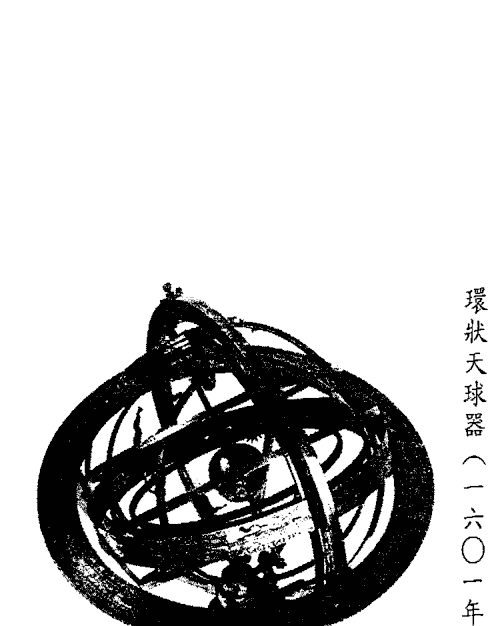

環狀天球器（一六〇一年義大利製）

## 第三篇

## 星座四象

- 三個火象星座的特質／三個土象星座的特質
- 三個風象星座的特質／三個水象星座的特質

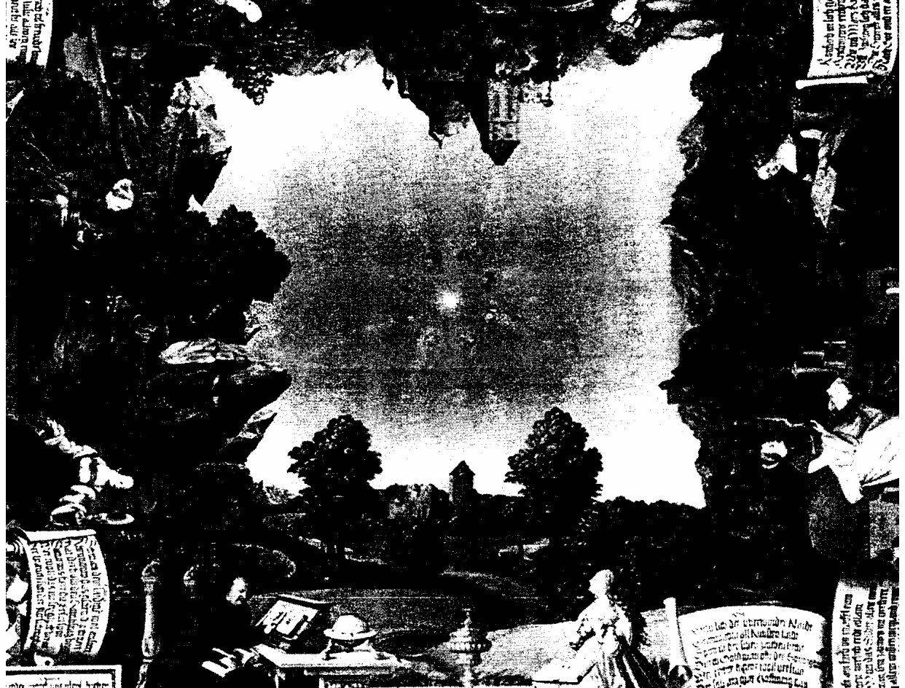

## 三個火象星座的特質

### 火元素定義

一般公認的「火象星座」特質：衝動、自信、愛面子、慾望強烈、脾氣壞、沒耐心、獨裁、拓荒者、戰士、站在第一線、自我中心、主動、果斷、重事業。

以上公認的講法當然不是錯誤的，只是光看這些關鍵字，是非常表面而籠統的，很難明白其中的細節，所以我的敘述方式，一向都從最源頭開始探討。

我們先來看看，「火」這種東西，在我們的概念中，是怎麼成形的呢？

「火」不是一種可以靜態存在的物品，它是一種「現象」，首先必須有大量的溫度集中在一個極小的範圍內，就像我們如果要試著讓紙燃燒，就要用放大鏡之類有聚集光源效果的玻璃片，把光跟熱集中在一個點上，才能產生夠高的溫度讓紙燃燒起來。

由此可見，平均散佈在一個大空間中的溫度，是不具破壞性的，同樣的光跟熱，如果分散在一個房間內，那就會讓整個房間維持一定的亮度，但是如果把整個房間的光源都集中到一張木桌子上，任由其他地方處於無光無熱的狀態，那高度集中的能量如果我們說一個人可以吃下十公斤的米，要看這個人的吃法定義這個行為的影響力，若是他在一年內分次吃完這十公斤的米，那麼這種食物給他帶來的是每天的生存體力跟能量，但如果他是在一餐內就塞下十公斤的米，那這些食物就會給他帶來致命的破壞力，火元素的模式就比較類似在一餐內吃下十公斤的米，就像集中光源後帶來的燒穿力一樣，因為火的特質就是集中跟過度。

從火的形成要素來看，我們就可以很明顯的發現，為什麼「火象星座」在人印象中的共同特質，不管哪個星座，彷彿都有著自我中心、唯我獨尊這些特點，因為凡是火行經之處，除了它自己本身之外的其他東西，就很難避免的一律變成火的助燃物，火在一般情形下，是很難跟其他物質甚至能量共存的。

火元素的能量非常強烈，就像如果我們點燃一把火，火是不會安安靜靜待在原地散發神聖光芒的，它需要消耗大量的助燃物（就算是點蠟燭，火也是在向下侵蝕），助燃物足夠時，火會拼命延燒下去，沒有助燃物時，就是熄滅了，不是全有就是全無，沒有居中的狀況，所以我們會常聽到火爆脾氣、打得火熱這一類的形容詞，都是代表在短期內釋放大量的情緒或情感，跟前述要將火點燃的要件有異曲同工之妙。

火元素是極端、極致、大量的、強力的！加上前面所說，火只有「向前進」或者「消失」這兩條路可以選，所以它代表了快速生長（就如同上述，火燒得越旺，就要產生的威力可能足以在桌上燒穿一個洞。消耗越多的助燃物一樣；小孩子在嬰兒期跟青春期這兩個身體快速發育的期間，食量也會特別大；植物在開花結果的時期，消耗的養份也會特別多）跟強烈的企圖心（要在最短的時間內取得最大的成就、走最長的路，當然需要消耗大量的腦力及體力）。只是火元素的意志力雖然強烈，但是火的特質就是在最短的時間內消耗最多的資源，所以如果需要長期抗戰，或短期內情勢不如它的想像，等到助燃物一旦用完，火勢當然就會很快的「熄滅」了，這就是火象的星座都普遍被認為具有耐心不足、爆發力強卻沒有持續力的原因。就因為火象這種直來直往、短期性的表現，一般的說法都認為火元素在四大元素中是比較淺薄簡單的，但是我一直很喜歡火象這種直來直往的特性，因為火吞噬了助燃物後，會讓自己的能量更壯大，這其實也是把助燃物的能量徹底釋放出來並且轉化，就像我們吃下食物轉化成生命的動力一樣，總是給我一種隨時可以脫胎換骨、充滿生命力的感覺。一般人對火元素的印象，比較強調人性面的慾望跟自私的這一面，但我個人本身在使用塔羅牌，或是解讀占星命盤時，遇到跟火元素相關的特性，只要是正面的，我反而會覺得它跟水元素一樣具有昇華的特質，因為只要念過國中課本的人都會知道：熱空氣有上升的特性，而冷空氣則是會下降。前文也寫得很清楚，火元素消耗了這麼大的助燃物，就是為了「成長」，突破它目前所處的位置或是層次，所以我覺得水元素雖然是能夠昇華，但它也有可能只是接通跟我們平行或是比我們低階的層面，但火元素只能往上的特性，反而是我們能夠「提升」、「突破」的保證。

有一次，我受一個辦公室的整體員工之邀，前去幫他們占卜塔羅牌，多名員工都有點緊張的跟我說，曾經在加班到深夜時，聽到辦公室中傳來奇怪的腳步聲，還有其他動作的明顯聲響，而我開出的牌，清一色是正面的火元素牌，所以我推測應該不是什麼奇怪的低級靈，而是負責守護的高級靈或神靈之類，員工們也才笑著說，難怪他們雖然緊張，卻並沒有特別害怕或是不乾淨的感覺，看來就算是像我們這樣沒什麼特殊感應力的人，也是能夠有最基本的善惡感受天性。

還有一個特質，是一般大眾比較少去把它跟火元素聯想在一起的，就是「直覺」，我常常上課時講到這一點，就會出現很多學生驚訝的聲音，他們都覺得：「直覺這樣的特質，不是應該出現在敏感纖細的水元素中嗎？怎麼會跟自我又激動的火元素扯在一起呢？」

其實，火元素的特質中還有一種「快速」的性質，這種速度並不是像風元素一樣的敏捷跟靈巧，而是火元素有種直接又純真的天性，如果風元素的速度是因為本身的動作快，那火元素的快速就是源自於它總是走最直、最快的那條路。火元素的動作沒有一樣，有風元素快，但是它選的路途永遠最短，所以達到目的的時間差不多。子一樣，眼光不會放在表面的虛假上，就能直接看到最簡單的事實（就像國王的新衣故事中，那個大聲說國王沒有穿衣服的小孩），而火元素的自我意識，讓它具備了自信！可以信任自己的判斷，不會去自我否定或是再三質疑，所以就造就出了強烈又快速的直覺。在我個人的分類中，我把「直覺」跟「第六感」當作是兩項不同的特質，「直覺是：我不見得知道是怎麼回事，但我知道要怎麼做。就像我們每個人都有類似的經驗，下班時不知道為什麼，就是想換條路走，結果躲開了車禍，或是今天不知道為什麼，就是想去一家平常根本就不太喜歡的餐廳吃飯，結果在那裡遇見了失聯已久的老朋友。「第六感」卻不太一樣，它是：我知道是怎麼回事，但是我不知道該怎麼辦。就像有些人會不時產生一種不祥的預感，但是他卻不知道要怎麼做才能避開，或是他可以知道有些事情就是不對勁，但還是沒辦法阻止一件不好的事發生。這種第六感的特質通常比較容易出現在水元素身上，也因此水元素比較容易為這種很難抓到重點的感應能力所苦，造成精神跟情緒方面的不穩定，而火元素的直覺，因為是一瞬間的、不經思考的，所以出現的時間都很短暫，很容易在事情過去後，也跟著被遺忘掉，所以很多直覺力超強的人，當你去詢問他時，會發現他根本一點都不覺得自己有什麼特別的直覺。

除了直覺外，人體的生理需求、本能反應，也都是一種身體的智慧，跟直覺一樣是不需要經過思考，就會自己產生的反應，所以火元素也代表一種不假思索的情緒反應，飢餓、自尊心、憤怒、衝動、白目都歸屬在內。

當然，也是有很多人的感應方式，是直覺跟第六感兩者的混合，但我們在此就不多敘述了。

火元素最主要的領域，在於每個人的自我價值，以及他如何成就自我，所以分別在黃道第一宮的牡羊座、第五宮的獅子座，以及第九宮的射手座，就等於是人們自我認同的方式，隨著不同的環境跟歷練，會轉變出不同的面貌，接下來我們就一一的檢視吧！

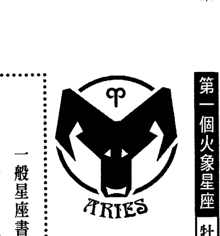

## 第一個火象星座 牡羊座 (Aries)

- 黃道的宮位序：第1宮
- 守護星：火星 Mars
- 四象屬性：火象宮
- 三態屬性：基本宮

> 一般星座書上牡羊座的關鍵字：暴躁、自大、精力充沛、好鬥、天真、沒心機、愛支配、理想主義、體能好、大男人、幼稚、魯莽、不知節制、主觀。

牡羊座是一個特質非常純粹而集中的星座，因為每一個星座都會從所屬的黃道序位、象性、三態，以及擁有的守護星中接收到各種不同的特質，進而融合一體，形成一個星座多層面的人格，可是形成牡羊座的各種要素：它屬於第1宮、火象、基本宮、守護它的是火星，種種特質的雷同性真的太高了，等於是把火元素原來就屬於「集中、強化」的特質，又重複的濃縮強調了一次，牡羊座絕對是火元素中的火元素！

### 牡羊座的人格精解

所以大家絕對不會認錯牡羊座的一點，就是這幾種主要部份的共通特質：莽撞、戰鬥力強、不用大腦，以及無法記取教訓（往好處想，表示他也不會記恨）等特質。牡羊座排序的「1」在數字學中的涵義，本來就跟火元素相似，1代表獨立、開創性，因為它是所有數字之首，所以生命力充沛又不含雜質，一切都從這裡開始，一切都要仰仗它，就跟火元素代表的新生能量跟生理需求是互相強調的。我們可以想像，如果地球上出現了第一個人，他是獨一無二、前所未見的物種，他當然也只會意識到自己的存在跟需要，因為沒有另一個跟他競爭或是分享的人，所以他就是全世界。在黃道中的第1宮，也代表了一個人的自我形象跟自我意識，「自己」就是這一個序位的最大意義，這並不像多數人想的，代表的是自私跟不合群，其實「自我」是群體的最小基礎單位，個人如果不好的話，也就不會有好的群體、好的家庭、乃至好的社會了，也像很多新時代的哲學或靈修家所提倡的：我們必須先愛自己，才有多餘的能力去愛別人。不過我想，這是第一宮的理想啦！在還沒經過足夠的歷練之前，要顧慮到別人是個很重的負擔，一般人都必須在第一宮的領域中先掙扎大半生再說。我們在前面的章節，也詳細描述了牡羊座的守護星——火星（Mars），火星暴烈、爭鬥、集中、毀滅性的能量，幾乎就是火元素的翻版，而它們的敘述跟關鍵詞也的確到了可以說是共用的地步，如果是風象或水象那種本來就比較渙散的元素，這樣重複加強其實會有好處，不過火元素的加強版，會讓牡羊座更難體會到別人的感受，那種集中力會演變到頑固的程度。

這些高度自我中心的種種元素加起來，牡羊座會以他個人的眼光去揣測全世界，麻煩的是，他會以為他的感覺就代表全世界的感覺，所以牡羊座缺乏溝通能力也不是什麼新聞，因為他也沒想到，原來還會有其他的看法存在；就像個嬰兒，嬰兒想到的都是自己的需要，肚子餓了時，他的解決方式就是哇哇大哭，不會去顧慮現在是半夜三點，或是爸爸媽媽明天要上班之類的瑣事，雖然很多人因此指責牡羊座自私，但我覺得其實說牡羊自私也不太公平，他有自私的行為，但並沒有自私的想法。

牡羊並不是不願意為了別人著想，而且這種「從別人的立場思考」的概念根本不存在他的腦海中，就算他想這樣做，也不知道那到底是怎麼樣的一件事，以及該要如何著手。

畢竟一個眼光不會超出自己身外範圍的人，為別人著想，也只能用自己的喜好做標準，說牡羊不尊重別人，常常讓他覺得冤枉，他認為他很會替別人想啊！例如他自己肚子餓了時，會想到叫你吃飯，或是他常常會買他覺得很好吃那家店的食物給你吃。注意，是他覺得好吃而不是你覺得好吃，懂了吧？如果你告訴他，你比較喜歡吃另一家餐廳的東西，他可能會大驚失色的告訴你，那家不入流餐廳的食物還真是難吃，他怎麼可能買那種東西給你吃？即使這是你的喜好跟要求，他還是會覺得，讓你吃這... 用心卻不用腦

壓差勁的食物會「對不起他的良心」，所以牡羊對自己的認知，常常跟別人對他的看法有著非常大的落差。

尤其當你聽到某隻羊家長沾沾自喜的告訴你，他一向「給孩子絕對的自主權」（會舉這樣的例子，是因為我遇過的牡羊，不知道為什麼，都有絕對的信心，認為自己是最最明理好溝通的人，尤其在親子關係方面），我會勸你不要相信他，舉個在書上看過的故事當例子：有一個女人，她在學生時代一直想學音樂，但是她的父母不允許，強迫她去念商，在她生了孩子後，她決定「不再讓孩子受她受過的苦」，於是——我相信這位女主角有很重的牡羊特質——她決定讓她的孩子去學音樂！完全不顧這個孩子根本對音樂沒興趣這個事實。

說句公道話，牡羊座對於他的家人不能算是不照顧，他對親近的人保護慾是非常強的，但是由於溝通技巧不佳，加上太多急躁強勢，腦筋又不是很會變通，這種保護的動作就往往變成了干涉。比較值得安慰的是，牡羊跟你相處時，好像是他在欺壓你，不過如果是外人對你不禮貌、欺負你的話，牡羊座絕對會去找他算帳的。

像這種個性，談起戀愛來會變成大男（女）人主義，或是太過小孩子氣，只知道索求卻不懂付出，似乎是理所當然的事了，牡羊的愛情問題永遠不會出在戀愛的機會，而是在戀愛的品質。在追求異性方面，因為牡羊座永遠不會去想到失敗的可能性，所以一向攻勢猛烈，熱情無比，很少有異性招架得住。但是牡羊座一向憑直覺跟表面條件來下決定，所以當然也很有可能在正式交往之後，他會發現眼前這個人跟他當初迷戀的印象是不同的，所以熱得快冷得也快，常常有人說牡羊座就是標準的男人，追到手後就不珍惜了，可是在牡羊座自己的感覺，並不覺得自己是喜新厭舊或是不負責任，在牡羊座的認知中，這一切都是命運的捉弄，他怎麼會知道兩人在一起後，一切都跟他的想像不同呢？當然，他同樣也不會想到，其實是有「好好探索內在、長期觀察」這種擇偶模式的，但是要苛責牡羊嗎？其實也不必了，這種事只有留待時間去解決了。往好處想，至少他很直接而誠實，牡羊座的社交智商，並沒有高到可以說謊不被人拆穿的地步。想想，當牡羊座其實還滿好命的，並不是因為牡羊會一帆風順，牡羊其實很容易因為惹到別人啊！白目啊！給別人捅了簍子，自己卻沒發現啊！被孤立，被討厭，甚至被排擠，但是好處是他有八成以上的機率是感覺不到別人對他的惡意，原因是他的反應不過來，甚至一直洋洋得意別人對自己的肯定，記得嗎？他很單純的，只要你不當面嗆他，他都不會相信你居然覺得他很差勁，就廣義的範圍來說，這也是一種幸福吧！？

牡羊座隸屬於基本宮，基本宮就如同字面的意思，是事物的萌芽跟開端，正站在起點要往前邁出，具有全然的開創性！所以，它會對一切事物都有探索跟接觸的慾望，就像我們小的時候，凡是讓我們感到好奇的東西，我們都會想摸一摸、玩一玩，對這個世界仍然陌生時，我們就會急著想快快長大，對自己的未來充滿憧憬，血液中裝滿了願意冒險犯難的大無畏精神。基本宮這種初生之犢的特質，跟火象宮本來就是差不多性質的，自然對牡羊座所有的火性因子，有著更加推波助瀾的作用了。

牡羊座的好處當然是有決斷力，但是在成功的過程中，犧性的部份往往大過於得到的，牡羊座太過把心思跟目光都集中在他的目標，對於周邊的人事物都視而不見，加上好鬥的本性，讓他把結果看得大過於一切，「不計代價」是他常掛在嘴邊的話，可怕的是，他是說真的！為了取得勝利的感覺，他付出的代價往往讓他得不償失。不過我一直相信，每一種特質都是中性的，沒有好或壞之分，端看你把它運用在哪個方向，牡羊座這種猛烈而難以控制的特質，最適合用在必須放手一搏的地方，雖然牡羊並沒有英明到掌握得住環境的狀況，但是他的能量一旦打開就是源源不絕、沒辦法中斷的，就算環境不利也可以衝破任何難關，如果遇到阻礙時，他雖然不會聰明到知道怎麼繞路，但他會更直接的把所有的阻礙都抓起來扔到一邊去！誰說有繞路的必要？他的腦筋又簡單到不懂得恐懼為何物，只看得到目標的牡羊當然也不會去觀察自己有什麼後患，要衝鋒陷陣時，不管是在戰場上、商場上，乃至運動場上，牡羊座這種不怕死，不怕痛，只怕達不到目標的人，都是先遣部隊的不二人選。

## 唯一可以讓他當領袖的事，就是帶頭打群架

雖然「領袖特質」常被列入牡羊座的特質之一，其實我覺得說他是「領袖」有點言過其實！牡羊座的作用頂多是第一發子彈，或是第一個達陣宣示戰力的前鋒（當然，如果遇上比較不幸的狀況，有可能成為砲灰），不擅於了解別人的牡羊座，要他領導一群人簡直就是要他的命，而且會把他所有的能量都耗掉還無濟於事，牡羊不適合群體，他只適合搶一個為他量身訂做的位置，例如鼓舞群眾或是洗別人腦的所謂「先驅者」，他可以用他的熱情「煽動他人」，然後靠群眾的力量在最短暫的時間內成就最大的事，發出最大的光芒，卻不適合什麼「領導」。他沒有長存不朽的本事，但倒是有著足夠把一瞬間銘記在永恆的強烈能量。

牡羊座就像故事中的「英雄」一樣，英雄是不許見白頭的，不用活得太老，不用德行太完美，他只要在屬於他的故事中，扮演好屬於自己的角色，創造出一個轟轟烈烈的光輝時刻便已足夠。比起大多數的人來說，牡羊座很難得，只需要達到「活出自己」這個目標即可，他需要達成的是一個「點」而已，不需要顧及太多層面，雖然是因為他的眼光只得到這麼小的範圍，但只要夠深刻，誰會去在意你的寬廣度呢？

流星總是比每天周而復始升上夜空的星星還要吸引人，有些藝人適合當個在短短幾年內喧騰一時的大紅牌，給眾人留下一個燦爛的印象，有些藝人則是長青樹，是個## 第二個火象星座

## 獅子座 (Leo)

| 屬性 | 內容 |
|---|---|
| 黃道的宮位序 | 第5宮 |
| 守護星 | 太陽 |
| 四象屬性 | 火象宮 |
| 三態屬性 | 固定宮 |

> 一般星座書上獅子座的關鍵字：強勢、唯我獨尊、行動果斷、獨裁、驕傲、喜歡他人奉承、愛出鋒頭、愛打扮、自尊心強、尊榮高貴、光明正大、重品味。

不夠明亮卻給人一種熟悉跟親切的存在。長青樹當然比明星需要更多的毅力，目標越長遠的人，負擔才會越大，牡羊只有短期使命，應該算輕鬆了，是個不會有太多心結跟牽掛的幸運兒。

### 獅子座的人格精解

我一直都覺得獅子座是十二星座中，實際上的表現——跟星座書、占星書上寫的關鍵字，落差最大的一個，我相信包括現在正在看這本書的朋友，如果有人問你：「獅子座的個性是怎樣的啊？」大多數人的回答也都是：「很猛啊！」愛指揮別人、衝動、自信。「我剛剛隨手翻了一下手邊有的占星跟星座書，幾乎每一本裡對獅子座的描寫，也不外乎是：「驕傲、自信。」、「控制慾很強、脾氣不好」、「不能被得罪，愛指使別人」等，再仔細看看，感覺上好像都跟牡羊座差不到哪裡去？（我在教占星課時，通常第一堂課會先問學生，他們印象中的獅子座是什麼個性？等大家回答完，我接著又問：那牡羊座呢？講完了之後，我會最後問他們：那獅子座跟牡羊座到底有什麼不同？你會發現大多數的學生都會愣住，一副他們也分不出有什麼差別的樣子）可能因為獅子座是火象星座，守護星又是太陽，乍看之下充滿了熊熊烈火，所以很多最早解析獅子座的人，想當然爾的就認為獅子座的火爆性會比牡羊座強，或是後起的占星師、星座專家等，只抓住了前人描述獅子座的關鍵字，然後就開始自由聯想出現在我們不得不知，但是就我自己從小到大接觸過的獅子座來說，不管男女，一律都是彬彬有禮、友善周到，甚至隨和到了好好先生跟好好小姐的地步，講話大多也是很願

## 獅子不發威時，只不過是一隻乖貓咪

慮到別人的想法跟感覺，不管他（她）愛不愛出鋒頭，你都會發現他們是很好相處又願意幫助別人的。
一開始學習占星時，我會認為可能我看到的太陽獅子座朋友，大概是不像獅子座，而是命盤上有其他特性壓過了獅子座原來的特質，後來越研究卻越讓我驚訝，反而是獅子座特質越強（不只是太陽獅子，也包括太陽相位強或是第五宮群星聚集）的人，越有所謂「溫良恭儉讓」的特性，後來我要從身邊新認識的朋友中找出獅子座就簡單多了，越是看起來一副服務性很強，為了別人的事到處奔波處理，你跟他講話他還會有點不好意思的人，越有可能是獅子座的，就算他的太陽不在獅子，打出他的命盤一看，你還是會發現命盤上很強的獅子座特質。
重點就在於幾個地方，由於牡羊座跟獅子座在很多書中的描寫是非常相似的，我們首先就從這兩個星座的差異性開始談起，這兩個星座同樣都是火象的，但是牡羊座是處於可以加強火象集中燃燒力的基本宮，而獅子座卻是落入穩定、重視整體性、謹慎自制的固定宮，所以牡羊座的特質就像是一把燒起來就不可收拾的烈火，而獅子座這種固定的火會像什麼呢？
火就代表一種能量，如果這股能量可以控制釋放出的強度，就會讓我們想到廚房裡的瓦斯爐，可以隨時打開又關起來，也像是每天固定升起降落的太陽，定時定量的提供它的光和熱，若像古代的神話，一下子出現十個太陽，或是終年不見陽光，過度與不足，都會造成巨大的災難，所以位在固定宮裡的火不再是一把燃燒的火，而是用「能源」的姿態存在，可以提供溫暖卻又不至於灼傷人。

火星與太陽這兩顆不同的守護星，也呈現出類似的差異，它們的共同點是：都是占星學當中「男性」的代表行星，但從前面單元對太陽跟火星的描述，就可以知道它們最大的差異就是在於成熟度。火星是聽憑本能行事，凡事都以自己的感受跟認知為出發點，蹦蹦跳跳、不擅於控制自己情緒跟行為的年輕男孩，太陽則是一顆有著社會責任感、帶有照顧他人特質的父性行星，不像火星在乎的是別人「怎麼對待自己」，它在乎的是「別人怎麼看待自己」，火星只希望別人看到它就好，太陽則覺得別人看到它是應該的，重點是在於別人看到的它是什麼樣子的？

這就是「形象」兩個字，一個重視形象的人比不重視形象的人好掌控多了，像牡羊沒有形象的顧慮，比我們無賴，比我們敢要求，所以我們容易受制於它，獅子重視形象，就不能太過明目張膽的去運用自己的優勢。兩個星座都同樣被冠上「大男人主義」的帽子，但是這兩個星座大男人的方向完全不一樣，牡羊是火星跟基本宮的組合，又位於第一宮，他的大男人想法單純直接，就是以他個人為所有事情的考量，所以女人跟小孩要聽他的，他沒錢妳應該想辦法幫他，因為他是一家之主，所有人都應該

## 開玩笑，老大可不是當假的

獅子座就不同了，它的序號是代表「社會舞台」的「5」，靈數中的「5」是外緣不斷、眾人注目的。對他來說，群眾就是他的基礎，像是正在競選的候選人，每一個人的每一票，對他而言都是最寶貴的，而且太陽會讓他重視自己的形象大於自己的權利，就因為他的自尊心跟自信遠高於牡羊座，所以獅子座不會只滿足於讓你聽他的話、伺候他，他希望你是由內而外、從頭到腳的對他心悅誠服，他是有品味的、有身份的，所以覺得欺壓別人或是奴役別人是一件很沒格調的事，顯不出他自己的高貴，因為這樣代表別人不是真正的喜歡他、崇拜他，而只是怕他罷了，在極度重視身價的獅子座眼裡，那幾乎等同於「沒水準」，獅子座比較欣賞「以德服人」的方式，要你自然的臣服他，而不是要他花力氣來控制你。

對他來說，他是父親你是子民、他是保護者你是弱勢團體、他是大英雄，而妳是需要他保護疼愛的弱女子，所以獅子大男人的地方，就是在於他清楚一個男人的「義務」在哪裡，並且重視義務大過於權利，因此我常會遇到看起來很怕女朋友的獅子座，但是他不是怕女朋友，而是：『跟女人吵架的話，我哪有資格當個男人？我可是一個會尊重女人的好男人。』也會看到在一群朋友聚會中，總是跑來跑去在替朋友倒飲料，到處巡視一下有沒有他需要服務的地方，在冷場時還會盡責的提供笑話的獅子座，這時請注意，這位獅子座的朋友（不論男女）並不是認為自己看起來是個小角色。

相反的，他覺得他只要身在某一個場合，就理所當然的變成了主角，因此他想：『既然我在場，那個聚會就不能不精彩、不愉快，因為我比他們都有能力帶動氣氛、比大家都讓人喜愛，所以我有責任讓大家都快樂，要讓每個人都覺得賓至如歸，不然如果風聲傳了出去，別人一定會覺得，既然有我在，場子怎麼居然會冷下來？這樣大家對我的期望就落空了！對我完美的形象會是個傷害。』（當然，其實並沒有人會這樣想）

這樣的獅子座不只像我前面說的溫文儒雅，事實上你會見到太多的獅子座都會太過重視別人，老是自願吃點小虧，怕被別人不同意的樣子，甚至會覺得他有禮貌到有點害羞。在這裡，我要套用一段名言：「事實上，並沒有真正的害羞這回事，害羞的本質是一種自戀，一個人之所以會覺得害羞，是因為他覺得大家都在注意他。」他會客氣、會禮讓，也是因為他覺得全世界都正在拿著評分表給他打分數（而且他會認為大家都對他期待很高，就像特別優秀的學生，老師會規定九十分對他來說才算是及格）。

看了以上的介紹，如果我現在告訴你，兩種最容易落入感情騙子手裡的女人，一是雙魚座，二是獅子座時，你應該就不會感到那麼驚訝了！雙魚座受騙時，至少是真的受騙，而獅子女往往自欺的成份大過於受騙。獅子往往重視別人眼中的自己多過自己真正的模樣，所以如果你讓獅座在兩種生活中二選一：一是當個別人眼中沒什麼值得羨慕，但自己生活得很愜意的人；二是當個實際上的生活沒那麼美滿，但從表面上看來她卻樣樣都令人羨慕的人；毫無疑問的，她會選第二種。因此，她容易在男人跟她借錢或是不付帳時，不像一般女人那樣起戒心，因為她認為那是一種小家子氣的表現。相反的，獅子女會大方的表示：「他是我的男朋友，所以我才不會跟他計較這點錢。」在男人沒有工作時，她不會分手，因為怕被認為心胸不寬大，但又怕朋友指指點點，所以她會幫男人找工作、幫男人置裝、幫男人找藉口，幫男人做足一切在別人面前需要的面子，就只為了表示她是一個擁有令人羨慕男友的女人，就算最後人財兩失，她也沒空跟男人算帳，因為她在忙著想一些聽起來比較冠冕堂皇的分手理由，好在朋友詢問時講給他們聽。就算一個有過這種經驗的獅子女現在正在看這篇文章，她也會說：「對啦！妳說的大部份是沒錯，但我不是為了面子，我是真的覺得他不是個壞人，而且這些事都是人生體驗嘛！……」當然，她不能表現得很可憐或是很倒楣，因為那樣就「不好看」了，她不是在替那個男人講話，她是在替自己的眼光辯護。從牡羊到獅子，從第一宮到第五宮，代表「自我價值」的火元素也從「自己就是整個世界」的形態，轉變到了「自己跟他人是一個整體」的狀況，牡羊因為意識不到別人，所以是全然的自我，獅子卻要開始辛苦的塑造別人眼中的自己，危險的是，越想讓別人認同自己的人，就越找不到真正的自己。大家可以想一想，在我們從兒時的順應本性（牡羊時期），長大到開始需要藉著外在跟功課、工作表現，爭取別人認同的時候（獅子時期），是不是就往往落入以上的陷阱了？

## 第三個火象星座 射手座（Sagittarius）

| 屬性 | 內容 |
|---|---|
| 黃道的宮位序 | 第9宮 |
| 守護星 | 木星 Jupiter |
| 四象屬性 | 火象宮 |
| 三態屬性 | 變動宮 |

### 射手座的人格精解

火象的最後一個星座，是位於變動宮的射手座，本來應該是集中而專注的火元素，落入快速轉動的變動宮，讓光與熱呈放射狀的放送出去，變成了熱力四射又愛四處增廣見聞的樂天行動派。暫時先不談屬於固定宮的獅子，基本宮是非常專注的盯住它唯一的目標，而變動宮卻是...

> 一般星座書上射手座的關鍵字：哲學家、愛好自由、流浪者、修行者、海外的事物、高等知識、遷移、長途旅遊、德行、教育、樂觀、幸運、提升、新機會。

## 十二星座 都是骗人的!?

是被任何進入它視線的東西所吸引，所以牡羊是非常專心又帶有目的性的，射手座卻會被他身邊不斷出現的風景分散注意力，加上射手座的守護星——木星本來就是一顆高度好奇又容易興奮的行星，配合火象的立即行動本能，就讓射手座變成了流浪跟自由的代言人，很難看他停留在哪個固定的地方上。

變動宮是一個處於「過渡期」的宮位，它象徵著要從一個階段轉換進入下一個階段時，中間那個難以定位、界線不明的地帶，所以變動宮帶有極高的各種可能性，而我們前面敘述火元素的段落曾經提過，火是最能突破現有階段往上提升的一種元素，加上變動宮的可塑性跟轉換性，新的方向不斷的出現，所以射手座會是選擇機會最多的一個星座，各種人物、各種事情都有可能出現在他的生命中（記得嗎？木星也是一顆帶有拓展、放大跟新事物的行星）。

所以，雖然射手座被說成是智者、或哲學家、或學者，你卻很難把眼前這位看來腦筋簡單的傢伙，跟那種斯文的讀書人有所聯想。別的不說，最起碼被說有智慧，氣質總應該要好一點吧？怎麼他永遠是一副粗線條、吊兒郎當、傻呼呼又愛跌倒的樣子？當我第一次看到書上寫「射手座代表一個交接處，象徵的是從一個層次提升到另一個層次，所以射手座的人是正在由人性轉化進入神性的階段，介於人跟神之間」時，跑去檢視了我日常生活中的白目射手，之後心裡暗暗的想：「才怪！要是射手真的介於哪兩個層次之間，那應該是要從獸性轉化進入人性的那個階段吧！」

一直到很久之後，我才慢慢的承認，智慧是有很多種表達方式的，射手座代表的就是『大智若愚』，因為射手是火+變動宮，又是由不斷變化的木星所掌管，所以他永遠在追尋。射手座沒辦法告訴你一些人生的智慧，因為他永遠不滿足於現況，因此也就沒有什麼可以拿來滿足你的東西。他是行動派的智者，不擅於坐下來接受膜拜。

## 真理不是用想的，你得伸手去抓住它

他追求真理的方式，比較像是那位沒頭沒腦就跑去追太陽的夸父，是一種充滿嚮往跟熱情，沒有考慮到後果也沒有計算過成功機率的那種！（如果你要形容可能進化程度沒那麼高的射手，那麼我會推薦另一則紅蘿蔔與騾子的故事，夸父追的是太陽，騾子追的是紅蘿蔔，而那根紅蘿蔔就跟太陽一樣是追不到的，這兩個故事很像，但氣勢就完全不同了，哈哈哈！）

真正的修行就是要這樣徹底的投入去做一件事，念經時就是整個人融入到經文之中，打坐時就是真真切切去品嚐打坐的滋味。金庸小說裡有個老和尚，是張三豐的師父，老和尚在廟裡負責的是管理經卷，他生性憨直，沒有什麼大不了的作為跟天份，因為跟佛經朝夕相處，把每一本佛經都背得爛熟，心中沒有修行的念頭，也沒有想從經卷中得到什麼啟發的慾望，就是單純的喜愛佛經，看起來傻裡傻氣，有點食古不化，地位又不高，整個寺廟的人也都不太看得起他，但到了最後，他居然經由這樣跟經文融為一體的過程，發展出一身的上乘內功而不自知，而這股功力就被老和尚用在挑水、打雜、或是用扁擔挑著徒弟逃跑這一類的事情上面……這個人物也可以說是射手座的代表人物之一，我覺得甚至比老頑童周伯通還有代表性。
其實，這種只求投入，沒有計較利益得失的本性，往往才能夠召來真正的成功。因為雖然在我們的口中，把「過程」跟「目標」分作兩回事，厭惡漫長的過程而渴求早日到達目標，但實際上看見的目標只是個幻影，真正磨練你、改造你的是那個過程，目標是經由過程生出來的。射手座不會在過程中抽離，他人在哪裡，他的心就在哪裡。
所以，在一般社會化的人眼中，射手很少會有看起來令人尊敬的，他們可能背著一個浪跡天涯小包包，跟雜耍藝人一樣全世界飛來飛去，結果你發現他戶頭裡的存款是你的好幾倍；也可能學歷很高，成天關在實驗室裡研究東研究西，寫得出有突破性的論文，但卻喜歡講大約是幼兒園程度的冷笑話，自己還覺得自己很幽默什麼的，不要被他外表看起來天兵天兵的樣子給誤導了，仔細看看他的工作內容，或去查查他的豐功偉業，通常會是很讓人吃驚的。

奧修大師說過，一切的生命都是在不斷改變中，一旦停止改變，同時也就死了。真理跟智慧是活的，所以不會有停止下來不再變化的那一天，自然也就沒有所有所謂的終點了，只要你能夠真正全然、投入的走在路上，那麼也就等於同時身處在你的目標之中。

## 我不是到處跑，我是在往上跳

射手勇敢的活在當下，所以能夠突破萬難，旁人不知道真正的原因在哪裡，所以他在眾人眼中，彷彿什麼都沒做就糊裡糊塗達到了最終目的，也難怪很多人都對他的「幸運」感到咬牙切齒，其實這種幸運不是外在的，而是他生來就配備的一種創造能力；他的幸運跟他的愚笨，其實是同一種東西的兩個面向。

射手座的排序是黃道中的「9」，9在靈數學中本來就是一個代表昇華的數字，跟木星、火象+變動所代表的涵義不謀而合，9是個位數的最後一個數字，它的下一步就是10了，10是十位數而非個位數，所以10是另外一個新階段的最低點，9才是原階段中的最高峰！9介於個位數與十位數之間，跟變動宮的特質一樣，是過渡時期的代表。凡是喝酒喝到9分醉的人，發酒瘋的程度最厲害，因為等他醉到10分的時候，他就會睡著了。所以，9是衝破頂點最關鍵的那一刻，就像水加熱到一定溫度時，從液體轉化為氣體的那個瞬間，這種性質讓我常常把 9 當成是一事情轉向改變時的「臨界點」。

火象的向上提升、變動宮的轉換性、木星的不斷開創新方向、9的昇華，讓我們對於耳熟能詳的射手座相關性格有了更深的認識。星座書上都說射手喜歡不停的變動，我們現在更進一步的知道，射手座不是單純喜歡變動，它是沒有辦法忍受停留在原地，他最喜歡的東西是他沒見過的東西，他最想回去的是他沒去過的地方，而他最關心的事情，則是還沒發生的事情。
描寫射手座，看來卻互相衝突的種種關鍵字，也就可以理解。
在我們瞭解射手座最原始的本質之後，回想起以前在星座書上看到，種種同樣是我身邊的人常常問我，他們見過的射手座一向莽莽撞撞，沒有在同一件事上專心太久，星座書上說射手座的「花心」他們是可以認同，可是「投入、專注」又是怎麼一回事？我只能說，在見到新的東西的那一刻，他們可是極度專注的，至少在那一秒、那一刻！聽起來好像是在打哈哈或是講反話什麼的，不過這就是事實，別忘了，射手座代表的是「臨界點」，兩個階段交接過程中的那個點！躍升的那一刻需要的能量是非常強大的，所以必須非常的集中又專心，就像我們夏天開冷氣，在我們按下電源，冷氣從關閉進入啟動的那段時間，耗電量是最大的，但他的注意力全部用在「變換」這回事上，所以他越專注，就變得越快，永遠把心思放在大目標的人，就容易忽略身邊的小細節，每個就算是白目到極點的射手座，都很認真的相信自己是個敏感、細心，而且從來不會得罪人的人，這當然是他們的幻覺！
我有個太陽不在射手，但命盤中射手特質很重的朋友就做過這種事：我們有位朋友去拍了大頭照，大家正在讚美相片上她看起來氣色好、上相之時，這位射手女也過來看了一下相片，然後出自真心誠意的驚呼起來：「哇！真的拍得漂亮，妳的皺紋都被修掉了，雙下巴看起來也沒那麼明顯了耶！」當時的僵硬氣氛可想而知，但是絕對沒有人會誤以為她是故意的！她看起來那麼真誠，充滿了驚喜，平日又願意為朋友兩肋插刀，這時你又能說她什麼呢？

## Are the astrologers all liars!?【開運論命館】

射手直來直往，不會去扭曲他們看到的事實，但是因為他們不在乎失敗，也就無法從失敗中記取教訓，導致他們學不會察言觀色，更不要說是讓自己講話得體一點了，這也是為什麼每當星座書或星座專家說射手座是個有智慧又有靈性的星座時，我們都會以為自己應該是聽錯了的主要原因之一。

滾石不生苔，射手座的每個成份都不脫「改變、向上、擴張」等意思，所以我覺得射手座所有的關鍵字，全都不脫「自我超越」這個最最根源的特性。

射手座代表旅遊，旅遊的意義是什麼？很簡單，就是去自己沒去過的地方，看看一些以前從來沒看過的風景跟文化；射手座代表教育，教育有什麼意義？很簡單，就是把學生不知道的東西，想辦法輸入到他的腦袋之中，讓他們了解更多原先不知道的事。

射手座代表修行、哲學，修行跟哲學又是什麼？也很簡單，就是人生的世俗面已經達到一個飽和點，沒有什麼可以再追求的時候，只好追求超越物質層面的靈性跟理念；射手代表艺术，艺术是什么？艺术不能用常识来判断，也不能用逻辑来归纳，艺术不可能透过僵硬的灌输方式就可以成就，一定要把自己的觉知跟感受力，提升到超越某个界线，才能打开不一样的视野跟创造力。火的自我特质，一路从牡羊的自我意识过盛，经过了狮子座有点矫枉过正的、过度渴望争取别人认同的时期，终于到了射手座这个阶段，为了要追求更高的自我，开始丢开以往的习惯跟熟悉感，从小我向大我迈进，充满了自由奔放的动力。人到了中年或是事业有成的时期，会觉得已经达成社会赋予他的使命了（牡羊），也得到众人的肯定了（狮子），接着就会有想要改变，去学习更多才艺，或开拓事业第二春、甚至至环游世界的欲望。这是继牡羊时期之后另一个层次的自我证明，当俗世责任达成后，没什么其他名利可以追求了，我们就会转而追求某种超越名利、更高境界的东西，像大企业家跑去钓鱼、知名的专业人士退休后跑去当义工，这些都是在找寻能让自己更有意义的方法，这样的人，用的就是很有射手风格的自我转化方式了。

## 三个土象星座的特质

### 土元素定义

一般公认的“土象星座”特质：执着、有持续力、整体性、社会化、重组织、传统价值观、不易改变、有耐力、实际、有责任感、守规则、喜欢循序渐进、长久性、累积性、缓慢。

土元素又称地元素，象征概念是来自于滋养我们的大地之母，所以“土”的特质可以用我们最熟悉的土地、农田来做延伸，从古早时代起的观念，就是“有土斯有财”。土地能给人一个安身立命的空间，有着熟悉感跟安全感，因为它是长久的、最基本的，不轻易随着外界的变动而动荡改变。

我们可以发现土元素特质强的人，心情都能长期的保持稳定，很少有事情可以吓到他或让他逃避，土元素也大多有着像牛一样的耐力跟体力（金牛座恰好也是土象的一员喔！），只要决定的事情，通常都不轻易改变，话说回来，土象虽然不算灵巧，但也绝对不是脑筋不好的人，他之所以不轻易改变已经决定的事，原因是他从不轻易下决定，一旦下了一个结论、决定，就表示他已经长期的观察、思考、衡量过了，他确信他下的决定是最好的决定，而不是他没有改变的能力。

如果要问我个人的看法，土象人虽然反应不快，不如风元素那样的聪明外露，但他们的优点在于眼光放得远，走一步已经规划了下面十步，观察周遭的条件时细心又深入，因此土元素虽然不擅于处理突发状况，但绝对可以算得上是聪明人，特别是在需要长期抗战或是打组织战的时候，风元素的那种聪明是点对点的，可以快速的应付单一事件，可是时间跟空间一旦加大，要考虑的人事物就增加了，这像是魔术方块一样，不只要拼出颜色相同的一面，而是每一次转动都要把六个面同时考虑进去，谋定而后动，这种缜密的心思，正是重视整体价值的土元素所擅长的。

有些人会觉得土象人这样实在太累了，要在同一时间内考虑那么多不同面向的因素，重点是也没见他们有什么脑神经衰弱的迹象，可见他们心脏的强韧，不过土元素本来就有著“整体性”，在我们眼中看来是分成好几个部份的事，在他们眼中都是一体的，例如我们可能会说：“某某小姐脸蛋还不错，但身材就普通，个性算是中上，脑袋则是平平。”可能土象人看一个女孩（或男孩），是不会这样分开评论的，他会觉得一个人的气质就会影响到她五官看起来的顺眼度，还有她善解人意与否、脑筋好不好，也会同时显现在她的气质跟表情当中，更影响人们跟她相处的感受，所以土象人只有办法评出一个总分，因为他们觉得很多东西是不可分割的。

## Are the astrologers all liars!? 【开运论命馆】

这种整体性、不可分割性也可以从土地这个概念的特质中看出来，如果我们买了一块地，土地名义上是属于我们的，但我们能够把这块地从它原有的位置挖起来带走吗？当然不能，一定是我们的人迁居到这块土地上，在这块地盖房子、耕种，因为有这种整体不可分割的性质在，土元素是以群体而非个人为最小单位，因为土象也可以拿来代表“社会、环境”等现实面的代表。

就实质来讲，与其说那一块土地属于我们，其实更像是我们属于我们的土地，就像我们总是说“我的国家”、“我的公司”，但实际上是我们属于我们的国家、我们的公司，乃至我们的民族，因此土元素可以代表人们的故乡、根源、乃至亲人之间的情感，跟朋友、爱侣相比之下，亲人的情感是更加稳固又无法割舍的。

土象有个地方跟火象很相似，就是两者对于事业的重视度，不同之处是，火元素重视的是他自己的成就，跟他可以得到什么样的地位，事业跟职场对火象人来说是个背景罢了，但是土元素是非常重视义务的人，他除了考虑自己可以得到什么之外，同时也很在乎自己的“群体责任”，就是“以我在这个社会当中的定位，应该做些什么、可以做些什么”，不只是在乎自己的光环，所以两者还有另一个差别，火元素希望大家是推崇他的，土元素是希望自己做到“不要让人家有话讲”就好了。

所以很多捍卫传统观念的卫道人士，就具有很强的土元素性格。我们也可以看到很多土象人，在亲人发生不幸时，二话不说的担负起协助的责任，甚至代为抚养其他亲人不愿意接手照顾的小孩，跟水元素不同的是，土元素通常不是出于怜悯跟同情，而是出于责任，他觉得既然有血缘关系，那么他就没办法置身事外，很有可能土元素在插手的同时，会暗自觉得自己很多事，或是觉得自己很倒楣，更有可能帮忙帮得有点勉强，但是要土象人对“自己人”视而不见，他是做不到的！他总会觉得有件该做的事，但是他逃避了，羞耻感就油然而生，这是土象人最过不了的关卡，但如果这户需要帮助的人家跟这个土象人没有血缘、名份上的关系，跟“同一个体系内”。那他是不会愿意去淌这个浑水的，因为在心理上他没有责任存在。

以上这些特质，让土元素给人的感觉似乎是压抑的、无趣的，其实也不然，依土地、土壤本身的特性来说，土地是可以拿来种植各种农作物的，虽然土看起来平凡无奇，但它蕴含了大量的养份，植物可以从中土地中吸收滋养，动物也靠植物维生，所以土元素是一切财富、资源的本质，举凡金钱、家族（这是一种情感上的支持）、贵重物品、食物，都在土元素的象征范围之内。

土元素跟水元素同是阴性、被动元素，所以纵然土元素蕴含了那么多“丰富”的特质，但是却没有办法很轻易的把这些内涵展示在人前，因为土的丰富是一种“本质”，但需要透过外在的力量，把这些养份展现在人前，就像土地再怎么肥沃，对人们也没有实质上的好处，更无法一眼就看出来，必须在种下植物之后，从植物的收成好坏才能“见到”土壤养份多寡的证明，所以土元素的优点，是需要经过时间的淬炼，土象人本身也通常实力坚强，却十分低调，他通常不会是一步登天或是一出场就光芒四射的人，但在险恶的社会跟职场中，土象人可以存活最久。在世界上各个民族最古老的宗教中，都是以大地的代表——母系女神为主的，在强调“理念”的天主教兴起壮大之后，这些强调物质丰富面的原始宗教，就被统称为异教徒，因为天主教是以父系、神权体制为主，凡是与肉体享受、财富有关，一律都被斥之为没有灵性又污浊的，包括佛教、道教这些继之兴起的宗教，追求的都是成佛、灵性智慧，脱离世俗羁绊之类的目标（很类似风跟火元素的性质），却否定了人类从一开始生存在这个地球上，就是靠大地之母生养的万物来满足我们的需求——这个基本的事实，土地是我们的基础，是我们的源头，如果不认识土元素的价值，也就法超越现有的世俗层面，更无法到达往上一层的灵性目标。人再怎么追求成功、荣耀，还是不能舍弃我们的身分随之而来的责任跟负担，大地是人性，上天是神性，如果连人都当不好，又怎么能够有办法去体会到神性呢？这很像有很多好高骛远的人，成天无所事事，却还到处夸口说：“要做就要做大事，不要去做那种只能听人吩咐的低下工作。”不过，如果你连基本的事情都没有能力胜任，就更不要说会有什么做大事的能力了！

现代社会好逸恶劳的风气，就让很多人对于土元素的认真、低调不屑一顾，认为脚踏实地是那些没有才华的人才需要具备的德性（所以土元素的谨慎，有时也被视为迟钝），视逃避基本责任为一种雄心壮志的表现，难怪由大多数这种人组成的社会，缺少了土元素的稳定跟扎实，是越来越不堪一击了。

土元素最主要的领域，都是在象征人所拥有的资产，以及可以依靠的东西，因此在黄道第二宫的金牛座，就象征了最基本的：人们所拥有的物品、生活条件跟环境；接下来由位于黄道第六宫的处女座，象征职业跟社会服务，开始展现出人们真正的价值，不只是我们拥有的物质，也在于我们可以对这个世界有什么贡献；最后，位于黄道第十宫的摩羯座，象征的是整个社会本身，也就是不再意味着我们拥有什么，而是告诉我们，最终要达到的境界，以及我们将要归属到什么样的地方。

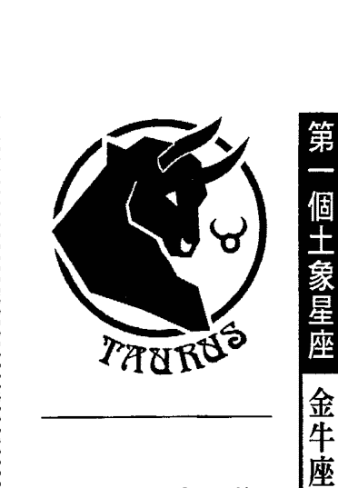

## 第一个土象星座 金牛座（Taurus）

### 金牛座的人格精解

金牛很难定义，打开随便一本书，就可以看到金牛的描写：既崇尚自然又喜欢精致、既慵懒又勤奋、既重视实际又耽溺于享乐、既朴实又重感官。

> 一般星座书上金牛座的关键字：喜爱大自然、实际、珠宝业者、金融机构、慵懒、追求优美的事物、享受生活、不喜欢改变、顽固、讲求利益、艺术、农业。

守护星：金星 Venus
四象属性：土象宫
三态属性：固定宫
黄道的宫位序：第2宫

擅于烹调各种精美的名菜，但他从小吃食习惯简单，也分不出这些名菜跟一般的粗茶淡饭有什么两样，吃起妻子做的这些名菜，就犹如是牛嚼牡丹，这个男人这么朴实无华，应该是金牛座的。

当时我还是个对占星毫无认知的学生，乍看之下也不觉得有什么不对，想起平日看的星座书上，不都说金牛座是：“崇尚自然、讲求实际”的人吗？这样说来，吃东西吃不出好坏，好像也是很合情合理囉！

之后又涉猎了其他许多本星座书，才注意到关键字中，总是有一“美食、品味、爱美、艺术”等字眼，我单纯的脑袋就开始系统冲突了，记忆中的金牛，不都应该是朴实无华，朴实无华的意思不是等于对生活品质没啥要求吗？等到我真的开始懂得什么是坚持品味，懂得什么是融入在生活中的美感之后，我懂得了什么是金牛座。

他的朴实就是，要就一次买最好、最有质感、最耐用保值的，连续用个几年，适合自己，但不求新不求炫，总比起流行每个月买便宜的新东西，花差不多的总价，却弄得满屋子廉价品有意义多了，朴实是不从众不花俏，但基本的质感却是不能忽略的。

就像牡羊座是火象中的火象一样，金牛座是“土象”跟相似的“固定宫”结合起来的，所以金牛也是土象中的土象，土象的的确是最低调、对别人最不要求的一种元素，但是也绝对不会把自己弄到匮乏的地步，它是一种中庸元素，总是安安静静的守着自己的岗位。土的感受力虽然不怎么敏锐，可喜的是，金牛座的守护星，就是充满了爱与美、柔和愉悦的金星，这替具备双重土元素性质的金牛座，加入了一些情趣跟柔软性，但金星没有自制力的特质，也让金牛容易陷在物欲享受中无法振作。金牛的慵懒，来自于土元素的不容易在短期内改变，金星觉得改变很累的双重影响，加起来就让金牛变得缓慢悠哉又容易怠惰了。

但也常有人说金牛“吃苦耐劳”，这……我得说，必要的时候金牛是很有耐心没错，但要看地方，他可以在本来就应该辛苦的事情上吃苦耐劳，因为那也没什么明显的损失，例如像工作、家事这类他所熟悉的事，不用花力气去做什么改变，只要撑下就够了，正确一点的形容，应该是用“坚忍不拔”，但要他太过劳动，那就不不可能了。

“2”是继“1”之后发展出来的第二个数字，象征除了我们作为核心的自我意识之外，附属的其他东西，通常“2”当中的两个方向，都是不同的性质，所以“2”对于个人来说，代表可以补充它本身不足的事物，也就是我们需要仰赖、运用的“手边的资源”，搭配代表实际物质的土象、固定宫，以及追求舒适的金星，自然就形成了金牛座象征的“资产”、“经济面”了。

我们会看到过得像贵妇名媛、仕绅名流的金牛，上高级餐馆、穿名牌，也会看到自己薛花种草、在田园风格的厨房里烘烤手工饼干的金牛，因为追求感官享受的方法本来就是有很多种的，看你是要花钱，还是要花工夫花时间，花钱的金牛就容易让人看到他物欲的一面，花工夫花时间的就让人觉得他爱好自然跟手工艺囉！（不过，我也曾经看过一些受克的金牛，年薪只有二十几万，却想尽办法提出各种证明要办“金卡”，就算他不需要那么大的额度；也看过金牛舍弃薪水较好的工作，只因为他觉得那个名片上印着主管职称的工作，会让他递出名片时看起来比较有身份。）金牛座低调却也爱漂亮，所以不是像狮子座那种希望全世界都看到他的招摇式美感，他只是在平常的日子中不断的挑拣、去芜存菁，留下他觉得最适合他自身气质的衣服、最美的装饰品、最优雅的仪态、最能表现出他特色的发型，然后一旦确定下来，就不再轻易改变，能得到金牛座认同的美感，是需要经过时间考验的。但他的目的虽然也有一小部份是希望得到他人的赞赏，但更大的部份是，这样的打扮、这些他熟悉的自我形象，能让他感觉到处在一种舒适又平衡的生活中，而且由于“2”加上“土”的影响，他不喜欢一闪即逝，坚持要长久性，所以他特别赞赏、又不能保证永远买得到的物品：例如当季的流行服饰啦！限量的造型錶啦！这类很容易汰旧换新的东西，通常金牛就会坚持多买几份，除了日常使用外，其他的留存起来，他还希望永远保有这些他喜欢的东西，尤其是它们全新、最漂亮时的样子。

### # 重点的地方固执，其它就随便了

金牛座这种长期性的需要，让他变成被习惯性驱使的人，有着万年不换牌子的肥皂跟香水，每天固定去的餐馆，还有房间内多年不变的摆设，或是一件你以为他穿了五年，实际上是这五年来，只要旧了破了，他就再去买一件同款式的衬衫，而且金牛坚持的，大多是跟食衣住行有关的部份，尤其跟视觉、味觉的享受脱离不了关系。像金牛就不会去坚持非要做哪个行业，或是投票非要支持哪个政党不可，只要不是对金牛的生活有切身影响的、让他摸得到听得到的东西，他就会完全不在乎，金牛的注意力只集中在自己能够“直接”感受的事物上，对于“间接的东西”他是很迟钝的。金牛在发型、服装调性方面，也可以『长久保持、不会褪流行』的造型，所以我们常会发现，金牛座女孩的漂亮，不是很时髦的，她倾向那种不管过了多久都不会脱离社会主流的打扮，因此金牛就是那种不管哪个年代，绝对都会有男生向往的长发大眼 + 荷叶边长裙的女孩，我们用来形容金牛座女孩的字眼，也不会是辣妹、时尚女郎、超级大美女之类的，而是更加老式的，令人心安的有女人味、端庄秀丽、有异性缘等形容词，这种类型的女孩，容易让人联想起『贤妻良母』，而金牛座因为自己喜欢享受生活，在她身边的家人自然也会跟着享受到她安排出来的精致生活。

The request was rejected because it was considered high risk離了個人立場，進入社會、國家等整體層面了。這也象徵了摩羯座所謂的利己、自私，表面上看起來是這樣，但摩羯座的不顧情面跟不擇手段，通常很少是為了自身的好處跟享受，他為的是自己可以打造的一個美好未來，也許是爬到某個高級主管的位置，也許是一個生意計畫，但是土象的整體性，讓摩羯座心中這些看來自私的目標，還是跟群眾都脫離不了關係，例如：想要建造一間全國最大的工廠，是想要讓大家佩服他，是想要挽救失業率，雖然也許他心中並沒有這麼崇高的想法，但是如果他得到了一切，卻得不到整個社會大眾對他的支持，那麼他是會很不甘心的。

土象＋土星＋基本宮＋序號10，組成了摩羯的政治性跟社會性，他再怎麼自私，還是無法脫離俗世跟群眾獨自生存的。因此，摩羯座也象徵了所有的大型的、不能去注意到每一個個體的組織，例如：企業、公家機關、政府。

摩羯座跟處女座一樣，都很重視完整性跟周詳性，可是處女座的變動宮特質，會讓他沒辦法專注前方的目標，變成他只是在原地東挑西揀，蹲在那邊怎麼做都不滿意，所以根本無法往前走。摩羯座很懂得取捨，他要的完整是格局更大的完整，所以會把事情分輕重。處女座的追求完美就像是學生在考數學時，答完一題後就不斷的驗算，不斷的思考有沒有更好的演算法？結果等到交卷鐘聲敲響，已經來不及寫完整張試卷了。

摩羯座就像是會先把所有有把握的題目先答完，然後再來作答需要思考的那些題目，最後才驗算，他很有耐性，當然不會放棄某些題目或是懶得驗算，摩羯座會做完所有該做的事，但是因為分出了輕重緩急，到了必要的時候，他無法顧及的部份，往往也就是最可以捨棄的部份，難怪很多國家元首跟企業家，都出在摩羯座這一部。土元素的抗壓性在摩羯座的個性上展現得最徹底，他是如此的堅硬、執著，又重大體，以致於一些會讓普通人心情產生波動的事情，像朋友間的流言蜚語啦！同事看自己順不順眼啦！或是今天有沒有找到停車位啦！這一類根本影響不了他雄心壯志的小困擾，摩羯座會絲毫不為所動，因為「阻礙」這種東西，只有在我們允許它對我們造成影響時，才會是個阻礙，而這些阻礙如果擱在摩羯座面前，是會被他連看都不看一眼就自動彈開的。

## 裡子比面子重要

摩羯座遠比其他兩個土象星座勤儉、小氣，但這不代表他不重視他的生活質感，他只是比較有辦法還就罷了，我曾經在某一開始的占星課上，遇到一位摩羯座的學生這樣問我：「老師，我是摩羯座的，但是我不會吃苦，我很捨得花錢買好東西，這樣是表示我的摩羯質不強嗎？」我說一點都不會，如果是需要的東西，摩羯座也會願意付出相等的代價。說到這裡，我又要拿金牛來跟摩羯比較了，金牛座的花錢哲學是「省小錢花大錢」，而且他比較捨得花在錦上添花的地方，對於一般的日常用品，他不會願意花太多的錢，因為飯吃掉就沒有了，一萬塊的電視跟十萬塊的電視一樣都可以用，他為什麼要拿幾倍的錢去買一樣功能差不多的東西呢？金牛座會在一般花費上小氣巴拉的，但哪天他如果看到一幅真跡名畫、某個名牌的限量款式戒指，或是一個只能放在玻璃櫃裡欣賞的脆弱藝術品，他就會一次花下可以讓他過五年不愁吃喝生活的金額，而且暗自慶幸還好「平常沒有亂花錢」，才有辦法把錢省下來花在這最值得的東西上，可是說句公道話，金牛這樣的想法也不全然是奢侈的，至少由於他要求東西都是可以長期保存，才值得買的個性，通常他花費不費買下的昂貴物品都是很有保值性的。

### 與其耐看，不如耐操

摩羯座就不同了，他是「省大錢花小錢」的人，他覺得只能看不能用的東西，又貴得嚇死人，不明白為什麼總是有人要花大把銀子去搶著買？他寧可把錢花在吃最好的食材做成的三餐，請個傭人以節省他的時間，買台畫質最棒的電漿電視，因為這些都是他每天要吃、要看的，他不能傷害自己的身體，免得要花更多時間來照顧它。偶爾也會看到摩羯座買名牌服飾，但它不像金牛座那樣，要買那種全世界都認得出來的款式，他會買某樣名牌貨，只是因為它「好拿、耐用」，而且非常適合我，穿起來很舒服，如果有同樣的東西，不管是不是名牌，他都一樣會掏錢買。不過也有例外的狀況，摩羯雖然不喜歡浪費，但土象賦予他的鑑賞力還是不會輸給其他人，如果他看準了有增值的空間，他也會基於投資的理由買下一些骨董或是藝術品。好吧！講到這邊，我想我就不需要再解釋他為什麼不浪漫的原因了。要評斷一個摩羯座的人生價值，可能要花很久的時間，並不是說他一定大器晚成，而是他不管年輕時成就大不大，都一定還有再前進的空間。摩羯座是土象最後的一個宮位，代表了土元素最終極的特質：符合整體利益、健全、有規模、有制度，而且能夠長長久久的保障這個制度不會崩潰。處女座時期建立起來的互相依存的生活方式，在摩羯座時期發展成熟，把一種生活型態轉變成了「固定模式跟規範」，以便它可以長久的延續下去，這難免會犧牲了小我的個人性，但從長久、整體的發展看來，這種模式是最有利的型式，只是在需要溫情來軟化的人際關係中，摩羯座的態度會讓人容易受傷，也不被人諒解就是了。

## 三個風象星座的特質

### 風元素定義

一般公認的「風象星座」特質：靈巧、擅於思考、有變通性、社交能力強、聰明、人緣好、反應快、能掌握資訊、擅長溝通、友善、快速、舉一反三、有見識、學習能力強、分析、邏輯性。

風元素又稱氣元素，是四大元素中最無法掌握的一個，因為空氣沒有固定的形態，可以很分散，也可以集結成極大的力量，風元素跟水元素一樣是比較流動性的，不像火跟土元素的明確實際，空氣跟水都比較沒有主體性，它們都算是一種「介質」，可以傳遞攜帶各種分子，但本身的存在型態卻沒有那麼鮮明，這方面風元素比水元素還要符合。

因為，風用一種能量的型式存在，它的適應性跟配合度就遠遠高出其他三種元素，所以大家都知道風元素是善變而機靈的，沒有固定型態的風，自然就可以隨著需要來轉換自己的行動方式，它不會執著也不會僵化，因此沒有固定面貌，其實就等於它可以擁有每一種面貌，所以風元素的模仿能力很強，他能變成他想要的各種性格，甚至從中揣測其他人的情緒，觀察分析能力當然是一等一的，風象之所以能夠很透徹去了解他所看到的每一件事物，就是因為他本身不帶色彩，自然也沒有任何成見，就能夠帶有智慧的去洞悉眼前的一切了！風元素是非實質的，這一點很重要，因為當你看來什麼都沒有時，其實才能容納下最多的東西。

同時，也因為風元素沒有固定的模式可言，它比其他元素都易於轉換狀況，因此「速度性」也居於四大元素之首，沒有人可以跟得上他思考的腳步。火跟風同為陽性元素，但是火比較具有集中、勇往直前的特性，風雖然比火還要快速，但它是放射狀而非直線前進的，隨時都在改變主意，所以能量會比火元素消耗得大，也比較不容易達到目的地。

風象因為擁有最大的可能性，所以它的嘗試性跟好奇心也就比其他三種元素來得大，每一種方向都是它可能的未來，而且它的心裡面有那麼多的空間需要被填滿，自然會想要涉獵它所能看到的一切，所以我們會發現風元素的人大多友善而好奇，也很容易跟不同類型的人打成一片。一般人交朋友常是物以類聚，可能要有共同的價值觀、共同的環境，或是共同的立場，才能互相溝通了解，不過風象就不一樣了，它可以了解各式各樣的人，也有辦法去理解各種不同的立場跟心態，這讓許多人在風元素面前會有著容易被了解的輕鬆感。

由於這種快速切換個性、適應環境的能力，讓風象的人常常被認為是沒有自我意識的，但是聰明的人怎麼可能沒有想法呢？其實，風元素的想法往往比其他三元素多，但是也比它們更具有多元性，所以風象人並非真的是人家口裡常講的「見風轉舵」，意思是隨時會拋棄自己的立場，它是因為本身就習慣從各種不同的角度來觀察事情，所以對一件事的理解比其他人來得完整，每一個部份都看到了，自然也就不會去駁斥其中的任何一個部份，其他人就像瞎子摸象故事中的盲人，每個人都是摸到象的一部份，例如：耳朵、鼻子、腿、身體，就宣稱那個部位就是象的全貌，可是風元素看到的就是整隻象，不過他又認為耳朵、鼻子……也的確是象的一部份面貌沒錯，所以他不會激動的去告訴別人，象不是長這個樣子的，只會很高明的說：「是的！你太英明了，象就是這個樣子的沒錯，不過象的左邊／前面／後面，也有長這個樣子的部份喔！……」至於這是善解人意還是巧言令色，就隨個人的解讀了，哈哈！

所以，跟風象人相實在是一件輕鬆的事（如果他不是負面發展的風，沒有要耍你或是敷衍你的話），土元素雖然也同樣比身邊的人聰明，但他們表達能力就沒有風元素來的好，又略顯固執跟不好溝通，因此風象人身邊，就常常圍滿了希望向他們請益的、想跟他們交換意見的、甚至只是想聽他們講講笑話（風元素擅長表達，所以他們講起故事來，可是比別人精彩）的人群，也因此讓他們變成了四大元素中最交遊廣闊、也是最受歡迎的人了。

比起水象的耳根子軟，風象雖然也很常去適應別人，但那只是溝通技巧上的一種配合，而不是他真正的被說服喔！因此，兩者雖然是人際關係良好，但風象會比水象更容易掌握到一份關係中的主導權。

風象的「誠意」是他們最常被人質疑的一個地方，人們常會發現，雖然跟風元素初識時，他們是個非常獨特又令人喜愛的朋友，但相處久了之後，也會對他們因應不同時間、場合時，隨時換上的不同面具感到不安，大多數人沒有辦法了解，就算是同一種感覺，也可以用很多種不同的方式來表現，所以就會產生了「分不清他講的話是不是我認知到的那個意思」的困擾。其實，除非你遇上了刻薄的風象人，不然風元素雖然有能力說完美的謊話，卻是不愛說謊的，因為他們講求合理性跟邏輯性，講出來的話如果太過不真實，他們自己也沒辦法接受。一般來說，你可以放寬心，他們只是嘗試用不同的技巧講同一件事情而已。

風元素很在意別人對自己的接受度，所以他們會依照他們優異的判斷能力，去分析眼前人的用辭習慣、生活背景，選擇他們能夠聽懂的方式來敘述一件事，這不過就像是一個業務員，要賣的是同一種商品，但這個商品對於不同的客戶，就有著不同意義，像寶石首飾的店員，他必須快速抓到什麼是這件首飾能讓眼前客戶產生生意的重點：是身份的象徵，還是恆久的承諾，或只是它保值的程度？業務員必須找出最能打動人心，也最容易成交的那個點去下功夫而已囉！

風是一種理性的元素，雖然他一向表現得友善而隨和，但那只是一個基本態度而已，他對人的重視，通常是在於腦袋裡的想法、你的個性或你的意見，他對於知識的交換比情感的培養有興趣多了，所以風元素出現，雖然也代表友誼，但對深層的，需要長久經營的情感來說，風象人過於瀟灑跟冷淡了！他們的態度一向秉持「君子之交淡如水」的層次，風是來去無蹤的，他們對人與人之間緣份的變化看得很開，就算互相欣賞之情是真誠的，他們也不會強求要多麼長久或是濃膩，在比較敏感的人眼裡看來，風象人可能很容易得到「沒良心」的評價，但是其實這不過就是人生重心的不同，風元素是理論派的，他們不太認同良心跟交情是可以用兩個人是不是整天黏在一起，或是認識的時間有多久來衡量，大多數時候都是風象去適應周遭的人，在這一點上，可能就真的要由我們來接納風象人的想法了。

風掌管所有的智性跟資訊的流動，對實質的世界感受比較沒有那麼深，使得他們會比較像是大家口中的讀書人或知識份子，但是行動力卻偏弱，擅於分析卻沒那麼敏感，做人處事的方式常常就會流於有點表面的認知！不過換個方向講，風象，本來就是代表「人際」的一種元素，社交的重點比較在於合作、交流的技巧，而不是在情感的結合，這樣一想就比較能夠釋然了，雲淡風清的好處，就是友情的起伏不會那麼強烈，更有助於長長久久的維持下去，就算不常聯絡，對彼此的認同也還是存在，我們應該都有過這樣的朋友：就算中斷了幾年沒有對方的消息，一旦聯絡上，就馬上能拾回以往的感覺，一點都察覺不出曾經疏離過。這樣的友誼，就是風象人很典型的交友態度。整體來說，風象的出現，還是比較有利於友情，不利於愛情，風元素的疏離感還是不太適合於親密關係的。

風元素的人際關係性質，在我們的命盤中，就象徵著我們跟周邊人群的互動，不管是彼此幫助還是扯後腿，都是一種關係上的交互作用力，最初的雙子座，表現我們建立、接觸人脈的能力，是活潑而多面性的，但程度停留在比較表面的層次；接下來的天秤座階段，就代表人脈必須從五湖四海的範圍開始收攏，鎖定跟我們契合的對象，才能發展出深入的合作關係；最後的水瓶座，代表大眾形象，身邊的人怎麼看待你，都有可能影響到你的生活，水瓶座這一宮是告訴你，你會給不了解你的人留下什麼樣的「印象」，如果你的事業觸角延伸得比較廣時，這個部份就是決定你的格局有多大的部份，也影響你的大眾評價囉！

## 第一個風象星座 雙子座 (Gemini)

黃道的宮位序：第 3 宮
守護星：水星 Mercury
四象屬性：風象宮
三態屬性：變動宮

> > 一般星座書上雙子座的關鍵字：善變、聰明、多才多藝、快速、流暢、光說不練、三分鐘熱度、理解力及表達能力強、擅於說服他人、有創意、難以捉摸、親切。

### 雙子座的人格精解

不管你買的是最初級的流行星座書，還是專業的占星書，幾乎所有分析雙子座的資料都會異口同聲的說：「雙子座是十二星座中，最善變的一個星座。」而且在現實生活中，只要不是太陽所在的位置太弱，雙子座是非常好辨認的一個星座，只要找出說話說得最快、表情最豐富、最愛給意見，然後好像什麼事情都知道的那個人就是了（雖然射手座也很愛到處串門子，乍看之下兩人會有點像，但雙子座沒有射手座那麼白目，風象星座一般都很會看人臉色的）。

「風象」加上「變動宮」的影響，讓雙子座成了變化性的代表人物，風元素跟變動宮的性質本來就非常契合，加上守護星也是變幻莫測的水星，由於這三種性質的互相加強，雙子座是個把風象特質發揮到淋漓盡致的星座，來無影去無蹤，幾乎沒有任何執著性可言，也由於他能夠理解各種不同的立場，所以他本身也就沒有什麼固定的理念，這一點跟風象的元素特質是完全相同的。大多數人一提到雙子座，反應就是：「啊！很可怕的一個星座！」或是：「噢！我不敢太過接近雙子座的人。」到底是為什麼呢？

其實，雙子座的人一向很隨和耶！但也許就是因為太隨和了，給人的感覺好像沒什麼確定性，又因為他們的思考是跳躍式的，雙子座在講出他的想法時，其實中間都經過一定的推論邏輯，只是因為速度太快了，邏輯又超出一般人能夠反應過來的程度，所以他們講出來的話，從旁人的角度看起來好像都是很突然又沒有根據的，才讓大部份的人都覺得：「不知道這個人到底在想些什麼？」因為不了解而產生的防衛心，才是雙子座成為很多人「聞之色變」的星座之一。

可是，人們對雙子座的恐懼跟防衛，很有趣的是，通常只出現在理論上，大部份的人都說雙子座多可怕又多難預料，但你會發現，凡是跟雙子座接觸的人，都會喜歡上跟他相處的感覺，甚至養成凡是有困擾或無法解決的事，都要找雙子們聊一聊、想辦法的習慣，然後突然有一天，莫名其妙又吃了雙子的虧，再又來說：「啊！我早知道雙子不可靠，當初就沒有小心點。」等到下次再遇到雙子時，又一次被他迷得高興的忘掉雙子有多難搞的事。
人是很奇怪的，說他們無法應付像雙子這樣多變又複雜的人，但從實際生活接觸的時候，雙子座的人可以讓你忘掉理性的看法，轉而認同他，因為他看起來好像比你還理性，呵呵！
雙子座的人很難對付沒錯，但因為他們好像對什麼事都可以整理出一個脈絡，沒什麼事情能夠讓他反應不過來，人們自然壓根兒就不會想要去「抗衡」他，反而不知不覺的會依賴雙子，向他靠攏，因為處在一個比自己聰明又有辦法的人身邊，就是會得到一種莫名的安全感，雖然如果哪天跟雙子座翻臉時，恐怕也很難鬥得過他，還好雙子座不太會長期的跟人計較，不是一個很帶有壓迫性的人，他那種聰明到甚至帶點狡猾的性質，就容易被人看成只是一種調皮或是不定性而已了。雙子座通常看起來興致勃勃，好奇心讓他的眼中閃耀出光彩，這種看似天真的外貌，足以讓就算是整天聽說雙子座有多麼可怕的人，都會在實際跟他見面時，不知不覺的放下戒心，甚至覺得他還滿可愛的。
畢竟，如果哪天你真的吃了雙子的虧，很有可能不是他存心要害你，他只是在做自己想做的事，只是不小心波及到你而已，一個純粹的雙子座幾乎不太有興趣去設計別人什麼的，雙子一向很忙，有那麼多事情等著他們去研究，他不會有心思去花在這種事情上，也沒有理由要帶有什麼惡意，雖然可能還是有讓人需要防備之處，但倒還沒有什麼足以令人望之生厭的地方。

我們只是標準寬了一點點…… 認真說來，除了風元素看來年輕又知性的特質之外，雙子座在黃道中的序位「3」，也幫了他不少的忙，3是個擅於跟旁人溝通、合作的數字，幾乎跟誰都合得來，加上前面的行星文章也說過，水星是一顆很容易在人跟人之間產生連結的行星，而人們對於「聰明」這種品性也通常有著帶點佩服的欣賞，在這些綜合影響下，雙子座在人群吃香的程度，絕對有資格稱得上是數一數二，而且一旦具有靈活的思考能力，通常會跟著帶來絕佳的講故事能力跟幽默感，會讓為數眾多的人，不知不覺被雙子座吸引住圍繞在身邊，所以我常會形容雙子們是個「人緣好到一塌糊塗」的星座，他的魅力老少咸宜，涉獵的範圍又廣至三教九流，受歡迎的程度就不會被侷限在任何一個層面之中了。

不過雙子座有些負面評價，根本的源頭就來自於他的好人緣，有很多自認為被雙子傷過心的朋友們表示：「雙子座是個虛情假意的星座，剛認識他時，他會表現出一副跟你交情很好的样子，等到了重要关头，你才会发现他其实并没有那么重视你，心里对你的感情也没有深厚到像他表面上表现出来那个样子。」嗯……关于这点，要说双子座巧言令色，那是真的，虚情假意嘛？除非这个双子实在是太闲了，不然要他去假装出他其实没有的感觉，说真的还满难的，而且那也没有意义。如果有以上说的情形发生的话，通常那一场误会，就双子座的立场而言是: 「我跟你又无冤无仇，所以为什么要对你脸色不好呢？我对你是很友善很热络没错, 但是我对每个人都是一样的基本礼貌啊！那是我的习惯，并不是我刻意假装对你好。」在现代这种冷漠疏离当道的社会中，大部份人的态度是：「除非你是我的朋友, 不然就全都是没关系的人。」双子座天性爱跟群众亲近，他的态度是：「除非你是我的敌人，不然就全都是朋友。」他对朋友的分级标准是很宽容的，好朋友、死党当然是有個特别重要的区域，但就算你是对他来说不痛不痒的人，都还是有个最低及格分数，但这个及格分数只够用来让他对你的态度和善，还不够让他掏心掏肺的为你做什么义薄云天的事，而一般人如果觉得「这个人不会是我朋友」的，顶多维持一个表面的礼貌，不会太过和善，这样的人自然就容易把双子座的和善解读为一种重要友情的象征了，然而实际上只是双方认知上的落差罢了！双子座老是被冠上「花心」的罪名，大概也是这种认知不同之下产生的罪名，很多異性會把這種和善解讀成「對自己有興趣」，好啦！也許興趣是真的有過那麼一些啦！不過前文已經說得很清楚，這種「興趣」有多麼容易被分散了，遇到雙子座的異性時，大家還是要把持得住，多觀察一點會比較安全。雙子座本身就是一個矛盾的星座，其中一個矛盾的特質，就是雙子座既代表「謊言、花招」，但也同時代表了「誠實跟忠實」，看來很不合理，但我卻能夠了解，雙子座的人演技好是事實，但他們只能把原有的感覺擴大、充分表達，也就是說形容能力跟傳達能力好，但是雙子座沒有辦法無中生有，他的忠實是一種對事物原貌的尊重，但花招跟誇飾法只是一種敘述上的技巧而已，不影響到事件本身的真實度，就像他常說的：「我沒有說任何不是事實的話，我只是在原有的事實上增添一些枝葉，讓事情聽起來更為有趣而已。」所以基本上，雙子座還是個可以來往的朋友，不用太過擔心受他的騙，雙子座有著非常好的演技，但他的心思轉移得太快，如果說了謊也很容易在過幾天忘掉後自己露出馬腳，騙騙只需要見一次面的人還可以，例如說告訴路邊拉著他不放的推銷員說自己失業中沒錢捧場，或是當時的場合需要急中生智當場唬住一些人，但如果是像朋友關係這樣，需要常常相處，那說謊就變成一件長期抗戰的事了，哪天說了一個謊就必須用更多謊來圓的狀況，第一，雙子座沒那個記憶力演連續劇；第二，他也沒那個耐性！雙子座的聰明是小聰明，我們不用太過高估他的長期規劃能力，這麼講是比較傷感情，但雙子座其實還真有那麼一點膚淺跟健忘。

## 放慢速度，才看得到人生的風景

聰明的星座很多，雙子座是屬於「聰明外露」的那種（但比較沒有到深度智慧的程度），他所有的才華跟機智，都是透過語言、寫作，或是一些肢體上的表達顯示出來的，我見過很多雙子座，特點就是：如果他們去學電腦，就會被電腦老師評為「對電腦很有天份」。如果學的是鋼琴，鋼琴老師就會認為他「對音樂很有天份」。
但我們很少見到雙子座在某一個固定領域，堅持到可以得到一片天的程度，大部份人都歸咎於是雙子座太過沒有耐心所致，雖然這也是一部份的原因，但另一個原因是雙子真正的天份不在電腦也不在音樂，他的天份在於「理解力」，每一種才藝在剛開始入門的階段，都需要極強的消化資訊能力，這剛好就是雙子座的強項，但如果要繼續堅持下去，需要充分的耐心跟熱愛，或者是真正的天份，偏偏雙子座對於自己拿手的部份應付完了之後，要進入更深的一層感受時，他就開始覺得有點吃力了，因為這不是光靠聰明跟邏輯就可以擺平的事，如果雙子又剛好缺少真正的天份，會放棄也是很正常的事了！與其說雙子座是三分鐘熱度，不如說他因為興趣太多，注意力不集中，導致他擅長理解跟觀察，卻缺乏真正的感受性。

所以雙子最出名的適合行業，據說是「作家」，不過我認為雙子雖然腦袋像是裝了加速處理器，可以在最短的時間內消化處理完一大堆資訊，卻因為速度太快，而沒有辦法好好的醞釀內心的感受，恐怕很難寫出具有深度的作品，至少在年輕的時候，他們比較適合分析式、評論式或敘述性文章，所以適合當記者、生活觀察寫作或評論家，勝過真正的文學創作，何況雙子座雖然妙語如珠、字字珠璣，但他比較適合講笑話、打筆戰多過於去感動人。

雙子座的人際關係是放射狀的，只求有不求深入，雖然他可以引來別人對他的信任跟愛護，或是建立良好的合作關係，但是他太忙了，忘記了所謂「朋友」——最重要的價值在於感情的交流跟彼此擔待，而不是拿來吃喝玩樂、打發時間用的，我不能說雙子座沒有知心的朋友……事實上他們有很多，因為至少雙子不太會去害人，也有著歷久彌新的個人魅力，更是很好相處的樂天份子，會讓很多人死心塌地的把這個朋友放在心上，但是他們不見得能瞭解到，自己擁有的是多麼寶貴的友誼，像是終身身懷珠寶而不自知的人一樣，因此雙子座應該找些時間靜下來，咀嚼一下自己擁有的一切的滋味，不要被水星、風元素跟變動宮的強烈波動拉著跑，只顧著開發新的天地，卻連已經握在自己手上的東西都沒時間仔細品味了。

## 第二個風象星座 天秤座 (Libra)

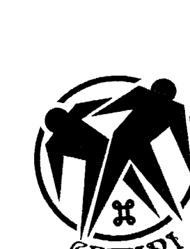

- 黃道的宮位序：第7宮
- 守護星：金星 Venus
- 四象屬性：風象宮
- 三態屬性：基本宮

> 一般星座書上天秤座的關鍵字：和諧、優雅、平衡美感、有異性緣、講求平等、會做人、不喜衝突、擅長協調、公正、客觀。

### 天秤座的人格精解

天秤座的人，普遍是很受人喜愛跟歡迎的，這種能夠在第一時間給人好感的能力，來自於它的守護星——極富教養與尊重他人的金星。金星守護的星座有兩個，除了現在談到的風象基本宮天秤座，另一個則是位於土象固定宮的金牛座。大家可以發現，金星代表的「人緣、社交能力」，都只在天秤座被強調，金牛座在一般論點中——在交際方面並不是特別出色的，這種值得玩味的現象，癥結就在：金星進入原本就和善自在的風象，自然會加倍突顯出它這種與人為善的親和面，而基本宮的主動與積極，會讓天秤座去「展現出」他親善有禮的一面，像是主動去詢問他人的需要，面對異性時，甚至會明顯的獻獻慇勤；天秤座看來消極其實卻是主動的，看來溫和其實卻是無時無地不在表現自己的。
金牛座就不同了，雖然它同樣具備金星的優雅與禮儀，但土象的不擅開拓與固定宮的固守陣地，讓這股優雅的魅力無法向外拓散，必須要旁人去靠近主動挖掘，才能發現它美好吸引人的地方。

如果天秤座是豔光四射的美人，那金牛座就是嫻雅的大家閨秀，如果天秤座是遠近馳名的白馬王子，那金牛座就是得體莊重的居家式雅痞。換言之，金星的美好在兩個星座上都有發揮的空間，但風象與基本宮把這種美好發射出去讓所有人看得到，也願意迎合多數人的喜好跟口味，像是一件質感好又易於搭配的服飾，是適合穿戴在外面的，而土象與基本宮就把金星的美好蘊含在中心點，暖暖含光卻歷久不衰，像是孕育華貴珍珠的貝殼。

整體來說，天秤座比金牛座還要注重「皮相」，金牛座雖然重視一樣東西的外表，但它除了注重整體呈現出來的感覺，還會去要求每一個過程中的小細節，例如質感、作工、材料等等，土象跟固定宮把金星容易流於表面的性質，加進了一些深度（但也不算太多），可是在天秤人身上，我們就比較看不到這種對細部的要求，天秤座要的大多數是「看起來的感覺」，我們都知道，「感覺」是不耐考驗的，隨時會被取代的，甚至不會有太久的價值，但天秤座本來對於生命的態度，就是用一種淺嚐而非深入去咀嚼的方式，所以他們也很安於在這種表面層次上的舒適享受就好。在我觀察身邊人的審美觀時，一點都不意外的，最注重外表的男人多數是金星在天秤座或金牛座，不過這兩個星座對「美」的定義倒是大異其趣，金牛座要求的美最好是精緻、耐看，不能是化妝美女或背影美女，在此可以清楚的看到土象對「本質」（如同前述，這個特質套到對物品的定義，就是材料跟做工，而不是花俏的設計）的重視。天秤座拜風象之賜就隨和多了，他們要的是「整體」的和諧美感，比較跟著流行時尚或是社會眼光在改變，標準是可以有彈性的。像金牛喜歡萬年款的長髮大眼美女，這種女孩做什麼打扮，不管適不適合都有一定程度的水準，但天秤喜歡適合主流妝扮的女孩，大眾的口味轉向哪裡，天秤座也就跟著把欣賞標準調整到哪裡，對他們來說，「適合度」比「基本值」重要多了，就算妳的五官不是特別出色，只要能藉由打扮「隱惡揚善」，塑造出視覺觀感上的「最佳效果」，天秤座的人就可以認同那是一種美，不會太過深入的去吹毛求疵。所以我就觀察發現，天秤座的男生會欣賞空姐、護士那一類的女孩，因為他們內心已經先有了對於這些身份的女孩既定的形象，只要形象符合，他們就會覺得美，因為他們眼中看到的不是眼前的女孩，而是他們心目中認識的「空姐、護士」，這些職業給人美女的印象，所以只要妳具備這樣的身分，天秤座就會覺得妳再怎麼樣也不會差到哪裡去，而且天秤座不是那麼在乎美感的獨特性，只要舒服、順眼、漂亮，就算是裝扮出來的也沒關係，如果是金牛，恐怕會先在心裡想像這些制服美女如果換上一般的便服，卸妝，或是當某天她轉行時，看起來會是什麼樣子，如果他發現失去職業身份跟特定打扮，就會讓這些女孩看起來沒那麼美了，金牛座就會興味索然。這就是風跟土的不同了，風象注重的是感覺、氣質，土象要的是實質的好。

## 優雅包裝下的不平衡

天秤座還有一個眾所皆知的特質，這種個性似乎違反了金星的和平特質，就是他們出了名的「好爭辯」。

其實，天秤座雖然一般說來是社交達人、溫和有禮，但仔細觀察他們後就會發現，他們很會講話，但講出口的，場面話的成份大過於建設性，很多書上都因為天秤座的教養跟與人為善的好習慣，判定天秤座是心思細膩又敏感的，但我一點都不覺得天秤座這種特質算是細膩敏感，因為他們只是很願意自我要求，會時刻注意自己的言行舉止是否合宜？會給他人留下什麼樣的印象？但這種注意自己與他人互動的心態，是來自於他覺得「我應該要怎麼做才是有紳士風度的、不傷和氣的」，並不是因為他真的關心別人的感覺跟想法，就算他注意到了，也是因為他認為那是他有為人著想的義務，而非他真的可以感同身受。
畢竟在金星溫和的表皮下，構成天秤座最主要的成份，還是陽性外放的風象特質跟基本宮特質，天秤座在公開場合很願意附和或是遷就他人，因為那可以展現自己的禮貌跟家教，但他們骨子裡還是擁有自己的看法，並且出人意料外的固執，只是金星會讓天秤座可以控制自己，不至於把會引起爭議的看法講出口，但並不表示他們會被別人改變。
有這麼強烈自我主張的天秤座，就算平日為了維持形象所以溫言軟語，但一旦他們認為眼前的人不需要尊重，或是他們覺得自己在「講道理」時，當然就不會錯過難得的發表真知灼見的大好機會，但天秤座缺乏陰性特質的深入性，看事情往往看得太過表面，以致他們自認為鞭辟入裡的意見，其實往往只是纏夾不清跟純理論而已，這時就會出現那種很多書上提到的現象：「你說東他就會認為西也是對的，你說西他又想到東的好」，以至於爭辯永遠不會有結論，沒辦法，金星的表面性加上基本宮只能做單點思考的能力，會让他可以看到你缺乏的部份，但永遠沒辦法做真正全面性的論述，所以天秤座的對中也包含著錯，反之亦然，所以是講不清楚的，如果講得清楚，就也不需要爭辯了！
不過，天秤座的人不會自覺到這是自己的侷限性，他還會認為既然永遠得不到結論，那就是世界上的事都是沒有結論、沒有真正的是非、沒有一一定的，然後就更熱衷於去告訴別人：「不！你不能這樣說，因為如果從另一方面來講，其實這件事也不是你說的那樣……」現在你有沒有想起身邊的天秤人，很多時候都是溫和怡人，但某些時候又變得難以溝通？所以讓很多星座書都指出：「天秤是溫和的時候極度溫和，但有時又會陷入一種急躁的狀態，他們是個瘋狂擺動又極端的星座。」其實他們的個性沒那麼多變，就是在於他們拿出多少真面目來對待你罷了。
「平衡」也是大家公認天秤座的特質之一，但我檢視下來，覺得真正具備平衡特質的星座比較像是處女座，天秤座是「追求平衡」而不是真正的平衡，而且一般人通常是年紀越大個性越溫和，但天秤座卻相反，年輕時的他們需要他人的認同跟幫助，因此會樂於拿出好相處的那一面，但由於「7」的序號會讓他們不斷的學習跟累積，造成年紀越大他們累積的信念就越多，越去評論，也越相信自己是對的，所以天秤隨之年紀漸長，金星那種愛當好人的特質會漸漸減弱，風象的好發議論跟基本宮的武斷會慢慢顯現出來，讓他們比年輕時難相處，不過如果他們在事業方面受到肯定，會比較容易維持友善的交際能力。
「講道理」與「鄉愿」，有時只是一線之隔
我常常覺得跟天秤座相處的最開始，總會使人感覺受尊重跟舒坦，但那是語氣跟社交辭令的高明，真正深入談下去，你可能會發現他其實並不真的了解你的問題，甚至也沒興趣了解，他只是發現你心情不好或沮喪或難過，而他認為自己不應該視而不見，因此表現出關心的態度，我並不是說天秤座虛偽，他們的關心常常是很真誠的，只是真的不夠深入，也缺乏真正的了解，他們只是想把周遭人的不愉快跟心情起伏一解決掉而已，因為他們不喜歡太過於激烈的情緒，那會擾亂他自己的情緒跟思考，所以見不得你身上有這樣的情緒，他們安慰的重點不是在理解你，通常他們想表達的是「好好好，這樣呀？不要難過了、不要哭、不要想那麼多、不要……」，發現了嗎？他們就是要你最好把自己的情緒收起來，讓大家都看不到，這樣他們就可以心安理得的覺得「好，沒事了，我總算又解決了一件事」，但實際上天秤座粉飾太平的能力遠高於真正解決問題的能力，雖然不是全部的天秤座都這樣，但很多天秤人常常會演變成「鄉愿」，一切只要沒人提起，這件事就可以當作不存在。當然，也是有充滿正義感跟行動力的天秤人，但是天秤座的是非準則範圍太窄，以至於他們如果判斷錯誤時，常以一種獨斷的態度在解決紛爭，例如指責受委屈的一方「我覺得你這個地方反應錯了，所以你自己要負大部份的責任。」或「你怎麼那麼愛計較？」或是「如果是像我，我會怎麼樣，你也應該像我一樣」，完全搞錯對象跟重點，又為了想要加快解決事情的速度，沒有耐心去深入分析是非對錯，就柿子挑軟的捏，不去解決紛爭，而是否認問題的存在，然後引起更多的不公平。這也是為什麼天秤座代表法律的意思，真正的和平不可得，法律是拿來規範強制。

雖然這篇講的好像是天秤座的負面特質居多，不過也只是為了平衡報導，畢竟他們的優點大家已經耳熟能詳了！事實上，天秤座一般來講品格都算正直，也很注意自己的行為對錯，並不是壞人，也不是虛有其表的偽君子，他們是用盡方法在嘗試，看看要如何取得跟周圍的人相處的平衡點，只是做得不太成功又太注重表面而已。天秤座很社會化，他們會努力做到社會賦予他們的身份應盡的責任（例如男人就應該要怎樣怎樣，員工又應該要怎樣怎樣），太想做到盡善盡美，就會有思考過度，把凡事規格化的傾向，但這樣難免會偏離事情的本質，造成失衡。
風代表人際之間的交流，天秤座是第二階段，象徵我們面對群體時，從雙子座一味的單方面表現，進步到開始注重群體中的雙向協調，雖然天秤座常常只能取得表面的平衡，但人跟人之間就是需要互相的試探跟包容，關係才會深入。雙子座代表的是人群之間的交流關係，天秤座展現出的是：他們對人跟人相處模式的用心。這才能脫離雙子的商業味道，發展出群體關係間真正互相砥礪下的革命情感。說是表面，但總是要願意這樣不斷的在互相刺傷後再溝通磨合，才會有一種「群體合作」中應有的誠意。

## 第二個風象星座 水瓶座 (Aquarius)

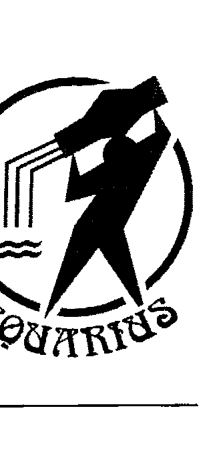

- 黃道的宮位序：第11宮
- 守護星：天王星 Uranus
- 四象屬性：風象宮
- 三態屬性：固定宮

> 一般星座書上水瓶座的關鍵字：與眾不同、天馬行空、先知者、人道主義者、博愛、聰明、難以理解、天才或瘋子、科學家、占星師、理想主義者。

### 水瓶座的人格精解

天王星的極度怪異跟瘋狂，因為落入風象宮，那種極為不尋常特質就發展到「想法」跟「理念」等思維的層面上，加上水瓶座是固定宮，所以天王星的怪異，就會受到侷限，不會像純粹的天王星，非要五湖四海自由自在不可，固定宮會讓水瓶能夠屈身在一般的單位及公司行號中，只是他會衍生出自己獨有的一套行事風格而已。但整體上來講，還不至於太脫序，所以如果我們把天王星想像成一個浪蕩的狂人的話，水瓶座頂多是跟人有疏離感，不容易溝通到令人懷疑他有外星人的血統，但並不會太過招搖，也不會侵犯到別人。喜歡他的人也許會覺得他是遺世獨立、曲高和寡，卻不失斯文跟水準，至少有了固定宮的加持，讓他沒有天王星那種完全反社會的外表，天王星的怪異受到風象固定宮的影響，變得較為緩和，不再奇怪，只剩下一點點的與眾不同，而有時這種氣質還會讓他的外貌顯得很出眾，但是水瓶座的電力有限，在不喜歡水瓶座的人眼中看來，只會覺得他自命清高、神經兮兮、怪裡怪氣罷了！

水瓶座因為天王星的自主及固定宮的不易改變，不太會視對象調整自己的表達方式，所以身邊人對他的評價也很極端，但因為風元素的影響，不管能不能接受他，都不能否認水瓶座的智力的確是比一般人還高，因為他還是常常可以想到別人想不到的事，或看到一般人不容易看到的地方。

十二星座中，兩大出了名的高智商星座，都出在風象宮裡，分別是水瓶座跟雙子座，而大部份的論點都更偏向水瓶座一點點，會認為雙子座的聰明是世故而膚淺的，水瓶座才真正帶有智慧的成份，所以十二星座聰明之最理當是水瓶座，不過這也只是理論上的，相信大家從身邊這兩個星座的朋友身上，很快就可以比較出來，雙子座給人「聰明」的感覺更勝於水瓶座，水瓶座的朋友……雖然你不能說他不聰明，但他的聰明……

### 在某個部份特別突出的人，必然在另一部份有著嚴重的缺陷

明並不實用，也不能為我們所理解，他注視的焦點都離我們太高、太遠了！例如，整個世界的未來、憲法的改革、或是五十年之後人類道德的發展模式，這些當然都不是一般人可以理解，有能力去思考這些事的人自然不會笨，但是燈塔越高，就越照不到近處，水瓶座把所有的聰明才智都花在太大的議題上，對於身邊的事反而就視而不見，甚至有點生活能力障礙的傾向，如果是每天的例行公事，也許水瓶座還是可以做得很好，但如果要他去處理一件額外的工作，例如上銀行匯款或是申請電話線路，他可能就會搞得一塌糊塗；或許他在學校時，可以把難倒眾人的高深題目輕易解開，但是卻反而答錯最簡單的東西。這種完全無法預測、不按牌理出牌的特質，就讓水瓶座成了人家眼中的怪胎或鬼才了。愛迪生的發明天才眾所周知，但他把手錶當成雞蛋放進鍋子裡煮的故事也同样很知名，我常常笑說這代表上天是公平的，人的總數都一樣，如果在一個方面有著超乎尋常的優秀，必然就會在另一方面有著超乎尋常的低落。雙子座的優秀就比較平均而明顯，加上雙子座比較會為自己打算，水瓶座比較理想主義者，所以如果大多數的人想找出聰明人給自己意見，還是會避開水瓶性質的人而就雙子特質鮮明的朋友。縱然水瓶座的聰明，在現實生活中不是那麼吃得開，但是水瓶所謂的高智商，在星座性格裡還是很受到肯定的，也許有某些所謂星座專家抓住「聰明」這一點來替水瓶座做無限上綱，想當然爾的宣稱水瓶座是聰明而靈巧，甚至說水瓶座的人都千變萬化，在此我告訴大家，如果你哪天真的遇到一個千變萬化的水瓶座人，請千萬去查查他的星盤，影響他的最主要性質絕對跟水瓶座或天王星扯不上關係。水瓶座並沒有千變萬化，他的聰明是來自於他看事物的觀點獨特，以及他能夠看到非常長遠的地方，以至於能有足夠的勇氣不受當下環境的影響，堅持自己的路線！
水瓶座的聰明非常專注，非常集中目標，堅持而自信滿滿，對自己認定或判斷的東西不會存疑，在某些層面上來講也可以說是很天真，這可是大智若愚的一種，水瓶座的聰明不會讓你一眼就認出來，而是要經過時代的洗鍊跟沉澱，人們才會真正的明白他的價值所在。對了！你的聯想沒錯，就是像哥白尼那樣的例子！
在天王星被發現之前，占星界替水瓶座配的守護星，是跟天王星幾乎完全相反的土星，但其實思考一下時代性，也會覺得一點都不矛盾，在水瓶座是土星＋風象＋固定宮的時期，本來就是個人言論自由不受保障的時代，創意沒有自由發展的空間，自然也就更難有推翻前人的革命性思想產生，水瓶座又是非常重視邏輯跟證據的星座（一樣是受到風象跟固定的影響），因此就算他再怎麼有爆炸性的新思維跟新做法，也必定有著深厚的研究跟學術基礎，就算現在居守護位置的土星已經被天王星代替，固定宮還是幫忙保有水瓶座這種實事求是的認真態度。

## Are the astrologers all liars!?【開運論命館】

常常有學生問我說：水瓶座既是風象又是固定宮的，全是理性化的成份，為什麼我會說水瓶座常常投身公益，那不是應該是心腸很軟，或是對宗教格外認同，例如雙魚座在做的事嗎？而雙魚座代表的「大愛」跟水瓶座的關鍵字「博愛」，也常常讓人搞不清楚其中的差別。

其實，人的同理心本來就有出發點的不同。水瓶座的天王星讓他的眼光放得很遠，風象讓他追求著智識跟理論上的正確性，固定宮更讓他具備一般來說風象比較缺乏的道德跟整體觀念，也因此水瓶座永遠都在追求絕對的正確跟絕對的真理。對水瓶座來說，可憐的人民、貧窮的國家、戰爭的危害，觸動的並不是他的惻隱之心，而是他的正義感！他不會對著路上的乞丐垂淚，也不會情緒失控的去問上帝為什麼允許這些事發生？他在乎的是，我們人類自己，為什麼竟然允許這樣的事發生在我們的周圍，所以與其去責怪命運，不如就先做到我們能力範圍以內的事！

水瓶座的圈子比一般的慈悲格局更大，慈悲是要先能夠感同身受，再發揮人飢己飢、人溺己溺的精神，解救別人的同時也淨化了自己，但水瓶座並沒有這麼多情緒上的反應，他就是很單純的把重點放在「應該」或「不應該」上面，他會極力阻止不應該的事發生甚至存在。

像是有些單位，關注的是地球暖化的方向，有些單位則是提供弱勢民眾的法律訴訟，甚至義務打官司，有些單位是救援流浪動物，抗議用殘忍手段取得野生動物的毛皮，或保存熱帶雨林……或是一大堆你沒聽過的訴求，這些事在一般人的眼裡看來，都不能很直接的刺激到人的良心跟行動力，大部份的人總是認為：「與其協助人們打官司，不如先去捐錢給沒飯吃的人。」、「與其救助雨林，不如去廟裡拜拜。」、「與其救援流浪動物，不如把錢拿給需要的人類，把人類顧好之前，其他物種沒有這個殊榮享受人類的幫助。」你看出來水瓶座的人跟一般人的差別在哪裡了嗎？那就是：「一般人再怎麼善良都是心胸狹窄的，會先去分救助對象跟自己關係的親疏，以及自己對他們的感覺而決定幫忙的必要與否，水瓶座則是完全的平等，只要有需要，我們就有責任，管他是人類、動物、植物還是礦物！」水瓶座格局遠大，深深明白放大來看的話，我們人類跟社會、自然界是分不開的，吃飽飯跟得到法律正義伸張的機會一樣重要，動植物的生存權跟你們人類一樣重要！

如果一般人會去幫助流浪動物，可能是因為他自己本身喜歡貓狗，或是對寵物有極深的感情，所以願意為了他們付出，但如果你看到水瓶座的人投入救援流浪動物的工作，很有可能他們本身對貓狗並沒有什麼特殊情感，只因為：「地球的資源並不是人類有權利獨佔的，貓狗及野生動物，同樣也有生存在這塊土地上的權利，所以我們必須把他們的權利還給他們！」或是：「雨林一消失，全球氣候都會產生更嚴重的變化，我們必須要顧及到整體的生態，才能保護一己之身。」是完全的為大局著想，而非以情緒為出發點！

## 如果真理不夠絕對，那就不是真理

我很愛拿來形容水瓶座的名言，就是：「我不同意你所說的話，但是我誓死維護你說這句話的權利。」你需不需要跟你能不能擁有，不一定要劃上等號，就像公司不需要因為員工暫時不需要花錢就不付薪水，這是合理的，既然合理，就必須要求。水瓶座也是出了名的愛自由，但他們所謂的愛自由，也只是理論上的，也許他們自己的興趣就是躺在家裡當「沙發馬鈴薯」，但只要他們發現有那麼多人是那麼需要自由，但卻得不到時，他們就會挺身而出的去爭取自由，就算他們自己不需要，但仍然覺得每個人都有擁有的權利，因此水瓶座才會被稱為是「人道主義者」。水瓶座代表的職業當中，有兩個項目看起來似乎是相互矛盾的，分別是「占星師」與「科學家」，但是就像在水瓶座眼中，人類跟動物、植物都是地球的生命共同體，沒什麼差別一樣，占星師跟科學家，同樣都是用長久累積下來的數據及學問，去推演未來的情況，同樣都是讓自己的眼界可以延伸更高、更廣的東西，水瓶座本身就是先知，只要自身格局大，科學或是占星之於水瓶座，都只是使用工具的不同罷了，本質是沒什麼差別的。凡是風象星座都有著社交、人際關係的特質，水瓶座算是裡面很矛盾的，因為大部分的水瓶座跟人之間的關係，都帶有很強烈的距離感，但是占星命盤上的水瓶宮又被稱為是友誼宮，在這裡我可能要稍稍修正一下，我認為水瓶的人際關係是大眾化的人際，也就是說，這份情誼不在人與人之間的私交，而在群體與個人間的接觸。就像我們都認識藝人或廣告明星，這些人會對粉絲微笑，卻不見得認識他們一樣，這就是水瓶的友誼，我們對他們的了解是整體的、單一的，帶著遠觀意味的，他的格局太大，很難在細節上下功夫。我們對社交關係的需求，從雙子座時期的需要同輩友伴，到了天秤時期的需要眾人跟特定伴侶的支持，到了水瓶座時，需要的不再是太親近的關係，而是我們在歷史上與人群中的評價，我們要以我們做出來的事，表現出我們希望別人看到的自己——這也就是大眾印象，所以水瓶座才會是一個大家都喜歡他卻不能接近他，既友善又疏離，永遠以團體做為交流管道，很難建立起個體緊密關係，也很難把戀愛談得像戀愛的星座了。

## 三個水象星座的特質

## 水元素定義

一般公認的『水象星座』特質：優柔寡斷、被動、消極、依附性強、第六感強、神經質、情緒、感情、包容性、沒主見、慈善、同情心、非邏輯性的、虛幻、內在的、感性、滋潤。

水元素跟土元素一樣，同屬陰性元素，大家應該可以發現，陽性元素如火、風，都是以『能量』狀態存在，而土、水等，就是以『質量』型態存在，相較於陽性元素的獨立存在性，陰性元素顯得容易被掌握，摸得著、可保存，並且可以被運用在實際生活的各種面向。

一般來說，我們可以把陽性元素當成我們的精神指標、理想及目標性，陰性元素當成我們原本就擁有的、可以支持我們的『資源』，土元素是經過累積後具象化的各種東西，水元素卻是比土元素還要來得更基本，更具有可塑性的存在，舉例來說，雖然我們的肉體、物質、財富等，是被歸類在土元素象徵的範圍內，但是人體中，有百分之七十成份是水，蘊含在細胞中，土是外表的門面，但水是在內部支撐這個身體的存在，像是填充物一樣，我們的皮膚需要水份才會飽滿、漂亮、健康，就是最好的例子。水不但是基礎，在萬物中無所不在，它的存在還讓物質（土）可以聚合串連，可以保持一定的彈性，畢竟我們除了土的堅實之外，總不能長久一成不變，我們需要成長，需要變化，需要適應性，這種柔軟度、跟外界調合的力量，就要靠水元素來給予了。

陰性元素通常都帶有一定的母性，但土跟水分別在不同的面向展現：土元素是講求實際跟紀律的那個部份，水元素講求的就是情感訴求跟親子交流的部分，土元素由具備的穩定、規律特質，讓它的母性展現在「責任感」上，例如母親帶孩子時，必須要注意他有沒有吃飽、有沒有穿暖，長大一點後，要注意他功課有沒有按時做、守不守規矩、禮貌周不周到，乃至更高的品格要求等，都是土元素性質的母性所掌管的，土元素會用社會傳承的價值觀與規範，拿來建構孩子的基本生活環境，所以土元素代表的，通常是嚴格、要求、照顧生活起居這一面的「母性」。

水元素就不是把照顧孩子詮釋成「保障他的『生存』」，那是土元素做的事，水元素的母性展現在「母愛」的方面，他會親吻和擁抱孩子、講故事給孩子聽、注意孩子的一顰一笑並沉醉在其中，關心孩子的心情跟煩惱，勝過於他的功課跟表現，水元素要孩子快樂，要孩子可以接受到滿滿的愛與支持，他的照顧是屬於精神跟心靈的層次，所以水元素的家長對孩子應遵守的規範並沒有那麼嚴格的要求，在煮飯、穿衣方面也不那麼的講究，必要時會用些外食、速食打發過去，在生活的細節部份更是常常迷迷糊糊、漫不經心，但這無損於母愛的展現，反而有時會因為這些小小的疏漏，讓別人也有反過來照顧他的機會，水元素的家長跟孩子距離不是那麼遙遠，親子間有種更加貼近、可以互相扶持的情感在流動，這會帶出兩者相處中更平衡的一種關係，在必須經歷爭執跟孩子開始有獨立思考的過渡時期，會比較容易平和的走過去，水元素比土更具有潤滑、融和的情感特質，但土元素比水能提供給孩子更多的社會資源。

把這種養育特質用植物來比喻的話，沒有土壤提供的養份跟環境保護，就不可能讓植物安然地生長，水雖然不具養份，但有滋潤、調節呼吸的作用，如果沒有水，就算土壤中養份再多，也沒有辦法被帶到植物的每一個細胞中，當然就更不可能成長了。

土壤是一種豐富性跟基本的資源，水則扮演給予跟灌輸的角色，兩者分別代表了不同的女性特質，土象徽了女性堅忍不拔、韌性十足的生命力，水則象徽了女性柔和體貼、感性細膩的心靈療癒那一面。

由此我們可以歸納出，水元素比較處於一種付出、配合環境的性質，現實世界中水，型態就是不固定、不僵硬的，裝到哪種容器中，水就可以變成哪種形狀，不去抵抗外力，也不用破壞自身的存在，是一種自由度很高的元素，但跟風的自由不一樣的地方是，風的方向沒有一定，它改變外界甚於讓外界改變它。水雖然不會固定停留在同一個地方，但水的特性是往低處流的，水不高調、不搶進，但是卻會匯流、蓄積起來，往往在不經意中，就會形成不可忽視的力量。

水元素也是一種「介質」，具有攜帶性，這一點跟風元素有點像，但是風元素跟其他成份的混合是短期性的，我們都知道，風等同空氣，可以帶有溫度，可以傳送聲音波，也夾帶氣味跟水份，但這些都是暫時性的，一旦多餘的成份耗盡，空氣中的雜質會漸漸消散掉，水一旦沾染上什麼東西，它自身的成份就馬上發生改變，並且沒有辦法把雜質跟水分開，除非用特殊的處理方式或設備——因此水跟外物「結合」的特性，會比風要來得明顯而持久，於是水也就代表了一種容易受影響跟善於用情感連結自己跟他人的性格，幾乎我們只要一提到「水象星座」，大家就都可以直覺性的說出：「情感豐富、依賴性強、無法獨立、心思敏感」等特質。

水元素跟風元素另一個相近的特質，也跟它們容易「沾染」的特性有關，就是渙散跟易於改變，火是集中前進，土是慢慢沉澱凝聚，這兩種元素都象徵比較現實的考量，相反的，風跟水就都比較著重在思考面，差別在於風元素用頭腦衡量、判斷，水元素則是用心去感受、去想像、去期盼，所以如果要從事理想性比較高、需要高度發揮創意跟觀察力的工作，風跟水性質會比較適合，尤其是如果跟藝術、心靈有關的，命盤中水象多的人更是上上之選（畢竟風是比較知性的），但是如果很需要耐心、毅力，跟堅定的意志，這種事就還是留給土元素跟火元素特質重的人吧！

## 都是骗人的!?

被動性比較強的水元素，重視人跟人（或是跟其他任何生命）之間的關係，因為水象人的依附性很強，所以需要在情緒跟情感方面靠著外界來支撐他，而他也無法釐清自己跟別人之間的界限，所以水元素容易把別人的感受當成自己的，在情緒跟情感方面也會比較容易氾濫，只是這種情感大多建立在一種渴求跟需要的基礎上，就難免容易受制於人，水元素的脆弱跟易受傷害就是從這個特質上發展出來的。提到情感元素，火元素也是情緒性比較重的代表性元素（風跟土就屬於比較理性、邏輯思考性的元素），但水的感情性質是柔和的，綿延的，靜靜的交流，重視兩者之間的互動，如果硬說要偏向一邊，那也是水元素過度付出的可能性比較大一點。火象的感情雖然也是出自於一種渴求，但火的現實性就加入一種實質的佔有慾，以及自我中心的味道，這種感情會偏向比較激動的情緒，例如熱情、激情，甚至到憤怒的程度。換句話說，水元素代表了一種可以慢慢累積的、細水長流的感情型態，例如親情、夫妻之情這一類的，而火元素代表了一瞬間的刺激、短時間內就會消耗殆盡的一種突發性情緒，像是熱戀期、追求期，或是每一次的突破性進展中，會爆發出來的那種感情（包括激情跟憤怒在內都是）。正因為水元素能了解他人的心思，願意擺出低姿態，配合性高，又充滿了同情心及愛心，通常命盤中水元素特質多的人，最容易跟他人相處，被人接受，畢竟在現在社會中，要個能夠傾聽自己講話，不具攻擊性的朋友，也真不是一件簡單的事，但是水元素容易在依附久了、跟你已經連結成一種習慣了之後，失去了自己的立場以及獨立行動的能力，到時候這種貼心跟親密，就會轉而成為一種黏性，帶來了他人的累贅以及心理負擔，而水象人自己也不好受，並且更加沒有安全感、更加神經質，因為在他放棄了自己的主體性之後，會更加恐懼分離跟失去，所以水象元素過重的人，最好可以投入需要付出很多關懷的工作，這樣大量的愛跟同情心，才會有一個理所當然的宣洩口，不至於讓身邊的人承受不起，反而讓自己最重視的人際情感變質。

## 第一個水象星座 巨蟹座 (Cancer)

- 黃道的宮位序：第4宮
- 守護星：月亮 Moon
- 四象屬性：水象宮
- 三態屬性：基本宮

### 巨蟹座的人格精解

一般星座書上巨蟹座的關鍵字：防衛心強、沒安全感、重視家庭、母性、情緒化、歇斯底里、屯積、日用品、領域、血緣、親人、內向、敏感。

人人都覺得巨蟹座的特質很容易被認出來，但又會發現巨蟹座那些顯而易見的各種特點，往往會互相抵觸。就有很多人問我，不是聽說巨蟹座是會為了別人傾全力的奉獻嗎？怎麼又有人說巨蟹座是很自私的星座；巨蟹座不是很依附他人嗎？怎麼會聽說它也非常的執著又難纏。很多人吸收太多表面的星座資料後，無法吸收整合，只好歸咎於機率，說就算是同一個星座，還是會有很多不同的形式，不同形式這種說法當然是沒錯啦，但那是因為每個人的命盤結構都很精細，有各種相異的特質混合組成。而且不管是哪個星座，我們常常會發現，各種看來很矛盾的特性，其實是同時存在的，並不是碰運氣，看看哪個巨蟹人會碰上哪一種的巨蟹特質。我覺得就是這種一知半解的人太多，在沒辦法精確解讀的情況下，又愛強作自解找理由，才會造成外界對於占星，甚至所有的命理學，都抱持著一種「玩命理的人都是瞎掰的，他們猜來猜去總會蒙到一些，根本沒什麼根據可言」的看法。

或許這樣扯得有點遠了，不過在一些抱著道聽塗說的流行星座謬論的人身上，每談到巨蟹座時，就最容易看到他們很難提出一個整合性說法的僵局，接著就推給「占星的根源就是一種統計學」啦！「有些巨蟹會像這種特質，但有些巨蟹會像另一種」之類聽起來軟弱無力又根本不正確的解釋，甚至說「巨蟹座就是情緒化啦！所以變來變去」。說到情緒化的話，哪個水象星座不情緒化呢？巨蟹的內心衝突的確是比較大，矛盾性也比其他星座來得多，但每種星座都有它最根本的特質，然後發展出不同的面貌，而這些多元化的面貌，就會在我們生活每一個不同的面向中展現出來，不會像一般概念中的分類學一樣，好像每個人就只能有單一的性格面，但只要不是自閉症的人，都知道人的性格是多麼細膩而複雜，我們必須要知道的，是怎麼把這些關鍵字當原料，掌握到根本，就不會覺得巨蟹座的複雜性是個謎了。巨蟹座是公認柔情似水的水元素星座之首，但三個水象星座中，跟水元素最調合的其實是雙魚座，巨蟹座本身的衝突性，來自於無私跟敏感多情的水象，是跟意志堅決、強硬又執拗的基本宮組合在一起，因此巨蟹雖然具備了水象星座的感情用事傾向，但是他會將感情的需求解釋成一種佔有（也是因為基本宮的影響），所以他雖然感情放得很深、很重，但這種感情卻是要要求大量回報的，最容易會以愛為名進行情緒勒索的星座，就是巨蟹跟天蠍座，這兩個星座因為帶著水象的情感特質，在心思上最為敏感跟脆弱，但基本宮跟固定宮帶有的目的性，會讓水的特質無法自由流動，所謂的「情感」就演變成了一種「執著」。巨蟹的守護星是極為私密低調的月亮，可從前面的月亮行星文章參考，月亮是一顆極為重視自我根源的心理面行星，對月亮來說，「自我」並不限於外在形象而已，而是在於追溯出自我的根源，「是哪些東西組合成現在的我？」大家都知道，每個人所謂的「個人特質」，都不具有什麼原創性，可能鼻子像爸爸、眼睛像媽媽、體型像外公、講話口氣像阿姨之類的，綜合起來才會變成所謂的一個「我」。巨蟹座在十二宮中的排序是「4」，4的特質很簡單，我們只要看看四周，凡事需要穩固支撐的東西，都是以4為單位的，例如房子需要四面牆才能撐起一個屋頂，桌椅需要四隻腳才能站得最穩，所以4等於是是一種對於自己安全範圍的保障，跟月亮一樣是需要待在某個特定的小範圍中，不喜歡向外探索太多，一個不擅於向外開疆闢土的星座，自然會對手上原本就擁有的東西，特別珍惜、不捨放手，這會演變成巨蟹座雖然很願意付出感情，但拒絕接受「無常」，簡單說來就是看不開，提得起放不下的性格，這種個性在一段戀愛，或是需要溝通的親子關係中，特別容易形成莫大的壓力，會讓巨蟹身邊的人覺得喘不過氣，需要自由空氣，也因此大部份的人都會從巨蟹的身邊「逃離」，讓巨蟹容易有自覺「被負」、「受傷害」的經驗，下一次就會更加小心翼翼，自然箝制的行為跟佔有慾也就更強了！但如果是在需要負起責任，不能隨便輕言放棄的婚姻關係、家人的連結關係中，巨蟹座往往就是最經得起考驗的，也因此「家庭性、忠貞性」變成了巨蟹人最顯而易見的一個招牌特質；親人、家族、血緣關係這些深埋在細胞、血液、潛意識裡的東西，是由月亮來掌管的，而水象宮的位置，會讓這些親密的關係不只定義在血緣或名份上，而是在於巨蟹對誰產生了「認同感」，月亮的親人是很道地的，就是血緣，就是家人，但4的數字用這種關係建立起來了一個比自我核心再稍大一點的領域，也就是「自我+自我周邊的人」，也就是從月亮代表的「自我內心深處、個人回憶、血脈的相連、母性」，經由4的擴張，擴大轉變成巨蟹座所代表的「家庭組織、親戚關係、安全領域、社會化的母親形象」，甚至是「私人的小圈圈」（因為他們的領域還無法擴張到五湖四海的程度）。

所以，他們關心的範圍也不再跟月亮一樣狹隘了，只要他們內心中承認你是「自己人」，在感情上受到他們的認同了，例如是他的老同事、死黨、同樣立場的人，一旦你受到威脅，他一樣會發揮出最大的保護慾，為你赴湯蹈火（這是來自基本宮的行動力跟捍衛性格），即使你是活該，或你是錯的那一方，都無所謂。

巨蟹們是感情導向的，只要他把你當成他的共同體，跟他是一國的，他就不會把是非放在最前面，他重視的是保護自己人，而不是把事情搞清楚，巨蟹一直是出了名的護短，但是要記得，巨蟹座除了不把是非放第一位之外，也不會管太寬，如果他覺得你跟他之間沒有什麼特殊連結，你也不在他的「守備」範圍之內，那麼當你需要幫助時，你可能就會詫異的發現巨蟹並不熱心，也不感情用事，他會很冷靜的置身事外，就算你再可憐或再正確都一樣。巨蟹的感情極為深厚，但托第4序位的福，他的感情會框在一個範圍裡，不會氾濫不該去的地方。講到這裡，大家的腦海中應該可以看到一個小小的人影，縮在自己劃定的地盤內，不奢求什麼額外的東西，只求能鞏固住自己原來就有的、手邊的東西，期待它們天長地久，巨蟹的愛不是揮灑型的，是針對某些特定的疆域長久的、深入的澆灌耕耘，無怪乎巨蟹座如果不受剌的話，女人大多是賢妻良母不說，就連男人也多是非常戀家，可以被稱為是新好男人的。

## 做壞事時，還是堅持當個好人

巨蟹男愛家、認定一個人的程度……用這個講法可能有點奇怪……就是他在花心的時候依然可以很忠實！有研究顯示，男人如果外遇，由於粗心的本性，很快就會讓太太發現了，但反過來是女人外遇的話，丈夫可能終其一生都不會發現，因為女人細心、懂得掩飾，巨蟹男是十二星座的男人中，最像女人的一個星座，甚至比水象之最的雙魚座還像，因為雙魚座的天真跟沒有防備，跟男人的特質還是可以結合得很好。

外人看他，頂多會覺得是個稚氣的男孩，但巨蟹座的心眼小、多疑、緊迫盯人、掌控慾強、執著等，最重要的是「細心程度」，容易讓人感受到女人跟男人天差地遠的那一面，所以我們就可以知道，如果巨蟹男人出軌了，他可以跟研究報告中外遇的女人一樣，仍然對家庭情深意重，仍然讓太太保有他心中最主要的地位，仍然堅持著他自己對家庭的責任感，甚至仍然對家人非常的依戀：……「家庭」永遠是巨蟹心中的第一順位，所以巨蟹男就算犯了全天下男人都會犯的錯誤，也不會允許這個錯誤波及他的家庭跟婚姻。

這對巨蟹座身邊的女人來說，是福還是禍呢？可能就要看個人的造化了。

巨蟹女人則是看起來溫柔又細心，但是對感情的需求度太大，一般正常的感情互動，在她眼裡看來都會嫌太過冷淡，水元素又會引發過多的遐想，在世界一切照常運轉的情況下，巨蟹女人腦中已經因為恐懼，上演了不知道多少複雜的情結，這種不安的情緒當然一定會加諸到她周圍的人身上，她越不安就對她愛的人箝制得越緊，很容易讓人覺得她疑神疑鬼、歇斯底里，巨蟹座的女人通常都會找上依賴性十足的男人，別的女人受不了，她卻會因為對方需要她而產生一種安全感，組成一個需要她守護的家庭，在別人眼中看來是很完美了，這就是互補性吧！

說到財務運用，大家最容易聯想到「節省」的，應該是土象星座，可是我們由前述金牛跟摩羯的例子就可以知道，土象雖然精打細算，但如果可以符合他們的價值觀，他們還是願意花大錢的，十二星座中最「不願意花費」的，其實就是我們這些嚴重缺乏安全感的巨蟹們。

巨蟹的月亮守護星讓它有一種想抓住什麼、保存什麼的渴望，可是基本宮不會賦予巨蟹什麼品味跟特殊愛好，讓它不像金牛一樣會想收藏藝術品或保值的東西，也不像摩羯一樣砸錢買高科技的結晶，巨蟹的不安全感首先就是反應在「生存的恐懼」上，金牛座怕的只是物質世界的無常，追求永久性的價值，巨蟹卻一直很害怕類似饑荒、能源缺乏這一類的災難，要巨蟹最捨得花錢的地方不是跟興趣有關的東西，反而是，一般生活用品，而且會貨比三家，務求以最少的價錢買到最多的物品，「這樣才不會突然短缺嘛！誰能保證市場不會斷貨，或是日用品不會因為什麼事件而飆漲呢？」

水一向被拿來當成最標準的感情元素，人在還沒生下來，未被世界污染之前，我們的愛是純粹又無私的，但是投入紅塵俗世後，首次面對世界有限的資源，跟付出了愛不見得有回報的法則，會讓巨蟹脆弱易感的心靈不知所措，在面對外人時就會自我保護，不輕易流露情感，而且巨蟹們很怕被社會的篩子過濾掉，所以想盡辦法抓緊身邊的東西，想保全一個「立足之地」（領域性作怪囉！），可是巨蟹們雖然怕受傷，卻又沒辦法不愛人，在不安中，把愛也當成了生存的必要資源之一，小心的保存著，然後全數花在自己關心的人身上，一點都不為自己保留，因此巨蟹給人的印象才會既自私又犧牲奉獻、既冷靜又情緒化。這是我們開始面對自己情感的第一步，難免會像小孩子一樣，以為「佔有」就是得到，但實際上，如果沒辦法給自己安全感的人，這個世界上也沒有別人可以給他了。

## 第二個水象星座 天蠍座 (Scorpio)

- 沉默
- 佔有慾強
- 愛嫉妒
- 自私
- 觀察力敏銳
- 直覺型
- 固執
- 內斂
- 善於掌握人性
- 報復心
- 心中的陰影面
- 潛意識
- 負面人格

| 屬性 | 內容 |
| :--- | :--- |
| 黃道的宮位序 | 第8宮 |
| 守護星 | 冥王星 Pluto |
| 四象屬性 | 水象宮 |
| 三態屬性 | 固定宮 |

### 天蠍座的人格精解

天蠍座給人的感覺，常常是既讓人感到不安和危險，卻又有強烈的誘惑力，我想這是因為人都會不自覺的想去挑戰超越自己極限範圍外的人事物。天蠍座濃烈、強力、極端的特質，就是一個非常好的挑戰對象。

天蠍座是一個集合人性原慾、弱點、渴求跟秘密的泥濘型星座。天蠍座就像一個黑洞一樣，他的內心有無盡的深淵需要被填滿，所以他在各方面的需求性都很高，這形成了他的「掠奪」特質，原因很簡單，一個不知道自己要什麼又不快樂的人，看到別人很快樂，就會猜想：他是為什麼快樂？喔，一定是因為他有那些錢、有這個工作、有這樣的男（女）朋友，所以他才快樂，那我也要！這就演變成了大家都知道的「天蠍座愛嫉妒」這項特質，他是由於匱乏而產生羨慕，羨慕再生嫉妒，最後成了一種掠奪的行為，但是他不知道，一個人的滿足並非來自於外在，擁有的東西也無分好壞，在於我們需要的是什麼而已。就因為天蠍不懂，等到他把別人的東西搶到手之後，因為不符合他的需求，他會發現也不是這麼美好，就只好再去重覓新物色其他人手中的擁有物，看看到底是要擁有什麼東西，才能讓他感到滿足？所以我們應該常可以從身邊的天蠍人中感受到，這個人對世俗慾望的追求，為什麼像是永無止盡的樣子？

天蠍善於分析人，也跟這種缺乏自己基礎的特質有關，就像《香水》中的主角，他能分辨世界上所有最細微的氣味，但他自己本身卻是沒有任何體味的，我在想，如果他是個有體味的人，要接收外來的氣味時，也只能嗅到跟他自己體味混雜過後的氣味，而失去對氣味最精純的判斷力了。

水元素是象徵我們對他人的「感受性」，也可以說是一種「看法」，大多數的人對身邊的人事物抱持的看法都是比較有彈性的，就像：我第一眼看到你的時候可能很喜歡你，但之後經由觀察你的一些行為，就又覺得你是個滿討厭的人。我們的「看法」會隨著時空的變化，以及對方展現出不同的面貌，而做適時的調整，但天蠍座的水卻是落入了固定宮，他的感受是非常主觀的，而且一旦成形就真的「固定」住了！

我常常講一個買鞋子的故事來比喻天蠍座的人：從前有個鄉下人想到城裡買鞋，因為覺得要脫鞋試穿太麻煩了，因此在家裡時，他先拿張紙踏上去，把自己的腳型描畫下來，結果到了城裡的鞋店後，發現那張紙放在家裡忘了帶出來，於是鄉下人跟老闆說，畫了他腳型的那張紙放在家裡沒帶來，所以今天「沒辦法」買鞋了。鄉下人寧願相信畫下來的腳型，也不願意相信自己的腳，天蠍座在看人時也是這樣。

> 他覺得那是「判斷力」，其實那叫「成見」

描繪出眼前這個人的一切性格特質，從此以後，他面對這個人的時候，就再也不看他了，只會回頭調出心中那份側寫檔案來閱讀，當這個人有了任何變化時，他也是看不見的，因為人是活的，側寫檔案是死的，當他只把眼光放在他自己判斷過後的信念上時，他就看不到事實了。所以我們會發現，天蠍座的人對他人的好惡非常明顯，也就是一般坊間常說的愛恨分明，當他決定要喜歡你的時候，不見得是因為你值得喜歡，如果你做了什麼不好的事，天蠍通常會視而不見，因為不管你做了什麼事，他就是喜歡你；如果天蠍討厭你時，不是因為你不好，是因為他就是決定要討厭你了，不管未來你對他多好，也無法改變他最初心中的那份側寫檔案。

所以人們對天蠍最常有的印象，就是「固執、主觀」，說真的，大家是一點兒都沒有冤枉天蠍座，但是這種幾乎是把分析人當興趣的特殊傾向，會讓天蠍成為一個能在短時間內快速掌握住一個人性格重點的能手，加上冥王星及水象帶來的第六感，形成了一種無人能及的洞悉力，所以天蠍座是「盛產」神秘學家及心理學家的代表性星座，也才有那麼多星座書常常形容天蠍座「有一種能把人給看穿的眼神」。

不過，天蠍座這份強烈主觀的喜惡，還是有個罩門在的，那就是：不管他多麼喜歡你、維護你、不願意承認你的缺點（而且他一旦認定他能接受某人時，護短的程度跟巨蟹可以說是不相上下，差別在於巨蟹是根本不去看是非的，而天蠍心裡很清楚誰是誰非，但即使那個人是錯的，他仍然會保護他想要認同的人），如果你對他有「欺騙」的行為，那會把天蠍座心裡的對你的美好側寫，在一瞬間之內焚燒得乾乾淨淨，因為隸屬於水象的天蠍，在情感上仍是十分脆弱的，他也跟巨蟹一樣極度怕受到傷害，差別在於巨蟹比天蠍容易受到傷害，而且巨蟹受傷到是會糾纏不清或躲起來。天蠍座由於守護星冥王星的影響，他不會輕易被傷到，但就是因此忍耐度太高，一旦到了臨界點時，以往累積的東西一次爆發出來，殺傷力是非常強的，所以如果你欺騙天蠍座，會得到的報復就是非常激烈的，因為天蠍不走中庸之道，要不他就一直容忍你，要不他就跟你一次把帳算清！」

有人說天蠍座脾氣不好，我認同，但脾氣不好並不等於容易生氣，你想想看，每次天蠍座生氣，都是爆發式的，不經過累積，哪有可能存下那麼多的情緒能量呢？所以，天蠍座不會常常生氣，他比較容易批判人，用不屑或是視而不見來表達他對某個人的討厭。天蠍真正非常厭惡一個人時，表達出來的不會是憤怒，而是冷淡跟漠視，一個人他毫不在意的人，怎麼可能引燃他的怒氣呢？一定是要先讓天蠍愛上了，但是也帶給他失望的人，才能把這股愛的能量，質變成憤怒跟怨恨，也才值得讓他耗费極大的精神去報復，而欺騙會觸動天蠍座內心，象徵它守護星冥王星帶給他的，黑暗泥濘的那個部份，等於是刺到他的痛處，傷害性是最強大的，所以就會引起天蠍最強烈的反彈力道。

有個很有趣的地方，天蠍座在黃道十二宮之中的排序是「8」，8在靈數學中，同樣是經過長期累積之後，儲存下來大量的能量及資源，也代表物質世界的豐饒，因此天蠍也代表能源跟財富，而且是非常巨大的那種。

在冥王星尚未出現之前，天蠍座的守護星是火星，也許因為如此，才有人會覺得天蠍座理所當然是個脾氣不好的人，但是是一個星座的守護星，本來就不見得能夠完全代表這個星座的特質，火星在天蠍座的話，它的能量顯現模式同樣要受到天蠍所屬水象跟固定宮的限制，因此火星那股強大的破壞力跟驅動力，放在水的層面中，當然就會化成感情上的激烈渴求，以及感受上的主觀意識；落入固定宮，表示火星的憤怒能量不會發洩過後就消散掉，反而可以留存很久，這就是天蠍為什麼復仇心強又愛記恨的原因。

同樣是火星掌管，大家都知道，牡羊座就是一遇到事情就馬上爆發，所以沒啥可以累積的東西，加上火象基本宮本來就是沒有什麼長期記憶力的位置，所以牡羊人脾氣發完馬上就忘了。

現在天蠍座的守護星是冥王星，我們可以回頭參照前面冥王星的文章，會發現冥王星跟天蠍座的相似度非常高，也就是冥王星的性質，就像是火星經過水象跟固定宮的洗禮後展現出來的樣子，所以兩顆不同行星掌管時期的天蠍座，差異並不大。

## 都是騙人的!?

### 從不大吼大叫的人，才最不好惹

火星象徵著「戰爭」，冥王星則象徵「核爆」——從戰爭跟核爆的分別性，就可以很明顯的窺見火星跟冥王星的分別。戰爭是一種爆發，付出的代價遠遠超過得到的結果，殺傷力很強，但雙方較為勢均力敵，能量也不受控制，可能發揮了十分的力氣，卻只得到五分的效果，因為對方也是會反制的，兩股能量就會互相抵消掉一部份，而核爆則是放出多少能量，就造成多少傷害，是一種更徹底的毀滅，殺傷力發揮到百分之百。

放在本命盤中對當事人個性的註解，天蠍質跟牡羊質兩者都同樣是出了名的不好惹，但我個人認為牡羊（火星）其實比天蠍（冥王星）好對付多了，牡羊一向在明，容易防範及反制，而天蠍的目的性比牡羊強多了，天蠍的聲勢看起來沒有牡羊驚人，卻是百發百中，不達目的誓不甘休。

放在人性中來講，牡羊如果被得罪、發怒時，他會大吼大叫，會衝動的做出情緒性的反應，十分誇張的表達它的憤怒！看起來雖然嚇人，但實質的效果有多少就很難說，因為他會明白的顯露出他的企圖跟想法，使得對方可以很快的抓到他的脈絡及弱點，安撫、反制他的成功率也會增加，等於是脾氣發得很大，但是虎頭蛇尾，只要情緒燃燒完了，就不太在意真正的結果是什麼，牡羊的重點在於「讓人知道他的憤怒，把情緒宣洩掉」，而不在於「我要如何讓使我憤怒的人得到教訓」；相反的，天蠍憤怒時，不在意是否要盡快宣洩掉這股情緒，他會蘊釀這股怒氣起來作為它的武器，天

> 武器就只有這麼多，應該休息養生，謀定而後動，選最好的時機跟地點出手，讓武器的破壞力不要浪費，可以發揮到極致。

占星學中的性慾由火星掌管，但是天蠍也是出了名的性慾宮，這兩者之間的不同，在於火星是純粹的生理本能，不見得夾雜了感情跟心理需求的部份，它的「強」是屬於發洩性性質的，而天蠍座的性慾出自於心理層面，慾望來自於性幻想跟特殊癖好，因為守護天蠍的冥王星，管的本來就是內心秘密及不可告人的部份，也本來就永遠不滿足（笑），例如戀足、戀腿、變妝等癖好，可以由視覺、想像引發他的衝動，跟純粹生理反應的火星是不同的，火星發洩完就算了，天蠍會不斷的想像跟沉溺，所以比較容易被性關係制約，在性慾方面顯現出的執著也比火星強多了，但講正確一點，應該是情慾大過性慾。

巨蟹跟天蠍同樣都是不安全感極重、善於情緒勒索、對自己所愛的人控制慾超乎常人的星座，不同的是，巨蟹座是落在基本宮，還帶有一絲期待跟天真、乞求的味道，如果你沒有給巨蟹座足夠的注意力，他會怨懟，會要求你注意他，會對你不斷抱有更多的期待，也因為這些不切實際的盼望，往往讓巨蟹因為失望而遭到更大的傷害，就很會自怨自艾，但他也沒辦法怎麼樣，不過天蠍人是如果感覺到你不想給的話，他就不要了，然後在心裡記上你一筆，直接反擊或疏遠你，或就直接動手拿他想要的東西了（因此天蠍宮也掌管醜聞跟犯罪事件），不會再踐踏自己的尊嚴去哀求你要怎麼對待他，但這個特質也造成天蠍座像我們前面說的，會落入先入為主跟武斷的狀況。

水元素是我們情感的各個階段，巨蟹座代表的是我們渴望跟親近的人連結，像是親子間的臍帶關係，他執著但是有改變跟成長的空間；到了天蠍座的固定宮模式，感情取向從執著變成了執拗，從固執變成了頑固，感情在一種固定宮狀態下是不能流動的，感情一旦停滯，最容易變質，所以天蠍座最容易因想不開而演出驚悚、變態的感情甚至性愛觀，雖然天蠍座的感情擁有一種彷彿可以海枯石爛的潛力，但那是因為這份感情已經硬化了，所以不會消失，更不可能轉化，這樣的執著程度對天蠍座本身或是身邊的人，都是負擔大過於享受，而且會內化到靈魂層面，變成我們的業障，這就是為什麼天蠍座常被拿來觀察「業力」的原因，但天蠍座的執著在短期內看來是弊多於利，但也許感情就是必須藉著這種過程深化，才能培養出這段感情的價值。

## 第三個水象星座 雙魚座 (Pisces)

> 一般星座書上雙魚座的關鍵字：善良、愛做夢、迷糊、依賴、容易沉溺、感性大於理性、有想像力、靈性的、藝術、宗教、多愁善感、混沌不明。

### 雙魚座的人格精解

雙魚座實在是個集水元素之大成於一身的星座，它跟它的守護星海王星及水元素，同質性都非常的高，就像水星跟風元素跟雙子座幾乎可以說是劃上等號一樣，加上又落入可以加強水元素的變動宮，讓雙魚的特質更是「水」到了極點。

在海王星出現之前，雙魚座是跟射手座共享守護星——木星，我們對照前文的木星介紹，就會知道，木星是顆充滿童真跟活潑隨性的行星，行動範圍非常的廣，但這種活躍的行動力，落入無為被動的水象宮，就會澆熄木星原本強烈的專注性，轉而成為只有在感覺、想像的層面（水元素的領域），可以延伸、擴展到很遠的地方，就形成了雙魚座柔軟、愛夢想、想像力無遠弗屆，但是行動力卻嚴重不足，最活躍的部份只存在腦子中的特質。

之後出現的海王星，就象徵大海，海王星的夢想、天真、童心等性質都跟木星很類似，所以這兩顆行星心中都有著廣大美麗的世界，但海王星卻不需要像木星一樣要為了「特定某個目的地」而移動，因為大海本身就是一個範圍很廣的存在，它在同一個時刻存在於很多地方，而變動宮讓海王星不會停滯下來，但這種變動性只應用在感受力跟心靈層面，因為海王星不用在行動上奔波，所以海王星跟雙魚座本身的同質性極高，因為木星加上水元素加上變動宮，就組合成雙魚座的特質，而這種特質也重複出現在海王的定義中，形成海王跟雙魚幾乎是不分彼此的狀態。水星跟雙子也呈現出這種孿生性，但海王星守護的星座只有一個雙魚座，不像水星同時守護雙子以及處女座，所以大家想多了解雙魚座時，也可以回頭去參照海王星文章，不至於造成混淆。

| 屬性 | 內容 |
| :--- | :--- |
| 黃道的宮位序 | 第12宮 |
| 守護星 | 海王星 Neptune |
| 四象屬性 | 水象宮 |
| 三態屬性 | 變動宮 |

海王星代表著打破現實與夢想世界中的疆界，也代表著昇華，木星則代表了向上超越，不管是新、舊守護星，都帶給雙魚座一種無法在世俗上得到滿足的探索心，但水元素又不是那麼有上進心的一種元素，所以只有很少數的雙魚座能夠真正地看破超越

## 對爛人仁慈，就是對自己殘忍

雖然大家都喜歡雙魚因為在意他人，表現出來的「善良」，可是過度付出，有時只是無法冷靜思考，隨著情緒反應出來的一種行為，這種善良我個人認為價值並不大。

雙魚座的「奉獻」太過輕而易舉了，就顯得很廉價，尤其是在感情方面，雙魚座女人是經由她們不分是非的寬容，寵出最多爛男人的頭號禍首。太容易對他人敞開的人，往往不懂得保護自己，不懂得保護自己的結果，就是要麻煩身邊的人來保護他，所以，我遇到雙魚性質很重的命盤，都會多跟命主聊聊「真善良」跟「假慈悲」兩者的差別，畢竟就算你要燃燒自己，也得確定自己是個可燃物，不然雙魚座燃燒自己的結果，常常都是燒不了自己，卻燒到身邊對他好的人，雙魚座是我見過最多因為想當好人，反而造出一堆反效果，牽連身邊人最廣的星座了。

水元素特質這麼強烈的星座，自然感情也就很豐富了，除了上文說的愛當好人、同情心十足之外，雙魚座也是十二星座中，最容易陷入感情漩渦的一個。雙魚的感覺充沛到一種「氾濫」的程度，平心而論，我覺得物極必反，雖然大家印象中的雙魚，表現出來的大多是他癡心犧牲的一面，可是如果我們長期仔細觀察，會發現有句話說「看似多情最無情」不是沒有道理的，雙魚座的多情跟天蠍、巨蟹都不一樣，雖然雙魚座陷入戀愛時看起來也是一副很執著的樣子，但是他執著的並不是這個特定對象，而是戀愛中的那種情境、那種感覺。

我曾經非常震驚的看過許多雙魚人，輕易到讓我無法置信的就決定了一段戀情的開始，然後在這段關係中，快樂的活在自己腦海中的世界（沒辦法，水元素太重）。

之后分开了，看他们悲痛欲绝的样子，我会认定这些鱼儿们需要的疗伤期恐怕很久，结果过没几天又见他们投入另一个人的怀抱……。而且深究之下，原因往往是别人提供了他“安慰跟依靠”，慢慢我才晓得，双鱼座的感情是弹性跟接受度极大的，但也因为这种水元素的高度接受性，让我看过不少发展过度，变成花痴或找对象完全没有标准可言的双鱼座，甚至因为包容性太大，什么都可以要，反而搞不懂自己想要的到底是什么，只能随波逐流，除了“感觉”之外，找不到一点脑子存在的证据，变成最多“劈腿、搞暧昧、藕断丝连”的状况产生的星座（可是这时他们还觉得自己很无辜，觉得是情况自己演变成这样，他们只是不忍心拒绝，只是没想太多，不是有意的，当然更不是他们的问题，他们只是被命运捉弄的可怜人罢了，我们应该同情、安慰他们才对），看到最后，我只能说“滥情、多情”并不等同于“深情、专情”，所以“好人”的定义是什么？予取予求的滥好人，造成的伤害之深之远，恐怕不下于明摆着使坏的人。但如果往好的方面发展，双鱼座反而最有机会从感情中超脱，因为他不同于巨蟹跟天蝎，认定一个目标就死不放手，没办法接受情况的变化，也没办法承认失去，双鱼只是需要别人同情，但是可塑性是很大的，我们看一些灵性书籍里常常在讲的理念：“真正的爱是什么？爱是出自于你自己，并不是来自于你爱的对象，如果你真正具备了爱的能力，那么爱就不会消失，它可以从一个对象转移到另一个对象，因为爱的出发点是你自己，对方只是个载体罢了。”

双鱼座是个彻头彻尾的水象星座，水到没有意志力、没有目标、没有抗压性！但也就是因为这样，他不会被固定下来，所以充满了变化性跟可塑性，也就是因为如此，双鱼座才也代表了超越跟升华的可能性，因为他没有目标而不会被绑在既有的道路上，因为没有意志力而不会执着于原有的一切（沉溺是会啦！但那跟执着不同，只要有别的东西把他的注意力引走，就可以解除这个状况了），加上没有抗压性所以不会对自己旧有的信念太过坚持，真是一个适合放下执念的好星座啊！哈哈！

上文也解开了很多人问过我的疑惑：“为什么双鱼那么滥情，那么没有意志，却还是被人认为有灵性，甚至双鱼座还是代表了‘宗教’的星座呢？”我想借着奥修大师的话解释一下双鱼座的这个属性：‘宗教’并不等同于‘宗教性’。”双鱼座其实代表的应该是“宗教性”，也就是“无私、无我、万物都是一体”的理念，这种宗教性出自于完整的爱，跟宗教组织、宗教仪式，乃至宗教的社会文化责任都比较没有关系，宗教组织是给人们加上重重的限制跟要求，但宗教性却大多是要人们卸下一切旧有信念，让纯净的自性显露出来，重点在于找到自己、爱自己，然后推己及人，展现“大爱”，因为如果连自己都不懂得如何去爱的人，势必也不会懂得爱别人，记住：

## 超越『小我』的混乱，才能提炼出完整的真我

如果在西方，它就代表“基督精神”而非基督教，在东方，它就代表了“空性”而非吃斋念佛，而如果从这个标准来看，“灵性”跟一切超越这个世界的事物，都可以包含在其中了，这个世界是由“象征”组成的，但像梦境、精神这一类我们视为虚无飘渺的东西，有时反而才是真正的真相，毕竟世界上的一切都是由人的观念去定义的，我们眼见的一切，都是由一堆世俗的信念架构出来，必须要打破这一堆定义，才能让事物在我们眼中还原成本来的面貌。所谓的“空”，并不代表是什么都没有，相反的，它是把一切都包含在其中了，只是因为不分彼此，没有界线也没有定义，所以是混沌一片，没有具象的东西存在，才名为“空”，而这种打破疆界的心灵之海，相同的定义，也可以说是人心中“无意识”的部份，什么都看不到，却蕴藏了一切。当然，这是在心灵的层次，人活在当下的时空中，还是必须有其规范跟定义，只是没有标准可言，就是迷迷糊糊，做什么都不清楚又没记性，但是如果让鱼儿们投入不需要像别的星座一样，苦于摆脱不掉旧日堆积起来的习性跟观念，因为他们本来就不需要那么多框架的领域，就像他们最爱的宗教、心灵、艺术领域的话，双鱼座反而不喜欢既定的框框，像这些需要全力突破自己极限的地方，对双鱼座来说，真的就是名副其实的“如鱼得水”，但如果你要鱼儿们压缩自我，进入一个充满法则的地方，就会看到他们不但会出现各种不适应性，最重要的是还会连带给身边的人带来困扰，还不如就别逼着他们适应太过现实的世界，让他们待在应该待的地方吧！

双鱼座是水象星座的终点也是起点，水元素就像象征着人在感情上从发展到定型的过程。我们在刚出生的时候，在人跟人之间感情交流的这项作业上，就像一张白纸，没有抱着任何定见跟成见（这是双鱼座阶段）；慢慢的长大了，分别心渐渐被养成，开始会划分人我之间的距离，泾渭分明，上学、上班时会搞小团体，会选择自己志同道合的死党（到这个阶段，显现的是巨蟹特质）。

接着，我们开始对某个人、某段感情投入了特别多的心力，会认定一个对象，想尽办法要得到他的认同跟陪伴，甚至忘了还有其他人的存在，只把注意力放在我们执着的点上（这就是天蝎座的阶段）；到了经历无数风浪后，开始看破一些事，慢慢的把执着放下，重新让感情回到一种流动的状态，找回真正的本性跟喜乐，这就又回到双鱼座阶段的模式里了，并且在历练过后发展出来的天真，又比孩提时代出于无知的天真，又更加有价值多了。

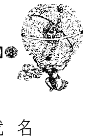

## 附录

## 星座分析

### 爱自由的星座

不需要太过了解占星，只要是稍微有在留意一般流行星座论的人，讲到“爱自由”，都可以很快的联想到，以爱好自由出名的星座，前三名是：射手、双子、水瓶... 如果你用关键字去分析判别一个人时，那就麻烦了，当你遇到一个爱自由的人，如何去界定他的这部分性格，影响力来自于哪个星座、哪颗行星呢？ 射手是由不断追求新境界、永远有新机会出现的木星所守护，配上行动力强的火象，位于永远都箭在弦上的变动宫，火象在变动宫非常的剑及履及，会很快的锁定一个目标，在短时间之内（变动特质）把心力集中（火象）于这个目标上，但达到目的后，不会恋栈在已经到达的地点，很快的他就会找到下一个应该超越的目标，兴致勃勃的去挑战了，而木星又更扩大了这些勇于追求跟探索的决心，因此射手对自由的定义，是实质上环境的一种不断转换，例如：搬迁、换工作，或是不断的出国，以及孜孜不倦的进修。

就双子来说，水星的跳跃式思考，反应在风象跟变动宫代表的思考层面上，他的个性跟想法、价值观，都是动态的，所以随时在改变的并不是环境，而是他自己！双子面对自由的形式，则是一种生活意义上的变换，例如把工作换个新的方式来做、每周计划不同的休闲项目、在生活的享乐上换点新花样、改变房间布置或是打扮风格。跟射手不同的是，射手在对一样事情投入时，可以表现出极为专注的态度，除了这个目标，其他的事物都不能把他的注意力引开，一定要在这件事情上告一段落了，他才会又换另一个方向，但双子座可能不会改变目标，但他会不断尝试新的路线跟手法，自由的部分，在于对自身才智的无限发挥，生活环境上的变动倒是没有那么大。

水瓶座就很有趣了！水瓶爱自由是出了名的，那是出自于天王星的反抗体制本能，他不喜欢任何可能的界线，就算其实他并不打算跨出那个范围也一样，重点是这道界线不应该存在，而不在于界线到底有没有挡到他的路，这是由于风向在固定宫，对于理念跟公义非常执着，而且重视权利义务方面的定位；所以水瓶爱的是“人有自由不被剥夺的权利”，而不是非要行使这些自由不可。他认为自由是天赋人权，人类的基本配备之一，有一句话很适合形容水瓶座的这种心态：

> “我不同意你说的话，但我誓死维护你说话的权利。”

### 金牛座与摩羯座的低调奢华

所以，你可以听到水瓶座的人对各种想法还有理念，宽容度都非常高，就算他不同意别人的意见，也只会坚持自我的立场，不会去试图要改变别人，但如果他凑巧立场不是这么正确的话就麻烦了，因为你就算说破嘴，他也没有办法改变他的思考模式，因此才会有人说，婚前的水瓶男看来风趣知性，婚后的水瓶男就跟所有的传统男人一样，会变成“沙发马铃薯”，整天窝在电视机前面按遥控器。

所以，你如果看到某个想到什么就马上要去做，不会讲太多或分析太多，一切都是行动至上的家伙，想必就是射手座或木星在他命盘中的影响很大。如果有个人讲话头头是道，看来非常精明，却很容易改变自己的立场，也很爱赶流行变化的人，就有可能是受双子座及水星的影响。如果你遇到一个总是有独到观点，不喜欢受他人限制，却不可避免的有点主观固执、生活型态有点公式化的人，那就是水瓶座在他命盘中占了很重要的位置。

最近无意间看到一则报纸新闻，上面叙述一家资深眼镜师傅经营的眼镜行，由于市场竞争激烈，因此改变路线，得到珠宝店的灵感，将这两者结合在一起，开发出“珠宝眼镜”这样的订做式商品，镶嵌了各式繁复宝石设计的眼镜，看起来既沉稳又华贵，据说主力客层都是贵妇级的太太，一副珠宝眼镜单价大约在二十万上下。

### Are the astrologers all liars!?【开运论命馆】

“珠宝眼镜”这项商品，立刻让我想像到金牛座，金星掌管的金牛座非常重视外表，就算是买数码相机、行动电话这类的功能性商品，外表的美丽与否，仍然是金牛座选购的重要考虑因素。金牛座的美感是属于“实用性美感”没错，但并不是要求实用就可以忽略视觉观感了，对金牛来说，“看起来的质感”也是实用性的一种，加上金牛位于土象宫跟固定宫，“保值”对他来说也是个很大的诱因，就算之后不戴眼镜了，上面的珠宝还是有一定的价值存在，既美丽又不会太夸张招摇，正是金牛式的美感风格，而且只要可以保值，对金牛来说，钱就不算是真的“花出去了”，这样的商品，正是牛儿会下手购买的对象。在星座文章中我提到过，土象星座一向给人精打细算的印象，但事实上被人预期应该非常节省的摩羯跟金牛座，事实上在他们价值观觉得值得的事物上，却是满大手笔的，花费惊人的牛羊们不在少数。如果是摩羯座，他就不会去买珠宝眼镜，摩羯的质感是真的不在要求这些小花样上，如果摩羯座会去买一副二十万元的眼镜，这副眼镜也许是什么超时代最新研发的合金打造，另外有一些隐藏式的功能，镜片也绝对是世界极顶尖品质，说不定还要飞到国外找原料，然后这些高科技、多功能组合起来的天价眼镜，如果戴在他的脸上，外人是绝对看不出跟一般眼镜有什么不同的，并且过几年又有更新的科技时，这副眼镜的价值就随着逐年下降了，但摩羯座比较没那么重视保值，他比较在乎购买时的当下，这个商品值这个价钱，因为守护摩羯的土星，重实质不重外表花俏，而摩羯所属的基本宫，也不会在买东西这种小事上，去考虑长远的价值，买了就买了，东西是买来用，不是来存的。 如果是金牛座，虽然整个镜框镶满了宝石，但镜片他可能选用品值还的就好了，因为镜片的价格是外表上看不出来的，看不到的地方，金牛就不会愿意花太多钱了。就实用性来说，摩羯重视的是物品的坚固，金牛重视的是保值度。

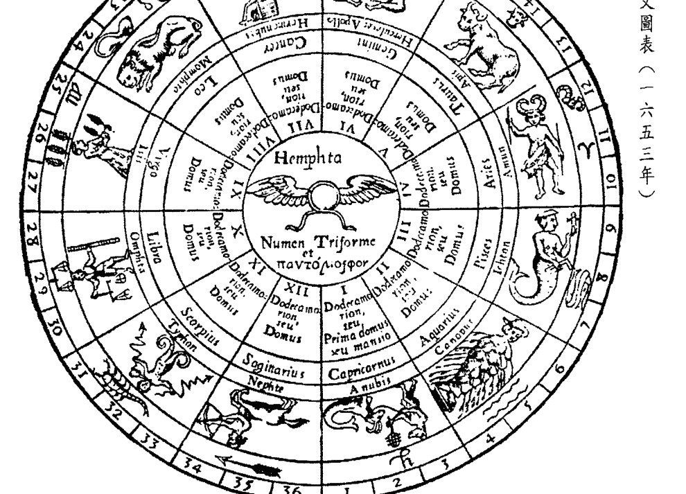

## 黄道带古文图表（一六五三年）

## 后记

我一直觉得占星是一套博大精深的学问，也一直很希望可以打破市面上的“十二星座流行论”迷思，因此从来没想过，我会写一套所谓的十二星座书；但在我注意了中文占星书很长一段时间后，我发现这中间有很大的断层，不是粗浅到接近胡说八道的星座流行书，就是正经八百、虽正确却难以消化的占星专书。在这些书中，我发现了一个缝隙，因为专门的占星书虽然涵概了正确的解盘概念，也点出了占星的精细跟复杂，但对行星跟星座及宫位的解释都太弱了，几乎都是收集一堆关键字，再做一个无关痛痒的结论，造成读者如果想要实际运用时，都只能用关键字去套，造成很多的混淆及误解，不学则已，越学越错。因此我想，得先放下我的雄心大志（笑），写一些大家能接受能看懂，以十二星座为主轴的书，但要探讨更根源的地方，因为我看到过的中文资料，不管是深是浅都不彻底，我认为“简单”跟“肤浅”不能画上等号，再怎么简单，也必须涵括整体的正确理念，不是只撷取一些不完整的小片段，美其名说这样看星座比较简单，瞎子摸象的结果，只会让人对星座产生更多误解，也更进不了专业占星的大门，地基没打好的房子，盖不了几层楼就垮了，地基打得越深，楼才能盖得越高；这本《十二星座都是骗人的!?》，我尽力达到简单却不肤浅，深奥却不艰难的程度。

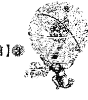

这本书中的特质，你可以就自己查到的占星盘，对应每一颗行星的性质去搭配；
学东西都是要由浅而深的，如果有机会，我希望下次能推出上升、太阳、月亮等三大星座的细部分析书，做为大家开始了解真正的行星及宫位占星之前的准备；也很感谢各位专业同好们为我写的序文，藉由专业人士的角度做一个导读，相信能帮助读者更容易了解运用这本书；若你对书中有任何意见及不了解的地方，或想询问相关课程资料，欢迎到我的博客来聊聊：
《天空为限的神秘学札记》，http://blog.sina.com.tw/isis/

附注：家父也是执业多年的命理师，现居嘉义县民雄乡，专精八字、易经、姓名学、择日、卜卦等，若南部朋友有需要，可以拨打：0935432334，翁长生。

> > 只要看懂天空的灵活推敲过程，就能很快提高自己占星推论的水平。…… 相信各位读者可以从天空对星座特质的归纳和分析当中，很快提高自己星座推论的功力。

— 深度心理占星师 | 李孟浩

> > 天空为限是一位对占星学极有研究的老师，顺着她的引导来了解占星学的基本观念，可谓有趣又不失专业…… 好好顺着这本书的顺序从头到尾读一次，相信一定会有观念上豁然开朗的感觉。

— 塔罗教父 | 丹尼尔

> > 她发挥了理性架构中说另类故事的本领，轻松的跳脱了占星学一直以来给人生硬难懂的感觉，读来有种似曾相识的熟悉感。……这本书让我不费力的阅读中，逐步的领会这门学问！

— 《色彩会说话：从心出发》作者 | 彭姝桦

> > 她书里有风象星座清晰的理路、水象星座感性的对谈、火象星座澎湃的情绪、土象星座务实的编序，综合四象之大成，让想学占星的人可得清晰之条理，想玩占星的人得轻快之节奏，若是闲暇之时读此书，也可让你觉得不失乐趣，多有心得。

— 《爱上塔罗》、《神话塔罗》作者 | 子玄

> > 天空为限让每一个行星都化成生命中的一个角色，熟悉到令人无法轻易遗忘，最后用身为占星师的经验勾引出画面，这个行星就在她的手上活现。

— 能量疗愈师 | 思逸SEER

> > 她有她的特色，她的独特之处亦不亚于所谓的『名师』，相信假以时日，她在西方命理的领域上，会是未来的一颗闪亮之星。

— 道家书院命星系列讲师 | 吴美华

类别：命理·占星 NT$280

ISBN 978-986-5958-87-9 00280

总经销： 吴氏图书股份有限公司 Wu's Book Co., LTD.