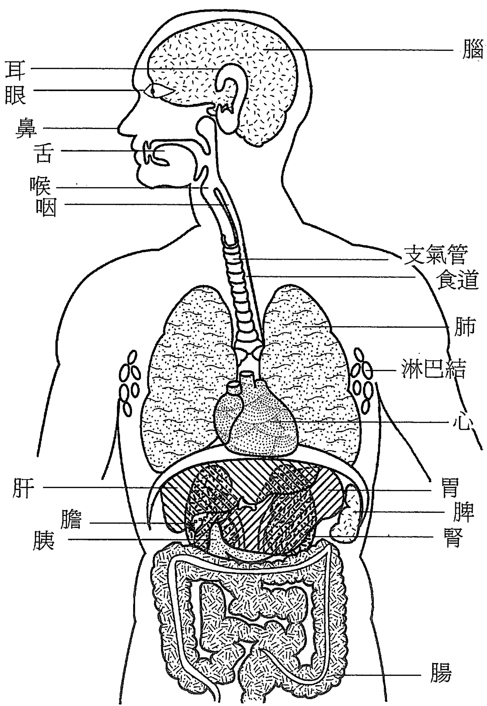
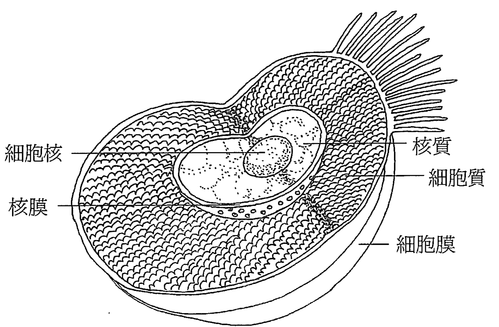

# 無盡的療癒

身心覺察的禪定練習

作者：東杜仁波切（Tulku Thondup）
譯者：丁乃竺 推薦：鄭振煌

# Boundless Healing

Meditation exercises to enlighten the mind and heal the body

# Holistic

探索身體，追求智性，呼喊靈性
攀向更高遠的意義與價值
是幸福，是恩典，更是內在心靈的基本需求
企求穿越回歸真我的旅程

# Boundless Healing

—Meditation exercises to enlighten the mind and heal the body

# 無盡的療癒

—— 身心覺察的禪定練習

作者：東杜仁波切（Tulku Thondup）
譯者：丁乃竺 推薦：鄭振煌

## 佛法不離世間覺

宗教與生計、生活、生命、生死等四生的關係非常密切。宗教的基礎是倫理，可以指導生計和生活的原則；宗教的目標是解脫，須透過生命的昇華和生死的超越。宗教原是為服務人生而存在的，神聖的出世境界必須建立在世俗的日常生活之上，此即禪宗六祖惠能「佛法不離世間覺」，太虛大師「人成即佛成」的精義。

世俗是二元、衝突、對立、痛苦的，出世則是一如、和諧、平等、祥和的。為著解決世俗和出世之間的矛盾，佛法提出二諦說，誠如龍樹所示：「諸佛依二諦，為眾生說法；一以世俗諦，二第一義諦。若人不能知，分別於二諦，則於深佛法，不知真實義。若不依俗諦，不得第一義；不得第一義，則不得涅槃。」世俗諦萬象森羅，紛然雜沓，第一義諦平等不二，寂靜空靈。世俗諦約相說，第一義諦約性說。遣相蕩執，則入空性；空生大用，則出萬有。空有不二，理事圓融，才是至真至善至美的境界。

本書依於佛法的世俗諦，討論佛法的身心疾病治療功能。作者屬於西藏佛教寧瑪巴大圓滿系統，故所言皆是大圓滿教法。大圓滿教法肯定眾生皆有「本自具足，本自清淨，本不生滅，本不動搖，能生萬法」的佛性，佛性真空故能緣起妙有。眾生無明，妄起造作，因而受苦輪迴，只要安住當下一念清淨，即可遠離煩惱，解脫痛苦。

大圓滿法的治療能量，便是那無邊無際，全體大用的佛性（或稱心性）。

修行便是在顯發此佛性，常保真如平等。修行的不二法門是禪定，禪定的秘訣在觀想，藉觀想來淨化內外身心，則能證悟智慧，彰顯大慈大悲。

本書特色在提供簡易可行的實修方法，如自我暗示、觀想光、觀想治療能量波、觀想藥師佛、觀想上師、持咒、觀想音聲等，皆有莫大功效，助益行者，非常可貴。

我曾翻譯作者的《心靈神醫》，頗得廣大讀者迴響，今再拜讀本書於中譯本付梓之前，深感佛法博大精深，若能體會其奧義，深入淺出，則不僅能徹底解決生命、生死大事，更能於現實生計、生活多所裨益。有志宏法利生者，宜深思焉！

慧炬出版社社長
鄭振煌

## 令人歡喜的緣份

丁乃竺

多年來我和賴聲川一直希望能看到美國東岸的楓葉，去年我們決定由波士頓駕車，穿越佛蒙特州到緬因州去。當我們飛抵波士頓，決定啟程賞楓的前一天，聽說東杜仁波切正好在波士頓，於是我們決定拜訪他。

那是一個微雨的早晨，秋意漸濃的波士頓，在離哈佛大學不遠的寧靜公寓裡，我們遇見了東杜仁波切。這是一間典型的大學城公寓，仁波切並沒有穿上傳統的西藏服裝，只著一套簡單的現代便服；在那小巧而溫馨的公寓中，我們見到一位都市隱者。仁波切熱情地接待我們，外面微雨依舊，室內許多綠色盆景散發著濃濃綠意，書櫃中滿是各類藏文書籍，以及幾尊古老的佛像。仁波切端坐在椅子上，自在而祥和。

我們交談著，仁波切提到他新近寫的幾本書，我們告訴他《心靈神醫》已經在台灣出版，他很高興，問我未來是否可以為他的書做翻譯。我欣然說「一定會」。東杜仁波切是少數能以現代語言及方式，將藏傳佛法深而廣的意義傳達給西方世界的老師。他的書很受歡迎，西方人覺得他的書既實用而又具啟發性。

美國東岸的楓葉之旅，是多彩而充滿驚喜的。回到台灣後，正當我還沈醉在橙紅燦爛的楓葉印象時，「心靈工坊」的王桂花打電話來，希望我能翻譯東杜仁波切這本《無盡的療癒》。我十分相信緣份，更訝異於這份巧合，同時也憶起東杜仁波切那小巧而充滿綠意的溫暖寓所，於是歡喜地接下這份翻譯工作。

由於平日我的工作繁重，因此翻譯工作斷續進行著。過程中給予我最多鞭策及鼓勵的是賴聲川，全書中有幾章初稿是賴聲川在繁忙的創作壓力下所翻譯的，他工作的決心和毅力總是我的最佳模範。我特別感謝堪布覺美及徐美珠，在翻譯過程中所給予我的協助。同時也感謝我的母親、妹妹乃簪、好友惠玲及陳錦女士為我校對。

對我而言，不論是口頭翻譯及文字翻譯，只要內容與心靈成長有關，我發現受惠最深的是自己。這次的翻譯過程雖無大礙，但在每次校稿時卻又覺得應該可以做得更好。本書現已出版，但願有緣的朋友，皆與我一樣，能從中受惠。

## 前言

我們每個人一生中都曾經因為某件很美的事，或因為做一件事太投入而完全忘我，忘卻了時間也無視周遭的干擾。這些明亮的剎那是寶藏，它讓日常的焦慮或慣常的念頭止息，自然地引領我們進入另一種存在的狀態。

心理學家們稱這樣的狀態為「暢流」，意思是指人們在此一剎那中做事時所體驗到的流動性。從心理健康的觀點看來，暢流的狀態就是巔峰體驗，就是我們最佳的時刻，也是心意祥和的時刻。它們無法被安排也無法被設計，它們的出現就像贈禮一般。

這份贈禮的核心精義就是祥和的心。這些年科學在身心關連的發現上多如繁花，越來越多的證明（對那些需要的人）證實進入這樣的巔峰狀態是身體健康的吉兆。現在很少有人會質問正面情緒真能可以幫助免疫系統對抗細菌和病毒，以及減低心臟病的危險。

沒錯，生命如同摸彩般，基因，壓力等在我們的易感傾向中各有其角色。但有一個我們可以直接控制的健康危險因素，就是我們心意的狀態。

然而現代醫藥以它驚人的儀器及藥物，卻無法告訴我們如何進入那似乎具有正面健康利益的內在狀態。很高興還有其他的治療系統已將藍圖描繪好。

在此，東杜仁波切由西藏傳統中，提供了一個偉大的融合方法，可以幫助內在的祥和。比《心靈神醫》更進一步，他設計了一整套詳細的方法來培養祥和心，以及促進身體的健康。這些根據西藏古典修行的方式，讓我們有機會訓練自己的心與它自我的治療力量相接觸。

正如他所指出，雖然現代醫藥持續發達，但在西方的我們卻史無前例的能接觸到身心治療的古老知識及方法。為什麼不讓兩者對我們都有幫助呢？

《EQ》作者
丹尼爾．高曼

## 謝辭

我全心感謝第三世多竹千仁波切以及他如甘露般的開示：「轉快樂及痛苦入覺醒之道」，感謝我所有證悟的上師及親愛的朋友，感謝我慈愛的雙親及先祖們，同時也感謝所有在書中與我分享智慧、靈感及故事的人。沒有他們也就不會有這本書。

感謝哈洛·陶伯無過的智慧，以及他編輯此書的投入，感謝羅伯·加瑞特以優美的文字表達出佛法的精義，感謝麗迪亞·西格多年來與我共同禪定，讓我能有更圓滿的禪定體驗。

感謝丹尼爾·高曼為我寫前言，替東、西方在身心健康的觀點上做溝通。我特別感激伊恩·伯溫在編輯、出版方面所給與的無價指導，感謝強納森·米勒的珍貴建議，感謝大衛·迪弗的電腦技術，感謝蘇珊·莫若切和瑪德琳·諾得檢查藥師佛咒語的翻譯，感謝林維多及林如碧的公寓，讓工作能順利進行。

我特別要感謝麥可·伯溫雙手讓我的學術研究計畫得以繼續，也感謝在麻省的瑪利安「佛乘基金會」的會員及贊助者，二十多年來在他們慷慨的贊助下，我的研究和工作得以蓬勃發展。

我十分感謝阿恰雅．山繆．伯喬以及香巴拉出版社，感謝他們對此書的信任和照顧。感謝蘇珊．可亨細心地編輯，感謝肯卓．柯森．伯魯的卓越指導。

此書所帶來的任何利益，都是因為如甘露般佛法的果。願我種下能對治如母般眾生煩惱的種子。

此書中任何過錯都是我無知心意的反映，我祈求諸佛、博學的上師們以及慈悲的讀者們原諒。

## 【目錄】

- 佛法不離世間覺
- 令人歡喜的緣份
- 前言
- 謝辭
- 引言

# 第一部分 我們如何來治療

## 第一章 身與心的治療

- 祥和的心
- 做為負面能量泉源的心
- 通往祥和感受的道路
- 意識到祥和的心
- 對禪定的正面觀點
- 正面的觀點
- 讓自己更快樂的步驟
- 相互關連的身與心
- 用身體來帶領心
- 身體的禪定觀
- 心的四種治療力量
- 運用四種治療能量的兩種方式
- 治療的泉源
- 全身的治療

## 第二章 治療禪定的利益

- 治療的一般性利益
- 治療的心靈性利益
- 治療的生理性利益

## 第四章 了解治療的潛能

- 延長和未被預期的利益
- 健康的三種狀態
- 四種治療的物象
- 兩種治療力量的來源：外在對象和我們自己
- 面對問題的三種方法
- 專注點的重要性
- 認識到開悟就是我們真實本性的重要性

## 第五章 鼓勵我們禪定

- 禪定的一些秘訣
- 禪定的長時間
- 克服抗拒
- 感覺到禪定的好
- 令其簡單

# 第二部分 對身心的治療禪定

## 第六章 禪定指導

- 禪定的十二個步驟
- 步驟一、將你的心帶回到你的身體
- 步驟二、仔細解析自己身體的細節
- 步驟三、看見你的身體是由無量個細胞所構成
- 步驟四、觀想每一個細胞是明光的細胞
- 步驟五、觀想每一個細胞和宇宙一樣廣大
- 步驟六、觀想每一個細胞充滿著治療能量
- 步驟七、用光和能量的波浪治療你的身體
- 治療增生性疾病細胞所做的特別禪定（附加的）
- 步驟八、聽見「阿」的治療聲音
- 步驟九、用蓮花綻放的姿勢讓自己迎向治療
- 用其他動作迎向治療，解除心理疾病，增進整體健康（附加的）
- 步驟十、與他人共享治療波浪
- 步驟十一、與全宇宙共享治療波浪
- 用治療的光環保護自己（附加的）
- 步驟十二、安住在與治療體驗合而為一的感覺中
- 避免期待
- 與之相處
- 在進步中喜悅

## 第七章 睡與醒的治療性禪定

- 入睡的禪定
- 醒來的禪定
- 在睡覺或醒來的時候去除焦慮
- 在入睡及清醒時的治療性光環

# 第三部分 治療身心的佛法禪定

## 第八章 藥師佛禪定

- 對藥師佛禪定的十二個步驟
- 步驟一、將你的心帶回你的身體
- 步驟二、以虔敬心觀想藥師佛
- 步驟三、以祈請來邀請藥師佛的加持
- 步驟四、接受治療的加持
- 步驟五、轉化身體為加持明光及能量體
- 步驟六、觀想你身體是由無數明光及能量細胞所構成
- 步驟七、感覺到每一個細胞就是藥師佛的無量淨土
- 步驟八、以加持明光及能量的波浪來治療
- 步驟九、唱頌「阿」，治療明光及能量波浪的聲音
- 步驟十、以加持波浪來做蓮花綻放的動作
- 做其他可以帶來加持的治療動作（可供選擇）
- 步驟十一、與全宇宙共享治療波浪
- 步驟十二、與治療的體驗合一，在合一中歇息
- 迴向、發願及祝福
- 簡略的藥師佛禪定

## 第九章 為臨終者及死者所作的治療禪定

- 佛教徒面對死亡的方式
- 為死者或臨終者做禪定
- 對死者或臨終者的指導
- 生存者及協助者應如何做
- 附錄一：治療禪定的佛法根源
- 附錄二：回答某些經常被問到的問題
- 附錄三：註釋
- 附錄四：名詞解釋
- 附錄五：參考書目
- 附錄六：延伸閱讀

### 引言

自從《心靈神醫》（The Healing Power of Mind）出版以後，我曾經到北美和歐洲旅行。在這些旅程之中，我有機會說明書中治療的原則，帶領了許多次治療禪定（healing meditation）。同時也收到了許多背景極為不同的讀者所寄來的感謝函和意見。

出版一本書之後再走入世界是一個非常有趣的經驗，尤其是像我這樣背景的人。十八歲之前，我的家在西藏東部一個遙遠山谷中的多竹千寺廟，寺廟四周環繞著魁梧的山嶺，日昇與月起則督促著我們每日有規律的學習和修行。回憶起來，我童年所成長的西藏是一個超越時間、蘊含著深沈宗教生活的地方，和現代紛擾世界的距離很遠。

我這幾十年來在美國的生活，在某些方面並沒有和那種寺廟生活距離很遠。在這個大都市中我的公寓簡單而溫暖，環繞在我的四周是佛經和佛像，他們閃爍著，像是超越時間真理活生生的見證。我大部分的工作就是作為一位佛法的終身學生和翻譯者，翻譯著古老的經文，讓它們智慧的火花能夠在英文和西方世界其他語文中引燃且發揚光大。雖然我運氣很好，在這認養我的國家中有許多朋友，我仍有獨處的時間，研讀著經文，禪定。這些年來，各種不同的人來找我，為解決他們生命中的掙扎而尋求忠告。這就是為什麼五年前，我決定寫第一本《心靈神醫》，談談我們如何在日常生活中幫助自己。

那一本書出版之後，我突然被推出我舒適、像是閉關一樣的公寓，開始接觸來自西方世界各處的大批人馬。這幾年來，這所有接觸讓我印證了一個信念：關於如何活著，我們都需要鼓勵。或許我們對禪定剛生起興趣，或者讀過一本書，參加過一個研習會，或許我們多年來一直走向一個心靈道路。不論如何，似乎身為人的我們，總需要更多的支援。我們需要一位能指向真理並引領我們的老師。我們必須好好照顧自己，學習如何在態度上變得更積極。

在我的研習營中，大部分人士都對我們所做的禪定採非常開放的態度，他們全然專注和投入；即使是剛開始接觸禪定的人，或者是面對生命中極大難題的人，這些禪定都是有效且愉悅的，主要也是因為他們非常虔誠。

部分沒有做過任何禪定的人開始會擔心，認為他們無法在那兒坐上兩三個小時，後來卻驚訝地發現，禪課已經結束了。有些人經驗到一種寬廣和清晰的感覺，好像他們平時封閉和鎖緊的生活被敲開一個裂縫。有些人感覺到愛和開放；在這種感覺中，反感、緊張、不喜歡，或者憎恨，是無法存在。有些感到祥和及力量；在這種感覺之中執著、慾望，或者忌妒，是無法存在。還有人覺得沒有任何問題算得上是大事情，即使生病，也沒什麼了不起，就像是在無限虛空中的過渡階段，好像天空中的一些雲朵。

幾乎每一個研習營中，都會有一些人在嘗試禪定之後，內在卻產生強烈的抗拒心，於是他們非常禮貌地請辭。有一些人士經過一番掙扎之後堅持下去，結果非常良好。當然也有一些在開始的時候好像有很好的經驗，但是因為他們無法欣賞或認定那些正面的感覺，因此錯失良機。

對於許多人來講，什麼都沒有用，因為他們並沒有準備好要開放自己。沒有任何方法可以突破他們的問題，因為他們的問題緊緊地鎖在一些嚴厲的心理和精神牆壁之中。令人驚訝的是，某一些所謂很有經驗的禪定者，在這些治療性的禪定過程中，卻收穫極小，因為他們對於如何禪定有著很固執的看法。他們被鎖定在一種傲慢和沒有安全感的態度中。

我的第一本書出版之後，眾多的反應中最令我高興的發現就是，任何人，只要放開心胸，都能夠從書中獲得利益，不管他（她）是天主教徒、基督教徒、猶太教徒，或者不屬於任何有組織宗教的無神論者。其中有幾位人士經歷過斷絕毒癮的十二步治療法，他們非常高興這一本書可以成為一種指導泉源，而讀者不需要相信上帝，也不需要屬於任何一種有組織的宗教。再說，佛法提醒我們隨時能夠意識到當下，放掉對過去和未來沒有必要的煩心。這與十二步治療法中「一天一天活著」的原則相呼應。

就像前一本書一樣，你現在拿著的這一本書也是希望能對所有人有幫助，不論他的背景是什麼。你不需要修持一個名叫「佛教」的宗教才可以得到祥和及快樂，甚至於證悟。智慧和慈悲是一切眾生與生俱來的，而任何一個有情生命的心中都可以發出智慧和慈悲來。就如同雅加達民間傳說所述，就連動物的心中也可以發出智慧和慈悲。最重要的就是讓靈性在你心中生起，並且茁壯，任何冠冕堂皇的稱呼都不重要。

根據佛經，這就是為什麼許多自我證悟的聖人（獨覺佛，Pratyeka-buddhas）能夠在沒有佛和佛法存在的時代裏達到最高的證悟。他們能夠自我覺醒，因為他們對心靈生活的承諾，而他們所證悟的智慧和佛法中所指的智慧是相同的。

這一本書和前一本書相同，我們主要關心的並不是證悟這個終極目標，而是如何在日常生活中變得更快樂、祥和。雖然在本書後段的禪定練習中運用佛法中的意象，它強調的是一種所有人都能夠使用的宇宙性觀點。

我自己傳承的是佛教中的寧瑪巴派，最古老的西藏教派。它可以回溯到西元第九世紀，偉大的智者蓮花生大士把佛陀的開示從印度帶到西藏的時候。雖然我自己修行的是屬於金剛乘的密續教義，但我對顯教，也就是經教部，有著極深的敬意。事實上，我也修持許多顯教的法門；這些開示中含有許多日常生活中的智慧，像是一個又深又新鮮的大水井。如果我們精進的修行，可以讓我們得到祥和及滿足，甚至於把我們帶向更高的領悟。我的材料取自這些來源，同時為了改編給西方讀者，再增添一些我對密法修行的知識。

有時候當我說，根據不同的人和狀況，有上千種禪定和修行的方法可以選擇，大家會感到驚訝。我們可以單單聽風的聲音，或者深深地望著藍天，或者看著我們頭頂上廣大天空中的星星，就可以產生治療作用。在西藏，心靈的感覺是那麼強，所有的河川、樹木以及草叢，似乎活生生地充滿著神聖的加持力量。有一個有名的西藏故事，說有一位單純的老婦女，一直帶著一隻老狗的牙齒，用這個作為她禪定的物象。她最後成功的開悟。【註1】當然，她的證悟不是依靠那物體本身，而是她心中強大的信念。到最後，是心，超過一切，是治療力量和智慧的最高泉源。

雖然有無限種禪定的可能性，我在我的研習營中發現一種成果特別好的方法：就是以身體本身做為禪定的物象。每一個來到研習營的人都有一個身體，所以立刻我們就知道，所有參加的人士都已經具足了禪定前的準備！再說，大家都很關心自己的身體。如果他們健康也希望能夠保持健康，或者他們擔心老化，又或者他們的身體病了、壞了，最起碼他們需要暫時解除疾病所帶來的心理痛苦。在《心靈神醫》第十四章中，我簡單描述了一種針對身體的禪定。本書就是從那一個小小的種子中生長出來。在這一本書中，我們將深深地思考關於我們的身體。目的是要喚起身體中治療的能量，同時，喚起我們的心。

身體的疾病雖然不是每一次都有辦法治療，至少自己可以減輕我們的痛苦，或者學習如何更能夠去忍受它。事實上，疾病經常可以透過心的治療能力來克服。在西方，當人們聽到「治療禪定」這個名詞的時候，他們就會貼上「新時代」的標籤。我覺得這是一種蠻奇怪的看待方式，在我看來有一點好笑，因為我在這裏說明的原則和修行方法一點都不新，反而都是透過長年累月不斷被考驗過的。

關於這個主題，在我第一本書中曾經提到西方科學最近做的一些關於禪定利益的研究，我也舉了一些關於治療方法的例子。能夠聽到成功的個案總是令人振奮，所以等一下我會談一談我治療自己嚴重的背部問題所用的禪定方法。

我同時也會提到我的朋友哈瑞·溫德的例子，透過禪定，他克服了醫學認定為「絕症」的癌症。讀者對第一本書中這個故事感到極大的興趣，於是我在本書中將重新描述他所用的特別觀想方法（見九十二頁）。最近哈瑞在用另外一種觀想方法（見九十三頁）來克服氣喘帶來的無法呼吸症狀*。

我經常被問到的問題是：你能提出什麼科學證據或者數據來證明這些禪定真的可以有治療效果？我的答案非常簡單。我試圖將藏傳佛教中關於治療的深奧智慧，以一種可以理解的方式呈現給那些受過良好教育、心胸開放，但過度忙碌的現代讀者。禪定的每一個步驟都是根據一種宇宙性的、自然的以及合乎常理的觀點。如果合乎常理，就沒有必要拿出複雜的數據或者其他證據。舉例說：「糌粑」，是西藏人的主食，是將炒熟的青稞磨成粗麵粉，用茶和酥油拌著吃。對於西藏人來說，糌粑的可食性和營養價值從來不需要證明。我認為這個問題的出現不是因為這些禪定缺乏績效，而是因為我們缺乏開放性和虔誠心。

數百年來，佛教徒以及世界上其他心靈傳承的許多信徒，見證了透過禪定、祈禱和祈求的力量所完成的治療。禪定能夠治療的不只是一般的問題，同時也治療了人們認為無法治療的致命疾病。同時，我們也經常見證到有心靈修持的人，祥和地、面帶微笑地欣然接受疾病、牢獄、無家可歸，甚至是死亡，因為他們內心最深處有著祥和以及喜悅。這就是我們所謂的「心的治療能力」。

近幾十年來，西方醫生和科學家開始發現古老禪定和祈禱之中所蘊含的偉大治療能力。許多科學家感到迷惑，古代的大師們並無法運用科學儀器，如何達到如此深奧的知識？無論如何，還是會有許多懷疑的人，雖然證據在他們的鼻尖跳躍著。

我們活在一個科學和醫學的黃金時代，同時我們也在重新發掘由過去古老心靈智慧的黃金時代所留下來的知識。我們不應該把這兩個世界視為敵對，我們應該選擇享受兩者所能帶給我們的共同利益。

當我看到來參加研習營的那些誠懇的臉孔，我經常會好奇他們在想什麼。或許他們知道，當我很小的時候，我已經被認定為另外一個時代的智者的轉世。五歲的時候，我被送進寺廟過著祈禱和修行的生活。對有些人來說，我身上應該算是散發出一些異國情調，如果他們來的目的是期待奇蹟，我卻希望他們留下來學習一些我們共同與生俱有的深奧智慧。在這些聚會之中，部分人士難以理解我的口音，以及我不流利的英文。對於一位西藏喇嘛而言，寫書的理由（沒錯，用的是筆記型電腦！）就是希望能穿透文化讓我的訊息更清晰地呈現。

說實話，我沒有把自己視為一位「成道」的大師。我只是一個人，和你一樣，必須在經常洶湧的人生大海上航行。我希望強調的就是這種共同的人性。就像許多人一樣，我的人生不是一直都是順暢和容易的。我也曾經歷過混亂和衝突、精神煩惱，和身體上的痛苦，尤其是當我逃離西藏的政治混亂成為一個難民時，而在此之後，我也經歷過不少困難。在這些困難的時刻，古老開示的指導，像一盞明燈一樣，持續地幫助我享受「活著」這份偉大的禮物，即使活著是附帶那麼多挑戰。

我要提供的並不是我自己的，而是每一個人都能夠共享的寶藏。在我小的時候，我得到許多恩寵，有機會學習過去上師和智者無上智慧的傳承。我心中有許多回憶：關於最偉大的一些人，有震撼力的意象、言語，以及充滿祥和、愛及智慧的感受。這些回憶至今猶新，永存我心。就如同一句西藏成語所說：「一塊平凡的木頭如果長時間放在檀香木之中，到後來它聞起來也會像檀香木一樣。」這也就是為什麼，就算我非常平凡，我也可以將治療的偉大智慧帶給你。

在這本書中，我花很多篇幅討論身體和心。實際上，心比身體還重要。怎麼說，疾病和死亡都是屬於生命自然週期的一部分，這個週期涉及到肉體和情緒化的心。我們怎麼樣都沒有辦法永遠避免疾病。輪到了你，你就必須面對它們。到了那個時候，最可靠的支撐是一顆更祥和的心。這能夠幫助你接受和容忍生命幻化出來的所有樣貌，就如同你能夠接受一天的週期一樣，白天亮，晚上天黑。活在二十世紀初的一位智者，第三世多竹千法王，提供以下的智慧珠寶：「不被敵人、疾病，和邪惡力量打倒的意思，並不一定是指讓它們轉向，或者阻止它們生起，而是不讓它們成為我們『治療』道路上的障礙。」【註2】

看過《心靈神醫》的讀者可能已經熟悉這一本書中許多的原則。就如同我智慧的老師們經常會重複他們的忠告一樣，我也刻意如此。一方面，這是為了沒有看過第一本書的讀者著想，不過更因為大部分人都需要重複被提醒。他們必須一而再地從別人那邊聽到真理，必須一再透過提醒來鼓勵自己。在此我願意說，第一本書在某些治療原則上更進入細節，也提供許多不同的禪定方法，可能適用於你的狀況。

最後，千萬不要把治療禪定作為解決問題的唯一方向。問題永遠是多重的，會以許多不同症狀的方式呈現出來。每一個問題都是許多過去原因的結果。面對問題，我們必須採取多樣的方法，包括平衡的運動和休息、營養的飲食、正確的醫藥、乾淨的環境，和一個健康的生活方式。再說，不同的人有不同的治療需求。對某一個人正確的方式未必對另外一個人正確。在幾天（或者大約二十一小時）的訓練之後，如果你感覺這些禪定方式令你不舒服，或許它們不適合你，在這個時候你應該尋找另外不同的禪定方法。

從佛法所教導的禪定智慧大海中，我以自己心中曾經嚐過的幾滴治療甘露，作為對你的簡單獻禮。

## 第一部分：我們如何來治療

## 第一章 身與心的治療

要尋找到真正的快樂，最好就是在離家近的地方找。我們可以環遊世界一百遍，翻開地球上每一塊石頭來尋找快樂；但是這未必能夠讓我們得到我們所尋找的。金錢也未必能夠帶給我們快樂，年輕和健康的身體也未必能。當然，健康和金錢可以幫助我們，但是祥和以及喜悅的真正泉源是我們的心。

我們的心渴望祥和；這是它真正的自然狀態。但是生活中有太多干擾和慾望，遮擋著我們原來祥和的本性。我們這個時代的一個特質就是我們日常生活速度，尤其是在西方，一切都是非常急。禪定可以讓我們慢下來，使得我們可以碰觸到自己真正的本性。任何一種禪定都可以幫助我們。禪定的物象可以是一朵花，一尊宗教性的形象，或者一種正面的感覺。甚至於是我們身體本身。

培養一顆祥和的心，其中最富饒的方法就是對身體做禪定。如此做，對我們整個人都有益的。

無盡的療癒——身心覺察的禪定練習

透過禪定，我們可以學習如何鼓勵自己的心，創造一種體內祥和的感覺。這個方法可以簡單到就是讓自己放鬆，然後對自己說：「現在讓我的身體平靜而祥和。」然後真正感覺身體平靜下來。這就是禪定的開始——也是智慧的開始。

這種作法有一點像回家的感覺。我們等於是在重新介紹我們的身體給自己認識，在建立一個身與心之間正面的連結。許多時候，我們和自己身體之間的關係是相當緊張，甚至於遙遠。我們可能認為自己的身體沒有魅力，或者醜陋，也可能我們的身體並不好；不然我們就是特別喜歡自己的身體，珍愛它，環繞著這個身體培養出各種慾望。但就算我們珍愛自己的身體，我們還是會很操心，認為它應該更好，或者擔心它會生病或老化。所以說，我們充滿衝突和矛盾，而身體就變成令我們焦慮的物象。

本書中的禪定能夠教我們用一種很實在的態度面對身體，接受它的現況。接著，我們會練習將身體看待為充滿光、溫暖及祥和的身體。實在有太多屬於心理和生理的病症都和身體有關，禪定可以幫助治療這些問題。身與心有著極為密切的關係，在禪定中，身與心的關係是非常有趣的。當我們把身體視為祥和而美麗時，是誰、或是什麼在創造這些感覺？是心在創造這些感覺。當我們在身體中創造出這些祥和的感覺時，心會融入這種感覺。可以說，雖然身體是我們要治療的物象，它同時也變成治療心的途徑——而這也就是禪定的最終目標。

當我們的心在禪定中感覺祥和時，沒有任何其他的心。即使祥和的感覺消失了，我們還是在培養這顆心習慣於祥和。我們的心開始適應它們真正的本性。說實話，到最後還是要回到心。這就是我們真正快樂的所在。佛陀曾說：

> 心為諸行之要因及前導
> 能以淨念行及語
> 即能享受快樂果【註1】

像醫生在治療病人一樣，佛教面對心理、精神，和身體疾病的方法就是診斷其因，然後治療它。

在這不停變化的世界中，我們的心很容易會培養出一種向外攀附的特質，接著就會執著於各式各樣幻覺式的需求和慾望。這就是我們痛苦的根源。我們能痊癒的程度端賴我們放下執著的程度。

西藏醫學起源於第九世紀，當時藏醫視人體為四種元素所組成——地、水、火、風——並且有熱或冷的溫度屬性。現代的西醫對身體和它的功能，提供了非常精采、仔細而嶄新的知識，我們也可以從中受益。但是就算到今天，古老西藏醫學對身體的看法是非常有用的，一方面可以幫助我們禪定，另一方面可以讓我們了解心的各種不同特質。

根據這個觀點，當四種元素平衡的時候，我們就處在自然健康的狀態中，但是一旦不平衡，精神上和身體上的疾病就會滋長。第三世多竹千法王（The third Dodrupchen）曾經寫：

> 古代的大師們說，如果你心中沒有不歡喜和不快樂的意念，你的心就不會急躁不安。如果你的心不會急躁不安，你的氣（或者說你身體中的能量）就不會被干擾。如果你的氣不會被干擾，你身體中其他各生理元素就不會不平衡。而這些平衡的元素，會幫助你的心免除急躁不安的情緒，喜悅之輪就會持續旋轉著。【註2】

心是真正健康的泉源。於是在我們進入身體禪定的指導之前，我們最好能夠先考慮一下心的特質，以及如何增進我們的生命。

### 祥和的心

當我十歲、十一歲的時候，我和我的私人老師及幾個朋友做了一次旅行，離開寺廟。這種機會很少，我多麼期盼到離我們寺廟兩天行程的山谷中，去拜訪偉大的修行者昆桑寧瑪仁波切。雖然我非常喜歡在寺廟中的生活，但能夠騎著一匹馬，穿過寬廣的塞爾山谷是多麼令人振奮的事情。我們騎了好多好多里路，走過那不曾被污染的大地，欣賞著美麗動物安祥的景象。天空中到處都是蝴蝶，飛過草原的綠色大地毯，鳥兒自由自在的歌唱玩耍，那是一個超越時間的自然美景。對於一個小孩而言，那是給予感官最偉大的饗宴，對於一個多年來居住在寺廟之內的小孩而言，那是一個無法忘懷的大探險。

在晚上我們來到一個小小、寧靜的山谷，周圍都是柔和的綠山坡。遠方，魁梧的塞爾山似乎主宰著所有眼下的生命。

我們在一個美麗的草原上搭起帳篷，它離仁波切的大黑帳篷有一點距離。第二天一清早，我們穿過草原去見仁波切。他的臉既美麗又充滿能量，有著一雙寬廣、會微笑的眼睛，皮膚略帶棕色，長髮繞在頭上，用一塊絲巾綁著。他看來五十多歲，身體強壯、充滿活力。他用一種像花開一樣的微笑歡迎我們，好像找到他失散多年的老朋友一樣。他所寫下的寶藏放在離他不遠的地方，大約有四十大冊，大部分都是他以神秘方式所得到的啟示。當時我感覺到他心中散發出一種無條件而不做作的愛，不只是對我，而是給周圍所有人。雖然他的聲音非常宏亮，也傳播得很遠，他的語言卻像是一條柔和的溪流，令人舒適。他以最深的滿足感來享受這份最單純的生命獻禮。當時我是一個很被保護、很害羞的孩子，但是在陽光般的仁波切面前，我變得多麼的自然，沒有任何黑暗或焦慮可以被隱藏。

仁波切的喜悅和寧靜似乎充滿一切。從我見到他的那一刻開始，以及我在那邊的所有時間，世界對我而言變成一個非常祥和的地方。當我看四周，我深刻感覺到他的存在，不知道如何已經轉化了我的環境，所有的東西都離不開這份祥和感。樹、山、我的同伴們、我自己——一切都被統一在寧靜及祥和之中。並不是山或人改變了，而是我的心看他們、感覺他們的方法變了。就因為他存在的力量，讓我的心能夠享受到更大程度的祥和及喜悅，幾乎已經到達一種無止盡的境界。那個感覺讓我在觀看心中所有景象時，都具有這份祥和的特質。好一段時間，沒有任何東西吸引我，或者令我失望。直到今天，當我想起那四十多年前的經驗時，依然會感到喜悅和完整。那個回憶的熱量能夠幫助我化解生命旅程中所現起如冰般的障礙。

創造祥和的是心。以這個例子而言，我的心把焦點放在它自己之外的一個對象，那位慈祥的心靈上師——然後擴大了那種祥和的感覺。我們可以從類似這樣的經驗中受益，因為這些經驗讓我們嘗到祥和的味道，也讓我們看到我們心希望成為什麼樣子。我們也不需要走到塞爾山谷之中才能夠經驗這種祥和。透過禪定，我們可以在日常生活中感到自己更快樂、更祥和，並且鼓勵這種祥和的感覺。

真正的治療和健康就是來自對祥和覺性的享受，安享究竟祥和的存在。我們的心不是在一種半睡狀態的被動中，反而它是主動開放迎向全然祥和的感受和念頭。這種毫無侷限、毫無污染的祥和覺性，是最終的喜悅和力量。當我們對祥和培養出真正的覺性，我們的本性即以完整的活力綻放出來。

有些人對存在的真實本性是那麼的開放，使得他們不管處於什麼狀況，都是非常祥和的。對於證悟的心，祥和不依賴任何外在物體或觀念。覺察到事物究竟的本性，這宇宙性的真理，不被觀念、感覺，或者像是「好」或「壞」的標籤所拘束或影響。一顆自由的心能夠超越二元對立的範疇，像是「祥和」及「衝突」的對立，「喜悅」和「痛苦」的對立。證悟的心在主觀和客觀現實之中，或者在「喜歡」和「不喜歡」之間沒有偏見。時間是沒有時間性的，而一切存在的事物本自完美。

為了避免這一切聽起來太理論性，我應該說明，世界上有很多人達到不同程度的悟境。我所認識的一些西藏喇嘛，曾經被監禁在牢獄中許多年，而他們幾乎能夠享受那個經驗。我盡量避免談論西藏的政治風暴，因為如此談很容易會開始責怪，而責怪又會引起憎恨的循環，讓自己的心充滿不滿，這樣不但沒有任何幫助，也沒有任何建設性。簡而言之，坐牢的經驗未必是一個愉快的假期。

雖然如此，我有一個朋友在牢獄中度過了二十二年，而他在裏面感到蠻自在的，因為他的心非常祥和。當我問他如何的時候，他說：「裡面很好。他們對待我的方式很好。」當你請這些喇嘛解釋這種情形的時候，他們會說：「生死並不重要，我是在佛陀的淨土中。」

證悟的故事總是令人振奮的，在證悟中到處充滿祥和，甚至經歷極大的混亂都沒有關係。但是對我們大部分人而言，我們的目標應該是向我們平凡的心下功夫，在面對生命時能更加放鬆、更加祥和。如果我們能夠變得更祥和一點，這也能夠幫助我們面對日常生活的問題，雖然有些問題還是很難解決。就算如此，我們還是應該記得，證悟的心和平凡的心是一個銅板的兩面。

心如大海，表面可以波濤洶湧，狂風激起如山高的巨浪，但海底是平靜而祥和的。有時就算在遭遇困難的時候，我們也偶爾可以瞥見這樣祥和的心。這種偶爾瞥見的祥和，讓我們發現內在可運用的資源其實比我們所了解的更多。只要我們精進而有耐性，我們可以學會如何與祥和的自我連結在一起。

### 做為負面能量泉源的心

如果我們缺乏祥和的心，再多的青春、美麗、健康、財富、教育和世俗的權力又有什麼用處呢？

我們可以找出太多痛苦的理由。不知為什麼，就算我們經歷快樂和興奮，我們還是會感覺生命中一種空虛。我們都聽說過一些人，看起來什麼都擁有，但是仍然受害於陰鬱和痛苦，甚至於以自殺的方式結束他們的生命。佛教偉大的智者，寂天大師（Shantideva）曾經對這個受困心的陷阱，做了以下的描述：

> 說出真理的佛陀說
> 所有的恐懼
> 以及所有無量的痛苦
> 皆由心造【註3】

約二十五年前，在印度，我的一位西藏朋友就和許多難民一樣，為了生存而掙扎。過了幾年，他賺了一些錢，足夠讓他過著舒適的生活。但是他對所有東西仍感到不滿。從他醒來的那一刻到他晚上睡著，他心中只想著錢。他不斷談論錢，唉聲嘆氣地說賺得不夠，擔心他會失去他所擁有的。他根本沒有生活。他是「無上金錢」的奴隸。他擔心生病，不是為了健康和幸福，而是因為害怕會失去賺更多錢的機會。有時我覺得他像一個可怕的幽魂，連他的臉部表情和身體整個都緊皺起來了，因為他對錢這個概念是如此的執著。

很不幸地，他不是唯一一個活在物質陰影下的人。大部分的人多多少少都被吸入類似這樣的生存中。我們不去花時間培養真正的快樂，甚至可能根本不確定那是什麼。許多作家關心的只是文字遊戲和理論。許多政治家闡揚他們的理念，目的只是為了增加權力。許多有錢人被困在累積更多財富的慾望中，或者害怕失去他們所擁有的。許多知識份子被傲慢和狹窄所蒙蔽。許多精神導師其實在經營一種商業表演，或者自我膨脹，為的是在別人身上取得權力。許多窮困的人，在為生存辛苦掙扎的過程中，已經沒有能力從生活中取得任何樂趣。這個時代的偉大技術和成就最後經常變成貪心、執著、綑綁、壓力、焦慮和痛苦的燃料。

這一切的痛苦都可以經由我們的心來治療，但是如果我們沒有去練習培養祥和的心，我們會因太脆弱而容易受傷害。問題不在微妙的外在物質，而在我們自己的態度。許多人都被我們瘋狂的情緒和慾望所迷惑，這些慾望和情緒則是我們心所創造出來的奴隸主。這些執著纏縛著我們，甚至令我們感到獨處和沉寂都是痛苦。

根據佛教，以及世界上其他許多智慧傳統，我們所有問題的根源就是我們對心的執著。佛教的名詞是執著於「自我」。對西方人而言，這可能不是那麼容易理解。其中一個問題，一般對於「自我」的理解就是「我」或者「自身」。在佛教的觀點裏，「自我」包括「我」和「我的」，但是在意義上更為寬廣，涵蓋我們意識中生起的所有現象。雖然如此，根據佛教最高理解，沒有一個「自我」真正以一個具體、固定、不變的個體存在。

通常我們認為一個人是一個主體，他是能辨識者、和客體是分開的，而我們認為客體似乎是絕對堅實而可靠的。但心中之物——財富、權力、一棟房子、一個電視節目、一個觀念、一個感覺，你所能想到的任何現象——並不是那麼的絕對，反而是相對的，生起之後又會過去，只能根據其他現象的對照來評判它。

你可能想問，這怎麼可能？「我」正在讀一本「書」，兩者當然都存在，因為似乎有一個「我」拿著書在手上。答案是，萬物都依彼此的關係而存在，存在的特色就是變化。或許說清這一點最好的方式就是拿身體做例子。身體隨時都在變化中。在嬰兒身上，可以很明顯地看出來，因為他們長得那麼快。但我們都知道每一個人的身體都會變，今天到明天之間也會變，好比說根據我們所吃的、我們的體重，都會造成變化。甚至情緒也可以影響身體，反映在我們的長相，一個人因情緒可能變得落寞、疲憊，或者亮麗、充滿活力。最重要的是，身體會老化，最後會過去。身體就是無常性的活生生之見證。如果我們認為身體是具體、固態、不變的，執著於這個想法，這就是把身體當作「自我」的執著。

當對自我的執著越來越緊，所有心理的問題——好比說渴望、壓力、緊張、混亂、貪心和攻擊性——會增加，然後我們生理上和社會關係上的問題會擴大。寂天說：

> 世界上存在的
> 一切暴力、恐懼和受難，
> 全部來自對「自我」的執著。

*本書完成後不久，我得到消息，哈瑞因為氣喘的併發症，已經過世，這是在他被診斷為癌症「末期」之後的十一年。

這個龐大邪惡的怪物對你有什麼用處？
如果你無法放掉「自我」，
你的苦將是無止盡的。
就如同你手上有一把火，你無法放掉，
你就無法阻止它燒壞你的手。【註4】

佛陀曾經說：

當你用智慧的眼看，
看到所有合成的現象都是缺乏真正的「自我」，
再也沒有任何苦能夠影響你的心。
這是正確的方法，能切除一切渴望所造成的痛苦的方法。【註5】

根據佛法，執著於自我不但可以造成心理的痛苦，同時也可能是生理疾病的泉源。許多西方學者同意負面的情緒，憤怒和緊張造成許多疾病。丹尼爾·高曼 (Daniel Goleman) 說：

如果憤怒和緊張都成為「長期」狀態，容易使人染上更多的疾病。【註6】

長期心情急躁的人——不論是因為緊張和焦慮，低潮和悲觀，或者憤怒和敵意——在往後歲月中有雙倍的機率會患上重大疾病。吸煙增加重大疾病的機率是百分之六十；長期情緒焦慮增加重大疾病的機率為百分之百。這麼說，情緒焦慮對身體的危害幾乎超過吸煙一倍之多。【註7】

能夠慢慢放掉對「自我」執著的習慣，是解決我們所有問題最好的方法，而我們快樂的程度端賴我們放下的程度。這是「治療」最真實的意義。有一段佛教的經文如此說：

什麼是治病？

就是免於執著於「我」和「我的」（自我主義和佔有慾）的自由。【註8】

在佛經和佛經的論述中，疾病通常指的是身體和心雙方的疾病。維摩詰（Vimalakirti）曾經說：「只要無明和對物質的渴望存在，我就會有疾病。」【註9】

我們太多的問題都是因為我們並不了解我們是誰，我們也不了解在這個不斷變化的宇宙之中，我們真正的位置是甚麼。相對論的拓荒者，物理學家愛因斯坦，對於人類在宇宙之中的位置有些體會。在以下他說的這一段話中，自我（self）可能是指「自我心」（ego）的意思，愛因斯坦很清楚放開狹窄的心態和固執的觀念是非常重要的：「衡量一個人真正的價值，最主要的方式就是要看他從「自我」之中，解放自己的程度有多少。」【註10】

如果一般常識和宗教傳統都告訴我們要放鬆執著的態度，我們到底要如何做呢？其中一個方法就是禪定。在以下要介紹的禪定指導之中，其中一個主要技巧就是要觀想身體充滿了光，這個光向外照，向宇宙放光明。能夠把身體觀想為無盡的，是非常正面的。這可以幫助我們減少對心的執著。

雖然如此，我們經常受困在自己的痛苦之中，讓我們很難看到出口。我們需要尋找一個焦點，任何正面的感覺、意象，或者一種意念，可以點燃我們面前的道路，讓我們能夠瞥見祥和。

### 通往祥和感受的道路

英國詩人華茲華斯（William Wordsworth）曾經說：「世界太跟我們在一起。」【註1】許多人如此的忙碌，完全沈醉在世間活動，讓我們對自己的感受和心情失去了觀點。我們甚至無法忍受祥和或者沈默。如果我們沒有任何活動正在進行，好比說說話、挖洞、蓋房子、寫作、數東西，或者煩心，我們會感到痛苦，甚至於可怕！

有些人甚至根本不了解自己有多麼不快樂，因為他們已經被自己的興奮、慾望和煩惱所奴役。執著於「自我」就如同生癬之後的抓癢：似乎是種享受，但終究只會更腫更癢。雖然我們有祥和的能力，但是我們真正的本性已經被遮蔽住，使得心靈的祥和成為一種不知名的貨品。

有一個非常有名的故事〈目連救母〉，關於佛陀一位主要弟子的母親。當她投胎在地獄道，她的兒子，憑著自己心靈能力，到了這受苦的世界去救她。他耐心地對她開示，轉變她內心負面的狀況。後來她從地獄道解脫出來，但是居然對於地獄如此地眷戀，她對地獄道中其他的眾生說：「不要讓任何人佔掉我的位子。」這並不是因為她享受地獄道，而是因為那是她唯一能夠記得或者覺得熟悉的地方，於是她執著於這個她擔心失去的東西。

打開治療之門，可能讓人覺得這是很大膽的舉動。但是事實上，對祥和心的培養我們並不陌生也不遙遠。如果我們能夠回憶起曾經享受過的安靜時刻，沒有外在的壓力和煩惱攻擊我們，這是非常有幫助的。這些回憶可以提醒我們，關於心真正祥和的本性，也可以成為我們禪定的焦點。

如果我們能夠憶起，曾經感受到自己的完整性及一體性，這樣一種極致的經驗，就可以把這個回憶的感受帶到現在這個時刻。重點就是要回憶起那個意象，包括所有的細節，然後再把這個微妙的感覺在我們心中擴大。這個回憶的引發可能是一個宗教性的經驗，或者是和一位充滿喜悅的人士相遇，就像我小時候去拜訪那位仁波切的經驗。西藏文化中，對真正有智慧的老師是非常尊敬的，於是西藏人經常以憶念心靈上師作為訓練的焦點。

在這樣的冥思中，有太多的選擇可以被運用。可能是在一個美麗花園的遊歷經驗，或者在深山中，遍地都是雪，或者是在廣大草原上寧靜的體驗。

多年來，有一個回憶經常激勵著我，這是發生在一九五〇年西藏政治混亂時我們艱苦逃亡的時候。我和同伴們正經過首都拉薩，我們遇到幾位農夫，正在趕著馬和驢到市集。他們用極為單純、自然的聲音唱著民歌。那種歌聲似乎是從原始大地中昇起的，有一種石破天驚的誠懇感。我不認為任何一位偉大的專業歌手能夠超過在那一剎那中，從那一些粗曠的旋律中現起的自然歌聲。

或許當時我的心更向這種美感開放，因為我們才剛剛完成了一次簡短的朝聖，到一個古老、超越時間的聖城古蹟。我本身就很喜欢音樂，但是不論什麼理由，這和我所喜歡的任何音樂感受都不同。它觸及我心中很深的層面，喚起心中更高的覺醒，透過那些甜美的歌聲，讓任何恐懼和悲哀化到虛空中。更有趣的是，這是在我人生中變化極大的時刻，在一個危險的旅程之中。所以說，就算是在混亂中（或許就是因為混亂！），我們可以嘗到寧靜的感覺。

快樂的童年回憶是另外一個門檻，帶我們走向心的祥和。童年時刻一些單純，甚至滑稽的經驗所給我們的喜樂，遠超過今天任何的娛樂節目。我能夠回想起很小的時候，在一個小山洞中和另外幾位小男生一起烤番薯。這是一個極為單純的回憶，但是當我憶及它時，卻能讓我充滿著溫暖和自由的感覺。童年的心比較清晰、新鮮，能夠赤裸裸、親密的感受事物。之後，太多刺激的經驗和各種累贅讓我們的心漸漸麻醉、被隔絕起來。童年，一天好像可以過到永恆，我們在那個時候經常感覺到自己體內更廣大的空間。

如果我們放鬆，回想童年，很可能想起能夠激勵我們的經驗。這就好像找到美麗拼圖中所缺乏的那一片：慢慢地讓回憶展開，然後那個經驗一切的細節可能就會回來。

把焦點放在正面的情緒，再度讓它燃燒，就如同在一個漫長而令人疲倦的旅程之後，你回到自己溫暖的老家。讓那個感覺放大，綻放，直到你整個人全部被打開為止。

最好要選擇一個非常正面的回憶，或者把焦點放在一個回憶的正向層面。讓那些溫暖的感覺保持住，讓自己在那些感覺之中歇息，直到你感覺到整個人非常完整。如果某一個回憶中含有一個污點，或者有它黑暗的一面，我們可以把正面感受的能量和光帶給它，以此來治療這些負面傷痕。

我們可以在每天日常生活之中停頓一下，憶起或者觸及任何溫暖、開闊的感受。這種開闊性能夠減輕我們的壓力，就如同陽光可以化解令人懊惱的夢魘。

### 意識到祥和的心

祥和的心不應該只是留存於禪定中，或者回憶過去經驗時才有，那樣的話，祥和好像變成一種特殊的感受，與我們日常生活分開。我們應該鼓勵自己的心隨時更祥和，這樣可以改進自己的觀點，保障我們的幸福。在人生起起伏伏中，隨時都有機會培養正面感受的覺性。

當我說到「祥和」，有人經常誤會，認為這個意思是把自己從生活步調中疏離出來。他們把祥和當作一種陌生的東西，可能是一種麻木和想睡覺的感覺，或者是無意識，到了另外一種心理層面。完全不是這麼一回事。當你睡著的時候，你可以非常「祥和」，但那是因為失去意識。如果我們要真正治療我們的生命，就是要能夠醒過來，享受生命單純的喜悅，對於我們一切的活動和與人相處的機會，培養一種開闊、接納的態度。我們應該享受自己，全心全意投入我們所做的任何事。

要注意自己感覺非常開闊及祥和的時候，要能覺察到任何自由的感覺。重點就是這份覺性。如果你能夠覺察到祥和，它就有機會成為你生命的一部分。當你感受到祥和的時候，享受它；不要逼迫你的感覺，或者追逐你的感覺，或者攪起興奮的假象；沒有必要執著，只要覺察到就好了，讓那感覺開花，擴大，讓它放大。停留在任何正面的感受之中，讓你的心放鬆的停留住。你可能會感覺到身體也非常祥和。如果你的呼吸感覺更放鬆，或者你感覺到一種溫暖，請你也停下來注意它，享受它。

任何場景都可以讓祥和現起。可能是看到一個嬰兒，在父母關心的監督之下，驕傲地走幾步蹣跚的路。可能是晚上第一顆星在天空中亮起，或者下午的陽光照在都市大樓的側邊，或者一大早，你躺在床上，聽著舒服的下雨聲。或者一位心胸開闊的人，用微笑臉孔向你問好，或者你自發的為別人做了一件小事。簡單的活動，像是去散步，或者享受一杯茶，可以給我們滿足，甚至於喜悅，只要我們態度是開放的、接納的。我們必須培養一種感恩的態度。

可以在沒有任何理由，甚至於在非常具挑戰性的狀況之下，也有可能感受到祥和及喜悅。證悟的心不需要任何外在的物體和刺激，就能夠讓祥和自然昇起。但是對凡夫心而言，還是要用正面情緒當作起點。其中的方法如下：

- 要覺察到正面的感受。首先，把焦點放在正面的狀況和意象，然後因它們治療的能力而感到喜悅。
- 要在負面之中看到的正面。當你心中增加了能力之後，焦點不但要放在正面的物體，同時要放在負面物體的正面特質上。要特別去觀看負面狀況之中的正面特質，像是烏雲的銀邊。最好的方法就是用幽默感，這能改變你的觀點，讓一個本來是負面的狀況突然逆轉！
- 許多人有過度敏感的心，於是容易更強烈的感覺負面。這會讓焦慮生根，成長。對治的方式就是讓心不要那麼敏感。當面對負面狀況時，自己其實可以決定「不要那麼在乎」——如此一來，這些狀況會比較容易處理。第三世多竹千法王寫著：「如果我們不那麼敏感，那麼因為我們心的力量，就算是很大的痛苦也會覺得很容易承受，它會輕而軟，像一塊棉花一樣。」【註12】
- 把一切視為正面。在一切之中都能看到正面意義，把一切都當作正面。如此一來，就有可能成就超越正面和負面的真正祥和。終究來說，任何東西都可能是治療的泉源，在所謂「正面」和「負面」之間，我們不需要有偏見。

對大部分人而言，治療的主要支柱應該是要把焦點放在正面的狀況和意義。但是如果我們努力把自己放在正面之中，漸漸的，我們可以同時開始運用上述第二種和第三種方法，首先是間接的，後來是直接的。

### 正面的觀點

悲觀可以致命。如果我們已經養成習慣，一直操心問題，或者只看到一個狀況負面的層面，那根本就沒有任何空間來做治療。當一個人的心因這種態度而變得死板、堅硬，那麼所發生的一切就染上痛苦和負面的特質。

心可以自己選擇正面或負面：這一切就是看我們的觀點。藏傳佛教之中一個核心修行方法就是正面觀點。幾百年以來，這種方法已經證實了在心靈證悟方面，產生了不可思議的豐收，同時在日常生活之中帶來了許多快樂和健康。

第三世多竹千法王非常推薦這種方法。在此他解釋真正的治療並不是依靠外在狀況，而是仰仗我們如何運用和看待外在的狀況：

> 「從生物到非生物，當我們被危害的時候，如果我們養成一種習慣，把這一切和受苦連在一起，那麼任何微小的狀況就可能帶給我們極大的痛苦。因為很自然的，無論是在快樂和痛苦中，我們都會建立我們的習慣，而這些習慣會增長……。如果針對我們的敵人，我們已經刀槍不入，任何負面狀況都無法影響我們的話，並不表示我們能夠趕走我們所有的問題，或者阻止它們不再生起。關鍵在於不要讓問題變成我們心靈成就旅程上的障礙。為了如此，我們必須放棄一種思想，那就是絕不願意讓痛苦發生在我們身上；我們應該要想的是，對於任何在我們身上發生的痛苦，感到喜悦。——【註13】

困難其實可以成為打開我們心靈道路的踏腳石。即使你不是一位偉大的心靈導師，你也可以開始把小問題視為可以接受的。試著讓自己把困難視為一種有趣的挑戰；接著，如果你可以解決它，或者學會如何容忍它，不要忘了恭喜自己成功。這種成就感可以帶來一陣喜悅，對你一生都可以有正面的漣漪效應。

祥和及喜悅的火花其實存在於每一種狀況中，只要你細心的去尋找它，應用它。就算你過著一種地獄般的生活，總會有一些祥和的時刻，這些你絕對可以用來當作治療的泉源。

換句話說，就算你在喜悅的狀態下，如果你執著於那個喜悅，試圖緊緊抓住你所擁有的，貪心的渴求會更多，這個經驗會轉化成不滿足的灰燼。

如果你一生中經歷過極大的痛苦，小小的痛苦可以被視為一種喜悅。在完全沒有痛苦的生命中，就算一點點的痛苦，也會被視為很嚴重的痛苦。一切都是相對的，依照我們觀看和衡量事物的心態而決定。在極大困難的時候，生存下去的希望可以成為一切努力的焦點。許多無辜的囚犯歷經酷刑和飢餓，就因為他們堅信有一天自己會得到自由。「希望」本身就是一個強而有力的焦點。

所以說，就算你的生命是痛苦的，你一定可以找到一樣東西當作治療的焦點。只要你願意找，依然可以在最壞的狀況中找到最好的情境。

心理醫師維克特・法蘭克爾（Dr. Viktor E. Frankl）是一位歷經奧許維茲集中營而活下來的囚犯。他曾經輔導他的病人說，人性的尊嚴可以超越最可怕的現實夢魘。他在極端嚴厲的狀態下尋求生命的意義，成為後來治療他人理論與實踐的指導原則。法蘭克爾相信一個人的態度是他自己的選擇，而在最壞的狀態下，也可以採取正面肯定的態度，即使這意味著專注在「承受得起痛苦」這一類的意念。

在二次大戰後他所出版的回憶錄中，法蘭克爾回憶自己在集中營裏面的經驗，以及他如何在最黑暗暴力的夜晚中，尋找到希望和喜悅的火花：

> 「有人拿一本《畫報週刊》給我看，裏面有犯人的照片，他們躺在擁擠的雙層床上，眼睛呆滯地望著一位訪客。『好恐怖，可怕的面孔瞪著——這張照片一切都恐怖，不是嗎？』
「『為什麼？』我說，因為我實在無法理解。我們生病了，我們不需要離開集中營去工作；我們不需要去遊行。我們可以成天躺在屋子的小角落中睡覺、等待，但是我們是快樂而滿足的。」【註14】

有一次，我在我的一個研習營中說出這個故事。有一位先生反對法蘭克爾的觀點，強烈地堅持在集中營生活，不可能有任何正面的情緒，因為那種苦痛是人類無法想像的。我完全可以理解他的感覺，因為集中營確實是世界上活生生的地獄。對他的觀點，我懷著很深的敬意，但是我同時認為人的心是極有彈性的，就算是在最可怕的狀態中。感官和感覺是那麼的主觀和相對。確實，法蘭克爾的態度相當不凡，尤其是當我們反觀這一段黑暗的歷史。但是這也就是為什麼他的故事那麼令人振奮。

身為從西藏逃亡到印度的許多難民的一份子，我曾經見過不少苦難。還好我年輕時候所受的訓練，關於正面的態度，幫助我度過這一段艱難的時期。對大部分人來說，最好能夠開始學習正面的態度，如此，將來人生中如果碰到危機，會比較容易處理。

### 讓自己更快樂的步驟

很多人說，「我希望自己快樂，但是我不知道怎麼做。」有時候他們可以捕捉到少許的快樂，但是大部分的時候他們感到不滿足，或者寂寞和空虛。最好的起點就是要試圖對你現在的處境感到好。生命送來的任何禮物，你都要培養一種欣賞的態度，即使它們微不足道。

根據佛法所說，心的本性是覺醒的。所以說我們的本性是好的。大問題在於心的負面習性，也就是我們如何看待一切事情的方式。這些心理模式長久下來可以變得非常強大而堅固，它們能夠影響我們看待事情的觀點。每一個人都有能力快樂，但是我們必須改變我們的心理習慣，以及看待事物的方式。

有一個很好的方法，前面也提過，就是要注意到心中祥和的感覺，然後開始鼓勵這些感覺。我們要珍惜和培養任何我們現在所享有的祥和及喜悅時刻，讓它們有盛開的機會。

再說，如果你不快樂，而希望自己快樂，這本身可能就是一種障礙。這聽起來可能很奇怪，但是某一種渴望的態度也可以是一種限制。你會開始拿自己的狀況和他人相比，這反而是負面的。也可能你根本不知道什麼叫做快樂，但是一直向自己強調，你應該享受某一種不得了的快樂。這有一點像是跳高的時候，把欄桿放太高，而不是在做一種漸進式的練習。這種心理，不但無法幫助我們到達目的，反而創造更多問題，因為我們似乎永遠無法達到某一種理想。

如果我們能夠學會對不快樂的狀態更具容忍力，減少我們內心對此狀態的敏感度，這本身也是走向快樂的踏腳石。如果你能不那麼在乎那些令你痛苦或沮喪的事情，你的負擔會減輕。

盡量降低對不快樂情境的排斥程度，這本身就已經是一個大成就。如果你能做一些努力來改變那個不快樂的情境，就去做。改變不了的，不要去多操心。接受此刻的每一件事，盡量在其中尋找幽默或樂趣。這樣做可以把我們推向更大的快樂。

不要執著於快樂，不要把快樂當作一種你必須擁有而把持住的東西。只要能夠對快樂的執著放鬆一點點，轉瞬間，你就會變成更快樂。

最後，當你有效的解決一個問題，讓你自己記住這件事，這很重要。在日常生活和禪定中，任何時候當你治癒了自己曾經感受過的苦，你也必須記住。這種記性能使喜悅的強大能量升起。這也可以是未來更進一步治療的一個大焦點。第三世多竹千法王曾說：「你必須了解到痛苦已經被轉換成道上的支撐。然後經由這種認識會帶來一波強而穩定的喜悅感。」【註15】

### 相互關連的身與心

心是決定我們幸福與快樂最重要的因素。如果我們心寧靜的程度非常深，即使身體老化或者病了，我們也可以很快樂。當然，我們都希望自己的身心健康。那麼，人們這麼好奇的身與心二者之間的關係到底是什麼？

在西方，科學家與哲學家經常把這兩者分開，把知性活動及意念過程和身體的形體分開。近年來，這種觀念可能開始改變，西方醫學開始注意到心理與身體健康之間的一種「關係」。

在佛法中，身與心一向被視為有著密切的關係。佛教徒對心非常有興趣。

如果我們去問一位西藏佛學學者，我們可以得到一個關於心和它各種特質非常複雜的解釋，有著許多的支分和種類（像是分為六、十二、或者五十三般）。

這一切不是我們這裏所關注的目標。關於心最重要的一點就是：腦中的思考、心中的情緒，身體中的感受，這一切是沒有差別的。這些被視為心的不同功能。一個人可以做菜、寫作，或者開車，這些行為都是由同一個人所為。用同樣方式，我們可以說「心」是用心來感受、用眼睛來看，用耳朵來聽。

覺察性的層面就是心。舉例說，如果，我想到某一種善良的行為，或者正面的情緒，我心中感到溫暖，「想」和「心中感到溫暖」都是心在不同層面的覺察性。覺察性是心非常重要的特質，在禪定中是關鍵性的。當我們把覺察性用到身體上，我們可以呼喚出強而有力的正面能量。

對身體做禪定有三種理由：

1. 因為身體和心是那麼密切的連結在一起，所以我們自己的身體是一個非常有效的支撐，來重新取得心所發出來的治療能量。
2. 我們用很多時間來治療身體的疾病，所以選擇身體作為治療的對象是很實際的。依禪定者的技巧和疾病本身的特質，禪定可以成為對治這些問題有效的方法。事實上，透過禪定，要治療身體疾病比治療精神問題要困難多了，尤其對初學者而言。但是透過禪定，身體疾病就算不完全消失，也可以減緩。最起碼我們的心可以學會更去容忍身體的痛苦，更自在的承擔這些煩惱。
3. 把治療的能量帶給我們身體，也可以增進自己的生活。治療性禪定中，主角就是心，而它充滿著正面的治療能量。這同時讓我們放鬆對心的執著。我們比較容易對問題培養出更開放而輕鬆的態度，包括如何和他人相處得更好。

### 用身體來帶領心

心是我們快樂的主要泉源，但是有時候身體也可以領航。心與身體是那麼密切地連結在一起，所以照顧身體是很重要的。如果身體健康，心也更容易健康。我們必須吃正確的食物，運動，有足夠的休息，努力保持健康。但是在這些明顯的步驟之外，我們也可以透過平常對待身體的態度來幫助自己。不快樂和負面情緒很可能鎖在我們身體之中，在憂鬱的面孔上，在繃緊和緊張的肌肉中，在不正確的姿勢中。光是單純地放鬆自己的身體，改變姿勢令它既舒坦又垂直，就可以轉移我們的負擔，讓負擔突然好像消失了，或者感覺更輕鬆了。

微笑是讓自己舒服最簡單的方式。光靠微笑就可以提振我們情緒，這是滿驚人的。或許這聽起來過於簡單，特別是對誤以為生命智慧應當永遠深不可測的人而言；但是微笑這單純的行為其實就是最不平凡的好習慣。這也能配合佛法中正面感受的修行。透過微笑，身體傳遞給心一種正面的訊息。我們感覺到更輕鬆，好像突然變得更能夠享受世界。

微笑不但可以讓我們對人生的觀點更輕鬆，同時我們開放的、喜悅的臉孔能夠為他人帶來喜悅。尊貴的當代佛教導師一行禪師（Thich Nhat Hanh）勸我們隨時微笑。如果我們做不到，至少可以努力更常微笑。這算是一個好的開始。

微笑不應該勉強，我們也不應該強迫自己微笑。但是微笑不需要花太多功夫：那種感覺好像是控制微笑的肌肉正在等待它們的機會。仔細察覺到任何一秒間情緒的好轉，然後享受它。或許這只會帶來小小的微笑，但是這經常也是感覺最自然的。讓自己感覺自己的內在在微笑，像是你的內在有一個太陽，你的內在在微笑，不需要任何理由。或許你會發現你那不快樂的情緒和心態其實沒有那麼堅固。

### 身體的禪定觀

我們的身體是一個珍貴的寶藏，一具不可思議的機器：優雅、複雜，美麗。同時，它只在有限的時間屬於我們。佛教之中把身體視為心的客棧，用極為實際的觀點看待身體的老化和腐敗。正因為身體和心只有短暫的時間在一起——所以我們在可能的範圍要盡量重視他們的健康和快樂。

在西藏寺廟訓練中，一種十分尋常的禪定練習，就是專注於身體的無常性。有時候出家眾還會到墳場去禪定，讓他們的心更容易了解身體是不可靠的，終究會腐化的。

在此專注的焦點，只是要我們更接受我們身體現有的狀態。在西方世界，人們對身體有著不實際的崇拜。就算是「完美的」超級模特兒也會操心，認為他們的身體應該比現在還要好，還要更完美，而且永遠不會變。在東方，人們比較傾向於把身體視為一種不乾淨而不值得被尊重的東西。這麼說，亞洲人也不是自己身體的朋友。東方也好，西方也好，有太多負面的能量被附著在身體上，而這種負面的觀點也妨礙了身體與心理的治療。如果能夠採取更平衡的觀點是比較好的。

許多人根本不愿意去思考他們的身體。對他們而言，處於祥和和狀態是非常陌生的。在我的研習營中，光是安靜地坐著，放鬆，就令他們感到非常困難；接著我要他們去想像他們身體的部位，包括內在的器官，這就更無法忍受。我們永遠只該做我們能做的，不要勉強自己。同時，向自己挑戰一下也沒有什麼不好。你可以慢慢學會如何適應自己，用一種輕鬆的方式，漸漸習慣於原先感覺上非常困難，甚至令人震撼的事。

如果我們把對身體的禪定當作一種訓練，漸漸地，經過許多次練習，我們可以超越對身體的執著，或者對身體的排斥。大部分人對於自己的身體是如此的執著，他們把自己密切地和身體連結在一起。禪定中如果能夠把自己的身體視為無限的，像天空一樣，會有幫助。我們未必會執著於天空。天空就在那裏，當你想到它，你就接受它，欣賞它。如果我們能夠用類似這種放鬆的欣賞態度來看待自己的身體，我們可以用更享受的心去真誠面對生命的一切。

在禪定的時候，我們將先思索身體和它的部位。接著我們將身體觀想為無限，綻放著美麗的治療能量。在我的研習營中，到了這一點，大家通常開始更能享受這些禪定！

有時候禪定可以是一種享受，有時候像是一種掙扎。你的身體可能不喜歡坐那麼久，你的心也可能會飄。在我的經驗中，如果你能用耐心來對待你的禪定掙扎，如果你能夠放鬆，當「不喜歡」的情緒生起時接受它，一般來說，禪定的障礙會趨緩，或者被轉換。

事實上，禪定中的困難可以增進我們的禪定，只要我們保有一種放鬆的態度對待這些困難，而不是排斥和抗拒它們。不說別的，這樣的話你更可以學會如何專注，而不是掉入某種夢幻的世界，以為一切都是那麼容易的。這一類的禪定終究會有成果。慢慢地鼓勵自己，學會如何放棄執著。這就是治療自己的方法，也是享受更祥和生活的方法。

## 第二章 對禪定的正面觀點

如果要知道我們的問題，首先需要知道我們要做什麼，然後需要把知識付諸實踐。缺乏知識的行動是不足的。然而，當我們了解要做什麼，光是知識本身也不足夠。寂天（Shantideva）說：

> 我們必須把「知識」用「生理和心理」的方式實踐。
> 光是話語有甚麼用？
> 光是宣讀藥方，
> 如何治療病人？【註】

我們必須訓練自己作治療禪定。首先，必須決定哪一個方法對我們最好。雖然有許多種禪定的方法，大致可以被歸為兩大類：

1.  概念性禪定：這種方法之下，我們會在心中反覆想像，或者是針對一個客觀物體做想像，為的是訓練我們的心能夠進入正面意念和感受的治療循環中。

2.  靜慮的覺性：這種方法之下，我們開始把焦點放在某一個特定物上，然後我們將自己的覺性和禪定經驗融合在一起。正面或負面的特質並不是那麼重要，更重要是單純地停留在非判斷性的覺性中，把我們的覺性融入我們正在經歷的一切。

本書對身體的禪定大部分都是根據概念性禪定，以及將注意力集中在正面的感受上。就算如此，在治療禪定的每一個階段後，我們都應該保留一段時間給靜慮的覺性；而讓練習中所生起的任何感覺，都可以與此覺性相融。

如果在概念性禪定方面有良好的基礎，可以讓我們將來把練習的焦點轉到靜慮的覺性方法上，如此就不需要那麼倚靠正面意象。雖然如此，本書中的焦點還是在正面觀想的技巧。

為了達到這個目的，我們兵工廠中最有力的武器就是我們的四種力量：看、認識、感受，以及相信。

## 心的四種治療力量

四種治療的力量就是意象、語言、感覺和信念。將心意的這些特質帶到禪定，可以加強我們對精神、情緒和生理疾病的治療力量。

### 正面的意象

當我們觀想正面物體，想像力的運用充滿我們的心。如果我們能夠在心中保有這些意象一段時間，治療的效果會更好而更親密。我們的心習慣到處飄盪，尤其如果我們在禪定方面是新手。如果我們練習，盡量讓一個意象持久而舒適的停留在心中，漸漸的，我們的專注力會進步。

雖然觀想是西藏禪定的基礎，許多西方人剛開始會感到奇怪。雖然我們不習慣在禪定中這麼做，在心中形成意象是一種宇宙性的功能。除了少數例外，我們日常生活中都會持續的觀想。大部分時候，我們的心都被中性意象或者負面意象所佔據。如果我們能夠養成習慣，看到正面意象，我們的心就會開始顯現祥和的本質，喜悅得到開花的機會。

藏傳佛法中的一種修行方法就是利用一天當中每一個機會去觀想正面意象，除非你正在做一些實際的事情。我們可以把禪定，它的意象，它的相關感受，帶入我們生活中——好比說，在工作場所短暫休息的時候。這樣我們可以鼓勵正面感受的形成。

因為許多人都是以視覺導向為主，因此我們要把焦點放在正面意象。同時如果更恰當的話，我們也可以運用聽覺、嗅覺、口覺和觸覺作為治療方法。有些人比較屬於聽覺導向，他們可以更強調唸誦，或者把音樂融入他們祈禱和禪定之中。

### 正面的言語

言語可以有非常大的力量，不論好壞。我們是思考性的動物，我們心中經常進行著內在獨白。我們習慣在東西上面貼標籤，給予名字。這就是我們辨認和確認東西質感的方法。

當我們心中專注在一個意象之上，如果我們能辨認出這個意象是正面的，甚至於提醒自己關於它正面的性質，我們的禪定會更有力。好比說，如果我們正在觀想一朵花，我們可以想一想它正面的特質：「這一朵美麗的花正在開」；或者「它的顏色如此燦爛，整個氣氛都充滿它的絢麗」；或者「露水從它健康、新鮮的花瓣中滴下」，或者「它是那麼的純，像是彩虹光形成的」；或者「我多麼希望每一個人都可以享受這種視覺饗宴。」

有時候，只要意識到正面特質就夠了，不用貼上任何標籤。但是一個標籤可以幫助我們向一個意象打開自己的心，好比簡單對自己說：「它很美」，或者「它是紅的」。重點就是要在我們心中肯定正面的力量。用這個方式，我們可以開始轉換我們長久以來建立的負面心態。我們可以選擇正面或負面的覺受。

能夠認出正面的覺受，在禪定和日常生活之中就可以成為轉換心的重要工具。

除了正面意象之外，我們可以運用正面的聲音和香味，也可以用手勢或觸覺。只要我們能夠認定這其中任何一種方式的正面特質，我們就有辦法擴大它們的能量。

### 正面的感覺

心不只會思考和辨認東西，它會感覺。如果我們能夠透過感覺來意識到一件物體的正面特質，更能夠加強對於身心的治療作用。

好比說，在禪定的時候，我們觀想一朵美麗的花，我們可能會想：「那一朵花多麼的美麗」，這種正面印象其實只是它可能發揮潛能的一個影子而已。

我們反而應該在感性的層面向花打開自己——感受它迷人的美，那滴下來露水的新鮮，所有顏色的清晰，像是純淨的光。這樣的話，在我們心和身體之中，我們可以感受到花的特質，而不只是用知性的方式在想它。

我們可以把同樣開放性的態度帶到我們日常生活中，來欣賞我們周遭一切的美。在禪定之中，將自己的感覺打開，能夠帶給我們一切所作所為更多的活力和享受。

一般來說，我們需要感受到我們的情緒。這麼做是健康的。但是有時候，我們會希望和需要保護自己，不要受負面狀況和意象所引起負面情緒的影響。

為了如此，我們應該用比較知性的思考方式來面對困難，而不是被捲入剎那間的情緒。我們不需要讓負面情緒在感性的層面深深打入我們心底。

在禪定以及所有生活之中，透過我們所有的感覺：聽覺、嗅覺、味覺、觸覺，我們要把感性的知覺帶到正面的特質上。讓我們感受到天空的廣大，感受到心讓我們恢復疲勞的能力，太陽溫暖的安慰等等。

### 正面的信念

如果我們無法相信禪定的治療能力，它的力量和能量就會弱。信念帶給禪定穩定的基礎；它和心的連結是完整而有效的。

這不是盲目的信念，而是一種根據知識的信念和信任，我們能夠透過意象、言語和感覺，完整地喚起心的治療能力。我們必須相信用這種方式，確實可以改進我們的生活。就算禪定幫助我們向前走一步，只要我們心中存有懷疑，隨時又可以掉回原地。

像我們這樣知識性和物質性導向的人，其實很難相信或信任任何東西。我們必須記得，心是治療的龐大泉源，治療性禪定的目的就是要喚醒我們內在的資源。我們必須依賴心理物像的幫助，相信心的力量。

如果我們對於一切都懷疑，說：「我怎麼可能相信這樣會讓我覺得更好？」那最好就是暫時放棄這種判斷。即使只是在禪定的時刻，我們應該奉獻自己完全去相信。我們的知性可以成為一種障礙，一直搏鬥、爭吵。或許我們只是需要跨一步，進入一種信任的態度中。

或許我們會認為這樣一種相信只不過是在假裝而已。但是如果必要的話，我們還是應該這樣做，假裝相信，但是全心全意地去做。不要忘了，透過假裝，演員可以完整地喚起自己的情感，但是先決條件就是他們必須相信自己所扮演的角色。

只要我們持續地看到、想到、感受到禪定物像的正面特質，慢慢地，會有一些利益，也許是很簡單的。當我們開始感覺到這些成果，我們心中立刻會生起更信任的態度。

如果我們喜歡這種禪定，這就是相信的開始。我們只要開始想到我們喜歡觀想某一個特定的意象就可以。當我們越來越熟悉那個意象，我們的享受會增加。我們應該意識到任何正面的感覺；這就是信心的開始。

心的這四種治療能量是必備的元素，能夠讓治療性禪定完整而完美。看得見意象使得治療過程生動而直接。認識到並且能指出意象的正面特質，使得禪定變得堅強而有效。對意象產生感覺就能加深禪定，並使禪定更豐富；同時也讓我們看到自己的問題，直接和問題連結在一起，然後再去轉化問題。對意象產生信心是確認治療效果並令其完美的一種方法，同時也讓禪定以及禪定效果的力量加倍。

如此很正面的運用這四種治療能量，我們可以幫助現在的自己，在未來也可以得到收益。根據佛法，所有經驗的種子耕種於我們潛意識的層面，也就是宇宙性的田地中。我們心理和生理的作為，不論是正面或負面，都在佛教徒所謂的「業力」之中累積。

業力就像是我們在潛意識中被播下的種子。在那裏，它們能夠冬眠，對我們是隱藏的。終究，業力會開花結果，不論是好的或壞的。業力可以用各種形式出現，身體的疾病，情緒，或者回憶。當負面因果成熟的時候，用四種治療能量來禪定，會有很好的療效。

四種治療能量在日常生活中也是可以運用的。我們可以在自己以及周遭環境中看到正面的事，然後在心中認識和肯定這種特質，對任何正面或祥和的感覺要覺得喜悅，同時要相信用這種方式看待世界是有治療的能量。如此面對生命可以讓我們得到許多利益。

## 運用四種治療能量的兩種方式

這四種治療能量其實也可能用錯，所以在此說明正確和錯誤的用法。

### 錯誤的用法

執著的態度可以破壞我們的禪定，或者稀釋它的利益。就算我們在禪定中運用正面的意象、言語、感覺和信念，我們可能在心中運用這些特質的時候太過用力。我們可能會開始渴求那心理的意象或物體，努力去得到它正面的特質，或者希望禪定要比它本來的狀況還要更好，或者更微妙。

禪定有時會顯出一種過於佔有的調性。我們會想說「從這中間我能得到什麼？」我們會開始執著於結果，或者是過於用力。好比說，有些人以自然和開放的態度來欣賞玫瑰的美麗；但是如果我們在心中執著於她的美麗，這就像是用理性去攻擊或只是想佔有她的美麗，那麼我們就是用力過度。

如果我們觀想一個正面的意象而感覺到緊張和不舒適，這就表示我們要放鬆一點。

### 正確的方法

治療的目標就是要將壓力及張力放鬆。如果我們能夠放鬆和開放，那麼祥和的心境也就有可能達到。這並不意味睡著，或是比較怠惰或脫線，同時也不表示需要強迫性和攻擊性；不要太緊也不要太鬆，這就是正確的平衡。我們要開放而醒覺，如此才能將自己全然地投入正面的意象及感覺。

就算我們的心是習慣執著於負面的感覺和觀點，那麼將心暫時執著於正面的對象還是有幫助的；這比我們將心持續攀附於負面的對象要好得多。如果能將負面執著的習慣轉向正面，這雖不能算完美，但是在治療的道路上已經是一大進步。如果在某種程度上我們能放鬆負面的執著，那麼在禪定上我們也能漸漸更有技巧。

### 治療的泉源

治療禪定通常都會涉及光的觀想，同時也配合能喚起健康的能以及樂的禪定。在禪定中，對一尊具有療效的特定意象做觀想是非常有幫助的。這也就是被稱為力量泉源，而你也可以選擇任何具啟發性和合適的意象。

心中的祥和及喜悅並不一定能對治所有的問題，但它們肯定能讓我們更具容忍力，同時也更能接受生命中所發生任何事情。

舉例說，這個意象可以是仁慈如同太陽般的光球、驅除恐懼的火焰、虛空上的浮雲，或者是基督教或任何其他宗教裏神聖的意象，或者是一位有力量的人或聖人。任何能激發你以及開啟你心中能量的意象都可以。

在禪定的開始，觀想一個力量的泉源，在這個意象中作長時間的歇息，直到你感覺到這個意象的治療力量。然後看到、感覺到，同時也相信治療的能量從這個泉源流到你的身上。

在許多智慧的傳統中，上述意象已被證明非常有力量。對一個世俗的人來說，一個有激勵性的意象對心的力量也有支撐性。

力量的泉源可以是非常有效而且有意義。另一方面如果你願意，你可以單純地從虛空中、從你心中，或者是環繞著你的空氣中喚起治療的能量。

### 全身的治療

這本書的禪定是專注於我們的全身。目的是身體和心理的健康快樂，同時也能減輕或治療身體中的特定病症。

有些人會問我如果將心意集中在穴道或者是脈上好不好？這種方法在某種特定的治療傳統中會被用到。除非你已經具有非常完整的訓練，否則不應該嘗試這樣去做。倘若我們已經能正確的專注於穴道，同時也能正確的由穴道中生起能量，那麼這樣做會很有力量及效果。但是我們的生活是如此的忙碌，少有機會訓練自己，因此我們不應該嘗試將注意力集中在穴道及脈上。我們可能會做過頭，甚至傷害我們自己。

對我們大部分人來說，以一種開放的態度將注意力集中在全身是最好的方法。在治療禪定中，有時我們會將注意力集中在身體的某些部位，但是我們總會將禪定帶到全身；我們所強調的是能量流動的放鬆和開放。這一個來自藏傳佛教長期修行實證的方法，不但安全也很有效。

## 第三章 治療禪定的利益

當我在多竹千寺廟接受訓練的時候，我的老師在我靈修的道路上，會不斷以佛法提醒我。他的目的是要將佛法深植在我的心中，這樣在我一生中都能以佛法來鼓勵自己。因為我們是如此容易迷失，所以我們都應給予自己正面的提醒。

這是本章也是下一章的目標，強調一些值得思考的重點。這一章的開始我們將檢驗禪定可能會帶來的利益，以及在這一路上支持我們的某些原則。

在任何自救的努力中，最重要的一點就是我們領悟到我們可以改變自己的外表以及生命。我們覺察到自己的治療能力，這樣的了解也強化了這種能力。有時候改善似乎不大，但是如果我們專注於它們，並感到喜悅，它就會變大。

雖然透過治療禪定，我們可以克服許多問題，但是我們無法治療所有的問題。我們必定會生病，也會死，這是生命的特質和本性。但是如果我們能透過禪定和在一般的生活中產生祥和的經驗，那麼我們就能以較放鬆的態度來處理問題。這一點尤其真實，如果我們能夠培養出正面的態度和感受的覺察力。

一般說來，我們對自己生命中所做的事少有覺察力，更別提生命中祥和及喜悅的本性。我們大部分時間都在想著過去，同時也夢想著未來，完全忽略了此時此刻所發生的事情。如果我們不覺知，就不能算全然地活著。我們就像是夢遊者或者是僵屍。要能健康地活著，我們需要覺醒。在梵文中「佛陀」這個字的意義就是覺醒。真正的治療就是一種覺醒。當一朵花從地上長出來，然後在陽光下綻放，這過程通常是漸進的。有時我們的心靈成長看起來似乎很慢，同時也不均衡。我們可以退一步，或者讓自己充滿各種地懷疑。我們應該提醒自己治療的道路是正確的。

### 治療的一般性利益

治療的一般目的就是要增進情緒和心理上的健康，治療禪定可以醫治或減輕許多生理、精神上的問題：

-   我們生病的原因有可能是因為身體的某些部分或某些細胞患病或壞死。治療和加持的能量可以幫助患病的細胞恢復健康，或令壞死的細胞恢復生命力，就像水能令枯萎的植物復活一般。
-   我們生病的原因有可能是經絡和動脈被不純淨或硬物堵塞。治療能量的波浪可以幫助堵塞通暢。
-   我們生病的原因有可能是因為身體某些部分斷裂，雖然身體的各個部位都應一體作用。身體中每一個細胞所傳送和接受的治療能量的波浪，可以協助所有的細胞再度連繫為一個團隊。
-   我們有可能因為自己身體的某些部分失去力量而生病。禪定可以幫助我們產生和重得力量。
-   我們生病的原因有可能是因為我們對自己奇妙身體的能量及範疇，強加限制及規範；禪定可以協助我們解構這些設限之牆，而將一切無量開放。
-   我們生病的原因，有可能是遺忘或不了解自己身體和心靈的真實功能。這些禪定可以幫助我們身上的每一個細胞，憶起自己身體和心靈的真實功能。
-   我們生病通常是因為身體內地、水、火和風的元素無法和諧作用。這些

無盡的療癒——身心覺察的禪定練習

禪定可以幫助安撫及令各元素再度和諧的作用。在究竟上來說，我們的問題是源自心意的自我執著，這樣的執著可以引發精神和生理的問題。治療禪定可以幫助我們將身心的僵化鬆綁。我們內心的祥和及喜悅也許無法對治我們所有的問題，但是絕對可以讓我們更能忍受，甚至更能迎向生命中所發生的一切事。

### 治療的心靈性利益

治療禪定可以帶來許多心靈的利益及內在的領悟。如果我們心中充滿了祥和，我們就擁有了最大的財富。執著於金錢、地位、青春或者美麗，僅僅是表示我們機械化地隱藏了自己的脆弱性。真正的祥和就是力量，這也是健康心靈的精華。如果我們心中擁有祥和，那麼我們對任何情況都能容忍；就算在我們生病或身體敗壞時，我們仍然可以快樂。禪定的目標是要淨化情緒和行為上的負面習性（業力）。透過禪定我們可以體驗到淨覺及喜悅，這也是藏傳佛教及密教訓練的基礎。我們學習將治療的能力生起然後去服務他人。這些訓練可以引領我們到更高層次的領悟。最低限度，正確的禪定練習可以幫助我們放鬆執著。這是整個練習的中心，我們越放下，也就越快樂。

### 治療的生理性利益

身體和心理的關係非常緊密，因此我們不應訝異於禪定對疾病是有幫助的。並不是每一種身體上的疾病都可以被治療，同時我們也應該了解身體終將衰老並死亡；一個正面而健康的心，可以為身體帶來最大的能量。

在西藏，當我們生病時，我們會先尋求精神的治療，那就是去找一位喇嘛或是唸經，然後才去找醫生開藥。我們完全相信禪定和祈請的治療能力；而在我的成長中，我見證了許多問題是經由這種力量而得到治療。

身與心的治療並沒有什麼稀奇，也不是只有西藏人能做到，我的一位美國朋友哈瑞。溫德，以禪定的力量和正面的態度，遏阻了癌症的擴散。哈瑞要求我說：「盡量將這件事告訴別人，這對他們會有幫助。」因此我盡量告訴別人這件事。

一九八八年，當哈瑞七十四歲時，醫生診斷出他有肺癌，而且只能活幾個月。哈瑞修習禪定已有一段時間，所以他了解心靈的力量，同時也準備好面對這個危機。他深信禪定可以幫助他減緩病情，就算不能治癒，禪定也可以增加藥物治療的效果。

醫生驚訝地發現經過兩次手術，哈瑞依然活著，而且癌症也減緩。五年以後他病情復發，必須進行第三次的手術，這一次他有可能終身躺在病床上。這個時候，哈瑞對於放鬆、開放的禪定已經非常有經驗；所以有一段時間，他能很舒適地一天禪定八小時。

十一年以後當哈瑞八十五歲時，對同年齡的人來說，他像機器人般健康。他有許多的朋友，精神愉快爽朗。心中祥和已成為他的習慣，而禪定所帶來的溫暖也延伸到日常的生活中。

哈瑞的觀想基本上與我在第八章中所描述的另類禪定步驟四〈接受治療的加持〉（見第二五八頁）相同，由我們的心喚起加持的甘露洗滌不純淨。在哈瑞心中觀想金剛薩埵，由這尊淨化的佛心中流出甘露水，從哈瑞的頭頂進入到他全身，治療和淨化所有的癌症細胞以及一切煩惱。哈瑞也總是會觀想這樣的加持，會涵蓋一切眾生以及全宇宙。

這些年哈瑞還罹患了肺氣腫，他形容說「肺功能長期故障，令我呼吸困難，因此剝奪了血液中應有的氧。」經過對情況的深入了解，特別是心理態度和症狀間的關係，哈瑞創造了一個特別的觀想法，這個方法讓他有能力來控制因肺氣腫而引發喘不過氣的症狀：

我了解到這個醫生稱為「呼吸困難」的病症，並不完全因為缺氧而引起，反而是因為害怕缺氧窒息這樣的焦慮以及恐慌而引起。喘不過氣的增加及反覆，會導致沈重的呼吸和更大的慌亂。一旦了解到這個模式，我知道有一個藥方，至少可以治療焦慮和恐慌，那就是觀想。

我了解喘不過氣雖然很嚴重且難以控制，但對建築工人、運動家等這卻是正常的情況。我分析如果我是他們中間的一個，喘不過氣將不會造成恐慌，也不會引起呼吸困難。因此觀想自己是奧林匹克名將，就像我在電視上所看到的一樣，以最快的速度做百米賽跑；我衝過了終點線，然後像短跑健將一樣喘著氣，彎著腰，手放在膝蓋上，在群眾的搖旗吶喊下做著深呼吸；擴音器大聲響著，其他運動員也在喘著氣。漸漸取而代之的是沈重但卻正常的呼吸，沒有焦慮，也沒有呼吸困難。

自從使用了這觀想，我再也沒有像那兩次因為呼吸困難而坐救護車到醫院。

哈瑞同時發現，甚至連我們選擇用什麼字眼來形容自己的狀況，都會有很深的效果。

我參加了一個禪定和討論的團體，團體中的成員都罹患著致命的慢性疾病。團員彼此幫助對方來面對他們的疾病，克服因疾病而無法擁有正常快樂生活的恐懼；大家彼此分享經驗，交換正面而樂觀的建議。在最開始的聚會，團隊領導者會要求團體中每一個人說出自己的疾病。疾病一個一個被響亮地說出：肺癌、多重硬化、巴金生氏症、肌肉失調等；聽起來就像是一群屍體在被點召。

這個時候我在想：「任何時候當我們聽到自己疾病的名稱，在心裏就加深了生病的印象；此時僅僅是病名就成為疾病的活躍元素，在每一次聽到時，都提醒我們是受害者。」不過這也有對治的方法。有一個下午，一位多年罹患乳癌的病人告訴大家她是如何面對的。醫生告訴她這是絕症，癌症細胞會蔓延全身，她的身體功能會衰退，然後在數月內會死亡。但是她拒絕接受這個死亡的宣判，她反而決定要將這場疾病當做一項挑戰。她放棄自己過去一些無用的目標和承諾，重新訂定新目標，培養新的興趣和嗜好，結交新的朋友；換言之，根據疾病所加諸的限制，她重新塑造自己的生命。她用「機會」這個詞來取代「癌症」，就這樣在醫生宣判她得絕症後十年，她在那兒鼓勵著其他人，要將疾病當作是機會而不是煩惱。之後的數星期，只要一聽到疾病這個詞，團體中一定會有人回應「機會！」，不可避免地就引起整個團體大笑而令張力鬆懈。有些人在一聽到或讀到自己的病名，他們已習慣想到「機會」，而經過一段時間，這對他們的生命也有著明顯有效的改變。有一位團員因為身受「多重硬化」之苦，幾乎不敢離開自己的公寓，她害怕嘗試任何新的事情，也害怕結交新朋友。但是「機會」這個詞就像是一個重複的旋律敲醒她；她的歌聲很好，雖然無法做職業性的表演，現在她參加了一個業餘音樂家團體，他們免費到醫院及護理之家去表演。她用「機會」取代了「疾病」，然後大大地擴充自己的生命。一個字、詞就具有如此奇妙的力量。

### 延長和未被預期的利益

如果我們能以少許的執著，或甚至沒有任何執著的態度，來培養祥和及愉悅的感覺，這必定能帶來幸福。就算我們有特定的問題無法治療，但不論是現在和未來，我們一定會得到某一方面的利益。佛教徒認為，祥和的心以及正面行為的利益，甚至可以延伸到下一世或者無量的未來世。

就像種子在未被預料的情況下開花，我們的正面行為有時也會很令我們驚訝。當我的朋友理查在一九九七年十二月，進入波士頓醫院接受癌症化療時，他將觀世音（慈悲佛）的法照放在床邊。

當他被送回病房時，他還沒有從麻醉中甦醒；但是當一位信奉愛爾蘭天主教的護士，問他有關觀世音的法照時，理查詳細地為她解說法照的意義和用途，大約說了三十分鐘。理查的太太波莉特這時守在床邊，對理查與護士的對話感到驚訝。

許多天之後，我去拜訪他，理查已經從他的太太波莉特處得知他的對話，但他完全不記得。他對我說：

我是一個禪宗的修行者，我很少對法照做禪定，也很少持咒。因此我認為，我對法照所做的那一點點虔誠的禪定，不會有太大的作用。但現在我知道，我所做的那一點點，已經在我更深層的內心留下烙印。

我對護士所說的，是從心中自然流露出來，沒有任何或者只有一點點知性上的努力。那已經深植在我心底。現在當死亡來臨時，我很確定我的禪定、法照以及祈禱都能在內心活著，轉化我的覺受，令到痛苦轉為祥和，迷亂轉為覺醒。

我告訴理查：

在印度有一個民間故事。從前有一個人待在某一個部落裏，他能講這個部落的語言，也很清楚這個部落的故事，但是人們卻發現，他有些細微行為與這個部落的人不合。一天有些人決定要試探他，他們蒙起了臉和手臂，配戴上劍和斧頭，躲在人跡稀少的道路樹叢後，等著他出現。當這個人經過的時候，他們從樹叢後跳出來，假裝是強盜。這時候，這人以另一個部落的語言大叫「哦，我的天呀！」因為他欺騙這個部落的人，所以他們要他離開。

這民間故事說出一個重點：我們日常生活和文化的表面結構，不論看起來多麼堅實，依然是一個幻影。當這個幻影解構時，我們心底深處所種下的習性，會自然地呈現他們自己。

因此當我們的生命瓦解時，我們會很高興內心所產生的一些正面體驗。如果一個像生病這樣的大危機都可以成為觸媒，透過禪定將祥和及喜悅種植於我們的內心深處，那麼佛陀淨土的現起是可能的。

## 第四章 了解治療的潛能

當我們要去旅行時，需要知道自己在哪裏，同時要弄清楚自己的方向。同樣地，當我們要加強身心治療時，我們最好能夠客觀地評估自己的健康，然後想一想如何改善。

### 健康的三種狀態

我們健康的狀態當然可以是好或壞，但還有第三種可能性——完全健康。以下是這三種狀態的情景：

1. 不健康的狀態：我們將自己的生命完全陷入了各種痛苦、恐懼、悲傷、混亂、憂鬱的感官中。身心持續地陷入慾望和嗔恨的循環中。這是需要被治療的狀態。
2. 健康的狀態：我們感覺祥和以及快樂，同時也能保持住這樣的感受。我們應該盡量享有健康的身心，同時以一種治療的態度來面對生命，如此問題就不會太困擾我們。就算我們處於健康的狀態，只要還是在一種二元對立的情況中——祥和與混亂，喜悅與痛苦，困惑與智慧，生與死——我們就還沒有到達圓滿的地步。
3. 圓滿的健康：我們體驗到了究竟祥和，超越概念化的痛苦和快樂。圓滿的健康在和諧中包含了對立，我們如是歡喜地接受生命中的一切。在開悟的狀態中，我們可以安享於一切狀態的真實本性中，而無需排斥或執著任何事。

對我們大多數為快樂和健康掙扎的人，這兒要記住的重點是：一、如果我們不健康，是有可能治好變健康。二、如果我們基本上是健康的，但依然有可能會退步，治療禪定會在問題發生時，賦予我們力量、耐性及方法去重新尋回平衡。三、只要知道圓滿健康的意思是什麼，就可以在生活中啟發我們。

我們應該記住一切事情的本性都是圓滿，而混亂就像是深廣祥和的大海上的巨浪。如果我們知道這點，就算是概念化的來思考此圓滿性，我們也能以某種程度的祥和，來接受不健康的情境。這樣也可以幫助我們治療所面對的問題，同時也能向著圓滿健康的境界邁進。

### 四種治療的物象

我們每一個人都有獨特的觀點、個別的需要以及能力。因此在決定哪一種是最佳治療泉源的時候，我們要先選擇最適合治療我們的物象。治療的主要泉源來自四類物象：

1. 正面的物象：任何具有正面特質的物象，我們認為是正面而且會帶來利益，幫助治療的。這個物象可以是我們自己的身體，我們視為光的身體和治療的能源；可以是開放的天空，或者是自然界的河川、山嶽、海洋。它可以是任何正面的意象，正面的味道和感覺。禪定的初學者特別需要記住，治療的四種力量—看見、用語言或祈請來認識、感覺和相信—對加強治療的利益是很重要。
2. 心靈的物象：如果我們對此是開放的，心靈的物象在治療上具有更大的意義和更純淨的能量。我們可以依靠任何具有心靈意義的神尊、聖地、宗教者、禱告、觀想等等相關的相片、話語和感覺。佛教徒相信我們的真實本性是圓滿的，因此我們可以將自己的身體視為神聖，就像佛陀一樣，身體充滿了加持的能量。那些不相信任何組織性宗教的人，如果他們的心可以欣賞正面的特質，依然可以從心靈的物象得到利益。我們也可以向其他的傳統去借意象。一尊佛像對非佛教徒來說也會有利益，就算他的心被戰爭訓練過。一九五七年佛陀兩千五百周年誕辰，瓦達克利希南（Radhakrishnan）博士，一位出名的哲學家，當時也是印度的副總理，他說了下面的故事：「世界戰爭中一位出名的英國將軍，在他臨終時，留下一尊佛像和一張紙條給另一位將軍。紙條上寫著：當你在混亂、困惑時，或者你不知道怎麼做，看看這尊佛像；他會帶給你一些安詳和力量，他會帶給你一些解決的方案。」【註】
3. 一切的物象：有成就的禪定者可以用任何的物象，正面的或負面的來作治療。當一切的真實本性被視為祥和的時候，那麼不論這個物象是憤怒或祥和、美或醜、入世或出世，都可以當做治療的物象。
4. 心本身的真實本性：對成就非常高的禪定者而言，如果已經真正領悟到自己心的祥和本性，在治療上就不需要依賴任何物象。這樣的人已經超越仰仗任何物象的需求，僅僅祥和的心就足夠了。就算身體在衰壞，這是粗大元素的自然現象，但這個衰敗對他的影響很小，甚至是沒有影響。

對我們大部分的人而言，最需要記住的重點是，我們心的真實本性是祥和的，就算這真實本性被執著所蒙蔽。在禪定中，我們可以超越概念，體驗到這樣的祥和。在治療練習結束時，我們會將自己的覺性，與禪定的體驗融合為一。這樣的體驗可以幫助我們，加深治療的禪定。它也可以幫助我們去練習超越正負對象的二元對立，這也可以帶領我們進入更高的領悟。

### 兩種治療力量的來源：外在物象和我們自己

我們在尋求自我治療時，有兩種治療力量的泉源：

1. 藉由他人或者其他事情的力量：對我們大部分人來說，很重要的一點是，任何存在的治療方式都應該去用，不論是外在神聖的力量，治療者的力量、正面意象的力量、藥物的力量、正確的飲食與運動，或者是自然界的力量。
2. 我們自己的力量：治療的真實泉源就是我們心的力量。這個自我治療是來自能夠安於真實的自我，然後運用這些與生俱有的特質。

治療的真實力量並不是從某人或某件事來，也更不是無中生有。祥和心是治療的真實泉源。

但是對大部分人來說，直接專注於自己心的真實特質是非常困難，所以我們習慣於依賴他人或者是其他事物。在一般的開示中會建議我們利用這樣的依賴習性，讓我們集中注意力於正面的精神對象，由此令到內心生出力量。

精神的對象對我們的治療有幫助，並不是因為這些話語意象本身的力量，是因為我們心的力量，能正面看待這些意象和話語。能夠真正了解這一點是非常具有治療效果。當我們領悟到真正治療的能力是來自我們的內心，這樣一種領悟帶來非常大的信心。因為我們知道所有人都具有佛性，我們對於內在的能源就更有信心。我們也就能得到內心更祥和的能力。

當內在的喜悅及祥和被喚醒時，我們會看到遍滿的燦然光明。如果祥和及喜悅不是內存於我們自己，那麼祥和的光明就沒有生起的來源。正如西藏一句諺語：「如果你家裏沒有日出，不要期待可以有來自鄰居的陽光。」

為自己及他人祈禱、許願、供養都是治療的重要方法。但是經由心的四種治療能力，來培養精神和諧及喜悅的覺性，是治療問題最有效的方法。

### 面對問題的三種方法

禪定教導我們認識心的特質，同時也訓練我們體驗心的祥和。有些人認為禪定是與我們生活分開的，事實並非如此。我們必須將禪定的正面感受帶入自己的生活中。就像我們透過禪定的體驗，學習認識自己的心，我們也必須在每日生活中學習認識我們的心，將我們的訓練運用其上。

雖然大部分的人希望永遠不會遇到問題，但是「困難」就是我們生活的一部分。我們在困難中認識自己，同時可以運用它們來加強我們的心的正面特質。有太多人因為執著於問題，於是令問題更加惡化，同時也經歷了許多不必要的焦慮。就像在禪定中學習放鬆，我們必須以更放鬆和正面的態度來面對生命。

如何面對問題，完全看問題本身以及我們的能力。以下是三種面對問題的方法：

1. 不用費力。如果出現一個不太重要的問題，不需要太注意它，或者應用任何對治的方法。我們應該為更重要的事情，保存體力和珍貴的時間。
2. 迴避。如果困難太大、太新，非常具有壓倒性，想到它可能只會令情況更難忍受，如果是這樣的話，我們應該暫時不要去想它。這樣的考量不僅是可以應用在精神上的問題，面對生理的問題也一樣。身體上某些特定的痛，如果我們專注於這樣的痛，只會令自己更焦慮；那麼我們等於是在生理的痛苦上，又加入了精神的苦楚，這樣我們只會從痛苦當中，感受到更多負面的壓力。我們可以透過禪定，或者是其他正面的方法，譬如閱讀、散步或者是聊天當中，建立面對困難的力量。當我們從這個困難中尋到了自由和某些距離時，我們就可以更祥和的面對困難。
3. 面對處理。如果困難是可以面對而且我們也做好準備，那麼我們就以一種祥和及實際的方法來面對。

學習接受困難對心是一種正面的訓練；我們應該盡所有的可能，將問題看待為機會和挑戰，不要將它當做負擔來看。我們甚至應該歡迎困難，至少不要太擔憂它們，這可以從小問題做起，慢慢進展到更大的困難。問題來的時候，試著超越我們常用的負面標籤，從問題的開放本性去看。如果我們能從焦慮執著中放鬆，問題和困難就可能會從敵人變成朋友。

### 專注點的重要性

在我們面對掙扎和困難的時候，將注意力放在一個專注點上是有幫助的。我們可以選擇將專注力放在任何正面的精神意象或是經驗。我鼓勵大家回想生命中最極致的經驗，然後將這個感覺帶回來。

這就像我在第一章中敘述的那個例子，即我在拜訪那一位偉大的精神導師時的心靈體驗。我們會發現，一個明顯而具啟發性的記憶，從心底躍出。當然，我們也可以有非常多的選擇，像是在海邊或山上的經驗。就算我們的情緒非常低潮，無法感覺到任何事具有啟發性，我們依然可以找到一些專注點來幫助自己。那位在奧許維茲集中營，經歷過地獄般生活的治療師法蘭克爾，他發覺「痛苦是值得的」這樣的念頭能激發他。

一個專注點就像是一位值得信賴的朋友一樣，不論快樂和悲傷，你都可以轉向他。就算你的情緒低潮甚至是蒼涼，花一點點時間，就算是幾分鐘來沈思。在你放鬆的吸氣時，憶起一個意象或是一個經驗。最重要的事情就是帶回溫馨、開放正面的感覺。你可以將這些感覺應用到陰鬱的憂傷上，就像雪花融入水一樣，令一切的負面溶解。

根據當時的需要，你可以改變專注點，這就像你在為特定問題選擇特定的藥一樣。

### 認識到開悟就是我們真實本性的重要性

能夠了解到我們真實的本性原來就是開悟的，就算只是在概念化的層次，也是非常有力量的。我們會說「那種奇妙的心境對我太遙遠，我幹嘛去想它？」

我之所以要提醒大家我們具有圓滿的自性，是因為這能夠鼓勵我們。然而我們的執著卻往往蒙蔽了我們的自性。但好消息是，我們原來就具足了所需要的祥和及快樂。我們透過禪定來訓練自心，在生活中培養正確的態度，我們可以將原本具足的特性帶出來。我們可以改善自己，讓自己的心越來越快樂，也越來越健康。

開悟的心就是我們心的真實本性，它原本就是這樣。這是最高祥和、喜樂以及心的全知狀態，超越了二元區別的自我設限，也超越了所有的煩惱。這是我們以及一切眾生心的究竟本性。

全然覺醒的心就是開悟的境界。這是宇宙全然開放的本性。開悟的心以闊然的態度觀照一切，不再有主客二元對立，也不再有拒苦迎樂的二元分別心。

因為了知到一切是「一體」，我們的覺受無限地開放，佛教徒稱之為全知，或者是为了知一切的智慧。空間是無限，時間是無限，而過去、現在以及未來，也只是概念化心所賦予的名號。

如果我們能夠領悟到自己開悟的心，也就是心的實相，在這一刻我們的心才會真正的自由，不再執著或者是受制於任何對象。一切現象和諧生起和作用，不再對立也不再分離。

對我們而言，這樣一個具有高智慧而又祥和的心似乎很陌生。更難相信的是我們都擁有開悟的心。

在此我們必須記得許多全然開悟的聖者，像佛陀非為名利，只為真理；在他證悟到心的真實本性後，在經典中教導我們這一切。

數十世紀以來，在許多不同心靈的傳統中，成千上萬的聖者，多少都經驗過相同的真理，而今天許多的人也有大小不一的領悟經驗。

我在第一章中已經解釋過，我們大多數人在一些安靜時刻，當我們感覺快樂和有重心的時候，曾經瞥見心的祥和本性。我們同時也記得童年的時候，我們的心不像現在充滿了各種自我創造的事情。

當我談到證悟時，我同時要提一下「瀕死經驗」的現象。許多人談到有關他們短暫死亡時候的現象，令我們驚訝的是，這和數世紀以來藏傳佛教中，有關臨終的開示極為相似。西藏人很喜歡這一類的故事，也稱具有這些經驗的人為「第露」，或只是「從死中復甦的人」。

許多瀕死經驗的特徵是很特殊的，因為它們告訴我們心的本性。在死亡時，人們通常會感覺自己從一個隧道中走出，他們會遇到燦爛、祥和、喜悅的明光。然後他們與明光合而為一，同時感受到快樂以及祥和。一些經歷過這樣經驗的人，雖然會用快樂以及祥和的字詞來形容這種經驗，同時也說這種體驗超越任何語言可以形容的。

這些具有瀕死經驗的人，通常會在幾分鐘之內回顧或看到他們的一生；從童年到死亡，並非一個接一個地回憶，而是在同一時間全體經驗到。

他們不需要用眼睛看物體、耳朵聽聲音，也不需要用身體去感受，他們是以一種清晰而開放的洞察力去覺受形體、聲音以及感受。這與開悟心的全知特質是非常相似。

通常報告這些瀕死「開悟」體驗的人，都是一些非常實際而平常的人，因此證悟心並不奇怪，絕不陌生，它就是我們自己的真實本性。

有趣的是，這些經驗通常發生在臨終那一刻。我們應該盡可能保持健康，生活愉快；但是當時候到了，我們必須放下所珍愛的身體，就在我們放下執著的這一剎那，一種喜樂的境界會升起。也許我們可以向瀕臨死亡時的「放下」學習，將它應用到我們的日常生活上。何必等到死亡那一刻才停止執著？我們可以現在就放下，至少學著將我們執著的態度軟化，放鬆。這會令我們比較快樂，也讓喜樂有機會在我們內心中生起。

## 第五章 鼓勵我們的禪定

在我們要進入第二部分的治療禪定前，對於如何幫助自己禪定的一些原則和秘訣，應該有所了解。

### 一些準備工作

正確的坐姿。坐下的姿勢應該是可以幫助我們身體舒適、精神敏銳。脊椎多少要保持垂直，上身直立就像有人從上輕輕拉起一樣。

如果脊椎直，呼吸就會自然，能量的流動就沒有障礙，你的精神功能也不會有障礙。如果你是坐在椅子上，要盡可能將腳掌平放在地板上。這可以幫助你穩定。

除非你有需要，否則不要倚靠任何東西，這對你是沒有好處的。膝蓋上不要放任何東西，這會引起細微的分心。

決定閉著或張開眼睛。最好是張開，因為這會有助於清晰和醒覺。

如果你是初學的禪定者，那麼閉著眼睛是比較容易，也較為合適，因為這樣會防止你因為看到有形物質和動作而分心。

因此，根據你的需要，眼睛可以張著，也可以閉著。如果你選擇張開眼睛禪定，儘可能將視線保持在鼻尖二尺前方的虛空。

肌肉放鬆。如果你感覺張力和緊張，慢慢溫柔地握拳，同時緊縮握拳以及全身的肌肉；然後放鬆，同時感受肌肉放鬆的感覺。享受這種從緊到鬆的感覺，有必要的時候可以重複幾次。

自然的呼吸。在禪定中自然而正常的呼吸是非常重要。如果我們能放鬆胃部的肌肉，讓氣息從腹腔中自然呼吸，那麼我們就可以更加放鬆。同時，就算我們是以鼻子呼吸，如果能讓嘴微微張開，那就會更加放鬆。

呼吸技巧可以依照禪定目的而改變，不論那是為了加強禪思的境界，或者是为了鼓勵能量的流動。大部分說來，我們的興趣是在透過自然放鬆呼吸，引導一顆祥和的心。

當你在禪定時候，如果感覺到窒息或者是不舒服，可以做以下的練習：

- 專注於呼吸上，吸氣時短，呼氣時長一些。或者是數息。一個特別放鬆的練習方法就是單純的專注於呼氣上；這樣可以鬆弛張力，同時放鬆呼吸。

如果你的呼吸很緊縮，察覺這種堵塞和緊縮的感覺，先不要做任何事，只要察覺這份感覺；然後深深地呼氣，同時想像以及感受那股堵塞已經完全被清除，像水龍頭被打開一樣。感覺並相信你的呼吸現在是非常流暢而自然。

在禪定的指導中，你會學習到一種將治療的能量傳送至全身的呼吸技巧。這是一個很棒的方法，一方面可以將呼吸自由移送，同時又可以打開自己的身心來接受治療。

### 禪定的一些秘訣

在禪定中，如果你有不舒適的感覺，像是壓力、緊張、窒息、擔憂及痛苦，你可以採用以下任何你覺得適合的練習來做：

- 做幾下深呼吸，然後在呼氣時將擔憂和不舒適的感覺吐出去，感受祥和。
- 在呼氣時，將不舒適的感覺以烏雲的形式送向遠方，然後將它融入到開闊、清明的虛空中。
- 想到「無量」這個詞以及它的感覺。
- 想像同時感覺到你的身體是無量，甚至所有的細胞都是無量的。讓呼吸在無量的感覺當中休息，你的呼吸是完全自由，沒有任何限制或窒礙。
- 想像並感覺到你全身每一個細胞都直接透過毛細孔在呼吸。想像你的身體就像一個光的身體，光是自由而且是不可觸摸；想想那會是怎樣的感覺。
- 以一種開放的態度來覺知任何不舒適的感受，不要做任何判斷，也不要拒絕和攀附這種感覺。保持這樣的覺知而且自然呼吸。不論是禪定中和日常生活裏，開放的覺察力都被認為是一種高等型態的治療，可以幫助任何人。
- 如果你感覺到自己在飄浮，想像你的身體裏面充滿光，而且是有重量。雖然光不是實質的，我們還是可以想像它是有重量的，就像空氣因為潮濕而有重量，或像地球大氣層造成空氣壓力。你也可以對這種飄浮的感覺，保持一種開放的覺察，不要判斷、擔憂或是執著於它。

### 禪定的時間

很多人常常會問我禪定的時間，應該要多長和多久。事實上沒有一種方法可以適合所有人。花越多的時間越好，但那要看每一個人的需求和它的潛力。如果你的生活需要花時間和體力，那麼禪定的努力就可能造成更大的負擔。所以你該盡可能的禪定，但是時間長短就看你自己的感覺。

一般來說，禪定在最初階段是要讓我們的心認識、熟悉這種練習。當我們有比較好的基礎時，禪定的重點就是保持和恢復祥和心的習慣。

在開始的階段，有兩種可能的方法：

1. 如果你是以一種漸進和放鬆的方法在禪定，每天練兩個小時，這樣持續的練習幾個月是很重要的。
2. 如果你是以比較密集的方式在禪定，那麼每天練習好幾個小時，這樣持續練習幾週是比較恰當的。如果你過去從來沒有禪定過，而又發現自己有點發現自己有點掙扎，漸進的方式可能對你較好。

當你在練習的時候，最好是每一天或是隔一天做禪定，否則你有可能會失去前面所做禪定的持續性。多花時間總是好的，不過每一天或每隔一天練習三十分鐘可以確保持續性，同時也可以增加禪定的治療力量。

不論你的經驗是什麼，如果你的禪定是好幾小時，在每半小時或是一小時休息五分鐘。這可以令你保持警覺、清醒以及有精神。在休息時間不要做一些分心事，譬如說跟人交談或者看電視。我們的身體和精神，因為久坐和專注所以感覺疲乏，我們應該做一些能夠減輕這些疲乏的活動。你可以看向開放的天空、呼吸新鮮的空氣、享受好茶和水，或者做一點伸展筋骨的活動。

在禪定的時候，不要對自己施加任何壓力，急著完成這個或那個，或是變成機械化。以一顆放鬆的心，讓禪定在一種自然的節奏中開展，就像河流在開放的平原中流過。

### 克服抗拒

當我們開始做一些像禪定這種比較有意義且重要的事時，總會有很多藉口阻礙了我們全心投入。

我們可以日以繼夜浪費時間在一些無心的娛樂上，當我們要禪定時，突然所有的義務、假期待、或懷疑都會出現。我們會想，「我應該跟家人在一起」，「我應該專注於賺錢」，或是「我應該做一些社會工作」。甚至我們會對禪定懷疑：「我還沒有準備好做禪定，也許還有更好的辦法，」等等。這些自我欺騙的藉口是無數的。

在日常生活以及禪定中，如果我們不小心，這類障礙開始就像無辜的小鬼，然後會轉變成具毀滅性的惡魔。在我們逃難到印度的稍後幾年，我開始學習英文。當我一拿起英文讀本，我就開始想：「祈禱和禪定比學英文更重要，我可能會在學英文之前就死了，在死亡的時候，沒有比心續的正面習性更重要。」但是當我開始祈禱時，心中又閃過了念頭：「生命是很長的，難民生活是很苦，為了生存我必須學習英文。」

我沈迷於怠惰的饗宴中，而逃避對我有利的事情。我花了很長的時間去克服這種抗拒感，讓自己在該學英文和該祈禱時都覺得舒服。

克服了這一種習性的傾向，也重建了我的精神習慣。而這得歸功於兩個長期而固定的訓練：警覺的注意力以及運用正確的訊息鞭策自己。

在佛教中注意力這個詞是在此刻將自己全然的給予。我們與其擔憂過去或是計劃未來，學習安注於此刻。如果我們能這樣的生活，就是令我們過得好的最佳守護。所以不論我們是在割草，或是禪定，我們應該全然地投入。事實上能夠完全生活在這樣的狀況中，我們的心是最安定，不過在我們學會無憂無慮，安住於當下前，我們需要練習。

如果我們對某件事情感覺抗拒，我們可以單純地覺察這種抗拒力，不要抗拒，也不必有罪惡感；然後以一顆開放的心，慢慢放鬆地進入，感覺到自己就是單純地去做。我們會驚訝地發現，如果我們能夠有耐性且開放的活在當下，我們能夠學會享受我們所做的事情。

這也可以幫助我們稍微強迫自己，溫柔但堅定的。我們可以認識到自己狂野而散亂的心之把戲，然後給自己一些正面的忠告，回到正軌上。我小時候在寺廟中，我的導師非常有智慧和有尊嚴的，他對小男孩所有懶惰和調皮的把戲非常清楚。通常老師們都是很嚴格，但是我的導師總是很慈愛。有時候我們對自己心的訓練，就像是慈愛雙親給予小孩的訓練一樣；我們要指導他們免於受到傷害。

我們應該學會如何平衡自己的心，當懶散的時候要溫和而堅定地推它一把，但絕對不要太用力或者太積極。在我們禪定的時候，我們會因為一些不開心或是抗拒的感覺而輕易放棄；同樣的，我們應該單純地覺知這種感受，然後放鬆地進入禪定中。

### 感覺到禪定的好

很多禪定的初學者對我抱怨說：「這樣很不公平，當許多人在掙扎的時候，我一個人卻在很舒服的地方禪定，感覺祥和。」

雖然這是一個很美的念頭，但同時也很令人生氣。如果我們是真誠擔憂自己的自私，我們必然會受到這種態度的驅策；如果我們對他人的關懷和尊敬是超過自己的話，而這正是佛法的核心教義，這樣的態度自然會給我們力量和開放性；具有這樣態度的人是值得我們尊敬的。但大多數這種罪惡感（「我應該幫助他人，而不是在禪定」）是一種藉口，為的是要逃避對有價值事情的承諾。那些依賴以「無私」來取代培養祥和心的人，有可能只是以此作為閒置的藉口。

這種罪惡感也有可能是一種震驚的象徵，我們內在傷口受到禪定新經驗挑動後的反應。這些經驗是如此強烈陌生，我們有些人覺得逃走比承受要來得容易。

我們必須了解，為了幫助他人，我們需要先改善自己的心，讓我們有機會體驗到祥和。如果我們自己沒有麵包，如何將麵包分給那些飢餓的人？如果我們心中充滿了擔憂、仇恨、以及痛苦，又如何幫助他人來找到祥和及快樂？

> 就像基督教修行者湯姆士・康皮士（Thomas à Kempis）所說：「先讓你自己祥和，然後你就能夠將祥和帶給他人。」【註】

### 令其簡單

有時禪定中，因為時間的限制，或僅僅是因為你的個性和背景，簡單的方法是有其必要性。

其中最簡單的方法就是數息。將覺察力帶到呼吸上，是禪定一個很基本的步驟。它能令你祥和及專注，這對初學者是絕對恰當，同時又可引領我們到更高的領悟。在白天的活動中，你隨時可以專注於自己的呼吸，在呼氣和吸氣中碰觸到平靜及祥和。當你覺得有壓力時，將專注力放在吐氣上會幫助你放鬆。

另外一個簡單的方式，就是一早醒來還沒有下床的時候就禪定。當人們在尋找一個「容易」而有效的方式，我最推薦的就是這個方法。一早醒來，你的覺察力是如此的開放，這是一個充沛的時刻來鼓勵我們的心祥和。我們與其追逐著一些散亂的念頭和擔憂，不如單純地就在醒來這種開放的感覺中歇息。察覺到身體的溫暖、呼吸、或者是從窗戶中射進來的光。在你任何的感覺中開放地歇息。你也可以想像自己的身體就像是一個光的身體，就像新的一天中的光亮一樣。

你必須對自己的心有足夠的了解，選擇最適合自己所需要的禪定。就像是一個禪定者或生命的參與者般，你的需要可以根據情緒和景況的需求而改變。他人有智慧的諮詢可以幫助你。但最終，我們要為自己的好壞擔負責任，我們必須尋求自己的內在智慧作為指引。

### 避免期待

在治療當中，激勵是重要的。一個有希望而且有積極性的感覺可以激發熱忱、信任以及開放性，這樣可以令我們更容易禪定。

但是，我們不應該執著於禪定的經驗，或者對所應該發生的事情緊張的期待。執著於結果，只會令我們精神和身體的能量受到限制和障礙。

我們不應該強加時間、品質或者是範疇等精神限制，就像在想「我應該在這樣的時間內治療好」，或是「我應該做一些有效的事來治療我的問題」。這樣的想法會限制我們的進步。

### 與之相處

有些來參加我們研習營的人以為問題在一堂課就能魔術般地完全被治好。很不幸地，事情並不是這樣的。這時代，我們已經習慣於要一種「快速修理」和立竿見影的結果。如果我們全心開放地來禪定，就算只有一個週末也會有所改變，但是我們還要繼續往前走。

不久以前，一位偉大的佛教精神導師對西方學生開示，他告訴他們每天作一點禪定，「在短時間之內也許看不到分別，但是經過數星期、數月、數年或數十載，你會感覺到不一樣。」學生們開始笑；他們希望聽到老師說，可以即刻得到所有的利益。但是這要花時間，所以令很多人氣餒。如果我們決定這個星期練習十個鐘頭，而我們沒有全部的改變，我們就準備放棄。我們認為它無效。

多年來，我們大部分的能量都耗費在擔憂問題，以及擔憂我們所想要的。這就像是一種負面的禪定，所以我們一直在往錯誤的方向訓練自己；要扭轉它，當然要花超過數小時和數天的時間。

我們需要有耐心和有持續性。我們每天吃食物，對此從不懷疑；但是說到禪定，我們就會想「我做過一次，我不想再做。」

重點是要讓禪定變成我們生活中的一部分，就像在繡帷的織錦上刺繡一般。以一種喜悅的態度來禪定，是具有極大的利益；這同時也可以幫助我們，將禪定的祥和感帶到日常生活中。這可以讓我們嘗試到努力的成果。

當心的治療成為一種習慣，我們的心就像一條大河般。表面上看起來，大河沒有在流動，但是如果仔細看，我們會看到水在緩緩流動，緩緩地流向大海。

### 在進步中喜悅

能夠認識和看到自己禪定的結果持續進步是非常重要，就算進步很小。注意自己任何在思想、感覺及行動的正面改變。盡可能讓自己有機會，來享受這種好的感覺。慶賀並享受任何的進步。當你顛簸前進也應該高興，如果你能這樣想的話，掙扎也是成長的一部分。

就算你有很好的進展，但是如果你認為「哦，我禪定的進步是毫無意義的」或說「在我所面對如山一般的問題中，這一點點禪定經驗又能有什麼幫助？」這項進步也會消失。那些由禪定中所生起的正面能量，也會消散；而你的負面能量，又再度有機會找回他們的腳印。

如果你禪定五分鐘，不要想「真是太糟糕了，我不能禪定半個鐘頭」你應該告訴自己「太棒了！我做了五分鐘」有時我們很懶惰、瘋狂或是狂野，這時我們應該將自己再推回道路上。覺察到自己所編織的負面標籤，我們應該盡量注意到正面，擴大這種感受，使治療的能量能夠流暢。

當你對自己所做的禪定感到高興，就算你禪定的結果不太重要，但是它所產生的治療能量會因此擴大。由於這樣的喜樂，可以日夜治療你那顆混亂的心。這就像在一個蓬勃的市場中，對一個發燒的股票作小小的投資一樣。

## 第二部分：對身心的治療禪定

## 第六章 禪定指導

### 簡介

這一章的核心包括了十二個禪定練習，其中三個在特殊情境和需要時，可以有不同的練習：

1. 將你的心帶回你的身體。
2. 仔細檢查身體上的每一個細節。
3. 將身體看待為是由無量個細胞所構成。
4. 將每一個細胞看待為光的細胞。
5. 看待每一個細胞如同宇宙般廣大。
6. 感覺到每一個細胞都充滿了治療的能量。
7. 以光波和能量的波浪來治療你的身體。（另外：可以用特殊的禪定來治療患病的細胞。）
8. 聽見「阿」的治療聲音。
9. 以蓮花盛開的姿勢迎向治療。（另外：為了減輕生理的疾病和提升一般的健康，以其他的動作向治療開放。）
10. 與他人分享治療的能量波。
11. 與全宇宙分享治療的能量波。（另外：以治療的光圈保護自己。）
12. 與治療的經驗合而為一，並在此經驗中歇息。

在你要做這些練習之前，也許要先想一下，如何在不同的階段來做這些禪定和觀想。下面兩段將會簡單地建議你，如何選擇最適合自己的練習。

### 認識自己和自己的需求

禪定是在訓練自己有一顆平靜的心；談到這樣的訓練，每一個人的能力和需求都不一樣。不要對自己太苛求，也不要太用力，但同時也要避免懶散。你必須要感覺，什麼是對自己最好的。

如果你是新手，需要多費一點勁來觀想。這和你在接受任何生理上的訓練是一樣的，開始的時候看起來有些困難，但通常會越來越容易；因為你的身體越來越強壯，經過許多堂禪定課之後，你的心也越來越訓練有素；你將能更專注，也將更容易喚起祥和的感覺和治療的能量。

最好能讓自己熟悉每一個階段，這可以加深你對身體和心理的治療能力。稍後，你可以專注於和自己比較有關係的那個階段。大多數人都將注意力放在治療波浪的產生，但是這完全要看你當時的需求是什麼。舉例說，如果你當時情緒上感覺到窒息和緊張，做無量身體的禪定就會有效。也許在特定的情境中，你只需要做這樣的禪定。我們是自己的掌控者，因此可以根據自己的需求，來設計禪定。

同樣地，如果你只是做自己想做或者是容易做的事，你很可能會失去一個幫助自己的大好機會。因此取得平衡是好的；做你感覺容易做、但同時又要盡量努力去做。

如果你是剛開始做這些身體的禪定，只要專注在第一個步驟（將心帶回身體）。在這步驟中，當你能感覺到一些獨特而實在的體驗，你就可以加進下一個步驟。根據你的進展，可以逐步地將下一個練習加入。如果你在做的時候，感覺到壓力和疲倦，你就必須等待，而不能即刻進到下一個練習。

一旦你對所有步驟都熟悉了，也很享受它們，那麼你在每一節課都要做這所有的禪定練習。你可以根據自己的需求來簡化、濃縮，或在某堂課中刪掉一些步驟，而只專注在其他的禪定練習上。

對沒有經驗的禪定者，第一個步驟特別重要。對有經驗的禪定者，有時候只是吸幾口氣、放鬆，就可以產生平靜。那個已經習慣於平靜身體的心，知道如何觸及這樣的感覺。

其中兩個練習特別重要：練習六「喚起治療的能量」和練習七「產生治療的能量波」。以這兩個做基礎，就可以讓你的練習做得好。而治療能量波是特別具有效力。

許多人覺得練習九，也就是以動作和姿勢來治療，非常具有效力。而最後的幾個步驟，也就是從練習十到十二，可以說是整個系列的最高峰，所以這幾個階段應該是非常重要的；在這些步驟中，我們和他人以及全宇宙分享治療，然後最後在與禪定體驗「合一」中歇息。

### 看到細節

在〈禪定指導〉（The Guided Meditations）這一章中會詳述很多細節。要記住，你所看到的細節，完全依賴當時的需求和經驗。雖然細節越多越好，不過原則永遠是，做你能夠感到舒服而不要過於勉強。很重要的是，不要過於用力以致精神上對這些意象和感覺產生執著，讓自己完全在一種放鬆和開放的態度中禪定。

在禪定的各個步驟中，能夠由身體的各個部分來一一進行是很有幫助的。這可以加深和豐富你的禪定。不過，你如果是有著很堅定的禪定經驗基礎，或者時間有限，你就不需要這樣做。舉例說，觀想你的全身發光，這樣就足夠了，而不需要去觀想自己身體的每一個部分。

另一方面，也許你希望加入更多的細節，如此可以加深你的禪定。在練習二中，你將學會如何解析自己的身體。在練習三到練習九中，你可將解析加入到每一個練習中。舉例說，當你在做「熱」（heat）和「喜樂」（bliss）治療能量的禪定時，你可以將這些能量帶到身體所解析的每一個細節和器官裏，而不是身體籠統的部分。

不過有時候，你也許只需要一個非常簡單的禪定。觀想自己全身散發著治療光，是既簡單而又非常有療效。甚至在忙碌的一天中，你可以暫停一下，然後以這樣的方式來觀想自己的身體，或者是碰觸一下因治療禪定所產生的那份開闊感。

### 禪定的十二個步驟

以下的每一個練習，將伴隨著這一個禪定階段的背景資料，以及有關如何練習禪定的指導細節，如此可以加深禪定經驗。在練習的時候，你最後會將所有練習，或者在你感覺舒服的範圍內，盡可能地包含在一個禪定中。

### 步驟一、將你的心帶回你的身體

你也許會覺得身和心基本上是和諧地在作用。畢竟你的心是屬於身體的一部分，它們是相互連繫。不過往往，身和心並沒有真正在溝通；這是一種官能障礙，就像是一個家庭裏的成員，雖住在同一屋子裏，卻彼此疏遠而不親密。

身和心不但不能以一種保衛和呵護的方式互為作用，反而有一種疏離感。不但無法令正面的能量穿越身心，反而是一種負面和堵塞的能量。你需要將心帶回到自己身上。

禪定是幫助你最好的方法。在這第一個禪定指導中，你會學習如何令自己的身體平靜，平撫不安的感覺或是負面的能量，讓漂浮的心安定，最後感受到身體和心的平靜。當身體和心再度結合時，你已經種下了可以進入更深禪定的種子。

如果你不安而且煩惱，也許需要在安靜前，先將不安的感覺去除。在我的課堂中，我介紹了一種禪定的技巧來這樣做。非常簡單，你在自己的身體內，觀想一團包含了所有負面能量的烏雲，然後你將這團烏雲送到虛空中，然後它消失了。

通常有些人會擔心，這聽起來好像是我們將自己精神上的不純淨丟到外在去污染大氣。有這樣憂慮的人表示他可能過於敏感，不過這也很容易回答。如果你一直停留並且執著於自己精神上、情緒上以及生理上的不純淨，你已經在污染這個地球。將烏雲送出並且融入到虛空中，開放的天空不會留下任何痕跡。你在淨化自己和地球。讓垃圾再生和全然融入，總比堆放在家裏好。

### 目的：呼喚心回到身體，會給你一種祥和平靜的感覺。當身體平靜時，心也會平靜。當身心都平靜時，你將自己帶回到真實的本性中。

你所感覺到的平靜，會幫助你在心中產生穩定性；這樣一來就比較容易禪定，專注於任何你所希望的。在這種情形下，你可以專注於下面十一種對身體的禪定練習。我們的目的是要有一顆平靜和治療的心，一顆能夠穿透你的身體和生命同時又能夠自然展現治療能量的心。

§ § §

這種禪定是希望能夠將你的心喚回到自身上；它主要是將注意力集中在「將平靜帶回到自身」，同時伴隨著「與平靜的感覺合而為一」。另外還有兩種練習，可以幫助你處理不舒適的感覺和情緒。

在每一節練習中，你可以盡量重複做練習。一旦你擁有了穩固的平靜感覺，也許不再需要在每一堂禪定課程中，對身體的每一部分逐一做禪定。

將平靜帶回自身。你的心可以創造平靜的感覺，因此你只要想著「讓我的身體平靜」，你就能在自身上產生平靜感。想像並且感覺到你全身都很平靜，允許自己感覺非常平靜和放鬆。

現在慢慢地由身體的某一部份移向其它的部份，加深平靜的感覺。先從腳掌開始，將平靜的感覺帶到腳掌；然後慢慢地將這種平靜的感覺擴散到整隻腳，實在地感覺到自己的腳是平靜的，然後慢慢地將感覺移到你的雙腿、腹部、上身、雙肩。感覺到雙手和雙臂是平靜的，然後將平靜帶到你的頸部，接著感到頭部是平靜的，然後將平靜的感覺帶到腦部；我們的腦子經常是忙於各種的念頭和計畫，現在享受著平靜以及祥和的感覺。

盡你的需求，花功夫在身體的每一個部份。如果你感覺到任何地方有張力，比方說肩膀或脖子的肌肉，只要將平靜的感覺帶到這些肌肉；告訴它們「放下」是沒問題的，然後感覺完全放鬆和平靜。

當你覺得身體的每一個部份都做完了，將覺察心再次帶到全身。享受身體與甚深祥和以及平靜合而為一的感覺。

現在要想著並且感覺到，周遭的一切都很平靜，就像有團平靜的光圈充滿全屋。現在將這種感覺擴散到你所住的城、鎮、或鄉下。現在感覺到整個國家都充滿了平靜，所有一切都是平靜而且祥和。享受這種無量的平靜和宇宙性祥和的感覺。

驅除不安的感覺。如果你感受到任何不安，比方像是無聊、窒息、擔憂、壓力或者是痛苦，那麼可以用以下的禪定。

用一種平靜的態度，感覺和承認這種不安感，但同時要能認知它的特性。看看這種感覺是在身上的哪一個部分，是在胃部、胸腔或者是頭部；然後在這一個部位，觀想所有的不安感都集合合成一團烏雲。用一種不執著也不抗拒的態度，輕輕碰觸這團烏雲，感受到你所認識的這份不安感，確定這份不安感全部集中在這一團烏雲上。現在深深的呼吸幾下，然後在呼氣時候將這一團烏雲吐出去。在每一個吐氣時，可以在心中默念，也可以大聲的說出「哈！——哈！！！」

現在要觀想、感覺、而且相信所有的不安感，都已經隨著這一團烏雲完全被驅出身體以外；然後花一點點時間來感覺自己的身體，享受這份自由和平靜的感覺。

現在觀想這團烏雲，就在我們前方數英尺之外的虛空中，不安感的能量仍然在閃爍著。現在看著這一團烏雲慢慢飄走，就像氣球在虛空中慢慢飄走一樣；繼續看著這一團烏雲，同時感覺所有的不安都隨著這一團烏雲飄走。允許任何的不安感飄走，這一團烏雲飄得越遠，你也就越能遠離那份不安感，就像你遠離熱火一般。要能認識出你所經驗的這一份釋放感。

接下來觀想這團烏雲，越變越小，就像一隻鳥飛得很遠一樣。現在烏雲已經飄離數英里，數百英里或者是數千英里以外。你已經和這一團烏雲以及不安感完全失去連繫。在最遠的地平線上，這團烏雲變成了一個小點，最後消失得無影無蹤。繼續注視著前方清澈無雲的虛空，享受虛空中了無雲跡的開闊性和純淨性。

允許你的心去碰觸那個不再有任何不安感的身體，碰觸到它的自由自在，在這種感受中放鬆。讓你的身體感受到一種嶄新的平靜及祥和，不再有任何的痛苦和煩惱。

令浮動的心安定。如果你感覺心容易散亂、不安、神經質或很浮動，你可以將覺察心帶回，去感覺到身體與座椅的接觸，這樣可以令心安定下來。忘掉所有其他精神上的意象和感覺，只要能夠感覺身體接觸座椅。

現在要想像並且感覺自己，不僅只是坐在椅子或墊子上，而是很穩定地坐在地上。感覺身體與地的接觸，地是堅固、結實、沈重、不動、而且無法動搖。感受「地」能量的這些特質。

要感覺到你自己不只是碰觸到地的能量，事實上你全身都充滿了這些能量。整個身體感覺到穩定、堅固、沈重、不動搖、強壯不動。感覺自己和這些正面的地能量相結合，你的身體也因此平靜而堅固。

為了穩定，你也可以觀想一尊很重的金色佛像，或者是一座雄偉的石山。盡量一而再，再而三地感覺它們的重量。然後在這種開放的「重感」中歇息。

另外一種穩定的技巧就是自然地呼吸，讓氣在呼吸系統中自然流動，然後在臍部下方小腹之處持一小口氣；持氣的方式就是，先將氣往下輕壓然後再向上輕提。

注意：在下面任何一個階段的治療禪定中，如果你感覺不安，需要重建平靜感，可以運用上面整個的練習，或者它的濃縮版。

與平靜感合而為一。當你在練習中已經完全感覺將心帶回自身，同時注意到並且享受到禪定的效果，也就是自身的寧靜感；你可以在這種平靜感的開闊覺察中歇息。不需要有任何的執著和分析，讓你自己與平靜感相融，然後保持在這種一體感中，完全寧靜，如同水融入水般。

### 步驟二、仔細解析自己身體的細節

在這個步驟中，你要盡可能仔細檢驗自己身體的每個細節。這樣做可以讓你與自己的身體連繫。用心靈的眼睛來觀想或者「掃瞄」你的頭、上身、手臂和手、腹部、以及腿和腳。

有些人做這種掃瞄練習有困難，他們不喜歡去想自己身體的內部。你應該盡可能看清楚身體的各個部分和器官，清楚到知道它們長什麼樣子。（以下圖一有助於你的記憶，特別是關係到體內的器官）。要記住，稍微強迫自己一下是有幫助的；你會驚奇地發現，用一種放鬆的態度來強迫自己，你可以看到更多自己的身體。如果你能親切面對肌膚下的身體，這將有助於你建立一種更接受自己身體的態度。這樣的態度，將會終身跟隨你，令到你更快樂，也更能接受自己。

### 【圖一】

在強迫自己時，要輕輕的，不要太用力，不要掙扎；總要做到令自己覺得舒服。在此一禪定中，你不是在看或者判斷自己身體的美麗或者醜陋，而就是這樣看著它。

在禪定中，你也可以頗為仔細地檢視自己身體的細節，也許你只能有一個概略的意象；或者是有些部分看得清楚，而有些部分的身體結構觀想不準確。能夠對身體有清晰的意象，對治療是有幫助的。但是對身體掃瞄最重要的功能，不一定是清楚看到身體所有的細節，而是逐漸灌輸自己的心去感覺，它與身體各個細節和特質之間的親密連繫。

如果你對於身體上任一部分的觀想有困難，那麼你只要很單純的想著和感覺身體的這一部分，它們是怎樣就怎樣，以這樣的方式來連繫。

在掃瞄練習結束時，就算你只看到一部分，也要生起這樣的感覺：「是的，我已經看到而且正在看著所有細節，就是這樣」。舉例說，如果你在球場觀看足球，雖然你只看得清楚其中一些人，或者只看到某幾個人的臉或者衣服，你可以想、感覺而且相信自己是清楚的看到上千個人。如果你正在注視一位好朋友，也許你對他所有的事情並不清楚，但你仍然可以想像和感覺「我正在看著並且全然了解我的朋友。」

所以在你完成全身掃瞄後，產生「是的，我已經看見」這樣的感覺是非常重要的。甚至稍早時，在你掃瞄身體的每一個部分，能夠對自己說並且感覺「是的，我已經看見這個」是很好的。這樣的認知是一種非常好的肯定，同時也能深化整個過程。從這一個階段的禪定開始，盡量利用機會來練習治療的力量，你可以說「我看到一切」或者是「我正在體驗這一切」。這將開放我們的身心來面對治療。

在稍後的禪定階段中，你將利用自己的心將治療能量帶回到自身。盡可能的感覺治療能量，不只是存在於皮膚、肌肉、血管中，同時也在骨骼和器官全身中。不過我要特別提醒大家，千萬不要對治療的意象執著，也不要對治療的感覺貪戀和執著。在禪定中，不論你是在掃瞄身體，或者是呼喚治療能量，要以放鬆和開闊的態度來做。你用掃瞄來和自身連繫，然後用治療的能量來綻放自己。要以自由和放鬆的感受來做，不要緊張或執著。

如果你的身體有任何傷殘，你也能夠接受它是怎麼樣就怎麼樣，正視它將對治療過程有利。但是如果注視它會帶來干擾，那麼只要觀想身體是一般的樣子，而不需要進入它所呈現的特定問題。

也許你還沒有適應身體上因為疾病而帶來的變化，那麼你也可以觀想自己的身體，就像沒生病之前一樣。我們的目的是要替身體和心建立連繫，所以不一定要強調身體的某種特殊形態。

**目標**：此一禪定能夠令你與自己的身體有更密切的連繫。當心和身體能親密連繫時，治療就能穿透你。你擁有一個對正面能量開放的管道，在其他禪定中對身體的治療呼喚，將越來越強大而且有力。

§ § §

以心靈之眼掃瞄自身。緩慢而溫柔地解析身體各個部分的細節。盡量在你能解析的範圍內觀看清楚，但不要過於緊張。不是要你去看自己的身體美麗或醜陋，而是就這樣直接看著它。

放鬆而且感覺身體的寧靜。你要從頭到腳對自己的身體做靜慮。

首先，以心靈之眼，掃瞄頭部的細節。看到自己的頭是由頭顱和腦所構成。看到感覺器官：眼睛和雙瞳，由此你能看到形象；鼻子和鼻孔，經由它能夠聞到氣味；耳朵和耳管，由此能夠聽見聲音；舌頭，能品嚐食物；牙齒和下顎，嘴巴，能講話和吃東西。看到臉部的肌肉，神經和血管，頭部覆蓋肌膚和頭髮的所有部分。就是這樣的看著你整個頭。

現在，以你心靈之眼掃瞄你的頸部：看到你的喉嚨，喉頭和聲帶，然後是食道，接著進入胃部；同時也看到你所賴以呼吸的氣管。看到這一切都被皮膚所覆蓋。

現在掃瞄你的上半身：看見脊椎和脊髓，鎖骨，肩胛骨，胸骨以及肋骨。掃瞄氣管，接著進入肺，看見軟如海綿的肺組織，它能夠加氧於血液然後去除二氧化碳。

看見心臟，能夠將血液通過動脈送至全身。將你的覺察感帶到身體這些部位和神經，包括肉和血液，全部都覆蓋了皮膚。

現在掃瞄你的手臂和手：看到上臂的骨骼、前臂、手和手指以及裏面的骨骼和骨髓。看見肌肉、神經、血管以及流動的血液，這一切都在皮膚覆蓋下。

掃瞄腹部的器官和骨骼。如果你無法觀想所有的細節，將大部分注意力投注在主要的部分，像是背骨、骨盆的骨骼、胃、腎臟以及腸子。

更仔細的畫面將包括了：你的脊椎和脊髓；骨盆骨骼；右邊是肝臟，下面是胰臟，左邊是胃，更左邊是膽，胰臟在中央，彎曲的小腸，大腸向上橫跨到左下方；過濾血液的腎臟；在大腸上方具有調節功能的腎上腺。

將覺察心帶到膀胱，然後帶到男女器官的部分：卵巢或是前列腺，及生殖器。

看到此一部分的神經和血管。看到肌肉和連接的組織全部覆蓋了皮膚。

掃瞄你的腿和腳：看到大腿骨、脛骨和腓骨（小腿骨），以及腳和腳趾的骨頭，包括其中的骨髓。看到腳和腿的肌肉、神經以及血管，全都覆蓋了皮膚。

掃瞄你的淋巴結，這是免疫系統的一部分，它集中在一些重要的部位，像是脖子、腋下、鼠蹊部。

現在看你的全身。一個由骨骼、器官和肌肉所構成的身體，這個身體另外還有血液和淋巴液的循環系統。身體的全部結構和器官，各種的液體全都包裹在擁有毛髮和毛孔的皮膚內。

心臟將血液傳送到身體的各個部分，血液透過數千條動脈及血管在循環，輸送養分、氧氣以及排除廢物。淋巴系統也在全身中，製造抗病的淋巴細胞，這些淋巴細胞就是淋巴節中的濾網。

這個超級複雜的身體，能夠像一個有機體般強壯的作用，是因為呼吸所帶來的循環能量。在呼吸時，感覺自己的生命和氣息在全身流動。

想到並且感覺到你已經看到所有的細節，看到它們就是這樣。想到並且感覺到已經看到全身，就是這樣。

最後，要享受這份對身體細節的清晰覺察，覺察到你的全身，就是要在這份對身體的清晰覺察中，感覺到寧靜、放鬆、及舒服。

### 步驟三、看見你的身體是由無量個細胞所構成

身體的建構塊就是細胞。細胞擁有各種不同的形狀和顏色，它們的四周環繞細胞膜（薄膜），中間充滿液體（細胞質）。在以下的圖解中你可以看到，

### 【圖二】

它們還包含了一個細胞核以及各種生命的結構。

在佛教或者是西藏醫學典籍中，我並沒有找到有關細胞的概念。佛教描述物體的形象算是由極小的質子集結而成。每一個微小的質子是由五種元素所構成：地、水、火、風、空。總而言之，在治療禪定中，我選擇細胞的意象來取代微質子的意象，因為對西方人而言，細胞比較生動。

畢竟細胞就是極細微的質子。如果你喜歡，你也可以用原子的想像來取代細胞。你也可以觀想極微小的質子，同時想到每一個微小的質子都是由地、水、和火所構成然後在空中作用。

在此一禪定練習中，你將會觀想身體的無量特質。盡量擴張你的想像力，觀想那數目驚人的細胞。開始的時候如果很難看得清楚，你可以先觀想一兩個細胞，然後是少數一些細胞，接著是許多的細胞，數百甚至上億個細胞。這兒的重點是，以一種放鬆的態度，對我們身體內奇妙的細胞宇宙，建立強烈的感覺。

**目標**：這種禪定練習能夠讓我們看到自己的身體是完整一體的。體驗身體的無量特質，可以放開並且開放我們狹窄的心。一個廣大的心是比較能夠接近身體的。你會開始去體驗並且欣賞身體驚人的結構。

上面一個練習和這一練習，可以帶領身心親密的直接接觸。你與自己的身體再度連繫上，並且與它為友，這對身體的各部分是有幫助的，包括你的細胞，也會彼此友善。

§ § §

你的身體不只是一個覆蓋在皮膚下的血肉之軀，它是由數兆個細胞所構成。

你身體的每一個部分，都是由數億個細胞所構成。細胞是身體的構成塊；他們有各種的形狀、色彩以及特質。細胞有著細胞膜，其中充滿流質，內在擁有各種的結構。

不論用什麼方法觀想，要讓你的心感覺到，它已經和這廣大排列的細胞接觸到。為了令每一細胞的內在更清楚而有活力，你可以感覺並且想像，每一個細胞都擁有地、水、火、風的特質。這些特質是存在於細胞內在的開放空間中。

以你心靈之眼，觀照身體的細胞，慢慢而溫柔地，從頭頂開始一部分一部分的觀照。逐漸移向你的上身、手臂和手、腹部、腿和腳。

在你進行觀想時，從一兩個細胞想起，然後想像你看到非常大量的細胞，甚至上兆那麼多。想像並且相信，構成身體各個部分，綿延不斷的無量細胞。

感覺到你並沒有在製造這個景觀，你的心正和這無量的細胞接觸，接觸到它們許多不同的形狀、色彩以及造型。

首先，觀想你的頭是由數億細胞所構成，各個細胞有著不同的設計、色彩和構造。接下來再觀想你的上半身，觀想它也是由數億個細胞所構成，每個細胞都有著各種的形狀、色調和特質。

觀想你的手臂和手由數十億細胞所組成，每一個都有自己的獨特性，不同的紋路、色彩和功能。

觀想你的腹部由數十億細胞所組成，有各式各樣的紋路、色彩和功能。

最後觀想你的腿和腳由數十億細胞所組成，每一個都有自己的獨特性，不同的紋路、色彩和特質。

現在，看到並感受到你身體無量的本質。你的身體由數萬億個別獨特的細胞所組成，就像一個雕像般，由數萬億不同形狀、顏色和特質的粒子所組成。

最後，安住在你身體無量本質的感受之中，無須執著，無須分析它。

注意：在你對這個練習以及接下來的練習有所體驗之後，你就不需要在每一次禪定時候的一步一步地從頭頂到腳底觀想身體。

### 步驟四、觀想每一個細胞是明光的細胞

當我們觀想身體之中每一個細胞都充滿著明光，我們能夠喚起特別重要的治療能量。許多心靈傳統將光與純淨、自由、神聖，或者莊嚴聯想在一起。但是你不需要有宗教信仰，也可以感受到光的偉大潛能。光使地球上所有的植物生長，一個充滿陽光的早晨憑它燦爛的光芒，能夠讓我們心情愉快。

佛教認為，運用光的禪定可以有效釋放狹窄心境的執著特質，而這是一切治療的根基。西藏人對光的治療能量有第一手經驗，因為幾世紀以來，光的觀想有效解除了許多心理問題和苦痛，以及生理上的疾病。

根據自己的需求和喜好，我們可以用三種不同的方式來觀想光：

- 1. 觀想光，不要侷限在限定的顏色中；換句話說，光可以是透明的，也可以是白色的。
- 2. 觀想光，像彩虹般呈現多種顏色。
- 3. 用指定的顏色觀想光，好比說紅色代表溫暖，藍色代表開放，黃色代表力量。

雖然這本書討論的是日常生活的治療，在此用簡單的方式描寫一下藏傳佛法寧瑪巴（Nyingma）古老密續經典之中對光的看法。這是我修行的教派，說明一下可能會有幫助。根據一般經教，心與物質的真實本性之中，就是智慧和

## 第六章 禪定指導

光不可分割的融合；從覺醒的觀點來說，一切物質都是光。

但是一般執著的心並不把實相視為與光是「一體」的，反而將實相視為對立的主體和客體。由於這些心理上的慣性，我們的智慧被醞釀成為概念和令人煩心的情緒，而無量不具象的智慧光芒已經被縮小成為粗大的元素。

粗大的元素包括地、水、風、火、空。身體中的每一個粒子都是由這五個元素所組成的，依不同的顏色顯現。在它們真實的本性中，空元素是藍色的，水元素是白色的，地元素是黃色的，火元素是紅色的，風元素是綠色的。

在一般經教典籍中，我沒有找到任何把物質之真正特質形容成光的資料。但是我覺得很有意思的是，西方物理認為所有物質其實是能量，而能量又能以光來顯現。愛因斯坦說：「物質與能量根本上是相同的；它們只是同一樣東西不同的表現。」【註】

所以說，科學家已經公認：物質、能量，和光是同一樣東西不同的表現。西藏的佛教徒，對物質的最高理解即物質是光。知道這一切或許能夠激勵我們，讓我們的禪定不那麼拘束，因為這意味著，觀想光的同時，我們正在與自然和存在的根本特質相接觸。

反過來說，就算你完全不在乎這一切，也能夠在觀想光的時候得到利益。你只要去觀想美麗、明亮，解放的光，就能夠讓你放鬆，可以為身與心帶來健康。

### 目標：將自己視為明光體能夠幫助我們感受到清晰、祥和以及喜悅。

因為光是純淨的、清晰的、明亮的，而不具體的，它不會讓我們趨向執著和繃緊。觀想光可以非常有效的讓我們從心理緊張、煩惱、悲傷和痛苦中解放出來，而這些負面情緒很容易產生身體上和心理上的僵硬和腐化。

將身體視為明光體是以一種善巧的方式來培養喜悅的個性。根據甚深的原則，此一治療方法不但能夠解決暫時性的問題，也可以帶我們走向更高的心靈成就。

用心靈之眼，再一次觀想自己的身體由數十億萬細胞所組成，然後觀想這些是由光組成的細胞。觀想光像彩虹一樣，放出不同的顏色。感覺到明亮的光在每一個細胞之中綻放，並且在你整個身體之中綻放，將健康與治療帶給每一個細胞。

慢慢地觀想身體每一個部位之中的光，甚至於每一個部位之中的所有細胞內都是光。將明光的細胞視為鮮豔的、半透明、不具體而明亮。

從頭開始。觀想頭由數十億細胞所組成。每一個細胞都由鮮豔而明亮的光所組成。光充滿著、綻放著健康和治療。

再觀想你的上半身由數十億明光細胞所組成，治療的光鮮豔而明亮。

把注意力轉到手臂和手。觀想它們也在發光，綻放著鮮豔而明亮的光。

觀想自己的腹部在發光，充滿著微妙而鮮豔的治療光。

再觀想自己的腿和腳，由數十億明光細胞所組成，每一個都鮮豔而明亮。

再觀想你的全身。你的身體由數萬億出奇鮮豔的細胞所組成，像一個瓶子，充滿各式各樣形狀、顏色、和特質的穀類。你身體中所有的細胞都發出明亮的、半透明的，不具體的光。觀想治療光照耀著你全部的身體。你無量身體內數十億細胞之中正在發亮，或者像花一樣綻放著。

要覺察到這光不具象的特質，而這光沒有限制、沒有條件，沒有壓力地在治療。享受擁有明光身體的感覺。在這自由和平靜的感覺之中放鬆，無須執著或分析它。

### 步驟五、觀想每一個細胞像宇宙一樣廣大

用你的想像力，在你身體無量細胞之中選擇一個細胞。然後進入這個細胞，觀想它像宇宙一樣廣大，如虛空一般無邊，祥和的像彩虹一樣充滿著彩色的光。

時間和空間的限制只不過是一些由心所造的概念，是我們自己心所指定的。根據佛法，在它們真實的本性之中，時間是沒有時間性的，空間是沒有邊界的。當你能夠觀想、看到細胞的空間是沒有邊界的，你的心同時也會無邊地開放自己。

有關西藏偉大修行者密勒日巴（Milarepa）尊者的一個故事可以說明空間無量的本質。密勒日巴正在和他的弟子雷宗巴（Rechungpa）旅行。雷宗巴當時的心非常侷限，因自己的自大而污濁。當他們走過一個曠野，天空突然下起冰雹，把他們打到地上。當暴風緩和下來，雷宗巴到處找不到他的老師。但是他聽到密勒日巴的歌聲，從路的遠方一隻死犛牛的牛角中傳出。

雷宗巴試圖把犛牛角撿起來，但是太重，動都動不了。於是雷宗巴趴在地上，望著犛牛角的裏面。密勒日巴尊者在裏面，非常喜樂地唱著他瑜珈士的歌。但是老師看起來並沒有比較小，犛牛角看起來也並沒有比較大。密勒日巴對弟子說：「孩子啊，如果你跟我一樣，就進來吧！」雷宗巴使勁想爬進去，但是連拳頭都擠不進去。突然之間，雷宗巴所有的自大都消失了，他的心靈道路變得順暢。

像雷宗巴一樣，我們也可能被鎖在侷限的心態中。太用力也不見得有幫助。正確的方法是要把自己的心視為一個廣大的資源，這個資源可能在之前沒有被我們完整的欣賞或運用。我們必須溫和地、虔誠地培養心的力量。為了鼓勵這些內在資源，我們可以在禪定的時候運用想像力。我們最好的夥伴就是四種治療能量：想像、認識、感覺以及相信。如果我們能夠看到我們身體無量的本質，甚至每一個細胞無量的本質，我們正在打開被侷限的心，將自己放在正面的大道上。

目標：觀想身體中細胞的無量性可以幫助我們解除壓力，並且可以擴大治療能量的範圍。

§ § §

用心觀想你身體之內一個特定細胞。在眉毛之間的額頭是開始觀想的好地方。不然可以選擇任何你認為易於觀想的細胞。進入那個細胞，如同進入一個房間一樣。

觀想這個細胞非常廣大。這就如同你進入了外太空一樣。感覺這一個細胞無量的特質，享受那充滿其中像彩虹般奇妙而明亮的光。

用你的想像力在細胞之中活動，享受它的廣大性以及它的美。這個細胞非常平靜、祥和，像清晰和開闊的天空一樣。它和宇宙一樣廣大，沒有邊界，平靜，充滿著美麗的顏色和光。

你也可以把細胞觀想成一個廣大而喜樂的世界，全部是草原、山、河，和花園，充滿著明亮的光和顏色。

從這個細胞，進入十個鄰近的細胞。看每一個細胞的裏面，然後一個接一個個，探索它們的多樣性。看到彩虹光，感覺那無量的、天空般的空間，或者任何其他正面的景象。用想像力來幫助自己欣賞此一廣大和美麗。

接著擴大你的觀想，讓你覺得自己正在仔細查看額頭部分成千上萬，甚至於數十億的細胞。每一個細胞都是無量、明亮、祥和，如同開放的天空一樣。

之後，你可以用身體的每一個部位來重複這個過程，看到每一個細胞之中的廣大性。你的頭、上半身、手臂與手、腹部、腿與腳；在每一個地方，選擇一個細胞，進入它，就像進入一個房間一樣。

多花一點時間感受並看到這一個細胞的廣大性。這個細胞非常平靜，清晰，像開放的天空一樣。它和宇宙一樣的廣大，它是無量的，平靜的，正綻放出美麗的顏色和光。

在鄰近的細胞之中活動，一個接一個，探索它們的多樣性。用你的想像力感覺它們微妙的廣大性及祥和性：看見燦爛的彩虹光，感受無量、天空般的空間，或者看見並感覺任何其他美麗、正面的景象。擴大你的觀想，讓你覺得自己正在細看身體這一部分無數的細胞。每一個細胞都是無量、明亮、祥和，如同開放的天空一樣。

接著，仔細查看你的全身，它數十億廣大、充滿光的細胞，在此感受那平靜，清晰如同開放的天空一樣。感覺所有的細胞彼此非常和諧，正在共享治療的愛。

你要相信，這樣一個廣大祥和的身體，不是自己編造出來的，而是你如實地看到它的廣大。在這個感覺中放鬆，不要去執著它，或者分析它。

### 步驟六、觀想每一個細胞充滿著治療能量

在這個練習中，我們要喚起內在的泉源，讓自己的身體充滿治療能量。我們已經在心中看到讓每一個細胞發光的治療能量光。現在我們要把另外的治療能量帶向這些充滿光的細胞：也就是熱和喜樂。

這些練習的核心就是要把治療能量帶回自己的身體。所以說，我們要多花一點時間，讓自己去享受這一個階段的禪定帶給我們的健康感覺。目的是要真正覺得自己有能力，讓全身所有的部位和所有的細胞充滿溫暖和喜樂。記得，我們心的治療能力是非常奇妙的。假定你因為剛開始禪定，並沒有太多自信，或者你有一點懷疑，心想：「我怎麼可能把熱和喜樂帶給我身體中小小的細胞？」這些其實不重要，只要你在禪定的過程中，告訴自己你真正的看到、相信，並且感受到。如果你不太確定「喜樂」是甚麼，或者不喜歡這個詞，你可以用任何令你舒服的正面字語，好比說：「我全身，包括所有的細胞，感覺到一種微妙的平靜和快樂感。」也可以說：「我感覺身體內的每一個細胞都充滿著健康、治療的溫暖。」然後注意任何正面的感覺，為這些感覺欣喜。

很多人的健康出問題，尤其是中年人和老年人，都是因為冷漠和悲傷所引起的，而呈現的特性也是冷漠和悲傷。所以說，利用熱和喜樂的治療能量是非常有效的。

在這裡請記住，如果你對觀想許多細胞或粒子有困難，先把注意力放在其中一個，然後，如果可能的話，把感覺擴大到許多個。

熱是大部分人比較會願意運用的治療能量，但是你也可以根據自己的需求以及感覺，選擇任何一個元素——地、水、火、風、空——的特質來治療。好比說，針對發燒，不要用火元素，你可以用水元素的解渴涼爽來治療。如果你有一種封閉或令人窒息的心態，可以運用風元素輕飄飄的感覺來禪定，或者空元素的開闊性。如果你有一種飄泊的感覺而感到不安，或者你經常會頭暈，你可以觀想每一個細胞都有地元素的穩定性。

做這個練習的時候，必須有一種放鬆和舒適的感覺，但是也要相當認真，才能讓你的身體浸泡到熱和喜樂的淨化能量之中。如果你能用這樣的練習來做準備，接下來做治療波浪的禪定就會更有效。

同時，如果你體內有癌症細胞正在增生，應該要花一點時間慢慢地把自己浸泡到淨化的治療能量之中。這樣當你開始做治療波浪的時候，可以防止負面心態或者體內毒素擴散出去。

**目標：** 這些禪定之中最關鍵的練習之一，就是要對治療能量培養一種覺性。我們正在播下淨化身心疾病的種子，當我們能夠觀想無量細胞的正面轉化，我們同時也在無量喜樂的修行上進步。當你練習這個禪定的時候，你可以學習如何化解冷漠和悲傷。你可以在自己生命中喚起一種從未有過的享受及祥和感。這是一個非常有力量的禪定，能夠增進自己的健康與幸福。

§ § §

再一次用心觀想自己二眉之間的額頭，從數十億細胞之中選擇一個明光細胞，準備進入它。

用你的想像力觀想你進入這個廣大的細胞，就像是進入一個房間一樣。然後在它裏面走動，感覺這細胞不只是像外太空一樣廣大，同時它充滿著熱和喜樂的治療能量，或者如果你想的話，觀想它充滿著溫暖和喜悅。

用你的想像力真正感覺這是一個非常快樂的地方，沒有冷漠，沒有痛苦，只有溫暖和完全的滿足。這細胞充滿著喜樂的熱量，沒有壓力，只有舒適。它是一個寬廣、開放的細胞，像天空一樣清晰。它充滿著光和熱量，它是一個我們很喜歡待的地方，像是走進一個溫度完全適宜的房間，或者說在冬天進入一個溫暖的房間。沐浴在充滿治療能量的無量細胞中。

接著，觀想你的額頭由數十萬個細胞所組成，看清楚它們每一個都是無量光的細胞，每一個充滿著熱和喜樂的治療能量。

以你的心靈之眼，探視身體的每一個部分，觀想並感受無數的明光細胞，每一個都非常廣大。觀想它們完全充滿著熱和喜樂的治療能量。

在你全身每一個充滿喜樂熱量的寬闊細胞中沐浴。慢慢享受每一部位：你的頭、上半身、手臂與手、腹部、雙腿與腳。如果你身體中的任何部位，需要特別治療，你就多花一點時間在那裏。把注意力帶向那個部位，觀想數十億個明光細胞。感覺每一個細胞充滿著喜樂熱的治療能量。

把你的覺性帶向全身以及它數萬億個細胞。觀想身體中每一個細胞都是由光所組成的無量細胞。觀想每一個細胞充滿著喜樂熱的治療能量。讓自己浸泡在那微妙的感覺中。真正的感受你全身充滿著喜樂、熱量和舒適感。

接著，觀想並感覺你體內的細胞不只是充滿著治療能量，同時它們也在啟動強而有力的治療能量。感覺喜樂熱量的強大力量已經完全淨化了你所有不純淨的心態，並且已經消滅了你身上每一個細胞中的生理毒素，不留下任何痕跡。相信這一切，並把你的覺性專注在這全身每一個細胞完全淨化的感覺上。

最後，享受這種感覺，你的身體是一個無量、無窮、純淨治療能量的身體。放鬆於這些治療能量以及你身體喜樂熱量的開放覺性中，完全寧靜，不要去執著或者分析。

### 步驟七、用光和能量的波浪治療你的身體

我們可以運用呼吸作為一個良性力量，像是一種淨化的風，增強著治療能量。在以下的禪定指導之中，我們要運用呼吸把治療波浪送到身體各處。當我們吐氣和吸氣，我們要觀想光，尤其是喜樂的熱量，被帶到我們身體的每一個細胞。這是治療心理與身體疾病的主要禪定。

在我所帶領的研習營中，學員對這個練習有非常強烈的反應，非常大的享受；我不覺得奇怪。這是一個非常主動的禪定，它運用呼吸，而呼吸本身就是生命的泉源。當我們讓呼吸和正面能量同步，效果可以是非常強烈。

雖然我們要用強烈的波浪帶動治療能量，一切的流動應該很自然、放鬆及開放。我們不能太用力，因為如此會讓我們繃緊，能量反而會轉成負面的。如果你發現自己太過積極，或者感到受限制，或者頭暈，試著放鬆。單純地回到呼吸的專注上，呼吸的時候放鬆腹部，讓你的腹部隨著每一次吸氣溫和及自然的起動。你可以把自己的呼吸視為一種溫和的風，非常舒服而平靜。

如果你有特定的問題——好比說，你的腸胃因為緊張而打結——先弄清楚問題在哪一個位置，然後用任何你認為適當的形式觀想它。你可以把問題視為一個結，或者黑暗，或者冰。如果你的問題是一個傷口、發炎，或者是腫脹，或許你可以把它視為火焰。接著，把治療波浪帶到身體的那個部分，可能的話觀想那裏的細胞。熱量和喜樂是能量一般的形式，但是如果你的問題呈現火焰的形式，你會想觀想令東西涼爽和化解的意象，好比說治療性的水。

如果你生病了，正在服用藥物，或者接受其他的醫療，你可以協調醫療和治療波浪禪定，或令兩者融合到一起。這樣的話，當藥物進到你的身體，被吸收，它的療效會增強到最高效能。

**目標：** 這個階段的禪定練習，是要喚起並激勵身心各部分及各個層面的治療。波浪的流動讓身體統一、啟動並共享治療能量。治療波浪的目的就是要排除障礙，讓東西重新接起來，或者修補損傷，然後把生命和健康帶回給生病的細胞。

當你開始熟悉治療波浪的流動，開始啟動這些波浪，你的神經系統會更容易和身體其他部分和諧的共存，你也會變得更健康而快樂。

把覺性帶回到身體中的呼吸。將腸胃放鬆，讓呼吸變得自然而不勉強。覺察到你的吸氣和吐氣，覺察到氣從你的腹部上來，充滿你的呼吸系統。當你的呼吸在身體之中流動，觀想身體中所有的細胞同時也在呼吸。所有數萬億個細胞，充滿著光和喜樂熱量，都從你的頭頂到腳底在呼吸。你的呼吸正在你全身之中流動，你體內所有的細胞持續的在吸氣和吐氣。接著，觀想你的呼吸不只是氣的流動，而是治療光和治療能量的強大波浪。你的呼吸本身就是熱量和喜樂。你的呼吸就在你的身體之中，以強大治療能量波浪的形式流動。你身體之內每一個細胞充滿著治療能量，溢出來了，當喜樂熱量的波浪流過你的身體時，治療能量也就加倍增強。當你吐氣的時候，觀想並感覺體內所有的細胞，從頭到腳都在對其他細胞傳送治療能量、喜樂熱量的波浪；就像獻禮一般。

當你吸氣的時候，觀想並感覺所有的細胞都在吸收治療能量、喜樂熱量波浪，從頭頂到腳底接受了其他所有細胞所獻出的禮物。

觀想並感覺全身所有的細胞正像一個團隊，一起參與傳送和接收治療能量波浪，也就是喜樂熱量做為獻禮的工作。感覺到治療能量、喜樂熱的波浪。

透過在身體中流動的能量波浪，也就是喜樂熱量的波浪，觀想並感受所有的細胞是互相連在一起的。所有的細胞是一個團隊，主動的發射和接收能量波浪。當能量波浪流動的時候，體內每一個細胞，以及你全身中的治療能量、喜樂熱量正在增加。

看到並感覺這個治療能量不可思議的鼓舞性。波浪從你身體的每一個部分湧出，進入身體的每個部分，充滿身體之中每一個無量細胞。當這些微妙治療能量波浪，在自己體內每一個無量明光細胞上、下流動、進出時，享受這份感覺。

接著觀想、感覺，並相信你體內所有患病的及死亡的細胞，透過治療光和能量波浪的滋潤，已經復活了，就如同水讓一朵垂危的花朵復活一樣。

看見、感覺，並相信這些微妙、強大的波浪已經把治療和健康帶到全身：感覺到硬化的靜脈已經變得有彈性；感覺到靜脈之中任何堵塞已經被治療光和能量波浪的力量清除了；感覺任何以及所有受傷或變弱的組織或內部器官已經被修復，重新和身體連結在一起。全身像是一體運作，透過這些強大波浪的治療而連結在一起。

當你靠呼吸的節奏在全身傳送治療能量時，觀想身心的冷漠和悲傷已經在這一喜悅光和喜樂熱量的河流中化解了。

看見、感覺，並且相信整個的身體與心靈正綻放著喜悅、舒適、祥和及健康，這是因為喜樂熱量的波浪在你全身竄動。

一次又一次，把你的覺性帶向你的身體，以及它數十億數十億明光細胞的組合。治療波浪像電流一樣流過每一個細胞，把他們連結在一起。當治療能量流過身體時候，享受這份感覺。感受自己的身體是一個治療的能量體、奇妙的健康幸福，享受此一感覺。

當你做完這一節禪定練習的時候，讓自己在開放的覺性和寧靜中放鬆，不論你的體驗是甚麼，與它合而為一，像是融入水裏一般。

注意：這個練習有幾種變化練習，可能很有幫助：

如果開始的時候，你覺得要在每一口氣中傳送和接收治療能量太趕的話，你可以先專注在吐氣上，吐氣的時候送出光和喜樂熱量的治療波浪。出去的呼吸變成波浪，將治療傳送到身體內的細胞。然後，再專注在吸氣，吸氣的時候讓治療光和喜樂熱量的能量帶到你所有的細胞中。當你吸氣的時候，身體的每一個細胞都從其他每個細胞接收治療的獻禮。然後，等到你覺得舒服，回到傳送接收治療能量波浪的禪定練習，用每一個吸氣和吐氣來做。

當你吐氣的時候，觀想身體中的細胞正在你體內創造一朵治療光和能量的雲，就像一間溫室充滿著花香，或大氣層充滿著陽光的溫暖。吸氣的時候，觀想每一個細胞正在從這治療雲朵所創造的能量庫中接受治療光和能量的波浪。

如果這個禪定是針對某一個特定心理或生理問題，照以下來做：在你問題最強烈的位置，快速地把問題觀想成適當的意象形式，像是冰或黑暗。接著，觀想治療波浪完全在治療你這個問題，然後享受你所得到的療效。

如果這個禪定造成不安的感覺，或者讓你覺得過度興奮、飄飄然，或者過動，你可能只是需要放鬆一點。不要那麼專注在治療波浪的力量和流動。反而把重點放在舒適的熱量和更放鬆及開放的治療覺性中。

不然的話，也可以做一些適合的練習，好比說在第一階段所描述的「驅除不安的感覺」或者「令浮動的心安定」。

### 治療增生性疾病細胞的特殊禪定（附加的）

有些人很關心一個問題，如果你體內有增生性的疾病，像是癌症，你就不應該用能量波浪，因為這些波浪會讓癌症蔓延，而不是治療它。

我不贊同。如果你用放鬆和正面的心，正確地做這個禪定，它會帶來良性的結果。

不過如果你心有懷疑，誤認能量波浪讓癌症細胞蔓延，你心中恐懼的力量可以破壞禪定，甚至造成危險。所以說，如果你患有癌症，或者其他增生性疾病，而你擔心問題會弄得更糟，你可能應該做這以下的特殊禪定。這個練習對其他疾病也很有益，好比說腸胃問題。

在這個練習之中，你要觀想一面具有正向能量的牆環繞著病細胞，這面牆壁包圍著這些疾病細胞，並且可以進行治療。你同時要觀想病區周圍數十億健康的細胞，觀想你身體健康的部分正在發射治療能量。所以說，你有一個防衛性的殼，它可以限制癌症，你也有一個進攻性的力量，能夠透過治療來制服癌症。

再說，在第七、第八和第九步驟之中，你也可以做以下這個禪定，尤其是如果癌症已經蔓延到你身體的許多部分：觀想並感覺所有的細胞，包括病細胞在內，都是無量的明光細胞，充滿著治療能量。每一個病細胞都在用自己治療能量的力量燃燒著癌症。這些細胞已經變成治療能量的細胞，就如同火燒著木頭，又把木頭變成火。

生病是一個非常難熬的時刻。如果你的情緒充滿著緊張和悲傷，你可以利用這個禪定當作一種皈依。在禪定的過程中，下決心讓自己感到安慰和平靜。這是是可以得到巨大安慰、沒有煩惱的時候，因為你關心自己。你應該盡量清晰地去觀想並感受治療能量的力量。把注意力停留在環繞病細胞的健康細胞上，以及這些細胞所發射到癌症細胞或腫瘤上的能量。

你可以看到自己身體現在的樣子——因為生病，所以在形體上、氣色上和結構上產生了變化。然後觀想這些變化已經被治療，你已經恢復了原來健康的身體。

最後，你可以擴大自己的禪定，祈禱世界上所有其他人都能夠得到健康及祥和。當你生病的時候，能夠為他人發慈悲心，這樣對自己的健康與幸福是非常有益的。這能幫助你不要一直執著在自己身上，讓自己的痛苦轉換成一個正面的力量。在慈悲的過程中，你的身與心自然充滿正面力量，而這也就成為治療自己的資源。

**目標：** 不是每一種病都一定可以治療。連佛陀也有老、病、死。但是我們的身體有非常龐大的自然資源來治療自己，在我們得到藥物和醫生幫助的同時，我們也可以鼓勵身體的防衛系統。這個禪定只是眾多有益於癌症或增生性疾病的禪定中的一個。舉例說，你可以運用特定的佛教意象來觀想治療甘露和治療能量，在第三部分中會有詳細描述。

如果你知道自己體內有任何癌症或增生性細胞，根據你所知道的，以及任何你容易觀想的方式，在這些位置上觀想它們現在的結構、顏色和感覺。盡你所能把覺性帶到身體中沒有病的部分，認知到那裏的細胞是強壯而健康的。每一個細胞都像宇宙一樣廣大。每一個細胞都是治療光和治療能量的細胞：喜樂和熱，強大的喜樂熱量。

不斷地禪定，專注在圍繞在病細胞周圍的健康細胞上。觀想並感受健康細胞是純淨的，充滿著光。特別感受到這些健康細胞的樂熱能量是不可思議的正面力量。

接著，觀想病細胞周圍形成了一個強大的能量牆壁，像一個蛋殼一樣。沒有任何負面的能量能夠穿透這個牆壁，去養育或餵養這些病細胞，也沒有任何有害的能量能夠從病細胞之中逃逸，穿過能量牆壁去破壞其他細胞。病細胞完全被隔離，孤立及餓死。

當你吐氣和吸氣的時候，觀想體內每一個健康細胞同時也在呼吸。隨著你的呼吸，從體內每一個健康細胞之中發射治療能量波浪，朝向病區。感覺並享受體內健康細胞所發射出來喜樂熱力。

當你呼吸的時候，你上半身的每一個健康細胞向著下面生病的細胞傳送明亮的波浪和樂熱能量。當你呼吸的時候，你下半身的每一個健康細胞，向著上面生病的細胞傳送樂熱波浪。

接著，當你呼吸的時候，觀想並感受喜樂熱能的波浪已經碰觸到病細胞，病細胞慢慢的開始軟化。持續的觀看這個意象，感受到病細胞正在軟化，正在改變，生病的細胞漸漸的開始在融化。

樂熱波浪把病細胞化成液體，起先是一滴一滴的，接著是如洪水般的液體。隨著你的呼吸，治療波浪把已化掉的病細胞洪水從你身體下部兩個出口排泄出去。所有的病細胞和它們的病已經完全被清除乾淨。它們離開你的身體，消失在空中，不留下任何痕跡。把你的覺性帶到你的身體，感覺你現在已經完全擺脫了病細胞和疾病。你體內已經沒有病細胞，享受擺脫疾病的感覺。

盡量多次的重複這個練習，盡量舒適的做。

然後觀想並感覺你的健康細胞正在生產數千、數十億個純淨的新細胞。這些健康的新細胞充滿著光和治療能量，取代那些已經被化掉的細胞。現在你全身都是由漂亮、強壯、健康的細胞所組成，充滿著不可思議的治療能量。

享受喜樂熱量奇妙而強大的感覺，也享受著擺脫疾病的感覺。最後，在此一開放覺性的體驗中放鬆，不要執著，也不要分析。

### 步驟八、聽見「阿」的治療聲音

在世界上許多傳統和文化中，吟誦和唱誦是最有力的治療方法之一。任何一個激勵人心的聲音——像是一個祈禱文，一個咒語，一個神聖的名字，一句話，或者一個字——都可以被用來作為治療的聲音。

在此我們用「阿」的聲音。吐氣的時候，說出或者唱出「阿」，吸氣的時候在腦中聽到「阿」的聲音。你可以大聲的唸「阿」，或者單純地在自己腦中聽到聲音，隨你喜歡。同時，你要用「阿」的聲音來啟動體內的治療波浪，當治療波浪開始通過身體的時候，用「阿」的聲音加強它們。

根據佛法，「阿」是一切聲音的泉源和精華。所有的聲音、文字、語言，和祈禱都來自「阿」聲。再說，「阿」包含在所有的聲音、文字、語言和祈禱之中。

同時，「阿」聲不包含或附加任何觀念、訊息，或者病態情緒。反而，「阿」是無限能量、開放、自由、和平的聲音。它是一種自然的聲音，具有解放、開放和治療的特質。它的特質與空間相似。空間提供著環境，讓所有的現象能夠生起與發揮功能，但是它並不強加架構或者條件。

在藏傳佛法的經文之中，「阿」是超越性智慧（「般若波羅蜜多」）所有教義的精華。它是無生，無造的字，是開放和空性的字，一切的偉大母親。

你不需要是佛教徒，甚至不需要有宗教信仰，也可以欣賞「阿」的聲音。

當你說出或唱出它的時候，它有一種溫暖、舒服、和嗓音開放的特質。要得到這個練習的完整利益，吸氣的時候讓腹部放鬆。然後，當你唱出「阿」的時候，讓氣完整的從丹田發出。「阿」的聲音就是你呼吸的聲音。它就是治療波浪在你體內流動的聲音。

**目標：** 「阿」的聲音增強我們身心之中治療的能量。它能夠加強能量波動的力量，可以幫助我們從身體和心理的疾病枷鎖中解放出來。

讓自己意識到自己的呼吸。再次禪定，觀想體內一波一波的治療能量和光，與呼吸同步從身上每一個細胞進出。

接著，加上「阿」舒服的聲音，它就是開放、自由和平靜的聲音；它也是樂熱波浪形式治療之聲。透過「阿」的聲音，治療波浪隨著呼吸進出而綻放。

用三種聲調唱出「阿」：

1. 以大聲而激勵人心的聲音唱出「阿」，治療之光和樂熱的聲音。
    吐氣的時候，觀想並感受到你全身所有細胞正在以愛心傳送著「阿」的治療聲，奉獻給你身體中從頭頂到腳底的所有其他細胞。
    吸氣的時候，單純的聽見「阿」的唱誦聲音，然後觀想你身體中從頭頂到腳底的每一個細胞，都喜悅地聽見「阿」的治療聲音。
    吐氣的時候，唱出「阿」的聲音，吸氣的時候，聽見「阿」的聲音。
    你身體中的所有細胞，從頭頂到腳底，都在享受著「阿」聲，光和能量治療波浪的聲音，像是一個偉大交響曲所發出來喜悅的聲音波浪。觀想「阿」的聲音正在喚醒所有的細胞，帶給每一個細胞無窮的喜樂熱量和光明。每唱一聲「阿」，你的身心之中綻放著健康與治療。

2. 小聲的，幾乎像是在耳語一樣，吐氣的時候唱出「阿」。這溫柔、美麗的聲音讓你體內每一個細胞送出治療的波浪給其他每一個細胞。吸氣的時候，就單純的聽到「阿」溫柔的歌聲。觀想你體內每一個細胞正在喜悅地接受「阿」的聲音，以及它所帶來的治療光和喜樂的熱量。

3. 無聲的，在心中唱出「阿」。吐氣和吸氣的時候無聲的唱出「阿」。觀想你體內每一個細胞，用愛在傳送治療的波浪給其他所有細胞，同時也在接受其他所有細胞所傳來的治療。

你體內的每一個細胞，從頭頂到腳底，都在享受這「阿」的唱誦聲，這是明光治療波浪的聲音，也是舒適的樂熱治療之聲。

把你的覺察帶到「阿」，當它將治療的能量帶給身心的同時，享受那個聲音。然後安靜的，在體驗的開放覺性中歇息，不加以執著。

注意：以下是這個練習的其他做法：

- 當你專注在每一次吐氣和吸氣的時候，如果感覺太趕，或者自己太活躍時，頭幾回吸氣吐氣的時候，試著只把專注力放在被傳送出去的「阿」聲。然後，在接下來的呼吸中，把專注力放在體內接收治療聲音的細胞。
- 另外，如果你覺得無法承受這些音波的能量，暫時將注意力放在被送出去的波浪上。

當你吐氣的時候，唱出「阿」，感覺治療光和能量像雲一般的充滿你的身體，就像大地充滿了陽光的溫暖。吸氣的時候，感覺體內每一個細胞正在接受「阿」的治療供養，這是廣大如雲般的治療供養。

### 步驟九、用蓮花綻放的姿勢讓自己迎向治療

在許多傳統之中，肢體動作是儀式和治療的基本部分，像是遊行、舞蹈、手勢和手印。每一個活著的東西都是透過動作而變化——茁壯、生活和腐化。透過動作，物體之間相連結，相融合，或者彼此拆散以及被毀滅。如果治療能量能夠配合上動作，可以達到最高正面效應。

但是缺乏覺性的動作產生不了多少治療能量，甚至完全沒有。著手去做後，它只會消耗你的能量。於是在做這個練習的時候，我非常希望重點可以放在覺性，即使做的是非常含蓄的動作。

禪定治療之中可以使用各式各樣的動作。在這裏根據蓮花綻放的過程，我們要學一種簡單的手勢。

蓮花特別有其屬於心靈的正面聯想。它長在污泥之中，但是它所開出來的花特別美。這就像是我們平凡的人類，承受著各種痛苦和不純淨，而我們真正的本性是無垢染而完美的。

在這個練習中，將你的雙手合十，然後用一種花開綻放的動作把雙手打開。你應該非常刻意而緩慢的展開這個動作的治療能量。所以說，在做動作之前，把專注力放在呼吸上，感覺你的全身，甚至於每一個細胞，都在吸氣吐氣。

開始你的動作要很小，感覺上根本沒有在動，或者說這種動作幾乎是心中的，而不是肢體的。關鍵在於專注力。在做這個練習的每一剎那，我們必須全然的保持覺性。

重點並不是一定要創造出什麼美麗的動作，而是要在最細微的層面也完全覺察到所有動作。當你的身體，甚至於每一個細胞，迎向這治療性動作的時候，你要覺察到那美妙的感覺。

【圖三】

當你的手掌和手指頭互相碰觸的時候，這個動作應該和心裏的感覺同步，就是說你同時要觀想體內的細胞正在碰觸、相連接，互相共享治療能量。當你打開手掌和手指頭，做動作的同時要在心裏觀想你的細胞正在開放，綻放。

在這個練習中，如果能夠把正面手勢和治療波浪的動作協調在一起，效果是非常強的。你可以配合動作同時唱出「阿—」的聲音。動作和聲音合起來可以加強治療效果。

**目標：** 像蓮花手勢這種肢體動作，能夠讓治療能量加到最強。動作能夠啟動自己的身體，讓每一個部位都參與治療工作。動作能夠加強對身心的利益。它能夠加快身體中的治療效果，也能夠幫助自己的心，從心理和情緒侷限之中解放出來。

帶有覺性的動作能產生微妙的治療能量。當你在做動作的時候，如果能夠覺察到治療能量，同時再加上聲音的治療力量，對身心的利益可以加強，就如同烈火被風搧起之後，火勢加大。

在胸前將雙手合起來，形成花苞的形狀，手掌心面對面，或者輕輕互相碰觸，手指間也輕輕相碰（見圖三）。用全部的專注力把覺性引向雙手碰觸在一起的感覺。特別花時間仔細覺察到自己的呼吸，以及手指間和手掌相碰觸的感覺。

在這個禪定之中，覺察到放鬆的呼吸正在產生治療波浪，這些波浪遍布全身以及你無量的細胞。觀想治療性的動作使得樂熱的力量加倍。

想像自己的手指頭和手是由數十億個明光細胞所組成的。每一個細胞都非常龐大，充滿著治療能量。每一個細胞正在傳送樂熱的波浪給其他細胞，同時也在接受其他細胞所放出來的這些波浪。

用完全的覺性來想像，並感覺手指和手中所有的細胞互相在碰觸，就如同一朵花的花瓣和花蕊是連接在一起的。把你全然不可分割的覺性帶回到此一連結的感覺。

感覺手指頭和手中的細胞，全部彼此以能量鎖鍊連接在一起。注意任何連接的感覺，像是能量的電流，讓這種感覺綻放，成長。想像如果你稍微動一下手指頭，甚至於動一個細胞，你都會感覺到雙手之中細胞之間的連接，就如同手中的細胞被一種隱形的線索連在一起。然後把這個覺性擴大，去感覺你的手指頭、手、手臂，以及全身所有的細胞之間能量的連結。

感受到樂熱的治療能量，正在加強這種連結。

然後，用最慢的速度將雙掌張開，像是一朵綻放的花朵，動作慢到幾乎沒有在動。慢慢的，將雙手拉開到大約十五到二十公分的距離，或者任何你舒服的寬度。

在雙手慢慢打開的過程中，觀想它們正在像花一樣的綻放。想像、感覺，相信這種手的動作正在啟動治療能量和樂熱的波浪，像是一條河流般正在穿過你的手指頭和手中的每一個細胞。手的動作正在加強，加倍那治療能量，就像是按一個燈的開關或者打開一個水龍頭一樣。

非常緩慢地再把手合起來，就像是一朵花的花瓣收起來，做的同時感覺到，你正在感受自己手中所有細胞之間的治療性連結。

重複雙手開花的動作，慢慢的開，慢慢的合。做動作的同時，將你的覺性帶到身體的每一個部位。當你張開雙手的時候，感覺到你正在啟動或者帶動治療能量到身體的那個部位。當你把雙手合起來的時候，感覺到那個部位的所有細胞正在彼此碰觸，共享那美妙的治療能量。

於是我們非常緩慢的張開我們的手，感覺到雙臂中正在綻放的治療能量電流。非常緩慢的再把雙手合起來，感覺到兩個手臂之中每一個細胞正在互相碰觸，共享那美妙的治療能量。

然後，緩慢地張開雙手，感覺到綻放的動作正在啟動你上半身所有細胞之中的治療能量波浪。

之後再慢慢將雙手合起，感覺到你上半身所有的細胞正在連結、互相碰觸，像是花苞中的花瓣。感覺到當細胞互相碰觸的時候，它們在共享治療能量。感覺到這個能量在流動，就像是穿過每一個細胞的治療波浪。

把注意力轉移到頭、腹部，然後再到腿和腳。

慢慢張開雙手，感覺到這綻放的動作，在你所專注的部位，正在啟動治療能量。

緩慢的將雙手合起來，感覺到你所專注的部位中，所有的細胞正在互相碰觸，彼此共享治療能量，像是花苞中的花瓣。感覺到這個能量在流動，像是穿過每一個細胞的治療波浪。

最後，做蓮花綻放動作，感覺你全身都在參與治療過程。當你張開雙手的時候，治療能量在你的體內綻放。雙手合起來的時候，感覺你體內每一個細胞正在共享這微妙的、強大的熱量、喜樂，和光的治療能量。

這個動作可以依照你的喜好不斷重複。當你張開雙手，你在迎向治療。當你合起雙手，你把治療帶到身體的每一個細胞。

這動作同時也可以配合「阿」一聲的唱誦。

當樂熱的治療流過身體的時候，享受它。然後單純的放鬆，用開放的覺性安靜地體驗。

注意：當你禪定進步的時候，也可以在日常生活的動作中迎向治療。你可以透過以下的動作，觀想和感覺你在啟動一波治療能量：立定左右搖晃、走路、緩慢跳舞、作瑜珈，甚至於跑步。這些動作都可能變成創造治療波浪的方法，以及讓這能量和諧遍佈自己身體的方法。

### 用其他動作迎向治療，解除心理疾病，增進整體健康（附加的）

雖然蓮花動作是增強體內治療能量的一個非常好的方式，我從自己的經驗中發現好幾個其他肢體動作，在治療某些特定問題的時候可能更有效。

這些動作的目標是解除僵硬肌肉和關節張力，堵塞和疼痛，以及充血。雖然我覺得這些治療動作在針對某一種特別症狀是有效的，在問題發生前，它們也具有預防的作用，對整體性的身體保養也是非常有效。

多年來我因為腰部疼痛而受折磨。為了治療這問題，我的脊椎整療師會讓我平躺在桌上，拉住我的脊椎上部往上，推著我的脊椎下部往下，盡量去打開我被擠壓的腰椎。但是這幾年來，每當我的腰出問題，我就用伸展動作和治療能量波浪來治療。最壞的狀況也會在幾天之內被治療好。

首先，我在地上的墊子上平躺，放鬆一兩分鐘。接著我啟動治療能量和體內能量波動的感覺。當我感覺自己充滿了治療能量，我非常緩慢地開始伸展我的背。我把我的上半身和脊椎上部往上延伸，像是一棵樹在成長一樣，同時把我下半身和脊椎下半部往下壓，大約用同樣的能量。

我不但覺察到自己全身之中的能量波動，我也特別專注在腰椎被擠壓的感覺。在我心中，我生起了一種感覺和信心，有問題的兩塊脊椎正在移開，中間的脊椎盤、神經和軟骨在治療明光、能量和動作下被釋放。

然後，做完伸展動作之後，我用同樣的覺察心來慢慢讓自己身體鬆弛，讓我的背歸回到它原來的位置。每一輪伸展和放鬆大約花了一分鐘。我每天三、四次重複這個動作，每一次十到十五分鐘。

如果你有辦法診斷問題，知道怎麼訂做一套動作來對付這個問題，效果尤其好。依我的例子，是脊椎整療師讓我看到治療背部問題的正確動作。

這些不同的治療動作可以用蓮花座的方式做，也可以坐在椅子上，可以站著，或者躺著。這許多動作的最佳姿勢，尤其是伸展，就是平躺在地上的墊子上。這些練習應該盡可能在平靜而溫度適宜的環境之下做。

這些練習可以當作十二步禪定治療的一部分，也可以單獨做，這就依據你的程度。如果你已經相當進階，很可能只要幾分鐘就可以讓身體鬆弛，同時啟動治療能量，然後才開始做動作。

在任何禪定之中，尤其是像這種動作練習，如果你開始分心，或者飄入一種想睡覺的心態，必須讓自己恢復覺察心。這些動作非常含蓄，動作之中許多能量是在心理層面上啟動的。所以說，我們必須真正把覺察心專注在治療能量上。如果這些動作做得非常緩慢，非常漸進，用全部的專注力，我們幾乎不需要動，就已經可以開始覺察到體內的能量。

我喜歡把體內能量的流動比喻成一串繩子上的珠子。目的是要感覺和相信你在啟動正面的能量，而這個能量被身體的各個部位共享。你的身體像是一個整體作用的團隊，在一種能量的連鎖反應中，像是繩子上的珠子，移動的時候全部同步動作。

治療性禪定所用的動作，和傳統運動體操或者像按摩類型的治療相似。當我們去運動某一塊肌肉，它會緊縮，然後我們再讓它放鬆，休息。當我們按摩一塊肌肉，我們向肌肉施力，然後放鬆。在治療性禪定中，我們同樣使用關閉後再打開的方法，拉緊後再放鬆。最大的差別就是禪定治療的動作使用的是非常含蓄的能量。

雖然我們的覺性是專注的，但我們身心之中的感覺應該是放鬆和開放的，不是緊張和勉強的。其中一個練習需要我們稍微緊縮肌肉，但是這不應該很用力地做。如果在做的時候感覺到過多的能量或緊縮，讓自己放鬆，把自己的感覺打開。換句話說，你的心必須盡量放開任何執著。

**目標：** 肢體動作能夠增強身心中的治療能量。做動作的時候，身與心密切

### 步驟十、與他人共享治療波浪

到現在為止，我們的注意力都放在如何治療自己，這也是非常正確的一件事情。治療自己給我們力量，讓我們變得更無私。現在，在此一階段的練習中，我們要開始擴大自己的禪定，來包含他人。

全球宗教的核心行為就是和他人共享祝福。在藏傳佛教之中，所有的禪定練習都是迴向給其他眾生。即使是世俗的人文主義者也相信：希望他人好的願望是人類最高尚的特質之一。

在這個練習之中，我們要觀想治療的光和能量超越自己、去治療他人。所以說，首先我們要把專注力放在治療自己上，用這個方法，我們可以得到足夠的力量來治療他人。當然，如果我們能誠心地練習這個心願，它有一個附帶的利益：可以幫助我們對那小小緊繃的自我執著放鬆，也可以幫助我們不要那麼執著於自己的問題；它可以擴大我們在世界上的視野，讓我們更快樂，更不緊張。

### 目標：

此禪定練習幫助我們以更無私的態度來面對他人，這也是整個練習的目標。但是，當我們禪定專注在治療他人的同時，也會讓治療自己問題的能力和速度增到最強。

觀想並感覺到你的身體由數十億無量細胞所組成，這些細胞由出奇明亮，色彩鮮豔的光所組成。所有的細胞充滿著，並且正在散發治療光和喜樂的能量。同時，你的全身也充滿著「阿—」的治療聲音，並且正在用愛心向外散發這個聲音。

然後，在心中觀想一個或一群人，你希望能夠和他們共享你的治療能量。用盡量準確的意象觀想這些人和他們的問題。同樣的，你也可以將治療能量傳送給某一個地區或國家的人民。

觀想並感覺到從身體內無量的細胞之中，治療明光的光芒，治療能量的波浪，以及「阿」強而有力的聲音正在如雨般的遍佈這些人士或者地區。

以心靈之眼，觀想到這些強而有力的治療光芒和能量波動，跟著「阿」的聲音進入他們，完全充滿他們的身體。感覺到他們特定的問題，以及這些問題的根源完全被治療。他們被轉換成治療光體，無窮的、喜樂熱量充滿他們，滿溢出來。他們的身心充滿著並溢出這平靜和喜悅的體驗。

不斷的，傳送出治療光和能量以及「阿」的聲音，來治療他們以及他們的問題。同時對這些人能浸浴在平靜、喜樂，和健康中要感覺欣喜。

禪定結束的時候，在體驗的開放覺性中歇息，無須執著或用言語思考它。

### 步驟十一、與全宇宙共享治療波浪

在這個階段的禪定中，我們治療他人的心願要擴大，來包含整個宇宙。我們更開放自己，自由自在的向外傳送治療能量，沒有限制，沒有拘束。

這就是對「無量」身體禪定的自然結論。我記得我很小的時候，常常會看著天，想看清楚它在哪裏結束。長大之後，我們都可以從無盡的天、無盡的宇宙這種簡單的微妙感覺中得到好處。在禪定之中，以這種方式開放自己能夠讓我們接觸到更深的心靈層次，同時能夠幫助我們放鬆對自心的執著。

### 目標：
向宇宙獻出治療能量可以啟動平靜和喜悅，能夠擴大我們對生命的視野，讓我們對治療世界的疾病有著真實的貢獻。無限制的共享治療能量能夠擴大治療體驗的深度和廣度。

同樣的在心中觀想你的身體在發光，充滿著出奇明亮，色彩鮮豔的光，由數十億的細胞綻放出來。每一個細胞都和宇宙一樣廣大。你的身體，以及體內每一個細胞，正在傳送治療光和喜樂熱量的波浪，同時還有「阿」聲，宇宙性的愛之聲。

觀想全世界，想像痛苦的哀號、悲傷的烏雲、無明的黑暗、負面情緒的火焰，以及善良和快樂的腐化。

現在感覺全身每一個毛細孔中，正放出明亮的治療光束和強大的治療能量波浪，同時有舒服的聲音陪伴著。這全部微妙的治療能量如雨般降臨到每一個眾生以及全世界上。每一個眾生的每一個細胞，全世界的每一個粒子都充滿著治療光和能量以及「阿」的治療聲音。

負面的意象和感受，悲傷和疾病，不快樂和無知的眾生，這世界的腐化——全部被治療。所有的負面消失，不留下任何痕跡。

一切被轉換成一個充滿喜樂治療熱量波浪和「阿」舒適聲音的世界。

一次又一次地傳送出治療光和能量以及「阿」舒服的聲音，來治療並轉換每一個眾生。同時對於世界能全然被轉化為祥和及喜悅，感到欣喜。

然後再把這無窮喜悅的感覺擴大到整個宇宙，同時享受那宇宙性自由、愛和平靜的感覺。禪定結束的時候，安靜地覺察這份體驗。

### 用治療的光環保護自己（附加的）

如果你接觸到負面的力量或狀況，感到特別的脆弱或敏感，你可能會想保護自己，讓你自己能夠儲藏更多能量。在這特殊的禪定中，你可以觀想一個像蛋殼一樣的光環，用強大的治療能量保護著你。

### 目標：
光環的外殼能夠保護你，不讓真實或幻想中的負面效果侵入。針對自己創造的恐懼和妄想，它能夠增強安全感。

如果你想在脆弱的時候保護自己，在心中觀想從你體內放出一波一波的療光和能量。這些能量形成一個出奇明亮的光環，形狀像一個蛋殼，環繞全身。感覺沒有任何東西能夠穿透這個被加持過的能量牆。這牆堅實如鋼，環繞著它是一圈正面能量的火焰。喜悦地觀想這微妙的防守光環，那道無法被穿透的牆壁，以及保護性的火焰。

同時，它也是一個正面轉化的光環。任何碰觸到它的東西，包括強大的負面性，都被它的能量磁場轉換成治療光和能量。負面事物只要碰到這光環，就會如同在溫水中化掉的雪花一樣消失。享受這完全被保護和安全的感覺。

之後放鬆，並開放性地去覺察所體驗的這一切，無須執著或用言語思考它。

### 步驟十二、安住在與治療體驗合而為一的覺性中

在每一次禪定結束之後，我們要認清楚我們所感受的治療體驗是甚麼種類。我們可能感覺到平靜、溫暖、喜樂、開闊、無盡、豐富、神聖或者力量。

如果我們的體驗是多重性，能夠認出最主要的體驗是有幫助的。

這樣做是為了要平靜的享受那個體驗，安住在你感受的覺性之中，不加以執著，無須用言語思考它。

就讓自己用開放的覺性，寧靜地安住於那體驗之中，就像水融入水一樣。

**目標**：這個禪定的目標是為了播下禪定體驗的種子，此一體驗不是在概念和煩惱的情緒表層，而是在開放心深層和平靜的層面。把自己的覺性和體驗融合到一起，能夠非常確定地保證禪定效果。開放的覺性幫助我們把自己的心和治療的結果融合到一起。

這個禪定可以把我帶向，或者它本身就是覺醒本性的開悟狀態。

當你覺得可以結束禪定的時候，把覺性再次帶向自己的身體。覺察到禪定帶來的正面體驗。你的身體是一個光體，充滿著數十億細胞的明光。每一個細胞和宇宙一樣廣大。每一個細胞都充滿著治療能量和聲音。當你呼吸的時候，享受著穿過你身體的治療能量波浪。

認清楚你正面體驗的特質。它可能是一種溫暖、熱量、喜樂、平靜、力量、寬廣、豐富、開放和光等等。如果你經歷了許多正面體驗，認出其中最主要的。

不斷重複的感覺這特定的體驗，完全安靜地享受它一段時間。

之後，觀想你如雪花般的心已經被融化了，已經和這如海洋般的治療體驗合而為一。這個時候就和那特定體驗合而為一，像是水融入水，放鬆，無須執著或分析，也無需用言語思考它。

### 如果時間少，如何運用十二個步驟

一般來說，需要精進地花時間和力量去做這十二個步驟中每一步驟的禪定（重複簡述於後），直到你可以透過體驗而享受它們。當你對每一個步驟都很熟練之後，你可以選擇對自己比較重要的部分來作禪定，或者濃縮所有的步驟。但是如果你只有很少的時間和力氣，只希望做比較短的禪定，或者如果你還不熟悉這些練習的方法，你可以選擇步驟之中適合自己需求的部分。以下的組合可以作為選擇。

如果你的時間和精力有限，或者不熟悉這些治療練習，應該單純的做步驟一的禪定。在這禪定之中，你會在身體之中啟動平靜及祥和的力量，透過吐氣去除任何不安的感受，然後透過對地能量的感受，鎖住漂泊的心。最後，在禪定的結果中，也就是平靜和力量合一的覺性中放鬆。

如果你覺得舒服，可以做前面四個步驟的禪定。最後，在與無量平靜和喜悅合而為一的覺性中放鬆。前四個步驟就是所有十二個步驟的基礎。

### 治療性禪定的十二個步驟

把身體當做被治療的對象，以及治療的方法。透過四種治療能量來治療：正面意象、言語、感受，和信心。

步驟一：把你的心帶回你的身體，方法如下：

- 在身體的各種部位感受到平靜：頭、上半身、手臂和手、下半身，腿和腳。
- 將任何不安的感受集合成一團烏雲，透過吐氣，感覺到它離開你的身體，慢慢的走遠，在虛空中消失。
- 與地連結，鎖住漂泊的心。
- 透過對平靜的覺察將自己的身與心聯合起來。

步驟二：對身體所有的生理細節做一個掃瞄，讓身與心更接近。

步驟三：把你的身體視為由無量單獨細胞所組成，如此會對身體生起廣大的感覺。

步驟四：觀想每一個細胞為明光體，這樣可以釋放緊張和僵硬。

步驟五：進入其中一個細胞，將細胞視為像宇宙一樣廣大，如此打開無量的視野。

步驟六：觀想細胞充滿著治療能量，治療泉源以熱量（溫暖）和喜樂（喜悅）的形式呈現。

步驟七：體驗所有細胞所放出來的治療光和治療能量波浪——治療的方法。

如果體內有癌症細胞，吐氣的時候，下面的能量波浪往上走；吸氣的時候，上面的能量波浪往下移；然後癌症細胞慢慢在兩種能量波浪之中被融化（燒盡）。

步驟八：唱誦並聽見波浪的聲音——「阿」聲：治療的力量。

步驟九：用肢體動作，像是蓮花綻放的動作，啟動你身體的每一部位，作為創造和接收治療能量的方法。

步驟十：將治療波浪獻給他人。

步驟十一：將治療波浪獻給全宇宙，如果你需要的話，用治療光環保護自己。

步驟十二：安住在與治療體驗合而為一的覺性中。

當你已經熟悉前面四個步驟，如果時間允許的話，你應該加上步驟五、六和七的禪定練習。最後，在與禪定的結果，好比說樂熱波浪合一的覺性中放鬆。步驟五、六和七是十二個步驟之中最重要的核心。

如果你準備好了，可以加上步驟八以及步驟九，或者就直接加步驟九。最後，在與禪定結果合而為一的覺性中放鬆，好比說強大的波浪，加上聲音，或者包含治療動作。雖然利用聲音和動作的練習是最強的方式來喚起和增加治療能量，你在禪定的時候也可以不把太多重點放在這些練習上，因為它們是附加的。

最後，你可以把步驟十和十一步驟加到你的治療禪定中。它們是非常強而有力的方法來擴大和增強自己治療的能量，並且和他人共享。但是你也可以不做這些練習，因為它們是附加的。

步驟十二是非常重要的練習，透過與禪定合而為一來讓我們的禪定圓滿。它是每一次禪定結束的時候都要做的。

再說，如果你熟悉這些禪定，享受它們的結果，而你的心非常平靜的與身體完全連結在一起，你可以從步驟四開始，專注在步驟五、六和七。最後，在與體內無量喜樂熱量合而為一的覺性中放鬆。

當然，如果你對這些練習已經很有經驗，而希望在短時間之內做完所有步驟，你可以用下面的方式來做：

1. 放鬆一會兒。然後深呼吸幾次，透過吐氣放出你所有的壓力和張力。
2. 從頭頂到腳底感受自己身體的平靜。
3. 觀想身體由數十億細胞所組成。感受身體無量的特質。
4. 然後觀想所有的細胞都綻放著光。每一個細胞都和宇宙一樣廣大。每一個細胞都充滿著樂熱的治療能量，甚至滿溢出來。感受到每一個細胞是無量的治療能量細胞。
5. 然後，當你吐氣、吸氣的時候，觀想每一個細胞在傳送和接收治療能量波浪。所有的細胞都主動地共享這波浪的治療效果。感受到龐大的能量波浪穿過你的身體，感受到你身體的完整性和協調性。
6. 然後把治療能量波浪分享給所有眾生以及整個宇宙。
7. 最後，享受禪定所產生的任何正面感受。之後，在與治療經驗合而為一的覺性中放鬆，無須執著或分析它。

### 一些特定的治療方法

在藏傳佛法的禪定中，最常被用的能量就是治療光和熱量。我們也可以根據自己不同的個性以及當時不同的需求，選擇其他許多治療的方法。如果我們已經正確地診斷問題，那就可以根據自己的需求選擇適當的方法。

以下的段落總結各種另類療法，包括許多你可能已經熟悉的，以及許多可能沒有聽過的。

### 治療心理、情緒，和生理問題

- 針對廣泛性的心理和生理問題：治療光、喜樂熱量，和被加持的聲音是非常有效的治療方法。
- 觀想並感覺到你問題的中心點在體內某一特定處，然後觀想治療光，感受樂熱的波浪，聽見治療聲音，以去除問題。
- 針對悲傷和冷漠的情緒：觀想並感受喜樂熱量，相信它的治療能量。首先，讓它淨化你的身體；然後，透過呼吸的傳送，令治療能量充滿並治療你的身體。
- 中年和老年人特別容易覺得冷。專注在治療能量的波浪上，觀想所有有關生理和情緒病症被波浪所治療。相信這些波浪正在帶來溫暖、健康和力量。
- 針對緊張：觀想治療能量的波浪有力量來減緩及平定你的緊張。感覺到熱波浪帶來平靜、力量和喜悅，充滿你的身體。
- 針對疼痛：觀想並感覺你的身體是一個發光體，充滿治療光。觀想身體已經被轉化成明光體。相信疼痛沒有機會在你體內得到著力點，也沒有機會往深處走，因為光是半透明的、不具體的，開放的。你同時可以用明光、喜樂熱量，和開放聲音的治療波浪來治療疼痛。

另外一個方法就是把自己和疼痛的感覺合而為一。不要執著於疼痛是可怕的，反而試圖放鬆，單純地向疼痛開放自己，不去評判它，不為它貼上負面的標籤。這本身就可以減少疼痛。

- 針對恐懼、沒有安全感和體弱：觀想並感覺治療能量波浪正在加持你，給你一波一波的信心、勇氣、保護、力量和溫暖。
- 針對憤怒和憎恨：觀想治療能量波浪本身舒適地含有愛、祥和，以及涼爽。許多人長期被憤怒情緒的過度熱量所困惑。如果他們能夠禪定，觀想治療波浪有著月光的涼爽，這樣可以得到利益。
- 針對執著和渴望：觀想波浪正在給予加持，這種加持延伸出去，以喜悅、慷慨和開放性碰觸到萬物。
- 針對無明和黑暗：觀想波浪是尖銳的，帶有熱量的透明光，有能力喚醒清晰的覺性。

### 用光的顏色來治療

光的真正本質會呈現為五種顏色。這五種顏色和五大元素相互配合：

- 黃色是地的顏色，它的特性是結實性，它能生起力量。
- 白色是水和濕的顏色。它能融合，它能養育。
- 紅色是火的顏色。它是溫暖的，它能增強能量和力量。
- 綠色是風的顏色。它的特質是輕，它能夠幫助活動和發展。
- 藍色是空的顏色。它的特質是開放性，它能提供無量的空間。

我們可以觀想某一個顏色，當作禪定的一部分，為了重建或加強我們最需要的能量。

### 治療身體構造與器官有關的問題

禪定可以用來治療生理構造的問題，通常會配合藥物治療：

### 用五元素來治療

在古老的藏傳醫學中，一個病症的診斷和治療，在傳統上會用地、風、火、水，和空這五大元素來說明。以下簡單地解釋這種傳統看法：

- 如果你缺少地的能量，將治療能量波浪視為充滿地元素的能量——重、結實、堅強、與地結合在一起。
- 如果你缺少火的能量，將治療能量波浪視為充滿火元素的能量——溫暖、熱量、活力。

針對擴大和腫脹的器官及血管：觀想治療能量波浪在縮小這些腫大的器官及血管，讓它們回復到正確的形狀和大小。

針對堵塞：觀想一長串的治療能量波浪讓血管中的障礙物縮小，沖走，因此而打通堵塞。

針對毒素和不純淨物體：觀想治療能量波浪像一長波的水，這能量稀釋著毒素和不純淨物體，然後把它們逼走。

針對脆弱：觀想治療能量波浪正在給予你身體活力和更新的力量。

如果你缺少風的能量，將治療能量波浪視為充滿風元素的能量——輕、活動、提神。

如果你缺少水的能量，將治療能量波浪視為充滿水元素的能量——養育、濕、協調，耐久。

如果你缺少空的能量，將治療能量波浪視為充滿空元素的能量——開放、開闊、無量，沒有任何拘束，沒有任何條件。

傳統藏傳醫學針對病症經常會融合祈禱、禪定，和外在藥物的使用，包括草藥和其他的藥。現代醫學給予我們許多治療方法，我們可以透過禪定和正面態度加強它們治療的效果。

治療物和治療波浪。如果你在服用藥物，可以用以下的方式增強藥物的療效：觀想治療能量波浪正在把這些藥物的好處帶給你的身體。想著你服用藥物的特質、強度、味道和效果，觀想治療能量正在增強這些藥物的正面特質和力量。

如果你在接受放射性治療，觀想治療能量正在增強放射性治療的正面療效，同時在修復和治療副作用。

治療物體和四種治療力量。用四種治療力量——正面的看、認識、感覺，和相信——來加強任何像藥物、水、飲料、食物、藥膏、芳香、石頭，或者敷藥這種正面外物的療效。想像並且感覺到這些治療的正面效果。相信它的治療力量，同時欣喜於它的療效。

如果你有興趣，想知道更多關於如何運用各種外物作為治療方法，可以參照《心靈神醫》。

## 第七章 睡與醒的治療禪定

一天之中有兩個關鍵性時刻，禪定是特別有效的——當我們要睡著的時候以及醒來的時候。在這兩個時刻，我們的心處於一種過渡時期，特別容易向治療的能量開放。如果我們能夠養成習慣，用心自然更開放的時候去體驗平靜的感覺，如此一來治療能量可以更深，更結實地抓住我們的心。然後，因為我們在較深的層次耕耘，我們也就比較容易對生命本身產生更開放的態度。就算我們忙於日常生活的活動，我們也可以迎向平靜的體驗。

藏傳佛法非常重視心的所謂「過渡」狀態，這種過渡時期稱為「中陰」。睡覺和醒來都可以被視為袖珍型的「中陰」。主要的「中陰」就是生與死的關鍵時刻，也就是我們進入和離開生命的關鍵點。大部分的人對於死亡的轉換沒有準備，甚至於不願意去多思考。

睡覺和醒來的時候，心的特性和在死亡及出生時的某一些特質相像。如果我們在要睡著的時候，以及醒來的時候，能夠直接嘗到平靜，並且覺察到平靜，同時如果我們能夠在這些「中陰」的時刻練習讓自己更開放，這不單是一種積極特別的方法來增進我們的人生，同時也是替自己做準備，來面對死亡的更大挑戰。

以下的禪定練習應該根據自己的經驗和需求來運用。你可以用非常簡單的方式來做這些禪定，只專注在全身之中溫暖和開放的感覺。不過如果你是非常有經驗的禪定者，你可以從禪定治療中加入更多細節，包括喚起舒適和淨化的治療能量，然後跟隨著呼吸，尤其是吐氣，同步感覺到治療波浪的一種溫和和表現。（也可以應用第三部分專注在佛教意象的禪定）

### 入睡的禪定

在你睡著之前的五分鐘或十分鐘，以心靈之眼觀想自己的身體。把你的身體全部視為一個光體。

如果你要的話，也可以更仔細地觀想身體的不同部位，從頭頂到腳底。觀想你體內數十億細胞是發光的細胞。觀想你體內每一個無量細胞充滿著治療能量，喜樂熱量。讓自己融入你身體無量的治療能量中。

讓自己開放，迎向放鬆、溫暖，和平靜的感覺。讓你的覺性和這體驗合而為一，像水融入水，不加以任何執著。心中持有這種感覺，然後入睡。如果半夜醒來，試圖再次察覺自己的身體無量而治療能量也無盡，與這樣的覺察性相融，再回去睡覺。

### 醒來的禪定

在睡眠狀態，人的身與心和諧地在一起休息，在溫暖和平靜的融合中。當你醒來的時候，讓自己認識到這些治療能量，並且與治療能量同在：單純地覺察到溫暖及祥和。讓你的覺性和這些感覺融合在一起一會兒。

如果你的心已經在向前跳，想到一天要做的事、義務，或者煩惱，溫和地讓這些意念飄開，讓自己在祥和的開放覺醒中安住。花大約五分到十分鐘來經歷身心融合在溫暖祥和中的感覺。讓自己在這些感覺之中放鬆。用開放的心，讓自己與這時刻合而為一。

如果必要的話，做一兩次深呼吸來解放任何你所感受到的緊張，或者不純淨的感覺。

然後逐步觀想自己的身體，感覺每一個部位的溫暖及祥和：享受頭、上半身、手臂和手、下半身、腿與腳，然後全身，從頭頂到腳底的自然溫暖與祥和。簡而言之，開放自己，讓自己融入治療能量的無量感受中。感覺溫暖和開放，在溫暖和開放之中安住。

接著，不但感覺到自己身體充滿著治療能量，同時觀想圍繞著你全身有一個治療能量的光環，一個溫暖與祥和的帳篷。享受環繞在你周圍的治療能量磁場。在溫暖與祥和的光環中浸泡自己，像是自己在如海洋般的大水中游泳一樣。讓你的思想和感覺化掉，融入治療能量的大海中，像是你已經與它合而為一，像水融入水一樣。盡可能花時間在這開放覺性的體驗中放鬆。

### 跟著治療動作的能量醒來

要在醒來的時候啟動治療能量，可以運用第六章第九步驟「禪定的肢體動作」。當我們醒來的時候，我們的身與心自然溫暖地與祥和合而為一。單純的覺察這些感覺。接著可以練習任何一個，或者所有的治療動作，用喜樂的覺性覺察這些非常微小、漸進，以及含蓄的動作所啟動的能量流動。當你伸展和放鬆的時候，隨時覺察到治療能量。用放鬆的呼吸伸展你的身體；收縮你的肌肉，然後放鬆；左右搖晃；或者非常緩慢地用腿部作騎腳踏車的動作。

當你搖動的時候，你幾乎沒有在動；整個動作可能不到一公分，為時一分鐘左右。這所有動作的重點就是你必須保持開放的心，完全專注在感受體內所喚起的能量。讓這感受擴大，為這感受欣喜、許願，希望治療效果能夠持續一整天，同時希望其他所有眾生也能得到療效。

### 迎接一天的其他禪定練習

當我們醒來的時候，任何身心的簡單禪定都可以促進治療，因為這是我們覺性正在展開的時候，像新的一天一樣。如此做可以成為整個一天重要的基礎。

當你醒來正準備開始活動時，你可以想：「我今天會記住，用這治療能量的覺性作為今天所有活動的基礎。」然後一天當中，有時候借一點時間回想醒來的時候所感受到的溫暖和平靜，讓這種感覺滲透你日常活動。讓治療能量的覺性成為你生命的基礎，就像在波浪洶湧的大海下面的平靜和能量。

我們通常醒來的時候就充滿著慣性的煩惱、期望、混亂和各種念頭。但是我們可以在醒來的時候覺察到治療能量，我們可以漸漸地養成在醒來的時候持有正確態度的習慣。

如果我們可以在祥和及喜悅的覺性中入睡——即使我們在睡眠狀態之中未必能夠覺察到——我們可以在醒來的時候自然地感受到祥和及喜悅。同樣地，如果我們活著的時候能夠得到治療能量的體驗，我們死亡的時候也可以持續這體驗。當我們死亡的時候，甚至於死亡之後，我們的覺性可以迎向祥和及喜悅。佛教徒相信活著的時候能如此修行，可以協助我們祥和地走過來世。就算你不是佛教徒，這樣的修行也能夠為你在死亡時刻帶來心境上的平靜。

佛教對醒來時刻的訓練非常多，以下介紹其中幾種訓練：

- 當你醒來的時候，想像你是從睡眠的無知之中醒過來，而就在此刻，心在智慧中開啟，迎向祥和、喜悅及光的覺性。為此覺受到欣喜，同時也可以期望所有眾生都有這樣的覺性。
- 在早上的時候，觀想並感受因為聽到已覺醒聖眾喜悅的聲音和被加持的樂器聲（好比說手鼓的聲音），而從無知的睡眠中醒來，這些聲音喚起你迎向智慧。
- 醒來的時候，觀想並感受到覺醒的智慧本尊正由你心中生起。他們在你體內喚起愛、智慧和力量的加持，為這奇妙的覺受感到欣喜。
- 緊接在醒來之後，不被任何其他意念和情緒干擾，向你上方的天空祈禱並接收天空中「能量泉源」所給予的加持光和甘露。觀想你的身與心被這些加持力淨化，而你的身心被轉化成享有純淨、祥和，及喜悅的身與心。與所有眾生共享這光和甘露的加持。

### 在睡覺或醒來的時候去除焦慮

如果你在入睡或醒來的時候會緊張或感到不安，你可以運用第六章〈禪定指導〉所描述的相關練習，也就是治療禪定第一步驟中的練習。好比說，針對飄泊動盪的煩惱，觀想你的身體在穩定、堅實的土地上棲息。觀想你的身體正在吸收大地穩定、不可動搖的特質。你也可以觀想自己的身體是一個光體——但是這種光感覺很重，像地心引力或水，讓你身體的每一個部分感到放鬆和平靜。

針對任何讓你感覺繃緊或收縮的緊張或煩惱，或者任何堵塞的感覺，你可以把那些負面能量視為一團烏雲，透過光把它消除掉。讓自己看到那烏雲無害地飄走，不留下任何痕跡，消失無遺。

你也可以簡單地把任何不安的感覺，融合到治療能量的溫暖之中。感覺你的身體溫暖、平靜，充滿喜樂，祥和。溫和地把你的覺性帶向這些感覺。如果不安的情緒繼續存在，讓它們融入那溫暖之中，觀想它們像雪化成水一樣的消失。

針對失眠，你可以把覺性帶向你的呼吸。讓你的呼吸放鬆。讓你的雜念和緊張融化到你呼吸的自然節奏之中，尤其是在吐氣的時候。

### 用合而為一來化解焦慮

尤其是在醒來的時候，我們所有的緊張和疼痛都會比較緩和，因為我們的心更新鮮，更開放。所以說，就算是慣性的緊張，在這個時刻是比較容易讓它放鬆的。有一個方法可以化解焦慮，就是讓你的覺性直接與焦慮合而為一。和自己的感覺合一是屬於比較高的禪定，比運用正面感覺更為進階。如果你放鬆，開放，你的心或許很能夠接受這種修行。但是如果你對這種方法感到不安，你可以回到較早所描寫的其他比較普通的方法中。

雖然負面情緒很痛苦，你要開始認識每一樣東西的真實本性都是究竟開放及祥和的。

不要讓自己的心奔向煩惱，或者排斥煩惱，反而單純地讓負面情緒存在。或許它們在這個時候就會漸漸飄走。如果它們不飄走，溫和地放鬆你的心，將你的心和焦慮的情緒融合到一起。安住在那感覺中，不要去追那些感覺背後複雜的意念。不管這感覺是甚麼，迎接它，不要加以任何評判，也不要讓它上面貼上一般的標籤——好與壞，正面與負面——讓這些標籤飄走。單純的將覺性與感覺相融合。

如果你能開放自己的本性，和不愉快的事物合一，就不會有任何表面的衝突，你覺性的「一體性」可以減緩負面的情緒。安住在一體和開放的感覺中。

然後，當你感覺全身完整的時候，漸漸地、溫和地進入你日常活動中，隨時察覺到你日常所做的事。當你醒來，要開始一天的時候，注意任何正面情緒的產生，或者任何負面情緒的消失，並且為這些感到欣喜。

### 在入睡及清醒時的治療性光環

如果你在情緒上感覺到非常脆弱或者十分恐懼，也或者你體內有癌症細胞在增生，你可以用第六章中步驟七或十一（見一七四頁和二〇二頁）附加的另一種禪定練習。這兩種練習都與觀想保護性治療光環有關。在你入睡之前，選擇去做任何一個適合你狀況的禪定，將會是非常有益的。

在這個時候，你可能會想用一種舒適和放鬆方法完整地做這個禪定練習。不然的話，也可以單純地回想，你白天時候所做的這個治療禪定所啟動的正面感受，並且讓這感受重新在你心中建立起來。重新在你的體內感覺到溫暖和治療能量，觀想治療光環已經形成，同時穩固地就位。

當你睡覺的時候，觀想這些治療能量在保護著你，治療著你。相信治療效果會持續一整個晚上，並且為這感覺欣喜。

然後，當你醒來的時候，立刻想起，當你在睡覺的時候，治療光環一直與你同在。為這一晚上持續的治療能量及祥和感到欣喜，甚至在你醒來的時刻，這療效還持續著。用這個方法，治療的循環能夠日夜加強。

## 第三部分：治療身心的佛法禪定

## 第八章 藥師佛禪定

### 導論

到目前為止，我的重點一直放在屬於宇宙性的身心治療方法上。任何人都可以修持本書第二部分的禪定，不需要信奉佛教，而就算讀者有其他宗教信仰，或者沒有任何宗教信仰也可以。

要讓這些禪定有效，沒有必要一定要使用佛教意象。但是話說回來，如果你是修行的佛教徒，或者對佛法有興趣，你應該去利用數世紀以來，佛教傳統中的眾多虔誠佛像。如此做，你就和許多得到證悟的智者般，走在同樣的一條道路上。

第三部分禪定背後的所有原理與我前面所討論的一樣。我們在用自己心的力量來治療我們的問題，這力量能夠轉換我們負面的心理意象、思想、感受和習性，成為一個擁有正面特質的祥和心。

第三部分的焦點放在傳統西藏佛教意象上；我們將喚起證悟佛性的治療加持力量，而證悟的佛性是我們與生俱來的，也是所有眾生與生俱來的。同樣的，啟動心的轉換力量最主要的幫手就是四種治療力量：觀想、認識、感受以及相信。我們在自己心中觀想被加持過的意象，透過神聖的字語或者祈禱認識它們的力量，感受它們正面的心靈特質，然後有信心的相信它們的加持力量。

佛教中的禪定種類非常豐富。有那麼多的方法和技巧可以選擇。在此，我們將把焦點放在自己的身體上，把身體視為要被治療的對象——同時讓它成為治療我們心的途徑。這些禪定可以幫助我們享受更快樂的人生，也可能可以引領我們走向更高的智慧。

用純淨的觀點，我們可以將治療加持的泉源視為佛的現前。用虔敬心，我們相信自己的心，有能力轉換我們平凡之身為證悟身及淨土。

### 具有虔敬心的禪定

具有虔敬心的禪定，是一種喚醒和表達內在泉源的方法，這對治療是極為重要的。

為了治療我們的身與心，我們觀想佛的意象，想到並且感受到藥師佛的存在，我們向他們禱告，相信他們治療的能力，我們喚起他們的加持力，享受他們的加持力。

或許這聽起來像是偶像崇拜，但事實上不是。在佛法之中，外物和心理的物象都是方法而已。究竟治療的泉源是我們心本身，而不是這些外物，這些外物本身沒有力量改變我們的命運或者解救我們。佛陀曾經說：

> 我已經指出
> 超越貪著之苦的道路
> [但是]佛陀[只]是導遊
> 你是跨步之人。[註1]

接受加持物作為訓練的方法，在佛法之中被稱為「善巧的方法」。被加持過的物品能夠激勵我們，支持我們。但是最主要的因素並不是這些物品本身，而是我們如何看到、想到、感受到這些物品，我們對它們信心的堅強度，這才能幫助我們在正面治療道路上有所進步。

整個宇宙——身與心、天與地、時間與空間——因為擁有證悟本性的究竟祥和，所以是一體的。水在海裏，在瓶子裏，在杯子裏，雖然以不同形式呈現，但是都是水。證悟本性就是你、我以及整個宇宙的本性，雖然我們現出不同的形象。證悟本性超越意象、言語或觀念的界限，因為這些都是被二元對立的心所創造和指定的。二元對立的心把事物視為「主體」和「客體」，而無法全知的體悟到它們一體的本性。

如果整個宇宙因證悟的本性——究竟祥和及喜樂——而成為一體，如果證悟的本性是我們所有人的真正本性，那我們為什麼還需要以虔敬心來治療？

因為我們習慣執著於「自我」，我們這平凡的心就把觀點限制在「我」和「你」，「這」和「那」。心的這種執著特質把我們關在一種監牢般的循環中，不斷經歷混亂、限制和痛苦。

禪定可以讓這種執著鬆弛，能夠打破「我」和「你」，「我個人」和「其他人」之間心理上和情緒上的屏障。禪定能夠解放懷疑和恐懼。而虔敬的力量能夠帶來一種如雨般的加持，可以治療情緒上和心理上的疾病，鼓舞我們的覺醒心綻放。

只要我們還是情緒化的，二元對立的，我們必須歡迎加持物的外源作為治療的支持。如果我們的心未經訓練和發展，我們就像是一個嬰兒在學習走路；我們必須走幾步嬰兒的路，拉著母親的手才能站起來，直到我們肌肉夠堅強，能夠自己走為止。

虔敬心就是一顆充滿信任能量的心，完全沒有懷疑。信任藥師佛作為治療的究竟泉源，相信禪定就是治療的完美道路，相信所有在治療道路上的人就是自己旅程的真正支撐。

如果我們對於這些正面對象有信心和信仰，我們踏出的每一步都會走向正確的方向，我們可以完全有信心，我們一定會達到最終目標。藏傳佛法的創始者蓮花生大師曾經說：

> 如果你的心沒有任何懷疑，你的願望就會達成。
> 如果你有完全的信仰和信心，加持力就會來到你身上。【註2】

缺乏太陽的照射，山上的雪無法化成溪流。如果我們內心深處缺乏對藥師佛的虔敬，治療的加持力無法進到我們的生命中。虔敬能夠讓我們的執著鬆弛，讓我們真實本性照耀而盛開。

藏傳佛法止貢噶舉派的創始者教巴仁波切（Kyobpa Rinpoche）特別重視虔敬的重要性：

> 來自如雪山般的大師處，
> 倘若缺乏如陽光般照射的虔敬，
> 如溪流般的加持無法湧現。
> 因此，用心訓練自己的虔敬。【註3】

如果我們缺乏虔敬的信心，就算是藥師佛站在我們面前，我們幾乎無法得到任何利益，因為我們的心，也就是心靈綻放的唯一鑰匙，無法對這個機會開放。這就是為什麼西藏的諺語說：

> 不管一個人把誰視為佛，
> 他所得到的就如同來自佛陀一般的加持。
> 不管一個人把誰當做笨蛋，
> 他所得到的任何效應就如同來自笨蛋一樣。

覺醒的本性，就是究竟的祥和及喜悅，它是無所不在；它是我們所有人的心中。虔敬心的訓練，是揭露這個本性一個很有力量的方法。觀想一尊佛像具有加持特質，可以轉化我們的心。如果我們能夠看見並且感覺到，此一物象的覺醒特質，我們就能敞開心房迎向治療。如果我們能夠想像此一物象是受到加持，同時也相信這份加持的力量，一種祥和及喜悅的感覺，會自然地在我們心中綻放。

如果我們無法開放自己去相信外在物象是一種治療的泉源，我們也很難欣賞自己內在的正面特質。仰仗加持物，是一種消除負面情緒和覺受習性的方法。然後我們有機會重建自信，同時在祥和及喜悅的經驗中覺醒。

某些佛法的修行，會向加持物或者個人行禮、做大禮拜，這是一種虔敬心的表徵。這是降服自我心一個簡單卻很有力量的方法；由於我們執著於自我，因此無法向正面的覺受開放。在禪定指導中，我們並沒有實際的禮拜，但企圖卻是相同的。我們要將執著心放下，迎向治療。

### 藥師佛的力量

每一個人和每一件事情，都是佛性的展現；這是對佛法實相的最高領悟。但是在開始的時候，我們需要認同一尊具有加持力量的物象，這樣可以幫助我們體驗心的正面特質。我們需要依賴一尊佛像，來幫助我們禪定。

有各種不同的佛像，每個都有他特殊意義；比方說，般若波羅蜜代表智慧、度母代表免於恐懼的保護、文殊菩薩代表學問、觀世音菩薩代表慈悲、金剛手代表力量、金剛薩埵代表淨化、妙音佛母代表語言、持寶本尊代表財富、蓮花生大士代表心靈成就、耶喜措嘉代表大樂，而我們的心靈導師則代表了加持。我們可以根據自己的需求，來採用任何一尊適合的佛像或是名號，以此來開啟我們的心。

在這本書裡面，我們採用藥師佛作為加持的泉源；他的梵文名號就是藥師琉璃光王佛。這個名號的意思是，琉璃光之主、治療之師。琉璃是來自琉璃礦寶石，一種發著光芒的翠藍礦石。

根據佛教的經典，藥師佛的功德就是他以下的十二個大願和誓言的力量【註4】：

1. 願一切無量無邊眾生，因碰觸我身上所放射的琉璃藍光，而得到無上莊嚴身相。
2. 願一切處於幽冥眾生，因碰觸我身琉璃光而得喜悅，安身善行。
3. 願我以無邊智慧及善巧方法，令一切有情眾生得享受無盡受用，無有匱乏。
4. 願我能引領一切眾生安住成佛之道。
5. 願一切眾生聽聞我名，即安守清淨戒律不墮下道。
6. 願一切眾生聽聞我名，其種種病苦殘缺皆得端正，永享健康。
7. 願一切貧窮多苦眾生聽聞我名，即得庇佑，重病悉除，身心安樂。
8. 願無量受苦且期望解脫之婦女聽聞我名，即得解脫。
9. 願我能釋放一切沈淪於邪魔陷阱之眾生，引領他們安享於純淨之見地。

無盡的療癒——身心覺察的禪定練習

-   10. 以我功德之力，願一切眾生得免暴君之統治。
-   11. 願我能以上好飲食及法之甘露，滋潤一切飢渴之有情眾生。
-   12. 願我能令一切貧困、寒冷無衣者，得種種華服及莊嚴寶飾，享受上好歡娛。【註5】

在這些禪定中，很重要的一點就是，我們所祈請的藥師佛並不是一個單獨的覺醒者，而是所有覺醒者的化身，他就是諸佛、一切本尊、諸聖眾的化身。他就是我們自己的真實本性與功德之化現，同時也是全宇宙的真實本性與功德之化現。

### 向藥師佛祈請及觀想

對藥師佛法像之細節及意義有所了解，可以有助於我們的禪定。藥師佛法像的各個面向，包含形狀、姿勢、顏色以及手印等，都有其特定解釋，以及獨特心靈層面的意義和特質。看見並且了解到這些心靈的特質，可以鼓勵這些特質在我們的心中滋長。我們會養成一種習慣於看到周遭一切事情中，豐富及充滿心靈特質的習性；這樣一來，我們正在種下能夠令心性覺醒的種子。

法像細節的觀想，可以幫助我們的心專注；同時也可以幫助那些過於知識性的人，正面地使用他們那天生活躍的心念；而對於那些過於遲鈍的人來說，也可以幫忙他們的心敏銳起來。

在禪定中，我們就自己感覺舒服的情況，盡可能清晰地觀想法像；如果對觀想缺乏技巧，同時也沒有經驗，你也無需要擔憂。真正重要的是，祈請及法像在我們內心中所喚起的感覺，以及我們對禪定力量的信心。我們以單純而真心的感受，在心中觀想藥師佛的法像。如果我們能感受到藥師佛的溫暖及存在，這本身就非常具有療效。

同時要記得，這本書中所提到的觀想描述只是一種幫助。一尊佛像和一張法照可以啟發我們，教導我們或者是協助我們去開始觀想；但是我們不應該受限於它。在觀想中最重要的事，想到我們就在藥師佛的面前，同時在心中感受到溫暖、祥和以及喜悅。

禪定開始時，我們先觀想在一個全然開放的藍色天空，藥師佛的法座現起，這是一朵巨大而盛開的蓮花（見圖四）；在蓮花上是一個清晰燦爛的月輪，接著在開放的虛空中藥師佛現起。這一個觀想像徵著藥師佛的全然開放性，他純淨無垢染，以及遍滿的慈悲。這樣的意象可以幫助我們體驗，禪定的基礎就是開放及純淨，同時也幫助我們看到及感覺到，佛性是無所不在以及遍滿一切。

在月輪上坐著禪定的藥師佛，藥師佛身體具足了一百一十二種殊勝的特徵，這代表著他的智慧及功德已圓滿。意象的豐富及完美，可以提醒我們自己內在本性的圓滿，這樣有助於喚醒我們內在的藥師佛。

我們祈請的主要對象是藥師佛，琉璃藍光之主；不過我們也同時向無量諸佛、菩薩、以及男女諸聖眾祈請，我們視他們為治療的泉源。所以當我們在向治療泉源祈請時，我們稱「藥師佛」，指的就是琉璃藍光之主；而當我們在稱「治療諸佛」時，我們指的是一切覺醒者。

我們運用諸佛或覺醒者的無量意象，是因為許多人會因著無量聖眾的現起而被啟發。不過如果我們喜歡，我們也可以只選擇一尊藥師佛作為治療加持的泉源。藥師佛是一尊佛的意象及名號，但是他真實的本性包含了所有覺醒者。

我們因著看見、想到、感覺、以及相信藥師佛就在我們的面前，我們內在會生起虔敬的能量，這可以融化所有的憂慮和痛苦。我們的祈請就是要透過樂熱的治療能量，令到治療的特質（像是祥和及喜樂）能夠生起。我們祈請自己心中的開放及智慧能夠一體的生起。

當我們向藥師佛及環繞在他四周的覺醒者祈請時，我們可以大聲或在心中輕輕唱頌「聖名祈請文」（或用梵文）。我們會虔誠地以甜美聲音，多次重複「聖名祈請文」。

祈請是喚起藥師佛慈悲心的方法，同時也是將生理以及精神能量輸入到治療能量的方法。名號祈請的音聲，可以幫助我們將一切問題，轉化到喜悅及祥和融合為一體的覺性中。

祈請的練習可以令我們的心以虔敬的熱忱向著藥師佛的力量開放。祈請可以打開我們內心的門，讓藥師佛的加持進入。祈請是慶賀我們因為在藥師佛前身心皆喜悅；祈請是我們對藥師佛全然信任及信心的肯定。祈禱也是我們與藥師佛融合為一的管道。

在此一禪定中，我要將藥師佛的「聖名祈請文」完全呈現出來；不過我們也可以說任何的祈請文，任何正面的字、語句、或者是音節譬如「阿」字，如果它們在喚醒治療虔敬心上更具啟發性，那麼就可以用它們來取代「聖名祈請文」。

唸頌「聖名祈請文」是更有效，但是如果在唸誦時會產生不舒適感，那麼我們可以簡單的唸頌「阿——阿——阿——」，作為向藥師佛以及所有覺醒者的祈請。「阿」是超越智慧的精華，也是所有覺醒者的母親和聲音。

底下為《藥師佛心咒》原文及翻譯：

藏文音譯：

Tad-ya-tha om bhe-kha-dzye bhe-kha-dzye ma-ha-bhe-kha-dzye ra-dza sa-mud-ga-te so-ha.

中文音譯：

哆雅他 嗡 別康借 別康借 嘛哈別康借 日阿雜 薩木嘎哆 梭哈

中文意譯：

因此，諸佛身語意，治療治療，大治療，王者，全然尊貴者，加持我。

在經典中包含了幾種不同版本的藥師佛聖名祈請文，它們的文字和長度各有不同，但是在此所呈現的版本，是在許多藏文佛教典籍中所共有的。此一聖名祈請文的意義，在不同的程度中可以有不同的詮釋方法。同樣的，在此最重要的是透過祈禱，喚起溫暖及信任的感覺。

### 從藥師佛處接受加持

透過正面的看見、想像、感覺以及相信，你可以從治療的泉源，也就是藥師佛處接受到加持的治療光以及能量。

我們要相信慈悲的藥師佛就在我們的面前，而且他也具有治療的能力。相信他們以治療光、能量以及聲音來傳送他們的智慧、慈悲與能力；而這所有的加持，具有治療我們一切疾病的能力。感覺並且相信這加持的光，都被賦予了力量、喜樂的熱量以及治療疾病的能量。

在此一禪定中，你會運用加持的光及能量、樂熱、以及藥師佛聖名祈請文的聲音做為治療的方法。不過你也可以根據自己的需求，運用水、火、風、地、虛空、聞嗅、味道以及與治療能量及聲音碰觸來做治療方法。

你也可以不用光而用甘露來做治療的工具。觀想並且感覺到，從藥師佛的甘露鉢或是諸藥師佛處，甘露像泉水般地流入你。

在此一禪定中，運用你的想像力及感官來增加治療的效果；看見並且感覺到此一甘露泉，具有強大而且甜美的藥味及芳香。藥師佛無條件的愛就以此一藥用甘露形式進入我們；它是溫暖而且喜樂。它具有全然醫療的覺醒力量，可以從根治療我們精神以及生理的疾病。

你可以觀想甘露從我們的頭頂進入，甘露水的力量慢慢將所有的污垢往下洗，然後將這一切污垢從我們的下部，以及全身的毛細孔中洗出去。你的身體已經完全清淨無垢染，就像一個洗淨的瓶子。首先它將你所有精神、情緒、及身體上的毒素及痛苦以污垢的方式清除。然後更多的甘露進入，並且充滿你的身心，依著甘露、樂熱的加持來轉化你。

### 以對藥師佛的禪定來治療疾病

如果在你的身體和心中，感覺到冰一般的寒冷及石頭般的僵硬，專注在一股溫暖、如泉水般流動的加持明光及喜樂熱量，這樣可以幫助你溶解及融化你的問題。

感覺到熱和樂的體驗，同時也感覺到無敵的能力和力量，這股力量可以克服一切的問題；就像太陽光芒的力量，這些光芒輕觸就可以驅除地球的黑暗。運用信任的力量來解除精神及情緒的壓力、張力以及擔憂。在禪定的這段時間，當你與海洋般的祥和及喜樂合一時，完全相信這些問題已永遠被驅除。讓所有堅硬的概念及感覺，融入加持能量及樂熱的海洋，就像雪花融入水，令到好或壞、彼或此、你或我無分別以及無界限。

在此一禪定中，觀想自己精神和生理的問題是黑暗的形狀；你也可以觀想自己的問題就像腫瘤、火焰、冰塊或是污垢，或者就是它們本來的樣子。然後你觀想治療的加持能量，以合適治療此類疾病的形式出現；例如，若你觀想自己的問題像一個腫瘤，那麼治療的加持能量，就以雷射光的形式，將腫瘤切成碎片，然後沖走。

同樣地，治療者也可以從藥師佛處得到治療的加持，然後將此加持透過他或她的手，傳送到另外一個人身上。雖然在生理上你可能感覺到治療的能量，事實上是你的心在產生這些能量；所以你的心和身體是同時在被治療。如果你內心充滿了治療的能量，你的覺受會與治療合而為一；這樣的覺受會在你一生中持續著，讓你變得更快樂以及更祥和。

### 合而為一

「合而為一」可以使治療禪定的利益在我們的身體和心靈中被強化。在觀想這一階段完成後，我們單純地向著自己所感受到最顯著的正面感覺去開放，享受此一經驗而不要想任何其他的事。

最後，我們就在醒覺的境界中安住，不對禪定的概念性見解執著，也不執著任何其他事。當我們開放的時候，我們的覺性與體驗合而為一，因此凡夫心的三個面向——主觀的心、客觀的喜悅、以及感覺喜悅的行動——合而為一。

我們僅僅是在喜悅的感受覺性中，在一體性中住留，如同水融入水中。

對某些禪定者而言，開放的覺性將所有的概念、感覺融入到單一無量的治療加持中，也就是熱、樂、祥和及喜悅相融合。如此一來就沒有概念化及情緒化的區別限制或是煩惱，也就不會產生痛苦和興奮，以及好或壞等。在究竟治療的境界中，一切都與究竟的祥和與喜悅合而為一。

一般說來，在佛教的禪定中，一體的禪定是被認為最高以及最深的。我們身心靈的真實本性和特質，就是祥和及力量、智慧及明光的相融和。此一融合就是成佛的體現。

當我們實證自己的真實本性，佛陀的智慧，我們周遭的一切現象也將覺醒為智慧的力量及明光，這也就是佛陀的淨土。我們無需要淨化它們，因為它們本身就是純淨的。然後我們所有的活動，也變成利益一切眾生的莊嚴顯現。

在此一較高的禪定中，有深度體驗的禪定者並不一定要練習治療觀想。但是對我們大多數人而言，合而為一的禪定最主要的目的，就是要將治療觀想的正面效益，帶到內心更深及更平靜的層面，在此一層面中精神性的衝突以及情緒干擾較少。因此在每一節練習中以合一禪定做為結束，可增加成效的確定性以達到最大的利益。

### 在禪定中保持正確的態度

在開始的時候，你要想「為了治療一切迷惑眾生的痛苦，我將向藥師佛祈請和禪定。」根據佛教，在禪定前，如果你的動機是為了無量眾生的快樂以及覺醒，那麼禪定的力量將可以加倍。它的效能可以大大增加，不但可以利益自己，同時也可以利益許多人。

### 對藥師佛禪定的十二個步驟

### 步驟一、將你的心帶回你的身體

將你的心帶回你的身體，此一階段的禪定與第六章所描述的相同。在這兒所用的是一個簡略形式；我們可以用此一形式與其他用佛像來禪定的方式做比較。

將平靜帶回身體。平靜以及祥和這一類的感覺，是由心所創造的概念，也是心所感覺的經驗。所以讓心在你身上產生平靜的感覺和念頭。

想到並且感覺自己身體非常的平靜，全身都充滿了平靜。現在慢慢觀想你的全身，從你的腳掌開始，在身體每一個部分都要花幾分鐘的時間。

感覺到腳掌的平靜，感覺到雙腳的平靜，感覺到你的雙腿平靜，感覺到腹部平靜，感覺到胸腔平靜，感覺到肩膀平靜，感覺到雙臂的平靜，感覺到雙手平靜，感覺到脖子的平靜，感覺到頭部的平靜，感覺到腦的平靜。

感覺到你全身都充滿平靜，你的全身都與平靜及祥和合而為一。不僅只是感覺到你的身體充滿了平靜，它已經變成了一個平靜身體。

感覺並且想像，環繞在你周遭的一切都充滿了平靜。你坐著的這整個房間，都充滿了平靜。整個村莊、城市、或者是城鎮都充滿了寧靜。最後，整個宇宙都充滿了寧靜。你心所到之處，除了平靜別無其他。這是一個祥和及平靜的宇宙。享受無量平靜的感覺，宇宙性的平靜。

驅除粗糙以及細微的不安感。這個時候，如果你有任何不安的感覺，譬如說沈悶、窒息、焦慮或是痛苦，你平靜地承認以及認知到這份不安感的存在。

現在找尋這份不安感是存在何處？或是你所感覺的就集中在身體正中央。簡短去想以及感覺，你身體中其他部位的不安感都集中在這一中央點上。然後做幾下深而有力呼吸，想像並且感覺到那份不安感，隨著「哈！——哈！」的呼氣，被驅逐出去。那份不安感已經完全被驅除出身體之外，不留任何痕跡。

最後想像並且感覺，不安感已經完全被去除；在你的身體內，感覺到不安感消失後的自由。讓你的身體放鬆和平靜，享受不安定感消失後的平靜及祥和。你全身都放鬆，朝氣蓬勃，在祥和及平靜中醒覺。

令飄浮的心穩定。要處理漂浮的感覺，將覺察心專注於身體所接觸的座位或者是地面；感覺到身體接觸座位和地面。

現在要想像，你不仅是坐在座位和地板上，你是坐在地上，並碰觸著大地；感覺到身體與大地的接觸。

想像你碰觸著大地的能量，它是堅定、結實、沈重、不可搬動以及無法動搖的力量。感覺到你的身體碰觸著這些能量，要感受到大地的堅定、結實和沈重。

感覺你的身體充滿了大地的能量：堅定、結實、沈重以及不可移動的力量；你全身都充滿了大地的能量。

感覺你身體內的祥和及平靜，與大地的堅定和沈重完全結合在一起。你全身都充滿了大地的能量，你的身體就是一個祥和而堅定的身體。

你的心和身體是統一的，你的身心是在祥和及堅定的和諧中。

與平靜的感覺合而為一。當你覺得將心帶回身體的這個練習已做完的時候，要注意並且認識自己身上所感受到的無量平靜感；要享受因著祥和及堅定所帶來的祥和及喜悅的感覺。

在感受祥和及喜悅的開放覺性中歇息，喜悅的祥和，不執著也不需要思索任何文字。盡可能的與喜悅的祥和合而為一，全然寧靜，就如同水融入水般。

注意：在這節骨眼上，你也許會想做身體細節掃瞄，就像第六章第二節中所描述的一樣。

### 步驟二、以虔敬心觀想藥師佛

想像自己坐在某高處，譬如說山頂，看著廣大、清晰以及無量的藍天。以心靈之眼，看著天空的清明、開放以及無量性，或者是任何你所能看到的心靈景象。享受一會兒這種廣大和全然開放的感覺。

現在，在這開放虛空的中央，觀想一朵巨大盛開的蓮花自然地現起；這是一朵美麗的蓮花，有著千片多彩的花瓣，無量地綻放著。朝露般的新鮮，向著十方散放出甜美的香味。不要只是看到，要感覺到你所看見的蓮花盛開之特質。你要真實地感覺到蓮花迷人的美，感受到它的新鮮和純潔。

在這一燦爛的蓮花中央，觀想一個明亮的月輪；它不是球狀而是扁平如椅墊。它是清晰而閃耀，發散著清涼的光芒。要在內心中感受到月輪的特質，感受到它的清涼，能夠撫平身心的熾熱。

認識到由開放中現起的蓮花和月輪，是藥師佛開放本性的象徵。

現在觀想藥師佛在開放的天空中現起，坐在月輪上。藥師佛在無垢開放性中現起，綻放著喜悅及恆久的平靜。

藥師佛是青春而燦爛，身體呈現如彩虹般的藍光。觀想藥師佛是在一圈多彩和美麗的光圈中，身上具足了聖者的莊嚴特徵。他的相貌如同藍寶石山一般強烈，身上閃耀的光芒就如同被一千個太陽所碰觸一般。

藥師佛身上穿著三件簡單的苦行袍（下身衣裳，上披肩，外披肩），都是由多彩的明光所製成的。他燦爛的身體，散發著加持的明光照向十方，將迷惑、悲傷、痛苦的黑暗完全去除，而將喜悅及祥和之光灑向宇宙。

他以莊嚴而堅定的禪定姿勢坐著，像一座山般，象徵著佛性不變的平等性。

他的右手放置在右膝上結著無上佈施的手印，右手的拇指及食指持著草藥之王的莖。這個手勢象徵著他具有將無上成就賜予他人的能力與誓言，透過他治療智慧的力量，治癒一切疾病，也對治了疾病的因，就像用藥草來治療疾病一般。

左手結著定印安置在膝上，手中持著一個充滿甘露的苦行缽。這手印象徵著他無上智慧不動搖之成就，透過究竟治療的能力，究竟祥和及喜樂就像所有藥所合成的甘露。

藥師佛以禪定的視線，以慈愛之眼，隨時定睛地注視著我們每一個人。這象徵著他無所不知的智慧，以及無所不在的慈悲。

他年輕得就像十六歲一般，因為他在青春的巔峰中，毫不衰老也不改變。他的臉上充滿喜悅的美麗笑容，如同他證悟的心，永遠超越任何痛苦和迷惑。

你前方的整個虛空中，充滿了斑斕的彩虹光。藥師佛坐在這一燦爛綻放的明光中，周遭環繞著諸佛菩薩以及一切聖眾，就如同在一個清朗黑暗的夜晚，眾星拱月般。

想像並且相信在你面前的諸佛、菩薩以及一切聖眾都是藥師佛，他們都是證悟者，並且具有治療一切痛苦的力量。

想像並相信藥師佛具有無所不知的智慧，在同一時間、毫無疑惑地知道發生在你身上、以及在每一世界的所有事情。感覺到你看見諸佛無所不知的智慧。

他們無量的慈悲向著全宇宙開放，到達每一個眾生，就像一個母親以無條件的愛，伸向她唯一的孩子。感受到諸佛愛的碰觸。

他們無量的能力，醫治了所有眾生的問題；同時對每一位以虔敬心打開心房的眾生，滿足了他們的需要和願望。

藥師佛並非外在於我們，而是我們真實本性的化現、反映。我們自己心的真實本性和純淨特質，也就是究竟祥和、完全喜悅，以及無所不知的智慧，在我們開放的心靈中，現起如藥師佛。

藥師佛與這個世界的真實本性無區別，這個世界與佛的全知、智慧及無所不在是合而為一的。藥師佛是證悟佛境所現起和所反映的純淨、正面意象、聲音和感覺，也是宇宙的真實本性和特質。感覺到藥師佛與宇宙是一體的。

最後，在藥師佛面前，享受所感覺到的慈愛及力量。享受因為在藥師佛前，而產生的喜悅及祥和感覺。然後在祥和及喜悅的開放覺性中歇息，喜悅的祥和，完全寧靜，不執著於你的感覺或是分析，也不以文字來思索。

### 步驟三、以祈請來邀請藥師佛的加持

由心底深處對藥師佛生起強烈的虔誠心，想像並且相信在我們面前的諸佛，不僅只是自心所創造的形象，而是藥師佛的真實現前。

感覺到熱和樂的虔誠能量，從你的身上、心中，內心深處迸發出來。虔誠的能量令到你開放，全然綻放在歡慶中，無量的歡慶中。

感覺並且相信你的心靈全然的開放，已經成為適合接受藥師佛加持能量的容器。

觀想及想像地球上充滿了各種生命——人類、獸類、鳥類、昆蟲，可看見及不可看見的生命。他們都有著快樂的臉龐、喜悅張大的雙眼，以及虔敬的心，他們全心專注的看著佛那有力而慈悲的臉龐，以及周遭環繞的藥師佛。

想像並且感覺到他們和你一起，以令人舒適的聲音唱頌著藥師佛名號。全宇宙都充滿了此一純淨名號唸頌的聲音，如雷般甜美、撫人的旋律。世間一切的聲音，像是人聲、車聲、鳥叫及風聲，都是虔敬能量的聲音。

感覺到虔敬祈請的能量，將每一個有情生命的心在完全虔敬的喜悅中打開，如同太陽光令到所有花綻放一樣。

感覺並且相信你虔誠和祈請的能量，以及全心的呼喚正激起藥師佛的慈悲心。

感覺到虔敬的能量，以完全的信心，從你心底深處以甜美的旋律，唱頌聖名祈請文，或是「阿」字的祈禱，充滿著全宇宙。

你可以用藏譯梵文或純梵文，來唱頌藥師佛的「聖名祈請文」：

藏文音譯：Tad-ya-tha om bhe-kha-dzye bhe-kha-dzye ma-ha-bhe-kha-dzye ra-dza sa-mud-ga-te so-ha.

純梵文：Tadyatha om bhaishajye bhaishajye mahabhaishajye raja samud gate svaha.

以下是聖名祈請文的翻譯解釋：

## 無盡的療癒——身心覺察的禪定練習

因此，治療之王，治療，大治療，全然尊貴者——願您加持我。

因此，頂禮諸佛身、語、意：治療之王，治療，大治療，全然尊貴者。

如果你喜歡唱頌「阿」字，那麼以十分虔誠的心意，在呼氣時唱頌此一被加持的聲音，唱頌如下：

「阿阿阿阿阿阿阿阿阿阿阿阿阿阿阿阿阿阿阿阿阿阿阿阿阿阿阿阿阿阿阿阿阿阿阿阿阿阿阿阿阿阿阿阿阿阿阿阿阿阿阿阿阿阿阿阿阿阿阿阿阿阿阿阿阿阿阿阿阿阿阿阿阿阿阿阿阿阿阿阿阿阿阿阿阿阿阿阿阿阿阿阿阿阿阿阿阿阿阿阿阿阿阿阿阿阿阿阿阿阿阿阿阿阿阿阿阿阿阿阿阿阿阿阿阿阿阿阿阿阿阿阿阿阿阿阿阿阿阿阿阿阿阿阿阿阿阿阿阿阿阿阿阿阿阿阿阿阿阿阿阿阿阿阿阿阿阿阿阿阿阿阿阿阿阿阿阿阿阿阿阿阿阿阿阿阿阿阿阿阿阿阿阿阿阿阿阿阿阿阿阿阿阿阿阿阿阿阿阿阿阿阿阿阿阿阿阿阿阿阿阿阿阿阿阿阿阿阿阿阿阿阿阿阿阿阿阿阿阿阿阿阿阿阿阿阿阿阿阿阿阿阿阿阿阿阿阿阿阿阿阿阿阿阿阿阿阿阿阿阿阿阿阿阿阿阿阿阿阿阿阿阿阿阿阿阿阿阿阿阿阿阿阿阿阿阿阿阿阿阿阿阿阿阿阿阿阿阿阿阿阿阿阿阿阿阿阿阿阿阿阿阿阿阿阿阿阿阿阿阿阿阿阿阿阿阿阿阿阿阿阿阿阿阿阿阿阿阿阿阿阿阿阿阿阿阿阿阿阿阿阿阿阿阿阿阿阿阿阿阿阿阿阿阿阿阿阿阿阿阿阿阿阿阿阿阿阿阿阿阿阿阿阿阿阿阿阿阿阿阿阿阿阿阿阿阿阿阿阿阿阿阿阿阿阿阿阿阿阿阿阿阿阿阿阿阿阿阿阿阿阿阿阿阿阿阿阿阿阿阿阿阿阿阿阿阿阿阿阿阿阿阿阿阿阿阿阿阿阿阿阿阿阿阿阿阿阿阿阿阿阿阿阿阿阿阿阿阿阿阿阿阿阿阿阿阿阿阿阿阿阿阿阿阿阿阿阿阿阿阿阿阿阿阿阿阿阿阿阿阿阿阿阿阿阿阿阿阿阿阿阿阿阿阿阿阿阿阿阿阿阿阿阿阿阿阿阿阿阿阿阿阿阿阿阿阿阿阿阿阿阿阿阿阿阿阿阿阿阿阿阿阿阿阿阿阿阿阿阿阿阿阿阿阿阿阿阿阿阿阿阿阿阿阿阿阿阿阿阿阿阿阿阿阿阿阿阿阿阿阿阿阿阿阿阿阿阿阿阿阿阿阿阿阿阿阿阿阿阿阿阿阿阿阿阿阿阿阿阿阿阿阿阿阿阿阿阿阿阿阿阿阿阿阿阿阿阿阿阿阿阿阿阿阿阿阿阿阿阿阿阿阿阿阿阿阿阿阿阿阿阿阿阿阿阿阿阿阿阿阿阿阿阿阿阿阿阿阿阿阿阿阿阿阿阿阿阿阿阿阿阿阿阿阿阿阿阿阿阿阿阿阿阿阿阿阿阿阿阿阿阿阿阿阿阿阿阿阿阿阿阿阿阿阿阿阿阿阿阿阿阿阿阿阿阿阿阿阿阿阿阿阿阿阿阿阿阿阿阿阿阿阿阿阿阿阿阿阿阿阿阿阿阿阿阿阿阿阿阿阿阿阿阿阿阿阿阿阿阿阿阿阿阿阿阿阿阿阿阿阿阿阿阿阿阿阿阿阿阿阿阿阿阿阿阿阿阿阿阿阿阿阿阿阿阿阿阿阿阿阿阿阿阿阿阿阿阿阿阿阿阿阿阿阿阿阿阿阿阿阿阿阿阿阿阿阿阿阿阿阿阿阿阿阿阿阿阿阿阿阿阿阿阿阿阿阿阿阿阿阿阿阿阿阿阿阿阿阿阿阿阿阿阿阿阿阿阿阿阿阿阿阿阿阿阿阿阿阿阿阿阿阿阿阿阿阿阿阿阿阿阿阿阿阿阿阿阿阿阿阿阿阿阿阿阿阿阿阿阿阿阿阿阿阿阿阿阿阿阿阿阿阿阿阿阿阿阿阿阿阿阿阿阿阿阿阿阿阿阿阿阿阿阿阿阿阿阿阿阿阿阿阿阿阿阿阿阿阿阿阿阿阿阿阿阿阿阿阿阿阿阿阿阿阿阿阿阿阿阿阿阿阿阿阿阿阿阿阿阿阿阿阿阿阿阿阿阿阿阿阿阿阿阿阿阿阿阿阿阿阿阿阿阿阿阿阿阿阿阿阿阿阿阿阿阿阿阿阿阿阿阿阿阿阿阿阿阿阿阿阿阿阿阿阿阿阿阿阿阿阿阿阿阿阿阿阿阿阿阿阿阿阿阿阿阿阿阿阿阿阿阿阿阿阿阿阿阿阿阿阿阿阿阿阿阿阿阿阿阿阿阿阿阿阿阿阿阿阿阿阿阿阿阿阿阿阿阿阿阿阿阿阿阿阿阿阿阿阿阿阿阿阿阿阿阿阿阿阿阿阿阿阿阿阿阿阿阿阿阿阿阿阿阿阿阿阿阿阿阿阿阿阿阿阿阿阿阿阿阿阿阿阿阿阿阿阿阿阿阿阿阿阿阿阿阿阿阿阿阿阿阿阿阿阿阿阿阿阿阿阿阿阿阿阿阿阿阿阿阿阿阿阿阿阿阿阿阿阿阿阿阿阿阿阿阿阿阿阿阿阿阿阿阿阿阿阿阿阿阿阿阿阿阿阿阿阿阿阿阿阿阿阿阿阿阿阿阿阿阿阿阿阿阿阿阿阿阿阿阿阿阿阿阿阿阿阿阿阿阿阿阿阿阿阿阿阿阿阿阿阿阿阿阿阿阿阿阿阿阿阿阿阿阿阿阿阿阿阿阿阿阿阿阿阿阿阿阿阿阿阿阿阿阿阿阿阿阿阿阿阿阿阿阿阿阿阿阿阿阿阿阿阿阿阿阿阿阿阿阿阿阿阿阿阿阿阿阿阿阿阿阿阿阿阿阿阿阿阿阿阿阿阿阿阿阿阿阿阿阿阿阿阿阿阿阿阿阿阿阿阿阿阿阿阿阿阿阿阿阿阿阿阿阿阿阿阿阿阿阿阿阿阿阿阿阿阿阿阿阿阿阿阿阿阿阿阿阿阿阿阿阿阿阿阿阿阿阿阿阿阿阿阿阿阿阿阿阿阿阿阿阿阿阿阿阿阿阿阿阿阿阿阿阿阿阿阿阿阿阿阿阿阿阿阿阿阿阿阿阿阿阿阿阿阿阿阿阿阿阿阿阿阿阿阿阿阿阿阿阿阿阿阿阿阿阿阿阿阿阿阿阿阿阿阿阿阿阿阿阿阿阿阿阿阿阿阿阿阿阿阿阿阿阿阿阿阿阿阿阿阿阿阿阿阿阿阿阿阿阿阿阿阿阿阿阿阿阿阿阿阿阿阿阿阿阿阿阿阿阿阿阿阿阿阿阿阿阿阿阿阿阿阿阿阿阿阿阿阿阿阿阿阿阿阿阿阿阿阿阿阿阿阿阿阿阿阿阿阿阿阿阿阿阿阿阿阿阿阿阿阿阿阿阿阿阿阿阿阿阿阿阿阿阿阿阿阿阿阿阿阿阿阿阿阿阿阿阿阿阿阿阿阿阿阿阿阿阿阿阿阿阿阿阿阿阿阿阿阿阿阿阿阿阿阿阿阿阿阿阿阿阿阿阿阿阿阿阿阿阿阿阿阿阿阿阿阿阿阿阿阿阿阿阿阿阿阿阿阿阿阿阿阿阿阿阿阿阿阿阿阿阿阿阿阿阿阿阿阿阿阿阿阿阿阿阿阿阿阿阿阿阿阿阿阿阿阿阿阿阿阿阿阿阿阿阿阿阿阿阿阿阿阿阿阿阿阿阿阿阿阿阿阿阿阿阿阿阿阿阿阿阿阿阿阿阿阿阿阿阿阿阿阿阿阿阿阿阿阿阿阿阿阿阿阿阿阿阿阿阿阿阿阿阿阿阿阿阿阿阿阿阿阿阿阿阿阿阿阿阿阿阿阿阿阿阿阿阿阿阿阿阿阿阿阿阿阿阿阿阿阿阿阿阿阿阿阿阿阿阿阿阿阿阿阿阿阿阿阿阿阿阿阿阿阿阿阿阿阿阿阿阿阿阿阿阿阿阿阿阿阿阿阿阿阿阿阿阿阿阿阿阿阿阿阿阿阿阿阿阿阿阿阿阿阿阿阿阿阿阿阿阿阿阿阿阿阿阿阿阿阿阿阿阿阿阿阿阿阿阿阿阿阿阿阿阿阿阿阿阿阿阿阿阿阿阿阿阿阿阿阿阿阿阿阿阿阿阿阿阿阿阿阿阿阿阿阿阿阿阿阿阿阿阿阿阿阿阿阿阿阿阿阿阿阿阿阿阿阿阿阿阿阿阿阿阿阿阿阿阿阿阿阿阿阿阿阿阿阿阿阿阿阿阿阿阿阿阿阿阿阿阿阿阿阿阿阿阿阿阿阿阿阿阿阿阿阿阿阿阿阿阿阿阿阿阿阿阿阿阿阿阿阿阿阿阿阿阿阿阿阿阿阿阿阿阿阿阿阿阿阿阿阿阿阿阿阿阿阿阿阿阿阿阿阿阿阿阿阿阿阿阿阿阿阿阿阿阿阿阿阿阿阿阿阿阿阿阿阿阿阿阿阿阿阿阿阿阿阿阿阿阿阿阿阿阿阿阿阿阿阿阿阿阿阿阿阿阿阿阿阿阿阿阿阿阿阿阿阿阿阿阿阿阿阿阿阿阿阿阿阿阿阿阿阿阿阿阿阿阿阿阿阿阿阿阿阿阿阿阿阿阿阿阿阿阿阿阿阿阿阿阿阿阿阿阿阿阿阿阿阿阿阿阿阿阿阿阿阿阿阿阿阿阿阿阿阿阿阿阿阿阿阿阿阿阿阿阿阿阿阿阿阿阿阿阿阿阿阿阿阿阿阿阿阿阿阿阿阿阿阿阿阿阿阿阿阿阿阿阿阿阿阿阿阿阿阿阿阿阿阿阿阿阿阿阿阿阿阿阿阿阿阿阿阿阿阿阿阿阿阿阿阿阿阿阿阿阿阿阿阿阿阿阿阿阿阿阿阿阿阿阿阿阿阿阿阿阿阿阿阿阿阿阿阿阿阿阿阿阿阿阿阿阿阿阿阿阿阿阿阿阿阿阿阿阿阿阿阿阿阿阿阿阿阿阿阿阿阿阿阿阿阿阿阿阿阿阿阿阿阿阿阿阿阿阿阿阿阿阿阿阿阿阿阿阿阿阿阿阿阿阿阿阿阿阿阿阿阿阿阿阿阿阿阿阿阿阿阿阿阿阿阿阿阿阿阿阿阿阿阿阿阿阿阿阿阿阿阿阿阿阿阿阿阿阿阿阿阿阿阿阿阿阿阿阿阿阿阿阿阿阿阿阿阿阿阿阿阿阿阿阿阿阿阿阿阿阿阿阿阿阿阿阿阿阿阿阿阿阿阿阿阿阿阿阿阿阿阿阿阿阿阿阿阿阿阿阿阿阿阿阿阿阿阿阿阿阿阿阿阿阿阿阿阿阿阿阿阿阿阿阿阿阿阿阿阿阿阿阿阿阿阿阿阿阿阿阿阿阿阿阿阿阿阿阿阿阿阿阿阿阿阿阿阿阿阿阿阿阿阿阿阿阿阿阿阿阿阿阿阿阿阿阿阿阿阿阿阿阿阿阿阿阿阿阿阿阿阿阿阿阿阿阿阿阿阿阿阿阿阿阿阿阿阿阿阿阿阿阿阿阿阿阿阿阿阿阿阿阿阿阿阿阿阿阿阿阿阿阿阿阿阿阿阿阿阿阿阿阿阿阿阿阿阿阿阿阿阿阿阿阿阿阿阿阿阿阿阿阿阿阿阿阿阿阿阿阿阿阿阿阿阿阿阿阿阿阿阿阿阿阿阿阿阿阿阿阿阿阿阿阿阿阿阿阿阿阿阿阿阿阿阿阿阿阿阿阿阿阿阿阿阿阿阿阿阿阿阿阿阿阿阿阿阿阿阿阿阿阿阿阿阿阿阿阿阿阿阿阿阿阿阿阿阿阿阿阿阿阿阿阿阿阿阿阿阿阿阿阿阿阿阿阿阿阿阿阿阿阿阿阿阿阿阿阿阿阿阿阿阿阿阿阿阿阿阿阿阿阿阿阿阿阿阿阿阿阿阿阿阿阿阿阿阿阿阿阿阿阿阿阿阿阿阿阿阿阿阿阿阿阿阿阿阿阿阿阿阿阿阿阿阿阿阿阿阿阿阿阿阿阿阿阿阿阿阿阿阿阿阿阿阿阿阿阿阿阿阿阿阿阿阿阿阿阿阿阿阿阿阿阿阿阿阿阿阿阿阿阿阿阿阿阿阿阿阿阿阿阿阿阿阿阿阿阿阿阿阿阿阿阿阿阿阿阿阿阿阿阿阿阿阿阿阿阿阿阿阿阿阿阿阿阿阿阿阿阿阿阿阿阿阿阿阿阿阿阿阿阿阿阿阿阿阿阿阿阿阿阿阿阿阿阿阿阿阿阿阿阿阿阿阿阿阿阿阿阿阿阿阿阿阿阿阿阿阿阿阿阿阿阿阿阿阿阿阿阿阿阿阿阿阿阿阿阿阿阿阿阿阿阿阿阿阿阿阿阿阿阿阿阿阿阿阿阿阿阿阿阿阿阿阿阿阿阿阿阿阿阿阿阿阿阿阿阿阿阿阿阿阿阿阿阿阿阿阿阿阿阿阿阿阿阿阿阿阿阿阿阿阿阿阿阿阿阿阿阿阿阿阿阿阿阿阿阿阿阿阿阿阿阿阿阿阿阿阿阿阿阿阿阿阿阿阿阿阿阿阿阿阿阿阿阿阿阿阿阿阿阿阿阿阿阿阿阿阿阿阿阿阿阿阿阿阿阿阿阿阿阿阿阿阿阿阿阿阿阿阿阿阿阿阿阿阿阿阿阿阿阿阿阿阿阿阿阿阿阿阿阿阿阿阿阿阿阿阿阿阿阿阿阿阿阿阿阿阿阿阿阿阿阿阿阿阿阿阿阿阿阿阿阿阿阿阿阿阿阿阿阿阿阿阿阿阿阿阿阿阿阿阿阿阿阿阿阿阿阿阿阿阿阿阿阿阿阿阿阿阿阿阿阿阿阿阿阿阿阿阿阿阿阿阿阿阿阿阿阿阿阿阿阿阿阿阿阿阿阿阿阿阿阿阿阿阿阿阿阿阿阿阿阿阿阿阿阿阿阿阿阿阿阿阿阿阿阿阿阿阿阿阿阿阿阿阿阿阿阿阿阿阿阿阿阿阿阿阿阿阿阿阿阿阿阿阿阿阿阿阿阿阿阿阿阿阿阿阿阿阿阿阿阿阿阿阿阿阿阿阿阿阿阿阿阿阿阿阿阿阿阿阿阿阿阿阿阿阿阿阿阿阿阿阿阿阿阿阿阿阿阿阿阿阿阿阿阿阿阿阿阿阿阿阿阿阿阿阿阿阿阿阿阿阿阿阿阿阿阿阿阿阿阿阿阿阿阿阿阿阿阿阿阿阿阿阿阿阿阿阿阿阿阿阿阿阿阿阿阿阿阿阿阿阿阿阿阿阿阿阿阿阿阿阿阿阿阿阿阿阿阿阿阿阿阿阿阿阿阿阿阿阿阿阿阿阿阿阿阿阿阿阿阿阿阿阿阿阿阿阿阿阿阿阿阿阿阿阿阿阿阿阿阿阿阿阿阿阿阿阿阿阿阿阿阿阿阿阿阿阿阿阿阿阿阿阿阿阿阿阿阿阿阿阿阿阿阿阿阿阿阿阿阿阿阿阿阿阿阿阿阿阿阿阿阿阿阿阿阿阿阿阿阿阿阿阿阿阿阿阿阿阿阿阿阿阿阿阿阿阿阿阿阿阿阿阿阿阿阿阿阿阿阿阿阿阿阿阿阿阿阿阿阿阿阿阿阿阿阿阿阿阿阿阿阿阿阿阿阿阿阿阿阿阿阿阿阿阿阿阿阿阿阿阿阿阿阿阿阿阿阿阿阿阿阿阿阿阿阿阿阿阿阿阿阿阿阿阿阿阿阿阿阿阿阿阿阿阿阿阿阿阿阿阿阿阿阿阿阿阿阿阿阿阿阿阿阿阿阿阿阿阿阿阿阿阿阿阿阿阿阿阿阿阿阿阿阿阿阿阿阿阿阿阿阿阿阿阿阿阿阿阿阿阿阿阿阿阿阿阿阿阿阿阿阿阿阿阿阿阿阿阿阿阿阿阿阿阿阿阿阿阿阿阿阿阿阿阿阿阿阿阿阿阿阿阿阿阿阿阿阿阿阿阿阿阿阿阿阿阿阿阿阿阿阿阿阿阿阿阿阿阿阿阿阿阿阿阿阿阿阿阿阿阿阿阿阿阿阿阿阿阿阿阿阿阿阿阿阿阿阿阿阿阿阿阿阿阿阿阿阿阿阿阿阿阿阿阿阿阿阿阿阿阿阿阿阿阿阿阿阿阿阿阿阿阿阿阿阿阿阿阿阿阿阿阿阿阿阿阿阿阿阿阿阿阿阿阿阿阿阿阿阿阿阿阿阿阿阿阿阿阿阿阿阿阿阿阿阿阿阿阿阿阿阿阿阿阿阿阿阿阿阿阿阿阿阿阿阿阿阿阿阿阿阿阿阿阿阿阿阿阿阿阿阿阿阿阿阿阿阿阿阿阿阿阿阿阿阿阿阿阿阿阿阿阿阿阿阿阿阿阿阿阿阿阿阿阿阿阿阿阿阿阿阿阿阿阿阿阿阿阿阿阿阿阿阿阿阿阿阿阿阿阿阿阿阿阿阿阿阿阿阿阿阿阿阿阿阿阿阿阿阿阿阿阿阿阿阿阿阿阿阿阿阿阿阿阿阿阿阿阿阿阿阿阿阿阿阿阿阿阿阿阿阿阿阿阿阿阿阿阿阿阿阿阿阿阿阿阿阿阿阿阿阿阿阿阿阿阿阿阿阿阿阿阿阿阿阿阿阿阿阿阿阿阿阿阿阿阿阿阿阿阿阿阿阿阿阿阿阿阿阿阿阿阿阿阿阿阿阿阿阿阿阿阿阿阿阿阿阿阿阿阿阿阿阿阿阿阿阿阿阿阿阿阿阿阿阿阿阿阿阿阿阿阿阿阿阿阿阿阿阿阿阿阿阿阿阿阿阿阿阿阿阿阿阿阿阿阿阿阿阿阿阿阿阿阿阿阿阿阿阿阿阿阿阿阿阿阿阿阿阿阿阿阿阿阿阿阿阿阿阿阿阿阿阿阿阿阿阿阿阿阿阿阿阿阿阿阿阿阿阿阿阿阿阿阿阿阿阿阿阿阿阿阿阿阿阿阿阿阿阿阿阿阿阿阿阿阿阿阿阿阿阿阿阿阿阿阿阿阿阿阿阿阿阿阿阿阿阿阿阿阿阿阿阿阿阿阿阿阿阿阿阿阿阿阿阿阿阿阿阿阿阿阿阿阿阿阿阿阿阿阿阿阿阿阿阿阿阿阿阿阿阿阿阿阿阿阿阿阿阿阿阿阿阿阿阿阿阿阿阿阿阿阿阿阿阿阿阿阿阿阿阿阿阿阿阿阿阿阿阿阿阿阿阿阿阿阿阿阿阿阿阿阿阿阿阿阿阿阿阿阿阿阿阿阿阿阿阿阿阿阿阿阿阿阿阿阿阿阿阿阿阿阿阿阿阿阿阿阿阿阿阿阿阿阿阿阿阿阿阿阿阿阿阿阿阿阿阿阿阿阿阿阿阿阿阿阿阿阿阿阿阿阿阿阿阿阿阿阿阿阿阿阿阿阿阿阿阿阿阿阿阿阿阿阿阿阿阿阿阿阿阿阿阿阿阿阿阿阿阿阿阿阿阿阿阿阿阿阿阿阿阿阿阿阿阿阿阿阿阿阿阿阿阿阿阿阿阿阿阿阿阿阿阿阿阿阿阿阿阿阿阿阿阿阿阿阿阿阿阿阿阿阿阿阿阿阿阿阿阿阿阿阿阿阿阿阿阿阿阿阿阿阿阿阿阿阿阿阿阿阿阿阿阿阿阿阿阿阿阿阿阿阿阿阿阿阿阿阿阿阿阿阿阿阿阿阿阿阿阿阿阿阿阿阿阿阿阿阿阿阿阿阿阿阿阿阿阿阿阿阿阿阿阿阿阿阿阿阿阿阿阿阿阿阿阿阿阿阿阿阿阿阿阿阿阿阿阿阿阿阿阿阿阿阿阿阿阿阿阿阿阿阿阿阿阿阿阿阿阿阿阿阿阿阿阿阿阿阿阿阿阿阿阿阿阿阿阿阿阿阿阿阿阿阿阿阿阿阿阿阿阿阿阿阿阿阿阿阿阿阿阿阿阿阿阿阿阿阿阿阿阿阿阿阿阿阿阿阿阿阿阿阿阿阿阿阿阿阿阿阿阿阿阿阿阿阿阿阿阿阿阿阿阿阿阿阿阿阿阿阿阿阿阿阿阿阿阿阿阿阿阿阿阿阿阿阿阿阿阿阿阿阿阿阿阿阿阿阿阿阿阿阿阿阿阿阿阿阿阿阿阿阿阿阿阿阿阿阿阿阿阿阿阿阿阿阿阿阿阿阿阿阿阿阿阿阿阿阿阿阿阿阿阿阿阿阿阿阿阿阿阿阿阿阿阿阿阿阿阿阿阿阿阿阿阿阿阿阿阿阿阿阿阿阿阿阿阿阿阿阿阿阿阿阿阿阿阿阿阿阿阿阿阿阿阿阿阿阿阿阿阿阿阿阿阿阿阿阿阿阿阿阿阿阿阿阿阿阿阿阿阿阿阿阿阿阿阿阿阿阿阿阿阿阿阿阿阿阿阿阿阿阿阿阿阿阿阿阿阿阿阿阿阿阿阿阿阿阿阿阿阿阿阿阿阿阿阿阿阿阿阿阿阿阿阿阿阿阿阿阿阿阿阿阿阿阿阿阿阿阿阿阿阿阿阿阿阿阿阿阿阿阿阿阿阿阿阿阿阿阿阿阿阿阿阿阿阿阿阿阿阿阿阿阿阿阿阿阿阿阿阿阿阿阿阿阿阿阿阿阿阿阿阿阿阿阿阿阿阿阿阿阿阿阿阿阿阿阿阿阿阿阿阿阿阿阿阿阿阿阿阿阿阿阿阿阿阿阿阿阿阿阿阿阿阿阿阿阿阿阿阿阿阿阿阿阿阿阿阿阿阿阿阿阿阿阿阿阿阿阿阿阿阿阿阿阿阿阿阿阿阿阿阿阿阿阿阿阿阿阿阿阿阿阿阿阿阿阿阿阿阿阿阿阿阿阿阿阿阿阿阿阿阿阿阿阿阿阿阿阿阿阿阿阿阿阿阿阿阿阿阿阿阿阿阿阿阿阿阿阿阿阿阿阿阿阿阿阿阿阿阿阿阿阿阿阿阿阿阿阿阿阿阿阿阿阿阿阿阿阿阿阿阿阿阿阿阿阿阿阿阿阿阿阿阿阿阿阿阿阿阿阿阿阿阿阿阿阿阿阿阿阿阿阿阿阿阿阿阿阿阿阿阿阿阿阿阿阿阿阿阿阿阿阿阿阿阿阿阿阿阿阿阿阿阿阿阿阿阿阿阿阿阿阿阿阿阿阿阿阿阿阿阿阿阿阿阿阿阿阿阿阿阿阿阿阿阿阿阿阿阿阿阿阿阿阿阿阿阿阿阿阿阿阿阿阿阿阿阿阿阿阿阿阿阿阿阿阿阿阿阿阿阿阿阿阿阿阿阿阿阿阿阿阿阿阿阿阿阿阿阿阿阿阿阿阿阿阿阿阿阿阿阿阿阿阿阿阿阿阿阿阿阿阿阿阿阿阿阿阿阿阿阿阿阿阿阿阿阿阿阿阿阿阿阿阿阿阿阿阿阿阿阿阿阿阿阿阿阿阿阿阿阿阿阿阿阿阿阿阿阿阿阿阿阿阿阿阿阿阿阿阿阿阿阿阿阿阿阿阿阿阿阿阿阿阿阿阿阿阿阿阿阿阿阿阿阿阿阿阿阿阿阿阿阿阿阿阿阿阿阿阿阿阿阿阿阿阿阿阿阿阿阿阿阿阿阿阿阿阿阿阿阿阿阿阿阿阿阿阿阿阿阿阿阿阿阿阿阿阿阿阿阿阿阿阿阿阿阿阿阿阿阿阿阿阿阿阿阿阿阿阿阿阿阿阿阿阿阿阿阿阿阿阿阿阿阿阿阿阿阿阿阿阿阿阿阿阿阿阿阿阿阿阿阿阿阿阿阿阿阿阿阿阿阿阿阿阿阿阿阿阿阿阿阿阿阿阿阿阿阿阿阿阿阿阿阿阿阿阿阿阿阿阿阿阿阿阿阿阿阿阿阿阿阿阿阿阿阿阿阿阿阿阿阿阿阿阿阿阿阿阿阿阿阿阿阿阿阿阿阿阿阿阿阿阿阿阿阿阿阿阿阿阿阿阿阿阿阿阿阿阿阿阿阿阿阿阿阿阿阿阿阿阿阿阿阿阿阿阿阿阿阿阿阿阿阿阿阿阿阿阿阿阿阿阿阿阿阿阿阿阿阿阿阿阿阿阿阿阿阿阿阿阿阿阿阿阿阿阿阿阿阿阿阿阿阿阿阿阿阿阿阿阿阿阿阿阿阿阿阿阿阿阿阿阿阿阿阿阿阿阿阿阿阿阿阿阿阿阿阿阿阿阿阿阿阿阿阿阿阿阿阿阿阿阿阿阿阿阿阿阿阿阿阿阿阿阿阿阿阿阿阿阿阿阿阿阿阿阿阿阿阿阿阿阿阿阿阿阿阿阿阿阿阿阿阿阿阿阿阿阿阿阿阿阿阿阿阿阿阿阿阿阿阿阿阿阿阿阿阿阿阿阿阿阿阿阿阿阿阿阿阿阿阿阿阿阿阿阿阿阿阿阿阿阿阿阿阿阿阿阿阿阿阿阿阿阿阿阿阿阿阿阿阿阿阿阿阿阿阿阿阿阿阿阿阿阿阿阿阿阿阿阿阿阿阿阿阿阿阿阿阿阿阿阿阿阿阿阿阿阿阿阿阿阿阿阿阿阿阿阿阿阿阿阿阿阿阿阿阿阿阿阿阿阿阿阿阿阿阿阿阿阿阿阿阿阿阿阿阿阿阿阿阿阿阿阿阿阿阿阿阿阿阿阿阿阿阿阿阿阿阿阿阿阿阿阿阿阿阿阿阿阿阿阿阿阿阿阿阿阿阿阿阿阿阿阿阿阿阿阿阿阿阿阿阿阿阿阿阿阿阿阿阿阿阿阿阿阿阿阿阿阿阿阿阿阿阿阿阿阿阿阿阿阿阿阿阿阿阿阿阿阿阿阿阿阿阿阿阿阿阿阿阿阿阿阿阿阿阿阿阿阿阿阿阿阿阿阿阿阿阿阿阿阿阿阿阿阿阿阿阿阿阿阿阿阿阿阿阿阿阿阿阿阿阿阿阿阿阿阿阿阿阿阿阿阿阿阿阿阿阿阿阿阿阿阿阿阿阿阿阿阿阿阿阿阿阿阿阿阿阿阿阿阿阿阿阿阿阿阿阿阿阿阿阿阿阿阿阿阿阿阿阿阿阿阿阿阿阿阿阿阿阿阿阿阿阿阿阿阿阿阿阿阿阿阿阿阿阿阿阿阿阿阿阿阿阿阿阿阿阿阿阿阿阿阿阿阿阿阿阿阿阿阿阿阿阿阿阿阿阿阿阿阿阿阿阿阿阿阿阿阿阿阿阿阿阿阿阿阿阿阿阿阿阿阿阿阿阿阿阿阿阿阿阿阿阿阿阿阿阿阿阿阿阿阿阿阿阿阿阿阿阿阿阿阿阿阿阿阿阿阿阿阿阿阿阿阿阿阿阿阿阿阿阿阿阿阿阿阿阿阿阿阿阿阿阿阿阿阿阿阿阿阿阿阿阿阿阿阿阿阿阿阿阿阿阿阿阿阿阿阿阿阿阿阿阿阿阿阿阿阿阿阿阿阿阿阿阿阿阿阿阿阿阿阿阿阿阿阿阿阿阿阿阿阿阿阿阿阿阿阿阿阿阿阿阿阿阿阿阿阿阿阿阿阿阿阿阿阿阿阿阿阿阿阿阿阿阿阿阿阿阿阿阿阿阿阿阿阿阿阿阿阿阿阿阿阿阿阿阿阿阿阿阿阿阿阿阿阿阿阿阿阿阿阿阿阿阿阿阿阿阿阿阿阿阿阿阿阿阿阿阿阿阿阿阿阿阿阿阿阿阿阿阿阿阿阿阿阿阿阿阿阿阿阿阿阿阿阿阿阿阿阿阿阿阿阿阿阿阿阿阿阿阿阿阿阿阿阿阿阿阿阿阿阿阿阿阿阿阿阿阿阿阿阿阿阿阿阿阿阿阿阿阿阿阿阿阿阿阿阿阿阿阿阿阿阿阿阿阿阿阿阿阿阿阿阿阿阿阿阿阿阿阿阿阿阿阿阿阿阿阿阿阿阿阿阿阿阿阿阿阿阿阿阿阿阿阿阿阿阿阿阿阿阿阿阿阿阿阿阿阿阿阿阿阿阿阿阿阿阿阿阿阿阿阿阿阿阿阿阿阿阿阿阿阿阿阿阿阿阿阿阿阿阿阿阿阿阿阿阿阿阿阿阿阿阿阿阿阿阿阿阿阿阿阿阿阿阿阿阿阿阿阿阿阿阿阿阿阿阿阿阿阿阿阿阿阿阿阿阿阿阿阿阿阿阿阿阿阿阿阿阿阿阿阿阿阿阿阿阿阿阿阿阿阿阿阿阿阿阿阿阿阿阿阿阿阿阿阿阿阿阿阿阿阿阿阿阿阿阿阿阿阿阿阿阿阿阿阿阿阿阿阿阿阿阿阿阿阿阿阿阿阿阿阿阿阿阿阿阿阿阿阿阿阿阿阿阿阿阿阿阿阿阿阿阿阿阿阿阿阿阿阿阿阿阿阿阿阿阿阿阿阿阿阿阿阿阿阿阿阿阿阿阿阿阿阿阿阿阿阿阿阿阿阿阿阿阿阿阿阿阿阿阿阿阿阿阿阿阿阿阿阿阿阿阿阿阿阿阿阿阿阿阿阿阿阿阿阿阿阿阿阿阿阿阿阿阿阿阿阿阿阿阿阿阿阿阿阿阿阿阿阿阿阿阿阿阿阿阿阿阿阿阿阿阿阿阿阿阿阿阿阿阿阿阿阿阿阿阿阿阿阿阿阿阿阿阿阿阿阿阿阿阿阿阿阿阿阿阿阿阿阿阿阿阿阿阿阿阿阿阿阿阿阿阿阿阿阿阿阿阿阿阿阿阿阿阿阿阿阿阿阿阿阿阿阿阿阿阿阿阿阿阿阿阿阿阿阿阿阿阿阿阿阿阿阿阿阿阿阿阿阿阿阿阿阿阿阿阿阿阿阿阿阿阿阿阿阿阿阿阿阿阿阿阿阿阿阿阿阿阿阿阿阿阿阿阿阿阿阿阿阿阿阿阿阿阿阿阿阿阿阿阿阿阿阿阿阿阿阿阿阿阿阿阿阿阿阿阿阿阿阿阿阿阿阿阿阿阿阿阿阿阿阿阿阿阿阿阿阿阿阿阿阿阿阿阿阿阿阿阿阿阿阿阿阿阿阿阿阿阿阿阿阿阿阿阿阿阿阿阿阿阿阿阿阿阿阿阿阿阿阿阿阿阿阿阿阿阿阿阿阿阿阿阿阿阿阿阿阿阿阿阿阿阿阿阿阿阿阿阿阿阿阿阿阿阿阿阿阿阿阿阿阿阿阿阿阿阿阿阿阿阿阿阿阿阿阿阿阿阿阿阿阿阿阿阿阿阿阿阿阿阿阿阿阿阿阿阿阿阿阿阿阿阿阿阿阿阿阿阿阿阿阿阿阿阿阿阿阿阿阿阿阿阿阿阿阿阿阿阿阿阿阿阿阿阿阿阿阿阿阿阿阿阿阿阿阿阿阿阿阿阿阿阿阿阿阿阿阿阿阿阿阿阿阿阿阿阿阿阿阿阿阿阿阿阿阿阿阿阿阿阿阿阿阿阿阿阿阿阿阿阿阿阿阿阿阿阿阿阿阿阿阿阿阿阿阿阿阿阿阿阿阿阿阿阿阿阿阿阿阿阿阿阿阿阿阿阿阿阿阿阿阿阿阿阿阿阿阿阿阿阿阿阿阿阿阿阿阿阿阿阿阿阿阿阿阿阿阿阿阿阿阿阿阿阿阿阿阿阿阿阿阿阿阿阿阿阿阿阿阿阿阿阿阿阿阿阿阿阿阿阿阿阿阿阿阿阿阿阿阿阿阿阿阿阿阿阿阿阿阿阿阿阿阿阿阿阿阿阿阿阿阿阿阿阿阿阿阿阿阿阿阿阿阿阿阿阿阿阿阿阿阿阿阿阿阿阿阿阿阿阿阿阿阿阿阿阿阿阿阿阿阿阿阿阿阿阿阿阿阿阿阿阿阿阿阿阿阿阿阿阿阿阿阿阿阿阿阿阿阿阿阿阿阿阿阿阿阿阿阿阿阿阿阿阿阿阿阿阿阿阿阿阿阿阿阿阿阿阿阿阿阿阿阿阿阿阿阿阿阿阿阿阿阿阿阿阿阿阿阿阿阿阿阿阿阿阿阿阿阿阿阿阿阿阿阿阿阿阿阿阿阿阿阿阿阿阿阿阿阿阿阿阿阿阿阿阿阿阿阿阿阿阿阿阿阿阿阿阿阿阿阿阿阿阿阿阿阿阿阿阿阿阿阿阿阿阿阿阿阿阿阿阿阿阿阿阿阿阿阿阿阿阿阿阿阿阿阿阿阿阿阿阿阿阿阿阿阿阿阿阿阿阿阿阿阿阿阿阿阿阿阿阿阿阿阿阿阿阿阿阿阿阿阿阿阿阿阿阿阿阿阿阿阿阿阿阿阿阿阿阿阿阿阿阿阿阿阿阿阿阿阿阿阿阿阿阿阿阿阿阿阿阿阿阿阿阿阿阿阿阿阿阿阿阿阿阿阿阿阿阿阿阿阿阿阿阿阿阿阿阿阿阿阿阿阿阿阿阿阿阿阿阿阿阿阿阿阿阿阿阿阿阿阿阿阿阿阿阿阿阿阿阿阿阿阿阿阿阿阿阿阿阿阿阿阿阿阿阿阿阿阿阿阿阿阿阿阿阿阿阿阿阿阿阿阿阿阿阿阿阿阿阿阿阿阿阿阿阿阿阿阿阿阿阿

同時想像並且相信，祈請文已經激起藥師佛的慈悲及強力的智慧，然後他們將加持賜給你。

觀想從藥師佛身體各部位，放射出各種不同顏色的光，無量的藥師佛照耀著你。

這些光芒就像一泉甘露【註6】，這些光芒是藥師佛慈愛、智慧及力量的加持。

這些光芒不僅只是美麗、純淨型態的光；它們是熱和樂的光，強烈喜樂的熱；這些光芒並非無生命的，它是諸佛智慧心以加持光的型態出現。

想像並感覺到，加持光從前到後遍灑在你的肌膚上，從你的頭頂到腳底。

感覺到加持能量，樂以及熱，加持光的喜樂熱。

現在用心靈之眼，看到你的內在；身體內是完全漆黑。觀想並且感覺到這個漆黑就是你的問題。這個漆黑是你精神上的緊張、僵硬以及執著。這是貪、嗔、癡的煩惱情緒。這是悲傷、焦慮、不安、以及痛苦的感覺。這是身體的疾病；這是不純淨的能量。觀想並且感覺到你身上的這股漆黑，就是你想對治的問題；在此漆黑中，快速感受你的問題。

想像並且感受，明亮的光芒透過身上的每一個毛孔，進入自己體內。你的身體充滿了加持的明光；全身從頭頂到腳掌，都充滿了加持的明光。

觀想不可思議的燦爛加持明光，充滿了你的身體。在全身充滿了加持明光的同時，感覺到你的身體充滿了強而有力的熱及樂，喜樂的熱。感受到加持的能量，充滿了你身上的每一個細胞。它們充滿了各個細胞的每一角落。

想像並且相信，藥師佛加持的力量，以明光的形式以及強力的能量，充滿你的全身。你生命中的一切黑暗，已經完全從你的體內被驅除出去，完全不留任何痕跡；就如同一千個太陽由你的體內生起。你所有以「漆黑」為形式的問題，已完全消失。

（如果你想要的話，也可以加上以下的觀想，加持明光以及喜樂的熱量，將你冰冷和頑強僵硬的心，融入柔軟、祥和以及溫暖的感覺。加持的能量將冰冷融化為流動、治療、溫暖泉水，將痛苦和悲傷的寒冷洗淨。）

最後享受祥和及喜樂的感覺，喜樂的祥和，以及從一切不圓滿中解脫出來的感覺。然後在祥和及喜悅的開放覺性中歇息。喜樂的祥和，全然寧靜，不執著也不思索。

以下是另一個呼喚治療甘露作為加持的禪定：

首先以心靈之眼，觀看自己體內。你的身體裏面充滿了污穢。想想你所有的問題，內心的痛苦和沮喪，或者是身上的疾病，譬如腫瘤、傷口、血管阻塞、壞死的細胞、不純淨的血液和能量。觀想並且感覺到那些特定的毛病，以「污穢」的形式，存在於你認為它們會存在的地方，盡可能正確地感覺到它們的形式及所存在的地方。

想像並感覺到，你的各種問題都化現為你所看見的污穢，這些問題都各有其因果。

想像此一污穢就是制約你內心那些緊張、僵硬和執著的習慣。它就是迷惑、貪婪、及嗔恨的煩惱情緒，它是折磨著你內心的那些悲傷、焦慮、不安及痛苦的感覺，它是毀壞你身體的疾病，它是血液和能量中的不純物質，令到循環系統不淨及喪失功能。在這些污穢的問題中，簡短感受一下你的感覺。

現在，在你前方的虛空中，觀想並且感受到無量藥師佛現起，藥師佛就在你面前，以慈愛、智慧以及力量的目光注視你。

想像並且感受到你的身體和心靈，在祈請及虔敬的能量下綻放，喜樂的熱。虔敬心的能量，已經令你成爲能接受藥師佛加持的容器。

想像並且相信你的祈請，已經激起藥師佛強力的智慧心及慈悲心。

觀想並且感覺到因著虔敬心，藥師佛的身上流出治療的甘露水。他右手的藥草王以及左手充滿甘露的苦行缽也流出甘露水。

甘露水就是藥師佛的慈愛、智慧以及力量，僅僅碰觸它就可以治療一切疾病。

這是明光的甘露泉，充滿強力的熱及喜樂。甘露泉並非無生命的，它是藥師佛智慧心的顯現。你的身體充滿了溫暖的加持甘露泉，就像盛滿水的壺一般，你的全身從頭到腳，充滿了此一不可思議的明光加持甘露。你身上的每一個細胞，都充滿了強有力的樂熱加持甘露；細胞的每一個角落，也都充滿了甘露。

觀想並且感受到你身體內的污穢，已慢慢被明亮、溫暖以及喜樂的加持甘露融化。甘露隨著已融化的污穢物，由我們的下部流出體外。身體內的穢物完全被融化，不留一絲痕跡。接著治療甘露帶著已被淨化的液體，流到大地並且溶解、散發到廣大的外在虛空中。觀想並感覺到一切問題完全消失。

現在想像並且感覺到，你純淨的身體再次被藥師佛治療甘露水所充滿。你的身體及每一個細胞，充滿了藥師佛的治療甘露，不可思議的治療能量、熱以及樂。感覺並相信，你身體已經轉化為治療甘露體，可以治療任何你所想、所看、所聽和所碰觸。

最後，享受祥和及喜樂的感覺，喜樂的祥和，超越一切不純淨的感覺。

然後在祥和及喜樂的開放覺性中歇息，喜樂的祥和，全然寧靜；不執著也不做任何語言文字的思索。

### 步驟五、轉化身體為加持明光及能量體

想像、感覺並且相信由於藥師佛加持光的力量，你的身體已經轉化為一加持明光體。你的身體不再是粗糙的血肉身軀，它是加持明光體，不可思議的燦爛，就像數十億太陽的光芒。

身體已轉為一加持能量體，熱以及樂，喜樂的熱。你的全身從頭頂到腳底，已完全轉化為一加持能量體。最後，享受身體無量能量和無垢的感覺。

然後，由身體無盡能量以及純淨特質所產生的祥和及喜樂感，與此感覺合而為一。在祥和及喜樂的開放覺性中歇息，喜樂的祥和，完全的寧靜，不執著也不做任何的分析。

### 步驟六、觀想你身體是由無數明光及能量細胞所構成

觀想你的身體是由無數十億、數十億細胞所構成，每一細胞都是色彩斑斕的明光細胞，就像彩虹光一般。每一細胞都是單一個別的，具有各自的結構及特質。每一細胞都綻放著加持的明光，燦爛而多彩的明光，就像盛開的彩虹明光花朵一般。

每一個細胞都是強而有力，是加持能量，熱以及樂，喜樂的熱量細胞。

你現在可以在身體的各個部分來重複此一練習，練習如下：

你的頭是由數十億、數十億細胞所構成，每一細胞都是加持的明光細胞，燦爛而多彩。每一細胞都是強而有力，是加持能量，熱以及樂，喜樂的熱量細胞。

你的上半身是由數十億、數十億細胞所構成，每一細胞都是加持的明光細胞，燦爛而多彩。每一細胞都是強而有力，是加持能量，熱以及樂，喜樂的熱量細胞。

你的手以及手臂是由數十億、數十億細胞所構成，每一細胞都是加持的明光細胞，燦爛而多彩。每一細胞都是強而有力，是加持能量，熱以及樂，喜樂的熱量細胞。

你的腹部是由數十億、數十億細胞所構成，每一細胞都是加持的明光細胞，燦爛而多彩。每一細胞都是強而有力，是加持能量，熱以及樂，喜樂的熱量細胞。

你的雙腿和雙腳是由數十億、數十億細胞所構成，每一細胞都是加持的明光細胞，燦爛而多彩。每一細胞都是強而有力，是加持能量，熱以及樂，喜樂的熱量細胞。

你的身體是由數十億、數十億的細胞所構成，每一細胞都是加持的明光細胞，燦爛而多彩。觀想並且感覺到你身體的莊嚴及無量性。每一細胞都是強而有力，是加持能量，熱以及樂，喜樂的熱量細胞。

感覺並且相信加持能量的喜樂熱量，已經完全將你生理上的毒素，以及精神上的污染淨化，連一絲痕跡也不存在。感覺到你身體上完全純淨和無垢。

最後，享受你身體無量本性的感覺：無量的細胞、無量的純淨、以及無量的能量。享受此一由身上無量本性所創造出來的祥和及喜樂。

然後在祥和及喜悅的開放覺性中歇息，喜悅的祥和，完全的寧靜，不執著也無需以文字思索。

### 步驟七、感覺到每一個細胞就是藥師佛的無量淨土

現在以心靈之眼注視著你雙眉之間的前額，有著成千上萬個細胞，充滿了加持熱能的加持光。

現在，在前額的細胞中挑選一個細胞，然後觀想你進入此一細胞，就像走進一個房間一樣。

想像並且感覺到此一細胞就像宇宙般的廣大，感覺到此一細胞的廣大及無量性，就像你進入到外太空一樣。此一細胞沒有邊界也沒有盡頭，感受到此一細胞的清晰及美麗，它就像是一個加持明光的細胞，多彩而燦爛。

感受到此一細胞的能量和力量，它就像是由樂熱的加持能量所構成的細胞一樣。感受此一被加持的細胞，它的祥和及喜樂，它是透明的、平靜、清晰、多彩以及無量的。

以心靈之眼，觀想藥師佛就在這一加持明光的廣大細胞中央，他的身體是由不可思議之燦爛藍光所構成，就像是藍寶石山被數千個太陽光所照耀般。

在一朵巨大的蓮花以及月輪寶座上，青春燦爛的藥師佛以禪定的姿勢坐著。他的身體是明光體，就像由明光所構成的藍寶石山。藥師佛身上穿著由多彩的明光所製成的三件苦行袍。

他右手結著無上布施手印同時執著藥王樹。左手結著定印同時持著充滿甘露水的苦行缽。

它是諸佛、菩薩、諸聖眾，一切加持泉源的化現。

他對一切眾生以及你充滿了慈愛，就像母親對她的獨子般。他的證悟心在同一時間看見一切，就像他以無所不知的智慧照見一切。如果你能打開自己，他具有治療一切問題並且圓滿一切願望的力量，因為他就是宇宙純淨的本性及功德，一切眾生的泉源。

感受到藥師佛的溫暖，就像你在寒冷的天氣中坐在火邊，感受到溫暖、喜悅以及溫馨。

在藥師佛的照顧下，感受到完全的保護及休養，就像你是一個嬰兒，在一間空房中因為恐懼而哭泣，突然間你的雙親走進來，給予你全心的照顧和注意。

由於無所不在的藥師佛成為你的護主、伴侶、以及加持泉源，感受到你一切的需求完全得到滿足。財富、名聲、力量，甚至身體健康都有終結的時候，你一旦找尋到內在藥師佛——祥和、喜悅、以及智慧身——並且保有他，那麼財富、名聲、力量及健康將永不終結。

現在觀想、感覺並且相信，環繞在藥師佛周遭的無量藥師佛，包含諸佛菩薩以及一切男女聖眾，就如同在一個清朗黑暗的夜晚，眾星拱月一般。

所有的藥師佛都以慈悲之眼注視著你，在同一時間遍知一切。他們以能治一切病的力量看顧著你。

感受到在數十億個藥師佛面前的溫暖，感受到在數十億個藥師佛的照顧下而安全，感受到由於數十億個藥師佛是你的加持泉源，一切需求得以滿足。

因此這個細胞是一個淨土，一個藥師佛的淨土。

如果你感受到多餘能量的壓力，要記住這個細胞是由光所構成，因此它是無量而且是不受限制。

現在，你可以將這練習延伸到身體的其他部分，如此一來即可加深此一禪定，作法如下：

再次想像你的前額是由成千上萬的細胞所構成，每一個細胞都是充滿加持能量的細胞，喜樂的熱。每一個細胞都是廣大的淨土，藥師佛的淨土；在每一方淨土中，藥師佛都被無量男女藥師佛所環繞。

想像並且感覺你的頭是由成千上萬的細胞所構成，每一個細胞都是充滿加持能量的細胞，喜樂的熱。每一個細胞都是廣大的淨土，藥師佛的淨土；在每一方淨土中，藥師佛都被無量男女藥師佛所環繞。

想像並且感覺你的上身是由成千上萬的細胞所構成，每一個細胞都是充滿加持能量的細胞，喜樂的熱。每一個細胞都是廣大的淨土，藥師佛的淨土；在每一方淨土中，藥師佛都被無量男女藥師佛所環繞。

想像並且感覺你的手臂和手是由成千上萬的細胞所構成，每一個細胞都是充滿加持能量的細胞，喜樂的熱。每一個細胞都是廣大的淨土，藥師佛的淨土；在每一方淨土中，藥師佛都被無量男女藥師佛所環繞。

想像並且感覺你的腹部是由成千上萬的細胞所構成，每一個細胞都是充滿加持能量的細胞，喜樂的熱。每一個細胞都是廣大的淨土，藥師佛的淨土；在每一方淨土中，藥師佛都被無量男女藥師佛所環繞。

想像並且感覺你的雙腿和雙足是由成千上萬的細胞所構成，每一個細胞都是充滿加持能量的細胞，喜樂的熱。每一個細胞都是廣大的淨土，藥師佛的淨土；在每一方淨土中，藥師佛都被無量男女藥師佛所環繞。

想像並且感覺你的身體，你的全身是由成千上萬的細胞所構成，每一個細胞都是充滿加持能量的細胞，喜樂的熱。每一個細胞都是廣大的淨土，藥師佛的淨土；在每一方淨土中，藥師佛都被無量男女藥師佛所環繞。

想像在你體內奇妙莊嚴的諸佛，以及無量排列的淨土。感覺到每一方淨土都是明光、莊嚴、祥和及其喜樂的世界。每一位佛都具足無所不在的愛以及能力，同時也具有全知的智慧。

在藥師佛前感受到不可思議的溫暖，絕對的安全，完全的滿足，究竟的祥和、大樂、及無量的開放性。

最後，享受你的身體就是數十億淨土，如海洋般的諸佛莊嚴著它。享受成為無量淨土以及無量諸藥師佛的祥和及喜樂感。

然後在無量祥和以及喜悅的開放覺性中歇息，喜悅的祥和，完全的寧靜，不執著也無需以文字思索。

注意：在這個禪定出現好的體驗時，部分的禪定可以用下面的意象來做：

想像並且感覺你身體中無量諸佛，每一尊都是由數十億無量明光體所構成，他們身體的每一細胞，就是加持能量及明光的淨土。在每一方淨土中，藥師佛都被無量男女藥師佛所環繞。

然後你再想像並且感覺，在無量諸佛中他們每一位身上的細胞，也有著數十億無量明光細胞。每一個細胞是加持能量及明光的淨土。在每一方淨土中，藥師佛被無量男女藥師佛所環繞。

諸佛在極祥和喜悅下聚集。

你可以用更無限的視野和感覺，來想像及感受諸佛及諸淨土。

有一點很重要，禪定練習的頭七個步驟要擁有好的體驗後，再進入下一個階段，也就是以加持能量及明光波浪來治療。

### 步驟八、以加持明光及能量的波浪來治療

想像並且感覺你正在呼吸空氣。你正在吸入以及呼出，入和出，入和出。你從胃經過呼吸管道正在呼吸，入和出，入和出。觀想並且感覺到自己在吸入以及呼出。

現在想像，你不僅只是由胃經過呼吸管道來呼吸，你身體裏的每一個細胞都在呼吸。所有的細胞都正在吸入以及呼出，吸入和呼出，入和出。你身上的每一細胞，從頭頂到腳下都正在呼吸，吸入和呼出，入和出。

現在想像並且感覺到，你不僅只在呼吸空氣，你的呼吸是加持能量的波浪，是熱和樂，是加持的明光。就像大海波浪，你的呼吸已經成為明光和能量波浪，喜樂的熱。

當你在呼氣的時候，想像並感覺到身體內每一方淨土的每一尊藥師佛，正將加持明光的波浪像供養一般，傳送到你身上其他諸佛的淨土。

當你吸氣的時候，想像並感覺到身體內每一方淨土的每一尊藥師佛，正在接受並享受著，由你身上其他淨土諸佛所供養的加持明光和能量。將治療波浪送出，然後迎入治療波浪。送出迎入。出和入。感覺並且享受，你無量身體內的無量諸佛，送出並且迎入加持明光和能量的波浪。感受到你體內所增加的熱和喜樂的能量。想像並且感受到，你體內從頭頂到腳底，每一方淨土的每一尊佛，正在積極分享並且享受著加持明光的波浪和喜樂的熱量。在此一加持明光的波浪及能量下，在喜樂的熱能下，每一方淨土的每一尊佛彼此連繫著。當加持的波浪隨著你呼吸在體內流動時，每一方淨土內每一尊佛的加持明光及能量也隨之增加。當每一尊佛的加持明光及能量增加時，他們也就放射出越來越強烈的明光及能量，以遍滿的加持能量，注入你那像宇宙般的全身。感覺到此一不可思議的能量正在你的全身流動，充滿你的全身，從頭頂到腳掌。

現在簡短地想像以及感覺，你敏感的心平常是如何執著於「我」、「是我」、「我的」這些想法。想像、感覺並且相信加持明光及能量的波浪，已經將所有「我」、「是我」、「我的」念頭、感覺和敏感度融化及蒸發消失，就像夏天的太陽將冰融化一樣。你那像傷口般的「我」、「是我」、「我的」已經全部消失。現在沒有什麼可以被保護，也沒有什麼應該感覺不安全的、或者是不滿足的，因為「我」、「是我」、「我的」已經完全消失無影無蹤。感受到祥和及喜樂，無條件的喜樂祥和。

再一次想像、感覺以及相信，你的身體不僅只是充滿了淨土及諸佛，它是無量加持明光體，無量淨土、無量諸佛。

觀想並且感覺到，你莊嚴身體的無量祥和及喜樂。

最後，享受此一強而有力、不可思議的無量加持能量的波浪。要享受那在你身體內無量淨土和諸佛間所流動的樂熱波浪。享受這無量的喜樂熱能。

然後在無量樂熱的開放覺性中歇息，完全的寧靜，不執著也無需以文字思索。

注意：你也可以將以下的一個或兩個方法加入到這個禪定中：

要治療一個特定的問題。如果你想要治療一個特定的問題，你可以做這樣的禪定：

觀想並且感受到你身上的每一個細胞，就是藥師佛和淨土。而在你感覺到有特定問題的地方，一群生病的細胞就像一個小島。現在觀想你的問題，它可以是疾病、悲傷、各種毒、很硬的腫瘤；也可以是那些無法解決的情緒執著，或者是無法治癒的傷口，它們以烏雲、污穢、冰塊、火焰、或是痛苦的形體呈現。然後想像這個形體正在釋放你的問題，短暫地感受它。

然後想像、感覺並且相信，加持光和能量的波浪正從你身體上的每一方淨土及藥師佛送出。這些樂熱的能量和光波正在碰觸、安撫、以及化解你覺得有問題的意象及感覺。感覺並且相信，你所經歷的問題已經完全去除。它們永遠消失不留下任何痕跡。享受一下從這些問題中釋放出來的感覺。

進一步加深你的禪定。在禪定的前八個步驟中，有了好的體驗之後，你可以加入以下的練習來深化你的禪定：

想像並且感覺到，你身上無量諸佛，每一位都是由數十億加持明光的細胞所構成。

他們身上每一個細胞都是淨土，充滿了無量諸佛。每一尊佛以能量波浪送出及迎入加持光。

再一次，無量藥師佛每一尊都是由數十億加持明光的細胞所構成。每一個細胞就是擁有無量諸佛的淨土。每一尊佛都正送出及迎入加持明光能量波浪。

觀想、感覺並且相信，你的身體是一個無量循環的治療體；你的身體是一個莊嚴及喜樂的無量淨土；你的身體是無量藥師佛體，具足智慧及慈悲；你的身體是無量加持明光波浪體，以及喜樂熱能體。

注意：如果你有任何壞細胞在體內增生，希望能得到治療，你可以將此一禪定與第六章的步驟七合併：「治療增生性疾病細胞的特殊禪定」（第一七四頁）。

### 步驟九、唱頌「阿」，治療明光及能量波浪的聲音

「阿」聲是加持明光波浪及加持能量令人舒適的聲音。隨著加持明光及能量波浪，和諧的重複唱頌「阿」聲，同時聽著「阿」聲，緩慢而持續的。

以三種聲調唱頌「阿」：

1. 首先，以大聲而激勵人心的聲音唱頌「阿」，這是治療明光及治療能量的聲音，喜樂的熱。

在呼氣時唱頌。想像並且感覺你身體內所有藥師佛，正慈悲地隨著治療明光及能量波浪，將「阿」聲供養至你全身其他的藥師佛處，從你的頭頂到腳底。

在吸氣的時候，只要聽著「阿」聲。想像並且感覺你身體內所有藥師佛，正在喜悅地聽著此一舒適的唱頌「阿」聲，這就是治療明光及能量波浪的聲音。每一尊藥師佛都正在接受，你體內其他藥師佛所供養的「阿」聲音，從你的頭頂到腳底。

呼氣時唱著「阿」，這是由諸藥師佛送出的治療明光及能量波浪的舒適聲音。吸氣時聽著「阿」聲，這是治療明光的波浪聲音。

想像並且感覺，你身體所有的藥師佛從頭頂到腳底，正在享受「阿」聲，這是加持波浪的聲音，就如同偉大的交響樂一般。

想像並且感覺「阿」聲，正在激起諸藥師佛，他們以治療的能量及「阿」聲，傳送加持明光。

強而有力以及喜樂的「阿」聲，以明光波浪及無量的樂熱，完全充滿你全身所有的淨土。

2. 然後以溫柔的聲音，幾乎像是耳語聲來唱頌「阿」，這是治療明光及治療能量，樂熱的聲音。

在呼氣時溫柔的唱頌，想像並且感覺你身體內所有藥師佛，正慈悲的送出「阿」唸頌波浪聲，這是治療明光及能量的聲音。這就像藥師佛向你身體內其他的藥師佛獻供一般。

在吸氣的時候，只要聽著「阿」聲。想像並且感覺到你身體內所有藥師佛，正在喜悅的接受「阿」聲，這就是治療明光及能量波浪的聲音。這就像從你體內其他的藥師佛接受獻供一般。

你身體所有的藥師佛從頭頂到腳底，正在享受「阿」聲，這是加持明光及樂熱波浪的聲音。

3. 然後以心靈聲音，沈默地唱頌「阿」聲，這是治療明光及治療能量的波浪聲，藥師佛的喜樂熱量。

在呼氣和吸氣時候後唱頌「阿」，同時想像並且感覺到，你身上每一位藥師佛，正以治療的能量及「阿」聲，傳送加持明光。

師佛正慈愛地對你身體內其他藥師佛，送出以及迎入「阿」的唱頌獻供聲，這是治療明光及能量的波浪聲音。

聽聞並感覺到「阿」聲，這是加持能量的波浪聲，強而有力地在每一方淨土和每一尊藥師佛中共振著，就像海洋每一個波浪的強力聲音。

想像並且感覺「阿」聲，藥師佛的加持能量的波浪聲，無盡地從你身上每一個毛細孔迸裂出去，就像聲音的共振穿過圍牆一樣。

最後，享受「阿」聲的本質，這是無量加持聲及能量波浪，他們散發出喜樂熱及明光的無量波浪。然後在「阿」加持聲浪的開放覺性中歇息，完全的寧靜，不執著也不分析。

注意：以下的練習是此一禪定階段的幾種變化：

- 在呼氣時，想像並且感覺到你身體內所有藥師佛，正送出「阿」的波浪，使得一切淨土都充滿了如雲般的加持能量、明光、以及喜樂的熱，就像苗圃中充滿花香一樣。
- 吸氣的時候，想像並感覺到每一方淨土以及每一尊藥師佛，都充滿了如雲般的加持能量、明光以及樂熱，就像苗圃中充滿了花香一樣。

在練習「阿」聲有了好的體驗後，想像並感覺你身體內無量藥師佛，他們每一尊都是由數十億個明光細胞所構成。他們身體的每一個細胞，都是充滿了無量藥師佛的淨土。每一尊藥師佛都正在傳送以及迎入「阿」的加持聲浪，加持明光和能量的波浪。

再一次，諸佛中的無量藥師佛，每一尊都是由數十億個明光細胞所構成。每一個細胞，都是充滿了無量藥師佛的淨土。每一尊藥師佛都正在傳送以及迎入「阿」的加持聲浪，加持明光和能量的波浪。

你可以在禪定的無限範疇中，更深入和進一步的思考及感受。

### 步驟十、以加持波浪來做蓮花綻放的動作

將雙掌合十在胸前，就像一朵花蕾。想像你的手指及手，是數十億淨土的手及手指，明光的淨土；每一方淨土都像虛空般的廣大以及無量。每一方無量的淨土都充滿了數十億尊藥師佛，慈愛、智慧、有能力的藥師佛。每一方淨土以及每一尊藥師佛，是由樂熱的加持明光所構成。

當你呼吸的時候，想像、感覺以及相信，所有的藥師佛都在呼吸，以加持能量、喜樂的熱量形式吸入。他們以「阿」聲傳送及迎入加持能量波浪。

當你將雙手合十為花蕾狀時，想像並且感覺到，你的手和手指的細胞彼此互相接觸，就像是一朵花的花瓣及花蕊，彼此緊密地碰觸一樣。

現在以極為緩慢的動作，張開你的手掌，就好像幾乎沒有在動。將雙手向兩邊分開，大約六至八英吋，雙手在肩高處靠近身體。

當雙手在動的時候，感覺到雙手每一個細微的動作。感覺到雙手的動作是加持能量的連鎖反應。感覺到加持能量，正流過你的手和手指內的每一方淨土和每一尊藥師佛，就像河水流動一般。

當你雙手的淨土和藥師佛，受到能量流動的刺激時，想像並且感覺你的雙手，正以明光及喜樂的熱在綻放，就像是含著露水的花，在燦爛陽光下全然綻放。

以下的段落，重複同樣的「碰觸」及「打開」的覺性動作，不過是針對身體的其他部位：

慢慢將雙掌合起來，同時感受到雙臂的每一方佛土和每一尊藥師佛，正在彼此連繫和結合。感覺到將你雙臂中的淨土和藥師佛連接起來的能量電流。

然後以極度緩慢的動作，將雙掌展開，緩慢到就像你沒有在動一般。想像並且感覺，展開雙手的動作正在將你雙臂中每一方淨土，以及每一尊藥師佛的加持能量活躍起來。想像並且感覺到，你雙臂中每一方淨土以及每一尊藥師佛，盛開如綻放的花朵。

緩慢地將雙掌合起來，感覺到上半身的所有淨土及諸佛的加持能量，彼此互相接觸並且連接起來。感覺到這些連結的能量在流動。

然後以極度緩慢的動作，將上半身展開，緩慢到就像你沒有在動一般。想像並且感覺，展開雙手的動作，正在將你上半身中每一方淨土，以及每一尊藥師佛的加持能量活躍起來。

再一次，緩慢地將雙掌合起來，感覺到你頭部所有淨土及諸佛的加持能量，彼此互相接觸並且連接起來。感覺到這些連結的能量在流動。

然後以極度緩慢的動作，將雙掌展開，緩慢到就像你沒有在動一般。想像並且感覺，展開雙手的動作，正在將你頭部中每一方淨土，以及每一尊藥師佛的加持能量活躍起來。

再一次，緩慢地將雙掌合起來，感覺到你腹部所有淨土及諸佛的加持能量，彼此互相接觸並且連接起來。感覺到這連結的能量在流動。

然後以極度緩慢的動作，將雙掌展開，緩慢到就像你沒有在動一般。想像並且感覺，展開雙手的動作，正在將你腹部中每一方淨土，以及每一尊藥師佛的加持能量活躍起來。

再一次，緩慢地將雙掌合起來，感覺到你雙腿和雙腳所有淨土及諸佛的加持能量，彼此互相接觸並且連接起來。感覺到這連結的能量在流動。

然後以極度緩慢的動作，將雙掌展開，緩慢到就像你沒有在動一般。想像並且感覺，展開雙手的動作，正在將你雙腿和雙腳中每一方淨土，以及每一尊藥師佛的加持能量活躍起來。

最後，對在你身上每一方淨土和每一尊藥師佛中所流動的加持能量要感到享受。享受這無量喜樂熱的流動。

然後，在能量流動的無盡力量中歇息，完全的寧靜，不執著你的體驗，也不需要以文字思索。

注意：以下是一些可以讓這一階段的禪定擴充的練習，同時也可以將禪定的力量融入日常生活的方法：

在練習的體驗比較深入後，你可以經由更詳盡的意象觀想來擴充禪定，觀想如下：

想像並且感覺到，你身上無量諸佛，每一尊都是由數十億加持明光的細胞所構成。他們身上每一個細胞都是淨土，充滿了無量諸佛。當你慢慢做動作的時候，偉大的加持波浪以及「阿」聲，在每一方淨土和藥師佛間運轉。

再一次，諸佛中的無量藥師佛，每一尊都是由數十億個明光細胞所構成。每一個細胞，都是充滿了無量藥師佛的淨土。當你做動作的時候，每一方淨土和每一尊藥師佛，都充滿了偉大的加持能量波浪以及「阿」聲。

漸漸地，你可以將對活動的覺察性，融入你大部分的日常生活，感覺到加持能量在你身上的流動。

你可以利用站著、從右到左搖擺身體、伸展和放鬆肌肉、走路、緩慢舞蹈、做瑜珈，甚至跑步，創造加持能量的和諧運轉。

你可以在身體任何一個部分，盡可能重複做這種察覺性的運轉，同時在運轉波浪中融入「阿」聲的唱頌。

### 其他可以帶來加持的治療動作（附加的）

將自己的覺性沉浸在身體內無量淨土和無盡諸佛的加持能量中。在加持能量的感覺中浸潤。要覺察到加持能量的波浪，在身體內無量淨土和無盡諸佛中流動。

然後做以下治療中的任何一個，也可以一個接一個全部做。可以用任何感覺舒服的姿勢來做這些練習，比方說躺下或者站著。

伸展和放鬆。非常緩慢地伸展你的身體、關節和肌肉大約一到兩分鐘。將你的上半身向上，同時下半身向下伸展，就像一棵樹在向著天空伸展時，它的根是扎向大地。以全然的察覺性，感受到此一緩慢、微細的動作所產生的加持能量。

感覺到此一動作，正在引發加持能量的連鎖反應，喜樂的熱在身體中每一個細胞的無量淨土中流動。將覺性帶到自己覺得不舒服的地方，比方說受過傷、或者是阻塞的地方，然後感覺到能量的流動為此處帶來大量的治療。

感覺並相信每一方淨土中的無量諸佛，在做動作的同時正傳送著加持，而且他們正非常高興地在治療你的身體。繼續此一伸展大約一分鐘左右，以你感覺舒服為主。

然後放鬆你的身體，花大約一分鐘來做，讓關節和肌肉回到原點。感覺樂與熱的治療能量，在無盡諸佛的無量淨土中流動。覺醒者從彼此處相互接受以及享受此一治療能量，治療能量充滿無量淨土中的每一方淨土。

緩慢地重複你身體的伸展和放鬆，要覺察到伸展和放鬆的微細動作。感覺到加持被傳送出去，同時在淨土中，慈愛諸佛接到加持，對這樣的感受要覺得欣喜。

要注意的是，這所有的練習都必須配合非常鬆弛的呼吸。以你覺得舒服的方式，令自己的呼吸與動作同步。

你可以做同樣類似的練習，讓身體平躺，然後極緩慢地用雙腳做踩腳踏車的動作。

隨著呼吸將身體擴大。用全然的覺性，吸氣的時候，非常緩慢地觀想自己的身體在擴大，這包括你全身的器官、肌肉以及神經等。然後吐氣的時候，將身體放鬆，包括肌肉、器官和神經等。覺察到你在擴充和放鬆時的每一個細微動作。感覺到此一動作，正在引發加持能量的連鎖反應，喜樂的熱在身體中每一個細胞的無量淨土中流動。在這以及所有治療性動作中，把自己的覺性專注在任何身體上有問題的部位，感覺到加持能量將你有問題的部位完全治療好。

在能量流過自己身體內的所有淨土時，要感覺喜悅。慢慢地不斷重複擴張和放鬆的動作。

緊縮再放鬆。用全然的覺性，非常緩慢地將你體內的肌肉緊縮，大約一兩分鐘。之後再讓你體內的肌肉放鬆，大約一兩分鐘。覺察到你在擴充和放鬆時的每一個細微動作。這種緊縮和放鬆是非常含蓄的，甚至於用肉眼都看不到，但是在能量的層面是可以被感受到。

感覺到每一個動作正在激起加持能量的綻放。你體內的無量諸佛正在共享這個加持能量，而加持能量就像一條河流般，流過你身上無量的淨土。慢慢地不斷重複體內肌肉緊縮和放鬆的動作。

輕輕地搖擺你的身體。非常含蓄地將你的身體搖向一邊，大約一、兩分鐘，然後再搖向另一邊。雖然搖擺的動作含蓄，甚至旁人用肉眼都看不到，但是你的身體和心靈感覺到搖擺的動作正激起強而有力的治療能量連鎖反應。能量正在你身上無量淨土間的無量諸佛中流動。在你無量身體內，每一尊佛都與其他覺醒者分享著溫暖、慈愛以及喜悅的加持能量。一而再地從左到右搖擺你的身體，然後對豐沛的加持能量要感到喜悅。

最後，當你已經做完前面練習的任何一個，或在全部練習都做完之後，在合一的禪定體驗中放鬆，不執著，也不需要思考或分析它。

### 步驟十一、與全宇宙共享治療波浪

現在想像並感覺到，你身體上無量淨土及諸藥師佛，正在傳送加持明光，以及加持能量波浪和「阿」聲，作為向十方的供養。

想像並感覺，加持明光及能量，隨著「阿」聲，充滿每位眾生以及全宇宙。一經加持能量的碰觸，所有眾生的迷惑、悲傷以及痛苦全被驅逐。整個宇宙被轉換成一個充滿加持明光及能量的淨土。一切眾生的痛苦都被遺除，眾生的形身被轉化為充滿加持熱亮的加持明光體。一切眾生在巨大的「阿」聲中慶賀著。

眾生身上的每一個細胞，都轉化為有著無數藥師佛的無量淨土。世上的每一個原子，也都轉化為有著無量藥師佛的淨土。所有淨土及諸佛們，彼此間正以喜悅的「阿」聲，共享著加持明光和加持能量的波浪。

整個宇宙都充滿了加持明光的光束，以及加持能量的波浪和慶賀的「阿」聲。在你面前所存在的一切，都轉化為充滿無盡藥師佛的奇妙淨土。

最後，由於共享加持所產生的宇宙性祥和及喜悅，對此你要感到欣喜。接著在宇宙性祥和及喜悅中放鬆，不執著，也不需要思索。

注意：如果你擔心自己因為向著全宇宙開放，而暴露在危險下，可以用第六章中步驟十一的方法補強：「用治療的光環保護自己」（第二〇二頁）。

### 步驟十二、與治療的體驗合一，在合一中歇息

在治療禪定練習中，對所產生的正面體驗要有所認識；那可以是祥和、喜悅、喜樂、開闊、力量、豐富、合一或者是任何正面的感受。

如果你有許多正面的體驗，選擇其中最顯著，或是你認為對你的需求最有利的；在認出此一體驗之後，單純地享受它。對此一體驗的感受，要能一再地享受。

現在讓你的心，與此一體驗合而為一，就像水融入水一般。你和自己治療的體驗合而為一，你和治療的體驗成為一體，在感覺中的感覺。在此一感覺中歇息，不執著也不以任何概念和文字思索。

在此一體驗的開放覺性中歇息，與其合而為一，不執著。

不論你所感受的是什麼，再三地回到與此一體驗合而為一的境界；在體驗中歇息，放輕鬆，在與祥和及喜樂合一的境界中歇息，在喜悅的祥和中歇息。

注意：不要嘗試創造或塑造任何一種體驗，不要企求成功或者是害怕失敗，讓它如是自然。這是尋找「中心」的方法。這是將治療的種子，種在你心中較深層面的方法。當你能找到並且維持內在的特質，就不再需要尋找任何治療的泉源。

### 迴向、發願及祝福

如果你修行佛法、在禪定結束後最好能花一點時間做迴向及祝福，做法如下：

### 迴向

由你心底的深處，以極大的喜悅將一切累積的功德迴向給所有的眾生；以所累積之功德來對治眾生的痛苦，而不求任何回報。

如果你將功德迴向給無量的眾生，功德不但不減反而是無量增加。對於自己能將一切功德迴向眾生，要感到極大的喜悅。

### 發願

以此迴向，做以下之發願（唱頌）：

> 因著無量藥師佛和無量淨土之力量，
> 因著我禪定之力量，
> 因著我們累積功德之力，
> 願一切眾生得快樂、祥和及喜悅。
> 願一切眾生精神及生理痛苦皆止息；
> 願藥師佛加持明光及能量與眾生同在且不分離；

### 祝福

想像虛空中諸佛，以如雷般的聲音，將以下之祝福賜予你：

> 願你一切之祈請得回應；
> ……願你一切之願望得圓滿；
> 願你「病痛及問題」全然得治療，無遺痕；
> 願你恆常與藥師佛加持明光及能量同在不分離；
> 願你恆常為宇宙及一切眾生加持明光及能量之泉源。
> 願一切眾生迅速達到究竟祥和及喜悅，全然覺醒；
> 願全宇宙得享大樂及祥和，同享諸佛淨土之福報；
> 願我恆常與藥師佛加持明光及力量同在而不分離；
> 無論日夜、好壞、醒夢、今生來世，直至證悟皆不分離。
> 願我恆常為加持明光及能量之泉源，為全宇宙祥和及喜悅之泉源。

注意：以功德為種子，一切你所願望的，均將實現。佛陀曾說過：

> 一切依緣「而生」，
> 諸緣依心意而生，
> 無論誰許任何願，皆可依此而得願。【註7】

### 簡略的藥師佛禪定

先花時間及能量做第一階段的禪定。當你對此一階段之禪定有一些體驗後，你可以將下一階段的禪定加入。

當你感覺到，某一階段的禪定已經帶來較大的祥和、喜悅及穩定，這表示你可以進入下一階段的練習。如你在某一階段感到不安，那麼你需要等候一下，再進入下一個練習。另外，你在做此一系列治療禪定時，你可以做也可以不做步驟九及步驟十（「阿」聲及治療動作）。

一旦你對所有練習都能熟悉時，你可以在每一節禪定練習中，將禪定的十二個步驟練習全部做一遍。

當你對此十二個練習都很熟悉後，你可能希望濃縮禪定的時間。以下是一個簡短的版本：

首先，深呼吸兩下，然後在呼氣時，將緊張和壓力釋放出去。然後從頭頂到腳底，感覺到身體內的平靜。想像：「為了替一切眾生帶來治療的加持，我將要做藥師佛的禪定。」

觀想、感覺並且相信，真正的藥師佛在你面前的虛空現起。以強烈的虔敬心，向藥師佛祈請。以明光（或甘露）的形式，接受到加持能量，樂和熱。

想像並感覺到你的身體已被淨化，然後想像並感覺到，身體轉化為加持明光及能量體。

觀想自己的身體是由數十億細胞所構成，每一個細胞都是明光細胞，廣大如同宇宙且充滿加持能量，喜樂的熱。你的身體已經變成明光體和喜樂的熱，感覺到無盡能量的純淨及力量。

觀想每一個細胞就是淨土，藥師佛及如海般的兒女諸聖眾安住其中。他們都在歡享此一治療的慶典，以優雅的姿態在歌舞著。

當你呼氣時，感覺到身體中每一尊藥師佛，都在向其他諸佛供養出加持能量的波浪。當你吸氣時，感覺到諸藥師佛，都在接受從其他藥師佛處，所供養出的加持能量波浪。

諸佛都是活躍的，而他們都在加持能量波浪的流動中，彼此互相連繫著。

當偉大治療能量的波浪流過你的體內時，感覺到身體的完整性及和諧性。

然後與全宇宙，以及一切眾生分享治療能量波浪。將全宇宙及一切眾生，轉化為加持明光及加持能量。

對禪定的結果要能認識，並感到喜悅。在感覺的開放覺性中歇息，不執著，也不需要以文字思索。

最後，將禪定的一切功德，迴向給如母親般的一切眾生以及全宇宙。

注意：如果你想要，也可以濃縮禪定練習，只專注在重要的步驟：

將你的心帶回你的身體（步驟一）。

然後專注於觀想自己的身體，是由無量明光及能量的細胞所構成（步驟六），感覺每一個細胞是諸藥師佛的無量淨土（步驟七），以加持明光及能量來治療（步驟八）。

最後，與全宇宙分享治療波浪（步驟十一），在與治療的體驗合一中歇息（步驟十二）。

## 第九章 為臨終者及死者所做的治療禪定

死亡可以是一個令人恐懼的時刻，因為我們要離開自己的身體，以及我們所認識的一切。不過死亡也可以是一個機會。雖然痛苦和恐懼可以是死亡的一部分；但臨終也可以是祥和以及大大開放的時刻，甚至是覺醒的時刻【註】。

佛教徒相信，死亡及臨終時充滿了可能性。藏傳佛教稱中陰身為生與死過渡的時刻，這是一個充滿能量的時刻，在此時十分需要治療。對死者及臨終者而言，治療禪定可以非常有幫助。

事實上，有好幾種中陰，或過渡的狀況。生命本身可以視為一種中陰，因為它是生與死之間的過渡。對臨終中陰最好的預備，就是在此生建立一顆祥和的心；然後當身體在臨終融入時，我們已做好準備。

如果我們在活著的時候，已培養出正面及祥和的慣性心意，那麼我們會將這樣的習慣以及業因，帶入死亡以及我們可能投生的任何未來世。甚至對非佛教徒，以及不信轉世的人，在此生培養一個祥和的心，死亡可以更祥和，也更易於面對。在臨終時，當我們的心脆弱而開放時，禪定和祈禱可以有十分大的幫助。

禪定中的四種治療力量，可以做為臨終時的力量泉源，就如同我們活著時一樣。我們觀想祥和、喜悅及開放的意象；我們聽聞祥和、喜悅及讚美的聲音及文字；我們向著祥和及喜樂的感受開放；我們相信正面意象、聲音及感覺的治療力量。

如果我們的心因禪定而正面且祥和，我們可以將負面的經驗轉為正面。然後，在我們臨終及過渡中陰時，我們的心靈視野也將現起祥和、慈愛及具有力量的意象；我們所聽聞的聲音，將是舒適而祝福的；我們將體驗到祥和及喜悅的感受。

這樣的體驗，將改變整個死亡之旅的過程及氣氛，從迷惑的黑暗中轉為智慧的明光，從恐懼和悲傷轉為信心和喜悅，從負面情緒的焚燒轉為祥和及喜悅的祝福，從概念化的侷限僵硬中轉為解脫的開放。

當然，如果我們是為生活掙扎的平凡人，面對疾病和死亡是很困難的。這時候，家人和朋友拉著手，對我們說一些安慰的話語，與我們一同祈禱是很有助益的。就算我們感覺孤獨或害怕，我們應該深信，面對死亡最好的辦法，就是盡可能將心意的執著放鬆。就算我們在與死亡掙扎，我們終究能將執著放下。我們越能如此做越好。在臨終時，我們會更清楚地發現，放下執著的意義是什麼；這將帶給我們所渴望的祥和。

如果我們在幫助一位病患或臨終者，我們應對他誠實、開放及自然。最重要的是要找出這個人需要什麼，不要企圖將我們的見解或情緒強加於他。讓病人及臨終者表達他自己，包括任何憂慮及恐懼，僅僅以一種慈愛及支援的方式與他共處，就是一種很好的安慰。

### 佛教徒面對死亡的方式

傳統佛教徒對死亡的訓練，能否應用在非佛教徒上，或對他們有益？有些人就算不是佛教徒，也能對佛教徒在死亡及臨終的見解開放。有些人承認佛教的優美卻無法輕易的接受佛像，也無法接受佛教徒對死亡的複雜見解及其背後的含意。當然最後，還有些人對佛教以及佛法死亡的觀念完全不接受。

有些老師認為，如果臨終者在生時不喜歡或是抗拒佛教的意象和概念，那麼他或她在中陰時，也可能會保持相同的傾向，因為習慣性的態度不易克服。如果是這樣的話，將佛教的祈禱介紹給他，可能會造成他的迷惑、厭惡甚至嗔恨，如此會傷害到此一臨終者。

另外有些老師認為，對任何臨終者、或是在中陰當中的人施行佛教的死亡儀式，都是有利益的。我們可以溫柔地，將佛教證悟的意象和祈禱，介紹給臨終者，就算他活著的時候，聽不進任何佛法。這樣做之所以有幫助，是因為在中陰裏的一切眾生，對任何祥和、喜悅具有力量的影像和聲音，會心存感激。他們將會熱烈地尋找庇護及解脫。我們可以大大地幫助他們，或至少不會對他們造成傷害。

上面所說的第二種看法應該是真實的。無論如何，由於臨終中陰是非常重要的轉捩點，最好能以絕對安全的方法來處理。如果你對用傳統佛教的方式，也就是用佛法的意象有疑惑，也許運用一個較為宇宙性的方法是比較好的，我將在下一節中描述此一方法。

### 為死者或臨終者做禪定

如果臨終者是佛教徒，做為協助者，你可以在他臨終以及死後四十九天中，修習佛法的禪定，或是唸祈請文。

在許多藏傳佛教的傳統中，可以為死者做複雜的儀式。向諸佛祈請後，將死者的意識帶回到他的身上或肖像上。然後你修習詳盡的儀式，企圖教導死者。你修習淨化及功德累積，最後你將死者的意識，轉入佛的心意或是淨土。

做為協助者，你應依任何可行性和有利益的方式去做，不需要做太多的事，最有利益的方法就是做你和臨終者都熟練的禪定和祈禱。

運用這些禪定和祈禱，喚醒強而有力的藥師佛現起的念頭和感覺，以此保護及引領臨終者穿越死亡的過程。想像並且感覺到，你們兩人都在祥和、喜悅、力量和明光的恆常覺性中，然後在這些覺受中歇息。如果臨終者，在這些禪定中能和你合作，這將很有利益。你可以大聲也可以靜默地祈禱。

如果臨終者無法對佛教開放，以下的方式可能是最好也最安全的。這是根據佛法的原則，但它具有宇宙性的特質，在此書中已被用到。你可以為臨終者或死者，做以下的祈禱和禪定：

1. 在前方虛空中，觀想許多開悟者或天堂聖眾、聖人或是由無量明光所構成的神祇。他們都是具足大愛，不可思議的祥和以及全然開放。
2. 聽聞「阿」聲，宇宙的聲音或是任何祥和的字或音。聽聞及感受無量的愛，不可思議的祥和，以及全然的開放迴響為「阿」聲。
3. 然後想到臨終者，感受到他或她的存在；感覺到這個人也正看到這些明光聖眾的存在，聽聞到「阿」聲，同時感受他們無量的愛，不可思議的祥和以及全然的開放。
4. 觀想並且感覺醒悟諸聖眾將慈愛、加持及力量，以溫暖、喜悅和強而有力的光束傳送給臨終者。他或她的全身都充滿了加持明光，僅僅被加持明光碰觸，就將臨終者所有的焦慮、恐懼、迷惑及痛苦安撫，而且令到祥和、喜悅、力量及智慧充滿他或她。
5. 感覺到臨終者和你，以及周遭的氣氛都轉化為明光的世界，同時感覺到你們兩人都浸潤在無上祥和及喜悅中。在此感受中歇息及放鬆。

### 對死者或臨終者的指導

如果死者或臨終者是佛教徒，或者對祈禱及協助是開放的，你可以對他說的話，傳送正面的訊息給他或她，你可以大聲地說，也可以用想的：

在中陰身裏，你也許會看到憤怒、醜陋或令人害怕的意象；看到時，你一定要記得這些恐怖的意象並非真實；它們是你心的反映，由你的心所創造。它們只是你心所造的意象，就像幻覺或魔術。現在你必須想像它們如同明光的意象。記住在它們真實的自性中，它們是祥和的、喜悅及開放的。以開放性看待它們為祥和及喜悅的意象。

在中陰身裏，你也許會聽到如雷般的聲響，以及令人恐懼的話語；聽到時，你一定要記住這些都只是你心意的創造物，它們是由你心所創造的聲音，就像幻覺或回音。現在你一定要記得，一切聲音的真實自性都是祥和及具啟發性；喜悅地聽聞，如同祥和之聲。

在中陰身裏，你也許會感覺不快樂、孤獨和恐懼；如果是這樣，你一定要記得這些感覺都只是由你心所創造，就像幻影及惡夢一般。你一定要記得，所有的念頭和感覺，它們真實的本性就是祥和及喜悅的。感受到你的念頭及知覺是祥和及喜悅的。

不要執著於意象、聲音或感覺，不要攀附它們也不要被它們嚇著。開放地看待這些意象，祥和地聽聞這些聲音，喜悅地感受這些經驗。這些都是你自心真實本性的意象、聲音和感覺。

如果臨終者對佛教是開放的，可以告訴他或她如何觀想藥師佛（或任何熟悉的佛像），以及伴隨其周遭的明光慈悲男女聖眾。溫柔地向此人做如下之訴說：

觀想這些全然覺醒的聖眾充滿慈愛、祥和、喜悅、力量及智慧。他們就在你前方的虛空中，為的是要保護你、引領你。他們的現起是為了要支援你。

聽聞任何聲音皆如同覺醒者的慈愛之聲；聽聞一切聲音皆如祈禱（或「阿」聲），是全然祥和、開放及喜悅的聲音。

感覺諸藥師佛的現起；在他們現起中，感受無量祥和及喜悅，感受溫暖，感受到安全；在他們現起中，感受一切你所需要的皆得圓滿。感覺並且相信，從現在起你是受到覺醒者保護及指引。

### 生存者及協助者應如何做

依據協助者及臨終者的佛教禪定經驗，協助者可以提供心靈輔助。更明白的說：

- 如果臨終者對禪定是開放的，但卻不熟悉禪定，而協助者在禪定方面較有訓練，那麼協助者一定要唸頌祈請文，修法並大聲地向臨終者說出死亡的指示。指示必須簡短、清晰、簡單和全心的。
- 協助者將重點放在自己禪定的體驗上是很重要的；如此一來，協助者也許可以引領臨終者，穿越死亡的過程及中陰，然後到達祥和及喜悅之岸；這就像攜帶一個病人渡過激流一般。
- 如果臨終者是相當有訓練的禪修者，但並非很有成就，而是和協助者不相上下；那麼協助者應該唸頌祈請文，修行儀式，同時提醒臨終者死亡的指示。
- 協助者想像並且感覺，他和臨終者在禪定中是合一的，這一點很重要。這個方式可幫助臨終者，就像兩人攜手扶持，共渡急流。
- 如果臨終者是非常有成就的禪修者，比協助者更內行，那麼協助者可以安住在靜慮的禪定中，安靜地或是在一定距離之外唸祈請文。

重要的是，讓臨終者以自己的步伐前進。協助者不可碰觸有成就的禪修者；如果可能的話，在此人臨終的最後一個階段，不要製造任何聲響。一位凡夫透過聲音、碰觸或是建議，會使有成就的禪修者在他或她的旅程中分心。只有在死亡的過程完成後，協助者才可以對著遺體大聲唸誦禱文，或是修習死亡儀式。古老西藏的臨終和死亡儀式，會邀請活著的人來做禪定和祈禱，可以引領死者直接得到心靈成就；但就算無法做到，也會為死者創造善業，幫助他或她的未來世。

如果我們有充足的禪定經驗，以及心意的四種治療力量，我們在他人死亡時，可以提供極大的支援。經由對他人的協助，我們可以接受到喜悅及祥和治療能量的支持；我們同時也可以喜悅地面對自己的死亡。治療不僅是只對身體而言。我們可以治療心靈及生命本身，此生及來世，自己及他人，現在及永恆。

## 附錄一 治療禪定的佛法根源

我的前一本書《心靈神醫》，受到佛教徒及非佛教徒廣大的迴響，這完全超出我的期待。但是有些佛教學者，認為第一本書中的一些材料，是屬於新時代運動；另外有些人卻覺得，其中包含的一些密續開示，不應該放在一本暢銷的治療書籍中。

為了回應這些關心，我依據佛法中顯教（經教）的原則，來說明治療禪定的根源。

事實上，最開始寫這本書的靈感，是來自自我做為一個密法修行者的背景。只有接受過灌頂的行者，才可以修習密法的禪定。但我將會說清楚，許多有關治療的重點，都可以在經教及密續法中找到。在有關治療的書籍中，我只用了那些可以被經教基本原則所認可的治療禪定。

佛教的精神意義有兩面：首先，它是一個有組織的宗教，有其獨特的教法，而在各亞洲國家中，因為文化的差異，佛教也反映出細微而鮮明的各種不同傳統。我們可以從意象、祈禱、儀式、戒律，甚至各種不同的想法、感覺和生活中，看到這些傳統盛開如花。

第二，實際上，佛法的精義，具有無可抗拒的宇宙性。佛教超越文化及宗教；不是只有佛教徒才能享受祥和、開放、慈愛及智慧。我們可以用一般的意象、文字和感覺來治療自己；特別是當我們對它們或對自己內在的泉源有信心時。治療我們的自心以及醒覺解脫之道，不論是對佛教徒或非佛教徒都是開放的。

數世紀以來，許多聖者將佛法的開示記載下來，有些開示是針對所有人，有些像密續則是針對較為特定的人。在以下幾頁中，我兩種教法都會參考，也會引述一般顯教經典。我主要的目的是要指出治療方法在一般經教開示中的基礎。另外一個目的，則是要對兩種開示及傳承老師們建立感激、信任和信心。能直接從源頭聽聞到那些超越時代的智慧話語，是非常具啟發性的。

### 以精神及情緒狀況作為生理治療的基礎

根據古老藏醫典籍，要治療生理上的問題，我們必須處理它們首要的因，也就是精神及情緒的煩惱。

古老的典籍認為身體是由四種元素構成，也就是地、水、火和風，這些元素具有寒及熱的屬性。當我們身體的元素均衡時，我們就在自己自然的狀態；當元素中有不均衡時，疾病就會產生。

西藏醫療典籍，像《醫明》(Ayurveda)，認為身體的功能，是由三種重要體液 (Nyes Pa 或 Du Ba) 來主控，這些體液既重要又充滿能量。它們是來自四大 (或五大) 元素，也就是地、水、火、風、空。這三種體液就是氣 (rLung)、膽汁 (mKhris Pa) 及黏液 (Bad Kan)。身體中的體液正常或均衡 (rNam Par Ma Gyur Pa) 時，我們稱為健康。身體中的體液不正常或不均衡 (rNam Par Gyur Pa) 就會生病。

氣的不均衡，是因為風大元素失調，它的屬性可以是熱或寒。膽汁的不均衡，是火大元素失調，屬性是熱。黏液不均衡，是地大及水大元素失調，屬性為寒。

三種體液的不均衡，是由心中負面情緒導致。慾望、貪婪、渴求及執著會引起氣的不均衡。厭惡、怨恨、憤怒、仇恨及攻擊心，會引起膽汁的不均衡。欺瞞、無知以及迷惑會引起黏液的不均衡。

負面情緒的最根本，就是執著「自我」。當我們看到一個精神上的對象，就以為它是真實存在的個體，我們就會緊抓住它。當我們的心對此「我執」越緊握，我們就越痛苦。

西藏四大醫療典籍之一的《釋續》(Shedgyud)提到：

> 因不知「無我」，
> 這是諸病的「共同因」……
> 疾病的「特定因」為貪、嗔、痴，
> 此乃因無明「不知無我」而起，
> 由此而產生氣、膽汁及黏液。
> 諸病的直接來源即是氣、膽汁及黏液：
>
> 由於不均衡的體液是疾病的基礎，
> 不均衡的體液就是折磨和危害身體和生命的疾病。
>
> 不均衡的膽汁，燃燒身體能量。
> 伴隨著熱，也就是火大元素的特質，
> 集中在下半身，但燃燒著上半身；
> 一切與熱相關連的疾病皆由此而起。
>
> 不均衡的黏液令身體的熱減低；
> 它是重而寒，地及水大元素的特質，
> 它集中在上半身，但會降到下半身；
> 一切與寒冷相關聯的疾病，皆由此而起。
>
> 不均衡的氣，會產生熱及寒；
> 它協助太陽[能量]燃燒，以及月亮冷卻。
> 它遍滿全身上下及內外，
> 激起熱或寒，引發各種疾病。【註1】

### 治療作為傳統佛法的開示

佛教的基石就是四聖諦：苦諦，認識苦的因，能終結苦的知識，以及經由覺醒的解脫而令苦終結。

在此書中，我經常提到，需要放下我們內心執有的特性以及為什麼放下我執是最佳治療。

傳統的開示中，談到放下就是一種治療的形式，在最究竟上可以得到全然解脫。這個過程可以與醫生治病相較；我們越放下執著，我們越健康。創立佛教唯識教派的無著尊者如此說道：

> 需要診斷疾病，也需要放棄疾病的因；獲得健康的快樂，對症下藥；「苦」應該被認識，「因」要被揚棄，熄滅的藥方應被採用，而能得到止息。【註2】

### 禪定指導的古老起源

有時候我們會誤以為，禪定指導是一種近期發展的練習，或者是一種新時代的禪定方式。事實上在西藏以及其他地方，禪定指導一直都是佛法傳統中一個重要的部分。

特別是唸誦，也被認為是一種禪定指導。唸誦是向諸佛祈禱，或是為利益一切眾生而祈福，大聲唸誦這些禱文可以增加禪定的力量。除此之外，大部分的唸誦，是希望在禪修的道路上，一步一步的指導或引領我們自己或他人。

根據一行禪師，甚至在佛陀的時代，佛教已經在用禪定指導：

> 「臨終和疾病」經典中……記載禪定指導，舍利弗曾幫助阿難陀品迪卡（Anathapindika），當阿難陀品迪卡臥病在床時，舍利弗一步一步指導他，直到他能將死亡的恐懼轉化。【註3】

### 集結不同的佛法來源為一種禪定訓練

此書中治療禪定的十二個步驟，並不是從某一特定佛法典籍而來，它是許多不同來源所形成。我只是將這些開示集結，安排成為治療禪定之道的步驟。

在佛教中有許多這樣的前例，比方說印度佛教大師阿底峽（Atisha）尊者（西元982-1055），在一○四二年到達西藏，他對當時西藏的大學問者仁清桑波（Rinchen Zangpo）（西元958-1051）的博學留下深刻的印象。阿底峽尊者說：「既然已經有您這樣偉大的學者，怎麼還需要像我這樣的老人，歷經千辛萬苦到西藏來？」然後阿底峽尊者問道：「你們如何修習這些開示？」仁清桑波回答說：「就像經典上所教導的，我們每一個開示都獨立分開練習。」阿底峽反駁說：「你們錯了，現在我知道我為何而來。」然後他寫下著名的《菩提道燈》（Bodhipathapradipa），將佛陀所有的開示記載成一個單一訓練之道。

### 佛教一般（經教）開示以及秘密（密續）開示

做為一個密續訓練虔敬的信徒，我希望讓你稍微瞥見那些啟發我寫治療的密續教法，然後這些教法如何反映在經教開示中。

與治療相關聯的密續開示，包含金剛薩埵（淨化之佛）淨化的禪定，接受四種灌頂，也就是身體、語言、意念和智慧的加持。

在密續的開示中：

- 你將一切視為同一體性，也就是具足最高祥和、喜悅和全知智慧的覺醒本性。
- 你以明光、甘露、火或是風的形式接受加持，然後洗淨或驅逐自己身、心和世界的垢染污穢。
- 你接受到佛陀或覺醒諸聖者的四種加持：不變的金剛身；無盡金剛語；喜樂與開放合一的金剛意；以及原始清靜的金剛智。
- 你以身上樂熱的能量，做為喚醒自己身心喜樂及與開放智慧合而為一的工具。

你做喚醒自己身心以及一切現象為具足諸佛及淨土特質的禪定。

你將正面及負面、愛和憤怒、憤慨及祥和等能量，轉化為對實性覺醒的方法，也就是對究竟喜樂祥和覺醒的方法。

你觀想身體及物質為諸佛不可毀壞的明光體，此一明光體就是現象及開放性的融合。你聽到一切聲音及氣或是能量，它們就是有力量的佛語，這佛語就是聲音及開放性的融合。你體驗到心意及念頭就是全知佛智，此佛智就是大樂及開放性的融合。

你透過密續中對氣、樂和熱的禪定而達到覺醒。此類禪定不僅只能治療精神和情緒的煩惱，也能治療生理疾病。白瑪卡波說：「經由熱（與樂）的維持以及能量的成熟，任何煩惱，像疾病和衰老等，都無法傷害你。」【註4】樂和熱的能量，是透過心意的持戒而產生。錫度天貝寧切寫道：「如果你已經掌控心意，你就掌控自己的能量。你的內在會產生樂及熱。」【註5】

你安住在與一切合一的覺性中，宇宙的真實本性，不再有主客二元對立的概念。

要能修行上面所敘述的密續開示，首先你必須先接受灌頂，才能進入修行之道。倘苦得到正確的灌頂，你心意中本有的內在智慧將被喚醒。通常這只是你心意中真實智慧本性一瞬的體驗，運用此一覺醒智慧為因，基礎和方法來訓練，然後你必須經由禪定來圓滿它。

在一般經教開示中，你培養正面的態度以及一顆慈愛而虔敬的心。你貢獻一生去從事利益及慈悲的事業，為的是要喚醒你智慧的心。你接受這些訓練不是為自己，而是為了替一切眾生帶來祥和及喜悅。

在結構上，密續及一般經教的禪定大部分都相似。區別在於它們的深度、範疇及力量。在密續的訓練中，禪修者運用智慧本身，也就是在灌頂中被喚醒之智慧，然後在禪修中圓滿它。在一般經教的開示中，禪修者運用概念化的心來帶出智慧的領悟。

最重要的是，雖然此書中的禪定，是經由密續開示所啟發，但在此我僅提供了那些在一般經教開示中也找得到的禪定。這些禪定採用了概念化的心意及感覺，做為訓練的方法；而不是用智慧心，因為智慧心是超越大多數未經灌頂的禪修者。此書中的禪定是為所有人而寫，不論有沒有接受過灌頂；任何人想照著書中的禪定去做，也能得到利益。

密續禪修者，會發現這些禪定有些特質與密續禪定相似。所以就算你的訓練很高，在此所提供的治療禪定也可當作密續禪定來做。

### 治療的泉源

這本書中所有的禪定，都是依據眾多如甘露般的佛法泉源。以下是幾則範例，所引述的經文是源自一般經教的開示。

見解：一切眾生及現象皆純淨，具足佛性及佛的功德。

在佛教密續開示中，我們認識到萬物如實自性就是圓滿佛智及佛的功德。在一般經教的開示中，它的見解是每一個生命都具有佛性及佛的功德，我們要尋找方法來喚醒真實的自性及功德。無著尊者寫道：

> 佛的「究竟」身遍滿「一切」，
> 究竟本性「在一切中」無分別，
> 一切眾生具有「成佛」的相續，
> 眾生恆常具足佛性。【註6】

### 觀想：莊嚴神聖現起的觀想

在密續訓練中，觀想一切現象為神聖莊嚴的現起，是淨化我們負面覺受轉入它們原本即純淨的重要禪定之一。

在一般經教的開示中，我們也會發現，將世界觀想為無盡諸佛的化現。經典上說：

> 在每一微塵裡，有著如世界般微塵的諸佛，坐在「如海」孩子「弟子」之中，同樣地，整個虛空中，充滿「無盡如雲」諸佛……
> 在每一微塵上，有著如世界般微塵數量諸淨土，在每一淨土裡，有無量諸佛，坐在被諸孩子「弟子」環繞的諸佛中。
> 願我得見彼等，並與彼等共同實踐證悟的事業。【註7】

### 觀想：觀想自身為純淨身

在密續訓練中很重要的是：觀想自身為明光莊嚴，以傳送及接受加持明光來淨化煩惱，治療疾病，以及得到成就。

從加持的泉源，以明光或甘露的形式接受加持，並且傳送明光給他人，這在一般經教的開示中也有教導。經典上說：

> 「從佛身」投射無法計量的燦爛明光
> 眾生心中所願皆得圓滿。【註8】

經典上說：
> 就算佛不現起，「佛」光化現為佛的純淨身，揭露最深的開示。【註9】

經典上說：
> 由佛身每一毛孔，放射萬千明光，清淨一切。【註10】

經典上說：
> 偉大明光「來自佛」充滿「十方」，看見和碰觸明光的眾生，一定能成就無上開悟。【註11】

經典上說：

> 在專一中靜慮稱為獅子的遊戲，佛顯奇蹟……大地以六種波動搖撼……
> 「由於佛光及奇蹟之故」患病者被治療……眾生體驗如此全然的喜樂，就如同一位苦行者在專一禪定中所體驗到之樂。【註12】

偉大的上師寂護（Shantarakshta）寫道：

> 向治療之王【藥師佛】，
> 經由其身之光明，令眾生解脫，
> 我至誠頂禮。【註13】

在此書中我提到五大元素的真實自性就是五色光。這個見解是根據藏傳佛教密續經典《金鬘》（Serthreng）中所說的：

> 由於藍、白、黃、紅、綠光執著於「我」，它們自然地現起為五大元素，也就是空、水、地、火及風。【註14】

在一般經教的開示中，我找不到相同見解的解釋根據。但是，現代物理學家多少都同意，物質是能量（或明光）的另一種形式。因此我希望，將此一明光的見解介紹給讀者，不會犯下密續開示的戒律；因為物質是光的一種形式，在現下已是一般常識。

### 熱或暖

透過金剛身的密續修行來產生殊勝的熱及能量，是密續訓練中一種特殊的技巧。但是經由心意的覺性引導，產生健康的熱（火），隨著呼吸（氣）來運作，僅僅是令身體存活及健康的方法。死亡時，不只呼吸停止，熱也停止。因此利用熱不只是精神上的，也是一般的治療。阿瓊堪布寫著：「根據《阿毘達摩》(Abhidharma)經，生命就是熱及意識共同存在之延續。」【註15】

### 樂及喜悅

透過金剛身的脈、輪及能量的力量，而得到空性及大樂或大喜的無上融合，是密續訓練中很重要的一種訓練。

同樣地，在許多一般經教開示中，提到樂就是我們所接受到佛陀的加持；這與密續禪定中產生樂的方法及樂的程度不同。

經典中說：

> 「無量光佛」的光是無垢，同時能在「任何它所觸及的人」身上產生樂，以及心意產生喜悅。【註16】

傑宗喀巴寫下：「『無量光佛』的光就如同水晶球般無垢，廣大「如同」天空；在身上會產生樂，在心意上會喜悅，以及任何碰觸它的人會大樂。」【註17】

再一次，傑宗喀巴寫下：「當身體和心意熟練「專一」，而體驗到喜樂，專一就轉為寧靜。」【註18】

### 氣或呼吸

將呼吸當做波浪來用，是提煉及圓滿精神和身體能量的方法，這是密續訓練中，令心及氣融入大樂本智的一項重要禪定。

呼吸對生命十分重要，也可以被用來做為一種尋常的治療形式。身心連繫的作用中，呼吸是最緊密的連繫關鍵。我們的呼吸帶著氣的波浪及溫暖，活化我們的血液，同時令血液循環。因此，運用呼吸來提煉及開關樂熱的能量，是一般的治療常識，也是普世的治療方法。

### 以光明及甘露做為加持的方法

密續及一般經教的開示中，都有以明光及甘露的形式，來觀想及接受諸佛的加持，以此來治療痛苦及迷惑，達到精神成就。以下的引述是來自一般經教的經典。

卡瑪恰美寫下：

專注於來自【藥師佛】的琉璃光，進入自己和所有尋求治療的人體內，一切疾病消失，如同冰霜遇到陽光即蒸發。【註19】

裘舉林巴寫下：
由度母身上降下甘露，進入我及一切尋求治療者的頂輪，充滿我們全身，將加持傳送給我們。【註20】

米潘仁波切寫下：
想像來自佛陀身上璀璨智慧明光的偉大光芒【進入你及一切眾生】。【經由智慧明光的碰觸】你及一切眾生的煩惱皆被淨化，圓滿了大乘之道的善。【註21】

第三世多竹千仁波切寫下：
以專一的心祈禱，【想像】諸佛的心續被激起。從他們的身上，明光到來【進入我們】。自己和一切眾生所有的痛苦皆被撫平，一切願望皆得圓滿。【註22】

### 「阿」聲

根據密續的開示，「阿」這個音是代表諸佛的語言；這是開放（空性）之聲，無造作也無盡止；這也是一切聲音及文字的根源；就如同萬物必須有空間才能存在。

經典寫著：

> 「阿」是至高無上之音，
是具意義且神聖之音，
它不造亦不生，
它不趨向任何目的地，
「但」是一切意表之無上根源。【註23】

根據經教的開示，「阿」是不生，也是一切意表之根源，就像虛空是一切形色之根源一樣。經典上說道：「『阿』是一切之門，如是不生。」【註24】

「阿」聲是般若波羅密多（圓滿智慧）所有開示之精義。般若波羅密多經典最長的版本有十二卷，稱為大般若經（Shatasahasrika）。

經典上說：

> 佛陀說：「為利益眾生，記住單音為母，為般若智慧。此即為「阿」……」

諸菩薩「在現場者」，了悟般若智慧之意義，對此開示皆歡喜。【註25】

### 藥師佛的開示

西藏學者將藥師佛的三大儀軌經典【註26】，放在經教典籍的密續部分。由寂護大師（Shatarakshita）【註27】所寫的藥師佛儀軌，則被放在丹珠爾（Tenjur）的密續開示中。不過第五世達賴喇嘛【註28】認為寂護的儀軌主要還是屬於一般經教的開示，所以它是一般經教也是密續共同的開示。

### 咒語及聖名經

大部分咒語及聖名經，都屬於密續開示的傳統。這些神秘的音節、文字、以及聲音是梵文或某種神秘的語言。在本質上，它們都是本尊智慧心的能量，以及神秘加持的通路。

某些咒語及許多聖名經，也在藏傳一般經教開示中，這些梵文的聖名經會激起諸佛的加持；它們是祥和、喜悅及力量之聲音。有時我們會在一般經教及密咒開示中，找到相同的聖名經，但它們是用在不同的修法中。

### 合而為一

合一的覺性及領悟中，不存在主體及客體的二元對立及區別，這是密續的最高訓練。

在一般經教的開示中，主體、客體以及行動三者合一，是屬於最重要的訓練之一。經典上說：「修行者以喜悅及快樂之覺性吸氣及呼氣……此時，他在感覺的觀照中感覺，祥和地安住。」【註29】

一行禪師解釋這幾句在大安般守意經（Anapanasati）經典中的話：「在感覺中感覺的觀照……就是指觀照的主體及觀照的客體，不是分開的兩者，……重點就是無二。」【註30】

### 治療方法的相互依存

對治療而言，最有效的方式，就是在禪定中以及日常生活裏，將身心及心靈的各個有關部分啟動起來。不同的治療方式，都應像團隊般共同作用。原因是，沒有一樣東西是獨立作用的；事實上，一切事情都是相互依存起作用。龍樹菩薩寫下：

> 沒有一樣東西，
不經由相互依存的原因「起或作用」。【註31】

### 對所有開放者，佛教一般禪定的可親近性

佛教一般的經教的開示，是對所有心靈敞開者開放。
同樣的，在解脫的道上，成為一個佛教徒可以有很大的助益。傳統上，我們要經由「皈依」的儀式成為佛教徒；我們承諾佛陀做為我們的導師，佛法做為心靈旅程的道路，以及其他佛教徒做為我們共修的伴侶。
做為佛教徒，也讓我們成為這一個依然存活著的心靈傳統其中的一部份；這是一個強有力的心靈修習傳統，可以啟發我們的心靈，駛向正面的生命旅程。

這樣的一種信心，並非將自己臣服於任何人，臣服於一個外在的個體；反而是皈依自己和對自己建立信心的一個重要方法。

如果我們能建立喜歡佛法的習慣，以及從佛法處希望得到利益，而如果我們的心能對此一道路培養信任，我們會開始在精神上放鬆對「自我」的執著。那麼我們的負面情緒會寬坦，智慧的覺性將由內在放光照耀。

當然每個人都具有佛性，這是真實的，就算那些對佛法沒有興趣，甚至從來沒聽過佛法的人。覺悟的本性是所有人與生俱來的權力。

重要的是精神態度，不一定是儀式或是我們所隸屬的宗教。有著正確的態度，我們所選擇的道路，將引領我們得到所希望的結果。經典上說：

真理「成就」依於緣。
彼依於動機。
【故】你一切所發心願
將帶領你得所渴求之果。【註32】

當然宗教的虔敬心是很有幫助，如果我們的心是向著佛敞開，而我們時常想著他，佛就會現起在我們面前，因為佛並非外在於我們的某個人，他是我們真實自性的反映。經典上說：

> 任何憶及佛之人，
佛即現起在彼前，
賜予加持，
遣除一切過患。【註33】

如果我們的內心，充滿對他人的關愛及慈悲，在此刻我們不僅是佛教徒，而且是菩薩。寂天寫著：

當覺醒心生起，在此當下，
我們這些困於輪迴牢獄中而沮喪的人，
將成為佛的子嗣，
接受人道與天道的讚禮。【註34】

所以如果我們開放自心，對治療禪定的道路及目標，懷著喜歡、想要、信任等念頭，我們已經是走在覺醒道路，或者是佛法的追隨者。任何如此做的人就是佛教徒，不論他或她是否如此稱呼自己。

在另一方面來說，就算我們稱自己是佛教徒，但如果我们忽略了正確的道路，而執著於金錢、權力、歡愉及主義等，我們也無法稱自己是真正的佛教徒。

在其他的宗教及傳統中，有許多開悟者。當藏傳佛教徒聽到任何人過著聖者的生活，或是展現奇蹟，或是聖靈的力量，或僅只展現快樂祥和的行為或生活方式，他們都會留下深刻的印象。一個西藏人一定會說：「他或她一定是諸佛的化現。」或說：「這一定是諸佛的加持。」在此單純虔誠的感想下，是對靈性一種甚深及包容的了解。因為佛教在本質上是宇宙性的：佛及佛的加持是對一切開放，不論他們的宗教是什麼。

### 以大自然的元素做為治療的方法

大乘佛教相信全宇宙的真實本性及功德是純淨而圓滿的。問題不在於現象世界，以及它們是或不是什麼，而是在於你的心如何看待它們。如果你看待周圍的世界是祥和及喜悅的泉源，它就會成為你的加持及利益。如果你的心意是純淨而開放，治療的物象可以是佛像，也可以是一棵樹。

佛陀說：

> 對那些心靈純淨的人，即使他們住在與佛不同的世界裏，佛亦會在他面前現起……。對他們而言，佛法在群山中、山腳下及樹裏。【註35】

寂天大師許下以下心願：

願一切眾生聽聞法聲無盡止，
從鳥到樹，從明光到天空。【註36】

很多沒有宗教信仰的人，無法忍受具宗教色彩的治療方式，就算這些方式很有益處。很多有宗教信仰的人，無法忍受非宗教的治療方式，就算這些方法有益。若你符合其中之一的描述，你應該將不安全及自我保護的態度放鬆。
日常物品以及大自然的元素，可以是治療眾生痛苦的重要方法。以下這段美麗的話，是寂天的菩薩願望，希望成為眾生治療的泉源：

> 任何患病者，
直至彼等得痊癒，
願為彼醫及良藥，
願為彼等之看護……
願為無防禦者之護主，
所有旅者之引導，
所有欲渡【海和河】者之船及橋，
尋求陸地【下船】者之陸地，
【在黑暗中】渴求明光者之明燈，
【疲累者之】屋舍及床，
【老病】尋求照料者之僕役，
如意珠寶及器皿，
苦行的力量及藥方【治療病者】，
如意樹、
如意牛、
大元素如地【水、火、風】、
以及空【支撐一切眾生】
願我恆常為支持無盡眾生之泉源。【註37】

佛法並非只是在書上或經典上的文字，它們是這些文字及意義的知識和體驗。佛法不只是成就某種心靈的慶典，而是祥和及智慧的究竟治療。

如果你的語言恰當，為適當的目標說適當的話，這就是佛法的訓練。如果你是正確的看、想、感覺及相信，你是在佛法或是覺醒的道上，就算你不這樣稱呼它。

所以你如果能將任何物象，特別具正面意義的物象，當做喜悅及祥和的泉源，那麼它就會成為祥和的泉源。如果你負面的看待一切，就算佛的意象在你面前，那也不會帶來任何利益。

### 以治療心意做為治療我們其他問題的方法

我們無法一一解決或對治我們所有的問題，因為它們實在為數太多。在面對負面的情境時，治療我們自心是一個正確的方法。寂天說：

> 故人「問題」的來源無限如虛空，
無法全然降服，
然而僅只降服「厭惡」之念頭，
等同降服一切問題之根源。
【比如】何處尋得覆蓋大地之皮革，
穿上皮鞋，等同令大地覆蓋上皮革。【註38】

### 培養祥和的心意

將我們慣常的負面習性轉為正面習性是那麼的重要，否則我們很難在生命中得到祥和。如果我們的內心充滿負面的概念，我們正在建構一個自我設限的牢獄心態。寂天對於讓負面情緒佔據我們的生命，有著清晰的看法：

> 倘若我令瞋念駐留，
我將永遠無法體驗祥和，
我將無【精神的】喜悅及【生理的】愉悅，
甚至睡眠及力量亦於此生從缺。【註39】

以上是經教的開示，對負面情緒及態度的執著所提出的警告，但我們要如何體驗真實的祥和？有時我們似乎瞥見自己祥和的心，但體驗剎那即逝。這有一個原因，我們不但有執著負面的傾向，同時也會對正面執著。如果我們體驗到喜悅，我們會試著把持它，或是貪心地想要更多。或者我們對破壞自己祥和的某件事感到煩惱，而又拒絕與此一情景共處以求得最佳之結果；如此一來渴求及逃避之輪又開始轉動。

最好能培養祥和，就算我們會有執著於它的傾向，也比受困於負面情緒及態度好。如果我們在心中修習祥和的體驗，漸漸地，我們能學會放鬆執著的態度。如果我們能深化祥和的體驗，漸漸地，我們的生命就能被轉化。重點是培養一顆祥和的心，這是令自己較為快樂的方法，也是解脫的方法。佛陀說：

享受著祥和心意者
入究竟祥和及喜悅境界【註40】

### 轉換任何正行成為佛法的訓練

任何行為或行動，如果是正面或至少中性的，都可以被當成佛法上的治療禪定。佛法上正面覺受以及醒覺的訓練，是將日常生活轉入治療之道的基礎。

負面的行為傷害我們自己及他人，中性的行為對我們及他人無害亦無益，正面的行為為利益自己和他人。數世紀以來，佛教徒在日常生活中運用正面行為，來做趨向祥和及智慧之道的修行。

從早晨起床到工作、走路、遊戲、閱讀、以及晚上睡眠，有非常多的正面修習可應用在生活中的每一面。與其由任何出處或聖者的建議來引述，我將針對吃這個活動，簡單地列舉一些共同的修習。

對一切眾生，不論是人、動物或昆蟲，吃是共同的。吃食物是一種加持，能以感激及覺察心來享用食物則更是一種加持，不論我們的食物是多豐富或多簡陋。吃是維持身體健康所必須，健康的身體正是此書主要的主題之一。

以下是一些在吃東西時的佛法修習：

- 以覺察心來吃食物，由此我們可以培養出覺性、平靜、祥和及喜悅。
- 在吃食物時，對所有供養此桌上盛宴的人存感激心，由此我們可以培養出對他人的感恩及慈愛特質。
- 吃食物時，希望支持身體成為服務眾人的容器，由此我們可以培養超越自我限制的視野，以及為更大之目標奉獻身心的習慣。
- 以感激心吃食物，就像贈予自己身體禮物一般，我們的身體承載了如此不可思議的生命。由此我們對自己的身體，培養出友善、感激和尊敬的感覺，而不再是執著、渴求以及嗔恨。
- 吃食物時，懷抱著養育身體內細菌的動機，由此我們可以培養出意義、慈愛及慷慨。
- 吃食物時，懷抱著向聖體或自己體內莊嚴聖壇獻供的態度，就如同許多禪修者所做一般，由此我們可以培養大功德以及加持能量。

以正確的想法及感覺來吃食物，我們將自己轉化為祥和及喜悅的人。這些特質可利益我們，轉化我們成為他人祥和及喜悅之泉。

## 附錄二 回答某些經常被問到的問題

在《心靈神醫》出版後，我很高興能收到許多讀者的來信，以及在研習營中認識許多人。第一本書所得到的反應，激勵了我寫續集。在這本新書中，我想詳細描述治療禪定，討論一些新的題目，同時也答覆一些關於治療的問題。

能夠聽聞第一手的治療方法是有助益，是令人喜悅的。在研習營中，許多不熟悉治療禪定的人，顯然能得到某些即刻的利益。比方說，有些人完全投入觀想，他們強烈地感受到，他們實際進入到無量的明光細胞中，感覺到敬畏、開放以及喜悅。這就是全心參與和禪定所以能有的大收穫，特別是若能持續修行的話。

我從讀者那兒聽到許多激勵性的話語，其中有著：「在我經歷如此困難的時刻，你的書幫助了我。」「你的書幫助我了解到佛法是多麼動人；那全部是在談我們日常生命中每一步的改善，享受我們的生命，盡量善用它。」「我走出低潮，一直是受到你的書的支持和激勵。」「我的母親從不對宗教開放，也從不對佛教開放；但她很喜歡你的書。」「在我們母親生病及死後，你的書對我的母親以及我們都很有幫助。」而最驚奇的是，在一個研習營結束後，某人上來說：「我來看你，是因為你的書救了我。」

有一位信天主教的男士來信說，在聽了我收音機上的訪問，看了我的書以前，他「從未將救贖的關鍵，也是全世界主要宗教所揭露的：無我，放在心上……「至少」現在我已注意到，我們存活最重要的這一面。」雖然本書是根據佛法的原則，但卻激勵他更關注自己的信仰。他的反應十分令人喜悅，因為這顯示出此書的方法是宇宙性的，不只是與佛教徒相關連，而是與所有開放的人相關連。

還有一對夫妻，參加了十二步驟戒毒療程。他們對佛法中運用「力量的泉源」，以及其他外在依靠來做治療，十分感到興趣。這與十二步驟的治療相似；戒毒治療課程中建議參與者依靠一個「更高的力量」來幫助自己，但隨各人所喜來做靈性上之詮釋。不論一個人是否信仰上帝，依靠外在泉源是極有助益。在佛法中，心意的力量是我們智慧及力量的究竟泉源。就算如此，我們大部分的人，需要某些正面的外源來鼓勵自己的內在泉源。

我對研習營中某些參與者在祈禱時的強烈信心感到震撼。在禪定指導時，他們向自己的朋友送出治療波浪；稍後他們發現，這些朋友在這段時間內有一種舒適感，雖然這些朋友完全不知道有任何人在傳送治療加持給他們。通常禪定的主要利益是針對禪定者，但是對於那些有信心為他人祈請而且也想與他人分享禪定的利益，上面的例子可以有激勵性。

關於治療禪定的某些重要問題，以下是我的答覆：

**為什麼你比較注重自己接受加持能量，而不是將它們傳送給別人？**

當我們開始嘗試走上心靈之道時，對多數人而言，一個典型的陷阱，就是去找藉口不進步。當我們不在心靈道路時，我們不會想關懷他人，但是當我們一踏上某個有意義的旅程時，我們即刻聽到：「哦，你很自私，你正在享受祥和及喜悅，但很多人在受苦，這不公平！」這令我們裹足不前，阻擋我們的進步。這時候，我們要記住兩件事：

1. 為了治療和幫助他人，我們自己必須先獲得治療加持的利益。這就像要佈施錢給某個需要的人，我們必須先要有錢或是賺一些錢，這樣才有能力佈施。
2. 是的，根據佛法，特別是大乘佛教，最佳的心靈訓練就是以無私的動機，為了如母親般眾生的需求而服務。這表示我們內在生起祥和及喜樂的目標，是為了他人，或至少要以此為目的。

因此，我們必須毫不猶豫，從內在產生祥和及喜悅的感覺。當我們得到這些利益後，我們必須以最大喜悅與他人分享。

同時我們一定要了解，如果我們能由內在為自己產生祥和及喜悅，我們將擁有一個愉悅的生命。如果我們擁有祥和，自然地，我們所有的語言及行動都將是祥和及喜悅的表達。那麼就算我們不是十分主動的分享祥和，或想幫助他人，我們善的特質，依然會對我們周圍的人，有著正面的效應。

所以對自己沉溺於邪念及邪行時的不耐煩是重要的；不過當我們正游向祥和及喜悅時，我們一定要對自己有耐心。

**為什麼你會依賴概念性的禪定，而不用超越一切的無二禪定？**

如果我們有著超越概念的無二禪定經驗，那麼我們一定要使用此經驗來對治問題，因為無二禪定是最有力量的治療方式。但是如果對無二禪定只有著概念性的想法，或只是有野心來做無二禪定，將無法幫助我們超越每一件事，也無法令我們將較高禪定的利益與他人分享。

這本書不是為了高成就者的禪修者，對他們而言，此書的用處不大。這本書是為了像我們這樣的大多數人，因為我們二元性地看待一切物象而情緒性地渴求或排斥它們。我們需要讓自己從現有的程度慢慢進步。

首先我們要用正面的念頭和感覺來對治負面的念頭、情緒和感覺。當我們的念頭和感覺比較正面時，也只有在這個時候我們可以透過對開放及無二狀態的領悟及安住來超越正面。

否則如果只是想著要做高的禪定，我們可能會什麼禪定都不做，甚至簡單的也不做，最後我們一生中什麼都沒做。如果我們買不起麵包，又如何靠吃蛋糕維生呢？

**在藏傳佛教中，是否有許多不同的治療方法？**

在藏傳佛教中，有數千種不同的治療方式；有各種產生及加強治療的訓練；像是觀想祥和及憤怒的佛像、唸誦各種祈禱、聖名祈請、種子字以及聲音等；還有各種儀式及精神訓練。

在西藏，我親眼目睹許多單純的人，重複唸誦祈請文數百萬遍，雖然對禪定毫無哲學性的了解，但他們對祈請文的力量具有無比的信心，他們因此能治療各種疾病。由那些具足力量的上師們所加持的本尊像、神秘物品、神秘圖像等，可以用來預防及對治各種不幸。

有許多產生虔敬心的方式，治療的方法及泉源也很多。我們可以經由光明、水、空氣、大地、聲音及感覺的形式接受加持。我們可以在莊嚴神聖現起中建立信心，或是觀想俱德上師，或親見俱德上師而生起信心。

治療的方法和途徑不缺乏，所缺的是我們對治療力量的了解……

**是否應先徵得同意方能與他人共享治療力量？**

依據佛教，在對他人做有意義的供養時無需得到他人同意。但是如果你感覺一定要先徵得對方同意，那麼最好就照著做，否則疑慮心將會妨礙你與他人共享治療的意義。

我一定要加以說明，如果一個人真的認為要先取得同意才能與他人分享好事；那麼在你對某人傳送出憤怒、執著、忌妒及我執等負面能量前，最好能先徵得對方的同意。在情緒來之前，問一問對方：「我可以對你生氣嗎？」

**我們是否要審慎的許願？**

想要傷害某人的願望，特別是他或她是開放脆弱時，有可能造成對方的傷害。如果你在許願時是懷抱著自私的態度，對你所造成的傷害將大過任何其他人。

有些人稱為負面祈禱，其實用祈禱兩字是不恰當的，因為祈禱總是善的。

許下負面的願望，同時以語言文字來表達，是詛咒而不是祈禱。

許下任何善願總是正面的，就算是很難做到。在傳統的佛法中，所許的願望是：

> 「直至一切眾生皆覺醒，
願為如母諸眾生。

投生於苦海世界中。

> 「願以己之諸功德，迴向一切有情眾。」

> 「願為眾生遣除諸苦及苦因。」

上述所說之願望，不但不會有負面效果，反而會在你心靈的旅程上，帶來大的進步。

但是如果你心有疑慮及猶豫，同時恐懼這樣的願望，會為你帶來負面的效果，那麼它就可能會有不好的效果；不是因為願望本身，而是因為你的疑慮。

我不想依賴任何外在的人或物，那麼我如何看待外在泉源為純淨？

事實上，如果你無法欣賞外在泉源，你也無法欣賞自己的內在特質。目前，你的欣賞力可能很小，但欣賞是可以培養的，若能做到則非常有助益。如果你擁有它，你可以依每個人及每件事的特質來欣賞它們。這不會令你依賴，也不會令你成為任何外在事物的產品。

無盡的療癒——身心覺察的禪定練習 348

## 附錄三。註釋

以下註釋中所引述的作品名稱是以縮寫來表示，這些縮寫可以幫助大家在「附錄五：參考書目」中找到所指稱的作品書目。舉例說「KL」代表 sKyid s Dug Lam 'Khyer Gyi Man Ngag。當所引述的作品是藏文典籍時，在名稱之後是頁數以及用英文字母 a 來表示前頁而 b 表示後頁。在這個的後面則是行數（舉例：KL, 1b/2）。當引述的是英文作品時，作品縮寫的後面則是頁數（舉例：WPT, 173）。

### 引言

- 【註1】WPT, 173.
- 【註2】KL, 1b/2.

### 第一章

- 【註1】CT, 244a/1.
- 【註2】KL, 5a/2.
- 【註3】BC, 32b/1.
- 【註4】BC, 97b/2.
- 【註5】CT, 219b/6.
- 【註6】EL, 177.
- 【註7】Introduction to HPM, xi.
- 【註8】DT, 200a/7.
- 【註9】DT, 199a/1.
- 【註10】IO, 12.
- 【註11】NP, 609.
- 【註12】KL, 2b/4.
- 【註13】KL, 1a/5.
- 【註14】MSM, 68.
- 【註15】KL, 3b/5.

### 第二章

- 【註】BC, 46b/5.

### 第四章

- 【註】我根據記憶重新寫下瓦達克利希南博士所說的話。

### 第五章

- 【註】IC, 67.

無盡的療癒——身心覺察的禪定練習

350

### 第六章

- 【註】MR, 47.

### 第八章

- 【註1】CT, 219b/7.
- 【註2】KZK, 189a/6.
- 【註3】KZ, 262b/3.
- 【註4】鈴木大佐博士 (Dr. D. T. Suzuki) 翻譯為「首要誓言」或「首要願望」，請見BIL, 26.
- 【註5】DDM, 261b/1-263a/4.
- 【註6】DB, 21a/6.
- 【註7】JK, 279a/4.

### 第九章

- 【註】詳細內容請見MM, TBD, and EJ, 51-77.

### 附錄一

- 【註1】SG, 11a/5.
- 【註2】GB, 16b/7.
- 【註3】BL, 9.
- 【註4】CZ, 7b/1.
- 【註5】GZ, 38b/6.
- 【註6】GB, 6a/3.
- 【註7】ZC, 359a/1 and 360a/6.
- 【註8】OK, 196b/1.
- 【註9】OK, 201a/3.
- 【註10】OK, 224a/6.
- 【註11】TG, vol. Ka 5b/3.
- 【註12】TG, vol. Ka 6b/2-10a/2.
- 【註13】GT, 238a/6.
- 【註14】gSer Phreng-tantra, quoted in TDD, 46b/3.
- 【註15】NGR, 53a/5.
- 【註16】OKK, 251a/7.
- 【註17】ST, 92b/3.
- 【註18】LC, 305b/5.
- 【註19】RZ, 68b/5.
- 【註20】TN, 6a/3.
- 【註21】BT, 5b/3.
- 【註22】ZN, 5b/3.
- 【註23】TJ, 3a/3.
- 【註24】TG, vol. Ga 194a/5.
- 【註25】YC, 147b/3.
- 【註26】DDM, MG, and DBO.
- 【註27】DM.
- 【註28】YB, 16b/3.
- 【註29】FAB, 9.
- 【註30】FAB, 31.
- 【註31】TS, 15a/6.
- 【註32】JZK, 279a/4.
- 【註33】Quoted in BT, 3a/5.
- 【註34】BC, 3b/2.
- 【註35】SD, 96b/1.
- 【註36】BC, 134b/4.
- 【註37】BC, 20a/3.
- 【註38】BC, 33a/5.
- 【註39】BC, 47b/1.
- 【註40】CT, 242a/1.

## 附錄四：名詞解釋

氣或呼吸：治療的能量，維繫生命的養分，能量，激發及溝通。是死亡、軟弱、孤立、堵塞以及終止的相反。

覺性：治療的心，醒著的狀態，機靈，有覺察心的，活著，有感受的。是無意識、混亂、無知、瞇的、脫節的，以及分心的相反。

四種治療能量：正面的意象、語言、感覺，和信仰。這是本書中所提供的治療禪定最核心的關鍵。

抓住正面的：對治負面執著的有效方法。如果我們已經養成習慣去執著於負面的事物和思想，而且是不執著就無法運作，那麼抓住正面事物和思想是非常有用的。正面的泉源能夠帶給我們一些寧靜和力量，然後我們可以開始努力再去放掉我們對正面事物的執著。能夠學會運用正面事物作為漸漸放棄執著的踏板，這是非常有益的。

執著於自我：這是我們心理、精神以及身體疾病的根源。我們的心執著於自己，把自己當作「我」以及「我的」，然後執著於他人，把他人當作「這個」、「那個」、「他」、「她」，等等，於是我們的心變得很緊。當我們握緊的力量越大，我們的痛苦和混亂會變得更緊張和嚴厲。當我們握緊的力量越小，我們會感覺自在。能夠完全放棄執著就是全然的解脫，這就是佛的境界。

治療能量：能夠作為治療方法的功德特質。本書中，最重要的治療能量是熱量和喜樂。但是治療的途徑也可以是光、空、水、風、地，以及正面意念等。

治療性動作：屬於治療波浪和變化與生俱來的正面動作。治療性動作和生命的動作、溝通、關懷及進步等相關聯。同時也與沒有彈性、軟弱、黯淡、被動、終止以及死亡相反。

熱量或溫暖：治療的能量，生命基本的需求，消化性的火、健康、力量，和喜悅。與冷、冰凍、死亡、悲傷或生病相反。

喜悅或喜樂：治療的能量，正面的能量、激勵、力量，以及治療；與負面的軟弱、疼痛、悲傷、黯淡和受苦相反。

一體性：與禪定的結果合而為一。在每一個練習的最後，同樣在所有階段的禪定完成之後，我們要和我們所感受的寧靜、喜樂，或者任何我們所感受的感覺合而為一，如同水摻到水裏一樣，然後在這個體驗中歇息一會兒。這就是如何在更深的心境層次上種下禪定的種子。如果是非常有成就的禪修者，他可以在禪定的整個時間內處於非二元對立的境界中。

開放性：治療、覺性、平靜，以及無量性的氣氛和態度，與侷限、緊繃、封閉性、限制、綑綁、偏見、執著、抓緊，以及自我主義相反。

平靜和喜悅：治療的目標。平靜就是能夠意識到平靜的經驗和心中平靜的表現。這並不是一種簡單的中性休息狀態，也不是一種脫節或睏盹的無念或無為，也不是單純的少了負面情緒和身體的不適。喜悅是覺察到超越衝突。沒有任何喜悅比意識到平靜更大，因為平靜是無盡的，是一種開放性的喜悅。當我們覺察到平靜，沒有任何東西可以干擾我們，因為我們有著這種覺察心所帶來的力量。

正面的物象：任何能夠在我們心中造成平靜和喜悅的物象。這樣的物象是一種真正治療的泉源。

再說，有著心靈意義和特質的泉源會比尋常正面意象更具有治療能量，只要我們相信它們的力量，因為心靈泉源的來源是更深，以及更內在的特質，具有更強大的能量。

所謂心靈的泉源可以是實際的物象，也可以是觀想中的意象、聲音、感覺、聖地、被加持過的物象、有著心靈修持的人、祈禱、其他有著心靈修持的眾生，或者禪定本身。

我們借用他們的能量作為治療的泉源和途徑，就像治療的能量是來自他們。事實上，治療的能量來自我們自己的心，而我們借用外在的泉源只不過是在支援我們的治療。

■ 能量的泉源：一種正面的存在。可以是一尊佛、一尊神、一個意象、一個祈禱、一個經驗，或者一個概念。它也可以是一個世俗間的意象，好比說一朵美麗的花朵、一片開放的天空、一個令人舒適的聲音，或者一種平靜和喜悅的感覺。任何真實或心中的意象，如果它有著正面的特質，同時被心靈認定為正面的，它就可以成為治療的強大泉源。

■ 轉化：透過善巧運用意象、語言、感覺，和信仰將我們的問題轉變成正面的經驗。好比說，如果我們面臨疼痛，我們可以回憶起我們過去經驗中一個平靜和令人喜樂的體驗，作為治療的媒介或者焦點。之後，我們觀想並感覺疼痛已經被吸收到這個平靜的經驗之中，被融化掉，疼痛已經變得平靜和喜樂，像是鹽巴融入水裏一樣。第三世多竹千法王曾經對於這種轉化如此說道：「先運用治療媒介得到經驗是很重要的。那樣的話，用同樣的治療媒介，你就能夠非常有效地轉化自己的問題。」—(KL, 3b/6)

無盡的療癒——身心覺察的禪定練習 358

## 附錄五 · 參考書目

BC: Byang Chub Sems dPa'i sPyod Pa La 'Fug Pa (Skt. Bodhicaryavatara), by Shantideva. Dodrupchen Monastery.

BIL: Buddha of Infinite Light, by Dr. D. T. Suzuki. Boston: Shambhala Publications. 1997.

BL: The Blooming of a Lotus, by Thich Nhat Hanh. Boston: Beacon Press, 1993.

BT: Thub Ch'og Bying rLabs gTer mDzod, by Mipham Jamyang Gyatso. Vol. 15, Jamgon Mipham Kabum. Dege edition.

CT: Ch'ed Du brFod Pa'i Tshoms (Skt. Udanavarga). Vol. Sa, mDo sDe, Kajur. Dege edition.

CZ: Ch'os Drug bsDus Pa'i Zin Bris, by Padma Karpo.

DB: sMan Bla'i mDo Ch'og bsDus Pa bDud rTsi'i Bum bZang, by Mipham Jamyang Gyatso. Vol. 27, Jamgon Mipham Kabum. Dege edition.

DBO: De bZhin gShegs Pa'i Ting Nge 'Dzin Gyi sTobs bsKyed Pa Bai Durya'i Od Ches Bya Ba'i Zungs (Skt. Tathagata-vaiduryaprabha-nama-balad-bana-samadhi-dharami). Vol. Da, rGyud 'Bum, Kajur. Dege edition.

DDM: De bZhin gShegs Pa bDun Gyi sNgon Gyi sMon Lam Gyi Khyad Par rGyas Pa (Skt. Arya-saptatathagata-pur-vapranidhana-visesavistara). Vol. Da, rGyud 'Bum, Kajur. Dege edition.

DM: De bZhin gShegs Pa aDun Gyi sNgon Gyi sMon Lam Gyi Khyad Par rGyas Pa'i mDo sDe'i Man Ngag (Skt. Sap-tatathagata-purvapranidhana-visesavistara-sutrantopadesha), by Bodhisattva (Shantarakshita). Vol. Pu, Gyud Drel, Kajur. Dege edition.

DT: Dri Ma Med Pas bsTan Pa'i mDo (Skt. Vimalakirtinirdesha). Vol. Ma, mDo sDe, Kajur. Dege edition.

EI: Emotional Intelligence, by Daniel Goleman. New York: Bantam, 1995.

EJ: Enlightened Journey, by Tulku Thondup. Boston: Shambhala Publications, 1995.

FAB: The Sutra on the Full Awareness of Breathing (Pali Anapanasati-sutra), translated with commentary by Thich Nhat Hanh. Berkeley, Calif.: Parallax Press, 1988.

GB: Theg Pa Ch'en Po rGyud Bla Ma (Skt. Uttaratantra), by Maitreyanatha. Vol. Phi, Sems Tsam, Tenjur. Dege edition.

GT: De bZhin gShes Pa brGyad La bsTod Pa (Skt. Ashtatathagata-stotra), by Shantarakshita. Vol. Ka, bsTod Tshogs, Tenjur. Dege edition.

GZ: Nges Don Phyag rGya Chen Po'i sMon Lam Gyi 'Grel Ba mCh'og Gi Zhal Lung, by Situ Tenpe Nyinched.

HPM: The Healing Power of Mind, by Tulku Thondup. Boston: Shambhala Publications, 1996.

IC: The Imitation of Christ, by Thomas a Kempis. Notre Dame, Ind.: Ave Maria Press, 1996.

IO: Ideas and Opinions, by Albert Einstein. New York: Crown Trade Paperbacks, 1982.

JK: 'Pham dpal gyi sangs rgyas kyi zhing gi yon tan dkod pa (248b-297a). Vol. Ga, dKon brtsegs section, Kajur. Dege edition.

JZK: 'Pham dPal Gyi Sangs rGyas Kyi Zhing Gi Yon bKod Pa (Skt. Manjusri-buddhaksetra-guna-vyuha). Vol. Ga, dKon brTsegs, Kajur. Dege edition.

KL: sKyid sDug Lam 'Khyer Gyi Man Ngag, by Jigme Tenpe Nyima (the third Dodrupchen). Vol. Cha, rDro Grub Ch'en gSung 'Bum. Dodrupchen Rinpoche).

KZ: sNying Thig sNgon 'Gro'i Khrid Yig Kun bZang Bla Ma'i Zhal Lung, by Paltul Rinpoche. Sithron Mirig Petrun Khang, 1988.

KZK: sNying Thig sNgon 'Gro'i Khrid Yig Kun bZang Bla Ma'i Zhal Lung, Gi Khrid Yig by Pema Ledreltsal (Khenpo Ngagchung). Sithron Mirig Petrun Khang, 1992.

LC: Byang Ch'ub Lam Rim Ch'le Ba, by Jey Tsongkhapa. Vol. Pa, rJe'i gSung 'Bum.

MG: hChom lDan 'Das sMan Gyi Bla Bai-durya Od Kyi rGyal Po'i sNgon Gyi sMon Lam Gyi Khyad Par rGyas Pa (Skt. Bhagavato-bhaisajyaguru-vaidurya-prabhasya-pranidhana-pranidhana-vibesa-vistara). Vol. Da, rGyud 'Bum, Kajur. Dege edition.

MM: The Mirror of Mindfulness: The Cycle of the Four Bardos, by Tsele Natsok Rangtrol, Translated by Erik Pema Kunsang. Boston: Shambhala Publications, 1989.

MR: The Meaning of Relativity, by Albert Einstein. Princeton, N.J.: Princeton University Press, 1972.

MSM: Man's Search for Meaning, by Viktor E. Frankl. New York: Washington Square Press, 1984.

NGR: rTogs brFod Ngo mTshar sGyu Ma'i Rol Gar (autobiography), by Pema Ledreltsal (Khenpo Ngagchung). Sonam Topgye.

NP: William Wordsworth, quoted in *The Norton Anthology of Poetry*. New York: Norton, 1975.

OK: Od Zer Kun Du bKye Da bsTan Pa (Skt. Rasbmisamantamukta-nirdeśa). Vol. Kha, dKon brTsegs, Kajur. Dege edition.

OKK: Od dPag Med Kyi bKod Pa (Skt. Amitabhavyuha). Vol. Ka, dKon brTsegs, Kajur. Dege edition.

PK: Dam Pa'i Ch'os Padma dKar Po (Skt. Saddharmapundarika). Vol. Ja, mDo sDe, Kajur. Dege edition.

RZ: Ri Ch'os mTshams Kyi Zhal gDams, by Karma Chagme (Trashi Jong).

SBS: Sam Bod sKad gNyiś Shan sByar (Sanskrit Tibetan Dictionary). Kansu Mi rigs Petrun Khang, 1989.

SD: bSod Names Thams Chad bDus Pa'i Ting Nge 'Dzin (Skt. Sarvapunya-samuccayasamdhi). Vol. Na, mDo sDe, Kajur. Dege edition.

SG: bDud rTsi sNying Po Yan Lag brGyad Pa gSang Ba Man Ngag Gi rGyud Las Dum Bu gNyiś Pa bShad Pa'i Gyuud, translated into Tibetan by Bairtsatsan and discovered as a Ter by Trawa Ngonshe (1012-1090?). Leh, India: Smantsis Shesrig Spendszod, 1978.

ST: gSung Thor Bu, by Jey Tsongkhapa. Vol. Kha, Jey Sungbum.

TBD: *The Tibetan Books of Living and Dying*, by Sogyal Rinpoche. San Francisco: HarperSanFrancisco, 1992.

TDD: Tshig Don Rin Po Ch'e'i mDzod, by Longchen Rabjam. Dodrupchen Rinpoche.

無盡的療癒——身心覺察的禪定練習 362

TG: Shes Rab Kyi Pha Rol Du Phyin Pa sTong Phrag brGya Pa (Skt. Shatasaharika-prajnaparamita). Vol. Ka-Da and Ah, Sher Phying, Kajur. Dege edition.

TJ: 'Fam dPal Gyi mTshan Yang Dag-brFod Pa (Skt. Manjushrinamasamgtti). Vol. Ka, rGyud, Kajur. Dege edition.

TN: dGons gTer sGrol Ma'i Zab Tig Las Mandala Ch'o Ga Tsbogs gNyis sNying Po, by Chogyur Lingpa.

TS: dBu MarTsa Ba'i Tsbig Leur Byas Pa Shes Rab (Skt. Prajna-nama-mula-madhyamaka-karika), by Nagarjuna. Vol. Tsa, Uma, Tenjur. Dege edition.

WPT: The Words of My Perfect Teacher, by Paltul Rinpoche, translated by the Padmakara Translation Group. New York: HarperCollins, 1994.

YB: bDe gShegs bDun Gyi mCh'od Pa'i Ch'og bsGrigs Yid dZhin dBang rGyal. by Lobzang Gyatso (the fifth Dalai Lama), Sung Kama. Vol. Ka. Sonam T. Kazi.

YC: Shes Rab Kyi Pha Rol Du Phyin Ma Yi Ge gChig Ma (Skt. Ekaksarimata-prajnaparamita). She Rab sNa Tshogs, Kajur. Dege edition.

ZC: bZang Po sPyod Pa'i sMon Lam Gyi rGyal Po (Skt. Bhadracharya-pranidhana-raja). Vol. Ah, Phal Bo Ch'e, Kajur. Dege edition.

ZN: bDe Ba Chan Du sKye Ba 'Zhin Pa'i Ch'o Ga mDor bsDus Zhing mCh'og bGrod Pa'i Nye Lam, by Jigme Tenpe Nyima.

附錄五 · 參考書目 363

## 附錄六．延伸閱讀

- Tulku Thondup (2001)，《Enlightened Journey: Buddhist Practice As Daily Life》，Shambhala Pubns。
- Tulku Thondup (1998)，《Healing Meditations: Simple Exercises for Health, Peace, and Well-Being (Shambhala Pocket Classics)》，。
- Tulku Thondup (1997)，《Hidden Teachings of Tibet: An Explanation of the Terma Tradition of Tibetan Buddhism》，Wisdom Publications。
- Tulku Thondup (1999)，《Masters of Meditation and Miracles: Lives of the Great Buddhist Masters of India and Tibet》，Shambhala Pubns。
- Tulku Thondup (1996)，《The Practice of Dzogchen》，Snow Lion Pubns。
- Tulku Thondup (2001)，《Secret of the Vajra World: The Tantric Buddhism of Tibet》，Shambhala Pubns。
- Tulku Thondup (1997)，《Enlightened Living》，Rangjung Yeshe Publications。

無盡的療癒——身心覺察的禪定練習

366

- 佩瑪・丘卓 (Pema Chödrön，2001)，《當生命陷落時——與逆境共處的智慧》，台北：心靈工坊。
- 讓保羅・希柏 (Jean-Paul Ribes，2001)，《十七世大寶王》，台北，張老師文化。
- 東杜仁波切 (Tulku Thondup，1998)，《心靈神醫》，台北，張老師文化。
- 索甲仁波切 (Sogyal Rinpoche，1998)，《西藏生死書》，台北，張老師文化。
- 波卡仁波切 (Bokar Rinpoche，1998)，《照見清淨心——禪修入門指引》，台北：張老師文化。
- 一行禪師 (2003)，《你可以不生氣》，台北：橡樹林。
- 一行禪師 (1999)，《愛的箴言》，台北：立緒。
- 一行禪師 (1999)，《愛就要行動》，台北：慧炬。
- 一行禪師 (1997)，《生生基督世世佛》，台北：立緒。
- 一行禪師 (1995)，《月竹》，台北：允晨文化。
- 一行禪師 (1995)，《當下自在》，台北：允晨文化。
- 創巴仁波切 (1998)，《自由的迷思》，台北：眾生。
- 創巴仁波切 (1997)，《突破修道上的唯物》，台北：眾生。
- 創巴仁波切 (1997)，《我從西藏來》，台北：眾生。
- 創巴仁波切 (1995)，《動中修行》，台北：眾生。

# 無盡的療癒 —— 身心覺察的禪定練習

## Boundless Healing-

## Meditation exercises to enlighten the mind and heal the body

作者：東杜仁波切 (Tulku Thondup)
譯者：丁乃竺

出版者—心靈工坊文化事業股份有限公司
發行人—王浩威
總編輯—王桂花 主編—周旻君 執行編輯—郝雅媚
通訊地址—106 台北市信義路四段53巷8號2F
郵政劃撥—19546215 戶名—心靈工坊文化事業股份有限公司
電話—02)2702-9186 傳真—02)2702-9286
Email—service@psygarden.com.tw 網址—www.psygarden.com.tw

製版・印刷—彩峰造藝印像股份有限公司
總經銷—大和書報圖書股份有限公司
電話—02)8990-2588 傳真—02)2290-1658
通訊地址—242台北縣五股工業區五工五路4號
初版一刷—2001年10月 初版二十三刷—2017年5月
ISBN—957-30163-2-X 定價300元

Boundless Healing By Tulku Thondup
Copyright : 2000, by Tulku Thondup
Published by arrangement with Shambhala Publications, Inc., Boston
Through Bardon-Chinese Media Agency.
Complex Chinese Edition Copyright:
2001 PSYGARDEN PUBLISHING COMPANY
ALL RIGHTS RESERVED

版權所有・翻印必究。如有缺頁、破損或裝訂錯誤，請寄回更換

國家圖書館出版品預行編目資料

無盡的療癒—身心覺察的禪定練習
東杜仁波切Tulku Thondup 著；丁乃竺譯
-- 初版. -- 台北市：心靈工坊文化，2001〔民90〕 面：公分. (Holistic ; 3)
譯自：Boundless Healing-Meditation exercises to enlighten the mind and heal the body

ISBN: 957-30163-2-X (平裝)
1.佛教—修持 2.精神生活

225.7 90016536

## 故事・知識・權力
【敘事治療的力量】
作者—麥克・懷特、大衛・艾普斯頓
審閱—吳熙琄 譯者—廖世德
定價—300元

本書針對敘事治療提出多種實例，邀請並鼓勵讀者以反省的立場，在敘述和重說自己的故事當中，寫作與重寫自己的經驗與關係。

## 晚安，憂鬱
【我在藍色風暴中】(增訂版)
作者—許佑生
定價—250元

正面迎擊憂鬱症，不如側面跟它做朋友。跟憂鬱症做朋友，其實就是跟自己做朋友，

## 詮釋現象心理學
作者—余德慧
定價—250元

本書探詢語言是何等神聖，詮釋又是怎麼一回事，希望在心理學的基設上做更多的思考，孕育心理學更豐富的知識。

## 眼戲
【失去視力，獲得識見的故事】
作者—亨利・格倫沃
譯者—于而彥、楊淑智
定價—180元

慣於掌握全球動脈的資深新聞人，卻發現自己再也無法看清世界樣貌……這突如其來的人生戲碼，徹底改變他對世界的「看」法。

## 災難與重建
【心理衛生實務手冊】
作者—戴安・梅爾斯 審閱—詹中興
策劃—中華心理衛生協會
譯者—陳錦宏等十人 定價—300元

災後重建，除了理論依據，還需實際的方法與步驟。本書希望藉由美國的災難經驗及災後重建的實務運作，提供國內實際工作的參考。

## 空間就是權力
作者—畢恆達
定價—320元

空間是身體的延伸、自我認同的象徵，更是社會文化與政治權力的角力場。

## 母性精神分析
【女性精神分析大師的生命故事】
作者—珍妮特・榭爾絲 譯者—劉慧卿
定價—450元

作者企圖標示出不同於佛洛伊德的古典精神分析之路（注意焦點和研究主題的不同），用極端的二分法「母性和父系」，讓讀者注意到這種焦點的改變。

## 希望陪妳長大
【一個愛滋爸爸的心願】
作者—鄭鴻
定價—180元

這是一位愛滋爸爸，因為擔心無法陪伴女兒長大，而寫給女兒的書…

## 難以承受的告別
【自殺者親友的哀傷旅程】
作者—克里斯多福・路加斯、亨利・賽登
譯者—楊淑智
定價—280元

自殺的人走了，留下的親友則歷經各種煎熬：悔恨、遺憾、憤怒、自責、怨懟……漫漫長路，活著的人該如何走出這片哀傷濃霧？

比《心靈神醫》更進一步，東杜仁波切根據西藏古典修行的方式，設計了一整套詳細的方法來培養祥和心，以及提供身體的健康，讓我們有機會訓練自己的心與它自我的治療力量相接觸。

> --丹尼爾·高曼 (Daniel Goleman)，《E.Q》作者

我曾翻譯作者的《心靈神醫》，頗得廣大讀者的迴響，今再拜讀本書於中譯本付梓之前，深感佛法博大精深，若能體會其奧義，深入淺出，則不僅能徹底解決生命、生死大事，更能於現實生活多所裨益。有志弘法利生者，宜深思焉！

> --鄧振煌 慈炬出版社社長、《心靈神醫》一書譯者

本書作者及精神導師東杜仁波切，寫作了這本非常說服人的指引禪定的書籍，教導我們如何透過禪定，追求身心的健康。書中东杜仁波切藉由佛教的教義來闡述身心之間微妙的關係，但讀者並不會有必須成為佛教徒的壓力，可以隨心自在的學習禪定技巧。東杜仁波切精采、非教義式的教導禪定方法，是本書最吸引人的部分。

> --亞馬遜網站 (Amazon.com)

ISBN 957-30163-2-x
9 789573 016328
00300
Holistic 003 心靈工坊出版 定價300元