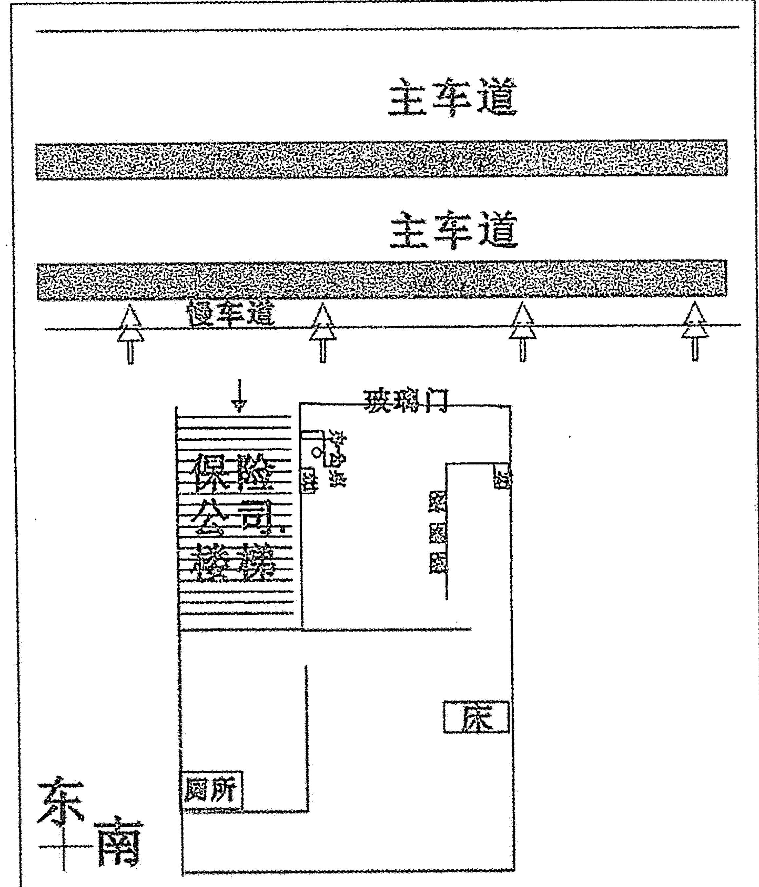
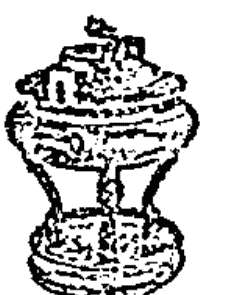
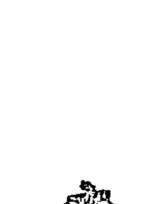
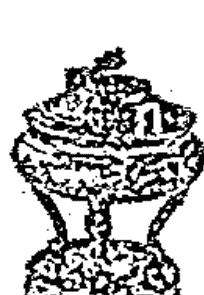

# 第一部分 经商风水

## 一、商业环境通说

### (一) 大环境的考察

风水学所研讨的内容不外乎四大部分，古人把它说为：一是方位，指建筑物坐落的方位；二是屋相，指的是建筑物的面貌，包括建地形态；三是格局，指建筑物内部的配置布局；四是环境，指建筑物以外四周足以影响建筑物的各类事物。这四项中环境最为重要。对于商业楼宇来说，如要研判风水，外围环境往往是首先被观察研讨的对象。

#### 1. 旺地才能旺财

风水学上说：凡是想要发大财、获大利的人，都知道要选择在商业发达的都会来经营事业。通观世界各地，凡是成为通商大埠、都会大邑之处，一定是山水汇聚，有旺盛的形势，可以吐纳百货、聚散人口，如此才能财通四海，富跨八方。

古人认为：不论作为商业或住宅用地，其建筑基址地形都要宽广平正，四方圆满才是吉地，至少应是规则的四方形，不宜为零碎、歪斜、三角形或前宽后窄等地形。这是因为地形方正即可使气势平衡，所建之房屋，无论外形或内部格局都安排得比较理想，不仅容易聚得旺气，生旺财气，而且有利于事业的发展。而有歪斜或三角形的地形则缺乏平衡性，气势较杂乱，旺气难聚，容易形成偏枯现象，如当作商用场所，经营起来会倍感吃力。

在大城市的建筑里，常常可以见到在高楼大厦间夹着一栋矮小的房子或小块的畸零地。风水学上认为：这种夹在大厦中间的矮小房子受到左右高楼的压迫，气势较弱，也不易纳到旺气，不论住家或商用都会受到不利的影响。这就要求在开发城市时做好整体规划，不要形成畸零之地。

由于人口增加，城市会不断地扩大，那些从前是坟场、刑场、监狱等用地加以整改后，可能成为商用或住宅大楼。现代风水学上认为：在规划这种地方时，一定要作适当处理，如原来埋葬尸体的地方一定要清除干净，最好连同泥土都重新更换，否则会因为阴气、积气聚集，造成气场杂乱，旺气不聚。搬进去后，不但会阻碍生意的发展，也于风水不利。因此在选地择居时，最好先了解一下背景，以免造成不必要的损失。

除了坟场、医院或发生事故的地方外，一些有毒、被污染的地方也不宜贸然建筑房舍。风水学上认为：风水讲“地灵人杰”，但这种地的灵气已经被破坏，生意、事业当然也会受到影响。

另外，店面或办公室最好能避免面对教堂、寺庙、医院或法院等场所。教堂、寺庙等属于宗教活动场所，人多杂乱，所以只适合经营与宗教有关的行业。而邻近医院则以经营药品、仪器等与医疗健康相关的产品较为适合。若邻近法院，应以律师事务所等行业较为理想。面对政府机关亦有其缺点，最好避免。

#### 2. 弯曲内弓有财气

做生意最好是选在人潮聚集的地方，有人潮才有钱潮，才能旺财。风水学上说：“山管人丁，水管财”、“山主贵，水主富”，也就是说水与钱财关系最密切。水的性质是流动，就像钱财一样不断在流动，只要有能力、有福气，经营得法，每个人都能赚到钱。

看看世界各地，大凡繁荣富庶的都市，都是聚集财富最多的地方，而且多为临海或大江大河的汇合处，这就是风水学上的“水即是财”的道理。因此，在经营生意选择房舍时，对“水”必须重视。就实质来说，河川、湖泊是水，聚集车水马龙的道路也是水。都市房舍都是临街而建，车子的流动方向就等于河水流向，关系着商铺生意的旺衰，也会影响到财运。

因为风水轮流转，风水上认为：依照时间运转而影响到空间的生旺衰败，所以商铺的衰旺辨别，必须了解三元气运的变换道理。如果当运旺水到位，便能汇聚旺气，生意兴隆，发财致富。

由于地球绕太阳运行又自转的关系，一般河流的右岸都是先发展，也较富庶繁荣，所以就流水和马路车行的方向来看，右边房舍商家生意会较兴旺，很多城市马路有单行道时尤其明显。

风水学上主张河川、马路要“屈曲”才有情意，如果是直来直往则会有损。也就是说弯曲的河道，水流缓慢，能聚旺气；直来直往，不易聚财。其实，屈曲是宇宙事物的现象，也是一种美的形象。就像建造马路，必须有弯曲弧度，才美观又安全，太直的马路（尤其高速路）驾车时容易有危险。与人相处亦然，太过直来直往的人，容易得罪人，所以做人也需要体会“屈曲有情意”的深意。

临弯曲河川、马路建设的房舍，以选择在弯环内侧为佳。古人认为弯曲的马路、河川护卫着人，俗称“内弓水”或“玉带水”，这种房子可以聚气旺人潮，招财致富。相反，如果形成反弓，即房舍在弯环外侧，气就会背离散去，这种房舍，不论是店铺还是公司，都很难经营。遇到这种现象，可以考虑利用鱼缸或水池、植栽等方法来加以补救、改善，不过一定要合利三元气运的水法。

另外，也要避免选在剪刀地或剪刀口上的房屋作为营业场所。所谓“剪刀地”即房舍正门对着一分为二的两条马路，成为两路的分水点，这种房屋不利财运，也易遭到意外伤害。

很多人开店做生意，最喜欢的位置便是俗称的“三角窗”，即位置是在十字路口的转角，人潮走动最多的地方。现代风水师认为在这种位置做生意、经营商业获利最快，这是因为车水马龙有流动，迅速感应，容易致富。但是也要注意车行的方向，尤其在面临单行道时，很容易会造成“一行反弓”的现象，离散旺气，就会影响商机。

#### 3. 店铺财路

房屋和道路好像是孪生兄弟，有屋宇必须要有道路。道路是屋宇的分界，也是一座屋宇到另一座屋宇的通道。里巷、街坊、区域、乡村、城镇都是由许许多多纵横交错、形同蛛网一般的大街小巷、通衢要道所组成的。

风水学上认为：如果以屋宇和道路的先后次序比较，多数屋宇的落成都在街道之后，故屋宇的受制性较大，对道路只有被动接受，而几乎没有选择的自由。

道路对建筑物的影响大致可以归纳两类：一是对门向产生冲煞，二是对店铺生意的兴盛衰落有影响。事实上，归根究底还是吉凶问题。

##### (1) 冲煞

先说冲煞。道路所产生的冲煞，对店铺和住家是没有分别的。

风水中讲“冲”是指冲举、冒犯，两事相忌，谓之“冲”。煞，是指凶煞，风水上谓之“煞气”。气是看不见、摸不着的东西，也不一定就是不好，旺气、生气、进气就是好气。

风水对于气很重视，在古今风水书上可以看到这样的字句，如气场、气口、纳气、山环水抱必有气。但气到底是什么？事实上，气的性质和空气不同，虚无缥缈，变化多端，只能以心意感应，无法用感官接触，它不像风和空气一样可以用感官感触而体验到其存在。气的特性是遇到比较强烈的风会被吹散，遇到水就会停止。风水学上认为它是宇宙形成时就已经遗留下来的东西。

气的分布无所不在，但却是分散的。就像一间屋，在还没有砌墙造屋以前，气场是分散的，等到砌好围墙，屋内便有了气场分布，当然其中有些气是好的，有些则是坏的。于是，客厅、卧室、厨房、大门等就分别产生了各种不同程度的吉凶。因而大门应怎样立向、卧室应朝什么方位，就有了一套法则。

风水上选择气场很讲究，这是因为气场隐藏福祸，能影响人的健康和运程。煞气，就是气场中的坏气，它遍布天地中，至于什么时候显现，怎样制化，就是一个很复杂的过程了。上面所说的“冲煞”就是气的一种。煞于风水不利，为求安全，自然是避开为好。

风水上有“一条直路一杆枪”的说法，可见直路的凶险。此相对来说就是所谓的路冲，开设在路口的公司、店铺、摊档正对直路，于风水不利。

如图一，D、E、F受到的祸害影响最直接，也最深；图二则以D为首冲，为害最大，其次是C、E、B、F，而A、C又再次之。直路冲，建筑物一眼就可以见到，虽然是凶煞，但未必会造成祸害。但如果不巧又遇上了坏的气场，两相结合，就极为不利。在生活中，平安就是福，为求安全，不管是做生意还是住家，还是避开煞位的好。

除了道路冲煞，还有长巷冲煞，亦为不利。巷愈窄，煞愈凶，灾祸也愈重。煞气是看不见的，不过到秋冬风起时分，可以站到巷子的尽头去看看那穿巷透隙的冷风，再比附煞气，也许就有些体会了。

特别值得一提的是，做生意的人万不能把店铺、公司开设在西南方的路冲上，对生意绝对不利。因为店铺的西南向最忌有道路、街巷相冲，这是散财位。

##### (2) 生意兴衰，道路攸关

一般来说，店铺和住宅可以由人取舍，而道路不是可以任意选择的。对于一间店铺，道路是地理上的先天环境，只能选择而没法改变。事实上，道路的位置方向对生意的影响极大。

看这样一个例子：某人在一条繁忙的马路旁边开设了一间皮具店，事前曾经和几个朋友到现场去考察过，有一个朋友劝他再考虑一下。根据朋友的经验，数年来，现址已先后开过几家店，但似乎没有一间是可以立足两年以上的。马路对面行人穿梭不绝，而马路这边，相比之下就显得冷清，但其中因由却说不出来。无奈此人心意已决，听后仅笑着说：“生意不同，各施各法。”朋友见他反应如此，自然不便多说，于是便着手部署，择日开张。投下的资金大部分是筹借来的，所以此人十分紧张，殷勤待客唯恐不周，还给予折扣，希望能够带旺生意。初期生意倒还不错，但后来却愈来愈差。惨淡经营一年后，仍无起色，半年之后，且不说其他开支，单是那巨额的租金，已压得他透不过气。勉强支持了一段时日后，只好罢手歇业。结果是血本无归，还背上了一笔债，他自问不曾做错什么，只好叹“天亡我也”。

事实上，此人店铺的生意完全被他朋友说中：只隔一条马路，不过十多米的距离，为什么对面旺丁旺财，这边却发不起来？

道路形成的阴阳吉凶格局，并不是短期内可以改变的。一间店铺无论屋相多好，只要地理环境出现问题，即使小心经营，投下再多的资金，花上再大的力气，也无济于事，这就是风水的效应。

风水师认为：开店做生意，店铺的正面大门不要面对北向道路。因为该方位含有凶煞，对生意不利。八卦干支上有九个方位对生意会有坏的影响，分别是壬、子、癸、戌、乾、亥、丑、艮、寅。大凡坐南朝北的商铺门面，门位只能开设在正对道路的一面，就算左偏壬也好，右偏癸也好，但始终在坎卦的范围。就算门向改变，作大角度的调整，倾向亥或丑，甚至是戌、艮、寅，同样还是落在不利的坏方位上。

做生意在一开始就要注意这个问题：找寻铺位须避免坐南朝北、马路在前面的房子。

前面说过，外围环境是不容选择的，万一必须在坐南朝北的铺位做生意，又该怎么办？事实上办法是有的，但只能减轻凶意而没有办法彻底化解。所以现代风水学上说的具体方法是：改善门的方位，把大门倾向亥、乾、戌三个方位，且处于295.5～337.5度之间，但不能把大门的中位重叠在乾的正中线上。

八卦上一卦管三山，如震卦管甲卯乙，坎卦管壬子癸。根据风水法则，每一间屋子的外围环境中都有一卦是先天水的卦位，水就是路。所以，如果道路经门前流破先天卦卦位，店的气运就会很差，不旺市。而人和生意是一事的两面，人客往来稀疏，又哪里来的财气！这里的流破是指水流，堪舆理念上高一分即山，低一分即水。水由上而下，自高而低，故是指地势低的倾斜度。因此，除方位外，道路的倾向也是判别吉凶的法则之一。具体方法是当下雨的时候，观察路面积水的流向。下面是风水术上认为对生意不利的几处道路方位，并附干支分辨的示意，以供参考。

- 商铺坐卯向酉：如果门前有街巷道路为坤艮走向，地势又是坤方高，艮方低，就是流破先天卦，做生意不利。
- 商铺坐巽向乾：如果铺位门前有街巷、道路，路的走向是艮坤，而地势又是艮较高，坤较低，店铺的生意就会受到影响，很不利。
- 商铺坐午向子：街巷道路如果就在门前，位置酉卯向，而地势是酉高卯低，就是流破先天卦，商铺的生意好不起来。
- 商铺坐艮向坤：街巷道路就在乾坤的一面，路向由巽向乾，地势巽高乾低，则商铺气运很难发展，生意也会受坏气影响。

上面所说的街巷道路方位，虽指商铺、公司，但住宅气运也适用，只不过坏的效应有别：做生意的是在钱财方面，而住宅则不利家运。

##### (3) 旺财道路

路相有凶相，自然也有吉相。吉相方位以坐西朝卯或坐子朝午为最好，也就是道路在商铺大门的东面或南面。如果商铺位置是坐卯向西，而道路又在西向，则商铺大门的位置应尽可能偏向乾位的一方，以减轻凶意。

虽终有好的街道方位，商铺本身也须有好的地势配合才好。所谓好地势，就是商铺所在的门面位置应该比街道地面要高出一点。相反，如果街道地面高过商店地面，就算有好的路相，却欠缺好的屋相搭配，也空有气运。单是大雨滂沱时的泛滥污水，就把吉气赶跑了。

据风水上后天流水的法则，如果商铺坐落在后天水流流经的街道旁边，就会有财气，容易赚到钱。譬如一间商铺，坐卯向酉，门前有街巷道路经过，走向是由午到子，而来路方向的地面比商铺的地面高，这就是后天水到。后天水到的屋子有财气，很容易发迹。

后天水到的财气位有八方：
- 商铺坐巽向乾（街道为酉卯走向）
- 商铺坐艮向坤（街道为卯酉走向）
- 商铺坐乾向巽（街道为艮坤走向）
- 商铺坐子向午（街道为坤艮走向）
- 商铺坐午向子（街道为乾巽走向）
- 商铺坐酉向卯（街道为子午走向）
- 商铺坐坤向艮（街道为巽乾走向）

但怎样才是后天水到？这就要观察地势的高低。除非地势倾斜度很大；否则一般不易觉察，而且须下雨天在门前观看积水流动的方向。

##### (4) 道路宜忌

路的尽头不好。所谓尽头，就是封闭的死路、死巷。死路煞气很重，害处极多。事实上，街道的尽头一般比较偏僻，是风水上的忌煞之一。

形状如剪刀般的三岔路口，煞气很重，路口的店铺犹如被一柄利剪夹住一样，会使事业受阻。如果剪刀路冲屋，直路对着店门，既夹又冲，凶煞会加重。

道路形成半弧在店铺门前绕过，是吉利的好路。风水上时常提到的“玉带环腰”，指的就是这种道路，正所谓“宅前水路来环抱，事业顺利富贵好”。相反，如果成半弧内弯向外，而凸显的半圆对着店铺，则效应正好和环抱相反，称为“反弓”。反弓于风水不利。

跟反弓路相似的是高架桥，高架桥边的商店俗称刀煞，不利风水。

四周都是小街小巷，居中只有一间孤单独立的店铺，是凶相。

#### 4. 道路形态的影响

##### (1) 三岔路

从风水上来说，一般都不喜见三岔路，因为三岔路有使商运不平稳的影响力。若三岔路中有一条路冲着店铺，就会产生极为不利的影响。

##### (2) 十字路

十字路，是指一条横路加一条直路，两者相交，便成为十字。

店铺贴近十字路的风水好与不好比较难下判断，因道路有来有往，吉凶要视其配合。一般来说，在排出星盘之后，再观十字路在吉方或凶方合不合本命，则可准确分析。

##### (3) 反弓或抱身路

当店铺前同时出现反弓及抱身的路，实为一种财来财去的现象。一方面收入十分丰厚，但大数目的开支亦会产生高昂的成本，即所谓是“有钱赚而无钱剩”。如遇此等问题，可于门前挂一块镜子来化解。

##### (4) “T”字路

店铺向着“T”字路，一般已犯了路冲。向着“T”字路的路尾，前方有横路，继而冲路。向着“T”字路的路头，则前方直路冲来，大不利。

如逢店铺面向“T”字路，一定要看这路在店铺的吉方还是凶方。有经云：“冲起乐宫无价宝，因宫冲起化为灰。”

##### (5) 天风煞

商业忌犯“天风煞”。何为“天风煞”？即是指店铺迎面向着两座大厦中间的缝隙，风经这道缝隙吹来便形成天风煞（又名天斩煞），意指天风之煞气如无

## 旺铺办公室风水宝典

形的刀斩来。假设真的犯天风煞，可以挂设六帝古钱来化解。用来化煞必须用真古钱方为有效，仿造视为无效。

（6）“水龙反走”局
水在风水中的重要位置是不容忽视的，所谓“水管财禄山管丁”。做生意最要紧的就是财旺，财弱则很容易倒闭。
“水走”即指水向前方流走的意思，从自己的店铺门前看见有一条马路，近的一方较高，然后一直向前方低下去，便是“水龙反走”局。就算“T”字路，也可断其财运不佳。所以，在考察之时，逢“水龙反走”就不宜开店。

（7）赶丁煞
如在店铺门或窗前有一电灯柱，抑或大型灯箱牌，便主门外犯赶丁煞。赶丁煞对风水极为不利，在选择布局时应特别留意这一点。

（8）直路空亡
大门风水重要的一条，就是不可有路冲，风水上称“直路空亡”，是指大门正对一条大路，主退财。正对着直路的房子易受往来车辆的不利影响，属于大凶格局。现代大楼对着大路，二楼以上房子应不会受往来车辆的影响。但是，若依气场的角度来看，正对着路的大楼都易受气场直冲，于风水不利。

（9）剪刀路
剪刀路也就是说一出门就看到两岔路冲入门内，风水上叫做“剪刀路”。交叉的气场会影响商业管理者的决策和判断。

（10）面对死巷
大门不可面对死巷，否则气流会受阻，对健康有不良影响，对生意也不利。

## （二）商业店铺的选址

1. 取繁华避偏僻
在市镇上，人流密集的地方就是繁华的地段。按照风水的说法，有人就有生气，人愈多生气就愈旺，有生气就能带来生意的兴隆。
从经济学角度来说，市镇上的繁华地段就是商品交易最活跃、最频繁的地方，人们聚集而来，很大程度上就是为了选购商品。
将店铺选择在市镇繁华的地段开业，就可以将自己的商品主动迎向顾客，起到促销的作用，将生意做得红火。相反，若开设在偏僻地段，就等于回避顾客。商铺开张经营，而顾客很少光顾，就会使商铺冷冷清清，甚至门可罗雀。按照风水的说法，人代表生气，没有人光顾，商铺就缺少生气，生气少，就是阴气生。生意不景气大多是阴气过盛，于风水不利。

在我国的大多数城镇，繁华的地段往往都是集中在“T”字形和“Y”字形的路口处，如果选择在此开店，就会受到来自大道上煞气的冲击，若不在此开店，又避开了有利于发财的生气。在这样的情况下，需要采用风水上的化解方法。

一是要求在“T”字形和“Y”字形路口开设的店铺前加建一个围屏或围障，或是将商铺门的入口改由侧进，以挡住和避开迎大路而来的风尘；二是在店前栽种树木和花草，以增加店前的生气、消除尘埃；三是尽管采用了以上的方法对商铺门前的生气与煞气进行了调整，但在此路段经营，还有很大的风尘。因此，还要注意多在门前洒水消尘，以保持店前空气的清新。另外，还要勤于清扫，及时擦洗店面的门窗，以清除沉积的尘土。

总之，在“T”字形和“Y”字形路口处经商要保持店内外的清洁，特别是对于要求讲究卫生的饮食、水果类生意尤为重要。

### 2. 取开阔避狭窄

人们在选择宅址时，讲求屋前开阔，能接纳八方生气，这与经商讲究广纳四方来客是契合的。按照这一原则，在选择商业地址时，应考虑店面正前方是否开阔，不能有任何遮挡物，比如围墙、电线杆、广告牌，等等。

店面门前开阔，可以使商业面向四方，不仅视野广阔，也使较远的顾客和行人都能看到店面，这种信息的传递叫做“气的流动”。有了气的流动，就会生机勃勃。从经商的角度来说，顾客和行人接收到了商品信息，就可以前来选购。

在商品经营活动中，可以说没有商品信息的传递，就没有顾客，没有顾客就没有生意。如今商品广告的盛行，就是看中了在商品经营活动中商品信息传递的重要性。

利用店面作为商品交易的场所，是一种有固定经营场所的经营活动，这种经营缺乏一定的灵活性。因此，要使顾客上门，设计一个引人注目的门面是最基本的。门前有顾客，就有了生气。顾客愈多，生气愈旺，其结果就是生意愈好。

选择在一个狭窄的地方开店，或者是店前有种种遮掩物，亦不利于商品的经营。店面狭窄，或是将商品经营活动局限在小地域和小范围之内进行，这种有限的经营空间不可能有大的经济收益，应该搬迁或改造。

对于店面狭窄或者受遮挡的商铺，改造的对策有四点：一是拆除店前的遮挡物，使店面显露出来，二是如果店面狭窄无法改变，就把店牌加大高悬起来，使较远地方的人抬头就能看到；三是通过电视、电台、报纸、广告牌等媒介广泛地进行介绍宣传，尽量做到使顾客知道店铺的地址、经营的商品以及商品服务的特点；四是积极参加各种社会赞助活动以扩大知名度。

### 3. 取南向避东北向

商铺在选址时，力求坐北朝南，其目的是为了避免夏季的暴风雨和冬季的寒风。经商地址的选择，也同样需要考虑避日晒和寒风。那么，最佳的取向则是坐北朝南，即取南向。

作为经商性质使用的店铺，在进行经营活动时需要把门全部打开。如果店门是朝东西开，那么，夏季火辣辣的阳光就会从早晨照射到傍晚，风水将此视为煞气。这股煞气对商业的经营活动是不利的。煞气进入店内首先受到干扰的是店员，店员在烈日的暴晒之下，很难维持良好的工作情绪。处在这样境况下的店员，必定心火烦躁，因而也就势必对经商者视为“上帝”的顾客简单应付，甚至粗暴对待。如此这般，当然也就谈不上做买卖了。

受到煞气干扰的还有商品。商品在烈日的暴晒之下会严重影响其质量。如果商品存放不久即能卖掉，其影响还不大，倘若商品是久销不动，就非得报废不可，结果是直接影响了收入。

顾客也会受到煞气的干扰。店铺内热气逼人，对顾客来说，不到迫不得已是不会登门的。商铺没有顾客，煞气就更重。

如果店铺朝北方，冬季来临也不堪设想。不管是刮东北风，还是刮西北风，都会朝着门户大开的店铺里钻。风水视寒气为一种煞气，寒气过重，对人、对经商活动均不利。

只要商铺选择坐北朝南，即取南向，就可避免少受朝东西向和西北向所带来的一切季节性的麻烦和不利，其生意就有可能比前二者更好。如果是迫不得已，商铺非要选在朝东西向和西北向的地址，就要采取措施来制止住夏冬两季所带来的煞气。在夏季，可在店前撑遮阳伞、挂遮阳帘、搭遮阳篷等等，以避免烈日的直接暴晒。在冬季，则需要给店铺挂保暖门帘，在店内安装暖气设备，使店内温度回升，以造就一个适于进行正常经营活动的环境。这种调节寒暑的办法，风水上叫做“阴阳相克”，或曰“五行相胜”。

选择经商地址要考虑的因素还有很多，比如考虑选择一个带有吉祥意义的街名，或者是选择一个认为能给自己带来好运的门牌号码等来作为店铺的地址。这样的选择，除了能给经商者和顾客在心理上以某种安慰之外，还具有吉祥生旺的寓意。

## （三）不同地域的商业风水

### 1. 接近天桥口的商业风水

在人口稠密的大城市，天桥与隧道的建设都是不可避免的，而这一类疏导交通的建筑，以天桥风水的影响最为直接。
从风水角度而论，阳宅以动为主，动则属水，天桥便属水，天桥口的店铺则如水口位，可以接水，财运确实比一般位置的店铺要好。
不过，在选择店铺时还要考虑到的是，这等水口位较其他位置财运要旺、要强，但若租金与其他位置相差太远，亦不可选。另外，水口位的店铺，除了最接近的第一家可作为首选外，在水口位附近的其他位置也可作次选。
很多店铺都会向着天桥，而天桥对店铺会造成什么样的影响，便要视店铺的高度而定，高度越高，越有利。
至于商业大厦，公司居于较高的位置一般都较为有利。因为低层不论天桥反弓或抱身，都以不吉论，都属于犯“贴压煞”。

### 2. 接近隧道口的商业风水

位于隧道口的商业风水又如何呢？由于隧道为向下凹去的地方，亦为引水走之地，所以店铺门向着隧道，在风水上不利。
店铺向着行人隧道，不利积财，向着汽车进出的隧道，更加不聚财，因此在选择时要留意。但是，行人隧道若是通往地铁站的话，此隧道为疏导聚水局之气，店铺接近之，亦收到此气。水者管财，所以如店铺处在通往地铁隧道处，作吉论，主旺财。

### 3. 接近天井的商业风水

有很多大型商厦的商场部分设计成一个类似天井的造型，二楼以上的数层可围绕着栏杆凭栏俯望。从风水来论，不论店铺是在二楼也好，还是三楼或四楼也好，只要门前向着一个天井，便谓之聚财铺。下方的平台便等于风水上的明堂，明堂便是聚水之堂，所以在挑选店铺时，能够向天井的比向着走廊的要佳。因为走廊只是窄长的水，亦等于只能够收得小小的财运。

## （四）正确选择开店的地段

店铺销售的商品种类不同，其对店址的要求也不同，考虑的一个基本出发点是便捷。从大的方面来讲，就是要在消费者日常生活的行动范围内开设店铺，诸如距离居民生活区较近的地方、上班或上学的途中、停车场附近、办公室或学校附近等等。同时还要注意，并不是所有的店铺开在闹市区就有好的营业额，要根据店铺的性质来定，即考虑店铺如何靠近自己的顾客群。有的店铺要求开在人流量大的地方，比如服装店、小超市，而像性保健用品商店和老人服务中心，就适合开在偏僻、安静一些的地方。又如卖油盐酱醋的小店，开在居民区内生意肯定要比开在闹市区好，而文具用品店，开在黄金地段也显然不如开在文教区理想。各行各业均有不同的特征和消费对象，黄金地段并不就是唯一的选择，应该遵循“合适就好”的原则。

选择店铺的位置，需要知道有哪些地段适合开店，这涉及到对商业开设区域的定性分析。

### 1. 车站附近

零售店的经营者应该重视附近的有利地形，千万不要小看车站，车站附近（包括火车站、长途汽车站、客运轮渡码头、公共汽车的起点和终点站）是往来旅客集中的地区，聚集了天南海北的旅客，所以车站附近一直被看作是开店的黄金口岸。这些地段的优势在于这里的顾客主要是过往乘车的旅客，与上班族和学生有很大不同，他们选购的商品虽然非常广泛，但大多以购买不费时间、容易携带的商品为主。开店的地址应该在离车站100～200米左右最为合适，零售店的方向如果能够选择正对车站的出入口或是可以顺利进出车站的交通便利的路线，那么就是最好的。

由于人群流动量大，车站的附近可以开设一些土特产店、礼品店、饮食店、箱包店、食品店、旅店、书店、代办托运店、公用电话亭、物品寄存处、饮料店、快餐店、旅游纪念品店、出租相机店等等。开店经营的商品需具备价位不高、易于携带、符合生活需要的特点。车站主要以搭乘大众运输工具的乘客为主，但因其年龄、职业、爱好和目的的各不相同，有旅游的、有出差的、有探亲的，故开店时应针对特定的消费客户，在开店方向和经营方式上多下功夫。

### 2. 商业区地段

商业区地段是居民购物、逛街、休闲的理想场所，也是店铺开业的最佳地点。但由于商业区场地费用比较高，因此并非是一切店铺的理想开设地点。这些地段费用高，竞争性也强，除了大型综合性的商场外，还比较适合开设一些有鲜明特色的产品或服务的店铺。这一地段的特征是商业效益好，投资费用相对较大，所以应有针对性地对顾客提供服务。

### 3. 办公区集中之地

这些地段是上班族集中之地，其光顾商店的目的不外是果腹或采购日常生活用品、办公用品以及谈生意、聊天。该地段的特征是：午饭与晚饭时间为营业高峰期，周末与节假日的生意清淡。

当前在很多城市，纯粹的办公区很难找到，多半是商住混合型的。这里所讲的办公区只是相对而言，意指公司聚集较多的地段。在这些地段开店，应充分考虑到主要消费者是上班族。这类消费者的消费档次、消费水平较高，而消费者年龄也不大，一般多是二三十岁的年轻人，因此开店应以这部分人为主要目标。办公区店铺的消费者虽然大部分是上班族，但也有当地居住者和外来逛街者。

上班族有一个特点，就是只有中午短暂的用餐和休息时间，因此他们不会去离办公地点太远的地方，而附近便成了他们用餐、休息之处。因此，离办公楼愈近，顾客的来店率愈高，尤其是用餐的地方或咖啡厅、冷饮店。

开店地址应多以下班路线为主。上班时要赶时间，来去匆匆，光顾店铺的机会少，下班时因心情松弛，逛街购物的机会就自然较多，故在下班途中设店最好。

总之，开店位置的选择除了考虑区内行业分布、下班路线外，还应考虑到区内大楼的排列，道路的分布、延伸，店铺的串联或断裂以及人潮方向等。在办公区开店，最好以休闲行业、餐饮业和为办公提供服务的服务行业为主。由于消费者的时段集中且短暂，故在服务和经营上应充分考虑。

### 4. 学生聚集地附近

这些地段处于学校附近。学生去商店的动机主要是购买学习用品、书籍、生活必需品，以及聚会谈天、消遣时光，此时应针对学生的需要，提供适当的服务和商品。

这里所指的学校，主要是指大、中专院校。大、中专院校又分两种：一种是位于城市的郊区，交通闭塞；另一种是位于交通便利的地方。后一种由于其所处市中心位置，故学生的需求不一定依赖周围的店铺，这是由学生的学习和作息时间决定的。

一种风险小而又有盈利的方式就是在地处郊区或比较偏僻的大、中专院校附近开店。店址最好在离学校几百米以内，以顺道为最佳。这类店铺包括流行服饰店、眼镜店、文具店、日用品店、书店、音像店、运动用品店、自行车店等。除寒暑假外，这些零售店的收入一般都比较稳定。经营此类店铺，关键的一点是商品价位要经济。

### 5. 住宅区地段

这些地段的顾客一般是住宅区内和住宅区附近的居民，以家庭主妇为主。这些地段的特征是：有关家庭生活的商品消费力强，尤以日常用品消费量最大，凡能给家庭生活提供独特服务的商店，都能获得较好的发展。

一般情况下，人们习惯到一些大中型的商场或繁华市区去购买时尚流行商品或是一些较为高档的耐用品，但是一些如食品、烟、酒、五金、杂货之类的日常用品，就喜欢到离家比较近的地方购买。另外适合开的小铺还有米店、发廊、报刊亭、裁缝店、托儿所、送水店、水果铺、洗衣店、食品店、药店、服装店、童装店、修理店、杂货店、五金店、化妆品店等。在居民区开店，房屋租金一般不会太高，这就说明零售店经营者开店的投资不会太大。在居民区，学生的消费水平也不可低估，经营者也可在学生消费上仔细琢磨，寻求更高的利润。

### 6. 公园名胜、影剧院附近

因为是娱乐、旅游的地区，顾客的消费需求主要在于吃喝玩乐，故适合于餐饮、食品、娱乐、生活用品等方面的商店发展。但这些地段常有时段性的特征，高峰时人潮汹涌，低谷时门可罗雀。当然，如果靠近居民区、商业区的话，则另当别论。

### 7. 医院附近

特别是以带有住院部的大型医院为佳，这些地方孕育的市场潜力也不能小觑。一般人去探视和照顾病人，总会就近购买一些生活和礼节性用品，所以在这里开设水果店、鲜花店和一些日用品店是个不错的主意。

如果能考虑医院自身的特点就更好，比如：在妇产科医院附近开设妇女用品商店，在儿童医院附近开设儿童玩具商店，在眼科医院附近开设眼镜店等。另外，一些不起眼的小吃铺、书报亭都是不错的打算。

### 8. 市郊地段

这些地段以往被认为是不太理想的开店之地，可是由于城市的迅速发展和车辆的大量增加，市郊地段的商业价值正在上升。这一地段的特征是：主要向驾驶各种车辆的人提供生活、休息、娱乐和维修车辆的服务。

我国城市的市郊地段具有相当的可变性，许多目前人口并不多的市郊地段，随着城市建设的发展，会变成繁华的社区中心。眼光远大的投资者如能把握机会，提前一步择地开创基业，日后财源定会滚滚而来。

以上几种地段的分类并不是绝对的，有的地方可能同时具有两个到三个地段的特征。所以，商店在选择位置时，还需要具体问题具体分析。

## 二、商业风水宜与忌

### （一）风水学上的商业风水之宜

宜—商铺宜开在商业中心区

精明的生意人能够借用天地之利，以达到财源茂盛的目的。有些娱乐场能让人感觉到神清气爽，如沐春风，而有的则给人以压抑沉闷，坐立不安的感觉。究其原因，“形格”的影响非常重要。场所周围的环境选定后，其次就是看它的“形格”，再其次才是它的内部设计等等因素。观察娱乐场外观造型与所处的区域的自然景致是否相协调，最简便的办法就是早晚从不同的角度来观察其外观是否美观，并且符合风水之格局。一般来说四方宽敞、光线明亮、布局协调的格局才是上乘之选。

宜—商铺宜开在有发展空间的市郊

城市郊区地段的人口并不多，以前往往被认为是不太理想的开店之所，根据我国的国情，城市的市郊地段具有相当的可变性。由于城市的迅速发展，市郊地段的商业价值正在逐年上升。同时随着城市建设的发展，市区中心的污染也越来越严重。相对而言，市郊的环境破坏没那么严重，更适宜人的居住。随着大量人群的居住，这里将会变成繁华的社区中心。这一地段的特征是，门面租金便宜，经营项目可选择提供生活、休息、娱乐和维修车辆的服务。眼光远大的投资者如能把握机会，提前一步在市郊开创事业，日后财源必定滚滚而来。当然，并不是所有的市郊都适合开店，应根据当地的发展方向和城市规划来具体选择。

宜—商铺宜邻近娱乐场

娱乐场所、旅游区附近的特点是周期性较强，高峰时人潮汹涌，低潮时甚至会无人问津。当然，如果是靠近居民区、商业区的话，则另当别论。因为是娱乐、旅游地区，顾客的消费需求主要在于吃喝玩乐、休闲娱乐，故开设餐饮、娱乐、生活用品方面的商铺生意会较好。

宜—商铺宜开在住宅小区

住宅小区附近的顾客一般就是附近的居民，购物对象平时以家庭主妇为主，节假日和下班时间则以上班族为主。这些地段的特征是，有关家庭生活的商品消费力强，尤其日常用品消费量较大，凡是能够给家庭生活提供服务的商铺，都能够获得较好的发展。

宜—商铺宜临车站、关口

火车站、地铁站、长途汽车站和关口附近是往来旅客集中的地区，也是适合开设商铺之地。这些地段的特征是，这里的顾客主要是南来北往乘车过关的旅客，与上班族和学生有很大的不同，他们选购的商品虽然非常广泛，但大多购买方便携带的商品居多。人群流动量大的地方，如深圳的罗湖口岸，这些地段的商业价值较高，尤其适宜发展餐饮、食品、生活用品等方面的商铺，如小吃店、副食品店、特产商品店、旅馆、电话亭、物品寄存处等。

宜—商铺橱窗宜有广告招贴

在现代商业活动中，橱窗既是一种重要的广告形式，也是商铺店面装饰的手段。一个构思新颖、主题鲜明、风格独特、手法脱俗、装饰美观、色调和谐的商店橱窗，与整个商店的建筑结构和内外环境构成一幅立体画面，能起到美化商店和市容的作用。从整体上来看，制作精美的室外装饰是美化销售场所和装饰商铺、吸引顾客的一种手段。商铺橱窗引人注目，天长日久后商铺自然美誉远扬，顾客也会越来越多。

宜—商铺设计宜有特色

对于一间商铺的形象是否适合，设计是否美观的问题，不但要以该商铺设立的时间、地区和顾客对象的喜好为依据，还要根据市场的需求和顾客的购买动机、消费习惯及与同行的比较等因素，要通过详细调查、研究后再着手设计。总的来说，商场的设计装修要讲究个性、特色，这样才能突出卖点，更能招揽顾客。

宜—商铺收银台宜设在白虎位

风水上认为，商铺的收银台应设在白虎位（人站在室内往大门方向看去的右边就是白虎位），也就是在不动方，这样才能守住入库的钱财。收银台是钱财主要的进出之地，切不可设在流动性较大的龙边，否则不利财气。其实，这也是为了符合人们靠右行走的习惯，从里面出来时一般习惯性靠右走，而这边正好是白虎位的付账处。收银台在不动方的地方如果正好是玻璃，则应该把这一面玻璃加以遮盖，也可安装窗帘或用装饰板将其遮掩。

宜—商铺的大门前宜开阔

居家风水一般讲究屋前要开阔，以接纳八方之气。商铺的门前开阔，则能广纳八方来客。商铺选址时要注意，大门前不能有任何的遮挡物，比如围墙、电线杆、广告牌和高大遮眼的树木。商铺门前开阔，不仅可以使视野广阔，也可以使商铺面向四方，让处在较远的顾客和行人都可看到。商铺门前有了顾客，就有了人气和生气。顾客愈多，生气愈旺，其结果就是生意愈来愈好。

宜—商铺的颜色宜明亮

按照风水上的说法，对地面的装饰就是凝聚生气。地面生气的强弱，除决定于地板砖表面的光滑明亮外，还注意地板砖的颜色。颜色对于风水来说，有象征性的意义。首先要保证墙面颜色的明亮，因为明亮的颜色才会给人带来光洁舒适的感觉。风水学认为，明亮就是生气，有了一个光洁舒适的经营环境，就能赢得顾客，更能赢得良好的经营效益。

宜—商铺宜选用吉祥字号

旧时人们采购物品时，大多选择商铺字号的吉利性，甚至会舍近求远，因此，许多商铺就因吉利的字眼而声名远扬，生意日渐兴隆。商铺的字号，除了要突出商铺特色，配合经营者阴阳命理之外，还宜给买卖双方带来兴旺发达、吉祥如意的好兆头。旧时民间商铺字号的用词用字，总在乾、盛、福、利、祥、丰、仁、泰、益、昌等吉利的字眼上选择，意为招财进宝，一本万利，大发鸿财。经营文物、古玩、书刊、典籍、文房用品、医药等业的商铺字号，则多取典雅的字眼。

宜—商铺名称宜依照笔画取名

商铺名称笔画的阴阳之说是选用汉字笔画的单与双，辅以阴阳属性，然后按照阴生阳的定律来选取商铺名的用字。具体做法是，笔画为单数的字为阴，笔画为双数的字为阳。如果选用作为店名的字是——阴——阳，则一个字的笔画为单数，另一个字的笔画为双数。如果这个字是按先单数后双数，即先阴后阳的顺序排列的店名，就是吉利的店名，属于吉利店名的排列还有阴——阴——阳或阴——阳——阳等。反之，不吉利店名的排列是阴——阳或阳——阴——阳。

宜—商业场所的楼梯口宜宽敞

有的商铺开设在二楼或二楼以上，需要通过楼梯才能到达。在设计商业场所时，上下的楼梯口不可狭窄、拥挤，否则容易产生压迫感，使顾客不愿意光顾。

理想的楼梯应该宽广、明亮，不仅从视觉上看起来心里舒畅，而且还要兼顾安全。同时，楼梯也是财气进出的通道，楼梯口宽阔，也就意味着财路宽阔。

#### 宜—商铺宜有圆形水池

在传统风水学中，水代表“财”，“水”的安排恰当与否，和公司的财富有密切关系。圆形可以藏风聚气，所以商铺前若有喷泉或瀑布等水景，最好将水池设计成圆形，并要向商铺稍微倾斜内抱（圆方朝前）。从风水学的设计角度来讲，水池设计成圆满的形状，圆心微微突起，这样才能够藏风聚气，增加居住空间的清新感和舒适感。同时，圆形也不易有犄角旮旯隐藏污垢，便于日常清洁。

#### 宜—天桥两端的出入口宜开商铺

风水学认为道路即为水，天桥口也就是水口。葬书云：“登山看水口，入穴看明堂”。一般来说商铺靠近天桥不吉，但是天桥口在当运之星位或在生气进气之位，便为吉论，商铺的生意也会逐渐增长，而且天桥来往的行人较多，人气较旺。

#### 宜—商铺的地面宜平整防滑

商铺地板应平坦，不宜有过多的阶梯，也不宜制造高低的分别。有些商铺采用高低层次分区的设计，使得地板的高低有明显的变化，而财运也会因地板的起伏而多有坎坷。还有的设计者会将商铺内的地板凹下去一阶，或将室内某部分的地板加高一阶，以使之看起来有变化，其实这是一种不好风水的表现。风水学认为，不平坦的地板会导致身败名裂。从实际运用的角度来分析，高低不平的地板也容易发生意外，不小心会一脚踩空而跌倒，对经营者和顾客都不利。

#### 宜—商铺内宜通风透气

风水上说房屋的纳气，也就是指房屋内部气的流动。商铺是一个人群密集的区域，是一个商品堆积的区域，所以更需要纳入新鲜的空气，也需要厅堂内气体反复的流动。气体流动可以驱走浊气，带来新气，也可以驱走湿气，带来干爽之气。风水中的“纳气”，在一定的意义上，可以理解为通风透气。商铺的通风透气，对商品的保管与交易都是很有好处的。使商铺通风透气，也是商铺装饰时所要考虑的重要原则之一。

#### 宜—武财神宜面向商铺大门摆放

商铺中除了某些神像应该面向大门外，其余的则不需要墨守成规。举例来说，“关帝”以及“地主财神”应该朝向大门，其他则不必如此。“关帝”是武财神，龙眉凤眼，手执青龙偃月刀，不单威武非凡，而且正气凛然，故此一般商铺大多奉为镇店之神。若是正对大门便有看守门户的作用。“地主财神”的全名为“五方五土龙神，前后地主财神”。在传统社会里，“地主财神”供奉在商铺内，与供奉在大门外的“门口土地”，一内一外，作为商铺的守护神。

#### 宜—商铺的店面宜宽敞明亮

宽敞、明亮的商铺的店门，按风水的说法就是宽敞的气口，利于纳气、招财。气的流入较快，商铺内充满生气和人气。狭小的店面，容易造成人流拥挤，令一些顾客见状止步，甚至还会因人流的拥挤而发生一些争论及扒窃事件，最终影响到商铺正常的营业秩序。

#### 宜—商铺内宜设镜子

镜子可以反射灯光，使商品更鲜亮、更醒目、更具有光泽。有的商铺会运用反射灯光，使得商品更鲜亮、更醒目、更具有光泽；有的商铺则用整面墙作镜子，除了上述的好处之外，还可给人一种空间增大了的假象。所以最好在商铺内光线较暗或微弱处设置一面镜子。镜子又分为凹镜、凸镜和平面镜。一般而论在屋内放平面镜有收聚财气的作用，而朝向窗外或屋外的平面镜则有反射煞气的作用。凸镜有分散的作用，可以将电灯柱、尖形物体、路冲、旗杆冲射、天斩煞、道路指示牌、烟囱这些煞气卸去，故属于“化解煞气”的风水用品。凹镜有更强的“收聚”的力量，当某些方位出现地气逸走或吉利物体远离住宅太远时，可利用凹镜来收聚。

#### 宜—商铺的保险柜宜摆放在财位

商铺的财位放置落地式保险柜，是非常符合风水要求的做法。保险柜里面可放置贵重金饰、珠宝、存折等，但必须秉持“财不露白”的原则，不可买回保险柜就大大方方的往财位一放了事。可以做一些室内设计，将保险柜加以遮掩装饰，使人不知道里面是保险柜，外观应形似一般的橱柜为好。同时金柜口不宜朝向门口，否则容易导致财来财去；商铺保险柜的门也不宜向着顺水流，否则容易导致耗财连连。

#### 宜—天花板高度宜与商铺面积相宜

商铺天花板的高度要根据其营业面积来决定，宽敞的商店应适当高一些，狭窄的商店则应低一些。一般而言，一个 10 ~ 20 平方米的商铺，天花的高度在 2.7 ~ 3 米左右，可以根据行业和环境的不同作适当调整。如果商铺的面积达到 300 平方米，那么天花板的高度应在 3 ~ 3.3 米左右；1000 平方米左右的商店，天花高度应达到 3.3—4 米。天花太高，上部空间就太大，会使顾客无法感受到亲切的气氛；反之，天花过低，虽然可以给顾客亲切感，但却使店内的顾客带来压抑感。

#### 宜—商铺宜近“三流”

三流指的是水流、车流、人流。风水上讲究阴阳，水流属阳、属柔、属虚，而商铺则属阴、属实、属刚。以商铺迎取来水，便是旺财铺。水流为流动之气，车流、人流亦属于流动之气。故选择商铺，最好选择水流停聚之处，如码头等，选择车流停留之处，如停车场、地铁站、火车站；人流则需看其大规模的来去走向。经商的风水必须收得水流、车流、人流方能旺财，没有三流，生意则难以开展。

#### 宜—商铺的财位宜摆放吉祥物

商铺的财位是旺气凝聚的所在地，若在那里摆放一些寓意吉祥的招财物件，例如金橘盆栽、福禄寿三星或是文、武财神的塑像，则会吉上加吉，有锦上添花的作用。

#### 宜—商铺的财位宜明亮

财位宜明亮，不宜昏暗。财位明亮的商铺会生机勃勃，因此财位如有阳光或灯光照射，对生旺财气大有帮助，如果财位昏暗，则有滞财运，需在此处安装长明灯来化解。安装在财位的灯，一般来说，数目应以 1、3、4 或 9 为宜，而光管亦以这数目为宜。

#### 宜—商铺的财位宜置植物

财位上宜摆放长势茂盛的植物，可令家中的财气持续旺盛，运势更佳。因此在财位摆放常绿植物，尤其是以叶大、叶厚或叶圆的黄金葛、橡胶树、金钱树及巴西铁树等最为适宜。但要留意的是，这些植物宜用泥土来种植，不宜以水来培养。财位不宜种植有刺的仙人掌类植物，因为此类植物是用来化煞的，如不明就里，则会弄巧成拙，反而造成伤害。而藤类植物由于形状过于曲折，也最好不要放在财位上。

### （二）风水学上的商业风水之忌

#### 忌一商铺忌处偏僻地段

按照风水的说法，有人的地方就有生气，人愈多，气愈旺，而生气是生意兴隆不可或缺的条件。如若将商铺开设在偏僻地段，就等于回避顾客，没有人光顾商铺，商铺就会缺少生气。生气少就会阴气生，阴气过盛，则商铺的生意就会不景气。所以如果一个商铺的地段太过偏僻，阴气过盛，不仅经营会亏本，严重的还会损伤店主的元气，致使商铺关门停业。

#### 忌一商铺忌临高速公路

随着城市建设的发展，高速公路越来越多。由于快速通车的要求，高速公路边一般有固定的隔离设施，两边无法穿越，公路旁也较少有停车设施。因此，尽管公路旁有单边固定及流动的顾客群，也不宜作为商铺选址的区域。通常人们不会为了一项消费而在高速公路旁违章停车。另外，高速公路的路冲煞比较严重，对附近人的健康也会造成一些不利的风水影响。

#### 忌一商铺忌临隧道出入口

隧道口是向下凹去的地方，象征引水走的地方。风水上水为财，所以商铺门口向着隧道，代表不能聚财。商铺向着行人隧道的出入口，不能聚财，若向着汽车进出的隧道，则更加难以聚财。但是，隧道若是通往地铁站则不在此例，因为这种隧道有疏导聚水局之气，商铺接近之，也能受到此气的影响，所以商铺处在通往地铁隧道附近或接近之，则作吉论，经营者旺财。

#### 忌一商铺忌开在坡路上

正常情况下，商铺场所的地形应与道路的路面处在一个基本的水平面上，这样比较有利于顾客进出商铺。商铺设在坡路上是不可取的，因为这种格局难以招揽顾客。如果商店不得不设在坡路上的话，就必须考虑在商店与路面之间的适当位置设置入口，以方便顾客进出。商铺大门的路面与商铺的地面高低悬殊较大，也会妨碍顾客的进出而影响商铺的生意。

#### 忌一商铺忌开在商业饱和地段

商业网点已经基本配齐的区域，称为商业饱和地段，这种地区开商铺投资较大，竞争激烈，不宜作为商铺的首选地址，发展前景不是很大。这是因为在缺少流动人口的情况下，有限的固定消费额并不会因为新开的商铺而增加。

#### 忌一商铺忌前门、后门相对

一些大的商铺会在店面的前方和后方各开一扇门，以方便顾客的进出，吸引更多的顾客。这种格局似乎对生意有利，但从风水的角度而言，气流可以通过前门而直通后门。风水理论中最忌气流互通，“气流直通财气流空”，这种格局难以聚财。除了少数的情况之外。“两门相对”会令财气不聚，所以即使有必要开两扇门，也不宜出现两门相对的格局。

#### 忌—商铺忌临反弓路

“反弓路”呈弯曲型，住宅之门正对此路，易犯“反弓煞”。“反弓煞”即住宅门前有弧状道路向外拱出，住宅区的人易受血光之灾或破财。当商业大厦或商铺门前同时出现反弓路或环抱路时，会出现财来财去的状况。一方面经营收入十分丰厚，但商铺中大数目的开支也会使经营者失去预算，正所谓“有钱赚而无钱剩”。如果遇到此种情况，可于门前设一块镜子来化解，具体还需咨询专业人士。

#### 忌—商铺方位忌坐南朝北

商铺一般应该坐北朝南，如果商铺朝向北方，冬季来临时会不堪设想。不管是刮东北风，还是西北方，都会向着门户大开的商铺里钻。风水中也视寒气为煞气，寒气过重，对健康不利，进而会影响到经商活动。同时也会使店内物品的流动速度减慢，造成商品的销售量减少。

#### 忌—商铺大门忌有“光煞”

如果商铺大门是朝东西方向开的，那么，夏季火辣辣的阳光就会从早晨照射到傍晚，风水上将此视为光煞。光煞对于商铺的经营活动是相当不利的。煞气进入店内首先干扰到的就是店员，而店员在烈日的暴晒之下，会口干舌燥、眼冒金星、全身大汗，很难维持良好的工作情绪。商品在烈日的暴晒之下，也容易变脆发黄，严重的还会影响到商品的质量。另外商铺在烈日的炙烤之下热气逼人，自然难有人会登门拜访，更难说消费。

#### 忌—商铺忌临“孤煞地”

阴代表黑暗、深沉、消极的气氛和环境，如寺庙教堂、坟场都是所谓的“孤煞地”。阳代表旺盛、热闹、喧哗，所营造的环境包括戏院、餐厅、酒楼、闹市等。很明显，阴阳环境属于两个极端，对于商业经营来说，人流穿梭，人气就盛，人越拥挤，气氛就越热闹。开店做买卖需要的就是以人气来带旺生意，而“孤煞地”的阴气则与之相反。阴气过重的孤煞之地附近是不适合开设商铺的。

#### 忌—商铺忌临立交桥

长长的立交桥就像一把利剑直冲而来，路上的车辆往来穿梭，产生煞气非常重。而立交桥上高速行驶的车辆也会形成强大的噪音和冲击气流，对低层楼内人员的身体和气运都会造成不良影响。立交桥在风水上有聚财的功效，因此，五楼以上的高楼内的商铺临近高架桥，不但可以抵挡煞气，而且也可以起到兴旺财运的作用。总的来说，向着立交桥的商铺，一般风水较差，因为立交桥大多高过商铺，比商铺低的不多，除非是商业大楼。

#### 忌—商铺忌与直路、“Y”字路相冲

道路若直且长，而中间又没有红绿灯截气，就有可能产生副作用，出现直路冲射的现象。商铺的前方如果正对一条直路，则为直枪煞，象征商铺内的工作人员健康日渐恶化。“Y”字型的路口往往都是繁华的地段。在此处开店，虽然较繁华，但易受到来自大道的煞气冲击，若不在此开店，又避开了有利于发财的生气。这种情况可采取以下几种风水“制煞”的方法：

- ①要求在开设“Y”字型路口的商铺前，加建一个围屏、围障，或将商铺门的入口改由侧进，以挡住或避开迎大路而来的风尘。
- ②在店前栽种树木和花草，以增加店前的生气和消除尘埃。
- ③多在门前洒水消尘，以保持店前空气的清新；勤于清扫店前的卫生和擦洗店面的门窗，以清除沉积的尘土。

#### 忌—商铺忌正对停车场

停车场的入口一般弯弯曲曲，有人认为这是聚财之局，其实在风水上，这表示运气受阻塞。商铺面对地下停车场的入口则更为不利，因为地下停车场是气运下降的场所，如果低层住家或商铺的大门靠近入口，势难聚气，更难获得发展。

#### 忌—商铺忌临近垃圾站

商铺不宜选在垃圾站、加油站、电力房或锅炉房旁。正所谓“孤阳不生，独阴不长”，大厦的前面有公厕或垃圾站便是犯了“独阴煞”。五楼以下的商铺较容易犯此煞，如果垃圾站紧贴着自己的住房，凶性会加重。如果犯上“独阴煞”，一定要小心家人的身体健康，防止因病而破财。另根据佛教的观点，灵体是喜欢聚集在阴森及有臭味的地方，如森林、垃圾站等。所以如果商铺附近有垃圾站，容易引灵体入屋，致使业主的精神出现问题，运势反复。解决的办法是在门口安装一盏红色的长明灯。

#### 忌—商铺大门忌对窄巷

商铺大门不可面对窄巷，否则商铺内的气流易受阻，运势也不顺畅，容易聚积秽气，对经营者健康有不良影响，而且商铺的发展前景也被封死，在事业上象征没有出路，事业发展缓慢。另外，如果窄巷的尽头比入口大，处在其中的妇女都很难怀孕。

#### 忌—商铺大门忌对下行的扶手电梯

商铺的门前若是向着由下层移动上来的自动扶手电梯时，这种状况称为“抽水上堂”，属吉利论，主旺财。反之，商铺门前若是向着通往下一层的扶手电梯的话，情况便有变，主退财，又名“卷帘水”，即是将门前之财水卷走，不为聚财之相。建议在最初设计商铺时，就将店门向着上行的扶手电梯，不宜将店门向着下行的扶手电梯。

#### 忌一商铺门前忌多条道路交汇

有的商铺前方由左右两条道路交汇，而形成三角形，冲射到商铺。这种情况易使经营者因财失义，而且身体也容易多病。若三条或四条道路相交，犹如一把剪刀剪向商铺，则犯剪刀煞，象征破财、损丁、易受意外受伤，非常不宜，交汇的道路越多就越凶。

#### 忌一商铺忌临医院

医院是救死扶伤的地方，本身并无是非，但是医院会让人联想到疾病和死亡，给人的心理上笼罩了一层阴影。除非是经营与医院有关的商铺和企业，比如鲜花水果店、保健品店等，这些商店出售住院者需要的物品，适宜在医院附近。至于娱乐场所，更应尽量远离。

#### 忌一商铺大门忌正对电梯口

有的商铺的大门正对着电梯口，称为“虎口”，电梯口一张一合，产生较重的煞气，对商铺的风水影响极不利。在风水学上，电梯门的开合，有如一把镰刀，对商铺里的人造成煞气。化解方法：在电梯口与大门之间设置珠帘屏风，既可阻隔视线，也可增添商铺的美感，但也阻碍了部分顾客的光临。

#### 忌一商铺大门忌对不吉建筑物

风水中所说的不吉的建筑，主要是指一些如烟囱、公厕、牛栏、马厩、殡仪馆、医院等容易使人感到心理不适的建筑。这些建筑，或黑烟滚滚，或臭气熏天，或是哭嚎，或是病吟，都是由不吉祥的建筑带来的气流，风水上视之为凶气。如果让商铺的门朝着不吉的建筑而开，则那些臭气、哭嚎、病吟的煞气就会席卷而来。商铺的工作人员在这样的环境中也会精神不佳、心气不畅，重者还会染病成疾。

#### 忌一商铺忌临公交车总站

商铺不宜临近公交车总站，因为时常会有公交车起动的声音来骚扰。从风水上来讲，这种情况称为声煞，因为这些声音会影响到商铺的经营。另外，临近公交车总站除犯声煞外，还会犯另一个风水问题。公交车在开动时，会产生一定的磁场，令道路上的气流急速转动，这些动象会对商店员工的情绪和健康造成影响。化解方法：把商铺内的窗关闭，以减少噪音的分贝，但关闭窗户后，最好打开空调，否则，空气就会不流通。

#### 忌一商铺店面忌太狭窄

商铺店面狭窄，或者是店面被物体遮挡住了，商店的商品信息就不能有效地传递给顾客，这样势必将商店的商品经营活动局限在小地域和小范围之内。有限的经营空间难有大的经济收益。如果要凭借灵活的经营手段来改变这种状况，就需要经过一个相当长的时间，也就是经商行话所说的“熬码头”。熬码头对于本小利微，或者是要急于见经济效益的经商者来说，是承受不起的。即使是熬出了头，使商品的名声逐渐外传了，也会因商店店面的狭窄而找不到地址，失去一些新顾客。

#### 忌—商铺大门忌与道路斜冲

商铺旁如果有道路斜冲向本商铺的大门，则犯斜枪煞，象征容易发生意外、破财。左斜枪伤青龙，主伤男性；右斜枪伤白虎，主伤女性。斜枪煞可用挂珠帘或放置屏风来化解。

#### 忌—商铺大门忌对屋角

商铺的大门如果正对附近其它房屋的屋角，在风水上称为“隔角煞”。远看上去像是一块巨大的刀片直画而来，为大凶之兆，主健康不利，财运也不济。以现代的观念来看，从大门看出去，一半是墙壁，一半是天空，在心理上也会有种被切成两半的不佳感觉。而从气场上看，两边的气流被阻隔，完全失衡，则非常之不好。

#### 忌—商铺的神桌忌放祖先牌位

有些商铺把自家祖先的牌位照片摆放在神桌上，与观音、关帝、黄大仙等并排，放在一起供奉。其实这并不适宜，因为祖先只是家神，与这些天神自难相提并论，所以应该把祖先放在“天神”之下，那样较为适宜。

#### 忌—商铺的门忌四面相通

无论是商铺或居住楼宇，都不宜大门前后相通，更不能四面相通，否则地气会前进后逸或后进前逸。如果屋的大门对着窗门，通常主财运不聚，也就是从大门入来的气会从窗门流走。大门正对窗门，已对风水不利，大门前后相通，后果则更加严重。如果商铺的门前后左右都相通，则经商者的生意时好时坏。客人要求过高，以至生意难做，四面楚歌。化解方法：用“铁马”把门的其中一个方位拦截，或者干脆选择将顾客流量少的门关闭。这样就不会前门通后门，构成了“藏风聚财”的格局。

#### 忌—商铺的骑楼忌住家

有些街边建有三、四层楼的旧式房，多数设计为楼下开商铺，楼上住家，这种楼称为骑楼。一楼开店，二楼住家，这在风水上大为不吉，特别是骑楼上方忌做卧室、书房等，最好是做储藏室。中国人最讲究睡觉时要有安稳的磁场，这种卧室的下方是骑楼的房子，因为下方是空的，有气流和人潮流来流去，住的时间长了自然会破坏身上的稳定磁场。同时楼下过往的人气太杂太乱，会驱散财气。

#### 忌—商铺地势忌四周高中间低

商铺的地势如果是四周高而中间低，如邻近街道，则行人的脚像是踩在商铺头顶，一方面是通风和采光不好，另一方面，如果周围的道路明显高于商务中心，那么在道路上只能看到商铺的屋顶。屋顶上布满灰尘的管道和设备，也可能会导致招揽顾客的气场下降。

#### 忌一商铺的财位忌受压

在风水学上来说，商铺的财位受压是绝对不适宜的。倘若将沉重的大柜、书柜或组合柜等压在财位上，那便会影响商铺的财运。

#### 忌一商铺忌路牌冲大门

在风水学中，指示交通的路牌，有时也会给商铺带来影响。如商铺的大门对面有电灯柱、电线杆或停车路牌正立着，称为“对堂煞”，又叫“穿心煞”。“穿心煞”会导致破财，易招口舌是非及产生生离死别之患，不利经营者。商铺的人犯此煞容易患上心腹等疾病，若再逢上流年正煞或三煞、太岁等飞到，后果则更为严重，建议不要选择这种格局的商铺。

## 三、方位择吉

### （一）现代风水学上的旺址择吉

1. 找到“龙头”
所谓“龙头”，就是同行业中业绩较为出色的大型公司。
在对选址没有确切把握的情况下，可以尝试着通过查阅资料、走访打听的方法先找出同行业中业绩较为出色的公司，然后再寻找到其公司所在地，最后在其附近“安营扎寨”。如果是公司，可以将办公室租在靠近“龙头”的位置，如隔壁、楼上、楼下等。如果是店铺，则可以选择其旗舰店或其他连锁店的附近，都会有不小的收获。
依靠“龙头”可以吸收到成功企业的运气，如果是从事零售行业，还可以借助其品牌所具有的号召力带来的大量人流，无形中增加自己店铺的客流量。

2. 要选在行业市场
对于绝大多数的商品来说，将同行业的商品聚集在一起，形成商圈或市场，更有利于经营。从风水的角度看，当某一行业的商品汇集在一起之后，会形成气场，而这种气场也会带来大量的人气。人多则气旺，气旺则财旺。所以，将自己的公司选在行业市场内或是附近，可以为业务的拓展打下基础。
随着人气的聚集，商家之间虽然会存在一定的竞争，但是，这种良性的竞争

#### 3. 寺庙和教堂附近不是首选之地

在风水中，寺庙和教堂等都属于高能量之地，因为这里是集合众人膜拜的地方，聚集着强烈的意念风波，容易将周围的生气吸走。商业空间讲求的是人气和生气，虽然这里有人气，却可能很快被寺庙和教堂强大的力量吸走，从而无法吸收到更多的生气，生意自然也就无法兴旺。

在寺庙和教堂附近还可能出现宗教节日时门庭若市、平时则门可罗雀的情况，故而使生意时好时坏。另外，在这些地方开店，还极易受到庙角的直射，从而导致气流凝聚不散，招致各种意外。

除非是经营与宗教有关的生意，否则在宗教场所旁选址对生意不利。寺庙、教堂的规模越大，与其的距离越近，受到的影响会越严重，最好避开。

#### 4. 道路对商业选址的影响

在城市中，大大小小的街道就是河流的象征，风水中水管财，所以街道所产生的“气”直接影响到生意的好坏。因此，道路环境的选择是旺运大楼的关键。

马路在风水中又称为水龙，道路交汇的地方也就是汇水口，所以位于十字路口拐角处的商业大楼都有非常不错的财运风水。在风水中，十字路口被称为“四水到堂”，这里不仅拥有较为开阔的明堂，而且车水马龙汇集于此，非常有利于财气的聚集，如果再加上个性、醒目的名称，以及独特的装修风格，一定可以获得非常好的商业前景。

#### 5. 大马路不容易聚集人气

对于商业选址来说，人流和车流是重要的参考因素之一。如果将商业大楼选在大马路边，宽阔的道路虽然会有大量的车流和人流，但是由于速度太快，所以人气也无法被聚集起来。

另外为了安全起见，大马路中间一般都会设置隔离带。这样一来，就算这条路经过的人再多，也很少有人会愿意特意穿过马路去看看。汇集的人气被宽阔的大马路阻挡，就算地段再好也无济于事。相比之下，车流少、人流大的中小道路才是最佳的选择。

#### 6. 不能选择有路冲的商业大楼

许多城市的繁华地段往往都是集中在T字形和Y字形的路口处，如果商业大楼正好位于这种有道路直接冲向的路口，就会受到来自道路的煞气冲击，这样的格局在风水上称为“枪煞”，又叫“路冲”，楼层越低，受到的冲煞越厉害。一旦犯了这种形煞，就容易造成破财，对商业运势有着非常严重的影响。

如果道路是斜冲向大楼的，则叫做斜枪煞。在斜枪煞中，煞气来路的方向不同，对不同性别的业主也会有不同的伤害。面对道路站立，如果道路是从左边斜冲过来，则会伤及青龙位，对男性业主影响较大。反之，如果道路是从右边斜冲过来，白虎位就会受到影响，使女性业主破财、身体多病。

对于犯了枪煞的商业大楼，最好是在大楼前空出一块宽敞的地方，作为花园，以缓冲煞气。在楼前修一堵照壁或建水池，也是阻挡或化解煞气的一种方法。另外，还可以在大门设置玄关，也能起到化解的作用。

犯路冲的大楼还有一个大问题，就是有很大的灰尘，因而最好是多在门前洒水来消除灰尘，以保持空气的清新。另外还应该时常打扫卫生，保持门前的卫生和门窗的清洁。

#### 7. 遇到弯路该选哪边比较好

和直冲的道路相反，弯曲的道路因为车流和人流的速度缓慢，更有利于人气和财气的聚集。在这样的路段经营事业，会对财运产生非常大的帮助。但是从风水的角度看来，弯路也是有着差别的。

选址在弯曲道路的内侧，也就是被弧度包围的那一侧，在风水中被称为“内弓水”，反之则称为“反弓水”。在内弓水中，大门可以很好地吸收道路所带来的能量，更容易汇聚人气，是旺盛利财的格局，而反弓水却有着破坏的力量，不利于生气的聚集。

因此，如果选址时遇到弯曲的道路，弧形道路的内侧是不错的选择。

#### 8. 遇到单行道该选哪边

如果要在单行道旁边设立公司或是修建商业大楼，以车流的方向为准，最好是选在道路的右边。风水中也有右为心、左为中的说法，因而单行道右边会比左边更先接纳到道路带来的生气，自然会比左边的商业更加兴旺一些。从道路的格局上讲，右侧也更加顺路，来访者的进出也比较方便。

#### 9. 天桥口的大楼能不能选

横跨马路的人行天桥也是道路的一种，如果按照风水学的观点来看，天桥也应该属于水龙，因此天桥口也可以看作是水口位。对聚水、生财十分有利，靠近天桥口的大楼是很适合用来开公司的。

#### 10. 大楼的出入口不能在地下通道口旁边

作为城市交通立体化的一种形式，地下通道在城市交通中起着重要的疏导作用。为了充分利用资源，许多地下通道口都设立了商铺。虽然同样处于地下通道口，但是因为它的走向是从上往下的，这样下沉式的格局在风水上比较忌讳，既不聚气，也不聚财，还会将人流引向他处。

即使大楼的入口不在地下通道口旁，出口在地下通道口旁也不好，因为人流虽然从门口进入，但会很快从另一个出口流失。商业大楼接收不到人气，运势自然也就不会太好。

不过有一种情况例外，那就是通向地铁站的地下通道口。与普通地下通道的人流疏导不同，经过该通道口的人流会汇聚在地铁站中，而且地铁的进出站也会带来大量的人流，人气自然也就会旺起来了。

#### 11. 开店要选在车站和停车场附近

一直以来，车站和停车场附近都是开店的黄金位置，这里的商店几乎都是客源不断，生意很兴隆。

在风水中，道路被视为是河流的象征，而行驶的车子就是河流中的水，车站和停车场就是汇聚这些“水流”的地方。所谓水能聚财，无论是汽车站、火车站、公交站、地铁站还是码头，它们所带来的人气最终都会汇聚在此，车站和停车场也因此成为聚财之位。

根据地形的特点，距离车站一百到两百米的范围是店铺选址的最佳地段，适合用来做食品、书报、快餐等价格便宜、购买方便的项目。

#### 12. 大楼是不是离马路越近越好

虽然说靠近马路的地方才会有很好的人气，但这并不意味着商业大楼与马路的距离越近越好。如果距离太近了，快速移动的汽车会带动周围气流的运动，这些气流源源不断地迅速流过大楼，不仅无法停留，无法被吸收，反而像是割掉了整栋大楼的脚一样。所以，风水上将这样的格局称为“割脚煞”。

对于犯了割脚煞的商业大楼来说，短时间之内是无法看到影响的。但是，随着时间转移，会发现公司的运势时好时坏、反反复复，运势好的时候门庭若市、财源滚滚，差的时候却是门可罗雀、一落千丈。

如果想要有长久的好生意和稳定的财源，最好避开离马路太近的商业大楼。

#### 13. 商业选址不能对着其他建筑的墙角

商业大楼的大门面对着其他建筑的墙角，看上去就像是一支箭射向门内，在风水上被称为“箭煞”。这样的格局会导致气流的运动速度过快，不仅无法达到“藏风聚气”的要求，更会产生大凶之相。若将门面选在此地，不仅生意好不到哪里去，业主还容易发生呼吸道疾病，严重时还会引起血光之灾。

#### 14. 商业选址不能对着两座大楼间的小路

在城市中，对于地处高楼密集区的商业大楼来说，要特别注意不能犯“天斩煞”。如果两座写字楼之间的距离非常近，中间只是隔着一条非常窄小的通道，这样的格局看上去就好像是一幢大楼被活生生砍成了两半一样，风水上就称为“天斩煞”。如果对着天斩煞，会有过于强烈的风吹到大楼，容易将生气吹散。

在进行选址考察时，要仔细观察周围的地形。无论在大楼的哪个方位，都不能出现天斩煞。生气的吸收是从四面八方来的，无论形煞在哪个方向，都会导致财运受阻，还容易引发口舌是非，导致业主身体多病等。

#### 15. 哪些是犯穿心煞的商业选址

在住宅中，开门直接见阳台、窗户或后门，就叫“穿心煞”，这是说气会直穿住宅的意思。其实穿心煞还存在不同的形式，凡是建筑物被另外的建筑或是物体直接穿过都叫穿心煞。穿心煞的影响程度与建筑物和冲煞物之间的距离成正比，距离越近，受到的影响也就越大。

在有地下隧道或是地铁的地方开店或是办公，如果店铺或是写字楼位于其正上方，就被视为犯了穿心煞。在这样的建筑格局中，受到影响最严重的是楼层较低的商户，财运和健康都会受到威胁。

对于写字楼来说，入口处的承重立柱如果位于大门正对的中心位置，也会犯穿心煞。不仅会影响到进出的方便性，还会导致业主的运势反复不稳。

另外，如果店铺或是写字楼的大门口只有一棵独立的树木，也是穿心煞的一种。如果从汉字象形的角度去看这样的格局，从门口看见树木，就是“闲”字，预示着人气不佳、生意不济。如果从窗口看到这棵树，窗中见木就是“困”字，使生意陷入僵局，非常不吉利。

#### 16. 商业选址犯冲天煞

如果附近有工厂，而烟囱又恰好正对商业大楼的出入口，这种格局在风水上就被称为“冲天煞”。其中，以对着三座烟囱的形煞最为厉害，远看像是三支香插在香炉上，所以又被称为“香煞”。一旦犯上冲天煞，不仅会导致运气的反复，还会对业主的健康造成威胁。

化解冲天煞的办法是最好不要开对着烟囱方向的窗户，并用屏风或窗帘进行遮挡。如果煞气在门口，则应该设置玄关，令煞气不能进入。

#### 17. 商业选址的探头煞

从店面门口往外看，如果能够很清楚地看到对面建筑凸出的东西，比如水塔、空调等，都可以视为犯了“探头煞”。对面建筑凸出的部分就像是有人探出头来，店铺遭到了偷窥，自然也就容易碰到小人，从而导致财气的流失，或是发生失窃。

如果是两座邻近的写字楼，站在办公室能看到对面写字楼凸出的部分，也是犯了探头煞。在这样的格局中，公司容易出现偷盗的行为，会使员工从公司谋私利。

化解探头煞的方法比较简单，只需要在面对形煞的方向悬挂凸镜，利用凸镜的分散作用化解冲煞。

如何根据业主性别选址？

风水中有“左青龙、右白虎”的说法。青龙是阳性的力量，是男性的代表，而白虎则是阴性的力量，是女性的代表。

在选址时，如果业主是男性，则需要重视所选地点左边的位置。如果左手边有高大的建筑，则此地阳性力量较为旺盛，能够帮助男性业主建立事业，也可以克制小人，减少是非。

如果是女性业主，则需要右手边有高大的大楼，而且高度一定要超过左边的青龙位。这样的格局，更有利于女性权势的巩固。

#### 18. 商业选址要避开三角形用地

三角形在五行中被视为火性属性，拥有较为强盛的力量，且不容易被控制。自古以来，三角形用地无论是在居家还是商业上都是被人们所避讳的。一方面，三角形的地状无法充分利用，会造成面积的浪费。另一方面，它的火性属性容易使产业走向大吉大凶的极端，会使商业无法稳定，对财运有着非常大的影响。

#### 19. 解决三角形用地的问题

在没有更多选择余地的情况下，通过合理的规划，也可以化解三角形用地本身所带来的风水问题。

首先，将主要的功能区设在三角形的底部。利用空间规划，尽可能大地设置出方形的地块作为主体的空间。

其次，将仓库、水电房、停车场等安排在剩余的不规则区域，既利用了空间，又避免了冲煞。

最后，在三个尖角的地方种植高大的树木，通过树木光合作用所释放的能量促进气的流动，在美化环境、净化空气的同时，也减弱了尖角的冲煞。

#### 20. 不能选背后无靠的商业大楼

在风水学中，建筑背后更高的建筑被视为靠山。有了靠山才会有依靠，对生意和运势都更有帮助。如果商业大楼背后没有靠山，就可以通过在后方摆放一些物品来加以弥补。

玉石被认为是石头中的精华，摆放玉石雕成的山形摆件，可以起到增强背靠的作用。除此之外，高大的柜子也可以用来当作靠山，也能解决没有靠山的问题。

#### 21. 不能选门前有高墙的地方

在风水学中，建筑物前面积较大的空间被称为“明堂”。考察选址时要选择有“明堂”的地方，最好是广场、公园或是水池等，这样的地方更能聚集生气和能量，四面八方的吉气更容易被吸纳，财运也会比普通的地方更好。如果门前有高墙，气的流动就会受到阻碍，要想生意兴隆恐怕就比较困难了。如果只是矮墙或是栏杆，则不会对财运产生妨害。

#### 22. 解决没有“明堂”的问题

面对门前没有“明堂”的问题，最好的解决办法就是将阻碍的物体进行拆除，使大门能够直接显露出来。

在没有办法拆除的情况下，也可以在招牌上下工夫。用醒目的颜色做招牌，在美观的前提下尽可能地做得大一些，并且悬挂的位置也要比平常高一些。

另外，也可以用增加阳性能量的方式进行改善。没有“明堂”，就说明此处阳气不足，明亮的光照则可以增加阳性的能量。在大楼的门口和内部都增加光照，光亮的环境既可以弥补没有“明堂”的缺陷，又可以在视觉上更加引人注目。

#### 23. 什么外形的写字楼不能选

想要使公司业务蒸蒸日上，公司办公室所在大楼的外形也是不可忽略的。从外观上来讲，方正的形状是大楼的最佳外观格局。但是，有一些外形的写字楼是必须要避开的。

为了拥有较为良好的采光，有的写字楼采用了中空的“回”字形设计，即写字楼中庭完全透空，只是四周作为办公场所。这样的设计看起来固然显得比较时尚和独特，但是中间的大天井使整栋写字楼缺乏中心。在没有中心的写字楼当中办公，不仅业务发展会受到影响，就连老板的心态和股东之间的关系都会受到影响。

除此之外，L形和U形外观的写字楼也是公司选址时应该尽量避开的。形如菜刀的L形写字楼不仅会造成采光的不均衡，而且会让人看上去觉得不平衡。如果在这里办公，容易使得人心神不定，无法安心工作。对于外观呈U形的写字楼来说，最大的问题是头重脚轻，会使得公司发展起来十分艰难，不容易得到支持和帮助。

#### 24. 商业大楼不能一楼独高？

在进行办公室的选址时，最好不要选择比周围的楼房高出很多的写字楼。因为从风水学的观点来看，如果写字楼的青龙位、白虎位、朱雀位、玄武位都比自身低矮，看上去就会像一座孤岛，如此格局就会视作犯了“孤峰煞”。因为没有周围楼房的保护，虽然写字楼很容易受到气场的包围，但是无法停留下来，很快就流失了，是一种较为轻微的凶相。

如果选在这样的写字楼中办公，容易陷入孤立无援的状态，生意上难以得到朋友的帮助和扶持，也会使员工的流动性较大，无法留住人才。

#### 25. 采光对商业大楼的影响

“孤阴不生，独阳不长，阴阳调和，百事俱昌”，这是风水对通风采光的基本要求。对于商业大楼来说，明暗适中的光线更有利于运势的提升。

有的商业大楼处于比较偏僻的角落，或是受到其他建筑物的遮挡，无法接受阳光直射，因而光线昏暗。这样的格局在风水中就是犯了阴煞，会导致员工精神不振，生意惨淡。在商业大楼中，光线过于阴暗的房间只适合用来作仓库或是餐厅，不宜用作办公。

与其相反的是，有的大楼四面都采用玻璃幕墙，虽然这样对采光非常好，但是却容易导致阳气过重，就是犯了阳煞。过于明亮的环境会使人心神不定，解决的办法是悬挂百叶窗或窗帘，以调节室内的光线。

#### 26. 根据行业决定坐向

每种行业都有各自的五行属性，根据其属性，就可以决定办公环境的坐向问题。根据行业选定了坐向后，最好选择门开在朝向上的大楼或办公间，或考虑在朝向上是否能开门。如果在朝向上不能开门，则应考虑是否可以通过改门的方向来与坐向相吻合。

#### 27. 属金的行业宜采用的坐向

五金行业、珠宝首饰业、交通行业、金融行业以及机械挖掘、鉴定开采等在五行中都属金，因而它们的办公环境宜坐西向东，或坐东向西，或坐东南向西北，或坐西北向东南。

#### 28. 属木的行业宜采用的坐向

出版行业、文化艺术行业、教育行业、种植行业、纺织行业、宗教行业、医疗行业等在五行中都属木，因而它们的办公环境宜坐西向东，或坐西北向东南，或坐东北向西南，或坐西南向东北。

#### 29. 属水的行业宜采用的坐向

保险行业、航海行业、水产养殖业、旅游行业、卫生行业、运输行业、餐饮业及从事钓鱼器材、冷冻食品、马戏魔术、灭火消防的经营，其五行都属水，因而它们的办公环境宜坐南向北，或坐北向南。

#### 30. 属火的行业宜采用的坐向

凡是经营易燃物品、食用油类、热饮熟食、电脑电器、电子烟花、电器维修、光学眼镜、广告摄录、美容化妆、灯饰炉具、玩具玩偶的，五行均属火，它们的办公环境宜坐北向南，或坐东向西，或坐东南向西北。

#### 31. 属土的行业宜采用的坐向

凡是经营地产建筑、土产畜牧、玉石瓷器、顾问经济、建筑材料、装饰装修、皮革制品、肉类加工、酒店运营、娱乐场所等行业的，五行均属土，它们的办公环境宜坐南向北，或坐东北向西南，或坐西南向东北。

#### 32. 一楼的生意会比较好

无论是店铺还是办公室，人气是最基本的因素。如果把道路看作是水流的象征，离道路越近的位置越容易吸收到水气。店铺在一楼，或是在楼层较低的地方，水气才能被店铺收纳，人气也才容易被聚集到一起，这是生意好坏的关键点。

#### 33. 根据行业选择楼层

判断某一楼层是否适合经营某一行业，可以用玄空飞星的方式来进行，这就需要根据不同世运和楼层坐山阴阳来推算。即把当下的世运数字作为底层的数字，楼房坐山如为阴，就顺序逆推，楼房坐山如为阳，就顺序顺推。

如一栋未山丑向五层建筑，要看现在的八运期间，哪层最吉。因为行八运，底层的飞星就为八；坐山未属阴，就需逆推。如此推算，底层为八白星，二层为七赤星，三层为六白星，四层为五黄星，五层为四绿星。又如一栋子山午向的建筑，子为阳，所以底层为八，二层为九，三层为一，四层为二，五层为三。属于不同飞星的楼层，有对应适合的行业，如果能按行业选择适宜的楼层，可对经营有所助益。

#### 34. 饭店适合选择飞星的楼层

一白星有利于流通，凡是与流通有关的行业都适合在属于一白星的楼层经营。如利于钱币流通的银行，利于食物流通的饭店，利于水流通的洗浴中心，快速的流通，自然代表着生意兴隆。

#### 35. 成衣定制店适合选择飞星的楼层

二黑星有利于动手，凡是与手相关的行业都适合在属于二黑星的楼层经营。凡是动手的工作不是靠口舌而是靠双手辛勤的工作，需要靠质量取得口碑，二黑星有利于让人专注于手上的工作，从而利于在此处经营成衣定制、按摩、手工艺加工等。

通信器材店适合选择什么飞星的楼层？

三碧星有利于新事物，能制造流行，所以凡是与流行有关的行业都适合在属于三碧星的楼层经营。如唱片公司、新闻媒体、乐器行、通信器材、电器公司等，都能不断有流行事物产生。

#### 36. 美容院适合选择飞星的楼层

四绿星代表和谐，凡是与和谐有关的行业都适合在属于四绿星的楼层经营。如美容、化妆都能促进人际间的和谐，人文、艺术也是增加人修养及促进和谐的手段，此外理发店、庆典公司、广告设计公司都是帮助人与人的沟通，所以也适合选择四绿星。

管理机构适合选择什么飞星的楼层？

五黄星代表权势和统治，很适合在此楼层设立与统治、管理有关的机构。如政府机构、公司的管理机构等。

#### 37. 证券所适合选择飞星的楼层

六白星代表决断和活力，最适合用头脑对事物进行判断且具有活力的行业。如每天有大量数据和信息进行分析的证券所，需要对案件进行多方面分析的律师事务所，要针对大量的事件和人际关系制定对策的政治类办公室，需要辨别资历和真伪的保险公司，都适合在此楼层经营。

#### 38. 公关公司适合选择飞星的楼层

七赤星代表交际，凡是与交际有关的行业都适合在属于七赤星的楼层经营。如公关公司、主持人公司、律师事务所、金融机构、销售公司、演艺公司、咖啡厅、酒吧等。

#### 39. 职业介绍所适合选择飞星的楼层

八白星代表转型，与转型相关的行业适合在属于八白星的楼层经营。如职业介绍所是转换职业的地方，宠物训练所是宠物学习新能力的地方。

#### 40. 娱乐场所适合选择飞星的楼层

九紫星代表桃花，凡是与桃花相关的行业都适合在属于九紫星的楼层经营，如婚姻介绍所和交际场所。夜总会、俱乐部等娱乐场所是桃花聚集的地方，此处桃花旺，生意自然好。

### （二）现代风水学中商铺抢旺法

#### 1. 店铺选址时必须要避开的

但凡是开店，周围的环境都非常重要，好的环境可以使店铺风生水起，但是如果选址不慎，很有可能会导致费心费神，店铺最终还是无法兴旺。在风水中，医院、寺庙、监狱、殡仪馆、工厂的烟囱都是煞气非常重的地方，将店铺选在附近，强烈的煞气会导致店铺财运不济。如果是店铺大门正对这些地方，影响会更加严重。

因此，在进行店铺选址的时候，要尽可能地避开这些地方。实在无法避开的

#### 2. 店铺选址应该避开的道路格局

对于店铺来说，配合良好的左青龙、右白虎，再加上门前的明堂，这当然就是绝佳的风水格局了，但是对于依靠马路带来人流的店铺来说，周围所面对的道路格局也是影响生意的关键。在店址的考察时，要尽量避开以下几种道路格局：

在风水中，一条长路直冲店门被称为穿心煞。店铺一旦犯了这种冲煞，不仅生意很难兴旺，就连店主也很容易招致血光之灾。如果店铺大门对着弓形的马路，而且正好在弓形马路的外侧，那么也属于是退财的格局。

除此之外，马路上的电线杆、路灯柱和红绿灯柱也是必须要小心的，一旦店铺门口对着它们，对财运的影响虽然不大，但是却会导致店铺留不住员工，而且柱子越大煞气就越重。店铺源再多，但是三天两头地换店员，恐怕也不是长久之计，所以还是尽量避开为好。

#### 3. 最好不选立交桥和高架附近店铺

如果只是单纯从观察的结果来看，似乎立交桥和高架桥附近的车流量和人流量都相当不错，按理说应该是开店的好地方才对。但是，如果细心观察就会发现，这些地方一般都是交通繁忙，尽管人来人往，但是却并没有也无法在此停留，这样的格局在风水上被称为“流水不停不留财”。言下之意就是，虽然看似人气旺盛，但是因为无法停留和聚积，自然也就无法被店铺吸纳并转化为财气。

所以，除非是经营汽车配件、洗车、修车等与汽车相关的行业，否则最好避开立交桥和高架桥。

#### 4. 门前开阔的店铺生意会比较好

不论规模的大小，藏风聚气是商业选址的第一要素。尤其是对于商铺来说，门前越开阔，就是越利于财运的格局。因为在风水学中，店铺门前开阔的空间被称为“明堂”。在进行店铺选址时，如果门前是广场、公园、宽阔的人行道或是水池等“明堂”的地方，就能聚集更多的生气和能量，四面八方的吉气也更容易被吸纳，财运也会比普通的地方更好。所以，要尽量避开门口有围墙、过大的树木、电线杆的店铺。

另外，除了要求店铺门前开阔之外，店铺的大门也应该要尽量做得宽一些，这样有利于店铺吸纳生气，增加人气，生意自然就会慢慢的旺起来。

#### 5. 日照对店铺有的影响

通常来说，日照对店铺的影响主要表现在过强的阳光，尤其是到夏季的时候，从早到晚的强烈日光照射会形成光煞，一方面会使得店员脾气暴躁，在面对顾客的过程中缺乏耐心，这是销售中的大忌；另一方面，面对太阳暴晒的店铺，顾客也不愿意进店，导致人气下降。另外，长时间的暴晒也会使得商铺招牌容易褪色、商品容易变质，增加了所售商品无谓的损耗。

比较容易出现日照情况的，是朝东、南、西四个方向的店铺。其中朝东的店铺是影响最小的，毕竟上午的阳光通常较为温柔。但朝南和朝西的店铺，就只能用暴晒来形容。

不过对具体的店铺还是需要具体分析。特别是在周围建筑物的影响下，原本有强烈日照的店铺，可能会变得较为阴凉，而原本没有日照的店铺，却可能出现光煞。所以选择店铺，最好是能在有阳光的上午和下午分别去一次进行观察，以确定日照的方向和强度。

#### 6. 解决日照对店铺的影响

夏天暴晒导致的光煞格局是对生意影响最大的因素。因此，要想赢得好生意，避免日光直射是首要的问题。

在条件允许的情况下，可以在店铺门口种上一排高大的树，不仅可以遮挡日光的直射，同时还能避免来自店铺正对面的煞气，可谓一举两得。但必须注意的是，尽量不要遮挡店铺的招牌和门面，否则还是会对生意造成影响。

另外，在门口撑上遮阳伞，或是安装遮阳顶棚，也都能起到化解的效果，但是必须注意垂檐部分，最好做成圆形，因为太尖的垂檐也会形成尖角煞。

#### 7. 风向对店铺有的影响

通常从北方吹来的冷风，不利于人体。特别是在冬天，都是刮北风，这时对于朝北的店铺来说，冷风会携带着大量的寒气进入店铺当中，这也是煞气的一种。

店铺中聚集大量的寒气，不仅会对健康造成威胁，还会造成气的滞留，使原本充满生气的店铺变得死气沉沉，对生意的影响是非常大的。

除了北风带来的冷空气外，某些地域的风向也是带来风煞的一种。在有些地方，会出现季节性的强风，也是不利于店铺的。而某些店铺的前方由于有高大的楼房，也可能会出现强风吹拂的情况。

所以对于风向的问题，应该针对具体店铺进行考察，不但要实地观察，最好多多询问，才能了解到最真实的情况。

#### 8. 解决风向对店铺的影响

避免风向对店铺影响的最好方法，就是在门口挂一幅遮挡效果良好的门帘。

市面上有一种透明的门帘，它能有效地避免寒气直冲店铺，使店铺内部的生气保持一定的活跃度，从而提高店铺的生气能量，降低寒气对财运的影响。

#### 9. 五行属金的店铺适合选择的朝向

不同的商品具有不同的五行属性，将此作为依据，选择五行属性与其相配的店铺朝向方位，是比较稳妥的做法。
以电器销售为主的店铺和钟表店的五行均属金，最佳的店铺朝向是正东、正南以及东南三个方位，都可以带来较好的财运。

#### 10. 五行属木的店铺适合选择的朝向

对于从事家具销售的商铺来说，因为其五行属木，若朝北则是水生木的格局，财气自然会比较旺。
东南和西北两个方位也是不错的选择，不仅适合家具店，同时对于文具销售和药品销售的店铺来说也是相当不错的朝向方位。
服装店也可以视为是五行属木，因此也比较适合在朝向正东和东南两个方位的店铺中经营。在无法选择这两个方位的情况下，也可以退而选择正南和西北两个方位，同样也会在生意上拥有较好的收获。

#### 11. 五行属水的店铺适合选择的朝向

从五行的观点来看，餐厅、咖啡店、冷饮店、酒吧等与食品有关的行业都可视为水性的属性，因此也比较适合同样属水的朝向正北方位的店铺。
如果想要进一步带旺店铺的风水，东南朝向的店铺也是非常适合的，还可以用来开面包店、糖果店等。

#### 12. 五行属火的店铺适合选择的朝向

烧烤店、炸鸡店的五行都属火，所以朝向同样属火的正南方向当然是不二的选择了。
同时，朝向正南方位的店铺也适合用来开杂货店和花店。当然，花店也可以开在正东、东南两个朝向的店铺中，同为属木，生意也会很不错的。

#### 13. 五行属土的店铺适合选择的朝向

依照五行的观点，凡是从事与土地有关的行业都可以视为属土，比如房屋中介、农产品销售、饲料销售、农业机械销售等。除了这些以外，以中介、代理和设计等为主要业务的店铺也可以视为五行属土。
西南和东北两个方位非常适合属土的店铺，两者五行均属土，生意自然会比较顺畅。如果按照火生土的原则来看，火性的正南方位也可以为属土的店铺带来很好的财运。

#### 14. 底楼住宅改建商铺应该注意的问题

在一些修建年代较早的小区，许多底楼的住户都会把临街的房间与街道打通，改成商铺来使用。但改建的商铺可能会出现一些风水问题，需要多加注意。
首先需要注意的问题，就是要在店铺门的上方加装一个遮阳棚，这样不仅可以防止雨水飘进店铺，同时也可以防止阳光的暴晒。因为这两种情况，一种可以造成店铺潮湿、滋生秽气，另外一种也容易形成光煞，都是对生意不畅不利的。
另外，住宅改建的商铺一般都会有一道小门通向其他房间，除了通行需要之外，尽量不要频繁开启这道门，容易造成生气的泄露。还需要特别注意的是，这道后门切忌不能对着住宅内的厕所，否则秽气直冲店铺，也会影响到店铺的财运。

#### 15. 店铺的招牌的讲究

店铺生意的好坏，不仅取决于选址，更有像招牌这样的细节也是不可忽略的。
在制作招牌时，首先要根据店面的朝向来选择五行相配的材料，同时最好再根据店主的生辰八字和店铺朝向的五行来选择最适合的颜色。
招牌的尺寸大小，也要符合店铺的五行数理和卦象。这样做出来的招牌才不会犯冲，不会对店铺的生意造成影响。
如果是摆在门口的落地式的招牌灯箱，还必须要放在店铺的旺方。
只是制作得符合风水原则还不够，招牌的悬挂也最好根据店主的生辰八字选上一个黄道吉日。
只有注意到以上几点，才能够使招牌为店铺带来好运气。

#### 16. 为店铺制造获得好生意的“靠山”

想要使店铺获得好生意，“靠山”是非常重要的。
对于许多处在大楼一层，或是在多层商业大楼中的店铺来说，想要通过背后的建筑来获得靠山显然比较困难。此时，最好的办法是在店铺的后方摆放一些物品来加以弥补。在风水中，高大的物体都可以用来充当靠山，所以不妨把店铺后方的货物展示架做得更加高大一些，或是在店铺后方摆上高大的柜子，这些都可以使店铺拥有靠山，从而获得更好的生意。
另外，在店铺中摆放玉石雕成的山形摆件，可以起到增强背靠的作用。

#### 17. 长方形的店铺

根据习惯，如果店铺从外观上看去太深，再加上销售的商品不太吸引人的话，就会大大减弱人们进去逛逛的欲望。

当面临长方形的店铺所带来的困扰时，应该调整货物的陈列方式，将最吸引人的商品陈列在靠近店铺门的地方，以此吸引顾客进店。为了能够留住人气，还可以将中间的货架错位进行摆放，利用货架之间的相对位置解决一眼到底的格局，从视觉上消除店铺过深的感觉。

除此之外，一定要加强店铺内的照明，利用重点商品区域的特殊照明设置等方法引导顾客在店铺内的浏览路线，从而获得顾客较长的停留时间。只有留住了人气，才能克服店铺形状上的不足，获得更好的经济效益。

#### 18. 店铺装修的主色调不能随心所欲

许多商店为了凸显出个性和特色，在装修色调选择问题上，完全按照店主个人的喜好来选择，有的甚至将店铺装饰成五颜六色的涂鸦风格。如果从风水的角度来看，店铺的主色调对财运的影响其实非常大。在兼顾店主个人喜好的同时，还应该根据店主的生辰八字、店铺的朝向方位来选择不同五行属性的颜色进行搭配。

另外，所售商品的种类也是必须要考虑的因素之一。否则，装修出来的效果虽然令店主非常满意，但是却未必会有好的风水格局，不仅无法吸引人气，说不定还会在无意之中造成冲煞，反而导致店铺生意无法兴旺。因此，店铺的色调选择其实是一件非常复杂的事情，切不可随心而定，最好能够多参考风水来进行选择。

#### 19. 店铺的内路设计需要考虑的因素

良好内路设计的主要目的，不仅是为了能够吸引顾客进入店铺内，更是为了顾客可以方便且较为完整地浏览店内所陈设的商品，并以此获得更多的成交机会。

在进行店铺的内路设计时，除了要考虑店铺的大小、形状以及所处位置之外，店铺主要销售的商品类型也是重要的参考因素。只有综合考虑了以上的这些因素，才能设计出符合实际的店铺内路，有效地将人气转化为财气。

#### 20. 以柜台销售的店铺内路的设计

对于体积较小、价值贵重、易碎或操作较为复杂的商品来说，在店铺中最好采用营业员在柜台面对面销售的方式，一来可以减少因货品丢失、损坏所带来的成本损失，二来也方便营业员做一对一的服务，获得更高的成交率。

一般说来，采用柜台销售的都是中小型店铺，其内路设计其实比较简单。如果全部商品都是陈列在柜台中以及柜台背后的货架上，那么店铺的内路其实就是围绕柜台外缘，并沿柜台一周。这样的内路设计，方便顾客浏览所有商品，也方便营业员为顾客取背后货架上的商品。

除了柜台之外，另外还有部分商品需要单独陈列，就可以将营业员所在的柜台向任意一个方位后挪，将单独陈列的货柜或货架摆放在店铺中间，或者是稍微偏向于柜台相对的中心位置。在内路设计上，如果想要引导顾客从大门一侧进入，逛完之后再从另一侧离开，可以将中间的货架与店铺门保持在同一直线位置上。如果期望引导顾客浏览的内路呈交叉状，那就将中间的货架并排摆放，并使其与大门呈平行状态即可。

#### 21. 开放式的店铺内路的设计

一般说来，开放式的店铺不会设专门的柜台，营业员站在店铺中，方便为进店的顾客提供服务。这样一来，店铺的内路设计就必须完全依照顾客的浏览习惯。无论销售何种商品，都可以在店铺的中间摆放上两到三个货架，货架上摆放所要推荐的重点销售产品，以便引导顾客的浏览线路。

对于大门在旁边的店铺来说，可以将靠近大门那一侧的剩余位置做成展示橱窗，以吸引人流。店铺内，除了靠墙的货架之外，其他展示架均摆放在店铺中间，并呈横向平行的状态。经过这样的设计，店铺的内路就可以经过所有展示商品，并且不会出现死角。

如果大门是店铺某个方位的整面墙，那么可以将展示橱窗设置在这面墙的中间位置，使左右两侧成为通道。同样，店铺中间要摆放上一些货架，但是在这样的格局下，它们必须呈纵向平行摆放。通过这样的设计，顾客从一侧进入店铺，无论是顺序浏览，还是交叉浏览，当他最终从另一通道出去时，很容易能找到想要的商品。

#### 22. 在店铺门口摆放花车

为了加快店铺的资金流通，同时也为了促进货品的更新，许多店铺都会在季节更换和新品推出的时候进行花车促销活动。此时，绝大多数店铺都会选择将花车摆放在店铺的门口，希望利用这些打折促销的商品能够吸引人气，从而带动整个店铺的销售。

但在实际应用中会发现，这样的做法能够吸引到的人气十分有限。将花车摆在店铺门口，虽然可以吸收到一些人气，但是因为外界的环境较为嘈杂和开阔，人气带来的生气根本无法停留、形成聚积，同时还会影响到商铺大门的纳气。这样一来，不仅花车商品的销售状况不佳，就连店铺里面的商品销售也会受到影响。

如果店铺的面积允许，最好是将花车摆在进入店铺后的右边或是中间，这样可以使进店的顾客方便地看到这些促销的商品。

如果必须要摆在门外，可以根据店铺门口的人流方向来决定花车的摆放位置。以人面朝店外站在门口为准，如果人流的方向是从左到右，那么花车最好是摆放在店铺门的右侧，反之则摆放在左侧。这样一来，花车就会在店铺门口形成一个屏障，将更多生气引入店铺，提高商品的销售。

#### 23. 店铺中的音乐不能太大声

在店铺中播放一些优雅的音乐，可以营造出温馨舒适的购物氛围，提高店铺中生气能量的活跃度，使店员以及顾客都能够有非常好的情绪，可以使顾客愿意在店铺中停留更长的时间，为商品的销售增加了机会，提高了店铺的财运。

但是，有的店铺在选择音乐时，单纯地以个人喜好为依据，不仅播放一些摇滚音乐或是迪吧舞曲，还把音量调得非常大，认为这样就可以营造“热闹”的氛围。其实对于商铺来说，过于强烈的刺激性音乐不但无法起到带动人气的作用，还会形成声煞，使人情绪暴躁、易怒、缺乏耐心，店铺的生意也会越来越差。

## 第二部分 铺面风水

## 一、现在风水学中门脸环境与方位的讲究

商铺的位置对商家来说起着至关重要的作用。商铺的位置选好了，可以令其生意兴隆，财源广进。而商铺每日迎送顾客的多少，就决定这商铺的兴衰。所以，在经营商铺时，要选好有利的方位方可为自己带来更多的财运。以下将详细介绍与商铺兴衰有关的风水要素。

### （一）风水学中商铺的门向讲究

商铺的方位是商家十分重视的事情，往往是经商成败的关键。现将某些商铺适宜的正门方位列表如下：

此表是按“五行相生相克”的原理编制而成的。实际上，商铺的兴衰主要取决于顾客，顾客是商铺的财源所在。顾客盈门，商铺就会兴旺发达；反之，就要倒闭。所以，商铺应做到“门迎顾客”。

商铺的门向还跟其选址有很大关系。如商铺的选址为坐南朝北，而顾客的聚集点也在房屋所坐朝的方向，那么商铺的门就只有朝北了。如果是这样，商铺又犯了“门不宜朝北”的忌讳，在夏季商铺就要受到烈日的直晒，在冬季则要受到北风的侵袭。在这种情况下，不妨运用“阴阳五行相生相克”的定律处理。如果是经营旅馆业的，在夏季里，除了在旅馆门前搭遮阳篷外，还可以在旅馆的前厅摆置一个大的金鱼缸和若干盆景。金鱼缸属水，盆景属木，都可以起到使室内热气减弱的作用。而且，人在暑天看到一缸清凉之水，其中又有生气勃勃的金鱼，就会获得清新之感。

双层的商铺，一般会将二楼用作办公室，门朝向顾客，那来自商铺门口的噪音就有可能干扰到二楼的办公室。为了避免这种干扰，楼梯口不可正对着商铺大门。按照风水学的说法，将上楼的楼梯口正对着大门，聚集在大门口的煞气（噪音）就会直接顺着楼道进入二楼。理想的做法是将楼梯开置在侧面，楼口避开正门，由侧墙引阶而上。有可能的话，最好还是在大门和楼口之间放置一架屏风作为噪音的间隔层。

| 商行、公司、商铺 | 适宜的正门方位 |
| :--- | :--- |
| 律师事务所、医疗中心 | 北或东 |
| 船业公司、银行、保险公司 | 西北或东南 |
| 银行、建筑公司、进出口公司 | 北或东 |
| 批发店、餐饮店 | 北或东南 |

常可看到一些利用原有的沿街房改建而成的商铺。这种商铺的房屋原来大多是作为住宅使用的，大门上方往往没有伸出来遮阳遮雨的预制板或平台。这样的商铺，门虽然开向了顾客，但也不利于顾客的出入，应在大门的上方搭出一个遮阳篷。有了这样一个遮阳篷，就可以避免商铺受到烈日的暴晒和被雨淋湿。否则，商铺门前无遮无挡，在烈日之下，热气逼人，顾客不耐酷暑，自然止步；在阴雨之下，湿气袭人，顾客当然更不会来。

### （二）古今风水学中八方位对商铺的影响

八方对商铺风水而言，含有某种特定的气运效应。
东方一是太阳升起的方位，充满了生命和活力，含有发展、延伸、扩张等积极的意义。如果这一方位的环境有什么改变，就会影响处于该地的商铺未来的发展。
东南方一做生意的人特别重视这一方位，因其象征着经营上会财源广进、万事顺利。东南是巽，九星中是四绿木星，为文昌位，主文事。如果这一方位的环境有变，上述好的效应就会受到波及。
南方一这个方位象征着欣欣向荣、生气勃勃，象征着名誉、竞争、完美的欲望倾向，特别是赢取荣誉方面。如果这一方位的环境有变，对本宅就有负面影响。
西南方一在商铺上，这个方位代表成长、平稳、踏实，是典型的吉位。
西方一在八卦上是“兑位”，兑为泽，泽就是水井的象征。从五行法则的道理来看，生水之地也是“旺金”的部位，故西方是获得金钱的方位，对商铺极为有利。如果西方环境变动，影响所及就会使该地铺位散财。
西北方一这个方位从阴阳观念来看，为阴之极。阴极也是延续下一代能量的源，有活力的含义，故代表商铺场所的气运。如果这一方位环境有所缺失，就会对商铺造成负面影响。
北方一在一天之中象征深夜，在季节上象征冬天，也是阴转阳的时期。对生物来说，有茁长的含义，象征着生意的快速发展。如果这个方位缺失，会使生意阻滞。
东北一在八卦上，位置是“艮”；在季节上，象征着从晚冬到初春。自然方面代表山，内涵丰富，预示生意前景辉煌。如果这一方位环境缺失，气运就会有负面影响。

上面是有关商铺风水的八个方位的简要说明，如果以环境加以配合，就不难判断该地商铺气运的吉凶。由于环境位置以及状态各有不同，实在不可能事事平衡，处处相宜，只能想方设法地寻找最佳的平衡点。

## 二、风水大师眼里的门脸风水宜与忌

### （一）风水中认为大门生财

#### 1. 要重视商业大门

大门不仅是用于出入这么简单，它在风水中被看作是收气的重要场所，关系着公司和企业的吉凶和兴衰。

无论是对一幢写字楼，还是就一间小小的店面去分析，大门都是其最为突出和醒目的标志。如果将门外的道路看作是河流，那大门就是收水之地。因此，不仅要考虑大门的大小、形式等，更应该根据大门周围的环境来确定其位置，这样才能吸纳吉气，使企业生意兴隆，运势旺盛。

需要注意的是，商场的门不要开在大厦的背后，如果让顾客绕到背后进门，势必使气流变弱，且有走后门之感。另外，破旧的大门会对财运造成影响，当大门出现陈旧或是破损的情况时，要立即更换。

#### 2. 大门对着T字形或Y字形路口

如果商业大楼出入口的大门对着T字形和Y字形路口，都是冲煞的格局，此时可以在正对来路的位置加建一个水池，或是将大楼的入口改在侧面，以挡住和避开迎大路而来的煞气。

在店铺前栽种树木和花草，也可以起到缓冲煞气的作用。树木和花草不仅可以迅速地将冲击而来的气流吸收并且化解，还可以增加生气和消除尘埃。

#### 3. 改开斜门

斜门是指大门与房屋的朝向不是呈垂直角度，由于其发音与“邪门”相似，

#### 4. 大门不能对着墙角

办公室或店铺大门正对着其他建筑的墙角，视野会受到阻隔，出现从门内往外看时一半墙壁一半空地的格局，这就形成了所谓的“隔角煞”。从外形格局上看，这样的形状极其像是一把大刀朝大门砍去，像是要把大门切成两半，气流也会因为受到阻隔而无法顺畅地通过大门被吸收。

在风水中，隔角煞是大凶的格局。如果办公室或是店铺有这样的情况出现，不仅会使员工出现健康方面的问题，公司的经营状况也会因此受到影响，导致财运不佳。

在出现这样的隔角煞时，改变大门的位置和角度是最佳的化解方法。

#### 5. 利用门前柱改造风水

在风水中，门前有立柱的格局被视为是“穿心煞”，不仅会挡住人气和财路，也会对进出造成影响。门前柱属于形煞，因为这些柱子一般都是承重的主柱，所以显然不可能通过改变柱子自身的位置来化解冲煞。

在不能改变柱子位置的情况下，如果想要利用门前柱来进行风水改造，最好的办法是将原有的大门拆除，把大门两侧的墙壁延伸到门前柱的位置，然后再将大门开在更为适合的位置。通过这样的改造，原本突兀的门前柱就变成了大门墙体的一部分，不仅消除了原本的形煞，改造了风水，而且还增加了办公场所的使用面积，可谓一举两得。

#### 6. 公司大门对着电梯

电梯在风水上被称为“开口煞”，又叫“白虎开口煞”。在商业大厦中，大门对着电梯的公司随处可见，虽然这样对员工和来访者来说是非常方便的事情，但是不断开合的电梯像是一把刀，带着非常严重的煞气。随着电梯的上下和电梯门的开关，会使原本平衡的气流受到破坏，从而导致店铺或办公室的气场不稳定。电梯门的一开一关，看上去就像是白虎在不断张嘴想要咬人一般，这种凶相会造成运势不济，就算生意再好也很难守住赚来的钱财，员工也会容易发生疾病，招致血光之灾等。大门与电梯的距离越近，受到的冲煞就越厉害。

想要化解这种对财运不利的格局，可以在公司大门口加上一块屏风，或是设置玄关，利用这道屏障改变原本直冲的格局，使直冲的气流向两边转弯之后再进入公司，同时也能有效地阻止公司的内气外泄。

#### 7. 大门正对楼梯是退财格局

在风水学中，大门正对楼梯的格局被称为牵牛煞。作为气流流动的入口，楼梯这个位置的气场运动特别活跃，但是无论楼梯是向上还是向下，这个位置的气流都无法形成稳定的积聚。当这样不稳定的生气被大门吸收之后，会导致公司的运势不稳。

如果是面对向下的楼梯，气流会顺着楼梯向下流失，更是被视为退财的格局，不仅会造成公司财务上的问题，使公司业务无法稳定，还会影响到团队的凝聚力。当遇到这样的问题时，可以在公司门口悬挂中国结化解，也可以在大门口摆放山海镇或是武财神，都可以起到化解煞气的作用。

当然，如果大门正对的楼梯是向上的，那么对公司财运的影响就会弱一些，基本上不会引起财气外流。如果能够在大门里边放上叶子较大的绿色植物，还可以起到吸纳财气的作用。

#### 8. 大门对着自动扶梯的影响

在商场或是一些较为大型的市场中，通常都会使用自动扶梯。这样的设计表面上只是为了方便顾客，其实也包含着很多的风水问题。尤其是对于那些大门对着自动扶梯的公司来说，风水的好坏会直接受到自动扶梯走向的影响。

自动扶梯由下而上在风水上可以被视作是“抽水上堂”的格局，在这种情况下，公司无论是位于自动扶梯上下的哪个口子，对运势都非常有利。因为人流会随着自动扶梯的运转源源不断地被送到公司门口，有利于人气和财气的聚集。

与抽水上堂的格局相反，如果自动扶梯是自上而下，那么上下两个口子就会有截然不同的运势。对于上面的公司来说，自动扶梯不仅无法使人气聚集，就连本身所具有的旺气也随着扶梯的运转被带走，从而形成退财的格局，这在风水上被称为“卷帘水”。但是对于下面的公司来说，自上而下的自动扶梯不停地将客源运送到门前，人气就是财气，生意自然也就比较容易旺起来。

#### 9. 根据车流的方向确定大门的位置

对于面对马路的店铺或写字楼来说，门前道路的车流方向是确定大门的重要依据。

同样是按照道路车流即水流的观点来看，如果门前的行车方向是从左向右行驶，那水气的流动方向也就是从左向右。此时，为了能够吸收水流所带着的气，最佳的办法是将大门开在右边。

与之相反的是，如果门前的车流是从右往左行驶的，那么开在左边的大门就更能接纳到从右往左流动的气。遵循这样的原则来确定位置，大门才能纳气聚财，使客源不断、财运旺盛。

#### 10. 大门适合开在中间

对于楼层面积较大的写字楼来说，如果办公室外有较为开阔的公共活动区域，就可以看作是明堂。在风水中，明堂有着良好的聚气汇财的作用。为了能够将汇集于此的吉气充分吸纳到办公室中，最佳的办法就是将大门开在面对明堂的中间位置，这种格局在风水上被称为开“朱雀门”。

开朱雀门对办公场所的纳气非常有利，可以大大提高公司的运势。但是有一点必须注意，门前的明堂不可以是形状狭长的道路，否则就会变成犯“枪煞”的格局。

#### 11. 将门开在“龙边”

一般情况下，无论是店铺还是写字楼，都会把大门开在正中间的位置，这已经成为一种约定俗成的做法，从外观上来讲也比较美观大方。

但是如果按照风水中“左青龙、右白虎”的说法，店铺和写字楼的大门开在青龙位，也就是俗称的“龙边”，是最佳的选择，可以使公司业务不断、生意兴隆。

龙边的确定方法很简单，在室内面朝出口方向站立，左手边是青龙位，右手边是白虎位。所以，如果从外面看，龙边就位于大楼的右侧。

#### 12. 根据生辰八字确定大门方位

根据生辰八字选择大门的方向，是风水上比较常见的做法。大门的方向与生辰八字的吻合度越高，公司入驻后的财运也就越好，否则做再多的努力也很有可能是事倍功半。

大门的方向必须以业主的生辰八字为准。如果是商业大楼，那就要以大楼的产业所有人为准。如果是公司，就应该以老板的八字为准。只有契合了产业或公司所有人的八字，才能提高运势。

另外，为了获得更佳的风水效应，除了配合八字之外，大门方位的确定还应该结合商业大楼所有人或是公司老板的流年。不仅要找出当年最为吉利的方向，还要根据其命理中的五行缺失来确定最终的朝向。通过这些因素的配合，才能找出最利于发展的大门方位，使运势节节攀升。

#### 13. 两道大门在同一直线对风水有怎样的影响

和普通住宅的风水一样，商业风水也要讲究藏风聚气的原则。如果商业大楼中有两道及两道以上的门，而正好又处于同一条直线上的话，就是不利于聚气的格局。不管地理位置有多好，人气有多旺，直冲的气流都会很快流失，吉气无法被吸收，运势自然也就不会旺。因此，要尽量避免这种格局。

遇到这样的情况，最好的办法是改变其中一扇门的位置，使两道门错开。但是，如果受到环境、消防等条件的制约，在无法通过改动门的位置化解冲煞的情况下，也可以在门上加装门帘，以阻挡气流的直冲。

除此之外，如果相连的两道门中正好有一道门是公司的后门或者是消防出口，那么还可以通过改变门的使用性质来消除冲煞。具体做法是将这道后门或消防门改为单向进出，并在门上加装门帘，只能出不能进。这样就形成了风水上所谓的“旺来衰去”的格局，既方便了来访者的通行，也有助于人气的聚积，对运势的提升非常有帮助。

#### 14. 外观的大门不利于运势

尽管玻璃门已经成为大多数商业大楼大门的选择，但是因为其不利于隐私的保护，同时也很容易损坏，所以有些商业大楼还是会选择传统的木质或是钢制的大门。

不论是木质还是钢制，厚实的大门都会对运势产生帮助。现在，市面上有许多看起来非常厚实的大门，其实是用夹板的方法制作出来的，虽然从表面上看起来很结实，其实门的中间却是空心的，不仅不利于防盗，同时也是败运的表现。

在选择大门时，必须要注意大门正面的外观，尽量避免过多的凹凸设计，否则会导致运势不稳。为了大门的美观，有的大楼会在大门四周装上门框，由于受到气候的影响，木质大门容易受潮变形，而钢制的大门也会在意外冲撞力的作用下产生变形，为了不影响财运，出现变形时应尽快进行更换。

#### 15. 商业大门该朝内开还是朝外开

大门掌管着整个商业空间气的进出，所以如果将大门的开合方向设置成朝门外的话，从格局上来看就是将空间内的生气往外送，生气的流失必定会导致运势下降，从而形成了破财的格局。从另外一方面来看，大门朝外开时，还容易在外面的过道形成障碍，阻碍通行。由此看来，大门向内开合的格局其实是顺应了气流运动的方向，使大门的纳气更加顺畅。

#### 16. 商业大门是不是越大越好

商业大门与住家大门的设计风格不同，住家为了不让家中的财外泄，所以大门不适合设计得过大，但商业大门却是要广纳财源，当然吸纳的气越多越好了。如果是门市店面，最好是大而通透，因而选择整个大门所在的面都采用玻璃比较适宜。酒店、大厦的门则应该设计得庄严、气派，应比普通的门更加高大、明亮。

但这并不意味着大门越大越好。大门是空间的纳气口，有的商业大楼为了追求气派，将大门设置得过于宽大，这样虽然方便了人员的进入，但是却未必对运势有利。从风水学的观点来看，大门的尺寸应该与商业大楼的规模成正比。如果是大型商业大楼，宽大的大门可以吸纳到更多生气，才能更好地满足其内部公司及其他机构运行的需要，否则人多气弱，运势也就会大打折扣。反之，如果只是小型的商业楼，太大的大门虽然可以吸纳生气，但是这些生气并不能很好地被吸收利用，反而会造成泄气的格局。公司的大门格局也是如此。

#### 17. 商业大门多高才合适

在风水中，大门的高度也是非常有讲究的。大门太高，从外观上看上去就像是监狱的大门，让大楼或公司内的人有被囚禁的感觉，当然就是大凶之相，不仅对公司和员工的运势都不利，还容易使在门内工作的员工变得浮躁不安，决策层也容易变得贪婪而作出失去理智的决策。相反，如果大门太低，肯定会对人员的进出造成影响，闭塞的格局还会使生气无法进入，从而导致诸事不顺，容易使人信心不足。

一般来说，商业大楼或是公司的大门以两米左右为宜，关键还是要与所在的建筑规模成比例，这才是最佳的格局。

#### 18. 对面大楼的大门更大

在城市的商务办公集中区域往往是写字楼林立，这样就很容易出现两栋商业大楼隔街相对的格局。此时，如果大楼的大门的尺寸恰好小于对面那栋大楼的大门的话，在风水上是降低运势的格局，看上去像是会被对面的大楼吞掉一样，会导致在其中办公的公司财运不佳。

为了改变这种格局，可以在大门上方装上防雨的顶棚，并尽可能地向街边的人行道延伸，当然还是要以外观上的美观为前提。这样能够使大门吸纳到更多的生气，利用旺盛的气场抵抗对方的压制。

#### 19. 大门不宜使用拱门设计

有的商业大楼为了追求外观上的独特，将大门设计成拱门，其实这样在风水上来看是非常不好的格局。因为如果按照传统的观念来说，只有在墓地的设计中才会使用到弧形的拱门，商业空间的大门采用这个格局当然就是犯了大忌了。

另外，和住宅的要求一样，商业空间的设计也尽量要求保持静态。圆形拱门往往设计成一定弧度的弯曲状，而曲线的五行属水，也就说其具备了动的特性，这就违背了空间风水的基本要求，所以才应该尽力避免。

#### 20. 商业大门用什么颜色比较好

作为店铺和写字楼纳气的关键点，除了位置和布局之外，大门的颜色也会对风水产生非常大的影响。一般来说，从五行生克的观点来判断大门的颜色比较合适。

作为商业场所，在没有特殊需求的情况下，大门选用属性较为中和的颜色比较合适，其中最为理想的颜色是灰色和黄色，不仅可以聚气招财，还可以确保业主和员工都身心平安。

五行中的每个属性都有其对应的色彩，其中金、木、土三个属性的颜色可以放心使用，比如白色、棕色、青色等，一般都不会招致风水问题。但是，水性和火性的颜色一定要慎用，比如红色、黑色等，用在大门上都会引发争端，导致退财。

#### 21. 根据朝向来选择大门的颜色

根据风水的分析方法，八卦中的每个方位都有自己的五行属性，如果大门的颜色与其所在方位的五行相同或是相生，都是比较吉利的格局，如果两者相克，那么就会导致财运的下降。

如果大门朝向正东或是东南，其五行属木，可以用同样属木的青色或是绿色。如果觉得这些颜色过于鲜艳，也可以利用五行中水生木的原理，选择黑色、蓝色和灰色作为大门的颜色。

如果大门朝向正南方，其五行属火，那么红色和紫色是比较不错的选择，另外也可以选择绿色或是青色等木性的颜色。

大门朝向正西或是西北时，其五行属金，白色、金色和银色都比较适合。在五行上有土生金一说，所以也可以选择黄色、咖啡色、茶色和褐色作为此方位大门的颜色。

当大门位于正北方向时五行属水，适宜选择黑色、蓝色、灰色。根据水生金的五行原理，还可以选择白色、金色和银色。

当大门位于西南、东北方位时五行属土，褐色、黄色、茶色、咖啡色等同样属土的颜色，以及红色、橙色和紫色等属金的颜色，都能起到生旺的效果。

#### 22. 商业大门在用色时需要注意

虽然大门的颜色可以按照五行、朝向来进行选择，但用色的搭配还是要结合实际，注意美观，不可为了追求五行的相生而一味地使用过于艳丽的颜色，整体的协调性也是非常重要的。

特别是红色的大门，虽然对某些朝向来说比较吉利，但是不建议在整扇大门上使用，因为一般只有庙宇之类的建筑才会用红色的大门，且容易引发火灾。如果需要配合五行来选择颜色，那么红色最好使用在地毯上，一来避免忌讳，二来从整体上说也比较协调。

#### 23. 大门的图案的讲究

为了使大门看起来更加美观，许多商业大楼和公司在设计大门的时候，往往会在上面设计一些图案，此时就必须要注意到这些图案与大门方位的五行属性的生克关系，这也与公司的财运息息相关。

在五行中，圆形、半圆形属金，长方形属木，波浪形、梅花形属水，三角形属火，正方形属土。依照以上的形状进行五行分类，如果大门图案形状的五行与朝向的五行相同或相生，都是有利于公司财运的格局。

如果是相克的格局，两者的克制顺序不同，运势就会截然不同。当大门图案形状的五行克制朝向的五行时，对公司运势来说就是凶相了。但是，如果是大门朝向的五行反过来克制图案的五行，那么公司的运势就不会有太大的变化，经过长时间的不懈努力还是可以有所发展的，只是需要付出更多的辛苦。

#### 24. 安装带有木纹的大门

经过多道加工工序的技术处理，现在的木门大多具有隔热保温、不变形、耐腐蚀的特点，同时还有很好的隔音效果。因为采用的树种不同，木门上的木纹也会有不同的纹理变化。在安装这类带有木纹的大门时，木纹的生长方向也会对运势产生影响。

一般说来，大门的木纹会有几种呈现方式，纹路从下往上生长叫顺纹，如果生长方向相反则称为逆纹。为了确保大楼或是公司的运势顺畅，应该使大门上的木纹保持顺纹的方向，一旦弄反了方向，就容易引发不顺，使今后的发展道路困难重重。

#### 25. 商业大门利用水催财

无论是商业大楼的出入口，还是公司的大门，都与财运息息相关。水能够聚集财气，想要提高公司的财运，最好的办法就是让公司的大门口多一些水气。

对商业大楼来说，出入口一般都会有一片小明堂，可以利用空间优势在此地设计一个小鱼池，或是制作一个小型的喷泉景观，活跃的水气可以为大楼带来更好的生气，从而提高财运。

如果是公司大门，因为受到位置和面积的局限，可以通过在大门摆放风水鱼缸来催财。另外，在大门口摆上两盆水生盆栽也能起到催财的功效，如莲花、富贵竹等都可以，也可以用带水的插花替代。

#### 26. 风水石狮子要如何摆

自古以来，石狮子都被视为是风水上的瑞兽，不仅可以化解很多房屋格局造成的形煞，还可以增强建筑物的阳气。狮子生性凶猛，所以才会有镇邪护宅的作用。在写字楼门口或是店铺门口摆放石狮子，不仅是一种建筑装饰，更有助于提高财运。但应注意，要将狮头向外摆放，否则狮头冲着门内就会变成一种凶相。

在门口摆放风水石狮子，必须是一雄一雌成对摆放。不同性别的狮子，其摆放位置也是有讲究的。一般说来，雄狮会是爪子抓着绣球的造型，可以保平安、护事业，要摆放在大门的左侧。雌狮的左前爪下或是两只爪子之间会有一头小狮子，有招财运、汇吉气的作用，需要摆放在大门的右侧。区分左右方位以在大门口面向门外站立为判断标准，切忌左右颠倒。

另外，如果发现风水石狮子有破损而需要更换时，不能只将损坏的一只更换掉之后再摆上新的一只，而是需要成对一起更换。

#### 27. 商业大门可以设灯

有的商业大楼门口会挂上两盏灯，这样不仅可以在夜晚给进出的人提供方便，明亮的大门环境对风水其实也是有帮助的。但是需要注意的是，大门口的灯最好选择方形或是圆形造型的，不宜选择三角形外观的。另外，光线的亮度应当适合照明就好，太亮会引起神经紧张，而太暗又会造成运势的衰败。

当门口设有照明灯时，应当注意经常检修，遇到损坏时要及时维修或更换灯泡，千万不要使大门口出现孤灯独明的现象，此乃风水上的大忌。

### （二）门厅聚气现代风水学中的解释

#### 1. 门厅在商业风水中的作用

对于商业办公空间来说，门厅起着至关重要的作用。在风水中，门厅又被称为是内明堂，它的作用是给大门吸纳进来的生气提供一个回旋和储存的空间，再由此流向办公室的其他地方。

对于一个位置相对来说还不错的办公场所而言，如果只是将大门开在旺位是远远不够的，如果没有设计格局良好的门厅在风水上给予配合，就算大门吸收再多的能量和生气，也无法在办公室内聚积和被吸收利用。

#### 2. 门厅最好只有一个出入口

从大门进入门厅之后，公司还需要设置门厅通往办公区域的出入口。有的公司为了使用方便，会设置两个甚至更多的出入口，以便能够便捷地通向办公室的各个区域，起到分散人流的作用，这样的格局在面积较大的正方形办公室中比较常见。但是，在门厅内设置太多的出入口，其实会对公司的运势造成一定的影响。

气流同河流一样，需要聚集才能拥有更强大的力量。在门厅设置多个出入口，就好像在一条大河的两侧开凿了许多条支流。这样做的结果，不仅会使大河主干的水流减少、流速减慢，也会使分流向各支流的水流大大减少。同样的道理，在门厅里设过多的出入口，不管大门能够吸纳多少生气，经过多个出入口的分流之后，每个员工所接收到的生气就非常有限了。

最好的办法是除了大门之外，只留下一个出入口。这样一来，生气可以集中地从这个通道进入办公室，并形成良好的回旋，从而起到带旺公司业绩，提高员工工作积极性的作用。

#### 3. 门在旺位时设置玄关

如果公司的大门本身就在旺位，而且又正好朝向旺方的话，为了避免对生气的进入产生阻碍，最好不宜在门厅内摆放屏风，不但会阻挡财运，而且也会影响人的视线。

虽然屏风会阻碍生气的流动，但是用较为低矮的花架屏风作为门厅的玄关，既可以形成一个缓冲区，还可以利用花架上的绿色植物帮助旺气的生长，提高公司的整体风水。

需要在门厅的玄关位置摆放植物时，切忌使用绢花或塑料花代替，必须是鲜活的绿色常青植物，这样才能起到生旺的功效。

#### 4. 门厅需要设计成弧形

对于大门犯了枪煞的公司来说，大门外直冲过来的走廊或道路会对公司的运势造成影响。为了减缓冲击，又不对大门位置进行改动，将门厅设计成弧形是一个非常好的方法。

虽然迎面而来的直路有着来势汹汹的冲气，但是圆弧形的门厅给这些冲气制造了一个缓冲的空间，在通过大门进入公司后，并不是直接冲向办公室内部。当气流顺着弧形的门厅流动时，其本身就已经改变了原来的直冲线路，在门厅内形成了回旋。这样的设计，既减慢了气流运行的速度，化解了冲煞，又满足了气流“喜回旋、忌直冲”的特性。

另外，圆弧形的设计也不会有呆板的感觉，容易给人留下亲和、包容的印象。

#### 5. 利用玄关改变门厅的风水

玄关是气流转换的重要场所，有趋吉避凶的作用，大门格局欠佳的公司，都会在门厅内设置玄关。

在风水中，公司的大门设在旺位旺方是最好不过的了，对公司的生意兴隆有着非常大的帮助。但是如果大门只在旺位而没有向着旺方的话，就无法吸纳来自旺位的生气，此时就很有必要在门厅内摆放一个屏风了。屏风宜高，最好是固定式，这样才能在门口形成玄关，利用屏风使气流改变方向，使大门吸纳的气流从旺向流向办公室。

如果大门既不在旺位，也不是朝向旺向的话，更有必要在门厅内设置玄关。

#### 6. 门厅不能太窄小

门厅是生气进入商业区域的第一个聚气空间，故而必须加以重视。在进行商业设计规划时，切忌将门厅设计得又小又窄。

气流在室内的运动路线讲究的是“喜回旋、忌直冲”，如果没有足够大的空间供其回旋，那么大门吸纳到的生气就会在公司的人口处形成聚积。生气无法通畅地流向办公室，自然也就无法得到利用，就像是将财源都堵在门口一样，想要使公司的生意蒸蒸日上就比较困难了。

在设计门厅时，为了有一个好的风水口，一定要将门厅做得稍微大一些，最好是能够与办公室的纵深成正比。

#### 7. 门厅要结合八卦原理来设计

在进行门厅的设计时，除了面积之外，方位也是重要的考虑因素。根据不同方位在八卦中的卦象进行门厅的设计和装饰，是风水中比较妥当的方法，可以尽可能地避免产生其他的风水冲突。

相比较而言，结合八卦原理所设计的门厅显得较为平稳，虽然无法在短期内看到情况的改善，但是却可以从更为长远的角度调理运势，使企业的状况逐步得到改善和提高。

在根据八卦设计门厅时，不需要结合业主的命理，而是根据不同方位在八卦中的五行属性，搭配以相应的装饰，利用五行生克的原理产生风水效应。

#### 8. 门厅位于北方时的装修忌讳

北方在八卦中属于坎卦，五行属水。为了避免产生冲突，在颜色的选择上要避开土性的颜色，比如黄色、棕色等，都需要避开。除此之外，木性属性的绿色和青色也都需要慎用。

要避开五行上的冲突，陈设物品的形状也是必须要注意的。方形物体五行属土，不宜过多地使用在北方的门厅中。否则，即使是大门既在旺位，又朝向旺向，吸纳进来的生气也会因为土克水的格局而受到影响，所能起到的生旺作用也就大打折扣了。

除开以上的忌讳之外，当门厅位于北方时，可以将陈设物品摆成圆形或是半圆形，白色、杏色、金色、黑色等色彩都可以放心使用。

#### 9. 门厅位于东方和东南方时挑选装饰品

正东和东南两个方位在五行中都是木性属性。如果门厅位于这两个方位，木头材质和纤维材质的工艺品是非常合适的选择。木头生长得又高又直，所以也可以选择一些较为高大且笔直的饰品放在门厅中，比如高大的柜子、旗杆等，但是这些物品都不能太过于笨重，如果体积过大则会阻碍气的流动，也会妨碍木的生长。

羽毛和带有香料性质的装饰品也可以在这里使用。也可以选用一些绘画作品悬挂在墙上，画幅越大越好。利用玉石类饰品的摆放、编制饰品的悬挂，也都可以起到一定的生旺作用。

水生木，因此鱼缸、小型喷泉等有流水的物品也很适合摆放在东方和东南这两个木性属性方位的门厅中。

在选择颜色进行搭配时，绿色、青色这类的木性属性的颜色都是不错的选择。利用五行中土生木的原理，使用蓝色、黑色和灰色，也能起到生旺的作用。但是，切忌在这个方位的门厅中使用属金的纯白色，或是属火的红色，无论是硬装饰还是软饰品都不宜。

#### 10. 门厅位于正西方向不能用红色

依照五行的理论，红色属火，而正西方向却属金，如果在正西方向的门厅过多地使用红色，就会造成火克金的格局，破坏原本聚财的格局，从而影响公司的发展。

为了避开红色对财运的影响，白色、黄色和金色都是相当不错的选择，都可以起到带旺门厅位于正西方向的公司风水，因为白、金两种色彩都属金，而黄色属土，这样土生金的格局当然可以起到生旺的作用。

在装饰物品的布置上，可以选择挂钟、大口的花瓶、音响设备等。另外，在场地允许的情况下，不妨在门厅中摆上一些用竹子做成的装饰物，也能起到生旺的效果。当然，为了避免产生相克的格局，装饰物的选择还要尽量避开三角形的物体。

#### 11. 对位于西方和西北方的门厅进行布置

位于正西、西北两个方位的门厅五行属金，应该搭配以五行属金的饰品，或摆上一些造型为圆形的家具陈设。

为了配合方位风水，在属金的门厅内要多摆放一些圆形或是半圆形的家具，或是选用一些圆形的装饰品，金属饰品、水晶摆件、玉器类摆件等都是不错的选择。如果要悬挂图画，骏马图是不错的选择，既可以带旺生气，又寓意公司的发展可以一马平川、马到成功。

另外，由于五行上有水泄金的说法，因此不宜在属金的门厅内摆放鱼缸等带有流水的陈设物品，也应该避免红色和黑色的使用，这些都会削弱公司的风水格局。

#### 12. 应该位于东北方和西南方的门厅进行布置

对于东北和西南两个方位的门厅来说，由于其五行属土，适合具备厚重感的装修风格。为了达到这个目的，在色彩的选择上要尽量内敛，咖啡色、棕色、黄色等土性颜色都是不错的选择。利用五行中火生土的原理，在这里也可以运用一些红色。

除了内敛的色彩之外，选择石材、雕花的门板等装饰材料也可以营造出门厅的厚重感。另外，石头的景观、大件的陶瓷制品、屏风等，都是适合东北和西南两个方位门厅的物品。

需要注意的是，不同的形状也有不同的五行属性，因为圆形在五行中属金，所以不宜在此方位的门厅使用圆形设计或是装饰物，会弱化运势，应多用土性的方形设计为宜。

#### 13. 门厅需要多用红色

在风水中，红色有疏通五行的功效，对财运的提升也有很大帮助。但是，这并不意味着任何情况下都可以在门厅的装饰中使用红色，因为作为火性属性的颜色，红色也是最不容易被控制的色彩，如果用错了地方，比如正东、东南、正西、正北等方向的门厅，不仅无法带旺公司的财运，反而会破坏风水。

当门厅位于办公室的正南方位时，红色就是最佳的选择，因为两者的五行都是属火的。不仅地面和墙面的处理可以使用红色，比如红色的方形沙发等红色家具也适合摆放在正南方位的门厅内，都是可以带旺生气、提高财运的格局。

#### 14. 前台的作用

公司办公室的前台，是门厅中的重要部分，它承担着访客接待、文件收发和电话转接等任务，对公司的运行起着最基础的保证作用。同时，前台又是访客造访的第一接待区，它的好坏往往关系到访客对公司的第一印象，所以不能忽视对前台的设计。

在风水中，门厅可以被视为是整个办公室的内明堂，用来营造门厅气流储存空间的墙壁、玄关、屏风等被称为罗城，前台则是其中的“罗星”。又由于前台位于公司水口的位置，水口即财口，因此前台也起着镇守水口的作用，前台又被称为是“水口砂”。前台布置的好坏，会对公司的整体运势起到一定的影响。

#### 15. 前台与大门的距离是不是越近越好

为了使前台更加显眼，有的公司会将前台设置在离大门较近的位置。其实，前台与大门的距离太近并不利于公司的运势。之所以设计门厅，是希望给大门吸纳的生气提供一个积聚和储存的空间，但是前台的位置太靠近大门，就会在门口形成阻挡，不仅破坏了由门厅形成明堂的格局，还会影响到大门吸纳生气。当纳气口受阻、明堂缩小时，公司的运势也就无法兴旺起来。

在店铺中，柜台或收银台就充当着前台的作用。所以，柜台和店铺大门之间的距离也不能隔得太近，否则是会对生意造成影响的。不宜设置在正对大门的位置。虽然这样的设计可以使访客在门外较远的地方就能一眼看到公司，但是前台却会在大厅中形成阻挡，导致生气无法顺畅地流动，使原本开阔的大厅大打折扣。

最好的做法，是将前台与大门的位置错开一定的距离，但是从门外又能看到一部分前台。这样一来，既不影响使用，又能防止前台对气流的阻挡。

#### 16. 前台的尺寸较大

不同规模的商业场所都会有特定的服务对象，为了给来访者留下良好印象，像大中型的企业办公室、酒店以及大型餐厅等就需要将前台做得较大一些。

因为在风水中，前台有镇守风口的作用，就像是卫士一样守护着整个公司。尺寸较大的前台会显得更加稳固，可以在外观上显得高贵和气派，也会在感官上提高公司的档次，有助于树立良好的公司形象。

不过由于要体现出良好的质感，因此在制作时所需要的造价也比普通前台要昂贵。

#### 17. 确定前台的风格

不同规模、不同行业的公司，根据其独特的企业文化，前台的设计风格也应该有所不同，因为它关系到来访者对公司的第一印象。无论是什么样的风格，前台必须与整个公司的装饰风格相辅相成。

前台是门厅的罗星，按照风水的理论，作为罗城的余气，前台的设计风格不能在门厅中显得突兀，而必须融入整个大厅的风格，因此，在进行前台的设计时，首先要考虑大厅的墙面、地面以及周围的装饰，唯有恰当的融合才能为整个公司的风水加分。

#### 18. 前台能不能设计得时尚一些

作为公司的第一服务区，前台不仅可以展示出企业的实力，也关系到公司在商业、人际交流等方面的整体形象。现在有许多从事设计、会议礼仪等方面的公司，会将企业的前台设计成时尚的风格，其最大的特色就是明快的线条、跳跃的色彩，以及简洁的材质。

前台属于明堂区，是风水中纳气聚财的重要场所。时尚风格的前台有流畅的线条，对生气在明堂中的流动有着很好的促进作用。气流畅通，财气自然也会源源不断流向公司，生意也就会兴旺。如果再加上恰当的灯光配合，就会起到事半功倍的效果，定能财源广进。

#### 19. 适合古典风格的前台

结合业主的命理、办公室的坐向方位、周边的环境等因素进行考虑，是公司前台设计时比较恰当的方法。当然，企业所从事的行业，也是必须要考虑的因素。

对于古董店、工艺品商店以及一些从事文化产业的公司来说，蕴涵着精心设计元素的古典风格的前台可以很好地营造出企业文化的氛围，不仅可以准确地传达公司的特点和发展方向，还会让人产生亲切感，有助于公司业务的提升。

#### 20. 小型公司的前台设计

对于办公面积有限的公司来说，要利用有限的门厅空间来设计前台就必须要注重简单和大方。

前台的作用不仅是公司形象的展示，更是在风水上给了生气一个回旋的空间。在商店、小型公司，门厅的面积本来就非常有限，为了尽可能利用更多的空间使气流运转、流动，前台的设计一定要简洁、实用，避免过于复杂的累赘设计阻挡气流的流动。另外在颜色方面，可以选用较为轻快的色彩，这样可以防止产生沉闷感和空间上的局促感。

## 三、风水学上经营场所的选址

一个城市的布局，会形成若干中心，比如行政中心、商业中心、娱乐中心、教育中心等等，这样人流在进行特定活动时会趋向特定的区域，如果你从事的工作性质与周围环境相融，就能很快进入这一活动圈，相反则会差很多。所以在开店选址时，应该明确所处的场所；这样才能找到合适的地方。

### 小型商业店铺的选址

### （一）要根据经营内容来选择地址

#### 1. 各种类型店铺的选址地点

店铺销售的商品种类不同，其对店址的要求也不同。考虑的一个基本出发点是便捷。从大的方面来讲，就是要在消费者日常生活的行动范围内开设店铺，诸如距离居民生活区较近的地方、上班或上学的途中、停车场附近、办公室或学校附近等等。而且在决定店铺位置的时候，应注意避免下述地点，即道路狭窄的地方、停车场小的地方、入口狭窄的地方以及建筑物过于狭长的地方等等。同时要注意并不是所有的店铺开在闹市区就有好的营业额，要根据店铺的性质来定，即考虑店铺如何靠近自己的顾客群。有的店铺要求开在人流量大的地方，比如服装店、小超市；而像性保健用品商店和老人服务中心，就适合开在偏僻、安静一些的地方；又例如卖油盐酱醋的小店，开在居民区内生意肯定要比开在闹市区好；而如文具用品店，开在黄金地段也显然不如开在文教区理想。营业地点的选择与营业内容及潜在客户群息息相关，各行各业均有不同的特性和消费对象，黄金地段并不就是唯一的选择，有的店铺开在闹市区生意还不如开在相对偏僻一些的特定区域，特别在进行零售店选址时，并非是闹市、商业区就好，而是应该遵循“合适就好”的原则。

下面讲讲各种类型店铺的选址地点：

##### 日用品店的店址

日用品店一般将顾客群定位为居住在附近的家庭主妇，因此，店址的选择也受到主妇的行为模式和范围的影响。

大多数的家庭主妇在购买过程中都不会舍近而求远，这是因为各种日用品的购买频率并不相同，例如食品饮料的使用频率比较高，因此，其市场价格的差异程度不是很大。另外，一般的家庭主妇都具有定点购买的心理倾向，如牛奶、面包之类的日常商品，她在第一天决定从某一商店购买后，在今后的购买中，她就不会轻易改变了。所以日用品店最好靠近生活区。

##### 耐用品店的店址

一般情况下，耐用品的价格比日常用品要高，顾客购买的频率相对较低。人们在购买过程中，为了能买到称心的商品，总是不惜力气和时间，其商圈范围自然要大得多。开店营业时，选择交通便利，且周围商业氛围浓厚的地点就显得十分重要。

耐用品的购买圈会因价格的悬殊而有所差别，也会因商品性质的差异而有所不同，这种差别有时会很大，但开店营业时，通常考虑的范围是在一小时的交通范围之内为最宜。

#### 2. 按地点分析一下各种店铺

上面是按店铺的性质来看所属的地方，现在再按地点来分析一下各种店铺的种类：

##### 适于在学校附近的商店

如果选择在学校附近开店，那么学生就是零售店的主要服务对象。因此，经营者在进行店铺定位时，应针对学生的一些特定需求，例如衣、食、住、行、文化娱乐、休闲运动等进行销售。

这里所指的学校，主要是指大、中专学校。大、中专学校又分两种，一种是位于城市的郊区，交通闭塞，另一种是位于交通便利的市中心。前者学生大部分需求依靠周围的店铺，而后一种由于其所处市中心位置，故学生的需求不一定依赖周围的店铺。这是由学生的学习和作息时间决定的。

因此，一种风险小而又有赢利的投资方式，就是在地处郊区、比较偏僻的大、中专学校附近开店。店址最好在离学校几百米以内，以顺道为最佳。这类零售店包括流行服饰店、眼镜店、文具店、日用品店、书店、音像店、运动用品店、自行车出租店等。除寒暑假外，这些零售店的收入一般都较稳定。经营此类店铺，关键一点是商品价位要经济。虽然目前的大学生消费水平比过去有所提高，但莘莘学子们毕竟是靠父母提供经济来源的。

##### 适合在居民区附近的商店

一般情况下，人们习惯到一些大中型的商场或繁华市区去购买时尚流行商品或是一些较为高档的耐用品，但是一些如食品、烟、酒、五金、杂货之类的日常用品，就喜欢到离家比较近的地方购买。另外如米店、发廊、报刊亭、裁缝店、托儿所、送水站、水果铺等小铺，如果零售店经营者能够保证销售的商品拥有良好的质量和服务，零售店就能很快地同此地的居民融合在一起，零售店的生意也就会愈来愈兴旺。

在居民区开店，应该考虑到人们的这种心理上的消费偏好。不仅如此，零售经营者还应该考虑到既然要为某一固定区域中的居民服务，那么服务内容就应该是与该地区居民生活饮食起居息息相关。除了小百货品，一些服务性内容也是不错的，经营者可以开设如洗衣店、食品店、药店、服装店、童装店、修理店、杂货店、五金店、美容美发店、化妆品店以适合居民的需要。在居民区开店，房屋租金一般不会太高，这就说明零售店经营者开店的投资不会太大。在居民区，学生的消费水平也不可低估，经营者也可在学生消费上仔细琢磨，寻求更高的利润。

##### 适合在车站附近的商店

零售店的经营者应该重视车站附近的有利地形，千万不要小看车站，车站附近（包括火车站、长途汽车站、客运轮渡码头、公共汽车的起点和终点站）聚集了天南海北的旅客，所以车站附近一直被看做是开店的黄金口岸。开店的地址应该在离车站100米到200米左右为最适合，零售店的方向如果能够选择正对车站的出入口或是可以顺利进出车站的交通便利的路线，那么就是最好的。

车站的附近可以开设一些销售土特产店、礼品店、饮食店、箱包店、小吃店、食品店、旅店、娱乐性书店、代办托运店、公用电话亭、物品寄存处、饮料店、快餐店、旅游纪念品店、出租相机店等等。开店经营的商品需具备价位不高、易于携带、符合生活需要的特点。车站主要以搭乘大众运输工具的乘客为主，但因其年龄、职业、爱好和目的各不相同，有旅游的、有出差的、有探亲的，故开店时应针对特定的消费客户，在开店方向和经营方式上多下工夫。

##### 适合在办公区的商店

当前，在大中城市，纯粹的办公区是很难找到的，多半是商住混合型的。这里所讲的办公区，只是相对而言，意指公司聚集较多的地段。在这些地段开店，应充分考虑到，你的主要消费者是上班族。这类消费者的消费档次、消费水平较高，而消费者年龄也不大，一般多是二三十岁的年轻人，因此开店应以这部分人为主要目标。办公区店铺的消费者虽然大部分是上班族，但也有当地居住者和外来逛街者。

上班族有一个特点。由于只有中午短暂的用餐和休息时间，因此他们不会走得离办公地点太远，附近便成了他们用餐、休息之处。因此，离办公楼愈近，顾客的来店率愈高，尤其是用餐的地方或咖啡厅、冷饮店。

设店大多以下班路线为主。上班时要赶时间，来去匆匆，光顾你店的机会少。下班时因心情松弛，逛街购物的机会就自然地增多，故在下班途中设店为好。

在办公区什么地方开店和开什么类型的店，事先应作调查然后再确定。如果办公区内大型国营单位多，未必是好事，因为其内部常有多种功能的服务设施。店铺若紧邻金融机构，并不是好事，因到银行的无外乎办理存、贷、提款的财务人员，他们一般不愿意在附近逗留。若办公区内机构多属直销、保险行业的，在此区开店也不好，因其人员大都是搞外勤的；店铺若邻近大卖场较好，因为大卖场往往能聚集人潮，它周围的店铺自然受益。若区内机构以外商为主，则消费水平高，在此区域开店比较适宜。

总之，开店位置的选择除了考虑区内行业分布、下班路线外，还应考虑到区内大楼的排列，道路的分布、延伸，店面的串联或断裂以及人潮方向等。在办公区开店，最好以休闲行业、餐饮业和为办公提供服务的服务行业为主。由于消费者的时段集中短暂，故在服务和经营上应考虑到快速定位。

##### 适合在医院门口的商店

医院，特别以带有住院部的大型医院为佳。这些地方孕育的市场潜力也不能小觑。一般人去探视病人和照顾病人，总会就近购买一些生活和礼节性用品。所以在这里开设水果店、鲜花店和一些日用品小商店是个不错的主意。

如果能考虑医院自身的特点就更好。比如在妇产科医院附近开设妇女用品商店，在儿科医院附近开设儿童玩具商店，在眼科医院附近开设眼镜店等。另外一些不起眼的小吃铺、书报亭都是不错的打算。

##### 适合在文教区的商店

书店、文具用品店、鲜花礼品店、洗衣房、录像厅、照相馆等。

##### 适合在三类地段的店面

洗车行、摩托车修理行、汽配商店、废品回收站、化工建材商行等。

#### 3. 要选自发形成某类市场的商圈

一个最优秀的店址应当具备以下七个特征，一般至少也要拥有两个，若是全部拥有那就真可谓是黄金宝地了。

##### (1) 城市中央商业区

这主要是在全市中心最繁华的地带，全市的主要大街贯穿其间，云集许多著名的百货商店和各种专业商店等。对于大型服饰业，一定要在人流密集的地方，这是最佳选择。把店铺设在这样的地区营业额必然会很高，这样的店址就是“寸土寸金”之地。相反如果在客流量较小的地方设店，营业额一般很难提高。

##### (2) 人口密度较高的地区，即城市居民区商业街和边缘区商业中心

城市居民区商业街的顾客，主要是附近居民，在这些地点设店是为了方便附近居民的就近购买。在人口集中的地方，人们有着各种各样的对商品的大量需要。如果店铺设在这样的地方，致力于满足人们的需要，那必定会生意兴隆。这种店铺收入通常比较稳定。边缘区商业中心往往坐落在铁路重要车站附近，规模较小。对于小型服饰店，如儿童服饰、一般内衣，在城市居民商业区也很适合，有利于满足消费者需求。对于一般的服饰，购买者为了方便就近购买。

##### (3) 城市交通要道和交通枢纽的商业街

交通便利的地区，比如在旅客上车、下车较多的车站，或者在主要车站的附近，这是大城市的主要商业街，也是人流之处。在节假日、上下班时间人流如潮，店址选择在这些地点就是为了便利来往人流购物。可以在顾客步行距离很近的街道设店。值得注意的是，作为服饰店，买服饰的人都是在自己休闲时间，不会在上下班时买，所以，一般来说，这种地方不适合开服饰店。

##### (4) 面向客流量多的街道

店铺处在客流量多的街道上，可使多数人购物都较为方便。

## 旺铺办公室风水宝典

（5）接近人们聚集的场所
比如公园、电影院、游乐场、舞厅等娱乐场所，或者机关、工厂的附近。

（6）同类商店聚集的街区
大量事实证明，对于那些经营耐用品、选购品的商店来说，若能集中在某一个街区或地段，则更能招揽顾客。从顾客角度来看，店面众多表示货品齐全，可比较参考，选择也比较多，是有心购物时的最佳选择。所以，创业者不需害怕竞争，利用“店多隆市”效应，同业商店越开越多，就会产生聚集效应，容易扩大影响，凝聚人气，形成“××专业街”，生意反而比单枪匹马更容易做。例如许多城市已开成了各种专业街，如广州，买电器要去海印、买服装要去北京路等，许多顾客为了买到称心如意的商品，往往不惜跑远路也要到专业街购物。

（7）郊区购物中心
在城市交通日益拥挤、停车困难、环境污染严重的情况下，随着私人汽车大量增加，公路的发展，一部分城市中的居民搬往郊区，形成郊区住宅区。为满足郊区居民的购物需要，不少店铺设在郊区住宅区附近，形成了郊区购物中心。能在郊区居住的人一般是社会的中上层，要开服饰店就要开档次稍高的。如果是一般的服饰，生意可能不会好，这是由于很多居民都有私人汽车，所以大部分人要买服饰一类的商品，就会到城市中心的商业区。所以，总的说来，城市中央商业区是最优选择。

#### 4. 跟着“大鳄”走

要是你对选址一点主意都没有，那么跟着“大鳄”走也许是一条很好的选址方法。即把店铺开在著名连锁店或强势品牌店的附近，甚至可以开在它的旁边，和它做邻居。例如你想经营吃的，那你就将店铺开在“麦当劳”、“肯德基”的周围。因为，这些著名的洋快餐在选择店址前已做过大量细致的市场调查，挨着它们开店，不仅可省去考察市场的时间和精力，还可以借助它们的品牌效应，“捡”些顾客。

据了解，麦当劳的选址主要分为如下步骤：

首先，市场调查和资料信息的收集。包括人口、经济水平、消费能力、发展规模和潜力、收入水平以及前期研究商圈的等级和发展机会及成长空间。其次，对不同商圈中的物业进行评估。包括人流测试、顾客能力对比、可见度和方便性的考量等，以得到最佳的位置和合理选择。在了解市场价格、面积划分、工程物业配套条件及权属性质等方面的基础上进行营业额预估和财务分析，最终确定该位置是否有能力开设一家麦当劳餐厅。然后打分锁定商圈。

商圈规划采取的是记分方法。例如这个地区有一个大型商场，商场营业额1000万元算一分，5000万元算5分等；有一条公交线路加多少分，有一条地铁线路加多少分。这些分值标准是多年来平均下来的一个经验值，一般也比较准确。打分打完了，商圈也被大致分成了好几个板块，比如市级商业型、区级商业型、定点消费型，还有社区型、社区商务两用型、旅游型等等。接下来，就是确定在哪个商圈开店。在商圈选择的标准上，一方面要考虑餐馆自身的市场定位；另一方面要考虑商圈的稳定度和成熟度。餐馆的市场定位不同，吸引的顾客群也不一样，商圈的选择也就不同。商圈的成熟度和稳定度也非常重要。肯德基开店的原则是：努力争取在最聚客的地方和其附近开店。从它的成功事例看来，确实有自己的一套。

过去古语说“一步差三市”。开店地址差一步就有可能差三成的买卖。这跟人流动线（人流活动的线路）有关，可能有人走到这，该拐弯，则这个地方就是客人到不了的地方，虽然差不了一个小胡同，但生意却要差很多。这些在选址时都要考虑进去。如果在这方面不是强项，跟着“大鳄”走不失为一种好方法。

### （二）考察你店面本身的条件

店面的地点很重要，它决定了客流量的大小。但在具体地点选择的基础上，还应该注意店面的一些条件，它也影响着店铺的生意，有时，好的地点会由于店铺本身的原因而生意不好，或者由于当初没有考虑到店面本身的一些条件，店主不得不另换地点，费力费资。

店面本身的一些条件是开店必须考虑到的，它主要包括以下几点：

#### 1. 店铺的形状

在租用店面时，店铺的形状是确定下来的，所以在选择时，更要特别注意。有两种店面，一种是不规则店面，另一种是规则店面。一般来说应该选用规则的店铺，这种铺好陈列，好装修，会降低装修的成本。但是也有特殊情况，比如服饰店。

由于服饰是具有时代感的，如果店面形状能有不同于一般店面的形状，则为最佳选择。它能吸引追求时髦与潮流的顾客，这些人会有一种认为店面并没有修改，而服饰却富有个性的心理。而且，另一点是奇特的形状容易被顾客注意，也容易标新立异，有利于名声的传播。而规则店面则收不到这种效果，只有靠对门面的装修达到吸引顾客的效果。

#### 2. 店门的大小

商店的门是商店的咽喉，是顾客与商品出入与流通的通道。商店的门每日迎送顾客的多少，决定着商店的兴衰。一家店一定要让顾客出入方便，这样才能有好的生意。

店门首先是要大。这是为了使商店能提高对顾客的接待量。

门不宜做得太小。如果大门太窄，叫人产生压迫感，难以吸纳财气生气。门大，感觉像是主人热情招呼客人。大门越是阔大，就越是吉祥。门口空地越大，越易容纳更多的客户，所以更加有利。像服饰店的客流速度较快，一般来说，至少应该有两个门。主门应设在左边，店铺的大门开在左边，生意多会兴隆，大吉大利。如果店址是在一个拐角处，前后开了两扇门，面对两条街，这样的店面是最佳选择。

如果店面只有一个门，则就要在装修时把它加大，最好是全部打通，索性不设门，这样有利于顾客出入。但出入的通道，设在左边，才会大吉大利。但是如果服饰店是在不太繁华的地点，开始时，光顾的人不会很多，这种情况下不宜把门开多了，可以利用出入不便，而保持一些顾客在店内。这有助于销售，因为对服饰店来说，顾客喜欢到人多的店，他们会有种心理，人气旺的店，一定是有好的商品或是价格便宜，有时也正体现了流行趋势，所以顾客愿意去人多的店，而使那些本来就冷清的店更冷清。同样在促销时，也要抓住这种心理，有意识地把一部分顾客留在店内。

### （三）店门的情形

#### 1. 店面的朝向

商店门的朝向是商家所十分慎重的事情，往往将之看成是经商成败的关键。在风水上，就讲究经营业务与门朝向及门修饰的一种对应：在街道风水规划中，对于不同的营业和职业的建筑项目，有不同的求吉方位，在建筑布置中，应予注意。在后面，我们会具体讲行业与朝向的对应关系。

商店的门朝向还跟商店的选址有很大的关系，如若商店的选址为坐南朝北，或是坐西朝东，而且顾客的聚集点也就在房屋所坐朝的方向，那么商店的门就只有朝北、朝东无疑了。如果是这样，商店又犯了门不宜朝北、不宜朝东的忌讳，在夏季商店就要受到烈日的直晒，在冬季商店就要受到北风的侵袭。在这种情况下，不妨适当作些处理。如果是经营旅馆业的，在夏季里，除了在旅馆门前搭遮阳篷外，还可以在旅馆的前厅放置一个大的金鱼缸，摆上若干盆景，都可以起到减弱室内热气的作用。而且，人在暑天里看到一缸清凉之水，其中又有生气勃勃的金鱼，就会获得清新之感。

如果有楼层的商店，而且二楼是用作办公间使用，商店的门朝向顾客，来自商店门口的噪音就有可能干扰到二楼的办公间。为了避免这种干扰，所设计的楼梯口不可正面对着商店大门。将上楼的梯口正对着大门，噪音和人的注意力就会直接顺着楼梯进入二楼。理想的做法是，将楼梯开置在侧面，梯口避开正门，由侧墙引阶而上。有可能的话，最好还是在大门与梯口之间放置一架屏风，作为噪音的间隔层。

在街市上，常可看到一些利用原有沿街房改建而成的商店。这种商店的房屋原先大多是作为住宅使用的，大门额上方往往没有伸出来遮阳遮雨的预制板或平台。这样商店的门虽然开向了顾客，但不利于顾客的出入。属于这样的商店，应在大门额的上方搭出一个遮阳篷。有了这样一个遮阳篷，在夏季可避免店铺受烈日的暴晒，也可使顾客在商店门前有一个站歇的地方；在雨季，又可避免店铺被雨浸湿，也可为顾客在商店门前准备一块避雨之地。否则，商店门前无遮无挡，在烈日之下，热气逼人，顾客不耐酷暑，自然却步；在阴雨之下，湿气袭人，顾客站没站位，当然不来。

#### 2. 坐北向南为上计

上面说到了店门的朝向，这与店铺的走向有关。作为经商性质使用的店铺，在进行经营活动时需要把门全部打开。考虑到太阳照射的情况，应该“取南向避东北”，坐北向南，其目的就是为了避免夏季的暴晒和冬季的寒风。经商地址的选择，也同样需要考虑避日晒和寒风。

如果店门是朝东西开，那么，在夏季，阳光就会从早晨到傍晚，通过店门照射到店内。夏季的阳光是火辣辣的，对人的身体和情绪都有不利的影响，对商店的经营活动是不利的。首先受到干扰的是店员。店员在烈日的暴晒之下，口干舌燥，眼冒金星，全身大汗，很难保持良好的工作状态。店员工作情绪低落，必定心情烦躁，因而也就势必对经商者视为“上帝”的顾客简单应付，甚至粗暴对待。如此这般，当然也就谈不上做买卖了。

受到严重干扰的，第二就是商品。商品在烈日的暴晒之下，十分容易变脆发黄，严重的会影响到商品的质量。如果商品存放不久即能卖掉，其影响还不大，倘若商品是久销不动，就非报废不可。结果是生意没做成，反要赔本。

受到严重干扰的，第三就是顾客。商店在烈日之下热气逼人，对顾客来说，不是迫不得已就不会登门。再者就是，没有顾客愿意在烈日暴晒之下选择商品。商店没有了顾客，此店生意就不行了。

如果店铺朝北方，冬季来临也是不堪设想。不管是刮东北风，还是刮西北风，都会朝着门户大开的店铺里钻。寒气过重，对人对经商活动均有不利。寒风袭来，店员又受到了另一种煎熬，身体好的还能顶一顶，身体差的就可能得病。尽管店员加衣保暖，但寒气过重，就使店员不愿走动，就会使商品的流动速度减慢，造成商品销售量减少。

从我们国家所处的纬度来看，店铺选择坐北向南，即取南向，就可避免少受朝东西向和面朝北方所带来的一些季节性的麻烦和不利，其生意就有可能要比前两者要好。南北走向的店面不受日晒，白天也不会太热。在夏天，没有日晒，则比较凉快，顾客会比较喜欢光顾，同时也可以节约空调费。下午时阳光照到店里，不但热，还给人很烦躁、很杂乱的感觉，使顾客不想进店购物。但如果在冬天，则给人暖和的感觉，让人愿意光顾。因此，店主应考虑自己要卖何种服饰而选择店面，如果是夏装，则以南北走向的店为首选。如果经营冬天一类的服饰，则就应为东西走向的店。东西走向一般不是开店的最好选择，因为这种店要安空调，这是一笔不小的开支。但它有一个很大的优点就是使店面的照明效果很好，店铺最忌讳的就是昏暗，让顾客不愿进。店铺明亮会给人舒适的感觉。

如果是迫不得已，店铺非要选在朝东西方和西北方的地址不可，就要采取措施来制止住夏冬两季带来的影响。在夏季，可在店前撑遮阳伞、挂遮阳帘、搭遮阳篷等等，以避免烈日的直接暴晒。在冬季，则需要给商店挂保暖门帘，在店内安装暖气设备，使店内温度回升，造就一个适宜人们进行正常的经营活动的环境。用调节寒暑的办法，就能从感觉上使顾客的心理良好一些。

#### 3. 店面前面宜开阔

在选择宅址时，讲求屋前开阔，接纳八方生气，经商亦讲究广纳四方来客。按照这一原则，选择店铺的地址时，也应考虑店铺正前方的开阔，要求不能有任何遮挡物，比如围墙、电线杆、广告牌和过大遮眼的树木等等。

讲求商店门前的开阔，可以使商店面向四方，不仅使商店的视野广阔，也使在较远处的顾客和行人都可看到铺面，这样可以将商店经营的商品信息传播四方，传给顾客，传给行人。从经商的角度说，顾客和行人感受到了店铺的商品信息，就可能前来选购。

在商品经营的活动中，可以说，没有商品信息的传递，就没有顾客，没有顾客就没有生意。如今商品广告的盛行，就是看中了在商品经营的活动中，商品信息传递的重要性。

利用商店作为商品交易的场所，是一种有固定经营位置的经营活动，这种经营缺乏像货郎担那样，走街串巷，主动送货上门的灵活性。因此，商店的经营要使有顾客上门，门面的显露和引人注目是最基本的。商店门前有顾客，就有了生气。顾客愈多，生气愈旺，其结果就是生意愈好。

广开了店门，柜台就成了宣传的橱窗，而且这个“柜台橱窗”更灵活，既可看，又可进行交易买卖，解决了商店橱窗只作设置在店门左右两侧的商品宣传。橱窗全部拆除，代之以柜台，将商店全面向顾客敞开。从商店投资的效益来说，就在不用扩建商店的基础上，扩大了商店的经营空间和营业面积。

要求店门宽敞的意义，就在于使顾客更大范围、更方便地接触商品。按照这个原则的设计，更进一步就是组建让顾客能自己提取商品的自选商场。在自选商场里，众多的商品就摆在顾客的眼前，顾客接触商品就更自由，而且顾客可以不需经过营业员之手，就可以拿到商品。

实践证明，能让顾客更广泛地接触商品，能让顾客按自己的意愿自由地取舍商品，就可以提高商店的营业额。这也是商店的“门宜宽敞”所要达到的效应。

如果选择在一个店面狭窄的地方开商店，或者是店前有种种遮掩物，就不利于商品的经营活动，因为这样就不能把商店的商品信息远递，势必就将商店的商品经营活动局限在小地域和小范围之内进行。有限的经营空间，不可能指望有大的经济效益。如果要凭借灵活的经营手段来改变这种状况，就需要经过一个相当长的时间。这就是经商行话所说的“熬码头”。熬码头，这对于本小利微，或者是要急于见经济效益的经商者来说，是承受不起的。即使是熬出了头，使商品的名声逐渐外传了，也还时常会丢掉一些新顾客。这些新顾客往往会因商店店面的狭窄而找不到地址。得不偿失，应该搬迁或改造。

那么对于店面狭窄，或者受遮挡的店铺，有什么办法来改善呢？方法还是有的。改选的对策有四点：一是努力去拆除店前的遮挡物，使店面显露出来；二是对店面狭窄而无法改变，就把店牌加大高悬，使较远的地方抬眼就能看到，但调整要十分小心，不能把招牌挂得过高，超过了人正常的仰视范围。同时可以运用色彩和设计的高招，让不利的景象为你所用，别出心裁地把商品推销给顾客；三是通过电视、电台、报纸、广告牌等新闻媒介，广泛地进行介绍宣传，尽量做到使顾客知道商店的地址、经营的商品，以及商品服务的特点；四是定时搞一些活动，刺激顾客消费，扩大商店的知名度。实际情况表明，搞一些促销和激励消费的举措还是卓有成效的。俗话说，“酒好不怕巷子深”，现在是货好不怕店面小，顾客还是会蜂拥而至的。

#### 室内的空间感觉要好

室内的空间包括了面积和高度。空间的感觉很重要，它是顾客进店的第一感觉，不能太拥挤了，也不能显得太空荡了。面积当然是越大越好了，但是面积的大小与租金直接挂钩，所以最好是量力而行。高度主要是以天花板的高度为参考，一是要有高度，空间效果好，视觉效果好，不会太拥挤了；二是可以陈列商品，当模特放在店中时，一定要与店的高度成比例，否则就会不协调。

广开了店门之后，就等于拆除了店内商品与店外顾客间的隔墙，使陈设在店内的商品直接展向街市，使街道上的行人举目就可以看到，就使陈列于店内的商品成了一个实物广告，既宣传了商品，又做了生意。室内的空间也就向顾客展开，这样可以将商品更好地展示在顾客面前，方便顾客选购。

#### 要注重商店的外观造型，树立商业形象

商店的外观造型宜具有鲜明的独特性，要注重造就商店外观的特色，通过运用商店外观造型的独特性，宣传自己，招引顾客。有的店面没有独立门面，店门前自然就失去了独立的广告空间，也就使你失去了在店前“发挥”营销智慧的空间。这会给促销带来很大的麻烦。特别是那些想自创品牌的经营者，一定要避免选择如此的店面。

可以想象，一个外观造型平庸的商店，或者是一个商店的外观造型与邻近商店保持一个格调，这个商店要取得超出他人的营业效益是不可能的，最多也是与他人持平。因为，这个商店没能在商店林立的街市上，将自己突出地显露在顾客面前，因此，也就很难在商品买卖激烈竞争的舞台上，赢得有利于优先发展的地位。所以，将商店外观造型设计得有特色，这不仅仅是吸引顾客的一个做法，更重要的还是商品营销的一个谋略。

注重商店外观造型的特点，就如同注意商品包装的特色一样。一件商品在市场上能否做到畅销，除了讲求商品的质量可靠和性能的优质外，还要讲求对商品进行具有特色的包装。因为，包装是展示在商品外表的一层装饰，顾客在柜台上选购商品时，首先看到的就是商品外表的一层装饰。商品的营销者要通过这一层装饰来抓住顾客，提起顾客购买欲，关键就在于这一装饰是否具有新颖、美观、别致等多方面的特色。道理一样，商店能否吸引顾客，除了讲求经营商品的质量和优良的服务态度之外，商店外观造型的特色也是重要的。据不完全的调查，一个经营效益好的商店，大多都是一个外观造型具有特色的商店；一个善于经营的商店，在他们的商品营销的对策中，总有一条是关于商店的外观造型设计的原则，因为，他们把商店的外观造型看成是一个展示商店的包装，相信具有特色的包装就能够占领商品的经营市场。

一个商店外观造型的特色，最好是能围绕商店所经营的主要商品，或者是针对商品的营销特色去展开设计和构想，主要原则就是要使顾客从商店的外观，就能体会到或者猜测到商店经营的范围，使之在商品的营销活动中，起到宣传商店和招揽顾客的作用。

在追求商店外观造型的特色时，不意味着将这个外观造型搞成奇形怪状。奇形怪状的商店外观造型，将会弄巧成拙，惹来路人的非议。

良好的建筑造型，就在于挖掘人们对造型结构的审美意识。这种审美意识，对中国人来说，就是讲究结构的左右对称，前后高低均等，建筑占地面积是否呈椭圆形，建筑立面线条是否刚直等等。因此，在设计商店外观的独特造型时，要注意造型结构的谐调性。就是说，要考虑商店外观的独特造型是否符合人们对建筑结构的审美观念。具体来说，大致要看处于左右两侧的部分是否对称，前后的高低是否相宜，建筑物四周留出的空间是否均等，该成圆形的圆了没有，该成方形的方了没有，该成角形的，成了角没有等等。总的原则，就是在人们观看商店的外观造型时，感到舒服顺眼，取得良好的视觉效应，即是要取得人们对商店外观独特造型的认可。

人们认识一个事物，往往都是从认识其外观开始。商店能从外观造型的感觉上，首先赢得了顾客，就等于把生意做成了一半。

商店房屋的外观造型，从某种意义上说，就代表了一个商店的形象。好的商店外观造型，能使商店在顾客中树立起良好形象，使顾客来到商店里购买物品时，感到踏实可靠可信，从而也就增加了在顾客心里的声望。反之，如果一个商店的外观结构设计得不谐调，人们看过去感到十分别扭，不仅招人评头论足，而且使人产生反感，甚至厌恶，从而也就损坏商店在顾客心目中的形象，使顾客失去对商店的信任感，当然，顾客也就很少上门了。

注意商店外观造型的谐调，也是商店经营买卖活动的一个不可忽略的内容。

### （四）周围环境的考察

#### 1. 考察周围的设施

店铺既要和周围的景观和谐相处，又要突出自己的重点。

在考虑商店的外观造型与所处区域自然景致的关系时，要有意识地将商店的外观造型与优美的自然景致谐调地融为一体；有意识地使外观造型与区域景致相谐调，就意味着顺应了宇宙之气的流通，就是将商店融入了大自然的生气之中。商店处在优美的自然景致之中，就拥有了丰富的大自然的生气，就能顾客盈门，生意兴旺。相反的商店处在残垣断壁的恶劣的环境之中，就会导致生意经营的惨淡。

从商品的营销角度上说，商店有一个优美的景致作衬托的背景，可使商店在外宣传时，带给人们一个美好的形象。特别是从事旅游酒店生意的，坐落于优美景色之酒店，会迎来源源不断的观光游客。

有了优美自然景致的良好环境，还要考虑商店的建筑与之相谐调。如果不注意这种谐调性，就等于失掉所拥有的优美自然景致的生气区域。

商店建筑与自然景致的不谐调，是指商店的建筑很不相衬，或者是十分别扭地出现在优美的自然景致之中。商店的建筑与自然景致的不谐调，就破坏了原有的大自然之美，就等于在一幅优美的图画上出现了一个不应有的污点。商店的建筑与区域自然之气不顺，便难以融入整体的区域营造气氛，使人难有认同，自然不愿多加关心，生意就会清淡。

#### 2. 店铺外的讲究

观察一个商店的外观造型是否与所处区域的自然景致相谐调，最简便的一个方法，就是在早晚的时候，用视觉从不同的角度，来观察商店的外观是否美好。特别是在有朝霞的时候，看一看映衬在霞光之中的商店外观造型，是否美丽动人，是否有诗的韵味，是否与自然景致融成了一幅优美的画卷，如能达到这样的效果，就使商店的外观造型与区域的景致，达到了最佳谐调状态。

从心理卫生和环境卫生的方面而论，商店的门朝向还应避免正面对着一些特殊的建筑物，如烟囱、厕所、水塔、电柱、玻璃幕墙建筑、怪楼、楼角、墙角、加油站、变电房、殡仪馆、医院等一些容易使人感到心理不适的建筑。这些建筑，或是黑烟滚滚，或是臭气熏天，或是哭嚎，或是病吟，会影响人购物的心情，所以是不好的形象，应该加以避免。

下面我们具体来说说这些不利的情形：

- **大门面对烟囱不利**：办公室或商店的大门，不能正冲烟囱或是另一座建筑物的尖角或者是特殊的建筑物，如果大门或主窗刚巧对正墙角或突出的建筑物，就好像正对一把尖刀，这当然十分不利。
- **不宜正对玻璃幕墙**：玻璃幕墙的光辐射会很严重，让人心神不定，对人体健康不利。
- **不宜正对门和大窗**：对门相冲，气流流动迅速，是一种败局。
- **门前有树或电线杆**：这类风景很不雅观，会影响人进入商店的情绪。
- **门前或窗前有变压器或高压电器设施**：电磁场对人体健康不利，有的甚至对人的生命安全构成威胁，所以最好避免在这种地方开店。
- **附近有医院等建筑**：医院是个救死扶伤的地方，本身并无是非，只是医院会让人联想疾病和死亡，所以心理上总有敬忌之感。除非是专门与这种单位有关的店铺企业，比如鲜花水果店、滋补品出售、住院者常需物出售商店等。
- **房前有明显的垃圾阻碍物**：房前有明显的垃圾阻碍物，一则不美观，二则有异味，让顾客难以忍受。
- **树的包围或在树的遮盖之下**：店铺前有树本是件好事，但如果树太多，则会影响店铺的号召力，另外有的树种会引起皮肤过敏或者发生别的方面的问题，也会让人止步不前。

## 四、风水上商店色彩与周围景象的和谐

优美商店与优美的景致相融合，是商家所看重的天时地利。精明的生意人能借用天地之利，以达到财源茂盛的目的。建筑，从某种意义上说，就是色彩的建筑，除去色彩的建筑，就等同于一堆灰土。

按照风水学的五行之说，天地万物是水、火、土、金、木等五种元素构成。天地万物都以五行分配，颜色配五行就为五色，即青、赤、白、黄、黑等五种颜色。

青色，相当于温和之春，为木叶萌芽之色；赤色，相当于炎热之夏，为火燃烧之色；黄色，相当于土，为土之色；白色，等于清凉之秋，为金属光泽之色；黑色等于寒冷之冬，为水，为深渊之色。简化就是，木为青色，火为赤色，土为黄色，金为白色，水为黑色。

青、赤、黄、白、黑等五色，在中国古代还有特殊的意味：
- 青色代表永恒和平和；
- 赤色代表幸福和欢喜；
- 黄色代表力量、财富、高贵；
- 白色代表悲哀、平和、雅洁；
- 黑色代表破坏、沉稳。

因此，中国古代的建筑对颜色的选择十分谨慎，如果是为希望富贵而设计的建筑就用赤色，为祝愿和平和永久而设计的建筑就用青色。黄色为皇帝专用颜色，民间的建筑不能滥用，只能用于建筑某个小部分。白色不常用。黑色，除了用墨描绘某些建筑轮廓外，也不多用。故而，中国古代的建筑以赤色为多，在给屋内的栋梁着色时，以青、绿、蓝三色用得较多，其他颜色很少用。

人们对颜色所表现出来的习尚，已经不是一种简单的颜色欣赏，而是一种蕴涵着某种人类情感的凭托物，反映了一个民族的信仰观念。

每种色彩都有其积极和消极的一面，所以在设计商店外观的颜色时，就要注意将之与人们对颜色的传统认识观念相谐调，要使人们接受所附于商店建筑外观的颜色。当然，随着现代文化的发展，人们对颜色的需求也会有所变化。那么，作为商店的经营者，就要主动地去满足人们对颜色的新需求，以颜色的清新、活力、美感来吸引顾客，来达到促销商品的目的。

要求商店外观造型的谐调，当然也包括着色的谐调，各种颜色搭配谐调等等。

商店外观造型颜色的谐调，主要是指建筑物是否涂了某种为人们所忌讳的颜色，或者是在着色，或者是选择搭配的颜色上，给人们造成在色感的认识上不相适应的感觉。商店外观造型颜色的不谐调，会影响商店的外在形象。

颜色和谐，首先要注意每个民族和地方有无色彩的禁忌，千万不要乱用颜色，犯此大忌，同时要注意颜色和行业的对应关系。

借助颜色美化商店，借助颜色烘托商店，这是现代商家运筹商店的崭新意识。

### （五）要注意考察城市的商业实况

#### 1. 商业区所属的城市状况

主要包括城市规模的大小、人口的多少、城市的特征、城市商业状况、城市的影响力、城市对附近区域的辐射状况等。这些因素是在决定店铺规模及卖哪种类型和档次的服装时要着重考虑的，一定要适合大众需要，要与此城市的特征相符。

#### 2. 商业区所处城市的位置

主要包括商业区的交通、通讯状况、其他服务业的设置情况、人流的集中状态和购买圈人们的消费水平、服饰消费在总消费中的比例等情况。即考察以下情况：
- 人流量：平常、假日及昼、夜来往人次比例。
- 车流量：汽车、摩托车往来流量。
- 交通状况：目前及未来可能增减的运输工具。
- 马路情况：大小、单行道、双行道与停车问题。
- 人口勘察：该区人口数量、消费习性等。
- 商圈勘察：主要及次要商圈范围、租金价位。

以下情形需要重点考虑：

- **快速车道旁**：随着城市建设发展，高速公路日渐增多。由于快速车道的要求，高速公路多有隔离设施，两边无法穿越。公路两边少有停车设施。因此尽管公路旁有流动的顾客群与固定单位，也不宜作为新开店选址的区域。因为人们往往不会为一项消费而在高速公路旁违章停车。而且车多，发出的尾气对人体有害，噪音也比较大。
- **周围居民少或增长慢但商业网点已基本配齐的区域**：这种地区不宜作为店铺的新店址，这是因为在缺乏流动人口的条件下，有限的固定消费总量不会随新开店铺而增加。这里的场固定下来了，所以不宜进入。
- **同一地区在层高的地方**：这种地方不宜开设店铺。这不仅因为层高开店，不便顾客购买，也因为层高开店一般广告效果差，商品补给和提货都带来不便，成本较大，收益较低。
- **近期有拆迁可能的地区**：新店局面刚刚打开，就遭遇拆迁，会造成很大投资损失。如果是投入大的商店，受到损失更大。因为人们不会在拆迁前考虑添置大的东西。

### （六）商业区的内部状况

#### 1. 考察竞争对手的情况

主要有该商业区的店铺数量、形状特点、道路性质、从业种类、市场规模及市场占有率。这一点尤其重要。如果创办者资金较少，只要策略得当也可以选到合适的店面。

一般来说，小额资金创业者的选店法有四项方法：选自己居住的地区，选与自己人事上或经济上有关系的地区，选自己希望的区域，选预算范围内的适当地区。前两项选择是运用地缘关系，可以广泛利用已有的人际关系拓展业务，打下创业的基础；后两项选点前，必须针对当地情况作一定的调查和分析，并根据调查结果确定营业内容、人事规划、定价策略、营业时间等。

#### 2. 考虑客流状况

“客流”就是“钱流”，考察客流状况，不仅能使你对今后的经营状况胸有成竹，而且还能为你决定今后的营销重点提供科学的依据。客流状况主要考察这些内容：

- **附近的单位和住家情况**：包括有多少住宅楼群、机关单位、公司、学校甚至其他店家（这些店家极有可能会成为你的常客）。
- **过往人群的结构特性**：包括他们的年龄、性别、职业等的结构特性和消费习惯。
- **客流的淡旺季状况**：比如学校附近的店面要考虑寒暑假，机关和公司集中地段的店面就必须掌握他们的上下班时间，车站附近的店面应摸清旅客淡旺季的规律，这些都是你设定营业时间的重要依据。“取繁华避偏僻”，有人就有生气，人愈多生气就愈旺，生气旺就能带来生意的兴隆。

### （七）个人因素的考虑

每个人的性格爱好不同，接受教育程度不同，会引起不同的思考，对问题的处理也就有极大不同。

#### 1. 经营品种

在开店之时，你要考虑好想从事什么行业，要做自己熟悉的，不要做陌生的。同时要考虑倘若问你到底想开什么店时，你能马上作答吗？要是还没个谱，以下的建议，提供给你参考。

- 若你极富热情，活力四射，可考虑经营自助火锅店、传统小吃店、便当外送等餐饮服务业。
- 若你酷爱精致有品位的物品，二手精品店、手工艺材料专营店及小型咖啡屋，能让你一展雄才。
- 若你极度敏感，有爱家、恋爱情结，托儿所、幼儿园将是你的最爱。
- 若你常常跟着感觉走，时时设身处地为人着想，宠物店、花店正需要你这种特性。

了解个人性格特征、兴趣，清楚手头上的资金后，进一步考虑所开设的店面，是否因为经营的品种，需要有特殊能力，如业务开拓能力、表达能力，并对即将投入经营品种的未来情况做一评估，如工作时段、工作时间及工作方式等。

专家建议在尚未决定开店经营业务前，多参与加盟业者举办的说明会，听听不同业种的声音，并亲自听听开店的酸甜苦辣。

#### 2. 经营方式

是单打独斗，自个开店好呢，还是邀亲友合伙好？抑或是加入加盟体系，由总部提供开店资源？

专家认为，若所开设的店面业务与过去的工作经验有关，如果你曾担任经营管理职务，选择合适的加盟体系，从中学习管理技巧，不失为降低经营风险的好方法。此外，合伙投资开店，日后须有面对股东意见分歧与权责划分的勇气。

切记：合伙应避免2人组合，而以3人为佳，最多不超过5人。

在现代社会中，建筑环境的一切不利因素在难以回避时应加以化解。在设计商店外观的造型时，除了考虑建筑本身结构比例的谐调性之外，还要注意使商店的外观造型与所处的区域的自然景致相谐调。

现代风水认为：在色彩上，应做夜景规划设计。同时做好绿地配置规划，力求阴阳平衡，五行相生。其要义可概括为：

> 阴阳宜平衡，五行求相生。
> 低高有进退，临街慎反弓。
> 造型可多样，风格必一统。
> 建筑有物语，彼此无角冲。
> 岔口不设门，绿化三角形。

另外，开店还要考虑个人的情况，以便方便从事。

## 五、风水学中大型商业楼宇的选址

有学者研究得出，商业活动成功的秘诀是“选址、选址、选址”。所以对于商业行为而言，适当的用地和合适的位置是商业中心开发的先决条件。商业商务中心是大型用地项目，对区位有严格要求，这关系到未来商业经营的成败。商业选址也是集天时地利人和的综合性考虑。要有对建筑用地的地理位置、物理状况和周围地区的经济状况与人口状况的分析，从而，决定该商业中心能否生存。

### （一）用地的形状

用地必须完整，零碎的用地不适合购物中心开发。我们常见的地块形状无非以下几种：

- **方形**：庄重稳实，特别适合于建造寺庙和宗教意义的建筑物。也适于建造各类建筑。在实际当中接近于方形和长形的土地都比较好处理。特别是南北向短东西向长的地形。
- **三角形**：这是不常用的形状，因为尖角很难处理，不能有效地使用，而且会给居住者造成精神方面的打击，以至不能做完善的思考。

如果您正好有一块三角形土地，那又怎么处理呢？如果土地相当的宽阔，处置起来一点也不困难。例如把三角形锐角部分，弄成围墙、树墙，或者种植一排树木隔断。隔开的部分，可以当花坛，或者菜园，甚至可以种植一些较矮的树木；在生活方面，只使用长方形的那一部分土地就行了。经过如此改良之后，即可避免三角形土地所带来的影响。

值得一提的是，一旦居住于三角形土地上，锐角部分必须时时保持绿意（种植乔木、灌木、花草），这是绝对必要的条件。隔开的锐角部分，也不能当成车库或者仓库使用。必须把它当成“跟你无关的空地”，绝对不要使用它。万一，土地小得实在可怜，隔开锐角部分不用，面积就不够使用的话，那最好另找地皮。因为居住于三角形土地上，绝对没有安全可言。

- **椭圆形**：很适于建造宗教意义的建筑，也适合于其他建筑的营造。这样的土地形状比较容易处理，而且给人圆融完美之感。是地形中的上乘之选。
- **T形、Y形和不规则土地**：看上去不是很令人满意，因为尖角很难处理。而且实用面积也会打折扣。

我们需要的用地形状要比较规则，长宽比例要适当。

### （二）用地的平整性

商务中心要求用地竖向高差变化不宜过大，否则会给设计和施工带来一系列的问题，坡地的土方量将大大增加。

有的地方不适合建商业中心。比如：

- 原先的土质不好；
- 原来是沙土地或是湿地；
- 原来是寸草不生之地；
- 原来地上全是沙土砾石；
- 原来地面沙漠化。

以上五种情况是原先的生气不足，可能会引起施工上的困难和增加费用。

还有问题的地块有：

- **地形呈前高后低之势**：这样依势而建的建筑，必然前面的会挡住后面的视线，令许多景观无法展示出来。
- **地势四周高而中间低**：现代风水学中讲：地势四周高而中间低，这样如果俯视区的地势低于外面地势，不利的一面是通风和采光不好，如是邻近街道，则像行人的脚踩在头顶。如果周围的道路明显高于商务中心，那么在道路上只能看到的是商务中心的屋顶。屋顶上布满灰尘的管道和设备可能会导致吸引力下降。另一方面，如果周围的道路高于购物中心，那么树木和其他建筑或设施可能会遮挡购物中心，让驾车者忽略了购物中心的存在。可见性不好可能会带来很大的不利，虽然大型购物中心可以通过广告加以补偿，但是，可视性不好的用地仍然必须在有足够的其他优势时才能考虑选用。

## 第二部分 铺面风水

### （三）用地的生气要求

选址应该看一下大环境的情况，做到以下几点：

#### 1. 与前后建筑关系

选购大厦要使它的背后有山，是为有靠山。靠山会在心理上让人放松，提高人的自信心，加强人的竞争力。坐后有靠，在习惯上说有不少好处：

1. 自己容易拥有权力；
2. 别人容易接受自己的意见；
3. 容易得到上司的支持、提拔。

但如果所靠之山并非名山，而是怪石嶙峋、寸草不生的穷山，则反而不利。

在城市无法寻找真山，若果大厦后方没有山，一般以大楼为山，就是说，在选购一幢大楼时，要在此大楼的背后有其它的大楼支撑。若果背后没有其它的大楼，又没有山丘可靠，那就形成孤阳宅了，俗称“孤峰煞”，可谓“一楼独高人孤傲”，那就不吉反凶。这样强调邻楼的相对位置，是因为每种建筑之间的能量会有相对的影响。如果附近建筑过于凶险，那么你所在的楼宇会有一种受到威胁的感觉。相反，如果附近的楼宇是平稳的砖色，方方正正，那么给人的感觉会好得多。

下面几种情形是有利的：

- 大厦后方，若有一座楼宇是较本身高大广阔的，便属于“坐后有靠”了，亦属于“坐实”之格局。
- 大厦后方，有几座楼宇高度与本身大厦相同，因为几座楼宇群集在一起，力量亦汇集起来，足够支撑本大厦，亦属于“坐后有靠”之格局，即是“坐实”也。
- 大厦后方，有一座小山，但高度却很低，本大厦比它高出了很多。本身属于“靠山无力”之格局，但由于此山是天然的，所以亦可以作为靠山，因为天然的环境，对楼宇之影响力很大。这座大厦亦属于“坐后有靠”。
- 大厦后方虽然有楼宇，但却比原厦矮了一大截的话，则属于“靠山无力”之格局了。

最理想的大厦，是在大厦的左方和右方都有大楼，但这些大楼，要矮过大厦背后的大楼，小过大厦背后的大楼，否则仍未是理想之地。

选定附近有楼宇的地址，还要考虑的是邻楼的建筑的角度，特别注意不要让尖角对准你所处的楼宇，这会使气流飞快地流动，让人不能静下心来。

另外，如果你选择的楼宇旁边正好有化工厂、发电厂这样的工矿企业，你一定要考虑清楚从事的行业是否适合于在这类建筑旁边。从环境考虑，有的工厂污染较重，那么不适合同类的企业相邻，如果是贸易业的，那就绝对不适合在这样的环境中工作。像医院、机关这样的部门在附近的，也应该考虑自己的行业是否合适。比如做婚庆的，就要考虑周围环境的能量是否充满了向上的因素。

#### 2. 水源的考虑

风水中讲：根据一般的原则，楼的门前有水池或喷水池的比较好。俗话说水为财，近水就是近财，当然不错，但水又有秀水、恶水之分，如果水景宜人，那当然很好，如是一摊死水，那也没有用。

秀水有五相：

1. 水质清澈（清静水）：平静，宜让人思考；
2. 气味清新（有些泉水带有甘香之味）：为上吉，主聚财；
3. 流水平静或者声细有韵（鸣珂水）：财来自四方，听之悦耳；
4. 状若有情（有情水）：流水或圆形或半圆形地围缠于前方，主聚财；
5. 水要当运（零神水）：主财运立即好转。

恶水有五相：

1. 水质污浊（污秽水）：让人精神不快；
2. 气味腥臭（腥臭水）：主身体不健康；
3. 流水怒吼（怒啸水）：流水之声太响，噪音太大，让人思想不集中；
4. 状若无情（无情水）：流水反弓、三角形等，形状不吉；
5. 水忌失运（失运水）：主财运节节衰退。

如果水清澈、没有污染，那就是好的，再有可能，加些鱼和水草，让水体充满生气。

#### 3. 与旁边建筑的关系

风水中认为：大厦之左方称青龙方，右方称白虎方，龙强过虎。

龙强过虎，有以下四类：

1. 龙昂虎伏：大厦左方的楼宇较高，而右方之楼宇较低，不可；
2. 龙长虎短：大厦左方的楼宇较为长阔，右方的楼宇较为短窄，不可；
3. 龙近虎远：大厦左方的楼宇较为接近自己，而右方的楼宇距离较远，不可；
4. 龙盛虎衰：大厦左方的楼宇特别多，而右方的楼宇却特别少。或者是周围的树、围墙和围栏也能起到这样的作用。

#### 4. 大门的考虑

在挑选大厦的时候，有一条总的原则：大厦以开中门为好，但很多楼宇的入口是开在前左方或前右方，并且大门向着马路，这种大厦，究竟何以为好呢？关于这个问题，有以下四点原则：

1. 大厦入口在前方中央，不用理会汽车的行走方向，最好在入口前方有一平地或水池、公园等；
2. 大厦前方，车辆由右方向左方行驶，则大厦于前方靠左开门为好；
3. 大厦前方，车辆由左方向右方行驶，则大厦于前方靠右开门为好；
4. 大厦入口前方，并非马路，全是平台，便以开前方中门及前左方开门的大厦为好。

#### 5. 附近环境的考虑

风水中也考虑的用地周围情况。用地周围最好能够置于购物中心的控制之下，其他设施不应当干扰购物中心的营业活动，不能影响购物中心的外观形象，不能产生令人讨厌的噪音、气味和光线。

- **不宜位于天桥附近**：天桥高出地面，会挡住一楼建筑的光线，而人在天桥上走动，又像在不停窥探建筑内的秘密，所以里面的人会心生不安，精力不集中。
- **不宜位于立交桥旁、人行天桥旁或交叉路口旁**：立交桥旁的交通并不方便，同时高速通行的车辆产生的噪音和涡旋气流会对居住者产生伤害。大道的交叉处产生的影响和立交桥处差不多，而且还会尘土飞扬，居住于此，日常起居都不得安宁。
- **不宜选在加油站旁、电力房旁、锅炉房旁或垃圾站旁或厕所旁**：加油站是火灾隐患，车辆往来噪音很大，会使居者烦躁不安。电力房、锅炉房等也有噪音和电磁场。垃圾站、厕所味道难闻，上述地方都是不好的地方。
- **不宜靠近铁路旁**：火车的速度很快，高速来往的火车会产生很强的气流旋涡，并且汽笛鸣叫，使人不能安宁，对人身体健康不利。
- **不宜选地铁或隧道上的**：一些楼房下面建了地下铁路或隧道，对较低层的单位影响较大，会使人心神不宁。如果选在骑楼之上，也会有这种感觉。
- **不宜选在坟场、墓地附近，或者面对工厂烟囱或尖状物**：附近有坟场、墓地等不洁之物，则居住者的心理会大受影响，甚至会经常做噩梦，对健康不利。面对工厂烟囱或尖状物，也为不利。
- **不可离松软的山体太近**：因为松软的山体可能会在大暴雨时滑坡，产生严重的后果。如果后方的山体并不秀丽，则为后靠穷山，不利。
- **不宜门前是长廊或小巷**：如大门正对着一条直长的走廊或是小巷，就像一把枪对着，这是一种无形的气，所谓“一条直路一条枪”，急速的气流对人体有害。
- **不宜选T字形和Y字形路口**：建筑位于“T”字路口，也不要。大门对着一条笔直的马路，实质上来说，所有车辆行人都笔直地朝着自家的大门前来，到了门口才向左右转弯，造成潜意识中长期有可能发生车祸的顾虑，对人有不良影响。但在我国的大多数城镇，繁华的地段往往都是集中在T字形和Y字形的路口处，如果选择在此开店，就会同住宅一样，受到来自大道的煞气冲击；如若不在此开店，又避开了有利于发财的生气。在这样的情况下，可采取以下方法。

一是要求在开设于T字形和Y字形路口的店铺前，加建一个布的或者篾制围屏，或者围障，或者将店铺门的入口改由侧进，以挡住和避开迎大路而来的风尘。

二是在店前栽种树木和花草，以增加店前的生气和消除尘埃。

三是要注意多在门前洒水消尘，以使店前空气清新；还要勤于店前卫生的清扫和店面门窗的擦洗，以清除沉积的尘土。

总之，在T字形和Y字形路口处经商，均要保持店内外的干净清洁，特别是经营要求讲究卫生清洁的饮食、水果、百货类的生意尤为重要，如果让灰尘玷污

## 旺铺办公室风水宝典

了食品、水果和衣物，就有可能因为商品不净而无人问津，或者因为卫生问题被吊销营业执照，或者因食物和衣物的不净与顾客引起争讼等等，都有可能导致所经营生意的破败。

□不宜选在玻璃围幕的对面
玻璃反射过强的光线会刺激眼睛，引起疾病。

### （四）店铺选址时必须要避开的

但凡是开店，周围的环境都非常重要；好的环境可以使店铺风生水起，但是如果选址不慎，很有可能会导致费心费神，店铺最终还是无法兴旺。在风水中，医院、寺庙、监狱、殡仪馆、工厂的烟囱都是煞气非常重的地方，将店铺选在附近，强烈的煞气会导致店铺财运不济。如果是商铺大门正对这些地方，影响会更加严重。

因此，在进行店铺选址的时候，要尽可能地避开这些地方。实在无法避开的情况下，可以采用改变店铺门方向的办法缓解煞气的影响，最好还能在店铺门口设置屏风、绿色盆栽或是挂上门帘，可以加强化煞的效果。

#### 1. 店铺选址应该避开的道路格局及风水学中的讲究

对于店铺来说，配合良好的左青龙、右白虎，再加上门前的明堂，这当然就是绝佳的风水格局了，但是对于依靠马路带来人流的店铺来说，周围所面对的道路格局也是影响生意的关键。在店址的考察时，要尽量避开以下几种道路格局：

在风水中，一条长路直冲店门被称为穿心煞。店铺一旦犯了这种冲煞，不仅生意很难兴旺，就连店主也很容易招致血光之灾。如果店铺大门对着弓形的马路，而且正好在弓形马路的外侧，那么也属于是退财的格局。

除此之外，马路上的电线杆、路灯柱和红绿灯柱也是必须要小心的，一旦店铺门口对着它们，对财运的影响虽然不大，但是却会导致店铺留不住员工，而且柱子越大煞气就越重。店铺源再多，但是三天两头地换店员，恐怕也不是长久之计，所以还是尽量避开为好。

#### 2. 最好不选立交桥和高架附近店铺及风水学中的讲究

如果只是单纯从观察的结果来看，似乎立交桥和高架桥附近的车流量和人流量都相当不错，按理说应该是开店的好地方才对。但是，如果细心观察就会发现，这些地方一般都是交通繁忙，尽管人来人往，但是却并没有也无法在此停留，这样的格局在风水上被称为“流水不停不留财”。言下之意就是，虽然看似人气旺盛，但是因为无法停留和聚积，自然也就无法被店铺吸纳并转化为财气。

所以，除非是经营汽车配件、洗车、修车等与汽车相关的行业，否则最好避开立交桥和高架桥。

#### 3. 门前开阔的店铺生意会比较好及风水学中的讲究

不论规模的大小，藏风聚气是商业选址的第一要素。尤其是对于商铺来说，门前越开阔，就是越利于财运的格局。因为在风水学中，店铺门前开阔的空间被称为“明堂”。在进行店铺选址时，如果门前是广场、公园、宽阔的人行道或是水池等“明堂”的地方，就能聚集更多的生气和能量，四面八方的吉气也更容易被吸纳，财运也会比普通的地方更好。所以，要尽量避开门口有围墙、过大的树木、电线杆的店铺。

另外，除了要求店铺门前开阔之外，店铺的大门也应该要尽量做得宽一些，这样有利于店铺吸纳生气，增加人气，生意自然就会慢慢的旺起来。

#### 4. 日照对店铺有的影响及风水学中的讲究

通常来说，日照对店铺的影响主要表现在过强的阳光。尤其是到夏季的时候，从早到晚的强烈日光照射会形成光煞，一方面会使得店员脾气暴躁，在面对顾客的过程中缺乏耐心，这是销售中的大忌；另一方面，面对太阳暴晒的店铺，顾客也不愿意进店，导致人气下降。另外，长时间的暴晒也会使得商铺招牌容易褪色、商品容易变质，增加了所售商品无谓的损耗。

比较容易出现日照情况的，是朝东、南、西四个方向的店铺。其中朝东的店铺是影响最小的，毕竟上午的阳光通常较为温柔。但朝南和朝西的店铺，就只能用暴晒来形容。

不过对具体的店铺还是需要具体分析。特别是在周围建筑物的影响下，原本有强烈日照的店铺，可能会变得较为阴凉，而原本没有日照的店铺，风水学上认为却可能出现光煞。所以选择店铺，最好是能在有阳光的上午和下午分别去一次进行观察，以确定日照的方向和强度。

#### 5. 解决日照对店铺的影响及风水学中的讲究

夏天暴晒导致的光煞格局是对生意影响最大的因素。因此，要想赢得好生意，避免日光直射是首要的问题。

在条件允许的情况下，可以在店铺门口种上一排高大的树，不仅可以遮挡日光的直射，同时还能避免来自店铺正对面的煞气，可谓一举两得。但必须注意的是，尽量不要遮挡店铺的招牌和门面，否则还是会对生意造成影响。

另外，在门口撑上遮阳伞，或是安装遮阳顶棚，也都能起到化解的效果，但是必须注意垂檐部分，最好做成圆形，因为太尖的垂檐也会形成尖角煞。

#### 6. 风向对店铺有的影响及风水学中的讲究

通常从北方吹来的冷风，不利于人体。特别是在冬天，都是刮北风，这时对于朝北的店铺来说，冷风会携带着大量的寒气进入店铺当中，这也是煞气的一种。

店铺中聚集大量的寒气，不仅会对健康造成威胁，还会造成气的滞留，使原本充满生气的店铺变得死气沉沉，对生意的影响是非常大的。

除了北风带来的冷空气外，某些地域的风向也是带来风煞的一种。在有些地方，会出现季节性的强风，也是不利于店铺的。而某些店铺的前方由于有高大的楼房，也可能会出现强风吹拂的情况。

所以对于风向的问题，应该针对具体店铺进行考察，不但要实地观察，最好多多询问，才能了解到最真实的情况。

如何解决风向对店铺的影响？

避免风向对店铺影响的最好方法，就是在门口挂一幅遮挡效果良好的门帘。

市面上有一种透明的门帘，它能有效地避免寒气直冲店铺，使店铺内部的生气保持一定的活跃度，从而提高店铺的生气能量，降低寒气对财运的影响。

#### 7. 五行属金的店铺适合选择的朝向

不同的商品具有不同的五行属性，将此作为依据，选择五行属性与其相配的店铺朝向方位，是比较稳妥的做法。

以电器销售为主的店铺和钟表店的五行均属金，最佳的店铺朝向是正东、正南以及东南三个方位，都可以带来较好的财运。

#### 8. 五行属木的店铺适合选择的朝向

对于从事家具销售的商铺来说，因为其五行属木，若朝北则是水生木的格局，财气自然会比较旺。

东南和西北两个方位也是不错的选择，不仅适合家具店，同时对于文具销售和药品销售的店铺来说也是相当不错的朝向方位。

服装店也可以视为是五行属木，因此也比较适合在朝向正东和东南两个方位的店铺中经营。在无法选择这两个方位的情况下，也可以退而选择正南和西北两个方位，同样也会在生意上拥有较好的收获。

#### 9. 五行属水的店铺适合选择的朝向

从五行的观点来看，餐厅、咖啡店、冷饮店、酒吧等与食品有关的行业都可视为水性的属性，因此也比较适合同样属水的朝向正北方位的店铺。

如果想要进一步带旺店铺的风水，东南朝向的店铺也是非常适合的，还可以用来开面包店、糖果店等。

五行属火的店铺适合选择什么朝向？

烧烤店、炸鸡店的五行都属火，所以朝向同样属火的正南方向当然是不二的选择了。

同时，朝向正南方位的店铺也适合用来开杂货店和花店。当然，花店也可以开在正东、东南两个朝向的店铺中，同为属木，生意也会很不错的。

#### 10. 五行属土的店铺适合选择的朝向

依照五行的观点，凡是从事与土地有关的行业都可以视为属土，比如房屋中介、农产品销售、饲料销售、农业机械销售等。除了这些以外，以中介、代理和设计等为主要业务的店铺也可以视为五行属土。

西南和东北两个方位非常适合属土的店铺，两者五行均属木，生意自然会比较顺畅。如果按照火生土的原则来看，火性的正南方位也可以为属土的店铺带来很好的财运。

#### 11. 底楼住宅改建商铺应该注意的问题

在一些修建年代较早的小区，许多底楼的住户都会把临街的房间与街道打通，改成商铺来使用。但改建的商铺可能会出现一些风水问题，需要多加注意。

首先需要注意的问题，就是要在店铺门的上方加装一个遮阳棚，这样不仅可以防止雨水飘进店铺，同时也可以防止阳光的暴晒。因为这两种情况，一种可以造成店铺潮湿、滋生秽气，另外一种也容易形成光煞，都是对生意不畅不利的。

另外，住宅改建的商铺一般都会有一道小门通向其他房间，除了通行需要之外，尽量不要频繁开启这道门，容易造成生气的泄露。还需要特别注意的是，这道后门切忌不能对着住宅内的厕所，否则秽气直冲店铺，也会影响到店铺的财运。

#### 12. 店铺的招牌的讲究

店铺生意的好坏，不仅取决于选址，更有像招牌这样的细节也是不可忽略的。

在制作招牌时，首先要根据店面的朝向来选择五行相配的材料，同时最好再根据店主的生辰八字和店铺朝向的五行来选择最适合的颜色。

招牌的尺寸大小，也要符合店铺的五行数理和卦象。这样做出来的招牌才不会犯冲，不会对店铺的生意造成影响。

如果是摆在门口的落地式的招牌灯箱，还必须要放在店铺的旺方。

只是制作得符合风水原则还不够，招牌的悬挂也最好根据店主的生辰八字选上一个黄道吉日。

只有注意到以上几点，才能够使招牌为店铺带来好运气。

#### 13. 店铺制造获得好生意的“靠山”

想要使店铺获得好生意，“靠山”是非常重要的。

对于许多处在大楼一层，或是在多层商业大楼中的店铺来说，想要通过背后的建筑来获得靠山显然比较困难。此时，最好的办法是在店铺的后方摆放一些物品来加以弥补。在风水中，高大的物体都可以用来充当靠山，所以不妨把店铺后方的货物展示架做得更加高大一些，或是在店铺后方摆上高大的柜子，这些都可以使店铺拥有靠山，从而获得更好的生意。

另外，在店铺中摆放玉石雕成的山形摆件，可以起到增强背靠的作用。

#### 14. 长方形的店铺的设计

根据习惯，如果店铺从外观上看上去太深，再加上销售的商品不太吸引人的话，就会大大减弱人们进去逛逛的欲望。

当面临长方形的店铺所带来的困扰时，应该调整货物的陈列方式，将最吸引人的商品陈列在靠近店铺门的地方，以此吸引顾客进店。为了能够留住人气，还可以将中间的货架错位进行摆放，利用货架之间的相对位置解决一眼到底的格局，从视觉上消除店铺过深的感觉。

除此之外，一定要加强店铺内的照明，利用重点商品区域的特殊照明设置等方法引导顾客在店铺内的浏览路线，从而获得顾客较长的停留时间。只有留住了人气，才能克服店铺形状上的不足，获得更好的经济效益。

#### 15. 店铺装修的主色调不能随心所欲

许多商店为了凸显出个性和特色，在装修色调选择问题上，完全按照店主个人的喜好来选择，有的甚至将店铺装饰成五颜六色的涂鸦风格。如果从风水的角度来看，店铺的主色调对财运的影响其实非常大。在兼顾店主个人喜好的同时，还应该根据店主的生辰八字、店铺的朝向方位来选择不同五行属性的颜色进行搭配。

另外，所售商品的种类也是必须要考虑的因素之一。否则，装修出来的效果虽然令店主非常满意，但是却未必会有好的风水格局，不仅无法吸引人气，说不定还会在无意之中造成冲煞，反而导致店铺生意无法兴旺。因此，店铺的色调选择其实是一件非常复杂的事情，切不可随心而定，最好能够多参考风水来进行选择。

#### 16. 店铺的内路设计需要考虑的因素

良好内路设计的主要目的，不仅是为了能够吸引顾客进入店铺内，更是为了顾客可以方便且较为完整地浏览店内所陈设的商品，并以此获得更多的成交机会。

在进行店铺的内路设计时，除了要考虑店铺的大小、形状以及所处位置之外，店铺主要销售的商品类型也是重要的参考因素。只有综合考虑了以上的这些因素，才能设计出符合实际的店铺内路，有效地将人气转化为财气。

#### 17. 以柜台销售的店铺内路的设计

对于体积较小、价值贵重、易碎或操作较为复杂的商品来说，在店铺中最好采用营业员在柜台面对面销售的方式，一来可以减少因货品丢失、损坏所带来的成本损失，二来也方便营业员做一对一的服务，获得更高的成交率。

一般说来，采用柜台销售的都是中小型店铺，其内路设计其实比较简单。如果全部商品都是陈列在柜台中以及柜台背后的货架上，那么店铺的内路其实就是围绕柜台外缘，并沿柜台一周。这样的内路设计，方便顾客浏览所有商品，也方便营业员为顾客取背后货架上的商品。

除了柜台之外，另外还有部分商品需要单独陈列，就可以将营业员所在的柜台向任意一个方位后挪，将单独陈列的货柜或货架摆放在店铺中间，或者是稍微偏向于柜台相对的中心位置。在内路设计上，如果想要引导顾客从大门一侧进入，逛完之后再从另一侧离开，可以将中间的货架与店铺门保持在同一直线位置上。如果期望引导顾客浏览的内路呈交叉状，那就将中间的货架并排摆放，并使其与大门呈平行状态即可。

#### 18. 开放式的店铺内路的设计

一般说来，开放式的店铺不会设专门的柜台，营业员站在店铺中，方便为进店的顾客提供服务。这样一来，店铺的内路设计就必须完全依照顾客的浏览习惯。无论销售何种商品，都可以在店铺的中间摆放上两到三个货架，货架上摆放所要推荐的重点销售产品，以便引导顾客的浏览线路。

对于大门在旁边的店铺来说，可以将靠近大门那一侧的剩余位置做成展示橱窗，以吸引人流。店铺内，除了靠墙的货架之外，其他展示架均摆放在店铺中间，并呈横向平行的状态。经过这样的设计，店铺的内路就可以经过所有展示商品，并且不会出现死角。

如果大门是店铺某个方位的整面墙，那么可以将展示橱窗设置在这面墙的中间位置，使左右两侧成为通道。同样，店铺中间要摆放上一些货架，但是在这样的格局下，它们必须呈纵向平行摆放。通过这样的设计，顾客从一侧进入店铺，无论是顺序浏览，还是交叉浏览，当他最终从另一通道出去时，很容易能找到想要的商品。

#### 19. 在店铺门口摆放花车

为了加快店铺的资金流通，同时也为了促进货品的更新，许多店铺都会在季节更换和新品推出的时候进行花车促销活动。此时，绝大多数店铺都会选择将花车摆放在店铺的门口，希望利用这些打折促销的商品能够吸引人气，从而带动整个店铺的销售。

但在实际应用中会发现，这样的做法能够吸引到的人气十分有限。将花车摆在店铺门口，虽然可以吸收到一些人气，但是因为外界的环境较为嘈杂和开阔，人气带来的生气根本无法停留、形成聚积，同时还会影响到商铺大门的纳气。这样一来，不仅花车商品的销售状况不佳，就连店铺里面的商品销售也会受到影响。

如果店铺的面积允许，最好是将花车摆在进入店铺后的右边或是中间，这样可以使进店的顾客方便地看到这些促销的商品。

如果必须要摆在门外，可以根据店铺门口的人流方向来决定花车的摆放位置。以人面朝店外站在门口为准，如果人流的方向是从左到右，那么花车最好是摆放在店铺门的右侧，反之则摆放在左侧。这样一来，花车就会在店铺门口形成一个屏障，将更多生气引入店铺，提高商品的销售。

#### 20. 店铺中的音乐不能太大声

在店铺中播放一些优雅的音乐，可以营造出温馨舒适的购物氛围，提高店铺中生气能量的活跃度，使店员以及顾客都能够有非常好的情绪，可以使顾客愿意在店铺中停留更长的时间，为商品的销售增加了机会，提高了店铺的财运。

但是，有的店铺在选择音乐时，单纯地以个人喜好为依据，不仅播放一些摇滚音乐或是迪吧舞曲，还把音量调得非常大，认为这样就可以营造“热闹”的氛围。其实对于商铺来说，过于强烈的刺激性音乐不但无法起到带动人气的作用，还会形成声煞，使人情绪暴躁、易怒、缺乏耐心，店铺的生意也会越来越差。

## 六、经营场所的运程与改运

### （一）风水与经营场所的运程在风水学中的意义

#### 1. 店铺最好选择的路段

开店是许多人的梦想。如何在竞争激烈的商场中把握良机发大财，除了人为和运势因素，招财布局也是重要的一环。好的店面往往聚集在人群往来密集的地方，于是繁华且交通便利的地段通常也是人气旺、购买力强的设店地点。店面布局要重视气旺，有人就能生气，人越多生气就越旺，生气旺就能带来生意的兴隆。这是开店的首要条件。

完美的店面并不容易寻找，多少都会有冲煞阻碍财气的进入，若能避掉严重的冲煞，再加入开运布局，一样可以拥有良好的店面。位于十字路口的三角窗处的店面后面常有路的冲煞，会造成生意冷淡。马路是风水的指标之一，如果店面紧邻的马路呈弧形，并向外弓出形成“反弓败财水”，会导致财气被劫向外流散，无法吸纳旺气。如果马路车辆被规划为单行道，车辆逆向行驶，也会让旺气无法汇集，影响财运。

店里的服务与商品不论有多好，都得靠宣传使人们了解。宣传也是一种气的流动，宣传的好坏会影响人的声誉和店面的生意。一些太小或过于隐蔽的店面，狭窄的店面及受树木、围墙遮挡的商店，应该将店前的遮挡物拆除，使店面显而易见。即使是无法改变这种被遮挡的状态，也应将招牌加大或悬挂于高处，并标示清楚服务的项目，让顾客远远地就能看到，一目了然。

#### 2. 门市的大小与商店财运的关系

门市是商店的咽喉，是顾客与商品出入与流通的通道，亦是吐纳财气的重要入口，所以门市决定了商店的兴衰。想要提高顾客流量，门不宜做得太小，门市做得过小，在招财布局上等于缩小了商店的气口，不利于纳气，从而降低了店内的生气，没了生气就没了财气，甚至还会招来坏运气。出入通道的门若做得过小，不但出入不便，顾客所购买的商品也会因碰撞而损坏，造成退货的情况。而狭小的门市则会造成人潮拥挤，引发顾客的争执，甚至会有扒窃事件出现，影响商店正常的营业与财气的进入。

门市加大，也就是扩大了财运的气口，大气口才能接纳大财源，这是有一定道理的。对于商店的经营来说，能接纳更多的顾客，增加顾客的活动空间与商品的储存空间，生意当然就会蒸蒸日上。

#### 3. 门市选择合适的朝向

门市的朝向是十分慎重的事，也是经营成败的关键。应按五行生克的原理来决定门市的朝向。

律师事务所、医疗中心，大门宜向北或东开；船业公司、财务公司、保险公司，大门宜向西北或东南开；而银行、建筑公司、进出口公司，大门宜向北方或东方开；批发店与酒馆，大门宜向北或东南方开。同时，也要考虑马路人气的问题，商店的设立就是为了吸引顾客，顾客的所在就是商店的财源所在，因此，商店门的朝向，也要考虑到顾客的方便与感受，应该是顾客在哪里，商店的门就开向哪里，做到开门迎客。通常车水马龙的大路就是人气旺的地方，也就是为什么商店会把大门开向马路的道理。

商店的门向跟商店的选址也有很大的关系，若商店的选址为坐南朝北，或是坐西朝东，且顾客的聚集点就在房屋坐朝的方向，商店的门就只能朝北、朝东。只是这样的门向，在夏季会受到烈阳的直晒，冬季又要受北风的侵袭，此时不妨运用风水布局来加以改进。

#### 4. T字型或Y字型的路口对店面的影响

在我国的大多数城镇，繁华的地段往往都是集中在“T”字形和“Y”字形的路口处。

如果选择在此开店，就会同住宅一样，受到来自大道的煞气冲击；如若不在此开店，又避开了有利于发财的生气。故而，在这样的情况下，我们需要选择可以“制煞”的风水布局法：

首先是要求在开设于“T”字形和“Y”字形路口的店铺前，加建一个布的或者篾制的围屏，或者围障，或者将店铺门的入口改由侧进，以挡住和避开迎大路而来的煞气。

其次是在店铺前栽种树木和花草，以增加店前的生气和消除尘埃。

再次是尽管经过采用以上的方法对店铺前生气与煞气的调整，处在此路段经营商务，还是灰尘很大，因此，还要注意多在门前洒水消尘，以使店前空气保持清新；还要勤于店前卫生的清扫和店面门窗的擦洗，以清除沉积的尘土。

#### 5. 店面前方的空地的作用及风水学中讲究

在招财布局中，房子前面的空地叫做“朱雀”，又叫“明堂”。房子前面的空地足够大，拓宽马路时，房子才不至于被迫拆迁；房子前面空地大、深度够，

## 旺铺办公室风水宝典

房子就住得稳、住得长久，财源就会慢慢进来。所以房子前面的空地很重要。

明堂可依距离的远近，分为外、中、内明堂。通常马路称为外明堂，庭院称为中明堂，大厅则称为内明堂。从明堂可以看出一个人的前途、事业、财运与胸襟气度。良好的明堂风水布局是平坦、明亮、略高而阔的，一家店若拥有了这样的格局，就如同拥有了光明的前景与广大的腹地，能广进财源。

选择店面的开设地点时，应考虑店铺正前方是否开阔，要避开任何遮挡物，如围墙、电线杆、广告牌，或过于茂盛的树木等阻碍物。店面前最好有宽阔的明堂，以接纳八方生气，广邀四方来客。

中明堂对于店面尤其重要，不仅使店面的视野开阔，还可以使距离较远处的顾客和行人注意到店面，有利于将商店的商品与服务资讯传达给顾客和行人。同时，还可以保证气流畅通，带来财气。

建筑物如果能够向后退，凹入而建，不要太靠近马路，大门前便可形成一个宽敞的明堂，更易聚集人气，带来财运。如果店面太贴近马路，财神爷便过门不入，成为过路财神。而明堂向外凸出的设计或是堆放商品杂物，便是将财神推到了外面。若是将店面前的明堂租给小摊贩做生意，甚至租放一些儿童游乐器材，看起来好像是增加了人气，却也同时减少了店内的生意，因为这样做是将财气分散出去了，也就是把财神爷拱手让人了。

路是水，水主财。大门前的马路如能环抱回入，再透过旋转门回转气流缓和进入，也可避免气流直冲大厅的内明堂，才能稳住财运。除此之外，若能在大厅里增加内明堂的阳气及气度，让店里的气场活络起来，就能让财运指数上升。

#### 6. 为店面选择一个合适的招牌看板

店面的开运布局涉及面很广。除了外观、格局与店家的兴隆及营业额有密切关系外，从招牌也能考察财运的力量，了解老板的性格与店里的生意及财运，甚至店内员工关系是否和谐等也可以从招牌上看出来。

招牌是一家商店的名号，集中体现了其所提供的商品与服务。店面的招牌看板直接影响到环境的和谐与美观，无形中也会影响到经营者的心态，甚至是生意的兴衰。所以招牌不能出现破损或标识不清楚等问题，否则很难引财神进门。

既然招牌看板这么重要，要注意的地方也不少，招牌的名称、大小、颜色、材料，甚至字体都要相当讲究，太旧的招牌毫无吸引力可言。店主的生辰、店面的开运格局以及店面周围的环境都与招牌有着密不可分的关系。

#### 7. 所有店面都必须设置玄关

玄关是店面最重要的纳气之所。大店面一定要有华丽的玄关来转气，以及服务良好的柜台，营造热忱温馨的气氛，引导财运与好的气流进入；小店面虽可以省去玄关的空间，但必须利用自然的光线与灯光来吸纳旺气与财气，才是好的玄关风水。大餐厅或饭店都会有别具一格的玄关布置来吸引客人上门消费；小吃店为了亲近人群，可以不需要设置玄关，但忌讳一进门就有压迫感，除了无法引入财气，还会给顾客带来压力，进而流失客源，阻碍财运。不妨以宽敞明亮的空间来改变气场，达到招财的效果。

#### 8. 柜台应该设置在店面的什么位置

一般店面通常都有一个柜台，以招揽生意。有的店面还会挂上牌匾，写上宣传语、特价之类的标语来招徕顾客，引进财气。不过，生意兴隆的关键却是店员的态度，热情周到地接待顾客，脸上一直洋溢着真诚的笑容，生意才会上门。因此，柜台是纳财的重要关口。

柜台象征一个店面的财库，收银台最好设在财位上，并在柜台上放置招财吉祥物、宣传单或是热卖的商品，都可以产生招财的效果。柜台的环境应保持整洁美观，最好不要堆放杂物，否则无法纳入财气。另外还要注意的是，棱角尖锐的物品或桌灯会放射出煞气逼走财气，应尽量避免，尖锐的物品使用后一定要放入抽屉或柜子里。

财气能否吸纳进来，跟柜台的位置有相当大的关系。柜台最好设置在店面的生气方，并在柜台上摆设灯饰或是改运饰品，让它更有生气，才能旺财。

站在屋内向着大门的方向，你的左方就是青龙边，右方则是白虎边。青龙方代表生气方，气场流动才能带动生气，而且青龙代表吉兽，有吉祥之意，亦主财富，所以柜台必须放在青龙方，并经常有人走动才会带来好的气场。

#### 9. 根据柜台所在的方位选择合适的颜色

红色在五行中属火，在八卦方位中是属南方。若柜台在南方，放置红色、紫色的装饰或物品，可以加强柜台的气场，引进财气；若柜台是在北方，则要用黑色或蓝色，因为黑、蓝色代表北方，五行属水，也可以放置鱼缸；西方与西北都是属金，金、银色的饰品可以带来好的气场；西南与东北方属土，可以选择黄色为主色的饰品装饰；东方与东南方属木，可以放置绿色饰品或是发财树。摆设时以不突兀、自然美观为原则，色彩也应力求协调。

#### 10. 柜台不能和水龙头离得太近

在收银台的旁边设水槽不吉，水等于财，象征店面的财库，有流水或是有漏水的地方，就要小心财气流失。有些餐饮业者为求方便，往往会在进门处的柜台下装设水龙头和碗盘洗涤池，犯了漏财的忌讳，当然更忌和水龙头紧邻，财气很快就会跟着水汽流走。

#### 11. 电梯正对着店面的大门时造成的影响

在大多数大型商场里，都设有自动扶梯。在选择店面的时候，一定要注意自动扶梯正对着商店大门的店面是不宜选择的。如果已经选择了这样的店面，就要用货架尽量遮挡，使顾客不要一进门就先看见自动扶梯，这是风水中“喜回旋，忌直冲”的趋吉避凶原则。如若不然，那么你的商店中的顾客就是“参观访问的多，慷慨解囊的少”了。

还有些商店为了促销商品，往往会在扶梯的出口处摆设柜台，目的当然是希望顾客一上楼就能看见他们所推销的商品，以增加商品销售出去的可能性。但这种做法往往使得一些顾客会故意绕开这个柜台，而走向旁边的柜台。这个时候，不妨将挡在楼梯口的柜台向旁边移开2米，再看看效果，相信大家就会感觉到“宅相学”的妙用了。

#### 12. 根据店主的命卦和店面的宅卦选择店面的主色

商店装潢的颜色有很大的讲究。现在有许多商店非常注重店面内部的颜色，有些商家通过心理测试发现，如红色等比较明快的颜色，会令人处于一种相对兴奋的状态，激起人们的购买欲望。从风水的角度而言，店面内部的颜色，要和店主的生辰、店面的朝向以及所售商品的五行属性相结合而考虑，将商品的属性纳入木、火、土、金、水五大类，然后根据店主的命卦和商店的宅卦，具体确定商店内部的装潢色调。

#### 13. 店面内摆放的招财风水物

店面内适合摆放以下招财风水物：

第一，招财鱼缸。鱼缸在风水上具有招财的作用，是生意人的最爱。鱼缸可在住宅或店面摆放，但最好能配合方位理气，不但有助财运，还能化解煞气，一举两得。鱼的颜色，在开运布局中也有其意义，鲜艳的颜色给人光明远大的感觉，也有健康、活力的感觉。建议你养一条黑色的金鱼，再搭配色彩多样的鱼，因为五行中黑色代表水，水代表财，黑色或蓝色的鱼有旺财的作用。饲养色彩鲜艳的鱼类可以增加视觉上的效果，也可以带来多方的好运。色彩较黯淡的鱼，建议不要当做主要的开运鱼。鲇鱼喜欢待在水底，也不适合当开运鱼。鱼的数量：有人喜欢一群小而透明的鱼在鱼缸中游来游去，也有人喜欢一尾大红龙鱼游来游去。不同开运布局对于鱼的数量也有不同的要求。以坎卦为例：用八字开运时，五行属水，开运数目为1或6；但若以《易经》为原则开运，先天数为6，后天数为7。因此，1、6、7这3个招财数字都可以选择。有些鱼类，天生好勇斗狠，不宜群养。还有，如果鱼缸太小而鱼太多，会造成鱼儿活动空间不足，以开运布局来看，会损及财运。

第二，招财植物。将繁茂的盆景摆放在财位上，可加强财运，有招财进宝的功效。用来招财的盆景很多，但花叶必须圆润、丰厚，仙人掌、针叶类、葛藤类植物、杜鹃等最好避免摆放，否则易受小人中伤。

第三，招财石。在财位上摆放招财石最大的特点是可招来财帛，因有水流在其中，使招财石不停转动，所产生的气流可起到帮助财位上的气息流转的作用，能大大加强财位的力量。

第四，招财水晶。水晶是历千万年而成的结晶体，现代科学家亦证实水晶具有释放能量的特性。开运布局可以利用这个能量来帮助加强财运、事业运、爱情运。因此，在财位上摆放水晶对财运会有显著的帮助。

#### 14. 招财吉祥物应摆放的位置

店面招财吉祥物不但讨大家欢心，还能聚敛人气，以旺财运。首先要找出财位在何方。最简单的方法是：站在屋内往外看，左方是你的贵人方，也就是一般人常说的“左青龙”，只要在这个位置放置招财饰品，则贵人力量加强，小人之气减弱。

想要招财，店内要摆吉祥物，或摆镇店之物来求财。开运布局中有很多挡煞方法，可利用化煞的开运物品布置聚财化煞的格局。但为了不影响室内设计的美观，体积小易摆放的开运饰品比较好一些。店面招财吉祥物最好选择笑脸迎人、样子亲切可爱的开运物，不但讨大家欢心，还能聚敛人气，以旺财运。所放置的招财物应视店面大小而定：店面较小的商店，可以用招财猫引入财气；店面较大的商店不妨配合店里的装修选择适合自己的招财物。

#### 15. 用适当的音乐加强财气

现在有许多商店，为了营造商店的内部气氛，在商店里播放震耳欲聋的音乐，其实这样做并不好。音乐本身确实可以营造出某种气氛，但要看是营造了什么样的气氛，轻柔雅致的音乐声可以使顾客流连忘返，增加顾客在商店里的逗留时间，从而增加顾客消费的可能性；而震耳欲聋的音乐声在风水中则被称为“声煞”，属于凶煞的一种，容易使人自然而然地产生烦躁不安的情绪，避之惟恐不及，对商店的促销只能起到负面的作用。

#### 16. 公司 Logo 必须具备的条件

好的公司 Logo 必须具备以下条件：

第一，标识性。标识性是公司标志的重要功能之一。市场经济体制下，竞争不断加剧，公众面对的信息纷繁复杂，各种 Logo 商标符号更是数不胜数，只有特点鲜明、容易辨认和记忆、含义深刻、造型优美的标志，才能在同业中突显出来。它能够区别于其他公司、产品或服务，使受众对公司留下深刻印象，从而提升了 Logo 设计的重要性。

第二，领导性。Logo 是公司的视觉标志，是公司视觉传达要素的核心，也是公司开展信息传播的主导力量。在视觉识别系统中，Logo 的造型、色彩、应用方式，直接决定了其他识别要素的形式。其他要素的建立，都是围绕着 Logo 为中心而展开的。Logo 的领导地位是公司经营理念和活动的集中体现，贯穿于公司所有的经营活动中，具有权威性的领导作用。

第三，同一性。Logo 代表着公司的经营理念、文化特色及价值取向，反映了公司的产业特点、经营思路，是公司精神的具体象征。大众对公司 Logo 的认同等同于对公司的认同，因此，公司的 Logo 不能脱离实际情况、违背公司宗旨。只做表面形式工作的 Logo，失去了其本身的意义，甚至会对公司形象造成负面影响。

第四，涵概性。随着公司的经营和公司信息的不断传播，Logo 所代表的内涵日渐丰富。公司的经营活动、广告宣传、文化建设、公益活动为大众所接受，并通过对 Logo 符号的记忆刻画在脑海中，经过日积月累，当大众再次见到 Logo 时，就会联想到曾经购买的产品，曾经受到的服务，从而将公司与大众联系起来，成为连接公司与受众的桥梁。

第五，革新性。公司的 Logo 确定后，并不是一成不变的。随着时代的变迁，历史潮流的演变，以及社会背景的变化，原先的 Logo 可能已不适合现在的环境。公司经营方向的变化、接受群体的变化，也会使 Logo 产生革新的必要。总之，Logo 是始终适合公司的，并紧密结合公司经营活动的重要元素。

#### 17. 不同坐向的公司财务室的方位

会计财务是公司的财运重点，想要招来好的财运就必须看重财务室。不同坐向的公司，其财务室也应设于不同方位：

- 坎宅：坐北朝南的房子，必须以正北方或西南方的卦位为财务室。
- 离宅：坐南朝北的房子，必须以正南方或东北方的卦位为财务室。
- 震宅：坐东朝西的房子，必须以正东方或西北方的卦位为财务室。
- 兑宅：坐西朝东的房子，必须以正南方或东南方或西北方的卦位为财务室。
- 艮宅：坐东北朝西南的房子，以西北方或东北方的卦位为财务室。
- 坤宅：坐西北朝东南的房子，以正西方或西北方和正北的卦位为财务室。
- 乾宅：坐西南朝东北的房子，必须以正东方或西南方的卦位为财务室。
- 巽宅：坐东南朝西北的房子，必须以东南方及西南方的卦位为财务室。

#### 18. 设计公司的大门

大门不但是一个公司的门面、外部形象，也是人流、物流必由之通道，为纳气之口，所以大门的策划尤为重要。一个好的大门，有起死回生之功效。从风水学角度而言，大门是出入口，是影响公司、企业之兴衰成败的关键因素。如果将大门开在病衰绝败之位，就会导致公司员工百病缠身、做事不顺、生意亏本，使公司老总事业连连大败；如果开在财旺官兴之位，则有贵人扶助，财神助富，步步高升。至于具体的方位选择，可以参看我们前面的问题中所讲的坐向与命卦五行的关系。公司中谁的职位最高，就以谁的命卦五行为准。因为，老板是一个公司中的灵魂人物。

大门是一个公司的气口。气口不可太窄，大门越是阔大，就越吉祥；大门的方位必须要在公司的左方，因为左边意味着“生龙开口、金银万斗”；在公司大门的前面，不能正对着向下走的楼梯或是电梯口；公司的大门对面不可有路冲，也不能有医院或卫生间之类不吉的形煞建筑物。

#### 19. 公司的入口处设置屏风

有许多公司在入口处设屏风，对屏风样式的讲究也很多，但并不是所有企业都需要在入口处设置固定的屏风及接待员。

一般小型企业若没有太大的空间设置屏风或负担接待人员的薪水，可以不设屏风，不妨利用花架屏风或半矮柜种植常青植物来增强公司内部的隐蔽性，一样可以达到转化气流进入的效果。但是，切忌摆设人造花，以免财运成为过眼云烟，无法起到守财的作用。

如果有足够空间的话，设置屏风是一种很好的风水布局。因为从外界冲入的煞气会对公司员工造成不良影响，在公司入口处设屏风可以阻拦煞气。所有挡煞化煞的物品中，植物和屏风是大家都可以运用的。

屏风的选择，首重材质；最好是选用木质的屏风，包括竹屏风和纸屏风在内。再者，屏风的高度不可太高，最好不要超过一般人站立时的高度。否则，太高的屏风重心不稳，反而容易给人压迫感，无形中造成使用者的心理负担；而太矮的屏风则起不到留住气流和挡煞的作用。

#### 20. 老板办公室的房门位置对公司的影响

老板办公室的房门位置也很重要。当你进入办公室后，由办公室向前方望出去，最好是左青龙高于右白虎，也就是左前方的建筑物宜略高于右前方的建筑物，这表示整个办公室的气运会有正面的发展，万事顺利。如果右白虎高于左青龙，会有恶人当道、是非口舌、灾厄不断、好事落空等负面效应。房门最好开在座位的左前方，因为左青龙动必有喜。白虎方最好不要有门、震动器或马达，也不要放复印机，因为右白虎动必有伤。门位也可依老板本人命卦的吉位来确定。即生气、延年、天医、伏位四方，或者选择旺气位亦可，即正南、东北、正西位。如果以上三者皆符合，则为上上之选。

#### 21. 商铺缺东北角

如果商铺缺了东北角，老板或者售货员的生肖是属牛或者属虎，对商铺的营业额或多或少都会产生不利的影响。化解方法是在这个方位摆放羊的饰物，或者摆放虎、牛等饰物都可以。

#### 22. 商铺缺南位

商铺缺了南位，会发生眼睛方面的毛病，尤以生肖属马的人，或是年龄介乎15至30岁的女性应验。化解方法是：在这方位摆放一件马形饰物，但要在马的下方放一张黄色或咖啡色的布之类的物品。亦可以摆放黄玉，因为南方属火，会赶乾卦之马，所以摆放之时，亦要化解其煞气。

### （二）服装店选址的基本技巧

现在年轻人创业自己当老板已经成为一股热潮，不管是小打小闹的网上商店，还是真枪实弹开起自己的小店，经营服装似乎都是他们的首选。然而，服装店的投资额虽不大，看上去也并不复杂，但开店并非想象得那么简单，它要牵涉到选址、融资、进货、销售、财务管理等诸多环节。任何一个环节考虑不周，都可能导致投资链条的断裂。因此对于想投身于服装小店的创业者而言，认真研究各个步骤的细节问题，是投资成功的关键。

如果要开一家自己的服装小店，应该从何处入手？店面的选址和货品的选择是制胜的法宝，这两点解决得好，店铺赢利就有 70% 以上的把握了。

服装店的选址很重要，重要到几乎可以决定商家的生存。比如，以女性作为主要销售对象，就要注意女性购物多半会选择服装店集中的服装城和商业街，从而有针对性地进行选址。因为那些地方可供选择的衣服多，可供比较，这也是由女性购物心理决定的。

在选址之前，首先要确定的就是客户群的选择。以北京为例，如果选择 18 ~25 岁的女性作为客户群，店址选在西单就比在东四合适。因为虽然同样是繁华的商业街，但东四一带的店铺多以 25 ~30 岁左右的白领女性为主，商品质地精良，价格也比较高；而西单面对的客户则更年轻一些，选择服装更加注重款式，对于面料和做工等细节则不会过于挑剔。这也就是要注意“商圈”的概念。

一般而言，服装店的销售范围通常都有一定的地理界限，也就是相对稳定的商圈。不同的服装店由于经营商品、交通因素、地理位置、经营规模等方面的不同，其商圈规模、商圈形态存在很大的差别。选好商圈是新设专卖店进行合理选址的基础，它不但有助于制定经营策略，也有助于制定市场开发战略。成功地运用商圈策略可以为服装店打好牢固的根基，提高服装店的形象，创造和推动顾客的特定需求，与顾客建立一种相互信赖的关系。当然，利用商圈资源，把生意做到顾客心里，让他们心甘情愿地成为回头客，这也是服装店商圈策略的基本技巧之一。

很多投资者都认为服装店集中在闹市才是好位置，但服装店集中竞争自然激烈，生意反而受影响，因此在选址时要认真动脑筋分析店址的优劣，才能立于不败之地。

服装店的投资者在分析商圈、调查竞争店时，还要彻底分析自己的店是否与附近的店因商品内容功能相同，距离过近而相互牵制产生负面影响，是否能通过相互合作来增加这个区域的吸引力。比如，如果周围有多家休闲服装店，在休闲服装这个层面竞争自然会激烈一些，那么这时可以错位经营，将目标锁定在淑女装或职业装上，效果也许会更好；又比如，如果调查表明此地消费者偏爱上海品牌，不喜欢温州品牌，那么就可以优先考虑加盟上海品牌。把这些问题都明确之后，可以有的放矢地寻找货源。投资者也要对周围的其他商品进行观察，探查竞争情况。最好深入查访其营业面积、商品种类、员工人数及待客技巧等基本因素，然后再通过比较发现自己的优缺点。

人潮就是钱潮，开店的人都特别讲究人气，有人气才有生意。服装店若是选在车站、灯光夜市、娱乐场所、大型商场或购物步行街附近，就至少占了七分地利。因为川流不息的人潮就是利基，有这么多的潜在顾客，只要销售的物品或提供的服务能满足消费者需求，就不怕没有好业绩。

但是，是不是选择店址的时候，找准人流旺的地方就好呢？其实也不尽然。很多人都有一个误区，那就是把人流量当成了一个地段好坏的唯一标准。诚然，人流量是决定生意成败的一个重要因素，但是了解客流的消费目标，才是更为重要的工作。在开店以前要研究的，不是每天人流有多少，而是在这些人流中，你的“潜在顾客”或者说“有效客流量”有多少。

在开店之前，最好做一些“最佳店址选择”工作，其中一项最重要的工作就是测算分析有效人流量。专业的选址公司的做法是派员工拿着秒表到目标场所测算流量并进行目标询问，这对普通投资者而言虽然有一定操作难度，但在选址附近做大致的人流量考察和必要的针对性询问还是必须的。

### （三）食品店选址的基本技巧

食品店经营多种多样，可更进一步地根据其自身性质选址。食品店经营分为传统型、标准型、大型和便利性食品店。不同规模店面在选址时所考虑的重心是有所区别的。

### （1）传统性食品店应开在居民区附近

传统食品店无法完整地销售生鲜食品，所以要力求与其他经营生鲜食品的店开在一起，否则有被挤垮的危险。但是传统食品店与标准型食品店虽然有替代性，但不强烈。所以，传统食品店并不排斥和标准食品店开在一起；但事实证明，处在超市和仓储型商场周围的传统型食品店经营和发展上已受到打击。所以，传统食品店应选择在无法开设大型食品超市的地区开店。也尽量争取与这些大型超市的有效商圈远一点。其主要原则是：在各种大型食品超市的商圈不能开，次级商圈要慎重开，边缘商圈中可以开。

对传统的食品店而言，选择在传统的农贸市场和菜场附近开店是可取的。因为正好弥补其生鲜食品不足，同时还会为其带来人流。

另外，由于我国各地、各类的市场较发达，传统食品店还应避免开在与其经营内容相同的食品和交易市场附近，因为靠得太近传统食品店不具有价格优势，反而因较大的价格差失去对消费者的吸引力。

### （2）标准食品店可考虑开在高档住宅区

标准食品店在选址上除了与传统食品店贴近居民区与大型食品超市保持距离

## （3）大型综合食品店应开在方便停车的地方

大型综合食品店是超级市场中的主力军，在交通条件和停车数上与大型食品店有更高的要求。如停车场面积要求与卖场面积至少是1：1，否则会因为缺乏停车位而影响顾客量。要避免与同类型的大型食品店开得很近，否则，会导致恶性竞争。大型超市的选址也必须考虑政策性的选址因素。

## （4）便利性食品店的选址要比大型食品店的选址模式选择范围大得多

只要是有人流的地方并可提供便利式购物和服务的地方都可开设。在便利店的选址问题上还应根据自身发展特点进行选择。便利店开店不强求开在居民区，但一定是开在人流多的地方，另外把顾客流量是放在第一位的，是考虑到顾客购买的急需性和便利性，而这些特点在流动性顾客的身上体现得较充分。也要考虑到大型食品店与传统食品店对便利店选址的影响，在选址应避免与传统食品店开在一起。

根据自身的特点，便利店可以考虑以下选址条件：坐落于“生活道路”，就是商店所处的道路不能是一条单纯的生活道路，还应有住宅和单位，这样可以保证有一定的固定消费群；“紧挨车站”—这里是指地铁车站或者是客流量大的公交车站，这样可以带来较多的流动顾客；商圈内有足够的生活人口，有利于发挥便利店的便利功能；靠近聚集人的场所，主要是电影院、旅游地、医院等，这样可以给便利店带来大量的人流；附近有办公楼——有办公楼就有客流存在；竞争者较少，商业圈内的竞争者较少，以免顾客分流，影响经济效益。

### （四）保健品专卖店选址的基本技巧

保健品设立专卖店销售，已是一种不争的事实。那么，专卖店如何选址呢？在分析专卖店如何选址之前，有必要搞清楚专卖店的选址受哪些因素影响。

### （1）哪些产品适合专卖店销售

影响专卖店选址的一个首要的因素，也是最为主要的因素，就是产品类别。不同类别的产品，针对目标人群不同，专卖店选址要求也不一样。首先我们看一下到底哪些产品适合专卖店销售。

一般来讲，在市场上，目前有如下产品通过专卖店的方式在销售：

- 一是中老年人保健用品。这类产品有：高血压、高血脂、高血糖产品；增强免疫力产品；风湿产品；性功能改善产品；营养补充产品；睡眠改善产品；气血循环类；按摩沙发器械等。
- 二是美容养颜类产品。减肥塑身类产品、功能性化妆品、丰胸产品、补血养颜产品、排毒养颜产品、调经养颜类产品等。此类产品主要针对人群为女性人群。
- 三是学生用品。改善记忆力；缓解视觉疲劳；视力改善产品；学习机类产品等。
- 四是其他类。如生发养发类产品、保健内衣类。

对于上述产品，因其功能不同，针对人群也不一样，所以专卖店的选址要求也不一样。如减肥美容品、功能性化妆品，主要针对时尚女性，选址一般考虑商业街和商业中心。但老年人的保健用品，一般考虑就在社区了。所以，产品类别是影响专卖店选址的首要因素，也是根本因素。

### （2）目标人群及目标人群的活动规律

影响专卖店选址的第二个因素就是目标人群及目标人群的活动规律。产品不同，目标消费人群不同，特别是这些人群因为年龄、性格、工作、居住等各方面的原因，他们的社会活动规律是不一样的。而我们选址强调遵循一个原则，那就是将专卖店开在消费者的眼皮底下，所以专卖店必须跟着消费者的活动规律走。在上述几类产品中，针对的人群有几类：老年人、中青年女性人群、学生等其他人群，要选好址，首先搞清楚目标人群的社会活动规律。

##### ①老年人的活动规律。

中老年人群大多数时间待在家里。在早上，超市、菜场和公园是中老年人去得最多的地方。中老年人和儿女见面的机会一般都在晚上，白天可能都在家里或社区，晚上有部分人会再去公园跳舞或北方的老年人喜欢扭秧歌。所以，从老年人的社会活动规律可以看出，他们经常去的场所是公园、菜场、社区，最多的是社区和公园。

##### ②中青年女性人群的活动规律。

这些人大多数为上班一族，这类人群的社会活动场所较多，但常去的还是商场、商业街、时尚超市、写字楼。白天的大部分时间都在办公室，中午会利用一点休息的时间去办公室周围逛逛，晚上可能去超市。周末会逛街，逛商场。从这些人的社会活动规律可以看出，主要的活动场所是商超、商业街、办公室周边、社区周边，所以针对这些人群的产品专卖店必须选择相应的位置。

##### ③学生的活动规律。

这类人群的主要活动场所是学校，但学生不是直接产品支付者，他们的家长才有支付决定权。所以，这类专卖店的选址主要考虑的是学生家长的活动规律和场所，但同时也要兼顾学生和家长同时出现的场所。家长白天上班，晚上回家，周末可能和孩子一起去公园。但随着独生子女的增多，越来越多的家长不放心孩子，特别是小学阶段的孩子，家长都会接送，所以，学校周边也成了目标人群同时出现的重要场所。但更多的，社区里也是学生和家长都会出现较多的地方。

再次，专卖店的功能定位和推广方式也影响着专卖店的选址。专卖店的功能定位可以简单地分为两种：店面销售型和人员推广型。店面销售型专卖店主要靠店面创造销售，从而，这类专卖店的选址必须考虑目标人群人流量。只有大量的目标人群光顾专卖店才能创造更多的机会。第二种是人员推广型，这种专卖店的主要销售来源于与专卖店配套的销售人员，如安利、天狮、如新等公司专卖店的会员，还有天年、中脉、夕阳美公司的业务销售人员。这种专卖店的销售主要来源于这些人员的推广，专卖店的功能只是展示产品和会员与消费者之间、会员与会员之间交流的场所而已。对于这类专卖店，在选址上除了考虑一定的消费者和销售人员的交通方便外，更多地考虑专卖店的店面租金，当然有些企业为了形象的需要，也考虑在繁华的商业街选址，这就不是“烧钱”。

### （3）基本的选址原则

当然，影响专卖店选址的因素有很多，前面只是简单分析一些，要给自己的专卖店选好址，避免“烧钱”，还得遵循一定的选址原则。

- ①存在原则。这是基本原则。即专卖店的整套装修、设计所表现的形象、意识要方便存在于消费者的视觉范围内。只有企业、专卖店的这些所要表达的意识、形态不断地在消费者的眼球里面出现，才会形成印象。
- ②中心原则。即专卖店选址在所属的区域应该要起到一个以点带面的作用，形成一个会员的管理中心、顾客的服务中心、产品的配送中心等多个“中心”作用。同时从地理位置来讲，两个专卖店或同类别的专卖店之间应该有一定的距离。所以，专卖店的选址应该充分考虑店面的带动作用。
- ③服务原则。有些专卖店除了具有售货的功能外，还肩负有很大程度的顾客服务功能。所以，一定要考虑为顾客提供服务的方便性，特别是专卖店以提供保健服务为主要销售项目的专卖店，一定考虑顾客享受服务的方便性。
- ④风险原则。这个原则主要是考虑专卖店开设后的风险问题。有些位置很好，比如卖美容养颜产品，在某个人群定位相近的超市相中一个位置，人流量大，位置也好，但超市签合同要签一年，合同保证金要3个月租金，应该考虑是不是选这个址的风险就较大，应该综合考虑。

### （五）餐饮店选址的基本技巧

选择餐饮店的店址主要考虑三个方面：一是街面房，至少也应是巷弄口，靠近大街的位置；二是公司写字楼较集中的地方；三是居民住宅较集中的地方。当然，三者都集中的地方更好。因为做餐饮生意，最讲究店家附近有足够的人流，有人流才有客流，有客流才会有“财流”。店址选得好，几乎等于开店成功了一半，不愁无客源。然而，要想生意长期做下去，就有一个餐饮店定位问题。

如果店址选的是公司写字楼区域，消费人群多是从事贸易或企业管理人员，其中不乏白领阶层，消费水平也相对高些，餐饮店定位就要以他们为重点，在酒店环境上要讲究些，消费价格的确定上应根据他们的“品位”来“量身定做”，如果装修环境缺乏相应档次，就可能使一些客源流失。

餐饮店选在居民住宅区，显然，这样的客源就应以普通居民为主。因此，餐饮店开设时应以整洁、明亮、卫生为首要。价格要以当地居民能接受的消费水平来定位，价格太高，等于将居民拒之门外。

餐饮店选址的信息来源，可注意有关广告，也可亲自探访，或者托朋友介绍。初开餐饮店者，所选的餐饮店面积以不超过200平方米为宜，年租金在10万元以内。酒店定位中档的，每平方米的装修约500元左右，档次低一些的约300元左右。

选好了店址，就要考虑所开的餐饮店将要卖什么产品，或者说，所开餐饮店的特色是什么。这点的重要性仅次于选址。犹如孩子顺利降生，如何养育学问很大，考虑不周孩子也可能夭折。

目前餐饮市场上的餐饮店，从菜肴上看，多数是杭帮菜、川菜、湘菜、粤菜等，小餐饮店应再细分，要有自己的招牌菜，找一个本店的拳头产品，以创造顾客来店的理由。越是有特色的酒店，越是有生命力。因为，无论是什么层次的消费者在口味上都有“喜新厌旧”的本能，只要味道好，总能吸引络绎不绝的顾客，使酒店长盛不衰。

一些初入门的，如果感觉选菜肴特色比较难，也可在面点特色上做文章，如开家特色米线店、特色馄饨店等。

### （六）酒吧选址的基本技巧

酒吧的位置对酒吧经营有决定性影响。若酒吧的位置选择不当，那经营绝不会成功。在为筹建的酒吧选址时，除了要以市场分析的资料为依据外，还要考虑收集些与市场数据相关的信息。

- （1）地区经济：近几年来的经济发展情况应该是可以掌握的，要注意收集和评估所在地区商业发展的数据及其因素。
- （2）城市规划：区域规划往往会涉及建筑的拆迁或重建，如果未经分析，酒吧就盲目投资，而在成本收回之前就遇到了拆迁，这家酒吧无疑会蒙受损失，或者会失去原有的地理优势。所以，在确定酒吧位置之前，一定要向有关部门进行咨询。
- （3）竞争情况：竞争情况是直接影响酒吧经营的不可抗拒因素，需要认真调查研究，对于竞争的评估可以从两个方面考虑：一方面是开间相同的酒吧进行直接竞争，这一点自然是消极的因素；另一方面是非直接竞争，包括提供不同饮品和不同服务的酒吧，这一点有时会成为积极的因素。没有竞争的地方，从顾客方面来讲，也意味着没有吸引力。缺少任何一种形式的竞争，都是值得考虑的，这一地点可能是一个潜在的绝好地点，但也可能是个很糟糕的地点。
- （4）规模和外观：酒吧的潜在容量大到可以容纳足够的空间建筑物、停车场和其他的必要设施。酒吧位置的地面形状以长方形、方形为好，圆形也可。三角形或多边形除非它非常大，否则是不足取的，因为长方形的土地利用率较高。在对地点的规模和外观进行评估时，也要考虑到未来消费的可能。
- （5）能源供应情况：能源主要是指水、电、天然气等经营必须具备的基本条件。在这些因素中，水的品质也应考虑，因为水质的好坏直接关系到冰块及调制冷热饮品的效果。
- （6）流动人员：这个因素主要影响着过路人的多少、客人的种类等。因此对流动人员一定要仔细分析，综合其特点，选择适当的位置和酒吧的种类。
- （7）地点特征：地点特征显示出与人们外出活动或人群聚集相关的位置。要考虑和购物中心、商业中心、娱乐中心的距离和方向，这些地点由于人群聚集，甚至能在离酒吧几里以外的地点，仍能对酒吧的推销产生影响。另外，还应考虑交通目的地，有些地点看似交通流量很大，但由于附近没有可以使其停留的因素，这类地点也是决不可取的。
- （8）交通状况：交通状况是指车辆的通行状况和行人的多少。交通状况往往意味着客源；但客源的多少绝不等同于交通的频繁程度——有的地区尽管交通频繁，但客人却没有购买机会或欲望。但通常情况下，在选择酒吧位置时，应获得本地区车辆流动的数据及行人流动的资料，以保证酒吧建成后，有相当数量的客源。一个地区的交通情况尤为重要，因为它不仅影响酒吧的营业量，甚至有时还可决定酒吧必须采用何种服务方式。很显然，设施具体位置的停车、进出的方便程度，将影响客人是否愿意光顾。有时，由于客人不愿经过十分拥挤、危险的岔路口才能到达酒吧，便使许多店家失去相当可观的生意。当你打算依靠该地区良好的交通来规划建立一家酒吧设施时，首先得仔细地分析一下现有交通在将来是否会改善，因为生意兴隆的酒吧由于交通路线改变而被迫停业的例子很多。
- （9）酒吧可见度：酒吧可见度是指酒吧的显眼程度。也就是说，无论顾客从哪个角度看，都应可以获得对酒吧的感知。酒吧可见度可由从驾车方向或徒步进入酒吧方位来评估。酒吧可见度往往会影响酒吧的吸引力。
- （10）公共服务：酒吧及娱乐设施必须使用一系列公共设施，但其中有许多并不是现成的。在实践中，常有因当地有关部门拒绝扩建一些必要的公共设施，使酒吧营建计划落空的例子。因而，酒吧及娱乐设施建设，也要先调查附近是否有可供使用的公共设施。消防、垃圾废物处理和其他所需的服务，都包括在这个因素里。目标地点所需服务的设施、费用和品质都是应该评估的，这些信息可从当地有关部门获得。

### （七）网吧选址的基本技巧

想要将网吧经营好，首要的条件就是将地址选好。选址的首要条件，则是依据顾客的分布来进行划分的。只有了解网吧的顾客结构和顾客需求后，才能够正确地选择出最适合网吧经营的地址。

根据调查，南方与北方的顾客成分截然不同（特殊区域除外）。各地对网吧的要求也不同。

以广州位置在社区和学校交叉位置的网吧为例，70%的顾客为上班族、社会闲散人员、打工者和待业人员以及社区居民，且会员数量居多；25%的顾客为中学生；其他顾客占5%。以综合性需求，包括影视、音乐、时尚、交友、游戏为主。

以济南位置在社区和学校交叉位置的网吧为例，70%的顾客为学生，其他人员占30%。学生顾客则以游戏、交友为主。

特殊区域包括大学城区域，以学生为主；工业区，以工人为主。另外，年轻的顾客群体与中年和老年的顾客群体比率为6:1。

另外，网吧选址时不能违反法律法规，否则不能正常办理网络文化经营许可证。根据《互联网上网服务营业场所管理条例》规定：中学、小学校园周围200米范围内和居民住宅楼（院）内，不得设立互联网上网服务营业场所。

在选址时，也要查看营业场所是否符合消防部门的《消防安全验收检查标准》：2个消防通道、3层以上需安装喷淋、装修满足消防要求等规定。

选择一个合适的位置来进行网吧的经营，有利于网吧的长期经营和发展。要明确地选择出适合网吧经营的位置，首先要考虑有效顾客影响范围内是否有足够和稳定的顾客或潜在顾客群体，如可以在靠近流动人口密集，或学校、社区、工业区等地。当然，你的竞争对手也会选择一个这样的区域进行经营。所以，你还要将本地区的网吧是否供大于求，你是否有条件与他们竞争等因素统一考虑进去。

在确定好区域后，就要寻找是否有适合网吧的位置。虽然有句“酒香不怕巷子深”的古话，但位置尽量不选择巷子里面，交通不方便和宣传方面的弊病往往会影响整个网吧的营业成绩。优先考虑的应该是店面宣传方便，交通方便，人流多的地点。基于网吧的成本考虑，可以选择在2楼或3楼的位置。

选择好具体位置后，就要考虑所需要的营业场所的经营面积，以及是否符合法律法规的规定以及如何做特色的装修了。依据你网吧的规模来确定面积。200台网吧的营业面积，建议在500平方米以上，要尽可能地将网吧的环境设置得宽敞、轻松，使顾客感觉环境舒适，无压抑感，这样即使长时间上网，也不会感觉很累。

环境优秀的网吧，在通风、空调以及采光以及周边环境都是有要求的。如果营业场所某些方面不适合，如通风不好，天天里面烟雾缭绕，那女性顾客自然不会来了。如果你的网吧空气清新，可以一边上网，一边欣赏窗外的景色，而且温度适宜，那样更能吸引有消费能力的顾客。

### （八）书店、音像店选址的基本要求

### （1）适合作为书店、音像店的地址

- ①学生聚集地附近。书店选择在学校附近，其主要消费人群为学生。学生去书店、音像店的动机主要是购买自己喜爱的书籍、学习用的磁带，以及聚会谈天、消遣时光，应针对学生的需要提供适合他们的图书和音像制品。
- ②住宅区地段。书店选址位于住宅区地段，应以家庭杂志和娱乐书籍为主，节假日和下班时间为主要的消费时段。位处此地有关家庭生活的图书音像制品消费力较强，家庭娱乐类的杂志和影碟消费量一般最大。
- ③地处拐角的位置。拐角的位置往往是很理想的，它位于两条街道的交叉处，两条街道的往来人流汇集于此，有较多的过路行人，是人流的停滞点，可以产生“拐角效应”。拐角位置可以增加图书音像制品橱窗陈列的面积。
- ④位于三岔路口。书店、音像店设在三岔路，店面抢眼，被认为是非常理想的书店、音像店的地理位置。处在这一有利位置的书店、音像店，应注意尽量发挥自己的长处，在店正面人口的装潢、店名招牌、广告招牌、展示橱窗等要精心设计，抓住顾客的消费心理，将过往的行人吸引到店中来。

### （2）书店、音像店选址三不宜

- ①不宜选择快速车道边。由于快速通车的要求，高速公路一般有隔离设施，两边无法穿越，公路旁也较少有停车设施。因此，尽管公路旁有单边的固定与流动顾客群，也不宜作为书店、音像店选址的区域。
- ②不宜处于周围居民少或增长慢而商业网点已基本配齐的区域。这种地区缺乏流动人口，其消费总量有限，不会因新开书店、音像店而增加购买力，不宜作为书店、音像店的新店址。
- ③不宜设在路面与店铺地面高低悬殊的地方。道路平面与书店、音像店地面高低悬殊时，也不是理想的书店、音像店地理位置。地处这种位置不利于吸引顾客进入店内，楼梯、阶梯和门的宽度受的限制也较多。

总之，凡是人气不旺、交通不畅、进出不便、视野不好的地方都不宜开书店、音像店。

### （九）娱乐场的选址

#### 1. 理想的娱乐场布局

风水学上认为：理想的娱乐场布局要注意左前方的建筑物应略高于右前方的建筑物，以符合“左青龙，右白虎”的原则。当然，如果右边是停车场或者绿化草地则更佳。

青龙的能量：青龙的能量与东面和木的元素相关联，青龙的气位于建筑物的左面，一座小山、大的房屋，或左边的一处大的空地都会产生青龙之气，这为自己提供了支持和保护。

白虎的能量：白虎之气在建筑物的右面。像青龙之气一样，白虎之气可以显现在建筑物的形态和地貌上（虽然比青龙之气小一些），白虎之气代表西面和金的元素。

朱雀的能量：朱雀之气在建筑物的前面可以见到。它的向上移动的能量与南面和它所代表火的元素相联系。

玄武的能量：玄武之气是在一栋建筑物、或一排树、一座小山或一堵比例良好的墙后面的能量。玄武象征北面和水的力量。

#### 2. 娱乐场的外观形格

风水学中所谓“形格”可以理解为形象与格调。观察娱乐场外观造型与所处的区域的自然景致是否相协调，最简单的办法就是早晚从不同的角度观察其外观是否美好。特别是在有朝霞的时候，看一看映在霞光中的外观是否美丽动人，是否有诗的韵味，是否与自然景致融成一幅优美的画卷，如果能够达到这样的效果，那么外观造型与区域景致就达到了最佳和谐状态。精明的生意人能借用天地之利，以达到财源茂盛的目的。

有些娱乐场让人感觉到神清气爽，如沐春风，而有的则给人压抑沉闷坐立不安的感觉。究其原因，“形格”的影响非常重要。场所周围环境选定后，其次就是看它的“形格”，再其次才是它的内部设计等等因素。四方宽敞、光线明亮、布局协调的格局才是上乘之选。除了注意“形格要方正、协调”的大原则外，还要谨记以下几种类型的场所应该要避忌：

- 走廊将空间切成两半。这样的格局不利于沟通协调，容易导致纠纷，使人感觉心烦意乱。
- “回字形”、“井字形”的空间给人一种走投无路，被困的感觉。
- 户型的南北及东西两方皆有缺角或凹入处不宜选择。

#### 3. 娱乐场的选址原则

(1) 依山傍水原则
依山傍水是传统风水学最基本的原则之一。山体是大地的骨架，水域是万物之源泉，没有水，人就不能生存。依山傍水多吉地，不过在现代都市里受到客观环境的制约，山水已成了稀缺的资源，但可以用人工造景来代替自然的山水。

(2) 坐北朝南原则
朝南的娱乐场便于采光，冬季时，南房比北房的温度高 1 ~ 2℃，阳光中的紫外线不仅具有杀菌作用，而且可以提升能量。

(3) 适中居中原则
适中居中就是恰到好处、不偏不倚、不大不小、不高不低、尽可能优化、接近至善至美。

(4) 乘风顺气原则
把娱乐场选择在有生气的地方，这叫乘生气。俗话说“福地福人”。按照风水的说法，有人就有生气，人愈多生气愈旺，乘生气就会带来生意的兴隆。
从经济的角度来说，繁华地段，人们聚集而来，很大程度上都是为了消费。选择招财进宝之地会日进万金，如果选择了不太适合的地方，经营可能会出现不顺。选择在无冲射的地点，才能够确保经营顺利，赚大钱。

#### 4. 现代风水学中的娱乐场的选址宜忌

娱乐场选择坐北朝南，即取南向，就可避免朝东西方向和朝北方向所带来的季节性的麻烦和不利，使生意更兴旺。如果是迫不得已，非要选朝东西方和西北方的地址不可，就要采取措施来制止夏冬两季带来的煞气，比如安装空调设备，以创造一个能使人们进行正常经营活动的环境。这种方法在风水中叫做“阴阳相克”或“五行生克”。

选择娱乐场地址要考虑的因素还有很多，比如有人选择一个带吉祥意义的街名，有人选择一个认为能给自己带来好运的门牌号码等，这样的选择除了给经营者和顾客在心理上带来某种安慰之外，还有风水学上的意义。

在外局一切完美的情况下，内部的平面格局和动线设计也很重要。吉相的布局如下：

- ◎方正的形体，主一切运作平和、顺利。
- ◎前窄后宽的面积，主旺盛的格局，这种场所可享天时地利的富贵机运。
- ◎地面前低后高，主后山有靠，也主步步高升，若前高后低则有节节败退的格局。
- ◎不宜对着一些不规则建筑物的尖角。
- ◎不宜面对两栋大楼之间狭窄的空间。
- ◎不宜正对停车场的入口。
- ◎要注意避开高架桥。
- ◎附近不宜有烟囱、电线杆、高压电塔。
- ◎不宜选正对着弧形立交桥的方位，这样好似迎着一把弯刀砍来；不宜选与立交桥同高处，这样好似拦腰一刀。
- ◎不宜选择与立交桥交叉正对处，这样好似迎面正对着剪刀口；不宜正对长廊，长廊越长越不好，此谓“一箭穿心格”，如果实在避不开，可以摆放屏风遮挡。
- ◎对于受遮挡或是狭窄的空间，一是努力拆除遮挡物；二是对狭窄面无法改变的场所另外悬挂招牌，使远处的人抬头就能看到。

## 第二部分 铺面风水

### 娱乐场风水之宜

#### 宜 娱乐场的环境宜舒适
精明的生意人能够借用天地之利，以达到财源茂盛的目的。有些娱乐场能让人感觉到神清气爽、如沐春风，而有的则给人以压抑沉闷、坐立不安的感觉。究其原因，“形格”的影响非常重要。场所周围的环境选定后，其次就是看它的“形格”，再其次才是它的内部设计等等因素。观察娱乐场外观造型与所处的区域的自然景致是否相协调，最简便的办法就是早晚从不同的角度来观察其外观是否美观，并且符合风水之格局。一般来说四方宽敞，光线明亮、布局协调的格局才是上乘之选。

#### 宜 娱乐场宜依山傍水
依山傍水是传统风水学最基本的原则之一。山体是大地的骨架，水域是生命之源泉，没有水，人就不能生存。依山傍水处为吉地，古代的城市大都选择在依山傍水之处。不过在现代的都市里由于受到各种条件的制约，自然环境的山和水已经成为了稀缺的资源，所以许多娱乐休闲场所都采用人工造景，如假山、喷泉等来代替自然的山水。

#### 宜 娱乐场门厅宜置圆形花瓶
如果娱乐场所的门厅处没有设置接待服务台的话，最好在门厅的位置摆设一个圆形花瓶，以圆形的物体来引导人气，能帮助入口气场的正常运行。

#### 宜 娱乐场的西北方宜有树
西北方向可以种树，因为五行上言西为乾，树有木精，大吉。以风向来看，冬天常吹最冷的西北风，有大树可挡风，对经营者的健康有利，同时也起到聚气的作用。娱乐场的门口一般不宜有大树，因为大树在门口会纳入过重的阴气。大树特别容易招灵，也就是灵体特别喜欢聚集于树阴下，小树则无碍。

#### 宜 娱乐场的财位宜有长明灯
财位宜亮不宜暗，若财位明亮则生气勃勃，昏暗则暮气沉沉。所以财位倘若缺少自然光，那便应该多安装光管和电灯，借此来增加照明度，这对财位大有益处。一般来说，安装在财位的灯数目应以一盏、三盏、四盏或九盏为宜，而光管亦是以这些数目为佳。

#### 宜 娱乐场的财位宜摆龙
自古在中国人的心目中，龙不仅象征着帝王的权威，而且是中国艺术中最具代表性的图案。龙除了代表权威之外，也是富贵吉祥的象征。在旺位处摆放龙还能提高娱乐场的贵气，更能够增加空间正面的气场，有助于财运。

#### 宜 娱乐场的财位宜置紫水晶
紫水晶是水晶中身价最高的一种，也是水晶家族里面最为高贵美丽的一员，又称“风水石”。娱乐场的财位或旺方可以放置吉利的风水石壁，如大型的紫水晶原石可以有效地招财开运。天然水晶的能量超强，将其旋转于生财鱼缸之中，有助于加快其生财的速度，同时还会有制煞和调整气场的功效。

#### 宜 娱乐场宜选用圆形灯具
娱乐场灯具宜以圆形为最佳，取其圆满之意。吊顶灯具宜方圆忌三角形，玄关顶上的灯饰排列，宜圆宜方却不宜三角形。有人喜欢把数盏筒灯或射灯安装在玄关顶上来照明，这是不错的布置，但如把三盏灯布成三角形，那便会弄巧成拙，形成“三枝倒插香”的局面，对娱乐场经营很不利。倘若将其排列成方形或圆形，则不成问题，因圆形象征团圆，而方形则象征方正和平稳。

#### 宜 娱乐场宜摆放“时来好运”
石头是属于阴的磁场，若体积过于庞大，就会显得很笨重，也难以挪动，会在无形之中吸取能量，因此不宜在娱乐场中设置。如果需要设置，可以在上面作彩绘，以阴代阳，再用朱砂写上“时来好运”，这样就更有开运的作用。

#### 宜 娱乐场宜动线流畅
娱乐场的动线设计要流畅，最好是以大厅为中心，能四通八达到达各个单独的房间。走道不可过多，也不要绕来绕去，或穿过一间房再进入另一间房，动线不流畅的格局则属不吉。室内也不可以有回字形走廊，不利于财运，娱乐场应尽量避免这种设计。因此，室内走廊不可贯穿于整个空间，如果走廊的设计将室内分为两半，则属大凶之局。

#### 宜 娱乐场宜摆放雕塑
在娱乐场摆放不同的雕塑，可提升娱乐场所的档次和艺术格调，雕塑体现出经营者和消费者的品位。当雕塑被用在室内装饰的时候，不但要考虑主人的兴趣爱好，更要注意不同场合的需要，还要注意风水方面的讲究。举例来说，摆放一些体现暖色或可爱的饰品，可增添温馨的气氛。若是摆放诸如猛虎或鹰鹫之类的雕塑，则极易使人噩梦连连。又比如，居家空间忌用石雕或铜雕之类的大型雕像，因为它们存在着不同程度的磁场，将其放置在室内容易对新婚者、孕妇、病患者造成身体与精神上的伤害。

#### 宜 娱乐场的大门宜开阔
娱乐场的大门就如同是咽喉，是顾客出入的通道，每日迎送顾客的多少决定了生意的好坏。为了提高对顾客的接待量，大门不宜太小。利用门入口的光线，可以吸纳旺气。不妨试着把门加大，也就是扩大风水所谓的气口。大气口能够接纳大财源，在风水学上，谓之明堂开阔，主利升迁及财运。

#### 宜 娱乐场宜摆放平衡稳定物
风水学认为，能量不稳定会影响到将来的生意，这就需要一个厚重、坚固的物体来平衡和稳定能量。风水中提及的稳定物，事实上是指在一些气场不稳定，不均衡的地方摆放的具有平衡稳定作用的物体。这种稳定物可以吸收和阻挡强劲有力的能量，它具有减速、平静、保护、稳定的功能。稳定物体包括石头、大陶器、岩石、大件家具、植物、钢琴、玻璃、石雕和塑像等。

#### 宜 娱乐场的洗手间宜摆放植物
娱乐场洗手间湿度高，放置盆栽十分适合，而且室内湿气能滋润植物，使之生长茂盛，增添浴室生机，但选择绿色植物时一定要谨慎。由于洗手间对多数植物生长不利，所以只能选择能耐阴暗、潮湿的植物，如抽叶藤、蓬莱蕉、垂植、黄金葛等。当然如果洗手间既宽敞明亮，又有空调的话，则可以增加一些凤梨、竹芋、蕙兰等较艳丽的植物，但要记住的是不能放有刺或尖角的植物。

#### 宜 娱乐场夜间宜明亮
人类的天性决定人们会聚集在明亮的地方，避开昏暗的地方。娱乐场所的商业经营模式决定了其经营时间一般在晚上，为了保持明亮，必须用灯具装饰，使客人从远处就可一目了然。只要是在营业时间，娱乐场门口的照明度平均应为1500Lux，是其他行业的两倍以上。

#### 宜 娱乐场的财位宜挂风景画
在娱乐场的财位处悬挂柔和的风景图可提升空间的气场，有利财运，如日出、湖光山色、牡丹花等。将画挂在大厅中，客人进出其中，可给人带来亲切、松弛、舒适的感觉，吸引更多的消费者。

#### 宜 娱乐场背后宜有靠山
选择作为娱乐场的建筑物，最好是后面有高的建筑物作靠山，所谓“山环水抱必有气，必有大发者”。从风水上看，房屋“靠山”很重要，现代都会建筑，鳞次栉比，可以互为靠山。所以选择地址时，要注意屋后是否有较高的建筑物，可以充作靠山，从而使娱乐场的运行稳定有用，而且业务一定蒸蒸日上，财源滚滚。

#### 宜 娱乐场内宜设置水池
“山主贵，水主财”，水是风水的主要元素，与财富和健康密切相关。水本身能聚气，有着很强的催财作用。娱乐场的附近或内部若设有水塘或泳池，可营造轻松、舒适的氛围。如果条件不允许，也可以在室内摆放鱼缸来代替水池。

#### 宜 娱乐场大堂宜宽敞明亮
娱乐场的大堂宜明亮宽敞，无论大门是朝哪个方向，其设计要符合风水的要求，要对客人产生强烈的亲和力，使客人一进大堂就有一种舒适的感觉，这样生意才会兴隆。特别注意要选用耐脏、易清洁的饰面为材料，地面与墙面也要采用具有连续性的图案和花色，以加强空间立体感，同时还要注意减少噪音的影响。

#### 宜 娱乐场的化妆室宜明亮
KTV、夜总会等娱乐场中化妆室的照明一定要明亮，昏暗的化妆室不仅显得不卫生，而且还会令人的健康运势下滑。夜总会的化妆室若光线昏暗，则应尽快更换照明设施。其色调也应该是宜人的，让人居于其中，有一种精神上的享受，并有愉快的心情。总之，化妆室的设计要达到这种目的，使人进入化妆室就感到非常舒适、放松，出化妆室时精神焕发，得到的是另外一种享受。

#### 宜 娱乐场包房宜用浅灰、褐色系装饰
KTV、夜总会等娱乐场的包房装修方面，地板的材质应选用桧木、松木等，颜色以深褐色为宜，若需要铺设地毯，则以浅灰褐色系为宜。墙壁可涂装灰泥或粉刷，表面用水泥来修饰。天花板要使用吸音效果较好的板材，地基则用木材亦可，墙壁和天花板宜用茶色。娱乐场内的颜色一般以浅灰褐色系为宜，因为在风水上此种色系有吉祥的含义。

### 娱乐场风水之忌

#### 忌 娱乐场忌被走廊切开
有些娱乐场所的中间由走廊将空间分成两半，这种格局不利于沟通协调，容易出现客户与工作人员的纠纷，甚至出现打架斗殴的现象，不但会影响到娱乐场所的正常营业，也会令消费者和经营者缺少安全感。此外，“回”字形和“井”字形的空间格局会给人走投无路，被困城中的感觉，也不宜用于娱乐场所的装修设计中。

#### 忌 娱乐场包房忌缺乏私密性
娱乐场的包房是消费者休闲、放松、娱乐的特有空间，如果隔音效果欠佳，或者经常有人进出或受人干扰，消费者就会产生一种被监视的感觉，自然就影响到私密性，也会影响到消费者的心情，从而令消费者不想再次光临此经营场所，日积月累，就难以经营，导致营业额下降。

#### 忌 娱乐场的色彩忌与方位相冲
娱乐场要使消费者感到开朗明快、舒适、高雅，使客人有“宾至如归”的感觉。娱乐场大厅的色彩基调要用暖色，如米黄、橙黄、浅玫瑰红等，让人感到温暖舒适，讲究一点的话，可按大厅的方位作为用色的标准。

#### 忌 娱乐场大门前忌有大树
娱乐场的门口不宜有过于高大的树木，因为大树在门口会纳入过重的阴气，大门口对正一株树，称为“顶心树”，是不好的风水。大树位于在大门向外望出的左手边，为“青龙树”，有扶荫的助力，主男性贵人。右边的树称为“白虎树”，如大树位于屋的右手边极高，左手边又没同样高度的大树作配合，代表阴人人宅，或女性当权。主有女性桃花缠绕，即使本身要木，也要将树锯短，或改植小树。

#### 忌 娱乐场忌犯天斩煞
天斩煞是指自己的住宅或娱乐场迎向两座大厦中间的缝隙，风经过这道缝隙吹来便形成天斩煞。这股煞气如无形的刀斩来，主财运反复。无论是住宅或者娱乐场，都忌犯天斩煞。如娱乐场无法避免天斩煞，可以挂六帝古钱来化解。

#### 忌 娱乐场的财位忌挂镜子
财位是旺位，因此它的布置有很多的讲究。最好是在看似不经意间就作好布置，达到生财的目的。在旺位不宜悬挂镜子，因为镜子有反射的作用，容易阻碍运势，使财运不济、机会流失。不过无论是明财位还是暗财位，都不宜正对镜子。可以在财位上摆放生命力强的绿色植物，如果空间允许的话也可以摆放沙发。坐在财位上，可以增加自身的财气，如果财位处有窗户的话，需要在窗前放植物来遮一下，避免财气外流。

#### 忌 娱乐场的外观忌昏暗无光
照明物可以激发潜能，使人精神焕发，让人与空间更加和谐。灰暗的空间与光线明亮的空间对人的影响会截然不同，如果娱乐场的外观光线不够充足，整体空间会显得沉闷而不和谐。特别是娱乐场大多数是晚间营业，如果灰暗无光，无法招徕顾客。晚上的娱乐场灯光可令白昼再现，灯光不仅仅有照明作用，运用恰当的灯光布局，仿似日月星辰点缀其中，可达到“日月之行，若出其中，星汉灿烂，若出其里”的效果，有提升室内生气的作用。

#### 忌 娱乐场忌临烟囱
娱乐场或商铺附近若有烟囱，会切断人的运气，电塔等也会有很强的辐射。正对娱乐场的门前，若有一大烟囱，是为冲天煞。最为恶劣者被称为“香煞”，其中三条烟囱并排，寓意插在香炉上的三条香。若犯此煞，预示娱乐场业主身体多病，娱乐场的经营运气反复。

#### 忌 娱乐场忌摆放尖锐金属物
有的娱乐场中会用许多金属的器具来做摆设装饰。金属的尖锐部分会让人产生很大的压迫感，不知不觉当中会使人情绪紧张，无形中消耗掉许多能量。因此娱乐场应该尽量避免放置这些物品，诸如刀、剪、锅铲等。

#### 忌 娱乐场忌有枯萎的盆栽
植物象征着生命力，植物越是茂盛，人的运势就会越好。相反，植物枯萎衰败，则会影响经营的财运，因此娱乐场内的盆栽必须悉心照料。如果盆栽枯萎，则应马上更换，不可继续放置，否则会产生不良的气场。

#### 忌 娱乐场的盆栽忌长期不更换
娱乐场内吸烟的人较多，空气较差，可以设置一些阔叶类的大型盆栽，一来它可吸收秽气，净化空气（类似空气清洁机的功效），二来也可挡掉一些不好的磁场。不过，这种专门吸秽气的植物最好是几个月就换一次（就和定期清洗冷气机的滤网一样），不然也要每隔几个月就让它到外面换气（进行光合作用），这样子才不会让植物愈来愈脏，否则吐出来的不再是干净的气，反而会使人蒙受污秽之害。

#### 忌 娱乐场洗手间忌污秽
娱乐场的洗手间应时常保持清洁、光线充足，排气扇也要经常打开。在装修用材上要讲究使用材料的质量，最起码应该避免使用一些有毒，有辐射的材料。娱乐场的风水与周围的环境密不可分，如果周围环境十分脏乱，会令人心情不好，秽气也会冲乱娱乐场内的运势，带来不良影响。

#### 忌 娱乐场忌巨石挡路
娱乐场大门前不可有巨石挡路，也不可用巨石建造景观，否则麻烦事会不断发生，影响事业的发展。因为石块会吸收自然之气，这种气属阴气；大门的前方有巨石，会加强阴气而使此气流进门内，对室内的人也会有不好的影响。

#### 忌 娱乐场的洗手间忌不通风
娱乐场洗手间本就是个潮湿的地方，应该保持空气流通，让浊气更容易排出，常保空气新鲜。卫浴空间如果不干净或潮湿不通风，就会弥漫着臭味或霉味等不洁之气。为了隐私，很多洗手间的设计只是开一个小窗，但还是通风与采光不足。一个娱乐场所如果洗手间光线不足，空气不流通，就很难留住顾客。洗手间中不仅要有窗，而且最好要光线充裕，空气流通，道理很简单，这样能让洗手间中的浊气更容易地排出，保持空气的新鲜。如果完全封闭，又缺少通风设备，对人的健康肯定是有害的。

#### 忌 娱乐场格局忌缺角、尖角
中国传统的居住哲学认为，尖锐的屋角和梁柱会放射煞气，影响财运。所以娱乐场所的格局要方正，不可有缺角或凸出的角落。如果娱乐场有一些尖角，那么，会令消费者感觉不舒服，而心情也会受到影响。如果因为其他的原因不得不选择有尖角的房子，那么可以用摆放阔叶盆栽来化解，达到以圆化尖的目的。

#### 忌 娱乐场的通道忌阻塞
娱乐场是消费人群进出较频繁的场所，畅通的通道会带来更多的旺和人气，切忌放置太多的盆栽或物品，导致通路闭塞，阻碍重重，因为通路如同人的血脉一般，宜畅通无阻。因此，应尽可能创造条件保障适度的通风，以保持整个环境的整洁舒畅。

#### 忌 娱乐场内部忌门与门相对
娱乐场门的位置设计应该避免门对门，这样会导致气对流，气场混乱，这种情况下，顾客会情绪浮躁，易与服务人员发生争执，而且在风水上也有漏财之说。如果要化解，可以在适当的地方放置大型落地屏风，使气流能够回旋转折，也可放大型盆栽化解。

## 第三部分 办公室风水

## 一、办公环境通说

### （一）现代风水学中的风水与办公室的关系
风水古称“堪舆”。“堪”即是天道，“舆”即是地道。由于古人相信气之阳者，从风而行；气之阴者，从水而行。气乘风则散，界水则止。古人聚之使不散，行之使有止，故谓之“风水”，进而“堪舆”就被俗称为“风水”。

风水是风和水的结合，是看风和水的方向及所产生的气流对一个地方的影响。而地方则可以小至写字楼中一个职员的座位、一个房间，或一个商铺、一座大厦、一个区域等，大至一个国家。风水的主要目的是协调各种自然力量（以风和水为主），营造一个健康舒适、和谐的工作或生活环境，使健康运、人际运和财运皆旺。

风和水所产生的电磁场——称为“气”。运程不好的气，是为“煞气”。一处地方之时空的吉凶，除了要看“气”之外，还有一套风水的推算法则。

风水的基本原理是：动、静、阴、阳。要诀是：藏风、聚气、乘生气、避死气。这些都必须有阴阳天然的配合。

龙脉会在办公室吗？

龙：是山势踊跃、山脊起伏的群山。

脉：是潜伏回转走势的气脉。

穴：是天地之气的凝点。

风水口诀有云：“气聚则财聚，气散则财散。”这些气是眼看不到、手摸不到的。因此，想知道办公室是否聚气，就必须从室外环境的山形水势来看，需要以“山的形、龙的势、水的态和大局的形格”来判断。不过，由于它的重点是“动、静、阴、阳的平衡”，要诀是“藏风、聚气、乘生气、避死气”，所以，只要有山峦、楼宇或间墙将办公室包围住，便能使其真气“聚而不散”，就是藏风聚水了。

### （二）如何确定办公室的坐向与风水学中的讲究
有的人以“门口”定坐向，有的以“大厦入口”定坐向，有的则以“窗口”定坐向，但到底哪一种方法才对呢？在风水学上，想要正确量度办公室坐向，就必须考虑实际的情况，并遵守“采光、纳气”及“动静、阴阳”的原则。

#### 1. 玻璃幕墙的写字楼
如果是玻璃幕墙的写字楼，就不应以大厦正门或公司单位大门为向，因为全幢大厦或公司单位只有一个正门，如果以此为坐向，岂不是大厦内所有单位或人的运程都相同了？正确的做法是以自己房间的“大门”或座位的“入口”作为“向”的指标，因为自己或其他同事都要经过这门口才进入自己的座位或房间内。而风水学上，气正是由人们进进出出的地方带入，有人进来才会有气进来，所以自己座位或房间的门口就成为人气位，亦即是“向”了。

#### 2. 以窗口通气的写字楼
如果不是玻璃幕墙，而是一般从窗口吸入新鲜空气的写字楼，就必须以窗口本身来定坐向。因为坐向是天然的气流入口，窗口人气会带来更多的气。

### （三）风水学中的办公室风水与工作的关系

#### 1. 增加事业运的办公室风水
人人都想事业一帆风顺，但有时往往事与愿违。是否是办公室环境出了问题？现在给大家提供九大办公室风水摆设方法，以增加大家的事业运。当然，最重要的还是要勤奋工作，升职、加薪才会有希望。

##### （1）贵人相助风水
风水学上认为背有靠山，代表有贵人相助。所以在办公室里最理想的座位，便是背墙而坐。如果背后有复印机，同事经常开合，会造成很多不必要的干扰，无形中会降低贵人扶助的能力。改善方法是在坐椅后加添屏风，以此加强效力。若情况不允许，则可退而求其次改用以下两个改善方法，即在椅背（向外的一面）贴上黄色卡纸，喻作山，起阻隔作用。或者在坐椅下面放置八块石头，犹如有座小山作依靠。

## 旺铺办公室风水宝典

### （2）生肖风水
在办公室摆放有利的东西，可助长事业运，生肖饰品便是影响事业运的重要因素之一。十二生肖可根据其五行分为四大组别：属水的生肖包括鼠、猴、龙，应摆放金属物品，发挥“金生水”的功效；属火的有虎、马、狗，摆放属木的东西有助催旺火，所以绿色的东西，如花或小盆栽都是不错的选择；猪、羊、兔属木，由于“水生木”，应摆放黑色的东西、水或水种植物；余下的蛇、鸡、牛则属金，因“土旺金”，故应摆放黄色、咖啡色、杏色的东西或土种植物。

### （3）开运风水
迎水而不送水：在都市里面不可能有真的河流，汽车、人潮就是水。办公大楼最好靠近大马路。在大楼办公室里面的座位要顺着车和人的方向来坐，也就是迎着水才可以加快赚钱的速度。
面水而不背水：如果没有靠近马路，办公室座位可能靠着楼的后面或里面，这通常是主管或者老板的位置。这时在座位的前面就可以摆一个人工瀑布，大概跟桌子平行，让水往自己的方向流过来，即是迎着水。如果没有个人的办公室，就准备一个装水的杯子，并且在里面放上圆形的玻璃球每天早上进办公室时添一点水即可，这代表水向自己的方向流，有助于增加事业运。

### （4）防小人风水
办公室内处处陷阱，是非多多，正所谓害人之心不可有，防人之心不可无。只要偶有不顺，就会遭小人打小报告，轻则影响同事们对自己的印象，重则使上司觉得自己办事能力差，始终难展拳脚。
当然，最好是先反省一下自己，不要成为别人的小人，才是根本之道。现在提供两个方法来防小人。一是座位背后放一个书柜或是屏风，书柜要比坐着的人高，感觉后面有靠才可以；二是在屋内的大门上挂风铃，风铃的材质不限。

### （5）加薪升职风水
催加薪、升职最好是能够在家里或办公楼内放一个催官局，但催官局应根据家居不同方位去布局，而且不是每一个方位都能布局的。所以可改而采用简单之法，即以流年之吉凶位置去推算布置。

### （6）能博取老板欢心的风水
石狮借气：石狮子吸收日月精华，能带给人们好运。怀才不遇的人可以先摸一下石狮子的额头，再摸一下自己的额头，让好的气场附在自己身上。
擦亮额头：额头附近是官禄宫，代表事业发展以及职场运势。如不受上司重视，可能此处气色就会很暗沉。解决方法是常保持额头发亮。
宝石助我：准备7种不同材质、颜色的石头，如水晶、玛瑙、玉石等，放在不限材质的容器当中，安置在自己办公桌的左手边，以帮助自己的工作顺利地进行。
后有靠山：办公室座位后方一定要有墙壁、橱柜等屏障作为依靠，否则会有悬空的感觉。
铜板大顺：同样在办公桌左手边或者最大、最上方的抽屉上放铜板，将会收到改运的效果。66枚铜板表示“顺顺”，88枚铜板表示“发发”，168枚铜板表示“一路发”。
水晶纳气：紫水晶洞是常用的风水道具，因为其凹下去的洞穴，可以带来好运，所以可放在办公桌的左手边，但是切记不要让水晶洞碰到水。

#### 2. 现代风水中改善人际关系的办公室风水

### （1）促进人缘的风水
根据男女旺位各不相同，在办公室摆放物品时，女性应在办公桌左上角摆放红色丝带或相架，以加强人缘运，能与同事和睦相处，工作起来自然得心应手，而且也较易得到上司的信任。至于男性则可在办公桌右上角摆放水晶，猪公仔、狗公仔，有助催旺事业运。

### （2）舒缓暴躁脾气的风水
电脑是现今办公室不可缺少的工具，电脑属金，如果办公室的电脑数量过多，会令人脾气变得暴躁，思绪紊乱，无法集中专注地工作。化解方法非常简单，即可在电脑桌上摆放一个透明或白色的水杯，并注入六分水。因为水有助泄去金气，所以在此摆放水会令人头脑清晰，舒缓暴躁情绪。为免太刻意，也可用平日饮水的杯子，每次喝剩六分放在此处便可。

### （3）创造和谐环境的风水
想要改善工作上升迁或人际关系的问题，只要稍稍动动手，就可以轻松地制造出优质的职场环境。

###### ①植物化煞法
如果自己座位的前方或旁边刚好有厕所，可于座位和厕所之间放一些阔叶类大型盆栽，一来可吸掉来自厕所的秽气，二来可以挡住不好的磁场。

###### ②台灯化煞法
如果座位上方有梁柱的话，就可以在梁柱的正下方放一盏台灯，并时常让灯亮着，以减少上方投射下来的不良之气。

###### ③屏风挡大门煞气
如果座位刚好冲到大门，除非本身的磁场非常强，可以挡住大门的强力能量流。否则，时间一久自己的磁场便会受到干扰，所以建议用屏风来挡煞。

###### ④座位的墙上不宜任意挂图
一些比较阴沉、恐怖或线条激烈的图画不适合挂在办公的地方，因为这些画面均有不良的暗示作用，看久了会影响人潜意识的稳定感。办公室最好以素面或线条柔和、简单的图画来布置，才有利于提高效率。

###### ⑤座位周围不要种藤类植物
室内的植物应以阔叶类为主，因为阔叶类植物的叶子大，既可以挡煞，又可以吸收天地的能量。而叶子小或是会缠绕的线型植物，基本上都属阴，会吸收人的能量，所以不宜摆放。

### （四）现代风水学中的理想办公室的风水选址

#### 1. 来路纳气
在挑选的时候，首先要看办公室是否能纳来路之气。有一条总的原则是办公大楼以开中门为吉，但很多楼宇的人口是开在前左方或前右方，并且大门向着马路，这种大厦究竟怎么样才算吉相呢？关于这个问题，有以下四点原则：
- ①办公大楼人口在前方中央朱雀门，就不用理会汽车的行走方向，而且在入口前方有一平地、水池或公园等，这样的格局就是上吉之相，主旺财。
- ②办公大楼前方，车辆由右白虎方向左青龙方驶去，则办公大楼前方靠左开青龙门纳气为吉。
- ③办公大楼前方，车辆由左青龙方向右白虎方行驶，则办公大楼于前方靠右开白虎门纳气为吉。
- ④办公大楼入口前方并非马路，全是平台，便以开前方中门及前左方开门为吉。

#### 2. 现代风水学中何为背后有靠
选择办公大厦时，它的背后要有山，即玄武方要有山，是为有靠山。坐后有靠，有不少好处。
山形千变万化，优劣在于仔细的观察，简单而论，可把山形根据五行分为五类：
- 金形山——山形圆润饱满，吉；
- 木形山——山形高瘦秀丽，吉；
- 水形山——山形波浪连绵，吉；
- 火形山——山形尖锐嶙峋，凶；
- 土形山——山形方正稳重，吉。

#### 3. 坐实向虚
大厦背后有山，属于坐实。如果大厦后方没有山，便要从以下几点进行判断：
- ①办公楼大厦后方，若有一座楼宇比自身的高大广阔，便属于坐后有靠，亦属于坐实之格局。
- ②办公楼大厦后方，有几座楼宇高度与自身大厦相同，因为几座楼宇群集在一起，力量亦汇集起来，足够支撑本大厦，亦属于坐后有靠之格局，即属于坐实。
- ③办公楼大厦后方，有一座小山丘，但高度却很低，自身大厦比它高出了很多。本大厦虽然属于靠山无力之格，但由于此山是天然的，便可以用作靠山。因为天然的环境对风水的影响力很大，所以这座大厦亦属于坐后有靠。
- ④办公楼大厦后方虽然有楼宇，但如果比办公楼矮了一大截的话，则属于靠山无力之格。如果背后没有其他的大楼依靠，那就形成孤阳办公楼了，不吉反凶。

#### 4. 龙强虎弱
办公大楼的左方称为青龙方，右方称为白虎方。在风水学上，最佳的格局是龙强虎弱。由于主有贵人相助，辅弼有力，因此是大吉相。反之，如果虎强龙弱，则不利风水。
龙强虎弱有四种类型：
- 龙昂虎伏型：办公大楼左方的楼宇较高，而右方的楼宇较低。
- 龙长虎短型：办公大楼左方的楼宇较为宽阔，右方的楼宇较为狭窄。
- 龙近虎远型：办公大楼左方的楼宇距离较近，而右方的楼宇距离较远。
- 龙盛虎衰型：办公大楼左方的楼宇较多，而右方的楼宇却较少。

#### 5. 朱雀争鸣
办公大楼的门前最好有明堂或朱雀池，一是有对外扩展空间，表示前途宽广；二是能引入财气。如有水池或喷水池的也比较好，朱雀池的水状要有情，流水或圆形或半圆形地围缠于前方，形成玉带环抱水，这就是象征聚财的朱雀争鸣格，而不是反弓。三角形等是象征主财帛不聚的失运无情水。

### （五）办公楼层的选择

#### 1. 现代风水中的河图洛书与楼层五行的关系
五行的每一元素不是独立存在的，而是互相依赖、互相制约的，这就是五行相生相克的道理。以下是五行的相生相克：

| 金生水 | 水泄金 | 金克木 | 金助金 |
|---|---|---|---|
| 水生木 | 木泄水 | 水克火 | 水助水 |
| 木生火 | 火泄木 | 木克土 | 木助木 |
| 火生木 | 土泄火 | 火克金 | 火助火 |
| 土生金 | 金泄土 | 土克水 | 土助土 |

根据“河图洛书”的天地生成数口诀得出：
1楼和6楼属于北方，属水。因此，楼层逢1、6即属水，如11楼、21楼、31楼等。
2楼和7楼属于南方，属火。因此，楼层逢2、7即属火，即12楼、22楼、32楼等。
3楼和8楼属于东方，属木。因此，楼层逢3、8即属木，即13楼、23楼、33楼等。
4楼和9楼属于西方，属金。因此，楼层逢4、9即属金，如14楼、24楼、34楼等。
5楼和10楼属于中央，属土。因此，楼层逢5、10即属土，如15楼、20楼、35楼等。

#### 2. 六十甲子与五子运的风水学中的讲究
了解楼层的五行后，还要知道办公楼层在什么时期是最兴旺的，这样在选择楼层时，便知道什么行业在什么时期应该选择什么楼层。
先贤教化万民生活，对于生命与大自然环境产生信息的预测，发明了天干、地支组成六十甲子，配合宇宙与人类生活的标志。六十甲子、宇宙的五行与人出生年月日时的五行，是发生互动、生克制化的信息标志。
六十甲子以河图的“一乾甲二坤乙天地定位，三艮丙四兑丁山泽通气，五戊阳土六己阴土，七震庚八巽辛雷风相薄，九离壬十坎癸水火不相射”和洛书九宫八卦、地支日十二时辰的子、丑、寅、卯、辰、巳、午、未、申、酉、戌、亥相配而成，以天干五行配合地球上四季气候变化而组成六十甲子。
根据六十甲子理论，在流年运数内，可分成五子运：
第一个子运，名为甲子运，因为它排第一，所以在这十二年的流年，便属于“水运”。原因是在河图里，一数属于水，其年份为：甲子、乙丑、丙寅、丁卯、戊辰、己巳、庚午、辛未、壬申、癸酉、甲戌、乙亥。
第二个子运，名为丙子运，因为它排第二，所以在这十二的流年，便属于“火运”。原因是在河图里，二数属于火，其年份为：丙子、丁丑、戊寅、己卯、庚辰、辛巳、壬午、癸未、甲申、乙酉、丙戌、丁亥。
第三个子运，名为戊子运，因为它排第三，所以在这十二的流年，便属于“木运”。原因是在河图里，三数属于木，其年份为：戊子、己丑、庚寅、辛卯、壬辰、癸巳、甲午、乙未、丙申、丁酉、戊戌、己亥。
第四个子运，名为庚子运，因为它排第四，所以在这十二的流年，便属于“金运”。原因是在河图里，四数属于金，其年份为：庚子、辛丑、壬寅、癸卯、甲辰、乙巳、丙午、丁未、戊申、己酉、庚戌、辛亥。
第五个子运，名为壬子运，因为它排第五，所以在这十二的流年，便属于“土运”。原因是在河图里，五数属于土，其年份为：壬子、癸丑、甲寅、乙卯、丙辰、丁巳、戊午、己未、庚申、辛酉、壬戌、癸亥。

#### 3. 五子运与五行的关系及风水学中的讲究
以后每隔十二年便互相循环。

| 年份 | 运势 |
|---|---|
| 1984 ~1995年 | 属于水运（甲子运） |
| 1996 ~2007年 | 属于火运（丙子运） |
| 2008 ~2019年 | 属于木运（戊子运） |
| 2020 ~2031年 | 属于金运（庚子运） |
| 2032 ~2043年 | 属于土运（壬子运） |
| 2044 ~2055年 | 属于水运（甲子运） |
| 2056 ~2067年 | 属于火运（丙子运） |

五子运的五行生楼层的五行、助楼层的五行，吉；克楼层五行、泄楼层五行，凶。而楼层的五行克运的五行，中等。
例如：从事地产行业，五行属土，则在1996~2007年丙子运属于火运当旺。而如果选择在5、15、25、35、45楼办公则会特别吉利，因为火运的五行火可以生楼层的土，又得楼层之助，可旺本行业。而到2008~2019年，则属于戊子木运，既克行业，又不利楼层五行土。

#### 4. 楼层谨防脚下虚空
选择办公楼时一定要注意架空层建筑的设计，因为如果办公楼在架空层的二楼，那么公司下方就是人来人往的过道，气流会很杂乱，气场也常受干扰，并且犯了“脚下虚空”的大忌。因此决不可当作重要的办公场所。

#### 5. 上下楼不宜是污秽场所
上下楼如果是污秽场所，办公室夹在不洁之地中，则代表办公风水容易受污，对经营、决策非常不利。

## 二、办公室风水宜与忌

### （一）现代风水学中认为的办公室风水之宜

**宜 办公室宜开偏门**
办公环境无法旺运时，如果空间允许，可开偏门来强化办公室气场，从而达到开运、抢运、补运的功效。然而，开偏门要适当，因为旺财的方位只有两个，切忌开太多偏门，否则会因为偏门太多，造成气场混乱，老板和主管意见容易出现分歧，决策难以制定，导致人心涣散、消磨斗志，使得财气不聚，或财进财出，无法创造出应得的财富，也无法凝聚出该有的成果与目标。所以开门前最好找专业人士先看一下为宜。

**宜 办公室的楼梯宜靠墙而立**
楼梯一般分为螺旋梯、斜梯、折梯三种类型，楼梯一般宜靠墙设立，这样既节省了现今寸金寸土的空间资源，又避免了一些风水问题的产生。楼梯的第一个台阶位置在房屋中心还无大碍，如果楼梯尽头的平台是办公室的中心点，则是大凶的格局。

**宜 办公室过道宜通畅**
办公室的通道畅通，象征公司的运程顺畅。但有些办公人员经常会摆设一些杂物在通道上，给日常生活带来诸多不便。此种情况象征公司运势窘困、财源阻塞、沟通不良、行事费力，严重者会影响事业的发展。走廊作为连接办公楼间的通道，作用也非常大，但是办公楼的走廊只宜局部设置，不可贯穿全屋而将其分为两半，否则也是凶相。

**宜 办公室宜格局方正**
好的办公室讲究的是方正平稳，方正的格局能更好地利用空间，使公司运程稳定，气场合理，信誉良好，公司的员工为人正直，刚正不阿。长方形格局次之，缺角形、多角形、三角形格局则均为不吉之格局，应尽量避免。

**宜 办公空间宜合理运用**
公司办公空间一般面积很大，但是经常会有部分空间没有加以利用，出现空闲方位。空闲方位是代表客户群的位置，会造成公司的产品或服务不被市场认可，导致长时间的门庭冷落。在租用或购买空间时一定要适量，并且要合理地安排内部的分配，大而散的公司布局会带来很多隐患。

**宜 办公室内宜通风**
办公室的布局与家居一样，除了要注意采光外，还应尽可能的创造条件以保障适度的通风，而良好的通风可以帮助保持办公室的整洁舒畅。风水上虽然讲究藏风聚气，但主要是针对一些对人体有危害或风速较大的风，这些都是直冲、直射、直入直出的风煞，需要加以避免。而缓慢的气流在办公室或家居中是必不可少的，可以利用屏风或照壁来阻挡风势，从而积蓄办公室内的气。通风一般是采用自然通风，利用空气的自然流动达到通风换气的目的，较经济实用。现在办公室内一般安装了中央空调，往往自己不能开窗换气；事实上，人在换气量不够的办公室里工作，往往头昏脑胀，很难保持好的工作状态，就更谈不上为公司创造多少利润了。

**宜 办公室开窗的方位宜与五行相生**
窗的形状、方位与五行相关，运用得当会有助于加强办公室能量的吸收，增加工作人员的活力。现代的五行对应的形状如下：金形——圆、木形——长、水形——曲、火形——尖、土形——方。直长形窗属木形窗，其最适合的方位是住宅的东、南与东南部，它能使办公室的外立面产生一种向上的速度感，亦会对公司产生进步和蓬勃发展的气氛。正方形和长方型窗属土型窗，其最佳的位置是办公室的南、西南、西、西北或东北部，它能使办公室的外立面产生一种较安定稳重的感觉，亦会使公司产生平稳踏实的气氛。圆形或拱形的窗户属金型窗，设置在办公室的西南、西、西北、北与东北最为适用。它能使办公室的外立面产生一定的吸引力，亦会使公司产生团结的气氛。

**宜 办公桌宜靠墙摆放**
办公桌的摆放要注意后方要有靠，这样才有利于办公人员的事业，办公室里所谓的“靠山”就是一堵墙壁，座位要尽量靠近墙壁，墙壁与座位之间最好不要留太多的空间。如果后方是走道，办公会比较不安稳，使人心神不宁。后方可以是墙壁，或配置桌子、矮柜都可以。坐在办公桌之后的人要有墙一类的凭靠。避免办公桌后有多余的空虚，主要是为了使坐在办公桌办理商务的经商者，减少来自身背后的空虚和不踏实之感，增加可靠性。

**宜 办公桌宜远离水龙头**
风水上认为水即财，水本身能聚气，也能扰乱磁场。有水出来的地方，就会影响到整个办公室的气场。长期坐在水龙头旁的人，会有神经系统失调或运势反复的现象。办公室的主管、负责人旁边有水龙头的话，公司还会出现财务上的问题，除非其座位后方有牢固的靠山，否则最好是避开。

**宜 办公桌大小宜适中**
办公室内办公桌的大小宜适中，过小则不够放置常用的办公用品，也没有空余的位置来进行工作。办公桌也不宜过大，要合理利用办公桌上的空间。一些最常用的物品，如电话、文具盒、便笺等，应该放在不必起身就可以拿到的地方。办公桌上应尽可能少放东西，桌上所放的东西应以够用为度。另外，领导的办公桌要比员工大，如此才为正确；如果不够大的话，要在旁边安置几个柜子，来增加气势，如此才能够顺利地指挥员工。

**宜 办公桌宜方便、实用**
办公桌的品质宜选择实用型，这样会令员工踏实工作，不追求排场。办公桌的品质不必讲究豪华昂贵，否则容易令人起贪恋之心，工作不重实际。办公桌的颜色还应配合室内光线，深浅应调和。

**宜 座位前方宜有一定的空间**
办公室的座位前方不能紧贴墙壁，宜保留一定的空间与距离，否则办公的时候就会像“面壁思过”一样。人的眼睛长在前面，就是要捕捉比较多的讯息，如果座位太贴近墙面，而看不见四周的人或物，会造成潜意识的不安，导致无法专心工作。墙壁一片空白，会使眼睛的缓冲区不够，也会影响到人的视力。

**宜 办公桌上布置宜左高右低**
书云：“宁可青龙高一丈，不可白虎高一寸”，青龙位（左边）要比白虎位（右边）高是风水学里铁的定律。所以我们在布置办公桌的桌面时，要注意将文件夹、台灯、显示器等放在青龙位（左边），将鼠标、笔筒等小物品放在白虎位（右边）。这种摆放方式既符合风水之道，又方便日常使用。因为鼠标、笔都是要用右手来操作的，放在右边更方便使用。

**宜 座位旁边的出入通道宜畅通**
办公室座位旁边的出入口代表对外的联络管道，所以座位的出入线不宜摆太多阻碍物。如果在出入线摆设太多大型物品，走路时就常常要左躲右闪，久而久之，心理上会有些不舒服。这种心理煞会导致工作和人际关系不很顺利。

**宜 老板办公桌宜比员工办公桌大**
一般老板的办公桌要比员工办公桌大，如果老板的办公桌不够大的话，要在旁边安置几个柜子，以增加气势，如此一来才能够更好地领导员工。

**宜 总经理办公室的方位宜按朝向设定**
对于一个公司来说，总经理是一家之主，如一国之君，他必须制定正确的战略决策才能带领公司在商战中取胜，所以一个公司的总经理必须坐在旺气生财的位置，才能具有整体的领导统御能力。根据办公室的朝向，我们可以总结出总经理办公室适宜的方位。
- 坐北朝南的房子，必须以正北方及西南方为总经理办公室。
- 坐南朝北的房子，必须以正南方及东北方为总经理办公室。
- 坐东朝西的房子，必须以正东方及西北方为总经理办公室。
- 坐西朝东的房子，必须以西北方、东南方或正南方为总经理办公室。
- 坐东北朝西南的房子，应以西北方及东北方为总经理办公室。
- 坐西南朝东北的房子，应以正东方及西南方为总经理办公室。
- 坐西北朝东南的房子，应以正西方及西北方或正北方为总经理办公室。
- 坐东南朝西北的房子，应以东南方及西南方为总经理办公室。

**宜 进入总经理室的线路宜顺畅**
进入总经理办公室的路线应该顺畅，因为总经理的房间大都在办公室的后方，因此从大门走到总经理房间的路线不可弯弯曲曲，也不可有杂物阻碍。这样的布局使得财气不易进入房间，导致公司气运阻滞，也阻碍了旺气的进入，会令公司业务的发展出现困难。

**宜 企划人员宜在文昌方办公**
在阳宅风水学上，文昌方五行属木，为绿色，代表智慧，影响读书人升学的运势，也影响人的名誉、形象和官运等。公司内从事策划或设计的工作人员，其工作性质一般是创造发明、打破现状、开发新产品等，要求经常有新创意、新点子，这类工作人员的办公室可以安排在文昌方位上。

**宜 秘书座位宜近领导办公室**
秘书座位如果能够邻近领导的办公室，则事业会有强大助力。对老板而言，秘书可为其先锋，阻挡、过滤掉不必要的外来干扰；而对于秘书而言，背靠公司最大的靠山，可获得保障，两者可谓相得益彰。

**宜 办公室金库宜设隐密处**
办公室金库是公司藏金聚气之处所，是极为秘密的场地，亦是个人储藏隐私的地方。有的办公室如财务室，每天都会有现金的收入，所以最好将金库安置在隐密之处，这样较不易破财。在靠近金库、保险柜或店面的收银台之处，摆设关公像，可招来财富。

## 旺铺办公室风水宝典

帝君、钟馗、达摩或护法金刚等摆件，有挡煞招财的功效。另外，金库的方位应配合工作人员的属相，做最妥当的搭配。

#### 宜 客服部、服务台宜设在南方

客服部、服务台代表着公司的形象，将其设置在象征美丽、光明的南方，可给公司的形象带来好的效应。该部门的装潢颜色应该尽量采用红、紫色，同时为避免员工遭受职业伤害，千万不可用三角形的饰物进行装饰。

#### 宜 人事部宜设在东方

一个公司的人力是非常重要的资源，正所谓“家和万事兴”，一般可将人事部设在象征辅佐的青龙方，也就是东方。装潢颜色应尽量选用青绿、浅紫，也可以在此处放置一些大型盆景来提升办公室的旺气，至于马达或者发电机，则要尽量避免靠近，否则容易造成人事波动。

#### 宜 总经理室旁宜有其他办公室

公司经营者办公室的左方及右方都要有其他办公室，这种布局在风水上称为“辅弼从主”。如此设置，则老板便仿如有左右护卫来保护扶持，会使得事业稳固发展。

#### 宜 储藏室宜设东北方

储藏室是囤积货物的地方，我们可以把它设在东北方。这个方位宜尽量用黄、咖啡色来装潢，此处的灯光要保持明亮，切忌不要把茶水间设置在这儿，否则员工的肠胃会出毛病。

#### 宜 办公室宜设玄关挡煞

一般的玄关服务台最好是面对大门，不宜设在入门的侧方，因为侧方无法挡住外来的杂气。若玄关处没有设置服务台，最好在玄关之处摆设圆形花瓶，以圆形之物来导气而入，如同一个马达在打水般，能助人气通行。玄关布置忌太过凌乱，会使得公司杂乱无章法。不要将镜子设置于玄关照射，国家机关设置玄关镜有明镜高悬、吸纳吉气之意，但在公司则有排斥客人之意。

#### 宜 业务部宜设在北方

业务部门需要的就是人气，北方象征流动，可以聚集人气，因此业务部宜设在北方。北方主水，但千万不要以为主水就可以把洗手间设在这儿，否则很容易传出办公室恋情，甚至出现办公室“桃花”。北方五行属水，因此这个方位宜尽量用黑、蓝色来装潢。

#### 宜 总务部宜设在西南方

总务部好比是老板的贤内助，既要有圆滑的为人处事态度，又要忠诚于老板。这个方位应尽量用土黄、咖啡色来装潢。因此把它设在象征母性的西南方最为理想，最好再用方形饰物来装饰。

#### 宜 办公室前台宜吸纳旺气

公司的前台既可以显示企业的实力，又可起到商业礼仪、人际交流、代表公司形象等作用。前台在风水学中属于明堂区，也就是聚气纳气之所，是极为重要的方位。前台的布局若得当，吸纳旺气自然生意兴旺、财源广进；布局若不当则会泄气，泄气之所必然不利于求财，甚至会导致企业破产倒闭。当然，公司前台的布置要结合业主命理、坐向方位、地理环境以及所从事行业等综合布局设计才是最好的。如果客人进到厅堂有种说不出的亲切感，这样的布局就是成功的。在前台处可写上公司名称及公司标语，这样既能激励员工，又可带给来访者信任感。好的前台布局，青龙、白虎、朱雀、玄武等四灵要布局得当，同时门口位五行不能冲克业主，还有天花、地面、墙壁、梁柱风水及门外环境等都要布局得当，这样才是最佳的前台风水布局。

#### 宜 财务室宜设在西方

财务部是和钱财有密切关系的部门，一个公司的财务室具备很重要的地位，应该设置在办公室的西方，这个方位主金，在装饰上应该尽量用白、银色，且不可太接近电梯间。俗话说“财不露白”，财务室宜静不宜动，所以财务室以紧挨着财位或董事长室而设最为理想。

#### 宜 财务室宜摆放盆景

在财务室里宜摆放常青树盆景，象征财源滚滚。最好是选择超过室内高度一半的大花瓶，盛水养植万年青，或摆铁树、秋海棠、发财树、开运竹等盆景。一般要选叶片圆大的树种，这样才有利纳财入局，但不可选择针叶树种。如果财务室靠窗，那么，在落地门窗前的阳台上摆一排盆景，或在窗台上做盆景花台，既可以接气，看起来又能满室生辉，有助于健康和财运。财务室的盆景一定要天天细心照顾，让它能茂盛生长，如有叶子枯黄，就要尽快剪除，否则宁可不放。当然，更不能在财务室放置人造花和代表死亡的干花，因为这些花不会接地气，对公司气运并无益处。

#### 宜 保险柜宜隐蔽

财务室的保险柜宜隐蔽，不可让外人看到，以免漏财。保险柜里放着公司的钱财和重要文件，若暴露在外，容易引起一些有非分之想之人的注意力，难保公司的钱财不受损失。将保险柜加以遮掩装饰，使人不知道里面是保险柜是最理想的做法，同时要注意柜门的开向和朝向不要犯冲。

#### 宜 洗手间宜保持空气流通

洗手间一定要有窗户，最好是能照射到阳光，并且空气流通好，让外边清新的空气容易流入。道理很简单，这样才可以使浊气更容易消散，从而保持空气的新鲜。由于空间规划的不合理，或者开发商为了追求利润的最大化，一些办公室的洗手间根本就没有设置窗户，也就是我们说的“黑厕”。这种洗手间，只有排气扇，并且排气扇也并不是经常能开启。这样的洗手间，秽气积聚很多，长期吸入，对健康是非常不利的。就算使用一些空气清新剂，也只是改变了空气的味道，对空气的质量并无改善。所以，洗手间最好是能够开窗，或者长期开着排气扇。

#### 宜 办公室的颜色宜上轻下重

办公室颜色的布局是有讲究的，一般来说，地板的颜色重于墙壁，而墙壁的颜色重于天花板。如果天花板的颜色比地板深，很容易形成上重下轻、天翻地覆的格局，象征公司上下不和睦，使领导管理困难。天花板的颜色较地板的颜色浅，上轻下重，这才是正常之象。所以办公楼的天花板色调宜选用淡雅的颜色，而地面则应选择较重于天花板的颜色。

#### 宜 办公室颜色宜按工作性质设计

在办公环境里，颜色的运用会对工作的效率产生很大的影响。办公室职员的工作性质是设计色彩时需要考虑的因素。如果是要求工作人员细心、踏实工作的办公室，如科研机构，要使用清淡的颜色；如果是需要工作人员思维活跃，经常互相讨论的办公室，如创意策划部门，则要使用明亮、鲜艳、跳跃的颜色来作为点缀，以激发工作人员的想象力。

#### 宜 办公桌的颜色宜根据生肖选择

公司经营者办公桌的质地一般都以木质为主，但颜色要与个人的生肖相配合，选择有利于自身属性的办公桌。

- 生肖属猴、鸡：五行属金，办公桌宜白色、金色、银色。
- 生肖属虎、兔：五行属木，办公桌宜绿色、青色、翠色。
- 生肖属鼠、猪：五行属水，办公桌宜黑色、蓝色、灰色。
- 生肖属蛇、马：五行属火，办公桌宜红色、橙色。
- 生肖属牛、龙、羊、狗：五行属土，办公桌宜黄色、咖啡色、茶色、褐色。

当然，这主要是针对有条件独立办公的工作人员，如果是在公共区域办公，就没有办法选择了，因为在大厅里办公的人生肖各不相同，不可能将办公桌的颜色弄得五颜六色。

#### 宜 办公室采光宜充足

办公室光线的明暗度，与整体事业的成败都有绝对的关系。办公室宜采光充足、明亮宜人，如此业绩方能蒸蒸日上，使得好人出头、赏罚分明，员工们能发挥所长、负责尽心。反之，阴暗的办公室，则往往会带来阻碍与不顺的运势，使得公司小人当道，员工们士气低落。

#### 宜 办公室宜有“水”

风水学认为办公室临水可以增加赚钱的速度。在都市里面不可能有真的河流，所以汽车人潮就是水。在大楼办公室里面的座位要顺着车和人的方向来坐，如果没有靠近大马路，办公室座位靠着楼的后面或里面的通常都是主管或者老板的位置，这时座位的前面可以挂一幅山水画，让水往自己的方向流过来，就是迎着水。如果在没有别人的办公室，就准备一个装有水的杯子，并且在里面放上有圆圈的玻璃球，每天早上进办公室时添一点水即可，这代表水向自己的方向流，有助于增加事业运。

#### 宜 办公室的生肖饰品宜按五行选择

生肖饰品可以给人带来好运，但是在布置生肖饰品时，一定要根据个人的五行属性来选择。

- 命中需要金的人，可在办公室内布置蛇（摆东南）、鸡（摆西方）、牛（摆东北）三肖的金局以增吉运；
- 命中需要木的人，可在办公室内布置猪（摆西北）、兔（摆东方）、羊（摆西南）三肖的木局以增吉运；
- 命中需要水的人，可在办公室内布置猴（摆西南）、鼠（摆北方）、龙（摆东南）三肖的水局以增吉运；
- 命中需要火的人，可在办公室内布置虎（摆东北）、马（摆南方）、狗（摆西北）三肖的火局以增吉运；
- 命中需要土的人，可在办公室内布置龙（摆东南）、狗（摆西北）、牛（摆东北）、羊（摆西南）四肖的土局以增吉运。

#### 宜 竞争性行业办公室宜挂牛角饰物

从事竞争性的行业，如律师的办公室，宜挂牛角的饰物。因为从事律师工作的人士，都是带怀疑眼光看待一切事物，并喜欢钻牛角尖，同时也因为这个行业竞争性大，摆设牛角饰物，象征着斗胜与辟邪。

#### 宜 养鱼数目宜与命卦相合

在办公室内摆放风水鱼可以化煞招财，而鱼缸中鱼的数目应符合风水之道，这主要是根据户主的命卦五行而定。

> “河图洛水”的天地生成数口诀云：“天一生水，地六成之；地二生火，天七成之；天三生木，地八成之；地四生金，天九成之；天五生土，地十成之。”

根据以上推定，只要找出户主的命卦五行，就知道应该养多少条鱼来配合。

大众化的方法是养九条鱼。古代的文人墨客喜作游鱼图，且都是题名为“九如”。诗经有云：“天保定尔，以莫不兴，如出如阜，如冈如陵，如川之方至，以莫不增。如月之恒，如日之升，如南山之寿，不卜崩，如松柏之茂，无不尔或承。”此诗中共有九个“如”字，且都是吉利语，因如与鱼同音，不少人就画九条鱼，题名为九如，作为吉利挂画。从上可知，养鱼的最佳数目是九条。但由于有的鱼缸过小，养不了九条这么多，则可养三条或六条，取“三三不尽”和“六六无穷”之义。

#### 宜 办公室宜摆“三羊开泰”

“三羊开泰”象征大吉大利、招财开运，可在办公桌上安放“三羊开泰”，其最佳安放位置是正对公司门口和办公桌，头朝外即可。但属鼠、属狗和属牛的人不适合摆放羊的摆件，因鼠与羊是相害，牛与羊是相冲。

#### 宜 偏行行业的办公室宜摆放貔貅

貔貅是一种瑞兽，在风水中一般用来驱邪、挡煞、镇宅，其作用是毋庸置疑的。相传貔貅是龙的第九子，以金银财宝为食，而又没有排泄器官，财宝只进不出，故又可作为招财之物。貔貅在五行风水中带火性，可招来大量的金钱，打开世间财源。在家宅或办公室的适当位置放置貔貅，可收旺财之效。一般做偏行的人都认为貔貅是可以旺偏财的，所以他们都会在公司或营业地方摆放一只貔貅，属偏行的行业有外汇、股票、金融、赛马、期货等。

#### 宜 办公楼门厅处宜设鱼缸

如果办公楼的门向不好，这种情形下，会接纳到不好的煞气。因此在门口的门厅，最好设置一个流动的水景，或是一个鱼缸。鱼缸在风水学里是“水”的同义词，除了具有观赏价值之外水也能转化磁场，鱼与水共生，使室内更有生机，将衰气转化为旺气，对公司的整体发展也有正面的帮助。公司老板如果生辰八字缺水，则摆放鱼缸在门厅会对运程大有帮助，如果能把鱼缸放在旺财方则更佳，但放在凶方则不吉。

#### 宜 鱼缸宜置吉方

风水中有些吉方物品是不宜放在凶方的，比如鱼缸。办公室可以用鱼缸来催财、催贵人、催官、以及催事业，如果将其放在凶位则会把凶气催起，而招来凶灾，要千万注意。把鱼缸摆放在吉方，可以动起生旺财气之效，又可增加灵气，令家中倍添生机，反之则不宜。生辰八字缺水的人，摆放鱼缸在办公室便会对运程大有帮助；那些忌水的人，若养鱼在办公室中，就很不适宜。

#### 宜 办公人员宜用钱币催运

由于办公室内人来人往，所以不太好布置过于复杂的催官局，用钱币催运是不错的选择。准备好3个古钱、3张20元钞票、3张50元钞票、3张100元钞票，把这些钱聚拢，然后在一张红纸上面写上个人的生肖属相，与钱放在一起，用红纸袋包好，并且在纸袋上写上“招四方财”。如果是从事业务工作的人，则要准备两包，一包放在办公室的桌内，一包随身带在身上，不论是坐飞机，还是坐船、坐火车，都有保平安的效果。

#### 宜 办公室门厅宜挂吉祥字画

在办公室门厅入口的位置，若能在其墙上挂上吉祥字画，必能给楼内的公司带来祥和之气或招财之兆。所挂字画一般以招财进宝、太平有象等风水吉祥画为吉。

#### 宜 办公室宜摆仙人球吸收辐射

电脑、电视以及各种电器的辐射向来是办公室的一大污染源，而仙人球生活在阳光很强的地方，吸收辐射的能力很强。放一盆仙人掌类植物在这些电器附近可以吸收大量的辐射污染，唯一的缺点就是它傲然不可侵犯的尖刺，办公时要小心注意。在风水上，仙人球的功效主要有防小人、增加自我防御能力的效果。注意带刺的仙人球不适合放在家居卧室，因为带尖刺的东西会放射煞气。

#### 宜 五行缺木者办公室宜多摆盆景

在办公室内适当地摆放一些叶片大的、绿意浓浓的盆景，能够增加生气、净化空气，还有化煞、挡灾之功效。盆景在五行中属木，如果公司负责人五行缺木的话，则可多放置一些盆景来补充木的能量。哪些是放置盆景的理想位置？一般说来在财位最好摆放一盆万年青或富贵竹，而负责人的办公室也应在天医方位放置水晶或单数的富贵竹，或者在大门口的龙边（左边）放置一盆带土的绿色植物。

#### 宜 办公室宜种植的植物

吉祥聚财植物：发财树、富贵竹、龙血树、宽叶榕、蓬莱松、罗汉松、七叶莲、散尾葵、棕竹、君子兰、球兰、仙客来、柑橘、虎尾蓝、巢蕨等，这些植物在办公风水中有吉祥如意、聚财发福的功效。

宁静温和植物：百合、吊兰、玫瑰、马蹄莲、晚香王、郁金香等，有宁静致远、平心静气之功效。

壮旺文昌植物：文竹、菖蒲、富贵竹、香雪兰、凤尾竹、山竹花等，这些植物可加强人的思维能力，宁神通窍，并且能够壮旺文昌。

健康清爽植物：玫瑰、素馨、康乃馨、米兰、秋海棠、山茶等，这些植物整洁清爽，能够促进身体健康，是办公空间的“健康使者”。

化煞驱邪植物：金刺般若、玉麒麟、子孙球、龙骨、盆栽葫芦等具有强大的化煞力量，是办公空间的“平安守护神”。

#### 宜 办公室植物宜茂盛

办公室摆放着的郁郁葱葱、生机盎然的盆栽，除了可以愉悦感官外，更重要的是，盆栽会在这个相对独立的空间里形成一个充满生气的气场，增加欣欣向荣的气氛。这种状态会蔓延至整个办公空间，从而增强公司的财运，无形中为公司增旺。

对于办公室植物要小心呵护，切勿以为只要布置了就可以坐收其利。因为植物的生长代表整个办公室的运势，如果发现有花枝枯萎，应尽快修剪、及时打理。

#### 宜 办公桌宜摆设水晶

水晶里含有天然的灵气，是办公室调理风水磁场的最佳物品。在办公桌上摆放一只水晶球，可以催吉催财。水晶能够除火，吸收阳性、负性、阴性能量，启发灵性，帮助开发思想。水晶的化学成分是二氧化硅，天然水晶是无色透明的，晶体里常有絮状物。我们通常看到的玲珑剔透的水晶是人造水晶。水晶的作用主要是储存信息、放大信号、产生共振，所以电子组件中常常用到它。在风水上，水晶可以把负磁场调成正磁场，也就是避免邪气产生。所以，阴气比较重的场所可以放置水晶来调理。

#### 宜 办公室宜挂吊兰

吊兰，又名紫吊兰，虽然不是名贵花卉，但它能够吸收空气中的有害物质，这在花卉中是首屈一指的。一般在新装修的办公室或是空调房里可以摆放一盆吊兰，在24小时之内，它可以非常快地将室内的一氧化碳和其他挥发性气体吸收，并将这些气体输送到根部，经土壤里的微生物分解后成为无害物质，作为养分吸收。吊兰有过滤空气、净化空气的作用，在一个20多平方米的斗室放上2～3盆，比空气滤清器还强得多。

#### 宜 招贵人宜将办公桌摆在天医位

许多经营者虽为公司之主，但在致力于公司业务时，却事无巨细，经常要亲力亲为。需要自己独力承担解决许多问题，却没有他人的助力，此之谓为缺乏贵人命。

在八宅风水中，生气星为财星，而天医星却属于贵人星，只有办公室的大门开在生气星的财位，办公桌在天医星贵人位，才与贵人兼得，会招致贵人出现来帮助自己；或者将办公电话摆放在自己命卦的天医方位，都可以招贵人来相助。有贵人相助的领导者，在公司需要资金时，便会出现其他合作者入股或者轻易得到资助如银行贷款等；在需要技术支持时，便出现各种技术人员来应聘；需要职员加班时，职员会效尽全力，且无半句怨言。

#### 宜 电脑旁边宜放水杯

在现代社会里，电脑是办公室内不可缺少的工具。由于电脑属金，如果办公室内的电脑数量过多，会令人变得脾气暴躁、思绪紊乱，也无法集中精神专注地工作。化解方法：可以利用五行的相生相克，在电脑桌旁摆设一个透明或白色的水杯，并注入六分水。因为水有助泄去金气，所以在此摆放水会令人头脑清晰，疏解暴躁的情绪。为免太过刻意，也可用平时饮水的杯子，每次喝剩六分放在此处，或者在电脑上摆放白色圆形水晶。

#### 宜 办公桌宜摆设小饰品

办公桌上摆设适当的小装饰品可以稳定工作的情绪，如摆上几张家人朋友的照片、有励志小语的纸条或饰品等，都能激励人心，也有开运的功效。闪闪发光的饰品可以招来财运，其中在提高财运方面，以金色为佳，因为金色比银色更有力。耳环和手链以垂吊和缠绕式的设计最佳。贝壳的样式、有蛇盘绕的戒指也能提高财运。风水中曾有一种说法：就是如果你想要钱的话，就要拥有体重的5%的纯金。可以一边存钱一边买齐金饰，因为这并不是为了保值而购买，而是为了提高财运而购买的，所以不用担心有任何损失。

#### 宜 办公桌颜色宜与五行相生

每个人都会有适合其选择的办公桌的色彩，这种选择需要配合自己的五行：
属火的人适合的颜色：红色、紫色。
属土的人适合的颜色：黄色、咖啡色、茶色、褐色。
属金的人适合的颜色：白色、金色、银色。
属水的人适合的颜色：黑色、蓝色、灰色。
属木的人适合的颜色：绿色、青色、翠色。

也就是说，如果是属火的人，可以选择枣红色的办公桌；属水的人可以选择深蓝色的办公桌，以此类推。如果是在公共办公大厅办公，客观条件不方便依据个人的五行来选择，但可以选择与自己五行颜色相生的文具。

#### 宜 办公室财位宜摆吉祥物

财位有明财位和暗财位之分，其分法是要依房子的坐向来决定。在财位上摆放吉祥物，更能提升财运，依八宅紫白飞星，取生旺方即是。如坎宅（坐北向南），财位在西南方、正北方。离宅（坐南向北），财位在东北方与正南方。震宅（坐东向西），财位在正东方、正北方。兑宅（坐西向东），财位在正南方、西北方、东南方。巽宅（坐东南向西北），财位在西南方、东南方。乾宅（坐西北朝东南），财位在正西方、西北方、正北方。坤宅（坐西南朝东北），财位在正东方、西南方。艮宅（坐东北朝西南），财位在西北方、东北方。如果大门正好是在暗财位，则财源较多。亦可在财位上摆放音响、钢琴、敲动财星，增加财源。

#### 宜 办公室宜少用金属制品

现代办公楼大都是使用中央空调系统，而办公室内用塑料屏风做隔间，也流行使用铁柜、金属办公桌，并配合电脑、传真机、影印机等多种事务机器，使得室内金属制品很多。其实这种办公室布局很不健康，因为金属制品易导电及感应磁场，使室内磁场变得很杂乱，容易干扰脑波，使身体不适，对工作就会有影响，如是家居式办公就应该尽量减少使用金属制品。

#### 宜 办公室宜摆盆栽柑橘

“桔”与“吉”谐音，象征吉祥。桔果实色泽金红，充满喜庆，盆栽柑橘是南方人新春时节办公空间、商业空间以及居家空间的重要摆设饰品，而橘叶更有疏肝解郁功能，能为家庭带来欢乐。柑橘是一种喜阳植物，一般摆放在室内，不需要太多打理，都能存活。最关键是要保持湿润，一般每天须浇水一次。

#### 宜 业务人员宜坐在办公室的旺位

业务人员是公司拓展事业的先锋，需要直接面对顾客，代表着公司的形象。业务人员就像部队里的先锋，时常要与客户“狭路相逢”，必须要保持旺盛的精力，才能战斗在最前线。通常业务人员的办公位置，应该安排在公司进门口附近的位置上。而业务人员的坐向，则应在面对门口方向或迎面为门口的来路，以能迎向入门的顾客为原则，一方面表示欢迎之意，另一方面也可以迎纳旺气，当然门的位置和方向最好也是旺运，这样每天汇集生气，每个人都有旺盛的精力开展业务，公司自然就财源广进了。

## 第三部分 办公室风水

### （二）现代风水学中认为的办公室风水之忌

#### 忌 办公室大门忌正对长廊

办公室大门不宜正对长廊。有许多的办公场所，在出电梯之后，要经过一条长长的走廊，才可以达到自己的办公室。如你所住的办公室正好位于长廊的尽头，大门口正对走廊，千万别以为此屋可以吸纳好的气场。长廊越长越不好，风水上称其为“一箭穿心格”。凡大门口正对长廊，当打开办公室大门时，一条直线的气流从外直冲而入，风水学称之为“一枝枪煞”。凡气流直入，代表无情，对于老板或正对长廊办公的人都不好。一般来说，可以在大门前加设屏风，或摆放矮柜，来阻挡一枝枪煞。公司或住宅在大门口放置屏风，并非完全为了美观，而是要阻挡大门直冲的枪煞。

#### 忌 办公室忌有缺角

有缺角的房子或者内部格局不规则的房子都不适合用来作为办公室。因为这样的房子内部气场不太稳定，在其中办公的人都会受到影响。办公空间的房屋若有缺角，会影响事业的发展。当然，缺角方位的不同，对办公室风水的影响也不一样。

#### 忌 大门忌用透明的玻璃

许多办公大楼的墙面及大门常采用玻璃式的铝门，最好能改成有色的玻璃，绝不要用透明式的，因为从外面就能将里面的活动看得一清二楚，这是不理想的。

## 旺铺办公室风水宝典

的。最重要的是，透明的玻璃里暗藏着安全隐患，有时候人们在匆忙进出的时候，视力不是很好的朋友容易碰到玻璃上，发生流血事件。

#### 忌 办公室忌凸出的格局

凸出的格局与缺角相反，办公室内若是有空间凸出，在风水上也会产生一定的影响力量。在选择办公空间时，应尽量避免空间凹凸。若目前已是这种形状的屋子，在使用空间安排设计时，要设法使之方正，把不完整的部分用作较不重要的用途，最好用来放置物品或做会议室使用。

#### 忌 办公空间的楼梯忌正对大门

大门通常被视为“吞气”“吐气”的口子，如果这个纳“气”的口子正对着楼梯，就有碍“气”的流通。楼梯本身是由阶梯组成，如果“气”一进门就先遇见楼梯的话，楼梯会像横着的一条条切线，要么一下子把“气”全割断了，使“气”不顺畅而搅乱气场。由此可见开门即见楼梯，未必见得有多方便，反而会给公司带来不良影响。所以办公场所的楼梯宜隐蔽，不宜一进门就看见楼梯，楼梯口及楼梯角也不可正对办公楼的大门，特别是不能正对董事长办公室和财务室的门，否则代表公司经营方面会出问题。

化解方法：一是把正对着大门的楼梯转一个方向，比如把楼梯的形状设计成弧形，使得楼梯口反转方向背对大门；二是把楼梯隐藏起来，最好就隐藏在墙壁的后面，用两面墙把楼梯夹住，这样不仅没有了“割断气场”之忧，而且倍增工作人员上下楼梯时的安全感；三是用屏风在大门和楼梯之间放置一道屏蔽，使“气”能顺着屏风流进办公室。

#### 忌 办公室前门忌直通后门

与居家格局一样，办公空间的前门也不宜直通后门。风水理论最忌气流互通，“气流直通财气流空”，如果气流形成直线通道，则违反“藏风聚气”的风水法则；容易致使钱财流失，员工容易意见不合。出现这种情况，可以设置一个门厅，并在门厅上标记企业标志，既对外表明公司形象，又起到“回旋”的作用，使得气流曲线流通。

#### 忌 办公室隔间忌成刀状

现代办公室经常会隔出许多小的单元格。有些在设计上为了讲究美观、追求另类，而将隔间组成一把刀的形状，上面宽、下方狭小。殊不知刀形的煞气很重，这种格局的办公室容易造成老板和员工之间的劳资纠纷。如果办公室为此种格局，应立即重新装修，以免出现不利公司经营的因素。

#### 忌 办公位置忌横梁压顶

办公室内有的人头顶上正好是一个横梁，有的人头上则是低矮的吊顶，包括座位和办公桌都位于横梁下。这些东西在风水上叫“横梁压顶”。长此以往，会让人在工作上产生压力，容易心神不宁，头昏脑胀，出现差错；也经常会受到上司的责难，遭到小人的中伤，或者颈椎疼痛，运气阻滞，应该尽量避开。如果客观条件不允许，也有化解的方法：风水里葫芦有化病、收煞的作用，去工艺品店买几根带葫芦的装饰藤缠绕在横梁上面，既美观又化解了横梁压顶的煞气，也可以将整个天花板重做，装修时将横梁封在天花板里面，压梁的不良煞气自然就消失了。

#### 忌 办公室的窗户忌正对其他窗户

有些办公楼之间靠得很近，于是可能会出现这种情况，一栋楼办公室的窗户与其他办公楼的窗户相对，而且距离很近。在这种情况下，首先要考虑两间办公室之间的距离，如果距离不超过十米，便可谓接近了。如果两楼的窗门距离超过这个限定，在风水上则可谓互不相干。两个办公楼的风水未必好坏一致，当内气从窗、门交流时，就会呈现运气反复的现象。出现这种状况的时候，只要在窗位设一窗帘，问题自然解决，但要注意深色的窗帘会影响办公室的采光。

#### 忌 办公室的窗户忌过高

办公室的窗户宜宽敞明亮，高度以适中为好。如果办公室的窗户设计得较高，而且窗户又小，就像牢房的格局，因为牢房窗子都很高。像这种情况当然是搬出此办公室办公为上策，或者是将窗户重新整改。如果长期在此种环境下办公，公司容易惹上官司，或者出现违法现象。

#### 忌 办公室的门窗忌对尖角

办公室的门窗以及商铺的大门，如果刚巧正对着一些不规则建筑物的尖角或突出的建筑物，就好像正对着一把尖刀，会令人在心理上感觉到不舒服，这就叫“尖角煞”。尖角距离越远影响越小，距离越近则影响越大。这种情况十分不利，在无形中会受到煞气的干扰，造成能量的流失。办公室的门窗也不可正对着其他建筑的墙边、墙角，否则对工作也很不利。窗户对尖角或者不洁之物，而且相距甚近，那便应在窗户安装木制百叶窗，防止煞气进入，并且尽量以少打开为宜。

#### 忌 办公桌忌摆在角落处

摆在公司最角落位置的办公桌，就像位于山穷水尽之处。角落是气流停滞的地方，凡坐于此位者，会经常受到领导的批评，办事不顺，难以受到重用，也会导致退财。化解方法：在角落的地方摆放植物，有助于刺激停滞在角落的气流，使气场活跃起来，还可以软化那些因尖角而产生的煞气。

#### 忌 办公桌忌靠近临街的窗边

窗户是办公室的进气口，会纳入生气或者煞气。如果窗外是有行人走动的街道，不但会纳入来来往往的杂气，还会有行人的脚步声、喧哗声，以及其他的噪音一类的声煞干扰自己的工作。将办公桌设于这种临街的窗边，就等于将写字台置于一些形煞之下，如果需要研究公司的机密，自然会担心有一些闲杂之人来窥视，在这种靠近窗口的办公桌上是安不下心来办公的。

#### 忌 办公桌正前方忌为主通道

办公室内的主通道是公司全体人员进出之路。办公桌的正前方如果是主通道，那么一整天都会有人在你的面前进进出出，这种来往流动的气场，会干扰到你的磁场，导致你的精神不集中，时间长了，就会使人心浮气躁，做事易出差错。除非你是前台，否则的话，最好是换位子，或者是在座位前方加设屏风。如果将办公桌摆放在过道旁，人来人往的脚步声、嬉笑声，都会影响到工作人员的工作情绪，进而影响其工作效率（如图1）。

(1)

#### 忌 办公桌忌“两两相对”的格局

有的办公室的布局，是将两个办公桌对拼在一起。这种情况下，两边坐的人是面对面的，会造成一种心理上的煞气，没有个人的隐私空间。这种相对的格局会分散双方工作的注意力，造成彼此疏离。两两相对的话，如果喜欢和对方聊天说笑，则会因而分心影响工作。化解方法：最好是在两人之间用隔板隔开，或用一些文件架、盆栽隔开。

#### 忌 办公桌忌正对洗手间的门

洗手间是秽气聚集之地，而洗手间的门是秽气排出之所。如长期坐在洗手间门附近办公，或正对着洗手间门，会因吸入过多的秽气而生病，也容易导致破财。如客观条件不允许远离，则可以在洗手间和座位之间放置大型阔叶植物或加装一道屏风，这样多少可以挡掉一点秽气，而洗手间的门也必须随时关上。

#### 忌 座位忌正对大门

一间办公室的进出气口就是大门，所以大门气场的对流最为旺盛。如果你的座位正对着大门，会很容易受到气场的影响，思绪会变得比较紊乱，情绪也会较不稳定。避免办公桌正对着门，主要是为了使领导者在工作时，不容易受到来自门外噪音的干扰或受到他人的窥视。座位也不能直冲大门，由于大门为整个办公室的气流和能量出入口，座位正对着大门，会被入门的气场冲到，容易影响一个人的潜意识、神经系统，易产生脾气火爆或无端生病的情况。

#### 忌 办公桌忌正对柱子

柱子从风水角度来说是刀把的意思。如果办公桌正对着柱子，就好像受到当头棒喝，在工作上必然会出大错，导致事业不稳定，平常自身也容易有头痛的毛病，严重的话连工作都难保。此种现象若没有化解，大部分人都会有腰酸的现象。这是会影响身体健康的磁场，不得不慎。如果客观条件不允许的话，可以在桌面的左边摆放绿色植物，或者放置中国结的大彩带，来隔绝此角度磁场的冲射。

#### 忌 办公桌旁忌设垃圾桶

垃圾桶是秽气的来源，应该谨慎的对待。最好将其隐藏起来，因为对于看不见的东西，风水上有“看不见不为煞”的说法，该物件既然不为你所见，便不会形成冲煞。如果不能将其隐藏起来，必须摆在外面，则可以买一个漂亮的垃圾桶，令人远看去分不清那是不是垃圾桶，这是比较有保障的摆设方式。原则上，垃圾桶愈漂亮愈好，代表无论放在何处，也不会带来凶运。

风水上，“辰、戌、丑、未”此四方位称为“墓”，也称为“仓库”，即落叶归根之处，也为所有的垃圾聚集之处。在“辰、戌、丑、未”四方位摆放垃圾桶的话，便不会招来凶运。办公室中的垃圾桶愈少愈好，而且愈小愈好。垃圾要按时清理，不可使之发出臭味。

#### 忌 员工座位忌正对主管办公室的门

公司的主管或者老板，一般来讲是协调与管理上班族的，从风水的角度来讲，就是与上班族相克。除非在你的眼中根本就没有老板和主管，不然最好不要正对他们的房间，因为你会受到他们一举一动的影响，而无法集中精神，久而久之也容易和他们起冲突。因此，如果老板想辞退某个人，只要把他的位子调到门口，过不了多久，他可能就自动离职了。

#### 忌 办公座位忌背对大门

办公桌的摆放第一要注意的，就是办公桌要避免靠近门摆放，座位的后方最好是固定、不动的东西。大门是人进出的必经之处，既是办公室的气口，也是纳气之所。人的后脑为脑波放射区，也是人体感应气场最敏感的部位之一。人如果背着门口而坐，座位后没有依靠，长期如此，坐于此位的办公室人员时常都会处在一种潜意识的紧张状态之中。这种情况下总觉得似乎有人窥视，导致思绪杂乱，决策失误，不能安定的做好每件事，甚至会出现肾功能不好，工作上易遇小人、是非等状况。这种情况在风水上叫“冷风吹背”。

化解方法：调整办公桌的摆放位置，换到不是背门而坐的方位。对于办公室的小职员来说若是不太容易调整办公桌的位置，那么我们就可以选择一张有靠背的椅子来坐，这样背后不但有靠了，还能阻断杂气的冲击。

#### 忌 董事长办公室面积忌太小

如果董事长办公室面积太小，一套大班桌椅就占据了办公室很大的面积。这种过小的办公室，工作起来会碍手碍脚，在经营上易受束缚，难以发展。应尽快调整一间大的办公空间，如果确实因条件受限、无法调整，就必须合理利用空间，尽量不要摆放大件的办公家具。会客的沙发和茶几也要安排合理，尽量靠墙摆放，以便节约空间。

#### 忌 总经理办公室忌“L”形、圆形

总经理办公室的形状不宜为“L”形，因为“L”形的办公室易犯桃花，或者会有暗箱作业的情况发生，在这种办公室办公的总经理也不易与员工、客户进行协调和沟通。同时，柱角多的办公室不宜选择，易产生口角。圆形的办公室也不宜，这样的办公室难以聚财。

#### 忌 经理室内忌设洗手间

有些经理为了凸显气派，要求在自己的办公室内设置一个专用的洗手间，这虽然看上去方便，但时间一长，也会带来不良影响。因为洗手间毕竟是聚集秽气的地方，如果在独立的办公室里设洗手间，离产生秽气地方就很近，办公室的空气易受污染，经理的思维和能力也容易随之下降。另外，洗手间里的水龙头流水，也会令你的钱财如流水一样流走。

#### 忌 总经理办公室面积忌过大

古代的风水理论指出“屋大人少是凶屋”，认为“大房子会吸人气”。因此，即使是皇帝的寝宫，面积也不会超过20平方米。其实，风水中所说的“人气”就是我们后来发现的“人体能量场”。人体是一个能量体，无时无刻不在向外散发能量，就像工作中的空调，房屋面积越大，人体所耗损的能量就越多。因此总经理房间的面积不宜太大，否则容易呈孤寡之象，业务会衰退。当然房间太小也不宜，否则业务不易拓展，格局发展有限。一般来说，应该在15～30平方米之间。如果公司的规模较大，最好将总经理办公室设在较高楼层。

#### 忌 主管座位忌在员工座位前方

主管人员的座位不可在员工座位的前方，否则就产生一种喧宾夺主的感觉，好像是员工监视主管人员的工作。最好的摆设方法是将主管人员的座位移到员工办公桌的后面，一来可以避免员工长期面对主管人员，产生的心理焦虑，二来也能达到领导员工工作的作用。

#### 忌 经理室门忌对会议室门

经理室门不要正对会议室的门，也不要对着董事长办公室的门。经理室的门如果正对董事长办公室的门，会造成经理与董事长彼此的不信任，容易使意见不统一，对公司的事业发展也不利；如果正对会议室的门，则易造成公司内部员工不服从领导的现象。

#### 忌 办公室内部忌门对门

有些公司内有许多小间的办公室设置在走廊的两端，同时会出现好多同级别的部门门对着门的情况，这样极容易使这些部门之间产生意见冲突，出现内耗的状况，长此以往不利于公司长远的发展。调整的办法是，让门对门的部门级别拉开，在靠上位安排级别高的办公室，下位安排级别低的办公室，这样就可以使君臣各安其位。

第三部分 办公室风水

#### 忌 总务部忌光线阴暗

光线阴暗象征着性格孤僻、高傲、难以相处。而总务部的工作是要与各公司部门打交道的，如果总务部的人不容易与他人相处，就很难开展工作，公司内部协调都出现矛盾，更谈不上发展了。所以在选择总务部办公室时，应尽量选择采光良好的办公环境。如果条件实在有限，最好在办公室内安装良好的照明灯，来弥补自然光线的不足。还要注意，切忌在总务部堆放一些瓶罐及污秽的物品，也不宜把总务部当成临时仓库。

#### 忌 总经理办公室玻璃忌过多

总经理的办公室，窗户玻璃不宜太多、太大，否则会减低其隐秘性，宜用帘子装饰。办公桌位置应面向窗户，或看得见员工，最好与员工座位一致，或与房子的坐向一致，如此方能上下一条心，亦可以俯天下之背。

#### 忌 董事长办公室忌座后有窗

董事长室或总经理室要注意座位后方是否为窗户；如果办公座位靠窗，旺气被吸散，则会影响董事长的思维，不但会经营失策，还易遭人算计，导致破财。另外，要注意座位的左右是否有柱子矗立两侧，若有此种状况，必须以盆景或中国结的彩带隔绝角度磁场的冲射，此种现象若没有化解，大部分的人都会有腰酸的现象。

#### 忌 前台忌设在大门侧方

公司的接待前台不宜设在大门人口的侧方，因为侧方无法挡住外来的煞气。公司前台的主要作用除了为客户提供咨询外，还可过滤不必接见的客户。气场以迂回为吉，直受之气则为煞气。因为气是直穿入室的关系，所以侧置的服务台表现会较弱。如果门厅没有设置服务台，最好在门厅位置摆设一个圆形花瓶为吉，以圆形之体来导气而入，这样就如同一个马达在打水般，可以帮助入口处气场的运行。

#### 忌 秘书办公位忌与领导办公位背对背

秘书与领导的办公桌位置不可背对背，因为这样不仅会造成两者工作、事业理念上的不统一，也经常使两者产生歧见，从而使公司管理不善。秘书与领导背道而驰为办公风水的大忌，一定要及时调整，不可掉以轻心。

#### 忌 财务人员座位不可犯冲

财务主管、会计、出纳人员的座位不可直对大门，否则容易受到直冲而来的煞气；如果受到冲煞，就会导致公司的事业不顺，工作人员的身体不佳。同时这些财务人员座位的后面绝不可以留出走道，让人在身后来往走动非常影响工作。

#### 忌 财务室忌接近电梯间

财务室的工作就是与金钱打交道，所以最好将其设置在财位，并将保险柜的位置设在旺财位置上，以确保公司财源广进。另外，财务室不可太接近电梯间，因为电梯是吸气的重要载体，并且人来人往，干扰极大，所以财务室应该尽量远离。否则，容易导致财来财去，使得公司耗财连连，自然难以聚财。

#### 忌 保险柜忌放在横梁下

公司的财务办公室实为企业的“活财神”，掌管现金及账务，是企业的经济命脉，因此企业的盈亏与财务状况息息相关。财务室的保险柜不宜放在横梁下，如果财务室的保险柜受横梁压顶，就会对公司的财运不利。

#### 忌 茶水间忌设在办公室的东北方

将茶水间设在办公室的东北方，会影响员工的工作情绪和内部团结，并容易罹患肠胃方面的疾病。

#### 忌 洗手间忌设在过道尽头

在风水中，洗手间在走廊的尽头为大凶。因为洗手间属阴，洗手间设在走廊的尽头，就等于设在一个死胡同里，那里的气是无法流通的死气、污秽之气。死气加阴气，形成一种恶劣的气场，在死角里发散不出去，这种负面的气息存在于住宅里，是消耗生气的黑洞，对办公室里工作人员的健康非常不利。但是因为建筑成本的关系，现在办公室的设计，很难做到十全十美，尤其是对洗手间的布局上。如果办公室的洗手间设在走廊尽头的话，一定要注意不宜冲着走廊开门。

#### 忌 洗手间忌在办公室的中心点

洗手间不宜设在办公室的中心，因为房屋的中部是心脏，极为重要，而洗手间是聚集秽气的地方，心脏部位藏污纳垢，会对整个办公室的运势产生不利的影响。有些开发商不重视户型设计，为了增加建筑面积，将洗手间设在办公室的中央，其实这种做法是十分不科学的。将洗手间设在办公室的中央，供水和排水系统可能均要通过其他房间，维修非常困难，而如果排污管道也通过其他房间，那就更加不好了。

#### 忌 办公室天花忌太低

办公室的天花板若是过低，在风水上属于不吉之兆，象征此处的员工备受压迫，难有出头之日，除了易造成压迫感外，由于通风不良，氧气不足，还会降低工作效率，影响到工作人员的身体健康。天花板高，则楼内的空气流通会较为舒畅，对事业的气运也会大有裨益。

#### 忌 办公室采光不足忌用冷色调装饰

阳光充足的办公室会让人心情愉快。但因某些条件的限制，有些办公室采光不足，甚至没有窗户，让进入里面的人会觉得很阴森。像这种的办公室最好不要用冷色调来装修，可以采用大红、印度红、橘红等颜色，让人觉得温暖。注意墙壁一定不要使用反光能力强的颜色，否则会使员工因光线刺激而导致眼睛疲劳，没有精神，无形中降低了工作效率。

#### 忌 办公室忌受夕阳照射

在风水上，西方属金，火克金，夕阳西下时凡受到夕阳照射的办公室，代表金受制，不能发挥其本有的威力，也就是屋内的人不能采纳正常的宇宙磁场，除非所有成员都忌金，才可减低西斜的凶险。从整体而论，西斜屋是很难带来兴旺气运的。日落的太阳，是一天的终结，是由光明转入黑暗的光线与气场，虽然不猛烈但具杀伤力，不能衍生万物。

假如办公室处在西斜屋，又无法搬迁的话，唯一的解决方法就是在西方加装百叶窗帘，尽量减少夕阳的照射，同时要放置生旺金和水五行的风水物，以平衡西斜的影响力。

#### 忌 办公室照明灯光忌直射办公桌

办公室灯光能给工作人员提供照明，为工作带来方便。但是，如果照明灯直射在办公桌上，特别是日光灯，会产生一定的热量，而光线过于强烈，会给视力带来不良影响。从风水的角度来分析，强光直射容易造成员工精力不集中，甚至出现头痛的现象。在安排办公座位的时候，一定要注意选择。

#### 忌 十二生肖饰品忌与工作人员相冲

许多人喜欢在办公室里摆放各种动物造型的工艺品来作为饰物摆设，但应谨记不可与自己的生肖相冲，以免有入门犯冲之虞。十二生肖相冲如下：

- 生肖属鼠忌马，属马忌鼠；
- 生肖属牛忌羊，属羊忌牛；
- 生肖属虎忌猴，属猴忌虎；
- 生肖属兔忌鸡，属鸡忌兔；
- 生肖属龙忌狗，属狗忌龙；
- 生肖属蛇忌猪，属猪忌蛇。

第三部分 办公室风水

举例来说，你的生肖属鼠，就不宜摆放马的饰物。若户主属牛，便不宜摆放羊的饰物，依此类推。

#### 忌 办公室忌摆放干花

办公室需要安置一些装饰品，不但可减少办公室的严肃气氛，同时还有助运的作用。但在办公室里最好不要使用干花，因为其象征着死亡与没落。干花实际上是已经死掉了的花，它们的气是凝滞不变的，尤其是那些已经褪色的花，不仅不能给房间带来生机，还容易积聚阴气。可以用画有鲜花的画、颜色亮丽的木制品来替代，这些都象征了生机，能刺激办公室中能量的流动。丝带花和塑胶花也可放于办公室内，因为这些假花其实并没有生命，对室内风水的影响不大。但要注意的是，如果用假山去衬托植物，千万不要选择嶙峋的假山，因为凡是嶙峋的假山也是煞的一种，放在室内于风水不利。

#### 忌 属鼠、牛者忌摆羊饰品

羊象征意义健康、和平和祥瑞，有祛病减灾及增加偏财运之功效。将羊饰物摆放在办公桌或工作台上，可消除工作中的不如意或减少小人口舌。因为羊属和平之物，会给人带来和平。但要注意，生肖属鼠和属牛的人不适合摆放羊的摆件，因鼠与羊是相害，牛与羊是相冲，而与羊的最佳组合是属猪和属兔的。

#### 忌 鱼缸摆放忌过高

办公室的鱼缸不宜过大，太大的鱼缸会储存大量的水。从风水的角度来说，水固然重要，但是水太多太深则不宜。鱼缸不宜过高，不宜高于成人站起时的眼睛位置，否则这在风水上称为“淋头水”，会招灾。办公室中的鱼缸也不宜过大过高，尤其是对面积小的办公室更为不宜。

#### 忌 鱼缸忌摆在财神下

鱼缸和财神都是办公室内适宜摆放的风水物品。但如果将财神摆放在鱼缸上方，则犯了风水学中的“正神下水”之忌，会致破财招灾。倘若把财神摆放在鱼缸附近，这便与“财归财位”的原则矛盾，所以福禄寿三星这类财神便应该摆放在当旺的财位，这样才可锦上添花。

#### 忌 鱼缸忌摆在座位后

办公室的鱼缸切勿摆在座位背后。因为从风水角度来看，以水来做后背的靠山是不妥当的，因为水无常性，倚之作为靠山，难求稳定。因此将鱼缸摆在座位背后，公司员工坐在那里，便会无山可靠，影响公司的安定。而若是把鱼缸放在座位旁边，则对公司风水并无妨碍。

#### 忌 办公室忌设大镜子

镜子的主要功能是整容打扮，在风水中用途极大，是一种用来避煞的工具，也有化煞之功效；但是若摆放不当会招引阴邪、促虚耗，使人心神不宁，以致生暗疾、增惊恐、生疑悸。很多的办公室内都设置有一面大的整容镜，一些爱美的人士也爱放张镜子在办公桌上，爱美是人的天性，但如果每天都照着镜子，久而久之就会出现头晕眼花、决策失误、睡眠不好等毛病。城市里的高楼经常会有整片的玻璃幕墙，这就是最严重的光煞，被这种光反射以后会出现很多不吉之事，严重的光煞还会招致血光之灾、是非及破财。所以镜子应放在洗手间内，以应其金水，其余地方不宜设置。

#### 忌 办公室忌摆放过多植物

上班族一天中有三分之一以上的时间是待在办公室里的，所以调整出对个人最有利的风水格局是很重要的。花草有灵，放置花草的地方，自然会有灵气产生，树木长得旺盛的地方，代表气运也旺；但是办公室内摆放的花草不宜过多，绿色可以多一点，占一半即可。其他的花色如粉红色系可占15%、灰色系占15%、黄色系占15%。只有比例分配适宜，办公室的人运、财运才可发挥到极致。

#### 忌 办公室忌挂宗教画

在办公室里，某些有信仰的人会挂些与宗教有关的画。宗教画与山水画一样会产生五行效果。比如有的人喜欢摆阿弥陀佛的佛画，甚至写一个“佛”字。阿弥陀佛代表金水，而佛即是水，阿弥陀佛代表西方，所以忌水的人不宜张挂；家中若摆设有心经，因心经代表火，忌火的人也不宜挂心经。佛画太多，会影响到处事决断的能力。如果对宗教过于狂热，则会影响与客户及同事的关系。所以宗教画还是要点到为止，千万别张挂得太多。至于画框的颜色，亦最好配合五行。譬如五行缺金的话，框边不妨用金色或银色；缺木的话用绿色；缺火用红色、紫色；缺水则用蓝色、灰色等。

#### 忌 办公室植物忌枯萎

无论是居家还是办公室，摆设盆栽都有开运、吸收秽气等作用，摆放的盆景植物一定要健康美观，不可出现枯萎的状况。因为植物象征着人的生命力，植物越是欣欣向荣，人的运势就会跟着发达；相反的，若植物开始枯萎衰败的时候，也象征着人的运势开始走下坡路。此时应该尽力护养，如果已经枯萎，应立刻丢掉，否则会影响整个公司的事业。

#### 忌 办公室忌摆放的植物

- 夹竹桃：可以分泌出一种乳白色的液体，接触时间长了会使人中毒，引起昏昏欲睡、智力下降等症状。
- 含羞草：其体内的含羞草碱是一种毒性很强的有机物，人体接触过多会使其毛发脱落。
- 紫荆花：所散发出来的花粉如与人接触过久，会诱发哮喘症或咳嗽症状。
- 月季：所散发的浓郁香味，会使人胸闷不适、呼吸困难。
- 天竺葵：所散发的微粒如与人接触，会使人的皮肤过敏，进而引发瘙痒症。
- 郁金香：花朵含有一种毒碱，接触过久，会加快毛发脱落。
- 黄花杜鹃：花朵含有一种毒素，一旦误食，轻者会引起中毒，重者会产生休克。
- 夜来香：在晚上会散发出大量刺激嗅觉的微粒，闻之过久会使高血压和心脏病患者感到头晕目眩，甚至会导致病情加重。

#### 忌 办公桌右边忌摆太多东西

在办公桌的右手旁不要摆太多东西。一般人都习惯用右手写字，在办公桌的右手边放太多东西，会影响活动的顺畅性，所以茶杯、档案夹、书等最好摆在左边，以免影响办公人员的加薪、升职以及业务量等。从风水的角度来分析，右手的方向是个人的青龙位所在，要是把繁杂的东西都堆在右边，当然不容易拿到钱。所以，为了你的“钱”途，办公桌的右手边一定要收拾得整齐，不要摆放太多的东西。

#### 忌 办公桌忌摆尖锐物品

办公桌上最好不要摆尖锐的物品，特别是金属器物，比如：钥匙、刀、剪或炊具等，以免产生“防卫”作用，无形中需要花很多能量来武装自己。金属的尖锐部分还会让人产生很大的压迫感，在不知不觉当中，让人情绪紧绷，导致工作出现状况。另外，尖锐物品还存在安全隐患，所以应该避免。

#### 忌 办公座位周边忌摆放大型电器

随着科技的发达，各种电器电子产品为生活带来许多便利。空调、电视机、打印机、变压器、电冰箱、电脑等大型电器早已走进了办公空间，但这些电器同电脑一样在使用的过程中会产生强大的电磁波和声波，这对人的身体健康和思绪都有很大的影响。同时，这些磁场也会干扰人的思维，影响办公效率，甚至令领导人做出错误的决策。所以应尽量避免靠得太近，也不要坐在荧光屏的后方，因为这是电磁波最强的位置。如果因为工作需要不得不坐在附近，可摆设盆栽或水晶来化解辐射。

#### 忌 办公桌忌摆攀藤类盆栽

绿萝之类的攀藤类植物，虽然可以有效吸收空气内有害的化学物质，化解装修后残留的气味，但是若要在办公桌上摆设盆栽，还是应以阔叶常青的植物为主，因为攀藤类的植物属于阴性的植物，比较无法提供人们正面的能量，反而有阴湿之气，如果办公室内有人生病，则不易痊愈，应该尽量少用。

#### 忌 办公桌面忌杂乱

办公桌是办公最主要的空间，为了提高工作效率，办公的桌面应尽量避免将公文堆成一堆，这会令人还没开始工作就已经感到疲劳。所以应养成良好的办公习惯，将不必要的东西收进抽屉内，保持桌面的整洁。另外，将文件放在青龙（左）方向，有增强能量的作用。

#### 忌 办公室忌摆放过多的石头

在中国的历史上，曾经活跃着一批玩石、赏石、藏石的社会知识分子。现代许多人也喜欢在办公桌上摆一些装饰的石头，用来欣赏或开运。如果石头体积很小，对于人体并没有什么影响。但石头是属于阴的磁场，如果体积过于庞大，则会在无形中吸取人的能量，导致人精神不振。

化解方法：可以在比较笨重的石头上面作彩绘，以阴代阳，再写上“石来运转”，这样的话就会起到开运的作用。

#### 忌 办公室的灯忌布置成三角形

有些人在装修时喜欢把数盏筒灯或射灯安装在房顶上来照明，这是不错的布置；但如把三盏灯布成三角形，那便会弄巧成拙，形成“三枝倒插香”的局面，对办公风水很不利。倘若将其排列成方形或圆形，则不成问题，因为圆形形象征团圆，而方形则象征方正平稳。

#### 忌 办公桌颜色忌与五行相克

在选择办公桌颜色时，忌选择与自己五行相克的颜色。根据五行生克原理，列出五行相克的颜色：

- 属火的人忌的颜色：白色、金色、银色。
- 属土的人忌的颜色：黑色、蓝色、灰色。
- 属金的人忌的颜色：绿色、青色、翠色。
- 属水的人忌的颜色：红色、紫色。
- 属木的人忌的颜色：黄色、咖啡色、茶色、褐色。

在现代社会中，特别是根据网络和无纸化办公的日益发展，电脑与风水的关系愈来愈密切，在进入电脑前，我们可以设定密码，这个密码也可以根据五行去设计。在此提供各种号码的选择：

- 五行缺火的话，可选择3和4，3代表丙火，4代表丁火。
- 五行缺木的话，可选1和2，1代表甲木，2代表乙木。
- 五行缺土可选5和6。5为戊土，6为己土。
- 五行缺金可选7和8。7是庚金，8是辛金。
- 五行缺水可选9和10。9是壬水，10或0是癸水。

## 三、办公室风水要素

### （一）办公室的结构在风水学中的含意

一个吉利的办公室，最好是方正无缺角，尤其最忌讳缺西北角乾卦部分。因为乾为天，代表父亲、实力，如果缺了此位，就代表地位低落，不受尊重，诸事不顺，事业难以发展。所以，在选择办公场所时，需要注意这一点。另外，不要在办公室放置不雅或尖锐的东西，否则同样会影响事业前途。

### （二）坐位的朝向

从风水的角度来看，工作时不同的朝向会让人吸入不同的气，从而使不同的人有着不同的工作状态。根据下述方向，结合各自潜在的益处，选择对自己最有利的方向；也可以根据不同的工作性质来决定坐位要面对的方向。

- 东方：提升活力，增强信心，使人雄心勃勃。对与计算机有关的工作、生意的最初阶段以及信息技术之类的工作最有益处。
- 东南方：提高创造和交际能力，并使人坚持不懈。对从事与沟通、市场营销、旅游以及创造有关的工作最有益处。
- 南方：使人思维敏捷，引人注目而善于表达。对从事销售、公关、市场营销和娱乐业的人最有利。
- 西南方：提高素质，巩固合作关系，提高实用性。对于从事人力资源、建筑、客户服务和组建团队之类的工作最有利。
- 西方：增强财务意识，提高完成工作的能力并让人更容易满足。对从事与财务、会计和投资方面的工作最有益处。
- 西北方：提高组织能力、领导能力，增强责任感。对管理、决策和前瞻性的工作最有利。
- 北方：增强人的客观性，使人头脑冷静而灵活多变。对从事自我发展、培训和钱币流通工作的人最有益处。
- 东北方：使人刻苦耐劳，充满动力和竞争意识。对从事采购、贸易和建筑的工作最有好处。

此外，这里还将重点介绍公司的企划人员的办公位置。因为他们的工作在一个公司中具有开拓性的作用。

公司中从事企划或设计工作的人员，其工作需要突破现状、发明创新，在开发或创作新作品中，随时要有新创意、新点子。针对这一特性，可以将这类工作人员的办公室安排在文昌位上。

一般住宅的文昌方，通常最适宜当作书房或小孩房，这样有助读书升学；而在商业办公室便适宜用作企划、设计等需要动脑筋和创造发明的部门。

依据房屋的坐向方位，适合作为企划等性质的工作位置，具体如下：

- 坐北朝南（坎宅），以东北方（艮卦）、西方（兑卦）为宜。
- 坐南朝北（离宅），以东南方（巽卦）、南方（离卦）为宜。
- 坐东朝西（震宅），以西北方（乾卦）、西南方（坤卦）为宜。
- 坐西朝东（兑宅），以西南方（坤卦）、东北方（艮卦）为宜。
- 坐西北朝东南（乾宅），以东方（震卦）、南方（离卦）为宜。
- 坐西南朝东北（坤宅），以西方（兑卦）、北方（坎卦）、南方（离卦）为宜。
- 坐东南朝西北（巽宅），以近中宫位置及北方（坎卦）为宜。
- 坐东北朝西南（艮宅），以北方（坎卦）、东方（震卦）、东南方（巽卦）为宜。

当然，这些位置也可以安排作为顾问、咨询或会议等性质的空间使用。

### （三）风水学中的办公桌风水学

在工作中，对人产生最直接影响的便是办公桌。通常说来，它能够影响人的气场，左右人在工作上的想法，还能决定人的工作状态和对工作的感觉。

办公桌的方位、材质、形状、大小以及上面物品的摆放情况都会对人产生影响。那么，具体应该怎么做呢？

1. 办公桌的位置应布置在当旺的方位。
2. 办公桌的坐向应面向窗户或看得见他人，最好与他人坐位一致，或与房子的坐向一致，如此方能防止小人。如果自己的坐向与他人的坐向相反，则为“背道而驰”之象，容易遭小人阳奉阴违；如果是主管，可能造成下属不听指挥的情况。
3. 流线型的工作台能营造出自然的外观，还可以降低角落产生尖锐、旋转气场的可能性。
4. 大型工作台宽敞的办公空间，在工作时会给人轻松的感觉。从长远来讲，它能让人雄心勃勃。保持桌面的清洁、明亮，储物柜布局有条不紊，能帮助人们高效工作。
5. 实木桌有助于气场的自由流动，而用木片或者木屑组合而成的桌子却有可能阻塞气场的流动，塑料材质的桌子也有类似的现象。
6. 厚实坚硬的木材（如桃花心木）具有阳刚之气，容易创造出严肃正式、富丽堂皇的办公环境。轻巧的软木（如松木）则比较阴柔，会为人的气场带入更轻松、随意的感觉。
7. 办公桌上的玻璃板会加速表面气场的流动，让人更自发地在此工作。但是，它那看起来较为阳刚的表面对于希望长期伏案工作的人来说并不是很好的选择。

### （四）办公家具的摆放

从专业的风水角度来看，办公场所一定要让“五行生旺”，最好能与主管或搭档命局相合或相互生旺，这才是最理想的。一个兴旺的公司，同事之间的“命局”或“喜用神”多为相生相旺的。一个能帮助你的主管或搭档，其命局多数是与你相合或起助旺的五行用神。如果不是，必定会给主管或搭档本人带来麻烦和损失。

综上所述，办公家具的摆放要遵循如下原则：

1. 办公室的沙发位应设在办公室主人聚气之位或财位上。
2. 办公室的资料柜应布置在青龙位或办公室主人的凶位，但不要放在正前方或正后方。
3. 除整体布置要配合命局之外，还要顾及到青龙、白虎、朱雀、玄武的小四灵。
4. 装饰及色彩布局是风水设计的核心部分，不但要求整体的和谐、完美，还要与五行方位相通。

### （五）现代风水学中的办公室风水宜忌

1. 办公室风水需以负责人或最高主管为主来寻找吉利方位。
2. 办公室的大门须比对面的门大，因为大代表在气势上为赢，小则败。
3. 办公室的大门最忌对着电线杆、大树、烟囱、路冲。
4. 办公室的天花板或墙壁渗水、漏水或龟裂，是漏财的象征，宜速补救。天花板以高为吉，太低则有压迫感，且影响业务的推进。
5. 办公室的楼梯不可对着大门，否则纳气与排气相冲，对财气、健康不利。
6. 办公室的主管、负责人旁边有水龙头，代表主漏财，其后方必须有牢固的靠山。
7. 办公室的厕所设在大门旁边，是为大凶。因为厕所会阻断生气进入，故对财运相当不利。办公桌对着厕所门，会受厕所晦气污染，日久必败。
8. 办公室的财位宜在进门斜对角，该位置要明亮、干净，忌空门、放假花。
9. 办公桌的后方必须是不动方，特别是负责人或会计之办公桌，要有隐密性为佳，最忌后方是走道或有人走动（因为缺乏安全感，心神不宁）。
10. 办公桌后方最忌空门。所谓“空门”，即指后方是门或窗，这种情况让人易缺乏安全感，不易集中精神办公。办公桌上方不可有横梁或吊灯，否则对升迁、财运不利。

## 四、办公室运程与改运

### （一）办公区增效及风水学上的说法

#### 1. 公共办公区的风水结构

在进行风水设计之前，必须要先对整个办公区的风水格局进行分析，只有正确明确各个部分的属性和位置，才能利用组合的方法来营造出最佳的风水格局。如果从风水的角度对公司的公共办公区进行分析，那么一切固定的陈设，如办公桌、文件柜等都可以看作是山，而围绕其铺陈开来的道路就是水。因此，对于办公区的风水格局来说，最重要的就是通道和这些办公设备之间的位置关系，只有这些东西都处于最好位置的时候，办公室的风水才能处于最佳状态，不仅对提高员工的工作积极性会有极大的帮助，同时也会对公司财运有很大的好处。

#### 2. 空气流通对商业风水的影响

对商业选址来说，一定的人流量和气派的外观固然重要，但是优质的“软环境”也是不可忽略的因素，尤其是办公室的选址。为了防止潮湿的空气和冷空气进入，尤其是为了在夏天降低空调的消耗，有的商业办公楼采用全封闭式建筑，单单依靠中央空调系统来进行内部的气流交换。风水上讲究“藏风聚气”，但并不是说将空间完全封闭，而是指气流需要在室内缓慢地流动，以带动能量的运转。通风不良的办公室，新鲜空气无法顺畅进入室内，气流也就基本处于停滞状态，时间一长就会对员工的精神状态产生影响，而且还容易引发呼吸道疾病，使人产生头痛、易疲劳等症状。因此，良好的自然通风是办公室优劣的标准之一。在设计不足的情况下，也必须通过安装换气扇强制换气，或在室内种植绿色植物等方法加以弥补。

#### 3. 办公室设在地下室的害处

有些公司为了节约成本，将办公室设在地下，这是非常坏的风水格局。办公室位于地下，不能见光，仅靠灯光来照明，会使公司阴气浓郁。这样的格局可能引来公司成员暗中操盘，前景堪忧。如果办公室没有设置的地方，那就至少不要将老板的办公室设在地下。

#### 4. 处理办公室里的梁

和普通住宅一样，办公室的梁同样会对公司的风水产生影响，尤其是对座位在横梁下的员工来说，更是会产生精神和运势上的影响。所以，在安排员工的座位时要避开横梁的位置。为了避免横梁散发的煞气造成的影响，在风水构造上可以采用不同的方法进行化解。在现代办公室的装饰中，通常会采用吊顶的方法将横梁直接掩藏起来，这样能够起到非常好的化解作用。但是，对于层高本身就比较低的办公场所来说，不妨将横梁的颜色设计得和屋顶一样，这样也可以弱化冲煞。除此之外，还可以借助其他的方法化煞。在正对横梁的位置，可以装上几盏仰射的射灯，利用由下向上的灯光来化解冲煞。在横梁两头各悬挂竹笛一只，使两者呈45度的角度相对，注意笛口要向下，并且都要系上红丝带，这样也可以消除横梁对公司运势的影响。

#### 5. 什么形状的柱子更利于公司的运势

办公室作为跨度较大的建筑，柱子是重要的承重结构部分。从风水的角度来看，它也是办公室风水的重要组成部分。一般说来，柱子分为圆柱和方柱两种。无论是哪个部位，只要其包含了尖角和边角，都会释放出煞气。如果公司办公室的柱子是方形的，那么它的四个边角都会产生煞气，影响到座位对着这些边角的员工，造成其精神上的紧张和困倦感。因此，就办公室风水来说，圆柱形的柱子更利于公司的运势。

#### 6. 怎样才能化解方柱的冲煞

虽然方形的柱子会产生冲煞，但是因为建筑结构的缘故，所以也无法对其再进行结构上的改造。不过，为了化解冲煞，还是可以通过一些装饰上的小技巧达到目的。最常见的方法，是利用装饰材料将原本的方形柱子包成圆柱状，这样不仅可以遮住边角，还可以将柱子变成展示墙，在上面悬挂公司的各种产品广告的宣传海报，或是放一些自然景观的图画，都可以起到非常好的美化环境的作用。在方柱的四周摆放上绿色植物，可以起到弱化冲煞的作用。另外，在空间较为充足的办公室，还可以利用窄小的木板在方柱的中部制作围栏，并在其中摆放一些小型盆栽，既化解了冲煞，也形成了办公室的立体绿化。除此之外，将高大的文件柜围着方柱摆放，以此遮挡住散发煞气的边角，也可以起到化解的效果。

#### 8. 办公区的主色调要用浅色

因为现在的办公室一般都是采用开放式办公，尤其是在许多写字楼当中，由于层高的限制，再加上天花板吊顶，办公区的层高就会显得非常矮。此时，如果再采用深色作为主色调，就会加重空间的压迫感，不仅不利于生气在办公空间的循环，长时间在这样的环境中工作，还会使人情绪压抑，容易发火，从而影响到公司和谐工作氛围的营造。一般说来，办公室都会选择浅色调作为墙面的颜色，比如白色、淡蓝等。不过需要注意的是，虽然浅色调的使用可以加强空间感，但是面对浅色的天花板和墙面，为了避免产生轻浮的情绪，办公区的地面最好选用较深的颜色。

#### 9. 如何扩大办公室的空间感

宽敞的办公空间是良好工作环境的基础，通过一些布局上的技巧就可以使办公室的空间感扩大，并且使公司的风水得到改善和提升。为了扩大空间感，采用开放式的设计是必需的。另外，为了尽可能减少视线受阻，同时也为生气在公司的流动留下较为阔绰的空间，用来分割每个办公区域的隔板不能太高，以略高于办公桌为宜。选择办公家具和其他办公用具时，颜色不宜过深，轻型的材质和明快的颜色可以使办公区域看起来更加整洁。在需要隔出独立办公室的时候，尽量采用全透明或半透明的玻璃墙，这样就不会阻挡到光线。如果有必要，还可以加装百叶窗，以起到良好的保密效果。通过这样的设置，不仅强化了每个职能区的独立，同时也营造出富有秩序的空间，保证办公室的每个区域都能接收到生气，使生气在办公室内缓慢回旋、流动。

#### 10. 办公区域较小的处理

合理的空间规划可以营造出明亮、整洁的办公环境，一来可以提高来访合作伙伴对公司的整体印象，树立良好的公司形象，二来也可以使员工保持良好的工作状态，提高整个公司运作的效率。但是，对于办公面积有限的公司来说，如何使有限的空间跳出局促感，是最为关键的问题。

## 旺铺办公室风水宝典

良好的布局可以有效地消除面积不足的局促感，因此在设计上，除了合理地规划各职能办公区之外，可以在墙面、地面处理以及办公设施的选择上采用较为明亮和轻快的颜色，这样可以避免空间上的拥堵感。

除此之外，高大的文件柜等物品的摆放要尽量避开窗户的位置，在不影响使用的情况下尽可能地放在较为隐蔽的角落里。这样一来，办公室能够尽可能地接受到自然光线的照射，充足的采光既可以弥补空间上的不足，又能与流畅的生气流动共同起到生旺的作用。

#### 11. 根据部门职能安排位置

公司的座位安排并非只是一件简单的事情，为了利用合理的布局提高公司的工作效率，不宜随意安排各职能部门的位置，更不能由个人喜好来决定座位。

一般说来，按照各部门所担任的职能在公司发展中的位置作为依据，以此来决定办公室的座位次序，是比较符合风水规则的做法。不同性质的公司，其公共办公区域的结构肯定也会有所区别。

#### 12. 销售型企业安排办公室

对于销售型企业来说，业务部是其生存和发展的基础，可谓是公司的命脉所在。公司想要兴旺，首先必须要拥有充满活力和较强业务拓展能力的业务部。因此，可以将业务部的位置安排在最靠近大门的地方，这是生气进入公司后的第一站，自然也就拥有较为强盛的生旺作用。在这些生气的带动下，可以促进公司业务的突破。

#### 13. 生产型企业安排办公室

对于生产型企业来说，生产的顺利与否是公司的关键，因而车间就是最主要的办公区。为了让公司能有效运转，最好的办法就是以产品制造的流程来安排各操作区域的位置。

研发型企业如何安排办公室？对于专门进行新产品研发的企业，研发的内容和项目都是商业秘密，因此为了保护公司的核心技术，最好将设计研发部门的位置安排在比较靠里边的地方。接待外来人员的空间，最好远离研发部门。

#### 14. 服务型企业安排办公室

对于服务型企业来说，能最方便的为顾客服务，是最重要的。所以服务区域应位于公司的最前端，让顾客一进门就能享受到服务的便利。为了方便顾客的原则，财务室也应紧靠在服务区之后。

如何通过安排办公室维持公司的平稳运行？要维持公司的平稳运行，关键是要能够有效地对公司进行管理。所以一方面管理机构要能方便地得到最高管理层的管理，另一方面管理机构也要方便地管理下属。

根据这一原则，财务、行政等部门的位置应安排在公司高层管理办公室的附近。其他各部门的领导办公室，在靠近员工办公区的同时，还要有方便达到最高管理办公室的通道。

#### 15. 秘书的位置的设置

作为公司领导的助手以及其他部门员工与公司高层的联系纽带，秘书办公桌在整个公共办公区域的位置，对公司的风水有着比较重要的影响，不是随便指定一个位置就可以的。

在公司的日常运作中，协助领导处理各种事务是秘书的主要工作职责。因此，秘书的办公位置最好安排在领导办公室的外面，这样方便其与领导在工作中的交流和合作。如果由于格局的限制，领导的办公室未能处于最佳方位，那么将秘书的办公桌设置在与领导办公桌同一朝向的正前方，可以起到化解煞气的效果，避免了不利格局对领导的影响。

恰当地安排秘书的位置，还可以起到催旺公司运势的作用。根据领导的生辰八字，找出其在公司的旺位，然后再以领导办公室为中心，将秘书的位置设置在旺位上。通过这样的位置安排，就可以利用生旺秘书位置的运势来带动公司的整体运势了。

#### 16. 将同一部门的座位设置在一起

现代的办公室一般都采用开放式办公，利用隔板将整个办公区划分成若干小的区域，以便使不同部门的员工能够坐在一起，从而方便工作的开展。

对于从事同一项工作的员工来说，因为彼此间拥有共同的目标，所以相互间的配合和整体的工作效率就显得尤为重要。将统一部门的座位设置在同一办公区域，在外围隔板的作用下，使该办公区域形成一个相对独立的气流空间，而该部门的入口区就是风水上所谓的水口。当大门吸纳的生气通过主通道进入公司后，会通过水口流向各个部门所在的办公区，使同一部门的员工接收到同样的生气。

这样的格局，对于各部门建立团队合作，提高团队凝聚力会起到帮助作用，从而使整个公司的工作效率得到提高。

#### 17. 要面对面摆放办公桌

现在的公司大多都是采用开放式的办公，只是利用隔板将每个部门的办公区域隔开。在进行各部门的办公区域布置时，一般都会将办公桌两两相对摆放，或是利用四个转角办公桌合拼成一个圆形的办公区，形成另外一种面对面的工作格局。通过这样的设计，相邻的人吸收到来自同一方位的生气，有助于提高工作团队的凝聚力和向心力，促进工作间的合作和配合，从而使团队能够更好地完成工作目标。

四组办公桌面对面摆放，从外形上就会形成一个圆形办公区，含有圆满之意，可使在此位置工作的人沟通更加顺畅。另外，圆形属金，可以起到旺运旺财的功效。

#### 18. 员工办公桌的忌放方位

时常有员工不买领导账的情况，他们往往在表面上很尊重领导，却在私下转移权力。或者他们根本就不给领导面子，时常跟领导对着干。这样的员工十分棘手，但他们不少又是有能力的人，不是说辞退就辞退的。

先看看这个员工坐的位置，他很可能坐在西北方。西北方的天子之气让员工变得嚣张，所以才敢如此对待领导。只要把员工的位置搬离这个方位，他就缺少了风水上的支持，自然会收敛气焰。而当领导坐到这个位置，则更能增加自己的气势，从而在气势上有了压制员工的优势，进而收服员工。

#### 19. 座位不能背对通道

藏风聚气一直是风水上讲求的原则，在自然界中就是要有山环水抱的格局，才能够达到这样的效果。对于办公区域来说，要尽量避免处于气的流动路线上，一来影响气的流动，二来也无法吸收生气。正因为如此，在安排办公室的座椅时，要尽量避免座位背朝通道的格局。

气有喜静不喜动的特点，虽然走道是气在办公区域的流动通道，但是因为经常会有人在其间走动，所以无法在此形成能摄的聚积。如果背对着通道坐，就算进入公司的生气再多，能量再强大，能够被吸收的只是非常少的一部分，收到的效果自然就非常的微弱。

反之，如果座位是面向通道，因为避开了动的位置，所以是更为符合风水的安排方法。生气经过通道流向办公区，并在这个较为静止的环境内聚积，因为是面向生气流进各办公区的方向，所以也就更能吸收到生气中的能量。

#### 20. 解决背朝气口的格局

所谓气口就是人气之口，从办公室的布局来看，气口一般是指大门、窗户和各部门办公区的入口。只有正对气口，才能吸收到吉气。

在完全开放式的办公室中，如果无法改变办公桌的方向，就可以用隔板将办公区与通道隔开，只留下供出入的通道。

另外，如果座位是背朝窗户或办公室的其他侧门，将会导致散气和泄气的格局，容易招致是非，还容易导致疾病。此时，应在窗户上悬挂窗帘，在不影响采光的情况下尽量将窗帘拉上。背朝侧门坐着的时候，尽量关闭侧门，这样才能使不聚气的格局得到化解。

#### 21. 办公桌不能与窗户平行摆放

对于许多在写字楼当中办公的公司来说，宽大的玻璃窗不仅提供了良好的采光，窗外的城市风景也为员工提供了舒适的办公环境。但是，有不少公司在进行办公室的布置时，会将办公桌与窗户平行摆放，这样就会产生两种不利于运势的格局，一种是办公桌紧贴窗户，员工对窗而坐，另外一种是在办公桌与窗户之间安放座椅，员工背窗而坐。

靠山是风水中运势的关键，商业空间的风水也一直在强调靠山的作用。如果让员工背窗而坐，其实就形成了背后无靠山的格局，并不利于公司及员工个人的运势，反而会是一种漏财的格局。

另外，将办公桌紧贴窗户摆放，员工的座位势必会直接对着窗户，当对面有玻璃幕墙、河流以及受到阳光直射时，就会形成光煞，也是不利于财运的格局。所以，要尽量避免将办公桌与窗户平行摆放，即使要靠窗，也尽量使办公桌与窗户呈垂直状态，同时要选择靠背较高的座椅。

#### 22. 办公电脑的摆放

电脑是现代办公室中不可或缺的办公用品，由于带有较多的辐射，所以对身体也有损害作用。从风水的角度来看，电脑五行属火，会释放出较强的阳性力量，如果摆放的位置不对，也会造成伤害。

在进行电脑的摆放时，需要与座位保持一定的角度和距离，以免长时间的使用对眼睛造成伤害。另外，作为辐射较强的办公电器，其辐射大部分都来源于显示器的后部，尤其是非液晶显示器。所以，在进行办公室规划时，切忌将电脑显示器摆放在员工的背后，否则会严重威胁到员工的身体健康。

#### 23. 给复印机找个合适的摆放位置

对于大中型公司来说，复印机的配置可以从一定程度上有效地控制公司的办公成本。但是，如果从五行的角度进行分析，复印机虽然属火，但同时也带有某些土性属性的特性，因此绝对不能随意摆放在办公室中。

在安放复印机时，要尽量避开员工集中的办公区域，更不能将复印机设置在员工的座位旁边。虽然这样可以方便使用，但是由于复印机使用频繁，所散发的火性和木性的力量对员工以及公司的运势都会产生不利的影响。

另外，复印机含有大量辐射和化学物质，这些都是危险的致癌因素，所以也不能摆放在会议室这样的地方。最好的办法，是摆放在离办公区域一定距离的靠近过道的角落里，这样既方便了使用，又避免了各种不利的影响。

#### 24. 茶水间的位置

为了方便员工的饮水和休息，许多公司都会设置专门的茶水间，为员工提供一个在上班时间短暂休息的场所。一般说来，如果茶水间只是作为休息和摆放饮水设备，那么其设置的位置就可以随意，以方便使用为宜。

有的茶水间还兼顾着餐室的功能，公司在这里摆放了微波炉，方便员工加热自带的盒饭，那么此时该房间的位置就会对公司的运势产生影响了。

从五行的角度来看，微波炉属火，因此摆放着微波炉的茶水餐室最好是在办公室的正东或是正南方位。正东五行属木，两者相加可以产生木生火的效果，而正南属火，两火相遇也可以起到生旺的效果。如果无法改变房间的位置，还可以将微波炉朝东或是朝南摆放，也可以起到生旺运势的效果。

正东及东南两个方位的五行均属木，若要起到提高财运的效果，则可以在此方位安放一些五行同样属木的物品，如常绿的植物等。当然，还可以利用水生木的道理，在这两个方位摆上风水鱼缸，也同样会起到生旺的效果。

正南方位五行属火，适合摆放木性属性的绿色植物，也可以在这个方位安装红光的照明灯。

对于五行属土的西南及东北两个方位来说，土性的玉石和瓷器制品即可以起到催旺财运的效果，同时也能够使公共办公区域显得更加优雅、宁静。

正西及西北两个方位五行属金，最好选择金属质地的吉祥物，如铜质的麒麟、貔貅以及五帝古钱等，都能够起到很好的催财效果。另外，在这两个方位摆放陶瓷和玉石制品，也同样有很好的效果。

#### 25. 象征权威的西北方位

西北方位为乾卦，象征天子之气，在公司中最适合设置老总的办公室，以令四方臣服。但并不是所有的公司都有条件在西北方设置办公室，老总也不一定就喜欢坐在这个方位。所以象征权威的西北方应以其他的手段来发挥它的作用。

可以在公司的西北方位放置一件象征着权力的物品，如公司的注册商标、登记证、营业执照等。在西北方的墙上挂一幅毛笔写的“乾”字，也能增强权威的力量。老总的办公室则可以开在西北方，以吸纳来自西北方的权威之气。

#### 26. 运用“驿马水法”提高公司的财运

“驿马水法”是风水中的一种确定旺位的方法，“驿马诀”是其中的精华部分，它原本是用来判定各属相的旺运之年，其口诀内容为：寅午戌马居申，申子辰马居寅，亥卯未马居巳，巳酉丑马居亥。比如，根据十二地支与生肖的对应关系，寅、午、戌其对应的生肖就是虎、马、狗这三个生肖，而申则对应的是猴，也就是虎、马、狗这三生肖的驿马年。只要进入驿马年，在运势上都会有些变动，无论是工作还是生活。

当然，除了寻找各个生肖的生运旺年之外，“驿马水法”还可以用来提高公司的财运。与生肖旺年不同，口诀内容中的前三个地支代表的是公司大门的朝向，而驿马所在的位置则是指公司办公室的方位，在此设置小型水流景观，或者摆放鱼缸，就可以在较长时间内提高公司的财运。

比如：以“巳酉丑马居亥”这句口诀为例，巳指的是东南偏南，酉指的是正西，丑指的是东北偏北，对于大门朝这三个方位开的公司来说，可以在办公室的亥位，也就是西北偏北的方向，设置小型的流水景观，或是在此摆上一座风水鱼缸，就可以提高公司的财运。

#### 27. 适合养在办公室的植物

对于商业办公室来说，除了办公设备之外，还应该摆放一些绿色植物，不仅可以起到美化环境的作用，同时也可以产生一定的风水效应。正确地选择绿色植物，能够起到提升财运等作用。

在选择摆在办公室的植物时，叶子的大小是比较重要的参考因素。一般说来，窄小的植物叶子会吸收人的能量，只有宽大的叶子才具有挡煞的作用。所以，不宜在办公室栽养小叶植物，虽然起到了绿化的作用，但同时也会吸收较多的生气，在无形中削弱了运势。

与之相反的是，叶子宽大的植物主要吸收空间内的晦气，将不利于运势的能量吸走，从而起到调节环境、提升运势的作用，发财树、富贵竹、宽叶榕、七叶莲、棕竹、君子兰、仙客来等都属于这类植物。

商业办公室内不宜种植攀爬生长的藤蔓性植物，容易使空间过于潮湿，而且还会滋生各种虫类。从风水上来说，藤蔓性植物容易引起口舌之争，影响到团队凝聚力。

#### 28. 摆放植物时需要注意

虽然植物有很强的风水作用，但是并不是可以随意摆放的。

在选择植物时，要注意植株的大小是否与办公环境相配。如果小的办公室却选择了大的植株，则会占据过大的地方，影响办公。如果大的办公室选择了小的植株，则风水效果不大。

在摆放植物时，要避免将它们放在人们经常通过的地方。否则它们伸展的枝叶可能阻碍人们的行走，而经常为人惊扰，植物也可能生长受阻。植物也不要放在办公区的中央，以免形成“困”字格局。

如果办公区内的采光环境不好，则应谨慎选择植物，或少摆放植物。如果喜欢植物制造的自然气息，可以租用花木公司的植物，以减少植株死掉的情况。

#### 29. 办公区空调系统的管理

许多大型公司的办公区，通常通风性能不好，而需要加装中央空调来调节室内的温度、湿度以及空气。为了保证员工良好的工作状态，就要注意管理这些空调系统。

首先空调口的位置一定要避开有凶星飞临的方位，空调时刻吹拂的风，会引发凶星肆虐。其次要避免员工座位直接位于空调口下，使员工长期受强劲的风吹而生病。

如果无法改变空调口的位置，可以在空调口对着的地方摆放一些植物，利用植物的生气，减缓空调对员工的威胁。

另外还要注意对空调系统的清理。有些公司自空调安装后就没有清洗过空调系统，大量的灰尘和病菌残留在空调通道中，容易使空气污浊，并散播疾病。为了公司员工的健康和工作效率，应该定期对空调系统进行清洗。

### （二）办公室立威及风水学中的讲究

#### 1. 高层管理要设单独的办公室

虽然现在大多数公司都是采用开放式的办公室，只是用隔板来划分各个部门的办公区域，但是对于总经理等高层管理人员来说，还是需要为其设立单独的办公室。

如果从风水的角度来分析，这些独立于公共办公区域的高层办公室，面积都不是太大，而且一般都设计成独立的房间，因此更利于藏风聚气。当生气流进这些独立办公室以后，能够在此形成较为稳定的聚积，其所释放出的能量也更能够被吸收，使得在此工作的高层管理能够保持清醒的头脑和敏捷的思维。

虽然是采用独立的房间作为办公室，但是却又通过办公室的门与公共办公区域相联系，这样既保证了高管办公室的保密性和安全性，又使气流能够畅通地运行，从而保证了整个公司在运作目标上的一致性。

#### 2. 靠近门窗和过道的位置不宜设独立办公室

公司之所以要设立单独的办公室，就是希望通过独立的办公环境，使管理人员能够拥有良好的工作状态，最大限度地发挥出工作水平。在靠近门窗的位置设立办公室，虽然可以加强通风和采光，但是也更容易受到窗外的各种干扰的影响，比如窗外的飞鸟、对面的建筑以及户外的各种噪声等。

如果楼层较低，或是窗户紧邻过道，经过的人可以很容易地就看到办公室里的一切，这样不仅会让人产生被监视的感觉，导致心理压力过大和精神不安，同时也增加了某些商业上的机密信息外泄的可能性。

#### 3. 办公桌不能太靠近门口

在进行独立办公室的布置时，办公桌切忌靠办公室的门口太近。

在风水学的观点中看来，对于独立的空间而言，门外的一切动静都会成为干扰的因素，严重的时候还会形成冲煞。在靠近门口的位置摆放办公桌，从整体格局上来看虽然这个办公室与公共办公区独立存在，但是因为大门与外面的通道相连，所以很容易受到来自公共办公区的走动和谈话的影响。

另外，门口是气流进出非常频繁的位置，无法形成积聚，坐在这里自然也就会影响到接收生气能量的效果，对运势的提高非常不利。

#### 4. 椅子要靠墙摆放

“靠山”在风水中显得非常重要，尤其是对于在公司中处于高层的管理人员来说，稳固的“靠山”可以使其在公司管理中获得更多的帮助，以便能够顺利打开工作的局面。在办公室风水中，将座椅尽量靠墙摆放，或是摆放在高大的文件柜前面，都可以形成靠山的格局。

背后有了支撑，不仅人的心理会产生较为踏实和安稳的感觉，而且背后的墙和文件柜也会变成隔断，形成办公桌区域被生气包围的格局，气旺则运盛，这样就更能获得下属的支持，遇到问题的时候也更容易得到帮助。虽然靠背较为高大的座椅在风水上也是一种靠山的格局，但是所能起到的风水效应并不能替代背后的实体支撑。

因此，最好不要将座位设在靠窗或是背对门的位置，否则这样背后无靠的格局会对工作产生不利的影响。

#### 5. 领导的办公桌椅的讲究

领导的办公桌椅应该与其身份相符，应注重宽大、稳重。

办公桌象征着业务量，因而应越大越好。最理想的办公桌应长152厘米，宽89厘米，高84厘米。办公椅象征着地位的稳定，因而要厚实、稳定。椅背象征着靠山，因而应高一些，最好能完全覆盖背部，最理想的椅背应高109厘米。椅子最好要有扶手，它象征着有得力的助手相助，是领导不可缺少的。

#### 6. 利用座位令公司上下一心

将老板的座位与员工的座位坐向一致，或者是与公司的坐向一致，如此就能令上下一心。

如果老板的座位与员工的座位坐向相反，则容易出现员工阳奉阴违，不听指挥的现象，甚至可能有员工另起炉灶，与公司为敌。

#### 7. 利用明堂使办公室聚生气

风水学上认为：藏风聚气是风水对于建筑空间的基本要求，独立办公室也不例外。想要使生气在面积有限的办公室内获得更好的积聚效果，合理地摆放办公家具，营造出内明堂的格局是最好的办法。

按照“左青龙、右白虎、前朱雀、后玄武”的说法，如果将办公桌椅面对大门靠墙摆放，那么办公桌前面就是朱雀位，是最适合营造明堂的位置。将办公室内的其他家具和设备也尽量靠墙的摆放，将办公桌前面的位置尽可能地空出来，这就在这间独立的办公室内形成了内明堂。

在风水上，朱雀位有明堂才可以接纳来自八方的生气，才能提高财运、带旺前程，在这里办公的人也能保持良好的精神状态和清晰的分析思维，对事业的发展非常有益。

#### 8. 生旺办公室的青龙位

依照风水中的方位划分方法，青龙位拥有较为强盛的阳性能量，如果想要使公司保持旺盛的运势，使公司的员工充满积极、活跃的工作状态，就应该加强总经理等公司高层办公室的青龙位，同时还能起到防止小人陷害的作用。

生旺办公室青龙位比较常见的方法，就是在办公桌的左手方位摆放龙形的装饰品。对于想要巩固和加强在公司管理地位的高层管理者来说，铜质的龙形装饰品是非常合适的。如果想要提高公司的财运，那么可以选择玉石质地的龙形装饰品。

另外，在办公室左边的墙上挂一幅有龙的图案的绘画作品，也可以起到加强青龙位的效果，不但可以提高公司及管理者个人的运势，还可以获得贵人的帮助。

#### 9. 办公室利用破格来改变刻板的布局

一般说来，将办公家具和其他办公物品靠墙摆放是常规的做法，再加上这些东西的形状都是规则的四边形，可能会显得较为刻板，此时就需要破格。

对于办公室风水来说，所谓破格，就是打破常规的中规中矩的家具摆放方法，在物品的陈列造型中加入一些斜形或是弧形的摆放，以此打破原本过于沉闷的房间格局，利用更有层次的陈设来带动办公室风水。

为了改变刻板的空间布局，同时可以改变生气在办公室里的运动路线，可以在选择一些其他形状的家具摆放在办公室里，比如弧形的沙发，椭圆形的茶几，

## 旺铺办公室风水宝典

或是将办公桌、文件柜与墙壁呈一定角度摆放，都能够起到破格的效果。

#### 10. 办公室外的尖角会造成的影响

尖锐的物品在风水中都一律被视为会产生煞气，不论是哪一个管理层的办公室，如果能够从窗户中看到对面建筑的屋角、墙角，甚至是方形飘窗的凸角，或是正对三角形的飘窗，都可以视为犯了角煞。

这些尖锐的边角会释放煞气，破坏办公室中原本稳定的气场，而气场的紊乱会使人无法集中精神思考，使工作效率下降。对于掌握着公司运作关键工作的管理层来说，这样势必会导致公司业务发展受到影响。

#### 11. 办公室的上方不能有横梁

无论是民用住宅，还是商业空间，横梁都是风水上必须要避讳的地方，其释放的煞气对运势的影响非常大。如果办公室的上方出现横梁，会直接影响到工作效率，不仅容易使得工作中出现各种各样的障碍，还会引发上下级之间的沟通问题。

由于横梁释放的煞气会导致人情绪不稳，当办公室出现横梁压顶的格局时，会使脾气变得焦躁不安，在工作沟通中很容易就出现争执，不仅会对公司的整体工作进度造成影响，同时也会妨碍到公司团队建设，破坏原本和谐的工作氛围。

在进行办公室的规划时，要尽量避开有横梁的地方。如果实在无法另觅他处，采用天花板吊顶遮盖横梁是最好的办法。

#### 12. 要避免厕所正对办公室

厕所是污秽之气产生和聚积的地方，如果办公室正对厕所，会造成秽气直冲办公室的格局，当大量的秽气流向办公室，并在此形成积聚，不仅会影响到个人运势，还会使办公室内的生气能量急剧下降。污浊的空气容易引发健康问题，还会影响到工作状态，导致思维不畅，无法对问题进行有条理的分析。

如果因为受到公司办公空间的格局限制，无可避免地要出现办公室与厕所正对的格局，那么最好在厕所门口加装一个屏风，或是摆上一排绿色植物，以避免秽气直冲的格局，可以在一定程度上弱化影响。

#### 13. 形状不规则的房间不能用来做办公室

公司的独立办公室里不仅会制定公司运营的各种政策和策略，同时还扮演着对外接待的角色，承担着一部分来访客户接待的任务。如果办公室的形状不规则，在风水上被视为败运的格局，会给来访者造成心胸狭隘的感觉。

另外，在不规则的办公室中，很容易就会出现带煞气的尖角，从而造成尖角煞，对运势造成影响。再者，不规则的房间气场的分布也十分不均匀，会让人有不稳定的感觉，容易造成注意力的分散。

如果遇到办公室形状不规则的情况，应当尽力设法在装修上进行弥补，使其形状尽可能地规则些。实在无法通过装修补救时，可以通过在不规则的方位摆放高大的柜子进行遮挡，或是摆放一些绿色的常青植物进行化解。

#### 14. 处理格局不方正的办公室

对于商业办公场所来说，其总体形状最好是方正的，尤其是长宽比为6：4的长方形格局，更是风水上佳的表现。但是，现在大多数的房子都不可避免地会出现缺角的设计，无论是凸出来，还是凹进去，在风水上都被视为犯了“缺角煞”。缺角的八卦方位不同，会有不同的影响。而且缺角部分的面积越大，影响就越是严重。

若要化解缺角煞，最好的办法是对缺角的地方进行修补，使其恢复规则的形状。不过，由于受空间的限制，只能在面积较大的店面或是办公室使用。如果空间有限，则可以通过摆设物品和装饰来加以化解，依照缺角的不同方位摆放相应的化解物进行补救。

另外，在缺角的地方挂上镜子，利用镜子的反射效应来弥补缺失的空间，也是一种简单的化解方法。

#### 15. 办公室不能正对大门

在进行办公室的设计时，如果将办公室放在正对公司大门的位置，两门相对就会产生相冲的格局。当生气通过大门进入公司以后，会直接冲向办公室，这种气的直冲对运势非常不利，会影响到冷静思考。

同时，大门又是公司中人员进出最为频繁的地方，来往的人流也会对它产生干扰，影响到工作状态。

#### 16. 不能在办公室设洗手池

为了使用方便，有的办公室里弄了一个洗手池。如果单从保持个人清洁以及方便打扫办公室卫生的角度来说，这样的做法的确是非常便捷的，至少省去了在办公室与卫生间之间来回跑的时间。但是，看似节约了时间、方便了使用，却在风水学上认为会在无形中使财运逐渐下降。

因为有聚财的功效，所以水在风水中是财富的象征。但是，如果在办公室中设置洗手池，是水流外泄的格局。使用的时候，源源不断流向下水道的水同时也带走了财气，是非常严重的漏财格局。为了一时方便而导致财气流失，有点得不偿失的感觉，还是多走几步路比较好。

#### 17. 装饰属金的办公室

从五行上来说，位于正西和西北两个方位的办公室都属金。为了能够提高风水效应，在对这两个方位的办公室进行布置时，可以摆放一些藤条制品的家具、饰品或雕刻摆饰。马形的装饰品在这里有开运的作用，牛形、虎形的图画作品都值得尝试。在墙上可以挂一些有夜空的图画或是人物肖像，都可以帮助提高运势。

#### 18. 装饰属水的办公室

当办公室位于整个公司正北方位时，可视为其五行属水。为了配合这个五行属性，在进行办公室的装饰时，可以尽量多用一些弓形和心形的物品。在选择挂在墙上的装饰画时，要尽量避开牛、虎、狗、狮子等动物的图案，装饰品也要避开这些形状的动物。

#### 19. 装饰属木的办公室

正东和东南两个方位的办公室都属木，在布置上可以多选择木质家具，墙壁上可以悬挂一些木雕画，办公桌上也可以摆上一些木雕的装饰品。挑选一幅较大的画卷挂在墙上是个不错的主意，但是一定要避开马和羊这两种动物。鲜艳欲滴的水果图虽然可以让人看起来胃口大开，但是却可能会对风水造成破坏，就连看起来赏心悦目的仕女图，也最好不要挂在属木的办公室里。带曲线的物品五行属水，不妨在属木的办公室里摆上一件带曲线造型的物品，一定会有用的。

#### 20. 装饰属火的办公室

正南方位的办公室五行属火，挑选一两件带有珍珠或是纯粹用贝壳做成的小饰品摆在办公室，是非常明智的举动。如果喜欢兵器的话，也不妨挑一件小型的兵器挂在墙上或是摆在柜子上。不过，在挑选装饰品的时候千万要注意，最好不要选用弯月形、弓形和圆形的东西。一不小心就会招致财运下降，恐怕工作起来运气也会受到影响。

#### 21. 装饰属土的办公室

依照五行方位来判断，位于西南和东北两个方位的办公室都属土。因此，在装饰方面就必须要配合土性属性来进行，不妨挑一些优雅的仕女图和有山羊、绵羊等图案的画挂在墙上。如果环境允许的话，还可以弄个迷你音响放在办公室里，闲暇的时候放上一段音乐，不仅可以放松因工作紧绷的神经，声波还能起到加强空间里的磁场和能量运动的功效。对于喜欢研究和收集兵器的人来说，最好不要把收藏的刀、剑之类的东西摆在这个方位的办公室里，小心会对工作产生不利。

#### 22. 位于西方的办公室该用的颜色

对于位于西方的办公室来说，在色彩的选择上要尽量选择白色、金色、银色等同为金性属性的颜色，当然还可以利用木生金的原理，多在这些方位的个人办公室中使用黄色、咖啡色、茶色、褐色等木性属性的颜色，也起到生旺运势的效果。

#### 23. 位于北方的办公室该用的颜色

为了发挥生旺效果，位于北方的办公室中适宜多用些属水和属木的颜色，比如黑色、蓝色、灰色、绿色、青色等，忌讳属火和属金的颜色，如红色、紫色、白色、金色、银色等。

因此，位于北方的办公室最好采用黑色或是深蓝色的办公桌，当然也还可以用常见的深褐色，但是就风水效果来说肯定会打一定的折扣。

#### 24. 位于东方的办公室该用的颜色

位于东方的五行属木，在色彩的选择上可尽量挑选同样属木的颜色，比如绿色、青色等。水能生木，所以黑色和蓝色也非常适合位于东方的办公室，生旺运势的效果也是相当不错的。

#### 25. 位于南方的办公室该用的颜色

南方属火，红色、橙色和紫色当然是首选的颜色了，如果恰好又是属于策划、创意类的办公室，那么这些颜色不仅可以使人保持活跃和清醒的思维，同时还能使办公室看起来生机勃勃，充满现代气息。利用木生火的原理，还可以搭配上绿色和青色。

#### 26. 办公室不能用太矮的文件柜

作为重要的纸质资料储存工具，文件柜是一间办公室当中必不可少的物品。但是，在为办公室挑选文件柜的时候，还是应当结合方位来进行，否则就有可能会造成败运的格局。

从五行来看，当办公室位于整个公司办公室的东边、南边、北边或东南边时，其所对应的属性分别为属木、属火和属水，如果摆放过于低矮的文件柜，就变成了树木长不高、火焰烧不旺、水往低处流的格局。在这样的办公室里工作，运势自然也就无法好到哪里去。为避免这样的格局，最好选择较为高大的文件柜，这样有助于提高运势。

#### 27. 办公室不能用太高的文件柜

为了节约办公室空间，许多公司会选择使用较为高大的文件柜。但是，对于位于正西、西北、西南以及东北四个方位的办公室来说，这未必就是最佳的选择。高大文件柜虽然可以使办公室空间显得更为宽大，但是却会是对运势产生冲突的格局。此时，不妨换上较为低矮的文件柜，虽然数量增加了，但是一样可以通过合理科学的摆放起到节约空间的效果，而且也是顺应命卦的摆放方法。

#### 28. 位于北方的办公室不宜用方形的办公桌

如果从五行的角度来看，当个人办公室位于公司所在地的北方时，其五行属水，此时如果选择普通的长方形办公桌的话，就会对运势产生影响。在五行中，长方形的物体为木性属性，从木克土、土克水的关系进行分析，在北方位的办公室使用长方形的办公桌，就产生了泄水气的格局，虽然不会产生太大的影响，但还是要尽量避开。为了避开不利的因素，尽可能地营造出最佳的商业办公室风水，此时就应当放弃普通的长方形办公桌，而改用外缘为弧形或曲线形造型的办公桌。

#### 29. 办公室适合养吊兰

吊兰是常见的办公室垂挂植物之一，由于它的生长是沿着盆沿往下垂，而且有像花朵一样的四季常绿的叶片，所以能够营造出非常高雅的景观氛围，同时还可以起到一定的空气净化的作用，吸收掉办公室内的有毒气体。虽然吊兰有着这种种的好处，但它并不是所有的办公室都适合栽养的植物，最好是根据五行属性来进行选择。如果就形状而言，吊兰下垂的生长方式可以认为其五行属水，而北方的五行也同样属水，所以位于这个方位的办公室当然适合栽养吊兰。另外，根据水生木的原理，在位于正东和东南两个方位的办公室放上一盆吊兰，也能够帮助提高运势。如果从种类上来讲，作为植物的吊兰也可以认为其五行属木，从木生火的原理上来说，放在属火的正南方的办公室中也非常合适，火木相遇，自然就会旺起来。

#### 30. 最适合摆龙形的装饰品

在传统的中国文化中，龙是权威的代表，也是富贵吉祥的象征。在办公室里摆放一些龙形的装饰品，不仅可以增加祥瑞之气，还能起到生旺气、制煞气的作用。如果要在商业办公室中运用龙形的装饰品，最好是摆放在位于正东、正北、正南和东南四个方位的办公室中，否则就可能会因为随意乱放而引起相反的效应。

龙形装饰品一般可以摆在办公桌的左边，如果办公桌是弧形边缘则更好。另外，龙与水相遇能够起到更好的风水效应，所以可以在旁边再放上一个小鱼缸，或是其他带水的物品，并将龙头朝向有水的这一侧，这样就能收到更好的生旺效果。

#### 31. 要把老板办公室选在西北方位

公司里人心涣散，多半是因为公司老总缺乏威信。老总需要有能统御四海的天子之威，即使个性温和，也要有不怒而威的气势。

风水学中认为：增强气势的最好办法，是将办公室设置在西北方。西北方在后天八卦中为乾卦，乾为天，是统御四海的象征，而其他方位则会臣服于它。所以老总将办公室设置在西北方，就能增强自己的威信，从而得到员工的尊重，令公司人心聚拢。另有说法，西北方位是乾位，其发音和“钱”相同，自然就是大吉大利。

为了加强和巩固老板的权势地位，应该多在这个方位的老板办公室中放置高大的物品，比如高大的文件柜、衣帽架等，都能够起到加强运势的效果。

#### 32. 要将老板的办公室设于公司的后方

许多公司都习惯性的将老板的办公室设置在公司的后方，也就是离大门最远的方位。这就如同古时候的君主一般，藏于深宫，前面则是朝拜的臣子和百姓。

老板是一个公司的决策者，需要一个安静的环境来思考分析公司的现状和走向。其下的各个部门就是他的臣子，需要按照老板的意图来执行各种规划、管理。老板位于公司的后方，正好能拥有安静的环境，也能宏观的掌控公司的动向，利于管理。

如果将老板的办公室放置于公司的前方，靠近大门，则如同皇帝亲征，劳心劳力。虽然可以在一时调动员工积极性，但长期如此，却会令员工被动，没有给员工发挥的空间，使其在心理上对公司产生疏离感。

#### 33. 保障老板办公室的私密性

老板的办公室是公司的最高决策机构，为了不影响决策，不导致机密的外泄，最好能保障其私密性。保障私密性的最好办法是设置一个较为封闭的空间，不能有太大的门，有能拉上的窗帘。这样才能藏风聚气。

但有些老板喜欢将办公室做成通透的玻璃，好随时观察员工的工作状态。其实这是相当不好的风水格局。虽然玻璃也能藏风，但却容易进煞。当老板看到员工的时候，员工会有如芒在背的感觉，时刻被监视的员工，会感觉不受信任，而对公司缺乏认同感。与此同时，员工也会看到老板的一举一动，容易令机密泄露，他们的眼光也会令老板感觉心神不宁，不能专心于工作。不仅是老板，中层管理阶层也不应该直接将自己暴露在员工面前，不利于制造威信。

如果办公室已经是玻璃墙面，则应用窗帘或屏风进行遮掩，这样才利于将财气藏于老板的办公室。

#### 34. 布置老板室的窗户

暗淡的光线往往意味着暗淡的前程，所以老板室一定要利用窗户来透入充足的光线。但如果老板室的窗户过多，导致光线太强，可能给老板带来太多的干扰，也容易造成疲惫。此时可以用窗帘减少光线的进入。

老板室的窗户在东方、西方和南方都可以，但最好不要位于北方。北方为坎卦，五行属水，是阴气极重的方位，如果窗户位于此处，会使阳气难以得到升发，会给老板制造过大的压力。

如果窗户已经设在北方，就不要将办公桌靠近此窗，并在办公室内多布置些暖色调的物品，增加一些红色的元素，使办公室中暖气洋洋，以补充阳气。

#### 35. 突出老板室中的权威性

老板是公司的最高领导，在其办公室中，一切的布置都要以符合老板的权威身份为主。

老板桌是最重要的物品，除了基本的禁忌外，老板桌最好能为老板量身定制，这样才更能与老板本身相合。室内的沙发，其U形口一定要对着老板桌，使其如同朝山一般，形成一种向心力。

室内切不可有任何尖锐的物品朝向老板桌，更不要摆放一些可能看上去恐怖的或来历不明的物品，以免对老板有冲煞。如果要摆放财位，则要摆在财位上。

#### 36. 布置老板室的外间

老板的办公室作为公司最高决策的所在，应该具有最高规格，应以套间为宜。套间应分内外两部分，外间是文员处理事务的地方，可占三分之一的面积。

在此处，应设置一个等待区，以供人在此等候被接见。在外间的墙上，最好能贴有公司操作流程图、规划图等展示公司的图表，能让客人在等待的过程中，了解公司。绿色的植物在此处也是不能缺少的，让这里充满生气，不仅有利于公司的发展，还能制造一个缓和的气氛，给客人一个愉悦的心情。

从外间通往内间的门，最好不要设在一面墙的正中位置，可以设在最靠近整体办公区域的一边。不过一定不要对着别的门，以免发生冲射和漏气的现象。

主管办公室为什么不能正对老板办公室？

在公司的运作中，老板和主管都是相当关键的人物，一个是公司的所有者，掌握着公司的命脉，为公司的发展方向掌舵；一个是公司运营的执行者，为公司的发展制定各种政策和策略。

从风水看来，两者在公司中的气场都是相当强烈的，如果将两者的办公室大门设计在一条线上，那么两门相冲就会导致两股气的冲突，这对公司的运势来说是非常不利的。

另外，两间高管办公室的门相对，还容易导致双方的不信任，极易使双方在工作中产生分歧。

#### 37. 处理部门主管办公室与员工办公区的位置关系

在开放式的办公室中，如果部门主管是和手下的员工同在一个隔间办公，那么主管的办公桌一定是放在办公室的最里面。如果要设单独的主管办公室，那么也应该放在员工办公区的后面。从风水的角度讲，生气进入公司以后，先经过员工办公区，再进入主管办公室，这样会聚的格局更有利于对员工的领导，增加团队的凝聚力和向心力。

另外，将主管办公室放在员工办公区的后面，能够起到一定的监督作用，防止员工的怠工行为。同时，也方便各部门的主管能够及时发现员工在工作以及情绪上的问题，并在第一时间采取相应的措施，以保持工作团队良好的工作活力，提高工作效率。

#### 38. 部门主管的办公桌的禁忌

部门主管是使公司运行的中层管理人员，有不少的事务，因而办公桌上的摆放应该有所讲究。

首先是办公桌不宜凌乱。一个凌乱的办公桌代表着工作的无序性，意味着可能无法有效地处理工作。

其次，办公桌上不宜摆放过多的杂物。堆满杂物的办公桌会使人陷入到永无休止的工作中，并且缺乏成效，是只有苦劳没有功劳的类型。

另外，不要在桌上放镜子，或将镜子对着门。这一方面可能造成口是心非的状况，另一方面也可能使人心神不宁。如果要在桌上插旗子，应插在左方，或背后的左方和左右两方，切忌在桌子的右方插旗。

#### 39. 不同的办公室的主色

在进行各间办公室的装修时，可以根据不同的工作性质进行主色调的挑选。简单、沉稳的颜色适合用在行政办公室当中，因为其工作性质要求员工必须要保持平和和冷静的状态。对于依靠脑力进行工作的策划和设计部门来说，鲜艳、明亮的主色调可以提高办公室气场的活跃度，提高空间中的生气能量，使人保持清醒的头脑和活跃的思维。在这样的状态下，不管是独立的思考，还是集体的讨论，气氛都会非常好，自然就容易产生好点子。

#### 40. 业务办公室应的布置

业务部是关系着一个公司业绩的重要部门，由于它有更多的对外作用，所以在布置上要有一些特殊的考虑。首先业务办公室应该有充足的光线，光线能将阳气布满办公室，令业绩蒸蒸日上。其次，从公司大门到业务办公室的路线应该通畅，不能弯弯曲曲或是有杂物阻碍道路，否则就可能阻碍业务的推广。一个温暖、明亮的接待区，也是使业务提升的关键。如果在接待区的后方摆放一个大鱼缸，不仅能减少辐射，还能减缓压力。也可以在木桌上摆放一个流水的装饰品，设置土黄色的座椅，并摆放绿色的植物，都能起到增加风水能量的作用。

#### 41. 财务室应该设在哪里

对于公司来说，无论是现金流，还是来往的账目，都是公司生存和发展的命脉。为了保护公司的经济隐私，同时也为了避免风水上的破坏，最好是把财务室设置在公司较为隐秘的部位。这样一来，不论是公司内部员工，还是外来的访客，都不会对财务室造成干扰。稳定的气场不仅有助于使财务人员保持良好的心态，同时也有利于公司财务上的稳定上升。有的公司把财务室设在靠近公司大门的位置，这是非常不合适的。财务室大门太靠近公司大门，或者是干脆就正对公司大门，会形成相冲的格局，不仅会影响到身体健康，同时不断进出的气流也会造成财气的流失。

#### 42. 财务室的装饰

财务室的装饰应该尽量简单，过于复杂则容易导致公司的财运不稳。在进行墙面和地面的处理时，应该充分考虑到财务室五行属金这一特点，可以选择同样属金的白色，以提高公司财运。

在选择办公用品时，银色的保险柜和文件柜是非常适合的，办公桌也最好选择深褐色的，这些都能够营造出招财进宝的风水格局。

如果财务办公室中有横梁，就必须进行天花板的吊顶，否则一旦出现横梁位于保险柜上方时，会容易使公司出现财政困局。

#### 43. 在财务室摆放保险柜的禁忌

财务室中最重要的物品就是保险柜，所以一定要注意保险柜摆放的位置不能出现煞气。

首先，保险柜不能位于梁下，以免造成财难进入的情况。也不能放在显眼的地方，以免漏财。

其次，保险柜的柜门不能对着大门，也不能顺着水流或风吹拂的方向，否则就会财来了就去，无法守财。在风的方向上，尤其要注意空调和风扇，空调和风扇吹拂的方向，都是漏财的方位，在摆放这些物品时，要特别注意。

#### 44. 绝对不能出现在财务室的物品

如果从五行的角度来看，财务室五行属金。为了避免产生相克的格局，财务室中千万不能放置会发热的电器，比如电水壶、取暖器等，这些高热量的物品都是火性属性，放在财务室中就会形成火克金的格局，对公司的财运是非常不利的。

另外，并不是不在财务室摆放火性属性的物品就可以高枕无忧了，还必须要注意保持财务室的干净和整洁，凌乱的物品摆放和堆积的灰尘，都会败坏公司的财运。

#### 45. 财务室里适合摆的植物

财务室掌管着公司的财政命脉，通过在财务室当中摆放一些植物，可以起到提高公司财运的功效。

在挑选种植在财务室中的植物时，切忌选择枝干带刺和针叶类的植物，比如玫瑰之类的，虽然可以美化办公室环境，但是却不利于财运。最好是选择一些叶片形状较圆、叶子较大的品种，比如万年青、秋海棠、发财树等，都会有很好的旺财运的作用。

如果要摆放大型的插花，花瓶的选择也非常关键，越高的花瓶对财运越有利，装上水、养上花之后，都会带来源源不断的财运。

在财务室的窗台上摆上一排常青的绿色小盆栽，不仅美化环境，还能起到接

## 旺铺办公室风水宝典

气的作用。如果窗外有光煞，还能起到挡煞的功效，对财运和健康都非常有利。

需要特别注意的是，养在财务室的植物一定要注意浇水和修剪，切不可任其自由生长，否则凌乱的枝叶也不利于公司的财运。当出现枯黄的枝叶时，要及时去除，更不能将已经枯死的植物继续摆在财务室，这是大忌，不但无法提高运势，反而会导致公司财气衰败。

### （三）会议室藏风

#### 1. 设会议室的原因

从使用功能上来说，会议室是公司结构中必不可少的一部分，它对外肩负着会见来访者以及与商业伙伴谈判的功能，对内则起着沟通情感、商议事务的作用。

从风水学的角度进行分析，如果将公司看做是一个有生命的生物，那么会议室的功能就如同是心脏。通过会议产生的各项决策就是公司赖以生存的血液，它们都是在会议室产生，然后被贯彻到公司的各个职能部门，并循环此动作保持公司的良好运转。

公司之所以要设会议室，其实就是希望通过各种大小型会议聚积人气，通过汇集大家的思想和创意，为公司的发展出谋划策，从而带动公司的业绩，并由此使公司财运越来越旺盛。

#### 2. 会议室应设得位置

作为公司聚集人气的重要场所，会议室在办公室中的位置绝对不能随意指定，否则不仅无法带旺公司风水，反而会起到相反的作用。

按照常规的做法，绝大多数公司的会议室都设置在离公司大门最近的位置。其实，这样的格局更适合涉及较多核心商业秘密的公司，比如产品设计类等。来访者进入公司后，直接通过门厅接待区进入会议室，从而与真正的办公职能区形成空间上的隔离。

虽然这样的做法提高了保密性，但是来访者带来的人气直接从大门流入会议室，而无法再经过通道进入公司内部被聚积和吸收，这些能量所能起到的生旺作用就会大打折扣。

对于一般的公司而言，将会议室设在办公室中部或是尾部，或许会是不错的选择。来访者身上所携带的生气不仅可以增加公司的人气，而且还可以充分利用接待区至会议室之间通道的位置，对企业文化、产品等进行宣传，树立公司良好的对外形象，提高谈判的成功率。当然，前提是必须对这部分通道进行精心设计，这样才能产生最佳效果。

#### 3. 会议室不能太大

通过定期在会议室召开会议，可以提高公司员工之间的沟通效果，有利于树立共同和明确的目标，提高公司的整体工作效率。但是，风水上讲究的是藏风聚气，因此会议室的大小也会对会议的效果产生影响。

在进行会议室的规划时，员工的数量是重点考虑的因素。除非公司员工较多，需要召开大型的全体员工会议，否则不宜将会议室设计得过大。如果人数较少的会议放在大型会议室来召开，房间面积大而人数较少，人气容易被房间吸收而无法聚积，不仅不利于共识的达成，还易使参与会议的员工走神和困倦。

为了方便部门召开会议，以及公司高层召开管理会议，公司可以设置中、小型会议室各一个，根据参与会议的人数进行选择。

#### 4. 会议室多大算合适

绝大多数时候，由于受到办公室面积的限制，许多公司的会议室会显得比较局促，除了会议桌之外，基本上只剩下仅能供一个人通行的过道。虽然这样看起来是充分利用了会议室的面积，其实过于紧凑容易使人有拘谨的感觉，不利于会议的开展。

风水学上认为除了会议桌之外，会议室的流通空间在设计时也需要得到重视。为了营造放松的心情，使会议能够在融洽的氛围中进行，会议桌与墙面之间应该留下较为阔绰的空间，至少不低于1.3米，一来方便参与会议的人员从自己的座位进出，二来也为气的流动留下足够的空间，以达到藏风聚气的目的。

#### 5. 办公面积有限的公司会议室的设置

对于办公区域较为局促的公司来说，尤其是中小型公司，既想在有限的办公室中设立单独的会议室，又想只用一个会议室满足各种规模会议的需要，那么就需要在会议室的设计上想点办法了。在这种情况下，首先可以尽可能地将会议室设计得大些，然后在适当的位置用屏风或活动隔离墙将其隔开。

通过这样的设计，原本的会议室也就一分为二，变成一大一小的会议室。平时，两个会议室可以单独使用，而且互不干扰，避免了排队等候会议室的尴尬，提高了工作效率。当需要召开大型会议时，只需要将中间的屏风收起来，或者将活动隔离墙推到两侧，就可以立即恢复到原来的大会议室。

风水学上认为：通过这样的设计，不仅在有限的面积内提高了会议室的使用率，同时也兼顾到风水上藏风聚气的要求，可谓一举两得。

#### 6. 大型会议室门口要宽敞

风水学上认为：在商业空间的风水设计中，明堂的概念显得非常重要，因为它可以更好地聚积生气，起到提高运势的作用。在办公室的风水中，除了公司大门外要求最好有较为宽阔的走廊作为明堂之外，在面积及格局允许的情况下，可以在大型会议室的门口留出一块相对空旷的地方，这样就可以在办公室内形成一个小型的明堂，从而起到聚水生财的目的。

另外，从实际使用的角度来看，由于大型会议室参与人数较多，这样的设计也方便了参与者的进出。

#### 7. 会议桌形状的选择

公司经营中的对外交流和对内沟通活动，绝大部分都是在会议室进行的，而恰当的选择会议桌的形状，可以创造出轻松的会议氛围，减少在会议中可能因意见不同而产生的对抗，提高会议效率，尤其是提高项目洽谈的成功率。

会议桌的选择要根据会议室的大小、形状来确定。一般说来，圆形或椭圆形的会议桌可以营造出和谐的交流氛围，同时也有利于与会者意见的统一。在这样平等的氛围中召开会议，更能使人放松思维、畅所欲言，有助于创意和团队精神的发挥。

长条形的会议桌更加适合用来召开较为正式的会议，比如经营决策会议等。在长条形的会议桌中，不同位置的座位代表着不同级别的职位，所以也很难形成活跃的会议氛围。

另外，为了避免使会议的气氛过于紧张，会议桌的四个角最好不要选直角的，略微有弧度的边角造型一方面可以避免冲煞，另一方面还可以防止对身体造成的伤害。

#### 8. 恰当摆放会议室的椅子

与办公室的椅子有所不同，因为一般都是多人参与，所以在会议室椅子的摆放问题上就会有很多讲究，不同的摆放形式会带给人不同的心理暗示。恰当的摆放方法，可以提高会议沟通的效率，否则就很容易导致沟通不畅。

在商务会议中，可以根据会议的目的来决定如何摆放椅子。如果只是普通的礼仪性商务来往，就可以省去会议桌，直接将主客两边的座椅相对摆放。两边的相邻两个座椅之间可以呈45度摆放，这样就可以避免产生针锋相对的格局，如果能够使用沙发座椅，就更能营造友好轻松的氛围。

如果是涉及项目谈判的商务会议，座椅相对摆放可以使人产生心理上的平等感，所以最好安排在长条形会议桌的两边，中间相隔的会议桌可以起到缓和气氛的作用，避免与会者过于紧张。

对于公司内部会议而言，如果是上下级之间一对一的交流会议，那么可以将两人的座椅呈90度摆放，或是并排摆放，这样既可以方便地观察到对方的神色，又可以避免眼神对视带来的紧张感。如果是部门的小型会议，在涉及工作任务的布置时，可以将主管的位置摆放在一侧，其余下属的座位呈弧形状摆放在对面即可。一般的部门讨论会议，不妨将所有人的座椅围成一个圆圈来摆放，可以有效地提高会议的活跃气氛，非常适合创意类的会议。

#### 9. 风水学上认为重要人士不能坐在会议室门口

公司的会议室是个相对独立的空间，会议室的门也就成为了这个空间的气口。生气从这里进入并形成积聚，然后再由这个气口流向公司的其他地方。由于气流的交换进行得非常频繁，无法在此地形成积聚，散乱的气流格局会影响到人的运势及精神状态，所以在召开会议的时候，董事长、总经理、会议主持人等重要人士不宜坐在靠近门口的位置。

如果是面对门口，因为也是面对生气流动的方向，所以能够接收到能量，是较为缓和的格局。但是，当人背对门口而坐时，背后流动的气流会直冲人的后背，造成心理上的不安感，从而影响到与会者的情绪，会让人总是感觉背后有人。

在举行会议时，最好将董事长、总经理、会议主持人等的位置安排在会议桌正对大门那一侧的中间位置。如果是有公司高层参加的会议，最高职位高层的座位最好是在长条形会议桌中正对大门的短边一侧的中间，其座椅也可以比其他人更加高大，这样的格局有利于树立威信。

#### 10. 会议室的布置及风水学上的讲究

恰当的布置不仅可以美化会议室的环境，还可以在无形中提高公司的人气。

在进行会议室布置时，适合室内栽养的绿色植物是不错的选择，它可以使公司和员工之间保持和谐的关系，也能促进与客户之间的合作。所以，不妨在会议室的东方和北方两个方位摆上一些绿色植物。为了弱化角落产生的煞气，也可以将这些植物摆放在会议室的各个角落里。

还可以选用自然风景的图画悬挂在会议室的墙壁，最好是带有山水图案的，这样也能起到带动风水的效应。除此之外，也可以将公司业务的相关数据做成图表，连同以往取得的成绩一起，以墙报展示栏的方式呈现在会议室的墙壁上，对外可以起到宣传作用，对内则可以营造积极向上的团队氛围，鼓舞士气。

#### 11. 谈判会议室的布置

恰当的会议场地布置，可以提高谈判的成功率。利用风水中的气动和气散原理，合理安排双方的座位，就可以对会议的效果起到促进作用。

在谈判会议开始之前，应该先将会议室布置妥当，这样有利于给对方以良好的印象。在安排座位时，将对方的位置安排在靠近会议室大门的地方，其主要谈判者的位置最好是左边唯一的座位，其他参与者安排在靠近大门的长边那一侧，使对方的座位尽量背对门口。

风水学上认为：由于此地气流的运动频繁，而其主要谈判者又左右无靠，在运势上就会显得较为虚弱。由于我方座位与其相对，处在相对来讲比较静的位置，更容易吸收到生气聚积后产生的能量，在气势和运势上自然也就更胜一筹，谈判成功的概率自然也就会高于对方。

#### 12. 召开会议时要尽量拉上窗帘

虽然良好的采光和通风对于会议室来说也是非常重要的，但是大部分是针对没有召开会议时来说的。如果会议室有窗户，那么在会议召开的过程中，为了避免产生气散的格局，最好将窗户关闭，并拉上窗帘。

这样做不仅可以使生气和人气更好地聚积在会议室中，提高参与者的向心力，有助于共同意见的形成，另外也可以避免外界因素对参与者的影响，使大家都能够将精力集中在会议的议题当中，使会议效率得到提高。

## 第四部分 生意和事业的凶与吉

## 一、有利人生事业的风水

### （一）现代风水学中认为带动事业运的最佳方位与原因

当一家公司员工人心涣散的时候，应该在哪个方位进行风水布局，使人心凝聚呢？当你手下的员工根本不把领导放在眼里，或是表面上很尊重领导，暗地里却在转移权力，该怎么办？当下属公司中的总经理在工作中总是缺乏决断能力，无法胜任管理员工的职责时，是炒他鱿鱼还是另想办法？

在这个时候，飞星学会去找出八运飞星的当令星；而八宅派则会开始寻找事主的生气方位；但在易学中，只需要动一点小花样，就可以又快又准地解决这些问题。

如果我们把出现了上述问题的公司根据方位分成九宫，我们便可以很快找到西北方。而一家公司的西北角是最重要的位置。在八卦中，西北方代表乾卦，乾者，天也！古时候的九五之尊——皇上之位。在家中，这一方位代表男主人；在工作中，这一方位则代表公司的领导人。

在上述问题中，第一家公司的老总只需将自己的办公室安置在西北方，自然会有威信，得到员工的尊重，从此号令既出莫不敢从；而第二家公司那位嚣张的员工之所以敢如此对待老总，一定是因为他的办公位置在公司的西北方。想煞他的威风，只需将他搬离那个位置，然后自己搬过去就好了；至于第三家公司那位懦弱的缺乏领导能力的总经理，只要把他的办公位置转移到公司的西北方就好了。即使他再“面”，只要到了至刚至阳的“乾”位，也会变得大刀阔斧、雷厉风行起来。这就是方位的强大风水效应。

如果是一位女性坐在了西北方的话，那么她就必然是一个女强人，脾气暴躁、果敢刚毅，甚至会被员工偷偷唤做“男人婆”。而且，坐在“乾”位很不利于她的婚姻，她可能会因为迷恋事业及权势而放弃婚姻和家庭，虽然会得到权势并且会在事业上得到成功，但其个人生活却是非常寂寞痛苦的。那么，如何帮她走出这种极端的困境呢？很简单，将她的办公位置从西北方移开。这当然也会有一定的副作用，她虽然走出了个人情感的困境，但苦心多年建立的威信和权势也会大为削减。所以，对于女人来说，究竟是家庭还是事业更重要呢？还真是仁者见仁智者见智。

### （二）风水学中可有助于事业发达兴旺的符号

只要将代表乾卦的“☰”和代表坤卦的“☷”这两个符号挂在家中，便可为自己带来好运。在易经中有很多神秘的符号，可以促使我们事业发达诸事兴盛。下面，我们就来看看都是哪些符号在事业中可以助我们一臂之力：

- 1. 乾为天：6条横线便当权，财运又到，可旺60年。
- 2. 天地否：较老套的招财卦，但老当益壮，阴阳正配，上下和睦，田产兴隆。
- 3. 水泽节：夫妻合作，家庭美满，高贵荣显之卦象，当时得令。
- 4. 水火既济：金榜题名的文昌卦，大利子女，升官发财阴阳相配，最合文化事业，及年轻创业之才。
- 5. 山火贲：八运卦，极适合生于冬令要火土之人，主喜事，父子有恩，兄弟有情，夫妻有爱，可用40年。
- 6. 雷地豫：具有欢欣快乐当今之卦，动无不顺，先难后易，逢凶化吉之卦。
- 7. 风雷益：天时地利人和的卦线，利升迁加薪及增加气势。
- 8. 火雷噬嗑：此乃横财卦，但要小心处理，失运则小人作梗，贵人无助。
- 9. 离为火：可用之当令横财卦，上明下明，太阳上升，欠火的人最宜，宜女不宜男，否则会导致男子女性化。
- 10. 天火同人：大利合作经商之卦，能成大业，人缘上佳。
- 11. 地雷复：当令但慢而成功。太消极会导致失去机会。
- 12. 地天泰：三元及第文昌财运卦。此乃未来运的九运，三元及第当令文昌卦，居官得位，大利议员及从政的人，读书一流的卦象，乾坤得位，旺财旺丁，可为大用。
- 13. 水地比：兵行险招而以外成功之卦象。
- 14. 泽地萃：退运之富贵卦，好善之卦象。

### （三）想要事业发达，在选择住宅时应注意

想要事业发达，在选择住宅时要注意以下方面：

第一，可见夕阳西下的住宅不宜选。一般来说，向西的窗口每天都会遇到渐渐西沉的太阳，并为这种逐渐暗淡的光线所照射，这种光线会影响到全家人的运气。反之，向东的窗口每天早晨都会迎接初升的太阳，为逐渐灿烂温暖的阳光所照射，这样的阳光被称为“三阳开泰”，所开启的是“泰卦”，大利学业事业进步及创业顺利。而且，可以每天迎接到朝阳的住宅非常适合生于秋冬两季的人入住，因为这两个季节阴气较盛，住进每天被初升太阳温暖照耀的房间，当然不用担心会受孤阳独阴煞。

第二，正向庙宇或道士帽的住宅不宜选。所谓“道士帽”，就是指一些外观极端中国化的建筑，在这些住宅的顶上设计成了飞檐亭角的形式，而且还加上了绿色的琉璃瓦，屋顶看上去恰似一顶道士帽。这样的住宅会使家中成员过于沉迷于宗教信仰，而不擅长于理财创业。如果想要事业发达财运亨通的话，这样的住宅还是不选为妙。

第三，“孤峰独傲”不宜选。所谓“孤峰独傲”就是说一幢大楼独立于一片空地之间，在它周围没有别的楼群或建筑相伴。还有一种情形也可以称之为“孤峰独傲”，那就是从住宅的门或窗向外看，可以看到不远处一幢孤零零的大厦，或者是一棵孤单的大树，或是水塔、烟囱等高大的建筑。这类住宅在风水卦线上，又以坐癸向丁为最忌，因为此卦线住宅非常容易招阴灵入宅。而且，“孤峰独傲”仅从字面来看，就意味着人际关系差，孤独傲慢。因此，这类住宅并非发达宅。

第四，坟场、殡仪馆、医院周围住宅不宜选。门或窗前可以看到坟场、殡仪馆、医院等煞气较重建筑的住宅，均犯了“独阴煞”。除非宅主本身职业是与这些建筑有关的，如医生、殡葬工、守墓人等，否则均做凶论。这种煞尤其影响到人的身体健康。

第五，卫生间在房间中心点的住宅不宜选。家中卫生间的位置正好在坐山或中宫，被称为“独孤煞”，主宅主命中孤老，人缘极差。这个时候，此卫生间就不能再使用。如果条件不允许转移卫生间的位置，又不能不使用的话，就需要种4盆花草树木在卫生间周围，以化其煞。

第六，窗前离大树太近的住宅不宜选。如果在一所住宅的窗前有一棵很大的树，其茂密的枝叶使人无法看到窗外的天空或阳光，这样的住宅就属于阴气过盛。不仅对人的身体健康不利，而且，会使人整日浑浑噩噩，失去斗志。所以，这样的住宅不适合渴望发达者。

第七，公安局附近住宅不宜选。公安局在风水学中，是至刚至阳之地。纯阴或是纯阳都不好，阴阳相济才是最佳组合。如公安局、消防队之类的地方，具有相当强大的阳性气场，而在其附近或正对着这类场所的住宅，气场相对而言自然是弱小的了，每天住在这样的住宅中，受到那股强大气场的威慑，形成强大的心理压力，再有能力也发挥不出来了。当然，并不是所有的人都不适合住在警察局或消防大队附近的住宅里，如果宅主本身就是警察或消防员，住在这样的住宅里反而是有利于事业发展的。

此外，一些桑拿浴室、夜总会、酒店、KTV等场所附近的住宅也不宜选。除了考虑到环境及人员素质等因素之外，其气场过阴，容易招致烂桃花及犯孤辰寡宿大煞。这些，对于我们的事业发展及家庭和睦而言，都是不利因素。

### （四）事业发达与气场环境的关系

一所住宅或一家店面能否有助于事业发达财源滚滚，明堂是最重要的因素。具体到一所房屋中，厅是一所房屋的内明堂。房小而厅大，便是典型的发达宅。反之，房大而厅小，便意味着明堂过小，使财气得不到足够的空间流转凝聚，是为败财之宅。

如果是一家公司的话，那么，作为公司灵魂人物的老板，一定要有一间足够大的房间来做老板房，同时，公司的接待处也要足够大，这样才能接纳更多的客人，达到藏风聚气的目的，使财气不断流转凝聚。

如果空间足够大，但是堆满了杂物，实际使用的空间很小的话，也犯了风水学上的大忌，因为杂物是风水的大忌。就是这些乱七八糟的东西会阻碍财运，破坏房间的气场，使财气没有足够的空间在房屋中停留凝聚。即使房屋坐向很好，格局也不错，但这一切都抵挡不了杂物充满毁灭性的威力。只有一所清爽、明亮、空气清新的住宅，才具备发达宅的基本条件。

### （五）有助于事业发达的食物

南瓜汤是名副其实的“发达汤”。南瓜五行为戊土，对于生于“卯”月（阳历3月6日～4月4日）的人，多吃南瓜，可以大旺财运；而生于“亥”月（阳历11月8日～12月5日）的人，吃南瓜，男性可增旺官星，女性可增旺夫运及桃花运；生于“子”月（阳历12月5日一次年1月5日）的人，吃南瓜会心平气顺，提高自信心及安全感，并减少劳碌，使心神安宁。此外，南瓜还有尊贵、招财、勤劳等含义，还可用来治疗失眠。南瓜子就是我们通常所说的白瓜子，一般瓜子、葵花子都会上火，但南瓜子却是祛火的，同时还可以祛虫，并降低糖尿。这是因为，糖尿为“壬”水作怪，“壬”水与“戊”土相冲，因此，戊土南瓜的子对糖尿恰好是对症下药。

### （六）利用风水布局博取老板的欢心

怀才不遇、不被老板重视、永远只有疲劳而没有功劳……相信不少上班族都对老板的漠视感到沮丧，如果你已经做了所有该做的努力而还没有被伯乐所发现，那么不妨参考以下建议：

- 1. 石狮借气。庙门口石狮子整天吸收日月之精华，能够带给人们好运。怀才不遇的人可以去摸石狮子额头，再摸自己的额头，让好的气场附着在自己身上，调整运势。
- 2. 擦亮额头。额头附近是官禄宫，代表事业发展以及职场运势，如果感到自己不受老板重视，那么这里的气色也会很暗沉。解决的方法是，常擦保养品，保持额头发亮。
- 3. 宝塔高升。在家中较高的酒柜、书柜上安放一个铜质文昌塔，放得越高越好。这象征着步步高升、鸿运当头。
- 4. 公鸡带冠。鸡的饰品，特别是有鸡冠的鸡，均有带动职场运势的功效，可以让坐久了冷板凳的人重新受到重视。鸡饰品适合放在家中的西北、正北、东北、正南方，任选其一即可。
- 5. 黄灯旺气。不论在客厅或者卧室，要有一盏黄色的小长明灯，能够活络气势，增加好运，也能助你摆脱僵化格局。小灯适合放在家中的西北、正北、东北、正南方，任选其一即可。
- 6. 宝石助我。请准备7种不同材质、颜色的宝石，如水晶、玛瑙、玉石等，放在聚宝盆中，安置在自己办公桌的左手边，帮助自己工作顺利。
- 7. 后有靠山。办公室的座位后方一定要有墙壁、橱柜等屏障作为依靠，否

## 旺铺办公室风水宝典

则会有悬空的感觉，导致工作不安稳，缺少靠山帮助。

- 8. 铜板大顺。在办公桌左手边，或最大、最上方的抽屉里放铜板，将收到很好的改运效果。一般是放6枚、8枚或9枚。
- 9. 水晶纳气。紫水晶洞是很常见的风水用品，因为其凹下去的洞穴可以涵养好运，可以将其放在办公桌的左手边，但一定不能让水晶洞碰到水。

### （七）风水学中不同行业对五行及坐向的不同要求

五行属金的行业：五金首饰，珠宝金行，汽车交通，金融银行，机械挖掘，鉴定开采司法律师，政府官员，职业经理，体育运动等。宜坐西向东，坐东南向西北，坐东向西，坐西北向东南。

五行属木的行业：文化出版，报刊杂志，文学艺术，演艺事业，文体用品，辅导教育，花卉种植，蔬菜水果，木材制品，医务人员，宗教人士，纺织制衣，时装设计，文职会计等。宜坐西向东，坐北向东南，坐东北向西南，坐西南向东北。

五行属水的行业：保险推销，航海船务，冷冻食品，水产养殖，旅游导购，清洁卫生，马戏魔术，编辑记者，钓鱼器材，灭火清防，贸易运输，餐饮酒楼等。宜坐南向北，坐北向南。

五行属火的行业：易燃物品，食用油类，热饮熟食，维修技术，电脑电器，电子烟花，光学眼镜，广告摄录，装饰化妆，灯饰炉具，玩具美容等。宜坐北向南，坐东向西，坐东南向西北。

五行属土的行业：地产建筑，土产畜牧，玉石瓷器，顾问经纪，建筑材料，装饰装修，皮革制品，肉类加工，酒店经营，娱乐场所等。宜坐南向北，坐东北向西南，坐西南向东北。

### （八）再创业的人士利用风水为自己带来好运

随着社会经济结构的改变，许多企业纷纷采用新人，导致中年失业或转行的人越来越多。重新出发最需要的就是十足的自信心，所以，每天一大早起床的第一件事就是把窗帘拉开，让朝阳的光线照进屋里，使自己精神百倍，有活力迎接新一轮的挑战。阳光有杀菌的功效，可以把空气中不好的东西消除掉。此外，阳光是金黄色的，而早晨的阳光又是最新鲜、最干净的，不仅有助于清除屋里的秽气，也是一种迎接财气的象征，使自己从一天伊始就好运不断。

俗话说：爱拼才会赢！只有努力才可能成功，当然，还需要一点运气来辅助。在事业遇到瓶颈的时候，能有贵人适时相助，那真是上天掉下来的礼物。以下的办法可以让你早日遇到自己事业及人生中的贵人：掌正印，象征掌权，有利职场上地位的奠定与升迁。尤其是面临再创业的人，更需要好运气与好机会的帮助，因此不妨为自己刻一方开运印章，黄玉、牛油玉、黑龙江玉等等质色纯美的玉石均可。天然玉石印章除了象征事业上的正印权力之外，随身系带还可以帮助自己聚集五路财富。

下面几个开运偏方，更能帮助自己镇守财库，让财运滚滚而来：

- 第一，找一个安静无人的地方，准备一张红纸，在红纸上写下自己的姓名、生辰八字、地址以及希望达成的愿望；然后用开运印章盖印49次；最后将这张纸焚化。这样就可以尽快实现心中愿望、美梦成真。
- 第二，在自己的左边摆放水晶物品，这个左边可以是一进门的左边、客厅主位沙发的左边、床头的左边、柜子的左边等；加上照明灯，天天照亮这个水晶。如果是摆在床头柜上，睡觉时关掉即可。水晶的磁场可以招来贵人，而灯光就是财。水晶加上一盏不灭的明灯，就像在指引贵人来到身边，为自己带来财运和福气。
- 第三，去花市买一盆表示步步高升的富贵竹放在家中显眼的位置。一定要在富贵竹上绑一条红丝带，因为植物属阴，绑上红丝带会使其带有阳气。这样就可以使自己在事业上步步高升，且有贵人前来主动相助。

## 二、化凶为吉步步登高

### （一）事业布局

#### 1. 利于事业的住宅

利于事业的住宅一定是朝向太阳升起的方向。如果每天看到太阳升起，会经常感受到积极向上的力量，而更容易拥有奋发的冲劲。

在风水上，把初升的太阳称为“三阳开泰”，是用初升之阳的力量开启泰卦。泰卦是乾上坤下的卦象，从表面含义上讲，是从地到天，是天地相通的意思。它象征着事业会开打局面，进而有所成就。因而能看到太阳升起的住宅，是最利于开创事业的。

#### 2. 八运期间有利事业的方位的运算

在八运期间（2004年至2023年），最利于事业的方位莫过于丑山未向的房屋，这其中又以坐26度向206度最好。另外根据五行，缺木的可以住坐135度半向315度半的房屋，也可以住坐138度向318度的房屋；缺金的可以住坐315度向135度的房屋，也可以住坐318度向138度的房屋；缺火的可以住坐153度向333度的房屋，也可以住坐156度向336度的房屋。

一般来说，只要将住宅或公司的大门、坐向及床和写字台都朝向上述发达方位，就可以营造出事业发达、财丁两旺的风水局。

#### 3. 不利于人际关系的住宅

人际关系的好坏关系着事业能否得到发展，因而应住在一个利于人际关系的房屋中。以下几种住宅都不利于人际关系：

如果居住的楼房比周围其他楼房高很多，就犯了孤高煞，这种无形中让人感觉高高在上的楼房，会令人高傲，不容易接近。如果从房门或窗户可以看到不远处有一棵孤零零的树，或是孤独的建筑、电线杆、高塔等，会无形中让人产生孤独感，而不愿意接触人群。如果房屋过大，而又不愿意邀请朋友时常做客，就容易与人群产生疏离感。如果房门与别人的房门相对，则容易与人争执。

#### 4. 容易让人失去斗志的住宅

斗志是事业成功的关键，如果每天看到的都是逐渐暗淡的夕阳，会使人感受到人生总有一天会进入黄昏，总要从光明走向黑暗。这种潜意识会令人意志消沉，不利于事业。

另外，远离城市、人群的住宅，容易令人失去与外界接触的兴趣；面临大海的住宅，容易令人感觉太过舒适而想休息；窗外有大树的茂密枝叶将天空完全遮蔽，或爬满藤蔓植物的住宅，有很重的阴气，令人阴气沉沉，缺乏向前的冲劲。

#### 5. 对着庙宇的住宅不利于事业

要发展事业，最好不要住在庙宇周围。在庙宇附近生活，会时常感受到宗教的力量，并在潜移默化中将精力偏向宗教，因而不利于事业的发展。要发展事业的人不仅不要靠近各种宗教场所，也最好不要住在中式屋顶的住宅对面。这种中式屋顶时常采用绿色的瓦片，长期与之相对，容易导致人不善于理财。

#### 6. 对着娱乐场所的住宅不利于事业

现代社会娱乐场所遍布，桑拿浴所、夜总会、酒店、KTV等地方几乎是通宵灯火，他们制造的噪声可能影响到休息，而不利工作。居住在这些娱乐场所附近，还会在潜移默化中受其影响，热衷于娱乐，而忽略工作。这些场所虽然人多，却多是在夜间活动的场所，因而是阴气浓郁的地方，长期与之接触，要么可能沾染上烂桃花，要么可能孤独，进而影响工作。

#### 7. 客厅大小与事业发达的关系

客厅是一所房屋的内明堂，如果客厅大，则是明堂宽阔，有足够的空间来吸纳生气，也就意味着事业有发展的空间。但如果过于狭小，财气就无法在客厅流转聚积，很快就会流走，因而就是破财之局，也就意味着事业会有诸多阻碍；机会也容易流失。

#### 8. 调整住宅西北方颜色以提升贵人运

无论是住宅还是客厅，它们的西北方都代表了贵人运，贵人是能够在生活或事业上有所帮助的人，贵人运旺的人总能逢凶化吉，柳暗花明，容易得到提携。

西北方是乾位，五行属金，因而该方位喜白色、金色、银色。土能生火，因而可以在此方位使用属土的黄色；火能克金，因而不能在此方位使用属火的红色；水能泄金，因而也不能在此方位使用属水的蓝色；金能克木，因而也不能在此方位使用属木的绿色。

#### 9. 利用座位布局来增强信心

不少人坐的时间长过站的时间，因而要注意座位的安放。无论是办公室坐椅还是家中沙发的摆放，都应注意要有靠。所谓有靠，就是在座位的背后最好是要有一堵坚实的墙壁。这堵墙壁就如同一座靠山，让坐在其前面的人心中踏实，不会感觉后背空虚，因而能增强信心。

#### 10. 利用鞋柜来提升事业运

每天进出门都会使用到鞋柜，但一个充满味道的鞋柜不会为人带来好运的。如果每周定期用檀香净化鞋柜，可以驱除鞋柜中的秽气，令好运提升。在鞋柜中放置一些水晶碎石，也能利用水晶的吸附能力将鞋柜中的秽气吸走。使每次开鞋柜时，只有有益的能量散发出来。

#### 11. 利用大门外的植物助旺事业

在大门外侧摆放一盆开运竹是利于事业的，生长茂盛的开运竹笔直向上，代表着百尺竿头、更进一步，象征着事业的发达。如其上有新长出的叶子，则代表着事业的开创。开运竹的摆放，应越接近大门越好，但前提是不能影响人的进出。开运竹的大小也应与门的大小相配，否则反而对事业有损。

用红色的签字笔在每根开运竹的顶端写上“魁”字，也是利于事业的。“魁”代表贵星，能利于大展宏图。将这个寓意写在植物的表面，令植物在呼吸的同时帮助提升创业人士的事业运。

#### 12. 命卦属坎的人应选的办公室

办公室的方位，可以根据每个人不同的命卦来进行选择，如果能与命卦相符，则能增运。坎命的人五行属水，最适合同样属水的北方。水木相生，所以属木的东方、东南方也适合坎命的人。南方属火，能与水达到水火既济的境界，因而也是可以选择的办公室方位。

#### 13. 命卦属艮、坤的人应选的办公室

艮命或坤命的人，五行属土，故而办公室最适合同样属土的东北方和西南方。土中生金，属金的西方和西北方也较为适合艮命或坤命的人作办公室。

命卦属震、巽的人应选什么方位的办公室？震命或巽命的人，五行属木，最适合在五行同样属木的东方和东南方设置办公室。水能生木，属水的北方也可以作为震命或巽命人的办公室。属火的南方，也较为适合震命或巽命的人，可以制造木火通明的效果。

命卦属离的人应选什么方位的办公室？离命的人，五行属火，最适合在五行属火的南方设置办公室。木能生火，离命的人也可以在东方和东南方设办公室，以达到木火通明的效果。如果办公室设在属水的北方，则是水火既济，也是较好的兆头。

命卦属兑、乾的人应选什么方位的办公室？兑命或乾命的人，五行属金，最适合在同样五行属金的西方和西北方设置办公室。土能生金，如果将办公室设置在属金的西南方和东北方，也是很好的选择。

#### 14. 应用办公环境的颜色和图案来提升事业运

利用办公环境的色彩来补五行所缺，可以提升事业运。五行缺金的人，应用白色作为办公室或办公桌的主色调，可以用金色或银色来点缀，多使用星形图案作装饰。五行缺水的人，应该用蓝色或灰色作为办公室或办公桌的主色调，多使用水波纹图案作装饰。五行缺木的人，应该用绿色作为办公室或办公桌的主色调，多使用直条纹图案作装饰。五行缺火的人，应该用红色作为办公室或办公桌的主色调，多使用三角形图案作装饰。五行缺土的人，应该用黄色作为办公室或办公桌的主色调，多使用方形图案作装饰。

#### 15. 使用办公室光线

坐在办公桌前最好能有自然光照射，这些自然光线能增加阳气，利于精神百倍地工作。不过自然光照射的方向，也会影响到工作的状态。如光线从背后照射，就可能在办公桌上留下阴影；而从背后照射的阳光，也可能使电脑的显示器不够清晰。最理想的自然光，应该来自左前方向，这样光线既不容易形成阴影，也不容易令屏幕不清晰。

但现代许多办公室都大而密闭，要找到靠窗的位置并不容易，这就需要使用办公室灯光。为了节约成本，通常办公室都安装日光灯。日光灯的闪烁对眼睛有害，因而在开灯的时候不要图节约，应同时多开几盏灯来消除灯光闪烁的影响。

#### 16. 办公室应选用的顶灯

办公室顶部的灯宜选用吸顶灯，吸顶灯可以保持办公室顶部的平滑，不容易制造形煞。如果使用吊灯，则会对坐在吊灯下的人形成压力，其效果与横梁压顶是一样的，因而要尽量避免使用。

#### 17. 坐在吊灯下不利事业

如果办公桌或座椅正好位于吊灯的正下方，会时刻感受到来自吊灯的压力，从而使工作开展不顺利，给事业以阻力。

如果办公桌或座椅正在吊灯下，可以将办公桌或座椅略微移开，只要不在其正下方就不会有大的影响。

#### 18. 办公桌前怎样布局利于事业

办公桌前的空间就如同房屋的明堂，如果明堂宽阔，则表示能聚集较多的气场，如果明堂狭窄，就意味着气场无法有效聚集。办公桌前如果有较宽阔的空间，是利于事业发展的好格局，但如果拥堵了太多的物品，或有一堵墙靠得很近，则可能使前途受阻，不利事业。所以坐在办公桌后，看得越远，就越利于事业。

#### 19. 办公桌可以设在人多的地方

有些人的工作并不需要一个特别安静的环境，位于通道的位置反而更适合他们的工作。

前台接待和保安，是一定要设置在大门口的，这样才能对进出的人进行有效的掌控。业务人员需要经常外出，也时常会有人来与其联系，位于通道附近的位置，对其工作较为有利。普通行政人员担负的主要是沟通协调各部门的工作，将其安置在人们容易到达的地方，能更利于工作的开展。服务人员是与人打交道的职业，安置在人们容易接触到的地方，才能更好地进行服务工作。

#### 20. 办公桌不宜靠近的物品

办公桌的周围最好不要有干扰气场的物品存在，否则就会存在干扰工作的因素。如炉灶、冰箱、饮水机、复印机、电视等都是具有干扰性质的物品，特别是频繁使用它们时，不仅气场会发生变化，来去的人也会对工作产生影响。如果无法远离这些物品，则可以用植物或屏风来缓解它们的危害。

另外他人使用的电脑也是一个有巨大危害的物品，当电脑显示器的背面直接对着办公桌时，会发出较强的磁场。较好的方式是将自己的显示器与对面的显示器背对背，能削弱部分辐射，也可以将植物放在能看到他人显示器背后的方位。

#### 21. 根据命卦来摆放办公桌物品

办公桌是进行事业的重要场所，因而可以用九宫法，将办公桌分成九份，并找出属于自己的四个吉利方位，电脑、电话或传真机则可以放在这四个方位，以利于事业。

命卦为一白坎水的，四吉方在东方、东南方、南方、北方；命卦为二黑坤土的，四吉方在东北方、西南方、西方、西北方；命卦为三碧震木的，四吉方在东方、东南方、南方、北方；命卦为四绿巽木的，四吉方在东方、东南方、南方、北方；命卦为六白乾金的，四吉方在东北方、西南方、西方、西北方；命卦为七赤兑金的，四吉方在东北方、西南方、西方、西北方；命卦为八白艮土的，四吉方在东北方、西南方、西方、西北方；命卦为九紫离火的，四吉方在东方、东南方、西方、北方。

#### 22. 在办公桌上安装台灯

无论办公室灯光如何，自己的办公桌都可能出现光线不足的情况。这时候就应该为办公桌安装一盏台灯，以照亮光线的死角，让自己能更好地集中精力工作。

因为办公室灯光通常偏冷，办公桌上的台灯最好选择暖色调的，灯光最好是黄色的。这种视觉上的温暖感，能增强自信心，令工作事半功倍。

根据光线从左面来的原则，台灯最好是安装在左后方，注意灯光不要照射到电脑，否则会有反作用。支架较长的台灯注意不要太靠近人，否则会有逼迫感，令人在工作时心绪不宁。

#### 23. 背后无靠座位的处理

在办公室中，不是每个人都可以拥有背后有靠的座位，此时需要利用一些小的物品来对此进行改善。可以将一个小屏风放置在背后，也可以采用高靠背的椅子，也可以用植物进行遮挡。如果背后为窗户，可以在其上摆放一个石头摆件。

#### 24. 重要档案的收纳

重要档案需要摆放在安全的高处，这样才能避免不利于事业的事发生。在风水中这些档案也是财的象征，把财随意放置，会令财流失，而将财放到压抑或污秽的环境中，则会令财气受阻。因此不管有多忙，都不要将重要的档案放在桌上，或藏在楼梯下，这样可能会导致档案的遗失或被窃，更不利财运。将文件柜摆放在卫生间隔壁的墙壁旁，也是不可取的。

#### 25. 在办公桌后挂什么能利于增强权威

想增加权威性，应该在办公桌的后面悬挂一些代表权力的图画或字幅。如悬挂百鸟之王的凤凰和孔雀，它们能带来吉祥；如花中之王的牡丹，它们能带来富贵吉祥。切忌悬挂凶恶的动物图像，虽然具有权威，却容易破坏财气。

#### 26. 在办公桌后挂什么能利于得贵人相助

在办公桌后悬挂一幅生机盎然的高山图，山中绿树成林、花草依依。一座富有生机的靠山，会带来许多贵人暗中相助，能使事业一帆风顺。但需要注意的是，画中不能有水，否则就会成为背水一战，对事业不吉。

#### 27. 象征如意的九如图应放在何方

风水中的九如其实就是万事如意的意思，一只如意或九只红色的锦鲤都能代表九如。九如图适合摆放在宽阔的明堂前，在办公室里，明堂即为办公桌前的空间，因而应将九如图悬挂在办公桌的前方，能带来好运。

### （二）升迁吉位

#### 1. 根据命卦找到升迁位

在办公室内安放办公桌是有讲究的，如果将办公桌安放在升迁位，则可利于升迁。每个人都可以根据自己的命卦找到自己的升迁位。

命卦为一白星的，升迁位在东南方和北方；命卦为二黑星的，升迁位在西北方和西方；命卦为三碧星的，升迁位在南方和东方；命卦为四绿星的，升迁位在北方和东南方；命卦为六白星的，升迁位在西南方和东北方；命卦为七赤星的，升迁位在东北方和西南方；命卦为八白星的，升迁位在西方和西北方；命卦为九紫星的，升迁位在东方和南方。

#### 2. 根据玄空飞星找到升迁位

利用玄空飞星对星体的运算，可以找到在一所房屋中最利于升迁的方位。利用玄空飞星找升迁位，需要先用罗盘测出办公室的坐向。通常大门对着的方向为向，大门背着的方向为坐。另需要注意的是，进入办公室的时间不同，升迁位也不同。于2004年2月4日之前进入的办公室，为七运房；于2004年2月4日及之后进入的办公室，为八运房。

#### 3. 七运坐壬向丙的办公室升迁位的方位

坐壬向丙的办公室如在2004年2月4日之前进入，其升迁位在东方和北方。

将办公桌放在东方时，应在办公桌后面的墙上挂一个金色或银白色的时钟，钟应该时针、分针、秒针齐全。

将办公桌放在北方时，应在办公桌下放一块蓝色或黑色的脚垫，并将一盆栽放在办公桌旁。

八运坐壬向丙的办公室升迁位在何方？坐壬向丙的办公室如在2004年2月4日及之后进入，其升迁位在南方、北方和东北方。将办公桌放在南方，应在办公桌下放一块蓝色或黑色的脚垫，并将一盆栽放在办公桌旁。将办公桌放在北方时，应在办公桌旁点一盏红色的台灯。将办公桌放在东北方时，应在办公桌上放一个鱼缸。

#### 4. 七运坐子向午或坐癸向丁的办公室升迁位

坐子向午或坐癸向丁的办公室如在2004年2月4日之前进入，其升迁位在南方和西方。

将办公桌放在南方，应在办公桌上点一盏红色的台灯，在办公桌下放一块蓝色或黑色的脚垫，并将一盆栽放在办公桌旁。

将办公桌放在西方，应在办公桌后面的墙上挂一个金色或银白色的时钟，钟应该时针、分针、秒针齐全。

#### 5. 八运坐子向午或坐癸向丁的办公室升迁位

坐子向午或坐癸向丁的办公室如在2004年2月4日及之后进入，其升迁位在南方、北方、西方及西南方。

将办公桌放在南方，应在办公桌上点一盏红色的台灯。

将办公桌放在北方，应在办公桌下放一块蓝色或黑色的脚垫，并将一盆栽放在办公桌旁。

将办公桌放在西方或西南方，应在办公桌下放一块蓝色或黑色的脚垫。

#### 6. 七运坐未向丑的办公室升迁位

坐未向丑的办公室如果在2004年2月4日之前进入，其升迁位在北方、南方和东北方。

将办公桌放在北方，应在办公桌上点一盏红色的台灯，并在办公桌下放一块蓝色或黑色的脚垫。

将办公桌放在南方，应在办公桌后面的墙上挂一个金色或银白色的时钟，钟应该时针、分针、秒针齐全。并在办公桌下放一块蓝色或黑色的脚垫，将一盆栽放在办公桌旁。

将办公桌放在东北方，应在办公桌后面的墙上挂一个金色或银白色的时钟，钟应该时针、分针、秒针齐全。

#### 7. 八运坐未向丑的办公室升迁位

坐未向丑的办公室如果在2004年2月4日及之后进入，其升迁位在南方和北方。

将办公桌放在南方，应在办公桌下放一块蓝色或黑色的脚垫。

将办公桌放在北方，应在办公桌下放一块蓝色或黑色的脚垫，并将一盆栽放在办公桌旁。

#### 8. 七运坐坤向艮或坐申向寅的办公室升迁位

坐坤向艮或坐申向寅的办公室如果在2004年2月4日之前进入，其升迁位在南方、西方或西南方。

将办公桌放在南方，应在办公桌上点一盏红色的台灯，在办公桌下放一块蓝色或黑色的脚垫，并将一盆栽放在办公桌旁。

将办公桌放在西方或西南方，应在办公桌下放一块蓝色或黑色的脚垫。

八运坐坤向艮或坐申向寅的办公室升迁位在何方？

坐坤向艮或坐申向寅的办公室如果在2004年2月4日及之后进入，其升迁位在南方和北方。

将办公桌放在南方，应在办公桌下放一块蓝色或黑色的脚垫，并将一盆栽放在办公桌旁。

将办公桌放在北方，应在办公桌下放一块蓝色或黑色的脚垫。

#### 9. 七运坐甲向庚的办公室升迁位

坐甲向庚的办公室如果在2004年2月4日之前进入，其升迁位在南方、东方。

## 旺铺办公室风水宝典

北方和西北方。
将办公桌放在南方，应在办公桌下放一块蓝色或黑色的脚垫。
将办公桌放在东北方，应在办公桌上点一盏红色的台灯。
将办公桌放在西北方，应在办公桌下放一块蓝色或黑色的脚垫。

#### 10. 八运坐甲向庚的办公室升迁位

坐甲向庚的办公室如果在2004年2月4日及之后进入，其升迁位在东方和北方。
将办公桌放在东方，应在办公桌上点一盏红色的台灯。
将办公桌放在北方，应在办公桌下放一块蓝色或黑色的脚垫。

#### 11. 七运坐卯向酉或坐乙向辛的办公室升迁位

坐卯向酉或坐乙向辛的办公室如果在2004年2月4日之前进入，其升迁位在东南方、北方和西南方。
将办公桌放在东南方，应在办公桌下放一块蓝色或黑色的脚垫。
将办公桌放在北方，应在办公桌上点一盏红色的台灯。
将办公桌放在西南方，应在办公桌上点一盏红色的台灯。

#### 12. 八运坐卯向酉或坐乙向辛的办公室升迁位

坐卯向酉或坐乙向辛的办公室如果在2004年2月4日及之后进入，其升迁位在南方、东北方和西方。
将办公桌放在南方，应在办公桌下放一块蓝色或黑色的脚垫。
将办公桌放在东北方，应在办公桌下放一块蓝色或黑色的脚垫，并将一盆栽放在办公桌旁。
将办公桌放在西方，应在办公桌上点一盏红色的台灯。

#### 13. 七运坐辰向戌的办公室升迁位

坐辰向戌的办公室如果在2004年2月4日之前进入，其升迁位在东方和北方。
将办公桌放在东方，应在办公桌上点一盏红色的台灯，并将一盆栽放在办公桌旁。
将办公桌放在北方，应在办公桌上放一个鱼缸。

#### 14. 八运坐辰向戌的办公室升迁位

坐辰向戌的办公室如果在2004年2月4日及之后进入，其升迁位在东南方、西北方。
将办公桌放在东南方，应在办公桌下放一块蓝色或黑色的脚垫。
将办公桌放在西北方，应在办公桌上点一盏红色的台灯，并将一盆栽放在办公桌旁。

#### 15. 七运坐巽向乾或坐巳向亥的办公室升迁位

坐巽向乾或坐巳向亥的办公室如果在2004年2月4日之前进入，其升迁位在南方、西方。
将办公桌放在南方，应在办公桌下放一块红色的脚垫，将一个土黄色或咖啡色的瓶子放在办公桌旁，并在办公桌后面的墙上挂一个金色或银白色的时钟，钟应该时针、分针、秒针齐全。
将办公桌放在西方，应在办公桌上点一盏红色的台灯，并将一盆栽放在办公桌旁。

八运坐巽向乾或坐巳向亥的办公室升迁位在何方？坐巽向乾或坐巳向亥的办公室如果在2004年2月4日及之后进入，其升迁位在东南方和西北方。
将办公桌放在东南方，应在办公桌上点一盏红色的台灯，并将一盆栽放在办公桌旁。
将办公桌放在西北方，应在办公桌下放一块蓝色或黑色的脚垫。

#### 16. 七运坐戌向辰的办公室升迁位

坐戌向辰的办公室如果在2004年2月4日之前进入，其升迁位在东南方和东方。
将办公桌放在东南方，应在办公桌下放一块蓝色或黑色的脚垫，并将一盆栽放在办公桌旁。
将办公桌放在东方，应在办公桌上摆一个金色的吉祥物。

#### 17. 八运坐戌向辰的办公室升迁位

坐戌向辰的办公室如果在2004年2月4日及之后进入，其升迁位在东南方和西北方。
将办公桌放在东南方，应在办公桌上点一盏红色的台灯，在办公桌下放一块蓝色或黑色的脚垫，并将一盆栽放在办公桌旁。
将办公桌放在西北方，应在办公桌上摆一个金色的吉祥物。

#### 18. 七运坐乾向巽或坐亥向巳的办公室升迁位

坐乾向巽或坐亥向巳的办公室如果在2004年2月4日之前进入，其升迁位在西方和西北方。
将办公桌放在西方，应在办公桌上摆一个金色的吉祥物。
将办公桌放在西北方，应在办公桌下放一块蓝色或黑色的脚垫，并将一盆栽放在办公桌旁。

#### 19. 八运坐乾向巽或坐亥向巳的办公室升迁位

坐乾向巽或坐亥向巳的办公室如果在2004年2月4日及之后进入，其升迁位在东南方和西北方。
将办公桌放在东南方，应在办公桌上摆一个金色的吉祥物。
将办公桌放在西北方，应在办公桌上点一盏红色的台灯，在办公桌下放一块蓝色或黑色的脚垫，并将一盆栽放在办公桌旁。

#### 20. 七运坐庚向甲的办公室升迁位

坐庚向甲的办公室如果在2004年2月4日之前进入，其升迁位在东南方和西北方。
将办公桌放在东南方，应在办公桌上点一盏红色的台灯。
将办公桌放在西北方，应在办公桌下放一块蓝色或黑色的脚垫。

八运坐庚向甲的办公室升迁位在何方？坐庚向甲的办公室如果在2004年2月4日及之后进入，其升迁位在东方和北方。
将办公桌放在东方，应在办公桌上点一盏红色的台灯。
将办公桌放在北方，应在办公桌上放一个鱼缸。

#### 21. 七运坐酉向卯或坐辛向乙的办公室升迁位

坐酉向卯或坐辛向乙的办公室如果在2004年2月4日之前进入，其升迁位在东南方和西北方。
将办公桌放在东南方，应在办公桌上放一个鱼缸。
将办公桌放在西北方，应在办公桌上点一盏红色的台灯。

八运坐酉向卯或坐辛向乙的办公室升迁位在何方？坐酉向卯或坐辛向乙的办公室如果在2004年2月4日及之后进入，其升迁位在南方和西方。
将办公桌放在南方，应在办公桌下放一块蓝色或黑色的脚垫。
将办公桌放在西方，应在办公桌下放一块红色的脚垫。

#### 22. 七运坐丑向未的办公室升迁位

坐丑向未的办公室如果在2004年2月4日之前进入，其升迁位在东方和东北方。
将办公桌放在东方，应在办公桌上点一盏红色的台灯，在办公桌下放一块蓝色或黑色的脚垫，并将一盆栽放在办公桌旁。
将办公桌放在东北方，应在办公桌上点一盏红色的台灯。

八运坐丑向未的办公室升迁位在何方？坐丑向未的办公室如果在2004年2月4日及之后进入，其升迁位在北方和西方。
将办公桌放在北方，应在座位上放一块土黄色的坐垫，在办公桌下放一块蓝色的脚垫。
将办公桌放在西方，应在办公桌上点一盏红色的台灯。

#### 23. 七运坐艮向坤或坐寅向申的办公室升迁位

坐艮向坤或坐寅向申的办公室如果在2004年2月4日之前进入，其升迁位在南方和西方。
将办公桌放在南方，应在办公桌下放一块蓝色或黑色的脚垫。
将办公桌放在西方，应在办公桌上点一盏红色的台灯，在办公桌下放一块蓝色或黑色的脚垫，并将一盆栽放在办公桌旁。

#### 24. 八运坐艮向坤或坐寅向申的办公室升迁位

坐艮向坤或坐寅向申的办公室如果在2004年2月4日及之后进入，其升迁位在东方和南方。
将办公桌放在东方，应在办公桌上摆一个金色的吉祥物。
将办公桌放在西方，应在办公桌下放一块红色的脚垫。

#### 25. 七运坐丙向壬的办公室升迁位

坐丙向壬的办公室如果在2004年2月4日之前进入，其升迁位在北方和东北方。
将办公桌放在北方，应在办公桌上放一个鱼缸。
将办公桌放在东北方，应在办公桌上点一盏红色的台灯，在办公桌下放一块蓝色或黑色的脚垫，并将一盆栽放在办公桌旁。

#### 26. 八运坐丙向壬的办公室升迁位

坐丙向壬的办公室如果在2004年2月4日及之后进入，其升迁位在北方、东方和东北方。
将办公桌放在北方，应在办公桌上点一盏红色的台灯。
将办公桌放在东方，应在办公桌上摆一个鱼缸。
将办公桌放在东北方，应在办公桌下放一块蓝色或黑色的脚垫。

#### 27. 七运坐午向子或坐丁向癸的办公室升迁位

坐午向子或坐丁向癸的办公室如果在2004年2月4日之前进入，其升迁位在南方、西南方及西方。
将办公桌放在南方，应在办公桌下放一块蓝色或黑色的脚垫。
将办公桌放在西南方，应在办公桌上点一盏红色的台灯，在办公桌下放一块蓝色或黑色的脚垫，并将一盆栽放在办公桌旁。
将办公桌放在西方，应在办公桌上点一盏红色的台灯。

#### 28. 八运坐午向子或坐丁向癸的办公室升迁位

坐午向子或坐丁向癸的办公室如果在2004年2月4日及之后进入，其升迁位在南方、西方及西南方。
将办公桌放在南方，应在办公桌上点一盏红色的台灯。
将办公桌放在西方，应在办公桌上摆一个鱼缸。
将办公桌放在西南方，应在办公桌下放一块蓝色或黑色的脚垫。

#### 29. 办公桌要摆在文昌位

文昌位就是俗称的文曲星的方位，这个位置对于学习和工作的人来说非常关键，尤其是从事文案、策划和管理的人，如果能够将办公室的办公桌位置摆放在自己的文昌位上，可以使人保持活跃的思维和清晰的思路，从而获得较高的工作效率，在工作上保持出色的状态，当然职位升迁和待遇增加的机会也会更多一些。

#### 30. 快速在办公室中找到自己的文昌位

一般说来，文昌位的确定必须要结合每个人出生日期的天干、地支，将两个因素进行综合的计算，这样才能得出较为准确的文昌位的具体位置。但是，对于办公室风水来说，也可以根据出生的年份来确定文昌位的方位，这种方法虽然较为粗略，但是也能起到一定的生旺作用。
具体的做法是，根据每个人出生年份的最后一位数确定其对应的十二地支，该地支所对应的地理方位就是文昌位了。依照此原则，出生年份的尾数为1时，文昌位在办公室的正北方；出生年份尾数为2时，文昌位在办公室的东北方；出生年份尾数为3时，文昌位在办公室的正东方；出生年份尾数为4时，文昌位在办公室的东南方；出生年份尾数为5时，文昌位在办公室的正南方；出生年份尾数为6时，文昌位在办公室的西南方；出生年份尾数为7时，文昌位在办公室的正西方；出生年份尾数为8时，文昌位在办公室的西南方；出生年份尾数为9时，文昌位在办公室的正西方；出生年份尾数为0时，文昌位在办公室的西北方。

#### 31. 坐在文昌位相反的方位

在办公区域中，由于受到整体规划的限制，也许无法将办公桌摆在属于自己的文昌位上。但是，在风水学中有“阴阳互根”的说法，言下之意就是指事物的阴阳其实是互相作用的，看似相反，其实又彼此互为根源，这样它们之间所包含的信息其实也就是相通的。
根据这一理论，当无法坐在自己的文昌位的时候，不妨将座位安放在与其相反的方向。比如，对于1982年出生的人来说，原本文昌位在东北方，坐在西南方位依然是可行的。虽然从风水效应上来说，其生旺作用会有所不及，但是同样也会带动运势。

#### 32. 福元方位利于升迁

“福元方位”是风水学中的一个术语，来源于三合派的绝学“三合修福元”，就是通过相距一百二十度的三个方位组成等边三角形，并由此而形成一个拥有强大能量的力量场。
在办公室中，如果能够坐到自己的福元方位，就可以提高运势，更容易获得收入增加或是职位升迁的机会，从而得到更好的职业前景。

#### 33. 在办公室中找到属于自己的福元方位

按照“三合修福元”的理论，十二地支中的三合关系分别为：申子辰、亥卯未、寅午戌以及巳酉丑。
如果将十二地支所对应的方位与生肖相组合，那么每个生肖都可以得到对应的福元方位。属鼠的福元方位在东南偏东、西南偏西，属牛的福元方位在正西、东南偏南，属虎的福元方位在正南、西北偏西，属兔的福元方位在西南偏南、西北偏北，属龙的福元方位在正北、西南偏西，属蛇的福元方位在正西、东北偏北，属马的福元方位在东北偏东、西北偏西，属羊的福元方位在正东、西北偏北，属猴的福元方位在正北、东南偏南，属鸡的福元方位在东南偏南、东北偏北，属狗的福元方位在正南、东北偏东，属猪的福元方位在正东、西南偏南。只要坐在福元方位的其中一个，便能利于升迁。

#### 34. 不利职业升迁的方位

传统玄学用十二地支代表不同的方位，后来又演变出民间的十二生肖。在十二生肖中，每隔六位就会有两个生肖相冲，分别为鼠冲马、牛冲羊、虎冲猴、兔冲鸡、龙冲狗、蛇冲猪，正好是有六对相冲的生肖，所以又被称为是“六冲”。
风水中有“相冲无情”的说法，依照六冲之间的关系，在条件允许的情况下，尽量不要坐在与自己的生肖相冲的方位，否则会使人的情绪不稳定，导致运势不稳，容易遭遇各种突发的变故。
根据十二地支的方位，以及十二生肖的相冲关系，各生肖需要避开的相冲方位如下：属鼠的人要避开正南方位，属牛和属虎的人要避开西南方位，属兔的人要避开西方位，属龙的人要避开西北方位，属蛇的人要避开西北方位，属马的人要避开正北方位，属羊和属猴的人要避开东北方位，属鸡的人要避开正东方位，属狗和属猪的人要避开东南方位。

#### 35. 利用摆饰避免办公桌方位冲煞

根据三合派的“三合修福元”的理论，十二地支中的三合关系分别为：申子辰、亥卯未、寅午戌以及巳酉丑。如果将十二地支所对应的方位与生肖相组合，则十二生肖的三合关系为：猴鼠龙、猪兔羊、虎马狗、蛇鸡牛。
在无法避免地要坐在与自己的生肖相冲的方位时，可以通过在办公桌上摆放装饰物品的方法来化解冲气，所摆放的饰物应该与自身的生肖有三合关系。比如：如果属鼠，就可以选一些猴子、龙造型的生肖饰品摆在自己的办公桌上，即可起到一定的化冲效果。根据十二生肖的三合关系由此类推，就可以知道其他属相的办公桌方位避煞方法。

#### 36. 职业增运

命卦为一白星的人适合什么职业？
一白星代表思考和研究，所以很适合从事哲学、宗教、经济、历史方面的研究，或者成为保险、银行、外交部门、研究所人员。
一白星还代表流通和管道，所以适合在饭店、酒吧、餐厅、咖啡屋、洗衣店、洗浴中心、温泉、地铁、物业、托儿所、幼儿园、小学等场所工作，或从事石油、汽油、涂料、印刷、儿童读物、玩具、教材等行业，或养猪、养贝，当消防人员，做夜间工作。

#### 37. 命卦为二黑星的人适合的职业

二黑星代表生长，所以适合从事土木建筑、农业、五谷杂粮、教育、服务业等需要努力实干的行业，或在妇产科工作，当保姆，养牛、养猫。
二黑星还代表俸禄，所以适合从事不动产、手工艺品、古董交易、纺织、缝纫、陶瓷、家具、寝具等行业。

#### 38. 命卦为三碧星的人适合的职业

三碧星代表明朗和前进，所以适合从事新闻、杂志、广播等媒体工作；在乐团、乐器行工作，当声乐家、歌手，销售音乐、唱片；经营通信器材、电气公司、打字公司；从事纪实文学、传记文学、历史小说的写作；成为电话接线员、翻译、舞台演员、插花师、园艺师、特技人员、养蜂、养蛇、养鹿。

#### 39. 命卦为四绿星的人适合的职业

四绿星代表信用与和谐，所以适合从事美容、设计、文化等行业。可经营化妆品、广告、纸业、文具、香水、图书、文学、艺术、庆典、飞行器材、航空、船务、邮购、养鸡、花鸟交易等，成为美容师、理发师、园艺师、香料师、推销、仪式经理。

#### 40. 命卦为五黄星的人适合的职业

五黄星代表权势和统治，适合当政治家、法官、领袖人物，进入管理中心；从事与土有关的行业，如殡仪馆、丧葬服务；成为纯粹的美术或音乐工作者；进行病理研究；或摆路边摊，进行废品回收，经营发酵品，成为古物商。

#### 41. 命卦为六白星的人适合的职业

六白星代表决断和活力，适合成为公务员、律师、政治家、警卫、保安；进入天文、太空研究、核能、原子、放射线、电脑等行业；从事石油、矿业、金属工业、玻璃、宝石、证券、保险业；经营精密工业仪器、大型交通工具、拖车、汽车修护、运动健身器材；在马场、动物园、马戏团工作；成为武术家、顾问。

#### 42. 命卦为七赤星的人适合的职业

七赤星代表交际，适合成为律师、法律顾问、公关、金融业职员、推销员、翻译、演说家、外科医生、牙科医生、演艺人员、节目主持人、戏剧演员、评论家、专栏作家、编辑；经营五金、廉价品、装饰品、咖啡屋、酒吧、女性用品、水产养殖业、羊肉店、宠物店、伐木业。

命卦为八白星的人适合什么职业？
八白星代表储蓄、改革和转型，适合从事旅馆、食物储藏、公寓、百货、房地产、银行、超市、庙宇、宗教用品、皮革、皮草、防水用具、肉类食品、总务、中介、公关、货运、砂石、水泥、砖瓦、训练场、养狗、采矿、珠宝等行业；成为神职人员、驯犬员、守卫、管理员、改革人才。

#### 43. 命卦为九紫星的人适合的职业

九紫星代表光明和感情，适合成为学者、教师、军人、心理学家、模特、新娘化妆摄影师、美容师、病理化验师、鉴定师、检察官、警察、飞行员、宗教从业人员；经营电视、传真、照明工具、电子、化学、热处理、燃气、炉灶、冶炼、太阳能、烟火、镜子；从事策划、艺术、外交、眼科、外科、妇产科。

#### 44. 属金的职业宜采用的坐向

从事五金制造、珠宝加工、汽车运输、金融分析的人，及司法律师、政府官员、职业经理、鉴定人员、体育运动员等，都五行属金，他们的办公室或办公桌应该坐西向东，或坐东向西，或坐东南向西北，或坐西北向东南。

#### 45. 属木的职业宜采用的坐向

从事报纸杂志出版、文化艺术演艺、教育辅导、花卉蔬果种植、木制品加工、纺织制衣、时装设计等人员，及医务人员、宗教人士、文职会计等，都五行属木，他们的办公室或办公桌应该坐西向东，或坐西北向东南，或坐东北向西南，或坐西南向东北。

#### 46. 属水的职业宜采用的坐向

从事保险推销、航海船务、冷冻食品、水产养殖、旅游导购、清洁卫生、卫戏魔术、钓鱼器材、灭火消防、贸易运输、餐饮酒楼及担任记者的人员，五行都属水，他们的办公室或办公桌应该坐南向北，或坐北向南。

#### 47. 属火的职业宜采用的坐向

凡是从事易燃物品、食用油类、热饮熟食、电脑电器、电子烟花、电器维修、光学眼镜、广告摄录、美容化妆、灯饰灶具、玩具玩偶的人员，五行均属火，他们的办公室或办公桌应该坐北向南，或坐东向西，或坐东南向西北。

#### 48. 属土的职业宜采用的坐向

凡是从事地产建筑、土产畜牧、玉石瓷器、经济顾问、建筑材料、装饰装修、皮革制品、肉类加工、酒店运营、娱乐场所等行业的人员，五行均属土，他们的办公室或办公桌应该坐南向北，或坐东北向西南，或坐西南向东北。

#### 49. 自由职业者需要专门的工作空间

现今有不少的人愿意成为自由职业者，他们在家中工作，自己安排作息。但由于没有一个由公司提供的工作环境，因而常将工作与生活混为一谈。其实这样的方式不利于工作的开展，舒适的家庭环境可能致使自由职业者过于放松，无法集中精力工作。所以无论家中情况如何，都应该尽量布置一个专门的工作环境。

如何根据自由职业者的事业阶段选择工作室方位？
在与生活空间不冲突的前提下，可以根据自由职业者的事业所处阶段安排工作室的方位。
如在事业发展的初期，可以将工作室安排在太阳初升的东方和东南方。这两个方位代表着发展，能够使人充满活力，能引人注意，从而使事业有序地成长。
如事业进入了发展阶段，可以将工作室设置在阳气充足的南方，利用南方充足的生气，吸引更多的业务。
如事业出现了飞跃，已经由个人经营变为有员工或协作者共同经营，则可将工作室移到西北方。西北方代表天，是利于领导、组织、协调他人的方位，可以巩固现有成绩，并得到他人更多的尊重。

#### 50. 布置自由职业者的工作空间

自由职业者最重要的就是要将工作空间与生活空间进行分离，因而最好有一间单独的房间作为工作室。在工作室中最好能有一张沙发和一张茶几，既可供自己休息，也可供来客商谈业务。如果空间太狭小，可以放置一面镜子来加大视觉空间。如果没有多的房间，就用屏风将其隔离。
为了利于开拓业务，大门外的空间应该尽量保持干净清爽，切忌不要在门外放置物品。窗户的通风效果能有效地保障氧气的进入量，保持工作时头脑的清醒。但为了避免从窗口进来的煞气，应该为窗户安装窗帘。

#### 51. 布置自由职业者的办公桌

工作空间中必须有一张办公桌，它代表着工作量和处理事情的能力，所以尽量保持其稳定性。办公桌的大小要能摆放客户资料和产品目录的分类档案，有录音、留言、自动转接、传真等功能的电话，能方便使用的电脑。

#### 52. 文字工作者工作室的布置

文字工作者的工作室一定要使用令人感觉有朝气的颜色，如绿色的墙面既能保护眼睛，又能使人更有精神。一张宽大的书桌是必不可少的，它象征着工作量的多少。保持书桌的干净整洁，象征着好的工作能力和高效率。
在书桌的前方两边各放置一盆松树或柏树的盆景，它们不仅能招财，还能压制小人，防止意外漏财。在书桌右方的柜子里，摆放一个金黄色的聚宝盆，以招财。

## 旺铺办公室风水宝典

来源源不断的财运。

#### 53. 销售人员工作室的布置

在家中从事销售时，需要特别注重展示空间。对产品进行展示，应准备橱柜或展示架，并根据不同的产品来布置灯光，用灯光的亮度带来财气。切忌使用暗淡的光线，对销售人员的工作室来讲，灯光就是财气，有好的灯光才有好的财气。

工作室应该根据销售的规模设置供人仔细观看产品并与之商谈的空间，此处需要明亮的灯光、舒适的坐椅以及茶几或桌子。可以在此空间摆放饮水机、植物，以制造一个舒适、轻松的洽谈环境。

产品、业务及客户的资料，最好放在能锁的柜子中，以避免客户可能翻阅到。

#### 54. 美发美容师工作室的布置

在家中营业的美发美容师，最好能将进入生活空间的门和进入美发美容室的门分开。如果做不到，就最好将工作室设在大门附近，并使用屏风将其与生活空间分离。切忌不要让客人看到生活空间，否则就不能聚集人气，影响生意。

如果能将工作室设在有卫浴设备的套间中是最理想的，这样就可以避免客人和家人同用一个洗手间，可以给客人专业的感觉。由于工作室不如美发店、美容店一般有很宽的空间，因而可以在室内加装镜子。镜子可以对着美容床，却不能对着工作室的门。

家中有猫狗时，切忌让它们进入工作室。如果抱过宠物后，一定要对手进行消毒清理才能接触客人，否则会让客人感觉不卫生。

#### 55. 家庭保姆家中环境的布置

由于许多家庭夫妻都要上班，小孩无人看管时，会请保姆。有一种保姆是在自己的家中带小孩，这种家庭保姆家中的环境是雇主是否愿意将孩子托付的关键。

首先家中的环境一定是干净、明亮的，没有阴暗的房屋，没有随处可见的垃圾和蜘蛛网，没有四处堆放的杂物，没有乱布的电线。其次是孩子的空间是否舒适，是否有足够的玩耍空间，是否有孩子喜欢的玩具，是否有可能导致孩子意外的家具，是否有不安全或不安静的休息空间。

需要注意的是，孩子的玩耍空间不能靠近厨房或卫生间等处，尽量将自己的生活空间与孩子的空间相隔离。

#### 56. 新入社会如何寻找理想的工作

新入社会的人，要为自己的前途寻找一个好的开端，应该尽量寻找一个好的工作环境。采光良好、空间感强的工作场所，能利于新人职人员与环境相融合，能提升自我信心和提高工作效率。

如果一时无法找到理想的工作环境，应该增加贵人运。在自己房间的南方摆放一个与自己生肖相合的饰品，就可能有贵人来相助。

#### 57. 利于风水化妆

人的脸就是人的门面，一个人的性格、神采能通过面部完全展露。古代人认为，从一个人的脸可以知道这个人的一生，也就是这个道理。古代人由此还总结出了各种面相的吉凶分析。

不可能每个人都能生就拥有好的面相，但恰当的化妆能改变人的面部，从而为人带来好运。但错误的化妆方式，却可能破坏了面相，令好运远离。

#### 58. 怎样化一个面试妆

去参加面试时，应注意展示自己健康、活力、自信、乐观的一面，所以在妆容上要尽量符合这些特点。

女性面试妆容应注意大方。首先应该将眉眼之间的杂毛剔除干净，使眉眼之间亮丽起来，以增加神采。其次是眉毛的形状应略微上扬，并有一定的棱角，以增加积极、自信的效果。再次是尽量刷上睫毛膏，使眼睛看起来更为明亮。唇部的化妆，应先用唇线笔勾勒出一个略微向上翘的嘴唇，它能使人感觉到乐观。橘色的口红或啫喱能给人快乐、活跃的感觉。脸颊部分应用橘色的腮红以圆圈的方式打在颧骨上，会让人感觉健康有活力。

男性面试时重点在于清洁。额头不宜用头发过长地遮蔽，但如果略有秃头则应该适度遮挡。太过浓密的眉毛，应将眉心部分的剃掉。鼻毛切忌露出鼻孔，鼻头应注意不要露出脂肪粒。胡须要么剃干净，要么进行适度的修理。

#### 59. 眼部化妆能令职业女性神采奕奕

一个神采奕奕的妆容不仅能令职业女性工作专注，还能吸引众人的目光，使其脱颖而出。眼睛是最能表现神采的地方，因而是化妆的重点。

千万不要为了前卫，而抹上偏黑的眼影，它只会被理解为熬夜或精神不振。不要选用亮丽的色彩，过于醒目的眼睛会夺取其他部位的光彩，失去整体的协调性。

棕色和深蓝色是职业女性最好的眼影，不仅能配合各种衣服，还能表现稳重感。提亮神采的重点是眼皮的中央和眉骨部分，应涂上白色眼影，使其具有立体感，并增加眉毛和眼睛的距离。令人有神清气爽的感觉。为睫毛刷上睫毛膏能增加面部表情的丰富性，但切忌用假睫毛制造出过于夸张的效果。

眉毛要粗细适中，太粗的眉毛会给人凶狠的感觉，太细的眉毛又会给人不可靠的感觉。在色彩上，灰色或棕色的眉毛能产生亲和的效果，黑色的眉毛容易给人压迫感。

#### 60. 医生和律师化妆

医生和律师的妆容重点是打造权威而不失亲和的效果。
眉毛应是眉身宽眉尾细，其形状应为自然的弧线，增加亲和力。
睫毛应加强睫毛根部的颜色，使眼睛更为明亮。
唇部应突出较为明显的唇峰，使人具有权威性。
腮红应从太阳穴轻扫向鼻翼，并用亮粉提亮T形部位，在增加面部立体感的同时，提升事业运。

#### 61. 金融投资理财人士化妆

金融投资理财人士化妆的重点是增加神采。
在眉头到眼角的部位打上鼻影，增加眼睛和鼻子的立体感，自然能令人更有精神。
用眼线笔加强眼部轮廓，能增加立体感，使眼睛看起来更大。
腮红应从唇角向颧骨轻扫，能使面部线条柔和而温暖。
整个面部肌肤用亮粉提亮，晶莹剔透的肌肤能给人健康的感觉。

#### 62. 服务业人员化妆

服务业人员的化妆重点在于突出亲和力。
眉毛的形状和颜色应尽量地柔和，才能给人亲切感。
用眼线笔在上下眼皮画出细长的眼线，并使眼尾略微上扬，制造出友好、专注的眼神。
唇部应弱化唇峰，并使唇角上扬，以给人随时微笑的感觉。腮红应以圆圈方式从两颊刷到颧骨，以令人感觉健康温暖。

#### 63. 提高工作效率

状态调整拥有良好的工作效率是事业成功的基础，在风水上，代表工作效率的地方是工作中最常使用的办公桌。
一张整洁的办公桌，是能利于生气流动的发达桌，它代表着这张桌子的主人有较强的工作能力，能有序地安排工作。它不仅能提高办公效率，还能给人留下良好的印象。

整洁并不意味着办公桌上什么也不放，除了必备的电脑、台灯之外，与工作相关的资料、文具、水杯等要有条理地摆放。切忌将零食、私人物品随意且长期地摆放在办公桌上；过期的杂志要么收进抽屉，要么处理掉；抽纸也最好放进容易拿取的抽屉里；充电器不用时，一定要收进抽屉。堆满杂物的办公桌是无法令人专心工作的。

#### 64. 保持头脑清晰

要使头脑清晰，最关键的是有良好的空气。注意办公室的通风是否良好，尤其是人多的大办公区，较容易因缺氧而令人昏昏欲睡。最好的办法是多开窗，如果远离窗户，则要利用空调和换气扇来增加新鲜空气。

如果办公室内的空气质量不理想，最好能在办公桌上养一些阔叶植物。空气质量差的座位往往远离窗户、光线暗淡，这样的环境本身也不利于植物生长，因而可以在家中多养几盆植物，每周换一盆。

#### 65. 在工作中集中精力

工作主要面对办公桌时，要尽量减少桌面的物品，以免被一些杂物分散注意力。尤其是镜子，是绝对不能放在办公桌上的，一个随时注意自我形象的人，是无法将精力集中在工作上的。

白色水晶有积聚宇宙能量的作用，将其摆放在办公桌上，能使人精力充沛，专注工作。但最好不要选择有尖锐角的水晶，它们的尖锐角会对人产生冲射，使人的注意力时常集中在那些具有威胁性的尖角上，而分散精力。

当工作中精力不集中时，可以补充一些具有刺激性的食物，如咖啡、茶、黑巧克力、话梅。切忌在办公室抽烟，虽然它能短暂地提神醒脑，但烟却会破坏空气质量，降低有益空气。当大脑感到氧气不足时，为了提神，只能继续抽烟，从而形成恶性循环。虽保证了效率，却损害了身体。

#### 66. 令思维更活跃

现在大部分人都是以电脑为主要的工作工具，因而要使思维更为活跃，可以将电脑摆放在文曲位，以增加大脑吸收信息的能力和举一反三的能力。

寻找文曲位的方法是将自己出生年份的飞星放进九宫图中推算，一白星为文曲星，其所在的方位就是文曲位。如果能在办公室的文曲位办公是最好的，如果不能，可以在办公桌的文曲位上摆放电脑。

#### 67. 增强自信心

作为领导，如果懦弱就不能果断决策，自然失去威信，即使坐在领导的职位上，也被员工看不起，进而因得不到员工的配合，使工作无法顺利开展。

怎样才能让自己变得刚强些呢？在风水上，需要寻找一个最阳刚的方位，让那里充足的阳气使自己由柔变刚。乾卦是纯阳之卦，它代表高高在上的天，代表了家中最具权威的老父，因此乾卦所在的西北方最适合用来改变懦弱的人。只要将自己的办公室搬到西北方位，就能使自己获得至纯的阳刚之气，渐渐变得大刀阔斧、雷厉风行起来。

#### 68. 为自己的工作状态减压

在工作中，难免会有不顺利、受挫的情况，由此会积累大量的压力和负面情绪，因而减压是很重要的。

在办公桌的左手方位摆放一个装有八分满水的透明或白色水杯，可以令人头脑清醒，平息暴躁的情绪。在靠近座位的出入口摆放一个风水轮，可以利用水的循环将负面磁场转移出去。黄金做的龙饰物，因金能生水，故而是海龙王，它减缓负面情绪，提升人的情商。

#### 69. 在谈判中占据优势

在谈判时，通常熟悉的环境要比不熟悉的环境更容易发挥，这是因为在熟悉的环境中更能找到适合自己的方位。但在实际谈判中，不可能都在自己熟悉的环境下进行，因而就要学会挑选坐椅。

好的谈判坐椅的首要条件是能感觉放松、舒适，坐垫软硬适中，不会因坐时间长而痛苦，椅背的幅度符合背部的弧线，不会让脊柱紧绷。另外，坐上座位后，应该可以平视或略高于对方的眼睛；座位对面也没有能够搅扰视线的装饰物。

有些公司会为了利于谈判而专门设置不利于对方的坐椅，如果在谈判时无法找到合适的坐椅，应尽快结束此次谈判，并提出下次另换地方谈判，以利于自己。

#### 70. 女人增强自己的事业运

现代的女性不再以全职妻子作为目标，在事业上取得成功是许多女性的梦想。但女性天生的阴柔，对充满阳刚的工作竞争十分不利，要想增强自己的事业运，就需要增强自己的阳刚之气。

坐在有阳刚之气的方位，能对事业有所帮助。具有阳刚之气的方位为西北方、北方、东北方、东方，当办公室或办公桌位于这个方位时，能增强女性的阳刚之气。其中以西北方的乾位最具效果，乾为纯阳之气，能迅速提升女性的阳刚，从而令女性在事业上有大的发展。

#### 71. 食物能增强斗志

冬菇是菌类中最有益健康的食物，它含有人体必需的七种氨基酸，三十多种酶及丰富的维生素及矿物质。冬菇益气健脾、解毒润肠，能提高人体的免疫力和排毒能力，是排毒健身的最佳食用菌。冬菇能够强心保肝、宁神定志、促进新陈代谢，因而能增强人的野心和斗志。

需要注意的是，冬菇属水，适合命卦需水的人。但命卦缺火的人，则不能多吃冬菇，否则消化系统容易受影响，使脾胃功能衰弱。

#### 72. 食物能令人头脑清晰

所谓无毒一身轻，减少体内由压力和食物制造的毒素，就可以保持清晰的头脑。维生素 C 能增强人的抵抗力，纤维能将体内的废物带走，因此富含维生素 C 和纤维的绿叶菜，是食物中最有效的排毒剂。

另外，由于蔬菜易于消化，不需要耗费大量的血液参与消化，也会较少地制造毒素，因而不容易造成大脑缺氧的现象。特别是下午有重要工作的时候，中午最好多吃蔬菜，少吃肉类，才可以保持清醒的头脑。

#### 73. 食物利于恢复精力

食物五行属火，不仅颜色给人温暖的感觉，其富含的营养物质能利于养心补肾。可以在办公桌的抽屉里准备一些红枣，精力不足的时候可以随时补充。

另外辣椒是非常有效的开运食物。辣椒在中药中有温中散寒的作用，能刺激体内汗腺排汗，有消肿去湿的功效。当一个人精神委靡、意志消沉或食欲不振时，在饭菜中加入少量的辣椒就会刺激食欲，重新恢复精神。所以在风水中辣椒属火，有生旺财运的作用。

特别是五行属火的人，多吃辣椒能够鸿运高照，如果正好又属猴、虎、羊、鸡，就更有神效。生于阴历十一月到次年二月的人应该多吃辣椒。

#### 74. 食物能使人保持平和的心态

白色的食物大多有使人心情平和的功效，如洋葱、大蒜、梨子、萝卜、山药、杏仁、百合、银耳等。这些食物的性情平和或偏凉，能调和激动或沮丧的情绪，增强机体的耐受能力。

在食物中增加糖分也是使心情平和的一种方法。糖分的摄入能迅速缓解沮丧的情绪，因而可以准备一些糖果，在情绪低落的时候食用。

#### 75. 食物能够减压

肝脏是负责排除体内毒素的器官，有良好的肝脏就拥有抗压能力。B 族维生素是保护肝脏的最佳营养品，它本身就有抗压解毒的能力，因而能减轻肝脏的负担。

富含维生素 B 族的食物有小米、糙米、香菇、瘦肉、动物的肝胃和肾、鱼类、冬瓜、花生、豆腐、面食等，红枣、莲子、核桃、生姜等也有保肝的作用。要想减缓压力，就多吃这些食物。

#### 76. 发达汤

南瓜是尊贵、招财、勤劳的象征，用南瓜做的汤即为发达汤。

南瓜五行属土，生于阴历二月的人，多吃南瓜就能大旺财运；生于阴历十月的人，男的吃南瓜能旺官运，女的吃南瓜能增加旺夫运和桃花运：生于阴历冬月的人，吃南瓜能利于心平气和，提高自身的自信心和安全感，减少劳碌。生于其他月份的人，也能通过喝南瓜汤强壮身体，勤劳致富。

### （三）增运妙招

#### 1. 利用宝石助工作顺利

宝石有聚集能量的作用，如果将宝石放在办公桌上，能吸纳更多的力量来帮助自己。如果放不同的宝石，则会有不同的力量来相助。因而可以准备七种不同材质或颜色的宝石，如水晶、玉石、玛瑙等，将它们放置在腹大口小的聚宝盆中，放置在办公桌左手的方位，就能令工作顺利开展。

#### 2. 用八宝麒麟助旺事业

麒麟是懂得仁善的灵兽，因而极为聪明。将一对八宝麒麟摆放在家中的书桌或者办公室的办公桌上，能使头脑更为清晰，利于事业的顺利开展。

#### 3. 利于青年创业的符号

六十四卦中的水火既济，是升官发财的阴阳相配卦，最适合年轻创业者。将此卦象的符号悬挂出来，能利于年轻创业者提升自我。

#### 4. 悬挂什么符号利于文化事业？

六十四卦中的水火既济，是一个文昌卦，也是能升官发财的阴阳相配卦，最适合从事文化事业的公司。
将此卦象的符号悬挂出来，能利于文化公司的发展。

#### 5. 利于合作的符号

六十四卦中的天火同人，是利于合作经商的卦象，能成大业，人缘上佳。
将此卦象的符号悬挂出来，最利于合作。

#### 6. 用饰品增加人缘

在工作中，是否有人缘是工作进展顺利的关键。在办公桌上摆放一些小饰品，可以有效增强人缘。
女性如果在办公桌的左手放置红色丝带或相框，能够加强人缘。男性如果在办公桌的右手放置黄水晶，或者放置与自己生肖相合的摆件，可以得到贵人相助。粉水晶有增加人缘运和桃花运的作用，如果想与他人合作愉快，就可以在办公桌的左手方摆放一盆用圆盆栽种的粉水晶树或粉水晶七星阵。
但需注意不要摆放尖锐的物品。尖锐的物品容易使人有争强好胜的心理，常常得理不饶人，从而阻碍事业和人际关系的发展。

#### 7. 用水晶洞聚集人气

现在市面上有许多水晶洞卖，特别是紫色的水晶洞，无论在何地都能闪烁着漂亮的颜色。水晶洞不仅好看，其中的水晶因为都向着内部，而不会对人有冲煞，这就能有效地利用水晶吸取能量的功能。水晶洞同时还有藏风聚气的作用，小小的洞口却能吸纳能量。如果将其摆放在办公桌的左手方，能为自己积累好运。但注意水晶洞不能碰水，否则一切好运都化为水流。

#### 8. 利用香气增加人缘

家中的气味也是气场的一种，如果气味芬芳，则能开运招财，反之，则人人避而远之。在客厅的西北方或玄关处放置鲜花，能改善家中的气场，使自己更容易亲近。
更为快速的办法是利用精油喷雾来改善家中的气味。早上将松叶香、百里香、罗勒、没药、茶树、香茅、绿薄荷调制的精油喷雾喷在卧室的角落，以驱除秽气，晚上将玫瑰、甜橙等调制的精油喷雾洒在房间内，能令人放松。在经过精油喷雾的房间中休息一晚，第二天即能感觉心情舒畅，与人交往时也不至神经紧张了。

#### 9. 在家中摆放水晶提升贵人运

水晶有招来贵人的力量，想有贵人相助，可以在家中摆放水晶。水晶可以摆放在进门的左手方、书桌的左手方、床头的左手方、柜子的左手方等。如果用灯光长期将水晶照亮，可以更好地引领贵人前来，并带来财气和福气。

#### 10. 利用植物提升贵人运

代表步步高升的富贵竹能提升贵人运，将它们放置在家中的显眼处，或财位，不仅能使自己的事业步步高升，还能有贵人主动前来相助。不过植物属阴，因此应为其绑上红色丝带，以增加其阳气，如此才能发挥其风水作用。

摆放其他植物时要注意不要摆放多刺的花和植物，如玫瑰、仙人掌，它们的刺可能导致易与人争执。向日葵、太阳花、百合花等植物则能使人仕途顺利，令人际关系和谐。

#### 11. 寻找自己的六合贵人

不同的生肖各有其六合贵人，六合贵人是在事业上起到大作用的人，如果能遇到，就能得到事业的助力。

十二生肖中，鼠与牛相互为贵人，虎与猪相互为贵人，兔与狗相互为贵人，龙与鸡相互为贵人，蛇与猴相互为贵人，马与羊相互为贵人。要找来自己的六合贵人，就要将贵人的属相作为随身饰物或枕头、文具等物品上经常使用的图案。如属鼠的，就应多使用牛的图案；属牛的人，则应该多使用鼠的图案。

#### 12. 灯饰能改变僵化的格局

工作了很长一段时间后，境况还是没有什么改变，此时运势已陷入僵化，既没有好转，也没有恶化。为了改善这个僵化的格局，给自己带来一些新气象，就需要对日常所用的灯光进行改变。

黄色的灯光能利于活络气氛，有舒缓神经、令人温馨的作用。借用黄色灯光的风水力量。能改变现有的僵化格局，带来意想不到的好运。无论是在客厅还是卧室，最好是点一盏黄色的小灯，可以将其放在西北方、北方、东北方或南方。

#### 13. 借石狮之气调整职场运势

如果在职场中发现原本有很多机会，但都落不到自己身上，那就说明自己的运势较差，应该想法调整自己的运势。利用石狮调整职场运势是一个较为方便的办法。

寺庙门前的石狮整天都在吸收日月精华，进庙朝拜的人气也能聚集其上，因而寺庙前的石狮吸纳了大量的风水能量。摸摸石狮的额头，再摸摸自己的额头，可以从石狮身上借到部分能量，从而增强自己的运势。

#### 14. 利用额头增强运势

在职场中如果自己很努力工作，老板却一直看不见，甚至对自己视而不见，则是自身缺乏能量的警示。在这种情况下，要快速改变风水的方法就是利用自己的额头。

千万不要用帽子或头发遮盖住额头。额头是脸上较大面积的光亮处，发光的额头能吸引人的注意，这对于原本气势很弱的人，是改运的快速方法。所以一定要照顾好这个能带来好运的额头，不要让它生痘痘，不要让它多皱纹，每周用磨砂对其进行清洗，女性可以用化妆品来提亮额头。但需要注意的是，额头的光亮是洁净的皮肤对光线的反射，如果是油腻的额头在发光，只会增加别人的厌恶感。

#### 15. 利用公鸡饰物来得到老板的重视

公鸡是雄壮、勤奋的象征，特别是每天清晨公鸡打鸣时的声音，能唤醒所有沉睡的人。因而在风水中，公鸡有增强注意力的作用，如果长期坐“冷板凳”，希望得到老板的注意，则可以在家中摆放公鸡。公鸡可以摆放在家中的西北方、北方、东北方或南方。

#### 16. 利用铜板来提高老板的关注度

要想得到老板的关注，在办公桌上摆放铜板是个不错的办法。铜板经过很多人的手，能聚集人气，借助它能增强自身的气运。铜板应该摆放在办公桌的左手方，或是放置在最大、最上面的一个抽屉里。铜板的数目应该以六、八、九为吉利之数。如果没有古时候的铜板，可以用硬币代替。

#### 17. 用文昌塔来增加升迁机会

对于想要升职的人来说，文昌塔是很好的吉祥物。塔有攀登高处，一层比一层高的意味，因此象征着步步高升。将一座铜质的文昌塔摆放在酒柜或书柜的最高层，就会逐渐为领导重视，从而有更多的升迁机会。

#### 18. 利用印章提升升迁运

要想升职，就意味着不再想成为基础人员，有了掌印的欲望。利用一枚开运印章，并随身携带，就能不断强化意识，从而掌握升迁的机会。

开运印章可以采用黄玉、牛油玉、黑龙江玉等任何材质纯美的玉石，但一定要是天然玉石才能有效果。开运印章不仅能提升升迁运，还能同时聚集财运。

#### 19. 利于升迁加薪的符号

六十四卦中的风雷益，是天时地利人和的卦象，代表着富贵双全，特别适合上班族。将此卦象的符号悬挂出来，能对升迁加薪有所帮助。

## 第四部分 生意和事业的凶与吉