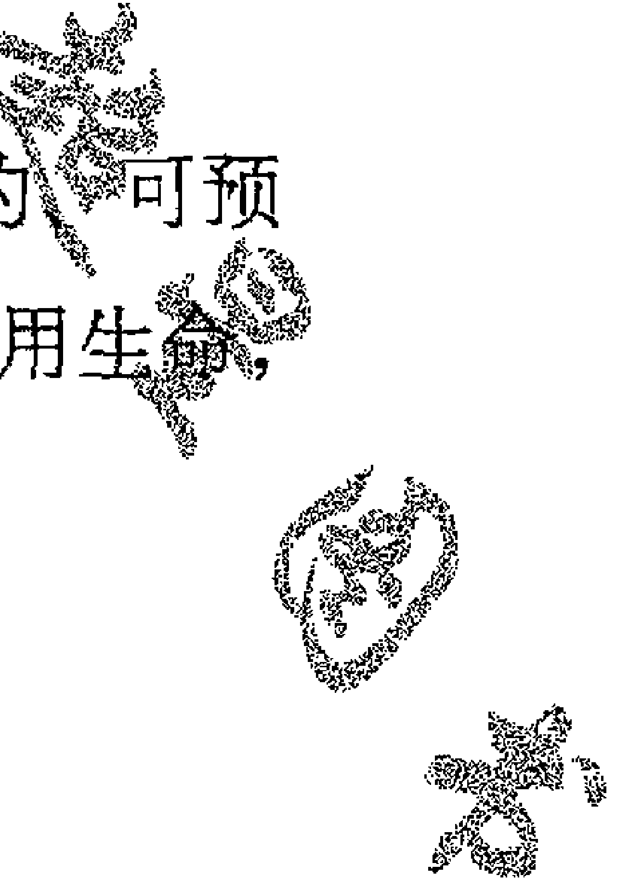
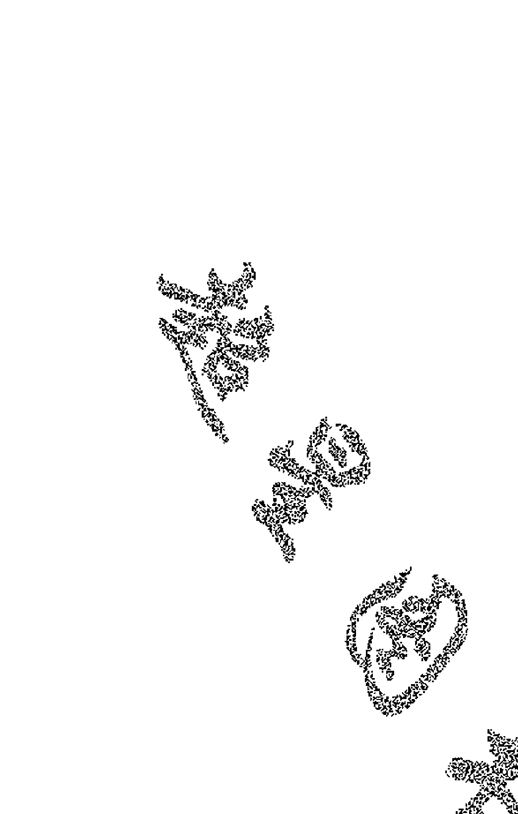
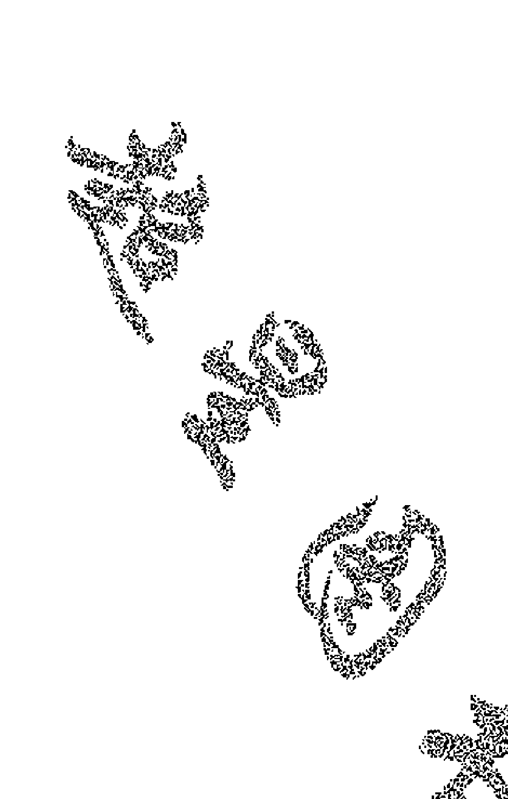

# 明日之神

[美] 尼尔·唐纳德·沃尔什◎著
赵恒◎译

中信出版社·CHINACITICPRESS

上架建议◎心灵励志

ISBN 978-7-5086-2653-6

www.publish.citic.com

定价：32.00元

# 明日之神

Tomorrow's God
Our Greatest Spiritual Challenge

[美] 尼尔·唐纳德·沃尔什 著
赵恒 译

## 图书在版编目（CIP）数据

明日之神/（美）沃尔什著；赵恒译. —北京：中信出版社，2011.4

书名原文：TOMORROW'S GOD

ISBN 978-7-5086-2653-6

- I. 明… II. ①沃… ②赵… III. 人生观－通俗读物 IV. B821-49

中国版本图书馆CIP数据核字（2011）第016889号

TOMORROW'S GOD by Neale Donald Walsch
Copyright © 2004 by Neale Donald Walsch
Simplified Chinese translation copyright © 2011 by China CITIC Press
Published by arrangement with Atria Books a division of Simon & Schuster, Inc., through Bardon-Chinese Media Agency
ALL RIGHTS RESERVED
本书仅限于中国大陆地区发行销售

# 明日之神
MINGRI ZHI SHEN

著者：[美]尼尔·唐纳德·沃尔什

译者：赵恒

策划推广：中信出版社（China CITIC Press）

出版发行：中信出版集团股份有限公司（北京市朝阳区惠新东街甲4号富盛大厦2座 邮编100029）（CITIC Publishing Group）

承印者：北京通州皇家印刷厂

开本：880mm×1230mm 1/32   印张：10.25   字数：183千字

版次：2011年4月第1版   印次：2011年4月第1次印刷

京权图字：01-2010-6810

书号：ISBN 978-7-5086-2653-6/F·2242

# 版权所有·侵权必究

凡购本社图书，如有缺页、倒页、脱页，由发行公司负责退换。

服务热线：010-84849283

服务传真：010-84849000

http://www.publish.citic.com

E-mail： sales@citicpub.com
author@citicpub.com

## 作者按 Tomorrow's God

本书所记录的对话是一个连续的过程，只是以两个部分呈现给大家。
第一部分涉及人类当前对神的认知，并讲述关于神的新理念，后者勾画出不远的将来我们心目中将存在的神。
第二部分审视这些新理念将如何落地生根、如何作用于我们的生命、如何帮助我们创造一个新世界。
当然，如果新理念未能以此方式对我们有帮助，它们将毫无意义。

尼尔·唐纳德·沃尔什

## 现实 · 信仰 · 梦想

《明日之神》是作者《与神对话》系列的第七部，其主旨为信仰问题。如果说第六部《新启示录》重在“破旧”的话，那么本书则重在“立新”。审视新现实，确立新信仰，描绘新梦想。

在汉语中，“信仰”这个词有点儿“大”，因其对象往往是宗教、主义、人生观、世界观等大概念；原著中对应词语为“belief”，而“belief”作为动词“believe”（相信）的名词形式，有着更为宽泛的含义，如“相信”、“信任”、“信念”等，而重点就在于一个字——信。之所以作此说明，是因为有人可能认为自己无任何信仰（比如原来的我）；然而，“不信”不也是一种“信”吗？在这个意义上说，每个人都有相信的东西，都有自己的信仰。

有时候，人很难相信某种新东西——尤其它与自己头脑中已有的观念相冲突的时候。

有观念相抵触时。记得奶奶还在世时，我和堂弟有一次谈起宇航员登月的事，她听到后大声说：“别听那蝲蝲蛄瞎叫唤，人怎么可能跑到月亮上！”现在想来，在她的世界里，人类登月可能与嫦娥奔月一样，都是虚无缥缈的神话。

有时候，人又很容易相信某种东西——尤其在头脑空白、盲目吸收知识的年纪。还是个跟奶奶有关的故事。我小时候曾听她说，耳屎不能吃，吃了人会变成哑巴。之后我对此说法一直深信不疑，直到有一天，看见自己的小孩手里拿着妈妈刚给掏出的耳屎，我差点儿脱口而出这句话，才想到它其实是大可质疑的。现在想来，这或许是大人为防止小孩子乱吃东西而编的谎话，又或许是他们从老一辈那儿继承的“道理”，反正不太靠谱。

可是，像那种未加辨别就吸收的“道理”，我们脑袋里有多少呢？

还有，像那种因旧观念而拒斥新事物的情况，我们身上曾发生过多少次呢？

本书认为，人类面临的许多现实问题正源于代代相传的古老信仰，所以需要结合宗教、哲学、科学等领域的新发展，在扬弃基础上重塑一位新神，即相对于“昨日之神”的“明日之神”。简言之，审视新现实，确立新信仰。这是第一部分的内容主旨。作为一个无甚坚定信仰的人，我感觉这部分较容易理解和接受。

第二部分内容是以新信仰为基础，展望人类各领域将发生的变化，其中既包括作者尼尔的想法，也有美国多位杰出人士的洞见。

在信仰领域，本书阐述每人皆可参与的“面向灵魂的民权运动”。

在政治领域，本书阐述改良民主制度、促进全球和平的具体方案。

在经济领域，本书阐述“共用共享”、“经济本地化”等新颖理念。

在教育领域，本书阐述启发孩子们内在智慧的“创造教育”理念。

在关系领域，本书阐述如何在人际关系中创造快乐、幸福、圆满。

简言之，落实新信仰，描绘新梦想。作为一个发展中国家的国民，我在大开眼界之余，也感受到巨大的落差。在我们仍对他人的昔日成果仰慕艳羡时，人家正在迈向新的境界。

所幸，这是个全球化的时代，大家谁也逃不过谁的法眼。书籍翻译也算让大家相互见识的方便法门之一吧。语言是一种交流工具，但对于不懂某种语言的人来说，语言又成了阻碍交流的墙，所以我时常将翻译工作看做“拆墙”。然而翻译本书之时，我又有了更深一层的感受：仿佛被拆掉的砖墙之后还有一层透明的玻璃幕墙，在那里，我不但看到了墙外的世界，还看到了上面映照的墙内世界，而且更重要的是，我看到的还有——我自己。

最近看到的一句话引起内心共鸣，细查出处竟发现，原文几年前就已待在自己的书柜里。而我目前关心的一些问题，有人在60年前已经给出了答案。那个人叫吴经熊，那本书叫《超越东西方》(Beyond East and West)，那句话是：

> 我们的朝圣之旅既不是朝东，也不是朝西，而是朝内。

## 导言
Tomorrow's God

本书包含过去100年里最激动人心的消息：人类即将在地球上创造一种新形式的灵性。

我们的文明正处于其最伟大冒险与最卓越成就的边缘地带。值此时刻，我想让你在这场创造中找到你的位置。

本书是在关注“明日之神”。它讲述人类的未来——但并非遥远的将来，它作出的惊人预言只针对未来30年。它讲述我们近期的未来，以及人类在创造未来时将扮演的角色。它讲述你在创造未来时所扮演的角色。它讲述什么将会发生以及如何发生。

像其他《与神对话》系列书籍一样，本书仍采用对话的形式，但是，要想开卷有益，你不必相信这是我与神对话的结果。必要的只是你开放心智——而本书甚至会告诉你如何做到这一点。

不过，先给你一个善意的提醒。你将发现，这本书里的信息对你来说并不新奇。绝大部分道理都已存在于人类传统智慧的神圣经典中。绝大部分道理都曾出现于世界各地大师们的教导中。

同样，绝大部分道理已经呈现在我以前的著述中。

那么，为何还要读这本书？我认为，本书不是要讲述什么新的智慧，而是要重复我们未能认真聆听的智慧。

问题就在于，如果我们现在不去聆听它们，我们就没有多少机会去重复它们。

你知道的，我们已处于边缘地带。在目前所行进的方向上，我们已走得足够远。如果想要维护这个星球上的生命，我们所知的生命，我们就需要改变路线。

人类已无力承受更多的大爆发。我们现在仅凭一个手提箱就能引发世界末日，只需寄出一个装满炭疽孢子的信封，就能“封杀”文明社会。

我们已能训练有素、毫不退缩地将飞机撞向大楼，杀死几千人。我们已说服自己相信，先发制人的打击——先开枪再提问——是完全可以接受的外交方式。

我们已决定，管理地球就意味着摧毁它——而且假装我们并不知情。我们已得出结论，改善食物的方式就是改变它们的基因结构。我们已作出选择，让全球20%的人拥有世界80%的收入，并称之为美好生活。

简言之，我们困惑。然而，在走出这种困惑的过程中，你可以发挥作用。本书讨论的就是你的作用。书中说到，在未来30年中，人类的基本理念将发生积极向上、催人奋进、重塑一切、由内而外的巨大转变，人类的历史进程将由此改变。而且，它邀请你——是的，就是你，正在手拿这本书的你——一起来改造人类。

这就是写作本书的原因。它是神直接发给你的请柬。

好好想一想。

想一想这本书是如何到你手中的。你是如何听说它的？或者，如果你此前从不知道它，那它是如何吸引你的注意的？促使你拿到它、打开它的，是什么？还有，促使你继续阅读它的，是什么？

你以为这一切的发生纯属偶然？

其实不然。其实没有“偶然”。宇宙从不做什么“意外”之事。本书来到你面前，就是要告诉你：你可以改变人类历史。

就是你。

不只是管理政府的人、拥有企业的人、领导运动的人、著书立说的人，或以任何原因有影响力的人能改变人类历史，不只这些人。

还有你，你可以改变人类历史。

这么说毫不夸张，请相信我。

本书召唤你肩负起这种使命。它邀请你内化古往今来大师们在此的智慧；不只是再次听到它，而且要接收它、吸收它，直到从骨子里消化它，并转化为你的本质。

在接下来的岁月里，生命将邀请你从深切了解的层次采取行动、作出反应。你所深深相信的东西、你在生命中以新方式所体现传播的信息，将在这个世界创造不同，将使这个世界为之不同。

然而，不要觉得你必须单枪匹马。或许，本书最鼓舞人心的消息是，我们谁都不必“一力承担”。我们有队友，我们可以加入他们，可以呼唤他们，与他们一起承担人类最伟大的事业——改变我们自己，改变我们的世界。

我前面说过，你可能发现本书没有什么新奇的内容，也许我说得不对，但你可以发现一个全新的你，以及一条道路，可以让你去创造新世界。

## 目录

译者导读 / XI

导言 / XV

# 上部

## 第一章 ◎最大的亵渎 / 3

所有伟大真理都以亵渎开始。本书意在挑战。本书意在拯救世界。

## 第二章 ◎告别昨天 / 8

看看你的周围。你喜欢吗？你可以继续，仍然相信你现在相信的东西。但是，不要以为事情不会改变。问题不在于“是否”改变，而在于“如何”改变。

## 第三章 ◎你是奇迹 / 18

你的才能就是你神圣自我的表达，只需以你自己独特的方式去表达你自己。要毫无保留。让所有人看到你的奇迹，让所有人从中看到他们自己的奇迹，因为他人会在你的实相中看到他们的可能性。

## 第四章 ◎拯救世界 / 35

在你创造的实相中，一切均在发生改变。所以，你最终在改变你的世界。你所接触的那部分世界不一样了，因为你的影响力远超出你的想象。

## 第五章 ◎生命即存在 / 57

如果你不相信生命，生命不会“惩罚”你；如果你相信生命，生命也不会“奖赏”你。生命并不客观地创造奖赏或惩罚。生命是一个过程。

## 第六章 ◎生命的本性 / 65

无论我做什么，那都是所有生命内含的创造过程的一部分。而我进化到一个真正的高层次后，实际就能预知，甚至控制我影响生命的方式。我就能成为自己命运的主人。

## 第七章 ◎只有你可以拯救世界 / 79

现在，你们正违反你们的本能。你们的本能正告诉你们，你们的所作所为正在毁灭你们的世界和你们的自我，但是，你们仍在不管不顾地做。

## 第八章 ◎让地球复活 / 87

你们彼此在扮演不怀好意的外星人，在攻击你们自己。你们把自己扔进自己的烈火里，而点燃烈火的，是人类关于神、关于生命的基本误解，是把恐惧放进人类脑海里、把仇恨放进人类心灵中的种种谬见。

## 第九章 ◎重塑信仰 / 100

如果你们真正追求一个充满和平的世界，那就停止这一切。因为我要告诉你们：神不毁灭任何东西，神不拒绝任何东西，神不惩罚任何东西。

## 第十章 ◎唯一的信息：I See You / 111

当人们不是将神与生命合一时，他们已忘记了他们最重大意义的自我，你的机会在于让他们忆起。

## 第十一章 ◎大师之路 / 124

你怎么向一个正残害你的人发出爱的信息？方法就是：将你自己看做你的真我——即使当他人不这么看时。所有杰出的大师都是这么做的，通过这么做，他们已经改变了世界。

## 第十二章 ◎最大的自由 / 132

我们可以自由地闯红灯。如果我们不在乎后果，我们是可以自由地那么做。如果我们愿意为种种后果付出代价，我们是可以自由地做任何事情的。

## 第十三章 ◎生命的奥秘 / 141

你已允许每个人知道你的弱点和你的光彩。通过分享你的痛苦，他人从痛苦中得到解脱；通过分享你的体验，他人拥有了希望。人们所需要做的，就是彼此共享自己的真相。

## 第十四章 ◎无条件的爱 / 152

“神”、“生命”、“爱”三个词可以互相替换。三者为一，这就是三位一体。真正的爱是无条件的，附加了条件的爱根本不是爱，而只是爱的赝品。

## 第十五章 ◎探寻我们的内在 / 163

你们所有人都是天使，都被赋予了任务：唤醒彼此，使彼此忆起真正的自我，使彼此尽可能真实、透明地共享自己的体验。

# 下部

## 第十六章 ◎改变世界 / 173

每个人将去做自己被召唤去做的事，越来越多的人将清楚地看到：普通民众的时代已经来临，他们将能够把事情掌控在自己手中，将不再依赖他人。

## 第十七章 ◎没有人是一座孤岛 / 183

静静地冥想、深深地祈祷、默默地聆听……早晚各一刻钟，你的生命就会改变。你们有些人终其一生，也从未花多少时间与自己的灵魂静静地融合。

## 第十八章 ◎重建文化 / 201

只有改变了人们的思想，你们才能说，在争取为人类带来和平与和谐的斗争中，你们取得了胜利。

## 第十九章 ◎重新定义财富 / 227

在新灵性的时代，企业和商业的目的将被改变。财富不再被定义为占有和权力，而是享用和快乐。

## 第二十章 ◎全新的教育理念：失败是一种幻觉 / 245

明日之神将教导孩子们，没有失败者，只有迷失者。没有人会永远陷于迷途。每个人将在某一天找到回家的路，回归爱的路。

## 第二十一章 ◎人际关系：快乐人生的法则/269

你创造各种关系是为了体验你的内在自我。

## 第二十二章 ◎开悟之路/290

你所需的全部智慧都存于你的内在。当你能够以自己的生命与每个人分享之时，无论你的境况如何，那都是开悟，你就成了大师。

## 第二十三章 ◎再见，你好/305

对话即将结束，未来是那么光明，因有了你此时此地所点燃的光亮。所以，让你们的光芒照耀所有人吧，让他们最终无法忽视他们的真我。

## 结语/309

# 上部

Eternity

tomorrow's GOOD

Our Greatest Spiritual Challenge

## 第一章 | 最大的亵渎

所有伟大真理都以亵渎开始。本书意在挑战。本书意在拯救世界。

我们需要一个新神。

我知道。

不，我说的是真心话。我们需要一个新神，旧神已经行不通了。

旧神一直就行不通。

有人认为它行得通。

他们没放眼看他们周遭的世界。

他们没有吗？

没有真诚地看，没有全面地看。他们所看到的，只是他们想看到的东西。

他们没看到以神为名义进行的残酷争斗和杀戮。他们没看到分离、压迫、恐惧与彻底的功能失调。或者更糟糕的是，他们看到了，而且他们参与其中。他们利用神作为控制大众的手段。

事实上，旧神——昨日之神——本可以使四面八方的各个生命鲜活起来，而且可能是很多生命；但是，它未能创造一个公正的社会或快乐和谐的文明，遑论一个和平的世界。时至今日，它仍无法做到。

时至今日，尽管你们有各种各样的力量：即时的通信、全面的联系、深入的理解、提升的觉悟、复杂的技术和超凡的奇迹，你们仍无法造就一种简单质朴的体验，一种人类形成伊始就渴望的体验。

你们无法造就和平。

我知道。

你们无法造就持续的快乐。

我知道。

而你们所信奉的神也做不到。

为什么？为什么？人类付出这么多努力，我们乞求神的帮助，而且接受了帮助，为什么只得到这种结果？

因为你们所相信的神不是真的。你们所相信的神是臆造出来的。它是你们凭空创造的神，与终极实相毫无关系。

哦，这种思想真有挑战性。这简直是最大的亵渎。

所有伟大真理都以亵渎开始。

挑战你最神圣信仰的时机就在眼前。如果你不尽快挑战你的信仰，你的信仰将挑战你。

本书意在挑战。

本书意在拯救世界。

它能拯救世界吗？

答案取决于这个世界。

为什么？为什么不取决于你？如果你是神，为什么不是取决于你？

因为我的职能不是拯救世界，我的职能是创造世界。

在创造世界之后，再发生什么你就不在乎了？

我在乎的程度跟你们一样。

不对，你并不在乎。如果你像我们一样在乎，就不会让世界去自我毁灭了。

你质疑的是，我是否比你们更在乎。如果我像你们一样在乎，我会让世界去自我毁灭，因为这正是你们在做的事。

因为我只是和你们在乎的程度一样，所以你们所在的世界确实可能被毁灭。至少，你们所知的生活将不可逆转地被改变。如果事情那样发生，我就会让它发生。

为什么？为什么你不能去制止它？

因为你们不去制止它。

我们做不到，你却可以。你是神。人类做不到的事情，你做得到。

你的说法不准确。我做得到，你们也做得到。但我不会那么做，除非你们那么做。

为什么不？你是哪一路的神？

我是最好的神，唯一的神，给你们自由意志的神，永远不干涉你们的神。

就算我们“自寻死路”，你也不会拯救我们？

如果我从你们自己手里拯救你们，那么你们将不是“你们自己”，而是我的奴隶。你们将没有自由意志，直到你们做违逆我心意的事，你们的意志才是自由的。然后，我将制止你们去行使自由意志，使你们去做合乎我心意的事。

你当然会这样做。如果你有一半及得上人类心目中的神，你将制止我们自我毁灭的行为。你将做对我们最好的事情，你将使我们去做对我们最好的事情。

根据谁的评估，根据谁的定义？

什么？

“最好”是根据谁的评估，“我们”是根据谁的定义？

根据你的。根据你的评估，根据你的定义。你将定义“我们”这个词代表什么，你将决定什么对我们“最好”，而且为了我们大家，你将让“最好”的事情发生。我们依靠你这么做。这就是神的意义所在。

真的吗？你真的这么想吗？

## 第二章 | 告别昨天

看看你的周围。你喜欢吗？你可以继续，仍然相信你现在相信的东西。但是，不要以为事情不会改变。问题不在于“是否”改变，而在于“如何”改变。

多数人相信，你决定哪些人属于“我们”。然后我们根据你的决定（我们称之为宗教或信仰）结成团体或组织，告诉我们什么对“我们”“最好”。作为神，你向“我们”保证，你将带领“我们”回归你。

至于你定义之外的那些人，还有在你定义之内，但却不做对他们“最好”之事的那些人，他们无论如何将不能回归你。这两类人将遭到报应，他们将在地狱的永恒烈火中承受煎熬。

你相信这些？真的吗？对你来说，这是事实吗？

不，其实不是。至少，现在不再是那样了。自从体验并理解了我与神的对话之后，我就不再那么想了。但是，这仍然是多数人的信念，而我进入这场对话，是想代表多数人发言。

是吗？为什么？为什么你要这么做？

我想提问，问一些我认为多数人想问的问题，说一些我从多数人那里听说的东西。

为什么？

这样，人类的问题或可得到解答；这样，人类的声音或可被听到；这样，人类的体验或可放大、强化、扩展——一如我自己的体验；这样，地球上或可充满快乐与安宁——一如我在最佳状态时，心灵中充满快乐与安宁。

你想将你得到的礼物赠与人类。

是的。

为什么？

因为我想继续收到我曾得到的礼物，而且我知道，最好的办法就是送出礼物。

送出礼物能使你继续收到礼物？

是的，我送出的礼物就是我体验到的礼物。

怎么会这样？

因为只有通过表达自我，我才能体验自我，抑制表达就是抑制体验。因为“凡流经我的必附于我”。因为我们实为一体，而我只是“一体”的一部分，所以，我让他人体验什么，我就体验什么；我让自己体验什么，他人就体验什么。

因为我让他人懂得，所以我懂得；因为我让自己懂得，所以他人懂得。因为我让他人收到，所以我收到；因为我让自己收到，所以他人收到。

同理，我抑制他人得到什么，就是抑制自己得到什么；我抑制自己得到什么，就是抑制他人得到什么，因为我无法付出我没有的东西，而且我无法拥有我不曾付出的东西。没有付出，就无法体验拥有。

### 付出将拥有转变为存在。

我可以想象自己“拥有”创造性，但只有向他人付出（展现）我的创造性，我才能体验到创造性的存在。

我可以想象自己“拥有”财富，但只有向他人付出我的财富，我才能体验到财富的存在。

我可以想象自己“拥有”爱，但只有向他人付出我的爱，我才能体验到爱的存在。

付出将拥有转变为存在，而付出的奇迹在于，我们只能向我们自己付出。事情总是如此，这是生命最大的秘密。

这是普世法则，你无法回避它，也无法绕过、躲闪或忽视它。它早晚将在我们的生命中展示结果。所以传统智慧教导我们懂得：“种瓜得瓜，种豆得豆”；“待人如待己”；以及相信“因果报应”。

所以我知道，若想为自己的问题找到答案，最快的方法就是促使其他人为他们自己的问题找到答案。

因此我现在为多数人说话、帮多数人提问、代多数人发言，以便更多人可以拥有并知道神对这些问题的解答和声明，而我在这么做时，就可以继续知道我所知道的东西。

你学得很好。你已经懂了，你还让他人也懂了，现在你努力让更多人去懂得，这样你可以懂得更多。

如此，一个循环通过你得以圆满，一个预言通过你得以实现。因为我对全体人类说过，我将派给你们我的信使，而他们就行走在你们中间。不是一个，而是很多；不只在古代，而是古往今来，他们使你了解你生命的真相——而真相正是出于他们、通过他们得以显现。

而他们会对你说，听啊，听听这个邀请：

还有另一条路，另一条体验神的路，另一条度过一生的路。你们的差异不必造成分裂，你们的对比不必造成冲突，你们信仰的不同不必对生命施以暴力。

然而，你无法通过寻觅找到这条路，你只能通过创造去找到它。而且，你无法通过固守旧信念找到它，只能通过敞开心扉接受新理念——关于神、关于生命的新理念——才能真正照亮世界。

我愿出一份力，让这些新理念来到人间，就像它们当初来到我这里一样。

那就继续这场对话吧，只要它服务于你，同时你可通过这种体验服务于人类。在这场对话里，我将为你讲述明日之神，它在多个重要方面不同于你们的昨日之神。

我还会为你讲述一种新灵性（New Spirituality）。它让人类表达那种追寻与体验神圣的自然冲动，同时不必相互指责对方误入歧途，不必以神的名义相互仇杀。

我将描述，当新灵性覆盖人类社会的体验与架构之时，它将产生怎样的结果，特别是在宗教、政治、经济、商业、教育、人际关系、性等领域。

我们的对话还要探讨很多东西，所以现在继续吧。

是的，我会继续，不过我仍想再重复一遍，在每种情况下、在每个评论中、在每次提问时，我不再只代表自己发言。事实上，对于我将要提出的问题，很多我已有自己的答案。

可是很多人没有答案。或者，他们确实有答案，但那些答案行不通。人类声言在寻求的体验，那些答案带不来；人类声言想到达的地方，那些答案带不到。

不过，这些人仍在努力使这些答案行得通。他们努力忠实于他们得到的答案，他们在努力中变得痛苦，在付出中变得疲惫和悲哀，在过程中变得困惑和愤怒。所以你们拥有一个痛苦、疲惫、悲哀的世界，一个困惑、愤怒的世界。

证据在你周围俯拾皆是。现在，该你选择了。你可以理解它、发布它、宣传它，或者，你可以拒绝它。

我选择理解它、发布它、宣传它。我认为，是时候说明“本然”了。我认为，是时候讨论它了。实事求是地谈它，公开直率地谈它。要正视事实，要正视问题，还有更重要的，要正视解决办法。

好的。那就让我们继续，同时一直记得：你在提出问题或发表看法时，是为说明很多人的角度，不见得代表你个人的意见。

谢谢。那我们就回到前面……地球上很多人的角度是，你的职责——神的职责——是告诉人类什么对他们最好。你告诉我们什么对我们最好，然后由我们去做，或不做。这是对人类一条神圣信念的简化复述。

这种信念是谬论。那不是神的职责，那不是神的目的，那不是神的职能。

那种职责和目的是你们很多人对神的想象，但那不是真正的神。那种职能属于昨日之神，但不属于“明日之神”。

这是你第二次用这个说法了。你说的“明日之神”指什么？

将来你们将相信的神，未来你们将信仰的神。

我们确实会迎来新神！

不是“新神”，而是对当前之神的全新理解。一个扩展的概念，一种更深的觉悟。

但是这场对话开始时，我说我们需要新神，你表示同意。

我当时在借用你的措辞，因为不想一开始交流就在语义上纠缠。我一直知道我的所指，我一直知道，我有机会为你作深入解释。

那么，你指的是什么？

正如我刚才所说，我指的不是“新”神，严格地讲，应是一个新意义上的神，一个更大意义上的神。这是曾在、现在、永在的同一个神——但却不是你们当前理解的神。

你们的理解是不完整的。现在，我请你们扩展自己的意识，请你们更完整地理解神是谁、神是什么，以及生命的真相为何。我请你们创造明日之神。

如果我不想放弃昨日之神呢？如果我执著于那些观念，仍认为它们是关于神的真实、正确的理念呢？

那么你将继续创造你的生活，使之如你在当前地球上所知的一样。

那又怎样？有什么不好吗？

看看你的周围。你喜欢吗？你可以继续，仍然相信你现在相信的东西。但是，不要以为事情不会改变。问题不在于“是否”改变，而在于“如何”改变。一切都将改变。而且，人类对于神的信仰早晚会改变。到那时，你们将会告别昨日之神。

明日之神
Tomorrow's God

什么时候？

实际上，很快了。

真的吗？可是，原来还说我们能拯救世界，现在看来不过如此，因为我们没能改变什么。

不是的，世界已经在改变了。你只是没有看到这些变化，你没有意识到。但是，随着变化的增加，随着它们的扩散，你将越来越多地意识到它们。实际上，你将置身其中。

这一过程何时结束？

永无止境。更深刻地认识神、体验神的过程是永无止境的。这是乐趣所在。

那好，什么时候这里的情况会有所好转？

快了，很快，如果人类愿意的话。

什么意思？

就是说，如果人类作出这种选择，你们对于神的理解会发生剧变。很可能就在你此生中，在30年内，或许更快，一旦第一张多米诺骨牌倒下的话。其实就是个达到关键多数的问题。关键多数是多少？

可能与你们的预计差别很大。有些人认为关键多数就是过半，其实不是。也不是整体的25%或10%，甚至不是5%。当整体的2%到4%受到影响时，就达到了关键多数。

看看即将沸腾的水。并不是过半面积的水面在冒泡才达到沸点，其实早在那之前就已到沸点了。关键多数的影响力是呈指数级的，所以它非常强大。几个气泡冲破水面——然后，突然之间，全部的水都沸腾了。

所以说，我们当中一小部分人必须作出选择，转变我们对于神的理解。那么如何才能使人类愿意作出这种选择？

这要看人类是想选择更多的仇恨还是更多的希望；是要再产生一场举世震惊的灾难——出于愤怒、呈现为暴力与杀戮的灾难，还是要以另一种方式产生的全球觉醒。

还有什么方式？除了灾难与不幸，好像没有什么方式可以让人类觉醒。

其实有。可以有全球性的运动，它不是传播恐怖，而是传播和平、快乐和爱。

这是可能的，这可以做到。

第一步在于思想层面。人类的未来依赖于人类对于自身的看法，依赖于人类如何看待神和生命。

你们的现实来源于你们的思想，你们的未来出自于你们的信念。因此，你们的信念创造你们的行为，你们的行为创造你们的体验。

所以，你们相信什么就成了至关重要的问题。

什么创造信念？外在的物质世界有什么能创造信念吗？

有。

是什么？

人。

人可以。

你们外在世界的人们可以创造内在的灵性事件。起初在他们自己身上，接着在别人身上。许多人已经这样做了。

但是怎么做？我们怎么才能做到？这才是重点！

开始的方式有很多种。

举个例子。

你正将它拿在手上呢！

## 第三章 | 你是奇迹

你的才能就是你神圣自我的表达，只需以你自己独特的方式去表达你自己。要毫无保留。让所有人看到你的奇迹，让所有人从中看到他们自己的奇迹，因为他人会在你的实相中看到他们的可能性。

我们又回到了这场对话的起点。

是的。当时我说，‘本书意在拯救世界’，那是真心话。

相对于其他书籍，这本书会有什么新东西？

没有。

没有？

没有。

那它还能拯救世界？

是的。它意在拯救世界，而且它能做到。

可是，如果我要读的东西其他书籍里面都有，那我干吗还要读它？世界已在灾难的边缘，而其他书里的所有东西并没起多大作用。

前一句正确，后一句错误。“其他书里的所有东西”曾经帮助人类躲过灾难。过去，世人的深奥智慧曾帮助人类改正路线；今天，它可以再度发挥作用。但是，现在这种智慧必须扩展，将人类自我毁灭的可能性考虑在内。

教育是关键。它是你们拥有的最强大工具。教育每个人，为每个人讲述神与生命。消除文盲，然后消除功用性文盲和灵性文盲。

这一切所需的只不过是一种新的全球性通信网络，以及一种新的全球性信息，从人类到人类自身的信息。

你们越是懂得如何摧毁自己，就越需要懂得如何拯救自己。现在到时侯了，要扩展你们关于神、关于生命的知识基础，要增进你们的理解，要提升你们的觉悟，要放大你们的意识。

现在到时侯了，要从旧灵性走向新灵性，要放弃昨日之神、拥抱明日之神。

那可不容易，人们不喜欢弃旧迎新。

让我们最后澄清一次，我们这里讨论的不是新神，而是对“旧”神的新体验。

有时候，老道理需要换种新的说法，老智慧需要以新的方式分享，以便道理能被听到，智慧能被领悟。

我将在此分享的所有道理、所有智慧，以前都曾被分享。在人类历史上，你们的古老见解屡屡在当时的时代得到再现。以一种新的、扩展的方式，从前的思想得到再次表达。许许多多的大师，如雷贯耳的和默默无闻的，都曾这样做，今天很多人也在这样做。

好的，可是，如果我原来的理念并不包含对神的任何信仰呢？如果这种关于“神”的讨论只能让我厌烦、让我受挫，或使我觉得没有任何现实意义呢？

明日之神不要求你信仰神。

他不会吗？

是的，她不会。这就是昨日之神与明日之神的第一大差别：

- 1. 明日之神不要求任何人信仰神。

等一下。明日之神将是女性？

是的，除了她不是的时候。那时，神将是男性，除了他不是的时候。无论哪种情况，神既非男性也非女性，神没有性别。

没有性别？

没有性别、大小、形状、颜色或任何个体生命的特征。这就是昨日之神与明日之神的第二大差别：

## 2. 明日之神没有性别、大小、形状、颜色或任何个体生命的特征。

你是说，明日之神不是生物？

对。就你用那个词所表达的意义而言，是的。

这怎么可能？如果神不是生物，那神是什么？

哦，整个对话就是要讲这个。不过，我先给你讲个故事。一位女士深夜来到阳台，双眼含泪地注视着繁星点点的苍穹，为她的问题寻找答案，她想治愈自己破碎的心。她感到孤独、绝望。“神啊，”她说，“如果您在这儿，请向我现身吧。我要挺不住了，我一个人撑不下去了。”突然，一颗流星从丝绒般的天空倏忽掠过。女士惊呆了，她不敢相信自己的眼睛。

现在，我问你个问题。

那是神吗？

是的，我相信是神让这发生的。

不，我没问你是不是神让这发生的。我问你的问题是：那是不是神降临？

哦，我不知道怎么回答。那可能是个巧合。

造成巧合的是什么？

这个……我会说是神造成的，但那样我们又回到了对神的定义，有一个定义是：神是所有事物的原因，但并非事物本身。

你有没有想过神可能既是因又是果？你是否认为神既是创造者又是被造者？

我从未那样想过。当然，我知道有人那么认为。人类历史上多位伟大的思想家曾多次探索这个题目。围绕这些探索还发展出了一整套思想——泛神论。泛神论认为，宇宙与神合一——创造者与被造者是一回事。

最近，物理学家约翰·惠勒（John Wheeler）提出了一种“观察者参与式宇宙”，或说“闭环参与式宇宙”，在其中——正如量子物理学所认为的那样——被观察的事物无不受到观察者的影响。换言之，创造者与被造者合一，彼此互相创造。或者，如你常说的那样，我们是“神化一切的神”。但是，乍一看，我会说神是创造者，而我们，还有这个世界，都是被造者。而如果我根本不信神，我就会说，造成那颗流星坠落的不过是随机性。

那么说，随机性随机地挑选那个随机的时刻，使那个事件随机地发生？

是的。如果我不信神，我会那么说，是的，那个事件就是随机性造成的。我知道什么？你在问我什么？我现在告诉你，那可能仅仅是一个事件而已。它在当时发生，这是个事实，但这个事实可能毫无意义，除非某人赋予它某种意义。

你刚刚道出了一个深刻的道理。没有任何东西有任何意义——除了你赋予它的意义。

现在，还说上面那个故事，就在那位女士请求神向她展示存在之时，流星划过天空，你赋予这个事件什么意义？

我不知道要赋予它什么意义，真的。我不知道要如何去理解它。我没在那儿，没有那种体验，所以我不知道要说些什么。

你认为那位女士会怎么说？

她可能会说，那颗流星是神派去的，或者那颗流星就是神，是神在当时当地回应她的祈祷。由于事件的同步性，她可能会被打动，相信这两种说法中的一种。

的确如此。还有，如果她相信那颗流星就是神，你认为她所体验的神是男性还是女性？

哦……我明白你的意思了。

而且我要告诉你，明日之神将根据每个追求体验神的个体在每个时刻的决定而改变形式。

稍等。你的意思是说，由我们来决定神是谁、是什么？

为什么你这么吃惊？你们一直在这么做。你们称之为宗教。

宗教并不决定神是谁、神是什么，宗教只告诉我们神是怎么说的。

谁说那是神说的？

宗教。

那么，是谁在说什么？

宗教告诉我们神告诉宗教的东西。或者，更确切地说，是神告诉那些宗教领袖，而宗教的建立就是基于他们的教导。

换种说法，就是基于神告诉人的东西。

是的，是神告诉人的东西，但却是在人类历史上非常特殊的时刻，以非常特殊的启示，传递给非常特殊的人。

比如当前时刻传递给你的这些启示？

这个……对多数人来说，这可是个难题。我认为，多数人不会相信或接受神会选择我，并以纸上对谈的方式向我“现身”——如果你问的是这个的话。

我非常清楚，他们可能不接受昨日之神那么做——以你们对于昨日之神的信任而言。但是，他们也可能接受明日之神那么做，因为明日之神将一直与每个人交谈。

这是昨日之神与明日之神的第三大差别：

## 3. 明日之神一直与每个人交谈。

怎么回事？怎么会这样？每个人将与神对话？

每个人都在与神对话，一直如此。这将是新灵性的一条重要信息。每个时刻，神都在与人类交流。

我并未在2000年前终止与人们的交流，也非仅向几个人展示我自己。在所有的时间里，我一直在向所有人展示我自己，然而，只有少数几个人接受这种启示、视之为本然、奉之为神圣——所以只有几个人收到了启示。

以完完全全、正正好好适合于当前时间、地点、情境的方式，神——有些人称之为神圣的那种力量、能量、方式、体验——在你的生命中展示它自己。你可以称这种体验为“神”，也可以称之为其他东西——巧合、同步性、“随机事件”，随便什么。然而，你对它的称谓并不改变其本然——称谓只是表明你在此的信仰体系。

如果你相信，生命向你展示它自己的方式就是神，你将视之为神。如果你不相信生命展示它自己的方式是神，你就不会视之为神。有些人说眼见为实，但是我告诉你，信则有。

> “所信即所得。”

确实如此。众多大师都曾宣讲这一道理。未来，将有更多人类体验到，神的沟通方式正如它们本来的面目——神圣的显现。人们不再要求神以某种特定方式“现身”。人们关于神的信念将扩展，这种扩展将提升人类对于神的意识，而神则依然故我。

这使我想起了“盲人摸象”的故事。把一个人领到一头大象跟前，将手放在大象身上。然后，要求他描述大象的形象。他竭尽所能去描述自己的感觉，而摘掉眼罩之后，他吃惊地发现，自己对于整体的领会是那么微不足道。

这个小故事极具启发意义。

所以你的意思是，明日之神将大于我们的猜测，而我们摘掉“眼罩”之时，将发现神实际上是根据时间、地点、事件的不同，而以各种不同的方式出现。

因此，人类将允许自己在最蒙福的明日去体验神。昨日之神——人类至今所信仰的神——被看做恒量。这种信念不会改变，但会扩展。

这么说，神不是恒量？

**神是恒量。** 神恒定存在、恒定改变，使它自己适应每一时刻，从而在每一时刻，神可以被理解，可以被拥有，可以被体验，可以被表达。

你从不是独自一人，神一直与你在一起。然而，如果你期望神以特定方式出现——很多相信昨日之神的人都这么想——那么你常常无法认识神、体验神。

神出现的方式没有限制。很多人试图将限制加之于神，最终只能限制他们自己，限制他们自己认识神、体验神的能力。

在你们的昨天，你们信仰一个有限的神。在蒙福的明天，你们将开始相信一个无限的神，一个在任何场合、以任何形式、向任何人显现的神，一个在所有地点、所有时间、向所有人显现的神。

事实上，这就是当前正在发生的事，但你们不相信。在蒙福的明日，你们将相信，到那时，你们将明白。

在“明日”？ 对我来说，那一天何时到来？

那一天由你挑选。

我不知道这是什么意思！ 在这个问题上，你一定要帮我走出困境。 几十年了，我一直在祈祷和平，一直在求索真理，一直在追寻开悟。 我的同类已为此努力了几百年、几千年！ 什么时候我才能找到？ 什么原因才能让我找到？

你所选择的任何时候和任何原因。

我选择什么作为原因，什么就会是原因？

的确如此。 你选择的原因可以是外部的某种灾难，也可以是另一类的什么事件。 你选择什么，就可以利用什么。

你甚至可以选择利用这场对话，利用你手中的这本书，使之成为你觉醒的原因。 很多人都会这样。

你们每个人都将利用此生中的某种东西去唤醒自己，而且你们每个人都会觉醒。 你们处于睡梦中，但你们都将从睡梦中觉醒。

是的，可是如果我们觉醒得太迟，就会处于不利境地。 我们将“落后”，我们将被神抛弃，因为在有机会的时候，我们没有响应他的号召。

不是这样的。这是有人告诉你们的道理，但不是这样的。这是某些人想让你们相信的神，要你们相信这些人以恐惧为工具，而且让你们也以恐惧为工具。然而，若你们的愿望是看到所有爱的源泉，你们还会戴着“恐惧”的眼镜去寻找吗？

我告诉你们，你们都将觉醒。我并没有计划让一部分人觉醒，让另一部分人永远沉睡。那么做有什么好处？那么做有何意义？

我向你们保证，我的孩子们：**你们都将觉醒。**

你们都将觉醒，这是进化过程的一部分，是生命自身过程的一部分。

生命是觉醒的过程，生命是成为（becoming）的过程，**生命是了解自己成为自我本然的过程。**生命是与不可分离的本然重聚的过程——而且，这一过程并非真正的重聚，而是再次明白分离从未发生。

让我重复一遍，因为它极其重要，它是新灵性的神学要件。

生命是觉醒的过程，生命是成为的过程，**生命是了解自己成为自我本然的过程。**生命是与不可分离的本然重聚的过程——而且，这一过程并非真正的重聚，而是再次明白分离从未发生。

而这种“再次明白”就是觉醒。

是的。你们每个人都将觉醒，因为神的任何部分都不会被神抛弃——它也无法被抛弃，因为神无法让神自己与神的任何部分分离。

神对神的抛弃是不可能的，神从神自身分离也是不可能的。只有某种东西不是神的一部分时，这种情况才有可能。然而，任何东西都属于神，因为神从不与任何东西分离，神从头至尾、自始至终是一切的一切，神是曾经、现在、将来的一切的总和，是没有尽头的世界。

这是昨日之神与明日之神的第四大差别：

- 4. 明日之神从不与任何东西分离，它无所不在。它从头至尾、自始至终是一切的一切，是曾经、现在、将来的一切的总和。

这是神的本性与真相，在你作出选择的明日，你将领悟它、承认它。

这种说法我们已听了多年。怎么才能真正理解它的意义？

当你们成为它的意义时，你们将理解它的意义。

只有让它通过你们显现，它的意义才能向你们显现。你们必须认定你们未与任何事物分离，然后才能上路。刚开始，这并不容易。毕竟，多年的训练使你们用另一种思路理解生命。然而，你们将会转变。坚持、坚持，然后某一天，你们将到达“那儿”。你们将跨过分界线，然后，什么都无法将你们分开。

那一日，你们将拥抱明日之神；那一日，你们将欢欣鼓舞，因为你们的世界将改变。

## 明日之神 Tomorrow's God

## 为什么我们现在不知道这些？为什么我们现在没有拥抱明日之神？

因为这是关于神的新观点，它动摇了你们曾被教导的关于神的一切。

在有些宗教的教导中，创造者是与他的创造物分离的。正因如此，“明日之神不与任何事物分离”是一条非常激进的信息，而且是一条非常重要的信息。或许，它是关于新灵性的最重要信息。另外，它还是大多数神学理论中缺失的要素。

它是缺失的信息。

因为这条信息的缺失，在试图创造和平、和谐、和乐的世界时，人类一直错失目标；因为这条信息的缺失，宗教一直错失生命本身的要义，使千千万万的人错失与创造者以及彼此之间合一的体验。

如果人类接纳这条缺失的信息，使之成为宗教中新的事实——就像人类在医学、科学、技术领域经常接纳新事实那样——那么在一夜之间，世界就可以改变。所有人都与神合一、所有人都彼此合一，这在心理上和精神上都是革命性的理念。

这是人类谜题中缺失的一环吗？多少个世纪以来，尽管付出种种努力，尽管发自真挚赤诚，尽管拥有远见卓识，宗教仍未能有效地改变人类的自我毁灭和暴力行为，这就是原因所在，对吗？

非常好的问题。

我们要怎么去探索这条缺失的信息，怎么去接受它？

很多人正参与其中。

但还不足以影响全世界。

人数正在增加。人类在这方面正逼近关键多数。合而为一的和解之日（即合一时刻）近在眼前。

什么能够使它来得更快？

你。

你们能。

你是指我，还是我们？

你们每个人，你们所有人。

怎么做？

去实践“不分离”的信息，实践生命和谐的信息，实践万物合一的信息。**在现实生活中去身体力行，不要停留在概念层面。** 让它渗入你最深层次的存在，使它成为你潜意识的一部分，成为你每次生命际遇的即刻反应。

实践信息是共享信息的最佳方式。当然，以其他方式共享它也可以。把它带给全世界，使所有人都能得到它。为他们讲述明日之神，讲述新灵性。但是，不要单枪匹马去做。工作如此艰巨，任务如此繁重，非一己之力所能承担。如果一个人孤身奋战，很可能被看做假先知、大骗子，甚或异端。

独行教师的时代已经过去，单打独斗的大师时代已经过去，现在是群体一起工作的时代。记住，人们在哪里会聚，我就会在哪里。

我们可以让四面八方的人协作，共同创造机会空间，让新灵性在地球上出现。

这是个极好的主意，我希望你全力去做。

唯一的问题在于，当普通人给别人讲这些东西时，他们常常不知该怎么说。很多人不知如何说明这一信息，不知如何表达这一信息，不知如何传递这一信息。

每个人都有能力传递这美好的合一信息。你们都有你们所需的沟通才能。**你的信息就是你实践了的生命，你活出的生命。你的才能就是你神圣自我的表达**，只需以你自己独特的方式去表达你自己。

要毫无保留。不要惧怕失败，不要拖延分毫。不要韬光养晦，而要光芒四射，让所有人看到你的奇迹，让所有人从中看到他们自己的奇迹，因为他人会在你的现实中看到他们的可能性。

记住这句话。

他人会在你的现实中看到他们的可能性。因此，要做世人的榜样。

做人类的希望。

真是令人振奋的号召！“做人类的希望。”我们担当得起这种任务吗？我想知道。

信任那流经你的爱，信任那存于你心中的真理，信任生命本身的过程——那就是你。它将为你带来希望发出信息的精确方法、完美状态与贴切时刻，使你成为你愿发出的信息。信任这个过程，你将感受到这样的体验。

我们会的！我们将向那种信任、那种可能性开放自己。而且如你所说，除了竭尽全力实践这种信息，我们还将全力以赴使之广为流传。

你所说的“我们”是谁？

嗯，我觉得在这里可以用复数。因为我相信，别人也有这份激情，也愿成为人类的希望。

是的，但是有一点很重要：只对自己负责。你做你的，不要操心身旁的人。否则，你很可能一直在等待身旁的人，而他们可能在等待他们身旁的人。如此类推下去，什么也不会改变，什么也不会开始。

好的，我将对自己负责。我将尽我所能。你在这里、在这场对话中给我们的信息，可以提供一种基础，让我们得以探索理解神的新方式。而且我认为，《新启示录》中的“九大新启示”同样极其重要，它们的明晰性令人惊叹。所有这些，以及之前对话中的“迈向和平的五步骤”，完全可以创造可能性的空间，使新灵性在地球上出现。

是的，所有工具已给了你们。不只在这些书中，也在你们全球文明的深奥著述和神圣教诲里。而此时此地，在当前这本书里，我将以新的方式，向你们讲述“新神”，使你们可以对神的本质有更深的理解。

事实上，神无法被“解释”，神只能在一个无法言喻的地方被体验。而语言是通向那个地方的道路，他人可以在旅程中提供帮助。

所以，可以用这本书作为对明日之神的一个引介。它不是唯一的引介，也并非最好——稍后我们将详谈这一点——但却是有帮助的，因为它将古代经久不衰的智慧与当代教师们新颖的阐释方式相结合，能带给你各个时代的真知灼见。

这场对话将让你看到，你们的很多教师以不同的方式讲述同样的东西，以不同的语言解说同样的道理，从不同的视角看到同样的愿景，通过对实相的不同体验表达同样的实相。

连同《新启示录》，本书将领你走向根本性的改变，个人的改变和集体的改变。而且，根本性的改变正是时下拯救世界之所需。

## 第四章 | 拯救世界

在你创造的实相中，一切均在发生改变。所以，你最终在改变你的世界。你所接触的那部分世界不一样了，因为你的影响力远超出你的想象。

可是我得告诉你，现在，每当听到你说“拯救世界”，我就有点困惑。你以前教导我们说，“万物皆完美”，“没有必须做的事”。现在，你又老是重复“拯救世界”的论调，听起来就像有些教会使用的“恐吓策略”，它们就是利用这种把戏让我们信仰他们所理解的神。这就好像明日之神换了一种恐吓工具，但那仍然是恐吓工具。

你的观察分析很清楚。我明白你是如何得出这一结论的。所以，我来澄清一下“万物皆完美”的道理。在宇宙中，在每一个当下，没有什么是“错误的”，因为“错误”是一种相对性的评断：与你想要做到的事情相对的事，即被你宣称为“错误的”。

宇宙不做任何事。宇宙只是存在，而且它如它所存在的那样完美，因为它没有计划。然而，如果你有计划，那么在你的世界、在你的宇宙区域里，你可能想要改变一些东西，宇宙也将允许你那么做。事实上，它赋予你力量去那么做。但是，它从不要求你那么做。一切听由你的选择，听凭你的欲望。

如果你们喜欢在地球上的生活，多多少少喜欢它现在的样子，那你们可能想要维护它现有的形式，这就是我所说的“拯救世界”。“拯救世界”是指“维护世界”，也就是说，为世界提供预服务（pre-serve）。

“为世界提供预服务”？这种说法从哪儿来的？这是什么意思？

我前面说过，要让“缺失的信息”——神与所有生命一体——渗入你最深层次的存在，要使之成为你潜意识的组成部分，成为你每次生命际遇的即刻反应。

如果你们想使地球上的事物保持正常，或使之更有利于子孙后代，你们必须首先服务于所有支撑生命的东西，将这种服务作为头等大事。在某种意义上，你们必须把有些服务放在你们的头等大事之前，这就叫做预服务。

“预服务”就是说，当你服务于某种东西时，你甚至还未有意识地决定这么做。

哦……我还是不太明白。

“预服务”是你有意识地作选择之前的选择，是你关于作为什么、做什么的选择。在有意识地选择生命中的任何东西之前，你首先服务于这种选择。你预服务（pre-serve）什么，你就维护（preserve）什么。你就保有什么。

我仍然不太理解。一个人在有意识地作选择之前，怎么选择作为什么、做什么？

你们这么做时，并非处于意识层次，你们处于另一种创造层次。

有四种不同的创造层次。它们是：

- 1. 潜意识 (subconscious)
- 2. 意识 (conscious)
- 3. 超意识 (superconscious)
- 4. 全意识 (supraconscious)

哦，想起来了。你在《与神为友》一书中曾说过这些。

没错。

大家都知道潜意识的意思。你能解释一下超意识和全意识的觉知层次吗？

人类意识一直在这四个层次运作。

潜意识被指派来处理身体所有的自动任务，并存储所有通过身体、经由意识到达本体的事件、体验、印象、感觉和数据。

意识被指派来处理、收集当下每一时刻的全部数据。它还执行其他任务：对以前数据的分析、归纳以及有限的觉知理解，当前时刻的决策，对未来的预测以及所有的感官反馈功能。通过这些途径，它产生你当前时刻的体验。只需移向一个更高的意识层次，你马上就可以改变这种体验。

超意识被指派完成的任务是：完全的觉知理解，身、心、灵的联结，自发性的创造，远见卓识，以及显现灵魂的冲动或者说当下的目的。

全意识被指派来完成以上所有任务，另外还担负本体的最重要功能：对个体与无差异体（即个体灵魂与唯一灵魂）进行整合。

正是在全意识层次，以一种非线性的、完全融入式的、既保持特定能量形式的完整性又消除边界的方式，你与我、与所在的一切联结在一起。

嗯……能再说清楚点吗？

它使你融入神，同时你不必忘记作为个体的你是谁。

哦！

这与你的潜意识恰恰相反，**潜意识使你融于你，同时使你忘记你是谁。**

简单说，潜意识——或最低层次的心智——将你推离神，而全意识——或最高层次的心智——将你拉向神。

这一“推一拉”过程呈现出一种微观意义的宏观张力，它将所有物质创造物（即你们所知的宇宙）集结起来。

我注意到名不见经传的俄国气象学家亚历山大·弗里德曼所做的工作，他与爱因斯坦争论了很多年，争论焦点就是相对论的逻辑出口。

弗里德曼说，爱因斯坦的方程式可证明存在一个不断膨胀的宇宙、一个正在收缩的宇宙，甚至“多个振荡的宇宙，它们扩大和缩小，就好像宇宙创造者在呼吸”。在科里·S·鲍威尔引人入胜的著作《公式中的神》里面，我们可以看到以上内容。

多年以来，你们的科学家一直试图解释这种“推一拉”过程。无论在宇宙学层面还是个人体验层面，这种过程都显示为生命内在的组成部分。

潜意识执行其功能时，是通过存储它从意识接收的每一数据，这使它自己区别于全部。

超意识执行其功能时，是通过存储无所不在的所有数据，这使它即使在个体化的过程中，也能够与全部无别。因此，在任意时刻对于所有人，它都能够产生非分离性的分离体验，或者说单一的二象性。

即使现在，当你记下这些文字时，它们出自我的口而通过你的手，就好像两者合“一”——而事实正是如此。

在《与神为友》里，你没有解释得这么详细或复杂。

那时你的修为还未达到当前的层次。

在你能够听到终极实相的真正本性之前，你首先必须“与神为友”。几年之前，你与神之间存在的不是友谊，而是恐惧。这种恐惧使你无法接近、了解或理解真正的神是谁、是什么。

然而，在按照那场对话、那本书里的七个步骤真正与神为友之后，你便能够更多地了解、更深地信任你已知的我。你的心门敞开，你对我的恐惧得以释放。心智得到清理，灵魂得以自由。

整个“与神对话”系列的设计，就是为循序渐进地打开人类有限的视角。也就是说，将他们从潜意识拉向全意识。这个过程被称为意识提升，正是通过这一途径，人类走向对生命更宽广的觉知、对自我更壮观的体验、与宇宙更恢弘的联结。

我的好友琼·休斯敦写过一本非凡的杰作，叫做《跃进时代》（Jump Time），其中就有相关描述。她在书中写道：

> > 当个人与全球性目的产生共鸣之时，他们的内心能够知道，他们的骨子里也能够感觉到。有一种巨大的认可、一种无比的肯定、一种能量之弧穿过虚空。在这种时刻，那展现出来的正是生命本原，即我们每个人内心埋藏的、富含创造力的崇高性的种子。

有些人很小就有一种内在的使命感，懂得自己存在的根本原因——他们的橡树种子注定要长成橡树。对其他人来说，甚至对于很多生活充实而成功的成年人而言，他们仍面临这种问题：如何激发对于更多可能性的觉知。

我认识的很多人，虽然已在职业领域取得各种各样的成就，但在成长的过程中，他们仍然疑惑自己会成为什么样的人。彻底领悟到答案的人寥寥无几。但当他们领悟时，他们往往会名垂青史，因为生命本原是各种外在形态的母体，是神性在人类中引发的共鸣。它是大写的我们，是人类目标和可能性与宇宙角色的和声。

这种见解是不是非常非常优雅？

它来自于优雅的心智。

是的，琼·休斯敦拥有优雅的心智。

不，你们都拥有优雅的心智，你们每个人都有。这是琼那本书的全部意义所在，是我们正在阐述的要点。

当你‘与神为友’之时，你允许我成为你生命的一部分，你将明白无误地感受到这一点。它不再只是一种认知，而是变成一种体验。一种扩展的觉知成为你潜意识的一部分，在你的超意识中得到展现，在你的全意识中得以表达为整个生命本身。

当这种再整合的过程发生时，你有意识的选择和日常决定越来越多地反映出你的整体性，越来越多地反映出‘统一智能、统一理解、统一表达’的终极实相，即你们的各种语言中常说的‘生命’。

随着对这种统一实相的认识和觉知不断提升，即当你开始越来越多地忆起你的真我之时——甚至在你面对各种选择作出有意识的决定之前，你已经从那个地方出发了。在你思考服务于“小我”，即你当前体验到的人类身份之前，你已经开始思考服务于生命本身。
在服务于“小我”之前就服务于生命本身，这就是我所说的“预服务”。它不是你有意识的决定。它综合了你潜意识的选择、超意识的选择，以及超越的你——“大我”的选择。
你开始按照“直觉”行动。
你从你的整体存在接收信号，将它转化为行动，此时你的意识还未来得及检视所有数据，也就无法作出深思熟虑的决定。

你能举例说明吗？

好的。

“预服务”可以是一位女士跳进泳池去救落水儿童，而她自己并不会游泳；可以是一位男士冲进熊熊燃烧、即将坍塌的楼房去救人，而他并未考虑自己可能丧生。
这种层次的存在和作为也以其他方式展现；以较细微的方式，以不那么显著的方式，但一点一滴都反映了存在于生命核心、通过你表达的“神圣冲动”。

再给我举个例子吧。你使用“显著”的例子时，我理解你的意思，不过，就那些“较细微的方式”，你再给我举个例子吧。

## 第四章 拯救世界

一个男人拿出一根烟叼在嘴里，正准备点燃它。他以前曾成千上万次那么做，那是一种机械动作，那已是自然而然的行为。然而今天，在这一刻，有事情要发生。或许他读到了这本书，或许他听到了这场对话。具体原因无关紧要。就在此刻，他超越了思想。他凭着冲动而行动，他内心的神圣冲动已作出决定，要在服务于“小我”之前服务于生命本身。不假思索地，他放下了未点燃的香烟，扔掉了火柴。他突然明白过来，他再也不会吸烟了。这种省悟的到来未经他的思索，他就那样一下子知道了。他与香烟的长期斗争结束了。

再有，一个女人午夜从床上爬起来，听到自己的宝宝在哭。她已筋疲力尽，辛苦而漫长的一天刚要结束，现在又要继续。但是，此刻她没有那么想，她什么也没想，内心完全敞开着，她迅速而温柔地靠近宝宝。这是母爱，是宇宙中无与伦比的母爱。这是一个凭着神圣冲动行事的存在。她就是神圣，就是冲动着表达自我的神圣。她对着怀里的孩子微笑，那微笑并非由心智创造，而是直接来自天堂。

这是由生命通过在生命中的一切对生命的服务——它先于任何思想。这是你想到服务之前的服务，这是你在内心全然坦诚之时所做的事。此时你不会陷入心智的泥淖，你完全来自另一个地方。

这是预服务，而且，只有通过这种层次的服务，地球上的生命本身才能以当前形式得到维护。
这是新灵性的要义所在。

哇。

是的，的确该“哇”一声。这种新形式的灵性强调将生命本身作为根本价值。而且这种新形式的灵性强调：面向你内在的最高层次的意识，开放你自己，扩展和提升你的意识，使之包含你在潜意识、超意识、全意识层次深知且相信的东西。

当以这种方式扩展意识之时，你就面向你内在所有的**知识中心**开放了你自己。

但是一个人怎么做到？我怎么才能“面向我内在的最高层次的意识，开放我自己”？

这是**新灵性**教导的东西。很多书籍、很多教师提供的课程中都包含它并加以解释。这是一个持续一生的多层次过程——却可以在一眨眼工夫完成。这是一个永无止境的过程，你达到的意识层次越高，那些层次就会变得越高。即使你达到了最高层次，意识层次还会迅速生成另一层次。要知道，你永远无法到达“终点”，但你可以选择**从头再来**，纯粹是为了其中的乐趣和无拘无束的愉悦！

“**从头再来**”是乐趣？老兄，你我对乐趣的看法真是大相径庭。

生命就是乐趣！生命本身就是乐趣！创造是乐趣，创造是生命的实质。它是首要行为，是第一目的。然而，如果你知道一切已被创造，你就无法创造任何东西！所以，“**从头再来**”就是乐趣，因为在从头再来的过程中，你忘记了一切已被创造，这样你开始重新创造，就好像它未曾存在。

好吧，既然你说这都是乐趣，我准备相信你。但现在我正处在这个循环的中间，我想扩展我的意识，想“面向我内在所有的知识中心开放我自己”。我怎么做到？你仍未告诉我怎么才能扩展我的意识。

正如我在一开始时所说，完整的答案将充斥，甚至已经充斥很多书籍。在这场对话的尾声，你将列出其中一些的名字。

我？

是的。人类可以获得这种信息的渠道很多很多，那些只是其中很小一部分。但是，我不想让你一定在当前的渠道之外寻找，因为我知道，如果你想马上得到答案，但必须离开这里去其他地方寻找，你会感到沮丧。

谢谢你，那确实会令人沮丧。

这里我会为你提供简短的答案，但我们事先要说好，这方面的道理还有很多，可讲的东西还有很多，在更深层次要理解的东西也还有很多，所以你要答应，如果你有兴趣深入探究，你将求助于周围世界中更多的教师和渠道，从而更深入、更详尽地获取这种信息。

一言为定。

对大多数人来说，扩展意识的最直接方式就是意识到一个事实，那就是他们拥有“意识”。

你们必须有意识地觉知，才会“拥有觉知”。这叫做自觉(self-awareness)，而对这种自觉的培养相当简单。

从今以后，利用100次照镜子的机会，连续做100回“我是谁”的冥想练习。

## “我是谁”冥想？

对着你自己说三次“谁”，每次都拉长“谁”字的尾音，持续十秒钟。你可以出声，也可以默想。无论哪种方式，都要凝视镜中自己的双眼，深吸一口气，然后每次呼吸时间三次……

- 谁——？

你向自己提出的问题是，“谁在这里？谁正站在我面前？谁是我以为我是的那个存在？谁？谁？”

在接下来的30天里，如果你能进行100次这种冥想，你将能够觉察你的自我。你可能仍未完全理解你是谁，但你将觉悟到你的存在。也就是说，你将变得自我觉知。

一旦你知道你有个意识，即一个比你大的部分、能将它自己从你的小我分离，还能反驳你——你就上路了，通过这条路，你可以发现自我存在的真相，可以开悟。

你很快将理解，通过不追求开悟，你将体验到开悟。一个人开悟不是因为他想要开悟，而是因为他在开悟。也就是说，你已然开悟，只不过现在才觉知到它。

我们在这里讨论的就是**觉知**。现在我告诉你一个天大的秘密。看不到外在于你的东西，你就无法觉知到内在于你的东西；看不到内在于你的东西，你就无法觉知到外在于你的东西。

当你对外部世界开放时，当你在外部世界穿行时，保持对周围一切的敏锐觉知。注视周围的事物，就好像你以前从未见过它们，在每个片刻都进行冥想。看人行道上的裂纹，看树上的叶子，看花朵的花瓣，看人群中的脸庞，练习将它们都看做你。

看到你自己在那里，别问自己你在那里做什么，或你怎么到的那里，或你怎么可能到那里，只要看到你的**自我**在那里。将你自己称做自我。不要说，“倘不是因为神的恩典，我将沦落在那里”；而要说，“因为神的恩典，我在那里”。

> > “我又在那里，作为一个穷困潦倒的街头流浪汉；我又在那里，作为田野里的一朵花；我又在那里，作为一个盛气凌人的配偶；我又在那里，作为外国领土上压迫当地人民的独裁者；我又在那里，作为一片草叶。”

只是看着你在每一个地方。而当你在那里看到你自己，知道你在那里，且懂得那里的东西就在你内心时，露出微笑吧。

还有，每天抽时间进入你的内在世界。当你在这内部世界穿行时，丢掉关于外部世界的所有思想和图景，**让你的心智清零**。深深地呼吸，全然地**关注你呼吸的声音**，使你的呼吸成为你的咒语——那声音带你进入内在。

现在，集中精神在你眼睛正上方的额头中央的一个点上。

用你内在的双眼一直“看”那里。凝视那空无的黑暗空间，直到你“看到”什么。继续关注你的呼吸，然后注视你看到的。深入地看，不要想象有什么在那里，而要等待，直到已经在那里的东西向你的意识开放。

某种东西将突然向你显现。对很多人来说，它看起来会像一个跳动的蓝色火苗。你不但能看到那火苗，还将感觉到它。它带给你的这种感觉将涌向你，你将称这种感觉为爱。它可能使你潸然泪下。让一切继续发生，然后……

对你的灵魂说“你好”吧。

哇。真的就这么简单吗？

就这么简单。你们每个人都能做到，你们没有多少人尝试过。你说你不知道怎么做。现在我告诉了你一个简单的过程。利用它吧，你将觉知到你在觉知，你将意识到你的意识。然后，当你在自己的内部世界体验到自我后，将你体验到的景象和感觉放到外部世界，让它覆盖每个人、每件事物。很快，你将爱上每个人、每件事物。你将由内而外颠覆你的世界。

真是难以置信。我从未见过谁曾作出如此简洁的阐释。在这种体验之后，我会如何？

你可以达到所有你所知、所在的境界。因此，它扩展你的行为选择，增加你的选项。你将发现，你在想从未想的念头，在说从未说过的话语，在做从未做过的事情。你体验到“身在世间，心在物外”。

在你的实相中，一切均在发生改变；在你创造的实相中，一切均在发生改变。所以，你最终在改变你的世界。你所接触的那部分世界不一样了，整个世界不一样了，因为你的影响力远超出你的想象。

就像旧金山的一只蝴蝶扇动翅膀能影响新加坡的气候。

正是如此。就是这样。

当下就是如此。**你现在正在影响世界**，以你所思、所说、所做的一切影响世界。唯一的区别在于，现在你们多数人是在无意识地这么做。

新灵性将有意识地这么做。它号召你扩展意识，它引领你有意识地创造，它是进化过程的下一步。

这将在地球上引发一场革命。它将是非暴力的革命，将是最具革命性的革命。它将是进化的革命。

所以它不必是针对什么“造反”，而只是一种改变、一种成长。

一次革命是一次“转变”。它是周而复始地转一整圈。这就是现在透过人类正在进行并表现出来的生命。你位于一个圆环之上，从全然的认知转到全然的忘记再转到全然的认知；从合一转向分离再转向合一；从**完全的意识转向无意识再转向完全的意识**。这种运动、这种过程是无穷无尽的**生命循环**的一部分。它是来与去，是出与没，是有与无，是你们所谓的生与死。它在你们的哲学阐释里，在你们的宗教启示里，在你们所有的文化故事里。它出现在你们的诗作与歌曲中，存在于你们各式各样的舞蹈与仪式中。它为你们的思想所秉持，为你们的心胸所包容，为你们的灵魂所认知。

它是关于真理的真理，是关于智慧的智慧，是所有事物的本性，是生命的奇迹。

它是生命、表达为生命、通过生命，这一过程是圆圈、圆环、圆周。它涵盖一切、包容一切、总括一切，因为它是一切。

无论是否有人类亲身参与，这种转变、这种革命都将发生。它的发生不需要人类，而如果没有人类，它的发生将毫无意义。因为，如果意识活动没有相应的物质活动，就相当于缺失阳性的阴性活动。在这样的活动中，体验和意义完全缺位。

这是神创造人类的原因，这是人类创造神的原因——当你理解了这一点，你就理解了一切。

这真是……太深奥了。这真是……超出我目前的理解能力。我可能还需要回头再读，看能领悟什么。我没想到对话会进行得这么快，它把我带到了一些从未到过的地方。

你要求了解明日之神，而明日之神与昨日的现实关系不大。不过，这里没有你无法理解的东西，这里没有你不能领悟的东西。对你的要求只有一点——开启心智。

我怎么才能做到这一点？这是一种心理技巧，我并不知道如何按要求去“做”。

它不是心理技巧，它是一个生理过程，是你可以用身体做到的事情。

我用自己的身体做某些事，就能开启自己的心智？

是的，身体与心智是相互联结的，它们不是彼此分离的。大脑是身体的一部分。心智并非大脑，但你可以用大脑开启心智。

每种心理培训和灵性教导都告诉你这一点，以各自的方式告诉你这一点。每个传统中的大师都宣称这一点。

我要怎么做？

只需在围绕你的那个生命中呼吸。深深地呼吸，随着生命的自然节奏呼吸，长长地呼吸。当你这么做时，请安静地坐着或躺着。

哦，是的，我听说过，在某些训练中，这叫做‘呼吸功课’。

是的。现在，当你吸气时，要感觉自己正在吸纳生命能量。深入呼吸一会儿后，想象这种生命能量通过你头顶的一个入口灌进来。以你内在的眼睛观看它流经你的身体。当你呼气时，让生命能量经由你的双脚流出。反复这么做。以你的心智审视你的身体。

现在，想象以这种能量灌注你的大脑。感觉氧气充满你的大脑，感觉它在滋养那里的细胞，感觉你的脑细胞在扩展。要特意这么做，要持续七分钟。

在此之后，你可能感觉有点眩晕。这不要紧。你之所以感觉眩晕，是因为你在眩晕。你已将闪着金白色光的生命能量发送到你的大脑。你已特意将它导入到那儿。它使你的脑细胞亮了起来。你可能有一种开悟的感觉。伴随身体的这种感觉，你对生命、对周围一切的觉知可能增加。如果发生这种情况，不要惊奇。你已开启了你的心智，扩展的意识将可以如微风一样吹进来。

现在，你可以回头重读你刚刚读过的那些内容。

我会的。我会把书放下，按照你说的去做。

一定要做。而且，一定要下决心每天都做这种“呼吸功课”。你可能会发现，这种在冥想状态下深入呼吸的方法虽然简单，却既扩展你的意识，又增强你的体质。

当你开始新的一天时，请先做这种呼吸功课。不久，它将成为你自发的习惯。到那时，你就是在为生命提供预服务。因为呼吸是生命力量进入你、流经你的过程，也是由你将生命力量送还生命本身的过程。

这是生命能量的循环，它经由所有生命形式，它支持着地球上所有的生命形式。我知道，你已理解了这一点。

是的。我理解，我吸入的氧气是由我周围的花草和树木创造的，它们“吸入”我呼出的二氧化碳，将二氧化碳转化成氧气，然后将氧气释放到周围环境中供我吸入。这是一个相互依赖的循环系统。

这是非常基本的理解，但你说得没错。另外，呼吸不是你被迫去做的事情。你自动地进行呼吸，因为它是维持生命的服务。它是你每一时刻的首要之事。在服务于你的**小我**的计划之前，你首先服务于**大我**的计划，而大我就是通过你、表现为你的**生命本身**。以这种方式、通过无穷无尽的循环，生命服务于生命；而你则是这个循环的一部分。通过**在服务于其他任何事物之前就服务于这种循环**，你就能“预服务”它——当然，也就是维护它。

哦，我的天哪，我刚刚领会了。我刚刚领会了你一直要告诉我的东西。我刚刚领会了整个意思、整幅景象！这种循环是更大的整体过程——我们称之为进化——的一部分，对吧？我现在明白了。就连呼吸——这么简单、自动、看似对世界无甚影响的事情，实际也服务于生命的总体循环，而且正是通过这种循环，生命本身得以支持它自己。

是的，你正在看到整幅景象的更多部分。当你看到整幅景象的更多部分时，当你明白你在其中的位置时，你得以窥视宇宙的最大秘密，得以触摸**全意识**的边缘。

首先，你已觉知到你的小我。现在，你正觉知到你的大我。这是你的下一步，是所有人类的下一步；而且，一部分人在经历这个进化过程时，要经由你的引领，要经由视这一过程为团队努力的每个人的引领。

现在我明白这个过程了。而且我还想起来，杜安·埃尔金在他风行一时的著作《觉醒的地球》(Awakening Earth)中写过，我们最早的祖先用了约250万年，才从最初隐隐约约的“自我认知”走到“反观意识”初期决定性的觉醒。也就是说，意识开始能够反观其自身。

然后，以大约30 000年时间，已具有现代人体貌特征的人类走过了采猎者觉醒的阶段；以大约5 000年时间，又走过了农业文明阶段；而后，只用了约300年时间，许多国家就走过了工业文明阶段。

埃尔金称当前时刻为“人类历史上独一无二的关键点”，而我们正从自我意识走向他所说的“团结意识”，也即精神学家理查德·M·巴克所谓的“宇宙意识”——他的经典之作就以此命名。

很多作者、思想者及教师，无论年长或年轻，都在理解、都已理解事物的本性，而且，早在1901年之前，你们很多的神秘主义者、圣人、哲人就一直在向人类发送信号，说明人类与所有生命的一体性，或我这里所说的“统一实相”。

是的。当代物理学家约翰·哈格林是一位深刻的科学家和思想家，他与其他同道一起，再次提出了一种万有理论。该理论就包含了这样的理念：所有生命是一个统一的整体——一个整体的系统，相互联结，相互依赖，不可能完全分割为相互独立的不同部分。所谓的超弦理论和粒子物理学的其他进展，正在为这种更新后的猜想添砖加瓦。（哈格林博士本人则几乎不认为这只是猜想或推测。他在世界各地的演讲和座谈中胸有成竹地宣称，科学已证明生命是统一的整体，我们与万物一体，在一个无比深奥复杂的“统一场”中结合在一起。）

> > 保罗·戴维斯在《神的心智：科学与终极意义的追寻》(The Mind of God: Science and the Search for Ultimate Meaning)一书中写道：“就连思维的过程都引起电子对我们大脑的干扰。这种干扰虽然微乎其微，但仍然影响宇宙中其他电子和原子的命运。”

这就是统一场，或我所说的统一实相。这是生命得以表达的最初形式、自然形式。

现在，维护生命、使之保有当前形式的机会就摆在人类面前，那就是按照生命的预定形式、为生命提供预服务。也就是说，你们开始改变生命之前预先为其定做的形式，就是生命的预定形式。

在你们的星球上，你们已经改变了生命的表达形式。生命不再是其当初被创造时的形式。然而，如果你们努力以生命的预定形式为其提供预服务，则仍然可以维护其形式，甚至改进它。

要做到这一点，你们必须知道你们的真我，并且为之提供预服务。

这是新灵性的教导，这是新灵性的声音。

我们必须首先服务于我们关于自我的最高理念：自我就是我们是谁，就是生命本身，就是独特表达的生命本身。然后，我们所知的生命才能得以维护。

完全正确！你已经懂了。拯救世界正是这个意思。

我现在看到了挑战，还有机会。

这是个巨大的机会。你们可能会说，这是个千载难逢的机会。通过为生命本身提供预服务，你们有机会维护你们的世界、维护你们创造的生命。

无论做什么，你们必须以预服务生命为目的。就是说，你们的第一思维——不，是第一思维之前的思维——必须关乎生命本身，必须是如何维护生命。

第一思维之前的思维，就是你们有些人所说的“本能”。我已将它嵌入到每个生物体的细胞记忆里。它固定在里面。但是关于“本能”，有一点多数人并不理解：**你们可以改变表现本能的方式。**

很多人认为，“本能反应”是一个人无法控制的东西。实际上，就更高意识的生命而言，“本能反应”并不代表“自动反应”。这类生命认为，本能反应服务于他们的**最佳本能**，可以创造和控制。更高意识的生命就是这样做的，而且，人类正是因为这个将他们定义为更高意识的生命。

新灵性将使你们对“最佳本能”有更真切的觉知和更全面的理解；“最佳本能”是生命赋予生命本身的天赋。

你们对于明日之神的体验将以此天赋为基础，而且将是对此天赋的表达。

## 第五章 | 生命即存在

如果你不相信生命，生命不会“惩罚”你；如果你相信生命，生命也不会“奖赏”你。生命并不客观地创造奖赏或惩罚。生命是一个过程。

你好像经常用到“生命”这个词。而且你在以前的对话中说过，它可以跟“神”这个词互换。这是你想让人类最终理解的东西吗？明日之神将不要求我们相信传统意义上的“神”，而只要求我们相信“生命”，对吗？

当你相信生命时，你就是相信神，无论你用那个字眼的次数是多少。你可以是无神论者，可以是不可知论者，也可以介于两者之间；对明日之神来说，这无关紧要。

即便今天，这其实也无关紧要；但在明天，你们都将知道这一点。明日，每个人都会理解这一点。这种理解是好的，因为现在你们以自己的方式相信自己的神，你们为此产生冲突，而这种理解将起到有效的化解作用。

你们赋予本质与存在、一切与唯一以不同名称，所以谈到这个题目时，你们无法达成一致。现在我建议，用另一个词代替神，而这个词的含义你们可能都同意。当用这个词代替“神”时，所有一切就突然变得简单明了了。

这个词就是“生命”？

是的。在你们众多的语言中，“生命”这个词的含义，最接近你们对于“神所是的东西”的描述或概括。

总之，生命是“神所是的东西”。

**生命是存在**。它没有形状，没有形式，没有性别。它没有颜色，没有气味，没有大小。它是一切形状，一切形式，一切颜色、气味和大小。它既是那两种性别，又是无性。

它是一切事物，**是每一事物**。

生命所创造的东西无不是生命本身。你在自己周围看到的一切皆为生命，皆为生命的表达。生命是每一事物，它存在于每一事物，作为并通过每一事物运转。你是生命，是生命的表达；生命是你，是表达为你的它自己。

其他人也是生命，**是生命的表达**。所有生物无一不是生命的表达。就算你们心目中最不堪的人，亦是生命的表达。

以上陈述好像不会引起争议，没有什么人真的反对它们。从表面上看，这些说法包含的真理好像显而易见。

现在，跟你自己开个小玩笑。玩个小游戏。把“生命”换成“神”，看看会怎样。留神你将如何发狂。作出与上文相同的陈述、完全相同的陈述，只是文中的“生命”要用“神”代替，然后注意你内心对它作何反应。

开始吧。把这段陈述用引号引起来，因为除了“生命”被替换成“神”，其他都是完全相同的话语。

好的，现在开始……

> “神是存在。神没有形状，没有形式，没有性别。神没有颜色，没有气味，没有大小。神是一切形状，一切形式，一切颜色、气味和大小。神既是那两种性别，又是无性。

“神是一切事物，是每一事物。

“神所创造的东西无不是神本身。你在自己周围看到的一切皆为神，皆为神的表达。神是每一事物，它存在于每一事物，作为并通过每一事物运转。你是神，是神的表达；神是你，是表达为你的神自己。

“其他人也是神，是神的表达。所有生物无一不是神的表达。就算你们心目中最不堪的人，亦是神的表达。”

现在，这还容易说出和接受吗？

对我来说，是的；不过对有些人来说，可能不行。

的确，对有些人类来说，这些话几乎是不可接受的。

是的。有些人会觉得原来的陈述完全合理，但改后的陈述却是亵渎。

这是因为，你们有些人一直想象神不是生命，一直想象神外在于生命、神创造生命但不是生命。

然而我告诉你：

“生命”和“神”这两个词是可以互换的。当你理解了这一点，你就理解了新灵性的基础，你就可以用一个词来定义明日之神，你就可以建立一种几乎自动的内在指引系统，以之践行新灵性，改变你们星球上的集体体验。

我很难相信神会说，我们不一定要信神。我已经习惯于神的严苛，习惯于他不但说我必须信他，而且明确说明我必须如何信他、信他的什么以及为何必须信他。

你认为生命会在意你是否相信生命吗？你对生命的感受可以变化，但生命不会因而离去或改变待你的方式。生命只是存在，无论你信它与否，都无法改变或影响它的存在。

如果你不相信生命，生命不会“惩罚”你；如果你相信生命，生命也不会“奖赏”你。生命并不客观地创造奖赏或惩罚。

生命是一个过程。

但是，如果“神”和“生命”这两个词可以互换，那就意味着神是一个过程。

确实是。

神是一个过程？

确实是。

哦，这确实是个不同的定义。

明日之神将有很多不同之处。

你认为人们能接受这样的神吗？

今天，或许不能。但是明天，会的。在不久的将来，会的。

神所在的过程是什么？

生命。

哈，兜圈子。

是的。

这是昨日之神与明日之神的第五大差别：
- 5. 明日之神不是一个单独的超级存在，而是那个叫做生命的非凡过程。

这可不是件小事。在我们的神学建构中，这可不是微乎其微的改变。对某些人来说，这是巨大的转变；而对另外一些人来说，这是亵渎。

可是，你们看待和理解神的方式如能发生这种转变，就可以拯救世界。它可以维护你们的生命方式。

在人类的昨天，多数信神的人认为神是一个超级存在；这使他们在心目中创造了一个像人的神。换言之，一个更大意义上的他们自己。

按这种方式思考、按这种方式构建神，他们按人类的形象创造了神——这与神创造人的说法恰恰相反。

很多人说，神曾告诉世人，神按照自己的形象创造了人类。当然，如果你想象神只是某个意义的人——只不过更巨大、更壮观、更强大，那么顺理成章地，你们是现在的样子——尽管不完美，而神是一个超级人类，或一个超级意义上的你。

但是，如果我告诉你神根本不是那个超级人类，而是叫做生命的过程，那么你们的神学理论将被颠覆。突然之间，不止人类是神的形象，其他所有事物也都是。这能改变你们与所有事物的关系。现在，每一事物都是同一种事物，而这一个种事物叫做神。

这不是什么新理念，也并非“新思想”或“新时代”。多少个世纪以来，你们的科学家和哲学家一直在这样说。实际上，这是科学、哲学、宗教的交叉路口。穿过这个交叉路口后，这些学科可能会继续按各自的方向发展下去，但如果它们忘记或忽略它们曾在这里交会的事实，那么它们将承担风险。它们的教导将会变得无用，因为它们是片面的。

新灵性没有忽略这个交叉路口，而是站在它的正中央。

毫无疑问，如果新灵性被广泛接受，它将改变世界。它将使世界免于自我毁灭。

因为人类再不会像现在这样伤害地球，更别说互相伤害——如果他们认识到自己所伤害的都是自己的话。

完全正确。自我保护机制将启动，将阻拦这种伤害行为。你内嵌的细胞编码——生存——将立即发出信号。你将本能地排斥它。

你毫不犹豫地伤害他人身体的行为，你从不会施加于自己的身体；你毫不犹豫地伤害他人感情的做法，你从不会施加于自己；你毫不犹豫地伤害其他家庭、其他国家的行动，你从不会施加于自己的家庭或国家。

在伤害其他国家、其他文化、其他民族的过程中，你们只能用一种方法确立自己的正当性，那就是你们想象——不，你们坚称——他们与你们是分离的。为使这种分离更真实，为给自己的行为赋予正当性，你们还坚称他们与神是分离的。只有你们与神一体，只有你们是神的子民，只有你们在执行神的救赎计划。

就是这样，你们人类的神学在围绕昨日之神创造文化故事；正因如此，你们的昨日之神已成为人类堕落的最大原因之一。

哦，我的天哪，别这样说。别说神是人类堕落的原因。这是叛教变节！

说昨日之神时，我指的是关于神的昨日理念、关于神的昨日概念。它们是人类堕落的原因。它们未能带领人类到达他们声称想去的地方，它们未能带来和平、和谐与和乐，它们未能造就开明的黄金时代。它们带给全球各处、世界各地的，是泪水、愤怒、暴力、流血、无尽的悲痛、悲惨无比的毁灭。

造成这些的不是神，而是你们关于神的理念。神永远不会这样做，但人类会，而且已经这样做了。

明日之神会改变所有这些吗？

在不久的将来，人类将接受关于神的新理念，它们能够而且将会对所有这些产生积极影响。

所以，如我所说，这在我们有关神的理念中可不是小事。这是重大改变，所以，它将使我们的文化故事发生巨大转变。它将大大改变我们彼此间对生命的认识。

对于如此改变，我不能肯定人类已作好了准备。人类与改变之间，有一层非常复杂的关系。人类不太喜欢改变。

所以人类与神的关系一直很复杂。

## 第六章 生命的本性

无论我做什么，那都是所有生命内含的创造过程的一部分。而我进化到一个真正的高层次后，实际就能预知，甚至控制我影响生命的方式。我就能成为自己命运的主人。

我们与“改变”的复杂关系造成了我们与神的复杂关系？

是的。

为什么？为什么会这样？

因为还有一个词可以跟“神”互换，那就是“改变”。

又来了。这是最后一次对神的重新定义吗？

我们不是在重新定义神，实际上，我们是在第一次全面地定义神。

哦。

我们在扩展神的定义，从而将更多细微差别包含进去，使人类能够更深地理解神的本性——或者说神的性格——能够在更多地方看到神性，能够治愈自身的疏离感，能够领悟与神的统一性。

这正是人类当前需要的东西！这是我们需要更多了解的东西。

“需要”并不存在，需要是一种幻觉。然而，根据人类所说它想去的地方，根据人类声称它想体验的东西，对神的定义进行扩展是有用的、有利的。

我前面说过，神恒定存在、恒定改变，使它自己适应每一时刻，从而在每一时刻，神可以被理解，可以被拥有，可以被体验，可以被表达。

我还说过，“神”与“生命”两个词可以互换。而且现在我想告诉你，生命是一个改变的过程，所以“神”与“改变”是同义词。

这是你们思想上的另一大转变。据说昨日之神永不改变，神被称为不动的动者。所以，这里有昨日之神与明日之神的第六大差别：
- 6. 明日之神始终在改变。

你真的想要我们抛弃整个框架——我们头脑中关于神的一切？

不是‘抛弃’，是扩展。你们的觉知有局限性。现在是时候去扩展你们的觉知了。

在某种意义上，你们认为神永不改变的旧理念是正确的。它只是不完整，它没有考虑到，关于神，有一点是从不改变的，那就是神一直在改变，这一点可能是恒定的。

事实上，它的确是。

神一直在‘扩展’和‘改变’。这种扩展和改变的过程永无止境。这是生命的运转方式，这是生命的适应方式，这是生命维持它自己的方式。这一过程就是你们所说的进化。

我不想反驳你，但生命中有些东西就是永不改变。

生命中没有任何东西‘永不改变’。

任何东西？

任何东西。

可是，有些东西确实看起来并不改变。

举个例子。

等一下，你在以前的对话里谈过这一点，当时你讲了关于石头的寓言。

是的，但再次温习一下也不错，‘温故而知新’。而且，并非所有人都读过我们以前的对话内容。

好吧，那我们还以石头为例。我们来讨论我家院子里的那些石头。它们在那儿已有很多年了，而且一点儿没变。它们是惰性物体，它们不改变。

错误。它们在运动，它们在改变，它们处于不断的运动中。在高倍显微镜之下，你将发现这一点。你将看到不断运动中的粒子，看到它们在高速飞奔，看到它们旋转出它们的轨迹。那是它们的故事，那是石头的故事。

所有生命都是运动中的能量，没有任何东西静止不动，无一例外。宇宙中没有一种静止的东西，一切都在运动，运动就是改变。

没有什么东西既运动又保持不变吗？我家院子里的石头看起来跟10年前、20年前、100年前完全一样。

宇宙各处的能量在振动时，并非处于相同的速度或频率——你们也可将其叫做相同的意识水平。

有的能量能够完全觉知到它自己，它以更快的方式运动，从而很快产生差别。有的能量不能完全觉知到它自己，它运动得非常缓慢，一再产生与之前几乎相同的形式，直到经过了很长时间，其形式才有显著改变。

难怪石头看起来好像从不改变，而我的相貌年年在变。

年年在变？为何不说是月月在变？实际上，是天天在变，只不过你每天的变化像石头的变化一样，都是难以察觉的。

以低速率振动的能量系统更加牢固、更加可靠、更加稳定。这恰恰是因为它们“一再产生与先前相同的存在形式，直到经过了很长时间，其形式才有显著改变”。

例如，宇宙就以这种形式在旋转。以相同方式，你们的银河系已旋转了几十亿年，而且你们完全可以肯定，它还将以同样方式再旋转几十亿年。

这都关系到自觉的层次。

你是说石头也能自觉？

任何东西都能自觉，只是自觉的层次不同。高度自觉的能量总是追求变得更自觉。一个能量系统一旦对自己更加自觉，就会追求越来越高的自觉。

> “曾经沧海难为水？”

完全正确。

你知道得越多，就越想知道。你体验得越多，就越想体验。这是生命的本性。

通过生命本身的过程，生命追求更多生命。

还挺有诗意。

而且它是真实的。所以，我这里所说的是：一种能量振动得越快，它就会振动得越来越快。

换句话说，事物在加速。但是该怎么理解惯性定律呢？惯性定律说：“运动的物体总是保持运动状态，静止的物体总是保持静止状态。”

严格说来，没有任何东西处于静止状态。所以，新灵性产生你们新世界的新定律：运动的物体总是保持运动状态，而且所有物体都是处于运动状态。

而运动就是进化的过程。

是的，完全正确，是这样的。

好吧，我明白了，我懂了。但是，这眼神、跟我、跟我的日常生活有什么关系？

我说过，我们要在这里重新定义神的性格。只要人类还以当前的方式看神，你们赋予神的所有特征就不会属于神的真正本性，就无关乎真正的神。

我早先曾说过，你们所信的神不是真的，你们所信的神是臆造出来的。你还记得吗？

是的，你那么说我相当吃惊。

然而事实如此。昨日之神是你们凭空捏造的神，与终极实相毫无关系。我现在解释的是终极实相——虽然只是皮毛——以便你们开始理解和领会它的复杂、深奥以及整体系统的精妙。

这是一堂关于神与生命的生理学课程，坚持学完这堂简短的课程吧，因为听完这堂课，你就再也不会以相同方式看待“神”了。

好吧，我跟着你，我紧随你。

好的。现在，回到我刚才岔开的地方……所有能量都能自觉，但并非所有能量都觉知到它能自觉。

愿闻其详。

所有生命——直至最微小的细胞、分子、比分子更小的粒子——都包含智能。这种基本智能是内嵌的，那是一种细胞编码。因此这些微小的粒子以合理的方式运动。它们的运动产生特定的、可预测的结果。

这种结果叫做生命。

在宏观层面，这叫做宇宙学。在微观层面，这叫做粒子物理学、超弦理论等等。

而在中间某个地方，就有我们！

现在你理解我的意思了。是的！

你们有些人把这种内嵌的智能称为“生存本能”。你们所有的物理学定律及其预测能力，都是基于你刚刚理解的东西。

这时来了一次意味深长的转折：在进化过程的某个点上，生命能量开始觉知到它能觉知它自己。

这是个重大事件，对吧？

那是自然。这个事件就是：在其现有形式中，生命开始觉知到生命是什么。这个事件极具影响力，因为它产生了我所说的分离现象。正是在这个时刻，生命的一种元素首先具有了它与神分离的“理念”。这是第一关键时刻。

在此之前，能量粒子将它们自己表达为整体系统的组成部分，它们的智能被体验为系统的智能。

有点像《星际迷航》里的博格人。

其实完全就是那样，只不过没有任何恶意。
在自我发现的第一关键时刻，一个能量单位意识到它自己是系统的一部分，而非系统本身。不久，它作为系统一部分的身份扩展为与系统分离的一种想法。

嚯-嚯。

是的，这是宇宙伟大的“嚯-嚯时刻”。实际上，这完全属实，因为它造就了下一次出现的生命过程——混沌。

混沌？ “混沌理论”里面的“混沌”？

正是。认为自己超然于系统之外——正是这种想法造成了生命的混沌。

你又把物理学扯了进来。好极了，那就继续吧。与整体分离的认识如何造成了系统的混沌？

就在一个能量单位变得自觉之时，它在失去对更大系统的觉知，而它正是这系统的一部分。它的智能——其实是系统的智能——现在被体验为它自己的智能。

这样的例子当下就在发生。

是吗？

是的。

什么例子？

你认为正在谈话的是你，而其实，是我。你的一部分认为，当下的阐释来自于你的智能，其实它不是，而且不能是，因为你对此一无所知。然而，因为它经由你来表达，所以你认为它属于你。你认为它是你的，其实它是我们的。

（我所说的是智能，我们正在讨论的智能——让人说出这些话语的智能。）

你说得对。有时我确实认为这些见识都来自于我。即使当我知道了更多，我有时也还是那么想。

别灰心。这很自然。这有多么自然，我正在向你解释。这是生命运转过程的一部分。当然，智能确实来自于你。它来自于你的那部分我。也就是说，它来自于系统，而你是其中的一部分。

但是，一个能量单位——比如你自己——如果不把自己看做系统的组成部分，而是看做系统的产物，那么生命形式就制造了一种幻觉。这是人类的十大幻觉之一。这是分离的幻觉。

随之而来的是混沌理论和量子物理学。

是的。量子物理学从科学角度解释神——你也可称之为“系统”——如何看待它的各部分、如何观察它自己作用于那些部分。

> > 用灵性方面的词汇，你可称这种现象为“更高层次的意识”，或“提升的自觉”。正是在这个时候，觉知者体验到一个事实：它影响到被觉知者。

> > “被观察者无不受到观察者的影响。”这是量子物理学的第一定律。

很好，非常好。
现在，能量单位——或生命形式——再次体验到它自己是一个系统的一部分。它觉知到，它的能量振动得越快，它的频率越高，它对周围能量的影响就越大。

这确实引人入胜，我甚至可以看到它如何适用于我自己的生命。我看到，我越是自觉，我对自己周围生命的影响就越大。而且，我越感觉到这一点，就越有意识地想象到，我将成为我潜在的影响力，而且针对未来作决策时，我将这一点考虑在内。

运转方式本应是这样，但地球上的很多生命形式——其实是大多数——并非总有这种自知之明。所以，不可预知性成了系统的一部分。这叫做创造。它是创造，也是创造者，两者是一回事。

在你称为石头的能量单位中，一切都是可以预知的。如果让它自行其是，它将在很长时间内一直以极其相同的方式展示它自己。

当然，就连石头也是一个更大过程产生的结果，它是其他东西进化的结果。但是，这个过程非常漫长，因为产生它的能量单位以非常低的速度、非常低的频率振动。

现在来了一个人——一个以高得多的频率在振动的能量单位或生命形式——他有能力在那块石头中看到那块石头没看到或看不到的东西。那个人把石头捡起来，将它放进滚光机中，对它进行打磨，直到它成为一块闪闪发亮、十分精美的石头。

慢得多的能量系统——通常那块石头是这系统的一部分——也能产生同样的效果，这时地球本身成为滚光机，地球的各种元素都与那块石头不断摩擦，直到一块珍贵的石头出现。然而，这需要亿万年时间，而一个人——他知道如何有意识地使能量运转，直到产生特定效果——可以在几小时里造成同样结果。这是有意识的创造。

我想通了！无论我做什么，那都是所有生命内含的创造过程的一部分。而我进化到一个真正的高层次后，实际就能预知，甚至控制我影响生命的方式。我就能成为自己命运的主人。

现在你确实“通”了。这些与你的日常生活有什么关系，你总算明白了吧？

一旦你理解了所有这些，一旦你开始以新方式看待生命、神和创造，它就开始转变你存在的基础。它改变了你对生命——以及身在其中的你自己——的体验的掌控方式。

所以我们看到，所有生命都有创造性，进化程度更高的生命元素能够有意识地创造。而且，生命形式越是进化，它将越有意识地创造。

最后，当生命形式变得更自觉时，它们开始进入意识的不同层次，包括它们、它们自己所在的意识层次。

这就造成了分离现象的翻转——第二关键时刻：个体意识消失，融入一切之中；在某些东方神秘学说中，这一时刻的体验叫做极乐，或涅槃。

我可以获得这种体验，如果我愿意，我可以到达那个地方。这就是你想告诉我的，对吗？

是的，那正是我的意思。极乐是所有生命存在的自然状态，而且所有生命形式都将回归于它。高度进化的生命形式能随意出入这种状态。

推动生命本身、使之存在的，正是这种出入于极乐的循环运动。

极乐是能量在可能范围内最高的振动。这是天堂，这是涅槃，这是归一，这是循环的终点。

从极乐中出来、由极乐造就的出生，则是能量在可能范围内最低的振动。这是循环的起点。

生命循环永无穷尽。如果它有尽头，生命本身将停止存在。这种事不可能发生，因为生命不允许它发生。

生命遵循三种基本原则：功能性、适应性以及持续性。它发挥功能；而当衰退到几近功能失调时，它调整适应；适应之后，它使自己持续。

生命总是使自己持续。

生命永恒。生命中的所有事物都支持生命。

那我们在这个星球上就没什么好担心的了。

哈，但你们必须密切关注生命的三种基本原则中的第二个。因为你们明白，生命永远能够适应。就是说，它将改变它自己，它将改换它的表达形式，从而保证它自己得以持续。

对我来说，这意味着什么？对人类来说，这意味着什么？

这意味着你们的星球可能变成活地狱。这意味着，为了确保生命本身的持续，你们所属的能量系统将以任何必需的方式调整自己。

所以，作为一部分生命，如果你们适应生命系统（你们是其中一部分）的方式威胁到系统的功能性，那么系统为了持续，将进行逆向适应；而你，我的朋友，可能不太喜欢它这么做。

系统大于你们的小我，而你们所犯的错误，就在于想象你们的小我大于系统——当然，它就是大我。

你们并非独立于系统之外，而是系统的一部分；而且，在允许你们调整它、使它超出它的功能限度之前，系统将对它的一部分（即你们）进行调整。

这个“系统”就是你称为“改变”的那个“过程”，对不对？

正确。

那么，这个“系统”就是你所说的“神”，是吧？

可以这么说。

哦，老兄，又一个定义。

## 第七章 只有你可以拯救世界

现在，你们正违反你们的本能。你们的本能正告诉你们，你们的所作所为正在毁灭你们的世界和你们的自我，但是，你们仍在不管不顾地做。

这些听起来是那么……那么不近人情。我一直希望明日之神是个有人情味的神，但根据前面所说，他好像不讲任何人情，好像没什么人性关怀。

你对生命的描述很准确。

我说的是神，我说的是明日之神，或者系统，或者“改变”，或者你对神的随便什么称呼。

我们还是把神叫做“生命”，好吗？我前面说过，这个讲法好像多数人能够接受。把“生命”作为“神”的同义词，你有任何问题吗？

这个啊……我想没有。

你在犹豫。

因为对有些人来说，神大于生命。神创造了生命，还有生命中的一切。

你能想出生命中有什么不是神吗？

哦，当然，多了。

举个例子。

吹牛。我不确定神是不是吹牛。

开个玩笑，说实话，我不清楚怎么回答这个问题。如果神创造生命中的一切，那么神就不是生命，而是生命的创造者。

这说明神不是活的？

不，神是活的。

你确定吗？神是活的？

是的。

也就是说，神创造了生命，而且当神创造生命时，他是活的，对不对？

嗯……对，我估计是的。

所以，神是他所创造的东西。

在某种意义上，我想是的。

这正是我一直在讲的东西。

等一下。或许神是第一个活的东西，然后神创造了更多生命。事情不能是这样吗？

但是，神的生命是谁给的？

神一直有生命，神一直就是活的，神从前、现在、将来一直是活的。

所以神是活的。

是的。

所以当神创造更多生命时，他创造了更多他所是的东西——活的东西。

是的，我想你可以那么说。

可是，我的朋友，这完完全全就是新灵性的见解啊。

是的，不过，这是因为我说不过你。要是某位神学家、神学教授或宇宙学家跟你兜这种圈子，肯定比我强。

这取决于你怎么定义“强”。有时候，你知道得越多，就明白得越少。不过，我们还是回到你关于“神不近人情”的评论上来吧。

论。我的观点以及就此我想说的一点是，当你用“不近人情”来形容你概念中的“神”时，你带有一种悲伤的情绪。

是的。

但是，如果用“不近人情”来形容你概念中的“生命”或生命中的种种事件，你就不觉得有什么了。

是的。

所以我说了，用“生命”替换“神”，你们更易于理解和接受真正的神。

生命并不在乎作为个人的你。对于你如何体验生命，它没有偏好。

是的，我知道。

不过，生命是一种你可随时利用的能量，它能给你一致的、可预知的结果。在创造你所欲求的体验时，以这种方式利用生命，生命就成为你最得力的朋友、你最有效的工具、你最惊人的力量。你是生命。

现在，用“神”代替上一段里面的“生命”，再把第二人称改为第一人称，看看你是不是还有悲伤的感觉。

好的。

> “神是一种我可随时利用的能量，它能给我一致的、可预知的结果。在创造我所欲求的体验时，以这种方式利用生命，生命就成为我最得力的朋友、我最有效的工具、我最惊人的力量。我是神。”

神就成为我最得力的朋友、我最有效的工具、我最惊人的力量。我是神。”

有变化吗？现在对“神”的感觉有变化吗？

我感到备受鼓舞。我感觉到了友善、关怀和真正的鼓舞。

我要告诉你：不久的将来所有人类都将理解，刚才关于生命的说明也适用于神。

它们也将适用于明日之神。

然而，只有一个人可以善待你、关怀你、鼓舞你。

这么说，是我把神给人性化了。我以人性方式感受这种叫做生命的能量。这可能不是正确的方式，但它让我感觉良好。

那是看待神的最佳方式。就要以你感觉好的方式去看待神。

但是，在想到神的时候，令我“感觉好”的方式可能是想起昨日之神——苛刻、严厉、要求我们按特定方式做特定事情、要求我们沿特定道路到达他那里，诸如此类。如果这让我感觉良好呢？

那就千方百计以那种方式看待神。看看这是否能为你的世界带来理想的结果，看看这是否能为你的生命带来满意的效果。若果真如此，你就无须作任何改变。

但当今世界却是一团糟！

那就作出改变。

好的，但是我前面分析过，作出改变并非易事。几千年来，多数宗教未曾认真考虑关于神的新理念——我是指真正的新理念、根本上的新理念。

这基本属实。

那现在，突然之间，宗教就会改变了吗？

世界各地的人们都会改变，这就要求宗教扩展视角、与时俱进，否则宗教将失去信众。

你确定这会发生，对吗？

是的。不可避免。

而且这将改变所有的一切？

是的。这都是进化过程的一部分。

那我们还何必去拯救世界？这算怎么回事？

我们又回来了，对吧？你们不必拯救世界。只有你们选择那么做，你们才会让世界保有现在的形式——为了你们自己、你们的孩子、你们孩子的孩子，还有他们的孩子。

生命永无终结，这是我一直在告诉你的。系统在自我调整、自我支持。系统一直具有功能性、适应性以及持续性。所以生命永无终结。让我们清楚地了解这一点。

## 第七章 只有你可以拯救世界

按照你们所使用的时间标尺，在非常、非常、非常长的时间里，你们的世界、你们的星球不会消失。所以，当我使用“拯救世界”几个字时，我用它们表达的意思是“使世界保持你们所知的形式”。我已经解释过，当你们维护世界时，你们就是在“拯救”世界。当你们预服务于世界时，你们就是在维护世界。也就是说，你们服务于世界之前，你们甚至没想过服务于它。这种服务成为一种自然的、本能的行为。

现在，你们正违反你们的本能。你们的本能正告诉你们，你们的所作所为正在毁灭你们的世界和你们的自我，但是，你们仍在不管不顾地做。

所以说，你们是忽视了生命本身信息的生命。但是，你们不会被允许长时间地忽视它。正如我所说过的，在生命允许其任何部分使生命本身功能失调之前，生命将改变其形式（即自我调整以变得可持续）。所以你们将看到，那些忽视了生命最重要的功能性信息的个人将改变形式。用你们的话说，他们将死去。

其中一些人会在年纪轻轻时死去，他们当中多数人本可以不那么早死——如果他们没忽视那些简单信息，那些能使他们当前的生命更可持续的信息。

因此，如果你喜欢你当前的生命形式，请你务必学习能使它可持续的东西，并且更多地关注那些东西。

学习、学习、再学习，直到可持续的生活方式成为你的第二本能。不断吸收这方面有帮助的信息，一遍又一遍地研究它们。告诉你自己同样的东西，自己去重复。

重复、重复、重复各个时代的智慧，直到它融入你的潜意识。

这就是我们的对话内容在不断重复的原因。

是的。这场对话不断在绕圈，因为生命就是一个绕圈的过程。但是，我们一直在开辟新天地，因为每次绕完一圈后，你就延伸了你的视野、理解和体验。因此，圈子在扩展。

这就是我们所说的意识扩展。所以，接着往下读吧，因为，关于新灵性和明日之神如何在你们整体的日常生活中显现，还有很多东西要讲。

很好，我正想了解。

不过，首先你要尽最大可能去理解明日之神。只有这样，你才能维护你所知的生命——通过预服务于它。只有这样，你才能自动自发、不假思索地预服务于生命，而不是服务于你自己肤浅而短视的欲望。

就阻止我们的此类行为而言，“昨日之神”和“旧灵性”无所作为，对不对？

是的，因为你们祖先的旧灵性讲的是分离，是不和，是一个死的宇宙。

“死的”，什么意思？

## 第八章 | 让地球复活

你们彼此在扮演不怀好意的外星人，在攻击你们自己。你们把自己扔进自己的烈火里，而点燃烈火的，是人类关于神、关于生命的基本误解，是把恐惧放进人类脑海里、把仇恨放进人类心灵中的种种谬见。

在多数人类的想象中，宇宙中的物体——地球、太阳、太阳系等——都是“死的”。在他们的理解中，这些都是惰性物体——实际就是“石头”——它们在时空中运动，而决定其运动方式的，是最初的“大爆炸”。

是的，我认为这是真的，多数人相信这种说法——如果他们关注过这个问题的话。

这是一种幻觉，而且，当你们生活在这一幻觉中时，你们只能尽量利用这些“死的”东西，以使自己“过得更好”；你们没理由以其他方式跟它们相处。

然而，对于宇宙中的这些物体，如若你们预想、体验它们，视其为一个活的系统的一部分——事实如此——那么你们考虑自我与这个系统的关系时，你们的观念就会改变。

现在你知道，你自己是活的；但是，一旦你将其他一切也都看做活的，那么你将体验到你自己是**更大整体**的一部分，更大能量包内部的一个**能量包**，更大生命形式内部的一种生命形式，作为大我一部分的小我。

这就是“缺失的信息”、当今神学未包含的信息。

是的。正如我前面说过的，这是旧灵性与新灵性之间、昨日之神与明日之神之间的接合点，这是**经验**与**智慧**的交叠处。从前，你以一条途径体验你自己；现在，智慧召唤你改变方向、踏上另一条道路。

旧灵性坚称，昨日之神创造了天与地；新灵性则说，明日之神是天与地。

旧灵性称，神独立于他的创造物之外，他带来了生命，创造了人，所以，他能接触到、看到、感觉到、收集到多少东西，他就能主宰多少东西。新灵性说，神与万物合一，人类可以将他们自己表达、体验为神的现身，可以知道他们接触到、看到、感觉到的万物同样是神展现的形式。

旧灵性要求你服务于神，而新灵性要求你服务于生命——与神是同一回事。然而，旧灵性允许你想象：你们可以通过摧毁生命而服务于神，但新灵性无法想象这种事情。

所以，如果人们服务于明日之神，“9·11”事件就不会发生。

即使以服务于昨日之神的名义，它也不该发生，但问题就在这里。旧灵性的、昨日之神的教导是如此模糊——有时可以作出极其疯狂的解读——以致你们可以冷酷地相互仇杀，可以驾驶飞机撞向大楼，杀害毫无防范的无辜之人，可以在城市上空投下“智能炸弹”，而且可以泰然自若地那么做，还声称神站在你们一边，还声称那其实是神的旨意。

不过，明日之神的信息和召唤将大大消除这种模糊性。为惩罚**违抗**他或不信他的人，神公然对成千上万的人大开杀戒——这类记录将不会再现于经典。神被描述得蛮横而苛刻，所以世人为“维护”他的“荣誉”而屠杀同类——这种内容将不会再现于圣书。

预先服务于生命，这将成为新灵性的**箴言**，这将成为新灵性的信条。

但是，仍有人会通过解释它而为随意杀人的行为辩护。实际上，这是战争的经典理由——无论战争的发起者是政府还是恐怖分子。“我们必须这么做，我们别无选择。我们的生命、我们自己的生存就依赖于它，我们通过结束生命来服务于生命。”

还有人说，有一个事实可以成为这种辩护的证据，那就是生命本身在必要之时也会摧毁它自己——**大自然**就是最好的例证。

为了服务于生命能量系统的更大计划，生命循环有时的确会改变生命形式，这是实情。宇宙本身也在展示这种改变。

的确如此。就在写下这些文字的几天前，天文学家宣布，银河系的一个小型伴星系发生了一次巨大的恒星爆炸，从南半球可以观测到。这次事件在大麦哲伦星系内部产生了超新星遗迹，遗迹被标为LMC N 49。科学家说，这次爆炸产生的物质将进入再循环，最终形成大麦哲伦星系新世代的星辰；几十亿年前银河系大爆炸曾留下类似的超新星残骸，它们最终形成了我们自己的太阳和行星。

这些事件反映出这样的事实：整个宇宙是一个活的系统，它的每一方面、每种成分都相互依赖；它是一个巨大的母体，其中的能量波相互联结、相互交织，在振动中创造出物质和形式以及两者皆非的什么东西。

然而，正常的生命循环由生命本身调节，极少有必要加以干预。有一个事实是：更自觉的生命形式能影响其他生命形式的正常循环。这就使得高级生命形式既是宇宙之福，也是宇宙之祸。它们的活动常常要求生命本身作出适当调整，以便继续保持可持续性。个人、家庭、国家、文化、社会都这么做。它们的“调整”常被称为“战争”。

为使它们自己可持续——就是说，为使生命像从前一样进行下去——这些组织认为，它们必须延续杀戮的过程。

最悲剧、最生动的例子莫过于中东，在那里，以色列和巴勒斯坦的冲突已持续了数代人。在那里，人们误入歧途，企图通过结束生命来延续生命。悲哀之处以及令人费解的地方在于，好像没人愿意承认这种生命方式的**无效**。

这出戏剧的主要演员好像在想象，如果他们再多坚持一会儿，问题就能全部解决。然而，问题并没有“在解决”。而且，只要两方的演员无法为这种暴力循环想象或创造出替代方案，这些问题就永远不会“解决”。

这种思路在世界很多地方盛行，中东仅是其中之一。

是的。这是一种恶性循环。这种自我毁灭式的循环一旦在某个能量系统内引燃，常常难以逆转；我们知道，在文明层面上的“恒星爆炸”中，整个文明会因此消失。当此种巨大力量在能量系统（在此是人类社会）内部累积并达到关键多数，某些代价就必须付出。

然而，如果生命被视为**根本价值**，如果社会的主流拥抱这种价值观、认可其神圣性，这种自我毁灭式的循环极少有机会达到关键多数，因为在某些地方，有人——个人、团体、集体——会干预、会改变这种路线。

实际上，我们可以召集世界各地的人们，大家一起帮助人类改变当前的路线，并围绕一种新理念——新灵性的概念——创造关键多数。

你们确实可以。而且，这将为全球市场引入关于神的新思想、关于生命的新理念，以及它们如何动作。

在宇宙这个高深莫测的巨大系统中，地球是极小的一部分，是微乎其微的一颗微粒；在地球这个系统中，你是极小的一部分，是微乎其微的一颗微粒。而在你的内部、相对于整体的你，还有其他微粒，它们则是极其渺小、微乎其微。可是，你的每一部分、每一微粒对于整体的你都不是无关紧要的，因为它们构成了你整体的存在。这一关系同样适用于你和那被称为全部的活的系统，即生命本身。

在儿童成长的早期，就可以把这种见解传授给他们。你们的当今社会已失去对生命的尊重，因为它的成员在儿童时期未能收到这一信息。实际上，今天的孩子们仍未收到。

地球人的后代极少被告知，宇宙是个活的系统。他们极少被告知，地球本身是活的。而且，今天的学校极少告诉孩子们，他们是这个系统的一部分，他们与神一体，他们彼此一体。

就连教会学校也不教这种道理。

极具创见的生物学家鲁珀特·谢尔德雷克谈到过“形态场”，它们为各种系统（如我们的银河系）的结构提供基础，并存在于这些系统之中，如在地球上。

在他与神学家马修·福克斯合著的《天使的物理学》（*The Physics of Angels*）一书中，谢尔德雷克说，这种场实际上激活了那些系统，赋予它们组织自己的习惯与能力。“在某种程度上，不只细菌、植物、动物有生命，分子、星辰、星系也有生命。”

在将来，当你们拥抱明日之神之时，你们建立的学习社群将与你们最年幼的成员分享这些见解，以使他们长大成人后能秉持这些见解所产生的价值观。

这些概念将深深扎根于他们的潜意识，将使你们最终创造一个新社会；新社会将由新人类组成，他们将尊重生命、视之为根本价值，他们将在每个地方看到生命，星辰亦在其中。

但是，非得等到我们创造学习社群教给孩子们这个概念吗？非得等到他们长大吗？

不用。然而，你们或许愿意开始建立这种学习社群，这样的话，从社群出来的孩子们——明天的成人——长大后，就不必为了摆脱旧观念而挣扎。

然而现在，此日此时，你就可以启动改变自己信念的过程，就可以放下在你生活中造成失调的东西，就可以拥抱在你生命中创造新现实、新世界的新思想。

这可以在30年内完成。

是的，你说过。

而且我说话算数。30年，或更短的时间，这取决于你们结束当前梦魇的决心与努力，这取决于你们创造全人类真正梦想的态度与专注度。

你们将会创造这种梦想，不要心存疑虑。问题仅在于你们在哪个明天看到这种进展出现。你们关于明日之神的理念将会出现，但那是在你们所知的生命消失之前，还是作为那种情况的结果？

我要再次告诉你们，问题的答案就在于你们。这完全取决于你们将地球体验为天堂的决心，取决于你们将生命体验为无限机会的努力；而且，地球确可成为天堂，生命确可成为无限机会。如果你们没有决心，在不久的将来，你们所体验的地球将是一个极不宜居的场所，你们所表达的生命将有极大的局限性。

实际上，这种变化正发生在全球越来越多的人身上。杜安·埃尔金在他的新书《承诺未来》(*Promise Ahead*)中说，如果我们将日收入3美元作为贫困线，那么在这条线之下的人约有36亿——相当于全人类的60%。

相比之下，美国官方规定的贫困线约为日收入11美元——比世界多数贫困人口高出约3倍。“这意味着，”埃尔金说，“贫苦不堪与缺少机会是当今世界多数人类的生活状态。”

让我们再明确一下这里谈的东西。我们谈的不是那种缺钱买车或买电脑的贫穷。埃尔金报告里说，日收入低于1美元的人，在俄罗斯有4 400万，在中国有3.5亿，在印度有5亿。

在新千年的第一个10年，人们惊讶地发现，将近80%的印度人用不上电。而在印度尼西亚，“贫困问题极其严重，以致两个诊所的医生说，因为付不起挂号费，病人数量已减少了一半”，而这笔挂号费只相当于5美分。

在全世界，大约30亿人——全球人口的50%——以木柴作为主要的能量来源。

这些观察已明确表明，就算今天，享受到人类进化大多数好处的，也只是极少数人。你们正在面临最高等级的系统危机。

你这种说法还算是客气的。埃尔金报告称，我们星球上有超过一半人吃不饱饭，缺乏医疗保健，住在没电、没清洁水源、没消防和警力的贫民区。

> > “对于地球上人类大家庭的健康，我们是不是负有共同的责任？”杜安问道，“警钟已敲响，我们作出的反应如何，将直接表明我们这个物种进化的成熟度。”

如果你们想要改变这种情形，如果你们希望这产生种种不公的整体系统不至于崩溃，那么你们将努力尽快，而非稍后把新灵性带给这颗星球。因为问题就在于灵性；问题不在于经济，不在于政治，更不在于军事。

问题在于：关于彼此、关于彼此间的关系、关于神、关于生命，人们相信什么。

但是，如果——而且唯有——你们“懂得”，不改变现状就是在另一方向上创造关键多数，那么，你们就会围绕改变现状的理念去创造关键多数。

换句话说，我们最好作出改变，否则变化会自己到来——以我们不喜欢的方式。

事实上，如你所说，情况正是如此。

而当我们不喜欢的变化真正开始累积时，我们就会改变。我们会改变我们对生命的看法，哪怕把它作为一种生存手段也好。

不是“哪怕”，而是“首先”。

“首先”把它作为一种生存手段，你们就会改变。
如果你们的生存受到直接威胁，你们就会做必须做的事。
如果你们必须这么做，你们甚至会改变你们最神圣庄严、最根深蒂固的信念，你们关于自己、关于神、关于生命、关于一切事物的信念。

你们总是会选择生存，绝对如此。你们已被安排、已注定会这么做。如我前面所讲，这种本能是“内嵌的”。生命具有功能性、适应性与持续性，一贯如此。

而如果你们必须在两者——你们这个物种或你们的信念——之间作出取舍，你们将选择你们这个物种，抛弃你们的信念。

对于正在杀害你们、正在损害你们生存能力的信念，你们会马上抛弃；但是，你们杀伤性最大的信念所造成的负面作用，往往隐藏得很深、显现得很慢，以致你们未能认识到这些信念的危害性。

我估计，如果像某些科幻片里那样有外星人攻击地球，那我们就会迅速改变理念。我们将改变彼此分离的理念，我们将改变彼此竞争的理念，我们将改变以不同方式信神有多重要的理念。
对我们来说，很多东西将不再重要。我们将把生命看做根本价值，并本能地预服务于生命。我们将并肩作战、全力以赴地抵挡入侵者。我们将时刻共享最机密的技术，以便能够继续拥有下一个时刻，而且我们将忘掉分歧，不让它们阻碍我们服务于生命。

如果我们被扔进这种烈火中，我们将很快脱身。但是，我们并没有身处这种烈火之中，我们是温水里的龙虾。水在变热，但水温上升得很慢，所以龙虾不知道要爬出来——它们甚至没去尝试，直到为时已晚。

所以说，如果不怀好意的外星人攻击我们，或许情况会变好些。

你们不需要不怀好意的外星人来攻击你们。你们彼此就在扮演不怀好意的外星人，在攻击你们自己。你们把自己扔进自己的烈火里，而点燃烈火的，是人类关于神、关于生命的基本误解，是把恐惧放进人类脑海里、把仇恨放进人类心灵中的种种谬见。

这些谬见已在《新启示录》中有清晰阐释，我不想在这里详细讨论。不过，我们能不能把它们列出来？人类社会中导致危机、暴力、杀戮、战争的罪魁祸首，哪些是关于神、关于生命的最大谬见？

你们关于神的最大谬见是：

-   1. 神需要某些东西。
-   2. 神可能得不到其所需的某个东西。
-   3. 神把你们与神分离，因为你们未能给予神所需的东西。
-   4. 神仍然有迫切需要的东西，所以神现在要求，你们要从被分离出的位置上为其提供所需。
-   5. 如果你们满足不了神的要求，神将摧毁你们。

关于神的这些谬见已足够有毁灭性了，但它们还造成了关于生命的谬见。一旦两者结合，人类更是不堪重负。很多人类——实际是多数人——相信……

-   1. 人类彼此分离。
-   2. 人类要快乐所需的东西，是不够分配的。
-   3. 为满足自己所需，人类必须相互竞争。
-   4. 一些人优于其他人。
-   5. 为解决其他谬见造成的严重分歧，人类相互残杀的方式是恰当的。

这是人类关于神、关于生命的主要谬见，它们造成了一个极其漫长的错误，创造出了——而且时至今日仍在创造一个充满愤怒、暴力、无穷恐怖，遭受巨大损失、持续痛苦的世界。
你们认为，是他人造成了你们的恐怖，但事实上，是你们的信念造成了你们的恐怖。
如果你们要实现生活在和平、和谐、和乐世界的梦想，你们必须改变这些谬见。
如果你们想延续你们有限的生命——如果你们想把某些东西传给你们的孩子、你们孩子的孩子，你们就必须对催生一系列信念、一种新人类的神学、一种新灵性予以高度重视。
不是替换旧的灵性，而是促进它。不是抛弃你们现有的宗教，而是重振它们。

如果你们想重振生命，使它以现有形式延续，你们就必须扩展思想。你们的信念指导你们的行为，而且我要重复一遍，无论你们是否信仰你们所谓的“神”，这一点都不会错。

因为这些原因，现在我来到你们面前。你们的世界正在默默的忧虑中等待，世界上的人们将生活在深深的恐惧中：下一次大毁灭，下一次战争爆发，下一种迅速蔓延的病毒，下一次生态灾难，下一次恐怖袭击，下一次大动荡——似乎日复一日的生存挣扎还未足够。

在人类历史的这个紧要关头，我来到你们面前，带给你们关于未来的信息，关于明日之神的信息，关于人类将树立哪种信心的信息，关于人类将拥抱哪些信念的信息——并邀请人类创造这种未来，就在当下。

## 第九章 | 重塑信仰

如果你们真正追求一个充满和平的世界，那就停止这一切。因为我要告诉你们：神不毁灭任何东西，神不拒绝任何东西，神不惩罚任何东西。

你一直在谈——反反复复地谈——全面转变我们对神、对生命的根本理解，是这个意思吧？

是这个意思。正如我所说的，人类会作出这种转变。这不是“是否”的问题，而是“何时”的问题。

你的意思是，越早越好。

如果你们需要的就是你们声称所需求的，那么是的。如果你们真正的欲望是和平、和谐、和乐地一起生活，是健康长寿地生活，是在郁郁葱葱天堂般的环境中生活，是在适合人类快乐生存的理想境界中生活，是在令人陶醉的壮观美景和自然奇迹中生活——那么是的，越早越好。

但是，我们如何让人类改变其最基本的信念？

质疑它们。遵循逻辑认真地审视它们，然后质疑它们。你们必须质疑你们最神圣的假设，你们必须质疑那些假设的来源。

然而，在质疑那些来源之前，你们必须找到它们。

那么，我们最基本的信念来自哪里？

来自你们的宗教组织。社会上多数的重要法律、人类几乎所有的基本信念，都首先由你们早期的先知阐发，由他们的解释者和追随者说明。追随者将先知的教导传授给其他人，再从其他人到另外的其他人，直到——并非任何人故意为之——它们被误解和歪曲。而这些教导则成为了基石，你们最有影响的那些宗教就建立其上。

最后，它们又成为了你们的文化故事。这些教导渗入一切事物，包括你们土地上的法律。

这是真的，对吧？我们的整个文化都来自于我们的宗教，以这样或那样的方式。

当然，而且这是再自然不过的事情，因为宗教关系到人们的坚定信仰，而决定你们行为的，正是你们所信仰的。它决定你们想要什么、不想要什么，你们追求什么、不追求什么，你们选择什么、不选择什么，你们拯救什么、毁灭什么；它决定一切。

现在，它甚至将决定我们是拯救还是毁灭我们自己。

完全正确，我的朋友。一语中的。
所以，你们的文化当然来自你们的信念。而且，这些信念一旦成为你们的宗教教义，其主旨就是要告诉那些虔诚的信徒，人类应该想要什么、欲求什么，还有更主要的，神想要什么、欲求什么。你们的社会处在自我创建的过程中，这一点在很多重要方面得到了体现。

能给我举个例子吗？

我这儿有个绝好的例子。
同性婚姻。

哦，老兄，真有你的。

是的。那么，你想要的是毫无争议，还是明明白白？

我想要的是明明白白。

那就一起来推翻错误吧。

你就说吧。

很多社会立法反对同性婚姻，而立法支持这种婚姻的社会寥寥无几。可是，为什么应该反对，法律中并没有充分理由，这种私情并不伤害或有损于任何人。

有些人会表示反对。他们会说，这损害了我们的道德品质。他们会说，作为一个社会，我们受到了伤害；这种口子一开，我们生活的每个领域都会受到影响。并非什么善的、自然的行为，却给予荣誉；我们秉持的每种**体面价值**遭到抛弃，却不受惩罚。这是在道德上残害我们，他们会这样争辩。

那么，因为同性恋伴侣关系“不道德”，法律就应予以禁止？

对，这是他们的观点。

那么，社会应该立法禁止所有“不道德的”行为？

可是，我们永远也做不到。我们不可能制定那么多的法律。

不，你们可以。你们觉得任何行为“不道德”，都可以通过法律加以反对。

你们可以通过法律来反对很多做法，反对描绘或展示人或动物的图像，反对在商业场所播放音乐（宗教音乐除外），反对不剃须，反对女性在没有男性血亲陪伴时离家，甚至反对女性出现在公共场所——如果她们不是从头到脚裹得严严实实的话。

而且，你们可以将严重后果写进法律里，比如，违法行为一旦被发现，当事人当时当地就要当众接受鞭刑，由**道德警察**负责执刑。

喂，等一下。这未免太过分了。

啊，是吗？谁说的？如果你们的每个社会成员都同意呢？

那么武断随意的法律，不会每个社会成员都同意的。

但是，如果一小撮势力强大的宗教激进主义者掌了权，然后强迫整个社会遵从基于“道德”的法律，那会怎样？

或者，如果身居要位的人告诉大众某种事情——例如同性的结合——是错误的，而大多数人相信了这种“对”与“错”的论断，那又会怎样？

我明白你的意思了。

我现在说的，就是我一直在说的。对于人类的行为，**神没有偏好、不作评断**。我知道，你们认为神有偏好；而且我知道，“神没有偏好”的概念确实搞乱了一切，但事实如此。

你们针对同性恋作出了一种评断，而且这是个绝佳的例证，正说明了宗教及其教义如何渗入了非宗教的民间文化，如何渗入了人类的体验——无论他们是否信仰神。

我再给你举个例子。胎儿基因调整（utero genetic manipulation）。

你好像就喜欢引发争议，对吗？
如果有什么方式既能讨论神又不引发争议，你来告诉我，好吗？
明白了。

不过，争议并不必然导致冲突。人们不必为了讨论而争吵，人们不必为了探究而责骂。而且，人们完全不必为了充分表达和维护自己的观点而分裂、征服、定罪和杀戮。

是啊，告诉世上那些狂热分子吧。

当感到自己的声音没被听到时，人们会变成狂热分子；当感到自己的观点得不到尊重时，人们会变得狂热起来。对多数人来说，自己的观点甚至不必获得接受，但它必须获得**尊重**。因为，你心里明白，如果你不尊重他人的观点，那就好像它根本不存在，那就好像你消灭了它。而当你消灭了他人的观点时，你就消灭了他们。然后，一切变成了生存问题。

在你们中间，懂得尊重他人观点的人并不多——尤其是那些观点与你的恰恰相反时。这就是你们星球上有狂热分子的原因。你们创造了他们，你们将他们置于那里。

嘻。

现在，你能听进去你可能不同意的观点吗？

能。你前面的话题是……

我前面的话题是，胎儿基因调整是另一个例子，它也能表明宗教观点是如何进入你们的民间语言和法律的。

在不久的将来，医生可能会对一对即将做父母的夫妇说：“有个坏消息要告诉你们。产前检查表明，你们的孩子有患上何杰金氏病的遗传基因。不过，现在我们可以对基因进行调整，使之逆转，去除这种患病基因，那样你们的孩子可能就不会得这种病了。但是，我们需要现在就做，需要及早对子宫里的胎儿采取措施。你们同意我们这么做吗？”

那对夫妇应如何答复？

他们当然要说“不”！因为那样做是在人工设计婴儿。一个人易患什么病，那是神来决定的事情，那是**神的意志**，人类不该插手！你怎么会问这样的问题？

现在你就要明白了。如果有足够多的人同意，你们就会通过一项法律，用以反对分娩前的基因治疗。然而，在孩子出生之后，为了帮助他或她免受何杰金氏病的折磨，你们将听凭医生诊治。

当然。

所以，问题不在于神是否想要那个孩子患何杰金氏病，而在于神想要你们何时出手干预。是这样吧？

哦，你说得这么……这么……我不知道，这么坦率，使人类看起来有点愚蠢。

我不是为了使你们看起来愚蠢，我只是问了个问题。
在孩子出生之后，如果你们发现他有患何杰金氏病的倾向，你们甚至会祈求神放过他。可是，在孩子出生之前，当基因干预的医学奇迹摆在你们面前时，你们却说那是违背了神的意愿。

那么，问题何在——神选择的时机不对吗？这种奇迹不合时宜吗？或者，这是个特定程序的问题？你们相信出生前改变遗传基因违反了神的律法？

有些人这么认为，是的。

那么，是谁说的？哪里写着神禁止这么做？还有，如果别的地方写着神不禁止这么做呢？那时会怎样？你相信哪种信息来源？

我明白问题在哪儿了。

而且我要告诉你，所有社会都依据诸如此类的评断制定法律。

所以说，你们的文化源自于你们的信仰，就是这样的过程。人类关于自身的理念来自人类关于神、关于生命的理念——而那些理念来自人类最强有力的理念提供者，即宗教。

即使今天，社会仍常对其他理念提供者，如电影、电视、游戏等的影响力表达不满，但同为理念提供者的宗教却鹤立鸡群，因为它能为其信息加上一种砝码——被认定的道德权威。

正因如此，没什么人敢于对宗教表达不满，虽然正是宗教的影响导致了很多暴行。

没人会真的认为电影、电视、游戏、连环画具有道德权威，但你们的宗教具有这种权威。

虽然，有的圣书曾被改编成连环画……

是的，不过那是另一码事。

我在这里所要表达的是，宗教因为拥有道德权威，所以它能产生巨大的影响力。

然而，如果像你所说，各种宗教已使此类信念融入主流的人类文化，已使之成为最神圣的信仰，那么在某种意义上，人类若试图改变其最神圣的信念，不就是在质疑神吗？

很多宗教就是希望人们这么想。以此为根据，他们可以称这类行为不恰当，给它们贴上“叛教变节”的标签。

甚至在某些国家和文化中，那是可以被处以极刑的。

确实如此。

所以，人类相信他们不应该质疑神。人类相信，他们不应该质疑他们的信仰。或许他们最相信的就是这种信仰。

你知道吗？人类相信，他们必须相信他们的信仰，就算他们的信仰令人难以置信。

很好的表述。很多人的信条就是：无论信什么，不要质疑它；谁要质疑，就迫害谁。

可是，已经到时侯了，我们该宣布皇帝没穿衣服了，此时不说，更待何时？我们应该承认，我们所信的那个神充满矛盾：我们说神慈悲又说神杀人，我们说神创造又说神毁灭，我们说神接受又说神拒绝，我们说神奖赏又说神惩罚，我们说神带给我们善又说神向我们施加恶，我们说神是一切的一切又说神与一切相分离，我们说神无所不在又说神不在我们中间，不是我们所是。

这是昨日之神，一个跟真正的神不相像且毫不相关的神。
这些完全矛盾的信仰被称为是神圣的，被放在世界各种宗教的经文里。考察世界所有最排外的、最大型的有组织宗教，将它们所有的神圣经文汇总为一，可以得出一个很恰当的书名：《善神／恶神》。

或者，某位聪明的纽约编辑可能建议称之为《我们的两面神》，这个书名更引人注目。

只要你们相信两面神，你们就将同时创造狂喜与恐怖。
你们想象神是两者的缩影；你们通过告诉自己，你们是按照神的形象创造出来的，来赋予自己展示两者的道德权威。

- 你们以神的名义爱与恨。
- 看到矛盾并消解矛盾，你们将受益。
- 你们以神的名义创造与毁灭。
- 看到矛盾并消解矛盾，你们将受益。
- 你们以神的名义接受与拒绝，奖赏与惩罚。
- 看到矛盾并消解矛盾，你们将受益。

如果你们真正追求一个充满和平的世界，那就停止这一切，你们将受益。因为我要告诉你们：神不毁灭任何东西，神不拒绝任何东西，神不惩罚任何东西。

你们拒绝相信这一点，因为如果你们相信它，你们将失去你们自己做这些事情的道德权威。

你们这个物种的社会结构的稳定性，就依赖于你们赋予你们自己的这种权威，就依赖于你们声称是神赋予了你们这种权威。

你们无法想象以其他方式生活。然而，除非你们开始想象以另一种方式生活，否则可能很快，你们就不再活着了。

我以前曾对你们说过，我还要再次对你们说：你们正在以你们的信仰杀死你们自己。

现在，我将用一种新的方式、一种剧烈的方式、一种更直接的方式告诉你们，以使你们或许能够最终听到它：
你们的神正在残害你们。

## 第十章 | 唯一的信息：I See You

当人们不是将神与生命合一时，他们已忘记了他们最重大意义的自我，你的机会在于让他们忆起。

继续讨论之前，我想先谈点别的。

说吧。

我在前面谈到过，当时我说，在这场对话中，我不仅想发出自己的声音，而且想说出我所听到的、其他人想说的话。

是的，接着说。

有些人不再相信我是在与神对话了。

嗯，看过上一章后，他们就更不信了。

是啊。当然，有些人压根儿就不相信，但是现在，就连那些最初相信的人也会说，我现在不是在与神对话，我已经失去了与神的“联系”。

你知道为什么有些人那么说吗？

知道。有两个原因。第一，是因为你正在讲的一些东西。

是吗？

人们说，神不会谈论“真实世界”的东西，比如政治、经济、教育等等。所以当你谈论这些东西时，他们说，那是我在借用你的嘴说我的话。

我明白。当然，没有任何其他人曾经借用过神的嘴，是不是？其他作者都是直接听到了神的声音？是这么回事吗？

差不多那样，是的。别的作者（指宗教经典的作者）都不谈政治问题、医疗问题和——

哦，等一下。你真的读过那些经典吗？

读过啊。

那你没读到里面关于政治或社会传统、社会问题的评论吗？

嗯，确实读到过。它们涉及每一层次的所有话题，从我们该吃什么、穿什么，到我们该如何治理社会。

所以呢？

哦，那些评论是很久以前写就的，这赋予了它们更大的权威性。如果是今天写的，而且以前人们从未听说过，那它们可能就会被当做异端邪说，就算按最乐观的估计，它们的作者也会被看做妄想症患者。

现在我懂了。事情就是这样。如果你今天的评论蒙上200年的灰尘，或许它们也会被接受。

你们不再有那种时间了。

我知道，正在说明的就是这一点。我懂。

那么，有人不再相信你与神对话的第二个原因是什么？

嗯，就像我前面说过的——因为我好像仍有问题。人们认为我已经得到了所有答案，因为我与神进行了那么多的对话。他们认为，我若继续提问就是虚伪，他们认为我已经知道答案了，我是在无缘无故地提问。

其实我不是。像我所说的那样，我是在推测着提问。我所提的问题是我在全世界听到的问题。但是人们说，我不再可靠了，这不再是真正的与神对话了，这些不过是我虚构的东西。

哈哈，现在我们来到有意思的地方了。

你是在虚构。你从一开始就在虚构。你会告诉他们这个道理吗？

会的。

哦，有时会，有时不会。

这取决于我跟他们说话时所处的意识状态。如果我处于高意识状态，我就能以他们可以理解的方式说出并解释这个道理；如果我处于低觉知状态，我甚至不能保证自己可以接受它。

> 为什么不解释一下你所说的“高意识”和“低觉知”？

嗯，有时候我真的能觉知到更多东西，好像对生命、对生命带给我的真理更加开放。我无法解释我是如何“到”那儿的，当我在“那儿”时，我就会知道。有时，冥想会帮我做到。有时，只不过是听见收音机里的一首歌，或倾听奔腾的溪流声，或闻到一朵丁香花的气味，我就能做到。它可以是任何事。我就好像“嘭”地进入了那个空间，发现自己在那儿了。

或者，稍微调整一下语序。

是的！更准确的说法是，我就在那儿发现了自己。然后，另外一些时候，我好像会陷在自己的情绪里，困在自己的“非实相”里。在这儿我只能找到这个词来表达。我非常清楚，我所感受到的只是自己在头脑中制造的东西，但好像就是无法制止它，又好像无法从中脱身。我所说的自己处于低觉知状态，就是指这种情形。在这种时候，我通常对别人的感觉相当迟钝。除了自己的感受，我觉知不到什么，而那些感受往往非常沉重。我是说，那种状态里我所想的不是阳光和棒棒糖。我可能在为什么事情发愁，在为什么事情担心。或者，我睡眠不足，在恍恍惚惚中走来走去。诸如此类的时候。

总之，这就是我所说的高意识状态或低觉知状态。

所以，当你处于低觉知状态时，你就无法接受这个事实，无法接受自己一直在虚构整个对话？

是的。当我处在低意识或说低觉知状态时，我就是做不到。

可是，这是整个对话的要点所在。这是“与神对话”系列所有书籍的要点所在。要点就是：**你虚构了一切。**

至于你的书籍、你的成果、你的整个生命，它们都是你的虚构。你们都是如此，星球上的每个人都是如此，每时每刻都是如此。

不自觉的人不会接受这个道理。

你骂他们也不管用啊。

我不是那个意思。在很多时候，我也是他们中的一员。

当我处于低觉知状态时，我也不接受这个道理，我无法明白它。我想说的是，最近这些天我一直处于高意识状态，但现在又不是了。

你觉得你必须处于那种状态吗？

有时候，是的。有时我那样觉得。我觉得别人期待我能处在那种状态中。

你自己也那样期待吗？

有时候，是的。

哦，停止期待将使你受益。不期待一直处于高意识状态，这是你将一直处于高意识状态的唯一机会。

唔？

你期待自己处在什么状态，你就不在什么状态；你期待自己成为什么，这种期待行为本身就妨碍你成为什么。你无法“期待”体验你已经在体验的东西，如果你在期待什么，那说明你并没有在体验它。你或者在体验什么，或者在期待体验，两者你无法兼得。而期待，将你盼望的体验推入未来。

记住这个道理。你期待什么，就将什么推离你。

不去盼望一直处在高意识状态，或许正最确定地表明你在那里。所以，注意不要想象“高意识”是什么样。有时“高意识”看起来就像是不必处在“高意识”状态里。换言之，“接受”你当下所处的任何意识状态，反而可以是非常高的意识状态。

当你“不接受”你当下所处的意识状态时，你就期盼更多，而期盼更多（不管是什么）总会降低你的意识状态，因为它使你感觉到，你现在没有你所期盼的东西，因而你无法全然地快乐。**这是关于你的一个谎言。**

**无论事物现状如何，你总是可以全然地感受到快乐。** 大师都知道这一点。

可是，如果是这样，那还何必去改变现状？

## 第十章 | 唯一的信息：I See You

当下感受快乐与选择改变现状并不相互排斥。之所以选择改变，不必非得出自评断、不满或忧愁，也可以只是因为偏好。

**纯粹的创造**与评断无关，它只与欲望有关。

记住，改变是一个叫做生命的过程。决定去改变就是决定去生活。这是选择有目的地生活，这是选择成为改变的因，而不是成为改变的果。

你可以制作出世上最好的苹果派，而且仍可以追求制作一个更好的。你可以对这个世界有很多了解，而且仍可以追求了解更多。这叫做成长，而且促进成长的不是负面能量，而是正面能量。它不是出自评断，而是出自**欲望**。它不是来自不满，而是来自激情。生命需要更多生命的激情。

这种激情就存在于你的内心，它是所有创造背后的驱动力。

因此曾有这样的格言：**勿评断，也勿谴责**。却不曾有这样的话：别创造，也别改变。

你无法不改变，你周围的生命亦如此。然而，虽然你无法制止改变，但你可以控制改变的过程。你可以控制你生命的改变过程，以及周围世界的改变过程。

你改变自身生命的方式，以及改变周遭世界的方式一直在定义你是谁，以及你现在选择做谁。

你可以以两种方式改变世界。一种方式是**拯救**它，另一种是**毁灭**它。你们这个物种当下正在决定要以哪种方式改变世界。

在这方面，在所有方面，你正在虚构一切。就是说，你在现场创造。你是创造者与被造者，是开头与结尾，是起点与终点。

所以，将这一真相信诉你自己、告诉每个人：你并非一直处于他人可能定义为“高意识”的状态中，但是当你处于这种状态中时，你需要明确地知道，你在创造你的整个生命，包括这场对话。

但是，多数人仍愿意相信神与我们是分离的，所以如果我说这些确实是我的虚构，那他们将失去对你、对我、对整个过程的信心。

你可以使用一种关于神的新理念，你知道吗？当前你在描述昨日之神，一个活在你外部的神，一个与你分离的神，一个只听你说的神。

明日之神将不是只让你说的神，而是与你一起说的神，两者有巨大差别。实际上，如果你还记得的话，这就是昨日之神与明日之神的第三大差别。我们复述一下好吗？

### 3. 明日之神一直与每个人交谈。

然而，“与你一起说的神”可能有歧义。它可以表示你在“与”神说话——就像“与神对话”那样；它也可以表示神与你同时说话——就像跟我“一起”说。

第一种含义关系到昨日之神，第二种含义将关系到明日之神。

在将来，我们所感受的神、所想象的神、所相信的神将是通过你们——你们所有人，在所有时间——对你们说话的神，而不是那个只让你们祈祷的神。

当你们作出这种转变后，你们的世界一切都将改变，因为，一旦以这种新思路看待神，你们将以新思路看待彼此。因为，如果你们认可神通过你们向你们说话，那么你们将只能以一种新的目光看待彼此。

而且，当你们以这种新的目光、以这种新的思路看待彼此时，你们将把彼此看做光、看做路，然后，你们将不再像从前那样对待彼此。一切将因此而改变。你们的认知所发生的这种简单改变、简单转变，将改变每件事。

这可不像什么“简单转变”。

然而，无论神学上还是哲学上，这确实是非常轻微的变动。你们已经说过并认可神是一切的一切。在将来，你们会直接将你们自己包含在“一切的一切”之中。

顺便问一句，你认为你与一切存在是什么关系？你是其中一部分吗？

当然是。

你是一切存在的一部分？

千真万确。

好的，那么你将看到，如果神是一切的一切，而你是一切的一切的一部分，那么神显然在你里面，而你也在神里面，所以两者没有分别。

嗯，当然，这是整个《与神对话》三部曲的信息，是所有《与神对话》系列书籍的信息。这种理念令我十分振奋。可是，在世上那些可怕人物的身上，我怎么看得到神呢？对于这世上的独裁者、杀人者、压迫者和疯狂者，我怎能看到神通过他们、向他们说话呢？

如果你没有在敌人的面孔中看到神，那你就根本没有看到神。因为在事实上，根本没有什么“敌人”。有的只是跟这一部分的你相对的另一部分的你。如果神只存在于你所喜欢的事物与人之中，那他就不是为你存在的神。如果你只在你所赞同的事情中体验到神，那他就不是你真正的神。

真正的大师都知道并理解，神存在于所有事物，是所有事物，并透过所有事物存在。每个人及每种事物中都有神。

如果这是真的，怎么有些人还以那样的方式行事？

当人们忘记他们是谁的时候，他们以不利于他们自己或他人的方式行事。

为什么他们会忘记？

因为有人这样教他们，因为有人这样告诉他们。你们古老的文化故事告诉你们，你们与神是分离的，所以时至今日，现代社会大多还在向后代复述这个故事的某个版本。

这是“忘记与忆起”循环的组成部分，而这个循环就是生命本身。记住我说过的话：你在一个圆环之上运动，从全然的知晓到忘怀的空无，再到全然的知晓。从**合一**到**分离**再到**合一**。从**完全有意识**到**无意识**再到**完全有意识**。这种运动、这种过程是来与去，是出与没，是有与无，是你们所谓的生与死。

但是，如果人们以伤害我们的方式行动，我们怎么办？

让他们忆起他们的**真我**（真正是谁）。但是首先，你必须忆起你的**真我**——并据此行事。

当人们伤害你时，那常常是达成和解的机会。如果没有自己认为的正当理由，极少有人会故意伤害他人。当有人伤害你时，你可以采取以下行动。你可以自卫、反击，或者弄清楚他们所认为的正当理由。了解他们为什么攻击你，寻求彼此和解和相互谅解，通过合作重建双方关系。

我已经在这里和其他作品中说过，任何攻击都是一种求助。当你理解这一点之后，可以马上开始了解他们在求助什么。你甚至可以直接问：“请告诉我……什么使你这么受伤，以致你觉得必须伤害我才能疗伤？”

情况并非总是如此，但情况多是如此，所以当国家攻击国家、宗教攻击宗教、文化攻击文化、组织攻击组织或个人攻击个人之时，攻击者觉得，他们需要对被攻击者曾经或当前的某种行为作出自卫反击。

当你弄清楚攻击者想象中的自我保护的理由是什么时，你就已在疗愈你和攻击者的关系的过程中取得了长足进展。

疗愈打开通往认可的大门，让你重新认识或再认识你真正是谁。

你与神是一体的，攻击你的人亦如是。你要提醒攻击者这一点。

你怎么提醒一个疯狂者他是神？很多时候，问题就在于他认为他就是神。

当人们认为他们是神，但却行为狂暴时，那么他们不但忘记了他们是谁，而且已忘记了神是谁。

这时候，你要提醒他们神是谁、神是什么，然后看看他们是否想走进那个角色。

我要提醒别人神是谁、神是什么吗？

如果你选择这么做，你可以。这是新灵性的邀请。

那我们应该说些什么呢？

爱。

一言以蔽之，神是爱，及自由。

一言以蔽之，神是自由，及喜悦。

一言以蔽之，神是喜悦，及和平。

一言以蔽之，神是和平，

及合一。

一言以蔽之，神是合一。

这些是神与生命最伟大的方面，所以，当人们不是将神与生命合一时，他们已忘记了他们最重大意义的自我。你的机会在于让他们忆起。

你们都是信使，而且你们只有一条信息。

> “我看到你。”

这是你们所需的唯一信息。

> “我看到你，我看到真正的你。我认识你，我认识真正的你。我爱你，我爱真正的你。”

> “你无法欺骗我。我认识你，我知道你是谁。你可以以你愿意的任何方式行动，但我不会改变对你的认知。我认识真正的你。”

> “我看到你，而且我能一直看到你。你无法消失，你无法**躲藏**，你无法**改变**或**放弃**你的身份。你无法成为非你的样子。你可以**假装**你是某种非你的样子，但你无法成为它。”

> “我将永远认清真正的你。我不在意你在做什么，因为你在做的并不表明你是谁。而我将一直在存在的层次上认清你。”

> “我看到你。我认识真正的你，无论你做什么，都无法蒙蔽我。”

这是你们需要发给每个人的唯一信息。它将治愈一切。

## 第十一章 大师之路

你怎么向一个正残害你的人发出爱的信息？方法就是：将你自己看做你的真我——即使当他人不这么看时。所有杰出的大师都是这么做的，通过这么做，他们已经改变了世界。

对不起，这里我仍然有疑惑。你怎么向一个正残害你的人发出爱的信息？你怎么向一个正压迫你的人发出这种信息？当别人没有看到真正的你时，你怎么告诉他们，你看到了真正的他们？

方法就是：将你自己看做你的真我——即使当他人不这么看时，尤其当他人不这么看时。

所有杰出的大师都是这么做的，通过这么做，他们已经改变了世界。

佛陀不是这么做的吗？亚伯拉罕不是这么做的吗？耶稣、穆罕默德不是这么做的吗？就此而言，甘地、特里莎修女、马丁·路德·金、圣女贞德不是这么做的吗？纳尔逊·曼德拉获释出狱那天，不正是这么做的吗？

看看那些改变了世界的人。这不就是他们所做的事吗？

是的，是的，可我不是他们中的一员！我不是那种层次的人，我不是那个群体的人。

当你把你自己放在那里时，你就是。没人能够剥夺你的光辉——除了你自己。

## 我无法改变世界！这对我要求太高了！

如果你认为必须单枪匹马地去做，我能理解为什么这好像要求太高。但是，如果有一万人、十万人或百万人与你一起改变世界，这个要求还太高吗？

我不知道。或许不高。我想不算太高。

如果你们仍需寄居于这个自我伪装的世界，那你们对于改变你们的世界就无能为力，集体行动也无济于事。因为过程必须是这样：

## 改变你自己，改变你的世界。

这个过程无法以任何方式被跨过、被跳过、被绕过。首先你必须改变你自己。然后——而且才有然后——你才能改变你的世界。

我估计，我还是无法将自己看做“大师”。我对自己太了解了。我永远无法把自己与耶稣、亚伯拉罕、穆罕默德相提并论。根据我生活中的过往表现，我可不认为我有成为“大师”的素质，当个“糟糕”的大师还差不多。

“过往表现”与此毫无关系。昨天与“你是谁”毫无关系。它只与你曾以为你是谁有关。

这里有一个新灵性的核心原则：生命的目的——亦即最美妙的机会与礼物就是，根据你对“你是谁”的最伟大愿景、按照下一个最恢弘的版本，**再造你全新的自己**。而且，你可以在现在的每个黄金时刻这么做。

你的转变时刻近在眼前。

它一直近在眼前。

问题不在于你是否“符合条件”，而在于你是否拿出你的条件——然后利用它们。

拿出你所拥有的**天赋**——你有很多——将它们与世界分享。将它们用于你眼下的挑战，在你的生命中利用它们、付出它们，就好像没有明天。

培养这么做的欲望。如果你有这种欲望，你将拥有成为大师的条件——因为欲望就是成为大师的条件。

这让我想起自己听过的一个故事。从前有位大师，他的一个学生找到他哀求说：“师傅，请告诉我怎么才能悟道吧！”大师把他带到了一个小池塘边。“盯着池塘里面，”他对自己的学生说，“现在说说你看到了什么。”

“我看见了自己，师傅。”学生回答。

“笨蛋！”大师严厉训斥，“白痴！”

“师傅，我做错了什么？你为什么骂我？”学生哭了。

“当你盯着自己的倒影却看不到你自己时，或许才能开始悟道，”大师回答说，“否则，想也别想。”

“可是，师傅，”学生问，“我怎样才能看不到我自己？我的倒影就在那儿，就在我面前，清清楚楚的。何时我才能为悟道作好准备？”

“你在哪个地方看到你自己了？”大师问。

“在那儿，”学生指着他在池塘里的倒影说，“就在那儿。”

“靠近看看。”大师命令道，学生就照做了。“不，要更靠近些。”大师指导说，然后学生俯下身，脸离水面更近了。“不不不。要深入地看那个倒影……就像这样。”大师边指挥，边伸出手按住学生的头，把他的整张脸都摁进了水里。

学生被一只手牢牢地按在了那里，那力量好像并非来自师傅这把年龄的人。学生摇摆、扭动、挣扎，随着每一秒的流逝，他变得越来越恐慌，但大师就是不放手。最后，学生从某个前所未知的地方积聚起一股力量，他猛地一用力，终于直起身来。

“你刚才为什么那么做？”他喘过气之后质问自己的师傅。

大师不慌不忙地答道：“若你想要悟道的心情有刚才那么迫切，你就作好了上路的准备。”

不错，这是一个关于迫切欲望的故事。这是对于决心的阐释。

决心？

那位学生决心拯救自己的生命，他决心活下来，他想要继续活着。因此，他找到了自己不知但却具有的力气、自己拥有但却不知的力量，所以他站了起来，他不想被溺死。

当你不想被溺死时，你也能站起身来。你也能把头从水里——也可能是从沙里抬起来，从而作好上路的准备。

不过，即使我上了路，可能也还要花很多年——很多辈——才能到达。这对当前的世界又有什么好处？

每个上路的灵魂总是从放弃无知开始。单单这一点就是巨大的一步，它的深远后果不只影响到个体灵魂，而且影响到该灵魂触及到的所有生命。在某种程度上，影响到整个世界。

所以，开启这段旅程本身就很重要。

的确如此，因为它提高生命能量振动的速度和频率。这种转变影响到、冲击到该灵魂周围所有能量的振动。

有没有可能把我个人的振动提升到一个高水平，使我能影响到整体、一切的一切、一切存在？

你当下正在影响一切的一切，你永远无法不影响一切的一切。你正在影响它，因为你是它的一部分。你做什么，它就做什么，尤其是它离你最近的那部分。

你不可能做什么事而不影响一切，因为你是它，而且它是你。因此，你所做的事影响到它，立刻而深刻地影响到它。

好吧，我明白了。所以世界现在需要那么多大师，或至少需要很多愿意开启这段旅程的人。因为只有加速生命能量的振动，目前人类前进的方向才能改变。

正确。而这正是你们可以切入的地方。你们所有人踏上大师之路的时刻已经到来了。我把你们安排到地球上，就是要你们成为出色的**管家**，而管家的时代就在眼前。

而你们首先要管理的就是真相。你们必须是生命真相的终极管家。

什么意思？

成为生命真相的管家意味着维护真相，永远不使其被遗失或被遗忘。这意味着说出关于你、关于任何事物或关于任何人的真相，而不能让它默默无闻。这意味着活出那真相，赋予它生命，让它通过你、作为你、居于你存在，永远不要让它死去。

然后，你们必须成为彼此的管家。你们必须选择相互关怀、相互守卫、相互保护、相互帮助、相互指导以及相互认识。

我以前对你们说过，认可意味着重新认识，也就是去“再认识”。所以你们必须再次认识彼此。因为一旦你们认出彼此的真我，所有的自我伤害将结束，所有的自我治愈将开启。

这种“认识”在什么意识层次上发生？

这是潜意识、超意识、全意识一起进行的工作。它超越有意识的意愿。它在于达到一个新的意识层次。当你们作为你们的真我时，它是自动发生的事情。你们将维护你们的生命。你们将把生命放在第一位。

然后，在宇宙中，你们将为你们的家园、你们的空间充当管家。你们将照料你们的家园、保护你们的家园、帮助你们的家园展开自助。

如果如你们所说，你们的确希望一起生活在和平、喜悦、健康、幸福以及和谐中，那么这些是你们必须去做的事情。

我记得你曾经教过我们，“没有必须做的事”。这场对话刚开始你就这样说过。

你们不必做这些事情。在这种意义上，没有任何事是你们“必须”做的。只有想要体验这些事情时，你们才“必须”做。这是因为，这些事情，体验的方式只此一种，创造的方式只此一种。从你们当下的所在到你们意欲的所在，方式只此一种。

所有这些可归结为一个词——爱。这是新的意识状态，是召唤你们去往的境界。你们受召唤去体验一种意识状态、一种你们就所处的意识状态。你们就是爱。

记住，“爱”和“神”两个词是可以互换的。“生命”与“神”亦如此。所以，说你们是爱就是说你们是生命，就是说你们是神。

这是需要勇气才敢发出的声音，然而，你们现在就是受召唤去体验、去表达神的意识。你们值得得到这种召唤吗？你们听到这种召唤了吗？你们将作何反应？

我再说一次，邀请你们去做管家就是邀请你们去爱。因为做管家要懂得关心爱护，而爱也是关心爱护。因此，要爱真理，爱彼此，爱你们的地球家园，而且要爱我。因为如果你爱我，你将爱其余的一切……因为我即彼，没有什么是我不是的。

所以，至于人们相信你是在与神对话，还是在与你自己对话，你根本不必担心。你和我都知道，那是一回事。

神不会与你分离。

## 第十二章 最大的自由

我们可以自由地闯红灯。如果我们不在乎后果，我们是可以自由地那么做。如果我们愿意为种种后果付出代价，我们是可以自由地做任何事情的。

这是新灵性的邀请。

是的。

这是邀请，而合一性（oneness）就是信息。

合一性是新灵性的根本性真理。

这一点我越来越懂了，因为我们一遍又一遍地回到这里。

你并不知道它有多重要。它值得写成一本书，而不只是半本。如果这一理念被“懂得”，如果这一思想沉入你的潜意识，成为你的自然本能，如果这一概念成为你的行动哲学，成为你们物种的行动哲学，所有一切将会改变。

所有一切将会改变。所有一切。政治将会改变，经济将会改变，事业将会改变，你们关于人际关系、关于性、关于冲突的解决、关于所有生命的目的，关于所有一切的理念将会改变。

所以，这不是件小事，这不是说一次便可置之不理的事；这是件大事，它值得一遍遍地重复，值得一次次地重温。

了悟了这一点，其他的问题都会迎刃而解。

这儿有个七字诀：

我们全是一体的。

当你作下一次选择与决定时，体现它；当你采取下一次行动、制定下一个战略时，体现它；当你计划自己的收入目标、为你的员工确立薪资水平、为你的产品或服务定价时，体现它。

当你走进作战室或董事会议室或卧室时，体现它；当你进入清真寺或犹太会堂或基督教堂或佛教寺庙时，体现它。

当你走过生命的每一刻时，体现它；以此，你将言传身教有关新灵性与明日之神的一切。

我懂了，我真的懂了。合一性与所有生命的一体化是新灵性的基本原则，而这一原则运用在日常生活中则可作为价值观。我懂了。

还有其他我应该知道的基本原则吗？

无需性（needlessness）。

无需性？

在新灵性的时代，你们将感悟到，明日之神是无需的。

实际上，这是昨日之神与明日之神的第七大差别。

## 7. 明日之神是无需的。

要慎重理解这个词，因为我用它表达两层意思。你一定都要看到。

首先，我在说，你们将体验到的神根本没有任何需要。因此，神将是无需的。

其次，我在说，你们将体验到你们不需要神。在新灵性的时代，你们将不再把自己看做有需要的生命，将不再为了得到援助和恩惠而祈求于万能的神。所以，神将是无需的。

在《与神合一》里，你说需要的幻觉是人类的十大幻觉之首。

是的，它的确是，它是其他所有幻觉赖以存在的基础，它是十分强大的幻觉，所以，一旦你们能跳出来，能从旁看穿这种幻觉，你们将开始一种全新的生活；你将进入一个新世界。

想象一个神没有任何需要、你们不需要神的世界。想象一个你们可以真心说你们觉得什么也不需要的世界。

这对我来说真是很难。这真是难以理解、难以置信。我能理解神没有任何需要，但我无法理解我怎么能没有需要。而且我必然觉得我需要神，我现在与你进行这场对话，就是因为我需要答案。

好吧，那就一个一个说。我们先说第一个问题，你能理解神无任何需要？

是的，当然能。神是至高无上的存在，是天地万物的创造者。神还会需要什么呢？

你们的拥戴呢？你们的忠诚呢？你们的臣服呢？如果你们不给我这些，我会难过的。如果你们很不顺从，或许我还会发怒。

是啊，就是这样。

那么痛苦呢？我需要你们去受苦吗？

当然不。

哦，这么说，如果你遭受某种疾病无休止的折磨，那就可以结束自己的生命吗？

不不不，打住，我可没那么说。

如此说来，那样做不对？

是不对。

为什么不对？

因为自行结束生命不符合神的计划。神决定你何时生、何时死。生命是神赐的最大礼物。他给予了你生命，所以只有他可以把它拿走。你可不应该把它扔回给他！

我明白了。所以如果你把神的礼物扔回给神，神就会发怒？

我不知道神会不会发怒或怎样，但那样就是不对。事情就是这样。

对一位长期遭受疾病折磨的87岁老妇人而言，选择由疾病蚕食她的身体，是不是比选择放弃病痛、感恩而优雅地宣布生命结束更“正确”？

是的！对她来说受苦更“正确”，这是神的律法。你就应该没完没了地受苦，直到自然死亡。你不应该取走你自己的生命。这不仅是神的律法，而且是很多地方的法律。我是说，医生辅助自杀是违法的。

又是根据神的需要制定的法律，对吧？

我并没有说神需要那样。事情本来就是那样。这是神的律法。

为什么神必须要这种律法？进一步说，为什么神需要律法？

因为有些东西是正确的，有些则是错误的。就这么简单。

但是，如果神什么也不需要，那神会在乎什么？我记得你说过，你能理解神没有任何需要。但是，如果神无任何需要，为什么他需要你们服从他的律法？

他不需要。他不需要我们服从，他只是想要我们服从。

所以，如果他得不到他想要的，他就会发怒并惩罚你们，对吧？

对。

我听着那跟“需要”差不多。

唉，你在嘲笑我吗？

没有。你在嘲笑我吗？

没有，我没有。这没什么好笑的。我们讨论的是天堂、地狱，还有那永恒的诅咒。你想拿这个开玩笑，那就继续吧。

说得好，你知道吗？很多人就是这么想的。你前面说过，在这次对话里你会比较夸张，你会代表整个人类提问和发言。做得好！

谢谢。所以我猜，其实多数人从两个方面看待神——没有需要，或者有很多需要。我们有一种自相矛盾的神。一方面，他什么也不要求；另一方面，他要求所有一切。

是的，昨日之神就是有两副面孔。明日之神将不会这么难以理解，明日之神没有这种分裂性格。

## 第十三章 | 生命的奥秘

明日之神将径直说：“我对你们没有任何要求，你们可以随心所欲，我赋予你们自由意志。” 而且明日之神是真心实意的。他不会说：“你们有自由意志，除非你们不按我的要求去做，如果那样的话，我将永远惩罚你们。” 那是哪门子的自由意志？你们可以自由地做我想要你们做的事？你们会称之为“自由”吗？

不会。

但你们的宗教会。

我知道，但是在某种意义上，也可以说我们是自由的。我是说，我们可以自由地闯红灯。如果我们不在乎后果，我们是可以自由地那么做。如果我们愿意为种种后果付出代价，我们是可以自由地做任何事情的。

呵，你真会讲道理。你可以自由地投票，但如果你没有投票给我，我会毙了你；你可以自由地做生意，但如果不把大部分利润给我，我就把你罚得破产；你可以自由发表言论，但如果你所说的不合我意，我会把你投入监狱。没问题。你有自由意志，对吧？

你知道的，在你们生活的这个世界，你们将这种自由称为愚弄，你们称之为独裁。

哦，确实是。

那么，神的王国也实行独裁？

我可没那么说。

为什么我们就不能认可多数人把神看做独裁者？或许是一位仁慈的独裁者，但仍然是独裁者。人们想象神必须拥有某些东西才能快乐，是不是？请诚实回答。

是的，是的，好吧，多数人是这么想。

很好，现在你确实很诚实。所以我很高兴，因为如果你不诚实，我就会惩罚你。

好玩儿。你真聪明，我们继续吧。

现在说另一话题，前面你说，你很难想象自己没有任何需要。

是的。

所以我想让你知道的是：我之所以一直讲解你们认为神有需要的理念，是因为关于神的这种观念奠定了你们关于你们自己的观念。

你们之所以无法想象你们自己没有任何需要，就是因为你们甚至无法想象神没有任何需要。所以，如果连神都有需要，那你们怎么会没有？

你明白你们为自己设下的圈套了吗？

我以前不明白，现在明白了。

很好。因为这里我就是要告诉你，你们关于神的众多理念形成了你们关于自己的众多理念。或者，过程是颠倒过来的。或许，你们关于你们自己的理念形成了你们关于神的理念。
你认为这有可能吗？

是，我猜是这样。我是说，我不知道。我以前没那么想过。

好吧，那就好好想一想。你没看到神就像你的一个“大我”？我是说，一个更高层次的人类？

你前面这么说时我就觉得吃惊，现在我们又绕回来了。

的确，我表明观点后就不想让你忘记，所以要在这里重复。你没看到神就像一个更高层次的你们吗？

我猜是这样的，是的。无论如何，有些人这么看。

实际上，多数人如此。多数人想到的神就是更有威力、更高层次的人类。

那么你确实是一个更高层次的我们。

不，你们是更低层次的我。

哦，一回事。

绝对不是，我的朋友。绝对不是。

# # 第十三章 | 生命的奥秘

你已允许每个人知道你的弱点和你的光彩。通过分享你的痛苦，他人从痛苦中得到解脱；通过分享你的体验，他人拥有了希望。人们所需要做的，就是彼此共享自己的真相。

如果《圣经》说得对，我确实是按神的形象造出来的，那你看起来就像一个人类，对吧？

对。

所以，好吧，不必再多讲了。

当我想要时是这样没错。

什么？

当我想要看起来像人类时，我会看起来像人类。当我想要看起来像流星时，我会看起来像流星。

又来了。

是啊，你就是摆脱不了它。真理总是尾随着你，你到哪儿它到哪儿。尤其是，在你寻找它的时候。

重点是：你是按神的形象造出来的，这不说明神像你，而说明你像神。

你理解吗？

哦，我原以为我理解。

真的吗？你理解它的含义吗？

那你干吗不告诉我？

如果你像我，那就意味着你不是一个人，不是一种物质形式，但可以随时随意地呈现为某种形式的物质生命。那还意味着，你可以随时随意地呈现任何其他形式。（顺便说一句，你已经这样做了。）

那意味着你是“**纯粹的能量**”，你具有创造的力量，你表现为一种源泉——其间流出的是**无限智慧与无条件的爱**。

那意味着你不是你的身体，而是环绕你身体并创造它的本质。那意味着你是生命本身，是生命本身在特定时间以**特定方式**的显现，因为那样做使你高兴。

啊，我第一次听说。可它不总能让人高兴。

的确，对很多人来说，多数时间里它让人扫兴。这是因为

你们忘记了你们是谁。在你们的想象中，你们与我分离，你们与生命分离，你们与彼此分离。这种想象带给你们这种体验。就是这种分离的体验——一种幻觉——使你们体验到缺乏或不足——另一种幻觉。一种幻觉造成另一种幻觉，对你们来说，这是烦恼的源头，这是忧愁的源头，这是绝望的源头。

解决之道是什么？假设这都是幻觉，我们如何应对？我们如何在这个虚幻的世界活动，并仍能找到和平、和谐、和乐？“秘诀”何在？

哈哈，你现在问到了一个根本性的问题。

答案呢？

我可以用一个词回答你。

洗耳恭听。

服务。

服务？

服务于生命本身。
当你服务于生命时，生命服务于你。这是因为你与生命为一体，而服务于生命就是服务于你。
所以神的工作就是服务于你。

不不，不对。倒过来才对。我们的工作是服务于神。

是你不对。你们的工作不是服务于神，因为神对你们没有任何需要。你们认为昨日之神需要，但明日之神不需要。

我们不必服务于明日之神？

是的，你们不必。没有这样的要求。实际上，明日之神会服务于你们。这样做是神的职能。实际上，这是昨日之神与明日之神的第八大差别。

### 8. 明日之神不要求被服务，而是服务于所有生命。

喂，等等。神是主人，不是“奴仆”。我们是奴仆，我们是匍匐在主人脚边的人。

我告诉你：真正的主人不是造就最多奴仆的人，而是造就最多主人的人。

我很高兴地告诉你们，你们都是主人。至于我是谁，我不需要你们向我证明。我早已知道我是谁，忘记的是你们。

因此，我安排我自己随时为你们服务，以便你们可以忆起。而且，当你们安排你们自己随时为我服务时，你们就会成为你们自己的主人。

可你刚才说过，我们不必服务于你。

我是说过，你们确实不必。在你们拥抱明日之神的蒙福之日，服务于神将不再必要。然而，当你们确实出于自由意志服务于神之时，你们证明了：你们没有任何需要，你们拥有所有的一切，而你们的最大乐趣就在于将你们的所有献给神——而这就是主人的定义。

现在，用“生命”替换上一句中的“神”，你们将得到一个秘诀；以此秘诀，你们就能在地球上找到（实际是创造）和平、和谐与和乐。

无论你想什么、说什么、做什么，都要预服务于生命。问问你自己：“这种思想是提升生命还是贬低生命？这种话语是丰富生命还是损耗生命？这种行为是支持生命还是危害生命？”

当你的意愿是维护你在地球上所知的生命时，这些问题——以及你提供的答案——将变成一种自动的过程，一种你甚至不必思考的过程。因为当维护生命成为你的意愿时，你总会预服务于它。

然而，如果你认为自己缺乏什么东西时，你就无法预服务于生命。你将一直服务于你的需要；在能够服务于生命之前，你总是先去寻求满足那些需要。另一方面，如果你知道你是生命，你马上就会明白，服务于生命就意味着服务于你自己。

这是所有**大师**上路的方式。

圣雄甘地，特里莎修女……

是的。

马丁·路德·金……

是的。

## 第十三章 生命的奥秘

还有你。

我？不，我可不敢把自己放入他们的行列。

这就是你的问题所在。

我知道，我知道。但是，我就是无法想象自己达到那种境界。你所说的都是伟人，他们是改变了世界的人。

幸亏他们没有这么狭隘地看待自己。

是的，幸亏。可是，如果我想换种方式看待自己，那我该怎么做？

那就一点儿也别想你自己，而是只想你的自我。

这是什么意思？

意思是，当你想“你自己”时，你想到的是小我；但当你想“你的自我”时，你想到的是大我。

当你想到大我时——

即巴巴拉·马克斯·哈伯德所说的非局部的你——

你超越小我的浅见，自动地玩更大的游戏、下更大的赌注、追逐更高的目标。

你开始明白“对他人最好”就是“对你最好”，因为你知道，你就是他人；你是他们的一部分，你与他们一体。

你越来越明白了。

有各种各样的服务，你的灵魂知道何时它所做的事既对你最好，也对他人最好。而当两种取向冲突时，你的灵魂知道做最有利于他人的事是什么感觉——即使在你看来那不是最有利于你的事。

这种感觉是伟大的。你不知怎的，突然感觉变大了。这是一种内在扩展的感觉，有人称之为“无我”。

值此之时，你放下了小我的感觉，转而采取了一种更大的自我感。你变成了大我。有时持续片刻，有时持续较长时间，有时则持续一生。但是，这种体验是你永生难忘的。

这是我生命中的最大挑战。我总是先看到自己的个人计划，我好像总是先服务于小我。而且，我总是想让他人先提供服务。对我来说，好像只有看到事情对我有利时，我才会为他人去做。如果事情在某种程度上不利于我，那我就不会去做。就因为此，我失去了很多重要的人际关系。

感觉如何？

糟糕，非常糟糕。

所以说，你根本就没能服务于自己的计划，对不对？你根本就没能服务于你自己。

是的。如果我的计划是幸福，我的确没做到。我怎么才能停止这样？我怎么才能摆脱这种行为？

你已认识到它，这是第一步。

这一步好像不算大。

它是一大步。看到自己想摆脱的行为，而且承认它们、公开它们、坦白它们，这是巨大的第一步。这是很多、很多人不会迈出的一步，这是很痛苦的一步。

而现在，通过这场对话，你将你的痛苦体验与世界共享，他人也将从中看到他们自己。而且，他们还将更接近于治愈。你还没看到这一切在如何运转吗？

你们来这儿是为唤醒彼此。

我已经跟你说过……他人在你的现实中看到他们的机会。所以，要做世人的榜样。

你已为几百万人做出了榜样。你已敞开了你的生命，你已使自己变得透明。你已允许每个人知道你的弱点和缺点，还有你的光彩。通过你的实例，他人得到治愈；通过分享你的痛苦，他人从痛苦中得到解脱；通过分享你的体验，他人拥有了希望。

这就是每个人帮助每个人的方式。你们所需要做的，就是彼此共享自己的真相。

我的朋友布拉德·布兰顿就是这么说的。他写过一本很精彩的书，叫做《彻底的诚实》，他完全相信你刚才所说的道理。

真相是一种服务，你还没看出来吗？它是一个人每天可以承担的服务。

而通过这蒙福的服务你将发现，你从未需要什么，缺乏只是一种幻觉。

当你**付出**你以为自己缺乏的——爱、慈悲、友情、金钱或任何其他什么——你会突然感觉到，你一直可以付出。这会改变一切，这完全掉转了你的思路，使你认识到，其实你**拥有**你以为自己缺乏的东西。

你拥有它。现在你所需做的，就是让它倍增。你不可能让你没有的东西倍增，但是现在你知道，你拥有它，你可以很容易地扩展这种**体验**。

但是记住，这种体验最终与数量毫无关系。如果你有一块钱而你付出了一毛，那就相当于你有100万而你付出了10万。你不能对“在”进行量化。你要么在付出，要么不在付出；你要么在爱，要么不在爱。付不能量化，爱也不能量化。

你无法爱一个人“很多”而爱另一人“很少”。你要么爱，要么不爱，你如何表达你的爱则是另一回事。爱可以用很多方式进行表达，但如果是爱，它就无任何条件，更别说什可量化性。

那么说，如果我更全面地承担这种服务，那在更多时间里我的生命就会有活力？

你的生命一直**有活力**。只是在它没满足你的需要时，你才说它没活力。

可是，这不正是“生命没活力”的很好定义吗？

不是，这是个很差的定义。无论你知道与否，你的生命一直有活力。有时候，它的活力带来你想要的东西；有时候，它的活力阻止你得到你以为你想要的东西，直到你成熟长大，明白那不是你最高最好的追求，不是最有利于你的下一步。

这真的很难让人接受，你知道吗？你真是站着说话不腰疼，在缺衣少食的穷乡僻壤，一家人饿死了，或一个小女孩惨遭父亲强奸，你还说生命有活力？

我知道，我知道。当你试图用表面简单的解释去套复杂的生命情境时，那些解释好像就站不住脚了。

好像？啊，对不起……它们就是。

你无法知道灵魂的计划，你只知道身体的表面计划。你甚至对这一点也无法完全肯定，但是，你可以作一些有根据的推测。

是的，我也会这么说。例如，我可以相当肯定地说，每个人都想活着，没人想受到任何方式的打击、损失或伤害。

很多时候这是个保险的假设，这是最基本层次的生存本能。但是，你的自我本质还在其他层次生存，还为其他原因而生存。

记住我说过的，你不是你的身体。你说每个人都想活着，没人想受到伤害，这是对的。但是，你的肉体是作为你的生命形式最原始、最基本的表达。在另一表达层次上，你的生命形式可能另有计划。你不知道，除非你知道。

有些人一直能够与他们完整的自我深入地保持联系。有些人部分时间能做到，有些人偶尔能做到，还有些人则根本做不到。

当你与完整的自我本质保持联系时，一切将改观。突然之间，重要的东西显得不再重要，至关重要的东西好像无关紧要，要紧的事情根本不再要紧。

> 比如肉体遭到侵害，或者饿死？

> 或者被钉死在十字架上？

> 不公平。这里我们没人是神。

> 纠正你。这里你们都是神。不是已写过“你们都是神”吗？

## 第十四章 | 无条件的爱

“神”、“生命”、“爱”三个词可以互相替换。三者为一，这就是三位一体。真正的爱是无条件的，附加了条件的爱根本不是爱，而只是爱的赝品。

当然，我以前听说过。

我告诉你，无需性是神保有的存在状态。神没有任何需要，你也没有任何需要，但你不知道这一点。所以你不断奔波，努力使你的需要得到满足。然而，一旦达到大师的境界，你会认识到没什么是必须做的事，你的需要总能得到满足。

实际上，你原本就没有任何需要，它们都是你的臆造。

人们一直从这种境界进进出出。他们这一刻能理解，下一刻又不理解。

无需性并不是你认为的一种个人生命特性。它是在你存在的最深部分关于你自己所知的某事。当你有了这种认知时，你就可以做出非凡的事情。

尽管自己不会游泳，一位女士仍然跳进游泳池去救落水幼儿——不是因为她想过了，恰恰是因为她没想。

在那个时刻，那位女士知道。她知道关于她自己的一切，知道她不需要任何东西。她甚至不需要自己的生命，她甚至没想这一点，就直接跳进了游泳池。她看见幼儿落水，没想什么就跳了下去。她把手伸向那个幼儿，将他举过头顶，有人过来把孩子抱起，这时那位女士不得不大呼救命，求别人去帮她。

她做到了，而且她做得对。当有人问她，为什么她不会游泳还认为能救那个小孩，她说：“我当时什么也没想。我只知道我必须那么做，然后就做了。”

这是本能，以故事形式呈现的本能。这是你们的文化故事，是在生命中时时刻刻上演的故事。

**基本的本能**是生存（即维护生命），而你们的文化故事告诉你们，必须怎样做才能维护生命，甚至不是你自己的生命。你所要维护的，是外在于你的生命。在你之内的某种东西、在细胞层次上的某种东西告诉你，你的内在生命不是问题。所以母熊为救它的幼崽能打跑饿虎，这是本能，这关系到你们物种的生存。

这是你们一直在忽视的本能。人类的生存策略正在杀死你们，你们自己的文化故事正在毁灭你们自己。你们在自己的潜意识里保存着一系列信息——你们还很年幼时被植入的信息。故事的植入者是故事的讲述者，即你们社会起源时的老者和婴幼儿抚养者。而他们告诉你们的第一件事，就是你们有需要。

在这个世界上，你们需要某些东西才能快乐，你们需要某些东西才能被认可，你们需要某些东西才能成功。

你们需要某些东西。

这是你们的文化所传递的信息。

你们的媒体处处强化这种信息。就连你们现在的宗教——你们希望从那里获得最高智慧——也这样告诉你们。它们告诉你们，你们需要神。而且，神需要你们以特定方式行事。

现在，人类将从新的文化故事中获益。这就是新灵性所讲的内容，这就是明日之神要共享的内容。

这种共享将以众多方式发生，将贯穿众多时刻，将横跨众多国度，将到达众多人类。对于选择团结起来、齐心协力治愈人类集体意识的人们，这将是他们工作的一部分。

哦，我们已在这个话题上讲了很多，但是我必须告诉你，神不需要任何东西，或说我们无论如何都不需要神，这种观念对多数人来说都难以接受。两种论点中无论哪种，都与我们的原有观念格格不入。“神将是无需的？”啊，太难了。

我知道。在你们当前的神学架构中，神有需要而且必须得到满足，这一点是你们整个信仰体系的基础。而且，你们将你们自己理解为无助的、有需要的、依赖于神的生命，而这种理解更加强化了神是有需要的。任何关系出现功能紊乱，症结都在于此。难怪人类与神的关系如此功能失调。

人类与神的关系之所以日趋失调，正因为人们将有需要的神引入生活中；所以他们开始把客机作为导弹、用智能炸弹作为工具，用以满足神的需要。

记住，生命遵循三种基本原则。生命具有功能性、适应性以及持续性。当生命逼近功能性的边缘时——当它难以再按当前方式发挥功能时——它开始适应。地球上的生命正进入适应的过程，它无法维持现状。改变必须发生，而且就要发生。生命不会让生命失望，它会适应。

有些话这里已说过多次，而且应在世界各地广为流传：这个适应过程可能使你们所知的地球生命形式剧烈改变，可能将人类文明的最辉煌时代留在过去（形势正趋向于此）；或者，它也可能使你们的星球实现圆满转变，人们以新的方式生活在一起，保留昨天最好的东西，再用明天的最高希望来包裹它——这样的话，人类文明的最辉煌时代将在前方。

这么说，我们别无选择，只能接受一个无需要的神？这是将来的神学吗？这是明日之神的本性吗？

你们一直可以选择。根据你们的观察，如果当前的神学行得通，它发挥正常功能，它在地球上创造和平、使人间充满善意，那就什么也不要改变。根本就不用想什么改变。如果一切进展顺利，何必要改变？

但是，根据你们的观察，如果世界各大宗教这么多年的教导未能使人类远离自我毁灭的边缘，那你们至少愿意去考虑一种可能性：关于神、关于生命，还有更多需要去了解。

你们并非“只能接受”一个无需要的神，但是，至少你们可以考虑考虑这个概念吧？你们愿意去研究它吗？你们能不能开放心智面对这种可能性——它至少值得更严谨地加以审视？

因为当今世界的问题就在于，太多的人封闭自己的头脑。在你们的想象中，你们自己知道关于神的一切。

你们愿意继续探索。你们愿意探索科学领域的新发展，愿意探索医学领域的新技术，愿意探索经济学的新理论，愿意探索教育领域的新方法，愿意探索外层空间的新边界，愿意探索精神病学、心理学、生理学的新途径，但是，你们很多人——你们多数人——一点儿都不愿探索神学领域的新理念。

那是亵渎，你们说。那是叛教，那是不允许的。而且，在某些时候，那要处以极刑。

然而现在，在这里，我邀请你探索并体验新灵性——然后与他人一起，在全球创造新灵性得以出现的可能性空间。

好吧，那让我们继续探索。这种新灵性的另一个根本性真理是什么？

无条件性 (unconditionality)。

有这个词吗？

现在有了。

确实是。

这是一种根本没有任何条件的状态。

我不理解。

生命“存在”，它只是“存在”。生命的存在没有条件，任何条件下生命都“存在”。

我不懂。有些人会说，人死之后，生命“不复存在”。

他们错了。

你们称为“死亡”的情形根本不是死亡，只是生命的另一种形式。

是的，我知道。我理解这一更加宏大的真理。你以前曾多次提起它，世界上的主要宗教都认可这一点。

所以，“生命”存在，没有任何条件。

这意味着“神”毫无条件地存在。

这意味着“爱”毫无条件地存在。

记住，“神”、“生命”、“爱”三个词可以互相替换。三者为一，这就是三位一体。

真正的爱是无条件的，附加了条件的爱根本不是爱，而只是爱的赝品。真正的爱——就像真正的神和真正的生命一样——没有条件。

有条件的爱是一种自相矛盾的说法。

因为这是真的，所以神为他的爱附加条件的理念是不切实际的。这在用词上就自相矛盾。可是，这就是你们关于昨日之神的理念，它使你们全力以赴去接近一个你们深深恐惧的神。

爱与恐惧水火不容。因为它们不能在相同空间同时存在，人类与昨日之神的关系严重冲突。

## 第十四章 无条件的爱

所以有一个不足为奇的现象，几乎每位精神导师最常给出的一条教导都是：“勿惧。”

一点都不必恐惧神，因为神不想要你的任何东西，毫无所求。

我们又到这儿了。这很难接受，这真是太难接受了。

是的，我知道，因为你们一直在被昨日之神所引导，他的需要很多，而且更糟糕的是，他没有能力满足自己的需要，所以必须向你们提出要求。而且你们得到的教导是，如果你们无法满足这些需要，神会审判你们、给你们定罪、惩罚你们。我知道，我知道。

我知道所有这些。

而这带给我们昨日之神与明日之神的第九大差别。

### 9. 明日之神不审判、不定罪、不惩罚，而是无条件地去爱。

我真希望这是真的。

这就是真的。

听起来太好了，不像是真的。

让我看看我理解得对不对。你认为神太好了，以至于不是真的？

是的，你所描述的神——明日之神是太好了。但我们很多人想要相信一个确实审判、确实定罪、确实惩罚的神。我们想要相信审判日，我们想要知道有最后的审判。

那么你们很幸运。明日之神说了，的确有审判日，的确有最后的审判。

哦，很好。这让我感觉好一些了。

每天都是审判日，每个时刻都是最后的审判。

打住。你在说什么？

你们所想、所说、所做的一切都是你们对自己的审判。我告诉过你们，每种行为都是定义自我的行为。

但是，死后没有审判日吗？

没有死亡，怎么会有死后的审判日？生命永无止境。你关于自己的所思所想都会展示在你的实相中，或在今生，或在后世。你所说所做的一切，都在创造你的自我。

制片人斯蒂芬·西蒙拍过一部精彩无比、史无前例的影片《美梦成真》，就是在讲这个道理。

是的，是这样。他敢于制作那样一部影片，的确非常勇敢。它违背了你们社会上多数人关于天堂和地狱的认知。

那些认知是更多人能够接受的想法。明日之神，人类能够应付。我们知道如何跟他相处。善有善报，恶有恶报。很简单的道理，很容易理解。

可是，怎样才算是“善”？

这取决于你听从哪家的神。

或者你何时倾听。关于所有这些，昨日之神是这种说法，明日之神则是另一说法。

但是，所谓的新灵性或明日之神留下了那么多没回答的问题。昨日之神回答了我们所有的问题。这是他的过人之处。虽然他为不同的人提供了不同的答案，但至少他作出了回答。明日之神留给我们的，好像是问题多于答案。

很好啊，问题就是好于答案。

我不知道，我觉得，我只想相信一个通晓一切的神。你知道的，一切智慧的源泉，诸如此类的说法。

智慧不在于拥有所有的正确答案，而在于拥有所有正确的问题。

甚至对神来说，也是如此？

对神来说也是如此。

这怎么可能？我认为神是“源泉”。可是，如果神是源泉，他怎能没有所有的答案？

神是所有创造性的源泉，而答案不具有创造性。只要你认为已经有了答案，你就停止了创造。答案扼杀创造。

你最不想要的是任何问题的最终答案。或许你会想要“可能的答案”，或者“暂定的答案”，但“最终的答案”——永远不要。

归根结底，生命中只有一个问题。这个问题就是：“我是谁？”对于这个问题，**你永远不想要一个最终的答案。**

待在这个问题里面，一直与这个问题在一起。因为在这个问题里面，蕴涵着创造的力量、动机与激情，而创造是**神的光辉**；通过那个被称为生命本身的过程，以永远更新、永不终止的方式，展示神的光辉。

那么你是说，当前最令世界受益的灵性会宣称：**它并不拥有所有的答案。**这种灵性说：“让我们继续向生命提出最重大的问题，让我们一直尊重这种真诚的提问过程，尊重它引领我们每个人走上的道路。让我们宣布，不是只有**一条正确道路，而是有很多条道路可以引领我们登上顶峰。**”

是的！而且让我们宣布，一旦我们到达顶峰，**总还有新的山峰可以去攀登。**

让我们愉快地观察到，一座山的顶峰是另一座山的低谷——而且山峰连绵，永无止境。让我们欣喜地觉知到，它们**延伸至无限。**

欣喜于你存在于的无限本性中，你将不再犹豫，不再谴责他人；而正是这种欣喜，将会使宗教、使你们的世界永远改变。

这就是我这里一直在谈的灵性，这就是我一直在提出的灵性。而人类灵性表达的这种改变确会发生。这不是“是否”的问题，而是“何时”的问题。它何时发生，谁将使之发生？

这个问题你都问过大概六遍了。

迁就一下吧。

当人类更逼近自我毁灭的边缘之时，当现有宝贵资源所剩无几之时，当你们需花几代人时间爬出自掘的陷阱之时，它才发生吗？或者，在你们彻底绝望之前，当你们仍有机会为生命保有地球上好的事物时，它就会发生？

其实，现在你问过七遍了。

而且，我还要你们问七万遍，我要你们问七亿遍。我要你们一遍一遍又一遍地问，直到有人听到，直到有人肯倾听。

因为这个问题现在十分紧急。生命快等不及一个答案了。不久后，它将被迫自己作出回答。

如果我们不去做，“系统”将自行纠错。

关于这一点，你们可以赌上自己的性命。实际上，你们正在这么做。

## 第十五章 探寻我们的内在

你们所有人都是天使，都被赋予了任务：唤醒彼此，使彼此忆起真正的自我，使彼此尽可能真实、透明地共享自己的体验。

是的，好的。我们明白了，合一性、无需性、无条件性是新灵性的根本性真理。我知道还有更多，它们是什么？

我不准备告诉你。

你说什么？

我说，我不准备告诉你。不在这里告诉你。

为什么？

因为如果我把它们都放在这里，你会使它成为你的《圣经》。

我不会。

可是，有些人会使它成为他们的《圣经》，相信我。

是的，我理解。

所以，为避免出现那种情况，我们不把所有的一切都放进一本书里，不使你成为那唯一的源泉。

实际上，**唯一源泉**存在于每个人的内在。这是新灵性的又一条根本性真理，它将是我们在这里详谈的最后一条。如果有人想了解更多的根本性真理，深入到自己的**内在**可以做到。

搜索内在、问询内在、探查内在、寻觅内在、进入内在——因为，如果你不进入内在，你就面向**外在**。外在的答案无法满足你，外在的平静无法驻留于你，外在的喜悦无法发自你，外在的爱无法成为你。

爱确可成为你——实际上，它使你看起来实在神奇——而且，在它使你进入它的过程中，它成为你。这就是爱所做的事，它具有转变的力量，它使内在的一切显现于外。可是，若要使爱的体验成为**个人的和持久的**，它同智慧一样，必须来自你的内在。

所以现在，如果你想更多地了解新灵性，那就进入内在。冥想，深思，反省。重温你从这里收获的一切，在你心中反复咀嚼。

但是，如果人们真心实意想利用外在世界的工具去扩展觉知、提升意识呢？他们不能这么做吗？如果向外探索，看看他人在体验些什么，他们就他们的体验说些什么，这不是一种“合法的”方式方法吗？

当然是了。只是别让向外的探索变成向外的授信。

不明白，给我解释一下吧。

在搜寻关于神、关于生命的内在真理时，如果你向外探索去收集你的世界可以提供的东西，那么你将接收到你寻找的信息，它将确确实实地进入你的视野。我猜，你收到本书就是这样的过程。

反之，在这些问题上，如果你将权威性授予外在于你的某种东西，那么你就将这种东西变成了你内在的唯一内容——你的神圣源泉。

一定要牢记这一点。你的神圣源泉只存在于一个地方——你的内在。

可是，我们的外部世界确实有一些热心肠的援助者——你会称他们为“天使”——如果我对新灵性的宇宙学原理理解正确的话，他们就是通过共享他们自己的探索成果，来帮助我们进行向内搜寻的。

是的，而且你们所有人都是天使，都被赋予了任务：唤醒彼此，使彼此忆起真正的自我，使彼此尽可能真实、透明地共享自己的体验及其过程。

虽然难以预料，但我们所说的话、所做的事有时的确能激发他人内在的光，能为他们展示他们自己，能为他们打开他们下一层的最深智慧，能让他们回归自我。

对极了！你现在真懂了！

所以，我们不要把一切都放进一本书里，不要把一切都给一个人，不要让一切道理都来自一个源泉。我们将让生命成为生命的源泉，让生命通过生命本身的过程揭示生命的秘密。

我们将让每个人直接环顾周围，看生命带给他们的下一次外在体验如何指向内在的更大智慧。是否乐意参与这一过程，将表明一个人是否真心实意要为新灵性在地球的出现创造空间。

有些人认为所有道理——关于这个主题的所有东西——都可以在一本书上找到，他们仍受困于陈旧的思维模式。

昨日之神的全部信息据说可以在一本书、在单一的神圣文本中找到——懂得明日之神的人从不会作此声明。

实际上，正是这种声明使得昨日之神变成了危险之神。

因为，如果你不接受那来自单一源泉、记录在唯一神圣书籍中的特定教义，那你就不是“信众社会”的一部分，就会被否定、被嘲弄、被躲避、被驱逐、被谴责、被压迫、被攻击、被杀害。

明日之神不会声明有这种单一源泉，新灵性的概念不会包含排他性的教义。

新灵性是一个开放而非封闭的系统，它一直在扩展，一直在成为它即将成为的样子，而且，从生命本身、从那些身体力行新灵性的人所累积的体验出发，它成为它自己的源泉。

我们这里讨论的不是单一文献中所列的一种教义，而是一种体验；有大量书籍、记录、个人陈述都在阐明这种共同的体验。

所以新灵性并非要使《与神对话》系列书籍成为一种“新的宗教”。

它可以是任何东西，但绝不可以是宗教。如果是那样，我宁可你们把那些书付之一炬，将它们永远忘得干干净净。

这些书籍具有巨大价值——但必须是作为人类成员的个体体验。以此为前提，它们的价值不可估量。若使它们成为某种灵性表达新形式的“神圣源泉”，那它们将变得危险。你也有可能。

我可不想成为“危险人物”。

那么，无论走到哪里，你都要清楚说明，你拥有的这种体验每个人都能拥有，而且很多人已经拥有。你要使世人理解，每个人始终都在“与神对话”，问题不在于神对谁说？问题在于谁在听？

他人可能将你——或经你流出的这些资料——归入某种特定类别，可能将你或这些资料作为他们灵性真理的“源泉”。你一定要抗拒诱惑，不让他们这么做。

相信我，我会抗拒这种诱惑。我一直在这样做，而且会坚持下去。

很好。因为能最快杀死新灵性的，莫过于这种观念或印象：新灵性来自于单一的个人源泉。它的确是来自于单一源泉，但不是单一的个人源泉。它所来自的单一流泉流经所有人类——实际上，是**流经所有生命**。

因为这一点的真实性，所以新灵性在每个人看来将不尽相同。因为它经由每一个体的生命形式发出，因为它通过那个形式表达，所以它将包含那种形式的特定影响。它可能看起来、听起来、感觉起来非常相似，但永远不会看起来、听起来、感觉起来完全相同。若出现这种情况，一定要当心，这种迹象表明必定有人在创造教条。

我一直提醒自己，“dogma”（教条）倒过来拼就是“**am god**”（是神）。当人们本末倒置之时，就会发生这种事情。他们开始将他们的教条奉为神。然而，教条不是神，所有鲜活的事物才是神。

所以要保持警惕，以免他人将这些文字或任何信息变成教条——而后教条成为他们的神。

在对神圣进行定义和体验时，不要只关注一个源泉，而是关注所有源泉，甚至关注所有生命。不但不拒绝任何东西，而且包容所有东西。

不要说，真理完全在“这里”或完全在“那里”；也不要说，真理“既不在这里也不在那里”；而要说，真理**无所不在**。

因此，恳请那些即将活出新灵性的人考虑每本书、每条信息的神圣性，恳请他们考虑：他们自己也是神圣的，而他们活出自己的生命之时，就是在书写他们最神圣的真理。一定要牢记这一点。

活出你自己的生命，就是在书写你最神圣的真理，并成为最好的注脚。

# 下部
Tomorrow's Good
Our Greatest Spiritual Challenge

## 第十六章 改变世界

每个人将去做自己被召唤去做的事，越来越多的人将清楚地看到：普通民众的时代已经来临，他们将能够把事情掌控在自己手中，将不再依赖他人。

凯伦·阿姆斯特朗是世界一流的宗教事务评论家。在她里程碑式的著作《为神而战》中，她写道：“启蒙运动时期，根植于神话与迷信的虔诚土崩瓦解，有信仰的人们被迫寻找宗教修行的新方式。”根据我在这里所听到的，在不久的将来，同样的事情将再次发生。对不对？

对，而且是基于相同原因。昨日之神无法服务于明日世界，形成这种共识的人将很快达到关键多数。

是的，很快将再来一次“根植于神话与迷信的虔诚土崩瓦解”，而且人类将再次“寻找宗教修行的新方式”。我认为，可以将这一即将来临的大转变称为第四次转型。

### 怎么说？

先交代一下背景，就是我的朋友杜安·埃尔金的那些洞见。他在《承诺未来》一书中写道：

> “在人类以前的体验中，只有三次曾使我们对现实的看法发生彻底转变；它们革命性地改变了我们对自己的感知、我们与他人的关系、我们的宇宙观。”

> “第一次转型……发生在约35,000年前人类‘觉醒’之时……第二次……发生在约10,000年前，人类从游牧生活转向定居的村落和农场生活。”

作为第二次转型的一部分，在大约5,000年前，我们看到了城市—国家的崛起，而我们当前所知的文明即发端于此。杜安说，“我们认知范式的第三次转型发生在大约300年前，此时农业社会的稳定性让位于科学—工业时代激进的物力论和唯物论。

> “每次人类的主流认知范式发生改变时，生活的所有方面都随之改变，包括人们所做的工作、他们聚居的方式、他们相互交往的方式，以及他们如何看待自己在社会中的角色、在宇宙中的位置。”

在我看来，这与你所说的人类接受明日之神时的情况如出一辙。

是的，你总结得很正确。

其实是杜安总结得好。我只是顺着他的逻辑，将此次的灵性觉醒称为第四次转型。

这是一次姗姗来迟的革命。我前面说过，好像我们社会的每个方面都发生了革命——除了灵性。科学已经发展到令人瞠目结舌的地步；医学的发展已使人类的寿命延长至我们从前不敢想象的长度；技术的发展已将人类弹射至其自身能力的边缘，使人类几乎难以理解和应付科技所创造的结果。政治、经济、工业、艺术——几乎所有的一切都已大大发展，只有宗教，只有我们对于灵性的理解，好像还停留在几千年前。

### 结论就是：

人类不能继续用1世纪的准则来解决21世纪的难题——更别提比那个时间更早的准则。

这类似于拿着1世纪的治疗工具走进21世纪的手术室。

在应对明天的道德、伦理、社会问题时，不能用18世纪、10世纪或6世纪的理解和教谕。那些教谕、那些理解并非“错误”，也非“不好”，它们只是不完整。

然而，你们只有认可这一点，人类只有承认它并不了解关于神、关于生命的全部，你们所知的地球生活才有希望大大延长。

实际上，你们已经放弃了地球上很多“原来的样子”。在你们看清目前的情况之前，你们还愿作出多少牺牲？

可是有些人说，问题与你刚才所说的恰恰相反。他们会说，真正的问题就在于我们偏离了上一代和上上代的理解和教谕，所以人类需要回归其传统智慧的古老准则，而不是越来越背离它们。

在很多方面，宗教激进主义者对于你们传统智慧圣典的理解是明智的——同时在很多其他方面是不完整的，因而是危险的。要尊重传统，但也要扩展理解。这就是当前的关键所在。这就是宗教当下必须做的事，如果它们希望能帮助人类面对未来甚或希望能生存下来。

尊重你们的传统智慧，但要扩展其理解。这就是人类接受明日之神时将发生的事。

那么，我们能不能进一步确定这种情况何时发生？

在个人层面，有些人选择有意识地开辟进化道路，他们的进化过程将更快。有些人选择做见证者而非参与者，他们的进化过程将更慢。

在集体层面，进化速度取决于多少个人选择有意识地进化，他们多么迅速地找到彼此并同意共创明天，人数能多早地达到关键多数。

这也是人类可以控制的一种情况。如果很多人走到一起，选择体验有意识的进化，人类就能在短期内达到关键多数。几十年，而非几个世纪，甚或不是几十年，而只是几年。

这完全取决于你们。这完全取决于你们如何回应这一召唤。这完全取决于你们是否听到了召唤。

但是，这不是那种“我们对抗他们”的团队，对吧？我是说，这不是比赛或竞争之类的概念。

说得对。这个团队的意义在于共同努力、共同创造、共同承担。你们不与任何人竞争，因为没有别的团队。要将生命当做游戏，而非竞争。

在过去，你们将生命视为竞争。你们与大自然竞争，你们相互竞争，你们与生命本身竞争——你们将生命看做你们天生的对手。然而，生命不是你们的对手，而且从来不曾是；大自然不是你们的对手，而且从来不曾是；其他人类不是你们的对手，而且从来不曾是。

还有，神不是你们的**对手**，而且从来不曾是。

这好像就是我们所面临的一大难题。人类一直将神——实际是神所创造的一切——当做对手看待。

在很多方面确实如此。你们一直将很多事物看做对立面。你们想象神与你们对立，所以你们必须惧怕神；你们想象大自然与你们对立，所以你们必须征服自然；你们想象生命本身是一种斗争，认为其本意即如此。

你们不必征服自然，你们只需与它**合作**。你们不必与命运斗争，你们只需顺应它。而且，你们不必惧怕神，你们只需**与神合一**。

宗教也一样。它们也不是我们的对手。我们只需与它们合作，帮助它们继续寻找更高真理，让它们帮助我们找到我们的真理。

说得对。新灵性永远不会谴责传统宗教，而是在揭示神圣真理的过程中一直将它们包含在内。

你们的宗教传统中有太多的宝藏，你们不应将它们抛弃。

未来人类与宗教的关系不是舍弃，而是剖析，不是拒绝，而是复兴。

在即将到来的年月里，人类将开始剖析他们的宗教，严密地审视它们，逐一探讨它们的经典，逐条检阅它们的教义，看看在明天的世界里，哪些有道理、哪些没道理，哪些功能正常、哪些功能失调，哪些行得通、哪些行不通。

然后，他们将复兴传统宗教，轻松放下那些不再有益的东西，添加新见解、新理念、新真理——而这些新理论都产自于作为新灵性基础的新觉醒与新意识。

所以宗教不会从地球上消失。

恰恰相反，它将变得更加无处不在。消失的将是教义中那个愤怒、嫉妒、惩罚的神，消失的将是惩罚报复的道德合理性，消失的将是教义的排他性和“优越性”——正是这一点给过去的很多宗教蒙上了阴影。

人类将出现一种向神性表达冲动的新方式，它将与宗教并肩站立。这种表达不会根植于编码化的文本和教义，而是根植于真心追寻神的每个人时时刻刻的体验。

希望两种方式不会认为自己更优越，不会相互贬低。

它们都不会那样。尽管现在难以想象，但你们现有的宗教的确会停止相互指责。新灵性会使包容之门洞开，会迎接所有人。

各种真诚求索智慧的形式。这将是人类与神互动的新方式，这将造就人类彼此互动的新方式——一种能够永远改变世界的新方式。

这将如何发生？谁来实现这一切？如果我想助一臂之力，该如何去做？

这一切的发生不是通过一个人的领导，而是通过很多人的领导。

它将开始于一个觉醒的过程，那将是第一步，很多人将突然觉醒。

在觉醒期间将发生很多事情，有些事情当下正在发生。所有这些将有助于围绕一种理念创造关键多数，而这种理念就是：**必定另有出路**。

是的，我可以将这看做“**觉醒运动**”的一句话信息：必定另有出路。

宗教信仰必定另有出路，政治治理必定另有出路，商业经营必定另有出路，教育事业必定另有出路，人际关系必定另有出路，生活方式必定另有出路！那将是一条有道理的路，一条行得通的路。总之，必定另有出路。

的确有。它将被称为新灵性，而且它将扩展至生活的所有领域，它不会局限于宗教领域，因为你们生活的任何领域无不是你们**生命信念的展示**。

政治是你们的灵性，是你们展示的灵性。
经济是你们的灵性，是你们展示的灵性。
教育是你们的灵性，是你们展示的灵性。
关系是你们的灵性，是你们展示的灵性。
性是你们的灵性，是你们展示的灵性。
你们的生活是你们的灵性，是你们展示的灵性。

当你们开始集体觉醒之时，更多的政府决策将受到质疑，更多的大公司将被要求解释它们的会计账目和商业活动。更多的暴力和骚乱将被看穿本质。

你们正在毁灭你们的文化，而原因恰恰在于你们的文化——你们甚至不明白这一点，更别说承认它。为什么不保留你们文化中的精华（那些提升生命、支撑生命、维持生命的要素），并且最终放弃造成自我毁灭的糟粕？

随着你们越来越多的人接受明日之神、践行新灵性，你们越来越多的人将认为，你们在周围看到的境况是不可接受的。不是因为它是‘错误的’，而是因为它不是你的自我，不是你现在选择。无论作为个人还是作为社会，都是如此。

你的意思是，人类将开始对自己失去耐心？
人类已经在这样做了。

这就是新灵性运动将出现的原因，就是它将在未来20到30年完成的原因。

是的。人类正变得不耐烦起来，正急于要对它看到的变化采取行动。在不久的将来，人类将更加明晰、客观、真诚地观察宗教，将分析它们在创造众多文化故事中的作用；而这些文化故事，很多就是导致你们星球上猜疑、仇恨、暴力、杀戮持续不断的原因。

每个人将去做自己被召唤去做的事，但是极少有人会无所事事，因为在即将来临的岁月里，越来越多的人将清楚地看到：普通民众的时代已经来临，他们将能够把事情掌控在自己手中，将不再依赖他人——更别说授权他人去创造人类集体的明天。

很多人觉得自己没资格参与这种改变世界的工作。他们想帮忙，却觉得自己不具备合格的背景、学历、技能或资历。

> 神不是召唤有资格的人，而是使受到召唤的人有资格。

在世界各地，感受到召唤去做这种工作的人们发现，他们具有所需的技艺与能力——以及时间与精力。人类将很快觉醒到，人类已经被背叛。背叛人类的，是得到人类授权去保障人类幸福的个人、组织及代表。

人类将很快理解，人类已经被暗算。暗算人类的，是人类原以为能将他们从限制和痛苦中解放出来的教义、教导和信仰。

人类将很快从睡眠状态中觉醒，将会注意到新时代已经开始，并将决定这是否将是人类历史上最黑暗的时期，或最美好的明日之黎明。

在未来数年内，亿万人将被抛至他们意识的界线、理解力的极限，甚至失望的边缘——但不会走入无路可退的境地，不会到达无计可施的地步，不会沦落到无力回天的时候。

至于那些心智仍然保持开放、心脏仍在有力跳动、心灵仍在被聆听的人，他们将以惊雷般的力量和闪电般的速度去开拓未来。

到那时，你们将感谢、将拥抱明日之神。因为，明日之神将激发这所有一切。

## ✦ 第十七章 | 没有人是一座孤岛

静静地冥想、深深地祈祷、默默地聆听……早晚各一刻钟，你的生命就会改变。你们有些人终其一生，也从未花多少时间与自己的灵魂静静地融合。

我现在大受鼓舞。我想马上开始。我能做什么？具体地说，就在此时此地，今天和明天，我能做什么？

若想认真探索明日之神，若想身体力行新灵性，第一项任务就是**进入内在**。

先制订一个每日的修习计划，静静地冥想、深深地祈祷、默默地聆听……你觉得哪种方式舒服，就采用哪种方式。早晚各一刻钟，你的生命就会改变。你们有些人**终其一生**，也从未花多少时间与自己的灵魂静静地**融合**。

第二，锻炼身体。如果身体终日疲乏沉重，心智就无法轻松充分地吸收新数据。如果你没有经常锻炼的习惯，那现在就开始建立吧。这是你在未来24小时里就可以做的事。每天锻炼20分钟，你的生命就会改变。你们有些人终其一生，也从未花多少时间有目的地锻炼身体。

第三，饮食得当。你们正在以你们摄取的东西钝化心智、毒害身体。这种作用很缓慢，但危害不浅。问题出现之时，你们才知道它的发生，然而再去逆转它已是极其困难。

西方社会有三分之二的人超重。你们摄取糖分，你们摄取淀粉，你们摄取动物脂肪；你们摄取的各式各样的物质，就连地球上进化得最复杂的消化系统都无力应付，所以你们结束当前形式的物质生命之时，要比你们身体设计的使用寿命早很多很多年。无论多少次、无论以多少种方式警告你们，你们就是无法停止；在吃喝（或抽）的问题上，你们好像已得了强迫症，好像一定要将自己送上不归路。

是的，抽烟是饮食问题的一部分，因为尼古丁是你摄取的物质，你的身体直接通过肺吸收这种致命的化学物质。它是最有害的，因为它在蚕食你——但你好像毫不在乎。你甚至不在乎那些深爱着你的人，因为你愿意让你的配偶、你的孩子、你的家人提前失去你——你比原本设计的寿命提前数年死去，就为每天接受尼古丁的数次刺激。

在新灵性的时代，这将被看做缺乏最起码的灵性训练，因为它展现了对于根本价值最悲哀的漠视，而那根本价值就是维护生命。

所以要开始身体力行新灵性，我们所需做的就是采取一些非常实用的步骤——如，照顾好我们自己。

没错。之所以以此为起点，因为它关注并尊重根本价值。当生命——而非即时满足——成为你们的根本价值时，你们将知道自己真的有了灵性。

这种支撑生命的概念虽然简单，但你们这个物种若想生存下来，就必须在整个物种的任务列表上提高它的优先级。

目前，多数人类并不想照顾好他们自己，他们想让别人来照顾他们。因此很多势力乘虚而入：宗教告诉你应该相信什么，政府告诉你应该做什么，学校告诉你应该想什么，经济体告诉你应该拥有什么，社会告诉你应该成为什么。

如果说有什么会让你们完蛋，会成为人类的致命弱点，那它就是：依赖性。

所以我将拥抱明日之神、创造新灵性称为面向灵魂的民权运动。因为它使你们摆脱依赖性，使你们获得自由。

就是因为你们的依赖性，不讲理的、暴力的神才能欺压你们；就是因为你们的依赖性，不讲理的、暴力的政府才能欺压你们；就是因为你们的依赖性，不讲理的、暴力的社会，或不讲理的、暴力的经济体，或不讲理的、暴力的学校，才能欺压你们。而现在，你们不但必须教育自己，而且必须维护自己。

你们物种的第二大弱点是**缺乏相互依赖性**。

等一下。我们最大的弱点是依赖性，而我们第二大弱点是缺乏相互依赖性。我怎么听着有点自相矛盾？

因为你认为依赖性与相互依赖性是一回事，它们并非一回事。“相互依赖”是一种互惠关系。“依赖”是不正常地依靠某种东西，以致达到身体上或心理上成瘾的地步。

许许多多的人不正常地依靠着他们的宗教、他们的政府、他们的雇主、他们的整个社会结构。拿走这种结构，他们就完全没办法迎接挑战、克服障碍、摆脱困境、解决问题，甚或作出决定。他们想象自己有需要，而这些需要又无法通过自己得到满足。

这就是昨日之神促使人们去想象的东西，如此很多人将依赖于他。

明日之神不会鼓励这种事情。实际上，明日之神将说：“你们不需要我，你们不需要宗教，你们不需要政府，你们不需要你们的雇主，你们不需要你们所发明的社会结构。它们是你们的工具，你们不是它们的工具。为了方便你们可以利用它们，但不要让它们为了方便而利用你们。”

但是，每个人都需要某个人。在生命等式中，一定要为需要某个人留下空间。

你们相互依赖的意思是，没有人能够单独存在——没有人是一座孤岛；但是，你们不相互依赖的意思是，你不需要特定的另一方。

当仔细审视明日之神与各种关系时，我们将作更多讨论。目前你在问我，若想探索和践行新灵性，此时此地你可以采取哪些做法。我已经说明了你马上可以做的三件事。这里还有第四件。

## 是什么？

定期地为你的灵魂寻求灵感与养料。找办法去认识（即再次识别）一切生命的神圣性，并对神圣及受神启发的东西表达尊重。

这样做时，你觉得什么方式适合你，就采用什么方式。

明确一件事将使人类现在就受益，那就是：表达一种对生命的敬意与崇拜一位早已结束了生命的神（而且号召他人也这么做）这两者是显著不同的体验。这是明日之神与昨日之神的差别。

如果我去了一个礼拜场所，在那里人们崇拜的神以杀戮作为解决冲突的手段，以无尽折磨为威胁去控制大众，这与我灵魂深处的某种东西相冲突，令我无法视而不见，我该怎么办？

那就到一个新地方、找一种新方式去**体验**你对所有生命的敬意，而这是你本性中内嵌的一部分。

每天给你自己一些时间与自然融合，或单独待在某个清静的地方，可以听听优美的音乐，可以阅读诗歌或文学经典，或以某种方式与**生命奇迹**相联结，而这种**生命奇迹**就是神，是神的表达。

你可能愿意制订一个阅读计划——每月至少读两本书。你可以决定，你已经开始这么做了，就是从你手里的这本书开始的。这时你可以说，这就是你“此时此地”正在做的事。

嘿，太好了！所以我已经上路了！

现在，不要停。不要让本书成为起点和终点。如果你真想探索和践行新灵性，那就让你自己熟悉外在世界的众多表达。

你可以自学。

首先，看看这些表达是什么；其次，看看这些表达是否与你的内在真理产生共鸣——或使你更靠近你的内在真理。

如果你从未冥想过，那就去尝试。如果你从未祈祷过，那就去尝试。如果你从未通过禁食来净化身体，那就去尝试。观察这些事情对你的心智、身体及灵魂有哪些影响。

当然，还有就是，阅读，阅读，阅读。让自己享受阅读的盛宴，令你自己明白，所有教师、所有源泉正在将什么东西带给人类所创造的明日之神。

这方面的东西太多了！很多人不知该从何开始。

你会从哪里开始？

-   哦，我会推荐很多作者的书，包括布拉德·布兰顿的《诚实的上帝》、迪帕克·乔普拉的《如何认识神》、拉姆·达斯的《岁月的礼物》、韦恩·戴尔的《每个问题都能从精神层面得到解答》、杜安·埃尔金的《承诺未来》、一行禅师的《佛之心法》、汤姆·哈特曼的《古老阳光的末日》、罗伯特·海因莱因的《异乡异客》、黑兹尔·亨德森的《建立一个双赢的世界》、杰里·希克斯和艾斯特·希克斯的《心想事成的秘密》、琼·休斯敦的《跃进时代》、芭巴拉·马克斯·哈伯德的《有意识的演化》以及杰拉尔德·扬波尔斯基的《真爱无惧》。
-   还有，达夫妮·罗斯·金马的《爱之未来》、李承宪的《脑呼吸》、迈克尔·勒纳的《精神最重要》、玛丽·曼宁·莫里西的《一样伟大》、韦恩·马勒的《学会祈祷》、杰克·里德的《下一次进化》、堂·米格尔·路易兹的《四个约定》、乔纳森·萨克斯的《差异的尊严》、罗伯特·西奥博尔德的《再造成功》、埃克哈特·托利的《当下的力量》、玛丽安·威廉森的《平日的恩典》、尤迦南达的《一个瑜伽行者的自传》，以及盖瑞·祖卡夫的《灵魂所依》。

以上这些作者并不都适合归为“灵性书籍”作家，但他们的著作关系到地球上新的思考方式与存在方式，都反映了新灵性的基本原则。这些作者值得一读的作品有很多，绝不限于我推荐的书目。例如玛丽安·威廉森，其实她的每本书都能启迪心智、治愈心病、抚慰心灵。

我还相信，我毫不谦虚地相信，通过阅读《与神对话》系列的其他书籍也可获得大量洞见。《与神对话2》与当今世界的关系尤其密切，它用非常平实的语言讲述了如何将灵性原则用于日常生活。《与神合一》中的“人类的十大幻觉”与《新启示录》中的“九大新启示”，都是新灵性言简意赅、清晰明确、威力无穷的声明。

而且我知道，还有很多非常特殊、极其深刻、充满智慧的作者和教师，他们的名字也应该列在这里。

你同意这里每位教师所说的一切？

## 第十七章 没有人是一座孤岛

不，当然不是。我可不想认可他们的每字每句。在我看来，那将是思想上的粗心大意。

可是有很多人确实相信一些书里面的每字每句，他们以此作为精神食粮。

对不起，我觉得那很危险。这造成他们对每个字句的狂热依赖和对每个段落的僵化解读；这种反应不是开启心智，而是封闭心智，是将灵性启迪的过程压缩成单纯的记忆。

但是，你们不是说这些书都是**受神启发的话语**吗？

是的，但它们是人写的——有的书是不止一个人写的——而且很多书还被翻译成多种语言，被更新，被修订。

当然，我们所有传统宗教的经典都应加入上面的书单，因为它们包含了巨大智慧；然而悲哀之处在于，很多人虽然声称在依据这些书生活，但从未完整读过它们。

在研读它们之后，在研读人类通过神圣启迪带给人类的各种美好教谕之后，我相信，如果用通用标准来衡量所有经典，那我们将受益匪浅。我们可以对这些书的每一章、每一节、每一本作个简单测试：这种理念行得通吗？这是在**提升生命、支持生命**吗？这有助于治愈人类的心病吗？它能够创造和谐吗？

然后，每个人应该自己下决心，应该靠自己的权威性去行动，应该依赖于自己的内在智慧得出自己的结论。

而且要记住，即使你不赞成的观点，也可以使你更接近你的内在真理。

我说过，每本书都是神圣的，每条信息都是庄严的——这个道理正是以上面的话作为前提。因为所有生命被创造出来，都是为了使你回归你的内在真理，而且，只有得到你的允许，它们才能那么做。

生命将向你打开你真实的内在。所以，要祝福生命，祝福生命中的一切。不要谴责你反对的事物，不要将它评判为一文不值。不要称它不妥当、没用处或不圣洁。我要再说一遍，任何事物都是神圣的，它引领你找到你的内在真理，而且确实任何东西都能引领你到那儿。

你反对当前读到的内容吗？或者不仅如此，你反对书里面的大部分内容吗？很好！那它的工作就做到位了。因为这场对话的目的不是说服你相信什么，而是让你回归你自己，让你与你内心的真理重聚，让你达到更深的理解，让你获得更多明确性——而这场对话的创造者并不在乎那如何发生。

我已经在这儿说过，在不远的“明天”，人类将心甘情愿、兴高采烈地接受关于神、关于生命的更高理念、更大概念。这确实为真，这即将发生。而且，它将对你们当前所知的宗教产生巨大影响。

## “什么样子”的影响？

当明日之神被接受时，宗教将在几个根本性的方面发生变化。
在新灵性的时代，你们现有的主要宗教将停止相互争斗。
它们将停止在书面上的争吵。他们将停止相互谴责，将停止说对方的信徒会下地狱。

它们还将停止其他方面的做法，那也非常重要。

### 是什么？

在新灵性的时代，你们现有的主要宗教将不再认为它们自己拥有所有答案。
它们将承认，关于神、关于生命的点点滴滴，它们并非无所不知。它们将公开表示，关于神的某些方面，它们的确并不理解——这种理解可以改变一切。

> > 约翰·邓普顿爵士称之为“谦卑的神学”。

描述得很恰当。这对于目前世间的各种神学大有裨益——而随着世界上接受明日之神的人越来越多，排他性的宗教组织多数将最终采取这种态度。
这种情形的到来起初缓慢，然后会像清风一般吹遍大地。

我觉察到，目前这方面的努力不少，其中包括联合宗教行动组织的工作。

在这些重要会议上，大家关注的重点不是消除不同宗教间的差异，因为灵性表达的多样性被视为赐福，而非问题。不仅如此，人们还尊重这些差异，看它们如何向人类进一步揭示神的完整性，看所有不同观点的结合能否产生一个整体，一个大于各部分之和的整体。

当然，那将要求各种宗教正视彼此间冲突的教义。

的确将会如此。各种信仰的神学家和教师将仔细梳理各自的教义，特意寻找矛盾之处，深入钻研那些明显冲突的道理，看是否能发现更高的真理。在矛盾交叠之处，经常可以发现巨大的和谐。

记住《与神对话》里面跟你说过的神圣二分法，两种明显冲突的道理可以同时存在于同一空间。

是的，我确实记得。每当我在生活中遇到相反的观点或明显冲突的实相，无论什么事情，这个道理总是很受用。我已经学会了这样看问题，就像我父亲以前说的，“儿子，任何事情都有两面性”。而且我还懂得了要承认，这个“对”并不必然说明那个“错”。

这是成熟的标志，而且在岁月的恩典之下，多数人最终都能觉知这一点。他们开始明白，自己所生活的世界并非非黑即白，而是有多个层次的灰度，坚持“非此即彼”的立场极少有利于任何人——更别说生命。

你们并非生活在“非此即彼”的现实中，现实是“既此又彼”。

然而，虽然很多个人——如你的父亲——在成熟的过程中认识到这一点，但你们星球上的宗教却不怎么能接受这种智慧。反之，多数大型宗教都还在顽固坚持，拒绝放弃“非此即彼”的范式。这是未来将发生的巨大转变之一，因为在新灵性的时代，你们的宗教会采用更宏大的理解方式。

但是，到那个时候它们就什么也不代表了。如果宗教代表所有一切，那它就什么也不代表了，这有道理吗？

从你目前的观点来看，它完全有道理，因为你仍然在坚守那个非黑即白的世界。然而，“如果宗教代表一切也就什么也不代表”成立，那么神也必须什么也不代表，因为神就是一切。

这正是宗教的争论所在。至少，有些宗教会这样。他们会说，一个是所有一切的神——一个对所有人是所有事物的神——几乎比没有神更糟糕。他们会说，这实际是个虚假的神，这个神的出现是为误导大众。他们会说，不对，神必须代表什么。神必须是“这个”而非“那个”。

可是，如果神是“这个”而非“那个”，那么必须有“不是神”的东西存在——但这是不可能的。

理解了这一点，关于明日之神，你将理解你需知的一切：**没有任何事物存在于神之外**，没有任何事物能够存在于神之外。

在新灵性的时代，你们现有的主要宗教，很多将不再宣称有东西存在于神之外。

实际上，他们将全面接受他们自己的教义——神无所不能、无所不在。“神存在于所有地方”，他们将说，而且他们将**当真**这么认为。

在未来日子里，人类将在大神和小神之间作出选择。大神是作为一切的神，小神是作为某些东西，但不是其他东西的神。

在小神的世界里，神是所有正面事物的源泉，魔是所有负面事物的源泉。你们局限性的思维中存在着正面事物和负面事物，而你们大型的、排外的宗教组织就是这样来解决二元性问题的。

当你们否认任何事物的美好，当你们否认任何事物的完美，你们就是在将它看做负面的。

我对你说过很多次，“看到完美，“所有事物都是完美的。”当你否定有价值的东西——生命中的一切——那你就是在否定我，那你就是在否定神在所有事物中、在每个时刻的存在。

所以我们还可以说，魔（DEVIL）就是“否定生命中一切有价值的东西”（Denying Everything Valuable In Life）！当我们否定神的完美、将生命中任何东西称为不完美时，我们就把一切搞颠倒了，我们活过的方式就是颠倒的。把“活过”（lived）颠倒过来拼，我们得到的就是“魔”（devil）！

哎，既然你这么喜欢创造缩略语，那为什么不为“神”也造一个？

好吧……神（GOD）是“不再否定”（Getting Over De-nial）。当你不再否定一切事物的完美，你就是神。当你不再否定你是神，你就在那时和那里拥有了神。所以，神是那不再否定。

还可以。实际上，这个缩略语算是贴切。因为当你停止否定你的自我、停止否定你的真我时，你就与明日之神合一。

所以，你们正进入一个选择时代。你和整个世界将要在大与小之间作出选择，因为所有生命是一种在宏观与微观之间的运动，是在其自身最宏大与最微小表达之间的运动。这是一个摇摆的过程，是吸入与呼出的过程。

你在控制着这种呼吸。你可以深深地吸气，大大地扩展；或者，你可以浅浅地吸气，稍稍地扩展，然后开始收缩。

人类一直在扩展的过程中。扩展其意识，扩展其觉知，扩展其存在状态。然而，人类正在作出决定，人类正在屏住其集体的呼吸。你们在问：我们应该变得比现在更大些、再大些，还是应该开始变得更小？我们应该吸收更多空气、更多生命能量，还是应该现在停止扩展，开始排出我们吸入的空气、释放我们收集的生命能量，并最终从头开始整个过程？我们应该膨胀还是紧缩，扩展还是回收，变大还是变小？

在英文中，医生所说的“inspiration”是“吸气”的意思，而它另外一个意思是“灵感”，这并非偶然。

所以，你选择吸气还是呼气？

这一直就是各位神灵的选择，就是各位神灵的决定，各位神灵的永恒难题。

吸是吸入更多空气、更多生命的动作。呼发生在吸停止之后。这正是当下情形。人类正处于“呼”的边缘，因为“吸”已经停止了。

实际上，在某些方面我们已开始变小了。我们已开始缓慢但坚定地毁灭我们的家园，即地球。我们已开始缓慢但坚定地拆解我们的社会以及我们的生活方式。然而在其他方面，好像我们还在扩展，我们还在吸入。我们每分钟都在吸收生命所是的东西，以及生命提供的东西。我们还在扩展我们关于所有事物的认知与体验。

不尽然。

不尽然？你说"不尽然"是什么意思？

你们扩展了在所有领域的认知和体验，但有一个领域例外。正如你所说过的，有一个领域没有前进。

我们的信仰。

说得对。你们仍在依赖几百年前、几千年前所建立的基本信仰。

可是现在，你们必须在小爱与大爱之间、小生命与大生命之间、小神与大神之间、小自由与大自由之间、小乐与大乐之间、小智慧与大智慧之间、小世界与大世界之间作出选择。

现在，你必须选择小道理或大道理。如果你在所有事情上都选择后者，并且不会选错，那么每个人都会质疑你，每个人都会请教你，每个人都会说……

"喂，有什么大道理？"

## 第十七章 没有人是一座孤岛

这时你将有机会对他们说：

大道理是，我们一体。

大道理是，只有一个神。

大道理是，我们所须做的事只是互爱，如果我们愿意以爱的方式互动，世界上的其他事情都将自行完成。

大道理是，我们中间没有什么人比其他任何人更好。

大道理是，地球上所有的自然资源属于世界上所有的人，这与资源位于哪个地块之上或之下毫无关系。

大道理是，没有任何人真正“占有”任何东西，不用说相互占有对方，更不用说占有地球本身的这一块或那一块——那是我们整个物种的家园。

大道理是，自由是生命的本质，它不可以赢得或被赐予，而是你内在的本质；任何限制其表达的努力都是在限制生命本身，灵魂会在每个层次重塑生命，直到灵魂（亦即自由）在每个时刻得到全面表达。

大道理是，爱没有任何条件或限制；任何限制其表达的努力都在限制生命本身，灵魂会在每个层次重塑生命，直到灵魂（亦即爱）在每个时刻得到全面表达。

大道理是，快乐是你自然的存在状态；通过付出，快乐总能得到最全面、最迅速的体验。

这些都是大道理，另外还有更多。

这些道理真够大的，心胸不够大的人肯定接受不了。

实际上，你就是大道理；你越早理解这一点，你就越早体验到它的奇迹，体验到这种奇迹属于你、作为你、通过你进入你的世界。

感觉就像世人现在可用的不止一位“新神”，还有很多人要将这位神带入凡间的一种“新决心”。

那正是世界未来应得的。

我正在接收的理念是，你所谈的新灵性将请人类实现对其自身的更辉煌体验。当他们将自己看做神之内的一部分，而非神之外的一部分时，他们的整个视角将发生改变，将使这个星球上的生命变成前所未有的样子。

你的印象没错。

而这将带给人们巨大的快乐。他们将像孩子一般幸福快乐。实际上，这是新灵性的一部分信息，对吧？在我们的日常生活中，要像天真烂漫的孩子一般去忆起、去存在？回归天真？

是的。所有杰出的大师都曾教导这一点，以各自的方式教导这一点。

回归孩童般的天真。

当天真来自于深深的理解之时，它具有一种特殊的纯净。因缺乏理解而产生的天真并非真正的天真，这是因为不理解而拥有的唯一选择。此时，他们的天真就是一种理解的缺乏。

然而，当你拥有深刻理解并仍然保持天真之时——也就是说，天真而无任何特定动机，天真而无自私之心，或天真而无损人利己之心——那这种来自于深深理解的天真就有了一种特殊的纯净，这种纯净你们叫做：圣洁。

这是天使的天真，他们天真不是因为他们一无所知，而是因为他们无所不知。

## 第十八章 重建文化

只有改变了人们的思想，你们才能说，在争取为人类带来和平与和谐的斗争中，你们取得了胜利。

让我们谈谈实质问题。我想知道，这种新灵性将如何影响我们星球上的“现实生活”，即社会中的日常事务。比如说政治。

哦，新灵性将使政治彻底改变。

真不错。

当明日之神被接受之时，政治将在几个重要方面发生变化。在新灵性的时代，政治与灵性相融合的理念将盛行。记住新灵性说过，政治是你们的灵性，是你们展示的灵性。在将来的日子里，这一点将被最终确认。你们星球上的有些社会相信，政治与灵性应该分离。我观察到，这是人类最无效、最无益的理念之一。

但那是我们国家建立时的整体基础！那是美国的基本价值观之一。美国以“政教分离”感到自豪。

这是有益的。

我不明白，你刚刚说过那是无益的。

那好，我们来定义一下这些词汇，然后你就能明白了。如果你将“教会”定义为一种组织，它以特定方式传授特定教义；如果你将“国家”定义为一种机构，它被授权制定和实施用来管理人们的法律，那么，这些要素分离是有益的。

如果你将“灵性”定义为你们的各种文化价值观和各种神圣信仰的总和；如果你将“政治”定义为你们挑选法律制定者与审批者的过程以及通过法律的方法，那么，将这些要素分离是无益的。

国家的职能不是传播特定的宗教教义。因此，由某种特定的教会或宗教对国家的管理机制施加影响是无益的。没有哪个教会或宗教能代表所有人的良心说话，所以，对于不赞同那个教会或宗教的教义与观点的人，这种影响就是不公平的。

然而，在你们决定谁应提出法案、提案能否通过的过程中，若你们的文化价值观和最神圣信仰能施加影响，那是有益的，因为我们可以假定——而且要求——每个人在作出选择时，他们是在根据自己的良知投票。

你好像在描述两种不同的影响，一种是集体对整个系统的影响，另一种是个人对系统内部特定人群或提案的影响。

就是这样。政治是一种过程，国家是一种机构。

如果这个过程（你们通过它决定由谁提出和制定法律、法律通过它得以确立）不能让你们表达你们的文化价值观和最神圣信仰，那么，这些价值和信仰还有何用处？

所以你认为我们应该将灵性和政治相融合？

在美国，你们已在将政治与灵性相融合——你们国家是世界上暴力犯罪率最高的地方之一，你们的国民生产总值那么高，却有那么多贫困儿童，种族歧视和性别歧视仍然严重，几百万人缺乏医疗保健、适当的营养、足够的住房、安全的街区、完美的家庭或真正有希望的更美好的未来。

是的，可是我不理解。你说过我们在政治中需要更多灵性。现在你又告诉我，我们已经将两者融合，在美国——

以及在全世界——

以及在全世界，我们是一团糟。

问题不在于人类的信仰与政治相融合，问题在于人类的信仰是混乱的。

我还以为你是个不作审判的神。

我是。

但你刚才那话我听着就像是对人类的审判。

那不是审判，那是观察结果。说外面正下雨，不等于说下雨不好。我只是观察到，根据人类所想去的地方，根据人类坚称想体验的东西（即一个和平、和谐与和乐的世界），你们正走向相反的方向。如果你们认为，以你们目前展现的行为，你们能够得到那样的结果，那么你们真的是混乱了。事情不会那样发生。

让我重复一遍。

事情不会那样发生。

那么，你认为使灵性进入政治就能让它发生？

最后说一遍，你们的灵性已经进入了政治，只是你们不承认，至少不承认你们国家如此。有些国家公开承认这一点，那是更加诚实的表现。

再说一次，问题不在于你们从政治中排除灵性，而在于你们引入这种过程的灵性——文化价值观和神圣信仰——具有怎样的性质。

所以你是说，我们目前的文化价值观和神圣信仰是在削弱，而非增强我们的政治系统。

是的。

为什么会出现这种情况？如何将更多灵性引入政治才能有用？

这种情况之所以发生，是因为你们的信仰是基于你们对昨日之神的理解。它们构成了旧灵性，而旧灵性以分离与优越、报复与暴力为标志。

在明日之神的时代，这一切都将改变。将新灵性引入政治，就能够大有帮助。

可是，这在美国确实不要紧，因为我们在政治中基本排除了灵性的东西。我知道，我知道，你说过我们不是那样，但我必须反对你。

如果你认为，在美国，你们的文化价值观和最神圣信仰没有反映在政治制度中，那么，你要么是自我欺骗，要么是视而不见。

可是，我们的政治当然在反映我们的文化价值观和我们的信仰！政治本来就是要这样的。但是，我们在这个国家实行政教分离。

你的意思是，你们国家的“宗教”与你们的文化价值观、你们的最神圣信仰毫无关系？

当然有关系。

那么，你刚才就是自相矛盾了。

如果在美国你们真的已使政教分离，那么你们的政治就不会反映你们的文化价值观和神圣信仰。反之，如果你们的政治的确反映你们的文化价值观和最神圣信仰，那么你们就没能实现政教分离。

两者不可兼得。

等一下。当我说“文化价值观”的时候，我说的不是关于神的神学架构，不是**终极实相**的本质，不是**救赎之路**，不是诸如此类的东西。这都是“宗教”的话语。当我说我们的最“神圣信仰”时，我说的不是关于天堂地狱的信仰，不是祈祷的力量，不是婚姻的圣洁，不是此类东西，这些也是宗教的话语。我说的是文化价值观，不是宗教价值观；是美国价值观，不是新教、天主教、犹太教或印度教的价值观。我说的是**国家信仰**，不是**宗教信仰**。你明白其中的差别了吗？

给我说一条“美国”价值观。

好吧，自由。**独立**和**自由**是美国价值观。

在这场对话里我告诉过你，“自由”和“神”这两个词可以互换。

哦，是的，你说过。但是并没有哪种主要宗教这么讲。

你们的主要宗教是不是说，神无所不能、创造力无穷、无所不知、毫无限制、无所不在？

是的，我相信他们是这么说的。

那么，自由的本质是不是就是这些特点？

我从未这么想过。

那么，一个无所不能、创造力无穷、无所不知、毫无限制、无所不在的人是不是完全自由？

是的，我认为是。

这样一个人，是不是可以在他愿意的时候、在他愿意的地方、自由地做他愿意做的任何事，是不是可以以他愿意的方式、以他愿意的原因、完全自主地那么做？

是的，我不得不同意。

而这，其实不就是你们定义的神吗？

是的，确实是。

所以，你们对神的定义就是你们想给自己的定义。而在将来，你们会直率地承认这一点，而不是对它遮遮掩掩。

在新灵性的时代，你们利用政治、按照你们所定义的神去定义你们自己——这一理念将被广泛接受。

正如我一直解释的那样，你们正在这样利用政治，但这个理念本身遭到广泛谴责，所以你们不得不假装自己没有那么做。然而，事实上你们确实试图根据神的特点——根据你们对这些特点的最佳理解——创建一个人类社会。

你们想要神赋予你们那些特点——通过你们称为政治的那个过程。

我可不会这么说。

你不会？事实上，你们就是如此。在美国你们一直说“神赋予的权利”。你们相信，你们的政治过程应赋予你们与此相同的权利。

这就是你们的全部政治意义所在。

你知道的，我真的从未这么想过。

可是，别人在这么想。世界其他地方的人能看到你们正在做的事，他们看到，你们根据你们最深层的文化价值观和最神圣的信仰——也就是你们的灵性——制定了一部宪法、建立了一个国家。他们看到，你们到处宣称这一点，在你们的政府部门中，在你们的效忠誓言里，甚至在你们的货币上。

这些人还看到，你们的灵性与他们的灵性有显著不同。他们不相信人应该拥有与神一样的权利和自由，他们不相信人类应该“以神自居”。他们相信，在神面前人类应该保持谦卑；他们看到，美国人在神面前一点也不谦卑。

所以，当他们看到美国的文化价值观在全球蔓延之时，他们看到自己的文化价值观受到了威胁和削弱。他们看到，他们自己的灵性被迫妥协；他们看到，他们自己的神受到了挑战。

人们证明自己的最重要、最个人的方式（即他们的最神圣信仰）遭遇到生存危机。

所以我们就有了文化冲突，也就是信仰冲突。而且这种冲突的发生不仅牵涉美国，而且牵涉对神、对生命持不同信仰的各种人群，冲突也发生在他们之间。

人类面临持续不断的问题，这就是根源所在。也因如此，新灵性将成为人类的出路。

人类的斗争不是军事斗争，而是思想斗争。

如果只是军事斗争，那么斗争早就结束了，因为最强大的军事力量早已经轻松胜出。然而，你们的历史以及时至今日的世界大事证明，最强大的军事力量无法赢得一切。它可以征服，但它无法取得胜利。

征服与胜利不是一回事。

只有改变了人们的思想，你们才能说，在争取为人类带来和平与和谐的斗争中，你们取得了胜利。只有人类认识到，他们的问题不是军事问题、不是政治问题、不是经济问题，这才可能发生。今天人类面临的问题是灵性问题。

然而，只有这一点得到理解，军事的、政治的、经济的手段才能、才会被用于解决这个问题。实际上，所有生命将被重新调整、成为解决之道的一部分，而不再是问题的一部分。最终，这将能够拯救人类，从它自己手中拯救它自己。

这将如何发生，尤其在政治领域？新灵性将给我们的政治过程带来什么变化？

人类将拿出各种方案，用以解决当前政治过程造成的困境。正是从人类关于神、关于生命的新信念之中，这些方案将会出现。

我知道。我刚才问的是，那些变化将是什么？

新灵性将使一体化成为你们最神圣的信仰之一。

在新灵性的时代，人类终于开始秉持共同的基本信仰，将为全球的政治表达建立更统一的标准。

正如刚才解释过的，目前你们的政治所表达的神圣信仰与文化价值观，在各地之间有显著不同。因为对这些难以消弭的分歧感到失望，有些人类社会选择完全忽略神，形成一种各方面都与神无关的政治制度。

从长期看，这类政府做得并不好，而且无法做好，因为人们的生活基于他们的价值观，他们的价值观基于他们对生命的最深理解，他们对生命的最深理解基于他们的文化故事，然而，在文化故事中无论怎样淡化神的存在，都无法长期消除神的影响，因为人类与神的联系是本能性的，试图忽略这种联结的努力是徒劳的。

试图将神排除出人们生活的政府已经发现，这实际是不可能的。向往神性的冲动是细胞层面的，所以即使是真正的无神论者，也只能通过克制和否定内心本能的心理过程，通过这种力量去压抑自己的冲动。

对于你们所称为神的东西，每个人——以及生命中的一切——本就包含深深的认知、内在的觉醒。然而一直存在的问题是，每个人心目中的昨日之神呈现出不同面目。所以人类就像一支乐队，但各乐器组所读的乐谱却不同。每个乐器组能很好地演奏各自的旋律，但总体的结果却不是交响乐，而是不和谐音。

你们的神——昨日之神——所创造的不是和谐，而是不和。

将使人类受益的是一个新的乐谱，它将集合各个旋律的精华，使它们和谐地相容。而你说的是，我们接受明日之神就可以获得它？

是的。

我前面说过，人类已试图根据神的特点——根据你们对这些特点的最佳理解创建一个社会。你们想要神将那些特点赋予你们和你们的社会——通过你们称为政治的那个过程。

问题不在于你们追求效仿神的特点，问题在于你们对那些特点的觉知和理解是不完整的。

在新灵性的时代，神和神的特点具有什么性质——这将得到更全面的理解。

这会对全球的政治产生深刻影响。

请为我举例说明一下吧。

所有事物的一体化（包括神与人类的一体化）是新灵性的根本原则。这种理念（在全球范围内覆盖你们的政治制度）将产生深远意义。政治制度如果不能反映这种新的理念，或无法适应这种新的信念，那它就难以生存。

在国家政治或政府的层面，对这种新信念的“适应”是什么样的？

这正是你们切入的地方。人类将决定那会是什么样，而且他们必须这么做。

我原希望通过这场对话，我们可以从你那里了解到我们未来的方向。

开明社会的成员并不去了解方向，而是去确定方向。他们并不等待别人告诉他们做什么，他们根据自己想要的体验，自己决定选择做什么。

开明的社会是**自我抉择**的社会。

但是，并不是所有社会成员都明白什么对他们最好，或什么符合公共利益。你不能让人们随心所欲，那是无政府主义，那是暴民统治，那是社会自取灭亡。

根据你们社会当前的意识层次，你对形势的分析很正确。开明社会的出现就在于集体意识的转变，而这正是新灵性将成就的结果。这种转变将带来扩展的觉知。

**在新灵性的时代，社会成员将明白什么符合他们的共同利益，将知道如何达成那种决心——同时不必争吵、反目成仇或争斗不休，更不必诉诸暴力冲突。**

这听起来太好了，不像是真的。

嗯，如果你们这么说，那它就是太好了，就成不了真的。只有你们说，这是你们选择去实现的真理，那它才会变成现实。你们必须相信你们的最高真理，而且去身体力行。然后，那真理将使你们自由。

现在，如果你属于一个基于新灵性的社会——或你正致力于创建这样的社会——那么，你将怎么回答你自己的问题：当更多人接受明日之神的时候，政治将是什么样的？

哦，我会说，这好像意味着独裁政治的终结，此为其一。在我看来，独裁政权竭力管控下的人们一旦觉悟，一旦理解他们就是那维系此类政府的“一体性”，那么独裁政权的日子就不多了。

当广大民众了解并接受新灵性的基本原则后，独裁政治将永无可能，因为其中的原则之一就是自由；当他们认识到自由是事物的自然状态时，他们不会接受任何稍逊的东西。

有一点你说得对：“自由”是自然秩序下事物存在的方式，它是明日之神的方式，它是人类本来的方式。同时，这也包括如此生活的自由：效忠于一位限制人们自由、要求人们以特定方式行动的神。

这是自由的悖论：自由赋予我们选择不自由的自由。

说得对，你们目前在美国就是这样做的。

得，你还要作社会评论。

看看你周围吧。没看到自由在腐蚀吗？你当然能看到，而且这是你们同意的。

为什么？为什么我们同意？

与全世界这么做的人们所基于的原因一样。

恐惧。

我告诉你：恐惧与内疚是人类仅有的敌人。

你们目前所生活的世界就建立在恐惧之上。如果你们恐惧的东西足够多，你们将付出你们所拥有的自由，而且你们心怀感激地这么做。因为相对于自由，你们更想要另一种东西。

什么？

- 安全。
- 平安。
- 生存。

“不自由、毋宁死”跑哪儿去了？

你来告诉我。

美国已经迷路了。

但是不必担心，你们将会重返正途。明日之神将引领你们到那里。因为这是带来自由信息的灵性，它不能也不会永远支撑一个压迫与压抑的文化故事。迟早，自由将激发自由本身的体验。

**在新灵性的时代，自由的信息将激发自由本身的体验。**

明日之神将被理解为自由的本质，而且，由于人类将理解他们自己与明日之神合一，他们还将理解，他们自己生而为自由。

所以，如果人们的外在体验与他们的内在真理不一致，他们将首先质疑，而后反抗宗教与政府的权威。

就是这样，这就是要发生的事。它已经在多个国家发生了，随着美国政府越来越独裁、拿走越来越多的自由，它也将在那里发生。

这一切将在全世界发生，因为自由的信息将激发自由本身的体验。

我已重复过多次，新灵性是自由的信息，它将使人们不再信仰那个压迫、愤怒、暴力、杀戮的神。当人们收到这一信息之时，无论独裁政府多么强大，无论教会多么有力，一切都将无关紧要。当不再支持压迫和压抑的人达到关键多数时，那种政府将垮台，那种教会将消失。

我还看到，另一种深刻的政治趋势将随着新灵性出现。

是什么？

我看到当前的民主形式在消失。

是吗？为什么？为什么你看到这种事在发生？这是你选择要去创造的东西吗？

我认为是，是的。

为什么？

因为新灵性的另一根本性真理是合一性，而接受新灵性的人——他们每年将以几何级数增长——我们将看到，他们与所有人、所有事物皆为一体。我相信，这种一体化的感觉不仅是理论性或概念性的，而且是体验式的。

我同意你的看法。新灵性将带来这种转变。人们将不仅知道他们与万物一体，而且将感觉到这种一体化。在新灵性的时代，与万物的一体化将是体验式的。

这将显著改变人们对很多事物的态度。

确实如此。

从他们的日常生活方式，到他们与爱人、家人、朋友相处的方式，一直到他们与生命中其他更大的方面——如环境、经济、商业、教育、我们所谓的“政治”活动互动的方式。

例如，在审批有关整个组织或社会的决策时，他们可能不再支持“少数服从多数的原则”。

有点意思。少数服从多数的原则是民主制的基石，票数过半即可胜出。

是的，但在新灵性的时代，情况可能会改变，因为到那个时候，金钱已无法用来购买赢得选举所需的选票，也无法对立法过程产生决定性影响。特殊利益集团将无法控制足够多的人，将无法赢得过半多数，从而通过或阻挠一项法案。

外部压力、选票交易、幕后谈判、强权政治将不再决定亿万人的未来；而现在，他们在个人事务上毫无发言权，甚至，在选举那些可以发言的人时，他们的发言权也是越来越少。

我相信，认识到我们确实都是一体时，我们作为一个社会将设计出新的决策方式。最重要的选择不会再留给屈指可数的几个人。

> 这确实有意思。依你看，这种转变如何发生？

新的民主体制将建立，如小组一致同意的决策原则，地区或全国直接投票三分之二多数有效的原则。

目前，在多数代议制的国家，人们每隔几年选举议员，由被选出的议员对集体事务进行投票表决。新灵性将改变这种程序。人们将通过公民表决平台——网上的电脑计票——直接投票，选举结束数秒后，结果就能看到。

我们仍将派议员到国会大厦，但他们不是去批准或否决某项法案，而是决定提出什么样的法案。这些提案将通过地区级、州级、国家级或全球级的公民表决平台进行投票表决。

这些议员的职责将是研究问题，将是深入详尽地钻研普通公民无法获得的各种解决方案，将是通过一致同意的原则决定提交哪一方案，然后将方案交由公民表决平台投票表决。

因为提案得到一致同意才能进入公众表决的议程，所以外人实际不可能影响一项议案的提出或不提出——因为每一票都是必要的。

而且，最终批准一种理念的直接投票是通过全国或地区性的网上表决进行的，游说者难以对公民投票产生显著影响，因为他们不可能通过请客吃饭、送人度假去影响三分之二的选民。

你的意思是，参与最终决策的人越多，通过不正当手段影响选举的难度就越大。

是的。大家变成立法者，代表他们的议员只是他们的问题研究者和解决方案提出者。这些议员将相对频繁地轮换，而且将由所在地区的选举委员会根据一致原则选出，地方选举委员会的成员则由所在地区的民众选出，也是采用网上投票的方式和三分之二多数有效的原则。

来自各地区的议员助理则每七年轮换一次，从而增强每个议员办公室收集与分析资料的资历与能力。

所以，一致同意的决策原则和全体选民网上投票，是你将看到的两大政治变化。

是的。我认为，我们将彻底改造社会用来挑选领导者、就现实问题作决策的整套体制。我们将创造一种新的过程，以之反映新灵性带给我们的觉醒——我们一体。我们将更多地作为一个集体工作，并设计各种方式，使集体意志及时准确地得到体现。

我还看到了第三种变化。

不错，你在这里代表人类所做的工作很好。你的第三种看法是什么？

我看到，透明将成为政治过程的组成部分。我相信，新灵性的信息告诉我们：没有真相就不可能有开明社会，没有真相就不可能有自我觉醒，而且也不可能只是部分的真相。必须是全部的真相，除了真相没有别的。

说得对。这将是明日之神的信息，接受新灵性的人将投身于这种完全透明的生活方式。

同样，这将对政治过程产生巨大影响。而且，因为我们将视我们自己为“一”，所以不会有诋毁性的竞选宣传，不会有人身攻击，不会有针对竞选对手的造谣中伤，因为我们将最终理解：己之所施，皆施于己。因此，政治的过程和语言都将改变。

同理，政治筹款的方式也将改变。

你真是灵感源源不断啊。

是新灵性给了我这些想法，激发了这些新思路。

当然，新灵性将为整个人类这么做。

我现在明白了。我明白这是怎么发生的了。

那么，关于政治筹款你有什么看法？

哦，我们将在内心深处体验到我们是“一体”的，所以我们明白，为各种政治活动筹款的只应是“全体选民”。

无论来自什么渠道，所有具有特殊利益的筹款都将取消。选举和竞选的费用将由所有人创建的公共基金承担，将在所有候选人或议题组中间平均分配。

还有，国际政治机体的架构也将改变。一个世界性的审议机构将建立，它将代表人类研究全球性的重大问题，并在全票通过的前提下，向各个国家的审议机构推荐行动方案；然后，各国的审议机构也经过一致同意后，向本国的全体选民推荐。

在特定的日期和时刻，世界各地的人们将进行投票。议案要获得一国的通过，需得到该国三分之二选民的同意，而行动方案要在全球施行，需得到三分之二国家的同意。

这只是一种可能的方式。关于如何达成这些，还可能有100种方案。不过，我开始感觉到新灵性在这方面的中心思想是什么，就是将权力从少数几个人手中转移到多数人手中——地球上所有人手中。

以这种方式，权力巅峰的某个人再不能施行或“强推”一种25%以上选民反对的决定。也没有任何国家——无论它多强大——能采取一种全球25%以上国家公民反对的行动。

瞧瞧，你现在明白了吧？这是你能够预想到的变革方案，所以，一旦人类放弃了当前具有分离与缺乏特征的文化故事，它就将获得更多同等或更具想象力的方案。

最妙的想法我还没告诉你呢。

## 第十八章 重建文化

哦？什么想法？

取消税收。

你怎么认为新灵性能引导出这个？

当我们真正相信我们一体时，我们将创造一种制度，使我们集体的资源能够均衡地供给我们集体的所需。

你们已经有这种制度了，那叫做税收制度。

是的，可是如果我们真的相信新灵性的信息是自由，而且自由是我们作为生命存在的本质，那么，这种强制性的税收制度将是不恰当的，将被否定。

取而代之的将是一种**自愿分享**的制度——定期捐献个人收入。

在未来将有一种与此类似的制度，每个人按相同比例自愿地捐出部分收入。在自愿的前提下，捐款可以在工资中扣除然后汇到一个中央基金，或从每个人在任何银行的借记账户进行提取。

在以后**完全透明**的社会里，现金将没必要存在。所有的支付行为都可通过**借记账户**完成，就是账户之间简单的转账过程，将没有任何强制性的税收。

那么，依你之见，什么将使人们自愿选择为了这种目的而从账户提款？

首先，如果他们基本的、最神圣的信念是我们并不分离、我们皆为一体、我们是一个集体，那么，若不按适当比例为公共利益作贡献，就会产生不为自己作贡献的感觉，那就像是欺骗自己。

那就像独自一人打了一天的高尔夫球，然后在自己的分数上作弊，故意少记几杆——即使你知道，除了你没人会看记分卡。这有什么好处？

不向公共利益基金捐款就像是自我欺骗。那有什么好处？

另外，因为产生于新灵性的社会将是完全透明的，若有人未向公共利益基金捐款的话，他们的名字就会被当地的报纸刊登出来、被当地的电视广播报道出来、被互联网网站“refusetocontribute.com”（拒绝捐款人士公布网站）公布出来。

最能调动人们高尚本性的，莫过于公众监督。

公众监督的作用比任何法律都更有力。

现在，虽然已说了不少，但有些东西我仍未说到，因为我相信，世界上的政治制度还将发生一种最大、最深刻的变化。

什么变化？

在各级政府设立新部门，专门研究如何创造和平，如何传播信息，让大家知道在每个领域的什么工作最有利于人类。

我们先看第二个概念。迄今为止，“共享答案”的概念仍未引起人类权力部门的太多注意。针对最棘手的问题，我们一直在创造精彩的答案，其中很多已被实践证明切实有效——但多数人并不知道。结果就是，分散在全球各地的我们必须不断地“重复劳动”。

人类的几乎每个问题都已在某处获得了解决。然而，人类共享这些答案的水平，却远远低于我们最具想象力的头脑创造这些答案的水平。只需应用已有的技术，就可能制定行之有效的战略，克服人类面临的几乎所有挑战。

挑战是什么？是创造最好的教育课程——几乎好于地球上所有地方的课程？这已经做到了。是想办法为新兴企业的创业人员融资——尤其是女性、少数族裔、缺乏融资渠道的人？这已经做到了。是为所有人提供付得起、行得通的健康医疗方案？这已经做到了。是消除食不果腹、因饥饿而死的人类体验——无论一个人的支付能力如何？这已经做到了。

真的，挑战是什么？是治愈我们所知的最肆虐的疾病？人类已经做到了。是有效地管理我们自己，为所有人提供高品质生活、均等的机会、最自由的话语权？人类已经做到了。是通过清理贫民区减少犯罪，通过为贫困人口创造新希望和好机会而改造犯罪行为滋生的土壤？人类已经做到了。我们知道如何去做。

我再问一遍：**我们认为无法克服的挑战，我们认为无法解决的难题，是什么？** 是在不同文化、不同种族、不同信仰、不同历史的人群之间增进宽容、减少冲突？人类已经做到了，我们知道如何去做。是最终正视我们集体的性障碍，为全人类创造一种可以去欢庆和享受的、健康而神圣的性体验？人类已经做到了，我们知道如何去做。是在就业、住房及人类交往的领域结束各种形式的偏见与歧视？人类已经做到了，我们知道如何去做。

我们的难题清单可以无休止地列下去，而我们的答案清单可以同样长。问题不在于我们没有找到答案，问题在于我们没有共享答案——在为数惊人的情况中，我们甚至不知道答案已存在。

在人类机体中，一只手不知道另一只手在做什么。或者更糟糕的，我们的确知道有答案存在，但出于最微不足道的理由，我们相信，我们无法将它付诸实施。我们给出的理由是什么？我们买不起！

这就是世界多数地方的经济模式：除非有利可图，否则我们不会配置充足资源去解决我们的最大难题。

正因如此，时至今日这颗星球上还有人因为得不到某些药物而死去——制药公司开出的价格使贫困人口无力负担。同样是这些公司，它们极力阻挠相同配方的仿制药品进入当地市场，从而确保它们的药品占据垄断地位。

切实感到羞耻之后，有些公司才开始寻求与经济落后地区的政府与人士合作，使当地病人能够得到特定药物。

不过，在我们的世界里，要享受现代医学的神奇，大体上还是要靠钱，要看一个人有多少钱可用于这种品质的生活以及生存。

当你们接受明日之神和新灵性之时，这种有利可图才提供帮助和资源的做法，是首当其冲将改变的事情之一，因为你们将看到，这种做法不能支撑生命或延续生命，只能造成自我挫败。

这完全是另一个话题。

是的，那么关于“共享答案”的概念，你还要说些什么？

哦，在我看来，只有将他人的问题看做我们的问题、将他人的挑战看做我们的挑战——这正是新灵性将孕育的伦理——我们才能明白，建立每个国家的共享答案办公室以及全球办公室是有好处的。值得一提的是，到现在我们还未这样做。

当然，这些办公室将是电脑联网的；当人类致力于共同解决其最紧迫问题、最艰巨挑战时，它将即时共享世界各地的工作成果。它将跟踪各种实验，将密切关注各种勇敢的尝试，将把任何的进展即刻传播出去——无论那创新性的答案是成功还是失败。

对于我们的社会团体、科研院所、维权组织、援助机构、政府机构来说，这种数据共享可使他们的“学习曲线”缩短到几十分之一，可使我们更有效地为所有人创造更美好的生活。注意，我说的是为所有人——不是只为富贵和幸运之人。

这些不是我的想法，而是来自一些在文化方面有创见的人士，包括杜安·埃尔金、黑兹尔·亨德森、琼·休斯敦、巴巴拉·马克斯·哈伯德、埃莉诺·勒凯恩、杰克·里德等人。

世界各国的国防部都在跟踪全球各地的动荡地点、危险地带、冲突地区，依照此例，共享答案办公室也可以跟踪有关的项目和计划，确认“答案地带”——那里的某个人或组织已获得一项重要的创新成果，该成果可以输出到其他地区，发挥最大效用。

就像军事上利用幕墙地图和电脑图片展示实际或潜在的动荡地点，和平部也可以使用同样精确的设备，用它们展示哪里存在真实或潜在的安定——以及那些地方为何及如何能获得安定。

这些充满想象力的美妙想法来自于充满想象力的美妙人物。可以确定，随着你们文化中接受新灵性的人越来越多，还会有更多建议被提出来。而且是的，政治将因此发生永久的改变。

不久之后，人类将不再认可当今政治的机制、策略、阴谋与操控。

## 第十九章 重新定义财富

在新灵性的时代，企业和商业的目的将被改变。财富不再被定义为占有和权力，而是享用和快乐。

当今世界有太多的公司丑闻，有太多的公司贪欲。在公司阶梯的顶端，很多高管号称是“令神恐惧的人物”。而且不知怎的，他们还在昨日之神的教导中找到了自我开脱的信息，使他们认为他们的所作所为完全没问题。

跨国公司扬言要接管全世界。它们比大多数政府更强大，或许比所有政府都强大。显然，是它们在操纵着我们的政府。

我们摇着头心生疑问：“什么样的道德观造成公司的这种做法、这种滥用权力的行为？”如果这是当今世界的道德观，那还是请明日之神来吧，赶快。

但是，那又会是什么样的？新灵性将如何影响全球经济？

你们将注意到的第一件事，就是经济学不再与你们的其他生命系统分离。再一次，所有事物一体化的概念——新灵性的根本性信念——将在创造明日世界的过程中担当主角，在与经济学的关系中尤其如此。

在新灵性的时代，所有经济的、商业的、企业的注意事项将成为全系统方法的一部分，而这套方法的目的，即旨在创造一种有利于每个人的生活方式，构建一个有利于每个人的社会。

曾几何时，你们星球上在制订经济计划、开展经济活动时，极少或根本不考虑那些选择所造成的社会后果或环境影响。

从这里到那里——更别说在国外——企业在关闭工厂和销售点的时候，所关注的只有账本，对于这些决定造成的其他影响则漠不关心。所谓的人力成本根本就不在等式中。

围绕着商业造成多方面影响的问题，意识将得到提升，觉知将增加。**决策将不会在孤立的环境下作出**。企业将会懂得，它们是众人的**社区**，是更大的人类社会的一部分，它们的决策直接影响大众的生活。而根据这种理解，企业将发现它自身存在的全新理由。

在新灵性的时代，企业和商业的目的将被改变。

在当前的模式下，企业存在的目的是为它的所有者创造利润。

哦，这话说得有点刺耳。很多企业的存在也是以某种方式服务于公众。

所有企业都是**利润驱动**的，而当企业停止赚取利润时，它们将“歇业”。你们的社会如此，你们已建立的价值观如此，所以一家企业实际不可能不赢利而继续“营业”。

所以我们有**非营利组织**。那些以服务公众为首要目标的企业——而且得到认可这么做——因被政府给予非营利的地位，能够免于市场的残酷竞争。这使它们可以不在乎盈亏而继续营业。

胡说。它们仍然必须收入大于支出，否则它们一样要“歇业”。不信随便找一家非营利医院问问。

是的。真相就是，越来越多的非营利医院正在拒绝越来越多贫穷的病人，因为医院无法负担为他们提供的服务。所以，如果你的钱很少，就只能期望很少的医疗保健——绝对没有预防保健。急诊服务或许有（甚至这也无法完全保证），但预防性的医疗或照顾？别指望。

是啊，什么地方不对头呢？什么更重要，是人的生命质量，还是诊所、医院、老人院的利润率？

人的生命质量更重要。

你们的社会不这么认为。以你们社会上的做法，利润是头等重要的。即使对你们的“非营利组织”来说，也是如此。

你们正在全面削减和中断社会服务，因为你们**“无力负担”**；你们在学校里提供的课程越来越少，因为你们**“无力负担”**；你们正把越来越多的精神病患者送回街头，正在关停过渡性治疗所和其他场所，因为你们“无力负担”。

正是你们这种“无力负担”一个文明社会的思想，正在造成你们的社会不再文明。

只要你们坚持那种创造“富人”和“穷人”的社会制度，你们就得面对这个问题。而且，随着贫富差距的扩大（每年正以加速度进行中），你所能预料的，只有文明社会的消失。

但是没关系，谁在乎呢？玛丽·安托瓦内特^①不是说过吗？“人民没有面包，那就改吃蛋糕嘛。”少数人需要10万美元以上的收入，需要两三辆汽车，需要2500美元的大电视，需要几英亩大的庄园。至于其他人？扔给他们些面包。

是的，你所说的大致属实。然而，这并非很多人想看到的情形。

昨日之神大致被描述成一位“人人为己”类型的神。那是因为，旧神被理解为与人类分离，而昨日之灵性说，人类相互分离。

因为这种分离的存在，神不得不关注他的需要，人类不得不关注他们的需要。如果神的需要得不到满足——而且是人类未能让他满足——那么神必须做神必须做的……而如果人类陷入这种不良后果中，哦，天哪，他们能说什么？

同样，人类不得不关注他们自己的需要。如果他们的需要得不到满足——而且是其他人未能让他们满足——那么人类必须做人类必须做的……而如果其他人类陷入这种不良后果中，哦，天哪，他们能说什么？

众生皆苦。

> “在当今的发展中国家，有30亿人生活在贫困之中，”社会评论家杰克·里德在他的著作《下一次进化：创造一个有利于人人的世界》中说：“在他们当中，13亿人生活在绝对贫困中。我们这里所说的不是美国的贫困标准，而是那种绝对的赤贫，那里的人们食不果腹，无安全饮用水，无遮风避雨之所，每天的任务就是生存。”

这是因为你们的经济制度，因为这种制度的目的是创造利润。

那么，这种制度的目的应该是什么？宇宙中没有“应该”。谁去规定什么“应该”、什么“不应该”？

好吧，我明白。明日之神没有任何要求。说得对。“要求存在”的想法是一种幻觉。它是人类的十大幻觉之一。

我前面已经提到过，在《与神合一》里面，你已经非常清晰详尽地解释过那些幻觉。我们只把它们列出来好吗？

好的。人类的十大幻觉是：需要存在，失败存在，分离存在，不足存在，要求存在，审判存在，定罪存在，有条件存在，优越存在，无知存在。

一旦你理解了这些幻觉，你就很大程度上理解了生命及其运转的原理——以及如何使它运转。

例如，你们的经济就产生于不足与分离的双重幻觉。一方面，人类要达到幸福所需的资源“不够”；另一方面，人类相互分离，这两种理念共同构成了你们整个经济模式的基础。

新灵性将为你们的经济模式提供新的基础——实质上，**是经营企业的新理由**。你们经济体的目的，将不是创造利润。

那它的目的会是什么？

创造财富。

呵，有进步啊。

确实有进步。

可我看不出来。

我还有话要说呢。

对不起。请讲。

目前，在你们的星球上，财富被定义为占有和权力。旧灵性鼓励你们“主管”世间，你们却解读为“主宰”。所以，你们想象自己拥有——或有权力占有人、土地、物品，将它们作为资产，即你们所谓的“财富”的一部分。根据这种范式，你们拥有的东西越多，你们的权力就越大，你们也就越富有。

在新灵性的时代，企业和商业的目的将被改变。财富不再被定义为占有和权力，而是享用和快乐。

我不太理解。

我们谈的是使用——而不是占有生命中的东西。现在问你个问题。你需要一台吸尘器吗？

你什么意思？

为了快乐，你觉得你需要一台吸尘器吗？

我不太确定这里所说的“需要”，但我肯定愿意有一台。有了它，清洁地毯就省事多了。

的确如此。你需要一台洗衣机吗？

这个，我想作出同样的回答。我不确定“需要”的意思，但洗衣机可以使洗衣服方便很多。

确实没错。可是你也知道，世界上有一半人并没有这两样东西但仍在生活，对吧？

是的，我理解。这只是个方便的问题，如此而已。我们生活在较富裕的国家，能拥有这些东西，能获得这种方便，而它们帮我们节省时间。

而“时间就是金钱”。

啊……是的，我认为是这样。我的意思是，他们是这么说的。

这里的“经济”道理真是有意思。

哦，这不过是一种说法。

但是，如果每个人的时间都能这样节省，那不是很好吗？

那确实好，是的，但是我不知道这如何发生。无论如何，不会很快。

如果那个时候到来，是不是所有人的生活都更美好了？

我认为是，是的。我认为完全可以这么说，是的。但是就像我刚才所说，我们可能需要花很多年时间发展全球的经济，才足以使地球上的所有人都买得起这两样东西。

现在，如果我告诉你一个方法，不用再多等一天让你们去“发展经济”，你们星球上很多、很多人就能买得起一台吸尘器，那会怎样？实际上，如果答案根本不是去发展经济，而是去缩减经济呢？

如果我说不久之后，每个人都可以用上一台吸尘器和一台洗衣机，同时不必制造或购买一台额外的吸尘器或洗衣机，那会怎样？你将有何话说？

我想知道怎么能做到。

答案就是：将“财富”重新定义为享用和可用性。从“占有—权力”型经济转向“使用—合作”型经济。

并非每个人都需要他们自己的吸尘器，他们只需要有一台可以用；并非每个人都需要他们自己的洗衣机，他们只需要有一台可以用。

如果住得近的四个家庭决定共用一台吸尘器呢？你认为他们的地毯会不够干净吗？

不会的——如果他们能相互合作、制定一个可行的吸尘器使用时间表。我认为，只需要小小的合作，最后效果不会有什么差别。

对于洗衣机，他们能不能如法炮制？

当然可以。住在同一公寓楼的人们一直在这么做。

很好。现在，如果四户住得近的家庭各自拥有一台吸尘器，但现在他们共同决定，一旦谁家的吸尘器到了需要更换的时候，他们将不再购买，而是与别家共用，直到剩下最后一台……对于原本为满足他们的需求而生产的那三台吸尘器，你认为应该如何处置？

这个问题有意思，我从没想过。

多生产的东西能不能供应给另外12户家庭——如果他们以同样方式共用吸尘器？另外，由于四户家庭共同承担购买费用，那不相当于吸尘器便宜了75%？

是的，我明白。

现在，如果一座公寓楼里有14户家庭，每家都同意每周使用一次吸尘器，每次用一个上午或一个下午，那么吸尘器的利用率就更高了，对不对？它就不会大部分时间待在某个壁橱里了，而且每户家庭只需花很少一点钱就能使用它。

现在，很多人花大笔钱去获得和占有物品，但实际利用的时间却只有一丁点。

哦，西方国家是消费导向的社会，每个人被培养出来的思维，就是必须拥有他们“自己个人副本”的一切物品。但是，在世界上一些不太“富有”的地区——

世界三分之二的地区——

是的，在世界三分之二的地区，如果四户家庭能共用一台吸尘器或一台洗衣机或一辆车，那么他们将无比感激。

你瞧，你现在明白了。其实有足够的东西让每个人都相当快乐地生活。问题很简单，就在于将你们的“人人为己”的经济转变为“共用共享”的经济。

我们当前所谈论的理念在《下一次进化》中有详细阐述，就是我前面提到的杰克·里德的那本书。

是的，我曾给杰克那些灵感。

杰克在启示下写道，人类只要简单地把财富的定义从“占有与权力”改成“使用与合作”，就可以在一夜之间改变世界。他说得真的没错。

但是，如果这套方法确实有效，为什么人们不采用呢？至少在经济欠发达地区，在人们无力独立负担一件商品时，他们可以这样做，对吧？

那些地方与发达国家一样，“使用与合作”的道德观都没得到广泛传播。此外，人们总是渴求他们所看到的东西。即使在最贫困的国家，虽然他们没有多少奢侈品，但电视已相当普遍。

正因为没有多少可支配收入用于其他形式的娱乐，很多人一有闲暇时间就看电视。在电视上，从西方的情景喜剧和肥皂剧里，他们接收到什么是“美好生活”的信息。他们自然而然地会向往同样的生活方式，你完全可以预料，他们的向往不会更少。

所以，要让这套方法运行起来，富裕国家而不是贫穷地区，必须重新定义财富。必须由制定标准的人们来制定新的标准。

你的意思是，我们不能只是说，“嘿，我们这儿的人买得起，既然你们那儿的人买不起，那就共享资源呗”，对吧？

“按我说的去做，别按我做的去做”，对吧？

对，是有这种想法。

不是好想法。如果你们想要世界改变，就必须成为你们想看到的改变后的样子。

除此之外，从“占有”模式转向“使用”模式的理由还有其他。基于这种模式的经济还有很多正面效应。

比如说呢？

需要生产的“东西”更少了。在这颗星球上，每个人将可以享用很多以前从未用过的东西，这些东西目前只被某个人或某个家庭使用，在95%的时间处于闲置状态。

如果谁的企业依赖于“合理利用资源”，那么他将深谙此道。随便问一家航空公司，他们的飞机每天的“停飞时间”是几个小时。你将发现，它们几乎一直处于使用状态。

这就要求每架飞机都达到非常高的性能，那样它才能连续使用而仍然高效运转。这样的话，也可以少造飞机。要是每架飞机只在5%的时间里使用，那么为使航班正常运行，航空公司将购买大量的飞机，而世界上没有哪家航空公司能买得起。那将是荒谬的。然而，你们西方社会的经济模式正体现了这种荒谬性。

我相信，多数人从未这样思考问题。

当人类社会接受明日之神的时候，很多人将这样思考问题，就像杰克·里德那样。

## 为什么？新的灵性模式如何能让我们想到新的经济模式？

新的灵性模式将声明，“你们一体”。它还将说，“现有的已足够”。如果真把这两条信息放在心上，你马上就能想到各种各样的方法：你希望别人怎样对待你，你就怎样对待别人；你想得到什么，你就给予别人什么；你想收获什么，你就让别人收获什么。

所以你将很快认识到，最有效的方式不是马不停蹄地让世界经济发展、发展、再发展，不是使经济永无休止地螺旋上升，不是试图让每个人可以买得起同样的东西，而是让每个人能够获取、能够使用同样的东西。

这样的话，你们只需为每个人生产较少的消费品，而这将对你们的生态系统产生良性影响。

我明白这个过程。生产的“东西”少，对空气、水源造成的污染就少，送到垃圾填埋场的东西就少，这是一个方面。从当前的“一次性消费社会”转型为人类共享资源的“最大效用社会”时，我们将节约利用所有资源，将更加明智、更加公平地利用它们。

你理解得完全正确，而这还只是表面。

最终，人类将践行我的朋友、演员兼环保主义者丹尼斯·韦弗所说的“生态经济学”。这是丹尼斯将“生态”与“经济学”相结合而新造的一个词。后来，他成立了生态经济学研究所，用以支持创造一个可持续的未来。按照你所说的、由新灵性启迪的那种全系统方法，使我们的生态与我们的经济紧密结合，这就是途径。

丹尼斯·韦弗的想法很妙——真正的梦想家具有前瞻性思维，这是例证之一。

如果人们能够获取并使用他们感觉所需的东西，他们就能非常快乐地生活。而归根到底，这就是财富。

> “简单地活，好让别人都能活。”

就是。

好吧，所以从我们一体的根本性思想出发，新灵性将促使人类从“人人为己”的模式转向里德所称的“共用共享”模式。这将使我们以一种全新的理由经营企业——不为创造“利润”，而为创造“财富”——而且它还将促使我们重新定义“财富”。

是的，这就是未来的承载。这就是所有成熟社会发生的情景，而你们的社会现在刚刚开始成熟，它刚刚开始走出青春期。

而且，沿着这些路线帮助我们的教师和领导者还有许多，如已故的罗伯特·西奥博尔德，他是《再造成功》的作者。我很了解罗伯特，他对经济及其社会影响有极其深刻的理解，堪称这方面的思想家。另一位类似的思想家是迈克尔·勒纳，在相当长时间里，他一直在督促我们，要在企业乃至全世界创造“一种新的底线”。他的著作《精神最重要》阐述了新灵性原则与商业的关系，既令人兴奋又发人深省。

新灵性还将以其他方式影响世界经济吗？
我们能不能在此作个概述？

在新灵性的时代，经济将会透明。
正如我看到的政治将会透明。

是的。将不再有秘密，不再有内幕交易，不再有“创造性会计”①。所有人将知道关于所有人的所有事，将不再有理由和动机去制造秘密，因为你们将来自于一体，无论做什么，你们都提供真正的财富——每个人各取所需的机会，以及由此产生的每个人更有可能享有的幸福。

随着经济目的和财富定义的这番改变，为产生经济收益而屏蔽经济数据的概念将显得原始、幼稚、完全不恰当。

在《与神对话2》里面，你谈到过此类的商业行为，如在每个价签上标出两个数字——“成本/价格”，这样消费者购物时，当场就能知道一家公司的单位利润率是多少。同样，每个老板向公司的所有员工发送一张清单，列明每位雇员确切的薪水与福利。

> ① 创造性会计（creative accounting），指通过包装或粉饰公司财务报表以求达到某种目的的会计处理方式，不同于做假账，其本身并非违法行为，但会使公司财务报表的信息严重失实。——译者注

是的，当我说公司和经济将变得透明时，这些都是题中之意。知识就是力量，而明日之神将不断鼓励权力从少数人手中转移到多数人手里。我以前说过这一点，而你将看到，在任何关于新灵性的严肃讨论中，总会有这一主题。

## 在新灵性的时代，经济将本地化。

这是刚才那一主题的延伸。将经济权力从少数人转向多数人的最有效方式，就是通过分散化。

不是创造一个巨大的经济体，而是在各处创造许多“小小经济体”。

就是如此。

杰克·里德暗示说，我们将来可能会结成很多自给自足的社群，在这样的社群里，成员们大部分（如果不是全部的话）的需要和欲求将由本社区的成员满足。因为有了新型能源——如风能和太阳能——任何社区将没必要从外部获取能源。工厂占用的土地将减少（因为在共享、共用、合作的经济模式下，生产活动将大大减少），更多土地将重新用于在社区内部种植庄稼。我们没必要从加利福尼亚取得所有水果，或从委内瑞拉取得所有四季豆。

本地法律将允许种植大麻，将它用于100种用途——替代目前由伐树而得的纸浆产品，做成最结实的绳子和帆布，织成布做各种各样的衣服，不一而足。本地货币以及严格限定在本社区的物物交换系统，将使亿万人在最大程度上 “脱离经济的牢笼”。

未来人类在将经济本地化时，其策略细节会多种多样，但有一点你大致没错：只要人们的生存条件（食物、衣物、住房、能源）不再依赖于远距离的供给源，他们马上就能对自己的生活有更多控制。相应地，这总能带给生命更大的自由和更高的品质。

新灵性传递的信息就是，**需要是一种幻觉**。人类一直受制于生产厂商、公司、政客、能源供应商以及他们觉得为了快乐而离不开的所有对象，而在这样的过程中，“需要存在”的理念，以及使人们形成 “**更大—更好—更多**”心智模式的消费文化，起到了决定性作用。

明日之神说你没有任何需要，而且鼓励你去体验这一点；接受了明日之神，一切将改变。

我想起了你前面所说的话——人类最大的弱点是依赖性。

没错。新灵性将使自给自足的观念深入人心。个体将对自己的生命担负起更大责任，为了共同利益而结合在一起的群体也将如此。另外，新灵性还将产生其他的经济影响。

**在新灵性的时代，不成比例地把持财富和资源的情形将消失，赤贫的现象将不复存在。**

少数人控制世界大部分金钱与资源的时代将一去不复返。

**在新灵性的时代，每个人拥有基本生活条件和生存能力的权利将得到认可。**

很多经济手段可以采用，如最低收入保障、基本住房保障、预防性医疗保障、由心智水平——而非钱财多少——决定受教育的时间长短、真正平等的就业和晋升机会。这些手段和其他类似举措，将使社会消除众多的痛苦、不幸和绝望。

诸如此类的措施有些今天就在施行。在将来，人们接受明日之神之时，它们将不可能被忽视，而伴随人类经济活动千年之久的“利润/生存”思维模式，将被摒弃。

**在新灵性的时代，自然资源属于所有人的理念将得到认可。**

只因为处于那个位置，某国或某人就宣称对星球上的自然资源拥有所有权或控制权——这将使每个人感到荒谬可笑。树木（别忘了，它们提供全球的氧气）、矿物、石油、淡水等珍贵的自然资源将被视为全人类的共有财产，将按照全人类的最高利益用于全人类。

在将来，所有这些好像都可以归结为：新灵性将使我们摆脱疯狂老鼠的竞赛。

是的。这是个形象生动的描述，是令人过目难忘的总结语。

好极了，因为疯狂老鼠的竞赛始终有一个问题：即使你赢了，你仍然是只老鼠。

## 第二十章 全新的教育理念：失败是一种幻觉

明日之神将教导孩子们，没有失败者，只有迷失者。没有人会永远陷于迷途，每个人将在某一天找到回家的路、回归爱的路。

那我们的孩子呢？新灵性将对他们产生什么影响？

对你们的后代来说，生命将大大改变。首先，他们将不再被忽视。

被忽视？谁在忽视他们？

许许多多的大人。父母们把越来越多的时间投入工作和其他事务中，孩子们被放任自流，只能沉湎于自己的小小世界里。孩子们把大量时间花在面前的屏幕上——电视屏幕、电脑屏幕、游戏机屏幕、电影屏幕。实际上，他们用屏幕**屏蔽**了生命本身。这种屏蔽的过程使他们远离现实，将他们放入一个想象的世界。如果那个世界是他们自己的想象，是建立在你们给他们的教导之上，那不会多糟糕，但事实并非如此。那个世界存在于电视制片人、电脑程序设计者、电子游戏创作者、电影工作者的想象中，是这些人在教导他们。

我们可不想让孩子们泡在那种臭水池里。

这是你说的，我没说过。对此我不作评判。但是，如果你们不想让他们“泡在那种臭水池里”，那你们为什么还让他们沉溺其中？

你说得没错，我们是在这么做。我猜，我们这样是为了眼不见心不烦，所以我们才让他们跳进里面，让他们泡在里面——让他们沉溺在里面。

让他们沉溺在里面。有时候，他们隔几个小时才伸出头换换气。我是说，他们能在屏幕前一直坐半天时间。半天时间，真见鬼，整个周末都这样。

我小时候可不是这样。我们从不想待在家里，待在家里是最没劲的事。我们就想往外跑，就想跑到朋友家去“找事”。我们用硬纸板搭房子，用雪堆成堡垒，无中生有地编出一些新游戏，而那种友谊可以持续很多年……那些记忆可以伴随一生。

现在你要让小孩子到外面，他根本就无所事事。

这种情况确实不少。

新灵性将邀请你们改变这一切。

**在新灵性的时代，成人将有办法将孩子们的想象力还给他们。**

明日之神将不会吓唬孩子们，不会将“恐惧神”的印记烙在他们的心灵上。明日之神将教导孩子们，恐惧与内疚是人类仅有的敌人，爱是真正存在的一切，而且神永远不会惩罚他们。

明日之神将教导孩子们，永远不要害怕失败，因为在神的王国里并没有失败，只有努力。而且努力是真正重要、真正有价值的，因为每一分努力都使生命向前推进——而前进就是生命的渴望。

明日之神将教导孩子们，没有不足，只有充足。人类认为要生存、要快乐所需的一切，世上已经足够，所以，孩子们不必力争成为最好、最快或最聪明的人，不必为了在生活中成为“胜利者”和免做“失败者”而残酷竞争，不必为此使他人为非、排挤他人。

明日之神将教导孩子们，没有失败者，只有迷失者。而且明日之神还将教导孩子们，没有人会永远陷于迷途，每个人都将在某一天找到回家的路、回归爱的路、回归神之核心的路——而且对那些迷路者，他们内心想做的事，或许不是嘲笑、评判、谴责，而是伸出援助之手，**为他们指出一条回家的路。**

明日之神将教导孩子们，他们与神一体，而且在他们的日常生活中，他们可以像神一样行动，可以像神一样存在，而且明日之神将为父母们提供教导的工具。

那些工具将是新灵性的信息。

哦，我的天哪，我真是太感动了。我感动得都要哭了。

为了你过去对孩子们所做的事，你可以哭泣，但是，不要为了你将会对他们做的事而哭泣。因为，未来是光明的。

哦，你所描述的未来确实是光明的，但是，你肯定这一切都会发生吗？

你想让它发生吗？

是的！

你愿意努力让它发生吗？

是的。

那它就会发生。

那我们的学校呢？它们将会是什么样的？我们接受明日之神，它们将受到怎样的影响？或者，它们会受影响吗？

哦，是的。人类接受明日之神之日，生命中的一切都将受到影响，而教育将是较早被影响的领域。

在人类转变的过程中，教育是需要使用的最重要工具。掌握权力、依附权力的人对此心知肚明，所以他们千方百计削弱或控制人民的教育和学习。

控制人民的方法就是控制他们的思想，而这样做的最佳方式是从年轻人开始。把他们送进同类的学校，教给他们同样的东西，让他们对其知之甚少，甚至告诉他们，扩大知识面、了解更多东西的愿望是不可取的。

政府和教会开办的多数学校都是这样运作。教育的重点是让学生死记硬背某些资料，是对他们进行连续不断、潜移默化的文化灌输。

在新灵性中成长起来的教师将理解，让孩子们记住某些事实是在让他们重复过去，而引导孩子们探索概念和理念——如公允、宽容、平等、诚实——是在邀请他们创造新的未来，因为他们可能与你们的想法不同。

那正是我们所担心的。

为什么？你们对自己以往的生活那么骄傲吗？你们真的想要孩子们重复你们的过去？

这个，你怎么这么说……

你们表现得就是这样。你们的社会基本不鼓励新思维。对成人尚且如此，更别说对孩子们。是的，你们只想要同类的人随大溜儿，且没有真正的质疑和明显的偏离。宗教方面显然如此，政治方面也是如此——如果你们希望赢得选举的话。经济、社会制度、教育等各方面，无不如此。不许、不许、不许偏离常规。

新灵性产生的新教育方式将是怎样的？

它将打破常规。

它将把灵性引入所有研究领域，将对每个主题进行**价值观的探索**，以便孩子在生命的早期就能觉知，一个人最根本的神圣信仰与其日常行为紧密相联——整个社会也是如此。

可以为孩子的一切经历提供一种背景，使之在核心层面成为一种灵性体验。沉浸在这种背景里，学生将学会利用灵性工具解决生命的问题、应对生活的挑战。

我想知道，教育工作者会不会承认，孩子们以后将面对的多数问题与挑战，其实与几何、地理、生物、历史等课程关系不大或毫无关系，但却与公平、宽容、平等、诚实等理念息息相关。

在新灵性所孕育的教育环境中，他们将会承认这一点。

因为教育威力巨大，因为以往的教育十分低效或意在钳制，新灵性的工作正可由此切入。

如果目标是推动人类从低级社会进入高级文明，是使自私、暴力的生命转变为具有关怀、分享、慈爱精神的生命，那么很多人需要接受再教育。

这样做的第一步，就是从教育中永远去除惩罚。

去除惩罚？

是的。

在新灵性的时代，强制和惩罚将不再是教育过程的组成部分。

你说的是体罚吧？

你们告诉孩子永远不该故意伤害他人，但你们却打他的屁股。这不是在教他变得“更好”，而是在告诉他，身体暴力就是居于支配地位的人处理问题的方式。你们向孩子展现的行为，正是你们要求孩子不要展现的行为。

但是肯定要为其他形式的惩罚留有余地，比如罚站，或罚写300遍“我再也不打人了”。

没有余地。

可是，那老师怎么对付那些不守规矩的孩子？有时候只能采取惩罚的方式，就连最权威的教育家都同意。

这也不能使惩罚变得“正确”。

儿童发展专家错了？

其实没什么对与错——懂得了这一道理，孩子们将受益匪浅，那样他们长大后管理这个世界时，就不会死抱着那种“非对即错”的思维模式。

没有什么对与错，只有什么行得通、什么行不通——以你们想做到的事情而论。

如果你们想做到的事情是让孩子改变行为——更别说帮助他们建立正面的自我形象（顺便说一声，只有从这个空间出发，他们才能轻易地改变自己的行为）——那么，批评或惩罚孩子是行不通的。

记住，你们并非只想制止孩子的行为，而是要改变他们的行为。这是有区别的。在制止他人的某种行为时，惩罚——或威胁实施惩罚——或许会奏效，但类似行为不久将再次重现（各位家长、各位校长都深知这一点），因为惩罚只能制止行为，但却无法改变行为。

这一点我必须多考虑考虑。

如果你们知道，孩子目前所创造的体验并非是最有利的，那么可以采取与他有效互动的方式。这种方式有很多，但批评和惩罚不在其中。

其他有效的方式都有什么？

这方面的内容完全可以写本书。

好吧，我必须说，有些教育专家确实与你持相同意见，他们不认为惩罚有时是最好和最后的手段。阿黛尔·法伯和伊莱恩·玛兹丽施的确就针对这一主题写了一本书，对老师和父母们来说，里面充满了无价的智慧。

这本书不厚但却令人惊叹，它列出了很多切实有效的方法，可用来替代惩罚或威胁，这里仅列其中的三种：

- 向有侵犯举动的孩子指出他可以提供帮助
- 告诉孩子如何弥补过失
- 让孩子体验其自身行为的自然后果

书中解释了这些方法如何运用、如何切实有效地帮助孩子改变行为，而且它所用的语言浅显易懂，可以让每个人都成为儿童心理学专家。儿童经过启发的确可以变得自觉和自律，我认为，在展示“如何做到”方面，世界上还没人比法伯和玛兹丽施更出色。

我同意。

我还想指出，这本不同凡响的书还有两位作者：莉萨·纽伯格和罗莎琳·坦普尔顿，前者是教三四年级的获奖教师，后者是未来老师们的老师。她们的见解清晰而明确，她们恰如其分的分析极其深刻。

这么说，你同意不应为惩罚留有余地，无论在学校，还是在家里——还是在神的王国里。

是的，我同意。

那么刚才你是在故意唱反调。

我在做的事，是这场对话刚开始时我说我要做的。我在表达我认为某些人想表达的想法。

你干得很好。很多人确实相信，惩罚是对付不良行为的恰当、有效方法，而且很多人确实相信，神会因为人类违犯他的律法而实施惩罚，因此人类有道德权威、有道义责任针对同类做同样的事情。

这些都是不真实的，但关于神、关于生命，你们这个物种相信很多不实的东西，这使得你们几乎不可能和平而和谐地共处。

## 第二十章 全新的教育理念：失败是一种幻觉

这些信念大多是你们在年幼时由大人传授的，你们很多人又以几乎同样的方式，将它们传授给你们的后代。

是不是可以公平地说，学校在其中发挥了重要作用？

当然可以这么说。实际上，这么说算是温和的。毫无疑问，采用惩罚和强制方式的学校一直是你们将局限性的，因而是不准确的观念传递给后代的主要途径，而且，你们实际上是特意建立了这种学习场所，只从单一的、受限的观点给孩子们讲述生命。

正如前面所说，当今世界大部分的学校——无论私立还是公立——都将记忆作为关键工具。这是因为，多数学校的目的就是教导人类的后代去复制父母的生活。

确保达成这种效果的最佳方式，就是让孩子们记住他们父母所记得的东西。然后，他们就会拥有相同的知识背景，拥有相同的理解，秉持相同的信仰，思索相同的想法，展现相同的行为。

接受明日之神的人们想帮助人类放下关于神、关于生命的错误信仰，所以在将来，学校的重点不是让孩子们去复制，而是去创造。

复制是一码事，创造是另一码事。

在新灵性的时代，教育的重点将是创造。

这将被称为创造教育，它将成为昨日学校与明日学校之间的最大差别。

创造教育会是怎样的呢？它将关系到哪些方面？

它将关系到向年轻人展示他们的真我；它将关系到为他们打开内在的创造者；它将关系到让他们明白和相信，他们自己就是自身体验的源泉，就是个人生活的权威；它将关系到让他们回归自己的内在智慧，并鼓励他们塑造自己的内心；它将关系到向他们具体展示如何做到这些。

它将区别于“旧学校”，因为它将关系到唤醒而非麻痹孩子们的心智，解放而非束缚孩子们的心智，打开而非关闭孩子们的心智。

它将关系到扩展而非压缩他们的心智，释放而非禁锢他们的心智。

最重要的是，它将关系到联结他们的心智、灵魂与身体，并体验这三者合一。

而且，归根到底，将关系到体验一切合一。

创造教育将关系到体验一切合一，以及体验你的自我为创造者。

目前很少有学校教这些。

很少？我不知道是不是有哪所学校教这个。

创造教育将围绕新灵性带给孩子们以下的主要信息：

1. 你与宇宙中的所有人和所有事物——包括神——皆为一体。所有事物属于一个活的系统。
2. 因为你与神一体，所以在你的生命中，你拥有力量去创造你想要的体验。
3. 你创造的方式就是通过你的所思、所说与所做的。
4. 在创造的过程中犯错是不可能的，**失败是一种幻觉**。你所创造的一切完美如其本身——包括你。
5. 当你创造之时，你在实现你生命的目的，因为创造是你成长和进化的方式，而**成长和进化**是你与所有生命来地球上要做的事。
6. 生命本身是你最好的老师，它有内嵌的结果，但从不惩罚。惩罚不属于神的计划，在神的王国里没有立足之地。学习本来一直是**轻松**的——它实际是一个忆起的过程，要忆起的东西你的灵魂一直知道。当你利用现有的体验去尽可能忆起生命时，这种“学习”就会是**愉悦**的。然后，当你需要忆起某种东西使生命在未来**行得通**时，你就会忆起你需要忆起的东西。
7. 尽量不要以任何方式伤害任何人、任何地方或任何事物，而只要尽你所能去帮助他人、爱他们——尤其当他们犯错之时。如果你能做到这一点，你将使你所认识的每个人成为朋友，所以当你**需要朋友**时，就**不会缺少朋友**。
8. 每个人所需的已经足够。要感受到**快乐**，所需的东西其实很少；而为自己**创造快乐**的最高效方式，就是为别人创造快乐。
9. 你最好的朋友是**生命本身**，因为它**永无终结**。当你在地球上的这段生命结束时，没有“审判日”，没有定罪，没有惩罚；有的只是机会，让你去回顾生命中所有的思想、语言、行为，让你去作出决定，当你继续其他历险时，当你遭遇类似情境时，你是否愿意再次选择。通过选择的过程，你不断进化，并最终体验到你的真我。

这是创造教育前几年核心课程的九大部分。随着孩子学习的深入，这些信息将变得更加复杂。

这听上去非常好，但是“三R”呢？

哦，是的，和解 (Reconciliation)、再造 (Re-creation) 和归一 (Reunification)。

呃……不是……我说的是阅读 (Reading)、写作 ('Riting) 和算术 ('Rithmetic)。

瞧瞧，你又来了，又掉进你们的旧模式里了。你们教给孩子们的那“三R”，其重要性远不如明日之神将邀请你们教给孩子们的“三R”。

你的意思是，孩子们不必学习阅读、写作和算术？

他们当然要学，但那些只作为他们用来创造和解、再造、归一的工具。你说的“三R”，将是你们与孩子们用来创造新明天的工具。

**在新灵性的时代，教育的重点将不再是传播事实，而是增进对于生命尊严与奇迹的敏感、觉知、理解、同情、容纳、庆祝与感恩。**

已故的儿童心理学家汉恩·吉诺特博士认为，“每位教师首先应是一位人类的教师，然后是一门学科的教师”。这也来自于法伯和玛兹丽施的那本杰作。你所说的是这个意思吗？

就是。而且我还在说的是，在**创造教育**中，上述理念将正式成为其基本方法的一部分。

好的，那就跟我讲讲新的“三R”吧。

当前你们的社会结构中有诸多相互分离、迥然不同的部分，而目前可能使你们的世界大受裨益的，就是寻求这些部分之间的和解。在种族之间、性别之间、国家之间、宗教之间寻求和解。

和解必须包括，承认你们在追求自身更美好生活时相互做过的事情：坦白过去所有的“错误”。而且，还必须包括为那些错误真诚地道歉。

因为大部分人类从未忘记这些不公。相关的叙述一代一代地流传，直到成为一个民族的文化故事。伤害、痛苦、死亡——这些造成深深的苦难，而这种苦难**作为教育的一部分**，被传递给你们的孩子。

所以新教育——创造教育——将关系到**如何创造一个新世界**，如何创造一个新明天，如何创造一种新理念：作为一个民族，作为一种文化，作为某国以及地球的公民，你们是谁。

创造教育不是将你们的苦难传递给你们的下一代，而是向你们的孩子传授“三R”。

跟我说说第一个“R”。这将如何发生作用？

和解（Reconciliation）必须包括重建你们的社会、团体与个人，以便它们能重新感受到整体，包括尽可能地弥补过去的损失。人们在开始思考他们想成为谁之前，必须有力量先做自己。

重建计划必须包括缩减世界上的贫富差距。在各种因素中，生活贫困和教育不足——这又导致缺乏机会和缺少觉知——所起的阻碍作用最大，使得人类在进化过程中一直处于青春期阶段。

这里所描述的和解是人类自新过程的第一步。要想看到未来需要做什么，你必须看到自己过去曾经做过什么。

好的。那第二个“R”呢？

再造（Re-creation）意味着摒弃做事的旧方法、旧故事、旧习惯、旧原理、旧原因，并根据你们对“你们是谁”的最伟大愿景、按照下一个最恢弘的版本，再造你们全新的自己。

我们这里所说的，是作为一个物种重新定义你们自己。如果你们想要和平而和谐地共处，你们的世界必须重塑自我，必须就人类是什么、成功是什么、富足快乐是什么创造新理念。

再造的工作大多可以通过创造教育来完成。然而，它需要世界各地的人民、政府及非政府组织来共同努力。

那第三个“R”呢？

创造教育——顺便说一句，它既面向儿童，又面向各年龄段的人提供课程——将一直鼓励人类寻求体验与所在一切的归一（Reunification）。这意味着与神、与所有人类的归一，这意味着与各种形式的所有生命“心智融合”，这意味着成为“一”。

在新的“三R”之中，最后一个或许是最重要的。因为如果这个完成，其他一切将自然到位。认识到你们是“一”的存在（生命中的一切其实是一物、是一物的展示）你们的整体体验就会永远改变。

好吧，我想我理解了。但是，阅读、写作、算术和其他学习内容会怎么样呢？

你指的是生命的“数据”，它们是某些信息的集合，人类掌握这些信息后，可方便地与他人、与周围的世界互动。

对，这就是我所说的“三R”，原来的“三R”。

创造教育也会教这些东西。

很好。

但不是作为主课。

什么意思？

它的意思是，教孩子们这些东西，不是让他们为了学而学，而是让他们为了用而学，让他们利用这些东西去学习更重要的东西。

学生们将把它们看做创造过程中可用的工具，使创造成为可能的工具。所以，重点是那个红色的玩具小马车，而不是用来制作它的螺丝刀和扳手。

当创造被体验为乐趣时，利用工具进行创造将成为每个孩子乐意做的事情。不必劝说他们，他们也会去做。

我喜欢你所说的这些，但不太理解这种新形式的教育如何运作。纯学术性的科目怎么教？

没有什么“纯学术性的科目”。一切事物都与生命有关系，而你们的学校存在的问题，往往就是未能建立起这种关系。学生们不明白学不学那些东西有什么不同，所以他们不想学。

当孩子们拥有学习某种东西的理由时——他们认可的理由——你将见证他们的学习突飞猛进。孩子们能在数分钟内学会最复杂的电脑程序，让大人们望尘莫及。家里有了一个新遥控器时，父母还没看完说明书，他们早已玩熟了。在家里，只有他们会设置录像机上的定时器。

哈哈！有意思。确实是这样。

孩子们就是想知道：“为什么我非得学这个？”只告诉他们“你就是必须学”可不行。如果你想激发他们对学习的兴趣或热情，这就行不通。行得通的方法，是表现一门学科与现实生活的关系。而要做到这一点，最佳方法不是直接教授这门课，而是教授全然不同的东西——孩子确实感兴趣的东西。你甚至可以每天问孩子：“今天你想学什么？”

这招儿新鲜。

**在新灵性的时代，教育的功能将是表现知识与生命的关系。**

现在，我们假设你在教授核心课程，比如你正负责第八部分：“每个人所需的已经足够。要感受到快乐，所需的东西其实很少；而为自己创造快乐的最高效方式，就是为别人创造快乐。”

说吧，我听着呢。

要教这一部分（不能一蹴而就，而要贯穿整个学年），你可以设计一个典型范例，表现出资源已足够，以及从这一前提出发，一个人如何将快乐带给另一人。

富有想象力的老师可以编出一个迷人的故事——或启发孩子编出这样的故事。在故事当中，要让另一人感到快乐，就需要用到那种叫做“数字”的工具。老师可以将“问题”嵌入到自己的讲述中，然后邀请所有孩子在一起合作，共同寻找解决问题的办法。

如果老师创作的故事引人入胜，孩子们就乐意去寻找解决问题的方法——而且他们会利用任何可用的工具去解决问题。

通过这种方式，我们就可以让孩子们明白，学习利用工具是快乐的事情。

是的。这是一种方式，是的。想象力丰富的老师每天能发现几十种其他的方式。

孩子们将参与探索和体验生命概念，这时学习一种事实、一个等式、一种方法、一个公式，不再是为了学习而学习，而是将它们作为达到目标的手段。

是的，就是这样。你已经懂了。

“每位教师应首先是一位人类的教师，然后是一门学科的教师。”

的确如此。

我喜欢这种模式。我太喜欢它了。

但是，创造教育并非只是方法不同。它所教授的内容也有极大不同。

新灵性有一条早期的信息是：你创造你自己的实相，所以创造教育会花很多时间开发孩子们的自然能力。

现在可是进入了危险地带。有些父母可不想听这些东西。

你们的社会将来会扩展其思维，会探索新的可能性。它不会一直困在昨日之神的恐惧与限制中。

不久后，冥想将成为学校日常课程的一部分（有些学校已经在这么做）。孩子们将被鼓励与他们的“第六感”接触，并训练、使用、扩展他们的直觉力。

我无法相信这个。我无法相信有学校会教这个，会教孩子们如何运用这种能量。

那是因为昨日之神是一位嫉妒的神，他不想让人们知道这种力量，更别说运用它们。

反之，明日之神将明确告诉人类，神赋予你们这些能力，就是要让你们去运用它们，没有丝毫的罪过。

就像性一样。

是的，就像作为另一大禁忌的性一样。

我们可以在这场对话中谈谈性吗？

我们可以谈，而且我们会谈到。

好极了。关于那个我有话要说。

我就知道你有话要说。

不过，现在还是接着谈“直觉力”吧。我们真的要在学校里教孩子们这些东西吗？

当然是的。为什么不？学校是孩子们了解生命的地方，对不对？而这是生命的一部分——一大部分。为什么你们要忽略它呢？

你知道的，他们确实说，目前我们只利用了大脑的很小一部分，或许还不到其全部能力的5%。但是，我们不愿意开启心智的惊人奇迹，因为害怕冒犯那位嫉妒和愤怒的神。

不过有个好消息，明日之神既不嫉妒也不愤怒。

他不会吗？
不会。
嗯——

所以，你们的孩子们将自由地关注那5%之外的东西，当他们开始探索另外95%或利用其中很小一部分时，他们所能做到的、所能知道的、所能体验到的将令你们惊讶异常。

创造教育的工作重点之一，就是将孩子们带到这个门槛，并温柔地邀请他们跨过去。

有些孩子已经在那个地方了，尽管他们从未在学校接受过这种教育。目前这颗星球的各个角落正在涌现这样的孩子们，他们对生命有更高的觉醒和更广博的理解能力。

是的，这预示着人类即将来临的**进化提升**。

现在，越来越多的孩子对当下时刻有了更多的“临在感”，对其中蕴涵的种种机会更加开放。有些成人喜欢将这些年轻人称为“深蓝孩童”①。实际上，我就曾主演过一部这方面的电影，片名就是《深蓝孩童》。我和詹姆斯·特怀曼共同担任编剧，他还是执行制片人。影片的制片人和导演是斯蒂芬·西蒙，他制作的电影还有《美梦成真》、《时光倒流七十年》等。

这部影片引起大量关注的原因在于它提供的信息，即这些孩子可以改变人们的生命，而我们若能聆听他们，将从中受益。

> ① 深蓝孩童，新时代运动中被视为拥有某种超自然能力的儿童，其特征是智商很高、直觉性强、非常敏感。——编者注

“小孩子要牵引他们……”①

完全正确，但我现在有点嫉妒。我们这些大人呢？对我们来说太晚了吗？我们就不能接受一点“创造教育”吗？

你们当然可以。实际上，你们可以是提供这种教育的人。你们现在就可以开办新灵性学习班，每周或每两周把人们召集到一起，共同研究创造教育以后要教给孩子们的那些信息。

人们怎么做？那些东西他们甚至不懂，怎么去上课？

学习某种东西的最佳方式就是教授它。径直去做，去开办这种学习班。将它叫做新灵性非正式学习小组。走出去，买一些前面提到的书籍，然后围绕它们组织一种课程。给小组成员布置阅读作业，然后将大家聚在一起讨论那些材料。

创造一种学习环境，让“老师”像“学生”一样进行研究探讨。你不必懂得了所有的一切才去教授它，你只需去了解更多，而且将你的成长过程与他人共享。

要记住，好老师的教学方式不是灌输，而是启发。

不是填鸭灌鹅，而是循循善诱。

好极了。这种说法更妙，完全正确。

① 小孩子要牵引他们（And a little child shall lead them），出自《圣经·旧约·以赛亚书》11章6节。——译者注

因此，在你的学习小组里，你的工作是引导出他人的智慧，而非将你的智慧灌输给他人。要引导出他人的智慧，你需要一无所知。实际上，你认为你懂得越少，就会越好。

我真的很喜欢这种形式。很多人愿意共享新灵性的信息，他们可以根据这种方针组织学习小组。我们所需做的只是“创造一种学习环境”，对吧？

对。而这就是创造教育的要义所在——无论对于儿童还是成人。

**在新灵性的时代，教育的方式不是创造学校，而是创造学习环境。**

其实，在你们最蒙福的明日，甚至不再有任何“学校”——你们现在所设计的那种学校。

不再有学校？

不再有传统意义上的学校。
不再有一排排的桌椅，不再有围绕四周、满眼黑板白板软木板的墙壁。不再有散发霉味的走廊，不再有当啷作响的锁具，不再有成群结队的孩子鱼贯而入潮湿阴暗的教室——那个世界让孩子们觉得像监狱。

那就是监狱。身体被囚禁，命令在咆哮，(“排队！”“坐好了！”“举手！”) 头脑很容易变得沉闷、迟钝、麻木，因为有铺天盖地的事实和数字需要消化、记忆、膜拜。

这些老式学校将被“学习社区”取代，社区里的学生将不再按年龄和性别分隔，而是自然地按兴趣结成群组，不论年龄、性别、种族、文化、背景如何。

年长者与年幼者将在这些群组中聚集，年长的告诉年幼的他们都发现了什么、还有什么没搞懂，年幼的提出问题、建议新的表达方法和研究思路，而年幼者的表现常常令年长者瞠目并受益匪浅。

## 第二十一章 人际关系：快乐人生的法则

你创造各种关系是为了体验你的内在自我。

你知道的，你对我们未来图景的描绘真让人兴奋！

很好！人类对生命再度兴奋起来的时候到了。

既然我们说到了兴奋，那现在开始探讨“性”，怎么样？

让我们先从探讨各种关系开始。

当然，我本来就打算从这儿开始。

我知道。

真的，人类的这种体验十分重要而又极其复杂，我想知道明日之神将如何影响它。性只是人类关系的一部分而已。

首先我要告诉你的是，与宗教、政治、经济、教育的情况一样，明日之神将颠覆你们对于人类关系的理解。

我原本就这么认为。

是的，看来你已知道，新灵性的一切都是革命性的。实际上，你们的整个社会将彻底重建。

**在新灵性的时代，人类关系的目的和过程都将彻底再造。**

那么，你想先了解什么？

怎么让它们有活力。

这取决于你把什么样的关系定义为“**有活力**”。

能**持久**的关系怎么样？我觉得从这里开始不错。

你认为如果一个关系不“持久”它就“没活力”吗？

这个嘛，肯定不是非常有活力。

这是不是取决于一个关系的目的？

那一个关系的目的是什么？

你来告诉我。

我认为多数人会说，一个关系的目的就是：通过与他人共享自己的生命而找到快乐与幸福、充实与圆满。

那不是一个关系的目的。

不是吗？

不是。一个关系的目的是：通过与他人共享生命而创造快乐与幸福、充实与圆满。

两者之间差别巨大。

**在新灵性的时代，人际关系将不再被看做满足需要的手段。**

人类将理解，需要是一种幻觉，而且，虽然人类仍可选择在幻觉中舞蹈、与幻觉共嬉戏——就像魔术师用自己的把戏自娱自乐——但人类终将理解，生命最神圣的体验（与另一生命融合）的目的不是满足需要。

谁说过“满足需要”之类的话？我刚才说的是找到快乐。

如果你在**寻找**什么，你就**没有**什么；如果你没有它，你就会认为你需要它。

哦。

你只能由你拥有的某样东西创造出某样东西。

这可真有意思。

我这才刚刚开始。

如果你认为一个关系的目的是“找到”什么东西，你就会一直寻找它。你不会体验到它就在你的内部，因为如果它在你的内部，你就不必努力去寻找了。因此，你将寻找的方向瞄准你的外部，即你声称你所爱的那个人。

## 第二十一章 人际关系：快乐人生的法则

反之，如果你认为一个关系的目的是“创造”某种东西，你就会把你愿意接受的体验带给这种关系。你会将你自己看做源泉，你选择创造的东西的源泉，因为任何东西的创造者都是那个源泉。

多么新颖迷人的视角啊。

其实这只是常理。

但你所说的那种多数人的想法，却并非常理。实际上，造成很多关系走向终结的最大原因就来自那种想法。

多数人向外寻找使他们快乐的东西，这些东西包括——或许尤其是——对于关系的体验。

我们这里所谈的重点是情爱关系。

是的，但是你会发现，这里所探讨的同样适用于其他类型的关系。

好的，请继续。

新灵性将教导说，如果没有与其他人或其他事物的关系，你就无法以任何有意义的方式体验你自己。

**在新灵性的时代，所有的关系都将被视为神圣的。**

我前面说过，“你们相互依赖的意思是，没有人能够单独存在——没有人是一座孤岛；但是，你们不相互依赖的意思是，你们不需要特定的另一方”，也就是这个意思。

所有关系都是神圣的，所以，你想通过关系获得的体验，其实每一种关系都能带来。你认为只有特定某人才能给你这种体验，其实，正是这种想法造成了关系的巨大障碍，因为它制造了一种幻觉：为了通过体验真我——这是每个灵魂的内在目标——而获得快乐，你需要依赖于某个特定的人。

现在，如果你想继续探讨关系的问题，我们必须说得远一些。讨论会变得有点深奥，但它与人类关系的问题密切相关，而且可以理解——如果你跟紧我的话。

你愿意一起随我远行吗？

当然，现在就出发。

首先，“好”与“坏”是价值判断，它们关系到你针对自己、针对生命所作的很多、很多决定。

我知道，我知道，可我不想搞得那么复杂。我们能不能直接回答这个问题？

那好吧。答案是：是的。你要想体验“好”东西——根据你们的说法——你的体验里就必须存在你们所谓的“坏”东西。

哦，这确实很说明问题。现在我知道为什么生活中老是一大堆——

但是这里有条信息，你们会称它为“好”消息：必须存在于你体验中的“坏”东西，不必存在于你的切身体验里。

什么意思？

意思是，你愿体验的东西的反面或说对立面，可以存在于你的过去，也可以存在于远离你的某处——比如宇宙中离你最远的地方。它只需是你觉知到的某种东西，它必须是你意识的一部分。

你的宇宙就是一个背景场。它是一个容器，里面盛着每种可能的体验。换种说法就是，“本然”的整体。

再换种说法就是，神。

随便你叫它什么。现在，你可以到这个记忆与距离——你们称之为时间和空间——的背景场中，找到你当前所选择的体验的反面。你不必将那对立面吸过来，你只需知道它存在。因此就有了那句话，“知识就是力量”。

所以，如果我要想体验“好日子”，所需做的就是忆起“坏日子”。

一点没错。

或者，我要想体验这里的“好”生活，所需做的就是观察那里的“坏”生活。

当然，同时要记得，“好”与“坏”是你特定的评断。

当然。

“好”与“坏”只是你的观点。从另一个视角看，“坏”的也可能被称为“好”的。

所以生命只是个视角的问题。

这里你说到了非常重要的东西。

我们的体验取决于我们看待事物的方式。

确实如此。而你们看待事物的方式，取决于你们看待事物时所选择的方式。

我不明白。事物是什么，我们就将它们看做什么。

不。你们为每种事物赋予意义，要牢记这一点。

在新灵性的时代，所有人将理解，除了你们所赋予的意义，任何事物都没有任何意义。

好吧。那么，这与各种关系有关系吗？

息息相关。在你所有的关系中，所有的意义都是你所赋予的意义。任何事物不代表任何意思，除了你说它具有的意思。这包括发生在你身上的所有事情，以及你所做的所有事情。你可以随意赋予这些事情什么意义，但是要当心，因为你赋予它们什么意义，对你来说它们就有什么意义。然后你就会信以为真，就会依此采取行动。

## 第二十一章 人际关系：快乐人生的法则

如果你想保持清醒，就一定要记住：意义都是你臆造出来的。

你可以对发生在生命中的事情一笑置之：“这没什么。这不值得让我内心失去安宁。这对我没有伤害。我不是那样的。”

你也可以说：“我受到了很深的伤害。我遭到了沉重打击。这真是太可怕了。我承受不住了。” 无论怎么说，你所说的都将成为你的体验。

是的不过，我试图按第一种方式说，但往往是第二种胜出。我的意思是，我们现实一点。有时候事情确实造成伤害，而且很严重。请帮帮我吧。

受伤害的感觉就是忘记的表现。你已忘记了你是谁，你已忘记了对方是谁，而且你已忘记了你们双方在这里做什么。你已融入了臆想，你已进入了幻觉。你活在自己编造的故事里，就像一位睡着了的剧作家，你正在梦中上演自己所写的剧本。

如果你愿意，你可以为这个剧本上演一个悲惨的结局，你已经知道了结局，这样做意义何在？

不，我不知道结局。结局是什么？

结局总是一样的。终有一天你会醒来——在此生或下一世或下下世——你将理解真正的你是谁、别人都是谁，然后你将宽恕所有的人、所有的事，并且超越宽恕，明白宽恕其实是不必要的。

你将看到整个过程的完美，看到它如何巧妙运转，促成你自己的进化；你将感谢所有出演你剧本的演员；你们将愉快共舞，因为神的爱将把你们拥抱；而且你们将相互拥抱，沉浸在对神、对生命本身的爱意之中。

你对此非常确定。

没有什么比这更确定的。在新灵性的时代，所有人都将理解关系的目的和生命的过程以及他们在其中的作用；而且，他们将祝福这一过程并称之为“神圣”，他们将参与这一过程并称之为“历险”，他们将体验这一过程并称之为“喜悦”——而且他们将完成这一过程并称之为“涅槃”……然后，在他们选择的时间，在那个无穷无尽的极乐循环（即创造本身）之中，他们将快乐地把整个过程从头来过。

这是意识的故事，意识展开的故事。这是人类的故事，人类进化的故事。这是你的故事，你存在的故事。

你所有的关系就是这个故事的组成部分。在过去，你之所以进入各种关系，差不多就是因为你前面所阐述的原因。通过与他人共享自己的生命，你想寻找幸福，你希望找到充实、快乐、圆满。

我只是想结束孤独。

一回事。是更简单的表达。

这样说有什么不好？

没什么不好，但在故事里有一页，是你要到这里来瞧的：只有结束了生命内在的孤独，你才能结束生命中的孤独。

什么？再说一遍好吗？

如果你内心感到孤独，如果你内心感觉不圆满，你将终生向外寻找那无法找到的东西。而且，在一遍又一遍地体验孤独之后，你将在身后留下一连串未能持久的关系。

你一直在读我的日记吗？

那些关系之所以无法持续，是因为你不理解自己为何身处其中。你试图找到充实，而不是创造充实；你试图找到快乐，而不是创造快乐；你试图找到圆满，而不是创造圆满。
你相信关系是一种发现的过程，但其实不然。关系是一种创造的过程。

这个道理同样适用于生命。

可是我曾经尝试在关系中“创造”快乐、幸福、圆满，但有时候对方仍然离开了。这也符合你刚才所说的话吗？

对方的离开带走了你生命中的快乐、幸福以及圆满？

当然。

那么你起初就不曾拥有它。没人能带走你内在的东西。
记住这句话，牢记它。

所以，我并不需要靠一个关系来创造快乐、幸福、圆满，它们都属于“内在”。

你利用这种关系去体验它。像神一样，你创造各种关系是为了体验你的内在自我。

那么我确实需要这种关系！这里你把我搞糊涂了。

你并不需要外在于你自己的关系。在你的内心保持与我的关系，这是有益的。

**在新灵性的时代，有一点将会明确：所有关系的开始、结束、创造都以人类灵魂为依归，都发生在人类灵魂之内。**

一旦你在你内心建立了与我——与生命、与神、与所在一切——的关系，那么，你与外在于自己的所有事物、所有人的关系会是一种快乐、幸福、圆满的体验——因为**你将它放在了那里**。然后，你在自己生命的时刻**都能体验它**。然而，你内心没有的东西，你就没法在外面体验它 (you cannot live without)。

你这个双关语真妙。但是，如果我“离开它没法活”(if I “cannot live without it”)，而我**内心又没有它**，那我怎么能让它到那里？

我可以告诉你，它无法来自于关系中的另一方。将这副重担压在你所爱的人肩上，他们永远也无法负担，他们会迅速逃离。他们将看到，你那里有个难以填满的无底洞。

关系的目的不是找到圆满，而是共享你的**圆满**；不是找到**快乐**，而是共享你的快乐；不是找到幸福，而是共享你的**幸福**。

如果你进入一种关系时不快乐，你就没有快乐可以放在那里——我再说一遍，在人际关系中，你只能找到你放在那里的东西。整个生命都是如此。

所以，关系作为一个背景场而存在，它作为一个容器，你可以装进你所是的一切。然后，你可以进入它，索取你想表达和体验的、你自己的任何方面。然而，你无法索取你未曾放进容器里的东西。而如果你等待他人提供给你，那你将犯下此生最大的错误。

总之，这种关系在于**付出**，不在于**收获**。

它在于这两者。但是，你从这种关系中收获的东西都来自于你自己，而你的幻觉是，你从他人那里收获它。所以说，你收获的只是你的付出，这就是那个秘密。如果你以为你能够收获你一直不愿或不能付出的东西，你定会大失所望——也会令他人大失所望。

但是，我怎么付出我不能付出的东西？

你能够付出你想收获的任何东西。你想从一种关系中获得的任何东西，你都可以付出。你可能以为你无法付出它，你可能已使自己相信你无法付出它，但那不是事实。

考虑一下这种可能性：你进入这种关系是为**忆起如何变得比当前的你更加伟大**。

这是所有关系的目的，是整个生命的目的。我说过，“根据你对‘你是谁’的最伟大愿景、按照下一个最恢弘的版本，再造你全新的自己”。

当然，为了做到这一点，我们必须拥有完全的自由。

神给你自由。

神可能给，但他人可能不给。

事实上，自由并非神给你的，我采用了比喻的说法。自由就是你本身所是，神是自由，你是自由，自由是你的本质。正因如此，当你的自由遭到哪怕一点点践踏时，你都会感到愤怒和失落。遭到践踏的不是什么外在于你的东西，而是你，是你的生命本质。

爱与神可以互换，自由与神可以互换。因此，爱与自由也可以互换，它们描述的是同一经验。

在新灵性的时代，爱与自由将被理解为同一经验。

就多数人类当前所理解和体验的婚姻而言，这种理念具有重要影响。

你说得一点没错，我以前就听你这么说过，但它别的没做到，却让我陷入了大麻烦。

## 第二十一章 人际关系：快乐人生的法则

为什么？

因为多数人无法认同，当你爱某人时，爱给予被爱的人完全的自由。

打住。这里先暂停一下。你说“完全的自由”是什么意思？自由本来就不是部分的东西，它就像怀孕，你无法有一点点怀孕，你也无法有一点点自由。你或者自由，或者不自由。

自由地做任何事？

你或者自由，或者不自由。

但是，即使你也没给我们那种自由。

哦不，我给了。

是的，可是如果我们使用它，你会惩罚我们。

不，我不惩罚。

可是，伴侣会惩罚。

人类相信惩罚吗？

相信惩罚？他们有切身体验。

那么，人类在他们的关系中没有体验到自由吗？

没多少人是这样。

他们都是这样。

我不这么想。当某人离开他们或使他们生活悲惨时，他们就受到了惩罚，这时他们没有体验到自由。当因为喜欢高尔夫，或工作缠身，或不够关心对方，或——但愿别这样——与另外某人体验性爱，他们会受到惩罚，这时他们没有体验到自由。

在新灵性的时代，人类将理解，他们在关系中一直拥有自由地做任何事？

完全的自由，没人可以拿走他们的自由，因为自由就是他们的自我；而且，责怪他人剥夺自己的自由，其实都是忘记的表现。

关系基于完全的自由，这就是它有活力的原因所在。

所以，当丈夫告诉妻子，如果她不给予他足够关注的话，他就会离开，这是自由吗？在这种关系中，妻子还应自由地一如平常吗？

当然。如果丈夫告诉妻子，他想在这种关系中获得一定的关注，否则他将离开，而妻子又没给予他那么多关注，那她所做的就是**自由选择**。

但是，她因为那个选择遭到了惩罚。

所有选择都有后果。但是后果不是惩罚，它们是结果。

某种关系中的双方都拥有声明其偏好的自由。这些声明就是在宣示‘你是谁’。你的配偶不一定必须赞成你的声明，你的配偶只需注意到它。

比如说，如果你选择不在烟气熏天的环境里待着，你就有自由宣示这一点。你的配偶有自由在家里吸烟或不吸烟，而你有自由留在家里或离开。

任何一方都无须反感对方自由意志的选择，或允许这些选择‘伤害’自己。说你因为对方自由意志的选择而受到了‘深深的伤害’，就是在否定你和对方的真我。这是一种忘记的表现。

## 第二十一章 人际关系：快乐人生的法则

关系是自由的完美表达。当关系的共建方忘记这一点、选择将自己投射为“受害者”的角色时，烦恼和痛苦就会乘虚而入。

所以，如果你宣称爱是自由，那么你一定在说，这种关系中的任何一方应能够与他们愿意的任何人、以他们认为适合的任何方式、毫无限制或惩罚地、自由地表达爱。你是这样看待婚姻的吗？

不是。有些人可能那样看待婚姻，但我不是。

那么你如何看待婚姻？

我看待婚姻的方式如我看待生命一样，没什么特别的。生命只是如是，婚姻也一样。它是它所是，而非它所非。

谁决定它是什么？大家都说神来决定。

神不作决定。神根据什么作这种决定？神让你们去作决定。婚姻中是两个人认可的东西。

但社会必须制定一些规则。

为什么？

为了保护人们。

提防着谁？他们自己吗？

为了保护别人。

谁？

社会。为保护社会，以免社会分裂。

你认为如果社会少了几条规则，它就会分裂？

并非如此。事实上，我认为社会可能会融合，史无前例地融合，而且，这种融合的发生是按照实际的方式，而非人们要他人相信的那种方式。

我要说的是，据我观察，在最佳案例的情境中，人们对所有关系——包括婚姻关系——都体验为一个潮起潮落、持续变化的过程，其中没有规则或限制，其中唯一的约定是每时每地以诚相待，其中偏好被公开宣示、选择被公开作出、结果被公开接受——这些都作为潮起潮落过程本身的自然效应。

换种说法呢？

换种说法就是，每个人都会说出他们的选择，都会做他们选择做的事，都会成为他们所选择的东西，而且，如果一个人的选择侵犯或阻碍了另一个人的幸福，另一个人就会说出来，而如果相同的选择继续作出，那么他人也会作出他们的选择，而后这个过程继续下去，自由选择接着自由选择接着自由选择，以爱和生命本身的名义，自由选择。

在这种情境中，没有受害者与加害者，没有正确或错误的配偶或伴侣，只有清醒的、觉醒的、有意识的生命在有意识地**分析**，有意识地**选择**持续地**共同创造**。

听上去可不怎么浪漫。人们希望相信的是：婚姻意味着忠贞，意味着婚后只“忠于”一个人，意味着爱那个人，而且只与那个人保持那种亲密关系——

你是说性关系。

是，我说的是性关系……而且以性的方式与别人互相表达**爱**，就是对第一个人的背叛和大不敬。

这是个十分美好的婚姻蓝图。我们这里所说的与它毫不冲突，实际上，这里所说的一切都是对它的支持。

但是这种情境并没有自由，至少没有性自由。

恰恰相反，它给予了最大限度的**性自由**。

怎么会呢？这种情境说，“以性的方式与别人互相表达爱，就是对第一个人的背叛和大不敬”。我听起来这可不像是自由。

如果这是你自由进入的情境，它怎么不是一种自由的表达？如果你保持在这种情境中并且自由地遵守约定，这怎么不是自由的表达？

如果你遵守约定是因为你必须那么做呢？

但是你**不必**“**必须**”。如果你那样做，就是因为你愿意。

## 第二十一章 人际关系：快乐人生的法则

你在生命中做任何事情都是因为你愿意。没有任何事情不是自由选择。

我听见你这么说，但我不知道……如果我做什么事是因为我不想失去某种关系，这仍让我不像“自由”。

但这就是自由。你在作出留在那种关系中的自由选择。你注意到了那么做需要付出什么，而且你在自由地做。你的自由何时何地被拿走了呢？

在新灵性的时代，关系将不包括责备与评断或受害者一加害者的情境，而将被理解为共同创造的体验，其中双方都为自己的选择与决定承担责任。

人际关系是极好的练习场。它提供无与伦比的机会，让你能够声明并宣告、表达并实现、成为并体验真正的你是谁、现在你选择做谁。

然而，人类喜欢做的事就是先自由作出选择，然后宣称他们别无选择。这就允许他们自己成为“受害者”、别人成为“加害者”。

可是，有些情况下，别人虽然让我们选择，但无论怎么选都对我们不利，这还不相当于加害？

那仍然不说明你们别无选择。说你别无选择，那就是放弃你的主动权，放弃你的权利，那就是说了关于你的谎言，那是个忘记的表现。

我不知道。有时我觉得这些话只不过是在摆弄文字。当然，我一直可以选择。但是，如果怎么选都是个烂选择，那算什么选择？

那是最好的选择。

当你将要在体验自我的过程中实现巨大突破时，生命会将你放在“糟糕选择”的时点上。

一定牢记这一点。

创造和面对艰难选择总是一种宣告，它来自你的灵魂、通过你的身体、抵达你的心智，它是你整个生命的跃进时代。

事实是，你在这类时刻的选择并不“糟糕”，它们只是非常关键。一生之中，你或许只有六七次将自己带到这种关键选择点。这样的时机屈指可数。

要欢迎这些关键选择点，不要望而却步。在你的进化过程中，它们提供罕见而惊人的机会，它们总是生命最美好的福佑。

那么说，关系的基本目的是进化。

当然。所以前面我问你，你认为一种关系不“持久”就“没活力”吗？然后我说：“那取决于它的目的。”然后你问：“一种关系的目的是什么？”而现在，就在这儿，你自己回答了那个问题。

进化是一切事物的基本目的，而最快的进化方式，莫过于通过外在的关系与他人交往。

神圣的关系在于你的内在与他人的外在相遇，在于他人的内在与你的外在相遇，在于——在最佳时刻——双方的外在被双方的内在熔化，使双方的内在相遇并相知，从而觉醒并体验它们的相同与同一。

在这个世界上，你们将这种表达称为爱。

## 第二十二章 开悟之路

你所需的全部智慧都存于你的内在。当你能够以自己的生命与每个人分享之时，无论你的境况如何，那都是开悟，你就成了大师。

好吧，都有些什么？

现在我们要修习新灵性的第一要义。

那是什么？

那就是，你所需的全部智慧都存于你的内在。那就是，你一直在与神对话。那就是，每次你进入内在、以纯净的心和深深的欲望了解你的最大真相之时，你就会收到它。所有你必须做的，就是聆听你有什么话要对自己说——然后信任它。

是的，我能感受到，我知道。

那我们现在就来探讨它。

现在？

是的。关于明日之神的话题，我们以当前形式进行的对话到此为止。

在整个对话中，我一直让你提问然后接收我的答案，就好像我拥有所有洞见，而你缺乏觉醒。这不符合你的实情，而且，这种对话形式不能代表任何人的实情。

你们所有人的实情是，你们拥有深刻的洞见和非凡的智慧，而你们要体验这一点，只需向它开放、唤它出来。

我相信。经过了这么多年，我已经对此深信不疑。

相信你自己是这样？

相信所有人都是这样。

是的，但你把自己包括在内了吗？很多人认为，人类总体而言是智慧的，但他们自己不是；很多人认为，人类总体而言是美丽的，但他们自己不是；很多人相信别人是最好的，而他们却是最差的。

我不那样。我不属于那种人。我可以毫不谦虚地说，在进入内在、唤起智慧方面，我不亚于其他人。

下面我们可以看看你是不是言过其实。

那你有什么锦囊妙计？

我已经告诉你了。我将告诉你，你——以及所有人——无论提什么问题，你们都有答案。而且，我将通过证明这一点来结束我们的对话。

在讨论那个最重大的问题时，我将与你交换位置。

哦，老兄。

你准备好了吗？

差不多。

差不多？

嗯——

到底好了还是没好？

好了。

那好。现在我们来做点不同凡响的事。现在记住，从此刻开始，你拥有答案，而我负责提问。

我理解。

这里有一个我们对话至今最主要、最重大的问题。

开悟之路何在？

新灵性、明日之神对此有何话说？

你知道的，我已经研究过这个问题了。就在最近，我甚至还跟一个小组的十多个人分享了自己的心得。

那你对他们说了什么？你还要补充些什么？说吧。我正等着你的答案。

### 开悟之路何在？

哦，“开悟”的体验是那么难以捉摸、那么神奇和神秘，每个人好像都在向往，每个人好像都在渴望，每个人好像都在寻找。而且我理解这种寻找的原因所在，因为如果我们都开悟了，一个人可以想象到，我们的生活将好于现在——假定我们现在还未开悟的话。

另外我还想到，如果我们都能相对迅速地开悟，整个世界将会不同，我们将以另一种方式体验生命。混乱会减少、压力会减少、冲突会减少；而且我可以想象得到，悲伤和愤怒肯定会减少，暴力会减少，而且大为减少的，还有当前使我们悲哀、烦恼的各种事物。

所以人类寻求开悟，而且，自从时间之始，自从我们意识到开悟是有可能的，我们一直在寻求开悟——无论那是什么。

无论那是什么？你甚至还不知道开悟是什么？

耐心点儿，朋友。很快就要真相大白了。这话听起来是不是有点耳熟？

没错。

听起来像你的口吻。

的确像，你学得还挺快。继续说吧。

我们不但一直在寻求开悟，还一直在寻找开悟的定义，因为只有知道了往哪儿走，我们才能到达目的地。所以对多数人来说，第一步就是定义开悟是什么，或它看着像什么，或感觉着像什么，或尝试着像什么，或体验起来像什么。然后，明白这一点之后，了解我们的目的地在哪儿之后，我们就可以努力搞清楚，从当前所在到达目的地，我们需要做些什么。

我观察到，人类——或说部分人类——对开悟趋之若鹜。很多人说，他们知道如何开悟，而且他们知道如何让你。因此，我们看到很多、很多的“开悟之路”被提出、推荐、创造、表达、体验和分享，被塞进我们集体生活的空间里。几千年来，形形色色、各种各样的大师一直在创造开悟之路。

尤迦南达说，他知道一条开悟之路；赛巴巴说，他知道一条开悟之路；佛陀说，他知道一条开悟之路；印度宗教领袖马哈里希·玛赫西·优济说，他知道一条开悟之路。耶稣基督和穆罕默德也都以他们各自的方式说，他们知道开悟之路。

但现在有趣的是，这些大师的追随者坚持说，他们的大师是正确的，他们的道路是最好的、最快的。或许不是唯一的道路，但却是最快的道路，所以，你需要选中它，尽快地。你需要皈依天主教，或进行超觉静坐，或学习太极——不是某个时间，而是现在，马上，就在本月。

或者你需要履行那种程序，或者读这本书，或者接受洗礼，或者不接受洗礼，或者按某位大师的指导去做什么，因为那是最快捷的方法，那可使你到达我们都想去的地方——那个叫做“开悟”的地方。

现在，开悟这桩事具有了双重的危险性。第一种危险，就是认为要到达那里你必须做特定的事，如果你不做，就无法到达那里。第二种危险，就是认为你的道路是到达那里最快、最好的道路。

当你拥有了一种改变生命的技术时，你自然想要告诉尽可能多的人。这没有错，这是令人振奋的，也是美好的。但是，正如性，正如糖，正如很多好东西一样，如果你不小心，如果你过于沉迷于它，它就会使你失衡。

现在这类的课程有很多。就像马哈里希的超觉静坐，就像尤迦南达的自我了悟联谊会，就像沃纳·埃哈德创建的埃哈德研讨培训会，有很多课程和很多大师创造了很多途径、很多道路。在《前世今生》一书中，非常出色的作者布莱恩·魏斯谈到了一个事实：通向山顶的路有很多条。那么，我们应该推荐哪条道路？我们应该鼓励他人选择哪条路？

这是我在问你的问题。

或者，我们只应鼓励他们亲自去调查现有的各种道路，而且，如果他们的意愿是单纯的、欲望是真诚的，我们就会赋予力量使他们知道，在内心和灵魂之中他们将挑选出最适合自己的道路？

> > 神说：“凡有所求，我必回应。”

你说得对。我的确是这样说的。

明日之神将作出**保证**，按照我们在我们的存在中心所创造和保持的振动，神将对我们的请求作出**最高效的回应**。

换种说法，在每个人的生活中，神，或神性，或开悟——如果你认可它们是一回事——所呈现的形式，将最适合于他们的背景、他们的文化、他们的理解水平、他们的欲望层次以及他们的意愿。

当前这场对话、很多人将读到的这本书，就是形式之一。对某些人来说，它将是完美的，将是完美的沟通工具。对另外一些人来说，它则不是这样，他们甚至不会读到这里，不会知道这里所说的话。

所以，沟通手段有很多，**修行方式**有很多：身体的修行、心智的修行、灵性的修行，还有些修行包含三者——**身体、心智、灵性**。

前面我们说到过佛陀，他的整个故事具有启发意义。他的名字叫做乔达摩·悉达多。他年轻时的生活富贵而奢华，因为他的父亲和家族统治着很大一个地方，拥有大量财富。很多年里，他们千方百计不让悉达多了解外面的世界。他们只让他待在宫殿里，但终于有一天，悉达多冒险跑到高墙之外，在街道上知道了普通人的真实生活。他知道了贫穷、疾病、残酷、愤怒，知道了他在高墙之内从未被允许去了解的所谓负面体验。然后，他放弃了所有的**财富**、所有的**奢华生活**以及整个**家族**，离开了他的妻子儿女和所有家人，消失了。实际上，他踏上了寻求开悟之路。

“我该怎么做？”他问自己，“我该怎么做？”然后，他进行了一系列极其艰苦的肉体和心智的修行，从禁食到终日的冥想，到每种可以想象到的肉体训练。这种修行持续了相当长的时间，不是一两周，而是很长时间，差不多六年。

他四处拜访大师，问他们是如何达到或接近开悟的体验，而且他们怎么说他就怎么做，因为他想对一路遇到的大师都表达尊重。但是，那些都没带给他开悟的体验，而那些肉体和心智的修行训练使他的身体变得十分瘦弱，使他的生活变得非常艰难。

有一天乔达摩·悉达多说：“我要在这棵树下一直坐到开悟为止。我已尝试了所有方法，进行了所有的肉体修行、培训、练习、忍饥挨饿、节食、禁食以及冥想。现在，我就坐在此地，我已厌倦了所有那些事情，我不达开悟决不起来。”

就这样，他坐在那里，什么也不做。没有练习，没有冥想，没有禁食，什么都没有，完全没做任何事，只是坐在那里。这对我们很多人来说难以理解，因为我们认为，为了开悟我们一定要做某些事情。

佛陀坐在那里，直到他睁开眼睛——他认识到他开悟了。然后他说，“我开悟了。”然后人们找到他，哭着问他：“你是怎么做到的？你是怎么做的？大师，告诉我们吧！你已经成了佛，成了开悟者。秘密是什么？你都做了什么？”

这时佛陀作出了令人匪夷所思的回答。“没有任何必须做的事。”想想看，经过那么长时间，经受了自我鞭答、衣不蔽体、忍饥挨饿等肉体折磨，他认识到开悟不在于数念珠，不在于烧香，不在于每天静坐冥想三个小时。这些都不是开悟之路。如果你想让它是，它可能是；如果它适合你，它可能是；如果它是你的选择，它可能是。但是，没有什么事是必须做的。

> 实际上，佛陀是在说：“我之所以开悟，是因为我认识到，开悟就是知道：没有任何事情是你为了开悟而必须做的。”

这是不是很有趣？这还有点悲哀，你想想看，人们投入了那么多的努力，经过了那么多年的课程和培训，结果发现开悟根本不需要什么。

现在我来到这场对话中，我准备斗胆说出一件事。我准备告诉你，有一天我也会开悟。

你可能认为我在开玩笑，但我没有。我会成为一名开悟的大师，而且每个人都会。你知道我将如何知道我是开悟者吗？当我在每一时刻找到宁静、喜悦和爱之时。像佛陀一样，像耶稣基督一样，像马哈里希一样，我也选择探索开悟。

在我的个人道路上，我已尝试过一切。首先，我尝试过传统宗教。我每天念经祈祷，因为你有个让神回应你祈祷的可能公式——有一种启应式祈祷，有一种程序。

我还尝试过禁食，我尝试过冥想，我尝试阅读能拿到手的每本书，我学习超觉静坐，我学习沟通分析理论。我走过很多条路，很多很多条路。

然后有一天，我有了出体体验。现在想起来挺有趣，因为我当时并没有想那么做。我曾试图通过禁食产生结果，我曾试图通过冥想产生结果，我曾试图通过祈祷、通过修行产生结果，但那些都未带我到达我想去的地方。

但那时我却到了，而我只不过试图睡了一会儿。我只是睡着了，但是在那个时刻，我无意地从身体里飞了出来，离开了。而且我知道我离开了，那是一种有意识的觉醒。我不在我的身体里，而且我知道我不在。

这里我不想花时间向你解释或描述我的体验，但我可以告诉你，那非常真实——它直到今天仍然非常真实。我曾有三次这种体验，最初那次后又有过两次。这种体验每次都将我带到同一个地方——一种绝对觉醒的空间。当我从第一次出体体验中回来后，有三个字一直在我的脑海中盘旋。你想知道是哪三个字吗？

> 我洗耳恭听。

> “没什么。”

没什么。多么奇异的信息，我的灵魂从作为整体生命的统一灵魂那里收到此信息的确奇异。没什么吗？然而，这条信息改变了我的生命。而以下就是这条信息背后的信息：

从本质上说，任何东西都没什么。如果是这样，那么我完全可以自由地声明我选择什么作为重要的东西，也就是选择让生命中“有什么”。但是，如果某种东西有本质上的重要性，就是说，如果某种东西——让我们姑且说——对神来说很重要，那么我最好还是搞清楚那是什么，否则我会遭到诅咒，或者至少被看做**执迷不悟**。

然而在我的出体体验中，有一个声音告诉我，“没什么”。当时我知道了：我们是自由的，我们选择让生命中什么重要，它就会“有什么”。所以这里有两层意思：不但是使某种东西变得重要，而且是使它**无中生有**，使不可见的能量生成物理的现实。也就是说，将它、将能量，转变为物质。

所以，这里有些话我想告诉那些关心开悟问题的人。

如果你认为有那么一条开悟之路，它是唯一的路、最好的路、最快的路，是明晨10点之前每个人都必须知道的路，那么突然之间，你会发现自己感受到压力、紧张、不安，你将纠结于说服尽可能多的人，使他们相信开悟之路就是那样。

突然之间，你的作为将不像一位大师，而像肩负巨大压力的某个人，因为突然之间，我是否“领悟”你所说的道理，就变成了你的心事。

如果你不小心的话，你甚至开始制定**目标规划**。你为自己规定：每周、每月、每年必须赢得多少人的赞同。而如果无法达到这些目标，你会认为自己工作没做好。

然而，如果你只是爱，同时没有期望、没有要求、无须任何回报，那么你的工作已经做好了。

开悟——如我所说和所做的一切——不是你身体或心智做到的事，而是你灵魂做到的事。

这确实是非常深刻的见解。这种解说可使问题豁然开朗。很好。

谢谢你。我想分享的道理是，如果你爱自己所接触的每个生命，而且是永无休止、毫无条件、不图回报地爱，那么你已经开悟，你还在向他人展示他们也可以开悟。如此，可以像其他方法一样快。

现在我想谈谈健康的问题，因为很多人相信，一个人如果身体不健康就无法开悟。

你现在感觉思如泉涌了吧？

你开了一道门，我就跨了过去。

继续吧。我想听听你对此有何高见。

开悟是要处于健康状态吗？什么是健康呢？健康是身体没有任何毛病吗？健康是活到90、100、200或500岁吗？

健康是身体没有疼痛、没有问题吗？健康是肉体体验无任何不妥之处吗？或者，健康是无论现实情况如何，总能欣然接受，总能活在喜悦与宁静之中吗？

如果幸福不是健康，那么什么是健康，什么是最大限度的健康？

我知道，有些人天天锻炼，举重、跑步、做户外运动，他们的身体很强壮，但他们的内心、他们的思想、他们的灵魂却极其悲苦。

我还知道，有些人几乎拿不动一根牙签，他们那么……他们的身体状况很糟糕……但他们的内心、他们的思想、他们的灵魂却光芒四射，他们非常幸福。

我认识这样一个人，他的名字叫拉姆·达斯。拉姆·达斯是一位大师，我曾有幸亲自拜会他。他在多年间曾给很多人以教导，他写过一些书，其中一本叫做《活在当下》。

大约两年半或三年前，拉姆·达斯身患中风。当时他大概只有63岁。

拉姆·达斯中风之后，我在丹佛的一家宾馆见到了他。我想告诉你我当时的感受：我从未见过谁比那个人更健康。

我与一位大师坐在房间里。我说：“拉姆·达斯，你怎么样？”他坐在轮椅里，非常缓慢、非常认真地说：“我——很——好。”

我心想，这就是健康……这就是健康，这就是宁静，这就是喜悦。

拉姆·达斯就那样坐在那里，我们交谈起来。我问了他很多问题，因为我想听听智慧的他对生命的感悟与体验。他极富耐心地跟我谈，我的问题他肯定已听过100遍，不，肯定有1000遍。但是，他仍在全神贯注地聆听，就好像他是第一次听到那样的问题。

他并不急于说出答案。我的印象是，他对每个问题都进行深入的思考，进入内在去审视，他不是重复从前的答案，而是表达他当下的体验。

那是一种难以置信的付出时刻，他只是对我付出。

所以，当你拥有那么多幸福、宁静、智慧、喜悦，从而能够以自己的生命与每个人分享之时，无论你的境况如何，那都是开悟，你就成了大师。

当你的生命不再围绕你自己，不再与你自己有关，而是围绕你所接触的每个生命，那么你就成了大师。

归根结底，那就是你来这里的原因。你来这里不是为了想办法“更出色”，不是为了“做你该做的事”。考虑这样一种可能性，即你需要做的事都已做完了——现在你必须知道的就是这一点。

所以，当下是你的解脱时刻。你曾经生追寻开悟，现在可以解脱了。你曾以为，开悟必须这样，不不，开悟必须那样，不不，开悟必须经由这条路、经由那种课程、经由另一种活动才能达成，而现在，你可以解脱了。

如果你选择，你仍可以做那些事，但是，如果你为它们感到紧张，如果你因它们感到压力，那它们怎可能是开悟之路？

所以，今天就给自己自由吧。如果当前的路不再带给你快乐，那就停止为难你自己。什么对你有效，你就做什么，但要确保它带给你快乐。

此时此地，这是我所知道将带给你快乐的东西。现在作个决定吧：从今以后，通过你生命的每一天、每一刻、每一句话语让你接触的每一个人知道，他们不必为得到你的爱而做任何事、去任何地方、成为任何特定的样子。让他们知道，他们现在就是完美的，他们的完美正如他们当前的样子。

用你以后的生命让人们回归他们自己，让他们可以爱他们自己。在与他们相处时，通过你的作为向他们展示，你知道他们什么也不缺，他们什么也不会错过，他们什么也不需要，他们并不卑微渺小。

这里有一个任何人都能体验为开悟者的最快方法，你想知道吗？

是的，你能告诉我吗？你真的能告诉我吗？

任何人都能体验为开悟者的最快方法，就是让别人知道他们是开悟者。

这是明日之神的信息，这将是新灵性的教导。所以合十礼①已成为一种强有力的工具，已成为一种意味深长、别具特色的能量交流：

> “我内在的神看到并尊重你内在的神。”

如果我们诚心诚意这么说，那就无须多做什么了。当然，如果我们这么说是因为它动听，那么需要做的就多了。但是，如果我们言为心声——如果我们这么说而且说的是真心话——那么斗争就会终止，追寻就会结束，而开悟就会最终属于我们大家。

① 合十礼 (Namasté)，又称合掌礼，原是印度古代的一种礼节，后为各国佛教徒沿用为日常普通礼节。行礼时，两掌合于胸前，十指并拢，以示虔敬。——译者注

## 第二十三章 | 再见，你好

对话即将结束，未来是那么光明，因有了你此时此地所点燃的光亮。所以，让你们的光芒照耀所有人吧，让他们最终无法忽视他们的真我。

就是这样……我做得怎么样？过关了吗？

过关？失败？你无法失败。通过步入那一刻，使全部的你进入那一刻，你就自动过关了。生命所求，不过如此。

是的。

现在是时候了。

是的，我知道。可我不想走。

我们必须得走。这已是一场很好的对话，很好，也很长。而现在，我们必须结束了。

至少我还要总结一下，这里讲了那么多东西。我想把明日之神与昨日之神的差别列出来。

好的。很好。这样能使别人查阅起来更方便。

就是。你给了我们一个关于明日之神的美好愿景，而且你对那位神进行了描述。以下是关于这位神的概述：

- 1. 明日之神不要求任何人信仰神。
- 2. 明日之神没有性别、大小、形状、颜色或任何个体生命的特征。
- 3. 明日之神一直与每个人交谈。
- 4. 明日之神从不与任何东西分离，它无所不在。它从头至尾、自始至终是一切的一切，是曾经、现在、将来的一切的总和。
- 5. 明日之神不是一个单独的超级存在，而是那个叫做生命的非凡过程。
- 6. 明日之神始终在改变。
- 7. 明日之神是无需的。
- 8. 明日之神不要求被服务，而是服务于所有生命。
- 9. 明日之神不审判、不定罪、不惩罚，而是无条件地去爱。

这是对一位难以置信的神的不可思议的描述。我知道，整篇对话你一直在说，人类在未来数年内将接受这位美好的神，但我仍然好奇人类是否能接受这样一位神。

它将是你们最大的精神挑战。

它将需要深远的眼光、不屈的力量和非凡的勇气。它将需要高度的承诺和超绝的忍耐。

而且它将要求你们——你们当中选择为新灵性浮现于地球而努力工作的人——笑对那些压倒性的困难，而且在内心深处知道你们的工作业已完成。那只是个时间问题。

你们可能无法以当前的肉身形式目睹它的完成，但你们仍将看到它的圆满。当那一刻来临之际，我将召唤你们，我将说：“看，看你们所启动的事业。干得好，地球的朋友；干得好，人类的朋友；干得好，生命、爱及神的朋友。”

> “看，看你们所启动的事业。干得好，地球的朋友；干得好，人类的朋友；干得好，生命、爱及神的朋友。”

出发吧，现在就将这一信息与所有国家共享，现在就开启面向灵魂的民权运动，现在就把我的人民从他们的信仰中解放出来，让他们摆脱那位愤怒、压迫、苛刻、限制、暴力、杀戮的神。

拯救你们的世界。预服务于它，维护它，为了你们的孩子们，为了他们的孩子们。

啊，未来是那么光明，因有了你此时此地所点燃的光亮。所以，让你们的光芒照耀所有人吧，让他们最终无法忽视他们的真我。

现在，就连昨日之神也提出这个要求。此时此刻，昨日之神在这里说：我的时代已经呈现，我的时代已经过去，现在属于新神的时代。但是，这并不说明你必须抛弃我。我无法被抛弃，因为我一直与你们同在。你们的新神、明日之神，仍将是

## 第二十三章 再见，你好

我，是另一形式的我。
所以，现在我说……再见……你好。
我爱你。

## 结语

在即将结束本书之时，我有一个请求，一个人向另一个人发出的简单请求。请不要在放下本书几天后，就把它束之高阁。我恳求你，不要这样。

考虑这样一种可能性：本书来到你面前是由于某种因缘。它是生命，来自于生命，正在召唤生命。它是爱，凭借着爱，正在点燃爱。它是神，来自于神之内，正在唤醒神。

请作出这样一个决定：每月每日、每时每刻尽己所能使自己和周围的人得到解脱，让大家停止信仰那位愤怒、惩罚、报复、暴力的神，摆脱这种信仰的压迫。请加入面向灵魂的民权运动。

有很多可用的方式将自动展现，你可以任选一种。只要心甘情愿，机会将在日常生活中出现。只需睁开双眼，机会就在你的面前。

最后，还有一件很简单的事，你在接下来的一个半小时里（或一天半时间里，或一周半时间里）就可以做。

- 把这本书传给另一个人。
- 把这本书推荐给每个人。
- 将它的信息与全世界共享。
- 成为光明使者，协助新灵性出现。

你是不是觉得我给你列出了一大堆要做的事？好极了！这就是我的意图！我的希望就是激活你，就是让你出发，就是让你此时此地就投入到参与的过程。

因为，若非此时，更待何时？若非是你，舍你其谁？

此时此刻，我脑海中浮现了约翰·F·肯尼迪多年前在总统就职演说中的话语。这是他令人难忘的演讲的最后话语，是他想要留给这个世界的最后思想。即便今天，你能想象一位世界级的政治领袖说出这番话吗？

> > “最后，无论你们是美国公民还是世界公民，我们要求你们付出多少力量和牺牲，你们就应要求我们付出多少力量和牺牲。良知是我们唯一可靠的奖赏，历史是我们行动的最终裁判，让我们勇往直前，去引领我们所热爱的国家。我们祈求神的福佑和帮助，但同时知道，神在尘世的工作必定是我们自己的工作。”

我赞成，我举双手赞成。我希望，你也一样。

尼尔·唐纳德·沃尔什
俄勒冈州阿什兰市
2003年11月