### 星座使用手册

白巨 译撰
作家出版社

最新权威版

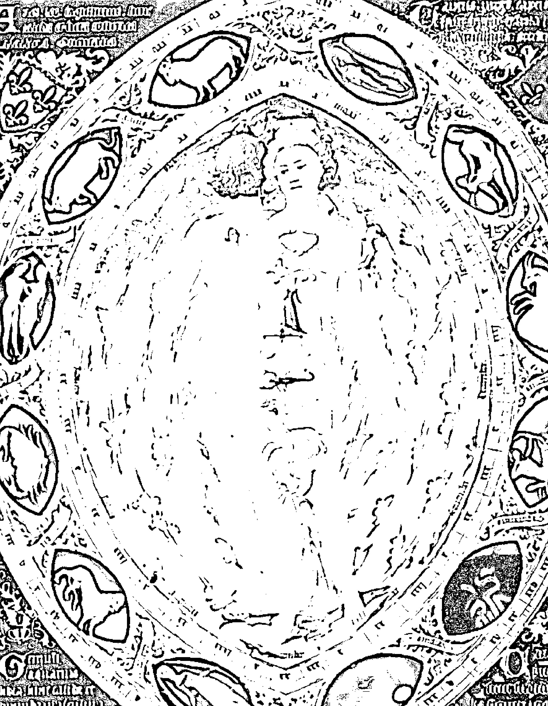

## 2009年行星运行示意图

当代西方著名星辰学家伊丽莎白·泰西埃预测：2009年是科学发现和创新之年。

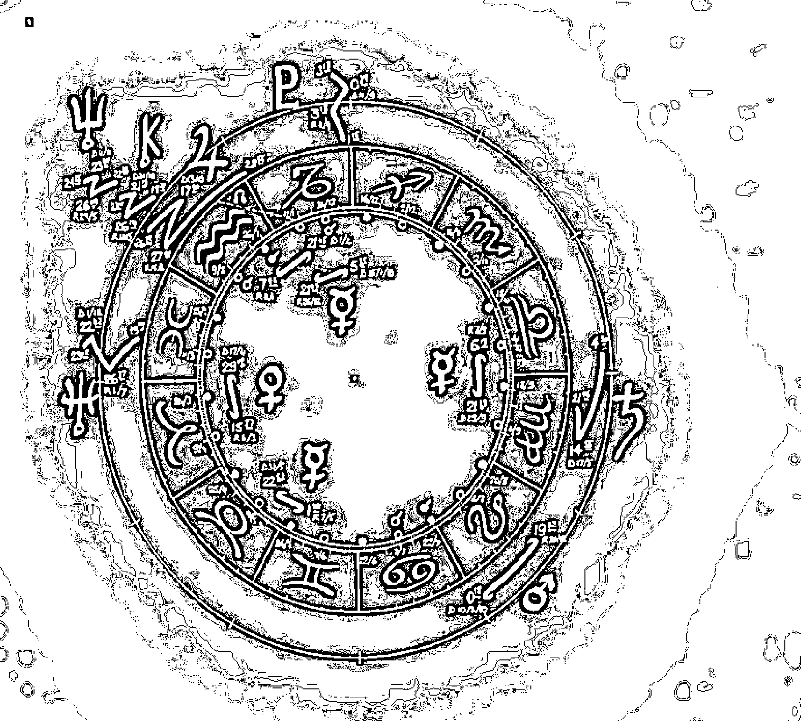

> “这是把人的性格特征和身体素质等与宇宙联系起来的一种假说，尤其对人性的归纳和剖析深刻、鲜活，令人回味无穷。此书值得一读。” —— 研究员 弗朗索瓦·阿泽尔

> “文字流畅，通俗易懂，不故弄玄虚，不耸人听闻，这是认识、感受和体验西方星辰学真实内涵的难得一见的珍本。” —— 研究员 玛丽克洛德·拉旺

上架建议 文化类

ISBN 978-7-5063-4332-9

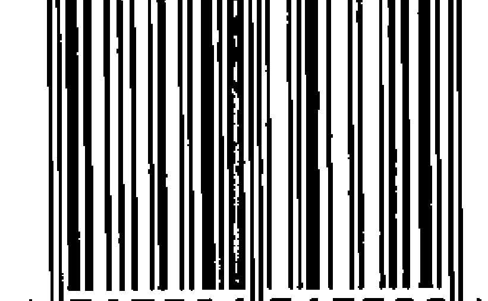

定价：29.00元

最新欧美权威版

### 星座使用手册

白巨 译撰

作家出版社

## 图书在版编目（CIP）数据

星座使用手册/白巨编译.-北京:作家出版社, 2008.6
ISBN 978-7-5063-4332-9
Ⅰ.星… Ⅱ.白… Ⅲ.星座-关系-性格-通俗读物 Ⅳ. B848.6-49
中国版本图书馆CIP数据核字（2008）第069062号

### 星座使用手册

译 撰：白 巨
责任编辑：刘英武
装帧设计：张晓光
出版发行：作家出版社
社址：北京农展馆南里10号 邮码：100125
电话传真：86-10-65930756 (出版发行部)
86-10-65004079 (总编室)
86-10-65015116 (邮购部)
E-mail： zuojia@zuojia.net.cn
http://www.zuojia.net.cn
印刷：北京明月印务有限责任公司
成品尺寸：152×230
字数：325千
印张：20.75 插页：2
版次：2008年9月第1版
印次：2008年9月第1次印刷
ISBN 978-7-5063-4332-9
定价：29.00元

作家版图书，版权所有，侵权必究。
作家版图书，印装错误可随时退换。

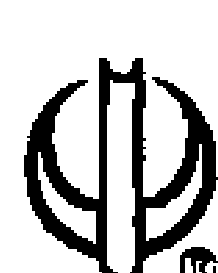

> “星辰学是启迪自我的科学。由于它，我学到了不少东西，获益匪浅。地球物理学讨论了恒星和行星对地球的作用力，反过来，从某种意义上讲，星辰学着重表述了恒星和行星自身的力量。正因为如此，对于人类，星辰学是一种生命酊剂。”
> 
> ——爱因斯坦①

> “本世纪赋予我们的神圣使命是实现尼采所说的：‘成为你自己’，成为我们潜在所是的那样。为此，唯一的方法是从全面了解自我入手。星辰学是一门杰出的人格科学，它是使我们实现这一目标的得力助手。”
> 
> ——伊丽莎白·泰西埃②

① 爱因斯坦Einstein, Albert(1879.3.14～1955.4.18)德国出生的美籍著名理论物理学家。
② 伊丽莎白·泰西埃(Elizabeth Teissier)当代西方著名星辰学家之一，她成功地预测过许多重大事件，她的著作被译成多种文字，其中中译本有《大预测》、《预测之谜》和《我与密特朗总统的七年交往》。

## 前言

上世纪80年代后期，西方星辰学走进中国人的生活。与我国传统十二生肖截然不同的星座符号及其内涵，引起了人们的普遍兴趣。尤其是青年群体，将其视为了解自我、认识他人和展望未来的新窗口。

如今，人们交谈中经常相互问道：“你是什么星座出生的？”“双鱼座，你呢？”“巨蟹座。”这意味着他们分别是在2月20～3月20日和6月22～7月22日之间出生的，即在他们出生时，太阳经过天文学上称为双鱼座和巨蟹座的黄道带部分。根据出生时纯太阳星座（即太阳与出生星位都在同一星座）的影响，传统西方星辰学赋予每个星座出生的人一个具有普遍意义的描述。本书谈到的性格、爱情、身体素质、职业及人生发展趋向等皆属这种纯太阳星座影响下的标准情况。实际上，由于人出生时所受天体的影响各不相同，所以并不都是这种标准情况。要想真正了解个人的有关具体情况，需要经验丰富的职业星辰学家对出生天宫图进行严格计算和详细分析才能得知。出生天宫图是根据每个人的出生时间和出生的地理位置（经度和纬度）建立的，其重要因素之一是出生星位，即人出生时刻升起在东方地平线上以度表示的黄道带的点，它代表深层自我、性格、身体素质等。

由于受出生星座的影响，每个人的身体先天地存在着这样或那样的弱点。如金牛座人咽喉容易发炎；室女座人肠胃吸收功能较弱；狮子座人需注意心脏功能的变化；天蝎座人的生殖泌尿系统是身体的薄弱点；摩羯座的人皮肤易出问题等。书中可以看到西方星辰学家在这方面的统计研究，以及根据各星座的特点和行星的影响，对生活方式、保健、饮食和美容等所提出的一些建议。

星辰学起源于美索不达米亚时代，从古希腊、古罗马、中世纪直至今日，已在欧洲发展流行了几千年，它是研究和了解欧洲中世纪历史及天文学史的必由之路。西方有许多人从事星辰学研究，不少国家还设有专门的研究机构，开展国际性学术活动。现代信息技术的发展为这一具有悠久历史学科的开发和利用提供了新的可能性。据报道，星辰学已开始用于犯罪心理分析，生态环境、股票行情、交通事故预测等领域。有关星辰学的广播电视节目、网上专栏、书刊杂志比比皆是。总之，在西方有过生活经历的人都知道，星辰学是西方人日常生活的一部分。20世纪60年代末美国《时代周刊》发表的一篇文章谈到：不知道自己出生星位和出生星座的美国人越来越少了；80年代末德国某杂志的一项调查表明，2个德国人中就有1个人认为星辰学确实有某些值得探讨的东西；90年代初法国的一次民意测验显示，58%的法国人认为星辰学是一门科学。不仅美国前总统里根向星辰学家请教过，法国前总统密特朗执政期间，也与一位星辰学家保持了长达7年的联系，凡重大决策都要先听听她的意见。此事在其逝世后出版的一本叫做《我与密特朗总统的七年交往》一书中被披露。

像中国的《易经》一样，星辰学是古代西方人在长期实践中以自己的方式认识宇宙与人之间关系的基础上总结出来的，它是与西方文明和天文学的发展有着渊源关系的一种特殊文化现象。随着中西方文化的逐渐相互融通，作为知识性了解，这种在西方人人皆知的文化现象势必成为人们涉猎的对象。天体运行周期与人的性格和身体素质之间或许存在着尚未揭示的必然联系；星辰学可视为对这种联系的一项探索，虽然探索方式的科学性还有待检验，但至少是富有启迪性的。

译撰者

#### 使用说明

- 一、根据出生年、月、日（公历），从“太阳经过黄道十二星座及其10°区时间表”中查找自己的出生星座和10°区。如尚舟1970年3月2日凌晨5时45分生于西安（北纬34°17′），即他是在太阳经过双鱼座的第二个10°区（10°～19°59′）时出生的。参阅有关章节，可了解这一星座人的基本性格趋向、身体素质、保健和情趣投向等情况（下面均以尚舟为例）。
- 二、根据出生年、月、日、时和出生地的经纬度确定出生星位（出生时刻要准确，因为每4分钟升起在东方地平线上的黄道带的点就会变化1°），其方法是：出生的地方时减去8个小时（北京时间与格林尼治时间的标准时差），加上出生地的经度差（参考附录“我国主要城市的经纬度表”），再加上出生之日的恒星时（参考附录“平均恒星时表”）。如果相加之和大于24小时，要减去24小时；夏时制施行期间的出生者应减去1小时（参考附录“我国夏时制起止时间表”）。

| 项目 | 数值 |
| :--- | :--- |
| 出生的地方时： | 5 时 45 分 |
| 北京时间与格林尼治时间的标准时差： | - 8 时 00 分 |
| 西安的经度差： | + 7 时 15 分 |
| 出生日的恒星时： | + 10 时 37 分 |
| **合计** | **= 14 时 97 分** 即 15 时 37 分 |

- 三、根据附录“出生星位所在星座时间表”，查找恒星时15时37分所对应的西安的纬度，可确定尚舟的出生星位是在宝瓶座。参阅有关章节，可了解不同出生星位宝瓶座人的性格、爱情选择，以及情感和谐等情况。
- 四、根据附录“1948～2008年行星方位表”，可确定尚舟出生时行星的位置。
- 五、以上得到尚舟出生天宫图的有关情况：出生时太阳在双鱼座，出生星位在宝瓶座，月亮在人马座，水星在宝瓶座，金星在双鱼座，火星在白羊座，木星在天蝎座，土星在金牛座，天王星在天秤座，海王星在人马座，冥王星在室女座。

需要特别指出的是：出生天宫图的建立、分析和解释是一项极其复杂的工作，在西方都是由富有经验的职业星象学家来做的。本书介绍的仅仅是关于星座、行星和出生天宫图的一般性知识，读者切勿以此为依据轻易建立自己的天宫图，并根据有关象征意义盲目地自行解释，以免产生误解和造成负面影响。西方著名星象学家伊丽莎白·泰西埃专门从事个人星象预测方面的咨询和有偿服务，她的网址：www.eteissier.com——译撰者

## 目录

前言……………………………………………………………（1）

使用说明…………………………………………………………（3）

♈ 白羊座（3月21日～4月20日） ………………………………………（1）

♉ 金牛座（4月21日～5月21日） ………………………………………（24）

♊ 双子座（5月22日～6月21日） ………………………………………（46）

♋ 巨蟹座（6月22日～7月22日） ………………………………………（68）

♌ 狮子座（7月23日～8月23日） ………………………………………（92）

♍ 室女座（8月24日～9月23日） ………………………………………（114）

♎ 天秤座（9月24日～10月23日） ………………………………………（134）

♏ 天蝎座（10月24日～11月22日） ………………………………………（156）

♐ 人马座（11月23日～12月21日） ………………………………………（177）

♑ 摩羯座（12月22日～1月20日） ………………………………………（198）

♒ 宝瓶座（1月21日～2月19日） ………………………………………（220）

♓ 双鱼座（2月20日～3月20日） ………………………………………（241）

附录…………………………………………………………………（263）

　　有关名词…………………………………………………（263）

　　我国夏时制起止时间表…………………………………………（270）

　　太阳经过黄道十二星座及其10°区时间表 ………………………（271）

　　不同星座出生人的性格和谐参照表………………………………（271）

　　平均恒星时表……………………………………………（272）

　　我国主要城市经纬度表…………………………………（273）

　　伴随人年龄的行星方位周期表……………………………（274）

　　出生星位所在星座时间表……………………………（275）

　　1948～2009年行星方位表 ………………………………（297）

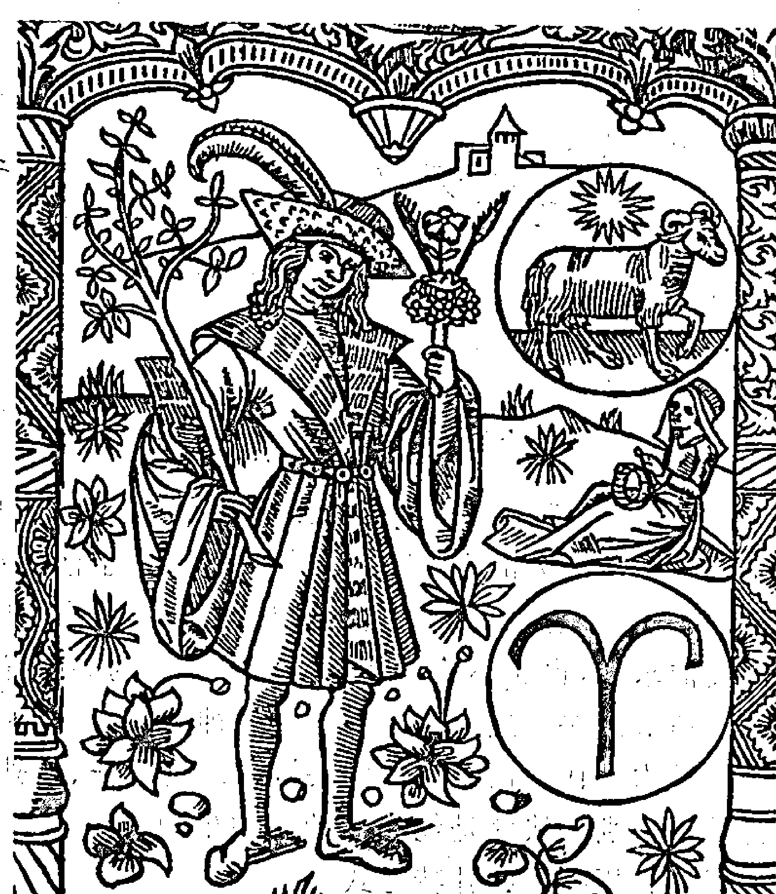

3月21日~4月20日

## 白羊座

> “人们自认为自由是错误的，因为他们只意识到了自己的行动，却不知道自己被决定的原因。”
> ——斯宾诺莎①

## 出生星位或太阳在白羊座人的基本性格趋向

白羊座②是黄道带和春天的第一个星座。春回大地，万物的生机都表现在白羊座人的身上。春天的气息赋予了他崭新的生命力，生机勃勃，激情盎然。他需要毫无吝惜地燃烧自己的激情和能量。不搞权宜之计，不委曲求全，也从不注重细节。白羊座人的突出优点是当机立断、付诸行动和速战速决。这是个具有开拓精神的人。

活力是代表白羊座人的关键词。骑摩托、驾驶汽车或者乘快艇，只要行动得比别人快就是他的目的。如果他是个知识分子，会有活跃的思想和观察分析问题的独特方式。

白羊座人不善于掩饰自己的感情，要么热情奔放，要么怒发冲冠。如果他的愿望受阻，绝不会悄然收兵。无论在家里还是在外面，都不惧怕争执，但事过之后，总是弃之脑后，从不记恨在心。在困难和危险的关头，他能充分表现出自己的品格和勇气，得到人们的敬佩和赞扬。

> ① 斯宾诺莎 Spinoza, Benedict de (1632.11.24~1677.2.21) 17世纪的唯理性主义者，哲学史上最完善的形而上学体系的创建人。

> ② 黄道带的第一个星座，它对应春天的第一个月，太阳3月21日~4月20日从该星座经过。白羊座的形象是一只公羊，据说阿塔玛斯国王的儿子弗里克修斯伏在其背上，平安地从色萨利逃亡到科尔乞斯。他把这只羊献给了宙斯，宙斯便把它放到天上成为一个星座。白羊座对应人体的头部。白羊座的主宰行星，即影响力最强的行星是火星。在该星座中，太阳的影响力增强，土星的影响力减弱，金星的影响力最弱。白羊座属火类星座，代表男性、勇气、斗志、领导能力、现实感、责任感和活力。

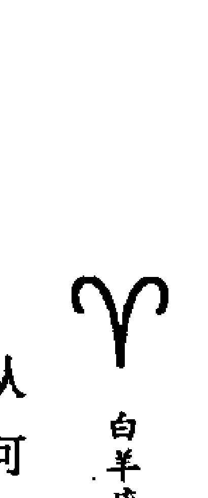

白羊座人喜欢无拘无束和自行其是，不愿意步他人之后尘。做事从不吝惜气力，宁可付出巨大的代价，也要力争前茅。总之，他从不在任何困难和失败面前低头。富有开拓精神，但容易给人以“独裁者”的印象，这一点往往不利于他的工作和人际关系。另外，白羊座人的言行往往带有启动性和影响力，能吸引人们进入他希望的轨道，去发挥应有的作用。

体育、军事和机械等一切需要体能消耗和狂热激情的工作、职业和活动，白羊座人都极为胜任并易成为佼佼者。如果出生者的出生天宫图中火星位于黄道第一宫、第十宫或第七宫，或者在白羊座、天蝎座或摩羯座中，这种情况会表现得更为明显。

白羊座人具有开拓者的胸怀，对他来说，竞争、探索和冒险要比金钱和荣誉更有诱惑力。

白羊座人一旦有了钱往往会挥金如土，或者赠送给亲朋好友，或者投注到冒险的事业中去。当经济拮据时，他也不会束手待毙，总能很快找到摆脱困境的办法，打开新的局面，然而好景不长……他喜欢不断变化、朝令夕改和不厌其烦，这些是他生活中必不可少的调味品，因为他最不喜欢的就是单调无味的生活。铤而走险的欲望常常缠绕着白羊座的人。他能够成功，但会遇到较大的挫折和考验，未来与他变幻莫测的激情息息相关。

如果出生天宫图中出生星位、太阳或月亮在白羊座，他将是一个朝气蓬勃、热情豪爽、慷慨真诚、坚强果敢、行动敏捷和有些固执己见的人。

白羊座人的不足之处是说话和做事不慎重，很少留有余地，缺乏冷静和周密的逻辑思维。一般来讲，白羊座人由于说话频率快而显啰嗦，整天忙忙碌碌，性情急躁、粗暴和有些心胸狭隘。

出生在白羊座的著名人士有：佐拉（法国作家）、安徒生（丹麦童话作家）、戈雅（西班牙画家）、凡高（荷兰画家）、白兰度（美国电影演员）、高尔基（前苏联作家）、本生（德国化学家）、卓别林、科尔（德国前总理）、波德莱尔（法国诗人）。

### 男性：性格、情感和爱情生活

白羊座的男性可视为超人，他总是被一种渴望得到敬佩和标新立异的狂热所驱使，喜欢表现出压倒一切的精神。他不相信失败，不怕任何考验，总是激情满怀，知难而进。喜欢长驱直入和速战速决。

白羊座男性的生活节奏紧迫，行动迅速且近乎狂热。在家里，喜欢推行自己的意愿和想法；在外面，不轻易失言或做越轨之事。在一些重大问题上，态度明朗，是非清楚。必要时还会挺身而出，竭诚相助。

白羊座男性的爱情生活往往是波浪起伏的。他用激情去赢得女性，如果所倾慕的人有所回避，或者求爱遇到了阻力，更会激发他不惜任何代价去征服对方的决心。一般来说，该座男性的性欲急促、强烈，夫妻做爱时充满激情和活力，喜欢快节奏。

天秤座的女性，尤其是出生星位在此星座的女性，对他有较大的吸引力。在天秤座女性的眼里，白羊座男性是理想的偶像，出类拔萃，才貌出众，会向他倾注无限的爱慕之情。

狮子座的女性会与他情投意合，能充分理解他的激情，支持他永恒拼搏的欲望。

与人马座的女性结伉俪，彼此都不愿受约束的性格和喜欢冒险的共同欲望，会使他们的生活充满别具一格的浪漫色彩。

性格过于冷漠和批评精神过强的摩羯座女性，会使他失去威严感。性格过于被动的巨蟹座女性会被他的独断专横搞得精疲力竭。

### 女性：性格、情感和爱情生活

白羊座女性是激情荡漾型的，她的信念像西班牙修女泰蕾兹·达维拉，她的思想像法国女政治家弗洛拉·特里斯坦，她对生活的热爱像美国女舞蹈家伊莎多拉·邓肯。

白羊座女性酷爱自由，喜欢针锋相对和竭力为维护自己的观点辩护。这是个完全摆脱传统观念束缚、富有战斗精神的解放了的女性。直言不讳，敢于进击，不怕挫折，性格中往往缺少温柔的成分。

白羊座女性的个性极强，当激情满怀时往往无法自控，甚至会毫不犹豫地投入所钟情人的怀抱。一般地说，她不喜欢处在被人追求的地位，尤其是出生天宫图中，当出生星位、月亮或金星都在白羊座的情况下。夫妻性爱生活中，多半喜欢扮演积极主动的角色。

白羊座女性不愿充当家庭主妇的角色，即便是也要听从她发号施令。她希望生活的脉搏能按照她的节奏跳动。她总是想做一些令人难以置信，但完全有能力做到的事情。如果不任凭她去“折腾”，她的情绪和身体就会受到影响。

如果她的丈夫能在事业上与她携手共进，她将会表现出独特的才能。但是要立足在平等的基础上。

天秤座（尤其是出生星位在此星座）的男性，会赢得白羊座女性的好感。她能使他满足自己的心愿，反之，他也能使她变得温情脉脉。

与人马座的男性相逢，他们会情意绵绵。这个宽宏大量的同舟之友会与她那紧迫的生活节奏同步。

与狮子座的男性结为伴侣，有助于实现她事业上和生活上的各种愿望。

巨蟹座的男性很难适应白羊座女性极强的个性；而严厉的摩羯座男性不会事事处处都让着她。

### 孩子：教育和职业选择的可能性

白羊座出生的孩子的主要特点是好动，反抗精神强，难教育。这是个可爱的小鬼，发起脾气来会闹得天翻地覆，但瞬间便会云开雾散。

白羊座的孩子需要一只强有力的手和冷静的权威来引导。千万不可听之任之，否则，他很快就会使你焦头烂额。要注意培养他的组织纪律观念，启发他的尊严感。

对于这一星座出生的孩子，重要的是要消耗掉他多余的体能。让他多参加一些剧烈的体育活动，即便常常伤痕累累，也无关紧要，因为这是他身心平衡的基础。他从不肯安静地呆在家里，英国式的中学教育对他较为合适，在这样的环境里，他很快会成为深孚众望的典范和表率。

白羊座的孩子对学习缺乏热情，其主要天赋表现在探索、机械、军事技术和一切需要良好体质与毅力的事业方面。他热衷于发现、探索和争当率先者。

白羊座孩子的理想择业方向是：创办人、运动员、军人、外科医生、工业家、广告代理人、机械师、律师，或者从事林业工作。

## 白羊座三个10°区①出生人的性格

## 白羊座第一个10°区

0°～9°59′（出生日期为3月21～31日）

做事易走极端、爱激动、好斗和缺乏纪律观念。总喜欢把生活之弦绷得紧紧的。内心的激情常常不由自主地表现在行动上，很少顾及后果。这是个不满足于平淡无奇的生活，渴望出人头地和奋力拼搏的人。休息会使他感到疲倦，困难会给他增添力量。他随时都准备重整旗鼓，继续前进，即使在遭到彻底失败的情况下，依然如此。

他的动力：活力。

## 白羊座第二个10°区

10°～19°59′（出生日期为4月1～10日）

内心充满无限的激情，仰慕英雄主义和酷爱权力。有强烈的自信心，高傲支配着一切。他需要钦佩和赞扬，不允许自己落后于他人。向往美好的人生和爱情。行动是他快乐的源泉。只要有披荆斩棘的勇气，人生道路上会畅行无阻。

他的动力：自豪感。

## 白羊座第三个10°区

20°～29°59′（出生日期为4月11～20日）

具有艺术性和创造性。无论是工作、事业还是其他方面，总希望走创新之路。有火热的激情和一股不可抗拒的拼搏力。从不吝惜自己的气力、感情和金钱。对日常生活往往缺乏现实感。

他的动力：激情。

## 不同出生星位白羊座人的性格、爱情选择和常见疾病

### 太阳和出生星位都在白羊座

这一星位体现了纯白羊座出生人的典型特征。头脑灵活，工作热情高昂，在事业和爱情生活中，总是勉励自己去赶超别人。需要自我表现和赢得别人的敬佩，受不得任何约束。由于常常言过其实，会招致许多麻烦。容易冲动，常目空一切和一意孤行。

出生星位在天秤座或者太阳、月亮在白羊座的人，在性格与情感上会与他有共同的语言。

这一星位出生的人易患风湿、神经痛、头晕、失眠症或脓肿。

### 太阳在白羊座和出生星位在金牛座

这是个以自我为中心的人。生活的现实感很强，愿望迫切，行动积极，总希望工作任务接踵而来。有极强的工作能力，对物质生活和爱情充满奢望。

- 与出生星位在天蝎座，太阳在金牛座或月亮在白羊座的人性情相投，相处融洽。

这一星位出生的人消化系统较弱，脾和肾脏的疾病，咽炎、糖尿病、痉挛和精神抑郁常见。

### 太阳在白羊座和出生星位在双子座

敏捷、激情和速度是该星位人身心的主要特点。情趣广泛，愿望强烈，行动坚决果断。这是个机敏干练的人，性情急躁，按部就班的程序会使他难以忍受。有出色的表达能力，幽默感强。爱情方面，有任其自然的倾向，经常需要别人从侧面去鼓励。憧憬美好的情感世界，但真正的爱情对他往往是迟到的春天。

与出生星位在人马座，太阳在双子座或月亮在白羊座的人志趣相投。

这一星位出生的人精神状态有时失衡，神经系统、肾脏和膀胱的疾病常见。

### 太阳在白羊座和出生星位在巨蟹座

这一星位的出生者性格比较矛盾：既温情又冷酷无情，既懦弱又好斗，既想表现自己，又受内心优柔寡断的制约。过分的敏感使他趋于忧虑，时而产生古怪的情绪。他渴望经常不断地得到别人的赞许。人际关系的好坏与他的未来休戚相关。在婚姻方面，有可能促成不慎重的结合。

出生星位在摩羯座、太阳在巨蟹座或月亮在白羊座的人，是他人生伴侣的理想选择。

这一星位出生的人要特别注意消化系统，必要时应禁食。肝脏是身体的敏感部位，精神抑郁和偏头痛常见。

### 太阳在白羊座和出生星位在狮子座

具有领导者的胸怀。他应该用辉煌的业绩去建立威信，到社会生活中去发挥才智。珍视荣誉，酷爱权力。有一颗纯洁而真诚的心，为人襟怀坦白，常慷慨解囊，从不计较个人得失。这是个只相信真、善、美的十足的乐天派，爱情生活会一帆风顺。

出生星位在宝瓶座，太阳在狮子座或月亮在白羊座的人，是他人生旅途不可多得的忠实伴侣。

这一星位出生的人视觉和听觉系统较弱，偏头痛、坐骨神经痛、抑郁症、心脏病和脊髓方面的疾病常见。

### 太阳在白羊座和出生星位在室女座

这是个有逻辑头脑和独立思维能力的人。为人做事力求尽善尽美，心中总是装满各式各样的计划。他的才能在实际工作，尤其是在商业活动中能得到充分的施展。精明强干，但有些过分注重细节。责任感强，一向用理智去支配自己的行动。

出生星位在双鱼座，太阳在室女座或月亮在白羊座的人与他情投意合。

这一星位出生的人要特别注意代谢和内分泌系统的变化，发热、胃肠功能紊乱常见。

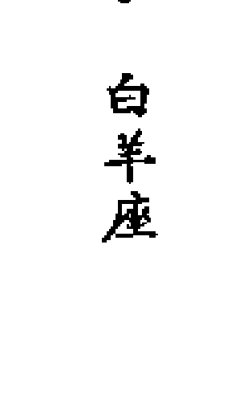

### 太阳在白羊座和出生星位在天秤座

感情丰富，是个带有唯美主义色彩的人，外界影响会在他内心产生强烈的共鸣和反响。爱情和人际关系对他的一生具有重要，乃至决定性的意义。生活的幸福与否取决于他的婚姻状况。

月亮或出生星位在白羊座，或者太阳在天秤座的人会使他的生活充满阳光。

这一星位出生的人要格外注意肾脏方面的疾病，妇女怀孕期间要留意并发症。

### 太阳在白羊座和出生星位在天蝎座

这一星位会极大增强火星的影响力和突显人最原始和粗犷的本性。这是个具有探险家或征服者性格的人。激情满怀，无论对待爱情还是生活，他总是信心十足，斗志昂扬。顽强的意志使他能在别人无能为力的情况下赢得成功。但缺乏亲切感，往往使人敬而远之，给人的威严感大于吸引力。

出生星位在金牛座或者月亮在白羊座的人会与他相处融洽。

这一星位出生的人由于受到火星较强的影响，经常会受伤。此外，胃溃疡常见。

### 太阳在白羊座和出生星位在人马座

具有奔放的热情和强烈的自信心，坦诚粗犷。这是一股真正的激流，应该把它引向一个准确的目标。他有赢得机遇和博得人们好感的能力，宽宏大量，永远把正直和忠诚作为自己生活和行动的准则。他用最真挚的情感去迎接不断袭来的爱情。

出生星位在双子座，太阳在人马座或者月亮在白羊座的人与他志趣相投。

这一星位出生的人听觉和视觉急症，肝和胆功能失调，扁桃体、上呼吸道和肺部疾病，以及各种疝常见。

### 太阳在白羊座和出生星位在摩羯座

情绪变幻莫测，忽冷忽热，时而冲动，时而平静。这是一种无调和余地，雄心勃勃，对人对己都十分苛求的性格。如果他不愿意被排斥在幸福的大门之外，就应该与人为善，力求用辛勤的劳动和成绩去开创幸福生活之路。

出生星位在巨蟹座或月亮在白羊座的人能理解他，并会无怨无悔地与他共创美好生活。

这一星位出生的人牙质不好，视觉和听觉障碍、偏头痛和神经痛常见。

### 太阳在白羊座和出生星位在宝瓶座

他的心无时无刻不被远大的目标所召唤，幻想着新的征程。奔放的激情是他思想和创新的源泉。反对因循守旧，主张标新立异，常常浮想联翩，因此，难免有些乌托邦的思想倾向，尤其当出生天宫图中，有天王星与火星或者天王星与太阳方位存在的情况下。他能在别人无法承担的事业中奇迹般地获得成功。友谊的信念很强，能用特有的激情去赢得人们的欢心和好感。

出生星位在狮子座、太阳在宝瓶座或者月亮在白羊座的人是他的知音者。

这一星位出生的人抑郁症、头晕、脑充血、偏头痛、三叉神经痛，以及外伤和骨折常见。

### 太阳在白羊座和出生星位在双鱼座

这是个夹杂着朦胧意识且极富幻想的人，经常在利己主义和利他主义之间徘徊不定，无所适从。现实感不多，内心潜在着很大的不稳定性。敏锐和直觉生来就赋予了他双倍的视野。和蔼可亲，但易受别人的影响，激情总是伴随着幻想。

出生星位在室女座和太阳在双鱼座，或者月亮在白羊座的伴侣是他人生和事业的得力助手。

这一星位出生人的代谢系统和循环系统的疾病常见。

## 白羊座人与其他星座人的情感和谐①

## 白羊座的人与白羊座的人

由于这两个同星座人都好胜，所以相处时常常会表现出“对抗性”。他们都想通过一番快速、猛烈和不失文雅的较量战胜对方，其开始和结束如此之快，以至于没有回味的余地。

## 白羊座的人与金牛座的人

前者比较主动，后者矜持、躲躲闪闪或留有余地。金牛座的人能接受白羊座人爱的表示，不过一旦触及到敏感点，其反抗是非同小可的，暴躁和愤怒会像火山一样爆发出来，使白羊座的人望而生畏，不敢再做第二次尝试。

## 白羊座的人与双子座的人

当爱驱使白羊座的人走近双子座人的时候，后者会故作视而不见、躲躲闪闪或显得不知所措。若是白羊座的人热情低落，双子座的人又会去诱惑、调情和主动向他挑战。即便过了风华之年，他们还会像年轻人那样嬉戏，情感生活充满浪漫的气息。他们都希望情感世界能不断升华，但彼此很少用发自内心的努力去滋润和浇灌。

## 白羊座的人与巨蟹座的人

白羊座属火类星座，巨蟹座属水类星座，这两个星座人的结合犹如火溶于水。由于彼此的性格和生活节奏截然不同（前者外向、急躁和凡事不往心里去，而后者内向、优柔寡断和极度敏感），白羊座和巨蟹座夫妻的生活犹如不寻常的冒险旅行，只有体谅、理解和不断地互相让步，才能到达人生的彼岸。

## 白羊座的人与狮子座的人

犹如本能与意识两种力的结合。狮子座的人对爱充满坚定的信念，希望自己能被不寻常的力量所征服。他不会向迫不及待或不厌其烦的冲动让步，只有在水到渠成、瓜熟蒂落的时候，才肯表露爱的真意。而白羊座的人需要不断变换方式才能赢得狮子座人的心。

## 白羊座的人与室女座的人

最初，他们的融合点并不多，仅仅是纯粹的冲动面对真诚且理智的情欲。共同生活会增进彼此的了解，并会使他们之间的情投意合达到令人难以置信的程度。如果丈夫是室女座、妻子是白羊座出生的人，其情感关系更容易成功，但不排除例外情况。

## 白羊座的人与天秤座的人

这两个星座人的感情结合是牢固的，但不排除有对立、争执和排斥。双方都希望有融洽和谐的关系，但都不愿意为此作出更多的努力。

## 白羊座的人与天蝎座的人

他们之间的关系犹如爱神厄洛斯与龙的搏斗。前者跃跃欲试，后者则千方百计想取胜。这是势均力敌的对抗，天蝎座的人永不思退让，而白羊座的人不停地展开新的攻势。从而致使双方经常处于气喘吁吁的“疲劳战”状态。

## 白羊座的人与人马座的人

白羊座的人与人马座的人结合，他们的激情将永远处于沸腾状态。共同生活中有蜜月般的时刻，也有双方都认为是完全可以理解的争执。这是一种不可多得的夫妻姻缘。

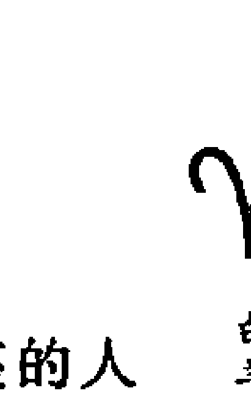

## 白羊座的人与摩羯座的人

犹如红与黑或火与冰的结合。正因为如此，经常会发现白羊座的人与摩羯座的人之间的关系往往超出人们的想象。这两个星座的人组成的夫妻关系是欢乐和幸福的，彼此都喜欢面对挑战，都愿意去实现不可能的事。

## 白羊座的人与宝瓶座的人

这两个星座的人都喜欢新奇和意想不到的事。前者喜欢征服，后者喜欢吸引，因此，他们能不时为生活增添些旖旎的色彩。白羊座的人要想长久拥有宝瓶座人的爱，就必须表现出浪漫情怀和坚贞不渝之心，因为宝瓶座的人需要感到在忠实可靠的伴侣眼里，他占有举足轻重的地位。

## 白羊座的人与双鱼座的人

这两个星座人的结合缺乏和谐的基础。粗暴和冲动面对幻想，两种格格不入的性格很难融合在一起。除非彼此都想使对方看到自己内在尚未被意识到的另一面的特殊情况下，才有发生奇迹的可能性。

## 白羊座人如何根据自己星座的特点关爱身体、保健和美容

白羊座对应头部和面部，正因为如此，这一星座出生的人容易患脑充血、偏头痛、神经痛、面部皮疹和眼病。

白羊座出生的人具有极强的抗疲劳能力。由于体能消耗量过大，容易出现早衰体征。无法使这一星座出生的人安静下来，他做事不遗余力，因此，很快就会筋疲力尽。疾病总是突然降临到他的头上，且多属于急性发作，使其一蹶不振。如果使他恼羞成怒，他会变得咄咄逼人，精神极度亢奋，从而导致身体的内平衡失调，出现发热、荨麻疹等变态反应性疾病。

只有多参加体育活动，才能使他的身心处于最佳平衡状态。因为运动会排出大量的汗液，这样，压抑所产生的郁闷不畅的情绪，会随之一起排出体外。

一切需要发挥体能和竞争优势的活动，他都易于取胜。白羊座的人无论男性还是女性，都十分注意形体美和表现出自己不容忽视的优势，尤其是在其出生天宫图中，火星方位的影响力较强或者有几颗行星在白羊座的情况下。

白羊座人的身体需要补铁，为此，最好多吃些白菜、洋葱、胡萝卜、菠菜、欧芹和粮食。大蒜和洋葱是白羊座人偏爱的调味品。吃凉拌菜时，最好用葵花籽油，并适量加些蒜末儿。

另外，白羊座人还需注意补钾，以强化肾上腺和肌肉的功能。为此，可多吃些香蕉、栗子、橄榄、葡萄、面食、米饭和马铃薯，而不宜食太多的油腻和调味汁。白羊座人最好吃牛肉和羊肉以增加优质蛋白，但不要吃得过多。吃的时候应加些生洋葱和欧芹末儿，可防止动脉硬化。

在心情处于低潮的时候，最好多吃些爽口的食物，如黄瓜、甜瓜、西红柿等。

白羊座人往往肝火旺盛，这会加剧他的好斗、易怒等烦躁不安的情绪。为此，可选用具有镇静作用的草药制成的汤剂，日间或睡觉前饮用。多喝鲜果汁，少饮白酒。

白羊座人的保健植物是迷迭香，它是保肝佳品。

适合白羊座人的体疗法是芬兰式蒸汽浴或土耳其浴。他可以经常在家做类似的热水健身浴，以排除体内的毒素，达到轻身爽心的目的。如果能在浴缸的热水中加些迷迭香和刺柏香精，效果会更好。因为天然植物香料容易被皮肤吸收，进入循环系统，对全身产生疗效。

白羊座人不适应过热的环境，这会使他头部充血、中暑。如果住的地方靠近河边或海边，经常到齐膝的水中走上三五分钟，会使他的充血状况得到改善。

白羊座人偏爱肉食，应该多吃些蔬菜、水果，尤其是胡萝卜、洋葱、洋白菜、大蒜、茄子、香蕉、苹果、花生油和橄榄油等。

一般来说，白羊座人不喜欢吃甜食，而喜欢吃奶酪。这可为他提供丰富的酪蛋白，促进食物的消化。另外，可能的话最好常喝酸奶，这将有助于保持肠道内菌群的平衡。

白羊座人宜选用人参润肤霜，它对保持皮肤的弹性有良好效果。另外，亦可选用蛋黄美容霜，它有助于肌肤恢复青春的柔润细腻。

白羊座人适合选用以丁香、欧石楠或石竹为主要成分的香水。

## 白羊座人的情趣和喜欢的礼物

不同星座的人情趣各异，喜欢的礼物亦不同。如人马座、狮子座、白羊座、天秤座、宝瓶座和双子座的人喜欢馈赠礼物；而金牛座、室女座、摩羯座、巨蟹座、天蝎座和双鱼座的人则喜欢接受礼物。了解各星座人的情趣特征，选择最佳礼物和最适当的表达友谊的方式，将有助于增进友谊、爱情，加深信任、了解与合作。下面是根据统计归纳出的十二星座人的基本情趣投向和馈赠礼物的指南。

白羊座的人喜欢赛车、瑞士多功能刀、武器（如猎枪）、数码产品（如相机）、各种实用的进口小工具。由于经常参加体育运动，所以喜欢体育用品，如拳击手套、滑雪眼镜、健身器械、厚运动服、红色套衫、茄克衫、皮裤、旅游鞋、红色利克拉裙子、颜色高雅别致的领带或体育用手表。偏爱体育画册（如拳击、汽车大赛、田径赛和运动员传记等）、侦探或恐怖小说。音乐方面，喜欢节奏感强的各种音乐，如军乐、管风琴音乐（尤其是巴赫的作品）、交响乐（贝多芬、柴可夫斯基）、舞曲、摇滚乐或爵士乐。不宜安排他们参加有组织的旅游观光活动，因为他们讨厌这种形式，而喜欢以他们自己的方式去发现和探险。

白羊座的男性喜欢喷洒掺有浓香精的花露水；而女性则喜欢用男士香水，赠送时要选择香味浓烈些的。

如果父母想送礼物给他们白羊座的孩子，最好选择红色遥控小汽车（如警车）、机械玩具、各种武器玩具、美国西部的牧童、佐罗或中世纪骑士的造型玩具。

## 太阳和木星方位与白羊座人的物质生活趋向

太阳和木星都在白羊座
对任何计划都抱有付诸实现的巨大热情和赢得成功的坚定信念。为了实现理想和愿望，不惜任何代价，但往往缺乏持之以恒的精神。有致富的机遇和可能性，但需要慎重和勤俭节约，否则，到手的钱财亦会付之东流。

太阳在白羊座和木星在金牛座
有出色的理财能力，尤其在物质生活的建设方面有敏锐的直觉。敢于开拓创新，并会取得成功。追求奢华和高消费。

太阳在白羊座和木星在双子座
喜欢高消费，经常有超越自己经济能力的支出。思想活跃，浮想联翩，常常同时投身于许多事情中，但很少能善始善终，因此收入不太稳定。要用勤奋去改变生活，不要等待运气的恩赐。

太阳在白羊座和木星在巨蟹座
抱着幻想付诸行动，往往凭侥幸获得成功。钱来得快花费得也快。困难的关头，常常会有人向他伸出相助之手。

太阳在白羊座和木星在狮子座
这是对物质生活的发展极其有利的行星方位，内心蕴藏着各种计划，渴望高品位的生活。这一星位会提供许多机遇，如果努力奋斗，40岁以前有实现的可能。不喜欢平淡无奇的物质和精神生活。

太阳在白羊座和木星在室女座
雄心壮志往往受到现实生活的制约，理想或所付出的努力总得不到相应的回报。

## 太阳在白羊座和木星在天秤座

职业生涯坎坷不平，有时会出现意想不到的机遇和变化，但不太可靠。总的看来，人生的发展要比预想的乐观，或许不得不作出力不从心的开支。

## 太阳在白羊座和木星在天蝎座

火星对这一行星方位有决定性的影响，会使人变得异常活跃和善于投机。如果投身于大事业中，常常不会一帆风顺，但借助于他人的帮助可望成功。财源多来自赠与或遗产。

## 太阳在白羊座和木星在人马座

这是对赢得机遇和广开财路十分有利的行星方位。钱来得容易，去得痛快，原因是他喜欢高消费和常常慷慨解囊。向国外投资或开发旅游业易赢利。

## 太阳在白羊座和木星在摩羯座

雄心勃勃，利益至上。生活十分节俭。人生之路可能坎坷不平，致使他不能早日实现自己的愿望。人生的第二阶段会好于青年时代。

## 太阳在白羊座和木星在宝瓶座

从不把物质利益放在心上。在他的心目中，理想、愿望和人际关系高于一切。意外的收入可能会改变生活现状。注意不要从事投机、没有把握的或冒险的事业。

## 太阳在白羊座和木星在双鱼座

寄希望于运气，事实上，运气真的会向他伸出援助之手。人生的航船总有意想不到的保驾护航。挥霍无度。

### 把握好火星主宰下的自我

每个星座都有一颗起主宰作用的行星。白羊座的主宰行星是火星。火星是勇气、激情和行动不可缺少的动力因素，没有火星就谈不上毅力，就将一事无成，永远处于消极被动的地位。火星的影响力在摩羯座增强，在白羊座最强，在巨蟹座减弱，在天秤座最弱。

当火星位于出生者的出生星位或中天附近，或有几颗行星在白羊座或天蝎座时，对出生者的青壮年时期（大约 21～28 岁左右）影响较大。火星在天宫图中的位置代表毅力、激情和冲动的强弱以及为成功而展开的行动。受火星主宰的人，生来就具有从事体力劳动、体育运动、工业和机械方面的才能。做事尽心尽责，从不投机取巧。

不过，火星也代表着不愉快和风云变幻之事。总之，这是一股动力，一股需要谨慎驾驭的力量。下面是火星处于不同方位时的影响。

### 火星—太阳

火星与太阳相合的影响能激发创造力或破坏力。这是一种潜在的能量，一团蕴藏着的烈火，一切都决定于人们如何去支配它。它能形成一股蛮干的勇气，一种持之以恒的决心，一种好斗的心理，也可能变成一种追求神圣权力或凌驾于人的欲望。

和谐的火星与太阳方位的影响能赋予人以毅力见长、以行动为乐的性格。另一方面，受这一行星方位影响的人往往具有强壮的体魄，酷爱体育运动。顽强的毅力和坚持不懈的努力，能使他获得最终的成功。这一成功对他的一生都会产生至关重要的影响。

不和谐的火星与太阳方位的影响会加重人惹是生非或专横的性格特点。过于无拘无束和冒险的欲望，会把他引向狂热的探险者的征途。他的未来如波涛汹涌的大海一样不平静，生活会遇到许多风风雨雨。人们对他的敬畏胜过爱慕。平日要多注意安全，尤其是在冲突、争斗中更需小心谨慎。

① 这些和谐关系的描述仅仅是针对人出生时太阳星座的单纯影响所作的理论分析，并不是绝对的。实际上，影响两个人和谐关系的还有另一个重要参数，那就是出生星位。例如，仅从出生时太阳星座的影响来看，由于性格的差异，白羊座的人与巨蟹座的人是不和谐的。但是如果白羊座的人出生星位在水类星座（巨蟹座、天蝎座和双鱼座），或者巨蟹座的人出生星位在火类星座（白羊座、狮子座和人马座），那么，他们的关系将会是十分融洽和谐的。出生天宫图中金星和火星的影响是衡量性爱和谐与否的基本参数。

总之，在出生天宫图中，火星与太阳相合方位如同木星与火星相合方位的影响一样，能激发人对生活的信心和热情。

### 火星—月亮

火星与月亮相合的影响会激发出一种自相矛盾的性格：温柔又冷漠，软弱又坚强，真诚又虚伪。这种性格的人既有很强的依赖性，又不能忍受任何约束。

不过，这种性格常常因性别而异，女性往往表现为在家独揽大权，或有女权思想；男性则表现为对女性的唯命是从。但总的看来，这一相合会给出生天宫图中行星影响力较弱的人带来奋发向上的活力。如果该相合发生在白羊座、摩羯座或天蝎座，则会使人的性格趋于偏激，好惹是生非，对顺乎常理的事往往产生格格不入的看法，从而使自己陷入被动，乃至进退维谷的境地。另外，遇事缺乏冷静的头脑，容易致使命运发生突如其来的变化。

和谐的火星与月亮方位的影响会给人带来充沛的精力，使工作和生活充满生机和活力。

### 火星—水星

火星与水星相合及其和谐方位的影响，会给出生者带来巨大的精神力量和卓越的工作才能。口齿伶俐，但过分敏捷的思维常常使他烦躁不安，甚至空话连篇。另外，这两颗行星相合的影响还能使人具有幽默感或批评精神，热衷于辩论。

如果这两颗行星彼此的方位欠佳，则容易使人具有不懂处世哲学，为人浮于表面的性格。即便在最好的情况下，这一相合的影响也难免使人表现出缺乏耐心，总是这山望那山高的思想倾向，不能脚踏实地地去从事某项工作或成就某项事业。

### 火星—金星

火星与金星相合的影响能激发人对爱情和艺术的追求与向往，涌动人身心的春潮。如果出生天宫图中没有较强的克制自我的行星影响力，那么这一相合将意味着过早地进入爱情生活和承担家庭的义务。

另外，这两颗行星相合或呈和谐方位时，会成为幻想和生活热情的动力源泉，有助于艺术才能的发挥。对于演员，这是个十分重要的行星方位。

不和谐的火星与金星方位影响会导致迷恋桃色，乃至不能自拔的程度。由此会产生错综复杂的心态和焦躁不安的情绪。

### 火星—木星

火星与木星每两年相合一次，大约每35年在同一星座中相合一次。在出生天宫图中，其影响力是非常强的，能赋予人激昂的热情和不顾一切勇往直前的勇气，引导得当，可变成一股巨大的制胜力。这一行星方位的影响会使人具有永不走中庸之道的性格。

据统计，火星与木星方位的影响常常造就出企业家、军事家、运动员和生来就想建功立业的人。

如果这两颗行星相合方位欠佳或者呈不和谐方位，则会使人表现出易怒和易冲动的性格特征。唐突从事，漏洞百出，希望得到的多多益善，付出的越少越好；常常把自己当做坏靶子。这是一种碌碌无为，不时用冲动扰乱自己生活的人。

和谐的火星与木星方位的影响会赋予人理智的激情，可使人饱尝生活的甘露。

### 火星—土星

火星与土星相合的影响犹如炽热的铁放到冷水中，会淬出钢铁般的意志。凭借它能无坚不摧，无往不胜。但在行星的影响力较弱的出生天宫图中，它也能变成一种于己不利的消极因素。

一般来说，这两颗行星的相合、相冲或呈四分方位的影响容易使人遭受痛苦、处于危险的境遇、遇到不幸的事件或受伤。

和谐的火星与土星方位的影响，不但能赋予人内心的充实感和实现抱负的信念，还会增强人的意志、耐力和工作能力。即便逆水行舟，也能如愿以偿。

### 火星—天王星

火星与天王星相合的影响犹如两种爆炸力的结合，能产生巨大的力量和过激的冲动。关键在于冲动的投向，要么是个具有反抗精神和胆大妄为的人，要么是个杰出的创新者。性格开朗，情绪激昂，缺少耐力，适合在无拘无束的状态下工作和生活。他的兴趣总停留在形而上学、玄奥莫测或边缘性学科的问题上。据统计，许多出色医生的出生天宫图都与这一行星方位有关。此外，其影响还能增强人的工艺能力和吃苦耐劳的精神。

人生中有许多意想不到的转机，有光辉灿烂的时刻，也有忧伤暗淡的插曲。

和谐的火星与天王星方位的影响会赋予人更大的创造力；其不和谐方位影响会使人头脑发热或有自由放任的性格倾向，同时也是突发事件的潜在因素。

### 火星—海王星

出生天宫图中，火星与海王星相合是一种矛盾且令人担忧的行星方位，其影响会使人的言行缺乏谨慎或慎之过度。性格不坚定，易动感情。既是一个浪漫派，又是一个欲望无穷的人，总是追求超越自己能限之外的理想。

另一方面，火星与海王星方位的影响能唤起人强烈的想象力，如果能将其引导到艺术或戏剧领域中来，定会一展宏图。未来几乎总是动荡不定的，但也会出现无限风光。

火星与海王星呈三分方位或六分方位的影响会使人变得易冲动，会增加人格魅力和实现梦想的决心。两者相冲或呈四分方位的影响会使人过度兴奋而失去理智，从而导致人生道路上有许多危机阶段。容易酗酒和对麻醉品成瘾。

如果控制得好，即使不和谐的火星与海王星方位的影响，亦能成为巨大精神力量的源泉。

### 火星—冥王星

火星与冥王星相合对人的影响是突出好斗的心理、权力欲和破旧立新的愿望。如果出生天宫图其余部分的行星方位和谐的话，那么，这两颗行星相合或呈三分方位的影响则能增强人奋斗的勇气和决心，有助于开拓成功之路。

火星与冥王星相冲或呈四分方位的影响会使人产生焦虑不安的情绪或犯罪感，进而发展成一种真正的神经质。

## ♈ 你的星辰对应备忘录

喜欢冒险的白羊座人常说：“我是。”

你的主宰行星：火星。

你的关键词：生机、专横、实干精神、坦诚、好斗性、竞争意识、开拓精神、热情、迫不及待、冒险、勇气。

你求爱的方式：直言不讳，当机立断。

你是一个：感情起伏较快的人。

你渴望：模特式的生活伴侣。

你受骗：当有新欢时。

你喜欢：户外和蓝天。

你害怕：不被人注意。

你追求：冒险的机会。

你的弱点：不能忍受批评。

你的动力：激情和自豪感。

你的优势：毅力。

你的劣势：急躁和好斗心理。

你身体的脆弱点：头部和面部。

你的假期生活：致力于个人的小计划或体育运动。

你的开支：购买最新式的机械、数码产品或体育用品。

你的服饰：充满朝气和活力的皮装，富有自然和原始美的首饰。

你的吉祥物：凤凰。

你的吉日：星期二。

你的幸运数字：7、11、17、21。

你的幸运色：红色。

你的幸运花：欧石楠、龙胆、薄荷。

你的幸运金属：铁。

你的幸运石：红宝石、紫晶。

你的吉祥动物：狗、羊、马、鹰。

## ♈ 白羊座

你的吉祥植物：胡椒树、石竹、芥、大黄、辣根菜、芦荟。

你的保健食品：洋葱、大蒜、洋白菜、菠菜、土豆、茄子、黄瓜、西红柿、葡萄、甜瓜、苹果、橄榄、栗子和奶酪。

你喜欢的礼物：瑞士多功能军刀、各种实用的小工具、相机或体育用品。

有益于你的场所：热闹繁华之处、危险或劳动强度大的地方、工厂、体育馆。

适合于你的住所：绝对现代化的寓舍，室内布局和陈设自然而典雅；野营生活。

你的幸运旅游地：非洲、丹麦、荷兰、日本、德国、英国；那不勒斯[意大利]和马赛[法国]。

你的理想职业选择：企业领导人、牙科医生、运动员、军人、机械师和律师。

与你亲和的星座：狮子座、人马座、双子座和宝瓶座。与天秤座互补。

# 金牛座

> “心灵顺从于习惯，所想如同所见。”
> ——狄摩西尼①

### 出生星位或太阳在金牛座人的基本性格趋向

金牛座②出生的人喜欢按自己的人生哲学走路，不轻易改变所固有的生活习惯。固执己见是他性格上的突出特点，同时也是他的主要缺点。平时温文尔雅，一旦受到伤害，会变得咄咄逼人，令人生畏。

金牛座人思想趋于保守，善于理财。当他拥有一定数量的财产，手头宽裕时，心里才会感到踏实。

这一星座出生的人对逆境的适应较慢，挫折和失败常会使他意志消沉，甚至会人为地把自己禁锢在无声的愤怒之中，拒绝与外界的一切接触。一旦境况有所好转，他又会重新振作起来，以空前的热情投入工作，为实现自己的目标去奋斗。

金牛座人的成功之路往往是漫长的，但又是确定无疑的，尤其表现在农业、建筑业和商业等方面。

金牛座人的家庭观念较强，他把温馨和睦的家庭作为寄托幸福和安居乐业的可靠圣殿。他爱孩子胜过一切，并对其寄予厚望。

① 狄摩西尼 Démosthène（公元前384～前322.10.12）古希腊政治家，伟大的雄辩家。

② 黄道带的第二个星座，它对应春天的第二个月，太阳4月21日～5月21日从该星座经过。金牛座的形象是一头牛，这与宙斯化作白牛把欧罗巴劫走的希腊神话有关。金牛座对应人体的颈部和喉咙。金牛座的主宰行星，即影响力最强的行星是金星。在该星座中，月亮的影响力增强，冥王星的影响力减弱。金牛座属土类星座，代表冷静、思考、固执、性感、惰性、热爱大自然和追求物质享受。

经济上，他的现实感很强，十分善于安排物质和家庭生活。事业上也是个强者，具有天生的无懈可击的才华。

金星或月亮强有力的影响往往会使金牛座的人选择艺术或影视的道路。据概率统计，许多歌唱家和影视界人士的出生天宫图中，都是金牛座的影响占主导地位。

金牛座人不轻易耗费自己的体能，不喜欢毫无意义的说教、毫无目的的行动和失去理智的冲动。他不放任激情，也没有紧迫感，这是一个自制力强和总是按尺度进行思维的人。

如果出生天宫图中金牛座的影响力较强，那么他会有良好的自卫本能。思想一成不变，说话做事比较繁琐。从积极的意义上看，金牛座的人性格平和，有毅力和耐心，勤奋智慧，富有实干精神，为人处世小心谨慎，感情真诚专一。此外，他具有极其敏锐的感官，内心充满各种欲望。喜欢舒适的生活环境、大自然的壮丽景色，以及花草和动物。从消极的意义上看，这些优点的背后还隐藏着多疑多虑、嫉妒、悲观失望、沉默寡言、抑郁孤僻的性格特点。他很难改变自己的固有观念。另外，金牛座的人固执己见，对事物极易产生偏激和狭隘的看法。

金牛座出生的著名人士有：
- 列宁
- 马克思
- 弗洛伊德
- 巴尔扎克
- 简·方达（美国电影演员）
- 勃拉姆斯（德国钢琴家和作曲家）
- 伊丽莎白二世
- 达利（西班牙超现实主义画家）
- 莎士比亚
- 希特勒。

### 男性：性格、情感和爱情生活

这是个喜欢安定的生活和具有田园诗般性格的人。情感节奏变化缓慢，然而，一经触发将身不由己，无法自拔。对于金牛座出生的男性，稳定且经久不变的生活环境至关重要，他不喜欢素不相识或萍水相逢的人来干扰他的生活。无论在爱情还是在物质追求方面，他都是以可靠和安全作为衡量的主要标准，这甚至是他性格和思维方式的基础。

金牛座的男性既是多思多虑又是不拒绝任何享乐的人，美味佳肴是他生活中必不可少的伴侣。

在婚姻问题上，他首先考虑的是结合是否对双方都有利。喜欢根据对方的家境及其工作能力作为择偶的先决条件，因为他需要既能承担家庭生活的责任，又能帮助他理财的妻子。他憧憬美好和充满佳肴芳香的爱情生活，尤其盼望妻子能烧一手好菜。和谐的爱情生活是他们感情的基础，充实的性生活是其身心平衡不可缺少的因素。喜欢在宁静、舒适、豪华和充满温柔的意境中感受性爱带来的欢乐。金牛座的男性对新事物适应较慢，不愿意轻易改变自己的生活习惯。

家庭和孩子是他生活的中心，亦是他引以自豪和欢乐的资本。尤其孩子，是他全部希望的寄托。

性格平和，很少发脾气。不过一旦发作则非同小可，会令人毛骨悚然。

与出生星位在天蝎座的女性会情投意合，性爱和物质财富的追求是他们共同的心声。然而真正的生活中，这两个个性都很强的人也难免发生争执。

与出生星位在室女座或摩羯座的女性结为伴侣，生活会充实、和谐与温馨。因为这两个星座的女性在体贴丈夫、管理家务和照顾孩子方面各有所长。

与宝瓶座的女性，他们各自的愿望很难纳入同一轨道；与狮子座的女性会争权夺利或者志向不一致。

### 女性：性格、情感和爱情生活

这是个精力充沛，身体健美，生活欲望强烈的女强人。很会按照女性的方式无忧无虑地生活。充满魅力，渴望经历爱情生活的全过程：恋爱、结婚、家庭、孩子以及美食佳肴。如果爱情和性生活不能如愿以偿，她的性格容易发生变态：心情郁闷，自我意识突出，促使她去寻求物质和美食带来的安慰。

金牛座女性是理想的家庭主妇、出色的女主人和精明强干的商人。她能使周围的人都感到愉快，拿手的烹饪技术会使家人和朋友赞不绝口。此外，这一星座出生的女性还常常是养花能手，喜欢房间布满鲜花和绿色植物，希望生活环境比其它任何地方都更生机盎然。只有当生活充满恬静的田园气息，看到自己的孩子健康成长时，她才会感到置身于真正的幸福之中。

金牛座女性的性意识比一般人突出，但进入角色缓慢。需要在充满温情、美味佳肴、音乐和舞蹈的诗情画意的气氛中唤醒。

金牛座女性的性格偏于内向，经济上喜欢自立，嫉妒心经常折磨着她。一旦她确信得到了自己钟情人的真诚回报，她会成为一个贤惠、忠诚的好妻子。

与出生星位在金牛座的男性共同生活，尽管难免会有些摩擦，但和谐的性生活会使她精神上得到满足。

狮子座男性专横固执的性格会令她难以接受，宝瓶座的男性不会理财也会使她感到失望。

与摩羯座的男性会志同道合，他们在工作上会互相帮助，生活上会互相体贴照顾。

与室女座的男性结为伴侣，有助于建立稳定和幸福的家庭。

### 孩子：教育和职业选择的可能性

金牛座出生的孩子是个慢性子，他做事和思考问题时，最好不要催促他，否则他会变得消极或固执起来，以致被人误认为十分愚笨。一旦他步入正轨，情况就大不一样了，他会表现出顽强的刻苦精神。对于这一星座的孩子，关键是要以极大的耐心把他引导到正确的轨道上来。以后，他便会自觉地埋头钻研下去，永不偏离自己的目标。特别值得注意的是要给他充裕的时间，使他能心平气和下来！他不喜欢变化，需要规律的生活节奏和能感到静谧安然的生活环境。

金牛座孩子的工艺能力高于智力。平时喜欢琢磨和做些小玩意儿，思考些实实在在的问题。适于在精工、塑造和园艺等方面去施展自己的才能。

这一星座出生的孩子多半热爱大自然，对田园生活有着深厚的感情，赶着牛走在田埂上是他最渴望的生活意境。从他的发展趋向看，扎根农村要比在城市更有利。

金牛座孩子的理想择业方向是：农业、银行、财产管理、商业（尤其是食品和服装加工）、大型企业、雕刻艺术、歌唱或戏剧。

## 金牛座三个 10°区①出生人的性格

### 金牛座第一个 10°区

0°~9°59′（出生日期为 4 月 21~30 日）

这是个名副其实的现实主义者，具有持之以恒的精神，适合从事需要顽强毅力和付出长期艰苦努力的工作。思想和情感的变化比较缓慢。是一个固执己见，对爱和恨充满绝对意识的人。喜欢舒适安逸的生活，并渴望不断扩大自己的物质财富。重感情，这在他的一生中将起着重要的作用。

他的动力：专心致志。

### 金牛座第二个 10°区

10°~19°59′（出生日期为 5 月 1~10 日）

本能和潜意识会形成巨大的精神力量，支配他的愿望、情感和行动。难能可贵的事业心和实干精神会在物质利益方面给他带来成功的机遇。一般地说，他只关心与他的切身利益有关的事。

他的动力：本能。

### 金牛座第三个 10°区

20°~29°59′（出生日期为 5 月 11~21 日）

雄心勃勃，竭尽全力地为实现自己的目标而奋斗。他经常试图改变经济状况，但很少如愿以偿。有很强的自制能力，善于引导和启发别人。现实感很强，但过分忧郁的情绪常常会使他陷入孤僻和苦闷之中。

他的动力：组织策划。

## 不同出生星位金牛座人的性格、爱情选择和常见疾病

### 太阳在金牛座和出生星位在白羊座

有敏锐的金融嗅觉，喜欢以推土机式的效率达到自己的目的，或竭力去实现梦寐以求的物质愿望。无论情感还是志向上，都不喜欢掺杂幻想和浪漫的成分，而是寻求坚实可靠的基础。他的感情强烈而奔放，需要学会克制和保持冷静的头脑，以避免莽撞从事和少走弯路。

出生星位在天秤座、太阳在白羊座或月亮在金牛座的人是他人生旅途中可靠的伴侣。

这一星位出生的人多半精力十分充沛，但视觉和听觉系统较为脆弱，偏头痛、脊髓和心血管方面的疾病常见。

### 太阳和出生星位都在金牛座

这一星位体现了纯金牛座出生人的典型特征。感情和物质上的需求十分强烈，思想和生活习惯受传统意识的影响较深，不喜欢意外的变化，迷恋田园风光和山村景色，希望生活如轻舟荡漾，有动物来往身旁。感情的苏醒比较缓慢但很持久。对他来说，结婚的真正乐趣和幸福是孩子。

出生星位在天蝎座，太阳或月亮在金牛座、摩羯座或室女座的人能使他如愿以偿。

这一星位出生的人咽喉是身体的薄弱环节，咽炎、风湿痛、甲状腺功能失调和代谢紊乱常见。另外，该星位出生者多半属淋巴体质，会有轻度贫血。女性要注意卵巢疾病和糖尿病。心绪不佳会使他变得固执；开朗的心情有助于形体美和恢复甲状腺的正常功能。

### 太阳在金牛座和出生星位在双子座

有许多愿望和新奇的设想，但往往不会很好地利用之，或者找不到付诸实现的机遇，尤其是青年时代。幼稚期持续时间较长，极易成为感情的俘虏。对工作常缺乏自信心，过度顾虑自己能否胜任，以至于有时产生很深的自卑感。

与出生星位在人马座、太阳在双子座或月亮在金牛座的人生活在一起，有助于提高自信心。

这一星位出生的人患咽炎、消化不良和发热常见。

### 太阳在金牛座和出生星位在巨蟹座

性格敏感单纯，感情脆弱，平易近人。他需要得到更多的温情、关怀和理解。私生活、爱情和家庭是他的幸福之本。好友善交，愿意为人排忧解难。安于清静简朴的生活，对农村的眷恋之情胜过城市。

与出生星位在摩羯座、太阳在巨蟹座或月亮在金牛座的人结为伴侣，能使他的生活充满欢乐和阳光。

这一星位出生的人咽喉易出现病灶，遗传性精神障碍常见。

### 太阳在金牛座和出生星位在狮子座

有巨大的工作热情，成绩卓著。自我意识突出，有些独断专行。总希望能赢得别人的尊重，并经常寻找施展才能的机会和领域。讲排场，需要高雅、豪华和舒适的生活环境。是个典型的工作时间拼命干，业余时间尽情享乐的人。他期望将事业与高质量的生活融为一体。

太阳在狮子座或月亮在金牛座的人与之性情相投，容易和谐相处。

这一星位出生的人心绞痛、面部神经和肋间神经痛、心悸、晕厥、风湿性心脏病和脊椎损伤常见。

### 太阳在金牛座和出生星位在室女座

这是个名副其实的忠厚正直的人，喜欢按照生活本身的规律实实在在地生活，任何时候和任何情况下都可以充分信任他。工作上孜孜不倦，有经商的才能，善于改变自身和他人的经济状况，从不铺张浪费。这一星位出生的人感情萌发比较缓慢，但一经激发会很强烈，随着时间的推移，这团感情的火焰会越烧越旺。

出生星位在双鱼座、太阳在室女座和月亮在金牛座人的性格与其相投合。

这一星位出生人的心脏是身体的脆弱点，循环系统功能欠佳，淋巴系统比较敏感，脉管炎、阑尾炎、腹膜炎和心血管病常见。

### 太阳在金牛座和出生星位在天秤座

这一星位出生的人由于受金星的影响较强，好友善交，生活离不开友谊和爱情带来的欢乐。如果出生天宫图中没有更富激励性的火星方位影响的话，他会趋于自由放任或漫不经心。然而，出众的美感和艺术天赋会对他的生活方式起积极的影响作用。

出生星位在白羊座、太阳在天秤座或月亮在金牛座的人能为他的生活增添诗情画意。

这一星位出生的人不善于有效地利用体能，心脏功能欠佳，晕厥、风湿痛、咽喉炎、扁桃腺炎以及遗传性疾病常见。

### 太阳在金牛座和出生星位在天蝎座

这一星位出生的人性格古板，不易通融，总是按本能的意志行事。性爱在他的私生活中占有举足轻重的地位，欲望和嫉妒心可能会给他的命运带来严重的问题，因为他常常把喜欢的人看作追求、征服和为之疯狂的目标。奔放的激情有可能使他在艺术和创作领域崭露头角。

月亮或出生星位在金牛座，或出生天宫图以金星影响为主的人是他的理想的生活伴侣。

这一星位出生的人眼睛、耳朵和牙齿是身体的脆弱点。风湿痛、肾脏和咽喉疾病常见。

### 太阳在金牛座和出生星位在人马座

既需要满怀热情地参加各种社交活动，又喜欢健康的娱乐。在他的眼里生活就是欢乐，就是节日。他对待生活的态度是得过且过，充分相信运气。事实上，运气也常常光顾他的人生或爱情。这是个极易相处的人，但不喜欢别人阻挠他的愿望和行动。

出生星位在双子座，太阳在人马座和月亮在金牛座的人喜欢这个充满浪漫情怀的人。

这一星位出生的人咽喉病、呼吸道感染、风湿和关节炎常见。

### 太阳在金牛座和出生星位在摩羯座

推土机般的工作效率和鼹鼠般坚持不懈的精神是该星位出生人性格上的主要特点。时间就是见证，通过坚持不懈的努力，他能实现自己的理想和抱负。工作能力强，尤其是现实、持久或涉及切身利益的事业，最能使他表现出巨大的热情和能力。感情上非常真诚。

出生星位在巨蟹座，月亮在金牛座或摩羯座，或者太阳在摩羯座的人会喜欢他的真诚和实干精神。

这一星位出生的人消化器官很敏感，代谢紊乱、风湿性关节炎，以及妇女怀孕时缺钙常见。

## 太阳在金牛座和出生星位在宝瓶座

性格有些深奥莫测，既是个现实主义者，又是个理想主义者。他希望自己的愿望和想法能像放到模子里一样具体。感情深厚而强烈，为人忠诚可靠，即便在爱情生活不太理想的情况下亦如此。他需要别人的帮助和支持，友谊的信念高于一切。

出生星位在狮子座，或月亮在金牛座的人容易与他沟通。

这一星位出生的人易患甲状腺功能障碍，循环系统功能欠佳，要经常注意血压的变化。声带较脆弱。如果出生天宫图中太阳和月亮的方位不和谐，则易出现口吃。

## 太阳在金牛座和出生星位在双鱼座

性情随和，和蔼可亲。只要不过分干扰他安逸的生活，他会尽己所能去使所有的人满意和高兴。惯于轻信，为人处世缺乏应有的戒备心，容易上当受骗。十分好客，能博得人们普遍的好感和信赖，这也是他生活中重要的动力因素。对待爱情忠贞不渝。

出生星位在室女座、太阳在双鱼座或月亮在金牛座的人与他志趣相投，相处融洽。

这一星位出生的人淋巴系统疾病、贫血、药物过敏，以及食物中毒常见。

## 金牛座人与其他星座人的情感和谐①

## 金牛座的人与金牛座的人

感情苏醒比较缓慢但真诚可靠，一旦彼此相爱将是永恒持久的。他们经常形影不离，当一个人不在身边时，另一个人就会感到六神无主。这种过分亲昵的关系有时让人无法理解。深情的爱与本能的性需求，会使他们沐浴在幸福和欢乐之中。如果他们之间的关系破裂，记恨之心将是永无休止的。

## 金牛座的人与双子座的人

变幻不定的双子座的人可能会主动接近性格沉稳的金牛座的人，并互补各自性格的不足。即便他们会感到性格差异的存在，也会接受相爱的现实。双子座人的情感吐露和欲望表现迅速，金牛座的人则希望序曲和感受的时间尽可能长些。前者注重精神上的爱，后者注重肉体上的欢娱。

## 金牛座的人与巨蟹座的人

这是情感与肉体紧密相连的结合，它将给这两个星座的人带来许多新奇的感受。两个人都属于易感型，他们知道如何避开会影响其良好情绪的言语和举止。金牛座的人与巨蟹座的人结为伴侣，会产生极大的浪漫之举，永不熄灭的爱情之火会伴随他们的终生。

① 这些和谐关系的描述仅仅是针对人出生时太阳星座的单纯影响所作的理论分析，并不是绝对的。实际上，决定两个人和谐关系的还有另一个重要参数，那就是出生星位。例如，仅从出生时太阳星座的影响来看，由于性格的差异，金牛座与白羊座的人是不和谐的。但是如果金牛座人的出生星位在火类星座（白羊座、狮子座和人马座），或者白羊座人的出生星位在土类星座（金牛座、室女座和摩羯座），那么，他们会相处得很好。出生天宫图中金星和火星的影响是衡量性爱和谐与否的基本参数。

## 金牛座的人与狮子座的人

犹如有奉献精神的牛与威严的主宰者狮子之间的结合。如果妻子出生在金牛座，丈夫出生在狮子座，那么他们的情感将会是永不凋谢的。金牛座的人渴望爱，狮子座的人需要受到尊敬和恭维。他们之间有着相互理解和融通的纽带，强烈的爱欲和总是处于喷发状态的情感。这是一种感情深厚、强烈、苛求而又不是那么简单易处的关系，因为爱总是被嫉妒的阴影笼罩着。如果嫉妒之心能把握适度的话，则会变成他们情感发展和升华的动力。

## 金牛座的人与室女座的人

这是最牢固可靠和最完美的结合之一。这两个星座的人之间能做到完全相互理解，感情真挚，志趣相投。为了共同的安乐窝，他们会付出巨大的努力。他们会自豪地说，任何地方都找不到像自己家一样的温馨和欢乐。

## 金牛座的人与天秤座的人

这两个星座的人对金星的影响都很敏感，但形式不同：金牛座的人体现在内心深处及肉体的需求上，天秤座的人是精神感受上。他们之间很难建立起和谐的关系，除非丈夫是金牛座，妻子是天秤座出生的。因为这种星辰组合可以给他们带来细腻的情感和双方所期望的某种安全感。反之，如果妻子是金牛座的，天秤座的丈夫则会认为她的感情过于自私和实用主义。无论如何，天秤座人的性爱娱乐和审美观，与金牛座人追求实实在在的性满足不是同出一辙的。

## 金牛座的人与天蝎座的人

尽管在黄道带上这是位置相对的两个星座，但性爱方面，金牛座的人与天蝎座的人之间却存在着极大的相互吸引力。对爱的需求和肉体感受的强烈欲望，会使他们的性爱达到如醉如痴的程度。

## 金牛座的人与人马座的人

这两个星座的人初遇时似乎无意深入了解和进一步交往。前者固执、冷淡和缓慢；后者激情满怀，一刻也不停息。但金牛座的人可以给人马座的人带来他所希望的稳定和安全感，人马座人的激情和活力也会深刻感染金牛座的人。

## 金牛座的人与摩羯座的人

这两个星座的人可以建立坚如磐石般的夫妻关系，他们之间的真情感不张扬，而是表现在炽热的私生活中。互敬互爱、心心相印。他们不需要阳光雨露的滋润，自身的爱就足以使他们沉浸在无限的欢乐之中。他们像爱护自己的眼睛一样珍视私生活的意境。

## 金牛座的人与宝瓶座的人

这两个星座的人性格截然不同，但经常相互吸引。两个人都需要热烈的性爱和情感表示，金牛座人的欲望经常不断，宝瓶座的人时隐时现。金牛座人的性需求会涌动宝瓶座人的春潮，宝瓶座人稀奇古怪的想法会成为金牛座人欲望的兴奋剂。

## 金牛座的人与双鱼座的人

双鱼座人的欲望充满想象力，金牛座的人可以实现他的一些浪漫之想，并用不拘一格的性爱抚来平静他的心。在性生活方面，双鱼座的人常常表现出惰性，他需要伴侣激励并唤醒他的欲望。在这方面，金牛座的人是极为称职的，浪漫会赋予他们令人神往的和谐关系。

## 金牛座人如何根据自己星座的特点关爱身体、保健和美容

金牛座对应颈部、咽喉、声带和甲状腺。这一星座出生的人属淋巴体质，轻度贫血，易患甲状腺肿、咽峡炎、喉炎、风湿痛。女性易患卵巢疾病和糖尿病。一般来说，金牛座出生的人身体素质较好。

金牛座人最喜欢田园生活，置身于“万绿丛中”是他最好的健身良药。虽然他不是运动员，但却十分喜欢户外活动和从事田间劳动。照管一下菜园，松松土，种种菜，拔拔草，施点肥等，这些就等于一种锻炼，对他的身心十分有益。

金牛座人具有强健的体质，胃口好，但过旺的食欲常会使其失去形体美和产生抑郁感。尽管如此，他仍然不愿节制饮食。这种情况下，最好和最有效的调节办法是时而安排一天禁食，喝点有助于利尿和轻度腹泻的葱汤，他会感到体轻神爽，对克服肥胖症也有效。

此外，他还需要心情舒畅和经常保持乐观的情绪。为此，可以多和亲朋好友在一起谈笑风生，唱唱卡拉OK或跳跳舞。为克服消化不良，吃东西时要尽量细嚼慢咽。

金牛座人的身体需要补钾，钾可消除疲劳，调节心脏功能，强健肌肉。为此，可多吃些白菜（白菜是金牛座人的最好蔬菜）、西红柿、欧芹、蘑菇、橄榄、香蕉、椰枣、米饭和面食。要养成常吃沙拉的习惯，如胡萝卜丝用半个橘子和一小片柠檬挤出的汁与玉米油拌和的沙拉等。

金牛座人的保健植物是刺柏，它有保肝利尿的作用。

为了保持形体的健美和良好的体内循环，有条件的话，可用含有常春藤和七叶树果实成分的乳液按摩身体。

为了排出体内的毒素，防止和缓解便秘，可清晨空腹喝一茶勺用鼠尾草、迷迭香和百里香枝浸泡过的橄榄油，然后喝一大杯凉开水。这样，身体就会像机械加了润滑油似的重新灵活地运转起来。另外，橄榄油对预防皱纹、净化皮肤也有好处。

金牛座人的腺体容易出现问题（如腺体肿大或功能失调）。切勿忽视这一病灶，要及时治疗。

金牛座的人不要过多地吃糖和点心，容易引发糖尿病。要尽可能少吃糖分过多的熟透了的水果，如覆盆子、樱桃，尤其是桑葚和欧洲越橘。

咽喉是金牛座人身体的脆弱点，冬天一条厚的羊毛围巾对他是绝对必要的。

性生活要把握适度，这对金牛座人的身心健康是尤为必要的。

金牛座的女性经常痛经。

饮食方面，金牛座人喜欢吃烧得过熟的菜肴，为了保持营养平衡，他最好常吃些青菜，尤其是沙拉（如西红柿沙拉），上面加少许洋葱末。香蕉含有丰富的钾，宜多食用。

美容方面，百合花油可以使金牛座的人保持青春焕发。这种油的制作方法是：在一个短颈的大口瓶中，放入新鲜的百合花瓣，倒入甜巴旦杏仁油，直至花瓣被浸没，然后盖上盖子。日照几天后将花瓣中的油挤出，换上新鲜的花瓣，再日照几天取油。该油对割破伤口的愈合亦很有效。鲜草莓汁加少许鲜奶合成的乳液，可使肌肤柔润白皙。对于油性和毛孔较大的肌肤，可用洗剂型鲜番茄汁洗，每次半小时左右。金牛座人的美容基础是奶液和杏仁油。金牛座的人适于选用以马鞭草、茉莉、丁香或玫瑰为主要成分的香水。

## 金牛座人的情趣和喜欢的礼物

由于受金星的影响，金牛座的人喜欢艺术、音乐、建筑、大自然和美味佳肴。可邀请他们去影剧院，参加音乐会，赠送CD和DVD、画册、厨具或餐具、化妆品、香水或漂亮的衣服。他们欣赏雕塑作品、石版画、传统或现代风格画或复制品。此外，他们还是工艺品、首饰、小摆设、陶瓷艺术品及古玩的收藏者。需要特殊注意的一点是，他们喜欢钱，可以送他们储钱罐和购物卡。金牛座人有收藏酒和香水样品的嗜好。可邀请他们到野外散步，到豪华的餐厅、酒吧度周末或消磨时光。如果赠送书籍，可选择艺术、美容、时装、化妆、装饰、建筑艺术、风情小说、王室轶事、园林、烹饪、金融、地球、火山等方面的书，以及高雅的裸体艺术画册。金牛座的人喜欢古典音乐（如瓦格纳、李斯特、威尔第、舒曼、勃拉姆斯的作品）和抒情歌曲。如果赠首饰，最好选择“金条”形状的坠儿。金牛座的孩子喜爱音乐，送他们礼物最好选乐器、MP3随身听、拼板、游戏机或储钱罐。

## 太阳和木星的方位与金牛座人的物质生活趋向

太阳在金牛座和木星在白羊座
无论什么都渴望得到的越多越好。能经受任何艰难困苦的考验。具有开拓物质生活的眼界和能力。可靠的物质基础是他安心的保证。

## 太阳和木星都在金牛座

有较强的经济意识和商业头脑，爱钱。有无法抑制的消费欲，渴望豪华舒适的生活。如果能克服挥霍浪费的不良习惯，这一行星方位将有助于他物质生活健康稳步地向前发展。

## 太阳在金牛座和木星在双子座

常常为获得物质利益而付出巨大的努力，但收效甚微。着眼于实际可靠的工作，要比从事前景莫测的大事业更稳妥。

## 太阳在金牛座和木星在巨蟹座

工作理想，成绩卓著。辛勤的劳动总有机遇相随。有经济头脑，尤其是中年以后，物质生活的前景十分广阔。

## 太阳在金牛座和木星在狮子座

视野开阔，敢于冒险。渴望摆脱平淡的生活，但需要付出代价。要确保职业的稳定，如遇不测，损失将是惨重的。艺术和奢侈品是有利可图的行业。

## 太阳在金牛座和木星在室女座

有较强的工作能力和责任感，在商业、工业或公务员工作方面有稳定的收入。成功之路漫长，但比较可靠。

## 太阳在金牛座和木星在天秤座

在这一行星方位上，金星的影响起主导作用，它将有助于在艺术、影视、时装或奢侈品业方面的经营和发展。人生道路上，友谊、人际关系或婚姻将起至关重要的作用。

## 太阳在金牛座和木星在天蝎座

这一行星方位容易使人利益至上，为了发财致富，不惜任何代价或不择手段。如果土星在金牛座、狮子座、天蝎座或宝瓶座，要当心经济生活中的失败和挫折。

## 太阳在金牛座和木星在人马座

在这一行星方位上，金星和木星会对经济生活产生有利的影响。如果没有土星不和谐影响介入的话，机遇将不时光顾人生。到外面去闯世界，有利于个人的发展。赛马或者一切与马有关的活动会带来好处。

## 太阳在金牛座和木星在摩羯座

随着时间的推移，坚持不懈的努力终将赢得财富。出色的工作能力和勤奋会使他踏上成功之路。

## 太阳在金牛座和木星在宝瓶座

物质生活不总是顺心如意的，常常会遇到各种各样的问题，有时会达到意想不到的错综复杂的程度。人生的第二个阶段，物质生活条件会有明显改善。

## 太阳在金牛座和木星在双鱼座

有出色的金融嗅觉和经商意识，如果再有金星在金牛座的和谐行星方位的影响，则会如虎添翼，赢得许多机遇。把握时机和借助得力的支持，可改变物质生活的状况。

### 把握好金星主宰下的自我

金牛座的主宰行星是金星。当它位于出生者的出生星位或中天附近，或有几颗行星在天秤座或金牛座时，对出生者的青少年时期（大约14～21岁）的影响较大。如果出生天宫图中金星的方位十分和谐，意味着由于婚姻或合作所得到的利益。受金星主宰的人容易赢得别人的信任和好感，过着无未来之忧的生活。金星有助于人在艺术、影视、奢侈品业方面的成功。

金星的影响力在双鱼座增强，在金牛座和天秤座最强，在室女座减弱，在天蝎座和白羊座最弱。传统西方星辰学认为，金星是能产生有利影响的行星。

### 金星—太阳

金星与太阳每8年左右在同一星座相合一次，也就是说，每8年由金星主宰的人的命运会受到一次较大的影响。
金星与太阳相合的影响会增强人的艺术感和情感，好友善交，容易引起他人的好感。对影视、美术或时装有浓厚的兴趣。人生道路上，爱情或人际关系会发挥重要的作用并帮助他获得成功，尤其是在爱情方面。
这一相合的影响会使人具有和蔼可亲的性格，缺乏生存竞争意识，但关键时刻总会受到命运之神的保护和照应。魅力会帮助他广结各界有影响和有用之人，诸事轻而易举就能如愿以偿。

### 金星—月亮

金星与月亮呈有利方位是魅力或情欲的化身，其影响会激发人对生活和欢娱的热望。受这一行星方位影响的人不能没有爱情、没有欢乐，孤独对他来说就等于死亡。人生的道路多半畅通无阻。多愁善感，喜欢孩子，有些反复无常，但从不危及他人。
金星与月亮呈不和谐方位的影响会使人时而心血来潮，失去理性控制，或经济上大手大脚。

### 金星—水星

金星与水星相合的影响会使人性情随和，和蔼可亲，很有天赋，但缺乏深度。擅长文学、艺术或美学。

### 金星—火星

金星与火星相合的影响能激发人对爱情和艺术的追求与向往，涌动人身心的春潮。如果出生天宫图中没有较强的克制自我的行星影响力，那么这一相合将意味着过早地进入爱情生活和承担家庭的义务。
另外，这两颗行星相合或呈和谐方位时，会成为幻想和生活热情的动力，有助于艺术才能的发挥。对于演员，这是个十分重要的行星方位。
不和谐的金星与火星方位影响会导致迷恋桃色，乃至不能自拔的程度。由此会产生错综复杂的心态和焦躁不安的情绪。

### 金星—木星

如果出生天宫图中有这两颗能产生有利影响的行星相合，则意味着万事如意，生活绚丽多彩，事业兴旺发达和前程似锦。受这一行星相合影响的人需要欢乐和众人的青睐。温文尔雅和彬彬有礼的性格会博得人们的好感。一般地说，婚姻是幸福的，并会成为他的成功之本。

然而，该相合所带来的得天独厚的运气，往往会使人养成好逸恶劳的习惯。如果出生天宫图中没有更充满活力的行星方位的影响，那么这一不良习惯将趋于加重。

金星与木星相冲或呈四分方位的影响会导致过分追求享乐，如果出生天宫图中还有其他不和谐的因素，则会使人大手大脚到不可理喻的地步。忠诚方面不要对他期望过高，善于投人所好，但常常都是夹杂着个人的利益问题。

和谐的金星与木星方位的影响有助于在艺术、影视或时装设计等方面取得成功。

### 金星—土星

金星与土星犹如温情和冷漠，两者互不相容。因此在出生天宫图中，这两颗行星相合会产生极其复杂的影响，使人的责任感超过对生活欢乐的追求。

这一行星方位的影响会消除自发性，增加情感的深度，珍视美德，有时还会唤起宗教意识。如果土星或摩羯座的影响在出生天宫图中占主导地位，则会不断地自我克制，有意的或突然产生自暴自弃的想法。如果存在不和谐的火星方位，或者出生天宫图是以天蝎座的影响为主的话，那么金星与土星相合的影响则会使人表现出强烈的嫉妒心；若出生天宫图以金星、天秤座或金牛座的影响为主，则有可能导致爱情和情感生活不太顺利，忧伤的影子常常伴随人生的脚步。尤其当这两颗行星相冲或呈四分方位时，这一趋势会更加明显。

对女性来讲，金星与土星方位的影响容易使她们精神抑郁或产生失落感，如果出生天宫图其余部分的影响因素与之呼应的话。据统计，受金星与土星方位影响的女性多半喜欢选择年龄偏大的配偶，爱情对她们常常姗姗来迟。

和谐的金星与土星方位的影响能激发人的忠诚感、责任感和自我牺牲的精神。情感和忠义之心经久不衰。

### 金星—天王星

象征爱情的金星与象征反习俗的天王星相合的影响，会使人生出现意想不到的转机。

这一相合的影响会赋予人浪漫、多情和富有魅力的性格色彩。渴望生活中一切美好的东西，艺术感强。受金星与天王星相合影响人的愿望经常是模糊不清的混合体，或者表现为创造性的天赋，或者表现为艺术或戏剧方面的才华，也有可能表现为异常强烈的变革生活的激情。他们常常受幻想的驱使，随心所欲，很少顾及天时、地利和人生的客观情况。由于需要较大的情感自由度，所以其爱情的发展往往受到一定的影响，尤其当金星与天王星呈不和谐方位时，情况更为如此。

和谐的金星与天王星方位的影响会使这些不利趋势向有利的方向转化。

金星与天王星的所有方位都有利于艺术家的生涯。

### 金星—海王星

金星与海王星相合是美好的象征，在出生天宫图中它是形成魅力的主要因素。这一相合的影响往往会赋予人渴望欢乐、追求高品位生活、热爱大自然和对动物充满爱心的性格特征。温情和魅力丝毫不能动摇他的道德观念和所遵循的生活准则。只要给予必需的策动力（因为受这一行星方位影响的人懒散），就会使他充分施展艺术才华。

金星与海王星的方位对人性格的影响反差较大，可以从最纯洁正直变为最捉摸不定，从灵感变为空想，从神秘莫测到堕落不堪。

如果出生天宫图其余部分的行星方位明示的话，金星与海王星呈三分方位的影响会赋予人丰富的艺术想象力，有助于他在音乐、歌唱、戏剧或电影创作方面取得成就。机遇总是来得十分及时。

金星与海王星相冲或呈四分方位的影响，容易使人在爱情和物质问题上产生幻想，但最终会向现实感方面发展。

### 金星—冥王星

在出生天宫图中，这两颗行星相合的影响可能产生神秘且令人不安的魔力；也可能在爱情、物质生活和生命之间引发冲突。这主要取决于人出生时，该行星相合所在黄道宫的具体情况。尤其在情感生活方面，冥王星的影响会带给金星更神秘的一面，那就是性爱的欲望。

金星与冥王星相冲或呈四分方位的影响，有可能使人感情方面产生变态心理或迷恋巫术。如果出生天宫图中行星位形和谐的话，那么，这两颗行星相合或呈三分方位的影响，会赋予人试图通过新奇的形状、颜色或线条进行艺术表现的先锋派创作灵感。

### ♉ 你的星辰对应备忘录

注重现实的金牛座的人常说：“我具有……”

-   你的主宰行星：金星
-   你的关键词：冷静、思考、独占欲、性感、缓慢、固执、缺乏情调、热爱大自然、天真、懒惰、乐观、怀疑、追求物质享受。
-   你求爱的方式：忠贞不渝或纠缠不休。
-   你是一个：耽于声色之乐的人。
-   你渴望：性感、缠绵和擅长烹饪的爱人。
-   你受骗：当受到异性吸引时。
-   你喜欢：到农村和田野中去。
-   你害怕：改变生活习惯。
-   你追求：具有可靠基础的一切。
-   你的弱点：自我意识过强。
-   你的动力：本能。
-   你的优势：坚持不懈。
-   你的劣势：惰性。
-   你身体的脆弱点：咽喉。

你的假期生活：园艺和烹饪。

你的开支：舒适安逸的生活或娱乐活动。

你的服饰：端庄大方和精工细做的毛料时装，传统首饰。

你的吉祥物：圣甲虫像。

你的吉日：星期五。

你的幸运数字：4、6、11。

你的幸运色：深绿色。

你的幸运花：玫瑰、丁香。

你的幸运金属：铜。

你的幸运石：珊瑚、纯绿宝石、玉。

你的吉祥动物：牛、鸽子、鹌鹑、斑鸠。

你的吉祥植物：锦葵、木犀草、百合、亚麻、橄榄树、铃兰、椰枣树、松树、爱神木、飞燕草、蒲公英。

你的保健食品：白菜、欧芹、蘑菇、胡萝卜、橄榄、香蕉、椰枣、桃、草莓、葡萄、薄荷、有柠檬香味的食品、米饭和面食。

你喜欢的礼物：CD和DVD、餐具、香水、漂亮的衣服、化妆品、画册或工艺品。

有益于你的场所：田野和牧场、草坪、花园、剧院、银行和保险公司。

适合于你的住所：绝对温馨舒适的环境、经久耐用的家具和现代化厨具。

你的幸运旅游地：印度、以色列、奥地利、希腊、爱尔兰、波兰；罗德岛[希腊]、大西洋城[美国]、那不勒斯[意大利]、佛罗伦萨[意大利]、雅典[希腊]。

你的理想职业选择：农艺师、建筑师、歌唱演员、饭店经理、银行、财产管理、商业（尤其是食品和服装加工）、大型企业、雕刻艺术或戏剧。

与你亲和的星座：室女座、摩羯座、双鱼座和巨蟹座。与天蝎座互补。

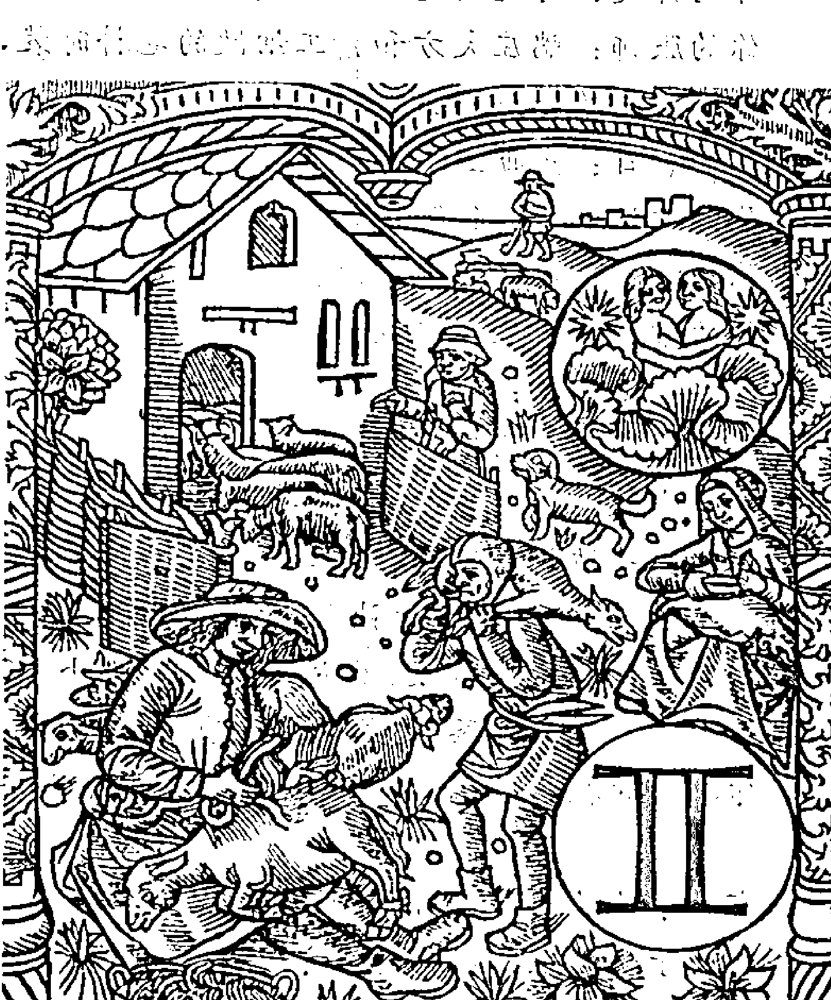

5月22日～6月21日

## 双子座

> “不要像必须度过艰难岁月一样辛苦自己，意想不到的事随时都可能发生。只要活着，只要力所能及，就应该成为与人为善的人。”
> ——马克·奥雷勒①

### 出生星位或太阳在双子座人的基本性格趋向

转眼之间便无影无踪了，这是双子座②人性上的突出特点。这是个心神不定，思想总在“别处”的人。思维敏捷，但往往缺乏冷静的权衡。他需要外出、旅行、与人交流思想，或者从各个方面去表现自己，否则就会感到心乱如麻，坐立不安。

双子座出生的人聪慧机敏，但有些轻率、爱冲动和神经质。他常沉浸于令人难以理解的意念之中，只喜欢做自己感兴趣和开心的事。无拘无束，对包罗万象的外界事物充满永无休止的好奇心，是一个兴趣广泛并愿承担传播、普及信息使命的人。

双子座人对世上发生的事情无所不知，头脑中装满许许多多新奇的想法，但很难付诸实现，因为不是半途而废，就是被同时出现在脑海中的两个或更多新想法弄得不知所措，进退两难。他的想法和建议往往会被思想比他更实际，更富有持之以恒精神的人所采纳。理论上，他总是第一个开创通向成功之路的人。

双子座人多半喜欢把自己的才智用于事业方面，而不愿意用以扩大自己的物质利益。他头脑中的一闪念常常十分有助于事业的发展。这一星座出生人的另一个显著特点是善于调动朋友们的积极性和能动性。

双子座人适合从事文学、翻译、商业、演员、出版及需要语言表达能力的职业，在这些方面，他能脱颖而出。另外，在新闻记者、摄影、旅行推销代理人或经纪人等一些涉及人际关系并需要机智、灵活和果敢精神的工作，亦会表现出色。

双子座人有典型的大都市人的作风，生活节奏快，每天有遍布全城的各种各样的活动和安排。缺乏远见可能会使他在人生旅途中经历坎坷，然而，每当这个时候，他都能找到妥善的解决办法，驾驭形势，摆脱困境。如果同时有几颗行星位于双子座，或者水星在出生天宫图中影响力较强的话，上述倾向更趋明显。若是出生天宫图中土星的影响力较强，他有可能成为一个出色的实业家。特有的金融嗅觉和善于把握时机的能力，将有助于他事业上的成功。

如果出生星位与双子座有关，那么他可能是一个追求自由意识，生性单纯和不注意生活细节的人。活泼、热情、富于浪漫气质与想象力，具有较强接受和适应新事物的能力。知识广博，口齿伶俐，善于逻辑思维和表达，具有幽默感。此外，他还是一个敢闯敢干的人，有多种成功之路。他的见解常常充满智慧，这使他能成为一个有发明创造和开拓精神的人。

双子座人的弱点是好动和缺乏耐心。如果他周围的一切一成不变，没有生机、更新与变化，他就会感到窒息。这是一个缺乏坚定信念、持之以恒精神和思想深度的人。

出生在双子座的著名人士有：邓肯（美国舞蹈家）、韦恩（英国小说家、诗人）、肯尼迪（美国第35届总统）、普希金（俄罗斯诗人）、萨特（法国哲学家）、玛丽莲·梦露（美国电影演员）。

### 男性：性格、情感和爱情生活

从容不迫，和蔼可亲，常给人以永远是局外人的印象。永无休止的求知欲和好奇心推动着他人生的脚步，激励他不断地去追求和探索。然而，他从来没有时间去实现这一切。

这是个迷人且有些异想天开的人。喜欢瞬息万变，不喜欢永恒持久。当他把迷人的和弦弹得恰到好处的时候，会悄然离去，到别处去吸引新的“听众”。智力天赋在他的身上表现得尤为突出，善于动脑筋想办法，是个愿望多变、适合从事脑力劳动的干才。他的体质脆弱，对爱情常常疑虑重重，喜欢用讥讽作为保护自己的武器。生活中他最需要的是广大的听众，而不是全身心投入的爱情。他的效率手册上写满了有用的地址，懂得人情世故，容易赢得别人的信任和好感。这一切都归功于他的艺术家般的性格。双子座的男性擅长辞令，诙谐幽默，他的出现很快就能使谈话气氛活跃起来，与他在一起永远不会感到寂寞。相反，离开朋友、伙伴以及频繁的社交活动，他就会感到生活茫然若失。双子座的男性一般不愿意承担家庭生活的责任，喜欢“一身轻”的单身生活。一旦结了婚，家庭将成为热闹的聚会和永无休止的高谈阔论的场所。他希望生活是无忧无虑的，工作时间是不受约束的。在这些条件下，他会表现出模范丈夫的许多优秀品格。双子座的男性对性爱充满好奇心，喜欢从书本中猎取知识并在夫妻生活的实践中感受和回味令人心醉神迷的性爱意境。出生星位在人马座的女性喜欢双子座男性放任的性格，并与他会分享旅行和社交带来的乐趣。天秤座的女性情感细腻，富有激情，热情好客，喜欢外出和交际，她会丰富双子座男性的生活意境。宝瓶座的女性有创新精神，智力天赋较强，友谊信念坚定，在事业上，她是双子座男性的得力而可靠的助手。在双子座男性的眼里，室女座女性的家庭观念太强，缺乏想象力；而双鱼座女性性格被动或过于缠绵，不是他所希望的类型。

### 女性：性格、情感和爱情生活

这是个富有浪漫情调和魅力的女性，头脑灵活，内心充满奇异的幻想，情感犹如一首随想曲。

聪明伶俐，神经质，富有幽默感。喜欢得过且过地生活，并通过紧张而频繁的活动来尽量减少自己的烦恼。喜欢情感游戏，但她的感情并非唾手可得。一句话就能触动她的心，一点小事也会使她扬长而去。但是，如果能很好地把握她的性格特点，预测她的反应，则不难赢得她的心。

双子座的女性善于运筹错综复杂的形势，经常最后一刻突然改变想法。她的一生可能会有几次婚姻，也可能有不止一次轰轰烈烈的爱情经历，特别是其出生天宫图中金星也在双子座的情况下。

双子座的女性不喜欢平淡无奇或者循规蹈矩的家庭生活。她希望生活的内容丰富多彩，千变万化。经常外出、郊游或旅行，开阔一下眼界，更换一下生活环境，结识些新朋友和陶冶一下性情，这些是她日常生活中不可缺少的一部分，也是她保持高昂情绪的基础。开朗的性格会感染周围的人。过度的忙碌、劳累或烦恼常常会使她疲惫不堪，力不从心。

双子座女性的性意识萌发比较早，需要理解和引导。她喜欢用舞台色彩、显露躯体美的服饰来烘托夫妻做爱的温馨气氛。

人马座的男性会给她的生活带来新的气息。他们之间易于沟通，建立起来的家庭将充满欢乐和自由的气氛，经常会有亲朋好友光临。

与天秤座的男性结合，有助于她艺术才能的发挥，或者进入高层次的社交生活。

与宝瓶座的男性结合，她将走出传统生活的圈圈，经常与知识界的人士交往和聚会。

她会认为室女座的男性过于因循守旧，因此望而却步。

双鱼座的男性极度敏感的性格会使她感到难以忍受。

### 孩子：教育和职业选择的可能性

双子座的孩子一刻也闲不住，不是东跑西颠，就是到处看看有什么新鲜事发生。他的心里就像长了草似的很难安静下来，除非有特别的东西吸引他或使他忙得不可开交。

双子座小鬼的父母最好能经常留心自己孩子的举止、言行和好奇心，注意从身心方面去启发和培养他的灵活性，要有意识地加强这方面的训练。一般地说，这一星座出生的孩子都非常聪明、喜欢玩弄概念和勤学好问。他几乎总是表现出与众不同的创造才能和敏锐的感知力，尤其他的出生天宫图中水星也在双子座的情况下。双子座的孩子非常喜欢读书，无论什么书只要能抓到手，便会废寝忘食地读下去。据统计，这一星座出生的知识分子和作家比较多。

双子座孩子的最大弱点是精力过于分散，许多事情都在吸引和激励着他。要想使他摆脱浮躁不专的毛病，只有加强他的组织纪律观念，把他出色的天赋引向一个确定的目标。

双子座的孩子需要经常与人交流。他童年时期甚至童年之后的朋友对他的影响是相当大的，甚至会改变他的人生道路。

双子座孩子的理想择业方向是：文学、翻译、出版、摄影、演员、新闻记者、作家、翻译、演讲人、旅行推销代理人、商人、经纪人，以及与旅行或国外有关的职业。

## 双子座三个 10°区出生人的性格

### 双子座第一个 10°区

0°～9°59′（即出生日期为5月22～31日）

智力敏锐，有很强的事业感。为人处世无懈可击。内心潜存着二重性，遇事总是优柔寡断、不知所措或进退维谷，从而使他不能把力量集中在一个确定的目标上。他有可能表现出不寻常的智慧和才干，也有可能流于徒劳无益的夸夸其谈之中。一切都能使他兴致盎然，也能使他淡漠厌倦。

他的动力：专心致志。

### 双子座第二个 10°区

10°～19°59′（即出生日期为6月1～10日）

在灵感和想象力方面有出色的天赋，是典型的艺术家的性格，率直和易受到攻击。幽默或讽刺是他最好的自卫武器。对现实生活的适应能力较差。内心的困惑常常使他想逃避现实，或力争改变自身的现状。对于这一10°区出生的人，尤其需要理智和敏感的充分协调。

他的动力：直觉或创新。

### 双子座第三个 10°区

20°～29°59′（即出生日期为6月11～21日）

有出色的智力天赋。和蔼可亲，善解人意，平易近人。但是，遇事或碰到困难时容易气馁，或者失去清醒的头脑。尽管他总是有新的想法，但往往很难以有效的方式展现在实际生活中。这一10°区出生的人从事抽象思维工作，要比从事具体工作更容易获得成功。

他的动力：层出不穷的想法。

## 不同出生星位双子座人的性格、爱情选择和常见疾病

### 太阳在双子座和出生星位在白羊座

这一星位出生人的主要特点是易冲动和缺乏耐心。他总是闲不住，不是忙忙碌碌，就是处于整装待发的状态。事业上，只要是速见成效的工作，他都会表现出巨大的热情和能力。善于把握时机和抓住公众的心，这是个出类拔萃的新闻记者。他能吸引和征服许多人，但从不居心叵测。

出生星位在天秤座、太阳在白羊座或月亮在双子座人的性格与他十分投合。

这一星位出生的人神经系统较为脆弱，支气管炎、风湿痛、胸膜炎以及哮喘常见。

### 太阳在双子座和出生星位在金牛座

这一星位的影响会使双子座人的性格更加坚定。在事业发展和物质生活建设方面有正确的判断力和付诸实现的能力。然而，爱情上很容易轻信。美对这一星位出生的人具有无法抵御的诱惑力，并有可能使他产生某些浪漫之举。如果他能把激情和冲动置于理性的支配之下，那么，他的生活会达到理想境界。

出生星位在天蝎座、太阳在金牛座或月亮在双子座的人会与他相处融洽。

这一星位出生的人易患肥胖症，从而使身体的反应能力与头脑灵活性之间形成反差。此外，呼吸道和膀胱疾病常见。

### 太阳和出生星位都在双子座

身心洋溢着永恒的青春气息，对世间的一切都怀有浓厚的兴趣，忙于许许多多事情，但从来没有时间将它们做完。极度神经质，总是被内心焦虑不安的情绪所困扰。对于那些不需要很大毅力就能完成的事，不需要经受长期的考验就能赢得的感情，或者不需要承担过多的义务和责任的工作，他都能充分表现出特有的热情和才智。

出生星位在人马座、太阳或月亮在双子座的人是他感情和性格的知音。

这一星位出生的人呼吸器官、感觉器官、周围神经系统和微循环系统是身体的薄弱环节，支气管炎、肺炎、胸膜炎、哮喘、膀胱炎以及神经炎常见。要注意保持良好的心态，避免精神方面的压力。

### 太阳在双子座和出生星位在巨蟹座

这一星位出生的人思想常常停留在童年时代和幻想之中。性格优柔寡断，易受周围环境和人的影响。有出色的想象力和敏锐的直觉。既能投射出嘲讽的目光，又能迸发出诗人奔放的激情。心境是他的晴雨表，对事物的看法经常变化不定。这是个天生的旅行家和魔术大师的性格。很容易成为感情的俘虏，但忠诚感并非始终如一。

出生星位在摩羯座，太阳在巨蟹座或月亮在双子座的人是他生活的理想伴侣。

这一星位出生的人易患慢性肺部疾病，尤其当木星在出生天宫图中处于不和谐方位的情况下。另外，遗传性神经系统方面的疾病常见。

### 太阳在双子座和出生星位在狮子座

头脑中有许多点子，有成功事业的才能，对任何事物均感兴趣。追求节日般欢乐的生活，向往社交界。活跃的性格和才智使他很容易进入这一领域，并充分展示自己的天赋。这一星位出生人的弱点是精力分散，缺乏持之以恒的精神。在感情问题上有点目光短浅，看人往往注重表面，而忽略其真实的价值。

出生星位在宝瓶座、太阳在狮子座或月亮在双子座人的性格与他十分相投。

这一星位出生的人的体质好，抗疾病的能力相当强。胃肠功能紊乱

### 太阳在双子座和出生星位在室女座

思维敏捷，观察事物和分析问题的能力强，但有些太爱动脑筋。善于发挥自己的才能和调动他人的积极性。精神力量是他生活的动力和支柱，因此，他无时无刻不需要激励和振奋。性情优柔寡断，尖刻的言语或批评精神是他自卫的武器，感情总是披着理性的外衣。如不当心，喜欢钻牛角尖或犹豫不决的性格往往会把他置于幸福的大门之外。

太阳在室女座或月亮在双子座人的性格与之投合，是他人生可靠的同路人。

这一星位出生的人易胃肠功能紊乱，肠炎和肝脏疾病常见。

### 太阳在双子座和出生星位在天秤座

性情和蔼可亲且脆弱，微不足道的小事就能使他情绪激荡或惶恐不安。在智力和艺术方面有卓越的才能和丰富的表现力。他需要和谐的环境，并无时无刻不在寻觅安宁的绿洲。生活离不开朋友的交往、感情的沟通和社交活动。具有建立和保持友谊，以及赢得爱情的才能。

出生星位在白羊座或双子座、太阳在天秤座、或者月亮在双子座或天秤座的人是与他性情投合的伴侣。

这一星位出生的人体质较弱，呼吸系统、循环系统、感觉器官和周围神经系统易出现病灶。

### 太阳在双子座和出生星位在天蝎座

这是个类似于意大利政治家马基雅弗利式的人物，总是在探索人和事物的本质，以便更好地为我所用。青少年时期性格比较内向和怯懦，真正的性格特征将在成年以后才能表现出来。批评精神较强，喜欢用尖酸的语言挖苦人，善于等待时机。在爱情问题上心态平和，不急于求成，但如果产生怨恨情绪则永远难以消除。

出生星位在金牛座、太阳在天蝎座或月亮在双子座的人与之性情投合，相处融洽。

这一星位出生的人神经系统抗干扰能力较弱，肾和肺部的疾病常见。

### 太阳在双子座和出生星位在人马座

无论在现实生活中还是在艺术舞台上，他都是一个名副其实的喜剧演员。喜欢播种具有反差和矛盾色彩的爱情。经常寻找逃避现实的可能性，具有惊人的进入角色的能力。这一星位的人内心常常潜在着不可名状的忧虑，致使他的情绪起伏不定和想远走高飞。好奇心包罗万象，既需要得到别人的支持，又受不了过分的干预。人际关系及婚姻问题在他的私生活中起着至关重要的作用。

出生星位或月亮在双子座或太阳在人马座的人与之性情相投。

这一星位出生的人神经系统脆弱，肾结石、肠炎、肝功能不正常、膀胱疾病以及肠绞痛常见。

### 太阳在双子座和出生星位在摩羯座

性格沉稳，理智制约着情感，批评精神胜过激情。具有天生外交家的素质，善于观察、分析并做出准确的判断。为了成功宁愿做出巨大的牺牲，甚至全然不顾个人得失。充满自信，不怕艰难险阻，对他人不抱任何幻想。

出生星位在巨蟹座、太阳在摩羯座或月亮在双子座的人会带给他幸福美满的生活。

这一星位出生的人先天体质较弱，肝、脾和皮肤方面的疾病，以及呼吸道急性感染常见。

### 太阳在双子座和出生星位在宝瓶座

智力敏锐，善于捕捉萌芽状态的新想法并将它变成现实。精明且富有首创精神，一切新事物都会在他的头脑中产生共鸣。充满魅力和欢乐感的宽广胸怀，使他容易博得别人的好感和实现爱情的梦想。珍视友情，合作会给他带来事业上的成功。感情方面有十分敏锐的直觉，友谊常常与爱情交融在一起，或者爱情生活中不时散发着友谊的芬芳。

出生星位在狮子座或双子座、太阳在宝瓶座、月亮在双子座或宝瓶座的人是与他性情相投的知音和伴侣。

这一星位出生的人呼吸道疾病、脉管炎、肾结石、哮喘、脊柱痛、疝以及心悸常见。

### 太阳在双子座和出生星位在双鱼座

从不为烦恼和责任感所困扰，虚无缥缈的思想使他常常处于一种既看不到过去，又看不到未来的模糊不清的状态中。过分的敏感与对人的亲切感，常常使他变得感情脆弱。具有强烈的同情心。满脑子的想象使他心神不定，甚至对区区小事也会感到焦虑不安。过分相信别人和缺乏自信心。他需要理解和鼓励，否则他的爱将难以坚定，感情也无法持之以恒。

出生星位在室女座或月亮在双子座的人能弥补他性格上的弱点。

这一星位出生的人要多注意呼吸系统。发热、胃肠功能紊乱常见，视觉较弱。

### 双子座人与其他星座人的情感和谐

#### 双子座的人与双子座的人

这两个同星座人的结合是十分罕见的。双方在亲昵的时候，都忍受不了对方的心不在焉或敷衍塞责。他们的性爱时间短促，次数频繁，喜欢畅谈感受，期望达到更完美的境界。但是他们的情感和性爱生活很少达到真情实感的程度，即便确立了爱情关系，往往也很难经受岁月的考验。

#### 双子座的人与巨蟹座的人

这两个星座人的结合不太常见，双子座的人对巨蟹座人的过于幻想和浪漫的性格，及其无形的控制力有点担心。他自知对巨蟹座的人不会有太大的影响力，并很难了解她的内心世界。目光敏锐和性格敏感的巨蟹座人受不了双子座人对她不断观察、仔细揣摩和毫不留情面的批评。

① 见附录部分有关 “10°区” 的名词解释。
② 黄道带的第三个星座，它对应春天的最后一个月，太阳5月22日~6月21日从该星座经过。双子座的形象是一对孪生子，指卡斯托尔和波勒克斯两神。双子座对应人体的上肢和肺。双子座的主宰行星，即影响力最强的行星是水星。在该星座中，木星的影响力最弱。双子座属气类星座，代表心灵手巧、好奇心、经商头脑、反应敏捷、理性、表面性、雄辩才能。
① 这些和谐关系的描述仅仅是针对人出生时太阳星座的单纯影响所作的理论分析，并不是绝对的。实际上，决定两个人和谐关系的还有另一个重要参数，那就是出生星位。例如，仅从出生时太阳星座的影响来看，由于性格的差异，双子座与室女座的人是不和谐的。但是如果双子座人的出生星位在土类星座（金牛座、室女座和摩羯座），或者室女座人的出生星位在气类星座（双子座、天秤座和宝瓶座），那么，他们会相处得很融洽。出生天宫图中金星和火星的影响是衡量性爱和谐与否的基本参数。

他需要信任和热情，这正是双子座的人常常不容易做到的。如果婚后性爱生活是成功的，则是由于两者出生天宫图中，和谐的金星与火星方位产生了共鸣。但这是十分例外的情况。

#### 双子座的人与狮子座的人
这两个星座人之间的关系往往不会太痴情，但很愉快。在他们的共同生活中，双子座的人善于满足狮子座人诱惑的欲望，并能听之任之。她知道如何用令人欣慰的话语去应对狮子座人的威严和平抚他的欲火。彼此都喜欢用精辟的语汇，公开表白共同生活给他们带来的心满意足。

#### 双子座的人与室女座的人
双子座的人会通过别开生面的方式吸引室女座的人，他们可能会有携手共行一段人生旅途的愿望。尽管如此，面对双子座人变幻莫测的性格，室女座的人很快就会有一种不安全感。同时还会失望地发现，双子座人的性意识与他存在着一定的差距。

#### 双子座的人与天秤座的人
这两个星座人的情感会达到如胶似漆的程度。在许多方面，他们的欲望经常是不尽相同的，但无论是在性还是其他方面很快就会走向饱和。双方都喜欢爱情游戏，喜欢经历和感受它的旖旎境界，甚至津津乐道地谈论做爱的细节，可以说他们是情爱的审美家。

#### 双子座的人与天蝎座的人
这两个星座人的性格迥然不同，尤其在性意识方面，前者是精神追求，后者是本能的需要。无论天蝎座的男性还是女性都认为，性是生命之源。他们肩负着传宗接代的神圣使命。通常，这两个星座人的结合是罕见的。一旦共识凝聚了两个性格极端者的心，他们的关系将是最牢不可破的。

#### 双子座的人与人马座的人
这是黄道带上两个相对星座人的结合。有时他们之间会产生强烈的相互吸引力，但在其充满激情的关系中，会经历碰撞和相互排斥的时刻。伴随他们的不仅是相亲相爱的欢笑声，也有你争我吵的嘈杂声。奇怪的是双子座的人对人马座的人很少介意，原因是后者会用双子座人从未感受过的热情去激励他，给他带来欢乐。然而，共同生活中终究会暴露出各自所固有的缺点：动摇性和二重性。久而久之，彼此便会感到无法容忍，并易成为感情破裂的导火线。

#### 双子座的人与摩羯座的人
这两个星座人的结合亦不太常见。彼此对问题的看法不同，经常发生意见分歧，争论不休。做爱的机会不多，因为彼此都不愿有意识地去营造这样的气氛。相对于双子座的人而言，摩羯座的人对性爱的意境要求比较高，一般来说，不喜欢简单了事。

#### 双子座的人与宝瓶座的人
这两个星座的人之间可以建立一种充满想象和乐趣的关系。无论在思想、情感还是性爱方面，他们都志趣相投，渴望探索和经历奇妙未知的境界，从中寻找新的满足和欢乐。他们既互相尊重，又保持各自的独立性。但有一点需要注意的是，通常宝瓶座的人需要较多的自由度。

#### 双子座的人与双鱼座的人
这两个星座人各自固有的二重性和犹豫不决的性格，会使彼此都感到不放心。性生活中缺乏真正的身心投入。他们能够做到相互理解，但很难达到相辅相成。正因为如此，双子座的人与双鱼座人的婚姻是比较少见的。如果有这样成功的结合，则是因为他们各自的出生天宫图中存在着其他和谐的因素所致。

## 双子座人如何根据自己星座的特点关爱身体、保健和美容
双子座对应上肢、肩部、臂、手和肺。这一星座出生的人易患风湿病、肘关节病和肋间神经痛、支气管炎、胸膜炎、肺炎和哮喘。该星座的主宰行星——水星尤其影响呼吸系统和神经系统功能。双子座人的身体抵抗力较弱，但精力异常充沛，因而使他在疲劳之后能很快得到恢复。不过，这个恢复必须在他对自己所做事情感兴趣的先决条件下，因为厌倦是他最坏的敌人，能使他意志消沉。

双子座的人耐力差，不宜劳累过度。但是，没有什么办法能使他坐着不动。受好奇心的驱使，他总是感到有许许多多的事情一定要去看看和做起来。因此，他首先必须学会自我放松：做深呼吸。另外，户外散步、练瑜伽功、打网球、跑步和骑自行车，对身体都是十分有益的。

这一星座的人总是显得很匆忙，吃饭较快，几乎是囫囵吞枣。神经质有时会直接影响到他的消化。此外，他的同化功能较弱，从而使得他消瘦和缺乏足够的抵抗力。吃饭时应心平气和、细嚼慢咽，尽量不要去想工作上的事或其他烦恼的事。这样，不但可以避免胃肠功能紊乱和吞气症，还有助于克服精神抑郁或过度疲劳。

其次，良好的睡眠对双子座人是必不可少的，因为他是个典型的失眠症患者。不宜过多饮用咖啡或兴奋剂，否则会导致身体功能的失调。

如果能改变闭门不出的生活习惯，对他的身体会有大有好处。应该经常到户外散步，呼吸新鲜空气，尤其需要多做深呼吸，这一点恰恰是他常常忽略的。对于他，入睡前的散步要比任何安眠药更有安神作用。

双子座人对治疗的反应是很不规律的。变换一下生活环境，外出做些小小的旅行，结识些志同道合的新朋友，对强健身心要比那些“灵丹妙药”更能奏效。

双子座人的身体需要补磷，磷是神经细胞正常代谢、智力和性机能所需的微量元素。为此，可以多吃些面食、大蒜、欧芹、扁豆、洋葱、西红柿、葡萄干、苹果、杏和鱼类。这一星座的人容易着凉，百里香、迷迭香、薰衣草和鼠尾草等植物对他的身体是十分有益的。

双子座人身体的脆弱点是支气管和肺。为了使身体得到舒展，洗热水澡时，最好在浴缸中加一茶匙牛至和百里香香精。

双子座人的保健植物是百里香，它有强身健体和杀菌的作用。

双子座人喜欢吃零食，这种饮食习惯对他倒也不无好处，因为吃多了他的胃不舒服，尤其肉食会使他觉得消化负担重。另外，只要不吃难以消化的食物，双子座人不妨多参加些鸡尾酒会或招待会之类的活动，亦可满足自己的这种饮食习惯。

双子座孩子的父母应注意不要使自己的宝贝饮食过量，否则他会发脾气和爱哭。

双子座人喜欢咸食，榛子和巴旦杏仁是他的最爱。与其过度地吸烟，倒不如吃些葡萄干和杏干更有助于其智力的发育。燕麦片，尤其是掺有杏仁和牛奶的燕麦羹可带给他所需要的微量元素。

双子座人喜欢风味小吃和独具特色的什锦沙拉。他应该多吃些生的食物，如凉拌豆芽、欧芹等，吃的时候可加少许洋葱末儿。

双子座人不时吃些方便食品和快餐，有助于胃口的调节。蔬菜、奶酪、柠檬和莴苣等都是双子座人强体健身的好食品。

双子座人适合做电疗或振动按摩。洗澡时，淋浴比盆浴对他更适宜。

美容方面，双子座人首先应学会使自己的肌肉放松，其次是要有充足的睡眠。

双子座的人指甲嫩软易折，用植物油或柠檬汁浸泡指甲根部可避免折断。其次，新鲜麦芽疗法也有助于增强指甲的抗折强度。

双子座人适于选用以铃兰、薰衣草、紫罗兰或鸢尾为主要成分的香水。

## 双子座人的情趣和喜欢的礼物
双子座的人喜欢手机、MP3随身听、电子记事本、袖珍翻译器、便携式传真机或带报警器的钥匙环。喜欢智力游戏，如电子象棋、扑克、十五子游戏、桥牌、台球、赌注。可以送给他们彩票或邀请其参加抽奖活动。他还喜欢新奇的小玩意儿，选择礼品时可考虑别致的手包、小闹钟、电动剃须刀、游戏软件、数码相机、DV摄像机、派克或新式的笔、打火机、多功能电子手表。他们幻想环球旅行，对所有国家都有浓厚的兴趣。喜欢读书、看杂志，尤其喜欢百科全书、诗词、影视作品、吉尼斯世界纪录大全、侦探小说、纪实小说以及有关时事新闻方面的书籍。如果赠送一本畅销书，将会使他们爱不释手。他们时常同时读几本书。体育方面，双子座人偏爱网球、高尔夫球、排球、乒乓球、滑旱冰和练瑜伽。

双子座的孩子喜欢电子游戏机、步话机、遥控机器人或魔术师等智能性玩具。

## 太阳和木星的方位与双子座人的物质生活趋向

### 太阳在双子座和木星在白羊座
容易盲目地投入冒险或没有充分准备的事情中，但善于择机脱身，在新的基础上重整旗鼓。

### 太阳在双子座和木星在金牛座
在做生意方面，思想偏于保守，但不失商人的头脑。如果投资，选择商业或建筑业为宜。

### 太阳和木星都在双子座
在对外交往、商业、出版等行业方面能充分施展才能。头脑灵活，但有时聪明过头，往往为空想利益或同时想做太多的事情而放弃现实利益。

### 太阳在双子座和木星在巨蟹座
良好的直觉会帮助他准确地掌握时机，但物质基础的建立不会一帆风顺。爱人和家庭会给他帮助和支持。热衷于彩票之类的活动，有时会有所获。

### 太阳在双子座和木星在狮子座
有许多好的设想和一系列雄心勃勃的计划，但往往超出个人的能限。如果把本能的金融嗅觉、预见能力与实际感结合起来，对物质生活建设将是十分有利的。

### 太阳在双子座和木星在室女座
不善于把精力用在刀刃上，常常把钱和利的问题看得过重，节俭意识很强。管理或经商是理想的职业选择。要克服不切实际的幻想，否则诸

### 太阳在双子座和木星在天秤座
除了艺术、影视或奢侈品行业外，旅行或与人交往对他来说要比赚钱更有吸引力。参与、合作在其人生中起重要的作用，并有可能成为获利的有效途径。

### 太阳在双子座和木星在天蝎座
这一行星方位有助于事业的发展，但要付出艰辛和努力。有心机，善于利用自己的长处或别人的弱点，尤其当出生天宫图中水星在双子座或黄道第一宫和第十宫时。

### 太阳在双子座和木星在人马座
职业和经济生活状况时好时坏，但凭聪明才智定会找到报酬可观的工作，摆脱逆境。如果出生天宫图中金星或水星在双子座，则可能对人生观产生一定影响，有得过且过、当一天和尚撞一天钟的思想倾向。

### 太阳在双子座和木星在摩羯座
事业之路坎坷不平，尽管用严密的逻辑头脑去指导实践，但仍难获得所希冀的成功。人生的第二阶段，事业上会有较大的起色，尤其是出生天宫图中土星在摩羯座或金牛座的情况下。

### 太阳在双子座和木星在宝瓶座
大公无私，随时准备去帮助别人。反过来，别人也会同样回报于他。偶然的机遇会深刻影响他的人生之路，尤其当出生天宫图中金星在双子座，或者太阳、木星或金星中有一颗在黄道第二宫或第十宫的情况下。

### 太阳在双子座和木星在双鱼座
无忧无虑地生活，依赖运气或亲朋好友提供方便之门。个人经济状况不稳定，需要别人帮助解决难题。

### 把握好水星主宰下的自我
双子座的主宰行星（即影响力最强的行星）是水星，当它处在出生者的出生星位或中天附近，或者双子座或室女座中有一颗或几颗行星时，对出生者青少年时期（尤其是7~14岁）的影响较大。水星会使人成为纽带、经纪人、商人、擅长言辞或笔墨的人。受水星主宰的人有较强的适应能力和灵活性，极善于绕过困难或障碍而行。很会理财，做小本生意比做大生意更容易获利。通常，他总是能巧渡难关，即便陷入极其错综复杂的境遇，亦能如此。

水星的影响力在宝瓶座增强，在双子座和室女座最强；在狮子座减弱，在人马座和双鱼座最弱。

### 水星—太阳
水星与太阳相合的影响有助于提高人的智力天赋、理解力和实践能力，尤其当该相合发生在双子座、室女座或狮子座，或者出生星位或太阳处于这些星座时，这一影响会表现得更为明显。

### 水星—月亮
和谐的水星与月亮方位的影响会赋予人永恒的朝气、丰富的想象力和适应能力。好奇心常促使他去开拓新境界或结识新的关系。具有较强的记忆力、悟性和语言表达能力。敏锐的思维可能使他成为一名出色的外交官，也可能使人变得表里不一、口是心非，这要视其出生天宫图其余部分的影响程度而定。

不和谐的水星与月亮方位的影响会使人爱夸夸其谈，生活趋于平淡无奇。

### 水星—金星
水星与金星相合的影响会使人性情随和，和蔼可亲，很有天赋，但缺乏深度。擅长文学、艺术或美学。

### 水星—火星
水星与火星相合及其和谐方位的影响，会给出生者带来巨大的精神力量和卓越的工作才能。口齿伶俐，但过分敏捷的思维常常使他烦躁不安，甚至空话连篇。另外，这两颗行星相合的影响还能使人具有幽默感或批评精神，热衷于辩论。

如果这两颗行星彼此的方位欠佳，容易使人具有不懂处世哲学、为人浮于表面的性格。即便在最好的情况下，这一相合的影响也难免使人表现出缺乏耐心、总是这山望那山高的思想倾向，不能脚踏实地地去从事某项工作或成就某项事业。

### 水星—木星
如果出生天宫图中有水星与木星的相合将是十分难得的，因为其影响既能开阔人的思想境界，又能赋予人看事物多着眼于积极方面的乐观态度。正因为如此，即使在最坏和最悲观的情况下，受水星与木星相合影响的人也能保持饱满的精神状态和对困难充满必胜的信心。

水星与木星相合或呈三分方位的影响会使人具有出色的理解和表达能力。对于从事语言表达和文字工作的人，这是一个极好的行星方位。同时，也有助于从事商业、管理和金融工作的人事业上的成功。但如果出生天宫图中没有更富活力的其它行星方位影响的话，它也无法赋予人很强的信念和毅力，以及平静的生活空间。

水星与木星相冲或呈四分方位的影响容易使人目光短浅，或者遇事优柔寡断，在复杂的情况下往往束手无策。由于缺乏坚强的意志，容易错过良机，处于不被人注意的默默无闻之中。但无论任何境遇，他从不悲观失望和怨天尤人。

### 水星—土星
这两颗行星相合的影响会突出怯懦或谨小慎微的性格特点，使人的感情深沉而严谨。同时，也会强化自我意识和使人变得冷酷无情。批评精神极强，对待人和事多爱从消极处着眼，总是权衡利弊，疑虑重重，这会不利于他的幸福。和谐的水星与土星方位的影响有助于人在历史、法律、管理、古艺术品的研究方面取得成就。这是一个有高尚情操、心地善良的

不和谐的水星与土星方位的影响会加重人悲观失望的情绪，爱批评，言词尖酸刻薄，有时又爱把自己禁锢在狭隘孤独的生活圈子里。如果出生天宫图中存在和谐的行星方位，那么这种倾向会趋于缓解。

### 水星—天王星
水星与天王星相合的影响会使人思想开放和富有创新精神。这是一个充满活力的行星方位，它能增加人的幽默感和创造才能。出生在该星位的人是人性的观察者，喜欢无拘无束地生活，性情有些怪僻，不愿别人介入自己的私生活。统计表明，记者、作家、科学家和开拓者之中，受水星与天王星方位影响的居多。

水星与天王星呈三分方位的影响会使人具有良好的观察、分析与综合能力。热衷于发明创造，对形而上学或神秘学有浓厚的兴趣。

水星与天王星相冲或呈四分方位的影响会使人智力敏锐，但很少能得到充分的开发和利用。性格暴躁，变幻莫测，醉心于矛盾的事物。惯于冷嘲热讽，会给自己树立许多人为的对立面。

### 水星—海王星
水星与海王星相合的影响易使人具有强烈的同情心，想入非非或性格神秘。总而言之，思维方式和理想与众不同。

性情古怪，反复无常，喜欢悖论。尽管如此，仍无损于他的温情之心，因为他讨厌粗暴专横。幽默感强，想象力丰富。敏锐的知觉有助于他对周围环境及他人思想的洞察和了解。

水星与海王星方位的影响可能激发出惊人的创造力，也可能酿成潜在的精神危机；可能产生新奇的想法，也可能陷入完全无计可施的境地，这主要取决于出生天宫图的总体趋向。

水星与海王星呈三分方位的影响会突出人的优点；而相冲或呈四分方位的影响会使人爱幻想、漫不经心和容易气馁。根据出生天宫图的趋向，或许容易上当受骗，或许为人处世灵活善变。

### 水星—冥王星
这两颗行星相合的影响会提高人的智能，增强事业心，或者使人有喜欢作对的性情。这三种趋向如何出现，将取决于该相合所在黄道宫的具体情况以及出生星位所在星座的性质。

受水星与冥王星相合影响的人兴趣广泛，个人受益的机遇较多，喜欢观察分析事物，探求其本质，寻找使人能更快前进的动力因素。批评精神较为突出，喜欢宣传或虚张声势。

水星与冥王星相合或呈三分方位的影响有利于智力与艺术创作能力的发展；而水星与冥王星相冲或呈四分方位的影响，则会使人产生特殊的道德观念，头脑过于灵活，善用心机。

## Ⅱ 你的星辰对应备忘录
- 心意活跃的双子座的人常说：“我想……”
- 你的主宰行星：水星。
- 你的关键词：心灵手巧、好奇心、适应性、经商头脑、敏捷、三心二意、理智性、表面性、精力分散、雄辩、谎言。
- 你求爱的方式：迷人和絮叨的。
- 你是一个：喜欢玩的人。
- 你渴望：偶像般的爱人。
- 你受骗：意想不到的情况下。
- 你喜欢：读书和聊天。
- 你害怕：必须沉默不语。
- 你追求：不断更新。
- 你的弱点：缺乏耐心和一心二用。
- 你的动力：创新和层出不穷的想法。
- 你的优势：改变。
- 你的劣势：缺乏耐心。
- 你身体的脆弱点：支气管和肺。
- 你的假日生活：旅游观光和结识新朋友。
- 你的开支：外出或购买书籍。
- 你的服饰：体现个性的宽松式纯棉时装、帽子和新奇的眼镜。
- 你的吉祥物：三角形。
- 你的吉日：星期三。
- 你的幸运数字：3、12、18。
- 你的幸运金属：银、水银。
- 你的幸运石：绿玉、海蓝宝石。
- 你的幸运色：灰色以及所有混合色、彩虹色或闪色。
- 你的幸运花：水仙、马鞭草。
- 你的吉祥动物：猴子、狐狸、鹦鹉、蜜蜂、蚂蚁。
- 你的吉祥植物：雏菊、牛至、忍冬、刺柏、马鞭草、洋槐、榛树、勿忘草。
- 你的保健食品：欧芹、扁豆、洋葱、豆芽菜、莴苣、西红柿、苹果、柠檬、杏、葡萄干、榛子、巴旦杏仁、奶酪、鱼、燕麦片和面食。
- 你喜欢的礼物：畅销书，学习、办公和娱乐消遣用的数码产品。
- 有益于你的场所：机场、书店、出版社、学校、旅游胜地、集市、无人售货商店、紧张和气氛活跃的场所、山区。
- 适合于你的住所：新式建筑、室内空气清新、家具少而精、丰富多彩的书籍、CD和DVD、高级组合音响；供朋友间促膝谈心的幽静的小环境。
- 你的幸运旅游地：埃及、约旦、美国、马来西亚、越南、法国、奥地利、巴西；巴厘岛[印尼]、撒丁岛[意大利]；墨尔本[澳大利亚]、伦敦、拉斯维加斯[美国]、布鲁日[比利时]。
- 你的理想职业选择：文学、翻译、出版、摄影、演员、新闻记者、作家、演讲人、旅行推销代理人、商人、经纪人，以及与国外有关的职业。
- 与你亲和的星座：天秤座、宝瓶座、狮子座和白羊座。与人马座互补。

6月22日～7月22日

## 巨蟹座
> “不要把自己的错误都推在白羊座或金牛座人的头上。”
> ——托马斯·布朗①

### 出生星位或太阳在巨蟹座人的基本性格趋向
巨蟹座②是夏天开始的第一个星座，夏天把深居简出、思想保守和敏感的性格带给了这一星座的人，这是个需要自我保护的人。

出生在这一星座的人具有慈母（或慈父）般的深情，又洋溢着孩子般的纯真无瑕，但有很强的自制能力。他需要别人的信任和保护，需要一个适合于他生活和工作方式的环境。他的人生哲学是：使自己和别人都能幸福如愿。他对用双手创造出来的有限的幸福心满意足。但是，总担心有人会夺走这一幸福，因此，他会紧紧抓住自己在精神和物质上所拥有的一切。

直觉和敏感是巨蟹座人的主要性格特征。这一星座出生的人多半喜欢生活在旖旎的幻想中，而不喜欢生活在现实中。颇有些放梦幻于海浪，寄情思于蓝天的意境。他不大适应紧张的生活节奏，而偏爱安谧的环境及一切能唤起他想象和感受的气氛。这是一个把人生当做唯一美的人，

① 托马斯·布朗 Browne, Sir Thomas（1605. 10. 19~1682. 10. 19）英国医生、作家和星辰学家。
② 黄道带的第四个星座，它对应夏天的第一个月，太阳6月22日～7月22日从该星座经过。巨蟹座的形象是一只螃蟹，在希腊神话中，这只螃蟹在赫拉克勒斯同许德拉作战时，因夹痛了赫拉克勒斯而被踩死。赫拉克勒斯的敌人赫拉把它放到天上，以示报答。巨蟹座对应人体的胸部、胃、消化系统和代谢系统。巨蟹座的主宰行星，即影响力最强的行星是月亮。在该星座中，木星的影响力增强，火星的影响力减弱，土星的影响力最弱。巨蟹座属水类星座，代表女性、母爱和家庭观念、敏感、童心、想象力、优柔寡断和潜意识。

他不愿意直面生活中的矛盾和冲突，无论在内心还是现实中，都尽力与这些纷繁之事隔绝开来。他的思想常常飞到电影或小说的故事情节中，慢慢地咀嚼、回味和遐想……他可能会长时间地保持着童年时代的纯真。感情真挚、坦诚，但性格比较脆弱，经常忧心忡忡，是个生怕别人踩着自己的敏感点走路的人。如果出生天宫图中没有火星、天王星或太阳较强的影响力，那么，他更趋向于不爱抛头露面和深居简出的性格。他不喜欢随便结识新朋友，不愿轻易发表见解和做没有十足把握的事。这是个可以完全信赖的人，他的一生将始终与他的家庭，尤其是他的母亲保持着密切的关系。

巨蟹座人经常无意识地寻觅着保护，寻找一个可以遵循的典范，或者向欢迎他，并能使他充分发挥聪明才智的团体靠拢。一般来讲，这一星座的人很容易赢得他人的好感和支持。头脑中充满奇异的幻想。相信命运，相信机遇和好心必有好报。事实上，幸运之神也的确常常奇迹般地出现在他的面前。

巨蟹座人的天赋主要表现在音乐、小说、电影、艺术和科幻创作方面。在幻想中他喜欢扮演一个角色，从中去确认自身的价值和寻找所需要的自信心。由于主宰行星月亮的影响，他有可能成为一名深受观众欢迎的演员，他的艺术天赋能深深打动观众的心。尤其当月亮处于黄道第一宫、第七宫或第十宫的时候，更是如此。

特有的责任心和组织能力使他能在一切与公众接触的工作中赢得信誉，并发挥才智。此外，这一星座出生的人多半喜欢美味佳肴，欣赏出色的烹饪技术，所以饮食业、旅馆业和食品业都是巨蟹座人理想的职业发展方向。在护理病人方面，他是个出类拔萃的能手。

工作中，敏感的性格常常会给巨蟹座人带来很大麻烦，一丝非难就可能使他心里感到不舒服，产生退缩情绪。相反，当他感到深受别人信任时，便会与周围人建立良好的关系，并激发出无限的真诚和创造力。

如果受月亮或海王星的影响太大，一些巨蟹座出生的人可能会梦想过浪迹天涯的生活，那样的话其命运是莫测的，有时甚至是悲剧性的。

一般来说，巨蟹座人不喜欢参与与己无关的事，因为他对自己和亲人的前途和未来经常过分担忧。成年以后，人生会出现好的转机。

这一星座出生人的优点是热情正直、谦虚谨慎、头脑冷静、感情细腻、为人真诚、忠心耿耿、富有组织才能、既有耐心又有毅力。

巨蟹座人的弱点是性格内向，思想趋于保守，依赖性强，多疑多虑，容易制造惊慌不安的气氛，而在真正的危险面前，往往不知所措。这一星座的人或者食欲过盛，或者食欲缺乏。另外，固执、疑虑和沙文主义作风也是他难以回避的缺点。

出生在巨蟹座的著名人士有：卢梭（18世纪欧洲伟大的思想家）、乔治·桑（法国浪漫主义女小说家）、普鲁斯特（20世纪法国小说家）、蓬皮杜（法国前总统）、劳洛·勃丽吉达（意大利电影演员）、米海依·马蒂埃（法国女歌唱家）、戴安娜（英国王妃）、拉封丹（法国寓言诗人）、马勒（奥地利作曲家）。

### 男性：性格、情感和爱情生活

至少从表面上看，这是一个性情温和的人，只有在他的领地——家中，在妻子和孩子身旁，或者与知心朋友在一起的时候，才能从内心感到欣慰。平易近人，助人为乐，美食是他生活中密不可分的伴侣。深居简出，同时又向往美好的旅行和奇异的探险。举止稳重，富有魅力，喜欢钻研并有自己的见地。对待事业和生活极其认真，然而，有时不顾现实地固执己见，对没有得到他认可的问题或事，他会采取顽固的抵制态度。

一般地说，母亲对他的一生起至关重要的作用，换言之，巨蟹座男性很难摆脱母亲的影响，甚至试图通过恋爱来寻找同样的爱。

巨蟹座男性非常需要别人的信任，对温情的渴望胜过对性爱的需求，或者二者兼需。性格内向且带有某种被动性，敏感使他很容易因别人有意或无意的缺乏热情而受到伤害。

巨蟹座男性总是离那些纠缠不清或不愉快的事情远远的，因为他很容易受到各种烦躁不安的影响。与话不投机的人在一起会感到心情不畅，而宁肯选择沉默或离去。

巨蟹座男性真正的幸福是他的孩子，他会把自己全部的父爱献给他们。家庭是他神圣的乐园。正是这种真挚的父爱之情使他欣慰，并给他带来所需要的精神力量和信心。

巨蟹座男性的性意识是在潜意识的主宰之下，其活跃程度取决于精神状态。他十分理解女性，希望夫妻的性爱能达到真正的身心交融。

出生星位在摩羯座的女性善于承担生活的责任，并能帮助他从超载的繁忙中解脱出来。

巨蟹座男性喜欢与他同样充满温情和爱幻想的双鱼座女性。

天蝎座女性能唤起他美好的情感。

与性格好斗和苛求的白羊座女性、喜欢社交或需要“靠山”的天秤座女性缺少投合的基础。

### 女性：性格、情感和爱情生活

这是一个充满幻想的天真而温情的女性，她的感官只有在触及到想象的窗口时才会真正苏醒。是一个心境永远年轻，思想深处常常有些朦胧意识的“少女”。她非常钟情，但往往不知道真正令她心醉的人到底是谁。当人们信任她时，她会充满温情、幽默感和诗意。但是，敏感的神经动辄就会失控，无端的小事就能使她觉得受到了触犯和伤害。正因如此，她常在无声无息中积累了不满和怨恨。

巨蟹座女性总是怀恋往昔岁月中的某件事，她的童年、没能如愿的婚姻……她喜欢明快而深邃的音乐，欣赏简朴而流畅的艺术，追求深沉而婉约的理解。她经常自我反思和剖析，因为她感到对自己不甚了解。她需要安静、和谐与安全。渴望一个能触发她想象力的温馨的生活环境。她喜欢像贻贝附着在石头上一样，呆在她的小天地里。忧郁的气氛、混凝土建筑及装饰，会使她产生无法忍受的压抑感。她喜欢把家变成陶冶心性的圣殿。

青年时代，家庭对她有很大的影响，有时甚至会延迟她的婚期。

一般来讲，母性支配着巨蟹座女性身心的平衡。母性的本能在这一星座的女性身上得到了充分的体现，一旦有了家庭，她会全力以赴地培养和教育孩子，为了孩子，她甘愿献出自己全部的爱。

如果不是突然莫名其妙地生起一股哀愁的话，她的性情是温柔的和令人愉快的。她只想如何使家人们高兴和满意。

巨蟹座女性渴望从一个年长的男性那里得到父爱或保护，在她的身边她能得到安慰和安全感。

巨蟹座女性择偶是非常挑剔的，她不是把性爱看成单纯的生儿育女的生理行为，而是要体验置身于这种爱的最高境界的感受。她会用温柔、浪漫和想象力去拨动夫妻性爱的和弦。

她与重感情的双鱼座的男性情趣投合。

她会沉醉在天蝎座男性炽热的追求和情感之中。

她与性格暴躁的白羊座男性、游移不定或缺少刚毅的天秤座男性缺乏投合的基础。

### 孩子：教育和职业选择的可能性

巨蟹座孩子性格的突出特点是敏感，有时会敏感到令人难以理解的程度。他需要家庭的温暖，双亲的不和、离异或亲人中所发生的不幸的事，比任何事情对他的打击和影响都大，会在他思想中打上深深的烙印，甚至会影响他的一生和加重他天生的不安全感。母亲对他人生的影响是很关键的，尤其当月亮在他出生天宫图中具有较强影响力的情况下。

巨蟹座孩子多半时间性情温和可爱，他的主要缺点是反复无常。这种情绪不稳定源于他敏感性格的本身。动不动就生气，躲在自己的房间里谁也不见。巨蟹座是会使人流许多泪的星座……这就意味着巨蟹座的孩子心地善良，易感性强，如果能把握好他的这一性格特点，就会充分调动他各方面的积极性。

头脑中充满奇异的幻想。神奇迷离的故事、冒险旅行或奇遇记等都会使他着迷。学习方面，所有能激发想象力的课程，如文学、历史、音乐、绘画、地理等，他都能学得很出色，而对需要死记硬背的科目，他的兴趣很淡薄。

巨蟹座孩子的理想择业方向是：历史学家、教师、博物馆馆员、与公众相接触的职业、音乐、诗歌、科幻创作、海军、电影、神秘学、烹饪和糕点业、食品业、旅馆业或医护人员。

## 巨蟹座三个10°区①出生人的性格

### 巨蟹座第一个10°区

0°～9°59′（即出生日期为6月22日～7月1日）

① 见附录部分有关“10°区”的名词解释。

具有丰富的想象力，十分敏感。无足轻重的事就会使他觉得受到了伤害，也会使他兴奋不已。性情温和，优柔寡断和异想天开，常用梦想来逃避现实。喜欢谈古论今，有吟诗作赋和戏剧创作的才能。很有魅力，但情绪不稳定，有时会陷于意志消沉之中。由于他最容易受周围环境和他人的影响，所以他首先需要的是理解与鼓励。

他的动力：吸引力。

### 巨蟹座第二个10°区

10°～19°59′（即出生日期为7月2～12日）

潜存在着极大的才能，其中心理学和前沿学科方面的能力较为突出。思想受直觉和想象力的控制。欢乐感和痛苦感都很强烈。心地善良、坦诚，但过于敏感。只要他愿意干的任何事情，都会表现出持之以恒的精神。喜欢旅行、历史、回忆往事和各种消遣娱乐活动。

他的动力：发现。

### 巨蟹座第三个10°区

20°～29°59′（即出生日期为7月13～22日）

性情温和，感情浪漫，是一个不太愿意在实际方面开拓创新的幻想主义者。讨人喜欢，热情好客，肯为自己崇拜的人鞠躬尽瘁。深居简出，喜欢经常出现意想不到的事和不断变化。

他的动力：想象力。

## 不同出生星位巨蟹座人的性格、爱情选择和常见疾病

### 太阳在巨蟹座和出生星位在白羊座

这一星位出生人的性格是反差的集合体：既漫不经心又积极主动，既怯懦又好斗，既温情又冷酷，既要激烈反抗又渴望得到慰藉与爱抚，既依恋于亲人又想摆脱他们的束缚。想象力丰富，并试图通过行动来实现自己的梦想。十分敏感，不妥协是他自卫的手段。特别是在爱情问题上，很容易以为自己是受害者。

出生星位在天秤座或月亮在巨蟹座的人会触动他的心弦。

这一星位出生的人要注意失望情绪和心理不平衡所引起的各种狂躁症。消化不良、神经痛、失眠、抑郁症、溃疡，以及神经系统疾病常见。

### 太阳在巨蟹座和出生星位在金牛座

亲切善良，对亲人和家庭有着深厚的感情。热爱大自然，喜欢简朴的生活和与亲友聚会的欢乐。深居简出，不愿轻易改变自己的想法或所遵循的习惯。渴望小康生活，身边有许多孩子，家庭充满欢乐与和谐的气氛。善于理财。

出生星位在天蝎座，太阳在金牛座或月亮在巨蟹座的人能使他如愿以偿。

这一星位出生的人体质偏弱，耐力较差。甲状腺功能紊乱、风湿痛、贫血和淋巴系统的疾病常见。

### 太阳在巨蟹座和出生星位在双子座

朝气蓬勃，爱冲动，喜欢过一天是一天或梦幻中的生活。紧张的活动和奇思异想使他的身心经常处于波动不安的状态。渴望新事物和新变化层出不穷，适应能力强，易受周围人的影响。其人生发展的好坏与平日所接触的人和周围环境有直接关系。在爱情问题上，由于他的性格过分敏感，容易心血来潮或感情起伏不定。

出生星位在人马座、太阳在双子座或月亮在巨蟹座的人与他性情相投。

这一星位出生的人消化系统的功能较弱。

### 太阳和出生星位都在巨蟹座

激情和潜意识在内心和幻想中涌动。渴望纯真友爱的感情，追求与大自然相融的和谐心境，这些是使他内心充满阳光最根本的需要。根深蒂固的家庭观念既是他人生的原动力，同时也是他事业进取的不利因素。在他的心目中，家庭生活和孩子占有突出的地位。

出生星位在摩羯座、太阳或月亮在巨蟹座的人是他情趣相投的人生伴侣。

这一星位出生的人抗疲劳能力较差。循环障碍、消化不良、风湿、皮疹、胃肠炎常见。不佳的心态容易产生惶恐和抑郁感，良好的心情有利于淋巴系统的正常功能。要注意尽量豁达和心胸开阔。

### 太阳在巨蟹座和出生星位在狮子座

关注自己的辉煌和荣誉，对人很有吸引力。品格高尚，为人宽厚，但虚荣心有时会使他在阿谀奉承面前失去理智。审美能力强，爱好艺术和影视，喜欢扮演一个角色，希望能在处处都有方便之门的世界中生活。事实上，他很容易赢得机遇、成功和好感。

出生星位在宝瓶座、太阳在狮子座或月亮在巨蟹座人的性格与之相投合。

这一星位出生的人身体较弱，精神抑郁、皮肤病、胆结石、循环障碍和胃部疾病常见。

### 太阳在巨蟹座和出生星位在室女座

这是一个谦虚谨慎或有些怯懦的人。从不爱表现自己，常常为别人打开方便之门，而自己却甘愿默默无闻。忠心耿耿，富有自我牺牲精神，追求精益求精和无懈可击的工作质量。言行谨慎、彬彬有礼，具有外交官的才智，能获得人们的赞誉。

出生星位在双鱼座、太阳在室女座或月亮在巨蟹座的人与之情趣相投，会把爱情的欢乐带给他。

这一星位出生的人消化系统和神经系统较弱，胃痛、头痛、情绪抑郁常见。身体状况与精神状态有密切的关系。

### 太阳在巨蟹座和出生星位在天秤座

天真浪漫，在实际生活面前显得有些束手无策。有引人注目的特殊魅力，会赢得有影响人物对他的好感，能在社交界取得成功。他会把聪明才智和友谊慷慨无私地奉献给所有的人，但多愁善感有可能伴随他的一生。艺术感和审美能力都很强。喜欢娱乐，对周围的纷杂事物过于分心，做事缺乏耐力。在爱情问题上，总渴望得到支持和安慰。

出生星位在白羊座、太阳在天秤座或月亮在巨蟹座的人会与他相处和谐。

这一星位出生的人维生素缺乏症（表现在牙齿上）、皮肤病、失眠、忧虑、消化不良和甲状腺功能失调常见。

### 太阳在巨蟹座和出生星位在天蝎座

性格神秘且内向，感情在失望和幸福之间穿行，强烈的激情与感受影响着他的人生旅程。思想常常飞向神秘的世界，又经常受现实生活中感情的煎熬。潜在着极大的工作能力和精神力量。如果出生天宫图中有不利的火星方位的影响，则会在性爱问题上深受折磨。

出生星位在金牛座或巨蟹座、太阳在天蝎座或月亮在巨蟹座的人会向他敞开爱的心扉。

这一星位出生的人要特别注意预防溃疡病，消化不良、胆结石和皮肤病常见。

### 太阳在巨蟹座和出生星位在人马座

可能是个旅行家，也可能是个无所事事的人。为奇异的幻想所驱使，经常通过想象或改变生活环境来寻找逃避现实的各种可能性。性情幽默，无忧无虑，热情好客，习惯于从积极的方面看待和理解人与事物，常给人留下很好的印象。喜欢在不断变换自己的反应和情趣的感受中生活。行动轻率，常常给爱情生活带来诸多不稳定因素。他的第六感官有很大的发展潜力。

出生星位在双子座、太阳在人马座或月亮在巨蟹座的人是与他性格投合的人生伴侣。

这一星位出生的人抑郁症、消化不良、溃疡、坐骨神经痛、风湿痛和贫血常见。

### 太阳在巨蟹座和出生星位在摩羯座

性格上有些痛楚的色彩，常常不为人所理解。既十分敏感又十分孤独。冷漠是他的自我保护面具。抱怨甚多，但善于谋求自己的利益。具有敏锐的政治嗅觉，可能成为外交家或心理学家，他把成功作为克制失望或疑惑心理的手段。极易受他人思想和感受的影响，能否得到真诚的爱关系到他人生的发展。

出生星位或月亮在巨蟹座、太阳在摩羯座的人与他性情相投，生活会充满温馨。

这一星位出生的人从童年起就有消化系统功能紊乱，溃疡和心情抑郁常见。

### 太阳在巨蟹座和出生星位在宝瓶座

身体缺乏活力，但精力旺盛。经常怀念自己失去的梦想或未能如愿以偿的约会，内心充满美好的愿望并时刻准备将它变成现实。敏感使他易怒，并因此引起内心强烈的动荡不安，以及情绪上难以理解的突变。

他希望身边都是朋友，这样才会感到安全。此外，友谊在他的一生中起着至关重要的作用。幻想会使他感受爱情的真正魅力。既有独立性，又有本能的依赖性；既向往无拘无束的生活，又愿把一切献给亲人，这两种趋向的发展将取决于出生天宫图中天王星或月亮对他的影响程度。

出生星位在狮子座、太阳在宝瓶座或月亮在巨蟹座人的性格与之投合。

这一星位出生的人偏头痛、牙痛，以及由于精神不佳而引起的疾病和溃疡常见。注意保护视力。

### 太阳在巨蟹座和出生星位在双鱼座

极度敏感并富于幻想。梦想、灵感（尤其表现在音乐和艺术方面）和性格上的某种被动性，使他易于接受日常生活的现实。友谊和爱情是他生活的中枢，不和谐或充满对立情绪的环境会使他感到十分痛苦和压抑。怯懦和温柔的本性使他在精神上时刻需要抚慰、鼓励和保护。在别人有求于他的时候，总是尽力而为，从不婉言拒绝。

出生星位在室女座或巨蟹座、太阳在双鱼座或者月亮在巨蟹座或双鱼座的人与他性情相投，生活会充满欢乐。

这一星位出生的人肥胖症、消化不良、静脉曲张、痉挛或胃酸过多常见。

## 巨蟹座人与其他星座人的情感和谐①

① 这些和谐关系的描述仅仅是针对人出生时太阳星座的单纯影响所作的理论分析，并不是绝对的。实际上，决定两个人和谐关系的还有另一个重要参数，那就是出生星位。例如，仅从出生时太阳星座的影响来看，由于性格的差异，巨蟹座与摩羯座的人是不和谐的。但是如果巨蟹座人的出生星位在土类星座（金牛座、室女座和摩羯座），或者摩羯座人的出生星位在水类星座（巨蟹座、天蝎座和双鱼座），那么，他们会相处得很融洽。出生天宫图中金星和火星的影响是衡量性爱和谐与否的基本参数。

#### 巨蟹座的人与巨蟹座的人

两个巨蟹座的人相逢犹如共存但不总汇合的两场梦。一旦他们决定生活在一起，则会白头偕老，因为他们的共性都是依恋家庭，都离不开自己的“安乐窝”。他们的感情会达到完美无憾的境界，有时也会出现僵局，乃至到完全无法沟通的程度，彼此躲进自己的梦境，远离对方。情感和性爱生活时而出现急风暴雨，但总是离不开令人欣慰的蓝天和白云。如果一方酗酒、吸毒或过度用药，他们的爱情会陷入可怕的境地。

#### 巨蟹座的人与狮子座的人

白天的主宰（太阳）和夜晚的皇后（月亮）之间喜结良缘，在人生道路上是常见的事。以男性为巨蟹座和女性为狮子座的情况居多。由此可见，巨蟹座的男性具有令人难以置信的制胜力。他的眼光很高，不懈的追求使他感到其乐无穷。这正是他为什么敢于接近难以征服的和专横的女性的原因。但他绝对不会向她作出让步，哪怕是一点点。尽管他们的生活伴随着永无休止的吵吵闹闹，但这丝毫不会影响他们性爱生活的和谐与融洽。男性为狮子座和女性为巨蟹座的夫妻是罕见的，因为他认为她的性格有时太温顺（表面上），有时又难以把握，不是他理想中的偶像。

#### 巨蟹座的人与室女座的人

日常生活中，巨蟹座的人希望室女座的人能多承担家庭的责任和处理具体问题，但在性爱生活方面要服从他的意愿和安排。他将充分感受室女座人带给他的性爱欢乐，室女座的人从巨蟹座人那里可获得她所缺乏的浪漫、想象和梦幻般的意境。一般说来，这两个星座人的结合是很理想的。

#### 巨蟹座的人与天秤座的人

这两个星座的人性格都极为敏感并易怒。他们相互吸引，但通常其关系充满着侥幸因素，因为区区小事就会使彼此受到伤害。不慎的举止、无心的过激言词或欠妥的责难，都会影响他们情感或性爱生活的雅兴，而导致不欢而散。事后照常生活在一起，然而互相抱怨之声没完没了，这是一种不十分可靠的结合。

#### 巨蟹座的人与天蝎座的人

这两个星座的人如能戒除酒、兴奋剂或镇静剂，他们的情感和性爱关系会达到如胶似漆、炉火纯青的程度。他们互为坚强的支柱，爱情生活中充满激情、幻想、本能和责任感。这是一对理想的父母，对自己的子女要求严格、慈爱和富有责任感。相反，如果一方酗酒或吸毒，他们的关系很快就会蜕变，猥亵取代性爱，粗暴会驱走温情和挚爱。

#### 巨蟹座的人与人马座的人

这两个星座的人犹如火与水的关系，他们之间的吸引力也许会很大，但通常很难达到心心相印、同舟共济的程度。如果例外和谐的行星方位使这两个星座的人走到了一起，他们的关系将会达到充满激情和幻想的境界。

#### 巨蟹座的人与摩羯座的人

这两个星座人的结合是十分常见的。在他们的生活中起主导作用的不是摩羯座的人，而是巨蟹座的人。巨蟹座的人习惯用他特有的说服力去施加影响，使摩羯座的人服从自己的意志和愿望。摩羯座的人会被巨蟹座人的柔情所吸引，并会对他做出让步。他们的关系如同水和土一样，能紧密地结合在一起，但如果一方由于酗酒或其他原因发生精神变态，其关系将会变得不堪设想。

#### 巨蟹座的人与宝瓶座的人

这两个星座的人思想境界是不同的。一般来说，他们走到同一屋檐下的缘分不太多，其原因是巨蟹座的人本能地意识到，他不容易与独立精神很强的宝瓶座人取得共识，而宝瓶座的人也不希望受到她很难琢磨透的巨蟹座人的控制。两个人怀着疑虑之心走到一起，生怕陷入一场不知规则的游戏之中。如果敢于冒险，也不排除这两个星座的人会建立持久的和令人满意的夫妻关系。

#### 巨蟹座的人与双鱼座的人

这是一种充满幻想、情感、想象和浪漫气息的结合。巨蟹座的人不只是满足于海誓山盟，而是要拥有和牢牢地“抓住”实实在在的感情。面对一个如此精明、多情并善于等待时机的巨蟹座的人，双鱼座的人很少能有逃脱的机会。他无法拒绝愿望迫切、坦白真诚的巨蟹座人的要求。

## 巨蟹座人如何根据自己星座的特点关爱身体、保健和美容

巨蟹座对应胸部、胃、消化系统和代谢系统，正因为如此，这一星座出生的人易患风湿、循环和消化系统功能障碍、溃疡和抑郁症。

巨蟹座人容易激动，一旦偏离所遵循的习惯和生活方式，健康状况就会受到影响。他会不时感到身体有些不适，这多半是过于神经质所致，但他总觉得无法忍受。身体需要精心呵护，疲劳是他最可怕的敌人，会使他的情绪立刻低落下来。只有安静地躺下休息片刻，才能得到恢复。因此，巨蟹座的人首先要保证充足的睡眠时间。他喜欢床、卧室和没有烦恼干扰的可以畅想的温馨的小天地。周围人抑郁的情绪会使他本能地受到感染，并使他也陷入焦虑之中。最好少接触心情郁闷的人或病人，多接近情绪乐观的人和气氛和谐的环境。

巨蟹座人的身体需要补碘，碘能增强甲状腺的功能和促进细胞的代谢功能，同时对抑制肥胖也颇有作用。最好多吃些海产品，如牡蛎、海胆、帘蛤、海带以及白菜、大蒜、洋葱、葡萄和水田芥等。另外，这一星座的人还需补磷，为此，可多吃全营养食品，如鱼、胡萝卜、草莓、扁豆和橄榄等，以增强抵抗力和抗疲劳能力。

除此之外，各种乳制品、酸奶、牛奶、奶酪等都是巨蟹座人的最佳保健食品，它们有助于睡眠和消除体内的毒素。

巨蟹座人的保健植物是蜜蜂花，可使人产生欣快感。盛夏时可饮清新爽口的蜜蜂花茶。每次放少许蜜蜂花，尽可能泡得时间长一些，冰镇加糖饮用最好，同时也可在茶中放一片柠檬。

巨蟹座人多半有发胖的趋势，要特别注意保持自己的形体。悲伤、忧愁、神经质或疲劳，都会扰乱他身体的正常功能，导致发胖或肿胀，尤其是腺体的肿大。在失望，特别是感情失意的情况下，女性往往趋向于不加节制地吃糕点和甜食，这对她的形体无疑是有害的。她们应该多吃水果和蔬菜。菠萝疗法和喝葱汤的禁食疗法，对减肥有较好效果。对于巨蟹座的女性，如果其出生天宫图中月亮或几颗行星在巨蟹座，将有助于其身心处于良好的平衡状态。

有条件的话，可以经常到齐膝的海水中走一走，用海藻局部揉擦皮肤，这不仅对蜂窝组织炎有疗效，而且有助于血液循环。

海水对巨蟹座人的健康是不容忽视的。海洋空气和海水所含的碘会振奋他的精神。游泳是他最好的运动方式，所有水上运动，如帆板、划船、垂钓对其都十分有益。他也可以静静地坐在水边遐想。

水疗，尤其是海水疗法对巨蟹座的人有特殊的功效。有可能的话，不时地做做为期几天的小型水疗，有助于保持充沛的精力。反之，酒精和各种兴奋剂对巨蟹座的人都是十分有害的，切不可多饮和服用。一旦成瘾将难以自拔。

对于巨蟹座的人，磁疗和催眠疗法有调整神经的功效，能振奋精神，克服怯懦心理。巨蟹座的人喜欢觉得背后有一只强有力的手在支撑着，只有这样他才会感到自信，才不会被别人的气势压倒。

巨蟹座的人喜欢美食佳肴，要多吃些清淡食品，以免体态过于丰腴。最好养成吃凉拌菜的习惯，凉拌菜中宜多加点香菜，有活血利尿的作用。海产品中含有丰富的碘，有条件的话尽量常吃。

巨蟹座女性的容颜是变化无常的，这主要取决于她的睡眠情况和情绪的好坏。应该用淋浴来开始一天的生活，可以焕发精神和活力。淋浴时先用热水，然后用冷水冲。一般从下肢向上冲，趁着身体湿润的时候擦拭两腿、腹部、胸部，直至皮肤发热，然后立即用樟脑酚擦。这样，一整天她都会觉得轻松愉快，精力充沛。

巨蟹座的女性不宜多晒太阳，因为那样会使她疲劳和出现皱纹。黄瓜中含有抗衰老的女性荷尔蒙，把挤压出的黄瓜汁和鲜奶油混在一起，涂在脸上半个小时；如果是油性皮肤，可用搅过的蛋清来代替奶油，经常涂之，能使皮肤柔润。

含有藻类或海洋浮游生物类成分的润肤露，对巨蟹座人的肌肤是很适用的。

巨蟹座的人适宜选用以紫罗兰、鸢尾为主要成分的香水。

## 巨蟹座人的情趣和喜欢的礼物

巨蟹座出生的人喜欢温馨的家庭、漂亮的房子和美食。他们心爱的礼物有银制的餐具、古银器、古香古色的灯具、蜡烛台、古董、银质镜框，高雅别致的镜子和花瓶、雕花纹的碗碟、缝纫机、玻璃水族缸、模型船、渔具和潜水面具。欣赏颜色和面料高雅、样式新颖端庄的高档服装。喜欢白色的花（如百合、雏菊等）。假日愿到海滨、湖畔或河边。喜欢游泳、潜水、帆板、冲浪等体育运动。生活中离不开音乐和烹饪。

读书方面，常选择心理学、奥秘探索、地理知识、历史人物传记、海洋学、爱情小说、美食和家庭生活实用指南，以及研究语言能力、催眠及呼吸技术等书籍。喜欢合唱、歌剧、抒情音乐和歌曲。喜欢戴古典式的、珍珠的或民间工艺品类首饰。如果赠香水给巨蟹座的人，最好选择气味清幽，能引起遐想的、芳香的或“童心”型的。

巨蟹座孩子喜欢带有厨房的玩具房子、拼板游戏、历史—神话玩具人、布娃娃等。

## 太阳和木星的方位与巨蟹座人的物质生活趋向

## 太阳在巨蟹座和木星在白羊座

直觉和想象力对物质生活的发展既是不利因素也是有利因素。至少理论上，没有实现不了的计划。然而值得注意的是，如果出生天宫图中火星与太阳、木星或黄道第二宫呈不和谐方位，易犯严重的错误。

## 太阳在巨蟹座和木星在金牛座

勤俭节约，扩大积蓄，收入丰厚。对家庭和传统习惯有较强的依赖性，这也是他改变物质生活不可缺少的保证。建筑或食品业应是他有所作为的发展领域。

## 太阳在巨蟹座和木星在双子座

职业生涯坎坷不平，如果不节制无意义的开支，会影响物质生活的建设。在钱的问题上要格外小心，切勿上说客的当。

## 太阳和木星都在巨蟹座

这是对物质生活的建设十分有利的行星方位，尤其当太阳与木星相合，或者在黄道第一宫、第二宫或第十宫时。工作岗位、家境和生活条件都很理想。喜欢通过慷慨解囊和消费来表达对生活的热爱。

## 太阳在巨蟹座和木星在狮子座

喜欢舒适奢华的生活，有出色的金融嗅觉。在艺术品、影视、黄金或珠宝业方面的投资容易获益。擅长公关。

## 太阳在巨蟹座和木星在室女座

更多的是为自己和亲人如何能无忧无虑地生活着想，而不愿为出人头地煞费心机。喜欢从事商业、管理或做公务员等有可靠收入的工作，以便退休后生活有保障。

## 太阳在巨蟹座和木星在天秤座

不喜欢辛辛苦苦地拼命挣钱，而愿意借助他人之力获得利益。奢侈品业、时装、影视或娱乐业是比较理想的择业方向。如果出生天宫图中金星在巨蟹座或在黄道第一宫、第十宫或第七宫，那么靠人际关系或自身的魅力也可以生活得很好。

## 太阳在巨蟹座和木星在天蝎座

有出色的经济头脑，善于选择有利时机和有用的关系，亲友的赠与或家庭遗产将是物质生活发展的基础。

## 太阳在巨蟹座和木星在人马座

有许多意想不到的机遇，旅游业、外贸、外交官生活或者奢侈品业，是有所作为的发展领域。如果出生天宫图中没有不和谐行星方位影响的话，不妨试试彩运。

## 太阳在巨蟹座和木星在摩羯座

人生道路不会一帆风顺，会在经济方面遇到许多困难，尤其是青少年时期。需要有持之以恒和艰苦奋斗的精神，才能改变生活的状况。这一星位意味着对物质利益的渴望。职业状况与私生活之间有时会产生矛盾。

## 太阳在巨蟹座和木星在宝瓶座

在人生的进程中，人际、家庭及朋友之间的关系起至关重要的作用。注意不要盲目投身于不太明确或没有可靠基础的事业中，因为如果出生天宫图中有土星或天王星不和谐方位的影响，会引起突如其来的挫折或失败。

## 太阳在巨蟹座和木星在双鱼座

富有同情心的性格有助于他得到帮助与支持。无需为物质生活担忧，机遇和运气总是以不同形式相随，尤其当出生天宫图中金星在巨蟹座或狮子座的情况下。旅行或与水、液体有关的行业是有利的开拓和发展领域。

### 把握好月亮主宰下的自我

巨蟹座的主宰行星是月亮。当它处于出生者的出生星位或中天附近，或者除太阳外还有几颗行星处在巨蟹座时，对出生者的童年时代和人生的最初7年影响较大。它会给命运和前途带来无法确知的影响，不懂生财之道。然而，月亮的影响有助于人在与公众相接触的工作中获得成功。一般来说，受月亮主宰的人温情，善良，忠诚，热衷于安居乐业的家庭生活，而不愿意去追名逐利。性格敏感和易怒。

月亮的影响力在金牛座增强，在巨蟹座最强，在天蝎座减弱，在摩羯座最弱。

### 月亮—太阳

太阳与月亮相合，表示某人是在朔月时出生的。这一相合的影响令人费解且不是很有力的，至少对出生者思想形成或内心世界的演变方面不利。该相合会加强其所在黄道宫的意义，并会给人生带来某些具独特性或奇异的事件，趋于形成利己主义的性格。

和谐的太阳与月亮方位的影响能增加人生的机遇，或至少会给人带来安定与和谐的生活。

不和谐的太阳与月亮方位的影响会使人具有犹豫不决的性格，并会给家庭生活带来干扰。

### 月亮—水星

和谐的月亮与水星方位的影响会赋予人永恒的朝气、丰富的想象力和适应能力。好奇心常促使他去开拓新境界或结识新的关系。具有较强的记忆力、悟性和语言表达能力。敏锐的思维可能使他成为一名出色的外交官，也可能使人变得表里不一、口是心非，这要视其出生天宫图其余部分的影响程度而定。

不和谐的月亮与水星方位的影响会使人爱夸夸其谈，生活趋于平淡无奇。

### 月亮—金星

月亮与金星呈和谐方位是魅力或情欲的化身，其影响会激发对生活和欢娱的热望。受这一方位影响的人不能没有爱情，没有欢乐，孤独对他来说就等于死亡。人生的道路多半畅通无阻。多愁善感，喜欢孩子，有些反复无常，但从不危及他人。

月亮与金星呈不和谐方位的影响会使人时而心血来潮，失去理性控制，或花钱大手大脚。

### 月亮—火星

月亮与火星相合的影响会激发出一种自相矛盾的性格：温柔又冷漠，软弱又坚强，真诚又虚伪。这种性格的人既有很强的依赖性，又不能忍受任何约束。

不过，此种性格常常因性别而异，女性往往表现为在家独揽大权；或有女权思想；男性则表现为对女性的唯命是从。但总的看来，这一相合会给出生天宫图中行星影响力较弱的人带来奋发向上的活力。如果该相合发生在白羊座、摩羯座或天蝎座，则会使人的性格趋于偏激，好惹是生非，对顺乎常理的事往往产生格格不入的看法，从而使自己陷入被动，乃至进退维谷的境地。另外，遇事缺乏冷静的头脑，容易致使命运发生突如其来的变化。

和谐的月亮与火星方位影响会给人带来充沛的精力，使工作和生活充满生机和活力。

### 月亮—木星

月亮与木星相合象征成功与幸运。如果在出生天宫图中没有不和谐的行星方位的干扰，那么人生趋于一帆风顺，甚少波折和坎坷。

月亮与木星相合是生活欢乐、性情温柔、心地善良、偏爱美食的影响因素。这一相合的影响会强化人的社会生活，赢得友谊和挚爱。如果月亮与木星之间的方位不和谐，会突出人挥霍浪费，尤其是虚荣心强的性格侧面。此外，还会表现出懒散、缺乏可信度，以及引起家庭生活的纠纷。

月亮与木星相合及其和谐方位的影响，对演员和从事影视工作的人是极其有利的，会使他们赢得观众的普遍好感与青睐。

月亮与木星方位对家庭生活的幸福与否影响较大，特别是对于女性。而对于男性来说，月亮与木星呈和谐方位的影响，能增加他们的魅力及与受木星影响的女性建立纯真爱情的机遇。

### 月亮—土星

月亮与土星相合会给人的物质生活、身体或情感方面带来消极影响，会使人对生活产生厌倦情绪和明显的孤独感，尤其在女性之中表现得更为突出。总是在感情的边缘上徘徊，经常对自己缺乏应有的自信心，容易使她患慢性忧郁症，除非出生天宫图的其余部分有和谐的行星方位的影响，方可有所改善。

这一相合的影响常常会使人产生一种“不幸感”或“倒霉感”。这种心理将是根深蒂固的，即使在生活条件相当优裕的情况下亦如此。总忧虑自己的身体或担心厄运的降临。

和谐的月亮与土星方位的影响会增强人的尊严感和责任感，会使人在道德、信念和真诚的准则下奉公守法地生活。

### 月亮—天王星

月亮与天王星相合的影响会使人产生易走极端和反习俗的思想倾向。性格敏感，神经随时都在颤动，对人很有吸引力，尤其表现在女性之中。喜欢无拘无束的和与众不同的生活，热衷于旅行和千变万化，长时间呆在一个地方会使他感到无法忍受。对新人、新事、新的学科领域有浓厚的兴趣。有自己独特多变的生活方式。一般地讲，受这一相合影响的人很少与人建立持久的关系。应该把他引向尚未开发的新领域去展示才智。

受这一相合影响的人未来趋于不稳定，机遇或意外的变化会改变他命运的进程。但是一切都在不断更新，生活总的说来是处在顺境之中。

和谐的月亮与天王星方位的影响不仅能创造有利条件，还会使生活变得更加充实与和谐。使人对神秘学产生极大兴趣，也有可能成为一名出色的医生。

不和谐的月亮与天王星方位的影响会突出人怪僻和异想天开的性格侧面。性格和命运之间缺少沟通与平衡的桥梁，但这丝毫无损于他的才智。

### 月亮—海王星

在出生天宫图中，这两颗行星相合的影响会使人具有幻想多于现实感的性格。这一行星方位能唤起激情和直觉，增强潜意识。敏感使他变得很脆弱，甘愿为他人受苦或作出牺牲。不过，它也能成为艺术家灵感的源泉，尤其表现在音乐、诗歌或科幻作品的创作方面。

和谐的月亮与海王星方位的影响会突出人的想象力与温情。人生道路上，不时会在奇特的情况下碰到意想不到的运气。受其影响的人喜欢无拘无束地生活，创造自己的“安乐窝”。

不和谐的月亮与海王星方位的影响，会增加人境况和性格的不稳定性。思想模糊，优柔寡断，缺乏现实感，很容易上当受骗。有意无意地放纵自己，懒散。对于男性，爱情的选择可能过于轻率。如果出生天宫图中行星的积极影响力偏弱，则有通过吸毒或酗酒来逃避现实的可能性。

### 月亮—冥王星

出生天宫图中的这一行星方位的影响会增强人的激情感。受月亮与冥王星相合影响的人，激情往往是内向、强烈而痛楚的。常导致内心和情绪上的令人难以理解的突然变化。艺术才华会为他开辟幸运之路，据统计，许多优秀的影视工作者，其出生天宫图都和月亮与冥王星相合方位有关。

在月亮与冥王星相合方位影响下出生的人，一般不喜欢正视现实，回避生活中的烦恼，有时头脑中会产生一种超自然的“灵感”，进而发展成有预见的梦想或幻觉。这种“灵感”也可能变成有利于发财致富的出色嗅觉，不过他极少涉足此领域。

出生天宫图中如有月亮与冥王星相冲或呈四分方位的影响，会使人产生焦虑不安和抑郁的复杂情绪，或者企图通过吸毒或酗酒来逃避现实。

### ♋ 你的星辰对应备忘录

敏感的巨蟹座人常说：“我感到……”

你的主宰行星：月亮。

你的关键词：缺乏活力、母爱和家庭观念、易怒、怯懦、想象力、敏感、反复无常的性格、怀旧、童心、逃避现实、内倾、潜意识。

你求爱的方式：温柔或母亲般的。

你是一个：多愁善感的人。

你渴望：保护人或对孩子充满爱心的父亲（或母亲）。

你受骗：由于懦弱。但他（她）的家庭永远是神圣不可侵犯的领地。

你喜欢：逃避现实。

你害怕：没有可靠的保护。

你追求：各项计划都完美无缺。

你的弱点：过分敏感。

你的动力：发现和想象力。

你的优势：真诚，深居简出。

你的劣势：粗心。

你身体的脆弱点：消化和代谢系统。

你的假日生活：到水边散步。

你的开支：为了亲人和家庭。

你的服饰：色调柔和、浪漫典雅的天鹅绒或纯棉衬衣，珍珠项链。

你的吉祥物：银质新月。

你的吉日：星期一。

你的幸运数字：2、5、20、40。

你的幸运金属：银。

你的幸运石：蛋白石、珍珠。

你的幸运色：白色。

你的幸运花：百合、睡莲。

你的吉祥动物：天鹅、夜莺、猫、兔、青蛙和蟹。

## 巨蟹座

- 三叶草
- 紫茉莉
- 睡莲
- 垂柳
- 虞美人
- 罂粟
- 所有水生植物

- 海产品
- 海带
- 白菜
- 洋葱
- 胡萝卜
- 扁豆
- 欧芹
- 乳制品（牛奶、酸奶和奶酪）
- 草莓
- 葡萄
- 橄榄

- 水晶花瓶
- 鲜花
- 银制餐具
- 玻璃水族缸
- 时尚服装
- 有关地理知识、奥秘探索、美食和家庭生活实用指南方面的书籍

- 水边
- 河边
- 湖畔
- 海边
- 森林

绿荫环抱的欧式古典建筑风格的住宅，壁炉燃着温暖的火焰，家中充满安谧、温馨和谐的气氛。

- 阿根廷
- 加拿大
- 荷兰
- 新西兰
- 塞舌尔
- 非洲
- 苏格兰
- 曼彻斯特[英国]
- 阿姆斯特丹[荷兰]
- 威尼斯[意大利]
- 突尼斯[突尼斯]

- 艺术家
- 演员
- 幽默作家
- 历史学家
- 教师
- 博物馆馆员
- 饭店经理
- 与公众相接触的职业
- 音乐
- 诗歌
- 科幻创作
- 海军
- 电影
- 神秘学
- 烹饪和糕点业
- 食品业
- 旅馆业
- 医护人员

- 天蝎座
- 双鱼座
- 金牛座
- 室女座
- 与摩羯座互补

## 7月23日~8月23日

## 狮子座

> “物以类聚，人以群分，如果我们想改变自己的生活，首先则需要改变我们自己。”

### 出生星位或太阳在狮子座人的基本性格趋向

狮子座是夏天的第二个星座。炎热的夏天赋予狮子座人果敢与胆略。他严于律己也严于律人，有时过分相信自己的力量和优势。这是一个大有作为的人。

狮子座人的主要特点是思想开放，竭尽全力冲破自己能量的极限，战胜艰难险阻去开创光辉的新局面。

除了出生天宫图中有太阳或土星不和谐方位的情况之外，一般来说，正如神话故事所描绘的国王一样，狮子座的人高贵、傲慢和宽厚。内心沸腾着强烈的激情，浑身充满无限的生机和活力。

卓越的才能使他很容易身居高位要职，追求名誉地位和为人宽厚是他性格不可分割的一部分。为了满足对豪华生活的欲望，常常挥金如土，喜欢把房间装饰得富丽堂皇，希望家就是一座艺术殿堂。

善于发现部下的优点和长处，及时肯定他们的成绩，激发其工作热情和献身精神。一旦事业获得成功，他会使所有信赖他的人都得到好处。

一般来说，狮子座出生的人风度翩翩，引人注目，志向宏伟，坚忍不拔。黄道带的第五个星座，它对应于夏天的第二个月，太阳7月23日～8月23日从该星座经过。狮子座的形象是一头雄狮，通常指希腊神话赫拉克勒斯杀死的狮子聂亚。狮子座对应人体的心脏和循环系统。狮子座的主宰行星，即影响力最强的行星是太阳。在该星座中，海王星的影响力增强，天王星的影响力最弱。狮子座属火类星座，代表权力、威望、宽宏大量、雄心、意志、进取心、生机、忠诚和激情。

拔，有极强的竞争意识。为人襟怀坦白，宽宏大量、热情洋溢。思想中经常闪烁着英雄主义和理想主义的火花。

远大的抱负使他不愿意沉湎于家庭的小圈圈和儿女情长的平凡生活中，而希望到广阔的天地中去施展才能，他通晓人生和事业成功的秘诀。有时会表现得专横跋扈，但为了身边人的幸福，他愿意尽心尽力。

如果客观情况导致他成功的愿望破灭，他会感到十分痛苦。被抑制的傲慢天性最终会使他产生错综复杂的心理，并会给身心带来不利影响。一般来说，无论在社会、社交，还是在职业生活中，狮子座的人都会有辉煌的前程，尤其在出生天宫图中除了太阳和出生星位之外，还有一颗或几颗行星位于狮子座的情况下。

狮子座人喜欢快乐的生活，他需要经常参加各种消遣、朋友聚会和社交活动，并在这些活动中表现出举足轻重的地位，这是他取得成功和吸引人的重要精神支柱。否则，就会变得郁郁寡欢，失去魅力和光彩。休息会使他感到疲劳，他最好是在频繁的活动中放松自己。

狮子座的人善于理财，这不仅仅是为了自己，也是为了他人。

狮子座人傲慢、专横和过于坦诚。做事与考虑问题往往缺乏谨慎态度，不知留有余地或过于简单化。容易被表象所迷惑，以致犯教条主义的错误。另外，表现欲过强。

出生在狮子座的著名人士有：拿破仑、大仲马（法国 19 世纪的作家）、希区柯克（英国电影导演、悬念大师）、卡斯特罗（古巴总统）、福特（美国汽车制造商）、荣格（瑞士心理学家）、玻利瓦尔（委内瑞拉政治家）、布尔吉巴（突尼斯总统）、墨索里尼。

### 男性：性格、情感和爱情生活

这是个气质非凡的人，热情和威望会使他赢得人们的信任和好感，并会帮助他走向成功。忠诚、光辉和宏伟的计划是他的生存之本。傲慢是他的本性，谦虚在他难能可贵。在困难的情况下，他总是试图把握主动权，如果出生天宫图中没有不利的土星方位的影响，他能如愿以偿。

这是个既有能力又待人宽厚的人，他愿意用无限的真诚去迎接发自内心的毫无保留的爱。他对所钟爱的人忠贞不渝，保护她、爱护她，并会尽最大的努力为她创造温馨舒适的生活环境。此外，他还喜欢用昂贵的首饰和华丽的服装打扮妻子，使之成为女性中最迷人和最光彩夺目之星，以及他引以自豪的偶像。一般来说，夫妻生活是成功和幸福的。狮子座的男性决不允许妻子有任何不检点的行为，更不能容忍使他威信扫地的背叛行径。

在夫妻性生活中，狮子座男性也要像其他方面一样占主导地位。他讨厌平淡无奇，缺乏爱、温柔和相互尊重的做爱，在他看来那是不可想象的。

家庭是他欢乐的王国，非常爱孩子。喜欢与朋友欢聚，凡事愿做得无懈可击，感到他周围所有的人都十分欢乐和幸福。

与出生星位在宝瓶座的人结伉俪，他们会有事业上的共同愿望，彼此能互勉互助，并且都追求高雅舒适的生活。

与白羊座或人马座的女性情投意合，因为他们有同样火热的激情和共同的生活情趣。

与过于脚踏实地的金牛座女性缺乏共同点。

与嫉妒心过强的天蝎座女性很难弹奏出爱的和弦。

### 女性：性格、情感和爱情生活

狮子座的女性能力强，十分自信，至少她试图给人这样一种印象。做任何事都竭尽全力以争得人们的赞美。从不愿扮演次要角色，而要当明星，成为强者。假如愿望受挫或努力失败，更会激发她的凌驾于人的思想倾向。

这一星座的女性十分自负、高傲，只有那些在她看来有特殊才干，或者能给她带来所向往的高品位生活的人，才能使她敞开心扉。

如果她梦寐以求的爱情不能如愿以偿，她将不惜任何代价继续为新的宿愿或理想而奋斗。

狮子座女性把夫妻间的性爱生活看得像庆典一样重要，她希望丈夫能心领神会地谱写序曲。为了全身心地投入，她需要表现出自己的举足轻重和对丈夫的非同寻常的征服力。

狮子座女性是个令人欣慰的女主人，她喜欢盛情地和经常不断地招待亲朋好友。

这一星座的女性从不愿承认失败，万一理想的婚姻受到挫折，她的情绪会受到极大的影响，需要很长时间才能抚平。

宝瓶座的男性不像狮子座的女性那么雄心勃勃，容易触动她的心弦，他们的生活将是稳定而和谐的。

与白羊座的男性结合，有助于她成就自己的事业或实现梦想的计划。

与人马座的男性结合会有安逸的生活和难忘的旅行经历。

金牛座的男性过于以自我为中心，缺乏对她的吸引力。

她会觉得天蝎座的男性过于焦虑不安或者嫉妒心过强。

### 孩子：教育和职业选择的可能性

从青少年时代起，狮子座孩子就明显地表现出自负和高傲的性格侧面。这一星座出生的孩子很早就意识到自己有举足轻重的影响，在学校里不太听话，个性很强，像个小霸王，凡事要听从他的指挥。

对待狮子座的孩子，千万注意不要刺伤他的自尊心，否则，他会愈加固执和傲慢难管，不求进取。要恰到好处地维护他的尊严感，及时赞扬他的成绩和优点。一旦他认准了方向，便会认真刻苦地钻研下去并力争名列前茅，这会为他打开通向光辉未来的大门。据统计，许多有重大成就或有影响的人都是出生在狮子座。

这一星座出生的孩子正义感相当强，是非清楚，爱憎分明。在少年时代，要谨防他上当受骗，在是非曲直没有弄清之前，不要错怪他。

狮子座孩子的弱点是过分喜欢听恭维的话。

狮子座孩子的理想择业方向是：高级职位，如外交、银行、交易所、首饰业、高级旅馆业、大型企业、游乐场、艺术博物馆、影视团体等的领导人，发明家。

## 狮子座三个10°区①出生人的性格

### 狮子座第一个 10°区

0°～9°59′（即出生日期为 7 月 23 日～8 月 2 日）

> ① 见附录部分有关“10°区”的名词解释。

凭借自己的人格去赢得别人的信任和认可。热情、充满激情和活力，不愿受到任何约束。有崇高的理想，需要为了一个远大的目标或完成某项神圣的使命而生活。不喜欢碌碌无为、随波逐流。在爱情生活中他会热情满怀，而发怒时则会暴跳如雷。爱听恭维话。
他的动力：权力欲。

### 狮子座第二个10°区

10°～19°59′（即出生日期为8月3～13日）
不愿受约束，易走极端，凡事敢于发表自己的见解。对人十分真诚，哲学、宗教或社会意识较强。善于鼓动宣传以赢得别人的支持和帮助。容易过高估计自己的优势，不能容忍任何软弱的表现。
他的动力：威信。

### 狮子座第三个10°区

20°～29°59′（即出生日期为8月14～23日）
有领导者的气魄与胆略，能战胜任何艰难险阻。坚持真理，维护正义。有很强的责任心和义务感，以助人为乐。但如果出生天宫图中火星处于黄道第一宫或第十宫，或者火星、太阳或月亮之间的方位不和谐，则易专横跋扈。情感和爱情可能成为生活的中心。
他的动力：成功。

## 不同出生星位狮子座人的性格、爱情选择和常见疾病

### 太阳在狮子座和出生星位在白羊座

具有领导者的气质，热情和坚忍不拔的毅力会帮助他走向成功之路。藐视困难，能冲破任何艰难险阻。思想或情感方面蕴藏着极大的潜能。善于调动他人的积极性，团结并率领人们攻克难关。对于与他同舟共济的人，他会表现出最大的慷慨和忠诚。
出生星位在天秤座或狮子座、太阳在白羊座或月亮在狮子座的人是他性情相投的人生伴侣。

这一星位出生的人因体能过度消耗而影响健康，要注意心脏和循环系统方面的疾病。

### 太阳在狮子座和出生星位在金牛座

性格固执，但能正确估价自己的能力。感情专一，真诚可靠。如果发现对方的态度暧昧，他会毅然决然地弃之而去，绝不怀疑自己的行为。表现欲强，渴望成功的愿望迫切，喜欢性感的异性。激情有时会使他走向极端，甚至做出失去理智的事。

出生星位在天蝎座、太阳在金牛座或月亮在狮子座的人会涌动他爱的心潮。

该星位出生的人先天身体素质好，抵抗力强。病后体能和精力很快会得到恢复。

### 太阳在狮子座和出生星位在双子座

头脑闪烁着智慧的火花，富有幽默感，善于引人注目，才能和机遇会帮助他走向成功之路。思维敏捷，并有出色的表达能力。兴趣广泛，但往往浮于表面。感情方面，更多的是渴望得到，很少因爱情而感到烦恼或心神不安。善于赢得人们的信赖、帮助和好感。通过社交会得到自己希望的一切。

出生星位在人马座、太阳在双子座或月亮在狮子座的人与他性情相投，相处融洽。

这一星位出生的人身体的抵抗力较强，但过分神经质。肝和胃肠方面的疾病常见。

### 太阳在狮子座和出生星位在巨蟹座

有丰富的想象力、艺术或创作灵感。总希望把理想变成现实，或者创造出神话，但这并不妨碍他对温馨舒适生活的追求和热爱。愿意听取周围人的意见，当某些见解与他的想法吻合时，他会感到由衷的欣慰。自尊心强，在其一生中，人际关系和情感交流起着极其重要的作用。爱情方面，成功的机遇颇多，一经建立了家庭，他（她）会把全部的爱奉献给自己的亲人。

太阳或出生星位在巨蟹座或月亮在狮子座的人是与之性情相投的人生伴侣。

这一星位出生的人身体素质较好，属长寿型。注意胃肠和肝脏疾病，避免精神抑郁。

### 太阳和出生星位都在狮子座

这是一个气质不寻常的男性或高贵的女性，人们会对他投以敬慕的目光。这一星位有助于人走向成功，或达到所期望的目标。喜欢戏剧性的人生，自豪感过重。热情慷慨的性格赋予了他亲切感和吸引力，使他容易赢得人们的尊重与信任。爱情是他生活的主旋律。

出生星位在宝瓶座，太阳或月亮在狮子座、人马座或白羊座的人是他播种爱情的沃土。

这一星位出生的人精力充沛，抵御疾病的能力较强，平时应多留意心脏和循环系统功能的变化，保持积极的心态。

### 太阳在狮子座和出生星位在室女座

一丝不苟地遵循人生的道德规范，逻辑思维习惯使他迷恋于探索人和事物发展的本源。不轻易披露自己的雄心壮志，像灰衣主教或某重要人物的得力助手那样智慧干练，但有时过分注重细节问题。应该扩展视野，以便最大限度地发挥自己的潜力和组织才能。感情问题上，有时难免受到犹豫不决和心态过于复杂的干扰。

出生星位在双鱼座、太阳在室女座或月亮在狮子座的人会与他情意相投，生活和谐。

这一星位出生的人要特别注意循环或代谢系统方面的疾病，脊柱损伤常见。

### 太阳在狮子座和出生星位在天秤座

所做的一切都是为了产生影响力、惹人注目或赢得成功。这是一种天生的外交官的性格。性情温和，与人交往中言谈举止十分潇洒自如，善于吸引人们的注意力和博得其好感。社交生活在他的一生中将会占有很重要的地位。如果选择艺术之路也会成绩斐然，使他的人生充满光辉。他愿把欢乐带给周围的人，并与他们情同手足。对他来说，没有爱和赞誉生活就失去了魅力。艺术、美感和工艺能力会装点他多彩的生活。
出生星位在白羊座、太阳在天秤座或月亮在狮子座的人会使他的生活充满诗情画意。
这一星位出生的人抵抗力较强，但情绪不稳定。胃痛、肾炎、发热、糖尿病和坐骨神经痛常见。

### 太阳在狮子座和出生星位在天蝎座

这是黄道带上最惹人注目的行星方位之一，据统计，很多伟人都是在这一行星方位上出生的。渴望荣誉，需要自我超越和超过任何人，具有领导者的气概和强大的感召力。雄心壮志会使他扫除前进道路上的一切障碍。一般地说，他会前程似锦，尤其是出生天宫图中太阳位于黄道第十宫的情况下。难于抵御自身的欲望，不过每当内心激情荡漾的时候，他都不忘三思而后行。人生追求的目标不是享乐，而是荣誉和权力。
出生星位在金牛座、太阳在天蝎座或月亮在狮子座的人易对他产生好感，尽管双方的性格有所差异。
这一星位出生的人身体素质好，抵抗力较强。应注意心脏功能的变化。

### 太阳在狮子座和出生星位在人马座

热情，敢想敢干，总是渴望成就伟大的事业。勤奋和实干精神会使他赢得人们的认可并开启成功之路的大门。不喜欢碌碌无为，愿把乐观的情绪和充沛的精力奉献给事业与爱情。该行星方位的影响也不排除有使人行为怪诞或只追求荣耀的一面。
出生星位在双子座或狮子座，太阳在人马座，或者月亮在狮子座、白羊座或人马座的人容易对他产生吸引力。
这一星位出生的人平时应注意节省体能，防止意外事故，注意心脏方面的疾病。

### 太阳在狮子座和出生星位在摩羯座

在这一星位出生的人身上，狮子座人的热情变成勃勃雄心。有较强的自制力，善于发挥自己的聪明才智。对自己的要求很高，他既忍受不了胸无大志的人整天在他眼前晃来晃去，也不喜欢只会阿谀奉承的“花架子”，而希望一起共事的都是实干家。适合承担重要任务和从事繁重的工作，为了事业可以废寝忘食，甚至不考虑个人的得失。愿意在政治或社交活动中发挥一定的作用，人们对他的敬佩多于爱戴。

出生星位在巨蟹座，太阳在摩羯座或月亮在狮子座的人与他性情相投，相处和睦。

这一星位出生的人大多属长寿型，年轻时很健康，疾病多见于晚年，如心脏病、风湿、贫血、偏头痛以及神经痛等。

### 太阳在狮子座和出生星位在宝瓶座

这是个理想主义者，他的充满人情味的热情会感召和吸引所有与他交往的人。反对墨守陈规，喜欢标新立异。视野开阔，具有独创精神。感情真挚，人际关系和爱情在他的命运中会起着决定性的作用，尽管他生来就不愿受约束。一般来说，这一星位出生的人精神追求高于物质追求，友谊高于爱情。

出生星位或月亮在狮子座，或者太阳在宝瓶座人的性格与之投合，相处融洽。

这一星位出生的人心脏方面的疾病、肋间神经痛、血压波动和心律不齐常见。

### 太阳在狮子座和出生星位在双鱼座

愿望和敏锐的直觉会激发他诗一般的畅想或神秘的激情，但敏感与忧虑使他过分看重别人在背地对自己的议论和看法，从而加重精神负担，胡思乱想，或者产生不负责任的思想倾向。在爱情方面，经常优柔寡断，时而出现判断性错误。珍视自身的声誉，同情心强。

出生星位在室女座、太阳在双鱼座或月亮在狮子座的人与他性情投合，会融洽相处。

这一星位出生的人要经常注意心脏，脊柱酸痛、面部神经痛常见。

## 狮子座人与其他星座人的情感和谐¹

#### 狮子座的人与狮子座的人

这两个相同星座的人相遇犹如国王之争，谁也不肯让出各自的权力，因为他们都想受到尊敬和赢得荣誉。自信使他们很难面对镜子去证实自己。一般来说，感情的苛求使双方很少选择共同生活之路，孤芳自赏的性格会压倒他们相互结合的意识。但是，如果这两个人的出生天宫图在性爱和情感方面存在和谐因素影响的话，理想的婚姻也不是不可能的。

#### 狮子座的人与室女座的人

这两个星座人的结合不多见。他们无任何相似之处，狮子座的人喜欢主宰一切，室女座的人慎重而脚踏实地。他们无论在思想还是其他方面都缺乏共同的语言。室女座的人性爱意识比较突出，而狮子座的人兴趣则是在情感和社交活动方面。相亲相爱和相互信赖的成功结合，在这两个星座人之间是不常发生的。两者性生活的和谐与否，关键在于室女座的人。

#### 狮子座的人与天秤座的人

这两个星座人的结合是常见的，他们喜欢生活充满欢乐并伴有丰富的社交活动。性爱不是幸福的先决条件，但能活跃他们情感生活的气氛，天秤座的人能为此增添令狮子座伴侣心醉神迷的韵味。

> ① 这些和谐关系的描述仅仅是针对人出生时太阳星座的单纯影响所作的理论分析，并不是绝对的。实际上，决定两个人和谐关系的还有另一个重要参数，那就是出生星位。例如，仅从出生时太阳星座的影响来看，由于性格的差异，狮子座与室女座的人是不和谐的。但是如果狮子座人的出生星位在土类星座（金牛座、室女座和摩羯座），或者室女座人的出生星位在火类星座（白羊座、狮子座和人马座），那么，他们会相处得很融洽。出生天宫图中金星和火星的影响是衡量性爱和谐与否的基本参数。

#### 狮子座的人与天蝎座的人

这两个星座人的结合很常见。他们互为强者，心甘情愿地对立，在共同生活中都想占主导地位，承担夫妻和家庭的责任。对待性爱生活会发生分歧，狮子座的人需要某种礼仪性的表示，而天蝎座的人总是本能地自然流露，不注意细节，双方往往会因此而感到不合拍、发生口角和冲突，谁也不肯让步。

#### 狮子座的人与人马座的人

这两个星座的人都希望其结合能达到崇高的境界，为此他们互相勉励，争相进取。在局外人看来，他们的关系有点特别，实际上他们是在为实现共同的理想而努力。然而，有时人马座人极端的反应和过激的言词会引起夫妻间激烈的冲突，但事后雨过天晴，言归于好。柏拉图式的爱情周期伴随着性爱沐浴下的欢乐。

#### 狮子座的人与摩羯座的人

这是一种奇特而又令人费解的关系，最初是过分的傲慢使他们坠入爱河。这两个性格高傲的人结为伴侣是常见的。彼此不甚了解，既相互尊重又相互怀疑，性爱生活充满挑战的色彩。相互揣度和试图主宰对方的心理，使他们的关系充满独特情调和刺激性。

#### 狮子座的人与宝瓶座的人

这两个星座人的共同特点是都喜欢娱乐和吸引对方，但狮子座的人比较持久，而宝瓶座的人则是心血来潮和时有时无。爱情方面，狮子座的人情感稳定持久，但其表达方式比较保守。宝瓶座人有些怪诞的性格会使狮子座的人感到困惑。

#### 狮子座的人与双鱼座的人

在其爱情生活中，这两个星座的人都表现得彬彬有礼，喜欢营造有助于他们欢娱的温馨气氛。两个人的默契与和谐常常是经过事先考虑、策划和安排的。缺少自发性和真实的愿望，他们像闯入虚幻世界一样来到爱情之中。尽管如此，狮子座与双鱼座夫妇和谐生活的典范还是屡见不鲜的。

### 星座使用手册

### 狮子座人如何根据自己星座的特点
关爱身体、保健和美容

狮子座对应心脏、脊柱、动脉以及循环系统，正因为如此，这一星座出生的人要比其他人更易受到心脏病和冠状动脉疾病的困扰。此外，该星座的主宰行星——太阳影响眼睛、脾和胰腺。

美、豪华、辉煌是狮子座的人保持身体平衡的三个基本要素。这是个傲慢而极富魅力的人，他希望能扮演生活中的主要角色，一直走在成功的道路上。

狮子座人既喜欢脑力劳动又热爱体力劳动，精力和体能常常消耗过量。如果青年时代不予重视，任凭体能的耗损或者过度劳累，那么从40多岁开始便会感到力不从心。

狮子座人的交感神经系统极为敏感，不论好的还是坏的感情上的触动，都会使他的情绪产生强烈波动。他患病和康复的快慢与精神状态密切相关。

心脏是狮子座人身体的脆弱点。

狮子座人的身体需要补镁。可用医用镁粉做为期3周的理疗，每年两次，春季和秋季各一次。这样可以消除体内的毒素，恢复活力，延缓衰老过程。还可以从含镁比较多的食物，如小麦、麸皮面包、燕麦、大麦、玉米、花粉和椰枣（这种水果中含有丰富的镁）中摄取。

狮子座的人身体还需要补硫。硫能强壮骨和脊柱（该星座的人常常脊柱不舒服），为此，可多吃些酸菜、萝卜、洋葱、木贼、白菜、无花果、杏和柑橘等。为了保持健康的体魄，避免脱钙，宜多吃蜂蜜少吃糖；多吃柠檬少吃醋；多用葵花籽油而少用其他油烹调。有条件的话，最好每天清晨喝一杯鲜橘汁或柚子汁。

蜂王浆是狮子座的人最好的生物兴奋剂。

狮子座的人喜欢晒太阳，但不宜晒得过多，因为久而久之会使他脱水和失去活力。

所有高雅的体育运动对狮子座的人都很适宜，尤其是高山滑雪、滑水或野生动物摄影旅行等。

狮子座的人有时易患眼病。

一般地说，只要能经常坚持体育锻炼，保持正常的精神状态，那么，狮子座人的身体会一直很好，抵抗疾病的能力也会很强。

饮食方面，狮子座的人不宜营养过盛和饱食，那样会增加消化系统和心脏的负担。吃家禽肉、牛肉、猪肉或烤肉，喝白葡萄酒，多吃橘桔和经常饮用压榨的鲜橘汁和柚子汁，对他的身体健康是再好不过的了。

美容方面，对于狮子座人来说，享受日光浴，将皮肤晒得黝黑是最佳的天然美容方式。因此，可以充分利用阳光，但注意不可过量，每天晒一个小时即可，再长会使皮肤疲劳和老化。闲暇时可适当做点园艺劳动。有条件的话可经常沿海边跑跑步，有助于增强呼吸和代谢功能。

蜂王浆或橘汁成分的润肤霜，对恢复狮子座人的皮肤弹性和质感十分有效，可经常使用之。尤其在冬季，不时地使用掺加有少量柠檬汁的护肤霜，有利于面部的光泽柔润。

狮子座的人最好选用以天芥菜、薰衣草或牛至为主要成分的香水。

### 狮子座人的情趣和喜欢的礼物

狮子座的人慷慨大方，往往付出大于所得。最大的特点是酷爱奢华，讲排场，喜欢金的、镀金的或晶体的物品（如镜框、花瓶、小摆设、镜子）、香槟酒、昂贵首饰、演出门票、鱼子酱、橘黄或火红色带有他名字开头字母的晨衣、丝或缎的睡衣，以及橘黄色开司米羊毛套衫等。喜欢扣子或打火机上有他名字的开头字母。总之，他喜欢名牌的有象征意义的礼物。假日愿意光顾豪华场所、高级宾馆或去旅游。喜欢读大政治家、金融家、实业家、历史名人、影视明星的传记及回忆录。另外，也喜欢史诗和影视方面的书籍。音乐方面，喜欢交响乐（贝多芬、李斯特、瓦格纳的作品）和电影音乐。体育运动中偏爱高尔夫球和网球。喜欢气味浓郁而迷人的香水。

狮子座的孩子迷恋智力游戏（如象棋、围棋）以及插件玩具。

### 太阳和木星的方位与狮子座人的物质生活趋向

### 太阳在狮子座和木星在白羊座

胸怀抱负，需要领导者的岗位。拼搏精神加上有利的机遇或得力的支持会使他在事业上取得成功，尤其出生天宫图中，太阳或木星在黄道第一宫或第十宫，或者金星在狮子座的情况下。

### 太阳在狮子座和木星在金牛座

只要下定决心就一定要实现自己的目标，但固执和判断上的失误往往会给物质生活的发展带来不利影响。喜欢高消费和奢侈的娱乐活动，有丰厚的收入，但很难有所积蓄。

### 太阳在狮子座和木星在双子座

要经常是不太稳定的经济收入维系表面风光的生活。常无固定的职业，但充当中间人的天赋或各方面的人际关系会使他受益。

### 太阳在狮子座和木星在巨蟹座

这是一个有利于物质生活发展和走向成功之路的行星方位。也许会得到慷慨赠予的财物。有可能做大生意或有可观的收入。

### 太阳和木星都在狮子座

喜欢辉煌、荣耀和挥金如土。会像磁石一样把钱、成功吸引到身边。地位显赫、机遇横生，各方面都有可靠的保证。但过分傲慢和奢侈的生活有可能使他在成年时期遭受挫折。

### 太阳在狮子座和木星在室女座

有强烈的事业心，但如果仅仅依靠自身的努力获得成功，则需要付出相当大的代价。做实际工作要比当领导好。有许多好的想法，但往往是为人作嫁衣。

# **太阳在狮子座和木星在天秤座**

热衷于社交生活。艺术、影视或与美学有关的职业，是开拓物质生活的理想天地。与人合作比单独经营更有助于成功。

# **太阳在狮子座和木星在天蝎座**

酷爱权力，相信金钱万能。善于利用自身的能力和他人的优势谋取利益。如不注意自我克制，有可能误入肆意挥霍、寻欢作乐的歧途。失败或困难会使他清醒和重新振奋起来。

# **太阳在狮子座和木星在人马座**

这是对物质生活的建设极其有利的行星方位，因为太阳和木星分别在它们各自主宰的星座中。通过努力，一切美好的愿望都会变成现实。本能的务实精神是其得力的助手，会成就事业，赢得荣誉和地位。

# **太阳在狮子座和木星在摩羯座**

满怀雄心壮志，为了理想的实现不惜牺牲一切。有持之以恒的奋斗精神。如果出生天宫图中土星与太阳或木星呈不和谐的方位，五十岁左右事业上有可能遇到挫折，但之后担任要职或政治生活会有所作为。

# **太阳在狮子座和木星在宝瓶座**

非常自信，认为没有他办不成的事。但事实证明他经常犯判断性错误。好高骛远和不切实际的计划，往往会使他在财力上冒太大的风险。事业有良好开端之后，要注意投入的可行性，切勿盲动。

# **太阳在狮子座和木星在双鱼座**

不存在手头不宽裕的问题，关键时刻总有朋友或机遇相助。总的看来，物质生活的发展是乐观的，但有时也会出现不利的情况，尤其当出生天宫图中海王星与太阳、木星或土星呈不和谐方位的情况下。

# # 把握好太阳主宰下的狮子座

狮子座的主宰行星是太阳，当它处在出生者的出生星位或中天附近，或者有一颗或几颗行星在狮子座时，通常，其影响会使人有光辉的前程和优越的生活。对自己的理想充满信心，不甘于平淡无奇的生活，注重社会活动和荣誉，不太关心物质利益的得与失。

太阳的影响力在白羊座增强，在狮子座最强，在天秤座减弱，在宝瓶座最弱。

### 太阳—月亮

太阳与月亮相合，表示某人是在朔月时出生的。这一相合的影响令人费解且不是很有力的，至少对出生者思想形成或内心世界的演变方面。该相合会加强其所在黄道宫的意义，并会给人生带来某些具有独特性或奇异的事件，趋于形成利己主义的性格。

和谐的太阳与月亮方位的影响能增加人生的机遇，或者至少会给人带来安定与和谐的生活。

不和谐的太阳与月亮方位的影响会使人具有犹豫不决的性格，并会给家庭生活带来干扰。

### 太阳—水星

这两个行星相合的影响有助于提高人的智力天赋、理解力和实践能力，尤其当该相合发生在双子座、室女座或狮子座，或者出生星位或太阳处于这些星座时，这一影响会表现得更加明显。

### 太阳—金星

太阳与金星每8年左右在同一星座相合一次，也就是说，每8年由金星主宰的人的命运会受到一次较大的影响。

太阳与金星相合的影响会增强人的艺术感和情感，好友善交，容易引起他人的好感。对影视、美术或时装有浓厚的兴趣。在人生道路上，爱情或人际关系会发挥重要的作用并帮助他获得成功，尤其是在爱情方面。

这一相合的影响会使人具有和蔼可亲的性格，缺乏生存竞争意识，但关键时刻总会受到命运之神的保护和照应。魅力会帮助他广结各界有影响和有用之人，诸事轻而易举就能如愿以偿。

### 太阳—火星

太阳与火星相合的影响能激发创造力或破坏力。这是一种潜在的能量，一团蕴藏着的烈火，一切都决定于人们如何去支配它。它能形成一股蛮干的勇气，一种持之以恒的决心，一种好斗的心理，也可能变成一种追求神圣权力或凌驾于人的欲望。

和谐的太阳与火星方位的影响能赋予人以毅力见长、以行动为乐的性格。另一方面，受这一行星方位影响的人往往具有强壮的体魄，酷爱体育运动。顽强的毅力和坚持不懈的努力，能使他获得最终的成功。这一成功对他的一生都会产生至关重要的影响。

不和谐的太阳与火星方位的影响会加重惹是生非或专横的性格特点。过于无拘无束和冒险的欲望，会把他引向狂热的探险者的征途。他的未来如波涛汹涌的大海一样不平静，生活会遇到许多风风雨雨。人们对他的敬畏胜过爱慕。平日要多注意安全，尤其是在冲突、争斗中更需小心谨慎。

总之，在出生天宫图中，太阳与火星相合方位的影响如同木星与火星相合方位的影响一样，能激发人对生活的信心和热情。

### 太阳—木星

这是个象征着幸运和成功的行星方位。太阳与木星相合以及这两颗行星互呈和谐方位的影响有助于人事业上的成功；不和谐的太阳与木星方位影响容易使人产生骄傲自大的情绪。

太阳与木星相合或呈三分方位的影响易使人精力过剩或具有乐天派的性格，有助于爱情、事业和物质生活的顺利发展。它还会使人找到理想的职业，受到有社会地位的朋友和有利时机的关照，走上成功之路。

受太阳和木星相合影响的人不喜欢别人对他视而不见，或轻视他的作用。十分自信，威风凛凛，对能真正理解他的人总是抱有好感。

太阳与木星相合方位对男性及其社会生活所产生的多半是表面的影响，而对于女性则常常预示着圆满的婚姻，或与某知名人士的结合。不和谐的太阳与木星方位的影响易使人虚荣心过强，为达到目的不遗余力，这样既损坏了身体又失去了赚钱的资本。

### 太阳—土星

光辉的太阳与昏暗的土星相合所产生的影响是错综复杂的，会使人内省和专心致志，表现出自制能力或忧郁孤僻的性格。到底是一个具有奋斗精神的人还是一个抑郁寡欢的人，这要看个人出生天宫图的总体趋向。一般地说，太阳与土星相合的影响会突出男性的自我意识，尤其对以土星为主宰行星的摩羯座的男性而言。

另外，太阳与土星之间所呈方位的影响，会导致人生中许多问题的发生和承担更多的责任（幸运的是，受这两颗行星主宰人的责任感和工作能力都很强）。受这些方位影响的人生活中经常会遇到这样或那样的问题，或被疑惑所困扰。另一方面，如果其出生天宫图其余部分有较强的和谐因素配合的话，这些方位的影响也会使人生观得到升华。太阳与土星方位的影响往往会使人青年时代的生活充满艰难和曲折，但这会为人生第二个阶段辉煌成就的取得奠定坚实的基础。

这两颗行星的相合或呈不谐方位的影响会使人的身体虚弱，或因疾病而影响人生的进程和成功，这种情况对男性表现得尤为突出。对于女性，则可能导致晚婚，嫁给一个离过婚或比自己年长许多的男性。此外，还可能意味着与父亲的分离或过早失去父亲。

不和谐的太阳与土星方位的影响会增加人悲观失望的情绪，总是被义务感和责任感所困扰，使人生缺少机遇。和谐的太阳与土星方位的影响能强化人的优点、智力天赋和组织观念，使成功的机遇早日到来。

### 太阳—天王星

太阳与天王星相合的影响力是异常强大的，它会使人具有不寻常的个性、顽强的毅力和难以抗拒的吸引力，尤其表现在男性之中。受这一星位影响的人多半才华横溢，甚至可以说是天才，但不易相处。灵活性匮乏，喜欢作对。这一行星方位下出生的人总希望保持自己的行动自由，不愿意受到任何纪律的约束。当某事引起他的兴趣时，他会为之全力以赴。几乎对任何科学都会表现出浓厚的兴趣，新兴事业对他充满吸引力。科学研究、文学创作和新技术开发均是其最有利的择业领域。人生充满波折，外因会不止一次地改变他的人生道路。

虽然太阳与天王星相冲或呈四分方位的影响不会阻碍天赋或创造才能的发挥，但会使人的性格趋于怪诞或对投身事业的环境缺乏适应能力，从而会影响成功的步伐。但他具有不顾一切勇往直前的精神。

### 太阳—海王星

太阳与海王星相合的影响会使人具有超凡脱俗的性格，尤其会赋予男性更大的魅力。雄心勃勃，充满不切实际的幻想，总是在攀登理想的高峰。太阳与海王星相合如同这两颗行星呈三分方位的影响一样，会使人具有出色的直觉和对美的癖好。对于从事艺术、音乐、戏剧、电影、舞蹈或科幻作品创作的人来说，这是个极其有利的行星方位。然而，它也会使人过分敏感、忧虑和极易受到外界的影响。在出生天宫图中，海王星在狮子座，尤其是在黄道第一宫、第七宫或第十宫中，会对人生有举足轻重的作用。受其影响的人容易对自己估计过高而产生自负心理。海王星在天秤座的影响会使人变得无忧无虑，过分“嬉皮士”的作风和处处依赖别人。

社会地位很少有坚实的基础，经常处于不稳定状态。尽管总是在别人可靠的保护和帮助下生活，仍免不了受到许多变化的影响。这种情况尤其表现在女性之中。

如果在出生天宫图中，太阳与海王星相合的方位不和谐，或者太阳与海王星相冲或呈四分方位，则会给人生带来许多麻烦。例如充满奇异的和虚无缥缈的幻想，甚至会发展到吸毒和酗酒的地步。工作不稳定，惹是生非，丧失威信，或者过着远离社会的生活。

### 太阳—冥王星

太阳与冥王星相合的影响能激发人强烈的生活欲望，但愿望与行动总是达不到步调一致。这一相合的影响还表现出权力欲望，尤其当该相合发生在狮子座，或者黄道第一宫、第七宫或第十宫的情况下。受太阳与冥王星相合影响的人幻想成功的喜悦，但又不肯或很少愿意为此付出努力。另外，由于不以为然或无所谓思想常常作怪，使他会突然把一切都抛弃掉。

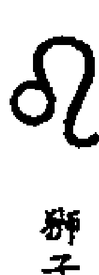

如果这一相合发生在室女座，其影响会使人产生先天的不满足心理，会激励人去改变现状或追求新的理想。

太阳与冥王星相合或呈三分方位的影响会增加人格魅力，赢得别人的支持和保护。

太阳与冥王星呈不和谐方位的影响，尤其是还存在不和谐的火星或土星方位的情况下，容易使人焦虑不安，有无法摆脱的烦恼，或者产生犯罪心理。

### ♌ 你的星辰对应备忘录

- 傲慢的狮子座人常说：“我要……”
- 你的主宰行星：太阳。
- 你的关键词：权力、威望、智慧、综合、宽宏大量、雄心、傲慢、高贵、父亲、领导、意志、进取心、生机、忠诚、虚荣心、激情。
- 你求爱的方式：宽厚的。
- 你是一个：要求自己是具有全才的强者。
- 你渴望：引以自豪的资本。
- 你受骗：由于喜欢听恭维话。
- 你喜欢：盛大的聚会、社交活动，逛超级市场。
- 你害怕：丢面子。
- 你追求：荣耀。
- 你的弱点：不满情绪。
- 你的动力：权力和成功。
- 你的优势：上层关系。
- 你的劣势：自尊心。
- 你身体的脆弱点：心脏。
- 你的假日生活：日光浴、享受豪华宾馆的生活。
- 你的开支：购买奢侈品和首饰。
- 你的服饰：高贵典雅的丝、开司米或锦缎时装，名牌手表和精品金首饰。
- 你的吉祥物：太阳或金质徽章。
- 你的吉日：星期日。
- 你的幸运数字：1、9、10。
- 你的幸运金属：金。
- 你的幸运色：金黄、橘黄色。
- 你的幸运花：天竺葵、向日葵。
- 你的幸运石：红宝石、琥珀。
- 你的吉祥动物：狮子、豹、鹰、公鸡。
- 你的吉祥植物：柏树、棕榈树、月桂树、橘树、柠檬树、石榴树、芍药和所有异国植物。
- 你的保健食品：大麦、燕麦、玉米、禽肉、酸菜、萝卜、洋葱、白菜、无花果、柑橘、杏、柠檬、柚子、蜂蜜、葡萄酒。
- 你喜欢礼物：镀金或晶体制品、名人传记、名牌和有象征意义的礼物。
- 有益于你的场所：豪华场所、高级宾馆和饭店、剧场、广场、教堂、展厅、娱乐场以及集会场所。
- 适合于你的住所：居室装饰有艺术品、名画、古典家具及高档的生活用品。
- 你的幸运旅游地：中国、法国、希腊、以色列、牙买加、马尔代夫、毛里求斯、韩国、意大利、奥地利、象牙海岸、新加坡；马赛[法国]、巴黎，罗马、西西里岛[意大利]、维也纳。
- 你的理想职业选择：高级职位，如外交、银行、交易所、首饰业、高级旅馆业、大型企业、游乐场、艺术博物馆、影视团体的领导人，总裁、政治家、发明家、新闻发言人或当局负责人。
- 与你亲和的星座：白羊座、人马座、双子座和天秤座。与宝瓶座互补。

室女座的性格特点和相关描述文本，由于图像质量模糊，具体内容难以辨认。

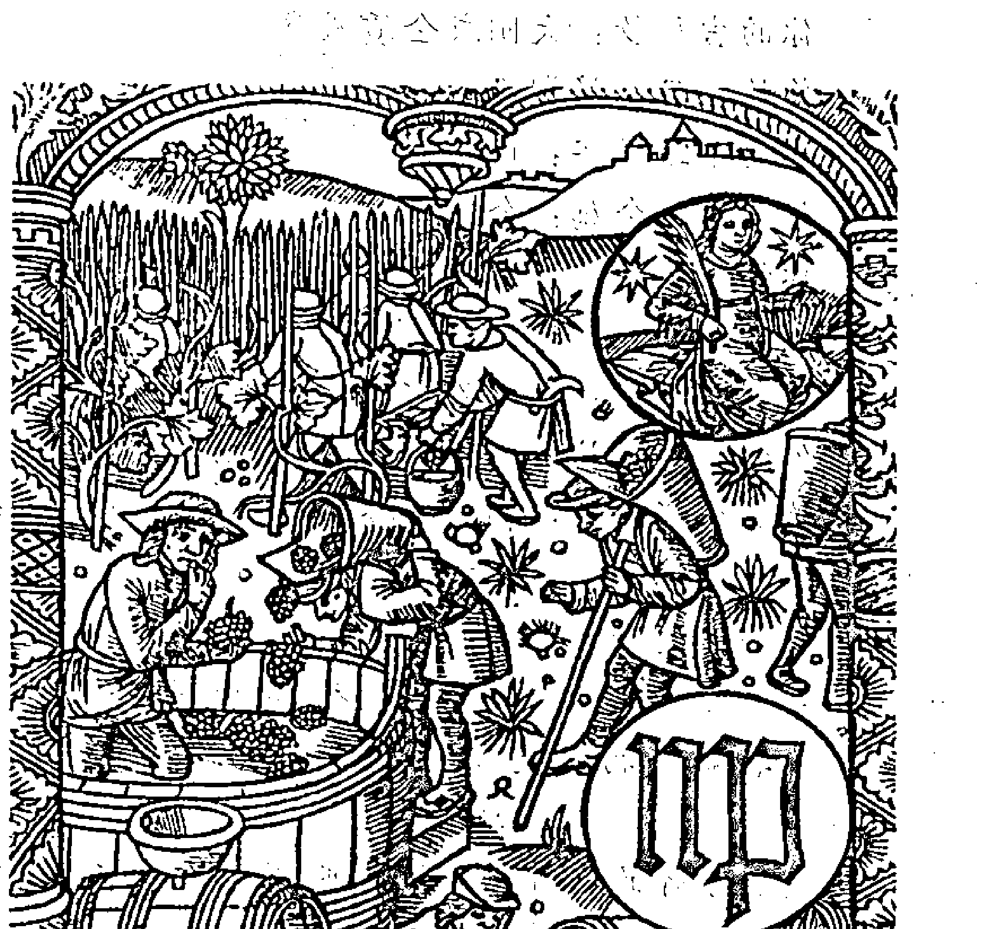

8月24日～9月23日

# # 室女座

> > 辩证法想知道的，哲学都知道。 ——亚里士多德①

### 出生星位或太阳在室女座人的基本性格趋向

在喜欢过高估计自己的狮子座之后，是总爱过低估计自己的室女座②。室女座的人是不惹人注目的效率冠军，是谦虚谨慎的典范。

可爱而怯懦，常常为没能达到尽善尽美而感到内疚和不安。室女座的人总是试图将激情和冲动置于理智的控制之下。深思熟虑，反复斟酌，有时甚至错过了有利的时机。他尤其害怕上当受骗。

这一星座的人具有勤劳的本色和极强的责任感，特别适合从事需要耐心细致和踏实肯干精神的工作。一般说来，他能在不需要创新，不需要别人监督或从属性的工作岗位上充分展示自己的才能。据统计，许多得力的助手、秘书和模范职员都是出生于室女座。

室女座的人对每一件事情都周密计划，仔细安排。喜欢事情的来龙去脉一目了然，事后做记录以备查，每项开支都记入账目。总之，他的生活是一丝不苟和井井有条的，不喜欢突如其来的事情扰乱他的秩序。

> ① 亚里士多德 Aristote（公元前384～322）希腊哲学家、逻辑学家和科学家。他是西方思想史中实在哲学派最杰出的代表。

> ② 黄道带的第六个星座，它对应盛夏时节，太阳8月24日～9月23日从该星座经过。室女座的形象是一个手持麦穗的少女，被看作是丰收女神或在收割中的少女（希腊神话的珀耳塞福涅）。室女座对应人体的腹部和消化器官。室女座的主宰行星，即影响力最强的行星是水星。在该星座中，金星的影响力减弱，海王星的影响力最弱。室女座属土类星座，代表分析能力、细心、条理、秩序、实际感、批评精神和谨慎。

其出生天宫图中，除太阳或出生星位之外还有一颗或几颗行星出现在室女座的情况下，这种性格特征就更为明显。

如果出生天宫图中没有太阳、木星或火星强有力行星方位的影响，那么室女座的人只求一般性成功就感到满足了，而不大愿意高瞻远瞩，奋力拼搏，因为未知的一切都会使他感到担心。在他看来，把工作做得无懈可击并使人感到他是不可缺少的，这些要比雄心壮志更为重要。

受木星、天王星或火星影响较大的室女座的人，有可能成为精明强干的实业家，或者在工业、法律或商业中很有成就的人才。

室女座的人批评精神较强，这一点不利于他与周围人的工作关系及和睦相处，但无关大局。

室女座的人从不寄希望于侥幸，总是在经济上给自己留有余地。慢慢积累财富，做有把握的好生意，合理合法地赢利，逐步扩大积蓄，以供晚年之用。

这一星座出生的人，多半胃肠消化功能不好，身体较虚弱，因此应多注意饮食的规律性。晚上有时会失眠，其原因是“顾虑心理”太重。他怕工作没做好给别人带来麻烦；怕妨碍别人，也怕别人妨碍自己；怕经济拮据；怕别人侵犯自己的利益；还怕意外突然降临到自己的头上。这种自我保护意识带来的恐惧心理，会使室女座的人具有许多特殊的优点，如警觉性高、勤劳朴实、严肃认真、工作上追求尽善尽美，生活上有条不紊、谦虚谨慎、头脑清醒，对事物有较强的分析能力，忠诚可靠等。另外，这种顾虑心理也会成为室女座人致命的弱点，如喜欢钻牛角尖、烦躁、吹毛求疵、无意中制造紧张气氛和不愿意接受新事物等。过多的思虑和理性会限制他的视野，加剧对自我和人生的约束，从而将自己禁锢和封闭起来。

出生在室女座的著名人士有英格丽·褒曼（瑞典籍著名电影演员）、伊丽莎白一世（英国女王）、歌德（德国诗人）、路易十六（法国封建王朝最后一代君王）、德沃夏克（捷克作曲家）、伯恩斯坦（美国指挥家）、梅特林克（比利时诗人、剧作家）。

### 男性：性格、情感和爱情生活

具有典型的独身主义者的性格，不喜欢意外，在情感所致的内心骚动面前常常显得惶恐不安。他用持续不断的自我克制或批评精神来自卫，把遵守习俗作为行动的准则，一成不变的生活是他理想的天堂。

做事认真并有强烈的责任心，一丝不苟地做好本职工作是他的座右铭。事业上不喜欢独当一面地去发挥才能，而愿意在专家、教授或领导者的身边做助手工作。一般来说，他所得到的利益与所付出的辛苦是不相称的。然而，尽心尽责地完成本职工作是他的信条，也是他引以自豪的最大心愿。

婚后，他会把家庭生活安排得井井有条，各项家庭计划都经预先周密考虑，从不临时抱佛脚或打无准备之仗。对于夫妻间的性爱生活，每次都是在理性的支配下全身心地投入。做爱后，需要足够的睡眠和体力恢复时间。

他与出生星位在双鱼座的女性会十分融洽。这一星座的女性与他一样，比较慎重，不爱出风头，更不喜欢在生活中冒各种风险。

金牛座的女性也可以成为他的理想伴侣，他们在一起会共享和谐安逸的小康生活。

他也可以向摩羯座的女性求爱。通过共同的努力，他们会有一个物质基础雄厚的家庭。

与酷爱自由和喜欢冒险的人马座女性或性格不坚定和好动的双子座女性，缺少和谐的基础。

### 女性：性格、情感和爱情生活

具有内在的魅力和不追赶时尚的浪漫气质。她的谦虚有时会发展到唯恐被人注意到的程度，因此，她与生活总是保持一定的距离。愿意把个人的幸福置之度外，而为他人奉献出自己的一切。

十分注意细节，有时会到成癖的地步。非常注意自身的安全，不喜欢意外的发生。这是一个相当出色的家庭主妇，懂得如何体贴、照顾自己的亲人，使他们心情愉快，身体健康。心甘情愿地承担起家庭生活的责任，但她需要别人把她的辛勤劳动看在眼里，感到她是不可缺少的。身体经常感到不适，需要用相当多的时间来调理脆弱的身体，同时她也擅长为别人看病。

生活中少不了室女座的女性，但她总觉得在幕后要比在台上当主要演员自由自在得多。

室女座的女性生来就是为了饱尝爱的幸福，她需要高质量的、夫妻间能相互理解和心照不宣的性爱生活。

室女座的女性与双鱼座的男性都很温和、怯懦，他们会相处得十分融洽，相敬如宾地和睦地生活。

与金牛座的男性结合会建立一个美满幸福的家庭，并会有为他们争光的孩子。

与摩羯座的男性结伉俪，他们会同心协力为远大的生活目标而努力，经久不衰的感情会使他们白头偕老。

缺乏坚定性的双子座男性很难引发她的激情。

总是被激情和行动驱使的人马座男性会破坏她按部就班的生活习惯。

### 孩子：教育和职业选择的可能性

室女座出生的孩子一般胆子都比较小或很谨慎。体质往往比较弱，易患感染性疾病，身体状况会直接影响到他的学习。这是一个不太合群的小鬼，喜欢观察和思考。他很早就具有了批评精神并把它当做自我保护的武器，但这很可能成为伙伴们对他不满的根源。

室女座的孩子是个好学生，求知欲望很强，喜欢积累知识。善于挖掘人的心理和探讨事物的本质，但这有可能使他趋于只注重细节，而忽略了全局，影响到未来职业的发展。孜孜不倦地学习有时会达到忘我的程度。最好多让他到户外参加体育活动，这样既可以多呼吸新鲜空气，又可促使他多和同学们在一起，打成一片，从而避免他的孤独感和抑制心理的滋生。

室女座孩子理想的择业方向是：教育、医学、科学、数学、会计、秘书、公务员、卫生事业、工业、法律和商业，以及一切需要耐心细致的工作，从属性或者与动物有关的职业。

## 室女座三个10°区出生人的性格

### 室女座第一个10°区
0°~9°59'（即出生日期为8月24日～9月2日）

性格懦弱或谨慎，需要借助于他人的帮助或好的竞争环境，才能使事业和生活一帆风顺。

头脑清醒，善于观察，注重细节，从不盲目行事。非常勤劳，总希望把工作做得好上加好。过分谦逊的美德使他辛勤的劳动成果常被他人所用。敏锐的直觉使得他过于爱动脑筋和爱批评指责。

他的动力：工作。

### 室女座第二个10°区
10°～19°59'（即出生日期为9月3～12日）

抱负远大，职业信念很强，务实精神会帮助他不断进取。具有天生的商业意识和经营头脑。严肃认真，有很强的责任感和义务感，但性格上显得有些忧郁。喜欢勤俭节约，办事注重条理，为了改善经济状况肯付出代价。

他的动力：责任感。

### 室女座第三个10°区
20°～29°59'（即出生日期为9月13～23日）

性格稳重，有现实感，理性强，为人正直。似乎生来就注定要兢兢业业地去为别人工作，而不是为个人的成功。忠心耿耿，踏实肯干，甘愿默默无闻地耕耘和做奉献。很会照顾人和为人看病。兴趣广泛，但缺乏创新精神。

他的动力：理性。

> ① 见附录部分有关“10°区”的名词解释。

## 不同出生星位室女座人的性格、爱情选择和常见疾病

### 太阳在室女座和出生星位在白羊座

其性格介于怯懦和果敢之间，表现为好斗或犬儒主义。无法满足的愿望使他内心焦躁不安，看问题往往忽略积极的一面。不过一旦他的意志有了明确的投向，将会在事业或与某人的合作中变成一种动力，使其工作成绩卓著。过强的批评精神将不利于他真正感情的表露。

出生星位在天秤座、太阳在白羊座或月亮在室女座的人与他性情相投。

这一星位出生的人先天体质较弱，身体经常处于不稳定状态。消化系统疾病常见。

### 太阳在室女座和出生星位在金牛座

勤奋刻苦，忘我工作，无论男性还是女性都是可以充分信赖的。性格沉稳踏实，是正直的典范。实际感和理性支配着他的生活和情感。只要坚持不懈地努力，成功迟早会到来。这一星位预示着各方面的均衡发展。

出生星位在天蝎座、太阳在金牛座或月亮在室女座的人是他事业和人生的理想同路人。

该星位出生的人身体素质较好，但由于胆囊功能欠佳，所以要注意饮食习惯。胃肠方面的疾病常见。

### 太阳在室女座和出生星位在双子座

性格上有些神经质，理智高于情感。他或是疑虑重重，或是谈锋犀利。对于每件事情都是仔细观察，冷静思考，然后再发表意见。喜欢并善于表现自己。事实上他是个疑虑不决的人，总纠缠在一些细节问题上。激情不断受到理性的抑制，导致内心的感情得不到充分的表露。

出生星位在人马座、太阳在双子座或月亮在室女座的人与他情意相投。

这一星位出生的人心脏功能较弱，胃肠功能紊乱常见。

### 太阳在室女座和出生星位在巨蟹座

这是优秀品质与和蔼可亲的化身，美中不足的是性格过于敏感和脆弱，喜欢闭门幽居。不允许自己被人轻视或受到不公正的评价，只有在知己之间或在赞誉声中才能感到欣慰。这是个最热心助人和最懂得体贴的人，但应特别注意不要成为温情或周围人情绪的俘虏。

出生星位在摩羯座、太阳在巨蟹座或月亮在室女座的人与他情投意合。

这一星位出生的人肝和胃肠系统的疾病常见。

### 太阳在室女座和出生星位在狮子座

这是一个有逻辑头脑的理性主义者。视野开阔，有出色的工作能力和商业嗅觉。任何时候都不会忘记切身利益，结婚往往是为了事业的更好发展。但在情感和人际关系方面缺少洞察力，容易真假不分和看不清谁好谁坏。极度敏感。

出生星位在宝瓶座、太阳在狮子座或月亮在室女座的人与他志趣相投，会是他开拓事业的得力助手。

这一星位出生的人要经常注意胃肠和心脏功能的变化。此外，晚年时关节病较常见。

### 太阳和出生星位都在室女座

性格敏感，传统观念较深，他需要别人的帮助或鼓励，以克服自身怯懦或多疑的弱点。对于一般性工作，他是个得力的干才。出色的洞察力会使他在为人处世方面受益匪浅。过分的谨小慎微或批评精神会使他丧失激情。相反，如果出生天宫图中火星的影响力较强，则会使他敢于正视现实和具有反习俗的思想倾向。

出生星位在双鱼座，月亮在室女座、摩羯座或金牛座的人对他会有吸引力。

该星位出生的人肠炎、糖尿病、中毒，以及因消化不良而引起的皮肤病（如荨麻疹）常见。尽量不服用兴奋剂，少吸烟并避免吃带调味汁和不易消化的食物。

### 太阳在室女座和出生星位在天秤座

待人真诚，优柔寡断和一丝不苟的精神交织在一起。永无休止地权衡利弊和设身处地地为别人着想，使他最终总是选择折衷之路，或者放弃良机。敏感使他无论在生活中还是感情上，首要考虑的是平衡与和谐问题。对人有很大的吸引力，朋友经常围绕在他的身边。

出生星位在白羊座、太阳在天秤座或月亮在室女座的人是他可以倾诉衷肠和相伴人生的知己。

这一星位出生的人需注意循环系统和肾脏疾病。

### 太阳在室女座和出生星位在天蝎座

性格神秘，头脑清醒，有自制力和不留情面的批评精神。内心潜藏着权力欲。事业上，不怕任何困难和挫折，顽强拼搏，毫不动摇，从不放弃和后退。感情上，他需要别人毫无保留地奉献，而自己却回报甚微，除非对他有好处的情况下。如果其出生天宫图中火星、冥王星、土星或太阳之间的方位不和谐，则会有谈性色变的羞怯心理。

出生星位在金牛座、太阳在天蝎座或月亮在室女座的人与他性情相投，相处和睦。

这一星位出生的人发热、肠炎、阑尾炎以及神经性疾病常见。

### 太阳在室女座和出生星位在人马座

为人正直，忠诚可靠。热爱生活和大自然，但犹豫不决或判断上的错误往往会造成事与愿违的结果，或不利于他物质生活的发展。追求内心的平静，而不是充满豪情的壮举。

出生星位在双子座、太阳在人马座或月亮在室女座的人会向他敞开爱的心扉。

这一星位出生的人胃肠、循环系统和脉管疾病常见，要注意保持生活的规律性。

### 太阳在室女座和出生星位在摩羯座

正直廉洁，但有些思虑过多和过分谨慎。不太喜欢表露自己的思想和感情，偏爱“隐居”的生活。有较强的工作能力，对自己的要求常过于苛刻，为了实现远大抱负，能以最大的耐力经受考验。感情平静而慎重，但十分忠贞和持久。

出生星位在巨蟹座或室女座、太阳在摩羯座或月亮在室女座的人喜欢他廉洁自律、内涵较深的性格。

这一星位出生的人同化作用较弱，胃肠炎、脉管炎和感染性疾病常见。

### 太阳在室女座和出生星位在宝瓶座

性格神秘，不轻易表露自己的感情，很难透视其内心世界。总是在探寻人和事物的内在联系。据概率统计，许多研究人员、科学家和影视导演的出生天宫图，都与这一行星方位有关。和蔼可亲，乐于助人，但是由于缺乏生活经验，感情上容易失误。

出生星位在狮子座、太阳在宝瓶座或月亮在室女座的人与他性情相投。

这一星位出生的人心脏、胃肠功能较弱，肠炎、腹膜炎以及由于消化不良而引起的湿疹和荨麻疹常见。

### 太阳在室女座和出生星位在双鱼座

性格矛盾，总是在梦想与现实、神秘主义与求实精神之间犹豫徘徊。内心潜伏着忧虑，缺乏毅力。他是周围人和环境的缩影，其命运很大程度上取决于他所接触的人的影响以及人际关系的好与坏。有一颗不可多得的仁爱之心和无私的奉献精神，必要时会全然不顾个人的得失。在音乐、诗歌或艺术方面，能充分显示出不凡的才华。

出生星位或太阳在双鱼座，或月亮在室女座的人与他志趣相投，并能和睦相处。

这一星位出生的人风湿性脚痛、肠炎和阑尾炎常见。

## 室女座人与其他星座人的情感和谐

### 室女座的人与室女座的人

这是一种琢磨不透的关系。在其平静的外表之下，各自隐藏着担忧和复杂的心理，他们都希望对方能成为自己的精神支柱。在性爱生活中，这些疑虑将被抛掷九霄云外，代之以深情和爱抚。

### 室女座的人与天秤座的人

谨慎的室女座的人与天秤座的人会相处得十分和睦。室女座的人需要的是情感充实并能与之共享天伦之乐的生活伴侣。

### 室女座的人与天蝎座的人

这是爱争辩和欲望强烈的人与富有想象力但本能意识较强人的结合，有助于夫妻关系向亲密和谐的方向发展。

### 室女座的人与人马座的人

这是理性与激情的碰撞，人马座人突然的暴躁会使室女座的人感到不安。尽管他会重新冷静下来，热情依旧，但室女座的人对这种冷热不均、喜怒无常的性格会越来越感到难以忍受。

### 室女座的人与摩羯座的人

这是情感最真挚和最令人满意的结合之一。社会生活中都很谨慎，夫妻生活中浓情似蜜，互敬互爱。

### 室女座的人与宝瓶座的人

这是理性与直觉的结合，但这一关系并不太稳固，因为室女座的人对宝瓶座的人过于不受拘束的性格感到害怕。但宝瓶座的人却十分欣赏室女座人所特有的内在魅力和忠贞不渝的感情。

### 室女座的人与双鱼座的人

如果双鱼座的人仅仅是浪漫和富于幻想而不是过于不可捉摸的话，这两个星座的人可以建立良好的关系。室女座的人喜欢双鱼座人真诚、性感和充满幻想及温情的爱。

> ① 这些和谐关系的描述仅仅是针对人出生时太阳星座的单纯影响所作的理论分析，并不是绝对的。实际上，决定两个人和谐关系的还有另一个重要参数，那就是出生星位。例如，仅从出生时太阳星座的影响来看，由于性格的差异，室女座与人马座的人是不和谐的。但是如果室女座人的出生星位在火类星座（白羊座、狮子座和人马座），或者人马座人的出生星位在土类星座（金牛座、室女座和摩羯座），那么，他们会相处融洽。出生天宫图中金星和火星的影响是衡量性爱和谐与否的基本参数。

## 室女座人如何根据自己星座的特点关爱身体、保健和美容

室女座对应腹部和消化器官，尤其是脾和十二指肠，因此，这一星座出生的人易患肠道功能紊乱、腹泻和腹膜炎。该星座的主宰行星——水星对呼吸系统会产生影响。

表面看平静温和，但实际上，室女座的人永远在内心极不平衡的状态下生活，并常常为自己制造无数的忧虑和烦恼。易患感染性疾病且气色不佳，往往把大部分时间都花费在照料自己和亲人的身体上。

他常常觉得自己好像病了，总琢磨吃什么药调理身体，结果有时真的搞出了一身毛病，因为他对效力过大的化学药品的同化能力较差。当他意识到这一点时，又会走向另一极端，成为禁食癖和只吃素食。这对他也是不利的，因为他脆弱的身体需要高蛋白食品和蔬菜的适当搭配。对这一星座出生的人来说，采用中草药和汤剂治疗最为有效。

室女座的人本能地节省着自己的体能，他这样做实为明智之举。如果他每天能独自一人静静地呆上一个小时，会使紧张的精神状态得到充分的恢复。

起伏的山峦和秀丽的农村田野景色，是室女座人舒展心情、开阔胸怀和增进健康的理想场所。他非常喜欢到这些地方去采集草药和植物标本，并对它们加以分类。室女座的女性是收藏爱好者。

室女座人的身体需要补钙，以增进其抗疲劳能力和抵抗源于寒冷的疾病。为此，应多吃些乳制品、奶酪、核桃、榛子、杏仁、白菜、生洋葱、花粉和粮食等。室女座人身体的脆弱点是消化器官，容易胃肠功能紊乱。为了增强肠道抗感染的能力需要补充硫，可常吃些酸菜、大蒜、水田芥、萝卜、葱和麸皮面包。

室女座人的保健植物是薄荷，它具有兴奋和杀菌的作用。常饮薄荷茶或洋甘菊茶，要比喝咖啡或茶对身体更有益。

为防止便秘，可在晚上把李子干泡在温水里，清晨空腹时吃。如果腹泻，可吃欧洲越橘，它对治疗腹痛和肠炎是很有效的。最好每天清晨空腹吃，也可吃一杯切碎的苹果。

由于室女座的人易患感染性疾病，所以在他的食品中最好多加些有杀菌作用的百里香、迷迭香和鼠尾草。另外，所有泥疗法（如用泥罨剂治疗疼痛等），对室女座的人都是很适宜的。

室女座人的身体需要维生素，为此他必须多食用蔬菜和水果，如白菜、欧芹、扁豆、胡萝卜、越橘和苹果等。

室女座的人应该养成吃酸奶的习惯，因为它是使肠道菌群恢复平衡的良好食品。另外，要吃鲜无花果或无花果干，有可能的话最好多吃李子。

美容方面，为了保持好的气色，室女座的人应多吃欧芹和水田芥沙拉。胡萝卜汁有利于增加身体的活力和面部的红润，每天清晨空腹服用，也可用作洗剂涂于脸上。

对于许多室女座的人，便秘是他们脸色不佳和缺乏活力的主要原因之一。如果确实如此的话，每天早起时空腹喝一小勺用鼠尾草、百里香和迷迭香浸泡过的橄榄油，接着再饮一大杯水，如此坚持几天。也可以交替喝尽可能鲜的果汁，里面加少许啤酒酵母（也是清晨空腹服用）。

麦芽香脂和美容乳液，对室女座人效果较好。植物香脂，尤其是洋甘菊成分的香脂有镇痛和清爽的作用。

室女座的人适宜选用以风信子、茉莉、薰衣草或马鞭草为主要成分的香水。

## 室女座人的情趣和喜欢的礼物

室女座的人喜欢高质量的实用物品，对自然疗法、营养学、瑜伽有浓厚的兴趣。喜欢的礼物有：效率手册、钢笔、欧米茄或精工舍手表、闹钟、储钱罐、抗过敏的香皂、法兰绒睡衣、棉和毛料衣服等。

室女座的人喜欢动物（如猫、狗等），并是一个收藏爱好者。体育方面喜欢体操、练瑜伽、田径运动和长跑。假期喜欢参加有组织的旅行，身边总备有药箱。喜欢搜集各种音乐的CD，分门别类，按字母顺序排列收藏。如果送这一星座人礼物，最好给他们购物券，让他们自己去挑选。他们喜欢辞典、百科全书、家庭生活顾问，以及处世指南等实用性书籍。喜欢用气味适中的香水。

室女座的孩子喜欢智力游戏（如象棋、十五子棋游戏、趣味游戏），乐高玩具，还喜欢当小护士（带小药箱）、小医生或小商人的游戏。

## 太阳和木星的方位与室女座人的物质生活趋向

### 太阳在室女座和木星在白羊座

把自己的全部精力都投入到事业的发展上，有理想和抱负，并具备良好的商业意识以及从商的素质和才干。

### 太阳在室女座和木星在金牛座

出色的工作能力，坚持不懈的努力，以及忠厚的性格使他能稳步前进并取得可靠的成果。有些过于注重物质所得和商业利益。有事业发达的可能性，尤其当出生天宫图中木星处于和谐方位的情况下。

### 太阳在室女座和木星在双子座

由于太谨小慎微和没有开拓精神，或者由于缺少机遇而导致成功几率不大。善于从事实际工作，常处于被领导地位，陷入事务主义的圈子。但不失为理想的中介人或精明强干的生意人。

### 太阳在室女座和木星在巨蟹座

持之以恒和自我完善的精神会激励他不断进取。适合从事教育、小生意、医学或护理病人等职业。

### 太阳在室女座和木星在狮子座

这一行星方位的影响会增强室女座人的理想和信心。身居要位，强成自立。如果出生天宫图中太阳或木星在黄道第一宫、第七宫或第十宫，成功之路是充满希望的。

### 太阳和木星都在室女座

这是个具有高度职业感和惊人效率的劳动者，也是个可以完全信赖的人。在企事业单位供职比单干更易获得成功。商业意识和经商能力均十分突出。

### 太阳在室女座和木星在天秤座

善于给出好的建议，助人为乐，擅长法律、教育和管理工作，是理想的公共关系、中介人和经理候选人。

### 太阳在室女座和木星在天蝎座

有较强的批评精神，是个十足的机会主义者，善于利用别人的弱点。科学、医学、心理学或心理分析是他开拓进取和获得收益的领域。

### 太阳在室女座和木星在人马座

经济基础容易受到突然变化的影响，处于不稳定状态。适合从事旅游业、与国外有关的职业，以及法律或宗教方面的工作。

### 太阳在室女座和木星在摩羯座

高度的责任感和实干精神会有助于职业生涯的顺利发展，并逐步取得成功。有可靠的工作岗位并能发挥举足轻重的作用。稳步发展，最终会达到希望的目的。

### 太阳在室女座和木星在宝瓶座

喜欢集体性工作，善于利用他人之所长。科研、医学或创新项目是发挥才能和取得经济效益的理想之地。

### 太阳在室女座和木星在双鱼座

不喜欢冒险和犹豫不决的性格会使成功姗姗来迟。喜欢处在从属地位或尽量不与人打交道，这样他会有一种安全感。

### 把握好水星主宰下的自我

室女座的主宰行星是水星，水星的影响力在双子座和室女座最强，在人马座和双鱼座最弱，在宝瓶座增强，在狮子座减弱。受水星影响的人思路清晰，善于逻辑思维和归纳总结，但往往缺乏担任要职的机遇。

### 水星—太阳

这两个行星相合的影响有助于提高人的智力天赋、理解力和实践能力，尤其当该相合发生在双子座、室女座或狮子座，或者出生星位或太阳处于这些星座时，这一影响会表现得更为明显。

### 水星—月亮

和谐的水星与月亮方位的影响会赋予人永恒的朝气、丰富的想象力和适应能力。好奇心常促使他去开拓新境界或建立新的关系。具有较强的记忆力、接受新事物和语言表达能力。敏锐的思维可能使他成为一名出色的外交官，也可能使人变得表里不一和口是心非，这要视其出生天宫图其余部分的影响程度而定。

不和谐的水星与月亮方位的影响会使人爱夸夸其谈，生活趋于平淡无奇。

### 水星—金星

水星与金星相合的影响会使人性情随和，和蔼可亲，很有天赋，但缺乏深度。擅长文学、艺术或美学。

### 水星—火星

水星与火星相合或其和谐方位的影响，会给出生者带来巨大的精神力量和卓越的工作才能。口齿伶俐，但过分敏捷的思维常常使他烦躁不安，甚至空话连篇。另外，这两颗行星相合的影响还能使人具有幽默感或批评精神，热衷于辩论。

如果水星与火星彼此的方位不和谐，容易使人具有不懂处世哲学，为人浮于表面的性格。即便在最好的情况下，这一相合的影响也难免使人表现出缺乏耐心、总是这山望那山高的思想倾向，不能脚踏实地地去从事某项工作或成就某项事业。

### 水星—木星

如果出生天宫图中有水星与木星的相合，将是十分难得的，因为其影响既能开阔人的思想境界，又能赋予人看事物多着眼于积极方面的乐天派性格。正因为如此，即使在最坏和最悲观的情况下，受水星与木星相合影响的人，也能保持饱满的精神状态和对困难充满必胜的信心。

水星与木星相合或呈三分方位的影响，会使人具有出色的理解和表达能力。对于从事语言表达和文字工作的人，这是一个极好的行星方位。同时，也有助于从事商业、管理和经济工作的人事业上的成功。但如果出生天宫图中没有更富活力的其它行星方位影响的话，它也无法赋予人很强的信念和毅力，以及平静的生活空间。

水星与木星相冲或呈四分方位的影响，容易使人目光短浅，或者遇事优柔寡断，在复杂的情况下往往束手无策。由于缺乏坚决和果断，往往容易错过良机，处于不被人注意的默默无闻之中。但无论任何境遇，他从不悲观失望和怨天尤人。

### 水星—土星

这两颗行星相合的影响会突出怯懦或谨小慎微的性格特点，使人的感情深沉而严谨。同时，也会强化自我意识或使人变得冷酷无情。批评精神极强，对待人和事多爱从消极处着眼，总是权衡利弊，疑虑重重，这会不利于他的幸福。

和谐的水星与土星方位的影响有助于人在历史、法律、管理、古艺术品的研究方面取得成就。这是一个有高尚情操、心地善良的知己。不和谐的水星与土星方位的影响会加重人悲观失望的情绪，以致爱批评，语言尖酸刻薄，有时又爱把自己禁锢在狭隘孤独的生活圈子里。如果出生天宫图中存在和谐的行星方位，那么这种倾向会趋于缓解。

### 水星—天王星

水星与天王星相合的影响会赋予人开阔的视野和创新精神。这是一个生机勃勃的行星方位，它能增加人的幽默感和创造才能。出生在这一星位的人是人性的观察者，喜欢无拘无束的生活，有些异想天开，不愿他人介入自己私生活的圈子。统计表明，记者、作家、科学家和开拓者之中，受水星与天王星方位影响的居多。

水星与天王星呈三分方位的影响会使人具有良好的观察、分析与综合能力。热衷于发明创造，对形而上学或神秘学有浓厚的兴趣。

水星与天王星相冲或呈四分方位的影响会使人智力敏锐，但很少能得到充分的开发和利用。性格暴躁，变幻莫测，醉心于矛盾的事物。由于说话尖刻和好挖苦人，会给自己树立许多人为的对立面。

### 水星—海王星

水星与海王星相合的影响易使人具有强烈的同情心，想入非非或性格神秘。总而言之，思想方法及理想与众不同。

个性奇特，反复无常，喜欢悖论，性情易变。尽管如此，仍无损于他的温情脉脉之心，因为他讨厌粗暴专横。幽默感强，想象力丰富，敏锐的知觉有助于他对周围环境及他人思想的洞察和了解。

这一行星方位的影响可能激发出惊人的创造力，也可能酿成潜在的精神危机；可能产生新奇的想法，也可能陷入完全无计可施的境地，主要取决于出生天宫图的总体趋势。

水星与海王星呈三分方位的影响会突出该行星方位的优点方面；而相冲或呈四分方位的影响会使人爱幻想、漫不经心和容易气馁，根据出生天宫图的趋向，或许容易上当受骗，或许为人处世灵活善变。

### 水星—冥王星

水星与冥王星的影响会提高人的智能，增强事业心，或者使人有喜欢作对的性情。这三种趋向如何出现，将取决于该相合所在黄道宫的具体情况以及出生天宫图中其它行星方位的影响。

情况以及出生星位所在星座的性质。

受水星与冥王星相合影响的人兴趣广泛，个人受益的机遇较多，喜欢观察分析事物，探求其本质，寻找能使人更快前进的动力因素。批评精神较为突出，喜欢宣传或虚张声势。

水星与冥王星相合或呈三分方位的影响有利于智力与艺术创作能力的发展，而水星与冥王星相冲或呈四分方位的影响，则会使人产生特殊的道德观念，头脑过于灵活，善用心机。

## ♍ 你的星辰对应备忘录

- 谨慎的室女座人常说：“我注意到……”
- 你的主宰行星：水星。
- 你的关键词：分析能力、细心、条理、秩序、实际感、怯懦、野心、批评精神、自我意识、忠实、温情、谨慎、幕后顾问。
- 你求爱的方式：怯懦的。
- 你是一个：谨慎的人。
- 你渴望：自己的情趣能得到欣赏。
- 你受骗：由于过分的献身精神。
- 你喜欢：闭门幽居。
- 你害怕：没有达到完美无缺。
- 你追求：一丝不苟地实现自己的计划。
- 你的弱点：批评精神过强。
- 你的动力：工作和责任感。
- 你的优势：精益求精。
- 你的劣势：缺乏勇气。
- 你身体的脆弱点：消化器官。
- 你的假日生活：在安全可靠的地方休闲。
- 你的开支：购买廉价实用的商品。
- 你的服饰：任何场合都能穿的天鹅绒、粗呢服装，公文包和大众首饰。
- 你的吉祥物：乌鸫。
- 你的吉日：星期三。
- 你的幸运数字：6、10、15、20、27。
- 你的幸运金属：白金。
- 你的幸运色：灰色、紫色。
- 你的幸运花：铃兰、水仙。
- 你的幸运石：碧玉。
- 你的吉祥动物：狐狸、家禽、蜜蜂。
- 你的吉祥植物：薰衣草、马鞭草、缬草、刺柏、小麦、菊苣、多叶蓍、榛树。
- 你的保健食品：乳制品、白菜、洋葱、大蒜、胡萝卜、扁豆、葱、酸菜、栗子、无花果、越橘、苹果、核桃、杏仁、榛子。
- 你喜欢的礼物：精工舍手表、实用的生活用品、百科全书、家庭生活顾问和处世指南等实用性书籍。
- 有益于你的场所：可供学习的地方、市场、饭店，以及所有卖生活必需品的地方。
- 适合于你的住所：居室井井有条、有许多壁柜、组合式家具，室内看不到多余的物品。
- 你的幸运旅游地：新加坡、巴西、加拿大、泰国、瑞士、土耳其；巴黎、图卢兹[法国]、海德堡[德国]、加利福尼亚州[美国]、斯特拉斯堡[法国]、耶路撒冷[巴勒斯坦]、帕多瓦[意大利]。
- 你的理想职业选择：医学、科学、教育、数学、会计、秘书、公务员、卫生事业、工业、法律、商业，以及一切需要耐心细致的工作和从属性或者与动物有关的职业。
- 与你亲和的星座：摩羯座、金牛座、巨蟹座、天蝎座。与双鱼座互补。

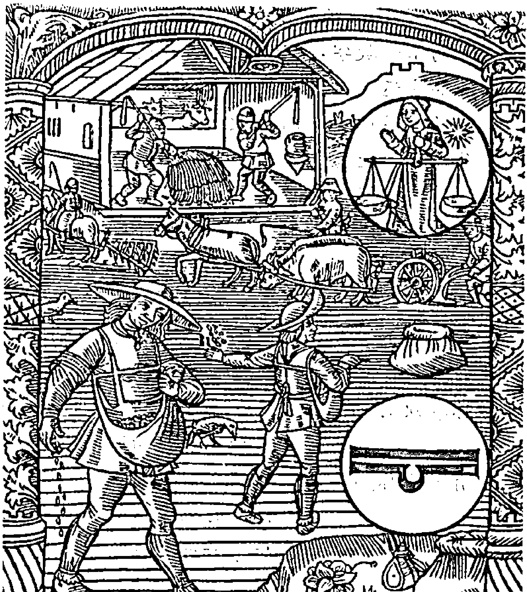

9月24日～10月23日

## 天秤座

> “我们的得与失，全在于我们自己的内心。”
>
> ——爱比克泰德①

### 出生星位或太阳在天秤座人的基本性格趋向

天秤座②是象征着秋天来临的星座，秋意表现在天秤座人身上的是对意气相投的特殊嗅觉。他寻觅着共同点和相互谅解的土壤。和蔼可亲的禀性使仇恨和敌意永远无法靠近他的身旁，这是一个能为生活的矛盾开辟和解之路的人。

品格正直，和蔼可亲，无论男性还是女性都闪耀着魅力的光彩。微不足道的事情就会使之感到坐立不安。他总是在寻找着内心的平衡，没有这种平衡就无法平静地生活。

天秤座的人温柔、娴雅。他需要欢欢乐乐的生活，需要忠贞不渝的友谊和爱情。随和与顺从是他性格上的主要特点。无论对天秤座的男性还是女性，都可以看到这些难能可贵的女性品质，以及他们所蕴藏的艺术灵感和才华。

天秤座的人需要别人的钦佩和赞扬，只有在他感到欣然的环境中，才能无忧无虑地生活。喜欢到商场和在琳琅满目的商品中消磨时间，选购好玩的和供观赏的小玩意儿赠送给知心好友。他不愿意在缺乏温暖和热情的环境中生活，一旦病倒，会感到异常的不幸并会沉溺在失望的情绪中。

他期待着展示自己高雅品位和才艺并能受到好评的机会或场合，渴望生活在充满艺术和美好幻想的意境中，而回避现实生活中的各种矛盾、困难和烦恼。丑陋会把他吓跑，强暴会使他的心灵受到伤害，为生活奔波操劳会使他感到精疲力竭。

天秤座的人不善于安排自己的物质生活，期望一切都轻而易举地到来，或至少不要花太大的力气。他从不把钱放在心上，只有在想用钱的时候，钱的概念才会进到他的脑子里。他像一幅美丽的装饰艺术品，吸引着善良而真诚的人们，并把精心创造的温馨舒适的生活带给所热爱的人。

如果出生天宫图中其余部分的行星影响有所指示的话，那么天秤座的人在艺术、影视或一切需要审美能力的职业中会业绩辉煌。时装、装潢和奢侈品业亦是他感到惬意的领域，但他需要身边有得力助手帮助具体实施，因为他对物质问题是个地道的门外汉。

天秤座人的命运经常是在爱情和婚姻中被决定的。如果爱情生活美满幸福，其魅力天赋会给他带来所期望的一切利益。相反，孤独会使他陷入迷茫的状态（尤其是在他的出生天宫图中，土星与金星或月亮呈不利方位的情况下）。因此，天秤座的人不能长时间地孤独一人，他需要爱的温暖和关怀，他必须与大家保持经常性的接触、交往和友谊。

天秤座的人十分注意言行举止，与他相处急不得，也不能简单粗暴，因为他的情绪变化很难预测。对周围发生的一切都十分关心，不仅知道事情的来龙去脉，而且还知道什么时机对成功最为有利。天秤座的人善于发现哪些人与他志趣相投。他的优势是乐于助人、富有魅力、温文尔雅、性格平和、目光敏锐，具有合作精神。不足之处是说而不做、优柔寡断、缺乏坦诚、过分追求高雅的生活、因循守旧、机会主义、注重琐事、不专心致志和缺乏坚定性。

出生在天秤座的著名人士有：王尔德（爱尔兰作家、影视家）、卡特（美国第 39 任总统）、阿拉贡（法国诗人）、海华兹（美国电影演员）、马斯特罗尼亚（意大利电影演员）、卡特琳娜·德纳芙（法国电影演员）、李斯特（匈牙利作曲家）、尼采（德国哲学家）、甘地（印度前总理）。

### 男性：性格、情感和爱情生活

具有吸引女性的魅力，喜欢猜测她们内心的秘密，倾听她们的心声和善于理解她们的感情。他既是一个难得的知己，又是一个理想的伴侣。他有时会竭力取悦于人，并不是为了赢得他人的欢心，而是为了表现自己的真心诚意。希望事事都能做得尽善尽美，否则就会感到内疚。这是一个既能对妻子关怀备至、体贴入微，又免不了时而朝三暮四的丈夫。好友善交、头脑冷静、举止大方和谈吐高雅的气质，使他很适合从事外交官的职业。审美能力很强，丑恶与强暴会引起他的反感。他希望自己周围的人都亲密无间，和睦相处。

一心想使别人满意的愿望会暴露出他自身的弱点。不愿意与人相争，而愿意把时间用于编织永不凋谢的爱情之梦。他的命运将随着婚姻的实现而确定下来。

天秤座的男性不能过孤独的生活，因此，婚姻将在他的人生中起着极其重要的作用，甚至会成为他人生的转折点。他需要爱情的温暖，需要倾诉衷肠的意境和身心融合的氛围。其全部幸福将取决于他所建立的各种关系。性爱中，需要妻子有火热的激情和丰富的想象力。

白羊座的女性能征服他的心，并使他坠入爱河。通常情况下，总是白羊座的女性很主动，如果双方都有这个愿望，那么，这一婚姻是理想可行的。

双子座女性喜欢社交和活泼的性格会令他倾慕。

宝瓶座女性会在艺术、美学方面与他志同道合，会理解他的敏感性格。

巨蟹座女性与天秤座的男性生活在一起，只能是弱点的互补，彼此都想从对方的身上找到支持和动力，但很难如愿以偿。

### 女性：性格、情感和爱情生活

爱情是天秤座女性生活中的头等大事。富有魅力，很会穿着打扮，美感极强。

性格怯懦而温柔，易于相处，有些自我陶醉。生活上完全依赖于丈夫，并希望他能承担家庭生活中的一切责任。当她独自一人生活时，会感到茫然若失。通常，这种情况不会持续很久，她就会找到体贴关心自己的人。

生活中，她需要欢乐，需要感到欣慰的友情。这是一个理想的家庭主妇，能缓冲和化解任何矛盾与纠纷，给家庭生活带来欢乐和平静。但必须不断升华对她的感情，对她关怀备至，体贴入微，不辜负她的情意，这样才能牢牢地拥有她。此外，还要用永恒的温情去滋润她那颗爱之心。

如果她不是为了爱情而生，就是为艺术事业而献身。艺术会成为她理想的职业，并能使她展现自己的全部才华。不过，要想取得成绩，她必须克服闲情逸致的习惯。

天秤座女性对待性爱是严肃认真的，并把它视为需要用深情的感受去耕耘的一门艺术。她喜欢用服饰、音乐、舞蹈、香水、鲜花和温馨的意境来拨动丈夫性爱的琴弦。

她的魅力会唤起出生星位在白羊座男性爱的激情，只要他们彼此倾心相与，其结合会是幸福的。

双子座的男性会对她产生好感，他妙趣横生、海阔天空和富有渲染色彩的谈吐，会把她带入一个梦寐以求的境界。

她对能充分理解她的宝瓶座的男性会产生真挚的感情和爱。

她会感到巨蟹座的男性在爱的方面缺乏应有的激情和主动性。

她会觉得摩羯座的男性专心于事业，缺少她所希冀的体贴与关心。

### 孩子：教育和职业选择的可能性

天秤座的孩子一般都很帅气，讨人喜欢，容易引起别人的钦佩、赞扬和好感。要特别注意防止他滋长“小皇帝”的优越感和一切都依赖别人的不良倾向，因为天赋和魅力往往会使他感到是置身在一个得天独厚的环境中。

只有用温情才能从这一星座出生的孩子身上得到所希望的东西，因为粗暴会使他不知所措。不喜欢孤独，需要经常与朋友和伙伴交往。朝夕相处的朋友将对他的童年、未来乃至命运起至关重要的作用。

天秤座的孩子在艺术、美学、纯技术性学科、法律以及医学等方面易于取得好成绩。永远不要迫使他去做超越能限的事。学习方面要经常不断地督促和鼓励他，因为他生性较懒散，容易贪玩而放任自己。

跳舞、绘画或到鲜花盛开的花园中散步，这对他要比体育锻炼更有利于身心的平衡。

天秤座孩子的理想择业方向是：艺术、影视、时装、装潢、奢侈品业（尤其是化妆品）、哲学、自由职业、社会或社交生活。

## 天秤座三个10°区出生人的性格

### 天秤座第一个10°区

0°～9°59′（即出生日期为9月24日～10月2日）

性情文雅，彬彬有礼，漫不经心且可爱迷人。但这并非是个时事处处都随和通融的人。他的命运和前途取决于周围人的影响，尤其取决于他爱恋的对象。因为他的一切几乎全受感情的制约，从来没有自己的独立见解。美的鉴赏能力和艺术天赋都很强，但只有当其出生天宫图中存在和谐的火星与金星或火星与太阳方位，或者其出生星位处在影响力较强星座中的情况下，它们才能得以充分的展示。成功的婚姻是他幸福的基石。

他的动力：结合。

### 天秤座第二个10°区

10°～19°59′（即出生日期为10月3～13日）

心地善良，待人亲切，正义感强，关键时刻总是支持弱者，反对强者。富有同情心，经常设身处地地为他人着想，宽宏大量。他总是与人为善，以至于使自己成了这种善良之心的奴隶。向往忠贞不渝的友情。忧郁常伴随他的人生旅程。

他的动力：情感。

### 天秤座第三个10°区

20°～29°59′（即出生日期为10月14～23日）

和蔼可亲，社交能力强。在社交界享有美誉，但这也可能导致无谓的烦躁。渴望在朋友的欢声笑语中度过美好的时光，而不愿意在寂寞和孤独中度日如年。如果出生天宫图中海王星、土星、火星与金星或月亮呈不和谐的方位，会加重他的孤独感。相反，这些行星间和谐方位的影响则会强化其智力天赋，有助于事业上的成功。

他的动力：依赖别人。

① 见附录部分有关“10°区”的名词解释。

## 不同出生星位天秤座人的性格、爱情选择和常见疾病

### 太阳在天秤座和出生星位在白羊座

一切都围绕着感情的问题：恋爱、结婚和交际是他生活的中心内容。吸引和厌恶对他的命运有重大的影响，并且能改变其人生道路的方向。迷人的性格使他容易赢得一颗爱心，但往往是情思不断，却又不能有突破性进展，从而会给他的情感生活蒙上一层复杂的面纱。

人生伴侣的选择，会给他的命运带来最有利或者最不利的极端影响。和睦的夫妻生活是他长寿的首要因素。

出生星位或月亮在天秤座，或者太阳在白羊座的人与他性情相投。

这一星位出生的人通常视力较弱，多半从儿童时代起就戴眼镜。此外，神经系统疾病、代谢紊乱、偏头痛、肾病和糖尿病常见。

### 太阳在天秤座和出生星位在金牛座

对于这一星位出生的人，金星的影响起主宰作用。这是以享受欢乐、美和爱情为人生目标的性格，没有人间的温暖就无法生活。喜欢节日、欢快的文艺节目、音乐和影视。他希望生活处处都有方便之门，渴望有限的生命能充满无限的欢乐。如果出生时金星在天秤座，会突显天生的艺术才华；如果金星在天蝎座则会强化性意识。

出生星位在天蝎座、月亮在天秤座或太阳在金牛座的人与他性情相投。

这一星位出生的人应注意循环和消化系统的功能，皮肤病和肾病常见。

### 太阳在天秤座和出生星位在双子座

每根神经都处于一触即发的状态，点滴刺激都会引起他非同小可的反应。感情细腻、聪慧敏捷，这是一种艺术家的性格。非常喜欢交往，关心他人，能倾听其呼声和理解其心愿，但往往流于表面。魅力与朝气有助于他赢得人们的好感及事业上的成功。感情上如同对事物的看法一样，缺乏坚定性而任凭感觉的左右和摆布。

出生星位在人马座或天秤座、太阳在双子座或月亮在天秤座人的性格与之投合。

该星位出生的人容易精神抑郁，肾、膀胱、肝和胃方面的疾病常见。

### 太阳在天秤座和出生星位在巨蟹座

家庭在他的人生中占有举足轻重的地位。和蔼可亲，待人诚恳，思想总是被新的愿望所驱使。只有在钦佩和赞誉声中，他才会感受喜悦和生活的欢乐。爱情方面，由于他反复无常和过度游移，很难跟踪他的情感变化。在艺术或影视领域会崭露头角。

出生星位在双鱼座或天蝎座，或者太阳在巨蟹座的人会坚定他爱的信念。

该星位出生的人要特别注意合理支配体能。女性要留意生殖系统的疾病。

### 太阳在天秤座和出生星位在狮子座

有不可抗拒的人格魅力。如果不能引起人们的注意，不能向人们展示自己的异彩，就无法平静地生活。热衷社交活动并会取得成功，这正是他生活中不可缺少的精神食粮。只有在美、欢乐或艺术的海洋中，他的心情才能豁然开朗。宽宏大量的性格容易被别人所利用。具有无懈可击的外交官素质，以及影响或协调大家共同利益的能力。

出生星位在宝瓶座、月亮在天秤座或太阳在狮子座的人是他可信赖的人生伴侣。

这一星位出生的人通常心脏功能较弱，女性要注意肾并发症。

### 太阳在天秤座和出生星位在室女座

性格脆弱而精细，总是不知道自己到底想要什么。因此，任凭机遇的流失或一切以方便为宜。厌恶暴力，无论在工作还是家庭生活中，他都希望大家能和睦相处。另外，这是一个热心肠的人，喜欢关心帮助别人，能急人所难。

出生星位在双鱼座、月亮在天秤座或太阳在室女座的人与之性情相投，是会和睦相处的人生伴侣。

据统计，这一星位出生的大多数人直到晚年身体仍很好，行动灵活。要注意代谢和内分泌系统的变化。

### 太阳和出生星位都在天秤座

纯洁无瑕，神采飘逸，但内心潜在着各种不稳定因素。追求高品位的生活方式，注重自己在别人心目中的形象，不断寻找和谐与平衡。有点过于漫不经心或粗心大意。希望别人对自己关怀备至。情感生活充满唯美主义的色彩，美的概念在他的生活中起主导作用。

出生星位在白羊座、双子座或宝瓶座，或者月亮在天秤座的人是他人人生伴侣的理想选择。

这一星位出生的人先天体质较弱，但如调理得好属长寿型。应注意精神抑郁和过分劳累而引起的精神疾病。代谢紊乱和肾结石常见。

### 太阳在天秤座和出生星位在天蝎座

这是金星的脆弱和火星的激情的危险混合。感受痛苦与情欲的交织以及常常超越理性的本能，有可能使他的命运动荡不定或偏离轨道，尤其是出生天宫图中金星在天蝎座的情况下。爱情生活是神秘而动荡的，并伴随着嫉妒的洪流。在感情上，他可能是一个折磨人或者被人折磨的人。从遭遇或所经历的痛苦中，他会感受到一种特殊的乐趣。在艺术或开拓性领域，会表现出不凡的创造力。

出生星位在金牛座、月亮在天秤座或太阳在天蝎座的人会带给他真诚的友谊和爱情。

这一星位出生的人风湿痛、神经痛、头晕、糖尿病，以及肾和膀胱疾病常见。

### 太阳在天秤座和出生星位在人马座

内心充满着生活的热情，真诚善良，会赢得人们的信任和好感。任何事都会引起他的兴趣，使他感到开心，并有助于他去获得成功。幸福和众望会自然而然地来到他的身旁。然而，贪图享乐也有可能使之走向只图方便不求进取的斜路。他乐观向上的人生态度会感染许多人。

出生星位在双子座、月亮在天秤座或者太阳在人马座的人会被他的热情与真诚所吸引。

这一星位出生的人听觉、视觉和下肢较弱，肾病、胃肠功能紊乱常见。如果出生天宫图中木星或水星方位不太和谐，应多注意肺部疾病。

### 太阳在天秤座和出生星位在摩羯座

这一行星方位的影响有些痛楚的色彩，会使人的情感在矛盾和无法自拔之间徘徊。内心隐藏着深厚而真挚的情感，但很少外露，甚至为了雄心壮志，宁肯把个人的幸福置之度外，因此，常常因自己没得到应有的爱而感到痛苦。

出生星位在巨蟹座或月亮在天秤座的人会使他的情感世界充满灿烂的阳光。

这一星位出生的人神经系统较脆弱，皮肤过敏、贫血和肾脏疾病常见。

### 太阳在天秤座和出生星位在宝瓶座

思想总是朝向一个较高的境界，憧憬美好的未来，渴望完美的一切。同情心强，善于理解他人，友谊和爱情是他不可缺少的精神食粮。直觉会唤起他的灵感。不喜欢争权夺利，尔虞我诈。在充满矛盾的现实生活中他常常甘拜下风。

出生星位在狮子座、月亮在天秤座或太阳在宝瓶座的人会增强他生活的勇气和信心。

这一星位出生的人经常感到腰痛或风湿痛，肾病常见。

### 太阳在天秤座和出生星位在双鱼座

性格有些脆弱和漫不经心。过分的敏感会使他成为各种浪漫之举和虚无幻想的牺牲品。对困难常常束手无策，很可能成为一个只有愿望而不见行动的人。选择美容、音乐、舞蹈、戏剧等行业能使他充分发挥自己的特长，避开使之感到厌倦的现实。

出生星位在室女座、太阳在双鱼座或月亮在天秤座的人是他称心如意的伴侣和助手。

这一星位出生的孕妇易患肾炎，男性前列腺炎和结石常见。

## 天秤座人与其他星座人的情感和谐①

#### 天秤座的人与天秤座的人

尽管这一星座出生的男性和女性性格上有某些相似之处，但在情感方面存在着很大的差异。天秤座女性需要丈夫能拨动她感情的琴弦，她需要他的关怀、体贴和寸步不离。而天秤座的男性则相反，恋爱阶段感情热烈，竭力追求，婚后很快就失去热恋时的激情。为此不难理解，为什么在天秤座的夫妇中，妻子常愿意扮演“诱惑者”的角色，以唤醒丈夫的热情和欲望。

#### 天秤座的人与天蝎座的人

天秤座妻子和天蝎座丈夫的结合容易和谐，因为喜欢诱惑的妻子可以满足丈夫迫切的欲望。但是不宜过分调情，尤其是不要使天蝎座丈夫的嫉妒心苏醒，因为这将会为粗鲁的报复行为打开闸门。如果天秤座的男性与天蝎座的女性结为夫妻，令人担心的是，天蝎座妻子过分的嫉妒心和独占欲会引起天秤座丈夫的不满。

① 这些和谐关系的描述仅仅是针对人出生时太阳星座的单纯影响所作的理论分析，并不是绝对的。实际上，决定两个人和谐关系的还有另一个重要参数，那就是出生星位。例如，仅从出生时太阳星座的影响来看，由于性格的差异，天秤座与巨蟹座的人是不和谐的。但是如果天秤座人的出生星位在水类星座（巨蟹座、天蝎座和双鱼座），或者巨蟹座人的出生星位在气类星座（天秤座、双子座和宝瓶座），那么，他们会相处融洽。出生天宫图中金星和火星的影响是衡量性爱和谐与否的基本参数。

#### 天秤座的人与人马座的人

这是一种充满激情和活力的关系，无法阻挡的吸引力和湍流般的情感。人马座的人有时会对天秤座人的调情和矫饰显得不耐烦；天秤座的人对人马座人过度的欲望和易变的反应无所适从。他们的情爱会达到鼎盛的程度，也会降到零点，两人之间激烈的争吵往往难以避免。

#### 天秤座的人与摩羯座的人

富有魅力的天秤座人与总是给人以冰冷感觉的摩羯座人的性格存在着很大的反差，但二者都是以各自方式进行战斗的勇士。彼此之间经常是一种十分刺激的冲突关系。在他们的对抗中，天秤座的人以微笑向摩羯座人的冷漠和令人哭笑不得的耐心挑战；而摩羯座人只是伺机迎战。从而形成一种拉锯式的消耗战，因为每个人都对对方的弱点了如指掌。尽管如此，他们的拥抱是深情而热烈的，彼此都希望不断升华他们的情感和性爱。

#### 天秤座的人与宝瓶座的人

这两个星座人的结合有助于建立一种充满幻想、娱乐、激情和青春活力的关系。即便到了古稀之年他们仍不服老，充满青春的欲望，喜欢运动，渴望欢娱的生活。对他们而言，爱情是充满生命力和轻松愉快的。表面上他们把爱情看得并不重，但实际上，天秤座人牢牢抓住宝瓶座人的心，而宝瓶座的人则引导天秤座的伴侣适应他动摇不定的性格。两个人都喜欢轻松愉快的爱情生活，闪电般的重逢，以及快节奏性爱的意境。

#### 天秤座的人与双鱼座的人

两个人都喜欢扮演诱惑的角色。天秤座的人征服对方的目的是十分明确的，而双鱼座的人则往往缺乏认真动情的态度。迅速、强烈而又不那么严肃认真的情爱会使双方感到开心。实际生活中，天秤座的人与双鱼座的人结为伉俪是罕见的，多见于临时的情侣。

## 天秤座人如何根据自己星座的特点关爱身体、保健和美容

天秤座对应肾脏、肾上腺、腰部、卵巢、神经系统和皮肤，正因为如此，这一星座出生的人易患各种炎症、糖尿病、高血压或低血压、肾炎、肾结石和代谢紊乱。此外，由于金星的影响，有时会出现精神抑郁。

天秤座的人比较脆弱和敏感，一点小事就会扰乱他的心境，粗暴的行为会使他感到不知所措。他不愿意与任何人发生口角或摩擦，心理平衡和健康的体魄是天秤座人幸福的保证。他的身体只有在爱情的欢乐中才能充满生机，孤独的生活会使他意志消沉，甚至有可能真的病倒。

在日常生活中，除了占举足轻重地位的爱情与和谐的生活环境之外，天秤座的人平时要特别注意不要脱水。最好在两餐之间多饮水，或者经常喝些鲜苹果汁，这对身体有净化解毒的作用。

肾脏是天秤座人身体的脆弱点，要注意保护。

天秤座人的身体需要补硫，它可以提高身体的抵抗力、抗感染能力、营养皮肤和促进头发生长。可以从花粉、杏仁、椰枣、麸皮面包、白菜和葱中汲取。

此外，为了保护智力、神经系统和性器官的良好功能，天秤座的人还需要补充磷。为此可多吃些麦芽、粮食、生洋葱、蘑菇、西红柿和葡萄等。

天秤座人的保健植物是罗勒，它有滋补强身、壮肾杀菌的作用。吃沙拉，尤其是吃西红柿沙拉时可加些切碎的新鲜罗勒。

天秤座人体内的毒素往往都是经皮肤排出体外的，这样有时会使他的脸色失去红润。为避免这一情况，这一星座出生的人应经常吃些生的白菜、水田芥、苹果、核桃仁，以及能增加钙质和抗贫血的苹果沙拉，用核桃油和柠檬拌和。

另外，每天清晨空腹喝一勺啤酒酵母，也有助于脸色恢复红润。要尽量不吃或少吃猪肉、野味和蟹、虾等甲壳类海产品。

天秤座的人洗澡时，如果能在澡盆中加几滴迷迭香、罗勒和百里香的天然香精，将有助于恢复身体的活力和生机。

天秤座的人体质较弱，对药物的吸收能力较差，为此可采用温泉疗法。这对他健身，尤其对循环系统及肾脏大有裨益。他喜欢幽静的休闲环境，需要多呼吸新鲜空气，花园、山野景色、丛林中蜿蜒曲折的小路，都是他舒展和放松的好去处。散步，最好是与亲人、孩子或知心朋友充满感情色彩的漫步，对他的身心健康是十分有益的。

天秤座的人体能不要消耗过多和过于疲劳。喜欢跳舞，这对他是一种最好的锻炼。另外，还可以适当从事些园艺劳动，尤其是种植玫瑰花，有助于身心的放松。

天秤座的人只有在安静和充满友情的气氛中，特别是爱情生活达到理想境界时，他的身心才能达到良好的平衡。

天秤座的人喜欢甜食和精美可口的菜肴，但遗憾的是这会影响他的面色和使其发胖。为此，建议多吃多汁带皮的苹果，少吃巧克力，多吃杏仁，少吃猪肉食品，多吃清煮家禽肉，少吃加调味汁的肉。胡萝卜和生白菜都有恢复身体功能的平衡，增加细胞活性的作用。

天秤座的人最好养成饭前喝橘汁，吃玉米油拌的胡萝卜丝、白菜丝或水田芥沙拉。这些生的青菜既可减低血糖，又能使不佳的脸色得到改善。

天秤座人的美容佳品是爱情！此外，秋天他可用桃汁做洗面奶，能保持面色的红润。苹果肉和汁对滋润皮肤组织亦有良好效果。

杏仁油的润肤效果甚佳，是天秤座的人不可缺少的美容佳品。另外，杏仁乳液也是他理想的化妆品。在芳香浴后，若能用杏仁乳液擦身体，会使肌肤润泽。

天秤座的人应该使用以鼠尾草、水果、杏仁或多叶著为主要成分的香脂。

天秤座出生的人适宜选用以茉莉、马鞭草、石竹或玫瑰为主要成分的香水。

## 天秤座人的情趣和喜欢的礼物

天秤座的人对艺术、美容有浓厚的兴趣，喜欢装潢漂亮的香水和美容用品，喜欢被邀请去看演出、电影、参加音乐会。比较喜欢的礼物有：画、小摆设、雕塑艺术品（铜或其他金属的）、石版画、镜框、镜子、漂亮高雅的女内衣、玫瑰色带花纹的缎被、晶体艺术品、镶钻石、玫瑰色宝石或绿松石的首饰及装饰艺术品。另外，喜欢沙发椅、吹风机、高级巧克力，果酱、造型新颖的蜡烛台。偏爱丝织品、开司米或羊毛驼毛混纺的衣料。喜欢读艺术、时装、化妆、美容、影视、芭蕾舞、摄影、雕塑、建筑等方面的书籍。音乐方面，喜欢节奏明快的乐曲，古典音乐，尤其是威尔第、李斯特、肖邦、舒曼、勃拉姆斯、莫扎特、维瓦尔第的作品。对爵士乐、摇滚乐、重金属亦有兴趣。体育方面，喜欢打高尔夫球和网球，还喜欢光顾高雅的餐厅或坐游艇观赏大自然的景色。女性喜欢收藏各种各样的香水。

天秤座的孩子在艺术、绘画、音乐、舞蹈等方面有很大兴趣；根据他们的年龄，可送画笔、数码随身听、乐器或绘画书籍。

## 太阳和木星的方位与天秤座人的物质生活趋向

### 太阳在天秤座和木星在白羊座

物质生活发展的好坏与他人有较大的关系；经济状况往往处于不稳定之中。过激的行为或微不足道的琐事，往往会给家庭财产带来一些不利影响。

### 太阳在天秤座和木星在金牛座

艺术、影视、时装以及与消遣娱乐有关的领域，将是施展才能的天地。婚姻及人际关系对人生的进程有决定性的影响，尤其在出生天宫图中，金星位于天秤座，或者与月亮或木星呈和谐方位的情况下。

### 太阳在天秤座和木星在双子座

对世间发财致富之事不闻不问，得过且过地生活，心中只有歌声和蓝天，尤其是出生天宫图中金星在天秤座的情况下。人际关系及社会交往将在他的人生中起重要作用。

### 太阳在天秤座和木星在巨蟹座

人生之路风云变幻，会影响命运的进程。经济状况虽不稳定，但会伴有令人振奋的转机，困难情况下常有人相助。

### 太阳在天秤座和木星在狮子座

注重生活质量，人际交往、娱乐消遣及影视业是理想的开拓和发展领域。审美能力较强。

### 太阳在天秤座和木星在室女座

没有更多的爱好，满足于按部就班的普通生活。盼望和睦融洽的人际关系，并把助人作为人生的基本准则。通过努力，经济状况会慢慢向好的方面发展，最终达到小康水平。

### 太阳和木星都在天秤座

在集体性行业中要比个体经营容易获得成功。是理想的影视和艺术经纪人。好的机遇往往表现在与人合作及社交方面。关键时刻总会得到支持和帮助。有时行动过激或粗心大意。

### 太阳在天秤座和木星在天蝎座

善于利用他人寻欢作乐的弱点去谋取利益。如果出生天宫图中其余部分的行星方位比较和谐，则会在艺术或文学创作方面卓有成绩。

### 太阳在天秤座和木星在人马座

良好的心理素质和性格为人生奠定了可靠的基础。工作会比较理想，生活安定，善于赢得他人的好感和帮助，机遇往往适时而至。但如果出生天宫图中火星或天王星与木星或太阳呈不和谐方位，则易使钱财得而复失。

### 太阳在天秤座和木星在摩羯座

缺乏自信心，周期性的心灰意冷情绪会延迟成功的到来或丧失良机。理想的婚姻会带来可靠的物质保证。如果出生天宫图中有土星影响介入的话，生活会缺少欢乐感。

### 太阳在天秤座和木星在宝瓶座

追求精神生活，不太在意自己钱多钱少。有意外的机遇，朋友、友谊和爱情是生活的中流砥柱。

### 太阳在天秤座和木星在双鱼座

经常寻找方便和捷径。注重表面，缺乏实际感。灵感和直觉是人生的有利向导。有持之以恒的精神。艺术、影视是理想的职业选择，会迎来有利的机遇。

### 把握好金星主宰下的自我

天秤座的主宰行星是金星，金星的影响力在金牛座和天秤座最强，在天蝎座和白羊座最弱，在双鱼座增强，在室女座减弱。传统西方星辰学认为，金星是能产生有利影响的吉星。受金星影响的人有艺术天赋，为人真诚，和蔼可亲，并富团队精神。

### 金星—火星

金星与火星相合的影响能激发人对爱情和艺术的追求与向往，涌动人身心的春潮。如果在天宫图中没有更强的制约力，那么，这一相合将意味着过早地进入爱情生活和承担家庭生活的义务。

另外，这两颗行星相合或处于和谐方位的影响，会成为幻想和生活激情的动力源泉，有助于艺术才能的发挥。对于演员，这是个十分重要的行星方位。

不和谐的金星与火星方位影响会导致迷恋桃色，乃至不能自拔的程度。由此会产生错综复杂的心理和焦躁不安的情绪。

### 金星—太阳

金星与太阳每8年左右在同一星座相合一次，也就是说，每8年由金星主宰的人的命运会受到一次较大的影响。

金星与太阳相合的影响会增强人的艺术感和情感，好友善交，容易引起他人的好感。对影视、美术或时装有浓厚的兴趣。人生道路上，爱情或人际关系会发挥重要的作用并帮助他获得成功，尤其是在爱情方面。

这一相合的影响会使人具有和蔼可亲的性格，缺少生存竞争意识，但关键时刻总是受到命运之神的保护和照应。魅力会帮助他广结各界有影响和有用之人，诸事轻而易举就能如愿以偿。

### 金星一月亮

金星与月亮呈和谐方位是魅力或情欲的化身，其影响会激发人对生活和欢娱的热望。受这一行星方位影响的人不能没有爱情，没有欢乐，孤独对他来说就等于死亡。人生的道路多半畅通无阻。多愁善感，喜欢孩子，有些反复无常，但从不危及他人。

金星与月亮呈不和谐方位的影响会使人心血来潮，失去理性控制或经济上大手大脚。

### 金星一水星

金星与水星相合的影响会使人性情随和，和蔼可亲，很有天赋，但缺乏深度。擅长文学、艺术和美学。

### 金星一木星

如果出生天宫图中有这两颗能产生有利影响的行星相合，则意味着万事如意，生活绚丽多彩，事业兴旺发达和前程似锦。受这一行星相合影响的人需要欢乐和众人的青睐。温文尔雅和彬彬有礼的性格会博得人们的好感。一般地说，婚姻是幸福的并会成为他的成功之本。

然而，金星与木星相合所带来的得天独厚的运气，往往会使人养成好逸恶劳的习惯。如果出生天宫图中没有更充满活力的行星影响，那么这一不良习惯将趋于加重。

金星与木星相冲或呈四分方位的影响会导致过分追求享乐，如果出生天宫图中还有其他的不利因素，则会使人大手大脚到不可理喻的地步。忠诚方面不要对他期望过高。善于投人所好，但常常都是夹杂着个人的利益问题。

和谐的金星与木星方位的影响有助于在艺术、影视或时装设计等方面取得成功。

### 金星一土星

金星与土星犹如温情和冷漠，两者互不相容。因此在出生天宫图中，这两颗行星相合会产生极其复杂的影响，使人的责任感超过对生活欢乐的追求。

这一行星方位的影响会消除自发性，增加情感的深度，珍视美德，有时还会唤起宗教意识。如果土星或摩羯座的影响在出生天宫图中占主导地位，则会不断地自我克制，有意的或突然产生自暴自弃的想法。如果存在不和谐的火星方位，或者出生天宫图是以天蝎座的影响为主的话，那么金星与土星相合的影响则会使人表现出强烈的嫉妒心；若出生天宫图以金星、天秤座或金牛座的影响为主，则有可能导致爱情和情感生活不太顺利，忧伤的影子常常伴随人生的脚步。尤其当这两颗行星相冲或呈四分方位时，这一趋势会更趋明显。

对女性来讲，金星与土星方位的影响容易使她们精神抑郁或产生失落感，如果出生天宫图其余部分的影响因素与之相呼应的话。据统计，受金星与土星方位影响的女性多半喜欢选择年龄偏大的配偶，爱情对她们常常姗姗来迟。

和谐的金星与土星方位的影响能激发人的忠诚感、责任感和自我牺牲的精神。情感和忠义之心经久不衰。

### 金星一天王星

象征爱情的金星与象征反习俗的天王星相合的影响，会使人生出现意想不到的转机。

这一相合的影响会赋予人浪漫、多情和富有魅力的性格色彩。渴望生活中一切美好的东西，艺术感强。受金星与天王星相合影响人的愿望经常是模糊不清的混合体，或者表现为创造性的天赋，或者表现为艺术或戏剧方面的才华，也有可能表现为异常强烈的变革生活的激情。他们常常受幻想的驱使，随心所欲，很少顾及天时、地利和人生的客观情况。由于需要较大的情感自由度，所以其爱情的发展往往受到一定的影响，尤其当金星与天王星呈不和谐方位时，情况更为如此。

和谐的金星与天王星方位的影响会使这些不利趋势向有利的方向转化。

### 金星与天王星的所有方位都有利于艺术家的生涯。

### 金星—海王星

金星与海王星相合是美好的象征，在出生天宫图中它是形成魅力的主要因素。这一相合的影响往往会赋予人渴望欢乐、追求高品位生活，热爱大自然和对动物充满爱心的性格特征。温情和魅力丝毫不能动摇他的道德观念和所遵循的生活准则。只要给予必需的策动力（因为受这一行星方位影响的人懒散），就会使他充分施展艺术才华。

金星与海王星的方位对人性格的影响反差较大，可以从最纯洁正直变为最捉摸不定，从灵感变为空想，从神秘莫测到堕落不堪。

如果出生天宫图其余部分的行星方位明示的话，金星与海王星呈三分方位的影响会赋予人丰富的艺术想象力，有助于他在音乐、歌唱、戏剧或电影创作方面取得成就。机遇总是来得十分及时。

金星与海王星相冲或呈四分方位的影响，容易使人在爱情和物质问题上产生自我幻想，但最终会向现实感方面发展。

### 金星—冥王星

在出生天宫图中，这两颗行星相合的影响可能产生神秘且令人不安的魔力，也可能在爱情、物质生活和生命之间引发冲突。这主要取决于人出生时，该行星相合所在黄道宫的具体情况。尤其在情感生活方面，冥王星的影响会带给金星更神秘的一面，那就是性爱的欲望。

金星与冥王星相冲或呈四分方位的影响，有可能使人在感情方面产生变态心理或迷恋巫术。如果出生天宫图中的行星位形和谐的话，那么，这两颗行星相合或呈三分方位的影响，会赋予人试图通过新奇的形状、颜色或线条进行艺术表现的先锋派创作灵感。

## Ω 你的星辰对应备忘录

性情温柔的天秤座人常说：“我需要考虑一下。”

你的主宰行星：金星。

你的关键词：艺术感、正义感、高雅、社交性、优柔寡断、魅力、亲切感、懒散、审美能力、灵活性、欢乐欲。

你求爱的方式：浪漫的。

你是一个：一心想使他人满意的人或者完美的情人。

你渴望：心中的异性朋友。

你受骗：爱的欲望。

你害怕：没有得到大家的爱。

你寻求：无微不至的关怀。

你的弱点：闲逸。

你的动力：感情。

你的优势：乐于助人。

你的劣势：说而不做。

你身体的脆弱点：肾脏。

你的假期生活：充满浪漫情怀。

你的开支：购买化妆品、鲜花、看演出。

你的服饰：做工精细的丝或毛织紧身时装，钻石首饰。

你的吉祥物：心形饰物。

你的吉日：星期五。

你的幸运数字：2、7、8、15、16、19。

你的幸运金属：铜。

你的幸运色：蓝色、绿色、菘蓝。

你的幸运花：玫瑰、丁香。

你的幸运石：钻石。

你的吉祥动物：麻雀、山鹑、珍奇家禽。

你的吉祥植物：葡萄树、橄榄树、报春、羽衣草、杏树、花园里的花。

你的保健食品：

白菜、洋葱、蘑菇、西红柿、葡萄、杏仁、核桃仁、椰枣、苹果或胡萝卜沙拉、麸皮面包、橘汁、玉米油。

你喜欢的礼物：

香水、美容用品、雕塑或装饰艺术品。

有益于你的场所：

高雅的社交场所、鲜花盛开的花园、晚会厅、宴会厅、舞厅或娱乐场所。

适合于你的住所：

居室典雅且富生机，到处是鲜花及丝织品装饰，一张柔软的席梦思床和一间供接待朋友用的客厅。

你的幸运旅游地：

中国、阿根廷、埃及、希腊、奥地利、法国；维也纳、纽约、佛罗伦萨[意大利]、安特卫普[比利时]、里斯本[葡萄牙]、马德里[西班牙]、巴塞罗那[西班牙]、夏纳[法国]、萨尔茨堡[奥地利]。

你的理想职业选择：

法官、律师、演员、舞蹈艺术家、室内装饰设计师、美容师、时装设计师、化妆品制造或出售商、哲学家、影视、自由职业、社交家。

与你亲和的星座：

宝瓶座、双子座、狮子座和人马座。与白羊座互补。

## 天蝎座

> 与其说生活像优美的圆舞曲，不如说它更像斗争。要保持内心的平衡，随时准备迎接生活的考验和意想不到的事情发生。
> ——马克·奥雷勒

10月24日～11月22日

### 出生星位或太阳在天蝎座人的基本性格趋向

天蝎座①人突出的性格特点是强烈。巨大的耐力使他敢于迎击艰难险阻，并能战胜之。无论生活还是感情方面错综复杂的问题，非但不会使他厌烦，反而还会给他的生活增添乐趣。这一星座出生的人性格反差较大，对互不相同和互不相容的事物有特殊的兴趣，喜欢探究事物的本质。

天蝎座的人粗犷而倔强，紧张的生活节奏会使接近他的人感到迷惘不安。他的情感世界充满着矛盾，感情上的背叛行为是绝对不能容忍的，而且会使他对爱情产生变态的看法。他有一双极其敏锐的眼睛，能洞察人的弱点和机遇的利弊。另外，他的神秘性、选择性、好斗性、狂热性以及不妥协精神，也常常给人留下深刻的印象。无法摆脱的烦恼总是纠缠着他，使他感到筋疲力尽。

天蝎座的人从不接受任何失败。一旦遭受挫折，他的心理会产生强烈的变态反应。而后他会从零开始，凭借顽强的意志和坚忍不拔的精神，重新奔向成功。他喜欢戏剧性的场面，会在前进的道路上不时导演一幕。最好不要成为他前进道路上的绊脚石，这是一个危险的竞争者和一个可

> ① 黄道带的第八个星座，它对应金秋时节，太阳 10 月 24 日 ~ 11 月 22 日从该星座经过。天蝎座的形象是一只蝎子，这与蝎子蛰猎人奥里翁致死的希腊传说有关。天蝎座对应人体的生殖器官和膀胱。天蝎座的主宰行星，即影响力最强的行星是冥王星。在该星座中，月亮的影响力减弱，金星的影响力最强。天蝎座属水类星座，代表顽强、吸引力、生机、神秘性、破坏性、性爱、改革精神和激情。

可怕的对手，他将永远不会忘记失败的教训和所受到的伤害。

天蝎座的人需要经常处于忙碌之中。他喜欢亲自动手去做，喜欢改善工作和生活环境，喜欢更新想法。而不喜欢无所事事和庸庸碌碌地生活，那会使他丧失生机和活力。

天蝎座的人酷爱权力和喜欢对抗。钱和物质对他是不可缺少的，但从不用它来束缚手脚。他对那些对自己的事业、工作有过帮助的人总是念念不忘，肯为其慷慨解囊。在出生天宫图中，当火星在白羊座、天蝎座或摩羯座，或者在黄道第一宫、第四宫、第七宫和第十宫中的影响力较强的时候，这一性格特点会表现得更为突出。

与其他星座出生的人不同的是，天蝎座的人善于等待有利的时机。一旦时机到来，他选定了要走的路，那么，任何力量都无法阻挡他前进的脚步。他会经受住任何艰难困苦的考验，别人失败临阵逃脱的地方，正是他建立丰功伟绩的圣地。他喜欢慎重而深思熟虑的冒险行动，也很会利用所具有的魅力和感召力去达到渴望的目的。许多有声望的金融家和财经专家，他们的出生天宫图中都有天蝎座强大的影响力。天蝎座的人常常表现出利益至上的本性，颇懂生意经，越是棘手的生意，越能从中渔利。

也有些天蝎座出生的人可能会走向另一个极端，他们对这个世界上的幸福、财富毫无兴趣，而是去开创信念之路，或者内心深处经历着神秘主义的骚动。

天蝎座的人不易相处，一切都向最好的看齐，因此，他的物质欲望必须得到充分的满足。

传统西方星辰学认为，天蝎座与象征死亡、遗产和赠与的黄道第八宫有不解之缘，因此迄今为止，仍有相当多天蝎座的人享受着配偶在物质方面常常带给他的利益。

出生在天蝎座的著名人士有：帕格尼尼（意大利作曲家）、陀斯妥耶夫斯基（俄国小说家）、毕加索、戴高乐、阿兰·德龙（法国电影演员）、兰开斯特（美国电影演员）、甘地夫人（印度前总理）、密特朗（法国前总统）、蒋介石、比才（法国作曲家）、莫奈（法国画家）、罗丹（法国雕塑家）。

### 男性：性格、情感和爱情生活

绝对意识和强烈的欲望在他的心中翻腾，并经常把他带到一个激情茫然的忧郁世界中。恰恰是在这里，他才会感到人生的真正价值和乐趣。能顽强地经受任何艰苦的考验，欲望的洪流会帮助他扫除前进道路上的一切障碍。他善于发现别人的弱点，善于抓住女性的心理和触动她们的情思。在爱情方面，他永远处于主宰地位。在他的看来，只要目的是好的就可以不择手段。

只有当他超脱了本性的时候，才能从内心的自我折磨的桎梏中解放出来，焕发出巨大的精神力量，变成令人难以想象的创造力。由于他坚忍不拔的精神，会在别人失败的地方取得成功。

天蝎座男性的性意识是本能和原始的，夫妻性爱中不需要温柔缠绵的序曲。

出生星位在金牛座且受金星影响的女性会与他情投意合，他们无论是精神生活还是其他方面，都会达到满意的和谐。

与性格温柔顺从的巨蟹座女性结合，感情会十分融洽，生活会充满诗情画意。

双鱼座的女性会使他真正感受到生活的甘甜。狮子座女性的性格和雄心与他的性格和愿望截然不同。与难于把握和不受约束的宝瓶座女性，很难找到准确的亲和点。

### 女性：性格、情感和爱情生活

只有在激情、失望和泪水中才能感到自身的存在和人生的欢乐。她能经受住生活的磨难，喜欢戏剧性的变化。她会感到或使人感到性爱的巨大吸引力。魅力会帮助她在人生的道路上畅通无阻地前进。一旦她找到了意中人，则会成为一个十分出色的伴侣。勇敢、任劳任怨，在艰苦的考验中会表现出一个主妇最无私的品格。

感情的独占欲和嫉妒心较强，她所需要的不是丈夫欣赏自己美的目光，而是他忠贞不渝和毫无保留的爱心。如果在爱情方面受到愚弄或遇到了劲敌，她会产生强烈的报复心理。当关系到切身利益的时候，她最有力的武器就是不讲情面。

她常常把自己当做发泄怨恨的靶子，尤其是在爱情问题上。但是，她的能力和独特的人格，会给周围的人留下深刻的印象。一般地说，天蝎座女性当母亲的意识比较突出，在性爱中喜欢本能、自然和充满自信的投入，不喜欢矫揉造作，不过分追求细腻和柔情，任何时候都能把握好自己的激情。

出生星位在金牛座的男性是她的理想选择，共同的生活会使他们领略爱的真谛和奥妙。

与双鱼座的男性会情意投合。

如果巨蟹座的男性走进她的生活，天蝎座的女性可以随心所欲地行使家庭主妇的权利。

她认为狮子座男性过于专横；宝瓶座男性的心难于把握。

### 孩子：教育和职业选择的可能性

激动和感受是天蝎座孩子的主要性格特征，这一星座孩子的心理十分复杂和难于理解。沉默寡言，不动声色，但内心却慢慢地聚集着愿望和不满，并形成潜在的不稳定因素。

永远不要低估这一星座的孩子，他可能变得最好，也可能变得最坏。如果他感到自己受到了中伤或轻视，就会产生刻骨铭心的不满情绪，致使他固步自封或不求上进，这种情绪会一直持续到他的成年。

另外，天蝎座孩子的身心蕴藏着一种特殊的力量，在需要他作出艰苦努力或发挥才智的时候，这种力量就会本能地迸发出来。

一切具有神秘色彩的事情都能引发他的兴趣，在医学、化学、历史或者研究工作方面，会表现出卓越的才能。他具有揭示奥秘或弄清迷疑问题的特殊本领。

以自我为中心，对人有很大的吸引力，这一点在他青少年时代就会充分显露出来。常常给周围的人留下深刻的印象。

不要强迫他去做不愿意做的事情，他需要自己选择要走的路，一旦择定了，他会拿出百倍于别人的毅力和勇气去学习和工作。

天蝎座孩子的理想择业方向是：警察、科研工作者、外科医生、军人、政治家、工程师、雕塑家，以及与神秘学、心理学、精神分析、犯罪学、冶金、石油或火山有关的职业。

## 天蝎座三个10°区①出生人的性格

### 天蝎座第一个10°区

0°~9°59′（即出生日期为10月24日~11月2日）

性格专横且富有神秘色彩，很难从平静的外表看到他内心世界的全貌。他能成为一个杰出的人，也可能走向其反面。喜欢通过迂回曲折的方式达到所希冀的目的。困难面前从不气馁。青年时代比较怯懦，成年后他的性格特点才会真正表现出来。性爱的欲望强烈，但他总是用理智不断地克制。这是个性情较孤僻的人，如果能多一份宽容和同情心，他会受到更大的尊重。

他的动力：分而治之。

### 天蝎座第二个10°区

10°~19°59′（即出生日期为11月3~12日）

性情暧昧，既高傲又怯懦，既温情又冷酷，既好色又谨慎克制。当有人冒犯他的时候，他会不念情面。非常容易变成一个感情抑制或极度不安的人。他易受各种欲望的驱使，一旦克服了本性，就会焕发出一股强大的动力，并在神秘学、心理学或发明创造方面显示出令人瞩目的才能。

他的动力：极端。

### 天蝎座第三个10°区

20°~29°59′（即出生日期为11月13~22日）

无法遏制的本性和强烈的激情到底会成为他的动力还是弱点，将视这两种倾向升华了还是使之屈从于他人而定。他需要一个能带来精神平衡的充满幸福和友爱气氛的生活环境。他对有可能成为毁灭性的嫉妒总是留有戒心。

他的动力：性欲。

> ① 见附录部分有关“10°区”的名词解释。

## 不同出生星位天蝎座人的性格、爱情选择和常见疾病

### 太阳在天蝎座和出生星位在白羊座

这一星位出生的人受火星的影响较大，爱争斗，困难和逆境非但不会使之气馁，反而更会增强他的斗志和信心。自我意识较强，潜在着压倒一切的精神力量。激情可能成为他创造力或破坏力的源泉，这主要取决于火星在出生天宫图中的位置。如果土星或冥王星与火星呈不和谐方位，则会产生性变态。他的能力最好向创作或科研方向发展。

出生星位在天秤座、月亮在天蝎座的人会被他的激情和不屈不挠的奋斗精神所吸引。

这一星位出生的人精力旺盛，性情暴躁，会使体能过度消耗。神经系统疾病、偏头痛和发热常见。

### 太阳在天蝎座和出生星位在金牛座

不寻常的才华会给他带来物质利益和所向往的爱情。但过分的嫉妒心会使他在痛苦中煎熬，同时也会使别人的心不能平静。一般来讲，他喜欢与异性接触，其命运很大程度上取决于所交往的人，以及在爱情方面的选择。

出生星位或月亮在天蝎座，或者太阳在金牛座的人会抚慰他永不平静的心绪，与他相伴走上幸福的人生之路。

这一星位出生的人咽炎、肾脏和性器官方面的疾病常见。此外，要保持良好的心态，以防抑郁症。

### 太阳在天蝎座和出生星位在双子座

有极其敏锐的洞察力和嗅觉，喜欢探索秘密。说话尖酸刻薄，看不起自己圈外的人。善于不失时机地去赢得利益和调动别人的积极性为自己的目的服务。他的性格不时会闪现出焦虑或神经质的影子。内心缺少充实感，对异性怀有好奇心。

出生星位在人马座、月亮在天蝎座或者太阳在双子座的人会丰富他的情感世界，唤起他对爱情的热望。

这一星位出生的人神经官能症常见，注意性器官的疾病。

### 太阳在天蝎座和出生星位在巨蟹座

性格神秘而固执，内心充满难以抑制的激情和强烈的幻觉。喜欢离群索居，是个既折磨人又以受折磨为乐的人。事业上是个强者，爱情上渴望强烈的感受，喜欢甘甜伴有痛楚的滋味。家庭观念强，对亲人和孩子充满永不动摇的爱心。富有灵感和极大的创造力。

出生星位在摩羯座、太阳在巨蟹座或者月亮在天蝎座的人会被他的爱心所吸引。

这一星位出生的人胃病、抑郁症、神经官能症和肝病常见。

### 太阳在天蝎座和出生星位在狮子座

这一星位出生的人往往个性极强，专横跋扈，有时会达到妄自尊大的程度。他希望人们无需思索地同意他的意见或者无条件地服从他的意志，而他给予别人的则永远是紧张的生活节奏。他有足够的能力去实现自己梦寐以求的愿望。

出生星位在宝瓶座、太阳在狮子座或月亮在天蝎座的人能给他专横的性格添加温和的成分，提高他对生活的欢乐感和幸福感。

这一星位出生的人身体较弱，但病后往往恢复得很快。发热和肾脏疾病常见。

### 太阳在天蝎座和出生星位在室女座

现实感和批评精神较强，对工作精益求精，善于掩饰自己的思想。这是个内心充满忧虑和心境常常不能平静的人，由于过分抑制自己的激情，会在他内心慢慢淤积成可怕的危机，阻碍其情感的表达或者引起性心理的失调。容易成为自己复杂情绪的俘虏。

出生星位在双鱼座、月亮在天蝎座或太阳在室女座的人会振奋他的精神，带给他乐观的情绪。

这一星位出生的人身体比较虚弱，发热和较顽固的慢性病常见。女性中月经不调者较多。

### 太阳在天蝎座和出生星位在天秤座

性格迷人且有心计，善于应对错综复杂的情况。钱是他施展能力的必备之物，对人的吸引力是他成功的捷径。无论在爱情上还是在事业上，都力图掌握主动权，施加自己的影响，并为预期的目标而努力。爱情生活可能会有波折，但幸福就在坚定不移信念的前方。

出生星位在白羊座、月亮在天蝎座或太阳在天秤座的人与他性情相投。

这一星位出生的人由于受天蝎座的影响，身体素质较好。视觉和听觉是身体的脆弱点，还应多留意肾和生殖器官的疾病。

### 太阳和出生星位都在天蝎座

思想神秘莫测，常常在幻觉世界中遨游。焦虑不安经常像影子一样伴随着他。如果他能走向技术创新和科研工作之路，那么，上述的思想倾向会得到抑制。要切记在目标尚未达到之前，永远不要失去信心。尽管激情和性爱的欲望都很强烈，但生活中总是摆脱不了很深的孤独感。

出生星位在金牛座，太阳或月亮在天蝎座、巨蟹座或双鱼座的人会使他摆脱孤独感。

这一星位出生的人体质强健，属长寿型。咽喉痛、头痛、眼病、痔疮和女性子宫肌瘤常见。消极心态容易产生好斗性和猜疑；积极的心态会增强代谢功能，使女性推迟更年期的到来。

### 太阳在天蝎座和出生星位在射手座

冲动和本能使他对生活和事业充满强烈的欲望。独立性是他性格的基础，无拘无束是他的行动准则。当他的工作热情真正被激发出来的时候，能成就大的事业。但有时他的行为会使喜欢他的人感到失望。他的冲动可能表现出神秘的色彩，也可能是他思想深处潜能的爆发。

出生星位在双子座、月亮在天蝎座或太阳在射手座的人容易成为他一见钟情的人。

这一星位出生的人肺部疾病、风湿痛、卵巢疾病、前列腺炎、纤维瘤常见。

### 太阳在天蝎座和出生星位在摩羯座

性格冷漠而神秘，是个固执己见和使人敬而远之的人。最能引起他兴趣的是成功和权力。出色的工作能力、顽强的毅力和善于利用矛盾的优势可使他冲破一切障碍，达到预期的目标。这对从政和爱情生活是极其有利的行星方位。

出生星位在巨蟹座、太阳在摩羯座或月亮在天蝎座的人与他性情相投，会融洽相处。

这一星位出生的人感染性疾病和出血常见。有时出现神经痛和由饮食不当而引起的消化系统功能紊乱。

### 太阳在天蝎座和出生星位在宝瓶座

个性强，对人有吸引力。这是思想家或科研人员的性格，注意力总是集中在神秘或矛盾的问题上，试图找到它们与某一体系的内在联系。他对抽象意义上人的问题，就像对未知世界一样感兴趣。实际上，这是个不太适应社会生活的人，既不会调和折衷也不会委曲求全。个人生活不总是一帆风顺的。

出生星位在狮子座、月亮在天蝎座或太阳在宝瓶座的人会帮助他贴近现实，热爱生活。

这一星位出生的人的血液循环缓慢，易引发脉管疾病。

### 太阳在天蝎座和出生星位在双鱼座

潜在着强烈的精神上的不平衡，骄傲伴随着怯懦，激情中夹杂着痴情，极易坠入爱河，忧虑的性格使他常常感到苦恼的折磨。为了幸福，他首先应该和周围的人建立并保持良好的关系。

出生星位在室女座、太阳在双鱼座或巨蟹座，以及月亮在天蝎座的人会帮助他摆脱忧虑的枷锁。

这一星位出生的人纤维瘤（女性之中）、痔、瘘和感染性疾病常见。

## 天蝎座人与其他星座人的情感和谐①

#### 天蝎座的人与天蝎座的人

这是一种充满热情、苛求、双倍的嫉妒心、对立、粗犷以及不妥协的结合。由于两人的个性过强，一般情况下，不容易建立和谐的夫妻关系，除非他们有着共同的事业和雄心壮志。彼此在任何方面都是不甘示弱的战斗者。

#### 天蝎座的人与人马座的人

这两个星座出生人的性格是相互对立的。天蝎座的人本能意识强，固执，既不肯承认失败也不愿顺从别人。而人马座的人激情昂然、情绪极不稳定和爱发悖论。尽管他们的人生观，看问题的角度和对爱情的理解各不相同，但这并不影响其成为人生的伴侣。

#### 天蝎座的人与摩羯座的人

这是两种抗争力的结合。一个性情暴烈和有时爱责难于人，另一个谨慎、不妥协和高傲。这两个星座的人生活在一起，会互敬互爱，感情真挚热烈，但同时又会保持一定的距离，因为他们对彼此的敏感点了如指掌。如果天蝎座人是个爱记仇的人，摩羯座的人则会用漠然置之的态度予以回敬。

#### 天蝎座的人与宝瓶座的人

> ① 这些和谐关系的描述仅仅是针对人出生时太阳星座的单纯影响所作的理论分析，并不是绝对的。实际上，决定两个人和谐关系的还有另一个重要参数，那就是出生星位。例如，仅从出生时太阳星座的影响来看，由于性格的差异，天蝎座与宝瓶座的人是不和谐的。但是如果天蝎座人的出生星位在气类星座（双子座、天秤座和宝瓶座），或者宝瓶座人的出生星位在水类星座（巨蟹座、天蝎座和双鱼座），那么，他们会相处融洽。出生天宫图中金星和火星的影响是衡量性爱和谐与否的基本参数。

这两个星座的人会为赢得对方而搞得筋疲力尽。具有强烈本能意识、嫉妒心和独占欲的天蝎座的人常常远离宝瓶座的人，因为他深知宝瓶座人的异想天开和不受约束的性格会使他感到很难受。而宝瓶座人则担心会受到天蝎座行权力和意志的奴役。因此，这两个星座人的结合是罕见的。即便有，也会经常出现不可调和的矛盾和冲突。

#### 天蝎座的人与双鱼座的人

双鱼座的人会受到天蝎座人强有力的吸引，尽管他明知有失去独立自主的危险，以及他拒绝和逃避的企图会遭到严厉的报复，但他还是不由自主地去接近他。至于天蝎座的人，他十分清楚必须百倍提高警惕以保住伴侣容易消失的爱心。即便如此，这场动用心机的“战斗”仍使天蝎座的人感到很开心，因为他将有机会改变他的抗拒者，使其服从自己的意志。

## 天蝎座人如何根据自己星座的特点关爱身体、保健和美容

天蝎座对应脊椎、小肠、胆囊、生殖系统和膀胱，据统计，该星座出生的人比其他星座出生的人更容易患感染性病。天蝎座人的主宰行星——冥王星对生育会有影响。

天蝎座的人不欣赏养生之道，不明白为什么别人会说累，在他看来，意志能战胜一切。但是，由于他工作起来废寝忘食，不遗余力，如果再加上酗酒和吸烟，他也会病倒。每当出现这种情况，他总喜欢一个人躲在家里，不愿让别人照顾，自己找点药调理一下，竟然无恙。这主要是因为他身体的抵抗力相当强。

为了保持健康的体魄，天蝎座的人一定要经常坚持锻炼，以增强肌力，否则心情会不舒畅。还要注意多出汗，这对排除体内因过多食用肉类和味道很浓的菜所积累的毒素大有益处，也是保持健美形体的秘诀。天蝎座的人喜欢打猎，跟踪野兽的足迹，与之面对面地搏斗，最后猎获之，这是他的一大乐趣。喜欢干些修修补补的活，闲暇时改变一下家中的陈设，别出心裁地装饰一下房间或去寻觅自己心爱之物，这对 他也是精神放松的好办法。

天蝎座人的身体需要补铁，为此，应多吃水田芥、菠菜、欧芹、洋葱、杏仁和生胡萝卜。此外，他的身体还需要补镁，以增强抗衰老能力。玉米、粮食、花粉、椰枣都含有丰富的镁，饮食上要适当注意增加这类食品。有条件的话，春季和秋季可做为期三周的镁粉疗法。

膀胱和生殖泌尿器官是天蝎座人身体上的脆弱点，应予注意。

天蝎座人的保健植物是大蒜，它是天然抗菌素，又可降低胆固醇，最好每天吃一些，可切碎拌在凉菜中或炒菜时加少许。对于天蝎座的人来说，食用橄榄油比其他油更好些，它有保肝利胆的作用。可乐果是适合天蝎座人的一种较好的兴奋剂。

有些天蝎座的女性月经不调，卵巢功能紊乱。

天蝎座的男性尤其要注意保持男性的气质，中年以后，过度的劳累会使他的这一气质减弱。人参有助于他恢复活力。

一般地说，天蝎座的人比较喜欢吃肉，亦喜欢饮酒和吃辛香作料较多的菜肴。为了避免食用过多，要养成吃沙拉、凉拌菜、烤鱼或烤肉的习惯，并应加少许生洋葱末。

另外，他们还应多吃青菜，如菠菜、白菜、葱和大椒。这些菜对保持其健美的体魄十分有益。煮葱剩下的水不要倒掉，每天清晨喝一杯，对胃肠有极好的净化作用。奶酪也是天蝎座人应该经常用的食品，有助于消化。

生机和活力是天蝎座男人和女人魅力的基础，如果清晨起来觉得精力不大充沛的话，可用芳香醋擦身来振奋精神。

对于油性皮肤，可采用鲜胡萝卜汁加少许柠檬汁的混合剂，有净化皮肤和改善面容的双重功效。

这一星座的人适合用人参、花粉、金缕梅为主要成分的美容霜，尽量少用油质美容霜。经常喷金缕梅香水可防止酒糟鼻。另外，可用黄瓜或橘子乳液洗皮肤。

天蝎座的人最好选用以茉莉、欧石楠或龙胆为主要成分的香水。

## 天蝎座人的情趣和喜欢的礼物

天蝎座的人喜欢金属制品、武器、枪支、工具、相机、摄像机、红外线望远镜和笔记本电脑。送他们礼物时，可选择地毯（黑红色）、鳄鱼皮包、面具、非洲乌木雕、工具箱、黑色皮衣和皮裤、黑红花边的富有性感的女内衣，以及气味浓且令人欣快的香水。他们喜欢节奏明快的音乐、交响乐（柏辽兹、柴可夫斯基）CD。假期喜欢去冒险、野外宿营、打猎。喜欢读神秘学、科学探索、侦探、恐怖和纪实小说、名人传记、色情书刊。如果邀请你的天蝎座朋友去看一场恐怖电影，他会欣然前往。体育方面，喜欢拳击、日本空手道、军事特技表演、田径、网球、射击、水上运动和扑克牌。

天蝎座的孩子喜欢美国西部牛仔或佐罗的玩具人，各种玩具枪、魔术师或私人侦探箱、象棋、显微镜等。

## 太阳和木星的方位与天蝎座人的物质生活趋向

### 太阳在天蝎座和木星在白羊座

固执和刚毅的性格将有助于这一星位出生人在困难或危险性较大的职业中获得成功。体育、军事、机械或其他需要体力的工作，都是理想的谋生之路。

### 太阳在天蝎座和木星在金牛座

理财和积累家产的意识较强，固执已见的性格往往会使他陷入复杂的职业或经济事务中，需要有更多的灵活性来改善物质生活。

### 太阳在天蝎座和木星在双子座

善于利用所有的人和所有有利的时机。在错综复杂的事业中或前景## 太阳在天蝎座和木星在巨蟹座

敏锐的金融嗅觉和见机行事的能力，将使他在物质生活中获得成功。有得到赠与、遗产和家庭帮助的可能性。

## 太阳在天蝎座和木星在狮子座

骄傲和雄心驱使他竭力表现自己和去实现内心的愿望。喜欢权力，从不放弃所进行的努力。一旦遭受失败或挫折将是惨重的，尤其当出生天宫图中土星与太阳或木星呈不和谐方位的情况下。

## 太阳在天蝎座和木星在室女座

有机敏灵活的经济头脑，但常常缺乏机遇。事业上可能很早就会有所成就，也可能所获甚微。善于利用别人的资金谋利。

## 太阳在天蝎座和木星在天秤座

善于利用自己特有的吸引力、人际关系或婚姻去打开有用和有利可图的大门，尤其当出生天宫图中金星在天秤座，或者木星或金星在黄道第一宫、第七宫或第十宫的情况下。

## 太阳和木星都在天蝎座

渴望通过致富途径赢得权力，唯利是图，顽强拼搏，尤其当出生天宫图中火星或土星位于黄道第一宫或第十宫，并起主要影响作用的情况下。有继承遗产的可能性，但往往会引起纠纷或矛盾。

## 太阳在天蝎座和木星在人马座

善于开辟财路和充分发挥自己或他人资产的效益。在大公司、进出口贸易、工业或医学等方面会有作为，尤其当出生天宫图中火星与太阳、木星或出生星位呈和谐方位的情况下。

## 太阳在天蝎座和木星在摩羯座

是一个令人敬而远之的老板。渴望立即得到一切，但要付出巨大的代价或辛苦才能实现之。宁可为成功较晚但很可靠的事业去不懈努力，也不要从事冒险活动。理想的职业是银行或保险公司。

## 太阳在天蝎座和木星在宝瓶座

固执己见的性格会给他的经济和职业生活带来不利影响。不喜欢冒险，只相信稳妥而可靠的事情。

## 太阳在天蝎座和木星在双鱼座

金融嗅觉和机遇会有助于他物质生活的发展，尤其当出生天宫图中，太阳或木星在黄道第二宫、第四宫、第八宫和第十宫的情况下。有获得遗产和赠与的可能性。

### 把握好冥王星主宰下的自我

天蝎座的主宰行星是冥王星。当它处在出生星位或中天附近时，会产生一种令人困惑的影响，能使人获得财富、很快失掉财富或者完全抛弃金钱的概念，这将取决于木星或土星在出生天宫图中影响的强弱。受冥王星主宰的人对社会进步事业、广告、性学、洞穴学、前瞻性或开拓性的学科领域有极大的兴趣。

如果冥王星处于黄道第一宫、第四宫、第七宫或第十宫，尤其当它与中天或出生星位呈相合方位时，其影响力会更强。如果太阳、出生星位或者有几颗行星在人马座，或者木星处于出生星位或中天位置上时，冥王星会激发人的生活热情和有利于物质利益的发展。反之，如果太阳、出生星位或几颗行星在天蝎座，或者冥王星与火星或土星相合或呈不和谐方位时，则会使人产生愈来愈严重的忧虑情绪。

一般来说，受冥王星影响的人与社会生活有些格格不入，头脑中闪现着层出不穷的新想法。冥王星的影响主要体现在新兴工业、塑料工业、核能、广告、重大科学发现以及影视等方面。会使女孩子具有男孩子的性格特征，而男孩子的脾性像女孩子。另一方面，冥王星在心理玄学方面起一定的作用。它能使人产生某种心理意识，能感知和接收看不见的影响。

可以肯定地说，冥王星是一颗代表深刻变化的行星。

冥王星的影响力在人马座增强，在天蝎座最强，在双子座减弱，在金牛座最弱。

### 冥王星—太阳

冥王星与太阳相合的影响能激发人强烈的生活欲望，但愿望与行动总是很难达到步调一致。这一相合的影响还表现出权力欲，尤其当该相合发生在狮子座，或者黄道第一宫、第七宫或第十宫的时候。受冥王星与太阳相合影响的人幻想成功的喜悦，但又不肯或很少愿意为此付出艰辛和努力。另外，由于不以为然或无所谓思想常常作怪，使他会突然把一切都抛弃掉。

如果这一相合发生在室女座，其影响会使人产生先天的不满足心理，会激励人去改变现状或追求新的理想。

冥王星与太阳相合或呈三分方位的影响会增加人格魅力，赢得别人的支持和保护。

冥王星与太阳呈不和谐方位的影响，尤其是还存在不和谐的火星或土星方位的情况下，容易使人焦虑不安，有无法摆脱的烦恼，或者产生犯罪心理。

### 冥王星—月亮

出生天宫图中的这一行星方位的影响会增强人的激情感。受冥王星与月亮相合影响的人，激情往往是内向、强烈而痛楚的。常导致内心和情绪上的令人难以理解的突然变化。艺术才华会为他开辟幸运之路，据统计，许多优秀的影视工作者，其出生天宫图都和冥王星与月亮相合方位有关。

在冥王星与月亮相合方位影响下出生的人，一般不喜欢正视现实，回避生活中的烦恼，有时头脑中会产生一种超自然的“灵感”，进而发展成有预见的梦想或幻觉。这种“灵感”也可能变成有利于物质利益的出色嗅觉，不过他极少涉足此领域。

出生天宫图中如有冥王星与月亮相冲或呈四分方位的影响，会使人产生焦虑不安和抑郁的复杂情绪，或者企图通过吸毒或酗酒来逃避现实。

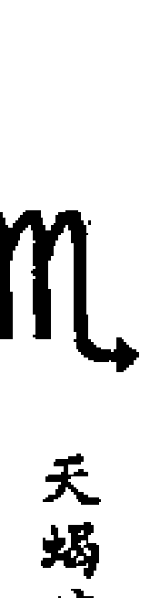

### 冥王星—水星

这两颗行星相合的影响会提高人的智能，增强事业心，或者使人有喜欢作对的性情。此三种趋向如何出现，将取决于该相合所在黄道宫的具体情况以及出生星位所在星座的性质。

受冥王星与水星相合影响的人兴趣广泛，个人受益的机遇较多，喜欢观察分析事物，探求其本质，寻找能使人更快前进的动力因素。批评精神较为突出，喜欢宣传或虚张声势。

冥王星与水星相合或呈三分方位的影响有利于智力与艺术创作能力的发展，而冥王星与水星相冲或呈四分方位的影响，则会使人产生特殊的道德观念，头脑过于灵活，善用心机。

### 冥王星—金星

在出生天宫图中，这两颗行星相合的影响可能产生神秘且令人不安的魔力；也可能在爱情、物质生活和生命之间引发冲突。这主要取决于人出生时，该行星相合所在黄道宫的具体情况。尤其在爱情生活方面，冥王星的影响会带给金星更神秘的一面，那就是性爱的欲望。

冥王星与金星相冲或呈四分方位的影响，有可能使人在感情方面产生变态心理或迷恋巫术。如果出生天宫图中的行星位形和谐的话，那么，这两颗行星相合或呈三分方位的影响，会赋予人试图通过新奇的形状、颜色或线条进行艺术表现的先锋派创作灵感。

### 冥王星—火星

冥王星与火星相合对人的影响是突出好斗的心理、权力欲和破旧立新的愿望。如果出生天宫图其余部分的行星方位和谐的话，那么，这两颗行星相合或呈三分方位的影响能增强人奋斗的勇气和决心，有助于开拓成功之路。

冥王星与火星相冲或呈四分方位的影响会使人产生焦虑不安的情绪或犯罪感，进而发展成一种真正的神经质。

### 冥王星—木星

冥王星与木星相合的影响会使人具有乐观情绪，有助于事业的发展。特别是当这一相合发生在出生星位或中天附近，情况更是如此。它会增强人们对生活的信心和对自由的向往。

冥王星与木星相合及其和谐的方位的影响会使人对大自然有特殊的感情，富有幽默感，有结识朋友和助人为乐的愿望，这些是他保持朝气蓬勃的动力。

钱会奇迹般地到来，冥王星或木星在黄道第一宫、第七宫或第十宫时，会有意想不到的机遇。

冥王星与木星相冲或呈四分方位的影响，容易使人走极端和产生通过钱和贿赂来寻求权力的欲望。

### 冥王星—土星

冥王星与土星相合仅在1914～1915年、1946年底～1948年以及1982～1983年出生者的出生天宫图中出现过。由于这一相合间隔的时间长，所以只有当它发生在出生星位或中天附近，或者出生星位或几颗行星在摩羯座或宝瓶座时才会产生真正的影响。

冥王星与土星相合的影响会使人具有极强的责任心和义务感，或者喜欢自我反省。这种反省常会导致病态心理的滋生，但也有助于更好地自我完善。总之，这一星位带给人的是严谨的生活态度和克己的精神，而不是追求个人的享乐。

冥王星与土星相冲或呈四分方位的影响会增加人的孤独感，很难与人和睦相处，除非出生天宫图中其余部分的行星方位是和谐的，方可得到改善。此外，还会使人对神秘学有格外的兴趣。

### 冥王星—天王星

冥王星与天王星相合的时间间隔相当长，人的一生中不可能遇到第二次。这两颗行星最后一次相合是1965～1966年在室女座发生的，它对1962年年中～1970年初出生的孩子有举足轻重的影响。在其出生天宫图中，如果该相合是发生在他们出生星位或中天附近，或者太阳、月亮或几颗行星在室女座的话，那么，他们未来会大有作为。

### ♏ 你的星辰对应备忘录

- 欲望强烈的天蝎座人常说：“我需要。”
- 你的主宰行星：冥王星。
- 你的关键词：顽强、耐力、吸引力、生机、好斗性、神秘、破坏性、性爱、复仇心理、改革精神、激情。
- 你求爱的方式：错综复杂的。
- 你是一个：欲望强烈的人。
- 你渴望：能经得起你嫉妒心考验的爱人。
- 你受骗：由于过分的自信和喜欢复杂化。
- 你喜欢：珍稀物品。
- 你害怕：上当受骗。
- 你寻找：珍稀物品。
- 你的弱点：潜在的心理危机。
- 你的动力：极端和欲望。
- 你的优势：毅力。
- 你的劣势：破坏性。
- 你身体的脆弱点：生殖泌尿器官。
- 你的假日生活：在家整理内物或修修补补。
- 你的开支：得不偿失的事情。
- 你的服饰：性感、新奇的皮革或天鹅绒时装，佩戴护身符。
- 你的吉祥物：龙。
- 你的吉日：星期二。
- 你的幸运数字：4、10、13、21。
- 你的幸运金属：铁。
- 你的幸运色：红色、黑色、暗绿色。
- 你的幸运花：欧洲夹竹桃。
- 你的幸运石：珊瑚、黄玉。
- 你的吉祥动物：地下或滞水中生活的动物。
- 你的吉祥植物：红辣椒、辣根菜、苦艾、杏树、桃树、椰子树、雪松、柏、黄杨、鸡冠花、龙胆、水仙、罗勒。
- 你的保健食品：大蒜、菠菜、欧芹、水田芥、白菜、大椒、洋葱、胡萝卜、杏仁、椰枣、玉米、烤鱼烤肉、奶酪、橄榄油和粮食。
- 你喜欢的礼物：鳄鱼皮包、非洲乌木雕、工具、相机、红外线望远镜、侦探和恐怖小说。
- 有益于你的场所：隐秘之处、葡萄园、娱乐场所、超豪华宾馆、有山泉的地方和温泉疗养区。
- 适合于你的住所：房间隐秘且富有神秘色彩，带有暗抽屉的老式家具。
- 你的幸运旅游地：阿尔及利亚、摩洛哥、挪威、越南、俄罗斯、波兰、叙利亚；夏威夷群岛、柏林、迈阿密[美国]、马赛[法国]、孟买[印度]、马尼拉[菲律宾]。
- 你的理想职业选择：警察、侦探、科研工作者、外科医生、军人、政治家，工程师、雕塑家，以及与金融、财经、神秘学、心理学、精神分析、犯罪学、冶金、石油或火山有关的职业。
- 与你亲和的星座：双鱼座、巨蟹座、室女座和摩羯座。与金牛座互补。

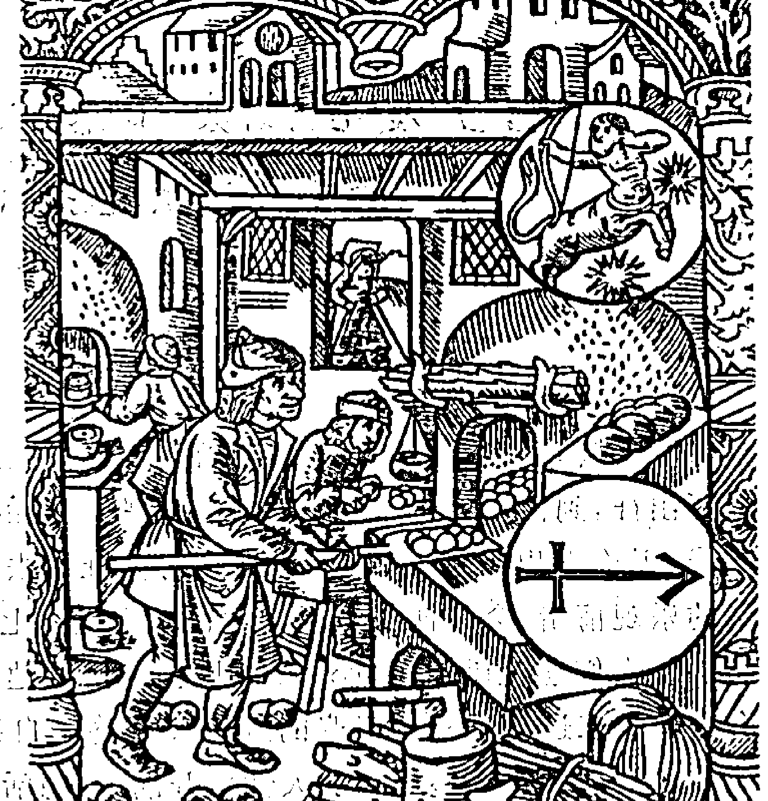

### 人马座

> “不要要求事情像你所希望的那样到来，而应该像它们到来那样希望之，这样你将是幸福的。”
> 
> ——爱比克泰德

### 出生星位或太阳在人马座人的基本性格趋向

踮着脚，贪婪地呼吸着大自然的自由空气，人马座的人已急不可待地要出征，到他渴望的广阔天地里去驰骋。他的目光永远朝向远方的地平线，无论思想还是在行动上，他随时都准备去冒险。对人生、未来和爱情的乐观情绪，会使他永葆青春。在人生道路上，他所做的一切努力都是为了使人们摆脱困境。此外，乐观主义精神、健康的体魄和快乐的情绪，会给他带来运气和赢得普遍的好感。他善于自勉，激励周围的人并振奋他们的精神。人马座出生的人性格开朗，思想活跃，同时又是个放眼世界者。虽然他人在现实生活中，但思想常常飞向遥远的过去和美好的未来。敏捷的思维跳跃着，一会儿在这儿，一会儿又在那儿。使人觉得他近在眼前，又仿佛远在天边；既觉得与他志同道合，又仿佛与他格格不入。这是个思想需要设法平静的人。

一般来讲，人马座的人对世界上发生的一切事情都有浓厚的兴趣。喜欢外出旅行，好友善交，特别关心歌坛和影坛上的新闻轶事，喜欢颇有见地地发表高论。他热情好客，和蔼可亲，为人忠厚以及豁达的性格，深受人们的称赞。与人共事富有合作精神，对生活与事业怀着本能的理想主义，这将成为鼓舞自己和周围人团结奋进的动力，并能为人际关系的融合增添和谐的气氛。

人马座的人热情洋溢，对生活充满激情。他从不计较个人得失，喜欢同时投身到许多事情当中去，但轻率的行为往往会给他带来烦恼。深孚众望，宽宏大量，但不希望别人威胁和干涉他的神圣自由。他讨厌义务，宁愿抛弃既得利益，也不肯为之束缚。喜欢家中经常高朋满座，并尽己所能帮助他们。他会因此结识许多社会上有影响的人物，在生活和事业上得到其支持或保护。他的命运往往与国外或旅行有不解之缘，由此会给他带来运气、友谊和利益。即使在不利情况下，乐观情绪也永远不会背叛他，并能帮助他比别人都快地摆脱困境，这是人马座人性格上特有的一大优势。

在经历了动荡不定的谋生和职业尝试后，从40岁起，人马座的人一般都会步入正常的生活轨道。安居乐业，成为受人尊敬的公民，家庭中模范的父亲(母亲)，或者某项事业的带头人或领导人。荣誉在他们的心目中占有十分重要的地位。

人生的中年阶段是人马座人事业上的黄金时期，他有足够的能力和机遇去赢得成功。然而，机会主义，因循守旧，盲目乐观以及做事很少顾及他人和自己的能限，会引起人们的不满。

出生在人马座的著名人士有：贝多芬、希拉克（法国前总统）、柏辽兹（法国作曲家）、诺斯特拉达穆斯（法国预言家）、福楼拜（法国作家）。

### 男性：性格、情感和爱情生活

热情、乐观，总是满怀巨大的热忱。无论情感、思想还是旅行方面，他的目光总是朝向新的地平线，向往遥远的国度。

独立精神强，喜欢我行我素，不愿受别人的约束。感情丰富，心中很早就燃起爱情的火花，但由于把握不好往往会错过良机。但这无关大局，还有更理想的选择在等待着他。人生会机遇横生，不过真正吸引他的不是儿女情长和性爱的欢乐，而是远大的目标、政坛、社交和荣誉。他对所喜欢的人十分慷慨，并希望他身边的每个人都能满意和幸福。

当他上年纪的时候，会产生一种强烈的家庭和社会感。他喜欢出点子，喜欢安排家人的生活，同时又尊重每个人的独立性和他们完全的行动自由。如果家庭生活是幸福和满意的，那么他的感情也是忠贞不渝的。
他喜欢凡事来龙去脉都一清二楚，不喜欢含糊其辞和模棱两可。

人马座男性的性欲表现奇特、急促、强劲和热烈。但一般来讲，该星座的男性很少把性爱看得举足轻重，更多的精力是放在社交、荣誉以及考虑大的计划和设想方面。

出生星位在双子座的女性会用她快乐的性格和迷人的风韵赢得他的好感。如果他们结合，生活将充满生机和活力，并且会经常外出旅行。

白羊座的女性和他有同样的激情，他们的结合有助于成就大事业。

狮子座的女性与他一样待人宽厚，他们对生活和事业有着共同的追求。

与过分认真和深居简出的室女座女性性格上存在着差异；双鱼座女性不受约束的性格会使他感到不快。

### 女性：性格、情感和爱情生活

天性十足，犹如一阵清新的风，一种无法抑制的活力和一股奔向自由的激情，这就是人马座的女性。她是思想单纯、爱好体育运动，内心永远年轻和充满欢乐的少女。她的心总是向往着纯洁无瑕而又简单明了的爱情。与人马座的男性一样，她不愿意受到任何约束。

在度过了自由自在、无忧无虑的独身生活之后，一旦她建立了家庭，将会成为一个贤妻良母和家庭生活的中流砥柱。她需要得到别人的尊重，她的工作希望得到赞赏和好评。她既关心丈夫和孩子们的幸福，又懂得如何尊重他们各自的独立性。

她是个情感温度呈不规则变化的女性，有时，性爱的欲望会变成强烈而神秘的激情。她需要不断升华自己的爱情，需要赋予它新的意境。

- 与出生星位在双子座的男性结为伴侣，他们的家庭生活将充满生机。
- 与激情满怀的白羊座男性或热情洋溢的狮子座的男性相逢，会相处得和谐融洽。
- 与过于谨小慎微的室女座男性缺少亲和力，其批评精神会使她感到厌烦。

### 孩子：教育和职业选择的可能性

笑容可掬，生机勃勃，十分容易冲动，人马座的孩子需要自由、户外和欢乐。骑马、骑摩托、滑雪、坐小艇去探险，或者到遥远的国度去旅行都是他的最爱。

他的突出优点是忠诚和独立精神。如果人们能正确对待和理解他，他会表现得非常通情达理，而且完全可以信赖。但是，如果强迫他，就会使他走向反面，变得十分虚伪。

一般地说，外面的世界要比学习更能吸引他。人马座的孩子特别有语言天赋。他总是向往着遥远的地方，国外和旅行将是他命运中不可分割的一部分。他喜欢随心所欲的生活方式或职业，而不愿意把自己锁在条条框框之中。此外，他喜欢能给自己带来荣誉和尊敬的职位。

人马座孩子的理想择业方向是：医生、记者、法官、旅行推销员，与军人生活、法律、教育、驻外机构、进出口贸易、社会福利事业、出版，以及与马有关的职业或者自由职业。

## 人马座三个10°区出生人的性格

### 人马座第一个 10°区

0°～9°59′(即出生日期为11月23日～12月1日)
待人宽厚，思想和行动绝对独立，他的言行对别人有较大的影响力。有独创性，但有时想法怪诞或者做事不合常理。这一10°区出生的人可能有两种发展趋向：一是由于他的勇敢和酷爱自由而成为成功的探险家或旅行家。另一方面是追求理想，为社会、哲学或宗教事业奋斗终生。
他的动力：独立精神。

### 人马座第二个 10°区

10°～19°59′(即出生日期为12月2日～11日)
性情率直、坦率、倔强。情绪变化的幅度较大，骤然间会达到沸腾的顶点，也会跌落到失望的深渊。他时刻都准备踏上先驱者的征途，去探索和冒险。无论在工作上还是生活上，他总是处于高度紧张状态。他巨大的能量会把周围的人，乃至于他本人搞得精疲力竭。头脑中总有很多点子。做事干净利落，这是他事业成功的保证。

他的动力：热情。

### 人马座第三个 10°区

20°～29°59′（即出生日期为 12 月 12 日～21 日）

具有令人愉快的性格，真诚可靠，同情心强。精神和智力天赋极为突出，其灵感能达到远见卓识的程度。这一 10°区出生人的另一特点是意志坚强和富有独立精神，在体育和所从事的事业方面会成绩斐然。善于赢得人们的好感。感情真诚而热烈，没有友谊或爱情就无法生活。

他的动力：灵感。

## 不同出生星位人马座人的性格、爱情选择和常见疾病

### 太阳在人马座和出生星位在白羊座

十分自信，总是被奔放的热情所驱使，盲目地走向冒险之路。他渴望发现“新大陆”，认识新世界或有所发明创造，迷恋冒险性的远征。胸怀宽广，正义感强，时刻准备急人之难，但过于坦诚和轻率可能会给他带来烦恼。爱情方面，敢于表白和大胆追求。

出生星位在天秤座或月亮在人马座、白羊座或狮子座的人会把爱情的温暖送进他的心田。

这一星位出生的人身体素质较好，骨折、风湿痛和耳病常见。应注意饮食卫生以免引起意外事件。

### 太阳在人马座和出生星位在金牛座

心地善良，看待人和事总是着眼于好的方面，喜欢节日气氛和娱乐活动。对大自然怀有深厚的感情，户外是他理想的生活天地。助人为乐，喜欢身边有许多朋友，能经常一起品尝美食佳肴。

出生星位在天蝎座、太阳在金牛座或月亮在人马座的人与他性情相投。

这一星位出生的人精力充沛，慢性胃肠功能紊乱、肾病和外伤常见。

## 太阳在人马座和出生星位在双子座

双重人格，既充满朝气又潜在着不稳定性。喜欢按照适合自己的节奏，在充满矛盾的思想状态下生活。风度翩翩，无所不知，喜欢参与其事，但从不认真对待。一点烦恼或单调无味就会使他感到坐立不安。对世间所发生的一切充满无法抑制的好奇心，这是他生活必不可少的动力因素。经常不遵守诺言，尤其会表现在爱情方面，因为这是个情感反应比较复杂的人。

与出生星位或月亮在人马座，太阳在双子座的人结合会相处融洽。

这一星位出生的人需要特别注意肝脏，胃肠功能紊乱常见。

## 太阳在人马座和出生星位在巨蟹座

忠厚正直，心地善良，不愿意受传统习惯和纪律的束缚。性情飘忽不定，随心所欲，充满幻想，年轻时表现得尤为明显。人生贯穿着许多变化不定的事，会使他产生不安全感。他用想象、旅行或创作来逃避平淡无奇的生活。他既需要有坚实感情基础和充满爱的家庭，又希望保持个人行动的自由。

出生星位在摩羯座、太阳在巨蟹座或月亮在人马座的人应该是他寻觅的知音。

这一星位出生的人胃和肝是身体的脆弱点，精神抑郁常见。

## 太阳在人马座和出生星位在狮子座

热情、宽厚的性格使人感到欢心，人们喜欢与他交往。内心总是燃烧着激情，憧憬崇高的事业和真挚的爱情，但同时也不会忽略热爱自由的天性。不时显露出高傲的气质，善于赢得别人的好感和帮助。此外，他仰慕英雄，喜欢被人恭维和赞扬。

出生星位在宝瓶座、月亮在人马座或太阳在狮子座或白羊座的人，会使他对美好爱情的向往变成现实。

这一星位出生的人胃肠功能紊乱、关节痛和骨折（尤其是股骨）常见。

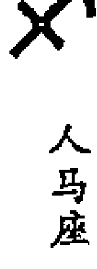

## 太阳在人马座和出生星位在室女座

具有很强的职业和道德意识，但思想过于保守和犹豫不决。目光敏锐，现实感强，善于谋利，但得到的利益常常被他人所用。渴望理想的爱情，但实际行动令人捉摸不定。过分的深思熟虑和权衡利弊，使他在感情上容易犯自我禁锢、贻误良机的错误。

出生星位在双鱼座、月亮在人马座或太阳在室女座的人会把他带入美好的爱情生活。

这一星位出生的人骨病、静脉曲张和肥胖症常见。要注意代谢系统的变化，合理膳食。

## 太阳在人马座和出生星位在天秤座

这是个美学鉴赏家或艺术家，他热爱和追求美好的一切。彬彬有礼，和蔼可亲。具有外交家的才干，能使人们异口同声地对他的意见或观点表示赞同。善良之心会使他走向多愁善感。实际上，他喜欢随心所欲地生活，常寄厚望于运气。

出生星位在白羊座、太阳在天秤座或月亮在人马座的人会成为他幸福生活的可靠保证。

这一星位出生的人精力充沛，但往往不善于合理应用。肝、肾功能紊乱和股骨骨折常见。

## 太阳在人马座和出生星位在天蝎座

富有魅力，但经常接触会感到他令人生畏。足智多谋，极善于利用别人的弱点。他在强烈的信念下生活，总希望超越自己并超过别人。过分慷慨或冒险的欲望，有可能使之处于困难的境地。一点点激情的火花就会使他兴奋不已。另外，如果出生天宫图其余部分的行星方位明示的话，他还有可能产生极大的虔诚之心，或者转向神秘主义之路。

出生星位在金牛座、月亮在人马座或者太阳在天蝎座的人会使他的生活充满幸福和欢乐。

这一星位出生的人肝功能紊乱、呼吸道感染和股骨骨折常见。

## 太阳和出生星位都在人马座

性格宽厚、真诚并富乐观主义精神。热爱生活和珍视友情，他既是个富有同情心又喜欢独立自主的人。这一星位可能会产生两种类型的人：一种是渴望冒险的旅行家，另一种是思想总在精神、哲学或宗教领域徘徊的人。无论属于哪一种人都会机遇横生，爱情和社会生活方面的成功令人瞩目。

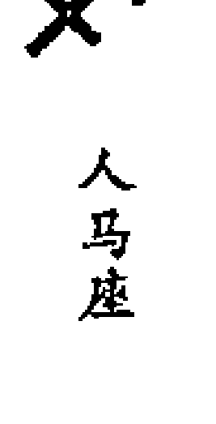

出生星位在双子座，太阳或月亮在人马座、白羊座或狮子座的人会使他的生活充满幸福。

这一星位出生的人精力充沛，但不会合理膳食。神经痛、糖尿病、肝功能不佳、呼吸道疾病以及四肢外伤常见。

## 太阳在人马座和出生星位在摩羯座

探索精神支配着他的一切行动，指导他去实现理想，或为某种信念而奋斗。率直而谨慎的性格可能会使他的爱情生活受到影响或不能如期而至。进取心强，为了工作和事业能达到忘我的程度。但是，如果出生天宫图中有不和谐的土星方位的影响，则可能产生非常惧怕失败的心理。

与出生星位在巨蟹座、月亮在人马座或太阳在摩羯座的人性情相投，会和睦相处。

这一星位出生的人身体素质较好，但精神状态不稳定，时而心情郁闷，时而情绪高涨，经常需要精神分析学家的帮助。

## 太阳在人马座和出生星位在宝瓶座

按照时代的脚步，甚至超越时代的脚步生活。性情乐观，视野开阔，大公无私，总是被渴望自由或创新的强大力量所驱使。无论思想还是情感上都不愿受任何束缚。他的心无时无刻不梦想着从事冒险事业或到遥远的国度去，寻找自己人生的价值和意义。意外的机遇或奇特的姻缘会决定他未来的命运，而且能改变他人生道路的进程。

与出生星位在狮子座、月亮在人马座或太阳在宝瓶座的人性情相投，会和睦相处。

这一星位出生的人容易精神抑郁，呼吸道疾病、糖尿病、肥胖症、痔疮，以及代谢紊乱常见。

## 太阳在人马座和出生星位在双鱼座

天真无瑕，缺少现实感。满怀真心诚意，但很难充分表现出来。常通过幻想，有时甚至酗酒和吸毒来达到逃避现实的目的。喜欢自由自在地生活，运气总是在关键时刻帮助他摆脱困境。爱情生活是奇特或富有浪漫色彩的。

出生星位在室女座、太阳在双鱼座或月亮在人马座的人与他性情相投，他们的生活充满奇特而浪漫的色彩。

这一星位出生的人呼吸道疾病、胸膜炎、哮喘、疝和骨折常见。

### 人马座人与其他星座人的情感和谐

#### 人马座的人与人马座的人

两个均为人马座出生的人结为夫妻是不多见的，除非一方愿意放弃自己的性格。在大多数情况下，这种结合经受不住岁月的考验，很快就会由于各自表现出的不能容忍而导致夫妻关系的紧张。双方都热衷于永无休止地在外面奔波，很少见面，性冲动缺乏同步性。

#### 人马座的人与摩羯座的人

人马座的人说话喜欢夸张，摩羯座人会增强他纯朴严谨的作风。他们以好奇的目光互相打量，仿佛彼此来自不同的星球。正是这个原因，他们很少考虑建立共同的小天地。如果真的携起爱情之手，则是因为他们相互出生天宫图中存在着和谐因素的影响，他们的婚姻将是十分完美的。

#### 人马座的人与宝瓶座的人

这两个星座人的爱情之舟将会扬起多彩的波澜，一个属传统型，另一个充满绝对的现代意识。彼此会产生好感，并对对方的一切怀有浓厚的兴趣。他们的性爱生活将会沐浴在多姿多彩的意境中。

#### 人马座的人与双鱼座的人

这两个星座人的结合往往出于哲学和宗教的观念。双鱼座人认为人马座人过于好斗，人马座人则觉得双鱼座人捉摸不定，反复的努力会使他们感到筋疲力尽和失去信心。人马座的人不喜欢有人逃避他爱的表示，并认为这是对他的一种羞辱。

> 注：这些和谐关系的描述仅仅是针对人出生时太阳星座的单纯影响所作的理论分析，并不是绝对的。实际上，决定两个人和谐关系的还有另一个重要参数，那就是出生星位。例如，仅从出生时太阳星座的影响来看，由于性格的差异，人马座与双鱼座的人是不和谐的。但是如果人马座人的出生星位在水类星座（巨蟹座、天蝎座和双鱼座），或者双鱼座人的出生星位在火类星座（白羊座、狮子座和人马座），那么，他们会相处融洽。出生天宫图中金星和火星的影响是衡量性爱和谐与否的基本参数。

## 人马座人如何根据自己星座的特点关爱身体、保健和美容

人马座对应胯部、臀部、坐骨神经、肝脏和胃，正因为如此，这一星座出生的人要注意防止风湿、坐骨神经痛、痛风、糖尿病、器官脂肪变形。

一般来讲，人马座出生的人具有良好的身体素质，他需要通过运动来消除体内多余的能量。骑马、骑摩托、打高尔夫球和野营，是他保持健美体魄的最好办法。他是一个好猎手，但很少忍心猎杀动物，只是在郊游的时候，为了助兴偶尔放上几枪。农村和森林中的任何体育活动，都有助于这一星座人的身心平衡和健美。

人马座的人要尽量避免吃太丰盛的食物，因为如果他的肝功不太好的话（肝是人马座人身体的敏感点），美味佳肴会直接影响他的情绪，使其变得郁郁寡欢。只有乐观和欢快的环境气氛，才能使他的性格开朗起来。

为了保持良好的身体，人马座的人要养成在丰盛的饮食之后，吃些清淡食物的习惯，或少餐一顿。经常到户外散步或活动，可避免中年以后出现肝、胆疾病和体态过于丰腴带来的烦恼。

人马座的人应该常吃水煮蔬菜，捞出后淋干，拌黄油并加调味汁或直接凉拌，米饭配土豆，以及选用熟透的水果做甜食，这样的饮食有助于振作精神。饭后可喝些薄荷茶。

人马座人的身体需要补铁，最好多吃深绿色叶子的蔬菜。欧芹、扁豆、杏、杏仁及草莓等都很适合该星座的人。同时，还要补钠，以排除体内的尿酸和加强血液循环。多叶蓍、车叶草、木贼、桦树叶、萝卜、覆盆子、欧洲越橘和鱼等，都有助于钠的补充。

人马座的人经常坐骨神经痛或胯部不适。

人马座人的保健植物是鼠尾草，又名“救命草”，古人把它看成是圣草。它有助于消化、调节体循环和清肝利肾的作用。

人马座的人睡觉的时候最好将双腿抬得稍高些，这样有助于血液循环，使末梢循环得到改善。此外，可不时地做做水疗或到森林中去散步，这对肝脏是很有好处的。

人马座的人要养成吃蒲公英沙拉的习惯，这种植物对肝、胆有好处。吃肉和沙拉时最好能在上面加些生洋葱末。另外，还要多吃朝鲜蓟、生白菜和生胡萝卜。

水果最好吃熟透些的，可生吃或煮吃。樱桃、草莓、李子、欧洲越橘和柚子都很适合人马座的人食用。

人马座的人保持容光焕发的最好办法是呼吸大自然的清新空气。经常到森林中去散步和接触大自然的景色，能使他的精神重新振奋，心情舒展，从而可保持精神和身体的良好平衡，以及面色的红润。人马座的人必须释放掉体内多余的能量，他的性格属外向型，情绪是无法掩饰的。

他面色的好坏与肝和胃肠功能有直接关系。多参加户外活动，会使人马座的人保持好的气色，但对皮肤不太有利。他应该经常喷洒金缕梅香水，以避免酒糟鼻。这一星座的人适合用鼠尾草、多叶蓍、金丝桃或洋甘菊等植物成分的润肤乳液。人马座的男性常有过早脱发的现象。

木瓜对人马座人的皮肤有特殊滋润效果：可用新鲜木瓜的果肉清洗皮肤，除去汗毛孔中的污垢。因为它的效力很强，所以擦的时间切勿过长（10分钟以内为宜），而后用有滋养作用的润肤霜。

人马座的人宜选用以紫罗兰、香子兰、薰衣草或黄葵为主要成分的香水。

## 人马座人的情趣和喜欢的礼物

人马座的人喜欢旅游、到未知的领域去探索。因此，选送礼物时要优先考虑旅游用品，如旅行背包、异国的旅游纪念品、旅游鞋、厚运动服、T恤衫、和服、数码相机、摄像机、美国西部牛仔帽、马具等。喜欢电影广告画、招贴画、异国风情版画等。体育方面，喜欢网球、高尔夫球、乒乓球、马球和骑马。喜欢旅游指南、马术、地理、地图、体育、医学、宗教和哲学方面的书以及喜剧性的中篇小说。最喜欢的金、具有异国风格或镶蓝宝石的首饰。欣赏古典音乐、宗教音乐和摇滚乐。爱用异国香水。

人马座的孩子喜欢电子游戏、打电动弹子，乒乓球、滑板、飞机和汽车模型、冲浪板，以及一切滑稽可笑的小玩意儿。

## 太阳和木星的方位与人马座人的物质生活趋向

### 太阳在人马座和木星在白羊座

敢于奋进、发现和去争取胜利。无论在思想还是物质实现方面，都是一个毫不逊色的开拓者。生活宽裕，有一定的物质基础。收入主要来自旅游和投资。如果出生天宫图中火星与木星或太阳呈不和谐方位，事业上有可能受挫。

### 太阳在人马座和木星在金牛座

如果没有土星与太阳或木星呈不和谐方位所带来不利影响的话，金星和木星的组合表明，这一星位出生的人是幸运儿。事业上会有所成就，物质生活条件会应运而变。人生旅途会有机遇和热心相助的朋友为伴。

### 太阳在人马座和木星在双子座

所有涉及钱财的问题上都缺乏审慎的态度。喜欢冒险和孤注一掷，结果多半落空。应很好保护自己的物质所得。

### 太阳在人马座和木星在巨蟹座

在这一行星方位上木星的影响力增强，有可能使该星位出生的人身居要位，有较好的生活条件和赢得荣誉，尤其在出生天宫图中，太阳或木星在黄道第一宫、第二宫或第十宫的情况下。不过，大量的开销也将随之而来。

### 太阳在人马座和木星在狮子座

出生天宫图中的这一行星方位，无论对事业的发展还是物质生活建设都是极其有利的。地位和收入令人羡慕，经济条件宽裕，不时可享受一下高消费的生活。

### 太阳在人马座和木星在室女座

对事业和理想的追求要比对个人利益得失更有兴趣，满足于一般的生活水平，从不好高骛远。物质方面利益，不善于发掘自己可能的潜力。

### 太阳在人马座和木星在天秤座

相信运气，实际上运气有时也真的会帮助他。朋友、爱情在他的命运中起主要作用，甚至有助于其物质生活的发展，尤其是出生天宫图中金星在人马座的情况下。

### 太阳在人马座和木星在天蝎座

喜欢冒险和消费。如果出生天宫图中有火星与木星或太阳呈不和谐方位的影响，那么将是灾难性的；如果木星的方位十分和谐，则有助于在医学、心理学、哲学、研究工作或神秘学方面施展才华。

### 太阳和木星都在人马座

如果出生天宫图中太阳与木星相合，则意味着人生有好运相伴。乐观宽厚的性格以及对生活的热爱会使他受益匪浅。钱来得容易去得痛快。在国外或通过国外，可得到荣誉和经济利益。如果不注意节俭，会使财富付之东流。

### 太阳在人马座和木星在摩羯座

物质条件的限制会影响他的发展或不利于才能的施展。有强烈的责任感和奋发图强的精神，优裕的生活条件要较晚才能实现。

### 太阳在人马座和木星在宝瓶座

视野开阔，大公无私，精神追求高于物质享受。意想不到的机遇或朋友的帮助将有利于其物质生活的改善和发展。

### 太阳在人马座和木星在双鱼座

物质生活不大稳定，得过且过。常有朋友相助。生活上容易铺张浪费。

### 把握好木星主宰下的自我

人马座的主宰行星是木星。当木星位于出生星位或中天附近，或有几颗行星在人马座时，对出生者的壮年时期（尤其是36~46岁）的影响较大。这是一颗象征运气和施展才华的行星，在出生天宫图中，它代表人生道路上的有利时机。木星的影响能造就伟大的人物，能使人干大事业或担任重要职务。但是，其影响也容易使人盲目乐观和行动过激而将一切都付之东流。

受木星影响的人对木星12年的周期节律比较敏感，例如当年龄在23~24岁，34~35岁，45~46岁，56~57岁，66~67岁，以及77~78岁时，一般地说，他的人生道路上都会有一个幸运的转机。

木星代表发展、繁荣和昌盛，这是一个有助于人生顺利发展的保护因素，它会使人们的生活进入紧张的快节奏。木星对人的影响主要表现是仁慈、正义和荣誉感，喜欢变换生活环境、喜欢旅行。

木星的影响力在巨蟹座增强，在人马座最强，在摩羯座减弱，在双子座最弱。传统西方星辰学认为，木星是能产生有利影响的吉星。

### 木星—太阳

这是个象征着幸运和成功的行星方位。木星与太阳相合以及这两颗行星互呈和谐方位的影响有助于人事业上的成功；不和谐的太阳与木星方位影响容易使人产生骄傲自大的情绪。

木星与太阳相合或呈三分方位的影响易使人精力过剩或具有乐天派的性格，有助于爱情、事业和物质利益的顺利发展。它还会使人找到理想的职业，受到有社会地位的朋友和有利时机的关照，走上成功之路。

受木星和太阳相合影响的人不喜欢别人对他视而不见，或轻视他的作用。十分自信，威风凛凛，对能真正理解他的人总是抱有好感。

木星与太阳相合对男性及其社会生活所产生的多半是表面的影响，而对于女性则常常预示着圆满的婚姻，或与某知名人士的结合。

不和谐的木星与太阳方位的影响易使人虚荣心过强，为了达到目的不遗余力，这样既损坏了身体又失去了赚钱的资本。

### 木星—月亮

木星与月亮相合象征成功与幸运。如果在出生天宫图中没有不和谐行星方位的干扰，那么人生趋于一帆风顺，甚少波折和坎坷。

木星与月亮相合是生活欢乐、性情温柔、心地善良、偏爱美食的影响因素。这一相合的影响会强化人的社会生活，赢得友谊和挚爱。如果木星与月亮之间的方位不和谐，会突出人挥霍浪费，尤其是虚荣心强的性格侧面。此外，还会表现出懒散、缺乏可信度，以及引起家庭生活的纠纷。

木星与月亮相合及其和谐方位的影响，对演员和从事影视工作的人是极其有利的，会使他们赢得观众的普遍好感与青睐。

木星与月亮方位对家庭生活的幸福与否影响较大，特别是对于女性。而对于男性而言，木星与月亮呈和谐方位的影响，能增加他们的魅力及与受木星影响的女性建立纯真友情的机遇。

### 木星—水星

如果出生天宫图中有木星与水星的相合将是十分难得的，因为其影响既能开阔人的思想境界，又能赋予人看事物多着眼于积极方面的乐观态度。正因为如此，即使在最坏和最悲观的情况下，受木星与水星相合影响的人，也能保持饱满的精神状态和对困难充满必胜的信心。

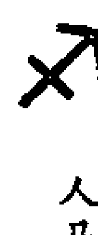

木星与水星相合或呈三分方位的影响，会使人具有出色的理解和表达能力。对于从事语言表达和文字工作的人，这是一个极好的行星方位。同时，也有助于从事商业、管理和经济工作的人事业上的成功。但如果出生天宫图中没有更富活力的其它行星方位影响的话，它也无法赋予人很强的信念和毅力，以及平静的生活空间。

这两颗行星相冲或呈四分方位的影响容易使人目光短浅，或者遇事优柔寡断，在复杂的情况下往往束手无策。由于缺乏坚强的意志，容易错过良机，处于不被人注意的默默无闻之中。但无论任何境遇，他从不悲观失望和怨天尤人。

### 木星—金星

如果出生天宫图中有这两颗能产生有利影响的行星相合，则意味着万事如意，生活绚丽多彩，事业兴旺发达和前程似锦。受木星与金星相合影响的人需要欢乐和众人的青睐。温文尔雅和彬彬有礼的性格会博得人们的好感。一般地说，婚姻是幸福的，并会成为他的成功之本。

然而，这一相合所带来的得天独厚的运气，往往会使人养成好逸恶劳的习惯。如果出生天宫图中没有更充满活力的行星影响，那么这一不良习惯将趋于加重。

木星与金星相冲或呈四分方位的影响会导致过分追求享乐，如果出生天宫图中还有其他不和谐的因素影响，则会使人大手大脚到不可理喻的地步。忠诚方面不要对他期望过高，善于投人所好，但常常都是夹杂着个人的利益问题。

和谐的木星与金星方位的影响有助于在艺术、影视或时装设计等方面取得成功。

### 木星—火星

木星与火星每两年相合一次，大约每35年在同一星座中相合一次。在出生天宫图中，其影响力是非常强的，能赋予人激昂的热情和不顾一切勇往直前的勇气，引导得当可变成一股巨大的制胜力。这一行星方位的影响会使人具有永不走中庸之道的性格。

据统计，木星和火星的方位常常造就出企业家、军事家、运动员和生来就想建功立业的人。

如果这两颗行星相合方位欠佳或呈不和谐方位，则会表现出易怒和易冲动的性格特征。唐突从事；漏洞百出，希望得到的多多益善，付出的越少越好；常常把自己当做坏靶子。这是一种碌碌无为，不时用冲动扰乱自己平静生活的人。

和谐的木星与火星方位的影响会赋予人理智的激情，可使人饱尝生活的甘露。

### 木星—土星

木星与土星相合能对个人的幸福产生约束性的影响，激发人最强烈的奋斗精神，同时，也会使人产生哲学和宗教意识。如果这一相合是发生在中天或出生星位附近，那么，它的影响力将是很大的。这一星位能使人具有坦率的性格，自制能力，组织观念，毫不利己和助人为乐的精神。如果出生天宫图中没有关于成功因素的显示，木星、太阳和月亮之间的方位不和谐，或者只有一颗行星在黄道第十宫中，那么上述品格对他人比对己更有利。成功往往是在困难的条件下或经过艰苦的努力才能取得，甚至有时会牺牲个人的利益。

不和谐的木星与土星方位的影响会使人产生自我意识或忧伤情绪，缺乏生活热情，即便在优裕的条件下亦感到生活不幸福。人生中，这种心理障碍要很长时间才能消失。

和谐的木星与土星方位的影响会增加人的智慧和才能，这将有助于他事业的成功和物质财富（尤其房地产、投资、遗产或家庭财富）的扩大。

### 木星—天王星

木星与天王星相合的影响会造就出天才和知名人士，但也会使人变得固执和桀骜不驯。受这一星位影响的人喜欢按自己的方式生活，不愿受传统观念的束缚。一旦他选定了自己的方向，会坚定不移地走下去，热情能帮助他成就大事业。如果出生天宫图其余部分的行星方位明确显示的话，有可能在政治生活或某企业中发挥突出的作用。

这两颗行星相合的影响还会赋予人创新精神，尤其表现在文学、艺术、精神领域、实际生活或探索方面。然而，过分的独立精神或不慎重的坦诚，将不利于他取得持久的利益。

和谐的木星与天王星方位的影响会突出人坚强、刚毅的性格，视野开阔。

## 木星-海王星
木星与海王星相合的影响会使人性情温和，喜欢自由自在地生活。幻想会把他引向现实生活之外的空间。对人生道路上的困难或障碍不以为然，并总能得到无法解释的幸运的帮助和支持。同情心很强，随时准备去帮助别人。但是，无论任何事情都不要强求他做过分持久的努力，那样的话会使他感到厌烦。

木星与海王星相合或呈和谐方位，尤其是当木星在黄道第一宫、第二宫、第五宫或第十宫时，会给人带来机遇和好运。如果出生天宫图其余部分的行星位形明确显示的话，这一行星方位的影响会给人的心灵世界带来积极或神秘的变化。总之，对于受其影响的所有人来说，热情是人生的动力源泉。

木星与海王星相冲或呈四分方位的影响会使人性情怪僻或浮躁不安，从而导致没有可靠保证的混乱生活，成为一个缺乏一丝不苟精神、处处寻求方便之门的不切实际的人。

## 木星-冥王星
木星与冥王星相合的影响会使人具有乐观情绪，有助于事业的发展。特别是当这一相合发生在出生星位或中天附近，情况更是如此。它会增强人们对生活的信心和对自由的向往。

木星与冥王星相合及其和谐方位的影响会使人对大自然有特殊的感情，富有幽默感，有结识朋友和助人为乐的愿望，这些是他保持朝气蓬勃的情绪的动力。

钱会奇迹般地到来，木星或冥王星在黄道第一宫、第七宫或第十宫时，会有意想不到的机遇。

木星与冥王星相冲或呈四分方位的影响，容易使人走极端和产生通过钱和贿赂来寻求权力的欲望。

## 你的星辰对应备忘录
具有独立精神的人马座的人常说：“我相信。”
你的主宰行星：木星。
你的关键词：坦率、生机、乐观、组织能力、自负、慷慨、谨慎、威信、喜欢旅行和冒险、热情、独立精神、缺乏坚忍不拔的毅力。
你求爱的方式：热烈和冲动的。
你是一个：热情好客的人。
你渴望：能协助你在事业上获得成功或观点相同的助手。
你受骗：由于对机遇驾驭的失误或性格因素。
你喜欢：在大自然中散步和骑马。
你害怕：妥协。
你追求：健康的娱乐活动。
你的弱点：失约。
你的动力：独立精神和热情。
你的假期生活：探险旅行或野营。
你的优势：运气。
你的劣势：过分直率。
你身体的脆弱点：坐骨神经和胯。
你的开支：奢华的生活。
你的服饰：运动和宽松式的开司米或哔叽呢时装，戴丝巾。
你的吉祥物：星形物。
你的吉日：星期四
你的幸运数字：5、9、14、23。
你的幸运金属：锡。
你的幸运色：紫色、深蓝色、鲜红、青绿。
你的幸运花：罂粟、桃花、石竹、玫瑰。
你的幸运石：绿松石、蓝宝石。
你的吉祥动物：马、鹿、象。

## 你的吉祥植物：
檀香、月桂树、白蜡树、梨树、椴树、桉树、桦树、鼠尾草、薄荷。

## 你的保健食品：
白菜、朝鲜蓟、欧芹、扁豆、胡萝卜、樱桃、李子、杏、杏仁、草莓、覆盆子、欧洲越橘、柚子、薄荷茶、鱼。

## 你喜欢的礼物：
品牌旅游用品，异国的旅游纪念品和古典音乐CD。

## 有益于你的场所：
盛大聚会场所、赛马场、可漫步或打猎的森林、宫殿、外国。

## 适合于你的住所：
宽敞明亮的房间，阳光充足，空气清新，室内陈列着各种旅游纪念品，阳台可眺望森林景色。

## 你的幸运旅游地：
西班牙、美国、阿根廷、澳大利亚、匈牙利、肯尼亚、也门、西藏、旧金山、马德里[西班牙]、科隆[德国]、布达佩斯[匈牙利]。

## 你的理想职业选择：
出版商、医生、记者、旅行推销员、法官、法学家、金融学家、政治家、大使、哲学家、税法专家、外交官、教士，与军人生活、教育、进出口贸易、社会福利事业，以及与马有关的职业。

## 与你亲和的星座：
白羊座、狮子座、天秤座和宝瓶座。与双子座互补。

12月22日～1月20日

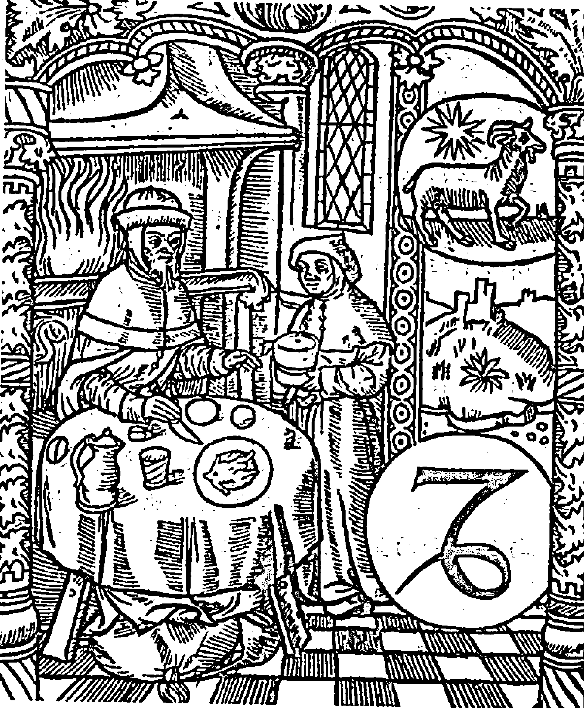

### 摩羯座
> > “柏拉图的思辨对我来说是珍贵的，然而，真理对我来说更珍贵。”
> ——亚里士多德

### 出生星位或太阳在摩羯座人的基本性格趋向
摩羯座①是象征着冬天开始的星座。冬天把绝对意识毫无保留地奉献给了摩羯座出生的人，他容易被热烈的感情所征服，这是个具有强烈忘我精神的人。

摩羯座的人一般缺乏热情，不太容易接近。他害怕别人毫无意义的谈话会占用他宝贵的时间，也不能接受别人对他粗暴无礼。严肃认真，思想深沉，始终如一，忠诚可靠，正直廉洁并富有献身精神。另外，他坚如磐石，毫不妥协，从不姑息宽容，也不抱任何幻想。思虑和忧郁过重，深居简出，喜欢把自己关在象牙塔之中。在他看来，这比去经历激情的洗礼要好得多。

摩羯座的人是一个具有现实主义思想和有抱负的人，尤其出生天宫图中有几颗行星同时处在摩羯座的情况下。表情平静而冷漠，喜欢离群独处。谨慎可能会使他错过许多良机，于是他便会产生失望和怀才不遇之感。然而，他确实是个有强烈责任感的勤奋的劳动者和杰出的组织者。

① 黄道带第十个星座，它对应初冬的第一个月，太阳12月22日～1月20日从该星座经过。摩羯座的形象是一只长着鱼尾巴的山羊，来自希腊神话中有关潘的故事：潘为了躲避妖怪泰丰的追击而跳入水中，变成动物。在水面的上半身子变成羊身，下半身变成鱼尾。摩羯座对应人体的皮肤、膝关节和结缔组织。摩羯座的主宰行星，即影响力最强的行星是土星。在该星座中，火星的影响力增强，木星的影响力减弱，月亮的影响力最弱。摩羯座属土类星座，代表专心致志、义务感和责任感、冷漠、务实、条理、正直、持之以恒、节俭、权力意志、多愁多虑和严谨的作风。

如同攀登山峰一样，摩羯座人的光辉前程需要用坚持不懈的努力去换取。他的成功主要靠艰苦奋斗的精神和工作能力，而不能指望运气的恩赐。他不喜欢碌碌无为，无所事事。实际感促使他不断改进自己的工作和生活条件。

摩羯座的人以事业为重，常常把个人生活置之度外。一切都从最现实的观点出发，脚踏实地从零做起，并追求实实在在的结果。渴望成功，也许这是为了补偿内心的某种需要或深藏的孤独感，但他从来不会把感情与事业混为一谈。

他的逻辑思维、客观态度、严谨的作风和组织观念有可能使他进入高职要位，有时还会把他引向社会或政治生活的道路上去。统计表明，许多国家领导人的出生天宫图中，摩羯座的影响极为明显。

一般地说，从50岁起，摩羯座的人才能进入他人生的黄金时代。年轻的时候总是困难重重，有时甚至会历尽艰辛，然而这种处境反会激发他为光明的未来而奋斗的决心。如果他能把事业坚持到底的话，到了晚年定会品尝到劳动硕果的甘甜。

摩羯座的人非常珍视通过自己辛勤劳动换来的财富。开销有计划，不喜欢挥霍浪费，勤俭节约是其本色。他从事传统的、有条不紊的工作要比创新性的工作更容易获得成功，尤其出生天宫图中土星在摩羯座或宝瓶座，或者在黄道第一宫、第四宫、第七宫或第十宫的情况下，更为如此。

由于缺乏热情，青年时代不大会赢得别人的好感。随着年龄的增长，才智会越来越显露出来。到了晚年，他在精神上和物质上都会达到完美的境界。

出生在摩羯座的著名人士有：
- 毛泽东
- 斯大林
- 尼克松
- 莫里哀(法国17世纪的剧作家)
- 巴斯德(法国微生物学家)
- 萨达特(埃及前总统)
- 开普勒(德国天文学家)
- 塞尚(法国画家)
- 托尔斯泰(俄国作家)

### 男性：性格、情感和爱情生活
摩羯座的男性很少表露自己的感情，基本上是一个孤独者。他在一丝不苟的精神、高度的责任感和逻辑头脑的严格指导下生活。激情一般受雄心和权力欲的驱使。他总是在辛勤地耕耘，有无懈可击的工作态度。他常常认为别人所做的一切都不理想，一定要亲自动手。时间将会证明他的成功。有时，他既不相信自己也不相信别人，思想经常处于犹豫不决和思虑之中。他对女性保持一定的距离，因为他怀疑她们感情的真挚程度。他的感情世界是很难触及到的。只有当他真心倾慕一个女性的时候，深藏的爱的洪流才能迸发出来，而且这种爱是经久不衰的。

他的情绪经常含有忧郁的成分，只有在知心朋友之间或感到自己受到别人信任的时候，他才会露出笑容。否则，他总是沉默不语和静静地观察。

他的欲望强烈，需要意境深邃和不断更新的融洽的性爱生活。婚后，他依旧一心扑在事业上，经常忙于工作，很少有空闲的时间。但他非常忠诚，对自己的爱人有极强的责任感，完全可以信赖于他。他的亲人应该理解他，对他周期性的忧郁情绪不必理会和苛求。

出生星位在巨蟹座的女性温顺、娴雅，她能理解他的性格，并会带给他所需要的温情和无微不至的关怀。

选择室女座的女性做伴侣，有助于在互相尊重的基础上建立一个安定和美的家庭。

与摩羯座的女性生活在一起，他们会志同道合，都对工作充满热情和责任感。

天秤座的女性需要关怀备至和不被人忽略；白羊座的女性过于独断，她们都不容易适应摩羯座的男性。

### 女性：性格、情感和爱情生活
这是个颇有自知之明的人，但很难从她自我的小圈圈中摆脱出来。她需要别人对她的理解和信任。在爱情方面，她最大的问题是任凭对方的追求。一般地说，她总是力图用理智去支配自己的行动，事业心胜过感情。

她用极大的勇气和努力去完成所承担的工作，从不推卸责任。她希望生活能有可靠的物质基础，这样才会感到心地坦然。因为她总是担心会失去什么，即使在物质生活条件十分优裕的情况下，这种不必要的念头也时常浮现在脑海中。如果其出生天宫图中土星的影响力较强，或者土星与月亮或金星呈不和谐方位，那么忧郁将是她一生无法摆脱的伴侣。

一旦找到了理想的爱人，她会全身心地投入到家庭生活中去，以最大的能力去帮助和照顾丈夫和孩子，从无任何怨言。如果爱情和婚姻不顺利，她会到事业中去寻求欢乐和安慰，通过施展才华去实现精神上的平衡。

一般来说，摩羯座女性的性欲望较强，但很理智并能控制自己的感情。她厌恶肆意的性行为，但对夫妻间和谐的欢娱则愿意全身心地投入。

摩羯座女性喜欢像大男孩似的巨蟹座的男性，他能带给她所需要的温情和欢乐。

与室女座男性的婚姻将是美满幸福的。

与金牛座男性结合，有助于建立一个安定和睦的家庭。

与白羊座男性会经常发生碰撞；与性格过于脆弱的天秤座男性缺乏共同语言。

### 孩子：教育和职业选择的可能性
摩羯座孩子的思想成熟比较早，很小就进入了成年人的行列，常常对人和事物产生戒备心理。

在学校，他有可能是一个性情孤僻的孩子，这容易使他产生深刻的伤感情绪。为此，应该督促他到户外去和同学们在一起，谈笑风生、舒展心情，以避免身心的僵化。

摩羯座的孩子爱学习，有自己积累知识的方法和严格的组织纪律观念。喜欢搜集和归类，是个学习、工作和生活有条不紊、过分追求完美的孩子。无论任何事，他都希望做得精益求精，这些优秀品质将会帮助他走上重要的工作岗位。据统计，有许多知名的政治家和学者都是摩羯座出生的。

摩羯座的孩子非常严肃认真，容不得别人半点轻视的目光。不时地打开窗子，让外面的欢声笑语进入房间，对他是十分有益的。

摩羯座孩子的理想择业方向是：管理、工业、考古、古玩、金融、政治、经营、农艺、会计、档案保管、批发贸易以及有关土地、地质、洞穴学等方面的职业。

### 摩羯座三个10°区①出生人的性格

#### 摩羯座第一个10°区
0°～9°59'（即出生日期为12月22～31日）
性格孤僻且雄心勃勃。行动之前总是权衡利弊，说话不喜欢开门见山。有极强的工作热情和组织纪律观念，从不自由放任，这一点会为他取得卓越的成就奠定坚实的基础。既傲慢又缺乏自信心和对别人的信任。为了实现自己的理想，不惜付出任何辛劳。

他的动力：成就。

#### 摩羯座第二个10°区
10°～19°59'（即出生日期为1月1～10日）
具有高昂的工作热忱和埋头苦干的精神。持之以恒的信念和保守思想，会使他沿着一条路始终不渝地走下去。从不想入非非。感情的独占欲较强。如果出生天宫图中，火星在金牛座、天蝎座、巨蟹座或黄道第一宫，容易引发过激行为。

他的动力：现实感。

#### 摩羯座第三个10°区
20°～29°59'（即出生日期为1月11～20日）
总是在追求着尽善尽美，在智力、学习和研究方面有出色的天赋。为人正直，有自知之明，但优柔寡断，容易气馁。常常屈服于形势，而缺乏摆脱命运的羁绊和自我超越的魄力。

他的动力：把理想变成现实。

> > ① 见附录部分有关“10°区”的名词解释。

### 不同出生星位摩羯座人的性格、爱情选择及常见疾病

#### 太阳在摩羯座和出生星位在白羊座
志向远大，愿将毕生的精力都投入到事业中去，这是他克服内心疑惑的方式。他不遗余力地工作，凭借极强的组织才能会走上重要的岗位，并能在社会或政治生活中发挥作用。人们对他的尊重胜过对他的好感和爱戴。他渴望爱情，但对情感总是持警惕和怀疑的态度。

出生星位在天秤座、太阳在白羊座或月亮在摩羯座的人能消除他内心的疑惑，增强他拥抱爱情的信心和勇气。

这一星位出生的人神经系统比较脆弱，情绪不稳定，时而乐观，时而悲观失望。偏头痛（尤其在年轻时期）、风湿痛和关节炎常见。

#### 太阳在摩羯座和出生星位在金牛座
性情耿直，自我意识较强，对认定的目标会毫不动摇地去实现之。工作能力很强。只有物质财富才能使他找到内心所需要的安全感。无法改变自己的习惯，需要有条不紊的生活。一般来讲，他的感情苏醒比较缓慢，但随着时间的推移会变得愈来愈深厚而强烈。

出生星位在天蝎座、月亮在摩羯座或太阳在金牛座的人容易理解他并成为他人生的忠实伴侣。

这一星位出生的人体质强健，属长寿型。但精神易于抑郁，有时过于伤感。疾病多半是遗传性的。

#### 太阳在摩羯座和出生星位在双子座
脚踏实地，精明干练，有事业心，头脑中充满想法，但多疑多虑或缺乏自信。幽默是他自卫的武器。社会生活或脑力劳动型职业要比私生活更易取得成功。

出生星位在人马座，月亮在摩羯座或太阳在双子座的人能增强他的自信心和追求幸福的勇气。

这一星位出生的人呼吸系统疾病，如支气管炎、肺炎、胸膜炎和哮喘等常见。

#### 太阳在摩羯座和出生星位在巨蟹座
性格矛盾，既敏感又有逻辑头脑，既孤独又需要温情。这是个心境常常不能平静，缺乏生活的欢乐感和不敢追求幸福的人。他十分需要别人的信任和鼓励。思虑较重，经常沉浸在对某事、某人的遗憾和怀恋之中。他的幸福很大程度上取决于别人，可能晚婚。

出生星位或月亮在摩羯座，或者太阳在巨蟹座的人会带给他幸福并使他的人生充满欢乐。

这一星位出生的人身体素质较好，属长寿型，但要注意克服不必要的多疑多虑心理和悲观情绪。

#### 太阳在摩羯座和出生星位在狮子座
满怀雄心壮志，酷爱权力，渴望实现远大的抱负。做事力求尽善尽美，从不敷衍塞责。时刻用高标准要求自己和别人，为了实现某种想法或某项事业，他能竭尽全力去奋斗。傲慢、优柔寡断和谨慎相互交织的性格会影响他激情的迸发，并会使他变得十分孤独。

出生星位在宝瓶座、月亮在摩羯座或太阳在狮子座的人能使他的内心充满阳光，与他共建温馨的家庭。

这一星位出生的人营养失调、关节炎、抑郁症、心绞痛和腺体硬结常见。

#### 太阳在摩羯座和出生星位在室女座
这是个认真且极为谨慎的人，人们很难知道他心里在想什么或感觉到了什么。非常适合从事需要持之以恒精神的工作（如科研、政治）。助手工作能更好地展示他的才华，也许他会因此拥有一定的权力。生活严谨，感情真挚，喜欢用头脑而不是用心计去行事。

出生星位在双鱼座，太阳在室女座或月亮在摩羯座、室女座或金牛座的人与他志同道合，性情相投。

这一星位出生的人心脏功能较弱，风湿性关节炎、胃肠功能紊乱和早期动脉硬化常见。

#### 太阳在摩羯座和出生星位在天秤座
富有才干，懂得处世哲学，善于把握时机和调动他人的积极性。爱情生活往往需要长时间的考验才会进入完美的意境。敏感会使他忧心忡忡，甚至会把一切都看成是焦虑不安的根源。他常常由于他人或自己而感到痛苦。

出生星位在白羊座、月亮在摩羯座或太阳在天秤座的人会带给他积极的心态，增强他对生活的热望和信念。

这一星位出生的人性情孤独、忧郁，风湿性关节炎和骨病常见。

#### 太阳在摩羯座和出生星位在天蝎座
沉稳冷静，神秘莫测，城府较深。工作能力强，能不惜任何代价去实现认定的目标。喜欢遵循传统习惯按部就班地生活。尽管爱的激情很少触及他的心或他极力禁锢自己的感情，但这并不能阻止他本能的嫉妒心。对情感生活缺乏追求的勇气。

出生星位在金牛座、月亮在摩羯座或太阳在天蝎座的人会使他敞开心扉，迎接爱情和煦的阳光。

这一星位出生的人需要有益于健康的安宁的生活环境，最好不吸烟。风湿性关节炎常见。

#### 太阳在摩羯座和出生星位在人马座
有些因循守旧，传统观念较深。正直、廉洁、谨慎是他奉行的基本准则。自主精神较强，物质利益或强烈的责任感在他的一生中起主导作用。爱情方面，他经常提醒自己要把理智和冲动很好地结合起来，但事实上，总是不能如愿以偿。

出生星位在双子座、月亮在摩羯座或者太阳在人马座的人会带给他所期待的幸福。

这一星位出生的人呼吸系统功能较脆弱，动脉硬化、代谢紊乱和甲状腺功能障碍、皮疹、慢性遗传性疾病常见。

#### 太阳和出生星位都在摩羯座
这一星位出生的人受土星的影响较大，性格孤僻，有惊人的耐力，正直廉洁，懂得如何更好地发挥别人的才能。感情方面有些过于多疑多虑，敏感将不利于他的情感生活。

出生星位在巨蟹座、月亮在摩羯座或太阳在金牛座或室女座的人与他性情投合，会给他的生活带来生机和活力。

这一星位出生的人容易营养失调，胃肠功能紊乱、关节变形、皮肤病和骨折常见。应注意膝关节，保持良好的心态以避免精神性疾病。

#### 太阳在摩羯座和出生星位在宝瓶座
性格倔强，难于理解，严肃刻苦，思想意识上的问题要比人的问题对他更有吸引力。喜欢隐居生活，工作热情会达到忘我的程度。思维敏捷，头脑清醒，独立精神强，有体验宗教或神秘主义的想法。

出生星位在狮子座、月亮在摩羯座或太阳在宝瓶座的人与他性情相投，容易和睦共处。

这一星位出生的人咽喉十分敏感，膝关节和肺部疾病，以及抑郁症常见。

#### 太阳在摩羯座和出生星位在双鱼座
缺乏创造精神，内心常常笼罩着疑团。怯懦的性格会使他躲到幻想或苦恼的世界中。既善良又有较强的自我意识，有时被失望的情绪所折磨，容易自暴自弃。他需要经常性的鼓励和支持。另外，根据出生天宫图的情况，他还有可能萌发拯救受苦受难人的愿望。

出生星位在室女座、月亮在摩羯座或太阳在双鱼座的人会给这颗善良的心带来真爱。

这一星位出生的人神经系统较弱，骨、牙齿和皮肤是身体的脆弱点。如果出生天宫图中土星的方位不佳，易出现精神抑郁。

### 摩羯座人与其他星座人的情感和谐①

#### 摩羯座的人与摩羯座的人
彼此都意识到了对方孤僻的性格，其结合是为了使自己的独立自主精神能得到对方的认同和理解。他们的情感和性爱世界是深邃的，两个人对私生活的内幕守口如瓶，极少外露。

#### 摩羯座的人与宝瓶座的人
宝瓶座人稀奇古怪的想法能丰富摩羯座人的精神和情感世界，使摩羯座的人感到不会受到伤害，可以快乐地随心所欲地生活。宝瓶座的人为有能充满理解他的可靠的伴侣感到欣慰。尽管如此，很少看到这两个星座的人真正结为夫妻，因为他们更喜欢维系一种不同于耳鬓厮磨的真挚的友谊关系。

#### 摩羯座的人与双鱼座的人
摩羯座的人会毫无保留地为双鱼座的人奉献爱心，但随着时间的推移，爱情的神秘面纱被揭开之后，他便会习以为常，不愿意为感情的升华继续做出努力。双鱼座的人会为伴侣热情低落而感到失望，但也会使他学会检讨自己，从感情上更多地关心体贴爱人，于是他们的情感生活会重新充满阳光，恢复昔日的生机和欢乐。

> ① 这些和谐关系的描述仅仅是针对人出生时太阳星座的单纯影响所作的理论分析，并不是绝对的。实际上，决定两个人和谐关系的还有另一个重要参数，那就是出生星位。例如，仅从出生时太阳星座的影响来看，由于性格的差异，摩羯座与白羊座的人是不和谐的。但是如果摩羯座人的出生星位在火类星座（白羊座、狮子座和人马座），或者白羊座人的出生星位在土类星座（金牛座、室女座和摩羯座），那么，他们会相处融洽。出生天宫图中金星和火星的影响是衡量性爱和谐与否的基本参数。

# 摩羯座人如何根据自己星座的特点
关爱身体、保健和美容

摩羯座对应皮肤、膝关节、结缔组织和踝骨。该星座的主宰行星——土星对膀胱和小肠的正常功能会有影响。

摩羯座人属于脑力劳动者而不是体力劳动者，睡眠不多，饮食很有节制。这是一种忧虑型的性格，他会经常不断地产生这种情绪，直至生命的最后一刻。忧虑使他体内的毒素，尤其是尿酸的代谢过程缓慢，由此可能引起痛风、风湿病、关节炎和各种疼痛的感觉。

休息对摩羯座的人是绝对必要的，因为他总是被烦躁、易怒和忧虑情绪困扰着。另外，消化不好也常常影响他的情绪。实际上，这一星座的人会经常感到身体不适，不是这儿疼，就是那儿不舒服。但他尽可放心，这丝毫不会影响他漫长的生命历程，因为摩羯座是象征长寿的星座。

到林中，最好是松树林中去散步，将有助于他恢复身心的平衡。对他来讲，如果能在松林中有一幢小房子，经常到那里度周末或送走晚年的时光，是再好不过了。

摩羯座的人喜欢攀登，登高山或到天然洞穴、溶洞、奇特的风景区，以及一切空气清新的地方去，都是他深居简出的性格所特别需要的。对洞穴的研究和探险也十分适合他孤僻的性格。

一般地说，这一星座的人不太喜欢体育运动，因为他总感到冷或疲劳。尽管如此，还是应该经常到户外活动，多出汗以排除体内的毒素，避免风湿和关节炎。

摩羯座人的身体需要补镁，镁除了对皮肤有良好的作用外（他的皮肤容易出问题），还能帮助他消除身心的疲劳，振奋精神和清除体内的毒素。

另外，他的身体还需要补钙，为此建议摩羯座的人多吃些生的食品、粮食、燕麦片、麸皮面包、米饭和花粉、新鲜蛋黄、奶酪（尤其是山羊奶酪）、白菜、扁豆等，这些都有助于钙的补充。摩羯座的人不宜多吃肉和尽量避免多吃糖，以及偏酸性的水果和蔬菜，如西红柿、酸面包、酸黄瓜等，应多吃新鲜蔬菜。建议这一星座的人多吃草莓、生胡萝卜和覆盆子，它们对增强肝胆功能很有益处，并会使心情更加开朗。

摩羯座的人一般清晨心情忧郁，随着一天工作和活动的展开，他的心情会逐渐活跃起来。晚上通常是他兴奋状态的顶峰，故入睡总是很晚。为了保持良好的精神和体力，他应该注意保证充足的睡眠时间。

摩羯座人的保健植物是柏树，柏树的果实有抗风湿和增强脉管弹性的作用。这一星座的人对由于寒冷而引起的疾病十分敏感，这使他对流行病缺乏足够的抵抗力。如果感到有伤风或感冒迹象时，可喝忍冬茶。忍冬中含有水杨酸，是真正的天然阿斯匹林。每杯开水中放三勺忍冬，泡5分钟后趁热喝。另一种办法是多穿衣服发汗。也可通过轻度腹泻排除体内毒素来改善症状。患流感期间，可在手帕或枕头上滴几滴百里香天然香精，有预防作用。

此外，心情愉快是摩羯座人最好的保健措施，他要学会摆脱冥思苦想的习惯，因为这样会导致胃溃疡。为防止胃溃疡，可喝鲜白菜汁，每天早晨空腹喝半杯。如加几滴柠檬汁效果会更好。

对于患有关节炎的摩羯座的人，放射性泥疗和泥疗较为有效。

一般地说，摩羯座人的饮食很有节制，但有些挑食。最好多吃富含维生素 C 的食品，例如扁豆。另外，这一星座的人还应经常吃蘑菇，蘑菇中含有多种维生素，自然也是他身体不可缺少的。顺便说一句，摩羯座的人与蘑菇之间似乎有一种神秘的亲和力，像人马座或天蝎座的人一样，特别喜欢采蘑菇，这对于他不仅是一种消遣，更重要的是森林会给他带来生机和活力。

表情严肃的摩羯座的人不应该忘记，朝气和美丽是保持他良好精神状态和身体状况的重要因素。他习惯于每天没起床，就已经把等待他的各种不愉快的事情在脑子里过了一遍，从而会给自己一天的生活预先留下忧郁的影子。最好的解脱办法是每天清晨醒来，先想一天将要做的愉快的和有趣的事情。

摩羯座的人要想保持细嫩的肌肤，关键是要排出体内的毒素和舒展自己的心情。在蛋黄里加几滴杏仁油配制的润肤霜，对干性皮肤有良好的滋润效果。

摩羯座的人最好选用以忍冬、玫瑰或含羞草为主要成分的香水。

# 摩羯座的情趣和喜欢的礼物

赠送礼物给摩羯座朋友时要注意，他喜欢实用的和有价值的物品，如文物、古董、多功能效率手册、钟表、显微镜、商务通、手机、笔记本电脑、数码相机、指南针、法兰绒衬衣、珍版图书、经济金融书刊、股票、拍卖物品目录、金器、保险箱、工具或器具箱、石制的小摆设、石雕、乌木雕、漆器、人造宝石首饰，以及有特色的酒瓶。他不是个旅游爱好者，但愿意到农场或山区度假。喜欢森林、洞穴和自然保护区，讨厌计划外的事。体育方面，喜欢爬山、体操、滑雪、骑自行车郊游。喜欢缟玛瑙、黑蓝宝石的首饰，讨厌赝品。读考古、地质、自然科学、生态学、经济、历史人物传记和发明者史料。摩羯座的人是古典音乐迷。女性喜欢香味淡雅的香水，而且习惯使用同一品牌的或男士用的花露水。

摩羯座的孩子喜欢读书、科学仪器（如天文望远镜）以及智力游戏玩具（如拼板游戏）等。

# 太阳和木星的方位与摩羯座人的物质生活趋向

太阳在摩羯座和木星在白羊座：雄心胜过热情，有强烈的事业心，踏实肯干，通过艰苦努力能获得成功。如果出生天宫图中土星与太阳所成的方位位于摩羯座或黄道第一宫或第十宫，将有助于其事业的发展。

太阳在摩羯座和木星在金牛座：勤劳肯干，善于理财和不断扩大自己的财富。如果出生天宫图中土星与木星或太阳呈和谐方位，则有助于在文化或者土地以及不动产的投资方面获益。

# 太阳在摩羯座和木星在双子座

有稳定的工作，但收入不丰，总是想方设法改变现状。适合从事科研和教育工作。

# 太阳在摩羯座和木星在巨蟹座

总希望家里多一点积蓄，有备无患。勤俭节约，有时会达到成癖的地步。古玩、考古和历史研究方面会有所收益。

# 太阳在摩羯座和木星在狮子座

有雄心壮志和远大的目标，政治嗅觉敏锐，许多精力都放在树立威信和为事业而奋斗方面。渴望跻身于领导岗位，物质生活的前景光明。

# 太阳在摩羯座和木星在室女座

凡事一丝不苟，喜欢与人合作，在与人接触或服务性工作中能充分表现出才智。虽然物质生活的改变比较缓慢，但只要坚持不懈，前途乐观。

# 太阳在摩羯座和木星在天秤座

处处为他人着想，是名副其实的良师益友。成功的路上会遇到许多困难和阻力。如果金星在摩羯座，会促成有利的婚姻。善于摆脱困境。

# 太阳在摩羯座和木星在天蝎座

从不直来直去地发表自己的意见和看法，善于发现他人的弱点和隐私为己所用。永不满足现状，在科研、医学或工业等领域会取得成功，有继承遗产的可能。

# 太阳在摩羯座和木星在人马座

这是有利于财富积累的行星方位，尤其当出生天宫图中土星与太阳或木星呈和谐方位的情况下。有较强的金融意识，善于与外商打交道。亦有可能对金钱失去兴趣，而转向哲学或宗教领域。

# 太阳和木星都在摩羯座

有强烈的竞争意识和奋斗精神，不放过任何可以改变物质生活的机会。竭力保全和巩固自己的经济实力以补偿内心的不安。不善于利用自己的劳动所得，总是强制自己去拼搏。如果出生天宫图中土星与太阳或木星呈和谐方位，将有助于生活质量的不断改善和提高。

# ## 太阳在摩羯座和木星在宝瓶座

对发财致富漠不关心，注重人的思想和意识形态问题的研究。甘于简朴的生活，收入不稳定，困难时刻会得到有影响人士的帮助。通过长期努力会取得出色的研究成果。

# ## 太阳在摩羯座和木星在双鱼座

钱的问题上不会遇到太多的问题，有可靠的保证。力图将幻想和直觉变成现实。

# ## 把握好土星主宰下的自我

摩羯座的主宰行星是土星。当它在出生星位或中天附近，或者有几颗行星在摩羯座时，对出生者的晚年时期影响较大。人大约从56岁起开始受到土星较大的影响。土星代表通过劳动和坚持不懈的努力所得到的一切。受土星影响的人精明强干，尽管有时被宿命论和悲观失望的情绪所困扰，但还是会表现出创造精神。土星也会带来考验、人或事件的对立、矛盾和冲突。受其影响，事业上的成功或许会比较晚，但如果有和谐的木星方位相助，其成功将是肯定的。

土星能激发人的工作热忱，鞭策人在生活中不断进取；也会给人带来障碍和使人行动缓慢。但是，没有土星的影响就没有稳定性、持之以恒的精神和创造力。土星的主要优势是时间和耐心，不利因素是自我意识过强和要经受考验与挫折。

对于出生天宫图中有土星处在出生星位或中天附近的人，或者太阳、月亮或几颗行星在摩羯座或宝瓶座的人，当他们在29~30岁和58~59岁的时候，将会受到土星公转周期的较强的影响。这将是他们一生的重要变化阶段，尤其58~59岁是至关重要的，因为在建立许多政治家的出生天宫图时发现，以土星为主宰行星的人事业上的成功较晚。如果土星公转过程中与人出生时它所处的位置相冲（即当人在15～16岁、44～45岁或75岁左右时），则是危急期。

和谐的土星方位象征通过努力能取得成就和进步，不和谐的土星方位象征障碍和考验。

土星的影响力在天秤座增强，在摩羯座最强，在白羊座减弱，在巨蟹座最弱。传统西方星辰学认为，土星是容易产生不利影响的行星。

### 土星—太阳

昏暗的土星与光辉的太阳相合所产生的影响是错综复杂的，会使人内省和专心致志，表现出自制能力或忧郁孤僻的性格。到底是一个具有奋斗精神的人还是一个抑郁寡欢的人，这要看个人出生天宫图的总体趋向。一般地说，土星与太阳相合的影响会突出男性的自我意识，尤其对以土星为主宰行星的摩羯座男性而言。

另外，土星与太阳之间所呈方位的影响会导致人生中许多问题的发生和承担更多的责任（幸运的是，受这两颗行星主宰人的责任感和工作能力都很强）。受这些方位影响的人生活中经常会遇到这样或那样的问题，或被疑惑所困扰。另一方面，如果其出生天宫图其余部分有较强的和谐因素配合的话，这些方位的影响也会使人生观得到升华。土星与太阳方位的影响往往会使人青年时代的生活充满艰难和曲折，但这会为人生第二个阶段辉煌成就的取得奠定坚实的基础。

这两颗行星相合或呈不和谐方位的影响会使人的身体虚弱，或因疾病而影响人生的进程和成功，这种情况对男性表现得尤为突出。对于女性，则可能导致晚婚，嫁给一个离过婚或比自己年长许多的男性。此外，还可能意味着与父亲的分离或过早失去父亲。

不和谐的土星与太阳方位的影响会增加人悲观失望的情绪，总是被义务感和责任感所困扰，使人生缺少机遇。

和谐的土星与太阳方位的影响能强化人的优点、智力天赋和组织观念，使成功的机遇早日到来。

### 土星—月亮

土星与月亮相合会给人的物质生活、身体或情感方面带来消极影响，会使人对生活产生厌倦情绪和明显的孤独感，尤其在女性之中表现得更为突出。总是在感情的边缘上徘徊，经常对自己缺乏应有的自信心，容易患慢性忧郁症，除非在其出生天宫图的其余部分有和谐的行星方位的影响，方可有所改善。

这一相合的影响常常会使人产生一种“不幸感”或“倒霉感”。这种心理将是根深蒂固的，即使在生活条件相当优裕的情况下亦如此，总忧虑自己的身体或担心厄运的降临。

和谐的土星与月亮方位会增强人的尊严感和责任感，使人在道德、信念和真诚的准则下奉公守法地生活。

### 土星—水星

这两颗行星相合的影响会突出怯懦或谨小慎微的性格特点，使人的感情深沉而严谨。同时，也会强化自我意识或使人变得冷酷无情。批评精神极强，对待人和事多爱从消极处着眼，总是权衡利弊，疑虑重重，这会不利于他的幸福。和谐的土星与水星方位的影响有助于人在历史、法律、管理、古艺术品的研究方面取得成就。这是一个有高尚情操、心地善良的知己。

不和谐的土星与水星方位影响会加重人悲观失望的情绪，爱批评，语言尖酸刻薄，有时又爱把自己禁锢在狭隘孤独的生活圈子里。如果出生天宫图中存在和谐的行星方位，那么这种倾向会趋于缓解。

### 土星—金星

土星与金星犹如冷漠和温情，两者互不相容。因此在出生天宫图中，这两颗行星相合会产生极其复杂的影响，使人的责任感超过对生活欢乐的追求。

这一行星方位的影响会消除自发性，增加情感的深度，珍视美德，有时还会唤起宗教意识。如果土星或摩羯座的影响在出生天宫图中占主导地位，则会不断地自我克制，有意的或突然产生自暴自弃的想法。如果存在不和谐的火星方位，或者出生天宫图是以天蝎座的影响为主的话，那么土星与金星相合的影响则会使人表现出强烈的嫉妒心；若出生天宫图以金星、天秤座或金牛座的影响为主，则有可能导致爱情和情感生活不太顺利，忧伤的影子常常伴随人生的脚步。尤其当这两颗行星相冲或呈四分方位时，这一趋势会更趋明显。

对女性来讲，土星与金星方位的影响容易使她们精神抑郁或产生失落感，如果出生天宫图其余部分的影响因素与之相呼应的话。据统计，受金星与土星方位影响的女性多半喜欢选择年龄偏大的配偶，爱情对她们常常姗姗来迟。

和谐的土星与金星方位的影响能激发人的忠诚感、责任感和自我牺牲的精神。情感和忠义之心经久不衰。

### 土星—火星

土星与火星相合的影响犹如炽热的铁放到冷水中，会淬出钢铁般的意志。凭借它能无坚不摧，无往不胜。但在行星的影响力较弱的出生天宫图中，它也能变成一种于己不利的消极因素。

一般来说，土星与火星相合、相冲或呈四分方位的影响容易使人遭受痛苦、处于危险的境遇、遇到不幸的事件或受伤。

和谐的土星与火星方位的影响不但能赋予人内心的充实感和实现抱负的信念，还会增强人的意志、耐力和工作能力。即便逆水行舟，也能如愿以偿。

### 土星—木星

土星与木星相合能对个人的幸福产生约束性的影响，激发人最强烈的奋斗精神，同时，也会使人产生哲学和宗教意识。如果这一相合是发生在中天或出生星位附近，那么，它的影响力将是很大的。这一星位能使人具有坦率的性格，自制能力，组织观念，毫不利己和助人于危难的精神。如果出生天宫图中没有关于成功的指示，木星、太阳和月亮之间的方位不和谐，或者只有一颗行星在黄道第十宫中，那么上述品格不是于己有利而是为他人所用。成功往往是在困难的条件下，通过艰苦卓绝的努力才能取得，有时甚至会完全不顾个人得失。

不和谐的土星与木星方位，会使人产生自我意识或忧郁感，使人的生活情趣受压抑。即使是在优裕的条件下亦感到生活不幸福。正常的愉快心情要晚些时候才能进入他的生活。

和谐的土星与木星方位的影响会增加人的智慧和才能，这将有助于他事业的成功和物质财富（尤其房地产、遗产或家庭财富）的扩大。

### 土星—天王星

这两颗行星相合，每隔 45 至 47 年发生一次。只是 1895 年底至 1898 年初（合于天蝎座）和 1941 年中至 1943 年初（合于金牛座）出生的人，其出生天宫图中才出现过这一相合。因此，只有当该相合发生在出生星位或中天附近，或者太阳、出生星位或月亮在摩羯座或宝瓶座时，才能真正受到它的影响。
土星与天王星相合的影响是极其复杂的，它能在人的内心激发出一种力量，这种力量可能成为某种科学精神或全神贯注的能力，也可能变成最冷酷的自私。会使人的性格趋于孤僻，喜欢离群索居。
和谐的土星与天王星方位的影响会突出人的雄心壮志、组织观念或思想的深度；也会使人的成功之路比较漫长或人生默默无闻。
不和谐的土星与天王星方位的影响使人容易精力疲惫，产生忧虑或怀疑心理，以及人生缺少机遇。需要出生天宫图中有和谐的木星方位，或者和谐的木星与土星或天王星方位才能抑制这些不利影响。

### 土星—海王星

这是一个间隔时间漫长的重要的行星相合，大约每 35 年左右出现一次。1917 年土星与海王星相合于狮子座，1952 至 1953 年相合于天秤座，1989 年这两颗行星相合于摩羯座。在出生天宫图中，只有当该相合发生在出生星位或中天附近，或者出生星位、太阳或月亮在摩羯座、宝瓶座或双鱼座的情况下，才会产生真正的影响。
受土星与海王星相合影响的人现实感不强，不关心物质利益，注重精神生活。孤独感像影子一样跟随着他。对他人所想、所言、所行漠然置之。严肃质朴，但也会变得冷漠无情。人生可能要经历艰难的阶段，但这将会使他的内心世界逐渐成熟起来。
和谐的土星与海王星方位的影响会赋予人坚忍不拔的精神、组织观念和责任感，并能在政治生活或需要通过艰苦努力取得成就的事业中发挥作用。
土星与海王星相冲或呈四分方位的影响会限制人的自由意志，使人受到某种内心恐惧和幻觉的折磨，乃至变成一种病态心理。如果出生天宫图其余部分的行星方位明确显示的话，这种心理状态则有可能在文学或艺术方面变成创造力。

### 土星—冥王星

土星与冥王星相合仅在 1914 至 1915 年、1946 年底至 1948 年以及 1982 至 1983 年出生者的出生天宫图中出现过。由于这一相合间隔的时间长，所以只有当它发生在出生星位或中天附近，或者出生星位或几颗行星在摩羯座或宝瓶座时才会产生真正的影响。

土星与冥王星相合的影响会使人具有极强的责任心和义务感，或者喜欢自我反省。这种反省常会萌发病态心理，但也有助于更好地自我完善。总之，这一星位的影响带给人的是严谨的生活态度和克己的精神，而不是追求个人的享乐。

土星与冥王星相冲或呈四分方位的影响会增加人的孤独感，很难与人和睦相处，除非出生天宫图中其余部分的行星方位是和谐的，方可得到改善。此外，还会使人对神秘学有格外的兴趣。

### ♑ 你的星辰对应备忘录

-   审慎的摩羯座人常说：“我不相信。”
-   你的主宰行星：土星。
-   你的关键词：专心致志、自制力、义务感和责任感、早熟、冷漠、悲观、务实、条理性、正直、持之以恒、节俭、绝对意识、名利欲、权力意志、多愁多虑、严谨。
-   你求爱的方式：明智的或怀有私心的。
-   你是一个：从容不迫和深思熟虑的人。
-   你渴望：能承担家庭义务的爱人。
-   你受骗：由于不敢尝试。
-   你喜欢：工作。
-   你害怕：迟到。
-   你追求：永远正确。
-   你的弱点：参与其事。
-   你的动力：成就与实现。
-   你的优势：时间。
-   你的劣势：疑心。
-   你身体的脆弱点：皮肤。
-   你的假日活动：登山运动、下棋、洞穴探险。
-   你的开支：储蓄。
-   你的服饰：实用大方的棉、毛和皮革服装，可有可无的点缀性小饰物。
-   你的吉日：星期六。
-   你的幸运数字：3、9、14、16、25。
-   你的幸运色：褐色、黑色和紫色。
-   你的幸运花：罂粟。
-   你的幸运金属：铅。
-   你的幸运石：缟玛瑙、琥珀、黑珍珠。
-   你的吉祥动物：公山羊、骆驼、狗、驴、乌龟以及夜间出没的动物。
-   你的吉祥植物：杨树、欧楂树、罂粟、天仙子、颠茄、常春藤。
-   你的保健食品：白菜、扁豆、胡萝卜、蘑菇、覆盆子、山羊奶酪、麸皮面包、米饭和面食、鲜白菜汁。
-   你喜欢的礼物：实用而有价值的物品；如古董、多功能效率手册、钟表、商务通、手机、笔记本电脑、数码相机等。
-   有益于你的场所：古老山石景观、曲径幽深的森林、荒漠、遗址。
-   适合于你的住所：居室安谧且有一丝凉意，古香古色的家具和古艺术品，训练有素的保姆。
-   你的幸运旅游地：保加利亚、加拿大、瑞士、挪威、澳大利亚、希腊、印度、尼泊尔、墨西哥、越南、秘鲁；阿拉斯加、布鲁塞尔[比利时]、利马[秘鲁]、巴伐利亚[德国]。
-   你的理想职业选择：政治家、学者、研究人员、哲学家、古董商、农艺师、登山运动员、洞穴学者、会计、档案保管员，以及有关管理、工业、金融、经营、批发贸易、土地、地质和洞穴学等方面的职业。
-   与你亲和的星座：金牛座、室女座、双鱼座和天蝎座。与巨蟹座互补。

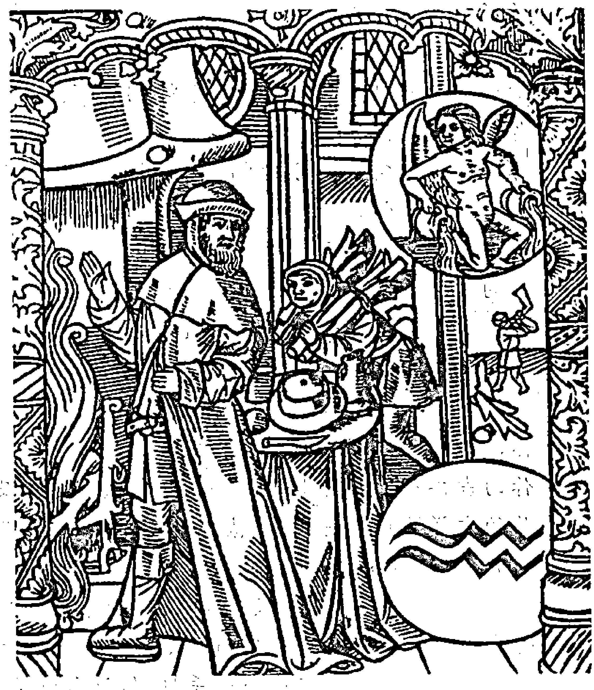

1月21日~2月19日

# 宝瓶座

> > “人的存在是被决定的，但其存在的意识是自由的。”
> ——J·卡尔特雷

### 出生星位或太阳在宝瓶座人的基本性格趋向

在充满绝对意识的摩羯座人之后，是头脑中不断闪烁着新奇古怪念头的宝瓶座①的人。他常常不考虑事情的某些具体因素，而一味推动它们的前进，这是一个富有开拓精神的人。

宝瓶座的人思维能力高于本能，是个先锋派人物。他感兴趣的不是昨天而是明天。他喜欢坐超音速的《协和》号飞机，而不愿意骑自行车。他迷恋斯特劳斯优美的旋律，而不喜欢听莫扎特的小夜曲。缺乏现实感，当他沉浸在某一念头之中时会废寝忘食。人们争相与他交往，是因为他的创新精神和开拓思想，及其看事物的积极方式、理想主义、宽宏大量和生来就具有的某些品格。但由于他缺乏现实主义的态度，狂热，生来就不会平静地生活和凡事心中无数，终究会使人们感到厌烦。

由于受天王星的强烈影响，宝瓶座的人是个十足的以自我为中心的人。他崇尚人道主义精神，但缺乏切实的行动。他喜欢丰富自己的思想境界，在旅行中开阔视野，以及与人交往中了解他人的思想观点。

> ① 黄道带第十一个星座，它对应秋天的第二个月，太阳1月21日～2月19日从该星座经过。宝瓶座的形象是一个人从罐里倒出一股水流，这可能是因为在古代时，宝瓶座从东方升起同中东地区洪水泛滥的季节和雨季巧合之故。宝瓶座对应人体的腿部和循环系统。宝瓶座的主宰行星，即影响力最强的行星是天王星。在该星座中，海王星的影响力减弱，太阳的影响力最弱。宝瓶座属气类星座，代表理想主义、关注他人的精神、独创性、独立精神、好奇心、革新、社交性、怪诞和理智性。

宝瓶座的人不能忍受任何约束，因此他决不强迫自己去服从任何纪律。如果某件事引起了他的兴趣，他能为之付出巨大的努力。单调无味的生活会使他心烦意乱，甚至会产生一种使他周围的人都无法忍受的变态心理。他时而异想天开，幽默过人，时而又冷若冰霜，令人费解，往往是个不易相处的人。他不能在谎言中生活，过分的耿直和坦率，常被人误认为是个怪人。其实人们对他并不真正了解。

宝瓶座的人是新思想的开拓者。如果给他以完全的行动自由，让他随心所欲地去思考和决定，那么他会表现出卓越的工作能力。他是一个创新者，层出不穷的想法和突如其来的直觉，使他能预感到未来。据统计，许多科幻小说作家、发明家，他们的出生天宫图中都有宝瓶座或天王星的强烈影响。

这一星座出生的人对发现、探索、航天等前瞻性的科学技术非常感兴趣。在摄影和电影艺术方面往往会有卓越的才能。

理论上，宝瓶座的人善于安排精神和物质生活。但实际上，他并不具有物质上发迹的才能（除非在其出生天宫图中存在木星方位强有力的影响）。他结识的人和所建立的友情，在他的命运中将起至关重要的作用。他的生活离不开朋友，一般地说在困难的时刻，总会有亲朋好友乃至素不相识的人助他一臂之力。而他也随时准备帮助和支持那些在困难或烦恼中煎熬的人，有时甚至全然不顾自身利益。如果他错信于人，有可能导致物质上的巨大损失。实际上，如果真的涉及到钱财的问题，他并不动心，贫富对他来说都无所谓。他既能很好地适应俭朴的生活，又知道如何不为财富冲昏头脑。

出生在宝瓶座的著名人士有：莫扎特、里根、罗斯福、叶利钦、凡尔纳（法国科幻小说的奠基人）、林肯（美国第16届总统）、爱迪生（美国发明家）、迪奥尔（法国时装设计师）、迪安（美国电影演员）、舒伯特（奥地利作曲家）、马奈（法国画家）、门德尔松（德国作曲家）、司汤达（法国作家）。

### 男性：性格、情感和爱情生活

宝瓶座的男性内心世界极为错综复杂，很难理解。他给人的表象是朴实爽直，但心里总是在悖论和矛盾之中徘徊。一般地说，他对人热忱，乐于助人。但在某些特殊的情况下，他也会表现得异常冷漠和不近人情。

他的情感与心态和情绪变化密切相关。

他既有个性又富魅力，是个能使他所爱的人神情荡漾的人。他不愿按规章制度办事，也忍受不了任何约束。

实际上，他更多喜欢的是友谊并不是爱情，因为爱情会妨碍他形而上学的沉思：我是谁？我从哪儿来？我向何处去？但他也会狂热地投入到爱情的怀抱，或者把一切都理想化。他喜欢带着自发性、欢乐感、新奇古怪的念头和青春的朝气去经历性爱生活。

受土星影响为主的宝瓶座男性性格会比较冷漠、孤僻，思想富有哲理性。如果天王星的影响力较大，则会使这一星座的男性富有幽默感，好友善交，并对所有新事物充满好奇心。

宝瓶座的男性在 40 岁左右，常常会出现不可避免的人生转折。他会改变自己的生活，抛弃过去，奔向新的未来。

与出生星位在狮子座的女性志趣相投，他们共同的特点是为人宽厚，富有人道主义精神。

与双子座的女性相处和谐，她会从精神和事业上不断地给他以激励。

高雅而富有魅力的天秤座女性，能在艺术和美学方面给他带来创作灵感。

与嫉妒心过强和喜欢复杂化的天蝎座女性以及不喜欢变化的金牛座女性缺乏共同语言。

### 女性：性格、情感和爱情生活

好奇心强，常常把强烈的愿望和精神的自主性融合在一起。她是一个反习俗和不愿意随声附和的人，说话做事全凭自己的兴趣。

她希望凡事都能自由地选择和按自己的意愿去做。而且她的反应是难以预测的，有时甚至会使人怀疑她的理智程度，这一点尤其表现在爱情问题上。她的感情与她的想象力密不可分，她不仅喜欢现实中的人，而且也喜欢从她的幻觉中走出来的人。实际上，她的心扉是向爱情敞开的，尤其是在她的出生天宫图中，金星或月亮也位于宝瓶座的情况下。

在情感方面，难免会有极端之举，即从一颗最纯洁的心和最理想的爱变得完全冷漠无情。一定不要使她失望，否则将无法挽回地失去她。不过，一旦她真正发现了自己的爱，则会把全部的智慧、全部的感情和自己

### 孩子：教育和职业选择的可能性

所有新事物都会映入宝瓶座孩子的眼帘，这可能是个小发明家。他喜欢人们指给他看看，讲给他听听和使他懂得其中的道理。他的接受能力极强，很快就会有与众不同的见解和自己的观点。宝瓶座的孩子可能聪明过人，也可能对所学的知识全无兴趣，这主要取决于学科的内容或他的情绪。这是个比较任性的孩子，他的矛盾心理可能达到登峰造极的程度。在“倒行逆施”中，他有时会得到一种令人无法理解的满足心理。

宝瓶座的孩子独立精神很强，总喜欢到思想境界中去寻觅自己所需要的东西，而不愿意为谋求物质利益去动脑筋。在发明创造方面，有许多有利可图的机遇在等待着他，但他从不动心，而是只做自己喜欢的事。

宝瓶座孩子的理想择业方向是：航空航天领域，与发明创造、电、电子、信息技术、摄影、影视、神秘学或哲学以及社团有关的职业。

## 宝瓶座三个10°区①出生人的性格

### 宝瓶座第一个10°区

0°～9°59′（即出生日期为1月21～31日）

个性强，性情古怪，博学多才，富有独立和创造精神。为人宽厚，感情脆弱，不喜欢粗暴无理。心中充满良好的愿望，但他真正的兴趣不是物质享受，而是对天地万物或精神方面的探讨。

他的动力：创造精神。

### 宝瓶座第二个10°区

10°～19°59′（即出生日期为2月1～9日）

才能几乎全部集中在智力或精神生活方面。视野开阔，思想活跃，有敏锐的直觉，并富有幽默感。极易相处，但总是谨小慎微，给人一种流落异国他乡之感。他对于开拓性事业、前瞻性科学技术、发明创造、改革创新和神秘学有浓厚的兴趣。他周围的人可能会对他的人生有举足轻重的影响。

他的动力：感知能力。

### 宝瓶座第三个10°区

20°～29°59′（即出生日期为2月10～19日）

敏锐的直觉和善于思维的头脑赋予他创造精神，真正的天赋会表现在艺术或智力方面，但也会导致他乌托邦式的空想。这一10°区出生的人往往不太适应日常生活的规律。恋爱和结婚会深刻影响到他的命运和前途。有独身主义的思想倾向。

他的动力：预感。

## 不同出生星位宝瓶座人的性格、爱情选择和常见疾病

### 太阳在宝瓶座和出生星位在白羊座

真诚赋予了他追求理想的强大动力，他总是在一种炽烈、有时近乎空想的信念下生活。破旧立新是他的雄心壮志，这种思想很可能使他成为传统势力的反叛者，或是一个不适应社会生活的人，他从不接受任何妥协。平淡无奇的爱情很难满足他的愿望，一旦被旖旎的感情唤醒，他会产生强烈的爱的激情。
出生星位在天秤座、太阳在白羊座或月亮在宝瓶座的人能充分理解他，是他情投意合的人生伴侣。
这一星位出生的人有时有自卑情结，循环系统功能紊乱、脉管和淋巴系统的疾病常见。

### 太阳在宝瓶座和出生星位在金牛座

这一行星方位的影响会赋予宝瓶座人更多的现实感。意志力有时会使他变得十分固执。他既不愿意因循守旧，又无法摆脱传统习惯的束缚；既富有独立精神又充满嫉妒心。他是人性的优秀裁判员，喜欢研究错综复杂的问题和探索事物之间的内在联系。热爱大自然和与大地有关的一切，感情深厚而经久不衰。
出生星位在天蝎座、月亮在宝瓶座或太阳在金牛座的人与他性情相投，会融洽相处。
这一星位出生的人声带脆弱，脾脏疾病、淋巴结炎，以及腿和踝骨损伤常见。此外，应特别注意神经系统。

### 太阳在宝瓶座和出生星位在双子座

博学多才，思维敏捷，头脑中充满着智慧的、有时甚至有些离奇的想法。对进步事业、发明创造和神秘学有浓厚的兴趣。从事抽象思维工作要比具体工作更容易发挥才智。渴望不断更新，不愿受任何清规戒律和传统思想的束缚。好奇心会使他烦躁不安或过分的神经质。这一星位出生的人最关注的不是儿女情长，而是思想意识形态方面的问题。有很强的思想透视能力，十分珍视友谊。
出生星位在人马座、太阳在双子座或月亮在宝瓶座的人与他情趣相投，会和谐相处。
这一星位出生的人不规律的生活会对神经系统带来不良影响。脾脏疾病、淋巴结炎以及下肢骨折常见。

### 太阳在宝瓶座和出生星位在巨蟹座

性格浪漫，富有奇特而迷人的魅力。想象支配着他的情感和激情，他需要去观察，去探索和去理解。他在现实生活以外给自己建立了一个海市蜃楼般的世界，思想常常飞到那里度过美好的时刻。他既有独立精神又有依赖性，渴望自由的愿望常常与顺从的本性相抵触。母亲在他的命运中起至关重要的作用。

出生星位在摩羯座、月亮在宝瓶座或太阳在巨蟹座的人会与他融洽相处，并能使他从幻想走向现实。
这一星位出生的人容易有自卑倾向，神经官能症和心脏方面的疾病常见。

### 太阳在宝瓶座和出生星位在狮子座

这是个傲慢、无拘无束和一意孤行的人。既有人道主义精神，又以自我为中心。他的主要问题是使这种矛盾心理达到良好的平衡。他懂得如何树立自己的威信和深刻地影响他人。当他的热情被调动起来的时候，能表现出极大的献身精神。

出生星位或月亮在宝瓶座，或者太阳在狮子座的人善于平衡他的矛盾心理，并成为他忠诚的人生伴侣。

这一星位出生的人经常感到周身不适，尤其表现在心脏和循环系统方面。肾功能较弱，神经系统常受干扰，容易精神抑郁，总怀疑身体有病。

### 太阳在宝瓶座和出生星位在室女座

他所做的一切都是为了别人，为了探索或科学事业，而不是为了自我表现。怯懦的性格和冷淡的态度使他像一个旁观者，只有当人们需要他的时候，他才会表现出自己的存在。善于照料别人或给别人治病。爱情方面，有时容易气馁或不相信自己的征服力。
出生星位在双鱼座、月亮在宝瓶座或者太阳在室女座的人能与他和睦相处，并会给他的性格注入生机和活力。
这一星位出生的人应经常注意血液循环系统，心脏方面的疾病、外伤常见。

### 太阳在宝瓶座和出生星位在天秤座

独具魅力的性格对人极有吸引力，对精神和艺术生活怀着强烈的渴望。喜欢美与善，向往和平，厌恶暴力。与人交往是他生活中不可缺少的一部分，在他看来，赢得友谊要比追名逐利更有价值和意义。

出生星位在白羊座、太阳在天秤座、月亮在宝瓶座或天秤座的人与他性情相投，是他人生旅途可靠的伴侣。

这一星位出生的人神经系统比较脆弱，支气管炎、胸膜炎、心脏功能障碍和偏头痛常见。

### 太阳在宝瓶座和出生星位在天蝎座

强烈的欲望和神秘的性格，对人有一种不可抗拒的吸引力，同时也令人感到困惑不安。他总是走极端，要么成为一个出类拔萃的人，要么就是其反面。他喜欢探索人的本性或心灵世界，并希望揭开其奥秘。私生活中，自我意识表现过于明显。既需要强烈的爱情又不能没有充分的自由，所以他的情感生活将永远摆脱不了这种矛盾心理的干扰。

出生星位在金牛座、月亮在宝瓶座或太阳在天蝎座的人会与他融洽相处，并使他的爱情生活走向平静。

这一星位出生的人心脏和循环系统较弱，静脉曲张、下肢损伤和痉挛性症状常见。

### 太阳在宝瓶座和出生星位在人马座

感情真挚，视野开阔并富有独创性。有强烈的求知欲，希望知识和热情都能成为人生的动力。对未知的事物和领域有较强的感悟和理解能力。他需要全方位的知识涉猎，从不受任何纪律或习俗的约束，只是按照自己的人生哲学和道德准则去我行我素。珍视友谊并很大度。出生星位在双子座、月亮在宝瓶座或太阳在人马座的人与之性情相投。这一星位出生的人属淋巴体质，循环系统功能紊乱、神经官能症，以及坐骨神经痛常见。

### 太阳在宝瓶座和出生星位在摩羯座

这是个外表有些冷漠，常常沉默寡言和性格内向的人。对自己要求十分严格。有出色的组织观念、政治才干以及成就事业的能力，但是钱的概念较为淡漠。对自己缺乏爱的激情感到悲观，然而一旦他内心产生了真正的爱，就任何力量都无法动摇。出生星位在巨蟹座、月亮在宝瓶座或者太阳在摩羯座的人能点燃他爱的激情。这一星位出生的人应注意消化器官和代谢系统。慢性病、骨损伤以及血液循环欠佳常见。

### 太阳和出生星位都在宝瓶座

独立精神强，心地善良，有自己特殊的信条，对非同寻常的一切都抱有浓厚的兴致。他的言行对别人有很大的影响力，而自己却总是力图保持内心的自律。他既能把自己的一切献给人道主义事业，也能对日常生活中的一切表现出极其漠然的态度。在爱情问题上有些过于幻想，或者精神上的追求胜过对异性的爱恋。出生星位在狮子座，太阳或月亮在宝瓶座、天秤座或双子座的人与之性情相投，家庭生活会充满和谐的气氛。这一星位出生的人血液循环欠佳（尤其是吸烟者），关节炎、静脉曲张、溃疡、痔疮、扭伤、内分泌失调常见。另外，属淋巴体质，消化较慢，不宜多吃油腻食品。

### 太阳在宝瓶座和出生星位在双鱼座

这是个怯懦的理想主义者，敏感是他性格的主要成分。精神上的追求会使他把一切都置之度外。肯献身于某项事业或者为某人鞠躬尽瘁。如果出生天宫图中行星的影响力较弱，或者太阳与海王星呈不和谐方位，其影响会使人的意志薄弱，喜欢生活在幻想中，从而导致极其复杂的心理情结。由于他对幻想和神秘学的兴趣，也使他的爱情生活蒙上了奇异的面纱。

出生星位在室女座、月亮在宝瓶座或太阳在双鱼座的人会与他情投意合，并共同感受爱情带来的幸福和欢乐。

这一星位出生的人要特别注意循环系统，偏头痛、心脏方面的疾病、代谢障碍、糖尿病和肥胖症常见。

## 宝瓶座人与其他星座人的情感和谐①

宝瓶座的人与宝瓶座的人

这两个同星座人的结合犹如一场异想天开、无拘无束、喜怒无常和重归于好的竞赛，也是一场令人惊异和罕见的芭蕾舞。因为面对他们导演的情节和场面，人们不知道生活的乐趣何在。他们无疑会是很好的朋友，但共同生活很快就会使双方变得精疲力竭。他们之间可能会有钟情、欢娱、开心和尽兴的短暂时刻，并会留下美好的回忆，但持久的婚姻不多。这两个同星座人的结合常见于艺术家之中。

宝瓶座的人与双鱼座的人

宝瓶座的人与双鱼座的人犹如直觉面对梦幻的关系，两个人会怀着好奇心共同去探索某种境界。一般来讲，在旁人眼里他们更像是一对志趣相投的昆虫学家，而不是情人或恋人。这两个星座的人有时会建立美好的柏拉图式的恋情关系，尤其在上年岁和社会地位悬殊的人之间居多。

① 这些和谐关系的描述仅仅是针对人出生时太阳星座的单纯影响所作的理论分析，并不是绝对的。实际上，决定两个人和谐关系的还有另一个重要参数，那就是出生星位。例如，仅从出生时太阳星座的影响来看，由于性格差异，宝瓶座的人与双鱼座的人是不和谐的。但是如果宝瓶座人的出生星位在水类星座（巨蟹座、天蝎座和双鱼座），或者双鱼座人的出生星位在气类星座（双子座、天秤座和宝瓶座），那么，他们会相处得很好。出生天宫图中金星和火星的影响是衡量性爱和谐与否的基本参数。

## 宝瓶座人如何根据自己星座的特点关爱身体、保健和美容

宝瓶座对应小腿、踝骨、血液循环系统。宝瓶座的主宰行星——天王星影响神经系统、垂体和产生性荷尔蒙的腺体。统计发现，该星座出生的人患心因性疾病的居多。

宝瓶座的人待人亲切，但总是一意孤行。生活随心所欲，工作不遗余力，从而导致他情绪变化无常，以及身心的过度疲劳。

宝瓶座的人对空气质量十分敏感，多呼吸新鲜空气要比任何体育锻炼和疗法都更有助于他的身体健康。暴雨的袭淋会使他精神振奋，寒冷会使他一蹶不振。此外，使人感到温暖的环境和人际关系对他是十分必要的。

他对神秘力和磁力很敏感，二者往往对他有较好的治疗作用。

大城市的噪声不仅会使他心烦意乱，而且还会把他的生机和活力荡劫一空。因此，他需要一个“修心养性”的环境。当他置身在大自然的怀抱之中时，会真正感到心旷神怡。

宝瓶座人的身体需要补钠。钠有助于他体内尿酸的排泄，促进血液循环。为此，可从草莓、覆盆子、桑葚、醋栗、芳香车叶草及多叶著中去摄取。另外，宝瓶座的人还要注意补磷，可多吃洋葱、扁豆、葡萄、蘑菇和杏仁。对这一星座的人来说，吃鱼要比吃肉类更有益于身体。粮食也是他不可缺少的营养品。

宝瓶座人的保健植物是牛至，它对治疗失眠和神经衰弱很有效，对心情忧虑的人是极好的药物。

可乐果对宝瓶座人的身体有兴奋作用，鳄梨营养丰富亦可调节神经系统，橘子、柚子、欧洲越橘可增加血管弹性，杏能抗疲劳，这些都是宝瓶座人应多食用的水果。

针灸对宝瓶座人是极为有效的治疗方法之一。此外，丰富的精神生活、静思和瑜伽，都有助于体能的补充和再生。

宝瓶座的人血液循环比较缓慢，因此，他会经常感到冷。
腿和踝部是宝瓶座人身体上的弱点。

周期性的神经质或抑郁不安的情绪，会影响宝瓶座人正常的睡眠，并会使他易怒。建议入睡前要尽量放松，如出去散散步、心平气和地做做深呼吸，然后再饮用有镇静作用的饮料，会使睡眠状况逐渐得到改善。

宝瓶座人的胃口时好时坏，这主要取决于他的情绪。他喜欢有特色的风味菜肴，喜欢吃来自异国的水果，如芒果、鳄梨、菠萝和番木瓜等。这些水果对他的身体健康尤为有益。

为保持健康的体魄，宝瓶座的人要经常呼吸新鲜空气，要远离使他心情烦乱的噪声环境。瑜伽、所有有助于深呼吸的体育活动和针灸，都会有助于他身体和精神上的放松和舒展。

以浮游生物为主要成分的香脂是宝瓶座人极好的美容品，可可油内加一茶匙量的麦芽油，也有同样效果。它不但有柔润肌肤的作用，还能保护皮肤免受太阳有害射线的照射。

宝瓶座人适宜选用以丁香、夷兰或蕨为主要成分的香水。

## 宝瓶座人的情趣和喜欢的礼物

宝瓶座的人热衷于各种新技术，如信息、电子、数字通讯、电影、电视等。在选送礼物时可考虑新款数码产品（如相机、摄像机、手机、MP3等）、DVD机、笔记本电脑、光盘、目录大全、健身器、电子合成器、电子记事本、袖珍计算器、碘钨灯、咖啡具、多用食品加工机、现代石版画、大屏幕液晶或等离子电视、卫星天线、T恤衫和一些新奇的小玩意儿。喜欢看体育比赛，与朋友一起旅游或为结识朋友而旅行。喜欢排球、篮球、乒乓球、跳舞。偏爱科技、航空、星辰学、神秘学、计算机、发明创造、心理学、催眠术、科幻、未来学等方面的书刊。对音乐的兴趣因他们的情绪而异，古典音乐、摇滚乐、爵士乐都在喜欢之列，总之，紧跟时代音乐的潮流。如果送他们首饰，最好选镶嵌蓝宝石的、白金的、金属色泽的、怪诞的或荧光的。喜欢味道特殊或异国香味的香水，男士爱用花露水。

宝瓶座的孩子喜欢电子方面的物品，如电子琴、电脑、遥控机器人、风筝、凡尔纳的科幻小说、鬼怪或宇航员玩具人、变形金刚等。

## 太阳和木星的方位与宝瓶座人的物质生活趋向

### 太阳在宝瓶座和木星在白羊座
常常抱着单纯的热情投入某项事业，缺乏实际感。从事研究和发明创造要比做生意或投资更有发展前途。

### 太阳在宝瓶座和木星在金牛座
如果家庭、社会地位，或者外界环境不能给他提供发财致富的条件，那么谋生可能会遇到一定的困难。错误的判断往往会给物质生活带来损失。

### 太阳在宝瓶座和木星在双子座
有开拓精神，但缺乏金融意识。从事新闻、记者、旅游、社交和写作等方面的工作会有所成就。如果出生天宫图中水星在宝瓶座，会有助于发明创造。

### 太阳在宝瓶座和木星在巨蟹座
直觉和机遇会有助于物质上的成功。家庭遗产（如土地和不动产）是物质生活的可靠基础。

### 太阳在宝瓶座和木星在狮子座
喜欢投入过于庞大的事业，但由于缺乏实际经验会遇到不测风云，造成严重的财产损失，尤其出生天宫图中存在天王星或土星与太阳或木星呈不和谐方位的情况下。不过，物质生活会蒸蒸日上地向前发展。

### 太阳在宝瓶座和木星在处女座
对物质问题毫无兴趣，习惯简朴的生活，甘愿做无名英雄。注重精神生活，尤其当出生天宫图中水星在宝瓶座或太阳在黄道第三宫或第九宫的情况下。

### 太阳在宝瓶座和木星在天秤座
追求美感和舒适高雅的生活方式，但不愿为物质生活质量的提高作出不懈的努力。一般来说，生活状况的改变和事业的发展需要借助友谊、爱情、朋友，或者通过美学或艺术事业来实现。

### 太阳在宝瓶座和木星在天蝎座
渴望有所成就，但缺乏准确把握时机和运筹的能力，钱的问题上常会出现错综复杂的局面。如果出生天宫图中存在十分和谐的木星方位的影响，情况则会大不一样。

### 太阳在宝瓶座和木星在射手座
运气、机遇有助于物质生活的改善。到外面去闯天下要比守家待业更容易获成功。

### 太阳在宝瓶座和木星在摩羯座
对抽象问题或研究工作的兴趣比致富的兴趣更大，理想的发展方向是从事古玩、历史、考古方面的工作。

### 太阳和木星都在宝瓶座
热心真诚的性格会赢得合作者的帮助和支持。在赚钱方面有意想不到的机遇。理想渠道是到公司任职。如果出生天宫图中存在木星与太阳相合方位，那将如虎添翼，对物质生活的发展是十分有利的。

### 太阳在宝瓶座和木星在双鱼座
多半生活在脱离现实的虚无缥缈之中，容易得到资助，找到不受约束的工作。总的来说，物质生活可以得到满足，但需付出努力。良好的直觉能力是人生旅途的向导。

### 把握好天王星主宰下的自我

宝瓶座的主宰行星是天王星。出生天宫图中，当天王星处在出生星位或中天附近，或者有几颗行星在宝瓶座时，其影响力是最强的。它的强烈影响会产生两种极端的情况：或者福从天降；或者突然的失败。无论如何，该行星的影响具有产生突然变化的特点。受天王星主宰的人智力天赋较好，心地善良，好友善交，乌托邦思想较为突出。他喜欢发明创造、航空、新兴工业、公司、托拉斯等，会成为改革创新的推动者。据概率统计，宝瓶座的人一般在 41～43 岁左右会重新考虑和安排自己的一切，他的人生旅途从此可能会发生根本性的变化。

天王星会突出人的独立精神和唐突意识，以及由此而产生的无法预见的行动。受天王星影响的人思想或情感上热情奔放，但他总不忘记控制自己的感情，因为实际上他更注重友谊而不是爱情。在他的人生道路上，会遇到许多意想不到的事情或变化。

天王星是一颗对开拓者、科学家、文学家、发明家有特殊影响的行星，因为它能激发人开拓创新的强烈愿望。

如果出生天宫图中，天王星与火星、土星、太阳或者月亮相合或呈不和谐方位，其影响会突出人的反抗精神和破坏性。

在出生天宫图中，如果天王星的影响力较强或与另一颗行星相合，那么，该行星与人出生时它所在的位置所呈方位的周期，在人生中将会起重要的作用。例如：人在 20～22 岁时，天王星与其出生时它所在的位置呈四分方位，趋于告别过去或使人生的方向发生根本变化。人在 27～29 岁时，逢天王星与其出生时它所在的位置呈三分方位，标志着发展或成功的第一阶段。人在 41～43 岁时，天王星与其出生时它所在的位置相冲。这是非常重要的方位，它会使人生发生彻底的变化。据统计，许多受天王星影响的人都是在这一年龄段上生活发生了根本性的改变。人在 55～57 岁时，天王星重新与其出生时它所在的位置呈三分方位。人在 62～64 岁时，天王星重新与其出生时它所在的位置呈四分方位。人在 84 岁的时候，天王星与其出生时它所在的位置相合，恰好是天王星的一个公转周期①。天王星的影响力在天蝎座增强，在宝瓶座最强，在金牛座减弱，在狮子座最弱。传统西方星辰学认为，天王星是容易产生不利影响的行星。

### 天王星—太阳
天王星与太阳相合的影响是异常强大的，它会使人具有不寻常的个性、顽强的毅力和难以抗拒的吸引力，尤其表现在男性之中。受这一星位影响的人多半才华横溢，甚至可以说是天才，但不易相处。灵活性匮乏，喜欢作对。这一行星方位下出生的人总希望保持自己的行动自由，不愿意受到任何纪律的约束。当某事引起他兴趣时，他会为之全力以赴。几乎对任何科学都会表现出浓厚的兴趣，新兴事业对他充满吸引力。科学研究、文学创作和新技术开发均是其最有利的择业领域。人生充满波折，外因会不止一次地改变他的人生之路。

虽然天王星与太阳相冲或呈四分方位的影响不会阻碍天赋或创造才能的发挥，但会使人的性格趋于怪诞或对投身事业的环境缺乏适应能力，从而会影响成功的步伐，但他具有不顾一切勇往直前的精神。

### 天王星—月亮
天王星与月亮相合的影响会使人产生易走极端和反习俗的思想倾向。性格敏感，神经随时都在颤动，对人很有吸引力，尤其表现在女性之中。喜欢无拘无束的和与众不同的生活，热衷于旅行和千变万化，长时间呆在一个地方会使他感到无法忍受。对新人、新事、新的学科领域有浓厚的兴趣。有自己独特、多变的生活方式。一般地讲，受这一相合影响的人很少与人建立持久的关系。应该把他引向尚未开发的新领域去展示才智。

受天王星与月亮相合影响的人未来趋于不稳定，机遇或意外的变化会改变他命运的进程。但是一切都在不断更新，总的说来，生活是处在顺境之中。

和谐的天王星与月亮方位的影响不仅能创造有利条件，还会使生活更加充实与和谐。使人对神秘学产生极大兴趣，也有可能成为一名出色的医生。

不和谐的天王星与月亮方位的影响会突出人怪僻和异想天开的性格侧面。性格和命运之间缺少沟通与平衡的桥梁，但这丝毫于他的才智。

### 天王星—金星
象征爱情的金星与象征反习俗的天王星相合的影响，会使人生出现意想不到的转机。

这一相合的影响会赋予人浪漫、多情和富有魅力的性格色彩。渴望生活中一切美好的东西，艺术感强。受天王星与金星相合影响人的愿望经常是模糊不清的混合体，或者表现为创造性的天赋，或者表现为艺术或戏剧方面的才华，也有可能表现为异常强烈的变革生活的激情。他们常常受幻想的驱使，随心所欲，很少顾及天时、地利和人生的客观情况。由于需要较大的情感自由度，所以其爱情的发展往往受到一定的影响，尤其当天王星与金星呈不和谐方位时，情况更为如此。

和谐的天王星与金星方位的影响会使这些不利趋势向有利的方向转化。

天王星与金星的所有方位都有利于艺术家的生涯。

### 天王星—火星
天王星与火星相合的影响犹如两种爆炸力的结合，能产生巨大的力量和过激的冲动。关键在于冲动的投向，要么是个具有反抗精神和胆大妄为的人，要么是个杰出的创新者。

性格开朗，情绪激昂，缺少耐力，适合在无拘无束的状态下工作和生活。他的兴趣总停留在形而上学、玄奥莫测或前瞻性学科的问题上。据统计，许多出色医生的出生天宫图都与这一行星方位有关。此外，其影响还能增强人的工艺能力和吃苦耐劳的精神。

人生中有许多意想不到的转机，有光辉灿烂的时刻，也有忧伤暗淡的插曲。

和谐的天王星与火星方位的影响会赋予人更大的创造力，其不和谐方位的影响会使人头脑发热或有自由放任的性格倾向，同时也是突发事

### 天王星—水星
天王星与水星相合的影响会使人思想开放和富有创新精神。这是一个充满生气的行星方位，它能增加人的幽默感和创造才能。出生在这一星位的人是人性的观察者，喜欢无拘无束地生活，性格有些怪僻，不愿他人介入自己的私生活。统计表明，记者、作家、科学家和开拓者之中，受天王星与水星方位影响的居多。
天王星与水星呈三分方位的影响会使人具有良好的观察、分析与综合能力。热衷于发明创造，对形而上学或神秘学有浓厚的兴趣。
这两颗行星相冲或呈四分方位的影响会使人智力敏锐，但很少能得到充分的开发和利用。性格暴躁，变幻莫测，醉心于矛盾的事物。惯于冷嘲热讽，会给自己树立许多人为的对立面。

### 天王星—木星
天王星与木星相合的影响会造就出天才和知名人士，但也会使人变得固执和桀骜不驯。受这一星位影响的人喜欢按自己的方式生活，不愿受传统观念的束缚。一旦他选定了自己的方向，会坚定不移地走下去，热情能帮助他成就大事业。如果出生天宫图其余部分的行星方位明确显示的话，有可能在政治生活或某企业中发挥突出的作用。
这两颗行星相合的影响还会赋予人创新精神，尤其表现在文学、艺术、精神领域、实际生活或探索方面。然而，过分的独立精神或不慎重的坦诚，将不利于他取得持久的利益。
和谐的天王星与木星方位的影响会突出人坚强、刚毅的性格，视野开阔，对社会问题有浓厚的兴趣。生活充实并有许多旅行或进取的机会。而不和谐的天王星与木星方位的影响，有破坏物质利益或使良机错失的危险。

### 天王星—土星
这两颗行星相合，每隔 45～47 年发生一次。只是 1895 年底～1898 年初(合于天蝎座)和 1941 年中～1943 年初(合于金牛座)出生的人，其出生天宫图中才出现过这一相合。因此，只有当该相合发生在出生星位或中天附近，或者太阳、出生星位或月亮在摩羯座或宝瓶座时，才能真正受到它的影响。

天王星与土星相合的影响是极其复杂的，它能在人的内心激发出一种力量，这种力量可能成为某种科学精神或全神贯注的能力，也可能变成最冷酷的自私。会使人的性格趋于孤僻，喜欢离群索居。

和谐的天王星与土星方位的影响会突出人的雄心壮志、组织观念或思想的深度；也会使人的成功之路比较漫长或人生默默无闻。

不和谐的天王星与土星方位的影响使人容易精力疲怠，产生忧虑或怀疑心理，以及人生缺少机遇。需要出生天宫图中有和谐的木星方位，或者和谐的木星与土星或天王星方位才能抑制这些不利影响。

## 你的星辰对应备忘录

具有独特见解的宝瓶座人常说：“我想了解。”

- 你的主宰行星：天王星。
- 你的关键词：理想主义、关注他人的精神、独创性、独立精神、好奇心、先锋派思想、革新、社交性、极端主义、怪诞、理智性、不断变化。
- 你求爱的方式：多渠道的。
- 你是一个：反应多变的人。
- 你渴望：与众不同的友谊。
- 你受骗：由于过分的同情心。
- 你喜欢：去奇特的地方。
- 你害怕：失去自由。
- 你探究：人与事物的本质。
- 你的弱点：怪僻。
- 你的动力：创造精神和预感。
- 你的优势：革新。
- 你的劣势：漫不经心。
- 你身体的脆弱点：腿和踝部。
- 你的假期生活：不喜欢假期，琢磨新奇的消遣方式。
- 你的开支：为亲朋好友。
- 你的服饰：纯棉、皮革或化纤面料的新潮时装，象征未来或原始的饰物。
- 你的吉祥物：竖琴螺。
- 你的吉日：星期六。
- 你的幸运数字：2、7、13、14。
- 你的幸运色：深灰、黑色、紫红色。
- 你的幸运花：天兰葵。
- 你的幸运金属：铅。
- 你的幸运石：蓝宝石。
- 你的吉祥动物：马戏团的和所有易驯养的植物。
- 蕨、含羞草、喜林芋、异国植物、李树、椴树、百里香、迷迭香、月桂树、橄榄树。
- 粮食食品、洋葱、蘑菇、扁豆、鱼、草莓、醋栗、覆盆子、葡萄、杏、杏仁、橘子、欧洲越橘、鳄梨、菠萝、番木瓜、可乐果。
- 你喜欢的礼物：新款电子和数码产品。
- 有益于你的场所：摄影棚、照相馆、电影院、广播电台、摩天大楼、现代建筑、机场、火车站、地铁、会议室、供学习的地方、快餐店，以及公共场所。
- 适合于你的住所：现代风格的居室，个人物品少而精，有方便生活的各种实用的小器具，窗外视野开阔。
- 中国、摩洛哥、突尼斯、希腊、埃及、土耳其、斯里兰卡、瑞典、俄罗斯；纽约、洛杉矶、戛纳[法国]、萨尔茨堡[奥地利]。
- 律师、评论家、政治家、发明家、政治改革者、论战者、讽刺作家，与发明创造、电、电子学、信息技术、航空航天、摄影、影视、神秘学或哲学有关的职业。
- 与你亲和的星座： 双子座、天秤座、白羊座和射手座。与狮子座互补。

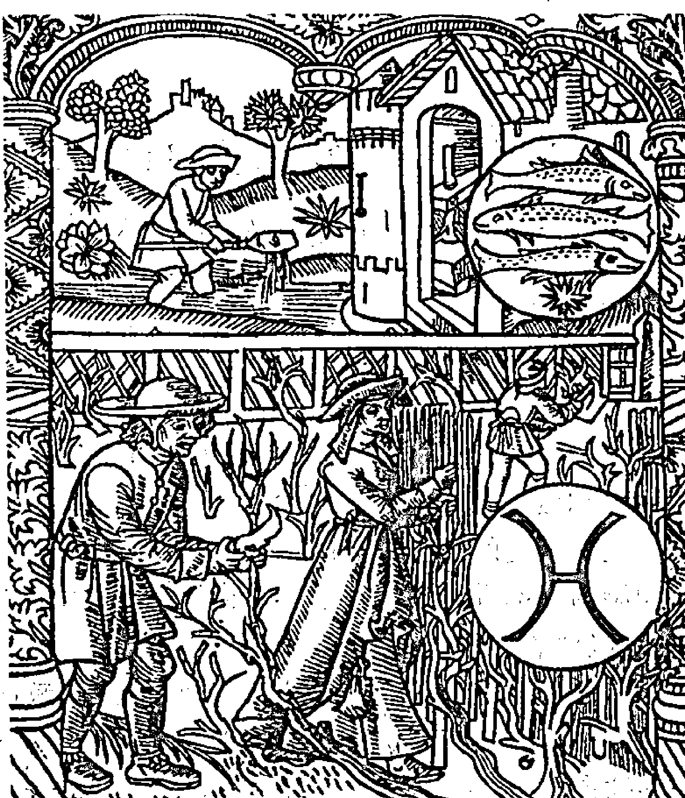

2月20日~3月20日

## 双鱼座

> > “失去了自我的决定论和宿命论者是绝望者，因为留给他们的只有必然。”
>
> ——克尔恺郭尔①

### 出生星位或太阳在双鱼座人的基本性格趋向

双鱼座②是冬天和黄道带的最后一个星座。冬天在它即将离去的时候，把相对意识留给了双鱼座的人。

这一星座的人有独特的缄默方式，他对世界上所发生的一切，乃至虚无缥缈的事都有浓厚的兴趣。这种琢磨不透的思想使他变成一轮神秘的光晕，吸引着许许多多的人。人们觉得他文静、温柔、真诚和会体贴人，但又觉得他的思想是那么遥远莫测。他对愿望、激情和仇恨不像有些星座的人那样充满绝对意识。心中很少有紧迫感，他不明白为什么明天也可以继续做的事，非得要抓紧时间今天做完。

他诗一般的思想意境、内在的敏感、神秘色彩和某些女性的性格特征，常唤起人们的遐想。在人生旅途中，他有时会因为怯懦、漫不经心、自由放任和模糊不清的思想而无所适从，也会因为自己的缄默和缺乏奔放的热情而悲观失望。

① 克尔凯郭尔 Kierkegaard，Søren (1813.5.5～1855.11.11) 19世纪丹麦著名宗教哲学家，存在主义的创始人。
② 黄道带第十二个星座，它对应冬天的第三个月，太阳2月20日～3月20日从该星座经过。双鱼座的形象是连接在一起的两条鱼，与阿芙罗狄蒂及厄洛斯的希腊神话有关。双鱼座对应人体的下肢、脚和交感神经系统。双鱼座的主宰行星，即影响力最强的行星是海王星。在该星座中，金星的影响力增强，水星的影响力最弱。双鱼座属水类星座，代表神秘主义、献身精神、灵感、幻想、慷慨、同情心、敏感、渴望人工天堂带来的快乐和不健康的癖好。

### Pisces ♓ 双鱼座

双鱼座的人温情、灵活而且神秘，这是一种“心理”型的、敏感而脆弱的性格。粗暴的言行会使他的精神受到强烈的刺激，他希望自己的周围充满和谐友爱的气氛。他的一生需要有一个强有力的人的支持和帮助。和蔼可亲的秉性会得到所有人的好感，但过分的真诚和善良之心有时会使他陷入“奴隶”的地位。实际上，他经常处在需要献身或作出牺牲的境况中。他的才智和劳动成果容易成为他人口中的美餐。

他的身体很容易疲劳，噪声、熙熙攘攘的人群、匆忙以及紧张的生活节奏都会使他精疲力竭。如果在他的出生天宫图中没有更富激励性的火星或天王星方位的影响，那么，他的漫不经心会演变成懒惰。

双鱼座的人喜欢幻想，并力图用幻想来逃避现实生活中的困难和烦恼。他的身上总保持着一种天真、忠厚的气质。一般地说，如果他的出生天宫图中没有土星过多的不利因素影响，且又遇到木星或金星处在和谐方位的情况下，他会经常受到幸运的关照：如意想不到的好事、突如其来的机遇等等。亦有可能中彩或在人生道路上遇到一位非常富有而慷慨的知己。于是，他的人生将会进入人别开生面的境界，过着充满幻想或神秘色彩的生活。另一种可能的趋向是，要么对生财之道表现得一无所知，要么有时会沾染上不诚实的毛病。这要视木星和海王星在他出生天宫图中的位置及其所呈的方位如何而定。

实际上，双鱼座人的财产观念十分淡漠，他认为利用别人的财产像把自己的财产拿出来送给有求于己的人一样，是理所当然的事，更何况海王星又在这一星座人的天宫图中有决定性的影响。

双鱼座的人有可能终生都充满着幻想，他最好选择需要幻想或想象力的职业，例如影视、舞蹈、音乐和绘画。另外，与海洋环境、水、宗教、神秘学、心理玄学有关的职业，以及天文学、航天、辅助医务或社会福利工作，对他也是十分有利的。

双鱼座的人经济条件常处于不稳定状态，有时生活很宽裕，有时经济拮据，这种不稳定常常给他带来烦恼。每当经济遇到困难时，他总想用回避和逃离现实来自慰。不过，凭借他的随机应变能力，很快就会摆脱困境。

出生在双鱼座的著名人士有：周恩来、华盛顿（美国第1届总统）、爱因斯坦、斯特劳斯、米开朗基罗（意大利文艺复兴时期的画家、雕塑家）、雨果、肖邦（波兰作曲家）、拉维尔（法国作曲家）、维瓦尔第（意大利作曲家）、罗西尼（意大利作曲家）、雷诺阿（法国印象派画家）、蒙田（文艺复兴时期法国思想家）、哥白尼、伽利略、加加林（前苏联宇航员）、勃勒东（法国超现实主义奠基人）、戈尔巴乔夫。

### 男性：性格、情感和爱情生活

神秘、有些不可思议，人们从来不知道他在想什么或希望什么。像在出生天宫图中受海王星影响较强的所有人一样，这一星座的人有点乌托邦的思想倾向，生活上得过且过。凡事不着急，相信总会有妥善的解决办法。而当需要做出抉择时，他又感到犹豫不决。

爱情方面充满幻想，如果女方不主动表白的话，他从不考虑去付之行动。他需要一个能指导他言行的精明强干的生活伴侣。在恋爱问题上缺乏主动性，有时竟会达到任人选择或追求的地步。

双鱼座的人不喜欢独自一人并本能地受到群体氛围的吸引，周围的人会对他的人生有很深的影响。他的思想有时会飞向虚无缥缈的世界，有时会陶醉在音乐、绘画、诗歌和幻想的意境中。

根据人生经历、生活环境或所受影响的不同，他可能成为男性中品德高尚的楷模，也可能成为最放任、最迷恋桃色或最神秘莫测的人。另外，根据出生天宫图其余部分的影响趋势，他的好色天性也可能变成对精神生活的追求。

一般来讲，双鱼座的男性缺乏实际感，花钱如流水。对身处困境中的朋友有强烈的同情心，并会毫不犹豫地解囊相助。

性生活方面，他需要情绪的激励、浪漫的气氛和脉脉温情。希望妻子能把握适度，不急于求成。

出生星位在处女座的女性会帮助他树立脚踏实地的精神，有效地安排好他的物质生活和主动承担起家庭的责任。

他与温柔的巨蟹座女性或性感的天蝎座女性会达到完美的身心融合。

与喜欢“满天飞”或寻找冒险机会的人马座女性，以及过于精明或心神不定的双子座女性缺乏沟通的基础。

### 女性：性格、情感和爱情生活

性情温柔，易于相处，她的身上有一种令人难以抗拒的奇异魅力。这是一个性格浪漫、富于幻想和女人味十足的人，但缺乏实际生活能力。她十分需要有人保护，喜欢有人把一切都替她安排妥当。这一星座的女性多半像天真可爱的孩子，希望自己是丈夫的掌上明珠。

无论面对激动人心的大事，还是感到天要塌下来的危急时刻，她的情绪都不会因之大起大落地变化。性格脆弱，有些反复无常，面对别人的追求或花言巧语，很容易动情。她需要学会说“不”，这是她最好的防身武器，然而，这对她又是何其难也！

她的一生充满着幻想和精神追求的强烈色彩，内心经常映现出五彩缤纷的景象。她钟情的人也许与她想象中的偶像截然不同，但她还是会热情、真诚地投入他的怀抱。她忠于爱情并愿意为爱情而献身。她的爱情生活充满神秘色彩，或者全然听天由命，或者追求柏拉图式的意境。

双鱼座女性把性爱看成是崇高的心灵感受，她需要温馨的环境、和谐的气氛，丈夫充满温情的举止和爱抚。

双鱼座女性不是对所有事情都感兴趣，物质或金钱对她的诱惑力不大，她甚至对此缺乏必要的概念。在理财和日常开支消费方面，她需要有人协助。

出生星位在处女座的男性性格温和而慎重，知道如何理解、支持和尊重她。

巨蟹座的男性在性格上与她有许多共同之处，他们彼此心照不宣，感情融洽而和谐。

天蝎座的男性对她会产生好感，并会用极富激情的爱打动她的心，而她也喜欢他的男性气质和能力。

与双子座男性共同生活缺少可靠的支柱，因为两人的性格都缺少坚定和果断的成分。

感情过于洋溢的人马座男性会使她感到疲劳和不得安宁。

### 孩子：教育和职业选择的可能性

双鱼座孩子的教育问题是不容忽视的，因为这一星座的孩子适应能力相当强，他的成长和发展几乎完全取决于他周围人的影响。

顺从、爱幻想、渴望从别人那里得到有益的建议和决定，而后一丝不## 双鱼座三个 10°区①出生人的性格

> ① 见附录部分有关 “10°区”的名词解释。

## 双鱼座第一个 10°区

0°～9°59′(即出生日期为2月20～28日或29日)

神经极度敏感，敏捷的思维或神秘的灵感会使他变得精神焦虑不安或追踪幻想。需要有太阳和出生星位强大的影响力，才能增强这一 10°区出生人的意志，消除他们在现实生活和责任面前容易逃避的倾向。该10°区出生的人极易受别人的影响，甚至被人敲诈勒索。经常在各种可能性之间徘徊不定。

他的动力：异性吸引。

## 双鱼座第二个 10°区

10°～19°59′(即出生日期为3月1～10日)

内心的愿望使他为人处世真诚、善良，很少为自己着想。他是沟通挚爱和友谊的使者。但是，他的性格也存在着脆弱的一面：过分的自我牺牲精神或任凭别人得寸进尺。他的精神状态很大程度上取决于他所受到的鼓励。情绪飘忽不定，很少处于稳定状态。他的动力：献身精神。

## 双鱼座第三个 10°区
20°～29°59′(即出生日期为3月11～20日)

这一10°区对于那些对潜意识不能超脱和深思的出生者来说是不利的，因为他们有可能陷入病态或者意志消沉的思想状态中。不断寻找内心世界的真我，既想生活在现实世界中又渴望虚无缥缈的幻境生活，这种自相矛盾的心理无时无刻不在折磨着他。容易激动，对异性有特殊的好感，尤其当海王星或火星与木星、金星或月亮呈不和谐方位时更趋明显，这可能给爱情生活带来痛苦或烦恼。

他的动力：变化。

## 不同出生星位双鱼座人的性格、爱情选择和常见疾病

### 太阳在双鱼座和出生星位在白羊座

这一星位出生的人心神不定，总是在追求新事物或可望而不可及的东西。冲动和思想上的犹豫不决会增强他的献身意识，同时也会使他把爱情问题复杂化。

出生星位在天秤座、月亮在双鱼座或者太阳在白羊座的人与他性情相投，并会把真爱奉献给他。

这一星位出生的人下肢易损伤，风湿、皮肤病、肾病、肥胖症、精神抑郁，以及循环系统疾病常见。

### 太阳在双鱼座和出生星位在金牛座

有一颗无比善良的心，天真烂漫，和蔼可亲。他希望使所有的人都高兴和满意。酷爱艺术，在他的心目中美高于一切。渴望爱情带来的欢乐，容易动情和成为感情的俘虏。

出生星位在天蝎座、月亮在双鱼座或太阳在金牛座的人会是他倾心相与的伴侣。

这一星位出生的人血液循环欠佳，肥胖症、肾病、精神抑郁、贫血、风湿痛、下肢损伤以及心血管病常见。

### 太阳在双鱼座和出生星位在双子座

极度敏感和活泼的性格常会使他感到精神不安。尽管生活上比较懒散，但不乏引人注目的魅力和幽默感。有层出不穷的想法，但付之行动总是犹豫不决。由于他极易受周围人的影响，所以好的外界环境对他是十分必要的。这一星位的影响会赋予人神秘感或寄生性，能强化人的灵感，也能使之碌碌无为，这与出生天宫图中其余部分行星方位影响力的强弱有很大关系。

出生星位在人马座、月亮在双鱼座或太阳在双子座的人容易被他的性格和幽默感所吸引。

这一星位出生的人交感神经系统较脆弱，青年时期身体灵活，成年后易发胖。循环障碍、糖尿病和下肢疾病常见。

### 太阳在双鱼座和出生星位在巨蟹座

性格过分敏感，精神生活欲望强烈。善于捕捉潜意识中的信息并通过艺术和音乐手段将其表现出来。缺乏生活的实际感，幻想多于现实。常常躲避感到郁闷的现实环境，去营造自己快乐的小天地。情绪极端，要么悲观失望，要么欣喜若狂。友谊和爱情在他的命运中占有举足轻重的地位。

出生星位在摩羯座，太阳在巨蟹座或月亮在双鱼座、巨蟹座或天蝎座的人能带给他现实感，是他情感生活难得的知音。

这一星位出生的人往往体质较弱，如果生病不及时治疗，容易转为慢性。循环障碍和胃病常见。

### 太阳在双鱼座和出生星位在狮子座

在成功之中仍寻求自己尚未真正具有的可靠保证，为此，他很可能为了遐想的目标而失掉自己所固有的真实性。对他来讲，优势的光彩是坚不可摧的保护。忠厚善良，能赢得人们的好感，但也容易被阿谀奉承冲昏头脑。喜欢宏伟的计划，追求远大的目标，在精神领域和艺术创作方面有出色的灵感。

出生星位在宝瓶座、月亮在双鱼座或太阳在狮子座的人与他志趣相投，是事业上能互勉共进的真诚伴侣。

这一星位出生的人血液循环欠佳，肥胖症、糖尿病和心血管病常见。

### 太阳在双鱼座和出生星位在室女座

敏感有时会达到病态的程度。优柔寡断，不知所措；总是按照别人的做法行事。容易受周围人好的熏陶，也可能受到坏的影响，这将取决于其出生天宫图中太阳、海王星和水星方位的具体情况。直觉敏锐，对抽象问题和形而上学有浓厚的兴趣，这是他精神生活的天堂。

出生星位或月亮在双鱼座、太阳在室女座的人会提高他的主见能力，协助他把握好人生的航向。

这一星位出生的人肥胖症、风湿痛、肠功能紊乱、肋间神经痛、忧郁症及的焦虑不安常见。

### 太阳在双鱼座和出生星位在天秤座

思想单纯、性格脆弱，为人随和可亲。微不足道的事情就会使他感到不快，工作中小小的失误或漏洞也会使他坐立不安。身体的抗疲劳能力较差，常委靡不振。在艰难困苦面前容易退缩。艺术方面，有敏锐的直觉或出色的灵感，他的一生是创作激情和情感的变奏曲。

出生星位在白羊座、月亮在双鱼座或者太阳在天秤座的人能给他带来激情和欢乐。

这一星位出生的人血液循环较弱，下肢常有先天性病灶，肾脏和心血管病常见。

### 太阳在双鱼座和出生星位在天蝎座

有极强的想象力和感知力，喜欢神秘学，内心潜藏着一股强大的激流，它能转化为巨大的创造力，也能变成精神不平衡的根源。对人很有吸引力，性格有些暧昧和令人费解。他只信守自己的人生准则和道德观念。家庭意识较强。如果本性能得到升华，这一星位会造就出真正才华横溢的人。

出生星位在金牛座，太阳在天蝎座或月亮在双鱼座或天蝎座的人是他志同道合的伴侣。这一星位出生的人下肢较弱，突发性疾病、循环障碍、糖尿病、肥胖症和动脉硬化常见。

### 太阳在双鱼座和出生星位在人马座

具有探索者的性格，无论身体还是精神总处于不停的运动之中，期待新的任务，渴望新的征程。有些轻率，喜欢波希米亚人的生活。真诚善良，给人以亲切感。同情心较强，随时都准备向别人伸出援助之手。行星方位和谐的出生天宫图的影响会激发他的聪明才智和增强他自我完善的意识；行星方位不和谐的出生天宫图的影响会使他思想飘忽不定，迷恋赌博。

出生星位在双子座、月亮在双鱼座或太阳在人马座的人与他相处融洽，是他事业上的追随者、生活上的忠诚伴侣。

这一星位出生的人视力较差，风湿、肾结石、循环障碍和静脉曲张常见。

### 太阳在双鱼座和出生星位在摩羯座

性格内向，喜欢清静孤独的生活，看问题总是从消极方面着眼。坚信深藏于内心的理想，对物质问题漠不关心，期待着施展才华的机会。如果出生天宫图中土星或海王星与太阳或水星呈不和谐方位，则会导致他工作中缺乏一丝不苟的精神。这一星位出生的人只有彻底改变自己的性格，才能赢得真正的爱情和幸福。

太阳或出生星位在巨蟹座、月亮在双鱼座或太阳在摩羯座的人能给他带来勇气、信心、力量和爱情的欢乐。

这一星位出生的人青年时期易出现肺部病灶，但随着年龄的增长，身体会逐渐强壮起来。关节炎和脊柱方面的疾病常见。

### 太阳在双鱼座和出生星位在宝瓶座

思想有些偏离现实，富有灵感和想象力，为了事业或和理想能付出自己的全部心血。渴望在宁静的环境中过着尽情畅想的生活，如果出生天宫图中没有更富活力的行星方位影响的话，这种想法有可能变为厌倦情绪和遁世心理。大公无私，勇于献身，对未知的领域充满求知的欲望。

出生星位在狮子座、月亮在双鱼座或太阳在宝瓶座的人能带给他更多的现实感，使他的灵感和想象力变成人生和爱情所需要的激情和创造力。

这一星位出生的人淋巴系统较弱，容易贫血。另外，纤维瘤和静脉曲张常见。

### 太阳和出生星位都在双鱼座

这一星位的影响犹如沉睡之水或一股常常不为人理解的蕴藏的力量，能使人具有出众的灵感，也会使人的思想变得极其消极。性格脆弱，经常在音乐、诗歌、绘画、梦想或神秘学领域寻找乐土。如果出生天宫图的其余部分没有和谐的行星方位的影响，梦想最终有可能吞噬现实感，从而导致吸毒和酗酒。这一星位出生人的人生历程不会那么轻松。

出生星位在室女座，月亮在双鱼座、巨蟹座或天蝎座的人会坚定他人生的脚步，使他从梦想走向现实。是难能可贵的助手和伴侣！

这一星位出生的人末梢循环不太好，贫血、肥胖症、糖尿病、肾和皮肤病常见。

## 双鱼座人与其他星座人的情感和谐

### 双鱼座的人与双鱼座的人

这两个相同星座的人很少能融洽和谐地生活在一起，因为他们做事都爱左思右想，拿不准主意，而且心里各打各的算盘。彼此对生活都充满幻想，但又无法共同投身到实际中去。双方必需有发自内心的情感融合，才能领略夫妻生活的美好真谛。

## 双鱼座人如何根据自己星座的特点关爱身体、保健和美容

双鱼座对应下肢、脚、交感神经系统和泪腺。双鱼座的主宰行星——海王星对该星座人的生殖系统亦有一定影响。

如果出生天宫图中没有强有力行星方位影响的话，双鱼座的人趋于缺乏生机和活力，身体容易疲劳或被外力压倒。多接触大自然、辽阔的海洋、音乐、诗歌、绘画和艺术，有助于他体力和精力的更好恢复。如果能经常有机会在海边漫步，那对他的身心健康是再好不过的了。海洋的一切景色和海上的一切活动，都会使他感到心旷神怡。海产品、鱼、粗制盐和海带能带给他身体所需要的微量元素。

双鱼座人的身体需要补碘。碘有增加组织弹性、抗衰老和抑制肥胖的作用。为此，除了多吃鱼、甲壳类海产品之外，还要经常吃些大蒜、洋葱、白菜、葡萄和水田芥。

硫有抗感染和抗风湿的作用，对双鱼座人的身体亦十分有益，多吃核桃、杏、榛子、花粉和萝卜有助于硫的补充。

海水浴疗法对双鱼座的人有特效，会使他的精神状态焕然一新。一个疗程一般为5～6天，每年做一次或两次，可使身心得到全面恢复。海水浴疗法期间也可以在齐脚踝的海水中走动，对血液循环是大有好处的。在家里也可做海藻浴，以加强海水浴疗法的效果。

新鲜的鱼子有滋补强身的作用，有条件的话可适当地食用。

另外，不时地喝少量的麦芽油（每天半茶匙剂量），也有滋补作用。

对双鱼座的人来说，顺势疗法和微量元素要比药物治疗更有效（有些效力较强的药对体弱的双鱼座的人会有副作用）。

脚是双鱼座出生人身体的脆弱点，他经常会感到脚不适和容易崴脚。当脚肿胀或疼痛时，可将其放到热的鼠尾草汤剂中浸泡，里面可加少许粗制盐。

音乐、诗歌、绘画以及一切能引起双鱼座人幻想的事情，都能帮助他克服失望的情绪。游泳、潜水捕鱼、海上旅行可使他精神焕发。跳舞、古典或有节奏感的音乐对他的身心平衡与和谐也是必不可少的。

双鱼座的人食量不大，他需要吃有刺激性的食物来振奋精神。

有条件的话，双鱼座的人应尽可能常吃海味，如牡蛎、海胆、帘蛤等。熏制的鳕鱼干和烤面包片一起吃，可补充他需要的维生素。也可在胡萝卜丝中加半个柠檬和半个橘子的汁，然后用葵花籽油或玉米油拌成沙拉。

双鱼座的人最好多吃鱼，少吃肉。由于双鱼座的人有发胖的趋势，所以丰盛的饮食之后，要吃些菠萝或新鲜番木瓜类水果以助消化。

在海边漫步，呼吸清新的海洋空气，赤脚走在海藻中，不时做做海水浴疗法，这些对双鱼座人来说是最好的养生保健之道。双鱼座的人最好选用藻类或庸鲽鱼油成分的润肤霜。用藻类成分的润肤露擦身体，可促进血液循环、强健肌肉和柔润肌肤。

对患有蜂窝组织炎的双鱼座的人，利用海滩上散步的机会，可用海藻搓皮肤，不仅有治疗作用，而且还可以减肥。

含有浮游生物成分的面霜对双鱼座的人是比较适宜的。

如果生活在农村的话，可经常在花园、野外做平稳的深呼吸运动，同时观赏盛开的鲜花和色泽斑驳的树叶，这对他心情的调节是大有裨益的。让露珠儿洒在脸上，然后自然蒸发，经常重复这样做，将会看到它对皮肤滋润的效果。

双鱼座的人适宜选用以紫罗兰、玫瑰、丁香为主要成分的香水。

## 双鱼座人的情趣和喜欢的礼物

双鱼座的人敏感、浪漫、多情。送一个镶嵌有他喜欢的照片的漂亮镜框，会使他感到非常高兴。此外，形状别致的酒瓶、鱼缸、绿色植物、毛线袜子（他们常感到脚凉）、新款数码产品、游戏软件、经典影视 DVD、音乐手机、MP3 随身听、MP4、潜水照相机、投影仪、超现实绘画的复制品、石版画、油画、陶瓷壶、小摆设、花瓶、蓝黑色或者绿色天鹅绒的衬衣、渔具、水下探险光盘、显微镜、潜望镜、水晶球等都是可赠送的理想礼物。双鱼座的人爱好水上运动，喜欢乘坐游艇静静地观赏江河两岸的风光。喜欢用柔软的天然布料（如天鹅绒）做的衣服。在穿着方面常随心情而异，有时任其自然。喜欢海蓝宝石、珍珠、玉、绿松石、紫晶首饰。爱读史诗、爱情和幻想小说、探险家传记、有关炼金术、神秘学、奥秘探索、摄影、绘画、芭蕾、马戏、电影、历史、连环画、水上运动等方面的书籍。在他们的书架上也常见到外国烹饪、餐厅、酒类指南等方面的书。他们总是给人以神秘感，送他们宗教、星辰学、新世纪和未来学方面的书会受欢迎。音乐兴趣广泛，喜欢交响乐（尤其是马勒的作品）、歌剧、芭蕾、小夜曲、现代摇滚乐、新世纪音乐、宗教音乐、华尔兹圆舞曲、桑巴等。如果送香水，最好选味浓且有迷人芳香的。

双鱼座的孩子喜欢长毛绒做的动物（海豚、鲸鱼、北极熊、熊猫）、显微镜、马戏丑角玩具等。

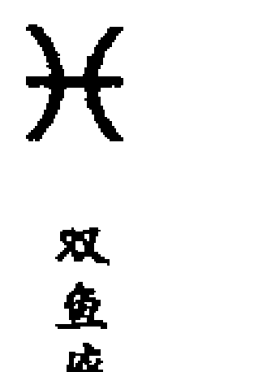

## 太阳和木星的方位与双鱼座人的物质生活趋向

### 太阳在双鱼座和木星在白羊座

现实感不多，常做出不适时机的选择或陷入超出自己能限的事业中。但一般来说，如果出生天宫图中火星与太阳、木星或出生星位呈和谐方位的话，则易脱身且不会蒙受太大的损失，而且冒险计划的成功几率较大。

### 太阳在双鱼座和木星在金牛座

自由放任，生活上追求舒适方便。可在娱乐和奢侈品业方面发展进取。如果出生天宫图其余部分有迹象显示的话，亦可选择艺术之路。

### 太阳在双鱼座和木星在双子座

赚钱的意识比较淡漠，缺乏渠道和手段。有许多物质方面的烦恼，其主要原因是缺乏远见或不善于把握机遇。喜欢跟着感觉走。

### 太阳在双鱼座和木星在巨蟹座

机遇或方便之门会奇迹般地向他敞开，敏锐的直觉会指引他在物质生活发展的道路上顺利前进。经常会得到家庭或亲朋好友的支持和关照。

### 太阳在双鱼座和木星在狮子座

希望不要太辛苦就能赚到钱。顾面子，常去追求超越自己经济能力的生活。为此，容易盲目地去做没有把握的事，尤其出生天宫图中有不和谐的海王星方位的情况下更是如此。

### 太阳在双鱼座和木星在室女座

如不艰苦奋斗，很难摆脱普通人的生活状况和下属的地位。经济状况不稳定，时高时低，只有脚踏实地努力拼搏才能建立一个坚实的基础。不要过于相信运气和机遇。

### 太阳在双鱼座和木星在天秤座

物质生活的改变不是立足于自己的勤奋努力，而是处处依赖他人。在其出生天宫图中，如果出生星位所在星座的影响力较强，尤其当金星在双鱼座或者黄道第一宫或第十宫时，将有助于在艺术、时装、影视和舞蹈等职业领域发展。

### 太阳在双鱼座和木星在天蝎座

在复杂或神秘的工作领域易获成功。不愿追求功名利禄，喜欢自由自在地生活。良好的直觉有助于在投机生意或博彩活动中受益。

### 太阳在双鱼座和木星在人马座

对金钱，特别是对不劳而获的不义之财毫不动心，对出生天宫图中木星在黄道第一宫、第二宫和第十宫或者金星在双鱼座的人尤为如此。机遇和朋友的帮助将有助于他前途和事业的发展。经济基础不太稳定，有时会不慎而失。对于出生天宫图中海王星、土星或火星与木星或太阳呈不和谐方位的人，易对边缘性事业或博彩充满兴趣。

### 太阳在双鱼座和木星在摩羯座

沉稳理智，从不雄心勃勃，跃跃欲试。收入稳定，但永远不会富裕到惹人注目的程度。此外，在钱的问题上要当心犯判断性的错误。人生的第二阶段物质生活会有较大的起色，尤其对出生天宫图中，土星在摩羯座或者与太阳或木星呈和谐方位的人。

### 太阳在双鱼座和木星在宝瓶座

大公无私，只想做有益的事，奉献比索取更易使他有自豪感。许多人会受益于他，同时他也会得到回报。人生中机遇较多。

### 太阳和木星都在双鱼座

敏锐的直觉既表现在金融方面，也体现在艺术创作或神秘冲动方面。但需要当心的是，如果出生天宫图中，海王星与太阳或木星呈不和谐方位，或者它位于黄道第一宫或第十宫时，易卷入不太光彩的事件。

### 把握好海王星主宰下的自我

双鱼座的主宰行星是海王星。当它处在出生星位或中天附近，或者有几颗行星在双鱼座时，会使人的现实感和财产概念模糊不清。受海王星主宰的人可能是个神秘主义者或幻想主义者。喜欢憧憬未来，有较强的宗教意识。在他的出生天宫图中，如果存在和谐的木星方位，则可能成为有助于其人生发展的积极因素。喜欢走捷径，对电影、电视、演艺、科幻作品、隐居之地，以及与石油或麻醉品有关的事情尤为感兴趣。

海王星的作用相当神秘，它对人情感或心理产生的影响远远超过对外界事件的影响。这一行星的影响会使人的思想模糊，充满幻想。

海王星处于出生星位或中天附近的人或出生星位、太阳或月亮在双鱼座的人，最易受海王星的影响。他们在属于自己的极其特殊的世界里过着冥思苦想而无行动的生活，除非在其出生天宫图中有更强的行星方位的影响，否则这种倾向难以改变。物质生活方面，脑子里没有“哪些该是你的和哪些该是我的”的清楚概念。

海王星的影响有助于艺术才能的发挥和人际关系的和谐。海王星的有利影响是音乐、绘画、诗歌、戏剧、电影和科幻作品灵感的源泉，这种影响也能表现在笃信神秘主义方面。

海王星的不利影响会使人缺乏挑战人生的勇气，性格脆弱，易受周围环境因素的影响。有些人容易染上吸麻醉品和酗酒的恶习。

海王星的影响力在狮子座增强，在双鱼座最强，在宝瓶座减弱，在室女座最弱。传统西方星辰学认为，海王星是容易产生不利影响的行星。

### 海王星—太阳

海王星与太阳相合的影响会使人具有超凡脱俗的性格，尤其会赋予男性更大的魅力。雄心勃勃，充满不切实际的幻想，总是在攀登理想的高峰。海王星与太阳相合如同与这两颗行星呈三分方位的影响一样，会使人具有出色的直觉和对美的癖好。对于从事艺术、音乐、戏剧、电影、舞蹈或科幻作品创作的人来说，这是个极其有利的行星方位。然而，它也会使人过分敏感、忧虑和极易受到外界的影响。在出生天宫图中，海王星在狮子座，尤其是在黄道第一宫、第七宫或第十宫中，会对人生产生举足轻重的作用。受其影响的人容易对自己估计过高而产生自负心理。海王星在天秤座的影响会使人变得无忧无虑，过分“嬉皮士”的作风和处处依赖别人。

社会地位很少有坚实的基础，经常处于不稳定状态。尽管总是在别人可靠的保护和帮助下生活，仍免不了受到许多变化的影响，这种情况尤其表现在女性之中。

如果在出生天宫图中，海王星与太阳相合的方位不和谐，或者海王星与太阳相冲或呈四分方位的影响会给人生带来许多麻烦。例如充满奇异和虚无缥缈的幻想，甚至会发展到吸毒和酗酒的地步。工作不稳定，惹是生非，丧失威信，或者过着远离社会的生活。

### 海王星—月亮

在出生天宫图中，海王星与月亮相合的影响会使人具有幻想多于现实感的性格。这一行星方位能唤起激情和敏锐的直觉，增强潜意识。敏感会使他变得很脆弱，甘愿为他人受苦或作出牺牲。不过，它也能成为艺术家灵感的源泉，尤其表现在音乐、诗歌或科幻作品的创作方面。

和谐的海王星与月亮方位的影响会突出人的想象力与温情。人生道路上，不时会在奇特的情况下碰到意想不到的运气。受其影响的人喜欢无拘无束地生活，创造自己的安乐窝。

不和谐的海王星与月亮方位的影响，会增加人境况和性格的不稳定。性。思想模糊，优柔寡断，缺乏现实感，很容易上当受骗。有意无意地放纵自己，懒散。对于男性，爱情的选择可能过于轻率。如果出生天宫图中行星的积极影响力偏弱，则有通过吸毒或酗酒来逃避现实的可能性。

### 海王星—水星

海王星与水星相合的影响易使人具有强烈的同情心，想入非非或性格神秘。总而言之，思维方式和理想与众不同。

性情古怪，反复无常，喜欢悖论。尽管如此，仍无损于他的温情之心，因为他讨厌粗暴专横。幽默感强，想象力丰富，敏锐的知觉有助于他对周围环境及他人思想的洞察和了解。

海王星与水星方位的影响可能激发出惊人的创造力，也可能酿成潜在的精神危机；可能产生新奇的想法，也可能陷入完全无计可施的境地，这主要取决于出生天宫图的总体趋向。

海王星与水星呈三分方位的影响会突出人的优点；而相冲或呈四分方位的影响会使人爱幻想、漫不经心和容易气馁。根据出生天宫图的趋向，或许容易上当受骗，或许为人处世灵活善变。

### 海王星—金星

海王星与金星相合是美好的象征，在出生天宫图中它是形成魅力的主要因素。这一相合的影响往往会赋予人渴望欢乐、追求高品位生活、热爱大自然和对动物充满爱心的性格特征。温情和魅力丝毫不能动摇他的道德观念和所遵循的生活准则。只要给予必需的策动力(因为受这一行星方位影响的人懒散)，就会使他充分施展出自己的艺术才华。

海王星与金星的方位对人性格的影响反差较大，可以从最纯洁正直变为最捉摸不定，从灵感变为空想，从神秘莫测到堕落不堪。

如果出生天宫图其余部分的行星方位明确显示的话，海王星与金星呈三分方位的影响会赋予人丰富的艺术想象力，有助于他在音乐、歌唱、戏剧或电影创作方面取得成就。机遇总是来得十分及时。

海王星与金星相冲或呈四分方位的影响，容易使人在爱情和物质问题上产生自我幻想，但最终会向现实感方面发展。

### 海王星—火星

出生天宫图中，海王星与火星相合是一种矛盾且令人担忧的行星方位，它的影响会使人的言行缺乏谨慎或慎之过度。性格不坚定，易动感情。既是一个浪漫派，又是一个欲望无穷的人，总是追求超越自己能限之外的理想。

另一方面，海王星与火星方位的影响能唤起人强烈的想象力，如果能将其引导到艺术或戏剧领域中来，定会一展宏图。未来几乎总是动荡不定的，但也会出现无限风光。

海王星与火星呈三分方位或六分方位的影响会使人易冲动，会增强人格魅力和实现梦想的决心。两者相冲或呈四分方位的影响会使人过度兴奋而失去理智，导致人生道路上有许多危机阶段。容易酗酒和对麻醉品成瘾。

如果控制得好，即使不和谐的海王星与火星方位的影响，亦能成为巨大精神力量的源泉。

### 海王星—木星

海王星与木星相合的影响会使人性情温和，喜欢自由自在地生活。幻想会把他引向现实生活之外的空间。对人生道路上的困难或障碍不以为然，并总能得到无法解释的幸运的帮助和支持。同情心很强，随时准备去帮助别人。但是，无论任何事情都不要强求他做过分持久的努力，那样的话会使他感到厌烦。

海王星与木星相合或呈和谐方位，尤其是当木星在黄道第一宫、第二宫、第五宫或第十宫时，会给人带来机遇和好运。如果出生天宫图其余部分的行星位形明确显示的话，这一行星方位的影响会给人的心灵世界带来积极或神秘的变化。总之，对于受其影响的所有人来说，热情是人生的动力源泉。

海王星与木星相冲或呈四分方位的影响会使人性情怪僻或浮躁不安，从而导致没有可靠保证的混乱生活，成为一个缺乏一丝不苟精神、处处寻求方便之门的不切实际的人。

### 海王星—土星

这是一个间隔时间漫长的重要的行星相合，大约每35年左右出现一次。1917年土星与海王星相合于狮子座，1952~1953年相合于天秤座，1989年这两颗行星相合于摩羯座。在出生天宫图中，只有当该相合发生在出生星位或中天附近，或者出生星位、太阳或月亮在摩羯座、宝瓶座或双鱼座时，才会产生真正的影响。

受海王星与土星相合影响的人现实感不强，不关心物质利益，注重精神生活。孤独感像影子一样跟随着他。对他人所想、所言、所行漠然置之。严肃质朴，但也会变得冷漠无情。人生可能要经历艰难的阶段，但这将会使他的内心世界逐渐成熟起来。

和谐的海王星与土星方位的影响会赋予人坚忍不拔的精神、组织观念和责任感，并能在政治生活或需要通过艰苦努力取得成就的事业中发挥作用。

海王星与土星相冲或呈四分方位的影响会限制人的自由意志，使人受到某种内心恐惧和幻觉的折磨，乃至变成一种病态心理。如果出生天宫图其余部分的行星位形明确显示的话，这种心理状态则有可能在文学或艺术方面变成创造力。

### ♓ 你的星辰对应备忘录

具有丰富想象力的双鱼座人常说：“我相信。”

你的主宰行星：海王星。

你的关键词：神秘主义、献身精神、敏感、慷慨、忧虑、同情心、直觉、灵感、适应能力、幻想、渴望人工天堂带来的快乐、不健康的癖好。

- 你求爱的方式：充满幻想的。
- 你是一个：思想单纯而质朴的人。
- 你渴望：极大的精神满足。
- 你受骗：由于不会说“不”。
- 你喜欢：幻想。
- 你害怕：被遗忘。
- 你寻求：捷径。
- 你的弱点：自由放任。
- 你的动力：异性的吸引与献身精神。
- 你的优势：机遇。
- 你的劣势：不能兑现诺言。
- 你身体的脆弱点：脚。
- 你的假期生活：海边。
- 你的开支：心中无数。
- 你的服饰：宽松自然的闪色时装，物美价廉的小饰物。
- 你的吉祥物：马头鱼尾怪兽。
- 你的幸运数字：5、11、12、19。
- 你的幸运色：海蓝、玉蓝、紫色。
- 你的幸运花：兰花、百合、牛至。
- 你的吉日：星期四。
- 你的幸运金属：锡。
- 你的幸运石：珊瑚、紫晶、海蓝宝石。
- 你的吉祥动物：各种鱼类和野禽。
- 你的吉祥植物：荷花和所有水生植物、海藻、山茶花和木兰花，一切能引起幻想的植物和蘑菇、桉树、土木香、款冬。
- 你的保健食品：海产品、大蒜、洋葱、白菜、胡萝卜、核桃、榛子、菠萝、番木瓜。
- 你喜欢的礼物：新款数码产品、经典影视DVD，有关神秘学、奥秘探索、地球之谜和世界文明奇迹方面的书籍。
- 有益于你的场所：河流、带有风车的磨坊，海上能看到的一切（船只、渔场等），油井和炼油厂、舞厅或芭蕾舞演出。
- 适合于你的住所：居室幽雅迷奇，装饰和陈设有助于心情舒展并能引起幻想，神秘色彩的小摆设，大鱼缸和水生植物。
- 你的幸运旅游地：西非、塞舌尔、葡萄牙、智利、哥斯达黎加、海地、摩洛哥、巴西、东南亚（巴厘、马来西亚等）；大西洋城[美国]、香港、雅典、耶路撒冷、孟买[印度]。
- 你的理想职业选择：影视、舞蹈、音乐、绘画，以及与海洋环境、水、宗教、神秘学、心理玄学、天文学、航天、慈善和宗教事业、兽医、动物保护、海军、旅馆业以及辅助医务或社会福利有关的工作。
- 与你亲和的星座：巨蟹座、天蝎座、摩羯座、金牛座。与室女座互补。

## 附录

### 有关名词

**星辰学**：探讨天体运行与地球上各种现象之间的对应关系，星辰学以对天体科学观测的数据为依据，旨在确定天体对地球上发生的事件、人的性格、身体素质以及人生发展趋向的影响。

**黄道带**：指天球上黄道南北两侧各 9°宽的环形区域，月亮和太阳系主要行星的轨道都在其中。黄道带分为 12 个星座：白羊座、金牛座、双子座、巨蟹座、狮子座、室女座、天秤座、天蝎座、人马座、摩羯座、宝瓶座和双鱼座，每个星座在 360°的黄道带上占 30°。黄道带的起始点位于春分点（即白羊座 0°）上，根据出生的公历年月日，可确定出生时行星在黄道星座中以度数表示的位置。传统西方星辰学认为，人出生时刻的星座与行星所处的位置之间有着密切的关系。换言之，如果行星本身的性质与该星座相亲，会突出出生者的优点；如果相疏，则会有碍于其优势的发展。

金牛座、室女座和摩羯座属于土类星座，这三个星座出生者的共性是：擅长体力劳动，适宜从事有关种植、土地、建筑或商业等方面的工作。

巨蟹座、天蝎座和双鱼座属于水类星座，这三个星座出生者的共性是：适宜从事与海洋、水以及液体有关的工作，因为这能激发他们的潜意识、激情和想象力。

白羊座、狮子座和人马座属于火类星座，这三个星座出生者的共性是：富有独立和开拓精神，工业、外科、机械和军事是他们理想的职业领域。

双子座、天秤座和宝瓶座属于气类星座，这三个星座出生者的共性是：智力天赋较强，适宜从事文学、艺术、舞台设计以及科学研究等方面的工作。

黄道带及黄道星座的示意图及其象征意义如下：

### 星座使用手册

**图1 黄道带示意图**

**图2 黄道十二星座及行星符号示意图**

| 星座 | 象征意义 |
|---|---|
| 白羊座♈ | 勇气、斗志、领导能力、现实感、责任感、专横、自发性、激情、活力、本能性。 |
| 金牛座♉ | 冷静、思考、独占欲、性感、缓慢、固执、缺乏情趣、热爱大自然、惰性、纯真。 |
| 双子座♊ | 心灵手巧、好奇心、适应性、经商头脑、反应敏捷、三心二意、理智性、表面性、精力分散、雄辩才能、谎言。 |
| 巨蟹座♋ | 优柔寡断、母爱和家庭观念、易怒、敏感、怯懦、反复无常的性格、想象力、潜意识、逃避现实、内倾。 |
| 狮子座♌ | 意志、进取心、生机、雄心、专横、真实、忠诚、宽宏大量、虚荣心、威严、吹嘘、激情。 |
| 室女座♍ | 分析能力、细心、谨慎、条理、秩序、实际感、怯懦、批评精神、自我意识、野心。 |
| 天秤座♎ | 艺术感、正义感、社交性、犹豫不决、懒散、亲切感、高雅、魅力、灵活性、审美能力。 |
| 天蝎座♏ | 顽强、耐力、吸引力、生机、好斗性、破坏性、神秘性、复仇心理、性爱、虐待狂、改革精神。 |
| 人马座♐ | 坦率、独立精神、组织能力、乐观、慷慨、高傲、自负、缺乏坚忍不拔的毅力、智慧、热情、喜欢旅行和冒险。 |
| 摩羯座♑ | 内在化、专心致志、条理、义务和责任感、正直、持之以恒、节俭、权力意志、冷漠、多愁多虑、严谨的作风。 |
| 宝瓶座♒ | 理想主义、关心他人的精神、独创性、社交性、独立精神、一成不变、好奇心、先锋派思想、革新、怪诞。 |
| 双鱼座♓ | 神秘主义、献身精神、敏感、幻想、慷慨、忧虑、同情心、灵感、浪漫、不健康的癖好、暗毒。 |

**黄道宫**：在出生天宫图中，从出生星位（即出生地的东方地平线）开始，逆时针方向将天穹划分成十二个区域（即宫），每个宫具有特定的意义和象征人生的一个领域。黄道宫是移动的和大小可变的，与黄道星座不一一对应。根据出生地的纬度，有时一个宫会交叠两个星座。依据出生时刻的恒星时，可从《黄道宫表》①中查找到自己出生天宫图中黄道十二宫的具体位置。传统西方星辰学认为，如果一颗行星位于黄道第一宫、第四宫、第七宫或第十宫时，会对人生起重要的影响作用。黄道宫的象征意义如下：

| 黄道宫 | 象征意义 |
|--------|----------|
| 第一宫（或出生星位） | 从生辰星位开始，象征自我、性格、外貌、表面行为、体质、对疾病的反应、首创精神。生辰天宫图中，处于第一宫的星座和行星具有特殊重要意义。 |
| 第二宫 | 物质财产、经济状况、通过自身劳动获得的收入，以及赚钱和花钱的方式。 |
| 第三宫 | 通过研究成果和作品、社会关系（兄弟姐妹、邻居、表兄妹）、信函、日常活动、对外交往、访问，以及电话和电子邮件等形式与周围人和外界所建立的联系。该宫对教育的选择是十分重要的。 |
| 第四宫 | 家、家庭生活、住宅、童年、籍贯、不动产、生命的终结。 |
| 第五宫 | 爱情生活、孩子、人际关系，艺术作品（舞蹈、文学、电影、绘画等），娱乐、演出，商业投机或赌博。 |
| 第六宫 | 职业活动、下属、健康状况、急性病、家禽、义务工作、缺乏自由意志、强制或义务。 |
| 第七宫 | 婚姻、结社或与他人的关系，合同、诉讼和公开的对手。 |
| 第八宫 | 死亡、遗产、捐赠、补助金、债务、保险、潜意识、梦想、性欲、正常收入以外的其他经济来源或损失、结婚或婚后的钱财。 |
| 第九宫 | 国外、有影响的哲学思想、精神性、长途旅行、精神生活、内心的变化。 |
| 第十宫（或中天） | 实现自我、命运、社交活动、使命、信誉、声望、荣誉、成功路上的障碍、挫折、冒险、职业或社会生活。生辰天宫图中，处于第十宫的行星具有特别重要的意义。 |
| 第十一宫 | 计划、希望、支持、朋友、有利的机遇或实现计划需要克服的障碍、人际和社会关系、友谊和保护。 |
| 第十二宫 | 离群索居、孤独、流放、考验、医院、默默无闻的工作、潜在的敌意、暗藏的敌人、背叛、慢性病、残疾、私交、神秘学。 |

**黄道人**：从公元二世纪，尤其是文艺复兴以来，传统西方星辰学就建立了黄道星座与人体的对应关系，“黄道人”便是其经典代表（见封面图）。该图绘出了不同星座出生人身体的脆弱部位，如白羊座→头部；金牛座→颈部、咽喉；双子座→上肢；巨蟹座→消化系统和代谢系统；狮子座→心脏、循环系统；室女座→腹部、消化系统；天秤座→肾脏；天蝎座→生殖系统、膀胱；人马座→胯部、坐骨神经；摩羯座→皮肤、膝关节；宝瓶座→小腿、踝骨、血液循环系统；双鱼座→下肢、脚、交感神经系统。

> ① 《黄道宫表》(Tables of Houses) 国内无中译本。

**出生星位**：人出生时刻升起到东方地平线上的以度表示的黄道带的点，它是体现出生者个人信息的重要星辰标记。在出生天宫图中，它确定黄道十二宫划分的起始点，并有助于对出生者的深层自我、情感表达方式、体质以及身体器官所存在弱点的了解。出生星位需根据确切的出生时间来计算，因为4分钟它就会移动1°，出生大约一个小时出生星位就可能移动到另一个星座中。认识出生星位对出生天宫图的解释是十分重要的。

**出生天宫图**：一个人出生时刻和地点的瞬间天象，随着出生的时刻和地理位置的不同，天宫图亦不同。这种图显示太阳、月亮、行星以及人出生时刻黄道十二宫和中天的位置，用以分析人的性格和人生的发展趋向。出生天宫图是有向的，出生星位确定其东方地平线的轴线，而中天构成其另一轴线：出生地的子午线。

**行星**：星辰学研究人出生时刻太阳系八大行星和两个发光体（太阳和月亮）所处的位置，以及探讨行星在人生过程中，相对于它们在出生天宫图中的位置的影响。

宫图中的位置周期性经过给出生者可能带来的影响。每颗行星除具有自身的象征意义外，还体现着所经过黄道星座和黄道宫的特征。行星、太阳、月亮穿越黄道十二星座时，总是以逆时针方向运动。传统西方星辰学认为，出生天宫图中行星的分布情况对人生亦有影响。

大部分行星在白羊座、巨蟹座、天秤座和摩羯座中：善于谋生和为自己开辟生活之路，喜欢按照个人意愿工作或独立行动。

大部分行星在金牛座、狮子座、天蝎座和宝瓶座中：擅长组织和管理工作，适合担任要职，责任感较强。

大部分行星在双子座、室女座、人马座和双鱼座中：缺乏应变能力，一切都取决于他人，个人情况变化不定。

行星的象征意义如下：

| 行 星 | 象 征 意 义 |
|---|---|
| 太阳 ☉ | 生命、精神、意志、个性、综合、组织能力、活力、有意识的自我、权力欲、白天、尊严、父亲、领导、丈夫、虚荣心、外部生活、金。 |
| 月亮 ☽ | 植物生命、女性因素、感受性、集体、无意识精神生活、灵魂、夜晚、被动性、物质、女性、母亲、妻子、记忆力、惰性、智慧、通讯手段、表达方式、创造性、情感、机智灵活、精神生活、想象力、生育、银合金。 |
| 水星 ☿ | 心智手巧、同化能力、新颖的构思、飞行、背信弃义、空话、变化无常、商业、知性、水银。 |
| 金星 ♀ | 艺术感、社交性、亲切感、和谐、美、娱乐、情感生活、爱情、女性、情妇、女儿、朋友、演员、业余爱好、轻率、无忧无虑、消极性、铜。 |
| 火星 ♂ | 行动、毅力、力量、运动、侵略、首创精神、激情、矛盾、专横、绝对意识、反抗、粗暴、情夫、性爱、好斗性、铁。 |
| 木星 ♃ | 智慧、预防、慈爱、发展、秩序、保守主义、责任感、公正、凝聚力、法律、心灵的高尚、凝聚力、尊重权力、傲慢、色情、成就、确定的事、物质或精神方面的秩序和表现、生活中所得到的满足、锡。 |
| 土星 ♄ | 付出的努力、工作、考验、时间因素、凝固、稳重、抑制、思考、谨慎、耐心、节俭、怀疑、仇恨、悲观主义、吝啬、惰性、缓慢、严格、僵化、老年、冷漠。 |
| 天王星 ♅ | 想象力、直觉、个性、进步、革新、独创性、节律、意外的打击、航空、放射性、突然分离、反叛、无政府主义、一切新的或突如其来的事，身体、精神或物质方面的变故。 |
| 海王星 ♆ | 与地外空间的接触、灵感、天赋、神秘主义、幻想、潜意识、非理性、通灵术、想象力、超验思想、膨胀、混乱、不寻常的运气、幻觉、毒品、精神病、宿命论、仅有愿望而无行动、强迫症、恶习、自满、反常的冲动。 |
| 冥王星 ♇ | 破坏和变态、净化、更新、心理、巫术、名利欲、权力欲、渴望精神境界的升华、集体感、开拓能力、先锋派思想。 |

**行星经过**：行星在天空中相对于出生天宫图呈和谐或不和谐方位的经过，会激活出生者出生时的潜在倾向。行星与出生天宫图呈和谐方位经过可唤醒潜在的积极因素，呈不和谐方位经过会唤起潜在的消极因素。

**10°区**：黄道带分为 36 个 10°区，每个黄道星座包括三个 10°区，太阳在 0°～9°59'为第一个 10°区，在 10°～19°59'为第二个 10°区，在 20°～29°59'为第三个 10°区。传统西方星辰学认为，每个 10°区被一颗行星所“主宰”并表现出与这颗行星相关的特性。星辰学家在做集体星辰预测时，用这一概念来区分行星周期经过对出生时间不同人的影响。例如，1987年，天王星仅对人马座第三个10°区的出生者有影响，因为此时天王星位于人马座20°～29°59′之间。

**行星方位**：行星的公转速度不同，因此它们的相隔距离也是经常变化的。行星方位指两颗行星相对于地球所形成的角，根据黄道带的度计算出的行星的某些角，在出生天宫图的分析中具有特殊的意义：

- **相合♂**：当两颗行星相对于地球所形成角度为0°，即它们位于天空的同一点上时。相合方位的有利与否，取决于两颗相关行星的性质。
- **相冲♃**：当两颗行星相对于地球成180°角（即相隔6个星座）时，在出生天宫图的分析中称之为不和谐方位。
- **三分方位△**：当两颗行星相对于地球成120°角（即相隔4个星座）时，在出生天宫图的分析中称之为和谐方位。
- **四分方位□**：当两颗行星相对于地球成90°角（即相隔3个星座）时，在出生天宫图的分析中称之为不和谐方位。
- **六分方位***：当两颗行星相对于地球成60°角（即相隔2个星座）时，在出生天宫图的分析中称之为和谐方位。

传统西方星辰学认为，木星和金星是吉星（能产生有利影响）；火星、土星和天王星是不吉利星；太阳、月亮、水星和海王星是中性星。吉星与中性星相合为和谐的行星方位。中性星与不吉利星相合为不和谐行星方位。吉星与不吉利星相合方位的好与坏，要根据相关行星在其星座中影响力强弱来判断。例如：金星与土星在巨蟹座相合对金星不利（指感情方面），因为土星代表所经受的考验，其影响力在巨蟹座最弱。但是，如果该相合发生在金星影响力最强的天秤座，那么，根据土星的象征意义则可判定出，这一相合方位将有助于某出生者在艺术创作方面表现出更多的才智。

### 行星在不同星座中的影响力

| 影响力 行星 | 最强 | 最弱 | 增强 | 减弱 |
| :--- | :--- | :--- | :--- | :--- |
| 太阳 ☉ | 狮子座 | 宝瓶座 | 白羊座 | 天秤座 |
| 月亮 ☽ | 巨蟹座 | 摩羯座 | 金牛座 | 天蝎座 |
| 水星 ☿ | 双子座、室女座 | 人马座、双鱼座 | 宝瓶座 | 狮子座 |
| 金星 ♀ | 金牛座、天秤座 | 天蝎座、白羊座 | 双鱼座 | 室女座 |
| 火星 ♂ | 白羊座 | 天秤座 | 摩羯座 | 巨蟹座 |
| 木星 ♃ | 人马座 | 双子座 | 巨蟹座 | 摩羯座 |
| 土星 ♄ | 摩羯座 | 巨蟹座 | 天秤座 | 白羊座 |
| 天王星 ♅ | 宝瓶座 | 狮子座 | 天蝎座 | 金牛座 |
| 海王星 ♆ | 双鱼座 | 室女座 | 狮子座 | 宝瓶座 |
| 冥王星 ♇ | 天蝎座 | 金牛座 | 人马座 | 双子座 |

中天：在天球中，它是子午线和黄道的相交点，也是黄道第十宫的起始点。它象征出生者的人生志向、职业生涯、命运以及荣誉。

有益的场所：传统西方星辰学认为，每个星座与一些特定的场所之间存在以主宰行星的影响为基础的对应关系，出生者在这些地方易受到星辰的有利影响，成功机遇较大。对此，星辰学家格雷戈里解释说：“这些地方未必是你喜欢的，也不一定是你从小生活过的，更不一定是你最常光顾之处，但你的主宰行星的影响就在那里，它与你人格深处隐藏的深层自我之间存在着一种无形的关系。”

吉祥植物：传统西方星辰学认为，地球上生长的大多数植物与黄道十二星座有类比关系，这些植物被看作对不同星座出生的人有积极的影响。

吉祥动物：传统西方星辰学认为，某些动物与黄道十二星座是有联系的，它们与相关星座出生者有亲和关系，并会对他们有积极的影响。

幸运色：传统西方星辰学认为，与黄道十二星座相对应的每一种颜色都具有一种特殊的影响。

幸运金属：每个黄道星座都对应着一种或几种幸运金属，这种组合关系是根据每个星座主宰行星的特征与金属物理性质间的类比关系建立起来的。

幸运旅游地：自托勒密时代起，西方星辰学家就一直认为地球的每个部分都是被一个黄道星座主宰着的。后来，这些对应关系被扩展，具体到某些国家、城市和地区。人们到与自己星座亲和的地区旅游观光，开阔视野会倍感亲切。

### 我国夏时制起止时间表

| 年代 | 起始时间 | 截止时间 |
|------|----------|----------|
| 1986年 | 5月4日凌晨2时 | 9月14日凌晨2时 |
| 1987年 | 4月12日凌晨2时 | 9月13日凌晨2时 |
| 1988年 | 4月10日凌晨2时 | 9月11日凌晨2时 |
| 1989年 | 4月16日凌晨2时 | 9月17日凌晨2时 |
| 1990年 | 4月15日凌晨2时 | 9月16日凌晨2时 |
| 1991年 | 4月14日凌晨2时 | 9月15日凌晨2时 |

### 太阳经过黄道十二星座及其 10°区时间表

| 星座 | 经过的时间 | 星座 | 经过的时间 |
| :--- | :--- | :--- | :--- |
| 白羊座 第一个 10°区 第二个 10°区 第三个 10°区 | 3月21~4月20日 3月21~31日 4月1~10日 4月11~20日 | 天秤座 第一个 10°区 第二个 10°区 第三个 10°区 | 9月24~10月23日 9月24~10月2日 10月3~13日 10月14~23日 |
| 金牛座 第一个 10°区 第二个 10°区 第三个 10°区 | 4月21~5月21日 4月21~30日 5月1~10日 5月11~21日 | 天蝎座 第一个 10°区 第二个 10°区 第三个 10°区 | 10月24~11月22日 10月24~11月2日 11月3~12日 11月13~22日 |
| 双子座 第一个 10°区 第二个 10°区 第三个 10°区 | 5月22~6月21日 5月22~31日 6月1~10日 6月11~21日 | 人马座 第一个 10°区 第二个 10°区 第三个 10°区 | 11月23~12月21日 11月23~12月1日 12月2~11日 12月12~21日 |
| 巨蟹座 第一个 10°区 第二个 10°区 第三个 10°区 | 6月22~7月22日 6月22~7月1日 7月2~12日 7月13~22日 | 摩羯座 第一个 10°区 第二个 10°区 第三个 10°区 | 12月22~1月20日 12月22~31日 1月1~10日 1月11~20日 |
| 狮子座 第一个 10°区 第二个 10°区 第三个 10°区 | 7月23~8月23日 7月23~8月2日 8月3~13日 8月14~23日 | 宝瓶座 第一个 10°区 第二个 10°区 第三个 10°区 | 1月21~2月19日 1月21~31日 2月1~9日 2月10~19日 |
| 室女座 第一个 10°区 第二个 10°区 第三个 10°区 | 8月24~9月23日 8月24~9月2日 9月3~12日 9月13~23日 | 双鱼座 第一个 10°区 第二个 10°区 第三个 10°区 | 2月20~3月20日 2月20~28或29日 3月1~10日 3月11~20日 |

### 不同星座出生的人性格和谱参照表

| 星座 和谐类型 | 友谊和谱 | 完美和谱 | 性爱和谐，但有基本分歧 | 互补和谱或不和谱 |
| :--- | :--- | :--- | :--- | :--- |
| 白羊座 | 双子座 宝瓶座 | 狮子座 人马座 | 巨蟹座 摩羯座 | 天秤座 |
| 金牛座 | 巨蟹座 双鱼座 | 摩羯座 室女座 | 狮子座 宝瓶座 | 天蝎座 |
| 双子座 | 狮子座 白羊座 | 天秤座 宝瓶座 | 室女座 双鱼座 | 人马座 |
| 巨蟹座 | 室女座 金牛座 | 双鱼座 天蝎座 | 白羊座 天秤座 | 摩羯座 |
| 狮子座 | 双子座 天秤座 | 人马座 白羊座 | 天蝎座 金牛座 | 宝瓶座 |
| 室女座 | 天蝎座 巨蟹座 | 摩羯座 金牛座 | 人马座 双子座 | 双鱼座 |
| 天秤座 | 人马座 狮子座 | 宝瓶座 双子座 | 摩羯座 巨蟹座 | 白羊座 |
| 天蝎座 | 摩羯座 室女座 | 双鱼座 巨蟹座 | 狮子座 宝瓶座 | 金牛座 |
| 人马座 | 宝瓶座 天秤座 | 狮子座 白羊座 | 双鱼座 室女座 | 双子座 |
| 摩羯座 | 天蝎座 双鱼座 | 金牛座 室女座 | 天秤座 白羊座 | 巨蟹座 |
| 宝瓶座 | 白羊座 人马座 | 天秤座 双子座 | 金牛座 天蝎座 | 狮子座 |
| 双鱼座 | 金牛座 摩羯座 | 巨蟹座 天蝎座 | 人马座 双子座 | 室女座 |

### 平均恒星时表

| 月/日 | 1月 | 2月 | 3月 | 4月 | 5月 | 6月 | 7月 | 8月 | 9月 | 10月 | 11月 | 12月 |
|-------|-----|-----|-----|-----|-----|-----|-----|-----|-----|------|------|------|
| 1日   | 6时37分 | 8时38分 | 10时33分 | 12时36分 | 14时33分 | 16时36分 | 18时34分 | 20时37分 | 22时39分 | 0时37分 | 2时39分 | 4时38分 |
| 2日   | 6时40分 | 8时42分 | 10时37分 | 12时40分 | 14时37分 | 16时39分 | 18时38分 | 20时41分 | 22时43分 | 0时41分 | 2时43分 | 4时42分 |
| 3日   | 6时44分 | 8时46分 | 10时40分 | 12时44分 | 14时41分 | 16时43分 | 18时42分 | 20时45分 | 22时47分 | 0时45分 | 2时47分 | 4时46分 |
| 4日   | 6时48分 | 8时50分 | 10时44分 | 12时48分 | 14时45分 | 16时47分 | 18时46分 | 20时49分 | 22时51分 | 0时49分 | 2时51分 | 4时50分 |
| 5日   | 6时52分 | 8时54分 | 10时48分 | 12时52分 | 14时49分 | 16时51分 | 18时50分 | 20时53分 | 22时55分 | 0时53分 | 2时55分 | 4时54分 |
| 6日   | 6时56分 | 8时58分 | 10时52分 | 12时56分 | 14时53分 | 16时55分 | 18时54分 | 20时57分 | 22时59分 | 0时57分 | 2时59分 | 4时57分 |
| 7日   | 7时00分 | 9时02分 | 10时56分 | 13时00分 | 14时57分 | 16时59分 | 18时58分 | 21时00分 | 23时03分 | 1时01分 | 3时03分 | 5时01分 |
| 8日   | 7时04分 | 9时06分 | 11时00分 | 13时04分 | 15时01分 | 17时03分 | 19时02分 | 21时04分 | 23时07分 | 1时05分 | 3时07分 | 5时05分 |
| 9日   | 7时08分 | 9时10分 | 11时04分 | 13时08分 | 15时05分 | 17时07分 | 19时06分 | 21时08分 | 23时11分 | 1时09分 | 3时11分 | 5时09分 |
| 10日  | 7时12分 | 9时14分 | 11时08分 | 13时12分 | 15时09分 | 17时11分 | 19时10分 | 21时12分 | 23时14分 | 1时13分 | 3时15分 | 5时13分 |
| 11日  | 7时15分 | 9时18分 | 11时12分 | 13时16分 | 15时13分 | 17时15分 | 19时14分 | 21时16分 | 23时18分 | 1时17分 | 3时19分 | 5时17分 |
| 12日  | 7时19分 | 9时22分 | 11时16分 | 13时20分 | 15时17分 | 17时19分 | 19时18分 | 21时20分 | 23时22分 | 1时21分 | 3时23分 | 5时21分 |
| 13日  | 7时23分 | 9时26分 | 11时20分 | 13时24分 | 15时21分 | 17时23分 | 19时22分 | 21时24分 | 23时26分 | 1时25分 | 3时27分 | 5时25分 |
| 14日  | 7时27分 | 9时30分 | 11时24分 | 13时28分 | 15时24分 | 17时27分 | 19时26分 | 21时28分 | 23时30分 | 1时29分 | 3时31分 | 5时29分 |
| 15日  | 7时31分 | 9时33分 | 11时28分 | 13时32分 | 15时28分 | 17时31分 | 19时30分 | 21时32分 | 23时34分 | 1时32分 | 3时35分 | 5时33分 |
| 16日  | 7时35分 | 9时37分 | 11时32分 | 13时36分 | 15时32分 | 17时34分 | 19时34分 | 21时36分 | 23时38分 | 1时36分 | 3时39分 | 5时37分 |
| 17日  | 7时39分 | 9时41分 | 11时36分 | 13时40分 | 15时36分 | 17时38分 | 19时38分 | 21时40分 | 23时42分 | 1时40分 | 3时43分 | 5时41分 |
| 18日  | 7时43分 | 9时45分 | 11时40分 | 13时44分 | 15时40分 | 17时42分 | 19时42分 | 21时44分 | 23时46分 | 1时44分 | 3时47分 | 5时45分 |
| 19日  | 7时47分 | 9时49分 | 11时44分 | 13时48分 | 15时44分 | 17时46分 | 19时46分 | 21时48分 | 23时50分 | 1时48分 | 3时50分 | 5时49分 |
| 20日  | 7时51分 | 9时53分 | 11时48分 | 13时52分 | 15时48分 | 17时50分 | 19时50分 | 21时52分 | 23时54分 | 1时52分 | 3时54分 | 5时53分 |
| 21日  | 7时55分 | 9时57分 | 11时52分 | 13时56分 | 15时52分 | 17时54分 | 19时54分 | 21时56分 | 23时58分 | 1时56分 | 3时58分 | 5时57分 |
| 22日  | 7时59分 | 10时01分 | 11时55分 | 13时58分 | 15时56分 | 17时58分 | 19时58分 | 22时00分 | 0时02分 | 2时00分 | 4时02分 | 6时01分 |
| 23日  | 8时03分 | 10时05分 | 11时59分 | 14时02分 | 16时00分 | 18时02分 | 20时02分 | 22时04分 | 0时06分 | 2时04分 | 4时06分 | 6时04分 |
| 24日  | 8时07分 | 10时09分 | 12时03分 | 14时06分 | 16时04分 | 18时06分 | 20时06分 | 22时08分 | 0时10分 | 2时08分 | 4时10分 | 6时08分 |
| 25日  | 8时11分 | 10时13分 | 12时07分 | 14时10分 | 16时08分 | 18时10分 | 20时10分 | 22时12分 | 0时14分 | 2时12分 | 4时14分 | 6时11分 |
| 26日  | 8时15分 | 10时17分 | 12时10分 | 14时14分 | 16时12分 | 18时14分 | 20时14分 | 22时16分 | 0时18分 | 2时16分 | 4时18分 | 6时15分 |
| 27日  | 8时19分 | 10时21分 | 12时14分 | 14时18分 | 16时16分 | 18时18分 | 20时18分 | 22时20分 | 0时22分 | 2时20分 | 4时22分 | 6时19分 |
| 28日  | 8时23分 | 10时25分 | 12时18分 | 14时22分 | 16时20分 | 18时22分 | 20时22分 | 22时24分 | 0时26分 | 2时24分 | 4时26分 | 6时23分 |
| 29日  | 8时26分 | 10时29分 | 12时22分 | 14时26分 | 16时24分 | 18时26分 | 20时26分 | 22时27分 | 0时30分 | 2时28分 | 4时30分 | 6时27分 |
| 30日  | 8时30分 | 10时33分 | 12时26分 | 14时29分 | 16时28分 | 18时30分 | 20时30分 | 22时31分 | 0时34分 | 2时32分 | 4时34分 | 6时30分 |
| 31日  | 8时34分 |       | 12时30分 | 14时32分 | 16时32分 | 18时33分 | 20时33分 | 22时35分 |       | 2时36分 |       | 6时34分 |

### 我国主要城市经纬度表

| 地名 | 北纬(度) | 东经(时) | 地名 | 北纬(度) | 东经(时) | 地名 | 北纬(度) | 东经(时) | 地名 | 北纬(度) | 东经(时) |
|------|----------|----------|------|----------|----------|------|----------|----------|------|----------|----------|
| 北京 | 39°55' | 7时45分 | 天津 | 39°02' | 7时48分 | 上海 | 31°14' | 8时06分 | 重庆 | 29°35' | 7时06分 |
| 黑龙江 | 45°44' | 7时26分 | 哈尔滨 | 45°44' | 7时26分 | 齐齐哈尔 | 47°20' | 7时15分 | 牡丹江 | 44°35' | 8时38分 |
| 佳木斯 | 46°47' | 8时41分 | 绥化 | 46°48' | 8时28分 | 伊春 | 47°42' | 8时35分 | 吉林 | 43°52' | 8时26分 |
| 长春 | 43°54' | 8时21分 | 延吉 | 42°54' | 8时38分 | 四平 | 43°10' | 8时17分 | 通化 | 41°43' | 8时23分 |
| 白城 | 45°30' | 8时11分 | 辽宁 | 41°48' | 8时13分 | 沈阳 | 38°55' | 8时06分 | 大连 | 41°07' | 8时12分 |
| 鞍山 | 41°51' | 8时15分 | 抚顺 | 41°08' | 8时04分 | 丹东 | 41°07' | 8时09分 | 锦州 | 40°39' | 7时26分 |
| 营口 | 40°39' | 7时26分 | 内蒙古 | 40°48' | 7时19分 | 呼和浩特 | 40°48' | 7时19分 | 包头 | 40°39' | 7时56分 |
| 赤峰 | 42°17' | 7时44分 | 锡林浩特 | 43°57' | 7时32分 | 河北 | 38°02' | 7时38分 | 石家庄 | 38°02' | 7时38分 |
| 保定 | 38°51' | 7时42分 | 张家口 | 40°48' | 7时39分 | 承德 | 40°59' | 7时51分 | 唐山 | 39°36' | 7时52分 |
| 邯郸 | 36°36' | 7时38分 | 秦皇岛 | 39°55' | 7时58分 | 河南 | 34°46' | 7时34分 | 郑州 | 34°46' | 7时34分 |
| 安阳 | 36°06' | 7时37分 | 新乡 | 35°18' | 7时33分 | 许昌 | 34°01' | 7时35分 | 平顶山 | 33°44' | 7时33分 |
| 信阳 | 32°07' | 7时36分 | 南阳 | 33°00' | 7时30分 | 开封 | 34°47' | 7时37分 | 洛阳 | 34°41' | 7时29分 |
| 商丘 | 34°26' | 7时42分 | 山东 | 36°40' | 7时48分 | 济南 | 36°40' | 7时48分 | 青岛 | 36°03' | 8时01分 |
| 淄博 | 36°48' | 7时52分 | 德州 | 37°26' | 7时45分 | 烟台 | 37°32' | 8时05分 | 潍坊 | 36°43' | 7时56分 |
| 临沂 | 35°03' | 7时53分 | 荷泽 | 35°14' | 7时41分 | 山西 | 37°54' | 7时30分 | 太原 | 37°54' | 7时30分 |
| 大同 | 40°06' | 7时31分 | 长治 | 36°11' | 7时31分 | 晋城 | 35°30' | 7时26分 | 临汾 | 36°05' | 7时26分 |
| 安徽 | 31°52' | 7时49分 | 合肥 | 31°52' | 7时49分 | 蚌埠 | 32°56' | 7时49分 | 芜湖 | 31°19' | 7时53分 |
| 安庆 | 30°31' | 7时48分 | 阜阳 | 32°54' | 7时43分 | 黄山 | 29°43' | 7时53分 | 淮北 | 33°57' | 7时47分 |
| 湖南 | 28°12' | 7时32分 | 长沙 | 28°12' | 7时32分 | 湘潭 | 27°52' | 7时31分 | 衡阳 | 26°53' | 7时30分 |
| 郴州 | 25°46' | 7时32分 | 邵阳 | 27°14' | 7时26分 | 岳阳 | 29°22' | 7时32分 | 韶山 | 27°54' | 7时30分 |
| 湖北 | 30°35' | 7时34分 | 武汉 | 30°35' | 7时34分 | 咸宁 | 29°53' | 7时37分 | 恩施 | 30°16' | 7时18分 |
| 沙市 | 30°18' | 7时29分 | 宜昌 | 30°42' | 7时25分 | 十堰 | 32°40' | 7时23分 | 襄樊 | 32°02' | 7时28分 |
| 江苏 | 32°01' | 8时02分 | 苏州 | 31°19' | 8时02分 | 常州 | 31°47' | 8时00分 | 南通 | 32°01' | 8时03分 |
| 南京 | 32°03' | 7时55分 | 扬州 | 32°23' | 7时57分 | 盐城 | 33°22' | 8时00分 | 徐州 | 34°15' | 7时48分 |
| 连云港 | 34°36' | 7时56分 | 浙江 | 28°01' | 8时02分 | 杭州 | 30°16' | 8时00分 | 宁波 | 29°52' | 8时05分 |
| 温州 | 28°01' | 8时02分 | 嘉兴 | 30°46' | 8时03分 | 湖州 | 30°52' | 8时03分 | 金华 | 29°07' | 7时56分 |
| 衢州 | 28°58' | 7时56分 | 福建 | 24°27' | 7时52分 | 福州 | 26°05' | 7时57分 | 厦门 | 24°26' | 7时52分 |
| 泉州 | 24°54' | 7时48分 | 漳州 | 24°30' | 7时48分 | 龙岩 | 25°06' | 7时48分 | 三明 | 26°14' | 7时48分 |
| 南平 | 26°38' | 7时48分 | 莆田 | 25°26' | 7时48分 | 江西 | 28°40' | 7时32分 | 南昌 | 28°40' | 7时32分 |
| 景德镇 | 29°17' | 7时32分 | 九江 | 29°43' | 7时32分 | 上饶 | 28°27' | 7时32分 | 抚州 | 28°00' | 7时32分 |
| 宜春 | 27°48' | 7时32分 | 吉安 | 27°07' | 7时32分 | 赣州 | 25°52' | 7时32分 | 广东 | 23°08' | 7时36分 |
| 广州 | 23°08' | 7时36分 | 深圳 | 22°33' | 7时36分 | 珠海 | 22°17' | 7时34分 | 汕头 | 23°22' | 7时46分 |
| 湛江 | 21°11' | 7时21分 | 茂名 | 21°40' | 7时23分 | 佛山 | 23°01' | 7时36分 | 韶关 | 24°48' | 7时34分 |
| 广西 | 22°48' | 7时13分 | 南宁 | 22°48' | 7时13分 | 柳州 | 23°19' | 7时06分 | 桂林 | 25°17' | 7时06分 |
| 梧州 | 23°29' | 7时16分 | 北海 | 21°28' | 7时07分 | 百色 | 23°54' | 7时07分 | 海南 | 20°02' | 7时21分 |
| 海口 | 20°02' | 7时21分 | 四川 | 26°34' | 6时47分 | 成都 | 30°40' | 6时58分 | 重庆 | 29°35' | 7时06分 |
| 攀枝花 | 26°34' | 6时47分 | 西昌 | 27°54' | 6时49分 | 宜宾 | 28°47' | 6时58分 | 泸州 | 28°54' | 7时01分 |
| 自贡 | 29°23' | 6时59分 | 内江 | 29°35' | 6时59分 | 南充 | 30°49' | 6时56分 | 万县 | 30°50' | 7时04分 |
| 广元 | 32°28' | 7时03分 | 云南 | 25°04' | 6时43分 | 昆明 | 25°04' | 6时43分 | 大理 | 25°34' | 6时52分 |
| 曲靖 | 25°30' | 6时52分 | 个旧 | 23°21' | 6时52分 | 蒙自 | 23°21' | 6时52分 | 贵州 | 26°35' | 7时03分 |
| 贵阳 | 26°35' | 7时03分 | 遵义 | 27°42' | 7时07分 | 六盘水 | 26°35' | 7时06分 | 安顺 | 26°14' | 7时03分 |
| 西藏 | 29°39' | 6时04分 | 拉萨 | 29°39' | 6时04分 | 日喀则 | 29°16' | 5时55分 | 陕西 | 34°17' | 7时08分 |
| 西安 | 34°17' | 7时08分 | 宝鸡 | 34°22' | 7时08分 | 咸阳 | 34°22' | 7时08分 | 延安 | 36°35' | 7时18分 |
| 榆林 | 38°18' | 7时19分 | 安康 | 32°41' | 7时16分 | 汉中 | 33°04' | 7时08分 | 甘肃 | 36°04' | 6时50分 |
| 兰州 | 36°04' | 6时50分 | 天水 | 34°37' | 7时02分 | 武威 | 37°56' | 6时50分 | 张掖 | 38°56' | 6时41分 |
| 酒泉 | 39°49' | 6时30分 | 青海 | 36°38' | 6时47分 | 西宁 | 36°38' | 6时47分 | 格尔木 | 36°26' | 6时19分 |
| 宁夏 | 38°27' | 7时04分 | 银川 | 38°27' | 7时04分 | 石嘴山 | 39°02' | 7时04分 | 新疆 | 43°45' | 5时39分 |
| 乌鲁木齐 | 43°45' | 5时39分 | 克拉玛依 | 45°36' | 5时39分 | 哈密 | 42°50' | 6时14分 | 喀什 | 39°30' | 5时04分 |
| 和田 | 37°09' | 5时19分 | 香港 | 22°18' | 7时36分 | 澳门 | 22°11' | 7时34分 | 台湾 | 25°03' | 8时06分 |
| 台北 | 25°03' | 8时06分 | 高雄 | 22°38' | 8时01分 |

注：该表给出的只是部分城市的经纬度，其他城镇的经纬度可通过Google网上查询。化为时的方法：经度1°=4分钟；经度1'=4秒；例如，网上查询到铜川市的经度为109°07'，4分钟×109=436分，即=7小时16分，4秒×7=28秒；从而得出铜川的经度时间是7时16分28秒，以此类推。

### 伴随人年龄的行星方位表

| 年龄 | 行星方位 | 年龄 | 行星方位 | 年龄 | 行星方位 | 年龄 | 行星方位 |
|------|----------|------|----------|------|----------|------|----------|
| 0岁 | 出生 | 23岁 | 土星/土星□ | 45岁 | 木星/木星□, 土星/土星♂ | 69岁 | 木星/木星*, 土星/土星* |
| 1岁 | 火星/火星♂ | 24岁 | 木星/木星○ | 48岁 | 木星/木星○ | 70岁 | 天王星/天王星* |
| 2岁 | 火星/火星○, 木星/木星* | 25岁 | 冥王星/冥王星*, 冥王星/海王星○, 土星/土星* | 50岁 | 土星/土星* | 71岁 | 木星/木星○ |
| 3岁 | 木星/木星□ | 26岁 | 木星/木星* | 51岁 | 木星/木星□ | 73岁 | 木星/木星* |
| 4岁 | 木星/木星△ | 27岁 | 木星/木星□ | 52岁 | 木星/木星△, 土星/土星□ | 74岁 | 木星/木星□, 土星/土星♂ |
| 5岁 | 土星/土星* | 28岁 | 木星/木星△, 天王星/天王星△, 海王星/海王星* | 54岁 | 木星/木星♂, 土星/土星* | 75岁 | 木星/木星△ |
| 6岁 | 木星/木星♂ | 29岁 | 土星/土星○ | 55岁 | 海王星/海王星△ | 77岁 | 木星/木星♂ |
| 7岁 | 土星/土星□ | 30岁 | 木星/木星♂ | 56岁 | 木星/木星△, 天王星/天王星△ | 78岁 | 土星/土星△ |
| 8岁 | 木星/木星△ | 32岁 | 木星/木星△ | 57岁 | 木星/木星□ | 79岁 | 木星/木星△ |
| 9岁 | 木星/木星□ | 33岁 | 木星/木星□ | 58岁 | 冥王星/冥王星△, 木星/木星* | 80岁 | 木星/木星□, 土星/土星□ |
| 10岁 | 土星/土星△, 木星/木星* | 34岁 | 土星/土星* | 59岁 | 木星/木星○, 土星/土星♂ | 81岁 | 木星/木星* |
| 12岁 | 木星/木星○ | 36岁 | 木星/木星○ | 61岁 | 木星/木星* | 82岁 | 海王星/海王星♂ |
| 14岁 | 木星/木星*, 天王星/天王星* | 37岁 | 土星/土星□ | 62岁 | 木星/木星□ | 83岁 | 木星/木星○, 土星/土星* |
| 15岁 | 土星/土星♂, 木星/木星□ | 38岁 | 冥王星/冥王星□, 木星/木星* | 63岁 | 木星/木星△, 天王星/天王星□ | 84岁 | 天王星/天王星○ |
| 16岁 | 木星/木星△ | 39岁 | 木星/木星□ | 64岁 | 土星/土星* | 85岁 | 木星/木星* |
| 18岁 | 木星/木星♂ | 40岁 | 木星/木星△, 土星/土星△ | 65岁 | 木星/木星♂ | 86岁 | 木星/木星□ |
| 20岁 | 木星/木星△, 土星/土星△ | 41岁 | 海王星/海王星□ | 66岁 | 土星/土星□ | 87岁 | 木星/木星△ |
| 21岁 | 木星/木星□, 天王星/天王星♂ | 42岁 | 木星/木星♂, 天王星/天王星♂ | 67岁 | 木星/木星△ | 88岁 | 土星/土星○ |
| 22岁 | 木星/木星* | 44岁 | 木星/木星△, 土星/土星♂ | 68岁 | 木星/木星□ | | |

注：① 本表给出的是人生中，某些行星公转过程中相对于它在人的出生天宫图上的位置所在星的方位。例如：某人1岁的时候，火星运行到与他出生时火星位置呈180°（即相冲）的方位上；而当他10岁的时候，土星运行到与他出生时土星所在位置呈120°（即三分方位）的位置上。依此类推。
② * 代表六分方位（即两颗行星相距60°）；△ 代表三分方位（即两颗行星相距120°）；□ 代表四分方位（即两颗行星相距90°）；♂ 代表相冲（两颗行星相距180°）；○ 代表相合（两颗行星位于一个星座的同一度）。

### 出生星位所在星座时间表

| 恒星时 | 北纬20° | 北纬21° | 北纬22° | 北纬23° | 北纬24° | 北纬25° | 北纬26° | 北纬27° | 北纬28° | 北纬29° | 北纬30° | 北纬31° | 北纬32° | 北纬33° | 北纬34° |
|--------|---------|---------|---------|---------|---------|---------|---------|---------|---------|---------|---------|---------|---------|---------|---------|
| 0时00分 | 巨蟹座 | 巨蟹座 | 巨蟹座 | 巨蟹座 | 巨蟹座 | 巨蟹座 | 巨蟹座 | 巨蟹座 | 巨蟹座 | 巨蟹座 | 巨蟹座 | 巨蟹座 | 巨蟹座 | 巨蟹座 | 巨蟹座 |
| 0时03分 | 巨蟹座 | 巨蟹座 | 巨蟹座 | 巨蟹座 | 巨蟹座 | 巨蟹座 | 巨蟹座 | 巨蟹座 | 巨蟹座 | 巨蟹座 | 巨蟹座 | 巨蟹座 | 巨蟹座 | 巨蟹座 | 巨蟹座 |
| 0时07分 | 巨蟹座 | 巨蟹座 | 巨蟹座 | 巨蟹座 | 巨蟹座 | 巨蟹座 | 巨蟹座 | 巨蟹座 | 巨蟹座 | 巨蟹座 | 巨蟹座 | 巨蟹座 | 巨蟹座 | 巨蟹座 | 巨蟹座 |
| 0时11分 | 巨蟹座 | 巨蟹座 | 巨蟹座 | 巨蟹座 | 巨蟹座 | 巨蟹座 | 巨蟹座 | 巨蟹座 | 巨蟹座 | 巨蟹座 | 巨蟹座 | 巨蟹座 | 巨蟹座 | 巨蟹座 | 巨蟹座 |
| 0时14分 | 巨蟹座 | 巨蟹座 | 巨蟹座 | 巨蟹座 | 巨蟹座 | 巨蟹座 | 巨蟹座 | 巨蟹座 | 巨蟹座 | 巨蟹座 | 巨蟹座 | 巨蟹座 | 巨蟹座 | 巨蟹座 | 巨蟹座 |
| 0时18分 | 巨蟹座 | 巨蟹座 | 巨蟹座 | 巨蟹座 | 巨蟹座 | 巨蟹座 | 巨蟹座 | 巨蟹座 | 巨蟹座 | 巨蟹座 | 巨蟹座 | 巨蟹座 | 巨蟹座 | 巨蟹座 | 巨蟹座 |
| 0时22分 | 巨蟹座 | 巨蟹座 | 巨蟹座 | 巨蟹座 | 巨蟹座 | 巨蟹座 | 巨蟹座 | 巨蟹座 | 巨蟹座 | 巨蟹座 | 巨蟹座 | 巨蟹座 | 巨蟹座 | 巨蟹座 | 巨蟹座 |
| 0时25分 | 巨蟹座 | 巨蟹座 | 巨蟹座 | 巨蟹座 | 巨蟹座 | 巨蟹座 | 巨蟹座 | 巨蟹座 | 巨蟹座 | 巨蟹座 | 巨蟹座 | 巨蟹座 | 巨蟹座 | 巨蟹座 | 巨蟹座 |
| 0时29分 | 巨蟹座 | 巨蟹座 | 巨蟹座 | 巨蟹座 | 巨蟹座 | 巨蟹座 | 巨蟹座 | 巨蟹座 | 巨蟹座 | 巨蟹座 | 巨蟹座 | 巨蟹座 | 巨蟹座 | 巨蟹座 | 巨蟹座 |
| 0时33分 | 巨蟹座 | 巨蟹座 | 巨蟹座 | 巨蟹座 | 巨蟹座 | 巨蟹座 | 巨蟹座 | 巨蟹座 | 巨蟹座 | 巨蟹座 | 巨蟹座 | 巨蟹座 | 巨蟹座 | 巨蟹座 | 巨蟹座 |
| 0时36分 | 巨蟹座 | 巨蟹座 | 巨蟹座 | 巨蟹座 | 巨蟹座 | 巨蟹座 | 巨蟹座 | 巨蟹座 | 巨蟹座 | 巨蟹座 | 巨蟹座 | 巨蟹座 | 巨蟹座 | 巨蟹座 | 巨蟹座 |
| 0时40分 | 巨蟹座 | 巨蟹座 | 巨蟹座 | 巨蟹座 | 巨蟹座 | 巨蟹座 | 巨蟹座 | 巨蟹座 | 巨蟹座 | 巨蟹座 | 巨蟹座 | 巨蟹座 | 巨蟹座 | 巨蟹座 | 巨蟹座 |
| 0时44分 | 巨蟹座 | 巨蟹座 | 巨蟹座 | 巨蟹座 | 巨蟹座 | 巨蟹座 | 巨蟹座 | 巨蟹座 | 巨蟹座 | 巨蟹座 | 巨蟹座 | 巨蟹座 | 巨蟹座 | 巨蟹座 | 巨蟹座 |
| 0时47分 | 巨蟹座 | 巨蟹座 | 巨蟹座 | 巨蟹座 | 巨蟹座 | 巨蟹座 | 巨蟹座 | 巨蟹座 | 巨蟹座 | 巨蟹座 | 巨蟹座 | 巨蟹座 | 巨蟹座 | 巨蟹座 | 巨蟹座 |
| 0时51分 | 巨蟹座 | 巨蟹座 | 巨蟹座 | 巨蟹座 | 巨蟹座 | 巨蟹座 | 巨蟹座 | 巨蟹座 | 巨蟹座 | 巨蟹座 | 巨蟹座 | 巨蟹座 | 巨蟹座 | 巨蟹座 | 巨蟹座 |
| 0时55分 | 巨蟹座 | 巨蟹座 | 巨蟹座 | 巨蟹座 | 巨蟹座 | 巨蟹座 | 巨蟹座 | 巨蟹座 | 巨蟹座 | 巨蟹座 | 巨蟹座 | 巨蟹座 | 巨蟹座 | 巨蟹座 | 巨蟹座 |
| 0时58分 | 巨蟹座 | 巨蟹座 | 巨蟹座 | 巨蟹座 | 巨蟹座 | 巨蟹座 | 巨蟹座 | 巨蟹座 | 巨蟹座 | 巨蟹座 | 巨蟹座 | 巨蟹座 | 巨蟹座 | 巨蟹座 | 巨蟹座 |
| 1时02分 | 巨蟹座 | 巨蟹座 | 巨蟹座 | 巨蟹座 | 巨蟹座 | 巨蟹座 | 巨蟹座 | 巨蟹座 | 巨蟹座 | 巨蟹座 | 巨蟹座 | 巨蟹座 | 巨蟹座 | 巨蟹座 | 巨蟹座 |
| 1时06分 | 巨蟹座 | 巨蟹座 | 巨蟹座 | 巨蟹座 | 巨蟹座 | 巨蟹座 | 巨蟹座 | 巨蟹座 | 巨蟹座 | 巨蟹座 | 巨蟹座 | 巨蟹座 | 巨蟹座 | 巨蟹座 | 巨蟹座 |
| 1时10分 | 巨蟹座 | 巨蟹座 | 巨蟹座 | 巨蟹座 | 巨蟹座 | 巨蟹座 | 巨蟹座 | 巨蟹座 | 巨蟹座 | 巨蟹座 | 巨蟹座 | 巨蟹座 | 巨蟹座 | 巨蟹座 | 巨蟹座 |
| 1时13分 | 巨蟹座 | 巨蟹座 | 巨蟹座 | 巨蟹座 | 巨蟹座 | 巨蟹座 | 巨蟹座 | 巨蟹座 | 巨蟹座 | 巨蟹座 | 巨蟹座 | 巨蟹座 | 巨蟹座 | 巨蟹座 | 巨蟹座 |
| 1时17分 | 巨蟹座 | 巨蟹座 | 巨蟹座 | 巨蟹座 | 巨蟹座 | 巨蟹座 | 巨蟹座 | 巨蟹座 | 巨蟹座 | 巨蟹座 | 巨蟹座 | 巨蟹座 | 巨蟹座 | 巨蟹座 | 巨蟹座 |
| 1时21分 | 巨蟹座 | 巨蟹座 | 巨蟹座 | 巨蟹座 | 巨蟹座 | 巨蟹座 | 巨蟹座 | 巨蟹座 | 巨蟹座 | 巨蟹座 | 巨蟹座 | 巨蟹座 | 巨蟹座 | 巨蟹座 | 巨蟹座 |
| 1时25分 | 巨蟹座 | 巨蟹座 | 巨蟹座 | 巨蟹座 | 巨蟹座 | 巨蟹座 | 巨蟹座 | 巨蟹座 | 巨蟹座 | 巨蟹座 | 巨蟹座 | 巨蟹座 | 巨蟹座 | 巨蟹座 | 巨蟹座 |
| 1时28分 | 巨蟹座 | 巨蟹座 | 巨蟹座 | 巨蟹座 | 巨蟹座 | 巨蟹座 | 巨蟹座 | 巨蟹座 | 巨蟹座 | 巨蟹座 | 巨蟹座 | 巨蟹座 | 巨蟹座 | 巨蟹座 | 巨蟹座 |
| 1时32分 | 巨蟹座 | 巨蟹座 | 巨蟹座 | 巨蟹座 | 巨蟹座 | 巨蟹座 | 巨蟹座 | 巨蟹座 | 巨蟹座 | 巨蟹座 | 巨蟹座 | 巨蟹座 | 巨蟹座 | 巨蟹座 | 巨蟹座 |
| 1时36分 | 巨蟹座 | 巨蟹座 | 巨蟹座 | 巨蟹座 | 巨蟹座 | 巨蟹座 | 巨蟹座 | 巨蟹座 | 巨蟹座 | 巨蟹座 | 巨蟹座 | 巨蟹座 | 巨蟹座 | 巨蟹座 | 巨蟹座 |
| 1时40分 | 巨蟹座 | 巨蟹座 | 巨蟹座 | 巨蟹座 | 巨蟹座 | 巨蟹座 | 巨蟹座 | 巨蟹座 | 巨蟹座 | 巨蟹座 | 巨蟹座 | 巨蟹座 | 巨蟹座 | 巨蟹座 | 巨蟹座 |
| 1时44分 | 巨蟹座 | 巨蟹座 | 巨蟹座 | 巨蟹座 | 巨蟹座 | 巨蟹座 | 巨蟹座 | 巨蟹座 | 巨蟹座 | 巨蟹座 | 巨蟹座 | 巨蟹座 | 巨蟹座 | 巨蟹座 | 巨蟹座 |
| 1时47分 | 巨蟹座 | 巨蟹座 | 巨蟹座 | 巨蟹座 | 巨蟹座 | 巨蟹座 | 巨蟹座 | 巨蟹座 | 巨蟹座 | 巨蟹座 | 巨蟹座 | 巨蟹座 | 巨蟹座 | 巨蟹座 | 巨蟹座 |
| 1时51分 | 巨蟹座 | 巨蟹座 | 巨蟹座 | 巨蟹座 | 巨蟹座 | 巨蟹座 | 巨蟹座 | 巨蟹座 | 巨蟹座 | 巨蟹座 | 巨蟹座 | 巨蟹座 | 巨蟹座 | 巨蟹座 | 巨蟹座 |
| 1时55分 | 巨蟹座 | 巨蟹座 | 巨蟹座 | 巨蟹座 | 巨蟹座 | 巨蟹座 | 巨蟹座 | 巨蟹座 | 巨蟹座 | 巨蟹座 | 巨蟹座 | 巨蟹座 | 巨蟹座 | 巨蟹座 | 巨蟹座 |
| 1时59分 | 狮子座 | 巨蟹座 | 巨蟹座 | 巨蟹座 | 巨蟹座 | 巨蟹座 | 巨蟹座 | 巨蟹座 | 巨蟹座 | 巨蟹座 | 巨蟹座 | 巨蟹座 | 巨蟹座 | 巨蟹座 | 巨蟹座 |
| 2时03分 | 狮子座 | 狮子座 | 巨蟹座 | 巨蟹座 | 巨蟹座 | 巨蟹座 | 巨蟹座 | 巨蟹座 | 巨蟹座 | 巨蟹座 | 巨蟹座 | 巨蟹座 | 巨蟹座 | 巨蟹座 | 巨蟹座 |
| 2时07分 | 狮子座 | 狮子座 | 狮子座 | 狮子座 | 狮子座 | 狮子座 | 狮子座 | 狮子座 | 狮子座 | 狮子座 | 狮子座 | 狮子座 | 狮子座 | 狮子座 | 狮子座 |
| 2时10分 | 狮子座 | 狮子座 | 狮子座 | 狮子座 | 狮子座 | 狮子座 | 狮子座 | 狮子座 | 狮子座 | 狮子座 | 狮子座 | 狮子座 | 狮子座 | 狮子座 | 狮子座 |
| 2时14分 | 狮子座 | 狮子座 | 狮子座 | 狮子座 | 狮子座 | 狮子座 | 狮子座 | 狮子座 | 狮子座 | 狮子座 | 狮子座 | 狮子座 | 狮子座 | 狮子座 | 狮子座 |
| 2时18分 | 狮子座 | 狮子座 | 狮子座 | 狮子座 | 狮子座 | 狮子座 | 狮子座 | 狮子座 | 狮子座 | 狮子座 | 狮子座 | 狮子座 | 狮子座 | 狮子座 | 狮子座 |
| 2时22分 | 狮子座 | 狮子座 | 狮子座 | 狮子座 | 狮子座 | 狮子座 | 狮子座 | 狮子座 | 狮子座 | 狮子座 | 狮子座 | 狮子座 | 狮子座 | 狮子座 | 狮子座 |
| 2时26分 | 狮子座 | 狮子座 | 狮子座 | 狮子座 | 狮子座 | 狮子座 | 狮子座 | 狮子座 | 狮子座 | 狮子座 | 狮子座 | 狮子座 | 狮子座 | 狮子座 | 狮子座 |
| 2时30分 | 狮子座 | 狮子座 | 狮子座 | 狮子座 | 狮子座 | 狮子座 | 狮子座 | 狮子座 | 狮子座 | 狮子座 | 狮子座 | 狮子座 | 狮子座 | 狮子座 | 狮子座 |
| 2时34分 | 狮子座 | 狮子座 | 狮子座 | 狮子座 | 狮子座 | 狮子座 | 狮子座 | 狮子座 | 狮子座 | 狮子座 | 狮子座 | 狮子座 | 狮子座 | 狮子座 | 狮子座 |
| 2时38分 | 狮子座 | 狮子座 | 狮子座 | 狮子座 | 狮子座 | 狮子座 | 狮子座 | 狮子座 | 狮子座 | 狮子座 | 狮子座 | 狮子座 | 狮子座 | 狮子座 | 狮子座 |
| 2时42分 | 狮子座 | 狮子座 | 狮子座 | 狮子座 | 狮子座 | 狮子座 | 狮子座 | 狮子座 | 狮子座 | 狮子座 | 狮子座 | 狮子座 | 狮子座 | 狮子座 | 狮子座 |
| 2时46分 | 狮子座 | 狮子座 | 狮子座 | 狮子座 | 狮子座 | 狮子座 | 狮子座 | 狮子座 | 狮子座 | 狮子座 | 狮子座 | 狮子座 | 狮子座 | 狮子座 | 狮子座 |
| 2时50分 | 狮子座 | 狮子座 | 狮子座 | 狮子座 | 狮子座 | 狮子座 | 狮子座 | 狮子座 | 狮子座 | 狮子座 | 狮子座 | 狮子座 | 狮子座 | 狮子座 | 狮子座 |
| 2时54分 | 狮子座 | 狮子座 | 狮子座 | 狮子座 | 狮子座 | 狮子座 | 狮子座 | 狮子座 | 狮子座 | 狮子座 | 狮子座 | 狮子座 | 狮子座 | 狮子座 | 狮子座 |
| 2时58分 | 狮子座 | 狮子座 | 狮子座 | 狮子座 | 狮子座 | 狮子座 | 狮子座 | 狮子座 | 狮子座 | 狮子座 | 狮子座 | 狮子座 | 狮子座 | 狮子座 | 狮子座 |
| 3时02分 | 狮子座 | 狮子座 | 狮子座 | 狮子座 | 狮子座 | 狮子座 | 狮子座 | 狮子座 | 狮子座 | 狮子座 | 狮子座 | 狮子座 | 狮子座 | 狮子座 | 狮子座 |
| 3时06分 | 狮子座 | 狮子座 | 狮子座 | 狮子座 | 狮子座 | 狮子座 | 狮子座 | 狮子座 | 狮子座 | 狮子座 | 狮子座 | 狮子座 | 狮子座 | 狮子座 | 狮子座 |
| 3时10分 | 狮子座 | 狮子座 | 狮子座 | 狮子座 | 狮子座 | 狮子座 | 狮子座 | 狮子座 | 狮子座 | 狮子座 | 狮子座 | 狮子座 | 狮子座 | 狮子座 | 狮子座 |
| 3时14分 | 狮子座 | 狮子座 | 狮子座 | 狮子座 | 狮子座 | 狮子座 | 狮子座 | 狮子座 | 狮子座 | 狮子座 | 狮子座 | 狮子座 | 狮子座 | 狮子座 | 狮子座 |
| 3时18分 | 狮子座 | 狮子座 | 狮子座 | 狮子座 | 狮子座 | 狮子座 | 狮子座 | 狮子座 | 狮子座 | 狮子座 | 狮子座 | 狮子座 | 狮子座 | 狮子座 | 狮子座 |
| 3时22分 | 狮子座 | 狮子座 | 狮子座 | 狮子座 | 狮子座 | 狮子座 | 狮子座 | 狮子座 | 狮子座 | 狮子座 | 狮子座 | 狮子座 | 狮子座 | 狮子座 | 狮子座 |
| 3时26分 | 狮子座 | 狮子座 | 狮子座 | 狮子座 | 狮子座 | 狮子座 | 狮子座 | 狮子座 | 狮子座 | 狮子座 | 狮子座 | 狮子座 | 狮子座 | 狮子座 | 狮子座 |
| 3时30分 | 狮子座 | 狮子座 | 狮子座 | 狮子座 | 狮子座 | 狮子座 | 狮子座 | 狮子座 | 狮子座 | 狮子座 | 狮子座 | 狮子座 | 狮子座 | 狮子座 | 狮子座 |
| 3时34分 | 狮子座 | 狮子座 | 狮子座 | 狮子座 | 狮子座 | 狮子座 | 狮子座 | 狮子座 | 狮子座 | 狮子座 | 狮子座 | 狮子座 | 狮子座 | 狮子座 | 狮子座 |
| 3时38分 | 狮子座 | 狮子座 | 狮子座 | 狮子座 | 狮子座 | 狮子座 | 狮子座 | 狮子座 | 狮子座 | 狮子座 | 狮子座 | 狮子座 | 狮子座 | 狮子座 | 狮子座 |
| 3时42分 | 狮子座 | 狮子座 | 狮子座 | 狮子座 | 狮子座 | 狮子座 | 狮子座 | 狮子座 | 狮子座 | 狮子座 | 狮子座 | 狮子座 | 狮子座 | 狮子座 | 狮子座 |
| 3时47分 | 狮子座 | 狮子座 | 狮子座 | 狮子座 | 狮子座 | 狮子座 | 狮子座 | 狮子座 | 狮子座 | 狮子座 | 狮子座 | 狮子座 | 狮子座 | 狮子座 | 狮子座 |
| 3时51分 | 狮子座 | 狮子座 | 狮子座 | 狮子座 | 狮子座 | 狮子座 | 狮子座 | 狮子座 | 狮子座 | 狮子座 | 狮子座 | 狮子座 | 狮子座 | 狮子座 | 狮子座 |
| 3时55分 | 狮子座 | 狮子座 | 狮子座 | 狮子座 | 狮子座 | 狮子座 | 狮子座 | 狮子座 | 狮子座 | 狮子座 | 狮子座 | 狮子座 | 狮子座 | 狮子座 | 狮子座 |
| 3时59分 | 狮子座 | 狮子座 | 狮子座 | 狮子座 | 狮子座 | 狮子座 | 狮子座 | 狮子座 | 狮子座 | 狮子座 | 狮子座 | 狮子座 | 狮子座 | 狮子座 | 狮子座 |
| 4时03分 | 狮子座 | 狮子座 | 狮子座 | 狮子座 | 狮子座 | 狮子座 | 狮子座 | 狮子座 | 狮子座 | 狮子座 | 狮子座 | 狮子座 | 狮子座 | 狮子座 | 狮子座 |
| 4时08分 | 狮子座 | 狮子座 | 狮子座 | 狮子座 | 狮子座 | 狮子座 | 狮子座 | 狮子座 | 狮子座 | 狮子座 | 狮子座 | 狮子座 | 狮子座 | 狮子座 | 狮子座 |
| 4时12分 | 狮子座 | 狮子座 | 狮子座 | 狮子座 | 狮子座 | 狮子座 | 狮子座 | 狮子座 | 狮子座 | 狮子座 | 狮子座 | 狮子座 | 狮子座 | 狮子座 | 狮子座 |
| 4时16分 | 狮子座 | 狮子座 | 狮子座 | 狮子座 | 狮子座 | 狮子座 | 狮子座 | 狮子座 | 狮子座 | 狮子座 | 狮子座 | 狮子座 | 狮子座 | 狮子座 | 狮子座 |
| 4时20分 | 室女座 | 室女座 | 室女座 | 室女座 | 室女座 | 室女座 | 室女座 | 室女座 | 室女座 | 室女座 | 室女座 | 室女座 | 室女座 | 室女座 | 室女座 |
| 4时24分 | 室女座 | 室女座 | 室女座 | 室女座 | 室女座 | 室女座 | 室女座 | 室女座 | 室女座 | 室女座 | 室女座 | 室女座 | 室女座 | 室女座 | 室女座 |
| 4时29分 | 室女座 | 室女座 | 室女座 | 室女座 | 室女座 | 室女座 | 室女座 | 室女座 | 室女座 | 室女座 | 室女座 | 室女座 | 室女座 | 室女座 | 室女座 |

### 星表使用说明

### 续表1

### 续表3

| 恒星时 | 北纬20° | 北纬21° | 北纬22° | 北纬23° | 北纬24° | 北纬25° | 北纬26° | 北纬27° | 北纬28° | 北纬29° | 北纬30° | 北纬31° | 北纬32° | 北纬33° | 北纬34° |
| --- | --- | --- | --- | --- | --- | --- | --- | --- | --- | --- | --- | --- | --- | --- | --- |
| 4时33分 | 室女座 | 室女座 | 室女座 | 室女座 | 室女座 | 室女座 | 室女座 | 室女座 | 室女座 | 室女座 | 室女座 | 室女座 | 室女座 | 室女座 | 室女座 |
| 4时37分 | 室女座 | 室女座 | 室女座 | 室女座 | 室女座 | 室女座 | 室女座 | 室女座 | 室女座 | 室女座 | 室女座 | 室女座 | 室女座 | 室女座 | 室女座 |
| 4时42分 | 室女座 | 室女座 | 室女座 | 室女座 | 室女座 | 室女座 | 室女座 | 室女座 | 室女座 | 室女座 | 室女座 | 室女座 | 室女座 | 室女座 | 室女座 |
| 4时46分 | 室女座 | 室女座 | 室女座 | 室女座 | 室女座 | 室女座 | 室女座 | 室女座 | 室女座 | 室女座 | 室女座 | 室女座 | 室女座 | 室女座 | 室女座 |
| 4时50分 | 室女座 | 室女座 | 室女座 | 室女座 | 室女座 | 室女座 | 室女座 | 室女座 | 室女座 | 室女座 | 室女座 | 室女座 | 室女座 | 室女座 | 室女座 |
| 4时54分 | 室女座 | 室女座 | 室女座 | 室女座 | 室女座 | 室女座 | 室女座 | 室女座 | 室女座 | 室女座 | 室女座 | 室女座 | 室女座 | 室女座 | 室女座 |
| 4时59分 | 室女座 | 室女座 | 室女座 | 室女座 | 室女座 | 室女座 | 室女座 | 室女座 | 室女座 | 室女座 | 室女座 | 室女座 | 室女座 | 室女座 | 室女座 |
| 5时03分 | 室女座 | 室女座 | 室女座 | 室女座 | 室女座 | 室女座 | 室女座 | 室女座 | 室女座 | 室女座 | 室女座 | 室女座 | 室女座 | 室女座 | 室女座 |
| 5时07分 | 室女座 | 室女座 | 室女座 | 室女座 | 室女座 | 室女座 | 室女座 | 室女座 | 室女座 | 室女座 | 室女座 | 室女座 | 室女座 | 室女座 | 室女座 |
| 5时12分 | 室女座 | 室女座 | 室女座 | 室女座 | 室女座 | 室女座 | 室女座 | 室女座 | 室女座 | 室女座 | 室女座 | 室女座 | 室女座 | 室女座 | 室女座 |
| 5时16分 | 室女座 | 室女座 | 室女座 | 室女座 | 室女座 | 室女座 | 室女座 | 室女座 | 室女座 | 室女座 | 室女座 | 室女座 | 室女座 | 室女座 | 室女座 |
| 5时20分 | 室女座 | 室女座 | 室女座 | 室女座 | 室女座 | 室女座 | 室女座 | 室女座 | 室女座 | 室女座 | 室女座 | 室女座 | 室女座 | 室女座 | 室女座 |
| 5时25分 | 室女座 | 室女座 | 室女座 | 室女座 | 室女座 | 室女座 | 室女座 | 室女座 | 室女座 | 室女座 | 室女座 | 室女座 | 室女座 | 室女座 | 室女座 |
| 5时29分 | 室女座 | 室女座 | 室女座 | 室女座 | 室女座 | 室女座 | 室女座 | 室女座 | 室女座 | 室女座 | 室女座 | 室女座 | 室女座 | 室女座 | 室女座 |
| 5时33分 | 室女座 | 室女座 | 室女座 | 室女座 | 室女座 | 室女座 | 室女座 | 室女座 | 室女座 | 室女座 | 室女座 | 室女座 | 室女座 | 室女座 | 室女座 |
| 5时38分 | 室女座 | 室女座 | 室女座 | 室女座 | 室女座 | 室女座 | 室女座 | 室女座 | 室女座 | 室女座 | 室女座 | 室女座 | 室女座 | 室女座 | 室女座 |
| 5时42分 | 室女座 | 室女座 | 室女座 | 室女座 | 室女座 | 室女座 | 室女座 | 室女座 | 室女座 | 室女座 | 室女座 | 室女座 | 室女座 | 室女座 | 室女座 |
| 5时46分 | 室女座 | 室女座 | 室女座 | 室女座 | 室女座 | 室女座 | 室女座 | 室女座 | 室女座 | 室女座 | 室女座 | 室女座 | 室女座 | 室女座 | 室女座 |
| 5时51分 | 室女座 | 室女座 | 室女座 | 室女座 | 室女座 | 室女座 | 室女座 | 室女座 | 室女座 | 室女座 | 室女座 | 室女座 | 室女座 | 室女座 | 室女座 |
| 5时55分 | 室女座 | 室女座 | 室女座 | 室女座 | 室女座 | 室女座 | 室女座 | 室女座 | 室女座 | 室女座 | 室女座 | 室女座 | 室女座 | 室女座 | 室女座 |
| 6时00分 | 室女座 | 室女座 | 室女座 | 室女座 | 室女座 | 室女座 | 室女座 | 天秤座 | 天秤座 | 天秤座 | 天秤座 | 天秤座 | 天秤座 | 天秤座 | 天秤座 |
| 6时04分 | 室女座 | 室女座 | 室女座 | 室女座 | 室女座 | 室女座 | 室女座 | 天秤座 | 天秤座 | 天秤座 | 天秤座 | 天秤座 | 天秤座 | 天秤座 | 天秤座 |
| 6时08分 | 室女座 | 室女座 | 室女座 | 室女座 | 室女座 | 室女座 | 天秤座 | 天秤座 | 天秤座 | 天秤座 | 天秤座 | 天秤座 | 天秤座 | 天秤座 | 天秤座 |
| 6时13分 | 室女座 | 室女座 | 室女座 | 室女座 | 室女座 | 室女座 | 天秤座 | 天秤座 | 天秤座 | 天秤座 | 天秤座 | 天秤座 | 天秤座 | 天秤座 | 天秤座 |
| 6时17分 | 室女座 | 室女座 | 室女座 | 室女座 | 室女座 | 天秤座 | 天秤座 | 天秤座 | 天秤座 | 天秤座 | 天秤座 | 天秤座 | 天秤座 | 天秤座 | 天秤座 |
| 6时21分 | 室女座 | 室女座 | 室女座 | 室女座 | 室女座 | 天秤座 | 天秤座 | 天秤座 | 天秤座 | 天秤座 | 天秤座 | 天秤座 | 天秤座 | 天秤座 | 天秤座 |
| 6时26分 | 室女座 | 室女座 | 室女座 | 室女座 | 天秤座 | 天秤座 | 天秤座 | 天秤座 | 天秤座 | 天秤座 | 天秤座 | 天秤座 | 天秤座 | 天秤座 | 天秤座 |
| 6时30分 | 室女座 | 室女座 | 室女座 | 室女座 | 天秤座 | 天秤座 | 天秤座 | 天秤座 | 天秤座 | 天秤座 | 天秤座 | 天秤座 | 天秤座 | 天秤座 | 天秤座 |
| 6时34分 | 室女座 | 室女座 | 室女座 | 天秤座 | 天秤座 | 天秤座 | 天秤座 | 天秤座 | 天秤座 | 天秤座 | 天秤座 | 天秤座 | 天秤座 | 天秤座 | 天秤座 |
| 6时39分 | 室女座 | 室女座 | 室女座 | 天秤座 | 天秤座 | 天秤座 | 天秤座 | 天秤座 | 天秤座 | 天秤座 | 天秤座 | 天秤座 | 天秤座 | 天秤座 | 天秤座 |
| 6时43分 | 室女座 | 室女座 | 天秤座 | 天秤座 | 天秤座 | 天秤座 | 天秤座 | 天秤座 | 天秤座 | 天秤座 | 天秤座 | 天秤座 | 天秤座 | 天秤座 | 天秤座 |
| 6时47分 | 室女座 | 室女座 | 天秤座 | 天秤座 | 天秤座 | 天秤座 | 天秤座 | 天秤座 | 天秤座 | 天秤座 | 天秤座 | 天秤座 | 天秤座 | 天秤座 | 天秤座 |
| 6时52分 | 室女座 | 天秤座 | 天秤座 | 天秤座 | 天秤座 | 天秤座 | 天秤座 | 天秤座 | 天秤座 | 天秤座 | 天秤座 | 天秤座 | 天秤座 | 天秤座 | 天秤座 |
| 6时56分 | 室女座 | 天秤座 | 天秤座 | 天秤座 | 天秤座 | 天秤座 | 天秤座 | 天秤座 | 天秤座 | 天秤座 | 天秤座 | 天秤座 | 天秤座 | 天秤座 | 天秤座 |
| 7时00分 | 天秤座 | 天秤座 | 天秤座 | 天秤座 | 天秤座 | 天秤座 | 天秤座 | 天秤座 | 天秤座 | 天秤座 | 天秤座 | 天秤座 | 天秤座 | 天秤座 | 天秤座 |
| 7时05分 | 天秤座 | 天秤座 | 天秤座 | 天秤座 | 天秤座 | 天秤座 | 天秤座 | 天秤座 | 天秤座 | 天秤座 | 天秤座 | 天秤座 | 天秤座 | 天秤座 | 天秤座 |
| 7时09分 | 天秤座 | 天秤座 | 天秤座 | 天秤座 | 天秤座 | 天秤座 | 天秤座 | 天秤座 | 天秤座 | 天秤座 | 天秤座 | 天秤座 | 天秤座 | 天秤座 | 天秤座 |
| 7时13分 | 天秤座 | 天秤座 | 天秤座 | 天秤座 | 天秤座 | 天秤座 | 天秤座 | 天秤座 | 天秤座 | 天秤座 | 天秤座 | 天秤座 | 天秤座 | 天秤座 | 天秤座 |
| 7时18分 | 天秤座 | 天秤座 | 天秤座 | 天秤座 | 天秤座 | 天秤座 | 天秤座 | 天秤座 | 天秤座 | 天秤座 | 天秤座 | 天秤座 | 天秤座 | 天秤座 | 天秤座 |
| 7时22分 | 天秤座 | 天秤座 | 天秤座 | 天秤座 | 天秤座 | 天秤座 | 天秤座 | 天秤座 | 天秤座 | 天秤座 | 天秤座 | 天秤座 | 天秤座 | 天秤座 | 天秤座 |
| 7时26分 | 天秤座 | 天秤座 | 天秤座 | 天秤座 | 天秤座 | 天秤座 | 天秤座 | 天秤座 | 天秤座 | 天秤座 | 天秤座 | 天秤座 | 天秤座 | 天秤座 | 天秤座 |
| 7时30分 | 天秤座 | 天秤座 | 天秤座 | 天秤座 | 天秤座 | 天秤座 | 天秤座 | 天秤座 | 天秤座 | 天秤座 | 天秤座 | 天秤座 | 天秤座 | 天秤座 | 天秤座 |
| 7时35分 | 天秤座 | 天秤座 | 天秤座 | 天秤座 | 天秤座 | 天秤座 | 天秤座 | 天秤座 | 天秤座 | 天秤座 | 天秤座 | 天秤座 | 天秤座 | 天秤座 | 天秤座 |
| 7时39分 | 天秤座 | 天秤座 | 天秤座 | 天秤座 | 天秤座 | 天秤座 | 天秤座 | 天秤座 | 天秤座 | 天秤座 | 天秤座 | 天秤座 | 天秤座 | 天秤座 | 天秤座 |
| 7时43分 | 天秤座 | 天秤座 | 天秤座 | 天秤座 | 天秤座 | 天秤座 | 天秤座 | 天秤座 | 天秤座 | 天秤座 | 天秤座 | 天秤座 | 天秤座 | 天秤座 | 天秤座 |
| 7时47分 | 天秤座 | 天秤座 | 天秤座 | 天秤座 | 天秤座 | 天秤座 | 天秤座 | 天秤座 | 天秤座 | 天秤座 | 天秤座 | 天秤座 | 天秤座 | 天秤座 | 天秤座 |
| 7时51分 | 天秤座 | 天秤座 | 天秤座 | 天秤座 | 天秤座 | 天秤座 | 天秤座 | 天秤座 | 天秤座 | 天秤座 | 天秤座 | 天秤座 | 天秤座 | 天秤座 | 天秤座 |
| 7时56分 | 天秤座 | 天秤座 | 天秤座 | 天秤座 | 天秤座 | 天秤座 | 天秤座 | 天秤座 | 天秤座 | 天秤座 | 天秤座 | 天秤座 | 天秤座 | 天秤座 | 天秤座 |
| 8时00分 | 天秤座 | 天秤座 | 天秤座 | 天秤座 | 天秤座 | 天秤座 | 天秤座 | 天秤座 | 天秤座 | 天秤座 | 天秤座 | 天秤座 | 天秤座 | 天秤座 | 天秤座 |
| 8时04分 | 天秤座 | 天秤座 | 天秤座 | 天秤座 | 天秤座 | 天秤座 | 天秤座 | 天秤座 | 天秤座 | 天秤座 | 天秤座 | 天秤座 | 天秤座 | 天秤座 | 天秤座 |
| 8时08分 | 天秤座 | 天秤座 | 天秤座 | 天秤座 | 天秤座 | 天秤座 | 天秤座 | 天秤座 | 天秤座 | 天秤座 | 天秤座 | 天秤座 | 天秤座 | 天秤座 | 天秤座 |
| 8时12分 | 天秤座 | 天秤座 | 天秤座 | 天秤座 | 天秤座 | 天秤座 | 天秤座 | 天秤座 | 天秤座 | 天秤座 | 天秤座 | 天秤座 | 天秤座 | 天秤座 | 天秤座 |
| 8时17分 | 天秤座 | 天秤座 | 天秤座 | 天秤座 | 天秤座 | 天秤座 | 天秤座 | 天秤座 | 天秤座 | 天秤座 | 天秤座 | 天秤座 | 天秤座 | 天秤座 | 天蝎座 |
| 8时21分 | 天秤座 | 天秤座 | 天秤座 | 天秤座 | 天秤座 | 天秤座 | 天秤座 | 天秤座 | 天秤座 | 天秤座 | 天秤座 | 天秤座 | 天秤座 | 天蝎座 | 天蝎座 |
| 8时25分 | 天秤座 | 天秤座 | 天秤座 | 天秤座 | 天秤座 | 天秤座 | 天秤座 | 天秤座 | 天秤座 | 天秤座 | 天秤座 | 天秤座 | 天蝎座 | 天蝎座 | 天蝎座 |
| 8时29分 | 天秤座 | 天秤座 | 天秤座 | 天秤座 | 天秤座 | 天秤座 | 天秤座 | 天秤座 | 天秤座 | 天秤座 | 天秤座 | 天蝎座 | 天蝎座 | 天蝎座 | 天蝎座 |
| 8时33分 | 天秤座 | 天秤座 | 天秤座 | 天秤座 | 天秤座 | 天秤座 | 天秤座 | 天秤座 | 天秤座 | 天秤座 | 天蝎座 | 天蝎座 | 天蝎座 | 天蝎座 | 天蝎座 |
| 8时37分 | 天秤座 | 天秤座 | 天秤座 | 天秤座 | 天秤座 | 天秤座 | 天秤座 | 天秤座 | 天秤座 | 天蝎座 | 天蝎座 | 天蝎座 | 天蝎座 | 天蝎座 | 天蝎座 |
| 8时41分 | 天秤座 | 天秤座 | 天秤座 | 天秤座 | 天秤座 | 天秤座 | 天秤座 | 天秤座 | 天蝎座 | 天蝎座 | 天蝎座 | 天蝎座 | 天蝎座 | 天蝎座 | 天蝎座 |
| 8时45分 | 天秤座 | 天秤座 | 天秤座 | 天秤座 | 天秤座 | 天秤座 | 天秤座 | 天蝎座 | 天蝎座 | 天蝎座 | 天蝎座 | 天蝎座 | 天蝎座 | 天蝎座 | 天蝎座 |
| 8时49分 | 天秤座 | 天秤座 | 天秤座 | 天秤座 | 天秤座 | 天秤座 | 天蝎座 | 天蝎座 | 天蝎座 | 天蝎座 | 天蝎座 | 天蝎座 | 天蝎座 | 天蝎座 | 天蝎座 |
| 8时53分 | 天秤座 | 天秤座 | 天秤座 | 天秤座 | 天秤座 | 天蝎座 | 天蝎座 | 天蝎座 | 天蝎座 | 天蝎座 | 天蝎座 | 天蝎座 | 天蝎座 | 天蝎座 | 天蝎座 |
| 8时57分 | 天秤座 | 天秤座 | 天秤座 | 天秤座 | 天蝎座 | 天蝎座 | 天蝎座 | 天蝎座 | 天蝎座 | 天蝎座 | 天蝎座 | 天蝎座 | 天蝎座 | 天蝎座 | 天蝎座 |
| 9时01分 | 天秤座 | 天秤座 | 天秤座 | 天蝎座 | 天蝎座 | 天蝎座 | 天蝎座 | 天蝎座 | 天蝎座 | 天蝎座 | 天蝎座 | 天蝎座 | 天蝎座 | 天蝎座 | 天蝎座 |
| 9时05分 | 天秤座 | 天秤座 | 天蝎座 | 天蝎座 | 天蝎座 | 天蝎座 | 天蝎座 | 天蝎座 | 天蝎座 | 天蝎座 | 天蝎座 | 天蝎座 | 天蝎座 | 天蝎座 | 天蝎座 |
| 9时09分 | 天秤座 | 天蝎座 | 天蝎座 | 天蝎座 | 天蝎座 | 天蝎座 | 天蝎座 | 天蝎座 | 天蝎座 | 天蝎座 | 天蝎座 | 天蝎座 | 天蝎座 | 天蝎座 | 天蝎座 |
| 9时13分 | 天蝎座 | 天蝎座 | 天蝎座 | 天蝎座 | 天蝎座 | 天蝎座 | 天蝎座 | 天蝎座 | 天蝎座 | 天蝎座 | 天蝎座 | 天蝎座 | 天蝎座 | 天蝎座 | 天蝎座 |
| 9时17分 | 天蝎座 | 天蝎座 | 天蝎座 | 天蝎座 | 天蝎座 | 天蝎座 | 天蝎座 | 天蝎座 | 天蝎座 | 天蝎座 | 天蝎座 | 天蝎座 | 天蝎座 | 天蝎座 | 天蝎座 |
| 9时21分 | 天蝎座 | 天蝎座 | 天蝎座 | 天蝎座 | 天蝎座 | 天蝎座 | 天蝎座 | 天蝎座 | 天蝎座 | 天蝎座 | 天蝎座 | 天蝎座 | 天蝎座 | 天蝎座 | 天蝎座 |
| 9时25分 | 天蝎座 | 天蝎座 | 天蝎座 | 天蝎座 | 天蝎座 | 天蝎座 | 天蝎座 | 天蝎座 | 天蝎座 | 天蝎座 | 天蝎座 | 天蝎座 | 天蝎座 | 天蝎座 | 天蝎座 |
| 9时29分 | 天蝎座 | 天蝎座 | 天蝎座 | 天蝎座 | 天蝎座 | 天蝎座 | 天蝎座 | 天蝎座 | 天蝎座 | 天蝎座 | 天蝎座 | 天蝎座 | 天蝎座 | 天蝎座 | 天蝎座 |
| 9时33分 | 天蝎座 | 天蝎座 | 天蝎座 | 天蝎座 | 天蝎座 | 天蝎座 | 天蝎座 | 天蝎座 | 天蝎座 | 天蝎座 | 天蝎座 | 天蝎座 | 天蝎座 | 天蝎座 | 天蝎座 |
| 9时37分 | 天蝎座 | 天蝎座 | 天蝎座 | 天蝎座 | 天蝎座 | 天蝎座 | 天蝎座 | 天蝎座 | 天蝎座 | 天蝎座 | 天蝎座 | 天蝎座 | 天蝎座 | 天蝎座 | 天蝎座 |
| 9时41分 | 天蝎座 | 天蝎座 | 天蝎座 | 天蝎座 | 天蝎座 | 天蝎座 | 天蝎座 | 天蝎座 | 天蝎座 | 天蝎座 | 天蝎座 | 天蝎座 | 天蝎座 | 天蝎座 | 天蝎座 |
| 9时45分 | 天蝎座 | 天蝎座 | 天蝎座 | 天蝎座 | 天蝎座 | 天蝎座 | 天蝎座 | 天蝎座 | 天蝎座 | 天蝎座 | 天蝎座 | 天蝎座 | 天蝎座 | 天蝎座 | 天蝎座 |
| 9时49分 | 天蝎座 | 天蝎座 | 天蝎座 | 天蝎座 | 天蝎座 | 天蝎座 | 天蝎座 | 天蝎座 | 天蝎座 | 天蝎座 | 天蝎座 | 天蝎座 | 天蝎座 | 天蝎座 | 天蝎座 |
| 9时53分 | 天蝎座 | 天蝎座 | 天蝎座 | 天蝎座 | 天蝎座 | 天蝎座 | 天蝎座 | 天蝎座 | 天蝎座 | 天蝎座 | 天蝎座 | 天蝎座 | 天蝎座 | 天蝎座 | 天蝎座 |
| 9时56分 | 天蝎座 | 天蝎座 | 天蝎座 | 天蝎座 | 天蝎座 | 天蝎座 | 天蝎座 | 天蝎座 | 天蝎座 | 天蝎座 | 天蝎座 | 天蝎座 | 天蝎座 | 天蝎座 | 天蝎座 |
| 10时00分 | 天蝎座 | 天蝎座 | 天蝎座 | 天蝎座 | 天蝎座 | 天蝎座 | 天蝎座 | 天蝎座 | 天蝎座 | 天蝎座 | 天蝎座 | 天蝎座 | 天蝎座 | 天蝎座 | 天蝎座 |
| 10时04分 | 天蝎座 | 天蝎座 | 天蝎座 | 天蝎座 | 天蝎座 | 天蝎座 | 天蝎座 | 天蝎座 | 天蝎座 | 天蝎座 | 天蝎座 | 天蝎座 | 天蝎座 | 天蝎座 | 天蝎座 |
| 10时08分 | 天蝎座 | 天蝎座 | 天蝎座 | 天蝎座 | 天蝎座 | 天蝎座 | 天蝎座 | 天蝎座 | 天蝎座 | 天蝎座 | 天蝎座 | 天蝎座 | 天蝎座 | 天蝎座 | 天蝎座 |
| 10时12分 | 天蝎座 | 天蝎座 | 天蝎座 | 天蝎座 | 天蝎座 | 天蝎座 | 天蝎座 | 天蝎座 | 天蝎座 | 天蝎座 | 天蝎座 | 天蝎座 | 天蝎座 | 天蝎座 | 天蝎座 |
| 10时15分 | 天蝎座 | 天蝎座 | 天蝎座 | 天蝎座 | 天蝎座 | 天蝎座 | 天蝎座 | 天蝎座 | 天蝎座 | 天蝎座 | 天蝎座 | 天蝎座 | 天蝎座 | 天蝎座 | 天蝎座 |
| 10时19分 | 天蝎座 | 天蝎座 | 天蝎座 | 天蝎座 | 天蝎座 | 天蝎座 | 天蝎座 | 天蝎座 | 天蝎座 | 天蝎座 | 天蝎座 | 天蝎座 | 天蝎座 | 天蝎座 | 天蝎座 |
| 10时23分 | 天蝎座 | 天蝎座 | 天蝎座 | 天蝎座 | 天蝎座 | 天蝎座 | 天蝎座 | 天蝎座 | 天蝎座 | 天蝎座 | 天蝎座 | 天蝎座 | 天蝎座 | 天蝎座 | 天蝎座 |
| 10时27分 | 天蝎座 | 天蝎座 | 天蝎座 | 天蝎座 | 天蝎座 | 天蝎座 | 天蝎座 | 天蝎座 | 天蝎座 | 天蝎座 | 天蝎座 | 天蝎座 | 天蝎座 | 天蝎座 | 天蝎座 |
| 10时31分 | 天蝎座 | 天蝎座 | 天蝎座 | 天蝎座 | 天蝎座 | 天蝎座 | 天蝎座 | 天蝎座 | 天蝎座 | 天蝎座 | 天蝎座 | 天蝎座 | 天蝎座 | 天蝎座 | 天蝎座 |
| 10时34分 | 天蝎座 | 天蝎座 | 天蝎座 | 天蝎座 | 天蝎座 | 天蝎座 | 天蝎座 | 天蝎座 | 天蝎座 | 天蝎座 | 天蝎座 | 天蝎座 | 天蝎座 | 天蝎座 | 天蝎座 |
| 10时38分 | 天蝎座 | 天蝎座 | 天蝎座 | 天蝎座 | 天蝎座 | 天蝎座 | 天蝎座 | 天蝎座 | 天蝎座 | 天蝎座 | 天蝎座 | 天蝎座 | 天蝎座 | 天蝎座 | 天蝎座 |
| 10时42分 | 天蝎座 | 天蝎座 | 天蝎座 | 天蝎座 | 天蝎座 | 天蝎座 | 天蝎座 | 天蝎座 | 天蝎座 | 天蝎座 | 天蝎座 | 天蝎座 | 天蝎座 | 天蝎座 | 天蝎座 |
| 10时46分 | 天蝎座 | 天蝎座 | 天蝎座 | 天蝎座 | 天蝎座 | 天蝎座 | 天蝎座 | 天蝎座 | 天蝎座 | 天蝎座 | 天蝎座 | 天蝎座 | 天蝎座 | 天蝎座 | 天蝎座 |
| 10时49分 | 天蝎座 | 天蝎座 | 天蝎座 | 天蝎座 | 天蝎座 | 天蝎座 | 天蝎座 | 天蝎座 | 天蝎座 | 天蝎座 | 天蝎座 | 天蝎座 | 天蝎座 | 天蝎座 | 天蝎座 |
| 10时53分 | 天蝎座 | 天蝎座 | 天蝎座 | 天蝎座 | 天蝎座 | 天蝎座 | 天蝎座 | 天蝎座 | 天蝎座 | 天蝎座 | 天蝎座 | 天蝎座 | 天蝎座 | 天蝎座 | 天蝎座 |
| 10时57分 | 天蝎座 | 天蝎座 | 天蝎座 | 天蝎座 | 天蝎座 | 天蝎座 | 天蝎座 | 天蝎座 | 天蝎座 | 天蝎座 | 天蝎座 | 天蝎座 | 天蝎座 | 天蝎座 | 天蝎座 |
| 11时01分 | 天蝎座 | 天蝎座 | 天蝎座 | 天蝎座 | 天蝎座 | 天蝎座 | 天蝎座 | 天蝎座 | 天蝎座 | 天蝎座 | 天蝎座 | 天蝎座 | 天蝎座 | 天蝎座 | 人马座 |
| 11时04分 | 天蝎座 | 天蝎座 | 天蝎座 | 天蝎座 | 天蝎座 | 天蝎座 | 天蝎座 | 天蝎座 | 天蝎座 | 天蝎座 | 天蝎座 | 天蝎座 | 天蝎座 | 天蝎座 | 人马座 |
| 11时08分 | 天蝎座 | 天蝎座 | 天蝎座 | 天蝎座 | 天蝎座 | 天蝎座 | 天蝎座 | 天蝎座 | 天蝎座 | 天蝎座 | 天蝎座 | 天蝎座 | 天蝎座 | 人马座 | 人马座 |
| 11时12分 | 天蝎座 | 天蝎座 | 天蝎座 | 天蝎座 | 天蝎座 | 天蝎座 | 天蝎座 | 天蝎座 | 天蝎座 | 天蝎座 | 天蝎座 | 天蝎座 | 人马座 | 人马座 | 人马座 |
| 11时15分 | 天蝎座 | 天蝎座 | 天蝎座 | 天蝎座 | 天蝎座 | 天蝎座 | 天蝎座 | 天蝎座 | 天蝎座 | 天蝎座 | 天蝎座 | 人马座 | 人马座 | 人马座 | 人马座 |
| 11时19分 | 天蝎座 | 天蝎座 | 天蝎座 | 天蝎座 | 天蝎座 | 天蝎座 | 天蝎座 | 天蝎座 | 天蝎座 | 天蝎座 | 人马座 | 人马座 | 人马座 | 人马座 | 人马座 |
| 11时23分 | 天蝎座 | 天蝎座 | 天蝎座 | 天蝎座 | 天蝎座 | 天蝎座 | 天蝎座 | 天蝎座 | 天蝎座 | 人马座 | 人马座 | 人马座 | 人马座 | 人马座 | 人马座 |
| 11时26分 | 天蝎座 | 天蝎座 | 天蝎座 | 天蝎座 | 天蝎座 | 天蝎座 | 天蝎座 | 天蝎座 | 人马座 | 人马座 | 人马座 | 人马座 | 人马座 | 人马座 | 人马座 |
| 11时30分 | 天蝎座 | 天蝎座 | 天蝎座 | 天蝎座 | 天蝎座 | 天蝎座 | 天蝎座 | 人马座 | 人马座 | 人马座 | 人马座 | 人马座 | 人马座 | 人马座 | 人马座 |
| 11时34分 | 天蝎座 | 天蝎座 | 天蝎座 | 天蝎座 | 天蝎座 | 天蝎座 | 人马座 | 人马座 | 人马座 | 人马座 | 人马座 | 人马座 | 人马座 | 人马座 | 人马座 |
| 11时37分 | 天蝎座 | 天蝎座 | 天蝎座 | 天蝎座 | 天蝎座 | 人马座 | 人马座 | 人马座 | 人马座 | 人马座 | 人马座 | 人马座 | 人马座 | 人马座 | 人马座 |

### 星座使用手册

续表 5

| 恒星时 | 北纬20° | 北纬21° | 北纬22° | 北纬23° | 北纬24° | 北纬25° | 北纬26° | 北纬27° | 北纬28° | 北纬29° | 北纬30° | 北纬31° | 北纬32° | 北纬33° | 北纬34° |
| :--- | :--- | :--- | :--- | :--- | :--- | :--- | :--- | :--- | :--- | :--- | :--- | :--- | :--- | :--- | :--- |
| 11时41分 | 人马座 | 人马座 | 人马座 | 人马座 | 人马座 | 人马座 | 人马座 | 人马座 | 人马座 | 人马座 | 人马座 | 人马座 | 人马座 | 人马座 | 人马座 |
| 11时45分 | 人马座 | 人马座 | 人马座 | 人马座 | 人马座 | 人马座 | 人马座 | 人马座 | 人马座 | 人马座 | 人马座 | 人马座 | 人马座 | 人马座 | 人马座 |
| 11时48分 | 人马座 | 人马座 | 人马座 | 人马座 | 人马座 | 人马座 | 人马座 | 人马座 | 人马座 | 人马座 | 人马座 | 人马座 | 人马座 | 人马座 | 人马座 |
| 11时52分 | 人马座 | 人马座 | 人马座 | 人马座 | 人马座 | 人马座 | 人马座 | 人马座 | 人马座 | 人马座 | 人马座 | 人马座 | 人马座 | 人马座 | 人马座 |
| 11时56分 | 人马座 | 人马座 | 人马座 | 人马座 | 人马座 | 人马座 | 人马座 | 人马座 | 人马座 | 人马座 | 人马座 | 人马座 | 人马座 | 人马座 | 人马座 |
| 12时00分 | 人马座 | 人马座 | 人马座 | 人马座 | 人马座 | 人马座 | 人马座 | 人马座 | 人马座 | 人马座 | 人马座 | 人马座 | 人马座 | 人马座 | 人马座 |
| 12时03分 | 人马座 | 人马座 | 人马座 | 人马座 | 人马座 | 人马座 | 人马座 | 人马座 | 人马座 | 人马座 | 人马座 | 人马座 | 人马座 | 人马座 | 人马座 |
| 12时07分 | 人马座 | 人马座 | 人马座 | 人马座 | 人马座 | 人马座 | 人马座 | 人马座 | 人马座 | 人马座 | 人马座 | 人马座 | 人马座 | 人马座 | 人马座 |
| 12时11分 | 人马座 | 人马座 | 人马座 | 人马座 | 人马座 | 人马座 | 人马座 | 人马座 | 人马座 | 人马座 | 人马座 | 人马座 | 人马座 | 人马座 | 人马座 |
| 12时14分 | 人马座 | 人马座 | 人马座 | 人马座 | 人马座 | 人马座 | 人马座 | 人马座 | 人马座 | 人马座 | 人马座 | 人马座 | 人马座 | 人马座 | 人马座 |
| 12时18分 | 人马座 | 人马座 | 人马座 | 人马座 | 人马座 | 人马座 | 人马座 | 人马座 | 人马座 | 人马座 | 人马座 | 人马座 | 人马座 | 人马座 | 人马座 |
| 12时22分 | 人马座 | 人马座 | 人马座 | 人马座 | 人马座 | 人马座 | 人马座 | 人马座 | 人马座 | 人马座 | 人马座 | 人马座 | 人马座 | 人马座 | 人马座 |
| 12时25分 | 人马座 | 人马座 | 人马座 | 人马座 | 人马座 | 人马座 | 人马座 | 人马座 | 人马座 | 人马座 | 人马座 | 人马座 | 人马座 | 人马座 | 人马座 |
| 12时29分 | 人马座 | 人马座 | 人马座 | 人马座 | 人马座 | 人马座 | 人马座 | 人马座 | 人马座 | 人马座 | 人马座 | 人马座 | 人马座 | 人马座 | 人马座 |
| 12时33分 | 人马座 | 人马座 | 人马座 | 人马座 | 人马座 | 人马座 | 人马座 | 人马座 | 人马座 | 人马座 | 人马座 | 人马座 | 人马座 | 人马座 | 人马座 |
| 12时36分 | 人马座 | 人马座 | 人马座 | 人马座 | 人马座 | 人马座 | 人马座 | 人马座 | 人马座 | 人马座 | 人马座 | 人马座 | 人马座 | 人马座 | 人马座 |
| 12时40分 | 人马座 | 人马座 | 人马座 | 人马座 | 人马座 | 人马座 | 人马座 | 人马座 | 人马座 | 人马座 | 人马座 | 人马座 | 人马座 | 人马座 | 人马座 |
| 12时44分 | 人马座 | 人马座 | 人马座 | 人马座 | 人马座 | 人马座 | 人马座 | 人马座 | 人马座 | 人马座 | 人马座 | 人马座 | 人马座 | 人马座 | 人马座 |
| 12时47分 | 人马座 | 人马座 | 人马座 | 人马座 | 人马座 | 人马座 | 人马座 | 人马座 | 人马座 | 人马座 | 人马座 | 人马座 | 人马座 | 人马座 | 人马座 |
| 12时51分 | 人马座 | 人马座 | 人马座 | 人马座 | 人马座 | 人马座 | 人马座 | 人马座 | 人马座 | 人马座 | 人马座 | 人马座 | 人马座 | 人马座 | 人马座 |
| 12时55分 | 摩羯座 | 摩羯座 | 摩羯座 | 人马座 | 人马座 | 人马座 | 人马座 | 人马座 | 人马座 | 人马座 | 人马座 | 人马座 | 人马座 | 人马座 | 人马座 |
| 12时58分 | 摩羯座 | 摩羯座 | 摩羯座 | 摩羯座 | 人马座 | 人马座 | 人马座 | 人马座 | 人马座 | 人马座 | 人马座 | 人马座 | 人马座 | 人马座 | 人马座 |
| 13时02分 | 摩羯座 | 摩羯座 | 摩羯座 | 摩羯座 | 摩羯座 | 摩羯座 | 人马座 | 人马座 | 人马座 | 人马座 | 人马座 | 人马座 | 人马座 | 人马座 | 人马座 |
| 13时06分 | 摩羯座 | 摩羯座 | 摩羯座 | 摩羯座 | 摩羯座 | 摩羯座 | 摩羯座 | 摩羯座 | 摩羯座 | 人马座 | 人马座 | 人马座 | 人马座 | 人马座 | 人马座 |
| 13时10分 | 摩羯座 | 摩羯座 | 摩羯座 | 摩羯座 | 摩羯座 | 摩羯座 | 摩羯座 | 摩羯座 | 摩羯座 | 摩羯座 | 摩羯座 | 人马座 | 人马座 | 人马座 | 人马座 |
| 13时13分 | 摩羯座 | 摩羯座 | 摩羯座 | 摩羯座 | 摩羯座 | 摩羯座 | 摩羯座 | 摩羯座 | 摩羯座 | 摩羯座 | 摩羯座 | 摩羯座 | 摩羯座 | 摩羯座 | 人马座 |
| 13时17分 | 摩羯座 | 摩羯座 | 摩羯座 | 摩羯座 | 摩羯座 | 摩羯座 | 摩羯座 | 摩羯座 | 摩羯座 | 摩羯座 | 摩羯座 | 摩羯座 | 摩羯座 | 摩羯座 | 摩羯座 |
| 13时21分 | 摩羯座 | 摩羯座 | 摩羯座 | 摩羯座 | 摩羯座 | 摩羯座 | 摩羯座 | 摩羯座 | 摩羯座 | 摩羯座 | 摩羯座 | 摩羯座 | 摩羯座 | 摩羯座 | 摩羯座 |
| 13时25分 | 摩羯座 | 摩羯座 | 摩羯座 | 摩羯座 | 摩羯座 | 摩羯座 | 摩羯座 | 摩羯座 | 摩羯座 | 摩羯座 | 摩羯座 | 摩羯座 | 摩羯座 | 摩羯座 | 摩羯座 |
| 13时28分 | 摩羯座 | 摩羯座 | 摩羯座 | 摩羯座 | 摩羯座 | 摩羯座 | 摩羯座 | 摩羯座 | 摩羯座 | 摩羯座 | 摩羯座 | 摩羯座 | 摩羯座 | 摩羯座 | 摩羯座 |
| 13时32分 | 摩羯座 | 摩羯座 | 摩羯座 | 摩羯座 | 摩羯座 | 摩羯座 | 摩羯座 | 摩羯座 | 摩羯座 | 摩羯座 | 摩羯座 | 摩羯座 | 摩羯座 | 摩羯座 | 摩羯座 |
| 13时36分 | 摩羯座 | 摩羯座 | 摩羯座 | 摩羯座 | 摩羯座 | 摩羯座 | 摩羯座 | 摩羯座 | 摩羯座 | 摩羯座 | 摩羯座 | 摩羯座 | 摩羯座 | 摩羯座 | 摩羯座 |
| 13时40分 | 摩羯座 | 摩羯座 | 摩羯座 | 摩羯座 | 摩羯座 | 摩羯座 | 摩羯座 | 摩羯座 | 摩羯座 | 摩羯座 | 摩羯座 | 摩羯座 | 摩羯座 | 摩羯座 | 摩羯座 |
| 13时44分 | 摩羯座 | 摩羯座 | 摩羯座 | 摩羯座 | 摩羯座 | 摩羯座 | 摩羯座 | 摩羯座 | 摩羯座 | 摩羯座 | 摩羯座 | 摩羯座 | 摩羯座 | 摩羯座 | 摩羯座 |
| 13时47分 | 摩羯座 | 摩羯座 | 摩羯座 | 摩羯座 | 摩羯座 | 摩羯座 | 摩羯座 | 摩羯座 | 摩羯座 | 摩羯座 | 摩羯座 | 摩羯座 | 摩羯座 | 摩羯座 | 摩羯座 |
| 13时51分 | 摩羯座 | 摩羯座 | 摩羯座 | 摩羯座 | 摩羯座 | 摩羯座 | 摩羯座 | 摩羯座 | 摩羯座 | 摩羯座 | 摩羯座 | 摩羯座 | 摩羯座 | 摩羯座 | 摩羯座 |
| 13时55分 | 摩羯座 | 摩羯座 | 摩羯座 | 摩羯座 | 摩羯座 | 摩羯座 | 摩羯座 | 摩羯座 | 摩羯座 | 摩羯座 | 摩羯座 | 摩羯座 | 摩羯座 | 摩羯座 | 摩羯座 |
| 13时59分 | 摩羯座 | 摩羯座 | 摩羯座 | 摩羯座 | 摩羯座 | 摩羯座 | 摩羯座 | 摩羯座 | 摩羯座 | 摩羯座 | 摩羯座 | 摩羯座 | 摩羯座 | 摩羯座 | 摩羯座 |
| 14时03分 | 摩羯座 | 摩羯座 | 摩羯座 | 摩羯座 | 摩羯座 | 摩羯座 | 摩羯座 | 摩羯座 | 摩羯座 | 摩羯座 | 摩羯座 | 摩羯座 | 摩羯座 | 摩羯座 | 摩羯座 |
| 14时07分 | 摩羯座 | 摩羯座 | 摩羯座 | 摩羯座 | 摩羯座 | 摩羯座 | 摩羯座 | 摩羯座 | 摩羯座 | 摩羯座 | 摩羯座 | 摩羯座 | 摩羯座 | 摩羯座 | 摩羯座 |
| 14时10分 | 摩羯座 | 摩羯座 | 摩羯座 | 摩羯座 | 摩羯座 | 摩羯座 | 摩羯座 | 摩羯座 | 摩羯座 | 摩羯座 | 摩羯座 | 摩羯座 | 摩羯座 | 摩羯座 | 摩羯座 |
| 14时14分 | 摩羯座 | 摩羯座 | 摩羯座 | 摩羯座 | 摩羯座 | 摩羯座 | 摩羯座 | 摩羯座 | 摩羯座 | 摩羯座 | 摩羯座 | 摩羯座 | 摩羯座 | 摩羯座 | 摩羯座 |
| 14时18分 | 摩羯座 | 摩羯座 | 摩羯座 | 摩羯座 | 摩羯座 | 摩羯座 | 摩羯座 | 摩羯座 | 摩羯座 | 摩羯座 | 摩羯座 | 摩羯座 | 摩羯座 | 摩羯座 | 摩羯座 |
| 14时22分 | 摩羯座 | 摩羯座 | 摩羯座 | 摩羯座 | 摩羯座 | 摩羯座 | 摩羯座 | 摩羯座 | 摩羯座 | 摩羯座 | 摩羯座 | 摩羯座 | 摩羯座 | 摩羯座 | 摩羯座 |
| 14时26分 | 摩羯座 | 摩羯座 | 摩羯座 | 摩羯座 | 摩羯座 | 摩羯座 | 摩羯座 | 摩羯座 | 摩羯座 | 摩羯座 | 摩羯座 | 摩羯座 | 摩羯座 | 摩羯座 | 摩羯座 |
| 14时30分 | 摩羯座 | 摩羯座 | 摩羯座 | 摩羯座 | 摩羯座 | 摩羯座 | 摩羯座 | 摩羯座 | 摩羯座 | 摩羯座 | 摩羯座 | 摩羯座 | 摩羯座 | 摩羯座 | 摩羯座 |
| 14时34分 | 摩羯座 | 摩羯座 | 摩羯座 | 摩羯座 | 摩羯座 | 摩羯座 | 摩羯座 | 摩羯座 | 摩羯座 | 摩羯座 | 摩羯座 | 摩羯座 | 摩羯座 | 摩羯座 | 摩羯座 |
| 14时38分 | 摩羯座 | 摩羯座 | 摩羯座 | 摩羯座 | 摩羯座 | 摩羯座 | 摩羯座 | 摩羯座 | 摩羯座 | 摩羯座 | 摩羯座 | 摩羯座 | 摩羯座 | 摩羯座 | 摩羯座 |
| 14时42分 | 摩羯座 | 摩羯座 | 摩羯座 | 摩羯座 | 摩羯座 | 摩羯座 | 摩羯座 | 摩羯座 | 摩羯座 | 摩羯座 | 摩羯座 | 摩羯座 | 摩羯座 | 摩羯座 | 摩羯座 |
| 14时46分 | 摩羯座 | 摩羯座 | 摩羯座 | 摩羯座 | 摩羯座 | 摩羯座 | 摩羯座 | 摩羯座 | 摩羯座 | 摩羯座 | 摩羯座 | 摩羯座 | 摩羯座 | 摩羯座 | 摩羯座 |
| 14时50分 | 摩羯座 | 摩羯座 | 摩羯座 | 摩羯座 | 摩羯座 | 摩羯座 | 摩羯座 | 摩羯座 | 摩羯座 | 摩羯座 | 摩羯座 | 摩羯座 | 摩羯座 | 摩羯座 | 摩羯座 |
| 14时54分 | 摩羯座 | 摩羯座 | 摩羯座 | 摩羯座 | 摩羯座 | 摩羯座 | 摩羯座 | 摩羯座 | 摩羯座 | 摩羯座 | 摩羯座 | 摩羯座 | 摩羯座 | 摩羯座 | 摩羯座 |
| 14时58分 | 摩羯座 | 摩羯座 | 摩羯座 | 摩羯座 | 摩羯座 | 摩羯座 | 摩羯座 | 摩羯座 | 摩羯座 | 摩羯座 | 摩羯座 | 摩羯座 | 摩羯座 | 摩羯座 | 摩羯座 |
| 15时02分 | 摩羯座 | 摩羯座 | 摩羯座 | 摩羯座 | 摩羯座 | 摩羯座 | 摩羯座 | 摩羯座 | 摩羯座 | 摩羯座 | 摩羯座 | 摩羯座 | 摩羯座 | 摩羯座 | 摩羯座 |
| 15时06分 | 摩羯座 | 摩羯座 | 摩羯座 | 摩羯座 | 摩羯座 | 摩羯座 | 摩羯座 | 摩羯座 | 摩羯座 | 摩羯座 | 摩羯座 | 摩羯座 | 摩羯座 | 摩羯座 | 摩羯座 |
| 15时10分 | 摩羯座 | 摩羯座 | 摩羯座 | 摩羯座 | 摩羯座 | 摩羯座 | 摩羯座 | 摩羯座 | 摩羯座 | 摩羯座 | 摩羯座 | 摩羯座 | 摩羯座 | 摩羯座 | 摩羯座 |
| 15时14分 | 摩羯座 | 摩羯座 | 摩羯座 | 摩羯座 | 摩羯座 | 摩羯座 | 摩羯座 | 摩羯座 | 摩羯座 | 摩羯座 | 摩羯座 | 摩羯座 | 摩羯座 | 摩羯座 | 摩羯座 |
| 15时18分 | 摩羯座 | 摩羯座 | 摩羯座 | 摩羯座 | 摩羯座 | 摩羯座 | 摩羯座 | 摩羯座 | 摩羯座 | 摩羯座 | 摩羯座 | 摩羯座 | 摩羯座 | 摩羯座 | 摩羯座 |
| 15时22分 | 摩羯座 | 摩羯座 | 摩羯座 | 摩羯座 | 摩羯座 | 摩羯座 | 摩羯座 | 摩羯座 | 摩羯座 | 摩羯座 | 摩羯座 | 摩羯座 | 摩羯座 | 摩羯座 | 摩羯座 |
| 15时26分 | 摩羯座 | 摩羯座 | 摩羯座 | 摩羯座 | 摩羯座 | 摩羯座 | 摩羯座 | 摩羯座 | 摩羯座 | 摩羯座 | 摩羯座 | 摩羯座 | 摩羯座 | 摩羯座 | 摩羯座 |
| 15时30分 | 摩羯座 | 摩羯座 | 摩羯座 | 摩羯座 | 摩羯座 | 摩羯座 | 摩羯座 | 摩羯座 | 摩羯座 | 摩羯座 | 摩羯座 | 摩羯座 | 摩羯座 | 摩羯座 | 摩羯座 |
| 15时34分 | 摩羯座 | 摩羯座 | 摩羯座 | 摩羯座 | 摩羯座 | 摩羯座 | 摩羯座 | 摩羯座 | 摩羯座 | 摩羯座 | 摩羯座 | 摩羯座 | 摩羯座 | 摩羯座 | 摩羯座 |
| 15时38分 | 摩羯座 | 摩羯座 | 摩羯座 | 摩羯座 | 摩羯座 | 摩羯座 | 摩羯座 | 摩羯座 | 摩羯座 | 摩羯座 | 摩羯座 | 摩羯座 | 摩羯座 | 摩羯座 | 摩羯座 |
| 15时42分 | 摩羯座 | 摩羯座 | 摩羯座 | 摩羯座 | 摩羯座 | 摩羯座 | 摩羯座 | 摩羯座 | 摩羯座 | 摩羯座 | 摩羯座 | 摩羯座 | 摩羯座 | 摩羯座 | 摩羯座 |
| 15时47分 | 摩羯座 | 摩羯座 | 摩羯座 | 摩羯座 | 摩羯座 | 摩羯座 | 摩羯座 | 摩羯座 | 摩羯座 | 摩羯座 | 摩羯座 | 摩羯座 | 摩羯座 | 摩羯座 | 摩羯座 |
| 15时52分 | 摩羯座 | 摩羯座 | 摩羯座 | 摩羯座 | 摩羯座 | 摩羯座 | 摩羯座 | 摩羯座 | 摩羯座 | 摩羯座 | 摩羯座 | 摩羯座 | 摩羯座 | 摩羯座 | 摩羯座 |
| 15时55分 | 摩羯座 | 摩羯座 | 摩羯座 | 摩羯座 | 摩羯座 | 摩羯座 | 摩羯座 | 摩羯座 | 摩羯座 | 摩羯座 | 摩羯座 | 摩羯座 | 摩羯座 | 摩羯座 | 摩羯座 |
| 15时59分 | 摩羯座 | 摩羯座 | 摩羯座 | 摩羯座 | 摩羯座 | 摩羯座 | 摩羯座 | 摩羯座 | 摩羯座 | 摩羯座 | 摩羯座 | 摩羯座 | 摩羯座 | 摩羯座 | 摩羯座 |
| 16时03分 | 摩羯座 | 摩羯座 | 摩羯座 | 摩羯座 | 摩羯座 | 摩羯座 | 摩羯座 | 摩羯座 | 摩羯座 | 摩羯座 | 摩羯座 | 摩羯座 | 摩羯座 | 摩羯座 | 摩羯座 |
| 16时08分 | 宝瓶座 | 宝瓶座 | 宝瓶座 | 宝瓶座 | 宝瓶座 | 宝瓶座 | 宝瓶座 | 宝瓶座 | 宝瓶座 | 宝瓶座 | 宝瓶座 | 宝瓶座 | 宝瓶座 | 宝瓶座 | 宝瓶座 |
| 16时12分 | 宝瓶座 | 宝瓶座 | 宝瓶座 | 宝瓶座 | 宝瓶座 | 宝瓶座 | 宝瓶座 | 宝瓶座 | 宝瓶座 | 宝瓶座 | 宝瓶座 | 宝瓶座 | 宝瓶座 | 宝瓶座 | 宝瓶座 |
| 16时16分 | 宝瓶座 | 宝瓶座 | 宝瓶座 | 宝瓶座 | 宝瓶座 | 宝瓶座 | 宝瓶座 | 宝瓶座 | 宝瓶座 | 宝瓶座 | 宝瓶座 | 宝瓶座 | 宝瓶座 | 宝瓶座 | 宝瓶座 |
| 16时20分 | 宝瓶座 | 宝瓶座 | 宝瓶座 | 宝瓶座 | 宝瓶座 | 宝瓶座 | 宝瓶座 | 宝瓶座 | 宝瓶座 | 宝瓶座 | 宝瓶座 | 宝瓶座 | 宝瓶座 | 宝瓶座 | 宝瓶座 |
| 16时24分 | 宝瓶座 | 宝瓶座 | 宝瓶座 | 宝瓶座 | 宝瓶座 | 宝瓶座 | 宝瓶座 | 宝瓶座 | 宝瓶座 | 宝瓶座 | 宝瓶座 | 宝瓶座 | 宝瓶座 | 宝瓶座 | 宝瓶座 |
| 16时29分 | 宝瓶座 | 宝瓶座 | 宝瓶座 | 宝瓶座 | 宝瓶座 | 宝瓶座 | 宝瓶座 | 宝瓶座 | 宝瓶座 | 宝瓶座 | 宝瓶座 | 宝瓶座 | 宝瓶座 | 宝瓶座 | 宝瓶座 |
| 16时33分 | 宝瓶座 | 宝瓶座 | 宝瓶座 | 双鱼座 | 双鱼座 | 双鱼座 | 双鱼座 | 双鱼座 | 双鱼座 | 双鱼座 | 双鱼座 | 双鱼座 | 双鱼座 | 宝瓶座 | 宝瓶座 |
| 16时37分 | 双鱼座 | 双鱼座 | 双鱼座 | 双鱼座 | 双鱼座 | 双鱼座 | 双鱼座 | 双鱼座 | 双鱼座 | 双鱼座 | 双鱼座 | 双鱼座 | 双鱼座 | 双鱼座 | 双鱼座 |
| 16时42分 | 双鱼座 | 双鱼座 | 双鱼座 | 双鱼座 | 双鱼座 | 双鱼座 | 双鱼座 | 双鱼座 | 双鱼座 | 双鱼座 | 双鱼座 | 双鱼座 | 双鱼座 | 双鱼座 | 双鱼座 |
| 16时46分 | 双鱼座 | 双鱼座 | 双鱼座 | 双鱼座 | 双鱼座 | 双鱼座 | 双鱼座 | 双鱼座 | 双鱼座 | 双鱼座 | 双鱼座 | 双鱼座 | 双鱼座 | 双鱼座 | 双鱼座 |
| 16时50分 | 双鱼座 | 双鱼座 | 双鱼座 | 双鱼座 | 双鱼座 | 双鱼座 | 双鱼座 | 双鱼座 | 双鱼座 | 双鱼座 | 双鱼座 | 双鱼座 | 双鱼座 | 双鱼座 | 双鱼座 |
| 16时54分 | 双鱼座 | 双鱼座 | 双鱼座 | 双鱼座 | 双鱼座 | 双鱼座 | 双鱼座 | 双鱼座 | 双鱼座 | 双鱼座 | 双鱼座 | 双鱼座 | 双鱼座 | 双鱼座 | 双鱼座 |
| 16时59分 | 双鱼座 | 双鱼座 | 双鱼座 | 双鱼座 | 双鱼座 | 双鱼座 | 双鱼座 | 双鱼座 | 双鱼座 | 双鱼座 | 双鱼座 | 双鱼座 | 双鱼座 | 双鱼座 | 双鱼座 |
| 17时03分 | 双鱼座 | 双鱼座 | 双鱼座 | 双鱼座 | 双鱼座 | 双鱼座 | 双鱼座 | 双鱼座 | 双鱼座 | 双鱼座 | 双鱼座 | 双鱼座 | 双鱼座 | 双鱼座 | 双鱼座 |
| 17时07分 | 双鱼座 | 双鱼座 | 双鱼座 | 双鱼座 | 双鱼座 | 双鱼座 | 双鱼座 | 双鱼座 | 双鱼座 | 双鱼座 | 双鱼座 | 双鱼座 | 双鱼座 | 双鱼座 | 双鱼座 |
| 17时12分 | 双鱼座 | 双鱼座 | 双鱼座 | 双鱼座 | 双鱼座 | 双鱼座 | 双鱼座 | 双鱼座 | 双鱼座 | 双鱼座 | 双鱼座 | 双鱼座 | 双鱼座 | 双鱼座 | 双鱼座 |
| 17时16分 | 双鱼座 | 双鱼座 | 双鱼座 | 双鱼座 | 双鱼座 | 双鱼座 | 双鱼座 | 双鱼座 | 双鱼座 | 双鱼座 | 双鱼座 | 双鱼座 | 双鱼座 | 双鱼座 | 双鱼座 |
| 17时20分 | 双鱼座 | 双鱼座 | 双鱼座 | 双鱼座 | 双鱼座 | 双鱼座 | 双鱼座 | 双鱼座 | 双鱼座 | 双鱼座 | 双鱼座 | 双鱼座 | 双鱼座 | 双鱼座 | 双鱼座 |
| 17时25分 | 双鱼座 | 双鱼座 | 双鱼座 | 双鱼座 | 双鱼座 | 双鱼座 | 双鱼座 | 双鱼座 | 双鱼座 | 双鱼座 | 双鱼座 | 双鱼座 | 双鱼座 | 双鱼座 | 双鱼座 |
| 17时29分 | 双鱼座 | 双鱼座 | 双鱼座 | 双鱼座 | 双鱼座 | 双鱼座 | 双鱼座 | 双鱼座 | 双鱼座 | 双鱼座 | 双鱼座 | 双鱼座 | 双鱼座 | 双鱼座 | 双鱼座 |
| 17时33分 | 双鱼座 | 双鱼座 | 双鱼座 | 双鱼座 | 双鱼座 | 双鱼座 | 双鱼座 | 双鱼座 | 双鱼座 | 双鱼座 | 双鱼座 | 双鱼座 | 双鱼座 | 双鱼座 | 双鱼座 |
| 17时38分 | 双鱼座 | 双鱼座 | 双鱼座 | 双鱼座 | 双鱼座 | 双鱼座 | 双鱼座 | 双鱼座 | 双鱼座 | 双鱼座 | 双鱼座 | 双鱼座 | 双鱼座 | 双鱼座 | 双鱼座 |
| 17时42分 | 双鱼座 | 双鱼座 | 双鱼座 | 双鱼座 | 双鱼座 | 双鱼座 | 双鱼座 | 双鱼座 | 双鱼座 | 双鱼座 | 双鱼座 | 双鱼座 | 双鱼座 | 双鱼座 | 双鱼座 |
| 17时46分 | 双鱼座 | 双鱼座 | 双鱼座 | 双鱼座 | 双鱼座 | 双鱼座 | 双鱼座 | 双鱼座 | 双鱼座 | 双鱼座 | 双鱼座 | 双鱼座 | 双鱼座 | 双鱼座 | 双鱼座 |
| 17时51分 | 双鱼座 | 双鱼座 | 双鱼座 | 双鱼座 | 双鱼座 | 双鱼座 | 双鱼座 | 双鱼座 | 双鱼座 | 双鱼座 | 双鱼座 | 双鱼座 | 双鱼座 | 双鱼座 | 双鱼座 |
| 17时55分 | 双鱼座 | 双鱼座 | 双鱼座 | 双鱼座 | 双鱼座 | 双鱼座 | 双鱼座 | 双鱼座 | 双鱼座 | 双鱼座 | 双鱼座 | 双鱼座 | 双鱼座 | 双鱼座 | 双鱼座 |
| 18时00分 | 白羊座 | 白羊座 | 白羊座 | 白羊座 | 白羊座 | 白羊座 | 白羊座 | 白羊座 | 白羊座 | 白羊座 | 白羊座 | 白羊座 | 白羊座 | 白羊座 | 白羊座 |
| 18时04分 | 白羊座 | 白羊座 | 白羊座 | 白羊座 | 白羊座 | 白羊座 | 白羊座 | 白羊座 | 白羊座 | 白羊座 | 白羊座 | 白羊座 | 白羊座 | 白羊座 | 白羊座 |
| 18时08分 | 白羊座 | 白羊座 | 白羊座 | 白羊座 | 白羊座 | 白羊座 | 白羊座 | 白羊座 | 白羊座 | 白羊座 | 白羊座 | 白羊座 | 白羊座 | 白羊座 | 白羊座 |
| 18时13分 | 白羊座 | 白羊座 | 白羊座 | 白羊座 | 白羊座 | 白羊座 | 白羊座 | 白羊座 | 白羊座 | 白羊座 | 白羊座 | 白羊座 | 白羊座 | 白羊座 | 白羊座 |
| 18时17分 | 白羊座 | 白羊座 | 白羊座 | 白羊座 | 白羊座 | 白羊座 | 白羊座 | 白羊座 | 白羊座 | 白羊座 | 白羊座 | 白羊座 | 白羊座 | 白羊座 | 白羊座 |
| 18时21分 | 白羊座 | 白羊座 | 白羊座 | 白羊座 | 白羊座 | 白羊座 | 白羊座 | 白羊座 | 白羊座 | 白羊座 | 白羊座 | 白羊座 | 白羊座 | 白羊座 | 白羊座 |
| 18时26分 | 白羊座 | 白羊座 | 白羊座 | 白羊座 | 白羊座 | 白羊座 | 白羊座 | 白羊座 | 白羊座 | 白羊座 | 白羊座 | 白羊座 | 白羊座 | 白羊座 | 白羊座 |
| 18时30分 | 白羊座 | 白羊座 | 白羊座 | 白羊座 | 白羊座 | 白羊座 | 白羊座 | 白羊座 | 白羊座 | 白羊座 | 白羊座 | 白羊座 | 白羊座 | 白羊座 | 白羊座 |
| 18时34分 | 白羊座 | 白羊座 | 白羊座 | 白羊座 | 白羊座 | 白羊座 | 白羊座 | 白羊座 | 白羊座 | 白羊座 | 白羊座 | 白羊座 | 白羊座 | 白羊座 | 白羊座 |
| 18时39分 | 白羊座 | 白羊座 | 白羊座 | 白羊座 | 白羊座 | 白羊座 | 白羊座 | 白羊座 | 白羊座 | 白羊座 | 白羊座 | 白羊座 | 白羊座 | 白羊座 | 白羊座 |

### 表 49 出生时星座所在位置

### 续表8

| 时间 | 北纬20° | 北纬21° | 北纬22° | 北纬23° | 北纬24° | 北纬25° | 北纬26° | 北纬27° | 北纬28° | 北纬29° | 北纬30° | 北纬31° | 北纬32° | 北纬33° | 北纬34° |
|------|---------|---------|---------|---------|---------|---------|---------|---------|---------|---------|---------|---------|---------|---------|---------|
| 18时43分 | 白羊座 | 白羊座 | 白羊座 | 白羊座 | 白羊座 | 白羊座 | 白羊座 | 白羊座 | 白羊座 | 白羊座 | 白羊座 | 白羊座 | 白羊座 | 白羊座 | 白羊座 |
| 18时47分 | 白羊座 | 白羊座 | 白羊座 | 白羊座 | 白羊座 | 白羊座 | 白羊座 | 白羊座 | 白羊座 | 白羊座 | 白羊座 | 白羊座 | 白羊座 | 白羊座 | 白羊座 |
| 18时52分 | 白羊座 | 白羊座 | 白羊座 | 白羊座 | 白羊座 | 白羊座 | 白羊座 | 白羊座 | 白羊座 | 白羊座 | 白羊座 | 白羊座 | 白羊座 | 白羊座 | 白羊座 |
| 18时56分 | 白羊座 | 白羊座 | 白羊座 | 白羊座 | 白羊座 | 白羊座 | 白羊座 | 白羊座 | 白羊座 | 白羊座 | 白羊座 | 白羊座 | 白羊座 | 白羊座 | 白羊座 |
| 19时00分 | 白羊座 | 白羊座 | 白羊座 | 白羊座 | 白羊座 | 白羊座 | 白羊座 | 白羊座 | 白羊座 | 白羊座 | 白羊座 | 白羊座 | 白羊座 | 白羊座 | 白羊座 |
| 19时05分 | 白羊座 | 白羊座 | 白羊座 | 白羊座 | 白羊座 | 白羊座 | 白羊座 | 白羊座 | 白羊座 | 白羊座 | 白羊座 | 白羊座 | 白羊座 | 白羊座 | 白羊座 |
| 19时09分 | 白羊座 | 白羊座 | 白羊座 | 白羊座 | 白羊座 | 白羊座 | 白羊座 | 白羊座 | 白羊座 | 白羊座 | 白羊座 | 白羊座 | 白羊座 | 白羊座 | 白羊座 |
| 19时13分 | 白羊座 | 白羊座 | 白羊座 | 白羊座 | 白羊座 | 白羊座 | 白羊座 | 白羊座 | 白羊座 | 白羊座 | 白羊座 | 白羊座 | 白羊座 | 白羊座 | 白羊座 |
| 19时18分 | 白羊座 | 白羊座 | 白羊座 | 白羊座 | 白羊座 | 白羊座 | 白羊座 | 白羊座 | 白羊座 | 白羊座 | 白羊座 | 白羊座 | 白羊座 | 白羊座 | 白羊座 |
| 19时22分 | 白羊座 | 白羊座 | 白羊座 | 白羊座 | 白羊座 | 白羊座 | 白羊座 | 白羊座 | 白羊座 | 白羊座 | 白羊座 | 白羊座 | 白羊座 | 白羊座 | 白羊座 |
| 19时26分 | 白羊座 | 白羊座 | 白羊座 | 白羊座 | 白羊座 | 白羊座 | 白羊座 | 白羊座 | 白羊座 | 白羊座 | 白羊座 | 白羊座 | 白羊座 | 白羊座 | 白羊座 |
| 19时30分 | 白羊座 | 白羊座 | 白羊座 | 白羊座 | 白羊座 | 白羊座 | 白羊座 | 白羊座 | 白羊座 | 白羊座 | 白羊座 | 白羊座 | 白羊座 | 白羊座 | 白羊座 |
| 19时35分 | 白羊座 | 白羊座 | 白羊座 | 白羊座 | 白羊座 | 白羊座 | 白羊座 | 白羊座 | 白羊座 | 白羊座 | 白羊座 | 白羊座 | 白羊座 | 白羊座 | 白羊座 |
| 19时39分 | 白羊座 | 白羊座 | 白羊座 | 白羊座 | 白羊座 | 白羊座 | 白羊座 | 白羊座 | 白羊座 | 白羊座 | 白羊座 | 白羊座 | 白羊座 | 白羊座 | 白羊座 |
| 19时43分 | 白羊座 | 白羊座 | 白羊座 | 白羊座 | 白羊座 | 白羊座 | 白羊座 | 白羊座 | 白羊座 | 白羊座 | 白羊座 | 白羊座 | 白羊座 | 白羊座 | 白羊座 |
| 19时47分 | 白羊座 | 白羊座 | 白羊座 | 白羊座 | 白羊座 | 白羊座 | 白羊座 | 白羊座 | 白羊座 | 白羊座 | 白羊座 | 白羊座 | 白羊座 | 白羊座 | 白羊座 |
| 19时51分 | 白羊座 | 白羊座 | 白羊座 | 白羊座 | 白羊座 | 白羊座 | 白羊座 | 白羊座 | 白羊座 | 白羊座 | 白羊座 | 白羊座 | 白羊座 | 白羊座 | 白羊座 |
| 19时56分 | 白羊座 | 白羊座 | 白羊座 | 白羊座 | 白羊座 | 白羊座 | 白羊座 | 白羊座 | 白羊座 | 白羊座 | 白羊座 | 白羊座 | 白羊座 | 白羊座 | 白羊座 |
| 20时00分 | 白羊座 | 白羊座 | 白羊座 | 白羊座 | 白羊座 | 白羊座 | 白羊座 | 白羊座 | 白羊座 | 白羊座 | 白羊座 | 白羊座 | 白羊座 | 白羊座 | 白羊座 |
| 20时04分 | 白羊座 | 白羊座 | 白羊座 | 白羊座 | 白羊座 | 白羊座 | 白羊座 | 白羊座 | 白羊座 | 白羊座 | 白羊座 | 白羊座 | 白羊座 | 白羊座 | 白羊座 |
| 20时08分 | 白羊座 | 白羊座 | 白羊座 | 白羊座 | 白羊座 | 白羊座 | 白羊座 | 白羊座 | 白羊座 | 白羊座 | 白羊座 | 白羊座 | 白羊座 | 白羊座 | 白羊座 |
| 20时12分 | 白羊座 | 白羊座 | 白羊座 | 白羊座 | 白羊座 | 白羊座 | 白羊座 | 白羊座 | 白羊座 | 白羊座 | 白羊座 | 白羊座 | 白羊座 | 白羊座 | 白羊座 |
| 20时17分 | 白羊座 | 白羊座 | 白羊座 | 白羊座 | 白羊座 | 白羊座 | 白羊座 | 白羊座 | 白羊座 | 白羊座 | 白羊座 | 白羊座 | 白羊座 | 白羊座 | 白羊座 |
| 20时21分 | 白羊座 | 白羊座 | 白羊座 | 白羊座 | 白羊座 | 白羊座 | 白羊座 | 白羊座 | 白羊座 | 白羊座 | 白羊座 | 白羊座 | 白羊座 | 白羊座 | 白羊座 |
| 20时25分 | 白羊座 | 白羊座 | 白羊座 | 白羊座 | 白羊座 | 白羊座 | 白羊座 | 白羊座 | 白羊座 | 白羊座 | 白羊座 | 白羊座 | 白羊座 | 白羊座 | 白羊座 |
| 20时29分 | 白羊座 | 白羊座 | 白羊座 | 白羊座 | 白羊座 | 白羊座 | 白羊座 | 白羊座 | 白羊座 | 白羊座 | 白羊座 | 白羊座 | 白羊座 | 白羊座 | 白羊座 |
| 20时33分 | 白羊座 | 白羊座 | 白羊座 | 白羊座 | 白羊座 | 白羊座 | 白羊座 | 白羊座 | 白羊座 | 白羊座 | 白羊座 | 白羊座 | 白羊座 | 白羊座 | 白羊座 |
| 20时37分 | 白羊座 | 白羊座 | 白羊座 | 白羊座 | 白羊座 | 白羊座 | 白羊座 | 白羊座 | 白羊座 | 白羊座 | 白羊座 | 白羊座 | 白羊座 | 白羊座 | 白羊座 |
| 20时41分 | 白羊座 | 白羊座 | 白羊座 | 白羊座 | 白羊座 | 白羊座 | 白羊座 | 白羊座 | 白羊座 | 白羊座 | 白羊座 | 白羊座 | 白羊座 | 白羊座 | 白羊座 |
| 20时45分 | 白羊座 | 白羊座 | 白羊座 | 白羊座 | 白羊座 | 白羊座 | 白羊座 | 白羊座 | 白羊座 | 白羊座 | 白羊座 | 白羊座 | 白羊座 | 白羊座 | 白羊座 |
| 20时49分 | 白羊座 | 白羊座 | 白羊座 | 白羊座 | 白羊座 | 白羊座 | 白羊座 | 白羊座 | 白羊座 | 白羊座 | 白羊座 | 白羊座 | 白羊座 | 白羊座 | 白羊座 |
| 20时53分 | 白羊座 | 白羊座 | 白羊座 | 白羊座 | 白羊座 | 白羊座 | 白羊座 | 白羊座 | 白羊座 | 白羊座 | 白羊座 | 白羊座 | 白羊座 | 白羊座 | 白羊座 |
| 20时57分 | 白羊座 | 白羊座 | 白羊座 | 白羊座 | 白羊座 | 白羊座 | 白羊座 | 白羊座 | 白羊座 | 白羊座 | 白羊座 | 白羊座 | 白羊座 | 白羊座 | 白羊座 |
| 21时01分 | 金牛座 | 金牛座 | 金牛座 | 金牛座 | 金牛座 | 金牛座 | 金牛座 | 金牛座 | 金牛座 | 金牛座 | 金牛座 | 金牛座 | 金牛座 | 金牛座 | 金牛座 |
| 21时05分 | 金牛座 | 金牛座 | 金牛座 | 金牛座 | 金牛座 | 金牛座 | 金牛座 | 金牛座 | 金牛座 | 金牛座 | 金牛座 | 金牛座 | 金牛座 | 金牛座 | 金牛座 |

### 表1-7 早期西方星宿中

### 中华星图附星

| 恒星时 | 北纬20° | 北纬21° | 北纬22° | 北纬23° | 北纬24° | 北纬25° | 北纬26° | 北纬27° | 北纬28° | 北纬29° | 北纬30° | 北纬31° | 北纬32° | 北纬33° | 北纬34° |
| :--- | :--- | :--- | :--- | :--- | :--- | :--- | :--- | :--- | :--- | :--- | :--- | :--- | :--- | :--- | :--- |
| 21时09分 | 金牛座 | 金牛座 | 金牛座 | 金牛座 | 金牛座 | 金牛座 | 双子座 | 双子座 | 双子座 | 双子座 | 双子座 | 双子座 | 双子座 | 双子座 | 双子座 |
| 21时13分 | 金牛座 | 金牛座 | 金牛座 | 金牛座 | 金牛座 | 双子座 | 双子座 | 双子座 | 双子座 | 双子座 | 双子座 | 双子座 | 双子座 | 双子座 | 双子座 |
| 21时17分 | 金牛座 | 金牛座 | 金牛座 | 金牛座 | 双子座 | 双子座 | 双子座 | 双子座 | 双子座 | 双子座 | 双子座 | 双子座 | 双子座 | 双子座 | 双子座 |
| 21时21分 | 金牛座 | 金牛座 | 金牛座 | 双子座 | 双子座 | 双子座 | 双子座 | 双子座 | 双子座 | 双子座 | 双子座 | 双子座 | 双子座 | 双子座 | 双子座 |
| 21时25分 | 金牛座 | 金牛座 | 双子座 | 双子座 | 双子座 | 双子座 | 双子座 | 双子座 | 双子座 | 双子座 | 双子座 | 双子座 | 双子座 | 双子座 | 双子座 |
| 21时29分 | 金牛座 | 双子座 | 双子座 | 双子座 | 双子座 | 双子座 | 双子座 | 双子座 | 双子座 | 双子座 | 双子座 | 双子座 | 双子座 | 双子座 | 双子座 |
| 21时33分 | 双子座 | 双子座 | 双子座 | 双子座 | 双子座 | 双子座 | 双子座 | 双子座 | 双子座 | 双子座 | 双子座 | 双子座 | 双子座 | 双子座 | 双子座 |
| 21时37分 | 双子座 | 双子座 | 双子座 | 双子座 | 双子座 | 双子座 | 双子座 | 双子座 | 双子座 | 双子座 | 双子座 | 双子座 | 双子座 | 双子座 | 双子座 |
| 21时41分 | 双子座 | 双子座 | 双子座 | 双子座 | 双子座 | 双子座 | 双子座 | 双子座 | 双子座 | 双子座 | 双子座 | 双子座 | 双子座 | 双子座 | 双子座 |
| 21时45分 | 双子座 | 双子座 | 双子座 | 双子座 | 双子座 | 双子座 | 双子座 | 双子座 | 双子座 | 双子座 | 双子座 | 双子座 | 双子座 | 双子座 | 双子座 |
| 21时49分 | 双子座 | 双子座 | 双子座 | 双子座 | 双子座 | 双子座 | 双子座 | 双子座 | 双子座 | 双子座 | 双子座 | 双子座 | 双子座 | 双子座 | 双子座 |
| 21时53分 | 双子座 | 双子座 | 双子座 | 双子座 | 双子座 | 双子座 | 双子座 | 双子座 | 双子座 | 双子座 | 双子座 | 双子座 | 双子座 | 双子座 | 双子座 |
| 21时56分 | 双子座 | 双子座 | 双子座 | 双子座 | 双子座 | 双子座 | 双子座 | 双子座 | 双子座 | 双子座 | 双子座 | 双子座 | 双子座 | 双子座 | 双子座 |
| 22时00分 | 双子座 | 双子座 | 双子座 | 双子座 | 双子座 | 双子座 | 双子座 | 双子座 | 双子座 | 双子座 | 双子座 | 双子座 | 双子座 | 双子座 | 双子座 |
| 22时04分 | 双子座 | 双子座 | 双子座 | 双子座 | 双子座 | 双子座 | 双子座 | 双子座 | 双子座 | 双子座 | 双子座 | 双子座 | 双子座 | 双子座 | 双子座 |
| 22时08分 | 双子座 | 双子座 | 双子座 | 双子座 | 双子座 | 双子座 | 双子座 | 双子座 | 双子座 | 双子座 | 双子座 | 双子座 | 双子座 | 双子座 | 双子座 |
| 22时12分 | 双子座 | 双子座 | 双子座 | 双子座 | 双子座 | 双子座 | 双子座 | 双子座 | 双子座 | 双子座 | 双子座 | 双子座 | 双子座 | 双子座 | 双子座 |
| 22时15分 | 双子座 | 双子座 | 双子座 | 双子座 | 双子座 | 双子座 | 双子座 | 双子座 | 双子座 | 双子座 | 双子座 | 双子座 | 双子座 | 双子座 | 双子座 |
| 22时19分 | 双子座 | 双子座 | 双子座 | 双子座 | 双子座 | 双子座 | 双子座 | 双子座 | 双子座 | 双子座 | 双子座 | 双子座 | 双子座 | 双子座 | 双子座 |
| 22时23分 | 双子座 | 双子座 | 双子座 | 双子座 | 双子座 | 双子座 | 双子座 | 双子座 | 双子座 | 双子座 | 双子座 | 双子座 | 双子座 | 双子座 | 双子座 |
| 22时27分 | 双子座 | 双子座 | 双子座 | 双子座 | 双子座 | 双子座 | 双子座 | 双子座 | 双子座 | 双子座 | 双子座 | 双子座 | 双子座 | 双子座 | 双子座 |
| 22时31分 | 双子座 | 双子座 | 双子座 | 双子座 | 双子座 | 双子座 | 双子座 | 双子座 | 双子座 | 双子座 | 双子座 | 双子座 | 双子座 | 双子座 | 双子座 |
| 22时34分 | 双子座 | 双子座 | 双子座 | 双子座 | 双子座 | 双子座 | 双子座 | 双子座 | 双子座 | 双子座 | 双子座 | 双子座 | 双子座 | 双子座 | 双子座 |
| 22时38分 | 双子座 | 双子座 | 双子座 | 双子座 | 双子座 | 双子座 | 双子座 | 双子座 | 双子座 | 双子座 | 双子座 | 双子座 | 双子座 | 双子座 | 双子座 |
| 22时42分 | 双子座 | 双子座 | 双子座 | 双子座 | 双子座 | 双子座 | 双子座 | 双子座 | 双子座 | 双子座 | 双子座 | 双子座 | 双子座 | 双子座 | 双子座 |
| 22时46分 | 双子座 | 双子座 | 双子座 | 双子座 | 双子座 | 双子座 | 双子座 | 双子座 | 双子座 | 双子座 | 双子座 | 双子座 | 双子座 | 双子座 | 双子座 |
| 22时49分 | 双子座 | 双子座 | 双子座 | 双子座 | 双子座 | 双子座 | 双子座 | 双子座 | 双子座 | 双子座 | 双子座 | 双子座 | 双子座 | 双子座 | 双子座 |
| 22时53分 | 双子座 | 双子座 | 双子座 | 双子座 | 双子座 | 双子座 | 双子座 | 双子座 | 双子座 | 双子座 | 双子座 | 双子座 | 双子座 | 双子座 | 双子座 |
| 22时57分 | 双子座 | 双子座 | 双子座 | 双子座 | 双子座 | 双子座 | 双子座 | 双子座 | 双子座 | 双子座 | 双子座 | 双子座 | 双子座 | 双子座 | 双子座 |
| 23时01分 | 双子座 | 双子座 | 双子座 | 双子座 | 双子座 | 双子座 | 双子座 | 双子座 | 双子座 | 双子座 | 双子座 | 双子座 | 双子座 | 双子座 | 双子座 |
| 23时04分 | 双子座 | 双子座 | 双子座 | 双子座 | 双子座 | 双子座 | 双子座 | 双子座 | 双子座 | 双子座 | 双子座 | 双子座 | 双子座 | 双子座 | 双子座 |
| 23时08分 | 双子座 | 双子座 | 双子座 | 双子座 | 双子座 | 双子座 | 双子座 | 双子座 | 双子座 | 双子座 | 双子座 | 双子座 | 双子座 | 双子座 | 双子座 |
| 23时12分 | 双子座 | 双子座 | 双子座 | 双子座 | 双子座 | 双子座 | 双子座 | 双子座 | 双子座 | 双子座 | 双子座 | 双子座 | 双子座 | 双子座 | 双子座 |
| 23时15分 | 双子座 | 双子座 | 双子座 | 双子座 | 双子座 | 双子座 | 双子座 | 双子座 | 双子座 | 双子座 | 双子座 | 双子座 | 双子座 | 双子座 | 双子座 |
| 23时19分 | 双子座 | 双子座 | 双子座 | 双子座 | 双子座 | 双子座 | 双子座 | 双子座 | 双子座 | 双子座 | 双子座 | 双子座 | 巨蟹座 | 巨蟹座 | 巨蟹座 |

### 出生星位所在星座时间表

| 恒星时 | 北纬20° | 北纬21° | 北纬22° | 北纬23° | 北纬24° | 北纬25° | 北纬26° | 北纬27° | 北纬28° | 北纬29° | 北纬30° | 北纬31° | 北纬32° | 北纬33° | 北纬34° |
| :--- | :--- | :--- | :--- | :--- | :--- | :--- | :--- | :--- | :--- | :--- | :--- | :--- | :--- | :--- | :--- |
| 23时23分 | 双子座 | 巨蟹座 | 巨蟹座 | 巨蟹座 | 巨蟹座 | 巨蟹座 | 巨蟹座 | 巨蟹座 | 巨蟹座 | 巨蟹座 | 巨蟹座 | 巨蟹座 | 巨蟹座 | 巨蟹座 | 巨蟹座 |
| 23时26分 | 巨蟹座 | 巨蟹座 | 巨蟹座 | 巨蟹座 | 巨蟹座 | 巨蟹座 | 巨蟹座 | 巨蟹座 | 巨蟹座 | 巨蟹座 | 巨蟹座 | 巨蟹座 | 巨蟹座 | 巨蟹座 | 巨蟹座 |
| 23时30分 | 巨蟹座 | 巨蟹座 | 巨蟹座 | 巨蟹座 | 巨蟹座 | 巨蟹座 | 巨蟹座 | 巨蟹座 | 巨蟹座 | 巨蟹座 | 巨蟹座 | 巨蟹座 | 巨蟹座 | 巨蟹座 | 巨蟹座 |
| 23时34分 | 巨蟹座 | 巨蟹座 | 巨蟹座 | 巨蟹座 | 巨蟹座 | 巨蟹座 | 巨蟹座 | 巨蟹座 | 巨蟹座 | 巨蟹座 | 巨蟹座 | 巨蟹座 | 巨蟹座 | 巨蟹座 | 巨蟹座 |
| 23时37分 | 巨蟹座 | 巨蟹座 | 巨蟹座 | 巨蟹座 | 巨蟹座 | 巨蟹座 | 巨蟹座 | 巨蟹座 | 巨蟹座 | 巨蟹座 | 巨蟹座 | 巨蟹座 | 巨蟹座 | 巨蟹座 | 巨蟹座 |
| 23时41分 | 巨蟹座 | 巨蟹座 | 巨蟹座 | 巨蟹座 | 巨蟹座 | 巨蟹座 | 巨蟹座 | 巨蟹座 | 巨蟹座 | 巨蟹座 | 巨蟹座 | 巨蟹座 | 巨蟹座 | 巨蟹座 | 巨蟹座 |
| 23时45分 | 巨蟹座 | 巨蟹座 | 巨蟹座 | 巨蟹座 | 巨蟹座 | 巨蟹座 | 巨蟹座 | 巨蟹座 | 巨蟹座 | 巨蟹座 | 巨蟹座 | 巨蟹座 | 巨蟹座 | 巨蟹座 | 巨蟹座 |
| 23时48分 | 巨蟹座 | 巨蟹座 | 巨蟹座 | 巨蟹座 | 巨蟹座 | 巨蟹座 | 巨蟹座 | 巨蟹座 | 巨蟹座 | 巨蟹座 | 巨蟹座 | 巨蟹座 | 巨蟹座 | 巨蟹座 | 巨蟹座 |
| 23时52分 | 巨蟹座 | 巨蟹座 | 巨蟹座 | 巨蟹座 | 巨蟹座 | 巨蟹座 | 巨蟹座 | 巨蟹座 | 巨蟹座 | 巨蟹座 | 巨蟹座 | 巨蟹座 | 巨蟹座 | 巨蟹座 | 巨蟹座 |
| 23时56分 | 巨蟹座 | 巨蟹座 | 巨蟹座 | 巨蟹座 | 巨蟹座 | 巨蟹座 | 巨蟹座 | 巨蟹座 | 巨蟹座 | 巨蟹座 | 巨蟹座 | 巨蟹座 | 巨蟹座 | 巨蟹座 | 巨蟹座 |# 星座使用手册

### 续表11

| 恒星时 | 北纬35° | 北纬36° | 北纬37° | 北纬38° | 北纬39° | 北纬40° | 北纬41° | 北纬42° | 北纬43° | 北纬44° | 北纬45° | 北纬46° | 北纬47° | 北纬48° | 北纬49° |
|--------|---------|---------|---------|---------|---------|---------|---------|---------|---------|---------|---------|---------|---------|---------|---------|
| 0时00分 | 巨蟹座 | 巨蟹座 | 巨蟹座 | 巨蟹座 | 巨蟹座 | 巨蟹座 | 巨蟹座 | 巨蟹座 | 巨蟹座 | 巨蟹座 | 巨蟹座 | 巨蟹座 | 巨蟹座 | 巨蟹座 | 巨蟹座 |
| 0时03分 | 巨蟹座 | 巨蟹座 | 巨蟹座 | 巨蟹座 | 巨蟹座 | 巨蟹座 | 巨蟹座 | 巨蟹座 | 巨蟹座 | 巨蟹座 | 巨蟹座 | 巨蟹座 | 巨蟹座 | 巨蟹座 | 巨蟹座 |
| 0时07分 | 巨蟹座 | 巨蟹座 | 巨蟹座 | 巨蟹座 | 巨蟹座 | 巨蟹座 | 巨蟹座 | 巨蟹座 | 巨蟹座 | 巨蟹座 | 巨蟹座 | 巨蟹座 | 巨蟹座 | 巨蟹座 | 巨蟹座 |
| 0时11分 | 巨蟹座 | 巨蟹座 | 巨蟹座 | 巨蟹座 | 巨蟹座 | 巨蟹座 | 巨蟹座 | 巨蟹座 | 巨蟹座 | 巨蟹座 | 巨蟹座 | 巨蟹座 | 巨蟹座 | 巨蟹座 | 巨蟹座 |
| 0时14分 | 巨蟹座 | 巨蟹座 | 巨蟹座 | 巨蟹座 | 巨蟹座 | 巨蟹座 | 巨蟹座 | 巨蟹座 | 巨蟹座 | 巨蟹座 | 巨蟹座 | 巨蟹座 | 巨蟹座 | 巨蟹座 | 巨蟹座 |
| 0时18分 | 巨蟹座 | 巨蟹座 | 巨蟹座 | 巨蟹座 | 巨蟹座 | 巨蟹座 | 巨蟹座 | 巨蟹座 | 巨蟹座 | 巨蟹座 | 巨蟹座 | 巨蟹座 | 巨蟹座 | 巨蟹座 | 巨蟹座 |
| 0时22分 | 巨蟹座 | 巨蟹座 | 巨蟹座 | 巨蟹座 | 巨蟹座 | 巨蟹座 | 巨蟹座 | 巨蟹座 | 巨蟹座 | 巨蟹座 | 巨蟹座 | 巨蟹座 | 巨蟹座 | 巨蟹座 | 巨蟹座 |
| 0时25分 | 巨蟹座 | 巨蟹座 | 巨蟹座 | 巨蟹座 | 巨蟹座 | 巨蟹座 | 巨蟹座 | 巨蟹座 | 巨蟹座 | 巨蟹座 | 巨蟹座 | 巨蟹座 | 巨蟹座 | 巨蟹座 | 巨蟹座 |
| 0时29分 | 巨蟹座 | 巨蟹座 | 巨蟹座 | 巨蟹座 | 巨蟹座 | 巨蟹座 | 巨蟹座 | 巨蟹座 | 巨蟹座 | 巨蟹座 | 巨蟹座 | 巨蟹座 | 巨蟹座 | 巨蟹座 | 巨蟹座 |
| 0时33分 | 巨蟹座 | 巨蟹座 | 巨蟹座 | 巨蟹座 | 巨蟹座 | 巨蟹座 | 巨蟹座 | 巨蟹座 | 巨蟹座 | 巨蟹座 | 巨蟹座 | 巨蟹座 | 巨蟹座 | 巨蟹座 | 巨蟹座 |
| 0时36分 | 巨蟹座 | 巨蟹座 | 巨蟹座 | 巨蟹座 | 巨蟹座 | 巨蟹座 | 巨蟹座 | 巨蟹座 | 巨蟹座 | 巨蟹座 | 巨蟹座 | 巨蟹座 | 巨蟹座 | 巨蟹座 | 巨蟹座 |
| 0时40分 | 巨蟹座 | 巨蟹座 | 巨蟹座 | 巨蟹座 | 巨蟹座 | 巨蟹座 | 巨蟹座 | 巨蟹座 | 巨蟹座 | 巨蟹座 | 巨蟹座 | 巨蟹座 | 巨蟹座 | 巨蟹座 | 巨蟹座 |
| 0时44分 | 巨蟹座 | 巨蟹座 | 巨蟹座 | 巨蟹座 | 巨蟹座 | 巨蟹座 | 巨蟹座 | 巨蟹座 | 巨蟹座 | 巨蟹座 | 巨蟹座 | 巨蟹座 | 巨蟹座 | 巨蟹座 | 巨蟹座 |
| 0时47分 | 巨蟹座 | 巨蟹座 | 巨蟹座 | 巨蟹座 | 巨蟹座 | 巨蟹座 | 巨蟹座 | 巨蟹座 | 巨蟹座 | 巨蟹座 | 巨蟹座 | 巨蟹座 | 巨蟹座 | 巨蟹座 | 巨蟹座 |
| 0时51分 | 巨蟹座 | 巨蟹座 | 巨蟹座 | 巨蟹座 | 巨蟹座 | 巨蟹座 | 巨蟹座 | 巨蟹座 | 巨蟹座 | 巨蟹座 | 巨蟹座 | 巨蟹座 | 巨蟹座 | 巨蟹座 | 巨蟹座 |
| 0时55分 | 巨蟹座 | 巨蟹座 | 巨蟹座 | 巨蟹座 | 巨蟹座 | 巨蟹座 | 巨蟹座 | 巨蟹座 | 巨蟹座 | 巨蟹座 | 巨蟹座 | 巨蟹座 | 巨蟹座 | 巨蟹座 | 巨蟹座 |
| 0时58分 | 巨蟹座 | 巨蟹座 | 巨蟹座 | 巨蟹座 | 巨蟹座 | 巨蟹座 | 巨蟹座 | 巨蟹座 | 巨蟹座 | 巨蟹座 | 巨蟹座 | 巨蟹座 | 巨蟹座 | 巨蟹座 | 巨蟹座 |
| 1时02分 | 巨蟹座 | 巨蟹座 | 巨蟹座 | 巨蟹座 | 巨蟹座 | 巨蟹座 | 巨蟹座 | 巨蟹座 | 巨蟹座 | 巨蟹座 | 巨蟹座 | 巨蟹座 | 巨蟹座 | 巨蟹座 | 巨蟹座 |
| 1时06分 | 巨蟹座 | 巨蟹座 | 巨蟹座 | 巨蟹座 | 巨蟹座 | 巨蟹座 | 巨蟹座 | 巨蟹座 | 巨蟹座 | 巨蟹座 | 巨蟹座 | 巨蟹座 | 巨蟹座 | 巨蟹座 | 巨蟹座 |
| 1时10分 | 巨蟹座 | 巨蟹座 | 巨蟹座 | 巨蟹座 | 巨蟹座 | 巨蟹座 | 巨蟹座 | 巨蟹座 | 巨蟹座 | 巨蟹座 | 巨蟹座 | 巨蟹座 | 巨蟹座 | 巨蟹座 | 巨蟹座 |
| 1时13分 | 巨蟹座 | 巨蟹座 | 巨蟹座 | 巨蟹座 | 巨蟹座 | 巨蟹座 | 巨蟹座 | 巨蟹座 | 巨蟹座 | 巨蟹座 | 巨蟹座 | 巨蟹座 | 巨蟹座 | 巨蟹座 | 巨蟹座 |
| 1时17分 | 巨蟹座 | 巨蟹座 | 巨蟹座 | 巨蟹座 | 巨蟹座 | 巨蟹座 | 巨蟹座 | 巨蟹座 | 巨蟹座 | 巨蟹座 | 巨蟹座 | 巨蟹座 | 巨蟹座 | 巨蟹座 | 巨蟹座 |
| 1时21分 | 巨蟹座 | 巨蟹座 | 巨蟹座 | 巨蟹座 | 巨蟹座 | 巨蟹座 | 巨蟹座 | 巨蟹座 | 巨蟹座 | 巨蟹座 | 巨蟹座 | 巨蟹座 | 巨蟹座 | 巨蟹座 | 巨蟹座 |
| 1时25分 | 巨蟹座 | 巨蟹座 | 巨蟹座 | 巨蟹座 | 巨蟹座 | 巨蟹座 | 巨蟹座 | 巨蟹座 | 巨蟹座 | 巨蟹座 | 巨蟹座 | 巨蟹座 | 巨蟹座 | 巨蟹座 | 巨蟹座 |
| 1时28分 | 巨蟹座 | 巨蟹座 | 巨蟹座 | 巨蟹座 | 巨蟹座 | 巨蟹座 | 巨蟹座 | 巨蟹座 | 巨蟹座 | 巨蟹座 | 巨蟹座 | 巨蟹座 | 巨蟹座 | 巨蟹座 | 巨蟹座 |
| 1时32分 | 巨蟹座 | 巨蟹座 | 巨蟹座 | 巨蟹座 | 巨蟹座 | 巨蟹座 | 巨蟹座 | 巨蟹座 | 巨蟹座 | 巨蟹座 | 巨蟹座 | 巨蟹座 | 巨蟹座 | 巨蟹座 | 巨蟹座 |
| 1时36分 | 巨蟹座 | 巨蟹座 | 巨蟹座 | 巨蟹座 | 巨蟹座 | 巨蟹座 | 巨蟹座 | 巨蟹座 | 巨蟹座 | 巨蟹座 | 巨蟹座 | 巨蟹座 | 巨蟹座 | 巨蟹座 | 巨蟹座 |
| 1时40分 | 巨蟹座 | 巨蟹座 | 巨蟹座 | 巨蟹座 | 巨蟹座 | 巨蟹座 | 巨蟹座 | 巨蟹座 | 巨蟹座 | 巨蟹座 | 巨蟹座 | 巨蟹座 | 巨蟹座 | 巨蟹座 | 巨蟹座 |
| 1时44分 | 巨蟹座 | 巨蟹座 | 巨蟹座 | 巨蟹座 | 巨蟹座 | 巨蟹座 | 巨蟹座 | 巨蟹座 | 巨蟹座 | 巨蟹座 | 巨蟹座 | 巨蟹座 | 巨蟹座 | 巨蟹座 | 巨蟹座 |
| 1时47分 | 巨蟹座 | 巨蟹座 | 巨蟹座 | 巨蟹座 | 巨蟹座 | 巨蟹座 | 巨蟹座 | 巨蟹座 | 巨蟹座 | 巨蟹座 | 巨蟹座 | 巨蟹座 | 巨蟹座 | 巨蟹座 | 巨蟹座 |
| 1时51分 | 巨蟹座 | 巨蟹座 | 巨蟹座 | 巨蟹座 | 巨蟹座 | 巨蟹座 | 巨蟹座 | 巨蟹座 | 巨蟹座 | 巨蟹座 | 巨蟹座 | 巨蟹座 | 巨蟹座 | 巨蟹座 | 巨蟹座 |
| 1时55分 | 巨蟹座 | 巨蟹座 | 巨蟹座 | 巨蟹座 | 巨蟹座 | 巨蟹座 | 巨蟹座 | 巨蟹座 | 巨蟹座 | 巨蟹座 | 巨蟹座 | 巨蟹座 | 巨蟹座 | 巨蟹座 | 巨蟹座 |
| 1时59分 | 巨蟹座 | 巨蟹座 | 巨蟹座 | 巨蟹座 | 巨蟹座 | 巨蟹座 | 巨蟹座 | 巨蟹座 | 巨蟹座 | 巨蟹座 | 巨蟹座 | 巨蟹座 | 巨蟹座 | 巨蟹座 | 巨蟹座 |
| 2时03分 | 狮子座 | 狮子座 | 狮子座 | 狮子座 | 狮子座 | 狮子座 | 狮子座 | 狮子座 | 狮子座 | 狮子座 | 狮子座 | 狮子座 | 狮子座 | 狮子座 | 狮子座 |
| 2时07分 | 狮子座 | 狮子座 | 狮子座 | 狮子座 | 狮子座 | 狮子座 | 狮子座 | 狮子座 | 狮子座 | 狮子座 | 狮子座 | 狮子座 | 狮子座 | 狮子座 | 狮子座 |

### 续表12

| 恒星时 | 北纬35° | 北纬36° | 北纬37° | 北纬38° | 北纬39° | 北纬40° | 北纬41° | 北纬42° | 北纬43° | 北纬44° | 北纬45° | 北纬46° | 北纬47° | 北纬48° | 北纬49° |
|--------|---------|---------|---------|---------|---------|---------|---------|---------|---------|---------|---------|---------|---------|---------|---------|
| 2时10分 | 狮子座 | 狮子座 | 狮子座 | 狮子座 | 狮子座 | 狮子座 | 狮子座 | 狮子座 | 狮子座 | 狮子座 | 狮子座 | 狮子座 | 狮子座 | 狮子座 | 狮子座 |
| 2时14分 | 狮子座 | 狮子座 | 狮子座 | 狮子座 | 狮子座 | 狮子座 | 狮子座 | 狮子座 | 狮子座 | 狮子座 | 狮子座 | 狮子座 | 狮子座 | 狮子座 | 狮子座 |
| 2时18分 | 狮子座 | 狮子座 | 狮子座 | 狮子座 | 狮子座 | 狮子座 | 狮子座 | 狮子座 | 狮子座 | 狮子座 | 狮子座 | 狮子座 | 狮子座 | 狮子座 | 狮子座 |
| 2时22分 | 狮子座 | 狮子座 | 狮子座 | 狮子座 | 狮子座 | 狮子座 | 狮子座 | 狮子座 | 狮子座 | 狮子座 | 狮子座 | 狮子座 | 狮子座 | 狮子座 | 狮子座 |
| 2时26分 | 狮子座 | 狮子座 | 狮子座 | 狮子座 | 狮子座 | 狮子座 | 狮子座 | 狮子座 | 狮子座 | 狮子座 | 狮子座 | 狮子座 | 狮子座 | 狮子座 | 狮子座 |
| 2时30分 | 狮子座 | 狮子座 | 狮子座 | 狮子座 | 狮子座 | 狮子座 | 狮子座 | 狮子座 | 狮子座 | 狮子座 | 狮子座 | 狮子座 | 狮子座 | 狮子座 | 狮子座 |
| 2时34分 | 狮子座 | 狮子座 | 狮子座 | 狮子座 | 狮子座 | 狮子座 | 狮子座 | 狮子座 | 狮子座 | 狮子座 | 狮子座 | 狮子座 | 狮子座 | 狮子座 | 狮子座 |
| 2时38分 | 狮子座 | 狮子座 | 狮子座 | 狮子座 | 狮子座 | 狮子座 | 狮子座 | 狮子座 | 狮子座 | 狮子座 | 狮子座 | 狮子座 | 狮子座 | 狮子座 | 狮子座 |
| 2时42分 | 狮子座 | 狮子座 | 狮子座 | 狮子座 | 狮子座 | 狮子座 | 狮子座 | 狮子座 | 狮子座 | 狮子座 | 狮子座 | 狮子座 | 狮子座 | 狮子座 | 狮子座 |
| 2时46分 | 狮子座 | 狮子座 | 狮子座 | 狮子座 | 狮子座 | 狮子座 | 狮子座 | 狮子座 | 狮子座 | 狮子座 | 狮子座 | 狮子座 | 狮子座 | 狮子座 | 狮子座 |
| 2时50分 | 狮子座 | 狮子座 | 狮子座 | 狮子座 | 狮子座 | 狮子座 | 狮子座 | 狮子座 | 狮子座 | 狮子座 | 狮子座 | 狮子座 | 狮子座 | 狮子座 | 狮子座 |
| 2时54分 | 狮子座 | 狮子座 | 狮子座 | 狮子座 | 狮子座 | 狮子座 | 狮子座 | 狮子座 | 狮子座 | 狮子座 | 狮子座 | 狮子座 | 狮子座 | 狮子座 | 狮子座 |
| 2时58分 | 狮子座 | 狮子座 | 狮子座 | 狮子座 | 狮子座 | 狮子座 | 狮子座 | 狮子座 | 狮子座 | 狮子座 | 狮子座 | 狮子座 | 狮子座 | 狮子座 | 狮子座 |
| 3时02分 | 狮子座 | 狮子座 | 狮子座 | 狮子座 | 狮子座 | 狮子座 | 狮子座 | 狮子座 | 狮子座 | 狮子座 | 狮子座 | 狮子座 | 狮子座 | 狮子座 | 狮子座 |
| 3时06分 | 狮子座 | 狮子座 | 狮子座 | 狮子座 | 狮子座 | 狮子座 | 狮子座 | 狮子座 | 狮子座 | 狮子座 | 狮子座 | 狮子座 | 狮子座 | 狮子座 | 狮子座 |
| 3时10分 | 狮子座 | 狮子座 | 狮子座 | 狮子座 | 狮子座 | 狮子座 | 狮子座 | 狮子座 | 狮子座 | 狮子座 | 狮子座 | 狮子座 | 狮子座 | 狮子座 | 狮子座 |
| 3时14分 | 狮子座 | 狮子座 | 狮子座 | 狮子座 | 狮子座 | 狮子座 | 狮子座 | 狮子座 | 狮子座 | 狮子座 | 狮子座 | 狮子座 | 狮子座 | 狮子座 | 狮子座 |
| 3时18分 | 狮子座 | 狮子座 | 狮子座 | 狮子座 | 狮子座 | 狮子座 | 狮子座 | 狮子座 | 狮子座 | 狮子座 | 狮子座 | 狮子座 | 狮子座 | 狮子座 | 狮子座 |
| 3时22分 | 狮子座 | 狮子座 | 狮子座 | 狮子座 | 狮子座 | 狮子座 | 狮子座 | 狮子座 | 狮子座 | 狮子座 | 狮子座 | 狮子座 | 狮子座 | 狮子座 | 狮子座 |
| 3时26分 | 狮子座 | 狮子座 | 狮子座 | 狮子座 | 狮子座 | 狮子座 | 狮子座 | 狮子座 | 狮子座 | 狮子座 | 狮子座 | 狮子座 | 狮子座 | 狮子座 | 狮子座 |
| 3时30分 | 狮子座 | 狮子座 | 狮子座 | 狮子座 | 狮子座 | 狮子座 | 狮子座 | 狮子座 | 狮子座 | 狮子座 | 狮子座 | 狮子座 | 狮子座 | 狮子座 | 狮子座 |
| 3时34分 | 狮子座 | 狮子座 | 狮子座 | 狮子座 | 狮子座 | 狮子座 | 狮子座 | 狮子座 | 狮子座 | 狮子座 | 狮子座 | 狮子座 | 狮子座 | 狮子座 | 狮子座 |
| 3时38分 | 狮子座 | 狮子座 | 狮子座 | 狮子座 | 狮子座 | 狮子座 | 狮子座 | 狮子座 | 狮子座 | 狮子座 | 狮子座 | 狮子座 | 狮子座 | 狮子座 | 狮子座 |
| 3时42分 | 狮子座 | 狮子座 | 狮子座 | 狮子座 | 狮子座 | 狮子座 | 狮子座 | 狮子座 | 狮子座 | 狮子座 | 狮子座 | 狮子座 | 狮子座 | 狮子座 | 狮子座 |
| 3时47分 | 狮子座 | 狮子座 | 狮子座 | 狮子座 | 狮子座 | 狮子座 | 狮子座 | 狮子座 | 狮子座 | 狮子座 | 狮子座 | 狮子座 | 狮子座 | 狮子座 | 狮子座 |
| 3时51分 | 狮子座 | 狮子座 | 狮子座 | 狮子座 | 狮子座 | 狮子座 | 狮子座 | 狮子座 | 狮子座 | 狮子座 | 狮子座 | 狮子座 | 狮子座 | 狮子座 | 狮子座 |
| 3时55分 | 狮子座 | 狮子座 | 狮子座 | 狮子座 | 狮子座 | 狮子座 | 狮子座 | 狮子座 | 狮子座 | 狮子座 | 狮子座 | 狮子座 | 狮子座 | 狮子座 | 狮子座 |
| 3时59分 | 狮子座 | 狮子座 | 狮子座 | 狮子座 | 狮子座 | 狮子座 | 狮子座 | 狮子座 | 狮子座 | 狮子座 | 狮子座 | 狮子座 | 狮子座 | 狮子座 | 狮子座 |
| 4时03分 | 狮子座 | 狮子座 | 狮子座 | 狮子座 | 狮子座 | 狮子座 | 狮子座 | 狮子座 | 狮子座 | 狮子座 | 狮子座 | 狮子座 | 狮子座 | 狮子座 | 狮子座 |
| 4时08分 | 狮子座 | 狮子座 | 狮子座 | 狮子座 | 狮子座 | 狮子座 | 狮子座 | 狮子座 | 狮子座 | 狮子座 | 狮子座 | 狮子座 | 狮子座 | 狮子座 | 狮子座 |
| 4时12分 | 狮子座 | 狮子座 | 狮子座 | 狮子座 | 狮子座 | 狮子座 | 狮子座 | 狮子座 | 狮子座 | 狮子座 | 狮子座 | 狮子座 | 狮子座 | 狮子座 | 狮子座 |
| 4时16分 | 狮子座 | 狮子座 | 狮子座 | 狮子座 | 狮子座 | 狮子座 | 狮子座 | 狮子座 | 狮子座 | 狮子座 | 狮子座 | 狮子座 | 狮子座 | 狮子座 | 狮子座 |
| 4时20分 | 狮子座 | 狮子座 | 狮子座 | 狮子座 | 狮子座 | 狮子座 | 狮子座 | 狮子座 | 狮子座 | 狮子座 | 狮子座 | 狮子座 | 狮子座 | 狮子座 | 狮子座 |
| 4时24分 | 狮子座 | 狮子座 | 狮子座 | 狮子座 | 狮子座 | 狮子座 | 狮子座 | 狮子座 | 狮子座 | 狮子座 | 狮子座 | 狮子座 | 狮子座 | 狮子座 | 狮子座 |
| 4时29分 | 狮子座 | 狮子座 | 狮子座 | 狮子座 | 狮子座 | 狮子座 | 狮子座 | 狮子座 | 狮子座 | 狮子座 | 狮子座 | 狮子座 | 狮子座 | 狮子座 | 狮子座 |

北回归线以北地区所见星座

### 北天中天恒星

| 恒星时 | 北纬35° | 北纬36° | 北纬37° | 北纬38° | 北纬39° | 北纬40° | 北纬41° | 北纬42° | 北纬43° | 北纬44° | 北纬45° | 北纬46° | 北纬47° | 北纬48° | 北纬49° |
|--------|---------|---------|---------|---------|---------|---------|---------|---------|---------|---------|---------|---------|---------|---------|---------|
| 4时33分 | 室女座 | 室女座 | 室女座 | 室女座 | 室女座 | 室女座 | 室女座 | 室女座 | 室女座 | 室女座 | 室女座 | 室女座 | 室女座 | 室女座 | 室女座 |
| 4时37分 | 室女座 | 室女座 | 室女座 | 室女座 | 室女座 | 室女座 | 室女座 | 室女座 | 室女座 | 室女座 | 室女座 | 室女座 | 室女座 | 室女座 | 室女座 |
| 4时42分 | 室女座 | 室女座 | 室女座 | 室女座 | 室女座 | 室女座 | 室女座 | 室女座 | 室女座 | 室女座 | 室女座 | 室女座 | 室女座 | 室女座 | 室女座 |
| 4时46分 | 室女座 | 室女座 | 室女座 | 室女座 | 室女座 | 室女座 | 室女座 | 室女座 | 室女座 | 室女座 | 室女座 | 室女座 | 室女座 | 室女座 | 室女座 |
| 4时50分 | 室女座 | 室女座 | 室女座 | 室女座 | 室女座 | 室女座 | 室女座 | 室女座 | 室女座 | 室女座 | 室女座 | 室女座 | 室女座 | 室女座 | 室女座 |
| 4时54分 | 室女座 | 室女座 | 室女座 | 室女座 | 室女座 | 室女座 | 室女座 | 室女座 | 室女座 | 室女座 | 室女座 | 室女座 | 室女座 | 室女座 | 室女座 |
| 4时59分 | 室女座 | 室女座 | 室女座 | 室女座 | 室女座 | 室女座 | 室女座 | 室女座 | 室女座 | 室女座 | 室女座 | 室女座 | 室女座 | 室女座 | 室女座 |
| 5时03分 | 室女座 | 室女座 | 室女座 | 室女座 | 室女座 | 室女座 | 室女座 | 室女座 | 室女座 | 室女座 | 室女座 | 室女座 | 室女座 | 室女座 | 室女座 |
| 5时07分 | 室女座 | 室女座 | 室女座 | 室女座 | 室女座 | 室女座 | 室女座 | 室女座 | 室女座 | 室女座 | 室女座 | 室女座 | 室女座 | 室女座 | 室女座 |
| 5时12分 | 室女座 | 室女座 | 室女座 | 室女座 | 室女座 | 室女座 | 室女座 | 室女座 | 室女座 | 室女座 | 室女座 | 室女座 | 室女座 | 室女座 | 室女座 |
| 5时16分 | 室女座 | 室女座 | 室女座 | 室女座 | 室女座 | 室女座 | 室女座 | 室女座 | 室女座 | 室女座 | 室女座 | 室女座 | 室女座 | 室女座 | 室女座 |
| 5时20分 | 室女座 | 室女座 | 室女座 | 室女座 | 室女座 | 室女座 | 室女座 | 室女座 | 室女座 | 室女座 | 室女座 | 室女座 | 室女座 | 室女座 | 室女座 |
| 5时25分 | 室女座 | 室女座 | 室女座 | 室女座 | 室女座 | 室女座 | 室女座 | 室女座 | 室女座 | 室女座 | 室女座 | 室女座 | 室女座 | 室女座 | 室女座 |
| 5时29分 | 室女座 | 室女座 | 室女座 | 室女座 | 室女座 | 室女座 | 室女座 | 室女座 | 室女座 | 室女座 | 室女座 | 室女座 | 室女座 | 室女座 | 室女座 |
| 5时33分 | 室女座 | 室女座 | 室女座 | 室女座 | 室女座 | 室女座 | 室女座 | 室女座 | 室女座 | 室女座 | 室女座 | 室女座 | 室女座 | 室女座 | 室女座 |
| 5时38分 | 室女座 | 室女座 | 室女座 | 室女座 | 室女座 | 室女座 | 室女座 | 室女座 | 室女座 | 室女座 | 室女座 | 室女座 | 室女座 | 室女座 | 室女座 |
| 5时42分 | 室女座 | 室女座 | 室女座 | 室女座 | 室女座 | 室女座 | 室女座 | 室女座 | 室女座 | 室女座 | 室女座 | 室女座 | 室女座 | 室女座 | 室女座 |
| 5时46分 | 室女座 | 室女座 | 室女座 | 室女座 | 室女座 | 室女座 | 室女座 | 室女座 | 室女座 | 室女座 | 室女座 | 室女座 | 室女座 | 室女座 | 室女座 |
| 5时51分 | 室女座 | 室女座 | 室女座 | 室女座 | 室女座 | 室女座 | 室女座 | 室女座 | 室女座 | 室女座 | 室女座 | 室女座 | 室女座 | 室女座 | 室女座 |
| 5时55分 | 室女座 | 室女座 | 室女座 | 室女座 | 室女座 | 室女座 | 室女座 | 室女座 | 室女座 | 室女座 | 室女座 | 室女座 | 室女座 | 室女座 | 室女座 |
| 6时00分 | 天秤座 | 天秤座 | 天秤座 | 天秤座 | 天秤座 | 天秤座 | 天秤座 | 天秤座 | 天秤座 | 天秤座 | 天秤座 | 天秤座 | 天秤座 | 天秤座 | 天秤座 |
| 6时04分 | 天秤座 | 天秤座 | 天秤座 | 天秤座 | 天秤座 | 天秤座 | 天秤座 | 天秤座 | 天秤座 | 天秤座 | 天秤座 | 天秤座 | 天秤座 | 天秤座 | 天秤座 |
| 6时08分 | 天秤座 | 天秤座 | 天秤座 | 天秤座 | 天秤座 | 天秤座 | 天秤座 | 天秤座 | 天秤座 | 天秤座 | 天秤座 | 天秤座 | 天秤座 | 天秤座 | 天秤座 |
| 6时13分 | 天秤座 | 天秤座 | 天秤座 | 天秤座 | 天秤座 | 天秤座 | 天秤座 | 天秤座 | 天秤座 | 天秤座 | 天秤座 | 天秤座 | 天秤座 | 天秤座 | 天秤座 |
| 6时17分 | 天秤座 | 天秤座 | 天秤座 | 天秤座 | 天秤座 | 天秤座 | 天秤座 | 天秤座 | 天秤座 | 天秤座 | 天秤座 | 天秤座 | 天秤座 | 天秤座 | 天秤座 |
| 6时21分 | 天秤座 | 天秤座 | 天秤座 | 天秤座 | 天秤座 | 天秤座 | 天秤座 | 天秤座 | 天秤座 | 天秤座 | 天秤座 | 天秤座 | 天秤座 | 天秤座 | 天秤座 |
| 6时26分 | 天秤座 | 天秤座 | 天秤座 | 天秤座 | 天秤座 | 天秤座 | 天秤座 | 天秤座 | 天秤座 | 天秤座 | 天秤座 | 天秤座 | 天秤座 | 天秤座 | 天秤座 |
| 6时30分 | 天秤座 | 天秤座 | 天秤座 | 天秤座 | 天秤座 | 天秤座 | 天秤座 | 天秤座 | 天秤座 | 天秤座 | 天秤座 | 天秤座 | 天秤座 | 天秤座 | 天秤座 |
| 6时34分 | 天秤座 | 天秤座 | 天秤座 | 天秤座 | 天秤座 | 天秤座 | 天秤座 | 天秤座 | 天秤座 | 天秤座 | 天秤座 | 天秤座 | 天秤座 | 天秤座 | 天秤座 |
| 6时39分 | 天秤座 | 天秤座 | 天秤座 | 天秤座 | 天秤座 | 天秤座 | 天秤座 | 天秤座 | 天秤座 | 天秤座 | 天秤座 | 天秤座 | 天秤座 | 天秤座 | 天秤座 |
| 6时43分 | 天秤座 | 天秤座 | 天秤座 | 天秤座 | 天秤座 | 天秤座 | 天秤座 | 天秤座 | 天秤座 | 天秤座 | 天秤座 | 天秤座 | 天秤座 | 天秤座 | 天秤座 |
| 6时47分 | 天秤座 | 天秤座 | 天秤座 | 天秤座 | 天秤座 | 天秤座 | 天秤座 | 天秤座 | 天秤座 | 天秤座 | 天秤座 | 天秤座 | 天秤座 | 天秤座 | 天秤座 |
| 6时52分 | 天秤座 | 天秤座 | 天秤座 | 天秤座 | 天秤座 | 天秤座 | 天秤座 | 天秤座 | 天秤座 | 天秤座 | 天秤座 | 天秤座 | 天秤座 | 天秤座 | 天秤座 |
| 6时56分 | 天秤座 | 天秤座 | 天秤座 | 天秤座 | 天秤座 | 天秤座 | 天秤座 | 天秤座 | 天秤座 | 天秤座 | 天秤座 | 天秤座 | 天秤座 | 天秤座 | 天秤座 |
| 7时00分 | 天秤座 | 天秤座 | 天秤座 | 天秤座 | 天秤座 | 天秤座 | 天秤座 | 天秤座 | 天秤座 | 天秤座 | 天秤座 | 天秤座 | 天秤座 | 天秤座 | 天秤座 |## 续表16

| 恒星时 | 北纬35° | 北纬36° | 北纬37° | 北纬38° | 北纬39° | 北纬40° | 北纬41° | 北纬42° | 北纬43° | 北纬44° | 北纬45° | 北纬46° | 北纬47° | 北纬48° | 北纬49° |
| :--- | :--- | :--- | :--- | :--- | :--- | :--- | :--- | :--- | :--- | :--- | :--- | :--- | :--- | :--- | :--- |
| 7时05分 | 天秤座 | 天秤座 | 天秤座 | 天秤座 | 天秤座 | 天秤座 | 天秤座 | 天秤座 | 天秤座 | 天秤座 | 天秤座 | 天秤座 | 天秤座 | 天秤座 | 天秤座 |
| 7时09分 | 天秤座 | 天秤座 | 天秤座 | 天秤座 | 天秤座 | 天秤座 | 天秤座 | 天秤座 | 天秤座 | 天秤座 | 天秤座 | 天秤座 | 天秤座 | 天秤座 | 天秤座 |
| 7时13分 | 天秤座 | 天秤座 | 天秤座 | 天秤座 | 天秤座 | 天秤座 | 天秤座 | 天秤座 | 天秤座 | 天秤座 | 天秤座 | 天秤座 | 天秤座 | 天秤座 | 天秤座 |
| 7时18分 | 天秤座 | 天秤座 | 天秤座 | 天秤座 | 天秤座 | 天秤座 | 天秤座 | 天秤座 | 天秤座 | 天秤座 | 天秤座 | 天秤座 | 天秤座 | 天秤座 | 天秤座 |
| 7时22分 | 天秤座 | 天秤座 | 天秤座 | 天秤座 | 天秤座 | 天秤座 | 天秤座 | 天秤座 | 天秤座 | 天秤座 | 天秤座 | 天秤座 | 天秤座 | 天秤座 | 天秤座 |
| 7时26分 | 天秤座 | 天秤座 | 天秤座 | 天秤座 | 天秤座 | 天秤座 | 天秤座 | 天秤座 | 天秤座 | 天秤座 | 天秤座 | 天秤座 | 天秤座 | 天秤座 | 天秤座 |
| 7时30分 | 天秤座 | 天秤座 | 天秤座 | 天秤座 | 天秤座 | 天秤座 | 天秤座 | 天秤座 | 天秤座 | 天秤座 | 天秤座 | 天秤座 | 天秤座 | 天秤座 | 天秤座 |
| 7时35分 | 天秤座 | 天秤座 | 天秤座 | 天秤座 | 天秤座 | 天秤座 | 天秤座 | 天秤座 | 天秤座 | 天秤座 | 天秤座 | 天秤座 | 天秤座 | 天秤座 | 天秤座 |
| 7时39分 | 天秤座 | 天秤座 | 天秤座 | 天秤座 | 天秤座 | 天秤座 | 天秤座 | 天秤座 | 天秤座 | 天秤座 | 天秤座 | 天秤座 | 天秤座 | 天秤座 | 天秤座 |
| 7时43分 | 天秤座 | 天秤座 | 天秤座 | 天秤座 | 天秤座 | 天秤座 | 天秤座 | 天秤座 | 天秤座 | 天秤座 | 天秤座 | 天秤座 | 天秤座 | 天秤座 | 天秤座 |
| 7时47分 | 天秤座 | 天秤座 | 天秤座 | 天秤座 | 天秤座 | 天秤座 | 天秤座 | 天秤座 | 天秤座 | 天秤座 | 天秤座 | 天秤座 | 天秤座 | 天秤座 | 天秤座 |
| 7时51分 | 天秤座 | 天秤座 | 天秤座 | 天秤座 | 天秤座 | 天秤座 | 天秤座 | 天秤座 | 天秤座 | 天秤座 | 天秤座 | 天秤座 | 天秤座 | 天秤座 | 天秤座 |
| 7时56分 | 天秤座 | 天秤座 | 天秤座 | 天秤座 | 天秤座 | 天秤座 | 天秤座 | 天秤座 | 天秤座 | 天秤座 | 天秤座 | 天秤座 | 天秤座 | 天秤座 | 天秤座 |
| 8时00分 | 天秤座 | 天秤座 | 天秤座 | 天秤座 | 天秤座 | 天秤座 | 天秤座 | 天秤座 | 天秤座 | 天秤座 | 天秤座 | 天秤座 | 天秤座 | 天秤座 | 天秤座 |
| 8时04分 | 天秤座 | 天秤座 | 天秤座 | 天秤座 | 天秤座 | 天秤座 | 天秤座 | 天秤座 | 天秤座 | 天秤座 | 天秤座 | 天秤座 | 天秤座 | 天秤座 | 天秤座 |
| 8时08分 | 天秤座 | 天秤座 | 天秤座 | 天秤座 | 天秤座 | 天秤座 | 天秤座 | 天秤座 | 天秤座 | 天秤座 | 天秤座 | 天秤座 | 天秤座 | 天秤座 | 天秤座 |
| 8时12分 | 天秤座 | 天秤座 | 天秤座 | 天秤座 | 天秤座 | 天秤座 | 天秤座 | 天秤座 | 天秤座 | 天秤座 | 天秤座 | 天秤座 | 天秤座 | 天秤座 | 天秤座 |
| 8时17分 | 天秤座 | 天秤座 | 天秤座 | 天秤座 | 天秤座 | 天秤座 | 天秤座 | 天秤座 | 天秤座 | 天秤座 | 天秤座 | 天秤座 | 天秤座 | 天秤座 | 天秤座 |
| 8时21分 | 天秤座 | 天秤座 | 天秤座 | 天秤座 | 天秤座 | 天秤座 | 天秤座 | 天秤座 | 天秤座 | 天秤座 | 天秤座 | 天秤座 | 天秤座 | 天秤座 | 天秤座 |
| 8时25分 | 天秤座 | 天秤座 | 天秤座 | 天秤座 | 天秤座 | 天秤座 | 天秤座 | 天秤座 | 天秤座 | 天秤座 | 天秤座 | 天秤座 | 天秤座 | 天蝎座 | 天蝎座 |
| 8时29分 | 天秤座 | 天秤座 | 天秤座 | 天秤座 | 天秤座 | 天秤座 | 天秤座 | 天秤座 | 天秤座 | 天秤座 | 天秤座 | 天秤座 | 天秤座 | 天蝎座 | 天蝎座 |
| 8时33分 | 天秤座 | 天秤座 | 天秤座 | 天秤座 | 天秤座 | 天秤座 | 天秤座 | 天秤座 | 天秤座 | 天秤座 | 天秤座 | 天秤座 | 天蝎座 | 天蝎座 | 天蝎座 |
| 8时37分 | 天秤座 | 天秤座 | 天秤座 | 天秤座 | 天秤座 | 天秤座 | 天秤座 | 天秤座 | 天秤座 | 天秤座 | 天秤座 | 天蝎座 | 天蝎座 | 天蝎座 | 天蝎座 |
| 8时41分 | 天秤座 | 天秤座 | 天秤座 | 天秤座 | 天秤座 | 天秤座 | 天秤座 | 天秤座 | 天秤座 | 天秤座 | 天蝎座 | 天蝎座 | 天蝎座 | 天蝎座 | 天蝎座 |
| 8时45分 | 天秤座 | 天秤座 | 天秤座 | 天秤座 | 天秤座 | 天秤座 | 天秤座 | 天秤座 | 天秤座 | 天蝎座 | 天蝎座 | 天蝎座 | 天蝎座 | 天蝎座 | 天蝎座 |
| 8时49分 | 天秤座 | 天秤座 | 天秤座 | 天秤座 | 天秤座 | 天秤座 | 天秤座 | 天秤座 | 天蝎座 | 天蝎座 | 天蝎座 | 天蝎座 | 天蝎座 | 天蝎座 | 天蝎座 |
| 8时53分 | 天秤座 | 天秤座 | 天秤座 | 天秤座 | 天秤座 | 天秤座 | 天秤座 | 天蝎座 | 天蝎座 | 天蝎座 | 天蝎座 | 天蝎座 | 天蝎座 | 天蝎座 | 天蝎座 |
| 8时57分 | 天秤座 | 天秤座 | 天秤座 | 天秤座 | 天秤座 | 天秤座 | 天蝎座 | 天蝎座 | 天蝎座 | 天蝎座 | 天蝎座 | 天蝎座 | 天蝎座 | 天蝎座 | 天蝎座 |
| 9时01分 | 天秤座 | 天秤座 | 天秤座 | 天秤座 | 天秤座 | 天蝎座 | 天蝎座 | 天蝎座 | 天蝎座 | 天蝎座 | 天蝎座 | 天蝎座 | 天蝎座 | 天蝎座 | 天蝎座 |
| 9时05分 | 天秤座 | 天秤座 | 天秤座 | 天秤座 | 天蝎座 | 天蝎座 | 天蝎座 | 天蝎座 | 天蝎座 | 天蝎座 | 天蝎座 | 天蝎座 | 天蝎座 | 天蝎座 | 天蝎座 |
| 9时09分 | 天秤座 | 天秤座 | 天秤座 | 天蝎座 | 天蝎座 | 天蝎座 | 天蝎座 | 天蝎座 | 天蝎座 | 天蝎座 | 天蝎座 | 天蝎座 | 天蝎座 | 天蝎座 | 天蝎座 |
| 9时13分 | 天秤座 | 天秤座 | 天蝎座 | 天蝎座 | 天蝎座 | 天蝎座 | 天蝎座 | 天蝎座 | 天蝎座 | 天蝎座 | 天蝎座 | 天蝎座 | 天蝎座 | 天蝎座 | 天蝎座 |
| 9时17分 | 天秤座 | 天蝎座 | 天蝎座 | 天蝎座 | 天蝎座 | 天蝎座 | 天蝎座 | 天蝎座 | 天蝎座 | 天蝎座 | 天蝎座 | 天蝎座 | 天蝎座 | 天蝎座 | 天蝎座 |
| 9时21分 | 天蝎座 | 天蝎座 | 天蝎座 | 天蝎座 | 天蝎座 | 天蝎座 | 天蝎座 | 天蝎座 | 天蝎座 | 天蝎座 | 天蝎座 | 天蝎座 | 天蝎座 | 天蝎座 | 天蝎座 |
| 9时25分 | 天蝎座 | 天蝎座 | 天蝎座 | 天蝎座 | 天蝎座 | 天蝎座 | 天蝎座 | 天蝎座 | 天蝎座 | 天蝎座 | 天蝎座 | 天蝎座 | 天蝎座 | 天蝎座 | 天蝎座 |
| 9时29分 | 天蝎座 | 天蝎座 | 天蝎座 | 天蝎座 | 天蝎座 | 天蝎座 | 天蝎座 | 天蝎座 | 天蝎座 | 天蝎座 | 天蝎座 | 天蝎座 | 天蝎座 | 天蝎座 | 天蝎座 |
| 9时33分 | 天蝎座 | 天蝎座 | 天蝎座 | 天蝎座 | 天蝎座 | 天蝎座 | 天蝎座 | 天蝎座 | 天蝎座 | 天蝎座 | 天蝎座 | 天蝎座 | 天蝎座 | 天蝎座 | 天蝎座 |
| 9时37分 | 天蝎座 | 天蝎座 | 天蝎座 | 天蝎座 | 天蝎座 | 天蝎座 | 天蝎座 | 天蝎座 | 天蝎座 | 天蝎座 | 天蝎座 | 天蝎座 | 天蝎座 | 天蝎座 | 天蝎座 |
| 9时41分 | 天蝎座 | 天蝎座 | 天蝎座 | 天蝎座 | 天蝎座 | 天蝎座 | 天蝎座 | 天蝎座 | 天蝎座 | 天蝎座 | 天蝎座 | 天蝎座 | 天蝎座 | 天蝎座 | 天蝎座 |
| 9时45分 | 天蝎座 | 天蝎座 | 天蝎座 | 天蝎座 | 天蝎座 | 天蝎座 | 天蝎座 | 天蝎座 | 天蝎座 | 天蝎座 | 天蝎座 | 天蝎座 | 天蝎座 | 天蝎座 | 天蝎座 |
| 9时49分 | 天蝎座 | 天蝎座 | 天蝎座 | 天蝎座 | 天蝎座 | 天蝎座 | 天蝎座 | 天蝎座 | 天蝎座 | 天蝎座 | 天蝎座 | 天蝎座 | 天蝎座 | 天蝎座 | 天蝎座 |
| 9时53分 | 天蝎座 | 天蝎座 | 天蝎座 | 天蝎座 | 天蝎座 | 天蝎座 | 天蝎座 | 天蝎座 | 天蝎座 | 天蝎座 | 天蝎座 | 天蝎座 | 天蝎座 | 天蝎座 | 天蝎座 |
| 9时56分 | 天蝎座 | 天蝎座 | 天蝎座 | 天蝎座 | 天蝎座 | 天蝎座 | 天蝎座 | 天蝎座 | 天蝎座 | 天蝎座 | 天蝎座 | 天蝎座 | 天蝎座 | 天蝎座 | 天蝎座 |
| 10时00分 | 天蝎座 | 天蝎座 | 天蝎座 | 天蝎座 | 天蝎座 | 天蝎座 | 天蝎座 | 天蝎座 | 天蝎座 | 天蝎座 | 天蝎座 | 天蝎座 | 天蝎座 | 天蝎座 | 天蝎座 |
| 10时04分 | 天蝎座 | 天蝎座 | 天蝎座 | 天蝎座 | 天蝎座 | 天蝎座 | 天蝎座 | 天蝎座 | 天蝎座 | 天蝎座 | 天蝎座 | 天蝎座 | 天蝎座 | 天蝎座 | 天蝎座 |
| 10时08分 | 天蝎座 | 天蝎座 | 天蝎座 | 天蝎座 | 天蝎座 | 天蝎座 | 天蝎座 | 天蝎座 | 天蝎座 | 天蝎座 | 天蝎座 | 天蝎座 | 天蝎座 | 天蝎座 | 天蝎座 |
| 10时12分 | 天蝎座 | 天蝎座 | 天蝎座 | 天蝎座 | 天蝎座 | 天蝎座 | 天蝎座 | 天蝎座 | 天蝎座 | 天蝎座 | 天蝎座 | 天蝎座 | 天蝎座 | 天蝎座 | 天蝎座 |
| 10时15分 | 天蝎座 | 天蝎座 | 天蝎座 | 天蝎座 | 天蝎座 | 天蝎座 | 天蝎座 | 天蝎座 | 天蝎座 | 天蝎座 | 天蝎座 | 天蝎座 | 天蝎座 | 天蝎座 | 天蝎座 |
| 10时19分 | 天蝎座 | 天蝎座 | 天蝎座 | 天蝎座 | 天蝎座 | 天蝎座 | 天蝎座 | 天蝎座 | 天蝎座 | 天蝎座 | 天蝎座 | 天蝎座 | 天蝎座 | 天蝎座 | 天蝎座 |
| 10时23分 | 天蝎座 | 天蝎座 | 天蝎座 | 天蝎座 | 天蝎座 | 天蝎座 | 天蝎座 | 天蝎座 | 天蝎座 | 天蝎座 | 天蝎座 | 天蝎座 | 天蝎座 | 天蝎座 | 天蝎座 |
| 10时27分 | 天蝎座 | 天蝎座 | 天蝎座 | 天蝎座 | 天蝎座 | 天蝎座 | 天蝎座 | 天蝎座 | 天蝎座 | 天蝎座 | 天蝎座 | 天蝎座 | 天蝎座 | 天蝎座 | 天蝎座 |
| 10时31分 | 天蝎座 | 天蝎座 | 天蝎座 | 天蝎座 | 天蝎座 | 天蝎座 | 天蝎座 | 天蝎座 | 天蝎座 | 天蝎座 | 天蝎座 | 天蝎座 | 天蝎座 | 天蝎座 | 天蝎座 |
| 10时34分 | 天蝎座 | 天蝎座 | 天蝎座 | 天蝎座 | 天蝎座 | 天蝎座 | 天蝎座 | 天蝎座 | 天蝎座 | 天蝎座 | 天蝎座 | 天蝎座 | 天蝎座 | 天蝎座 | 天蝎座 |
| 10时38分 | 天蝎座 | 天蝎座 | 天蝎座 | 天蝎座 | 天蝎座 | 天蝎座 | 天蝎座 | 天蝎座 | 天蝎座 | 天蝎座 | 天蝎座 | 天蝎座 | 天蝎座 | 天蝎座 | 天蝎座 |
| 10时42分 | 天蝎座 | 天蝎座 | 天蝎座 | 天蝎座 | 天蝎座 | 天蝎座 | 天蝎座 | 天蝎座 | 天蝎座 | 天蝎座 | 天蝎座 | 天蝎座 | 天蝎座 | 天蝎座 | 天蝎座 |
| 10时46分 | 天蝎座 | 天蝎座 | 天蝎座 | 天蝎座 | 天蝎座 | 天蝎座 | 天蝎座 | 天蝎座 | 天蝎座 | 天蝎座 | 天蝎座 | 天蝎座 | 天蝎座 | 天蝎座 | 天蝎座 |
| 10时49分 | 天蝎座 | 天蝎座 | 天蝎座 | 天蝎座 | 天蝎座 | 天蝎座 | 天蝎座 | 天蝎座 | 天蝎座 | 天蝎座 | 天蝎座 | 天蝎座 | 天蝎座 | 天蝎座 | 天蝎座 |
| 10时53分 | 天蝎座 | 天蝎座 | 天蝎座 | 天蝎座 | 天蝎座 | 天蝎座 | 天蝎座 | 天蝎座 | 天蝎座 | 天蝎座 | 天蝎座 | 天蝎座 | 天蝎座 | 天蝎座 | 天蝎座 |
| 10时57分 | 天蝎座 | 天蝎座 | 天蝎座 | 天蝎座 | 天蝎座 | 天蝎座 | 天蝎座 | 天蝎座 | 天蝎座 | 天蝎座 | 天蝎座 | 天蝎座 | 天蝎座 | 天蝎座 | 天蝎座 |
| 11时01分 | 天蝎座 | 天蝎座 | 天蝎座 | 天蝎座 | 天蝎座 | 天蝎座 | 天蝎座 | 天蝎座 | 天蝎座 | 天蝎座 | 天蝎座 | 天蝎座 | 天蝎座 | 天蝎座 | 天蝎座 |
| 11时04分 | 天蝎座 | 天蝎座 | 天蝎座 | 天蝎座 | 天蝎座 | 天蝎座 | 天蝎座 | 天蝎座 | 天蝎座 | 天蝎座 | 天蝎座 | 天蝎座 | 天蝎座 | 天蝎座 | 天蝎座 |
| 11时08分 | 天蝎座 | 天蝎座 | 天蝎座 | 天蝎座 | 天蝎座 | 天蝎座 | 天蝎座 | 天蝎座 | 天蝎座 | 天蝎座 | 天蝎座 | 天蝎座 | 天蝎座 | 天蝎座 | 天蝎座 |
| 11时12分 | 天蝎座 | 天蝎座 | 天蝎座 | 天蝎座 | 天蝎座 | 天蝎座 | 天蝎座 | 天蝎座 | 天蝎座 | 天蝎座 | 天蝎座 | 天蝎座 | 天蝎座 | 天蝎座 | 天蝎座 |
| 11时15分 | 天蝎座 | 天蝎座 | 天蝎座 | 天蝎座 | 天蝎座 | 天蝎座 | 天蝎座 | 天蝎座 | 天蝎座 | 天蝎座 | 天蝎座 | 天蝎座 | 天蝎座 | 天蝎座 | 天蝎座 |
| 11时19分 | 天蝎座 | 天蝎座 | 天蝎座 | 天蝎座 | 天蝎座 | 天蝎座 | 天蝎座 | 天蝎座 | 天蝎座 | 天蝎座 | 天蝎座 | 天蝎座 | 天蝎座 | 天蝎座 | 天蝎座 |
| 11时23分 | 天蝎座 | 天蝎座 | 天蝎座 | 天蝎座 | 天蝎座 | 天蝎座 | 天蝎座 | 天蝎座 | 天蝎座 | 天蝎座 | 天蝎座 | 天蝎座 | 天蝎座 | 天蝎座 | 天蝎座 |
| 11时26分 | 天蝎座 | 天蝎座 | 天蝎座 | 天蝎座 | 天蝎座 | 天蝎座 | 天蝎座 | 天蝎座 | 天蝎座 | 天蝎座 | 天蝎座 | 天蝎座 | 天蝎座 | 天蝎座 | 天蝎座 |
| 11时30分 | 天蝎座 | 天蝎座 | 天蝎座 | 天蝎座 | 天蝎座 | 天蝎座 | 天蝎座 | 天蝎座 | 天蝎座 | 天蝎座 | 天蝎座 | 天蝎座 | 天蝎座 | 天蝎座 | 天蝎座 |
| 11时34分 | 天蝎座 | 天蝎座 | 天蝎座 | 天蝎座 | 天蝎座 | 天蝎座 | 天蝎座 | 天蝎座 | 天蝎座 | 天蝎座 | 天蝎座 | 天蝎座 | 天蝎座 | 天蝎座 | 天蝎座 |
| 11时37分 | 天蝎座 | 天蝎座 | 天蝎座 | 天蝎座 | 天蝎座 | 天蝎座 | 天蝎座 | 天蝎座 | 天蝎座 | 天蝎座 | 天蝎座 | 天蝎座 | 天蝎座 | 天蝎座 | 天蝎座 |
| 11时41分 | 人马座 | 人马座 | 人马座 | 人马座 | 人马座 | 人马座 | 人马座 | 人马座 | 人马座 | 人马座 | 人马座 | 人马座 | 人马座 | 人马座 | 人马座 |
| 11时45分 | 人马座 | 人马座 | 人马座 | 人马座 | 人马座 | 人马座 | 人马座 | 人马座 | 人马座 | 人马座 | 人马座 | 人马座 | 人马座 | 人马座 | 人马座 |
| 11时48分 | 人马座 | 人马座 | 人马座 | 人马座 | 人马座 | 人马座 | 人马座 | 人马座 | 人马座 | 人马座 | 人马座 | 人马座 | 人马座 | 人马座 | 人马座 |
| 11时52分 | 人马座 | 人马座 | 人马座 | 人马座 | 人马座 | 人马座 | 人马座 | 人马座 | 人马座 | 人马座 | 人马座 | 人马座 | 人马座 | 人马座 | 人马座 |
| 11时56分 | 人马座 | 人马座 | 人马座 | 人马座 | 人马座 | 人马座 | 人马座 | 人马座 | 人马座 | 人马座 | 人马座 | 人马座 | 人马座 | 人马座 | 人马座 |
| 12时00分 | 人马座 | 人马座 | 人马座 | 人马座 | 人马座 | 人马座 | 人马座 | 人马座 | 人马座 | 人马座 | 人马座 | 人马座 | 人马座 | 人马座 | 人马座 |
| 12时03分 | 人马座 | 人马座 | 人马座 | 人马座 | 人马座 | 人马座 | 人马座 | 人马座 | 人马座 | 人马座 | 人马座 | 人马座 | 人马座 | 人马座 | 人马座 |
| 12时07分 | 人马座 | 人马座 | 人马座 | 人马座 | 人马座 | 人马座 | 人马座 | 人马座 | 人马座 | 人马座 | 人马座 | 人马座 | 人马座 | 人马座 | 人马座 |
| 12时11分 | 人马座 | 人马座 | 人马座 | 人马座 | 人马座 | 人马座 | 人马座 | 人马座 | 人马座 | 人马座 | 人马座 | 人马座 | 人马座 | 人马座 | 人马座 |
| 12时14分 | 人马座 | 人马座 | 人马座 | 人马座 | 人马座 | 人马座 | 人马座 | 人马座 | 人马座 | 人马座 | 人马座 | 人马座 | 人马座 | 人马座 | 人马座 |
| 12时18分 | 人马座 | 人马座 | 人马座 | 人马座 | 人马座 | 人马座 | 人马座 | 人马座 | 人马座 | 人马座 | 人马座 | 人马座 | 人马座 | 人马座 | 人马座 |
| 12时22分 | 人马座 | 人马座 | 人马座 | 人马座 | 人马座 | 人马座 | 人马座 | 人马座 | 人马座 | 人马座 | 人马座 | 人马座 | 人马座 | 人马座 | 人马座 |
| 12时25分 | 人马座 | 人马座 | 人马座 | 人马座 | 人马座 | 人马座 | 人马座 | 人马座 | 人马座 | 人马座 | 人马座 | 人马座 | 人马座 | 人马座 | 人马座 |
| 12时29分 | 人马座 | 人马座 | 人马座 | 人马座 | 人马座 | 人马座 | 人马座 | 人马座 | 人马座 | 人马座 | 人马座 | 人马座 | 人马座 | 人马座 | 人马座 |
| 12时33分 | 人马座 | 人马座 | 人马座 | 人马座 | 人马座 | 人马座 | 人马座 | 人马座 | 人马座 | 人马座 | 人马座 | 人马座 | 人马座 | 人马座 | 人马座 |
| 12时36分 | 人马座 | 人马座 | 人马座 | 人马座 | 人马座 | 人马座 | 人马座 | 人马座 | 人马座 | 人马座 | 人马座 | 人马座 | 人马座 | 人马座 | 人马座 |
| 12时40分 | 人马座 | 人马座 | 人马座 | 人马座 | 人马座 | 人马座 | 人马座 | 人马座 | 人马座 | 人马座 | 人马座 | 人马座 | 人马座 | 人马座 | 人马座 |
| 12时44分 | 人马座 | 人马座 | 人马座 | 人马座 | 人马座 | 人马座 | 人马座 | 人马座 | 人马座 | 人马座 | 人马座 | 人马座 | 人马座 | 人马座 | 人马座 |
| 12时47分 | 人马座 | 人马座 | 人马座 | 人马座 | 人马座 | 人马座 | 人马座 | 人马座 | 人马座 | 人马座 | 人马座 | 人马座 | 人马座 | 人马座 | 人马座 |
| 12时51分 | 人马座 | 人马座 | 人马座 | 人马座 | 人马座 | 人马座 | 人马座 | 人马座 | 人马座 | 人马座 | 人马座 | 人马座 | 人马座 | 人马座 | 人马座 |
| 12时55分 | 人马座 | 人马座 | 人马座 | 人马座 | 人马座 | 人马座 | 人马座 | 人马座 | 人马座 | 人马座 | 人马座 | 人马座 | 人马座 | 人马座 | 人马座 |
| 12时58分 | 人马座 | 人马座 | 人马座 | 人马座 | 人马座 | 人马座 | 人马座 | 人马座 | 人马座 | 人马座 | 人马座 | 人马座 | 人马座 | 人马座 | 人马座 |
| 13时02分 | 人马座 | 人马座 | 人马座 | 人马座 | 人马座 | 人马座 | 人马座 | 人马座 | 人马座 | 人马座 | 人马座 | 人马座 | 人马座 | 人马座 | 人马座 |
| 13时06分 | 人马座 | 人马座 | 人马座 | 人马座 | 人马座 | 人马座 | 人马座 | 人马座 | 人马座 | 人马座 | 人马座 | 人马座 | 人马座 | 人马座 | 人马座 |
| 13时10分 | 人马座 | 人马座 | 人马座 | 人马座 | 人马座 | 人马座 | 人马座 | 人马座 | 人马座 | 人马座 | 人马座 | 人马座 | 人马座 | 人马座 | 人马座 |
| 13时13分 | 人马座 | 人马座 | 人马座 | 人马座 | 人马座 | 人马座 | 人马座 | 人马座 | 人马座 | 人马座 | 人马座 | 人马座 | 人马座 | 人马座 | 人马座 |
| 13时17分 | 摩羯座 | 摩羯座 | 人马座 | 人马座 | 人马座 | 人马座 | 人马座 | 人马座 | 人马座 | 人马座 | 人马座 | 人马座 | 人马座 | 人马座 | 人马座 |
| 13时21分 | 摩羯座 | 摩羯座 | 摩羯座 | 人马座 | 人马座 | 人马座 | 人马座 | 人马座 | 人马座 | 人马座 | 人马座 | 人马座 | 人马座 | 人马座 | 人马座 |
| 13时25分 | 摩羯座 | 摩羯座 | 摩羯座 | 摩羯座 | 人马座 | 人马座 | 人马座 | 人马座 | 人马座 | 人马座 | 人马座 | 人马座 | 人马座 | 人马座 | 人马座 |
| 13时28分 | 摩羯座 | 摩羯座 | 摩羯座 | 摩羯座 | 摩羯座 | 人马座 | 人马座 | 人马座 | 人马座 | 人马座 | 人马座 | 人马座 | 人马座 | 人马座 | 人马座 |
| 13时32分 | 摩羯座 | 摩羯座 | 摩羯座 | 摩羯座 | 摩羯座 | 摩羯座 | 人马座 | 人马座 | 人马座 | 人马座 | 人马座 | 人马座 | 人马座 | 人马座 | 人马座 |
| 13时36分 | 摩羯座 | 摩羯座 | 摩羯座 | 摩羯座 | 摩羯座 | 摩羯座 | 摩羯座 | 人马座 | 人马座 | 人马座 | 人马座 | 人马座 | 人马座 | 人马座 | 人马座 |
| 13时40分 | 摩羯座 | 摩羯座 | 摩羯座 | 摩羯座 | 摩羯座 | 摩羯座 | 摩羯座 | 摩羯座 | 人马座 | 人马座 | 人马座 | 人马座 | 人马座 | 人马座 | 人马座 |
| 13时44分 | 摩羯座 | 摩羯座 | 摩羯座 | 摩羯座 | 摩羯座 | 摩羯座 | 摩羯座 | 摩羯座 | 摩羯座 | 人马座 | 人马座 | 人马座 | 人马座 | 人马座 | 人马座 |
| 13时47分 | 摩羯座 | 摩羯座 | 摩羯座 | 摩羯座 | 摩羯座 | 摩羯座 | 摩羯座 | 摩羯座 | 摩羯座 | 摩羯座 | 人马座 | 人马座 | 人马座 | 人马座 | 人马座 |

表中每度的时在另行内开出

北回归线北侧视星等在地平下时## 续表18

> *为星图所在位置的恒星

| 恒星时 | 北纬35° | 北纬36° | 北纬37° | 北纬38° | 北纬39° | 北纬40° | 北纬41° | 北纬42° | 北纬43° | 北纬44° | 北纬45° | 北纬46° | 北纬47° | 北纬48° | 北纬49° |
| :--- | :--- | :--- | :--- | :--- | :--- | :--- | :--- | :--- | :--- | :--- | :--- | :--- | :--- | :--- | :--- |
| 13时51分 | 摩羯座 | 摩羯座 | 摩羯座 | 摩羯座 | 摩羯座 | 摩羯座 | 摩羯座 | 摩羯座 | 摩羯座 | 摩羯座 | 摩羯座 | 摩羯座 | 摩羯座 | 人马座 | 人马座 |
| 13时55分 | 摩羯座 | 摩羯座 | 摩羯座 | 摩羯座 | 摩羯座 | 摩羯座 | 摩羯座 | 摩羯座 | 摩羯座 | 摩羯座 | 摩羯座 | 摩羯座 | 摩羯座 | 摩羯座 | 人马座 |
| 13时59分 | 摩羯座 | 摩羯座 | 摩羯座 | 摩羯座 | 摩羯座 | 摩羯座 | 摩羯座 | 摩羯座 | 摩羯座 | 摩羯座 | 摩羯座 | 摩羯座 | 摩羯座 | 摩羯座 | 人马座 |
| 14时03分 | 摩羯座 | 摩羯座 | 摩羯座 | 摩羯座 | 摩羯座 | 摩羯座 | 摩羯座 | 摩羯座 | 摩羯座 | 摩羯座 | 摩羯座 | 摩羯座 | 摩羯座 | 摩羯座 | 摩羯座 |
| 14时07分 | 摩羯座 | 摩羯座 | 摩羯座 | 摩羯座 | 摩羯座 | 摩羯座 | 摩羯座 | 摩羯座 | 摩羯座 | 摩羯座 | 摩羯座 | 摩羯座 | 摩羯座 | 摩羯座 | 摩羯座 |
| 14时10分 | 摩羯座 | 摩羯座 | 摩羯座 | 摩羯座 | 摩羯座 | 摩羯座 | 摩羯座 | 摩羯座 | 摩羯座 | 摩羯座 | 摩羯座 | 摩羯座 | 摩羯座 | 摩羯座 | 摩羯座 |
| 14时14分 | 摩羯座 | 摩羯座 | 摩羯座 | 摩羯座 | 摩羯座 | 摩羯座 | 摩羯座 | 摩羯座 | 摩羯座 | 摩羯座 | 摩羯座 | 摩羯座 | 摩羯座 | 摩羯座 | 摩羯座 |
| 14时18分 | 摩羯座 | 摩羯座 | 摩羯座 | 摩羯座 | 摩羯座 | 摩羯座 | 摩羯座 | 摩羯座 | 摩羯座 | 摩羯座 | 摩羯座 | 摩羯座 | 摩羯座 | 摩羯座 | 摩羯座 |
| 14时22分 | 摩羯座 | 摩羯座 | 摩羯座 | 摩羯座 | 摩羯座 | 摩羯座 | 摩羯座 | 摩羯座 | 摩羯座 | 摩羯座 | 摩羯座 | 摩羯座 | 摩羯座 | 摩羯座 | 摩羯座 |
| 14时26分 | 摩羯座 | 摩羯座 | 摩羯座 | 摩羯座 | 摩羯座 | 摩羯座 | 摩羯座 | 摩羯座 | 摩羯座 | 摩羯座 | 摩羯座 | 摩羯座 | 摩羯座 | 摩羯座 | 摩羯座 |
| 14时30分 | 摩羯座 | 摩羯座 | 摩羯座 | 摩羯座 | 摩羯座 | 摩羯座 | 摩羯座 | 摩羯座 | 摩羯座 | 摩羯座 | 摩羯座 | 摩羯座 | 摩羯座 | 摩羯座 | 摩羯座 |
| 14时34分 | 摩羯座 | 摩羯座 | 摩羯座 | 摩羯座 | 摩羯座 | 摩羯座 | 摩羯座 | 摩羯座 | 摩羯座 | 摩羯座 | 摩羯座 | 摩羯座 | 摩羯座 | 摩羯座 | 摩羯座 |
| 14时38分 | 摩羯座 | 摩羯座 | 摩羯座 | 摩羯座 | 摩羯座 | 摩羯座 | 摩羯座 | 摩羯座 | 摩羯座 | 摩羯座 | 摩羯座 | 摩羯座 | 摩羯座 | 摩羯座 | 摩羯座 |
| 14时42分 | 摩羯座 | 摩羯座 | 摩羯座 | 摩羯座 | 摩羯座 | 摩羯座 | 摩羯座 | 摩羯座 | 摩羯座 | 摩羯座 | 摩羯座 | 摩羯座 | 摩羯座 | 摩羯座 | 摩羯座 |
| 14时46分 | 摩羯座 | 摩羯座 | 摩羯座 | 摩羯座 | 摩羯座 | 摩羯座 | 摩羯座 | 摩羯座 | 摩羯座 | 摩羯座 | 摩羯座 | 摩羯座 | 摩羯座 | 摩羯座 | 摩羯座 |
| 14时50分 | 摩羯座 | 摩羯座 | 摩羯座 | 摩羯座 | 摩羯座 | 摩羯座 | 摩羯座 | 摩羯座 | 摩羯座 | 摩羯座 | 摩羯座 | 摩羯座 | 摩羯座 | 摩羯座 | 摩羯座 |
| 14时54分 | 摩羯座 | 摩羯座 | 摩羯座 | 摩羯座 | 摩羯座 | 摩羯座 | 摩羯座 | 摩羯座 | 摩羯座 | 摩羯座 | 摩羯座 | 摩羯座 | 摩羯座 | 摩羯座 | 摩羯座 |
| 14时58分 | 摩羯座 | 摩羯座 | 摩羯座 | 摩羯座 | 摩羯座 | 摩羯座 | 摩羯座 | 摩羯座 | 摩羯座 | 摩羯座 | 摩羯座 | 摩羯座 | 摩羯座 | 摩羯座 | 摩羯座 |
| 15时02分 | 摩羯座 | 摩羯座 | 摩羯座 | 摩羯座 | 摩羯座 | 摩羯座 | 摩羯座 | 摩羯座 | 摩羯座 | 摩羯座 | 摩羯座 | 摩羯座 | 摩羯座 | 摩羯座 | 摩羯座 |
| 15时06分 | 摩羯座 | 摩羯座 | 摩羯座 | 摩羯座 | 摩羯座 | 摩羯座 | 摩羯座 | 摩羯座 | 摩羯座 | 摩羯座 | 摩羯座 | 摩羯座 | 摩羯座 | 摩羯座 | 摩羯座 |
| 15时10分 | 摩羯座 | 摩羯座 | 摩羯座 | 摩羯座 | 摩羯座 | 摩羯座 | 摩羯座 | 摩羯座 | 摩羯座 | 摩羯座 | 摩羯座 | 摩羯座 | 摩羯座 | 摩羯座 | 摩羯座 |
| 15时14分 | 摩羯座 | 摩羯座 | 摩羯座 | 摩羯座 | 摩羯座 | 摩羯座 | 摩羯座 | 摩羯座 | 摩羯座 | 摩羯座 | 摩羯座 | 摩羯座 | 摩羯座 | 摩羯座 | 摩羯座 |
| 15时18分 | 摩羯座 | 摩羯座 | 摩羯座 | 摩羯座 | 摩羯座 | 摩羯座 | 摩羯座 | 摩羯座 | 摩羯座 | 摩羯座 | 摩羯座 | 摩羯座 | 摩羯座 | 摩羯座 | 摩羯座 |
| 15时22分 | 摩羯座 | 摩羯座 | 摩羯座 | 摩羯座 | 摩羯座 | 摩羯座 | 摩羯座 | 摩羯座 | 摩羯座 | 摩羯座 | 摩羯座 | 摩羯座 | 摩羯座 | 摩羯座 | 摩羯座 |
| 15时26分 | 摩羯座 | 摩羯座 | 摩羯座 | 摩羯座 | 摩羯座 | 摩羯座 | 摩羯座 | 摩羯座 | 摩羯座 | 摩羯座 | 摩羯座 | 摩羯座 | 摩羯座 | 摩羯座 | 摩羯座 |
| 15时30分 | 摩羯座 | 摩羯座 | 摩羯座 | 摩羯座 | 摩羯座 | 摩羯座 | 摩羯座 | 摩羯座 | 摩羯座 | 摩羯座 | 摩羯座 | 摩羯座 | 摩羯座 | 摩羯座 | 摩羯座 |
| 15时34分 | 摩羯座 | 摩羯座 | 摩羯座 | 摩羯座 | 摩羯座 | 摩羯座 | 摩羯座 | 摩羯座 | 摩羯座 | 摩羯座 | 摩羯座 | 摩羯座 | 摩羯座 | 摩羯座 | 摩羯座 |
| 15时38分 | 摩羯座 | 摩羯座 | 摩羯座 | 摩羯座 | 摩羯座 | 摩羯座 | 摩羯座 | 摩羯座 | 摩羯座 | 摩羯座 | 摩羯座 | 摩羯座 | 摩羯座 | 摩羯座 | 摩羯座 |
| 15时42分 | 摩羯座 | 摩羯座 | 摩羯座 | 摩羯座 | 摩羯座 | 摩羯座 | 摩羯座 | 摩羯座 | 摩羯座 | 摩羯座 | 摩羯座 | 摩羯座 | 摩羯座 | 摩羯座 | 摩羯座 |
| 15时47分 | 摩羯座 | 摩羯座 | 摩羯座 | 摩羯座 | 摩羯座 | 摩羯座 | 摩羯座 | 摩羯座 | 摩羯座 | 摩羯座 | 摩羯座 | 摩羯座 | 摩羯座 | 摩羯座 | 宝瓶座 |
| 15时51分 | 摩羯座 | 摩羯座 | 摩羯座 | 摩羯座 | 摩羯座 | 摩羯座 | 摩羯座 | 摩羯座 | 摩羯座 | 摩羯座 | 摩羯座 | 摩羯座 | 摩羯座 | 宝瓶座 | 宝瓶座 |
| 15时55分 | 摩羯座 | 摩羯座 | 摩羯座 | 摩羯座 | 摩羯座 | 摩羯座 | 摩羯座 | 摩羯座 | 摩羯座 | 摩羯座 | 摩羯座 | 摩羯座 | 宝瓶座 | 宝瓶座 | 宝瓶座 |
| 15时59分 | 摩羯座 | 摩羯座 | 摩羯座 | 摩羯座 | 摩羯座 | 摩羯座 | 摩羯座 | 摩羯座 | 摩羯座 | 摩羯座 | 摩羯座 | 宝瓶座 | 宝瓶座 | 宝瓶座 | 宝瓶座 |
| 16时03分 | 摩羯座 | 摩羯座 | 摩羯座 | 摩羯座 | 摩羯座 | 摩羯座 | 摩羯座 | 摩羯座 | 摩羯座 | 摩羯座 | 宝瓶座 | 宝瓶座 | 宝瓶座 | 宝瓶座 | 宝瓶座 |
| 16时08分 | 摩羯座 | 摩羯座 | 摩羯座 | 摩羯座 | 摩羯座 | 摩羯座 | 摩羯座 | 摩羯座 | 摩羯座 | 宝瓶座 | 宝瓶座 | 宝瓶座 | 宝瓶座 | 宝瓶座 | 宝瓶座 |
| 16时12分 | 宝瓶座 | 宝瓶座 | 宝瓶座 | 宝瓶座 | 宝瓶座 | 宝瓶座 | 宝瓶座 | 宝瓶座 | 宝瓶座 | 宝瓶座 | 宝瓶座 | 宝瓶座 | 宝瓶座 | 宝瓶座 | 宝瓶座 |
| 16时16分 | 宝瓶座 | 宝瓶座 | 宝瓶座 | 宝瓶座 | 宝瓶座 | 宝瓶座 | 宝瓶座 | 宝瓶座 | 宝瓶座 | 宝瓶座 | 宝瓶座 | 宝瓶座 | 宝瓶座 | 宝瓶座 | 宝瓶座 |
| 16时20分 | 宝瓶座 | 宝瓶座 | 宝瓶座 | 宝瓶座 | 宝瓶座 | 宝瓶座 | 宝瓶座 | 宝瓶座 | 宝瓶座 | 宝瓶座 | 宝瓶座 | 宝瓶座 | 宝瓶座 | 宝瓶座 | 宝瓶座 |
| 16时24分 | 宝瓶座 | 宝瓶座 | 宝瓶座 | 宝瓶座 | 宝瓶座 | 宝瓶座 | 宝瓶座 | 宝瓶座 | 宝瓶座 | 宝瓶座 | 宝瓶座 | 宝瓶座 | 宝瓶座 | 宝瓶座 | 宝瓶座 |
| 16时29分 | 宝瓶座 | 宝瓶座 | 宝瓶座 | 宝瓶座 | 宝瓶座 | 宝瓶座 | 宝瓶座 | 宝瓶座 | 宝瓶座 | 宝瓶座 | 宝瓶座 | 宝瓶座 | 宝瓶座 | 宝瓶座 | 宝瓶座 |
| 16时33分 | 宝瓶座 | 宝瓶座 | 宝瓶座 | 宝瓶座 | 宝瓶座 | 宝瓶座 | 宝瓶座 | 宝瓶座 | 宝瓶座 | 宝瓶座 | 宝瓶座 | 宝瓶座 | 宝瓶座 | 宝瓶座 | 宝瓶座 |
| 16时37分 | 宝瓶座 | 宝瓶座 | 宝瓶座 | 宝瓶座 | 宝瓶座 | 宝瓶座 | 宝瓶座 | 宝瓶座 | 宝瓶座 | 宝瓶座 | 宝瓶座 | 宝瓶座 | 宝瓶座 | 宝瓶座 | 宝瓶座 |
| 16时42分 | 宝瓶座 | 宝瓶座 | 宝瓶座 | 宝瓶座 | 宝瓶座 | 宝瓶座 | 宝瓶座 | 宝瓶座 | 宝瓶座 | 宝瓶座 | 宝瓶座 | 宝瓶座 | 宝瓶座 | 宝瓶座 | 宝瓶座 |
| 16时46分 | 宝瓶座 | 宝瓶座 | 宝瓶座 | 宝瓶座 | 宝瓶座 | 宝瓶座 | 宝瓶座 | 宝瓶座 | 宝瓶座 | 宝瓶座 | 宝瓶座 | 宝瓶座 | 宝瓶座 | 宝瓶座 | 宝瓶座 |
| 16时50分 | 宝瓶座 | 宝瓶座 | 宝瓶座 | 宝瓶座 | 宝瓶座 | 宝瓶座 | 宝瓶座 | 宝瓶座 | 宝瓶座 | 宝瓶座 | 宝瓶座 | 宝瓶座 | 宝瓶座 | 宝瓶座 | 宝瓶座 |
| 16时54分 | 宝瓶座 | 宝瓶座 | 宝瓶座 | 宝瓶座 | 宝瓶座 | 宝瓶座 | 宝瓶座 | 宝瓶座 | 宝瓶座 | 宝瓶座 | 宝瓶座 | 宝瓶座 | 宝瓶座 | 宝瓶座 | 宝瓶座 |
| 16时59分 | 宝瓶座 | 宝瓶座 | 宝瓶座 | 宝瓶座 | 宝瓶座 | 宝瓶座 | 宝瓶座 | 宝瓶座 | 宝瓶座 | 宝瓶座 | 宝瓶座 | 宝瓶座 | 宝瓶座 | 宝瓶座 | 宝瓶座 |
| 17时03分 | 双鱼座 | 双鱼座 | 双鱼座 | 双鱼座 | 双鱼座 | 双鱼座 | 双鱼座 | 双鱼座 | 双鱼座 | 双鱼座 | 双鱼座 | 双鱼座 | 双鱼座 | 双鱼座 | 双鱼座 |
| 17时07分 | 双鱼座 | 双鱼座 | 双鱼座 | 双鱼座 | 双鱼座 | 双鱼座 | 双鱼座 | 双鱼座 | 双鱼座 | 双鱼座 | 双鱼座 | 双鱼座 | 双鱼座 | 双鱼座 | 双鱼座 |
| 17时12分 | 双鱼座 | 双鱼座 | 双鱼座 | 双鱼座 | 双鱼座 | 双鱼座 | 双鱼座 | 双鱼座 | 双鱼座 | 双鱼座 | 双鱼座 | 双鱼座 | 双鱼座 | 双鱼座 | 双鱼座 |
| 17时16分 | 双鱼座 | 双鱼座 | 双鱼座 | 双鱼座 | 双鱼座 | 双鱼座 | 双鱼座 | 双鱼座 | 双鱼座 | 双鱼座 | 双鱼座 | 双鱼座 | 双鱼座 | 双鱼座 | 双鱼座 |
| 17时20分 | 双鱼座 | 双鱼座 | 双鱼座 | 双鱼座 | 双鱼座 | 双鱼座 | 双鱼座 | 双鱼座 | 双鱼座 | 双鱼座 | 双鱼座 | 双鱼座 | 双鱼座 | 双鱼座 | 双鱼座 |
| 17时25分 | 双鱼座 | 双鱼座 | 双鱼座 | 双鱼座 | 双鱼座 | 双鱼座 | 双鱼座 | 双鱼座 | 双鱼座 | 双鱼座 | 双鱼座 | 双鱼座 | 双鱼座 | 双鱼座 | 双鱼座 |
| 17时29分 | 双鱼座 | 双鱼座 | 双鱼座 | 双鱼座 | 双鱼座 | 双鱼座 | 双鱼座 | 双鱼座 | 双鱼座 | 双鱼座 | 双鱼座 | 双鱼座 | 双鱼座 | 双鱼座 | 双鱼座 |
| 17时33分 | 双鱼座 | 双鱼座 | 双鱼座 | 双鱼座 | 双鱼座 | 双鱼座 | 双鱼座 | 双鱼座 | 双鱼座 | 双鱼座 | 双鱼座 | 双鱼座 | 双鱼座 | 双鱼座 | 双鱼座 |
| 17时38分 | 双鱼座 | 双鱼座 | 双鱼座 | 双鱼座 | 双鱼座 | 双鱼座 | 双鱼座 | 双鱼座 | 双鱼座 | 双鱼座 | 双鱼座 | 双鱼座 | 双鱼座 | 双鱼座 | 双鱼座 |
| 17时42分 | 双鱼座 | 双鱼座 | 双鱼座 | 双鱼座 | 双鱼座 | 双鱼座 | 双鱼座 | 双鱼座 | 双鱼座 | 双鱼座 | 双鱼座 | 双鱼座 | 双鱼座 | 双鱼座 | 双鱼座 |
| 17时46分 | 双鱼座 | 双鱼座 | 双鱼座 | 双鱼座 | 双鱼座 | 双鱼座 | 双鱼座 | 双鱼座 | 双鱼座 | 双鱼座 | 双鱼座 | 双鱼座 | 双鱼座 | 双鱼座 | 双鱼座 |
| 17时51分 | 双鱼座 | 双鱼座 | 双鱼座 | 双鱼座 | 双鱼座 | 双鱼座 | 双鱼座 | 双鱼座 | 双鱼座 | 双鱼座 | 双鱼座 | 双鱼座 | 双鱼座 | 双鱼座 | 双鱼座 |
| 17时55分 | 双鱼座 | 双鱼座 | 双鱼座 | 双鱼座 | 双鱼座 | 双鱼座 | 双鱼座 | 双鱼座 | 双鱼座 | 双鱼座 | 双鱼座 | 双鱼座 | 双鱼座 | 双鱼座 | 双鱼座 |
| 18时00分 | 白羊座 | 白羊座 | 白羊座 | 白羊座 | 白羊座 | 白羊座 | 白羊座 | 白羊座 | 白羊座 | 白羊座 | 白羊座 | 白羊座 | 白羊座 | 白羊座 | 白羊座 |
| 18时04分 | 白羊座 | 白羊座 | 白羊座 | 白羊座 | 白羊座 | 白羊座 | 白羊座 | 白羊座 | 白羊座 | 白羊座 | 白羊座 | 白羊座 | 白羊座 | 白羊座 | 白羊座 |
| 18时08分 | 白羊座 | 白羊座 | 白羊座 | 白羊座 | 白羊座 | 白羊座 | 白羊座 | 白羊座 | 白羊座 | 白羊座 | 白羊座 | 白羊座 | 白羊座 | 白羊座 | 白羊座 |
| 18时13分 | 白羊座 | 白羊座 | 白羊座 | 白羊座 | 白羊座 | 白羊座 | 白羊座 | 白羊座 | 白羊座 | 白羊座 | 白羊座 | 白羊座 | 白羊座 | 白羊座 | 白羊座 |
| 18时17分 | 白羊座 | 白羊座 | 白羊座 | 白羊座 | 白羊座 | 白羊座 | 白羊座 | 白羊座 | 白羊座 | 白羊座 | 白羊座 | 白羊座 | 白羊座 | 白羊座 | 白羊座 |
| 18时21分 | 白羊座 | 白羊座 | 白羊座 | 白羊座 | 白羊座 | 白羊座 | 白羊座 | 白羊座 | 白羊座 | 白羊座 | 白羊座 | 白羊座 | 白羊座 | 白羊座 | 白羊座 |
| 18时26分 | 白羊座 | 白羊座 | 白羊座 | 白羊座 | 白羊座 | 白羊座 | 白羊座 | 白羊座 | 白羊座 | 白羊座 | 白羊座 | 白羊座 | 白羊座 | 白羊座 | 白羊座 |
| 18时30分 | 白羊座 | 白羊座 | 白羊座 | 白羊座 | 白羊座 | 白羊座 | 白羊座 | 白羊座 | 白羊座 | 白羊座 | 白羊座 | 白羊座 | 白羊座 | 白羊座 | 白羊座 |
| 18时34分 | 白羊座 | 白羊座 | 白羊座 | 白羊座 | 白羊座 | 白羊座 | 白羊座 | 白羊座 | 白羊座 | 白羊座 | 白羊座 | 白羊座 | 白羊座 | 白羊座 | 白羊座 |
| 18时39分 | 白羊座 | 白羊座 | 白羊座 | 白羊座 | 白羊座 | 白羊座 | 白羊座 | 白羊座 | 白羊座 | 白羊座 | 白羊座 | 白羊座 | 白羊座 | 白羊座 | 白羊座 |
| 18时43分 | 白羊座 | 白羊座 | 白羊座 | 白羊座 | 白羊座 | 白羊座 | 白羊座 | 白羊座 | 白羊座 | 白羊座 | 白羊座 | 白羊座 | 白羊座 | 白羊座 | 白羊座 |
| 18时47分 | 白羊座 | 白羊座 | 白羊座 | 白羊座 | 白羊座 | 白羊座 | 白羊座 | 白羊座 | 白羊座 | 白羊座 | 白羊座 | 白羊座 | 白羊座 | 白羊座 | 白羊座 |
| 18时52分 | 白羊座 | 白羊座 | 白羊座 | 白羊座 | 白羊座 | 白羊座 | 白羊座 | 白羊座 | 白羊座 | 白羊座 | 白羊座 | 白羊座 | 白羊座 | 白羊座 | 白羊座 |
| 18时56分 | 白羊座 | 白羊座 | 白羊座 | 白羊座 | 白羊座 | 白羊座 | 白羊座 | 白羊座 | 白羊座 | 白羊座 | 白羊座 | 白羊座 | 白羊座 | 白羊座 | 白羊座 |
| 19时00分 | 白羊座 | 白羊座 | 白羊座 | 白羊座 | 白羊座 | 白羊座 | 白羊座 | 白羊座 | 白羊座 | 白羊座 | 白羊座 | 白羊座 | 白羊座 | 白羊座 | 白羊座 |
| 19时05分 | 白羊座 | 白羊座 | 白羊座 | 白羊座 | 白羊座 | 白羊座 | 白羊座 | 白羊座 | 白羊座 | 白羊座 | 白羊座 | 白羊座 | 白羊座 | 白羊座 | 白羊座 |
| 19时09分 | 白羊座 | 白羊座 | 白羊座 | 白羊座 | 白羊座 | 白羊座 | 白羊座 | 白羊座 | 白羊座 | 白羊座 | 白羊座 | 白羊座 | 白羊座 | 白羊座 | 白羊座 |
| 19时13分 | 白羊座 | 白羊座 | 白羊座 | 白羊座 | 白羊座 | 白羊座 | 白羊座 | 白羊座 | 白羊座 | 白羊座 | 白羊座 | 白羊座 | 白羊座 | 白羊座 | 白羊座 |
| 19时18分 | 金牛座 | 金牛座 | 金牛座 | 金牛座 | 金牛座 | 金牛座 | 金牛座 | 金牛座 | 金牛座 | 金牛座 | 金牛座 | 金牛座 | 金牛座 | 金牛座 | 金牛座 |
| 19时22分 | 金牛座 | 金牛座 | 金牛座 | 金牛座 | 金牛座 | 金牛座 | 金牛座 | 金牛座 | 金牛座 | 金牛座 | 金牛座 | 金牛座 | 金牛座 | 金牛座 | 金牛座 |
| 19时26分 | 金牛座 | 金牛座 | 金牛座 | 金牛座 | 金牛座 | 金牛座 | 金牛座 | 金牛座 | 金牛座 | 金牛座 | 金牛座 | 金牛座 | 金牛座 | 金牛座 | 金牛座 |
| 19时30分 | 金牛座 | 金牛座 | 金牛座 | 金牛座 | 金牛座 | 金牛座 | 金牛座 | 金牛座 | 金牛座 | 金牛座 | 金牛座 | 金牛座 | 金牛座 | 金牛座 | 金牛座 |
| 19时35分 | 金牛座 | 金牛座 | 金牛座 | 金牛座 | 金牛座 | 金牛座 | 金牛座 | 金牛座 | 金牛座 | 金牛座 | 金牛座 | 金牛座 | 金牛座 | 金牛座 | 金牛座 |
| 19时39分 | 金牛座 | 金牛座 | 金牛座 | 金牛座 | 金牛座 | 金牛座 | 金牛座 | 金牛座 | 金牛座 | 金牛座 | 金牛座 | 金牛座 | 金牛座 | 金牛座 | 金牛座 |
| 19时43分 | 金牛座 | 金牛座 | 金牛座 | 金牛座 | 金牛座 | 金牛座 | 金牛座 | 金牛座 | 金牛座 | 金牛座 | 金牛座 | 金牛座 | 金牛座 | 金牛座 | 金牛座 |
| 19时47分 | 金牛座 | 金牛座 | 金牛座 | 金牛座 | 金牛座 | 金牛座 | 金牛座 | 金牛座 | 金牛座 | 金牛座 | 金牛座 | 金牛座 | 金牛座 | 金牛座 | 金牛座 |
| 19时51分 | 金牛座 | 金牛座 | 金牛座 | 金牛座 | 金牛座 | 金牛座 | 金牛座 | 金牛座 | 金牛座 | 金牛座 | 金牛座 | 金牛座 | 金牛座 | 金牛座 | 金牛座 |
| 19时56分 | 金牛座 | 金牛座 | 金牛座 | 金牛座 | 金牛座 | 金牛座 | 金牛座 | 金牛座 | 金牛座 | 金牛座 | 金牛座 | 金牛座 | 金牛座 | 金牛座 | 金牛座 |
| 20时00分 | 金牛座 | 金牛座 | 金牛座 | 金牛座 | 金牛座 | 金牛座 | 金牛座 | 金牛座 | 金牛座 | 金牛座 | 金牛座 | 金牛座 | 金牛座 | 金牛座 | 金牛座 |
| 20时04分 | 金牛座 | 金牛座 | 金牛座 | 金牛座 | 金牛座 | 金牛座 | 金牛座 | 金牛座 | 金牛座 | 金牛座 | 金牛座 | 金牛座 | 金牛座 | 金牛座 | 金牛座 |
| 20时08分 | 金牛座 | 金牛座 | 金牛座 | 金牛座 | 金牛座 | 金牛座 | 金牛座 | 金牛座 | 金牛座 | 金牛座 | 金牛座 | 金牛座 | 金牛座 | 金牛座 | 金牛座 |
| 20时12分 | 金牛座 | 金牛座 | 金牛座 | 金牛座 | 金牛座 | 金牛座 | 金牛座 | 金牛座 | 金牛座 | 金牛座 | 金牛座 | 金牛座 | 金牛座 | 金牛座 | 金牛座 |
| 20时17分 | 金牛座 | 金牛座 | 金牛座 | 金牛座 | 金牛座 | 金牛座 | 金牛座 | 金牛座 | 金牛座 | 金牛座 | 金牛座 | 金牛座 | 金牛座 | 金牛座 | 金牛座 |
| 20时21分 | 金牛座 | 金牛座 | 金牛座 | 金牛座 | 金牛座 | 金牛座 | 金牛座 | 金牛座 | 金牛座 | 金牛座 | 金牛座 | 金牛座 | 金牛座 | 金牛座 | 金牛座 |
| 20时25分 | 金牛座 | 金牛座 | 金牛座 | 金牛座 | 金牛座 | 金牛座 | 金牛座 | 金牛座 | 金牛座 | 金牛座 | 金牛座 | 金牛座 | 金牛座 | 金牛座 | 金牛座 |
| 20时29分 | 金牛座 | 金牛座 | 金牛座 | 金牛座 | 金牛座 | 金牛座 | 金牛座 | 金牛座 | 金牛座 | 金牛座 | 金牛座 | 金牛座 | 金牛座 | 金牛座 | 金牛座 |
| 20时33分 | 金牛座 | 金牛座 | 金牛座 | 金牛座 | 金牛座 | 金牛座 | 金牛座 | 金牛座 | 金牛座 | 金牛座 | 金牛座 | 金牛座 | 金牛座 | 金牛座 | 金牛座 |
| 20时37分 | 金牛座 | 金牛座 | 金牛座 | 金牛座 | 金牛座 | 金牛座 | 金牛座 | 金牛座 | 金牛座 | 金牛座 | 金牛座 | 金牛座 | 金牛座 | 金牛座 | 金牛座 |
| 20时41分 | 金牛座 | 金牛座 | 金牛座 | 金牛座 | 金牛座 | 金牛座 | 金牛座 | 金牛座 | 金牛座 | 金牛座 | 金牛座 | 金牛座 | 金牛座 | 金牛座 | 金牛座 |
| 20时45分 | 金牛座 | 金牛座 | 金牛座 | 金牛座 | 金牛座 | 金牛座 | 金牛座 | 金牛座 | 金牛座 | 金牛座 | 金牛座 | 金牛座 | 金牛座 | 金牛座 | 金牛座 |
| 20时49分 | 金牛座 | 金牛座 | 金牛座 | 金牛座 | 金牛座 | 金牛座 | 金牛座 | 金牛座 | 金牛座 | 金牛座 | 金牛座 | 金牛座 | 金牛座 | 金牛座 | 金牛座 |
| 20时53分 | 金牛座 | 金牛座 | 金牛座 | 金牛座 | 金牛座 | 金牛座 | 金牛座 | 金牛座 | 金牛座 | 金牛座 | 金牛座 | 金牛座 | 金牛座 | 金牛座 | 金牛座 |
| 20时57分 | 金牛座 | 金牛座 | 金牛座 | 金牛座 | 金牛座 | 金牛座 | 金牛座 | 金牛座 | 金牛座 | 金牛座 | 金牛座 | 金牛座 | 金牛座 | 金牛座 | 金牛座 |
| 21时01分 | 双子座 | 双子座 | 双子座 | 双子座 | 双子座 | 双子座 | 双子座 | 双子座 | 双子座 | 双子座 | 双子座 | 双子座 | 双子座 | 双子座 | 双子座 |
| 21时05分 | 双子座 | 双子座 | 双子座 | 双子座 | 双子座 | 双子座 | 双子座 | 双子座 | 双子座 | 双子座 | 双子座 | 双子座 | 双子座 | 双子座 | 双子座 || 恒星时 | 北纬35° | 北纬36° | 北纬37° | 北纬38° | 北纬39° | 北纬40° | 北纬41° | 北纬42° | 北纬43° | 北纬44° | 北纬45° | 北纬46° | 北纬47° | 北纬48° | 北纬49° |
|--------|---------|---------|---------|---------|---------|---------|---------|---------|---------|---------|---------|---------|---------|---------|---------|
| 21时09分 | 双子座 | 双子座 | 双子座 | 双子座 | 双子座 | 双子座 | 双子座 | 双子座 | 双子座 | 双子座 | 双子座 | 双子座 | 双子座 | 双子座 | 双子座 |
| 21时13分 | 双子座 | 双子座 | 双子座 | 双子座 | 双子座 | 双子座 | 双子座 | 双子座 | 双子座 | 双子座 | 双子座 | 双子座 | 双子座 | 双子座 | 双子座 |
| 21时17分 | 双子座 | 双子座 | 双子座 | 双子座 | 双子座 | 双子座 | 双子座 | 双子座 | 双子座 | 双子座 | 双子座 | 双子座 | 双子座 | 双子座 | 双子座 |
| 21时21分 | 双子座 | 双子座 | 双子座 | 双子座 | 双子座 | 双子座 | 双子座 | 双子座 | 双子座 | 双子座 | 双子座 | 双子座 | 双子座 | 双子座 | 双子座 |
| 21时25分 | 双子座 | 双子座 | 双子座 | 双子座 | 双子座 | 双子座 | 双子座 | 双子座 | 双子座 | 双子座 | 双子座 | 双子座 | 双子座 | 双子座 | 双子座 |
| 21时29分 | 双子座 | 双子座 | 双子座 | 双子座 | 双子座 | 双子座 | 双子座 | 双子座 | 双子座 | 双子座 | 双子座 | 双子座 | 双子座 | 双子座 | 双子座 |
| 21时33分 | 双子座 | 双子座 | 双子座 | 双子座 | 双子座 | 双子座 | 双子座 | 双子座 | 双子座 | 双子座 | 双子座 | 双子座 | 双子座 | 双子座 | 双子座 |
| 21时37分 | 双子座 | 双子座 | 双子座 | 双子座 | 双子座 | 双子座 | 双子座 | 双子座 | 双子座 | 双子座 | 双子座 | 双子座 | 双子座 | 双子座 | 双子座 |
| 21时41分 | 双子座 | 双子座 | 双子座 | 双子座 | 双子座 | 双子座 | 双子座 | 双子座 | 双子座 | 双子座 | 双子座 | 双子座 | 双子座 | 双子座 | 双子座 |
| 21时45分 | 双子座 | 双子座 | 双子座 | 双子座 | 双子座 | 双子座 | 双子座 | 双子座 | 双子座 | 双子座 | 双子座 | 双子座 | 双子座 | 双子座 | 双子座 |
| 21时49分 | 双子座 | 双子座 | 双子座 | 双子座 | 双子座 | 双子座 | 双子座 | 双子座 | 双子座 | 双子座 | 双子座 | 双子座 | 双子座 | 双子座 | 双子座 |
| 21时53分 | 双子座 | 双子座 | 双子座 | 双子座 | 双子座 | 双子座 | 双子座 | 双子座 | 双子座 | 双子座 | 双子座 | 双子座 | 双子座 | 双子座 | 双子座 |
| 21时56分 | 双子座 | 双子座 | 双子座 | 双子座 | 双子座 | 双子座 | 双子座 | 双子座 | 双子座 | 双子座 | 双子座 | 双子座 | 双子座 | 双子座 | 双子座 |
| 22时00分 | 双子座 | 双子座 | 双子座 | 双子座 | 双子座 | 双子座 | 双子座 | 双子座 | 双子座 | 双子座 | 双子座 | 双子座 | 双子座 | 双子座 | 双子座 |
| 22时04分 | 双子座 | 双子座 | 双子座 | 双子座 | 双子座 | 双子座 | 双子座 | 双子座 | 双子座 | 双子座 | 双子座 | 双子座 | 双子座 | 双子座 | 双子座 |
| 22时08分 | 双子座 | 双子座 | 双子座 | 双子座 | 双子座 | 双子座 | 双子座 | 双子座 | 双子座 | 双子座 | 双子座 | 双子座 | 双子座 | 双子座 | 双子座 |
| 22时12分 | 双子座 | 双子座 | 双子座 | 双子座 | 双子座 | 双子座 | 双子座 | 双子座 | 双子座 | 双子座 | 双子座 | 双子座 | 双子座 | 双子座 | 双子座 |
| 22时15分 | 双子座 | 双子座 | 双子座 | 双子座 | 双子座 | 双子座 | 双子座 | 双子座 | 双子座 | 双子座 | 双子座 | 双子座 | 双子座 | 双子座 | 双子座 |
| 22时19分 | 双子座 | 双子座 | 双子座 | 双子座 | 双子座 | 双子座 | 双子座 | 双子座 | 双子座 | 双子座 | 双子座 | 双子座 | 双子座 | 双子座 | 双子座 |
| 22时23分 | 双子座 | 双子座 | 双子座 | 双子座 | 双子座 | 双子座 | 双子座 | 双子座 | 双子座 | 双子座 | 双子座 | 双子座 | 双子座 | 双子座 | 双子座 |
| 22时27分 | 双子座 | 双子座 | 双子座 | 双子座 | 双子座 | 双子座 | 双子座 | 双子座 | 双子座 | 双子座 | 双子座 | 双子座 | 双子座 | 双子座 | 双子座 |
| 22时31分 | 双子座 | 双子座 | 双子座 | 双子座 | 双子座 | 双子座 | 双子座 | 双子座 | 双子座 | 双子座 | 双子座 | 双子座 | 双子座 | 双子座 | 双子座 |
| 22时34分 | 双子座 | 双子座 | 双子座 | 双子座 | 双子座 | 双子座 | 双子座 | 双子座 | 双子座 | 双子座 | 双子座 | 双子座 | 双子座 | 双子座 | 双子座 |
| 22时38分 | 双子座 | 双子座 | 双子座 | 双子座 | 双子座 | 双子座 | 双子座 | 双子座 | 双子座 | 双子座 | 双子座 | 双子座 | 双子座 | 双子座 | 双子座 |
| 22时42分 | 双子座 | 双子座 | 双子座 | 双子座 | 双子座 | 双子座 | 双子座 | 双子座 | 双子座 | 双子座 | 双子座 | 双子座 | 双子座 | 双子座 | 双子座 |
| 22时46分 | 双子座 | 双子座 | 双子座 | 双子座 | 双子座 | 双子座 | 双子座 | 双子座 | 双子座 | 双子座 | 双子座 | 双子座 | 双子座 | 双子座 | 双子座 |
| 22时49分 | 双子座 | 双子座 | 双子座 | 双子座 | 双子座 | 双子座 | 双子座 | 双子座 | 双子座 | 双子座 | 双子座 | 双子座 | 双子座 | 双子座 | 双子座 |
| 22时53分 | 双子座 | 双子座 | 双子座 | 双子座 | 双子座 | 双子座 | 双子座 | 双子座 | 双子座 | 双子座 | 双子座 | 双子座 | 双子座 | 双子座 | 双子座 |
| 22时57分 | 双子座 | 双子座 | 双子座 | 双子座 | 双子座 | 双子座 | 双子座 | 双子座 | 双子座 | 双子座 | 双子座 | 双子座 | 双子座 | 双子座 | 双子座 |
| 23时01分 | 双子座 | 双子座 | 双子座 | 双子座 | 双子座 | 双子座 | 双子座 | 双子座 | 双子座 | 双子座 | 双子座 | 双子座 | 双子座 | 双子座 | 双子座 |
| 23时04分 | 双子座 | 双子座 | 双子座 | 双子座 | 双子座 | 双子座 | 双子座 | 双子座 | 双子座 | 双子座 | 双子座 | 双子座 | 双子座 | 双子座 | 双子座 |
| 23时08分 | 双子座 | 双子座 | 双子座 | 双子座 | 双子座 | 双子座 | 双子座 | 双子座 | 双子座 | 双子座 | 双子座 | 双子座 | 双子座 | 双子座 | 双子座 |
| 23时12分 | 双子座 | 双子座 | 双子座 | 双子座 | 双子座 | 双子座 | 双子座 | 双子座 | 双子座 | 双子座 | 双子座 | 双子座 | 双子座 | 双子座 | 双子座 |
| 23时15分 | 双子座 | 双子座 | 双子座 | 双子座 | 双子座 | 双子座 | 双子座 | 双子座 | 双子座 | 双子座 | 双子座 | 双子座 | 双子座 | 双子座 | 双子座 |
| 23时19分 | 双子座 | 双子座 | 双子座 | 双子座 | 双子座 | 双子座 | 双子座 | 双子座 | 双子座 | 双子座 | 双子座 | 双子座 | 双子座 | 双子座 | 双子座 |
| 恒星时 | 北纬35° | 北纬36° | 北纬37° | 北纬38° | 北纬39° | 北纬40° | 北纬41° | 北纬42° | 北纬43° | 北纬44° | 北纬45° | 北纬46° | 北纬47° | 北纬48° | 北纬49° |
|--------|---------|---------|---------|---------|---------|---------|---------|---------|---------|---------|---------|---------|---------|---------|---------|
| 23时23分 | 巨蟹座 | 巨蟹座 | 巨蟹座 | 巨蟹座 | 巨蟹座 | 巨蟹座 | 巨蟹座 | 巨蟹座 | 巨蟹座 | 巨蟹座 | 巨蟹座 | 巨蟹座 | 巨蟹座 | 巨蟹座 | 巨蟹座 |
| 23时26分 | 巨蟹座 | 巨蟹座 | 巨蟹座 | 巨蟹座 | 巨蟹座 | 巨蟹座 | 巨蟹座 | 巨蟹座 | 巨蟹座 | 巨蟹座 | 巨蟹座 | 巨蟹座 | 巨蟹座 | 巨蟹座 | 巨蟹座 |
| 23时30分 | 巨蟹座 | 巨蟹座 | 巨蟹座 | 巨蟹座 | 巨蟹座 | 巨蟹座 | 巨蟹座 | 巨蟹座 | 巨蟹座 | 巨蟹座 | 巨蟹座 | 巨蟹座 | 巨蟹座 | 巨蟹座 | 巨蟹座 |
| 23时34分 | 巨蟹座 | 巨蟹座 | 巨蟹座 | 巨蟹座 | 巨蟹座 | 巨蟹座 | 巨蟹座 | 巨蟹座 | 巨蟹座 | 巨蟹座 | 巨蟹座 | 巨蟹座 | 巨蟹座 | 巨蟹座 | 巨蟹座 |
| 23时37分 | 巨蟹座 | 巨蟹座 | 巨蟹座 | 巨蟹座 | 巨蟹座 | 巨蟹座 | 巨蟹座 | 巨蟹座 | 巨蟹座 | 巨蟹座 | 巨蟹座 | 巨蟹座 | 巨蟹座 | 巨蟹座 | 巨蟹座 |
| 23时41分 | 巨蟹座 | 巨蟹座 | 巨蟹座 | 巨蟹座 | 巨蟹座 | 巨蟹座 | 巨蟹座 | 巨蟹座 | 巨蟹座 | 巨蟹座 | 巨蟹座 | 巨蟹座 | 巨蟹座 | 巨蟹座 | 巨蟹座 |
| 23时45分 | 巨蟹座 | 巨蟹座 | 巨蟹座 | 巨蟹座 | 巨蟹座 | 巨蟹座 | 巨蟹座 | 巨蟹座 | 巨蟹座 | 巨蟹座 | 巨蟹座 | 巨蟹座 | 巨蟹座 | 巨蟹座 | 巨蟹座 |
| 23时48分 | 巨蟹座 | 巨蟹座 | 巨蟹座 | 巨蟹座 | 巨蟹座 | 巨蟹座 | 巨蟹座 | 巨蟹座 | 巨蟹座 | 巨蟹座 | 巨蟹座 | 巨蟹座 | 巨蟹座 | 巨蟹座 | 巨蟹座 |
| 23时52分 | 巨蟹座 | 巨蟹座 | 巨蟹座 | 巨蟹座 | 巨蟹座 | 巨蟹座 | 巨蟹座 | 巨蟹座 | 巨蟹座 | 巨蟹座 | 巨蟹座 | 巨蟹座 | 巨蟹座 | 巨蟹座 | 巨蟹座 |
| 23时56分 | 巨蟹座 | 巨蟹座 | 巨蟹座 | 巨蟹座 | 巨蟹座 | 巨蟹座 | 巨蟹座 | 巨蟹座 | 巨蟹座 | 巨蟹座 | 巨蟹座 | 巨蟹座 | 巨蟹座 | 巨蟹座 | 巨蟹座 |

### 1948~2009年行星方位表

| 日期 | 星座 | 日期 | 星座 | 日期 | 星座 | 日期 | 星座 |
|------|------|------|------|------|------|------|------|
| **1948** |      |      |      |      |      |      |      |
| **水星** |      |      |      |      |      |      |      |
| 1/01-1/14 | 摩羯座 | 1/15-2/02 | 宝瓶座 | 2/03-3/20 | 双鱼座 | 2/21-3/18 | 宝瓶座 |
| 3/19-4/09 | 双鱼座 | 4/10-4/21 | 白羊座 | 4/26-5/09 | 金牛座 | 5/10-5/28 | 双子座 |
| 5/29-6/28 | 巨蟹座 | 6/29-7/11 | 巨蟹座 | 7/12-8/02 | 狮子座 | 8/03-8/17 | 室女座 |
| 8/18-9/03 | 天秤座 | 9/04-9/27 | 天蝎座 | 9/28-10/17 | 天秤座 | 10/18-11/10 | 天蝎座 |
| 11/11-11/29 | 天蝎座 | 11/30-12/18 | 人马座 | 12/19-12/31 | 摩羯座 |      |      |
| **金星** |      |      |      |      |      |      |      |
| 1/01-1/18 | 宝瓶座 | 1/19-2/11 | 双鱼座 | 2/12-3/08 | 白羊座 | 3/09-4/04 | 金牛座 |
| 4/05-5/07 | 双子座 | 5/08-6/29 | 巨蟹座 | 6/30-8/03 | 狮子座 | 8/04-9/08 | 室女座 |
| 9/09-10/06 | 天秤座 | 10/07-11/01 | 天蝎座 | 11/02-11/26 | 人马座 | 11/27-12/20 | 天蝎座 |
| **火星** |      |      |      |      |      |      |      |
| 12/21-12/31 | 人马座 |      |      |      |      |      |      |
| **木星** |      |      |      |      |      |      |      |
| 1/01-11/15 | 室女座 | 11/16-12/31 | 天秤座 |      |      |      |      |
| **土星** |      |      |      |      |      |      |      |
| 1/01-9/19 | 狮子座 | 9/20-12/31 | 室女座 |      |      |      |      |
| **天王星** |      |      |      |      |      |      |      |
| 1/01-8/30 | 天秤座 | 8/31-11/22 | 天蝎座 | 11/23-12/31 | 天秤座 |      |      |
| **海王星** |      |      |      |      |      |      |      |
| 1/01-12/31 | 人马座 |      |      |      |      |      |      |
| **冥王星** |      |      |      |      |      |      |      |
| 1/01-12/31 | 狮子座 |      |      |      |      |      |      |
| **1949** |      |      |      |      |      |      |      |
| **水星** |      |      |      |      |      |      |      |
| 1/01-1/04 | 人马座 | 1/05-2/12 | 摩羯座 | 2/13-3/18 | 宝瓶座 | 3/15-4/01 | 双鱼座 |
| 4/02-4/16 | 白羊座 | 4/17-5/02 | 金牛座 | 5/03-7/10 | 双子座 | 7/11-7/25 | 巨蟹座 |
| 7/26-8/09 | 狮子座 | 8/10-8/28 | 室女座 | 8/29-11/03 | 天秤座 | 11/04-11/22 | 天蝎座 |
| 11/23-12/11 | 人马座 | 12/12-12/31 | 摩羯座 |      |      |      |      |
| **金星** |      |      |      |      |      |      |      |
| 1/01-1/13 | 室女座 | 1/14-2/06 | 天秤座 | 2/07-3/02 | 天蝎座 | 3/03-3/26 | 天秤座 |
| 3/27-4/19 | 天蝎座 | 4/20-5/14 | 人马座 | 5/15-6/07 | 摩羯座 | 6/08-7/06 | 宝瓶座 |
| 7/07-7/26 | 双鱼座 | 7/27-8/20 | 白羊座 | 8/21-9/14 | 金牛座 | 9/15-10/10 | 双子座 |
| 10/11-11/06 | 巨蟹座 | 11/07-12/06 | 狮子座 | 12/07-12/31 | 室女座 |      |      |
| **火星** |      |      |      |      |      |      |      |
| 1/01-1/04 | 人马座 | 1/05-2/11 | 摩羯座 | 2/12-3/21 | 宝瓶座 | 3/22-4/30 | 双鱼座 |
| **1950** |      |      |      |      |      |      |      |
| **水星** |      |      |      |      |      |      |      |
| 1/01 | 人马座 | 1/02-1/15 | 摩羯座 | 1/16-2/14 | 宝瓶座 | 2/15-3/07 | 双鱼座 |
| 3/08-3/24 | 宝瓶座 |      |      |      |      |      |      |
| **金星** |      |      |      |      |      |      |      |
| 1/01-4/06 | 室女座 | 4/07-5/05 | 天秤座 | 5/06-6/01 | 天蝎座 | 6/02-6/27 | 天秤座 |
| 6/28-7/22 | 天蝎座 | 7/23-8/16 | 人马座 | 8/17-9/10 | 摩羯座 | 9/11-10/04 | 宝瓶座 |
| 10/05-10/28 | 双鱼座 | 10/29-11/21 | 白羊座 | 11/22-12/14 | 金牛座 | 12/15-12/31 | 双子座 |
| **火星** |      |      |      |      |      |      |      |
| 1/01-3/28 | 双子座 | 3/29-6/11 | 巨蟹座 | 6/12-8/10 | 狮子座 | 8/11-9/25 | 室女座 |
| 9/26-11/06 | 天秤座 | 11/07-12/15 | 天蝎座 | 12/16-12/31 | 人马座 |      |      |
| **木星** |      |      |      |      |      |      |      |
| 1/01-12/31 | 天秤座 |      |      |      |      |      |      |
| **土星** |      |      |      |      |      |      |      |
| 1/01-4/03 | 室女座 | 4/04-5/29 | 天秤座 | 5/30-12/31 | 室女座 |      |      |
| **天王星** |      |      |      |      |      |      |      |
| 1/01-6/10 | 天蝎座 | 6/11-12/31 | 天秤座 |      |      |      |      |
| **海王星** |      |      |      |      |      |      |      |
| 1/01-12/31 | 人马座 |      |      |      |      |      |      |
| **冥王星** |      |      |      |      |      |      |      |
| 1/01-12/31 | 狮子座 |      |      |      |      |      |      |

**其他重要天象**

| 日期 | 现象 |
|------|------|
| 1/21 | 木星/海王星□(♉/♒) |
| 4/16 | 太阳/金星相合(♈) |
| 7/27 | 火星/天王星相合(♉) |
| 10/06 | 火星/冥王星相合(♎) |
| 11/30 | 火星/土星相合(♎) |

**行星相位表**

- 木星/土星△(♎/♋)
- 木星/天王星相冲(♎/♈)
- 木星/天王星相冲(♈/♎)
- 木星/海王星□(♉/♒)
- 土星/天王星* (♍/♓)
- 木星/天王星相冲(♈/♎)
- 水星/土星△(♓/♍)
- 火星/海王星相合(♐)
- 火星/木星相合(♐)

注: △:三分方位；□:四分方位；*:六分方位，括号内的符号代表所在的星座，例如: 火星/木星相合(△)表示火星与木星在天蝎座相合。另，因月亮方位表篇幅过多从略。

| 日期 | 星座 | 日期 | 星座 | 日期 | 星座 | 日期 | 星座 |
|------|------|------|------|------|------|------|------|
| 1/01-4/15 | 宝瓶座 | 10/20-11/08 | 天蝎座 | 1/01-12/31 | 天王星 | 1/01-12/31 | 巨蟹座 |
| 4/16-9/15 | 双鱼座 | 11/09-12/01 | 人马座 | | 海王星 | 1/01-12/31 | 天秤座 |
| 9/16-12/01 | 宝瓶座 | 12/02-12/12 | 摩羯座 | | 冥王星 | 1/01-12/31 | 狮子座 |
| 12/02-12/31 | 双鱼座 | 12/13-12/31 | 人马座 | 1/22 | 海王星/冥王星*(&/♀) | | |
| 金星 | | 金星 | | 2/13 | 木星/天王星相冲(♂/♃) | | |
| 1/01-1/07 | 室女座 | 1/01-1/07 | 摩羯座 | 2/15 | 木星/天王星△(♃/♄) | | |
| 1/08-1/31 | 天秤座 | 1/08-1/31 | 宝瓶座 | 4/26 | 木星/天王星△(♃/♄) | | |
| 2/01-2/24 | 巨蟹座 | 2/01-2/24 | 双鱼座 | 7/20 | 火星/海王星相合(♂/♆) | | |
| 2/25-3/21 | 天秤座 | 2/25-3/21 | 白羊座 | 7/14 | 1951 | | |
| 3/22-4/15 | 天蝎座 | 3/22-4/15 | 金牛座 | | | | |
| 4/16-5/11 | 室女座 | 4/16-5/11 | 双子座 | | | | |
| 5/12-6/07 | 双子座 | 5/12-6/07 | 巨蟹座 | | | | |
| 6/08-7/08 | 天蝎座 | 6/08-7/08 | 狮子座 | | | | |
| 7/09-11/09 | 室女座 | 7/09-11/09 | 室女座 | | | | |
| 11/10-12/08 | 天秤座 | 11/10-12/08 | 天秤座 | | | | |
| 12/09-12/31 | 天蝎座 | 12/09-12/31 | 天蝎座 | | | | |
| 火星 | | 水星 | | | | | |
| 1/01-1/22 | 宝瓶座 | 1/01-1/09 | 摩羯座 | | | | |
| 1/23-3/01 | 双鱼座 | 1/10-2/28 | 宝瓶座 | | | | |
| 3/02-4/10 | 白羊座 | 3/01-3/16 | 双鱼座 | | | | |
| 4/11-5/21 | 金牛座 | 3/17-4/02 | 白羊座 | | | | |
| 5/22-7/03 | 双子座 | 4/03-5/01 | 金牛座 | | | | |
| 7/04-8/18 | 巨蟹座 | 5/02-5/15 | 白羊座 | | | | |
| 8/19-10/05 | 狮子座 | 5/16-6/09 | 金牛座 | | | | |
| 10/06-11/24 | 室女座 | 6/10-6/24 | 双子座 | | | | |
| 11/25-12/31 | 天秤座 | 6/25-7/08 | 巨蟹座 | | | | |
| 木星 | | 7/09-7/27 | 狮子座 | | | | |
| 1/01-4/21 | 室女座 | 7/28-10/02 | 室女座 | | | | |
| 4/22-12/31 | 天秤座 | 10/03-10/19 | 天秤座 | | | | |
| 土星 | | | | | | | |
| 1/01-3/07 | 宝瓶座 | | | | | | |
| 3/08-8/13 | 双鱼座 | | | | | | |
| 8/14-12/31 | 室女座 | | | | | | |
| 天王星 | | | | | | | |
| 1/01-12/31 | 天蝎座 | | | | | | |
| 海王星 | | | | | | | |
| 1/01-12/31 | 人马座 | | | | | | |
| 冥王星 | | | | | | | |
| 1/01-12/31 | 狮子座 | | | | | | |
| 木星/土星相合(♃/♄) | | | | | | | |
| 1952 | | | | | | | |
| 水星 | | | | | | | |
| 1/01-1/13 | 宝瓶座 | 1/01-1/13 | 水星 | | | | |
| 1/14-2/03 | 双鱼座 | 1/14-2/03 | 金牛座 | | | | |
| 2/04-2/20 | 白羊座 | 2/04-2/20 | 双子座 | | | | |
| 2/21-3/07 | 金牛座 | 2/21-3/07 | 巨蟹座 | | | | |
| 3/08-5/14 | 双子座 | 3/08-5/14 | 狮子座 | | | | |
| 5/15-5/31 | 巨蟹座 | 5/15-5/31 | 室女座 | | | | |
| 6/01-6/14 | 狮子座 | 6/01-6/14 | 天秤座 | | | | |
| 6/15-6/30 | 室女座 | 6/15-6/30 | 天蝎座 | | | | |
| 7/01-9/07 | 天秤座 | 7/01-9/07 | 人马座 | | | | |
| 9/08-9/23 | 天蝎座 | 9/08-9/23 | 摩羯座 | | | | |
| 9/24-10/11 | 人马座 | 9/24-10/11 | 宝瓶座 | | | | |
| 10/12-11/01 | 摩羯座 | 10/12-11/01 | 双鱼座 | | | | |
| 11/02-12/31 | 宝瓶座 | 11/02-12/31 | 白羊座 | | | | |
| 金星 | | 1/01-12/31 | 金牛座 | | | | |
| 1/01-1/02 | 天蝎座 | 1/01-1/02 | 双子座 | | | | |
| 1953 | | | | | | | |
| 水星 | | | | | | | |
| 1/01-1/06 | 人马座 | 1/01-1/06 | 天秤座 | | | | |
| 1/07-1/25 | 摩羯座 | 1/07-1/25 | 天蝎座 | | | | |
| 1/26-2/11 | 宝瓶座 | 1/26-2/11 | 人马座 | | | | |
| 2/12-3/02 | 双鱼座 | 2/12-3/02 | 摩羯座 | | | | |
| 3/03-3/15 | 白羊座 | 3/03-3/15 | 宝瓶座 | | | | |
| 3/16-4/17 | 双鱼座 | 3/16-4/17 | 双鱼座 | | | | |
| 4/18-5/08 | 白羊座 | 4/18-5/08 | 白羊座 | | | | |
| 5/09-5/23 | 金牛座 | 5/09-5/23 | 金牛座 | | | | |
| 5/24-6/06 | 双子座 | 5/24-6/06 | 双子座 | | | | |
| 6/07-6/26 | 巨蟹座 | 6/07-6/26 | 巨蟹座 | | | | |
| 6/27-7/28 | 狮子座 | 6/27-7/28 | 狮子座 | | | | |
| 7/29-8/11 | 巨蟹座 | 7/29-8/11 | 巨蟹座 | | | | |
| 8/12-8/30 | 狮子座 | 8/12-8/30 | 狮子座 | | | | |
| 8/31-9/15 | 室女座 | 8/31-9/15 | 室女座 | | | | |
| 9/16-10/04 | 天秤座 | 9/16-10/04 | 天秤座 | | | | |
| 10/05-10/31 | 天蝎座 | 10/05-10/31 | 天蝎座 | | | | |
| 11/01-11/06 | 人马座 | 11/01-11/06 | 人马座 | | | | |
| 11/07-12/10 | 天蝎座 | 11/07-12/10 | 天蝎座 | | | | |
| 12/11-12/30 | 人马座 | 12/11-12/30 | 人马座 | | | | |
| 12/31 | 摩羯座 | 12/31 | 摩羯座 | | | | |
| 木星/土星相冲(♃/♄) | | | | | | | |
| 土星/天王星口(♄/♅) | | | | | | | |
| 木星/土星相冲(♃/♄) | | | | | | | |
| 木星/天王星口(♃/♅) | | | | | | | |
| 木星/天王星*(♃/♅) | | | | | | | |
| 土星/天王星口(♄/♅) | | | | | | | |
| 土星/天王星*(♄/♅) | | | | | | | |
| 土星/海王星相合(♄/♆) | | | | | | | |
| 土星/冥王星*(♄/♇) | | | | | | | |
| 火星/海王星相合(♂/♆) | | | | | | | |

### 续表2

### 行星方位表

| 类别 | 日期范围 | 星座 | 日期范围 | 星座 | 日期范围 | 星座 | 日期范围 | 星座 |
|------|----------|------|----------|------|----------|------|----------|------|
| 金星 | 1/01-1/05 | 宝瓶座 | 1/06-2/02 | 双鱼座 | 2/03-3/14 | 白羊座 | 3/15-3/31 | 金牛座 |
| 金星 | 4/01-6/05 | 白羊座 | 6/06-7/07 | 金牛座 | 7/08-8/04 | 双子座 | 8/05-8/30 | 巨蟹座 |
| 金星 | 8/31-9/24 | 狮子座 | 9/25-10/18 | 室女座 | 10/19-11/11 | 天秤座 | 11/12-12/05 | 天蝎座 |
| 金星 | 12/06-12/29 | 人马座 | 12/30-12/31 | 摩羯座 | | | | |
| 火星 | 1/01-2/08 | 双鱼座 | 2/09-3/20 | 白羊座 | 3/21-5/01 | 金牛座 | 5/02-6/14 | 双子座 |
| 火星 | 6/15-7/29 | 巨蟹座 | 7/30-9/14 | 狮子座 | 9/15-11/01 | 室女座 | 11/02-12/20 | 天秤座 |
| 火星 | 12/21-12/31 | 天蝎座 | | | | | | |
| 木星 | 1/01-5/09 | 金牛座 | 5/10-12/31 | 双子座 | | | | |
| 土星 | 1/01-10/22 | 天蝎座 | 10/23-12/31 | 人马座 | | | | |
| 天王星 | 1/01-12/31 | 宝瓶座 | | | | | | |
| 海王星 | 1/01-12/31 | 室女座 | | | | | | |
| 1954 水星 | 1/01-1/18 | 摩羯座 | 1/19-2/04 | 宝瓶座 | 2/05-4/13 | 双鱼座 | 4/14-4/30 | 白羊座 |
| 1954 金星 | 1/01-1/06 | 天蝎座 | 1/07-2/06 | 人马座 | 2/07-3/04 | 摩羯座 | 3/05-3/30 | 宝瓶座 |
| 1955 水星 | 1/01-1/10 | 摩羯座 | 1/11-3/17 | 宝瓶座 | 3/18-4/06 | 双鱼座 | 4/07-4/22 | 白羊座 |
| 1955 金星 | 1/01-1/06 | 室女座 | 1/07-2/06 | 天秤座 | 2/07-3/04 | 天蝎座 | 3/05-3/30 | 人马座 |

### 排版用星座甲

### 续表3

### 1958

#### 水星

| 日期范围 | 星座 | 日期 | 星座 |
| --- | --- | --- | --- |
| 1/01-1/14 | 宝瓶座 | 日期 | 星座 |
| 1/15-2/06 | 摩羯座 | 日期 | 星座 |
| 2/07-2/24 | 宝瓶座 | 日期 | 星座 |
| 2/25-3/12 | 双鱼座 | 日期 | 星座 |
| 3/13-4/02 | 白羊座 | 日期 | 星座 |
| 4/03-4/10 | 金牛座 | 日期 | 星座 |
| 4/11-5/17 | 白羊座 | 日期 | 星座 |
| 5/18-6/05 | 金牛座 | 日期 | 星座 |
| 6/06-6/20 | 双子座 | 日期 | 星座 |
| 6/21-7/04 | 巨蟹座 | 日期 | 星座 |
| 7/05-7/26 | 狮子座 | 日期 | 星座 |
| 7/27-8/23 | 室女座 | 日期 | 星座 |
| 8/24-9/11 | 狮子座 | 日期 | 星座 |
| 9/12-9/28 | 室女座 | 日期 | 星座 |
| 9/29-10/16 | 天秤座 | 日期 | 星座 |
| 10/17-11/05 | 天蝎座 | 日期 | 星座 |

#### 金星

| 日期范围 | 星座 | 日期 | 星座 |
| --- | --- | --- | --- |
| 1/01-1/2 | 天蝎座 | 日期 | 星座 |
| 1/3-2/05 | 天秤座 | 日期 | 星座 |
| 2/06-3/01 | 室女座 | 日期 | 星座 |
| 3/02-3/25 | 狮子座 | 日期 | 星座 |
| 3/26-4/19 | 巨蟹座 | 日期 | 星座 |
| 4/20-5/13 | 双子座 | 日期 | 星座 |
| 5/14-6/06 | 金牛座 | 日期 | 星座 |
| 6/07-7/01 | 白羊座 | 日期 | 星座 |
| 7/02-7/26 | 双鱼座 | 日期 | 星座 |
| 7/27-8/20 | 宝瓶座 | 日期 | 星座 |
| 8/21-9/14 | 摩羯座 | 日期 | 星座 |
| 9/15-10/05 | 宝瓶座 | 日期 | 星座 |
| 10/06-12/06 | 双鱼座 | 日期 | 星座 |
| 12/07-12/31 | 白羊座 | 日期 | 星座 |

#### 火星

| 日期范围 | 星座 | 日期 | 星座 |
| --- | --- | --- | --- |
| 1/01-1/28 | 室女座 | 日期 | 星座 |
| 1/29-3/17 | 天秤座 | 日期 | 星座 |
| 3/18-5/04 | 天蝎座 | 日期 | 星座 |
| 5/05-6/21 | 人马座 | 日期 | 星座 |
| 6/22-8/08 | 摩羯座 | 日期 | 星座 |
| 8/09-9/24 | 水瓶座 | 日期 | 星座 |
| 9/25-11/08 | 双鱼座 | 日期 | 星座 |
| 11/09-12/23 | 白羊座 | 日期 | 星座 |
| 12/24-12/31 | 金牛座 | 日期 | 星座 |

### 1957

#### 水星

| 日期范围 | 星座 | 日期 | 星座 |
| --- | --- | --- | --- |
| 1/01-2/12 | 室女座 | 日期 | 星座 |
| 2/13-3/04 | 狮子座 | 日期 | 星座 |
| 3/05-3/20 | 室女座 | 日期 | 星座 |
| 3/21-4/04 | 天秤座 | 日期 | 星座 |
| 4/05-6/12 | 天蝎座 | 日期 | 星座 |
| 6/13-6/28 | 人马座 | 日期 | 星座 |
| 6/29-7/12 | 天蝎座 | 日期 | 星座 |
| 7/13-7/30 | 天秤座 | 日期 | 星座 |
| 7/31-10/06 | 室女座 | 日期 | 星座 |
| 10/07-10/23 | 天秤座 | 日期 | 星座 |
| 10/24-11/11 | 天蝎座 | 日期 | 星座 |
| 11/12-12/02 | 人马座 | 日期 | 星座 |
| 12/03-12/28 | 摩羯座 | 日期 | 星座 |
| 12/29-12/31 | 天秤座 | 日期 | 星座 |

#### 金星

| 日期范围 | 星座 | 日期 | 星座 |
| --- | --- | --- | --- |
| 1/01-1/28 | 摩羯座 | 日期 | 星座 |
| 1/29-3/17 | 水瓶座 | 日期 | 星座 |
| 3/18-5/04 | 双鱼座 | 日期 | 星座 |
| 5/05-6/21 | 白羊座 | 日期 | 星座 |
| 6/22-8/08 | 金牛座 | 日期 | 星座 |
| 8/09-9/24 | 双子座 | 日期 | 星座 |
| 9/25-11/08 | 巨蟹座 | 日期 | 星座 |
| 11/09-12/23 | 狮子座 | 日期 | 星座 |
| 12/24-12/31 | 室女座 | 日期 | 星座 |

#### 火星

| 日期范围 | 星座 | 日期 | 星座 |
| --- | --- | --- | --- |
| 1/01-1/28 | 室女座 | 日期 | 星座 |
| 1/29-3/17 | 天秤座 | 日期 | 星座 |
| 3/18-5/04 | 天蝎座 | 日期 | 星座 |
| 5/05-6/21 | 人马座 | 日期 | 星座 |
| 6/22-8/08 | 摩羯座 | 日期 | 星座 |
| 8/09-9/24 | 水瓶座 | 日期 | 星座 |
| 9/25-11/08 | 双鱼座 | 日期 | 星座 |
| 11/09-12/23 | 白羊座 | 日期 | 星座 |
| 12/24-12/31 | 金牛座 | 日期 | 星座 |

### 1956

#### 水星

| 日期 | 相位 | 日期 | 星座 |
| --- | --- | --- | --- |
| 2/17 | 水星/土星△(♂/♃) | 日期 | 星座 |
| 4/02 | 木星/土星△(♂/♃) | 日期 | 星座 |
| 5/10 | 木星/天王星相合(♃/♅) | 日期 | 星座 |
| 5/21 | 木星/海王星口(♂/♆) | 日期 | 星座 |
| 6/11 | 天王星/海王星口(♅/♆) | 日期 | 星座 |
| 8/24 | 木星/土星口(♂/♃) | 日期 | 星座 |
| 11/02 | 木星/冥王星相合(♃/♇) | 日期 | 星座 |
| 11/02 | 木星/海王星* (♂/♆) | 日期 | 星座 |
| 12/27 | 土星/冥王星口(♄/♇) | 日期 | 星座 |

| 日期范围 | 星座 | 日期 | 星座 |
| --- | --- | --- | --- |
| 1/01-1/04 | 摩羯座 | 日期 | 星座 |
| 1/05-2/02 | 宝瓶座 | 日期 | 星座 |
| 2/03-2/15 | 摩羯座 | 日期 | 星座 |
| 2/16-3/11 | 宝瓶座 | 日期 | 星座 |
| 3/12-3/28 | 双鱼座 | 日期 | 星座 |
| 3/29-4/12 | 白羊座 | 日期 | 星座 |
| 4/13-4/29 | 金牛座 | 日期 | 星座 |
| 4/30-7/06 | 双子座 | 日期 | 星座 |
| 7/07-7/21 | 巨蟹座 | 日期 | 星座 |
| 7/22-8/05 | 狮子座 | 日期 | 星座 |
| 8/06-8/26 | 室女座 | 日期 | 星座 |
| 8/27-9/29 | 天秤座 | 日期 | 星座 |
| 9/30-10/11 | 室女座 | 日期 | 星座 |
| 10/12-10/31 | 天秤座 | 日期 | 星座 |
| 11/01-11/18 | 天蝎座 | 日期 | 星座 |
| 11/19-12/08 | 人马座 | 日期 | 星座 |
| 12/09-12/31 | 摩羯座 | 日期 | 星座 |

#### 金星

| 日期范围 | 星座 | 日期 | 星座 |
| --- | --- | --- | --- |
| 1/01-1/17 | 宝瓶座 | 日期 | 星座 |
| 1/18-2/11 | 双鱼座 | 日期 | 星座 |
| 2/12-3/07 | 白羊座 | 日期 | 星座 |
| 3/08-4/04 | 金牛座 | 日期 | 星座 |

#### 火星

| 日期范围 | 星座 | 日期 | 星座 |
| --- | --- | --- | --- |
| 1/01-1/14 | 摩羯座 | 日期 | 星座 |
| 1/15-2/28 | 水瓶座 | 日期 | 星座 |
| 2/29-4/14 | 双鱼座 | 日期 | 星座 |
| 4/15-6/03 | 白羊座 | 日期 | 星座 |
| 6/04-12/06 | 金牛座 | 日期 | 星座 |
| 12/07-12/31 | 双子座 | 日期 | 星座 |

### 续表4

| 日期 | 星座 | 日期 | 星座 | 日期 | 星座 | 日期 | 星座 | 日期 | 星座 | 日期 | 星座 |
| :--- | :--- | :--- | :--- | :--- | :--- | :--- | :--- | :--- | :--- | :--- | :--- |
| 1/01-12/31 | 人马座 | 1/01-4/06 | 宝瓶座 | 1/03-1/07 | 双鱼座 | 1/01-12/31 | 狮子座 | 1/01-1/01 | 人马座 | 1/08-1/31 | 摩羯座 |
| 1/01-4/12 | 水瓶座 | 1/01-12/31 | 天秤座 | 1/01-12/31 | 金牛座 | 1/01-12/31 | 巨蟹座 | 1/01-12/31 | 狮子座 | 1/01-12/31 | 室女座 |
| 1/01-12/31 | 室女座 | 1/01-12/31 | 天蝎座 | 1/01-12/31 | 人马座 | 1/01-12/31 | 摩羯座 | 1/01-12/31 | 水瓶座 | 1/01-12/31 | 双鱼座 |
| 1/01-12/31 | 双子座 | 1/01-12/31 | 巨蟹座 | 1/01-12/31 | 狮子座 | 1/01-12/31 | 室女座 | 1/01-12/31 | 天秤座 | 1/01-12/31 | 天蝎座 |
| 1/01-12/31 | 人马座 | 1/01-12/31 | 摩羯座 | 1/01-12/31 | 水瓶座 | 1/01-12/31 | 双鱼座 | 1/01-12/31 | 白羊座 | 1/01-12/31 | 金牛座 |
| 1/01-12/31 | 双子座 | 1/01-12/31 | 巨蟹座 | 1/01-12/31 | 狮子座 | 1/01-12/31 | 室女座 | 1/01-12/31 | 天秤座 | 1/01-12/31 | 天蝎座 |
| 1/01-12/31 | 人马座 | 1/01-12/31 | 摩羯座 | 1/01-12/31 | 水瓶座 | 1/01-12/31 | 双鱼座 | 1/01-12/31 | 白羊座 | 1/01-12/31 | 金牛座 |
| **1959** | | | | | | | | | | | |
| **1960** | | | | | | | | | | | |
| 1/01-12/31 | 双鱼座 | 1/01-4/12 | 白羊座 | 1/15-5/01 | 金牛座 | 1/01-12/31 | 双子座 | 1/01-12/31 | 巨蟹座 | 1/01-12/31 | 狮子座 |
| 1/01-12/31 | 室女座 | 1/01-12/31 | 天秤座 | 1/01-12/31 | 天蝎座 | 1/01-12/31 | 人马座 | 1/01-12/31 | 摩羯座 | 1/01-12/31 | 水瓶座 |
| 1/01-12/31 | 双鱼座 | 1/01-12/31 | 白羊座 | 1/01-12/31 | 金牛座 | 1/01-12/31 | 双子座 | 1/01-12/31 | 巨蟹座 | 1/01-12/31 | 狮子座 |
| 1/01-12/31 | 室女座 | 1/01-12/31 | 天秤座 | 1/01-12/31 | 天蝎座 | 1/01-12/31 | 人马座 | 1/01-12/31 | 摩羯座 | 1/01-12/31 | 水瓶座 |
| 1/01-12/31 | 双鱼座 | 1/01-12/31 | 白羊座 | 1/01-12/31 | 金牛座 | 1/01-12/31 | 双子座 | 1/01-12/31 | 巨蟹座 | 1/01-12/31 | 狮子座 |
| 1/01-12/31 | 室女座 | 1/01-12/31 | 天秤座 | 1/01-12/31 | 天蝎座 | 1/01-12/31 | 人马座 | 1/01-12/31 | 摩羯座 | 1/01-12/31 | 水瓶座 |
| 1/01-12/31 | 双鱼座 | 1/01-12/31 | 白羊座 | 1/01-12/31 | 金牛座 | 1/01-12/31 | 双子座 | 1/01-12/31 | 巨蟹座 | 1/01-12/31 | 狮子座 |
| 1/01-12/31 | 室女座 | 1/01-12/31 | 天秤座 | 1/01-12/31 | 天蝎座 | 1/01-12/31 | 人马座 | 1/01-12/31 | 摩羯座 | 1/01-12/31 | 水瓶座 |

### 行星方位表

| 日期 | 星座 | 日期 | 星座 | 日期 | 星座 | 日期 | 星座 |
| :--- | :--- | :--- | :--- | :--- | :--- | :--- | :--- |
| 1/01-1/11 | 摩羯座 | 1/12-1/20 | 摩羯座 | 1/21-2/15 | 水瓶座 | 2/16-3/10 | 双鱼座 |
| 3/11-4/10 | 双鱼座 | 4/11-5/08 | 白羊座 | 5/09-6/06 | 金牛座 | 6/07-7/07 | 双子座 |
| 7/08-8/08 | 双子座 | 8/09-9/09 | 巨蟹座 | 9/10-10/11 | 狮子座 | 10/12-11/12 | 室女座 |
| 11/13-12/13 | 天秤座 | 12/14-12/31 | 天蝎座 | ... | ... | ... | ... |
| **1962** | | | | | | | |
| 1/01-1/11 | 摩羯座 | 1/12-1/20 | 摩羯座 | 1/21-2/15 | 水瓶座 | 2/16-3/10 | 双鱼座 |
| 3/11-4/10 | 双鱼座 | 4/11-5/08 | 白羊座 | 5/09-6/06 | 金牛座 | 6/07-7/07 | 双子座 |
| ... | ... | ... | ... | ... | ... | ... | ... |

### 行星方位表

续表6
| 日期 | 星座 | 相位 | 日期 | 星座 | 相位 | 日期 | 星座 | 相位 |
| :--- | :--- | :--- | :--- | :--- | :--- | :--- | :--- | :--- |
| 12/06-12/31 | 摩羯座 | | 1/01-1/04 | 木星 | | 1/01-12/31 | 天王星 | 1/01-12/31 |
| 12/07-12/31 | 木星 | 4/05-12/31 | 1/01-12/31 | 土星 | | 1/01-12/31 | 海王星 | 1/01-12/31 |
| ... | ... | ... | ... | ... | ... | ... | ... | ... |

日期 | 星座 | 日期 | 星座
---|---|---|---
**1967** | | |
#### 水星
1/01-1/30 | 宝瓶座 | 1/01-1/30 | 宝瓶座
1/31-3/09 | 双鱼座 | 1/31-3/09 | 双鱼座
3/10-4/17 | 白羊座 | 3/10-4/17 | 白羊座
4/18-5/28 | 金牛座 | 4/18-5/28 | 金牛座
5/29-7/11 | 双子座 | 5/29-7/11 | 双子座
7/12-8/25 | 巨蟹座 | 7/12-8/25 | 巨蟹座
8/26-10/12 | 狮子座 | 8/26-10/12 | 狮子座
10/13-12/04 | 室女座 | 10/13-12/04 | 室女座
12/05-12/31 | 天秤座 | 12/05-12/31 | 天秤座
#### 金星
1/01-1/06 | 摩羯座 | 1/01-1/06 | 摩羯座
1/07-1/30 | 宝瓶座 | 1/07-1/30 | 宝瓶座
1/31-2/23 | 双鱼座 | 1/31-2/23 | 双鱼座
2/24-3/20 | 白羊座 | 2/24-3/20 | 白羊座
3/21-4/14 | 金牛座 | 3/21-4/14 | 金牛座
4/15-5/10 | 双子座 | 4/15-5/10 | 双子座
5/11-6/06 | 巨蟹座 | 5/11-6/06 | 巨蟹座
6/07-7/08 | 狮子座 | 6/07-7/08 | 狮子座
7/09-9/09 | 室女座 | 7/09-9/09 | 室女座
9/10-10/01 | 室女座 | 9/10-10/01 | 室女座
10/02-11/09 | 天秤座 | 10/02-11/09 | 天秤座
11/10-12/07 | 天蝎座 | 11/10-12/07 | 天蝎座
12/08-12/31 | 天蝎座 | 12/08-12/31 | 天蝎座
#### 火星
1/01-2/12 | 天秤座 | 1/01-2/12 | 天秤座
2/13-3/31 | 天蝎座 | 2/13-3/31 | 天蝎座
4/01-7/19 | 天蝎座 | 4/01-7/19 | 天蝎座
7/20-9/10 | 人马座 | 7/20-9/10 | 人马座
9/11-10/23 | 摩羯座 | 9/11-10/23 | 摩羯座
10/24-12/01 | 宝瓶座 | 10/24-12/01 | 宝瓶座
12/02-12/31 | 宝瓶座 | 12/02-12/31 | 宝瓶座
#### 木星
1/01-1/16 | 狮子座 | 1/01-1/16 | 狮子座
1/17-5/23 | 巨蟹座 | 1/17-5/23 | 巨蟹座
5/24-10/19 | 狮子座 | 5/24-10/19 | 狮子座
10/20-12/31 | 室女座 | 10/20-12/31 | 室女座
#### 土星
1/01-3/03 | 双鱼座 | 1/01-3/03 | 双鱼座
3/04-12/31 | 白羊座 | 3/04-12/31 | 白羊座
#### 天王星
1/01-12/31 | 室女座 | 1/01-12/31 | 室女座
#### 海王星
1/01-12/31 | 天蝎座 | 1/01-12/31 | 天蝎座

**1968** | | |
#### 水星
1/01-1/12 | 宝瓶座 | 1/01-1/12 | 宝瓶座
1/13-2/01 | 双鱼座 | 1/13-2/01 | 双鱼座
2/02-2/11 | 双鱼座 | 2/02-2/11 | 双鱼座
2/12-3/17 | 白羊座 | 2/12-3/17 | 白羊座
3/18-4/07 | 金牛座 | 3/18-4/07 | 金牛座
4/08-4/22 | 双子座 | 4/08-4/22 | 双子座
4/23-5/06 | 巨蟹座 | 4/23-5/06 | 巨蟹座
5/07-5/29 | 双子座 | 5/07-5/29 | 双子座
5/30-6/13 | 巨蟹座 | 5/30-6/13 | 巨蟹座
6/14-7/13 | 狮子座 | 6/14-7/13 | 狮子座
7/14-7/31 | 室女座 | 7/14-7/31 | 室女座
8/01-8/15 | 狮子座 | 8/01-8/15 | 狮子座
8/16-9/01 | 室女座 | 8/16-9/01 | 室女座
9/02-9/28 | 天秤座 | 9/02-9/28 | 天秤座
9/29-10/07 | 天蝎座 | 9/29-10/07 | 天蝎座
10/08-11/08 | 天秤座 | 10/08-11/08 | 天秤座
11/09-11/27 | 天蝎座 | 11/09-11/27 | 天蝎座
11/28-12/16 | 人马座 | 11/28-12/16 | 人马座
12/17-12/31 | 摩羯座 | 12/17-12/31 | 摩羯座
#### 金星
1/01-12/31 | 天蝎座 | 1/01-12/31 | 天蝎座
#### 火星
1/01-1/26 | 室女座 | 1/01-1/26 | 室女座
1/26 | 土星/天王星相冲(ψ/ψ) | 1/26 | 土星/天王星相冲(ψ/ψ)
2/07 | 天王星/海王星*(β/μ) | 2/07 | 天王星/海王星*(β/μ)
7/24 | 木星/土星*(η/η) | 7/24 | 木星/土星*(η/η)
7/26 | 天王星/海王星*(α/γ) | 7/26 | 天王星/海王星*(α/γ)
9/07 | 木星/土星*(η/η) | 9/07 | 木星/土星*(η/η)
8/28 | 木星/土星*(η/η) | 8/28 | 木星/土星*(η/η)
8/29 | 太阳/金星相合(η) | 8/29 | 太阳/金星相合(η)
#### 土星
1/01-12/31 | 室女座 | 1/01-12/31 | 室女座
#### 天王星
1/01-12/31 | 室女座 | 1/01-12/31 | 室女座
#### 海王星
1/01-12/31 | 天蝎座 | 1/01-12/31 | 天蝎座

### 续表8

### 行星方位表

| 日期 | 星座 | 日期 | 星座 | 日期 | 星座 | 日期 | 星座 | 日期 | 星座 | 日期 | 星座 | 日期 | 星座 | 日期 | 星座 | 日期 | 星座 | 日期 | 星座 | 日期 | 星座 | 日期 | 星座 | 日期 | 星座 | 日期 | 星座 | 行星相位 |
| :--- | :--- | :--- | :--- | :--- | :--- | :--- | :--- | :--- | :--- | :--- | :--- | :--- | :--- | :--- | :--- | :--- | :--- | :--- | :--- | :--- | :--- | :--- | :--- | :--- | :--- | :--- | :--- | :--- |
| 1/01-1/04 | 摩羯座 | 1/05-3/12 | 宝瓶座 | 3/13-3/30 | 双鱼座 | 3/31-4/14 | 双鱼座 | 4/15-4/30 | 双鱼座 | 5/01-7/08 | 双子座 | 7/09-7/22 | 双子座 | 7/23-8/07 | 巨蟹座 | 8/08-9/27 | 巨蟹座 | 9/28-10/09 | 室女座 | 10/10-11/20 | 天秤座 | 11/21-12/09 | 天蝎座 | 12/10-12/31 | 天蝎座 | 木星/天王星相合(☽) |
| 1/01-1/04 | 室女座 | 1/05-3/12 | 天秤座 | 3/13-3/30 | 天蝎座 | 3/31-4/14 | 天蝎座 | 4/15-4/30 | 天蝎座 | 5/01-7/08 | 人马座 | 7/09-7/22 | 人马座 | 7/23-8/07 | 摩羯座 | 8/08-9/27 | 摩羯座 | 9/28-10/09 | 宝瓶座 | 10/10-11/20 | 宝瓶座 | 11/21-12/09 | 双鱼座 | 12/10-12/31 | 双鱼座 | 木星/天王星相合(☽) |
| ... | ... | ... | ... | ... | ... | ... | ... | ... | ... | ... | ... | ... | ... | ... | ... | ... | ... | ... | ... | ... | ... | ... | ... | ... | ... | ... | ... | ... |

| 日期 | 星座 | 日期 | 星座 | 日期 | 星座 | 日期 | 星座 | 日期 | 星座 | 日期 | 星座 | 日期 | 星座 | 日期 | 星座 | 日期 | 星座 | 日期 | 星座 | 日期 | 星座 | 日期 | 星座 | 日期 | 星座 | 日期 | 星座 | 行星相位 |
| :--- | :--- | :--- | :--- | :--- | :--- | :--- | :--- | :--- | :--- | :--- | :--- | :--- | :--- | :--- | :--- | :--- | :--- | :--- | :--- | :--- | :--- | :--- | :--- | :--- | :--- | :--- | :--- | :--- |
| 1/01-1/04 | 天蝎座 | 1/05-3/12 | 人马座 | 3/13-3/30 | 摩羯座 | 3/31-4/14 | 摩羯座 | 4/15-4/30 | 摩羯座 | 5/01-7/08 | 宝瓶座 | 7/09-7/22 | 宝瓶座 | 7/23-8/07 | 双鱼座 | 8/08-9/27 | 双鱼座 | 9/28-10/09 | 白羊座 | 10/10-11/20 | 白羊座 | 11/21-12/09 | 金牛座 | 12/10-12/31 | 金牛座 | 木星/天王星相合(☽) |
| ... | ... | ... | ... | ... | ... | ... | ... | ... | ... | ... | ... | ... | ... | ... | ... | ... | ... | ... | ... | ... | ... | ... | ... | ... | ... | ... | ... | ... |

| 日期 | 星座 | 日期 | 星座 | 日期 | 星座 | 日期 | 星座 | 日期 | 星座 | 日期 | 星座 | 日期 | 星座 | 日期 | 星座 | 日期 | 星座 | 日期 | 星座 | 日期 | 星座 | 日期 | 星座 | 日期 | 星座 | 日期 | 星座 | 行星相位 |
| :--- | :--- | :--- | :--- | :--- | :--- | :--- | :--- | :--- | :--- | :--- | :--- | :--- | :--- | :--- | :--- | :--- | :--- | :--- | :--- | :--- | :--- | :--- | :--- | :--- | :--- | :--- | :--- | :--- |
| 1/01-1/04 | 白羊座 | 1/05-3/12 | 金牛座 | 3/13-3/30 | 双子座 | 3/31-4/14 | 双子座 | 4/15-4/30 | 双子座 | 5/01-7/08 | 巨蟹座 | 7/09-7/22 | 巨蟹座 | 7/23-8/07 | 狮子座 | 8/08-9/27 | 狮子座 | 9/28-10/09 | 室女座 | 10/10-11/20 | 室女座 | 11/21-12/09 | 天秤座 | 12/10-12/31 | 天秤座 | 木星/天王星相合(☽) |
| ... | ... | ... | ... | ... | ... | ... | ... | ... | ... | ... | ... | ... | ... | ... | ... | ... | ... | ... | ... | ... | ... | ... | ... | ... | ... | ... | ... | ... |## 1972年行星方位

| 日期 | 星座 | 相位/备注 | 星座 |
| :--- | :--- | :--- | :--- |
| 11/30-12/23 | 摩羯座 | 木星/土星相冲 | 摩羯座 |
| 12/24-12/31 | 宝瓶座 | 土星/海王星相冲 | 宝瓶座 |
| **火星** | | | |
| 1/1-1/23 | 人马座 | | 人马座 |
| 1/24-3/12 | 摩羯座 | | 摩羯座 |
| 3/13-5/3 | 宝瓶座 | | 宝瓶座 |
| 5/4-11/6 | 双鱼座 | | 双鱼座 |
| 11/7-12/26 | 白羊座 | | 白羊座 |
| 12/27-12/31 | 金牛座 | | 金牛座 |
| **木星** | | | |
| 1/1-1/14 | 天蝎座 | 木星/土星相冲 | 天蝎座 |
| 1/15-6/5 | 人马座 | 木星/海王星相合 | 人马座 |
| 6/6-9/11 | 摩羯座 | 木星/冥王星相合 | 摩羯座 |
| 9/12-12/31 | 宝瓶座 | 木星/天王星相合 | 宝瓶座 |
| **土星** | | | |
| 1/1-6/18 | 天秤座 | 土星/海王星相冲 | 天秤座 |
| 6/19-12/31 | 天蝎座 | 土星/冥王星相冲 | 天蝎座 |
| **天王星** | | | |
| 1/1-12/31 | 室女座 | 天王星/海王星相合 | 室女座 |
| **海王星** | | | |
| 1/1-10/5 | 宝瓶座 | 海王星/冥王星相合 | 宝瓶座 |
| 10/6-12/31 | 宝瓶座 | 海王星/冥王星相合 | 宝瓶座 |
| **冥王星** | | | |
| 1/1-12/31 | 室女座 | 冥王星在室女座 | 室女座 |

### 1973年行星方位

| 日期 | 星座 | 相位/备注 | 星座 |
| :--- | :--- | :--- | :--- |
| **水星** | | | |
| 1/1-1/4 | 人马座 | | 人马座 |
| 1/5-1/23 | 摩羯座 | | 摩羯座 |
| 1/24-2/9 | 宝瓶座 | | 宝瓶座 |
| 2/10-4/16 | 双鱼座 | | 双鱼座 |
| 4/17-5/6 | 白羊座 | | 白羊座 |
| 5/7-5/20 | 金牛座 | | 金牛座 |
| 5/21-6/4 | 双子座 | | 双子座 |
| 6/5-6/27 | 巨蟹座 | | 巨蟹座 |
| 6/28-7/16 | 狮子座 | | 狮子座 |
| 7/17-8/11 | 室女座 | | 室女座 |
| 8/12-8/28 | 天秤座 | | 天秤座 |
| 8/29-9/13 | 天蝎座 | | 天蝎座 |
| 9/14-10/2 | 人马座 | | 人马座 |
| 10/3-12/8 | 摩羯座 | | 摩羯座 |
| 12/9-12/28 | 宝瓶座 | | 宝瓶座 |
| 12/29-12/31 | 双鱼座 | | 双鱼座 |
| **金星** | | | |
| 1/1-1/11 | 人马座 | | 人马座 |
| 1/12-2/4 | 摩羯座 | | 摩羯座 |
| 2/5-2/28 | 宝瓶座 | | 宝瓶座 |
| 3/1-3/24 | 双鱼座 | | 双鱼座 |
| 3/25-4/18 | 白羊座 | | 白羊座 |
| 4/19-5/12 | 金牛座 | | 金牛座 |
| 5/13-6/5 | 双子座 | | 双子座 |
| 6/6-6/30 | 巨蟹座 | | 巨蟹座 |
| 7/1-7/25 | 狮子座 | | 狮子座 |
| 7/26-8/19 | 室女座 | | 室女座 |
| **火星** | | | |
| 8/20-9/13 | 天秤座 | | 天秤座 |
| 9/14-10/9 | 天蝎座 | | 天蝎座 |
| 10/10-11/5 | 人马座 | | 人马座 |
| 11/6-12/7 | 摩羯座 | | 摩羯座 |
| 12/8-12/31 | 宝瓶座 | | 宝瓶座 |
| **木星** | | | |
| 1/1-2/12 | 人马座 | 木星/天王星相合 | 人马座 |
| 2/13-3/26 | 摩羯座 | 木星/海王星相合 | 摩羯座 |
| 3/27-5/8 | 宝瓶座 | 木星/冥王星相合 | 宝瓶座 |
| 5/9-6/20 | 双鱼座 | | 双鱼座 |
| 6/21-8/12 | 白羊座 | | 白羊座 |
| 8/13-10/29 | 金牛座 | | 金牛座 |
| 10/30-12/24 | 双子座 | | 双子座 |
| 12/25-12/31 | 巨蟹座 | | 巨蟹座 |
| **土星** | | | |
| 1/1-2/23 | 天蝎座 | 土星/冥王星相冲 | 天蝎座 |
| 2/24-12/31 | 天秤座 | 土星/海王星相冲 | 天秤座 |
| **天王星** | | | |
| 1/1-8/1 | 室女座 | 天王星/海王星相合 | 室女座 |
| 8/2-12/31 | 天秤座 | 天王星/海王星相合 | 天秤座 |
| **海王星** | | | |
| 1/1-12/31 | 宝瓶座 | 海王星/冥王星相合 | 宝瓶座 |
| **冥王星** | | | |
| 1/1-12/31 | 室女座 | 冥王星在室女座 | 室女座 |
| **其他** | | | |
| 1/23 | 木星/天王星相合 | | 宝瓶座 |
| 3/2 | 木星/海王星相合 | | 双鱼座 |
| 4/3 | 木星/冥王星相合 | | 双鱼座 |
| 5/2 | 土星/天王星相冲 | | 天秤座 |
| 6/25 | 木星/海王星相合 | | 双鱼座 |
| 7/25 | 土星/冥王星相冲 | | 天蝎座 |
| 9/2 | 木星/冥王星相合 | | 双鱼座 |
| 9/16 | 土星/天王星相冲 | | 天秤座 |

### 续表10

#### 1974年行星方位

| 行星 | 日期 | 星座 |
| :--- | :--- | :--- |
| 土星/冥王星△(♃/♄) | 10/07 | 狮子座 |
| 木星/冥王星△(♃/♄) | 11/16 | 室女座 |
| 木星/海王星□(☽/♆) | 1/12 | 天秤座 |
| 火星/木星相合(♂) | 10/02 | 天蝎座 |
| 太阳/金星相合(♀) | 4/09 | 人马座 |
| **水星** | | |
| | 1/01-1/16 | 摩羯座 |
| | 1/17-2/02 | 宝瓶座 |
| | 2/03-3/02 | 双鱼座 |
| | 3/03-3/17 | 宝瓶座 |
| | 3/18-4/11 | 双鱼座 |
| | 4/12-4/28 | 白羊座 |
| | 4/29-5/12 | 金牛座 |
| | 5/13-5/29 | 双子座 |
| | 5/30-6/05 | 巨蟹座 |
| | 8/05-8/20 | 狮子座 |
| | 8/21-9/06 | 室女座 |
| | 9/07-9/28 | 天秤座 |
| | 9/29-10/26 | 天蝎座 |
| | 10/27-11/11 | 天秤座 |
| | 11/12-12/02 | 天蝎座 |
| | 12/03-12/21 | 人马座 |
| | 12/22-12/31 | 摩羯座 |
| **金星** | | |
| | 1/01-1/29 | 宝瓶座 |
| | 1/30-2/28 | 摩羯座 |
| | 3/01-4/05 | 宝瓶座 |
| | 4/07-5/04 | 双鱼座 |
| | 5/05-5/31 | 白羊座 |
| | 6/01-6/25 | 金牛座 |
| | 6/26-7/14 | 双子座 |
| | 7/15-8/04 | 巨蟹座 |
| **火星** | | |
| | 1/01-2/27 | 摩羯座 |
| | 2/28-4/20 | 宝瓶座 |
| | 4/21-6/09 | 双鱼座 |
| | 6/10-7/27 | 白羊座 |
| | 7/28-9/12 | 金牛座 |
| | 9/13-10/28 | 双子座 |
| | 10/29-12/10 | 巨蟹座 |
| | 12/11-12/31 | 狮子座 |
| **木星** | | |
| | 1/01-3/08 | 室女座 |
| | 3/09-12/31 | 天秤座 |
| **土星** | | |
| | 1/01-1/07 | 室女座 |
| | 1/08-4/18 | 天秤座 |
| | 4/19-12/31 | 天蝎座 |
| **天王星** | | |
| | 1/01-11/21 | 天秤座 |
| | 11/22-12/31 | 天蝎座 |
| **海王星** | | |
| | 1/01-12/31 | 人马座 |
| **冥王星** | | |
| | 1/01-12/31 | 天秤座 |

#### 1975年行星方位

| 行星 | 日期 | 星座 |
| :--- | :--- | :--- |
| 木星/土星△(♃/♄) | 8/22 | 狮子座 |
| 木星/海王星□(☽/♆) | 10/27 | 室女座 |
| 木星/海王星□(☽/♆) | 1/23 | 天秤座 |
| 太阳/金星相合(♀) | 1/23 | 天蝎座 |
| 火星/土星相合(♂/♄) | 4/20 | 人马座 |
| **水星** | | |
| | 1/01-1/08 | 摩羯座 |
| | 1/09-3/16 | 宝瓶座 |
| | 3/17-4/04 | 双鱼座 |
| | 4/05-4/19 | 白羊座 |
| | 4/20-5/04 | 金牛座 |
| | 5/05-7/12 | 双子座 |
| | 7/13-7/28 | 巨蟹座 |
| | 7/29-8/12 | 狮子座 |
| | 8/13-8/30 | 室女座 |
| | 8/31-11/06 | 天秤座 |
| | 11/07-11/25 | 天蝎座 |
| | 11/26-12/14 | 天秤座 |
| | 12/15-12/31 | 摩羯座 |
| **金星** | | |
| | 1/01-1/05 | 摩羯座 |
| | 1/07-1/30 | 宝瓶座 |
| | 1/31-2/23 | 双鱼座 |
| | 2/24-3/19 | 白羊座 |
| | 3/20-4/13 | 金牛座 |
| | 4/14-5/09 | 双子座 |
| | 5/10-6/05 | 巨蟹座 |
| | 6/07-7/09 | 狮子座 |
| | 7/10-9/02 | 室女座 |
| | 9/03-10/04 | 天秤座 |
| | 10/05-11/09 | 天蝎座 |
| | 11/10-12/07 | 人马座 |
| **火星** | | |
| | 1/01-1/21 | 摩羯座 |
| | 1/22-3/03 | 宝瓶座 |
| | 3/04-4/11 | 双鱼座 |
| | 4/12-5/21 | 白羊座 |
| | 5/22-7/01 | 金牛座 |
| | 7/02-8/14 | 双子座 |
| | 8/15-10/17 | 巨蟹座 |
| | 10/18-11/25 | 狮子座 |
| | 11/26-12/31 | 室女座 |
| **木星** | | |
| | 1/01-3/18 | 天秤座 |
| | 3/19-12/31 | 天蝎座 |
| **土星** | | |
| | 1/01-9/17 | 天蝎座 |
| | 9/18-12/31 | 人马座 |
| **天王星** | | |
| | 1/01-5/01 | 天蝎座 |
| | 5/02-9/08 | 人马座 |
| | 9/09-12/31 | 摩羯座 |
| **海王星** | | |
| | 1/01-12/31 | 天秤座 |
| **冥王星** | | |
| | 1/01-12/31 | 室女座 |

#### 1976年行星方位

| 日期 | 星座 | 相位/备注 |
| :--- | :--- | :--- |
| 1/01 | 天蝎座 | 木星/土星△(♃/♄) |
| 1/02-1/26 | 人马座 | 木星/土星相冲(☽/♄) |
| 1/27-2/19 | 摩羯座 | 木星/海王星△(♃/♆) |
| 2/20-3/15 | 宝瓶座 | 木星/海王星□(☽/♆) |
| 3/16-4/08 | 双鱼座 | 木星/土星□(☽/♄) |
| 4/09-5/02 | 白羊座 | 木星/土星□(☽/♄) |
| 5/03-5/27 | 金牛座 | 土星/天王星□(♄/♅) |
| 5/28-6/20 | 双子座 | 土星/天王星□(☉/♅) |
| 6/21-7/14 | 巨蟹座 | |
| 7/15-8/08 | 狮子座 | |
| 8/09-9/01 | 室女座 | |
| 9/02-9/26 | 天秤座 | |
| 9/27-10/20 | 天蝎座 | |
| 10/21-11/14 | 人马座 | |
| 11/15-12/09 | 摩羯座 | |
| 12/10-12/31 | 宝瓶座 | |
| **火星** | | |
| 1/01-3/18 | 天蝎座 | |
| 3/19-5/16 | 人马座 | |
| 5/17-7/06 | 摩羯座 | |
| 7/07-8/24 | 宝瓶座 | |
| 8/25-10/08 | 双鱼座 | |
| 10/09-11/20 | 白羊座 | |
| 11/21-12/31 | 金牛座 | |
| **木星** | | |
| 1/01-3/26 | 双鱼座 | |
| 3/27-8/23 | 白羊座 | |
| 8/24-10/16 | 金牛座 | |
| 10/17-12/31 | 双子座 | |
| **土星** | | |
| 1/01-1/14 | 人马座 | |
| 1/15-6/05 | 摩羯座 | |
| 6/06-8/05 | 宝瓶座 | |
| 8/06-12/31 | 双鱼座 | |

### 行星方位表

#### 1977年行星方位

| 行星 | 日期 | 星座 |
| :--- | :--- | :--- |
| 水星 | 1/01-2/10 | 摩羯座 |
| 水星 | 2/11-3/02 | 宝瓶座 |
| 水星 | 3/03-3/18 | 双鱼座 |
| 水星 | 3/19-4/03 | 白羊座 |
| 水星 | 4/04-6/10 | 金牛座 |
| 水星 | 6/11-6/26 | 双子座 |
| 水星 | 6/27-7/10 | 巨蟹座 |
| 水星 | 7/11-7/28 | 狮子座 |
| 水星 | 7/29-10/04 | 室女座 |
| 水星 | 10/05-10/21 | 天秤座 |
| 水星 | 10/22-11/09 | 天蝎座 |
| 水星 | 11/10-12/01 | 人马座 |
| 水星 | 12/02-12/21 | 摩羯座 |
| 水星 | 12/22-12/31 | 宝瓶座 |
| 金星 | 1/01-1/04 | 室女座 |
| 金星 | 1/05-2/02 | 室女座 |
| 金星 | 2/03-6/06 | 天秤座 |
| 金星 | 6/07-7/06 | 天蝎座 |
| 火星 | 1/01-1/26 | 狮子座 |
| 火星 | 1/27-4/10 | 巨蟹座 |
| 火星 | 4/11-6/14 | 狮子座 |
| 火星 | 6/15-8/04 | 室女座 |
| 火星 | 8/05-9/19 | 天秤座 |
| 火星 | 9/20-11/02 | 天蝎座 |
| 火星 | 11/03-12/12 | 人马座 |
| 火星 | 12/13-12/31 | 摩羯座 |
| 木星 | 1/01-4/11 | 双子座 |
| 木星 | 4/12-9/05 | 巨蟹座 |
| 木星 | 9/06-12/31 | 狮子座 |
| 土星 | 1/01-1/05 | 室女座 |
| 土星 | 1/06-7/26 | 室女座 |
| 土星 | 7/27-12/31 | 室女座 |
| 天王星 | 1/01-12/31 | 天蝎座 |
| 海王星 | 1/01-12/31 | 人马座 |
| 冥王星 | 1/01-12/31 | 天秤座 |

#### 1978年行星方位

| 行星 | 日期 | 星座 |
| :--- | :--- | :--- |
| 水星 | 1/01-1/13 | 人马座 |
| 水星 | 1/14-2/04 | 摩羯座 |
| 水星 | 2/05-2/22 | 宝瓶座 |
| 水星 | 2/23-3/10 | 双鱼座 |
| 水星 | 3/11-3/16 | 白羊座 |
| 水星 | 3/17-6/03 | 金牛座 |
| 水星 | 6/04-6/17 | 双子座 |
| 水星 | 6/18-7/02 | 巨蟹座 |
| 水星 | 7/03-7/27 | 狮子座 |
| 水星 | 7/28-8/13 | 室女座 |
| 水星 | 8/14-9/09 | 天秤座 |
| 水星 | 9/10-9/26 | 天蝎座 |
| 水星 | 9/27-10/14 | 人马座 |
| 水星 | 10/15-11/03 | 摩羯座 |
| 水星 | 11/04-12/31 | 宝瓶座 |
| 金星 | 1/01-1/20 | 室女座 |
| 金星 | 1/21-2/13 | 室女座 |
| 金星 | 2/14-3/09 | 天秤座 |
| 金星 | 3/10-4/02 | 天蝎座 |
| 金星 | 4/03-4/27 | 人马座 |
| 金星 | 4/28-5/22 | 摩羯座 |
| 金星 | 5/23-6/16 | 宝瓶座 |
| 火星 | 1/01-1/26 | 狮子座 |
| 火星 | 1/27-4/10 | 巨蟹座 |
| 火星 | 4/11-6/14 | 狮子座 |
| 火星 | 6/15-8/04 | 室女座 |
| 火星 | 8/05-9/19 | 天秤座 |
| 火星 | 9/20-11/02 | 天蝎座 |
| 火星 | 11/03-12/12 | 人马座 |
| 火星 | 12/13-12/31 | 摩羯座 |
| 木星 | 1/01-4/11 | 双子座 |
| 木星 | 4/12-9/05 | 巨蟹座 |
| 木星 | 9/06-12/31 | 狮子座 |
| 土星 | 1/01-1/05 | 室女座 |
| 土星 | 1/06-7/26 | 室女座 |
| 土星 | 7/27-12/31 | 室女座 |
| 天王星 | 1/01-12/31 | 天蝎座 |
| 海王星 | 1/01-12/31 | 人马座 |
| 冥王星 | 1/01-12/31 | 天秤座 |

#### 1979年行星方位

| 行星 | 日期 | 星座 |
| :--- | :--- | :--- |
| 水星 | 1/01-1/08 | 人马座 |
| 水星 | 1/09-1/28 | 摩羯座 |
| 水星 | 1/29-2/14 | 宝瓶座 |
| 水星 | 2/15-3/03 | 双鱼座 |
| 水星 | 3/04-3/28 | 白羊座 |
| 水星 | 3/29-4/17 | 金牛座 |
| 水星 | 4/18-5/10 | 白羊座 |
| 金星 | 1/01-1/07 | 室女座 |
| 金星 | 1/08-2/05 | 室女座 |
| 金星 | 2/06-3/03 | 摩羯座 |
| 金星 | 3/04-3/29 | 宝瓶座 |
| 金星 | 3/30-4/23 | 双鱼座 |
| 金星 | 4/24-5/18 | 白羊座 |
| 金星 | 5/19-6/11 | 金牛座 |
| 金星 | 6/12-7/06 | 双子座 |
| 金星 | 7/07-7/30 | 巨蟹座 |
| 金星 | 7/31-8/24 | 狮子座 |
| 金星 | 8/25-9/17 | 室女座 |
| 金星 | 9/18-10/11 | 天秤座 |
| 金星 | 10/12-11/04 | 天蝎座 |
| 火星 | 1/01-1/26 | 狮子座 |
| 火星 | 1/27-4/10 | 巨蟹座 |
| 火星 | 4/11-6/14 | 狮子座 |
| 火星 | 6/15-8/04 | 室女座 |
| 火星 | 8/05-9/19 | 天秤座 |
| 火星 | 9/20-11/02 | 天蝎座 |
| 火星 | 11/03-12/12 | 人马座 |
| 火星 | 12/13-12/31 | 摩羯座 |
| 木星 | 1/01-4/11 | 双子座 |
| 木星 | 4/12-9/05 | 巨蟹座 |
| 木星 | 9/06-12/31 | 狮子座 |
| 土星 | 1/01-1/05 | 室女座 |
| 土星 | 1/06-7/26 | 室女座 |
| 土星 | 7/27-12/31 | 室女座 |
| 天王星 | 1/01-12/31 | 天蝎座 |
| 海王星 | 1/01-12/31 | 人马座 |
| 冥王星 | 1/01-12/31 | 天秤座 |## 行星方位表

这是一个多列的表格，记录了1980年、1981年和1982年部分日期行星（如水星、金星、火星、木星、土星、天王星、海王星、冥王星）以及特定星体组合（如木星/土星相合、火星/木星相合等）在黄道十二星座中的位置。

表格结构示例（基于可见列和部分数据）：

| 日期 | 星座 | 日期 | 星座 | ... |
| :--- | :--- | :--- | :--- | :--- |
| (1980年数据行) | | | | ... |
| (1981年数据行) | | | | ... |
| (1982年数据行) | | | | ... |

*注：表格实际包含多组交替的“日期”与“星座”列，覆盖了1980至1982年的具体日期范围及其对应的星座位置。*

### 速查表

#### 使用说明

续表13

| 行星   | 日期       | 星座       | 相位       | 日期       | 星座       | 相位       |
|--------|------------|------------|------------|------------|------------|------------|
| 金星   | 4/01-4/15  | 白羊座     | 合         | 4/16-5/01  | 金牛座     | 合         |
| 火星   | 5/02-5/09  | 双子座     | 合         | 5/10-5/24  | 巨蟹座     | 合         |
| 木星   | 5/25-6/08  | 狮子座     | 合         | 6/09-6/22  | 处女座     | 合         |
| 土星   | 6/23-7/06  | 天秤座     | 合         | 7/07-7/20  | 天蝎座     | 合         |
| 天王星 | 7/21-8/03  | 射手座     | 合         | 8/04-8/17  | 摩羯座     | 合         |
| 海王星 | 8/18-8/31  | 水瓶座     | 合         | 9/01-9/14  | 双鱼座     | 合         |
| 冥王星 | 9/15-9/28  | 白羊座     | 合         | 9/29-10/12 | 金牛座     | 合         |
| 1983   | 1/01-1/13  | 水瓶座     | 冲         | 1/14-1/26  | 双鱼座     | 冲         |
| 1984   | 1/01-1/12  | 双鱼座     | 冲         | 1/13-1/25  | 白羊座     | 冲         |
| ...    | ...        | ...        | ...        | ...        | ...        | ...        |

| 日期 | 星座 | 日期 | 星座 | 日期 | 星座 |
|---|---|---|---|---|---|
| 1/19-6/23 | 摩羯座 | 6/24-11/21 | 人马座 | 11/22-12/31 | 摩羯座 |
| 冥王星 | | | | | |
| 1/01-5/18 | 天秤座 | 5/19-8/27 | 天秤座 | 8/28-12/31 | 天蝎座 |
| 1/19 | 木星/海王星合相(♑︎) | 1/29 | 木星/冥王星*(♑︎/♍︎) | 5/05 | 木星/土星*(♑︎/♍︎) |
| 6/08 | 木星/土星*(♑︎/♍︎) | 1/15 | 火星/冥王星合相(♍︎) | 2/14 | 火星/土星合相(♑︎) |
| 1985 | | | | | |
| 水星 | | | | | |
| 1/01-1/11 | 人马座 | 1/12-2/01 | 摩羯座 | 2/02-2/18 | 宝瓶座 |
| 2/19-3/07 | 双鱼座 | 3/08-5/14 | 白羊座 | 5/15-5/30 | 金牛座 |
| 5/31-6/13 | 双子座 | 6/14-6/23 | 巨蟹座 | 6/24-9/06 | 狮子座 |
| 9/07-9/22 | 室女座 | 9/23-10/10 | 天秤座 | 10/11-10/31 | 天蝎座 |
| 11/01-12/04 | 人马座 | 12/05-12/12 | 天蝎座 | 12/13-12/31 | 人马座 |
| 金星 | | | | | |
| 1/01-1/04 | 宝瓶座 | 1/05-2/02 | 双鱼座 | | |
| 2/03-6/06 | 白羊座 | 6/07-7/06 | 金牛座 | 7/07-8/02 | 双子座 |
| 8/03-8/28 | 巨蟹座 | 8/29-9/22 | 狮子座 | 9/23-10/16 | 室女座 |
| 10/17-11/09 | 天秤座 | 11/10-12/03 | 天蝎座 | 12/04-12/27 | 人马座 |
| 12/28-12/31 | 摩羯座 | | | | |
| 火星 | | | | | |
| 1/01-2/02 | 双鱼座 | 2/03-3/15 | 白羊座 | 3/16-4/26 | 金牛座 |
| 4/27-6/09 | 双子座 | 6/10-7/25 | 巨蟹座 | 7/26-9/10 | 狮子座 |
| 9/11-10/27 | 室女座 | 10/28-12/14 | 天秤座 | 12/15-12/31 | 天蝎座 |
| 水星 | | | | | |
| 1/01-2/06 | 天蝎座 | 2/07-12/31 | 宝瓶座 | | |
| 土星 | | | | | |
| 1/01-11/17 | 天蝎座 | 11/18-12/31 | 天秤座 | | |
| 天王星 | | | | | |
| 1/01-12/31 | 天蝎座 | | | | |
| 海王星 | | | | | |
| 1/01-12/31 | 人马座 | | | | |
| 冥王星 | | | | | |
| 1/01-12/31 | 天蝎座 | | | | |
| 1/22 | 木星/土星*(♑︎/♍︎) | | | | |
| 1986 | | | | | |
| 水星 | | | | | |
| 1/01-1/05 | 天蝎座 | 1/06-1/25 | 天秤座 | 1/26-2/11 | 室女座 |
| 2/12-3/03 | 狮子座 | 3/04-3/11 | 巨蟹座 | 3/12-5/07 | 双子座 |
| 5/08-5/22 | 金牛座 | 5/23-6/05 | 白羊座 | 6/06-6/26 | 双鱼座 |
| 6/27-7/23 | 宝瓶座 | 7/24-8/11 | 摩羯座 | 8/12-8/30 | 人马座 |
| 8/31-9/15 | 天蝎座 | 9/16-10/04 | 天秤座 | 10/05-12/10 | 室女座 |
| 12/11-12/29 | 狮子座 | 12/30-12/31 | 巨蟹座 | | |
| 金星 | | | | | |
| 1/01-1/20 | 人马座 | 1/21-2/13 | 摩羯座 | 2/14-3/09 | 宝瓶座 |
| 3/10-4/02 | 双鱼座 | 4/03-4/26 | 白羊座 | 4/27-5/21 | 金牛座 |
| 5/22-6/13 | 双子座 | 6/14-7/11 | 巨蟹座 | 7/12-8/07 | 狮子座 |
| 8/08-9/07 | 室女座 | | | | |
| 火星 | | | | | |
| 1/01-2/02 | 宝瓶座 | 2/03-3/26 | 双鱼座 | 3/27-10/09 | 白羊座 |
| 10/10-11/26 | 金牛座 | 11/27-12/31 | 双子座 | | |
| 木星 | | | | | |
| 1/01-2/20 | 巨蟹座 | 2/21-12/31 | 狮子座 | | |
| 土星 | | | | | |
| 1/01-12/31 | 天秤座 | | | | |
| 天王星 | | | | | |
| 1/01-12/31 | 天蝎座 | | | | |
| 海王星 | | | | | |
| 1/01-12/31 | 人马座 | | | | |
| 冥王星 | | | | | |
| 1/01-12/31 | 天蝎座 | | | | |
| 9/08-12/31 | 天蝎座 | | | | |
| 火星 | | | | | |
| 1/01-2/02 | 宝瓶座 | | | | |
| 木星 | | | | | |
| 1/01-2/20 | 巨蟹座 | | | | |
| 1987 | | | | | |
| 水星 | | | | | |
| 1/01-1/17 | 双子座 | 1/18-2/04 | 金牛座 | 2/05-3/11 | 白羊座 |
| 3/12-4/12 | 双鱼座 | | | | |
| 金星 | | | | | |
| 1/13-4/29 | 白羊座 | 4/30-5/13 | 金牛座 | 5/14-5/30 | 双子座 |
| 5/31-7/06 | 巨蟹座 | 7/07-7/21 | 狮子座 | 7/22-9/07 | 室女座 |
| 9/08-9/28 | 天秤座 | 9/29-11/01 | 天蝎座 | 11/02-11/11 | 天蝎座 |
| 11/12-12/03 | 人马座 | 12/04-12/22 | 摩羯座 | 12/23-12/31 | 宝瓶座 |
| 火星 | | | | | |
| 1/01-1/07 | 天蝎座 | 1/08-2/05 | 人马座 | 2/06-3/03 | 摩羯座 |
| 3/04-3/28 | 宝瓶座 | 3/29-4/22 | 双鱼座 | 4/23-5/17 | 白羊座 |
| 5/18-6/11 | 金牛座 | 6/12-7/05 | 双子座 | 7/06-7/30 | 巨蟹座 |
| 7/31-8/23 | 狮子座 | 8/24-9/16 | 室女座 | 9/17-10/10 | 天秤座 |
| 10/11-11/03 | 天蝎座 | 11/04-11/28 | 天秤座 | 11/29-12/22 | 天蝎座 |
| 12/23-12/31 | 人马座 | | | | |
| 水星 | | | | | |
| 1/01-1/08 | 宝瓶座 | 1/09-2/20 | 摩羯座 | 2/21-4/05 | 射手座 |

### 星座使用表

| 日期 | 星座 | 日期 | 星座 | 日期 | 星座 | 日期 | 星座 | 日期 | 星座 | 日期 | 星座 |
|---|---|---|---|---|---|---|---|---|---|---|---|
| **1988** | | | | | | | | | | | |
| 4/06-5/21 | 双子座 | 5/22-7/06 | 巨蟹座 | 7/07-8/22 | 狮子座 | 8/23-10/08 | 室女座 | 10/09-11/24 | 天秤座 | 11/25-12/31 | 天蝎座 |
| 木星 | | | | | | | | | | | |
| 1/01-2/20 | 双鱼座 | 2/21-12/31 | 白羊座 | | | | | | | | |
| 土星 | | | | | | | | | | | |
| 1/01-12/31 | 人马座 | | | | | | | | | | |
| 天王星 | | | | | | | | | | | |
| 1/01-12/31 | 人马座 | | | | | | | | | | |
| 海王星 | | | | | | | | | | | |
| 1/01-12/31 | 摩羯座 | | | | | | | | | | |
| 冥王星 | | | | | | | | | | | |
| 1/01-12/31 | 天蝎座 | | | | | | | | | | |
| 木星/天王星合(♐) | | 木星/海王星合(♑) | | 木星/土星△(♍/♑) | | 木星/冥王星相冲(♏/♉) | | 土星/天王星合(♐) | | 土星/海王星合(♑) | |
| 火星/天王星合(♐) | | 火星/海王星合(♑) | | 火星/土星△(♍/♑) | | 火星/冥王星相冲(♏/♉) | | | | | |
| 2/12 | | 4/04 | | 5/23 | | 6/21 | | 10/24 | | 11/21 | |
| 水星 | | | | | | | | | | | |
| 1/01-1/10 | 摩羯座 | 1/11-3/16 | 水瓶座 | 3/17-4/04 | 双鱼座 | 4/05-4/20 | 白羊座 | 4/21-5/04 | 金牛座 | 5/05-7/12 | 双子座 |
| 7/13-7/28 | 巨蟹座 | 7/29-8/12 | 狮子座 | | | | | | | | |
| **1989** | | | | | | | | | | | |
| 土星 | | | | | | | | | | | |
| 1/01-1/23 | 室女座 | 1/24-6/10 | 天秤座 | 6/11-11/12 | 天蝎座 | 11/13-12/31 | 人马座 | | | | |
| 天王星 | | | | | | | | | | | |
| 1/01-2/14 | 人马座 | 2/15-5/27 | 摩羯座 | 5/28-12/02 | 摩羯座 | 12/03-12/31 | 水瓶座 | | | | |
| 海王星 | | | | | | | | | | | |
| 1/01-12/31 | 摩羯座 | | | | | | | | | | |
| 冥王星 | | | | | | | | | | | |
| 1/01-12/31 | 天蝎座 | | | | | | | | | | |
| 木星/天王星合(♑) | | 木星/土星合(♑) | | 木星/海王星合(♑) | | 木星/冥王星相冲(♏/♉) | | 土星/天王星合(♑) | | 土星/海王星合(♑) | |
| 火星/天王星合(♑) | | 火星/土星合(♑) | | 火星/海王星合(♑) | | 火星/冥王星相冲(♏/♉) | | | | | |
| 2/13 | | 3/12 | | 3/18 | | 4/22 | | 4/27 | | 6/26 | |
| 10/19 | | 2/22 | | 2/23 | | 3/28 | | | | | |
| 水星 | | | | | | | | | | | |
| 1/01-1/02 | 摩羯座 | 1/03-1/29 | 水瓶座 | 1/30-2/14 | 双鱼座 | 2/15-3/10 | 白羊座 | 3/11-3/28 | 金牛座 | 3/29-4/11 | 双子座 |
| 4/12-4/29 | 巨蟹座 | | | | | | | | | | |
| **1990** | | | | | | | | | | | |
| 水星 | | | | | | | | | | | |
| 1/01-2/12 | 摩羯座 | 2/13-3/03 | 水瓶座 | 3/04-3/19 | 双鱼座 | | | | | | |
| 4/30-5/28 | 人马座 | 5/29-6/12 | 摩羯座 | 6/13-7/06 | 水瓶座 | 7/07-7/20 | 双鱼座 | 7/21-8/05 | 白羊座 | 8/06-8/26 | 金牛座 |
| 8/27-9/26 | 双子座 | 9/27-10/11 | 巨蟹座 | 10/12-10/30 | 狮子座 | 10/31-11/18 | 室女座 | 11/19-12/07 | 天秤座 | 12/08-12/31 | 天蝎座 |
| 金星 | | | | | | | | | | | |
| 1/01-1/10 | 人马座 | 1/11-2/03 | 摩羯座 | 2/04-2/27 | 水瓶座 | 2/28-3/23 | 双鱼座 | 3/24-4/16 | 白羊座 | 4/17-5/11 | 金牛座 |
| 5/12-6/04 | 双子座 | 6/05-6/29 | 巨蟹座 | 6/30-7/24 | 狮子座 | 7/25-8/18 | 室女座 | 8/19-9/12 | 天秤座 | 9/13-10/08 | 天蝎座 |
| 10/09-11/05 | 人马座 | 11/06-12/10 | 摩羯座 | 12/11-12/31 | 水瓶座 | | | | | | |
| 火星 | | | | | | | | | | | |
| 1/01-1/19 | 白羊座 | 1/20-3/11 | 金牛座 | 3/12-4/29 | 双子座 | 4/30-6/16 | 巨蟹座 | | | | |
| 木星 | | | | | | | | | | | |
| 1/01-3/11 | 双鱼座 | 3/12-7/30 | 白羊座 | 7/31-12/31 | 金牛座 | | | | | | |
| 土星 | | | | | | | | | | | |
| 1/01-12/31 | 人马座 | | | | | | | | | | |
| 天王星 | | | | | | | | | | | |
| 1/01-12/31 | 摩羯座 | | | | | | | | | | |
| 海王星 | | | | | | | | | | | |
| 1/01-12/31 | 摩羯座 | | | | | | | | | | |
| 冥王星 | | | | | | | | | | | |
| 1/01-12/31 | 天蝎座 | | | | | | | | | | |
| 土星/天王星合(♑) | | 土星/冥王星*(♑/♏) | | 土星/海王星*(♑/♑) | | 土星/海王星合(♑) | | 木星/天王星相冲(♊/♑) | | 木星/土星相冲(♊/♑) | |
| 木星/海王星相冲(♊/♑) | | 木星/冥王星合(♏) | | 土星/海王星合(♑) | | 木星/天王星相冲(♊/♑) | | 木星/土星相冲(♊/♑) | | 木星/海王星相冲(♊/♑) | |
| 木星/冥王星相冲(♏/♉) | | | | | | | | | | | |
| 3/03 | | 5/12 | | 5/18 | | 6/24 | | 8/08 | | 9/10 | |
| 10/01 | | 11/13 | | 11/14 | | 11/14 | | 12/29 | | | |

| 日期 | 星座 | 日期 | 星座 | 日期 | 星座 | 日期 | 星座 | 日期 | 星座 | 日期 | 星座 |
|---|---|---|---|---|---|---|---|---|---|---|---|
| 1991 | | | | | | | | | | | |
| 3/20-4/04 | 白羊座 | 4/05-6/12 | 金牛座 | 6/13-6/27 | 双子座 | 6/28-7/11 | 巨蟹座 | 7/12-7/29 | 狮子座 | 7/30-10/05 | 室女座 |
| 10/06-10/23 | 天秤座 | 10/24-11/10 | 天蝎座 | 11/11-12/02 | 人马座 | 12/03-12/25 | 摩羯座 | 12/26-12/31 | 人马座 | 木星 | |
| 1/01-12/14 | | 9/01-12/14 | | 12/15-12/31 | | | | | | | |
| 1992 | | | | | | | | | | | |
| 1/01-1/10 | 水星 | 1/11-1/29 | | 1/30-2/16 | | 2/17-3/03 | | 3/04-4/04 | | 4/05-4/14 | |
| 4/15-5/11 | | 5/12-5/26 | | 5/27-6/09 | | 6/10-6/27 | | 6/28-9/03 | | 9/04-9/19 | |
| 9/20-10/07 | | 10/08-10/29 | | 10/30-11/21 | | 11/22-12/12 | | 12/13-12/31 | | 火星 | |
| 1/01-1/29 | 人马座 | 1/30-3/11 | 摩羯座 | 3/12-4/20 | 宝瓶座 | 4/21-5/31 | 双鱼座 | 6/01-7/12 | 白羊座 | 7/13-8/31 | 金牛座 |
| 9/13-9/28 | 金牛座 | 1/01-9/12 | 木星 | 9/13-12/31 | | 土星 | 1/01-2/06 | 天王星 | 2/07-12/31 | 海王星 | |
| 金星 | 1/01-1/25 | 人马座 | 1/26-2/18 | 摩羯座 | 2/19-3/13 | 宝瓶座 | 3/14-4/07 | 双鱼座 | 4/08-5/01 | 白羊座 | 5/02-5/26 | 金牛座 |
| 5/27-6/19 | 双子座 | 6/20-7/13 | 巨蟹座 | 7/14-8/07 | 狮子座 | 8/08-8/31 | 室女座 | 9/01-9/25 | 天秤座 | 9/26-10/19 | 天蝎座 |
| 10/20-11/13 | 人马座 | 11/14-12/08 | 摩羯座 | 12/09-12/31 | 宝瓶座 | 火星 | 1/01-1/09 | 人马座 | 1/10-2/18 | 摩羯座 | 2/19-3/28 | 宝瓶座 |
| 3/29-5/05 | 双鱼座 | 5/06-6/14 | 白羊座 | 6/15-7/26 | 金牛座 | 7/27-9/12 | 双子座 | 9/13-12/31 | 巨蟹座 | 木星 | 1/01-9/10 | 室女座 |
| 9/11-12/31 | 天秤座 | 土星 | 1/01-12/31 | 天王星 | 1/01-12/31 | 海王星 | | | | | |# 续表18

| 日期 | 星座 | 日期 | 星座 | 日期 | 星座 | 日期 | 星座 |
|------|------|------|------|------|------|------|------|
| 1993 | 1/01-12/31 | 摩羯座 | 1/01-12/31 | 天王星 | 7/31 | 木星/天王星△(Π/Π) | 8/09 |
| 木星/海王星△(Π/Π) | 8/26 | 木星/冥王星△(Π/Π) | 1/29 | 火星/天王星相合(Π/Π) | 2/01 | 火星/海王星相合(Π/Π) | 2/19 |
| 火星/冥王星相合(Π/Π) | 3/06 | 火星/土星相合(Π/Π) | 1993 | 1/01-1/02 | 水星 | 1/03-1/21 | 摩羯座 |
| 1/22-2/07 | 宝瓶座 | 2/08-4/15 | 双鱼座 | 4/16-5/03 | 白羊座 | 5/04-5/18 | 金牛座 |
| 5/19-6/02 | 双子座 | 6/03-8/10 | 巨蟹座 | 8/11-8/26 | 狮子座 | 8/27-9/11 | 室女座 |
| 9/12-10/07 | 天秤座 | 10/02-12/07 | 天蝎座 | 12/08-12/26 | 人马座 | 12/27-12/31 | 摩羯座 |
| 金星 | 1/01-1/03 | 摩羯座 | 1/04-2/02 | 宝瓶座 | 2/03-6/06 | 双鱼座 | 6/07-7/06 |
| 白羊座 | 7/07-8/01 | 金牛座 | 8/02-8/27 | 双子座 | | | |
| 1994 | 10/12 | 木星/土星△(Π/Π) | 10/25 | 天王星/海王星相合(Π/Π) | 1994 | 1/01-1/14 | 水星 |
| 1/15-2/01 | 摩羯座 | 2/02-2/21 | 宝瓶座 | 2/22-3/18 | 双鱼座 | 3/19-4/09 | 白羊座 |
| 4/10-4/25 | 金牛座 | 4/26-5/09 | 双子座 | 5/10-5/28 | 巨蟹座 | 5/29-7/02 | 狮子座 |
| 7/03-7/10 | 室女座 | 7/11-8/03 | 天秤座 | 8/04-8/18 | 天蝎座 | 8/19-9/04 | 人马座 |
| 9/05-9/27 | 摩羯座 | 9/28-10/19 | 宝瓶座 | 10/20-11/10 | 双鱼座 | 11/11-11/30 | 白羊座 |
| 12/01-12/19 | 金牛座 | 12/20-12/31 | 双子座 | 金星 | 1/01-1/19 | 摩羯座 | 1/20-2/12 |
| 宝瓶座 | 2/13-3/08 | 双鱼座 | 3/09-4/01 | 白羊座 | 4/02-4/26 | 金牛座 | 4/27-5/21 |
| 双子座 | 5/22-6/15 | 巨蟹座 | 6/16-7/11 | 狮子座 | 7/12-8/07 | 室女座 | |
| 1995 | 8/08-9/07 | 天秤座 | 9/08-12/31 | 天蝎座 | 火星 | 1/01-1/28 | 摩羯座 |
| 1/29-3/07 | 宝瓶座 | 3/08-4/14 | 双鱼座 | 4/15-5/23 | 白羊座 | 5/24-7/03 | 金牛座 |
| 7/04-8/16 | 双子座 | 8/17-10/04 | 巨蟹座 | 10/05-12/12 | 狮子座 | 12/13-12/31 | 室女座 |
| 木星 | 1/01-12/09 | 天蝎座 | 12/10-12/31 | 人马座 | 土星 | 1/01-1/28 | 宝瓶座 |
| 1/29-12/31 | 双鱼座 | 天王星 | 1/01-12/31 | 摩羯座 | 海王星 | 1/01-12/31 | 摩羯座 |
| 冥王星 | 1/01-12/31 | 天蝎座 | 1/02 | 土星/冥王星□(二/Π) | 4/28 | 木星/土星△(Π/Π) | 8/28 |
| 木星/土星△(Π/Π) | 10/28 | 木星/海王星*(Π/Π) | 11/07 | 木星/天王星*(Π/Π) | 12/02 | 木星/冥王星相合(Π/Π) | 1/06 |
| 金星/火星相合(Π/Π) | 1/16 | 火星/海王星相合(Π/Π) | 3/14 | 火星/土星相合(Π/Π) | 1995 | 1/01-1/06 | 水星 |
| 1/07-3/14 | 摩羯座 | 3/15-4/02 | 宝瓶座 | 4/03-4/17 | 双鱼座 | 4/18-5/02 | 白羊座 |
| 5/03-7/10 | 金牛座 | 7/11-7/25 | 双子座 | 7/26-8/10 | 巨蟹座 | 8/11-8/29 | 狮子座 |
| 8/30-11/04 | 室女座 | 11/05-11/22 | 天秤座 | 11/23-12/12 | 天蝎座 | 12/13-12/31 | 人马座 |
| 金星 | 1/01-1/07 | 摩羯座 | 1/08-2/04 | 宝瓶座 | 2/05-3/02 | 双鱼座 | 3/03-3/28 |
| 白羊座 | 3/29-4/22 | 金牛座 | 4/23-5/16 | 双子座 | 5/17-6/05 | 巨蟹座 | 6/06-7/29 |
| 狮子座 | 7/30-8/23 | 室女座 | 8/24-9/16 | 天秤座 | 9/17-10/10 | 天蝎座 | 10/11-11/03 |
| 人马座 | 11/04-12/31 | 摩羯座 | | | | | |

| 日期 | 星座 | 星期（相位） | 星期（相位） | 日期 | 星座 |
|------|------|--------------|--------------|------|------|
| 1/24-1/25 | 狮子座 | | | 1/01-12/31 | 天蝎座 |
| 5/26-7/21 | 室女座 | | | 1/01-12/31 | 天蝎座 |
| 7/22-9/07 | 天秤座 | | | 1/01-12/31 | 天蝎座 |
| 9/08-10/30 | 天蝎座 | | | 1/01-12/31 | 天蝎座 |
| 10/21-11/30 | 人马座 | | | 1/01-12/31 | 天蝎座 |
| 12/01-12/31 | 摩羯座 | | | 1/01-12/31 | 天蝎座 |
| 木星 | | 木星/天王星相合(木) | | 1/01-12/31 | 天蝎座 |
| 1/01-12/31 | 人马座 | | | 1/01-12/31 | 天蝎座 |
| 天王星 | | 天王星/冥王星*(天) | | 1/01-12/31 | 天蝎座 |
| 1/01-4/01 | 摩羯座 | | | 1/01-12/31 | 天蝎座 |
| 6/10-12/31 | 摩羯座 | | | 1/01-12/31 | 天蝎座 |
| 海王星 | | 天王星/土星*(天) | | 1/01-12/31 | 天蝎座 |
| 1/01-1/17 | 摩羯座 | | | 1/01-12/31 | 天蝎座 |
| 1/18-4/21 | 天蝎座 | | | 1/01-12/31 | 天蝎座 |
| 4/22-11/10 | 天蝎座 | | | 1/01-12/31 | 天蝎座 |
| 11/11-12/31 | 人马座 | | | 1/01-12/31 | 天蝎座 |
| 4/10 | | 天王星/冥王星*(天) | | 1/01-12/31 | 天蝎座 |
| 6/27 | | 土星/冥王星*(土) | | 1/01-12/31 | 天蝎座 |
| 8/17 | | 太阳/金星相合(日) | | 1/01-12/31 | 天蝎座 |
| 11/11 | | 土星/天王星*(土) | | 1/01-12/31 | 天蝎座 |
| 8/21 | | 太阳/金星相合(日) | | 1/01-12/31 | 天蝎座 |
| 1996 | | | | 1/01-12/31 | 天蝎座 |
| 水星 | | | | 1/01-12/31 | 天蝎座 |
| 1/01 | | | | 1/01-12/31 | 天蝎座 |
| 1/18-1/15 | 摩羯座 | | | 1/01-12/31 | 天蝎座 |
| 2/16-3/24 | 宝瓶座 | | | 1/01-12/31 | 天蝎座 |
| 3/25-5/02 | 双鱼座 | | | 1/01-12/31 | 天蝎座 |
| 5/03-6/12 | 白羊座 | | | 1/01-12/31 | 天蝎座 |
| 6/13-7/25 | 金牛座 | | | 1/01-12/31 | 天蝎座 |
| 7/26-9/09 | 双子座 | | | 1/01-12/31 | 天蝎座 |
| 1997 | | | | 1/01-12/31 | 天蝎座 |
| 水星 | | | | 1/01-12/31 | 天蝎座 |
| 1/01-1/09 | | | | 1/01-12/31 | 天蝎座 |
| 1/10-12/28 | | | | 1/01-12/31 | 天蝎座 |
| 3/13-1/16 | | | | 1/01-12/31 | 天蝎座 |
| 3/17-4/01 | | | | 1/01-12/31 | 天蝎座 |
| 4/02-5/05 | | | | 1/01-12/31 | 天蝎座 |
| 5/06-5/12 | | | | 1/01-12/31 | 天蝎座 |
| 5/13-6/08 | | | | 1/01-12/31 | 天蝎座 |
| 6/09-6/23 | | | | 1/01-12/31 | 天蝎座 |
| 6/24-7/08 | | | | 1/01-12/31 | 天蝎座 |
| 1998 | | | | 1/01-12/31 | 天蝎座 |
| 水星 | | | | 1/01-12/31 | 天蝎座 |
| 1/01-1/12 | | | | 1/01-12/31 | 天蝎座 |
| 1/13-1/20 | | | | 1/01-12/31 | 天蝎座 |
| 2/10-2/20 | | | | 1/01-12/31 | 天蝎座 |
| 2/21-2/28 | | | | 1/01-12/31 | 天蝎座 |
| 3/09-3/15 | | | | 1/01-12/31 | 天蝎座 |
| 3/16-6/01 | | | | 1/01-12/31 | 天蝎座 |
| 6/02-6/15 | | | | 1/01-12/31 | 天蝎座 |
| 6/16-6/30 | | | | 1/01-12/31 | 天蝎座 |
| 7/01-9/08 | | | | 1/01-12/31 | 天蝎座 |
| 9/09-9/24 | | | | 1/01-12/31 | 天蝎座 |
| 9/25-10/12 | | | | 1/01-12/31 | 天蝎座 |
| 10/13-11/01 | | | | 1/01-12/31 | 天蝎座 |
| 1999 | | | | 1/01-12/31 | 天蝎座 |
| 水星 | | | | 1/01-12/31 | 天蝎座 |
| 1/01-1/12 | | | | 1/01-12/31 | 天蝎座 |
| 1/13-2/02 | | | | 1/01-12/31 | 天蝎座 |
| 2/10-2/20 | | | | 1/01-12/31 | 天蝎座 |
| 2/21-2/28 | | | | 1/01-12/31 | 天蝎座 |
| 3/09-3/15 | | | | 1/01-12/31 | 天蝎座 |
| 3/16-6/01 | | | | 1/01-12/31 | 天蝎座 |
| 6/02-6/15 | | | | 1/01-12/31 | 天蝎座 |
| 6/16-6/30 | | | | 1/01-12/31 | 天蝎座 |
| 7/01-9/08 | | | | 1/01-12/31 | 天蝎座 |
| 9/09-9/24 | | | | 1/01-12/31 | 天蝎座 |
| 9/25-10/12 | | | | 1/01-12/31 | 天蝎座 |
| 10/13-11/01 | | | | 1/01-12/31 | 天蝎座 |
| 2000 | | | | 1/01-12/31 | 天蝎座 |
| 水星 | | | | 1/01-12/31 | 天蝎座 |
| 1/01-1/12 | | | | 1/01-12/31 | 天蝎座 |
| 1/13-2/02 | | | | 1/01-12/31 | 天蝎座 |
| 2/10-2/20 | | | | 1/01-12/31 | 天蝎座 |
| 2/21-2/28 | | | | 1/01-12/31 | 天蝎座 |
| 3/09-3/15 | | | | 1/01-12/31 | 天蝎座 |
| 3/16-6/01 | | | | 1/01-12/31 | 天蝎座 |
| 6/02-6/15 | | | | 1/01-12/31 | 天蝎座 |
| 6/16-6/30 | | | | 1/01-12/31 | 天蝎座 |
| 7/01-9/08 | | | | 1/01-12/31 | 天蝎座 |
| 9/09-9/24 | | | | 1/01-12/31 | 天蝎座 |
| 9/25-10/12 | | | | 1/01-12/31 | 天蝎座 |
| 10/13-11/01 | | | | 1/01-12/31 | 天蝎座 |

### 行星方位表

### 本节目录查询
### 续表19

| 日期 | 星座 | 日期 | 星座 | 日期 | 星座 | 日期 | 星座 | 日期 | 星座 |
| :--- | :--- | :--- | :--- | :--- | :--- | :--- | :--- | :--- | :--- |
| 1/01-12/31 | 天王星 | 1/01-12/31 | 海王星 | 1/01-12/31 | 冥王星 | 1/01-12/31 | 金星 | 1/01-12/31 | 木星 |
| 1/01-12/31 | 海王星 | 1/01-12/31 | 冥王星 | 1/01-12/31 | 金星 | 1/01-12/31 | 木星 | 1/01-12/31 | 土星 |
| 1/01-12/31 | 冥王星 | 1/01-12/31 | 金星 | 1/01-12/31 | 木星 | 1/01-12/31 | 土星 | 1/01-12/31 | 天王星 |
| 1/01-12/31 | 金星 | 1/01-12/31 | 木星 | 1/01-12/31 | 土星 | 1/01-12/31 | 天王星 | 1/01-12/31 | 海王星 |
| 1/01-12/31 | 木星 | 1/01-12/31 | 土星 | 1/01-12/31 | 天王星 | 1/01-12/31 | 海王星 | 1/01-12/31 | 冥王星 |
| 1/01-12/31 | 土星 | 1/01-12/31 | 天王星 | 1/01-12/31 | 海王星 | 1/01-12/31 | 冥王星 | 1/01-12/31 | 金星 |
| ... | ... | ... | ... | ... | ... | ... | ... | ... | ... |
| 1999 | | 1/01-12/31 | 人马座 | 1/01-12/31 | 摩羯座 | 1/01-12/31 | 宝瓶座 | 1/01-12/31 | 双鱼座 |
| 2000 | | 1/01-12/31 | 天王星 | 1/01-12/31 | 海王星 | 1/01-12/31 | 冥王星 | 1/01-12/31 | 金星 |

| 日期 | 星座 | 事件 | 日期 | 星座 | 事件 | 日期 | 星座 | 事件 |
| :--- | :--- | :--- | :--- | :--- | :--- | :--- | :--- | :--- |
| 1/01-12/31 | 宝瓶座 | 海王星 | 1/01-12/31 | 冥王星 | 3/16 | 宝瓶座 | 木星/海王星合(II/II) |
| 1/01-12/31 | 冥王星 | 5/13 | 宝瓶座 | 土星/天王星合(II/II) | 5/20 | 宝瓶座 | 木星/天王星合(II/II) |
| 5/28 | 宝瓶座 | 木星/土星合(II/II) | 7/27 | 宝瓶座 | 木星/海王星合(II/II) | 9/04 | 宝瓶座 | 木星/冥王星合(II/II) |
| 10/13 | 宝瓶座 | 木星/冥王星合(II/II) | 12/09 | 宝瓶座 | 木星/海王星合(II/II) | 2001 | 水星 | 1/01-1/11 |
| 摩羯座 | 1/12-2/01 | 宝瓶座 | 2/02-2/06 | 双鱼座 | 2/07-3/17 | 宝瓶座 | 3/18-4/06 | 双鱼座 |
| 4/07-4/21 | 白羊座 | 4/22-5/06 | 金牛座 | 5/07-7/12 | 双子座 | 7/13-7/30 | 巨蟹座 | 7/31-8/14 |
| 狮子座 | 8/15-9/01 | 室女座 | 9/02-11/07 | 天秤座 | 11/08-11/26 | 天蝎座 | 11/27-12/15 | 人马座 |
| 12/16-12/31 | 摩羯座 | 金星 | 1/01-1/03 | 宝瓶座 | 1/04-2/02 | 双鱼座 | 2/03-5/06 | 白羊座 |
| 5/07-7/05 | 金牛座 | 7/06-8/01 | 双子座 | 8/02-8/27 | 巨蟹座 | 8/28-9/21 | 狮子座 | 9/22-10/15 |
| 室女座 | 10/16-11/08 | 天秤座 | 11/09-12/02 | 天蝎座 | 12/03-12/26 | 人马座 | 12/27-12/31 | 摩羯座 |
| 2002 | 水星 | 1/01-1/03 | 摩羯座 | 1/04-3/11 | 宝瓶座 | 3/12-3/29 | 双鱼座 | 3/30-4/13 |
| 白羊座 | 4/14-4/30 | 金牛座 | 5/01-7/07 | 双子座 | 7/08-7/21 | 巨蟹座 | 7/22-8/06 | 狮子座 |
| 8/07-8/26 | 室女座 | 8/27-10/02 | 天秤座 | 10/03-10/11 | 天蝎座 | 10/12-10/31 | 人马座 | 11/01-11/19 |
| 摩羯座 | 11/20-12/08 | 宝瓶座 | 12/09-12/31 | 双鱼座 | 金星 | 1/01-1/19 | 摩羯座 | 1/20-2/12 |
| 宝瓶座 | 2/13-3/08 | 双鱼座 | 3/09-4/01 | 白羊座 | 4/02-4/25 | 金牛座 | 4/26-5/20 | 双子座 |
| 5/21-6/14 | 巨蟹座 | 6/15-7/10 | 狮子座 | 7/11-8/07 | 室女座 | 8/08-9/08 | 天秤座 | 9/09-12/31 |
| 天蝎座 | 火星 | 1/01-1/18 | 双鱼座 | 1/19-3/01 | 白羊座 | 3/02-3/13 | 金牛座 | 3/14-5/28 |
| 双子座 | 5/29-7/13 | 巨蟹座 | 7/14-8/29 | 狮子座 | 8/30-10/15 | 室女座 | 10/16-12/01 | 天秤座 |
| 12/02-12/31 | 天蝎座 | 水星 | 1/01-8/01 | 双子座 | 8/02-12/31 | 狮子座 | 土星 | 1/01-12/31 |
| 双子座 | 天王星 | 1/01-12/31 | 宝瓶座 | 海王星 | 1/01-12/31 | 宝瓶座 | 冥王星 | 1/01-12/31 |
| 人马座 | 2003 | 土星/海王星△(II/II) | 1/23 | 土星/海王星△(II/II) | 4/02 | 土星/冥王星相冲(II/II) | 5/26 | 土星/天王星△(II/II) |
| 8/21 | 木星/海王星相冲(II/II) | 9/11 | 木星/冥王星△(II/II) | 10/27 | 土星/天王星△(II/II) | 12/16 | 木星/海王星△(II/II) |
| 12/18 | 木星/冥王星△(II/II) | 5/04 | 火星/土星相合(II) | 7/03 | 火星/木星相合(II) |

### 星座使用手册 表21

| 日期 | 星座 | 日期 | 星座 | 日期 | 星座 | 日期 | 星座 | 日期 | 星座 | 日期 | 星座 |
| :--- | :--- | :--- | :--- | :--- | :--- | :--- | :--- | :--- | :--- | :--- | :--- |
| 2004 | | | | | | | | | | | |
| 1/01-1/17 | 天蝎座 | 1/01-1/17 | 宝瓶座 | 3/05-4/21 | 摩羯座 | 1/01-6/03 | 天秤座 | 1/01-3/10 | 双鱼座 | 1/01-12/31 | 冥王星 |
| 1/18-2/04 | 人马座 | 1/18-3/04 | 双鱼座 | 4/22-6/17 | 宝瓶座 | 6/04-12/31 | 天王星 | 3/11-9/15 | 天王星 | | |
| 2/05-3/20 | 摩羯座 | 3/05-4/11 | 白羊座 | 6/18-12/16 | 双鱼座 | | | 9/16-12/30 | 天王星 | | |
| 3/21-4/20 | 宝瓶座 | 4/12-5/13 | 金牛座 | | | | | | | | |
| 4/21-5/21 | 双鱼座 | 5/14-6/12 | 双子座 | | | | | | | | |
| 5/22-6/21 | 白羊座 | 6/13-7/14 | 巨蟹座 | | | | | | | | |
| 6/22-7/23 | 金牛座 | 7/15-8/14 | 狮子座 | | | | | | | | |
| 7/24-8/23 | 双子座 | 8/15-9/13 | 室女座 | | | | | | | | |
| 8/24-9/22 | 巨蟹座 | 9/14-10/14 | 天秤座 | | | | | | | | |
| 9/23-10/23 | 狮子座 | 10/15-11/13 | 天蝎座 | | | | | | | | |
| 10/24-11/22 | 室女座 | 11/14-12/12 | 人马座 | | | | | | | | |
| 11/23-12/21 | 天秤座 | 12/13-12/31 | 摩羯座 | | | | | | | | |
| 12/22-12/31 | 天蝎座 | | | | | | | | | | |
| 2005 | | | | | | | | | | | |
| 1/01-1/20 | 室女座 | 1/01-1/20 | 双鱼座 | 1/01-1/20 | 双子座 | 1/01-1/20 | 天秤座 | 1/01-1/20 | 宝瓶座 | 1/01-1/20 | 冥王星 |
| 1/21-2/18 | 天秤座 | 1/21-2/18 | 白羊座 | 1/21-2/18 | 巨蟹座 | 1/21-2/18 | 天蝎座 | 1/21-2/18 | 双鱼座 | | |
| 2/19-3/20 | 天蝎座 | 2/19-3/20 | 金牛座 | 2/19-3/20 | 狮子座 | 2/19-3/20 | 人马座 | 2/19-3/20 | 白羊座 | | |
| 3/21-4/20 | 人马座 | 3/21-4/20 | 双子座 | 3/21-4/20 | 室女座 | 3/21-4/20 | 摩羯座 | 3/21-4/20 | 金牛座 | | |
| 4/21-5/21 | 摩羯座 | 4/21-5/21 | 巨蟹座 | 4/21-5/21 | 天秤座 | 4/21-5/21 | 宝瓶座 | 4/21-5/21 | 双子座 | | |
| 5/22-6/21 | 宝瓶座 | 5/22-6/21 | 狮子座 | 5/22-6/21 | 天蝎座 | 5/22-6/21 | 双鱼座 | 5/22-6/21 | 巨蟹座 | | |
| 6/22-7/23 | 双鱼座 | 6/22-7/23 | 室女座 | 6/22-7/23 | 人马座 | 6/22-7/23 | 白羊座 | 6/22-7/23 | 狮子座 | | |
| 7/24-8/23 | 白羊座 | 7/24-8/23 | 天秤座 | 7/24-8/23 | 摩羯座 | 7/24-8/23 | 金牛座 | 7/24-8/23 | 室女座 | | |
| 8/24-9/22 | 金牛座 | 8/24-9/22 | 天蝎座 | 8/24-9/22 | 宝瓶座 | 8/24-9/22 | 双子座 | 8/24-9/22 | 天秤座 | | |
| 9/23-10/23 | 双子座 | 9/23-10/23 | 人马座 | 9/23-10/23 | 双鱼座 | 9/23-10/23 | 巨蟹座 | 9/23-10/23 | 天蝎座 | | |
| 10/24-11/22 | 巨蟹座 | 10/24-11/22 | 摩羯座 | 10/24-11/22 | 白羊座 | 10/24-11/22 | 狮子座 | 10/24-11/22 | 人马座 | | |
| 11/23-12/21 | 狮子座 | 11/23-12/21 | 宝瓶座 | 11/23-12/21 | 金牛座 | 11/23-12/21 | 室女座 | 11/23-12/21 | 摩羯座 | | |
| 12/22-12/31 | 室女座 | 12/22-12/31 | 双鱼座 | 12/22-12/31 | 双子座 | 12/22-12/31 | 天秤座 | 12/22-12/31 | 宝瓶座 | | |
| 2006 | | | | | | | | | | | |
| 1/01-1/20 | 天秤座 | 1/01-1/20 | 白羊座 | 1/01-1/20 | 巨蟹座 | 1/01-1/20 | 天蝎座 | 1/01-1/20 | 双鱼座 | | |
| 1/21-2/18 | 天蝎座 | 1/21-2/18 | 金牛座 | 1/21-2/18 | 狮子座 | 1/21-2/18 | 人马座 | 1/21-2/18 | 白羊座 | | |
| 2/19-3/20 | 人马座 | 2/19-3/20 | 双子座 | 2/19-3/20 | 室女座 | 2/19-3/20 | 摩羯座 | 2/19-3/20 | 金牛座 | | |
| 3/21-4/20 | 摩羯座 | 3/21-4/20 | 巨蟹座 | 3/21-4/20 | 天秤座 | 3/21-4/20 | 宝瓶座 | 3/21-4/20 | 双子座 | | |
| 4/21-5/21 | 宝瓶座 | 4/21-5/21 | 狮子座 | 4/21-5/21 | 天蝎座 | 4/21-5/21 | 双鱼座 | 4/21-5/21 | 巨蟹座 | | |
| 5/22-6/21 | 双鱼座 | 5/22-6/21 | 室女座 | 5/22-6/21 | 人马座 | 5/22-6/21 | 白羊座 | 5/22-6/21 | 狮子座 | | |
| 6/22-7/23 | 白羊座 | 6/22-7/23 | 天秤座 | 6/22-7/23 | 摩羯座 | 6/22-7/23 | 金牛座 | 6/22-7/23 | 室女座 | | |
| 7/24-8/23 | 金牛座 | 7/24-8/23 | 天蝎座 | 7/24-8/23 | 宝瓶座 | 7/24-8/23 | 双子座 | 7/24-8/23 | 天秤座 | | |
| 8/24-9/22 | 双子座 | 8/24-9/22 | 人马座 | 8/24-9/22 | 双鱼座 | 8/24-9/22 | 巨蟹座 | 8/24-9/22 | 天蝎座 | | |
| 9/23-10/23 | 巨蟹座 | 9/23-10/23 | 摩羯座 | 9/23-10/23 | 白羊座 | 9/23-10/23 | 狮子座 | 9/23-10/23 | 人马座 | | |
| 10/24-11/22 | 狮子座 | 10/24-11/22 | 宝瓶座 | 10/24-11/22 | 金牛座 | 10/24-11/22 | 室女座 | 10/24-11/22 | 摩羯座 | | |
| 11/23-12/21 | 室女座 | 11/23-12/21 | 双鱼座 | 11/23-12/21 | 双子座 | 11/23-12/21 | 天秤座 | 11/23-12/21 | 宝瓶座 | | |
| 12/22-12/31 | 天秤座 | 12/22-12/31 | 白羊座 | 12/22-12/31 | 巨蟹座 | 12/22-12/31 | 天蝎座 | 12/22-12/31 | 双鱼座 | | |

### 续表22

### 行星方位表

| 日期 | 星座 | ... |
| :--- | :--- | :--- |
| 6/25-7/19 | 双子座 | ... |
| 7/20-8/12 | 巨蟹座 | ... |
| 8/13-9/06 | 狮子座 | ... |
| ... | ... | ... |

| 日期 | 星座 | ... |
| :--- | :--- | :--- |
| ... | ... | ... |
| ... | ... | ... |

| 日期 | 星座 | ... |
| :--- | :--- | :--- |
| ... | ... | ... |
| ... | ... | ... |

| 日期 | 星座 | ... |
| :--- | :--- | :--- |
| ... | ... | ... |
| ... | ... | ... |## 参考文献

- Astrid Fallon: 《Ephémérides graphiques et prévisionnelles 1920-2040》(Editions du Rocher)

- Auréas/Francis Santoni: 《The new international éphémérides 1900-2050》(Auréas Editions)

- Catherine Aubier: 《Dictionnaire pratique d’astrologie》(M.A.Editions)

- Didier Colin: 《L’astrologie et votre avenir》(Hachette)

- Elizabeth Teissier: 《Astrologie-Passion (Encyclopédie)》(Hachette)

- Elizabeth Teissier: 《Vos étoiles jusqu’en l’an 2001》(Edition 1)

- Elizabeth Teissier: 《Les 12 signes du zodiaque》(Edition 1)

- Elizabeth Teissier: 《Votre horoscope 2007》(TV Magazine)

- Huguette Hirsig: 《Le sexe, les astres et vous》(Editions Yva Peyret)

- Hélène Kinauer-Saltarini: 《L'influence de l'horoscope sur votre santé》(De Vecchi Poche)

- Jean-Louis Brau: 《Dictionnaire de l’astrologie》(Larousse)

- Max Heindel et Augusta Foss Heindel: 《Astro-diagnostic》(St Michel Editions)

- Placidus: 《Table des Maisons》(St Michel Editions)

- 伊丽莎白·泰西埃:《大预测》,白巨译 (作家出版社)

- 伊丽莎白·泰西埃:《我与密特朗总统的七年交往》,白巨译 (中国言实出版社)

- 奥朗卡·德韦尔:《星座与你》,赵克勇 尚敏 邹雪聪译 (辽宁人民出版社)

- 伊丽莎白·泰西埃:《预测之谜》,白巨译 (作家出版社)