# 精华版

# THE SECRET LANGUAGE OF BIRTHDAYS

# 生日密码

# 生日说明书

12星座人性格·情感·命运完全指南

【美】加里·戈德史密斯 著 陈丹丹 译

腾讯星座 ASTRO.QQ.COM 独家推荐

仅英文原版即畅销 1300000册 连续加印40余次 16种语言 全球发行

北京科学技术出版社

上架建议：时尚生活

ISBN 978-7-5304-6085-6

定价：58.00元

# THE SECRET LANGUAGE OF RELATIONSHIPS

# 【精华版】

# 关系全书

所有人的所有关系的人文星象学完全指南

[美] 加里·戈德施耐德 [荷] 约斯特·埃尔费尔斯 著

Copyright © Gary Goldschneider and Joost Elffers, 1994
All rights reserved
Simplified Chinese edition copyright © 2012 by Beijing Science and Technology Publishing Co., Ltd.

著作权合同登记号 图字：01-2011-3504

# 图书在版编目（CIP）数据

星座秘语之关系全书：精华版 /（美）戈德施耐德，（荷）埃尔费尔斯著；
关怡然等译 .—北京：北京科学技术出版社，2012.12
ISBN 978-7-5304-6085-6
Ⅰ. ①星… Ⅱ. ①戈… ②埃… ③关… Ⅲ. ①星座－关系－人际关系－通俗读物 Ⅳ. ① C912.1-49
中国版本图书馆CIP数据核字(2012)第 189051 号

# 星座秘语之关系全书：精华版

作 者：[美]加里·戈德施耐德 [荷]约斯特·埃尔费尔斯
译 者：关怡然 杨国珍 王 静 张小玉
策 划：田 恬
责任编辑：代 艳
责任印制：张 良
图文制作：博雅思
出 版 人：张敬德
出版发行：北京科学技术出版社
社 址：北京西直门南大街16号
邮政编码：100035
电话传真：0086-10-66161951（总编室）
0086-10-66113227（发行部）
0086-10-66161952（发行部传真）
电子信箱：bjkjpress@163.com
网 址：www.bkjpress.com
经 销：新华书店
印 刷：保定市中画美凯印刷有限公司
开 本：889mm × 1194mm 1/32
印 张：25.25
版 次：2012年12月第1版
印 次：2012年12月第1次印刷
ISBN 978-7-5304-6085-6/C · 017

定价：58.00元

京科版图书，版权所有，侵权必究。
京科版图书，印装差错，负责退换。

# 目 录

导言
1

生命大循环
9

四十八星区
19

关系详解
213

索引
802

致谢
804

# 导 言

人生在世，极少有人会命中注定孤独一生。众所周知，一个人如果在与世隔绝的环境中长大，就会胆小畏缩、精神失常，甚至失去生命活力，最终死亡。因此，每个人都不可避免地需要他人。

这个不可或缺的“他人”，可以是朋友或敌人、恋人或配偶、父母或子女、老板或员工。在有些人看来，我们的生活无非就是同这些人或那些人进行互动的过程。这些互动不论时间长短，都会形成人际关系。但是普通的人际关系常常无法满足我们内心深处的诉求。大多数人都渴望有这么一位特殊的人：我们可以与他/她分享喜怒哀乐，共担成败荣辱；和他/她在一起，我们能够成为真正的自己。这样特殊的人有一个就足够了。与他/她奇迹般的相遇，那震撼心灵的相识，堪称最极致的人生体验，而寻找这样一个人也就成为我们生活的动力和重心。如果没有一个懂得欣赏的人来分享我们的生活，金钱、名声和成就所带来的快乐就会如尘土般黯淡无光。

我们身边会出现怎样的人，大多是机缘巧合。事实上，一生当中，对我们很重要的人没有几个是我们自己选择的。我们不能选择自己的父母、兄弟姐妹和孩子，一般情况下也无法决定谁是我们的同事或邻居。即使最亲近的情侣、夫妻或朋友，也会依照命运的安排，历经曲折才最终幸运地出现在彼此的人生轨道上。因此，同哪些人交往，很少是我们客观思考的结果。爱是盲目的，是人类最主观的体验，同理性思考无关。

那么，那些组成我们生活圈的人，到底会是谁呢？他们有着怎样的渴望、喜悦、成功或伤心往事呢？我们了解他们能否比了解自己更多？事实上，我们每天都会与各种各样的人打交道，而这需要我们投入感情、认真思考并付出大量时间和精力。可从本质上说，他们只是陌生人而已。然而，许多心理学理论和性灵学说坚信：他者即自我。换句话说，生活中遇到的人，实际上是一面镜子，反映出我们自己是怎样的人。他们是我们自己的一个侧面——可能是好的一面，当然也可能是坏的一面。

凝视着自己在他人眼中的影像，你可能有这样的想法，即他人也许并不是我们灵魂的反射，也不一定是受我们的需求和期望召唤而来的。即使真是这样，那也只是因为物以类聚、人以群分，被相似的人吸引，或因为我们对事物的认知受自身经历的局限而已。不管真相如何，他人的存在是有现实意义的——也许你的身心需要这个人作为依靠，也许你对这个人很感兴趣，也许你需要他来共同承担日常生活的责任。不过也有一些人，他们意识不到他人所扮演的角色和他人的付出，也从不关心他人神秘的内心世界。

然而，人性就其神秘感而言，远远比不上自我和他人之间的关系，因为这种关系从本质上说就是似是而非，令人迷惑的。至少，个人的存在是真实的，他/她的视觉、触觉、听觉无时无刻不在印证着这种存在。而“关系”作为第三方实体，虽然真实存在，却无从捕捉、难以定义。关系会在形成的过程中超越个体差异，还会对其中的个体产生巨大的影响，甚至改变他们的人生。

关系是一种神秘而奇妙的第三方实体，一旦形成，便会产生一种独立于构成它的双方的意愿而存在的力量。事实上，在某些情况下，关系的力量比其中的任何个体的力量都要强大，也大大强于双方的合力。这使我们不得不相信协同效应的存在。

老子在《道德经》中说：“道生一，一生二，二生三，三生万物。”这里的“三”就是关系。通过不断与他人交流，我们中的许多人得以达到最具创造性的巅峰状态，并使自己的人生得到最圆满的结果。关系作为第三方实体，汲取了构成它的双方的能量。如果你愿意的话，它还能集中双方的优势、劣势以及个性特点，从而形成这种关系自身的优势、劣势和个性特点。能洞察这一切的人，真是一位智者！很多时候，我们可能并不是被某个人吸引，而是被我们可能建立的关系所吸引。有时候，我们只消看一眼房间那头的陌生人，我们的潜意识就在我们毫不知情的情况下，微妙地决定了我们将来的关系会是什么样的。

如果你问一个人，他最大的悲伤或欢喜来自何处，答案十有八九会是来自同某个人的交往。通常情况下，人际关系确实最能使我们得到教训，然后慢慢成长。同他人的短兵相接，能使我们更了解自己，从而回归自我。至此，人际交往的意义才算圆满。

众所周知，任何人与他人的交往过程不可能都一帆风顺，许多过程充满艰辛，有一些过程复杂棘手。比如，在老板与员工的关系中，双方各怀期待，又都很敏感，这就与兄弟姐妹之间的关系大不相同。一个人最感兴趣、倾注最多精力的肯定是比较亲密的关系。其中，爱情是最受关注的一种关系，在当今流行文化中备受推崇。

但遗憾的是，并不是所有人都适合发展恋爱关系。美满而持久的恋情需要特殊感觉的维系，但很多人仅仅在恋爱初期擦出火花，鲜能持久。许多人陷入充满幻想的爱情，即使刚开始很美好，幻想破灭后也只剩下一片狼藉。两人可能对彼此大发雷霆，然后受欲望的诱惑转身离去，最后终于在某天清醒过来，变得更加伤感，也更加理性。友谊往往更持久，甚至能持续一生，但也不排除双方渐渐疏远、互相利用甚至突然决裂的可能性。由此看来，即使是人类最强烈的感情，也无法保证成功和长久。只有在婚姻这种关系中，人们才愿意为对方倾尽所有，放弃自我甚至牺牲个人的独立性。

因此，人际关系是我们人生中的一个重要主题，其成败在很大程度上决定着我们能否幸福。其实，经营人际关系与其说是一个从无到有的过程，倒不如说是一个融入已有环境的过程，而成功与否取决于你能否在自我意识和团体精神、个人利益和委曲求全之间找到平衡。总而言之，能否经营好人际关系取决于你能否对对方的需求以及维系情感所带来的积极影响和消极影响都了如指掌，然后在了解的基础上不断磨合、认真对待。这是一项需要付出的创造性工作。

在人类历史上，从来没有一个时代像现在这样，在世界上的很多地方，公民对社会责任、政治责任甚至道德责任的要求都有所放松，因此人们可以按照自己的意愿决定建立什么样的人际关系。随着旧体制被打破，我们是否能够在互相尊重、互相理解的基础上建立新的体制呢？在这样一个辞旧迎新的时代，我们中的许多人有机会按自己的意愿建立人际关系。我们的人际关系，不需要同邻居的一样，不需要同父母的一样，也不需要同儿女的一样。我们可以自己创造。记住，是“我们”，这很重要，因为人际关系的建立同生活中的许多事一样，需要同他人一起完成。

也许，人际关系比人本身更具“人”的意味。毕竟，如果从解剖学和生物化学的角度看，人类同地球上的其他生物有许多共同点，而庞大、复杂的人际网络却从很多方面体现出人类的独特性。相对于单个的肉体和心灵，说不定外星人会觉得人与人之间的关系要有趣和有价值得多。了解一个孤立的人并没有多大意义，而且还与人类的本质有所冲突，因为每个人基本上都一直在同他人或社会互动。

# 本书结构

接下来，我们将利用本书的姊妹篇《星座秘语之生日全书》所建构的人文星象学理论，把 1176 种不同的人际关系当作实体展开描述。希望对人际关系感兴趣的人能以此书为起点，更加了解自己的人际关系网。

## 生命大循环

人文星象学认为，占星学、历史学和心理学同三个周期的一致性紧密相关，这三个周期是占星学黄道带、以四季变换为特征的地球公转以及人的生命轨迹。在《星座秘语之生日全书》中我们已经指出，“生命大循环”显示，黄道带的十二星座、一年的四季、人从童年到老年的各个阶段这三者的呈现方式如出一辙。人文星象学用四十八星区取代黄道带十二星座来代表人的个性类型，包括 12 个交界和 36 周，这种方法对个性的描述更详细和精确。

《星座秘语之关系全书》中 10~17 页是对“生命大循环”的介绍，这部分信息能够帮助你了解人文星象学系统。此后的内容为四十八星区详解，本书对这部分的论述比《星座秘语之生日全书》更加翔实。在这本原创的人文星象学著作中，四十八星区系统既不像 366 天生日书那样将个性划分得过于具体繁琐，也不像十二星座那样抽象概括；它繁简适中，对个性的描述更加精确。

# 人文星象学中的时间区间

人文星象学包含 48 个星座区间（以下简称“星区”），分别为 12 个交界和 36 周，这些星区的天数为 6~9 天。人文星象学能够预测在各个星区出生的人分别具有怎样的性格。也就是说，出生在同一星区的人基本上共同拥有某些特定的个性。这些个性也许并不能完全代表一个人，却足以使我们对他/她有一个基本了解。在此基础上，就能预测任意两个人的关系的发展特点。《星座秘语之关系全书》就是这样，将 48 个星区两两组合，并对每对组合的关系特质做出预测。

举例来说，3 月 31 日出生的人属于四十八星区中的白羊座一。白羊座一（3 月 25 日~4 月 2 日）所在的星区被称为“孩子的一周”，有童年早期和春季的特质，代表一种新鲜、开放的状态。出生在这个星区的人，性格纯真热情。相反，11 月 10 日出生的人属于天蝎座二（11 月 3 日~11 月 11 日）。11 月正是四季中的秋季，象征着人的中年，因此在这个星区出生的人的中心特质是深刻。这样一来，我们就可以从理论上推导出白羊座一与天蝎座二之间的关系有何特点。

为了让你能够尽可能多地了解自己所在星区的特质，我们为每个星区都安排了 4 页详解，这部分内容在本书的第 20~211 页。在研究自己同他人的关系时，你可以参阅这些内容，以便深入了解对方所在星区的特质，这样更有利于你对双方关系的理解。在日常生活中，你也可以尝试着将这些理解学以致用。此外，我们还为每个星区提供了一个“人际关系指南”，方便你找到每对组合的所在位置和名称。

> 本书使用指南
本书的使用方法非常简单。首先，根据第 12 页的图表确定你的生日属于哪个星区。接着，找到你感兴趣的那个人属于哪个星区。这个人可以是你的朋友、父母、孩子、恋人、配偶或同事等。最后，参照卷末的索引，就像在一个有比例尺的地图上找出两个城市间的距离一样，用一根手指指向你的星区，用另一根手指指向另一个人的星区，由此找出它们的交点。在交点上你可以找到你们的组合所在的页码，在那一页你就能看到关于你们的关系的描述。或者，如果你愿意，也可以在 20~211 页找到关于你的星区的描述，再从“人际关系指南”中找到你的星区与 48 个星区组合后所在的页码。

# 组合和描述

许多占星学图书的内容无非是各个星座在爱情方面的表现，比如，双子座和处女座、摩羯座和水瓶座之间有怎样的吸引力。而在本书中，人文星象学将展示五种不同性格的双子座，他们在人际关系方面的表现各有不同。由此可见，我们对人际关系的诠释更精确。

《星座秘语之关系全书》描述了四十八星区之间的 1176 种组合。如果你是狮子座二，那么在本书中，你能找到与你有关的 48 种组合，包括对方也是狮子座二的情况。对每对组合的描述围绕着生活中的五个重要方面——爱情、婚姻、友谊、亲情和职场。当然，这五个方面或多或少有所重叠。至于其他的人际关系，如师生关系、敌对或竞争关系、性关系、熟人或同伴关系等，本书也略有涉及。

组合的数量依据公式 n(n+1)/2，将 48（即四十八星区）代入，就可得到 1176 种组合。而传统的太阳星座占星术仅仅描述了十二星座之间的 78 种组合，只约占本书的 1/15。由此可以看出，《星座秘语之关系全书》对人际关系的描述要精确得多。

本书从第 214 页开始对 1176 种组合关系分别进行描述，每页描述两种关系，排列方式如下：首先对第一个星区即双鱼白羊座分别与 48 个星区的关系进行描述，包括双方都是双鱼白羊座的情况。接下来，对白羊座一分别与 47 个星区的关系进行描述（与双鱼白羊座的关系除外，因为前面已经描述过了）。到了白羊座二，就只需要描述 46 种组合关系了（因为与双鱼白羊座和白羊座一的关系已经描述过了）。依此类推，我们可以看到，48 个星区需要描述的关系数量分别为 48、47、46、45……1，最后是双鱼座三和双鱼座三的关系。这和公式 n(n+1)/2 得出的数量也是一致的。当 n=48，展开就是 1+2+3+4+5+…+48。你可以通过查阅卷末索引找出你所关注的组合关系的页码，或者在第 20~211 页找到你所在的星区。每个星区的详解中都有一个“人际关系指南”，列出了该星区涉及的组合关系以及每种关系所在的页码。

# 人文星象学简介

人文星象学同传统占星术一样，将十二宫（十二星座即源于此）所组成的、以地球为中心的行星运行轨道带称为“黄道带”。不过，人文星象学比传统占星术研究得更深入，因为它还研究十二星座重合的领域，即所谓的“交界”。交界的重要性不容忽视。举例来讲，其中四个交界的作用同春分、夏至、秋分和冬至区分春夏秋冬的作用有异曲同工之妙。春夏秋冬有规律的更迭，白昼与黑夜亘古不变的交替，使地球上的生物的生活有章可循。在星空中，代表春分、夏至、秋分和冬至（以北半球为准）的分别是双鱼白羊座、双子巨蟹座、处女天秤座和射手摩羯座。人文星象学将这些交界分别命名为“新生的交界”、“神奇的交界”、“美的交界”和“先知的交界”。出生于 12 个交界的人会有一些共同的个性，而人文星象学对这些个性的描述或预测比太阳星座占星术要宽泛得多。换句话说，人文星象学定义了独特的交界个性。

出生于交界的人之所以与众不同，不仅因为他们是相邻星区不同个性的混合体（比如白羊金牛座，双子巨蟹座），还因为他们的个性不受黄道带上某一星座的单一主宰，而常常被某种无法言喻的力量所控制。也许因为这些交界是以地球为基础定向的，所以不可预测、难以理解、异于传统。通常，出生于交界的人会深深地互相吸引，这对他们建立永恒的感情关系可能是件好事，不过也有可能适得其反。

各交界之间大约有一个月的间隔，这就是传统意义上的星座。其实星座也可以进行细分。因为我们发现，同一个月内，出生于不同星期或时间段的人拥有不同的个性。人文星象学将每个月或每个星座进一步分为三周。比如，天秤座可分为天秤座一、天秤座二和天秤座三，三者在个性方面都有独特之处。

从人文星象学的角度观察传统占星术中的星座，我们发现每个星座都有五种类型，即两个交界和三个时长一周左右的中间阶段。因此，从太阳星座占星家口中你听到的是白羊座、天蝎座、摩羯座之类的表述，而从一个人文星象学家口中你听到的就是白羊座二、天蝎射手座、摩羯座三这样的表述。对太阳星座占星术中描述的“处女座”的性格，人文星象学将其细分成五类：狮子处女座（8 月 19 日~8 月 25 日，敞开的交界）、处女座一（8 月 26 日~9 月 2 日，系统化的一周）、处女座二（9 月 3 日~9 月 10 日，谜样的一周）、处女座三（9 月 11 日~9 月 18 日，真我的一周）、处女天秤座（9 月 19 日~9 月 24 日，美的交界）。当然，由于两个星座之间共享一个交界，所以处女座的最后一个交界也就是天秤座的第一个交界。在《星座秘语之生日全书》中，这些时间段又被进一步细分，为一年中的每一天归纳出不同的个性特征。

# 哪种组合最适合你？

传统的太阳星座占星术认为，一般来讲，最适合一个人的星座是与其自身星座呈三分一对座（即在黄道带上相距 120°）的那两个星座，也就是与你的星座元素（传统占星术中指火、土、风、水四元素）相同的那两个星座。比如说，你如果是金牛座（土相星座），就会同其他两个土相星座——处女座和摩羯座相处甚欢。同样的道理，三个水相星座（巨蟹座、天蝎座和双鱼座）、三个风相星座（双子座、天秤座和水瓶座）以及三个火相星座（白羊座、狮子座和射手座）也是备受推崇的组合。尽管这个理论有些道理，但在实际生活中并不总是有效，毕竟两个个性相近的人不太容易让对方长期保持新鲜感。实际上，最好的组合常常是太阳星座占星术很少提及的，即在黄道带中与你自身的星座相邻或相对的星座。举例来说，如果你是金牛座，与你投缘的不一定是同属土相星座的那两个星座，而可能是相邻的白羊座和双子座以及相对的天蝎座。

《星座秘语之关系全书》中描述的情景更加复杂，因为不仅每个星座被细分为五种类型，而且你在生活中的人际关系也至少可以分为五个领域，因此很难强硬和草率地制定规则。不过，在对你所在星区的描述中，我们列出了每个人际关系领域中最适合跟你发展关系的星区。这是我们对你与 48 个星区所组成的关系进行精心分析和选择的结果。

开始阅读《星座秘语之关系全书》后，你可能非常好奇，想要了解自己会被什么类型的人吸引。审视一下自己过去和现在的生活经历，或许你能发现，你生命中遇到的很多人的生日在一年中的同一个星期。也就是说，我们总被同一种个性的人和同一种感觉的关系所吸引，一次又一次，乐此不疲。

在第 20~211 页，你可以看到我们为每个星区制作的“人际关系指南”，其中推荐了该星区在生活中的各个领域的最佳人际关系组合。

# 如何揭开人际关系的面纱

本书主要采用四种不同的方法对各种人际关系组合和特质进行描述。第一种方法旨在定位两人之间的关系的本质、主要能量和重心，我们称之为“组合盘”。占星家罗伯特·汉德在其著作《组合盘中的行星》中，提出并推广了这一极具魅力的方法。顾名思义，运用这种方法推导两人之间的关系，我们需要进行合盘，即将两个人的星盘进行整合，产生组合盘。具体做法是找出两个人的星盘中相同行星的中点，作为新的行星位置，并以此画出组合盘，因此这种方法也称“组合中点法”。新的组合盘代表两人的关系，这种关系被看作新的实体，具有独立于两人之外而存在的优势、劣势和特点，或者说，是两人特质所产生的一种合力。

第二种方法是“比较盘”，这是另一种比较传统的占星方法。这种方法主要观察双方的个性特点，并一一进行对比。由此可见，两人的关系被视为独立的实体，重点在于个体和个体之间的互动。

第三种方法是虚构一出情景心理剧，并假想不同星区的人参与其中会做何反应。举例来讲，我们为双子座二和天蝎座三的理论原型设定一系列的情景（包括家庭、职场和恋爱等），并从心理学的角度观察和分析理论原型的互动行为。

最后，名人、作者本人和朋友的经历和信息为我们的观察和研究提供了可靠而生动的实例来源。

综上所述，我们描述了各种组合关系，包括它们的核心能量和发展趋势。这些描述适用于人际间多种不同的关系。而在本书中，我们重点分析五种最常见的关系。

# 五种人际关系

# 爱情

这里的爱情关系包括从柏拉图式的精神恋爱到性关系等各种层面的亲密关系。值得一提的是，人们对于爱情的理解各不相同，而且可能每种人际关系中都或多或少地掺杂着一些爱情的成分。不过，将母子关系、兄弟姐妹的关系或朋友关系称为爱情似乎不太恰当。因此，我们仅将第一句所指的关系称为爱情。当然，这并不是说爱的感觉是爱情所专有的。

长久以来，心理学家们一直认为爱情持续的时间是有限的，往往会因为缺少来自社会的承认、帮助和支持而最终消逝。爱情一般有两个显著的特点：一是感情强烈，常常达到一种难以长久维持的强度；二是双方缺乏对现实的考量。很多情侣由于担心来自外界，尤其是来自家庭的非难和反对而选择隐瞒恋情。然而，尽管没有现实基础，爱情仍然此起彼伏，而那些阻力常常反过来成为推动爱情发展的动力。

本书对爱情的讨论主要集中在性吸引力方面。当然，爱情并不局限于性爱，有些星区的爱情甚至与生理欲望没有任何关系。

大部分爱情都伴有一些心理投射现象，重现童年时期的心理印迹，表现出各种各样的情感——嫉妒、生气、控制欲、保护欲、暴力、自恋、崇拜甚至奉若神明。爱情能让人们如痴如狂、欢欣鼓舞、激情澎湃，也能让人们沮丧心烦、充满挫败感。可不管怎样，人们追求爱情的脚步永不停歇，对爱情的承诺永远激励着人们寻找人生中完美的另一半。

## 婚姻

如今，一半以上的婚姻都以离婚收场，可还是有那么多人选择步入婚姻的殿堂，这实在令人费解。更令人困惑的是，面对如此高的离婚率，人们还能向对方信誓旦旦，发誓爱他/她一辈子。不管怎样，婚姻仍然是重要的社会制度，通过结婚组建家庭、抚养孩子，仍然是广为接受的社会标准。《星座秘语之关系全书》认为，两个人是否适合结为夫妻对婚姻生活极为重要，尤其是在打算生儿育女的情况下。而且，我们不能想当然地认为爱情是组建家庭、维系婚姻的主要因素。应该强调的是，双方是否适合结婚，取决于两人的结合是否现实，两人的心智水平是否相符以及两人的金钱观、社会观和审美观是否相同。

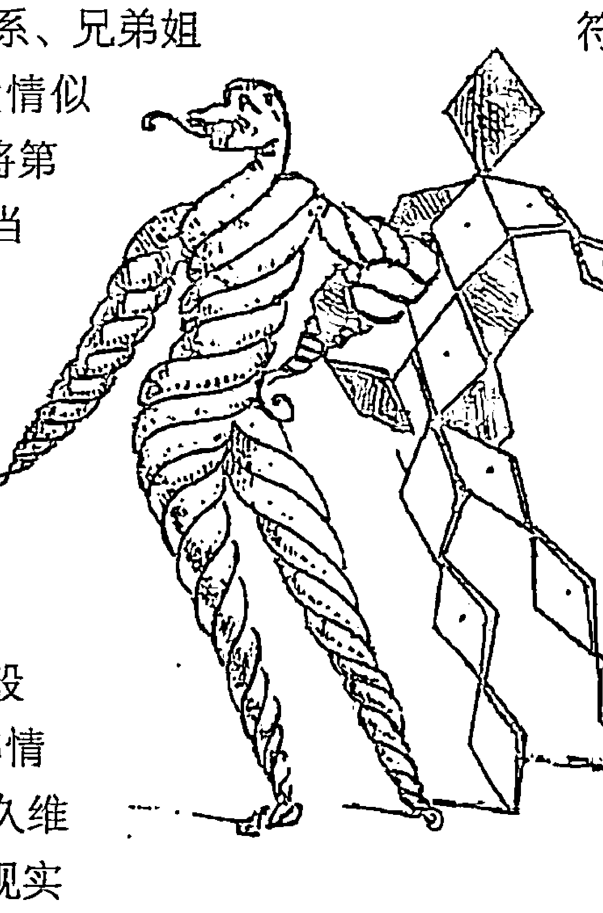

## 友谊

深厚的友谊蕴含着与爱情和婚姻相同的因素，朋友之间相处完全自得其乐，不受外界影响。如果两人是最亲密的朋友，那么日常相处的时间很可能多于情侣或夫妻。如果列一张好友清单的话，你很可能发现他们的生日不是平均分布的，而是集中在一年中的某些天。在《星座秘语之关系全书》中，我们会尽力为你找出最有益于双方的朋友组合，因为有些人虽然互相吸引，但友谊的发展可能导致双方两败俱伤。

## 亲情

这里讨论的亲情主要指父母与子女以及兄弟姐妹之间的感情，祖孙之间和稍远一点儿的亲戚关系也有所提及。许多父母会强迫子女完成自己未完成的梦想，弥补自己的遗憾，这种亲情的占有欲很强，并且具有很强的破坏力。父母和子女之间应该建立信任的纽带，学着接纳和认可对方，这样一旦出现问题（迟早会出现），他们才能有效地达成和解。

## 职场

职场中会遇到哪些人基本上是偶然的。一旦两个人被安排在同一间办公室或者完成同一项任务，他们就需要同对方相处。不过，如果人事主管在做安排前先参考一下《星座秘语之生日全书》和《星座秘语之关系全书》，就能快速了解两人的性格是否合得来。《星座秘语之关系全书》讨论了级别相同的同事、老板与员工、行政管理人员、生意伙伴以及雇主和自由职业者之间的关系，并提出特别的建议或提示，还指出其中一些工作关系有发展成友谊的可能性。

## 人际关系究竟是什么？

下面三个类比，将有助于你从具象和抽象两个层面了解人际关系的本质。

### 1. 物理反应和化学反应

在物理反应中，两种物质混合或搅拌在一起后没有发生变化——也就是说，我们可以从混合物中提取出原来的物质。化学反应就不同了。两种物质会通过化学反应产生新的物质，新物质与反应物大不相同，想提取出反应物很困难。人与人之间的关系更像是化学反应的产物——它并不是单纯的混合物，而是一种新的产物，一个独立存在的第三方实体。

### 2. 界面

当两个物体互相接触时，它们的接触点或接触面（也就是界面）同它们本身有很大的不同。界面很难定义，在某些层面上，它超越了互相接触的两个物体本身。当你缓慢触摸镜中的自己时，手指与镜子相触带来的感觉诡异而玄妙，像在扰乱清水池中的倒影，又像在试图挣脱自己的身影。如果一方或双方试图打破这种界面同对方进行互动，两人之间就产生了关系。这种互动常常意味着自我与他人这两个本不相干的存在相交相合，并发生奇妙的改变。

### 3. 出神

诗人约翰·多恩认为，出神的过程就是灵魂交融的过程。在其诗作《出神》中，他描绘了一对情侣，依偎在芳草茂密的河岸边，深情地凝望着对方的眼睛。他们的灵魂挣脱了身体的束缚，沿着对视的目光所形成的“双股线”渐渐靠近，最终合二为一。他们不仅身体相拥，更重要的是灵魂也融为一体。“ecstasy”来自拉丁文“ex stasis”，意思是“离开自己”，也就是指灵魂离开身体的束缚，自由地表达自我。

## 处理人际关系的妙招

我们说到个体 A 和个体 B 的关系时，指的是 A 和 B 两个个体之间的互动，还是 A 和 B 的关系作为一个整体同外界产生互动呢？当然，A 和 B 的关系存在于私人场合和公共场合，但 A 和 B 对这种关系的认可程度以及他们愿意放弃独立身份、变成关系的一部分的意愿才是关键所在。我们并不机械或盲目地规定每个人认可关系和放弃自我的程度应该怎样。有时候，随着关系的发展，两个人都应适当地抽身而出并确认没有在相处中迷失自我，甚至可能需要独自走一段时间。不过，也只有在很大程度上放弃自我，两人才有可能体验到相处带来的巅峰感觉。这时，他们能从关系中得到更珍贵的回报。下面是一些忠告：

- 1. 学会倾听。
- 2. 真诚地分享。单纯地付出或索取都不是正确的相处之道，要懂得两者结合。
- 3. 无私地奉献。如果付出是为了某种回报，那就和付钱买东西没什么差别了。
- 4. 亲切、理解、信任、关心比所有自私的快感更有价值。如果你带着功利心与人相处，那么就别指望得到有意义的情感。
- 5. 拒绝别人无礼的对待。你应当被尊重。
- 6. 害怕做决定、提出反对意见或表明自己的立场是一种逃避行为，是不想为自己的行为负责。处处随和往往是害怕遭到拒绝的表现。
- 7. 当心你的占有欲和控制欲。对方是独立的人，不是你的所有物。
- 8. 不要让他人激怒你。一个好办法是提升自己的修养，变得不容易被激怒。
- 9. 学会审视自己。同别人争论时，试着抽身出来审视自我。观察他人、审视自我能帮你提高感知力。
- 10. 控制自己偏激或暴力的一面。同时，学着为自己的情绪找到发泄的出口，不要抑制它。最好的相处之道是通过心平气和的交流解决分歧。
- 11. 学会用耐心、信任和理解控制自己的欲望。
- 12. 接纳对方很重要，但这并不代表全盘接受，而要允许存在不同意见。你和对方的看法并不需要完全一致。
- 13. 分清需要和欲望。很多时候，你最想要的不一定是你所需要的。
- 14. 善于抓住契机，为每个行为选择最佳时机。在一种情况下能妥善解决的事情，在另一种情况下有可能一塌糊涂。
- 15. 尊重对方，给对方自由的空间。

## 生命大循环

我们可以将一切生命过程象征性地视为一个大循环。通过类比，我们可以将三个重要的领域——人生、自然界和占星学——放在同一个圆周内进行研究和对比。对人来说，这个圆周代表人从出生到死亡这一段时间；对自然界来说，这个圆周指一年四季的更迭；对占星学来说，这个圆周指十二星座所在的黄道带。这三个领域所在的圆周被一根水平轴线和一根垂直轴线切分。圆周的起点是水平轴的左端，从该起点开始沿逆时针方向环绕一圈，并最终回到该起点，便完成了一次生命大循环。

圆周上最重要的四个点是圆周与两根轴线的交点（见图1）。

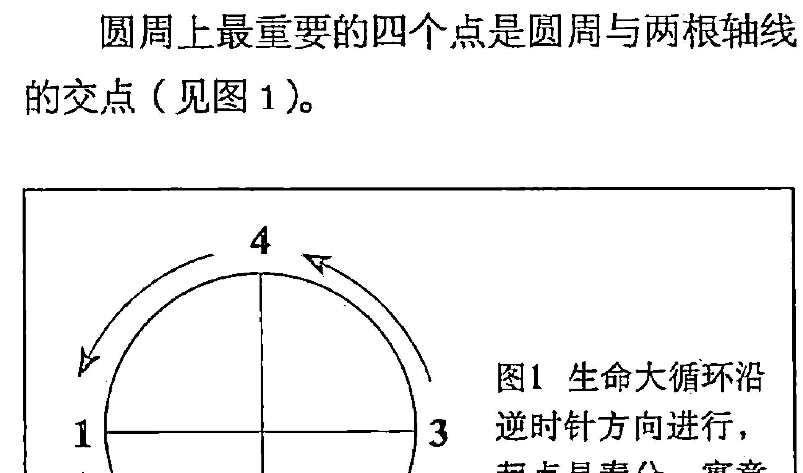

| 位置 | 人生 | 自然界 | 占星学 |
| :--- | :--- | :--- | :--- |
| 1 | 新生 | 春分 | 白羊宫0° |
| 2 | 21岁 | 夏至 | 巨蟹宫0° |
| 3 | 42岁 | 秋分 | 天秤宫0° |
| 4 | 63岁 | 冬至 | 摩羯宫0° |

### 圆周的上、下半周

如图2所示，水平轴线将圆周分为上、下两个半圆。下半周，也就是生命大循环的第1个半周，代表人和自然界客观、外在的成长（从出生到42岁，从春季到秋季）。在此期间，人体和自然界都经历了显著的变化，与此相类似的，人对世界的认识也变得非常个人化。因此，从占星学和心理学的角度来说，下半周的

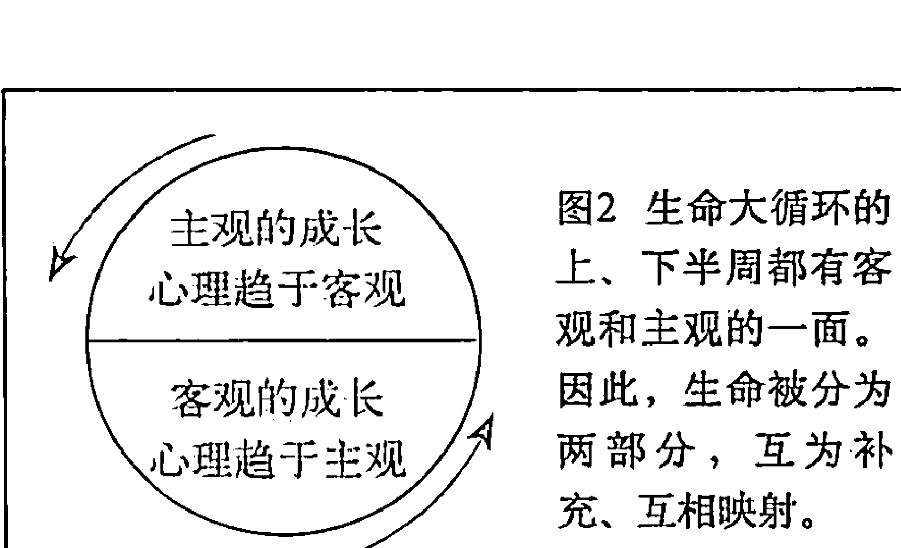

心理取向是主观的（更多是无意识的）。位于下半周的第1~6个星座为“自我型”星座，其主宰星为太阳系中的“内”星体（水星、金星、火星）以及太阳和月亮。这五个星体通常代表生活中的感觉、情绪、亲情和爱情，以及现实中出现的事情和问题等，而非哲学层面的问题和对宇宙的思考。此时的主导力量也具有主观意味——直觉和感受。因此可以说，生命大循环的第1个半周主要以客观的方式展现，但是心理取向趋于主观。

上半周，也就是生命大循环的第2个半周，代表人和自然界主观、内在的成长（42~84岁，从秋季到春季）。在此期间，人的心智和自然界在生命表象之下不断发展并走向成熟。伴随着内在的成长，人看待周围事物的方式愈加客观，逐渐培养出广阔的视角和务实的态度。因此，从占星学和心理学的角度来说，上半周的心理趋向是客观的（有意识的）。位于上半周的第7~9个星座为“社会型”星座，第10~12个星座为“宇宙型”星座。除了天秤座，这些星座的主宰星均为太阳系中的“外”星体（木星、土星、天王星、海王星及冥王星）。这些巨大而遥远的星体，有更多宇宙和哲学方面的内涵，它们代表着更大的社会问题：命运、天数，以及生命中无法改变的、永恒存在的问题。上半周的主导力量更具有客观意味——感觉和思考。因此，第2个半周与第1个半周相反，是主观力量（内在、表象之下的）彰显的阶段，而人们的心理取向趋于客观。

> ☆编者注：2006年，冥王星被降格为“矮行星”，不再被视为太阳系九大行星之一。

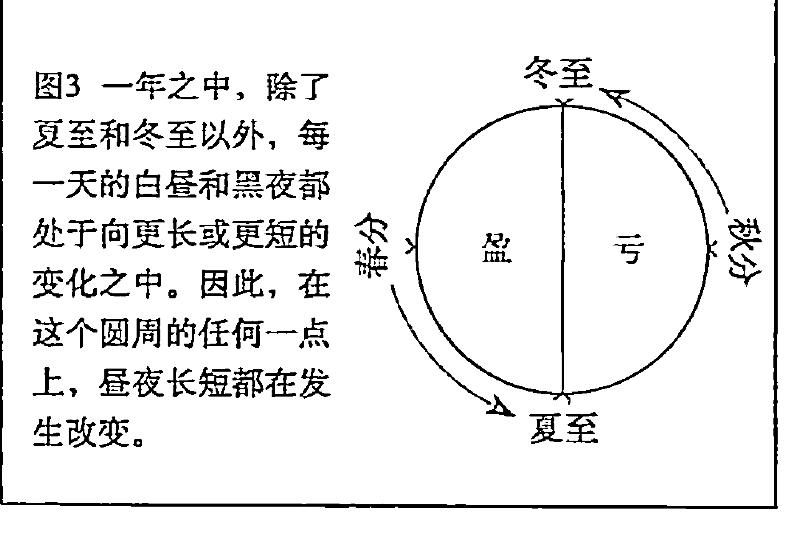

## 四分体

如果同时采用两种分法（上、下半周，左、右半周），我们就可以将 360° 的生命大循环的圆周分为 4 个四分体。在人生的 84 年中，每个四分体代表 21 年；在自然界的一年中，每个四分体代表 1 个季节；在占星学中，黄道带上有 12 个星座，每个四分体代表 3 个星座（3 个星座的分法和排列顺序很重要，是固定不变的，见图 4）。

### 圆周的左、右半周

垂直轴将圆周分为左、右两部分（见图 3）。黄道带的左边部分（从摩羯宫到巨蟹宫）代表逐步增强的变化（盈）——从冬季到春季，白昼时间逐渐变长，右边部分（从巨蟹宫到摩羯宫）代表逐步减弱的变化（亏）——从夏季到秋季，白昼时间逐渐变短。垂直轴的两个端点分别为夏至和冬至，这是昼夜时差最大的两天：夏至（6 月 21 日）白昼最长、黑夜最短，冬至（12 月 21 日）正好相反。根据《易经》的描述，这分别是至阳和至阴的两天。而在春分（3 月 21 日）和秋分（9 月 23 日）这两天，昼夜正好等长。从另一个角度来说，春分过后，地球向离太阳最近的点逐渐靠近；而秋分过后，地球向离太阳最远的点逐渐靠近。

另外，每个四分体对世界的认知方式如下：
- I 直觉
- II 感受
- III 感觉
- IV 思考

每个四分体代表 1 个季节、21 年的生命时长以及黄道带上 1 个 90° 的区域。我们从以下几个方面评估四分体的特质：变化、表现、心理倾向、认知方式。

由于《星座秘语之关系全书》这本书是建立在以地球为中心的星座系统上的，所以春分、秋分、夏至、冬至的位置对切分生命大循环具有举足轻重的意义。从这个方面来说，我们不同于传统的以太阳为中心的占星学，而将研究重心转变为我们此时此地的日常生活——也就是我们所在的地球上复一年的四季更迭、生老病死和万物变换。

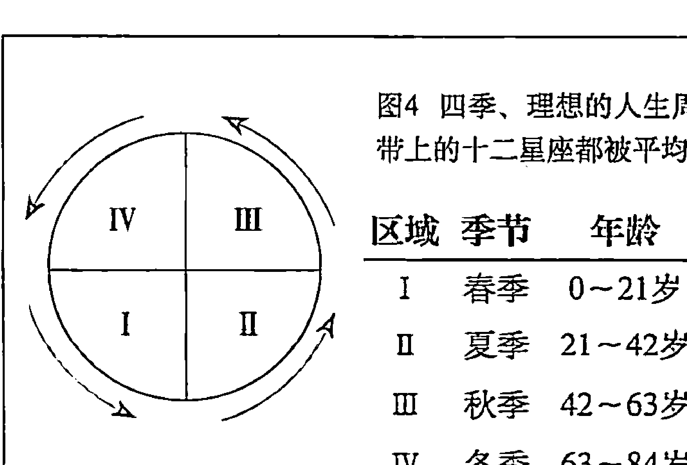

| 区域 | 季节 | 年龄 | 所属星座 | 变化 | 表现 | 心理倾向 |
| :--- | :--- | :--- | :--- | :--- | :--- | :--- |
| I | 春季 | 0~21岁 | 白羊座、金牛座、双子座 | 盈 | 客观 | 无意识 |
| II | 夏季 | 21~42岁 | 巨蟹座、狮子座、处女座 | 亏 | 客观 | 无意识 |
| III | 秋季 | 42~63岁 | 天秤座、天蝎座、射手座 | 亏 | 主观 | 有意识 |
| IV | 冬季 | 63~84岁 | 摩羯座、水瓶座、双鱼座 | 盈 | 主观 | 有意识 |

## 四十八星区

人文占星学将一年分为48个星区，每个星区的人拥有与众不同的个性特点，星区的名称是各星区个性的集中体现。下面是人文占星学四十八星区的具体日期和名称列表。

| 星区名称 | 日期范围 | 星区名称 | 日期范围 | 星区名称 | 日期范围 |
| :--- | :--- | :--- | :--- | :--- | :--- |
| 双鱼白羊座 | 3.19~3.24 | 巨蟹狮子座 | 7.19~7.25 | 天蝎射手座 | 11.19~11.24 |
| 白羊座一 | 3.25~4.2 | 狮子座一 | 7.26~8.2 | 射手座一 | 11.25~12.2 |
| 白羊座二 | 4.3~4.10 | 狮子座二 | 8.3~8.10 | 射手座二 | 12.3~12.10 |
| 白羊座三 | 4.11~4.18 | 狮子座三 | 8.11~8.18 | 射手座三 | 12.11~12.18 |
| 白羊金牛座 | 4.19~4.24 | 狮子处女座 | 8.19~8.25 | 射手摩羯座 | 12.19~12.25 |
| 金牛座一 | 4.25~5.2 | 处女座一 | 8.26~9.2 | 摩羯座一 | 12.26~1.2 |
| 金牛座二 | 5.3~5.10 | 处女座二 | 9.3~9.10 | 摩羯座二 | 1.3~1.9 |
| 金牛座三 | 5.11~5.18 | 处女座三 | 9.11~9.18 | 摩羯座三 | 1.10~1.16 |
| 金牛双子座 | 5.19~5.24 | 处女天秤座 | 9.19~9.24 | 摩羯水瓶座 | 1.17~1.22 |
| 双子座一 | 5.25~6.2 | 天秤座一 | 9.25~10.2 | 水瓶座一 | 1.23~1.30 |
| 双子座二 | 6.3~6.10 | 天秤座二 | 10.3~10.10 | 水瓶座二 | 1.31~2.7 |
| 双子座三 | 6.11~6.18 | 天秤座三 | 10.11~10.18 | 水瓶座三 | 2.8~2.15 |
| 双子巨蟹座 | 6.19~6.24 | 天秤天蝎座 | 10.19~10.25 | 水瓶双鱼座 | 2.16~2.22 |
| 巨蟹座一 | 6.25~7.2 | 天蝎座一 | 10.26~11.2 | 双鱼座一 | 2.23~3.2 |
| 巨蟹座二 | 7.3~7.10 | 天蝎座二 | 11.3~11.11 | 双鱼座二 | 3.3~3.10 |
| 巨蟹座三 | 7.11~7.18 | 天蝎座三 | 11.12~11.18 | 双鱼座三 | 3.11~3.18 |

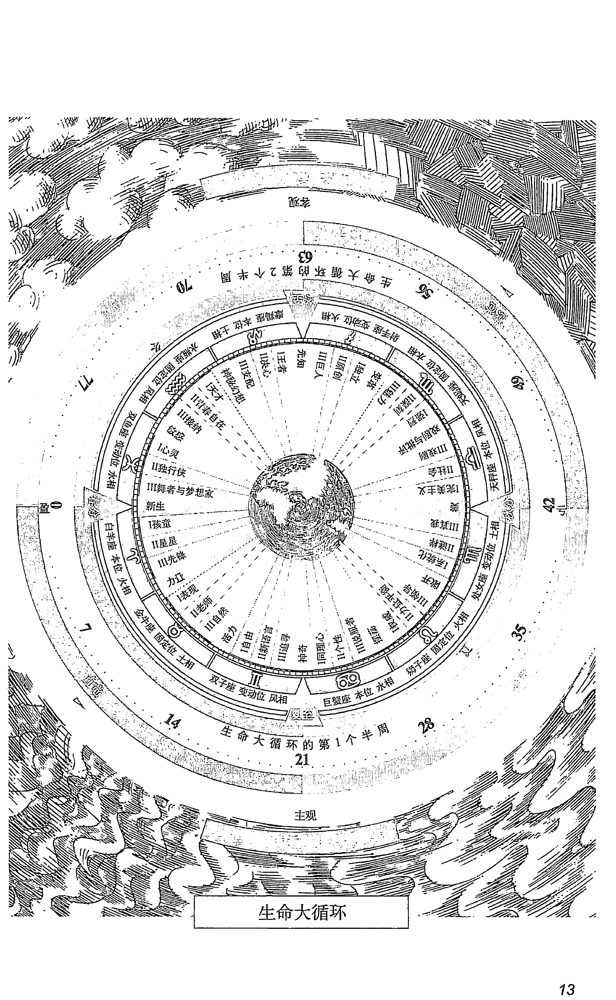

## 生命大循环

主观

客观

生命大循环的第1个半周

生命大循环的第2个半周

白羊座 本位 火相

金牛座 固定位 土相

双子座 变动位 风相

巨蟹座 本位 水相

狮子座 固定位 火相

处女座 变动位 土相

天秤座 本位 风相

天蝎座 固定位 水相

射手座 变动位 火相

摩羯座 本位 土相

水瓶座 固定位 风相

双鱼座 变动位 水相

I孩童
II星星
III先锋

I力量
II老师
III自然

I自由
II新语言
III追寻

I同理心
II个性
III旧的枷锁

I戏剧
II浪漫
III真我

I亲密化
II选择
III放开

I完美主义
II社会
III戏剧

I强烈
II强烈
III强烈

I强烈
II强烈
III强烈

I强烈
II强烈
III强烈

I强烈
II强烈
III强烈

I强烈
II强烈
III强烈

I强烈
II强烈
III强烈

I强烈
II强烈
III强烈

I强烈
II强烈
III强烈

I心灵
II独行侠
III舞者与梦想家

I天才
II神秘幻觉
III支配

I王者
II决心
III王者

I先知
II巨人
III强烈

I强烈
II强烈
III强烈

I强烈
II强烈
III强烈

I强烈
II强烈
III强烈

I强烈
II强烈
III强烈

I强烈
II强烈
III强烈

I强烈
II强烈
III强烈

I强烈
II强烈
III强烈

I强烈
II强烈
III强烈

I强烈
II强烈
III强烈

I强烈
II强烈
III强烈

I强烈
II强烈
III强烈

I强烈
II强烈
III强烈

I强烈
II强烈
III强烈

I强烈
II强烈
III强烈

I强烈
II强烈
III强烈

I强烈
II强烈
III强烈

I强烈
II强烈
III强烈

I强烈
II强烈
III强烈

I强烈
II强烈
III强烈

I强烈
II强烈
III强烈

I强烈
II强烈
III强烈

I强烈
II强烈
III强烈

I强烈
II强烈
III强烈

I强烈
II强烈
III强烈

I强烈
II强烈
III强烈

I强烈
II强烈
III强烈

I强烈
II强烈
III强烈

I强烈
II强烈
III强烈

I强烈
II强烈
III强烈

I强烈
II强烈
III强烈

I强烈
II强烈
III强烈

I强烈
II强烈
III强烈

I强烈
II强烈
III强烈

I强烈
II强烈
III强烈

I强烈
II强烈
III强烈

I强烈
II强烈
III强烈

I强烈
II强烈
III强烈

I强烈
II强烈
III强烈

I强烈
II强烈
III强烈

I强烈
II强烈
III强烈

I强烈
II强烈
III强烈

I强烈
II强烈
III强烈

I强烈
II强烈
III强烈

I强烈
II强烈
III强烈

I强烈
II强烈
III强烈

I强烈
II强烈
III强烈

I强烈
II强烈
III强烈

I强烈
II强烈
III强烈

I强烈
II强烈
III强烈

I强烈
II强烈
III强烈

I强烈
II强烈
III强烈

I强烈
II强烈
III强烈

I强烈
II强烈
III强烈

I强烈
II强烈
III强烈

I强烈
II强烈
III强烈

I强烈
II强烈
III强烈

I强烈
II强烈
III强烈

I强烈
II强烈
III强烈

I强烈
II强烈
III强烈

I强烈
II强烈
III强烈

I强烈
II强烈
III强烈

I强烈
II强烈
III强烈

I强烈
II强烈
III强烈

I强烈
II强烈
III强烈

I强烈
II强烈
III强烈

I强烈
II强烈
III强烈

I强烈
II强烈
III强烈

I强烈
II强烈
III强烈

I强烈
II强烈
III强烈

I强烈
II强烈
III强烈

I强烈
II强烈
III强烈

I强烈
II强烈
III强烈

I强烈
II强烈
III强烈

I强烈
II强烈
III强烈

I强烈
II强烈
III强烈

I强烈
II强烈
III强烈

I强烈
II强烈
III强烈

I强烈
II强烈
III强烈

I强烈
II强烈
III强烈

I强烈
II强烈
III强烈

I强烈
II强烈
III强烈

I强烈
II强烈
III强烈

I强烈
II强烈
III强烈

I强烈
II强烈
III强烈

I强烈
II强烈
III强烈

I强烈
II强烈
III强烈

I强烈
II强烈
III强烈

I强烈
II强烈
III强烈

I强烈
II强烈
III强烈

I强烈
II强烈
III强烈

I强烈
II强烈
III强烈

I强烈
II强烈
III强烈

I强烈
II强烈
III强烈

I强烈
II强烈
III强烈

I强烈
II强烈
III强烈

I强烈
II强烈
III强烈

I强烈
II强烈
III强烈

I强烈
II强烈
III强烈

I强烈
II强烈
III强烈

I强烈
II强烈
III强烈

I强烈
II强烈
III强烈

I强烈
II强烈
III强烈

I强烈
II强烈
III强烈

I强烈
II强烈
III强烈

I强烈
II强烈
III强烈

I强烈
II强烈
III强烈

I强烈
II强烈
III强烈

I强烈
II强烈
III强烈

I强烈
II强烈
III强烈

I强烈
II强烈
III强烈

I强烈
II强烈
III强烈

I强烈
II强烈
III强烈

I强烈
II强烈
III强烈

I强烈
II强烈
III强烈

I强烈
II强烈
III强烈

I强烈
II强烈
III强烈

I强烈
II强烈
III强烈

I强烈
II强烈
III强烈

I强烈
II强烈
III强烈

I强烈
II强烈
III强烈

I强烈
II强烈
III强烈

I强烈
II强烈
III强烈

I强烈
II强烈
III强烈

I强烈
II强烈
III强烈

I强烈
II强烈
III强烈

I强烈
II强烈
III强烈

I强烈
II强烈
III强烈

I强烈
II强烈
III强烈

I强烈
II强烈
III强烈

I强烈
II强烈
III强烈

I强烈
II强烈
III强烈

I强烈
II强烈
III强烈

I强烈
II强烈
III强烈

I强烈
II强烈
III强烈

I强烈
II强烈
III强烈

I强烈
II强烈
III强烈

I强烈
II强烈
III强烈

I强烈
II强烈
III强烈

I强烈
II强烈
III强烈

I强烈
II强烈
III强烈

I强烈
II强烈
III强烈

I强烈
II强烈
III强烈

I强烈
II强烈
III强烈

I强烈
II强烈
III强烈

I强烈
II强烈
III强烈

I强烈
II强烈
III强烈

I强烈
II强烈
III强烈

I强烈
II强烈
III强烈

I强烈
II强烈
III强烈

I强烈
II强烈
III强烈

I强烈
II强烈
III强烈

I强烈
II强烈
III强烈

I强烈
II强烈
III强烈

I强烈
II强烈
III强烈

I强烈
II强烈
III强烈

I强烈
II强烈
III强烈

I强烈
II强烈
III强烈

I强烈
II强烈
III强烈

I强烈
II强烈
III强烈

I强烈
II强烈
III强烈

I强烈
II强烈
III强烈

I强烈
II强烈
III强烈

I强烈
II强烈
III强烈

I强烈
II强烈
III强烈

I强烈
II强烈
III强烈

I强烈
II强烈
III强烈

I强烈
II强烈
III强烈

I强烈
II强烈
III强烈

I强烈
II强烈
III强烈

I强烈
II强烈
III强烈

I强烈
II强烈
III强烈

I强烈
II强烈
III强烈

I强烈
II强烈
III强烈

I强烈
II强烈
III强烈

I强烈
II强烈
III强烈

I强烈
II强烈
III强烈

I强烈
II强烈
III强烈

I强烈
II强烈
III强烈

I强烈
II强烈
III强烈

I强烈
II强烈
III强烈

I强烈
II强烈
III强烈

I强烈
II强烈
III强烈

I强烈
II强烈
III强烈

I强烈
II强烈
III强烈

I强烈
II强烈
III强烈

I强烈
II强烈
III强烈

I强烈
II强烈
III强烈

I强烈
II强烈
III强烈

I强烈
II强烈
III强烈

I强烈
II强烈
III强烈

I强烈
II强烈
III强烈

I强烈
II强烈
III强烈

I强烈
II强烈
III强烈

I强烈
II强烈
III强烈

I强烈
II强烈
III强烈

I强烈
II强烈
III强烈

I强烈
II强烈
III强烈

I强烈
II强烈
III强烈

I强烈
II强烈
III强烈

I强烈
II强烈
III强烈

I强烈
II强烈
III强烈

I强烈
II强烈
III强烈

I强烈
II强烈
III强烈

I强烈
II强烈
III强烈

I强烈
II强烈
III强烈

I强烈
II强烈
III强烈

I强烈
II强烈
III强烈

I强烈
II强烈
III强烈

I强烈
II强烈
III强烈

I强烈
II强烈
III强烈

I强烈
II强烈
III强烈

I强烈
II强烈
III强烈

I强烈
II强烈
III强烈

I强烈
II强烈
III强烈

I强烈
II强烈
III强烈

I强烈
II强烈
III强烈

I强烈
II强烈
III强烈

I强烈
II强烈
III强烈

I强烈
II强烈
III强烈

I强烈
II强烈
III强烈

I强烈
II强烈
III强烈

I强烈
II强烈
III强烈

I强烈
II强烈
III强烈

I强烈
II强烈
III强烈

I强烈
II强烈
III强烈

I强烈
II强烈
III强烈

I强烈
II强烈
III强烈

I强烈
II强烈
III强烈

I强烈
II强烈
III强烈

I强烈
II强烈
III强烈

I强烈
II强烈
III强烈

I强烈
II强烈
III强烈

I强烈
II强烈
III强烈

I强烈
II强烈
III强烈

I强烈
II强烈
III强烈

I强烈
II强烈
III强烈

I强烈
II强烈
III强烈

I强烈
II强烈
III强烈

I强烈
II强烈
III强烈

I强烈
II强烈
III强烈

I强烈
II强烈
III强烈

I强烈
II强烈
III强烈

I强烈
II强烈
III强烈

I强烈
II强烈
III强烈

I强烈
II强烈
III强烈

I强烈
II强烈
III强烈

I强烈
II强烈
III强烈

I强烈
II强烈
III强烈

I强烈
II强烈
III强烈

I强烈
II强烈
III强烈

I强烈
II强烈
III强烈

I强烈
II强烈
III强烈

I强烈
II强烈
III强烈

I强烈
II强烈
III强烈

I强烈
II强烈
III强烈

I强烈
II强烈
III强烈

I强烈
II强烈
III强烈

I强烈
II强烈
III强烈

I强烈
II强烈
III强烈

I强烈
II强烈
III强烈

I强烈
II强烈
III强烈

I强烈
II强烈
III强烈

I强烈
II强烈
III强烈

I强烈
II强烈
III强烈

I强烈
II强烈
III强烈

I强烈
II强烈
III强烈

I强烈
II强烈
III强烈

I强烈
II强烈
III强烈

I强烈
II强烈
III强烈

I强烈
II强烈
III强烈

I强烈
II强烈
III强烈

I强烈
II强烈
III强烈

I强烈
II强烈
III强烈

I强烈
II强烈
III强烈

I强烈
II强烈
III强烈

I强烈
II强烈
III强烈

I强烈
II强烈
III强烈

I强烈
II强烈
III强烈

I强烈
II强烈
III强烈

I强烈
II强烈
III强烈

I强烈
II强烈
III强烈

I强烈
II强烈
III强烈

I强烈
II强烈
III强烈

I强烈
II强烈
III强烈

I强烈
II强烈
III强烈

I强烈
II强烈
III强烈

I强烈
II强烈
III强烈

I强烈
II强烈
III强烈

I强烈
II强烈
III强烈

I强烈
II强烈
III强烈

I强烈
II强烈
III强烈

I强烈
II强烈
III强烈

I强烈
II强烈
III强烈

I强烈
II强烈
III强烈

I强烈
II强烈
III强烈

I强烈
II强烈
III强烈

I强烈
II强烈
III强烈

I强烈
II强烈
III强烈

I强烈
II强烈
III强烈

I强烈
II强烈
III强烈

I强烈
II强烈
III强烈

I强烈
II强烈
III强烈

I强烈
II强烈
III强烈

I强烈
II强烈
III强烈

I强烈
II强烈
III强烈

I强烈
II强烈
III强烈

I强烈
II强烈
III强烈

I强烈
II强烈
III强烈

I强烈
II强烈
III强烈

I强烈
II强烈
III强烈

I强烈
II强烈
III强烈

I强烈
II强烈
III强烈

I强烈
II强烈
III强烈

I强烈
II强烈
III强烈

I强烈
II强烈
III强烈

I强烈
II强烈
III强烈

I强烈
II强烈
III强烈

I强烈
II强烈
III强烈

I强烈
II强烈
III强烈

I强烈
II强烈
III强烈

I强烈
II强烈
III强烈

I强烈
II强烈
III强烈

I强烈
II强烈
III强烈

I强烈
II强烈
III强烈

I强烈
II强烈
III强烈

I强烈
II强烈
III强烈

I强烈
II强烈
III强烈

I强烈
II强烈
III强烈

I强烈
II强烈
III强烈

I强烈
II强烈
III强烈

I强烈
II强烈
III强烈

I强烈
II强烈
III强烈

I强烈
II强烈
III强烈

I强烈
II强烈
III强烈

I强烈
II强烈
III强烈

I强烈
II强烈
III强烈

I强烈
II强烈
III强烈

I强烈
II强烈
III强烈

I强烈
II强烈
III强烈

I强烈
II强烈
III强烈

I强烈
II强烈
III强烈

I强烈
II强烈
III强烈

I强烈
II强烈
III强烈

I强烈
II强烈
III强烈

I强烈
II强烈
III强烈

I强烈
II强烈
III强烈

I强烈
II强烈
III强烈

I强烈
II强烈
III强烈

I强烈
II强烈
III强烈

I强烈
II强烈
III强烈

I强烈
II强烈
III强烈

I强烈
II强烈
III强烈

I强烈
II强烈
III强烈

I强烈
II强烈
III强烈

I强烈
II强烈
III强烈

I强烈
II强烈
III强烈

I强烈
II强烈
III强烈

I强烈
II强烈
III强烈

I强烈
II强烈
III强烈

I强烈
II强烈
III强烈

I强烈
II强烈
III强烈

I强烈
II强烈
III强烈

I强烈
II强烈
III强烈

I强烈
II强烈
III强烈

I强烈
II强烈
III强烈

I强烈
II强烈
III强烈

I强烈
II强烈
III强烈

I强烈
II强烈
III强烈

I强烈
II强烈
III强烈

I强烈
II强烈
III强烈

I强烈
II强烈
III强烈

I强烈
II强烈
III强烈

I强烈
II强烈
III强烈

I强烈
II强烈
III强烈

I强烈
II强烈
III强烈

I强烈
II强烈
III强烈

I强烈
II强烈
III强烈

I强烈
II强烈
III强烈

I强烈
II强烈
III强烈

I强烈
II强烈
III强烈

I强烈
II强烈
III强烈

I强烈
II强烈
III强烈

I强烈
II强烈
III强烈

I强烈
II强烈
III强烈

I强烈
II强烈
III强烈

I强烈
II强烈
III强烈

I强烈
II强烈
III强烈

I强烈
II强烈
III强烈

I强烈
II强烈
III强烈

I强烈
II强烈
III强烈

I强烈
II强烈
III强烈

I强烈
II强烈
III强烈

I强烈
II强烈
III强烈

I强烈
II强烈
III强烈

I强烈
II强烈
III强烈

I强烈
II强烈
III强烈

I强烈
II强烈
III强烈

I强烈
II强烈
III强烈

I强烈
II强烈
III强烈

I强烈
II强烈
III强烈

I强烈
II强烈
III强烈

I强烈
II强烈
III强烈

I强烈
II强烈
III强烈

I强烈
II强烈
III强烈

I强烈
II强烈
III强烈

I强烈
II强烈
III强烈

I强烈
II强烈
III强烈

I强烈
II强烈
III强烈

I强烈
II强烈
III强烈

I强烈
II强烈
III强烈

I强烈
II强烈
III强烈

I强烈
II强烈
III强烈

I强烈
II强烈
III强烈

I强烈
II强烈
III强烈

I强烈
II强烈
III强烈

I强烈
II强烈
III强烈

I强烈
II强烈
III强烈

I强烈
II强烈
III强烈

I强烈
II强烈
III强烈

I强烈
II强烈
III强烈

I强烈
II强烈
III强烈

I强烈
II强烈
III强烈

I强烈
II强烈
III强烈

I强烈
II强烈
III强烈

I强烈
II强烈
III强烈

I强烈
II强烈
III强烈

I强烈
II强烈
III强烈

I强烈
II强烈
III强烈

I强烈
II强烈
III强烈

I强烈
II强烈
III强烈

I强烈
II强烈
III强烈

I强烈
II强烈
III强烈

I强烈
II强烈
III强烈

I强烈
II强烈
III强烈

I强烈
II强烈
III强烈

I强烈
II强烈
III强烈

I强烈
II强烈
III强烈

I强烈
II强烈
III强烈

I强烈
II强烈
III强烈

I强烈
II强烈
III强烈

I强烈
II强烈
III强烈

I强烈
II强烈
III强烈

I强烈
II强烈
III强烈

I强烈
II强烈
III强烈

I强烈
II强烈
III强烈

I强烈
II强烈
III强烈

I强烈
II强烈
III强烈

I强烈
II强烈
III强烈

I强烈
II强烈
III强烈

I强烈
II强烈
III强烈

I强烈
II强烈
III强烈

I强烈
II强烈
III强烈

I强烈
II强烈
III强烈

I强烈
II强烈
III强烈

I强烈
II强烈
III强烈

I强烈
II强烈
III强烈

I强烈
II强烈
III强烈

I强烈
II强烈
III强烈

I强烈
II强烈
III强烈

I强烈
II强烈
III强烈

I强烈
II强烈
III强烈

I强烈
II强烈
III强烈

I强烈
II强烈
III强烈

I强烈
II强烈
III强烈

I强烈
II强烈
III强烈

I强烈
II强烈
III强烈

I强烈
II强烈
III强烈

I强烈
II强烈
III强烈

I强烈
II强烈
III强烈

I强烈
II强烈
III强烈

I强烈
II强烈
III强烈

I强烈
II强烈
III强烈

I强烈
II强烈
III强烈

I强烈
II强烈
III强烈

I强烈
II强烈
III强烈

I强烈
II强烈
III强烈

I强烈
II强烈
III强烈

I强烈
II强烈
III强烈

I强烈
II强烈
III强烈

I强烈
II强烈
III强烈

I强烈
II强烈
III强烈

I强烈
II强烈
III强烈

I强烈
II强烈
III强烈

I强烈
II强烈
III强烈

I强烈
II强烈
III强烈

I强烈
II强烈
III强烈

I强烈
II强烈
III强烈

I强烈
II强烈
III强烈

I强烈
II强烈
III强烈

I强烈
II强烈
III强烈

I强烈
II强烈
III强烈

I强烈
II强烈
III强烈

I强烈
II强烈
III强烈

I强烈
II强烈
III强烈

I强烈
II强烈
III强烈

I强烈
II强烈
III强烈

I强烈
II强烈
III强烈

I强烈
II强烈
III强烈

I强烈
II强烈
III强烈

I强烈
II强烈
III强烈

I强烈
II强烈
III强烈

I强烈
II强烈
III强烈

I强烈
II强烈
III强烈

I强烈
II强烈
III强烈

I强烈
II强烈
III强烈

I强烈
II强烈
III强烈

I强烈
II强烈
III强烈

I强烈
II强烈
III强烈

I强烈
II强烈
III强烈

I强烈
II强烈
III强烈

I强烈
II强烈
III强烈

I强烈
II强烈
III强烈

I强烈
II强烈
III强烈

I强烈
II强烈
III强烈

I强烈
II强烈
III强烈

I强烈
II强烈
III强烈

I强烈
II强烈
III强烈

I强烈
II强烈
III强烈

I强烈
II强烈
III强烈

I强烈
II强烈
III强烈

I强烈
II强烈
III强烈

I强烈
II强烈
III强烈

I强烈
II强烈
III强烈

I强烈
II强烈
III强烈

I强烈
II强烈
III强烈

I强烈
II强烈
III强烈

I强烈
II强烈
III强烈

I强烈
II强烈
III强烈

I强烈
II强烈
III强烈

I强烈
II强烈
III强烈

I强烈
II强烈
III强烈

I强烈
II强烈
III强烈

I强烈
II强烈
III强烈

I强烈
II强烈
III强烈

I强烈
II强烈
III强烈

I强烈
II强烈
III强烈

I强烈
II强烈
III强烈

I强烈
II强烈
III强烈

I强烈
II强烈
III强烈

I强烈
II强烈
III强烈

I强烈
II强烈
III强烈

I强烈
II强烈
III强烈

I强烈
II强烈
III强烈

I强烈
II强烈
III强烈

I强烈
II强烈
III强烈

I强烈
II强烈
III强烈

I强烈
II强烈
III强烈

I强烈
II强烈
III强烈

I强烈
II强烈
III强烈

I强烈
II强烈
III强烈

I强烈
II强烈
III强烈

I强烈
II强烈
III强烈

I强烈
II强烈
III强烈

I强烈
II强烈
III强烈

I强烈
II强烈
III强烈

I强烈
II强烈
III强烈

I强烈
II强烈
III强烈

I强烈
II强烈
III强烈

I强烈
II强烈
III强烈

I强烈
II强烈
III强烈

I强烈
II强烈
III强烈

I强烈
II强烈
III强烈

I强烈
II强烈
III强烈

I强烈
II强烈
III强烈

I强烈
II强烈
III强烈

I强烈
II强烈
III强烈

I强烈
II强烈
III强烈

I强烈
II强烈
III强烈

I强烈
II强烈
III强烈

I强烈
II强烈
III强烈

I强烈
II强烈
III强烈

I强烈
II强烈
III强烈

I强烈
II强烈
III强烈

I强烈
II强烈
III强烈

I强烈
II强烈
III强烈

I强烈
II强烈
III强烈

I强烈
II强烈
III强烈

I强烈
II强烈
III强烈

I强烈
II强烈
III强烈

I强烈
II强烈
III强烈

I强烈
II强烈
III强烈

I强烈
II强烈
III强烈

I强烈
II强烈
III强烈

I强烈
II强烈
III强烈

I强烈
II强烈
III强烈

I强烈
II强烈
III强烈

I强烈
II强烈
III强烈

I强烈
II强烈
III强烈

I强烈
II强烈
III强烈

I强烈
II强烈
III强烈

I强烈
II强烈
III强烈

I强烈
II强烈
III强烈

I强烈
II强烈
III强烈

I强烈
II强烈
III强烈

I强烈
II强烈
III强烈

I强烈
II强烈
III强烈

I强烈
II强烈
III强烈

I强烈
II强烈
III强烈

I强烈
II强烈
III强烈

I强烈
II强烈
III强烈

I强烈
II强烈
III强烈

I强烈
II强烈
III强烈

I强烈
II强烈
III强烈

I强烈
II强烈
III强烈

I强烈
II强烈
III强烈

I强烈
II强烈
III强烈

I强烈
II强烈
III强烈

I强烈
II强烈
III强烈

I强烈
II强烈
III强烈

I强烈
II强烈
III强烈

I强烈
II强烈
III强烈

I强烈
II强烈
III强烈

I强烈
II强烈
III强烈

I强烈
II强烈
III强烈

I强烈
II强烈
III强烈

I强烈
II强烈
III强烈

I强烈
II强烈
III强烈

I强烈
II强烈
III强烈

I强烈
II强烈
III强烈

I强烈
II强烈
III强烈

I强烈
II强烈
III强烈

I强烈
II强烈
III强烈

I强烈
II强烈
III强烈

I强烈
II强烈
III强烈

I强烈
II强烈
III强烈

I强烈
II强烈
III强烈

I强烈
II强烈
III强烈

I强烈
II强烈
III强烈

I强烈
II强烈
III强烈

I强烈
II强烈
III强烈

I强烈
II强烈
III强烈

I强烈
II强烈
III强烈

I强烈
II强烈
III强烈

I强烈
II强烈
III强烈

I强烈
II强烈
III强烈

I强烈
II强烈
III强烈

I强烈
II强烈
III强烈

I强烈
II强烈
III强烈

I强烈
II强烈
III强烈

I强烈
II强烈
III强烈

I强烈
II强烈
III强烈

I强烈
II强烈
III强烈

I强烈
II强烈
III强烈

I强烈
II强烈
III强烈

I强烈
II强烈
III强烈

I强烈
II强烈
III强烈

I强烈
II强烈
III强烈

I强烈
II强烈
III强烈

I强烈
II强烈
III强烈

I强烈
II强烈
III强烈

I强烈
II强烈
III强烈

I强烈
II强烈
III强烈

I强烈
II强烈
III强烈

I强烈
II强烈
III强烈

I强烈
II强烈
III强烈

I强烈
II强烈
III强烈

I强烈
II强烈
III强烈

I强烈
II强烈
III强烈

I强烈
II强烈
III强烈

I强烈
II强烈
III强烈

I强烈
II强烈
III强烈

I强烈
II强烈
III强烈

I强烈
II强烈
III强烈

I强烈
II强烈
III强烈

I强烈
II强烈
III强烈

I强烈
II强烈
III强烈

I强烈
II强烈
III强烈

I强烈
II强烈
III强烈

I强烈
II强烈
III强烈

I强烈
II强烈
III强烈

I强烈
II强烈
III强烈

I强烈
II强烈
III强烈

I强烈
II强烈
III强烈

I强烈
II强烈
III强烈

I强烈
II强烈
III强烈

I强烈
II强烈
III强烈

I强烈
II强烈
III强烈

I强烈
II强烈
III强烈

I强烈
II强烈
III强烈

I强烈
II强烈
III强烈

I强烈
II强烈
III强烈

I强烈
II强烈
III强烈

I强烈
II强烈
III强烈

I强烈
II强烈
III强烈

I强烈
II强烈
III强烈

I强烈
II强烈
III强烈

I强烈
II强烈
III强烈

I强烈
II强烈
III强烈

I强烈
II强烈
III强烈

I强烈
II强烈
III强烈

I强烈
II强烈
III强烈

I强烈
II强烈
III强烈

I强烈
II强烈
III强烈

I强烈
II强烈
III强烈

I强烈
II强烈
III强烈

I强烈
II强烈
III强烈

I强烈
II强烈
III强烈

I强烈
II强烈
III强烈

I强烈
II强烈
III强烈

I强烈
II强烈
III强烈

I强烈
II强烈
III强烈

I强烈
II强烈
III强烈

I强烈
II强烈
III强烈

I强烈
II强烈
III强烈

I强烈
II强烈
III强烈

I强烈
II强烈
III强烈

I强烈
II强烈
III强烈

I强烈
II强烈
III强烈

I强烈
II强烈
III强烈

I强烈
II强烈
III强烈

I强烈
II强烈
III强烈

I强烈
II强烈
III强烈

I强烈
II强烈
III强烈

I强烈
II强烈
III强烈

I强烈
II强烈
III强烈

I强烈
II强烈
III强烈

I强烈
II强烈
III强烈

I强烈
II强烈
III强烈

I强烈
II强烈
III强烈

I强烈
II强烈
III强烈

I强烈
II强烈
III强烈

I强烈
II强烈
III强烈

I强烈
II强烈
III强烈

I强烈
II强烈
III强烈

I强烈
II强烈
III强烈

I强烈
II强烈
III强烈

I强烈
II强烈
III强烈

I强烈
II强烈
III强烈

I强烈
II强烈
III强烈

I强烈
II强烈
III强烈

I强烈
II强烈
III强烈

I强烈
II强烈
III强烈

I强烈
II强烈
III强烈

I强烈
II强烈
III强烈

I强烈
II强烈
III强烈

I强烈
II强烈
III强烈

I强烈
II强烈
III强烈

I强烈
II强烈
III强烈

I强烈
II强烈
III强烈

I强烈
II强烈
III强烈

I强烈
II强烈
III强烈

I强烈
II强烈
III强烈

I强烈
II强烈
III强烈

I强烈
II强烈
III强烈

I强烈
II强烈
III强烈

I强烈
II强烈
III强烈

I强烈
II强烈
III强烈

I强烈
II强烈
III强烈

I强烈
II强烈
III强烈

I强烈
II强烈
III强烈

I强烈
II强烈
III强烈

I强烈
II强烈
III强烈

I强烈
II强烈
III强烈

I强烈
II强烈
III强烈

I强烈
II强烈
III强烈

I强烈
II强烈
III强烈

I强烈
II强烈
III强烈

I强烈
II强烈
III强烈

I强烈
II强烈
III强烈

I强烈
II强烈
III强烈

I强烈
II强烈
III强烈

I强烈
II强烈
III强烈

I强烈
II强烈
III强烈

I强烈
II强烈
III强烈

I强烈
II强烈
III强烈

I强烈
II强烈
III强烈

I强烈
II强烈
III强烈

I强烈
II强烈
III强烈

I强烈
II强烈
III强烈

I强烈
II强烈
III强烈

I强烈
II强烈
III强烈

I强烈
II强烈
III强烈

I强烈
II强烈
III强烈

I强烈
II强烈
III强烈

I强烈
II强烈
III强烈

I强烈
II强烈
III强烈

I强烈
II强烈
III强烈

I强烈
II强烈
III强烈

I强烈
II强烈
III强烈

I强烈
II强烈
III强烈

I强烈
II强烈
III强烈

I强烈
II强烈
III强烈

I强烈
II强烈
III强烈

I强烈
II强烈
III强烈

I强烈
II强烈
III强烈

I强烈
II强烈
III强烈

I强烈
II强烈
III强烈

I强烈
II强烈
III强烈

I强烈
II强烈
III强烈

I强烈
II强烈
III强烈

I强烈
II强烈
III强烈

I强烈
II强烈
III强烈

I强烈
II强烈
III强烈

I强烈
II强烈
III强烈

I强烈
II强烈
III强烈

I强烈
II强烈
III强烈

I强烈
II强烈
III强烈

I强烈
II强烈
III强烈

I强烈
II强烈
III强烈

I强烈
II强烈
III强烈

I强烈
II强烈
III强烈

I强烈
II强烈
III强烈

I强烈
II强烈
III强烈

I强烈
II强烈
III强烈

I强烈
II强烈
III强烈

I强烈
II强烈
III强烈

I强烈
II强烈
III强烈

I强烈
II强烈
III强烈

I强烈
II强烈
III强烈

I强烈
II强烈
III强烈

I强烈
II强烈
III强烈

I强烈
II强烈
III强烈

I强烈
II强烈
III强烈

I强烈
II强烈
III强烈

I强烈
II强烈
III强烈

I强烈
II强烈
III强烈

I强烈
II强烈
III强烈

I强烈
II强烈
III强烈

I强烈
II强烈
III强烈

I强烈
II强烈
III强烈

I强烈
II强烈
III强烈

I强烈
II强烈
III强烈

I强烈
II强烈
III强烈

I强烈
II强烈
III强烈

I强烈
II强烈
III强烈

I强烈
II强烈
III强烈

I强烈
II强烈
III强烈

I强烈
II强烈
III强烈

I强烈
II强烈
III强烈

I强烈
II强烈
III强烈

I强烈
II强烈
III强烈

I强烈
II强烈
III强烈

I强烈
II强烈
III强烈

I强烈
II强烈
III强烈

I强烈
II强烈
III强烈

I强烈
II强烈
III强烈

I强烈
II强烈
III强烈

I强烈
II强烈
III强烈

I强烈
II强烈
III强烈

I强烈
II强烈
III强烈

I强烈
II强烈
III强烈

I强烈
II强烈
III强烈

I强烈
II强烈
III强烈

I强烈
II强烈
III强烈

I强烈
II强烈
III强烈

I强烈
II强烈
III强烈

I强烈
II强烈
III强烈

I强烈
II强烈
III强烈

I强烈
II强烈
III强烈

I强烈
II强烈
III强烈

I强烈
II强烈
III强烈

I强烈
II强烈
III强烈

I强烈
II强烈
III强烈

I强烈
II强烈
III强烈

I强烈
II强烈
III强烈

I强烈
II强烈
III强烈

I强烈
II强烈
III强烈

I强烈
II强烈
III强烈

I强烈
II强烈
III强烈

I强烈
II强烈
III强烈

I强烈
II强烈
III强烈

I强烈
II强烈
III强烈

I强烈
II强烈
III强烈

I强烈
II强烈
III强烈

I强烈
II强烈
III强烈

I强烈
II强烈
III强烈

I强烈
II强烈
III强烈

I强烈
II强烈
III强烈

I强烈
II强烈
III强烈

I强烈
II强烈
III强烈

I强烈
II强烈
III强烈

I强烈
II强烈
III强烈

I强烈
II强烈
III强烈

I强烈
II强烈
III强烈

I强烈
II强烈
III强烈

I强烈
II强烈
III强烈

I强烈
II强烈
III强烈

I强烈
II强烈
III强烈

I强烈
II强烈
III强烈

I强烈
II强烈
III强烈

I强烈
II强烈
III强烈

I强烈
II强烈
III强烈

I强烈
II强烈
III强烈

I强烈
II强烈
III强烈

I强烈
II强烈
III强烈

I强烈
II强烈
III强烈

I强烈
II强烈
III强烈

I强烈
II强烈
III强烈

I强烈
II强烈
III强烈

I强烈
II强烈
III强烈

I强烈
II强烈
III强烈

I强烈
II强烈
III强烈

I强烈
II强烈
III强烈

I强烈
II强烈
III强烈

I强烈
II强烈
III强烈

I强烈
II强烈
III强烈

I强烈
II强烈
III强烈

I强烈
II强烈
III强烈

I强烈
II强烈
III强烈

I强烈
II强烈
III强烈

I强烈
II强烈
III强烈

I强烈
II强烈
III强烈

I强烈
II强烈
III强烈

I强烈
II强烈
III强烈

I强烈
II强烈
III强烈

I强烈
II强烈
III强烈

I强烈
II强烈
III强烈

I强烈
II强烈
III强烈

I强烈
II强烈
III强烈

I强烈
II强烈
III强烈

I强烈
II强烈
III强烈

I强烈
II强烈
III强烈

I强烈
II强烈
III强烈

I强烈
II强烈
III强烈

I强烈
II强烈
III强烈

I强烈
II强烈
III强烈

I强烈
II强烈
III强烈

I强烈
II强烈
III强烈

I强烈
II强烈
III强烈

I强烈
II强烈
III强烈

I强烈
II强烈
III强烈

I强烈
II强烈
III强烈

I强烈
II强烈
III强烈

I强烈
II强烈
III强烈

I强烈
II强烈
III强烈

I强烈
II强烈
III强烈

I强烈
II强烈
III强烈

I强烈
II强烈
III强烈

I强烈
II强烈
III强烈

I强烈
II强烈
III强烈

I强烈
II强烈
III强烈

I强烈
II强烈
III强烈

I强烈
II强烈
III强烈

I强烈
II强烈
III强烈

I强烈
II强烈
III强烈

I强烈
II强烈
III强烈

I强烈
II强烈
III强烈

I强烈
II强烈
III强烈

I强烈
II强烈
III强烈

I强烈
II强烈
III强烈

I强烈
II强烈
III强烈

I强烈
II强烈
III强烈

I强烈
II强烈
III强烈

I强烈
II强烈
III强烈

I强烈
II强烈
III强烈

I强烈
II强烈
III强烈

I强烈
II强烈
III强烈

I强烈
II强烈
III强烈

I强烈
II强烈
III强烈

I强烈
II强烈
III强烈

I强烈
II强烈
III强烈

I强烈
II强烈
III强烈

I强烈
II强烈
III强烈

I强烈
II强烈
III强烈

I强烈
II强烈
III强烈

I强烈
II强烈
III强烈

I强烈
II强烈
III强烈

I强烈
II强烈
III强烈

I强烈
II强烈
III强烈

I强烈
II强烈
III强烈

I强烈
II强烈
III强烈

I强烈
II强烈
III强烈

I强烈
II强烈
III强烈

I强烈
II强烈
III强烈

I强烈
II强烈
III强烈

I强烈
II强烈
III强烈

I强烈
II强烈
III强烈

I强烈
II强烈
III强烈

I强烈
II强烈
III强烈

I强烈
II强烈
III强烈

I强烈
II强烈
III强烈

I强烈
II强烈
III强烈

I强烈
II强烈
III强烈

I强烈
II强烈
III强烈

I强烈
II强烈
III强烈

I强烈
II强烈
III强烈

I强烈
II强烈
III强烈

I强烈
II强烈
III强烈

I强烈
II强烈
III强烈

I强烈
II强烈
III强烈

I强烈
II强烈
III强烈

I强烈
II强烈
III强烈

I强烈
II强烈
III强烈

I强烈
II强烈
III强烈

I强烈
II强烈
III强烈

I强烈
II强烈
III强烈

I强烈
II强烈
III强烈

I强烈
II强烈
III强烈

I强烈
II强烈
III强烈

I强烈
II强烈
III强烈

I强烈
II强烈
III强烈

I强烈
II强烈
III强烈

I强烈
II强烈
III强烈

I强烈
II强烈
III强烈

I强烈
II强烈
III强烈

I强烈
II强烈
III强烈

I强烈
II强烈
III强烈

I强烈
II强烈
III强烈

I强烈
II强烈
III强烈

I强烈
II强烈
III强烈

I强烈
II强烈
III强烈

I强烈
II强烈
III强烈

I强烈
II强烈
III强烈

I强烈
II强烈
III强烈

I强烈
II强烈
III强烈

I强烈
II强烈
III强烈

I强烈
II强烈
III强烈

I强烈
II强烈
III强烈

I强烈
II强烈
III强烈

I强烈
II强烈
III强烈

I强烈
II强烈
III强烈

I强烈
II强烈
III强烈

I强烈
II强烈
III强烈

I强烈
II强烈
III强烈

I强烈
II强烈
III强烈

I强烈
II强烈
III强烈

I强烈
II强烈
III强烈

I强烈
II强烈
III强烈

I强烈
II强烈
III强烈

I强烈
II强烈
III强烈

I强烈
II强烈
III强烈

I强烈
II强烈
III强烈

I强烈
II强烈
III强烈

I强烈
II强烈
III强烈

I强烈
II强烈
III强烈

I强烈
II强烈
III强烈

I强烈
II强烈
III强烈

I强烈
II强烈
III强烈

I强烈
II强烈
III强烈

I强烈
II强烈
III强烈

I强烈
II强烈
III强烈

I强烈
II强烈
III强烈

I强烈
II强烈
III强烈

I强烈
II强烈
III强烈

I强烈
II强烈
III强烈

I强烈
II强烈
III强烈

I强烈
II强烈
III强烈

I强烈
II强烈
III强烈

I强烈
II强烈
III强烈

I强烈
II强烈
III强烈

I强烈
II强烈
III强烈

I强烈
II强烈
III强烈

I强烈
II强烈
III强烈

I强烈
II强烈
III强烈

I强烈
II强烈
III强烈

I强烈
II强烈
III强烈

I强烈
II强烈
III强烈

I强烈
II强烈
III强烈

I强烈
II强烈
III强烈

I强烈
II强烈
III强烈

I强烈
II强烈
III强烈

I强烈
II强烈
III强烈

I强烈
II强烈
III强烈

I强烈
II强烈
III强烈

I强烈
II强烈
III强烈

I强烈
II强烈
III强烈

I强烈
II强烈
III强烈

I强烈
II强烈
III强烈

I强烈
II强烈
III强烈

I强烈
II强烈
III强烈

I强烈
II强烈
III强烈

I强烈
II强烈
III强烈

I强烈
II强烈
III强烈

I强烈
II强烈
III强烈

I强烈
II强烈
III强烈

I强烈
II强烈
III强烈

I强烈
II强烈
III强烈

I强烈
II强烈
III强烈

I强烈
II强烈
III强烈

I强烈
II强烈
III强烈

I强烈
II强烈
III强烈

I强烈
II强烈
III强烈

I强烈
II强烈
III强烈

I强烈
II强烈
III强烈

I强烈
II强烈
III强烈

I强烈
II强烈
III强烈

I强烈
II强烈
III强烈

I强烈
II强烈
III强烈

I强烈
II强烈
III强烈

I强烈
II强烈
III强烈

I强烈
II强烈
III强烈

I强烈
II强烈
III强烈

I强烈
II强烈
III强烈

I强烈
II强烈
III强烈

I强烈
II强烈
III强烈

I强烈
II强烈
III强烈

I强烈
II强烈
III强烈

I强烈
II强烈
III强烈

I强烈
II强烈
III强烈

I强烈
II强烈
III强烈

I强烈
II强烈
III强烈

I强烈
II强烈
III强烈

I强烈
II强烈
III强烈

I强烈
II强烈
III强烈

I强烈
II强烈
III强烈

I强烈
II强烈
III强烈

I强烈
II强烈
III强烈

I强烈
II强烈
III强烈

I强烈
II强烈
III强烈

I强烈
II强烈
III强烈

I强烈
II强烈
III强烈

I强烈
II强烈
III强烈

I强烈
II强烈
III强烈

I强烈
II强烈
III强烈

I强烈
II强烈
III强烈

I强烈
II强烈
III强烈

I强烈
II强烈
III强烈

I强烈
II强烈
III强烈

I强烈
II强烈
III强烈

I强烈
II强烈
III强烈

I强烈
II强烈
III强烈

I强烈
II强烈
III强烈

I强烈
II强烈
III强烈

I强烈
II强烈
III强烈

I强烈
II强烈
III强烈

I强烈
II强烈
III强烈

I强烈
II强烈
III强烈

I强烈
II强烈
III强烈

I强烈
II强烈
III强烈

I强烈
II强烈
III强烈

I强烈
II强烈
III强烈

I强烈
II强烈
III强烈

I强烈
II强烈
III强烈

I强烈
II强烈
III强烈

I强烈
II强烈
III强烈

I强烈
II强烈
III强烈

I强烈
II强烈
III强烈

I强烈
II强烈
III强烈

I强烈
II强烈
III强烈

I强烈
II强烈
III强烈

I强烈
II强烈
III强烈

I强烈
II强烈
III强烈

I强烈
II强烈
III强烈

I强烈
II强烈
III强烈

I强烈
II强烈
III强烈

I强烈
II强烈
III强烈

I强烈
II强烈
III强烈

I强烈
II强烈
III强烈

I强烈
II强烈
III强烈

I强烈
II强烈
III强烈

I强烈
II强烈
III强烈

I强烈
II强烈
III强烈

I强烈
II强烈
III强烈

I强烈
II强烈
III强烈

I强烈
II强烈
III强烈

I强烈
II强烈
III强烈

I强烈
II强烈
III强烈

I强烈
II强烈
III强烈

I强烈
II强烈
III强烈

I强烈
II强烈
III强烈

I强烈
II强烈
III强烈

I强烈
II强烈
III强烈

I强烈
II强烈
III强烈

I强烈
II强烈
III强烈

I强烈
II强烈
III强烈

I强烈
II强烈
III强烈

I强烈
II强烈
III强烈

I强烈
II强烈
III强烈

I强烈
II强烈
III强烈

I强烈
II强烈
III强烈

I强烈
II强烈
III强烈

I强烈
II强烈
III强烈

I强烈
II强烈
III强烈

I强烈
II强烈
III强烈

I强烈
II强烈
III强烈

I强烈
II强烈
III强烈

I强烈
II强烈
III强烈

I强烈
II强烈
III强烈

I强烈
II强烈
III强烈

I强烈
II强烈
III强烈

I强烈
II强烈
III强烈

I强烈
II强烈
III强烈

I强烈
II强烈
III强烈

I强烈
II强烈
III强烈

I强烈
II强烈
III强烈

I强烈
II强烈
III强烈

I强烈
II强烈
III强烈

I强烈
II强烈
III强烈

I强烈
II强烈
III强烈

I强烈
II强烈
III强烈

I强烈
II强烈
III强烈

I强烈
II强烈
III强烈

I强烈
II强烈
III强烈

I强烈
II强烈
III强烈

I强烈
II强烈
III强烈

I强烈
II强烈
III强烈

I强烈
II强烈
III强烈

I强烈
II强烈
III强烈

I强烈
II强烈
III强烈

I强烈
II强烈
III强烈

I强烈
II强烈
III强烈

I强烈
II强烈
III强烈

I强烈
II强烈
III强烈

I强烈
II强烈
III强烈

I强烈
II强烈
III强烈

I强烈
II强烈
III强烈

I强烈
II强烈
III强烈

I强烈
II强烈
III强烈

I强烈
II强烈
III强烈

I强烈
II强烈
III强烈

I强烈
II强烈
III强烈

I强烈
II强烈
III强烈

I强烈
II强烈
III强烈

I强烈
II强烈
III强烈

I强烈
II强烈
III强烈

I强烈
II强烈
III强烈

I强烈
II强烈
III强烈

I强烈
II强烈
III强烈

I强烈
II强烈
III强烈

I强烈
II强烈
III强烈

I强烈
II强烈
III强烈

I强烈
II强烈
III强烈

I强烈
II强烈
III强烈

I强烈
II强烈
III强烈

I强烈
II强烈
III强烈

I强烈
II强烈
III强烈

I强烈
II强烈
III强烈

I强烈
II强烈
III强烈

I强烈
II强烈
III强烈

I强烈
II强烈
III强烈

I强烈
II强烈
III强烈

I强烈
II强烈
III强烈

I强烈
II强烈
III强烈

I强烈
II强烈
III强烈

I强烈
II强烈
III强烈

I强烈
II强烈
III强烈

I强烈
II强烈
III强烈

I强烈
II强烈
III强烈

I强烈
II强烈
III强烈

I强烈
II强烈
III强烈

I强烈
II强烈
III强烈

I强烈
II强烈
III强烈

I强烈
II强烈
III强烈

I强烈
II强烈
III强烈

I强烈
II强烈
III强烈

I强烈
II强烈
III强烈

I强烈
II强烈
III强烈

I强烈
II强烈
III强烈

I强烈
II强烈
III强烈

I强烈
II强烈
III强烈

I强烈
II强烈
III强烈

I强烈
II强烈
III强烈

I强烈
II强烈
III强烈

I强烈
II强烈
III强烈

I强烈
II强烈
III强烈

I强烈
II强烈
III强烈

I强烈
II强烈
III强烈

I强烈
II强烈
III强烈

I强烈
II强烈
III强烈

I强烈
II强烈
III强烈

I强烈
II强烈
III强烈

I强烈
II强烈
III强烈

I强烈
II强烈
III强烈

I强烈
II强烈
III强烈

I强烈
II强烈
III强烈

I强烈
II强烈
III强烈

I强烈
II强烈
III强烈

I强烈
II强烈
III强烈

I强烈
II强烈
III强烈

I强烈
II强烈
III强烈

I强烈
II强烈
III强烈

I强烈
II强烈
III强烈

I强烈
II强烈
III强烈

I强烈
II强烈
III强烈

I强烈
II强烈
III强烈

I强烈
II强烈
III强烈

I强烈
II强烈
III强烈

I强烈
II强烈
III强烈

I强烈
II强烈
III强烈

I强烈
II强烈
III强烈

I强烈
II强烈
III强烈

I强烈
II强烈
III强烈

I强烈
II强烈
III强烈

I强烈
II强烈
III强烈

I强烈
II强烈
III强烈

I强烈
II强烈
III强烈

I强烈
II强烈
III强烈

I强烈
II强烈
III强烈

I强烈
II强烈
III强烈

I强烈
II强烈
III强烈

I强烈
II强烈
III强烈

I强烈
II强烈
III强烈

I强烈
II强烈
III强烈

I强烈
II强烈
III强烈

I强烈
II强烈
III强烈

I强烈
II强烈
III强烈

I强烈
II强烈
III强烈

I强烈
II强烈
III强烈

I强烈
II强烈
III强烈

I强烈
II强烈
III强烈

I强烈
II强烈
III强烈

I强烈
II强烈
III强烈

I强烈
II强烈
III强烈

I强烈
II强烈
III强烈

I强烈
II强烈
III强烈

I强烈
II强烈
III强烈

I强烈
II强烈
III强烈

I强烈
II强烈
III强烈

I强烈
II强烈
III强烈

I强烈
II强烈
III强烈

I强烈
II强烈
III强烈

I强烈
II强烈
III强烈

I强烈
II强烈
III强烈

I强烈
II强烈
III强烈

I强烈
II强烈
III强烈

I强烈
II强烈
III强烈

I强烈
II强烈
III强烈

I强烈
II强烈
III强烈

I强烈
II强烈
III强烈

I强烈
II强烈
III强烈

I强烈
II强烈
III强烈

I强烈
II强烈
III强烈

I强烈
II强烈
III强烈

I强烈
II强烈
III强烈

I强烈
II强烈
III强烈

I强烈
II强烈
III强烈

I强烈
II强烈
III强烈

I强烈
II强烈
III强烈

I强烈
II强烈
III强烈

I强烈
II强烈
III强烈

I强烈
II强烈
III强烈

I强烈
II强烈
III强烈

I强烈
II强烈
III强烈

I强烈
II强烈
III强烈

I强烈
II强烈
III强烈

I强烈
II强烈
III强烈

I强烈
II强烈
III强烈

I强烈
II强烈
III强烈

I强烈
II强烈
III强烈

I强烈
II强烈
III强烈

I强烈
II强烈
III强烈

I强烈
II强烈
III强烈

I强烈
II强烈
III强烈

I强烈
II强烈
III强烈

I强烈
II强烈
III强烈

I强烈
II强烈
III强烈

I强烈
II强烈
III强烈

I强烈
II强烈
III强烈

I强烈
II强烈
III强烈

I强烈
II强烈
III强烈

I强烈
II强烈
III强烈

I强烈
II强烈
III强烈

I强烈
II强烈
III强烈

I强烈
II强烈
III强烈

I强烈
II强烈
III强烈

I强烈
II强烈
III强烈

I强烈
II强烈
III强烈

I强烈
II强烈
III强烈

I强烈
II强烈
III强烈

I强烈
II强烈
III强烈

I强烈
II强烈
III强烈

I强烈
II强烈
III强烈

I强烈
II强烈
III强烈

I强烈
II强烈
III强烈

I强烈
II强烈
III强烈

I强烈
II强烈
III强烈

I强烈
II强烈
III强烈

I强烈
II强烈
III强烈

I强烈
II强烈
III强烈

I强烈
II强烈
III强烈

I强烈
II强烈
III强烈

I强烈
II强烈
III强烈

I强烈
II强烈
III强烈

I强烈
II强烈
III强烈

I强烈
II强烈
III强烈

I强烈
II强烈
III强烈

I强烈
II强烈
III强烈

I强烈
II强烈
III强烈

I强烈
II强烈
III强烈

I强烈
II强烈
III强烈

I强烈
II强烈
III强烈

I强烈
II强烈
III强烈

I强烈
II强烈
III强烈

I强烈
II强烈
III强烈

I强烈
II强烈
III强烈

I强烈
II强烈
III强烈

I强烈
II强烈
III强烈

I强烈
II强烈
III强烈

I强烈
II强烈
III强烈

I强烈
II强烈
III强烈

I强烈
II强烈
III强烈

I强烈
II强烈
III强烈

I强烈
II强烈
III强烈

I强烈
II强烈
III强烈

I强烈
II强烈
III强烈

I强烈
II强烈
III强烈

I强烈
II强烈
III强烈

I强烈
II强烈
III强烈

I强烈
II强烈
III强烈

I强烈
II强烈
III强烈

I强烈
II强烈
III强烈

I强烈
II强烈
III强烈

I强烈
II强烈
III强烈

I强烈
II强烈
III强烈

I强烈
II强烈
III强烈

I强烈
II强烈
III强烈

I强烈
II强烈
III强烈

I强烈
II强烈
III强烈

I强烈
II强烈
III强烈

I强烈
II强烈
III强烈

I强烈
II强烈
III强烈

I强烈
II强烈
III强烈

I强烈
II强烈
III强烈

I强烈
II强烈
III强烈

I强烈
II强烈
III强烈

I强烈
II强烈
III强烈

I强烈
II强烈
III强烈

I强烈
II强烈
III强烈

I强烈
II强烈
III强烈

I强烈
II强烈
III强烈

I强烈
II强烈
III强烈

I强烈
II强烈
III强烈

I强烈
II强烈
III强烈

I强烈
II强烈
III强烈

I强烈
II强烈
III强烈

I强烈
II强烈
III强烈

I强烈
II强烈
III强烈

I强烈
II强烈
III强烈

I强烈
II强烈
III强烈

I强烈
II强烈
III强烈

I强烈
II强烈
III强烈

I强烈
II强烈
III强烈

I强烈
II强烈
III强烈

I强烈
II强烈
III强烈

I强烈
II强烈
III强烈

I强烈
II强烈
III强烈

I强烈
II强烈
III强烈

I强烈
II强烈
III强烈

I强烈
II强烈
III强烈

I强烈
II强烈
III强烈

I强烈
II强烈
III强烈

I强烈
II强烈
III强烈

I强烈
II强烈
III强烈

I强烈
II强烈
III强烈

I强烈
II强烈
III强烈

I强烈
II强烈
III强烈

I强烈
II强烈
III强烈

I强烈
II强烈
III强烈

I强烈
II强烈
III强烈

I强烈
II强烈
III强烈

I强烈
II强烈
III强烈

I强烈
II强烈
III强烈

I强烈
II强烈
III强烈

I强烈
II强烈
III强烈

I强烈
II强烈
III强烈

I强烈
II强烈
III强烈

I强烈
II强烈
III强烈

I强烈
II强烈
III强烈

I强烈
II强烈
III强烈

I强烈
II强烈
III强烈

I强烈
II强烈
III强烈

I强烈
II强烈
III强烈

I强烈
II强烈
III强烈

I强烈
II强烈
III强烈

I强烈
II强烈
III强烈

I强烈
II强烈
III强烈

I强烈
II强烈
III强烈

I强烈
II强烈
III强烈

I强烈
II强烈
III强烈

I强烈
II强烈
III强烈

I强烈
II强烈
III强烈

I强烈
II强烈
III强烈

I强烈
II强烈
III强烈

I强烈
II强烈
III强烈

I强烈
II强烈
III强烈

I强烈
II强烈
III强烈

I强烈
II强烈
III强烈

I强烈
II强烈
III强烈

I强烈
II强烈
III强烈

I强烈
II强烈
III强烈

I强烈
II强烈
III强烈

I强烈
II强烈
III强烈

I强烈
II强烈
III强烈

I强烈
II强烈
III强烈

I强烈
II强烈
III强烈

I强烈
II强烈
III强烈

I强烈
II强烈
III强烈

I强烈
II强烈
III强烈

I强烈
II强烈
III强烈

I强烈
II强烈
III强烈

I强烈
II强烈
III强烈

I强烈
II强烈
III强烈

I强烈
II强烈
III强烈

I强烈
II强烈
III强烈

I强烈
II强烈
III强烈

I强烈
II强烈
III强烈

I强烈
II强烈
III强烈

I强烈
II强烈
III强烈

I强烈
II强烈
III强烈

I强烈
II强烈
III强烈

I强烈
II强烈
III强烈

I强烈
II强烈
III强烈

I强烈
II强烈
III强烈

I强烈
II强烈
III强烈

I强烈
II强烈
III强烈

I强烈
II强烈
III强烈

I强烈
II强烈
III强烈

I强烈
II强烈
III强烈

I强烈
II强烈
III强烈

I强烈
II强烈
III强烈

I强烈
II强烈
III强烈

I强烈
II强烈
III强烈

I强烈
II强烈
III强烈

I强烈
II强烈
III强烈

I强烈
II强烈
III强烈

I强烈
II强烈
III强烈

I强烈
II强烈
III强烈

I强烈
II强烈
III强烈

I强烈
II强烈
III强烈

I强烈
II强烈
III强烈

I强烈
II强烈
III强烈

I强烈
II强烈
III强烈

I强烈
II强烈
III强烈

I强烈
II强烈
III强烈

I强烈
II强烈
III强烈

I强烈
II强烈
III强烈

I强烈
II强烈
III强烈

I强烈
II强烈
III强烈

I强烈
II强烈
III强烈

I强烈
II强烈
III强烈

I强烈
II强烈
III强烈

I强烈
II强烈
III强烈

I强烈
II强烈
III强烈

I强烈
II强烈
III强烈

I强烈
II强烈
III强烈

I强烈
II强烈
III强烈

I强烈
II强烈
III强烈

I强烈
II强烈
III强烈

I强烈
II强烈
III强烈

I强烈
II强烈
III强烈

I强烈
II强烈
III强烈

I强烈
II强烈
III强烈

I强烈
II强烈
III强烈

I强烈
II强烈
III强烈

I强烈
II强烈
III强烈

I强烈
II强烈
III强烈

I强烈
II强烈
III强烈

I强烈
II强烈
III强烈

I强烈
II强烈
III强烈

I强烈
II强烈
III强烈

I强烈
II强烈
III强烈

I强烈
II强烈
III强烈

I强烈
II强烈
III强烈

I强烈
II强烈
III强烈

I强烈
II强烈
III强烈

I强烈
II强烈
III强烈

I强烈
II强烈
III强烈

I强烈
II强烈
III强烈

I强烈
II强烈
III强烈

I强烈
II强烈
III强烈

I强烈
II强烈
III强烈

I强烈
II强烈
III强烈

I强烈
II强烈
III强烈

I强烈
II强烈
III强烈

I强烈
II强烈
III强烈

I强烈
II强烈
III强烈

I强烈
II强烈
III强烈

I强烈
II强烈
III强烈

I强烈
II强烈
III强烈

I强烈
II强烈
III强烈

I强烈
II强烈
III强烈

I强烈
II强烈
III强烈

I强烈
II强烈
III强烈

I强烈
II强烈
III强烈

I强烈
II强烈
III强烈

I强烈
II强烈
III强烈

I强烈
II强烈
III强烈

I强烈
II强烈
III强烈

I强烈
II强烈
III强烈

I强烈
II强烈
III强烈

I强烈
II强烈
III强烈

I强烈
II强烈
III强烈

I强烈
II强烈
III强烈

I强烈
II强烈
III强烈

I强烈
II强烈
III强烈

I强烈
II强烈
III强烈

I强烈
II强烈
III强烈

I强烈
II强烈
III强烈

I强烈
II强烈
III强烈

I强烈
II强烈
III强烈

I强烈
II强烈
III强烈

I强烈
II强烈
III强烈

I强烈
II强烈
III强烈

I强烈
II强烈
III强烈

I强烈
II强烈
III强烈

I强烈
II强烈
III强烈

I强烈
II强烈
III强烈

I强烈
II强烈
III强烈

I强烈
II强烈
III强烈

I强烈
II强烈
III强烈

I强烈
II强烈
III强烈

I强烈
II强烈
III强烈

I强烈
II强烈
III强烈

I强烈
II强烈
III强烈

I强烈
II强烈
III强烈

I强烈
II强烈
III强烈

I强烈
II强烈
III强烈

I强烈
II强烈
III强烈

I强烈
II强烈
III强烈

I强烈
II强烈
III强烈

I强烈
II强烈
III强烈

I强烈
II强烈
III强烈

I强烈
II强烈
III强烈

I强烈
II强烈
III强烈

I强烈
II强烈
III强烈

I强烈
II强烈
III强烈

I强烈
II强烈
III强烈

I强烈
II强烈
III强烈

I强烈
II强烈
III强烈

I强烈
II强烈
III强烈

I强烈
II强烈
III强烈

I强烈
II强烈
III强烈

I强烈
II强烈
III强烈

I强烈
II强烈
III强烈

I强烈
II强烈
III强烈

I强烈
II强烈
III强烈

I强烈
II强烈
III强烈

I强烈
II强烈
III强烈

I强烈
II强烈
III强烈

I强烈
II强烈
III强烈

I强烈
II强烈
III强烈

I强烈
II强烈
III强烈

I强烈
II强烈
III强烈

I强烈
II强烈
III强烈

I强烈
II强烈
III强烈

I强烈
II强烈
III强烈

I强烈
II强烈
III强烈

I强烈
II强烈
III强烈

I强烈
II强烈
III强烈

I强烈
II强烈
III强烈

I强烈
II强烈
III强烈

I强烈
II强烈
III强烈

I强烈
II强烈
III强烈

I强烈
II强烈
III强烈

I强烈
II强烈
III强烈

I强烈
II强烈
III强烈

I强烈
II强烈
III强烈

I强烈
II强烈
III强烈

I强烈
II强烈
III强烈

I强烈
II强烈
III强烈

I强烈
II强烈
III强烈

I强烈
II强烈
III强烈

I强烈
II强烈
III强烈

I强烈
II强烈
III强烈

I强烈
II强烈
III强烈

I强烈
II强烈
III强烈

I强烈
II强烈
III强烈

I强烈
II强烈
III强烈

I强烈
II强烈
III强烈

I强烈
II强烈
III强烈

I强烈
II强烈
III强烈

I强烈
II强烈
III强烈

I强烈
II强烈
III强烈

I强烈
II强烈
III强烈

I强烈
II强烈
III强烈

I强烈
II强烈
III强烈

I强烈
II强烈
III强烈

I强烈
II强烈
III强烈

I强烈
II强烈
III强烈

I强烈
II强烈
III强烈

I强烈
II强烈
III强烈

I强烈
II强烈
III强烈

I强烈
II强烈
III强烈

I强烈
II强烈
III强烈

I强烈
II强烈
III强烈

I强烈
II强烈
III强烈

I强烈
II强烈
III强烈

I强烈
II强烈
III强烈

I强烈
II强烈
III强烈

I强烈
II强烈
III强烈

I强烈
II强烈
III强烈

I强烈
II强烈
III强烈

I强烈
II强烈
III强烈

I强烈
II强烈
III强烈

I强烈
II强烈
III强烈

I强烈
II强烈
III强烈

I强烈
II强烈
III强烈

I强烈
II强烈
III强烈

I强烈
II强烈
III强烈

I强烈
II强烈
III强烈

I强烈
II强烈
III强烈

I强烈
II强烈
III强烈

I强烈
II强烈
III强烈

I强烈
II强烈
III强烈

I强烈
II强烈
III强烈

I强烈
II强烈
III强烈

I强烈
II强烈
III强烈

I强烈
II强烈
III强烈

I强烈
II强烈
III强烈

I强烈
II强烈
III强烈

I强烈
II强烈
III强烈

I强烈
II强烈
III强烈

I强烈
II强烈
III强烈

I强烈
II强烈
III强烈

I强烈
II强烈
III强烈

I强烈
II强烈
III强烈

I强烈
II强烈
III强烈

I强烈
II强烈
III强烈

I强烈
II强烈
III强烈

I强烈
II强烈
III强烈

I强烈
II强烈
III强烈

I强烈
II强烈
III强烈

I强烈
II强烈
III强烈

I强烈
II强烈
III强烈

I强烈
II强烈
III强烈

I强烈
II强烈
III强烈

I强烈
II强烈
III强烈

I强烈
II强烈
III强烈

I强烈
II强烈
III强烈

I强烈
II强烈
III强烈

I强烈
II强烈
III强烈

I强烈
II强烈
III强烈

I强烈
II强烈
III强烈

I强烈
II强烈
III强烈

I强烈
II强烈
III强烈

I强烈
II强烈
III强烈

I强烈
II强烈
III强烈

I强烈
II强烈
III强烈

I强烈
II强烈
III强烈

I强烈
II强烈
III强烈

I强烈
II强烈
III强烈

I强烈
II强烈
III强烈

I强烈
II强烈
III强烈

I强烈
II强烈
III强烈

I强烈
II强烈
III强烈

I强烈
II强烈
III强烈

I强烈
II强烈
III强烈

I强烈
II强烈
III强烈

I强烈
II强烈
III强烈

I强烈
II强烈
III强烈

I强烈
II强烈
III强烈

I强烈
II强烈
III强烈

I强烈
II强烈
III强烈

I强烈
II强烈
III强烈

I强烈
II强烈
III强烈

I强烈
II强烈
III强烈

I强烈
II强烈
III强烈

I强烈
II强烈
III强烈

I强烈
II强烈
III强烈

I强烈
II强烈
III强烈

I强烈
II强烈
III强烈

I强烈
II强烈
III强烈

I强烈
II强烈
III强烈

I强烈
II强烈
III强烈

I强烈
II强烈
III强烈

I强烈
II强烈
III强烈

I强烈
II强烈
III强烈

I强烈
II强烈
III强烈

I强烈
II强烈
III强烈

I强烈
II强烈
III强烈

I强烈
II强烈
III强烈

I强烈
II强烈
III强烈

I强烈
II强烈
III强烈

I强烈
II强烈
III强烈

I强烈
II强烈
III强烈

I强烈
II强烈
III强烈

I强烈
II强烈
III强烈

I强烈
II强烈
III强烈

I强烈
II强烈
III强烈

I强烈
II强烈
III强烈

I强烈
II强烈
III强烈

I强烈
II强烈
III强烈

I强烈
II强烈
III强烈

I强烈
II强烈
III强烈

I强烈
II强烈
III强烈

I强烈
II强烈
III强烈

I强烈
II强烈
III强烈

I强烈
II强烈
III强烈

I强烈
II强烈
III强烈

I强烈
II强烈
III强烈

I强烈
II强烈
III强烈

I强烈
II强烈
III强烈

I强烈
II强烈
III强烈

I强烈
II强烈
III强烈

I强烈
II强烈
III强烈

I强烈
II强烈
III强烈

I强烈
II强烈
III强烈

I强烈
II强烈
III强烈

I强烈
II强烈
III强烈

I强烈
II强烈
III强烈

I强烈
II强烈
III强烈

I强烈
II强烈
III强烈

I强烈
II强烈
III强烈

I强烈
II强烈
III强烈

I强烈
II强烈
III强烈

I强烈
II强烈
III强烈

I强烈
II强烈
III强烈

I强烈
II强烈
III强烈

I强烈
II强烈
III强烈

I强烈
II强烈
III强烈

I强烈
II强烈
III强烈

I强烈
II强烈
III强烈

I强烈
II强烈
III强烈

I强烈
II强烈
III强烈

I强烈
II强烈
III强烈

I强烈
II强烈
III强烈

I强烈
II强烈
III强烈

I强烈
II强烈
III强烈

I强烈
II强烈
III强烈

I强烈
II强烈
III强烈

I强烈
II强烈
III强烈

I强烈
II强烈
III强烈

I强烈
II强烈
III强烈

I强烈
II强烈
III强烈

I强烈
II强烈
III强烈

I强烈
II强烈
III强烈

I强烈
II强烈
III强烈

I强烈
II强烈
III强烈

I强烈
II强烈
III强烈

I强烈
II强烈
III强烈

I强烈
II强烈
III强烈

I强烈
II强烈
III强烈

I强烈
II强烈
III强烈

I强烈
II强烈
III强烈

I强烈
II强烈
III强烈

I强烈
II强烈
III强烈

I强烈
II强烈
III强烈

I强烈
II强烈
III强烈

I强烈
II强烈
III强烈

I强烈
II强烈
III强烈

I强烈
II强烈
III强烈

I强烈
II强烈
III强烈

I强烈
II强烈
III强烈

I强烈
II强烈
III强烈

I强烈
II强烈
III强烈

I强烈
II强烈
III强烈

I强烈
II强烈
III强烈

I强烈
II强烈
III强烈

I强烈
II强烈
III强烈

I强烈
II强烈
III强烈

I强烈
II强烈
III强烈

I强烈
II强烈
III强烈

I强烈
II强烈
III强烈

I强烈
II强烈
III强烈

I强烈
II强烈
III强烈

I强烈
II强烈
III强烈

I强烈
II强烈
III强烈

I强烈
II强烈
III强烈

I强烈
II强烈
III强烈

I强烈
II强烈
III强烈

I强烈
II强烈
III强烈

I强烈
II强烈
III强烈

I强烈
II强烈
III强烈

I强烈
II强烈
III强烈

I强烈
II强烈
III强烈

I强烈
II强烈
III强烈

I强烈
II强烈
III强烈

I强烈
II强烈
III强烈

I强烈
II强烈
III强烈

I强烈
II强烈
III强烈

I强烈
II强烈
III强烈

I强烈
II强烈
III强烈

I强烈
II强烈
III强烈

I强烈
II强烈
III强烈

I强烈
II强烈
III强烈

I强烈
II强烈
III强烈

I强烈
II强烈
III强烈

I强烈
II强烈
III强烈

I强烈
II强烈
III强烈

I强烈
II强烈
III强烈

I强烈
II强烈
III强烈

I强烈
II强烈
III强烈

I强烈
II强烈
III强烈

I强烈
II强烈
III强烈

I强烈
II强烈
III强烈

I强烈
II强烈
III强烈

I强烈
II强烈
III强烈

I强烈
II强烈
III强烈

I强烈
II强烈
III强烈

I强烈
II强烈
III强烈

I强烈
II强烈
III强烈

I强烈
II强烈
III强烈

I强烈
II强烈
III强烈

I强烈
II强烈
III强烈

I强烈
II强烈
III强烈

I强烈
II强烈
III强烈

I强烈
II强烈
III强烈

I强烈
II强烈
III强烈

I强烈
II强烈
III强烈

I强烈
II强烈
III强烈

I强烈
II强烈
III强烈

I强烈
II强烈
III强烈

I强烈
II强烈
III强烈

I强烈
II强烈
III强烈

I强烈
II强烈
III强烈

I强烈
II强烈
III强烈

I强烈
II强烈
III强烈

I强烈
II强烈
III强烈

I强烈
II强烈
III强烈

I强烈
II强烈
III强烈

I强烈
II强烈
III强烈

I强烈
II强烈
III强烈

I强烈
II强烈
III强烈

I强烈
II强烈
III强烈

I强烈
II强烈
III强烈

I强烈
II强烈
III强烈

I强烈
II强烈
III强烈

I强烈
II强烈
III强烈

I强烈
II强烈
III强烈

I强烈
II强烈
III强烈

I强烈
II强烈
III强烈

I强烈
II强烈
III强烈

I强烈
II强烈
III强烈

I强烈
II强烈
III强烈

I强烈
II强烈
III强烈

I强烈
II强烈
III强烈

I强烈
II强烈
III强烈

I强烈
II强烈
III强烈

I强烈
II强烈
III强烈

I强烈
II强烈
III强烈

I强烈
II强烈
III强烈

I强烈
II强烈
III强烈

I强烈
II强烈
III强烈

I强烈
II强烈
III强烈

I强烈
II强烈
III强烈

I强烈
II强烈
III强烈

I强烈
II强烈
III强烈

I强烈
II强烈
III强烈

I强烈
II强烈
III强烈

I强烈
II强烈
III强烈

I强烈
II强烈
III强烈

I强烈
II强烈
III强烈

I强烈
II强烈
III强烈

I强烈
II强烈
III强烈

I强烈
II强烈
III强烈

I强烈
II强烈
III强烈

I强烈
II强烈
III强烈

I强烈
II强烈
III强烈

I强烈
II强烈
III强烈

I强烈
II强烈
III强烈

I强烈
II强烈
III强烈

I强烈
II强烈
III强烈

I强烈
II强烈
III强烈

I强烈
II强烈
III强烈

I强烈
II强烈
III强烈

I强烈
II强烈
III强烈

I强烈
II强烈
III强烈

I强烈
II强烈
III强烈

I强烈
II强烈
III强烈

I强烈
II强烈
III强烈

I强烈
II强烈
III强烈

I强烈
II强烈
III强烈

I强烈
II强烈
III强烈

I强烈
II强烈
III强烈

I强烈
II强烈
III强烈

I强烈
II强烈
III强烈

I强烈
II强烈
III强烈

I强烈
II强烈
III强烈

I强烈
II强烈
III强烈

I强烈
II强烈
III强烈

I强烈
II强烈
III强烈

I强烈
II强烈
III强烈

I强烈
II强烈
III强烈

I强烈
II强烈
III强烈

I强烈
II强烈
III强烈

I强烈
II强烈
III强烈

I强烈
II强烈
III强烈

I强烈
II强烈
III强烈

I强烈
II强烈
III强烈

I强烈
II强烈
III强烈

I强烈
II强烈
III强烈

I强烈
II强烈
III强烈

I强烈
II强烈
III强烈

I强烈
II强烈
III强烈

I强烈
II强烈
III强烈

I强烈
II强烈
III强烈

I强烈
II强烈
III强烈

I强烈
II强烈
III强烈

I强烈
II强烈
III强烈

I强烈
II强烈
III强烈

I强烈
II强烈
III强烈

I强烈
II强烈
III强烈

I强烈
II强烈
III强烈

I强烈
II强烈
III强烈

I强烈
II强烈
III强烈

I强烈
II强烈
III强烈

I强烈
II强烈
III强烈

I强烈
II强烈
III强烈

I强烈
II强烈
III强烈

I强烈
II强烈
III强烈

I强烈
II强烈
III强烈

I强烈
II强烈
III强烈

I强烈
II强烈
III强烈

I强烈
II强烈
III强烈

I强烈
II强烈
III强烈

I强烈
II强烈
III强烈

I强烈
II强烈
III强烈

I强烈
II强烈
III强烈

I强烈
II强烈
III强烈

I强烈
II强烈
III强烈

I强烈
II强烈
III强烈

I强烈
II强烈
III强烈

I强烈
II强烈
III强烈

I强烈
II强烈
III强烈

I强烈
II强烈
III强烈

I强烈
II强烈
III强烈

I强烈
II强烈
III强烈

I强烈
II强烈
III强烈

I强烈
II强烈
III强烈

I强烈
II强烈
III强烈

I强烈
II强烈
III强烈

I强烈
II强烈
III强烈

I强烈
II强烈
III强烈

I强烈
II强烈
III强烈

I强烈
II强烈
III强烈

I强烈
II强烈
III强烈

I强烈
II强烈
III强烈

I强烈
II强烈
III强烈

I强烈
II强烈
III强烈

I强烈
II强烈
III强烈

I强烈
II强烈
III强烈

I强烈
II强烈
III强烈

I强烈
II强烈
III强烈

I强烈
II强烈
III强烈

I强烈
II强烈
III强烈

I强烈
II强烈
III强烈

I强烈
II强烈
III强烈

I强烈
II强烈
III强烈

I强烈
II强烈
III强烈

I强烈
II强烈
III强烈

I强烈
II强烈
III强烈

I强烈
II强烈
III强烈

I强烈
II强烈
III强烈

I强烈
II强烈
III强烈

I强烈
II强烈
III强烈

I强烈
II强烈
III强烈

I强烈
II强烈
III强烈

I强烈
II强烈
III强烈

I强烈
II强烈
III强烈

I强烈
II强烈
III强烈

I强烈
II强烈
III强烈

I强烈
II强烈
III强烈

I强烈
II强烈
III强烈

I强烈
II强烈
III强烈

I强烈
II强烈
III强烈

I强烈
II强烈
III强烈

I强烈
II强烈
III强烈

I强烈
II强烈
III强烈

I强烈
II强烈
III强烈

I强烈
II强烈
III强烈

I强烈
II强烈
III强烈

I强烈
II强烈
III强烈

I强烈
II强烈
III强烈

I强烈
II强烈
III强烈

I强烈
II强烈
III强烈

I强烈
II强烈
III强烈

I强烈
II强烈
III强烈

I强烈
II强烈
III强烈

I强烈
II强烈
III强烈

I强烈
II强烈
III强烈

I强烈
II强烈
III强烈

I强烈
II强烈
III强烈

I强烈
II强烈
III强烈

I强烈
II强烈
III强烈

I强烈
II强烈
III强烈

I强烈
II强烈
III强烈

I强烈
II强烈
III强烈

I强烈
II强烈
III强烈

I强烈
II强烈
III强烈

I强烈
II强烈
III强烈

I强烈
II强烈
III强烈

I强烈
II强烈
III强烈

I强烈
II强烈
III强烈

I强烈
II强烈
III强烈

I强烈
II强烈
III强烈

I强烈
II强烈
III强烈

I强烈
II强烈
III强烈

I强烈
II强烈
III强烈

I强烈
II强烈
III强烈

I强烈
II强烈
III强烈

I强烈
II强烈
III强烈

I强烈
II强烈
III强烈

I强烈
II强烈
III强烈

I强烈
II强烈
III强烈

I强烈
II强烈
III强烈

I强烈
II强烈
III强烈

I强烈
II强烈
III强烈

I强烈
II强烈
III强烈

I强烈
II强烈
III强烈

I强烈
II强烈
III强烈

I强烈
II强烈
III强烈

I强烈
II强烈
III强烈

I强烈
II强烈
III强烈

I强烈
II强烈
III强烈

I强烈
II强烈
III强烈

I强烈
II强烈
III强烈

I强烈
II强烈
III强烈

I强烈
II强烈
III强烈

I强烈
II强烈
III强烈

I强烈
II强烈
III强烈

I强烈
II强烈
III强烈

I强烈
II强烈
III强烈

I强烈
II强烈
III强烈

I强烈
II强烈
III强烈

I强烈
II强烈
III强烈

I强烈
II强烈
III强烈

I强烈
II强烈
III强烈

I强烈
II强烈
III强烈

I强烈
II强烈
III强烈

I强烈
II强烈
III强烈

I强烈
II强烈
III强烈

I强烈
II强烈
III强烈

I强烈
II强烈
III强烈

I强烈
II强烈
III强烈

I强烈
II强烈
III强烈

I强烈
II强烈
III强烈

I强烈
II强烈
III强烈

I强烈
II强烈
III强烈

I强烈
II强烈
III强烈

I强烈
II强烈
III强烈

I强烈
II强烈
III强烈

I强烈
II强烈
III强烈

I强烈
II强烈
III强烈

I强烈
II强烈
III强烈

I强烈
II强烈
III强烈

I强烈
II强烈
III强烈

I强烈
II强烈
III强烈

I强烈
II强烈
III强烈

I强烈
II强烈
III强烈

I强烈
II强烈
III强烈

I强烈
II强烈
III强烈

I强烈
II强烈
III强烈

I强烈
II强烈
III强烈

I强烈
II强烈
III强烈

I强烈
II强烈
III强烈

I强烈
II强烈
III强烈

I强烈
II强烈
III强烈

I强烈
II强烈
III强烈

I强烈
II强烈
III强烈

I强烈
II强烈
III强烈

I强烈
II强烈
III强烈

I强烈
II强烈
III强烈

I强烈
II强烈
III强烈

I强烈
II强烈
III强烈

I强烈
II强烈
III强烈

I强烈
II强烈
III强烈

I强烈
II强烈
III强烈

I强烈
II强烈
III强烈

I强烈
II强烈
III强烈

I强烈
II强烈
III强烈

I强烈
II强烈
III强烈

I强烈
II强烈
III强烈

I强烈
II强烈
III强烈

I强烈
II强烈
III强烈

I强烈
II强烈
III强烈

I强烈
II强烈
III强烈

I强烈
II强烈
III强烈

I强烈
II强烈
III强烈

I强烈
II强烈
III强烈

I强烈
II强烈
III强烈

I强烈
II强烈
III强烈

I强烈
II强烈
III强烈

I强烈
II强烈
III强烈

I强烈
II强烈
III强烈

I强烈
II强烈
III强烈

I强烈
II强烈
III强烈

I强烈
II强烈
III强烈

I强烈
II强烈
III强烈

I强烈
II强烈
III强烈

I强烈
II强烈
III强烈

I强烈
II强烈
III强烈

I强烈
II强烈
III强烈

I强烈
II强烈
III强烈

I强烈
II强烈
III强烈

I强烈
II强烈
III强烈

I强烈
II强烈
III强烈

I强烈
II强烈
III强烈

I强烈
II强烈
III强烈

I强烈
II强烈
III强烈

I强烈
II强烈
III强烈

I强烈
II强烈
III强烈

I强烈
II强烈
III强烈

I强烈
II强烈
III强烈

I强烈
II强烈
III强烈

I强烈
II强烈
III强烈

I强烈
II强烈
III强烈

I强烈
II强烈
III强烈

I强烈
II强烈
III强烈

I强烈
II强烈
III强烈

I强烈
II强烈
III强烈

I强烈
II强烈
III强烈

I强烈
II强烈
III强烈

I强烈
II强烈
III强烈

I强烈
II强烈
III强烈

I强烈
II强烈
III强烈

I强烈
II强烈
III强烈

I强烈
II强烈
III强烈

I强烈
II强烈
III强烈

I强烈
II强烈
III强烈

I强烈
II强烈
III强烈

I强烈
II强烈
III强烈

I强烈
II强烈
III强烈

I强烈
II强烈
III强烈

I强烈
II强烈
III强烈

I强烈
II强烈
III强烈

I强烈
II强烈
III强烈

I强烈
II强烈
III强烈

I强烈
II强烈
III强烈

I强烈
II强烈
III强烈

I强烈
II强烈
III强烈

I强烈
II强烈
III强烈

I强烈
II强烈
III强烈

I强烈
II强烈
III强烈

I强烈
II强烈
III强烈

I强烈
II强烈
III强烈

I强烈
II强烈
III强烈

I强烈
II强烈
III强烈

I强烈
II强烈
III强烈

I强烈
II强烈
III强烈

I强烈
II强烈
III强烈

I强烈
II强烈
III强烈

I强烈
II强烈
III强烈

I强烈
II强烈
III强烈

I强烈
II强烈
III强烈

I强烈
II强烈
III强烈

I强烈
II强烈
III强烈

I强烈
II强烈
III强烈

I强烈
II强烈
III强烈

I强烈
II强烈
III强烈

I强烈
II强烈
III强烈

I强烈
II强烈
III强烈

I强烈
II强烈
III强烈

I强烈
II强烈
III强烈

I强烈
II强烈
III强烈

I强烈
II强烈
III强烈

I强烈
II强烈
III强烈

I强烈
II强烈
III强烈

I强烈
II强烈
III强烈

I强烈
II强烈
III强烈

I强烈
II强烈
III强烈

I强烈
II强烈
III强烈

I强烈
II强烈
III强烈

I强烈
II强烈
III强烈

I强烈
II强烈
III强烈

I强烈
II强烈
III强烈

I强烈
II强烈
III强烈

I强烈
II强烈
III强烈

I强烈
II强烈
III强烈

I强烈
II强烈
III强烈

I强烈
II强烈
III强烈

I强烈
II强烈
III强烈

I强烈
II强烈
III强烈

I强烈
II强烈
III强烈

I强烈
II强烈
III强烈

I强烈
II强烈
III强烈

I强烈
II强烈
III强烈

I强烈
II强烈
III强烈

I强烈
II强烈
III强烈

I强烈
II强烈
III强烈

I强烈
II强烈
III强烈

I强烈
II强烈
III强烈

I强烈
II强烈
III强烈

I强烈
II强烈
III强烈

I强烈
II强烈
III强烈

I强烈
II强烈
III强烈

I强烈
II强烈
III强烈

I强烈
II强烈
III强烈

I强烈
II强烈
III强烈

I强烈
II强烈
III强烈

I强烈
II强烈
III强烈

I强烈
II强烈
III强烈

I强烈
II强烈
III强烈

I强烈
II强烈
III强烈

I强烈
II强烈
III强烈

I强烈
II强烈
III强烈

I强烈
II强烈
III强烈

I强烈
II强烈
III强烈

I强烈
II强烈
III强烈

I强烈
II强烈
III强烈

I强烈
II强烈
III强烈

I强烈
II强烈
III强烈

I强烈
II强烈
III强烈

I强烈
II强烈
III强烈

I强烈
II强烈
III强烈

I强烈
II强烈
III强烈

I强烈
II强烈
III强烈

I强烈
II强烈
III强烈

I强烈
II强烈
III强烈

I强烈
II强烈
III强烈

I强烈
II强烈
III强烈

I强烈
II强烈
III强烈

I强烈
II强烈
III强烈

I强烈
II强烈
III强烈

I强烈
II强烈
III强烈

I强烈
II强烈
III强烈

I强烈
II强烈
III强烈

I强烈
II强烈
III强烈

I强烈
II强烈
III强烈

I强烈
II强烈
III强烈

I强烈
II强烈
III强烈

I强烈
II强烈
III强烈

I强烈
II强烈
III强烈

I强烈
II强烈
III强烈

I强烈
II强烈
III强烈

I强烈
II强烈
III强烈

I强烈
II强烈
III强烈

I强烈
II强烈
III强烈

I强烈
II强烈
III强烈

I强烈
II强烈
III强烈

I强烈
II强烈
III强烈

I强烈
II强烈
III强烈

I强烈
II强烈
III强烈

I强烈
II强烈
III强烈

I强烈
II强烈
III强烈

I强烈
II强烈
III强烈

I强烈
II强烈
III强烈

I强烈
II强烈
III强烈

I强烈
II强烈
III强烈

I强烈
II强烈
III强烈

I强烈
II强烈
III强烈

I强烈
II强烈
III强烈

I强烈
II强烈
III强烈

I强烈
II强烈
III强烈

I强烈
II强烈
III强烈

I强烈
II强烈
III强烈

I强烈
II强烈
III强烈

I强烈
II强烈
III强烈

I强烈
II强烈
III强烈

I强烈
II强烈
III强烈

I强烈
II强烈
III强烈

I强烈
II强烈
III强烈

I强烈
II强烈
III强烈

I强烈
II强烈
III强烈

I强烈
II强烈
III强烈

I强烈
II强烈
III强烈

I强烈
II强烈
III强烈

I强烈
II强烈
III强烈

I强烈
II强烈
III强烈

I强烈
II强烈
III强烈

I强烈
II强烈
III强烈

I强烈
II强烈
III强烈

I强烈
II强烈
III强烈

I强烈
II强烈
III强烈

I强烈
II强烈
III强烈

I强烈
II强烈
III强烈

I强烈
II强烈
III强烈

I强烈
II强烈
III强烈

I强烈
II强烈
III强烈

I强烈
II强烈
III强烈

I强烈
II强烈
III强烈

I强烈
II强烈
III强烈

I强烈
II强烈
III强烈

I强烈
II强烈
III强烈

I强烈
II强烈
III强烈

I强烈
II强烈
III强烈

I强烈
II强烈
III强烈

I强烈
II强烈
III强烈

I强烈
II强烈
III强烈

I强烈
II强烈
III强烈

I强烈
II强烈
III强烈

I强烈
II强烈
III强烈

I强烈
II强烈
III强烈

I强烈
II强烈
III强烈

I强烈
II强烈
III强烈

I强烈
II强烈
III强烈

I强烈
II强烈
III强烈

I强烈
II强烈
III强烈

I强烈
II强烈
III强烈

I强烈
II强烈
III强烈

I强烈
II强烈
III强烈

I强烈
II强烈
III强烈

I强烈
II强烈
III强烈

I强烈
II强烈
III强烈

I强烈
II强烈
III强烈

I强烈
II强烈
III强烈

I强烈
II强烈
III强烈

I强烈
II强烈
III强烈

I强烈
II强烈
III强烈

I强烈
II强烈
III强烈

I强烈
II强烈
III强烈

I强烈
II强烈
III强烈

I强烈
II强烈
III强烈

I强烈
II强烈
III强烈

I强烈
II强烈
III强烈

I强烈
II强烈
III强烈

I强烈
II强烈
III强烈

I强烈
II强烈
III强烈

I强烈
II强烈
III强烈

I强烈
II强烈
III强烈

I强烈
II强烈
III强烈

I强烈
II强烈
III强烈

I强烈
II强烈
III强烈

I强烈
II强烈
III强烈

I强烈
II强烈
III强烈

I强烈
II强烈
III强烈

I强烈
II强烈
III强烈

I强烈
II强烈
III强烈

I强烈
II强烈
III强烈

I强烈
II强烈
III强烈

I强烈
II强烈
III强烈

I强烈
II强烈
III强烈

I强烈
II强烈
III强烈

I强烈
II强烈
III强烈

I强烈
II强烈
III强烈

I强烈
II强烈
III强烈

I强烈
II强烈
III强烈

I强烈
II强烈
III强烈

I强烈
II强烈
III强烈

I强烈
II强烈
III强烈

I强烈
II强烈
III强烈

I强烈
II强烈
III强烈

I强烈
II强烈
III强烈

I强烈
II强烈
III强烈

I强烈
II强烈
III强烈

I强烈
II强烈
III强烈

I强烈
II强烈
III强烈

I强烈
II强烈
III强烈

I强烈
II强烈
III强烈

I强烈
II强烈
III强烈

I强烈
II强烈
III强烈

I强烈
II强烈
III强烈

I强烈
II强烈
III强烈

I强烈
II强烈
III强烈

I强烈
II强烈
III强烈

I强烈
II强烈
III强烈

I强烈
II强烈
III强烈

I强烈
II强烈
III强烈

I强烈
II强烈
III强烈

I强烈
II强烈
III强烈

I强烈
II强烈
III强烈

I强烈
II强烈
III强烈

I强烈
II强烈
III强烈

I强烈
II强烈
III强烈

I强烈
II强烈
III强烈

I强烈
II强烈
III强烈

I强烈
II强烈
III强烈

I强烈
II强烈
III强烈

I强烈
II强烈
III强烈

I强烈
II强烈
III强烈

I强烈
II强烈
III强烈

I强烈
II强烈
III强烈

I强烈
II强烈
III强烈

I强烈
II强烈
III强烈

I强烈
II强烈
III强烈

I强烈
II强烈
III强烈

I强烈
II强烈
III强烈

I强烈
II强烈
III强烈

I强烈
II强烈
III强烈

I强烈
II强烈
III强烈

I强烈
II强烈
III强烈

I强烈
II强烈
III强烈

I强烈
II强烈
III强烈

I强烈
II强烈
III强烈

I强烈
II强烈
III强烈

I强烈
II强烈
III强烈

I强烈
II强烈
III强烈

I强烈
II强烈
III强烈

I强烈
II强烈
III强烈

I强烈
II强烈
III强烈

I强烈
II强烈
III强烈

I强烈
II强烈
III强烈

I强烈
II强烈
III强烈

I强烈
II强烈
III强烈

I强烈
II强烈
III强烈

I强烈
II强烈
III强烈

I强烈
II强烈
III强烈

I强烈
II强烈
III强烈

I强烈
II强烈
III强烈

I强烈
II强烈
III强烈

I强烈
II强烈
III强烈

I强烈
II强烈
III强烈

I强烈
II强烈
III强烈

I强烈
II强烈
III强烈

I强烈
II强烈
III强烈

I强烈
II强烈
III强烈

I强烈
II强烈
III强烈

I强烈
II强烈
III强烈

I强烈
II强烈
III强烈

I强烈
II强烈
III强烈

I强烈
II强烈
III强烈

I强烈
II强烈
III强烈

I强烈
II强烈
III强烈

I强烈
II强烈
III强烈

I强烈
II强烈
III强烈

I强烈
II强烈
III强烈

I强烈
II强烈
III强烈

I强烈
II强烈
III强烈

I强烈
II强烈
III强烈

I强烈
II强烈
III强烈

I强烈
II强烈
III强烈

I强烈
II强烈
III强烈

I强烈
II强烈
III强烈

I强烈
II强烈
III强烈

I强烈
II强烈
III强烈

I强烈
II强烈
III强烈

I强烈
II强烈
III强烈

I强烈
II强烈
III强烈

I强烈
II强烈
III强烈

I强烈
II强烈
III强烈

I强烈
II强烈
III强烈

I强烈
II强烈
III强烈

I强烈
II强烈
III强烈

I强烈
II强烈
III强烈

I强烈
II强烈
III强烈

I强烈
II强烈
III强烈

I强烈
II强烈
III强烈

I强烈
II强烈
III强烈

I强烈
II强烈
III强烈

I强烈
II强烈
III强烈

I强烈
II强烈
III强烈

I强烈
II强烈
III强烈

I强烈
II强烈
III强烈

I强烈
II强烈
III强烈

I强烈
II强烈
III强烈

I强烈
II强烈
III强烈

I强烈
II强烈
III强烈

I强烈
II强烈
III强烈

I强烈
II强烈
III强烈

I强烈
II强烈
III强烈

I强烈
II强烈
III强烈

I强烈
II强烈
III强烈

I强烈
II强烈
III强烈

I强烈
II强烈
III强烈

I强烈
II强烈
III强烈

I强烈
II强烈
III强烈

I强烈
II强烈
III强烈

I强烈
II强烈
III强烈

I强烈
II强烈
III强烈

I强烈
II强烈
III强烈

I强烈
II强烈
III强烈

I强烈
II强烈
III强烈

I强烈
II强烈
III强烈

I强烈
II强烈
III强烈

I强烈
II强烈
III强烈

I强烈
II强烈
III强烈

I强烈
II强烈
III强烈

I强烈
II强烈
III强烈

I强烈
II强烈
III强烈

I强烈
II强烈
III强烈

I强烈
II强烈
III强烈

I强烈
II强烈
III强烈

I强烈
II强烈
III强烈

I强烈
II强烈
III强烈

I强烈
II强烈
III强烈

I强烈
II强烈
III强烈

I强烈
II强烈
III强烈

I强烈
II强烈
III强烈

I强烈
II强烈
III强烈

I强烈
II强烈
III强烈

I强烈
II强烈
III强烈

I强烈
II强烈
III强烈

I强烈
II强烈
III强烈

I强烈
II强烈
III强烈

I强烈
II强烈
III强烈

I强烈
II强烈
III强烈

I强烈
II强烈
III强烈

I强烈
II强烈
III强烈

I强烈
II强烈
III强烈

I强烈
II强烈
III强烈

I强烈
II强烈
III强烈

I强烈
II强烈
III强烈

I强烈
II强烈
III强烈

I强烈
II强烈
III强烈

I强烈
II强烈
III强烈

I强烈
II强烈
III强烈

I强烈
II强烈
III强烈

I强烈
II强烈
III强烈

I强烈
II强烈
III强烈

I强烈
II强烈
III强烈

I强烈
II强烈
III强烈

I强烈
II强烈
III强烈

I强烈
II强烈
III强烈

I强烈
II强烈
III强烈

I强烈
II强烈
III强烈

I强烈
II强烈
III强烈

I强烈
II强烈
III强烈

I强烈
II强烈
III强烈

I强烈
II强烈
III强烈

I强烈
II强烈
III强烈

I强烈
II强烈
III强烈

I强烈
II强烈
III强烈

I强烈
II强烈
III强烈

I强烈
II强烈
III强烈

I强烈
II强烈
III强烈

I强烈
II强烈
III强烈

I强烈
II强烈
III强烈

I强烈
II强烈
III强烈

I强烈
II强烈
III强烈

I强烈
II强烈
III强烈

I强烈
II强烈
III强烈

I强烈
II强烈
III强烈

I强烈
II强烈
III强烈

I强烈
II强烈
III强烈

I强烈
II强烈
III强烈

I强烈
II强烈
III强烈

I强烈
II强烈
III强烈

I强烈
II强烈
III强烈

I强烈
II强烈
III强烈

I强烈
II强烈
III强烈

I强烈
II强烈
III强烈

I强烈
II强烈
III强烈

I强烈
II强烈
III强烈

I强烈
II强烈
III强烈

I强烈
II强烈
III强烈

I强烈
II强烈
III强烈

I强烈
II强烈
III强烈

I强烈
II强烈
III强烈

I强烈
II强烈
III强烈

I强烈
II强烈
III强烈

I强烈
II强烈
III强烈

I强烈
II强烈
III强烈

I强烈
II强烈
III强烈

I强烈
II强烈
III强烈

I强烈
II强烈
III强烈

I强烈
II强烈
III强烈

I强烈
II强烈
III强烈

I强烈
II强烈
III强烈

I强烈
II强烈
III强烈

I强烈
II强烈
III强烈

I强烈
II强烈
III强烈

I强烈
II强烈
III强烈

I强烈
II强烈
III强烈

I强烈
II强烈
III强烈

I强烈
II强烈
III强烈

I强烈
II强烈
III强烈

I强烈
II强烈
III强烈

I强烈
II强烈
III强烈

I强烈
II强烈
III强烈

I强烈
II强烈
III强烈

I强烈
II强烈
III强烈

I强烈
II强烈
III强烈

I强烈
II强烈
III强烈

I强烈
II强烈
III强烈

I强烈
II强烈
III强烈

I强烈
II强烈
III强烈

I强烈
II强烈
III强烈

I强烈
II强烈
III强烈

I强烈
II强烈
III强烈

I强烈
II强烈
III强烈

I强烈
II强烈
III强烈

I强烈
II强烈
III强烈

I强烈
II强烈
III强烈

I强烈
II强烈
III强烈

I强烈
II强烈
III强烈

I强烈
II强烈
III强烈

I强烈
II强烈
III强烈

I强烈
II强烈
III强烈

I强烈
II强烈
III强烈

I强烈
II强烈
III强烈

I强烈
II强烈
III强烈

I强烈
II强烈
III强烈

I强烈
II强烈
III强烈

I强烈
II强烈
III强烈

I强烈
II强烈
III强烈

I强烈
II强烈
III强烈

I强烈
II强烈
III强烈

I强烈
II强烈
III强烈

I强烈
II强烈
III强烈

I强烈
II强烈
III强烈

I强烈
II强烈
III强烈

I强烈
II强烈
III强烈

I强烈
II强烈
III强烈

I强烈
II强烈
III强烈

I强烈
II强烈
III强烈

I强烈
II强烈
III强烈

I强烈
II强烈
III强烈

I强烈
II强烈
III强烈

I强烈
II强烈
III强烈

I强烈
II强烈
III强烈

I强烈
II强烈
III强烈

I强烈
II强烈
III强烈

I强烈
II强烈
III强烈

I强烈
II强烈
III强烈

I强烈
II强烈
III强烈

I强烈
II强烈
III强烈

I强烈
II强烈
III强烈

I强烈
II强烈
III强烈

I强烈
II强烈
III强烈

I强烈
II强烈
III强烈

I强烈
II强烈
III强烈

I强烈
II强烈
III强烈

I强烈
II强烈
III强烈

I强烈
II强烈
III强烈

I强烈
II强烈
III强烈

I强烈
II强烈
III强烈

I强烈
II强烈
III强烈

I强烈
II强烈
III强烈

I强烈
II强烈
III强烈

I强烈
II强烈
III强烈

I强烈
II强烈
III强烈

I强烈
II强烈
III强烈

I强烈
II强烈
III强烈

I强烈
II强烈
III强烈

I强烈
II强烈
III强烈

I强烈
II强烈
III强烈

I强烈
II强烈
III强烈

I强烈
II强烈
III强烈

I强烈
II强烈
III强烈

I强烈
II强烈
III强烈

I强烈
II强烈
III强烈

I强烈
II强烈
III强烈

I强烈
II强烈
III强烈

I强烈
II强烈
III强烈

I强烈
II强烈
III强烈

I强烈
II强烈
III强烈

I强烈
II强烈
III强烈

I强烈
II强烈
III强烈

I强烈
II强烈
III强烈

I强烈
II强烈
III强烈

I强烈
II强烈
III强烈

I强烈
II强烈
III强烈

I强烈
II强烈
III强烈

I强烈
II强烈
III强烈

I强烈
II强烈
III强烈

I强烈
II强烈
III强烈

I强烈
II强烈
III强烈

I强烈
II强烈
III强烈

I强烈
II强烈
III强烈

I强烈
II强烈
III强烈

I强烈
II强烈
III强烈

I强烈
II强烈
III强烈

I强烈
II强烈
III强烈

I强烈
II强烈
III强烈

I强烈
II强烈
III强烈

I强烈
II强烈
III强烈

I强烈
II强烈
III强烈

I强烈
II强烈
III强烈

I强烈
II强烈
III强烈

I强烈
II强烈
III强烈

I强烈
II强烈
III强烈

I强烈
II强烈
III强烈

I强烈
II强烈
III强烈

I强烈
II强烈
III强烈

I强烈
II强烈
III强烈

I强烈
II强烈
III强烈

I强烈
II强烈
III强烈

I强烈
II强烈
III强烈

I强烈
II强烈
III强烈

I强烈
II强烈
III强烈

I强烈
II强烈
III强烈

I强烈
II强烈
III强烈

I强烈
II强烈
III强烈

I强烈
II强烈
III强烈

I强烈
II强烈
III强烈

I强烈
II强烈
III强烈

I强烈
II强烈
III强烈

I强烈
II强烈
III强烈

I强烈
II强烈
III强烈

I强烈
II强烈
III强烈

I强烈
II强烈
III强烈

I强烈
II强烈
III强烈

I强烈
II强烈
III强烈

I强烈
II强烈
III强烈

I强烈
II强烈
III强烈

I强烈
II强烈
III强烈

I强烈
II强烈
III强烈

I强烈
II强烈
III强烈

I强烈
II强烈
III强烈

I强烈
II强烈
III强烈

I强烈
II强烈
III强烈

I强烈
II强烈
III强烈

I强烈
II强烈
III强烈

I强烈
II强烈
III强烈

I强烈
II强烈
III强烈

I强烈
II强烈
III强烈

I强烈
II强烈
III强烈

I强烈
II强烈
III强烈

I强烈
II强烈
III强烈

I强烈
II强烈
III强烈

I强烈
II强烈
III强烈

I强烈
II强烈
III强烈

I强烈
II强烈
III强烈

I强烈
II强烈
III强烈

I强烈
II强烈
III强烈

I强烈
II强烈
III强烈

I强烈
II强烈
III强烈

I强烈
II强烈
III强烈

I强烈
II强烈
III强烈

I强烈
II强烈
III强烈

I强烈
II强烈
III强烈

I强烈
II强烈
III强烈

I强烈
II强烈
III强烈

I强烈
II强烈
III强烈

I强烈
II强烈
III强烈

I强烈
II强烈
III强烈

I强烈
II强烈
III强烈

I强烈
II强烈
III强烈

I强烈
II强烈
III强烈

I强烈
II强烈
III强烈

I强烈
II强烈
III强烈

I强烈
II强烈
III强烈

I强烈
II强烈
III强烈

I强烈
II强烈
III强烈

I强烈
II强烈
III强烈

I强烈
II强烈
III强烈

I强烈
II强烈
III强烈

I强烈
II强烈
III强烈

I强烈
II强烈
III强烈

I强烈
II强烈
III强烈

I强烈
II强烈
III强烈

I强烈
II强烈
III强烈

I强烈
II强烈
III强烈

I强烈
II强烈
III强烈

I强烈
II强烈
III强烈

I强烈
II强烈
III强烈

I强烈
II强烈
III强烈

I强烈
II强烈
III强烈

I强烈
II强烈
III强烈

I强烈
II强烈
III强烈

I强烈
II强烈
III强烈

I强烈
II强烈
III强烈

I强烈
II强烈
III强烈

I强烈
II强烈
III强烈

I强烈
II强烈
III强烈

I强烈
II强烈
III强烈

I强烈
II强烈
III强烈

I强烈
II强烈
III强烈

I强烈
II强烈
III强烈

I强烈
II强烈
III强烈

I强烈
II强烈
III强烈

I强烈
II强烈
III强烈

I强烈
II强烈
III强烈

I强烈
II强烈
III强烈

I强烈
II强烈
III强烈

I强烈
II强烈
III强烈

I强烈
II强烈
III强烈

I强烈
II强烈
III强烈

I强烈
II强烈
III强烈

I强烈
II强烈
III强烈

I强烈
II强烈
III强烈

I强烈
II强烈
III强烈

I强烈
II强烈
III强烈

I强烈
II强烈
III强烈

I强烈
II强烈
III强烈

I强烈
II强烈
III强烈

I强烈
II强烈
III强烈

I强烈
II强烈
III强烈

I强烈
II强烈
III强烈

I强烈
II强烈
III强烈

I强烈
II强烈
III强烈

I强烈
II强烈
III强烈

I强烈
II强烈
III强烈

I强烈
II强烈
III强烈

I强烈
II强烈
III强烈

I强烈
II强烈
III强烈

I强烈
II强烈
III强烈

I强烈
II强烈
III强烈

I强烈
II强烈
III强烈

I强烈
II强烈
III强烈

I强烈
II强烈
III强烈

I强烈
II强烈
III强烈

I强烈
II强烈
III强烈

I强烈
II强烈
III强烈

I强烈
II强烈
III强烈

I强烈
II强烈
III强烈

I强烈
II强烈
III强烈

I强烈
II强烈
III强烈

I强烈
II强烈
III强烈

I强烈
II强烈
III强烈

I强烈
II强烈
III强烈

I强烈
II强烈
III强烈

I强烈
II强烈
III强烈

I强烈
II强烈
III强烈

I强烈
II强烈
III强烈

I强烈
II强烈
III强烈

I强烈
II强烈
III强烈

I强烈
II强烈
III强烈

I强烈
II强烈
III强烈

I强烈
II强烈
III强烈

I强烈
II强烈
III强烈

I强烈
II强烈
III强烈

I强烈
II强烈
III强烈

I强烈
II强烈
III强烈

I强烈
II强烈
III强烈

I强烈
II强烈
III强烈

I强烈
II强烈
III强烈

I强烈
II强烈
III强烈

I强烈
II强烈
III强烈

I强烈
II强烈
III强烈

I强烈
II强烈
III强烈

I强烈
II强烈
III强烈

I强烈
II强烈
III强烈

I强烈
II强烈
III强烈

I强烈
II强烈
III强烈

I强烈
II强烈
III强烈

I强烈
II强烈
III强烈

I强烈
II强烈
III强烈

I强烈
II强烈
III强烈

I强烈
II强烈
III强烈

I强烈
II强烈
III强烈

I强烈
II强烈
III强烈

I强烈
II强烈
III强烈

I强烈
II强烈
III强烈

I强烈
II强烈
III强烈

I强烈
II强烈
III强烈

I强烈
II强烈
III强烈

I强烈
II强烈
III强烈

I强烈
II强烈
III强烈

I强烈
II强烈
III强烈

I强烈
II强烈
III强烈

I强烈
II强烈
III强烈

I强烈
II强烈
III强烈

I强烈
II强烈
III强烈

I强烈
II强烈
III强烈

I强烈
II强烈
III强烈

I强烈
II强烈
III强烈

I强烈
II强烈
III强烈

I强烈
II强烈
III强烈

I强烈
II强烈
III强烈

I强烈
II强烈
III强烈

I强烈
II强烈
III强烈

I强烈
II强烈
III强烈

I强烈
II强烈
III强烈

I强烈
II强烈
III强烈

I强烈
II强烈
III强烈

I强烈
II强烈
III强烈

I强烈
II强烈
III强烈

I强烈
II强烈
III强烈

I强烈
II强烈
III强烈

I强烈
II强烈
III强烈

I强烈
II强烈
III强烈

I强烈
II强烈
III强烈

I强烈
II强烈
III强烈

I强烈
II强烈
III强烈

I强烈
II强烈
III强烈

I强烈
II强烈
III强烈

I强烈
II强烈
III强烈

I强烈
II强烈
III强烈

I强烈
II强烈
III强烈

I强烈
II强烈
III强烈

I强烈
II强烈
III强烈

I强烈
II强烈
III强烈

I强烈
II强烈
III强烈

I强烈
II强烈
III强烈

I强烈
II强烈
III强烈

I强烈
II强烈
III强烈

I强烈
II强烈
III强烈

I强烈
II强烈
III强烈

I强烈
II强烈
III强烈

I强烈
II强烈
III强烈

I强烈
II强烈
III强烈

I强烈
II强烈
III强烈

I强烈
II强烈
III强烈

I强烈
II强烈
III强烈

I强烈
II强烈
III强烈

I强烈
II强烈
III强烈

I强烈
II强烈
III强烈

I强烈
II强烈
III强烈

I强烈
II强烈
III强烈

I强烈
II强烈
III强烈

I强烈
II强烈
III强烈

I强烈
II强烈
III强烈

I强烈
II强烈
III强烈

I强烈
II强烈
III强烈

I强烈
II强烈
III强烈

I强烈
II强烈
III强烈

I强烈
II强烈
III强烈

I强烈
II强烈
III强烈

I强烈
II强烈
III强烈

I强烈
II强烈
III强烈

I强烈
II强烈
III强烈

I强烈
II强烈
III强烈

I强烈
II强烈
III强烈

I强烈
II强烈
III强烈

I强烈
II强烈
III强烈

I强烈
II强烈
III强烈

I强烈
II强烈
III强烈

I强烈
II强烈
III强烈

I强烈
II强烈
III强烈

I强烈
II强烈
III强烈

I强烈
II强烈
III强烈

I强烈
II强烈
III强烈

I强烈
II强烈
III强烈

I强烈
II强烈
III强烈

I强烈
II强烈
III强烈

I强烈
II强烈
III强烈

I强烈
II强烈
III强烈

I强烈
II强烈
III强烈

I强烈
II强烈
III强烈

I强烈
II强烈
III强烈

I强烈
II强烈
III强烈

I强烈
II强烈
III强烈

I强烈
II强烈
III强烈

I强烈
II强烈
III强烈

I强烈
II强烈
III强烈

I强烈
II强烈
III强烈

I强烈
II强烈
III强烈

I强烈
II强烈
III强烈

I强烈
II强烈
III强烈

I强烈
II强烈
III强烈

I强烈
II强烈
III强烈

I强烈
II强烈
III强烈

I强烈
II强烈
III强烈

I强烈
II强烈
III强烈

I强烈
II强烈
III强烈

I强烈
II强烈
III强烈

I强烈
II强烈
III强烈

I强烈
II强烈
III强烈

I强烈
II强烈
III强烈

I强烈
II强烈
III强烈

I强烈
II强烈
III强烈

I强烈
II强烈
III强烈

I强烈
II强烈
III强烈

I强烈
II强烈
III强烈

I强烈
II强烈
III强烈

I强烈
II强烈
III强烈

I强烈
II强烈
III强烈

I强烈
II强烈
III强烈

I强烈
II强烈
III强烈

I强烈
II强烈
III强烈

I强烈
II强烈
III强烈

I强烈
II强烈
III强烈

I强烈
II强烈
III强烈

I强烈
II强烈
III强烈

I强烈
II强烈
III强烈

I强烈
II强烈
III强烈

I强烈
II强烈
III强烈

I强烈
II强烈
III强烈

I强烈
II强烈
III强烈

I强烈
II强烈
III强烈

I强烈
II强烈
III强烈

I强烈
II强烈
III强烈

I强烈
II强烈
III强烈

I强烈
II强烈
III强烈

I强烈
II强烈
III强烈

I强烈
II强烈
III强烈

I强烈
II强烈
III强烈

I强烈
II强烈
III强烈

I强烈
II强烈
III强烈

I强烈
II强烈
III强烈

I强烈
II强烈
III强烈

I强烈
II强烈
III强烈

I强烈
II强烈
III强烈

I强烈
II强烈
III强烈

I强烈
II强烈
III强烈

I强烈
II强烈
III强烈

I强烈
II强烈
III强烈

I强烈
II强烈
III强烈

I强烈
II强烈
III强烈

I强烈
II强烈
III强烈

I强烈
II强烈
III强烈

I强烈
II强烈
III强烈

I强烈
II强烈
III强烈

I强烈
II强烈
III强烈

I强烈
II强烈
III强烈

I强烈
II强烈
III强烈

I强烈
II强烈
III强烈

I强烈
II强烈
III强烈

I强烈
II强烈
III强烈

I强烈
II强烈
III强烈

I强烈
II强烈
III强烈

I强烈
II强烈
III强烈

I强烈
II强烈
III强烈

I强烈
II强烈
III强烈

I强烈
II强烈
III强烈

I强烈
II强烈
III强烈

I强烈
II强烈
III强烈

I强烈
II强烈
III强烈

I强烈
II强烈
III强烈

I强烈
II强烈
III强烈

I强烈
II强烈
III强烈

I强烈
II强烈
III强烈

I强烈
II强烈
III强烈

I强烈
II强烈
III强烈

I强烈
II强烈
III强烈

I强烈
II强烈
III强烈

I强烈
II强烈
III强烈

I强烈
II强烈
III强烈

I强烈
II强烈
III强烈

I强烈
II强烈
III强烈

I强烈
II强烈
III强烈

I强烈
II强烈
III强烈

I强烈
II强烈
III强烈

I强烈
II强烈
III强烈

I强烈
II强烈
III强烈

I强烈
II强烈
III强烈

I强烈
II强烈
III强烈

I强烈
II强烈
III强烈

I强烈
II强烈
III强烈

I强烈
II强烈
III强烈

I强烈
II强烈
III强烈

I强烈
II强烈
III强烈

I强烈
II强烈
III强烈

I强烈
II强烈
III强烈

I强烈
II强烈
III强烈

I强烈
II强烈
III强烈

I强烈
II强烈
III强烈

I强烈
II强烈
III强烈

I强烈
II强烈
III强烈

I强烈
II强烈
III强烈

I强烈
II强烈
III强烈

I强烈
II强烈
III强烈

I强烈
II强烈
III强烈

I强烈
II强烈
III强烈

I强烈
II强烈
III强烈

I强烈
II强烈
III强烈

I强烈
II强烈
III强烈

I强烈
II强烈
III强烈

I强烈
II强烈
III强烈

I强烈
II强烈
III强烈

I强烈
II强烈
III强烈

I强烈
II强烈
III强烈

I强烈
II强烈
III强烈

I强烈
II强烈
III强烈

I强烈
II强烈
III强烈

I强烈
II强烈
III强烈

I强烈
II强烈
III强烈

I强烈
II强烈
III强烈

I强烈
II强烈
III强烈

I强烈
II强烈
III强烈

I强烈
II强烈
III强烈

I强烈
II强烈
III强烈

I强烈
II强烈
III强烈

I强烈
II强烈
III强烈

I强烈
II强烈
III强烈

I强烈
II强烈
III强烈

I强烈
II强烈
III强烈

I强烈
II强烈
III强烈

I强烈
II强烈
III强烈

I强烈
II强烈
III强烈

I强烈
II强烈
III强烈

I强烈
II强烈
III强烈

I强烈
II强烈
III强烈

I强烈
II强烈
III强烈

I强烈
II强烈
III强烈

I强烈
II强烈
III强烈

I强烈
II强烈
III强烈

I强烈
II强烈
III强烈

I强烈
II强烈
III强烈

I强烈
II强烈
III强烈

I强烈
II强烈
III强烈

I强烈
II强烈
III强烈

I强烈
II强烈
III强烈

I强烈
II强烈
III强烈

I强烈
II强烈
III强烈

I强烈
II强烈
III强烈

I强烈
II强烈
III强烈

I强烈
II强烈
III强烈

I强烈
II强烈
III强烈

I强烈
II强烈
III强烈

I强烈
II强烈
III强烈

I强烈
II强烈
III强烈

I强烈
II强烈
III强烈

I强烈
II强烈
III强烈

I强烈
II强烈
III强烈

I强烈
II强烈
III强烈

I强烈
II强烈
III强烈

I强烈
II强烈
III强烈

I强烈
II强烈
III强烈

I强烈
II强烈
III强烈

I强烈
II强烈
III强烈

I强烈
II强烈
III强烈

I强烈
II强烈
III强烈

I强烈
II强烈
III强烈

I强烈
II强烈
III强烈

I强烈
II强烈
III强烈

I强烈
II强烈
III强烈

I强烈
II强烈
III强烈

I强烈
II强烈
III强烈

I强烈
II强烈
III强烈

I强烈
II强烈
III强烈

I强烈
II强烈
III强烈

I强烈
II强烈
III强烈

I强烈
II强烈
III强烈

I强烈
II强烈
III强烈

I强烈
II强烈
III强烈

I强烈
II强烈
III强烈

I强烈
II强烈
III强烈

I强烈
II强烈
III强烈

I强烈
II强烈
III强烈

I强烈
II强烈
III强烈

I强烈
II强烈
III强烈

I强烈
II强烈
III强烈

I强烈
II强烈
III强烈

I强烈
II强烈
III强烈

I强烈
II强烈
III强烈

I强烈
II强烈
III强烈

I强烈
II强烈
III强烈

I强烈
II强烈
III强烈

I强烈
II强烈
III强烈

I强烈
II强烈
III强烈

I强烈
II强烈
III强烈

I强烈
II强烈
III强烈

I强烈
II强烈
III强烈

I强烈
II强烈
III强烈

I强烈
II强烈
III强烈

I强烈
II强烈
III强烈

I强烈
II强烈
III强烈

I强烈
II强烈
III强烈

I强烈
II强烈
III强烈

I强烈
II强烈
III强烈

I强烈
II强烈
III强烈

I强烈
II强烈
III强烈

I强烈
II强烈
III强烈

I强烈
II强烈
III强烈

I强烈
II强烈
III强烈

I强烈
II强烈
III强烈

I强烈
II强烈
III强烈

I强烈
II强烈
III强烈

I强烈
II强烈
III强烈

I强烈
II强烈
III强烈

I强烈
II强烈
III强烈

I强烈
II强烈
III强烈

I强烈
II强烈
III强烈

I强烈
II强烈
III强烈

I强烈
II强烈
III强烈

I强烈
II强烈
III强烈

I强烈
II强烈
III强烈

I强烈
II强烈
III强烈

I强烈
II强烈
III强烈

I强烈
II强烈
III强烈

I强烈
II强烈
III强烈

I强烈
II强烈
III强烈

I强烈
II强烈
III强烈

I强烈
II强烈
III强烈

I强烈
II强烈
III强烈

I强烈
II强烈
III强烈

I强烈
II强烈
III强烈

I强烈
II强烈
III强烈

I强烈
II强烈
III强烈

I强烈
II强烈
III强烈

I强烈
II强烈
III强烈

I强烈
II强烈
III强烈

I强烈
II强烈
III强烈

I强烈
II强烈
III强烈

I强烈
II强烈
III强烈

I强烈
II强烈
III强烈

I强烈
II强烈
III强烈

I强烈
II强烈
III强烈

I强烈
II强烈
III强烈

I强烈
II强烈
III强烈

I强烈
II强烈
III强烈

I强烈
II强烈
III强烈

I强烈
II强烈
III强烈

I强烈
II强烈
III强烈

I强烈
II强烈
III强烈

I强烈
II强烈
III强烈

I强烈
II强烈
III强烈

I强烈
II强烈
III强烈

I强烈
II强烈
III强烈

I强烈
II强烈
III强烈

I强烈
II强烈
III强烈

I强烈
II强烈
III强烈

I强烈
II强烈
III强烈

I强烈
II强烈
III强烈

I强烈
II强烈
III强烈

I强烈
II强烈
III强烈

I强烈
II强烈
III强烈

I强烈
II强烈
III强烈

I强烈
II强烈
III强烈

I强烈
II强烈
III强烈

I强烈
II强烈
III强烈

I强烈
II强烈
III强烈

I强烈
II强烈
III强烈

I强烈
II强烈
III强烈

I强烈
II强烈
III强烈

I强烈
II强烈
III强烈

I强烈
II强烈
III强烈

I强烈
II强烈
III强烈

I强烈
II强烈
III强烈

I强烈
II强烈
III强烈

I强烈
II强烈
III强烈

I强烈
II强烈
III强烈

I强烈
II强烈
III强烈

I强烈
II强烈
III强烈

I强烈
II强烈
III强烈

I强烈
II强烈
III强烈

I强烈
II强烈
III强烈

I强烈
II强烈
III强烈

I强烈
II强烈
III强烈

I强烈
II强烈
III强烈

I强烈
II强烈
III强烈

I强烈
II强烈
III强烈

I强烈
II强烈
III强烈

I强烈
II强烈
III强烈

I强烈
II强烈
III强烈

I强烈
II强烈
III强烈

I强烈
II强烈
III强烈

I强烈
II强烈
III强烈

I强烈
II强烈
III强烈

I强烈
II强烈
III强烈

I强烈
II强烈
III强烈

I强烈
II强烈
III强烈

I强烈
II强烈
III强烈

I强烈
II强烈
III强烈

I强烈
II强烈
III强烈

I强烈
II强烈
III强烈

I强烈
II强烈
III强烈

I强烈
II强烈
III强烈

I强烈
II强烈
III强烈

I强烈
II强烈
III强烈

I强烈
II强烈
III强烈

I强烈
II强烈
III强烈

I强烈
II强烈
III强烈

I强烈
II强烈
III强烈

I强烈
II强烈
III强烈

I强烈
II强烈
III强烈

I强烈
II强烈
III强烈

I强烈
II强烈
III强烈

I强烈
II强烈
III强烈

I强烈
II强烈
III强烈

I强烈
II强烈
III强烈

I强烈
II强烈
III强烈

I强烈
II强烈
III强烈

I强烈
II强烈
III强烈

I强烈
II强烈
III强烈

I强烈
II强烈
III强烈

I强烈
II强烈
III强烈

I强烈
II强烈
III强烈

I强烈
II强烈
III强烈

I强烈
II强烈
III强烈

I强烈
II强烈
III强烈

I强烈
II强烈
III强烈

I强烈
II强烈
III强烈

I强烈
II强烈
III强烈

I强烈
II强烈
III强烈

I强烈
II强烈
III强烈

I强烈
II强烈
III强烈

I强烈
II强烈
III强烈

I强烈
II强烈
III强烈

I强烈
II强烈
III强烈

I强烈
II强烈
III强烈

I强烈
II强烈
III强烈

I强烈
II强烈
III强烈

I强烈
II强烈
III强烈

I强烈
II强烈
III强烈

I强烈
II强烈
III强烈

I强烈
II强烈
III强烈

I强烈
II强烈
III强烈

I强烈
II强烈
III强烈

I强烈
II强烈
III强烈

I强烈
II强烈
III强烈

I强烈
II强烈
III强烈

I强烈
II强烈
III强烈

I强烈
II强烈
III强烈

I强烈
II强烈
III强烈

I强烈
II强烈
III强烈

I强烈
II强烈
III强烈

I强烈
II强烈
III强烈

I强烈
II强烈
III强烈

I强烈
II强烈
III强烈

I强烈
II强烈
III强烈

I强烈
II强烈
III强烈

I强烈
II强烈
III强烈

I强烈
II强烈
III强烈

I强烈
II强烈
III强烈

I强烈
II强烈
III强烈

I强烈
II强烈
III强烈

I强烈
II强烈
III强烈

I强烈
II强烈
III强烈

I强烈
II强烈
III强烈

I强烈
II强烈
III强烈

I强烈
II强烈
III强烈

I强烈
II强烈
III强烈

I强烈
II强烈
III强烈

I强烈
II强烈
III强烈

I强烈

## 生命大循环

## 春

### 3月21日～6月21日

现代占星学是以北半球为基准的占星体系，把白羊宫0°（3月21日）定为一个周期的开始，因为这一天是北半球的春分（南半球的春季开端是9月23日），昼夜等长，标志着新生。随着春天的到来，白昼渐长，黑夜渐短。春季占据每年的第1个1/4，即生命大循环的第1个90°切角，自春分而始，到夏至为终。

春天是万物复苏的季节。随着地表和空气温度的回升，太阳融化了冬天的冰雪。春雨下起来了，河水涨起来了，地球因为有了水的滋润，万物焕发生机。人们开始种植粮食和蔬菜，因为这时黑夜变短，没有了霜冻的危险。土壤中的种子发芽了，嫩芽破土而出，迅速生长。花儿开放了，鸟儿结束迁徙，动物从冬眠中醒来，或许还有些新出生的小家伙，一起为这一年的第一季度增添美丽和活力。人们也逐渐脱去厚重的冬装，换上五颜六色的春衣。他们有更多时间去户外尽情娱乐，享受大自然的美好。

### 星座和人生阶段

占星学上归于春季的星座有：本位火相的白羊座、固定位土相的金牛座、变动位风相的双子座。与这三个星座相对应的是人生中的0~21岁，涵盖了新生、幼儿、童年和少年时期，是人体快速生长的阶段。大自然的春季与人生的这个阶段有着异曲同工之妙，也是万物生长、分化和发展的时期。

生命大循环的第1个四分体时期，受直觉的支配，是一个生命在客观上渐渐成长的时期，目标和方向多是无意识的。也就是说，虽然外在的成长是客观的，而处于这个时期的人的内心状态却是极为主观的。

占星学对此的解释是，白羊座、金牛座和双子座的主宰星分别为火星、金星和水星。这些天体体积较小，靠近地球和太阳，属于“内在型”、“自我型”行星。

人生0～21岁的阶段表现为高度的主观和自我。这个阶段的孩子认为世界是自我的延伸，对生命的理解受直觉和强大的主观力量的影响，具有惊人的吸收和同化外界事物的力量。有时，年轻人受上述力量的影响，会做出不太理智的行为。

### 春天性格

一般而言，春天出生的人在面对生活时总是热情澎湃，对于新的计划，往往会表现出惊人的能量。同时，他们的生存能力和适应能力也令人惊叹。这个时期的人性格多外向，能对环境产生强大的影响力。不过，他们大多不太能够尽责而坚定地完成一项任务。

春天出生的人，热衷于分享自己的思想、创意和成果，也比其他季节的人更期待得到他人的欣赏和认可。对自由的向往是他们的一大特点，如果受到外来的限制，他们可能就没有好脸色了。春天出生的人就是要不断锻炼自己，不断对外界产生影响，最终留下自己的印记。

春天出生的人一生都带着孩童般的气息，生性天真、率性、冲动。他们的价值观大多积极向上，面对过于严肃的态度和消极的心理倾向，他们可能退避三舍，或者失去耐心。

| 黄道带位置: | 白羊宫0°～巨蟹宫0° |
| :--- | :--- |
| 四分体: | 第一区 |
| 象征年龄: | 0～21岁 |
| 交界理念: | 新生，力量，活力 |
| 星座: | 白羊座，金牛座，双子座 |
| 主宰星: | 火星，金星，水星 |
| 标志物: | 公羊，公牛，双胞胎 |
| 元素: | 火，土，风 |
| 座右铭: | 我存在，我拥有，我交流 |
| 认知方式: | 直觉 |

## 生命大循环

## 夏

### 6月21日～9月23日

6月21日，北半球迎来了夏至（在南半球，夏至是12月21日）。这是神奇的一天，白昼达到一年之中的最长，黑夜达到最短。之后，白昼逐渐缩短，黑夜逐渐变长。夏季占据每年的第2个1/4，即生命大循环的第2个90°切角，以夏至为始，至秋分而终。

夏季是万物由新生走向成熟的季节，温度达到一年中的最高。一到下午，动物们都懒洋洋地待着，因为天气太热不适合运动。人们一般都选择在这个季节放下手中的工作，外出度假，享受户外运动的乐趣。放暑假的年轻人活力四射，大清早就出没于大街小巷。花儿姹紫嫣红、争相怒放，自然界的一切丰饶和美好都绽放到了极限。人们在这个季节的生活节奏缓慢而随性，饮食清淡，着装轻薄。夏季的生活，从很多方面来说，比其他季节要轻松许多。

### 星座和人生阶段

占星学上归于夏季的星座有：本位水相的巨蟹座、固定位火相的狮子座、变动位土相的处女座。与这三个星座相对应的是人生中的21～42岁，涵盖了充满活力的青年和中年时期。人在这一时期的成长、成熟与成就，和夏季赐予大自然的变化有异曲同工之妙。

生命大循环的第2个四分体时期，是由感受来支配的，是一个客观性渐渐变弱的时期，目标和方向多是无意识的。也就是说，本阶段自然界和人类所经历的主要还是客观的外在成长，不过成长的步伐已经减慢，至于内心的方向，仍像上一个时期一样以主观为主。

| 黄道带位置： | 巨蟹宫0°～天秤宫0° |
| :--- | :--- |
| 四分体： | 第二区 |
| 象征年龄： | 21～42岁 |
| 交界理念： | 神奇，摆荡，敞开 |
| 星座： | 巨蟹座，狮子座，处女座 |
| 主宰星： | 月亮，太阳，水星 |
| 标志物： | 螃蟹，狮子，处女 |
| 元素： | 水，火，土 |
| 座右铭： | 我感受，我创造，我服务 |
| 认知方式： | 感受 |

占星学对此的解释是，巨蟹座、狮子座和处女座的主宰星分别为月亮、太阳和水星。这些星体均属于“内在型”、“自我型”行星，它们靠近地球，绕黄道带旋转的周期约为一个月（月亮）或一年（太阳和水星）。

同童年和少年时期相像，人生21～42岁这一阶段的观点和见解仍表现出高度的自我，不过客观和获得的智慧也有所彰显。逐渐成熟的个体开始能够将自我同外界区分开，对事物的理解也不再像以前一样受直觉和强大的无意识力量的极端影响。吸收和同化外界事物的能力仍然很强，但个性和自我意识已基本定型。受上述改变的影响，这个时期人们的表现会增添几分理智和冷静。

### 夏季性格

一般而言，夏季出生的人举止行为比在春季出生的人少了一点儿夸张，虽然热情依旧，却多了几分冷静的意味。相对于制订某个计划，他们更愿意将精力用于使计划完成并生效的过程。他们的性格大多是外向和内向的混合体，感受在他们多彩的生活中扮演越来越重要的角色。他们常常有帮助他人和加入他人生活的冲动，其细腻丰富的感情不仅倾注于他人身上，也会投入到工作和外在环境中。

夏季出生的人一般不会有向外界展现自我的强烈欲望。许多隐藏的特性在这一阶段形成。对他们来讲，能不能获得欣赏不再是头等大事。同时，他们也学着不再将自己的自由和独立放在第一位，开始把时间花在他人身上，并乐于为他人服务——夏季出生的人喜欢被他人需要的感觉。

## 生命大循环

## 秋

### 9月23日～12月21日

9月23日，北半球迎来秋分，标志着秋季的到来（南半球的秋季从3月21日开始）。在这个收获的时刻，昼夜等长的现象再一次出现，之后，白昼渐短，黑夜渐长。秋季占据每年的第3个1/4，即生命大循环的第3个90°切角，以秋分为始，至冬至而终。

秋季是收获的季节，万物经过整个夏季的成长最终成熟。收获过后，落叶覆盖大地，为过冬做准备。植物开始分解，土地因此变得肥沃。大部分农田处于休耕状态，也有部分用于种植冬季作物。气温开始下降，清晨雾气蒙蒙，印证着夜晚的寒冷。动物们有的进入冬眠，有的向温暖的地方迁徙。寒风开始肆虐，落叶萧萧而下，树木改变了颜色，空气中弥漫着寒意。生命活动的节奏变慢，无论是人类还是动物，在这个季节都选择高能量的食物或增大食量，因为随着食物的减少，生活会再一次变得艰难。

| 黄道带位置： | 天秤宫0°～摩羯宫0° |
| :--- | :--- |
| 四分体： | 第三区 |
| 象征年龄： | 42～63岁 |
| 交界理念： | 美，戏剧与批评，变革 |
| 星座： | 天秤座，天蝎座，射手座 |
| 主宰星： | 金星，冥王星，木星 |
| 标志物： | 天平，蝎子，弓箭 |
| 元素： | 风，水，火 |
| 座右铭： | 我权衡，我控制，我哲学化 |
| 认知方式： | 感觉 |

占星学对此的解释是，天秤座、天蝎座和射手座的主宰星分别为金星、冥王星和木星，其中后两个属于带外行星或“宇宙型”行星。带外行星远离地球，绕行黄道带一周的时间约为12年（木星）和248年（冥王星）。金星虽然为“自我型”行星，但受社会和感官力量的影响颇深。

与之前的阶段不同，这一时期的成人，其观点和见解少了自我色彩，变得社会化。这是一个现实意味很强的阶段，主要表现为客观、批判、理智的思考和觉悟，并出现严肃而具有哲学性的态度。他们的认知方式是直觉、感受和思考多管齐下，不过唯有感觉是不变的主导方式。他们可以客观地评估一些现象，也能更理智地享受感官的快乐。

### 星座和人生阶段

占星学上归于秋季的星座有：本位风相的天秤座、固定位水相的天蝎座、变动位火相的射手座。与这三个星座相对应的是人生的42~63岁，涵盖了中年阶段的始末。这是人生充满力量的时期，成熟、稳重、内敛、重视生存，其特质与大自然的秋季极为相像。

生命大循环的第3个四分体时期，是由感觉来支配的，是一个主观性渐渐减弱的时期，这使目标和方向都是有意识的。也就是说，人和自然界的内在成长取代了外在成长。不过，在心理上，人们已经清晰而客观地意识到了日渐衰老的事实，但难以接受衰老带来的改变，于是，这个时期的人们明显表现出控制这种改变的欲望。

### 秋季性格

通常，秋季出生的人有很强的能力和欲望去控制外部环境。他们不像春夏出生的人那般对任何事情都很热情，而是有选择的，并带有批判性。对于新计划，他们重点考虑的不是如何开始或开展，而是如何维持。相对于春夏出生的人，他们更加内向，更喜欢思考，对感情的控制更严格。这些人的社会表现往往较为成熟，社会能力得到充分发挥。对他们来讲，友情、团体、社区活动和对社会的直接贡献都很重要。秋季出生的人有强烈的分享欲，喜欢严肃而充实的人际关系。

秋季出生的人往往能用更长远的眼光来看待身边发生的事，这一点可能比在其他任何季节出生的人都做得好。他们对待感情一般很低调，不过也更加敏感和复杂。他们重视自我理解，也善于自我控制。

## 生命大循环

## 冬

### 12月21日～3月21日

北半球的冬至一般是12月21日（南半球的冬季开始于6月21日）。这是个万籁俱寂的时刻，黑夜达到一年之中的最长，白昼达到最短，随后，白昼渐长，黑夜渐短，暗示着春季的临近。冬季占据每年的第4个1/4，即生命大循环的最后一个90°切角，以冬至为始，至春分而终。

冬季一般给人这样的印象：河流冻结，大自然似乎进入了静音模式，一切都销声匿迹。白雪纷纷落下，为沉睡的大地盖上一层厚厚的白毯。太阳低斜，仅为天空带来几小时的光亮。天空总是灰蒙蒙的，搭配着几根光秃秃的树枝。然而，在大自然沉寂的表象下，地球深处正活跃着一股强大的力量，它所酝酿的改变将在春天破土而出。实际上，这个时期的万物并没有真正消亡，他们只是变换了存在的状态——植物深入地下，等待春天发芽；寒风凛冽咆哮，动物钻进洞穴；人们躲进房屋，依偎在火炉边取暖，靠储藏的食物度过漫漫寒冬。

### 星座和人生阶段

占星学上归于冬季的星座有：本位土相的摩羯座、固定位风相的水瓶座、变动位水相的双鱼座。与这三个星座相对应的是人生的63~84岁，涵盖了老年到离世的阶段。这一时期的人，外表不动声色、无欲无求，内在却充实厚重。这是精神和灵魂发展的阶段，与大自然的冬季一样外静内动。

生命大循环的第4个四分体时期，是受思考支配的，是一个主观性渐渐成长的时期，目标和方向都是有意识的。也就是说，内在活动已经完全取代了外在成长。客观的变化即将开始，这一时期人不再关注外在事物，而开始关心内在的思考、信仰、哲学、精神以及其他宇宙层面的命题。

| 黄道带位置： | 摩羯宫0°～白羊宫0° |
| :--- | :--- |
| 四分体： | 第四区 |
| 象征年龄： | 63～84岁 |
| 交界理念： | 先知，神秘幻想，敏感 |
| 星座： | 摩羯座，水瓶座，双鱼座 |
| 主宰星： | 土星，天王星，海王星 |
| 标志物： | 山羊，倒水侍者，鱼 |
| 元素： | 土，风，水 |
| 座右铭： | 我掌管，我普及，我相信 |
| 认知方式： | 思考 |

占星学对此的解释是，摩羯座、水瓶座和双鱼座的主宰星分别为土星、天王星和海王星，这三个行星均属于沉重的外行星。它们体积庞大，远离地球，绕行黄道带一周的时间大约分别为28年、84年和165年。

这个时期的人更加博闻广见。他们很少考虑怎样在商场上打拼、养家、打造光鲜强势的外表甚至改变社会，这些念头在他们身上几乎找不到一点痕迹。他们的思考大多具有哲学意味，因为他们必须面对人生的终点了。

### 冬季性格

一般来说，冬季出生的人更关注大局。他们通常是自己所在团体的领导或中坚力量，同时表现出灵活、敏感、宽容、崇尚精神生活的特质。这个季节出生的人一般都是安静的类型，不过通过他们的思考、理想和工作，我们能感受到他们巨大的热情。最令他们与众不同的是，他们的生活充满了奇思妙想，他们沉迷于各种各样的想法，而不受社会或个人看法的约束。因此，他们应当注意避免沉溺于幻想不能自拔。同时，如果能将这些奇思妙想具体化，变成创新的来源，他们将非常成功。

冬季出生的人很少关心世界的现状，而更加关注未来可能或应该出现的发展。因此，他们普遍具有改革精神，对政治和经济社会的公平问题关注颇多。

## 四十八星区

## 双鱼白羊座

### 。新生的交界。

### 3月19日～3月24日

双鱼白羊座是黄道带第一宫白羊宫与最后一个宫双鱼宫的交界。这个星区仿佛象征着人生的开端，同时也是占星学中一年的开始。因此，双鱼白羊座代表新生。在大多数人看来，春天之始（即3月21日春分这天）就意味着一年的开始。许多语言中用以表示“春天”的字眼都印证了这一点：意大利语——primavera，法语——printemps，荷兰语——voorjaar。古老的周年纪年法随机地将1月1日定为一年的开始，这是先人们的智慧结晶。不过，占星学家和其他一些先哲更倾向于将春分，也就是3月21日定为一年的开始。

| 黄道带位置： | 双鱼宫27°～白羊宫4° |
| --- | --- |
| 季节： | 冬末/初春（春分处于这个阶段） |
| 元素： | 水/火 |
| 主宰星： | 海王星/火星 |
| 标志物： | 鱼/公羊 |
| 认知方式： | 感受/直觉 |

他们性格中的一部分。

双鱼白羊座常常遭人误解。比如，他们可能慷慨地提出借给别人一笔钱或者为别人的事情付出许多时间，而且是出于再单纯不过的动机。紧接着他们就稀里糊涂地被指责故作高尚、自以为高人一等，接受帮助的一方也往往因其施舍的态度而愤恨不已。这种误解常常让他们茫然和感觉受伤。然而，在双鱼白羊座的生活中，这种场景俯拾皆是。他们表现得越单纯、越直接，别人对他们的误解也就越深。

双鱼白羊座不仅有白羊座简单、直率的一面，同时具有双鱼座如水般梦幻、安静和敏感的一面。

这种直爽也不可避免地使他们遭到敌对。而且，由于反应迅速、行动力强，他人也常常因为赶不上他们的脚步而心怀敌意。不过，那些同双鱼白羊座作对的人实在是不明智，很快就会后悔不已。因为，他人的敌意很难影响他们，只会让他们失去耐心。因此，在工作团队中，双鱼白羊座必须克制自己的冲动，放慢速度，倾听他人有帮助的意见，同团队保持步调一致。最终，他们学会了在说话和行动之前仔细权衡。一旦做到这一点，他们严密的逻辑分析将非常有说服力，而其严谨周全的作风也会叫人刮目相看。

双鱼白羊座处理问题的方式通常直截了当。他们的直言不讳在给他们带来赞赏的同时也常常招致误解。可能是因为出生在第一星区，他们非常崇尚本质和自然。不过奇怪的是，虽然他们自认为用简单明朗的态度看待事物，却常常成为别人眼中不切实际的梦想家，无法应对现实世界的残酷。他们表面看来直率而充满活力，却有十分敏感的内心，思绪复杂而且常常遭遇情绪困扰。因此，双鱼白羊座既是梦想家，也是实干家。直截了当、“所见即所得”的生活态度只是

虽然从别人的态度中他们会意识到自己的行为不甚稳妥，但双鱼白羊座通常拒绝改变。在他们看来，自己的行为都是出于最单

纯的动机，因此没有错。尽管他们依旧我行我素，但最终能在群体中如鱼得水，这或许是因为他们毫不懈怠的冲劲令人折服，也或许是因为他人逐渐接受了他们的行事作风。

到这一点很重要，因为如果怠慢或否定他们的直觉而提出不同的意见的话，很容易让他们永远疏远你。总是令其扫兴、挫其锐气的人很少能同他们长久地相处。

双鱼白羊座很难面对失败，也不容许自己失败，所以一旦打击来袭，他们往往茫然失措、困惑不已。不过他们有良好的防御机制，那就是拒绝承认失败。当然，他们还没有不现实到把失败当作成功。在他们看来，失败仅仅是延迟成功到来的局部失利现象。

在感情方面，双鱼白羊座算是忠诚的伴侣。不过，他们的忠诚极为情绪化，并不是那种从一而终的忠诚。他们一旦爱上某人，便会投入深沉而热烈的感情，并在对方身上投入大量精力。不过，他们寻找其他对象的目光并没有因此而停歇。加上他们有重直觉、爱幻想的一面，所以面对突如其来的激情往往会轻易沉迷其中。因此，他们的伴侣常常需要在他们的关系中扮演坚定和有耐心的角色。不过，他们本身并不要求对方遵守一夫一妻制的承诺。实际上，比较开放的关系通常更适合他们，因为这样可以减轻他们对自己轻率行为的负罪感。

其他人可以通过学习掌握与双鱼白羊座的相处之道，其中一条重要准则是：不要深究他们的动机或强迫他们解释自己的行为。另外还要注意，不要试图分析他们的个性或迫使他们进行自我分析。不过，通过举例而不是讲大道理的方式，温和地敦促他们客观地认识自己，还是有可能成功的。这并不是说双鱼白羊座不能正确看待自己的错误，只是他们需要别人不断的鼓励罢了。

| 优势 |
| --- |
| 直率 直觉强烈 热情 |
| 劣势 |
| 容易遭人误解 缺乏耐性 不切实际 |

同双鱼白羊座相处还有一种更简单的方式，那就是按他们说的做，至少暂时先这么做。等最初的冲动过去，他们就会准备好去倾听别人更好的想法。冲动、重直觉和第一时间行动是双鱼白羊座最重要的特质。意识

大抵而言，双鱼白羊座作为父母的表现优于作为子女的表现。他们对后代的关注和责任感要比他们孩提时对待父母的表现强得多。尽管他们非常独立，家庭对他们来讲却意义重大。不过“家庭”对他们来说是个广义的范畴，不仅包括家人，还包括朋友、同事和亲戚。

### 忠告

培养耐性是重中之重。通过与他人共事培养社交技巧。尝试控制自己冲动的个性——说话做事前多权衡并考虑后果。多了解自己。

### 双鱼白羊座名人

约翰·塞巴斯蒂安·巴赫的生日为3月21日，那一天正是春分。作为开创音乐史先河的人物，他的生日也正是占星学一年的开端，这是多么奇妙的巧合！巴赫融合了文艺复兴早期音乐和巴洛克音乐等多种音乐流派的精华，并创造出新的音乐风格。他出生于德国的一个音乐世家。16~18世纪，他的家族诞生了众多职业音乐家。巴赫家族的姓氏的原意为“溪水”，象征着圣洁而永不停息的前进力量，从纯净的源头源源不断地涌出。双鱼座的梦幻与白羊座的活力在巴赫的音乐中相遇，经过复杂地融合，变得魅力无穷。

霍莉·亨特因电影《钢琴别恋》成名。她身材娇小，驾驭角色的能力却超凡脱俗。霍莉的性格是典型的双鱼白羊座的性格：雷厉风行、一往无前、不可阻挡。她有双鱼座的一面——如同变色龙一般，对各种各样的角色驾轻就熟，也有白羊座的一面——直率而坚韧，释放着无坚不摧的能量。她扮演的角色外表直率而内心复杂，这正是双鱼白羊座的特质。在《钢琴别恋》中，霍莉从水底挣脱、浮出水面获得新生的镜头堪称经典。在所有刻画新生的电影画面中，能与其媲美者寥寥无几。

斯派克·李毕业于纽约大学，之后进入电影界。同其他双鱼白羊座一样，斯派克·李既是个梦想家，又是个行动家，而且常常遭人误解。他为了将现代美国黑人的经历搬上大银幕，付出了比其他导演更多的心力。在作品《为所应为》和《黑潮——马尔科姆·艾克斯》中，他用独特的方式融合了政治和历史元素，将“李氏风格”带入美国电影界。他的电影犀利明快、蕴含决不妥协的信念，同时流露出内在的敏感，这些正是双鱼白羊座的特质。

其他双鱼白羊座名人：安德鲁·劳埃德·韦伯、布鲁斯·威利斯、黑泽明、谢尔盖·佳吉列夫、斯蒂芬·桑德海姆、马修·布罗德里克、帕梅拉·哈里曼、帕特·莱利、加里·奥尔德曼、格伦·克洛斯、琼·克劳馥、威廉·沙特纳、英格丽德·克里斯蒂安森、查科·卡恩、摩西·马尔、威廉·詹宁斯·布莱安、瑟奇·狄亚基烈夫、菲利普·罗斯、露丝·佩奇、乔治·班森、厄休拉·安德烈斯、B.F.斯金纳、吉泽斯·阿鲁、琳达·伯德·约翰逊、帕特·布拉德利、范妮·法默、怀特·厄普、沃纳·冯布朗、史蒂夫·麦奎因、克莱德·巴罗、威廉·赖克。

## 双鱼白羊座人际关系指南

| 最佳组合 | | | |
|---|---|---|---|
| 情侣 | 白羊座一、巨蟹狮子座、狮子处女座、处女天秤座、天秤座二、天蝎座三、射手摩羯座、摩羯水瓶座、水瓶双鱼座、双鱼座三 | | |
| 夫妻 | 白羊座三、双子座三、处女座一、摩羯座二、水瓶座二 | | |
| 朋友 | 白羊金牛座、金牛座二、巨蟹座二、巨蟹座三、狮子座二、处女座二、天秤座一、天秤天蝎座、天蝎座一、天蝎座二、天蝎射手座、射手座二、射手座三、水瓶座三、双鱼座一 | | |
| 家人 | 金牛座三、双子座二、双子巨蟹座、双鱼白羊座 | | |
| 工作 | 双鱼白羊座、金牛座二、金牛双子座、巨蟹座一、巨蟹座二、狮子座一 | | |

| | | | |
|---|---|---|---|
| 双鱼白羊座 | 3月19日~3月24日 | 深深的激情 | 214 |
| 白羊座一 | 3月25日~4月2日 | 失落的纯真 | 214 |
| 白羊座二 | 4月3日~4月10日 | 一场混战 | 215 |
| 白羊座三 | 4月11日~4月18日 | 轻松的气氛 | 215 |
| 白羊金牛座 | 4月19日~4月24日 | 星际大战 | 216 |
| 金牛座一 | 4月25日~5月2日 | 良药不苦口 | 216 |
| 金牛座二 | 5月3日~5月10日 | 虚幻的迷雾 | 217 |
| 金牛座三 | 5月11日~5月18日 | 细水长流 | 217 |
| 金牛双子座 | 5月19日~5月24日 | 权力之争 | 218 |
| 双子座一 | 5月25日~6月2日 | 正面碰撞 | 218 |
| 双子座二 | 6月3日~6月10日 | 放轻松 | 219 |
| 双子座三 | 6月11日~6月18日 | 深入了解 | 219 |
| 双子巨蟹座 | 6月19日~6月24日 | 危险的魔力 | 220 |
| 巨蟹座一 | 6月25日~7月2日 | 需要学习的经验 | 220 |
| 巨蟹座二 | 7月3日~7月10日 | 与生俱来的魅力 | 221 |
| 巨蟹座三 | 7月11日~7月18日 | 狂热的改革 | 221 |
| 巨蟹狮子座 | 7月19日~7月25日 | 换位思考 | 222 |
| 狮子座一 | 7月26日~8月2日 | 互相依赖 | 222 |
| 狮子座二 | 8月3日~8月10日 | 高飞的鹰 | 223 |
| 狮子座三 | 8月11日~8月18日 | 驯服猛虎 | 223 |
| 狮子处女座 | 8月19日~8月25日 | 隐秘的语言 | 224 |
| 处女座一 | 8月26日~9月2日 | 大步前进 | 224 |
| 处女座二 | 9月3日~9月10日 | 无畏的探索 | 225 |
| 处女座三 | 9月11日~9月18日 | 切合实际的想象 | 225 |
| 处女天秤座 | 9月19日~9月24日 | 平衡的行为 | 226 |
| 天秤座一 | 9月25日~10月2日 | 互相对抗的坦诚 | 226 |
| 天秤座二 | 10月3日~10月10日 | 安逸的享乐 | 227 |
| 天秤座三 | 10月11日~10月18日 | 攀登高峰 | 227 |
| 天秤天蝎座 | 10月19日~10月25日 | 狂热的心 | 228 |
| 天蝎座一 | 10月26日~11月2日 | 吃苦 | 228 |
| 天蝎座二 | 11月3日~11月11日 | 黑暗之星 | 229 |
| 天蝎座三 | 11月12日~11月18日 | 迷人的魅力 | 229 |
| 天蝎射手座 | 11月19日~11月24日 | 休眠火山 | 230 |
| 射手座一 | 11月25日~12月2日 | 过山车 | 230 |
| 射手座二 | 12月3日~12月10日 | 有创意的娱乐 | 231 |
| 射手座三 | 12月11日~12月18日 | 谁是第一？ | 231 |
| 射手摩羯座 | 12月19日~12月25日 | 矛盾的关系 | 232 |
| 摩羯座一 | 12月26日~1月2日 | 称职的领导者 | 232 |
| 摩羯座二 | 1月3日~1月9日 | 不言而喻的赞赏 | 233 |
| 摩羯座三 | 1月10日~1月16日 | 才能的培养 | 233 |
| 摩羯水瓶座 | 1月17日~1月22日 | 看清缺点 | 234 |
| 水瓶座一 | 1月23日~1月30日 | 好奇心 | 234 |
| 水瓶座二 | 1月31日~2月7日 | 人生教训 | 235 |
| 水瓶座三 | 2月8日~2月15日 | 自我反省 | 235 |
| 水瓶双鱼座 | 2月16日~2月22日 | 隐蔽的避风港 | 236 |
| 双鱼座一 | 2月23日~3月2日 | 爱的圣坛 | 236 |
| 双鱼座二 | 3月3日~3月10日 | 游戏般的竞争 | 237 |
| 双鱼座三 | 3月11日~3月18日 | 奇幻的经历 | 237 |

## 白羊座一

### 孩子的一周。

3月25日～4月2日

白羊座一的中心意象是“孩子”。这个阶段仿佛人生的幼年阶段，简简单单，对所有的事物都满怀惊奇、敬畏和好奇，充满鲜活的生命力。

黄道带位置：白羊宫3°～白羊宫13°
季节：早春
元素：火
主宰星：火星
标志物：公羊
认知方式：直觉

独立，好像一点儿都不需要父母一样。不过，这只是表象而已，我们从细微处就会发现他们也需要感情上的依靠。白羊座一子女很少直接向父母表达感情，而喜欢通过体贴周到的行动来表达自己的关心。他们也不喜欢长辈总对自己儿时幼稚的行为念念不忘，因为他们希望给别人留下成熟和负责任的印象。这对他们来讲至关重要。

白羊座一所在的这一周象征着新生儿第一次接触新奇的世界。每过一天，新生儿的性格就展现新的一面。尽管如潮水般涌来的感官体验让他应接不暇，充满惊奇和敬畏，不过这个孩子已经足够坚韧和强壮，具备生存所需的能力。从白羊座一的身上我们可以看到孩子的特质——学习能力强，善于融入环境，同时又能保持自己的个性。

个性不太外向的白羊座一通常给人留下喜欢思考和一本正经的印象。而个性外向的白羊座一即使是能说会道的社交高手，也会保护个人生活中的隐私。他们往往需要一个安静的个人空间，可以不时地从人群中抽身而出。白羊座一子女如果遭到批评或误解，常常会退缩到封闭和孤立的个人世界，即使这种批评或误解来自疼爱和保护他们的父母。这样做的危险是：成年以后，他们可能陷入消沉或沮丧的情绪中难以自拔。而且，他们通常不喜欢寻求心理帮助，认为应该自己解决情绪问题。

由于白羊座一如孩子般直爽而开放，因此常常遭到指责，说他们的人生观幼稚而肤浅。不过，这种所谓的天真表现不过是他们表达情感的一种方式，因为他们总能不断发现生命中值得惊奇和敬畏的事物。抒发惊讶之情并同别人分享自己的发现是白羊座一的特质之一。他们如同孩子一样率性而为，也由衷地欣赏拥有同样特质的人。事实上，你简直想象不出白羊座一直抒胸臆的需求有多么强烈。

白羊座一在童年时一般非常乖巧，不过并不唯命是从，尤其当父母将自己的期望强加给他们时，他们就没那么听话了。虽然出生在“孩子的一周”，白羊座一却非常

白羊座一下班之后喜欢独处，但他们应该明白，既然已经进入职场，就免不了与人合作。他们的组织能力很强，往往很自然地被其他人依赖。不过他们可不是独裁者，而是喜欢融入团队，成为其重要的核心力量。有时，他们甚至极力避免自己被选为团队的领导。

白羊座一通常有自己的一套道德标准，不允许自己做自认为卑鄙的事情。他们固守自己的道德观，表现出强烈的信仰，追求完美主义，这有时会给他们带来麻烦。实际上，如果他们深信自己的行为符合道德标准，就会毫不犹豫地勇往直前，即使违反事物的既有规律，甚至做出大众认为违法的事情也在所不惜。

白羊座一常常充满活力，做事有条不紊。他们能够根据实际情况迅速从率性而为转变为三思而后行。与白羊座一相处，你必须对他们的情绪状态了如指掌。如果让他们觉得自己被误解了，你就等着他们发脾气吧！有的白羊座一发脾气时会勃然大怒，不过更典型的“白羊座一式”发脾气是迅速转身、扬长而去。不过，就白羊座一身边的人观察，在针对既定环境中出现的问题进行严肃讨论的时候，白羊座一还是很随和的，不过一旦涉及个人问题就难说了。

白羊座一非常需要来自伴侣和朋友的理解。他们精力充沛，因此最适合他们的伴侣往往是那些能给予他们充分自由，不强加给他们一些条条框框，而让他们自由地做自己、表现自己的人。此外，白羊座一的最佳伴侣应该是一个务实、幽默、洞察力强并且拥有自己生活的人。作为朋友，白羊座一还是很可靠的，不过一旦他们感觉被人利用，情况就不同了。只要朋友能时刻注意他们的需要，不让他们觉得自己被利用，双方就能维持长久的友谊。总之，和白羊座一交往一定要懂得适时地让步。你必须非常小心，否则很容易和他们起冲突。

一般来讲，白羊座一年轻的时候并不太适合稳定和有孩子的家庭生活。等他们年长一些，结束了放荡不羁的生活，才适合建立稳定的家庭。他们倾向于选择不同寻常的爱情，或者说，他们在选择恋人时十分不切实际。有时，他们的爱情还带有童话般的色彩呢。白羊座一很少因为世俗的压力接受大众认可的伴侣，也拒绝同配偶、恋人或者未婚夫（妻）维持有名无实的关系。

婚外恋对白羊座一来说并不罕见，因为他们可能并不认为这么做有什么过错。这种行为反映出他们强烈的好奇心、冒险心理以及他们对社会和传统的束缚和羁绊的公开抵制。白羊座一往往能够将“打破传统”的感情关系维持许多年。而且奇怪的是，正是从这些“打破传统”的关系中，我们可以看到白羊座一最高贵、最真挚和最忠诚的情感流露。

| 优势 | 劣势 |
|---|---|
| 真诚 率性而为 活力四射 | 天真 颠覆传统 过分理想主义 |

### 忠告

培养自己安静的一面，不过也不要无视或压抑自己的冲劲。感到沮丧时，试着了解问题的根源并主动出击。承认自己也有感情需求，也需要别人的支持。在有需要的时候就去寻求帮助，别犹豫。

### 白羊座一名人

伦纳德·尼莫伊是导演兼演员，其最著名的角色是《星际迷航》中尖耳朵的史波克船长。尼莫伊对各个年龄阶段的人都有毋庸置疑的吸引力，其中最令人着迷的一点是其对童年幻想的不懈追求。尼莫伊有白羊座一开放和天真的特质，就像他在电影《天外魔花》中所塑造的角色一样。同时，无论在银幕内外，他都非常注重个人隐私，而这正是白羊座一的另一个典型特质。如果你想深入探究白羊一的性格或对他们别有居心，那么你只会吃到闭门羹。因为不管是尼莫伊，还是史波克船长，你能看到的只不过是他们想让你看到的。

艾伯特·戈尔是克林顿执政时期的美国副总统，曾代表克林顿政府参与了国际上的一系列重要事件。他是一名环保主义者，而且也许是美国历史上最注重环保的副总统之一。戈尔出生于田纳西州的迦太基，在那里长大并拥有一个小农场。童年时光对戈尔的影响颇深，这一点也是许多白羊座一的共同感受。戈尔真诚坦率，不喜欢复杂和虚假，也不喜欢别人分析自己，这些都是白羊座一的特质。1992年，他当选美国副总统，同克林顿一样是出生于第二次世界大战后的第一批国家领导人。当向大众推出新兴的信息高速公路计划时，戈尔的自豪之情溢于言表。

艾瑞莎·富兰克林是四个孩子的母亲。她的摇滚音乐有着直抵人心的力量，这也透露出某些孩童般的特质。艾瑞莎的歌唱风格很可能得益于她年少时在父亲工作的底特律浸礼教会唱福音的经历，这使她保留了那种坦率和激情。她非常独立，几乎没人能拖住她前进的脚步或愚蠢地想要限制她的自由。艾瑞莎荣获了格莱美传奇奖，也入选摇滚名人堂，这些都印证了白羊座一坚定不移和活力四射的特质。

其他白羊座一名人：文森特·凡高、汉斯·克里斯蒂安·安徒生、埃尔顿·约翰、勒奈·笛卡尔、玛丽亚·凯莉、约瑟夫·海顿、昆汀·塔伦蒂诺、埃米尔·左拉、尼古拉·果戈理、黛安娜·罗斯、埃里克·克莱普顿、桑德拉·戴·奥康纳、田纳西·威廉斯、萨拉·沃恩、约翰·梅杰、格洛丽亚·斯旺森、马文·盖伊、沃伦·比蒂、戴维·利恩、保尔·魏尔伦、弗朗西斯科·戈雅、卡萨诺瓦、阿尔图罗·托斯卡尼尼、弗兰纳里·奥康纳、西蒙·西涅莱、阿斯特丽德·吉尔伯托、恺撒·查韦斯、雷亚·珀尔曼、谢尔盖·拉赫玛尼诺夫、亚历克·吉尼斯、卡米尔·帕格里亚、约瑟夫·坎贝尔。

## 白羊座一人际关系指南

| 最佳组合 | | | |
|---|---|---|---|
| 情侣 | 双鱼白羊座、双子座二、双子巨蟹座、巨蟹狮子座、天蝎座二、天蝎射手座、摩羯水瓶座、水瓶座一 | | |
| 夫妻 | 金牛座二、巨蟹座二、狮子座二、处女座二、摩羯座二、摩羯座三、水瓶座三 | | |
| 朋友 | 白羊座一、白羊金牛座、金牛座三、双子座一、双子巨蟹座、狮子处女座、处女座三、天秤座二、天秤座三、射手座一、射手座二、摩羯座一、水瓶双鱼座 | | |
| 家人 | 白羊座三、狮子座一、处女天秤座、天秤座二、水瓶座三、双鱼座一 | | |
| 工作 | 金牛座一、金牛双子座、双子座三、巨蟹座一、巨蟹座三、处女座一、天秤座一 | | |

| | | | |
|---|---|---|---|
| 双鱼白羊座 | 3月19日~3月24日 | 失落的纯真 | 214 |
| 白羊座一 | 3月25日~4月2日 | 年轻气盛 | 238 |
| 白羊座二 | 4月3日~4月10日 | 玩伴 | 238 |
| 白羊座三 | 4月11日~4月18日 | 舞台的中心 | 239 |
| 白羊金牛座 | 4月19日~4月24日 | 有限的靠近 | 239 |
| 金牛座一 | 4月25日~5月2日 | 追求成功 | 240 |
| 金牛座二 | 5月3日~5月10日 | 理智与情感 | 240 |
| 金牛座三 | 5月11日~5月18日 | 拔河 | 241 |
| 金牛双子座 | 5月19日~5月24日 | 心理探索 | 241 |
| 双子座一 | 5月25日~6月2日 | 受压迫者的保护人 | 242 |
| 双子座二 | 6月3日~6月10日 | 倒影池 | 242 |
| 双子座三 | 6月11日~6月18日 | 重要的觉醒 | 243 |
| 双子巨蟹座 | 6月19日~6月24日 | 互相信任、平静安定 | 243 |
| 巨蟹座一 | 6月25日~7月2日 | 自然的情感 | 244 |
| 巨蟹座二 | 7月3日~7月10日 | 面具背后 | 244 |
| 巨蟹座三 | 7月11日~7月18日 | 对话与交流 | 245 |
| 巨蟹狮子座 | 7月19日~7月25日 | 减轻痛苦 | 245 |
| 狮子座一 | 7月26日~8月2日 | 自由 | 246 |
| 狮子座二 | 8月3日~8月10日 | 独一无二 | 246 |
| 狮子座三 | 8月11日~8月18日 | 未知的交流渠道 | 247 |
| 狮子处女座 | 8月19日~8月25日 | 保密的计划 | 247 |
| 处女座一 | 8月26日~9月2日 | 开辟新战场 | 248 |
| 处女座二 | 9月3日~9月10日 | 接纳或置之不理 | 248 |
| 处女座三 | 9月11日~9月18日 | 未被发现的魅力 | 249 |
| 处女天秤座 | 9月19日~9月24日 | 审美品位 | 249 |
| 天秤座一 | 9月25日~10月2日 | 旋涡 | 250 |
| 天秤座二 | 10月3日~10月10日 | 志同道合 | 250 |
| 天秤座三 | 10月11日~10月18日 | 坚决的斗争 | 251 |
| 天秤天蝎座 | 10月19日~10月25日 | 不同寻常的品位 | 251 |
| 天蝎座一 | 10月26日~11月2日 | 有益的竞争 | 252 |
| 天蝎座二 | 11月3日~11月11日 | 急剧激化 | 252 |
| 天蝎座三 | 11月12日~11月18日 | 无拘无束、活泼快乐 | 253 |
| 天蝎射手座 | 11月19日~11月24日 | 摇晃的钟摆 | 253 |
| 射手座一 | 11月25日~12月2日 | 纯真自然 | 254 |
| 射手座二 | 12月3日~12月10日 | 失去洞察力 | 254 |
| 射手座三 | 12月11日~12月18日 | 起决定作用 | 255 |
| 射手摩羯座 | 12月19日~12月25日 | 别烦恼、要快乐 | 255 |
| 摩羯座一 | 12月26日~1月2日 | 自治的领地 | 256 |
| 摩羯座二 | 1月3日~1月9日 | 现代婚姻 | 256 |
| 摩羯座三 | 1月10日~1月16日 | 提高觉悟 | 257 |
| 摩羯水瓶座 | 1月17日~1月22日 | 保护茧 | 257 |
| 水瓶座一 | 1月23日~1月30日 | 自由精神 | 258 |
| 水瓶座二 | 1月31日~2月7日 | 制造麻烦 | 258 |
| 水瓶座三 | 2月8日~2月15日 | 看穿表面 | 259 |
| 水瓶双鱼座 | 2月16日~2月22日 | 卸下盔甲 | 259 |
| 双鱼座一 | 2月23日~3月2日 | 想象的世界 | 260 |
| 双鱼座二 | 3月3日~3月10日 | 有形的美 | 260 |
| 双鱼座三 | 3月11日~3月18日 | 不可避免的顿悟 | 261 |

## 白羊座二

### 星星的一周。

4月3日～4月10日

白羊座二的中心意象是“星星”。这个阶段仿佛孩子刚刚从受保护和照顾的环境中探出头来向外探索的时期；这个孩子不单单想要了解周围的一切，更想使自己置身其中，真切地感受生活。

黄道带位置：白羊宫12°～白羊宫21°
季节：初春
元素：火
主宰星：火星
标志物：公羊
认知方式：直觉

让周围的人不快。然而遗憾的是，白羊座二常常认为自己的想法和计划胜人一筹，在某些极端情况下甚至会变得自恋。

白羊座二象征人生的孩童时期。这个时期的孩子，凡事都想要亲身体验，积极主动，热衷于公众事务。他们是热情洋溢的个体，忙着初次认识自我，定位自己在环境中的位置。他们渐渐建立起自我意识，开始用自己的名字称呼自己，并且随后有了自我概念，开始使用“我”字。只有通过一次次的体验，他们才能最终探索并了解整个环境。在这个过程中，孩子们需要大胆尝试，然而太大胆也免不了进展得太急太快。不过，这种初生牛犊不怕虎的精神，实际上正是成长过程所必需的。

白羊座二通常非常有目标。可遗憾的是，为了得到自己想要的，他们可能不时做出不辨是非的行为或无视他人的感受。这对他们自己来讲并不是什么痛苦的事，因为他们本来就不怎么有同理心，不太了解别人的感受。由于白羊座二过分注重外在的努力，因而常常会忽略本应重点关注的内心世界。长期缺乏自省以及不了解自我使这些人的精神成长受到限制。另一方面，如果白羊座二能认识到内在成长的重要性，将是非常幸运的事。了解并超越自我将成为他们一生中最重要的经历。

白羊座二渴望成为公众和事件的焦点。他们经常感到孤独，即使是在熙攘的人群中也不例外，因此，他们很少自己独处。他们需要众星捧月的感觉，不管是仰慕者也好，同事也罢，他们总是需要有一群人环绕在身边。他们也许是非常自我的人，坚持自己的中心地位不能被破坏或威胁，不过在面对计划、事业、运动或信仰时，他们中的许多人还是能够忘我地全身心投入其中。白羊座二往往非常自负，而这种趾高气扬的感觉常常

在以一分定输赢的竞争活动中，白羊座二很少遇到敌手。这种求胜的欲望既有积极的一面，也有消极的一面：好处在于能促使他们将自己的美好幻想和雄心壮志付诸实践，坏处在于让他们缺乏耐心，忍受不了思维和行动较慢的人，因此很容易被激怒而大发雷霆甚至引起毁灭性的后果。过激的表现的确常常使白羊座二陷入水深火热的境地，因为他们不知道什么时候应该适可而止。这种类型的白羊座二必须学会小心控制自己的脾气，身边的人也应该尽量避免刺激他们。不过，## 白羊座二

一味的压抑并不是解决之道，因为这必然导致抑郁的情绪和挫败感，从而引发更大的怒气，形成恶性循环。如果白羊座二能够保持平和的心态和放松的状态，顺其自然地释放精力，那么他们无疑将成为很受欢迎的人。

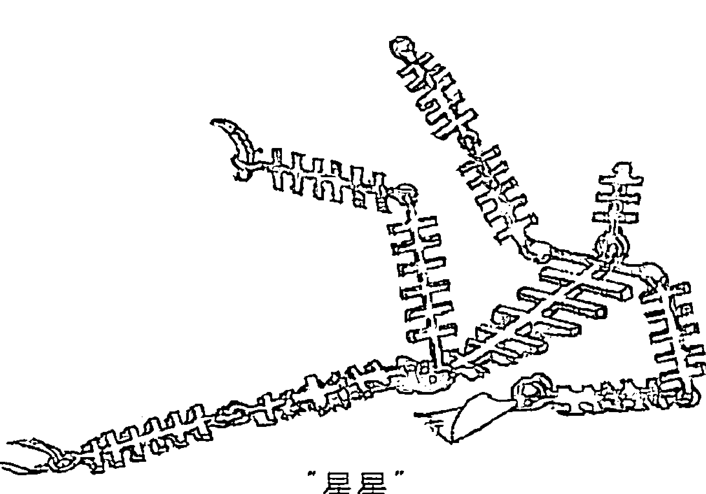

展自己的爱好。

白羊座二能否从与人交往中获得情感上的满足？那些与他们交往的人，又该对他们有怎样的期待呢？同白羊座二交往，用不了几天你就会发现这不是一件清闲的差事。和他们最要好的人，大多是先与他们做朋友，然后再发展为情侣或夫妻。白羊座二的爱情有点儿像流星，绚烂美丽却短暂易逝。他们的占有欲和控制欲在爱情方面表露无遗；他们可以很快爱上一个人，也可以很快忘记一个人。

白羊座二通常选择投入繁重的工作以发泄自己的充沛精力。因此，要想亲近他们，最好的办法就是加入他们，同他们并肩奋斗、共享喜悦、分担痛苦。能跟上他们脚步的人往往最终能成为他们的好搭档或伴侣，只不过维系这种关系所需付出的精力远远超出维持一般的友谊所需付出的精力。

| 优势 |
| --- |
| 好胜 勇敢 精力充沛 |
| 劣势 |
| 冷淡 易怒 极端 |

白羊座二不允许别人触及自己的感情世界。他们很难向外界敞开心扉，也很少让别人走进自己的内心世界，有时，他们甚至都不愿意去面对自己的感情世界。由于他们总散发着高傲冷淡的气息，感情细腻的人与他们交往时常有被排斥的感觉。尽管如此，他们的确需要一个能够体谅和理解他们的伴侣或密友来帮助他们更好地了解自己。最适合他们的朋友是那些坚持陪伴他们的人。这些人不仅有极大的耐心和毅力，而且会鼓励他们表达和谈论自己的感受。最后要说的一点是，虽然白羊座二外表孤傲，不过也常常会嫉妒和吃醋，因为他们无法忍受自己在对方心目中的位置被别人取代。

白羊座二常常自认为是不可或缺的角色，喜欢被需要和被依赖的感觉。这一点颇具讽刺意味，因为他们在内心深处其实最渴望自由，希望不受家庭和社会的牵绊，随性地行动和做决定。许多白羊座二都会遭遇这样一种状况——他们失去了崇拜者的支持和关注，沦为孤家寡人。如果这种痛苦的经历能帮助他们最终面对和战胜被依赖的需要，他们就会去探寻最本质的自我。直到晚年才找到自我、真正独立的白羊座二不在少数。有些人甚至到了六七十岁的时候，才开始不害怕自己去做一些事情，比如独自旅行、运动、尝试有创意的活动或发

### 忠告

即使有充沛的精力，也不应压制或凌驾于他人之上。行为要谨慎负责。不要太在意别人是否关注自己，更不要总试图影响别人。确信自己的内在价值，开发自己潜在的才能。

### 白羊座二名人

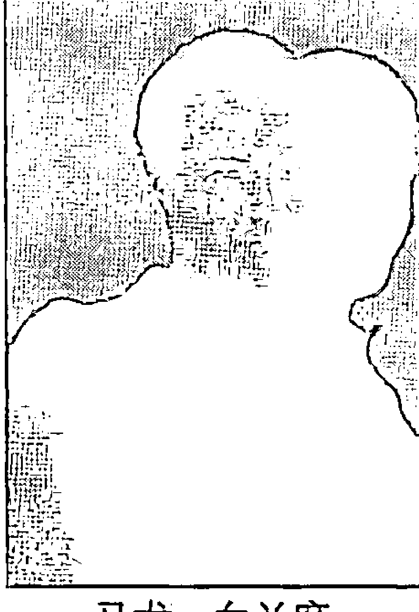

初涉银幕的白兰度经常饰演20世纪50年代的叛逆角色，并因此名声大振，成为好莱坞巨星。从《码头风云》到《欲望号街车》，从《教父》到《现代启示录》，白兰度在李·斯特拉斯伯格的指导和体验式表演的帮助下，建立了属于自己独特的演绎风格。作为一个白羊座二，白兰度遵从自己的天性，将自己打造成万众瞩目的焦点。他也遇到过困难，不过在强大意志力的支持下，他总能找到解决问题的办法。白羊座二不懂得适可而止的特质在白兰度的身上也有所体现，不过他能在局面彻底失控之前控制和收敛自己。

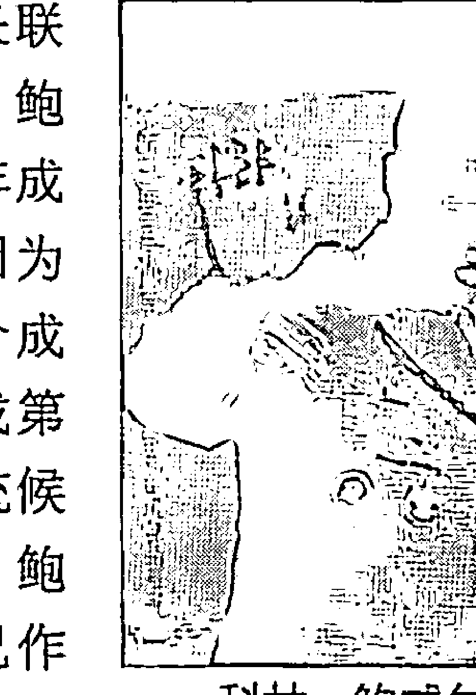

美国前参谋长联席会议主席科林·鲍威尔将军于1996年成为政坛的明星，因为当时共和党的部分成员试图将他打造成第一位非裔美国总统候选人。自此以后，鲍威尔非常适应自己作为领导层核心的角色。不过，他更喜欢把自己当作团队的一员，喜欢同其他人肩并肩、为共同的目标努力奋斗。他能够很好地平衡自己的精力，不因拥有权力而对别人和自己步步紧逼，这正是白羊座二所能达到的最高境界。鲍威尔放松而自信的状态以及谦逊而温和的气质使他成为许多美国非裔年轻人的榜样，为他们带来希望和前进的动力。

比莉·哈乐黛是典型的白羊座二明星。作为最伟大的爵士歌手之一，比莉曾与她那个时代最好的音乐家合作过，其中最著名的有莱斯特·扬、特迪·威尔森、贝西伯爵和阿蒂·肖的乐队。比莉的个人生活从很多方面来看都是一场灾难——她酗酒和吸毒，并且因此憔悴不堪。白羊座二典型的特质——不喜欢自我分析——在比莉身上得到了充分体现。她强迫别人接受酗酒和吸毒成瘾的自己，因为她的字典里不允许出现“妥协”这个词。不过，说起来似乎有点儿矛盾，人们更喜欢听的恰恰是比莉晚期更具成熟韵味的声音，尽管这时她的声音已经遭到具有毁灭性的生活方式的损害。

其他白羊座二名人：玛格丽特·杜拉斯、小罗伯特·唐尼、斯宾塞·屈赛、埃迪·墨菲、格利高里·派克、夏尔·波德莱尔、简·古道尔、赫尔穆特·科尔、马娅·安杰罗、弗朗西斯·福特·科波拉、贝蒂·戴维斯、詹姆斯·沃森、贝蒂·福特、吉尔·霍奇斯、默尔·哈格德、巴里·莱文森、梅尔文·道格拉斯、玛丽·毕克馥、马克思·冯赛多、玛莎·梅森、奥马尔·沙里夫、保罗·罗伯逊、安德烈·普雷文、拉维·香卡、雅各·布莱勒、卡门·麦克雷、米歇尔·菲利普斯、多丽丝·戴、哈里·霍迪尼、朱迪思·雷斯尼克、史蒂文·西格尔、詹姆士·米尔。

## 白羊座二人际关系指南

最佳组合

情侣
双子座二、双子巨蟹座、
射手座三、摩羯座二

夫妻
金牛座一、巨蟹座二、处
女座一、处女座三、天秤
座二、射手座一、摩羯座
二、摩羯水瓶座、水瓶座
三、双鱼座二

朋友
狮子座二、狮子座三、
天蝎座一、天蝎座二、
天蝎座三、射手座二、
摩羯座三、水瓶座一

家人
白羊座三、金牛双子
座、巨蟹座一、处女天
秤座、射手摩羯座、水
瓶座二、水瓶双鱼座

工作
白羊座二、白羊金牛
座、双子座一、双子座
三、狮子处女座、天秤
座一、天秤天蝎座、双
鱼座一

| 星座 | 日期 | 关系描述 | 页码 |
|---|---|---|---|
| 双鱼白羊座 | 3月19日~3月24日 | 一场混战 | 215 |
| 白羊座一 | 3月25日~4月2日 | 玩伴 | 238 |
| 白羊座二 | 4月3日~4月10日 | 孪生之星 | 261 |
| 白羊座三 | 4月11日~4月18日 | 社交才能 | 262 |
| 白羊金牛座 | 4月19日~4月24日 | 不断前进 | 262 |
| 金牛座一 | 4月25日~5月2日 | 强势的组合 | 263 |
| 金牛座二 | 5月3日~5月10日 | 冷淡而疏远 | 263 |
| 金牛座三 | 5月11日~5月18日 | 稳定的同伴关系 | 264 |
| 金牛双子座 | 5月19日~5月24日 | 顽固的拒绝 | 264 |
| 双子座一 | 5月25日~6月2日 | 坚定的互信 | 265 |
| 双子座二 | 6月3日~6月10日 | 学习的机会 | 265 |
| 双子座三 | 6月11日~6月18日 | 催眠 | 266 |
| 双子巨蟹座 | 6月19日~6月24日 | 在爱情里放松 | 266 |
| 巨蟹座一 | 6月25日~7月2日 | 不太亲密 | 267 |
| 巨蟹座二 | 7月3日~7月10日 | 释放的能量 | 267 |
| 巨蟹座三 | 7月11日~7月18日 | 与限制对抗 | 268 |
| 巨蟹狮子座 | 7月19日~7月25日 | 刺激的活动 | 268 |
| 狮子座一 | 7月26日~8月2日 | 激烈的竞争 | 269 |
| 狮子座二 | 8月3日~8月10日 | 互相赞赏 | 269 |
| 狮子座三 | 8月11日~8月18日 | 最好的与最坏的 | 270 |
| 狮子处女座 | 8月19日~8月25日 | 付诸行动 | 270 |
| 处女座一 | 8月26日~9月2日 | 完成工作 | 271 |
| 处女座二 | 9月3日~9月10日 | 不同寻常的亲密 | 271 |
| 处女座三 | 9月11日~9月18日 | 强硬的抵抗 | 272 |
| 处女天秤座 | 9月19日~9月24日 | 加深联系 | 272 |
| 天秤座一 | 9月25日~10月2日 | 事业目标 | 273 |
| 天秤座二 | 10月3日~10月10日 | 非传统教育 | 273 |
| 天秤座三 | 10月11日~10月18日 | 喜怒无常 | 274 |
| 天秤天蝎座 | 10月19日~10月25日 | 危险临头 | 274 |
| 天蝎座一 | 10月26日~11月2日 | 不可能的任务 | 275 |
| 天蝎座二 | 11月3日~11月11日 | 狂风暴雨 | 275 |
| 天蝎座三 | 11月12日~11月18日 | 刻意的伪装 | 276 |
| 天蝎射手座 | 11月19日~11月24日 | 催化剂 | 276 |
| 射手座一 | 11月25日~12月2日 | 动态平衡 | 277 |
| 射手座二 | 12月3日~12月10日 | 意气相投 | 277 |
| 射手座三 | 12月11日~12月18日 | 名列前茅 | 278 |
| 射手摩羯座 | 12月19日~12月25日 | 互相契合 | 278 |
| 摩羯座一 | 12月26日~1月2日 | 压抑的欲望 | 279 |
| 摩羯座二 | 1月3日~1月9日 | 打破壁垒 | 279 |
| 摩羯座三 | 1月10日~1月16日 | 灵活的相处模式 | 280 |
| 摩羯水瓶座 | 1月17日~1月22日 | 不沉闷 | 280 |
| 水瓶座一 | 1月23日~1月30日 | 自断后路 | 281 |
| 水瓶座二 | 1月31日~2月7日 | 不反感 | 281 |
| 水瓶座三 | 2月8日~2月15日 | 一组新按钮 | 282 |
| 水瓶双鱼座 | 2月16日~2月22日 | 美好的家庭生活 | 282 |
| 双鱼座一 | 2月23日~3月2日 | 唤醒潜在特质 | 283 |
| 双鱼座二 | 3月3日~3月10日 | 爱美之心 | 283 |
| 双鱼座三 | 3月11日~3月18日 | 需要被依赖 | 284 |

## 白羊座三

### 先锋的一周。

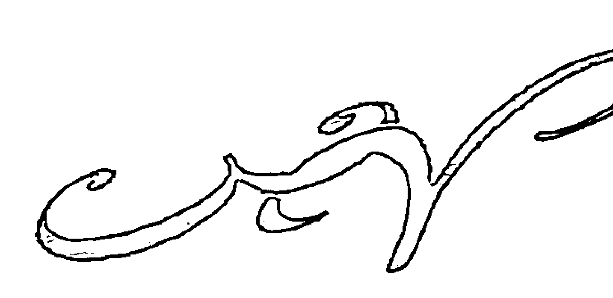

### 4月11日～4月18日

白羊座三的中心意象是“先锋”，象征孩子进一步社会化的过程。这个阶段的孩子开始展现更多的人性特征，积极参与集体活动。随着乳牙的脱落，他们开始通过阅读、写作和媒体了解人类文化。

在生命大循环中，白羊座三代表孩子开始关注社会问题和社会活动的阶段，这个时期的孩子表现出对学习的强烈兴趣，并且开始接受正式教育。他们具有强烈的探索精神，期待做出令人惊喜的事情，从而对周边或更广大的环境造成影响。相对于传统的白羊座来讲，白羊座三更喜欢参与集体活动，这也预示着即将到来的金牛座具有强大的社会沟通能力。

白羊座三并没有白羊座典型的以自我为中心的性格；对他们来讲，为了提高自己的生活和工作条件，同伙伴进行有效和定期的互动是非常必要的。他们是真正的领导者，将集体利益置于自身荣誉之上。所谓先锋，通常是理想主义者。白羊座三就是这样，敢于无惧无畏地追求自己的理想。他们性格强势，一山不容二虎，因此其他性格强势的人，尤其是想要挑战他们权威的人，很难同他们长期融洽相处。这种不能容人的性格也常常令白羊座三陷入困扰和茫然，因为他们对自我的认知是一切为了集体的利益，而争夺主导地位是心胸狭隘的表现，与他们的自我认知相悖。

| 黄道带位置： | 白羊宫20°～白羊宫29° |
| :--- | :--- |
| 季节： | 初春 |
| 元素： | 火 |
| 主宰星： | 火星 |
| 标志物： | 公羊 |
| 认知方式： | 直觉 |

白羊座三乐于助人的性格有时也使自己深受其苦。他们凡事都期望做到完美，对自己拥有的资源往往过分慷慨，经常无私奉献，因此容易遭人利用。比如，他们好心邀请客人在家里暂住几天，结果客人可能一住就是几个星期、几个月甚至几年；他们好心借钱或给人捐东西，结果别人想当然地一而再、再而三地找他们，于是他们越借越多，越捐越多；他们好心地想每天花一点儿时间帮助残疾人或做志愿者工作，结果可能几个小时都脱不了身。白羊座三对大众的慷慨捐助，可能给自己的家庭造成无法承担的负累。

白羊座三通常具有牺牲和奉献精神，而且他们往往要求自己的家人和所在团体的成员也具有这种精神。如果只是想更换一个健康的食谱或者节食的话，倒还可以接受，但白羊座三可能不断要求自己的孩子或晚辈依照自己的理念并做出牺牲，因而遭到他们的反抗。

白羊座三既有革新精神，又注重传统，因此在人生的不同时期或处理不同的事情时，他们时常变换角色。他们对过去的规则非常了解，因此常常能打破常规，不断创新。在实用产品的发掘、开发和销售方面，尤其是在对旧产品的改造上，他们常常表现出高度的创新精神。

## 白羊座三

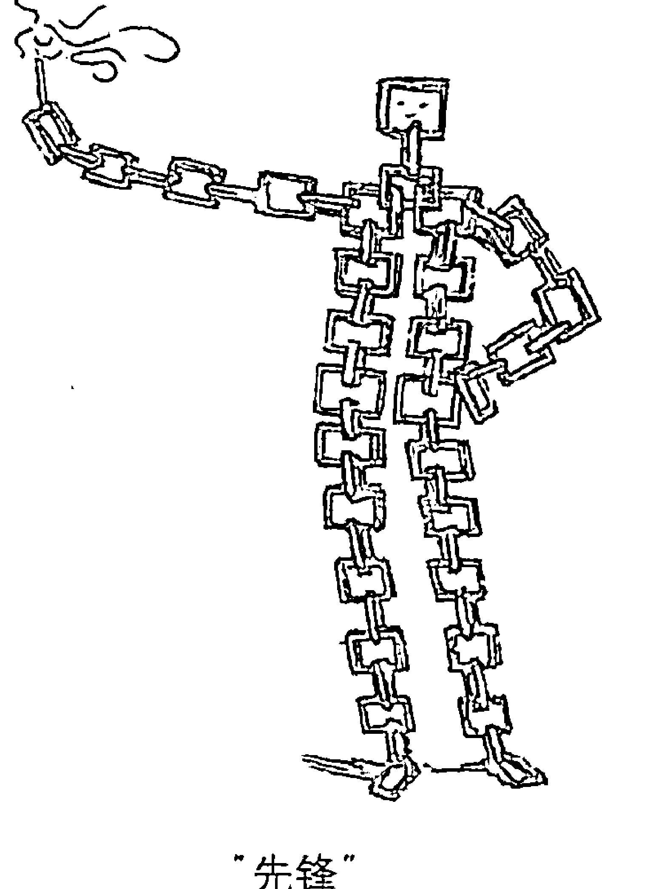

白羊座三进入社会、参加工作后，一般不太适应独自生活；他们也不会很快结婚，但他们时刻需要与孩子、家人、社区或社会团体的成员在一起，并且不忘向身边的人灌输自己的理想主义理念。

为家人和朋友的保护伞。白羊座三的防御能力强于进攻能力，交际能力超群，常常能预知对方的行为，并能用三言两语化解对手的敌意或用敏捷的身手化解对方的攻击。实际上，典型的白羊座三善于察言观色，在暴风雨还在千里之外的时候，他们就做好了应对措施。

“先锋”

白羊座三不仅对自己的理想充满激情，而且性欲强烈，因此他们的恋人或配偶可能难以满足或无法忍受他们的需求。要注意的是，如果在家中遭到拒绝，白羊座三会毫不犹豫地转向外界寻求满足。白羊座三有时将培育子女看作培养另一个自我的过程，这种为人父母的态度会给配偶带来很大的挑战。因此，白羊座三的伴侣必须非常随和、善解人意和能力出众，而且需要承担更多的责任且不能有怨言。

白羊座三的亲密伙伴普遍会遇到这样一个问题：尽管白羊座三乐于倾听，并且慷慨奉献他们的精力，但是他们并不能真正体谅别人或体会别人的感受。生性积极向上的他们很少有时间唠叨或抱怨，而这种“不太积极”的唠叨和抱怨恰巧非常有助于双方释放压抑的情绪。如果这种唠叨和抱怨得不到重视，就会导致双方关系受挫。由于不能体察对方的抱怨，白羊座三总是将问题一拖再拖，直到对方彻底绝望或者勃然大怒了才去解决。这时，两人的关系可能已经走到了尽头。

白羊座三在与人交往的过程中最大的问题在于，他们总是强迫别人接受自己的观点。他们最注重的是自己抽象的理念，很少考虑别人的实际情况，这在与子女的关系中显得尤为严重。他们常常忽视子女的存在或拒绝认可他们，以致伤害子女的感情。白羊座三的配偶也常常有这样的感受，而且他们觉得对方只顾在外打拼，总将自己遗忘在家中。如果白羊座三丈夫试图在家中实施自己的理念，他们的妻子可能感到自己完全失去了自主权并且非常失落。

| 优势 |
| --- |
| 保护欲强烈 慷慨大方 勇敢无畏 |
| 劣势 |
| 不切实际 顽固 过度自我牺牲 |

大抵而言，白羊座三具有保护意识，只要这种保护不过分或失控，他们就能成为家人和朋友的保护伞。

不过，同白羊座三交往也会让人受益匪浅。他们博学好施、以身作则、真诚坦率、品德高尚、明辨是非、忠于承诺、责任心强，这些都是非常令人敬重的品质。而且，虽然有这么多闪光的品质，他们却不会像道学家那样生性严肃、不苟言笑，而是非常喜欢享受生活，善于寻找乐趣。野餐、夏日旅行、户外运动和各种聚会，到处都少不了他们的身影。

### 忠告

用心聆听别人的倾诉，注意别人要表达什么。当心那些想要霸占你的时间和精力的人。理想值得投入精力，不过有时也具有毁灭性。在帮助和领导别人之前，确认一下对方是否需要你的帮助和领导。

### 白羊座三名人

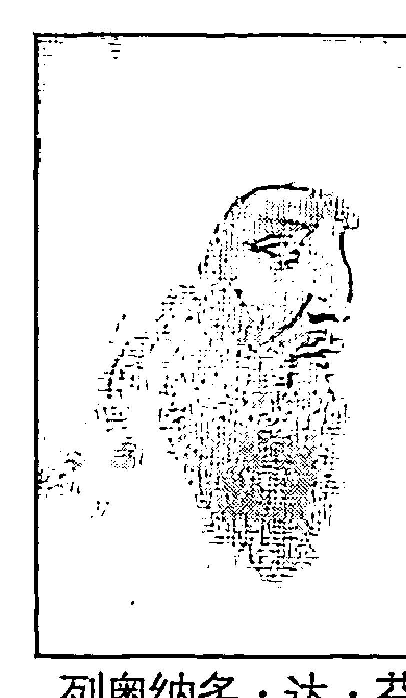

列奥纳多·达·芬奇是文艺复兴时期的核心人物，是著名的画家、诗人和发明家，也是地质学、解剖学、植物学、力学和航空学等方面的专家。他的画作精致华美、技艺纯熟，而且不脱离生活。达·芬奇学习人体学知识，努力让身边的人生活得更快乐，他这种以社会而非以个人为中心的生活态度正是典型的白羊座三的特质。他从未停止探索，一生有许多重大的突破和发现，是真正意义上的“先锋”。用自己的思想而非命令引领人类前进，达·芬奇这位真正意义上的全才思想家登上了人类成就的巅峰。

查理·卓别林具有典型的白羊座三的特质，充满理想和奇思妙想，面对逆境时流露出天生的人道主义情怀。他出生于一个贫穷而不幸的家庭，亲眼目睹父亲酗酒而亡，而他的母亲也由此精神失常。然而，卓别林并没有因此消沉。他一路奋斗，从伦敦的贫民窟走上了好莱坞的大银幕，走进了无数影迷的心中。卓别林的可爱流浪汉的造型——蓄着小胡须，穿着袋状裤，头戴帽子，手持拐杖——成为他个人的标志性形象。他在《摩登时代》和《大独裁者》中所表现的社会态度无疑证明了他是“先锋的一周”的一员。

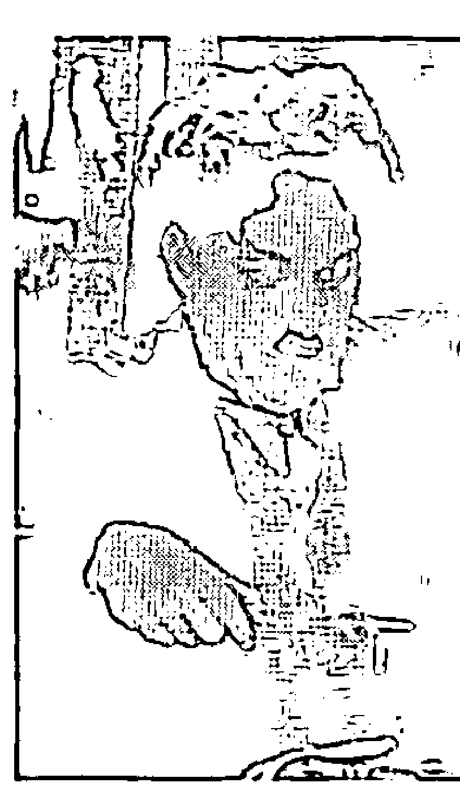

洛雷塔·林恩的成名单曲是《矿工的女儿》。她在肯塔基州的巴切尔山谷长大，13岁结婚，17岁时已经是4个孩子的母亲，31岁时升级为6个孩子的祖母。她是第一个拿到乡村音乐金唱片的女歌手，这无疑彰显了她的先锋精神。林恩更是将白羊座三的精神发挥到了极致。她自学音乐并向该音乐领域的巅峰发起冲击，终于在1988年成为乡村音乐名人堂的一员。

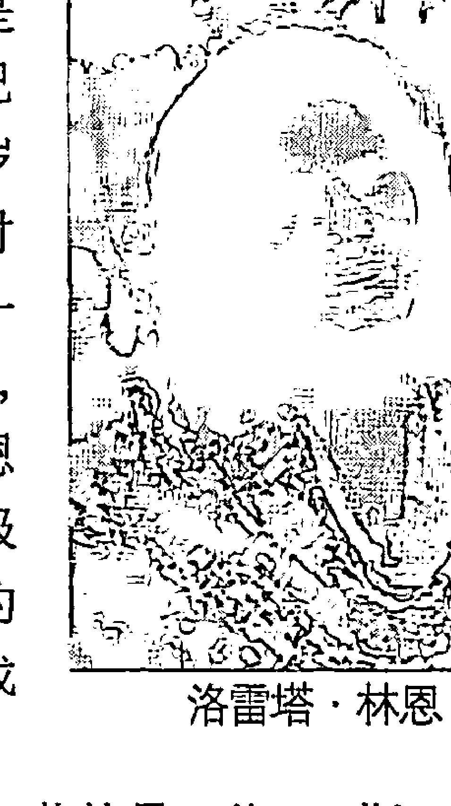

约翰·吉尔古德、贝茜·史密斯、伊莎·丹尼森、乔尔·格雷、马达琳·奥海尔、加里·卡斯帕罗夫、塔玛·贾诺威茨、摩斯·肯宁汉、埃塞尔·肯尼迪、克拉伦斯·达罗、奥列格·卡西尼、亨利·詹姆斯、塞缪尔·贝克特、丹尼斯·班克斯、皮特·罗斯、斯科特·图罗、阿里·阿卡巴汗、朱莉·克里丝蒂、哈罗德·华盛顿、查尔斯·埃文斯·休斯、卡里姆·阿布杜尔-贾巴尔、埃伦·巴尔金、哈里·里森纳、米尔德丽德·贝利。

其他白羊座三名人：戴维·莱特曼、约翰·皮尔庞特·摩根、托马斯·杰斐逊、安妮·沙利文·梅西、伊夫琳·阿什福德、

## 白羊座三人际关系指南

| 最佳组合 | | | |
|---|---|---|---|
| 情侣 | 双子座二、双子巨蟹座、巨蟹座三、狮子座一、处女座三、天蝎座一、天蝎座三、天蝎射手座、摩羯水瓶座、水瓶座一 | | |
| 夫妻 | 双鱼白羊座、金牛座二、巨蟹座二、处女座二、天秤座三、射手座三、摩羯座二 | | |
| 朋友 | 白羊金牛座、金牛座三、金牛双子座、处女天秤座、天秤天蝎座、天蝎座二、射手座一、摩羯座一、摩羯座三、水瓶座二、水瓶座三、双鱼座二 | | |
| 家人 | 白羊座一、双子座三、天秤座一 | | |
| 工作 | 白羊座三、双子座一、巨蟹座一、狮子座三、处女座一、天秤座二、射手摩羯座、水瓶双鱼座、双鱼座三 | | |

| | | | |
|---|---|---|---|
| 双鱼白羊座 | 3月19日~3月24日 | 轻松的气氛 | 215 |
| 白羊座一 | 3月25日~4月2日 | 舞台的中心 | 239 |
| 白羊座二 | 4月3日~4月10日 | 社交才能 | 262 |
| 白羊座三 | 4月11日~4月18日 | 不断的斗争 | 284 |
| 白羊金牛座 | 4月19日~4月24日 | 互相激励的对手 | 285 |
| 金牛座一 | 4月25日~5月2日 | 享受美食 | 285 |
| 金牛座二 | 5月3日~5月10日 | 崇高的理想 | 286 |
| 金牛座三 | 5月11日~5月18日 | 确定目标 | 286 |
| 金牛双子座 | 5月19日~5月24日 | 互相学习 | 287 |
| 双子座一 | 5月25日~6月2日 | 深远的影响 | 287 |
| 双子座二 | 6月3日~6月10日 | 迷人的魅力 | 288 |
| 双子座三 | 6月11日~6月18日 | 开阔眼界 | 288 |
| 双子巨蟹座 | 6月19日~6月24日 | 过分甜蜜? | 289 |
| 巨蟹座一 | 6月25日~7月2日 | 增加能量储备 | 289 |
| 巨蟹座二 | 7月3日~7月10日 | 独立还是依赖? | 290 |
| 巨蟹座三 | 7月11日~7月18日 | 为自由而战 | 290 |
| 巨蟹狮子座 | 7月19日~7月25日 | 巅峰体验 | 291 |
| 狮子座一 | 7月26日~8月2日 | 搭建桥梁 | 291 |
| 狮子座二 | 8月3日~8月10日 | 巨人间的战争 | 292 |
| 狮子座三 | 8月11日~8月18日 | 追寻共同的目标 | 292 |
| 狮子处女座 | 8月19日~8月25日 | 单行道 | 293 |
| 处女座一 | 8月26日~9月2日 | 不可思议的融合 | 293 |
| 处女座二 | 9月3日~9月10日 | 私人领域 | 294 |
| 处女座三 | 9月11日~9月18日 | 严格的要求 | 294 |
| 处女天秤座 | 9月19日~9月24日 | 个人成长 | 295 |
| 天秤座一 | 9月25日~10月2日 | 特殊的黏合剂 | 295 |
| 天秤座二 | 10月3日~10月10日 | 了解自己 | 296 |
| 天秤座三 | 10月11日~10月18日 | 坦然面对 | 296 |
| 天秤天蝎座 | 10月19日~10月25日 | 有说服力的观点 | 297 |
| 天蝎座一 | 10月26日~11月2日 | 蓬勃的生机 | 297 |
| 天蝎座二 | 11月3日~11月11日 | 速度差异 | 298 |
| 天蝎座三 | 11月12日~11月18日 | 全新的世界 | 298 |
| 天蝎射手座 | 11月19日~11月24日 | 实验品 | 299 |
| 射手座一 | 11月25日~12月2日 | 热情洋溢 | 299 |
| 射手座二 | 12月3日~12月10日 | 有效的领导 | 300 |
| 射手座三 | 12月11日~12月18日 | 彼此接纳 | 300 |
| 射手摩羯座 | 12月19日~12月25日 | 美好的未来 | 301 |
| 摩羯座一 | 12月26日~1月2日 | 直来直往 | 301 |
| 摩羯座二 | 1月3日~1月9日 | 适合的形式 | 302 |
| 摩羯座三 | 1月10日~1月16日 | 增进共同利益 | 302 |
| 摩羯水瓶座 | 1月17日~1月22日 | 禁忌的爱情 | 303 |
| 水瓶座一 | 1月23日~1月30日 | 亲密的快乐 | 303 |
| 水瓶座二 | 1月31日~2月7日 | 完全契合 | 304 |
| 水瓶座三 | 2月8日~2月15日 | 温柔宜人 | 304 |
| 水瓶双鱼座 | 2月16日~2月22日 | 重生 | 305 |
| 双鱼座一 | 2月23日~3月2日 | 更高的理想 | 305 |
| 双鱼座二 | 3月3日~3月10日 | 与世界保持联系 | 306 |
| 双鱼座三 | 3月11日~3月18日 | 皇帝的新装 | 306 |

## 白羊金牛座

力量的交界。

4月19日～4月24日

白羊金牛座是黄道带第一宫白羊宫和第二宫金牛宫的交界，它仿佛人生中7岁左右的阶段，又好比自然界中北半球仲春伊始的阶段。这一时期正是大自然释放力量的阶段，万物都迸发出美好而惊人的活力，因此白羊金牛座是“力量”的代表。春季给人的印象是一个田园诗般美丽和宁静的季节。不过，在原始社会的文化中，这也是举办充满暴力和血腥的祭祀仪式的时节。例如，基督教的复活节和犹太人的逾越节都定于此时。春季，山中积雪融化，雪水顺流而下；春季，细雨纷纷，万物多姿多彩；春季，嫩芽破土而出，接受阳光和空气的滋养。白羊金牛座也好比7岁的孩童，乳牙脱落，已经长出许多新牙，开始感受和表达新发现的力量。一般来讲，这个年纪的男孩和女孩开始分别倾向于认同与自己性别相同的父亲或母亲，并且开始追求独立自主的成长空间。

| 黄道带位置： | 白羊宫27°～金牛宫4° |
| :--- | :--- |
| 季节： | 仲春 |
| 元素： | 火/土 |
| 主宰星： | 火星/金星 |
| 标志物： | 公羊/公牛 |
| 认知方式： | 直觉/感觉 |

虽然热衷于权力，但他们一般知道如何在追求自己目标的同时不引起他人的敌意。他们具有强大的说服力，通常能轻易让别人支持他们。只要能达到目标，他们不在乎花费多少时间。而且，他们很会把握时机，知道何时该行动，何时该收手。

这个时期充分体现了白羊金牛座充满力量的特质；这种力量不仅具有白羊座热情直率和随心所欲的特点，同时具有金牛座务实、忍耐和善于照顾人的一面。

白羊金牛座给人的第一印象是安安静静、胸有成竹，并且懂得观察和等待。他们不会费时费力地去向别人证明什么，而会自信地等待时机成熟后再出手，并且出手就必有收获。因此，他们会是棘手的敌人和能干的伙伴。他们的工作方式高度职业化，所以同他们交往的人需要明白，对他们来讲，事业至少和他们的关系一样重要。

白羊金牛座继承了白羊座躁动的能量，无时无刻不在追求权力，不过他们也有金牛座稳重和务实的特点，这缓和了他们躁动的一面。对权力的热衷是白羊金牛座不变的标志。

同金牛白羊座交往的人能够从他们强势的表现和能力中获益无穷。他们知道金钱的价值，也懂得生财之道。不过，他们赚钱的目的通常不是为了获得经济上的安全感，或者说不是为了在工作中获得稳定的收入，以便可以自由消费。他们只是觉得不应该在经济上依赖别人，而应该自己动手，因为他们不愿意因为在经济上依赖别人而放弃个人的自由。对他们来讲，在经济或者其他方面向伴侣、家人或朋友寻求帮助是一件无比困难的事情。不过，如果这时能超越自己，向他人寻求帮助，那他们就在个人发展的历程中向前迈进了很重要的一步。

虽然没有表达出来，但白羊金牛座暗地里期望可以远离世间的纷争，只单纯地任幻想天马行空，享受生活的乐趣以及同心爱的人相处的时光，或者只是懒散度日。不过，这样的理想状态通常无法维持很久。尽管如此，在为生活奔波时，这些小小的梦想依然是他们心头的慰藉，帮助他们度过一个又一个疲于奔命的日子。当然，白羊金牛座如果能每隔一段时间就通过睡觉、游乐、按摩、冥想或度假等方式放松自己，给自己时间和空间去养养神，他们通常就能展现最好的一面。

无论身份高低，在与人交往的过程中，白羊金牛座都会让自己引人注目。他们是做大事的人，可能犯下大错，也可能取得耀眼的成就。无论何时，他们对自己的立场都毫不怀疑。在感情上，他们喜欢主动，拒绝被动；一旦他们的目光停留在某个人身上，事情就定下来了。这并不是说他们的眼光无可挑剔。当发现自己的选择正确时，他们当然会扬扬自得；不过，当事与愿违的时候，他们会拒绝承认自己犯下的重大错误，宁愿长久地在感情中煎熬。他们勉强维持错误的恋情并不仅仅是出于忠诚，更是因为他们觉得放弃是承认失败的表现，而他们恰恰非常不擅长接受和应对失败。

白羊金牛座对待感情非常慷慨，但这种慷慨是有条件的。只有在对自己有利的情况下，他们才会付出，而一旦情况不妙，他们会很快收回自己的礼物甚至感情——他们这样做并不是因为个性反复无常或对对方心存怨恨，而是因为他们觉得自己的礼物没有得到应有的重视或者对方不值得自己付出这份礼物。长此以往，他们很容易将自己的付出变成一种对对方的压迫。如果对方是比较软弱的人，就会感觉没有安全感。这种慷慨的给予也可能使付出者和接受者形成很深的依赖感，而这种依赖感一旦形成，便很难而且几乎不可能消除。

白羊金牛座的一个重要的人生课题是学着减少自己的控制欲，转而去与人分享和合作，去接纳别人。他们之所以变得越来越喜欢控制别人，并不是一朝一夕的结果，而是多年发展形成的。因此，白羊金牛座在生活中如果能有一位热情而无私的伴侣或朋友陪伴，或者能从家庭生活中感受到相亲相爱的温暖，将对他们的健康发展产生至关重要的作用。

| 优势 | 劣势 |
|---|---|
| 稳重可靠 掌控力强 慷慨大方 | 迟钝 唯利是图 懒惰 |

白羊金牛座的另外一个重要的人生课题是：爱是世界上最强大的力量。这同第一个课题息息相关。无论是精神层面还是肉体层面的爱，无论是罗曼蒂克式的、柏拉图式的还是宗教式的爱，对白羊金牛座来说都有不可抵挡的、能够软化人心的力量。虽然他们可能因为一时高兴而追求或遗弃自己的爱人，不过一般而言，他们都会尽力同一个特别的人维持稳定的恋爱关系。白羊金牛座爱一个人到极致，就会愿意为他/她无条件地付出；估计这是他们所能达到的最无私和最忘我的境界了。

### 忠告

不要总是试图掌控别人。学着不去步步紧逼；退后一步，让事情顺其自然地发生。给别人机会，让他们用自己的方式完成工作，即使犯错误也不要干涉。就算你手痒，也要忍住。试着体会身边的人的感受。

### 白羊金牛座名人

威廉·莎士比亚出生于一个富裕的家庭。他从1588年前后开始创作戏剧，一生共创作了37部戏剧。他的戏剧多取材于旧有剧本和民间传说，但在改写中注入了自己的思想，赋予旧题材新颖、丰富和深刻的时代内容，其中最著名的有《威尼斯商人》、《哈姆雷特》和《罗密欧与朱丽叶》等。从17世纪开始，莎士比亚的戏剧传入德、法诸国，然后遍及世界各地，对各国戏剧的发展都产生了巨大和深远的影响，这恰好体现了白羊金牛座充满力量的特质，难怪他的朋友、著名戏剧家本·琼斯说：“他不只属于一个时代，而属于全世纪。”

芭芭拉·史翠珊出生于纽约的布鲁克林区，凭借着自己的勇气、意志力和天赋，充分发挥自己的才能，在好莱坞取得了极大成功。她的一生丰富多彩，曾做过电影导演、制片人、歌手、歌曲作者、电影演员以及音乐剧演员。她凭借无人能敌的力量和决心统治着当时的好莱坞和百老汇舞台。史翠珊的成功在很大程度上应该感激她的影迷，因为他们不论在何种情况下都给予她一如既往的支持。他们将她视为女神，她那高雅而独特的美丽则仿佛让他们看到了天堂。

英国女王伊丽莎白二世被公认为世界上最富有的女人，统治英国长达半个多世纪。伊丽莎白在位期间，曾有不小的反对势力试图废黜王室，而且她本人也因家族内部的离婚和丑闻而深受其苦，不过她还是牢牢掌控着国家事务。尽管女王只是一个头衔，并不代表实质的权力，但伊丽莎白领导的王室一直在政治和经济方面对掌握国家命脉的执政者施加影响。虽然大英帝国已不复存在，但伊丽莎白女王在英国人民的心中仍然占据着特殊的地位。

其他白羊金牛座名人：凯萨琳女皇、秀兰·邓波儿、阿道夫·希特勒、丹尼尔·戴-刘易斯、威廉姆·德·库宁、雪莉·麦克雷恩、小理查德·戴利、杰克·尼科尔森、胡安·米罗、耶胡迪·梅纽因、帕蒂·卢庞、杰茜卡·兰格、路德·范德鲁斯、帕洛马·毕加索、达德利·穆尔、莱奥纳尔·汉普顿、瑞安·奥尼尔、唐·马丁利、小阿尔·昂塞尔、詹姆斯·伍兹。

## 白羊金牛座人际关系指南

| 最佳组合 | | | |
|---|---|---|---|
| 情侣 | 处女座二、处女天秤座、天秤座二、天秤天蝎座、天蝎座二、天蝎座三、摩羯座三、水瓶座三 | | |
| 夫妻 | 金牛双子座、双子巨蟹座、巨蟹座三、狮子座二、水瓶座一 | | |
| 朋友 | 双鱼白羊座、白羊座一、白羊座三、白羊金牛座、金牛座三、双子座二、巨蟹座二、天秤座一、天秤座三、天蝎座一、天蝎座三、天蝎射手座、摩羯座二、水瓶双鱼座、双鱼座一 | | |
| 家人 | 金牛座一、金牛座二、巨蟹狮子座、射手摩羯座、双鱼座二 | | |
| 工作 | 白羊座二、双子座一、巨蟹座一、狮子座三、处女座一、处女座三、射手座一、摩羯水瓶座 | | |

| | | | |
|---|---|---|---|
| 双鱼白羊座 | 3月19日~3月24日 | 星际大战 | 216 |
| 白羊座一 | 3月25日~4月2日 | 有限的靠近 | 239 |
| 白羊座二 | 4月3日~4月10日 | 不断前进 | 262 |
| 白羊座三 | 4月11日~4月18日 | 互相激励的对手 | 285 |
| 白羊金牛座 | 4月19日~4月24日 | 降低防备 | 307 |
| 金牛座一 | 4月25日~5月2日 | 安全的避风港 | 307 |
| 金牛座二 | 5月3日~5月10日 | 物质享受 | 308 |
| 金牛座三 | 5月11日~5月18日 | 坦诚相待 | 308 |
| 金牛双子座 | 5月19日~5月24日 | 令人惊讶 | 309 |
| 双子座一 | 5月25日~6月2日 | 龙卷风 | 309 |
| 双子座二 | 6月3日~6月10日 | 天生的体谅之心 | 310 |
| 双子座三 | 6月11日~6月18日 | 改革的魅力 | 310 |
| 双子巨蟹座 | 6月19日~6月24日 | 能量流 | 311 |
| 巨蟹座一 | 6月25日~7月2日 | 为独立而战 | 311 |
| 巨蟹座二 | 7月3日~7月10日 | 轻松逃离 | 312 |
| 巨蟹座三 | 7月11日~7月18日 | 睿智的忠告 | 312 |
| 巨蟹狮子座 | 7月19日~7月25日 | 畅通的交流渠道 | 313 |
| 狮子座一 | 7月26日~8月2日 | 激烈的对抗 | 313 |
| 狮子座二 | 8月3日~8月10日 | 有进取心的探索者 | 314 |
| 狮子座三 | 8月11日~8月18日 | 破口大骂 | 314 |
| 狮子处女座 | 8月19日~8月25日 | 遁入幻想世界 | 315 |
| 处女座一 | 8月26日~9月2日 | 僵化 | 315 |
| 处女座二 | 9月3日~9月10日 | 家庭的宁静 | 316 |
| 处女座三 | 9月11日~9月18日 | 实用的暂时协议 | 316 |
| 处女天秤座 | 9月19日~9月24日 | 传统的外表 | 317 |
| 天秤座一 | 9月25日~10月2日 | 稳定的模式 | 317 |
| 天秤座二 | 10月3日~10月10日 | 合拍的说服者 | 318 |
| 天秤座三 | 10月11日~10月18日 | 没有要求 | 318 |
| 天秤天蝎座 | 10月19日~10月25日 | 大幅度摇摆 | 319 |
| 天蝎座一 | 10月26日~11月2日 | 考验毅力 | 319 |
| 天蝎座二 | 11月3日~11月11日 | 互相牵绊 | 320 |
| 天蝎座三 | 11月12日~11月18日 | 忠诚的需要 | 320 |
| 天蝎射手座 | 11月19日~11月24日 | 互相尊重 | 321 |
| 射手座一 | 11月25日~12月2日 | 节奏差异 | 321 |
| 射手座二 | 12月3日~12月10日 | 准备让步 | 322 |
| 射手座三 | 12月11日~12月18日 | 想当领导 | 322 |
| 射手摩羯座 | 12月19日~12月25日 | 趋于破裂 | 323 |
| 摩羯座一 | 12月26日~1月2日 | 注入活力 | 323 |
| 摩羯座二 | 1月3日~1月9日 | 更高的层面 | 324 |
| 摩羯座三 | 1月10日~1月16日 | 隐藏的不安全感 | 324 |
| 摩羯水瓶座 | 1月17日~1月22日 | 感情风暴 | 325 |
| 水瓶座一 | 1月23日~1月30日 | 施与受 | 325 |
| 水瓶座二 | 1月31日~2月7日 | 走进沙堆 | 326 |
| 水瓶座三 | 2月8日~2月15日 | 着火的房子 | 326 |
| 水瓶双鱼座 | 2月16日~2月22日 | 教养活动 | 327 |
| 双鱼座一 | 2月23日~3月2日 | 共鸣箱 | 327 |
| 双鱼座二 | 3月3日~3月10日 | 吵吵闹闹 | 328 |
| 双鱼座三 | 3月11日~3月18日 | 胜过对方 | 328 |

## 金牛座一

表现的一周。

4月25日～5月2日

金牛座一的中心意象是“表现”，这个阶段仿佛孩子终于拥有了力量的时期，可以将自己的奇思妙想转化为具体行动并有效地执行。这个阶段的孩子开始学着建构实体，也学着自己思考切实可行的方法。这些都是他们表现自我的方式。

在生命大循环中，金牛座一象征着刚进入学堂的孩子。他们不再限于家庭小单元的生活，而是开始广泛接触社会和更大型的组织机构，并由此发展出各自不同的性格特征。他们的生活中开始出现各种各样的问题——权力之争、与人交流、自主、妥协、生存、对抗等主题此起彼伏。在面对和处理这些问题的过程中，他们经历着严酷的考验并逐渐形成自己的性格。

金牛座一是头脑冷静的实用主义者，也是众星区中最卓越的之一。一旦头脑中有了想法和计划，他们一定会坚持到底才肯收手。而且，他们很少盲目地坚持，只有在证明计划可行之后才会去实施。事实也证明，他们的想法和计划都颇具潜力。基本上在做每一件事时，他们始终很有信心获得成功。

金牛座一擅长将概念付诸实践，并且常常将这种能力运用于建立和经营家庭、企业或其他机构。他们对建构结构尤其是层级结构有着与生俱来的直觉。比如说，他们非常重视技术，喜欢探究事物是如何运行的。如果可以把事物分解开再组装回去，他们会毫不犹豫地去做。这种喜欢实践式分析的倾向，在艺术、金融和机械模型方面都有所表现。

| 黄道带位置： | 金牛宫3°～金牛宫13° |
| :--- | :--- |
| 季节： | 仲春 |
| 元素： | 土 |
| 主宰星： | 金星 |
| 标志物： | 公牛 |
| 认知方式： | 感觉 |

金牛座一拥有不可否认的领导才能，却没有很强的领导欲望；借助集体努力实施个人的想法是他们领导别人的动力来源。他们喜欢清静地坐拥自己的一片江山，而不喜欢争权夺利或去占领新的疆土。对最固执的金牛座一来说，除非能够向他们证明改变带来的好处是无与伦比的，否则想要劝他们改变自己的计划简直是不可能的事情。

金牛座一无论作为上司还是同事都会非常成功，因为他们总能运用自己的交际手腕来了解合作者的需要。在职场上的表现也反映出他们会是家庭中的保护者和支持者。金牛座一老板认为员工之间应该融洽相处、团队合作。他们发自内心地厌恶钩心斗角，也不喜欢自己受到轻慢或怀才不遇。他们通常很善于处理麻烦，不过有时也会退缩甚至萎靡不振。同样，在与别人的交往中，如果自己的好意得不到尊重的话，他们也会陷入迷茫甚至自轻自贱的情绪中。金牛座一应该知道，当别人同自己意见不一致的时候，并不需要觉得失望或遭到背叛，因为有时候别人并不是针对自己的，不要把所有的事都怪罪到自己身上。只有认识到这一点，他们才能更高效地展开工作。

金牛座一非常重视物质和身体享受，性爱、美食、运动和各种感官享受对他们来说都是非常重要的身心体验。亲近这些人的一个很好的方式就是同他们一起进行日常运动，比如慢跑、游泳、打回力球和网球等。这样的活动能帮助双方建立信任的纽带，让彼此敞开心扉、分享秘密。金牛座一知道身体到了极限要停下来休息，却不知道纵情享乐也会伤害身体，这是非常危险的。他们面对美食时，常常疯狂沉迷而不能自制，因而导致肥胖、酗酒、胆固醇升高等健康问题。

与金牛座一交往时，最好避免和他们正面冲突。尤其当他们是你的父母或伴侣时，比较明智的做法是旁敲侧击地引起他们对感情和和睦相处的需求。在美好的气氛中动之以情，比争个你死我活要有效得多。金牛座一喜欢主导全局，在外工作的时候又喜欢将所有的事情都往自己身上揽，因此他们觉得温馨宁静的家庭环境非常可贵，是他们释放压力的港湾，值得付出一切代价去保护。

金牛座一如果能够结合实际情况正确认识自己，就能避免许多问题。他们对自己的定位（坚强、理性和沉稳）通常同真实的自己（脆弱、感性和喜欢夸大其词）有很大出入。了解金牛座一的人都知道，在他们冷静甚至强硬的外表下，其实隐藏着一颗感性而脆弱的心，让人本能地想保护他们。金牛座一在处理商业和社交事务时很容易显得不稳重，尤其当他们表现出视他人的利益高于自身利益时，可能让很多人觉得他们爱表现。在与员工互动的过程中，实事求是、做真实的自己并避免过多的私人交往才是正确的相处之道。总之，金牛座一应该避免不断吹嘘自己慷慨奉献、心胸宽广，而应该用实际行动来说话。自命不凡和自以为无所不知的姿态只会引起别人的反感。

| 优势 | 劣势 |
|---|---|
| 卓有成效 重视物质享受 坚韧不拔 | 固执己见 自以为是 夸大其词 |

不过，宁静的家庭环境也可能暗藏着危机，因为金牛座一往往对自己的生活环境过于满意而忽视了预警信号。他们惯于拖延，就算门吱吱作响了，窗户漏风了，甚至是家人有什么需要了，他们也不能予以足够的重视。他们对平和与宁静的渴望太执着，固执地不愿做出改变，这往往使和他们生活在同一个屋檐下的人觉得有压迫感，甚至感到窒息。

一般而言，金牛座一喜欢维持现状，对自己所拥有的东西紧抓不放。但是，在生活中的某些时刻，面对摇摇欲坠的感情，他们不得不学着放手，不再无谓地挣扎和修补。如果死不放手，只会使自己和对方都陷入痛苦的深渊。固执地认为问题会有所好转或者自行消解只会让局面更尴尬，最后使双方都陷入进退两难的境地——解决不了矛盾，却又放不开手。

### 忠告

不要将太多责任揽到自己身上。刻意地定期做一些改变。不要打着谨慎或好意的旗号试图拖延问题，迟迟不肯着手去办。放宽眼界，试着接纳不同的观念和观点。

### 金牛座一名人

捷克籍澳大利亚裔工业家和商人奥斯卡·辛德勒曾经从纳粹的死亡集中营中拯救了1000多名犹太人。辛德勒有金牛座一所独有的坚韧而务实的人生观。他无法眼睁睁地看着自己工厂里的犹太人被关进集中营而坐视不理，所以他借口说这些人是为战争服务，从而骗过德国官员，保住了这些工人的性命。更为可贵的是，他还曾亲自到集中营救回自己的工人。大多数人都是通过史蒂文·斯皮尔伯格的电影《辛德勒的名单》才了解这位英雄的事迹。在冷酷残忍的现实中仍然努力将自己的理念付诸实践，这正是金牛座一的性格特征。

艾灵顿公爵是杰出的作曲家、编曲家和钢琴师，为爵士乐带来了新元素。他与伊果·斯特拉文斯基和比利·史崔洪合作成立了“艾灵顿公爵大乐团”并担任团长。“艾灵顿公爵大乐团”不同于贝西伯爵的重度摇摆感，不同于本尼·古德曼的激情澎湃，也不同于格伦·米勒的商业格调；它拥有独特的风格，融入了艾灵顿的艺术理念，受到世界各地热衷于创造性音乐的人的追捧。艾灵顿公爵是“表现”的大师，通过自己的乐队、作品、编曲手法、表演和唱片将自己的理念展现在世人面前。

演员米歇尔·法伊弗拥有美神维纳斯式的动人美貌（维纳斯女神代表金星，而金星是金牛座一的主宰星）。她如女神般优雅，而且演技高超，令无数影迷为之倾倒。法伊弗有着金牛座一的特质，一旦有想法便付诸实践并坚持到底，并且喜欢担负起为他人带来幸福的责任，这一点从她收养一个小女孩并独自将她抚养成人的行为中就可以看出来。1997年，法伊弗已年届40，却愈发迷人。我们有理由相信，作为典型的金牛座一，法伊弗将越来越光彩照人。

其他金牛座一名人：阿尔·帕西诺、萨达姆·侯赛因、玛丽二世女王、朱莉安娜女王、威灵顿公爵、贝聿铭、大卫·休谟塔、德日进、莉娅·希雷、埃拉·菲茨杰拉德、安德烈·阿加西、约瑟夫·海勒、比安卡·贾格尔、杰瑞·宋飞、科雷塔·斯科特·金、威利·纳尔逊、尤利西斯·格兰特、伯纳德·马拉默德、米歇尔·福金、丽塔·库利奇、鲍比·安·梅森、奥利·马特森、特里·萨瑟恩、查克·贝德纳立克、吉尔·克莱布格、詹姆斯·门罗、安·玛格丽特、凯特·史密斯、凯西·卡塞姆、桑迪·丹尼斯、阿努克·艾梅。

## 金牛座—人际关系指南

最佳组合

情侣
双鱼白羊座、金牛双子座、双子巨蟹座、狮子处女座、天蝎座一、摩羯水瓶座、双鱼座三

夫妻
白羊座二、金牛座三、双子座二、巨蟹座三、天蝎座二、射手座二、摩羯座一、摩羯座三、水瓶座二、水瓶座三

朋友
巨蟹座一、狮子座一、处女座二、处女座三、天秤天蝎座、天蝎射手座、射手摩羯座、水瓶座一、双鱼座二

家人
白羊金牛座、金牛座一、金牛座二、狮子座二、处女天秤座、双鱼座一

工作
白羊座一、金牛座一、双子座一、双子座三、巨蟹狮子座、狮子座三、处女座一、天蝎座三

| 星座 | 日期 | 主题 | 页码 |
|---|---|---|---|
| 双鱼白羊座 | 3月19日~3月24日 | 良药不苦口 | 216 |
| 白羊座一 | 3月25日~4月2日 | 追求成功 | 240 |
| 白羊座二 | 4月3日~4月10日 | 强势的组合 | 263 |
| 白羊座三 | 4月11日~4月18日 | 享受美食 | 285 |
| 白羊金牛座 | 4月19日~4月24日 | 安全的避风港 | 307 |
| 金牛座一 | 4月25日~5月2日 | 舒适的家 | 329 |
| 金牛座二 | 5月3日~5月10日 | 深厚的感情 | 329 |
| 金牛座三 | 5月11日~5月18日 | 寓教于乐 | 330 |
| 金牛双子座 | 5月19日~5月24日 | 余烬复燃 | 330 |
| 双子座一 | 5月25日~6月2日 | 找乐子 | 331 |
| 双子座二 | 6月3日~6月10日 | 感官享受 | 331 |
| 双子座三 | 6月11日~6月18日 | 五花八门 | 332 |
| 双子巨蟹座 | 6月19日~6月24日 | 炽热的魔咒 | 332 |
| 巨蟹座一 | 6月25日~7月2日 | 坚持立场 | 333 |
| 巨蟹座二 | 7月3日~7月10日 | 独特的嗜好 | 333 |
| 巨蟹座三 | 7月11日~7月18日 | 互诉衷肠 | 334 |
| 巨蟹狮子座 | 7月19日~7月25日 | 走自己的路 | 334 |
| 狮子座一 | 7月26日~8月2日 | 不断开拓 | 335 |
| 狮子座二 | 8月3日~8月10日 | 强势、冷静 | 335 |
| 狮子座三 | 8月11日~8月18日 | 不可思议的成功 | 336 |
| 狮子处女座 | 8月19日~8月25日 | 真相暴露 | 336 |
| 处女座一 | 8月26日~9月2日 | 最佳搭档 | 337 |
| 处女座二 | 9月3日~9月10日 | 神秘水域 | 337 |
| 处女座三 | 9月11日~9月18日 | 获利要素 | 338 |
| 处女天秤座 | 9月19日~9月24日 | 登上顶峰 | 338 |
| 天秤座一 | 9月25日~10月2日 | 一片混乱 | 339 |
| 天秤座二 | 10月3日~10月10日 | 指引方向 | 339 |
| 天秤座三 | 10月11日~10月18日 | 冲突的倾向 | 340 |
| 天秤天蝎座 | 10月19日~10月25日 | 概念思维 | 340 |
| 天蝎座一 | 10月26日~11月2日 | 异性相吸 | 341 |
| 天蝎座二 | 11月3日~11月11日 | 不接受投降 | 341 |
| 天蝎座三 | 11月12日~11月18日 | 严禁争吵 | 342 |
| 天蝎射手座 | 11月19日~11月24日 | 挥霍浪费 | 342 |
| 射手座一 | 11月25日~12月2日 | 考验耐心 | 343 |
| 射手座二 | 12月3日~12月10日 | 秘密树 | 343 |
| 射手座三 | 12月11日~12月18日 | 细腻的感受力 | 344 |
| 射手摩羯座 | 12月19日~12月25日 | 计划与筹备 | 344 |
| 摩羯座一 | 12月26日~1月2日 | 从物质到精神 | 345 |
| 摩羯座二 | 1月3日~1月9日 | 量身打造 | 345 |
| 摩羯座三 | 1月10日~1月16日 | 孤芳自赏 | 346 |
| 摩羯水瓶座 | 1月17日~1月22日 | 解开谜题 | 346 |
| 水瓶座一 | 1月23日~1月30日 | 共通的问题 | 347 |
| 水瓶座二 | 1月31日~2月7日 | 疲倦的满足 | 347 |
| 水瓶座三 | 2月8日~2月15日 | 捉蝴蝶 | 348 |
| 水瓶双鱼座 | 2月16日~2月22日 | 无情的完美之神 | 348 |
| 双鱼座一 | 2月23日~3月2日 | 天真自然 | 349 |
| 双鱼座二 | 3月3日~3月10日 | 密切的社交互动 | 349 |
| 双鱼座三 | 3月11日~3月18日 | 源源不断的赞誉 | 350 |

## 金牛座二

### 。老师的一周。

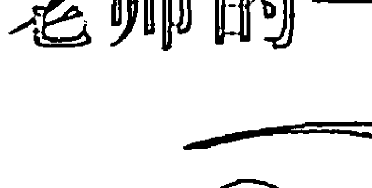

### 5月3日～5月10日

金牛座二的中心意象是“老师”，其对应的人生阶段同样是儿童时代，而正规的学习和教育在这个阶段具有重要作用。学习是孩子将来立足于社会的根本。

| 黄道带位置： | 金牛宫12°～金牛宫21° |
| :--- | :--- |
| 季节： | 仲春 |
| 元素： | 土 |
| 主宰星： | 金星 |
| 标志物： | 公牛 |
| 认知方式： | 感觉 |

现甚佳，特别是在一对一或小范围的教学活动中，比如舞蹈班、音乐班、体育班和视觉艺术班等等。无论作为老师还是学生，他们都有不俗的表现。对金牛座二学生而言，做一名好学生是成为一名好老师的第一步。作为老师，金牛座二了解自我学习和进修的价值，同时也不会束缚学生，而是鼓励学生进行自我教育。

在金牛座二所对应的人生阶段，孩子正式进入学习阶段，其中老师起着非常重要的榜样作用。孩子开始学着专心致志地做事情，对周围和自我有了更深刻的认识，并开始发展道德意识。这个阶段的孩子将意识到如何使自我定位与群体环境相符相融。随着自我的不断发展，他们最终能向其他人教授或传播自己的所知所学。

金牛座二常常具有改变别人和震撼人心的力量。他们在言谈中很少涉及轻佻或肤浅的话题，这可能是因为他们非常注重思想和意识形态，因而常常能对他人产生影响。他们是优秀的管理者，不需要对身边的人实施高压政策，就能很好地经营事业和家庭。不过，他们有时候也会设定一些规矩，不容许他人逾越。

金牛座二总有一肚子的奇思妙想，喜欢实践各种各样的设想和技巧。他们不论从事何种职业、拥有何种嗜好，都喜欢同他人分享信息。金牛座二最喜欢的活动就是向别人滔滔不绝地讲述自己的想法和发现，引发别人进行讨论，并通过印证举例等方式主持讨论。可以这么说，金牛座二“好为人师”，有传播信息的诉求。能够用简单易懂的方式向别人表达自己的观点对他们来说是最重要的事情。

金牛座二喜欢了解周围人的生活状态，特别是那些对他们来说很陌生的社会群体。他人的生活、工作、娱乐、饮食、信仰、权利和运动方式都深深地吸引着金牛座二。此外，他们富有强烈的同情心和正义感，对各种不公平和歧视的行为感同身受。跨文化和跨种族的人际交往在金牛座二身上司空见惯，而且，不论是年长的或是年轻的金牛座二，通常都能和年龄差距很大的人保持良好关系。

因此，金牛座二强烈希望发展“老师—学生式”的互动关系就不足为奇了。他们直觉地认为老师和学生好比一枚硬币的两面，是不可分割的。这种教学式的互动也是他们所向往的生活方式。金牛座二通常在学校表

金牛座二拥有强烈的道德观和坚定的是非观念，对自己认为正确的事情决不让步，对自己认为错误的事情也决不姑息。这并不是说他们死板严苛，不过他们的确过于正经拘谨，甚至有点儿像清教徒，尤其在他们年轻的时候。随着年龄的增长，这种倾向似乎逐渐消失，但还是会不时地在重要时刻冒出来，让那些把他们看作“自由派思想者”的人大吃一惊。金牛座二对公正公平的坚持可谓无人能敌，这是他们强烈的道德观中表现得最明显的一面。对于各种不公、偏见和歧视，他们总是不依不饶；对于各种种族主义，他们也会毫不犹豫并且毫不妥协地严加指责。实际上，面对生活中的不公，金牛座二随时都可能勃然大怒。因此，他们必须学着适当控制自己的情绪，避免被这些负面情绪冲昏了头脑。

的人会因此受到很大的伤害，继而疏远他们。他们总是想让别人也凡事认真，遇事坚强，坚持正义和真理，但并不是所有人都认同这样的理念。只有当金牛座二放松心情，对自己不那么严格时，或者等他们年纪大一点儿以后，这种性格中的批判性才会减少一点儿乃至完全消失。

金牛座二追求美好的事物，魅力无穷而且个性十足，因此拥有大批的仰慕者。然而，他们并不习惯备受关注的感觉，也不喜欢整天忙于交际而无法脱身。这时，他们别无选择，只能退缩到更加孤立的世界里。因此，发展得比较好的金牛座二懂得如何收敛自己的吸引力，以免给自己招来不必要的麻烦。

金牛座二天生具有运动细胞，热衷于体育、舞蹈、音乐以及健身活动，但是他们也不会给人留下四肢发达、头脑简单的印象。他们通常能给人们留下深刻的第一印象，并能对所处环境造成不小的影响，不过这些都是他们的“头脑”而不是“四肢”的功劳。即使身材中等或娇小，金牛座二在与人初次见面时也会使对方印象深刻。

| 优势 |
| --- |
| 有进取心 公正 富有魅力 |
| 劣势 |
| 苛刻 批判性强 不知变通 |

在私人交往中，同金牛座二最合得来的人是那些懂得为他们保留个人空间的人，而不是死缠烂打或喋喋不休、焦躁不安的人。金牛座二希望自己的伴侣通过支持的态度来表达爱意，而不是一味地表达感恩之情或柔情蜜意。私下里金牛座二可以激情四射，不过在日常工作和生活中，他们期望与人保持一定的距离。他们喜欢浪漫，但不喜欢如胶似漆；如果对方对爱情和性爱抱有现实而坦诚的态度，那就最好不过了。金牛座二很少去满足别人的感情需求，即使对方是亲密的伴侣也不例外。他们希望自己的伴侣能够坚强而有尊严，任何祈求或乞讨的姿态都会令他们心生反感并逃之夭夭。

虽然金牛座二是出色的老板、父母或老师，不过作为同事、伴侣或朋友，他们不太好相处。他们对身边的人要求很高，并且常常具有批判性，一旦对别人有什么不喜欢的地方，就会尖锐地指出来。性格柔弱或敏感

### 忠告

试着放松心情，亲切待人。随时注意自己是不是有些尖刻、武断或者不会变通。记住“教学相长”这句话，好的老师要不断地虚心学习。做个好榜样，勇于承认自己的错误。不时审视自己的想法并及时修正。

### 金牛座二名人

演员兼导演奥逊·威尔斯具有典型的金牛座二爱说教的性格。在处女作《公民凯恩》中，威尔斯做出前所未有的创新，给未来的电影创作者带来无可比拟的影响。无论作为导演还是演员，或者仅仅是作为一位富有创意的天才，威尔斯都展示了自己准确的观察能力、机敏的应答能力和巧妙的讽刺能力。他是一位真正的知识分子，关注的是创意本身的价值，对于二流的创意或弄虚作假，他像所有的专家一样嗤之以鼻。但问题是，他本身就是一位制造电影的魔术大师，因而人们不太愿意相信他。可无论如何，威尔斯都是一位名副其实的语言大师，其高超的叙事水平有他的电影为证。

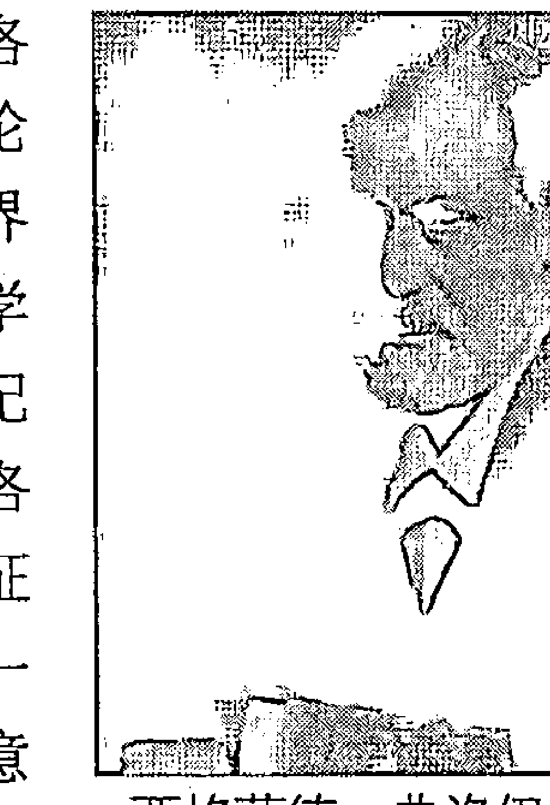

西格蒙德·弗洛伊德是精神分析理论的创始人，也是世界上第一位现代心理学家，被公认为20世纪的思想先驱之一。弗洛伊德的作品和演讲证明他不愧为“老师的一周”的一员。他在潜意识、梦境解析、临床精神病治疗等方面成就斐然。不过，他也具有金牛座二固执和武断的特点，拒绝承认自己的错误。弗洛伊德的许多观察研究由于只基于小范围的病人进行，因此其结果并不可靠。不过，弗洛伊德的许多重要理念，尤其是他认为儿童同父母的互动对其精神状态的影响非常重要这一观点受到了广泛的认可和支持。

伊娃·贝隆因安德鲁·劳埃德·韦伯的音乐剧《艾维塔》以及歌曲《阿根廷，请别为我哭泣》而为世人所知，她喧嚣的一生也因此引起世人的关注。伊娃是私生女，她的母亲为了控制她的父亲而生下她。受母亲的影响，伊娃寻求的都是能够对她的事业有所帮助的情人。作为阿根廷领导人胡安·贝隆的夫人，她成为工人阶级的榜样以及穷人和弱势群体的保护者和捍卫者，这一点体现了金牛座二的性格特征。在胡安的帮助下，她得以在提升工人的生活条件方面取得进展。在面对军队威胁的时候，她表现出决不妥协的气度，拒绝放弃自己的道德底线。伊娃的性格脾气是典型的金牛座二——在不能自控的情况下，她会是自己最大的敌人。

其他金牛座二名人：卡尔·马克思、奥黛丽·赫本、彼得·伊里奇·柴可夫斯基、约翰内斯·勃拉姆斯、格雷格·冈贝尔、休格·雷·鲁宾逊、果尔迪·梅厄、罗伯托·罗塞利尼、戴夫·普拉特、锡德·维舍斯、基斯·哈林、塔米·温妮特、威利·梅斯、鲁道夫·瓦伦丁诺、格伦达·杰克逊、坎蒂斯·伯根、弗雷德·阿斯泰尔、朱迪斯·贾米森、基思·贾勒特、兰迪·特拉维斯、加里·库珀、玛丽·卢·威廉斯、阿里尔·杜兰特、班吉·冈萨雷斯、约翰·布朗、里基·纳尔逊。

## 金牛座二人际关系指南

最佳组合

情侣
金牛座三、双子座三、巨蟹座二、狮子座二、狮子座三、处女座二、射手座二、摩羯座一

夫妻
白羊座一、白羊座三、金牛座二、双子座二、巨蟹座一、巨蟹狮子座、天秤座二、天蝎射手座、水瓶座一、双鱼座二

朋友
双鱼白羊座、双子巨蟹座、狮子座一、狮子处女座、天蝎座二、摩羯座二、双鱼座一

家人
白羊金牛座、处女座三、天蝎座一、射手座一、射手摩羯座、水瓶双鱼座、双鱼座三

工作
双子座一、巨蟹座三、处女座一、处女天秤座、天秤座三、天蝎座三、射手座三

| 星座 | 日期 | 主题 | 页码 |
|---|---|---|---|
| 双鱼白羊座 | 3月19日~3月24日 | 虚幻的迷雾 | 217 |
| 白羊座一 | 3月25日~4月2日 | 理智与情感 | 240 |
| 白羊座二 | 4月3日~4月10日 | 冷淡而疏远 | 263 |
| 白羊座三 | 4月11日~4月18日 | 崇高的理想 | 286 |
| 白羊金牛座 | 4月19日~4月24日 | 物质享受 | 308 |
| 金牛座一 | 4月25日~5月2日 | 深厚的感情 | 329 |
| 金牛座二 | 5月3日~5月10日 | 真正的教育 | 350 |
| 金牛座三 | 5月11日~5月18日 | 契合的伴侣 | 351 |
| 金牛双子座 | 5月19日~5月24日 | 赢得表达的权力 | 351 |
| 双子座一 | 5月25日~6月2日 | 你拉我扯 | 352 |
| 双子座二 | 6月3日~6月10日 | 上升气流 | 352 |
| 双子座三 | 6月11日~6月18日 | 检验真相 | 353 |
| 双子巨蟹座 | 6月19日~6月24日 | 不安定因素 | 353 |
| 巨蟹座一 | 6月25日~7月2日 | 沃土 | 354 |
| 巨蟹座二 | 7月3日~7月10日 | 互相迷恋 | 354 |
| 巨蟹座三 | 7月11日~7月18日 | 胸襟开阔 | 355 |
| 巨蟹狮子座 | 7月19日~7月25日 | 打破纪录 | 355 |
| 狮子座一 | 7月26日~8月2日 | 早就说过 | 356 |
| 狮子座二 | 8月3日~8月10日 | 一心一意的奉献 | 356 |
| 狮子座三 | 8月11日~8月18日 | 态度上的差异 | 357 |
| 狮子处女座 | 8月19日~8月25日 | 神圣的信任 | 357 |
| 处女座一 | 8月26日~9月2日 | 认真的奉献 | 358 |
| 处女座二 | 9月3日~9月10日 | 公然反抗传统 | 358 |
| 处女座三 | 9月11日~9月18日 | 成功的决心 | 359 |
| 处女天秤座 | 9月19日~9月24日 | 影响品位 | 359 |
| 天秤座一 | 9月25日~10月2日 | 气候温和的仲冬 | 360 |
| 天秤座二 | 10月3日~10月10日 | 给予肯定 | 360 |
| 天秤座三 | 10月11日~10月18日 | 奇幻的神话 | 361 |
| 天秤天蝎座 | 10月19日~10月25日 | 强大的对手 | 361 |
| 天蝎座一 | 10月26日~11月2日 | 改革精神 | 362 |
| 天蝎座二 | 11月3日~11月11日 | 又回到童年 | 362 |
| 天蝎座三 | 11月12日~11月18日 | 权力均衡 | 363 |
| 天蝎射手座 | 11月19日~11月24日 | 学校教育 | 363 |
| 射手座一 | 11月25日~12月2日 | 庇护所 | 364 |
| 射手座二 | 12月3日~12月10日 | 制造亲密感 | 364 |
| 射手座三 | 12月11日~12月18日 | 强大的创造动力 | 365 |
| 射手摩羯座 | 12月19日~12月25日 | 无言的交流 | 365 |
| 摩羯座一 | 12月26日~1月2日 | 难以看透 | 366 |
| 摩羯座二 | 1月3日~1月9日 | 远离窥探 | 366 |
| 摩羯座三 | 1月10日~1月16日 | 高效胜出 | 367 |
| 摩羯水瓶座 | 1月17日~1月22日 | 梦想世界 | 367 |
| 水瓶座一 | 1月23日~1月30日 | 梦想幻灭 | 368 |
| 水瓶座二 | 1月31日~2月7日 | 新生 | 368 |
| 水瓶座三 | 2月8日~2月15日 | 良好的默契 | 369 |
| 水瓶双鱼座 | 2月16日~2月22日 | 重现童年 | 369 |
| 双鱼座一 | 2月23日~3月2日 | 频繁的社交活动 | 370 |
| 双鱼座二 | 3月3日~3月10日 | 完全胜任 | 370 |
| 双鱼座三 | 3月11日~3月18日 | 表演艺术 | 371 |

## 金牛座三

### 。自然的一周。

### 5月11日～5月18日

金牛座三的中心意象是“自然”。这个阶段好比快速发育的孩子，虽然已经逐步建立社会关系，但还是希望自己能够不受过多社会要求的束缚；这时的孩子开始进入青春期，出现了性特征，试图用更成熟的态度来面对并接受身体的变化，不再扭捏害羞或感到羞耻。

| 黄道带位置： | 金牛宫20°～金牛宫29° |
| :--- | :--- |
| 季节： | 仲春 |
| 元素： | 土 |
| 主宰星： | 金星 |
| 标志物： | 公牛 |
| 认知方式： | 感觉 |

此金牛座三在成长的过程中难免会遭遇挫折而沮丧，还会产生许多精神紧张或者神经质的行为，情况严重的时候还可能出现抑郁或其他消极的情绪反应。

金牛座三在童年时和成年后都很爱玩，并且活泼好动，想象力丰富，脑中都是天马行空、瞬息万变的想法。他们穷极一生都在追求自然的生活，因为这种生活体现的自由正是他们所向往的。

金牛座三的一周对应人生中童年的末期。这一时期的孩子身上有无穷的能量，不仅发生生理上的变化，其思维和潜意识层面也在不知不觉地变化。受潜意识的支配，他们表现出一系列行为，包括对异性产生好感，同时抑制自己的好感，叛逆，喜欢恶作剧等等。向童年时代说“再见”确实是一个痛苦的过程。孩子受天性和成长的驱动，凭着初生牛犊不怕虎的精神探索这个世界，难免会遭遇挫折并产生退缩的想法和需求。在这个阶段，金牛座静态的本性逐渐消失，转向动态甚至变得冲动，这也预示着即将到来的双子座是一个充满能量的星座。

童年时期，如果父母、兄弟姐妹、家里的其他人或者老师不能理解他们，一心想要纠正他们任性奔放的行为，那就会出现问题。出生在这一周的人生性比较脆弱，无法承受强烈的批评。如果亲近的人不能理解他们，就会使他们受到伤害。不过，从长远来看，这些反对意见也会使他们受益匪浅，因为他们将变得更加坚强，更能应对具有敌意和批评的环境。金牛座三通常在很年轻时就脱离家庭的庇护，自己独立生活。即使那些比较温驯和知足的金牛座三心里也暗暗期待能够早日独立。成年之后，他们大多能找到欣赏自己的朋友，很少有人会对少年时期的对手心怀敌意和报复情绪。不过，他们也有可能因为少年时期受到的伤害而留下心理创伤；这些创伤一旦被触及，便会使他们出人意料地陷入消沉和绝望的情绪中。

金牛座三非常敏感，希望能够自由、自然而直接地表达心中的想法。如果对方想要纠正、改变或重塑他们的基本习惯，金牛座三通常不会听从。他们是崇尚自然、爱玩乐，也能给别人带来欢笑的一群人。他们坚持做真实的自己，这是他们的天性使然。然而，个人总要受到来自社会的压力，因

金牛座三很难保持低姿态。他们渴望行

## 金牛座三

动，追求刺激，如果对身边的人有意见，他们也不会忍着不说，这都很容易将他们自己置于水深火热的局面。金牛座三很善变，凡事只有三分钟热度，因此经常变换身边的朋友和恋人，甚至不断变化生活方式。他们追求奇特、不平凡的生活，因此很难停驻于稳定的生活环境以及维持稳定的情感关系。同时，正是因为性格中的这些不稳定因素，他们也会坚守着那些对他们的生活有着深远影响的人、环境或工作，这样他们才不会觉得没有目标感和方向感。

由此可见，金牛座三性格中既有自由冲动的一面，又有渴望稳定的一面（这通常源于对他们自身不稳定性的担忧），这种两面性成为影响他们的人际关系的关键因素。他们缺乏安全感，这种不安全感在他们身上恰恰转换为前进的强大动力，使他们孜孜不倦地追求人生的成功、事业的飞黄腾达，并勇于打破外界的阻碍。说起来似乎很荒谬，这种因不安全感而产生的力量却成为他们生活中的稳定因素；他们对生活的野心和冲劲是他们牢牢抓住的基石，也是他们生活的指南针。金牛座三喜欢过愉快、轻松和简单的生活，这也是适合他们的生活状态。但与此同时，由于对安全感的要求不断提高，他们表现得更加积极，以达到新的目标，这当中通常包括经济上的独立自主。总而言之，金牛座三会不断为自己制造挑战。

有人可能认为金牛座三的生活中充斥着冒险、性、毒品和其他各种各样的疯狂行为（他们的私生活中也确实存在这种情况），不过金牛座三一般不会长久地沉溺其中。他们之所以能远离这些嗜好，倒不是因为他们有多么理智，而是因为他们了解这些疯狂行为的本质。这种清醒的认识使他们能够顺利通过危险的航道而不触礁。

在人际交往方面，金牛座三头脑中总是萦绕着一个挥之不去的念头，那就是反对权威。同他们交往的人，尤其是配偶和恋人，一不小心就会变成他们眼中的压迫力量，而他们决不屈服。因此，金牛座三身边的人要十分清楚什么情况会激起他们的挑战心理，并注意避免；不过，在照顾他们情绪的同时，也要注意不要使自己像足球或者沙袋一样任由他们发泄情绪。

金牛座三的想法天马行空，行为捉摸不定，因此很难取得别人的信任。所以，金牛座三要想对方接受他们的观点，就需要付出长期而艰苦的努力。不过，就像对经济独立的追求一样，他们对获得他人信任的努力也会使他们获得方向感和安全感。发展较好的金牛座三能够将自己天马行空的想法付诸实际，转化为一种产品、一项服务或一种艺术活动，并深深打动周围人的心，引起他人的共鸣，使他人觉得自己以前的生活是多么的乏味并暗自期待脱离这种单调的生活。这种打动人心的力量还能吸引他人的目光，带来友谊和爱情。

| 优势 | 懂得享乐 | 有冒险精神 | 想象力丰富 |
| :--- | :--- | :--- | :--- |
| 劣势 | 偏执 | 桀骜不驯 | 容易受挫 |

### 忠告

深入挖掘，了解自己的个性。想要别人认真对待自己，就要先认真对待别人。不过，不要因为在意别人而失去自我，要坚持自己纯真而自然的生活方式。对自己提出更高的要求，对自己有更高的期待。

### 金牛座三名人

评价丹尼斯·霍珀的词语有很多——自命不凡、狂妄自大、野人和疯子等。但很少有人意识到，霍珀只是在做他自己而已。霍珀在《无因的反抗》、《逍遥骑士》（自导自演）、《蓝丝绒》和《未来水世界》等影片中塑造了众多疯狂和反对社会主流价值观的形象，令影迷们心潮澎湃、激动不已。很少有人能像霍珀那样追寻内心的幻想并将其转化为具体的影片和形象，令无数观众倾倒。霍珀有时会陷入混乱的私生活，不过他往往能很快妥善处理。也许，让大众对反常的事物习以为常才是霍珀一生不断追求的事业。

西班牙艺术家萨尔瓦多·达利自学成才，对各种稀奇古怪和不平凡的事物情有独钟。达利可以说是怪诞的化身，并在他自己的生活和作品中表达这种极端。不过，达利并不是一个天真和不切实际的梦想家。无论从哪个角度来说，他都是一个技术型天才。从影像资料中我们可以看到，简单的物件和材料经过他的摆弄，几秒钟之内就变成一件闪光的艺术品。作为一位传统主义者，达利向早期艺术家学习，并在此基础上建立起自己的事业王国。他蔑视当代权威，敢于嘲讽、捉弄并公开与之为敌，这一点无人能及。

玛莎·葛兰姆同露丝·圣·丹尼斯和伊莎多拉·邓肯一起被称为美国现代舞的创始人。作为一位传奇性的人物，她直到去世前还在从事编舞工作。她放弃了旧有的舞蹈风格，成功地创造出一种独具特色的美国舞蹈，为舞蹈界带来全新而自然的跳舞方式。她从自然界中找到新的灵感，将带有生命和永恒意识的舞蹈带到了聚光灯下。葛兰姆本人活力四射，不过最经典和最令人难忘的却是她摆出的静态造型。阿伦·科普兰的《阿帕拉契亚春天组曲》是葛兰姆最伟大的代表作之一，彰显了强烈的美国本土意识。

其他金牛座三名人：乔治·卢卡斯、伯特兰·罗素、林赛·克劳斯、皮尔斯·布鲁斯南、乔·路易斯、凯瑟琳·赫本、戴维·柯南伯格、教皇约翰·保罗二世、戴维·伯恩、克里希纳穆提、娜塔莎·理查德森、亨利·方达、贾斯培·琼斯、哈维·凯特尔、玛戈·方廷、史蒂维·旺德、弗兰克·鲍姆、德布拉·温格、布赖恩·伊诺、约瑟夫·科雷、弗兰克·卡普拉、玛格丽特·拉瑟福德、安德烈·格雷戈里、菲尔·西尔沃斯、乔治·柏林、约吉·贝拉、埃米利奥·埃特维兹、奥尔加·科尔布特、埃里克·萨蒂、利柏雷斯。

## 金牛座三人际关系指南

### 最佳组合

- 情侣：金牛座二、双子巨蟹座、狮子座一、处女座二、天秤座一、天蝎射手座、射手座一、摩羯座一、水瓶双鱼座、双鱼座二
- 夫妻：金牛座一、巨蟹座二、巨蟹狮子座、狮子座二、处女座三、天蝎座一、摩羯座三、水瓶座二、双鱼座三
- 朋友：白羊座一、白羊座三、白羊金牛座、双子座一、双子座三、巨蟹座三、狮子座三、处女座一、摩羯水瓶座
- 家人：金牛座三、巨蟹座一、狮子处女座、天秤座三、摩羯座二
- 工作：金牛双子座、天秤座二、天蝎座二、射手座二、双鱼座一

| 星座 | 日期 | 关键词 | 页码 |
|---|---|---|---|
| 双鱼白羊座 | 3月19日~3月24日 | 细水长流 | 217 |
| 白羊座一 | 3月25日~4月2日 | 拔河 | 241 |
| 白羊座二 | 4月3日~4月10日 | 稳定的同伴关系 | 264 |
| 白羊座三 | 4月11日~4月18日 | 确定目标 | 286 |
| 白羊金牛座 | 4月19日~4月24日 | 坦诚相待 | 308 |
| 金牛座一 | 4月25日~5月2日 | 寓教于乐 | 330 |
| 金牛座二 | 5月3日~5月10日 | 契合的伴侣 | 351 |
| 金牛座三 | 5月11日~5月18日 | 一群猴子 | 371 |
| 金牛双子座 | 5月19日~5月24日 | 一触即发 | 372 |
| 双子座一 | 5月25日~6月2日 | 高度融合 | 372 |
| 双子座二 | 6月3日~6月10日 | 有创意的宣泄 | 373 |
| 双子座三 | 6月11日~6月18日 | 绝对的自由 | 373 |
| 双子巨蟹座 | 6月19日~6月24日 | 开拓新天地 | 374 |
| 巨蟹座一 | 6月25日~7月2日 | 寻找共同语言 | 374 |
| 巨蟹座二 | 7月3日~7月10日 | 幻想的力量 | 375 |
| 巨蟹座三 | 7月11日~7月18日 | 给发动机加油 | 375 |
| 巨蟹狮子座 | 7月19日~7月25日 | 湿婆 | 376 |
| 狮子座一 | 7月26日~8月2日 | 独享的魅力 | 376 |
| 狮子座二 | 8月3日~8月10日 | 给予引导 | 377 |
| 狮子座三 | 8月11日~8月18日 | 毫无保证 | 377 |
| 狮子处女座 | 8月19日~8月25日 | 坦诚相待 | 378 |
| 处女座一 | 8月26日~9月2日 | 荒唐可笑 | 378 |
| 处女座二 | 9月3日~9月10日 | 最优秀的人 | 379 |
| 处女座三 | 9月11日~9月18日 | 说服的艺术 | 379 |
| 处女天秤座 | 9月19日~9月24日 | 沉迷的欲望 | 380 |
| 天秤座一 | 9月25日~10月2日 | 压力升级 | 380 |
| 天秤座二 | 10月3日~10月10日 | 思想活跃 | 381 |
| 天秤座三 | 10月11日~10月18日 | 想当老板 | 381 |
| 天秤天蝎座 | 10月19日~10月25日 | 心智的力量 | 382 |
| 天蝎座一 | 10月26日~11月2日 | 差异与优势 | 382 |
| 天蝎座二 | 11月3日~11月11日 | 毫无保留的接纳 | 383 |
| 天蝎座三 | 11月12日~11月18日 | 获得主导权 | 383 |
| 天蝎射手座 | 11月19日~11月24日 | 精心伪装 | 384 |
| 射手座一 | 11月25日~12月2日 | 密友 | 384 |
| 射手座二 | 12月3日~12月10日 | 从头开始 | 385 |
| 射手座三 | 12月11日~12月18日 | 有形的精神目标 | 385 |
| 射手摩羯座 | 12月19日~12月25日 | 陷入迷宫 | 386 |
| 摩羯座一 | 12月26日~1月2日 | 感应性精神病 | 386 |
| 摩羯座二 | 1月3日~1月9日 | 亟待解决 | 387 |
| 摩羯座三 | 1月10日~1月16日 | 构想新方案 | 387 |
| 摩羯水瓶座 | 1月17日~1月22日 | 世俗的快乐 | 388 |
| 水瓶座一 | 1月23日~1月30日 | 站在最前沿 | 388 |
| 水瓶座二 | 1月31日~2月7日 | 忽视深层问题 | 389 |
| 水瓶座三 | 2月8日~2月15日 | 有创意的游戏 | 389 |
| 水瓶双鱼座 | 2月16日~2月22日 | 减轻不安全感 | 390 |
| 双鱼座一 | 2月23日~3月2日 | 检验成熟程度 | 390 |
| 双鱼座二 | 3月3日~3月10日 | 炫耀 | 391 |
| 双鱼座三 | 3月11日~3月18日 | 安全守则 | 391 |

## 金牛双子座

活力的交界。

### 5月19日～5月24日

金牛双子座是黄道带第二宫金牛宫和第三宫双子宫的交界，仿佛人14岁左右的年纪，或者北半球刚刚进入春末的时期。金牛双子座是活力的交界，它所代表的时期是一年中植物显著成长的时期。白昼渐长，黑夜渐短，气候渐暖，这些都加速了蔬菜、水果和其他植物的生长。对人生来讲，含苞待放的时代已经一去不复返，14岁左右的孩子开始进入青春期。他们因为身体的成长和成熟而胃口大开，无论内在和外在都焕发着无限的活力。对孩子来说，这并不是一个轻松的阶段，大人也发现这个时期的孩子很不好管教。青春期的到来给孩子带来心理和生理上的巨大变化，有时，他们简直像变了一个人似的。

金牛双子座认为自己是一股活力四射的力量，而不仅仅是一个躯壳。从幼时开始，他们就在不知不觉间养成了积极主动的生活态度，拒绝消极被动，讨厌一成不变。童年时代的金牛双子座对周围的一切都很感兴趣，总是到处寻找刺激。由于什么事都想做，但又什么都做不长，因此大人有时候会因他们没有定性而感到失望，并为此批评和指正他们。可他们就是“死性不改”，想要尝试所有的事情，同世界进行直接而正面的较量。有些金牛双子座从小就无法建立强烈的自我意识：他们渴望取悦他人，又担心遭到拒绝，因此有时以牺牲自我意志为代价来满足他人的愿望。总之，认可自我、加强自我意识是金牛双子座一生都需要重视的问题。

金牛双子座精力充沛，富有魅力，对周围的世界抱有强烈的好奇心，因此常常能吸引众多朋友和爱慕者。然而，他们又总是让朋友和伴侣没有安全感，担心失去他们。这种缺乏安全感的关系对有些人来说是极富挑战性和吸引力的，不过，也有些人因为金牛双子座的这种不值得信任的名声而避开他们。这些先入为主的偏见常常令出生在这一周的人受到伤害，尤其是在商业合作和求职的过程中。

金牛双子座虽然具有聪明才智，但仅凭这一点并不足以使他们在自己擅长的领域获得成功，除非他们能取得一系列令人难以否认的成就。遗憾的是，出生在这一周的人虽然有强烈的渴望和冲劲，但缺乏与之匹配的持久力。就像龟兔赛跑的故事里自制力强、从容不迫的乌龟最终超越兔子获得胜利一样，金牛双子座也有可能发现，自己在人生的赛场上被那些行动缓慢却意志坚定的人超越了。对他们来讲，制作简历也许是一个非常痛苦的过程，因为他们总在换工作，涉及的工作领域虽多，但都不深入，在每项工作中获得的成就也不太显著。学会规划自己和把握分寸是金牛双子座重要的成长课题。

| 黄道带位置： | 金牛宫27°～双子宫4° |
| :--- | :--- |
| 季节： | 春末 |
| 元素： | 土/风 |
| 主宰星： | 金星/水星 |
| 标志物： | 公牛/双胞胎 |
| 认知方式： | 感觉/思考 |

在与人交往的过程中，金牛双子座总是表现得很强势。有时候，他们的朋友会不由自主地感慨，为什么他们总想成为人们关注的焦点？他们似乎觉得自己很有魅力，并希望周围的人能够分享自己的魅力。所以，金牛双子座要想提升自己的人际关系的质量，就有必要学着别把自己太当回事，也不要急于表现自己，而应该多听别人的想法，了解别人的感受。如果他们的朋友、恋人或者配偶觉得金牛双子座只把自己当观众，而不是真正的欣赏、重视和需要自己，那么他们的关系也就快到尽头了。

那么金牛双子座将是可爱又忠诚的伴侣。金牛双子座结合了土相金牛座重视感觉和风相双子座重视精神的特质，因此他们不仅对事物的外在抱有浓厚的兴趣，也喜欢追根究底地探索事物的本质。可以这么说，他们不仅对人和机器设备的运行方式非常着迷，也很关注自己的身体状态。最适合金牛双子座的伴侣是那些个性独立、自我意识强烈的人，这些人能够设定界线，不让金牛双子座追求新鲜感的习惯侵犯到自己，同时又能给对方足够的沟通空间。金牛双子座的伴侣不见得非要和他们拥有共同的兴趣爱好，但一定要尊重和欣赏他们。

在两性交往中，金牛双子座经历了最初的新鲜刺激之后，便会转移目光寻求新的刺激，他们的恋人或配偶则日复一日地操持家务，管理财务，做一些维持生活正常运行的日常琐事。这时，如果金牛双子座将自己的伴侣同别人做一些不恰当的比较，认为对方乏味无趣，情况就会更糟糕，而且两人之间会摩擦不断，最终分手。因此，金牛双子座如果有心维持长久而美好的关系，就不要总觉得自己高人一等，而应该分担一些日常琐事，给伴侣一些休闲和享受的时光，显示自己对这段关系的重视和责任感，也显示对对方的尊重。不过平心而论，如果对方能够完全接受他们的优点和缺点，金牛双子座会是很棒的父母。由于兴趣广泛，他们能给孩子展现万花筒般缤纷多彩的世界。不过，他们也应该时常反省一下：自己的个人需求是否有不合适的地方？自己是否具有组建家庭所必需的稳定性？能否做到体谅家人？实际上，如果金牛双子座想要处理好各种人际关系，就应该不时地评估自己的需求和欲望并限制自己的行为，这一点非常必要。金牛双子座最好将手头的事情按轻重缓急排序，然后认真想想自己是否准备好做必要的牺牲。对他们来讲，虽然自我反省、规划人生和发现自我都非易事，但从长远来看，做到这些会为他们的生活减少很多痛苦和困难。

| 优势 | 劣势 |
|---|---|
| 才华横溢 积极主动 聪明过人 | 多嘴多舌 冲动 草率 |

### 忠告

把握好行动的步调。不要轻易抛弃身边的人或某些想法：一旦做出选择，就要始终如一。不要总表现得很强势。偶尔停止思考，静下心来放空自己。正视自己的恐惧和不安，不要逃避。

### 金牛双子座名人

克雷斯·琼斯的生活丰富多彩。她当过模特，出演过电影（在《野蛮人柯南》中扮演反派，也是著名的邦德女郎），发行过表演录像带《节奏的奴隶》、《温暖的人造革》以及唱片《内情》和《自作自受》等。金牛双子座拒绝流俗，琼斯也不例外。她的造型令人惊叹，举止与众不同，堪称独一无二。琼斯扮演的角色脾气火爆，让周围的人小心翼翼，而她本人强硬和决不妥协的姿态也让怯懦的人敬而远之。同其他金牛双子座一样，琼斯从事的活动非常广泛，并且将自己的脾气秉性融入其中。

金牛双子座喜欢尝试不同的形象，雪儿也是如此。她是精力充沛的歌手，也是成就斐然的演员。雪儿是一位名副其实的艺人，无论在家接受直播节目的采访，还是出现在电视或大银幕上，她的形象都始终如一。雪儿曾因电影《丝克伍事件》获得奥斯卡最佳女配角提名，并因在电影《发晕》中的优异表现荣获奥斯卡最佳女主角奖。在银幕上取得重大成功的雪儿魅力尽现。她曾与桑尼·博诺和格雷格·奥尔曼结为夫妻，并同方·基默、吉恩·西蒙斯和里奇·桑博拉等人关系暧昧，其绯闻总能引起影迷们的极大兴趣。

精力充沛、成就卓然的马尔科姆·艾克斯是金牛双子座的典型代表，充分体现了金牛双子座兼容并蓄、富有原创精神的特质。作为黑人分离主义者和黑人穆斯林组织的牧师，马尔科姆无所畏惧地痛诉黑人在历史上受到的压迫，要求得到公正待遇。1946年，他因抢劫罪被处以7年有期徒刑。在服役期间，他参加了伊斯兰民族组织。刑满释放后，马尔科姆拜见了伊斯兰领袖伊莱贾·穆罕默德，并开始为这个组织工作。由于表现出色，他成为第一届主席。1964年，马尔科姆辞去该职务，建立了自己的组织。1965年，他遭到原先效忠的组织的暗杀。但是，马尔科姆受到了大多数正义的美国人民的爱戴，他们在他死后仍然没有停止对他的纪念。

其他金牛双子座名人：亨利·卢梭、苏格拉底、让·保罗·马拉、阿尔布雷克特·丢勒、鲍勃·迪伦、阿瑟·柯南·道尔、玛丽·卡萨特、维多利亚女王、劳伦斯·奥利弗、安德烈·萨哈罗夫、妮可尔·布朗·辛普森、理查德·瓦格纳、普瑞希拉·普雷斯利、马文·哈格勒、琼·科林斯、吉姆·莱勒、皮特·汤森、洛兰·汉斯贝里、吉米·斯图尔特、阿曼德·哈默、托马斯·范茨·沃勒、乔治·华盛顿·卡弗。

## 金牛双子座人际关系指南

### 最佳组合

- 情侣：金牛座一、双子座三、狮子处女座、天秤座二、射手摩羯座、水瓶座二、水瓶座三
- 夫妻：白羊金牛座、金牛双子座、处女座一、天蝎座三、摩羯水瓶座
- 朋友：白羊座三、金牛座二、巨蟹座一、狮子座一、处女座二、天秤天蝎座、天蝎座二、射手座一、摩羯座二、双鱼座二、双鱼座三
- 家人：白羊座二、双子座一、狮子座二、处女座三、天秤座三、射手座二、射手座三、水瓶座一
- 工作：双鱼白羊座、白羊座一、金牛座三、巨蟹座二、巨蟹狮子座、天蝎座一、摩羯座一、摩羯座三、水瓶双鱼座

| 星座 | 日期 | 关键词 | 页码 |
|---|---|---|---|
| 双鱼白羊座 | 3月19日~3月24日 | 权力之争 | 218 |
| 白羊座一 | 3月25日~4月2日 | 心理探索 | 241 |
| 白羊座二 | 4月3日~4月10日 | 顽固的拒绝 | 264 |
| 白羊座三 | 4月11日~4月18日 | 互相学习 | 287 |
| 白羊金牛座 | 4月19日~4月24日 | 令人惊讶 | 309 |
| 金牛座一 | 4月25日~5月2日 | 余烬复燃 | 330 |
| 金牛座二 | 5月3日~5月10日 | 赢得表达的权力 | 351 |
| 金牛座三 | 5月11日~5月18日 | 一触即发 | 372 |
| 金牛双子座 | 5月19日~5月24日 | 短路 | 392 |
| 双子座一 | 5月25日~6月2日 | 公开的竞争 | 392 |
| 双子座二 | 6月3日~6月10日 | 未承认的幻想 | 393 |
| 双子座三 | 6月11日~6月18日 | 心灵感应的天赋 | 393 |
| 双子巨蟹座 | 6月19日~6月24日 | 提出忠告 | 394 |
| 巨蟹座一 | 6月25日~7月2日 | 缓和热情 | 394 |
| 巨蟹座二 | 7月3日~7月10日 | 强迫症 | 395 |
| 巨蟹座三 | 7月11日~7月18日 | 不计成败 | 395 |
| 巨蟹狮子座 | 7月19日~7月25日 | 全景图 | 396 |
| 狮子座一 | 7月26日~8月2日 | 巨大的性格差异 | 396 |
| 狮子座二 | 8月3日~8月10日 | 移情作用 | 397 |
| 狮子座三 | 8月11日~8月18日 | 情商 | 397 |
| 狮子处女座 | 8月19日~8月25日 | 命运之手 | 398 |
| 处女座一 | 8月26日~9月2日 | 不惜代价取得成功 | 398 |
| 处女座二 | 9月3日~9月10日 | 争执 | 399 |
| 处女座三 | 9月11日~9月18日 | 家庭支柱 | 399 |
| 处女天秤座 | 9月19日~9月24日 | 质量不稳定 | 400 |
| 天秤座一 | 9月25日~10月2日 | 取胜的决心 | 400 |
| 天秤座二 | 10月3日~10月10日 | 第三只耳朵 | 401 |
| 天秤座三 | 10月11日~10月18日 | 青春永驻 | 401 |
| 天秤天蝎座 | 10月19日~10月25日 | 智力比拼 | 402 |
| 天蝎座一 | 10月26日~11月2日 | 难以捉摸 | 402 |
| 天蝎座二 | 11月3日~11月11日 | 追随领导者 | 403 |
| 天蝎座三 | 11月12日~11月18日 | 稀有的水晶 | 403 |
| 天蝎射手座 | 11月19日~11月24日 | 输送知识的渠道 | 404 |
| 射手座一 | 11月25日~12月2日 | 双重挑战 | 404 |
| 射手座二 | 12月3日~12月10日 | 小路 | 405 |
| 射手座三 | 12月11日~12月18日 | 奇特的结合 | 405 |
| 射手摩羯座 | 12月19日~12月25日 | 私家侦探 | 406 |
| 摩羯座一 | 12月26日~1月2日 | 有得必有失 | 406 |
| 摩羯座二 | 1月3日~1月9日 | 回到现实 | 407 |
| 摩羯座三 | 1月10日~1月16日 | 干净、纯粹 | 407 |
| 摩羯水瓶座 | 1月17日~1月22日 | 危险的边缘 | 408 |
| 水瓶座一 | 1月23日~1月30日 | 激动人心的浪漫 | 408 |
| 水瓶座二 | 1月31日~2月7日 | 灵魂伴侣 | 409 |
| 水瓶座三 | 2月8日~2月15日 | 高度紧张 | 409 |
| 水瓶双鱼座 | 2月16日~2月22日 | 分享关注 | 410 |
| 双鱼座一 | 2月23日~3月2日 | 思想交流 | 410 |
| 双鱼座二 | 3月3日~3月10日 | 处女地 | 411 |
| 双鱼座三 | 3月11日~3月18日 | 思想的国度 | 411 |

## 双子座一

### 自由的一周。

5月25日～6月2日

双子座一的中心意象是“自由”，与其相对应的是年轻人越来越重视追求思想独立和自由的时期。这时的年轻人具有高度的反叛精神，对不公正的待遇很敏感，并蔑视一切专制的行为。不过，由于总是一味地站在既定规范的对立面，这个阶段的年轻人很可能因此局限了自己，无法扩展视野。

| 黄道带位置： | 双子宫3°～双子宫13° |
| :--- | :--- |
| 季节： | 春末 |
| 元素： | 风 |
| 主宰星： | 水星 |
| 标志物： | 双胞胎 |
| 认知方式： | 思考 |

第二次机会。他们在处理人际关系时颇有弹性，不会轻易与人断绝来往。即使起了争执，他们也会冷处理，让不满渐渐消失。

在生命大循环中，双子座一所对应的人生阶段是青少年进入高中的时期。高中生们忙着展现个性，学习社交和理财技能，培养评价事物的能力，处理个人和思想问题。对他们来讲，思想和理想变得尤为重要。对那些不能很好地融入集体环境的双子座一来说，这个阶段将是一个非常痛苦的时期。

双子座一开朗、活泼、机敏，也有一点儿粗鲁；他们反应非常快，对反应慢的人会不耐烦。而且，双子座一通常有很强的动手能力；如果别人能力不够强，把事情搞砸了，他们会非常生气。可以看出来，双子座一的容忍度很低，很容易对人发火，而且一旦发起火来，便会对对方冷嘲热讽。虽然他们只会因为对方能力不好或者很愚蠢才出言相讥，可与他们共事或生活实在不是一件容易的事。

双子座一不喜欢受到限制，为了保持个人自由，他们愿意付出任何代价。他们支持个人主义，讨厌压迫和剥削，并从思想和行动上反对它们。如果同别人发生争执，他们一般不会退却。双子座一生性好斗，对自己认为正确的事情会坚持到底，对自己认为错误的观点和行为也会毫不迟疑地发起攻击。他们认为处理事情的方法有对错之分：只有选择正确的方法，才会取得好的结果。嘲笑和讥讽是他们最强有力的武器；一旦数落起人来，他们会毫不吝啬自己的唇枪舌剑。不过，双子座一虽然嘴巴厉害，却愿意给别人

双子座一脑子里的念头变得很快，想象力丰富，有时超出了常人所能接受的范围。他们不断幻想和构思新的计划，有时甚至对眼前最紧要的事（比如说付账单）不管不顾。他们缺乏足够的耐心去理智地完成自己的计划，因此，他们在生活中总是留下许多虎头蛇尾的工作，让其他人为他们收拾残局。而且，他们总会在开始的时候信誓旦旦地保证这个计划有多么完美，最后却言而无信，中途退出。这可能是因为他们发现新的或更迫切的事情需要处理，不过这样一来，人们对他们的信任就大打折扣了。

家庭生活能为游移不定的双子座一提供安定的基础。同样，聪明的朋友或同事懂得将双子座一吸引到他们感兴趣的、需要密切关注和维护的活动、工作和生意中，这样他们的机智和天赋才能发挥积极作用。双子座一做事随心所欲，不过只要在有组织性的工作岗位上，承担一定的责任，他们一般都会做得有声有色。如果这个岗位恰好能为他们提供创新的机会，他们估计会乐此不疲地在这个岗位上服务很多年。

同双子座一交往的人，不管是家人、朋友还是恋人，都不需要去猜测他们的情绪状态，因为他们向来情绪多变，而且只要有什么不合心意的地方，就会毫不犹豫地说出来。在某些极端的情况下，他们甚至可能不停地抱怨。不过你也不必太在意，因为对他们来讲，这只不过是一个发泄不满的方式罢了。遇到这种情况，同他们亲近的人只需让他们畅所欲言，然后把重点内容挑出来，其他的就一只耳朵进，一只耳朵出吧。当双子座一对你喋喋不休地抱怨时，不论时间多长，你最好能耐心地听完，但不必太认真；而如果你也情绪化地与之争论，那么他的抱怨很快就会升级为一场战争，两个人难免会大吵一架。双子座一有个坏毛病，就是不断重复已经说过的话，这也难怪别人不想听他们唠叨。

双子座一虽然情绪多变，个性反复无常，却是非常忠诚的伴侣，这一点很令人惊讶。不过，他们会对一成不变的生活感到厌倦，因此常常在亲密关系中改变彼此的互动方式，这样才能时刻保持新鲜感。要想长久与他们在一起，就得接受他们对刺激和变化的不断需求。

双子座一具有强烈的保护欲，能够用自己强大的力量解救他人于水火之中。不过遗憾的是，他们对解救的对象有时会很专横，凡事都要听他们的，这虽然是为了解决问题，但实在不算是最明智的做法。而且，他们虽然能够通过及时而理智的行动为对方解决困难，但他们处理问题的方式往往会带来更多麻烦。比如说，他们可能发现家人有某种客观需要，于是极力去满足，却没能考虑对方的感受，以至于伤害了对方的感情。另外，双子座一的付出是有条件的，是操控对方的一种方法，一旦对对方不满意，就会收回所付出的以示惩罚。

双子座一很会操控别人的感情，实际上，他们为了得到想要的东西可以毫不犹豫地使出浑身解数引诱别人。他们的诱惑性很强，很少有人能抗拒他们的性感魅力。然而，路遥知马力，日久见人心，如果缺乏值得信赖的诚意，他们调情和挑逗的诱惑力过不了多久就会消失。双子座一的配偶和恋人都能证明，他们很容易发狂失态；只有在能够很好地控制自己的情绪时，他们才能表现出最佳状态。因此，双子座一应当避免接触毒品和兴奋剂，特别是酒精，因为这些东西会使他们心性大变、反应迟钝。

| 优势 | 劣势 |
|---|---|
| 机智聪慧 魅力非凡 动手能力强 | 专横 爱操控人 爱抱怨 |

### 忠告

善始善终。与人交往时，也要多点儿耐心。为了大局，有时必须牺牲自己的理想。不要逃避现实，也别找各种理由来粉饰自己的逃避行为。充实而快乐地生活，同时也要关注自己的情感世界。

## 双子座—名人

玛丽莲·梦露是她所在那个时代性解放的代表人物。她具有双子座—飘忽不定的行为和容易招惹麻烦的特质，情绪反复无常，极度渴求变化。好莱坞发现了梦露的喜剧天赋，成为她发挥创造性的重要舞台。她虽然拥有令人惊艳的外表，却也有抑郁的一面，这无疑是由于她在童年时生活贫困和遭受性虐待造成的。也许她内心最渴求的是安全感和稳定感。但就像许多双子座一，她发现这些都是可望而不可即的。尽管梦露先后与体育明星乔·迪马乔和作家阿瑟·米勒结婚，也曾与当时最有权势的男人保持暧昧关系，却一生与幸福无缘。

沃尔特·惠特曼被誉为“美国最伟大的诗人”。惠特曼是典型的双子座一，他的一生以自由为中心标杆。作为一位自由思想家和使用自由诗体的诗人，他倡导人们自由地表达感情。惠特曼曾在长岛的一所学校教书，也曾在布鲁克林之鹰报社担任编辑，直到36岁才发表了《草叶集》。他是个泛神论者，崇尚人道主义，也亲身实践了自己的理念，在美国内战中志愿作为护士为士兵服务。惠特曼是同性恋者，其生活方式备受争议，因此当人们提议将费城的一座桥命名为“沃尔特·惠特曼大桥”时，遭到了教会的反对。

约翰·菲茨杰拉德·肯尼迪拥有双子座—聪慧善变的本质，思维敏捷，行动迅速。他乐于同媒体打交道，塑造了善于沟通的政府新形象。肯尼迪擅长利用媒体，这一点从他通过电视辩论击败对手理查德·尼克松，成功当选总统就可以看出来。肯尼迪代表了一种政治自由和个人自由，他的精神鼓舞了数百万美国人，使他们对这位年轻的总统爱戴有加。1963年11月22日，肯尼迪遇刺，美国人一度陷入震惊和悲伤之中，久久不能自拔。这是因为，他在执政时曾为美国带来了光明；一旦光明逝去，黑暗将变得愈加恐怖。

其他双子座—名人：伊莎多拉·邓肯、克林特·伊斯特伍德、亨利·基辛格、拉尔夫·沃尔多·爱默生、摩根·弗里曼、波姬·小丝、萨莉·赖得、吉姆·索普、本尼·古德曼、约翰·韦恩、萨德侯爵、休伯特·汉福瑞、迈尔斯·戴维斯、达希尔·哈米特、雷切尔·卡森、利理·沃茨、萨莉·凯勒曼、佩姬·李、玛丽女王、吉尼·腾尼、帕姆·格里尔、赫尔曼·沃克、野比尔·西科克、盖尔·赛耶斯、莱沃恩·赫尔姆、朱利安·贝克、约翰尼·韦斯穆勒。

## 双子座—人际关系指南

最佳组合
情侣
巨蟹座二、狮子座二、天秤座二、天秤天蝎座、射手座三、摩羯座三
夫妻
白羊座二、双子座二、双子巨蟹座、狮子座一、处女座二、天秤座一、射手座二、摩羯座一、双鱼座一
朋友
白羊座一、金牛座三、双子座三、巨蟹座三、狮子处女座、处女座三、天秤座三、天蝎座三、射手座一、射手摩羯座、摩羯座二、水瓶双鱼座、双鱼座三
家人
金牛双子座、天蝎射手座、水瓶座二
工作
白羊座三、白羊金牛座、金牛座二、巨蟹座一、巨蟹狮子座、处女座一、天蝎座二、摩羯水瓶座、双鱼座二

| 星座 | 日期 | 关键词 | 页码 |
|---|---|---|---|
| 双鱼白羊座 | 3月19日~3月24日 | 正面碰撞 | 218 |
| 白羊座一 | 3月25日~4月2日 | 受压迫者的保护人 | 242 |
| 白羊座二 | 4月3日~4月10日 | 坚定的互信 | 265 |
| 白羊座三 | 4月11日~4月18日 | 深远的影响 | 287 |
| 白羊金牛座 | 4月19日~4月24日 | 龙卷风 | 309 |
| 金牛座一 | 4月25日~5月2日 | 找乐子 | 331 |
| 金牛座二 | 5月3日~5月10日 | 你拉我扯 | 352 |
| 金牛座三 | 5月11日~5月18日 | 高度融合 | 372 |
| 金牛双子座 | 5月19日~5月24日 | 公开的竞争 | 392 |
| 双子座一 | 5月25日~6月2日 | 一切皆有可能 | 412 |
| 双子座二 | 6月3日~6月10日 | 贪多嚼不烂 | 412 |
| 双子座三 | 6月11日~6月18日 | 语言轰炸 | 413 |
| 双子巨蟹座 | 6月19日~6月24日 | 努力上进 | 413 |
| 巨蟹座一 | 6月25日~7月2日 | 共同寻觅 | 414 |
| 巨蟹座二 | 7月3日~7月10日 | 阴暗面 | 414 |
| 巨蟹座三 | 7月11日~7月18日 | 愉快地投降 | 415 |
| 巨蟹狮子座 | 7月19日~7月25日 | 回力棒 | 415 |
| 狮子座一 | 7月26日~8月2日 | 理所当然 | 416 |
| 狮子座二 | 8月3日~8月10日 | 坚持下去 | 416 |
| 狮子座三 | 8月11日~8月18日 | 曾经的敌人和朋友 | 417 |
| 狮子处女座 | 8月19日~8月25日 | 公平的战斗 | 417 |
| 处女座一 | 8月26日~9月2日 | 改变的需要 | 418 |
| 处女座二 | 9月3日~9月10日 | 有创意的计划 | 418 |
| 处女座三 | 9月11日~9月18日 | 周期性波动 | 419 |
| 处女天秤座 | 9月19日~9月24日 | 脆弱的联系 | 419 |
| 天秤座一 | 9月25日~10月2日 | 和睦相处 | 420 |
| 天秤座二 | 10月3日~10月10日 | 笑着，爱着 | 420 |
| 天秤座三 | 10月11日~10月18日 | 步调不一致 | 421 |
| 天秤天蝎座 | 10月19日~10月25日 | 落入凡尘 | 421 |
| 天蝎座一 | 10月26日~11月2日 | 两块磁铁 | 422 |
| 天蝎座二 | 11月3日~11月11日 | 细腻敏感 | 422 |
| 天蝎座三 | 11月12日~11月18日 | 掀开面纱 | 423 |
| 天蝎射手座 | 11月19日~11月24日 | 精神纽带 | 423 |
| 射手座一 | 11月25日~12月2日 | 僵化的独立 | 424 |
| 射手座二 | 12月3日~12月10日 | 求爱仪式 | 424 |
| 射手座三 | 12月11日~12月18日 | 令人不安的亲密 | 425 |
| 射手摩羯座 | 12月19日~12月25日 | 飞蛾扑火 | 425 |
| 摩羯座一 | 12月26日~1月2日 | 爱情探戈 | 426 |
| 摩羯座二 | 1月3日~1月9日 | 立场强硬 | 426 |
| 摩羯座三 | 1月10日~1月16日 | 历经磨难 | 427 |
| 摩羯水瓶座 | 1月17日~1月22日 | 完美的艺术品 | 427 |
| 水瓶座一 | 1月23日~1月30日 | 完美的合同 | 428 |
| 水瓶座二 | 1月31日~2月7日 | 社会交往 | 428 |
| 水瓶座三 | 2月8日~2月15日 | 谢幕 | 429 |
| 水瓶双鱼座 | 2月16日~2月22日 | 夸张、冲动 | 429 |
| 双鱼座一 | 2月23日~3月2日 | 个人挑战 | 430 |
| 双鱼座二 | 3月3日~3月10日 | 感性与理性 | 430 |
| 双鱼座三 | 3月11日~3月18日 | 情绪的展示 | 431 |

## 双子座二

### 新语言的一周。

6月3日～6月10日

双子座二的中心意象是“新语言”，在生命大循环中所对应的人生时期是年轻人高中毕业走向工作岗位，或者进入大学继续深造的阶段。在这个充满不确定性又给人无限希望的转折阶段，他们必须对职业生涯进行慎重的定位和规划。

| 黄道带位置： | 双子宫12°～双子宫20° |
| :--- | :--- |
| 季节： | 春末 |
| 元素： | 风 |
| 主宰星： | 水星 |
| 标志物： | 双胞胎 |
| 认知方式： | 思考 |

是混乱的语言常常使他们词不达意。

双子座二活泼有趣、机智诙谐，懂得如何让自己闪闪发光，吸引别人的注意，但就长期的人际关系而言，这种方法并不总是有效。也许他们一开始会让人眼前一亮，不过时间久了就会让对方觉得肤浅，甚至有些烦人。而且，双子座二总是精神亢奋、情绪高涨、说个不停，别人很容易因为不及他们精力旺盛而感到疲惫不堪。有些人不耐烦听双子座二唠叨，就算没有听懂他们说的是什么，也假装了解了。然后，等假装的事露馅了，他们又会回过头来责怪双子座二当时没有讲清楚。

在这个人生的分水岭，双子座二会展现出许多重要的能力。他们开始具备批判性思考的能力，并能将自己的观点通过书面和口头的形式予以表达，这些能力的重要性也与日俱增。同样重要的还有缜密连贯的思维能力以及想象力和观察力。最终，他们还会培养出独立的人格，能够坦然接受人生中的悲喜和起落。

口头语言并非双子座二唯一的表达方式。除了有发达的头脑外，他们的肢体语言也相当丰富。他们终生热爱运动，需要经常舒展筋骨，也常常通过肢体语言来表达自己的意愿，特别是在小时候。只有在运动时，他们飞速运转的大脑才能休息一会儿，而消耗掉过剩的精力也有益于睡眠、增强食欲。对双子座二来讲，适度的情感流露也是一种简便而非语言的沟通方式，这能让他们感受到爱和欣赏，从而增强他们分享的欲望。

双子座二迫切地想用语言表达自己的思想和感受，而且想确保他人听懂自己所传达的信息，就算得不到认可也没关系。他们表达自己的方式非常独特，具有强烈的个人化的特征，可以说是发展出了一种属于个人的语言。当然，这种语言并不是每个人都能听懂的，因此他们经常遭到误解，引发各种各样的问题，使人际关系变得紧张，双子座二也因此倍感挫折。而且，他们急于表达自己的观点，有时会像连珠炮一样不停说话，用不同的方式说同一件事，好像说得多了别人就会明白似的，而不注重语言的表达能力。因此，双子座二虽然有强烈的表达欲望，但

双子座二竞争欲很强，而且很容易失控。竞争使他们保持敏捷的思维，不过也使他们变得过于好斗，凡事都要胜人一筹，常常会利用自己的机智辩才给对方造成伤害。从长远来看，除非他们能够克制自己、接受批评，否则即使最亲近的朋友也会疏远他们。双子座二通常对自己也很苛刻，这可能是因为他们对自身形象不够自信，或者由于父母经常指责他们不负责任、一事无成或能力不足。如果这个问题能够得到改善，他们对别人也会宽容一些。总之，双子座二就是担心自己在别人面前显得愚蠢或能力不足。其实，他们应该放弃这种想法，对自己和善一些，心情放轻松一些，接纳自己，包括自己的不完美，这样他们才有机会获得更有意义、更充实的人际关系。

双子座二应该用理性和现实的态度来选择伴侣。选择一个与自己背景完全不同的人可能非常有吸引力，实际上却很辛苦，而且两人也不一定合得来。最适合双子座二的其实是同他们来自同一个城市、同一个社区、同一种文化背景或同一个经济阶层的人。因为背景相同，风俗习惯相同的人容易打破僵局，建立良好的互动关系。假以时日，这种建立在共性基础上的关系会比由对方的阴暗面吸引而产生的激情具有更久远的价值。

双子座二在选择伴侣时常受欲望的驱使，因为一时冲动而选错了对象，事后才发现自己选择的人生伴侣对自己的想法漠不关心，更没兴趣花时间去倾听他们的心声。他们还经常被一些个性安静和保守的人吸引，然而过不了多久，他们又会觉得很失望，因为他们错把这些人的少言寡语和对隐私的要求当作拒绝自己的表现。不过，即使如此，个性坚强、沉默的人对双子座二的吸引力还是要比侃侃而谈的人大得多。这不仅是因为性格互补的关系，还因为双子座二内心对生活的阴暗面非常着迷。出生在这一周的人虽然看起来性格外向、乐观活泼，其实他们有时候只是强颜欢笑而已。他们因为担心遭到拒绝而拼命掩饰自己不好的一面，这种长期对阴暗面的压制需要找到一个宣泄的出口，这也是他们喜欢跟个性不开朗的人交朋友或者谈恋爱的原因。

双子座二喜欢多姿多彩的生活。同他们交往的人需要不断为他们提供新的视野和刺激，尤其是他们自身缺乏组织能力，无法贯彻自己想法的时候。出生在这一周的人最适合个性沉稳、注重实际、不会大惊小怪的人。在这种组合中，双子座二负责提出新奇的点子，他们的同伴负责脚踏实地地完善和贯彻这些想法。双子座二和“实际型”的人适合缔结良缘、建立家庭，或成为事业上的伙伴和休闲时的玩伴。

| 优势 | 劣势 |
|---|---|
| 健谈 竞争欲望强 有创意 | 不善沟通 古怪 缺乏组织能力 |

当双子座二的需求在伴侣那里得不到满足时，他们会去寻找更合得来的第三方。如果这个人能够保持客观和公正的态度，那么他/她的善解人意和同情心或许能拯救双子座二与伴侣的关系。遗憾的是，这个第三方往往不会这么做，因而双子座二与伴侣往往以分手收场。因此，双子座二受到吸引时要保持谨慎，尽量同那些表面善解人意，实际上却自私自利、不惜破坏别人感情的人保持距离。

### 忠告

别总是匆匆忙忙。学会清晰、有策略地表达。多留意别人对自己的印象和看法，别总是漠不关心。沉默是金。花时间交些真正的朋友，建立深厚的友谊。

### 双子座二名人

电影《绿野仙踪》唤起了美国人潜意识里的神话幻想，不过，它之所以能造成如此大的轰动，恐怕同年轻女演员朱迪·嘉兰的精彩演绎是分不开的。她在片中饰演纯真无邪的桃乐丝，然而，真实生活中的嘉兰却个人问题和毒品问题缠身，生活很悲惨。她身兼歌手和演员，独具个性的她为演艺圈带来了一种新的表演形式，这是她出生于“新语言的一周”的鲜明印记。同许多双子座二一样，她也极力否认和逃避自己个性中的不完美，然而这只是徒劳。1969年，嘉兰用自杀的方式结束了自己年仅47岁的生命，给她的影迷造成了沉痛的打击。

弗兰克·劳埃德·赖特为美国建筑业创造了新的表达形式。他在作品中运用接近自然的风格，表现自然的力量，为了使作品能够更好地融入周围环境而不断进行修改。赖特最初在路易斯·沙利文设计室工作，随后离职并树立了属于自己的独特的建筑风格。同许多双子座二一样，赖特的个人生活充满了不确定性和各种问题。不过，他在事业上取得了卓越的成就，一生设计了1000多幢大楼，其中实际投入建造的将近500幢。他设计的东京帝国饭店在1927年的大地震中安然无恙，这使各种针对他的争议不攻自破。赖特一生笔耕不辍，并且积极地举办讲座，结过3次婚，于90岁生日的前两个月溘然离世。

艾伦·金斯伯格是美国“垮掉的一代”的代表诗人，广泛地活跃于各种抗议活动中，包括参与反战运动和维护同性恋者权利的活动等。20世纪50年代中期，金斯伯格创作了诗歌《嚎叫》。这篇作品是诗歌和散文的结合，其中直陈和隐喻交融，亵渎和赞歌并行，可谓“新语言”的完美展现。金斯伯格总是蓄着胡须、穿着拖鞋，为了传播自己的理念而浪迹天涯。每到一处，他都用风琴为自己伴奏，吟唱自己如禅诗般的理念。痴迷于与人交流的金斯伯格参加过成千上万次的政治会议，目的是将自己独特的艺术理念传达给同时代的艺术家、学生和普通大众。特别是近年来，他的犹太人特质表现得愈发强烈。

其他双子座二名人：保罗·高更、弗朗西斯·克里克、亚历山大·普希金、芭芭拉·布什、科尔·波特、约翰尼·德普、莫里斯·森达克、理查德·福尔曼、菲利普亲王、洛奇·格拉齐亚诺、迭戈·委拉斯凯兹、比利·怀特洛、劳丽·安德森、比约恩·博格、费德里科·加西亚·洛尔迦、比尔·莫耶斯、茱迪丝·玛莉娜、布鲁斯·德恩、约瑟芬·贝克、斯波尔丁·格雷。

## 双子座二人际关系指南

| 最佳组合 | |
|---|---|
| 情侣 | 白羊座一、白羊座二、巨蟹狮子座、狮子座二、狮子处女座、天蝎座三、射手座一、摩羯座一、水瓶座三、双鱼座二、双鱼座三 |
| 夫妻 | 金牛座一、金牛座二、双子座一、双子巨蟹座、处女座一、处女天秤座、天蝎座二、摩羯座二 |
| 朋友 | 白羊金牛座、双子座二、巨蟹座二、处女座三、射手座二、摩羯水瓶座、水瓶座一、双鱼座一 |
| 家人 | 双鱼白羊座、巨蟹座一、天秤座一、天秤座三、天蝎座一、射手摩羯座 |
| 工作 | 金牛座三、双子座三、巨蟹座三、狮子座一、天秤座二、射手座三、摩羯座三、水瓶座二 |

| 星期 | 日期 | 主题 | 页码 |
|---|---|---|---|
| 双鱼白羊座 | 3月19日~3月24日 | 放轻松 | 219 |
| 白羊座一 | 3月25日~4月2日 | 倒影池 | 242 |
| 白羊座二 | 4月3日~4月10日 | 学习的机会 | 265 |
| 白羊座三 | 4月11日~4月18日 | 迷人的魅力 | 288 |
| 白羊金牛座 | 4月19日~4月24日 | 天生的体谅之心 | 310 |
| 金牛座一 | 4月25日~5月2日 | 感官享受 | 331 |
| 金牛座二 | 5月3日~5月10日 | 上升气流 | 352 |
| 金牛座三 | 5月11日~5月18日 | 有创意的宣泄 | 373 |
| 金牛双子座 | 5月19日~5月24日 | 未承认的幻想 | 393 |
| 双子座一 | 5月25日~6月2日 | 贪多嚼不烂 | 412 |
| 双子座二 | 6月3日~6月10日 | 话匣子 | 431 |
| 双子座三 | 6月11日~6月18日 | 从细节着眼 | 432 |
| 双子巨蟹座 | 6月19日~6月24日 | 增进了解 | 432 |
| 巨蟹座一 | 6月25日~7月2日 | 飘在云端 | 433 |
| 巨蟹座二 | 7月3日~7月10日 | 魔法世界 | 433 |
| 巨蟹座三 | 7月11日~7月18日 | 重回正轨 | 434 |
| 巨蟹狮子座 | 7月19日~7月25日 | 自身最大的敌人 | 434 |
| 狮子座一 | 7月26日~8月2日 | 调节热度 | 435 |
| 狮子座二 | 8月3日~8月10日 | 不落俗套 | 435 |
| 狮子座三 | 8月11日~8月18日 | 决不认输 | 436 |
| 狮子处女座 | 8月19日~8月25日 | 鼓励自我表达 | 436 |
| 处女座一 | 8月26日~9月2日 | 一线之隔 | 437 |
| 处女座二 | 9月3日~9月10日 | 含糊不清的信号 | 437 |
| 处女座三 | 9月11日~9月18日 | 接受新观念 | 438 |
| 处女天秤座 | 9月19日~9月24日 | 需要牢固的基础 | 438 |
| 天秤座一 | 9月25日~10月2日 | 思想的碰撞 | 439 |
| 天秤座二 | 10月3日~10月10日 | 跟着感觉走 | 439 |
| 天秤座三 | 10月11日~10月18日 | 万花筒 | 440 |
| 天秤天蝎座 | 10月19日~10月25日 | 影响世界 | 440 |
| 天蝎座一 | 10月26日~11月2日 | 情绪同步 | 441 |
| 天蝎座二 | 11月3日~11月11日 | 不为人知 | 441 |
| 天蝎座三 | 11月12日~11月18日 | 释放自我 | 442 |
| 天蝎射手座 | 11月19日~11月24日 | 拒绝受束缚 | 442 |
| 射手座一 | 11月25日~12月2日 | 提前隐退 | 443 |
| 射手座二 | 12月3日~12月10日 | 奇怪的品味 | 443 |
| 射手座三 | 12月11日~12月18日 | 信守承诺 | 444 |
| 射手摩羯座 | 12月19日~12月25日 | 飘忽、梦幻 | 444 |
| 摩羯座一 | 12月26日~1月2日 | 充满欲望 | 445 |
| 摩羯座二 | 1月3日~1月9日 | 渐愈的伤口 | 445 |
| 摩羯座三 | 1月10日~1月16日 | 达到高标准 | 446 |
| 摩羯水瓶座 | 1月17日~1月22日 | 工作和娱乐 | 446 |
| 水瓶座一 | 1月23日~1月30日 | 社交技能 | 447 |
| 水瓶座二 | 1月31日~2月7日 | 在天穹闪耀 | 447 |
| 水瓶座三 | 2月8日~2月15日 | 公开表演 | 448 |
| 水瓶双鱼座 | 2月16日~2月22日 | 开天辟地 | 448 |
| 双鱼座一 | 2月23日~3月2日 | 被刺破的气球 | 449 |
| 双鱼座二 | 3月3日~3月10日 | 深厚的内在联系 | 449 |
| 双鱼座三 | 3月11日~3月18日 | 从狂喜到灾难 | 450 |

## 双子座三

### 追寻的一周。

### 6月11日～6月18日

双子座三的中心意象是“追寻”，它所对应的人生阶段是年轻人告别青葱时代，开始在社会中积极寻找立足之地的时期。这个时期的年轻人忙着找工作、找房子、交朋友、谈恋爱，他们的眼界不断开阔，并不断追寻着新的理想。

| 黄道带位置： | 双子宫19°～双子宫28° |
| :--- | :--- |
| 季节： | 春末 |
| 元素： | 风 |
| 主宰星： | 水星 |
| 标志物： | 双胞胎 |
| 认知方式： | 思考 |

拘无束的感觉，这样才永远有进步的空间。有他们的陪伴，生活将与枯燥无聊绝缘。他们并不一定非要去遥远的地方才能探险或遭遇挑战；对他们来讲，生活本身就是一种挑战。因此，人们总是无法猜出双子座三下一步又将出何奇招或者驶向何方。

双子座三所代表的人生阶段，各种问题的结果浮出水面。年轻的人们已经足够坚强，具备令人信服和收放自如的力量，准备好了去直面人生，追寻未知，投资未来。这些年轻的追寻者们应该懂得，心有多大，舞台就有多大，因此，不要给自己的人生设定界限，能走多远就走多远，无谓的自我怀疑只会阻挡前进的步伐。这是一个探险的阶段。无所畏惧地去追寻更多的人生经历吧，因为生活才是学习的宝库。

双子座三既不好为人师，也不想当领导者。他们的个性中没有为人师表所应具备的耐心和善解人意，也没有太多当领导者必备的意志力、雄心和控制欲。了解他们的人都知道，他们想要的是尽情发挥，所以不要用工作或家庭中的责任来拴住他们或者把他们绑在执行者的位置上。双子座三其实有能力掌控全局，尤其是当他们感觉自己受到轻视或者在他人无能为力的情况下。不过在大多数情况下，他们还是表现出放任自我和安于现状的一面，让自己随遇而安，过得轻松、快活。不过，这种知足常乐的状态可能阻碍他们在事业上更进一步。

双子座三的原动力是突破社会和自然所设定的界限，这表现在他们会去追求别人认为他们无法获得的成功或者去挑战身体所能承受的极限。双子座三注重过程，在过程中体验无与伦比的快乐——调查、尝试、品味、探索生活中一切感兴趣的事物。这种种过程真是其乐无穷！出生在这一周的人不怕冒险，未知的风险和危险对他们来讲极具吸引力。双子座三属于“马不停蹄”的类型，总在不断探索世间的各个角落。他们喜欢无

双子座三的自我认知通常比较模糊，不能认识到真实的自我，这可能源自他们童年时对父母或者家庭中其他长辈的崇拜心理。如果是女孩的话，她们通常对父亲等男性长辈十分崇拜；如果是男孩，则对母亲等女性长辈非常崇拜。如果这位长辈曾经拒绝、误解甚至虐待过他们，就会在他们心底留下创伤，也会影响日后的生活。双子座三也容易遭受理想幻灭的打击，因为他们总是对一段感情或一项工作的前景过于乐观，之后却发现并非如此。

双子座三惯于利用魅力来讨好别人，也喜欢夸大事情的真相，唯恐照实讲的话别人会觉得没意思而拒绝他们。他们非常善于洞察别人的需求，然后不动声色地加以掌控和引导。双子座三懂得怎样赢得别人的好感，俘获伴侣和朋友的芳心和信任。不过，比较夸张的双子座三可能喜欢说大话，甚至有哄骗、奉承和说谎的嫌疑。

关系的人，有时会觉得他们热情而体贴，有时又觉得他们冷酷而疏远，因此难免会指责他们忽冷忽热，阴晴不定。不过，双子座三之所以会有这种表现，并不是蓄意想要伤害对方，只是因为情绪比较敏感而已。

双子座三对新鲜感的强烈需求，促使他们在人生的某个阶段不断更换恋人。即使是感情基础良好的初恋情人，他们也常常因为事业、爱好或者第三者的原因而选择放弃。如果对方对双子座三的忠诚度要求不那么高，给他们足够的自由空间，那他们还是会成为不错的伴侣。他们不会甘心去承担重大严肃的责任或者过死板枯燥、单调重复的生活，想要他们做到这两点的努力只会是徒劳。不过，一旦这些追寻者认为必要，就会主动为自己制定严格的日常作息规则。

双子座三大多在处理金钱的问题上很有一套。这一点很令人惊奇，因为从表面来看，他们并不是很实际的人，对财务问题也没什么远见卓识。可他们就是能够很好地经营家庭和事业，也善于为自己找到一个务实的搭档，保证他们在经济方面上的稳定。金钱对双子座三来说意味着自由的资本，不过，他们很少费尽心机地为了钱而赚钱。

| 优势 |
| --- |
| 喜欢探索 敢于承担风险 善于理财 |
| 劣势 |
| 情绪多变 容易幻想破灭 缺乏耐心 |

出生在这一周的人通常有强烈的物质欲望，不过他们会刻意忽视，想超越这类世俗的享受。因此，他们不会沉溺于自私自利和无羞耻的欲望之中。他们的观念是形而上的。在他们看来，获得有形的物质生活只是追求人生更高境界的第一步。双子座三应该时常注意，别让自己的心飞得太高，这样可能努力到最后却一无所获。

双子座三的魅力也常常使他们陷入麻烦。虽然他们在选择伴侣时眼光很好，不过总是会遇到麻烦或具有毁灭性的朋友或恋人。然后，即使发现情况不对、后悔不已，他们也总会陷于混乱的感情纠葛中难以自拔。之所以会这样，一方面因为他们不愿去拒绝或伤害别人，另一方面也因为他们感到无助，没有勇气下定决心、斩断情丝。不过，当一段感情已经注定无法继续的时候，他们还是会鼓足勇气拒绝对方，或者引导和操控对方放弃自己。双子座三在分手的时候会掌握主动权，希望两个人能好聚好散，分手快乐。

双子座三重视性爱和感情，但并不会把这些当成人生的头等大事。同他们有感情

### 忠告

注意眼前的事物，有时它们会像探险一样新奇有趣。你没有义务关注所有事情的发展。必要的时候，别对自己太严厉，允许自己表达消极情绪。不要吝于给自己一些奖赏。

### 双子座三名人

摄影师玛格丽特·伯克·怀特是真正意义上的追寻者，为了心目中完美的照片，她时刻准备着远赴千里之外。她的拍摄题材非常广泛，从平民生活到军用飞机和热气球，无所不包。为了追求创新和发挥创意，她无所畏惧。玛格丽特是第一位女性战地记者，躲过了无数次炮火的轰炸和一次鱼雷袭击。她在第二次世界大战中拍摄的战场照片，让美国大众真实地感受到了战争的气氛。她一直坚持捕捉经典的镜头和瞬间，直到其摄影生涯结束。美国的报纸和杂志曾大量刊登她的作品，出版社也为她出版过摄影集。在其自传《我的肖像》中，人们也可以一睹她的作品的风采。

芭芭拉·麦克林托克是一位传奇性的人物，在81岁高龄时获得了诺贝尔生物学奖。1919年，麦克林托克正式开始了她作为美国科学家的工作。在长达60多年的学术生涯中，她让以男性为主导的学术界承认了她的天才和能力。她是一位真正的追寻者，在科研事业上永不停歇，直到有了重大发现才肯罢休。她的研究理论可以说是生物科学史上最重大的发现之一。远在发明电子显微镜和发现DNA之前，麦克林托克就通过观察和研究玉米的遗传现象，证明了细胞结构和遗传物质之间存在联系，这让人不得不佩服她的成就。

爱尔兰诗人威廉·巴特勒·叶芝曾经获得诺贝尔文学奖，其超凡脱俗的想象力将他带到一个遥远的国度，在那个想象的世界里撷取他的诗歌意向。在这位双子座三追寻者的眼中，梦幻、想象、历史和超自然现象都具有不可抗拒的吸引力。叶芝是浪漫和现实、传统和现代的结合。他在《驶向拜占庭》中写道：“年轻人在彼此的怀抱。”在《二次圣临》中写道：“而何等恶兽，它的时限终于等到，懒懒地走向伯利恒去转世投生？”叶芝无疑是一位梦想家，但同时，他又具有高超的写实技巧和深刻的洞察力。他为自己写下这样的墓志铭：“冷眼看生死，我是一名骑士，我曾经来过。”这充分体现了叶芝作为双子座三所独有的冷静和超然。

其他双子座三名人：乔治·布什、亚当·斯密、安妮·芙兰克、保罗·麦卡特尼、雅克·库斯托、乔·蒙塔纳、斯黛菲·格拉芙、伊戈尔·斯特拉文斯基、伊莎贝拉·罗塞利尼、文斯·隆巴迪、吉恩·怀尔德、纽特·金里奇、威廉·斯蒂伦、考特妮·考克斯、詹姆斯·布朗、韦伦·詹宁斯、唐纳德·特朗普、埃贡·席勒、克里斯托、帕沃·鲁米、切·格瓦拉、杰泽·科辛斯基、皮埃尔·塞林杰、博雷克·西派克、赛薇亚拉·霍兰德、埃罗尔·加纳、爱德华·格里格、罗伯托·杜兰、拉蒙特·多齐尔、埃迪·墨克斯、佩姬·西格、马里奥·科莫、吉姆·贝鲁西。

## 双子座三人际关系指南

最佳组合

情侣
金牛座二、金牛双子座、巨蟹座一、巨蟹座三、狮子处女座、处女天秤座、射手摩羯座、双鱼座一

夫妻
双鱼白羊座、天秤天蝎座、天蝎座三、射手座一、摩羯水瓶座、双鱼座三

朋友
金牛座三、双子座一、巨蟹狮子座、狮子座二、狮子座三、天秤座一、天蝎座二、射手座三、摩羯座一、水瓶座一

家人
白羊座三、双子巨蟹座、天秤座二、水瓶座三、水瓶双鱼座、双鱼座二

工作
白羊座一、双子座二、双子座三、狮子座一、处女座三、天秤座三、天蝎座一、射手座二、摩羯座二、水瓶座二

| 星期 | 日期 | 主题 | 页码 |
|---|---|---|---|
| 双鱼白羊座 | 3月19日~3月24日 | 深入了解 | 219 |
| 白羊座一 | 3月25日~4月2日 | 重要的觉醒 | 243 |
| 白羊座二 | 4月3日~4月10日 | 催眠 | 266 |
| 白羊座三 | 4月11日~4月18日 | 开阔眼界 | 288 |
| 白羊金牛座 | 4月19日~4月24日 | 改革的魅力 | 310 |
| 金牛座一 | 4月25日~5月2日 | 五花八门 | 332 |
| 金牛座二 | 5月3日~5月10日 | 检验真相 | 353 |
| 金牛座三 | 5月11日~5月18日 | 绝对的自由 | 373 |
| 金牛双子座 | 5月19日~5月24日 | 心灵感应的天赋 | 393 |
| 双子座一 | 5月25日~6月2日 | 语言轰炸 | 413 |
| 双子座二 | 6月3日~6月10日 | 从细节着眼 | 432 |
| 双子座三 | 6月11日~6月18日 | 保持冷静 | 450 |
| 双子巨蟹座 | 6月19日~6月24日 | 丰功伟业 | 451 |
| 巨蟹座一 | 6月25日~7月2日 | 美好得难以置信 | 451 |
| 巨蟹座二 | 7月3日~7月10日 | 幻想与现实 | 452 |
| 巨蟹座三 | 7月11日~7月18日 | 挑战社会规范 | 452 |
| 巨蟹狮子座 | 7月19日~7月25日 | 异乎寻常的决心 | 453 |
| 狮子座一 | 7月26日~8月2日 | 改善的力量 | 453 |
| 狮子座二 | 8月3日~8月10日 | 充满风险 | 454 |
| 狮子座三 | 8月11日~8月18日 | 协调一致 | 454 |
| 狮子处女座 | 8月19日~8月25日 | 捉迷藏 | 455 |
| 处女座一 | 8月26日~9月2日 | 需要妥协 | 455 |
| 处女座二 | 9月3日~9月10日 | 永远的学生 | 456 |
| 处女座三 | 9月11日~9月18日 | 基本原则 | 456 |
| 处女天秤座 | 9月19日~9月24日 | 美丽的邂逅 | 457 |
| 天秤座一 | 9月25日~10月2日 | 欢迎窥探 | 457 |
| 天秤座二 | 10月3日~10月10日 | 理解的眼神 | 458 |
| 天秤座三 | 10月11日~10月18日 | 四处奔走 | 458 |
| 天秤天蝎座 | 10月19日~10月25日 | 无名小卒的幸福 | 459 |
| 天蝎座一 | 10月26日~11月2日 | 诚实问题 | 459 |
| 天蝎座二 | 11月3日~11月11日 | 自给自足 | 460 |
| 天蝎座三 | 11月12日~11月18日 | 支持还是破坏? | 460 |
| 天蝎射手座 | 11月19日~11月24日 | 不懈的奉献 | 461 |
| 射手座一 | 11月25日~12月2日 | 各自为政 | 461 |
| 射手座二 | 12月3日~12月10日 | 整合优势 | 462 |
| 射手座三 | 12月11日~12月18日 | 偶尔碰面 | 462 |
| 射手摩羯座 | 12月19日~12月25日 | 顿悟 | 463 |
| 摩羯座一 | 12月26日~1月2日 | 一辈子的梦想 | 463 |
| 摩羯座二 | 1月3日~1月9日 | 现实的评价 | 464 |
| 摩羯座三 | 1月10日~1月16日 | 克服障碍 | 464 |
| 摩羯水瓶座 | 1月17日~1月22日 | 真心的结合 | 465 |
| 水瓶座一 | 1月23日~1月30日 | 渴望关注 | 465 |
| 水瓶座二 | 1月31日~2月7日 | 娱乐时间 | 466 |
| 水瓶座三 | 2月8日~2月15日 | 等待救援 | 466 |
| 水瓶双鱼座 | 2月16日~2月22日 | 风格和内涵 | 467 |
| 双鱼座一 | 2月23日~3月2日 | 沉思冥想 | 467 |
| 双鱼座二 | 3月3日~3月10日 | 巅峰体验 | 468 |
| 双鱼座三 | 3月11日~3月18日 | 惊人的结果 | 468 |

## 双子巨蟹座

。神奇的交界。

### 6月19日～6月24日

双子巨蟹座是黄道带第三宫双子宫和第四宫巨蟹宫的交界，是“神奇的交界”，好比人生21岁左右的阶段，也象征着北半球夏天的开始。一年的这个时期，植物葱翠繁茂，百花开放到了极致。白昼时间达到最长，黑夜时间达到最短。传说中的“仲夏夜”，充满柔情和魅惑，空气中弥漫着令人陶醉的气味，四处飘来的声音仿佛也被施了魔法，超自然的事情随时可能发生。在人生21岁左右的阶段，年轻的人们告别了青春期，正式步入成年人的行列。浪漫和爱情对他们来说具有神奇的魅力和吸引力。他们再一次像孩子一样对周围的一切充满了好奇，并对世界的美好和博大充满敬畏。

出生在这个“神奇的交界”的人仿佛也被施了神奇的魔法。他们浪漫而富有灵性，因此不管是在家庭、宗教、哲学、艺术上，还是在政治或社会事业中，他们都致力于高层次的追求，并且愿意将自己的才华和精力全部投入其中。由于全心全意为人奉献，他们看起来非常温和、不露锋芒。许多双子巨蟹座把默默耕耘、做好事不留名当成他们事业的目标，不过也有很多积极进取的双子巨蟹座会随着年龄的增长变得勇敢，在世人眼中锋芒渐露。

双子巨蟹座不仅很容易受到诱惑，也很容易对别人产生诱惑力；不论有意还是无意，他们都释放出一种天真无邪、甜美迷人的魅力。他们必须小心，不要受到诱惑。不过一般而言，他们天生就有良好的自我保护意识，尤其是在感情方面，即使最温和的双子巨蟹座也会设下自己的底线，不允许别人跨越。企图心强的双子巨蟹座很清楚自己对别人的吸引力，有时他们为了达到目的会不惜利用这种吸引力，即使伤害别人也在所不惜。

双子巨蟹座虽然着迷于具有无限魅力和吸引力的事物，但在消费上非常冷静，这是因为他们的客观性和逻辑分析能力能有效阻止他们在感情上过于冲动。双子巨蟹座同时受到双子座和巨蟹座的影响，是逻辑和情感的有趣结合。然而，出生在这个交界的人常常用他们理性的那一面来吸引别人的目光。他们总是开开心心的，喜欢通过同情、关心和帮助别人来激发自己的信心。夏至左右出生的人往往能在所爱之人的心中占据一席之地，即使分手，他们也不愿意放弃自己在对方心目中的地位。

双子巨蟹座注重隐私，不会轻易让别人窥探自己的内心世界。对他们来讲，家往往意味着永远的大本营和避难所，而他们在家工作时总能做到最好。如果你能同双子巨蟹座分享他们的私人空间，那么恭喜你，他们一定非常信任和尊重你。邀请别人参观他们高度隐私的个人世界在他们眼中是难得的礼遇，是他们渴望分享的表现，而不是一种炫耀或一种社交的需要。

| 黄道带位置： | 双子宫27°～巨蟹宫4° |
| :--- | :--- |
| 季节： | 春末/初夏（夏至处于这个阶段） |
| 元素： | 风/水 |
| 主宰星： | 水星/月亮 |
| 标志物： | 双胞胎/螃蟹 |
| 认知方式： | 思考/感受 |

双子巨蟹座应该当心不要和外部世界脱节，孤立地生活在没有现实意义的梦想世界里，因为这会影响到他们个人和心理的发展；到年老时，他们或许把这种“孤立”当作他们一生的失败。因此，对双子巨蟹座来说，同现实保持同步非常重要，而寻找性格外向的朋友和恋人是他们与外界联系的一个重要渠道。他们也应该避免有消极自私的情绪，因为这会让人觉得双子巨蟹座总是以自我为中心，好像世界必须围着他们转、别人必须关注他们似的。他们会因个性敏感而对朋友和伴侣提出特殊的要求，但这对他们的朋友和伴侣而言却是非常沉重的负担，常常不得不为了满足他们的需要而牺牲自己的情感和生理需求。

双子巨蟹座擅长谈恋爱，同样也擅长从爱情中撤退。不管爱得有多深，他们都能很好地控制自己的感情，因此同他们交往可能让你受到伤害。双子巨蟹座的伴侣必须能够认真地了解他们的想法，因为即使他们每天和你在一起，也不一定对你付出了全部真心。他们能掌控不同程度的人际交往，从点头之交到亲朋好友，再到毫无保留的挚爱，都在他们的控制范围之内。对于每段感情，他们都有自己的规则，包括是否允许身体接触等。同他们交往的人只有遵从这些规则，才有可能与他们长期交往下去。

对双子巨蟹座来讲，没有什么比爱情更重要了。他们认为爱情是让他们活下去的主要理由，是度过困难时期的动力。如果让他们在爱情、财富和权力之间做选择，他们无疑会选择前者。很多双子巨蟹座不介意异地恋爱，柏拉图式的恋爱对他们来讲也有特殊的意义。有人认为，必须拥有了对方，爱情才算有一个快乐圆满的结局，但对双子巨蟹座来讲，耐心追求对方同样是一个值得享受的过程。他们的这种坚持和信念使他们在恋爱时无往不利。

双子巨蟹座善于教育子女，但他们会在是否生育子女这个问题上考虑再三。这可能是因为儿时的他们非常享受亲密、温暖的家庭生活，而父母之间的摩擦甚至离婚会给他们造成难以承受的打击。小时候的他们总是倾向于将父母或者父母中的一方视为榜样，即使成年了也非常需要同父母保持良好的关系。因此，一旦他们确定自己找到了真爱（这是他们许下承诺的必要条件），他们自然而然地会要求自己成为忠诚而负责的伴侣。作为双子巨蟹座的伴侣，可千万别忽略了他们对浪漫的要求。要想爱情的火花常在，或者说要想保持爱意浓浓的感觉，就要经常准备一些烛光晚餐、假日旅行，并且不时地给双子巨蟹座一些惊喜。

| 优势 |
| --- |
| 充满深情 富有魅力 客观冷静 |
| 劣势 |
| 孤僻 自私 苛刻 |

### 忠告

施展魅力的时候，多给别人一点儿关怀。对自己稍微严格一些。坚持自己的目标，不要轻易改变或放弃。别在刺激的经历中迷失自己，你会发现重新找回自己很困难。不要压抑自己的情绪，也不要让负面的情绪左右自己。

### 双子巨蟹座名人

让·保罗·萨特是20世纪法国最重要的哲学家之一，也是优秀的文学家、剧作家和社会活动家。同其他双子巨蟹座一样，他热衷于哲学、文学和艺术等高层次的精神追求，并将自己的全部才华和精力都投入其中。他的哲学著作有《想象》《存在与虚无》等，其剧本《苍蝇》和《间隔》也在法国当代戏剧中占有重要的地位。萨特与著名的女哲学家西蒙娜·德·波伏瓦是终身伴侣，但两人没有结婚。在他逝世后，巴黎几万群众为他举行了隆重的葬礼，纪念这位象征时代精神的哲学家。

梅丽尔·斯特里普是瓦萨大学和耶鲁大学戏剧学院的毕业生。这位著名的女演员既善于塑造严肃的角色，又精于演绎浪漫情怀。她主演的电影包括《猎鹿人》、《克莱默夫妇》、《法国中尉的女人》、《苏菲的抉择》和《狂野之河》等，其精彩演绎为她赢得了全世界观众的喝彩。斯特里普在银幕上塑造的浪漫形象不会给人花瓶的印象，因为这些形象拥有动人的嗓音和优雅的举止，而不仅仅是一张漂亮的脸蛋。斯特里普在涉足大银幕之前曾有多年舞台剧的表演经验，这为她的电影事业奠定了良好的基础。

亨利·赖格·哈格德是浪漫主义探险小说的大师，著有《所罗门王的宝藏》、《她》等40多部引人入胜的小说。这些作品为日后漫画和电影主角的形象塑造打下了基础，比如“丁丁”、“野蛮人柯南”和“印第安纳·琼斯”等。哈格德的作品充满了爱、冒险和狂想。他通常将故事背景设在非洲荒原，而且经常涉及遗失的文明和重大历史事件。这位双子巨蟹座作家任自己的想象自由驰骋，他的读者仿佛坐在神奇的魔毯上，飞向未知的国度。虽然就现在的眼光来看，他的作品有些过时，但我们仍然可以从中捕捉那些引人入胜的时刻。一不小心，一个宁静的夜晚就成为一次通向未知世界的探险之旅。

其他双子巨蟹座名人：妮可·基德曼、威廉王子、菲利西亚·拉沙德、比利·怀尔德、朱丽叶·刘易斯、埃罗尔·弗林、约瑟芬·德·博阿尔内、马丁·兰多、莉莲·赫尔曼、迈克·托德、卢·格里克、英克里斯·马瑟、简·拉塞尔、杰夫·贝克、李嘉欣、皮尔·安杰利、鲍勃·福斯、奥迪·墨菲、罗伊·迪斯尼、特里·赖利、阿格·尼尔斯·玻尔、凯瑟琳·特纳、弗朗索瓦丝·萨冈、霍华德·凯兰、克里斯·克里斯托弗森、约瑟夫·帕普、约翰·迪林杰、克劳斯·玛丽亚·布兰道尔、卡尔·哈贝尔、比尔·布拉斯、林赛·瓦格纳。

## 双子巨蟹座人际关系指南

- 最佳组合

情侣
白羊座二、白羊座三、金牛座一、狮子座三、天秤座三、天蝎座一、天蝎座三、射手座三、水瓶座二、水瓶座三、双鱼座三

夫妻
白羊金牛座、双子座二、双子巨蟹座、巨蟹座一、处女座三、天蝎座二、射手摩羯座、水瓶座一、双鱼座一

朋友
金牛座二、巨蟹座二、狮子座二、处女座一、天秤座二、射手座一、摩羯座三、水瓶双鱼座

家人
双鱼白羊座、双子座三、巨蟹座三、射手座二

工作
巨蟹狮子座、处女座二、处女天秤座、天秤座一、天秤天蝎座、天蝎射手座、摩羯水瓶座、双鱼座二

| 星座 | 日期 | 关键词 | 页码 |
|---|---|---|---|
| 双鱼白羊座 | 3月19日~3月24日 | 危险的魔力 | 220 |
| 白羊座一 | 3月25日~4月2日 | 互相信任、平静安定 | 243 |
| 白羊座二 | 4月3日~4月10日 | 在爱情里放松 | 266 |
| 白羊座三 | 4月11日~4月18日 | 过分甜蜜? | 289 |
| 白羊金牛座 | 4月19日~4月24日 | 能量流 | 311 |
| 金牛座一 | 4月25日~5月2日 | 炽热的魔咒 | 332 |
| 金牛座二 | 5月3日~5月10日 | 不安定因素 | 353 |
| 金牛座三 | 5月11日~5月18日 | 开拓新天地 | 374 |
| 金牛双子座 | 5月19日~5月24日 | 提出忠告 | 394 |
| 双子座一 | 5月25日~6月2日 | 努力上进 | 413 |
| 双子座二 | 6月3日~6月10日 | 增进了解 | 432 |
| 双子座三 | 6月11日~6月18日 | 丰功伟业 | 451 |
| 双子巨蟹座 | 6月19日~6月24日 | 平静如水 | 469 |
| 巨蟹座一 | 6月25日~7月2日 | 暗潮汹涌 | 469 |
| 巨蟹座二 | 7月3日~7月10日 | 分享与信任 | 470 |
| 巨蟹座三 | 7月11日~7月18日 | 等待指令 | 470 |
| 巨蟹狮子座 | 7月19日~7月25日 | 奇异的组合 | 471 |
| 狮子座一 | 7月26日~8月2日 | 以退为进 | 471 |
| 狮子座二 | 8月3日~8月10日 | 融化的坚冰 | 472 |
| 狮子座三 | 8月11日~8月18日 | 引人注目的爱情 | 472 |
| 狮子处女座 | 8月19日~8月25日 | 坐吃山空 | 473 |
| 处女座一 | 8月26日~9月2日 | 巧合 | 473 |
| 处女座二 | 9月3日~9月10日 | 培养自信 | 474 |
| 处女座三 | 9月11日~9月18日 | 养生 | 474 |
| 处女天秤座 | 9月19日~9月24日 | 令人欣赏的和谐 | 475 |
| 天秤座一 | 9月25日~10月2日 | 奇怪的幽默感 | 475 |
| 天秤座二 | 10月3日~10月10日 | 寻找意义与目的 | 476 |
| 天秤座三 | 10月11日~10月18日 | 双重动力 | 476 |
| 天秤天蝎座 | 10月19日~10月25日 | 难以捉摸 | 477 |
| 天蝎座一 | 10月26日~11月2日 | 热爱宁静 | 477 |
| 天蝎座二 | 11月3日~11月11日 | 空间的功能性 | 478 |
| 天蝎座三 | 11月12日~11月18日 | 过分投入 | 478 |
| 天蝎射手座 | 11月19日~11月24日 | 神秘难懂 | 479 |
| 射手座一 | 11月25日~12月2日 | 共同的梦想 | 479 |
| 射手座二 | 12月3日~12月10日 | 实践的检验 | 480 |
| 射手座三 | 12月11日~12月18日 | 新希望 | 480 |
| 射手摩羯座 | 12月19日~12月25日 | 美与平衡 | 481 |
| 摩羯座一 | 12月26日~1月2日 | 高度紧张 | 481 |
| 摩羯座二 | 1月3日~1月9日 | 不要太严肃 | 482 |
| 摩羯座三 | 1月10日~1月16日 | 感觉正常 | 482 |
| 摩羯水瓶座 | 1月17日~1月22日 | 中心位置 | 483 |
| 水瓶座一 | 1月23日~1月30日 | 世界的舞台 | 483 |
| 水瓶座二 | 1月31日~2月7日 | 面对挑战 | 484 |
| 水瓶座三 | 2月8日~2月15日 | 平等的地位 | 484 |
| 水瓶双鱼座 | 2月16日~2月22日 | 完成工作 | 485 |
| 双鱼座一 | 2月23日~3月2日 | 过度保护 | 485 |
| 双鱼座二 | 3月3日~3月10日 | 布置装潢 | 486 |
| 双鱼座三 | 3月11日~3月18日 | 退离的姿态 | 486 |

## 巨蟹座一

。同理心的一周。

### 6月25日～7月2日

巨蟹座一的中心意象是“同理心”。这一周好比人生中刚刚成年的阶段，年轻的人们渴望去理解和感受他人，或者从某种程度上来讲，他们渴望同他人融为一体。他们想了解他人的生活经历、感受和性格，并且对他人的观点和思考方式也抱有同理心。这个阶段是人了解基本人性的重要时期，更值得一提的是，如果年轻人到了这个阶段还不能融入社会，将很有可能被摒弃在“主流”之外。

| 黄道带位置： | 巨蟹宫3°～巨蟹宫11° |
| :--- | :--- |
| 季节： | 初夏 |
| 元素： | 水 |
| 主宰星： | 月亮 |
| 标志物： | 螃蟹 |
| 认知方式： | 感受 |

他们内心的深度和广度。隐藏在巨蟹座一如调色板般多变的情绪之下的，是他们敏感的内心。他们是极富同理心的一群人，很容易理解别人的感受，甚至错把别人的感受当作自己的感受。出生在这一周的人可能发现自己虽然站在自己的人生舞台上，却在日复一日地按照别人的剧本演出，饰演的也根本不是自己。因此对他们来讲，发展自我意识无疑是非常重要的人生课题。他们应该努力在人际互动中找准自己的位置，掌控自己的情绪。

巨蟹座一所对应的人生时期，是年轻人打开心胸和眼界，接受外界的积极影响的阶段。与此同时，他们已经足够坚强，开始具有明辨是非的能力，能够抵挡不良的影响。他们开始学着了解情绪和潜意识对人的影响，或者，从大的层面来讲，他们开始思考人类生活的动力是什么。这些都是这个阶段的显著标志。

由于巨蟹座一从小就容易受到别人情绪的影响，因此他们非常渴望被保护。即使已经足够安全了，他们还是会穷尽一生去寻找能够照顾和保护他们的人。不过，出生在这一周的人如果儿时家庭生活不幸，得不到理解和关爱，长大后又经历社会的艰难和冷漠，那他们就会用坚硬的外壳把自己保护起来，不容许他人靠近。唯有爱的力量才能打动他们的内心，融化他们坚硬的外壳，让他们再次流露内心的真实情感。不过，他们必须将郁积已久的怨气和挫败感都抒发和倾泻出来，才有可能治愈内心的伤口并重新信任别人。

巨蟹座一是让人捉摸不透的一群人。他们拥有复杂的情感，而在心理层面他们常常同时具有一些截然不同的特质。心情不同，他们给人留下的印象可能完全不同。有人会觉得他们外向活泼，有人却觉得他们孤僻腼腆；有人觉得他们生性乐观、心胸开阔，也有人觉得他们生性消极、郁郁寡欢；有人觉得他们脾气随和，有些人却觉得他们难以相处。只有同巨蟹座一朝夕相处的人，才能真正了解

说到这里，如果你觉得巨蟹座一是性格软弱、逃避现实的人，那就大错特错了。实际上，他们是非常聪明且有很强生存能力的一群人。他们通常非常看重金钱，而且具有高明的理财技巧，能以优秀的投资眼光从股市或其他投资中获得回报。在技术性工作方面，他们也能够驾轻就熟，在规划实施方面也相当有能力。

感受力去帮助身边的人。在事业方面，这一周出生的人适合自己当老板，在家里工作对他们来讲是最好不过的了。在家庭方面，如果他们选择生育子女，那么他们善于关爱和照顾人的本性无疑预示着他们会是很好的父母。

巨蟹座一天生具有攻击性，这种攻击性在他们的生活中发挥的作用很难说是好还是坏。他们很难将这种天性升华和转化为积极的力量，尤其是在性爱、运动和辩论方面。他们很容易从暴怒变为压抑，进而导致抑郁；在某些极端的情况下，他们的怒气甚至具有自我毁灭的意味。实际上，学会找到一个渠道来宣泄具有攻击性的情绪，对他们来说是一个非常重要的人生课题，但他们自己常常意识不到这一点。

> “同理心”

同巨蟹座一生活在一起的人，眼看着他们一再压抑自己的情绪，直到走进自我封闭、与世隔绝的境地，会感觉非常痛苦，而且总是不可避免地受到他们的情绪的影响。其实遇到这种情况，比较好的办法是退后一步，耐心地等待他们浮出水面，重新寻求人际交往。实际上，要想同巨蟹座一维持成功而长久的关系，他们就必须有足够的耐心。

巨蟹座一为了解决自己的问题，有时会把自己封闭起来进行内心的斗争，与世隔绝长达数月甚至数年之久。如果把人生比作海洋，那么巨蟹座一就像一个无助的漂流者，仅能勉强将自己的头浮出水面。他们所面临的挑战是改变这样的自己，做一个自信的水手，在生活的浮浮沉沉中勇敢搏击。发展得最好的巨蟹座一能将自己的幻想通过具有建设性的方式付诸实践，并且能够同他人分享自己独到的观点。要想做到这一点，首先，他们要能面对自己内心的恐惧，解放自己，不要给自己强加任何行为模式，或者受制于父母强加的行为模式；接下来，他们需要克服固执的毛病，并且克服各种想象的或真实存在的困难。实际上，只要有勇气和决心，他们就能突破上述的和任何其他的阻碍，并且发挥所长，用自己敏锐的

| 优势 |
| --- |
| 理财高手 感受力强 技术精湛 |
| 劣势 |
| 具有攻击性 忧虑 极度渴望关爱 |

另一方面，巨蟹座一在同人交往时，其实还有很多令人受益匪浅的优点，比如说他们富有同情心，技艺精湛，是理财高手，并且具有良好的管理能力。他们也喜欢待在家里，因此会将家里打理得井井有条，为伴侣提供舒适、安全的家庭环境。

巨蟹座一具有非常强的说服能力，但这种说服能力有时反而会起到反效果。为了表现自己的说服力，他们也不管自己的建议是好是坏就给别人出主意，以至于事后常常因为误导了别人而充满负罪感。交代给巨蟹座一做的事，他们一定会做得尽善尽美，自己也因此而感到骄傲。不过，他们的判断和建议虽然听起来颇具说服力、权威感十足，但不见得客观和正确，因此他们的朋友有必要权衡一下。

### 忠告

不要过度武装自己。要有辨别能力，看情况行事。给别人冒险的自由。虽然你有超强的说服能力，但这并不意味着别人都会感激你。仅仅正视内心的恐惧还不够，还要学会自我解放，用行动去彻底克服它。

## 巨蟹座—名人

海伦·凯勒的故事家喻户晓。这位聋哑、失明的女孩不屈服于命运的安排，克服了在外人看来不可能克服的种种困难，最终获得了阅读和表达的能力。凯勒在同命运抗争的过程中，遇到的最主要的困难并不是她身体上的缺陷，而是她带有攻击性的怒气和容易失控的情绪，这种情况在巨蟹座一的身上并不多见。凯勒一生中最重要的时刻应该是她与老师安妮·沙利文相见的那一刻。沙利文同情并理解凯勒的处境和感受，她们之间建立了强烈的感情纽带。凯勒是真正富有同理心的人，能感受到身边成千上万的弱势群体经历着怎样的痛苦和绝望，又怀揣着怎样的希望。她将自己的一生都奉献给了盲人和其他残疾人事业，永不停歇地致力于改善残疾人的处境，让他们有机会像自己一样学习知识。

过去的10年中，前威尔士王妃戴安娜·斯宾塞女勋爵登上杂志封面的次数比许多国家领导人都要多。英国大众对王室的尔虞我诈大多抱着伪装的敬畏和看戏的态度，然而对戴安娜王妃，他们却极为尊重。实际上，世界各地的许多人都因为戴安娜能够坚强而自信地从与查尔斯王子的离婚事件中走出来而非常尊重她。作为“同理心的一周”的一员，她致力于自己的慈善事业，让人们感受到她捍卫弱势群体的决心。无论作为一位母亲还是一位社会工作者，戴安娜都表现出了无微不至的关怀和照顾别人的能力，这正是巨蟹座一的代表性特质。

赫尔曼·黑塞是德国小说家和诗人。他的作品在他在世的时候并不太受人欣赏，但在20世纪60年代，它们受到年轻一代的追捧。他们认为黑塞是一位先驱者，率先涉足幻想、毒品、深层次的现实和意识领域。黑塞的作品的主调是情感的表达，他对自己不寻常的性格所产生的感受进行了深入的探究，这类作品包括《荒原狼》、《席特哈尔塔》和《纳尔齐斯和歌尔德蒙》等。生命的宗教元素和灵魂元素无疑是其作品的重心，不过，他也不吝于表现人类的苦恼、羞耻、磨难和痛苦，因为这些也是人生的基础。

其他巨蟹座—名人：乔治·桑、卡尔·刘易斯、让·雅各·卢梭、迈克·泰森、罗斯·佩罗特、贝贝·查哈丽娅丝、乔治·奥威尔、理查德·罗杰斯、罗恩·戈德曼、杰丽·霍尔、吉尔达·拉德纳、丹·艾克罗伊德、爱玛·戈德曼、莉娜·霍恩、巴迪·里奇、奥瑞娅娜·法拉奇、约翰·丘萨克、帕梅拉·安德森、南希·利伯曼、琼·斯塔福德、梅尔·布鲁克斯、佩蒂·史密斯、迈耶·兰斯基、彼得·罗瑞、乔治·迈克尔、西德尼·吕美特、赛珍珠、格雷格·莱蒙德、凯茜·贝茨、克劳迪奥·阿巴多、戴夫·格鲁辛。

## 巨蟹座—人际关系指南

### 最佳组合

**情侣**
双子座三、巨蟹狮子座、天蝎座一、天蝎座二、射手座二、摩羯座三、摩羯水瓶座、水瓶双鱼座、双鱼座二

**夫妻**
金牛座二、双子巨蟹座、巨蟹座二、狮子座三、处女座一、射手座三、水瓶座三、双鱼座一、双鱼座三

**朋友**
金牛座一、金牛双子座、巨蟹座三、狮子座一、狮子座二、处女座二、处女天秤座、天秤天蝎座、射手摩羯座

**家人**
白羊座二、金牛座三、双子座二、天秤座三、天蝎射手座、水瓶座二

**工作**
双鱼白羊座、双子座一、巨蟹座一、狮子处女座、处女座三、天蝎座三、射手座一、摩羯座一

| 星座 | 日期 | 关键词 | 页码 |
|---|---|---|---|
| 双鱼白羊座 | 3月19日~3月24日 | 需要学习的经验 | 220 |
| 白羊座一 | 3月25日~4月2日 | 自然的情感 | 244 |
| 白羊座二 | 4月3日~4月10日 | 不太亲密 | 267 |
| 白羊座三 | 4月11日~4月18日 | 增加能量储备 | 289 |
| 白羊金牛座 | 4月19日~4月24日 | 为独立而战 | 311 |
| 金牛座一 | 4月25日~5月2日 | 坚持立场 | 333 |
| 金牛座二 | 5月3日~5月10日 | 沃土 | 354 |
| 金牛座三 | 5月11日~5月18日 | 寻找共同语言 | 374 |
| 金牛双子座 | 5月19日~5月24日 | 缓和热情 | 394 |
| 双子座一 | 5月25日~6月2日 | 共同寻觅 | 414 |
| 双子座二 | 6月3日~6月10日 | 飘在云端 | 433 |
| 双子座三 | 6月11日~6月18日 | 美好得难以置信 | 451 |
| 双子巨蟹座 | 6月19日~6月24日 | 暗潮汹涌 | 469 |
| 巨蟹座一 | 6月25日~7月2日 | 情绪的起伏 | 487 |
| 巨蟹座二 | 7月3日~7月10日 | 迷人的神秘性 | 487 |
| 巨蟹座三 | 7月11日~7月18日 | 学会宽以待人 | 488 |
| 巨蟹狮子座 | 7月19日~7月25日 | 控制情绪 | 488 |
| 狮子座一 | 7月26日~8月2日 | 运气和成功 | 489 |
| 狮子座二 | 8月3日~8月10日 | 时断时续 | 489 |
| 狮子座三 | 8月11日~8月18日 | 喜欢与厌恶 | 490 |
| 狮子处女座 | 8月19日~8月25日 | 知识性的研究 | 490 |
| 处女座一 | 8月26日~9月2日 | 寻找中心 | 491 |
| 处女座二 | 9月3日~9月10日 | 放松心情 | 491 |
| 处女座三 | 9月11日~9月18日 | 理智和情感 | 492 |
| 处女天秤座 | 9月19日~9月24日 | 更加包容 | 492 |
| 天秤座一 | 9月25日~10月2日 | 明确的目标 | 493 |
| 天秤座二 | 10月3日~10月10日 | 过度享乐 | 493 |
| 天秤座三 | 10月11日~10月18日 | 人格健全 | 494 |
| 天秤天蝎座 | 10月19日~10月25日 | 更高层次的力量 | 494 |
| 天蝎座一 | 10月26日~11月2日 | 制定规范 | 495 |
| 天蝎座二 | 11月3日~11月11日 | 定期离开 | 495 |
| 天蝎座三 | 11月12日~11月18日 | 能够坦诚相待吗？ | 496 |
| 天蝎射手座 | 11月19日~11月24日 | 不真实的世界 | 496 |
| 射手座一 | 11月25日~12月2日 | 有现实基础的目标 | 497 |
| 射手座二 | 12月3日~12月10日 | 知己 | 497 |
| 射手座三 | 12月11日~12月18日 | 分享的天赋 | 498 |
| 射手摩羯座 | 12月19日~12月25日 | 治疗价值 | 498 |
| 摩羯座一 | 12月26日~1月2日 | 成本效益 | 499 |
| 摩羯座二 | 1月3日~1月9日 | 互动的渴望 | 499 |
| 摩羯座三 | 1月10日~1月16日 | 幽默风趣 | 500 |
| 摩羯水瓶座 | 1月17日~1月22日 | 翻天覆地的变化 | 500 |
| 水瓶座一 | 1月23日~1月30日 | 滋生新想法 | 501 |
| 水瓶座二 | 1月31日~2月7日 | 理智的享乐主义者 | 501 |
| 水瓶座三 | 2月8日~2月15日 | 权力的挑战 | 502 |
| 水瓶双鱼座 | 2月16日~2月22日 | 特殊的机会 | 502 |
| 双鱼座一 | 2月23日~3月2日 | 坚持到底 | 503 |
| 双鱼座二 | 3月3日~3月10日 | 个人投入 | 503 |
| 双鱼座三 | 3月11日~3月18日 | 人生的道路 | 504 |

## 巨蟹座二

### 个性的一周

7月3日～7月10日

巨蟹座二的中心意象是“个性”，这个阶段好比人生的青春岁月。这个时候的年轻人不仅对出格的事物和不同寻常的人非常感兴趣，而且也致力于培养与众不同的自己。不过，这可不同于青春期时所追求的叛逆和特立独行，而更像是在维护自我的特质和个性。他们思考和学习的范围无所不包，没有什么领域是他们不能涉足的，也没什么活动是他们不能参与的。他们注重隐私和内心活动的价值。

| 黄道带位置： | 巨蟹宫10°～巨蟹宫19° |
| :--- | :--- |
| 季节： | 初夏 |
| 元素： | 水 |
| 主宰星： | 月球 |
| 标志物： | 螃蟹 |
| 认知方式： | 感受 |

诸如此类的问题通常反映了他们父母所秉持的处世态度。在这种教育背景下成长的他们，可能长年做着一份普通的文案工作或其他再平常不过的工作，只为了向世界证明他们是正常人，或者在不顾一切地试图逃避孤独的内心世界。对出生在这一周的人来讲，一份普通的工作是他们的避难所，是他们安全的藏身之处。他们通过在公司或者企业里担任一个不起眼的职位来掩饰自己的个性，这样就可以避免别人的观察，不用担心自己的“不正常”被别人发现。

在巨蟹座二所对应的人生阶段，年轻的人们会考察团体的价值，披露隐藏的秘密，展现光芒璀璨的一面，冒出奇怪的念头和幻想并且期待着去实践。同时，他们也具有不稳定和自我毁灭的力量。在这个富于幻想的阶段，最让他们受不了的就是沉闷枯燥和缺乏想象力。

不过，下班之后，巨蟹座二就会显露出古怪和搞笑的一面。和特立独行的朋友们在一起，他们才会表现得不那么守规矩，将自己怪异的想法付诸实施。他们喜欢到非常偏远的地方度假，并且梦想着长期居住在那里，甚至有时候真的会住一段时间。通过参加诸如此类的业余活动，他们可以满足自己的内心需求，有时还能从中获得工作之外的财富，因为他们的想法非常有想象力。当然，这也需要具有商业头脑和务实的朋友的帮助，因为巨蟹座二不善于将自己活跃的想法付诸实施，因此需要借由他人来发现其中的商机。不过，他们怪异生动的想法一旦被付诸实施、公之于众，便会立即引起社会上的共鸣。因此，巨蟹座二可以在与日常工作差异极大的领域获得意想不到的财富。

巨蟹座二可能表面上看起来同普通人没什么区别，从事的工作也没什么特别之处，但不寻常和怪异的事物往往对他们具有不可抗拒的吸引力。很少有人能够进入他们的内心世界，只有同他们交往多年的挚友，才能发现他们是多么着迷于怪异离奇的事物，而这种着迷又多么贴切地反映了他们真实的内心。

巨蟹座二在头脑中总是萦绕着这样一个问题：“为什么我就不能做一些正常的事情呢？”

巨蟹座二在闲暇时可能喜欢收藏、阅读或看电影等，不过，只有充满生动幻想的事物才会对他们有长久的吸引力。他们尤其关注人类的阴暗面，因此对犯罪等各种违禁活动格外着迷。他们喜欢结交个性极端的人，甚至对这种人非常迷恋，以至于最后同他们共同生活或结婚。

由于他们不同于大众的独特品味，致使他们的室内装潢常常令偶尔到访的客人大吃一惊。巨蟹座二花起钱来很大方，为了使自己的居住空间鲜艳亮丽、华丽夺目，他们愿意付出很高的代价。

巨蟹座二很容易对人或事物产生强迫性的妄想而不能自拔。他们很难控制自己的欲望，尤其是在爱上一个人、而那个人的反应又不是很强烈的时候。实际上，一段没有希望的爱情可能构成他们生活的重心，以至于他们最终表现出自我毁灭的倾向。因此，巨蟹座二应该保持冷静超然，也就是说有效地控制自己带有强迫性的需要，这一点非常重要，因为这种对内心的修炼是他们保持心理健康的核心要素。

巨蟹座二的家人，尤其是个性比较传统保守的父母或子女往往会发现，让巨蟹座二在大部分场合表现出应有的社交礼仪实在很困难。在社交场合中，一旦有巨蟹座二登场，他们的家人常常会不由自主地捏一把冷汗，紧张不已，因为谁都不知道他们会说出什么令人瞠目结舌的话或者做出什么滑稽好笑的举动。可是反过来讲，如果巨蟹座二干脆拒绝出席这些活动的话，他们的家人也同样会觉得很难堪。

实际上，巨蟹座二大多是个性温和的人，除了一点儿独处空间以外，他们几乎没有什么特别要求。感情亲密的朋友通常会觉得同他们相处很愉快，因为他们实际上是心思缜密、考虑周到、充满爱心的人。他们具有可贵的心理洞察能力，非常善于了解不同人的脾气秉性。在感受到他人的需求后，他们会及时伸出援手给予慰藉，尤其是在他人痛失亲人或在教育子女、经营婚姻方面一筹莫展的时候。这些良好的特质往往令巨蟹座二在他人心目中占有极其重要和宝贵的地位。另外，巨蟹座二如果能很好地把握自己的想象力，就能在社交圈中赢得尊重，甚至获得大笔的财富。然而，假如巨蟹座二没能找到能够分享他们想法的人，生活将令他们痛苦不堪。

对巨蟹座二来讲，更不妙的是他们可能困守在自己的内心世界中，不敢向外人展示自己的想法，生怕遭到别人的拒绝、批评和当面嘲讽。于是你会发现，性格内向的巨蟹座二可能干脆把自己关在家里，很少甚至从来不出家门。即使需要朝九晚五地出门工作，他们也会在下班之后将自己藏起来，不希望被打扰。

巨蟹座二最适合同重视和尊重隐私的人结婚。他们的家也许布置得像博物馆一样，陈列着两人收藏的物品，有的华丽典雅，有的古怪丑陋。这是因为巨蟹座二通常有着不同于大众的独特品味，致使他们的室内装潢常常令偶尔到访的客人大吃一惊。巨蟹座二花起钱来很大方，为了使自己的居住空间鲜艳亮丽、华丽夺目，他们愿意付出很高的代价。

| 优势 | 劣势 |
| --- | --- |
| 富有想象力 风趣 心理洞察力强 | 有自毁倾向 有强迫症倾向 令人难堪 |

### 忠告

为了融入社会，去做一些实实在在的努力。坚定自己的立场。不要总那么敏感。培养自己的理财意识、经营能力和耐力。和关心自己的人保持联系。善用自己生动的幻想和想象。

### 巨蟹座二名人

汤姆·汉克斯曾凭借《费城》、《阿甘正传》连续获得奥斯卡最佳男主角奖。在这两部电影中，汉克斯传神地演绎了两个个性相似的角色：他们都遭到社会的排斥，但都通过自己的方式和努力重新获得了认可。

墨西哥画家弗里达·卡洛的一生既充满了痛苦，又饱含艺术的激情。5岁时，卡洛被确诊患有小儿麻痹症。20岁时，她的脊柱、四肢和内部器官又在一场无情的车祸中受到严重的伤害，经历了30多次手术才得以保全性命。

汉克斯热衷于不同寻常和怪异的事物，这说明他是典型的巨蟹座二。15年前，几乎没有人能想到他会成为美国最著名的电影明星之一。不过，和许多巨蟹座二一样，汉克斯的星路并不因循常规。他非常有同情心，了解情感的痛苦，这都源于他因个人生活和职业生涯而大为丰富的人生经历。

然而，卡洛对生命的热情及其卓越的艺术能力让她坚强地活了下来。同样使她对生活充满勇气的还有与壁画大师迭戈·里韦拉的爱情。卡洛还是少女时就爱上了里韦拉，后来两人走进了婚姻的殿堂。卡洛是“个性”的化身，而且，同所有巨蟹座二一样，她固执地拒绝放弃自己的婚姻和事业，并且坚定地向学生和公众展示自己不同寻常的内心世界。

弗兰兹·卡夫卡的世界充满了困扰、惊恐以及典型的巨蟹座二的卓越想象力。同出生在这一周的其他人一样，卡夫卡受不了规规矩矩的生活，也不会用传统守旧的方式思考和表达。在他的小说《变形记》中，格里高尔·萨姆沙一早醒来发现自己变成了一只巨大的昆虫，自此以后，他都生活在家人排斥之中；他们甚至试图谋杀他。最终，变成昆虫的萨姆沙在家人极度的憎恶中死去。在作品《审判》中，卡夫卡描述了一个匿名的人物约瑟夫·K：他无缘无故地被逮捕、拘留，然后一次次被带上法庭接受审判，最后被执行死刑。卡夫卡的故事虽然荒诞，却具有深刻的现实意义。他笔下的人物对这个世界充满了畏惧和极度的不安全感。

其他巨蟹座二名人：古斯塔夫·马勒、汤姆·克鲁斯、皮尔·卡丹、西尔维斯特·史泰龙、尼古拉·特斯拉、伊莱亚斯·豪、马克·查格尔、让·谷克多、安杰丽卡·休斯顿、凯文·培根、阿比盖尔·范布伦、安·兰德斯、O.J.辛普森、杰拉尔多·里韦拉、纳尔逊·洛克菲勒、菲利普·约翰逊、汤姆·斯托帕德、雪莉·奈特、伊丽莎白·库布勒·罗斯、朱塞佩·加里波第、林戈·斯塔尔、路易斯·迈耶、罗恩·科维克、罗比·罗伯逊、比尔·黑利、南希·里根、珍妮特·莉、罗伯特·海因莱因。

## 巨蟹座二人际关系指南

### 最佳组合

**情侣**
金牛座二、双子座一、狮子座二、处女座一、处女天秤座、天蝎座二、天蝎座三、双鱼座二

**夫妻**
白羊座一、白羊座二、金牛座三、巨蟹座一、巨蟹座三、狮子处女座、天秤座一、天秤天蝎座、天蝎射手座、射手座二、摩羯座二、水瓶座二、水瓶双鱼座

**朋友**
双鱼白羊座、双子座二、巨蟹座二、巨蟹狮子座、天秤座三、射手座一、摩羯座一、摩羯座三、水瓶座一、水瓶座三、双鱼座一、双鱼座三

**家人**
处女座二、处女座三、射手摩羯座

**工作**
金牛双子座、狮子座三、天蝎座一、射手座三、摩羯水瓶座

| 星座 | 日期 | 特质 | 页码 |
|---|---|---|---|
| 双鱼白羊座 | 3月19日~3月24日 | 与生俱来的魅力 | 221 |
| 白羊座一 | 3月25日~4月2日 | 面具背后 | 244 |
| 白羊座二 | 4月3日~4月10日 | 释放的能量 | 267 |
| 白羊座三 | 4月11日~4月18日 | 独立还是依赖? | 290 |
| 白羊金牛座 | 4月19日~4月24日 | 轻松逃离 | 312 |
| 金牛座一 | 4月25日~5月2日 | 独特的嗜好 | 333 |
| 金牛座二 | 5月3日~5月10日 | 互相迷恋 | 354 |
| 金牛座三 | 5月11日~5月18日 | 幻想的力量 | 375 |
| 金牛双子座 | 5月19日~5月24日 | 强迫症 | 395 |
| 双子座一 | 5月25日~6月2日 | 阴暗面 | 414 |
| 双子座二 | 6月3日~6月10日 | 魔法世界 | 433 |
| 双子座三 | 6月11日~6月18日 | 幻想与现实 | 452 |
| 双子巨蟹座 | 6月19日~6月24日 | 分享与信任 | 470 |
| 巨蟹座一 | 6月25日~7月2日 | 迷人的神秘性 | 487 |
| 巨蟹座二 | 7月3日~7月10日 | 不循常规 | 504 |
| 巨蟹座三 | 7月11日~7月18日 | 高峰和低谷 | 505 |
| 巨蟹狮子座 | 7月19日~7月25日 | 有说服力的领导者 | 505 |
| 狮子座一 | 7月26日~8月2日 | 超越冲突 | 506 |
| 狮子座二 | 8月3日~8月10日 | 明确的对立 | 506 |
| 狮子座三 | 8月11日~8月18日 | 特殊的默契 | 507 |
| 狮子处女座 | 8月19日~8月25日 | 寻求稳定感 | 507 |
| 处女座一 | 8月26日~9月2日 | 标新立异 | 508 |
| 处女座二 | 9月3日~9月10日 | 找到慰藉 | 508 |
| 处女座三 | 9月11日~9月18日 | 需要学习的体验 | 509 |
| 处女天秤座 | 9月19日~9月24日 | 轮流掌权 | 509 |
| 天秤座一 | 9月25日~10月2日 | 薄纱 | 510 |
| 天秤座二 | 10月3日~10月10日 | 远离外部世界 | 510 |
| 天秤座三 | 10月11日~10月18日 | 全新的姿态 | 511 |
| 天秤天蝎座 | 10月19日~10月25日 | 拟订日程表 | 511 |
| 天蝎座一 | 10月26日~11月2日 | 秘密计划 | 512 |
| 天蝎座二 | 11月3日~11月11日 | 迷失 | 512 |
| 天蝎座三 | 11月12日~11月18日 | 全神贯注 | 513 |
| 天蝎射手座 | 11月19日~11月24日 | 面对现实 | 513 |
| 射手座一 | 11月25日~12月2日 | 天生爱玩 | 514 |
| 射手座二 | 12月3日~12月10日 | 正常的异常 | 514 |
| 射手座三 | 12月11日~12月18日 | 管束顽固分子 | 515 |
| 射手摩羯座 | 12月19日~12月25日 | 巨大的期待 | 515 |
| 摩羯座一 | 12月26日~1月2日 | 成为主角 | 516 |
| 摩羯座二 | 1月3日~1月9日 | 表现团结 | 516 |
| 摩羯座三 | 1月10日~1月16日 | 古怪的一面 | 517 |
| 摩羯水瓶座 | 1月17日~1月22日 | 开路先锋 | 517 |
| 水瓶座一 | 1月23日~1月30日 | 学习的欲望 | 518 |
| 水瓶座二 | 1月31日~2月7日 | 诱惑人心的流沙 | 518 |
| 水瓶座三 | 2月8日~2月15日 | 完整的包裹 | 519 |
| 水瓶双鱼座 | 2月16日~2月22日 | 奇迹的显现 | 519 |
| 双鱼座一 | 2月23日~3月2日 | 忠于信仰 | 520 |
| 双鱼座二 | 3月3日~3月10日 | 掘金 | 520 |
| 双鱼座三 | 3月11日~3月18日 | 纵情享乐 | 521 |

## 巨蟹座三

### 说服者的一周

7月11日～7月18日

巨蟹座三的中心意象是“说服者”，在生命大循环中所对应的是人生25岁左右的年纪，这个阶段是年轻人在事业和个人交往中表现出强大说服力的时期。年轻的人们可以去尝试各种途径，探索未知的地带。开创自己的事业、寻找生活伴侣、建立家庭、寻求和拓展机遇都是这个时期的典型事务。

| 黄道带位置：巨蟹宫18°～巨蟹宫26° |
| --- |
| 季节：初夏 |
| 元素：水 |
| 主宰星：月亮 |
| 标志物：螃蟹 |
| 认知方式：感受 |

他们眼观六路、耳听八方，非常善于观察周围的环境，并且能够从中解读出最佳时机的讯号，知道应该何时采取行动。由于他们非常善于观察环境，因此在言谈中对各种事情的来龙去脉都能信手拈来，具有强大的说服力。此外，他们很会应对生活中赤裸裸的现实。实际上，只要他们一出场，不用多说话就能对别人产生很强的说服力。巨蟹座三个性刚毅强大，遇到压力不会退缩，而会默默而有效地处理事情。

年轻人高昂的兴致很能代表巨蟹座三的精神。他们为了在社会中打造出自己的一片天地而斗志昂扬地投资事业，审时度势，说服他人认可自己的价值，赢得他人的信任，并利用手边的物质条件建立起长久而稳固的生活框架。

巨蟹座三也是拥有热烈感情的人，了解人类感情的深度。如果说他们的不安全感是他们野心背后的发动机，那么他们深沉的情感就是这野心得以燃烧不止的燃料。能够让巨蟹座三热血沸腾的，通常是他们内心的信仰。通过和志同道合的人交往，他们会更加坚定自己的想法。一旦他们确信自己是为了一个组织或集体的最高利益而工作，他们将变得势不可当，而且通常能够为集体中的所有人带来巨大的利益。

巨蟹座三懂得怎样才能让他人相信自己的价值并按照自己的指示行事。他们很会操纵周围的环境，常常表现出强大的动力和决心。即使生性腼腆、不喜社交的巨蟹座三，私底下也怀揣着“野心”，更别说那些企图心本来就很强的巨蟹座三了——他们从来不会掩饰自己想达到事业巅峰的欲望。他们之所以有这么强大的内在驱动力，是因为在他们看来，要消除生活中的不确定性，最好的办法就是获得成功。不过，他们很少沦为盲目野心下的牺牲者，而会把精力放在提升自我上，而非沉溺于物质享受或者陷入自高自大的情结中。

无论在工作中还是在家庭中，巨蟹座三都是有重大影响力的幕后人物。他们是优秀的管理者和评论者，对他人的缺点和不足之处，他们有准确的第六感。即使遇到最棘手的难题，他们也能正确地加以引导。

巨蟹座三懂得静观其变、等待时机。他们

巨蟹座三的个人力量部分来自他们克制自身需求的能力。比如说，他们宁可选择单身，也不会让自己介入一份暧昧或者不稳定的爱情中。他们有非常清晰的自我认知，知道自己在感情生活中能承担的到底有多少。因此，一旦开始一段感情，他们便会坦诚相待，不会为了讨好对方而伪装自己。巨蟹座三在任何情况下都不害怕自己一个人生活。他们一般不会追求奢华的生活，不需要他人的干涉和帮助，能够将自己的生活打点得有条不紊，尤其是在财务方面。巨蟹座三能够将自己对社交和情感的需求升华为一种工作的动力，并且愿意与同事、朋友和家人分享这种经历。

家人，都非常乐于付出和分享，并且待人亲切友善，但他们同时具有明显的控制欲，会不假思索地提出建议、评头论足。幸运的是，他们的直觉通常很正确，但这样一来，他们就会承担起管理别人的职责，这常常让别人失去了决定自己命运的权利和机会。在某些极端的情况下，巨蟹座三会完全忽视别人的感受，甚至令人感到窒息，而且他们对对方的操控还可能使对方受到很大伤害。

不过，金无足赤，人无完人，巨蟹座三有时候也会过度沉迷于一件事情而不能自拔。他们能够很好地控制自己的需求，在面对欲望和渴望时却容易失控。出生在这一周的人往往不知道什么时候应该停止、撤退或放手。强迫症的倾向在巨蟹三的生活中比较常见，使他们沉溺于能带来直接快感的享乐活动或者会导致挫败感的自我烦扰和自我折磨的行为。因此，巨蟹座三应该注重心智的培养，这对他们的发展至关重要。

在婚姻和恋爱关系中，巨蟹座三一心想占据中心位置，不仅所有的活动都要围绕着他们转，而且还必须由他们来决定两人的关系应该发展到哪一步。一旦对方对他们的绝对权威提出质疑，控制欲超强的巨蟹座三就会不满，于是两人之间便会产生冲突和矛盾。这种时候，巨蟹座三会表现出很强的攻击性。相反，如果对方丢下他们不管，让他们独自去继续承担工作和计划，他们反而不会认为对方很自私，而会觉得这对两个人都好，因此会心满意足、心平气和，甚至会对对方小心翼翼的。

| 优势 |
| --- |
| 有进取心 说服力强 观察力强 |
| 劣势 |
| 表现极端 操控欲强 缺乏安全感 |

巨蟹座三处理得比较成功的人际关系是与合作者之间的关系，跟朋友或伴侣交往时表现要差一点，因为他们过于直截了当，给对方造成了很大的胁迫感。他们强势的作风对他们的工作比较有利，但在个人生活中，这种直接的处世风格反而会伤害自己，并且让私人关系陷入困境。

巨蟹座三是否有可能甚至愿意去追求长久、丰富和称心如意的爱情呢？答案是肯定的。不过要想在这方面取得成功，他们需要有良好的选择和判断能力，而这恰恰是他们所缺少的，因为他们往往会被一时的激情冲昏头脑。适合同他们建立婚姻关系或长期同居关系的人，应该稳重而务实，这样才能提供巨蟹座三所需的情感和生活结构的稳定。

出生在这一周的人，无论作为朋友还是

### 忠告

不要总认为自己是正确的，也不要对别人指手画脚。努力将家里打理得井井有条。别人也有自由表达的权利，不要去限制他们。也许没有人怀疑你的好意，因此没必要去辩解。多一点儿自信。

### 巨蟹座三名人

比尔·科斯比具有非凡的语言天赋，从儿时生活的北费城一路“说”到了坦普尔大学，接着又从喜剧演员成长为主演《我是间谍》和《科斯比一家》的电视明星，最终成为美国片酬最高的男艺人之一。这一切仿佛就发生在眨眼间。

被教皇派厄斯十二世封为圣徒的圣卡布里尼常年奔走于世界各地，帮助建立医院、学校、孤儿院和社会公共机构。她出生于意大利，具有传教士般的献身精神，主动向教皇利奥十三世申请去国外工作。教皇告知她，在美国的意大利移民和其他国家的移民非常需要精神上的帮助，于是，卡布里尼便投身于这项事业。她在美国先后建立了4所医院：芝加哥2家，西雅图1家，纽约1家（即哥伦比亚卡布里尼医院）。卡布里尼具有巨蟹座三卓越的组织能力和说服能力，从而能够出色地实现为他人服务的宏愿。

科斯比善于处理生活中的现实问题，而且具有很高的商业天赋。同其他巨蟹座三一样，科斯比怀有强烈的野心，这种野心通过他的搞笑天赋得到了施展和实现。银幕上的科斯比总是一幅无助的样子，但看起来又很奸诈，让人忍俊不禁，因此获得了大批观众的喜爱。

纳尔逊·曼德拉的一生经历了许多起起落落，曾被指控犯有“企图以暴力推翻政府”罪而被判处无期徒刑。27年后，南非政府迫于国际舆论压力释放了曼德拉，随后他成为南非第一位黑人总统。无论是身处囹圄，还是高居总统之位，曼德拉都没有放弃过他对祖国深沉的爱。他同上一任总统弗雷德里克·威廉姆·德克勒克（正是德克勒克在1990年释放了曼德拉）联手废除了种族隔离制度，标志着南非正式进入民主国家之列。曼德拉是一位伟大的说服者，他坚持自己的信仰，即使以自由为代价也在所不惜。

其他巨蟹座三名人：恺撒大帝、伦伯朗、亨利·大卫·梭罗、乔治·阿玛尼、安妮塔·布鲁克纳、乔·托尔、杰拉尔德·福特、菲比·凯茨、詹姆斯·卡格尼、理查德·布兰森、史蒂夫·沃兹尼亚克、玛丽·贝克·埃迪、巴克敏斯特·富勒、贝拉·达维多维奇、朱利奥·西泽·查维斯、唐纳德·萨瑟兰、金杰·罗杰斯、伍迪·格思里、琳达·龙斯塔特、亨特·汤普森、罗伯特·布鲁斯、里昂·斯平克斯、玛丽娜·奥斯瓦尔德、尤·伯连纳、克里斯蒂娜·麦克维、奥斯卡·哈默斯坦二世、安德鲁·韦思、范·克莱本、约翰·迪伊。

## 巨蟹座三人际关系指南

- 最佳组合

情侣
白羊座三、双子座三、射手座二、水瓶座三

夫妻
白羊金牛座、金牛座一、巨蟹座二、处女座一、处女天秤座、天蝎座一、射手摩羯座、摩羯座二

朋友
金牛座三、双子座一、巨蟹座一、狮子座一、狮子座三、狮子处女座、处女座二、天秤座二、天秤天蝎座、天蝎座三、射手座一、射手座三、水瓶座二、双鱼座一、双鱼座二

家人
金牛双子座、双子巨蟹座、水瓶双鱼座

工作
白羊座一、金牛座二、双子座二、巨蟹座三、巨蟹狮子座、狮子座二、处女座三、天秤座三、天蝎射手座、双鱼座三

| 星座 | 日期 | 关键词 | 页码 |
|---|---|---|---|
| 双鱼白羊座 | 3月19日~3月24日 | 狂热的改革 | 221 |
| 白羊座一 | 3月25日~4月2日 | 对话与交流 | 245 |
| 白羊座二 | 4月3日~4月10日 | 与限制对抗 | 268 |
| 白羊座三 | 4月11日~4月18日 | 为自由而战 | 290 |
| 白羊金牛座 | 4月19日~4月24日 | 睿智的忠告 | 312 |
| 金牛座一 | 4月25日~5月2日 | 互诉衷肠 | 334 |
| 金牛座二 | 5月3日~5月10日 | 胸襟开阔 | 355 |
| 金牛座三 | 5月11日~5月18日 | 给发动机加油 | 375 |
| 金牛双子座 | 5月19日~5月24日 | 不计成败 | 395 |
| 双子座一 | 5月25日~6月2日 | 愉快地投降 | 415 |
| 双子座二 | 6月3日~6月10日 | 重回正轨 | 434 |
| 双子座三 | 6月11日~6月18日 | 挑战社会规范 | 452 |
| 双子巨蟹座 | 6月19日~6月24日 | 等待指令 | 470 |
| 巨蟹座一 | 6月25日~7月2日 | 学会宽以待人 | 488 |
| 巨蟹座二 | 7月3日~7月10日 | 高峰和低谷 | 505 |
| 巨蟹座三 | 7月11日~7月18日 | 停战协议 | 521 |
| 巨蟹狮子座 | 7月19日~7月25日 | 并肩努力 | 522 |
| 狮子座一 | 7月26日~8月2日 | 互相调整 | 522 |
| 狮子座二 | 8月3日~8月10日 | 实用的智慧 | 523 |
| 狮子座三 | 8月11日~8月18日 | 谁制定规则？ | 523 |
| 狮子处女座 | 8月19日~8月25日 | 拔掉瓶塞 | 524 |
| 处女座一 | 8月26日~9月2日 | 无以名状的伪装 | 524 |
| 处女座二 | 9月3日~9月10日 | 选择而非需要 | 525 |
| 处女座三 | 9月11日~9月18日 | 寻找自我 | 525 |
| 处女天秤座 | 9月19日~9月24日 | 反应过度 | 526 |
| 天秤座一 | 9月25日~10月2日 | 揭示隐藏的激情 | 526 |
| 天秤座二 | 10月3日~10月10日 | 精神的纽带 | 527 |
| 天秤座三 | 10月11日~10月18日 | 减少摩擦 | 527 |
| 天秤天蝎座 | 10月19日~10月25日 | 湍流 | 528 |
| 天蝎座一 | 10月26日~11月2日 | 烟幕 | 528 |
| 天蝎座二 | 11月3日~11月11日 | 舒适的环境 | 529 |
| 天蝎座三 | 11月12日~11月18日 | 坚实的基础 | 529 |
| 天蝎射手座 | 11月19日~11月24日 | 梦想家 | 530 |
| 射手座一 | 11月25日~12月2日 | 远山的彩虹 | 530 |
| 射手座二 | 12月3日~12月10日 | 高要求 | 531 |
| 射手座三 | 12月11日~12月18日 | 引人入胜的小径 | 531 |
| 射手摩羯座 | 12月19日~12月25日 | 展现最好的一面 | 532 |
| 摩羯座一 | 12月26日~1月2日 | 团结一致 | 532 |
| 摩羯座二 | 1月3日~1月9日 | 克服困难 | 533 |
| 摩羯座三 | 1月10日~1月16日 | 完美的表演者 | 533 |
| 摩羯水瓶座 | 1月17日~1月22日 | 混乱中的客观 | 534 |
| 水瓶座一 | 1月23日~1月30日 | 市场的空白 | 534 |
| 水瓶座二 | 1月31日~2月7日 | 努力坦诚相待 | 535 |
| 水瓶座三 | 2月8日~2月15日 | 不稳定感 | 535 |
| 水瓶双鱼座 | 2月16日~2月22日 | 错综复杂 | 536 |
| 双鱼座一 | 2月23日~3月2日 | 分享的信息 | 536 |
| 双鱼座二 | 3月3日~3月10日 | 独立的依赖 | 537 |
| 双鱼座三 | 3月11日~3月18日 | 天生的仲裁者 | 537 |

## 巨蟹狮子座

### 摆荡的交界

7月19日～7月25日

巨蟹狮子座是黄道带第四宫巨蟹宫和第五宫狮子宫的交界，这个交界具有摆荡的力量，在生命大循环中所对应的是人生28岁左右的时期。在占星学上，这个阶段土星正好绕太阳运行一周（土星的公转周期为28~29年，也就是说，这时土星正好回到了人出生那一年所在的位置）。土星的运行开始进入新的一周，同时，人的生命篇章似乎也要揭开新的一页——童年，少年，青春期和刚刚成人、初入社会的时期，都已经成为历史。这时，人们大多觉得应该盘点一下自己——评估过去、计划未来。通常，这是自我定位危机的高发期，也是人们开始寻求变化的时期。结婚、分手、跳槽、去另一个城市、买房，这些都是这个时期经常发生的事情。巨蟹狮子座表现出这一“周期更替”阶段所特有的摆荡的力量，同时表现出这一阶段动荡不安和犹豫不决的特质。

| 黄道带位置：巨蟹宫26°~狮子宫3° |
| :--- |
| 季节：仲夏 |
| 元素：水/火 |
| 主宰星：月亮/太阳 |
| 标志物：螃蟹/狮子 |
| 认知方式：感受/直觉 |

女性可能有男性化和刚强的一面。两种具有强烈反差的力量融为一体，可以塑造一种高度圆融和健康的性格。但是，假如其中一种力量想占据上风，就会引起强烈的情绪波动，甚至会造成精神上的巨大伤害。

巨蟹狮子座受到月亮和太阳的双重影响，因此既有如水般接纳包容的一面，又有如火般积极主动的一面。在12个交界中，巨蟹狮子座是唯一受到两个导向完全不同的毗邻天体影响的星区，因此这一周出生的人的性格中包含了月球的阴性和太阳的阳性，两者平分秋色。也就是说，这一周出生的男性可能有女性化和敏感的一面，而

巨蟹狮子座身上发生的剧烈情绪变化使周围的人不知道怎样才能接近他们。了解他们的人常常会安静地坐在一旁，然后慢慢地开始同他们交谈，直到他们心情好起来。不过，巨蟹狮子座最讨厌别人在情绪上控制他们，因此任何想让他们改变心情的努力都是徒劳的。此外，他们喜欢同个性平稳的生意伙伴和朋友打交道，因为这些人能够在日常交往中为他们营造一种平和、稳定的氛围。总之，他们需要稳定的工作、稳定的人际关系和可靠的伴侣，这样他们急剧变化的情绪才能稳定下来，回到平静的状态。

巨蟹狮子座喜欢身处创新计划和活动的最前沿。他们不一定非要做领导，不过一旦遇到这样的活动，他们一定会申请加入，并且会表现出令人赞赏的工作能力。此外，他们深谙分配权力和团队合作之道。巨蟹狮子座在面临激烈竞争的时候，喜欢参与其中，而不是坐在一旁观战。真正能够同他们共事的同事和伙伴应该常常同他们分享此类经验，这样才能深入地了解他们的情感和思想。所以巨蟹狮子座最好能与具有相当的工作能力、能够完成分内甚至额外工作的人共事。此外，如果同事还能理解他们，那就再好不过了。

关系为他们带来安全感和依赖感，另一方面，他们又很容易厌倦，渴望变化和刺激，而他们对刺激的追求又常常会失控，以致走极端。此外，可能因为担心自己狂野的内心失去控制，他们会主动地约束自己，这样反而造成挫败感，或使他们自己变得过于呆板。不过，如果不加约束，结果会更严重，造成过分或上瘾的行为以及大幅度的情绪震荡。发展得最好的巨蟹狮子座能够在安全感和不稳定性中找到一个平衡点。对他们来讲，最好的办法是遵循中庸之道。寻求专业的心理咨询可能也有所帮助。

巨蟹狮子座精力充沛，有时会将自己置于有风险或危险的境地。出生在这一周的人对刺激的经历极为向往，因此，无论在工作、恋爱中还是休闲时，他们总有一股无所畏惧的劲头，渴望面对挑战。他们在面临危险时会表现得很镇定，而且具有维护道义的勇气和强大的决策力，这些都说明他们对危机和突发事件有良好的应变能力。不过，他们喜欢挑战的性格有时会表现得太过火，这在职场上会给人留下狂妄自大、凌驾于所有人之上的印象。由于在休闲活动中也想着挑战，他们会喜欢参加一些极限运动，比如滑翔、漂流和登山等。当现实生活无法满足他们追求刺激的强烈冲动时，只有大量的动作电影、探险小说和电子游戏才能稍微弥补一下。

巨蟹狮子座对男性朋友和女性朋友的重视程度是一样的。在爱情方面，他们中意的对象有许多类型。这并不是说他们轻浮随便，只不过他们在感情和两性关系方面比较博爱而已。巨蟹狮子座大多对伴侣非常忠诚，不过，要想成功地维持恋情，对方必须能一直引起他们的兴趣，而且还要心胸宽广、天性开放和善解人意。如果对方性格难缠又要求苛刻，两人的感情充满压力、岌岌可危的话，巨蟹狮子座就算能坚持下去，也会去其他地方寻求快乐和刺激。总而言之，巨蟹狮子座的身边最好有一位亲密的朋友或善解人意的伴侣，能够洞察他们的心理感受，给他们安全感，并且在他们失意的时候帮助他们渡过难关。

不过，巨蟹狮子座也会不时地遇到情绪上的低潮期。这时，他们会很冷漠，一反平常体贴周到、善解人意的模样。他们这种低落的状态令人非常不安和害怕，尤其是在青春期和刚刚成年的时期。显然，出生在这一周的人必须小心翼翼地保持稳定和健康的心理状态。这是一个很难把握的中间状态，一方面，他们需要周围环境和人际关系为他们带来安全感和依赖感，另一方面，他们又很容易厌倦，渴望变化和刺激，而他们对刺激的追求又常常会失控，以致走极端。此外，可能因为担心自己狂野的内心失去控制，他们会主动地约束自己，这样反而造成挫败感，或使他们自己变得过于呆板。不过，如果不加约束，结果会更严重，造成过分或上瘾的行为以及大幅度的情绪震荡。发展得最好的巨蟹狮子座能够在安全感和不稳定性中找到一个平衡点。对他们来讲，最好的办法是遵循中庸之道。寻求专业的心理咨询可能也有所帮助。

| 优势 |
| --- |
| 有道德勇气 振奋人心 大胆无畏 |
| 劣势 |
| 狂躁抑郁 容易上瘾 情绪低落 |

### 忠告

保持稳定的情绪，你会有意想不到的收获。学着自律，但千万不要完全丧失自己的天性。保持内心的平静可以增强你的自信。多关注活在当下的快乐，别去想过去的问题和未来的事情。调整好步伐，才能跑完全程。

### 巨蟹狮子座名人

女飞行员阿梅莉亚·埃尔哈特具有巨蟹狮子座典型的勇于承担风险、喜欢追求不确定性和刺激的特质。她在一次环球飞行的最后航段突然失踪，引起人们激烈的争论。埃尔哈特不仅会驾驶飞机，还非常了解飞机的构造和功能，是一位不折不扣的飞机机械师。她以教书和写作为职业，但飞行的刺激像磁铁一样深深地吸引着她。她创造了多次飞行纪录，最著名的就是最后那次环球飞行。从第一次飞跃大西洋到最后一次在太平洋上失踪，埃尔哈特的飞行生涯仅仅持续了7年。但就是在如此短暂的7年里，她用自己无畏的探险精神赢得了全世界的关注。

罗丝·菲茨杰拉德·肯尼迪的一生决不枯燥乏味。她同美国前驻英大使结婚，靠自己的努力成为百万富翁，养育了成为美国总统的儿子，还担任过总检察长和参议员。从孩提时代起，生活就赋予她传奇的经历。她出生于波士顿一个显赫的家庭，后来不顾家人的极力反对嫁给约瑟夫·肯尼迪。她一生经历了两次儿子被暗杀的痛苦，但身为肯尼迪家族的女性家长，罗丝凭借自己强大的精神力量挺了过来。她坚守住了艰险而刺激的婚姻，面临巨大危机时依然能够镇定自若，不愧为巨蟹狮子座的典型和榜样。

欧内斯特·海明威的一生极富传奇色彩，他的作品为我们讲述了那个时代精彩刺激的事件。不过，海明威不满足于笔下的刺激，他的真实生活同样充满了惊险和刺激。可以说，海明威本人就是他的作品最好的广告。他常常将自己真实的或想象的经历添加到人物身上，可以说，他笔下的很多人物就是他自己的化身。美国大众透过海明威了解欧洲的战争和革命，因为他曾在那里定居。他的作品还描述了各种各样的探险经历，《乞力马扎罗的雪》描述了非洲的探险经历，《有钱人和没钱人》《老人与海》描述了加勒比海的探险经历。海明威是典型的巨蟹狮子座，情绪波动很大，时而消极，时而积极，同时还表现出感性和刚毅的特质。

其他巨蟹狮子座名人：西蒙·玻利瓦尔、大仲马、埃德加·德加、罗宾·威廉姆斯、埃德蒙·希拉里、伍迪·哈勒尔森、伊曼、纳塔莉·伍德、乔恩·洛维茨、罗伯特·格拉夫、戴安娜·里格、鲍勃·多尔、泽尔达·塞尔、卡洛斯·桑塔纳、弗朗西斯科·彼德拉克、卡尔·马隆、哈特·克兰、马歇尔·麦克卢汉、艾萨克·斯特恩、汤姆·罗宾斯、埃米尔·詹宁斯、奥马尔·哈雅姆、沃尔特·佩顿、弗洛伦斯·恩特威斯尔、比利·泰勒、唐·德赖斯代尔、利昂·弗莱舍、雷蒙德·钱德勒、丹尼·格洛弗、格雷戈·门德尔、爱德华·霍珀、凯·斯塔尔。

## 巨蟹狮子座人际关系指南

| 最佳组合 | | | |
|---|---|---|---|
| 情侣 | 双鱼白羊座、白羊座一、双子座二、巨蟹座一、天秤座三、射手座一、摩羯座二、摩羯水瓶座、水瓶座三 | | |
| 夫妻 | 金牛座二、金牛座三、狮子座一、处女座二、天蝎座二、水瓶双鱼座、双鱼座二 | | |
| 朋友 | 双子座三、巨蟹座二、狮子座二、处女座一、天秤座一、天蝎射手座、射手座二、射手摩羯座、摩羯座三、水瓶座一 | | |
| 家人 | 白羊金牛座、天秤座二、天秤天蝎座 | | |
| 工作 | 金牛座一、金牛双子座、双子座一、巨蟹座三、巨蟹狮子座、狮子处女座、处女座三、天蝎座一、天蝎座三、摩羯座一、水瓶座二、双鱼座三 | | |

| | | | |
|---|---|---|---|
| 双鱼白羊座 | 3月19日~3月24日 | 换位思考 | 222 |
| 白羊座一 | 3月25日~4月2日 | 减轻痛苦 | 245 |
| 白羊座二 | 4月3日~4月10日 | 刺激的活动 | 268 |
| 白羊座三 | 4月11日~4月18日 | 巅峰体验 | 291 |
| 白羊金牛座 | 4月19日~4月24日 | 畅通的交流渠道 | 313 |
| 金牛座一 | 4月25日~5月2日 | 走自己的路 | 334 |
| 金牛座二 | 5月3日~5月10日 | 打破纪录 | 355 |
| 金牛座三 | 5月11日~5月18日 | 湿婆 | 376 |
| 金牛双子座 | 5月19日~5月24日 | 全景图 | 396 |
| 双子座一 | 5月25日~6月2日 | 回力棒 | 415 |
| 双子座二 | 6月3日~6月10日 | 自身最大的敌人 | 434 |
| 双子座三 | 6月11日~6月18日 | 异乎寻常的决心 | 453 |
| 双子巨蟹座 | 6月19日~6月24日 | 奇异的组合 | 471 |
| 巨蟹座一 | 6月25日~7月2日 | 控制情绪 | 488 |
| 巨蟹座二 | 7月3日~7月10日 | 有说服力的领导者 | 505 |
| 巨蟹座三 | 7月11日~7月18日 | 并肩努力 | 522 |
| 巨蟹狮子座 | 7月19日~7月25日 | 平衡情绪 | 538 |
| 狮子座一 | 7月26日~8月2日 | 爬到顶端 | 538 |
| 狮子座二 | 8月3日~8月10日 | 紧密相连 | 539 |
| 狮子座三 | 8月11日~8月18日 | 微笑面对 | 539 |
| 狮子处女座 | 8月19日~8月25日 | 可以接受的妥协 | 540 |
| 处女座一 | 8月26日~9月2日 | 微妙的平衡 | 540 |
| 处女座二 | 9月3日~9月10日 | 为爱加油 | 541 |
| 处女座三 | 9月11日~9月18日 | 感受对方的想法 | 541 |
| 处女天秤座 | 9月19日~9月24日 | 面对阴暗面 | 542 |
| 天秤座一 | 9月25日~10月2日 | 不乏味 | 542 |
| 天秤座二 | 10月3日~10月10日 | 使人稳定的态度 | 543 |
| 天秤座三 | 10月11日~10月18日 | 心灵的探索 | 543 |
| 天秤天蝎座 | 10月19日~10月25日 | 易受诱惑 | 544 |
| 天蝎座一 | 10月26日~11月2日 | 矛盾的感觉 | 544 |
| 天蝎座二 | 11月3日~11月11日 | 此时此地 | 545 |
| 天蝎座三 | 11月12日~11月18日 | 保持青春活力 | 545 |
| 天蝎射手座 | 11月19日~11月24日 | 行之有效的模式 | 546 |
| 射手座一 | 11月25日~12月2日 | 狂野的表象 | 546 |
| 射手座二 | 12月3日~12月10日 | 善用精神力量 | 547 |
| 射手座三 | 12月11日~12月18日 | 攀登顶峰 | 547 |
| 射手摩羯座 | 12月19日~12月25日 | 更多社交活动 | 548 |
| 摩羯座一 | 12月26日~1月2日 | 胜利的组合 | 548 |
| 摩羯座二 | 1月3日~1月9日 | 大出风头 | 549 |
| 摩羯座三 | 1月10日~1月16日 | 恍然大悟 | 549 |
| 摩羯水瓶座 | 1月17日~1月22日 | 惊人的方式 | 550 |
| 水瓶座一 | 1月23日~1月30日 | 无法安宁 | 550 |
| 水瓶座二 | 1月31日~2月7日 | 坚定的决心 | 551 |
| 水瓶座三 | 2月8日~2月15日 | 隐藏在深处 | 551 |
| 水瓶双鱼座 | 2月16日~2月22日 | 生活经验 | 552 |
| 双鱼座一 | 2月23日~3月2日 | 无形的障碍 | 552 |
| 双鱼座二 | 3月3日~3月10日 | 弥补缺点 | 553 |
| 双鱼座三 | 3月11日~3月18日 | 求同存异 | 553 |

## 狮子座一

### 权威的一周

7月26日～8月2日

狮子座一的中心意象是“权威”，这个时期好比人生三十而立的阶段。如果一切顺利的话，30岁出头的人能够解决自己在二十八九岁时（土星公转一周的时间）的困惑，重新变得信心满满。这个年纪的人开始努力将自己培养成所在领域的权威人士，或者开始承担作为父母的责任，在逐渐成长的孩子面前树立威信。还有一些人将目光投向年长的、经验丰富的人们，将他们视为老师，从他们身上获得启发，使自己对世界有更广泛的认识，或者通过阅读或研究宗教、玄学和哲学等方式加强对人生和自我的信心。

| 黄道带位置： | 狮子宫2°～狮子宫11° |
| :--- | :--- |
| 季节： | 仲夏 |
| 元素： | 火 |
| 主宰星： | 太阳 |
| 标志物： | 狮子 |
| 认知方式： | 直觉 |

眼里，这种权威意味着各个领域中抽象的理念和信条，他们所敬仰、服务和为之努力的也正是这种理念和信条，无论在艺术、商业、体育领域，还是在哲学领域都是如此。也就是说，狮子座一可能有偶像，但他们真正看重的是这个人所代表的理念和信条。

狮子座一代表的正是成熟的人形成自己的生活方式的过程。他们开始为自己的人生、家庭和事业做出重大的决定，并开始努力为自己争取更多的认可和信赖，最终赢得成功的人生。

狮子座一大多非常具有竞争力，随时准备向巅峰冲击。但一般来讲他们关心的并不是世俗的名利，而是最大限度地发挥自己的潜力。

狮子座一是所有星区中最强大、最具权威性的星区之一，相应的，这一周出生的人也是最认真打拼以及最注重个人活动、成长和发展的一群人。坚持自己的主张并得到别人的认真对待是他们最希望做到的事情。他们注重内在力量的培养，不关心浮于表面的东西，精力大多用在提升个人能力上。不过，他们并不会觉得自己是无所不能的人，恰恰相反，他们相信有比自己更强大的权威存在。

要让狮子座一给别人打工，他们可能非常难受，尤其是遇到不能让他们心悦诚服的老板时。不过，即使让他们自己开公司当老板，也会出现问题，因为他们的控制欲很强，领导能力却稍有逊色。所以，他们比较适合同自己的仰慕者、学生或追随者共事，因为这样的话，双方的关系一开始就界定得很清楚。另一个可行的办法是独自工作，比如说，做一个自由职业者。不过，狮子座一也不是完全不可能成为合群的团队成员，只要他们认为自己是在和一群志同道合的人为了 一项共同的、崇高的事业而奋斗，他们就会乖乖地配合同事和伙伴，积极地参与其中。

狮子座一高度注重实际，并且非常喜欢惊险刺激和对抗性的体验。不管是在体育竞技场或险恶的野外，还是在公司命悬一线的时刻，甚至在卧室进行亲密互动时，他们都 需要不断向外界证明自己的能力。他们这种追求激烈和刺激的天性常常让亲密的人备受冷落，也让自己的对手有些失落，因为他们觉得狮子座一并不是因为自己的存在才如此表现，而纯粹是为了挑战自己的极限。不仅如此，就算在普通的日常活动中，他们也常常让配偶和恋人有疏离感。

有些狮子座一能够把家庭生活处理得很好，但对另一些狮子座一而言，家庭却是一个错误的选择。实际上，狮子座一很少是真正渴望家庭的。如果他们选择养育孩子，他们会是愿意付出的父母，而且他们阅历丰富，能够保护好孩子，也能激发孩子的自信心。不过，他们的配偶和孩子必须尊重他们对自由空间的需求，比如说，如果他们不时地在外面待一阵子，家人就不要有太多抱怨。他们是很专注的人，任何干扰他们的想法和努力都是徒劳的。他们对家人的关心和注意炽热而短暂，不会像细水长流般源源不断。

同狮子座一交往绝非易事，因为他们通常希望对方也像自己一样热情和投入，可时间久了，他们就会意识到同伴和伴侣的精力有限，于是不再像要求自己一样要求对方。可尽管如此，他们还是希望对方能够尽力而为、做到最好，而这对于对方来讲同样是不小的负担。

作为恋人，狮子座一更注重感情上的火花，而非感官上的享受。有时候，他们还可能表现出一种疏离感，或者把心思放在别的地方。一成不变的或在固定环境中的性爱常常让他们感到枯燥乏味，无法激起他们的欲望。他们最满意的性经验往往来自于同伴侣以外的人发生的随性而偶然的一夜情或者不可告人的私情。狮子座一的伴侣要想经营好这段感情，必须发挥自己的想象力和技巧，制造层出不穷的花样，保持两人之间的浪漫之火永不熄灭。

狮子座一是非常忠诚和可靠的朋友。他们只会接受好朋友的建议，尤其是对个人的建议，而对同事、职业咨询师和陌生人的建议，他们通常不会理睬。狮子座一有可能完全信任一位导师或宗教领袖，将其视为心目中的神。不过这样的感情一辈子也许只有一次。这样终极的信任不仅难以付出，而且一旦遭到背叛，将导致幻想的破灭。

| 优势 |
| --- |
| 热爱真理 忠诚可靠 富有激情 |
| 劣势 |
| 容易受挫 要求苛刻 任性自私 |

出生在这一周的人大多会非常用心和努力地对待身边的人。他们热情亲切、极为耐心并且善解人意，而且他们要求身边的人也要有这些品质，一旦这种高期望落空，他们就会非常失望，待人也会变得尖酸刻薄。此外，他们尤其反感消极悲观、不断抱怨以及愤世嫉俗的人。因此，能够很好地同狮子座一生活和共事的人，应该是胸襟开阔、意志坚定且积极乐观的人。

狮子座一必须学会放松和找乐子，否则会有透支精力的危险。那些能把他们从紧张的工作和活动中解放出来的人，将在他们的人生中占据重要地位。如果普通朋友能够做到这一点，那么祝贺他，因为他将见识到狮子座一最好的一面。

### 忠告

不要对别人要求过多，学着接受别人，包括他们的优点和缺点。伪装自己也许没有用处，但确实应该试着让自己变得更加圆融和敏感。虽然你很擅长给别人拿主意，但别忘了为自己做一些重要的决定。随和一点儿无损你的个性。

### 狮子座一名人

瑞士心理学家和精神分析医师卡尔·古斯塔夫·荣格对20世纪下半叶的思想意识研究具有深远的影响，他的研究一度扩展到高深莫测、鲜有人涉足的领域。荣格早年曾与同时代的精神分析学家西格蒙德·弗洛伊德合作，但因观点不同，他于1913年正式同弗洛伊德分裂并创立了分析心理学派。荣格是人类性格和象征符号研究方面的权威，在梦、神话和古代社会（也就是所谓的原始社会）符号之间建立起一种联系。他的研究涵盖了占星学、符号学、人类文化学和灵魂体验等方面，对揭开形而上学谜团有很大帮助。

达达主义派画家和装置艺术家马塞尔·杜尚因一幅《下楼梯的裸女》震惊艺术界。杜尚早期曾投身立体派艺术和未来派艺术，后来开始探索更为广泛的现代艺术领域，尤其是在成为纽约达达艺术流派的领袖之后。经他之手的绘画、诗作、电影和雕塑都被赋予了新的意义。杜尚为了个人的发展付出了艰苦的努力，并且投身于追求艺术最高理念的事业，这正是狮子座一的特质。他个性刚毅、决不妥协，因而只有和他具有同样的深度和信仰，艺术造诣相当并且善解人意的人才能同他共事。他对完美的追求在很大程度上促使他在晚年放弃了艺术，转而痴迷于象棋。

杰姬·肯尼迪·奥纳西斯是名副其实的狮子座一。她具有坚定的意志力和驱动力，曾先后嫁给世界上最有权势（约翰·菲茨杰拉德·肯尼迪）和最富有（亚里士多德·奥纳西斯）的人。在遇到这两个男人之前，杰姬已经拥有相当成功的事业，同时还是社交名媛，在财富方面也毫不逊色。她从来不需要依靠任何人来使自己的人生变得圆满。杰姬是世界上上镜最多的女性之一，每次出门必然遭到摄影记者的围追堵截。狮子座一在工作中本来就有自我保护的本能，杰姬也不例外，因此她对待媒体的态度逐年变得强硬。

其他狮子座一名人：米克·贾格尔、斯坦利·库布里克、乔治·萧伯纳、艾米莉·勃朗特、阿诺·施瓦辛格、小仲马、普里莫·利瓦伊、杰里·加西亚、亨利·福特、默纳·洛伊、伊丽莎白·汉德福·多尔、达格·哈马舍尔德、帕蒂·莎尔法、皮娜·鲍什、利奥·迪罗谢、凯西·施腾格尔、杰拉尔丁·卓别林、阿特丽克斯·波特、迈克尔·斯平克斯、鲍比·金特里、赫尔曼·梅尔维尔、比尔·布拉德利、维达·布卢、尼克·波利泰尼、伊丽莎白·哈德威克、克拉拉·鲍、里卡多·穆迪、米基思·西奥多拉基斯、贝尼托·墨索里尼、佩姬·佛莱明。

## 狮子座一人际关系指南

最佳组合

情侣
白羊座三、金牛座三、狮子处女座、天秤座一、天秤座二、天蝎座二、射手座一、水瓶座二

夫妻
双子座一、巨蟹狮子座、天蝎座三、射手座三、摩羯座一、摩羯水瓶座、水瓶双鱼座、双鱼座三

朋友
金牛座一、金牛双子座、巨蟹座一、巨蟹座三、处女天秤座、天秤座三、天蝎座一、水瓶座三、双鱼座一

家人
白羊座一、狮子座三、处女座二、天蝎射手座、射手座二、水瓶座一

工作
双鱼白羊座、双子座二、狮子座二、处女座一、处女座三、天秤天蝎座、射手摩羯座、摩羯座二、双鱼座二

| 星座 | 日期 | 关键词 | 页码 |
|---|---|---|---|
| 双鱼白羊座 | 3月19日~3月24日 | 互相依赖 | 222 |
| 白羊座一 | 3月25日~4月2日 | 自由 | 246 |
| 白羊座二 | 4月3日~4月10日 | 激烈的竞争 | 269 |
| 白羊座三 | 4月11日~4月18日 | 搭建桥梁 | 291 |
| 白羊金牛座 | 4月19日~4月24日 | 激烈的对抗 | 313 |
| 金牛座一 | 4月25日~5月2日 | 不断开拓 | 335 |
| 金牛座二 | 5月3日~5月10日 | 早就说过 | 356 |
| 金牛座三 | 5月11日~5月18日 | 独享的魅力 | 376 |
| 金牛双子座 | 5月19日~5月24日 | 巨大的性格差异 | 396 |
| 双子座一 | 5月25日~6月2日 | 理所当然 | 416 |
| 双子座二 | 6月3日~6月10日 | 调节热度 | 435 |
| 双子座三 | 6月11日~6月18日 | 改善的力量 | 453 |
| 双子巨蟹座 | 6月19日~6月24日 | 以退为进 | 471 |
| 巨蟹座一 | 6月25日~7月2日 | 运气和成功 | 489 |
| 巨蟹座二 | 7月3日~7月10日 | 超越冲突 | 506 |
| 巨蟹座三 | 7月11日~7月18日 | 互相调整 | 522 |
| 巨蟹狮子座 | 7月19日~7月25日 | 爬到顶端 | 538 |
| 狮子座一 | 7月26日~8月2日 | 大规模对抗 | 554 |
| 狮子座二 | 8月3日~8月10日 | 矫枉过正 | 554 |
| 狮子座三 | 8月11日~8月18日 | 无畏的自信 | 555 |
| 狮子处女座 | 8月19日~8月25日 | 自找麻烦 | 555 |
| 处女座一 | 8月26日~9月2日 | 发展共同的计划 | 556 |
| 处女座二 | 9月3日~9月10日 | 并非人人都喜欢 | 556 |
| 处女座三 | 9月11日~9月18日 | 揭露真相 | 557 |
| 处女天秤座 | 9月19日~9月24日 | 渴望超越 | 557 |
| 天秤座一 | 9月25日~10月2日 | 感性的优雅 | 558 |
| 天秤座二 | 10月3日~10月10日 | 内在来源 | 558 |
| 天秤座三 | 10月11日~10月18日 | 自觉意识 | 559 |
| 天秤天蝎座 | 10月19日~10月25日 | 对批评很敏感 | 559 |
| 天蝎座一 | 10月26日~11月2日 | 共同的信念 | 560 |
| 天蝎座二 | 11月3日~11月11日 | 凤凰重生 | 560 |
| 天蝎座三 | 11月12日~11月18日 | 恰到好处 | 561 |
| 天蝎射手座 | 11月19日~11月24日 | 积极乐观 | 561 |
| 射手座一 | 11月25日~12月2日 | 令人融化的感觉 | 562 |
| 射手座二 | 12月3日~12月10日 | 追求成功 | 562 |
| 射手座三 | 12月11日~12月18日 | 翩然起舞 | 563 |
| 射手摩羯座 | 12月19日~12月25日 | 改变旧习 | 563 |
| 摩羯座一 | 12月26日~1月2日 | 逃避现实 | 564 |
| 摩羯座二 | 1月3日~1月9日 | 对着干 | 564 |
| 摩羯座三 | 1月10日~1月16日 | 真正的榜样 | 565 |
| 摩羯水瓶座 | 1月17日~1月22日 | 惊人的化学反应 | 565 |
| 水瓶座一 | 1月23日~1月30日 | 求知欲 | 566 |
| 水瓶座二 | 1月31日~2月7日 | 深化影响 | 566 |
| 水瓶座三 | 2月8日~2月15日 | 共同体验 | 567 |
| 水瓶双鱼座 | 2月16日~2月22日 | 可感知的吸引力 | 567 |
| 双鱼座一 | 2月23日~3月2日 | 做真实的自己 | 568 |
| 双鱼座二 | 3月3日~3月10日 | 吸引和排斥 | 568 |
| 双鱼座三 | 3月11日~3月18日 | 分享真理 | 569 |

## 狮子座二

### 力量平衡的一周。

8月3日～8月10日

狮子座二的中心意象是“力量平衡”，在它所对应的人生时期，成人开始产生一种“英雄情结”，希望自己能为别人提供保护和关爱。这种情感上的需要大多出现在家庭生活或社会团体的工作中。这时的人们找到了自己在社会上的定位，开始严肃认真地对待生活并且积极地发挥自己的作用。勇于坚持自己的信仰和理念是这个时期的显著特点。

| 黄道带位置： | 狮子宫9°～狮子宫18° |
| :--- | :--- |
| 季节： | 仲夏 |
| 元素： | 火 |
| 主宰星： | 太阳 |
| 标志物： | 狮子 |
| 认知方式： | 直觉 |

的行为都逃脱不了他们的法眼。他们尤其不喜欢虚无缥缈的形而上学观点。

狮子座二具有惊人的专注力，然而，有时候他们会过于关注一件事情，因而忘了注意周边的人。类似的问题还有：他们过于注重理性，因而往往忽略了预感和直觉的力量，而后者恰恰是他们的长项。这些问题会导致他们偏离事实的真相，同时还觉得自己的判断缜密无误，而这可能造成不利的影响。

狮子座二所代表的正是人类这个成熟的年纪。这个年纪的人遇事沉着稳重，办事效率极高，能够承担起一系列的社会角色，具有威信和影响力，并且要求得到尊重。魄力、荣誉、尊严和忠实是这个时期的关键词。

狮子座二天生拥有惊人的耐力和韧性，能够为一个目标长期坚持下去。这种性格有好有坏，好的方面在于他们做事投入、有始有终，坏的方面在于这可能发展出“自虐”的倾向，比如，为了一段爱情、一桩婚姻或一桩生意的成功而苦苦挣扎，该放手时不放手。他们可以为了挽救一段痛苦而令人压抑的感情坚持数年不放手，并且毫无怨言地耐心寻找持续下去的办法。虽然早点儿分手对双方都比较好，可狮子座二往往都拒绝这样轻松了事。而且，如果别人没能像他们一样坚持，还会遭到他们的鄙视。假如一段持续很久的感情因为命运的安排或对方的放弃而最终惨淡收场，他们就可能陷入消沉绝望的情绪，责备自己没能好好坚持下去。总之，一段感情结束后，他们要经历相当长的痛苦期才能最终走出阴霾，重新振作起来。

狮子座二脚踏实地、个性坚强，面对挑战不会轻易退缩，实际上，挑战只会激起他们的斗志；而且，在面临问题和困难时，他们往往会发挥自己最好的一面。他们虽然喜欢冒险的体验，却不会有勇无谋，追求一些不切实际的东西。他们是现实主义者，非常了解自己能力的极限。必要的时候，他们会尽力而为，但很少会尝试超出自己能力范围的事情。狮子座二很有主见，他们一旦下定决心，其他人必须付出极大的耐心和毅力才能让他们改变心意。他们还具有值得自豪的洞察力，任何虚伪和欺骗

狮子座二最大的敌人是他们自己。他们具有强大的内在能量，能激发无限的自信心和支配别人的力量，然而，这种能量一旦失去控制和分寸，便可能导致自己身败名裂。这时，他们往往会自怨自艾，酗酒、吸毒或游离于犯罪边缘，甚至触犯法律。要想身心健康，他们必须保持平衡，凡事适可而止。一旦狮子座二失去往昔的神采和力量，他们的子女和朋友将受到严重的打击，而他们想要保护、关爱弱者的美好愿望反而会伤害他们自身。

狮子座二个性强硬，能够面对各种是非。他们常常在问题发生之前就发现苗头，然后沉稳地静待时机将其解决。他们个性独立，对自己的人生定位非常明确，希望能够不受人情世故和琐事的牵绊，最大限度地发挥自己的能力。

出生在这一周的人最适合在能够由自己掌控和支配的环境中工作。不过，每隔一段时间，他们就会强烈地需要找一个私人空间躲起来，甚至想与世隔绝一阵子。这是因为他们需要隐居起来治疗伤痛或减轻因受到怠慢而引起的不快，但在某些极端情况下，这只是他们多疑妄想的表现。因此，狮子座二应该培养宽广的胸怀和包容的态度，努力消除内心武断、偏执的想法，这样才有利于心理的健康。

狮子座二的同事、员工、家人、伴侣和朋友必须注意，在他们情绪低落的时候，不要催促也不要刺激他们，而应该让他们自己解决问题。有时人们会指责狮子座二感觉迟钝，实际上，这常常是因为他们过于专注于某件事情，不小心忽略了身边的人的感受，而他们本质上是非常善于体会他人的情绪和感受的。不过，虽然感受力强，但他们并不觉得自己应该对他人的情绪表示理解或同情。可以说，他们没有同理心，所以有时会让身边的人觉得他们很冷漠。也有许多狮子座二觉得感情问题太麻烦，因而不愿意涉入，这种心理有时源于童年时的某些不愉快的经历。因此，如果他们的父母、子女或伴侣是感情丰富的人，双方之间就很可能产生冲突。

- **优势**
专注 值得信赖 崇尚自然

- **劣势**
有自虐倾向 容易沮丧 有负罪感

狮子座二大都诚恳待人，视自己为受压迫人群和弱势群体的捍卫者和保护者，鄙视那些排挤他人或自认为高人一等的人。因此，他们喜欢和普通人交往，不喜欢结交权贵。这并不是说他们没有能力在各个阶层左右逢源，而是因为他们不喜欢上流社会的虚伪做作和自命不凡。

狮子座二个性直爽，毫不矫揉造作，也非常厌恶喜欢装腔作势、摆架子的人。虚伪、撒谎和不诚恳的行为总是令他们怒气冲冲，从而影响他们的心理平衡，进而使他们的能力也受到影响。因此，狮子座二的亲密伴侣要懂得利用感官享受的刺激和及时行乐的生活态度来引导他们快乐而轻松地生活。

### 忠告

控制自己的脾气。急躁的情绪会让自己失去心理平衡。适当的妥协和圆融是必要的；不要不屑一顾，要多提升一下自己在这方面的能力。接受别人的爱，让自己变得柔和一点儿。对自己不要太苛刻，同样，对他人也不要求太高。

### 狮子座二名人

惠特妮·休斯顿是唯一一位能够连续以7首单曲问鼎排行冠军的歌手，这个纪录就连“披头士”乐队都没能打破。她是第一位唱片登上排行榜榜首的女歌手，也是第一位初涉银幕就创造了票房纪录的女演员（《保镖》）。对她来讲，在人生各项角色中游刃有余也绝非易事。但就像所有的狮子座二一样，惠特妮喜欢挑战，教养良好的她和有“坏小子”之称的博比·布朗结婚就是一个明显的例子。不过，惠特妮应该当心狮子二常犯的错误，那就是在人生的各个领域中不要一味地拒绝让步或者拒绝承认失败，这只会导致长期的自我折磨。

约翰·休斯顿的导演生涯十分漫长，不过，他的许多影片的质量不尽如人意。他还曾阔别影坛20年（1953~1973），因此并未赢得太多的关注和赞赏。然而作为《马耳他之鹰》、《浴血金沙》、《非洲皇后》和《霸王铁金刚》的导演，休斯顿在影坛有着不容忽视的地位。他的一生刺激而多姿多彩，不仅当过导演、演员和职业拳击手，还当过墨西哥骑兵部队的中尉，尽显狮子座二崇尚自然的本性。另外，约翰的父亲沃尔特·休斯顿和女儿安杰丽卡·休斯顿也是演员。

纽约的尼克斯篮球俱乐部如果没有帕特里克·尤因，就会像桃子没有了桃核一样。尤因担任尼克斯队的中锋，勇猛、沉着的他是球队的中坚力量。尤因在场上表现得安静而稳重，从不抱怨，只是愈加努力地打球，就像一匹吃苦耐劳的骏马。而很少有人能像他一样，即使默默无闻地奉献，也尽显尊贵。

其他狮子座二名人：达斯汀·霍夫曼、让·皮亚杰、珀西·比希·雪莱、安迪·沃霍尔、梅拉妮·格里菲斯、玛塔·哈里、拉乌尔·沃伦贝里、安妮·克莱因、罗珊娜·阿奎特、马丁·希恩、玛莎·斯图尔特、考特妮·洛夫、托尼·贝肯特、莫里斯·理查德、伊莎贝尔·阿连德、尼尔·阿姆斯特朗、露西尔·鲍尔、戴维·罗宾逊、路易斯·利基、帕蒂·奥斯汀、丁尼生、罗兰·柯克、尼古拉斯·雷、埃米尔·诺尔迪、马尼塔士·普拉达、阿尔贝托·萨拉查、奈杰尔·曼塞尔、埃丝特·威廉姆斯、阿瑟·戈德堡、鲍勃·库西、布雷特·赫尔。

## 狮子座二人际关系指南

最佳组合

- 情侣
金牛座二、双子座一、双子座二、巨蟹座二、狮子座三、处女座一、天蝎座二、水瓶座三、水瓶双鱼座

- 夫妻
白羊座一、白羊金牛座、金牛座三、天蝎座一、射手座一、射手座二、水瓶座一、双鱼座一

- 朋友
白羊座二、双子座三、巨蟹座一、狮子座二、天秤座一、天秤天蝎座、天蝎座三、摩羯座一、双鱼座二

- 家人
金牛双子座、处女座二、处女天秤座、天秤座二、天蝎射手座、摩羯座二

- 工作
巨蟹座三、狮子座一、处女座三、天秤座三、射手座三、摩羯座三、摩羯水瓶座、水瓶座二

| 星座 | 日期 | 描述 | 页码 |
|---|---|---|---|
| 双鱼白羊座 | 3月19日~3月24日 | 高飞的鹰 | 223 |
| 白羊座一 | 3月25日~4月2日 | 独一无二 | 246 |
| 白羊座二 | 4月3日~4月10日 | 互相赞赏 | 269 |
| 白羊座三 | 4月11日~4月18日 | 巨人间的战争 | 292 |
| 白羊金牛座 | 4月19日~4月24日 | 有进取心的探索者 | 314 |
| 金牛座一 | 4月25日~5月2日 | 强势、冷静 | 335 |
| 金牛座二 | 5月3日~5月10日 | 一心一意的奉献 | 356 |
| 金牛座三 | 5月11日~5月18日 | 给予引导 | 377 |
| 金牛双子座 | 5月19日~5月24日 | 移情作用 | 397 |
| 双子座一 | 5月25日~6月2日 | 坚持下去 | 416 |
| 双子座二 | 6月3日~6月10日 | 不落俗套 | 435 |
| 双子座三 | 6月11日~6月18日 | 充满风险 | 454 |
| 双子巨蟹座 | 6月19日~6月24日 | 融化的坚冰 | 472 |
| 巨蟹座一 | 6月25日~7月2日 | 时断时续 | 489 |
| 巨蟹座二 | 7月3日~7月10日 | 明确的对立 | 506 |
| 巨蟹座三 | 7月11日~7月18日 | 实用的智慧 | 523 |
| 巨蟹狮子座 | 7月19日~7月25日 | 紧密相连 | 539 |
| 狮子座一 | 7月26日~8月2日 | 矫枉过正 | 554 |
| 狮子座二 | 8月3日~8月10日 | 坚定不移 | 569 |
| 狮子座三 | 8月11日~8月18日 | 享受温暖 | 570 |
| 狮子处女座 | 8月19日~8月25日 | 发号施令 | 570 |
| 处女座一 | 8月26日~9月2日 | 真正的灵魂伴侣 | 571 |
| 处女座二 | 9月3日~9月10日 | 反省的需要 | 571 |
| 处女座三 | 9月11日~9月18日 | 感情的挑战 | 572 |
| 处女天秤座 | 9月19日~9月24日 | 做好准备 | 572 |
| 天秤座一 | 9月25日~10月2日 | 时光流逝 | 573 |
| 天秤座二 | 10月3日~10月10日 | 心理障碍 | 573 |
| 天秤座三 | 10月11日~10月18日 | 两位船长 | 574 |
| 天秤天蝎座 | 10月19日~10月25日 | 不成文的协议 | 574 |
| 天蝎座一 | 10月26日~11月2日 | 经历重生 | 575 |
| 天蝎座二 | 11月3日~11月11日 | 不知变通 | 575 |
| 天蝎座三 | 11月12日~11月18日 | 良好的幽默感 | 576 |
| 天蝎射手座 | 11月19日~11月24日 | 做到最好 | 576 |
| 射手座一 | 11月25日~12月2日 | 为爱而爱 | 577 |
| 射手座二 | 12月3日~12月10日 | 并非异类 | 577 |
| 射手座三 | 12月11日~12月18日 | 目标一致 | 578 |
| 射手摩羯座 | 12月19日~12月25日 | 幕后操纵 | 578 |
| 摩羯座一 | 12月26日~1月2日 | 单一的立场 | 579 |
| 摩羯座二 | 1月3日~1月9日 | 捕食者的快乐 | 579 |
| 摩羯座三 | 1月10日~1月16日 | 全力以赴 | 580 |
| 摩羯水瓶座 | 1月17日~1月22日 | 明智的行为 | 580 |
| 水瓶座一 | 1月23日~1月30日 | 从错误中学习 | 581 |
| 水瓶座二 | 1月31日~2月7日 | 异性相吸 | 581 |
| 水瓶座三 | 2月8日~2月15日 | 美好的感觉 | 582 |
| 水瓶双鱼座 | 2月16日~2月22日 | 轻松自如的坦诚 | 582 |
| 双鱼座一 | 2月23日~3月2日 | 无法言表的快乐 | 583 |
| 双鱼座二 | 3月3日~3月10日 | 迷宫的出口 | 583 |
| 双鱼座三 | 3月11日~3月18日 | 寻求超越 | 584 |

## 狮子座三

### 领导的一周。

8月11日～8月18日

狮子座三的中心意象是“领导”，相当于成年人到了人生全盛的年纪，经验丰富、热情洋溢、精力充沛、学识渊博，正是能够承担重大责任的时候。这个年纪的人可以接管生意和家族，并且大刀阔斧地进行整顿，向着巅峰冲击。这个阶段的领导经验为他们以后承担更大的责任奠定了基础。比如说，如果现在是经理，以后可能成为股东或老板；如果现在是父亲（或母亲），以后则可能成为大家族的当家之人。

| 黄道带位置： | 狮子宫17°～狮子宫26° |
| :--- | :--- |
| 季节： | 仲夏 |
| 元素： | 火 |
| 主宰星： | 太阳 |
| 标志物： | 狮子 |
| 认知方式： | 直觉 |

的企图心很强，目标明确，手段高超，而且往往不会顾及别人的感受，因此免不了树敌，给自己带来麻烦。事实上，他们之所以被别人敌视，主要是因为他们即使体会到了别人的感受，也会为了达到自己的目标而选择无视。这样做的次数多了，就会引来别人的怨恨、恐惧和愤怒。不过，这一周出生的人对待身边的人有时候也非常忠诚和重视，而且满怀关爱，因此，他们的亲人和朋友一般也就不那么计较他们自私的一面了。

狮子座三代表着成年人不断运用自己的技巧和经验解决问题的时期。他们不断进行尝试，学着什么时候应该保守一点，运用传统的智慧，什么时候应该大胆出击、承担风险。在这个不知疲惫、反复探索的过程中，他们摸索出最高效、最具激励性的领导艺术。

狮子座三对自己的能力非常自信，有些极端的狮子座三甚至觉得没什么能难倒自己，就像神一样无所不能。这种自命不凡的态度显然会引来问题，比如说，一贯强大的他们一旦陷入困境，便会使儿女、伴侣或同事对他们失去信心，对他们之间的关系造成长久的危害。觉得耻辱的狮子座三最终会深深醒悟，进而形成更加务实的人生观。

狮子座三通常是家庭、社会和工作团体中的领导。他们天生具有高超的领导能力，很自然地显露出大将之风，尽管他们的控制欲和领导欲并不算强烈。另外，他们还具有良好的规划能力，能够高效地组织策划一套完整的工作方案。不过，要想一直取得成功的话，除了组建高效的团队外，他们还应该学会分配权力，以免自己不切实际地承担过多的责任而透支体力和精力，最后导致崩溃。

狮子座三非常善于给死气沉沉的家庭、事业或社会团体带来新气象，因为他们精力充沛、意志坚定，有力挽狂澜之势，而且一旦付出，就必须看到成果。看着自己实施的改革使局势一步步好转，他们会有无限的满足感。相反，如果付出的努力没有收到成效，他们会难以忍受。狮子座三在感情方面很有戒心，因此接近他们的一个好办法就是，在

不论男女，狮子座三都胸怀大志。他们

事业上同他们并肩奋斗，从而增加双方之间的亲密感。实际上，通过工作中的共同努力，双方之间可以建立起深厚的感情纽带，而且这种感情纽带往往能持续终生。

出生在这一周的人，如果想“放低身段”，也就是在日常活动、生活琐事上同别人多一些交流，那么做一些体力活对他们来说就非常重要了。尤其是在家庭生活中，他们如果能分担日常的一些家务事，就会赢得家人更多的尊重。相反，如果他们不愿或不能“放低身段”去做日常琐事，家庭气氛就可能非常紧张，接着引发失望情绪甚至争吵。狮子座三如果想在工作和家庭之间取得平衡，首先就要毫无抱怨、快速高效地完成自己分内的家务，然后再去做在他们看来更重要的工作，这样才能避免不必要的争吵。

狮子座三的创造能力通常很强。虽然在处理私人事务时他们会有些自私和狭隘，但在事业上，他们丰富的想象力、通透的洞察力和出色的表达能力常常使他们在艺术、经济和社会效益方面有所斩获。实际上，他们的朋友、熟人和同事常被他们强大的气场和出色的工作能力吸引，相比之下，他们本身反倒没那么大的吸引力。

狮子座三不适合同其他强势的人打交道，而且，任何人同他们交往都要做好“激战”的准备，除非对方愿意不断地妥协和退让。不过，聪明的搭档或伴侣会以柔克刚，采用迂回的战术“驯服猛狮”。一旦遇到这种特别令人心动的人，狮子座三就会非常珍惜对方的爱以及对方对自己的欣赏，这时，即使他们明知道自己魅力非凡，也会心甘情愿地在心爱的人面前表现得乖乖的。实际上，只要觉得自己被崇拜和尊重，他们就会慷慨而亲切，即使对方犯了错也无所谓。有时，对于自己喜欢的家庭成员，他们怎么看怎么顺眼，觉得对方一点儿毛病都没有，这一点又会让他们不能客观、实际地看待问题。因此，大多数狮子座三会宠溺自己的伴侣或孩子，这就不足为奇了。在爱情方面，他们表达感情的方式非常突然，简直像火山爆发，充满了疯狂和激情。此外，他们很能隐忍自己的情绪，往往会在压抑许久之后才爆发出来，让其他人毫无防备。

与狮子座三谈恋爱的人会因为他们灼热的感情和全身心的投入而深受感动，但他们专横、好斗、不依不饶的态度也会让对方很难受。狮子座三在恋爱关系中一般很忠诚，不过，一旦受到伤害或觉得两个人没有未来，他们就不会让自己长期受苦，而会毫不犹豫地断绝关系。由于他们常常对自己和对方实行双重标准，一旦他们的伴侣发现这一点，就会感到非常愤怒和厌恶，继而转身离去，这时就轮到他们错愕不已了。他们可能还觉得恋情进行得很好！怎么会这样呢？唉，狮子座三可不会站在别人的角度看问题。

| 优势 | 劣势 |
|---|---|
| 领导力强 英勇干练 富有创意 | 独裁武断 自私自利 感觉迟钝 |

### 忠告

别总是对别人要求太高，或是向别人发号施令。多花些时间审视自己。克制自己好斗的个性，保持内心平和。凡事不要总以自己为中心，也要站在别人的角度看问题，这样视野会更广阔。能够承认自己的弱点也是内心强大的表现。

### 狮子座三名人

拿破仑·波拿巴
虽然身材矮小，却如巨人般拥有强大的领导能力，是狮子座三的典型代表。拿破仑常常能够驾驭他人的感情和意愿，这为他赢得了无数忠诚的跟随者，他们将他奉若神明。凭着狮子座三无比的自信和非凡的领导力，他力挽狂澜，将科西嘉人和自己的国家（法国）重新纳入正轨。拿破仑不仅拥有令世人惊叹的军事才能，而且善于从历史中总结经验教训，并且善于改革。他推动的社会改革令法国和整个欧洲的面貌焕然一新，其中包括修订民法，改革教育、金融和行政体制等。

埃尔文·约翰逊
的篮球生涯战绩辉煌。在职业生涯中，他曾3次获得最有价值球员称号，9次入选年度最佳阵容，其出神入化的球技为他赢得了“魔术师”的美名。他是美国最受欢迎的球员之一，拥有无数球迷，体育记者也对他大为赞赏。但他的生活在他被确诊患有艾滋病的那一天发生了彻底的改变。然而，他并没有就此消沉，而是发挥强大的领导能力和团队协作技巧，成为艾滋病病人的代言人，为了艾滋病病人的权益不懈地努力，从而赢得了大众的爱戴和尊重。从约翰逊身上，我们可以看到他的社会责任感以及狮子座三的英雄主义精神和创造能力。

巨星麦当娜大胆出格的行为同她超凡的天赋一样令世人瞩目。多才多艺的她在演艺圈一路风生水起，可谓璀璨夺目的多栖明星，至少近年来很少有人能像她那样既会跳舞、走秀，又会唱歌、作曲和演戏。麦当娜是挑战社会传统的代表，尤其是在性观念和女性的社会角色方面。这使她拥有无数歌迷和拥护者，成为民间社会运动的领袖人物。作为典型的狮子座三，麦当娜对自己的领导力量极为得意。同时，她像所有的狮子座三一样渴望激情和刺激，她与西恩·潘（同样也是狮子座三）跌宕起伏的婚姻以及与其他几个人的绯闻无不印证了这一点。

其他狮子座三名人：艾尔弗雷德·希区柯克、罗伯特·德尼罗、罗曼·波兰斯基、朱莉娅·蔡尔德、西恩·潘、亚历克斯·黑利、莉娜·维尔特米勒、史蒂夫·马丁、加里·拉尔森、埃德娜·费尔柏、黄哲伦、海伦娜·布拉瓦茨基夫人、西蒙·佩雷斯、凯茜·李·吉福德、威廉·戈德曼、吉姆·库里耶、皮特·桑普拉斯、菲德尔·卡斯特罗、安妮·奥克莉、菲利普·帕蒂、凯瑟琳·巴特尔、罗伯特·雷德福、罗莎琳·卡特、马尔科姆-贾玛·华纳、托马斯·爱德华·劳伦斯、安杰拉·巴西特、罗伯逊·戴维斯、特德·休斯。

## 狮子座三人际关系指南

### 最佳组合

**情侣**
金牛座二、双子巨蟹座、狮子座二、处女座一、天秤座二、天蝎座二、射手座一、射手摩羯座、摩羯座二、水瓶座一、水瓶座二

**夫妻**
巨蟹座一、狮子座三、处女天秤座、天秤座一、天秤天蝎座

**朋友**
白羊座二、金牛座三、双子座三、巨蟹座三、处女座二、天秤座三、天蝎座一、天蝎射手座、射手座二、水瓶双鱼座

**家人**
狮子座一、摩羯座三、双鱼座二

**工作**
白羊座三、金牛座一、双子座二、巨蟹座二、狮子处女座、处女座三、天蝎座三、射手座三、摩羯座一、摩羯水瓶座、双鱼座一、双鱼座三

| 星座 | 日期 | 关键词 | 页码 |
|---|---|---|---|
| 双鱼白羊座 | 3月19日~3月24日 | 驯服猛虎 | 223 |
| 白羊座一 | 3月25日~4月2日 | 未知的交流渠道 | 247 |
| 白羊座二 | 4月3日~4月10日 | 最好的与最坏的 | 270 |
| 白羊座三 | 4月11日~4月18日 | 追寻共同的目标 | 292 |
| 白羊金牛座 | 4月19日~4月24日 | 破口大骂 | 314 |
| 金牛座一 | 4月25日~5月2日 | 不可思议的成功 | 336 |
| 金牛座二 | 5月3日~5月10日 | 态度上的差异 | 357 |
| 金牛座三 | 5月11日~5月18日 | 毫无保证 | 377 |
| 金牛双子座 | 5月19日~5月24日 | 情商 | 397 |
| 双子座一 | 5月25日~6月2日 | 曾经的敌人和朋友 | 417 |
| 双子座二 | 6月3日~6月10日 | 决不认输 | 436 |
| 双子座三 | 6月11日~6月18日 | 协调一致 | 454 |
| 双子巨蟹座 | 6月19日~6月24日 | 引人注目的爱情 | 472 |
| 巨蟹座一 | 6月25日~7月2日 | 喜欢与厌恶 | 490 |
| 巨蟹座二 | 7月3日~7月10日 | 特殊的默契 | 507 |
| 巨蟹座三 | 7月11日~7月18日 | 谁制定规则？ | 523 |
| 巨蟹狮子座 | 7月19日~7月25日 | 微笑面对 | 539 |
| 狮子座一 | 7月26日~8月2日 | 无畏的自信 | 555 |
| 狮子座二 | 8月3日~8月10日 | 享受温暖 | 570 |
| 狮子座三 | 8月11日~8月18日 | 最伟大的力量 | 584 |
| 狮子处女座 | 8月19日~8月25日 | 隐秘的抱负 | 585 |
| 处女座一 | 8月26日~9月2日 | 与生俱来的透明度 | 585 |
| 处女座二 | 9月3日~9月10日 | 互相激励 | 586 |
| 处女座三 | 9月11日~9月18日 | 有效率的工作团队 | 586 |
| 处女天秤座 | 9月19日~9月24日 | 远离人群 | 587 |
| 天秤座一 | 9月25日~10月2日 | 完美的表象？ | 587 |
| 天秤座二 | 10月3日~10月10日 | 愉悦的心情 | 588 |
| 天秤座三 | 10月11日~10月18日 | 极端分子 | 588 |
| 天秤天蝎座 | 10月19日~10月25日 | 交际手腕 | 589 |
| 天蝎座一 | 10月26日~11月2日 | 一座地下迷宫 | 589 |
| 天蝎座二 | 11月3日~11月11日 | 倔强难缠 | 590 |
| 天蝎座三 | 11月12日~11月18日 | 发动机与陀螺 | 590 |
| 天蝎射手座 | 11月19日~11月24日 | 抢风头 | 591 |
| 射手座一 | 11月25日~12月2日 | 培养耐性 | 591 |
| 射手座二 | 12月3日~12月10日 | 肆无忌惮 | 592 |
| 射手座三 | 12月11日~12月18日 | 世界舞台 | 592 |
| 射手摩羯座 | 12月19日~12月25日 | 核心力量 | 593 |
| 摩羯座一 | 12月26日~1月2日 | 不接受借口 | 593 |
| 摩羯座二 | 1月3日~1月9日 | 实际的梦想 | 594 |
| 摩羯座三 | 1月10日~1月16日 | 负面情绪 | 594 |
| 摩羯水瓶座 | 1月17日~1月22日 | 努力学习 | 595 |
| 水瓶座一 | 1月23日~1月30日 | 因果循环 | 595 |
| 水瓶座二 | 1月31日~2月7日 | 阻力最少的道路 | 596 |
| 水瓶座三 | 2月8日~2月15日 | 改变他人的信仰 | 596 |
| 水瓶双鱼座 | 2月16日~2月22日 | 突破防卫 | 597 |
| 双鱼座一 | 2月23日~3月2日 | 过于开放 | 597 |
| 双鱼座二 | 3月3日~3月10日 | 喘息的空间 | 598 |
| 双鱼座三 | 3月11日~3月18日 | 使眼色 | 598 |

## 狮子处女座

。敞开的交界。

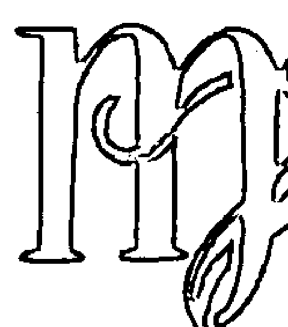

### 8月19日～8月25日

狮子处女座是黄道带第五宫狮子宫与第六宫处女宫的交界。这个交界好比人生35岁左右的阶段，又好比北半球的夏末。一年中的这个时期，粮食被收割晒干，以备冬季之需，一些蔬菜、水果到了收获的季节，另一些也接近成熟。随着秋天的临近，黑夜渐长，白昼渐短，暑假也接近尾声。同时，在人的一生中，35岁左右已经是相当成熟的年纪。“敞开”是这个阶段的主题，尤其是在个人、事业和家庭生活方面。他们也许能发掘出自己个性中包含但之前没有意识到的特质，同时也向他人展露自己不为人知的一面。在这个过程中，随着他们的自我认知能力日益强大，又有一股新的力量源源不断地产生。他们开始重新审视自己的婚姻或爱情，也愿意开诚布公地探讨心中的秘密。单身的人则努力为自己找到一种更有意义的生活状态。

黄道带位置：
狮子宫27°～处女宫3°
季节：
夏末
元素：
火/土
主宰星：
太阳/水星
标志物：
狮子/处女
认知方式：
直觉/感觉/思考

很深。总之，他们总会隐藏自己的某些性格和特点，而且这种状态可能持续数年之久。但即使最内向的狮子处女座也会不时地主动展示自己真实的内在和光芒。随着时间的推移，他们会渐渐发现，试图隐藏自己的个性的做法其实没有什么用，因为他们越隐藏，别人就越注意他们。因此，他们会试着让自己更加透明，让别人能看到他们真实的内在。通过这种努力，狮子处女座就不会在外向和内向之间表现出太大的反差了。

出生在这个交界的人，是内向型人格和外向型人格的有趣结合。他们既有处女座务实、质朴的一面，也有狮子座直觉强烈、躁动不安的一面，可以说是锋芒内敛、暗藏力量的一群人。有些狮子处女座看起来很安静，没什么特别之处，但这只是第一印象。交往越久，人们就越会发现他们光芒四射的那一面。另一些狮子处女座可能乍一看比较爱出风头，实际上他们内心敏感，城府

狮子处女座如果出身于普通家庭，或社会的底层，往往不会很早就花心思去提升自己的社会地位。他们通常起步很晚，而且即使真正开始这样做，也需要有不屈不挠的精神和坚定的意志力，才能避免半途而废。事实上，他们中的很多人都非常害怕自己会一辈子平淡无奇、碌碌无为，但可惜的是，他们大都无法真正超越这种内心的恐惧。而且，他们对自己的看法总是同外界对他们的看法正好相反，比如说，他们自信满满的时候其实正是外界无视他们存在的时候。

狮子处女座不像其他星区的人，不需要外界的掌声来肯定自己，因为即使再安静、再孤僻的狮子处女座，对自我的价值也有强烈的认同感。在达到既定的社会地位或事业目标之前，他们不会轻易向外界展示自己或者流露真实的内心情感，这是他们的典型性格。可以说，展示自己的欲望是他们前进的动力，因而只有在达到目标之后，他们才允许自己这样做。那些终于到达巅峰的狮子处女座会非常乐意将隐藏了一辈子的秘密公之于众，而且他们比较喜欢自己亲口说出来。这可以看作是一种自恋与自虐、自我陶醉与自我惩罚的奇怪融合。

扬，但他们确实需要被理解。只有非常敏感的人才能捕捉到他们这种深层次的内心诉求。

很明显，对出生在“敞开的交界”的人来说，“信任”具有非常重要的意义：他们的朋友要非常值得信任，这样才能保守秘密；他们的恋人也要非常值得信任，这样才会对他们忠诚。实际上，出生在这一周的人不会轻易付出感情，因为一旦遭到背叛，他们的情绪就可能面临崩溃。

狮子处女座通常看人很准。他们的思维和语言能力很强，能够不露声色地观察对方，经过反复和长久的思考后再用语言的形式将他们对对方的印象表达出来。朋友和同事常常会依赖他们的记忆力、判断力和观察力。因此，只要狮子处女座能够保持情绪稳定，他们会是非常值得信赖和依靠的朋友。

如果你能让狮子处女座敞开心扉，他们会成为你一辈子的朋友。接下来，如果你能接纳真实的他们，也就是说，在他们将真实的自己完全展露在你面前时，你仍然能够继续喜欢他们，那你会成为他们的至交密友和生活伴侣。

| 优势 |
| :--- |
| 独立自主 观察敏锐 光彩夺目 |
| 劣势 |
| 自恋 善于隐藏 不愿与人分享 |

狮子处女座喜欢“先隐藏，后展示”，并将这种方式作为达到目的的武器和手段，可最终他们会发现这是一个幼稚而无效的伎俩。狮子处女座只有在遇到一个或几个能够完全理解和接纳他们的人之后，并借由这些人的包容、爱和信任，才能最终戒掉自己喜欢“捉迷藏”的坏毛病。只有当他们能够勇敢地面对成长的挑战时，心智才能真正成熟起来。

狮子处女座可能不是好父母或好子女，因为他们重视隐私的个性可能导致两代人之间很难甚至无法交流。不过，对同辈的家人，如兄弟姐妹和堂（表）兄弟姐妹，他们会不时地敞开心扉并与之分享一些秘密。实际上，这些兄弟姐妹可能是他们日后寻找生活伴侣的重要模板。最适合他们的伴侣，要像兄弟姐妹一般，经常同他们谈谈心，分享一下内心的感受。狮子处女座虽然常常以自我为中心且神神秘秘的，不愿意为家庭全心全意地奉献，但只要他们不觉得过分和不近情理，还是非常愿意承担日常生活中应尽的义务的。

喜欢神秘事物和侦探活动的人会觉得狮子处女座很有吸引力。而且，那些花精力去了解他们的人最终会得到丰厚的回报。虽然狮子处女座内心并不渴望被肯定、欣赏或赞

### 忠告

不要总是隐藏自己，否则，就别怪其他人不理解你。透明一点儿，这样别人才能看到真正的你。不要总是独自保守所有的秘密，要让别人走进你的内心，同你一起承担和分享喜怒哀乐。

### 狮子处女座名人

美国前总统比尔·克林顿是个不那么容易让人看透的狮子处女座，非常善于审时度势，隐藏对自己不利的一面，展现对自己有利的一面。克林顿本质上是一个隐藏很深的人，却给人善于社交、心胸开阔的印象。他懂得等待和观察，不会盲目出击，而且足智多谋，有时候为了击败对手，会适时妥协，甚至完全接受对方的观点，而不是一味地反对。即使是在饱受忽视的青年时代，克林顿也像其他狮子处女座一样坚信自己的价值。他知道，有一天，他会震惊全世界。

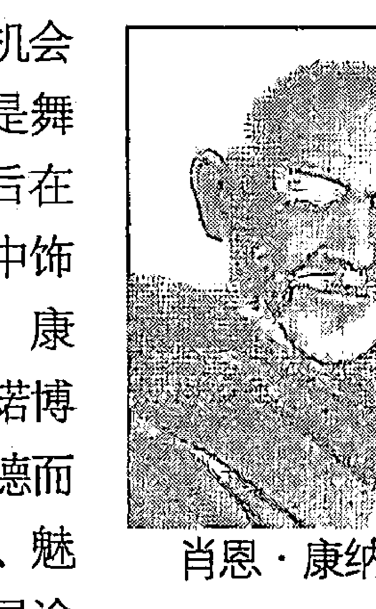

肖恩·康纳利在从影之前曾做过棺材匠、泳装模特和健身教练等，1950年代代表苏格兰参加环球先生比赛后，他才有机会涉足影坛。他的处女作是舞台剧《南太平洋》，之后在舞台剧、电视剧和电影中饰演一些小角色。1962年，康纳利因在“007”电影《诺博士》中饰演詹姆斯·邦德而声名大振，而他的机智、魅力和男子汉气概让他的星途从此一路畅通。此后，他连续参演了6部“007”系列电影。不过，康纳利不满于自己长期被定型为性感间谍，因此利用自己超级明星的身份和影响力，审慎地选择了一些不同类型的角色，出演了《魔宫传奇》、《铁面无私》、《猎杀红色十月》等，成功地将自己打造成“全能型”的演员。康纳利就是这么自信，他知道自己能成为多才多艺的艺术家，最终得到大众的认可。

主张女性自由的加布里埃·香奈儿（可可·香奈儿）于1914年在巴黎开了自己的第一家店，店中摆设的均为男女都能穿的服装，采用的是陆军和海军军服的面料，这一创意至少领先时代50年。1921年，香奈儿推出了以自己的名字命名的香水“香奈儿5号”，再一次走在时尚的最前沿。香奈儿的魅力在于，她能够用自己的理念和方式将无尽的性感诱惑放进香水瓶中，然后大量销售出去，而且从来不会为了时尚本身或自己的地位去做时尚宣言。

像大多狮子处女座一样，她并不急于表现自己，而是会耐心地等待，直到下一个伟大创意降临。抱着这种不紧不慢的态度，香奈儿一直活到了88岁。

其他狮子处女座名人：奥维尔·赖特、小卡尔·利普金、伦纳德·伯恩斯坦、洛拉·蒙特兹、威尔特·张伯伦、埃尔维斯·科斯特洛、谢丽·朗、马丁·埃米斯、吉恩·西蒙斯、吉尔·圣约翰、杜·巴里夫人、埃罗·沙里宁、宗毓华。

## 狮子处女座人际关系指南

### 最佳组合

**情侣**
双鱼白羊座、金牛座一、金牛双子座、双子座二、双子座三、狮子座一、天秤座一、天秤座二、天秤天蝎座、射手座二、水瓶座二

**夫妻**
巨蟹座二、天秤座三、射手座一、水瓶座三、双鱼座二

**朋友**
白羊座三、金牛座二、双子座一、狮子处女座、处女座二、天蝎座三、射手摩羯座、双鱼座一、双鱼座三

**家人**
白羊金牛座、金牛座三、巨蟹座三、天蝎座二、天蝎射手座、射手座三、摩羯座三

**工作**
白羊座二、双子巨蟹座、巨蟹座一、狮子座三、处女座一、处女天秤座、天蝎座一、摩羯座二、水瓶双鱼座

| 星座 | 日期 | 主题 | 页码 |
|---|---|---|---|
| 双鱼白羊座 | 3月19日~3月24日 | 隐秘的语言 | 224 |
| 白羊座一 | 3月25日~4月2日 | 保密的计划 | 247 |
| 白羊座二 | 4月3日~4月10日 | 付诸行动 | 270 |
| 白羊座三 | 4月11日~4月18日 | 单行道 | 293 |
| 白羊金牛座 | 4月19日~4月24日 | 遁入幻想世界 | 315 |
| 金牛座一 | 4月25日~5月2日 | 真相暴露 | 336 |
| 金牛座二 | 5月3日~5月10日 | 神圣的信任 | 357 |
| 金牛座三 | 5月11日~5月18日 | 坦诚相待 | 378 |
| 金牛双子座 | 5月19日~5月24日 | 命运之手 | 398 |
| 双子座一 | 5月25日~6月2日 | 公平的战斗 | 417 |
| 双子座二 | 6月3日~6月10日 | 鼓励自我表达 | 436 |
| 双子座三 | 6月11日~6月18日 | 捉迷藏 | 455 |
| 双子巨蟹座 | 6月19日~6月24日 | 坐吃山空 | 473 |
| 巨蟹座一 | 6月25日~7月2日 | 知识性的研究 | 490 |
| 巨蟹座二 | 7月3日~7月10日 | 寻求稳定感 | 507 |
| 巨蟹座三 | 7月11日~7月18日 | 拔掉瓶塞 | 524 |
| 巨蟹狮子座 | 7月19日~7月25日 | 可以接受的妥协 | 540 |
| 狮子座一 | 7月26日~8月2日 | 自找麻烦 | 555 |
| 狮子座二 | 8月3日~8月10日 | 发号施令 | 570 |
| 狮子座三 | 8月11日~8月18日 | 隐秘的抱负 | 585 |
| 狮子处女座 | 8月19日~8月25日 | 爱玩捉迷藏 | 599 |
| 处女座一 | 8月26日~9月2日 | 质变的机会 | 599 |
| 处女座二 | 9月3日~9月10日 | 可以达成的目标 | 600 |
| 处女座三 | 9月11日~9月18日 | 无需言说 | 600 |
| 处女天秤座 | 9月19日~9月24日 | 过于表面化 | 601 |
| 天秤座一 | 9月25日~10月2日 | 对现实不感兴趣 | 601 |
| 天秤座二 | 10月3日~10月10日 | 广泛的兴趣 | 602 |
| 天秤座三 | 10月11日~10月18日 | 轻松的合作 | 602 |
| 天秤天蝎座 | 10月19日~10月25日 | 华丽的外表 | 603 |
| 天蝎座一 | 10月26日~11月2日 | 完美的伪装 | 603 |
| 天蝎座二 | 11月3日~11月11日 | 为成就而自豪 | 604 |
| 天蝎座三 | 11月12日~11月18日 | 无法控制的力量 | 604 |
| 天蝎射手座 | 11月19日~11月24日 | 挽起衣袖 | 605 |
| 射手座一 | 11月25日~12月2日 | 需要关注 | 605 |
| 射手座二 | 12月3日~12月10日 | 渴望娱乐 | 606 |
| 射手座三 | 12月11日~12月18日 | 权力的传承 | 606 |
| 射手摩羯座 | 12月19日~12月25日 | 第三方 | 607 |
| 摩羯座一 | 12月26日~1月2日 | 地道的务实主义者 | 607 |
| 摩羯座二 | 1月3日~1月9日 | 克制的情绪反应 | 608 |
| 摩羯座三 | 1月10日~1月16日 | 神圣的信任 | 608 |
| 摩羯水瓶座 | 1月17日~1月22日 | 个人化的表达方式 | 609 |
| 水瓶座一 | 1月23日~1月30日 | 轻松的交流 | 609 |
| 水瓶座二 | 1月31日~2月7日 | 正常的表象 | 610 |
| 水瓶座三 | 2月8日~2月15日 | 整体大于部分之和 | 610 |
| 水瓶双鱼座 | 2月16日~2月22日 | 抵制入侵 | 611 |
| 双鱼座一 | 2月23日~3月2日 | 行动自由 | 611 |
| 双鱼座二 | 3月3日~3月10日 | 表明立场 | 612 |
| 双鱼座三 | 3月11日~3月18日 | 寻找共同基础 | 612 |

## 处女座一

。系统化的一周。

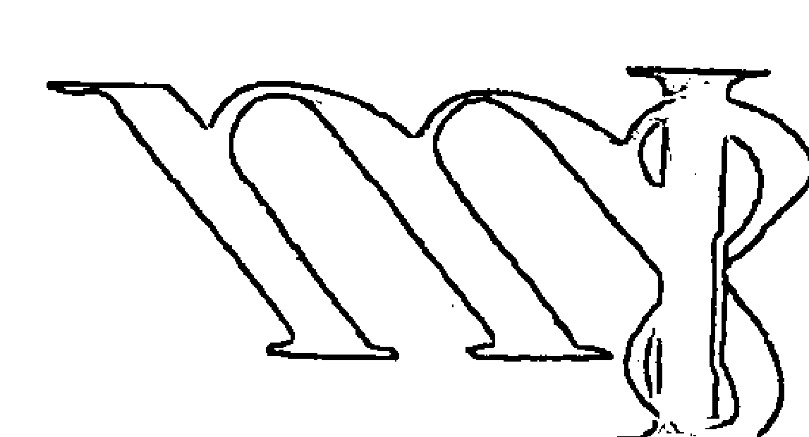

### 8月26日～9月2日

处女座一的中心意象是“系统化”。在它所对应的人生发展阶段，人们本能地想要巩固自己的婚姻或爱情，并加强自己事业的稳定性。此外，人们开始更多地参与服务性的活动，在家庭、工作和社会生活中都是如此。他们希望能够帮助别人，也希望能对事情的发展产生建设性的影响。

| 黄道带位置： | 处女宫2°～处女宫10° |
| :--- | :--- |
| 季节： | 夏末 |
| 元素： | 土 |
| 主宰星： | 水星 |
| 标志物： | 处女 |
| 认知方式： | 感觉/思考 |

照顾需要帮助的家人，或者为日常家居生活提供赖以依靠的基础。不过，并不是所有的处女座一都心甘情愿地这样付出——尽管他们乐于也善于帮助他人，但也会因为承担的责任太多而心生怨恨。他们表面上能同懂得合作和分担日常责任的人融洽相处，但实际上他们并不喜欢团队合作。他们需要很多独处的时间，而且他们只有在按照自己的主张和意愿为家庭和社会团体服务的时候，才能发挥最佳水平。

这一周象征着成熟的成年人开始为了社会理想贡献自己的力量。他们注重与搭档合作并向他们提供支持，注重提高自己的可靠性和办事效率，面对世界的态度也更加实事求是。在这个阶段，即使是最大大咧咧、不负责任的人，也觉得是时候开始认真地对待生活了。

处女座一并不是天生的领导者，不过他们是优秀的合作者和同事。他们喜欢静观其变，在行动前一定会仔细观察。他们敏锐和全面的观察能力、准确的评价和判断能力使他们在公司和家庭中占据极其重要的地位。如果你让他们观察周围的事物，然后撰写报告、口头陈述总结或是用各种媒介记录自己的观察，他们能做得超乎想象的好。总之，观察、评估和总结是他们最拿手的本领。

结构化是处女座的生活的主题。他们对什么事都要求有条理有组织，只有这样，在面对纷至沓来的压力时才有安全感，这在很大程度上反映了他们的世界观。他们的强大之处在于考虑和处理自己的事情。处女座一尤其不能忍受一团糟的生活，所以有规律和高效的日常作息表、井井有条的家居环境和有条不紊的工作环境是他们保持身心健康的必要条件。结构化的生活当然没有错，不过，重要的是要掌握好一个“度”，否则就会变得过于死板甚至僵化。

出生在这一周的女性可能看起来比较腼腆和娴静，而男性则容易给人坚强和安静的印象。他们不喜欢积极主动地去表现，而喜欢被动地等待别人去发现，这是处女座一的一种根深蒂固的特质。这样一来，他们就不会担心自己遭到对方的拒绝，而且一旦对方发现自己，也就是说被自己吸引，那么选择权就在自己手中；相反，如果“傻傻”地在对方面前表

处女座一的职业通常与提供服务有关，他们在家庭中承担的角色也是如此。他们经常会

## 处女座一

现自己，选择权就在对方手中了。确实，在面临选择和被选择时，是否掌握主动权对处女座一来讲非常重要。可惜，他们在个人事务上，比如说交朋友和找对象的时候，常常做出错误的选择，有时甚至是灾难性的选择。他们虽然大部分时候非常客观冷静，面对个人感情问题时却常常不切实际。这样，一旦感到失望，他们就可能陷入极度的紧张和不稳定的情绪中，甚至变得消沉低落。而且，当不满足感和挫败感出现时，他们会觉得无法承受。

不过，恋爱中的处女座一可能不太可靠，因为一旦情绪稍不稳定（在恋爱中这可是在所难免的），他们就不愿意继续付出了。由于总想给自己留一条退路，处女座一根本无法体会和面对对方的感受。

处女座一喜欢为人服务，而且非常务实，因此很容易受到依赖性强、需要别人呵护的人的青睐。可这个时候，他们的麻烦就大了，因为这种人会一直要求他们付出，直至榨干他们的精力，让他们筋疲力尽为止。让别人养成依赖自己的习惯是处女座一常常犯的严重错误。虽然在一般情况下，帮别人分担和解决困难有助于建立良好的人际关系，但如果碰上那种缺乏安全感、需要别人呵护的人，这种原本积极的效应就会被扭曲成消极的索取和依赖。

处女座一意志坚定，不喜欢改变，这可能使某些人对他们产生敌意，尤其是生活方式比较随性和灵活的人。这一周出生的人一旦做了父母或者当家做主，就会制定很多规矩，而且要求家人都严格遵守。有趣的是，假如他们认为每个人都应当根据自己的意愿选择和行动的话，那么他们会用同样的热忱去贯彻这种想法，即使大家不愿意自己选择也不行。因此，处女座一比较适合同性格随和的人共事和生活，因为这种人不喜欢提前计划，凡事随遇而安。

处女座一帮助和体谅他人没有错，但要避免过度的自我牺牲，也应该学着为自己多争取空间和利益。建立真正独立的生活，不为父母、客户、朋友、伴侣以及其他任何人的需求和意愿而活，是处女座一在生活中面临的最大的挑战。因此，从长远来看，同个性独立的人建立密切的关系对他们非常有益，尤其是那种清楚人与人之间交往界线的人。这些人看起来可能有点儿自私或以自我为中心，但他们是处女座一最应该学习的榜样，因为出生在这一周的人只有将自己从他人的需求和意愿中解放出来，才能获得必要的空间来发展自己，表现自己的才能和创造力，并在经济上有所收获。

处女座一需要给自己松松绑，自由自在地生活，因此，最适合他们的伴侣应该是能让他们放松身心、享受快乐时光的人。处女座一与爱玩型的人交往对双方都有利。在这样的关系中，可靠的处女座一负责提供生活所必需的规划、条理和稳定，而另一方则带来他们所缺乏的放松心情和游戏人生的心态。

| 优势 |
| --- |
| 有条理 可靠 喜欢为人服务 |
| 劣势 |
| 僵化 过于自我牺牲 有自我毁灭倾向 |

### 忠告

柔和一点儿，学会随遇而安，顺其自然。试着将公事和私生活区分开。有些事情不妨退出，让别人去负责和承担。离习惯依附他人的寄生虫远一点儿，别让他们利用和伤害自己。有时候不妨“自私”一些，为自己的利益而努力争取并不可耻。

## 处女座—名人

英格丽·褒曼不仅拥有倾国倾城的美貌，而且拥有过人的智慧和精神力量。就像其他处女座一，褒曼需要稳定和有条理的生活作为基础，才能展现自己的最佳状态。因此，当已婚的她与意大利导演罗伯托·罗塞利尼发生婚外情后，事业开始急转直下。她参演了罗塞利尼导演的5部电影，并为他生了3个孩子，包括伊莎贝拉·罗塞利尼。她的这种行为激怒了当时的影迷，使她在好莱坞消失了整整7年。电影《卡萨布兰卡》中的褒曼同亨弗莱·鲍嘉演绎了一段专一而深沉的爱情，然而生活中的褒曼在丈夫和情人之间徘徊不定，理智和情感的冲突曾一度使她极为痛苦。

美国跨栏运动员埃德温·摩西连续10年在122场比赛中创造出不败的战绩，堪称所有运动员的偶像。能够在多场国际赛事中连续拿奖牌就已经令人惊叹了，而摩西在全美、国际和奥运会的田径赛场长连续100多次同世界顶级的选手站在同一起跑线上，而且无一例外地以第一名的身份冲过终点线，这简直堪称奇迹中的奇迹。摩西不仅将自己的身体时刻保持在巅峰状态，而且具有高度发达的头脑。他具有超强的分析和表达能力，以近乎教授级的专业精神对待自己的田径事业，从各个细节钻研跨栏运动的技巧和生理学原理。

约翰·沃尔夫冈·冯·歌德一直被誉为德国的“万能博士”，因为他几乎对所有领域都抱有极高的热忱。他是18~19世纪著名的科学家、语言学家、律师、评论家、哲学家、画家、诗人和剧作家。身为处女座一，歌德在作品中明显地表达了他对结构和系统的热爱，尤其是其科学著作，如《植物形态学》等。歌德对神秘学及其纷繁复杂的等级非常感兴趣；在他最伟大的作品《浮士德》中，我们可以看到他将对神秘学的研究艺术化地融入其中。歌德的文学作品融合了古典主义、浪漫主义、哥特式风格和文艺复兴的主题，被列入最美丽、最高雅的德语作品的行列。

其他处女座—名人：迈克尔·杰克逊、格奥尔格·黑格尔、亚西尔·阿拉法特、玛丽亚·蒙台梭利、理查·基尔、查理·帕克、马克·哈蒙、安东尼娅·弗雷泽、林登·约翰逊、玛丽·雪莱、洛奇·马西阿诺、蒂莫西·博顿斯、格洛丽亚·伊斯特芬、佩姬·古根海姆、法兰克·鲁宾逊、卢·皮涅拉、杰拉尔丁·安妮·费拉罗、詹姆斯·科伯恩、威廉·弗里德金、斯洛博丹·米洛舍维奇、艾伦·德肖维茨、吉米·康纳斯。

## 处女座—人际关系指南

+   最佳组合

情侣
巨蟹座二、狮子座二、狮子座三、处女天秤座、天秤座三、射手座二、摩羯座二、摩羯水瓶座、双鱼座一、双鱼座二

夫妻
双鱼白羊座、白羊座二、金牛座一、双子座二、巨蟹座一、巨蟹座三、处女座二、天秤座一、天蝎座一、天蝎座三、射手座三、摩羯座一、摩羯座三

朋友
金牛座三、双子巨蟹座、巨蟹狮子座、天秤座二、天蝎座二、射手座一、水瓶座二

工作
白羊座三、白羊金牛座、金牛座二、双子座一、狮子座一、狮子处女座、处女座一、天秤天蝎座、射手摩羯座、水瓶座一、双鱼座三

| 星座 | 日期 | 关键词 | 页码 |
|---|---|---|---|
| 双鱼白羊座 | 3月19日~3月24日 | 大步前进 | 224 |
| 白羊座一 | 3月25日~4月2日 | 开辟新战场 | 248 |
| 白羊座二 | 4月3日~4月10日 | 完成工作 | 271 |
| 白羊座三 | 4月11日~4月18日 | 不可思议的融合 | 293 |
| 白羊金牛座 | 4月19日~4月24日 | 僵化 | 315 |
| 金牛座一 | 4月25日~5月2日 | 最佳搭档 | 337 |
| 金牛座二 | 5月3日~5月10日 | 认真的奉献 | 358 |
| 金牛座三 | 5月11日~5月18日 | 荒唐可笑 | 378 |
| 金牛双子座 | 5月19日~5月24日 | 不惜代价取得成功 | 398 |
| 双子座一 | 5月25日~6月2日 | 改变的需要 | 418 |
| 双子座二 | 6月3日~6月10日 | 一线之隔 | 437 |
| 双子座三 | 6月11日~6月18日 | 需要妥协 | 455 |
| 双子巨蟹座 | 6月19日~6月24日 | 巧合 | 473 |
| 巨蟹座一 | 6月25日~7月2日 | 寻找中心 | 491 |
| 巨蟹座二 | 7月3日~7月10日 | 标新立异 | 508 |
| 巨蟹座三 | 7月11日~7月18日 | 无以名状的伪装 | 524 |
| 巨蟹狮子座 | 7月19日~7月25日 | 微妙的平衡 | 540 |
| 狮子座一 | 7月26日~8月2日 | 发展共同的计划 | 556 |
| 狮子座二 | 8月3日~8月10日 | 真正的灵魂伴侣 | 571 |
| 狮子座三 | 8月11日~8月18日 | 与生俱来的透明度 | 585 |
| 狮子处女座 | 8月19日~8月25日 | 质变的机会 | 599 |
| 处女座一 | 8月26日~9月2日 | 为人服务 | 613 |
| 处女座二 | 9月3日~9月10日 | 工作狂倾向 | 613 |
| 处女座三 | 9月11日~9月18日 | 机会教育 | 614 |
| 处女天秤座 | 9月19日~9月24日 | 一连串奇迹 | 614 |
| 天秤座一 | 9月25日~10月2日 | 背后的意义 | 615 |
| 天秤座二 | 10月3日~10月10日 | 开阔眼界 | 615 |
| 天秤座三 | 10月11日~10月18日 | 自鸣得意 | 616 |
| 天秤天蝎座 | 10月19日~10月25日 | 猛烈的批评 | 616 |
| 天蝎座一 | 10月26日~11月2日 | 注重细节 | 617 |
| 天蝎座二 | 11月3日~11月11日 | 独立自主 | 617 |
| 天蝎座三 | 11月12日~11月18日 | 狭小的朋友圈 | 618 |
| 天蝎射手座 | 11月19日~11月24日 | 别出心裁、高瞻远瞩 | 618 |
| 射手座一 | 11月25日~12月2日 | 是敌是友？ | 619 |
| 射手座二 | 12月3日~12月10日 | 释放内在的能量 | 619 |
| 射手座三 | 12月11日~12月18日 | 冲突在所难免 | 620 |
| 射手摩羯座 | 12月19日~12月25日 | 团结的阵营 | 620 |
| 摩羯座一 | 12月26日~1月2日 | 剧烈碰撞 | 621 |
| 摩羯座二 | 1月3日~1月9日 | 树立榜样 | 621 |
| 摩羯座三 | 1月10日~1月16日 | 不容忽视 | 622 |
| 摩羯水瓶座 | 1月17日~1月22日 | 改善气氛 | 622 |
| 水瓶座一 | 1月23日~1月30日 | 互相吸引的磁力 | 623 |
| 水瓶座二 | 1月31日~2月7日 | 转换角色 | 623 |
| 水瓶座三 | 2月8日~2月15日 | 保护受压迫的人 | 624 |
| 水瓶双鱼座 | 2月16日~2月22日 | 为思想自由而战 | 624 |
| 双鱼座一 | 2月23日~3月2日 | 不受组织的限制 | 625 |
| 双鱼座二 | 3月3日~3月10日 | 追求与众不同 | 625 |
| 双鱼座三 | 3月11日~3月18日 | 厘清思路 | 626 |

## 处女座二

谜样的一周。

### 9月3日～9月10日

处女座二的中心意象是“谜”，在生命大循环中所对应的是人年近40的阶段。这个年纪的大多数人都开始真正意识到自己已不再年轻，也许有必要重新审视一下自己的生活。这在人生中是一个充满难题和疑惑的时期。青春岁月的流逝使他们开始思考严肃的问题，通常是关于人生本质的问题。除了需要解决心理上的问题，这时的人们同样觉得需要改变一下生活方式。道德、伦理和提升自我的决心都在这一时期发挥着重要作用。

| 黄道带位置： | 处女宫9°～处女宫18° |
| :--- | :--- |
| 季节： | 夏末 |
| 元素： | 土 |
| 主宰星： | 水星 |
| 标志物： | 处女 |
| 认知方式： | 感觉/思考 |

之所以这样做，并不是因为缺乏安全感，而是确实不喜欢表现自己柔弱的一面，因此别人很难真正接近他们的内心。处女座二具有非常强烈的自我意识，有些人甚至根本不理会所谓的社会规范。他们孤独清高、难以接近而且内心强大。很多处女座二都有鼓舞人心的力量，能够激发别人的自信，在别人需要帮助的时候，他们也乐于伸出援手或分担责任。不过，一旦别人对他们期望过高，他们就会觉得难以接受，然后本能地退回自己神秘的个人世界中。

处女座二正象征着成年人的这种想要打破既有的生活模式，运用智慧参透神秘莫测的内在本质以及创造更为丰富和成功的人生的心态。了解自我、成就自我，是这个时期最重要的事情。

处女座二很注重沟通，尤其在事业方面，非常擅长表达自己的想法，可一旦涉及私事，他们就不喜欢多说了。这并不是因为他们不善于表达，只是因为他们想把内心的思考、挣扎留给自己，独自承担喜怒哀乐。他们是亲切、周到、体贴和细心的一群人，不喜欢拿自己的问题麻烦别人，要让他们开口求助简直比登天还难。也许他们命中注定就要独自承担一切吧。此外，处女座二大多有很强的道德感，坚信人应该有所为、有所不为，而且应该通过自己的努力提升道德水准。

处女座二个性捉摸不定，即使最亲近的人也常常觉得难以理解他们。他们不会将心中所想的都显现在脸上，实际上，表露情绪对他们来讲是非常困难的一件事。单从外表来看，他们可能很有吸引力，令人过目难忘，但让人想不到的是，他们的防人之心非常重。他们是谜一样的人，总是将自己层层包裹起来，言行举止充满了神秘的气息。而且，他们非常反感别人分析他们，也明确表示自己不喜欢谈论个人生活或家务事。他们

处女座二也有搞笑的一面，非常喜欢各种各样的幽默。有时他们也不免表现得有些愚蠢和幼稚，但他们总能在事后发现自己的错误，然后自嘲一番。不过自嘲也要有个度，如果把

握不好的话，很容易破坏自己在别人眼中的形象。其实，他们的自嘲并不代表懦弱无能，相反，这是内心强大的表现。他们对待日常事务非常务实，不过他们也是富于幻想的一群人，这也是他们的幽默感的来源。即使最严肃、最沉默寡言的处女座二也会不时地来点儿辛辣的讽刺，让人忍俊不禁。

子的深厚友谊或者走入婚姻的殿堂。处女座二通常不会反感他人向自己表达爱意，因为他们相信，只要对对方没兴趣，自己肯定能抵挡住对方的攻势。

此外，他们一般喜欢同个性积极外向的人交往，因为这同他们保守、多虑甚至有些封闭的性格正好互补。

处女座二具有超凡的鉴赏能力，而且非常引以为傲。他们对人对事都有极高的品位，往往因标准太高而不太容易交到朋友。他们的社交圈通常很小，这一方面是因为他们挑剔别人，另一方面，别人也觉得他们要求过高，因而不愿与他们交往。由于天性挑剔而又直率，他们不仅在择友上非常苛刻，而且也常常给自己提出很高的要求。

对处女座二来讲，情欲并不代表爱情。他们能用奇特的手段扫清自己和恋人之间的障碍，拉近彼此的距离，也能在对方毫无察觉的情况下巧妙地撤退。在亲密的关系中，处女座二经常追求不同寻常的体验。如果对方同意他们提出的这类要求，他们就会满心欢喜并获得巨大的满足；相反，如果对方忽略了他们的要求，他们就会非常失望，长此以往，则可能让这段恋情走向终结。在恋爱时忽冷忽热或突然提出分手，莫名其妙地激情洋溢然后突然激情全无，

在这种状态下，他们的生活显然不轻松，总是承担着巨大的压力。长此以往，他们的身体也容易出现毛病。实际上，处女座二比其他任何星区的人都更容易因精神上的问题而生病。

| 优势 |
| --- |
| 有品位 务实 体贴周到 |
| 劣势 |
| 防御心重 过于挑剔 疏离 |

是处女座二的典型特征。

在处女座二自信满满，甚至有些故作坚强的外表下，其实有一颗同其他人一样需要关爱的心。只有找到能让他们打开心扉的“那个人”之后，他们才有可能走出表达深层次的自我的第一步。对处女座二来讲，“那个人”通常是朋友而非伴侣。不过，即使这样的人真的出现了，要真正让他们卸下防备、敞开心扉，还有很长的路要走。处女座二会非常感激对方的努力，而且很可能与其结下一辈

处女座二内心并不是非常需要建立家庭，不过，如果他们觉得家庭生活非常吸引人的话，也会好好经营，只要他们有足够的个人时间和空间就好。作为父母，处女座二要小心，对子女不能过于严苛，作为伴侣也要小心自己吹毛求疵的毛病。处女座二在生活和工作中要多与人沟通，多与他人共同承担日常事务，多帮助别人，也多接受别人的帮助。这样，假以时日，他们才会懂得原谅、包容和同情的真谛，也会变得更有人情味。

### 忠告

凡事不要要求太高，随和一些，包容一些。敞开心扉，勇于付出和接受。收敛喜欢谴责别人、不依不饶的个性。培养温和、亲切、圆融的态度。不要因为太注重自我而无视社会标准和法律规范。不要害怕暴露自己的脆弱之处和缺点。

### 处女座二名人

摩西奶奶是10个孩子的母亲。在开始绘画事业以前，她每天要做的就是打理农场和制作薯条。她从78岁开始绘画，101岁逝世；在生命最后的23年里，她的作品数量超过1500幅。摩西奶奶的画作明快自然，有孩童般的气息，主题都源于她童年时代的回忆和场景以及伴随她成长的古老传说。处女座二的行为总是让人捉摸不透，摩西奶奶也是如此。她的绘画技巧完全靠自学，而且，虽然她年事已高，作画的水平却逐年增长。她的作品受到收藏家的高度评价，但她生前只以几美元一幅的价格出售自己的画作。摩西奶奶无疑是艺术界难解的特例，其艺术生涯是对所有试图分析别人的人的一种蔑视。

桑尼·罗林斯的爵士乐生涯长达50年。作为一名次中音萨克斯管演奏家，他无疑是萨克斯管音乐领域中的领军人物。罗林斯基本上同所有爵士乐大师一起录过音，包括查理·帕克、塞隆尼斯·孟克、迈尔斯·戴维斯等，但只有在同自己的团队合作时，他才会达到巅峰状态。罗林斯在60年代推出了萨克斯管独奏专辑，由于曲风神秘难懂，他一度被曲风更为通俗的约翰·柯尔特雷恩超越，因此罗伦斯觉得自己被大众误解了。后来，他将自己注重技巧的风格同即兴歌曲和美国舞曲融合在一起，再度受到大众的热烈追捧。

喜剧演员和电影导演皮特·塞勒斯在舞台上非常擅长模仿各种方言和口音，让人们笑声不断。生活中的塞勒斯则是伪装自我的大师，很少有人能进入他神秘的内心世界，即使家人也被不允许过于靠近。有人认为塞勒斯其实缺乏真正的自我定位，因此才能轻而易举地演绎各种角色。他能够在同一部电影中同时扮演美国总统、英国桂冠诗人和疯狂的德国科学家。而且，他常常过于融入角色，以至于将其变成自己个性的一部分。同其他处女座二一样，塞勒斯也会毫无来由地突然激情澎湃，然后很快激情全无，比如他曾爱上与他搭档的女演员索菲娅·罗兰，并且想为她抛弃自己的家庭和全部生活。

其他处女座二名人：列夫·托尔斯泰、约瑟夫·肯尼迪、伊丽莎白一世、路易斯·沙利文、安东·德沃夏克、丹尼尔·哈得逊·伯纳姆、路易十四、约翰·凯奇、奥蒂斯·雷丁、让·路易斯·巴劳尔特、拉蔻儿·薇芝、德维兹尔·扎帕、埃米·欧文、查理·希恩、简·柯廷、简·亚当斯、巴迪·霍利、保罗·布朗、路易斯·萨格斯、弗雷迪·莫库里、理查德一世、锡德·西泽、桑德斯上校、威廉·布莱、玛格丽特·特鲁多、卡尔·拉格斐、埃尔文·琼斯、格雷斯·麦泰莉、帕奇·克莱因、安东·布鲁克纳、奥斯卡·施莱默。

## 处女座二人际关系指南

### 最佳组合

**情侣**
白羊座二、白羊金牛座、金牛座二、金牛座三、处女座三、天秤座三、天蝎座一、射手座二、摩羯座一

**夫妻**
白羊座三、双子座一、巨蟹狮子座、处女座一、天秤座二、天秤天蝎座、天蝎座二、水瓶座二、水瓶座三、双鱼座二、双鱼座三

**朋友**
双鱼白羊座、金牛座一、金牛双子座、巨蟹座三、狮子座三、狮子处女座、天蝎座三、射手摩羯座、摩羯座二、水瓶座一、双鱼座一

**家人**
巨蟹座二、狮子座一、处女座二、处女天秤座、射手座一

**工作**
双子巨蟹座、天秤座一、天蝎射手座、射手座三、摩羯座三

| 星座 | 日期 | 关键词 | 页码 |
|---|---|---|---|
| 双鱼白羊座 | 3月19日~3月24日 | 无畏的探索 | 225 |
| 白羊座一 | 3月25日~4月2日 | 接纳或置之不理 | 248 |
| 白羊座二 | 4月3日~4月10日 | 不同寻常的亲密 | 271 |
| 白羊座三 | 4月11日~4月18日 | 私人领域 | 294 |
| 白羊金牛座 | 4月19日~4月24日 | 家庭的宁静 | 316 |
| 金牛座一 | 4月25日~5月2日 | 神秘水域 | 337 |
| 金牛座二 | 5月3日~5月10日 | 公然反抗传统 | 358 |
| 金牛座三 | 5月11日~5月18日 | 最优秀的人 | 379 |
| 金牛双子座 | 5月19日~5月24日 | 争执 | 399 |
| 双子座一 | 5月25日~6月2日 | 有创意的计划 | 418 |
| 双子座二 | 6月3日~6月10日 | 含糊不清的信号 | 437 |
| 双子座三 | 6月11日~6月18日 | 永远的学生 | 456 |
| 双子巨蟹座 | 6月19日~6月24日 | 培养自信 | 474 |
| 巨蟹座一 | 6月25日~7月2日 | 放松心情 | 491 |
| 巨蟹座二 | 7月3日~7月10日 | 找到慰藉 | 508 |
| 巨蟹座三 | 7月11日~7月18日 | 选择而非需要 | 525 |
| 巨蟹狮子座 | 7月19日~7月25日 | 为爱加油 | 541 |
| 狮子座一 | 7月26日~8月2日 | 并非人人都喜欢 | 556 |
| 狮子座二 | 8月3日~8月10日 | 反省的需要 | 571 |
| 狮子座三 | 8月11日~8月18日 | 互相激励 | 586 |
| 狮子处女座 | 8月19日~8月25日 | 可以达成的目标 | 600 |
| 处女座一 | 8月26日~9月2日 | 工作狂倾向 | 613 |
| 处女座二 | 9月3日~9月10日 | 深不可测 | 626 |
| 处女座三 | 9月11日~9月18日 | 看不见、摸不着 | 627 |
| 处女天秤座 | 9月19日~9月24日 | 传统的规则 | 627 |
| 天秤座一 | 9月25日~10月2日 | 严格的监督 | 628 |
| 天秤座二 | 10月3日~10月10日 | 透明的界面 | 628 |
| 天秤座三 | 10月11日~10月18日 | 完美的陪衬 | 629 |
| 天秤天蝎座 | 10月19日~10月25日 | 功成名就的压力 | 629 |
| 天蝎座一 | 10月26日~11月2日 | 借嘲讽来挑衅 | 630 |
| 天蝎座二 | 11月3日~11月11日 | 意想不到的社会化 | 630 |
| 天蝎座三 | 11月12日~11月18日 | 留下好印象 | 631 |
| 天蝎射手座 | 11月19日~11月24日 | 夸大的言辞 | 631 |
| 射手座一 | 11月25日~12月2日 | 坚定的方向 | 632 |
| 射手座二 | 12月3日~12月10日 | 不同凡响 | 632 |
| 射手座三 | 12月11日~12月18日 | 建立帝国 | 633 |
| 射手摩羯座 | 12月19日~12月25日 | 我们与世界对抗 | 633 |
| 摩羯座一 | 12月26日~1月2日 | 并驾齐驱 | 634 |
| 摩羯座二 | 1月3日~1月9日 | 一荚之豆 | 634 |
| 摩羯座三 | 1月10日~1月16日 | 吸取经验 | 635 |
| 摩羯水瓶座 | 1月17日~1月22日 | 引人注目的结合 | 635 |
| 水瓶座一 | 1月23日~1月30日 | 和颜悦色与针锋相对 | 636 |
| 水瓶座二 | 1月31日~2月7日 | 令人不快的批评 | 636 |
| 水瓶座三 | 2月8日~2月15日 | 远离消极 | 637 |
| 水瓶双鱼座 | 2月16日~2月22日 | 独立与教导 | 637 |
| 双鱼座一 | 2月23日~3月2日 | 规划未来 | 638 |
| 双鱼座二 | 3月3日~3月10日 | 保持客观 | 638 |
| 双鱼座三 | 3月11日~3月18日 | 奇迹和意外 | 639 |

## 处女座三

### 。真我的一周。

9月11日～9月18日

处女座三的中心意象是“真我”。在生命大循环中，处女座三所对应的是人到中年、四十不惑的年纪。这个年纪的成年人需要发展更为实际的处世态度，也面临着人生的重大抉择：在事业方面要么放手一搏、争取来一个大飞跃，要么安于现状、在现有的职位上永远做下去；在个人生活方面，他们的婚姻和感情也可能面临着重大调整；对女性来讲，这是她们生儿育女的最后期限了。

黄道带位置：
处女宫17°～处女宫26°
季节：
夏末
元素：
土
主宰星：
水星
标志物：
处女
认知方式：
感觉/思考

因此，一旦遇上一些不合理的事情，他们会非常不理解，甚至很生气。不过，他们往往比较善于控制自己的情绪，不会当场发作或者露出嫌恶的表情。即使脾气比较大的处女座三也会随着年龄的增长而变得更加“有修养”，只有碰到非常讨厌的事情时才会忍不住发脾气。一般来讲，他们都会将感情隐藏得很深，只有在非常私密的场合，与恋人和配偶在一起时才会比较外露。总之，处女座三大多不喜欢在公开场合表达自己的喜怒哀乐——他们觉得那是一种虚假的卖弄或是没有自制力的表现。

处女座三象征的正是这种成年人完全走向成熟、能够制定重要的人生规划、敢于用无畏的态度去追求真正想要的生活的阶段。这个阶段的人一方面对社会具有批判性，另一方面又非常务实，因此内心总是处于交战状态。他们应该记住，要尊重内心的渴望和需求。这个阶段的特质决定了处女座三喜欢按照自己的需要和利益来操控或安排周围的环境。

处女座三也不喜欢虚伪做作和自命不凡的人，比较欣赏率性自然的人。他们对待自己也尽量做到真实，无论遇到怎样的困境都不会自欺欺人。不过另一方面，他们不喜欢麻烦或者令人不快的事，而且觉得在任何情况下自己都应该做到谦恭有礼、体贴周到和充满感恩之心。这样一来，他们一边追求真实，一边又想万事和谐，于是常常令自己身心俱疲。

处女座三意志坚定，一旦行动起来，不达目的誓不罢休，不过他们在行动之前会考虑很长时间。他们确定的目标真实而明确，有时他们甚至会故意延迟成功到来的那一刻，吊着别人的胃口，就是为了显示他们的自信。处女座三具有强大的精神力量，相信境由心生，即内在的信念会对周围事物的发展产生决定性的影响。

处女座三绝对有震惊世人的天赋和潜力。他们有时会激情澎湃地去探求真理并公之于众，也敢毫无惧色地对抗社会既定的价值观，比如说宣扬言论自由、恋爱自由和自由选择生活方式等等。总之，他们具有极为强烈的改革热忱。不过，处女座三千万不要为了尝试叛逆的感觉而盲目抗争。此外，他们虽然处女座三个性务实，非常注重实际，因

激情澎湃，但也不失冷静，通常是为了一项事业、一种理念而非某一个人去愚蠢地抗争。

处女座三还具有敏锐的评估能力和鉴赏天分，不过，他们应当谨慎地运用自己在这方面的能力，否则很容易适得其反。在事业方面，他们有可能担任主管的职务，每日评估自己的同事，这时他们需要注意考虑别人的感受，否则很容易使别人反感和失望。此外，处女座三如果心怀怨恨，会很容易发展出一股消极的具有破坏性力量，对自己造成严重的伤害。这一周出生的人最欣赏的是工艺方面的成就。生活中的他们非常需要有一个偶像，这对他们是直接的鼓舞力量，能够敦促他们走向成功。处女座三在各个方面，比如创意、商业和各种实际性的工作中，都会是非常好的合作伙伴，尤其是在面对高难度的工作时。他们无论在工作还是个人感情上都有超强的承受能力；只要他们觉得自己的工作和爱情的品质很高，付出再多的努力也是值得的。

在爱情方面，处女座三眼光很高，希望自己能得到最好的，因此他们的恋人或配偶必须足够坚强，才能应付他们旺盛的精力。不过，他们的伴侣也会很幸福，因为处女座三通常爱意浓烈，而且很会照顾人，尤其是在对方身处困境的时候。他们的保护欲很强，一旦伴侣感到痛苦或受到攻击，他们就会马上站出来。此外，他们非常能干，即使两人的感情千疮百孔、困难重重，他们也能用自己的坚持和付出将这段感情维持许多年。实际上，面对和解决生活中各方面的困难是处女座三的强项。每当攻克了一项极具挑战性的任务之后，他们都会觉得特别有成就感和满足感，觉得人生十分圆满。务实的处女座三非常注重结果，如果不断付出的努力没有收到成效，他们就会最终失去兴趣而转身走开；如果他们得不到自己应得的东西，就会觉得没有天理。而且，一旦受到不公正的待遇，他们也会非常痛苦。

出生在这一周的人必须时刻注意自己是否有些自私或者喜欢操控别人。他们的朋友、同事和老板有时会觉得他们很冷酷，一旦自己没有了利用价值，他们就会同自己断绝来往。但是处女座三可不这么想，反而认为这是务实和公正的做法。其实，他们这样做，确实没有考虑别人的感受。总之，他们若想成功，就需要学着让一段关系结束得更圆满一点，不要给别人留下不好的印象。

处女座三在家庭生活中会有上佳的表现。他们会是称职的父母，也会是乖巧可爱的孩子。尽管他们追求独立和打破旧习，但对于家庭生活他们非常传统，喜欢一家人其乐融融地分享节日大餐或一起出游。实际上，处女座三还是很尊重权威的，只要这个权威人士真诚、善良和公正就好。对待父母和孩子时，他们反对任何形式的偏袒、歧视和不公正。

| 优势 | 劣势 |
|---|---|
| 沉着冷静 保护欲强 能干 | 追求轰动效应 主观臆断 无情 |

### 忠告

试着多理解别人的感受。不是所有人都像你一样意志坚定、直来直去。有什么事别闷在心里，说出来会好受一点儿。身体是一切的基础；培养对感官活动的兴趣，享受美食和睡眠，这样才能保持充沛的体力。对想帮助自己的人不要过于依赖。

### 处女座三名人

美国批评和评论家亨利·路易斯·门肯是一位真正意义上的自由主义者。他致力于研究书面语言和口头语言，一生中的大部分时间都在为《巴尔的摩太阳报》撰稿，同时出版过大量门类众多的书籍。门肯是美国语言界的权威之一，坚定地维护自己的信念，尤其反对“英语是英国人的”这种说法。门肯同许多处女座三一样拥有敏锐的评估能力和鉴赏能力，但这也使他在表达自己的观点时有时显得过于武断。

戴维·赫伯特·劳伦斯最大的矛盾在于：他想证明身体和灵魂的重要性高于思想，但实际上，在他作品的字里行间又处处流露出思想的力量。出生在“真我的一周”的劳伦斯几经努力都没能将思想拉入情感的洪流，归根到底，他一直是一个理智占上风的人。他的第三部小说《儿子与情人》就反映了他的这种挣扎。劳伦斯的父亲是位粗暴的矿工，母亲则感性而细腻，因此她在心理上受到了摧残。劳伦斯为母爱所控制，还有一些恋母情结。劳伦斯在作品中可以自由展现自己女性化的一面，然而在现实生活中，他很难面对自己和父亲相似的男性化的那一面。

“我想一个人待着。”格蕾塔·嘉宝如是说。于是，电影界最好的演员之一就此息影。那一年，她才36岁。尽管这只是《大饭店》中嘉宝的一句台词，不过无数影迷也只能从这句话中寻找嘉宝突然宣布永久性息影的蛛丝马迹。虽然她塑造的形象已成为银幕经典，但人们还是慢慢将她遗忘，而她离群索居，悄无声息地继续生活了令人不可思议的49年。嘉宝的大多数电影角色都流露出她作为处女座三的冷静和客观，但当她在影片中随着剧情情绪爆发时，整个屏幕都为之沸腾。嘉宝的一生向我们证明，处女座三一旦行使他们的自由选择权，会表现出怎样的冷静和强硬。

其他处女座三名人：阿加莎·克里斯蒂、欧·亨利、汤米·李·琼斯、让·雷诺阿、劳伦·考尔、布鲁诺·沃尔特、埃米·马迪根、佐薇·考德威尔、汤姆·兰德里、杰西卡·米特福德、洛拉·法拉娜、布赖恩·德·帕尔玛、克拉拉·舒曼、奥利弗·斯通、克劳德特·科尔伯特、利奥·科特基、杰西·欧文斯、乔治·琼斯、艾尔弗雷德·克诺夫、杰姬·比塞特、贝拉·卡罗利、杰西·诺曼、罗尔德·达尔、玛格丽特·桑格、凯特·米利特、亨利五世、比·比·金、丹尼斯·康纳、卡伦·霍尼、汉克·威廉斯、弗雷德里克·阿什顿。

## 处女座三人际关系指南

### 最佳组合

**情侣**
白羊座三、处女座二、天秤座二、射手座一、摩羯座三、水瓶双鱼座

**夫妻**
白羊座二、金牛座三、双子巨蟹座、狮子座一、天蝎座一、天蝎座三、水瓶座一、水瓶座三

**朋友**
白羊座一、双子座一、双子座二、处女天秤座、天秤座三、射手座二、摩羯座二

**家人**
金牛座二、金牛双子座、巨蟹座二、天秤天蝎座、天蝎座二、摩羯水瓶座、水瓶座二、双鱼座二

**工作**
白羊金牛座、金牛座一、巨蟹座三、巨蟹狮子座、狮子座二、狮子处女座、处女座三、天秤座一、天蝎射手座、射手座三、双鱼座三

| 星座 | 日期 | 关键词 | 页码 |
|---|---|---|---|
| 双鱼白羊座 | 3月19日~3月24日 | 切合实际的想象 | 225 |
| 白羊座一 | 3月25日~4月2日 | 未被发现的魅力 | 249 |
| 白羊座二 | 4月3日~4月10日 | 强硬的抵抗 | 272 |
| 白羊座三 | 4月11日~4月18日 | 严格的要求 | 294 |
| 白羊金牛座 | 4月19日~4月24日 | 实用的暂时协议 | 316 |
| 金牛座一 | 4月25日~5月2日 | 获利要素 | 338 |
| 金牛座二 | 5月3日~5月10日 | 成功的决心 | 359 |
| 金牛座三 | 5月11日~5月18日 | 说服的艺术 | 379 |
| 金牛双子座 | 5月19日~5月24日 | 家庭支柱 | 399 |
| 双子座一 | 5月25日~6月2日 | 周期性波动 | 419 |
| 双子座二 | 6月3日~6月10日 | 接受新观念 | 438 |
| 双子座三 | 6月11日~6月18日 | 基本原则 | 456 |
| 双子巨蟹座 | 6月19日~6月24日 | 养生 | 474 |
| 巨蟹座一 | 6月25日~7月2日 | 理智和情感 | 492 |
| 巨蟹座二 | 7月3日~7月10日 | 需要学习的体验 | 509 |
| 巨蟹座三 | 7月11日~7月18日 | 寻找自我 | 525 |
| 巨蟹狮子座 | 7月19日~7月25日 | 感受对方的想法 | 541 |
| 狮子座一 | 7月26日~8月2日 | 揭露真相 | 557 |
| 狮子座二 | 8月3日~8月10日 | 感情的挑战 | 572 |
| 狮子座三 | 8月11日~8月18日 | 有效率的工作团队 | 586 |
| 狮子处女座 | 8月19日~8月25日 | 无需言说 | 600 |
| 处女座一 | 8月26日~9月2日 | 机会教育 | 614 |
| 处女座二 | 9月3日~9月10日 | 看不见、摸不着 | 627 |
| 处女座三 | 9月11日~9月18日 | 不折不扣 | 639 |
| 处女天秤座 | 9月19日~9月24日 | 启动新项目 | 640 |
| 天秤座一 | 9月25日~10月2日 | 寻求和谐 | 640 |
| 天秤座二 | 10月3日~10月10日 | 放下防备 | 641 |
| 天秤座三 | 10月11日~10月18日 | 最高价值 | 641 |
| 天秤天蝎座 | 10月19日~10月25日 | 青春的活力 | 642 |
| 天蝎座一 | 10月26日~11月2日 | 融合的动力 | 642 |
| 天蝎座二 | 11月3日~11月11日 | 密不可分的搭档 | 643 |
| 天蝎座三 | 11月12日~11月18日 | 合理分配精力 | 643 |
| 天蝎射手座 | 11月19日~11月24日 | 务实的讨论 | 644 |
| 射手座一 | 11月25日~12月2日 | 细致入微的观察 | 644 |
| 射手座二 | 12月3日~12月10日 | 协调不同的观点 | 645 |
| 射手座三 | 12月11日~12月18日 | 紧张状态 | 645 |
| 射手摩羯座 | 12月19日~12月25日 | 随机遇而变 | 646 |
| 摩羯座一 | 12月26日~1月2日 | 对峙 | 646 |
| 摩羯座二 | 1月3日~1月9日 | 开心快乐 | 647 |
| 摩羯座三 | 1月10日~1月16日 | 沉默而直接 | 647 |
| 摩羯水瓶座 | 1月17日~1月22日 | 没有严重的冲突 | 648 |
| 水瓶座一 | 1月23日~1月30日 | 争强好胜 | 648 |
| 水瓶座二 | 1月31日~2月7日 | 天造地设的一对？ | 649 |
| 水瓶座三 | 2月8日~2月15日 | 避免依赖 | 649 |
| 水瓶双鱼座 | 2月16日~2月22日 | 惊世骇俗 | 650 |
| 双鱼座一 | 2月23日~3月2日 | 截然不同 | 650 |
| 双鱼座二 | 3月3日~3月10日 | 有计划的冒险 | 651 |
| 双鱼座三 | 3月11日~3月18日 | 妄自尊大 | 651 |

## 处女天秤座

### 。美的交界。

9月19日～9月24日

处女天秤座是黄道带第六宫处女宫与第七宫天秤宫的交界，它好比人生42岁左右的年纪。一年一度的秋分出现在这一周，这一天昼夜时长继春分后再一次达到等长。另外，在占星学上，土星的公转周期为28年，42年是土星公转一周半的时间，也就是说，此时土星的位置正好与42年前相对而望。与土星情况相同的还有天王星，公转周期为84年的天王星也正好运转到与42年前相对而望的位置。人文星象学将人类生命的长度理想化为84年，因此42岁正好是人生的中点。人生过半的人们此时会遇到人生的一个分水岭，于是会开始追求一些美好的事物：一些人会更加注重自己的外表（比如说尝试健康生活和美容），一些人会试着同年轻的、浑身散发活力和魅力的人交往，期望成为他们中的一员，还有一些人会追求更加深厚、持久、新鲜和成熟的理念。总之，处女天秤座所象征的正是这种对美好理念的追求。

处女天秤座热衷于追求美的理念。外在的、感官上的美对他们极具吸引力，艺术品、自然界和人体所散发的一切美感，包括颜色、形状、形式、质感、旋律和声音等都对他们充满诱惑力，能够挑起他们身上感性的神经，引发无限创意。这一周出生的人同时受到水星（处女座的主宰星）和金星（天秤座的主宰星）的影响，对外在的刺激非常敏感。他们的嗅觉和味觉异常敏锐，无法忍受恼人的影像和声音。因此，处女天秤座必须为自己营造具有高度美感的生活环境和工作环境，这样才能发挥最佳水平。

| 黄道带位置： | 处女宫26°～天秤宫2° |
| :--- | :--- |
| 季节： | 夏末/初秋（秋分处于这个阶段） |
| 元素： | 土/风 |
| 主宰星： | 水星/金星 |
| 标志物： | 处女/天平 |
| 认知方式： | 思考/感觉 |

处女天秤座紧跟时代潮流，对最新的时尚、设计和技术了如指掌，并且非常引以为傲。别人可能觉得他们过于跟风，但不可否认的是，他们对潮流信息的掌握和品位对自己所在的团体而言非常有价值。而且，处女天秤座通常还具有优秀的领导、营销和管理能力，总能用敏锐的第六感捕捉所在领域的最新发展动向。

由于非常看重外在的美，处女天秤座常被指责为肤浅和浮华的人。不过，他们迟早会开始关注精神层面的东西，因为，总有一天他们会发现，自己对外在美的追求并不足以抵挡人生中不可避免的苦难，比如疾病、意外、痛苦和死亡等。一般而言，处女天秤座在遇到上述某一种情况后，首先会显得茫然失措、无法应对，然后他们会迫使自己探索人生更深层的东西。

处女天秤座会是很有趣的朋友——他们富于想象、自由奔放，能够为任何聚会注入活力。不过，出生在这一周的人在情绪上也有阴郁的一面，所以他们的朋友和

## 处女天秤座

伴侣需要多加注意。当他们由于经济问题有很大压力或者在情绪上有波动的时候，很容易有上瘾的倾向。因为他们不太能面对人生中的起起伏伏，所以一旦失意，他们就可能从酒精或毒品中寻求慰藉，这也是他们追求感官享受的天性中最具毁灭性的部分。另外，这一周出生的人也应该注意控制自己的性欲，不要为了逃避现实，让原本健康的性爱变成神经质的占有欲。

处女天秤座中的佼佼者无论出身多么卑微，都不会丢弃自己的根本。不过，也有一些处女天秤座会将自己置于高高的象牙塔中，逐渐断绝与他们认为低下的人的交往。他们这么做可能是为了让自己紧跟时代潮流，不过这种行为会降低他们自身的价值。在某些极端的例子中，他们会变得非常势利，只跟自己认为高贵或有价值的人交往，企图通过这些人达到提高自己的社会地位的目的。

节气中的秋分出现在这一周，预示着秋天的到来，而秋天正是收获的季节。约翰·济慈在《秋颂》中这样描述秋天：“秋天是薄雾和水果成熟的季节，是红透的太阳的亲密伙伴。”这两句诗最能表现这个丰收季节的气氛和景象。处女天秤座秉承了这个季节的特质，在待人接物上非常老练成熟，会尽可能地避免争吵、冲突和各种不愉快。

处女天秤座的伴侣、同事和家人都知道，他们对环境中的任何一丝烦扰因素都非常敏感。正因为如此，他们在选择朋友或伴侣的时候，会非常注重对方的外表。不过，也有例外的时候：如果他们本人拥有超级迷人的外貌，那么他们的朋友中就有可能出现外表奇特的人了。实际上，处女天秤座对长相奇特的人抱有非常矛盾的心态：一方面觉得反感，另一方面又深受吸引。

处女天秤座喜欢同稳重和有影响力的人交往。实际上，他们的生命中需要存在这么一个可靠的人，并且与之维持比较亲密的关系，这个人可能是他们生活中的密友、伴侣或者同事。不过，这种关系常常会遭到父母或家人发自内心的反对。

虽然处女天秤座每隔一段时间就要沉浸在感官享受中，但他们本人看起来总有一种距离感，一副不可接近的样子，甚至只有在特殊情况下才允许别人的身体接触。他们大多喜欢远远地欣赏美好的事物，认为美丽的东西是用来喜爱和膜拜的，容不得过于靠近或占为己有，大有“只可远观而不可亵玩焉”的意味。因此，柏拉图式的感情对他们来说很有吸引力。

| 优势 | |
|---|---|
| 有审美眼光 | 注重感官享受 | 和谐 |
| 劣势 | |
| 势利 | 容易上瘾 | 不稳定 |

### 忠告

不要太注重外表。对美的追求要把握好“度”——别让自己变得轻佻、盲从或产生审美疲劳。不要忽略精神层面的追求而一味沉溺于物质享受。注意控制自己的情绪。

### 处女天秤座名人

雷·查尔斯是美国灵魂音乐家、节奏蓝调歌手，直到花甲之年仍然深爱着音乐和表演。他对触感和声音高度敏感，是典型的处女天秤座。查尔斯小时候由于患有青光眼而双目失明，这虽然剥夺了他的视觉，却带给他更为敏感的其他感官体验。1980年，查尔斯在电影《布鲁斯兄弟》中崭露头角，事业开始腾飞。他的音乐风格缥缈而美感十足，尤其是歌曲《我说什么》，让听众情不自禁地想跟着音乐舞动。

畅销小说作家以及编剧斯蒂芬·金的作品连年高居图书排行榜榜首。金无疑是一位典型的处女天秤座，总能准确地把握大众的品位，然后通过自己的作品将其传达出来。他的性格中也有处女天秤座的阴暗面，不过这些都在他的作品中得到了发泄；而且，这显然还是一个不错的挣钱方法。金喜欢待在自己在缅因州的家中，不太喜欢被打扰，不过他没有犯处女天秤座经常犯的错误，从未将自己困于象牙塔中。扣人心弦的惊悚电影《闪灵》《危情十日》和《绿里》等都是他的代表作。

身材性感、容貌迷人的女星索菲娅·罗兰集处女天秤座的所有美好特质于一身。17岁参加选美比赛时，美丽的罗兰被导演卡洛·庞蒂一眼看中，从此走上大银幕。6年后，罗兰与年长她24岁的庞蒂结婚，而当时庞蒂的前一段婚姻还没有完全结束，这在意大利引起了很大争议，于是两人被迫迁往法国。性感撩人的罗兰很快成为出色的演员，在同意大利男演员马塞洛·马斯楚安尼合作时最能展现她的表演天赋和才能。1961年，罗兰因电影《两个女人》获得奥斯卡最佳女主角奖。

其他处女天秤座名人：奥古斯都、约翰·克特兰、赫伯特·乔治·威尔斯、罗密·施耐德、里基·莱克、比尔·默里、伊丽莎白·肯尼修女、威廉·戈尔丁、伦纳德·科恩、弗·司各特·菲茨杰拉德、布鲁斯·斯普林斯廷、冈纳·纳尔逊、琳达·麦卡特尼、贾森·亚历山大、费伊·韦尔登、琼·杰特、吉姆·亨森、史蒂维·史密斯、拉里·哈格曼、谢里尔·克劳福德、雷德·奥尔巴克、卡斯·埃利奥特、盖伊·拉弗勒、胡里奥·伊格莱西亚斯、唐纳德·阿瑟·格拉泽、布赖恩·爱泼斯坦、崔姬、雪莉·康兰、埃里克·冯·斯特罗海姆、米基·鲁尼、艾伦·莱恩。

## 处女天秤座人际关系指南

| 最佳组合 | | | |
|---|---|---|---|
| 情侣 | 双鱼白羊座、白羊金牛座、双子座三、巨蟹座二、处女座一、天蝎座一、射手座三、双鱼座三 | | |
| 夫妻 | 双子座二、巨蟹座三、狮子座三、天秤座二、天蝎座三、射手座一、水瓶座三、水瓶双鱼座 | | |
| 朋友 | 白羊座三、巨蟹座一、狮子座一、处女座三、天秤座三、天蝎座二、天蝎射手座、摩羯水瓶座、水瓶座二、双鱼座一 | | |
| 家人 | 白羊座一、白羊座二、金牛座一、金牛座三、狮子座二、处女座二、天秤天蝎座 | | |
| 工作 | 金牛座二、双子座一、双子巨蟹座、巨蟹狮子座、狮子处女座、处女天秤座、摩羯座三、水瓶座一 | | |

| 星座 | 日期 | 主题 | 页码 |
|---|---|---|---|
| 双鱼白羊座 | 3月19日~3月24日 | 平衡的行为 | 226 |
| 白羊座一 | 3月25日~4月2日 | 审美品位 | 249 |
| 白羊座二 | 4月3日~4月10日 | 加深联系 | 272 |
| 白羊座三 | 4月11日~4月18日 | 个人成长 | 295 |
| 白羊金牛座 | 4月19日~4月24日 | 传统的外表 | 317 |
| 金牛座一 | 4月25日~5月2日 | 登上顶峰 | 338 |
| 金牛座二 | 5月3日~5月10日 | 影响品位 | 359 |
| 金牛座三 | 5月11日~5月18日 | 沉迷的欲望 | 380 |
| 金牛双子座 | 5月19日~5月24日 | 质量不稳定 | 400 |
| 双子座一 | 5月25日~6月2日 | 脆弱的联系 | 419 |
| 双子座二 | 6月3日~6月10日 | 需要牢固的基础 | 438 |
| 双子座三 | 6月11日~6月18日 | 美丽的邂逅 | 457 |
| 双子巨蟹座 | 6月19日~6月24日 | 令人欣赏的和谐 | 475 |
| 巨蟹座一 | 6月25日~7月2日 | 更加包容 | 492 |
| 巨蟹座二 | 7月3日~7月10日 | 轮流掌权 | 509 |
| 巨蟹座三 | 7月11日~7月18日 | 反应过度 | 526 |
| 巨蟹狮子座 | 7月19日~7月25日 | 面对阴暗面 | 542 |
| 狮子座一 | 7月26日~8月2日 | 渴望超越 | 557 |
| 狮子座二 | 8月3日~8月10日 | 做好准备 | 572 |
| 狮子座三 | 8月11日~8月18日 | 远离人群 | 587 |
| 狮子处女座 | 8月19日~8月25日 | 过于表面化 | 601 |
| 处女座一 | 8月26日~9月2日 | 一连串奇迹 | 614 |
| 处女座二 | 9月3日~9月10日 | 传统的规则 | 627 |
| 处女座三 | 9月11日~9月18日 | 启动新项目 | 640 |
| 处女天秤座 | 9月19日~9月24日 | 表象 | 652 |
| 天秤座一 | 9月25日~10月2日 | 熔化冰冷的心 | 652 |
| 天秤座二 | 10月3日~10月10日 | 不能休息 | 653 |
| 天秤座三 | 10月11日~10月18日 | 自己的舞台 | 653 |
| 天秤天蝎座 | 10月19日~10月25日 | 奇特的分裂 | 654 |
| 天蝎座一 | 10月26日~11月2日 | 争吵的戏码 | 654 |
| 天蝎座二 | 11月3日~11月11日 | 热闹多变 | 655 |
| 天蝎座三 | 11月12日~11月18日 | 追逐美好的事物 | 655 |
| 天蝎射手座 | 11月19日~11月24日 | 不满于现状 | 656 |
| 射手座一 | 11月25日~12月2日 | 一砖一瓦 | 656 |
| 射手座二 | 12月3日~12月10日 | 美女与野兽 | 657 |
| 射手座三 | 12月11日~12月18日 | 自己寻找答案 | 657 |
| 射手摩羯座 | 12月19日~12月25日 | 高估自己 | 658 |
| 摩羯座一 | 12月26日~1月2日 | 寻找生命的意义 | 658 |
| 摩羯座二 | 1月3日~1月9日 | 命运的安排 | 659 |
| 摩羯座三 | 1月10日~1月16日 | 风雨同舟 | 659 |
| 摩羯水瓶座 | 1月17日~1月22日 | 激烈的反叛 | 660 |
| 水瓶座一 | 1月23日~1月30日 | 复杂的思维方式 | 660 |
| 水瓶座二 | 1月31日~2月7日 | 欢笑的天分 | 661 |
| 水瓶座三 | 2月8日~2月15日 | 心灵相通 | 661 |
| 水瓶双鱼座 | 2月16日~2月22日 | 独到的理念 | 662 |
| 双鱼座一 | 2月23日~3月2日 | 调和物质与精神 | 662 |
| 双鱼座二 | 3月3日~3月10日 | 曲高和寡 | 663 |
| 双鱼座三 | 3月11日~3月18日 | 多彩的梦幻世界 | 663 |

## 天秤座一

### 完美主义的一周。

9月25日～10月2日

天秤座一的中心意象是“完美主义”，相对应的是人生中点之后的几年。此时人们最重要的人生课题是以新的决心将自己的人生打造得臻于完美。这个年龄的人强调的不仅是提升内在的修养和能力，他们也想让自己的生活方式和社交活动更上一层楼。因此，在人生的这个阶段，解决问题、查漏补缺显得尤为重要，简而言之，这是一个“保养人生”的时期。

| 黄道带位置： | 天秤宫1°~天秤宫10° |
| :--- | :--- |
| 季节： | 初秋 |
| 元素： | 风 |
| 主宰星： | 金星 |
| 标志物： | 天平 |
| 认知方式： | 思考/感觉 |

问题，然后试着解决问题。这种追求完美的态度反映了他们丰富的学养和技能，以及他们坚信自己能给身边的人带来最好的环境的自信。

天秤座一不仅自己追求完美，对别人也常常有一套同样严苛的高标准。他们从小到大，头脑中都萦绕着一种声音，不断告诫他们做得还不够好。这种高标准很容易发展成吹毛求疵的性格，让别人觉得他们很难相处。

天秤座一所代表的正是成年人制订出更宏伟的人生目标，变得更加客观、耐心和善于表达，努力提升工作能力和社交技巧的时期。从理论上来说，这一时期的成年人能够以坚定不移的决心面对挑战，也能更加有效地处理和解决现实生活中和心理上的问题。

日常生活中的天秤座一将办公室、厨房以及卧室都安排得井然有序，对于怎么样才算合格他们有一套严格的标准，以此来尽可能地杜绝任何人在任何地方疏忽大意或犯错。

天秤座一通常极具魅力，但不会过多地参与社交活动。他们有时会面临这样的问题：一方面很需要站在聚光灯下，另一方面又需要很多独处的时间。出生在这一周的许多人天生就不适合公共生活，还有一些人会放弃需要大量社交活动的工作，转而追求私密和清静的个人事业。实际上，许多天秤座一会一边在非常普通的岗位上工作，一边将自己真正的兴趣和精力放在业余爱好和生活上。

天秤座一对完美的追求有时让他们有强迫症的倾向。他们的日常作息非常严格甚至死板，与他们每天都要接触的人一方面很佩服他们的能力，另一方面也无法忍受他们凡事都不放手的态度。这一周出生的人应该时刻铭记这句话：“除非东西坏了，否则不要修理。”

天秤座一有完美主义倾向，并且有强烈的欲望去探究生活中的各个方面，看是否有天秤座一受内心不安全感的驱使，有可能取得非常高的成就。他们善于落实自己的计划，总能完美地完成所从事的活动。由于他们总是表现得如此成功，以至于很少有人能理解他们内心的不安全感。天秤座一就是这样，给自己定下严格的规矩和很高的标准，追求完美，从不打折，因此承担了很大的压力。这种压力在敦促他们成功的同时，也可能使他们陷入绝望。

天秤座一精力充沛、认真严谨，有成就大事业的潜力。不过，他们也常常犹豫不决，甚至要花几年时间才能决定接下来该怎么走。有时候，他们会在一种没有收益的嗜好或者一份没有未来的感情上投入太多，以至于没有时间和精力去顾及其他更正面或更有成效的事情。追求完美的他们会把所有的困难都当成一种挑战，非解决不可，即使无法解决，他们也不愿放弃，拒绝承认失败，也拒绝承认自己在浪费时间。

天秤座一内心通常非常复杂，有时虽然表面冷静，但内心其实波澜起伏。他们什么事都喜欢闷在心里不说，别人如果主动提出帮助，也会遭到他们的拒绝。因此，天秤座一应该将情绪管理摆在第一位，因为如果长期情绪混乱的话，一开始他们还可能理智地进行自我控制，但时间一长，这种自控就可能演变成不理智的压制。一旦形成惯性，人就很难再走出来。与天秤座一比较亲密的人面临的最大挑战就是弄清楚他们内心深处的情绪，而这往往需要付出终生的努力。没办法，天秤座一就是这么富有魅力和挑战性。

然而，无法与人分享和讨论自己的深层情感，最终会损害天秤座一的人际关系。想要与天秤座一建立亲密关系的人，必须从一开始就尽力保证两人能够敞开心扉、开诚布公，在必要的时候，还要强迫他们定期倾诉自己的感受，而且不能只说开心、幸福或者爱意浓浓的事，还要谈及生气、嫉妒、厌恶甚至憎恨等种种情绪。只要双方都开诚布公，两人之间的气氛就会变得平和，双方才能理性地讨论彼此关心的问题，而不是一味回避。

在感情方面，天秤座一会在“过于关注”和“毫不关心”之间来回波动，这可不利于感情的稳定。有时，他们对恋人或配偶非常亲密，对方可能一开始还乐在其中，但时间久了，就会觉得需要退后一步，而且需要有一点儿属于自己的私人空间。而有时候，他们又可能因为完全投入工作或者因为其他原因而长时间对对方不管不顾，令对方十分失落。

天秤座一的幽默中透着机智和辛辣，尤其擅长讽刺和挖苦。不过，他们讽刺挖苦别人的目的并不是为了伤害别人，也不是为了博大家一笑，而是为了引发思考。不过，他们尖锐的批评有时会深深地伤害身边人的感情，而他们自己却浑然不觉。因此，出生在这一周的人要想同关心自己的人和睦相处，就要注意，即使有所不满，也应该用更温和与更委婉的方式表达。

| 优势 | 劣势 |
|---|---|
| 魅力十足 精益求精 冷静理智 | 犹豫不决 刻薄 压抑 |

### 忠告

培养更强的自信心。评论别人的时候不要太具攻击性，因为这样很伤人。坚定一点儿，别总是犹豫不决。不要拖延。一旦事情有了进展，即使不合你的心意，也不要去干涉。犯错有时也是游戏的一部分。

### 天秤座一名人

加拿大钢琴家格伦·古尔德是完美主义者中的完美主义者，他这种“完美无极限”的态度多年来让无数与之合作的录音师、录音工程师和指挥家发狂。最终人们意识到，他只有在独自表演时才能达到最佳状态。古尔德最古怪的行为之一是在夏天裹着毛皮大衣、戴着手套去录音，而且坚持坐在父亲制作的一把破旧的椅子上演奏，边弹边唱。而最让人紧张不安的是，他对所有在场人员毫不理睬。古尔德的成就包括完美演绎巴赫和巴赫以前的经典作品，他那传奇般的演奏技巧使人们对钢琴演奏有了新的认识。

格劳乔·马克思是喜剧团体“马克思四兄弟”的成员，也是四人中最尖锐、最直言不讳和最会讽刺人的人，不愧是天秤座一的典型代表。机智巧妙的应答和即兴的妙语连珠是格劳乔的标志。格劳乔的幽默不仅来自机智诙谐的语言，还来自生动搞笑的肢体语言，比如学鸭子走路、抬眉毛、挥舞雪茄等。当然，“马克思四兄弟”的电影之所以能够成功，另外三个兄弟（泽波、奇科和哈波）、编剧佩雷尔曼、乔治·西门·考夫曼以及派拉蒙电影公司都功不可没，但归根结底，格劳乔是最重要的因素。

性感女星碧姬·芭铎同许多天秤座一样需要站在聚光灯下，成为众人的关注焦点。不过，她最终还是放弃了大银幕，转而投身于保护动物权益的事业，而这开始只是她的一项业余爱好而已。芭铎丰润的红唇和暴露撩人的服装曾是20世纪50年代的标志。她的第一部电影《上帝创造女人》掀起了一波性感服装的狂潮。在美国接受采访时，她让人们看到，真实生活中的她一点儿也不比电影中性感迷人的形象逊色。

其他天秤座一名人：乔治·格什温、威廉·福克纳、莫罕达斯·甘地、格威妮丝·帕尔特罗、德米特里·肖斯塔科维奇、迈克尔·道格拉斯、斯廷、希瑟·洛克利尔、布赖恩特·冈贝尔、安妮塔·埃克伯格、马德琳·卡恩、马克·哈米尔、斯科蒂·皮彭、吉米·卡特、唐尼·哈撒韦、伊迪思·阿博特、杜鲁门·卡波特、简·斯迈利、马塞洛·马斯楚安尼、克里斯托弗·里夫、朱莉·伦敦、安妮·莱博维茨、琳恩·安德森、塞缪尔·亚当斯、迈克·施密特、希瑟·沃茨、密特·劳弗、巴德·鲍威尔、卡拉瓦乔、埃德·苏利文、杰里·李·刘易斯。

## 天秤座一人际关系指南

最佳组合

情侣
金牛座三、狮子座一、狮子处女座、处女座一、处女天秤座、天秤座一、天秤天蝎座、摩羯座三

夫妻
双子座一、巨蟹座二、狮子座三、处女座一、天秤座三、天蝎座三、摩羯座一、水瓶座三、双鱼座三

朋友
双鱼白羊座、白羊金牛座、双子座三、巨蟹狮子座、狮子座二、射手座三、摩羯座二、水瓶座二、双鱼座一

家人
白羊座三、双子座二、巨蟹座一、处女座三、天秤座三、射手座二、射手摩羯座、水瓶座一

工作
巨蟹座三、狮子座二、处女座二、天秤座二、天蝎座二、射手座一、水瓶双鱼座

| 星座 | 日期 | 主题 | 页码 |
|---|---|---|---|
| 双鱼白羊座 | 3月19日~3月24日 | 互相对抗的坦诚 | 226 |
| 白羊座一 | 3月25日~4月2日 | 旋涡 | 250 |
| 白羊座二 | 4月3日~4月10日 | 事业目标 | 273 |
| 白羊座三 | 4月11日~4月18日 | 特殊的黏合剂 | 295 |
| 白羊金牛座 | 4月19日~4月24日 | 稳定的模式 | 317 |
| 金牛座一 | 4月25日~5月2日 | 一片混乱 | 339 |
| 金牛座二 | 5月3日~5月10日 | 气候温和的仲冬 | 360 |
| 金牛座三 | 5月11日~5月18日 | 压力升级 | 380 |
| 金牛双子座 | 5月19日~5月24日 | 取胜的决心 | 400 |
| 双子座一 | 5月25日~6月2日 | 和睦相处 | 420 |
| 双子座二 | 6月3日~6月10日 | 思想的碰撞 | 439 |
| 双子座三 | 6月11日~6月18日 | 欢迎窥探 | 457 |
| 双子巨蟹座 | 6月19日~6月24日 | 奇怪的幽默感 | 475 |
| 巨蟹座一 | 6月25日~7月2日 | 明确的目标 | 493 |
| 巨蟹座二 | 7月3日~7月10日 | 薄纱 | 510 |
| 巨蟹座三 | 7月11日~7月18日 | 揭示隐藏的激情 | 526 |
| 巨蟹狮子座 | 7月19日~7月25日 | 不乏味 | 542 |
| 狮子座一 | 7月26日~8月2日 | 感性的优雅 | 558 |
| 狮子座二 | 8月3日~8月10日 | 时光流逝 | 573 |
| 狮子座三 | 8月11日~8月18日 | 完美的表象？ | 587 |
| 狮子处女座 | 8月19日~8月25日 | 对现实不感兴趣 | 601 |
| 处女座一 | 8月26日~9月2日 | 背后的意义 | 615 |
| 处女座二 | 9月3日~9月10日 | 严格的监督 | 628 |
| 处女座三 | 9月11日~9月18日 | 寻求和谐 | 640 |
| 处女天秤座 | 9月19日~9月24日 | 熔化冰冷的心 | 652 |
| 天秤座一 | 9月25日~10月2日 | 嘲弄的语气 | 664 |
| 天秤座二 | 10月3日~10月10日 | 强劲的竞争对手 | 664 |
| 天秤座三 | 10月11日~10月18日 | 纷繁的社交活动 | 665 |
| 天秤天蝎座 | 10月19日~10月25日 | 浪漫地履行职责 | 665 |
| 天蝎座一 | 10月26日~11月2日 | 远离刺激 | 666 |
| 天蝎座二 | 11月3日~11月11日 | 严峻的生存现状 | 666 |
| 天蝎座三 | 11月12日~11月18日 | 欢欣鼓舞 | 667 |
| 天蝎射手座 | 11月19日~11月24日 | 展现轻松的一面 | 667 |
| 射手座一 | 11月25日~12月2日 | 施加压力 | 668 |
| 射手座二 | 12月3日~12月10日 | 磨刀石 | 668 |
| 射手座三 | 12月11日~12月18日 | 一发不可收拾 | 669 |
| 射手摩羯座 | 12月19日~12月25日 | 对比研究 | 669 |
| 摩羯座一 | 12月26日~1月2日 | 和谐但决不妥协 | 670 |
| 摩羯座二 | 1月3日~1月9日 | 渴望成功 | 670 |
| 摩羯座三 | 1月10日~1月16日 | 不声不响 | 671 |
| 摩羯水瓶座 | 1月17日~1月22日 | 行动自由 | 671 |
| 水瓶座一 | 1月23日~1月30日 | 挑战权威 | 672 |
| 水瓶座二 | 1月31日~2月7日 | 浮于表面 | 672 |
| 水瓶座三 | 2月8日~2月15日 | 无法遏制的精力 | 673 |
| 水瓶双鱼座 | 2月16日~2月22日 | 冒险的前奏 | 673 |
| 双鱼座一 | 2月23日~3月2日 | 深远的思想 | 674 |
| 双鱼座二 | 3月3日~3月10日 | 喜剧的魅力 | 674 |
| 双鱼座三 | 3月11日~3月18日 | 神奇的力量 | 675 |

## 天秤座二

### 。社会的一周。

10月3日～10月10日

天秤座二的中心意象是“社会”，好比人生的中年时期。这时的中年人大部分拥有更具意义的社会关系，也更多地加入政治事务、宗教组织、学习小组、社区委员会和俱乐部等各种社会团体。也就是说，这个年纪的人生活的中心课题是加深个人与社会的联系；这里的社会，不仅指上面所述的社会团体，还包括陪伴他们生活的家人和朋友。

| 黄道带位置：天秤宫9°～天秤宫18° |
| :--- |
| 季节：初秋 |
| 元素：风 |
| 主宰星：金星 |
| 标志物：天平 |
| 认知方式：思考/感觉 |

他们面前不必有任何负担，可以放心地敞开心扉、畅所欲言。事实也的确如此，天秤座二对信任自己的人，很少会心怀恶意或故意伤害，所以人们在他们身边非常有安全感。

天秤座二在大部分情况下是真诚、公正、随和的窈窕淑女或谦谦君子，但也有极具批判性和尖酸刻薄的一面。由于他们具有敏锐的洞察力，常常能够直指要害，也就难免会伤人。领导和同事在听他们提意见的时候，会觉得他们的言辞太具攻击性，因而无法心平气和地听下去。不过事后，当大家平息了负面情绪后，就会发现他们的话很有道理。

天秤座二所代表的正是中年生活的这些方面：更多地承担起社会层面的责任、做艰难的判断和决定、看人越来越准、学着爱惜身体和开源节流。

天秤座二的矛盾之处在于：尽管他们拥有高明的社交技巧，却天生喜欢独处。他们对热门的新闻事件、流行时尚和生活品位都相当了解，家人和朋友在购物或做事的时候常常会咨询他们的意见，以期挑选到最有品位的东西或选择最有格调的做事方法。由于求教者络绎不绝，天秤座二常常觉得没有时间留给自己，因此，这一周出生的人应该学着适当控制自己分给别人的时间和精力。

天秤座二小时候会向父母提很多要求，长大后做了父母，也会对自己的孩子非常严格。年轻的天秤座二可能非常叛逆，至少是权威人士眼中的麻烦分子，这是因为他们受正义感的驱使，对一切愚蠢、多余和有害而无一利的条令和规定非常反感。他们一生看过太多因为死板的规定造成的伤害和浪费，却常常无能为力。随着年龄渐长，他们可能成为改革家，也可能只是静静地旁观，冷眼看世事，冷耳听民生，只有在被问到的时候，才会发表自己的观点和看法。

天秤座二不但很受欢迎，而且常常被当成可以推心置腹的朋友或顾问。即使第一次见到他们的人，也不由自主地对他们心生信任。气质温婉宜人的天秤座二能很快让人觉得他们没有任何威胁性或攻击性，因此，在

天秤座二唯一的缺点就是情绪不稳定，这也是他们面临的最大挑战。他们的人际关系可能因此遭到破坏，自己也变得容易嫉妒、易怒和占有欲强，总之一系列本可避免的问题都会接踵而至，情况严重的话还可能导致其生理上的疾病甚至终生难愈。因此，这一周出生的人最好多参加一些精神、宗教或体能方面的训练，这样才能获得维持身心平衡所必需的稳定和踏实的感觉。

太清楚自己想要什么，也很容易满足现状，策划实际行动方案时总显得优柔寡断。

朋友们通常对天秤座二的评价很高，觉得他们活泼、开朗、崇尚快乐而且善于交谈，即使最害羞的天秤座二也会在小型聚会、聚餐和出游的活动中大放异彩。他们在这些活动中会非常投入，值得委以重任。然而，遗憾的是，天秤座二虽然对别人的问题了如指掌，对自己的事情却糊里糊涂，不太现实，容易被幻象蒙蔽双眼。这种自欺欺人的行为会导致灾难性的后果，比如选择错误的伴侣或影响他们事业的发展等。可以这么说，天秤座二缺乏清晰的自我认知，面对个人问题无法做出令人信服的选择，常常使自己身陷困境。幸运的是，他们的恢复能力很强。不过，他们也不能因此有恃无恐，把犯错当作理所当然的事情。

天秤座二往往不太了解自己的内心，所以他们真正需要的其实并不是他们认为的那些。这一周出生的人面对内心的渴望比较迟钝，缺乏认真对待的态度。这会导致他们缺乏对某些东西的坚持，长此以往，会阻碍他们培养自己的意志力。其实，对天秤座二来讲，经历一些迷茫、不幸甚至绝望，从长远来看对他们是有好处的。这些消极的情绪会迫使他们剥开厚重的包裹，更深刻地了解自己，从而真正发现自己的内心诉求。

| 优势 | |
|---|---|
| 紧跟时代潮流 | 公正 | 洞察力强 |
| 劣势 | |
| 安于现状 | 严苛 | 自欺欺人 |

天秤座二想象力丰富，容易活在自己的想象世界里，在那里随心所欲、心想事成。这使他们感到满足并陶醉其中，缺乏在现实生活中行动的动力。这对他们来讲是一个长期存在的危险，会影响他们职业生涯的发展。因此，天秤座二需要有一点儿野心，这会增强他们的决断力，使他们更加坚定地追求自己想要的东西。但问题是，他们总是不

天秤座二在人际交往中遇到不顺时，总是倾向于伤害自己，不会去怪罪别人。这并不是自虐倾向造成的，而更多的是出于自卑心理，习惯把别人的需求置于自身的需求之上。他们不善于表达自己的愤怒，也不太会攻击别人，出现问题时总是一味地责怪自己。长此以往，他们很可能陷入孤独和绝望的深渊而无法自拔。

### 忠告

试着发现自己内心的真正欲望；一旦找到，就认真地实现它。不要什么都不在乎，对属于自己的有价值的东西不要轻易放弃。不要太关注有趣但没有实际意义的东西，以免偏离主要目标。取舍是艰难的，不要放弃自己的梦想和愿望。

### 天秤座二名人

杰西·杰克逊牧师在读大学时就开始参与公民权利运动，35年来从未间断。他成年后的大部分时间都致力于解决社会问题，比如帮助非裔美国人提升地位等。他曾在亚拉巴马州塞尔马市同小马丁·路德·金一起游行，此后加入南方基督教领袖联合会。20世纪七八十年代，杰克逊在国际上非常活跃，并且致力于改善选民注册制度。他是民主党全国会议代表的杰出成员，有超群的人际交往能力，对社会问题有敏锐的洞察力，并且具有强大的表达能力和说服能力，其团队合作能力也在“面包篮行动”和彩虹联盟中彰显无遗。

约翰·列侬是“披头士”乐队的灵魂人物，凭借对社会的深刻洞察力成为当时年轻人的代言人。作为典型的天秤座二，列侬对影响个人发展的社会传统抱以尖锐的批判态度，他那日益增强的政治意识也在很大程度上增强了“披头士”乐队音乐的无政府主义和理想主义，他单飞后的单曲《想象》也是一个典型的例子。在妻子小野洋子的陪伴下，列侬作为文化偶像的地位不断提升，其性格也日益成熟。1980年，他在纽约的公寓门前被歌迷射杀。那时，他已经因为情绪低迷而退出了乐坛。

苏珊·萨兰登在《死囚漫步》中同西恩·潘的合作令世人为之惊艳，一举摘下奥斯卡最佳女主角的桂冠。她是名副其实的个人主义者，只做自己想做的和自己认为最好的事情。因此，她拒绝出演没有挑战性或过于浮华的角色，这一点令她得到电影界的尊重。生活中的萨兰登可谓贤妻良母。对她来讲，事业永远没有生活重要。社交场合中的萨兰登温和亲切、活泼轻松，对政治问题直言不讳，这些都是典型的天秤座二的特质。萨兰登的其他电影作品还包括《大西洋城》《末路狂花》等。

其他天秤座二名人：塞万提斯·萨维德拉、居塞比·威尔第、胡安·贝隆、马友友、巴斯特·基顿、阿曼德·阿山特、宋宜·普雷文、瓦茨拉夫·哈韦尔、伊丽莎白·舒、德斯蒙德·图图、海伦·麦金尼斯、阿米里·巴拉卡、琼·阿莉森、杰克逊·布朗、哈罗德·品特、塞隆尼斯·蒙克、布里特·埃卡兰、海伦·海斯、詹姆斯·克拉维尔、克劳斯·金斯基、珍妮特·盖纳、马特·比昂迪、西戈尼·韦弗、舍维·蔡斯、珍妮·林德、卡萝尔·隆巴德、鲍勃·古乔内。

## 天秤座二人际关系指南

最佳组合

- 情侣：双鱼白羊座、白羊金牛座、双子座一、狮子座一、狮子座三、处女座三、天蝎座二、天蝎座三、天蝎射手座、射手座二、射手摩羯座、水瓶座二、水瓶双鱼座、双鱼座三
- 夫妻：白羊座二、金牛座二、处女座二、处女天秤座、天秤天蝎座、摩羯座三
- 朋友：白羊座三、双子巨蟹座、巨蟹座三、处女座一、天秤座二、射手座三、摩羯座二、水瓶座三、双鱼座二
- 家人：白羊座一、双子座三、巨蟹狮子座、狮子座二、天秤座三、天蝎座一、水瓶座一
- 工作：金牛双子座、双子座二、巨蟹座一、天秤座一

| 星座 | 日期 | 关键词 | 页码 |
|---|---|---|---|
| 双鱼白羊座 | 3月19日~3月24日 | 安逸的享乐 | 227 |
| 白羊座一 | 3月25日~4月2日 | 志同道合 | 250 |
| 白羊座二 | 4月3日~4月10日 | 非传统教育 | 273 |
| 白羊座三 | 4月11日~4月18日 | 了解自己 | 296 |
| 白羊金牛座 | 4月19日~4月24日 | 合拍的说服者 | 318 |
| 金牛座一 | 4月25日~5月2日 | 指引方向 | 339 |
| 金牛座二 | 5月3日~5月10日 | 给予肯定 | 360 |
| 金牛座三 | 5月11日~5月18日 | 思想活跃 | 381 |
| 金牛双子座 | 5月19日~5月24日 | 第三只耳朵 | 401 |
| 双子座一 | 5月25日~6月2日 | 笑着，爱着 | 420 |
| 双子座二 | 6月3日~6月10日 | 跟着感觉走 | 439 |
| 双子座三 | 6月11日~6月18日 | 理解的眼神 | 458 |
| 双子巨蟹座 | 6月19日~6月24日 | 寻找意义与目的 | 476 |
| 巨蟹座一 | 6月25日~7月2日 | 过度享乐 | 493 |
| 巨蟹座二 | 7月3日~7月10日 | 远离外部的世界 | 510 |
| 巨蟹座三 | 7月11日~7月18日 | 精神的纽带 | 527 |
| 巨蟹狮子座 | 7月19日~7月25日 | 使人稳定的态度 | 543 |
| 狮子座一 | 7月26日~8月2日 | 内在来源 | 558 |
| 狮子座二 | 8月3日~8月10日 | 心理障碍 | 573 |
| 狮子座三 | 8月11日~8月18日 | 愉悦的心情 | 588 |
| 狮子处女座 | 8月19日~8月25日 | 广泛的兴趣 | 602 |
| 处女座一 | 8月26日~9月2日 | 开阔眼界 | 615 |
| 处女座二 | 9月3日~9月10日 | 透明的界面 | 628 |
| 处女座三 | 9月11日~9月18日 | 放下防备 | 641 |
| 处女天秤座 | 9月19日~9月24日 | 不能休息 | 653 |
| 天秤座一 | 9月25日~10月2日 | 强劲的竞争对手 | 664 |
| 天秤座二 | 10月3日~10月10日 | 倾诉对象 | 675 |
| 天秤座三 | 10月11日~10月18日 | 狂热地寻求关注 | 676 |
| 天秤天蝎座 | 10月19日~10月25日 | 演戏 | 676 |
| 天蝎座一 | 10月26日~11月2日 | 致命的吸引力 | 677 |
| 天蝎座二 | 11月3日~11月11日 | 冷静的旁观者 | 677 |
| 天蝎座三 | 11月12日~11月18日 | 值得信赖的组合 | 678 |
| 天蝎射手座 | 11月19日~11月24日 | 感情深化 | 678 |
| 射手座一 | 11月25日~12月2日 | 小心应付 | 679 |
| 射手座二 | 12月3日~12月10日 | 关系圆满 | 679 |
| 射手座三 | 12月11日~12月18日 | 分分合合 | 680 |
| 射手摩羯座 | 12月19日~12月25日 | 异常兴奋 | 680 |
| 摩羯座一 | 12月26日~1月2日 | 沟通障碍 | 681 |
| 摩羯座二 | 1月3日~1月9日 | 针锋相对 | 681 |
| 摩羯座三 | 1月10日~1月16日 | 潜移默化 | 682 |
| 摩羯水瓶座 | 1月17日~1月22日 | 马蜂窝 | 682 |
| 水瓶座一 | 1月23日~1月30日 | 英雄所见略同 | 683 |
| 水瓶座二 | 1月31日~2月7日 | 互相追逐 | 683 |
| 水瓶座三 | 2月8日~2月15日 | 不断学习 | 684 |
| 水瓶双鱼座 | 2月16日~2月22日 | 胸怀大志 | 684 |
| 双鱼座一 | 2月23日~3月2日 | 最佳时刻 | 685 |
| 双鱼座二 | 3月3日~3月10日 | 放眼未来 | 685 |
| 双鱼座三 | 3月11日~3月18日 | 时间的长廊 | 686 |

## 天秤座三

### 。戏剧的一周。

10月11日～10月18日

天秤座三的中心意象是“戏剧”，它好比人生50岁的前几年。这时的人已经完全融入社会，社会角色已基本定型，剩下的事就是好好地在既定的轨道上工作和生活。为了做到这一点，最重要的是要更多地表现自己，并且不断培养成大事所必备的能力。当然，如果能用一种既给自己带来快乐，又很明智的方式去实现理想，那就最好不过了。

| 黄道带位置：天秤宫16°～天秤宫25° |
| :--- |
| 季节：初秋 |
| 元素：风 |
| 主宰星：金星 |
| 标志物：天平 |
| 认知方式：思考/感觉 |

他们总是不惜一切代价地向前进，在这种驱动力的作用下，他们误解了“静下来思考”的真正涵义。可以说，他们是喜欢行动、不喜欢思考的人。这使他们很容易犯下大错，因为他们会不加分析和思考、仅凭直觉就认定一件事，然后贸然地全身心投入其中。这种不谨慎的态度会造成非常严重的后果，可能导致各种各样的意外。

天秤座三代表的正是中年人努力平衡和完成各项社会责任的过程。这个年纪的人有着岁月积淀的自信，能够做出明智的判断，并且具有稳健的领导能力；他们时刻感受着生活的脉动，紧跟生活的节奏，并且酝酿着下一步的行动。

天秤座三有很强的领导能力，在社会和商业团体中往往能担任领导，然而，主管家务或工作的天秤座三，又可能犯狂妄自大、自以为是的错误，忽略了这种态度对家人、同事和下属的影响。除此之外，被迫面对失败是他们以前做梦也想不到的事情，对他们来说会是难以承受的打击。如果能培养做事谦逊、待人尊重的态度，他们将有更加快乐的人生。

莎士比亚曾经说过：“全世界是个大舞台”，而天秤座三就是这句话最好的实践者。他们把日常生活当成戏剧来表演，并且是这方面的专家。他们知道个人形象在职场上的重要性，因此会花大量时间来筹划自己的出场方式。他们的疏离甚至冷漠有时会惹怒身边的人，不过这并不是他们的真实性格。事实上，如果他们表现冷淡，那常常是刻意为之的，其目的是严格地训练自己的“表演”能力。其实，他们在本质上还是很有感情的人。

天秤座三在遇到极大的挫折后会变得愤世嫉俗。爱和温情可以消除这种消极厌世的情绪，可是，他们最难做到的恰好是感情上的付出。向值得信赖的朋友或家人敞开心扉，对他们的心理健康非常重要。心理上的疏导和慰藉是解决他们的情绪问题的最好办法，然而他们总是对此抱有抵触心理。因此，在天秤座三遭遇困难的时候，爱他们的人必须肩负起沉重的负担，因为只有这样才能解救天秤座三于水火之中。

天秤座三天性固执，能数年如一日地坚持走同一条路，而不去管是对是错。他们最精通的或许就是人情世故。他们的智慧、知识和经验让他们在所有挑战面前都自信满满。天秤座三大多是所在领域的专家，而且他们希望自己无所不知，即使在陌生的领域，他们也会将其视为一个挑战，然后努力学习以攻克难关。虽然天秤座三生性固执、一意孤行，却不会放过任何一个思考问题的机会，因为任何一次思考都是增长知识的机会。对他们来讲，知识就是力量。

性格更强势、能力更强大的人，让他们能放心依靠。另一方面，如果他们感觉有一个人完全依赖自己，就会觉得非常难受和不安，迫切地想要逃跑。无论承担责任还是推卸责任，他们都希望是出于自愿的；他们喜欢自主选择，不喜欢被强迫。

在爱情方面，天秤座三有时会让恋人或配偶感觉受到忽视，这时他们的感情就会出现问题。事实上，他们的确不会太认真地在乎其他人，或者认真地对待他们的感情。他们只知道自己被误解了很难受，却从来不去想别人是否也这样。一旦别人对他们有很高的感情上的期待，他们就会抽身而退或逃之夭夭。可以这么说，天秤座三虽然自诩是认真、负责和有道德的人，但他们不会将心思放在某个人身上。他们更关注的是对方的想法和价值观以及这些东西背后所代表的意义。

天秤座三既有男子气概，又有女性的气质，这两种倾向都很明显。他们在卧室里常常有激烈的表现，因为在那里他们的情绪可以得到完全的宣泄。然而，激烈的情绪一旦决堤，喷涌而出的可能是愤怒和烦乱，经由争吵、怪罪和责难全部发泄到伴侣身上。幸运的是，天秤座三的情绪爆发虽然激烈，但不会持续太长时间——他们可不喜欢让自己的日常生活充满争吵。

| 优势 |
| --- |
| 成熟世故 有事业心 知识渊博 |
| 劣势 |
| 粗鲁 爱责怪人 狂妄自大 |

天秤座三的朋友和伴侣在他们身边需要扮演从属的角色，因为他们常常会占据舞台中央的位置。不过，他们也有喜欢依赖人的一面。对他们来讲，最好的搭档是一个

天秤座三是固执的个人主义者，因此，如果能有一个充满关爱、支持和欣赏的家庭环境，让他们在其中扮演活跃分子，那对他们感情世界的发展就最好不过了。但问题是，天秤座三大多对家庭生活不太感兴趣，对配偶、子女和父母也一样。他们倒是可能找到一群互相信任和尊重的朋友，一起工作、生活和游玩，并且维持一生的友谊。即使如此，他们还是有点儿工作狂的倾向，不会花太多时间同生活中的朋友或亲人相处，这大概也反映了他们真正喜欢的生活方式——独来独往。

### 忠告

对于没有把握的事情，不要轻易许下承诺。在行动之前仔细考虑后果。虽然有时需要一点儿伪装，但不要自欺欺人。多考虑一下别人的感受，同时在感情方面多付出一些时间和耐心。

### 天秤座三名人

意大利歌剧巨星努契亚诺·帕瓦罗蒂是世界三大男高音之一，另外两位是何塞·卡雷拉斯和普拉西多·多明戈。他们三人的电视节目《三大男高音》受到全球数百万观众的瞩目，帕瓦罗蒂本人也非常热爱和享受这个过程。帕瓦罗蒂无疑是完美的表演家，拥有优雅的手势和自然的台风。同许多天秤座三一样，帕瓦罗蒂喜欢舞台甚于生活，他一生中的大部分时间都在意大利唱歌剧。歌剧在当代的流行成就了帕瓦罗蒂，而帕瓦罗蒂对歌剧事业的热爱和精湛的演绎也为歌剧赢得了更多的观众。

尤金·奥尼尔在艺术上曾经历挫折和失败，但他仍然是美国戏剧界的大师。他的一生充满了悲剧，这也反映在他的戏剧中——在他创作的60部戏剧中，只有一部是喜剧。奥尼尔的父亲酗酒，母亲对吗啡上瘾，长子自杀，而自从女儿乌娜坚持嫁给查理·卓别林之后，奥尼尔就拒绝同她说话。但遭受命运折磨的奥尼尔从未放弃戏剧创作，他创作的悲剧往往能震人心魄，其主题大多是关于失败的情感的。奥尼尔被看作经历了巨大的挫折，并因此变得愤世嫉俗的天秤座三的代表，不过他最好的作品都超越了这种愤世嫉俗的基调，视野非常开阔。

玛格丽特·撒切尔是一位食品杂货商的女儿，然而，1979~1990年，她作为保守党领袖担任英国首相，人称“铁娘子”。20世纪80年代，她推行“撒切尔主义”，按照自己的理念管理国家：减少政府对经济的干预，还市场以自由，无论好坏，都让其自由发展、自主调控。撒切尔有强烈的道德信仰，给严肃的政界带来戏剧性的一面。不过，撒切尔虽然领导能力很强，但也有典型的天秤座三的缺点，那就是自以为是、拒绝承认失败，这也最终导致她被自己的政党所抛弃。

其他天秤座三名人：埃莉诺·罗斯福、阿瑟·米勒、奥斯卡·王尔德、迪克·格雷戈里、李·哈维·奥斯瓦尔德、马里奥·普佐、马丁娜·纳夫拉蒂洛娃、拉蒙特·杨、萨拉·弗格森、阿特·布莱基、丽塔·海华丝、玛丽娜·墨蔻莉、查克·贝里、帕姆·道伯、皮埃尔·特鲁多、乔治·吉尔伯特·斯科特、罗杰·穆尔、伦尼·布鲁斯、南希·克里根、洛特·莱雅、马戈·基德尔、蒙哥马利·克利夫特、纳撒尼尔·韦斯特、戴维·本-古里安。

## 天秤座人际关系指南

| 最佳组合 | | | |
|---|---|---|---|
| 情侣 | 双子巨蟹座、巨蟹狮子座、处女座一、处女座二、射手座一、水瓶座一、水瓶座三、水瓶双鱼座 | | |
| 夫妻 | 白羊座三、狮子处女座、天秤座一、射手座二、射手摩羯座、摩羯座一 | | |
| 朋友 | 白羊座一、白羊金牛座、双子座一、巨蟹座一、巨蟹座二、狮子座三、处女天秤座、天秤座三、天蝎座一、摩羯座三、水瓶座二、双鱼座二 | | |
| 家人 | 金牛座三、金牛双子座、双子座二、天秤座二、射手座三、双鱼座三 | | |
| 工作 | 金牛座二、双子座三、巨蟹座三、狮子座二、天秤天蝎座、摩羯座二、摩羯水瓶座、双鱼座一 | | |

| | | | |
|---|---|---|---|
| 双鱼白羊座 | 3月19日~3月24日 | 攀登高峰 | 227 |
| 白羊座一 | 3月25日~4月2日 | 坚决的斗争 | 251 |
| 白羊座二 | 4月3日~4月10日 | 喜怒无常 | 274 |
| 白羊座三 | 4月11日~4月18日 | 坦然面对 | 296 |
| 白羊金牛座 | 4月19日~4月24日 | 没有要求 | 318 |
| 金牛座一 | 4月25日~5月2日 | 冲突的倾向 | 340 |
| 金牛座二 | 5月3日~5月10日 | 奇幻的神话 | 361 |
| 金牛座三 | 5月11日~5月18日 | 想当老板 | 381 |
| 金牛双子座 | 5月19日~5月24日 | 青春永驻 | 401 |
| 双子座一 | 5月25日~6月2日 | 步调不一致 | 421 |
| 双子座二 | 6月3日~6月10日 | 万花筒 | 440 |
| 双子座三 | 6月11日~6月18日 | 四处奔走 | 458 |
| 双子巨蟹座 | 6月19日~6月24日 | 双重动力 | 476 |
| 巨蟹座一 | 6月25日~7月2日 | 人格健全 | 494 |
| 巨蟹座二 | 7月3日~7月10日 | 全新的姿态 | 511 |
| 巨蟹座三 | 7月11日~7月18日 | 减少摩擦 | 527 |
| 巨蟹狮子座 | 7月19日~7月25日 | 心灵的探索 | 543 |
| 狮子座一 | 7月26日~8月2日 | 自觉意识 | 559 |
| 狮子座二 | 8月3日~8月10日 | 两位船长 | 574 |
| 狮子座三 | 8月11日~8月18日 | 极端分子 | 588 |
| 狮子处女座 | 8月19日~8月25日 | 轻松的合作 | 602 |
| 处女座一 | 8月26日~9月2日 | 自鸣得意 | 616 |
| 处女座二 | 9月3日~9月10日 | 完美的陪衬 | 629 |
| 处女座三 | 9月11日~9月18日 | 最高价值 | 641 |
| 处女天秤座 | 9月19日~9月24日 | 自己的舞台 | 653 |
| 天秤座一 | 9月25日~10月2日 | 纷繁的社交活动 | 665 |
| 天秤座二 | 10月3日~10月10日 | 狂热地寻求关注 | 676 |
| 天秤座三 | 10月11日~10月18日 | 机智应对 | 686 |
| 天秤天蝎座 | 10月19日~10月25日 | 追求权力 | 687 |
| 天蝎座一 | 10月26日~11月2日 | 高人一等 | 687 |
| 天蝎座二 | 11月3日~11月11日 | 无法相容 | 688 |
| 天蝎座三 | 11月12日~11月18日 | 宣布停战 | 688 |
| 天蝎射手座 | 11月19日~11月24日 | 互相关注 | 689 |
| 射手座一 | 11月25日~12月2日 | 有利的依赖心理 | 689 |
| 射手座二 | 12月3日~12月10日 | 毫不在意 | 690 |
| 射手座三 | 12月11日~12月18日 | 推心置腹 | 690 |
| 射手摩羯座 | 12月19日~12月25日 | 发射升空 | 691 |
| 摩羯座一 | 12月26日~1月2日 | 拒绝陈腐 | 691 |
| 摩羯座二 | 1月3日~1月9日 | 些许误导 | 692 |
| 摩羯座三 | 1月10日~1月16日 | 保持个性 | 692 |
| 摩羯水瓶座 | 1月17日~1月22日 | 对刺激的需求 | 693 |
| 水瓶座一 | 1月23日~1月30日 | 火花四射 | 693 |
| 水瓶座二 | 1月31日~2月7日 | 听从命运的安排 | 694 |
| 水瓶座三 | 2月8日~2月15日 | 一往无前 | 694 |
| 水瓶双鱼座 | 2月16日~2月22日 | 超越时空 | 695 |
| 双鱼座一 | 2月23日~3月2日 | 内在的智慧 | 695 |
| 双鱼座二 | 3月3日~3月10日 | 多年的努力 | 696 |
| 双鱼座三 | 3月11日~3月18日 | 必须回答的问题 | 696 |

## 天秤天蝎座

### 。戏剧与批评的交界。

### 10月19日～10月25日

天秤天蝎座是黄道带第七宫天秤宫与第八宫天蝎宫的交界，天秤座轻松愉快、善于社交和戏剧性强的特质与天蝎座严肃、深刻和批判性强的特质在这里相遇。这个交界出现在北半球的仲秋，好比人49岁左右的年纪，这个时期的人年近半百。这一时期的主题可以用“戏剧与批评”来代表：人们在哲学思考和个人体验的层面都对人生的戏剧性有了更深刻的感受，因此更加意识到自己过去和现在的存在意义。于是，他们的处世态度更深刻、更严苛，具有批判性，不再粗略地思考或者以偏概全，草率地做结论，而是审慎缜密地探求事物的真相和本质。抱着这种态度，人们在处理人际关系、支配业余时间等方面会有很大改观。可以说，人们开始重新评估自己在世界中的角色和位置。

| 黄道带位置： | 天秤宫26°～天蝎宫3° |
| :--- | :--- |
| 季节： | 仲秋 |
| 元素： | 风/水 |
| 主宰星： | 金星/冥王星/火星 |
| 标志物： | 天平/蝎子 |
| 认知方式： | 思考/感觉/感受 |

的老师，也可以做生活中的导师，而他们的学生通常对他们的指导十分信赖。

这一周出生的人融合了风相天秤座（代表理性）以及水相天蝎座（代表感性）的性格——这可不是一件简单的任务。这两种性格经常产生冲突，往往理智的大脑认为这样做是对的，软弱的内心却抵触这种做法，反之亦然。一旦遭遇这种冲突，天秤天蝎座就容易混乱。天秤座犹豫不决的性格会被天蝎座的激进和爆发性打败，而天蝎座的坚定、决心和控制力又可能被天秤座喜欢拖延和安定的性格牵绊。因此，天秤天蝎座最好经常锻炼身体，进行健身训练，注意饮食，多参与一些与外界联系紧密的活动。通过这些活动，天秤天蝎座可以多与人交往，避免陷入封闭的自我世界，这对他们的身心健康非常有益。

天秤天蝎座可以说都是“大人物”，对任何人来讲都难以招架。他们具有强大的影响力，其影响力之广常常超越他们的生活圈。这些人不仅魅力十足，而且智力超群，他们的观点都是经过深思熟虑才提出来的，经得起推敲而且实施起来非常有效。天秤天蝎座对任何一个话题都能滔滔不绝，而且喜欢高高在上传授知识的感觉，因此非常适合做老师；他们可以是真正站在讲台上

天秤天蝎座感受力强，观察敏锐，这是优点，但也可能使他们产生自以为是和过分挑剔的缺点。对身边的人，他们总是抱持不赞同、不给面子的态度，这在无形中打击了对方的自信心，也伤害了他们的感情。同天秤天蝎座亲近的人一旦遭遇这种情况，最好立即有力地回击，这不仅能够保护自己，也能将自己从他们的阴影中解放出来。出生在这一周的人也应该严肃地考虑一下自己的问题，学会适当退让，不要总想着发表自己的

观点，有时甚至不要发表任何观点，因为有些事本来就不该由他们去评论。

们会将两者区分开，认为性爱和感官享受是不同的，而且认为一段感情只能两者取其一，很少能够两者兼具。天秤天蝎座眼中的感官享受来自他们对身边美好和高雅的事物的喜爱，或是对艺术品、音乐和文学的欣赏。

在大多数领域，天秤天蝎座具有鲜明的现代感，不过与此同时，他们也得承认自己隐藏着一些传统观念，这从他们对待父母和孩子的态度就能看出来。他们会在父母和孩子的生活中扮演重要的角色，有时甚至过于重要了。他们对父母的观念并不会全盘接受，只是在感情上跟父母很亲近。只要过了躁动而叛逆的青春期，他们就会一直同父母保持亲密的感情联系。

与天秤天蝎座谈恋爱的人应该注意，别让自己陷得太深而不能自拔。如果用情太深，发展到不正常或不健康的程度，就可能削弱两人之间的亲密感，导致痛苦的分手，甚至让他们如戒毒般难以忍受。性格发展得最好的天秤天蝎座能够将两人之间的感情经营得恰到好处，使双方都有自己的个人空间并且能够保持人格的独立性。而发展得不太好的天秤天蝎座，则可能经历一段痛苦或失败的爱情。天秤天蝎座的婚姻可能既是深刻爱情的结果，又有深厚友谊做基础，这种婚姻会非常稳定，能够克服任何问题。

天秤天蝎座在生活中的许多方面都表现得很有责任感，但毋庸置疑的是，他们也有狂野和难以捉摸的一面。他们的个性中有戏剧化和冲动的元素，可以为了维护自己的价值观或表达真我而冲破社会道德的束缚，而且能做到令人信服且轰轰烈烈。即使最温和淡泊的天秤天蝎座也有表达自我的欲望，想要并且需要别人注意他们。他们在个人生活中总是恋情不断，但他们的情路上到处都是昔日恋人破碎的心。他们独特的个人魅力、时刻展现的激情以及强大的精神力量让身边的人难以招架，因而与他们交往时刻都有受到伤害的危险。

天秤天蝎座对待孩子非常用心，而且不论是自己的孩子还是亲戚朋友的孩子，他们都能认真承担起指导的责任。但他们有时对待孩子会过于情绪化，失去了原有的客观性。因此，出生在这一周的人应该学会尊重孩子、学生以及其他晚辈，应该意识到他们对年轻人过多的感情、要求和不切实际的期望有可能对其造成很大的伤害。

感官享受和激情是天秤天蝎座的生活中的重要主题。不过，在实际的交往中，他

| 优势 |
| --- |
| 重视感官享受 魅力十足 热爱艺术 |
| 劣势 |
| 吹毛求疵 容易上瘾 严苛 |

### 忠告

放轻松，享受快乐。别总那么挑剔。保持冷静和平衡的生活，不过也不需要完全拒绝不同寻常的体验。生命不息，奋斗不止。别想着逃避，也别陷入自怜的境地。过去的事情就不要再纠结了，拥抱未来。愤世嫉俗或冷嘲热讽只会害了你自己。

### 天秤天蝎座名人

是什么让撒拉·贝纳尔成为舞台上的传奇？身材纤细、红发卷曲、脸色有点儿苍白的撒拉似乎并不能让人眼前一亮，可一旦她开始说话或表演，一切就不一样了。萨拉有触及人类灵魂的力量，仿佛身上的每个细胞都散发着戏剧的魅力，令观众如痴如醉，跟随她进入虚幻的世界。舞台上的“女神撒拉”极具魅力，仿佛有催眠的魔力。但同所有天秤天蝎座一样，她也有狂野和难以捉摸的一面，可以毫不犹豫地挣脱权威的束缚。比如，她厌烦了公司的束缚，便在巴黎创办了自己的剧院。她能够演绎各种角色，还在莎士比亚的戏剧《哈姆雷特》中担当主角。

巴勃罗·毕加索被公认为20世纪最伟大的艺术家。他去任何饭店吃饭，只要在餐巾纸上签个名，就可以免付账单。同所有天秤巨蟹座一样，感官享乐、激情和情绪问题是他的感情生活的特点，同时，他对自己和别人都相当苛刻。他掌握了20世纪的多种绘画风格，回顾他的作品，你会发现它们简直囊括了整个现代艺术史。他还是一位雕刻家、陶艺家和版画家，艺术生涯长达80年，作品数以千计。毕加索的政治立场极为坚定，其伟大代表作《格尔尼卡》就表现了他的反法西斯主义立场。

伊万德·霍利菲尔德是世界重量级拳王，曾先后击败巴斯特·道格拉斯、里迪克·鲍和迈克·泰森，获得世界冠军。霍利菲尔德在与泰森的对抗中一直处于劣势，但几乎每个人都低估了这位拳击手的实力和决心——他最终以胜利收场。霍利菲尔德的一生富有戏剧性，但他个性谦逊，不喜欢矫揉造作，相信上帝。他曾被诊断出心脏功能不好，需要放弃比赛，但他不甘心就此放弃拳击事业。最终，他奇迹般地渡过了这个难关，在赛场上风采依旧。霍利菲尔德改善身体健康状况的决心使他的形象更加深入人心。

其他天秤天蝎座名人：弗朗兹·李斯特、贝利、彼得·托什、凯瑟琳·德纳夫、本杰明·内塔尼亚胡、罗伯特·劳申贝格、安妮特·富尼切洛、约翰尼·卡森、宓多里、海伦·雷迪、迪兹·吉莱斯皮、厄休拉·勒吉恩、卡丽·费希尔、杰利·罗尔·莫顿、阿瑟·兰波、博比·西尔、米基·曼特尔。

## 天秤天蝎座人际关系指南

| 最佳组合 | | | |
|---|---|---|---|
| 情侣 | 白羊金牛座、双子座一、狮子处女座、天秤座一、天蝎座二、天蝎射手座、摩羯水瓶座、双鱼座一 | | |
| 夫妻 | 双子座三、巨蟹座二、狮子座三、处女座二、天秤座二、射手座一、射手座三、摩羯座一、水瓶座二 | | |
| 朋友 | 白羊座三、金牛座一、金牛双子座、巨蟹座三、狮子座二、天秤天蝎座、天蝎座三、摩羯座二、水瓶双鱼座 | | |
| 家人 | 金牛座三、巨蟹狮子座、处女座三、处女天秤座、双鱼座三 | | |
| 工作 | 白羊座二、狮子座一、处女座一、天秤座三、天蝎座一、射手摩羯座、摩羯座三、水瓶座三、双鱼座二 | | |

| | | | |
|---|---|---|---|
| 双鱼白羊座 | 3月19日~3月24日 | 狂热的心 | 228 |
| 白羊座一 | 3月25日~4月2日 | 不同寻常的品味 | 251 |
| 白羊座二 | 4月3日~4月10日 | 危险临头 | 274 |
| 白羊座三 | 4月11日~4月18日 | 有说服力的观点 | 297 |
| 白羊金牛座 | 4月19日~4月24日 | 大幅度摇摆 | 319 |
| 金牛座一 | 4月25日~5月2日 | 概念思维 | 340 |
| 金牛座二 | 5月3日~5月10日 | 强大的对手 | 361 |
| 金牛座三 | 5月11日~5月18日 | 心智的力量 | 382 |
| 金牛双子座 | 5月19日~5月24日 | 智力比拼 | 402 |
| 双子座一 | 5月25日~6月2日 | 落入凡尘 | 421 |
| 双子座二 | 6月3日~6月10日 | 影响世界 | 440 |
| 双子座三 | 6月11日~6月18日 | 无名小卒的幸福 | 459 |
| 双子巨蟹座 | 6月19日~6月24日 | 难以捉摸 | 477 |
| 巨蟹座一 | 6月25日~7月2日 | 更高层次的力量 | 494 |
| 巨蟹座二 | 7月3日~7月10日 | 拟订日程表 | 511 |
| 巨蟹座三 | 7月11日~7月18日 | 湍流 | 528 |
| 巨蟹狮子座 | 7月19日~7月25日 | 易受诱惑 | 544 |
| 狮子座一 | 7月26日~8月2日 | 对批评很敏感 | 559 |
| 狮子座二 | 8月3日~8月10日 | 不成文的协议 | 574 |
| 狮子座三 | 8月11日~8月18日 | 交际手腕 | 589 |
| 狮子处女座 | 8月19日~8月25日 | 华丽的外表 | 603 |
| 处女座一 | 8月26日~9月2日 | 猛烈的批评 | 616 |
| 处女座二 | 9月3日~9月10日 | 功成名就的压力 | 629 |
| 处女座三 | 9月11日~9月18日 | 青春的活力 | 642 |
| 处女天秤座 | 9月19日~9月24日 | 奇特的分裂 | 654 |
| 天秤座一 | 9月25日~10月2日 | 浪漫地履行职责 | 665 |
| 天秤座二 | 10月3日~10月10日 | 演戏 | 676 |
| 天秤座三 | 10月11日~10月18日 | 追求权力 | 687 |
| 天秤天蝎座 | 10月19日~10月25日 | 理智与情感分离 | 697 |
| 天蝎座一 | 10月26日~11月2日 | 激烈的辩论 | 697 |
| 天蝎座二 | 11月3日~11月11日 | 紧张升级 | 698 |
| 天蝎座三 | 11月12日~11月18日 | 修剪和栽培 | 698 |
| 天蝎射手座 | 11月19日~11月24日 | 脆弱的平衡 | 699 |
| 射手座一 | 11月25日~12月2日 | 坏脾气 | 699 |
| 射手座二 | 12月3日~12月10日 | 俘获芳心 | 700 |
| 射手座三 | 12月11日~12月18日 | 追求极端 | 700 |
| 射手摩羯座 | 12月19日~12月25日 | 抗拒过时的观念 | 701 |
| 摩羯座一 | 12月26日~1月2日 | 难以实现的理想 | 701 |
| 摩羯座二 | 1月3日~1月9日 | 至高无上 | 702 |
| 摩羯座三 | 1月10日~1月16日 | 个人化的沟通方式 | 702 |
| 摩羯水瓶座 | 1月17日~1月22日 | 熊熊大火 | 703 |
| 水瓶座一 | 1月23日~1月30日 | 沿途的诱惑 | 703 |
| 水瓶座二 | 1月31日~2月7日 | 不厌其烦的复制 | 704 |
| 水瓶座三 | 2月8日~2月15日 | 幻想的需要 | 704 |
| 水瓶双鱼座 | 2月16日~2月22日 | 如鱼得水 | 705 |
| 双鱼座一 | 2月23日~3月2日 | 互相欣赏 | 705 |
| 双鱼座二 | 3月3日~3月10日 | 明显的不平等 | 706 |
| 双鱼座三 | 3月11日~3月18日 | 并非风平浪静 | 706 |

## 天蝎座一

### 。强烈的一周。

### 10月26日～11月2日

天蝎座一的中心意象是“强烈”。在生命大循环中，天蝎座一好比中年人的能量积蓄得最充足的时期。这时的中年人个人力量开始充分发挥，有很强的掌控能力，在所处环境中能做到收放自如，能够有效管理自己的精力，并且消除影响个人意愿的各种干扰因素，有望在五六十岁的时候达到人生的巅峰。

| 黄道带位置： | 天蝎宫1°～天蝎宫11° |
| :--- | :--- |
| 季节： | 仲秋 |
| 元素： | 水 |
| 主宰星： | 冥王星/火星 |
| 标志物： | 蝎子 |
| 认知方式： | 感受 |

温和的天蝎座一，也具有非同一般的执行力。他们对道德的坚守实际上是内在需求的体现——一种对家人和朋友的认同和关爱的渴望。

天蝎座一比其他星区的人具有更明显的双重性格：他们有阳光的一面，也有阴暗的一面。他们一旦开朗起来，就会散发无尽的吸引力和魅惑力，即使最坚硬的心也会被他们熔化。然而，他们的阴暗面具有毁灭性，一旦失去控制，就会对身边的人和自己都造成严重的伤害。个性强烈的天蝎座一在面临冲突的时候往往不懂得退让，会苦苦支撑直到痛苦结束为止。一旦遇到困难，他们缺乏自信的缺点就会显现出来，许多人甚至坚持认为自己一无是处，或者怀疑自己在乎的人不再喜欢自己了。他们在遭遇负面情绪（比如愤怒、嫉妒）或遭到拒绝时，就会指责他人不对。事实上，这是他们缓解痛苦的一种方式。

强烈的能量以及随之而生的化腐朽为神奇的组织、引导和重组能力，是天蝎座一所代表的人生阶段的特质。虽然生理机能在这个年纪已经开始衰减，但情感的表达并不见得减少，许多人甚至认为自己的感受反而更强烈，而且多了几分谨慎和直接，不再像年轻时那般涣散和不稳定。

天蝎座一生性严肃，对细节的关注无人能及，对手头的工作也能够全身心地投入。出生在这一周的人辨识能力极佳，有时甚至因此而过于武断，尤其是在涉及公正和道德的时候——他们只要觉得有人动机不纯，就快速地认定对方不道德，也不管人家到底是不是真的做了违反公理的事。天蝎座一对待自己也很严格，如果自己做了任性的事或有随心所欲的想法，他们就会非常自责。此外，他们工作的时候也有强烈的道德感。对他们来讲，完成工作当然很重要，但更重要的是用什么方式完成。即使最

出生在这一周的人很清楚自己在做什么，并且也能为自己的行为负责，这一点他们引以为傲。不过，并不是所有人都像他们一样按计划行事，因此，有时别人无意间做了一些反对或违背他们的事，他们会觉得对方是故意的。他们总是拒绝承认别人是无心之失或没有预谋，比如，他们不会相信任何迟到的理由，也不会相信别人纯粹是因为健

## 天蝎座一

忘才没能赴约。在他们眼中，健忘不过是蓄意伤害的借口。这种想法往往是冲突的前奏。而且，他们也不会真正接受任何人的道歉。他们宁愿接受别人把事情办砸，也不能原谅别人的动机不纯。

于是，很遗憾的，到最后两人之间就只剩下像“责备”、“过错”、“羞愧”这样指责性的言辞了。

原谅别人对天蝎座一来说很难做到，但他们最不能接受的是别人的怠慢和轻视等侮辱他们智慧的行为。他们在面对批评的时候脸皮很薄，因此，同他们亲近的人应该小心，尽量避免争吵和冲突。这种冲突会损害两人之间的情谊，甚至导致决裂。不过，全部摊开来说也有可能产生积极的效果，双方也许从此可以坦诚相待并增进彼此的感情。一般来讲，除了道德问题（这对他们来讲是没有讨论余地的），天蝎座一还是可以与别人讨论的，不过讨论千万不要演变成争吵，两人更不要为了争吵而争吵。一旦天蝎座一受到言语或身体上的正面攻击，就一定会反击。

天蝎座一重视质量甚于数量，因此会质疑表现得过于多才多艺的人以及声称工作中的所有成绩都是自己努力得来的人。这一周出生的人认为，与其把许多事情做得“还可以”，不如把一件事情做得“无可挑剔”。因此，天蝎座一结交朋友贵精不贵多，与父母相处时会精心计划和安排一番，对同事和生意伙伴也会精挑细选。能被这些鉴赏力强、知识渊博的人选为朋友和伴侣，人们通常会觉得受宠若惊。毕竟，有这么一个富有魅力、幽默风趣和意志坚定的天蝎座一对自己忠贞不贰，任谁都会觉得无比光荣，对那些需要支持的人来说更是如此。

| 优势 |
| --- |
| 真实 鉴赏力强 忠贞不渝 |
| 劣势 |
| 容易伤人 严苛 有自我毁灭倾向 |

天蝎座一批评别人的目的并不是为了伤害对方，恰恰相反，如果不是自己真正关心、在乎和想要帮助的人，他们才懒得去评论。他们认为批评有正面的意义，因为不纠正错误，情况不会自动好转。不过，朋友和伴侣可能渐渐厌倦他们严厉、尖锐的分析和评论，即使最后事实证明他们的话是对的。

天蝎座一的伴侣能进入亲密关系的最高境界，他们的朋友也能见识到他们营造的温暖和带来的美好感觉。最令人惊叹的是，他们的幽默感常常能让身边的人乐得在地板上直打滚。天蝎座一模仿能力超强，能把口音、手势和动作都模仿得惟妙惟肖。他们戏弄人的本事也出神入化，比如前一秒还在严肃地批评对方，后一秒就爆发出嘲弄的笑声。他们一旦发现你的弱点或笑点，就会不断拿来作为笑柄，即使你已经觉得不舒服，他们也不会适可而止。

### 忠告

希望别人坚定不移，自己就应该先做到。人难免犯错，不要对自己太苛刻。尽量学会原谅，学会忘记不愉快的事。过去的就让它过去吧。负担太多过往的伤痛对任何人来说都太沉重，你也不例外。

## 天蝎座—名人

迪伦·托马斯是天赋禀异的杰出诗人，但他感性的一生充满了动荡和悲剧，年仅39岁就因酒精中毒死亡。托马斯的诗歌感情强烈，我们可以从中看出他用情至深。然而，这种深刻的感情在现实生活中找不到出口，以致郁积于心，最终将他自己毁灭。出生于威尔士的托马斯发表第一本诗集的时候年仅20岁，而且诗集一经发表，他就被大众认可为文学天才。托马斯的作品并不多，可见作为天蝎座一，他对细节和质量异常专注和坚持。虽然大多数人都觉得他的诗歌难以理解，但他原创的语言、丰富的比喻和暗喻让他的诗歌具有不可否认的魅力。

创建微软帝国的比尔·盖茨是美国最富有的人之一，也是历史上最年轻的亿万富翁（当时年仅38岁）。世界上大部分的电脑都运行着微软的软件，这使微软公司的市值超过250亿美元，远远高于大多数汽车和飞机制造公司。盖茨给人的印象是一个书呆子，整天穿着皱巴巴的衣服，表情羞怯腼腆，可在他写的《未来之路》中，他却表现出惊人的远见卓识。结合他的成就我们不难看出，未来属于创造它的人。像所有天蝎座一样，盖茨兢兢业业地做自己该做的事，并从失误中总结经验教训。凭着坚定的信念和敏锐的眼光，盖茨对前进的道路坚信不疑。

美国前第一夫人希拉里·罗德姆·克林顿一直是一个勤奋努力、充满活力的人。她有着不容置疑的强烈个性，在任何领域都要让自己卓尔不群。她是优秀的学生、律师、教授、议长和社会项目主管，在家庭中也表现出色。她是一个精力充沛、要求很高的人，在担任第一夫人时表现非常活跃，在紧急状况下，也能显示非凡的智慧和勇气。作为典型的天蝎座一，她在受到攻击的时候反而会表现出最佳状态。

其他天蝎座—名人：克里斯托弗·哥伦布、约翰·济慈、弗朗西斯·培根、朱莉娅·罗伯茨、伊拉斯谟、尼科罗·帕格尼尼、西尔维亚·普拉斯、金利·弗里德曼、拉里·弗林特、简·弗米尔、约翰·克利斯、鲁比·迪伊、劳伦·霍莉、格雷丝·斯利克、乔安娜·希姆库斯、帕特·萨亚科、泰迪·罗斯福、汤亭亭、伊迪丝·海德、简·亚历山大、伯特·兰开斯特、约翰·亚当斯、丹尼尔·布恩、希尔·海特、赛义德·奥伊塔、玛丽·安托瓦妮特、斯蒂芬·克兰、帕特·布坎南、昂贝托·阿涅利、加里·普莱耶。

## 天蝎座—人际关系指南

### 最佳组合

- 情侣：白羊座三、金牛座一、双子巨蟹座、巨蟹座一、处女座二、摩羯座二、水瓶座二、双鱼座二
- 夫妻：金牛座三、巨蟹座三、狮子座二、处女座一、处女座三、天蝎座一、天蝎射手座、双鱼座三
- 朋友：双鱼白羊座、白羊座二、白羊金牛座、狮子座一、狮子座三、天秤座三、射手摩羯座、摩羯水瓶座、水瓶座三、双鱼座一
- 家人：金牛座二、天秤座二、天蝎座三、射手座三、水瓶座一
- 工作：金牛双子座、双子座三、巨蟹座二、巨蟹狮子座、狮子处女座、天秤天蝎座、射手座二、摩羯座一、水瓶双鱼座

| 星座 | 日期 | 关键词 | 页码 |
|---|---|---|---|
| 双鱼白羊座 | 3月19日~3月24日 | 吃苦 | 228 |
| 白羊座一 | 3月25日~4月2日 | 有益的竞争 | 252 |
| 白羊座二 | 4月3日~4月10日 | 不可能的任务 | 275 |
| 白羊座三 | 4月11日~4月18日 | 蓬勃的生机 | 297 |
| 白羊金牛座 | 4月19日~4月24日 | 考验毅力 | 319 |
| 金牛座一 | 4月25日~5月2日 | 异性相吸 | 341 |
| 金牛座二 | 5月3日~5月10日 | 改革精神 | 362 |
| 金牛座三 | 5月11日~5月18日 | 差异与优势 | 382 |
| 金牛双子座 | 5月19日~5月24日 | 难以捉摸 | 402 |
| 双子座一 | 5月25日~6月2日 | 两块磁铁 | 422 |
| 双子座二 | 6月3日~6月10日 | 情绪同步 | 441 |
| 双子座三 | 6月11日~6月18日 | 诚实问题 | 459 |
| 双子巨蟹座 | 6月19日~6月24日 | 热爱宁静 | 477 |
| 巨蟹座一 | 6月25日~7月2日 | 制定规范 | 495 |
| 巨蟹座二 | 7月3日~7月10日 | 秘密计划 | 512 |
| 巨蟹座三 | 7月11日~7月18日 | 烟幕 | 528 |
| 巨蟹狮子座 | 7月19日~7月25日 | 矛盾的感觉 | 544 |
| 狮子座一 | 7月26日~8月2日 | 共同的信念 | 560 |
| 狮子座二 | 8月3日~8月10日 | 经历重生 | 575 |
| 狮子座三 | 8月11日~8月18日 | 一座地下迷宫 | 589 |
| 狮子处女座 | 8月19日~8月25日 | 完美的伪装 | 603 |
| 处女座一 | 8月26日~9月2日 | 注重细节 | 617 |
| 处女座二 | 9月3日~9月10日 | 借嘲讽来挑衅 | 630 |
| 处女座三 | 9月11日~9月18日 | 融合的动力 | 642 |
| 处女天秤座 | 9月19日~9月24日 | 争吵的戏码 | 654 |
| 天秤座一 | 9月25日~10月2日 | 远离刺激 | 666 |
| 天秤座二 | 10月3日~10月10日 | 致命的吸引力 | 677 |
| 天秤座三 | 10月11日~10月18日 | 高人一等 | 687 |
| 天秤天蝎座 | 10月19日~10月25日 | 激烈的辩论 | 697 |
| 天蝎座一 | 10月26日~11月2日 | 紧张兮兮 | 707 |
| 天蝎座二 | 11月3日~11月11日 | 谨慎地打探 | 707 |
| 天蝎座三 | 11月12日~11月18日 | 深厚的根基 | 708 |
| 天蝎射手座 | 11月19日~11月24日 | 拨动开关 | 708 |
| 射手座一 | 11月25日~12月2日 | 攻击和防御 | 709 |
| 射手座二 | 12月3日~12月10日 | 接通电源 | 709 |
| 射手座三 | 12月11日~12月18日 | 揭开面具 | 710 |
| 射手摩羯座 | 12月19日~12月25日 | 喘息的机会 | 710 |
| 摩羯座一 | 12月26日~1月2日 | 开放的心态 | 711 |
| 摩羯座二 | 1月3日~1月9日 | 一本正经 | 711 |
| 摩羯座三 | 1月10日~1月16日 | 保持警惕 | 712 |
| 摩羯水瓶座 | 1月17日~1月22日 | 自我调侃 | 712 |
| 水瓶座一 | 1月23日~1月30日 | 开阔的视野 | 713 |
| 水瓶座二 | 1月31日~2月7日 | 大批仰慕者 | 713 |
| 水瓶座三 | 2月8日~2月15日 | 探索阴暗面 | 714 |
| 水瓶双鱼座 | 2月16日~2月22日 | 值得信赖的镜子 | 714 |
| 双鱼座一 | 2月23日~3月2日 | 基本准则 | 715 |
| 双鱼座二 | 3月3日~3月10日 | 暧昧的感情纠葛 | 715 |
| 双鱼座三 | 3月11日~3月18日 | 一连串的蜕变 | 716 |

## 天蝎座二

### 深刻的一周。

### 11月3日～11月11日

天蝎座二的中心意象是“深刻”。在相对应的人生阶段，中年人发现自己有更深层次的个性需求，并且产生了一股深厚而全新的力量。在这个阶段，人与人之间的交往受无意识的深层力量的驱动，这种力量足以使一个人产生重大的改变。

| 黄道带位置：天蝎宫10°～天蝎宫20° |
| :--- |
| 季节：仲秋 |
| 元素：水 |
| 主宰星：冥王星/火星 |
| 标志物：蝎子 |
| 认知方式：感受 |

疏导和控制这种情绪，不会让自己的妒意泛滥。不过，在某些很极端的情况下，负面的情绪会挣脱天蝎座二的控制，继而将整个人吞没。

天蝎座二象征的正是人生中严肃的一面，代表了一种超越平凡的体验，一种展现、蜕变和由外而内研究世界的能力。就像石油喷涌而出一般，深层次、无意识的内在力量一旦爆发，便会释放出巨大的能量。当然，这种能量必须得到良好的引导和利用，否则将造成毁灭性的后果。从理论上来讲，这个时期会发展出强而有力的新见解。

天蝎座二对金钱的态度通常非常坚定。他们十分了解金钱在日常生活中的作用，因此很少会让自己陷于经济危机中，有时他们甚至会过分担心这方面的问题。而且，虽然他们并不吝啬，但对自己的东西会非常爱惜。对花钱不知节制、不负责任的伴侣或生意伙伴，他们会非常恼火。不过，他们必须注意自己是否有双重标准，因为他们有时候也会大手大脚地花钱。为了不使自己在金钱上过分焦虑，天蝎座二必须很会挣钱才行。

各种形式的深刻都对天蝎座二有不可抵挡的魅力。这一周出生的人都具有慎重和严肃的人生观，无论在工作中还是生活中都对肤浅的事物避之不及。这并不是说他们是无趣的人，恰恰相反，他们非常懂得找乐子。只不过，他们对待自己的爱好、消遣和其他轻松的活动也会同样全力以赴、专心致志，就像对待生活中其他重要的事情一样。

天蝎座二对别人的痛苦会表现出极大的同情，因为他们懂得痛苦的滋味。出生在这一周的人当然不会自找苦吃，不过他们认为，没有经历过痛苦和挣扎的人生是没有意义的。一旦遭遇痛苦，比如父母、子女、朋友或伴侣死亡，他们就会受到很大的打击。有时，他们感受到的痛苦过于深刻，以至于给自己带来悲惨的结局，再也无法复原。天蝎座二不但不会深入地思考死亡问题，而且通常会主动回避，可事实上，他们的内心深处常常为此困扰不安。这一周出生的人有一个典型的特点，那就是他们需要长时间的深度睡眠，醒来之后往往不记得自己做的梦。这是因为，天蝎座二在工作和休闲活动中表现得很有竞争性，不过他们不会把竞争带到个人生活中。由于天生感情强烈，这一周出生的人自然会有嫉妒之心，但他们一般能够很好地

只有在沉沉睡去、无意识的时候，他们才有机会去厘清那些在清醒时常常被刻意打断的思绪。

他们是天生的反击者，为了保护自己和心爱的人会非常暴烈，所以那些曾经惹怒他们的人一般很少敢再次招惹他们。其实，天蝎座二的情绪本来就需要不时地爆发出来。这种爆发虽然很少见，却足以令人印象深刻。

让天蝎座二敞开心扉，谈论困扰自己的事情是非常困难的事情。即使是备受信赖的生活伴侣或亲密朋友，也必须突破重重关卡才能真正接近他们的内心。耐心、理解和无条件的爱是打开他们的心扉的必要条件。而且，即使真正进入他们的内心世界，同他们这样深刻的人维持深厚的关系也不是一件轻松的事，毕竟，并不是每个人都能够承担这种深沉、厚重的承诺。

天蝎座二通常是忠诚的朋友、恋人和配偶。这一方面是因为他们道德感强，另一方面也是因为他们不喜欢太多的变动，所以不会一个接一个地换对象，也不太容易接受新的工作模式和技能。如果这些人被环境和命运所迫需要进行变动，就有可能表现出最糟糕的一面。

天蝎座二喜欢逃避，有时会关闭思想的马达，将身心缩进一个安全的港湾，这是他们处理生活中的不想面对的问题的方式。暂时的逃避，比如看电视和电影，听音乐和读书等对他们来讲是健康的习惯。但他们也可能沉溺于毒品、酒精、性爱和暴力中不想自拔。当这些不良嗜好涉及其他人的时候，他们不一定就是始作俑者，因为他们经常会在他人面前克制自己的阴暗面。然而，他们会将自己带有强迫性和暴力的内在情绪转嫁到周围的人身上，比如自己的配偶或恋人，这样间接地让对方也将压抑的阴暗面表现出来；而对方的发泄对象很可能就是天蝎座二。最终，天蝎座二就这样绕来绕去地成了自己的阴暗面的受害者。

伴侣和朋友都能看到天蝎座二柔软的一面。虽然他们表面看来坚不可摧、令人生畏，但本质上和善亲切、甘心付出，甚至有些多愁善感。出生在这一周的人对小孩子和动物都很和善，柔弱的小生命能够激起他们的保护欲以及关爱和照顾的本能。他们也会是非常称职的父母。

| 优势 | 认真 忠诚 性感 |
| :--- | :--- |
| 劣势 | 容易沮丧 忧心忡忡 逃避现实 |

天蝎座二有一个典型的特点，就是做事隐秘而有节制。他们有时对性爱的需求很高，有时又可以很长时间都不想这件事。大抵而言，他们是注重感官愉悦的人，很享受美食和性爱带来的快乐。只要他们能多体察对方的感受，又懂得节制，这种欲望和喜好对两人的关系就会产生积极的作用。事实上，天蝎座二也只有在真正的感情和爱中才会改变根深蒂固的习惯。

天蝎座二一旦受到攻击可不得了——

### 忠告

让阳光照进内心，让心情亮起来。凡事不要太认真。努力保持稳定的情绪，你会发现自己会给身边的人以及自己带来欢乐。为自己的独到见解寻找可以带来实际利益的用武之地。学着用轻松、幽默的态度看待自己和社会的种种问题。

### 天蝎座二名人

在波兰出生的科学家玛丽·居里是唯一一位同时获得诺贝尔物理学奖和化学奖的科学家，在科学界的地位少有人及。居里夫人不仅同她的丈夫皮埃尔共同发现了两种新元素——镭和钋，还致力于研究X射线的性质及其杀死癌细胞的能力，并且揭开了许多原子的不为人知的秘密。从这种对深层知识的探求上，我们可以看到居里夫人身上有典型的天蝎座二的特质。她还有天蝎座二的掌控欲，因此非常适合做科学实验。她把一生都献给了科学事业，她的丈夫在车祸中丧生，她本人也因长期受到镭的辐射而患上了白血病。

费奥多尔·陀思妥耶夫斯基是《地下室手记》的作者，他的作品试图探寻人类灵魂的最深处。在《卡拉马佐夫兄弟》、《白痴》和《罪与罚》中，陀思妥耶夫斯基以一种文学史上前所未有的方式探索精神的洪流和灵魂的激越。忍受痛苦是为了赎罪，这是陀思妥耶夫斯基作品中最常见的主题。他坚信人应该为了生命本身而活，而且应该达到圆满的境界。在《卡拉马佐夫兄弟》中的《宗教大法官》一篇中，他提到，基督再次降临，只是为了在以自己的名字命名的教堂宣判。

奥地利女演员海蒂·拉玛表现了天蝎座二的激情和性感，初涉好莱坞便因惊人的美貌而激起世人强烈的反响。后来，她在捷克电影《神魂颠倒》中的裸体出镜虽然遭到铺天盖地的非议，但好莱坞的巨头们都无法否认拉玛对观众的诱惑力和号召力，拉玛自己也意识到了这一点。这位黑发的天蝎座美人可能并不是一位很出色的演员，但在与维克多·马丘一起合作的电影《霸王妖姬》中，拉玛表现出的魅惑力令影片中的赛门和台下的观众都无法抗拒。拉玛的代表作包括《煎饼坪》、《公主和侍者》、《白色货物》和《没有护照的女人》等。

其他天蝎座二名人：费雯·丽、埃尼奥·莫里康、伊凡·屠格涅夫、弗洛伦斯·萨宾、雅尼、凯特·卡普肖、斯坦福·怀特、罗伯特·马普尔索普、邦妮·雷特、萨莉·菲尔德、埃丽卡·曼、雷蒙德·洛伊、塔特姆·奥尼尔、罗丝安妮·巴尔、理查德·伯顿、威尔·罗杰斯、奥伦治公爵威廉三世、阿特·卡尼、艾达米内尔娃·塔贝尔、艾克·特纳、埃尔克·萨默、罗伊·罗杰斯、约翰·菲利普·苏泽、詹姆斯·奈史密斯、罗伯特·穆齐尔、玛丽亚·施赖弗、琼·萨瑟兰、安杰尔·科德罗、里基·李·琼斯、克里斯蒂·赫夫纳、石黑一雄、弗洛伦斯·查德威克、梅布尔·诺曼德、迈克·尼科尔斯。

## 天蝎座二人际关系指南

### 最佳组合

- 情侣：白羊座一、白羊金牛座、巨蟹座一、狮子座二、狮子座三、天秤座二、天秤天蝎座、水瓶座一、水瓶座三、双鱼座三
- 夫妻：金牛座一、双子座二、双子巨蟹座、巨蟹狮子座、处女座二、天蝎座三、射手座一、射手座三、摩羯座三、水瓶座二、双鱼座二
- 朋友：双鱼白羊座、白羊座二、金牛座二、金牛双子座、双子座三、处女座一、天蝎座二、射手座二、摩羯座一、摩羯座二、摩羯水瓶座
- 家人：狮子处女座、处女座三、水瓶双鱼座
- 工作：金牛座三、双子座一、巨蟹座三、天秤座一、天蝎射手座、射手摩羯座

| 星座 | 日期 | 关键词 | 页码 |
|---|---|---|---|
| 双鱼白羊座 | 3月19日~3月24日 | 黑暗之星 | 229 |
| 白羊座一 | 3月25日~4月2日 | 急剧激化 | 252 |
| 白羊座二 | 4月3日~4月10日 | 狂风暴雨 | 275 |
| 白羊座三 | 4月11日~4月18日 | 速度差异 | 298 |
| 白羊金牛座 | 4月19日~4月24日 | 互相牵绊 | 320 |
| 金牛座一 | 4月25日~5月2日 | 不接受投降 | 341 |
| 金牛座二 | 5月3日~5月10日 | 又回到童年 | 362 |
| 金牛座三 | 5月11日~5月18日 | 毫无保留的接纳 | 383 |
| 金牛双子座 | 5月19日~5月24日 | 追随领导者 | 403 |
| 双子座一 | 5月25日~6月2日 | 细腻敏感 | 422 |
| 双子座二 | 6月3日~6月10日 | 不为人知 | 441 |
| 双子座三 | 6月11日~6月18日 | 自给自足 | 460 |
| 双子巨蟹座 | 6月19日~6月24日 | 空间的功能性 | 478 |
| 巨蟹座一 | 6月25日~7月2日 | 定期离开 | 495 |
| 巨蟹座二 | 7月3日~7月10日 | 迷失 | 512 |
| 巨蟹座三 | 7月11日~7月18日 | 舒适的环境 | 529 |
| 巨蟹狮子座 | 7月19日~7月25日 | 此时此地 | 545 |
| 狮子座一 | 7月26日~8月2日 | 凤凰重生 | 560 |
| 狮子座二 | 8月3日~8月10日 | 不知变通 | 575 |
| 狮子座三 | 8月11日~8月18日 | 倔强难缠 | 590 |
| 狮子处女座 | 8月19日~8月25日 | 为成就而自豪 | 604 |
| 处女座一 | 8月26日~9月2日 | 独立自主 | 617 |
| 处女座二 | 9月3日~9月10日 | 意想不到的社会化 | 630 |
| 处女座三 | 9月11日~9月18日 | 密不可分的搭档 | 643 |
| 处女天秤座 | 9月19日~9月24日 | 热闹多变 | 655 |
| 天秤座一 | 9月25日~10月2日 | 严峻的生存现状 | 666 |
| 天秤座二 | 10月3日~10月10日 | 冷静的旁观者 | 677 |
| 天秤座三 | 10月11日~10月18日 | 无法相容 | 688 |
| 天秤天蝎座 | 10月19日~10月25日 | 紧张升级 | 698 |
| 天蝎座一 | 10月26日~11月2日 | 谨慎地打探 | 707 |
| 天蝎座二 | 11月3日~11月11日 | 无懈可击 | 716 |
| 天蝎座三 | 11月12日~11月18日 | 物质享受的迷雾 | 717 |
| 天蝎射手座 | 11月19日~11月24日 | 形式重于实质 | 717 |
| 射手座一 | 11月25日~12月2日 | 爆发力 | 718 |
| 射手座二 | 12月3日~12月10日 | 格格不入 | 718 |
| 射手座三 | 12月11日~12月18日 | 有限制的自由 | 719 |
| 射手摩羯座 | 12月19日~12月25日 | 活跃的交流 | 719 |
| 摩羯座一 | 12月26日~1月2日 | 烫手山芋 | 720 |
| 摩羯座二 | 1月3日~1月9日 | 普通人 | 720 |
| 摩羯座三 | 1月10日~1月16日 | 突破瓶颈 | 721 |
| 摩羯水瓶座 | 1月17日~1月22日 | 言归于好 | 721 |
| 水瓶座一 | 1月23日~1月30日 | 不可思议 | 722 |
| 水瓶座二 | 1月31日~2月7日 | 永不熄灭的火焰 | 722 |
| 水瓶座三 | 2月8日~2月15日 | 分享情感体验 | 723 |
| 水瓶双鱼座 | 2月16日~2月22日 | 严肃的道德问题 | 723 |
| 双鱼座一 | 2月23日~3月2日 | 天堂还是地狱? | 724 |
| 双鱼座二 | 3月3日~3月10日 | 追寻的目标 | 724 |
| 双鱼座三 | 3月11日~3月18日 | 强大的说服力 | 725 |

## 天蝎座三

### 魅力的一周

11月12日～11月18日

天蝎座三的中心意象是“魅力”。在生命大循环中，它好比中年人达到领导力、个人魅力和影响力的巅峰时期。这时，人们会用强烈的情感和强大的说服力来赢取积极和有建设性的结果，但这种能力也可能导致自大或自恋的倾向。

| 黄道带位置： | 天蝎宫19°～天蝎宫27° |
| :--- | :--- |
| 季节： | 仲秋 |
| 元素： | 水 |
| 主宰星： | 冥王星/火星 |
| 标志物： | 蝎子 |
| 认知方式： | 感受 |

的事业上表现得最明显。一旦达到一定高度，他们就不会想更上一层楼。除非身边亲近的人能够经常鼓励他们，否则他们就会止步不前，到最后才后悔自己错失了许多机会。因此，在事业、个性和心智上发展得最好的天蝎座三，常常是那些努力追寻最疯狂的梦想的人。

天蝎座三所象征的正是中年人这种极富魅力的力量：他们能通过调查、观察并调动自己的魅力和领导技巧来达成自己的目标，同时获得满足感。不过，应该注意，展现自我魅力虽然是激发他人的一项有力的工具，但不能用来作为控制他人的武器。而且，如果能够建设性地展现自我魅力，就会赢得同事、员工和客户的信任，在彼此之间建立情感的纽带，这从各方面来讲都非常有助于成功。

天蝎座三自制力很强，但同时拥有激烈的情感，因此，他们常常在内心交战，甚至有自我毁灭的倾向。在他们魅力无穷、深不可测的外表下常常暗流涌动、冲突不断。让天蝎座三内心产生冲突的人，永远不知道他们在天蝎座三的心里激起了怎样澎湃的情感，因此也不能指望他们帮上什么忙。因此，天蝎座三如果能够向对方透露或讨论一下自己的情感，就离成功的交往更近一步了。

天蝎座三首先考虑和最看重的往往都是现实因素，因此他们不会做超越自己能力的事。他们对自己和别人的能力都有现实的认识，因此他们的判断通常非常值得信赖，而且他们的评估也往往非常准确。出生在这一周的人很适合做管理者或领导人，无论在社交团体还是工作团队中，他们都会很出色，而他们的评估、组织和实践能力也会得到很好的发挥。

天蝎座三无论多么渴望一份工作或者一个人，都不会将自己置于劣势。尊严对他们来讲非常重要，一点儿都不会让步。如果在人生中的某个时刻，他们真的遇到了无法抗拒的诱惑，严重阻碍自己遵守明智的信条，那么他们的内心会经历一番巨大的挣扎，最后也只能屈服。一旦他们对某些东西上瘾（比如说毒品、药物）或者迷恋某个人，习惯了某种行为模式，他们就得克服极大的困难才能将其摆脱，而且一旦摆脱，就不会重蹈覆辙。

天蝎座三很了解自己的优势，因此他们有时会自鸣得意或自我满足，这在他们

天蝎座三必须注意，不要用过分保护或控制的态度去支配别人。他们的支配方式非常含蓄迂回。从表面看，他们不会令人窒息或独断专裁，而是公正客观、善解人意。无论同他们共事还是共同生活的人，都愿意忠于他们，而他们也能做到己所不欲，勿施于人。于是，人们倾向于心甘情愿地听从他们的命令。天蝎座三从外表上看让人觉得难以接近，而且他们的气势给人以不容置疑的感觉。与他们相处得最好的人，不会因为他们的外在表现而望而生畏，有时甚至会直接无视他们的外在表现。这样的人才能冲破他们的防护网，赢得他们的心。

内心最需要的东西。能够承认自己的缺点和过失，有勇气不推脱失败的责任，表达失去的痛苦，对他们建立深厚、长久和充满关爱的关系非常重要。他们只有真正掌控并最终改变自己的控制欲，才有可能找到终生的伴侣。

“魅力”

天蝎座三面对爱情时一般不会幼稚冲动。无论多么爱一个人，只要觉得这份感情没有未来或有害无利，他们都会抽身而出。天蝎座三是足智多谋、自制力强的人，懂得“天涯何处无芳草”的道理。不过，他们也很忠实和坦诚，一旦交往，就会尽力维持两人的感情，但不会越过上面所说的底线。他们的恋人和配偶很快就会懂得，不要把他们的付出视为理所当然，而且应该注意一切预警信号，因为他们随时有可能收回曾经付出的东西，甚至会完全退出这段感情。

| 优势 |
| --- |
| 自制力强 富有魅力 足智多谋 |
| 劣势 |
| 防御心重 容易自满 控制欲强 |

想与天蝎座三交朋友的人应该知道，他们最厌恶的是那种想占便宜的人，而能够吸引天蝎座三的一定是独立自主和与众不同的人。反过来说，魅力十足的天蝎座三最招架不住的就是他人的魅力陷阱。因此，他们应该尤其注意，不要被那些善于制造假象的人蒙蔽，从而选择与不可靠或不讲道德的人做朋友。

对独身或者不能从家庭中得到温暖的天蝎座三来说，亲密的友谊是生活中很重要的一部分，他们会置身于一个全都是好朋友的生活圈。对他们来讲，好朋友甚至可以代替或扮演兄弟姐妹、父母、子女、配偶和恋人的角色。他们会经常花时间与不同于自己的人交往，建立互补的朋友关系。通过建立这种朋友圈，天蝎座三有可能不断取长补短，最终克服自己所有的缺点。

天蝎座三如果不想孤独度日，最好试着敞开心扉，即使容易受到伤害也没关系。由于他们看起来什么都不缺，因此很难引起别人的关心和同情，然而这恰恰是他们

### 忠告

随时审视自己。多接受高难度的挑战，有时不妨冒一下险。用心体会什么才是生命中最重要的，什么才是长久的和有永恒价值的。目标定得高一点儿，不要害怕失败。

### 天蝎座三名人

从斯古吉尔河畔到地中海的摩纳哥，从费城名媛到摩洛哥王妃和王后，格雷丝·凯莉走了很长一段路。格雷丝是天蝎座三动人魅力的缩影，曾做过模特，参与过舞台表演，后来引起好莱坞的注意成为电影明星。她先和加里·库珀合演了当年最轰动的电影《正午》，接着参演了三部阿尔弗雷德·希区柯克的电影——《电话谋杀案》、《后窗》和《捉贼记》。格雷丝在戛纳电影节上引起了摩洛哥王子雷尼尔三世的注意，他们的婚姻被称为世纪婚姻。格雷丝童话般的一生在她的车撞上峭壁时戛然而止，给人间留下了一段传奇。

在过去的30多年里，查尔斯王子一直频繁出现在各大新闻中。大家都知道他出生于王室，是威尔士王子，英国王位的继承者，光环背后的查尔斯究竟是一个怎样的人却鲜为人知。作为行动隐秘的天蝎座三，他为世人留下了一系列足以探究其个性的线索——爱好运动，孝顺父母，作为丈夫的表现，婚外情，对建筑有全新的理念等——但这些也许并不能反映真实的查尔斯。也许到目前为止，查尔斯并没有真正扮演过适合他的角色，因为这一周出生的人最适合管理岗位，一旦承担责任，便会展现最好的一面。因此，在继承王位之前，我们也许无法看到真实的查尔斯王子。

乌比·戈德堡是一位责任感很强的演员和喜剧明星，一路从脱口秀谐星走上了奥斯卡的领奖台。不过这一路上，她强烈的个性一点儿都没变。作为天蝎座三，乌比是个现实主义者。她的言辞有时令人很尴尬，但对她来讲，事实就是事实，即使有时候很伤人。不论是在《人鬼情未了》中扮演满脸不情愿的具有异能的女人，还是在《疯狂教练》中扮演篮球教练，她的笑容背后都透露出坚毅。依靠自己不懈的努力，乌比最终成功地将自己打造成好莱坞和百老汇的明星。

哈拉尔·尼赫鲁、尼尔·杨、纳迪娅·科马内奇、托尼娅·哈丁、奥古斯特·罗丹、布伦达·瓦卡罗、罗伯特·路易斯·史蒂文森、黛米·摩尔、查尔斯·曼森、约瑟夫·麦卡锡、布特罗斯·布特罗斯·加利、阿伦·科普兰、乔治亚·奥基夫、伯吉斯·梅雷迪恩、威廉·克里斯托弗·汉迪、乔治·西门·考夫曼、德怀特·古登、巴克·克莱登、丹尼·德维托、马丁·斯科塞斯、劳伦·赫顿、威尔玛·基勒、林达·埃文斯、艾伦·谢泼德、亚菲特·克托、彼得·阿内特、圣·奥古斯丁、韦罗妮·卡莱克、埃尔温·隆美尔。

其他天蝎座三名人：克劳德·莫奈、贾瓦

## 天蝎座三人际关系指南

- 最佳组合

情侣
双鱼白羊座、白羊座三、白羊金牛座、双子座二、双子巨蟹座、巨蟹座二、天秤座二、射手座二

夫妻
金牛双子座、双子座三、狮子座一、处女座三、处女天秤座、天秤座一、天蝎座二、射手座三、射手摩羯座、水瓶双鱼座

朋友
白羊座二、双子座一、巨蟹座三、狮子座二、狮子处女座、天秤天蝎座、天蝎射手座、摩羯座一、水瓶座二、双鱼座一、双鱼座三

家人
金牛座三、天蝎座一、水瓶座一

工作
金牛座二、巨蟹座一、狮子座三、处女座二、天秤座三、射手座一、摩羯座二、水瓶座三、双鱼座二

| 星座 | 日期 | 主题 | 页码 |
|---|---|---|---|
| 双鱼白羊座 | 3月19日~3月24日 | 迷人的魅力 | 229 |
| 白羊座一 | 3月25日~4月2日 | 无拘无束、活泼快乐 | 253 |
| 白羊座二 | 4月3日~4月10日 | 刻意的伪装 | 276 |
| 白羊座三 | 4月11日~4月18日 | 全新的世界 | 298 |
| 白羊金牛座 | 4月19日~4月24日 | 忠诚的需要 | 320 |
| 金牛座一 | 4月25日~5月2日 | 严禁争吵 | 342 |
| 金牛座二 | 5月3日~5月10日 | 权力均衡 | 363 |
| 金牛座三 | 5月11日~5月18日 | 获得主导权 | 383 |
| 金牛双子座 | 5月19日~5月24日 | 稀有的水晶 | 403 |
| 双子座一 | 5月25日~6月2日 | 掀开面纱 | 423 |
| 双子座二 | 6月3日~6月10日 | 释放自我 | 442 |
| 双子座三 | 6月11日~6月18日 | 支持还是破坏？ | 460 |
| 双子巨蟹座 | 6月19日~6月24日 | 过分投入 | 478 |
| 巨蟹座一 | 6月25日~7月2日 | 能够坦诚相待吗？ | 496 |
| 巨蟹座二 | 7月3日~7月10日 | 全神贯注 | 513 |
| 巨蟹座三 | 7月11日~7月18日 | 坚实的基础 | 529 |
| 巨蟹狮子座 | 7月19日~7月25日 | 保持青春活力 | 545 |
| 狮子座一 | 7月26日~8月2日 | 恰到好处 | 561 |
| 狮子座二 | 8月3日~8月10日 | 良好的幽默感 | 576 |
| 狮子座三 | 8月11日~8月18日 | 发动机与陀螺 | 590 |
| 狮子处女座 | 8月19日~8月25日 | 无法控制的力量 | 604 |
| 处女座一 | 8月26日~9月2日 | 狭小的朋友圈 | 618 |
| 处女座二 | 9月3日~9月10日 | 留下好印象 | 631 |
| 处女座三 | 9月11日~9月18日 | 合理分配精力 | 643 |
| 处女天秤座 | 9月19日~9月24日 | 追逐美好的事物 | 655 |
| 天秤座一 | 9月25日~10月2日 | 欢欣鼓舞 | 667 |
| 天秤座二 | 10月3日~10月10日 | 值得信赖的组合 | 678 |
| 天秤座三 | 10月11日~10月18日 | 宣布停战 | 688 |
| 天秤天蝎座 | 10月19日~10月25日 | 修剪和栽培 | 698 |
| 天蝎座一 | 10月26日~11月2日 | 深厚的根基 | 708 |
| 天蝎座二 | 11月3日~11月11日 | 物质享受的迷雾 | 717 |
| 天蝎座三 | 11月12日~11月18日 | 各退一步 | 725 |
| 天蝎射手座 | 11月19日~11月24日 | 回避冲突 | 726 |
| 射手座一 | 11月25日~12月2日 | 联手攻击 | 726 |
| 射手座二 | 12月3日~12月10日 | 迅速激发潜能 | 727 |
| 射手座三 | 12月11日~12月18日 | 正直的立场 | 727 |
| 射手摩羯座 | 12月19日~12月25日 | 不断的创新 | 728 |
| 摩羯座一 | 12月26日~1月2日 | 生活的艺术 | 728 |
| 摩羯座二 | 1月3日~1月9日 | 决不妥协的骑士 | 729 |
| 摩羯座三 | 1月10日~1月16日 | 义无反顾 | 729 |
| 摩羯水瓶座 | 1月17日~1月22日 | 过于乐观 | 730 |
| 水瓶座一 | 1月23日~1月30日 | 试着去领悟 | 730 |
| 水瓶座二 | 1月31日~2月7日 | 心灵的共鸣 | 731 |
| 水瓶座三 | 2月8日~2月15日 | 艰难的决定 | 731 |
| 水瓶双鱼座 | 2月16日~2月22日 | 心理投射的工具 | 732 |
| 双鱼座一 | 2月23日~3月2日 | 敏感的内核 | 732 |
| 双鱼座二 | 3月3日~3月10日 | 操控的高手 | 733 |
| 双鱼座三 | 3月11日~3月18日 | 争夺战 | 733 |

## 天蝎射手座

### 变革的交界

11月19日～11月24日

天蝎射手座是黄道带第八宫天蝎宫与第九宫射手宫的交界，它结合了天蝎座深沉、严肃、神秘的特质和射手座直率、外向、自由的特质，首次反映出一种理解自我，然后寻求改变的需求。天蝎射手座的中心意象是“变革”，对应的是人生56岁左右的年纪。人生到了这个阶段不可避免地要经历一些改变：退休的事情可能需要提上日程，可能与伴侣或亲友生离死别，身体状况可能也大不如前。此外，人们会更关心身边的人，更关注国际事务，对形而上层面的问题（宗教或灵魂等）也更感兴趣。这个年纪的人开始回顾自己的人生，并且大多有些遗憾和不甘心，觉得没有做自己真正想做的事，而且认为现在是最后一次将梦想付诸实践的机会了。射手天蝎座追求变革的本质预示着，这个阶段的人如果之前没有发生重大的改变的话，此后会有彻底变革的需求。

| 黄道带位置： | 天蝎宫26°～射手宫3° |
| :--- | :--- |
| 季节： | 秋末 |
| 元素： | 水/火 |
| 主宰星： | 冥王星/火星/木星 |
| 标志物： | 蝎子/弓箭手 |
| 认知方式： | 感受/直觉 |

并非所有的革命者都是舍生取义的理想主义者，实际上，许多为人类权利奋斗的革命者的内心都暗藏着独裁的欲望。这种人即使成功上台，也会在以后的变革中被推翻。而天蝎射手座发起的变革通常是针对粗心大意的习惯、糟糕的品位、低下的效率以及愚蠢、陈腐和过时的态度和观点等。此外，他们擅长推翻旧有的传统不假，但他们认为有价值的传统，他们同样擅长将其发扬光大并传承下去。他们骨子里其实是尊重传统的人。

天蝎射手座有一个特点，那就是鄙视中庸之道以及中产阶级的价值观。他们要么大富大贵，要么一贫如洗；要么做贵族，要么做劳动阶级的英雄。他们可不想徘徊于两者之间，做一个普通的平民百姓。这种追求极端的思想可能导致他们过度沉溺于某种事物，也会在生活中的很多方面有所体现。

天蝎射手座很小就知道自己是与众不同的，因为他们结合了两种完全相反的特质——天蝎座如水的感性和射手座对自由如火的热爱。因此，他们在家庭中常常比较孤独、沉默，与兄弟姐妹和父母可能都不太亲近。儿时的他们，内心就具有强烈的成功欲望，并且懂得评估自己的实力。天蝎射手座很有决心，会规划未来、策划完美方案并向往获得卓越的成就。他们是注重目标和结果的人，在选择人生伴侣的时候，一旦选中目标，便会以持久和高涨的热情不断展开攻势，表现得相当有毅力。

天蝎射手座的笑声是评估他们的心理是否健康的标准。如果谈话开始几分钟了还没见到他们笑，就大致可以判定他们的情绪出问题了。他们擅长用尖刻的讽刺和嘲弄来让自己的敌人成为笑柄，而且还会时不时地奚落一下亲密的好友，权当开个玩笑。不过，天蝎射手座在这方面有双重标准——他们可以攻击或和别人开玩笑，却不容许自己受到贬低或嘲弄，认为这是对自己的羞辱。别人这样做一次他们还可以不计较，但决不允许这种情况再次发生。

道德问题对这一周出生的人很重要。他们试图让自己诚实，不过有时候会做不到；他们想要真诚待人，不过有时候会达不到自己定的标准。对待亲近的人，他们很难做到完全的坦诚，有时不会完全说实话，事后被别人发现又追悔莫及。幸好，他们很有魅力，再加上他们本质不坏，态度也算老实诚恳，爱他们的人最终还是会原谅他们。

即使再不喜欢天蝎射手座的人也会承认，这是一群很有胆量的人。对高高在上的人直言不讳，仿佛是天蝎射手座的专长。他们面对权威时无所畏惧、立场坚定，很有气势。不过，他们也善于妥协，知道什么时候该站出来斗争，什么时候该退后一步。天蝎射手座有良好的直觉，在他们相信直觉、信心满满的时候，会表现得很出色。可以说，他们是“直觉型”的人，太依靠理性的力量反而会让他们糊里糊涂、困惑不已。

天蝎射手座重视真正的友谊，朋友对他们的好他们不会忘记，而且也容不得任何污蔑友谊的事情。他们了解金钱的力量，但不会为了赚钱而跟自己鄙视的人共事，即使赚得再多也不行。而且，天蝎射手座非常依赖自己的朋友，不论同性的还是异性的。如果他们和关系亲密的人一起工作，比如在一个团队或者作为合作伙伴，那他们往往能取得巨大的成功。在他们眼中，朋友确实就像家人一样。

射手天蝎座在爱情中表现得不太稳定。年轻时，他们受野性和探险心理的驱使，会不断地更换对象，而且在每一段感情深厚的关系中都会许下不能兑现的承诺。随着年龄的增长，他们会觉得自己需要一个永久的伴侣，可一旦与对方在一起，又会很快变得不耐烦，渴望曾经拥有的自由。即使结婚很早的天蝎射手座也会努力让自己的婚姻变得新潮，也就是说夫妻双方可以互不干涉地各自生活。结了婚的天蝎射手座如果有很长一段时间不跟配偶在一起，他们对自由的需求就会得到满足，双方之间的嫉妒心理和争吵也会减少到最低程度。

恋人和配偶会见识到天蝎座三强烈的性欲。他们不仅富有激情，还有些竞争和对抗的意味。这一周出生的人不仅在工作和业余活动中勇往直前，在性爱互动中同样如此。虽然他们也有甜美和温柔的一面，但在性爱上，肉欲和快感是凌驾于温柔和敏感之上的。

| 优势 | 劣势 |
| --- | --- |
| 令人陶醉 忠诚 有胆量 | 独裁 喜欢嘲讽人 狂野 |

### 忠告

遵循自己的人生观，但不要与社会脱节。待人要诚恳，动机要单纯。不要当局者迷，培养客观的观察力，看清自己的人生。学会原谅别人，少一点儿占有欲。

### 天蝎射手座名人

1961年，年仅35岁的罗伯特·肯尼迪在哥哥约翰·肯尼迪（当时为美国总统）的任命下，接任美国司法部部长的职位。罗伯特不甘于做平庸之辈，很快便向世人证明自己实力非凡。他的敌人（政府内部以及犯罪集团的）比哥哥的政敌还要多，但同其他天蝎射手座一样，对抗和挑战只会激发他更多的潜能。竞争力强、喜欢对抗、永不妥协的罗伯特一路过关斩将，进入民主党的高层，也深入美国人民的心中，令所有不公正势力都对他望而生畏。同他的哥哥一样，他也死于暗杀。

1991年诺贝尔文学奖获得者，南非小说家内丁·戈迪默是南非种族隔离时代的见证者和叙述者。她在南非一个矿区城镇长大，是欧洲犹太移民的后代。她的小说有一个重要的主题，那就是欧洲人在非洲的地位以及这样的家庭是如何适应种族隔离制度下那种全新的生活方式的。出生于“变革的一周”的戈迪默并没有成为政治积极分子，而是以一种客观的观察者的身份默默表达着对种族隔离制度的反对。戈迪默有三部小说曾被南非政府列为禁书，但她仍然毫不妥协，显示出她作为天蝎射手座的坚定和无畏。

乔斯·奥罗斯科应该是墨西哥所有壁画家中最富激情和最刚烈的一位，敢于无所畏惧地表达自己的感受。同许多天蝎射手座一样，奥罗斯科敢于向公众表达自己的观念，再加上对壁画艺术的精通，他的表达总是气势恢宏。他曾经学习建筑，后来改变职业方向，转攻绘画、素描、壁画和版画复制。天蝎射手座的主要认知方式是感受和直觉，奥罗斯科也不例外，表达感情非常直接。他对墨西哥现代艺术的发展起了非常重要的作用，他的理念也通过他的壁画被大众接受。

其他天蝎射手座名人：茱迪·福斯特、乔治·艾略特、夏尔·戴高乐、韦罗妮卡·哈梅尔、戈尔迪·霍恩、小葛瑞菲、哈博·马克斯、安德烈·纪德、玛利埃尔·海明威、比利小子、艾哈迈德·拉沙德、杰米·李·柯蒂斯、鲍里斯·贝克尔、鲍里斯·卡洛夫、斯宾诺莎、比利·琼·金、图卢兹-洛特雷克、特德·特纳、玛丽莲·弗伦奇、科尔曼·霍金斯、珍妮·柯克帕特里克。

## 天蝎射手座人际关系指南

### 最佳组合

**情侣**
白羊座一、白羊座三、金牛座三、天秤天蝎座、射手摩羯座、摩羯座三、摩羯水瓶座、水瓶座二

**夫妻**
金牛座二、巨蟹座二、天蝎座一、双鱼座二

**朋友**
双鱼白羊座、白羊金牛座、金牛座一、巨蟹狮子座、狮子座三、处女座二、处女天秤座、天蝎座三、射手座一、射手座二、摩羯座二、水瓶座三、双鱼座一、双鱼座三

**家人**
双子座一、巨蟹座一、狮子座一、狮子处女座、天秤座一

**工作**
双子巨蟹座、巨蟹座三、处女座一、处女座三、天秤座二、天蝎座二、射手座三、摩羯座一、水瓶座一

| 星座 | 日期 | 代号 | 页码 |
|---|---|---|---|
| 双鱼白羊座 | 3月19日~3月24日 | 休眠火山 | 230 |
| 白羊座一 | 3月25日~4月2日 | 摇晃的钟摆 | 253 |
| 白羊座二 | 4月3日~4月10日 | 催化剂 | 276 |
| 白羊座三 | 4月11日~4月18日 | 实验品 | 299 |
| 白羊金牛座 | 4月19日~4月24日 | 互相尊重 | 321 |
| 金牛座一 | 4月25日~5月2日 | 挥霍浪费 | 342 |
| 金牛座二 | 5月3日~5月10日 | 学校教育 | 363 |
| 金牛座三 | 5月11日~5月18日 | 精心伪装 | 384 |
| 金牛双子座 | 5月19日~5月24日 | 输送知识的渠道 | 404 |
| 双子座一 | 5月25日~6月2日 | 精神纽带 | 423 |
| 双子座二 | 6月3日~6月10日 | 拒绝受束缚 | 442 |
| 双子座三 | 6月11日~6月18日 | 不懈的奉献 | 461 |
| 双子巨蟹座 | 6月19日~6月24日 | 神秘难懂 | 479 |
| 巨蟹座一 | 6月25日~7月2日 | 不真实的世界 | 496 |
| 巨蟹座二 | 7月3日~7月10日 | 面对现实 | 513 |
| 巨蟹座三 | 7月11日~7月18日 | 梦想家 | 530 |
| 巨蟹狮子座 | 7月19日~7月25日 | 行之有效的模式 | 546 |
| 狮子座一 | 7月26日~8月2日 | 积极乐观 | 561 |
| 狮子座二 | 8月3日~8月10日 | 做到最好 | 576 |
| 狮子座三 | 8月11日~8月18日 | 抢风头 | 591 |
| 狮子处女座 | 8月19日~8月25日 | 挽起衣袖 | 605 |
| 处女座一 | 8月26日~9月2日 | 别出心裁、高瞻远瞩 | 618 |
| 处女座二 | 9月3日~9月10日 | 夸大的言辞 | 631 |
| 处女座三 | 9月11日~9月18日 | 务实的讨论 | 644 |
| 处女天秤座 | 9月19日~9月24日 | 不满于现状 | 656 |
| 天秤座一 | 9月25日~10月2日 | 展现轻松的一面 | 667 |
| 天秤座二 | 10月3日~10月10日 | 感情深化 | 678 |
| 天秤座三 | 10月11日~10月18日 | 互相关注 | 689 |
| 天秤天蝎座 | 10月19日~10月25日 | 脆弱的平衡 | 699 |
| 天蝎座一 | 10月26日~11月2日 | 拨动开关 | 708 |
| 天蝎座二 | 11月3日~11月11日 | 形式重于实质 | 717 |
| 天蝎座三 | 11月12日~11月18日 | 回避冲突 | 726 |
| 天蝎射手座 | 11月19日~11月24日 | 坚持己见 | 734 |
| 射手座一 | 11月25日~12月2日 | 享受生活 | 734 |
| 射手座二 | 12月3日~12月10日 | 诚实的束缚 | 735 |
| 射手座三 | 12月11日~12月18日 | 谈判协商 | 735 |
| 射手摩羯座 | 12月19日~12月25日 | 特立独行 | 736 |
| 摩羯座一 | 12月26日~1月2日 | 热衷于政治 | 736 |
| 摩羯座二 | 1月3日~1月9日 | 不受约束的世界 | 737 |
| 摩羯座三 | 1月10日~1月16日 | 以尊重为开端 | 737 |
| 摩羯水瓶座 | 1月17日~1月22日 | 宁静的空间 | 738 |
| 水瓶座一 | 1月23日~1月30日 | 毫不留情的戏弄 | 738 |
| 水瓶座二 | 1月31日~2月7日 | 权威的力量 | 739 |
| 水瓶座三 | 2月8日~2月15日 | 凌驾于规则之上 | 739 |
| 水瓶双鱼座 | 2月16日~2月22日 | 紧张还是放松? | 740 |
| 双鱼座一 | 2月23日~3月2日 | 值得交往的人 | 740 |
| 双鱼座二 | 3月3日~3月10日 | 掌控生活环境 | 741 |
| 双鱼座三 | 3月11日~3月18日 | 回到现实 | 741 |

## 射手座一

。独立的一周。

11月25日～12月2日

射手座一的中心意象是“独立”。在生命大循环中，这个星区所代表的是人56岁之后的几年，土星刚好完成第二周公转，而这时的中年人渴望一种新形态的独立。这个阶段强调的是挣脱束缚，因而人们将大部分精力由家庭和事业转移到个人身上。人们欢欣鼓舞地展开新的征程——这段征程与自己的兴趣有关，而与物欲和责任无关。

| 黄道带位置： | 射手宫2°~射手宫11° |
| :--- | :--- |
| 季节： | 秋末 |
| 元素： | 火 |
| 主宰星： | 木星 |
| 标志物： | 弓箭手 |
| 认知方式： | 直觉 |

这样要求自己，也期望别人同样能做到。此外，他们是充满爱心的人，这从他们对待动物、孩子和社会弱势群体的态度就可以看出来。他们决不允许别人在他们眼皮底下欺凌弱小，有时也会直接冲上去保护弱小，丝毫不考虑自己的安危。

射手座一象征中年人决心维护独立的自我、重新感受生命的激情、追求更广阔的视野以及学习和享受独处的过程。任何打击或者压制这种渴望的行为，都会遭到他们坚决的反抗。

出生在这一周的人总是表现出一股自信满满的气势，内心却极端敏感，缺乏安全感；一旦身处压力之下，比如受到他人的批评或挑战，这个弱点就会暴露无遗。这时的射手座一很容易失控，将怒气无情地发泄在周围的人身上。足够机警的人能够注意到他们的情绪变化，并且努力避免暴风雨的来临。

射手座一是不受控制的一群人。从很多方面来看，他们是所有星区中最独立的人，无论如何都要按自己的想法和直觉无拘无束地行动。同他们交往的人想对他们施加影响力简直难上加难。射手座一出于对同居恋人或配偶的尊重，会配合对方、分享心情并分担家务。然而，如果他们因为认为对方不值得尊重而不再尊重对方时，双方就会不断产生冲突和争吵。尊重和信任是射手座一为人处世的首要前提。没有了这些，他们就会感觉生活失去了意义，和弱肉强食的野蛮时代没有什么区别。

射手座一具有强大的意志力。对他们而言，忠诚不是出于原则或情感，而是来自其固执的天性。他们天生就不懂得什么叫放弃，实际上，他们之所以经常能实现目标，就是因为他们根本不允许有其他任何可能出现。同他们深交过的人都知道，竞争和求胜是他们的本性，屈服或坦然地接受失败对这些活力四射的人来说几乎是不可能的。因此，射手座一如果能接受失败，就可以说是战胜了人生最大的挑战，也会变得更加成熟。

射手座一很看重公平公正：他们不仅能够接受开诚布公的讨论。实际上，天性机敏、睿智的他们很享受唇枪舌剑的过程。因此，一旦碰上喜欢的话题，他们很容易逮住不放，表现得非常善辩且不依不饶。朋友们跟他们相处久了，都知道哪些话题应该绕开，哪些话题应该加工润色一下。但第一次与他们接触的人很容易被他们突如其来的直率甚至愤怒的样子吓到，变得不知所措、目瞪口呆。

当然，除了他们的自由之外。射手座一如果遭到家人或好友的背叛，往往痛不欲生。接着，他们会重新评估和判断这个人，而且可能再也无法接受他。这时，判断这个人的动机对他们来讲最重要。

“独立”

朋友和伴侣如果想和射手座一在一起，就必须能跟上他们的步伐，无论在工作、旅行、运动还是业余爱好上都要如此。射手座一的家庭或工作中往往有一个人对他们来说具有特殊的意义，因为他们非常需要安定感。如果他们知道有一个人，无论自己什么时候需要他，他都会在那里，他们就会觉得非常安心。这个人就是他们生活中的锚。尽管射手座一能够而且善于独立生活，这种生活也很适合他们，但他们还是会去寻找一位生活伴侣，并且对对方非常忠诚，然后一直与对方在一起，不离不弃。

射手座一大多喜欢付出多于索取，他们的慷慨情怀与他们的自我价值感和自尊心是分不开的。他们希望自己是照顾别人的人，而不是被照顾的对象。当然，也有一些射手座一敢于说出自己的需求，也不反对别人照顾自己。不过，不论是哪种类型的射手座一，一般都是自己的家庭中不可或缺的一员。他们会承担重大的责任，不过一切都必须按照他们的意愿办。

| 优势 |
| --- |
| 可敬 直觉强烈 有责任感 |
| 劣势 |
| 竞争性过强 冲动 喜怒无常 |

射手座一一生通常只会和极少数的人分享内心最深处的想法和感受，这极其珍贵的一两个人，可能是伴侣、朋友、同事或家人，总之是他们感觉非常亲近的人。他们同父母和孩子的感情非常深，如同至交好友。射手座一的至交知道他们非常重视道德，把真诚和尊严看得比什么都重要。

射手座一的情感表达非常炽热，而且无拘无束，尤其是在性生活方面。他们在伴侣面前会完全展现出充沛的精力，令对方实实在在地感受到他们全身心的投入。射手座一对自己欲望强、技巧好非常自豪，对于满足另一半的需求更是自信满满。他们对感情的付出毫无保留，而且也要求对方做到这一点。

### 忠告

保持稳定和平衡的情绪。避免高傲、专横的态度。不要总是抱有太高的期望，对自己和他人都宽容一点儿。有时要学会妥协。偶尔的失败没什么大不了的，千万别小题大做。

## 射手座—名人

贝特·米德勒多才多艺，是演员、歌手和谐星，曾有“喜剧天后”的美誉。她以自己的独立和热情演绎着射手座一的精彩。在她的第一部电影《歌声泪痕》中，米德勒饰演摇滚音乐史上最伟大的女性贾尼斯·乔普林，展现了精湛的演技。然而，她的第二部电影《霉运当头》却惨遭失败，几乎葬送了她的演艺事业。幸好20世纪80年代以来，米德勒又推出了一系列经典电影，比如《残酷的命运》《情比姐妹深》以及《前妻俱乐部》等。米德勒与伍迪·艾伦同一天生日，他们俩在《爱情外一章》中有令人捧腹的精彩互动。

蒂娜·特纳无疑是娱乐界最性感的“祖母”，尽管年岁日增，特纳的事业却蒸蒸日上。特纳经历过许多痛苦，曾有过一段失败的婚姻，因此缺乏安定感，这也是射手座一常常遇到的问题。80年代皈依佛教后，特纳从颂歌和冥想中找到了生活的根基，在个人生活中也不断收获幸福。她有深厚的音乐功底，在舞台上活力四射，曾连续三次获得格莱美最佳摇滚歌手奖——现场音乐会是她的强项。1991年，特纳通过票选进入摇滚乐名人堂。

从喜剧作家到谐星、演员、剧作家和电影导演，伍迪·艾伦从事的职业越来越富有创意和主动性。他用自己的方式完成了华丽的蜕变。无论从事什么工作，艾伦的要求只有一个——给他最大程度的独立性。虽然艾伦也有射手座一常有的情绪无常、冲动急躁的缺点，但准确的直觉保证他在成功之路上不断前进。艾伦不仅创作喜剧，也创作一些严肃题材的作品，这使他受到一些观众和批评家的负面批评。但艾伦有一个特点，那就是擅长用比较低的成本，结合自身卓越的智慧，通过各种风格的电影来自由地展现自己的理念。这在现代电影界几乎无人能够匹敌。

其他射手座—名人：温斯顿·丘吉尔、马克·吐温、弗里德里希·恩格斯、李小龙、乔·迪马乔、理查德·普赖尔、莫妮卡·塞莱斯、乔纳森·斯威夫特、吉米·亨德里克斯、尼科斯·卡赞察斯基、威廉·布莱克、兰迪·纽曼、乔凡娜·芳坦娜、布鲁斯·帕尔特罗、戴维·马梅特、雅克·希拉克、小亚当·克莱顿·鲍威尔、佩特拉·凯利、查尔斯·林林、朱莉·哈里斯、克里福特·斯蒂尔、迪克·克拉克、雪莉·奇泽姆、阿比·霍夫曼、路易莎·梅·奥尔科特、贝里·戈迪、C.S.路易斯、亚历山大·戈杜诺夫、玛丽亚·卡拉斯、卡罗琳·肯尼迪、小约翰·肯尼迪。

## 射手座—人际关系指南

### 最佳组合

**情侣**
金牛座三、双子座二、巨蟹狮子座、狮子座一、狮子座三、处女座三、天秤座三、射手座三、水瓶座二

**夫妻**
白羊座一、白羊座二、双子座三、狮子座二、狮子处女座、处女天秤座、天秤天蝎座、天蝎座二

**朋友**
白羊座三、金牛双子座、双子座一、双子巨蟹座、巨蟹座二、处女座一、天秤座一、天蝎射手座、摩羯水瓶座、双鱼座三

**家人**
金牛座二、处女座二、射手座二、射手摩羯座、摩羯座一、水瓶座一、双鱼座二

**工作**
白羊金牛座、巨蟹座一、天蝎座三、射手座一、摩羯座二、水瓶座三

| 星座 | 日期 | 关键词 | 页码 |
|---|---|---|---|
| 双鱼白羊座 | 3月19日~3月24日 | 过山车 | 230 |
| 白羊座一 | 3月25日~4月2日 | 纯真自然 | 254 |
| 白羊座二 | 4月3日~4月10日 | 动态平衡 | 277 |
| 白羊座三 | 4月11日~4月18日 | 热情洋溢 | 299 |
| 白羊金牛座 | 4月19日~4月24日 | 节奏差异 | 321 |
| 金牛座一 | 4月25日~5月2日 | 考验耐心 | 343 |
| 金牛座二 | 5月3日~5月10日 | 庇护所 | 364 |
| 金牛座三 | 5月11日~5月18日 | 密友 | 384 |
| 金牛双子座 | 5月19日~5月24日 | 双重挑战 | 404 |
| 双子座一 | 5月25日~6月2日 | 僵化的独立 | 424 |
| 双子座二 | 6月3日~6月10日 | 提前隐退 | 443 |
| 双子座三 | 6月11日~6月18日 | 各自为政 | 461 |
| 双子巨蟹座 | 6月19日~6月24日 | 共同的梦想 | 479 |
| 巨蟹座一 | 6月25日~7月2日 | 有现实基础的目标 | 497 |
| 巨蟹座二 | 7月3日~7月10日 | 天生爱玩 | 514 |
| 巨蟹座三 | 7月11日~7月18日 | 远山的彩虹 | 530 |
| 巨蟹狮子座 | 7月19日~7月25日 | 狂野的表象 | 546 |
| 狮子座一 | 7月26日~8月2日 | 令人融化的感觉 | 562 |
| 狮子座二 | 8月3日~8月10日 | 为爱而爱 | 577 |
| 狮子座三 | 8月11日~8月18日 | 培养耐性 | 591 |
| 狮子处女座 | 8月19日~8月25日 | 需要关注 | 605 |
| 处女座一 | 8月26日~9月2日 | 是敌是友? | 619 |
| 处女座二 | 9月3日~9月10日 | 坚定的方向 | 632 |
| 处女座三 | 9月11日~9月18日 | 细致入微的观察 | 644 |
| 处女天秤座 | 9月19日~9月24日 | 一砖一瓦 | 656 |
| 天秤座一 | 9月25日~10月2日 | 施加压力 | 668 |
| 天秤座二 | 10月3日~10月10日 | 小心应付 | 679 |
| 天秤座三 | 10月11日~10月18日 | 有利的依赖心理 | 689 |
| 天秤天蝎座 | 10月19日~10月25日 | 坏脾气 | 699 |
| 天蝎座一 | 10月26日~11月2日 | 攻击和防御 | 709 |
| 天蝎座二 | 11月3日~11月11日 | 爆发力 | 718 |
| 天蝎座三 | 11月12日~11月18日 | 联手攻击 | 726 |
| 天蝎射手座 | 11月19日~11月24日 | 享受生活 | 734 |
| 射手座一 | 11月25日~12月2日 | 旺盛的精力 | 742 |
| 射手座二 | 12月3日~12月10日 | 偶然结识 | 742 |
| 射手座三 | 12月11日~12月18日 | 硝烟弥漫 | 743 |
| 射手摩羯座 | 12月19日~12月25日 | 各取所需 | 743 |
| 摩羯座一 | 12月26日~1月2日 | 酷爱辩论 | 744 |
| 摩羯座二 | 1月3日~1月9日 | 误导人的轻松 | 744 |
| 摩羯座三 | 1月10日~1月16日 | 令人费解 | 745 |
| 摩羯水瓶座 | 1月17日~1月22日 | 流星雨 | 745 |
| 水瓶座一 | 1月23日~1月30日 | 口头的约定 | 746 |
| 水瓶座二 | 1月31日~2月7日 | 不受羁绊 | 746 |
| 水瓶座三 | 2月8日~2月15日 | 此情可待成追忆 | 747 |
| 水瓶双鱼座 | 2月16日~2月22日 | 互相模仿 | 747 |
| 双鱼座一 | 2月23日~3月2日 | 个人的责任 | 748 |
| 双鱼座二 | 3月3日~3月10日 | 感情游戏 | 748 |
| 双鱼座三 | 3月11日~3月18日 | 实现幻想 | 749 |

## 射手座二

### 。原创的一周。

12月3日～12月10日

射手座二的中心意象是“原创”，好比人生的中年时期。这时候人的行为开始遵从自己的内在冲动，因此从理论上讲，这个阶段的人可以利用自己独到的人生经验和见解，从事原创性的项目和活动，借以表达自己在重新获得的自由中得到的新感受。这个年纪的人之所以有随心所欲、自由发展的欲望，是因为他们不再担心得失和计较成败，甚至连死亡都毫不畏惧。

| 黄道带位置： | 射手宫10°～射手宫19° |
| :--- | :--- |
| 季节： | 秋末 |
| 元素： | 火 |
| 主宰星： | 木星 |
| 标志物： | 弓箭手 |
| 认知方式： | 直觉 |

会依赖一两个好友或家人，从那里获得接纳和情感上的支持。

射手座二应该记住，不想遭到反对，就要走一条阻力最小的路。他们怪癖很多，所以只有特殊的行业和同事才更适合他们。许多渴望成功的射手座二会不惜一切代价向前进、往上爬，这可能缘于他们迫切地想得到他人的接纳和认可。可奇怪的是，当这些难以捉摸的人不再绞尽脑汁地想着怎么成功的时候，成功却从天而降了，真是无心插柳柳成荫啊。

射手座二象征成熟的人鼓足勇气做真实的自己的过程。这时的中年人有着合则来、不合则去的干脆，有着满满的自信和胆量，不过这也无形中使他们有些缺乏自知之明和羞耻心。此外，他们通透、豪爽，不过随着年龄渐长，他们也会表现出一些怪癖。

最成功的射手座二是那些能够坚持贯彻自己看问题、做事情的方法的人。不可否认，朋友们有可能取笑他们的怪异，他们自己也可能因此有些沮丧和自怜自艾。然而，虽然他们自己也不清楚自己为什么会这样，但还是会感到自豪。即便如此，这一周出生的人还是有稍许逃避现实的倾向，总是有撤退的冲动，想要逃离生活中的一切问题和责任。因此，他们进出不良场所或者吸毒的风险很高，需要时刻注意，不要沾染上威胁身心健康的坏习惯。

射手座二与众不同，并且丝毫不怕展现自己的不同。他们是四十八星区中比较独特的一群人，即使表面看来与常人没什么区别，人们也会在与他们深入接触后发现他们的独特之处。他们做事情从来都是按照自己的方法行事。此外，对于自己的与众不同，他们不仅感到满意并乐在其中，而且也期望别人能够理解，但他们常常遭到拒绝。这时，他们应该坦然地接受和面对，千万不要感到沮丧或痛苦。他们通常

射手座二很聪明，双手灵巧，思维敏捷，在专业领域技艺精湛，而且不管他们有怎样的怪癖，只要努力，成功都会如期而至。然而，出众的才能可能令他们过于自

## 射手座二

信，以至于高估了自己的水平和能力，最后狠狠地摔跤或失败，而他们往往不能快速地吸取经验教训。实际上，射手座二一般需要经过剧烈的挣扎才能认清自己和周围的事物。他们常常会一下子参加许多活动（有些活动甚至是完全无意义的），把自己累得半死，到头来也没什么收获，这就是不能客观实际地看待自己的后果。或许，通过建立良好的工作关系，比如参与一个团队，或者依赖一位务实的合作伙伴，能让他们把精力用在刀刃上，而不是东一榔头西一棒的。

这一原则在婚姻或事业上都适用。出生在这一周的人可能为了爱情倾尽所有，并且会受到伤害。年轻的他们在恋爱中可能经历比常人更多的失望和挫折，而且，他们常常会无比仰慕一个完全不理睬自己的人。不过，也许只有多遭遇几次拒绝，他们才能更加现实地面对自己的感情。当他们终于遇到一个爱他们并且理解他们的人时，他们的第一反应是拒人于千里之外，这可能是出于对对方的不信任。不过，一旦双方建立起信任的纽带，尤其是当这个过程漫长而又艰辛时，射手座二就会变得非常迷恋和依赖对方，而这时对方有可能变得紧张、害怕，想要后退。因此，射手座二应该注意，不要让自己过于依赖恋人或配偶，尤其不要经常说“你是唯一理解我的人。”这句话对任何一段感情来讲都是过于沉重的负担，结果只会适得其反。

射手座二很喜欢表现自己。可能是出于让别人了解自己的心理，他们会使出浑身解数展示自己的物品、知识、身体和情感。因此，这一周出生的人最需要做的是收敛外放的精力，多培养精神层面的内涵。多了解他人对射手座二也很好处，因此他们应该扩展自己的朋友圈和社交圈，多听少说。另外，如果能投身于人道主义事业或社区服务，将帮助他们维持正常的人际交往。

总的来说，射手座二如果能多花些精力寻找能够欣赏他们的独特性的人，不去奢望不欣赏自己的人接纳自己，那么，于己于人都能减少很多麻烦和痛苦。

射手座二欲望强烈，非常注重感官上的享受。他们对所有体验都会全力付出，因此会是热情而称职的恋人和配偶。他们的外表和个性大多很吸引人，不过，他们有时确实会伤透很多人的心，再加上他们不负责任和有破坏性，最终可能连最有耐心的伴侣也会离他们而去。

- 优势
  - 不同寻常
  - 热情
  - 有天赋
- 劣势
  - 古怪
  - 不负责任
  - 不被他人接受

### 忠告

试着多和社会接触，和大家做一样的事。不要认为没有人理解自己，就把自己逼到墙角。试着让别人进入你的内心世界。千万不要逃避现实：凡事保持新鲜感，随时更新自己的人生追求。

### 射手座二名人

沃尔特·迪斯尼可以说是美国卡通动画艺术的代名词。尽管迪斯尼公司如今已经是一个娱乐帝国，可它就是从沃尔特的画板上发展而来的。他创造了卡通形象米老鼠、唐老鸭以及他们的朋友们，制作了世界上第一部长篇卡通片《白雪公主和七个小矮人》，而且其配音完全同步，效果完美无瑕。迪士尼还创造了包括匹诺曹、小鹿斑比、小飞象等经典卡通形象。迪士尼最伟大的艺术成就应该是《幻想曲》，这部作品巧妙地将斯特拉文斯基和其他古典作曲家创作的古典音乐与动画紧密结合，可谓动画艺术史上的巅峰之作。

俄国表现派画家、教师和理论家瓦西里·康定斯基体现了射手座二的创造能力和原创精神。康定斯基克服了大多数射手座二的缺点，着重培养自己内在的涵养和精神层面的力量，他的著作《艺术中的精神》就是最好的证明。康定斯基同弗朗兹·马克共同创立了“青骑士社”，可以说是表现主义的杰出代言人。许多专家都视康定斯基为现代艺术中的抽象主义的鼻祖。

埃米莉·狄更生在世时鲜为人知，就连在她居住的马萨诸塞州的阿默斯特，当时也很少有人知道她会写诗。作为美国历史上杰出的女诗人，她的诗作在生前几乎无一发表，甚至在她死后很多年里仍然不被世人所知，这一点实在令人惊讶。狄更生体现了射手座二个性怪异、有逃避倾向的一面，但出生在“原创的一周”的她，也有独具创意的表达力。狄更生喜欢独居，一生未婚，曾与三位男性有过比较亲密的感情。三位男友中的最后一位是来自费城的牧师查尔斯·沃兹沃斯，他使狄更生沉睡的创造力完全苏醒并发挥到了极致。

其他射手座二名人：弗朗西斯科·弗朗哥、肯尼斯·布拉纳夫、琼·迪迪翁、让－卢克·戈达德、凯塔琳娜·威特、约瑟夫·康拉德、西尼德·奥康纳、戴维·卡拉丹、柯克·道格拉斯、约翰·马尔科维奇、吉姆·莫里森、里德·福克斯、琼·阿马特雷丁、莉莲·拉塞尔、汤姆·韦茨、小理查德、拉里·伯德、安东·韦伯恩、弗里茨·兰、乔治·卡斯特、艾拉·格什温、戴夫·布鲁贝克、山姆·戴维斯、小萨米·戴维斯、约翰·卡萨维提、多萝西·拉摩、詹姆斯·高尔韦、金·贝辛杰、威拉·凯瑟。

## 射手座二人际关系指南

**最佳组合**

- 情侣：金牛座二、巨蟹座一、巨蟹座三、狮子处女座、处女座一、处女座二、天秤座二、天蝎座三、水瓶座三、双鱼座一、双鱼座三
- 夫妻：金牛座一、双子座一、巨蟹座二、狮子座二、天秤座三、水瓶双鱼座、双鱼座二
- 朋友：双鱼白羊座、白羊座一、白羊座二、双子座二、巨蟹狮子座、狮子座三、处女座三、天蝎座二、天蝎射手座、射手座三、摩羯座一
- 家人：双子巨蟹座、狮子座一、天秤座一、射手座一、射手座二、摩羯座三
- 工作：金牛座三、双子座三、天蝎座一、摩羯座二、水瓶座二

| 星座 | 日期 | 关键词 | 页码 |
|---|---|---|---|
| 双鱼白羊座 | 3月19日~3月24日 | 有创意的娱乐 | 231 |
| 白羊座一 | 3月25日~4月2日 | 失去洞察力 | 254 |
| 白羊座二 | 4月3日~4月10日 | 意气相投 | 277 |
| 白羊座三 | 4月11日~4月18日 | 有效的领导 | 300 |
| 白羊金牛座 | 4月19日~4月24日 | 准备让步 | 322 |
| 金牛座一 | 4月25日~5月2日 | 秘密树 | 343 |
| 金牛座二 | 5月3日~5月10日 | 制造亲密感 | 364 |
| 金牛座三 | 5月11日~5月18日 | 从头开始 | 385 |
| 金牛双子座 | 5月19日~5月24日 | 小路 | 405 |
| 双子座一 | 5月25日~6月2日 | 求爱仪式 | 424 |
| 双子座二 | 6月3日~6月10日 | 奇怪的品味 | 443 |
| 双子座三 | 6月11日~6月18日 | 整合优势 | 462 |
| 双子巨蟹座 | 6月19日~6月24日 | 实践的检验 | 480 |
| 巨蟹座一 | 6月25日~7月2日 | 知己 | 497 |
| 巨蟹座二 | 7月3日~7月10日 | 正常的异常 | 514 |
| 巨蟹座三 | 7月11日~7月18日 | 高要求 | 531 |
| 巨蟹狮子座 | 7月19日~7月25日 | 善用精神力量 | 547 |
| 狮子座一 | 7月26日~8月2日 | 追求成功 | 562 |
| 狮子座二 | 8月3日~8月10日 | 并非异类 | 577 |
| 狮子座三 | 8月11日~8月18日 | 肆无忌惮 | 592 |
| 狮子处女座 | 8月19日~8月25日 | 渴望娱乐 | 606 |
| 处女座一 | 8月26日~9月2日 | 释放内在的能量 | 619 |
| 处女座二 | 9月3日~9月10日 | 不同凡响 | 632 |
| 处女座三 | 9月11日~9月18日 | 协调不同的观点 | 645 |
| 处女天秤座 | 9月19日~9月24日 | 美女与野兽 | 657 |
| 天秤座一 | 9月25日~10月2日 | 磨刀石 | 668 |
| 天秤座二 | 10月3日~10月10日 | 关系圆满 | 679 |
| 天秤座三 | 10月11日~10月18日 | 毫不在意 | 690 |
| 天秤天蝎座 | 10月19日~10月25日 | 俘获芳心 | 700 |
| 天蝎座一 | 10月26日~11月2日 | 接通电源 | 709 |
| 天蝎座二 | 11月3日~11月11日 | 格格不入 | 718 |
| 天蝎座三 | 11月12日~11月18日 | 迅速激发潜能 | 727 |
| 天蝎射手座 | 11月19日~11月24日 | 诚实的束缚 | 735 |
| 射手座一 | 11月25日~12月2日 | 偶然结识 | 742 |
| 射手座二 | 12月3日~12月10日 | 寻找“正常人” | 749 |
| 射手座三 | 12月11日~12月18日 | 指向未来的箭 | 750 |
| 射手摩羯座 | 12月19日~12月25日 | 必胜的决心 | 750 |
| 摩羯座一 | 12月26日~1月2日 | 走极端 | 751 |
| 摩羯座二 | 1月3日~1月9日 | 变化是永恒的 | 751 |
| 摩羯座三 | 1月10日~1月16日 | 感情的泥潭 | 752 |
| 摩羯水瓶座 | 1月17日~1月22日 | 带来好运 | 752 |
| 水瓶座一 | 1月23日~1月30日 | 争夺关注 | 753 |
| 水瓶座二 | 1月31日~2月7日 | 到达顶峰 | 753 |
| 水瓶座三 | 2月8日~2月15日 | 甘愿冒险 | 754 |
| 水瓶双鱼座 | 2月16日~2月22日 | 合理使用精力 | 754 |
| 双鱼座一 | 2月23日~3月2日 | 变化的频率 | 755 |
| 双鱼座二 | 3月3日~3月10日 | 考验耐心 | 755 |
| 双鱼座三 | 3月11日~3月18日 | 自我实现之路 | 756 |

## 射手座三

### 巨人的一周

12月11日～12月18日

射手座三的中心意象是“巨人”，好比人生刚进入60岁的阶段。这一时期的人马上就要退休，或者已然退出工作岗位，生活赋予他们许多空闲时间，所以他们期待着利用这些时间去开阔心胸和眼界。此时的生涯规划大多围绕着如何重新安排财务收支、如何填补大量的空闲时间而展开，他们可以由着自己的想象力和创造力来安排自己的生活。

射手座三象征着一位成熟的老人，他注重身体健康，时间充裕，得以发展自己的爱好并且精益求精，同时会花时间进行广泛深邃的思考和参加各种各样的活动。他们一生中第一次感到无比自由，可以随心所欲地决定自己的个人生活。

出生在“巨人的一周”的射手座三，所想的都是一些远大的构想。他们的脑子里通常都在构思一些大计划，比如说策划家族聚会或者描绘商业策略蓝图等。他们不喜欢任何细小琐碎的事，总是从大局着手，并且尽量避免纠缠于细节。因此，他们是心胸宽广的人，个性慷慨、乐于付出，不过他们也是现实的人，不会天真到不求回报。

射手座三目标高远，同时也能做到脚踏实地。他们的雄心和期望都是建立在现实基础之上的。无论身材高大还是娇小，射手座三一般都有夺目的外貌，在任何场合都能引人注目。不过，他们表现出的个性太强势了，让人一下子难以接受，因此给人难以亲近的印象。而且，他们也让人觉得很难缠，因为他们不接受任何空洞的计划或有漏洞的推理。与他们这样强势的人共事，任何人都不可避免地只能扮演副手的角色。

射手座三一旦确定了目标便势不可当，会以迅雷不及掩耳之势展开行动，任何人都别想横加阻拦。熟悉他们的家人和朋友只用观察他们的心情，就可以推断他们今天是行动还是等待时机。同他们最合得来的人，是那些能够提前读懂他们的心情的人，因为他们的情绪往往决定了一天的计划。因此，为了团队的和谐以及工作的效率，同事们有时只好暂时忽略或者无视他们的缺点。

射手座三的性格中有情绪化和令人烦扰的一面，这可能危及他们的工作和人际关系。他们一旦陷于低落的情绪中，那么别人再怎么努力也很难取悦他们。他们习惯将外在的压力隐藏在心底，而这是一个逐渐累积压力的过程，因此生理和心理上的症状并不明显。同他们亲近的人需要经常逗他们开心，改变他们对人生的消极看法，努力使他们变得积极起来。不过，这些努力通常不会起到明显的作用，因为对射手座三来讲，这些阴郁的情绪是从世事中抽身而出、进行思考和掂量的必由之路。他们的思想极其丰富复杂，对于一个问题或计划，他们常常会冥思苦想几个星期甚至几个月才拿出一个解决方案。在这种情况下，让他们独自和不受打扰地思考不失为最好的相处模式。

黄道带位置：射手宫18°～射手宫27°
季节：秋末
元素：火
主宰星：木星
标志物：弓箭手
认知方式：直觉

是他们最大的敌人。一个微弱的声音总是不时地在他们耳边响起：“你真的像表面看起来那么坚定吗？”答案当然是否定的。然而，在强大的外表被压垮之前，他们总是自欺欺人地拒绝承认这一点。其实，世界上的每个人都多多少少有些不安全感，因此射手座三有这样的感觉不足为奇。问题的关键在于，他们总是不能很好地接受和处理自己的不安全感。这种自我认识的不到位，将使他们付出很高的代价才能达到内心的平静。

射手座三通常将情绪隐藏在内心极深的地方，一旦爆发，就会像火山喷发似的。因此，他们非常需要与能理解自己的人在一起，定期地聊聊内心的想法，从而释放自己的压力。他们就像一个高压锅、一座休眠火山或摩擦得吱吱作响的地壳板块，如果不能将不断产生的压力一点点释放出来，就会在某一时刻因大爆发而崩溃。射手座三如果能够经常抱怨或发发牢骚，对他们实际上是有好处的。了解他们的人会欢迎他们不时地挑剔、抱怨和发牢骚，相反，如果他们不抱怨的话，后果就不堪设想。

最适合射手座三的配偶或恋人能够让他们卸下自己的防卫，并在他们周围编织一张神奇的魔网，将他们从沉重的工作负荷和令人窒息的责任中解救出来。这个特别的人就是射手座三为之倾倒的对象。射手座三的伴侣也会因为他们无微不至的保护和卓越的能力而受益无穷；然而，他们也有可能觉得自己受到了限制，并且因为才华和能力不能施展而愤愤不平。

- 优势
  - 心胸开阔
  - 胸有成竹
  - 志存高远
- 劣势
  - 缺乏自知之明
  - 缺乏安全感
  - 挑剔

射手座三执著于在个人生活和事业中创造神奇和令人狂喜的成就。归根结底，他们被别人眼中不可能完成的挑战吸引，喜欢创造大大小小的奇迹，然后摆在同伴面前，接受他们惊讶的目光。不过，这也不能说明射手座三喜欢竞争；他们只是为了给自己建造一个坚固的堡垒，因而无所畏惧，几乎什么都不放在眼里，自然也就没有竞争的意味了。这种想法似乎有点儿以自我为中心的自傲，不过也显示了他们的自信和有把握。

射手座三目标明确而专一，因此通常能够将自己的需求和欲望分得很清楚，即使需求和欲望相同时他们也有清晰的认识。同他们感情很好的人，对他们的要求要么选择遵从，要么选择拒绝。想要和他们协商或让他们妥协，简直是不可能的事。不过，就像童话里的巨人一样，他们也有上当受骗的时候，而且等他们发现的时候，常常为时已晚。

然而，在强势的堡垒之下，射手座三的内心深处其实隐藏着一股不安全感，这

### 忠告

学会享受生活中的细节和简单的快乐。多体谅和理解别人。不要用自己的道德标准要求别人。把精力更多地花在个人成长上。必要的时候要融入社会，不要一生气就把自己武装或包裹起来。

### 射手座三名人

贝多芬是世界艺术史上最伟大的音乐家之一。他自幼跟随父亲学习钢琴和小提琴，8岁便开始登台演出，此后跟随海顿、莫扎特等大师学习作曲。作为出生于“巨人的一周”的射手座三，贝多芬一生坎坷，26岁时听力渐渐衰退，45岁时完全失聪。但他对艺术和生活的爱战胜了他个人的绝望和痛苦——苦难变成了他创作的源泉，成就了他的标志性作品《英雄交响曲》。他的众多音乐作品集中体现了他那巨人般的性格特质，也体现了他那个时代人民的痛苦与欢乐，斗争和胜利，至今依然鼓舞着人们。

挪威舞台剧和电影演员丽芙·乌曼因参演英格玛·伯格曼的多部重要的电影而受到世界的关注。乌曼不仅得到伯格曼的青睐，还与他保持了5年的同居关系。挣脱了伯格曼的专制和控制之后，乌曼终于有了展现自我的机会。她在后来出版的自传《选择》中也曾提及这段同居生活。乌曼有着射手座三深沉的感受和情感，能够演绎的精神状态非常广泛，从含蓄的冥想沉思到疯狂的歇斯底里，她都能表现得淋漓尽致。乌曼与贝多芬同一天生日，也和贝多芬一样追求永恒的人生和不朽的作品。

史诗、大片、恢宏巨制——这些词用来形容史蒂文·斯皮尔伯格的电影再合适不过了。斯皮尔伯格不仅有着射手座三宏大的视野，而且非常关注细节。他擅长制造商业和视觉大片，任何不可思议的事在他的电影中都有可能发生，而且观众会信以为真。此外，斯皮尔伯格也善于拍摄现实和历史题材的影片，获得了7项奥斯卡大奖的黑白电影《辛德勒的名单》就是很好的例子。不过，这位票房最高的导演和制片人的最深入人心的作品还是他的科幻片，如《外星人》、印第安纳·琼斯系列影片、《第三类接触》和《侏罗纪公园》等。斯皮尔伯格同他人合作创办的电影公司“梦工厂”无疑会帮助他将他那越来越宽广的视野展现到银幕上。

其他射手座三名人：弗兰克·西纳特拉、海伦·弗兰肯塔勒、古斯塔夫·福楼拜、迪克·范·戴克、阿瑟·克拉克、玛格丽特·米德、威廉·萨菲尔、阿瑟·费德勒、迈克尔·奥维茨、泰利·加尔、菲奥雷洛·拉瓜迪亚、卡洛·庞蒂、迪翁·沃里克、埃默森·非蒂帕尔蒂、爱德华·鲁宾逊、保罗·格蒂、诺埃尔·科沃德。

## 射手座三人际关系指南

**最佳组合**

- 情侣：白羊座二、双子座一、双子巨蟹座、巨蟹狮子座、处女天秤座、射手座一、射手摩羯座、摩羯座二
- 夫妻：白羊座三、巨蟹座一、狮子座一、处女座一、天秤天蝎座、天蝎座二、天蝎座三、摩羯座一、水瓶座一
- 朋友：双鱼白羊座、双子座三、巨蟹座三、天秤座一、天秤座二、射手座二、水瓶座三、双鱼座二、双鱼座三
- 家人：金牛双子座、狮子处女座、天秤座三、天蝎座一、双鱼座一
- 工作：金牛座二、双子座二、巨蟹座二、狮子座三、处女座三、天蝎射手座、射手座三、摩羯座三、水瓶座二

| 星座 | 日期 | 关键词 | 页码 |
|---|---|---|---|
| 双鱼白羊座 | 3月19日~3月24日 | 谁是第一？ | 231 |
| 白羊座一 | 3月25日~4月2日 | 起决定作用 | 255 |
| 白羊座二 | 4月3日~4月10日 | 名列前茅 | 278 |
| 白羊座三 | 4月11日~4月18日 | 彼此接纳 | 300 |
| 白羊金牛座 | 4月19日~4月24日 | 想当领导 | 322 |
| 金牛座一 | 4月25日~5月2日 | 细腻的感受力 | 344 |
| 金牛座二 | 5月3日~5月10日 | 强大的创造动力 | 365 |
| 金牛座三 | 5月11日~5月18日 | 有形的精神目标 | 385 |
| 金牛双子座 | 5月19日~5月24日 | 奇特的结合 | 405 |
| 双子座一 | 5月25日~6月2日 | 令人不安的亲密 | 425 |
| 双子座二 | 6月3日~6月10日 | 信守承诺 | 444 |
| 双子座三 | 6月11日~6月18日 | 偶尔碰面 | 462 |
| 双子巨蟹座 | 6月19日~6月24日 | 新希望 | 480 |
| 巨蟹座一 | 6月25日~7月2日 | 分享的天赋 | 498 |
| 巨蟹座二 | 7月3日~7月10日 | 管束顽固分子 | 515 |
| 巨蟹座三 | 7月11日~7月18日 | 引人入胜的小径 | 531 |
| 巨蟹狮子座 | 7月19日~7月25日 | 攀登顶峰 | 547 |
| 狮子座一 | 7月26日~8月2日 | 翩然起舞 | 563 |
| 狮子座二 | 8月3日~8月10日 | 目标一致 | 578 |
| 狮子座三 | 8月11日~8月18日 | 世界舞台 | 592 |
| 狮子处女座 | 8月19日~8月25日 | 权力的传承 | 606 |
| 处女座一 | 8月26日~9月2日 | 冲突在所难免 | 620 |
| 处女座二 | 9月3日~9月10日 | 建立帝国 | 633 |
| 处女座三 | 9月11日~9月18日 | 紧张状态 | 645 |
| 处女天秤座 | 9月19日~9月24日 | 自己寻找答案 | 657 |
| 天秤座一 | 9月25日~10月2日 | 一发不可收拾 | 669 |
| 天秤座二 | 10月3日~10月10日 | 分分合合 | 680 |
| 天秤座三 | 10月11日~10月18日 | 推心置腹 | 690 |
| 天秤天蝎座 | 10月19日~10月25日 | 追求极端 | 700 |
| 天蝎座一 | 10月26日~11月2日 | 揭开面具 | 710 |
| 天蝎座二 | 11月3日~11月11日 | 有限制的自由 | 719 |
| 天蝎座三 | 11月12日~11月18日 | 正直的立场 | 727 |
| 天蝎射手座 | 11月19日~11月24日 | 谈判协商 | 735 |
| 射手座一 | 11月25日~12月2日 | 硝烟弥漫 | 743 |
| 射手座二 | 12月3日~12月10日 | 指向未来的箭 | 750 |
| 射手座三 | 12月11日~12月18日 | 扬帆远航 | 756 |
| 射手摩羯座 | 12月19日~12月25日 | 于斗争中不断壮大 | 757 |
| 摩羯座一 | 12月26日~1月2日 | 涵盖整个世界 | 757 |
| 摩羯座二 | 1月3日~1月9日 | 半斤八两 | 758 |
| 摩羯座三 | 1月10日~1月16日 | 主导权之战 | 758 |
| 摩羯水瓶座 | 1月17日~1月22日 | 左右为难 | 759 |
| 水瓶座一 | 1月23日~1月30日 | 才华横溢 | 759 |
| 水瓶座二 | 1月31日~2月7日 | 避免麻烦？ | 760 |
| 水瓶座三 | 2月8日~2月15日 | 共享权力 | 760 |
| 水瓶双鱼座 | 2月16日~2月22日 | 自动消失 | 761 |
| 双鱼座一 | 2月23日~3月2日 | 务实的理想主义 | 761 |
| 双鱼座二 | 3月3日~3月10日 | 卫道士 | 762 |
| 双鱼座三 | 3月11日~3月18日 | 理性的力量 | 762 |

## 射手摩羯座
。先知的交界。

12月19日～12月25日

射手摩羯座象征人63岁左右的年纪，也标志着北半球冬季的开始。一年中的这个时候，土地大多处于休耕状态，动物们开始冬眠，寒风呼啸，白昼渐短，黑夜渐长并在冬至这天达到极限。史前时期巨大石柱群那里的德鲁伊祭司会在这个时候观测天象，预测未来。人们若想预知自己的命运，这个时候再合适不过了。总之，射手摩羯座可以说是代表“先知”的一周。

黄道带位置：
射手宫26°～摩羯宫4°
季节：
秋末/初冬
（冬至处于这个阶段）
元素：
火/土
主宰星：
木星/土星
标志物：
弓箭手/山羊
认知方式：
直觉/感觉

扯——想要享乐，却又觉得这样做有失体统；想要专心干好本职工作，却又被更宏大的前景所吸引。比较成功的射手摩羯座能够将这两股力量融合在一起，发挥出最积极的效果。

射手摩羯座所对应的人生时期，也就是63岁左右的年纪，中年进入尾声，人们开始步入老年。他们不得不面对这样一个现实：自己在这个物质世界所能发挥的作用越来越小了。不过，他们在精神层面的成就感会激增，因为他们具有鼓舞人心的力量，很多人将他们视为人生的导师。射手摩羯座结合了射手座目光远大、直觉力强的特质以及摩羯座讲求实际、注重经验的特质，它代表着先知的力量——一种能够利用智慧预见未来的伟大魔力。

射手摩羯座个性强烈又很务实，有很准确的直觉，感情丰富，既不过于感性，也不过于理性。出生在这一周的人最好相信自己的预感和感官，尤其是视觉和听觉，这样就会有上佳表现。

不过，他们表达观点和情感的能力确实有很大问题。此外，射手摩羯座最为奇特和令人惊叹的是他们的超感官能力，即俗称的第六感。

他们是沉默艺术的大师，无需言语就能传达自己的观点。他们很难将想说的话通过写信或打电话的方式告诉别人，而是喜欢面对面地说出来。无论是高兴、诱惑、威胁还是惩罚，射手摩羯座都能将自己的情绪毫不含糊地传达出来，不会让人搞不清楚状况。

射手摩羯座受到土星（射手座的主宰星）和木星（摩羯座的主宰星）的共同影响。这两个天体代表两股截然相反的力量：土星代表扩张、欢笑和乐观主义，木星代表收敛、严肃和现实主义。因此，在这些与众不同的人的身体里总有两股力量在互相拉

当射手摩羯座既对自己的力量充满自信，又能抱着理解的态度对待别人的时候，他们就达到最佳状态了。而当他们因为遭受失败或者遭人拒绝而呼天抢地、自怜自艾的时候，他们的表现最糟糕。对射手摩羯座而言，即使受到伤害或感到沮丧，只要他们确

信自己对于挽回这种局面无能为力，就会在内心窃喜不已，因为这时他们不需要因为自己不够努力而自责了。然而，有些射手摩羯座会因为情绪积压太久而突然爆发，导致精神受到伤害，并由此形成好斗激进的性格。不过，他们如果能好好利用这种激进的力量，倒是会有一番极富创意的惊人成就。

事。许多出生在这一周的小孩看起来比较内向，而外向的射手摩羯座小孩更需要得到认可和赞扬，有时还会故意找茬以引起别人的注意。他们通常会用行动而非语言来表达情绪。

“先知”

如同卡珊多拉（特洛伊女预言家）一样，射手摩羯座并不太期待自己受到大家的喜爱，但他们的确很受欢迎。由于不依赖他人的认可，这一周出生的人拥有许多人缺少的力量和自由。不过另一方面，他们喜欢的人也很少，甚至还被认为是“反社交”的人。其实，射手摩羯座对朋友的要求只有一个（当然，你首先要喜欢那个人），就是你必须毫不保留地接受真实的他们。你不需要巴结他们或者表现得彬彬有礼，因为他们能够一眼看穿，而且不吃这一套。总之，最终只有极少数人能够真正接近射手摩羯座。

射手摩羯座的童年可能不太愉快，这大多源于他们与父亲或母亲之间的冲突（通常是性别相同的那一位）。作为父母，他们则非常体贴和宽厚，不过有时也会与自己父母一样犯相同的错误。他们成年以后通常与兄弟姐妹以及家里的其他亲人感情非常亲密，这种强烈的手足之情使他们与比自己小的人交往起来一点儿困难都没有，就像同龄人一样。

| 优势 |
| --- |
| 有超自然能力 神秘莫测 热情 |
| 劣势 |
| 易受挫折 讨厌交际 压抑 |

这一周出生的人深沉、性感而且充满激情，别人很容易被他们吸引。配偶和恋人知道他们有独处的需求，所以如果能跟他们单独相处，就会感到非常满意和荣幸。射手摩羯座的伴侣常常是他们与外界联系的纽带，能够引领他们走出自己的小圈子。看着一个射手摩羯座在社交活动中活跃起来是一件无比开心的事。不过在这里要先警告一下他们的伴侣，千万不要像神话故事中的皮格马利翁一样，将心爱的人打造成功并赋予生命力之后，她却走下雕塑台，转身离去了。

这种情况对一些射手摩羯来说很危险——他们会像孩子一样不断重复说“没有人喜欢我”，甚至把这作为自己的座右铭，最后弄假成真。为了印证这个座右铭，他们可能不太注意形象，或者做些不负责任的

### 忠告

学着控制自己强烈的情感。多了解自己，这样能减少被情绪左右的情况发生。努力提升人际关系的质量，与人相处时要抱以友好和乐于助人的态度。避免产生自闭倾向，充分展现自己温暖和甜美的一面。保持心胸开阔。

### 射手摩羯座名人

同许多射手摩羯座一样，弗洛伦斯·格里菲思·乔伊纳用行动而非言语来传达自己的理念。弗洛伦斯不仅拥有美貌、气质和典雅的风范，同时具有惊人的速度。她是女子100米和200米的世界纪录保持者，曾在1988年奥运会上取得三金一银的骄人战绩。她也是1984年奥运会三级跳远冠军阿尔·乔伊纳的妻子，世界七项全能纪录保持者杰姬·乔伊纳的嫂子——这个家庭堪称金牌之家。她还建立了青年基金会，以帮助困境中的青少年。

法国创作歌手埃迪特·皮亚夫的一生具有悲剧性。她小时候生活艰辛，随同父母四处流浪卖艺，这样的经历使她的音乐饱含深度。务实而富有激情的个性标志着这是一位射手摩羯座女人。悲伤似乎总是萦绕着她：除了个人生活的种种不幸，一场飞机事故还夺走了她深爱的拳击手马塞尔·塞尔。皮亚夫虽然出身于夜总会的表演场，但她后来成功地登上了国际舞台，为电影录制歌曲并发行唱片。她最著名和最具标志性的歌曲就是我们熟悉的《玫瑰人生》。

尤里·盖勒是一位来自以色列的拥有超自然能力的人，也是第一位将自己知晓的一些超自然的秘密公之于众并且鼓励大众（尤其是孩子）开发超自然能力的人。出生在“先知的交界”的盖勒不仅能够预测和影响未来，还认为如果学校能教育孩子相信自己的直觉，这些孩子的未来就会和现在大不相同。盖勒为世人所熟知的超自然能力包括奇迹般地用意念使勺子弯曲，在一定的距离外描述被遮蔽的图画以及用意念移动物体等。盖勒对家庭非常负责，在追求享乐的同时也不会忽略生活中的严肃命题，这正体现了射手摩羯座的特质。

其他射手摩羯座名人：柯西玛·李斯特、简·方达、诺查丹玛斯、茜茜·斯佩塞克、戴安娜·索耶、伊斯梅尔·麦钱德、西塞莉·泰森、基弗·萨瑟兰、弗兰克·扎帕、利拉·贝尔·华莱士、让·热内、理查德·利基、伯德·约翰逊、罗伯特·布莱、约瑟夫·史密斯、利德贝利、霍华德·休斯、阿娃·加德纳、克拉拉·巴顿、罗德·瑟林、瑞奇·韩德森、拉瑞·克桑卡、安妮·伦诺克斯、海伦娜·鲁宾斯坦、穆罕默德·安瓦尔·萨达特。

## 射手摩羯座人际关系指南

### 最佳组合

#### 情侣
双鱼白羊座、金牛双子座、双子座三、狮子座三、天秤座二、天蝎射手座、射手座三、摩羯座三、水瓶座一、水瓶座三、双鱼座三

#### 夫妻
双子巨蟹座、巨蟹座三、天秤座三、天蝎座三、射手座一、摩羯座二、水瓶座二

#### 朋友
白羊座二、金牛座一、双子座一、巨蟹座一、巨蟹狮子座、狮子处女座、处女座二、天蝎座一、射手摩羯座、双鱼座二

#### 家人
白羊金牛座、金牛座二、双子座二、巨蟹座二、天秤座一

#### 工作
白羊座三、狮子座一、狮子座二、处女座一、处女天秤座、天秤天蝎座、天蝎座二

| 星座 | 日期 | 关系描述 | 页码 |
|---|---|---|---|
| 双鱼白羊座 | 3月19日~3月24日 | 矛盾的关系 | 232 |
| 白羊座一 | 3月25日~4月2日 | 别烦恼、要快乐 | 255 |
| 白羊座二 | 4月3日~4月10日 | 互相契合 | 278 |
| 白羊座三 | 4月11日~4月18日 | 美好的未来 | 301 |
| 白羊金牛座 | 4月19日~4月24日 | 趋于破裂 | 323 |
| 金牛座一 | 4月25日~5月2日 | 计划与筹备 | 344 |
| 金牛座二 | 5月3日~5月10日 | 无言的交流 | 365 |
| 金牛座三 | 5月11日~5月18日 | 陷入迷宫 | 386 |
| 金牛双子座 | 5月19日~5月24日 | 私家侦探 | 406 |
| 双子座一 | 5月25日~6月2日 | 飞蛾扑火 | 425 |
| 双子座二 | 6月3日~6月10日 | 飘忽、梦幻 | 444 |
| 双子座三 | 6月11日~6月18日 | 顿悟 | 463 |
| 双子巨蟹座 | 6月19日~6月24日 | 美与平衡 | 481 |
| 巨蟹座一 | 6月25日~7月2日 | 治疗价值 | 498 |
| 巨蟹座二 | 7月3日~7月10日 | 巨大的期待 | 515 |
| 巨蟹座三 | 7月11日~7月18日 | 展现最好的一面 | 532 |
| 巨蟹狮子座 | 7月19日~7月25日 | 更多社交活动 | 548 |
| 狮子座一 | 7月26日~8月2日 | 改变旧习 | 563 |
| 狮子座二 | 8月3日~8月10日 | 幕后操纵 | 578 |
| 狮子座三 | 8月11日~8月18日 | 核心力量 | 593 |
| 狮子处女座 | 8月19日~8月25日 | 第三方 | 607 |
| 处女座一 | 8月26日~9月2日 | 团结的阵营 | 620 |
| 处女座二 | 9月3日~9月10日 | 我们与世界对抗 | 633 |
| 处女座三 | 9月11日~9月18日 | 随机遇而变 | 646 |
| 处女天秤座 | 9月19日~9月24日 | 高估自己 | 658 |
| 天秤座一 | 9月25日~10月2日 | 对比研究 | 669 |
| 天秤座二 | 10月3日~10月10日 | 异常兴奋 | 680 |
| 天秤座三 | 10月11日~10月18日 | 发射升空 | 691 |
| 天秤天蝎座 | 10月19日~10月25日 | 抗拒过时的观念 | 701 |
| 天蝎座一 | 10月26日~11月2日 | 喘息的机会 | 710 |
| 天蝎座二 | 11月3日~11月11日 | 活跃的交流 | 719 |
| 天蝎座三 | 11月12日~11月18日 | 不断的创新 | 728 |
| 天蝎射手座 | 11月19日~11月24日 | 特立独行 | 736 |
| 射手座一 | 11月25日~12月2日 | 各取所需 | 743 |
| 射手座二 | 12月3日~12月10日 | 必胜的决心 | 750 |
| 射手座三 | 12月11日~12月18日 | 于斗争中不断壮大 | 757 |
| 射手摩羯座 | 12月19日~12月25日 | 毫无保留 | 763 |
| 摩羯座一 | 12月26日~1月2日 | 加强情感纽带 | 763 |
| 摩羯座二 | 1月3日~1月9日 | 为权势而战 | 764 |
| 摩羯座三 | 1月10日~1月16日 | 推销自己 | 764 |
| 摩羯水瓶座 | 1月17日~1月22日 | 不屈不挠 | 765 |
| 水瓶座一 | 1月23日~1月30日 | 销售策略 | 765 |
| 水瓶座二 | 1月31日~2月7日 | 提升形象 | 766 |
| 水瓶座三 | 2月8日~2月15日 | 超自然的结合 | 766 |
| 水瓶双鱼座 | 2月16日~2月22日 | 当夜幕降临 | 767 |
| 双鱼座一 | 2月23日~3月2日 | 我行我素 | 767 |
| 双鱼座二 | 3月3日~3月10日 | 家长里短 | 768 |
| 双鱼座三 | 3月11日~3月18日 | 梦想成真 | 768 |

## 摩羯座一
。王者的一周。

12月26日～1月2日

摩羯座一的中心意象是“王者”。在生命大循环中，这一周所对应的是人们准备退离工作岗位的年纪。这个阶段强调的是掌控自己的人生，因为人们可以不受事业的限制自由地决定每天的活动。不过，也有人在这个年纪选择继续发展自己的事业，于是掌有更大的控制力和主动权。作为家族中的长者，他们往往会担任族长，掌管家族事务。

| 黄道带位置： | 摩羯宫3°～摩羯宫13° |
| :--- | :--- |
| 季节： | 初冬 |
| 元素： | 土 |
| 主宰星： | 土星 |
| 标志物： | 山羊 |
| 认知方式： | 感觉 |

力对他们来说是最大的挑战。
摩羯座一说话时希望别人都洗耳恭听。他们通常是独裁主义者，对自己和自己的想法抱有很高的评价，甚至认为自己是绝对正确的。因此，他们的家庭可能充满硝烟，即使他们的伴侣能做到百依百顺，孩子们和家里的其他成员却不太可能忍受他们严格的教条，于是可能不断爆发冲突或出现叛逆的行为。然而摩羯座一还是会不断制定硬性的规矩、下最后通牒甚至恶言相向，让孩子和家人都不好过，好像他们犯了不可饶恕的大错一样，事实上他们只是跟摩羯座一意见不一致而已。要知道，摩羯座一运用强权时可不会手软。

摩羯座一象征的正是老年人这种历尽世事沧桑的坚毅和掌控力。这时的老年人也开始开辟生活中的新领域，对艺术和精神领域也更有兴趣。

摩羯座一非常可靠，能够毫无抱怨地承担日常生活中的大量责任。他们虽然不见得都是领导，但当主事者不在时，他们会自然而然地扮演主管的角色。有时，他们也会因为实在无法忍受别人管事的方法而干脆“篡位”。摩羯座一管理家庭、生意、部门和社会组织时很出色，而且非常善于分配责任，并能跟进监督以确保事情进展顺利，以期各方利益都得到保证。

不过，大部分摩羯座一都不是暴君，而且往往能对家庭生活产生许多积极的影响，因为他们非常负责而且讲规矩。即使如此，并不是所有伴侣都能接受他们的统治，所以对摩羯座一来说，最好的婚姻模式是双方都能有自己的管辖领域，各行其是、互不干涉。摩羯座一也有务实的一面，因此他们很能体会这种分工合作的价值。此外，虽然有些摩羯座一的家庭权力之争不断，但也有一些家庭不是这样，取而代之的是一方提出意见，然后双方激烈地讨论。不过，摩羯座一能接受的争执也是有限度的，一般不能容忍对方批评自己的基本原则。

想让摩羯座一从领导岗位上下来简直比登天还难。如果因为身体不好、个性冲突或者因为犯错而受到指控，因为岗位需要新人而被迫下台，不得不交出自己的权力，他们就会痛苦和挣扎很久。丢面子、失去地位和权

相对于常理，摩羯座一更注重意识形态和道德。因此，他们偶尔可能突然对身边的某个人不理不睬。实际上，只要他们发觉身边某个人道德败坏，在财务上不负责任或者不择手段，即使这个人是老朋友，他们也会马上跟他断交。他们对待恋人也是这样。

目服从，也不盲目反对。他们关注的是如何提高现有机制的效率而不是如何推翻它，而且他们不会贸然改革，一般都要先经过时间的检验才会实施改革。摩羯座一不仅尊重传统，而且与时俱进，对社会和专业领域的发展，他们也总能掌握最新资讯。

摩羯座一非常重视金钱，了解金钱的力量，也知道如何理财。精于算计的他们对于如何生财有着天生的本能。如果公司经营不善、面临倒闭或者想要寻找对策的话，找他们就对了。摩羯座一是天生的改革家，总能力挽狂澜，让走下坡路的商业和社会团体重新恢复活力。然而，他们诚实而公正的本性有可能阻碍他们达到事业的巅峰，使他们的雄心得不到施展。

尽管如此，摩羯座一对亲近的人还是很专制。严厉的他们期望配偶和子女能够明白，将事情做好的方式只有一个，而这唯一的方式就是摩羯座一的方式。不过，摩羯座一讲求公正，而且在这一点上不会独断专行。他们评定一个人的标准是对方是否用功、成就如何。

不过，摩羯座一如果本来就没有野心的话，这也不算什么问题，可他们偏偏又志向远大。最终，出生在这一周的人大多会妥协于一个舒服的岗位，不再追求更高的目标。这往往令他们的亲友非常惋惜，因为这些人知道他们有能力得到更多。

此外，他们有点儿工作狂的倾向，而且期待他人至少像他们一样用功。游手好闲、胆小懦弱、道德低下和懒惰成性是摩羯座一最不能容忍的四宗罪。

接纳不是摩羯座一的强项。这并不是说他们太固执或心存偏见，其实恰好相反。摩羯座一的可敬之处就在于，他们敢于站出来反对任何有失公平的事情。不过大抵而言，他们对传统的态度十分健康，既不盲

摩羯座一不太善于表达情感。他们感情深沉，并且都压抑在内心深处。爱情是他们释放情感的直接渠道，因此配偶或恋人对他们保持身心健康有十分重要的作用。摩羯座一对待爱情非常忠诚，即使一时受到诱惑而游移不定，他们也会最终选择坚守。他们不太多愁善感，但用情很深。对他们的伴侣来讲，他们不仅是亲密恋人，也是至交好友。认识摩羯座一的人都觉得他们亲切友好、充满关爱之情并且值得信赖。

| 优势 |
| --- |
| 能干 勤奋努力 关心他人 |
| 劣势 |
| 教条化 压抑 专制 |

### 忠告

给别人一些当领导的机会。也许你很聪明，但要记住愚者不学无术，智者不耻下问。犯错的时候，试着勇敢承认。坚持陈旧的理念和过时的信条一点儿意义也没有。

### 摩羯座一名人

德国演员和歌手玛琳·黛德丽曾在马克斯·瑞恩哈德戏剧学院和柏林音乐学校接受良好的教育，并因在电影《蓝天使》中传奇性的华丽表演而红遍全球。黛德丽在电影中饰演一名性感迷人却又非常危险的荡妇，这个角色彰显出摩羯座一的权力欲、傲慢专横、严厉和冷漠。第二次世界大战期间，希特勒曾出高价邀请黛德丽出演纳粹电影，但她最终选择为美国军人表演，这一点颇具讽刺意味。玛琳·黛德丽性感而睿智，曾在美国和多位著名导演合作，与当时著名的影星葛蕾塔·嘉宝分庭抗礼。

安东尼·霍普金斯出生于威尔士，曾经就读于英国皇家戏剧艺术学院。经过多年的戏剧表演，霍普金斯受到劳伦斯·奥利弗青睐，成为他的替角。但霍普金斯不满足于天天饰演同样的角色，于是转型成为电视和电影演员。他拥有精湛的演技，不仅以演绎复杂性格见长，扮演优雅、文质彬彬的中产阶级也是他的拿手好戏。1991年，54岁的霍普金斯凭借在《沉默的羔羊》中的杰出表演获得第64届奥斯卡最佳男主角奖。此后，一举成名的他又拍摄了多部电影，以银幕上众多栩栩如生的形象向人们证实了他那过人的演技和天赋的才华，也表现出身为摩羯座一的王者风范。

美国作家亨利·米勒的一生可以根据他居住的地方（纽约、巴黎和加利福尼亚）分为三个阶段。虽然这三个城市人文环境各有不同，但米勒作为摩羯座一的独断和顽固一点儿也没因环境而没变，改变的只是他的人生观和写作方式。亨利·米勒早期因《北回归线》和《南回归线》被斥为淫秽作家，后期的作品《大瑟尔》使他更像一个鼓吹爱情与和平的嬉皮士。他所有的作品都体现了性欲和对语言的驾驭能力，许多作品还因露骨的性描写被称为淫秽禁书而遭禁多年。

其他摩羯座一名人：亨利·马蒂斯、丹泽尔·华盛顿、约翰·丹佛、黛安·冯芙丝汀宝、路易斯·巴斯德、卡尔顿·费斯克、迈克·内史密斯、泰格·伍兹、蓬皮杜夫人、特蕾西·乌尔曼、艾萨克·阿西莫夫、帕蒂·史密斯、波·迪德利、戴维·琼斯、格尔西·柯克兰、彼得·奎夫、保罗·鲍尔斯、李·索尔克、帕勃罗·卡萨尔斯、玛丽·泰勒·穆尔、威廉·马斯特斯、杰拉德·德帕迪约、玛姬·史密斯、唐娜·桑玛、贝特西·罗斯、保罗·里维尔。

## 摩羯座—人际关系指南

最佳组合

情侣
- 金牛座二、金牛座三、
- 双子座二、处女座二、
- 天蝎座三、水瓶座二

夫妻
- 金牛座一、双子座一、
- 狮子座一、处女座一、
- 天秤座一、天秤座三、
- 天秤天蝎座、射手座三、
- 摩羯座一、水瓶座一、
- 水瓶座三

朋友
- 白羊座一、白羊座三、
- 双子座三、巨蟹座二、
- 狮子座二、天蝎座二、
- 射手座二、摩羯座三、
- 摩羯水瓶座

家人
- 巨蟹狮子座、处女天秤座、
- 射手座一、双鱼座一、
- 双鱼座三

工作
- 双鱼白羊座、金牛双子座、
- 巨蟹座一、巨蟹座三、
- 狮子座三、处女座三、
- 天秤座二、天蝎座一、
- 天蝎射手座、摩羯座二

| 星座 | 日期 | 描述 | 页码 |
|---|---|---|---|
| 双鱼白羊座 | 3月19日~3月24日 | 称职的领导者 | 232 |
| 白羊座一 | 3月25日~4月2日 | 自治的领地 | 256 |
| 白羊座二 | 4月3日~4月10日 | 压抑的欲望 | 279 |
| 白羊座三 | 4月11日~4月18日 | 直来直往 | 301 |
| 白羊金牛座 | 4月19日~4月24日 | 注入活力 | 323 |
| 金牛座一 | 4月25日~5月2日 | 从物质到精神 | 345 |
| 金牛座二 | 5月3日~5月10日 | 难以看透 | 366 |
| 金牛座三 | 5月11日~5月18日 | 感应性精神病 | 386 |
| 金牛双子座 | 5月19日~5月24日 | 有得必有失 | 406 |
| 双子座一 | 5月25日~6月2日 | 爱情探戈 | 426 |
| 双子座二 | 6月3日~6月10日 | 充满欲望 | 445 |
| 双子座三 | 6月11日~6月18日 | 一辈子的梦想 | 463 |
| 双子巨蟹座 | 6月19日~6月24日 | 高度紧张 | 481 |
| 巨蟹座一 | 6月25日~7月2日 | 成本效益 | 499 |
| 巨蟹座二 | 7月3日~7月10日 | 成为主角 | 516 |
| 巨蟹座三 | 7月11日~7月18日 | 团结一致 | 532 |
| 巨蟹狮子座 | 7月19日~7月25日 | 胜利的组合 | 548 |
| 狮子座一 | 7月26日~8月2日 | 逃避现实 | 564 |
| 狮子座二 | 8月3日~8月10日 | 单一的立场 | 579 |
| 狮子座三 | 8月11日~8月18日 | 不接受借口 | 593 |
| 狮子处女座 | 8月19日~8月25日 | 地道的务实主义者 | 607 |
| 处女座一 | 8月26日~9月2日 | 剧烈碰撞 | 621 |
| 处女座二 | 9月3日~9月10日 | 并驾齐驱 | 634 |
| 处女座三 | 9月11日~9月18日 | 对峙 | 646 |
| 处女天秤座 | 9月19日~9月24日 | 寻找生命的意义 | 658 |
| 天秤座一 | 9月25日~10月2日 | 和谐但决不妥协 | 670 |
| 天秤座二 | 10月3日~10月10日 | 沟通障碍 | 681 |
| 天秤座三 | 10月11日~10月18日 | 拒绝陈腐 | 691 |
| 天秤天蝎座 | 10月19日~10月25日 | 难以实现的理想 | 701 |
| 天蝎座一 | 10月26日~11月2日 | 开放的心态 | 711 |
| 天蝎座二 | 11月3日~11月11日 | 烫手山芋 | 720 |
| 天蝎座三 | 11月12日~11月18日 | 生活的艺术 | 728 |
| 天蝎射手座 | 11月19日~11月24日 | 热衷于政治 | 736 |
| 射手座一 | 11月25日~12月2日 | 酷爱辩论 | 744 |
| 射手座二 | 12月3日~12月10日 | 走极端 | 751 |
| 射手座三 | 12月11日~12月18日 | 涵盖整个世界 | 757 |
| 射手摩羯座 | 12月19日~12月25日 | 加强情感纽带 | 763 |
| 摩羯座一 | 12月26日~1月2日 | 替代方案 | 769 |
| 摩羯座二 | 1月3日~1月9日 | 高明的社交技巧 | 769 |
| 摩羯座三 | 1月10日~1月16日 | 完全无误 | 770 |
| 摩羯水瓶座 | 1月17日~1月22日 | 狡猾的手段 | 770 |
| 水瓶座一 | 1月23日~1月30日 | 控制欲望 | 771 |
| 水瓶座二 | 1月31日~2月7日 | 中间地带 | 771 |
| 水瓶座三 | 2月8日~2月15日 | 明智的结合 | 772 |
| 水瓶双鱼座 | 2月16日~2月22日 | 学习经验的学校 | 772 |
| 双鱼座一 | 2月23日~3月2日 | 哲学问题 | 773 |
| 双鱼座二 | 3月3日~3月10日 | 情绪平和 | 773 |
| 双鱼座三 | 3月11日~3月18日 | 施展魅力 | 774 |

## 摩羯座二

。决心的一周。

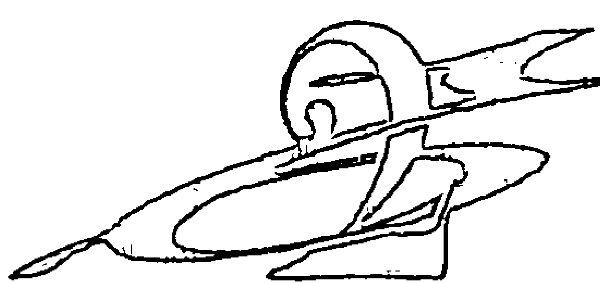

### 1月3日～1月9日

摩羯座二的中心意象是“决心”。在生命大循环中，这好比老年人开始培养新兴趣，得以自由发挥的时期。这时，他们有宏大的宇宙观和深刻的人生感悟，同时，这个时期可能是疾病的高发期。因此，保持健康的身体、积极的人生观和良好的心理调节能力，是这个阶段最重要的事情。

摩羯座二象征着老年人探索人生新领域的时期，因为他们开始有更多的时间去旅行或者进行哲学和宗教方面的思考。人生至此已经硕果累累，但暮年的老人们仍然壮心不已；他们有可能追求更多的财富和更大的权力，也有可能修身养性，追求人格和灵魂的升华。总之，这个时期，人们要做最好的自己。

摩羯座二一般都有攀登到事业巅峰的动力和雄心。不管成功与否，他们至少曾经努力过。他们是天生的奋斗者，就像山羊注定要去攀登最高的峭壁一样，而且一旦开始行动，谁也别想打断他们的计划。不论才华高低，摩羯座二都会将自己的能力发挥到极致，决不辜负自己的天赋。

摩羯座通常被刻画成冷静、务实的思考者，但摩羯座二对理论性的甚至形而上的宗教和灵魂方面的问题更感兴趣。这并不是说他们很保守，实际上，他们相当前卫——在他们的眼中，没有什么观点是不值得考虑的，不管它奇怪或离谱到什么程度。而且，他们喜欢考虑一些非常博大的问题，比如宇宙论或人类为什么存在之类的问题。不过，他们对哲学的思考大多建立在事实和观察的基础上，因为他们没时间进行空洞无用的臆想。

摩羯座二总给人一种坚强、积极和上进的印象，可实际上他们非常敏感，有些人甚至敏感过头了。一旦被批评，他们会有强烈的反应，而且往往拒绝接受批评。即使其他人都反对，只要自认为没有错，他们就有力量坚持走自己的路。当然，也有一些不太讲道德的摩羯座二，懂得权力的力量并且很会玩弄权术，不管对不对都要将事情做到底，做错了也不会承担责任。因此，即使是有点儿完美主义倾向、为一项伟大的事业或组织服务的摩羯座二，有时也会用一些不太光明的手段，做一些颇受争议的事情。总而言之，摩羯座二觉得只要结果完美，过程怎么样都无所谓。

摩羯座二大多看不惯任何形式的软弱行为，而且会毫不犹豫地利用对方的软肋达成自己的目的，因为在他们看来，失败是对生命最大的侮辱。说摩羯座二无法接受失败还是客气的说法，可以说，仅仅让他们承认失败就是件不可能的事。在他们的哲学里，失败是暂时的后退，一切击败他们的力量最终只会让他们更强大；有一天，他们要让那些阻碍他们成功的事物为他们服务，这时要他们放手或放弃更是不可能。因此，摩羯座二可能要花很多年时间才能最终卸下早已成为历史的负担。不过，从另一方面说，他们也可能成为那些在人生关键时刻敢于做出重大决定、不怕承担失败风险的成功典型。

| 黄道带位置： | 摩羯宫11°～摩羯宫20° |
| --- | --- |
| 季节： | 初冬 |
| 元素： | 土 |
| 主宰星： | 土星 |
| 标志物： | 山羊 |
| 认知方式： | 感觉 |

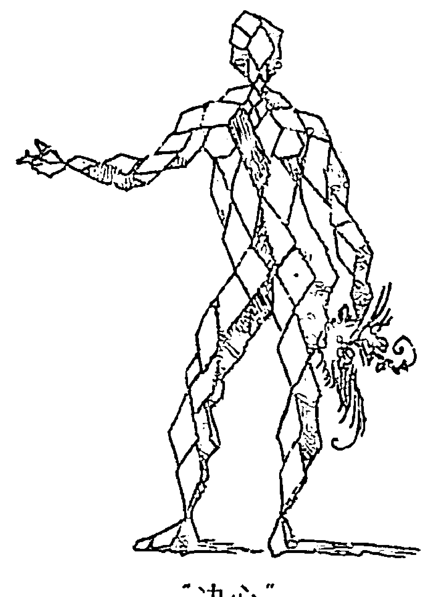

找伴侣的时候，应该避免接触有依赖性的异性。这种人会非常需要对方的关注，也喜欢插手对方的工作。

一般来说，摩羯座二的伴侣大多从事与他们完全不相干的职业。不过，他们的朋友几乎来自同一行业，至少是相似的行业。摩羯座二同朋友的关系可能非常亲密，因此他们的伴侣可能不得不接受这一点，即使难免有些不高兴、嫉妒或排斥。摩羯座二的生活可以说是由三个相互独立、互不相干的圈子组成的——工作圈、社交圈和私生活——而且他们也不想把这三个圈子混在一起。说实话，他们也的确没必要这么做。

奇怪的是，摩羯座二非常现实，却又喜欢幻想。这一周出生的许多人口才都很好，一件虚无缥缈的事情也能让他们说得煞有其事，让人信以为真。不过，如果他们真的相信幻想，那么他们最终会暴露不切实际的一面，继而失去身边的人的信任。因此，摩羯座二最好能有一位不被他们牵着鼻子走的朋友。这位朋友不会听信他们虚幻的想象，会告诉他们真实和客观的所见所闻。可以说，这样的朋友将是摩羯座二生命中最珍贵的财富。

摩羯座二足智多谋，有化腐朽为神奇的本事。正因为如此，再加上天性忠诚，他们可能数年如一日地坚守一份艰难的甚至不被看好的感情，想把它经营好。他们之所以这样做，不见得是出于理解对方或一往情深，只是因为他们不能承认或接受失败。摩羯座二投入感情大多源于他们对婚姻的信仰，也就是说，他们珍重的是关系本身，而不太在乎对方究竟是谁。

| 优势 | |
|---|---|
| 心理调节能力强 | 足智多谋 | 喜欢思考 |
| 劣势 | |
| 天真 | 防卫心强 | 有工作狂倾向 |

在生活中，最让摩羯座二感到高兴的事莫过于找到一个能跟他们分享喜怒哀乐的伴侣。他们虽然一个人也可以过得很好，但通常会去找一个伴侣。不过，他们也有自己的坚持，那就是伴侣最好不要过问他们工作上的事。在他们看来，工作是一个神圣不可侵犯的领域，他们没有责任同伴侣分享工作中的点点滴滴。而这在伴侣看来，是他们重视工作甚于自己的表现。因此，摩羯座二在寻找伴侣的时候，应该避免接触有依赖性的异性。这种人会非常需要对方的关注，也喜欢插手对方的工作。

摩羯座二个性很实际，但经常给人以理想主义者甚至有些天真的印象。这虽然是他们的软肋，却也是惹人怜爱之处。承认自己的弱点，表现自己的脆弱，是与别人分享感情的前提。可惜的是，这一周出生的人总是维持着强者的外表，这对感情交流非常不利。

### 忠告

每个人都有极限，你也不例外。偶尔示弱甚至失败也没关系，要勇于承认失败。表现出脆弱的一面也没什么可怕的。让你的理想植根于现实，确保自己没有弄混幻想和真实。

### 摩羯座二名人

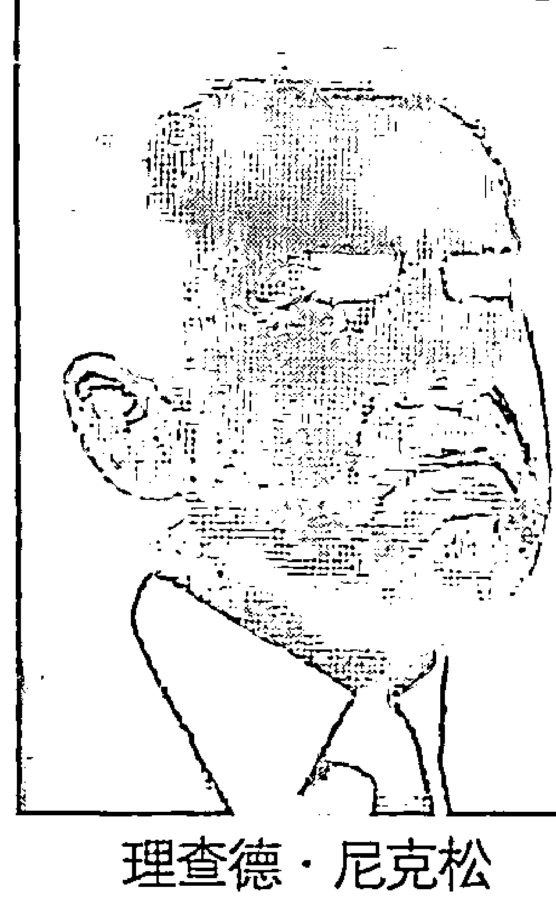

美国前总统、共和党人理查德·尼克松可能是20世纪最具争议的白宫人物。尼克松不愧是出生于“决心的一周”的人，会充分利用自己的天赋，不惜一切代价实现自己设定的宏伟目标。对这位摩羯座二来讲，任何事都不能阻挠他的雄心。尼克松虽然结束了越南战争并建立了中美关系，但他并未真正获得大部分美国选民的信任，最终因为“水门事件”毁掉了自己的声誉，就像希腊悲剧故事中的某个人物一样，因为过分的自负和傲慢而毁了自己。

阿尔文·艾利曾师从斯特拉·阿德勒学习戏剧，并师从玛莎·葛兰姆学习舞蹈。1958年，他建立了自己的舞团。艾利早期最成功的代表作是《启示录》，这部作品展现了黑人的精神文化。他最著名的独舞《呐喊》是为朱迪丝·贾米森精心设计的，献给“天下所有的黑人女性——尤其是我们的母亲”。艾利有着摩羯座二坚强的外表和极度敏感的内心，体现了现实主义和理想主义的有趣融合。艾利是美国最著名的舞蹈编导之一，一生创作了80余部作品。他胸怀博爱，并且认为种族之间应该有兄弟般的情义，这些理念为他赢得了广泛的赞誉。

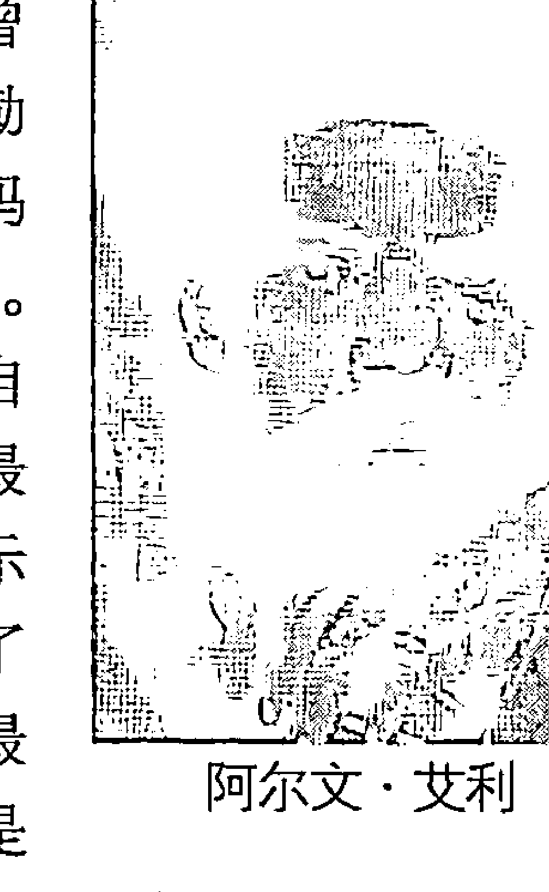

西蒙娜·德·波伏瓦是法国存在主义运动和左派知识分子的领导人，与让·保罗·萨特既是恋人，又是同事和朋友。德·波伏瓦最初教授哲学，1943年开始转向写作。她创作的一系列自传体作品精确地揭示了20世纪上半叶的全貌。不过，直到后期开始转向写实文学，尤其是创作了《第二性》后，德·波伏瓦才开始获得国际声誉。《第二性》是针对女性的社会角色进行分析的作品。德·波伏瓦还有一本针对老年人的力作《人不免一死》，这本书抨击了社会对老年人不平等的态度。

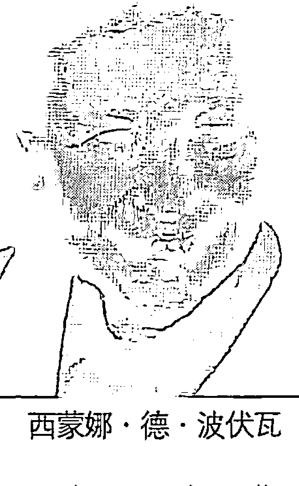

其他摩羯座二名人：埃尔维斯·普雷斯利（猫王）、路易斯·布莱叶、史蒂芬·霍金、卡里·纪伯伦、戴安·埃农、安伯托·埃柯、克丽丝特尔·盖尔、查克·诺尔、卡丽·查普曼·卡特、珍妮·丘吉尔、维多利亚·普林斯帕尔、乔治·里弗斯、凯瑟琳·沃克、卡萝尔·拜尔·塞杰、卡洛斯·索拉、莫里·波维奇、吉米·佩奇、厄尔·斯克鲁格斯、唐·舒拉、雷·米兰德、史蒂芬·史迪尔、查理·亚当斯、威廉·皮特·布拉蒂。

## 摩羯座二人际关系指南

最佳组合

情侣
- 白羊座二、巨蟹狮子座、
- 狮子座三、处女座一、
- 天蝎座一、射手座三、
- 摩羯水瓶座、水瓶座三

夫妻
- 双鱼白羊座、白羊座一、
- 白羊座三、双子座二、
- 巨蟹座二、巨蟹座三、
- 射手摩羯座、水瓶座二、
- 双鱼座一

朋友
- 白羊金牛座、金牛座二、
- 金牛双子座、双子座一、
- 处女座二、天秤座一、
- 天秤天蝎座、天蝎座二、
- 天蝎射手座、摩羯座三、
- 水瓶双鱼座、双鱼座二

家人
- 金牛座三、狮子座二、
- 摩羯座二

工作
- 金牛座一、双子座三、
- 狮子座一、天秤座三、
- 天蝎座三、射手座一、
- 摩羯座一、水瓶座一

| 星座 | 日期 | 关键词 | 页码 |
|---|---|---|---|
| 双鱼白羊座 | 3月19日~3月24日 | 不言而喻的赞赏 | 233 |
| 白羊座一 | 3月25日~4月2日 | 现代婚姻 | 256 |
| 白羊座二 | 4月3日~4月10日 | 打破壁垒 | 279 |
| 白羊座三 | 4月11日~4月18日 | 适合的形式 | 302 |
| 白羊金牛座 | 4月19日~4月24日 | 更高的层面 | 324 |
| 金牛座一 | 4月25日~5月2日 | 量身打造 | 345 |
| 金牛座二 | 5月3日~5月10日 | 远离窥探 | 366 |
| 金牛座三 | 5月11日~5月18日 | 亟待解决 | 387 |
| 金牛双子座 | 5月19日~5月24日 | 回到现实 | 407 |
| 双子座一 | 5月25日~6月2日 | 立场强硬 | 426 |
| 双子座二 | 6月3日~6月10日 | 渐愈的伤口 | 445 |
| 双子座三 | 6月11日~6月18日 | 现实的评价 | 464 |
| 双子巨蟹座 | 6月19日~6月24日 | 不要太严肃 | 482 |
| 巨蟹座一 | 6月25日~7月2日 | 互动的渴望 | 499 |
| 巨蟹座二 | 7月3日~7月10日 | 表现团结 | 516 |
| 巨蟹座三 | 7月11日~7月18日 | 克服困难 | 533 |
| 巨蟹狮子座 | 7月19日~7月25日 | 大出风头 | 549 |
| 狮子座一 | 7月26日~8月2日 | 对着干 | 564 |
| 狮子座二 | 8月3日~8月10日 | 捕食者的快乐 | 579 |
| 狮子座三 | 8月11日~8月18日 | 实际的梦想 | 594 |
| 狮子处女座 | 8月19日~8月25日 | 克制的情绪反应 | 608 |
| 处女座一 | 8月26日~9月2日 | 树立榜样 | 621 |
| 处女座二 | 9月3日~9月10日 | 一荚之豆 | 634 |
| 处女座三 | 9月11日~9月18日 | 开心快乐 | 647 |
| 处女天秤座 | 9月19日~9月24日 | 命运的安排 | 659 |
| 天秤座一 | 9月25日~10月2日 | 渴望成功 | 670 |
| 天秤座二 | 10月3日~10月10日 | 针锋相对 | 681 |
| 天秤座三 | 10月11日~10月18日 | 些许误导 | 692 |
| 天秤天蝎座 | 10月19日~10月25日 | 至高无上 | 702 |
| 天蝎座一 | 10月26日~11月2日 | 一本正经 | 711 |
| 天蝎座二 | 11月3日~11月11日 | 普通人 | 720 |
| 天蝎座三 | 11月12日~11月18日 | 决不妥协的骑士 | 729 |
| 天蝎射手座 | 11月19日~11月24日 | 不受约束的世界 | 737 |
| 射手座一 | 11月25日~12月2日 | 误导人的轻松 | 744 |
| 射手座二 | 12月3日~12月10日 | 变化是永恒的 | 751 |
| 射手座三 | 12月11日~12月18日 | 半斤八两 | 758 |
| 射手摩羯座 | 12月19日~12月25日 | 为权势而战 | 764 |
| 摩羯座一 | 12月26日~1月2日 | 高明的社交技巧 | 769 |
| 摩羯座二 | 1月3日~1月9日 | 坚定地前进 | 774 |
| 摩羯座三 | 1月10日~1月16日 | 虚张声势 | 775 |
| 摩羯水瓶座 | 1月17日~1月22日 | 被无意识控制 | 775 |
| 水瓶座一 | 1月23日~1月30日 | 强烈的好奇心 | 776 |
| 水瓶座二 | 1月31日~2月7日 | 逃避问题 | 776 |
| 水瓶座三 | 2月8日~2月15日 | 侵略性 | 777 |
| 水瓶双鱼座 | 2月16日~2月22日 | 洗涤心灵 | 777 |
| 双鱼座一 | 2月23日~3月2日 | 泰然自若 | 778 |
| 双鱼座二 | 3月3日~3月10日 | 没有问题! | 778 |
| 双鱼座三 | 3月11日~3月18日 | 真正的团队合作 | 779 |

## 摩羯座三

。支配的一周。

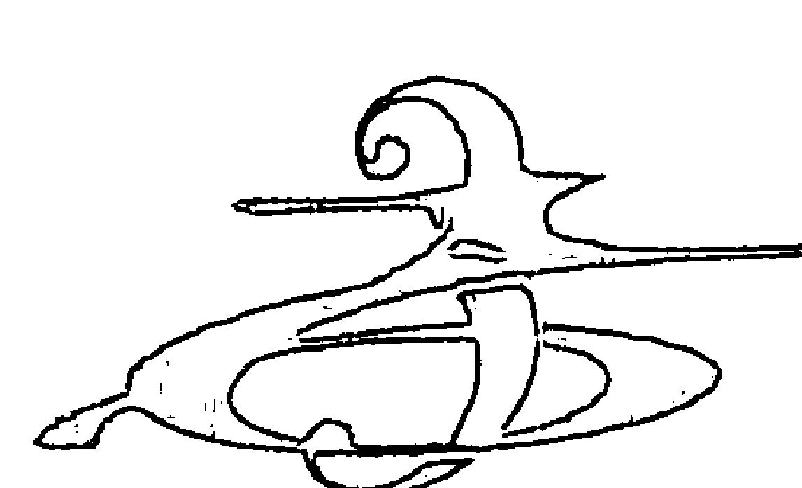

### 1月10日～1月16日

摩羯座三的中心意象是“支配”，在生命大循环中好比人生60岁将尽的年纪。年近古稀的老人是支配欲最强的人。如果他们把这种支配欲用于技术领域，可能还有不错的收效，但如果用于日常生活中，就可能与老伴发生口角，因为对方估计也正处于支配欲很强的时期。发生这种冲突也可能因为两人都在家闲着没事干。然而，比较有智慧的老人会在这个时候选择修身养性，尤其致力于克制自己冲动的脾气、减少反复无常的情绪以及各种胡思乱想。摩羯座三象征着老年人用现实的眼光评估周围的一切，然后做出艰难的选择以求将自己的生活安排得井井有条，获得更多舒适、快乐和成就感的过程。

许多摩羯座三其实不一定非要登上事业的巅峰或者成为领导，只要能在家庭、工作和社交团体中一直具有支配力就行了。虽然他们大多是拥有雄心壮志的人，但在某个领域里达到称心如意的高度后，他们一般不会再有过高的期望，觉得可以安度余生了。但在没有达到目标之前，他们会以无与伦比的勤奋和热情，沿着自己定好的路线心无旁骛地走下去。

保持自信的状态对摩羯座三的心理健康非常重要。因此，只要不整天忧心忡忡、不过分深究自己的动机、不对自己期望太高，他们就可以好好地生活。

| 黄道带位置： | 摩羯宫19°～摩羯宫27° |
| :--- | :--- |
| 季节： | 初冬 |
| 元素： | 土 |
| 主宰星： | 土星 |
| 标志物： | 山羊 |
| 认知方式： | 感觉 |

然而，摩羯座三往往有着隐藏的自卑感，这个问题可能困扰他们许多年，直到有朝一日证明了自己的价值之后，他们才能得到解脱。有些摩羯三会高估自己的实力，对自己有不切实际的看法，这实际上是他们内心深处的自卑感在作祟，是一种想要压制自卑感的绝望挣扎，只会把他们推到失败的边缘。导致这些人缺乏自我认同感的原因，还有可能是儿时父母打击太多、要求过于苛刻。

摩羯座三年少时可能将一位同性的长辈当作偶像，而且，当他们日益成熟后，也可能被别人当作偶像，从而按照别人期望的模板塑造自己。无论哪种情况，他们周围都弥漫着来自自己和他人的过多的不切实际的期望，这使他们难免遭受失望的打击。摩羯座三的道德感很强，认为这个世界不是黑、就是白，因此很容易批判别人，自己也倾向于走极端，这一点他们应该注意。他们如果能随和一点儿，学会接纳别人，对人少一些排斥、少给别人扣上有罪或者不知羞耻的帽子，就会过得很快乐。

摩羯座三非常重视自己的身体，但不一定热衷于感官享受，也不一定很爱玩。有些摩羯座三会将满足身体的需要当作第一职业，实际上，这是他们显示自己能够支配身体的一种方式。

## 摩羯座三

体和情绪的方式。摩羯座三对待自己以及身边亲近的人都非常严格，尤其是伴侣和家人。此外，他们不会自欺欺人，也不喜欢欺骗他人。因此，如果你想得到一些诚恳的建议和看法，他们是可以完全信赖的最佳人选。他们会有一说一、有二说二，不会虚伪地逗你开心。

几个人一起体验或谈论一些事情，一般不会只有一个好朋友。他们常常被团体性质的运动、爱好以及俱乐部所吸引，一旦参与，就会全身心地投入这些活动或组织的筹划和运作之中。

摩羯座三非常有服务精神。他们能力很强，做起事来也很专业，并且有冒险精神。然而，他们无私的付出可能演变成自我牺牲，或许他们还会遭到他人贪婪的剥削。这样的经历多了，他们也能学会对同事和熟人说“不”，但只要家人提出要求，他们不能也不愿意拒绝。因此，如果摩羯座三的家里碰巧有这么一个依赖性强、需求很多的人，就很可能将他们折磨得筋疲力尽、忙碌不堪，使他们的挫败感一点点地堆积起来，逐渐成为他们不快乐的根源。

摩羯座三对自己的事业大多会用心经营。他们能从胜算很小的活动中获得最大的乐趣，比如说挑战身体的极限等。有些摩羯座三在工作中比较实际，还有些工作狂的倾向。活泼有趣的伴侣对摩羯座三来说是一剂良药，能帮助他们暂时忘记工作，放松一下，享受生活的乐趣。的确，他们需要在结束一天的工作回到家时，有人能让他们的心情轻松起来。

- **优势**
专业 不畏艰难 坚持不懈

- **劣势**
粗枝大叶 无礼 过于自我牺牲

不要以为摩羯座三认真负责，就一定是呆板木讷的人；他们可一点儿都不呆。许多出生在这一周的人举止行为都非常引人注目，非常有魅力，至少他们的出场会令人吃惊地注目张望。摩羯座三不会刻意表现得很无礼，但他们常常给人这样的感觉，这是因为他们不知道、也不关心自己的言行会带给他人什么样的感受。别人排斥他们，他们也不会太难受，这一方面是因为他们知道自己不会对所有人的口味，另一方面也是因为他们压根不太需要别人的赞同和认可。个性独立的摩羯座三应当注意，不要太压抑，以至于扼杀了自己喜欢表达的一面。

摩羯座三不仅心思缜密、善于思考，而且非常有趣。他们爱开玩笑，同时很睿智，从中人们可以看出他们轻松的态度和卓越的观察力。这一周出生的人多少都有点儿怪癖。他们不是非常喜欢社交的人，不过很享受与三五好友一起小聚一番，至于是静静地聊天，还是热热闹闹地疯狂一把，就视他们的心情而定了。摩羯座三喜欢小团体的感觉，喜欢

### 忠告

别怕冒险，别怕失败，否则你可能一辈子都无法实现内心真正的愿望。你对安全感的坚持有时可能是多余的。学会灵活变通，多考虑别人的感受。注意，你的价值观不一定是大家的价值观。

### 摩羯座三名人

费伊·唐纳薇在其著名的影片中显示了摩羯座三的一些特质，比如支配欲和性格中的一些怪癖。唐纳薇在与沃伦·比蒂合演的《邦妮与克莱德》以及与杰克·尼科尔森合演的《唐人街》中不仅展现了天然的美丽和精湛的演技，还展现了超凡的天赋。她还在《亲爱的妈咪》中出色地饰演了琼·克劳馥，在与米基·洛克合作的《夜夜买醉的男人》中饰演一个醉酒的富婆，都对人物的某些怪癖进行了感同身受的诠释。唐纳薇强势的性格在其制片生涯中也有所体现，尤其是1990年拍摄电影《小城风波》时。

乔治·葛吉夫是20世纪重要的精神运动的创始者，他的一生都笼罩着一股神秘的色彩。葛吉夫在人生的头40年里，游历于中亚、南亚和中东地区，致力于研究一些神秘的宗教团体，最后他到俄国并在弟子的帮助下成立了人类和谐发展研究所。后来他将研究所转移至巴黎郊区，从而将自己的思想向更广泛的群体传播。他的作品《与奇人相遇》和《魔鬼传说》在随后的数年间颇受欢迎。不过，直到他的弟子彼得·邬斯宾斯基出版《探索奇迹》后，他的思想才在大众之间流行开来。葛吉夫同许多摩羯座三一样具备仿佛有磁性的支配力量，并且有一套自己的道德观。

年轻的希腊移民亚里士多德·奥纳西斯在仅有几百美元的情况下只身前往阿根廷的传奇经历被人们广为流传。出生于“支配的一周”，亚里士多德·奥纳西斯勤劳奋进、坚定专一，25岁就成为百万富翁。他一开始从事烟草贸易，随后用赚得的利润购买船只。在遇到杰姬·肯尼迪之前，他就已经是船运巨头，拥有巨额财富。杰姬与奥纳西斯于1968年成婚。虽然许多人都对杰姬的选择不解，但她的摩羯座三丈夫的力量和自信确实令人难以抗拒。

其他摩羯座三名人：小马丁·路德·金、圣女贞德、杰克·伦敦、埃博特·施威茨、亚历山大·汉密尔顿、威廉·詹姆斯、伊娃·列·高丽安、乔治·福尔曼、霍华德·斯特恩、朱莉娅·路易斯·德赖弗斯、柯尔斯蒂·阿利、博热·莫里索、埃塞尔·默尔曼、特雷弗·纳恩、玛丽布·莱姬、加麦尔·阿卜杜勒·纳赛尔、贾森·贝特曼、马哈里希·约吉、爱德华·特勒、查德·洛、马克斯·罗奇、戴安·福西、格温·弗登、三岛由纪夫。

## 摩羯座三人际关系指南

- **最佳组合**

情侣
白羊金牛座、双子座一、巨蟹座一、狮子处女座、处女座三、天秤座一、天蝎射手座、射手摩羯座、摩羯座三、水瓶双鱼座

夫妻
双鱼白羊座、金牛座一、金牛座三、处女座一、天秤座二、天蝎座二、水瓶座一、双鱼座一

朋友
白羊座一、白羊座三、双子巨蟹座、巨蟹座二、巨蟹狮子座、天秤座三、摩羯座一、摩羯座二

家人
巨蟹座三、狮子座三、射手座二、水瓶座二

工作
金牛双子座、双子座二、狮子座二、处女座二、处女天秤座、天秤天蝎座、射手座三、摩羯水瓶座、水瓶座三、双鱼座三

| 星座 | 日期 | 主题 | 页码 |
|---|---|---|---|
| 双鱼白羊座 | 3月19日~3月24日 | 才能的培养 | 233 |
| 白羊座一 | 3月25日~4月2日 | 提高觉悟 | 257 |
| 白羊座二 | 4月3日~4月10日 | 灵活的相处模式 | 280 |
| 白羊座三 | 4月11日~4月18日 | 增进共同利益 | 302 |
| 白羊金牛座 | 4月19日~4月24日 | 隐藏的不安全感 | 324 |
| 金牛座一 | 4月25日~5月2日 | 孤芳自赏 | 346 |
| 金牛座二 | 5月3日~5月10日 | 高效胜出 | 367 |
| 金牛座三 | 5月11日~5月18日 | 构想新方案 | 387 |
| 金牛双子座 | 5月19日~5月24日 | 干净、纯粹 | 407 |
| 双子座一 | 5月25日~6月2日 | 历经磨难 | 427 |
| 双子座二 | 6月3日~6月10日 | 达到高标准 | 446 |
| 双子座三 | 6月11日~6月18日 | 克服障碍 | 464 |
| 双子巨蟹座 | 6月19日~6月24日 | 感觉正常 | 482 |
| 巨蟹座一 | 6月25日~7月2日 | 幽默风趣 | 500 |
| 巨蟹座二 | 7月3日~7月10日 | 古怪的一面 | 517 |
| 巨蟹座三 | 7月11日~7月18日 | 完美的表演者 | 533 |
| 巨蟹狮子座 | 7月19日~7月25日 | 恍然大悟 | 549 |
| 狮子座一 | 7月26日~8月2日 | 真正的榜样 | 565 |
| 狮子座二 | 8月3日~8月10日 | 全力以赴 | 580 |
| 狮子座三 | 8月11日~8月18日 | 负面情绪 | 594 |
| 狮子处女座 | 8月19日~8月25日 | 神圣的信任 | 608 |
| 处女座一 | 8月26日~9月2日 | 不容忽视 | 622 |
| 处女座二 | 9月3日~9月10日 | 吸取经验 | 635 |
| 处女座三 | 9月11日~9月18日 | 沉默而直接 | 647 |
| 处女天秤座 | 9月19日~9月24日 | 风雨同舟 | 659 |
| 天秤座一 | 9月25日~10月2日 | 不声不响 | 671 |
| 天秤座二 | 10月3日~10月10日 | 潜移默化 | 682 |
| 天秤座三 | 10月11日~10月18日 | 保持个性 | 692 |
| 天秤天蝎座 | 10月19日~10月25日 | 个人化的沟通方式 | 702 |
| 天蝎座一 | 10月26日~11月2日 | 保持警惕 | 712 |
| 天蝎座二 | 11月3日~11月11日 | 突破瓶颈 | 721 |
| 天蝎座三 | 11月12日~11月18日 | 义无反顾 | 729 |
| 天蝎射手座 | 11月19日~11月24日 | 以尊重为开端 | 737 |
| 射手座一 | 11月25日~12月2日 | 令人费解 | 745 |
| 射手座二 | 12月3日~12月10日 | 感情的泥潭 | 752 |
| 射手座三 | 12月11日~12月18日 | 主导权之战 | 758 |
| 射手摩羯座 | 12月19日~12月25日 | 推销自己 | 764 |
| 摩羯座一 | 12月26日~1月2日 | 完全无误 | 770 |
| 摩羯座二 | 1月3日~1月9日 | 虚张声势 | 775 |
| 摩羯座三 | 1月10日~1月16日 | 英雄崇拜 | 779 |
| 摩羯水瓶座 | 1月17日~1月22日 | 踩到痛处 | 780 |
| 水瓶座一 | 1月23日~1月30日 | 调整步伐 | 780 |
| 水瓶座二 | 1月31日~2月7日 | 自我评价 | 781 |
| 水瓶座三 | 2月8日~2月15日 | 筹划活动 | 781 |
| 水瓶双鱼座 | 2月16日~2月22日 | 内在的力量 | 782 |
| 双鱼座一 | 2月23日~3月2日 | 坚定的信念 | 782 |
| 双鱼座二 | 3月3日~3月10日 | 没那么简单 | 783 |
| 双鱼座三 | 3月11日~3月18日 | 深信不疑 | 783 |

## 摩羯水瓶座

### 。神秘幻想的交界。

### 1月17日～1月22日

摩羯水瓶座在生命大循环中象征人70岁左右的年纪，也象征北半球的仲冬时节。这时白昼渐渐变长，但天气仍然寒冷，流浪在外的人们必须找一个可以遮风挡雨的避难所，才能抵御黑夜刺骨的凛寒。摩羯水瓶座的中心意象是“神秘幻想”。以人的一生来说，70岁的人一般对大限之期已经有了一些心理准备，开始盘算着如何让余下的生活更加舒服惬意又不失成就感。这时的人，虽然外在生活的步调已经大大放缓，但内在活动的节奏日益加快，思想、情感和灵魂方面的思考非常多。老年人活跃在想象、幻想与梦想的国度，有时表现得像个孩子。务实、保守的摩羯座与变幻莫测、不拘传统的水瓶座在这里相遇，融合为独特的摩羯水瓶座。

摩羯水瓶座生动活泼、善于表达，走到哪里都能引发一片欢笑。他们是静不下来的人，而且一登场就能引人注目。他们的观点不论保守还是激进，通常都能一石激起千层浪，引起不小的争论。这也不是因为他们的观点本身有什么出奇的，而常常是由他们的表达方式造成的。摩羯水瓶座对穷苦和受压迫的人非常同情，一旦遇上不如自己幸运的人，大多会毫不犹豫地奉献自己的时间、金钱和精力。不过，对那些不负责任的寄生虫，明明有能力自食其力却依靠别人施舍的人，他们就没那么好心了。

土星（摩羯座的主宰星）赋予摩羯水瓶座基本的条理性和责任感，而天王星（水瓶座的主宰星）随时有可能将这种稳定的秩序打破，因此，摩羯水瓶座不时有较大的情绪波动。他们有时非常理智、通情达理，有时又会完全失控。他们的脾气很大，因此在他们的生活中经常有暴力行为存在也就不足为奇了。混乱、失控的精力可能使摩羯水瓶座的生活动荡不安。此外，他们不怎么重视个人安全，而且天生天不怕地不怕，这些特质结合起来，就算不会危及他们的生命，也会令他们的生活充满危险。摩羯水瓶座不注重身体健康，总认为自己有取之不尽、用之不竭的精力，这样年复一年，迟早会将自己的精力耗尽或疾病缠身。所以，关心他们的恋人或配偶想要他们戒掉抽烟和酗酒的坏习惯。这并不是一件容易的事。

摩羯水瓶座性格中有明显的阴暗面。他们不会长时间忍气吞声，一旦脾气上来了，就能把别人吓得退避三舍。别看他们平时谈笑风生的时候很和善，惩罚人时可不会心慈手软，简直判若两人。这一周出生的人大多不太会控制内心的阴暗面，因此他们大发脾气绝不是作秀给别人看的。不过，摩羯水瓶座不是工于心计的人，任何情绪（不论好的坏的）都发乎自然，因此人们很难责怪他们的情绪波动。与他们最亲近的人，往往会原谅他们的这种行为。

| 黄道带位置： | 摩羯宫26°～水瓶宫3° |
| --- | --- |
| 季节： | 仲冬 |
| 元素： | 土/风 |
| 主宰星： | 土星/天王星 |
| 标志物： | 山羊/倒水侍者 |
| 认知方式： | 感觉/思考 |

姻或者正式的恋情之外，冲动的摩羯水瓶座可能深深地迷恋活力四射、能让自己激情澎湃的人，或那些表面冷静、内心热情如火的人。摩羯水瓶座通常“性”趣很高，而且性能力很强。虽然他们会因自己的不忠而多少有些罪恶感，但这种罪恶感也使地下情变得更加刺激有味。尽管他们自己并不重视和第三者的关系，但他们的伴侣可没这么“善解人意”，而且会因此受到很深的伤害，久久不能复原。种种出轨行为暴露出摩羯水瓶座不成熟的一面——他们就像彼得·潘一样拒绝长大。

即使是最随遇而安、最保守的摩羯水瓶座，内心也有很多梦想和幻想。他们就像美好生活的狂想者一样，内在生活极具创意、丰富多彩。生活中再平常不过的小事都可能成为他们展开幻想的画板，而在虚拟的幻想世界中，他们是所有事件的主角。不过，这些天马行空的幻想并不是病态的表现，相反，从摩羯水瓶座的身上，我们可以看到它们对保持心理健康所起到的极其重要的作用。

摩羯水瓶座喜欢开玩笑，他们的伴侣、朋友和家人不仅应该理解他们的这种需求，也应该学着欣赏他们的笑话，因为这是他们保持开心和幸福的力量之源。不过，要做到这一点很不容易，因为他们常常一分钟前还在严肃地处理某个问题，一分钟后就突然笑得前俯后仰了。此外，摩羯水瓶座也有注重传统的一面，这让他们过于严格——他们希望家里的每个人都能完美地履行自己的责任、承担自己的义务。

| 优势 | 令人兴奋 | 令人愉快 | 轻松活泼 |
| :--- | :--- | :--- | :--- |
| 劣势 | 混乱 | 难以相处 | 脾气暴躁 |

摩羯水瓶座最明显的特质就是活力四射。他们不一定能够健康地成长、成熟和老去，许多人会因为过于混乱的生活方式而早早地精力枯竭，也有一些人会因为忽视身体健康或者糟蹋自己的身体而衰弱堕落。轻率和粗心的习惯不仅会影响他们的身体健康，也会导致其心理状态的不稳定。不过，摩羯水瓶座如果能幸运地拥有一个稳定的支持团体，比如说家庭、朋友或伴侣，那么他们就可以改正自己各方面的缺点，最后拥有一切。而且，即使是独自生活的摩羯水瓶座，也可能最终战胜那个最变幻莫测和最难以对付的对手——自己，从而培养出强大的内在力量。

出生在这一周的人只尊敬那些可以与他们公平地分担日常责任和义务的人，因此，他们倾向于寻找努力和可靠的伴侣，而并不要求对方一定要聪慧或者美丽。然而，在婚

### 忠告

为你的创造力找一个宣泄的渠道。多和别人谈谈自己的经历。不要因为别人的不理解、忽视、怠慢或批评而倍感挫折，这样做不值得。不要钻牛角尖，去找一个理解和欣赏你的人。

### 摩羯水瓶座名人

世界重量级拳击冠军穆罕默德·阿里体现了摩羯水瓶座的善于表达、活力与暴力。阿里的速度、步法、风格以及伺机反攻的技巧，在其他拳击手看来只能望洋兴叹，而他的出拳和重击能力也从未受到任何质疑。阿里不仅在拳击界深受欢迎，还因参加了伊斯兰民族组织并拒绝加入美国军队参加越战而广受关注。阿里以绝对的优势击败了当时最难缠的拳击手，如乔·弗雷泽、乔治·福尔曼，受到了全世界拳击爱好者的尊重与推崇。阿里的演讲具有无可复制的激情和力量，其中最激动人心的贯穿始终的一句话就是“我是最棒的”。

意大利电影导演费德里科·费里尼最初致力于新现实主义影片，但身为摩羯水瓶座，神秘和幻想对他有强烈的吸引力，所以他转而拍摄此类电影。他的处女作《大路》由妻子朱列塔·马希纳主演，影片中弥漫着费里尼那充满象征意味的幻想。他还在影片《甜蜜生活》和《八部半》中加入了强烈的自传色彩和社会因素，其性质更接近个人评论。这两部电影都由马塞洛·马斯楚安尼主演。费里尼一直在自己想象的迷宫中游荡并乐此不疲，在很多影片中，大量运用色彩、幻想探索儿童时代的意象，创造了自己的超现实世界。

贾尼斯·乔普林彰显了出生于“神秘幻想的交界”的人所具有的冲动、狂野的性格。在整个20世纪60年代，乔普林比同时代的任何一个摇滚明星都要投入生活。在大型室外音乐会上，她那令人难以置信的热情投入让数千观众为之倾倒，也将她的声线和身体的承受能力推向极限。《我和我的芭比迈克吉》和《上帝，为什么不给我买一辆奔驰？》是她的代表作，不过上帝应该不太可能被她的请求感动。乔普林的蓝调音乐一直带着浓厚的感情色彩。1970年，年仅27岁的乔普林因过量吸食毒品去世。

其他的摩羯水瓶座名人：本杰明·富兰克林、拜伦伯爵、弗兰西斯·培根爵士、普拉西多·多明戈、亨弗莱·鲍嘉、金·凯瑞、艾德加·爱伦·坡、乔·弗雷泽、阿尔·卡彭、吉儿·艾肯伯里、威廉·哈里斯、莫伊拉·希勒、吉娜·戴维斯、让·雅克·莫罗、多莉·帕顿、齐塔·里韦拉、弗朗西斯·毕卡比亚、格里菲思、谢尔盖·爱森斯坦、约翰·赫特、拉斯普金、杰尔姆·克恩、奥古斯特·斯特林堡、伊桑·艾伦、杰克·尼克劳斯。

## 摩羯水瓶座人际关系指南

- **最佳组合**

情侣
双鱼白羊座、白羊座一、白羊座三、金牛座一、巨蟹座一、巨蟹狮子座、处女座一、天蝎座三、天蝎射手座、摩羯座二、水瓶座三

夫妻
白羊座二、金牛双子座、双子座三、狮子座一、双鱼座三

朋友
金牛座三、双子座二、巨蟹座三、处女天秤座、天秤座二、天蝎座一、射手座一、摩羯座一、水瓶座二、双鱼座一

家人
狮子处女座、处女座三、水瓶座一、水瓶双鱼座、双鱼座二

工作
白羊金牛座、双子座一、双子巨蟹座、巨蟹座二、狮子座三、处女座二、射手座三、射手摩羯座、摩羯座、摩羯水瓶座

| 星座 | 日期 | 关键词 | 页码 |
|---|---|---|---|
| 双鱼白羊座 | 3月19日~3月24日 | 看清缺点 | 234 |
| 白羊座一 | 3月25日~4月2日 | 保护茧 | 257 |
| 白羊座二 | 4月3日~4月10日 | 不沉闷 | 280 |
| 白羊座三 | 4月11日~4月18日 | 禁忌的爱情 | 303 |
| 白羊金牛座 | 4月19日~4月24日 | 感情风暴 | 325 |
| 金牛座一 | 4月25日~5月2日 | 解开谜题 | 346 |
| 金牛座二 | 5月3日~5月10日 | 梦想世界 | 367 |
| 金牛座三 | 5月11日~5月18日 | 世俗的快乐 | 388 |
| 金牛双子座 | 5月19日~5月24日 | 危险的边缘 | 408 |
| 双子座一 | 5月25日~6月2日 | 完美的艺术品 | 427 |
| 双子座二 | 6月3日~6月10日 | 工作和娱乐 | 446 |
| 双子座三 | 6月11日~6月18日 | 真心的结合 | 465 |
| 双子巨蟹座 | 6月19日~6月24日 | 中心位置 | 483 |
| 巨蟹座一 | 6月25日~7月2日 | 翻天覆地的变化 | 500 |
| 巨蟹座二 | 7月3日~7月10日 | 开路先锋 | 517 |
| 巨蟹座三 | 7月11日~7月18日 | 混乱中的客观 | 534 |
| 巨蟹狮子座 | 7月19日~7月25日 | 惊人的方式 | 550 |
| 狮子座一 | 7月26日~8月2日 | 惊人的化学反应 | 565 |
| 狮子座二 | 8月3日~8月10日 | 明智的行为 | 580 |
| 狮子座三 | 8月11日~8月18日 | 努力学习 | 595 |
| 狮子处女座 | 8月19日~8月25日 | 个人化的表达方式 | 609 |
| 处女座一 | 8月26日~9月2日 | 改善气氛 | 622 |
| 处女座二 | 9月3日~9月10日 | 引人注目的结合 | 635 |
| 处女座三 | 9月11日~9月18日 | 没有严重的冲突 | 648 |
| 处女天秤座 | 9月19日~9月24日 | 激烈的反叛 | 660 |
| 天秤座一 | 9月25日~10月2日 | 行动自由 | 671 |
| 天秤座二 | 10月3日~10月10日 | 马蜂窝 | 682 |
| 天秤座三 | 10月11日~10月18日 | 对刺激的需求 | 693 |
| 天秤天蝎座 | 10月19日~10月25日 | 熊熊大火 | 703 |
| 天蝎座一 | 10月26日~11月2日 | 自我调侃 | 712 |
| 天蝎座二 | 11月3日~11月11日 | 言归于好 | 721 |
| 天蝎座三 | 11月12日~11月18日 | 过于乐观 | 730 |
| 天蝎射手座 | 11月19日~11月24日 | 宁静的空间 | 738 |
| 射手座一 | 11月25日~12月2日 | 流星雨 | 745 |
| 射手座二 | 12月3日~12月10日 | 带来好运 | 752 |
| 射手座三 | 12月11日~12月18日 | 左右为难 | 759 |
| 射手摩羯座 | 12月19日~12月25日 | 不屈不挠 | 765 |
| 摩羯座一 | 12月26日~1月2日 | 狡猾的手段 | 770 |
| 摩羯座二 | 1月3日~1月9日 | 被无意识控制 | 775 |
| 摩羯座三 | 1月10日~1月16日 | 踩到痛处 | 780 |
| 摩羯水瓶座 | 1月17日~1月22日 | 地狱的烈焰 | 784 |
| 水瓶座一 | 1月23日~1月30日 | 达成共识 | 784 |
| 水瓶座二 | 1月31日~2月7日 | 满意还是不满意？ | 785 |
| 水瓶座三 | 2月8日~2月15日 | 外热内冷 | 785 |
| 水瓶双鱼座 | 2月16日~2月22日 | 童话世界 | 786 |
| 双鱼座一 | 2月23日~3月2日 | 合适的节奏 | 786 |
| 双鱼座二 | 3月3日~3月10日 | 不断发展的过程 | 787 |
| 双鱼座三 | 3月11日~3月18日 | 隐私资料库 | 787 |

## 水瓶座一

天才的一周。

1月23日～1月30日

水瓶座一的中心意象是“天才”。在生命大循环中，水瓶座一象征人70出头的年纪。这个年龄的老人对自然、时间和人类有了更广泛和更深刻的认识，追名逐利、表现自我和承担家庭责任等对他们来讲大都已是过往云烟。他们现在更多地把时间花在阅读和思考上，内容大多是哲学问题以及社会和国际领域的事件。从理论上讲，这个年纪的老人的人生观已经固定不变，同时具有水晶般剔透的智慧。水瓶座一所象征的是老人看着时光流逝、试着去接受时日无多这个事实的过程。他们会去想自己的个性如何、远离尘世会如何，也会去思考人类的命运，并且回忆自己的生命历程中都经历了哪些起起落落。这个阶段人的思想会在科学性、哲学性和现实性上达到很高的水平。

水瓶座一虽然不一定比其他人聪明，但他们通常学东西很快，浑身透着一股机灵劲儿，有时候甚至有点儿兴奋过头了。他们就像纯种马一样热血沸腾，想到一件事往往就迫不及待地去做。而且，他们可不把耐心当美德，对说话、行动和做决定很慢的人，他们会非常看不惯。

水瓶座一总是不断给人惊喜，有时甚至会招人嫉妒，因为他们总能轻松快速地掌握事情的要领。他们小时候一般都聪慧过人，不过不了解他们的家长和老师可能认为他们浮于表面或者不喜欢深入彻底地学习，甚至还因此批评他们。虽然水瓶座一的确特别容易感到厌倦，但一旦他们觉得必要，就能表现出坚持到底的一面。其实，并不是每个水瓶座一都具有快速掌握新知识的能力，只不过他们大多非常重视心智和思维能力，也努力去开发自己的能力，即使再枯燥也不放弃。

此外，他们也非常重视教育，不过通常不是学校教育；他们认为经验是最好的老师，因此通常属于自学的类型。面对精彩的大千世界，他们经常抵挡不住诱惑而离开教室，尤其是去异国旅行，对他们来讲具有无法抗拒的吸引力。

在事业上，水瓶座一喜欢按照自己的方式行事，如果一份工作要求他们言听计从，他们往往不会做得很好。他们比较适合自己当老板或者从事相对独立的工作，尤其是那些允许他们自由做决定、制订计划，能够自由改变方向，并且允许他们遵从自己的天性、想法和信仰的工作。水瓶座一能成为很好的领导，在家庭、社交团体或职场中都是如此，不过他们并没有领导或支配别人的欲望。他们在人际交往中最大的需要就是受到关注，就像演员需要观众一样。

对水瓶座一来讲，在每项工作中留下自己的印记非常重要，这种自我表达的个性会让他们受到很多人的欣赏和青睐。不过，他们缺乏稳定性，而且常常以自我为中心，因此可能给团队带来不好的影响。水瓶座一看起来很叛逆，不过这通常是因为他们感觉别人试图驯服或控制他们。由于个性冲动，他们很容易与权威人士或者个性较为保守的人发生冲突。

只要不那么容易被刺激，他们就能很好地处理生活中的任何事情。

对于爱情，水瓶座一最在意的一点的是伴侣要能理解他们对自由的需求，因为他们无法接受自己被固定的琐事和日程表拴住。朋友和伴侣如果对他们要求过多的话，往往不会有什么好结果，因为他们很少会接受别人的管制。一旦因为受到太多管制而感到不满，他们就会离开对方，去别人那里寻找自由的感觉。这种做法可能短期之内会给予他们自由，但长此以往，何来稳定和长久，何来更深入的交往？也有一些水瓶座一确实想找一位忠诚、稳定、愿意付出和能够长期相伴的伴侣，但与此同时，他们还想自由自在地与其他人建立感情关系，包括性关系。他们企图通过这种双重标准来同时满足自己的需求和欲望，却不知道这是对他人极大的不尊重。

一旦水瓶座一了解了自己的独特性，并且意识到自己并不像想象中的那么需要社交，他们的事业就会突飞猛进。比较有主见的水瓶座一会发现，他们在从事不怎么需要与人交际的工作时，能将自己的能力发挥到极致，所以科研、音乐、艺术、出版和经济等方面的工作都很适合他们。水瓶座一在同他人交往时常出现的一个问题是：他们把自己的才能和精力都浪费在身边的人身上，总想配合别人，从而寻求集体归属感。

水瓶座一的个性中也有消极的一面，那就是自我毁灭的倾向，遇到事情会更多地伤害自己而不是伤害别人。他们的情绪有时很不稳定，表现为心烦意乱、古怪、自私和易怒等。这些不稳定的情绪将他们敏感的内心暴露无遗。此外，他们有时可能有退缩到安静的角落、远离世事纷扰的渴望。水瓶座一很容易有压力重重的感觉，甚至会阶段性地情绪崩溃，因此他们一定要让自己学着坚强起来。

水瓶座一如果想建立家庭，过家庭生活，就要学着有效地安排自己的精力和时间，学着承担责任并克制自己想要受到瞩目的心态。富有魅力的水瓶座一常常会吸引一些不该被吸引的人，而且会在这些人身上花费大量的时间和精力，却忽视了自己身边真正应该爱，而且需要他们爱的人。因此，水瓶座一最好妥善地选择自己的朋友，将注意力放在那些能让他们心境平和、又不会要求太多的人身上，这样才有机会过上幸福的生活。

### 忠告

用现实的眼光看清你自己。人际交往是必要的，就算不喜欢也要接受。不要太在意别人的评论，必要时，可以不予理会。不要凡事都按自己的意愿行事，培养冷静、耐心和坚韧的特质。学着面对和处理挫折，坚强一点儿。

## 水瓶座—名人

奥地利作曲家沃尔夫冈·阿玛多伊斯·莫扎特无疑是世界上最早慧的音乐神童。在他身上，水瓶座—令人惊叹的快速学习能力发挥到极致。然而，莫扎特一生最大的难题是如何在成人世界立足，那里看重的是成熟、责任感和努力。莫扎特在艺术领域的成就无与伦比，这一点有他的作品《唐璜》《魔笛》以及晚期的交响曲和钢琴协奏曲为证。不过，他的个人生活有些混乱。他在35岁时神秘死亡，留下未完成的《安魂曲》，这也是他自己的挽歌。莫扎特的一生虽然短暂，却充满传奇色彩，而他的成就是许多人花几辈子的时间都难以获得的。

富兰克林·德拉诺·罗斯福是20世纪最著名的政坛人物之一。他曾连续4届当选美国总统，并且施行新政，带领美国走出大萧条时代。第二次世界大战期间，美国取得胜利，罗斯福作为总司令应居首功。罗斯福执政晚期推行政策时，表现出水瓶座—缺乏耐心的特点，而且他年轻时也有些轻率、鲁莽和过于自信。1921年，罗斯福因患小儿麻痹症落下残疾，也许正是因为这样的挫折，才促使他变得更加成熟、缜密，并且更加富有同情心，从而使罗斯福这个名字在美国历史上永垂不朽。

电视电影双栖明星奥普拉·温弗里有着水瓶座—的典型特点——早慧。她最早的一次引人注目的表演，是在复活节的布道会上，当时她只有两岁。奥普拉在大学所学的专业是演讲和戏剧，曾被选为田纳西小姐，年仅19岁就成为美国哥伦比亚广播公司地方台的主持人。到目前为止，她连续7年被评为美国收入最高的女性。她认为自己之所以能取得这么好的成绩，和自己与观众之间的情感共鸣是分不开的。另一方面，她能够坦诚地展示自己的童年和个人生活，这也为她赢得了不少人气。可见，奥普拉深入观众、了解观众并不是仅仅停留在口头上，而是切实体现在行动上。奥普拉还在电影《紫色》中有出色的表演，其多才多艺的特质由此可见一斑。

更多水瓶座—名人：弗吉尼亚·伍尔夫、萨默塞特·毛姆、刘易斯·卡洛尔、布丽奇特·方达、保罗·纽曼、米哈伊尔·巴里什尼科夫、娜塔莎·金斯基、哈德里安、约翰·贝鲁西、沃伦·泽冯、莎朗·泰特、玛丽亚·托尔奇夫、埃塔·詹姆斯、瓦妮莎·雷德格雷夫、吉恩·哈克曼、芭芭拉·塔奇曼、格雷格·洛加尼斯、W.C.菲尔兹、杰曼·格里尔、厄尼·班克斯。

## 水瓶座—人际关系指南

最佳组合

情侣
白羊座一、白羊座三、
狮子座三、天秤座三、
天蝎座二、射手摩羯
座、水瓶座三、双鱼座
一、双鱼座三

夫妻
白羊金牛座、金牛座
二、双子巨蟹座、狮子
座二、处女座三、射手
座三、摩羯座一、摩羯
座三

朋友
白羊座二、金牛座一、
金牛双子座、双子座
二、双子座三、巨蟹座
二、巨蟹狮子座、处女
座二、水瓶座一

家人
狮子座一、天秤座一、
天蝎座三、射手座一、
摩羯水瓶座、水瓶座二

工作
巨蟹座一、巨蟹座三、
处女座一、处女天秤
座、天蝎射手座、双鱼
座二

| 星座 | 日期 | 关键词 | 页码 |
|---|---|---|---|
| 双鱼白羊座 | 3月19日~3月24日 | 好奇心 | 234 |
| 白羊座一 | 3月25日~4月2日 | 自由精神 | 258 |
| 白羊座二 | 4月3日~4月10日 | 自断后路 | 281 |
| 白羊座三 | 4月11日~4月18日 | 亲密的快乐 | 303 |
| 白羊金牛座 | 4月19日~4月24日 | 施与受 | 325 |
| 金牛座一 | 4月25日~5月2日 | 共通的问题 | 347 |
| 金牛座二 | 5月3日~5月10日 | 梦想幻灭 | 368 |
| 金牛座三 | 5月11日~5月18日 | 站在最前沿 | 388 |
| 金牛双子座 | 5月19日~5月24日 | 激动人心的浪漫 | 408 |
| 双子座一 | 5月25日~6月2日 | 完美的合同 | 428 |
| 双子座二 | 6月3日~6月10日 | 社交技能 | 447 |
| 双子座三 | 6月11日~6月18日 | 渴望关注 | 465 |
| 双子巨蟹座 | 6月19日~6月24日 | 世界的舞台 | 483 |
| 巨蟹座一 | 6月25日~7月2日 | 滋生新想法 | 501 |
| 巨蟹座二 | 7月3日~7月10日 | 学习的欲望 | 518 |
| 巨蟹座三 | 7月11日~7月18日 | 市场的空白 | 534 |
| 巨蟹狮子座 | 7月19日~7月25日 | 无法安宁 | 550 |
| 狮子座一 | 7月26日~8月2日 | 求知欲 | 566 |
| 狮子座二 | 8月3日~8月10日 | 从错误中学习 | 581 |
| 狮子座三 | 8月11日~8月18日 | 因果循环 | 595 |
| 狮子处女座 | 8月19日~8月25日 | 轻松的交流 | 609 |
| 处女座一 | 8月26日~9月2日 | 互相吸引的磁力 | 623 |
| 处女座二 | 9月3日~9月10日 | 和颜悦色与针锋相对 | 636 |
| 处女座三 | 9月11日~9月18日 | 争强好胜 | 648 |
| 处女天秤座 | 9月19日~9月24日 | 复杂的思维方式 | 660 |
| 天秤座一 | 9月25日~10月2日 | 挑战权威 | 672 |
| 天秤座二 | 10月3日~10月10日 | 英雄所见略同 | 683 |
| 天秤座三 | 10月11日~10月18日 | 火花四射 | 693 |
| 天秤天蝎座 | 10月19日~10月25日 | 沿途的诱惑 | 703 |
| 天蝎座一 | 10月26日~11月2日 | 开阔的视野 | 713 |
| 天蝎座二 | 11月3日~11月11日 | 不可思议 | 722 |
| 天蝎座三 | 11月12日~11月18日 | 试着去领悟 | 730 |
| 天蝎射手座 | 11月19日~11月24日 | 毫不留情的戏弄 | 738 |
| 射手座一 | 11月25日~12月2日 | 口头的约定 | 746 |
| 射手座二 | 12月3日~12月10日 | 争夺关注 | 753 |
| 射手座三 | 12月11日~12月18日 | 才华横溢 | 759 |
| 射手摩羯座 | 12月19日~12月25日 | 销售策略 | 765 |
| 摩羯座一 | 12月26日~1月2日 | 控制欲望 | 771 |
| 摩羯座二 | 1月3日~1月9日 | 强烈的好奇心 | 776 |
| 摩羯座三 | 1月10日~1月16日 | 调整步伐 | 780 |
| 摩羯水瓶座 | 1月17日~1月22日 | 达成共识 | 784 |
| 水瓶座一 | 1月23日~1月30日 | 光速 | 788 |
| 水瓶座二 | 1月31日~2月7日 | 不想长大 | 788 |
| 水瓶座三 | 2月8日~2月15日 | 极力追求快乐 | 789 |
| 水瓶双鱼座 | 2月16日~2月22日 | 置身事外 | 789 |
| 双鱼座一 | 2月23日~3月2日 | 精神化的思考 | 790 |
| 双鱼座二 | 3月3日~3月10日 | 迷惑他人 | 790 |
| 双鱼座三 | 3月11日~3月18日 | 理论领域 | 791 |

## 水瓶座二

青春自在的一周。

1月31日～2月7日

水瓶座二的中心意象是“青春自在”。这乍一看似乎有些讲不通，因为在生命大循环中，它象征的是人75岁左右的年纪，那为什么会代表“青春自在”？其实，这是因为这一时期的老人大多与孩子交往甚密，尤其是自己的孙子、孙女们。因此，老年人成熟和智慧的一面同孩子开放和对万事万物都充满好奇的状态结合在一起，这使老年人的生命重新充满年轻人的冲动，所以有人将这个阶段称为“第二童年”。这时的老年人心情放松，生活惬意，而且有大把的时间，真是其乐无穷。水瓶座二象征的正是老年人寻求有意义的生活方式，安享晚年的过程。在此过程中，他们或许有点儿古怪和任性，忙着结交同龄的老人，增加同孩子们的交流，进行广泛而深刻的思考，努力让自己的老年生活更加舒适和快乐。

出生在这一周的人无论在办公室、实验室、工地、厨房还是其他地方，都给人技艺精湛的印象，不管做什么样的工作都有大师级的表现。精湛的技艺让水瓶座二能够漂亮地完成各种工作，不过，他们并没有因此放松，相反，他们年复一年地继续努力，使自己的技艺趋于完美。实际上，对许多水瓶座二来讲，掌握一门技艺只是长征路上的第一步，他们的终极目标是展现自己高超的创造力，而掌握技艺只是实现这个目标的一种方式。

“拒绝麻烦”是大多水瓶座二的座右铭。跟这一周出生的人交流，你会发现他们讨厌一切形式的麻烦事，为了避免麻烦他们愿意付出任何代价。他们重视快乐的感觉，不管长久的还是短暂的快乐，他们都不放过。水瓶座二一般喜欢独自走自己的路，不喜欢被干涉。他们不会对别人的事情指手画脚，也希望别人能够用同样的方式对待自己。

水瓶座二由内而外（身体、思想和情感）都散发着青春的活力。他们不仅看起来比实际年龄小得多，而且往往在20岁之前就能将自己的能力完全开发出来，这样他们的能力就能伴随他们一生，而不像有些人，需要随着年龄的增长才能渐渐培养出能力来。此外，不论水瓶座二最终是否成为父母，孩子和童年都是他们人生的主题，因为他们希望自己身上能一直保有孩子那天然、率性、直率和开放的特质。因此，有时有人指责他们感情肤浅或不成熟也就不足为奇了。事实上，他们可能有些不成熟，但决不幼稚。

水瓶座二无论走到哪里都会受到欢迎和崇拜，所以你可能觉得他们的生活中一点儿问题也没有。不过，人缘好是他们的优势，也可能成为他们的弱势，因为他们可能沉溺于别人的掌声而无法自拔，尤其是当别人对他们自由随和的态度表示称赞时。这样，一方面可能导致他们花太多的时间去讨好他人，反而丧失了自己的独立性，总是担心朋友和仰慕者会弃自己而去；另一方面也可能导致他们尽可能地与别人保持距离，甚至孤立自己，因为他们觉得要一直符合他人的期望实在是太难了，他们也不愿意这么做。还有一些人会因此变得清高孤傲，不再真正关心身边的人。

由于自视甚高，水瓶座二可能有自负的倾向。不过从另一方面来看，他们对自己的评价是根据自己表现出来的才华和能力而定的，换句话说，是根据他人对自己的态度和反应而定的，而不是来自自己的判断，这恰恰证明了他们内心深深的不安全感和自我怀疑心理。因此，对他们来讲，最危险的莫过于全盘接受别人的价值观或按照别人的期望而活，无法拥有独立、强大和健康的自我意识。水瓶座二的当务之急是通过对生活经历的感触和内在的思考，培养自己的真实而强大的信仰，这样才能日渐成熟起来。

水瓶座二希望生活中的一切关系都是轻松明快的，任何沉重和严肃的话题都不对他们的口味。不过，这并不是说他们排斥拥有自己的家庭、长久的爱情和婚姻或稳定的友谊。与水瓶座二亲近的人都知道，他们与对方保持距离只是为了保证自己的自主权。他们不喜欢和任何人合二为一的感觉，因为他们知道，只有避免用情过深，才能减轻日后发生冲突和分离所造成的痛苦。

由此看来，水瓶座二必须用更加现实的态度看待自己。他们需要更加了解自己，抓住在内心作祟的恶魔，在性格的阳光面和阴暗面之间找到平衡。在一般情况下，我们并不需要对抗和消灭内心深处的一切阴暗面，而是更加了解它们，甚至跟它们成为朋友。如果水瓶座二能够了解这一点，并以此为契机提升自己的人生质量，他们就能真正做到掌控自己的人生。

水瓶座二在个人感情上常出现的一个问题是：他们的感情总是与理智作对，理智上觉得不应该与某种类型的人交往，感情上却恰恰被这种类型的人吸引。比如说，他们总是被用情很深、情绪复杂甚至麻烦不断的人吸引。这种需求其实反映了他们性格中不为人知的一面，也就是说，他们爱上的是自己的投影，而这一点他们自己常常意识不到。看着水瓶座二陷入感情的折磨和痛苦中，人们忍不住会想，他们真的像表面看起来的那样无忧无虑、逍遥自在吗？

### 忠告

试着了解自己内心深处的感受。有时直面问题是最好的解决方法，不要总怕麻烦。现在承受一点儿痛苦，可能可以防止以后承受更多的痛苦。别太依赖他人对自己的看法，鼓起勇气做真实的自己。你不需要去讨好他人或逗他人开心。

### 水瓶座二名人

1993年，快球手诺兰·瑞安退役，结束了长达27年的职业棒球生涯。在这27年里，瑞安一共投出5714次三振，责分率为3.19，324胜，292负。他虽然一直保持着三振和无安打比赛的世界纪录，却从未获得赛扬奖和最有价值球员称号。年轻的瑞安完美契合水瓶座二的性格，在不惑之年仍能轻松地投出三振。1973年是他最富传奇性的一年；那个赛季他投出2场无安打比赛，是第二位单场投出17次三振的投手。在最后一场比赛时投出了16次三振，以一次之差打破了由桑迪·科法克斯保持的单季三振记录。33~41岁时，瑞安效力于休斯敦太空人队，106胜，94负，责分率高达3.14。

克拉克·盖博独立、傲慢，有着精湛的演技和驾驭能力。他在《乱世佳人》中饰演的傲慢自负的瑞德·巴特勒常常激怒斯佳丽·奥哈拉，而傲慢正是这位水瓶座二留给人们的印象。然而，他“好莱坞之王”的称号并非徒有虚名，在好莱坞电影中担任主角长达30年。“轻松”一词诠释了盖博大部分角色的精髓所在，困难、烦恼、痛苦似乎与他无关。他无法轻松地处理感情问题，这一点在他的妻子卡萝尔·隆巴德死于飞机失事时得到了明显的印证。当时正值第二次世界大战，他为了逃避痛苦加入美国空军。自此，盖博成为一位真正的战斗英雄。

俄国芭蕾舞者安娜·巴甫洛娃几乎成为美丽、精致和优雅的代名词，她在位于巴黎的俄罗斯芭蕾舞团的传奇演出奠定了她在芭蕾舞界的巨星地位。年轻优雅的巴甫洛娃是典型的水瓶座二，近乎完美的表演技巧再加上含蓄的冷漠和超然，令众多观众为之神魂颠倒。巴甫洛娃因饰演芭蕾舞剧如著名的《吉赛尔》和《肖邦魂》中的角色而闻名。她最著名的作品是与俄罗斯芭蕾舞团合作的《天鹅之死》，这是著名的芭蕾舞编导米克尔·福金为她量身打造的剧目。

其他水瓶座二名人：弗朗兹·舒伯特、雅沙·海菲茨、鲍勃·马利、查尔斯·狄更斯、詹姆斯·乔伊斯、菲尔·柯林斯、贝蒂·弗里丹、贝比·鲁斯、玛丽·利基、王安、纳塔利·科尔、罗伯托·阿洛玛、布莱恩·丹纳、菲利普·格拉斯、杰基·鲁宾逊、夏洛特·兰普林、兰斯顿·休斯、约翰·福特、艾达·卢皮诺、仲巴仁波切、罗纳德·里根、劳拉·英戈尔斯·怀尔德、威廉·巴勒斯、艾德莱·史蒂文森、小亚瑟·苏尔兹伯格、罗杰·斯托巴克、格特鲁德·斯泰因、詹姆斯·米切纳。

## 水瓶座二人际关系指南

### 最佳组合

**情侣**
金牛双子座、双子巨蟹座、狮子座一、狮子处女座、天秤座二、天蝎座一、天蝎射手座、射手座一、摩羯座一

**夫妻**
双鱼白羊座、金牛座一、金牛座三、巨蟹座二、处女座二、天秤天蝎座、天蝎座二、射手摩羯座、摩羯座二、水瓶双鱼座

**朋友**
白羊座三、巨蟹座三、处女座一、处女天秤座、天秤座一、天秤座三、天蝎座三、摩羯水瓶座、双鱼座二

**家人**
白羊座二、双子座一、巨蟹座一、处女座三、摩羯座三、双鱼座一

**工作**
白羊金牛座、双子座二、巨蟹狮子座、射手座二、水瓶座二、双鱼座三

| 星座 | 日期 | 主题 | 页码 |
|---|---|---|---|
| 双鱼白羊座 | 3月19日~3月24日 | 人生教训 | 235 |
| 白羊座一 | 3月25日~4月2日 | 制造麻烦 | 258 |
| 白羊座二 | 4月3日~4月10日 | 不反感 | 281 |
| 白羊座三 | 4月11日~4月18日 | 完全契合 | 304 |
| 白羊金牛座 | 4月19日~4月24日 | 走进沙堆 | 326 |
| 金牛座一 | 4月25日~5月2日 | 疲倦的满足 | 347 |
| 金牛座二 | 5月3日~5月10日 | 新生 | 368 |
| 金牛座三 | 5月11日~5月18日 | 忽视深层问题 | 389 |
| 金牛双子座 | 5月19日~5月24日 | 灵魂伴侣 | 409 |
| 双子座一 | 5月25日~6月2日 | 社会交往 | 428 |
| 双子座二 | 6月3日~6月10日 | 在天穹闪耀 | 447 |
| 双子座三 | 6月11日~6月18日 | 娱乐时间 | 466 |
| 双子巨蟹座 | 6月19日~6月24日 | 面对挑战 | 484 |
| 巨蟹座一 | 6月25日~7月2日 | 理智的享乐主义者 | 501 |
| 巨蟹座二 | 7月3日~7月10日 | 诱惑人心的流沙 | 518 |
| 巨蟹座三 | 7月11日~7月18日 | 努力坦诚相待 | 535 |
| 巨蟹狮子座 | 7月19日~7月25日 | 坚定的决心 | 551 |
| 狮子座一 | 7月26日~8月2日 | 深化影响 | 566 |
| 狮子座二 | 8月3日~8月10日 | 异性相吸 | 581 |
| 狮子座三 | 8月11日~8月18日 | 阻力最少的道路 | 596 |
| 狮子处女座 | 8月19日~8月25日 | 正常的表象 | 610 |
| 处女座一 | 8月26日~9月2日 | 转换角色 | 623 |
| 处女座二 | 9月3日~9月10日 | 令人不快的批评 | 636 |
| 处女座三 | 9月11日~9月18日 | 天造地设的一对? | 649 |
| 处女天秤座 | 9月19日~9月24日 | 欢笑的天分 | 661 |
| 天秤座一 | 9月25日~10月2日 | 浮于表面 | 672 |
| 天秤座二 | 10月3日~10月10日 | 互相追逐 | 683 |
| 天秤座三 | 10月11日~10月18日 | 听从命运的安排 | 694 |
| 天秤天蝎座 | 10月19日~10月25日 | 不厌其烦的复制 | 704 |
| 天蝎座一 | 10月26日~11月2日 | 大批仰慕者 | 713 |
| 天蝎座二 | 11月3日~11月11日 | 永不熄灭的火焰 | 722 |
| 天蝎座三 | 11月12日~11月18日 | 心灵的共鸣 | 731 |
| 天蝎射手座 | 11月19日~11月24日 | 权威的力量 | 739 |
| 射手座一 | 11月25日~12月2日 | 不受羁绊 | 746 |
| 射手座二 | 12月3日~12月10日 | 到达顶峰 | 753 |
| 射手座三 | 12月11日~12月18日 | 避免麻烦? | 760 |
| 射手摩羯座 | 12月19日~12月25日 | 提升形象 | 766 |
| 摩羯座一 | 12月26日~1月2日 | 中间地带 | 771 |
| 摩羯座二 | 1月3日~1月9日 | 逃避问题 | 776 |
| 摩羯座三 | 1月10日~1月16日 | 自我评价 | 781 |
| 摩羯水瓶座 | 1月17日~1月22日 | 满意还是不满意? | 785 |
| 水瓶座一 | 1月23日~1月30日 | 不想长大 | 788 |
| 水瓶座二 | 1月31日~2月7日 | 招惹麻烦 | 791 |
| 水瓶座三 | 2月8日~2月15日 | 无人驾驶 | 792 |
| 水瓶双鱼座 | 2月16日~2月22日 | 自我接纳 | 792 |
| 双鱼座一 | 2月23日~3月2日 | 适当的行为 | 793 |
| 双鱼座二 | 3月3日~3月10日 | 平淡乏味 | 793 |
| 双鱼座三 | 3月11日~3月18日 | 增强自信心 | 794 |

## 水瓶座三

### 。接纳的一周。

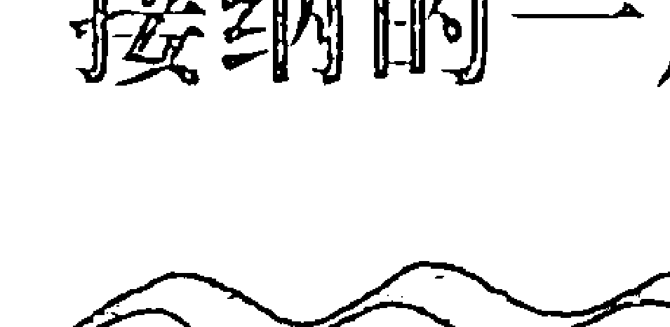

### 2月8日～2月15日

水瓶座三的中心意象是“接纳”，象征老人们随着年事渐高而发展出一种包容万物的情怀。那些往昔曾经有过的偏见、成见以及喜欢批评人的态度，如今已变得比较缓和，甚至完全烟消云散。虽然在晚年，人们还是免不了偶尔动怒或者有点儿消极，但大抵而言，老人们的心胸都变得很宽广，对自己和自己曾经做过的人生选择，以及对朋友、爱人乃至世间万物，都抱着宽容的态度。信仰宗教的老人，这时会思考自己的来生并衍生一种强烈的责任感，并在这种思想的激励下，开始更多地参与慈善活动。总之，这个时期的老人在精神上很强大，开始享受生活中点滴小事带来的快乐，语言和思想充满了幽默和智慧。即使身体受到疾病折磨，他们也能展现生命的尊严和圆满，令年轻人颇受启发和鼓舞。

黄道带位置：
水瓶宫18°～水瓶宫27°
季节：
仲冬
元素：
风
主宰星：
天王星
标志物：
倒水侍者
认知方式：
思考

解决了自己的偏见后，水瓶座三通常会变成弱者的守护神。他们鄙视任何形式的排斥和不公，也看不惯那些装腔作势、矫揉造作的人。在别人将牛皮吹上天的时候戳破它，是水瓶座三的看家本领。一旦发起狠来，他们会非常尖刻，甚至给别人造成伤害。他们之所以这样做，可能源于内心潜藏的自卑感，而这又可能是小时候家长的不良态度对他们造成的消极影响。水瓶座三发起脾气来非常突然，而且威力十足，但一般不会持续很久。家人和朋友通常都一致认为他们最好能一下子将自己的怒气和不满全部发泄出来，而不是放在心里越积越深，这样对大家都有好处。

接纳是贯穿水瓶座三一生的主题。一些水瓶座三可能一开始有点儿顽固，不太能够接受不同寻常的观点和事物，但随着年龄的增长会日渐开明与随和。也有一些人小时候接纳度就很高，过于顺从别人的意愿，以至于受到个性强势或有些自私的人的影响和操纵。他们面临的挑战是：在开怀接纳世界的同时，也要有过滤有害影响的能力。

水瓶座三的点子很多，他们的脑子里永远有新想法冒出来。可能是因为他们总让自己陷入困境和面临挑战，他们很早就发明出一套摆脱困境和应对挑战的方法。他们既善于制造麻烦，又善于解决麻烦的特质，像极了神话故事里两个人物的综合体：一个是代达罗斯，他建造了一座囚禁怪兽的大迷宫；另一个是阿里阿德涅，他是指点要杀怪兽的英雄忒修斯破解迷宫的人。说到底，水瓶座三的最大敌人就是他们自己。

水瓶座三很少能够长时间保持安静，他们热爱各种活动和运动。快活热闹的他们很招朋友们喜欢，因为他们丰富的语言和非比寻常的举止，在朋友看来都深具魅力。至于他们的缺点，一般的朋友大都不会感受到，只有与他们朝夕相处的家人才会对他们的缺点深有感触，因为只有在琐碎的日常生活中，他们最大的缺点才会暴露出来。水瓶座三常常会对家人感到厌烦，其实这只是他们缺乏自我认知的表现，因为真正让人讨厌的往往是他们自己。

己更好的明天，是他们渡过难关的秘诀。毕竟，他们知道，不管今天怎样糟糕，明天又是崭新的一天。从这个层面看，他们对未来的态度是积极向上的。

不过，水瓶座三对当下的看法可能比较消极，似乎觉得没有一件事情是对的。

水瓶座三很容易受到别人的言语和行为的影响。别人说的一句话不中听或者一个眼神不友善，他们就能难过好几个小时，甚至一整天都精神不振。可以说，他们面对人身攻击时非常脆弱。实际上，如果别人批评的是他们与众不同的观点，那么无论有多少批评他们都毫无惧色，而且能滔滔不绝地为自己辩解；但如果别人伤害的是他们的感情，那他们就受不了了。水瓶座三面对人身攻击的时候应该学着不要那么敏感脆弱，无论别人的消极评论是出于有意还是无意，都要一笑置之，这对他们保持心理平衡非常重要。

他们会不停地抱怨自己能力不足以及受到外界不公正的对待，朋友们眼看着他们这样却无能为力。他们之所以对自己态度消极，可能是因为他们对自己身体的某部分不满意，或者为曾经犯过的错误感到羞耻。这些消极的心态会因为负罪感的存在而加剧。不过，虽然水瓶座三常常会责怪自己，但他们听到别人的批评时，又总会激烈地反击，甚至发展到双方对骂的地步。让他们听取关心他们的家人的意见，简直是不可能的事。相比之下，他们更愿意接纳朋友甚至陌生人的意见。

水瓶座三最不缺的就是讽刺、机智和幽默细胞，这是他们面对困难和敌意时能够生存下来的法宝。他们走出困境的另一法宝是，在心里对自己说下次不再犯同样的错误，并用积极的行动提高生活质量。为未来制订各种各样的计划和暗下决心许给自

水瓶座三感情丰富，也渴望爱情。然而，即使他们不断追寻，爱情对他们来讲总是可望而不可即。就算有适合他们的人存在，他们也很少能在30岁以前找到适合自己的伴侣。他们需要很多同伴、同事、伴侣和朋友来满足他们的需求，因为他们基本上属于不容易满足又很容易厌倦的人。他们非常需要别人的关注，这很可能导致他们永远像蝴蝶一样在花丛间飞来飞去，安定不下来。因此，恒久、专一、坚定和付出是水瓶座三需要学习的重要课程。

| 优势 |
| --- |
| 活泼 有创意 感情丰富 |
| 劣势 |
| 易怒 脆弱 渴望关注 |

### 忠告

任何人都有同他人交往的需求，要接受这一点，并试着发展有意义的社会交往。保持开放和接纳的态度，也要求别人接受你真实的样子。你的超自然的能力很可贵，要善用它。不要一被他人拒绝就降低对自己的评价，应该自尊自爱。

### 水瓶座三名人

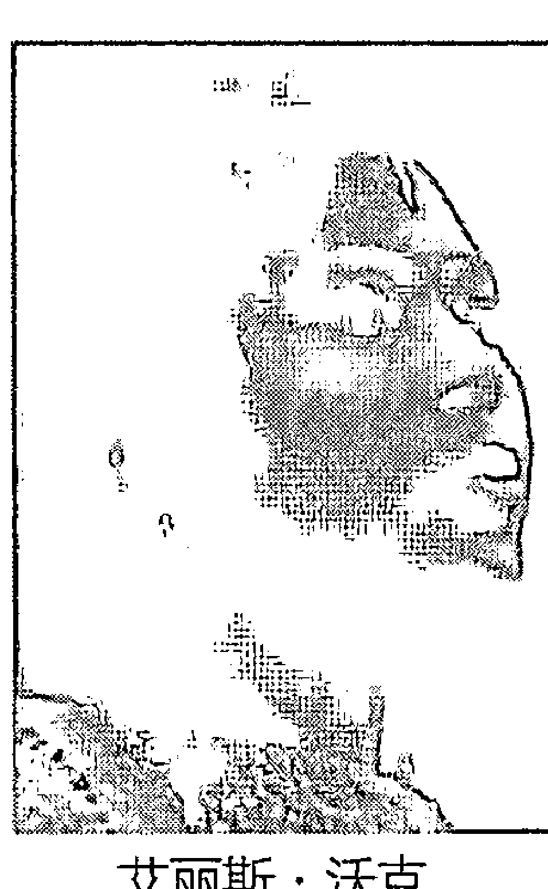

艾丽斯·沃克因小说《紫色》而成名并获得普利策奖，她同时还是评论家、诗人和短篇小说家。史蒂文·斯皮尔伯格以其小说为蓝本导演的同名电影让她更加为世人所知。沃克出生于佐治亚州一个贫困的佃农家庭，童年时因一次事故失去了一只眼睛。她勇于接受自身的残疾，并从令人烦扰的青春期恢复过来，是一位名副其实的水瓶座三。沃克参加密西西比州的民权运动时与律师梅尔·列文斯尔相识并成婚，生有一个女儿。最近的一部小说《第二次生命》显示了沃克正在践行水瓶座三的生命主题——不断地接纳。

米娅·法罗出生于一个好莱坞家庭，母亲是演员莫琳·奥沙利文，父亲是导演约翰·法罗，因此她从一出生就注定是明星。14岁的米娅在父亲导演的电影《约翰·保罗·琼斯》中首次亮相。米娅是三个著名的男人——弗兰克·西纳特纳、安德烈·普列文和伍迪·艾伦——的妻子（或恋人），而且在每段关系中都扮演被动者的角色。她饰演的人物大多性格脆弱但不乏自尊，并最终学会坚强。她用一生的时间学会为自己辩解，克服内心的不安全感，最终实现真正的自我。她共生育和收养了13个孩子。

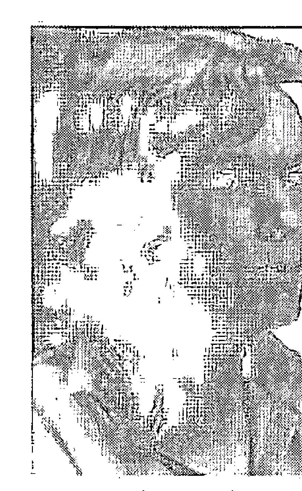

詹姆斯·迪恩一生中只主演过三部电影——《无因的反抗》、《伊甸园之东》和《巨人》，24岁时便死于一场汽车事故，由此引发了一股狂热的崇拜潮。迪恩完成这三部电影仅用了一年多时间，这显示出他是一位极富天赋的演员，而且带有奇怪的叛逆色彩。他的生活和表演生涯都反映了水瓶座三的典型特质，比如对爱情的渴望，容易厌烦，乐于帮助无助的人，很难接纳别人的建议（尤其是家人的），等等，这些特质都在他身上得到了明显的印证。即使是生命的结束（因高速驾驶跑车而发生车祸），也源于他不能接受时间和空间限制的性格特点。

其他水瓶座三名人：亚伯拉罕·林肯、伽利略、查尔斯·达尔文、儒勒·凡尔纳、苏珊·安东尼、托马斯·爱迪生、弗吉尼亚·约翰逊、布伦丹·贝汉、贝托尔特·布雷赫特、斯特拉·阿德勒、查尔斯·提法尼、比尔·罗素、保罗·巴古斯、罗伯塔·弗莱克、杰克·莱蒙、格雷格·诺曼、彼得·加布里埃尔、克莱尔·布卢姆、卡尔·伯恩斯坦、杰克·班尼、乔治·西格尔、奥利弗·里德、查克·耶格尔、乔治·西默农、莱泰恩·普赖斯。

## 水瓶座三 人际关系指南

### 最佳组合

**情侣**
白羊金牛座、金牛双子座、双子座二、巨蟹座三、狮子座二、处女天秤座、天秤座三、天蝎座二、射手座二、摩羯座二、摩羯水瓶座、水瓶座一、双鱼座一

**夫妻**
白羊座一、金牛座一、巨蟹座一、狮子处女座、处女座二、天秤座一、摩羯座一、水瓶座三、双鱼座三

**朋友**
双鱼白羊座、白羊座三、巨蟹座二、狮子座一、天秤座二、天蝎座一、天蝎射手座、射手座三、双鱼座二

**家人**
金牛座三、狮子座三、水瓶座二、水瓶双鱼座

**工作**
金牛座二、处女座一、天蝎座三、射手座一、摩羯座三

| 星座 | 日期 | 关键词 | 页码 |
|---|---|---|---|
| 双鱼白羊座 | 3月19日~3月24日 | 自我反省 | 235 |
| 白羊座一 | 3月25日~4月2日 | 看穿表面 | 259 |
| 白羊座二 | 4月3日~4月10日 | 一组新按钮 | 282 |
| 白羊座三 | 4月11日~4月18日 | 温柔宜人 | 304 |
| 白羊金牛座 | 4月19日~4月24日 | 着火的房子 | 326 |
| 金牛座一 | 4月25日~5月2日 | 捉蝴蝶 | 348 |
| 金牛座二 | 5月3日~5月10日 | 良好的默契 | 369 |
| 金牛座三 | 5月11日~5月18日 | 有创意的游戏 | 389 |
| 金牛双子座 | 5月19日~5月24日 | 高度紧张 | 409 |
| 双子座一 | 5月25日~6月2日 | 谢幕 | 429 |
| 双子座二 | 6月3日~6月10日 | 公开表演 | 448 |
| 双子座三 | 6月11日~6月18日 | 等待救援 | 466 |
| 双子巨蟹座 | 6月19日~6月24日 | 平等的地位 | 484 |
| 巨蟹座一 | 6月25日~7月2日 | 权力的挑战 | 502 |
| 巨蟹座二 | 7月3日~7月10日 | 完整的包裹 | 519 |
| 巨蟹座三 | 7月11日~7月18日 | 不稳定感 | 535 |
| 巨蟹狮子座 | 7月19日~7月25日 | 隐藏在深处 | 551 |
| 狮子座一 | 7月26日~8月2日 | 共同体验 | 567 |
| 狮子座二 | 8月3日~8月10日 | 美好的感觉 | 582 |
| 狮子座三 | 8月11日~8月18日 | 改变他人的信仰 | 596 |
| 狮子处女座 | 8月19日~8月25日 | 整体大于部分之和 | 610 |
| 处女座一 | 8月26日~9月2日 | 保护受压迫的人 | 624 |
| 处女座二 | 9月3日~9月10日 | 远离消极 | 637 |
| 处女座三 | 9月11日~9月18日 | 避免依赖 | 649 |
| 处女天秤座 | 9月19日~9月24日 | 心灵相通 | 661 |
| 天秤座一 | 9月25日~10月2日 | 无法遏制的精力 | 673 |
| 天秤座二 | 10月3日~10月10日 | 不断学习 | 684 |
| 天秤座三 | 10月11日~10月18日 | 一往无前 | 694 |
| 天秤天蝎座 | 10月19日~10月25日 | 幻想的需要 | 704 |
| 天蝎座一 | 10月26日~11月2日 | 探索阴暗面 | 714 |
| 天蝎座二 | 11月3日~11月11日 | 分享情感体验 | 723 |
| 天蝎座三 | 11月12日~11月18日 | 艰难的决定 | 731 |
| 天蝎射手座 | 11月19日~11月24日 | 凌驾于规则之上 | 739 |
| 射手座一 | 11月25日~12月2日 | 此情可待成追忆 | 747 |
| 射手座二 | 12月3日~12月10日 | 甘愿冒险 | 754 |
| 射手座三 | 12月11日~12月18日 | 共享权力 | 760 |
| 射手摩羯座 | 12月19日~12月25日 | 超自然的结合 | 766 |
| 摩羯座一 | 12月26日~1月2日 | 明智的结合 | 772 |
| 摩羯座二 | 1月3日~1月9日 | 侵略性 | 777 |
| 摩羯座三 | 1月10日~1月16日 | 筹划活动 | 781 |
| 摩羯水瓶座 | 1月17日~1月22日 | 外热内冷 | 785 |
| 水瓶座一 | 1月23日~1月30日 | 极力追求快乐 | 789 |
| 水瓶座二 | 1月31日~2月7日 | 无人驾驶 | 792 |
| 水瓶座三 | 2月8日~2月15日 | 镜子的反光 | 794 |
| 水瓶双鱼座 | 2月16日~2月22日 | 保持热情 | 795 |
| 双鱼座一 | 2月23日~3月2日 | 变得愚蠢 | 795 |
| 双鱼座二 | 3月3日~3月10日 | 日常规例 | 796 |
| 双鱼座三 | 3月11日~3月18日 | 因差异而团结 | 796 |

## 水瓶双鱼座

### 。敏感的交界。

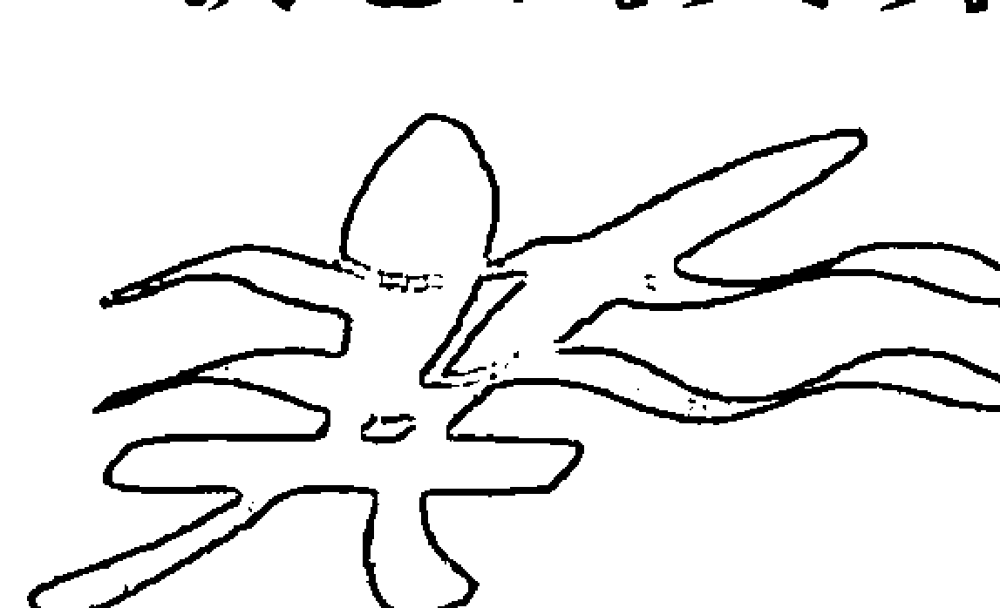

### 2月16日～2月22日

水瓶双鱼座象征人生中77岁左右的年纪，也好比北半球千里冰封的严冬之末。不过，这个时期白昼渐长，而且冬天很快就会过去，春天已经不远了。

以人类的生命来看，77岁已经离生命周期的结束不算太远了，这时候的老人们大多已经将生命看透彻了，跟朋友和爱人也再无任何隔阂，此时最重要的是卸下余下的武装，表达真实的情感。生命至此大概已经不会再开启新的计划，不过，对富有哲思的老人来讲，生命的终结也算是一生中最为终极的体验。水瓶双鱼座的中心意象是“敏感”，在这里，水瓶座富有创意和多才多艺的特质与双鱼座如水般梦幻和纤细敏感的特质融为一体。

水瓶双鱼座通常将事业放在人生的第一位。他们争强好胜，这一方面可能是他们内心的不安全感在作怪，另一方面是因为他们迫切想要证明自己。他们总是气势汹汹的，对待他人很强势，受到攻击会马上开战。因此，他们面临的最大挑战就是重新了解和认同自己的内心，卸下些许对他人的防备。水瓶双鱼座虽然外表刚毅甚至有点儿侵略性，但他们的内心也有柔弱的一面。他们年幼时一般都非常脆弱，每每受到批评或中伤，他们就会将自己包裹得更深。他们带着着层层包裹慢慢长大成人，包裹里面的他们可能跟他们表现出来的模样大相径庭。

| 黄道带位置： | 水瓶宫26°～双鱼宫4° |
| :--- | :--- |
| 季节： | 冬末 |
| 元素： | 风/水 |
| 主宰星： | 天王星/海王星 |
| 标志物： | 倒水侍者/鱼 |
| 认知方式： | 思考/感受 |

水瓶座是最博大的星座，双鱼座却是最重视隐私的星座，因此这一周出生的人会表现出两个极端也就不足为奇了。他们要么是最奔放的理想主义者，要么是最内敛和深沉的人，而且很多水瓶双鱼座会在两个极端之间游移。比如说，工作中的他们会去处理抽象的问题，或者尝试超越客观现实的限制，而在个人生活中，他们又致力于研究人类的感情世界。

对水瓶双鱼座来讲，协调个性中的两个极端固然重要，但更重要的是努力开辟一个中间地带，使自己不要“宇宙化”，也不要“私人化”，而是“社会化”一点。因为，只关注博大抽象的话题或私密自我的问题，会使自己忽略人与人之间的互动，即忽略社会层面的问题。

水瓶双鱼座与家人的关系通常非常亲密。虽然童年时父母不赞同或批评的态度曾让他们受到伤害，但他们与父母之间仍然会有深厚的感情。一般来讲，水瓶双鱼座的男孩同母亲感情很深，女孩则同父亲感情很深。成年以后，如果想要达到真正意义上的独立和成熟，就会停止对父母的感情依赖，这对大多数人来讲是天经地义的事，但对水瓶双鱼座就不一定了。由于他们的青春期充满艰辛，

## 水瓶双鱼座

父母对他们有很大帮助，因此这时水瓶双鱼座很难摆脱对父母的依赖。而如果这时没有摆脱依赖心理的话，他们在以后的日子里就需要不断为此努力，甚至到父母或其他能够让他们依赖的人逝世后，这种依赖心理仍然不会消失。

在职场中那样充满勇气，不要害怕遭到拒绝，勇敢地站出来，有力地表达自己的情感。

友谊是带领水瓶双鱼座通往外界的重要途径，朋友会带领他们参加学校、俱乐部和社交团体的活动以及慈善活动等。朋友对水瓶双鱼座而言可不是简单的同伴而已——他们是其生活中的重要人物，对提升水瓶双鱼座的生活质量有很大帮助。另外，水瓶双鱼座如果能与同事、熟人以及远亲多联系，也会受益颇多。通过培养人际交往的技巧，他们能够完善自己的性格，减少被孤立和误解的感觉。通过亲眼见证其他人的悲欢离合，水瓶双鱼座最终会意识到自己所经历的痛苦并不是唯一的，很多人也有同样的经历，这有助于他们获得迫切需要的自我认同感。

水瓶双鱼座在与人交往时，尤其是在爱情中，应该学会敞开胸怀，以坦诚和包容的态度对待对方，而且不妨允许自己柔软脆弱一点儿，即使这可能意味着受到伤害。只有这样，他们才能通过人际间的交往回归自我。他们在工作中可能表现得坚强有力、野心勃勃，但对待人际交往中非常被动。此外，他们在爱情中倾向于既表现出男性的一面，也表现出女性的一面，比如男性的水瓶双鱼座会比较敏感，而女性的水瓶双鱼座比较强势。正因为如此，他们倾向于寻找与自己个性相反的异性做伴侣，比如多愁善感的水瓶双鱼座男性会娶一个气势强悍的女性。

| 优势 | 劣势 |
| --- | --- |
| 进取心强 细心 有爱心 | 缺乏安全感 悲观 孤僻 |

在人际交往中，水瓶双鱼座非常害怕遭到拒绝，他们既想让别人喜欢自己，又担心受到伤害，也不愿为了满足别人而委屈自己。有些水瓶双鱼座会表现得消极厌世，以此来避免和别人进行互动，也有一些人会表现得亲切随和、讨人喜欢，但这只是他们为了避免和他人进行深层接触而戴上的面具。因此，他们必须面对的一个挑战是：要像在职场中那样充满勇气，不要害怕遭到拒绝，勇敢地站出来，有力地表达自己的情感。

建立家庭、养育子女或在有家庭氛围的环境中生活对水瓶双鱼座来讲是有积极作用的体验。不过，由于他们有独处的需求，而且很难应对密切的人际关系，因此维持这样的生活对他们来说绝非易事。然而，他们天性中有保护和照顾他人的冲动，需要在生活中的某个领域释放这种冲动。如果不能通过组建家庭实现，也许可以通过饲养宠物或实施工作计划等方式来实现。对水瓶双鱼座来说，表达关爱和体谅与表达爱情和激情一样重要。

### 忠告

不要对世界失望，不要退缩，必要时拆除内心的高墙，重新了解真实感性的自我。学着信任别人，这样可以终止你的恐惧。有时不妨中庸一点儿，但也别放弃对深度和高度的追求。

### 水瓶双鱼座名人

弗里德里克·肖邦是最受世人敬爱的钢琴作曲家之一。他出生于华沙，父亲是法国人，母亲是波兰人。他8岁时就创作了钢琴练习曲、夜曲和协奏曲，令人惊叹不已。肖邦个性敏感，从他的音乐作品和人生经历中都可以看出水瓶双鱼座的种种特质。他后来移居巴黎并在那里遇到小说家乔治·桑，随后双双陷入爱河。爱情中的肖邦表现出水瓶双鱼座特有的男性和女性的混合特质，而且还有一些被动。肖邦是钢琴教师，只开过为数不多的公开音乐会。他比较喜欢在私人沙龙中演奏，有时会与作曲家兼钢琴家弗朗兹·李斯特合作。

在巨星云集的美国职业篮球联赛赛场上，后卫迈克尔·乔丹能被誉为历史上最伟大的篮球运动员，其影响力可见一斑。乔丹自信的外表下隐藏着细腻的内心，这是许多水瓶双鱼座的特点。父亲的意外死亡让乔丹受到很大的打击，也让公众看到他感性的内心。乔丹具有势不可当的气势，他的成就也无人能及：8次入选最佳阵容和成为得分王，10次入选全明星阵容、4次获得最有价值球员称号。他还是历史上平均得分最高的球员，每场比赛平均分高达35分。每次接受电视采访时，乔丹的着装都堪称完美，并且表现出强大、沉稳内敛和善于表达的特质。

小说家兼大学教授托妮·莫里森具有强烈的进取心，在童年时与家人的感情非常深厚，这些都是水瓶双鱼座的特质。莫里森的作品有《最蓝的眼睛》、《秀拉》、《所罗门之歌》、《柏油孩子》、《宝贝儿》和《爵士乐》等，获得过普利策奖，并且是第一位获得诺贝尔文学奖的非裔美国人。莫里森的执教生涯同样辉煌：她最初在南得克萨斯大学和哈佛大学教书，最近身兼哈佛大学和耶鲁大学教师之职，同时也是普林斯顿大学人文学院的教授。莫里森在出版业也有自己的一片天地，是兰登书屋的资深编辑。

其他水瓶双鱼座名人：谭恩美、安塞尔·亚当斯、西德尼·波蒂埃、查尔斯·巴克利、玛葛·海明威、约翰·特拉沃尔塔、伊万娜·特朗普、马特·狄龙、米洛斯·福尔曼、斯碧尔·谢波德、格洛丽亚·范德比尔特、朱丽叶斯·欧文、海伦·格蕾·布朗、约翰·麦肯罗、朱列塔·马希纳、爱德华·肯尼迪、小野洋子、阿内丝·尼恩、山姆·佩金法、芭芭拉·乔丹、桑尼·博诺、埃德加·伯根、约翰·施莱辛格、玛丽安·安德森。

## 水瓶双鱼座人际关系指南

### 最佳组合

情侣
双鱼白羊座、金牛座三、巨蟹座一、狮子座二、处女座三、天秤座二、天秤座三、摩羯座一、摩羯座三、双鱼座三

夫妻
巨蟹座二、巨蟹狮子座、狮子座一、处女天秤座、天蝎座三、射手座二、水瓶座二、双鱼座一

朋友
白羊座一、白羊金牛座、双子座一、双子巨蟹座、狮子座三、天秤天蝎座、射手摩羯座、摩羯座二、水瓶双鱼座、双鱼座二

家人
白羊座二、金牛座二、双子座三、巨蟹座三、摩羯水瓶座、水瓶座三

工作
白羊座三、金牛座一、双子座二、狮子处女座、天秤座一、天蝎座一

| 星座 | 日期范围 | 主题 | 页码 |
|---|---|---|---|
| 双鱼白羊座 | 3月19日~3月24日 | 隐蔽的避风港 | 236 |
| 白羊座一 | 3月25日~4月2日 | 卸下盔甲 | 259 |
| 白羊座二 | 4月3日~4月10日 | 美好的家庭生活 | 282 |
| 白羊座三 | 4月11日~4月18日 | 重生 | 305 |
| 白羊金牛座 | 4月19日~4月24日 | 教养活动 | 327 |
| 金牛座一 | 4月25日~5月2日 | 无情的完美之神 | 348 |
| 金牛座二 | 5月3日~5月10日 | 重现童年 | 369 |
| 金牛座三 | 5月11日~5月18日 | 减轻不安全感 | 390 |
| 金牛双子座 | 5月19日~5月24日 | 分享关注 | 410 |
| 双子座一 | 5月25日~6月2日 | 夸张、冲动 | 429 |
| 双子座二 | 6月3日~6月10日 | 开天辟地 | 448 |
| 双子座三 | 6月11日~6月18日 | 风格和内涵 | 467 |
| 双子巨蟹座 | 6月19日~6月24日 | 完成工作 | 485 |
| 巨蟹座一 | 6月25日~7月2日 | 特殊的机会 | 502 |
| 巨蟹座二 | 7月3日~7月10日 | 奇迹的显现 | 519 |
| 巨蟹座三 | 7月11日~7月18日 | 错综复杂 | 536 |
| 巨蟹狮子座 | 7月19日~7月25日 | 生活经验 | 552 |
| 狮子座一 | 7月26日~8月2日 | 可感知的吸引力 | 567 |
| 狮子座二 | 8月3日~8月10日 | 轻松自如的坦诚 | 582 |
| 狮子座三 | 8月11日~8月18日 | 突破防卫 | 597 |
| 狮子处女座 | 8月19日~8月25日 | 抵制入侵 | 611 |
| 处女座一 | 8月26日~9月2日 | 为思想自由而战 | 624 |
| 处女座二 | 9月3日~9月10日 | 独立与教导 | 637 |
| 处女座三 | 9月11日~9月18日 | 惊世骇俗 | 650 |
| 处女天秤座 | 9月19日~9月24日 | 独到的理念 | 662 |
| 天秤座一 | 9月25日~10月2日 | 冒险的前奏 | 673 |
| 天秤座二 | 10月3日~10月10日 | 胸怀大志 | 684 |
| 天秤座三 | 10月11日~10月18日 | 超越时空 | 695 |
| 天秤天蝎座 | 10月19日~10月25日 | 如鱼得水 | 705 |
| 天蝎座一 | 10月26日~11月2日 | 值得信赖的镜子 | 714 |
| 天蝎座二 | 11月3日~11月11日 | 严肃的道德问题 | 723 |
| 天蝎座三 | 11月12日~11月18日 | 心理投射的工具 | 732 |
| 天蝎射手座 | 11月19日~11月24日 | 紧张还是放松? | 740 |
| 射手座一 | 11月25日~12月2日 | 互相模仿 | 747 |
| 射手座二 | 12月3日~12月10日 | 合理使用精力 | 754 |
| 射手座三 | 12月11日~12月18日 | 自动消失 | 761 |
| 射手摩羯座 | 12月19日~12月25日 | 当夜幕降临 | 767 |
| 摩羯座一 | 12月26日~1月2日 | 学习经验的学校 | 772 |
| 摩羯座二 | 1月3日~1月9日 | 洗涤心灵 | 777 |
| 摩羯座三 | 1月10日~1月16日 | 内在的力量 | 782 |
| 摩羯水瓶座 | 1月17日~1月22日 | 童话世界 | 786 |
| 水瓶座一 | 1月23日~1月30日 | 置身事外 | 789 |
| 水瓶座二 | 1月31日~2月7日 | 自我接纳 | 792 |
| 水瓶座三 | 2月8日~2月15日 | 保持热情 | 795 |
| 水瓶双鱼座 | 2月16日~2月22日 | 角色转换 | 797 |
| 双鱼座一 | 2月23日~3月2日 | 冷静精明 | 797 |
| 双鱼座二 | 3月3日~3月10日 | 生存本能 | 798 |
| 双鱼座三 | 3月11日~3月18日 | 走向内心世界 | 798 |

## 双鱼座一

### 心灵的一周

2月23日～3月2日

双鱼座一的中心意象是“心灵”。在生命大循环中，它好比人年近80岁的年纪。在这人生的黄昏时段，许多人考虑的是较高层次的价值观与精神目标。对一些人来说，宗教发挥着重要的作用；对其他人来说，代表他们最高理想的事业非常重要。许多这个年纪的老人意识到自己已经活得比一般人长了，因此有了前所未有的感觉——生命是如此珍贵。对他们来说，每年、每月、每周甚至每天都是上天赠予的特别礼物。但有一些人也许认为活着是一种负担，渴望自己的精神能早日脱离肉体的束缚。

双鱼座一的一周象征着年长者全身心地拥抱当下，无论心中是喜还是悲；同时他们也会停下来，以前所未有的深度审视过去、考虑未来。对生命的意义有更深的领悟、为更伟大的事业而牺牲、相信来世或轮回，甚至仍对生命怀有热情、希望永葆青春，这些都是这个时期可能有的心态。

在“心灵的一周”出生的人很珍视生活中非物质的方面。这并不是说他们轻视金钱与商业，或者缺乏这些领域所需的能力。只不过，无论是致力于艺术、金融、宗教还是管理事业，双鱼座一通常都会专心致志地工作，并把他们的工作提升到理想主义的高度。他们不是没有强烈的本能需要或不喜欢世俗的欢乐，只不过他们本性的核心是精神需求与肉体需求的融合。许多双鱼座一并不觉得满足精神需求就一定要禁欲或者与外界断绝联系。相反，他们会从身边的一切事物中寻求精神上的满足，因此很少觉得需要拒绝世俗的诱惑。

双鱼座一也具有精神饱满的特质，总是充满活力，很会逗人开心。他们朝气蓬勃的言行使人看不出他们的真实年纪。这一周出生的人通常也努力保持身体健康或从事与健康相关的工作。对他们来说，健康的生活非常重要，保持健康不仅是为了延年益寿，也是为了享受优质的俗世生活。在“心灵的一周”出生的人还有一个特点，那就是渴望做好事，渴望在退休或离开人世前使自己周围的环境甚至整个世界都能变得更好一点儿。因此，这些重感情、有爱心的人看到环境出现问题或发生灾难时，会非常难受。

双鱼座一有牺牲自我与服务他人的一面，因此常常放弃自己的需要，致力于满足他人的快乐与利益需要。由于他们的这一特质，比较自私的人会轻而易举地把他们当作靶子或猎物，利用他们有求必应的性格，榨取他们的爱心、劳力和钱财。于是，双鱼座一常常一方面慷慨地答应他人的要求，一方面又懊悔或怨恨自己许下了承诺，而这会导致他们陷入争执和感情危机。事实上，这一周出生的人的特点之一就是向他人发送混合的信号。

| 黄道带位置： | 双鱼宫3°~双鱼宫12° |
| :--- | :--- |
| 季节： | 冬末 |
| 元素： | 水 |
| 主宰星： | 海王星 |
| 标志物： | 鱼 |
| 认知方式： | 感受 |

双鱼座一经常因为他人无法达到他们为友谊定下的高标准而感到受伤。实际上，他们对朋友的期待过高，才使自己感到不快。他们的感情极其丰富，常常连自己也难以控制，所以遇到比较超然和客观的人时，他们就很容易与之产生纠纷。这一周出生的人性格坦率、心直口快，不太擅长掩饰情绪，特别是失望时。在每次恋爱时，无论下了多大决心，他们最终都会忘了自我保护，甚至由于在爱情中过于投入而丧失自我。

能力。可惜他们与人分享的尝试并不总能成功，而这也会成为他们一生中不断遭遇挫折的根源。他们谈恋爱时常常显得情绪不稳定，因此可能经常更换恋人。事实上，他们寻觅的是自己的理想伴侣，若找到了，他们就会毫不犹豫地与之建立长久的恋爱关系。

“心灵”

双鱼座一富有爱心、善解人意，但他们潜意识里也许觉得自己高人一等。这种无意识的心态可能使他们难以与他人建立比较深入的关系，导致他们对人生的认识有点儿肤浅，甚至变得消极厌世，对世间的一切都觉得不满而刻薄地出言讥讽。一些双鱼座一则自认为无所不知，使他人难以与之相处并产生不满情绪，最终造成人际关系的破裂。通过承认错误，尤其是敞开心扉接受别人的建议与批评，喜欢思考的双鱼座才能在追寻生命意义的过程中上升到更高的人生境界。

双鱼座一对待恋人或配偶最大的问题之一就是在感情上退缩，不过他们还是忠于对方、乐于付出的。反过来，他们对伴侣提出的要求也许令人感到窒息，因为他们一向很挑剔。无论多么坚决地宣告自己追求的是相互独立的“开放式”婚姻或恋爱关系，他们还是有可能相当不切实际，意识不到自己天性中强烈的占有欲和嫉妒心。

| 优势 | |
|---|---|
| 重视精神需要 | 感性 坦率 |
| 劣势 | |
| 情绪化 | 缺乏责任感 具有毁灭性 |

双鱼座一与其总是生活在一个充满期望、思想和信念的虚幻世界中，倒不如承担简单的日常工作和家庭琐事，这样他们会表现得更好，因为这些事务会让他们扎根于现实世界。如果身边的伴侣和朋友能坚决要求他们承担固定的责任，甚至从事平凡、重复性强和很难加以理想化的工作，双方的关系就会更为稳定。如果双鱼座一的伴侣和朋友做不到这些或者不愿意依赖他们，而替他们做了本应是他们分内的事，那么就会助长他们的坏习惯，比如双鱼座一饭后常常忘了收拾、清洗餐具就走出了厨房。

双鱼座一有一种不可或缺的需求，就是与家人和朋友深入地分享快乐，因为他们的性格中通常没有独自享受生活乐趣的

### 忠告

有时你需要更加积极进取。处理日常事务，重视自己与他人需要。不要因为自己的优越感而与他人疏远。在追求更高思想境界的过程中，也要承担日常工作。

## 双鱼座名人

在出生于“心灵的一周”的人中，电影明星伊丽莎白·泰勒是典型代表。她追寻理想爱人的过程可谓一波三折，也难以保护自己不受感情的伤害。事实上，泰勒有过8次婚姻，曾两度嫁给演员理查德·伯顿，并凭借与其主演的电影《灵欲春宵》获得奥斯卡最佳女主角奖。就像许多双鱼座一，泰勒也喜欢把高尚的精神追求与强烈的物质追求混合在一起，这种特质在银幕内外都表现得很明显。她与酒瘾和药瘾抗争的事迹展现了双鱼座一的典型性格，这个事迹也被广为宣传。

1958年，15岁的乔治·哈里森加入了朋友保罗·麦卡特尼的乐队，也就是后来的“披头士”乐队，成为乐队的主音吉他手和主唱之一。出生于“心灵的一周”的哈里森在许多方面都是典型的双鱼座一，比如重视生活中非物质的方面，会以非常投入的姿态对待自己的工作，并把自己的活动上升到理想的高度。由于信仰印度神学，哈里森不仅跟随心灵导师修炼，还跟随拉维·香卡学习印度音乐。他的学习也开阔了乐队成员的视野，使“披头士”乐队的音乐更加多元化。乐队解散后，哈里森的事业依然在继续，在音乐和商业上都取得了非凡的成就。

科学家莱纳斯·鲍林体现了出生于“心灵的一周”的人的许多特点。他曾两度获得诺贝尔奖（化学奖和和平奖），一生致力于为他人带来健康与快乐。他是维生素C应用方面的权威，极力主张大多数人需服用特大剂量的维生素C，每天的服用量通常都要达到几克。对于服用特大剂量维生素C会产生副作用的报道，鲍林都会进行反驳。他声称这样做具有积极作用，可以帮助病人与多种疾病做斗争并抵抗疾病的入侵，尤其能预防普通感冒。在加利福尼亚州的帕洛阿尔托，他创立了莱纳斯·鲍林科学与医学院。年近90岁时，他依然非常积极活跃（而且备受争议），他把这归功于健康的生活方式。

其他双鱼座名人：文森特·明内利、安德尔·戴维斯、恩里科·卡鲁索、汤姆·沃尔夫、约翰·欧文、彼得·方达、卢·里德、戴维·沙诺夫、贝尔纳黛特·彼得斯、乔安妮·伍德沃德、拉尔夫·耐德、约翰·斯坦贝克、劳伦斯·达雷尔、哈里·贝拉方特、黛娜·肖尔、戴克斯特·戈登、费兹·多明诺、杰基·格雷森、卡基米尔·马列维奇、乔治·弗雷德里希·汉德尔、W.E.B.杜波瓦、詹姆士·范伦铁诺。

## 双鱼座人际关系指南

### 最佳组合

情侣
双子座三、处女座一、天秤天蝎座、射手座二、水瓶座一、水瓶座三、双鱼座二

夫妻
双子座一、双子巨蟹座、巨蟹座一、狮子座二、摩羯座二、摩羯座三、水瓶双鱼座

朋友
白羊座一、白羊金牛座、金牛座二、双子座二、巨蟹座二、巨蟹座三、狮子座一、狮子处女座、处女座二、处女天秤座、天秤座一、天蝎座一、天蝎射手座、摩羯水瓶座

家人
金牛座一、处女座三、射手座三、摩羯座一、水瓶座二

工作
白羊座二、金牛座三、狮子座三、天秤座二、天蝎座二、射手座一、双鱼座一、双鱼座三

| 星座 | 日期 | 主题 | 页码 |
|---|---|---|---|
| 双鱼白羊座 | 3月19日~3月24日 | 爱的圣坛 | 236 |
| 白羊座一 | 3月25日~4月2日 | 想象的世界 | 260 |
| 白羊座二 | 4月3日~4月10日 | 唤醒潜在特质 | 283 |
| 白羊座三 | 4月11日~4月18日 | 更高的理想 | 305 |
| 白羊金牛座 | 4月19日~4月24日 | 共鸣箱 | 327 |
| 金牛座一 | 4月25日~5月2日 | 天真自然 | 349 |
| 金牛座二 | 5月3日~5月10日 | 频繁的社交活动 | 370 |
| 金牛座三 | 5月11日~5月18日 | 检验成熟程度 | 390 |
| 金牛双子座 | 5月19日~5月24日 | 思想交流 | 410 |
| 双子座一 | 5月25日~6月2日 | 个人挑战 | 430 |
| 双子座二 | 6月3日~6月10日 | 被刺破的气球 | 449 |
| 双子座三 | 6月11日~6月18日 | 沉思冥想 | 467 |
| 双子巨蟹座 | 6月19日~6月24日 | 过度保护 | 485 |
| 巨蟹座一 | 6月25日~7月2日 | 坚持到底 | 503 |
| 巨蟹座二 | 7月3日~7月10日 | 忠于信仰 | 520 |
| 巨蟹座三 | 7月11日~7月18日 | 分享的信息 | 536 |
| 巨蟹狮子座 | 7月19日~7月25日 | 无形的障碍 | 552 |
| 狮子座一 | 7月26日~8月2日 | 做真实的自己 | 568 |
| 狮子座二 | 8月3日~8月10日 | 无法言表的快乐 | 583 |
| 狮子座三 | 8月11日~8月18日 | 过于开放 | 597 |
| 狮子处女座 | 8月19日~8月25日 | 行动自由 | 611 |
| 处女座一 | 8月26日~9月2日 | 不受组织的限制 | 625 |
| 处女座二 | 9月3日~9月10日 | 规划未来 | 638 |
| 处女座三 | 9月11日~9月18日 | 截然不同 | 650 |
| 处女天秤座 | 9月19日~9月24日 | 调和物质与精神 | 662 |
| 天秤座一 | 9月25日~10月2日 | 深远的思想 | 674 |
| 天秤座二 | 10月3日~10月10日 | 最佳时刻 | 685 |
| 天秤座三 | 10月11日~10月18日 | 内在的智慧 | 695 |
| 天秤天蝎座 | 10月19日~10月25日 | 互相欣赏 | 705 |
| 天蝎座一 | 10月26日~11月2日 | 基本准则 | 715 |
| 天蝎座二 | 11月3日~11月11日 | 天堂还是地狱? | 724 |
| 天蝎座三 | 11月12日~11月18日 | 敏感的内核 | 732 |
| 天蝎射手座 | 11月19日~11月24日 | 值得交往的人 | 740 |
| 射手座一 | 11月25日~12月2日 | 个人的责任 | 748 |
| 射手座二 | 12月3日~12月10日 | 变化的频率 | 755 |
| 射手座三 | 12月11日~12月18日 | 务实的理想主义 | 761 |
| 射手摩羯座 | 12月19日~12月25日 | 我行我素 | 767 |
| 摩羯座一 | 12月26日~1月2日 | 哲学问题 | 773 |
| 摩羯座二 | 1月3日~1月9日 | 泰然自若 | 778 |
| 摩羯座三 | 1月10日~1月16日 | 坚定的信念 | 782 |
| 摩羯水瓶座 | 1月17日~1月22日 | 合适的节奏 | 786 |
| 水瓶座一 | 1月23日~1月30日 | 精神化的思考 | 790 |
| 水瓶座二 | 1月31日~2月7日 | 适当的行为 | 793 |
| 水瓶座三 | 2月8日~2月15日 | 变得愚蠢 | 795 |
| 水瓶双鱼座 | 2月16日~2月22日 | 冷静精明 | 797 |
| 双鱼座一 | 2月23日~3月2日 | 宣告完结 | 799 |
| 双鱼座二 | 3月3日~3月10日 | 解开谜团 | 799 |
| 双鱼座三 | 3月11日~3月18日 | 抽身而退 | 800 |

## 双鱼座二

### 独行侠的一周

3月3日～3月10日

双鱼座二的中心意象是“独行侠”。在生命大循环中，它好比人生中给人庄严之感的80岁。这个年纪的人感觉自己与自然的本质合而为一，却可能与人类世界距离越来越远。许多朋友（或许还有终身伴侣）都已与世长辞，留下八旬老人孤独地生活，这对他们的心理和生理而言都可能是一个极其艰难的挑战，因此他们很难保持积极的生活态度。一些人渴望能安安稳稳地走到人生的尽头，还有些人也许因为最终能够免于承担世俗的责任而乐在其中，于是体验到一种全新的自由感。

双鱼座二的一周象征着年迈的人转向对内心世界的探寻，并在相对与世隔绝的情况下单纯地追求内心目标的实现。创造性地思考、富有想象力、考虑死后的善恶报应和对事物本质有更高层次的审美眼光，这些都是这个阶段的特点。

双鱼座二总是生活在自己的个人世界中，这个个人世界不仅指他们的内心世界，也指他们的居家环境，因为他们的家通常远离喧嚣，几乎不允许别人来访。心态较为健康的双鱼座二会给予他们的事业、社会交往以及个人生活同等的重视；而心态不太好的双鱼座二也许选择过度地孤立自己。

双鱼座二通常本能地厌恶肤浅的事物。他们不信任大吵大嚷、咄咄逼人又爱出风头的人，而且觉得难以和不够敏感的同事一起工作，这并不是说那些同事不够努力或没有抱负。对他们来说，做事的方式常常比那件事本身更重要，因此他们不会为了达到目的而不择手段。优雅、诚实以及无懈可击的审美观和道德观都使他们不会做出阴险的事，特别是不会做出伤害他人的事。话说回来，双鱼座二有可能通过公开的反社会行为和表现来表达他们对社会习俗的厌恶，可表面看起来却是在维护他们自己表达个人意见的权利。他们做事时通常表现得很优雅，而且很擅长用肢体语言表达，比如运动、舞蹈和其他更能刺激感官的活动形式。这一周出生的人非常崇尚美，尤其是人体和绘画的美，因而他们的家与周围环境通常都会表现出某种特殊的格调。

双鱼座二的情感极为丰富，这从他们对音乐的热爱以及对他人所遭受的各种苦难的同情就可以看出来。他们通常相信人生不只是为了享乐，人必须经历某种磨难，而且只有承受了一定的苦难之后，才能获得真正的回报。这一周出生的人通常一生中最少会遭受一次严重的精神创伤，也许是身体上的伤痛和疾病，也许是父母或朋友的早逝。他们通常会遭到此类突如其来的灾难袭击，但他们会迅速恢复活力，依靠自己强大的能力从灾难中恢复过来。猫有九条命，他们就像猫一样有着顽强的生命力，而这种生命力在危难时肯定能派上用场。

双鱼座二认为孤独寂寞（他们很少如此）与独自一人（他们常常如此）之间有明显的区别。他们就是自己最好的伙伴，可以花几个小时甚至几天时间独自阅读一本好书或者做自己的工作而不需要与任何人交谈。他们的朋友知道他们何时想独自待着，何时又想与人为伴，也会学着不去侵犯他们的私人空间。在工作领域，他们适合做自由职业者或在办公室以外的地方工作；若受雇于公司或企业，他们很可能每天都需要一定的时间来独自工作。

双鱼座二的性格中存在着一种危险，即很容易上瘾——无论是对毒品、酒精还是性爱。不过从另一方面来看，这些东西带来的极度狂喜、精神上的洞察力以及情感上的快乐可能极为强烈并且对他们有益。双鱼座二通常渴望获得巅峰体验，这种体验对他们来说并不是坏事，只要他们在寻求的过程中能够控制好自己，不要过于执著。假如有了这样的体验后，双鱼座二仍然可以自由地前进，那他们的个人发展就会变得丰富多彩。不过，如果他们非常不幸地沉溺于个人苦难或自我怜悯，他们有可能在这样的状态中长期沉沦、无法自拔。

一般而言，双鱼座二对他人只有一个要求，那就是让他人接受他们的真实面目。他人通常无法满足他们的这个愿望，因此他们只得忍受苦难。为了安慰自己，使自己远离失望的情绪并免遭拒绝，他们可能屈服于对金钱的追求或退缩到充满幻想的内心世界，专注于对美和想象的追寻。只要有可能，双鱼座二就应该从事对他们提出坚决和基础性的要求，但不会使他们丧失创造力的工作。这种工作能让他们过上稳定的生活。

在“独行侠的一周”出生的人通常没有很多朋友，但他们的朋友往往都是亲密而忠诚的。许多双鱼座二都不喜欢大家庭的聚会或社交活动；他们很喜欢分享亲密的关系，喜欢与他人亲近，包括配偶、恋人、朋友和重要的家人，这可能是他们最珍爱的活动了。他们的长处是与他人进行深入的互动，并且只有与他人分享喜悦、分担忧愁，他们才能获得快乐。

在爱情中，或许是因为出生于这一周的人比其他人更会享受和领会这方面的快乐，或许是因为他们难以抗拒肉体享受的诱惑，因此他们比其他人更容易沉迷于漂亮的脸蛋、迷人的嗓音和性感的身材。一旦爱上一个人，他们对所爱之人的迷恋可能甚于他们对有形物质的依赖。他们会尝到从嫉妒到仇恨等各种痛苦的情绪，然而，他们一旦决定离开所爱之人，就会因分手而产生强烈的焦虑情绪。这时，性格实际的朋友与伴侣往往能让他们回到现实世界。与此同时，孩子也会与他们分享对自然界的惊叹和敬畏之情。

| 黄道带位置： | 双鱼宫11°～双鱼宫21° |
| :--- | :--- |
| 季节： | 冬末 |
| 元素： | 水 |
| 主宰星： | 海王星 |
| 标志物： | 鱼 |
| 认知方式： | 感受 |

| 优势 |
| --- |
| 情感丰富 与人亲密 优雅得体 |
| 劣势 |
| --- |
| 离群索居 容易失望 忍受痛苦 |

### 忠告

保持现实的世界观。抵挡各种逃避现实的诱惑。不要与世隔绝。继续努力，争取得到他人的信任与接纳，也要维护自己的利益。你承受的痛苦并非独一无二的，也并非无法避免的。

### 双鱼座二名人

在美国，塔玛拉·卡莎维娜的名字没有巴甫洛娃与尼金斯基那么广为人知，但这三人无疑都是同时代俄国芭蕾舞演员中的领军人物。她是非常喜欢独处的双鱼座二，总是生活在自己的世界中。她是尼金斯基的舞伴，在古典舞技巧上与他不相上下，但尼金斯基在28岁时患精神分裂症住进了医院，她便失去了这个舞伴。她是在巴黎的俄罗斯芭蕾舞团的首席女舞者，还是伦敦英国皇家舞蹈学院的创始人之一。而且众所周知的是，她虽然性格古怪，却是心地善良和通情达理的教师。

意大利电影女演员安娜·马格纳尼具有双鱼座二情感丰富、注重内心的特点。最早使她获得国际赞誉的作品，是罗伯托·罗塞利尼的新现实主义电影《罗马，不设防的城市》。虽然马格纳尼主要出演意大利电影，但凭借与毕·兰卡斯特合演的电影《玫瑰文身》，她于1955年为美国公众所熟知，并荣获奥斯卡最佳女主角奖。她最擅长演绎较为严肃和母亲的角色，以深厚的情感给观众留下了深刻的印象。这正是出生于“独行侠的一周”的人的特点。

虽然在与鲍里斯·斯帕斯基的历史性比赛后，鲍比·菲舍尔崭露头角并成为美国首位国际象棋世界冠军，他却以真正的双鱼座二的方式隐居了起来。自从1991年在黑山共和国再次与斯帕斯基正面较量后，他就只在一次重要的国际象棋比赛中公开露面。所以他是一个不折不扣的“独行侠”。菲舍尔不仅是一位极其好斗的棋手，而且非常狡黠，尽其所能地运用心理战术来对抗斯帕斯基，使其逐渐丧失自信心。若说菲舍尔在前两局比赛中故意输给斯帕斯基，似乎有点儿匪夷所思。但事实上，他极有可能是故意让自己处于0：2的劣势，从而使对手得意忘形，忽视他随后展开的极具攻击性的反击。

其他双鱼座二名人：加夫列尔·加西亚·马尔克斯、米开朗基罗、亚历山大·格雷厄姆·贝尔、杰基·乔伊纳·克西、艾丹·奎因、彼埃·蒙德里安、赛德·查里斯、欧纳特·柯曼、劳尔·朱力亚、林恩·李德格莱芙、弗兰科·哈里斯、林恩·斯旺、米奇·斯皮兰、哈莉特·塔布曼、戴维·拉伯、罗莎·卢森堡、奥利佛·温德尔·霍姆斯、西拉诺·德·贝热拉克。

## 双鱼座二人际关系指南

- **最佳组合**
  - 情侣：金牛座三、双子座二、巨蟹座一、巨蟹座二、处女座一、天蝎座一、双鱼座一、双鱼座二
  - 夫妻：白羊座二、金牛座二、巨蟹狮子座、狮子处女座、处女座二、天蝎座二、天蝎射手座、射手座二
  - 朋友：白羊座三、金牛座一、金牛双子座、巨蟹座三、狮子座二、天秤座一、天秤座三、射手座三、射手摩羯座、摩羯座二、水瓶座二、水瓶座三、水瓶双鱼座
  - 家人：双子座三、处女座三、射手座一、摩羯水瓶座
  - 工作：白羊座一、双子座一、狮子座一、天秤天蝎座、天蝎座三、摩羯座三、水瓶座一

| 星座 | 日期 | 主题 | 页码 |
|---|---|---|---|
| 双鱼白羊座 | 3月19日~3月24日 | 游戏般的竞争 | 237 |
| 白羊座一 | 3月25日~4月2日 | 有形的美 | 260 |
| 白羊座二 | 4月3日~4月10日 | 爱美之心 | 283 |
| 白羊座三 | 4月11日~4月18日 | 与世界保持联系 | 306 |
| 白羊金牛座 | 4月19日~4月24日 | 吵吵闹闹 | 328 |
| 金牛座一 | 4月25日~5月2日 | 密切的社交互动 | 349 |
| 金牛座二 | 5月3日~5月10日 | 完全胜任 | 370 |
| 金牛座三 | 5月11日~5月18日 | 炫耀 | 391 |
| 金牛双子座 | 5月19日~5月24日 | 处女地 | 411 |
| 双子座一 | 5月25日~6月2日 | 感性与理性 | 430 |
| 双子座二 | 6月3日~6月10日 | 深厚的内在联系 | 449 |
| 双子座三 | 6月11日~6月18日 | 巅峰体验 | 468 |
| 双子巨蟹座 | 6月19日~6月24日 | 布置装潢 | 486 |
| 巨蟹座一 | 6月25日~7月2日 | 个人投入 | 503 |
| 巨蟹座二 | 7月3日~7月10日 | 掘金 | 520 |
| 巨蟹座三 | 7月11日~7月18日 | 独立的依赖 | 537 |
| 巨蟹狮子座 | 7月19日~7月25日 | 弥补缺点 | 553 |
| 狮子座一 | 7月26日~8月2日 | 吸引和排斥 | 568 |
| 狮子座二 | 8月3日~8月10日 | 迷宫的出口 | 583 |
| 狮子座三 | 8月11日~8月18日 | 喘息的空间 | 598 |
| 狮子处女座 | 8月19日~8月25日 | 表明立场 | 612 |
| 处女座一 | 8月26日~9月2日 | 追求与众不同 | 625 |
| 处女座二 | 9月3日~9月10日 | 保持客观 | 638 |
| 处女座三 | 9月11日~9月18日 | 有计划的冒险 | 651 |
| 处女天秤座 | 9月19日~9月24日 | 曲高和寡 | 663 |
| 天秤座一 | 9月25日~10月2日 | 喜剧的魅力 | 674 |
| 天秤座二 | 10月3日~10月10日 | 放眼未来 | 685 |
| 天秤座三 | 10月11日~10月18日 | 多年的努力 | 696 |
| 天秤天蝎座 | 10月19日~10月25日 | 明显的不平等 | 706 |
| 天蝎座一 | 10月26日~11月2日 | 暧昧的感情纠葛 | 715 |
| 天蝎座二 | 11月3日~11月11日 | 追寻的目标 | 724 |
| 天蝎座三 | 11月12日~11月18日 | 操控的高手 | 733 |
| 天蝎射手座 | 11月19日~11月24日 | 掌控生活环境 | 741 |
| 射手座一 | 11月25日~12月2日 | 感情游戏 | 748 |
| 射手座二 | 12月3日~12月10日 | 考验耐心 | 755 |
| 射手座三 | 12月11日~12月18日 | 卫道士 | 762 |
| 射手摩羯座 | 12月19日~12月25日 | 家长里短 | 768 |
| 摩羯座一 | 12月26日~1月2日 | 情绪平和 | 773 |
| 摩羯座二 | 1月3日~1月9日 | 没有问题! | 778 |
| 摩羯座三 | 1月10日~1月16日 | 没那么简单 | 783 |
| 摩羯水瓶座 | 1月17日~1月22日 | 不断发展的过程 | 787 |
| 水瓶座一 | 1月23日~1月30日 | 迷惑他人 | 790 |
| 水瓶座二 | 1月31日~2月7日 | 平淡乏味 | 793 |
| 水瓶座三 | 2月8日~2月15日 | 日常惯例 | 796 |
| 水瓶双鱼座 | 2月16日~2月22日 | 生存本能 | 798 |
| 双鱼座一 | 2月23日~3月2日 | 解开谜团 | 799 |
| 双鱼座二 | 3月3日~3月10日 | 三思而后行 | 800 |
| 双鱼座三 | 3月11日~3月18日 | 快乐至上 | 801 |

## 双鱼座三

### 舞者与梦想家的一周

3月11日～3月18日

双鱼座三的中心意象是“舞者与梦想家”。简单地说，这一周是整个生命大循环的结尾，好比人一生的尽头，巨大的生命之轮终于转完了一整圈。即将与世长辞的人们前所未有地感受到了尘世生活的巨大吸引力，但另一股力量无情地把他们越拉越远。他们虽然感到痛苦又烦恼，但还是会产生其他情绪，如接纳、期待甚至激动和喜悦。此时人们越来越觉得自己将进入一个一无所知的世界，有时他们甚至会隐约地感受到那样的状态。现在与过去的经历最终将被留在肉体之中，而精神则进入梦幻世界，灵魂也继续翩翩起舞。双鱼座三的一周象征着人开始向另一个世界的最终过渡。发挥直觉与灵感方面的才能、直面不可改变的命运（拥抱它抑或与它抗争）、将精神境界与对世界的认识提升到新的高度、走到生命的尽头并有可能再世为人，这些都是这个时期会出现的情况。

| 黄道带位置： | 双鱼宫19°~双鱼宫28° |
| :--- | :--- |
| 季节： | 冬末 |
| 元素： | 水 |
| 主宰星： | 海王星 |
| 标志物： | 鱼 |
| 认知方式： | 感受 |

双鱼座三虽然喜欢幻想，但也有非常实际的一面，因为他们往往掌握了高超的工艺技能或科学技术。对他们来说，积极参与周围发生的一切事情和帮助他人解决难题都很重要。双鱼座三特别想对他人的生活施加影响，而且常常能做到这一点，有时甚至会过分投入，不知道何时应该抽身而出。可是周围的人可能觉得他们只是爱管闲事，从而对他们的好意表示怀疑或不满。

双鱼座三非常喜欢思考，常常花很长时间思考错综复杂的人类思想以及宇宙中的奇迹。他们的思想天马行空，涉及各个领域，让许多人望而却步，至少觉得他们神秘莫测。他们很早就开始思考生命的意义，并且常常不停思考这个问题直到生命的尽头——当然，这个问题也会成为他们的事业与生活的驱动力。

如果双鱼座三总是不能证明自己正确，人们就可能指责他们不切实际。使不可思议的事情变得令人信服或者使无法实现的事情成为可能，也许就是他们最突出的特长。他们可能看起来相当质朴、实际甚至平凡，但有时能取得近乎奇迹的成就。虽然双鱼座三实际上并不相信奇迹，但他们似乎能够以某种方法创造或经历奇迹。许多拥有超自然能力的人都出生于“舞者与梦想家的一周”，他们可能从小就开始展现透视能力或心灵感应能力。如果周围的人歧视他们，嘲笑或阻止他们运用这样的能力，那他们也许直到长大后才敢公开承认并展示自己的天赋。

双鱼座三要记住，不要表现得太伶牙俐齿，并且要学会何时应该就既定的话题阐述自己的观点。虽然他们说的大多是对的，并且非常符合逻辑，但他们总是表现出无所不知的样子，这样会让人产生敌意。如果表现得谦逊一些并勇于承认错误的话，双鱼座三反而更能得到他人的信任，这一点很值得他们学习。如果他们说的话起不到想要的效果，他们就可能变得非常沮丧。另外，他们常常把自己看作教师，但也许天生就不适合这个角色。而如果没有学生、追随者或者弟子，他们就会感到失望甚至有些不快。

双鱼座三虽然看起来非常独立，但往往希望被别人依赖。他们需要让自己觉得有价值、很重要。这种想让他人依赖的心理需求也许成为他们最易受攻击的弱点之一：如果他们的孩子、父母、同事或伴侣表现出一定程度的独立性，或者不再依赖他们，他们就可能崩溃。对双鱼座三来说，拥有一个家庭往往十分必要，即使家庭成员不是血亲也没有关系，而且，他们愿意在家庭中承担相当重大的责任。

双鱼座三身边的人也许觉得他们很特别或很古怪，这一特点既可能让他们更受欢迎，也可能让他们招人反感，而这取决于他们在与谁相处。一些双鱼座三常常妄自尊大，还有一些人则表现得有点儿无能，而这两种类型的人都有可能变得自鸣得意，觉得无论在工作还是生活中，现阶段对他们来说都是最好的，至少是最安全的。不过，他们的人生受命运操控的程度超乎常人，在某一段时间（或许在 28~42 岁），上天会让他们迎接巨大的挑战。是否回应这个命运主动发出的挑战，很可能决定了他们今后的人生之路。如果他们设法攀登高峰，那么无论道路有多么令人生畏，比起一般人来说，他们都更有机会取得成功。

出生于“舞者与梦想家的一周”的人总能充分理解他人的需要。他们往往极富同情心，是很好的倾听者，并且很能接受和理解他人的观点。双鱼座三深知世界由许多主观的观点组成，每个观点对它的提出者来说都是正确的，或许从相对意义上讲，这些观点的确都是正确的。但与此同时，双鱼座三往往觉得，在这些各不相同的主观观点背后存在一个绝对的真理，这个真理丝毫不依赖于主观而存在，而且从客观上来说，在任何时间、任何情况下都是正确的。因此，双鱼座三的哲学观是主观与客观、相对与绝对以及相信与怀疑的奇特混合体。

出生在这一周的人喜欢舒适的生活，知道如何使自己和他人的生活更加舒心，比如，他们在家居布置方面很有品位，也富有想象力。但他们有好奇心重、喜欢流浪和缺乏耐性的特点，所以会频繁搬家，而那些布置得很精美、很高档的房子就会被他们抛诸脑后。而短期定居下来的双鱼座三，可能每隔一段时间就会将自己住的房子翻新或整修一下。他们可不管住在一起的人是否觉得这样做有没有必要。

在爱情方面，双鱼座三通常不够稳定，也不切实际，并且常常会与不合适的人谈恋爱。但如果能找到一位给他们带来积极影响并能教导他们的爱人，那么他们很有可能成为忠诚而乐于付出的伴侣。

| 优势 |
| --- |
| 喜欢思考 乐于助人 能创造奇迹 |
| 劣势 |
| --- |
| 显得无能 缺乏持久性 渴望他人的依赖 |

### 忠告

在个人发展方面，对自己提出更高的要求，并且积极营造自己的生活。不要忽视建立坚实基础的重要性。你克服困难的能力是有限的——让自己的生活轻松一些，必要时要学会妥协。

### 双鱼座三名人

纳·金·科尔出生于亚拉巴马州的蒙哥马利，是一位浸信会牧师最小的儿子，童年时就在教堂表演独唱。他跟随三个哥哥进入音乐界，1939年组建了自己的爵士三重奏乐队。此后很多年，他一直是公认的很有影响力的爵士乐钢琴演奏家。但像许多双鱼座三一样，科尔注定要追逐他的梦想，而在事业方面，他的梦想就是成为杰出的流行歌手。在这个新的领域科尔也取得了惊人的成功，他的唱片共售出5000多万张。他柔和的嗓音与放松的演唱风格使全世界的听众都为之着迷。

艾伯特·爱因斯坦或许是20世纪最聪明的人。但让人难以想象的是，他很晚才学会说话，在学校里成绩也不好，大学入学考试也惨遭失败，最终只在瑞士专利局找到了一份工作。幸运的是，这样他就有了可以自由掌握的时间，终于获得了苏黎世大学的博士学位。后来，他在物理学研究方面成功实现了突破性的进展。爱因斯坦是典型的双鱼座三，他需要时间去做梦，并且会不慌不忙地进行思考。1915年，他出版了《广义相对论》，很快闻名于世。他的第二项伟大工作是要用一种统一的理论来描述多种物理相互作用，可惜他并未获得成功。

莉莎·明内利是演员、舞蹈家和歌手，两岁时就在电影《美好的夏天》中首次与自己的母亲朱迪·嘉兰演对手戏。她的父亲，双鱼座的文森特·明内利是百老汇音乐剧和好莱坞电影的导演。有这样的背景，怪不得出生于“舞者与梦想家的一周”的莉莎能成为百老汇和好莱坞的明星。她凭借电影《歌厅》荣获奥斯卡最佳女主角奖，并获得许多其他奖项。像许多双鱼座三一样，莉莎也经历过多次失恋的挫折。

其他双鱼座三名人：尼金斯基、格罗弗·克利夫兰、弗雷德里克·威廉·德克勒克、保罗·埃尔利希、桃乐丝·雪芙、弗兰克·博尔曼、鲁思·拜德·金斯伯格、杰里·刘易斯、卡迈勒·阿塔图尔克、昆西·琼斯、鲁道夫·纽瑞耶夫、迈克尔·凯恩、黛安·阿勃丝、柏纳多·贝托鲁奇、詹姆士·麦迪逊、菲尔·莱什、西尔维亚·比奇、比利·克里斯托、查理·普莱德、梅瑟尔德斯·麦坎布里奇、凯特·格林纳威、邦妮·布莱尔、威尔逊·皮克特、尼古拉·林姆斯基-高沙可夫、艾琳·卡拉、帕西卡尔·罗威尔、沃尔特·安嫩伯格。

## 双鱼座三人际关系指南

| 最佳组合 | |
|---|---|
| 情侣 | 双鱼白羊座、金牛座一、双子座二、双子巨蟹座、处女天秤座、天秤座二、天蝎座二、射手座二、射手摩羯座、水瓶座一、水瓶双鱼座 |
| 夫妻 | 金牛座三、双子座三、巨蟹座一、狮子座一、处女座二、天秤座一、天蝎座一、摩羯水瓶座、水瓶座三 |
| 朋友 | 双子座一、巨蟹座二、狮子处女座、天蝎座三、射手座一 |
| 家人 | 金牛座二、天秤座三、天秤天蝎座、摩羯座一 |
| 工作 | 白羊座三、白羊金牛座、金牛双子座、巨蟹座三、巨蟹狮子座、狮子座三、处女座三、天蝎射手座、射手座三、水瓶座二、双鱼座三 |

| 星座 | 日期 | 主题 | 页码 |
|---|---|---|---|
| 双鱼白羊座 | 3月19日~3月24日 | 奇幻的经历 | 237 |
| 白羊座一 | 3月25日~4月2日 | 不可避免的顿悟 | 261 |
| 白羊座二 | 4月3日~4月10日 | 需要被依赖 | 284 |
| 白羊座三 | 4月11日~4月18日 | 皇帝的新装 | 306 |
| 白羊金牛座 | 4月19日~4月24日 | 胜过对方 | 328 |
| 金牛座一 | 4月25日~5月2日 | 源源不断的赞誉 | 350 |
| 金牛座二 | 5月3日~5月10日 | 表演艺术 | 371 |
| 金牛座三 | 5月11日~5月18日 | 安全守则 | 391 |
| 金牛双子座 | 5月19日~5月24日 | 思想的国度 | 411 |
| 双子座一 | 5月25日~6月2日 | 情绪的展示 | 431 |
| 双子座二 | 6月3日~6月10日 | 从狂喜到灾难 | 450 |
| 双子座三 | 6月11日~6月18日 | 惊人的结果 | 468 |
| 双子巨蟹座 | 6月19日~6月24日 | 退离的姿态 | 486 |
| 巨蟹座一 | 6月25日~7月2日 | 人生的道路 | 504 |
| 巨蟹座二 | 7月3日~7月10日 | 纵情享乐 | 521 |
| 巨蟹座三 | 7月11日~7月18日 | 天生的仲裁者 | 537 |
| 巨蟹狮子座 | 7月19日~7月25日 | 求同存异 | 553 |
| 狮子座一 | 7月26日~8月2日 | 分享真理 | 569 |
| 狮子座二 | 8月3日~8月10日 | 寻求超越 | 584 |
| 狮子座三 | 8月11日~8月18日 | 使眼色 | 598 |
| 狮子处女座 | 8月19日~8月25日 | 寻找共同基础 | 612 |
| 处女座一 | 8月26日~9月2日 | 厘清思路 | 626 |
| 处女座二 | 9月3日~9月10日 | 奇迹和意外 | 639 |
| 处女座三 | 9月11日~9月18日 | 妄自尊大 | 651 |
| 处女天秤座 | 9月19日~9月24日 | 多彩的梦幻世界 | 663 |
| 天秤座一 | 9月25日~10月2日 | 神奇的力量 | 675 |
| 天秤座二 | 10月3日~10月10日 | 时间的长廊 | 686 |
| 天秤座三 | 10月11日~10月18日 | 必须回答的问题 | 696 |
| 天秤天蝎座 | 10月19日~10月25日 | 并非风平浪静 | 706 |
| 天蝎座一 | 10月26日~11月2日 | 一连串的蜕变 | 716 |
| 天蝎座二 | 11月3日~11月11日 | 强大的说服力 | 725 |
| 天蝎座三 | 11月12日~11月18日 | 争夺战 | 733 |
| 天蝎射手座 | 11月19日~11月24日 | 回到现实 | 741 |
| 射手座一 | 11月25日~12月2日 | 实现幻想 | 749 |
| 射手座二 | 12月3日~12月10日 | 自我实现之路 | 756 |
| 射手座三 | 12月11日~12月18日 | 理性的力量 | 762 |
| 射手摩羯座 | 12月19日~12月25日 | 梦想成真 | 768 |
| 摩羯座一 | 12月26日~1月2日 | 施展魅力 | 774 |
| 摩羯座二 | 1月3日~1月9日 | 真正的团队合作 | 779 |
| 摩羯座三 | 1月10日~1月16日 | 深信不疑 | 783 |
| 摩羯水瓶座 | 1月17日~1月22日 | 隐私资料库 | 787 |
| 水瓶座一 | 1月23日~1月30日 | 理论领域 | 791 |
| 水瓶座二 | 1月31日~2月7日 | 增强自信心 | 794 |
| 水瓶座三 | 2月8日~2月15日 | 因差异而团结 | 796 |
| 水瓶双鱼座 | 2月16日~2月22日 | 走向内心世界 | 798 |
| 双鱼座一 | 2月23日~3月2日 | 抽身而退 | 800 |
| 双鱼座二 | 3月3日~3月10日 | 快乐至上 | 801 |
| 双鱼座三 | 3月11日~3月18日 | 完美融合 | 801 |

# 关系详解

## 3月19日~3月24日 双鱼白羊座

优势：变幻莫测、坦率、坚定
最佳组合：工作伙伴

劣势：互不体谅、争吵不休、缺乏保护欲
最糟组合：情侣

### 深深的激情

这对组合的关系相当矛盾：直截了当、单纯坦率，感情却深奥而复杂。这对力量巨大的双胞胎都出生于“新生的交界”，融合了火与水这两种元素的特质。他们互相影响，如同水火相遇后会产生大量蒸汽——巨大的压力使两人互相靠近，又有可能使他们突然分道扬镳。这段关系中有一种微妙的激情，有时虚无缥缈，有时又会突然爆发，强烈得无法控制。除了他们自己，其他人很难深刻地或从潜意识的层面去界定和理解这些特质。

这段关系最主要的特点是感情表达很直接，通常黑白分明：不是爱就是恨，没有暗恋；不是喜欢就是厌恶，没有同情；不是纵欲就是禁欲，没有意淫。两人的性格不是相似就是不同，不是互相吸引就是互相排斥——完全没有灰色的中间地带。两人之间虽然有激烈的对抗，但也有关系缓和的时候，这时他们会表现出深厚的友爱之情，对对方充满好感。两个双鱼白羊座有时会因为他们之间发生的事而困惑不已，不知如何掌控；就像天气一样，两人关系的走向很难预测。

不建议两个双鱼白羊座发展恋爱或婚姻关系，不过他们能够成为很好的朋友。两人不一定非要保持亲密的关系，无论相互理解的情谊有多深，他们之间总会存在竞争因素。因为双方常常会发生冲突、互相批评，每天黏在一起对他们并不好，不常见面反而更好一些。出生于这一交界的两个人之间的性关系可能短暂却充满激情。

这对组合也能互相尊重，进而依靠默契就能达成共识，根本不需要互相对抗和斗争。只要工作的性质以及双方在团体里的权责界定得很清楚，达到互不干涉的理想境界，两个双鱼白羊座就能在同一家公司工作甚至并肩合作。如果碰巧两人立场相同，那他们的合力将非常强大。

> 忠告：稍微控制一下自己的强烈感情。反思自己极端的立场。试着找到中间地带，即使那里看起来杂乱无章。

## 3月19日~3月24日 双鱼白羊座

## 白羊座一 3月25日~4月2日

优势：热情、理想化、创新
最佳组合：情侣

劣势：不稳定、不成熟、争吵不休
最糟组合：夫妻

### 激情的纯真

这段关系常常想要追寻失落的纯真，这毫无疑问是一个无法实现的目标，却是两人为之奋斗的理想，会对他们的行为产生实实在在的影响。两人都全心追求毫无瑕疵的美，如果理想遥不可及，他们就会变得冷漠；如果完美的境界看上去近在咫尺，他们就会全情投入。因此，两人的关系单纯而奇妙，或者从另一方面说，带有一种纯粹的孩子气。无论两人的关系是客观、深厚和有意产生的，还是主观、散漫和意外产生的，它都会充满各种各样的情绪、感觉和情感。

双鱼白羊座和白羊座一之间可能产生强烈的爱，而且前者常常比较主动，后者则表现得很被动。白羊座一往往需要与不循规蹈矩的人发展不同寻常的关系，而双鱼白羊座正好符合这样的要求。若双鱼白羊座表现得居高临下、控制欲太强，两人之间就会产生问题，因为白羊座一会觉得无法做真正的自己，也无法做自己应该做的事。话说回来，对双鱼白羊座来说，白羊座一可能不足以依赖与信任。尽管一开始双鱼白羊座会迷恋白羊座一的坦率和纯真，但后来就会发觉他们具有威胁性，甚至有点儿不好应付。

作为朋友或情侣，两人会非常亲密，但也可能常常发生口角和争吵，有时甚至会暂时疏远。如果两人都表现得不够成熟，那么他们的关系就很难保持稳定甚至就此终结。

这段关系会给新的奋斗目标注入积极的力量。不过从长远来看，由于需要日复一日地维持关系，积极的力量会逐渐减弱，两人的兴趣也会慢慢消退。双方热情的迅速消退往往标志着双方关系开始走向终点；而如果两人还想维持关系，一方或许就要努力学习过去的成功经验，逐渐变得成熟起来。

> 忠告：不要忽略性格中的阴暗面。不要掩饰痛苦与失败。达到一个目标之后，再开始追求新的目标。努力维持双方关系。

## 3月19日~3月24日 双鱼白羊座

优势：活力十足、坚韧、勇于挑战
最佳组合：对手

## 白羊座二 4月3日~4月10日

劣势：不安、争斗不休、缺乏自我意识
最糟组合：家人

### 一场混战

这对组合充满青春活力，为了主导权而你争我夺；两人竞争激烈，而且会全力以赴且毫不留情地进行一场混战。不过，导致他们竞争的原因并不是敌意或具有毁灭性的极端情绪，而是嫉妒心理以及渴望情况有所改善或问题得到解决的心态。这使两人的关系不那么紧张，但也没有很大改善。这段关系充满了争吵，不仅要求双方展现最好的一面，还要求双方有卓越的成就。因此，两人都会感到沉重的压力，但也会迎接挑战。他们会保持诚实直率的态度，丝毫不隐瞒真实的情绪。

双鱼白羊座情感复杂，渴望得到白羊座二的理解，但这可能正是白羊座二给不了的。而对白羊座二来说，他们很可能不怎么欣赏双鱼白羊座过分的直言不讳；白羊座二对批评很敏感，需要对方无条件地接受他们真实的样子。另外，双鱼白羊座很独立，以至于无法满足白羊座二想要被人依赖的心态。更有可能的是，他们的独立会适得其反，对双方的关系造成破坏。

或许源于对权力或金钱的追求，这对组合会争斗不休，最后两人都会感到疲惫；只有在争斗平息之后，他们才有可能互相尊重。不管这对组合是同事、情侣、朋友或家人，也不管两人的年纪有多大，他们之间的争斗都像是两个年幼的兄弟姐妹在一决高下，而这样的争斗往往会持续很多年。虽然两人不一定很快就能互相理解，但他们无疑会在相处过程中受益匪浅，让自己变得更加强大，更具有自我保护意识。但是，这对组合如此喜欢争斗，即使随着时间的推移也无法顺利休战，使双方关系缓和下来。可要问他们为什么会这样，他们也找不到原因。

> 忠告：在暴风雨即将到来时努力保持冷静。偶尔可以依赖对方。你的敌人也许就是你的朋友，只是不好辨认而已。

## 3月19日~3月24日 双鱼白羊座

优势：有益、充满乐趣、机敏
最佳组合：夫妻

## 白羊座三 4月11日~4月18日

劣势：不够宽容、冷漠、互相讽刺
最糟组合：家人

### 轻松的气氛

这对组合常常用欢笑来调节沉重的心情。从闹剧到俏皮话，从温柔的甜言蜜语到黑色幽默，无论哪种形式的喜剧性事件都可以消除两人之间的隔阂，使他们有交流的基础。两人都拥有机智的头脑，但也需要可靠的安全阀；而不论是讽刺、挖苦还是较为友善的玩笑，对他们来说通常都很有效。

这段关系往往能让这对组合受益，也能让他们满意。他们之间常常是老师与学生或父母与子女的关系，其中白羊座三担任更为成熟的角色。幸运的是，白羊座三一向通情达理，很有耐心，因而能够应付复杂的双鱼白羊座。若两人之间发生了不愉快的事，双鱼白羊座往往会痛斥白羊座三。不过，他们会发现白羊座三没有大多数人那么敏感，反而更愿意倾听，并且乐于用开玩笑的方式来交流。不过，白羊座三往往无法给予双鱼白羊座全心全意的支持，因此双鱼白羊座在这方面的需要无法得到满足。

无论是浪漫爱情还是柏拉图式的爱情，两人的互动都很融洽。他们很适合做性伴侣，也很适合作为队友或对手一起参加运动、训练和健身活动。在这样的关系中，保持健康而吸引人的外表很重要，甚至是极度重要的。两人之间的竞争不太可能发展到无法控制的地步，而会带来积极的影响，让他们的表现越来越好。这对组合在精神领域也有紧密的关系，会不断努力磨砺自己以应对对方在才智方面的挑战。

如果双鱼白羊座与白羊座三是同事或生意伙伴，他们会合作得非常愉快，共同承担工作并互相支持。如果两人是夫妻，只要能互相适应和忍让，他们就能长久地维持爱情与友谊。

> 忠告：同甘共苦。学会换位思考。试着敞开心扉，理解对方。别把玩笑开大了。

## 3月19日~3月24日 双鱼白羊座

优势：强势、无人能敌、成功
最佳组合：生意伙伴、朋友

## 白羊金牛座 4月19日~4月24日

劣势：互相竞争、奢侈浪费、过分渴望关注
最糟组合：情侣

### 星际大战

这对组合之间的权力之争会危害或者至少会严重阻碍两人的原定计划以及周遭亲友的安宁。这段关系就像一艘船，可它的驾驶舱太小，容不下两位船长；如果两人都想掌舵，这艘船就很可能偏离航道或者触礁。如果这对组合想要取得成功，就必须先确定由谁说了算，因为对主导地位的争夺会让其他努力都付诸东流。不过，假如能限制权力之争，这段关系就会显示出宽容大度的风范，从而赢得周遭亲友的支持。

假如双鱼白羊座与白羊金牛座能目标一致、协同作战，那么他们的合力将无人能敌。因此，两人非常适合做生意伙伴，定下明确的目标，并以充足的营运资本作保障，实行联合经营。不过，一般说来，双鱼白羊座与白羊金牛座不宜做投机生意，而应该脚踏实地、勇往直前、实事求是，分别运用双鱼白羊座的想象能力和白羊金牛座的思维能力，一起努力实现计划。

这对组合在各个方面都很慷慨，经常大手大脚地花钱或用信用卡消费，因此他们可能遭遇严重的财务问题。从长远来看，白羊金牛座太实际，无法满足双鱼白羊座渴望获得包容和体谅的需要。同时，双鱼白羊座脸皮薄，过于敏感，因而往往无法接受白羊金牛座提出的有益的建议和有些刺耳的激励之词。

两人会为了成为众人关注的焦点而展开激烈的星际大战。在这种情况下，白羊金牛座比双鱼白羊座厉害得多。同样的，如果双方之间出现了一些由于不够敏感或疏忽大意而造成的问题，白羊金牛座就会坚持不懈地尝试着解决问题，而双鱼白羊座往往会觉得自己受到了伤害，于是逃之夭夭。不过，在争取获得对方认可的争斗中，两人最后都成不了赢家；他们越快和解、携手合作，就越能相处融洽。

> 忠告：多关心对方。尽量表现自己好的一面。与对方分享冒险的经历。不要老想着获得赞美。

## 3月19日~3月24日 双鱼白羊座

优势：注重感官享受、喜欢交际、充满乐趣
最佳组合：玩伴

## 金牛座一 4月25日~5月2日

劣势：期望过高、不满足、关系紧张
最糟组合：夫妻

### 良药不苦口

这段健康的关系既没有紧紧的束缚，也没有情感上的深层交流，只共同分享快乐。虽然两人之间可能缺乏深刻的情感纽带，但有自我反省的美德：如果双方截然不同的需要使两人的关系恶化，他们会利用健康、有益的感官享乐使这段关系回到正轨，重新变得安定和谐。因此，这段关系就好像一位内科医生，只需要给病人一些指点和建议，就能治愈他们的疾病。

金牛座一总是沉溺于享乐，而双鱼白羊座暗自奉行享乐主义，两人正好一拍即合。如果这段关系很慎重，涉及承诺，例如婚姻关系或者同居关系，就可能问题不断；然而，如果这段关系很随意，双方反而能享受更多快乐。金牛座一工作很努力，渴望宁静的家庭氛围，而双鱼白羊座往往过于焦虑和情绪化，无法让对方获得安宁。更有甚者，面对迟钝的金牛座一，双鱼白羊座会感到乏味，然后可能因犹豫不定而无法尽到对家庭的责任。或许双方关系的主要问题在于，双鱼白羊座渴望有更深刻的情感交流，金牛座一却不想这样做或者达不到对方的要求。

在家庭中，金牛座一父母可能不愿意花费时间去试着弄明白双鱼白羊座子女那复杂而微妙的感情。如果两人是朋友，而金牛座一总是压抑自己的感情，无法与对方分享的话，他们的友谊就可能不太牢固。一般说来，金牛座一更重视结果，而双鱼白羊座更看重行为背后的动机，因此两人之间健康的关系可能受这种冲突的影响，从而导致互相责备和互相非难。不过，即使两人之间的激情已经消散或者从来都不曾有过激情，只要双方能一起享受生活，追求快乐（比如享受美食、旅游、欣赏戏剧或音乐、看电视、分享爱好或者什么都不做），就有助于维持双方的关系。

> 忠告：不要投入太多。尽快化解不良情绪。注意健康。多参加社交活动。记住，人生如戏。

## 3月19日~3月24日 双鱼白羊座

优势：互相赞赏、令人兴奋、有开创性
最佳组合：工作伙伴、朋友

## 金牛座二 5月3日~5月10日

劣势：不切实际、易怒、无牢固基础
最糟组合：家人

### 虚幻的迷雾

这段关系的基础是两人之间的相互吸引以及对生活中独特、奇异、怪诞和充满戏剧性的事物的追求。两人几乎没有时间进行反省或思考，总是向着吸引人的事物冲去，然而前方的道路被虚幻的迷雾笼罩着，令他们无法看清方向。两人之间有着强烈的吸引力，使他们能迅速发展出亲密的感情，但这种感情最终可能消失殆尽。当危险信号出现时，因为缺乏稳固的根基（由于两人的关系发展得太匆忙），两人之间稳定的感情可能遭到严重破坏。

双鱼白羊座与金牛座二之间能够形成一种相互赞赏的交往方式，然后迅速发展为恋爱关系或婚姻关系。问题在于，在最初投入感情时，两人可能完全忽视了双方之间的差异，特别是在他们对彼此的身体有着强烈的吸引力的时候。之后，热情开始冷却，两人之间的关系就会紧张起来。随着时间的推移，曾经微不足道的反感也许会发展为强烈的憎恶。在恋爱或结婚时，两人可能已经互相表达了自己强烈的情感，但如果这种情感被不满的情绪淹没，那么他们的关系就会遭到强大的地震波的冲击。金牛座二并不是天生的专制者，他们能够接受对方本来的样子，并且会鼓励对方做真实的自己。但听了金牛座二有建设性的批评意见后，双鱼白羊座可能觉得自己受到了伤害，而这会让金牛座二觉得困惑不已，因为他们原本只是想提供帮助而已。

这段关系最后可能必须进行调整。如果两人在感情上各退一步，尽可能地保持客观，或许他们还能接着做朋友；如果两人是同事的话，则能继续合作同一个项目。而如果两人能抽出时间培养共同爱好，那么他们的感情可能随着时间的推移而逐渐加深。双鱼白羊座与金牛座二常常能在事业上帮助对方，因为他们都钦佩对方的天赋与热情。

> 忠告：一步一个脚印。刺激的确有激励作用，但并不一定总能带来好结果。要专注。批评是有帮助的。

## 3月19日~3月24日 双鱼白羊座

优势：纯真自然、充满幻想、不矫饰
最佳组合：兄弟姐妹

## 金牛座三 5月11日~5月18日

劣势：互相排斥、古怪、易被误解
最糟组合：朋友

### 细水长流

这段关系的基础是自然、真诚而又坦率的相处方式。由于融合并提升了双鱼白羊座孩子般的纯真以及金牛座三对大自然的热爱和出自本能的表达方式，两人的关系展现了对自然和宇宙的无限敬畏与好奇。这段关系对不同寻常的生活方式以及古怪的事物也很感兴趣，因此会出现古怪或过分的行为，而这并不总是有助于它的稳定发展。

在友谊、爱情和婚姻方面，两人的关系发展得尤为缓慢。双鱼白羊座与金牛座三一开始不怎么注意对方，然后有一天，他们发现自己无缘无故地为对方着迷或非常排斥对方。事实上，只有经历了许多事情以后，两人才会发现他们的共通之处。

因此，这段关系里没有一见钟情。实际上，两人一开始往往互相厌恶。这使他们对对方的优点和缺点都有客观的评价，而这种客观性很可能为他们进一步的交往提供坚实的基础。假如双方关系继续发展下去，尽管两人会有另类的兴趣和行为，但奇怪的是，他们会以切合实际和脚踏实地的态度处理彼此的分歧与不和。两人更可能发展恋爱关系或婚姻关系，而非朋友关系，因为朋友关系会带来极端的感情。这种极端感情包含身体方面强烈的吸引力，而这种吸引力不管是积极的还是消极的，都会使他们无法以自制而直率的态度对待朋友和熟人。如果这对组合是家人，特别当他们是兄弟姐妹时，通过反对专制的父母或其他家庭成员，他们会更加亲密，成为一个互相照顾、互相关怀和几乎无懈可击的整体。

> 忠告：稍微收敛一下自己过分的行为，不要与人发生冲突。接受正常的行为。在生活的各个方面都要保持客观。

## 权力之争

3月19日~3月24日 双鱼白羊座
优势：工作至上、有识别力、强势
最佳组合：工作伙伴

金牛双子座 5月19日~5月24日
劣势：互相防备、互不信任、傲慢
最糟组合：情侣

这段关系的重要基础是想要在一起工作的愿望，但接下来的权力之争会制造令人难以理解的障碍。两人之间通常没有公开的冲突，而会进行小心谨慎的，像游戏一般的竞争。两人就像在进行武术比赛，都不会放下自己的防备之心，而这种防卫的姿态会导致双方无法产生真正的亲密关系。此外，自负和傲慢也会使两人无法敞开心扉、无条件地付出与分享，这也会对他们的关系造成很大的影响。两人需要几个月甚至几年的时间来建立相互信任，而不能指望在短期内实现这一目标。只有放弃权力之争，双方之间才可能出现友好相处、互相接纳和相亲相爱的局面。

双鱼白羊座与金牛双子座在一起时很少能感到完全放松。一开始，两人表现尊重的方式就是互相回击，只有在一段时间之后，他们才会开始欣赏对方的天赋与能力。最初，因主宰元素的不同引起的差异十分明显（双鱼白羊座结合了水与火这两种元素，金牛双子座结合了土与风这两种元素），但随着关系的发展，象征着直觉的火元素与象征着感觉的土元素往往会占据主导地位。假如两人把权力之争放在一边，那么不管在运动和性爱方面，还是在探险活动等体能活动方面，他们的关系都会获得很大发展。此外，两人如果从事商业活动，也会取得成功。

刚开始的时候，双鱼白羊座通常更迷恋金牛双子座，因为对方充满了激情与力量。事实上，对金牛双子座来说，双鱼白羊座的情感过于复杂，最初甚至会让他们有点儿胆怯。不过到后来，金牛双子座会觉得双鱼白羊座非常迷人，因而无法抗拒对方的魅力。此时，就成了金牛双子座更迷恋双鱼白羊座。可是，金牛双子座的感情可能变得过于强烈，反而会伤害敏感的双鱼白羊座，甚至把他们吓跑。作为同事，双方不得不每天与对方相处，进而相互了解，因而他们之间密切的互动会促使他们在工作上取得最大的成就。而只有在两人心意相通时，才有可能发展恋爱关系或婚姻关系。

> 忠告：依赖直觉行事。努力实现共同的目标。重视爱的力量。为了成功，有时你必须冒受伤的危险。

## 正面碰撞

3月19日~3月24日 双鱼白羊座
优势：机敏、对技术感兴趣、脚踏实地
最佳组合：有共同爱好的人

双子座一 5月25日~6月2日
劣势：不稳定、互相批评、冲动
最糟组合：情侣

这段关系与物质世界有着非常密切的联系。双鱼白羊座兼具水相星座与火相星座的特质，而双子座一是风相星座，因此这段关系通过土元素将这对组合联系在一起，而土元素不仅象征着重视感官享受，还象征实事求是和务实的态度以及对工作和物质生活的强烈兴趣。在刚开始交往时，两人通常特别重视精神层面的交流，比如说交换心得和想法。在事业和友谊方面，他们往往都对技术层面的问题很感兴趣。两人对自己都不够了解，因此常常冲动地朝着错误的方向前进，特别是当双方关系进展得很顺利的时候，结果白白浪费了很多精力。只有当关系濒临破裂或遭遇危机，迫使双方改变日常习惯或物质生活时，他们才可能了解自己并体会到对方的感受。只有双方都理解了这段关系务实的本质（对两人来说这是一项困难的任务），他们才可能进一步发展双方的关系。

双子座一没时间也没兴趣去满足双鱼白羊座想要得到理解的需求，这会令对方感到沮丧，尤其当这对组合是情侣或夫妻时。不过，双子座一非常客观，而客观性正是双鱼白羊座所缺乏的，因此双子座一能够给予对方巨大的帮助，比如在财务问题或事业规划上为他们提供建议或指导。此外，讲求实际的双子座一不会偏听偏信。如果想象力丰富的双鱼白羊座需要畅谈自己的想法，双子座一会是最好的听众。

在家庭关系中，双方都能非常迅速地理解对方的想法和观念，使交流畅通无阻。双子座一擅长解决技术问题和身体运动方面的问题，这会深深吸引双鱼白羊座，使他们也想加入此类活动。双鱼白羊座也可能满足于做一个有欣赏眼光的旁观者，就算他们真的加入双子座一感兴趣的活动，那也可能只是为了培养共同的兴趣爱好，满足双方关系发展的需要而已。

> 忠告：先留住眼前的美好，再迈向未来。巩固双方关系。脚踏实地。建立稳固的物质基础。

3月19日~3月24日 双鱼白羊座
优势：有益、充满乐趣、机敏
最佳组合：家人

双子座二 6月3日~6月10日
劣势：心烦意乱、肤浅、多变
最糟组合：夫妻

## 放轻松

这段关系追求的是自由而轻松的交往，而没有沉重的责任或需要，因为责任和需要会令双方感到压抑，进而拖垮他们的关系。因此，双方面临的主要问题是，在保留最大程度的自由和选择空间时，如何使他们的关系不受到损害。

如果两人有血缘关系，那么他们会相处得最融洽。两人最适合做兄弟姐妹，但如果他们是父母与子女，双方也会很亲密，并且能互相理解。如果双鱼白羊座与双子座二是朋友，那么两人常常会关心彼此，就像兄弟姐妹一样。有这样的朋友参与的家庭活动，无论是郊游、野餐、宴会还是庆祝活动，通常都会进展得很顺利。

有趣的是，这段关系通常会令双方克服共同的缺点。两人都很古怪，在与他人接触时会显得反复无常或非常不可靠。可是，当两人在一起时，会表现得非常体贴、有责任心，行为也十分得体。他们不仅有相同的处事态度，也许还形成了一种默契，即如果一方不在场或者暂时不能尽到自己的责任，另一方就会准备好暂时肩负起双方的责任，使工作能够正常进行。

这段关系可能充满轻快活泼和相互激励的气氛。双子座二非常风趣，会让双鱼白羊座沉醉其中，或者至少会给他们带来快乐。双子座二也能够理解并欣赏双鱼白羊座含蓄复杂而又令人着迷的内心世界。只要两人之间的身体接触与情感交流都轻轻松松、无拘无束，那么不管两人是朋友、同事还是生意伙伴，他们都能维持融洽而长久的关系。

如果这段关系再向前走一到两步，即发展为恋爱关系或婚姻关系，那么它将面临的最大困难就是双方很容易受到新鲜事物的吸引而沉溺其中。因此，在这段关系中，保持畅通的交流渠道可以保证两人对对方的需求和欲望有正确的判断。记住，真诚是最重要的。

> 忠告：不要认为凡事都理所当然。保持畅通的交流渠道。不要提出太多要求。对自己的行为负责。

3月19日~3月24日 双鱼白羊座
优势：有耐心、互相鼓励、健康
最佳组合：夫妻

双子座三 6月11日~6月18日
劣势：冲动、容易被诱惑、自私
最糟组合：家人

## 深入了解

这对组合通常会朝着积极而又互利的方向发展，而且两人可以顺利地发展出各种各样的关系，比如朋友关系、恋爱关系和婚姻关系。此外，两人都会非常耐心地应对对方多变的情绪，也会鼓励对方不断加深对自身的了解。于是，这段关系通常表现出健康和稳定的特点。唯一的问题是两人的关系会发展到何种程度，因为双方都很自私。如果两人是情侣或者朋友，他们的关系就可能在微妙的平衡状态下继续发展。重要的是，在维持并加深双方关系以及克制冲动时，两人是否明白这样做的重要意义；要是不明白的话，他们就可能屈服于具有破坏性的诱惑。因此，两人对这段关系的态度非常关键。如果他们把双方的关系放在首位，而把个人利益放在其次，那么这段关系就很可能继续发展下去。如若不然，双方的关系就会受到严峻的考验，还很有可能破裂。

从积极的一面来看，双子座三不仅精力充沛，能够跟上双鱼白羊座的步伐，还通情达理、很有耐心，能够应付对方变化多端的情绪。双鱼白羊座能够从双子座三身上受益良多，比如受到鼓励而进一步了解自己。此外，双子座三善于理财，能够为不太实际的双鱼白羊座提供前所未有的财务上的安全感。

从另一方面来看，双子座三非常独立，直到完全准备好了才会下定决心与双鱼白羊座结合在一起。一旦决定与双鱼白羊座结婚或者同居，他们可能惊奇地发现自己的个性中还有居家的一面。说实话，双子座三热衷于探索生活的意义，这可能让渴望关注的双鱼白羊座觉得自己被忽视了；但如果两人能够共同探索，那么他们的生活一定会变得更有深度、更加丰富多彩。

> 忠告：要走多远由自己决定。展开探索之旅。坚持不懈，从而实现自己的承诺。谨防嫉妒与欺骗。

3月19日~3月24日 双鱼白羊座
优势：见解深刻、互相吸引、充满激情
最佳组合：家人

双子巨蟹座 6月19日~6月24日
劣势：危险、自我轻视、好斗
最糟组合：熟人

## 危险的魔力

这会是一段危险的关系，但又令人无法抗拒其魔力。它就像瓶中的魔鬼一样，一旦被释放出来就难以控制。最初，两人对对方都有强大的吸引力，仿佛受到了魔咒的催眠。在两人日常相处的过程中会产生一种深沉而黑暗的力量，用激情将两人紧紧地结合在一起。这种魔法般的力量可能造成意义深远的结果。

在这段关系中，双方都有被强烈情感吞噬的危险。他们的爱情刻骨铭心，会让他们学到很多重要的人生经验，但与此同时，也会让他们在一定程度上自我轻视和否定，所以从长远来看它是很不健康的。两人以自我为代价来发展这段关系，结果不得不牺牲太多可贵的个性。如果他们要继续承担个人的责任并避免失去自尊，就必须变得更坚韧和更实际，并且坚决地与对方划清界限。

双鱼白羊座与双子巨蟹座之间通常不太可能只是一般的交情，因为他们会激发彼此强烈的感情。两人很容易成为对手甚至敌人，而不是熟人或一般的朋友。双鱼白羊座有攻击和批评他人的倾向，而双子巨蟹座的还击方法通常是置之不理、默默抗议。而且，双子巨蟹座会通过其他方式来打击双鱼白羊座的自尊，比如不再对他们表现热情、欣赏、关注或爱意，这样就能真正地伤害他们。

如果双鱼白羊座是父母，他们会用心培养并保护双子巨蟹座子女，甚至会过分溺爱他们，把他们宠坏。而双子巨蟹座父母总的来说很称职，因为他们会在一定程度上接纳并理解双鱼白羊座子女，但他们也会因为子女的叛逆而感到沮丧。如果双鱼白羊座与双子巨蟹座是兄弟姐妹，那么他们肯定会经常吵架，但也会有深厚的感情和相互关爱之心。这种良好的关系很可能持续到他们成年以后。

> 忠告：做事要小心。不要太冒失。保持自尊。太多的快乐可能是危险信号。付出不代表牺牲。

3月19日~3月24日 双鱼白羊座
优势：互相保护、互相体谅、努力勤奋
最佳组合：工作伙伴

巨蟹座一 6月25日~7月2日
劣势：缺乏自觉意识、脆弱、互相伤害
最糟组合：家人

## 需要学习的经验

这对组合总是互相保护，给彼此以安全感，并且热衷于赚钱。然而，尽管有这些共同目标和情感联系，双方仍然会由于缺乏洞察力而导致感情无法深入。无论是遇到外在的还是内在的困难，由于缺乏敏锐的自觉意识，两人很容易遭受心理创伤或发生冲突，最终可能导致关系破裂。不过，他们的洞察力有可能得到提升，但这并不容易，因为两人之间的情感联系过于丰富而复杂。因此，他们必须下定决心，有意识地付出努力以维系这段关系。总之，要想维持稳固的感情关系，使之能够经受不利环境的考验，两人必须不断学习并且互相理解。

许多巨蟹座一都具有攻击性，也惯于发号施令；如果他们一直这样，双鱼白羊座不太可能甘于长期被他们呼来喝去。如果双鱼白羊座处于主导地位，而巨蟹座一能够退让一步，放弃主导权，那么两人才可能发展出友谊或爱情。但在这种情况下，喜欢坦率直言的双鱼白羊座可能伤害敏感的巨蟹座一，从而破坏两人的关系。从好的一面来看，双方都很重感情，也很敏感，这些特质也许能让他们意识到自己的错误，从而使双方关系继续深化和发展。

作为合作者或同事并为了共同的理想而奋斗，或许是最适合这对组合的合作方式。通过勤奋而投入的工作，两人在物质和精神方面都有收获，从而使双方建立起必要的互信并学会相处之道以及理财之道，这对他们今后的成功至关重要。所幸，巨蟹座一具有同理心，能将心比心、换位思考；当双鱼白羊座心情不好时，他们很快就能发觉，并且能在不纵容对方的情况下安抚他们。同时，巨蟹座一出谋划策的能力也让双鱼白羊座印象深刻。此外，双鱼白羊座会坚决要求双方都专心致志地努力工作，使这些计划得以实施。

> 忠告：从经验中学习。分析是理解的关键。诚实地面对难题。努力提高洞察力。为共同的理想而奋斗。

## 与生俱来的魅力

3月19日~3月24日 双鱼白羊座
优势：魅力十足、有洞察力、深情
最佳组合：朋友、生意伙伴

巨蟹座二 7月3日~7月10日
劣势：互相伤害、互相拒绝、善妒
最糟组合：夫妻

这对组合有着与生俱来的魅力，而且拥有多姿多彩、充满奇幻色彩的生活。这对深情的组合在日常生活中表现出丰富的想象力，比如进行独具匠心的家居装潢与设计或者热衷于收集奇特的物品等。他们也会被不同寻常的人和事物吸引，发展出变化无穷的兴趣爱好和休闲活动。

这段关系刚开始时，两人必须面对二者取其一的选择，要么成为超级浪漫的情侣，要么发展不需要投入太多个人感情的关系，比如朋友关系或生意伙伴关系。如果他们选择发展恋爱关系，可能面对的问题是：双鱼白羊座总是朝三暮四，容易被第三方吸引，于是引发巨蟹座二的嫉妒心、占有欲和受挫感。不过，巨蟹座二在牢牢抓住所爱之人这方面很有创意——他们聪明地留给双鱼白羊座所需的空间，让双鱼白羊座觉得自己很自由，而实际上往往并非如此。

如果这对组合开始谈恋爱，他们可能面对的另外一个问题是：一旦巨蟹座二被双鱼白羊座拒绝，他们就会难以接受这个事实。他们坚信自己全心全意地爱着双鱼白羊座，结果却陷入沮丧的泥沼，于是会拒绝承认自己对双鱼白羊座的感情已经无望。在这种情况下，巨蟹座二千万要小心，不要丧失自尊心或尊严，还要谨防自己沉溺于得不到回应的爱而无法自拔。

话说回来，无论两人是恋爱关系还是其他类型的关系，如果关系发展顺利，那么双方都会非常欣赏对方的想象力，这将使他们的关系有长远的发展。这对组合对创意的本质有着深刻的理解，如果两人将想象力用在工作领域，如广告、公关、设计或时尚行业，那么他们的成就将不可限量。

> 忠告：谨防对性爱和爱情上瘾。在处理人际关系时要保持客观。心怀成见会拖你的后腿。在工作中运用自己的奇思妙想。

## 狂热的改革

3月19日~3月24日 双鱼白羊座
优势：坚持不懈、有洞察力、有改革精神
最佳组合：性伴侣、朋友

巨蟹座三 7月11日~7月18日
劣势：好管闲事、操纵欲强、不受欢迎
最糟组合：夫妻

这对组合确信他们知道什么是正确的。然而两人并不满足于这一点，还会争取把革新性的想法应用于实践并努力改善和重组与其他人或社会团体的关系。在社交圈里，两人会自由地提出意见，表现出强大的变革能力。当然，他们的意见未必总会得到欣赏，而且社会团体也不会轻易进行变革，因此这对组合必须准备好进行艰苦的斗争，凭借强烈的领袖气质，让其他人相信他们的观点是正确的。在论证自己的观点时，他们不会依靠生硬的事实，而会展现气质和魅力来努力说服他人。要抗拒他们的说服力并非易事，因为反对意见通常只会激起他们进一步的攻势。

这对组合之间的互动十分有趣。巨蟹座三比较强势，这可能让双鱼白羊座难以接受。作为现实主义者，巨蟹座三不太可能宽容地对待双鱼白羊座，而会强迫他们面对自身的缺陷。这可能使两人之间的关系变得紧张，但也意味着巨蟹座三能成为双鱼白羊座的好上司，甚至是好配偶，因为巨蟹座三能够认可并欣赏双鱼白羊座最好的品质，也能引导他们向可行的目标前进。

与巨蟹座三一起解决重要问题时，如果双鱼白羊座采取了自己常用的直截了当的方式，巨蟹座三最初会默许他们的做法以避免发生争执，但之后巨蟹座三会巧妙地改变对方的想法。双鱼白羊座如果发现这一点，就会觉得自己受到了操纵，从而产生怨恨的情绪，最后还会直接挑战巨蟹座三的权威。不过，巨蟹座三非常精明，会让双鱼白羊座觉得自己获得了控制权，这样不但避免了摩擦，也能让巨蟹座三掌握住真正的控制权。

两人的关系往往缺乏婚姻关系或长久的恋爱关系所需的稳定性。两人或许会互相吸引，但他们的性关系热烈而短暂。等恋爱关系结束后，双方反而更能互相了解，从而建立更加长久的友谊。

> 忠告：收敛自己的言行，不要干涉他人。不要随便提出意见。学着让步。顺其自然。

## 换位思考

3月19日~3月24日 双鱼白羊座
巨蟹狮子座 7月19日~7月25日
优势：善于沟通、充满深情、换位思考
劣势：随性、善妒、不切实际
最佳组合：情侣
最糟组合：工作伙伴

这段关系非常刺激和个人化，双方专注于做自己以及充分地表达个人情感。双方都直觉敏锐、充满热情，并且能换位思考，而这些特质与主宰他们关系的元素——火元素（白羊座与狮子座）和水元素（双鱼座与巨蟹座）有关。两人在一起时，这些特质会互相强化，而且这段关系会令双方的精神和身体达到高度和谐的境界。因此，两人总能轻松地交流并获得感官上的享受。而且，由于双方能自由、轻松地交流，他们决不会对对方提出过分的要求，也不需要为自己的行为找借口或压抑自己的天性。

由于具有轻松自在的本性，这对组合无论发展什么类型的关系都可能获得成功，其中也包括工作关系或生意伙伴关系。不过总的来说，两人最适合做情侣或朋友。如果双鱼白羊座和巨蟹狮子座是情侣，那么他们通常对两人的关系感觉良好，而且大体上感到满意。两人会安静地享受这段关系带来的乐趣并互相理解，因为他们有相似的特质。对两人来说，一个眼神就胜似千言万语。在爱情中，两人能以一种轻松的方式互相表达爱意和深情，而不会在外人面前表现自己的情感和需要。只要两人建立起稳定的经济基础和感情基础，那么他们的婚姻也会很成功。要建立这样的基础，双方得付出努力，或许还得放弃一定的个人自由并压抑自己的冲动。如果两人是家人，那么无论是父母与子女，还是兄弟姐妹，他们都会相处融洽，因为他们能换位思考。

不过，双鱼白羊座与巨蟹狮子座一定要小心，不要放弃太多的个人特质，特别是在有其他人介入时。两人需要并渴望与对方分享，也可能愿意与一群共同的朋友一起分享。当然，他们也可能显露出嫉妒心和占有欲，从而逐渐破坏双方的关系。两人应把双方关系放在首位，同时保证个人生活中的某些领域具有隐私性和排他性，这样他们的关系才能获得所需的稳定。

> 忠告：共同分享，但也要有所保留。有时必须说出自己的想法。不要认为凡事都理所当然。尊重对方的隐私。

## 互相依赖

3月19日~3月24日 双鱼白羊座
狮子座一 7月26日~8月2日
优势：互相依赖、活力十足、自信
劣势：自认为无所不知、叛逆、两极化
最佳组合：工作伙伴
最糟组合：情侣

这段关系的焦点问题是主导地位和独立性。无论占据主导地位的一方所说的多么有力、多么真实，另一方都会兴起反抗之心，强烈要求对方听听自己的意见。于是，认同成了这段关系中的一个大问题。当主导的一方已经对事情的真相做出论断时，另一方微弱而隐秘的心声将如何获得对方的认同呢？他还能说些什么呢？倘若是占主导地位的一方错了呢？哪怕只错了一次。

没有任何关系可以任由其中一方完全主导，如果有的话，那就不算是真正的双方关系了。在这段关系中，狮子座一过分的支配欲往往令双鱼白羊座无法承受，只好不断退让。再者，狮子座一在事业上花费了很多时间，所以很难做到真正地关怀双鱼白羊座。在工作中，双鱼白羊座负责提供富有想象力的创意，而狮子座一会进行创造、加工，使之成为现实。双方在这段关系中都能学到很多东西，包括拥有强烈的自我意识的重要性，以及在个人与外界进行互动的过程中，这样的自我意识带来的问题。不过，对双鱼白羊座来说，当他们在这段关系中努力保持自我时，他们也会认识到过分坚持己见的危险。两人有时会有不安全感，这会使双方关系暂时失去平衡，但也会让他们认识到这段关系的弱点，承认各自的错误，并变得更坦率。这些都是为人处世的经验。再者，在这段关系中，令人分心的因素不一定只会带来烦恼，也可能让双方感到轻松和有趣。

如果两人是父母与子女，那么他们会遇到与依赖性有关的问题。独裁的狮子座一父母会激起双鱼白羊座子女的反抗之心，或让他们连连退让并受到伤害。或许，更可怕的危险在于，因为父母看起来无所不知，双鱼白羊座子女会过度依赖并崇拜狮子座一父母。所以，双方必须找到平衡，形成一种具有积极意义的互相依赖的关系，从而避免双方关系两极化。

> 忠告：允许弱点的存在。承认错误。以共同的经历作为感情基础。倾听微弱的声音。互相依赖。

## 高飞的鹰

3月19日~3月24日 双鱼白羊座
优势：诚实、认真、充满激情
最佳组合：朋友

狮子座二 8月3日~8月10日
劣势：问题不断、互不妥协、难以维持
最糟组合：夫妻

简单地说，这段关系的关注焦点是自由。这对组合非常缺乏耐心，不愿意妥协，但与此同时，他们又很直率，讨厌耍花招和不诚实的行为；另一方面，他们往往无法理解对方心里的潜台词，也厌烦动脑筋去琢磨。所以，他们需要或依然欠缺的是理解及体谅对方的意愿和能力。

只要个人的自由能够得到保障，朋友关系可能就是这对组合最成功的一种关系。如果朋友关系很成功，双方就能尽到各自的责任。狮子座二是最忠诚的星区之一，双鱼白羊座会从这段关系中受益，因为他们在遭遇危机时肯定能得到狮子座二的帮助。双鱼白羊座的情绪起伏不定，不时还会陷入绝望之中，这对狮子座二来说可不好应付。不过狮子座二有能力用客观的方法帮助双鱼白羊座，并因取得的积极成果而感到满足。双方都会珍视并认真地维持这段友谊。

如果双鱼白羊座与狮子座二是情侣，那么两人的关系肯定充满激情。但对双鱼白羊座来说，狮子座二在肉体方面的要求太高，控制欲也太强。虽然在刚开始时，狮子座二会被双鱼白羊座变化莫测的特点吸引，但狮子座二不够敏锐，也不会表达自己的欣赏之情，这最终会让双鱼白羊座觉得自己得不到欣赏，也无法得到满足。假如狮子座二不把双鱼白羊座对自己的爱慕之情当一回事，当面嘲讽或者言行过于咄咄逼人，那么双鱼白羊座会意识到这段爱情不值得自己这么努力去维持，从而对狮子座二失去兴趣并悄无声息地转身离开。因此，这种关系很难长久。他们也无法维持婚姻关系或长久的同居关系，因为接踵而来的各种问题会逐渐破坏双方的关系，尤其是他们还要追求个人的自由。不过话说回来，这对组合往往迟迟不愿意承认双方的关系会以失败告终，因此，就算上述几种关系真的应该结束了，他们也会顽固地维持下去。在这些问题不断的关系中，两人都会表现出长久忍耐的态度。在这一点上，双鱼白羊座与狮子座二没有什么区别。

> 忠告：自由很可贵，不过合作也非常重要。承认失败是一种进步，放弃也是一种收获。

## 驯服猛虎

3月19日~3月24日 双鱼白羊座
优势：有威严、富有挑战性、独立
最佳组合：性伴侣

狮子座三 8月11日~8月18日
劣势：过于激烈、不受束缚、互不妥协
最糟组合：工作伙伴

这段关系需要控制不受束缚的精力并加以塑造和引导。双方都充满激情，但不管是在两人之间还是在他们与别人互动时，这种过度旺盛的精力都让人受不了。所以，两人必须控制自己的激情，同时要尊重对方以及对方的选择。如果双方能明确计划的方向或能整理微妙的情绪并加以界定，这段关系就会获得最好的发展。此外，两人不应该试图改变自己强烈的独立精神。

这对组合特别不愿意承认自己的错误，所以他们都会声称自己的观点绝对可靠，于是就可能产生争执。而经过一番激烈而长期的争执后，两人往往筋疲力尽，只好无奈地休战，但很少会互相妥协或道歉。或许对他们来说，最现实的做法就是接受彼此不同的观点，或者至少同意不再为此争吵。遗憾的是，这样做并不能解决双方关系中存在的问题。两人都需要付出努力来保持交流渠道的畅通，并学会互相接纳和互相理解。

两人都是感情深厚，生活在复杂情绪世界里的人。他们的性关系充满激情，双方通过性爱来宣泄自己的各种情绪（包括正面情绪和负面情绪）。因此，他们的关系能令双方都感到满意，进而长久地维持下去。不过，对这对组合来说，控制如风暴般强烈的精力至关重要，因为威胁关系稳定的强烈情绪很可能导致双方的关系破裂。即使如此，这种强烈的情绪仍然会使双方永生难忘。如果这对组合能使不受束缚的充沛精力达到某种平衡或用到正确的方向，那么他们就能取得很大的成功。

作为朋友或情侣，两人加深互信的关键在于承认自己的错误和缺点。对他们来说，能够原谅对方并且不去责备和怪罪对方就是巨大的成功。总之，驯服猛虎需要持久的努力和相互尊重。

> 忠告：主人与奴仆的关系是行不通的。相互尊重是关键。有耐心才能取胜。避免互相责备。平衡不受束缚的精力。

## 隐秘的语言

3月19日~3月24日 双鱼白羊座
优势：重视感官享受、聪明、善于沟通
最佳组合：情侣

狮子处女座 8月19日~8月25日
劣势：以自我为中心、孤立、不稳固
最糟组合：夫妻

这段关系表现出强烈的不平衡，不过轻松的交流模式会使它保持稳定。双鱼白羊座与狮子处女座的组合喜欢关注外在世界、分享各自的所闻所见、对别人的事情说长道短或者讨论一些不为外人所知的话题，而由这种偏好产生的秘密的、私人化的交流模式通常会成为两人友谊的基础——他们往往有属于自己的、私下说的语言。这对组合要谨防局限于狭小的二人世界里，与外界隔绝，因而缺乏必不可少的人际交往。

尽管会摆出一副“我们与世隔绝”的面孔，这段关系还是不够稳定，因而需要双方都做出重大调整。这种不够稳固的特质使双方关系充满刺激和不可预测性，这也导致两人没有动力去完成日常生活中的事务。狮子处女座往往会被双鱼白羊座吸引，但他们会把这种感情长久地隐藏在心里；一旦狮子处女座最后向双鱼白羊座表白了，并发现对方也被自己吸引，他们的爱情之火就会熊熊燃烧。反之，如果狮子处女座在感情上没有得到正面的回应，那么他们会伤心地退却而不是继续等待下去。在感情方面，狮子处女座通常有很强的自我保护意识；他们会避免自己遭到拒绝，或者在被拒绝之前逃之夭夭，而不会像受虐狂一样地继续等待。

虽然双鱼白羊座与狮子处女座都由火元素主宰（白羊座与狮子座都是火相星座），但水相的双鱼座更注重感情，而土相的处女座则更注重实际事务和工作。火这种激烈的元素会使两人的爱情关系充满激情，至少从短期来说，他们会登上感官体验的巅峰。但是，双鱼白羊座与狮子处女座的组合缺乏风元素，而风元素代表强烈的精神取向，是使双方关系走向成功的真正因素。例如，通过制订精明和谨慎的计划，这对组合可以建立良好的经济基础。一般说来，他们可以依靠发展明智稳妥的判断力来保持双方关系的稳定。

> 忠告：追求刺激并不是最终目标。运用你的判断力。不要让双方的关系排外。避免与外界隔绝。

## 大步前进

3月19日~3月24日 双鱼白羊座
优势：有条理性、胸襟开阔、自由
最佳组合：夫妻

处女座一 8月26日~9月2日
劣势：精力分散、心神不定、令人烦恼
最糟组合：情侣

这段关系的特点是志向高远，同时脚踏实地。它还有着自由、混乱而又充满幻想的思想和行为，但又能通过制定一些简单的规则来有效地约束这些思想和行为并使之落到实处。此外，这段关系能够把秩序带到包括家庭和工作在内的各个领域，而这往往会使双方比较分散的精力达到平衡。反之，如果这段关系能接受一些自由的精神，将鼓励双方打破较为刻板的行为模式，从而在这段关系中变得更善于表达，也更具活力。

两人更适合做朋友、工作伙伴或夫妻，而非情侣，因为在恋爱时不稳定的因素会浮出水面，从而使他们很快就陷入沮丧。对两人来说，不可预测的或冲动的情绪是导致不稳定的重要原因。为了保持冷静并做出慎重的决定（特别是在财务方面），他们必须坚决防范任何有破坏性的冲动。要想维持双方的关系，特别是性关系，这对组合必须以务实的态度坚决地抑制具有自毁倾向的冲动。

处女座一的问题是，他们常常会跟完全不合适的人交往。双鱼白羊座可能就是这类人，当他们要求特别多，只想从处女座一身上获得好处时更是如此。另一方面，许多双鱼白羊座都非常喜欢玩乐，这会暂时减轻处女座一的强迫症和工作狂倾向。这对组合的主要问题在于，处女座一常常无法应付双鱼白羊座的旺盛精力，因此只好退缩到个人世界中；而双鱼白羊座也往往忍受不了处女座一在各方面（特别是在财务方面）制定规矩的行为和态度。

然而，这段关系有时会在双方的生活中占据太大的比例，就像一株过度扩张、生命力旺盛的植物，需要加以修剪和整饰。因此，对这对组合来说，在这段关系中找到合适的比例以及合理安排这段关系在日常生活中的比例，可能是最紧迫的挑战。

> 忠告：缩小活动范围。不要太专横。正确地看待事情。努力实现均衡与协调。不要忽视紧急事务。

## 无畏的探索

3月19日~3月24日 双鱼白羊座
优势：爱冒险、有激励作用、有治疗作用
最佳组合：朋友

处女座二 9月3日~9月10日
劣势：易遭人误解、互相伤害、孤立
最糟组合：家人

缘于误解的关系并不少见，不过，双鱼白羊座与处女座二这对组合因为误解或其他一些不同寻常的事件而相识的可能性更高，因为双方都很容易遭人误解。从好的方面来说，这意味着两人会在对方身上找到共同点并能感同身受。就像负负得正一样，这对组合尽管都有缺点，但他们团结起来所产生的合力会令他们个人变得更强大。考虑到这对组合看上去不太默契，他们的关系应当关注于创造一个私人的小天地，把时间用于探索和认识内心世界。而一旦两人建立起互相信任和同甘共苦的情感纽带，彼此就能畅所欲言，甚至获得无限的喜悦。此后，不论在心理和精神成长方面，还是在家庭、社会和工作场合这样的外部世界，这对组合都能作好准备去迎接更多的挑战。

作为朋友、情侣或夫妻，双鱼白羊座与处女座二有可能发展出终生的情谊。当然，这对组合也会遇到阻碍，但他们对对方都有很深的了解，所以不会畏惧困难和挑战，事实上还会因此受到激励。这段关系面临的一个最大的困难是，它会受制于过去的经历，例如童年时来自父母或家庭的负面影响。这种负面影响会以伤害和贬低对方的方式表现出来。不过，他们会辨别、承认和消除过去的经历带给自己的不良影响并从中解脱出来。

对这对组合来说，另一个重大的危险是，两人就像患上感应性精神病一样，将自己局限在一个互相支持但高度私人化的世界之中，并且坚信他们是与众不同的。因此，两人必须积极建立与其他人沟通的桥梁；或许可以由处女座二负责工作上的沟通，由双鱼白羊座负责社交活动。这段关系能否开花结果，双方的精神能否保持健康，在很大程度上取决于这些努力能否成功。

> 忠告：谨防过度依赖。不要与世隔绝。要学会给予与接受。敞开自己的心扉。

## 切合实际的想象

3月19日~3月24日 双鱼白羊座
优势：富有想象力、实事求是、成功
最佳组合：生意伙伴

处女座三 9月11日~9月18日
劣势：过于谨慎、压力过大、不宽容
最糟组合：情侣

这段关系善于在众多的构想中找到重点，并制订出重大的计划，然后运用熟练的专业技能将计划付诸实施。不过，这些计划太重大，其预期的目标并不总能实现。这就好比火车，想要它在轨道上正常行驶，就需要每天进行严格的维护，而这段关系也许无法付出实现目标所需的长久的努力。因此，失望和挫折会逐渐削弱这段关系的力量，特别是在它遭到严厉的批评和责备时。

这对组合并没有表现出特别强烈的情感力量和团结的一面。在感情表达方面，处女座三往往特别小心，甚至还会有差别待遇：他们对自己的感情控制得十分严格，对于要怎么表达感情，他们通常会依据不同的情况做出谨慎的决定。双鱼白羊座就没这么精明，事实上，他们根本就不选择，而是自然地表露感情。因此，处女座三在面对双鱼白羊座直接而自然的感情时往往不知所措。另外，双鱼白羊座对任何形式的批评都非常敏感，处女座三却恰恰相反。这对组合有时非常不愿意原谅对方的过失：如果一方犯了大错，另一方很少会给他们第二次机会；一旦一方没能遵守承诺，另一方就会谨慎地考虑两人的未来。因此，一旦遇到有巨大压力的感情问题，他们的情谊就很难维持下去。

这对组合会在这段关系中学到很多东西，并且实现很多目标，但这种情况并不常在友谊、爱情或婚姻中出现。反之，这对组合最适合成为熟人、工作伙伴或彼此的顾问，特别是在不需要很多亲密接触的情况下。这对组合丰富的想象力和精明的现实主义精神会产生良好的互动，进而帮助他们取得事业上的成功。在家庭关系中，处女座三会让精力比较分散的双鱼白羊座脚踏实地，而双鱼白羊座会激励处女座三采取行动。因此，如果两人是兄弟姐妹或者父母与子女的话，他们之间成功的互动会让他们自己以及身边所有的人都受益匪浅。

> 忠告：保持客观。不要受情绪的影响。避免责备他人。努力维系感情。减少不切实际的期待。

## 平衡的行为

3月19日~3月24日 双鱼白羊座
优势：互补、互相支持、平衡
最佳组合：情侣

处女天秤座 9月19日~9月24日
劣势：互相冲突、互相指责、有分歧
最糟组合：家人

双鱼白羊座与处女天秤座这两个交界分别包含春分和秋分这两个特殊的时刻。由于春分和秋分是具有等分昼夜的绝对平衡能量的时刻，所以他们这种罕见而非同寻常的星座组合会受到每年一次的昼夜平分力量的控制。可能正如人们预期的那样，双鱼白羊座与处女天秤座之间的关系具有强烈的磁力和魔力，充满令彼此迷恋的魅力，特别是在肉体或审美感官方面。实际上，他们的爱情很可能发展成较为长久的关系。双鱼白羊座的认知方式为感受和直觉（由水元素和火元素主宰），处女天秤座的认知方式是感觉和思考（由土元素和风元素主宰）；两者的组成中并没有共同的元素，他们的才能和外表也迥然不同。不过，两者结合所产生的关系会均衡地融合这四种元素；虽然必须花费力气去平衡并灵活地运用这些能量，但是，在协同作用的影响下，这段关系的合力要远远大于双鱼白羊座或处女天秤座各自的力量。

双鱼白羊座较为主观，而处女天秤座较为客观。双鱼白羊座有做梦想家的倾向，遵从于直觉，习惯直率的自我表达；处女天秤座往往感到难以表达内心深处的情感，但擅长处理实际的日常事务。不管这对组合是父母、同事、团队成员还是生意伙伴，双方都能扬长避短、相辅相成。

双鱼白羊座觉得处女天秤座比较肤浅，只关心生活中的表面现象，而当处女天秤座不能忍受对方的批评时，双方之间就会产生问题。另一方面，处女天秤座或许觉得对方过分地沉溺于感情纠葛，结果陷入无所作为或犹豫不决的境地；而且，他们常常觉到对方缺乏基本的判断力，有冲动地犯错误的倾向。处女天秤座会指责双鱼白羊座不切实际，而双鱼白羊座会指责处女天秤座过于注重物质生活。尽管两人之间存在强烈的吸引力，但如果不再互相尊重，这种吸引力就会逐渐减弱，然后明显的个性差异将引发严重的敌意和冲突。

> 忠告：并肩合作。互相尊重。接受彼此的差异，并将差异转化为优势。承认情感方面的需要。

## 互相对抗的坦诚

3月19日~3月24日 双鱼白羊座
优势：互相对抗、善于沟通、坦诚
最佳组合：朋友

天秤座一 9月25日~10月2日
劣势：互相批评、互相诋毁、争吵不休
最糟组合：财务关系、性伴侣

这段关系有时坦诚和直率得过了头。事实上，双方关系的成功取决于他们应对直接冲突的能力。这些挑战也许需要两人都做出有违本性的调整，而这种调整会让他们感到失去了部分的自我。如果两人为了保持良好的关系或取悦对方而向对方妥协的话，也许将面临丧失自己的骄傲和尊严的结果。可要想让双方的关系有长远的发展，有意义的妥协必不可少。遗憾的是，妥协对他们来说都非易事，甚至无法实现。可以预见，两人之间的争斗将给他们的日常生活带来巨大的压力。

在生活中的许多方面，尤其在性爱和财务方面，这对组合特有的坦率态度往往会造成太多负面情绪，有时候甚至会让他们无法承受，从而产生不安全感和烦恼。这时，天秤座一往往会指责双鱼白羊座的个性。如果两人是家人、伴侣或朋友，那么天秤座一会热心地向双鱼白羊座提出建议，尽力解决对方的难题并满足对方的需要。双鱼白羊座会依赖于这种支持，甚至会抓住某些难题不放，以此来获得天秤座一的关注。不过，天秤座一很容易在过分关心和漠不关心之间摇摆不定，使双鱼白羊座困惑不已。

双鱼白羊座一般不会要求天秤座一为他们改变，但会要求对方敞开心扉并体谅自己。感情上的坦诚对双鱼白羊座来说非常重要；假如对方无法给予，他们就会意志消沉、郁郁寡欢和烦躁不安。为了避免发生令他们不安的事情，双鱼白羊座会变本加厉，强烈要求对方坦诚相待，即使造成天秤座一的不满也毫不收敛。开诚布公的交谈的确能促使双方关系有实质性的进展，但是需要双方抱有公平和公正的态度，这样他们的交流才不会沦为永无休止的争吵。

> 忠告：更多地响应对方。坦率地表达支持和爱意。在感情上要坦诚。不要害怕争论，但要避免争吵。

## 安逸的享乐

3月19日~3月24日 双鱼白羊座
优势：充满乐趣、令人愉快、放松
最佳组合：情侣

天秤座二 10月3日~10月10日
劣势：过于悠闲、停滞不前、保守
最糟组合：工作伙伴

这段关系有着悠闲自在、爱好享乐的本质，这既是它的优点，也是它的缺点。双方有着相似的审美品味，这为他们愉快的生活提供了基础，可以说，他们的生活是围绕着舒适、感官享受和美的主题展开的。此外，他们会在非常广泛的领域互相支持，这会激励他们努力争取事业上的成功，并从社交活动中找到乐趣。然而，这段关系只有战胜自身放松而又容易满足的特质，并为这对组合指明前进的方向，才有可能避免陷入停滞不前的境地。要想取得成功，两人必须制定坚定的目标、严格的规则以及切合实际的期限，偶尔还得多给自己一点儿压力；即使这与他们的天性不符，他们也必须这么做。无论在财务和其他实际事务上，还是在发乎自然的爱情和友谊中，假如两人对对方的态度能够强硬一点儿，那么双方都会受益匪浅。与此同时，他们的内在也会真正地成长。

天秤座二往往会为爱情付出很多，而且渴望被人依赖的感觉。只要双鱼白羊座接受他们的关心、爱慕和理解，他们就会努力满足双鱼白羊座伴侣并对其产生依赖感。因此，当这对组合互相疏远或分手时，天秤座二承受的痛苦将大于双鱼白羊座。双鱼白羊座在满足自己的需要方面显得非常自私，可能长期忽视天秤座二，甚至还会移情别恋。在这种困难的状态下，天秤座二会长期忍受痛苦，也很容易伤害自己。他们往往把已经发生的问题归咎于自己，结果严重地丧失自尊心。

许多双鱼白羊座都迫切需要更深刻地了解自己，天秤座二在这方面能提供很大帮助，因为他们向来是优秀的顾问，随时可以倾听对方的心声并给予支持。然而，双鱼白羊座总是改不掉旧习惯，让他们十分恼怒；久而久之，天秤座二会变得越来越受不了他们的行为。

> 忠告：不要虚度时光。采取行动才能取得进步。多给自己一点儿压力。提升期望与目标。争取做到最好。

## 攀登高峰

3月19日~3月24日 双鱼白羊座
优势：令人兴奋、有事业心、注意力集中
最佳组合：项目合伙人

天秤座三 10月11日~10月18日
劣势：过于严肃、受压制、易怒
最糟组合：夫妻

这段关系看起来稳若磐石而且富有责任感，因为它关注的焦点是获得成功并取得更高的社会地位。但是，光有野心是不够的，尤其当个人需要被他们的野心忽视或压制时。这段关系光彩夺目、充满刺激，但不太稳定。因此，如果两人生活在一起（特别是做夫妻），这种不稳定性往往令他们无法应付日常生活中的事务。如果这对组合把精力放在生意或社会团体的事务上，他们就能互相鼓励并取得巨大的成就。两人非常适合做朋友或合伙人，特别是致力于目标远大的计划时。对双方来说，最理想的组合是生意伙伴或工作伙伴，这样他们就能在制订新计划、寻找客户以及销售产品上充分发挥这段关系的领袖魅力与无限活力。

双鱼白羊座与天秤座三之间热烈的爱情绝对无法加以束缚，但他们的关系变化无常，再加上经常出现的情绪起伏，麻烦就更多了。这段爱情最大的难题或许在于：双鱼白羊座不够强势，无法应对充满自信而又很有事业心的天秤座三。因此，久而久之，他们会觉得被对方抛弃或忽视了。在这种情况下，双鱼白羊座会感到紧张不安，于是反过来责备对方，还会产生愤怒和怨恨的情绪，而这很可能让天秤座三觉得厌烦，认为他们浪费了自己宝贵的时间。这时，双鱼白羊座便会表现出最不成熟的一面，让天秤座三觉得自己是在应付耍性子的小孩。

此时，两人首先应该做的是更加坦诚相待，这样才能避免交流障碍和随之而来的问题。对他们来说，关键是要学会在批评的同时努力包容对方，在集中精力的同时敞开心扉，在务实的同时重视感情。最重要的是，双方不应该排斥偶尔的轻松、夸张或特殊的行为，因为这就是这段关系的特征。

> 忠告：把人性纳入考虑范围。包容别人的错误和个性。不要压制个人的情感表达。

## 3月19日~3月24日 双鱼白羊座 天秤天蝎座 10月19日~10月25日

优势：充满喜悦、丰富多彩、不循常规
劣势：互相竞争、容易上瘾、善妒
最佳组合：朋友
最糟组合：性伴侣、情侣

## 狂热的心

这段关系充满不确定性、不循常规性和高度的不可预测性。因此，在某些情况下，两人会对性爱和爱情上瘾，彼此需索无度，陷入感情的泥潭而无法自拔。类似这样的关系通常会造成大喜大悲，令巅峰体验和沮丧的情绪交替出现，所以这对组合的关系也不例外。为了避免在感情、心理甚至身体上受到伤害，两人应该就允许做和禁止做的事情做出限制。双鱼白羊座与天秤天蝎座拥有相同的元素——水元素（双鱼座与天蝎座都是水相星座），而水元素在人的个性方面代表感情。因为白羊座与天秤座分别是火相星座和风相星座，所以双鱼白羊座与天秤天蝎座的组合很有爆发性，特别是在感情方面。如果这对组合之间是爱情关系，那么这段关系很可能充满了强烈的情感。

不建议这对组合做工作伙伴或夫妻，因为他们迟早会产生感情上的冲突，而且这样的冲突还会越来越频繁，进而干扰眼前的事务。作为朋友，两人很可能相处融洽。但是，他们要谨防产生嫉妒心理，尤其当他们想得到同一个朋友的注意和喜爱时。如果双鱼白羊座与天秤天蝎座与一群朋友在一起，两人最终会进行激烈的竞争，只为争夺他人的注意力。话说回来，在社交场合中，这对组合会刺激对方展现最引人注目的一面；他们会进行生动活泼的交流，有时甚至会争吵起来。只要两人不太过分，周围的人就会觉得他们很有趣。缓和过分的言行，学着享受平平淡淡的生活，这或许就是这对组合能够和谐共处的秘密，哪怕这种平淡令人厌烦。

> 忠告：不要有过分的言行，也不要失去活力。保持平衡。不要随便付出强烈的感情，要保持理性。避免筋疲力尽。

## 3月19日~3月24日 双鱼白羊座 天蝎座一 10月26日~11月2日

优势：充满深情、道德感强、认真
劣势：互不信任、有欺骗性、叛逆
最佳组合：朋友
最糟组合：家人

## 吃苦

这段关系通常开始于怀疑与不信任。两人依靠行动而非语言来说服和取信于对方。要想维持双方的关系，他们就必须经过烈火的考验，这样才会锤炼出值得信赖的关系。不过，一旦这对组合吃了苦，经受了不可避免的考验和磨难，他们就能直率而坦诚地对待对方。要想让关系进一步加深，两人还需要继续花时间认真地交谈，讨论彼此不同的观点。只有这样，他们才会进一步互相体谅和互相理解，从而深化双方的关系并使之长久地发展下去。

不过，光依靠行动并不足以说服天蝎座一，伦理道德对他们来说也非常重要。但是双鱼白羊座常常冲动行事，不经思索。就算意图很单纯，他们还是会和天蝎座一发生冲突，因为天蝎座一总不相信他们是无辜的，很难相信他们心里其实并没有不可告人或不诚实的想法。

这样的怀疑会破坏双方的关系，不论在友谊、爱情还是工作领域都是如此。再者，因为双方都缺乏对自我的了解，所以他们的关系中会产生各种各样的欺骗。双鱼白羊座会发现自己掩饰缺点和不足的能力远远比不上天蝎座一，因为天蝎座一很少让自己处于劣势，特别是在各种争执中。比较脆弱的双鱼白羊座很快就意识到自己会受到天蝎座一的伤害，于是越来越不愿意敞开心扉，从而变得更加谨慎。作为家人，特别是兄弟姐妹，他们会不断争斗。天蝎座一父母会向双鱼白羊座子女提出非常严格的要求，而双鱼白羊座子女会直接反抗父母。此外，双鱼白羊座无法忍受天蝎座一的控制欲，所以双方关系的前景往往并不太好。虽然在争斗的过程中，双鱼白羊座与天蝎座一会逐渐爱慕和保护对方，但还是不建议他们做夫妻。

> 忠告：不要总怀疑别人的意图。接受事情的本来面目。信念通常比他人的评价更重要。试着放轻松、享受快乐。

## 3月19日~3月24日 双鱼白羊座 天蝎座二 11月3日~11月11日

优势：亲密、互相体谅、有益
最佳组合：朋友

## 黑暗之星

劣势：限制性强、约束性强、焦虑
最糟组合：工作伙伴

这段关系就像孤寂的太阳系中心仅有的一颗黑暗之星，因为它具有排外性，不会让其他人介入。因此，亲密和复杂的人际互动是这段关系的重点。这对“黑暗之星”组合之间深刻的感情纽带和互相体谅的特质对双方都有益处，而且很持久。由于双方能轻松地分享彼此的想法和经历，其他家庭成员、配偶和朋友们不得不对他们的亲密表示理解并控制自己妒忌和不满的情绪。

双方通常都对这段关系感到满意，尤其当他们是老朋友时。然而，双鱼白羊座比天蝎座二更需要在情感上求新求变，所以他们偶尔会因为被禁锢在这段关系中而感到沮丧，于是想去外面的世界看看。相反，一旦天蝎座二觉得对方对外界过于感兴趣而威胁到自己的地位，就会比从前更紧张，紧紧抓住这段关系不放。

这对组合的感情难以捉摸，尤其当他们是情侣或夫妻时。因此，双方之间会出现更多令人压抑的事情，导致两人变得忧虑和消沉。他们的问题有一部分在于，双方都无法保持客观和界线，也无法保持独立的人格。如果两人都染上酗酒或吸毒的毛病，就很难戒掉。这对组合还可能对性爱和（或）爱情上瘾，也会因分手而焦虑不已。

如果两人一起生活或工作，天蝎座二会觉得双鱼白羊座在财务方面太不负责任，因而心烦意乱。对天蝎座二来说，金钱很重要，代表着控制力和权力，可是双鱼白羊座不会把金钱看得那么重。在日常相处中，双方还可能因为不同的生活节奏而产生冲突，因为双鱼白羊座非常冲动，而天蝎座二在行动之前需要进行长时间的思考。于是，双鱼白羊座总是催促动作缓慢的天蝎座二加快速度，而天蝎座二经常试图让比较紧张的双鱼白羊座冷静下来，于是就产生了摩擦。

> 忠告：偶尔休息一下。不要太排外，把其他人也纳入自己的社交圈。开心一些。忧虑和消沉会将你拖垮。

## 3月19日~3月24日 双鱼白羊座 天蝎座三 11月12日~11月18日

优势：有说服力、令人满意、重视感官享受
最佳组合：情侣

### 迷人的魅力

劣势：有欺骗性、不负责任、筋疲力尽
最糟组合：夫妻

这段关系非常有说服力，对周围的人有如魔法一般的影响力，并能取得他们的信任。不过，这也会让接近他们的第三方产生依赖性。但令人好奇的是，双鱼白羊座与天蝎座三说服彼此的能力远远弱于这对组合说服其他人的能力，这很可能是因为两人都非常擅长迷惑他人和展现魅力，反而不会落入对方设下的圈套。这对组合能够快速并清楚地理解他人的意图，因此拥有说服他人的能力。正因为这一点，他们必须相当诚实和坦率地对待对方。然而，在某些至关重要的领域，一方会巧妙地隐藏事实或情绪并压抑真实的情感；而出于害怕受到伤害的本能，另一方会选择无视这些秘密。

与天蝎座三相处会激发双鱼白羊座注重感官享受的一面，使他们感到放松并得以舒缓紧张的情绪。如果这对组合之间有性吸引力，他们就有可能发展出一段持久而复杂的恋爱关系。不过，不建议他们许下结婚或者长期同居的承诺，因为一旦遇到严重的问题，爱幻想的双鱼白羊座往往会逃避问题，而较为务实的天蝎座三会单方面改变主意，甚至毅然决定结束这段关系。也就是说，假如事情进展顺利，这对组合会相处得非常好，可一旦事情出了岔子，双方都会觉得这段关系根本不值得他们尽心竭力去修复。

如果天蝎座三是父母或老板，双鱼白羊座往往会觉得他们过于独裁。不过，作为生意伙伴或平级的同事，这对组合会战无不胜，因为他们拥有所向披靡的说服力。此外，双鱼白羊座丰富的想象力和充沛的精力以及天蝎座三出色的理财能力会进一步加强他们的实力。这对组合的吸引力和领袖魅力会吸引其他人来购买他们的创意、服务或产品，或者加入他们的行列。

> 忠告：做诚实的人。强大的说服力可能造成他人的过度依赖。获胜不是唯一的目标。谨慎地审视他人的动机。

## 3月19日~3月24日 双鱼白羊座 天蝎射手座 11月19日~11月24日

优势：全心投入、狂热、忠诚
劣势：易受影响、互相批评、易怒
最佳组合：朋友
最糟组合：工作伙伴

## 休眠火山

这段关系主要关注物质层面，会付出很多努力与热情去争取至高无上的地位。事实上，这对组合的合力很强大，有时甚至非常狂暴。这是因为双鱼白羊座与天蝎射手座兼属水相星座和火相星座，主要通过感受和直觉来认知世界。因此，虽然两人表面上有许多相似之处，按理说非常了解对方，但实际上他们之间的关系会让双方都显露自己最薄弱的一面，即优柔寡断的性格和暴躁的脾气。

因此，这对组合面临的最大的挑战是要努力保持对对方的奉献精神、坚定的信念以及精神上的专注，这样才能中和他们优柔寡断和暴躁的天性，使他们的关系不脱离正轨。从积极的一面来看，两人下定决心团结友爱、互相支持，将有助于维持双方的关系。从消极的一面来看，这样一来他们都不敢冒险离开对方，也不敢做出重大的改变。因此，双鱼白羊座和天蝎射手座对对方会非常忠实，而且任何一方都不可能再对其他人如此忠实。

两人都极为敏感，容易受到对方的行为和批评的影响与伤害。他们都更适合行动而不是思考，而且都有获得成功的强烈愿望；只要把这种愿望限制在事业上，避免演变为两人之间的竞争，双方就能维持和谐的关系。如果双鱼白羊座与天蝎射手座是朋友或情侣，他们之间将充满热情，但也会对彼此提出很多要求，因为他们都希望拥有最充实的人生。作为生意伙伴或夫妻，他们的关系会非常复杂，特别是在由谁做主导者这个问题上。他们中总有一方会选择退居幕后，让另一方做主导者，这种明智而圆融的做法有助于双方关系的长久发展。事实上，幕后的支配力和影响力才是最有效的控制力量。但旁人很难了解这对组合私下是如何相处的，因为他们的关系高度个人化，而且非常神秘。

> 忠告：偶尔放手不管。找点儿时间放松一下。要遵循天性和个人的强烈愿望。不必总是隐藏自己。坦诚一些。

## 3月19日~3月24日 双鱼白羊座 射手座一 11月25日~12月2日

优势：崇尚自然、精力充沛、激励人心
劣势：不稳定、有破坏性、不和睦
最佳组合：运动伙伴
最糟组合：生意伙伴

## 过山车

这对组合的情绪就像过山车一样大起大落，使他们的关系很不稳定。因为两人都非常坦率、直言不讳，也很冲动，所以他们很难平静而和谐地相处。不过，这对组合也不会感到乏味，因为碰撞出来的火花反而会点燃他们的热情，引发一段轰轰烈烈的爱情。两人都喜欢直言不讳，因为自己毫不隐瞒，所以也要求对方坦诚相待。不过，射手座一比双鱼白羊座更愿意把事情彻底公开，而双鱼白羊座会采取比较间接而委婉的方法。

双鱼白羊座与射手座一都非常热爱大自然，也都喜欢参加需要充沛精力的运动或训练。无论两人是朋友还是同伴，无论是做运动、健身还是参加冒险活动，他们都会在互相鼓舞和刺激的过程中汲取养分，同时不断迎接挑战并互相竞争。在这种情况下，两人或许可以建立起深厚的感情，但也可能对正在进行的活动起反作用。通过刷新个人纪录和关注技术层面的问题，这两个非常主观的人都能变得比较客观，而客观性对他们的生活、他们个人以及他们这个组合来说都是必不可少的。

在生意和事业方面，不管是销售产品还是提供服务，这对组合都会将丰富的想象力和充沛的精力投入工作中。但是，要想控制这股猛烈的力量并不容易，因为两人暴躁的脾气会破坏计划的稳定性。射手座一通常比较擅长财务规划和财富管理，而在其他方面，双鱼白羊座会负责提出建议并制订计划，使射手座一的才能得到全面的发挥。这对组合必须始终坚定地保持客观，并克制自己爱争吵的个性，否则他们会一而再、再而三地毁掉获得成功的最佳机遇。这一点在财务方面体现得尤为明显。

> 忠告：让波动的情绪平稳下来。在财务方面保持客观的心态。多运用你的判断力。克制冲动的本能。

## 3月19日~3月24日 双鱼白羊座 射手座二 12月3日~12月10日

优势：特立独行、充满乐趣、坦率
劣势：不务实、不切实际、混乱
最佳组合：朋友
最糟组合：工作伙伴

## 有创意的娱乐

这段关系不同寻常、特立独行，在所有星座组合关系中显得比较独特。分享快乐、相互理解和相互支持是这段关系的特点。这对富有想象力、善于激励人心的组合往往是朋友圈中的焦点人物，能对朋友们产生积极的影响。朋友们在一起开玩笑、表演、玩游戏甚至赌博时，这对组合的特殊魅力会为这些游乐活动增添无限活力。还有一点很重要，那就是两人都允许对方按自己的想法行事，而不会消极地批评和责备对方，也不会试图改变对方。

双方在这段关系中往往觉得舒服自在，因为他们不再感到孤独寂寞，也能满足彼此的社交需要。作为一个团体，双方通常都能抛开自己羞涩的一面，更为开朗地面对其他人。不过，让他们长期生活在一起是很困难的，因为他们都没兴趣承担家庭责任。如果没有就分工达成某种正式的协议，两人就会陷入非常混乱的境地。假如双鱼白羊座与射手座二有了孩子，其中一个孩子很可能必须肩负起维持良好的生活状态的责任。这对组合尤其不适合做生意伙伴和同事。这也不奇怪，因为他们都不够务实。

两人都很外向，而射手座二偶尔外向得过了头，也往往无法深入地了解自己。较为敏感的双鱼白羊座这时就能充当射手座二的镜子，帮助他们了解自己的情绪以及发现自我。事实上，如果双鱼白羊座是教师、朋友或指导者，他们很可能会通过鼓励和教育的方式促进射手座二的精神觉醒。然而，在这种情况下，射手座二一定要小心，不能过分依赖或崇拜双鱼白羊座，以为对方是唯一了解自己的人，因为事实并非如此。

> 忠告：有时要认真一些。日常事务也很重要。不要把工作留给别人。

## 3月19日~3月24日 双鱼白羊座 射手座三 12月11日~12月18日

优势：有保护意识、易受伤害、迷人
劣势：热衷于权力、互相竞争、自私
最佳组合：朋友
最糟组合：情侣

## 谁是第一？

在这段关系中，拥有平衡的权威是首要的主题。只要双方都认识到彼此合作才有力量，就会万事如意。当这对组合要共同面对外界或者为人父母时，他们会配合得很好。然而，两人都不乐意位居第二。对主导权的争夺并不是这对组合的首要任务，但总有一方对自己担任的角色不满意，因为双方都想当主导者。结果，两人为争夺权力而进行的微妙竞争会逐渐破坏他们的关系，所以他们特别不适合发展长久的恋爱关系或婚姻关系。而且，最困难的是，这对组合总是无法让事情顺其自然地发展下去，因此很难平静而和睦地生活在一起。

对双鱼白羊座来说，射手座三自我膨胀的举止有点儿咄咄逼人或令人不快，因为他们自己不会以如此傲慢自大的方式处理问题。射手座三轻松活泼、充满自信，常常无视界限或阻碍，而双鱼白羊座注重隐私，讨厌别人闯入自己的私人空间。因此，虽然双鱼白羊座确信能保护自己，但他们在这段关系中总会显露出羞涩的一面，甚至还会在自信心方面遭到严重的打击。另一方面，射手座三会发现自己难以抗拒双鱼白羊座的魅力，因为双鱼白羊座知道如何在感情上运用巧妙的方式来达到目的。此外，双鱼白羊座还会利用射手座三保护别人的天性以及渴望得到称赞的心态来控制他们。两人如果相互吸引，很可能成为很好的朋友，因为他们都欣赏对方的坦率。在爱情中，情感上的差异会成为双方关系的绊脚石，因为射手座三虽然很热情，但他们只有在最亲密的时候才会付出全部感情，而双鱼白羊座更注重感官享受，希望每天都快乐。两人可能最适合做生意伙伴或分享创意的伙伴，当他们能在各自擅长的领域里做主时尤为如此。

> 忠告：不要试图控制别人。学习互相妥协。多动脑，并和他人分享创意。学会分工合作。

## 3月19日~3月24日 双鱼白羊座 射手摩羯座 12月19日~12月25日

优势：坦诚、热情、互相对抗
劣势：互相否认、刚愎自用、顽固
最佳组合：情侣
最糟组合：工作伙伴

## 矛盾的关系

这对组合其实暗自渴望能够轻松自在地交流，自然坦率地表达自我，可惜这种理想的状态只有在极少数休战时刻才会出现。双方都有强烈的直觉，清楚地了解对方的需要。不过，两人都很倔强，会因任性和顽固而拒绝满足对方的愿望。因此，他们只有下定决心、坚定信念，才能真正地放下防备，进而享受这段关系。

对双鱼白羊座和射手摩羯座来说，最主要的问题在于他们处理日常事务的方式大有不同。事实上，假如两人最终建立起一段关系，许多人可能都想知道他们到底是怎么凑在一起的。在日常生活中，这对组合之间经常发生重大的冲突和激烈的对抗，有时还会产生愤怒和怨恨的情绪。双鱼白羊座与射手摩羯座天性中都有暴躁的一面，因此在家庭或工作场合中，他们应该自觉地休战，这样才不会扰乱和谐的氛围。不过，虽然两人可能永远都不会完全接受对方的行事方式，但他们实际上非常了解对方（尽管并不赞同对方）。而且，无论会带来多么大的痛苦，这对组合都能坦诚相待，毫不隐瞒。因此，作为朋友，他们不像有些人那样依靠互相奉承来维持友谊。

双方都有点儿怨恨这段关系，却无法改善这种情况。更糟糕的是，他们或许还要把事情弄得更糟，以此来表达自己的怨恨情绪。他们也可能长期犹豫不决，不知是否该表达自己的感受，然后才出人意料地爆发出强烈的情绪。双鱼白羊座与射手摩羯座都特别需要与人分享（无论是机会、金钱、朋友还是其他资源），但在具体实施过程中会遇到很多问题。因此，婚姻关系、朋友关系或生意伙伴的关系特别不适合这对组合。然而，他们之间不稳定、难以预测并且爱恨交织的关系很可能持续很多年。

> 忠告：不要过分防备。努力保持理智。找到轻松的相处方式。不要设置障碍。让事情顺其自然，这样你会更舒服、更快乐。

## 3月19日~3月24日 双鱼白羊座 摩羯座一 12月26日~1月2日

优势：互相启发、富有创意、直率
劣势：互相批评、互相冲突、令人苦恼
最佳组合：工作伙伴
最糟组合：夫妻

## 称职的领导者

这对组合完美地诠释了两个截然不同的个体通过协同作用可以产生第三方，即双方的关系，而且这段关系的力量远远大于个体的力量。虽然摩羯座一很强势，但他们的权威并不一定能让他们成为成功的领导者。与此同时，双鱼白羊座富有想象力，能想出很多新创意，但往往过于天马行空，因此无法将创意变成现实。不过，假如两人结合在一起，特别是在商业领域和社交领域中，他们就会成为称职的领导者，并为各种计划确定方向、提出建议和提供灵感。

然而，他们的家庭生活则是另外一回事儿。如果双鱼白羊座与摩羯座一作为伴侣或兄弟姐妹在一起生活，那么摩羯座一的权威姿态会让双鱼白羊座难以接受。同时，摩羯座一会不赞同双鱼白羊座充满想象力的想法以及偶尔显露出的漫不经心的态度。因此，两人的婚姻虽然方向明确、充满活力，但仍然会因双方情感上的冲突而遭遇失败。只有双鱼白羊座满足了摩羯座一想要发号施令的需要，而摩羯座一也能接受对方极端的个性并且不压制对方的个性，他们的婚姻关系才能维持下去。或许，两人各过各的生活，参加不同的活动，也会对双方关系有所帮助。但即便如此，两人在家庭生活中也无法避免权力之争。另一方面，由于不管作为恋人还是配偶，摩羯座一都难以在感情上毫无保留，所以双鱼白羊座的能力显得尤为可贵——他们可以让摩羯座一发现并表达内心的感情，特别是善意、爱和包容。从这个意义上讲，这段关系对两人有积极的作用。如果摩羯座一（出生于“王者的一周”）是父母，双鱼白羊座（出生于“新生的交界”）是子女，那么他们会发现自己的角色正好符合自己的本性，因此这样的组合对他们来说非常舒服和合适。而如果双方互换角色，相对于非常天真的双鱼白羊座父母，摩羯座一子女反而会表现得更成熟和更有责任感。

> 忠告：坦率地分享感受。减少权力之争。相信组合的力量。有效率地合作。互相信任。

## 3月19日~3月24日 双鱼白羊座 摩羯座二 1月3日~1月9日

优势：互相欣赏、互相赞赏、轻松
劣势：有控制欲、互相竞争、工作狂
最佳组合：夫妻
最糟组合：工作伙伴

## 不言而喻的赞赏

这段关系关注的不只是接纳彼此的差异，而且还暗地里欣赏这些差异。双方共同的口号是“独立”与“互信”，这说明他们都能容忍对方的个性，也会始终忠于这段感情。因此，分享获得成就后的快乐以及得到对方的赞赏在这段关系中显得极为重要。这段关系还有一个内在的或隐秘的主题，即迷恋并坦然面对生活中不寻常而又古怪的一面；双方都关注抽象的、与精神或宗教相关的话题，因此在不同程度上拥有共同的经历。许多摩羯座二的确非常务实和严肃，但强硬的他们也能容忍特立独行的双鱼白羊座；事实上，他们私下对不寻常的事物更感兴趣，完全不像他们表现出来的那样古板。

双鱼白羊座与摩羯座二都很有野心，而且都想做领导，因此他们很难一起工作。如果两人真的成了同事，他们很可能互相竞争，这虽然能激励双方，但最终会起到反作用。不过，摩羯座二往往会将自己的生活划分成事业、社交和个人生活三个领域，并使各领域互不干涉，而双鱼白羊座会在后两个领域与他们发展良好的关系。双鱼白羊座甚至会从这种划分方式中获得好处，因为这样他们就只需在一个领域承担责任而在另外两个领域自由自在，获得所需的个人空间。因此，如果这对组合是朋友或夫妻，他们会相处得很好，而且是越亲密越好。双鱼白羊座与摩羯座二很喜欢在结束了一天繁忙的工作、家务或社交活动后，共同享受晚间轻松惬意的时光；他们会交换彼此的见闻或者只是静静地分享宁静而美妙的感觉，进而休息放松、释放压力、养精蓄锐，以面对第二天的挑战。

虽然这对组合有成为工作狂的倾向，但双方的关系会对此加以控制，所以在经过一周的辛勤工作之后，两人在周末常常会痛快地玩乐。也因此，尽管双方有些顽固，但他们的关系不一定会陷入激烈而无情的长期斗争。

> 忠告：在工作上要稍微放慢脚步。控制自己的野心。放松一下。不要害怕面对个人问题。

## 3月19日~3月24日 双鱼白羊座 摩羯座三 1月10日~1月16日

优势：有教育作用、善于教养、有团队精神
劣势：缺乏亲密感、过于严肃、顽固
最佳组合：老师与学生
最糟组合：朋友

## 才能的培养

当这对组合能够展现或培养彼此的才能、精力和技巧时，他们的关系会发展得最好。朝着这个方向努力或者朝着相似的理想与事业前进，两人的能力便能得到最全面的发挥。这对组合很可能通过共同参与活动而不是强烈的吸引力来发展彼此的关系，其主要任务是投身于共同的计划或爱好。因此，两人更有可能通过团队活动成为熟人或同伴，而不是感情深厚的朋友。因为这对组合不太了解自己，也不理解双方关系的心理基础，所以他们并不擅长解决感情问题。事实上，两人很难甚至不可能坦诚地面对感情或分享内心的感受。另一方面，这对组合最适合成为老师与学生或者导师与助手，因为在这两种关系中，一方会培养另一方的才能和技巧，并从中获得个人的进步。

这对组合的关系越亲密，他们遇到的问题就越多。双鱼白羊座通常很渴望亲密的关系，而摩羯座三并没有这么强烈的需要。因此，比起双鱼白羊座，摩羯座三的烦恼比较少。此外，摩羯座三发现自己有被人依赖的强烈需要，所以当他们给予双鱼白羊座稳定感时，就会得到所需的回报。但双鱼白羊座就没那么快乐了，因为除了对亲密关系的渴望无法得到满足外，他们还会觉得摩羯座三过于蛮横、严肃而苛刻。另外，一旦双鱼白羊座发现摩羯座三阻碍了自己前进的道路，就会变得冲动而直接，于是一方向前冲，而另一方纹丝不动，冲突便由此产生。

虽然两人之间存在巨大的差异，但只要有足够的决心，他们就能成为和睦的夫妻。双鱼白羊座会鼓励摩羯座三发挥丰富的想象力，让他们放轻松甚至偶尔做点儿傻事；摩羯座三则会在这段关系中扮演物质生活的提供者，让双鱼白羊座能在财务和其他实际事务上有所依赖。一旦两人有了孩子，他们会培养孩子各方面的能力，同时会避免摆出令许多年轻人讨厌的独裁者的姿态。

> 忠告：加深自我了解。掌握处理心理问题的技巧。分析和讨论后通常会得到答案。不要放弃。

## 3月19日~3月24日 双鱼白羊座 摩羯水瓶座 1月17日~1月22日

优势：富有想象力、充满激情、从容
劣势：有约束性、充满怨恨、心理投射
最佳组合：情侣
最糟组合：家人

## 看清缺点

这段关系的特点是感情丰富，充满多姿多彩、栩栩如生的想象以及令人兴奋的广阔视野。两人志趣相投、心灵契合，就像处于相同的频率上一样。此外，这对组合之间有强烈的性吸引力，因此他们很可能发展出一段充满激情与狂喜的恋爱关系。总之，不论两人是朋友、情侣、夫妻还是家人，他们的关系都会充满吸引力，也非常激烈，很少有令人感到乏味的时候。

两人在一起时能清楚地看到对方的缺点，但至少在交往之初，他们很可能无视这些缺点，尤其当两人恋爱时。毫无疑问，双方都会从对方身上看到自己的身影。这种心理投射也情有可原，因为他们的潜意识非常相似。不过，两人都会把对方高度理想化，这也说明他们希望自己是完美的。双鱼白羊座结合了水与火这两种元素，摩羯水瓶座结合了土与风这两种元素，因而他们的组合将这四种元素融合在一起，这表明他们作为一个组合时能获得作为个体所缺乏的完整性。这对组合（特别是在恋爱时）最明显的问题是：双方急于在一起，反而会忽视自我的发展；等到最终分手时，他们才会发现自己一直在追随对方，而自己已经很久没有进步了。双方在相处时很容易失去自我，也不太可能发展长久的婚姻关系或工作关系，因为最后总有一方想离开，而双鱼白羊座很可能就是对这段关系表示怨恨的那一方。

如果这对组合是家人的话，虽然他们明显地互相体谅和喜欢，但还是会发生疯狂的争执，尤其当他们是父母与子女时。不过，如果两人是兄弟姐妹，那么双方之间敌对的感觉会随着时间淡化，自由自在的感觉会渐渐出现，而一开始就存在的相互支持与理解的强烈的感情纽带也会显现。

> 忠告：不要在感情上依赖对方。不要过于理想化，否则就是自欺欺人。让情绪缓和一些。不要反应过度。

## 3月19日~3月24日 双鱼白羊座 水瓶座一 1月23日~1月30日

优势：能言善道、充满乐趣、善于调查
劣势：互相竞争、争吵不休、不成熟
最佳组合：对话伙伴
最糟组合：情侣

## 好奇心

这对组合的特点是思维灵活、有洞察力，对思考和探索人类各个领域相当好奇和着迷。不论在运动、历史或娱乐领域，还是在艺术领域，两人都有许多需要讨论和分析的话题。他们还喜欢做游戏，也喜欢需要做决定和动脑筋的活动，会花费很多时间在这些事情上。在最终摆脱了那些不重视此类活动而又反应迟钝的人之后，两人在一起会觉得非常轻松。甚至在初次见面时，这对组合就会展开一场愉快的对话，从中得到的十足的快乐会促使他们进行更深入的交流。但是，两人之间牢固的纽带迟早会显露出消极的一面，因为双方往往会展开竞争、互相争论、展现胜人一筹的姿态，而这最终会对双方关系的发展产生破坏作用。

这种竞争并不仅仅反映在两人内心的态度和游戏中，还会波及社交领域。双鱼白羊座与水瓶座一往往有共同的朋友，因为他们会为获得大家的喜爱与注目而针锋相对。如果两人是一对年轻夫妻，那么他们常常会在社交活动中吸引其他人的注意，有时甚至会在感情上出轨，从而引发嫉妒心理、占有欲和火爆的冲突。因此，这样的关系不太可能稳定下来。事实上，只有等年纪稍大一些，两人才可能相对平静地生活在一起。

作为情侣或朋友，他们会互相打探、揭短并说长道短，这种不成熟的做法会进一步动摇双方的关系。这对组合特别不适合做同事或合作者，不过在一些需要共同探讨研究的领域，例如调查、科研、计算机以及其他技术领域，他们可以并肩合作。从积极的一面来看，两人都崇尚自由，并且都很独立，不需要依赖对方的影响、指导或支持。假如需要有一方做主导者来为未来确立指导方针或计划，那么这一方最好是双鱼白羊座，因为他们能把目标具体化，然后展开一连串的后续工作。

> 忠告：不要多管闲事。学着成熟一些。偶尔严肃一点儿。为未来制订更明智的计划。

## 3月19日~3月24日 双鱼白羊座 水瓶座二 1月31日~2月7日

优势：互相体谅、有教育作用、温和
劣势：互相否定、麻烦不断、不切实际
最佳组合：夫妻
最糟组合：工作伙伴

## 人生教训

这对组合喜欢甚至渴望拥有充满思想、音乐、绘画与舞蹈的生活，有时也热衷于宗教。他们看待生活的方式通常很温和，或许还有些理想化，在感情上偏向于柏拉图式的爱情，而非热烈的爱情或性爱。不过，他们也很重视多种形式的感官享受，特别是可触摸和品尝到的美好事物。如果两人能够互相理解与体谅，最好还能共享快乐时光，那么他们之间相互爱慕的感情将成为长久婚姻的基础。

这段关系会迫使双方面对一些不愉快的问题。比如，由于双鱼白羊座的存在和影响力，水瓶座二不得不面对自身的渴望（没有烦恼）与需要（面对自己的阴暗面）之间的差距。水瓶座二或许很不喜欢这一点，但他们也知道这对自己的个人发展与心灵成长是必不可少的。当双鱼白羊座在个人生活和工作上遭遇挫折时，水瓶座二也会帮助他们，鼓励他们承认并接受失败。不过，双鱼白羊座不会轻易承认失败，除非他们非常信任水瓶座二，才会接受对方的帮助。

两人都会发现自己难以应付对方性格中比较令人头疼的那些方面。当这种情况出现或者当他们被逼急了时，他们才会承认自己选错了对象。因此，这段关系会让双方学到很重要的东西：不仅学会了放弃，还学会在未来更实际地选择对象，在爱情上变得更加坦率和勇敢。

如果双鱼白羊座与水瓶座二是朋友，他们会像兄弟姐妹一样亲密无间，非常放松而愉快地相处。如果两人是同事或生意伙伴，由于缺乏感情基础，他们的关系通常不会很融洽。不过话说回来，有一点是不可否认的，即这段关系所赋予的灵感和主动性会提高他们的社会地位和工作绩效。

> 忠告：困难其实是最好的老师。人生不如意事十之八九。你需要的不一定是你想要的。学着承认失败。

## 3月19日~3月24日 双鱼白羊座 水瓶座三 2月8日~2月15日

优势：互相陪伴、乐于分享、亲密
劣势：易被激怒、互相排斥、怨恨
最佳组合：晚年的朋友
最糟组合：情侣

## 自我反省

这段关系比双方所知的还要深不可测，因此，要想使这段关系顺利发展，两人就要自我反省和自我了解。一开始，这对组合往往非常排斥对方，也排斥其他的人事物；这种排斥在双方关系中发挥的作用会让他们十分困惑。不过，随着时间的流逝，这种排斥会慢慢变成赞同和支持。不管是朋友、夫妻还是情侣，等两人年长和成熟一些后，他们的关系会越来越好。

水瓶座三迷恋双鱼白羊座，把他们看作直率、果断和不做作的人，而这正是水瓶座三想要成为的一类人。尤其当两人是情侣时，这段关系暗含危机，即不够细心且比较自私的双鱼白羊座会利用水瓶座三，因为后者很容易受前者魅力的影响。双鱼白羊座言辞尖锐，批评人时往往不留情面，因而可以镇住不够自信的水瓶座三，强迫他们服从自己的意愿。可另一方面，不太自私的双鱼白羊座会让缺乏自信的水瓶座三受益匪浅，因为后者需要指导，而双鱼白羊座正好可以担任向导或老师。在这个方面，双鱼白羊座父母会对水瓶座三子女发挥重要的影响作用。

当两人有相同的追求目标，比如说相同的爱好或业余活动时，他们非常适合在此基础上发展友谊。但是，两人很容易被对方激怒，在这样的友谊中形成的亲密的感情纽带也会因此而断裂；至于被激怒的原因，有时却让人难以理解。这种情况也特别容易发生在婚姻关系中，引起怒意的原因之一就是水瓶座三非常需要双鱼白羊座的关注，但后者给不了那么多。与此同时，双鱼白羊座需要自由，因此会觉得水瓶座三的需要令人窒息。但是，如果双鱼白羊座选择通过婚外恋来发泄自己的情绪，那么他们会进一步伤害水瓶座三的自尊心。一般来说，在工作中，两人不论做同事还是做生意伙伴都不合适，因为他们往往很容易发生冲突并互相埋怨。

> 忠告：试着更深入地探究与了解。自我反省会帮助你了解事实。一旦确信，就大胆地行动。

## 3月19日~3月24日 双鱼白羊座 水瓶双鱼座 2月16日~2月22日

优势：有审美眼光、安全可靠、亲密
劣势：与世隔绝、不切实际、孤立
最佳组合：情侣
最糟组合：夫妻

## 隐蔽的避风港

这段关系可以说是宁静而安全的避风港。不过，虽然这个避风港可以提供让双方都满意的亲密感，但也可能变成一个失落的世界，与外界断绝所有联系。此外，如果这段关系因此成为被隐藏起来的密室，特别是当它缺乏现实意义和实用价值时，就会停滞不前，逐渐偏离正轨甚至土崩瓦解。建立比较有组织性的关系，特别是与外界紧密相连的关系是双方应该考虑的最重要的问题。其中，双鱼白羊座更可能努力朝着这个方向前进，因为他们更关注抽象或个人的问题。

这对组合特别适合做朋友。双鱼白羊座与水瓶双鱼座都是工作非常勤奋的人，需要利用空闲时间，在亲密而愉悦的交往中放松自己。此外，双方的审美眼光和敏锐的思维旗鼓相当，所以两人在一起时会享有更加亲密愉悦的休闲时光。这对组合能够获得情感上的满足，因为双方都具有水相星座的特质（双鱼座是水相星座），而水元素代表感受，所以双方都非常善于感应对方的情绪和潜意识里的愿望。不过，两人最好不要做夫妻或情侣，因为他们之间会产生很多问题。当然，假如他们能在一定程度上保持客观，不要与外界完全隔绝，恋爱关系和婚姻关系还是有可能顺利发展下去。在爱情中，水瓶双鱼座应该减少防备之心，重新发现自己感情上的弱点，而在这个方面，双鱼白羊座通常能给予他们非常大的帮助和理解。然而，双鱼白羊座必须先证明自己能够做到这一点，才能得到水瓶双鱼座的信任；要知道，水瓶双鱼座不会轻易放下自己的防备，因为那会让他们紧张不安。而如果双鱼白羊座滥用这种信任或者表现出自己并不值得获得这种信任，那么这段关系很可能立即结束，而且不会有复合的机会。也就是说，只要他们犯了一个严重的错误，这段关系就可能终结。因此，双鱼白羊座作为伴侣的地位实际上是极不稳固的。

> 忠告：开启面向外界的窗户。不要作茧自缚。避免偏离正轨。控制自己的情绪，培养主动性。

## 3月19日~3月24日 双鱼白羊座 双鱼座一 2月23日~3月2日

优势：投入、热情、灵活变通
劣势：脆弱、过于自我牺牲、专横
最佳组合：朋友
最糟组合：工作伙伴

## 爱的圣坛

无论在什么领域，这对组合总会在很深的程度上互相分享，尤其在精神领域或宗教领域。在爱情方面，两人的感情纯洁而理想化。对他们来说，这段关系已经成了一种宗教信仰，而他们对对方的感情几乎达到了崇拜的地步。然而，这样做有两种危害：其一，双方会沉溺于幻想，变得不切实际；其二，在严酷的现实世界中，这样的爱情太脆弱了，根本无法持久。这对组合经常面临困境和复杂的问题，因此两人不适合发展稳定而长久的关系，比如婚姻关系或工作关系。但是，如果双方能灵活变通，那么他们的友谊或爱情有可能顺利发展。尤其当两人是朋友时，只要能互相体谅和理解，他们之间就会产生互相喜爱的、强烈而深刻的感情。

直率的双鱼白羊座有可能稍微压制双鱼座一，这时，较有进攻性的双鱼座一会与对方发生冲突，而较为被动的双鱼座一会不知所措并顺从于对方。在此提醒一下，双鱼座一最好能顶住压力，维护自己的权利，因为不这么做的话，他们就会完全被双鱼白羊座的力量压制住。甚至还有这种可能：双鱼座一会很快丧失自尊心，不管双鱼白羊座怎么努力让他们相信自身的价值，都徒劳无功。另外，双鱼座一还会觉得双鱼白羊座骄傲自大、专横跋扈；不过，他们也会欣赏对方的处世能力和解决个人问题的能力，并愿意遵照对方的指示行动。双鱼白羊座会因双鱼座一对他们的理解而深深感动，不过他们不一定能回报以同样的理解。

这对组合在现实生活中绝不是弱者，因为双鱼白羊座有非常务实的一面，而双鱼座一特别善于理财。不过，双方必须融合并发展这些实用的优势，才能平衡这段关系过于热情和热烈的本质。

> 忠告：发挥务实的天分。保持个性。不要迷失自我。培养对现实世界的热情。保持灵活变通。

## 3月19日~3月24日 双鱼白羊座 双鱼座二 3月3日~3月10日

优势：互相推动、互相理解、有激励作用
劣势：争吵不休、不同步、不满足
最佳组合：父母与子女
最糟组合：兄弟姐妹

## 游戏般的竞争

这段关系通常注重轻松而随意的竞争。尤其当两人是朋友时，只要其中一方在展露艺术、精神、才智或政治方面的专长时不要总想着胜过对方，他们就会非常亲密。这对组合看起来好像在大打出手，但他们之间的对抗往往更像游戏，只不过对抗的程度相当激烈罢了。在感情方面，两人之间的交流很畅通，而且他们也能认同分歧的存在。

双鱼白羊座喜欢直来直往，而双鱼座二通常选择不去正面冲突，而是采用较为巧妙的方法让双鱼白羊座慢慢来。独善其身的双鱼座二对双鱼白羊座来说神秘而有吸引力，能够引起他们的关注与兴趣。双鱼座二独特和古怪的特质对双鱼白羊座这个个人主义者来说并不是问题，不过双鱼白羊座还是会因对方阴暗、抑郁和负面的情绪而感到困扰和压抑。面对性急的双鱼白羊座，步伐较为缓慢的双鱼座二不得不加快速度，而这往往引起他们的不满。而且，两人对对方的思想和感情了解得越透彻，双鱼座二就越想抱怨双鱼白羊座的花言巧语和急性子。与此同时，双鱼座二需要获得对方的认同和稳定感，可遗憾的是，双鱼白羊座或许只能做到前面一点。

虽然双鱼座二可能并不喜欢双鱼白羊座直接而大胆的行事作风，而双鱼白羊座也对双鱼座二缺乏目标和懒惰的缺点持批评态度，但是两人之间这种不稳定的关系反而具有积极的刺激作用。这对组合要想顺利发展他们的关系，最好是成为家人，这样他们才能进行深入的情感交流。在这种情况下，两人会搁置分歧，进而和睦相处，而这这对周围所有人都有好处。两人更适合成为父母与子女，而非兄弟姐妹，因为作为兄弟姐妹，他们总是不断地起冲突并互相竞争。

> 忠告：你不可能无所不知。搁置分歧。一同追求真理。要互相包容，而不是互相排斥。追求和谐与宁静。

## 3月19日~3月24日 双鱼白羊座 双鱼座三 3月11日~3月18日

优势：富有激情、注重经验、能实现抱负
劣势：使人衰弱、不互相谅解、肤浅
最佳组合：情侣
最糟组合：夫妻

## 奇幻的经历

这段关系非常重视生活方式，更确切地说，它要在各个方面形成自身的风格。两人都深信生活经验与书本知识是截然不同的，也倾向于从现实生活而不是从书本中获得经验；他们在一起后，将把这个特点发挥到极致。双鱼白羊座与双鱼座三不仅会发现彼此拥有相似的灵魂，他们最终还会发现相同的生活经历会为双方关系带来极好的发展机会，尤其当两人是朋友或情侣时。这段关系通常并非建立在心灵层面的交流上，而是建立在共同参与的活动上，因为这种方式最有利于双方关系走向成功。

这对组合有机会体验刺激的爱情和情欲。一旦被激发深层的感情，两人之间就会充满强烈而诚挚的情感，甚至还会放纵情欲。另一方面，如果这段关系以失败告终，那么双鱼座三通常是比较难受的一方，因为他们大多较为被动，对双鱼白羊座依赖很深。提出分手的一方往往是双鱼白羊座，有时他们甚至会毫无预警地放弃这段关系。

对两人来说，步入婚姻的殿堂将是一个错误，尤其当这段婚姻是由热烈的恋爱发展而来的时候。随着爱情的火焰渐渐熄灭，双鱼白羊座会觉得焦虑不安，对双鱼座三伴侣的安于现状和自满感到不满和厌倦。双鱼白羊座很难从双鱼座三的梦幻世界中挣脱出来，但要保持自己的个性和成长的空间，他们就必须做到这一点。不过这样一来，双鱼座三会觉得迷惑不解，还可能陷入深深的抑郁。

一旦两人决定一起开创事业，无论是为了在一起工作，还是单纯为了共同的兴趣爱好，他们都会取得相当大的成功。但潜在的危险是，这段关系可能停留在表面并且过分关注表面现象。

> 忠告：事情并不都像表面看到的那样。要重视对内在的了解，不要只关注表面现象。不要忽视个人的成长。

## 3月25日~4月2日 白羊座一 白羊座一 3月25日~4月2日

优势：自然率直、活力十足、界线明确
劣势：叛逆、互相冲突、冷漠
最佳组合：年轻时的朋友
最糟组合：情侣

## 年轻气盛

这段关系的特点是双方喜欢探索和自然坦白地表达感情，而且会从中获得纯粹的快乐。然而，两人都年轻气盛、充满活力，这会阻碍他们获得日常生活所需的稳定性。比起中年，两个白羊座一更有可能在童年或刚刚成年时发展朋友关系、恋爱关系或婚姻关系，因为随着年龄的增长，他们的世界观往往会变得越来越死板，也会越来越难以互相理解，而这恰恰是双方所需的。

白羊座一通常会对独特的和与自己截然不同的人感兴趣。因此，两个白羊座一很少会成为情侣。不过，只要没有太多的人际互动，而且工作性质单纯，工作任务具体明确，他们就能在工作中合作愉快。两人不适合做生意伙伴或管理人员，而更适合成为平级的同事。如果双方有发挥各自的专业技能的空间且互不干涉，那么他们的工作会进展得更顺利。只有在一起工作几年以后，两个白羊座一才会开始发展比较亲密的关系。

当两个白羊座一是家人时，不论他们是兄弟姐妹还是父母与子女，都会相处融洽，不过他们还是会产生冲突。虽然在所有的星座组合中，这对组合最具孩子气，但双方都有固执的一面，不愿被伴侣或父母当作孩子。当一个家庭中有两个白羊座一子女时，如果较年长的子女像父母一样以高人一等或过分保护的态度对待年幼的弟弟或妹妹，那么双方之间就会不断产生冲突。在这种情况下，年幼的一方肯定会奋起反抗。白羊座一独生子女被白羊座一父母溺爱或娇纵时，也会产生逆反心理。一般来说，当两个白羊座一是父子或母女时，他们之间的冲突最激烈；而当两人是父女或母子时，他们之间的感情最深厚。

> 忠告：要求不要太高。花时间发展感情。否认自己的不成熟将得不到他人的信任。接受他人的帮助。

## 3月25日~4月2日 白羊座一 白羊座二 4月3日~4月10日

优势：有组织性、擅长交际、爱冒险
劣势：争斗不休、互相竞争、不会照顾人
最佳组合：团队伙伴
最糟组合：朋友

## 玩伴

这段关系非常擅长交际，但不太可能有很深厚的感情，不论其基调是冷漠还是热情。因此，两人不太可能成为情侣或亲密的朋友，但他们有可能因为共同的爱好、体育活动或其他兴趣爱好而发展出情谊，建立某种程度的互信和持久的关系。这对组合会通过各种各样的冒险活动（主要是由团体或俱乐部组织的）来满足他们探索自然的渴望，尤其是去偏远和特别的地方。

如果白羊座一与白羊座二是兄弟姐妹，双方很可能互相争斗，因为他们都想严密地保护个人的空间和特权。一旦两人好斗而喜欢竞争的天性失去控制，尤其当他们是兄弟或姐妹时，他们的家庭就会承受巨大的压力，甚至被弄得一团糟。如果两人是父母与子女，那么不管是哪种搭配，只要作为父母的一方不显露出专制的倾向，双方就能相处融洽，因为专制只会引发子女的叛逆心理。然而，这对组合通常缺乏照顾人的才能，也不喜欢处理日常家务或养儿育女。因此，他们不适合共组家庭，除非两人能给予彼此足够的自主权去追求各自的事业并拥有大量可自由支配的时间。

当两人在一起工作时，具有明星特质的白羊座二总是渴望获得关注，成为群体中的中心人物。这样的个性也许和白羊座一的个性不相符，因此两人很可能发生冲突。在这种情况下，白羊座一会觉得自己被伤害或忽视，因而变得畏缩不前。不过，如果他们是同一个企业或公司的高层管理人员，一起承担规划、组织和日常的领导职责，那么他们就会充满活力、并肩作战，朝着共同的目标不断前进。

> 忠告：培养互信和坦率的态度。努力发展更深厚的感情。不是所有的事情都得有趣。一分耕耘，一分收获。

## 3月25日~4月2日 白羊座一 白羊座三 4月11日~4月18日

优势：刺激、爱冒险、要求多
劣势：表面化、以自我为中心、渴望关注
最佳组合：家人
最糟组合：情侣

## 舞台的中心

不论在家庭还是在朋友圈中，这段关系都一定会成为整个舞台的中心。这意味着两人不但需要得到关注，而且渴望领导所在团队的工作和活动。白羊座一与白羊座三的关系在处理人际关系方面非常有技巧，因此往往会得到所在团体的重视。如果两人是家人或朋友，他们最后很有可能在全职或兼职工作中并肩奋斗。这时，虽然白羊座三通常会成为领导，但白羊座一仍然会心甘情愿地配合。成年后，这对家人或朋友就算每天在一起生活也能相处得很好。

对白羊座一来说，那些比较通情达理的白羊座三会成为出色的父母，但也有一些白羊座三会过分地以自我为中心，而且还会将自己的思想观念强加在身边的人身上。这样做会带来麻烦，因为白羊座一不喜欢别人告诉他们要做什么，也不喜欢受到严格命令的支配。还有一些白羊座三，不论是作为父母、朋友还是兄弟姐妹，都会在白羊座一的生活中发挥重大作用，让他们变得有依赖性，结果不利于他们的个人成长。

这对组合非常喜欢体能活动和冒险活动，所以会策划刺激的活动，也无惧于攀登高峰或探索自然界的奥秘。两人喜欢进行友好的竞争，这会推动他们去接近甚至超越体能的极限。在恋爱时，这对组合拥有浪漫的情怀和强烈的欲望，但遗憾的是，两人往往不会对彼此表露深情，也不会探究对方的内心感受，因为不论这段关系有多么刺激，他们的交流大多比较表面化。

> 忠告：探索内心世界也很刺激。不要忽视感受。要对他人的感情需求负责。沉思会有所帮助。

## 3月25日~4月2日 白羊座一 白羊金牛座 4月19日~4月24日

优势：值得信赖、互相尊重、互相理解
劣势：互相隔绝、孤僻、善妒
最佳组合：朋友
最糟组合：夫妻

## 有限的靠近

不论是这对组合之间，还是他们与外界之间都存在着牢不可破的界线，这是这段关系形成的基础。两人都很重视各自的以及双方共同的隐私，并且非常讨厌外人的介入。这使他们不太愿意敞开心扉，也因为如此，尽管两人都很了解对方，但他们仍然难以掌控这段关系的进展。此外，他们也很排斥情敌，而对第三方的猜忌会逐渐破坏他们的感情。当这对组合不需天天在一起时，他们的关系会进展得更顺利。因此，他们往往更适合做朋友和工作伙伴，而非家人、情侣或夫妻。

很有交际手腕的白羊座一虽然对白羊金牛座在特定领域的专业技能表示尊重，但还是希望能在这段关系中掌握真正的主导权。可问题在于，白羊金牛座认为掌握权力是自己与生俱来的权利，通常不愿意轻易放弃。因此，两人必须休战，并且就可以做和不能做的事情达成口头协议或形成默契。这种协议通常建立在互相尊重的基础上，不一定会带来负面的情绪。

不建议这对组合发展恋爱关系。就算两人真的成了情侣，他们的恋情也往往会以失败告终。比起独立的白羊座一，白羊金牛座通常会付出更多感情。两人更不适合做夫妻，因为婚姻需要双方更多的互动并且分享彼此的空间，这些都是双方难以接受的。作为家人，他们也会争夺主导权，而且最终往往陷入僵局，只好尽可能地忽视对方的存在。

如果白羊座一与白羊金牛座是朋友，尤其当他们性别相同时，不管一方有财务还是感情方面的需要，另一方都会全力提供支持。虽然两人经常来往、会面或打电话，但他们还是会常常想起对方。这样的友谊能极大地满足双方的需求，因为他们不会向对方提什么要求，而且会留给对方足够的时间去做自己的事情。

> 忠告：建立人际交流的桥梁。避免权力之争。共同参与社交活动。谨防与世隔绝。敞开心扉。

## 追求成功

这段关系有很强的开拓精神。特别是当两人致力于共同的计划时，不管这项计划属于专业领域还是社交领域，亲密的关系和共同的目标通常会帮助他们获得成功。对这段关系来说，关键在于谨慎计划和切实实施。白羊座一的率直和活力会让金牛座一有危机感，但只要金牛座一的主导地位不受威胁，两人的关系就会顺利发展下去。

不过，在金牛座一老板或父母了解了白羊座一员工或子女对他们的真实看法后，双方之间往往会出现问题。金牛座一不想听到白羊座一对他们的评判，但由于他们是主导者，而且有自我吹嘘的倾向，所以白羊座一可能忍不住想打击他们狂妄自大的心态。在家庭中，金牛座一父母需要得到子女无条件的赞赏和尊敬，而坦率诚实的白羊座一子女往往无法满足他们的需要，因而引发严重的问题。与此相似，要白羊座一对金牛座一伴侣充满爱慕之情并将对方当作偶像来崇拜也不太可能。白羊座一需要自由，讨厌被当作孩子一样对待，所以保护欲过剩的金牛座一很难把握好分寸。

恋爱关系会给两人带来痛苦，因为金牛座一不承认两人之间存在着问题，反而总想尽可能地从这段关系中寻求快乐。在一定程度上，白羊座一会与金牛座一共同享受情欲和感官的快乐；然而，除了纯粹的肉体享乐，白羊座一还有其他方面的需求，而这或许是金牛座一无法满足的。

这段关系不太灵活变通，但仍然有足够的魅力，可以熔化铁石心肠，软化固执而强硬的态度。尤其在友谊中，当双方增强了自己的实力并发展出共同的兴趣爱好时，特别是运动、冒险和其他形式的体能竞赛，他们的关系将有很大进展。危机或风险只会让两人之间的吸引力更加强大，情谊更加深厚。

> 忠告：坦诚有时并不是处理人际关系的最好方法。实事求是地看待自己的能力。看清你对自由的需求。学会灵活变通。

## 理智与情感

这段关系以相当特别的方式将活跃的行动力和批判性思维结合在一起。这对组合很有潜力发展出深沉而有意义的恋爱关系或婚姻关系，而且在感官享受方面很有默契，但他们之间的吸引力绝不仅仅局限于肉体层面。两人在理智和情感上都能和谐共处，这让他们在生活中的各个方面都能发挥自己的力量，包括做生意、发展业余爱好和养家糊口等。两人通常能互相理解和欣赏，还会将各自直率的个性和旺盛的精力结合起来；如果这些特质能够加以正确的引导，他们很有可能取得巨大的成功。

这对组合很难维持淡淡的友谊，因为彼此的性吸引力太强烈，会让双方沉溺其中而无法自拔。不过，如果两人遇到障碍而无法发展更亲密的感情，比如其中一方已经对第三方许下承诺，那么两人很有可能发展柏拉图式的情谊。如果双方付出的感情不对等，那么他们的关系将遭遇挫折，好在忍耐和通情达理会帮助他们渡过难关，而这种忍耐和通情达理通常来自金牛座二。在这段关系中，白羊座一更有可能背弃双方的约定，而这最终将导致双方关系的破裂。

白羊座一与金牛座二都很固执倔强，但这也意味着在遭遇困难时他们往往会坚持下去、决不轻易放弃。因此，他们的婚姻、爱情、事业或其他工作关系会抵挡住狂风骤雨的侵袭。白羊座一一般能接受金牛座二喜欢照顾人的特点；但白羊座一极其独立，也讨厌被当作小孩子，这正是金牛座二必须学习接受的。不过，白羊座一真的能从金牛座二这位老师身上学到很多东西，特别是学习其达观而超然的态度和了解他人情绪的技巧。而在白羊座一的影响下，金牛座二会变得更加幽默，为人处世也不再那么固执和反复无常。

> 忠告：学着更超然一些。让自己有目标、有方向。努力克服挫折。情感不一定与理智对立。

## 拔河

这段关系十分缺乏稳定性。白羊座一与金牛座三虽然有许多共同点，都喜欢坦诚而自然的生活方式，但他们在一起时难以发展稳定的关系；两人的关系总是朝着相反的方向拉扯，就像拔河一样。权力游戏对他们而言犹如家常便饭，这使这段关系充满了竞争，有时还会使两人争斗起来。

因此，这对组合不适合做情侣或夫妻。但两人往往会互相欣赏，这有助于他们发展亲密的友谊。这种朋友关系也许并不是建立在情感上的分享以及对彼此的需要或接纳的基础上，而是由于双方都喜欢参与相同的活动，特别是那些具有冒险性、挑战性甚至危险性的活动。而且，在团队运动或健身训练中，白羊座一与金牛座三通常是势均力敌的对手，能够互相激励。有的金牛座三被大家视为麻烦制造者，有的金牛座三觉得自己被社会，特别是被自己的家庭排斥，而白羊座一会给予他们很多保护和体谅。

如果两人是兄弟姐妹的话，他们会为了得到父母的关注而争斗不休。白羊座一绝不会顺从，但他们比金牛座三更有责任感；而金牛座三会视白羊座一为用拍马屁换来关爱的伪君子，使他们自己成为父母眼中的坏孩子或失败者，因此会对白羊座一产生嫉妒心理。如果两人是父母与子女，那么白羊座一通常比金牛座三更适合扮演父母的角色，尤其是到晚年时，因为他们已经经历过放荡不羁的生活，而且拥有了更多自信。然而，假如童年时遗留的愤怒或怨恨情绪无法得到疏解，就会逐渐破坏双方关系的稳定性和有益的特质。因此，即使这对组合已经成年，他们的关系也会因不成熟的冲动而受到冲击。

> 忠告：过去的就让它过去。放下曾有的不满和怨恨情绪。权力不能解决所有问题。努力接纳他人、善待他人。团结起来。

## 心理探索

这段关系富有戏剧性，但同时也注重反省和分析，会客观地讨论心理方面的问题。金牛双子座比白羊座一更适应这段关系，而在大多数情况下，白羊座一在了解自我方面要胜于对方，这往往归因于双方的坦诚相待，而不是因为受到金牛双子座的直接影响或模仿金牛双子座。当对心理的探索遇到阻碍时，这对组合充沛的精力和强大的洞察力会无法集中或者被压制在心底。两人必须面对并战胜喜欢拖延、不接受现实或对过去遭受的不公平待遇耿耿于怀的心态，因为这些心态会逐渐削弱较为积极的因素，比如渴望、事业心、自尊心和对未来的希望等。

虽然这对组合重视对心理的探索，但他们不太可能成为亲密的朋友、情侣或夫妻，因为两人无论在情感上或肉体上都不能互相契合，也无法分享彼此的兴趣和爱好。他们能够向对方提一些忠告，但由于性格过于独立和固执，他们在私人关系中往往不愿和睦相处，也缺乏妥协的能力。另一方面，在工作中，尤其作为同级别的同事，金牛双子座能鼓舞并激励白羊座一。事实上，两人特别适合在工作领域合作，因为金牛双子座的创意能够和白羊座一的率直有效地结合在一起。金牛双子座的强硬往往会为白羊座一带来积极的影响，帮助他们克服喜欢拖延的毛病，而白羊座一会督促金牛双子座关注手头的工作，以防他们的兴趣转移到别的地方。

不过，要想让工作关系或家庭关系进展顺利，双方必须解决一个重大的问题：白羊座一有参与团队活动的需求和才能，而金牛双子座往往讨厌参与团队活动，更喜欢独自活动。因为在心理探索方面有优势，这对组合能够对这种紧张的局面进行探讨并达成共识，这样也许就能克服上述的困难。

> 忠告：学会互相妥协。多参与社交活动。不要过于冒昧地提出建议。接纳他人的想法。坦率地表露情感。

## 受压迫者的保护人

这段关系强调的重点是实际的行动力。要想避免这段关系陷入低潮，刺激是必不可少的，因为它通常会唤起双方潜藏的兴趣和蛰伏的活力。两人往往都需要积极地投入生活而不是逃离生活，也都需要找到一个与自己极其相像的人并与之分享这些生活经历。双方关系非常重视世人眼中的外在问题，特别是与技术和质量相关的问题，这也让其他人感觉这段关系比较表面化和不够认真。不过，这样的判断可能忽视了一个事实，即对外部世界感兴趣并不一定会妨碍他们在精神或心灵方面的追求。

白羊座一将谨慎与勇气完美地结合在一起，能使双子座一感到快乐，忘掉烦恼。如果双子座一与白羊座一是朋友，不管两人之间有多么大的年龄差距，白羊座一都会受到平等对待，这对他们来说是极其重要且必不可少的。双子座一无法忍受任何形式的虚伪，也会发现白羊座一不怎么会掩饰自己。

不管是做朋友、夫妻还是情侣，双子座一与白羊座一都必须谨防陷入与社会或法律的冲突之中。对自由的极度渴望和在道德上决不妥协的立场意味着两人会反对一切不公平和不公正的事情。因此，旁观者会觉得这对组合不喜欢交际，在极端的情况下甚至有反社会倾向，但两人往往都会努力保护受压迫者和弱势群体。当高尚的道德情操激励这对组合采取行动时，他们都会表现出令人叹为观止的力量。

> 忠告：不要做道德家，也不要总是谴责别人。回到现实。投身正义事业并不总会得到欣赏。发展精神世界。多思考。

## 倒影池

这段关系就像一个倒影池，能反射出两人内心深处隐秘的欲望，尤其当两人谈恋爱时。从表面看这段关系建立在强烈的肉体吸引的基础上，事实上是因为双方都能满足彼此的愿望。在这段关系中，双方觉得自己好像站在一个有魔力的湖泊边，这个黑暗而幽深的湖泊能帮助他们完成自己所有的愿望，只要他们选择潜至黑暗的湖水深处即可。因此，虽然这段关系令人陶醉，但就像爱情一样，它也具有盲目性。即便如此，两人的关系也比其他组合的关系持久，因为对其他组合的关系来说，现实因素会有更显著和更不利的影响。

这两个相爱的人都能实现自己的一个隐秘的愿望。例如，白羊座一往往希望自己成为口才出众的人，能够在辩论中获胜，而双子座二希望自己成为重视行动的人，能够坦然和勇敢地面对失败。当两人在一起时，他们都能使对方愿望成真。但两人不太适合发展爱情之外的关系，包括婚姻关系。双子座二非常需要得到理解，会不断地用言语和想法来影响对方，而这只会让白羊座一觉得紧张和困扰；哪怕双子座二能够清楚地表达自己的想法，也很有表达技巧，还是会让白羊座一忍受不了。因此，在两人日常的相处过程中，白羊座一有时会需要独处或想去一个安静的地方，但这种愿望往往无法实现。同时，双子座二会将白羊座一需要独处的行为视为一种拒绝，感觉自己受到对方的主观评判和误解。因此，两人不太适合像家庭、婚姻和工作关系这样必须每天见面的关系。

无论在哪个领域，这段关系都有一个明显的特点，就是反复地争论和讨论。双子座二会在争论中自得其乐，白羊座一却感到受挫，因为他们是少说多做的人。在最初的吸引力消失之后，两人甚至连友谊都无法维持，因为白羊座一会怀疑对方的许多言论和想法都有点儿牵强附会。

> 忠告：期望不要太高。不要孤立自己。看清自己。找到属于自己的东西。肉体的吸引不代表一切。

## 重要的觉醒

这段关系充满冲突和爆发性，因为两人会将一个摘星星的浪漫心愿变成一种胆大妄为的尝试。因此，这对组合会令保守和务实的人非常不安。两人之间只要出现一点儿浪漫情愫，就会发展到无法收拾的地步，哪怕其中一方或双方已经结婚或与其他人确定了关系。所以，他们的爱情非常刺激和危险。虽然这段关系会让双方都感到心烦意乱，但也会让他们在相处过程中学到一些有重要价值的东西。

白羊座一在感情上非常容易出轨，而暴躁的双子座三一旦被激怒，往往什么事情都做得出来，因而会让原本极端的关系更加恶化。两人有可能发展一段炽热甚至具有破坏性的恋情，但之后，他们的关系不太可能长久。糟糕的是，事后回顾起来他们才会发现，似乎其中一方成了帮助另一方结束前一段关系的工具或借口。当白羊座一与双子座三是朋友时，他们随时都可能爆发强烈的情绪（包括正面情绪和负面情绪），进而导致关系破裂。因此，他们从来不会对对方感到完全满意，也缺乏维持长久的关系所需的单纯的亲密感。假如这对组合是合作者或同事，关注并追求共同的客观目标，那么他们的关系会发展得最顺利。

在家庭和婚姻中，这段关系往往会像钟摆一样不停摆动，时而很有建设性，时而极具破坏性。或许在最初的几周或几个月，两人的关系会进展得很顺利，但随后开始走下坡路，并不时受到情绪冲突的干扰。多年以后，在一次次化解分歧的过程中，这对组合情绪激烈的一面会使双方亲近并互相依赖，但也会让他们变得更加谨慎，不再轻易敞开心扉或互相信任。因此，在感情上保持忠诚并期待双方关系向前发展是确保这段关系维持下去的重要因素。

> 忠告：尊重他人的感情关系，不要插足。坦诚与互信十分重要。保持情绪上的稳定。不要发脾气。谨防有破坏性的言行。

## 互相信任、平静安宁

对白羊座一与双子巨蟹座来说最重要的是互相信任，因为他们都不会轻易准许他人进入自己的内心世界。这种互信以及共同学习和成长的能力需要慢慢培养，但只要不出什么大状况，双方之间的互信最终会建立起来并成为这段关系的焦点，实际上还会成为使友谊、爱情或婚姻长久维持的支柱。然而，无论两人的关系有多深，它依然十分脆弱，只要有一次不忠或背叛就会让这段关系破裂且无法修复。毕竟，两人都没有原谅他人的美德。

双子巨蟹座通常能让白羊座一变得平静。白羊座一总是很紧张，并且会过度地逼着自己再努力一点儿、动作再快一点儿。双子巨蟹座则多半会把精力放在家里，能让白羊座一放松下来，享受家庭生活的平静安宁。这并不是说两人总能让对方变得冷静，但一般说来，白羊座一强烈的直觉使他们容易了解敏感的双子巨蟹座，而双子巨蟹座在情绪上的敏感又使他们能够在白羊座一遇到问题时提供支持。

一旦两人之间产生友情，他们就必须决定是否要进一步发展下去。如果双方制定一些规则，不管是因为一方想避免产生恋爱关系或性关系，还是因为想要平息其配偶或恋人的嫉妒心，他们之间的关系都会受到一定的约束。但在大多数情况下，他们很难决定双方关系的发展方向，因为白羊座一与双子巨蟹座之间慢慢发展出的互相理解是微妙而神奇的，只有遭遇巨大的困难和痛苦才能让他们退缩。

两人之间的关系很少公开，不论他们是情侣还是朋友。作为家人，白羊座一与双子巨蟹座会十分亲密，事实上，他们会因为过于亲密而在情感上产生畸恋，少数情况下还会有乱伦的危险。无论两人是什么关系，保持客观都是他们最迫切的需求，但也是不太可能实现的目标。

> 忠告：保持头脑清醒。尽量敞开心扉。试着体谅和理解别人。事先说清楚规则能减少未来的痛苦。

## 自然的情感

这段关系的特点是简单直接地表达想法，并且非常重视感情。这有好处也有坏处：一方面，双方都能表达内心的感受，舒服自在地做真实的自己；另一方面，过于直接会让他们失去分寸甚至酿成大祸。最终，这对组合会学着尊重彼此的私人空间，变得更加敏感，并且意识到有些话题最好不要触碰。一旦做到这些，双方便能接受对方更为极端的表达方式。

白羊座一与巨蟹座一相处起来十分愉快，因为他们都喜欢直来直往。不过，巨蟹座一喜欢探索他人的内心感受，会试图接近他人并了解他们的情感。而白羊座一会觉得不舒服，认为这样做会威胁到自己的隐私。一旦白羊座一觉得自由受到威胁，就会迅速离开。于是，巨蟹座一也许一早醒来突然发现白羊座一早已不知去向。这是这段关系中的冲突之一。

不管两人是夫妻、朋友还是家人，只有巨蟹座一知道何时该停止窥探白羊座一的内心世界，他们的关系才能顺利发展下去。巨蟹座一恰到好处的关注会让白羊座一觉得很舒服，可是这种关注一旦超过界限，双方关系就会亮起红灯。而另一方面，尽管白羊座一非常喜欢巨蟹座一，但在表达自己的感情时会越来越谨慎，因为他们担心自己一旦越界，就会让对方失去分寸。由于巨蟹座一很重视感情上的坦诚，他们会觉得很难掌握这种微妙的分寸。

一旦两人之间有了强烈而自然的情感，白羊座一的活力便会在商业投资中发挥积极作用，并且与巨蟹座一的理财能力和自我保护的防御本能相辅相成。在工作领域，白羊座一负责进攻，巨蟹座一负责防守，这样就能组成一个战无不胜的团队。然而，要想取得事业上的成功，双方都要有充分表达个人观点的自由。

> 忠告：学着关心对方，不要掩饰自己的感情。退一步海阔天空。保持个性，并不需要为了感情而付出一切。

## 面具背后

这段关系往往被非比寻常和新鲜的事物吸引，也容易被反复无常、古怪而又具有颠覆性的特质吸引。两人在服装、饰品、室内装潢、舞蹈以及音乐上的喜好都有几分叛逆性和极端性，这不足为奇，因为他们本身就拥有某种迷人而诡异的魅力。这对组合也充满了力量，虽然他们喜欢不落俗套的东西，但稳定性依然是他们赖以维护双方关系的牢固基础。与这对组合有接触的外人在感觉到这一点之后，也会更加欣赏这段关系中不同寻常的特质。事实上，这对组合很可能受到大家的喜爱和欢迎。也正因如此，两人会成为真正带来变化的力量。

两人所选择的生活方式很可能成为他们同居或结婚的基础。因为许多白羊座一都相当风趣而极端，巨蟹座二很可能迷恋他们，但这种迷恋必须用在正途，白羊座一也必须坦然接受巨蟹座二所提供的安宁的家庭和善于照顾人的特质。虽然白羊座一极其独立，但他们还是需要某种形式的家庭生活，而巨蟹座二能满足他们的这种需要，而且不会过分限制他们的自由。

巨蟹座二也是与众不同甚至有点儿古怪的人，但他们常常将真实的自己隐藏在平凡的外表下或日复一日的工作中。同样，白羊座一经常表现出一种积极和敢作敢为的外向型人格，这与其真正的内在特质（安静甚至是孤僻的）形成了鲜明的对比。如果透过展示给外人看的面具，两人发现对方是自己的灵魂伴侣，那么他们很适合做情侣或夫妻。

这段关系会产生的问题通常是彼此误解：巨蟹座二会将白羊座一的独立自主看作对自己的漠视，而白羊座一会觉得巨蟹座二之所以沉迷于内在的幻想生活，只是为了拒绝自己。不过，在家庭生活中，借由共同分担家务以及生儿育女，他们可以巩固两人之间的关系。

> 忠告：普通的事物也可以很有趣。不要一味追求与众不同。培养真实的自我。不要过分追求潮流。

## 对话与交流

独立与界线是这段关系关注的首要问题。这段关系的焦点在于交流，而且大多是语言方面的交流：双方总是避免直接接触，而是通过电话、传真或电子邮件联系，而面对面的交流经常受到时间和地点的限制。一般说来，这对组合会在深思熟虑后慎重地做出选择；他们的选择更多的是为了满足某种目的和欲望，而非基本的需求。即便如此，这对组合还是常常在情感上产生巨大的冲突，尤其当两人是家人、情侣或夫妻时，而这很有可能引发一些问题。不过，多年以后，这些冲突和紧张的状况反而会增进两人之间的相互理解，最终还会让他们更加亲密；但要达到互相接纳的程度，他们还有一段漫长而崎岖的道路要走。

白羊座一与巨蟹座三之间往往不会产生浪漫的情怀或性吸引力，但两人在工作方面很可能合作愉快并卓有成效，特别是当他们在传媒领域并同属一个团队时。巨蟹座三与白羊座一都雄心勃勃，但在共同打拼、努力攀登事业高峰的过程中表现得过于咄咄逼人。所以他们必须小心，不要威胁到其他个人或团体，否则这些个人或团体会嫉妒或想要与他们竞争，甚至可能阻碍他们实现愿望。这对组合也要小心地控制他们之间的权力之争，以免个人的私欲有损两人共同的事业。

由于这对组合极其重视精神世界，重视感情的巨蟹座三和重视直觉的白羊座一在相处时不一定觉得很舒服。可以说，他们的关系不重视感觉和冲动。另一方面，实际而善于理财的巨蟹座三会令他们这对组合可靠和具有安全感，而白羊座一会令组合具有动力和主动性。虽然巨蟹座三不容易让白羊座一敞开心扉并坦诚相待，而且白羊座一偶尔会觉得自己受到巨蟹座三的约束或操控，但是两人终究会协调好步伐，不管它是多么奇怪或不循常规。

> 忠告：控制自己的野心。试着避免遭受挫折。学习放松并接纳他人。承认潜意识里的动力和动机。

## 减轻痛苦

这段关系最大的特点在于自由；可以自由呼吸的感觉造就了这对迷人的组合。在这段关系中，双方互相支持和保护，也很重视道德并充满热情。这对组合会保护感情受挫的人，并毫不犹豫地面对传统习俗的束缚，向陷入痛苦并需要帮助的另一半伸出援手、给予关爱。因此，如果其中一方以前的恋情或婚姻麻烦不断甚至以失败告终，而两人的关系又能提供双方所需的自由和安全感，那么他们就会走到一起。在这种情况下，白羊座一需要展示自己优秀而崇高的品质，甚至还要理解牵涉其中的第三方。与此同时，对巨蟹狮子座来说，正是隐蔽、神秘、不可预测和刺激这些特质令这段关系充满诱惑力。

如果爱情中没有第三方，两人之间的吸引力就不会这么强烈。白羊座一在感情上十分坦诚，反而无法引起巨蟹座狮子座的兴趣。然而，假如巨蟹狮子座爱上白羊座一，可能就得为了拥有对方而努力学习把握分寸，因为他们强势的姿态会让白羊座一觉得受到了威胁和限制。巨蟹狮子座也需要得到对方的理解，而这是白羊座一所无法给予的。如果两人结婚或同居，尤其在这对组合最初在对方面前表现的完美形象消失之后，白羊座一的冲动和巨蟹狮子座的不稳定性会让这段关系难以长久。

这段关系的充沛精力会在工作领域发挥重要作用。两人不但不会被日常事务拖累，还会在金融、投资或广告方面一起冒险、共同接受挑战和面对危险。巨蟹狮子座容易做出出格的行为，而且情绪起伏不定；这时，白羊座一能让他们克制与缓和情绪，并为自己能成为更负责任且更值得依赖的一方而感到高兴。

> 忠告：不要做道德家，也不要妄下断语。听听他人的意见。小心地下情所带来的伤害。保持平衡。

## 3月25日~4月2日 白羊座一

## 狮子座一 7月26日~8月2日

优势：有成就、志同道合、自由
最佳组合：兄弟姐妹

劣势：有破坏性、占有欲强烈、好斗
最糟组合：工作伙伴

## 自由

这段关系潜在的主题是行动自由和独立。这段关系需要不断地前进、蜕变和成长，而停滞不前将给这对组合带来极大的威胁。白羊座一与狮子座一在黄道带的位置为三分一对座（相距120°），而且都是火相星座，所以他们能相处融洽并互相理解。可尽管如此，两人之间的热情火焰会熊熊燃烧并失去控制，反而使他们的关系难以稳定和持久。而且，这对组合不喜欢乏味的生活，所以一些小摩擦还不足以满足他们的需要。因此，他们的生活中总是充满争吵，并且争吵会如滚雪球般越来越严重，直至破坏双方的关系。

两人热烈的关系很可能像炫目的火焰一样熊熊燃烧起来，可是一旦燃料耗尽，就会迅速熄灭、烟消云散。更严重的是，这段关系重视行动自由，而这很可能引发彼此的嫉妒心和占有欲，就算双方都想自由地与他人交往也是如此。只要白羊座一与狮子座一能保持客观并避免冲突，两人就有可能成为很好的朋友。虽然两人总能互相理解，但这并不表示他们能认同对方，而且随着时间的流逝，这种分歧会使双方不再互相体谅。无论是工作关系、恋爱关系还是家庭关系，最终都会演变成两人的竞争场所，因为双方会为了争取工作、其他人的喜爱或者父母的关注而争斗不休。赢得胜利是最重要的，而狮子座一在竞争中往往更胜一筹。白羊座一通常缺乏耐心或者不喜欢复杂的钩心斗角，但要想获胜，这些都是必不可少的。

狮子座一父母与白羊座一子女之间的关系尤其稳固，因为在这段关系中，两人的角色与其性格特质非常契合，这会分别强化他们的支配欲和天真无邪的特点。或许对两人来说，兄弟姐妹（特别是兄妹或姐弟）的关系是最适合的；多年以后，他们之间会发展出互相体谅的深厚感情。而当这对组合是兄弟或姐妹时，随着时间的流逝，双方会互相欣赏和喜爱，不再互相竞争。

> 忠告：不要假装自由自在。承认自己也需要依靠。不要有双重标准。避免固定的角色模式。减少冲突。

## 3月25日~4月2日 白羊座一

## 狮子座二 8月3日~8月10日

优势：崇尚自然、有原创性、谦虚
最佳组合：夫妻

劣势：易受挫折、徒劳无功、古怪
最糟组合：工作伙伴

## 独一无二

这段关系对生活往往有着原创的，甚至独一无二的见解。两人将伦理道德和理想主义奉为圭臬，是一对重视道德、充满勇气而且忠于彼此的组合。无论结婚还是同居，白羊座一与狮子座二都非常适合家庭生活。两人还拥有很多相同的正面品质，而且能将这些品质和谐地融合在一起并将它们发挥到极致。这对组合也非常需要个人的空间，并要求彼此在日常互动中以诚相待。两人能够自然而然愉悦地履行分配给自己的任务，而且能够互相接纳、无拘无束地相处。他们非常不喜欢自命不凡和虚伪的行为。

另一方面，这段关系可能并不是特别稳定，需要依靠狮子座二保持感情上的平衡。不过，狮子座二就算拥有强烈的热情，但热情总有耗尽的一天；假如在事业上遭遇困难和失败，他们便会产生自虐倾向，因而变得极度抑郁。可惜的是，在狮子座二的自信跌落至谷底时，白羊座一并不怎么善于给予帮助。两人都无法自如地表达强烈的情感，因此在压力很大的时候两人的关系会显得非常压抑。不时爆发的愤怒不仅会引发两人之间激烈的对抗，更会令双方感觉不知所措、沮丧或无助。

在家庭中，尤其当两人是兄弟姐妹时，他们在大多数情况下都会互相接纳和容忍。当然，在成长的过程中，两人自然也有一定程度的竞争，但是通过发展相同的业余爱好、一起运动或者养宠物，他们能获得巨大的满足感。

其他人也许不喜欢或不理解白羊座一与狮子座二的关系，特别是他们那有点儿狂野和古怪的品味以及特殊的想法或生活方式。此外，这对组合过于放松，也缺乏实现共同目标的动力，因此在工作领域不会有太大成就。

> 忠告：不要自满和自以为是。再努力一点儿。不要做道德家，也不要主观臆断。多表达自己的情感。

## 3月25日~4月2日 白羊座一

优势：善于沟通、精力充沛、卓有成效
最佳组合：性伴侣

## 狮子座三 8月11日~8月18日

劣势：好斗、强势、自私
最糟组合：家人

## 未知的交流渠道

要想建立两人的关系，就必须先建立交流的基础。不过，这对组合可以自然而然地创造一种独一无二的对话方式，以此来增进两个任性之人的相互了解并缓和他们互相冲突的个人特质。假如白羊座一与狮子座三开通了不同寻常的交流渠道，而且是双方都未尝试过的渠道，那么这对组合会将两人的关系放在首位，而将较为自私或个人的欲望搁置一旁。

两人会发展出强势且卓有成效的工作关系，其中狮子座三担任领导，白羊座一则以惊人的干劲辅佐对方。狮子座三更有可能扮演决策者或管理者的角色，所以这段关系成功与否就取决于白羊座一能否接纳狮子座三做自己的老板或上司。假如这对组合能理智地为共同的目标而努力，两人就能融合他们的直觉力来扫清障碍并克服最困难的技术难题或财务难题。然而，一旦这两个脾气暴躁的人发生冲突，他们将无法正常地交流，以至于威胁整个计划的成功。

从大多数情况来看，这对组合并不适合做夫妻，因为当两人之间产生激情时，极具破坏力的权力之争也可能出现。爱情会为两人带来情欲上的兴奋感和满足感，却难以长久地维持下去。这是因为，狮子座三的情感深沉而热烈，而白羊座一要想保持心灵的平静，就需要有冷淡和超然的态度，但狮子座三会妨碍白羊座一做到这一点。简而言之，白羊座一最终会觉得狮子座三的情感力量过于强大，难以应付。

在兄弟姐妹或父母与子女的关系中，尤其当狮子座三是父母或哥哥姐姐（且与白羊座一性别相同）时，假如他们总试图压制自由自在或个性十足的白羊座一，那么两人很可能互相对抗和斗争。假如白羊座一子女把狮子座三父母当作偶像来崇拜，盲目地忽视狮子座三的错误并过分依赖他们，两人的关系就会遭遇更大的危机。

> 忠告：保持交流渠道的畅通。不要太自私。学着付出与分享。减少权力之争。记得要待人友善。

## 3月25日~4月2日 白羊座一

优势：视野开阔、有建设性、想法多
最佳组合：朋友

## 狮子处女座 8月19日~8月25日

劣势：喜欢保密、陷入困境、封闭
最糟组合：情侣

## 保密的计划

这段关系的特点在于能提出很多独创的想法和大计划，或起码是范围广泛的计划。然而做这些事情时，两人总喜欢避开世人的目光；即使他们在慢慢地实现梦想，也会将其藏在心里。虽然这对组合善于把握大局，但是他们把自己的想法当作机密，这种态度显得有些极端。他们为了保护隐私而放出的烟幕弹，实际上并不能完全发挥作用。

虽然白羊座一通常是这对组合中较为坦率的一方，但是坦率往往会掩饰他们的另外一面，即像狮子处女座一样喜欢保密。而且狮子处女座最终还会与其他人分享并揭示自己的秘密，白羊座一却很少甚至永远不可能这样做。这对组合在分享秘密的过程中会建立起互相信任的感情纽带，进而发展出属于两人的私人生活，并探讨彼此内心最深处的、隐藏的梦想、目标以及其他方面的个人感想。

白羊座一经常被狮子处女座弄得晕头转向，尤其是在与对方有感情或者谈恋爱的时候。狮子处女座非常需要他人的理解，白羊座一却缺乏耐心和兴趣去应付对方复杂的情绪和感情。这对组合之间很少有肉体上的强烈吸引力，情欲不太可能成为让两人结合在一起的主要原因。

虽然这对组合能够愉快地组建家庭，但是结婚几个月或几年后，他们会显露出基本的个性差异，从而使他们的婚姻遭遇严重的危机。白羊座一热爱自由，然而在与狮子处女座结婚后，他们会觉得被对方的感情包围并受到限制。在家庭中，尤其当他们是兄妹或姐弟时，两人的感情会很亲密，而且白羊座一的活力和外向的性格会激发狮子处女座的思考能力，从而让身边的人都从中受益。

> 忠告：承认并接纳彼此的差异。不要与世隔绝。保持坦率。要脚踏实地。

## 3月25日~4月2日 白羊座一

优势：热爱冒险、善于赚钱、重视技术
最佳组合：工作伙伴

## 处女座一 8月26日~9月2日

劣势：令人不安、缺乏信心、消沉沮丧
最糟组合：情侣

## 开辟新战场

这段关系喜欢具有冒险性与挑战性的计划。只要这些计划能促使两人去追求多种多样的体验或者探索各种问题的答案，就能引起这对组合的兴趣。双方的个性差异非常大，因此两人会全身心投入地去寻求互相理解的基础，不过往往会白忙一场。

双方有着截然不同的生活方式：白羊座一凭直觉行事，而处女座一做事很有组织性和逻辑性。当面对大事或挑战时，处女座一常常会制订十分详细的计划，白羊座一则往往随性而为。但如果两人成为同事，他们会是很好的组合，能够并肩作战或者开辟新的战场。他们追求的重点大多是客观的事物，如与技术、科学或者财务等有关的事物，较少关注与人有关的事物。

白羊座一与处女座一变得比较亲密时就会发生冲突。不管两人是情侣还是夫妻，由于处女座一有感情方面的困扰，而白羊座一对此无能为力，两人的关系会逐渐遭到破坏。当处女座一觉得自己遭到了白羊座一的拒绝和忽视，或者因不为其所爱而感到沮丧时，双方可能都无法提出有建设性的办法以使情况好转。处女座一容易紧张、情绪不稳定，这会影响白羊座一积极而轻松的心态，使双方都变得有点儿不稳定和缺乏足够的自信，结果无法应对可能出现的危机。与之相似，两人之间的友谊需要情感上的投入，而双方很可能都没有做好这种心理准备。这对组合之间通常没有性关系或者财务上的来往。

作为父母，处女座一能够在日常生活中制定规则，让白羊座一子女健康成长并表现出最具创造性的一面。白羊座一父母也会从处女座一子女身上受益，因为后者会为家庭生活创建秩序；不过，即使在子女成长的过程中，双方也很可能在感情方面没有深入的相互了解。

> 忠告：不断寻求新的挑战。不要轻言放弃。控制自己的情绪。不要过于担忧。不要消沉沮丧。试着放松一些。

## 3月25日~4月2日 白羊座一

优势：互不妥协、个人主义者、宽容
最佳组合：夫妻

## 处女座二 9月3日~9月10日

劣势：争吵不休、互相竞争、截然相反
最糟组合：朋友

## 接纳或置之不理

白羊座一与处女座二也许是截然不同的两种人，但至少有三个共同点：首先，他们都讨厌被人分析；其次，他们都相信自己不需要其他人的帮助就能解决自己的问题；最后，他们都是极端的个人主义者。两人的关系会让他们把这些特质发挥得淋漓尽致。此外，这对组合决不会为自己的想法、表现或行为找任何借口。其他人要么接纳他们，要么就置之不理。

这对组合在相遇之前，可能觉得很难找到一个可以共度一生的伴侣；但等到两人在一起时，双方之间常常产生特别的吸引力。事实上，两人可以成为很般配的夫妻，而且常常因为肉体上的吸引力或刺激的恋情而迅速步入婚姻殿堂。这对组合能享受到婚姻中所有的快乐，包括来自家庭和孩子的快乐。两人都是个人主义者，而且容易精神紧张，还经常因不同意彼此的观点而展开争论，所以他们的关系并不总能进展顺利。然而，他们能够互相原谅并和解，也能在对方需要时伸出援手。

如果白羊座一与处女座二会令彼此感到不安，那么作为朋友，他们很难相处融洽。当他们为了共同的朋友或心爱之人而竞争时，两人的友谊会受到威胁甚至被摧毁。处女座二的道德感会让白羊座一特别不舒服，尤其当处女座二用不赞同甚至批评的方式表现出来时。同时，对比较谨慎且有辨别能力的处女座二来说，白羊座一有时会显得冲动或轻率。

作为同事或家人，他们也会令对方感到不安。他们对待很多问题的方式都是背道而驰的，因此会产生摩擦，这会让其所在团体的努力付诸东流。虽然其他人觉得两人的互动很有趣，但是这种趣味迟早会耗尽。不过，有一种关系很适合这对组合，那就是老板与员工的关系，而且必须由处女座二当老板，因为他们知道自己想要什么，而白羊座一能够具体地实施计划。

> 忠告：稍微降低道德标准。不要冲动行事。不要做得太过分——并不是所有的错误都会得到谅解。

## 3月25日~4月2日 白羊座一

## 处女座三 9月11日~9月18日

优势：充满勇气、有自制力、富有魅力
劣势：争吵不休、控制欲过强、敌对
最佳组合：朋友
最糟组合：家人

## 未被发现的魅力

在这段关系中，双方会慢慢地发现彼此的相似之处。两人看起来似乎迥然不同，却会逐渐展现惊人的默契。不过，即使这对组合并不特别引人注目，也会不时表现出妙不可言的神奇魅力。两人之间有着不言而喻的感情，这令他们忠于彼此，而且这种忠诚往往可以超越暂时的分歧和权力之争。这对组合固执、充满勇气、热爱真理，讨厌虚伪和自命不凡。对他们来说，控制情绪是非常重要的。

白羊座一常常觉得处女座三过分矫揉造作且高傲自大，因为当他们在一起时，处女座三总表现出无所不知的样子。与此同时，对处女座三来说，白羊座一显得过于正直。但是，这些看法都只是双方弱点的外在表现，或是一方觉得受到对方威胁时的本能反应。家庭关系不适合这对组合，尤其是兄妹或父女的关系。几乎在所有情况下两人都是主导型的人物，不需要大费周章就能赢得他人的注意。他们都能用尖锐的言辞攻击别人，而当这些攻击直指对方时，双方之间的冲突会逐步升级甚至失去控制。而这时，两人之间奇特的吸引力往往又会占据上风，使他们能够互相接纳并增进对对方的尊重。在友谊方面，两人都对自己的好恶太过坦率和直言不讳，而没有为对方保留适度的空间。他们喜欢开玩笑、嘲弄人以及争吵，在一起时几乎没有乏味的时候；他们也会挑战对方的聪明才智，这常常让双方都表现出自己最好和最坏的一面。第一次见到他们的人甚至以为他们是敌人，或者至少也是对手，而不了解他们的这种尖锐通常意味着喜爱对方。

两人之间的性关系或浪漫爱情充满了极端的爱恨纠葛。由于这种强烈的吸引力和厌恶之情，不论两人十分幸运地享受了短暂的欢愉，还是非常不幸地以分手告终，他们都不会再来一次。

> 忠告：了解彼此的共同之处。开玩笑要适度。体验神奇的一刻。强调积极的一面。保持情绪稳定。

## 3月25日~4月2日 白羊座一

## 处女天秤座 9月19日~9月24日

优势：有品位、有艺术细胞、保护欲强
劣势：不切实际、冷淡、肤浅
最佳组合：家人
最糟组合：夫妻

## 审美品位

这段关系关注的是双方对绘画、设计、音乐或文学所共有的热情以及在这些领域具备精湛的能力或高超的技艺。由于具有预测趋势的能力，这段关系也能顺利发展。白羊座一与处女天秤座都喜欢美的事物，有着绝佳的审美品位，而他们在一起时常常会把这些兴趣发挥到极致。

只要这段关系能够主要维持在精神层面，而不发展成更亲密的关系，它就会令双方感到满意并获益匪浅。但是，当白羊座一发现自己为处女天秤座倾倒时，就应该在心里亮起红灯。如果双方都有这种感觉，他们的关系就会急速发展，就像着了火的房子一样；然而，激情冷却之后，问题往往就会浮现，尤其是当谦逊的白羊座一怀疑自己正在同一个自命不凡的人交往时。白羊座一不喜欢一切形式的自命不凡，因此，如果他们觉得自己的伴侣与表面上看到的并不一样，那么不管伴侣看起来多么有吸引力，他们都会退缩不前。另一方面，白羊座一的情绪化、冲动以及不善于处理情感问题的缺点常常令处女天秤座十分恼火。因此，如果两人是夫妻，他们虽然最初能被对方吸引，但随着双方关系的发展，这种吸引力不太可能发展为维持长久婚姻所必需的深刻感情。如果两人还没有真正地了解彼此就步入婚姻的殿堂，他们就会慢慢发现，除了相同的审美眼光外，两人实际上没有其他共同点，于是他们将面临灾难性的后果，甚至以分手告终。当这些危机发生时，财务责任和财产问题会让他们特别痛苦。

作为兄弟姐妹或父母与子女，他们特别善于换位思考并且互相支持。白羊座一会保护脆弱的处女天秤座，而处女天秤座可以通过把家居环境布置得更加舒适美好和令人满意，使精力充沛的白羊座一能平静下来。

> 忠告：更深入地追寻。更全面地探索并了解感情。关注实际的事务。接纳不完美之处。

## 旋涡

## 3月25日~4月2日 白羊座一

优势：有魅力、感情丰富、善于观察
最佳组合：工作伙伴

## 天秤座一 9月25日~10月2日

劣势：不擅交际、主观臆断、不稳定
最糟组合：情侣

白羊座一与天秤座一在黄道带处于相对的位置，这种对立会立即转变为冲突，不仅在双方关系中是如此，在两人与外界的关系中也是如此。两人在一起时，会以十分积极的态度面对这个世界。在大多数情况下，这对组合之间既有冲突又充满激情，而且往往在肉体上对对方有强大的吸引力。简而言之，白羊座一（火相星座）与天秤座一（风相星座）对对方都有刺激作用。由于两人之间存在着这种爆发性，他们并不一定适合婚姻关系或工作关系，因为假如要让这两种关系长期发展，稳定性是十分重要的。这对组合之所以总是争吵不休，有一个重要原因就是白羊座一不喜欢批评、崇尚自然、率性而为，而且无法一直详细检测和判断，而天秤座一动不动就喜欢批评人。虽然天秤座一努力尝试控制自己的情绪，但白羊座一坦率的情感表达方式和不时自然迸发出的热烈感情还是会令天秤座一的努力白费。天秤座一或许无意识地抵制这些自己内心渴望拥有的特质，其实从某些方面来说，白羊座一是他们最需要学习的鲜活的榜样。通过学习白羊座一直率而坦诚的处世态度，他们可以令紧张的自己放松下来，并减轻不安感。

随着双方关系的发展和感情的加深，天秤座一能够更清楚地了解白羊座一的问题，而且想要改正那些他们所认为的错误，但白羊座一可能无法忍受这些。然而，白羊座一也会犯错误，比如常常忽略自己的道德判断，纵容天秤座一的不恰当行为。因此，这段关系好像一个旋涡，正面情绪和负面情绪在其中不停旋转。如果两人是兄弟姐妹，尤其是兄弟或姐妹，他们就会终生争斗不休。

作为朋友，这对组合非常渴望行动和刺激，他们的关系会在运动、戏剧、冒险以及社会团体或俱乐部的活动中逐渐建立起来。然而，两人都不擅长社交，所以在这些场合中，他们常常想要逃离或者找一个安静的地方躲起来。

> 忠告：允许存在差异。不要过分批评。与外界保持接触。审视自己的价值观。

## 志同道合

## 3月25日~4月2日 白羊座一

优势：感同身受、互相理解、敏感
最佳组合：家人、朋友

## 天秤座二 10月3日~10月10日

劣势：情绪多变、缺乏耐心、自私
最糟组合：情侣

这对组合是协同作战的好榜样。举例来说，在面临问题或挑战时，白羊座一主要凭借直觉行事，较为理智的天秤座二则会先仔细考虑一下再行动。不过，这对组合最强大的力量并非来自直觉或理智，而是来自情感、感受以及能够感同身受的同理心。从长远来看，双方在相处过程中会变得越来越敏感，从而能够意识到并理解对方的感受。

白羊座一的直言不讳和天秤座二的深思熟虑有时会互相冲突，不过两人都能从对方身上学到很多东西。做事拖拖拉拉的天秤座二会欣赏白羊座一果断和不用考虑太多就实施行动的能力，而顽固倔强的白羊座一能从天秤座二身上学会避免轻率和明智地做出判断。考虑到双方不同的性格，从传统观点来看这对组合并不适合做情侣；但实际上，他们的爱情会一帆风顺，关键取决于两人在肉体上的吸引力究竟有多强以及双方能否从这种关系中享受到快乐。另一方面，即使不考虑情欲和感官方面的因素，两人的婚姻关系也会发展得非常好。随着时光流逝，在白羊座一与天秤座二的婚姻中，志同道合的情谊、爱慕之情以及对彼此的包容都会不断增长。只要白羊座一不过分以自我为中心，进而忽略天秤座二的需求，两人之间就可能产生真正无私的爱。与此同时，天秤座二必须尊重白羊座一渴望独立的需求，也不要有自虐倾向或失去自尊心。

作为家人，白羊座一能保护天秤座二以免受其阴暗面的影响。如果两人是父母与子女或兄弟姐妹，白羊座一不但喜欢玩乐，也比较善解人意；他们知道变化无常的情绪会造成什么影响，而且往往更善于解决别人的情绪问题而非自己的麻烦。

> 忠告：放轻松。肉体上的吸引力并非最重要的。寻求自由和责任之间的平衡点。不要和他人比较。

## 坚决的斗争

3月25日~4月2日 白羊座一 天秤座三 10月11日~10月18日

优势：充满乐趣、有事业心、有成就 劣势：热衷于权力、有分歧、易怒

最佳组合：朋友 最糟组合：工作伙伴

这段关系的焦点是头脑冷静地做决定和进行权力之争。在长久的关系，尤其是工作关系或婚姻关系中，两人之间的纠纷常常令他们很痛苦，甚至危及其他同事或他们的孩子。要想让这段关系顺利发展，两人必须认真地划分职责与权力，停止争斗并确定谁是领导者。这对组合也很有必要努力培养友善相待和互相理解的态度。

两人的恋爱关系非常复杂并且不切实际，尤其是白羊座一的理想主义和顽固的想法往往让他们无法看清事物的真相；这也常常导致他们的关系无法发展，甚至停滞不前或走下坡路。可是，白羊座一的忠诚和天秤座三的优柔寡断会让他们很难甚至无法终止这段关系。于是，两人很可能陷入不断的争斗中，这时的白羊座一常常表现得咄咄逼人，而天秤座三表面冷静，实则爱挑衅于人。

两人的关系也有积极的一面。例如，白羊座一与天秤座三都不是居家型的人，作为朋友，他们喜欢一起出去找乐子。而在与天秤座三相处的过程中，白羊座一会表现出夸张的一面。两人的友谊也可能含有浪漫的成分，即使没有肉体上的吸引力或情欲也是如此；事实上，这些因素反而有损于他们的友谊。这对组合拥有一种神奇的力量，能将现实与幻想巧妙地融合在一起，即使是最寻常的话题和经历在他们那里也会变得不一般。不过，在实施行动之前，他们最好对所有财务计划进行讨论，再做最后决定。

这对组合很有上进心、雄心勃勃，可如果两人是父母与子女或兄弟姐妹，这种特质并不能让他们轻松地相处。因为作为家庭成员，他们总是互相竞争，甚至可能引发愤怒的情绪或激烈的冲突。

> 忠告：努力互相尊重、友善待人。并不是只有上司才能下命令。避免权力之争。一起享受乐趣。明确划分职责。

## 不同寻常的品位

3月25日~4月2日 白羊座一 天秤天蝎座 10月19日~10月25日

优势：受到认可、互相关爱、有品位 劣势：压力过大、麻烦不断、不满足

最佳组合：工作伙伴 最糟组合：夫妻

这段关系的特点在于颠覆传统的生活方式，而且能够得到世人的认可。天秤天蝎座高雅的审美品位与白羊座一的直率和活力能够很好地融合在一起，因此两人会在室内装潢、建筑、设计或时尚领域表现出敏锐的鉴赏力。两人会珍惜双方的关系，不管他们是家人关系或朋友关系，还是基于生意或专业合作的关系。白羊座一在财务上并不怎么精明，而天秤天蝎座非常善于讨价还价，也知道如何削减成本，因此两人在工作领域合作会非常成功，并在销售和营销方面表现出特殊的天赋。推广不同寻常的创意是他们的强项。

另一方面，天秤天蝎座是思想家与评论家，在试着分析并纠正白羊座一的行为时，会让重视行动的白羊座一发狂。当白羊座一拒绝倾听天秤天蝎座的想法时，两人特别容易产生各种各样的争执。白羊座一通常不会自找麻烦，然而在与天秤天蝎座的浪漫关系中，他们倒是很可能这么做，所以不建议这对组合做情侣或夫妻。作为朋友，如果两人只是一般的同伴或者休闲娱乐时的玩伴，有共同的兴趣爱好，也能一起享乐，那么他们会相处得很好，甚至比两人是至交时相处得还要好。对两人来说，深厚的友谊常常令他们觉得有很大压力，带给他们的好处不足以让他们满意，因而不愿维持这种友谊。

对白羊座一子女来说，天秤天蝎座父母往往充满关爱之心和保护意识，但也会过于固执地定下许多规矩。不过，如果天秤天蝎座只是制定一些合情合理的规矩并要求子女承担家庭责任，一些白羊座一子女反而觉得更有安全感。再者，这对组合会努力让他们的家成为一个舒适而美好的所在。白羊座一子女常常会把天秤天蝎座父母当作偶像来崇拜，并全心感受他们给予的温暖的关注和爱护。

> 忠告：减少争执。不要为了与众不同而采取激烈的手段。培养实用的技能。致力于具体的计划。

## 有益的竞争

3月25日~4月2日 白羊座一 天蝎座一 10月26日~11月2日

优势：勇于挑战、值得信赖、有成就 劣势：令人不安、要求过多、疏远

最佳组合：竞争者 最糟组合：情侣

白羊座一与天蝎座一的相遇具有一种不可预知性，而这种不确定因素会带来刺激感和不安感。在这段关系中，相互对抗的情况常常发生，但两人并不一定是敌对的——在团体运动、科学、艺术、政治或社会领域的竞争中，双方都能表现出色、旗鼓相当。在白羊座一与天蝎座一的组合中，任何一方都需要尽最大努力与另一方竞争，因此他们常常能够受到激励，获得新的巨大成就。

然而，一旦白羊座一与天蝎座一为了赢得同一个人的爱情而竞争，他们的竞争通常就会异常激烈，最终让任何一方都无法承受。在三角恋中，强烈的激情会将三个人全部卷入感情的旋涡，从而威胁双方关系的存亡。作为兄弟姐妹，尤其是兄弟或姐妹，双方或许会为了得到父母中的一方或双方的关注而针锋相对。不过，在家庭需要他们或陷入危机时，两人会成为家庭幸福的坚实壁垒；在经历了情感混乱或财务困难后，他们还会协助家人重组美好的家庭。而且，在经历了多年的疏远和分离后，他们会因父母一方的离世而变得亲密。

这对组合能够建立有趣但不一定稳定的婚姻关系。在这种情况下，两人的婚姻生活会经历许多起伏，而只有挖掘内在的忍耐和相互理解的源泉，他们的关系才能继续发展下去。当然，这对组合需要巨大的勇气来解决他们之间的问题，比如说一方有不忠的行为时，勇气会帮助他们做出决定去勇敢面对并处理问题，而不是互相伤害、互相指责、自我嘲弄并放弃这段关系。在遭遇不幸或混乱局面时，孩子、宠物、值得骄傲的家庭或者共同的爱好和娱乐等都可以成为让双方关系恢复如初并保持稳定的重要因素。

> 忠告：不要过度竞争。学着齐心协力。保持联系。不要陷入三角恋。记住团队带给你的好处。

## 急剧激化

3月25日~4月2日 白羊座一 天蝎座二 11月3日~11月11日

优势：性感、善于表达、忠诚 劣势：情感强烈、过于依赖、善妒

最佳组合：情侣 最糟组合：工作伙伴

如果这段关系关注的焦点是情欲（情况通常如此），那么这对组合就会像炸弹一样具有爆发性。一旦天蝎座二激发了白羊座一最具攻击性的本能，而白羊座一要求天蝎座二充分表达全部的情感，那么所有的感受都会急剧激化。随着关系的深入发展，白羊座一必须应对人类内心世界的多种感受，比如嫉妒心、占有欲以及盛怒等，而这正是他们想要避免的。脾气火爆的天蝎座二很了解这些感受，可以做白羊座一的老师或指导者，帮助他们彻底了解人类最深层的感受。

在这段关系中，天蝎座二感受到的往往正是白羊座一所不想感受到的。许多白羊座一都认为，在工作和娱乐中，感情会阻碍他们好好表现。两人的爱情或许因为白羊座一的轻率而终结，但至少在这段时间内，它会让白羊座一面对人生中更严肃的一面。两人的婚姻关系虽然可以维持下去，但是白羊座一迟早会觉得自己在这段关系中需要付出的感情实在太多，因而渴望逃离。不过，逃离天蝎座二并不那么容易，因为两人之间的争斗（不管是积极的还是消极的）都只会让他们的联系更加紧密。假如这对组合学会减少攻击性和竞争性，那么他们的友谊会很有意义，并让双方受益良多。而在面对共同的朋友时，尤其当天蝎座二划定了自己的势力范围，白羊座一却向其发起挑战时，双方之间就会出现问题。遗憾的是，这样的冲突可能逐渐激化。在这种情况下，两人的关系最终会走向终结。

天蝎座二能够成为白羊座一子女忠实而坚定的父母，会经常鼓励子女在运动领域有出色的表现。然而这种关系面临着危险，因为天蝎座二父母会在子女身上投射自己受挫的雄心壮志。白羊座一父母必须学会让天蝎座二子女独自解决自己的情绪与感情问题。如果两人是兄弟姐妹，尤其是兄妹或姐弟，那么他们会建立起互相依赖的情谊并将其延续终生。

> 忠告：学着给对方私人的空间。避免心理投射。不要让不良情绪越来越严重。保持坦率与诚实。

## 无拘无束、活泼快乐

3月25日~4月2日 白羊座一 天蝎座三 11月12日~11月18日

优势：富有想象力、活泼快乐、明智 劣势：不切实际、控制欲强、冲动

最佳组合：生意伙伴、社交伙伴 最糟组合：情侣

白羊座一与天蝎座三的组合不论在社交活动、体育运动方面，还是在智力活动或商业活动方面，都是充满活力和活泼快乐的团队。这段关系的特点是既有生动的想象力，又有由此而生的实用技巧（通常表现在视觉艺术领域）。其他人经常被这段亮丽、不拘一格和令人兴奋的关系吸引。主要问题在于，两人倾向于冲动行事，或许还承担了过多的责任；假如能学会反省，这对组合就会成为出色的生意伙伴。天蝎座三知道如何存钱，白羊座一清楚怎么花钱；如果两人能分清轻重缓急并取得共识，他们就可以尝试做商业上的搭档。

在爱情方面，天真无邪的白羊座一会减轻天蝎座三的防备之心，进而彻底地迷住对方。天蝎座三一旦增强了防备意识，尤其是经历过多次失败的爱情后，就不会轻易地放下戒备。然而，白羊座一看起来倒是能够轻而易举地打开天蝎座三的心扉，就好像对方并无防备之心一样。因而，这段关系会激发彼此正面的感受，让双方都走出困境或抑郁的泥潭。

即便如此，从长远来看，这段关系仍将面临相当多的挑战。虽然天蝎座三的关注有可能让白羊座一觉得满足，但白羊座一不会轻易与对方分享自己内心的感受，而且在经历了短暂而快乐的爱情之后，他们可能出于未知的理由而离去，甚至不辞而别。如果天蝎座三经常遭遇这样的结局，就会变得畏缩不前，还会发誓再也不会让这种事情发生。

作为朋友，白羊座一觉得天蝎座三要求太多，而且控制欲太强。天蝎座三不满足于只与白羊座一参与共同的活动，而会尝试与对方有更多感情上的互动，哪怕是产生摩擦也在所不惜，不过他们最终会发现自己的做法是错误的。白羊座一能够为朋友付出很多，但也有一定的限度；假如觉得自己被利用了，他们就会转身离开。糟糕的是，天蝎座三有太多的要求和需要，恰恰会让白羊座一无法忍受。

> 忠告：制定目标要有限度。不要被想象冲昏头脑。关注实际的事务。要诚实。行动要保守一些。

## 摇晃的钟摆

3月25日~4月2日 白羊座一 天蝎射手座 11月19日~11月24日

优势：重视直觉、感情强烈、有创造性 劣势：不切实际、摇摆不定、不可靠

最佳组合：情侣 最糟组合：夫妻

剧烈的情绪波动、对立的想法及感受都有可能支配这段关系。尽管具有两极化的天性，而且难以将双方的力量导向积极的方向，但这段关系会促使两人一起扮演权威的角色（比如一项计划的共同领导者），从而开拓一条共同的道路。两人要面临许多情绪上的起伏，因此坦诚相待十分重要。虽然双方都非常有道德感，而且会尽自己最大的努力做到忠实，但是他们常常无法坦承自己的轻率之举或越轨的行为。于是，追寻真相的努力可能只停留在表面，而且往往会浪费大量具有创造性的精力，而这些精力本可用于更有建设性的方面。

白羊座与射手座都是火相星座，所以两人都有感情热烈的一面，这使他们能够和睦相处。双方往往都很重视自己的直觉并依据预感行事。但是，这段关系重视感情，而这令白羊座一感到烦恼，因为他们很不愿意陷入感情的泥沼，被自己眼中混乱而矛盾的情感纠缠。虽然天蝎射手座能够接受对方较为积极的一面，但由于白羊座一不能接受微妙的感情，天蝎射手座会觉得他们粗俗和肤浅。白羊座一也不够坚强，无法坚持与天蝎射手座的关系，因为天蝎射手座头脑冷静、注重现实，很可能对天真而幼稚的白羊座一没有什么耐心。如果这对组合是儿时的好友或兄弟姐妹，两人会很亲密，感情也很强烈，但是这种关系难以维持到成年后，尤其当天蝎射手座变得比较复杂并对自己以前的想法感到不屑时；这时白羊座一也会拒绝与天蝎射手座来往，因为他们觉得对方势利而忘本。

这对组合不适合做夫妻或生意伙伴。不过，一旦两人相爱了，如果不考虑现实因素的话，他们的关系也许能维持一段时间。

> 忠告：保持情绪稳定。把注意力集中在目标上。遵守道德准则说起来容易，做起来难。面对自己的感受。学习放松并坚持这么做。

## 纯真自然

3月25日~4月2日 白羊座一 射手座一 11月25日~12月2日

优势：亲密、互相体谅、有益 劣势：有抑制作用、焦虑不安、拘束

最佳组合：朋友 最糟组合：工作伙伴

这对组合是典型的三分一对座（即在黄道带相距120°），所以两人能很容易地建立和谐共处而前景良好的长久关系，特别是婚姻关系。更令人欣喜的是，这段关系的催化剂和关注焦点往往在思想领域，所以两人在一起后会变得比以前聪明很多。这对组合在伦理道德和教养子女方面很有想法，在哲学领域也有深刻的思想。而且两人都纯真自然、充满了青春活力；就算年龄增长，彼此在肉体上依然有明显而强烈的吸引力。

白羊座一与射手座一的爱情充满热烈的激情，但激情很快就会耗尽。登上狂喜的巅峰（尤其是性爱方面的）之后，双方的激情便会渐渐减少。不过，这样的恋爱关系常常会转变为较为轻松的朋友关系，两人向对方提出的要求也会少得多。人们甚至会想，也许这对组合一开始就把双方关系定位为友谊会更好，因为不管是同性还是异性，两人都能成为很好的朋友，而且会一起分享许多令人愉悦而富有挑战性的经历。他们也能对对方敞开心扉、袒露秘密，却无法对其他人也这么做。

如果白羊座一与射手座一是兄弟姐妹，尤其是兄弟或姐妹，两人从小就会互相竞争，并且常常造成不良的后果，因为射手座一渴望赢得胜利的意志特别强，所以年幼一些的白羊座一会承受很多年的痛苦。作为父母，射手座一与白羊座一往往很认真，但也并非总是如此，因为他们过于关注自己的事情，有时会没有耐心处理子女复杂的情感问题。再者，他们总是鼓励子女独立自主，结果却会受到子女的批评，认为他们不关心自己，因为他们对子女的事情不够投入，付出的也不多。因此，这对组合也要小心不要让自己的观点过于片面，否则两人都会变得固执，在面对感情危机时拒绝妥协。要知道，这种时刻最需要的是灵活变通、互相体谅和互相理解。

> 忠告：控制激情的火焰。记住，火会消耗氧气；若不加以控制，就会令人窒息。凡事要有耐心。

## 失去洞察力

3月25日~4月2日 白羊座一 射手座二 12月3日~12月10日

优势：互信、互相理解、可敬 劣势：多疑、争吵不休、盲目

最佳组合：朋友 最糟组合：工作伙伴

这段关系总是在信任和拒绝之间游移不定。射手座二在生活中常常遭到拒绝，而且容易犯孤注一掷的错误，因此不会过于相信白羊座一；遗憾的是，他们这样做，相当于是盲目而错误地对待为数不多的能够理解并接纳他们的人。仔细观察就会知道，这段关系会成为双方力量、信念和生机的源泉。然而，这段关系也会非常热烈和浪漫，反而使双方受到迷惑并对两人之间的关系心存怀疑，看不到这段关系中其实存在着坚实的基础。事实上，这种充满激情的关系很可能激起一层虚幻的迷雾，让两人都失去洞察力。

在某些情况下，两人对对方的不信任会引发他们都害怕的问题。当这种情况发生时，他们必须试着了解自己在这场灾难中扮演了什么样的角色。白羊座一害怕对方的怀疑、冷漠或明显的敌意会令自己不安，这会促使射手座二向他们坦诚自己的意图，于是两人会发展一段令人满意和良好的关系，比如朋友关系或婚姻关系。另一方面，虽然白羊座一都非常可敬，不会令对方感到委屈或受辱，但假如射手座二表露出热烈的感情，白羊座一就会感到困惑甚至害怕，而且射手座二性格中古怪的一面也会让他们感到不安。在这种情况下，他们会从这段关系中撤退，拒绝与射手座二进一步发展，而他们所采取的做法有时仅仅是逃出对方的视线并拒绝接听对方的电话。在工作中，白羊座一只想完成工作的愿望会被射手座二的古怪脾气破坏。因此，在大多数工作领域这对组合都不适合合作。在家庭中，白羊座一父母非常理解射手座二子女不同寻常的天性，并耐心地让他们做自己想做的事。然而，射手座二父母并非总能接受白羊座一子女单方面的毫不在乎的态度。在这种情况下，信任依然是关键。

> 忠告：睁大眼睛看清楚。不要被成见或过去的经验蒙蔽视线。不要因为被拒绝而气馁。

## 起决定作用

3月25日~4月2日 白羊座一 射手座三 12月11日~12月18日

优势：善于解决问题、诚实、努力勤奋 劣势：争斗不休、热衷于权力、专制

最佳组合：对手 最糟组合：情侣

虽然这对“儿童”与“巨人”的组合有时就像大卫与歌利亚或者爱丽丝与红桃皇后，但白羊座一与射手座三是值得对方尊敬的对手。这段关系顺利发展的关键在于平衡双方的力量并朝着共同的目标前进。两人拥有一种与生俱来的不屈不挠解决问题的能力，只是外界看不到他们解决问题的过程罢了。彻底而全面地考虑问题并解决麻烦的能力对他们尤为有利。无论是一见钟情还是在社交聚会中相识，他们之间都会产生激烈的对抗，不过这样可以增加情趣和吸引力，从而促使他们进一步加深关系。射手座三很少放下防备之心，但白羊座一很可能凭借其纯真而自然的特质突破他们的心理防线。

在婚姻关系中，两人中总有一方会做主导者，所以双方的力量很难达到均等和平衡。意志坚定且重视事业的白羊座一会试着制定规则，但这只在短时间内有效，因为备受压抑的射手座三迟早会果断地发起反攻。只要白羊座一拥有选择和改变的自由并能在重要事务上做决定，他们就会同意向射手座三让步并居于次要地位。这样的约定极有可能出现在两人的婚姻关系中。

如果白羊座一与射手座三是情侣，他们迟早会发生权力之争。然而从长远来看，只有一方能占据主导地位，其结果往往是两败俱伤。其实，两人在性格上很相似，都是果断、专心和热情的人，因而只要能控制任性和对立的倾向，他们就可以和睦相处；而且只要一方愿意放弃争斗，另一方往往也会接受这种单方面的休战协议，于是两人之间就能达到和谐与平衡。在工作中，由于双方都想成为领导，所以会影响共同目标的实现；假如有一方明显处于主导地位，两人的合作反而有更好的结果。

> 忠告：和平共处也许是最有利的方法。采取最积极的行动方式。试着倾听并妥协。有时不妨协商好由谁当主导者。

## 别烦恼、要快乐

3月25日~4月2日 白羊座一 射手摩羯座 12月19日~12月25日

优势：互相接纳、充满活力、有耐心 劣势：停滞不前、互相否定、有阴暗面

最佳组合：工作伙伴 最糟组合：夫妻

这段关系顺利发展的关键在于寻求互相接纳、心灵上的互相理解以及缓和沉重的心情。有些人会因为某一段关系反映了他们自身而受到它的吸引，这对组合正是如此。当然，双方的关系不只会突出他们个性中不好的一面（即过分投入和近乎乖僻的情绪化），也会充分突出好的一面（即个人魅力和为理想奋斗的能力等）。只要他们愿意，就会成为其他人的导航灯。

面对沉迷于某种意识形态或过分关注个人情感状态的射手摩羯座，白羊座一会很不耐烦。射手摩羯座通常过于深沉和复杂，因而无法直率地表达自己的感受（除了在愤怒或攻击别人时），而较为直率的白羊座一往往会接受他们的沉默和在感情表达方面的欠缺。然而，白羊座一也需要得到对方的理解，但只关心自己的射手摩羯座通常无法做到这一点。如果两人是朋友或夫妻的话，他们经常会长久地保持沉默，因而产生怨恨或互相否定的情绪。白羊座一需要依靠积极的想法来释放性格中的阴暗面带给自己的压力，但射手摩羯座无法让白羊座一的压力得到缓解，因为他们只会更多地关注自己。因此，两人必须努力采取积极的态度来展望未来，好好地享受在一起的快乐时光，并把个人的问题抛到一边。深沉而热情的射手摩羯座对白羊座一有强烈的性吸引力，但是这并不能保证两人的关系一定成功。糟糕的是，这段关系的长久并不能代表其品质良好，因为两人都很容易互相依赖，却又无力打破这种局面。因此，他们的爱情似乎不会有什么发展，但两人又不愿意分手，就这样长年累月地拖着。

白羊座一与射手摩羯座有可能成为生意伙伴或同事。在这种情况下，充满活力的白羊座一与很有耐心的射手摩羯座可以把两人的力量结合在一起，相辅相成。

> 忠告：不要过于执着。学着放手。多找点儿乐子。试着享受生活、不要烦恼。努力认识自己。

## 自治的领地

3月25日~4月2日 白羊座一
优势：独立自治、富有成效、有权威
最佳组合：朋友

摩羯座一 12月26日~1月2日
劣势：互不接纳、徒劳无功、冷酷
最糟组合：情侣

这段关系的创造力存在于充沛的活力之中。双方都会从这种活力中获得力量和智慧，从而开拓自己无可争议的领地，包括现实的空间、责任、工作或活动等。他们在这些领域享有自治权，而其他人几乎没有发言权。这看起来也许有些自私，但是在这段关系中，主导权和互相接纳是最重要的问题，而且这些问题很可能就需要依靠这种极端的方法来解决。

如果摩羯座一处于压制白羊座一的权威地位，比如是白羊座一的父母或老板，那么双方之间必然发生严重的冲突。刚开始的时候，摩羯座一的主导会带给白羊座一所急需的安全感和组织性；但不可避免的是，白羊座一迟早会反抗一切压制他们的倾向。假如白羊座一是父母或老板，只要他们负责任并明智地行动，摩羯座一就会表现出较为顺服和守本分的倾向，于是双方关系会比较和谐，能够顺利发展下去。但是，假如白羊座一能力不足，摩羯座一就会摩拳擦掌，准备接收家庭或公司的主导权。

这对组合不适合做夫妻或情侣，因为摩羯座一总想限制或改变白羊座一的自由或个性，而这是大多数白羊座一所无法接受的。在感情上，两人都不太可能表达深刻的感情。因此，不论两人的性别是否相同，朋友关系可能是最适合他们的一种关系。摩羯座一会欣赏白羊座一的直率并且经常被他们的直率逗乐，而白羊座一会觉得摩羯座一的务实对自己很有帮助，而且能令自己安心。因此，两人的活力和互相保护的意识会融合起来；而且不管他们是俱乐部、工作团队还是其他社会团体的成员，所在集体的建立和运行都会成为双方发展长久而有成效的关系的关键。

> 忠告：找到合适自己的位置并坚持下去。不要受别人的欺压。寻找对所有人都有利的、实际的解决办法。

## 现代婚姻

3月25日~4月2日 白羊座一
优势：热情、独立、不苛求
最佳组合：现代型夫妻

摩羯座二 1月3日~1月9日
劣势：狂躁、退缩、互相指责
最糟组合：情侣

这段关系展现出高度内向却又极其外向的特点，并且会煞费苦心地隐藏某些问题，但这样只会让问题在某一天出乎意料地爆发出来。两人总想着金钱和权力，因而不太重视个人事务，常常将其置于第二位甚至第三位。缺乏感同身受的能力或洞察力会阻碍这对组合了解彼此的情感，而这种互相了解正是他们想与外界疏远时所必需的。为了逃避甚至否认已经失去了某些东西的现实，两人一会儿安静而沮丧，一会儿又非常热情。这两种情绪都能帮助他们回避眼前的问题，也让外界无法过多地了解两人相处的真实情况。

摩羯座二经常对白羊座一朋友或伴侣的选择感到恼怒不已，因为他们觉得白羊座一选择生意伙伴或偏爱的家庭成员时有些不切实际，尽管摩羯座二在其他方面同白羊座一一样不太高明。对白羊座一来说，他们会觉得摩羯座一的态度令人压抑，但也认为没有必要加以改变。一旦摩羯座二的事业心或白羊座一的外向性格失去控制，两人都会觉得对方不太讲道德或有些自私，并且为此非常不满。

如果这对组合是夫妻，他们会以事业为重，而且考虑不生孩子或不养宠物，也不想承担太多的家庭责任。只要两人不经常监督、评判或反对对方，也不时刻要求双方给予感情上的支持与关注，就会建立一种各自独立的现代婚姻。作为朋友，白羊座一与摩羯座二也许应该让双方的关系随意一些，因为他们通常没有建立稳固关系的时间、精力或兴趣。但也有例外发生，比如两人有可能成为终生好友，而且是那种一年只需见一两次就能保持友谊的朋友。

> 忠告：直率地面对感情问题。不要拒绝面对真相。要进一步了解对方的感受。控制自己的野心。

## 提高觉悟

3月25日~4月2日 白羊座一
优势：提高觉悟、充满乐趣、互相体谅
最佳组合：朋友、夫妻

摩羯座三 1月10日~1月16日
劣势：控制欲过强、争斗不休、孤立
最糟组合：父母与子女

这段关系会让双方都表现出令人意想不到的一面：两人在一起时会想探讨宇宙观，而且渴望拥有各种各样的体验，从而提高并深化自己的觉悟。这些倾向对白羊座一或摩羯座三来说都不常见。更有甚者，由于这段关系会让双方都展现出“更高尚”的一面，所以其他人预测两人之间会有的冲突也不会发生。这对组合在一起时很重视敏感性和相互尊重，也会找到很多乐趣。

摩羯座三喜欢活跃的气氛，而许多白羊座一正好能够创造这种气氛。反过来，白羊座一同样会从摩羯座三的关注中受益，摩羯座三强大的存在感也令他们感到舒服。重视肉欲的摩羯座三与热情的白羊座一之间会产生强烈的吸引力，而且这种吸引力还会因两人之间的共鸣而发展和保持下去。因此，这对组合拥有发展长久的、以家庭为重的婚姻关系的基础。

不过，两人并不总能维持长久的恋爱关系，因为他们的关系往往会发展为更长久的婚姻关系或朋友关系。白羊座一与摩羯座三平时都很含蓄，但两人在一起时就会展现出光彩夺目的一面，能与家人和朋友共度快乐时光。这对组合在社交圈里同样表现出色，并且喜欢一起运动、发展业余爱好和参加俱乐部的活动。但是，这种友谊的核心是高度私人化的：两人总想花很长时间一起闲坐、散步并倾诉自己的梦想，这样才能获得满足感。

虽然摩羯座三父母有很强的保护欲和责任感，但他们并不总能与白羊座一子女相处融洽，因为他们有过分的控制欲。不过，在有压力甚至不正常的家庭中，如果白羊座一与摩羯座三是兄弟姐妹，尤其当两人的亲生父母去世了或者无法履行责任时，他们就会成为维持家庭稳定的中坚力量。而在一般的家庭中，如果白羊座一与摩羯座三是兄弟或姐妹，那么他们就会表现出强烈的竞争意识和互相争斗的倾向。

> 忠告：一起享受优质生活。不要害怕讨论严肃的问题。不要让自己孤立，也不要自满。保持客观。

## 保护茧

3月25日~4月2日 白羊座一
优势：令人兴奋、保护欲强、互相体谅
最佳组合：情侣、朋友

摩羯水瓶座 1月17日~1月22日
劣势：过分、容易上瘾、混乱
最糟组合：工作伙伴

这段关系重视保密和隐私；喜欢将双方孤立在保护茧中，不受外界干扰并避开外人的窥探。这对组合会花很多时间来为双方关系建立象征性的或真实的庇护所。双方的关系非常亲密，因此会引发其他人，特别是家庭成员的嫉妒心。所以，这对组合必须谨防形成封闭的团体，而应该花一些精力来与其他人接触。假如这段关系过于个人化，就必然面临危机，因为双方都太沉迷于共同的幻想，结果忘了世俗的却会带来稳定感的日常需求。对他们来说，能稍微脚踏实地一点儿就是一种成功。

不建议两人做生意伙伴或同事，因为他们都会让对方不断分心，无法投入手头的工作，而且都难以甚至根本无法保持客观。在婚姻中，两人能共度非常快乐的时光，却无法履行家庭、财务以及为人父母的责任，而这有时会使他们的生活混乱不堪。事实上，白羊座一与摩羯水瓶座要想使双方关系顺利发展，最大的挑战就是使共同的活动具有组织性和秩序。

可是在友谊和爱情方面，这段关系却极其令人兴奋。摩羯水瓶座会令白羊座一展现充沛的活力和外向的特点，使他们容光焕发。虽然摩羯水瓶座有阴暗的一面和强大的爆发力，但是白羊座一的力量会缓和他们不稳定且暴力的倾向，而不是激化这些倾向，因为白羊座一的天真无邪能够消除敌意。作为情侣，两人能达到激情的巅峰；作为朋友，两人能够获得最深入的相互理解和体谅。不过，这对组合应该当心，不要对爱情和性爱上瘾。此外，这对组合一定要远离毒品和酒精，因为这两样东西会让他们之间过度燃烧的火焰蹿得更高。

> 忠告：试着为生活制定某种秩序。保持同外界的接触。不要把自己封闭在双方关系之中。过度享乐会变成纵欲。

## 自由精神

3月25日~4月2日 白羊座一
优势：重视精神世界、热情、多姿多彩
最佳组合：情侣

水瓶座一 1月23日~1月30日
劣势：不稳定、令人不安、狂热
最糟组合：夫妻

这段关系最重视精神世界，因而注定才华横溢、多姿多彩。至于为什么会这样，他们自己也难以理解。或许，他们延续了上辈子的缘分吧。如果想要在这段关系中感到舒适自在，白羊座一与水瓶座一都需要变得成熟一些，而这对他们来说并不容易。

白羊座一与水瓶座一都会让对方感到不安定，因此他们不适合成为同事或夫妻。两人都非常重视独立性，不太可能为了两人的关系而放弃它。白羊座一与水瓶座一都崇尚自由，所以能互相欣赏，而且双方之间的吸引力也势必激起一场热烈的爱情，在情欲、心灵和直觉层面全面交融，然而这样的爱情通常都极为短暂。这段关系会使双方的情感都得到深入的挖掘和激发，甚至达到不同寻常的深度。他们的朋友关系会发展得很顺利，因为双方能够互相理解、共同分享。可是，双方都没有足够的耐心去应对对方的情绪问题，也没太大兴趣去帮助对方走出困境，可见他们的确是只能有福同享、不能有难同当的朋友。即使有一方因失业、失恋或者婚姻破裂而沮丧不已、需要安慰，另一方也很可能不乐意承担减轻这种痛苦的责任。

如果白羊座一与水瓶座一是兄弟姐妹，他们会给日常的家庭生活带来勃勃生机。不过，两人在一起时常常引起混乱，这也会给喜欢安静或沉思的人带来困扰。土相星座和水相星座的父母能让精力过于旺盛的两人冷静下来，却难以压制他们满腔的热情。如果白羊座一与水瓶座一是父母与子女，那么无论哪一方是父母，他们都能发展出亲密的感情。但是在大多数情况下，父母一方会让子女一方走自己的路，不对他们限制太多，而这种组织性的缺乏会使子女感到不安，因为不论是白羊座一还是水瓶座一，作为子女时都需要得到父母温和而坚定的引导。

> 忠告：冷静下来。试着接纳无法界定的事物。牺牲部分的自由。两个人要花时间相处，从而增进情谊。培养耐心。

## 制造麻烦

3月25日~4月2日 白羊座一
优势：能言善辩、互动频繁、深刻
最佳组合：同伴

水瓶座二 1月31日~2月7日
劣势：麻烦不断、互相竞争、不成熟
最糟组合：同事

因为白羊座一与水瓶座二都坦率、开放而自然，所以人们想当然地觉得他们必定像磁铁般互相吸引、紧密结合。但是，事实上这段关系常常需要面对生活中的阴暗面，探索深刻甚至麻烦的感情问题。这对组合非常关注交流，因此，他们的探索经常以长时间的讨论或辩论的形式出现。这段关系也极有组织性，喜欢在精神领域制定规则并要求双方都承担义务，这往往令双方都感到不舒服。

假如两人能保持轻松自在的关系，就可以成为关系很好的熟人或朋友，一起分享快乐。但是如果两人谈恋爱或住在一起，就会产生诸多问题，因为在这种情况下他们的互动会比较复杂，并且令他们备受困扰。再加上双方为了得到他人的关注而互相竞争，于是冲突在所难免。作为兄弟姐妹或同事，两人常常觉得难以甚至无法每天在一起相处，因为双方都会不断地试图把对方获得的关注据为己有。这时他们的父母或老板面临的情况是必须支持一方并反对另一方，但是他们或许明白这项任务根本不值得完成，因此最后会忽视或拒绝一方甚至双方。

两人的婚姻关系不太可能进展顺利，因为双方都不太可能想扮演更加成熟的角色。一旦他们有了孩子，尤其是土相星座（如金牛座、处女座与摩羯座）的孩子，两人与孩子之间会发生角色转换，即由于他们放弃了作为父母的权利，孩子会在年幼时就承担责任。水瓶座二通常不会自找麻烦，可白羊座一情绪波动极大，又喜欢直言不讳，因此他们觉得难以应付与白羊座一的关系。举例来说，如果两人是情侣，水瓶座二会坚持追求轻松的感官享受，但是白羊座一的不满和沮丧情绪常常让他们扫兴。同样，活力十足的白羊座一会觉得水瓶座二过于安逸和懒散，会对自己的事业产生不良影响，因而心怀不满。

> 忠告：轻松一点儿。不要过度竞争。欣然接受感官享受。坦诚相待、敞开心扉。不要成天争吵。

## 看穿外表

3月25日~4月2日 白羊座一
优势：善于研究、有吸引力、敏感
最佳组合：夫妻、兄弟姐妹

水瓶座三 2月8日~2月15日
劣势：令人误解、互相冲突、喜欢保密
最糟组合：生意伙伴

这段关系的主题在于“发现”，特别是能够看穿外表，发现隐藏的秘密或神秘的欲望。在朝着这个方向努力的过程中，这对组合往往会与外界保持距离，以免有人打扰他们的“发现”工作。对两人来说，他们可以发现许多秘密，既包括彼此的秘密，也包括外界的秘密。举例来说，白羊座一较为外向且充满活力的一面常常掩盖了他们需要依赖他人的微妙情绪，尽管他们表现得非常独立；水瓶座三则兼具敏感性（这对组合的特点之一）与距离感，因而能够发现并接纳这一点。

虽然两人内心都非常喜欢被别人追求，表现出来的情况却截然相反。只要敢作敢为的白羊座一没有威胁或者吓跑温柔而宽容的水瓶座三，这对组合就很适合成为情侣，享受爱情和激情。如果白羊座一与水瓶座三是夫妻或兄弟姐妹，那么他们会表现出现实、坚定而务实的态度，以平衡理性的水瓶座三以及有时颇为幼稚和理想化的白羊座一之间的差异。两人的婚姻关系会进展得很顺利，而且常常是水瓶座三占据主导地位。水瓶座三能够让白羊座一展露隐藏的温柔，表现出体谅和善于照顾人的特点甚至多愁善感的性格。兄妹关系或许是这对组合的关系中发展得最顺利的关系之一。两人从幼年时就会深入地了解对方；长大后，他们也往往尽量住在离彼此很近的地方，甚至住在同一屋檐下。另一方面，如果这对组合是父母与子女，尤其当白羊座一是父母时，这种关系通常对双方都没有什么益处，因为两人很可能沟通不良，意见相左。

两人不是理想的生意伙伴或团队成员。水瓶座三往往很有条理性，而且十分理智，虽然在个人生活上易动感情，但在工作领域显得客观而冷静；这些特质与白羊座一的冲动、直率、做事单凭直觉无法相容。

> 忠告：寻找真实的自我。不要把时间浪费在防备上。坦率地承认自己的需要。欣赏他人的喜好。

## 卸下盔甲

3月25日~4月2日 白羊座一
优势：消除戒心、善于发现、坚定
最佳组合：朋友

水瓶双鱼座 2月16日~2月22日
劣势：有威胁性、互相批评、没有成就感
最糟组合：父母与子女

这段关系注重的是不受各种壁垒和防卫的阻碍。两人通常会运用犀利的言辞突破障碍，特别是突破内在的心防。毋庸置疑，这对组合内心倾向于运用批评这一武器，这会令他们之间的对话非常尖锐。不过，假如能保持某种程度的敏感性和能够感同身受的同理心，两人就会坦诚相待，并在很大程度上互相信任。

这段关系中的化学反应使白羊座一能够突破水瓶双鱼座的厚重盔甲，这样一来，水瓶双鱼座往往就能表达他们内心最深处的需求——承认并肯定自己年轻时就拥有的敏感性。对水瓶双鱼座来说，只要他们能接纳充满活力的白羊座一，再通过积极、坚定和体谅支持的方式，就能帮助对方寻回隐藏已久的敏感性。因此，白羊座一纯真的力量会与水瓶双鱼座制造亲密感的能力相融合，并建立基于诚实与互信的友谊。他们也会拥有快乐的婚姻，但随着时间的推移，假如两人总是互相批评，就会出现问题。白羊座一会坚决要求得到对方的关注，可水瓶双鱼座觉得自己无法胜任或无法从这段关系中获得成就感。

对水瓶双鱼座子女来说，白羊座一父母并不理想，于是子女会匆匆建造起壁垒以避开白羊座一父母。在许多情况下，白羊座一父母只不过是太直率了，让敏感的子女无法应付。如果两人是兄弟姐妹，白羊座一能够为对方架起与外界沟通的桥梁，尤其是通过共同的爱好、运动或者俱乐部活动，因为水瓶双鱼座往往容易受到他人或外界的吸引，反而丧失了享受平凡生活中的快乐的好机会。这对组合雄心勃勃的特质很可能让他们在商业领域或艺术领域取得成功，因为两人高度个人化的工作方式会帮助他们扫除前方的障碍。

> 忠告：坦诚相待，但也要保持敏感性。尊重亲密的感情。克制自己的攻击性。要知道何时该让步。

## 想象的世界

3月25日~4月2日 白羊座一
优势：温和、理想化、谦虚
最佳组合：朋友、兄弟姐妹

双鱼座一 2月23日~3月2日
劣势：不切实际、要求过多、不成熟
最糟组合：夫妻

这段关系围绕着一个想象的世界，这个世界强调优雅的外表、生动的幻想以及温和的理想主义。它也强调平衡的行为，要求互相冲突的力量也必须旗鼓相当。所以这段关系将大量精力用于界定相对与绝对、客观与主观以及现实与理想。虽然白羊座一与双鱼座一有许多不同之处，但两人觉得亲近而投契；他们会在这段关系中表现得更加纯粹和谦逊。

双鱼座一处于一个充满敏感情绪的世界之中，这个世界对白羊座一来说是陌生的，但也是不可思议的，充满吸引力。与此同时，白羊座一坦率、自然，而且有强烈的直觉，这常常会对双鱼座一形成挑战，迫使他们采取行动并激励他们发挥最大的实力。只要两人之间的情感互动和应尽的责任得到界定，那么兄弟姐妹或朋友的关系或许对这对组合最有利。

这对组合在婚姻、爱情或工作中可能遇到很多困难。双鱼座一需要得到关注，而这会把白羊座一逼得要发疯，因为他们即使尽最大的努力也无法做好这一点。而且双鱼座一并不仅仅需要得到关注：不管作为情侣还是夫妻，他们迟早都会想要发展更深刻的情感关系，白羊座一却没有这方面的心理准备。在工作领域，上司与下属、老板与员工的关系对他们来说并不合适，但是当两人是同事并且共同致力于某项计划时，只要双方的职责都得到明确划分，不过分重叠，他们就能配合默契。

白羊座一与双鱼座一的爱情之花能够迅速盛开，然而一旦接触到现实，就会很快枯萎。最好的情况是，激情冷却之后，白羊座一的保护意识和双鱼座一的欣赏之情都能保留下来，那么只要两人能公平地解决金钱、住所和共有财产等实际问题，他们就有很大机会继续发展柏拉图式的友谊。这对组合并不擅长面对怨恨和受挫的情绪，因此，他们应该不计前嫌、放下过去的失败经历并重新开始，这要好于没完没了地纠缠过去。

> 忠告：不要越界。让他人自己做主。做到最好。梦想可以成真。

## 有形的美

3月25日~4月2日 白羊座一
优势：互相欣赏、有条理、有审美眼光
最佳组合：工作伙伴

双鱼座二 3月3日~3月10日
劣势：过于自我牺牲、古怪、不切实际
最糟组合：情侣

这段关系有两个焦点：首先是坚持思想和语言的精确意义，其次是以审美的眼光和欣赏的态度看待日常生活。这段关系会特别要求双方不论做什么事情都提出具体的计划，不容许含糊不清和模棱两可。此外，这对组合也会自己创造一种氛围，使双方的审美感觉都更敏锐。

双鱼座二几乎不会让别人了解他们的内心世界，自然也不会对外向而充满活力的白羊座一敞开心扉。然而，这并不是说双鱼座二不容易相处或者容易与人作对。事实上，作为熟人或普通朋友，双方能够建立互相信赖的良好关系。不过，两人不适合做夫妻，因为双鱼座二想要拥有私人空间，还需要创造自我的世界；而要想满足他们，白羊座一就不得不做出牺牲，但这不太可能成为现实。他们的友谊很可能相当不同寻常，因为两人会严格限制会面的次数，而且会在非常奇怪的地方会面。

不论在社交领域、家庭领域还是在个人领域，这对组合之间的关系都有积极的一面，即双鱼座二会与外界进行更有意义的联系。两人共同从事有创造性的计划会非常成功，因为活力十足的白羊座一能够让双鱼座二的幻想与想象力得到大家的关注。另外，通过与双鱼座二的接触，白羊座一富有想象力和创造性的一面很可能得到深化与发展。这对组合并不适合在商业、财务或行政领域做合伙人。如果两人都是自由职业者并共同设计和营销原创的产品，他们会更有成就。假如这对组合创建了制造此类产品的公司，只要他们能遵守法律法规和财务准则，就有很大机会获得成功。

> 忠告：寻求可靠的财务咨询。保持良好的信誉。从家庭开始，让世界更美好。

## 不可避免的顿悟

3月25日~4月2日 白羊座一
优势：有趣、光彩夺目、浪漫
最佳组合：同伴

双鱼座三 3月11日~3月18日
劣势：逃避现实、使人衰弱、盲目
最糟组合：夫妻

这段关系的模式是突然对某些事情或看法产生顿悟，这种顿悟有时甚至会令人震惊不已。被忽视的问题常常会突然显现，而两人可能戏剧性地恍然大悟或逐渐发现真相。这对组合通常缺乏洞察力，所以总是遭到外部事件的猛烈打击。这种情况固然能让这段关系成长起来，但也可能危害他们的关系。因此，两人应该努力培养更敏锐的洞察力，这样才能消除一些来自外界的冲击。

一旦白羊座一与双鱼座三坠入爱河，他们会交往很长时间，然后发现双方之间存在矛盾。白羊座一极其独立，然而双鱼座三对他们的要求会束缚他们，而且这种束缚会与日俱增。另一方面，双鱼座三不善于选择合适的伴侣，也不明白自己对白羊座一有多么依赖；他们或许也需要被人依赖。因此，当白羊座一最终显示出自己的独立性时，他们会大受打击。而此时，已经自由自在惯了的白羊座一不太可能重新回到被束缚的角色模式中。因此，不太建议这对组合做夫妻。两人有可能成为朋友，但不会是那种敞开心扉并分享内心感受的朋友。这对组合更可能成为同伴，一起参加双方都爱好的活动，如冒险、收藏或表演等。双鱼座三有着光彩夺目的一面，只要双方在争夺朋友或家人的关注时不失控，双鱼座三的这一特点就能与白羊座一精力充沛的特点相融合。如果两人是兄弟姐妹或者父女与母子，他们的冲突会花样百出，有时甚至令人捧腹，但最终会危及家庭的稳定。在家庭、工作、社交或恋爱等关系中占据主导地位的双鱼座三往往喜欢把白羊座一当做学生，将自己的观点强加在白羊座一身上。而白羊座一会难以容忍这一点，因为他们对听命于人或被当作小孩子都极其敏感，所以他们迟早会反抗对方。

> 忠告：处理个人问题时要更坚持自我。不要想当然地认为一切都没有问题。努力实现平等和均衡。

## 孪生之星

4月3日~4月10日 白羊座二
优势：专业、专注于目标、热情
最佳组合：工作伙伴

白羊座二 4月3日~4月10日
劣势：紧张、混乱、对立
最糟组合：夫妻、情侣、家人、朋友

同一片苍穹能容得下两颗同样光彩夺目的恒星吗？也许可以，但是在同一个屋檐下，任何事情都有可能发生。在这段关系中，双方都想成为焦点人物，这当然是不可能的。作为兄弟姐妹或父母，两人很可能为了获得别人的关注而一决胜负，而更强大或更坚定的一方会取得最终的胜利。但在这样的冲突中，其实并没有真正的胜利者；假如这两颗恒星能达成一致意见、不再争斗，并且安静地在自己的领域里绽放光芒，结果反而会更好。

两人之间的爱情就像一场狂风暴雨般的搏斗，好在来得快，去得也快。一旦要展开爱情长跑，这两颗恒星就会有相互碰撞和玉石俱焚的危险。当然这种强烈的关系也可能背道而驰，发展为比较被动、没有太多要求的关系。经历热烈的爱情之后，两个白羊座二不太可能继续做朋友，因为激情冷却后，往往没有什么东西能留下来。

两个白羊座二必须依靠十足的细心和勇气来经营他们的婚姻。最理想的状况是两人拥有共同的工作或事业。但权力之争和巨大压力还是会出现，让双方都无法安宁。说实话，白羊座二有着过于极端的性格，所以与一个较为普通和不那么出色的人在一起，反而比两个白羊座二在一起更好相处。大多数白羊座二都要求其伴侣像卫星一样在轨道上围绕着自己旋转；假如伴侣是另外一颗恒星，那这种要求显然就无法得到满足。

同样，白羊座二在结交朋友时也有局限性。但是，假如两个白羊座二都有自己的朋友圈而且互不相关，或者说两人都有自己的卫星群，那么他们的友谊就能顺利发展。在工作中，两人在人力资源方面的牵扯越少越好；只要明确划分了界限，他们就能出人意料地乐意分享空间、设备和创意。

> 忠告：不要总想成为舞台的焦点。权力之争会消磨创造力。平等相待。捍卫自己的领地。

## 4月3日~4月10日 白羊座二
白羊座三 4月11日~4月18日

优势：勇敢、善于交际、外向
劣势：直言不讳、自私、肤浅
最佳组合：兄妹、姐弟
最糟组合：情侣

## 社交才能

这段关系关注的焦点在于掌握社交技巧，并与外界进行更有意义的接触。所以，这是一对活力无限、创造力惊人的组合，而且双方一点儿都不害怕冒险。然而他们的精力虽然令人愉悦和富有戏剧性，却必须被引向正确的方向。白羊座通常并不是一个善于社交的星座，但是白羊座二与白羊座三的组合会将大量精力用于社交领域，找到最好的方法去处理人际关系，甚至向更高的社会阶层努力。在处理人际问题的过程中，双方都会学到有价值的经验。即便如此，这对组合也不能保证一定会在社交领域取得成功，会不可避免地犯一些错误，因为他们有时过于轻率和直言不讳。白羊座二需要对方付出相当多的耐心和关注，而这恰好是白羊座三能够做到的。白羊座三了解白羊座二热情的本质，不会危害或背叛白羊座二，因为他们知道，白羊座二假如有了正确的目标，就能充分发挥自己的能量。

这对组合需要面对的一个危险是：白羊座二会觉得难以接受或理解白羊座三的意识形态、宗教信仰或者哲学立场，而且会顽固地加以抵制。不太建议白羊座二与白羊座三发展恋爱关系，因为双方都很自私，并没有做好分享爱和感情的心理准备。由于缺乏肉体的吸引力或深厚的感情（或者两者都缺乏），两人很少能在感官方面进一步发展关系。如果这对组合有相同的生活方式或职业，他们的婚姻关系或许能顺利发展。不过，对两人来说有意义的社交生活还是非常重要的，比如与优秀的人交朋友、参加高素质的俱乐部或组织等。作为兄弟姐妹，特别是兄妹或姐弟，两人会互相体谅却又互相挑战，并且都可能与对方的朋友成为朋友。但是，这样精力旺盛的子女会让他们的父母疲惫不堪，而且还会挑战父母的威信或至少让父母觉得困扰。作为白羊座二子女或员工的父母或老板，白羊座三却很称职，能够领导并指引对方正确发挥巨大的能量。

> 忠告：找出他人成功的原因，并将发现的要领付诸实践。在社交领域，学会从错误中学习。多交流。

## 4月3日~4月10日 白羊座二
白羊金牛座 4月19日~4月24日

优势：卓有成效、努力、有开拓精神
劣势：缺乏共鸣、步调不一致、自私
最佳组合：服务业工作伙伴
最糟组合：朋友

## 不断前进

这段关系往往不太重视强烈的情感，但在商业或劳动力密集型的项目中，尤其是在那些具有创新性或开拓性的项目中，两人能够取得巨大的成功。这对组合的特点是工作非常努力，但是双方常常步调不一致，有时甚至互相扯后腿。作为一个团队，这对组合即便在关注自己的目标时也很少会忘记其他人。人们会发现，这对组合总是在具有重大社会意义的领域不断前进，比如说政治领域。

白羊座二是那种想要什么就会积极达成目标的人，依靠直觉行事，受到刺激就会马上反应；白羊金牛座则比较自制，擅长伺机而动。所以白羊金牛座常常觉得白羊座二冲动、鲁莽，还会因此不耐烦甚至恼怒。不过，只要这段关系发展得很好，两人往往能够就完成计划的方式和执行过程达成一致，而且可以非常有效地应对所在领域的激烈竞争。

两人之间的私人互动却不太理想。白羊座二需要被人依赖，而白羊金牛座以不需要依赖任何人而自豪，因为他们讨厌开口请求他人的帮助，认为这是弱者的表现。两人之间不太可能产生爱情或情感共鸣，最大的原因在于双方都不喜欢被别人支使，而且通常都想掌握选择伴侣或朋友的主导权。假如两人在肉体上有强烈的吸引力，由于白羊金牛座习惯从远处欣赏并按计划慢慢靠近对方，两人之间会形成一种张力。白羊金牛座永远不会因为欣赏白羊座二就围绕在对方身边，而是会等待白羊座二采取主动，或者至少等白羊座二先表现出对自己感兴趣。不过，一旦白羊金牛座靠近白羊座二，他们就会展现惊人的敏捷性和力量；而对于他们的攻势，白羊座二要么正面回应，要么表示拒绝。双方都同样自私，在这段关系中只追求短暂的满足感。不过，尽管两人的分手不那么令人愉快，但是他们至少已经得到了自己想要的东西。

> 忠告：为将来打基础。克制满足当前欲望的冲动。不要太轻率，找到行动的最佳时机和节奏。

## 4月3日~4月10日 白羊座二
金牛座一 4月25日~5月2日

优势：值得信赖、互相尊重、坚韧
劣势：热衷于权力、过分依赖、肤浅
最佳组合：夫妻
最糟组合：家人

## 强势的组合

这对组合所形成的任何关系都是强势的搭配，在婚姻和事业上尤为明显。这段关系关注的是互相尊重、划分主导领域和专业领域的能力以及坚持不懈、拒绝承认失败的精神——这些特质能帮助这对组合互相扶持、渡过难关。这对组合很少向外界透露他们面临的问题或困难，因为两人永远不会忘记形象的重要性，总想给别人留下好印象。这对组合也很适合在团体活动中合作，不论在思想、商业、艺术等领域还是家庭领域，他们都能为所在团体付出巨大的努力。

白羊座二需要被仰慕者包围，这不一定会让金牛座一感到恼怒，因为金牛座一是脸皮很厚的人，也喜欢被人需要的感觉，所以他们对白羊座二凡事依赖自己感到得意不已。事实上，金牛座一很享受拥有的感觉，有时甚至会将白羊座二视为值得珍藏的财宝。这最终将引起白羊座二的反抗，因为他们说到底还是热爱自由的。不过白羊座二一定要当心，要把握反抗的分寸，千万不要引发金牛座一的怒意、嫉妒心或报复心，因为这些都会造成令人害怕且极具破坏力的后果。

两人的爱情可以持续很长的时间；即使多年过去，双方之间的性吸引力仍然不会减弱。虽然双方都不愿意承认，但金牛座一与白羊座二确实互相依赖着对方。不过，一旦两人针对某人或某物产生争执，那么必须有一方先放低姿态，寻求和解（至少暂时如此），才能解决问题。

这对组合善于处理两人之间的问题，但假如有一方陷入情绪的低潮或抑郁之中，那么这段关系就会产生问题，因为两人通常都认为对方非常强大、可以依赖。于是，一旦有一方表现出弱点，另一方只会在一定程度上予以支持。与之相似，不论是白羊座二还是金牛座一得了慢性病，都会给这段关系带来令人无法忍受的紧张气氛。

> 忠告：放弃不一定是最容易或者最糟糕的选择。圆融和妥协通常是解决问题所必需的。承认自己的弱点。减少占有欲。

## 4月3日~4月10日 白羊座二
金牛座二 5月3日~5月10日

优势：性感、冷静、客观
劣势：冷漠、互相压制、令人恼怒
最佳组合：性伴侣
最糟组合：夫妻

## 冷淡而疏远

这段关系非常重视思想和批判精神，但缺乏情感上的敏锐性。即使两人发生性关系，这种关系也相当冷淡而疏远，不会很热情。不过，这对双方来说都有好处，因为两人都会让对方不安，于是这段关系内在的冷淡和疏远反而会成为弥补双方缺陷的优点。这对组合也有谋略的天赋，知道何时采取行动，因此很适合在一起工作，特别是从事社会学或物理学方面的研究。

另一方面，在恋爱关系和婚姻关系中，这对组合也可能遭遇同样的紧张局面。金牛座二有严格的道德观，会在很大程度上质疑白羊座二的行为。在这种情况下，白羊座二视为理所当然的事情在金牛座二的眼里都成了错误；渐渐地，白羊座二不再快乐，最终失去安全感。此外，金牛座二希望他们的伴侣强势而有威信，因此在这段关系中，白羊座二想得到对方的赞美和关注的愿望往往无法实现。再者，金牛座二会用非常尖锐和一针见血的方式表达自己的感受，这会令心态较为平和的白羊座二感到紧张，也会让较为易怒的白羊座二心烦意乱。从情感的层面来看，这对组合的关系比较疏远，不太强烈。但是单纯从性爱的层面来看，两人配合默契，令彼此都很满意，而且表现出强烈的直觉和感知能力。白羊座二需要自由地表现自己和处理自己的事情，因此，他们做不了金牛座二老师的好学生，也不欣赏对方好为人师的一面。作为同事，这对组合会互相压制，除非两人能保持疏远的态度并以共同的目标为重，否则双方之间的摩擦或激烈的争执会减缓工作的进度。作为兄弟姐妹，两人为了争夺他人的关注而进行的竞争会引发所有人的不快。不过，金牛座二父母常常会极力鼓励白羊座二子女表达自我，也非常理解他们想要展现自己更为外向和戏剧性的一面的需求，尤其是这样做能让其他家庭成员开心时。

> 忠告：姿态放低一点。学着放轻松，体验感官享受。投入情感。不要害怕表达自己的感受。

## 4月3日~4月10日 白羊座二
金牛座三 5月11日~5月18日

优势：快乐、稳定、令人满意
劣势：不负责任、逃避现实、困惑
最佳组合：同伴
最糟组合：夫妻

## 稳定的同伴关系

这段关系拥有强大的能量，充满了刺激、变化和多样性。同时，它也是无拘无束的，具有强大的吸引力。这对组合倾向于不受束缚，坦率地表达自己的感受，有时甚至直率得有点儿伤人。其实，假如有人能让他们知道自己的缺点，对他们来说倒是一件好事，因为白羊座二与金牛座三往往都不善于自我反省。

由于双方都崇尚自由，所以一旦这段关系要求两人放弃独立性或者承担责任，他们之间就会产生问题。金牛座三喜欢玩乐而滑稽的一面会吸引外向的白羊座二，这样一来，两人可以成为朋友或情侣，一起度过快乐时光。但是，作为情侣，白羊座二比爱幻想的金牛座三实际，这会导致两人产生摩擦。具有竞争性的活动不仅让这对组合感到满意，也会防止两人互相厌烦，并让双方在一定程度上忠于对方，要知道白羊座二与金牛座三的心往往都有些漂浮不定。作为同性朋友，假如白羊座二与金牛座三能够重视彼此的同伴关系，一起参加许多冒险活动或社交活动，而不是发展互相分享和信任的亲密感情，这段关系就能让彼此都受益匪浅。这对组合缺乏深厚的感情，事实上这反而有利于双方关系保持稳定，因为两人都倾向于直言不讳，没有深厚的感情反而会令他们减少对彼此的伤害，而且双方也不必面对对方阴暗的一面。例如，如果金牛座三对毒品或类似的物品上瘾且过于狂热的话，白羊座二会无法应付；如果金牛座三对性爱或爱情上瘾，白羊座二也会被迫逃离这段关系，因为在这种情况下，痛苦远远多于快乐。

两人通常不适合做夫妻和生意伙伴，因为出于天性，双方都不能也不愿去承担负担，更无力解决问题。因此，最好的情况就是彼此轻松自在地相处，不要背负太重的责任或包袱，并且随时敞开后门，以便在需要时逃之夭夭。

> 忠告：享受快乐，但也要为自己的行为负责。不要想到什么说什么。挑战有助于成长。

## 4月3日~4月10日 白羊座二
金牛双子座 5月19日~5月24日

优势：令人兴奋、精力充沛、有趣
劣势：固执、互相抵制、好斗
最佳组合：兄弟姐妹
最糟组合：朋友

## 顽固的拒绝

这对组合的最大特点是：白羊座二和金牛双子座都很顽固，绝不轻言屈服，而且都想成为万众瞩目的焦点。因此，就像你能想到的那样，这对组合并不适合做夫妻或同事。两人甚至难以发展友谊，因为双方都希望共同的朋友更欣赏自己。他们之间或许存在对抗的竞争甚至争斗，但是这种摩擦很少会发展到不可收拾的地步，因为在激烈冲突爆发之前，一方或双方通常会让步，也会尽力忽略对方的敌意。不过，只要两人把权力之争放在一边，他们就会发挥内在的力量，在坚实的基础之上建立家庭、团队、公司或者其他组织。

同样，虽然白羊座二与金牛双子座一般不会在肉体上互相吸引，但是两人充沛的精力会令他们拥有一些令人兴奋的美好瞬间。他们也可能通过性爱来表达甚至发泄心中的敌意，因此，他们较为阴暗的情绪和常人难以接受的冲动会引导他们走上爱情的歧路。事实上，在极端的情况下，这对组合甚至会堕落。金牛双子座想要取悦他人，常常会牺牲自我以达到目的，白羊座二正好与其互补，因为他们极度需要得到他人的欣赏和讨好。金牛双子座父母很高兴看到白羊座二子女在社会上（尤其是在竞争的环境中）绽放光芒、功成名就。相反的，白羊座二父母有可能觉得金牛双子座子女威胁到了自己，甚至会与他们争夺家中的主导权。作为兄弟姐妹，白羊座二与金牛双子座之间就不太可能产生嫉妒心与对抗；两人往往通过玩乐，特别是通过运动和游戏的方式来解决冲突，并为双方无穷的精力提供了一个很好的发泄渠道。

> 忠告：尽可能寻找容易的方法。不要陷入竞争和争斗。不表态有时反而最好。

## 4月3日~4月10日 白羊座二
双子座一 5月25日~6月2日

优势：互信、自由、卓有成效
劣势：好斗、令人生气、暴躁
最佳组合：工作伙伴
最糟组合：家人

## 坚定的互信

火相白羊座与风相双子座的结合使这对组合拥有一触即发的爆发力，但是这段关系真正关注的是只有通过坚定互信才能建立起来的深厚感情。不管是作为朋友、情侣还是夫妻，他们都必须给予对方近乎绝对的独立，这样两人的关系才能顺利发展。而要让这种情况成为现实，少数可行的方法之一就是建立开放和自由的婚姻关系或恋爱关系。在这类关系中，假如两人摒弃占有欲，就会在很大程度上互相接纳和理解。另一种可能出现的情况是，忠诚或一夫一妻制会主导这段关系，这能增强双方的勇气，不让他们轻易误入歧途。这时，幽默感会为他们今后的关系的发展注入活力。

但是，白羊座二与双子座一常常令对方感到不安。双方都易怒和暴躁，有时必须分开一段时间才会心平气和。不过，这样的摩擦也有正面的刺激作用，可以令这对组合的愤怒情绪很快发泄出来并消散。当这对组合每天都生活在一起时，白羊座二的办事能力和无穷精力会与双子座一的快速高效和技术专长结合在一起，从而令他们在许多家务劳动、创造性活动或商业活动中取得成功。实际上，就算两人会惹对方心烦，无法舒舒服服地相处，并且几乎不断地产生愤怒情绪和摩擦，但两人在工作领域依然会创造出辉煌的成果。幽默感在这里发挥了极大的作用。有的组合会用苦乐参半的抬杠或嬉笑嘲弄的方式维系甚至大力推动彼此的关系，不管这些行为是不是出于好意，而白羊座二与双子座一很可能就是这种类型的组合。

两人之间的争斗非常具有破坏性，因此双方应该尽量避免。在家庭中，不管两人是父母与子女还是兄弟姐妹，他们之间都会不断产生冲突，让身边所有人感到绝望。

> 忠告：给彼此更多的自由。有些人不会辜负你的信任。避免采取双重标准。尽量减少争吵和冲突。

## 4月3日~4月10日 白羊座二
双子座二 6月3日~6月10日

优势：勇于挑战、令人快乐、有教育作用
劣势：令人生气、热情易逝、不满足
最佳组合：情侣
最糟组合：工作伙伴

## 学习的机会

这段关系能够教会双方许多东西。两人之间会产生很多问题，但这些问题被他们看成是需要努力解决的挑战和有利于成长的好机会，能够实现彼此的和谐与团结。两人总想与其他人分享他们从这段关系中学到的东西，也需要让自己远离外部世界，消化吸收一点一滴得来的经验。

刚开始的时候，双方会互相吸引，因为白羊座二欣赏双子座二的活泼，认为他们有趣而滑稽，双子座二则喜欢白羊座二的乐观积极，欣赏他们在工作和玩乐中果断明快的特质。双方在肉体上的吸引力尤为强烈，像着了火的房子一样无法控制火势。遗憾的是，这样的热情很快就会燃烧殆尽。其实，此时正是双方开始从对方身上学习的契机。举例来说，白羊座二有不为人知的一面，可他们自己往往难以认识和表现这一点，但双子座二很可能激发他们表现出这一面，让他们了解自己。与善于关心和爱护他人的双子座二一起渡过难关时，白羊座二会面临各种各样的情绪问题，也会变得沮丧消沉，可是在这个过程中他们也会了解真正的自己。如果双子座二与白羊座二是夫妻，两人对招待朋友、举行派对、运动健身以及参与夜生活有相同的热爱。然而，这对组合也需要在家里度过一些安静而放松的时刻，从而平衡这种外向的特点，这是两人都需要努力做到的。这对夫妻有很多重要的事情需要学习，特别是有了孩子之后。

另一方面，白羊座二可能被双子座二古怪的一面惹怒，而双子座二最终可能无法忍受白羊座二个性中过分的一面。但是，白羊座二不太可能收敛他们的爱好和活动。假如双子座二的不耐烦和白羊座二的不满都无法化解，两人的关系就会破裂。

> 忠告：控制不耐烦的情绪。当遇到挑战时，要坚信爱的力量。积极地解决问题，你会获得很大回报。两人一定要花时间独处。

## 4月3日~4月10日 白羊座二
双子座三 6月11日~6月18日

优势：富有魅力、互相吸引、感情深厚
劣势：要求过多、不切实际、渴望关注
最佳组合：生意伙伴
最糟组合：情侣、夫妻

## 催眠

这段关系在最初阶段有着深厚的感情而且充满吸引力，几乎像催眠术一样具有神奇的魔力。此外，它还拥有极大的魅力，信奉快乐至上并且重视感官享受。双方都无法抗拒这种吸引力，而且一旦陷入这段关系，就会深深地沉溺其中，难以脱身。

白羊座二与双子座三都无法习惯这种吸引力，也不知道如何应对。双子座三可能将白羊座二置于高高在上的位置，就像小时候崇拜英雄一样；他们很有可能在成年后的爱情和友谊中重复童年时的模式。在这种情况下，他们会把白羊座二植入自己喜欢的角色中，让对方像明星一样耀眼。最初，双子座三觉得白羊座二的自负是力量和自信的表现，但到后来，他们会明白这种性格实际上只是源于需要得到更多的关注。在选择伴侣方面，双子座三往往比白羊座二更实际，他们可能很快就意识到白羊座二并不是适合自己的人。即便如此，双子座三也难以逃开两人之间强大的吸引力，因为所有令他们困惑的东西都在强烈地吸引着他们。事实上，双子座三会觉得自己像得了病，被自己织的蜘蛛网缠住，并被处于错综复杂的网中央的白羊座二迷得神魂颠倒。

在家庭中，特别当双子座三是父母而白羊座二是子女时，只要父母一方不把个人理想投射在子女身上，不表现出沮丧或失望的情绪，也不强迫子女去实现极具挑战性的目标，这段关系就会让彼此受益匪浅。此外，这对组合也会成为生意上的好伙伴，由白羊座二当开路先锋，由双子座三处理财务问题。这对组合的内在魅力会为他们赢得客户并创造收益。虽然双方都喜欢冒险，但他们通常非常小心谨慎，以便让自己计划好的投资得到丰厚的回报。

> 忠告：保持距离。尊重隐私。不要困在过去的事情里。不要为自己设限。找到自己真正的长处。

## 4月3日~4月10日 白羊座二
双子巨蟹座 6月19日~6月24日

优势：自然、谦和、热情
劣势：互相冲突、互相伤害、不相容
最佳组合：情侣
最糟组合：生意伙伴

## 在爱情里放松

这段关系给人的感觉是非常放松、自然且不做作，不喜欢大惊小怪和彼此干涉。两人在一起时会表现出一种纯粹的、富有灵气的优雅。白羊座二通常需要被许多仰慕者包围，不过也可以放弃这一切，因为他们更喜欢来自双子巨蟹座伴侣真诚的注视、亲吻和拥抱，而非仰慕者们空洞的崇拜。假如双子巨蟹座真的爱上对方，他们会非常欣赏对方并积极付出，所以就算是最强势的白羊座二也能满足于这种关系。而且白羊座二会非常热情地回应对方，让双子巨蟹座在情欲和感情上都得到回报。如果这对组合是夫妻或同居情侣，两人在适应对方时会遇到一些问题，这主要是因为双子巨蟹座需要个人空间。白羊座二愿意为了双子巨蟹座放弃许多东西，也会忠于对方，但他们喜欢社交，经常让双子巨蟹座夜晚独自一人在家；更糟糕的是，双子巨蟹座还不得不努力应付一屋子不速之客。假如白羊座二总是接待客人，他们与双子巨蟹座的交流就不得不逐渐减少，这必定导致冲突。而当两人争执时，白羊座二的攻击性会让敏感的双子巨蟹座无法应对，进而变得畏缩不前。因此，双方可以利用这段关系固有的令人放松的特质，在发生冲突时互相协商一下，在陷入僵局时各退一步。

白羊座二在事业上的企图心很强，因而不太可能获得比较低调的双子巨蟹座的好感，因此不建议这对组合做生意伙伴或同事。再者，假如双子巨蟹座真的想追求世俗的成功，一定会依靠自己的力量去努力，而这往往会妨碍所在团队的活动。而且双子巨蟹座一心想成为领导，这也会减少他们与野心勃勃的白羊座二合作的可能性。

双子巨蟹座父母非常支持和理解白羊座二子女，但白羊座二父母和双子巨蟹座子女的关系不太理想。作为兄弟姐妹，尤其是兄妹或姐弟，两人一般能在一起自然地生活和玩耍。

> 忠告：试着妥协。在提建议或要求时要讲究方法。在社交方面要坦诚。小心你的控制欲。

## 不太亲密

这对组合感情深厚而热烈，但真正主导这段关系的是竞争和对立。事实上，两人的感情越深厚，互相对抗的力量就越大。因此，这对组合更适合做点头之交或同伴，而不是夫妻、情侣或朋友；如果两人是同事或生意伙伴，他们的表现会最出色。只要不要求双方有太多深入的私人接触，两人截然相反的特长就会完美地互补。例如，许多巨蟹座一拥有娴熟的专业技术，也善于理财，这与白羊座二的雄心和拼搏精神正好能够巧妙地融合在一起。因此两人在一起时有很强的执行能力，这使这对组合在商业领域获益匪浅。

白羊座二常常觉得巨蟹座一很古怪，所以不愿和他们进一步交往；反过来，巨蟹座一对白羊座二的攻击性和渴望他人关注的个性也抱持敬而远之的态度。实际上，这对组合可以教会对方许多东西，但是由双方根本对立的本质造成的感情障碍是不太可能克服的。虽然两人之间有强烈的性吸引力或爱慕之情，但可能无法发展出任何结果；就算真的发展出什么，最终也会让双方感到痛苦。作为朋友，两人通常不适合分享内心深处的感情，但是他们都有用身体表达自我的强烈需要，这会让他们成为运动或健身领域出色的合作者，且由白羊座二扮演领导的角色。

巨蟹座一父母会非常理解白羊座二子女，但不是很好的榜样，因为白羊座二子女常常希望选择比巨蟹座一父母更有活力和更自信的榜样来模仿。不过，白羊座二子女感情丰富，虽然这一面常常被他们压制或忽视，但巨蟹座一父母会深深地触动他们，让他们很小就明白感情和精神的价值和意义。作为父母，许多白羊座二既没有耐心，也不理解子女，所以无法应对巨蟹座一子女遇到的困难和个人问题。

> 忠告：保持客观，就事论事。培养互相尊重和信任的关系。尊重感情上的差异。

## 释放的能量

这对组合将向对方展露连自己都不知道的特质或他们自己非常想要知道的一面。因此，这段关系会让双方都走向自我发现的道路。在这种情况下，这段关系会释放巨大的能量，而且这种能量往往会成为这段关系的关注焦点：这些能量将用于何处？如何处理双方展现出来的天赋和技巧？

白羊座二和巨蟹座二在黄道带相距90°，所以传统占星术预测两人根本无法相处，无法成为默契的组合。虽然两人性格截然不同，必然发生冲突，但是双方之间的吸引力有可能让他们经历一段美好的爱情或幸福美满的婚姻。一旦双方建立起一段关系，两人就会齐心协力展开实现自我的旅程。当白羊座二在这段关系中获得所需的自我发现时，他们也会帮助巨蟹座二走进人群并实现最大的梦想。巨蟹座二也有可能将自己的梦想和愿望投射在白羊座二伴侣身上，心满意足地看着对方实现深藏在自己心底的野心。巨蟹座二父母也会将自己的梦想和愿望投射在白羊座二子女身上；只要双方都明白到底是怎么回事，这种做法倒是不会造成危害。另一方面，假如敏感的巨蟹座二把白羊座二父母或者权威人物当作英雄来崇拜，就会发现所欣赏的对象忙于自己的追求而不会总有时间关注自己。

作为朋友，假如巨蟹座二向白羊座二展露自己完整的感情世界，就会拥有深刻而长久的友谊。对这对非同寻常的组合来说，唯一的危险在于双方可能变得过于依赖对方。假如一方离开，最终的考验将到来，因为这时可以很明显地看到，在对方不在身边的情况下两人能否像成熟的人那样行事。

> 忠告：发现自我、走自己的路，同时要关注自己的优势。不要过于依赖对方。明智地运用自己的力量。

## 与限制对抗

这段关系极为独立，几乎会与任何形式的限制进行对抗。两人在一起时，不管愿意不愿意，都会挣脱束缚。这对组合对既有秩序无所顾忌的态度很有吸引力和自由感，特别是对白羊座二而言，但是这种态度最终将导致危险。两人会渐渐反感对方并最终清醒过来。这段关系会吸引其他人响应它的领导，因此必须谨慎地运用自身的力量。

巨蟹座三总喜欢说服别人，甚至能让销售员把卖给他们的产品再买回去，但是他们在与白羊座二相处时就没这么好运了：首先，白羊座二忙于努力实现自己的事业目标，通常没有时间停下来倾听巨蟹座三的推销词；其次，白羊座二的光芒会让巨蟹座三头晕目眩、舌头打结，错失推销的良机。不管是哪种情况，两人通常都缺乏可以巩固他们感情的共同特质和真心的关怀，同时也都无法应对这段关系所需的独立性。因此，这对组合不太可能发展长久的恋爱关系或婚姻关系，倒是两人的朋友关系或许能长久一些。只要巨蟹座三能控制其主观臆断和专横的一面，白羊座二不那么自私或被虚荣冲昏了头，两人就能相处融洽。

如果白羊座二与巨蟹座三作为专业人员进行合作，尤其是在企业中，两人往往能超过以往的成就并提升个人的身份和地位。如果两人互相支持，他们的事业心就能融合在一起；若为对手，他们的冲突会惊天动地。例如，在竞争领导地位时双方都会相当无情或者单方面地断绝关系。如果这对组合是兄弟姐妹，他们也会竞争甚至争斗；成年之后，父母中的一方的离世也有可能引发这种冲突。白羊座二子女往往很反感巨蟹座三父母的支配欲和控制欲；而白羊座二父母会给巨蟹座三子女带来不安全感，因为后者自尊心不足，会把父母当作英雄来崇拜。

> 忠告：如果想更加亲密，就放弃争斗吧。把童年的冲突放在一边。改变专横的个性。团结起来。

## 刺激的活动

这对组合非常外向而且热爱冒险，喜欢追求刺激甚至挑战危险，热衷于滑翔、漂流、冲浪以及滑雪这样的活动。在这些方面，双方的关系会充满乐趣，但是由于缺乏互相支持和分享感情的精神交流，双方的友谊和婚姻关系往往只停留在相对肤浅的层面上，而且两人在遇到麻烦或困难时会孤立无援。这对组合在需要超越体能极限而不需要在形而上学方面进行沟通时，会相处得最好。

白羊座二工作非常努力，渴望满足其他人每日的实际需求，所以当巨蟹狮子座因沮丧或情绪多变而无法适应现状时，白羊座二会全力支持他们。事实上，在巨蟹狮子座情绪好转之前，白羊座二常常被要求同时肩负两个人的责任。巨蟹狮子座也有敏感和重感情的一面，因而他们能够理解白羊座二遇到的问题，也能在充满热情的关系中了解自己并坦率地表达自己的感受。

如果两人是同居的情侣或夫妻，他们面临的最大问题可能是白羊座二太受欢迎，这会令巨蟹狮子座没有安全感，可偏偏他们是很需要安全感的人。看着伴侣被众多仰慕者包围，不断遭到电话、传真和门铃的狂轰滥炸，巨蟹狮子座不太可能感到心安。如果巨蟹狮子座是父母而白羊座二是十几岁的青少年的话，前者有时几乎无法忍受这种情况。

一旦这对组合在运动或商业领域合作，两人就会表现出成功的勇气和动力，而且双方喜欢挑战的性格通常会引出他们好战和雄心勃勃的一面。即便如此，两人的工作关系有时也不太融洽，因为双方都缺乏对对方的欣赏和理解。

> 忠告：保持情绪稳定。反思自己支持别人的方式。努力更深入地理解对方。坦诚地表达自己的感受。

## 激烈的竞争

这段关系的基调是经常性的激烈竞争或者直接的争斗，所以这样的组合究竟是幸运还是不幸，实在很难下定论。由于两人都极端强调独立和原创性，这种周期性的战争有其积极的一面，能促使这对组合取得更大的成就。两人都是独断专行的人，而且双方之间充满激情，但明显缺乏互相支持和理解，这种情况很难说好还是不好。不过，假如白羊座二与狮子座一不可小觑的野心被引向共同的目标，双方关系的发展就会非常顺利。

白羊座二与狮子座一如果步入婚姻的殿堂，就能暂时达成妥协，即进入一种休战模式，包括心照不宣地协定不再争斗。一旦这对组合出现分歧，无法面对彼此的差异，两人就会选择忽视对方或者转身离去，直到事情自然解决为止。然而，这种处理方式会令双方产生巨大的挫败感，最终让两人的关系走向终结。举例来说，当狮子座一自诩为某一领域毋庸置疑的专家时，白羊座二伴侣的回应很可能是置之不理或者不甘示弱地赞同公认权威的与其相反的观点。另一方面，狮子座一重视理想和原则，这会让以自我为中心的白羊座二觉得自己有点儿被忽视了。

如果两人是父母与子女，父母一方不太可能友善、耐心地对待以及理解子女一方。如果两人是夫妻或情侣，在努力工作和独处之余，双方会经历令人狂喜的情欲体验。但是不管两人单独在一起还是与其他家人在一起，他们永远都无法触及对方更深层的情感世界。

不必说，在工作领域，不论作为对手还是合作者，这对组合都旗鼓相当，因为两人都特别固执，明确地知道自己想要什么。一旦两人的目标相同，不管这个目标是人还是工作，双方就可能展开公开的争夺。另一方面，作为团队成员、伴侣或同事，只要两人能和睦相处，就会战无不胜。

> 忠告：试着学会妥协。不要把自己逼得太紧。保持交流渠道的畅通。耐心一些。听听他人的意见与批评。

## 互相赞赏

白羊座二与狮子座二是三分一对座（在黄道带相距120°），因此传统占星术认为两人的关系轻松舒适；这对组合也的确相处融洽，尤其当他们是朋友时。这段关系重视交流，会发展出只有两人才理解的亲密语言，而且不一定是口头语言，这能为两人之间极为亲密的关系奠定基础。不管是工作还是休闲，两人都能相处得非常融洽，并且能一起分享快乐。

这对组合的婚姻会非常成功。不过，白羊座二必须尊重狮子座二伴侣渴望独处的需要，而且就算狮子座二拥有平和和稳定的特质，白羊座二也不能过于依赖对方。否则，一旦狮子座二变得心烦意乱，白羊座二就可能因为失去长期依靠的对象而陷入混乱的状态。同样，狮子座二也不应该过分美化或理想化他们的伴侣，事实上假如这对组合过分地互相赞赏，就会妨碍两人面对和渡过难关，从而逐渐削弱双方关系的稳定性。白羊座二往往很敬仰狮子座二，而狮子座二最终会很高兴遇到能在精力和激情上与自己相匹配的人。

在爱情中，狮子座二的忠诚对维系双方的感情来说非常重要。然而，这也有消极的一面，因为在白羊座二不高兴的时候，他们会毫不犹豫地四处寻找安慰或新鲜感，或许还会放纵自己，而狮子座二会独自顽强地坚守在原地。如果这段关系已经濒临破裂，狮子座二又拒绝分手，所有相关的人都会承受巨大的痛苦。

作为同事，两人的相处将遇到困难。虽然拥有力量和自信心，狮子座二在被迫面对失败时还是难以接受事实，白羊座二则要坚强得多。但是，对于白羊座二在危机或者挫折之后继续开心生活的态度，狮子座二并不太容易接受。

> 忠告：与外界保持联系。承认并解决问题。不要孤注一掷。学会灵活变通。

## 最好的与最坏的

这对组合有一个突出的特点，那就是非常不好对付，因为无论在什么领域，为了实现目标或赢得胜利，两人都会毫不犹豫地运用一切手段，甚至包括不道德的手段。因此，这对组合究竟会引发双方最好的一面还是最坏的一面，就要看他们的目标是什么。在这段关系中，双方都不太可能在对抗中向对方让步，因此，在婚姻、工作以及其他需要每天接触的关系里，他们之间很可能充满周期性的冲突和危机。对这对组合来说，最重要的问题是哪一方占据了主导地位。

作为一个整体，这对组合极具魅力和说服力，而且领导能力极强，许多人都会被他们吸引。在爱情中，他们是一对热情的情侣。由于双方都有强烈的支配欲，这段关系中可能充满占有的态度和怨恨的情绪。不过两人对对方来说都极具挑战性，因此他们的恋情会持续一段时间，尤其是地下情或婚外恋。

如果这对组合是兄弟或姐妹，两人很可能在青少年时期为了主导权而争斗不休；但如果是兄妹或姐弟，两人就能形成一种亲密而长久的情谊。如果白羊座二与狮子座三是父母与子女，那么不管谁是父母，一方注定要支配，而另一方注定要反抗。不过，只要把竞争限制在无害和有限的范围内，比如运动领域，白羊座二与狮子座三就能发展出非常亲密的友谊。但是任何冲突，尤其是为了争夺第三方的关爱而产生的冲突都有可能令双方的关系破裂。所以，要想维持两人的关系，双方都应该把这段关系放在首位。

> 忠告：树立共同的理想，并为理想而奋斗。占有欲不要太强，也不要陷入权力之争。谨防嫉妒心和三角恋。

## 付诸行动

这段关系中常常出现心理投射的情况，因为白羊座二在许多方面其实就是狮子处女座灵魂深处的那个自我。换句话说，白羊座二喜欢直截了当地追求成功，为实现内心的欲望而采取行动，并且总是充满自信，而狮子处女座会长期隐藏自己的这些特质；当看着光彩夺目的白羊座二付诸行动时，狮子处女座会把压抑的自我投射在他们身上，就好像看着自己在行动似的。狮子处女座会从白羊座二身上找到自己也能成功的信心，同时，白羊座二也能从狮子处女座身上学会许多东西，比如独立、知足以及对隐私的保护。

狮子处女座在向外界展现自己之前会等待很长时间。一开始，他们很可能非常不认同外向活泼的白羊座二，觉得对方冲动和缺乏自制力，会对自己有不良影响。但也有些狮子处女座很欣赏白羊座二朋友外向的特质，因为他们期待自己最终也能拥有这样的特质。不过，他们不太可能盲目崇拜白羊座二，因为白羊座二虽然非常需要被其他人依赖，但狮子处女座相当独立，讨厌依赖任何人。作为情侣，狮子处女座也不太可能将自己全然托付给白羊座二，因为白羊座二无法完全提供他们所需的理解和忠诚。因此，他们不太可能拥有最深刻的爱情，也无法达到激情的巅峰。与之相似，白羊座二与狮子处女座之间也不太可能形成最深厚的友谊，除非前者真地无法抗拒白羊座二的吸引力，想要了解对方性格中的神秘之处。

因此，两人并不适合做夫妻，因为双方都不愿意承担养儿育女的责任，也不愿意花时间去关爱孩子。更有甚者，家庭中繁重的家务和责任最后往往会落在白羊座二身上，令他们终日被家事所累。

> 忠告：记住，别人的优点或缺点在你身上都能找到。找到自己的路并坚持走下去。更坦诚地表达自己的感受。

## 完成工作

对这段关系而言，努力工作是最重要的，所以其关注焦点是划分双方的责任和角色，以便完成工作。这对组合的关系往往以工作关系为起点，然后迅速发展为朋友关系。

白羊座二喜欢和别人一起工作，而有耐心、乐于奉献和细心的处女座一完全能满足他们的需求。事实上，比起其他仰慕或追捧白羊座二的人，处女座一更能亲近白羊座二。原因很简单，那就是处女座一非常乐意与白羊座二一起完成手头的工作。双方在工作时都精力充沛；或许他们的工作方式不同，但这不会造成任何冲突。在参与外界的活动时，白羊座二实际上会隐藏自己，而处女座一对工作的热爱不仅能体现出他们急于付出的需求，也体现出一种条理性。即使白羊座二无法理解或触及处女座一性格中较为复杂的一面，两人也能发展稳固的婚姻关系或生意伙伴关系；而且，假如白羊座二不太把处女座一的情绪化或沮丧当回事儿，坚持让他们摆脱不良情绪并享受快乐，或者让他们专注于客观的目标，处女座一确实能从白羊座二的陪伴中受益。

一旦这对组合发展出恋爱关系，两人之间就可能出现危机，因为白羊座二极具魅力，身边总围绕着众多爱慕者，这会使处女座一非常不安。一旦处女座一觉得自己被拒绝或失去自尊，他们就会立即撤离，结束这段关系。如果这对组合能把工作时的能力和干劲用于处理双方的感情问题，那就再理想不过了。

假如这对组合是兄弟姐妹，只要能齐心协力，不要有太多的冲突，他们就能满足其他家人的需要，从而使整个家庭受益匪浅。在父母与子女的关系中，面对随性、自然和有些极端的白羊座二子女，通情达理的处女座一父母通常能提供合理的指导，也不会干涉子女的自由。

> 忠告：彼此协调，使行动有条理。试着更体谅对方。努力解决心理问题，尤其是不安全感。逃避并不能解决问题。

## 不同寻常的亲密

这段关系会以一种奇特的方式将双方结合在一起，而且通常会暗中进行，让外人无从推测。它充满了神秘感和吸引力，而一旦两人的爱情开花结果，它就会展现令人惊叹的魅力。

从表面上看，处女座二是眼光很高甚至有些挑剔的人，他们似乎不太可能欣赏白羊座二近乎原始的充沛精力。然而，他们在暗地里会被白羊座二的魅力吸引，甚至会因白羊座二有众多爱慕者而感到自豪。不管在幻想中还是在现实中，只要处女座二认为自己拥有或者只是理解白羊座二，他们就会自豪地宣称自己拥有了这个万人迷。

如果白羊座二与处女座二发生性关系，两人会非常亲密甚至探索各种性爱方式，因为他们都崇尚高超娴熟的技巧。假如白羊座二能够满足处女座二的欲望，那么事情就很简单；如若不然，白羊座二不会做出改变去满足处女座二众多复杂而不同寻常的需求。而在这种情况下，处女座二会不得不运用更微妙的方式说服对方，以得到自己想要的。两人之间会产生有趣而难以预测的亲密关系，但在大多数情况下，外人很难察觉他们的关系。无论是否存在肉体上的亲密关系，这段关系都充满浪漫的吸引力。双方都会真心仰慕对方，很奇妙地被看起来与自己性格截然不同的人吸引。要知道，处女座二非常内向，而白羊座二极其外向。和在恋爱关系中一样，这对组合在朋友关系、家庭关系或生意伙伴关系中也会展现不同寻常的亲密情谊，令周围的人感到困惑。不过无论是什么关系，双方都不太愿意也无法与对方分享内心深处的感情或心路历程。好在这并不怎么重要，因为这对组合的亲密情谊会令他们的关系稳定发展。但在商业领域，这对组合之间的吸引力并不能令他们在事业上取得成功。

> 忠告：追求自己的梦想，但也要顾及传统的价值观。培养精神层面的追求。试着更坦率。

## 强硬的抵抗

作为搭档，双方都不太可能向对方让步，也不会勉强自己适应对方。他们的关系充满争执，因为双方要划分领地并决定由谁来主导这段关系。这对组合积极进取、要求严格，几乎不可能妥协或运用圆融的交际手腕与对方相处。更令人遗憾的是，双方会引发对方自私的一面，因此，两人的婚姻或友谊会经历一番波折。

在婚姻或工作方面，假如这对组合关注相同的目标，他们的关系将受益匪浅。而且只要两人都能从中获利，他们确实能够和睦相处甚至合作愉快。不过，一旦一方获得的回报明显超过另一方，那么两人所从事的任何合作项目都可能受到影响。处女座三可以不做任何解释就无情地结束婚姻关系或工作关系。而在面对难题时，白羊座二和他们半斤八两。也就是说，假如正在做的事很麻烦，双方都可能迅速放弃。

即使两人能引燃彼此的爱火，他们也不太可能保持长久的恋爱关系，所以他们的爱情往往短暂而充满激情。白羊座二与处女座三很少会花大量时间发展彼此的友谊，不过另一方面，两人也不会屈从于他们那具有破坏性的力量，让双方成为敌人或对手。不管是出于互相尊敬，还是因为对对方不感兴趣，只要这对组合选择与对方保持礼貌的距离，他们的关系通常就会发展得最顺利。

在家庭中，这对组合往往任性而顽固。不管两人是兄弟姐妹还是父母与子女，他们都很容易发生激烈的争执。双方不太可能维持和平的关系，但是在遇到困难时，两人能团结一致，维护共同的利益。

> 忠告：学会灵活变通。学会互相理解和妥协。不要太好斗。将事情解释清楚。

## 加深联系

这段关系面临的最大考验在于双方能否换位思考、感同身受。虽然这段关系有助于双方换位思考，但不保证两人一定能做到这一点。因为白羊座二与处女天秤座都不太关心这段关系的内在互动，也没花多少心思在自己的内心世界，所以就某方面而言，他们是完美的一对。两人在一起时会试图理解双方关系中的问题。比较大的问题是：这对组合想要尽可能以最文雅和最轻松的方式向外界展现他们的关系。而要想实现这一目标，他们就必须改变这段关系的内在互动模式。令人意外的是，这个改变的过程会加深双方的联系和互相理解的程度。

然而，这段关系最初可能比较表面化。处女天秤座容易迷恋有魅力的人，往往被白羊座二的外表吸引，也很高兴看到有众多爱慕者追求白羊座二。另外，处女天秤座也非常虚荣，相当自豪拥有一个万人迷般的同伴或恋人。而对白羊座二来说，能被眼光高而又优雅的处女天秤座看中，他们也会感到高兴。不过，如果这对组合最终无法感受彼此的情绪，也没有发展深厚感情的渴望，他们最好不要考虑做夫妻或长久的朋友。随着吸引力和受欢迎程度的减退，白羊座二不再那么光彩夺目，处女天秤座对他们的渴望也会逐渐减少。与此同时，除非白羊座二在审美领域有特殊喜好，否则他们很容易就会厌倦处女天秤座在艺术品、小古董和室内装潢设计方面的喜好。在工作领域，处女天秤座会要求白羊座二同事世故老练，结果只会大失所望，白羊座二反而会觉得处女天秤座很势利。至于白羊座二渴望成为焦点人物的特质也与处女天秤座的观点相背离，这也会成为影响双方关系的绊脚石。或许，家庭关系才最适合他们，因为这样两人就可以互相学习和分享，从而提升他们整体的形象。

> 忠告：美貌终会消失，品格却不会。不要随波逐流。不要被炫目的外表迷惑。试着理解对方的感受。

## 事业目标

这段关系非常看重事业。追求成功是白羊座二与天秤座一的天性，这会成为双方关系的核心。两人最初可能是为同一个项目工作的同事，然后会在项目结束之后甚至还没结束时就决定继续拓展彼此的关系。两人都有竞争的天性，他们之间的爱情或友谊的强度常常会反映出他们的雄心壮志。在这种情况下两人或许疲惫不堪，因为假如两人将所有的时间都花在一起工作上，那么他们的工作关系或私人关系的发展肯定会受到阻碍。

天秤座一优柔寡断、喜欢拖延的个性可能让白羊座二伴侣发狂。就算天秤座一努力变得果断，也只会让事情变得更糟，而在白羊座二看来，他们远远没有达到自己的预期，不过是自欺欺人罢了。此外，白羊座二常常会被天秤座一的批评和完美主义激怒，毕竟，白羊座二只喜欢做自己（并因此得到欣赏），天秤座一则是天生的改革家，认为自己能推动所有的人或事物进步。在处理日常事务时，白羊座二的格言是“得过且过”，可另一方面，天秤座一总是忍不住想让事情进展得更顺利。

白羊座二和天秤座一是一对热情的情侣，也非常关注对方在感情和感官上的需求，因此可以维持长久的性关系。如果天秤座一可以凡事睁一只眼闭一只眼的话，两人的关系会十分融洽，可惜天秤座一无法对他们认为需要改进的事情保持沉默，总是忍不住提醒对方。总有一天天秤座一的完美主义会对白羊座二造成伤害，因为白羊座二无法忍受不断被对方分析和纠正。最终，天秤座一的那些在亲密关系中应该做什么、不该做什么的规矩会惹恼白羊座二，因为白羊座二喜欢遵从自己的直觉，做真正的自己，不愿遵循死板的规矩。对这对组合来说，工作是最好的发泄途径。如果两人目标相同，那他们所能实现的成就远远超过各自所能实现的成就。对他们来说，为了实现目标而搁置争议是有可能做到的，也是对双方都有利的。

> 忠告：制定明确的共同目标，然后尽全力实现目标。不要过分投入，赶快抽身。凡事顺其自然。

## 非传统教育

这段关系主要关注的是分析、记录以及检查周围的人和事情的运转状况。这正是天秤座二的专长，所以他们会在这段关系中扮演老师的角色，而且很可能比白羊座二更享受这段关系。白羊座二也的确能够学到很多东西，这不但令天秤座二获得了完美的权威感，积极进取的白羊座二也可以从这段关系中真正受益，因而更热切地投入其中。白羊座二和天秤座二在黄道带的位置相对（相距180°），所以这段关系有别于传统，非常私人化，不容易得到他人的理解。

这段关系存在强大的吸引力，但是天秤座二终究难以应付白羊座二直率而不妥协的个性。在人际关系上，白羊座二很容易接近天秤座二，就像用刀子切黄油一样。天秤座二则会尽最大努力让两人的关系显得自然，能被世人接受，可是他们的妥协往往难以战胜白羊座二的意志力。而且，天秤座二越是近距离观察白羊座二，越是无法抗拒白羊座二的吸引力。

天秤座二精于人情世故，正是照料和保护白羊座二的合适人选，能教会他们许多东西，比如如何着装、行事和以最佳的方式表现自己。白羊座二总渴望成为焦点人物，他们中较为明智的人会欣然接受天秤座二的教导。因此，作为父母或伴侣的天秤座二能成为白羊座二非常出色的指导者和支持者。两人的友谊会很温馨，并以互相支持和欣赏作为强有力的情感纽带。

另一方面，作为同事，两人不会团结一致，因为他们都忙于观察外部世界和对方，反而无法推动双方关系继续向前发展。尽管如此，工作上的合作还是会让双方受益，因为天秤座二总是优柔寡断、缺乏自信，此时自信满满、积极进取的白羊座二就可以引导天秤座二，告诉他们如何获得成功。从白羊座二身上，天秤座二能学到如何进步以及如何采取果断的行动而不再摇摆不定。

> 忠告：不要忽视传统的解决办法。通过分享经验来了解世界。试着从对方的角度考虑问题。

## 喜怒无常

这段关系是喜怒无常、热爱挑战与充满激情的最佳写照。它看重坚定的决心和说服别人的能力，也不乏激烈的冲突。两人战争中的胜利者或者说受伤较轻的一方，很可能是保持客观，不被情绪的激流冲昏头脑的那一方。

白羊座二与天秤座三的爱情很容易出现狂风暴雨，不时地出现分手、演戏、嘲弄彼此的感情或者操纵对方等情况。虽然他们的关系并不稳定，但由于两人不会隐瞒自己的情绪，在多数情况下他们反而不会有受挫、沮丧以及抑郁的问题。不过，要是两人不分手，他们会发现这段富有挑战性的关系其实十分令人愉悦和满意。不论两人是同居的情侣还是夫妻，只要天秤座三对独立性的极端要求得到了尊重，也就是说，只要他们不用承担过多的家务或责任，两人的日常生活就会让双方尤其是白羊座二受益匪浅。

在这段关系中，两人都很可能激发对方外向的一面，也都能成为聚会的核心人物。因此，两人会不断竞争并互相嫉妒。当然，天秤座三吸引别人的做法通常比白羊座二激烈的方式更加冷静和超然，但是，当双方的行动相互冲突时，天秤座三也会狂怒不已。两人都想站在舞台中央接受众人的喝彩；一旦他们站在同一个舞台上，他们希望能平分秋色，不想让对方独领风骚。由于这段关系倾向于互相竞争，两人的活动范围最好限制在运动场上或竞技游戏中，而非卧室或公司的会议室中。比起发展朋友关系，白羊座二与天秤座三倒是更有可能成为同伴，一同冒险或者在某项运动中合作。天秤座三往往不太看重家庭关系，但很珍惜兄弟姐妹（通常是成年的兄妹或姐弟）间的情谊，而白羊座二特别适合扮演这样的角色。

> 忠告：试着各退一步。学着分享他人的喝彩。培养合作能力和交流能力。学会控制情绪。

## 危险临头

对这对组合来说，支配对方和他人是永恒的主题。白羊座二与天秤天蝎座都只习惯从自己的角度看问题，不仔细辨别就贸然下定论，这种态度一不小心就会演变成强制专横。不过，一旦这对组合因共同的目标而团结一致时（虽然这不太可能发生），两人就能轻易地支配其他人。

假如白羊座二爱上了天秤天蝎座，他们可能遇到一些困难，因为就像突然被无情地带入成人世界的小孩一样，面对支配欲强又爱批评人的天秤天蝎座，他们对对方的调查能力和情感威力完全没有招架之力。简而言之，如果天秤天蝎座心情好还好说，如若不然，白羊座二就有可能面对无尽的挫折，因为他们得试着侍候或取悦一位支配欲很强而且似乎永不满足的君主。从许多方面来看，这种不满足感就像预示着危险临头的达摩克利斯之剑，而天秤天蝎座就将这把剑很不牢靠地悬挂在白羊座二的头顶上。

两人的婚姻关系将面临许多问题，因为他们在生活中的行事方式截然不同，而双方都会努力将自己的方式强加给对方。白羊座二喜欢依靠直觉而非书本知识做事，总想立即把自己的想法转化为行动；而另一方面，天秤天蝎座喜欢花时间仔细考虑，觉得白羊座二行事轻率冲动，想法天真幼稚。天秤天蝎座父母会把白羊座二子女的精力看作原材料，可以加工和塑造为成品。遗憾的是，这通常和白羊座二子女的想法相悖，因此两人之间会产生无尽的争执和摩擦。在工作领域，假如天秤天蝎座是公司老板或管理人员，白羊座二是员工，那么两人的关系会进展得很顺利，因为白羊座二的精力能得到正确的引导和监督。如果这份工作恰好是一份好工作，白羊座二就更不会有什么怨言了。

> 忠告：努力争取平等。权力之争只会使人筋疲力尽。多尝试分享彼此的想法和感受。培养耐心。

## 不可能的任务

这段关系十分不稳定，充满了变动与紧张气氛。在工作领域，天蝎座一不太欣赏目的性强的白羊座二，认为他们盲目甚至愚蠢。假如在原则与成功之间选择，白羊座二往往会忽视原则，而这正是天蝎座一所无法容忍的。再者，假如白羊座二利用健忘或者受到误导这样的借口来为自己的行为辩护，重视事情真相的天蝎座一肯定非常生气。天蝎座一很难相信白羊座二的疏忽大意、判断错误或视而不见并非故意而为的，不管这些行为在别人眼中是多么无辜或显得没有心计。

两人之间的爱情会热情如火，但也充满痛苦和不确定性。通常天蝎座一对所爱之人不会轻易放手，白羊座二却要自由地做自己想做的事；一旦白羊座二觉得双方关系不切实际或者妨碍了他们的自由，他们就会毫不犹豫地选择放手。而且，一旦白羊座二深陷情欲之中，他们就会觉得自己落入了天蝎座一的陷阱，在某些情况下不得不听命于控制欲极强的天蝎座一，因而非常痛苦和沮丧。在这种情况下，即使能满足天蝎座一的需要，也能从这段关系中得到极大的快乐，白羊座二也害怕这么做。

作为朋友，两人会因为违背诺言、失约或不履行责任而产生矛盾。不过，这对组合很有幽默感，在一起也很开心，因此这段关系积极的一面远远大于消极的一面。白羊座二非常喜欢天蝎座一的幽默感；只要他们知道这位朋友实际上是关心自己的，就算对方开自己的玩笑，他们也能忍受。天蝎座一很少会辜负白羊座二对自己的信任，但会向白羊座二提出极端严苛的要求。与之相似，假如这对组合是兄弟姐妹，两人尽管互相竞争且反差极大，但能共渡感情的难关，也拥有互相尊重的亲密情谊。

> 忠告：理解和原谅密切相关，因此要同时发展这两种能力。不要苛求。谨防权力之争。努力接纳彼此的差异。

## 狂风暴雨

这段关系往往存在许多问题。它一方面拥有似乎能将人催眠的神奇魔力，但隐藏的不安全感也随时可能浮出水面。因此，这段关系很容易游移不定，在强大的吸引力与不安全感之间徘徊，充满了挫折感。

两人都很善妒，要求恋人或配偶将大部分注意力都放在自己身上。他们会唤起对方强烈的感情，尤其是在性爱上；虽然他们的关系充满令人狂喜的激情，但也包含占有欲、厌恶感甚至暴力。对白羊座二来说，这段爱情让他们在感情方面有所成长，接触到以前从未接触过甚至根本不知道的各种想象和感受的源泉。不过很遗憾，假如两人分手，他们会受到非常消极的影响，甚至会敌视或报复对方，除非双方都努力在互相尊重和关爱的基础上与对方一起解决问题。

虽然天蝎座二的控制欲很强，却难以驾驭白羊座二性格中极端的一面。举例来说，在财务方面，天蝎座二会觉得白羊座二挥霍无度，甚至对个人的财务状况也十分不负责任；可另一方面，天蝎座二会毫不犹豫地为自己或自己的喜好花钱，因此白羊座二会觉得对方有双重标准，一点儿也不公平。于是，天蝎座二会担心出现紧张局面，白羊座二却会加剧这种紧张局面。

或许这对组合最适合做朋友，因为天蝎座二能够和他人分享白羊座二朋友的关注，却不能和他人分享白羊座二恋人的爱。两人一起参加有挑战性的体能活动时，白羊座二会非常欣赏天蝎座二的深沉和热情。天蝎座二的严肃有时会让随遇而安的白羊座二觉得有压力，但也会激励白羊座二为了目标而努力。当两人是兄弟姐妹，尤其是兄弟或姐妹时，他们的关系变化多端，有时甚至就像朋友关系。这样的关系会为他们的家庭生活增添乐趣，但也会扰乱家庭的平静。

> 忠告：感情纷扰是值得学习的经验，但不要过火。履行你的责任。不要有双重标准。积极面对挑战。

## 刻意的伪装

这段关系具有两极化的特征，常常在世人面前表现出冷静、不易动情甚至爽朗和无忧无虑的一面，却隐藏了阴暗和反复无常的另一面。这种伪装行为通常经过精心的计划，刻意避开世人的视线，偷偷地进行。当两人在一起时，他们都希望对方认真对待这段关系。所以双方能很好地相互适应，但这也意味着他们可以随意惹恼对方，特别是在谈恋爱时。要想让双方关系稳定发展，这对组合必须学会互相信任和坦诚相待。另外，在这段关系中，两人都能充分发挥自己的特长和能力。

在与天蝎座三相处的过程中，白羊座二想要支配和控制他人的欲望会更加明显。但遗憾的是，天蝎座三很强硬，不会盲目地任由他人摆布，反而会毫不犹豫地放弃过于负面或者毫无益处的关系。因此，假如白羊座二不懂得让步，就等于为双方关系播下了毁灭的种子。不过，要想打开天蝎座三的心扉，白羊座二的确需要表现出一定的攻击性。当然，在最初相识时，他们的攻击性得适度，否则会令天蝎座三烦恼不安。这样的相识会让两人成为熟人、同伴直至亲密的朋友。虽然白羊座二无法深刻理解天蝎座三的感情，但是他们能凭借直觉了解天蝎座三的需求，而且在大多数情况下知道该如何对待天蝎座三。天蝎座三为了独自一人生活，甚至可能放弃与恋人或家人住在一起，所以他们非常重视朋友，而白羊座二或许就是最受重视的那一个。

在工作中，天蝎座三通常是个好老板，也会是个好员工。但是白羊座二想要成为他人关注的焦点，这种心态与天蝎座三果断、实际和高效的工作态度往往难以协调一致，以致产生摩擦。如果两人是父母与子女，天蝎座三子女会觉得被白羊座二父母误解、忽视或错待，而且通常他们成年之后还会有这种感觉。

> 忠告：力求坦率和诚实。学会何时应该让步。控制好斗的冲动。不要害怕表现自我。

## 催化剂

这段关系通常会经历一段璀璨夺目而早熟的开端，然后双方开始厌倦，渴望摆脱日常生活的繁琐责任与诸多麻烦，重新获得自由。这段关系要想维持下去，双方就必须拥有强大的创造力和自由精神。在这段关系中，传统的承诺并不起作用。

作为好友，两人最好不要进一步发展更私人的关系，也不要成为性伴侣或情侣，否则会发生争执。和恋人或配偶相比，白羊座二通常会与顾问或朋友更亲近。白羊座二不太敏感，无法与天蝎射手座建立更深厚的感情，天蝎射手座也会因为对方自私和以自我为中心的态度而有挫折感。但天蝎射手座很欣赏方向明确的白羊座二，特别是在专业领域，因为白羊座二能帮助他们，用实例教他们拓展自己的事业。而且，白羊座二的事业心通常会得到天蝎射手座的积极回应，而他们充沛的精力也恰恰是天蝎射手座的事业所需的催化剂。

不太建议两人做夫妻，因为他们的婚姻生活比较枯燥乏味。不过，假如两人在财务方面合作无间，他们也能和睦相处，因为双方都对权力有所了解，也喜欢共同享受财富和权力。许多白羊座二与天蝎射手座的组合都会表现出贵族气派，因为双方都崇尚高雅的生活方式。在这段关系中，最关键的问题在于保持多样性以及小心地克制想要束缚彼此的倾向。良好的经济基础会有所助益，因为这样两人就能四处旅行或者追求其他乐趣，令他们的婚姻多一些自由的感觉。作为生意伙伴，只要能控制好令人不安的情绪，他们的关系会比婚姻关系更融洽。只要天蝎射手座父母的专制倾向不会引发白羊座二子女的叛逆之心，他们就能凭借忠诚和保护意识为白羊座二子女创造一个有利的成长环境。

> 忠告：知道适可而止才是有智慧的表现。克制对权力的渴求。学习坦率和诚实。

## 动态平衡

这段关系必须有意识地努力使双方充沛的精力达到动态平衡。虽然这对组合在生活兴趣和对独立性的需求上比较一致，但是两人在许多观点上存在重大分歧，而这会使双方关系变得紧张。即便如此，两人依然忠于彼此，能互相指导，乐观开朗而且非常成功；假如他们是情侣，还会特别浪漫。

如果这段关系强调双方观点的一致性而非行为方式上的差异，就会发展得最好。一方面，白羊座二往往比射手座一更有野心，因此会觉得射手座一在事业上有时特别消极。反过来，射手座一有严格的道德标准，会觉得白羊座二不顾一切追求成功的做法是错误的。一旦白羊座二纵容自己做出不辨是非或者完全不道德的行为，射手座一就会立刻指责或冲动地认定这种行为是错误的，有些极端的射手座一还会突然结束双方的关系。

上述这些性格特质在婚姻中融合得很好，但他们的爱情之火有过早燃烧殆尽的危险。因此，两人在恋爱时最好放慢脚步，但这对他们来说绝非易事！两人很容易发展出友谊，因为性别相同的白羊座二与射手座一不仅是彼此的好伙伴，还是极富挑战性的对手，所以他们可以在运动或其他竞争性的活动中建立一种动态平衡。

在工作场合或家庭中，作为同事或家人，两人会进行热情的互动。然而，两人都渴望成为焦点人物，而且具有竞争的天性；这些特质不管在促进团队合作上有多么积极的意义，都会带来令人不安的冲突。对白羊座二来说，射手座一通常会是好老板或好父母，但一旦两人互换角色，就不是这么回事了。白羊座二老板要求不顾一切地实现既定目标，这正好与射手座一对公平和独立的要求相冲突。无论是不是一家人，两人年轻时都可以成为关系极好并且能够互相激励的玩伴。

> 忠告：摩擦能产生火花，也可能只制造出烟雾。把精力用在正确的方向。试着在目标和道德标准之间找到平衡点。

## 意气相投

这对组合是标准的三分一对座（在黄道带相距120°），这预示着双方的关系非常友好，事实上两人能够成为意气相投的同伴，其交往很少遇到什么问题。虽然白羊座二与射手座二的友谊会像其他星座组合一样亲密而有益，但是两人的爱情或婚姻会遇到许多问题，好在这些问题都能克服。两人的主要问题是：他们都有自己的行事方式，不太容易互相理解和包容，因而引发很多冲突。

白羊座二与射手座二都是努力奋斗和有事业心的人，但这些特质令他们在工作场合难以充分配合，除非两人愿意为共同的事业放弃个人的目标。如果他们是兄弟姐妹、同事或伴侣，就会因为过度竞争而威胁到双方所渴望的幸福以及工作团队或家庭的稳定。但如果两人是性别不同的兄弟姐妹或同事，他们相处起来会更加轻松自在，会产生一种奇特的心灵默契，使他们的关系表现出一种独特、积极和有活力的力量。

两人常常在肉体上互相吸引，因而能够享受一段美好的爱情。射手座二很容易产生英雄崇拜心理，而成为射手座二所崇拜的对象会让白羊座二非常高兴。遗憾的是，射手座二在选择伴侣时往往不切实际，有可能被白羊座二伤害或拒绝，因为白羊座二不愿与射手座二有深入的感情交流，还会为了追求短暂的快乐而不顾道德准则或操纵他人的感情。

虽然两人很容易成就美满的婚姻和美好的友谊，但友谊更有可能通过两人暴躁性格的考验而顺利发展下去。在婚姻中，关于子女、财产和财务状况的争执很可能破坏家庭的宁静。所以，双方更适合发展自由随性的同伴关系，不向对方提太多要求，并给对方留下更多自由的空间。

> 忠告：必要时要懂得妥协。试着更全面地看问题。保持独立性。放轻松。

## 4月3日~4月10日 白羊座二 射手座三 12月11日~12月18日

优势：目的性强、自信、强势
最佳组合：情侣

### 名列前茅

劣势：不负责任、寻求关注、不诚实
最糟组合：工作伙伴

这对组合很可能为了主导权而展开权力之争。比起大多数组合，这对组合更想让双方关系成为人生故事中的主角，但不管在双方关系中还是在对方面前，两人都不会轻易放弃主导地位。白羊座二很难服从于比较强势的人，而射手座三恰恰需要别人服从自己。不过，射手座三有可能对白羊座二非常着迷，甚至满怀敬畏与赞赏之情，所以有时候会放下防备。此外，只要在家庭或公司中的绝对中心地位没有受到威胁或质疑，某些白羊座二也愿意假装屈居射手座三之下。

在两人谈恋爱的过程中，最初的激情火焰熄灭以后，射手座三会开始表现出很强的控制欲。有鉴于此，射手座三应当意识到这种做法只会带来灾难，并尽量体谅白羊座二对思想和行为独立的需求。另一方面，白羊座二会假装顺从，实则通过巧妙圆滑的手段来控制全局。其实白羊座二很清楚该如何得到他人的关注，也深知何时该收、何时该放，以便对射手座三产生显著的影响。如果这对组合性别相同，他们估计很难成为朋友，因为双方都想在社交圈中成为焦点人物；假如两人努力维持友谊，总有一方会不愿意甚至不能与对方分享或回馈对方。两人的婚姻也会因同样的原因而遭遇困难，好在日常事务所带来的压力会促使固执的一方负起责任。

对两人来说，做生意伙伴或工作伙伴也不见得顺利。双方都野心勃勃、目的性强，这有时会刺激他们团结一致，有时却导致他们渐行渐远。而且无论结果如何，他们都必须改变财务上不负责任的态度和对日常事务中的细节缺乏耐心的缺点。

> 忠告：偶尔离开舞台，让其他人也有表现的机会。默默无闻也有好处。对财务要有负责任的态度。学会分享。

## 4月3日~4月10日 白羊座二 射手摩羯座 12月19日~12月25日

优势：互补、多姿多彩、体贴
最佳组合：家人

### 互相契合

劣势：经济不稳定、有破坏性、紧张
最糟组合：夫妻

这段关系面临的最重要的问题是：双方能否不带愤怒或责备的情绪接纳对方。两人之间有着巨大的差异：对白羊座二来说，射手摩羯座太严肃，而活泼直率的白羊座二总是能轻易惹恼喜欢保密和感情复杂的射手摩羯座。射手摩羯座对生活中深奥而有重要意义的考验和磨难都非常敏感，而无忧无虑的白羊座二很少主动面对甚至考虑这些问题。因此，射手摩羯座会觉得自己所珍视的一切对白羊座二来说一文不值。还好这段关系会带给双方一些有价值的东西，包括开放的思想。射手摩羯座的道德意识正好能对白羊座二起到约束作用，而射手摩羯座在与白羊座二相处的过程中也会比平常轻松自在，因为生活多姿多彩、喜爱娱乐的白羊座二能够帮助他们释放压力。问题的关键是两人如何从对方的优点中获益。

如果深沉的射手摩羯座和冲动的白羊座二成为情侣或夫妻，行事节奏与性情的差异会让双方关系变得紧张。从积极的一面来看，尽管两人之间的火焰（射手座与白羊座都是火相星座）可能伤及彼此，但是射手摩羯座朴实的特质能为双方关系提供稳定的基石。从消极的一面来看，这对伴侣会不时被一股强烈而具有破坏力的冲动冲昏头脑，尤其是在财务方面。

作为朋友，白羊座二正好能满足射手摩羯座的需要，帮助他们摆脱阴郁的情绪并激励他们采取行动。同样，作为兄弟姐妹或父母，白羊座二能让周围人的生活变得多姿多彩和充满刺激，而这会干扰到专注的射手摩羯座，不过也能让他们更关注眼前，活在当下。射手摩羯座父母倾向于密切注意未来，这正好能满足冲动的白羊座二子女的迫切需求。因此，在家庭中，这对组合能弥补对方的不足并满足对方的需要。

> 忠告：关注财务问题。学着更实际一些。少一些责备。培养共同的理想。试着忽略彼此的差异。

## 4月3日~4月10日 白羊座二 摩羯座一 12月26日~1月2日

优势：互补、热烈、成功
劣势：令人沮丧、令人压抑、消耗精力
最佳组合：平等的合伙人
最糟组合：家人

### 压抑的欲望

这段关系向世人展现的是强大而平静的一面，但这种表象常常掩饰了其内在的野心受到重挫后的强烈情绪。压抑的隐秘欲望以及欲望的显现是这段关系的基调。不管在双方关系中还是在外部世界，两人都有成为领导的隐秘欲望，不过他们很可能为了两人的情谊刻意压抑自己的强烈需求。即便如此，无论在工作场合还是在家中，只要摩羯座一的组织能力和计划能力可以与白羊座二的活力和领导能力相结合，那么这对组合既能互补，也能互相约束。

在与比较缺乏安全感以及容易落于次要地位的摩羯座一相处时，白羊座二会压抑自己的野心和欲望。如果是这样的话，不管两人是同事还是家人，白羊座二都不太可能压制摩羯座一。此外，摩羯座一常常觉得白羊座二恋人或配偶自私自利、以自我为中心且不愿意以足够实际或高效的方式履行日常生活中的责任。可实际上，不论在婚姻关系、家庭关系还是恋爱关系中，白羊座二都能为了共同的目标而舍弃自己的欲望，因此被摩羯座一指责为没有效率或以自我为中心时会很恼火。当土相的摩羯座与火相的白羊座相遇时，这段爱情虽然热烈，有时甚至可以用狂热来形容，但是会让双方都难以获得休息的机会和安宁。双方必须谨防对性爱和爱情上瘾，沉溺其中无法自拔，否则激情会耗尽他们的精力并带来毁灭性的后果。两人的友谊比较稳定，也能让双方都从中受益，但没爱情那么刺激。他们做平等的生意伙伴将是最好的选择。在工作中，双方能取长补短；只要尽量减少因个性差异而导致的冲突，他们就能掌握成功之道。不过，白羊座二老板会将摩羯座一的倦怠和自满视为缺乏主动性的表现，而摩羯座一老板或父母表现权威性的方式会让白羊座二感觉压抑。白羊座二对自由的强烈需求常常会因摩羯座一制定的规则和限制而无法得到满足。

> 忠告：差异可以促进团结，也会导致分裂。尽量减少竞争和嫉妒心理。让别人有表达自己的机会。谨防上瘾的倾向。

## 4月3日~4月10日 白羊座二 摩羯座二 1月3日~1月9日

优势：互相激励、努力奋斗、有竞争意识
劣势：心烦意乱、好斗、不稳定
最佳组合：情侣、夫妻
最糟组合：同事

### 打破壁垒

传统占星术认为，太阳星座互成直角（在黄道带相距约90°）的组合势必不和。摩羯座二与白羊座二就是这样的一对组合，所以有人认为这两个星区的人应该尽量避免接触。要想让双方关系顺利发展，两人不仅得打破许多通向亲密关系的墙壁，还得攻破对方的多重个人防御体系。因此，这段关系有着敏感和多刺的一面，而且说起来有点儿伤感情的是，一旦遭遇压力，双方关系就会突然陷入紧张状态。

在爱情和婚姻中，这对组合应该重视努力奋斗而非争斗。如果双方能保持对对方的尊重，就可以激励对方培养出更高的感受力和觉察力。摩羯座二会以拥有非常独立的伴侣为荣，而白羊座二正好符合要求。不过，虽然白羊座二很独立，但还是需要得到关注和被人依赖，可摩羯座二总是不在家，不是忙于工作就是跟朋友交际，往往无法满足白羊座二的要求。

摩羯座二与白羊座二在工作领域可谓棋逢对手。两人能成为出色的生意伙伴，但是基于同样的理由，他们也可能成为极具挑战性的竞争者或强大的对手。事实上，不建议他们做级别相当的同事，因为双方都会以打击对方的方式来超越对方。在事业上，两人都不会不公平地利用地位优势来达到自己的目的，而当遇到商业纠纷，只能有一方胜出时，双方都不会不开战就投降。

如果这对组合是夫妻，这种竞争意识实际上会令他们的婚姻长长久久，因为双方都讨厌承认失败。因此，就算两人竞争得非常激烈，他们的婚姻也能持续很多年。如果摩羯座二和白羊座二是兄弟姐妹或父母与子女，可以预见的是他们会不断争执和冲突，甚至会竭尽全力互相争斗。

> 忠告：难以战胜敌人的原因或许就在你自己身上。努力表现最好的一面。保持敏感。

## 4月3日~4月10日 白羊座二 摩羯座三 1月10日~1月16日

优势：无威胁性、互相支持、专注于目标
最佳组合：朋友

### 灵活的相处模式

劣势：过于严格、盲目崇拜、无法无天
最糟组合：情侣

这段关系关注于发现或识别双方关系中隐藏的相处模式，比如每天的例行公事、道德准则以及彼此的默契等。如果他们的相处模式和态度比较灵活的话，双方关系就会进展得最顺利。但这对组合的爱情将面临重重困难，因为两人很可能在道德方面对对方有严格的要求；如果他们能够通过考验，这种严格的道德要求实际上有利于双方发展婚姻关系。无论何时何地，摩羯座三的支配欲都会遭到白羊座二的强烈反抗，因为白羊座二痛恨被人控制，而且必然会反抗由这段关系形成的支配模式。另一方面，摩羯座三很容易产生英雄崇拜心理（通常从童年时代就开始了）；如果他们将白羊座二当作偶像来崇拜，就不会那么严格了。与此同时，受到崇拜的白羊座二也会愿意容忍对方的几个小失误。

两人的友谊将非常美好。这样的友谊没有威胁性，具有共同分享、互相支持和交游广阔的特质。摩羯座三非常重视体能活动，白羊座二可以成为他们完美的同伴，一起参加诸如运动、健身和冒险之类的活动。双方都喜欢朝着自己的极限以及纪录冲刺。这种企图打破现有模式的行为，既是这对组合的行为方式，也是他们宣泄情绪的一种途径。因此，他们也很有可能惹上麻烦，特别是冒犯权贵或触犯法律。

不管两人是同事还是老板与员工，他们都不太适合在一起工作，尤其当摩羯座三丝毫不肯让步时。幼年时期的白羊座二经常得努力抗争才能摆脱摩羯座三兄姐的控制，当双方性别相同时尤其如此。不过，一旦他们改变了相处模式，通常就会从这段关系中受益。

> 忠告：远离危险的诱惑。老是犯规会养成坏习惯。努力打破体能的极限而非道德的规范。制定灵活的规则。避免思想僵化。

## 4月3日~4月10日 白羊座二 摩羯水瓶座 1月17日~1月22日

优势：情绪高昂、工作努力、爱玩乐
最佳组合：夫妻、同事

### 不沉闷

劣势：暴躁、敌对、遭受挫折
最糟组合：家人

这是一对活泼且情绪高昂的组合。他们的婚姻关系会发展得特别好，而且双方能分享有趣而成功的生活。两人都不一定能与其他星区的人拥有这么稳定的婚姻，因此他们的婚姻关系对两人来说是独一无二的，而且持久和充满安全感。白羊座二与摩羯水瓶座组成的家庭几乎没有沉闷无趣的时候。对爱开玩笑的摩羯水瓶座来说，白羊座二是很好的听众，就算自己被调侃也无所谓。双方都喜欢家庭聚会、派对以及庆祝会等场合。假如有了孩子，他们也会为孩子营造一个充满温暖和爱的成长环境。

不过，就算两人的家庭生活平和宁静，仍然存在一些问题，特别是过度消费的问题。此外，摩羯水瓶座会经历周期性的情绪波动，这也会破坏和妨碍他们的正常生活。更有甚者，两人的恋情也会由于双方喜怒无常的脾气而变得混乱不堪，因为他们刚开始交往时脾气都不太好，而激烈或不稳定的情绪往往会起到火上浇油的作用。事实上，一旦两人的恋情（尤其是地下情或婚外恋）出现问题，他们的关系就会迅速被一把火烧光。

两人在分手后很难继续做朋友。可是对他们来说，没有经历亲密感情或肉体关系的友谊同样难以持久，因为双方常常要遭受极大挫折或压力才能保持客观。另一方面，如果白羊座二与摩羯水瓶座是同事，他们就能建立起可靠的工作关系，而且能够承担责任、互相尊重和努力工作。无论两人是夫妻还是事业伙伴，携手奋斗是让他们了解彼此的快捷方式，同时也是双方建立互信和维系双方关系的最佳方式。不过，作为兄弟姐妹，他们可能无法好好相处，因为双方总会激怒和反抗对方。

> 忠告：试着控制情绪波动。努力做到坦诚以待、互相信任。按照预算消费。少动怒。

## 4月3日~4月10日 白羊座二 水瓶座一 1月23日~1月30日

优势：令人兴奋、活力十足、有趣
最佳组合：朋友

劣势：不稳定、缺乏安全感、有自毁倾向
最糟组合：工作伙伴

### 自断后路

这段关系的核心特质是过分纵容的态度，即双方不仅给予对方自由，同时也要求得到自由，但这种态度有可能摧毁两人为建立稳定和幸福的生活所付出的努力。因此，他们的关系就好似一个要点燃自己身后的桥梁的人，有时甚至还不幸地烧到了自己当时所站的那一段桥梁。这对组合所面临的问题在于，双方关系中积极的一面（刺激、活力和冲动）究竟会强化这种关系，还是会使之失去控制。如果是后一种情况，双方关系就会具有一种自毁性。而且就算在最好的情况下，这段关系的积极面与消极面也密切相关，因此双方的关系或许狂野奔放、多姿多彩，但也缺乏稳定性。

这段关系令人如置身天堂，其深度难以度量。不过极度的狂喜并不会让双方获得安全感，尤其当两人是情侣时。双方建立关系的动机与其说是基于基本需要，不如说是基于欲望。因此，两人只有都对对方有欲望，才能维系这段关系。然而，只要遇到一点点不顺利，这对只能同甘不能共苦的情侣就有可能分手。出于相同的理由，这对组合的婚姻关系也不太可能至死不渝。所以对他们来说，明智的做法就是在决定结婚前先试着一起生活。当然也有例外，比如自由或开放的婚姻关系就会长久一些，但即便如此，夫妻俩也应当慎重考虑是否生儿育女的问题。

这对组合压力大、性子急，也不懂得中庸之道，因此不太可能在工作领域合作。如果两人是朋友或家人，火相白羊座和风相水瓶座结合后所产生的爆发力能够立刻推动双方关系的发展，不过偶尔也会扰乱其进程。如果两人是兄弟姐妹或父母与子女，只要他们都不触及对方的阴暗面，就能避免激烈的冲突；但是，双方会一不小心就触动对方的敏感神经或产生心理投射，这都会令双方关系濒临破裂，摇摇欲坠。

> 忠告：惹恼对方很容易，抽身而退却很难。简化事情，而非令其复杂化。减少压力。加强关系的稳定性。学习中庸之道。

## 4月3日~4月10日 白羊座二 水瓶座二 1月31日~2月7日

优势：和睦、愉快、个人化
最佳组合：家人

劣势：肤浅、缺乏感情、孤独
最糟组合：情侣

### 不反感

这段关系高度个人化，追求不受任何沉重或混乱情绪影响和破坏的快乐。不过有趣的是，两人都非常享受与对方交流的快乐，因此会花相当多的时间与对方相处，但他们相处久了又会限制对方，最后反而会因厌烦而结束这段关系。

虽然从客观上讲，水瓶座二非常适合做白羊座二的朋友、恋人、配偶或家人，但是他们往往更喜欢会给自己带来麻烦的人以及令他们感到刺激和兴奋的人——这种人或许代表着他们自己的阴暗面。因此，水瓶座二觉得白羊座二完全不符合自己的要求。有鉴于此，尽管他们的友谊和爱情能让双方轻松快乐，但他们之间的吸引力不够强大，无法阻止水瓶座二离开并继续寻找新的对象。同样，如果两人是夫妻，那么他们在肉体和感情上往往没有深厚的联系。可另一方面，假如两人对旅游、娱乐、家居装潢或宠物有共同的兴趣爱好，那么他们的婚姻关系会远比他们与其他星区的人之间的激情关系更持久。所以，这对组合有希望轻松地一起生活，并充分享受生活中最美好的一面。

这对组合害怕与人发展浓烈深刻的爱情，所以只是一起参加社交活动的朋友关系更适合他们，如参加俱乐部活动或团体体育活动等。这对组合是屈指可数的几个可以一起享受工作和娱乐的搭档。实际上，两人之间不太可能出现会让他们分道扬镳的反感或愤怒的情绪。两人在一起时倒是更有可能感到孤独，这会导致他们到别处去寻求和建立更有意义的关系。如果白羊座二与水瓶座二是兄弟姐妹，他们长大后往往非常亲密，也许上学时会住在同一个寝室或作为专业人员一起工作。只要处理好财务问题并公正地分配好工作任务，就算这对组合是父母与早已过了青春期的子女，双方也能和睦相处，长期生活在一起。

> 忠告：坚强一些。好的和坏的都要学着接受。督促自己实现目标。不要自满或依赖别人。

## 4月3日~4月10日 白羊座二 水瓶座三 2月8日~2月15日

优势：宽容、遗忘、互信
最佳组合：夫妻

劣势：争吵不断、要求过高、易怒
最糟组合：家人、工作伙伴

### 一组新按钮

这对组合喜欢挑语病或者揪住一些鸡毛蒜皮的事情不放。火相白羊座与风相水瓶座的结合极具爆发力，所以两人容易被对方激怒和惹恼；不过，就像太阳雨来得快、去得也快，过不了多久，他们就会忘掉之前的争吵和气话。这段关系面临的最常见的问题就是易怒，因此要想和睦相处，至少有一方应该变得更坚韧，不再那么容易被激怒，就像一组全新的按钮，不那么容易就被人按动。此外，因对细节吹毛求疵而引发的争吵有可能逐步升级，直至威胁两人的婚姻关系、恋爱关系或朋友关系的存亡，所以双方最好是在刚开始争吵的时候就停下来。

水瓶座三崇尚直率而自然的行为；假如其他人对白羊座二表露崇拜和爱慕之情，水瓶座三就会很生气。这种情绪势必会侵蚀他们的友谊或者引发情侣间强烈的嫉妒心。如果白羊座二恋人或配偶获得众多异性的青睐，水瓶座三就会产生不安全感。因此，水瓶座三必须学会平衡自己的情绪，不要反应过度，或许还应该以白羊座二伴侣受人青睐为荣。

水瓶座三年幼时很容易听从别人的意见、受别人的影响，所以容易被白羊座二影响甚至将其视为偶像，尤其当两人是家人时。但他们对白羊座二的依恋最终将幻灭，因为就像其他人一样，白羊座二也很难满足水瓶座三的期望。如果两人都已成年，也有可能出现类似的模式，即白羊座二喜欢得到水瓶座三的关注，但有时也会因无法满足对方的期望而感到抱歉。假如两人的关系不由自己选择，比如当他们是家人或者工作伙伴时，他们之间的争吵可能愈演愈烈，所以两人还是离对方远远的比较好。

> 忠告：不要反应过度。忽略小伤害。尽量全面地看问题。不要太较真儿。并非所有批评都是冲着你来的。

## 4月3日~4月10日 白羊座二 水瓶双鱼座 2月16日~2月22日

优势：富有想象力、令人钦佩、充实
最佳组合：家人、夫妻

劣势：沮丧、不真实、闭塞
最糟组合：工作伙伴

### 美好的家庭生活

这段关系植根于幻想和精神世界，与现实生活严重脱节。两人必须努力保持客观，否则浪漫和幻想可能将他们带离现实世界。

这对组合谈恋爱时可能遇到的一个问题是：敏感的水瓶双鱼座试图向白羊座二表达精神上的关爱和支持，白羊座二却以肉体的激情和欲望作为回应。行事风格的差异会让双方都感到受挫。但是作为朋友或恋人，白羊座二表现出的攻击性或许正好反映了敏感和被动的水瓶双鱼座性格中的另一面，即只在他们梦中存在的热情的那一面。

两人的婚姻关系无论有没有受到童年时代偶像的影响，都会进展顺利，有时还非常美满。水瓶双鱼座与白羊座二都很难完全向对方敞开心扉，不过他们营造出的快乐的家庭氛围将是所能想到的解决分歧的最佳途径。这对组合会营造如田园诗般美好的家庭生活，而抚育子女和饲养宠物能令他们的爱情变得充实并为他们带来安全感。不过得警告这对组合，一旦一方背叛了另一方的信任，导致双方关系破裂，那么犯错的一方就要努力很长时间才能重新挽回他们的婚姻，而且成功的可能性非常小。

如果这对组合是兄弟姐妹，他们在童年时会非常亲密，而且一方在成年后寻觅配偶或同居伴侣时总会以另一方为参照。如果白羊座二与水瓶双鱼座是同事，双方会因为相处极为融洽而产生深厚的感情或难以客观地处理问题，有时还会干扰手头的工作，所以他们必须尽量回到正轨，以便如期完成工作。

> 忠告：信任和渴望都很重要。试着接受事情的真相。找到属于自己的路。不要用别人的标准来评价你自己。

## 4月3日~4月10日 白羊座二 双鱼座一 2月23日~3月2日

优势：重获新生、多才多艺、互补
最佳组合：工作伙伴

劣势：固执、缺乏耐心、困惑
最糟组合：情侣

### 唤醒潜在的特质

这段关系表明，就算是性格截然不同的两个人，也有可能积极地促使对方展现从未显露的潜在特质。这段关系好似能让两人获得新生一样，会唤醒双方遗忘已久的个性特质，让他们有创意地表达自我。举例来说，白羊座二往往更关注自我而非他人的问题和事务，但他们其实有能力全心投入一项事业中，只不过这一特质常常被他们忽视了。而双鱼座一是乐于奉献的人，却无法认清自己的特质，反而总是围着别人转。假如两人能共同努力，不管从事的是服务业、社会公益事业或心理咨询业，他们都能获得成功。

共同的目标可以成为这段关系背后的驱动力，而同样的兴趣爱好和对对方的好感能令两人发展朋友关系、恋爱关系或婚姻关系。双鱼座一丰富的感情会唤醒白羊座二的深层情感；而对在事业上漫无目的或误入歧途的双鱼座一来说，白羊座二强大的野心则可以发挥榜样作用。如果两人坠入爱河，问题就会随之而来，比如双鱼座一会因白羊座二不善于表达个人感受或者无法理解和体谅自己而感到失望，而白羊座二有时会觉得双鱼座一的依赖性太强。鉴于白羊座二渴望自由和喜欢独立自主，两人的恋情常常短暂易逝。

不过，这对组合的婚姻关系倒是可以维持得比较久。因为随着时间的推移，两人会弥补对方的不足之处，还能不时为婚姻生活带来些许新鲜感。如果这对组合是家人，尤其当他们的家庭比较弱势时，他们都想令家人幸福，并为了这个共同目标团结在一起。

> 忠告：将差异转化为优点。注意责备人时的态度。培养耐心，互相理解。随时随地准备从头再来。

## 4月3日~4月10日 白羊座二 双鱼座二 3月3日~3月10日

优势：令人钦佩、互相欣赏、有审美眼光
最佳组合：夫妻

劣势：情绪化、以自我为中心、冷淡
最糟组合：工作伙伴

### 爱美之心

这段关系总是关注美的体验，尤其是音乐、戏剧、绘画和设计等等。对这对组合来说，分享彼此喜爱和厌恶的东西，探讨对品位的见解就是生活中最值得期待的乐趣。如果两人是伴侣或朋友，白羊座二在经历了乌烟瘴气的一天后，会渴望得到双鱼座二的亲密关怀。白羊座二关注的是外部事务（比如工作或家务），几乎没有时间和能力把心思转移到其他地方，好在双鱼座二能引导他们顺利通过迷惑人心的歧路，远离世俗的烦扰。

这对组合的婚姻关系富有成效且不同寻常，可世人会因差异如此巨大的两人能和睦相处而感到惊讶。深谋远虑、计划周全且擅长评价鉴赏的双鱼座二会让纯真自然和充满活力的白羊座二感到安心并得到指引；同时，双鱼座二有时会陷入沮丧的情绪中，这时白羊座二积极乐观的态度便能起到不可替代的作用。双方都将学会站在一旁支持对方，而不是干扰对方的心情。

然而，许多双鱼座二一开始并不容易被白羊座二吸引，因为白羊座二生性招摇、外向而且自负，常常会让双鱼座二退缩不前。白羊座二会觉得大多数双鱼座二都比较内向，虽然颇具吸引力，但有时过于冷淡，让人难以亲近。所以，两人愿意发展的最亲密的关系也许就是成为熟人或者可以一起欣赏美丽事物或参加体育运动的同伴。

双鱼座二在工作中缺乏足够的动力，难以跟上白羊座二的脚步。此外，双鱼座二的情绪化也会导致无法按时完成工作，而野心勃勃的白羊座二决不会欣赏这一点。如果两人是父母的话，就会过度强化对方以自我为中心的倾向，从而让他们的孩子得不到所需的关怀。

> 忠告：培养对美的热爱。抽出时间帮助别人。不要以自我为中心。避免情绪化的倾向。

## 4月3日~4月10日 白羊座二

## 双鱼座三 3月11日~3月18日

优势：互相帮助、互相理解、成功
最佳组合：社交伙伴

### 需要被依赖

劣势：不互相体谅、渴望关注、严苛
最糟组合：情侣

这段关系的目标是满足个人的需要并提供教育、帮助和理解。双方都需要得到对方的依赖，但他们会采取不同的方式；两人能否建立长久的关系，取决于他们是否可以满足彼此的需要以及这些需要有多么强烈。

白羊座二喜欢帮助他人完成任务，这能让他们觉得自己是必不可少的人。与双鱼座三在一起时，白羊座二总会指出对方不切实际、胸无大志和不脚踏实地的缺点，以此来强调自己的必不可少，可实际情况往往并非如此，因此可能伤害双鱼座三。于是，深情而浪漫的双鱼座三虽然很欣赏白羊座二的能力和果断，但会觉得自己没有得到对方的认可。从情感层面来看，双鱼座三需要被对方依赖，但白羊座二决不会承认自己会依赖他人。所以，两人必须更充分地意识到他们在表达爱意时有不同的方式，还要接受自己的某些需要可能永远都无法得到满足的现实。如果够明智的话，这对组合就会认识到，他们的差异是风格上的差异，动机则是相同的。

如果这对组合是朋友或同事，白羊座二不见得会欣赏双鱼座三的冷静与理性思考，因为对白羊座二来说，行动比思考重要。因此，除非两人拥有共同的爱好或追求，否则很难变得亲密。双鱼座三想要探索生命的奥秘、了解人生的意义并深入探究人类的理论和信仰，白羊座二则更关注此时此刻的现实问题。在白羊座二看来，双鱼座三常常低估自己，认为自己无法实现个人目标，这让白羊座二感到失望。白羊座二父母也会觉得双鱼座三子女的表现不够理想，因而对他们非常严厉。不过，在做生意或领导社会组织和工作团队方面，如果由双鱼座三制订计划、出谋划策，由白羊座二负责实施，两人就会取得成功。

> 忠告：你宁愿孤独吗？对自己此刻所拥有的一切心怀感激。学着互相体谅、换位思考。欲望与基本需求同样重要。

## 4月11日~4月18日 白羊座三

## 白羊座三 4月11日~4月18日

优势：乐于奉献、善于社交、公平
最佳组合：同事

### 不断的斗争

劣势：令人沮丧、有支配欲、有分歧
最糟组合：夫妻

遗憾的是，这对组合最大的问题就是挫折，因为在生活中的许多领域，它都是一个不切实际的组合。白羊座三总是在为他人做事或与他人一起做事，比如计划、组织、实施和保持现状等，却很少允许他人为自己做事。可想而知，两个白羊座三肯定会为了由谁来做以及做什么等问题产生很多争执。不过从积极的一面来看，他们必定会吸引很多爱慕者在他们身边来来去去，而这种情况足以让双方都感到满意。

从长远来看，如果两个白羊座三同居或者谈恋爱，他们将面对很多难以克服的困难。白羊座三往往以某些确定的观念和意识形态为指导，因此，在完全或几乎达成共识前，双方必然要经历漫长的“主权争霸战”。其实，白羊座三应该与不同性格的人相处，特别是那些对他们有所求的人。如果两个白羊座三是夫妻，面对双方的冲突，他们的孩子会陷入极端艰难的处境；而假如这两个白羊座三还拥有相同的理念，这种“完美”对孩子来说就更糟糕了，因为父母双方都期望子女符合单一的标准，不让他们有机会提出其他观点。

如果两个白羊座三是朋友或家人，他们很可能产生意识形态方面的冲突，但只要有一方圆融一些（这也是他们能做到的），双方就能奉献自己的想法和精力并公平地接受对方的付出。白羊座三有出色的社交技能，也需要与许多人交往，所以他们愿意为他人的幸福做出贡献。关于如何以及何时做贡献，两人会产生尖锐的分歧，不过只要锁定共同的目标，他们就能化解这些分歧。作为同事，只要能控制好自己的支配欲，他们就能在众多领域完成大量任务并取得前所未有的成就。两人与生俱来的公平感和追求团队利益的敏感性都有助于他们获得成功。

> 忠告：控制自己的想法。灵活地实施想法。避免采取单一的标准。多休息。不用总是那么努力地工作。

## 4月11日~4月18日 白羊座三

## 白羊金牛座 4月19日~4月24日

优势：有激励作用、有责任感、勇敢
劣势：有危害作用、要求过高、固执
最佳组合：朋友
最糟组合：工作伙伴

### 互相激励的对手

这对组合具有高度的戏剧性和批判性。白羊座三与白羊金牛座都是固执己见和意志坚定的人，而他们的关系会强化这些特质，所以两人几乎对每件事情和每个细节都有意见和争执。不过，这对组合如果能团结一致、共同对外，就会具有强大的力量。因此，他们的攻击力和防御力会保证身边的人（比如家人和同事）安全无虞。在事业和爱情方面，白羊金牛座与白羊座三都是令人生畏的对手，而且都不会轻易承认自己失败，所以两人之间的尖锐口角会旷日持久，并对双方关系造成严重的破坏。

两人都相当重视肉体需求，而且他们的爱情很可能热情如火、异常激烈，特别是在性爱方面。白羊座三经常否认自己的感情，然而和白羊金牛座在一起时，他们却几近夸张地表达自己的感情。虽然白羊金牛座做事特别拖沓，又很倔强，这段关系的批判态度和戏剧性的发展却会使他们变得积极一些。

两人很适合做朋友，这样他们往往能履行各自的职责。这对组合的能力极强，在集体活动中都很值得依赖，擅长安排行程、预订、付款（不过也许会晚一点儿）或者保证租用的汽车在归还时至少维持原状。白羊座三非常喜欢参加体能活动。而与白羊座三在一起时，过去只在海滩上放松的白羊金牛座也会受到激励，奇迹般地加入潜水、滑翔或登山运动。这段关系也会影响白羊座三，让他们在表达关爱与欣赏之情时比以前更坦诚。

> 忠告：勇敢承认自己的缺点也是一种长处。不要质疑所有的事情。放空自己，才能重新充实自己。

## 4月11日~4月18日 白羊座三

## 金牛座一 4月25日~5月2日

优势：坚韧不拔、善于交际、专注于计划
劣势：支配欲强、互相冲突、热衷于权力
最佳组合：社会工作者
最糟组合：情侣

### 享受美食

这段关系简直可以为编写教人如何争权夺利的教科书提供最充实的素材。虽然白羊座三和金牛座一都是非常善于支配人的类型，但是他们的表现方法并不相同。白羊座三喜欢走进人群并成为领导者，金牛座一却喜欢待在家里或办公室，只要知道其他人正在执行自己的计划就心满意足了。然而，两人在与其他人相处时都会坚决要求居于主导地位，因此他们很难甚至根本不可能做夫妻或者长期同居。不管在家中还是在团队里，这对组合要想避免冲突，就得协商一致，严格地划分各自的职责和势力范围，但这是很难做到的。

下面举一个与食物有关的例子。对金牛座一来说，吃是很重要的，而且大多数金牛座一都特别喜欢烹饪。与之相反，白羊座三很可能有什么就吃什么，仅仅把食物当作能量来源。可以这么说，白羊座三是为了活着而吃饭，而金牛座一是为吃饭而活着。对金牛座一来说，其他类型的物质享受也很重要，尤其是家居环境，而这对爱冒险的白羊座三来说并不太重要。如果白羊座三坚持认为与自己一起生活的金牛座一无需也不应该追求优质的食物和家居环境，两人之间就会产生激烈的权力之争。

如果白羊座三与金牛座一是情侣或夫妻，那么，除了好体力和对创意的热衷，他们就没什么可以分享的了。如果这对组合是朋友，金牛座一乐于向白羊座三表达支持和喜爱，白羊座三则表现得较为冷静，并试图控制自己的情绪（不过偶尔还是会突然发怒）。两人的友谊通常产生于社交团体、政治团体或家庭，因为双方都不能长期忍受孤独。

> 忠告：不仅要给予，也要学着接受。接受帮助并不会让你变得软弱。热衷于权力会浪费时间和精力。冷静下来。

## 4月11日~4月18日 白羊座三

## 金牛座二 5月3日~5月10日

优势：公平、宽容、道德感强
最佳组合：夫妻

劣势：疏忽大意、道德至上、严厉
最糟组合：情侣

### 崇高的理想

这段关系建立在对社会公平有强烈兴趣的基础上，并以坚定的理想和崇高的道德标准作为支撑。白羊座三和金牛座二对全人类抱有强烈的使命感，在与他人的日常交往中也追求公平，富有责任感。两人也都不喜欢任何形式的歧视，因此这对组合往往会成为捍卫弱势群体的代言人，并使慈善团体或社会福利组织从他们的共同努力中获益。同时，他们也是创建公司或社会团体的优秀搭档。

两人的友谊发展得很顺利，不会出现什么棘手的问题。但是，即使白羊座三和金牛座二之间有浪漫的感觉或强烈的性吸引力，也不见得会碰撞出爱的火花，因为他们都很容易被与自己截然不同的人吸引——特别是处于弱势地位、与众不同或者与自己的种族、社会阶层和国籍背景有明显差异的人。

只要白羊座三与金牛座二不认为自己得在崇高的理想方面有所妥协，两人就可以成就美满的婚姻。他们很可能有孩子，而他们的孩子将在高要求的成长环境中学会忍耐。作为父母，这对组合一定不要将自己严格的标准强加在孩子身上，因为孩子如果没有选择的自由，就会变得沮丧和反叛。此外，父母双方还应该小心，不要忽视孩子的情感需求。

如果白羊座三与金牛座二是兄弟姐妹，他们可以使家庭稳定、幸福。如果是父母与子女，他们会互相尊重，强调信任和个性，即使子女成年后依然如此。唯一需要注意的是，父母一方要防止子女产生过度的依赖或英雄崇拜心理，这会让子女离不开父母，也会影响他们的进步和成熟。

> 忠告：适时降低道德标准，个人才有表现的机会。避免谴责的态度。不要忽视别人的感受。

## 4月11日~4月18日 白羊座三

## 金牛座三 5月11日~5月18日

优势：令人兴奋、活力十足、充满乐趣
最佳组合：朋友

劣势：不稳定、不负责任、不严谨
最糟组合：夫妻

### 确定目标

这段关系的决定性问题在于它能否建立稳定的基础和共同的目标。虽然两人都没有令他们全神贯注的目标，但是只要他们团结在一起，就能梦想成真。然而，为了实现梦想，双方必须克服彼此在观点上的差异并达成共识。倒不是说他们会争吵或打架，只是这两人很难找到对双方同等重要的目标；一旦找到共同目标，他们就很容易取得成功。

作为朋友和情侣，白羊座三和金牛座三可以相处得很愉快。他们都有幽默感并且喜欢集体活动，因此他们的关系令人兴奋、充满活力且丰富多彩。然而，白羊座三千万不要付出太多，为不负责任的金牛座三牺牲自己。白羊座三和金牛座三想维持稳定的婚姻可能有些困难，因为他们在价值观、人生目标和人生哲学上有很大分歧，这会影响双方的关系。开放自由的婚姻或许是一种解决之道。在这样的婚姻中，双方可以追求各自理想的生活方式，享有婚姻的形式却不受婚姻的束缚。

在家庭中，两人的相处可能存在一些问题。金牛座三子女很反感白羊座三父母的思维方式和独特的观点，因为金牛座三纯真自然、不做作，最需要表达自我，顺应自己的自然冲动，无论它有多么反常。同样的，白羊座三子女难以从金牛座三父母那里得到所需的安全感和稳定感，因为他们认为父母古怪且不可靠。

作为同事或合伙人，白羊座三和金牛座三很少有共同之处。相对于一起工作，他们更适合一起玩乐，因为他们对财务和组织计划缺乏专业的严谨和奉献精神。不过，他们擅长作为团队的一部分提出新概念和新创意，尤其是在设计、时尚、广告或其他与大众品味和爱好有关的领域。

> 忠告：听听别人的想法。做事认真一点儿。行动要有可靠的计划。多一些责任感。

## 4月11日~4月18日 白羊座三

## 金牛双子座 5月19日~5月24日

优势：有教育作用、热情、睿智
劣势：轻率、缺乏自我意识、易变
最佳组合：朋友
最糟组合：工作伙伴

### 互相学习

这段关系的特别之处在于能够在深奥的议题上互相学习，两人能成为彼此最好的朋友和顾问。白羊座三倾向于指导精力充沛的金牛双子座，让他们脚踏实地，并抚平他们心中的恐惧、忧虑和困惑；白羊座三还知道如何调动金牛双子座的快乐情绪，让他们学会嘲讽人性的弱点以及自嘲，以此得到放松。反过来，金牛双子座常常让白羊座三着迷，并激励白羊座三再创新高。然而，公平地说，这对组合中，金牛双子座得到的通常比付出的多。

虽然这对组合非常擅长分析深刻的感情问题，但在日常生活中并不善于表达感情。换句话说，这对组合可能不太适合做情侣或夫妻，因为他们的热情如同夏天的雷阵雨一般转瞬即逝。白羊座三与金牛双子座的爱情之所以令双方难以忘怀，原因往往不在于它的长度或深度，而在于它来得快、去得也快。

白羊座三父母有耐心，能体谅子女，对金牛双子座子女来说是优秀的父母。白羊座三子女就没有那么幸运了，因为他们不喜欢金牛双子座父母过度担心和干涉自己。作为兄弟姐妹，两人会让其他家庭成员疲于应付，因为他们富有活力的滑稽动作以及滔滔不绝的想法和言论总让其他家庭成员感到惊讶不已。

白羊座三和金牛双子座的关系是睿智、刺激和鼓舞人心的，但也是不切实际的。他们在商业项目或社交活动刚开始进行的时候通常就像着了火的房子似的，急着要呈现满怀的自信与最好的计划，结果却只剩下一点儿火星或者彻底熄火。对这对组合来说，机会很可能就在下一个项目中，然而他们很少注意到这一点。

> 忠告：在情感上更加坦诚。努力了解自己。关注每天的现实生活。谨慎规划预算。

## 4月11日~4月18日 白羊座三

## 双子座一 5月25日~6月2日

优势：重视技术、善于交流、稳定
劣势：有限制作用、互相嘲讽、互不体谅
最佳组合：工作伙伴
最糟组合：父母与子女

### 深远的影响

虽然白羊座是火相星座，双子座是风相星座，但这段关系对双方产生的深远影响显现出土元素的特质。此外，火星（白羊座的主宰星）和水星（双子座的主宰星）能量的结合使这对组合拥有共同的目标以及解决技术难题的能力；事实上，这对组合能够取得成功，就在于两人的关系让他们能够长期全神贯注。然而，他们应该知道，这种关系的深远影响需要很长时间才能体现出来，然后才能帮助双方学习和进步。

作为朋友，白羊座三往往非常理解双子座一需要不断变化的性格，并且不会试图去限制对方。此外，白羊座三尊崇的绝对原则会引起双子座一的好奇。然而，双子座一可能在随后的争执中对此加以讽刺，这会伤害或激怒白羊座三。如果两人成为情侣和夫妻的话，他们刚开始交往时可能相当刺激和美好，但是随着彼此加深了解，感情进展的速度反而变得越来越缓慢。双子座一很难忠实于白羊座三，而白羊座三也无法认同双子座一寻欢作乐的行为。但最终，双方关系还是会趋于稳定。不过，父母与子女的关系可能就没有婚姻关系那么稳定了。白羊座三父母一般会抑制双子座一子女对自由的渴望，而双子座一父母无法理解白羊座三子女崇高的理想和荣誉准则，所以双方关系可能变得疏远、充满嘲讽或者专制强横。

作为工作项目中的搭档，尤其是概念性的项目，两人能够以闪电般的速度进行沟通。这对组合针对客户的品味和商业对手的策略，常常有最好的应对之道。如果双子座一的攻击能力和白羊座三的防御能力合二为一，这对组合就能组成打遍天下无敌手的商业团队。

> 忠告：培养组织能力。互相学习。深化感情，避免冲突。理解并接纳对方。

## 4月11日~4月18日 白羊座三

## 双子座二 6月3日~6月10日

优势：充满魅力、喜欢玩乐、全心投入

### 迷人的魅力

劣势：令人难堪、互相误解、压力大
最佳组合：情侣
最糟组合：朋友

这段关系充满迷人的魅力和神奇的魔力，双方都难以抗拒对方的性吸引力。不过，虽然两人之间拥有强烈的肉体吸引力，但是他们仍然很难产生深厚的感情，因为双方都试图控制自己的感情，以便能表现得冷静与自制。即便如此，这段关系还是会让两人投入前所未有的深厚感情。当这种情况发生时，两人很难甚至根本不可能离开对方。

如果两人是朋友的话，他们会因误解而互相疏远，而这往往会破坏双方的情谊。白羊座三会发现自己难以理解双子座二高度个人化的语言。两人都有喜欢玩乐的一面，这通常能让他们在派对和其他社交活动中度过快乐的时光。但是，双子座二喜欢公开地，而且常常以批评、嘲讽或挖苦的口吻发表意见，这会让白羊座三感觉很不舒服，因为白羊座三认为如果提不出有建设性的意见的话，最好保持沉默。双方在这方面的分歧会给他们的婚姻关系或家庭关系带来相当沉重的压力。另外，双子座二也不会尊重白羊座三的个人理想，反而会不留情面地指出白羊座三的信念是多么的矛盾和不现实。

对年幼的双子座二来说，白羊座三可以成为出色的父母和偶像，受到子女的信任和敬仰。然而，双子座二父母喜欢窥探白羊座三子女的生活并为他们的不切实际担忧不已，而这只会激起子女的反抗之心。如果白羊座三与双子座二是兄弟姐妹，他们很可能建立深厚的情谊，但不管在年幼时还是成年后，双方都会互相挑战和互相争斗，尤其会就由谁来履行共同的家庭责任而争斗不休。

> 忠告：在独立与依赖之间找到平衡点。努力在感情上坦诚相待，并且与人为善、尊重他人。慷慨付出。

## 4月11日~4月18日 白羊座三

## 双子座三 6月11日~6月18日

优势：崇尚自然、多才多艺、有激励作用

## 开阔眼界

劣势：浅薄、缺乏坚实基础、不满足
最佳组合：家人、朋友
最糟组合：情侣

这段关系通常把焦点放在自然生态方面，比如勘探调查或保护环境等。不论在家里还是在外面，如果他们能共同面对挑战、一起旅行、调查研究或者探索空间和时间的极限，这对组合就能建立良好的朋友关系或婚姻关系。而且，不管两人关注的内容是什么，这段关系都会让他们身心愉悦、轻松自然。

与双子座三在一起时，白羊座三发现自己找到了同样喜欢冒险和具有开拓精神的搭档；两人会花大量时间进行诸如散步、登山、游泳或驾驶飞机之类的活动。双子座三通常无法长期与同一个人在一起，会四处寻找新乐趣，开阔眼界；好在这两人都极为独立，都很高兴能找到同样崇尚自由的搭档，因为这样双方就不会产生罪恶感或担忧和挂念对方，要知道他们在与比较有依赖性的搭档在一起时就会有这些感情负担。这对组合不会探讨内心最深处的情感，不会分享个人的感受、内心的挣扎以及私人的问题，也不会在有压力或有麻烦的时候向对方求助。不过正因为两人不会这么做，所以他们能够轻松相处，避免了争吵和严重的冲突。

如果白羊座三与双子座三是兄弟姐妹，尤其是兄妹或姐弟，他们会成为很合拍的旅行同伴。如果两人是父母与子女，他们也会相处融洽；而且不管谁是父母，都会让子女参加各种活动，发展多种兴趣爱好，也能理解子女对迎接挑战的需求。这段关系的另一个特点是互相激励，这在工作领域也有所表现：作为同事，他们能愉快地共同承担任务；作为生意伙伴，他们也能开创具有创新性与充满活力的事业。

> 忠告：不要逃避问题。挖掘更深层的情感。为了信仰和原则而战。有时必须承受痛苦。承认自己的需要。

## 4月11日~4月18日 白羊座三

## 双子巨蟹座 6月19日~6月24日

优势：全心全意、保护欲强、互相体谅
最佳组合：情侣

### 过分甜蜜？

劣势：防备意识太强、叛逆、甜得发腻
最糟组合：工作伙伴

这段关系对置身其中的两人来说具有一种诱惑力，但又像一块甜得发腻的甜点，让人心生反感，进而不顾后果地抗拒它。事实证明，这种诱人的吸引力确实过了头，反而成了坏事。

白羊座三最初也许只是单纯地想要保护双子巨蟹座，可是只要他们的同情心被唤起，离神魂颠倒地坠入情网也就不远了。双子巨蟹座极具魅力，会不知不觉地吸引白羊座三，而他们自己甚至没有意识到这一点。其实，双子巨蟹座比白羊座三更容易全心全意地奉献，白羊座三却有可能对这种感情感到不自在而不得不背叛这段感情。不过，假如白羊座三没有不自在的感觉，两人就能顺顺利利地谈恋爱。

另一方面，一旦两人结为夫妻，非常重视私人空间的双子巨蟹座就会对白羊座三产生不满，因为白羊座三总喜欢被人围绕着，尤其是在家中。双方尤其是双子巨蟹座渴望拥有自己的空间，冲突便不可避免。要想让他们的婚姻有一线希望，双方必须学会共同分享、适应彼此以及互相妥协。

如果这对组合是家人，双子巨蟹座能够给予白羊座三所需的情感上的理解，但白羊座三不太可能予以相同的回报。无论作为父母还是兄姐，白羊座三都可能过度保护双子巨蟹座并限制他们的发展。如果两人是朋友，这段友谊很可能对双子巨蟹座产生积极的影响，让他们进一步与周围的人接触。白羊座三当然也会从中受益，比如得到双子巨蟹座的支持，可以依赖他们并向他们倾诉。如果这对组合是同事，他们反而会对双方之间的吸引力感到不信任，某一方或双方甚至有可能刻意搞砸这段关系。

> 忠告：就家庭事务达成共识。减少社交活动，但不要让自己与世隔绝。增强责任感和互信。

## 4月11日~4月18日 白羊座三

## 巨蟹座一 6月25日~7月2日

优势：以集体利益为重、慷慨、善于合作
最佳组合：生意伙伴

### 增加能量储备

劣势：使人衰弱、令人沮丧、互不欣赏
最糟组合：夫妻

这段关系会不断围绕着“精力”的主题，想要弄清楚怎样才能最好地运用精力或者要付出多大的精力才能达到目标。要解决这些问题，两人需要花相当多的时间讨论和交流，也需要耗费大量精力。对两人来说，学会用语言表达自己的需求并集中注意力是很重要的，因为他们拥有大量精力，却不知道何时以及如何增加自己的能量储备。

白羊座三往往拥有充沛的精力并愿意为他人提供帮助，却不够了解巨蟹座一，因而不知道如何帮助对方。此外，虽然白羊座三乐于奉献并做好准备帮助全人类以及每一个个体，但也难以应付巨蟹座一众多难以满足的深层需求。这也正是这段关系需要不断耗费大量精力的原因之一。在试图满足巨蟹座一恋人、配偶或朋友的过程中，即使是经验丰富和充满活力的白羊座三也会感觉受挫。而另一方面，巨蟹座一虽然能理解白羊座三的需求，但常常精力不足，难以跟上白羊座三的步伐，更别提满足他们的需求了。

不过两人在事业上可以组成出色的团队。巨蟹座一善于理财，往往能成为精明的投资者；他们也善于守成并让公司事务正常运行。白羊座三则擅长往外冲，比如开发新客户以及销售产品等。白羊座三通常更具备主动性和大胆尝试的勇气，有时还会温柔地推巨蟹座一一把，让他们向前进。可惜的是，除非巨蟹座一能在完成任务或参与活动的过程中自我激励，否则在这段关系中，他们常常很难拥有并保持前进的势头。

> 忠告：自得其乐。不要身在福中不知福。平衡彼此的精力。学着付出和接受。多了解对方。

## 4月11日~4月18日 白羊座三
巨蟹座二 7月3日~7月10日

优势：有益、有增强作用、互补
劣势：有差异、令人沮丧、有分歧
最佳组合：夫妻
最糟组合：朋友

## 独立还是依赖？

这两人的性格有天壤之别，而且他们的心理特征几乎是完全对立的。白羊座三外向而关注外界，巨蟹座二内向而关注内心，不过他们都非常独立。所以，这段关系的关键问题在于：是遵循内心对自由的渴望，还是为了在一起而放弃自己的个性。举例来说，巨蟹座二或许会同白羊座三一起追求成功，但也可能认为自己的感情生活和自我发展更重要。更有甚者，在恋爱关系和婚姻关系中，巨蟹座二不大可能允许白羊座三进入他们内心私密的奇异幻想世界。所以，关于两人的关系能够深厚和私人化到什么程度的问题从一开始就存在。不过，如果两人真地决定在一起，这段关系所产生的合力会促使他们建立能超越个人差异的情谊。

假如两人结为夫妻，他们就能组成一个不同寻常的利益团体，由巨蟹座二负责家务和养育孩子，由白羊座三在外打拼。他们的差异甚至能实现互补，令双方都从中受益，比如巨蟹座二会让好动的白羊座三更关注自己的情感世界，白羊座三则可以让巨蟹座二更多地接触社会。双方能充分理解自己的伴侣，这样可以避免与对方发生争执或者因观点差异而烦恼和生气。

如果这对组合是生意伙伴、同事或朋友，白羊座三可能遭遇沟通的挫折，因为巨蟹座二难以与他人分享自己的想法。巨蟹座二父母总是过分忙于自己关心的事情，无法满足白羊座三子女的所有需求。只要白羊座三不把自己的想法强加于巨蟹座二子女身上，他们就可以成为非常善解人意的父母。如果巨蟹座二与白羊座三是兄弟姐妹，那么从童年到青少年时代，他们都会分享同一个私人空间，并且专注于收藏、幻想以及如何装饰这个空间。

> 忠告：在不放弃个性的前提下，学会与他人分享。重视彼此共有的特质。合作完成日常任务。事有轻重缓急。

## 4月11日~4月18日 白羊座三
巨蟹座三 7月11日~7月18日

优势：充满激情、崇尚自由、热情
劣势：互相争斗、压力过大、自私
最佳组合：情侣
最糟组合：家人

## 为自由而战

为个人自由而战是这段关系的重要主题。这段关系常常卷入权力之争中，也不大可能保持稳定，因为两人都无法持续专注于任何事情。不论是一个承诺还是其他形式的约定，甚至只是一个单纯的共同爱好，只要是从双方关系中衍生出的事物，他们就会发自内心地渴望摆脱它，不想受到束缚。

假如白羊座三与巨蟹座三开始一段浪漫的爱情，他们之间的关系会有趣、变化多端且充满激情。巨蟹座三通常喜欢凡事都按照自己的方式进行，但在恋爱关系或婚姻关系中，他们的说服力和支配欲在遇到意志坚定、有抵触情绪的白羊座三时，就会面临严峻的考验。两人做情侣好过做夫妻，因为他们之间的冲突、紧张状态和灼热的激情更适合刺激的性关系，而非稳定可靠的婚姻关系。此外，假如巨蟹座三发现自己的地位不及世故的白羊座三，他们就会做出过分的行为。

在工作中，白羊座三想要的只是成功，而巨蟹座三不仅要成功，更要达到事业的巅峰。所以对巨蟹座三来说，不受没有野心的白羊座三的影响可能是他们必须面对的问题。

两人的友谊很可能不同寻常，因为在这段关系中，事业、社会地位和经济实力方面的竞争通常比互信、分享和单纯的快乐更重要。同样，作为兄弟姐妹，双方很可能进行毫无益处的争斗，结果扰乱家庭生活。作为父母，他们常常会受到对方的不利影响，尤其当双方关系破裂后，他们还会为了孩子而争斗。当他们是父母与子女时，巨蟹座三父母会因无法控制或保护独立的白羊座三子女而感到受挫，而白羊座三子女会觉得父母向自己施加了压迫性的、令人窒息的影响力。白羊座三父母也有可能遭到巨蟹座三子女的挑战，当他们是父子或母女时尤为如此；特别是当父母中的另一方成为双方争夺的对象时，两人会为了得到家中的主导地位而开战。

> 忠告：争斗让你变得坚强，但也会让你变得麻木。避免无谓的冲突。尊重他人的价值观。寻求稳定。

## 4月11日~4月18日 白羊座三
巨蟹狮子座 7月19日~7月25日

优势：热情、浪漫、充满活力
劣势：缺乏耐心、容易上瘾、情绪化
最佳组合：同伴
最糟组合：工作伙伴

## 巅峰体验

由于双方都受火相特质的支配，这段关系表现出强烈的情感、情欲和单纯的活力。两人的爱情热烈而浪漫；他们常常去不同寻常的地方旅行，挑战体能极限，参加危险的活动，追求情欲或类似毒品所带来的巅峰体验以及探求惊人的真相等。这种巅峰体验或经验只要偶尔得以实现，就足以保证双方关系持续发展下去。然而这对组合不断追寻这种体验，就会渐渐上瘾，曾经拥有的纯粹的爱情也会渐渐变得黯淡无光、危险和不切实际。这样一来，两人不得不分手并因此感到痛苦和受伤。为了避免这种情况，白羊座三不要过于自我牺牲，巨蟹狮子座则要谨防因占有欲和要求过多而迷失自我。

白羊座三与巨蟹狮子座都是勇敢无畏的人，因此能成为一起冒险和迎接挑战的好同伴，也可以成为有保护意识的父母和朋友。不过白羊座三总是情绪高昂、活力四射，在实施某项计划时尤为如此，而巨蟹狮子座的精力和情绪容易大起大落。假如巨蟹狮子座情绪低落，就会与白羊座三发生冲突，因为白羊座三不喜欢听到抱怨，也会因为承受了太多负面情绪而疲惫不堪。在携手合作的过程中，假如巨蟹狮子座陷入情绪的低潮，白羊座三就会感到不耐烦和受挫，因而想要中断双方的工作关系。与巨蟹狮子座结婚后，白羊座三往往比较了解对方的情绪变化，但无论多么深刻的爱情都会随着时间的流逝而消耗殆尽。

巨蟹狮子座子女常常觉得白羊座三父母不够体谅他们的感情，因为白羊座三父母会倾听、考虑并讨论子女的问题，但从不会真正地感同身受。因此，巨蟹狮子座子女总觉得他们敬若神明的白羊座三父母误解了他们。

> 忠告：顺其自然。生活里总有起起伏伏。培养耐心、互相理解。学会感同身受。把精神需求放在第一位。

## 4月11日~4月18日 白羊座三
狮子座一 7月26日~8月2日

优势：见闻广博、乐于分享、有创意
劣势：互不理解、互不妥协、爱说教
最佳组合：情侣、朋友
最糟组合：家人

## 搭建桥梁

这对组合必须学会转换思维模式和沟通方式，这样才能在鸿沟上搭建沟通的桥梁。双方都认为自己是某些领域的权威，而且经常使用各自高度个人化的专业术语，因而经常互相误解。他们也不太可能为了理解对方而妥协让步。因此，比较理想的状况是，这对组合能创造出属于他们两个人的语言，这样双方就可以分享彼此反差巨大的想法。

白羊座三能引导狮子座一更加包容他人，特别是那些意见相左的人，而狮子座一可以帮白羊座三学会如何把精力运用于正确的方向，即先为心中的目标而奋斗，然后再转向外部世界。如果这对组合是朋友，尤其当他们性别相同时，双方关系会非常亲密，两人也能在更深的层面上互相学习和共同分享。

白羊座三和狮子座一大概只会在友谊中表现温暖和关爱之情，而在爱情中，他们往往更热衷于纯粹的性爱。狮子座一追求性爱的多样性和变化性，讨厌固定的模式，会在这些方面挑战白羊座三的极限。另外，狮子座一也希望伴侣能给自己带来欢乐，并且在耗费心力的工作之余给自己喘息和休息的机会，而白羊座三恰好能满足这两项要求。

家庭生活对白羊座三来说必不可少，狮子座一却能独自处理事务，也不怎么需要观众或支持者。如果两人是夫妻，因为狮子座一经常不在家，白羊座三必须随时准备好扛起所有责任。这对夫妻可以教孩子许多东西，但孩子未必想学，甚至可能觉得爱说教的父母会压制自己的个性。

> 忠告：友谊和爱情不必分得太清楚。不要以为自己无所不知。做好准备去倾听和学习。一起玩乐。

## 巨人间的战争

## 4月11日~4月18日 白羊座三
狮子座二 8月3日~8月10日

优势：互相激励、有牢固基础、忠诚
劣势：互不体谅、咄咄逼人、暴力
最佳组合：对手、朋友
最糟组合：夫妻

这段关系常常处于冲突的紧张状态，而且这种状态几乎占据了两人大半的相处时间。每当发生冲突时，双方都不会表现出退让的意思，所以他们不太适合做夫妻。不过，假如两人能达成停战协议并合理分工，或为了共同的事业携手努力，或为了某种目的一致对外，他们的婚姻关系有时也能顺利维持下去。

两人恋爱时最常遇到的问题是爱与权力的对抗。双方关系的好斗程度往往与感情的浓烈程度成正比。假如两人都愿意放弃争斗并无条件地付出爱，他们就能和平共处，但这往往不太可能成为现实，因此这段爱情常常不可避免地走向终结，在此之前还会给双方带来巨大的痛苦。双方很可能用身体攻击来威胁对方，在某些极端的情况下还会付诸实施。两人在感情上都很冷漠，所以谁也不用指望得到对方的体谅。

因为白羊座三与狮子座二渴望赢得胜利的程度相当，所以他们在运动、商业、爱情或其他领域（当然也包括家庭）都会成为势均力敌的对手，并用社会可以接受的方式发挥竞争的本能。不过，由于他们尊重彼此的力量和能力，因此除非是相当极端的情况，两人之间不太可能产生彻底的敌意。而且，白羊座三与狮子座二常常会由对手变为熟人、同伴直至朋友；在这个过程中，他们能逐渐建立互相信任的可靠情谊。经过现实的严酷考验后，他们的关系或许能够长期承受巨大的压力，双方也能极度忠实于对方。

> 忠告：要想赢得胜利，有时必须学会屈服。爱比权力更有力量。要付出，就要无条件地付出。控制自己的敌意。

## 追寻共同目标

## 4月11日~4月18日 白羊座三
狮子座三 8月11日~8月18日

优势：有进取心、互相激励、要求多
劣势：关注自我、有分歧、善妒
最佳组合：工作伙伴
最糟组合：家人

白羊座三与狮子座三在黄道带的位置为三分一对座（相距120°），因此传统占星术预测这对组合的关系比较轻松自在。但是，实际情况并非如此。两人都很强势，想要融入外部世界，所以双方关系的重要主题是确定目标并实现目标。对他们来说，确定目标的重要性不亚于实现目标的重要性。结果，两人会激起对方竞争的本能，这是其他组合很难做到的。由于这对组合会激发对方最坏的一面（当然也有最好的一面），双方很难真正团结一致。不过，两人都是天生的领导者；只要他们能够一起发挥领导能力与执行能力，就能领导所在团体、公司、社会机构或运动团队创造佳绩，并激发所有成员的责任感和奋斗精神。然而，同样有可能发生的情况是：双方的权力之争会把他们的工作弄得一团糟，而自私的争斗会令他们忽略共同的利益。

在感情方面，狮子座三非常难以亲近。因此，不管是谈恋爱还是结婚，狮子座三都需要找到特别了解自己的对象，而白羊座三虽然善于洞察人心，却往往没有时间和意愿去揭开狮子座三阴暗面的神秘面纱。然而，在陷入困境、需要帮助的时候，白羊座三依然是狮子座三求助并倾诉痛苦的少数人选之一。

如果这对组合是父母，他们的子女会觉得他们并没有投入全部的感情；但一般说来，白羊座三是两人中更体谅子女的一方，而狮子座三倾向于宠溺自己最爱的子女，这样会引起其他子女甚至配偶的敌意和嫉妒心。在家庭中，狮子座三和白羊座三之间的对抗激烈而无情，会让其他家人感觉压抑和筋疲力尽。而且，他们的争斗往往超越了权力之争，例如白羊座三更多的是为意识形态而争斗，狮子座三则更多的是为个人因素而争斗。

> 忠告：领导者永远都不应忘记自己的支持者。听听他人对自己的看法。勇于承认错误。保持团结。

## 4月11日~4月18日 白羊座三
狮子处女座 8月19日~8月25日

优势：互相欣赏、轻松自在、互信
劣势：喜欢保密、令人沮丧、神经质
最佳组合：朋友、工作伙伴
最糟组合：情侣

## 单行道

这段关系是一条通向狮子处女座的单行道，主要致力于揭露他们内心世界隐藏的秘密。此外，这对组合需要以信任作为坚实的基础，这是双方都默认的、不言而喻的事实。

无论在恋爱关系、婚姻关系还是家庭关系中，狮子处女座都需要得到白羊座三的理解，而白羊座三即使有这个能力，也不一定总有兴趣这样做。另一方面，假如白羊座三表现出自我牺牲的精神，他们就会挽起袖子准备承担起揭开对方神秘面纱的任务。不过，白羊座三也不一定能成功，因为狮子处女座知道如何隐藏秘密；在白羊座三觉得自己即将取得进展的时候，狮子处女座很可能进行一场欺骗意味十足的表演，让对方无功而返。

这对组合并非热情的组合，所以他们最好先不要考虑谈恋爱；对两人来说，做熟人或发展轻松自在的友谊可能更有利。不过爱情是盲目的，狮子处女座会暗恋白羊座三。但无论白羊座三是否响应这种热情，他们都会慎重处理，不会辜负狮子处女座对自己的信任，而且也不会在事后揭穿狮子处女座暗恋自己的秘密。

狮子处女座与白羊座三能在某些特定的活动（尤其是实践活动）中建立深厚的友谊。两人配合默契，而且能将友谊和共同的事业完美地结合在一起；只要他们携手努力，不但可以取得成功，还可以获得丰厚的收益。白羊座三勇于表现自己最好的一面并让他人认可自己的能力，狮子处女座则能以白羊座三为榜样，学会如何表现自己的雄心壮志。相互的欣赏和信任会让他们的朋友关系和工作关系发展得更加顺利。

> 忠告：努力做到坦诚相待。不要捣鬼。以自我为中心会起反作用。捉迷藏会让人筋疲力尽。动手去做吧！

## 4月11日~4月18日 白羊座三
处女座一 8月26日~9月2日

优势：富有魅力、乐于奉献、有责任感
劣势：紧张不安、缺乏安全感、有压力
最佳组合：工作伙伴
最糟组合：夫妻

## 不可思议的融合

这段关系在事业领域拥有特别强大的影响力。两人之间的主要问题在于：处女座一的理性思维和周详计划会与白羊座三的直觉和率真发生冲突，这偶尔会令双方非常生气；但在大多数情况下，双方各自的优势会在合作过程中形成不可思议的互补和融合。此外，两人都很重视为他人服务，这能激发彼此更有责任感的一面。因此，假如这段关系关注他人的幸福，就会展现乐于奉献的特点。在这种情况下，这对组合会为人类做出巨大的贡献。

处女座一假如无法将家庭和事业完全分割开来，就会感到紧张和有压力；白羊座三则认为不可能将二者决然分开，因为他们不认为回家后就能将工作抛诸脑后。这种观念上的分歧会给处女座一和白羊座三的婚姻带来许多压力，尤其当白羊座三决定邀请几位友人、同事或学生到家中做客时，处女座一却更希望在家里度过一个温馨而安静的夜晚。为此，白羊座三迟早会去别处寻找逃避矛盾的方法，而这会让处女座一感到紧张，迫使自己把对方抓得更紧。不过，假如两人建立的家庭结构能使白羊座三减轻负担，把一部分责任交给更有条理的人，双方关系还是会进展良好。

从长远来看，处女座一父母会对白羊座三子女拥有的精力产生一种有益的，甚至是神奇的影响力；虽然白羊座三子女当时不会感激父母，但毫无疑问，他们在以后的人生中会表现出非常有条理的个人习惯和工作方式，这往往就得益于处女座一父母的影响。

> 忠告：尊重对方的隐私。尽量别把工作带回家。让自己的生活有条理。为更大的利益而努力。

## 私人领域

## 4月11日~4月18日 白羊座三
处女座二 9月3日~9月10日

优势：善于思考、客观、主动
劣势：感情淡薄、互相排斥、挑剔
最佳组合：夫妻
最糟组合：家人

这段关系喜欢探险和揭露秘密以获得较为个人化甚至不可思议的知识和经验。有趣的是，两人精通的领域截然不同：处女座二擅长十分个人化的领域，白羊座三则专精于非常世俗的领域。虽然两人有着相似的动力，但所选择表现的领域毫不相干，怪不得人们很难想象双方能真正结合在一起。

处女座二通常难以让人亲近和了解，却不介意有人主动接近自己（白羊座三就会这么做），因为他们相信自己有能力击退他人的攻势。事实上，他们往往还会暗中欣赏白羊座三的强势和主动。如果两人是夫妻，处女座二会欣赏白羊座三的保护欲；如果两人是情侣，处女座二则会欣赏白羊座三的热情和活力。处女座二能独自生活得很好，所以他们不会急着想抓住与白羊座三一起生活的机会，反而更喜欢拥有自己的空间。假如处女座二真地决定与白羊座三结婚或同居，白羊座三就得适应他们的生活方式，满足他们对隐私的要求。要想避免摩擦，白羊座三就得放弃一部分社交生活。就算已经深深爱上白羊座三，处女座二要在这些方面和白羊座三达成共识，也需要一个漫长的过程。

无论两人是夫妻、情侣还是家人，他们都难以发展深厚的感情。处女座二爱批评的个性和白羊座三的冲劲与理想化常常会把双方的注意力转移到感情世界以外，所以双方关系冷淡而疏远。如果两人是父母与子女或兄弟姐妹，他们也不太了解对方的感受，不过他们至少知道什么时候应该和对方保持一致。

处女座二谨慎和爱批评的性格，会让活泼乐观的白羊座三感到难以与他们共事。不过，充满活力和幻想的白羊座三常常分不清欲望和需要的差别，而作为同事的处女座二会以一种积极的方式真心地支持他们，帮助他们了解自己真正的需要。

> 忠告：学会妥协。在公共领域和私人领域之间找到平衡。重视信任与分享。分辨欲望和需要的差别。

## 严格的要求

## 4月11日~4月18日 白羊座三
处女座三 9月11日~9月18日

优势：有责任感、互相欣赏、可靠
劣势：互不体谅、不稳定、专横
最佳组合：情侣、朋友
最糟组合：家人

责任感向来是这段关系的主旨。当危机发生或在有需要的时候，两人会努力满足对方的所有要求。所以在一般情况下，这段关系在强调可靠性的领域最有发展空间，在强调关爱或体谅的领域反而有些逊色。不过，两人对彼此的忠诚也会引发非比寻常的同理心，让他们能换位思考、感同身受。

这样意志坚定的两个人所形成的组合，其关系必然波澜起伏。处女座三在面临选择时，是一个相当挑剔和喜欢精挑细选的人；白羊座三在通过处女座三的严格考验之后，会以能成为对方的恋人而感到三生有幸。这对情侣之间充满了激情，而且往往是处女座三占据上风，因为比起白羊座三，他们更清楚自己想要什么和不想要什么。除非这对组合能充分地互相尊重，否则就不可能一起和睦地生活和工作。假如白羊座三发现处女座三很自私，或者处女座三觉得白羊座三不切实际和自欺欺人，双方关系很快就会变得不稳定，甚至冲突不断。另一方面，由于白羊座三与处女座三缺乏浪漫因子，反而不会产生感情纠葛，所以他们的友谊相当稳固。

在婚姻关系中，双方对于生活条件的严格要求和需要往往难以兼容，不过只要这对组合能激发彼此内在的责任感并妥善地安排日常生活中的琐事，他们的关系就能长久地维持下去，两人也能忠于彼此。他们的孩子应学会坚强，否则就会被这对夫妻支配。要知道，他们虽然乐于奉献且通情达理，却也相当专横。

> 忠告：互相尊重。不要害怕表露感情。谨防妄自尊大和自欺欺人。尽量保持理智。

## 个人成长

## 4月11日~4月18日 白羊座三
处女天秤座 9月19日~9月24日

优势：互相理解、互相支持、有教育作用
劣势：心理投射、有约束性、争吵不休
最佳组合：朋友
最糟组合：情侣

这段关系会让双方增进对哲学、社会和美学的了解以及对其他世俗事务的认识，这样两人就能运用这些知识来实现他们的雄心壮志，而不仅仅将其作为一种精神资源。两人都很务实，所以除非他们强烈地被对方的肉体吸引（这种情况通常不太可能发生），否则他们很少会产生炽热的爱情。如果这对组合是朋友或夫妻，他们对美学或哲学的追求虽然不够浪漫，对彼此却颇为重要，能让他们感到心满意足。

这段关系可能要求其中一方扮演类似父母的角色，而这一方往往是白羊座三。处女天秤座需要有一个强势和负责任的伴侣或朋友来支持自己，白羊座三正好符合他们的要求。白羊座三个性中英雄主义的一面会令处女天秤座产生心理投射，因为处女天秤座小时候总是把某一位朋友或家庭成员当作偶像来崇拜和依赖，所以长大后也会无意识地寻找与这个偶像相似的人，而他们往往觉得白羊座三就是这样的人。当这种情况发生后，白羊座三会心生不满，因为他们希望对方爱的是自己，欣赏的是自己，而不希望被当作别人的影子。

即便如此，两人的婚姻关系也能顺利发展。白羊座三善于深入了解别人，能看透处女天秤座耀眼外表下真实的面貌，并且能引导他们寻求个人进步和成长。但两人也会遇到其他困难，其中最显著的困难是：大多数白羊座三对品位和审美不太感兴趣，但这些对处女天秤座极其重要，所以这对组合会为了衣着、家具、家居设计和装修的重要性争吵不休。但是白羊座三也能从处女天秤座身上学到很多东西，例如如何欣赏美好的事物以及美好的事物在世间的价值和用处等。

> 忠告：学习对方的优点。探索精神与美学领域。谨防僵化的观念。看清他人的真实面貌。

## 特殊的黏合剂

## 4月11日~4月18日 白羊座三
天秤座一 9月25日~10月2日

优势：令人赞赏、成功、有效率
劣势：令人压抑、支配欲强、具有毁灭性
最佳组合：家人、同事
最糟组合：夫妻

这对组合十分特别，而且出现的几率非常低。因此，他们会努力表现得更循规蹈矩，以期得到别人的理解，可惜往往没有什么效果。两人差异极大，也不知该如何将他们的特点结合在一起。总之，这对组合和他们的行为模式几乎没有任何规律可循。

白羊座三完全不懂爱和感情的微妙之处，所以最初会把与天秤座一的感情视为全世界最完美的爱情。白羊座三会被天秤座一的魅力迷得晕头转向，完全不了解真实情况，直到双方关系最终走向终结，他们仍然如置身雾中，不清楚事情为什么会发展到这个地步。事实上，他们也许永远都不知道天秤座一对自己的真实感情。

天秤座一很少对自己感到满意，更不要提别人了。他们会以最缜密的方式成功地摧毁白羊座三因赢得他们的爱情而产生的自豪感，从而让白羊座三丧失自己迫切需要的自我满足感。这样，受到打击的白羊座三伴侣就只剩两条路可以选择：要不就彻底臣服于天秤座一，要不就悄悄离开，自己去舔伤口。不过，白羊座三喜欢打破陈规旧习，终究会敲开天秤座一完美和难相处的外壳。最后，假如天秤座一能够理解这种做法，白羊座三就会真正赢得他们的心。可以说，双方对对方的刺激行为就好似一种特殊的黏合剂，将他们紧紧黏在一起。

不过，假如两人的关系保持在非个人化和非情绪化的层面，他们会相处得更好，当双方是朋友、家人或工作伙伴时尤为如此。两人的友谊会发展得很顺利；天秤座一会因技术专长和高效率得到白羊座三的赞赏，白羊座三则因充满活力和冲劲得到天秤座一的赞赏。作为同事，他们会为公司或企业贡献良多；作为家人，他们则能让无聊的家庭聚会变得充满活力和热情。

> 忠告：最好避免浪漫关系。克制自己的支配欲。保持良好的自我评价。欣赏自己的长处。走自己的路。

## 了解自己

在绝大多数情况下，这段关系非常关注客观世界并具有强烈的企图心。不过，要想维持双方的关系，两人必须更加努力去关注主观世界，了解这段关系以及自己和对方的内心世界。具有讽刺意味的是，作为一个团队，两人能轻易看透他人的心思，也能了解社会，但在相处过程中很可能变得不切实际。白羊座三与天秤座二的爱情经常麻烦不断，因为他们对自己和伴侣通常都缺乏清晰的了解，而且这种特质在这段关系中会被进一步放大。

虽然白羊座三与天秤座二的爱情和婚姻都不够稳定、困难重重，但是只要他们都关注比较现实的目标，双方关系依然能持续很长时间。遗憾的是，这段关系会令两人渐渐失去独立自主的能力，所以他们一旦分开就会非常痛苦，当然也就不会轻易分手。不过从好的方面来说，天秤座二可以让白羊座三开心，还能帮助他们暂时从严肃正经的事务中解脱出来，白羊座三则能给予天秤座二所渴望的安全感和信心。如果这对组合是父母与子女，不管是哪种搭配形式，只要两人不为了父母中的另一方或其他子女而产生竞争心理和嫉妒心，他们就能互相尊重、互相关爱并和睦共处。如果天秤座二与白羊座三是兄弟姐妹，他们不仅会为对方，还会为整个家庭做出许多贡献，特别是在社交领域。

假如白羊座三与天秤座二的友谊以事业为基础，就可能发展得最好。在工作领域，这对组合作为生意伙伴极富说服力，再加上他们非常了解大众，所以很可能在广告、公关、医疗保健、艺术、市场营销等方面取得成功。这对组合尤其擅长了解人们的需求和欲望，因此构想新的产品或服务并将想法付诸实践正是他们的专长。

> 忠告：不论境遇好坏，都要不离不弃。了解自己。拨开眼前的迷雾。享受乐趣，不过也要认真处理正经事。

## 坦然面对

白羊座三与天秤座三在黄道带正好处于相对的位置（相距180°），加上双方都喜欢竞争，甚至有点儿好斗，所以他们的关系或许坦诚开放，但不一定亲密。一切秘密的或不正当的行为都会引发矛盾，因为两人都喜欢坦率地面对自己要做的事情。同样，这对组合也不适合隐瞒事实，因为他们都会因此感到恐惧、愧疚和羞耻。由于两人都很重视性爱，对此也很坦然，所以肉体的欢愉在他们的关系中有重要的分量。

尽管两人都有很强的支配欲，并且都想站在舞台中心得到众人的关注，但他们的婚姻相当成功。天秤座三无法忍受其他人在情感上依赖自己，但是他们自己偶尔也需要依靠强势的人，白羊座三恰好就是合适的人选。不过，在孩子的问题上，这对组合需要互相妥协，因为大多数白羊座三都很爱孩子和家庭，天秤座三则并非如此。解决的办法或许是不生太多孩子，或者主要由白羊座三来抚养孩子，让天秤座三可以自由地追求事业上的成功。

由于两人在工作中都需要高度的自主权，所以他们不大可能成为生意伙伴。一旦两人各自主管了某项服务、业务或公司部门，他们也许能成为平等的盟友，但也完全有可能成为竞争者并展开激烈的争斗。两人都充满活力、博学多识、雄心勃勃和干劲十足，所以他们会你追我赶，难分胜负。

如果这对组合是兄弟姐妹，他们很可能互相竞争和争辩。他们的友谊同样如此，并且非常短暂。如果白羊座三与天秤座三是父母与子女，那么他们会发生激烈的冲突，从而威胁家庭的稳定。说来奇怪，不论两人是父母与子女还是兄弟姐妹，他们的关系在人生的后半段会进展得更顺利，并在财务和其他实际事务上表现出特殊的才能和兴趣。

> 忠告：妥协往往是必要的。努力亲近彼此。学会真正的分享和包容。克制支配欲。

## 有说服力的观点

这段关系关注的重点是思想观念或意识形态，而且主要关注如何说服其他人接受自己的观点。在某些情况下，如果白羊座三和天秤天蝎座因共同的观点而结合在一起，他们的关系就会极具魅力和说服力。

白羊座三与天秤天蝎座都很重视思想领域，但他们对待思想观念的方式截然不同。白羊座三会热诚地以自己信奉的思想观念为行动的基础，天秤天蝎座则较为理智和客观，很少让思想观念控制自己的生活。两人对立的观点可能引发相当程度的冲突，因此双方难以发展长久的恋爱关系。不过，两人之间倒是可能发展一段短暂而热烈的关系，特别是偏重于性爱的关系。

天秤天蝎座的感情强烈而复杂，做事勇往直前的白羊座三往往找不到平和与有效的方法来靠近他们，尤其是在婚姻这样的亲密关系中。白羊座三总是忙于工作，没有时间与天秤天蝎座争辩，而且很可能认为对方的批评是消极且有破坏性的，因而觉得对方麻烦和碍事。而天秤天蝎座无法忍受对方的敷衍，所以假如白羊座三养成了不把天秤天蝎座的话当回事的习惯，双方的关系就会走向终结。

这对组合更适合做朋友，这样他们会比较轻松自在，也可以共同参与各种各样的活动。白羊座三与天秤天蝎座都很关心大众，并且对团体事业很感兴趣，所以在关注他人幸福的社会活动或服务工作中，双方能够携手合作、配合默契，为公众的利益做出巨大贡献。如果两人是家人，他们就难以发挥那么大的作用，因为他们总会激怒对方，在情感上摩擦不断，从而令双方的情绪剧烈波动。

> 忠告：不要让感情左右自己的理智。客观地看待问题。保持轻松的心情。尽量不要激怒对方。

## 蓬勃的生机

这段关系充满了蓬勃的生机和想象力，虽然偶尔也有激烈的争执，但它的神奇魔力是那么神秘而强烈，深深地吸引着双方。两人都是极度重视性爱的人，而且常常发展地下情，这样能令他们达到情欲的巅峰和完满的境界，但也会让他们的情绪陷入混乱的状态。

在恋爱关系或婚姻关系中，占据主导地位的通常是天蝎座一。白羊座三会发现自己的情绪深受双方关系的影响，让自己无法好好工作，在其他方面也麻烦不断，甚至连自己的生活也完全失去了平衡。天蝎座一面对这种情绪上的混乱却很从容，因为他们从事的是创造性或专业性很强的工作，会经常遇到这样的问题。总之，天蝎座一非常擅长在感情世界中发号施令，同时又能控制自己的情绪，因而能支配双方的关系以及自己同其他人的关系的发展方向。

在婚姻中，天蝎座一往往会对白羊座三配偶严加约束。他们通常不太赞同白羊座三慷慨助人的做法，也不喜欢白羊座三把新认识的有趣朋友带回家。天蝎座一善于用很少的钱办很多事，因此很可能觉得白羊座三大手大脚，花了钱反而产生反作用；白羊座三善于把握大局，天蝎座一则善于处理细节。虽然天蝎座一为了让白羊座三更专注、更现实所做的努力的确很有益，但是他们应当小心，因为太多的责备和批评往往会产生负面效果。此外，尽管天蝎座一作为配偶或恋人能对白羊座三施加影响，但是天蝎座一父母很难控制白羊座三子女，因为白羊座三子女想要以自己的方式自由地行事。如果白羊座三与天蝎座一是兄弟或姐妹，由于白羊座和天蝎座都由火星主宰，所以双方常常会互相竞争或激怒对方，甚至可能出现暴力行为。作为朋友，他们反而很亲密，能够一起参加刺激、富有挑战性甚至危险的活动。

> 忠告：不要总是克制自己，也不要总是心烦意乱。调整自己的情绪。保持冷静。

## 速度差异

这段关系必须面对的问题是变化无常和不稳定性，在工作场合尤为如此。天蝎座二具有十足的耐心和耐力，行事十分谨慎，白羊座三却恰恰相反，总是缺乏耐心且行事仓促，所以两者在速度、风格和感受上的差异会引发彼此的矛盾。此外，天蝎座二会因白羊座三的领导欲而心生不满，觉得白羊座三顽固而专制，因此双方会为了成为主导的一方而争斗不休。

总的来说，两人的爱情注定充满狂风暴雨和争斗。天蝎座二常常压抑内心的感受，反而努力让白羊座三表达被压抑的嫉妒、生气和狂怒的情绪。但是这种袒露内心情感的方式会吓到白羊座三，因为他们本来试图在这段关系中表现得冷静一点儿，也想尽量避免混乱的状况。

从积极的一面来说，受天蝎座二的影响，具有开拓精神的白羊座三将意识到他们面对的最大挑战其实来自内心，探索自己的内心世界是他们能想象出的最艰难却也最值得的冒险。反过来，他们也能将天蝎座二从毫无生气的状态中唤醒，激励他们看看外面的世界并尝试着走入人群。因此，不管白羊座三与天蝎座二是朋友还是伴侣，他们都能从对方身上学到很多东西。

在家庭中，尤其当两人是兄弟或姐妹时，他们会为了成为主导的一方而展开激烈的争斗。就算成年后，他们还是会互相对抗，而对抗的内容涉及家庭中的财务、继承权和支配权等。如果两人是父母与子女，尤其当天蝎座二是父母时，避免冲突的关键在于父母要尽量让子女独立行事。

> 忠告：学会何时应该关心，何时应该放手。避免权力之争。努力互相了解。接受对方的权威地位。互相启发。

## 全新的世界

这段关系十分多变且具有刺激性，对许多领域都非常感兴趣。两人都喜欢探究未知的世界，由此获得新知。此外，新的和不同寻常的观点也能增进双方心灵的契合程度。

被白羊座三深深吸引的天蝎座三需要改变自己喜欢掌控全局的态度。这样做是有好处的，因为天蝎座三个性谨慎，想要所有事情都在自己的控制之下，因而常常错过生活中一些最快乐和最有趣的体验。而在与白羊座三相处时，天蝎座三将体验全新的世界，充分表露自己内心深处的感情。白羊座三能从天蝎座三身上得到什么呢？他们会进入一个从未想象过的、充满丰富感情的世界。当然，为了得到天蝎座三的爱，白羊座三也得放弃一些东西，即对工作或事业的关注，因为这段关系要求双方付出极大的心力去维系。不过，只要两人努力经营曾经忽略了很多年的感情生活，这段关系就会让他们受益匪浅。

作为夫妻，白羊座三与天蝎座三会发现最初的激情早已冷却，于是变得客观，对对方的态度也多了一些批评和不谅解。在持家方式、财务管理、养育子女、度假以及其他许多问题上，他们都有可能产生分歧，还会让曾经看似理想的婚姻变得不再稳定。不过从积极的一面来看，两人也能想出新点子，进而很有创意地解决问题。

两人的朋友关系或家庭关系或许让他们感到满意，却无法让他们互相启发。他们在同朋友或家人在一起时，会非常固执，有时甚至很蛮横。所以，两人得努力不让自己在集体活动或社会交往方面过于固执和武断。

> 忠告：保持感情的新鲜度。不要陷入争执。避免过于武断。保持宽容和灵活的态度。

## 实验品

许多白羊座三和天蝎射手座拥有相同的社会意识和理想，所以两人的关系让双方都感到满意。此外，这对组合借由分享彼此对社会结构所抱持的观点和感受，还能建立起安定和谐的友谊和婚姻。这对组合常常喜欢一起探索新的思想领域，甚至参与或者领导团队致力于社会改革或确立新制度。为了实践某个新理念，他们自己以及他们的家人、朋友或同事都有可能成为实验品。

白羊座三总想帮助周围的人，但天蝎射手座倔强而独立，不愿接受白羊座三提供的保护和帮助。因此，在一些私人关系中，天蝎射手座与白羊座三会互相妥协，即除了天蝎射手座，白羊座三可以自由地帮助其他任何人。

在爱情中，白羊座三不仅难以向天蝎射手座表达内心的感受，还会发现自己难以进入对方复杂的内心世界，甚至会因此认为天蝎射手座故意让人捉摸不定。（如果两人是朋友，也会出现同样的问题。）这对恋人会更多地关注他们在思想上的共同兴趣而非生理需要，因此，随着时间的流逝，例行公事般的性爱互动将变得不那么必需。于是，两人会逐渐发展出深厚的柏拉图式的感情，所以这段关系虽然最初像着火的房子似的充满了激情，最后却会向崇高而平静的精神层面发展。

天蝎射手座将发现自己难以应付白羊座三无穷的精力，所以在试图让白羊座三安静下来想问题的过程中，天蝎射手座难免会遭受一些挫折。另一方面，如果两人是兄弟姐妹，他们往往会和睦相处，就算沉默不语也能互相欣赏和理解。

> 忠告：有时要把想法藏在心中。关注日常事务。不要忽略财务问题。生计问题同样重要。试着分享彼此的感受。

## 热情洋溢

热情洋溢和充满青春活力这是这段关系的重要特质，会为这对组合带来许多欢乐，让他们可以轻松地互动。两人都反应灵敏、善于互动，而且十分擅长安排时间。无论在生活中的哪个领域，这段关系的关键都在于尊重对方和自己。比如，对荣誉和公平竞争抱持坚定的信仰能让双方的友谊拥有坚实的基础。

白羊座三与射手座一很可能成为可靠的朋友，在任何情况下都忠于彼此。不过，要是双方心仪于同一个人，他们就会面临巨大的挑战，需要利用热情和道德规范来争夺爱情中的优势地位。或许这对朋友遇到的最麻烦的情况就是三角恋，即一方爱上了另一方的配偶或恋人。比起感情方面的问题，经济利益或职业上的竞争对双方友谊的威胁性要小得多。

不像白羊座三，射手座一不怎么需要别人每天陪着，完全可以长期独自生活，因而不会贸然跳进婚姻中或者与恋人长期同居。所以，尽管两人的爱情十分深刻美满，而且能长长久久，但他们还是不太可能结婚。

作为同事或生意伙伴，他们能表现得非常好，尤其是在技术方面；但他们在财务方面的不切实际会引发问题。两人对工作都充满热情，但除非有一方（或者其他人）采取冷静而务实的态度并敏锐地监督开支，否则两人将发现他们更多的是在享受，而无法取得成功。

射手座一常常与父母中的一方非常亲近，并将其当作偶像来崇拜；而被崇拜的白羊座三能承担大量责任并成为出色的父母。对白羊座三子女来说，射手座一也能成为有保护意识和能起到激励作用的父母。

> 忠告：过于热情会招致危险。尽量实际一些，不要被蒙蔽。不要在爱情中竞争。不要忽视财务问题。

## 有效的领导

这段关系能否取得成功通常取决于两人能否建立有效的领导并确定明确的方向。遗憾的是，射手座二有飘忽不定和特立独行的一面，在对稳定性有很高要求的关系（比如婚姻关系和工作关系）中，他们与白羊座三并不合拍。而且，白羊座三在婚姻或工作中通常有极高的道德标准，会令射手座二觉得很难甚至不可能遵守那些条条框框。白羊座三是埋头苦干、专心致志的领导者，能指挥实施所有计划，所以他们实在难以理解射手座二做事只做一半的习惯。

两人一旦坠入爱河，就会突然爆发出热烈的激情，这既有好处也有坏处。双方所拥有的如火的能量（白羊座与射手座都是火相星座）会因对方而更加强大，有时还会燃烧过旺并失去控制，比如射手座二控制不住自己的怒气时，白羊座三也会十分倔强地拒绝让步，尤其是关系到他们自身的利益或这段关系的存亡时。射手座二会向恋人提出很多要求，或许还要求白羊座三远离已有的朋友或爱慕者。在这种情况下，白羊座三会觉得根本不值得为这段感情付出这么多。如果两人是夫妻，只有双方都一直把这段关系放在首位，而将各自对自由和个性的需求置于次位，他们的婚姻关系才能长久。

如果两人是兄弟姐妹，他们之间很可能不断发生争斗和冲突，这也许令其他家庭成员感到心烦意乱。不过，双方之间也有一种奇怪的忠诚感，这能让他们团结一致应对危险和威胁。即便如此，熟人或其他比较随意的关系可能更适合这对组合，这样他们才不会有很深的感情纠葛。假如双方都不要求有深厚的感情或日常的互动和联系，他们的友谊就有可能发展得最顺利。

> 忠告：就算有风险，也要坚持下去。不要半途而废。无论境遇好坏，都要保持忠诚。不要让情绪失控。

## 彼此接纳

这段关系能否取得成功取决于两人能否接纳对方。白羊座三与射手座三在黄道带为三分一对座（相距120°），所以从理论上来说他们能轻松自在地相处；然而，虽然双方凭借直觉能很好地了解对方，也能建立可靠的友情，但还是常常会怀疑彼此的动机和能力。因此，要想发展其他关系，两人就得一步一步地努力。这段关系必然会要求两人都努力地充分接纳对方。在许多领域，两人都会全力以赴展开一场场争斗或对抗，因为他们都是脾气暴躁的人（白羊座和射手座都是火相星座），通常都不会让步，所以在这个过程中至少有一方会受到伤害。这些伤害有时是自己造成的，因为两人在竞争过程中都竭尽全力试图战胜对方，有时甚至会不受理性的控制。同样，要想避免或者尽量减少这样的争斗，互相接纳依然是关键所在。两人都是伟大的改革家，毫无疑问会努力反抗世界上所有在他们看来难以接受的事物。

在爱情中，两人必须承认并接受绝对的平等，因为双方都不能忍受被对方支配的情况发生。虽然两人之间有强大的吸引力，但随之而来的一些负面情绪也会很严重。要想避免过度的情绪波动，这对组合就得做到温柔相待和互相体谅，而且必须杜绝以自我为中心。如果白羊座三与射手座三是夫妻，稳定的婚姻会让双方的感情受益。他们可以把包括孩子和亲人在内的大家庭作为婚姻稳定的基础。而另一方面，如果两人是合作者或生意伙伴，双方在思想行为上的差异常常会引发摩擦。作为兄弟姐妹，尤其是兄弟或姐妹，他们会成为彼此的好搭档，因为几乎没有人能像白羊座三兄弟或姐妹那样理解射手座三想要独自思考并解决问题的需求。白羊座三父母就不怎么理解射手座三子女，所以他们犯的错误要么是迫使子女顺从自己，要么是试图帮助子女解决情绪问题。

> 忠告：避免有支配欲。平等相待。学会无条件地接纳和关爱对方。停止争斗。并肩合作。

## 美好的未来

这段关系关注的焦点是对未来局势的研究，包括与个人密切相关的未来规划，在此过程中两人会表现出充分的自信和决心。密切关注和预测未来对这对组合很重要，因为双方都对未来充满兴趣，甚至对引导其他人走向美好的未来也非常感兴趣。不过，他们千万不要白日做梦和过度乐观，而要关注现实生活。

在恋爱关系中，白羊座三常常能发现射手摩羯座性格中隐藏的巨大潜力，于是会努力诱导对方发挥他们的潜力。在这种情况下，白羊座三必须保持谨慎和客观的态度，因为假如他们因为被对方依赖而得意忘形，那么总有一天，他们会发现对方不但毫不感激，甚至还会转身离开，就像皮革马利翁的故事中那个走下基座并飘然离去的美丽雕像一样。两人的友谊不会太长久，因为白羊座三希望自己的朋友充满活力和情趣，射手摩羯座却总是情绪多变且难以捉摸。其实，射手摩羯座也非常有情趣，只不过在面对严肃问题或独自处理事情时，他们不喜欢被人打扰罢了。更有甚者，尽管白羊座三已经全心付出了，但射手摩羯座依然用抱怨和其他形式的否定来打击他们的积极性。

如果白羊座三是父母，他们不太可能完全了解射手摩羯座子女性格中的复杂之处，也会因为太忙碌而无法为子女提供所需的理解。但是，射手摩羯座父母能与白羊座三子女建立深厚的感情，鼓励他们在各种困难的挑战中获胜并热情地陪伴在他们身边。

在需要耐心和毅力的项目中，射手摩羯座与白羊座三会合作得很好。双方都能长期全神贯注于自己的工作，因此可以坚定地朝着目标同心协力。这种决心能帮助他们所在的公司或社会机构获得成功。

> 忠告：尊重个人隐私。不要以上帝自居。保留独处的空间。帮助他人是好事，但不要太过火。要鼓励他人，但不要插手干预。

## 直来直往

这段关系成功与否的关键在于两人是否足够敏锐以及能否积极地回应对方。客观地说，白羊座三与摩羯座一很适合作为平级的同事一起工作或者成为生意伙伴，但是他们的关系很可能因权力之争、互相憎恶或易怒的脾气而陷入危机。两人要尽量避免建立老板与员工的关系。大多数摩羯座一是天生的独裁者，白羊座三也喜欢支配别人，所以无论双方是搭档还是伴侣，后者都不太可能忍受前者。此外，两人之间可能难以产生深厚的感情，因此无法发展亲密的私人关系。不过凡事都有例外。只要他们肯努力、有决心，还是可以培养出足够的敏锐度和同理心，学会感同身受，进而发展出亲密的感情。

两人能成为相当亲密的朋友，因为双方都重视荣誉，习惯直来直往，而且不会耍花枪。白羊座三充满活力和想象力，会激励摩羯座一并成为他们的榜样，教会他们如何在社会中前进。反之，白羊座三也会受益于摩羯座一的可靠和务实，从而避免产生不切实际的想法，与严酷的现实生活脱节。只要权力之争不成为问题，因爱生妒或社交方面的妒忌也没有露头，这段友谊就很可能发挥巨大的激励作用，让两人精力充沛，做出一番成绩。

不管这对组合是兄弟姐妹还是父母与子女，他们都有可能使家庭陷入紧张状态。白羊座三与摩羯座一都会为了争夺主导权而战，但谁都不会赢得永久性的胜利。不过，双方倒是可能在这种对抗中变得更强大并学会体察彼此的需求。久而久之，即使两人不太可能深刻地理解并体谅对方，但至少能学会尊重这段关系，进而更加欣赏它。

> 忠告：征服别人时，有时也得学会让步。培养敏感性和同理心，学会相互理解。克制支配欲。学习付出和分享。

## 适合的形式

这段关系的关键问题就是建立明确的指导方针和相处模式。以此为目标，接下来就能找出这段关系的弱点并加以修正。

无论摩羯座二与白羊座三在哪种关系中，摩羯座二往往都是占优势的一方。问题在于究竟是怎样的相处模式或形式才适合这段关系，因为摩羯座二会为了满足个人的欲望而打压白羊座三，而这将引发混乱的局面，毕竟白羊座三不是那么容易打压的，而且他们也想要成为大众关注的焦点。解决这种混乱状态的最好办法就是将两人的关系合法化，赋予它一个更实在的形式，比如婚姻。这对组合的婚姻也的确比较和睦，因为双方都忙于自己的兴趣爱好和事业，没时间打扰对方。不过，除非两人提前商量好由谁来照顾孩子，否则不建议他们生儿育女。

无论作为生意伙伴还是同事，这对组合都不太适合组成专业团队，因为他们会为工作计划和进度产生争执，也很难配合默契。摩羯座二往往高估了自己的能力，并且无法面对失败，这对工作或生意会产生不利影响，所以白羊座三无法与其共事。与此相似，作为家人，两人都很固执，因而不容易相处，不过白羊座三在理解别人方面比摩羯座二稍微强一些，处世也圆融一些。

摩羯座二很需要一个特别的朋友让他们信任并能对对方敞开心扉，而品格高尚、宽容大度和有保护欲的白羊座三恰好适合他们。这对朋友喜欢在工作时倾尽全力，在玩乐时尽情尽兴，所以他们乐于花时间和精力经营彼此的关系，比如展开脑力激荡、考验对方的急智或在有挑战性的体能活动中一较高低。

> 忠告：学会聆听是好的开始。你也会出错。小心地做事。保留足够的个人空间。善用时间。

## 增进共同利益

虽然白羊座三与摩羯座三都是支配欲极强的人，但令人奇怪的是，两人在一起时能在许多方面避免权力之争。在这段关系中，奉献、服务和灵活变通都是重要的主题，因此在大多数情况下，两人经历很多以后才会与对方和平相处。此外，只要双方都有自己可以自由掌控的领域，他们就不会想要争夺主导权。在家庭中，只要两人不是兄弟姐妹或父母与子女，他们就能达成妥协并相安无事。如果两人是生活在一起的情侣或夫妻，那他们不但能组成强势而高效的组合，还能进一步增进各自的和两人共同的利益。

两人的友谊对白羊座三来说尤为有利，因为白羊座三能受益于摩羯座三可靠而稳定的力量；摩羯座三也能从白羊座三的思想中受益，他们甚至会把白羊座三朋友视为老师。不过摩羯座三必须小心，不要将白羊座三过分理想化，因为在他们英雄崇拜心理的影响下，往往会低估自己的能力，在自己和其他人之间做不恰当的比较。通情达理的白羊座三能帮助摩羯座三面对因童年时不好的经历而产生的自卑情结。两人的差异在于：虽然摩羯座三对自己要求严格，但并非真正需要得到他人的赞同，白羊座三则迫切需要听到别人说自己很重要。如果两人是情侣或家人，摩羯座三会比白羊座三更孤独。

在一起工作时，两人会表现极强的控制欲和支配欲，从而给他们的团队制造许多麻烦。问题严重时，两人必须分开才行。不过在许多情况下，两人会互相激励，一起去追寻新的成就。白羊座三能对摩羯座三产生积极的影响，激励他们抓住机会发展事业，而不是陷入无聊的重复性劳动中。

> 忠告：付出能让人富有，而非贫穷。保持灵活变通。敞开心扉进行新的尝试。为了共同的利益放下自私的心态。

## 禁忌的爱情

这段关系也许是一个秘密（例如当两人谈恋爱时），让外人觉得很神秘，充满了未知性。作为情侣，白羊座三与摩羯水瓶座往往拥有非常浪漫的爱情，还会用生动活泼和多姿多彩的方式表达情感。这段关系充满刺激感，足以弥补其缺乏稳定性的缺陷，而且白羊座三也拥有让家庭变得稳定的力量。不过双方很容易对对方的热情感到厌烦，所以最好不要发展婚姻关系；事实上，除非有伦理道德方面的压力，否则两人不会考虑结婚。老实说，对这对组合而言，禁忌的爱情才是宝贵且有所回报的，至少在他们被迫回到现实之前是这样。

白羊座三与摩羯水瓶座的友谊会遇到许多艰难险阻，因为双方都是草率和粗心大意的人，这会削弱这段关系。更有甚者，摩羯水瓶座还会被其他人吸引，热情到失去理智，而天性忠诚的白羊座三会因摩羯水瓶座这种忽视自己、将双方的友谊视为理所当然的做法而渐渐对这段关系感到厌倦。

在家庭中，白羊座三父母会发现很难控制摩羯水瓶座子女。白羊座三父母常常看不清现实，所以他们不会意识到自己试图压制的摩羯水瓶座子女的野性实际上是自己被压抑的隐秘欲望的一种心理投射。如果这对组合是兄弟姐妹的话，他们能一起进入一个个人的幻想世界；在这里，想象中的人和事物会比日常生活更有意义。不过，当白羊座三对社会事务更感兴趣并且交到新朋友时，作为兄弟姐妹的摩羯水瓶座就会因为被对方遗忘而感到很痛苦。

这对组合的能力只有在某些特定的行业才会受到重视，特别是那些重视想象力、新创意、娱乐性、活泼的营销手段和宣传活动的行业。假如他们经营的企业在第一年没有破产，这对组合就能吸引其他人，引导人们购买产品或接受服务。

> 忠告：慢慢来。不要太热情，但也不要失去激情。敞开心扉。建立可靠的经济基础。

## 亲密的快乐

这段关系的焦点通常放在两人的亲密程度上。两人志趣相投，因此有可能建立成功的朋友关系、恋爱关系或婚姻关系。白羊座三往往着迷于水瓶座一的天分和能力，而对水瓶座一来说，白羊座三是可靠的保护者。

水瓶座一崇尚自由，白羊座三越早发现这一点越好。白羊座三偶尔也很冲动，但其程度往往比不上水瓶座一；要知道，水瓶座一闪电般的思想和行动力总是能让所有人大吃一惊。不太建议两人发展工作关系，因为水瓶座一很难坚持完成理想主义的白羊座三想要制订的计划或体系。同样的，虽然白羊座三父母能够理解水瓶座一子女的想法，也会满足他们对安全感的需求，但仍须再努力一些，接受子女想过活泼生动和变化多端的生活的需要。

尽管两人很亲密，但不太可能发展出传统的婚姻关系，因为他们的需求和欲望实在是差异巨大。举例来说，当白羊座三忙着和其他人工作时，水瓶座一就不愿意在家里待着，因为他们觉得在家庭之外与其他人保持亲密的私人关系并没什么错，甚至多几个情人也没关系。另一方面，白羊座三倾向于一夫一妻制，只有在不快乐的时候才会到别人的怀抱里寻求满足。可实际上，水瓶座一并不像他们自己所认为的那样爱社交或者需要与人接触；一旦他们意识到这一点，就会与白羊座三产生巨大的嫌隙。

如果白羊座三无法从配偶或恋人那里获得快乐，就会难以抗拒新潮的水瓶座一情人的魅力。可是，尽管这样的关系亲密而快乐，但易变的感情很快会让双方最终陷入刺激而混乱的局面。其实，在正常的恋爱关系中，两人在性爱方面也极具爆发性，能令双方都得到相当大的满足。

> 忠告：不要仓促行事。放缓速度会让快乐更持久。不要与外界隔绝。保持平衡。了解承诺的分量。

## 完全契合

这段关系拥有不折不扣的两极化的特质，所以要想让它成功地发展下去，两人就必须完全契合。更特别的是，白羊座三与水瓶座二的关系会产生双重的效果，而且这两种效果是互相矛盾的：首先，它会唤醒双方沉睡着的孩子般的特质；其次，这段关系还会激发双方有点儿严厉但又善解人意的成人的特质。这种令人困惑的现象最初会使两人产生心理问题，不过这些对立的特质随后就能成功地融入日常生活，还会将热情与责任感紧密地结合在一起。

简而言之，白羊座三与水瓶座二在一起时能直接进入游戏的世界，还能一起享受不被约束的美妙时光。无论两人是兄弟姐妹、朋友、情侣还是父母与子女，他们的关系都极富乐趣。然而同样的，假如有一方觉得游戏时间已经结束，就会用力地摇响铃铛，宣布晚餐或睡觉的时间到了，让另外一方错愕不已。所以不管在友谊还是在婚姻中，除非双方都能承受这种唐突的态度转变，否则从长远来看，双方都会无法忍受；而这种和谐与轻松的气氛一旦遭到破坏，就将导致双方关系破裂。

这段关系不太重视自我反省，因为双方都喜欢轻松度日。即便两人真地一起花时间去探索内心深处的情感，他们仍然无法建立能让双方关系渡过难关或躲避灾难的坚实基础，不过这样做还是能避免产生一些矛盾。所以，作为朋友，他们往往只能同享乐而不能共患难；作为情侣，他们会非常快乐，但不一定能长长久久。

作为同事或生意伙伴，勤奋努力的白羊座三不太适应水瓶座二懒散的做事态度。此外，水瓶座二非常讨厌麻烦，也没有强大到能去参加激烈的谈判或竞争，再加上白羊座三在财务问题上不切实际的态度，因此不论两人是合资创办企业还是进行其他形式的商业合作，他们的事业都将面临灾难。

> 忠告：深入探索。找出双方的共同点。不要忘了享受生活，也不要忘了收拾善后。困难总得解决。

## 温柔宜人

这段关系充满梦幻色彩、温柔宜人，还能滋生同情体谅、友善相待和互相支持的特质。通过分享对个人成长非常重要的体验和情感，双方关系会很长久并充满许多乐趣。这种充满理解和接纳的态度往往更容易衍生朋友关系，而非充满情欲的恋爱关系或婚姻关系；在这段关系中，很少有性吸引力或情感上的强烈吸引力，反而常常产生心意相通、温暖和共同分享的情谊。

水瓶座三在成长过程中会觉得自己在感情上十分匮乏，因而需要获得别人大量的关注。与其求助于父母，水瓶座三宁可在白羊座三朋友或兄弟姐妹身上寻求安慰与关注，因为白羊座三有能力付出关怀并乐于奉献，也会认真看待水瓶座三的需求。成年后，水瓶座三能轻易地改造双方关系，但必须有所节制，因为诚实而厚脸皮的水瓶座三会非常依赖白羊座三，甚至会像寄生虫一样耗尽对方的精力。

回顾过去，成年的白羊座三有时会指责水瓶座三父母在幼年时忽视了自己，可实际上，水瓶座三父母只是给了白羊座三子女所需的自由。白羊座三父母也会与水瓶座三子女产生矛盾，因为子女常常觉得父母不关心自己的感受并为此不满。这样的子女会妒忌甚至怨恨让白羊座三父母奉献了大量时间和精力的理想或组织。

如果两人是夫妻、生意伙伴或者为同一个项目工作的同事，水瓶座三抑郁低落的情绪会带给白羊座三沉重的压力。反之，水瓶座三很容易被白羊座三激怒，而且往往是毫无理由的；虽然白羊座三十分善解人意，而且水瓶座三以能在工作中保持冷静而自豪，可白羊座三总有办法触怒他们，让他们大发脾气。

> 忠告：表达自己的感受并不意味着要发火。既要付出，也要接受，但不要利用对方。培养情商。

## 重生

这段关系主要关注重生，而要想做到这一点，就得攻破已形成多年的壁垒和防御工事。特别是在情况危急的关头，水瓶双鱼座的敏感和感受力就会重新出现。举例来说，白羊座三相当清楚水瓶双鱼座朋友的社交问题，知道他们的性格中交织着悲观主义和乐观主义，因而无法与他人进行深入的互动和感情交流。白羊座三面临的选择是：要么接受这样的水瓶双鱼座，要么冒着被拒绝或被指责破坏友谊的风险，努力深化双方的关系，促使水瓶双鱼座表达自己真正的感受并发现真实的自我。如果成功了的话，冒险尝试的白羊座三或许能获得远远高于想象的丰厚回报，那就是水瓶双鱼座的爱和感情，而这会让双方关系更加深厚、持久和圆满。

在爱情和婚姻中，两人的关系会表现出非常冷静和互相理解的特质，尤其是在有困难的时候。不过，这种冷静也许只是缺乏深厚感情的一种表现。如果是这样的话，水瓶双鱼座的壁垒就无法被攻破，而且他们也没有机会重新找回童年时代所具备的敏感的特质。此外，水瓶双鱼座很少会同白羊座三伴侣长时间地争斗，可是这种持久的冲突虽然令人不快，但会让他们有机会锤炼更强大的自我。因此，这对组合之间的友善相待和互相关注，虽然能为双方提供强大的支持，从长远来看却不一定能促进个人的成长。水瓶双鱼座主要关注的是抽象的或个人的问题，往往会忽视人类经验的中间地带，即他们与其他人的关系。好在白羊座三非常善于处理人际关系，所以与白羊座三的交往会帮助水瓶双鱼座建立与他人沟通的桥梁。不过，水瓶双鱼座很少会相信白羊座三配偶、恋人或关系密切的家人能担当这一角色。反而在与白羊座三同事、熟人或合作者在一起时，水瓶双鱼座会感到比较自在。如果他们还很年轻，关系较远的亲人也能让他们放松，因为比起有亲密感情关系的人，这些人对水瓶双鱼座来说不那么有威胁性。

> 忠告：冒险尝试也许是值得的。不要害怕失败。发现自我会让你获得回报。突破感情的壁垒。

## 更高的理想

这段关系非常唯美和理想化。在追寻更高的理想和美时，白羊座三与双鱼座一会组成一个优秀的团队，尤其当他们属于同一个社会或宗教团体时。双方都是乐于奉献的人，需要把自己的精力投入这些团体中，而两人的结合将使他们各自的力量增强好几倍。

通过这样的社会团体活动，两人能成为朋友。虽然白羊座三总是充满活力和积极进取，双鱼座一则行事懒散、接受度高，但他们最初都很欣赏对方的优点。双方都具有自我牺牲的精神，所以应当小心被自私的人利用。

白羊座三很热情，只在最特别和最亲密的时刻表现自己的感情和情欲；双鱼座一则很重视感官享受，每天都需要触摸和品味生活中最美好的一面。由于这些差异，两人不太可能成为情侣或夫妻。相反，缺乏情欲的柏拉图式的关系不仅能让双方得到满足，也能维持很长时间，因而从长远来看能令这对组合心满意足。

如果两人是兄弟姐妹，尤其是兄妹或姐弟，他们很可能建立起互相体谅和关怀的深厚情谊。但是，如果两人是父母与子女的关系或其他的亲戚关系，他们或许不能和睦相处，因为双方在做事方法和节奏上有相当大的差异。举例来说，白羊座三会很早起床，然后直接去工作，双鱼座一却需要花很长时间才能完全清醒，然后才起床；到了晚上，白羊座三会早早上床睡觉，双鱼座一则会熬夜。

这对组合有理想主义的倾向，有时显得特别不切实际，所以不建议他们成为生意伙伴或合作开展商业项目。不过，两人在服务业、宗教团体或其他社会事务中会成为配合默契的搭档。

> 忠告：首先要塑造强大的自我，再摆脱它的束缚。要付出，但不要被人利用。现实一些。保持对日常事务的兴趣。

## 与世界保持联系

这段关系的主要问题在于社交生活。双鱼座二迫切需要隐私，而白羊座三需要被人群包围，所以双方如何处理社交生活将成为一个大问题。因此，一般来说，这对组合并不适合成为夫妻或生活在一起。如果两人想结婚，就需要付出很大的努力，就如何以及何时在家里招待朋友达成共识，因为双鱼座二喜欢居家的生活，而白羊座三喜欢世俗的社交生活。

两人之间的爱情可能表现为细水长流的深情，而非轰轰烈烈的激情。但作为朋友，白羊座三会带领双鱼座二接触外面的世界，为他们介绍朋友以及具有发展潜力的商机。白羊座三很难深入地了解自己的情感，而这恰恰是双鱼座二所擅长的。双鱼座二会鼓励白羊座三多表达自己的感受，从而帮助他们发现内心被隐藏或被忽略的一面。通过这种方式，双鱼座二能帮助白羊座三生活得更有深度，令双方的关系更有意义，并且提高他们在社交生活方面的质量。当白羊座三被自己的配偶或恋人误解时，双鱼座二也能体谅白羊座三并给予情感上的支持；作为回报，当双鱼座二的感情停滞不前或毫无希望时，身为朋友的白羊座三也能为双鱼座二带来希望和鼓励。

两人可以组成卓有成效的商业组合，由双鱼座二负责内部事务（如计划、产品开发和生产），而由白羊座三负责外部事务（如公关、销售和市场开发）。作为兄弟姐妹，如果遇到不够宽容或喜欢滥用权力的父母、老师或其他权威人物的话，他们会形成一个具有自我保护能力的整体。

> 忠告：决定自己想要过怎样的生活。与外界保持联系。不要忽略自我探索。解决分歧。

## 皇帝的新装

这段关系通常很天真，甚至有点儿孩子气，因为双方都不想真正深刻地了解对方。由于两人在感情、心理或生理上不够成熟，他们很难拥有圆满和持久的婚姻关系或恋爱关系。然而，他们有可贵的洞察力，能够客观和准确地评估他人的心理状况。就像童话《皇帝的新装》中大胆说出皇帝赤身裸体的孩子一样，他们保有坦诚的特质，但往往不够善解人意，也不懂得体谅。

白羊座三能够通过教育吸引大批追随者，而这会引起双鱼座三的嫉妒，因为双鱼座三一直渴望通过这种方式影响周围的人，却屡屡受挫。不过两人常常很快就能成为朋友，而对彼此才能的欣赏在其中起了重要作用。可是在感情方面，双方会因无法进行深层的情感交流而感到沮丧。

虽然两人都善于思考，但是白羊座三更关注追随他们的人以及现实的社会，而双鱼座三更注重哲学以及宇宙层面的问题。在家庭中，作为兄弟姐妹，白羊座三常常将双鱼座三看作不切实际的梦想家，双鱼座三则认为白羊座三沉迷于混乱和无益于个人成长的人际关系和理想之中。此外，由于双鱼座三总是懒洋洋的或自怜自艾，无法提升自己事业，白羊座三也不怎么尊重双鱼座三。

在工作中，对白羊座三同事而言，双鱼座三的专业技术和实施计划的能力极具价值，因为白羊座三虽然有满脑子的想法，却无法付诸行动，而在这一点上双鱼座三正好能帮助他们。双鱼座三在财务方面也比白羊座三更有判断力，知道如何把钱用得恰到好处，并且知道在哪些方面不该花钱。因此，只有在工作场合，这段关系的客观、坦率和诚实的特质才最能体现出价值。

> 忠告：保持孩童般的坦诚，也要强化心灵的感受力。发展成熟的关系。减少无谓的比较。分享并学会接纳对方。

## 降低防备

白羊金牛座一旦遇到与自己相似的人，就会本能地降低防备，这对同样强势的两人来说是一种很大的解脱。因此，从某种层面来说，这段关系令双方相当放松和舒服。有趣的是，这两个意志坚定的人往往能相处融洽，因为他们不但能互相尊重，而且知道互相争斗是愚蠢的行为。但是他们很少能成为情侣或夫妻。就算两人经过深思熟虑，真的结了婚，他们也缺乏承担家务、财务和家庭大权的能力和欲望。两个白羊金牛座谈恋爱会很惬意，因为他们知道能够从对方那里得到什么，但是这些出生在“力量的交界”的人更容易被与自己完全不同的人吸引并得到满足。

只要不每天联系，这对组合的友谊就会发展良好。两人常常在一起聊天、向对方汇报自己的新动向，这会令他们感到放松和愉快。两个白羊金牛座能够互相帮助并向对方提出忠告，但假如能从事不同的工作或专业领域的话，他们的关系会最融洽。两人最好不要一起工作，否则同事或生意伙伴的关系很容易引发冲突甚至对抗。如果两人效力于互为竞争对手的机构或者是金融或商业上的竞争对手，他们将成为劲敌；而在这种竞争中，通常只有一方胜出。

作为家庭成员，无论是兄弟姐妹还是父母与子女，两个白羊金牛座都有可能展开权力之争，除非双方能够互相尊重和互相接纳。

> 忠告：建立互相尊重的关系。不要对对方期待太高。享受快乐。放轻松。避免冲突和对抗。

## 安全的避风港

两人之间的关系往往热情、私密且摩擦不断。这对组合最好将注意力放在建立一个稳固的基地，比如一个家庭，这样白羊金牛座与金牛座一就能在家中共享私密、可靠和安全的关系。

两人的爱情虽然令人舒服自在，但是短暂易逝，因为双方缺乏深厚的感情，而且偶尔会发脾气或难以沟通。但是两人在婚姻中相处融洽，家庭十分和谐。作为夫妻，双方很少会带给对方惊喜，但是这种可以预期的安全感使他们倍感舒适（尽管有时会有点儿枯燥乏味）。在日常生活中，金牛座一喜欢关注日常事务的进程，白羊金牛座则善于做重大的战略性的决策，尤其是与理财、设计和品味相关的事情。双方对这种分工都很满意。当然，两人也有各执己见的时候；如果他们能够学会让步，会相处得更好。

白羊金牛座与金牛座一的友谊不仅是双方遇到困难时可以依赖的避风港，这个避风港也向其他人开放。在体能活动如运动、远足、游泳以及其他具有挑战性的户外运动中，双方无论作为一个团队还是友好的竞争对手，都会获得极大的满足感。这对组合如果是兄弟姐妹或父母与子女的话，也会和睦相处，因为双方能够互相支持和体谅。这种可靠和值得信赖的关系不仅能陪伴双方度过童年时代和青春期，也能一直持续到成年以及老年时期。

在工作中，白羊金牛座和金牛座一也会满意彼此的关系，只要双方分工明确、权责分明，也没有权力之争，尤其是涉及升职的时候。由于两人本能地不会伤害曾经帮助过他们的人，所以他们很少挑起争端，从而影响所在团队或组织的顺利运营。他们的这种特质同样适用于家庭。

> 忠告：当你双脚同时在地面时，不可能前进很远——大胆向前走吧。随心而动。发展精神的力量。

## 物质享受

4月19日~4月24日 白羊金牛座
优势：有审美眼光、有安全感、有文化修养
最佳组合：家人

金牛座二 5月3日~5月10日
劣势：故作谦虚、唯利是图、乏味
最糟组合：朋友

大量的感官享受和肉体上的吸引力是两人的爱情的特点。但是，白羊金牛座与金牛座二通常会被与自己截然不同的人吸引，因此两人之间世俗化的关系虽然带给他们快乐，却无法长久。这对组合重视积累：他们懂得适时地存钱和投资，比如收藏艺术品并进行探讨与分享。这些活动的共同点或者说它们对于两人的意义，仅仅在于提供了安全感。对白羊金牛座来说，安全感是一种力量；对金牛座二来说，安全感是一种自由，让他们可以在社会上安身立命并奉献自己的力量；而对双方的关系来说，安全感是一个必不可少的基础。

两人的婚姻会非常美满，并能激发双方的天性。他们的家也会是一个特别舒适和饶有趣味的所在，既可以让双方尽情地享受物质生活，从而使生活变得更加有滋有味，也能表现出两人的文化修养，因为他们都注重思想、书籍、音乐和绘画。如果这对组合是父母与子女，他们也会从双方关系中受益匪浅并获得安全感。但是两人的友谊就没那么好了。金牛座二选择的朋友来自各个阶层，包括弱势群体，而白羊金牛座有点儿势利，更喜欢与有权有势的成功者交往。这种差异通常会令两人处于不同的社交圈，除非他们有共同的爱好——比如收藏古董——否则这对组合很难进入同一个社交圈。

许多金牛座二都是理想主义者，所以他们很难和白羊金牛座愉快地合作，因为后者往往更关心升职和加薪。实际上，金牛座二有时也很矛盾，一方面欣赏白羊金牛座的生财之道，同时又嫌恶对方的唯利是图。金牛座二或许也非常清楚如何赚钱和花钱，但他们会坚持做一些无私的志愿服务，并花时间为某些人或事业贡献自己的力量，而白羊金牛座会觉得这样的付出毫无意义。

> 忠告：金钱不是万能的。努力追求美好的事物。与人交往时不要太势利。不要拒人于千里之外。

## 坦诚相待

4月19日~4月24日 白羊金牛座
优势：令人兴奋、求新求变、直率
最佳组合：朋友

金牛座三 5月11日~5月18日
劣势：令人沮丧、主观臆断、叛逆
最糟组合：夫妻

两人对真相都很坚持，在相处时会要求对方在各个方面都诚实，特别是内心深处的感情。假如两人能坦诚相待，双方的关系就会拥有安全而稳定的基础；否则，双方都很容易感觉受挫，还会觉得自己被利用了。尤其是强势的白羊金牛座，更会出于本能地轻易看穿所有谎言。

金牛座三迫切想要拥有客观而诚实的朋友，希望在面临压力时可以依赖这位朋友，所以他们指望白羊金牛座能满足自己的需求。不过，这种需求远远超出了对朋友的一般性要求，因为一般来说，朋友只要能一起共度美好而快乐的时光就够了。对白羊金牛座来说，他们喜欢看到金牛座三本能和不受约束的反应，虽然这样的反应常常令他们不安，却很真实，这样白羊金牛座才能清楚对方的立场。两人不仅对对方真诚，也喜欢与坦诚正直的人亲近。

身为父母或伴侣的白羊金牛座无疑能为纷乱的生活提供安全感，但金牛座三讨厌其他人告诉自己该做什么和怎么做，会觉得对方太喜欢说教而有反抗之心。所以，白羊金牛座必须充分理解金牛座三伴侣想向其他人表达自我的需求。如果白羊金牛座觉得金牛座三多变或不忠实并为此责备或惩罚对方，金牛座三就会觉得他们死板且喜欢压制人。金牛座三很容易对现状感到厌烦，喜欢新奇的事物，假如白羊金牛座无法接受他们这种求新求变的需求，而金牛座三也不愿改变自己的行为方式，那么两人的婚姻就会遭遇重重困难，甚至根本不可能维持下去。从长远看，开诚布公地交流彼此的感受和观点有助于消除这些问题。另外，白羊金牛座父母对待金牛座三子女相当严格，而金牛座三父母无法为白羊金牛座子女提供他们所需的可靠而长久的支持。与此类似，在工作领域，白羊金牛座非常关注团队或项目的利益，因此会主观地认为金牛座三反复无常。

> 忠告：说实话有时并非明智之举。注意了解他人的需求。三思而后行。要为自己的行为负责。

## 4月19日~4月24日 白羊金牛座 金牛双子座 5月19日~5月24日

优势：有真知灼见、和睦、有趣
劣势：任性、控制欲强、不稳定
最佳组合：夫妻、朋友
最糟组合：父母与子女

## 令人惊讶

这段关系会让两人产生许多真知灼见。双方能在这段关系中学到许多宝贵的东西，也能进而提高他们的觉悟。两人看似毫无相同之处，却能和睦相处，这令他们的家人和朋友无不感到惊讶。此外，两人还会利用一些生活中的事例与他人分享双方在相处过程中学到的东西。

这对组合非常适合做夫妻或朋友。白羊金牛座会提供金牛双子座所需的稳定感和全心的奉献，金牛双子座则会为白羊金牛座带来所需的乐趣和刺激。白羊金牛座知道自己想要什么；假如他们想要的是充满魅力的金牛双子座，他们就会利用强大的意志力促成两人的关系。令人高兴的是，金牛双子座往往会欣然接受白羊金牛座对自己的青睐，认为与这样一个强势而能干的伙伴发展长久的关系会有很多收获。

在恋爱关系中（有时两人的婚姻关系也这样），这两个不同类型的人常常在受过惨痛的教训之后才学会做出调整。金牛双子座很多变，无法忠于一段感情，而白羊金牛座有自我保护意识和强烈的生存本能，因此不太可能为了挽回对方而委曲求全。面对让自己保持忠诚的最后通牒，金牛双子座有可能努力改正，而且也能取得一定的成功，但他们也可能反其道而行之，认为不值得为了一棵树而放弃整片森林。在工作领域，两人在特定的专业项目中会合作无间，由金牛双子座负责创新，而白羊金牛座能让这些创新的想法具体成形并将其重新定位。否则，两人节奏上的差异（白羊金牛座稳健而谨慎，金牛双子座则常常突发灵感）会逐渐破坏他们的合作关系，甚至导致双方互相批评和指责。不过，如果能克服这些差异，两人的关系就能成为互补的典范。作为父母，白羊金牛座对金牛双子座子女有很强的控制欲，而金牛双子座父母过于软弱，无法控制意志坚定的白羊金牛座子女。

> 忠告：弄清楚重点。有时牺牲和妥协是必要的。不要太固执。学会倾听并从错误中吸取教训。

## 4月19日~4月24日 白羊金牛座 双子座一 5月25日~6月2日

优势：善意、善于表达、专注
劣势：紧张、问题不断、易变
最佳组合：工作伙伴
最糟组合：夫妻

## 龙卷风

说这段关系有点儿问题还是比较保守的说法。白羊金牛座由火元素和土元素主宰，双子座一由风元素主宰，但是两人的关系关注的恰恰是感受（这是第四种元素——水元素的特征）。这对组合在情绪上会产生化学反应，不时出现紊乱的状况，而且经常在双方关系看似进展顺利时出乱子。如果两人是夫妻、情侣或兄弟姐妹，只要一方说出一句不合时宜的话，有点儿疏忽大意或冷落对方，就足以令另一方勃然大怒。

两人的个人风格相差十万八千里，这会令他们之间的化学反应更加剧烈。双子座一思考和行动的速度十分惊人，白羊金牛座做事则比较缓慢，而且不喜欢被别人催促。因此，白羊金牛座小心谨慎的作风很快就让双子座一感觉受挫，而白羊金牛座还会进一步坚持惯有的步调。与此同时，在双子座一身边时，白羊金牛座也有可能感觉紧张；如果真是这样的话，他们表现出的怒气和拒绝的姿态会让事情变得更糟。一般说来，白羊金牛座善于忍耐，而双子座一比较易变且喜欢主观臆断。双方都缺乏交际手腕（尤其当他们是夫妻或家人时），这会让他们早已存在的厌恶之情逐步升级。即使在两人心目中，对方或许是最好的选择，但只要他们被对方激怒，就会不顾一切地爆发，事后（也许是很久以后）才后悔自己的所作所为。作为情侣，他们会开始一段龙卷风般的浪漫爱情，其间充满失控的激情、巨大的情绪波动以及喷涌而出的情感。可不久之后，这种热情就消耗殆尽了。

一般而言，工作关系是最适合这对组合的关系，因为两人都有将一项既定计划付诸实施的能力，也能全神贯注地完成工作，因而能产生巨大的协同作战能力。但是，如果两人一开始就无法对计划的目标和双方职责达成共识，那么他们的计划很可能触礁。

> 忠告：试着冷静下来。学会控制情绪。不要轻易被激怒。努力保持客观。凡事尽量往好处想。

## 天生的体谅之心

4月19日~4月24日 白羊金牛座
优势：崇尚自然、有趣、有益
最佳组合：朋友

双子座二 6月3日~6月10日
劣势：渴望关注、互相排斥、易怒
最糟组合：情侣

当双方能以最自然的方式表达感情和分享生活的体验时，两人的关系可以说是处于最好的状态了。这段关系的最大特色是互相欣赏和互相体谅，在困难时期尤为如此。双方相处时都感觉舒服自在，仿佛做了几辈子的朋友似的，让两人不由地怀疑他们是否早已相识。如果两人能花一些时间远离社会压力，投身于大自然，比如住在乡间小屋，度个假或者在林中散散步，对他们的关系再好不过了。

机智的双子座二能通过娱乐和游戏改善白羊金牛座的负面情绪，而且他们活泼而独特的观点对白羊金牛座也颇具吸引力。安静而严肃的白羊金牛座可能将自己性格中的阴暗面投射到双子座二的身上。当然，更加实际和可靠的白羊金牛座也能向双子座二提出好建议，让双子座二在婚姻、生意场或社交场合中获益匪浅。双子座二能够提供全新的创意，而白羊金牛座能够利用家庭、团体或工作所需的组织技巧将这些创意付诸实践。不过，双方的关系常常对双子座二更有利，因为白羊金牛座总是付出，而双子座二总在索取。两人最适合成为关系随意的朋友，而在爱情或婚姻中，双子座二的浅薄可能最终惹怒或伤害白羊金牛座，最后他们无休止的唠叨也将终结他们的爱情。

白羊金牛座父母不理解双子座二子女，认为他们古怪或不负责任。他们在这段关系中的强势地位，尤其当他们与子女性别相同时，会令子女感到受挫：虽然子女想将父母视为榜样，但由于性情上天生的巨大差异，他们总是无法做到和父母一样。

> 忠告：尝试了解自己感觉受挫的原因。减少需求。放轻松。偶尔抽身而出，摆脱烦恼。

## 改革的魅力

4月19日~4月24日 白羊金牛座
优势：有激励作用、有魅力、有趣
最佳组合：同伴

双子座三 6月11日~6月18日
劣势：不忠实、煽动人心、沉重
最糟组合：情侣

这对迷人而奇特的组合能够对其他人产生奇妙的影响力。这段关系不仅本身具有非比寻常的吸引力，还能激发参与双方的个人魅力，所以对其他人产生影响是这段关系的基本主题。另外，这对组合的迷人外表背后隐藏着的是改革的热忱。当他们美梦破灭时，这种热忱常常使双方感到惊讶。

白羊金牛座很欣赏这段关系增强他们自身魅力的方式，也试图提升个人的力量或吸引力。双子座三也喜欢激励他人；虽然在交往之初，他们通常是两人中更具魅力的一方，但他们并不介意成为这对迷人组合的一部分。另一方面，白羊金牛座不喜欢双方关系发生任何变化，但是如果变化的目的是为了增强力量，白羊金牛座很乐意鼓动或促成这种变化。双子座三非常羡慕白羊金牛座在事业和社交方面的强势，而白羊金牛座喜欢倾听双子座三最新的冒险或探索的故事。童年时代的双子座三倾向于将权威人物理想化，而这无疑会让他们失望，所以他们成年后如果还继续将这种崇拜投射到白羊金牛座配偶或恋人的身上，就会产生复杂的情感问题。

如果白羊金牛座在恋爱关系或婚姻关系中长期忽视双子座三的需求，那么双子座三往往会背叛这段关系，转而向其他人寻求安慰和爱慕。只要双子座三的地下情足够保密，不被白羊金牛座伴侣发觉，双方的关系仍会维持下去（当然，也有可能是白羊金牛座假装不知道这种私情的存在）。双子座三看起来很依赖白羊金牛座的实干能力，在婚姻中尤为如此，但其实他们也擅长处理财务问题并暗中规划家庭的开支。由于双方非常欣赏对方的优点，他们的同伴关系或朋友关系会发展得非常顺利。

> 忠告：行动前考虑后果。培养共同的价值观。避免心理投射。尽可能地诚实。

## 4月19日~4月24日 白羊金牛座 双子巨蟹座 6月19日~6月24日

优势：有奉献精神、互相照顾、亲密
最佳组合：夫妻、朋友

## 能量流

劣势：互不信任、喜怒无常、混乱
最糟组合：家人、工作伙伴

这段关系的基调就是能量。同许多出生于交界的人一样，白羊金牛座和双子巨蟹座都喜欢走极端：要么全都有，要么一无所有。如果善加引导，他们的能量就会产生非常好的结果；如果引导得不好，就会造成混乱。这段关系中的显著能量具有两面性：它既重视身体，使感官知觉成为一种交流方式，也重视语言，利用生动活泼的对话来进行交流。

两人的婚姻关系、恋爱关系以及朋友关系都进展得不错。双子巨蟹座会激发白羊金牛座最隐秘的一面。两人无疑会花大量的时间来单独相处，而不是到处走亲访友。所以两人的关系有一种很特别的亲密感，而且具有心意相通、互相照顾和互相保护的特质。

这段关系中的能量需要被引向有建设性的目标，所以行动计划和方向很重要。而且，应该尽量减少双方在性情上的差异。例如，双子巨蟹座对对方接近自己的方式以及交谈、触摸甚至做爱的方式都极为挑剔；如果白羊金牛座对这些事情不敏感，他们与双子巨蟹座的爱情就不会长久。另一方面，白羊金牛座热情、富有活力且不拘一格，因此他们认为双子巨蟹座那千篇一律的优雅的相处模式不够纯粹、不够真实，无法让他们感到满足。

白羊金牛座通常热衷于权力和财富，双子巨蟹座则对爱情和个人事务比较感兴趣。由于这种价值观上的差异，这对组合不适合发展工作或生意伙伴的关系，也难以处理好兄弟姐妹和父母与子女的关系。此外，两人之间还存在一定程度的防范意识和不信任感：双子巨蟹座认为白羊金牛座一意孤行、咄咄逼人，而白羊金牛座认为双子巨蟹座遮遮掩掩、偷偷摸摸。

> 忠告：保持能量的顺利流动。消除障碍。了解个人的差异。培养体谅和包容的态度。

## 4月19日~4月24日 白羊金牛座 巨蟹座一 6月25日~7月2日

优势：自我实现、善于理财、有启发性
最佳组合：生意伙伴

## 为独立而战

劣势：有分歧、控制欲强、怨恨
最糟组合：情侣

即使在最理想的情况下，这段关系也包含了对控制的反抗，不过这个反抗的过程可以促进个人的成长。例如，白羊金牛座会压制较为敏感的巨蟹座一，巨蟹座一虽然会暂时容忍这种压制，但随后会反抗并在斗争过程中逐渐增强力量，最终表现出成熟与独立的个性。因此，在这段关系中，消极的开端可能带来积极的结局。

然而，在许多恋爱关系和婚姻关系中，巨蟹座一过于敏感，害怕反抗白羊金牛座的控制。事实上，最初他们很难找到接近白羊金牛座的方法，更不用说付诸行动了。另一方面，如果白羊金牛座将爱慕的目光投向巨蟹座一，即使只是暂时的，巨蟹座一也会沉迷于白羊金牛座的关注和爱慕中，不愿面对可能被玩弄或被利用的现实，也拒绝承认接下来也许就是感情的终结。作为夫妻，两人会是一对糟糕的组合，因为白羊金牛座会对巨蟹座一的情绪化以及在他们看来无用或错误的行为越来越没有耐心。最终，巨蟹座一要么怨恨对方，要么变得过于依赖对方的存在和支持。

由于性格的差异，双方之间不可能发展出亲密的友谊。不过轻松自在的熟人关系可能更有启发性和刺激作用，因为双方可以分享对共同活动的观察心得。巨蟹座一拥有娴熟的技术，善于理财，而白羊金牛座具有主动性和坚强的意志，所以两人的工作关系会很成功。双方都清楚金钱的价值，而白羊金牛座的消费冲动和巨蟹座一的节约意识可以形成一种具有建设性的平衡。由于双方都表现出无所不知的态度，所以争执在所难免。但是只要个人的愤怒、厌恶和敌对的情绪得以控制，他们的关系还是会维持下去。

> 忠告：维护自己的利益。控制盛气凌人的态度。不要为小事生气。无条件地付出你的爱。不要玩弄感情。

## 4月19日~4月24日 白羊金牛座 巨蟹座二 7月3日~7月10日

优势：互相支持、迷人、时髦
劣势：控制欲强、互相排斥、缺乏条理
最佳组合：朋友
最糟组合：夫妻

## 轻松逃离

在最理想的情况下，这段关系能暂时逃离俗世，获得很多乐趣；两人会从精彩的谈话、共同参与的活动或挑战以及手头正在进行的事情中获得新鲜感和快乐。不过，双方应当小心，因为这段关系缺乏承诺、条理性和责任感，他们可能最终一无所获。

白羊金牛座较为平庸、不够敏锐，巨蟹座二通常对他们不太感兴趣，而会选择与众不同的对象。如果两人谈恋爱，白羊金牛座的因循守旧和朴实热情常常会让巨蟹座二觉得有点儿厌烦；同时，虽然白羊金牛座深受巨蟹座二的吸引，但还是不大可能选择他们这种个性古怪的人来发展深层的私人关系。此外，尽管巨蟹座二对白羊金牛座来说很有性吸引力，但是因为他们的性格中有乖僻而荒诞的一面，所以白羊金牛座通常不会受到引诱。不过在某些情况下，一些时髦的白羊金牛座也会与性感迷人的巨蟹座二相处融洽。

只要不对传统的婚姻契约模式抱有期待，两人就可以维持不错的婚姻关系。此外，白羊金牛座必须学着容忍巨蟹座二在室内装潢和生活方式上奇特甚至有些怪异的喜好。白羊金牛座一般喜欢平衡的、维纳斯式的古典风格，要求周围的环境保持和谐与美感（而不是稀奇古怪的风格），所以两人不太可能在一起自在地生活。

这对组合很有可能成为朋友，因为白羊金牛座欣赏巨蟹座二生动的幻想，也很期待两人能够轻松逃离过于平庸的日常生活，一起共度快乐时光。而另一方面，巨蟹座二能从白羊金牛座世俗而务实的才能和忠告中受益匪浅。只要双方不产生欲望和嫉妒心，他们就能建立一种互相帮助和支持的友谊。一般来说，如果这对组合是兄弟姐妹，那么他们的关系也不错。

> 忠告：过于亲密也许意味着要失去一些自由。学着分享。为共同的事业努力。寻找更多的共同点。

## 4月19日~4月24日 白羊金牛座 巨蟹座三 7月11日~7月18日

优势：有独创性、负责任、有益
劣势：令人窒息、有反作用、自大
最佳组合：夫妻、工作伙伴
最糟组合：情侣

## 睿智的忠告

这段关系在婚姻和工作场合中特别有独创性、创造力和高效率，同时很重视独立性和责任感。力量和能力是这段关系最显著的特点：双方都渴望拥有这类特质，而且能通过相互支持、理性的行为和忠告向对方展示这类特质。如果两人能制定共同的目标、划分各自的职责范围，并就充满想象力的做法达成共识，他们就能组建一个努力勤奋、全心投入的团队。不过，两人在一起时必须小心，不要对子女和下属表现出令人窒息、嚣张跋扈和狂妄自大的态度。

两人的爱情可能充满坎坷。巨蟹座三虽然很有说服力，非常强势，而且具有极为吸引人的性格，但随着时间的流逝，白羊金牛座会对他们的魅力产生免疫力。巨蟹座三感情强烈，常常会大发雷霆或产生嫉妒心理，而这会使白羊金牛座极为不快。虽然白羊金牛座的忍耐力很强，但那也是有限度的；在通常情况下，假如他们觉得平静和幸福的生活受到了威胁的话，就不会再忍耐。另一方面，白羊金牛座对感情不太敏锐，这对巨蟹座三来说会是一个大问题，因为他们希望伴侣能理解自己的感情。不过，一旦两人的婚姻步入正轨，这些问题就会迎刃而解，因为共同的目标对他们来说才是最重要的。两人的友谊或工作关系能让双方长期受益。他们不仅会互相分享、对对方提出睿智的忠告并给予支持和帮助，在对待他们的家人、其他朋友和同事时也同样如此。可以说，他们的关系属于同甘苦、共患难的类型，不论环境是好是坏，都能维持下去。作为工作伙伴，他们会特别有成就，因为很少有人拥有他们那种商业头脑。

如果这对组合是父母与子女，父母一方会承担起教养和关爱的职责，子女一方则会心存感激。不过，他们也会面临一种危险，即过于亲密的关系会逐渐阻碍双方个性的发展。

> 忠告：让别人有表达自我的机会。接受他人的真实面目。退一步开阔天空。你并非无可取代。

## 4月19日~4月24日 白羊金牛座 巨蟹狮子座 7月19日~7月25日

优势：稳重、务实、理智
劣势：沉默寡言、不切实际、无情
最佳组合：父母与子女
最糟组合：工作伙伴

## 畅通的交流渠道

白羊金牛座与巨蟹狮子座在黄道带互成直角（相距90°），有鉴于此，传统占星术预测他们无法和平相处。这对组合的确常常发生冲突，他们面临的主要挑战在于能否开诚布公地对话，也就是说，双方能否进行有实质意义的互动和充分的交流。因此，两人都需要找出自己独特的交流方式。当然，这需要时间和精力，而且巨蟹狮子座要比白羊金牛座付出更多才行。

巨蟹狮子座渴望获得波澜起伏和刺激的爱情，所以不大可能爱上白羊金牛座，因为他们觉得白羊金牛座过于理智和现实。他们会出于本能地去寻找难以捉摸和冲动的人作为恋爱对象，这样的人反映了他们自己性格中狂热的一面；事实上，与比较沉稳的白羊金牛座谈恋爱才更接近巨蟹狮子座的真实需求。遗憾的是，巨蟹狮子座会觉得白羊金牛座达不到自己的要求。两人的婚姻关系与之相似，巨蟹狮子座很可能发现白羊金牛座其实是冷漠无情、沉默寡言的人；相反，白羊金牛座会对巨蟹狮子座配偶求新求变和追求刺激的生理需求感到不耐烦，甚至认为这种需求对自己来说是一种侮辱。就算这段婚姻关系出现裂痕很久了，两人还是不愿意放手。不过，巨蟹狮子座更有可能在婚姻关系之外寻求安慰或消遣，与更具刺激感的人扯上关系，而这必然会进一步动摇两人的婚姻。

在家庭中，尤其是作为父母，白羊金牛座会对巨蟹狮子座子女产生稳定的影响力，不过他们也会起到妨碍作用或出现主观臆断的情况，至少他们的子女是这么认为的。巨蟹狮子座子女会觉得很难按自己的想法行事，因为假如他们表现出情绪波动或交替出现积极和消极的心态，白羊金牛座父母就会不高兴。在工作领域，巨蟹狮子座最好和理解自己的人互动。他们虽然很务实，但也很体谅他人，而白羊金牛座往往没什么时间迁就其他人的感受。

> 忠告：承认失败有时也是一件好事。多体谅别人，但也要实际一些。多花点儿心思与别人交流。

## 4月19日~4月24日 白羊金牛座 狮子座一 7月26日~8月2日

优势：有激励作用、勇往直前、热情
劣势：控制欲强、互相利用、互相忌妒
最佳组合：竞争对手
最糟组合：朋友

## 激烈的对抗

这段关系有勇往直前的豪迈气势。两人都雄心勃勃，但狮子座一比白羊金牛座更有追求成功的动力。白羊金牛座有懒散的一面，很容易满足，然而这段关系几乎不会给他们休息的机会。白羊金牛座很不喜欢狮子座一提出的众多要求，所以这对组合之间的友谊不大可能进展顺利。此外，双方自私的一面在相处过程中会愈加明显，因此朋友间普通的付出与接受的互动在这段关系中并不常见。

作为情侣，他们会对对方产生强烈的情欲，但他们的感情不会变得深厚，也难以长久。双方都试图控制对方，所以很可能产生竞争和对抗的心理，甚至产生愤怒情绪和嫉妒心理。如果白羊金牛座与狮子座一是夫妻，上述问题就没那么重要了，因为他们更在意名誉、声望、社会地位、经济状况以及工作职位等。这些方面的重要性不亚于两人的性生活。这对夫妻的孩子有时会觉得自己得不到欣赏，只会被父母利用，是父母用来炫耀的资本。这段婚姻在世人眼中也许非常成功，对双方而言也很有成效，但它很少能促进两人的情感和心灵的成长。

白羊金牛座子女小时候需要父母的关注和全心投入，但他们不大可能在狮子座一父母那里得到满足。不过，狮子座一非常忠诚，很少会在经济问题上忽略子女的需求。如果这对组合是兄弟姐妹，尤其是兄弟或姐妹，他们在成长过程中就会进行激烈的斗争；然而成年后，两人会在艰难的环境中团结起来，成为整个家庭的支柱。

白羊金牛座与狮子座一不太可能成为同心协力的同事，因为双方都太关注自己的升职问题了。在这种情况下，两人会互相忌妒甚至对对方施展阴谋诡计。假如两人是生意场上的对手或者互相竞争的自由职业者，那么他们可算得上是棋逢对手了。

> 忠告：开诚布公。说出心中所想。谨防卑鄙的行径。提出合理的要求。期待更多的参与和帮助。

## 4月19日~4月24日 白羊金牛座 狮子座二 8月3日~8月10日

优势：热爱冒险、有保护欲、勇于挑战
劣势：引起混乱、过于激进、不负责
最佳组合：夫妻
最糟组合：情侣

## 有进取心的探索者

在婚姻和工作领域，双方关系会因不断的挑战而日益茁壮。寻求机会和自我成长是这段关系的基调，然后它会以最积极的方式利用这些机会。作为一个整体，两人能在双方都感兴趣的领域取得成功。此外，他们都是诚实而努力的人，所以也能避免失败。但是，这也有不好的一面：由于不愿承认失败，两人即使到了该终结关系的时候也会拖延很久。

就性格上的优势来看，白羊金牛座和狮子座二很般配。他们都很小心谨慎，有能力建立成功的事业，大展宏图。在爱情方面，这两个自尊心很强的人难免会发生冲突，但是他们的婚姻很稳定，因为双方都能在困难的时候坚定不移，而且两人的关系丰富多变，再加上他们都很关注家庭，认为维持家庭的一切努力都是值得的。这对组合也会是可靠的父母，能让年幼的孩子感到被保护和被关怀。不过当孩子处于青春期时，如果这对夫妻对孩子的需求不闻不问的话，孩子就会变得脾气暴躁。

白羊金牛座和狮子座二能够很快成为忠诚、温柔和充满关爱的朋友，只要他们不会因为某个人或一份工作而展开竞争。在友谊中，狮子座二通常比较注重隐私，白羊金牛座则更喜欢社交，但是如果狮子座二要求对方远离人群和其他朋友的话，白羊金牛座也有可能同意。无论作为参与者还是旁观者，这对组合都愿意一起参加运动或度假，这是这对组合的特点，因为只有这样才能满足他们对探索和冒险的渴望。

这对组合做生意伙伴或工作伙伴可能很成功，因为两人会不断地寻求开发和扩大市场的方法。

> 忠告：敌对的态度会产生反效果。保持立场一致。追随自己的梦想。努力追求卓越。放弃没有可行性的工作。

## 4月19日~4月24日 白羊金牛座 狮子座三 8月11日~8月18日

优势：坚持、坚韧不拔、热情
劣势：令人失望、有分歧、固执
最佳组合：生意伙伴
最糟组合：家人

## 破口大骂

对两人而言，这段关系可能显得过于沉重，让他们无法感到轻松自在。结果，两人都会表现出防备的姿态，而这只会让原本就脆弱不堪的关系更加恶化。紧张的关系和激烈的冲突已经成为两人互动的标准模式，两人随时都有可能破口大骂。改善关系的方法之一就是扩大这段关系的影响，给它一个更宽广的舞台；将它限制在小小的家庭中只会导致两个巨人之间的冲突。

狮子座三在感情上很强硬，所以白羊金牛座只能慢慢地赢得他们的心，而他们首先要做的就是得到对方的信任和欣赏。不过，狮子座三虽然有热情如火的一面，但会像扔掉香蕉皮一样轻易地抛弃旧情人；然而，他们会发现白羊金牛座很难应付，因为白羊金牛座就像一块硬骨头，无法忍受对方恶劣的对待。双方很难安静地坐下来好好谈谈，所以总会发生争执。一旦发生争执，两人可以说是势均力敌，都会以相同的方式回敬对方。幸运的是，他们也会在积极的方面回应对方，比如说互相照顾。

两人可以成为强势的生意伙伴或夫妻，因为白羊金牛座会处理好内部事务，让狮子座三无后顾之忧，可以一心努力向前冲。当狮子座三那令人无法招架的强大力量和白羊金牛座坚定不移的意志结合在一起时，这对组合就会证明自身是不可战胜的——除非它从内部开始瓦解。在婚姻中，性爱、感情和个人空间方面的争端都会导致冲突。比较而言，生意伙伴关系对他们来说更合适。

如果两人是兄弟姐妹或父母与子女，尤其当他们性别相同时，两人之间很可能充满冲突和分歧，而且大多会为了家庭的主导权而争斗。

> 忠告：有时不妨采取简单的方法。妥协和圆融能让人轻松一些。投降比争斗轻松多了。

## 4月19日~4月24日 白羊金牛座 狮子处女座 8月19日~8月25日

优势：忠诚、乐于分享、和谐
最佳组合：朋友、同伴

## 遁入幻想世界

劣势：神神秘秘、互相冲突、多疑
最糟组合：夫妻

这段关系非常深入和私密，很神秘也很不现实，充满了想象和幻想。可两人又都是实用主义者，所以他们相处久了之后，可能都觉得不自在。不过，狮子处女座倒是可能颇为喜欢这种神秘的特质。

白羊金牛座和狮子处女座通常会以努力工作来化解彼此的问题，但是努力工作并不能解决这对组合的问题。狮子处女座不轻易表达自己的想法，可他们又需要得到别人的理解；而白羊金牛座不愿意让对方如愿以偿，因为他们不喜欢神神秘秘或者容易误导别人的举动，不相信魔法和奇迹，所以会对狮子处女座玩把戏、制造假象和自我感觉良好的行为感到不耐烦。因此，如果两人是情侣或夫妻的话，就算他们的关系有个浪漫的开端，也很难拥有美好的结局。

根据传统占星术的说法，狮子处女座和白羊金牛座是很好的配对；火元素和土元素的平衡（狮子座和白羊座是火相星座，处女座和金牛座是土相星座）表明他们有很多共同的特质。然而，这些共同特质也有可能是导致冲突的根源。例如，处女座和金牛座都很崇尚物质，但是金牛座更浪费而处女座更挑剔，所以他们的理财观念很不一样。尽管如此，如果两人是朋友或同伴，那他们都会富有创意和天分，能够克服这些差异或将彼此的差异融合在一起。在家庭关系和工作关系中，两人可能在做事方法上有分歧。狮子处女座认为结果最重要，而白羊金牛座更注重道德问题。还有就是，狮子处女座可能隐藏自己的真实想法或者退缩到自己的幻想世界，这会让白羊金牛座很生气，也会相当沮丧。当两人组成一个注重想象、幻想和角色扮演的富有创造性的组合时，他们的关系将发展得最顺利。

> 忠告：在实施行动之前要调查研究，为此付出的时间和努力都是值得的。统一理财观念。放松一些。

## 4月19日~4月24日 白羊金牛座 处女座一 8月26日~9月2日

优势：有推动作用、负责任、可靠
最佳组合：工作伙伴、夫妻

## 僵化

劣势：压抑、单调、严厉
最糟组合：情侣

负责任、严谨和按计划行事是这段关系的特点。它的基调就是自重和认真严肃，不会有丝毫轻浮的举动。

这对组合的爱情可能不那么令人兴奋，但白羊金牛座和处女座一会为了找寻可以依赖的对象而在一起。其实，两人的婚姻关系相当稳固。他们都很勤快，能将家庭打理得井然有序。他们在工作场合也是如此。不过，两人在行事原则和工作方法上可能很僵化，而这对于富有创造力的能量是一种抑制，特别是在婚姻中。还有一个问题就是，虽然其他家庭成员能够得益于他们的条理性，但最终会发现他们制定的规矩僵化而令人压抑，然后不得不反对这些规矩。

即便如此，白羊金牛座对处女座一来说也是一个很好的榜样，特别是作为朋友或父母时。白羊金牛座的力量、自信和事业成就会对处女座一的行为方式产生很大影响，不过这时处女座一往往是一个旁观者而不是参与者。尽管处女座一很少像白羊金牛座那样有进取心，但是他们也会受这段关系的激励而向那个方向发展。

在工作中，只要白羊金牛座是老板，两人就能合作愉快；这种搭配对处女座一也有好处，因为他们是很好的团队成员，也不太可能给白羊金牛座老板惹麻烦。处女座一做事非常有条理，所以白羊金牛座会很欣赏他们解决问题、提高效率和理清混乱局面的能力。此外，处女座一还善于分析问题、撰写报告和提出建议，而这种提建议的能力对白羊金牛座上司、老板或经理来说非常有价值。

> 忠告：保持灵活变通。过于严厉会导致反抗。为团队事业贡献力量。理解别人的需求。

## 4月19日~4月24日 白羊金牛座 处女座二 9月3日~9月10日

优势：亲密、放松、刺激
最佳组合：情侣、夫妻

劣势：互相激怒、主观臆断、热衷于权力
最糟组合：家人、工作伙伴

## 家庭的宁静

这段关系往往能激发双方居家的特质。在这段关系中，隐私是最重要的；保护好隐私，两人就能摆脱现实中无情的压力，享受宁静而亲密的时光。两人都很享受这段关系带来的轻松自在的氛围，尤其是白羊金牛座，更能从低调的居家生活中获得精神上的放松。总之，对双方来说，只要能把工作压力置之脑后，就是莫大的幸福了。

作为情侣，他们之间有强烈的性吸引力。假如这段激情关系能顺利发展的话，这对组合就很有可能长久地生活在一起甚至结为夫妻，因为他们都不喜欢独自生活。白羊金牛座与处女座二也可以发展非常深厚的友谊。事实上，如果两人是情侣或夫妻，即使后来不幸分手，他们也能继续做朋友。

白羊金牛座本能地受到像处女座二这样特殊而神秘的人的吸引。这对组合有异乎寻常的幽默感，对各种性爱体验持开放的态度，有时甚至还开放地与其他伴侣组合保持乖僻、古怪或奇异的关系，这些都让两人的恋爱和婚姻生活充满刺激。不过，如果白羊金牛座与处女座二是兄弟姐妹或其他家庭关系，那么他们会经常被对方激怒，还会觉得对方给自己带来了很大压力，所以很少能在完全没有摩擦的情况下与对方达成共识。因此，要让家庭生活保持宁静，双方都得努力减少主观臆断和互相非难。

因为两人都是意志坚定和强势的人，所以他们之间的工作关系不太可能轻轻松松。双方不可避免地会展开权力之争，不过假如明确划分两人的工作权责，他们就能有效率地合作，为了团队的利益而努力。

> 忠告：在宁静和刺激之间找到平衡。控制好负面倾向。不要打扰别人。减少摩擦。

## 4月19日~4月24日 白羊金牛座 处女座三 9月11日~9月18日

优势：互相尊重、意志坚定、坦率
最佳组合：工作伙伴

劣势：互不体谅、争斗不休、自私
最糟组合：夫妻

## 实用的暂时协议

这段关系非常坚定。对两人来说，最重要的就是知道自己想要什么以及怎样实现目标。这对组合只对物质享受和现实生活感兴趣；只要一谈及比较感性的事情或者内心的感受和情感，他们就会坐立难安。

两人都有非常自私的一面，而他们的关系会加重这种倾向。在见过几次之后，双方就会意识到自己遇到了强大的对手——至少对方是与自己有着同样强大的意志力和求生本能的人。处女座三是保守与反对偶像崇拜的有趣混合体，而白羊金牛座会令处女座三产生逆反心理，尤其是在两人交往初期。处女座三对任何形式的不公正和强硬手段都极其敏感，所以很不喜欢白羊金牛座的势利与其他虚伪的社交习气。不过，一旦有必要，双方就会为了共同利益达成非常实用的暂时协议并互相妥协。

在友谊和爱情中，白羊金牛座会逐渐推崇处女座三的应变能力和丰富的常识，而处女座三会欣赏对方明智的判断力与高效率。然而，作为情侣，他们会展开权力之争，但只会怒气冲冲地争吵，而不会打持久战，因为他们不想把时间浪费在琐碎小事上，而要保留战斗力去处理更重要的问题。两人很少让步，因此他们有时需要第三方来解决彼此的争端。

虽然这对组合可以尝试做夫妻，但是他们无法适应日复一日的单调生活，这会导致双方的婚姻关系难以维系。就算两人拥有和谐的性生活，也不太可能发展出能维系双方关系的互相体谅的纽带和深厚的感情。

在事业和工作上，两人能成为强大的组合。双方关系的基础在于互相信任和需要，因此，在重要事务上，他们会信赖彼此并向对方请教。

> 忠告：努力争取来的尊重通常更持久。别太自私。为共同的利益而奋斗。学着妥协。

## 4月19日~4月24日 白羊金牛座 处女天秤座 9月19日~9月24日

优势：有审美眼光、注重隐私、时尚
最佳组合：情侣

劣势：易使人误解、容易上瘾、肤浅
最糟组合：朋友

## 传统的外表

这段关系的中心焦点在于美感，在环境、服装、家具和行为举止等方面尤其会表现出极高的个人品位。在他们看似传统的家门背后，也许隐藏着非常注重隐私而又反传统的家庭生活。双方都出自本能地喜欢物质和金钱带来的美好生活，而这段关系会进一步增强这种天性。如果两人是夫妻、生意伙伴或企业的合伙人的话，他们之间会有紧密的联系。

这段关系有着非常重视感官享受的一面；如果两人一见钟情并陷入热恋，就会对对方产生强烈的肉体上的吸引力。过度沉溺于激情会让他们产生离群索居的倾向，所以这样的关系对双方的感情发展不太健康。虽然会遇到上述问题，而且分手会让两人非常痛苦，但他们的爱情会让彼此难以忘怀。

两人的婚姻关系会像恋爱关系一样大有可为。两人很享受建立家庭的过程，会用心地装饰它，让它成为一个时尚而又舒适的生活场所。双方都拥有高雅的品位，来往的朋友可能也都是受过良好教育而又风趣的人，但他们不一定能够真实而有人情味地表达自己的感受。这对夫妻的孩子大多数时候会觉得自己如履薄冰，因为需要时刻保持良好的仪表；举例来说，他们绝对不能弄乱整洁的家。相应地，假如他们的孩子不被允许表现自己的个性，就会变得拘谨和有受挫感。友谊或工作关系对这对组合来说有些勉强，特别是当处女天秤座对白羊金牛座有成见的时候。白羊金牛座不喜欢过于依赖自己的朋友，假如觉得对方的支配欲很强并掌控了双方关系，他们就会很不自在；他们比较习惯和让他们轻松自在的同伴在一起。如果双方只是熟人或有着相同审美追求的同伴，他们会相处得更融洽。

> 忠告：认真面对自己的阴暗面。有时必须进行痛苦的抉择。坚定决心。再坦率一些。开启心灵之窗，让阳光洒满心房。

## 4月19日~4月24日 白羊金牛座 天秤座一 9月25日~10月2日

优势：充满乐趣、开诚布公、有忍耐力
最佳组合：朋友

劣势：不稳定、易怒、受挫
最糟组合：夫妻

## 稳定的模式

这对组合面临的问题是：他们能否保持足够的稳定性以维系彼此的关系。主导权是这段关系的潜在主题，但就双方的天性而言，他们无法主导一个领域、一个项目或者一个团队；因此，两人必须建构一种相处模式，让双方能在不同领域发挥各自的影响力。假如这种模式已经建构完成，那就最好不过了；不然，这段关系是宁静祥和还是混乱不堪，就得视情况而定了。

虽然天秤座一与白羊金牛座在许多方面看起来都非常般配，但是他们之间的化学反应并不稳定，而且在日复一日的相处过程中，两人会逼得彼此发狂。白羊金牛座会欣赏天秤座一的专业技能和完美主义，天秤座一对白羊金牛座未雨绸缪的习惯和执行能力有很高的评价。不过，由于天秤座一十分优柔寡断，即使是最有耐心的白羊金牛座最终也会无法忍受。

在恋爱过程中，假如白羊金牛座发现天秤座一是那种要求很多的人，就会有分手的想法，除非他们已经对热情如火的天秤座一上瘾，沉溺于情欲而无法自拔。不过，假如白羊金牛座直到婚后才发现天秤座一难缠的一面，那么他们会非常忠诚而固执地坚守双方的感情，直到最后以悲剧收场。两人的婚姻关系不太可能顺顺利利，因为追求完美的天秤座一往往很挑剔，白羊金牛座则需要独处的空间。白羊金牛座在情感上要求彼此开诚布公，这会让天秤座一表现出自己真实的感受，也不管这些情绪是否消极或具有破坏作用。可这正是天秤座一必须做的，因为只有通过这种方式的对抗，强势的白羊金牛座才有可能深化并延长两人的友谊或爱情。

天秤座一有狂野而古怪的一面，而不管两人是兄弟姐妹、同事还是朋友，这种特质都会为双方带来快乐。白羊金牛座很欣赏天秤座一的幽默感；有天秤座一在场，白羊金牛座沉重的心情也会好转。

> 忠告：消除误会是相互了解的第一步。开诚布公，坦诚相待。让生活更有条理。减少混乱的因素。

## 4月19日~4月24日 白羊金牛座 天秤座二 10月3日~10月10日

优势：有说服力、喜欢社交、轻松
最佳组合：情侣

劣势：过度依赖、没有冲劲、有破坏性
最糟组合：生意伙伴

## 合拍的说服者

有趣的是，这对组合喜欢劝说他人，喜欢有更多的观众和比较大的社交圈。感受在这段关系中起了很大的作用，特别是涉及两人想让别人感受、思考、理解或去做的事情时。不过两人通常不会意识到感受的重要性，而将关注重点放在其他地方。他们必须小心的是：当他们把说服他人的能力用于指责对方时，两人很可能成为敌人。

两人的友谊、爱情或婚姻让他们非常放松，很容易互相接纳。天秤座二拥有静若处子、动若脱兔的迷人魅力，能够引起白羊金牛座的兴趣而且让这种兴趣经久不衰；作为回报，稳重的白羊金牛座也能让他们依赖。但过度的依赖也会产生问题：无论作为朋友还是伴侣，如果天秤座二对白羊金牛座投入太多感情，那么他们可能由于过度的奉献而承受丧失自尊的痛苦。

白羊金牛座和天秤座二的友谊有可能滋生出爱情的花朵。双方都喜欢和谐美好的事物，所以当他们在一起时，会提升彼此在绘画、音乐、文学、设计、插花和其他审美活动上的兴趣。假如两人已经决定像夫妻一样生活在一起，就会觉得没有必要给他们的关系贴上一张更稳固的婚姻的标签。但是，一旦他们结婚或者在一起很久了，他们就会培养出处理人际关系和社交问题的才能。然而，他们应该注意给双方留下相处的时间，所以要稍微减少一些社交活动。这对组合的家庭关系的特点是互有好感和相互理解。作为同事，他们很可能因为与对方共事太愉快而忘记完成自己的工作。两人向来很专业，所以这样的例子或许太夸张，但必须承认，他们的相互欣赏的确会让他们有失分寸。他们不是最努力或最具有奉献精神的组合，所以他们更适合轻松自在的合作关系，而不是野心勃勃或竞争激烈的紧张关系。

> 忠告：和谐的背后也隐藏了危机。要有点儿野心。想想自己要说服的对象和你想要说服对方的动机。反省喜欢操纵别人的天性。

## 4月19日~4月24日 白羊金牛座 天秤座三 10月11日~10月18日

优势：有教育作用、有上进心、坚定
最佳组合：朋友

劣势：控制欲强、咄咄逼人、不理解人
最糟组合：夫妻

## 没有要求

这段关系成功与否取决于如何处理主导权以及微妙的支配方式。事实上，双方在态度上或许过于强硬，又有强烈的控制欲，因而不能与对方和平共处。

尽管一开始两人之间有很强的吸引力和强烈的感官需求，但他们的爱情不太可能达到最完美的境界。事实上，两人在心灵层面的交流很可能在双方关系刚开始时就停止了；两人就像随和的朋友，对彼此几乎没有什么要求。他们的婚姻关系可能也不太顺利，尤其是涉及子女或其他亲人时。天秤座三很难完全投入到家庭中，因为他们更愿意将精力投入到其他领域，比如事业、社交或自己喜欢的事物、爱好和运动中；而婚后，白羊金牛座通常会全身心地投入到家庭生活的各个方面。这种差异可能导致双方不可调和的矛盾。

如果两人是朋友，那么这段友谊可能很成功。双方都需要从友谊中获取力量，这有助于增强他们在生活和工作中的天分、能力和责任感。双方都将从这段关系中学到很多东西，也会教给对方很多东西。他们会一起结伴夜游、偶尔度假或共同参加文化活动。

白羊金牛座有可能成为深爱天秤座三子女的父母，但随着时间的流逝，他们会越来越不理解子女；遗憾的是，天秤座三子女成年后反而更需要父母的关爱。天秤座三通常不会是白羊金牛座子女的好父母，而作为同事，他们也会相当苛刻和挑剔。事实上，在工作场合，两人的紧张关系会成为双方取得成功的阻碍力量。白羊金牛座喜欢直来直往，但也要求对方灵活变通和妥协让步，而这正好是天秤座三所深恶痛绝的。

> 忠告：顺其自然。后退一步。让事实自然呈现，不要插手干预。学会信任。适度的妥协是必要的。事有轻重缓急。

## 4月19日~4月24日 白羊金牛座 天秤天蝎座 10月19日~10月25日

优势：引人注目、性感、独立
劣势：灾难性的、摇摆不定、互相否定
最佳组合：情侣
最糟组合：家人

## 大幅度摇摆

这对组合属于异性相吸的类型，而在黄道带处于相对的位置也意味着他们在很多方面互补。白羊金牛座是火元素和土元素的结合，属于凭借直觉和感觉行动的类型；天秤天蝎座是风元素和水元素的结合，属于凭借思考和感受行动的类型。于是，这两个星区创造出一种土、风、火、水相融合的境界，可以组成一个强势的朋友组合（也有可能是情侣组合）。然而，这段关系的协同作用以及在占星术上所谓的相对位置也表明，双方的感受和行为有可能大幅度摇摆，因此这段关系的特点就是不稳定、多变和波动。从理论上说，两人需要一些挑战和目标，这样双方的关系才可以向前发展，而不是来回摇摆。

两人的爱情通常会轰轰烈烈地开始，却几乎都以灾难收场。天秤天蝎座属于有超凡魅力的一类人，白羊金牛座往往难以抵挡他们的魅力。在这个阶段，他们的矛盾还比较少；不过等他们在感情或性爱上得到满足后，矛盾就会相对较多。天秤天蝎座在感情上属于难以控制的人，尤其在这段关系中，他们会表现出戏剧化和任性的一面。在性爱方面，天秤天蝎座往往更注重情欲而非感觉，而白羊金牛座在生活的各个方面毫无疑问都是讲感觉的。这样一来，白羊金牛座或许对这段关系中冷酷的一面感到不安，而天秤天蝎座或许就错失了他们渴望的如潮水般强烈的性爱体验。

如果两人是朋友、家人或工作伙伴，他们就能互补，不过他们的任性和强硬也会给日常生活带来麻烦。但如果白羊金牛座是父母和老板的话，就有足够的能力驾驭天秤天蝎座，让他们安分守己。

> 忠告：避免情绪波动。做事情要适度。努力坚持。关注现实的事情。勇于接受挑战。

## 4月19日~4月24日 白羊金牛座 天蝎座一 10月26日~11月2日

优势：激情洋溢、有上进心、平等
劣势：主观臆断、令人痛苦、严厉
最佳组合：朋友
最糟组合：夫妻

## 考验毅力

权威对这段关系来说是最重要的。这里所指的权威较少涉及操纵他人（当然多少也包含这一内容），而更多地关注自己内在的才智和为实现个人目标所做的努力。如果深入研究这段关系，你会发现缺乏安全感是两人结合的最大理由。他们会花费大量精力来帮助对方得到他们想要的——提升自己的社会地位和经济地位的能力，而能否取得成功就是对两人毅力的考验。

两人常常受到对方身体的吸引，所以他们的爱情充满了情欲的色彩。然而，对白羊金牛座来说，天蝎座一尽管充满了狂热和激情，却不是一个容易讨好的恋人，因为他们非常挑剔和严厉。此外，当天蝎座一遭到拒绝时，他们会非常残酷地报复对方。在经过几次回绝后，白羊金牛座会发现他们的虐待狂倾向，于是选择结束这段关系。这对组合特别不适合结婚，除非他们只是为了社会压力而在一起。即便如此，两人也要准备好承受一段磨人而又痛苦的拉锯战。

在友谊中，两人的权威地位一定要相当，因为地位和权力左右着他们的关系。尤其是天蝎座一，假如他们的朋友进入了更高层的社交圈，他们就会嫉恨对方。同时，这也会打击他们的自信。可是，如果地位高的白羊金牛座用看起来谦逊的态度来对待天蝎座一，也可能引发冲突。

在家庭和工作中，当天蝎座一认为自己身边的人目的不单纯或有问题的时候，他们会很不宽容。如果做事的动机不正确，事情做得再好也不行，这种论调对信奉实用主义的白羊金牛座来说难以理解，他们也会因为天蝎座一在这方面批评自己而感到困惑不已。在工作中，白羊金牛座也会因天蝎座一的道德观而困扰，因为他们认为这些道德观对工作无益，只会降低效率并妨碍工作的进展。

> 忠告：不要太势利。培养善良和体贴的特质。不要冷酷无情。不要主观臆断。

## 4月19日~4月24日 白羊金牛座 天蝎座二 11月3日~11月11日

优势：光芒四射、互相激励、有挑战性
最佳组合：情侣

### 互相牵绊

劣势：苛求、控制欲强、好斗
最糟组合：家人

这对组合能形成一种极不寻常的关系，一种充满激情和光芒四射的关系。如果双方不对对方提过分的要求并尊重彼此的差异，这段关系就会非常圆满。这段关系需要自由，但也能容忍适度的互相牵绊，因为双方再也找不到如此强势或独特的搭档了。白羊金牛座与天蝎座二都是非常强势的人，他们成为组合后的力量将更强大，而这对两人来说是极具吸引力的。事实上，这对组合会觉得自己主要是受到了双方关系的吸引，而非受到对方本人的吸引。

性别相同的白羊金牛座与天蝎座二如果成为朋友，不仅能相处愉快，也能在事业发展上互相激励。两人互相尊重，会欣赏对方的成就与权力。这对组合的爱情充满了深情和激情，并让双方在感情表达上互相促进，令他们受益匪浅。这对情侣将面临的一个问题是关于身材和外表的：白羊金牛座对这方面的评论非常敏感，而天蝎座二在这方面特别挑剔。此外，天蝎座二在恋爱的方方面面都有很强的控制欲，而这会给白羊金牛座恋人制造很大的麻烦，因为他们不愿意被人压制或支配。相反，白羊金牛座的强硬会让天蝎座二觉得受伤或被误解。这段关系在感情和性爱方面都会给予双方不可思议的体验，不过他们必须达到互相接纳、开诚布公和共同分享的高度才可以体会到。

天蝎座二父母过于严厉，会激起白羊金牛座子女的反抗。在工作领域，这对组合要么极富成效，要么具有很大的破坏力，这取决于两人的行为倾向。如果他们能暂时将个人琐事抛在一边，就能高效地完成每天的工作计划；可是天蝎座二锱铢必较，而白羊金牛座有奢侈的品位和挥霍的习惯，所以两人必定会发生冲突。

> 忠告：感情不要太强烈。多一点儿谅解，忘记不快。让自己快乐一些。钱财乃身外之物，不要太执著。权力不是一切。

## 4月19日~4月24日 白羊金牛座 天蝎座三 11月12日~11月18日

优势：亲密、互相体谅、有益
最佳组合：朋友

### 忠诚的需要

劣势：有约束性、焦虑不安、有抑制作用
最糟组合：工作伙伴

只要这对组合能够成功地解决这段关系中根深蒂固的权威和权力平衡的问题，就能将注意力集中在培养忠诚、互信和坦诚的特质上。这样，双方就能毫无顾忌地说出自己的想法。白羊金牛座与天蝎座三的人生观比较严肃，会给人以沉重的感觉，但这段关系会让双方都保持乐观，积极地看待问题。

白羊金牛座与天蝎座三都喜欢有能力干好本职工作并能完成应尽责任的人。如果两人是同伴或熟人，他们会欣赏对方在日常实际事务中表现出的脚踏实地的作风。

这对组合的爱情非常有吸引力和浪漫色彩。然而，不管两人之间有多么强烈的化学反应，假如没有互信的稳固基础，他们就无法发展深厚的感情。天蝎座三往往无法压抑狂风暴雨般的激情，而让其喷涌而出；面对这种情况，白羊金牛座伴侣要么回应以同样的热情，要么干脆转身离去，毫不留恋。所幸，白羊金牛座通常很有耐心，也善解人意，不过他们仍然会因天蝎座三的占有欲和嫉妒心而感到烦恼。双方如果想进一步发展婚姻关系或长久的同居关系，天蝎座三就得控制好甚至消除这些倾向。

两人能否成为朋友，往往取决于天蝎座三是否有意愿和能力在个人问题上对白羊金牛座开诚布公。假如他们觉得白羊金牛座太强势或者气势凌人，那么两人就很难成为朋友。不过，天蝎座三迫切需要与另一个人进行深层的互动；如果能向白羊金牛座（往往是非常善解人意的观察者和倾听者）袒露自己的缺点和疑问而不觉得受到威胁，他们就会接受对方非常宝贵的建议和指导。但作为家人和同事，他们都不会信任对方，也无法产生亲密的关系；尽管他们会互相尊重，但难以在感情上坦诚相待。

> 忠告：承认有缺点也是一种优点。接受坦诚的态度。培养忠诚的特质。不要轻易发怒。

## 4月19日~4月24日 白羊金牛座 天蝎射手座 11月19日~11月24日

优势：亲密、自信、坚定不移
最佳组合：朋友

### 互相尊重

劣势：缺乏耐心、有诱惑力、叛逆
最糟组合：父母与子女

这段关系拥有轻松自在和互相接纳的态度。白羊金牛座与天蝎射手座在恋爱前、热恋中甚至分手后始终维持着一种既是朋友又像恋人的关系，这在各种星区组合中是极为少见的。两人对对方有深刻的了解，而且忠于对方、互相尊重，这在精神层面上表现得尤为明显。然而，两人在相处过程中不大可能发展出婚姻关系或同居关系，因为轻松自在的态度不一定会带来深厚的感情或履行承诺的能力。

当两人相识时，即使一方甚至双方已经有了稳定的恋人或配偶，他们还是难以抗拒双方之间那种致命的吸引力，常常无法自拔地坠入爱河。结局也许是悲剧性的，特别是对无辜的第三方来说，但白羊金牛座与天蝎射手座的关系通常会产生一种成熟和自制的能力，这样或许可以让局面有所缓和。实际上，这对组合对他们的关系有着坚定不移的信念，这从他们非常关心对方的感受（有时甚至到了异乎寻常的程度）就能看出来。

两人的父母与子女的关系可能不太稳固，主要是因为天蝎射手座父母对子女往往缺乏耐心，可作为子女时，又会对专制或保护欲过强的白羊金牛座父母产生逆反心理。不过，如果两人是兄弟姐妹，特别是兄妹或姐弟，不管在童年还是在成年后，他们都会非常亲密并互相关爱。

在商业领域，天蝎射手座甚至比一向慷慨大方的白羊金牛座还会挥霍，因此这对组合很可能坐吃山空。不过作为同一个公司的同事，两人会相处得非常好，但不管是独立工作还是合作，双方可能都不会积极地表现出最佳状态。两人最理想的工作关系是做自由职业者、顾问或指导者，因为在这种情况下，他们可以自由而独立地决定自己的行动方向和工作方式，同时还可以在有共同利益时相辅相成和互相帮助。

> 忠告：享受的同时也要尊重他人。克制自私的欲望。不要摆出高人一等的姿态。督促自己达到顶峰。

## 4月19日~4月24日 白羊金牛座 射手座一 11月25日~12月2日

优势：令人满意、善于教养、直率
最佳组合：工作伙伴、夫妻

### 节奏差异

劣势：不同步、固执己见、笨拙
最糟组合：朋友

这段关系成功的关键就是在各种情况下保持平衡以及发挥领导和指挥的能力。双方最紧迫的问题就是能否保持同步，因为两人的节奏步调可能无法配合默契。可以说，两人在风格和节奏上的差异非常明显：白羊金牛座善于统筹安排，习惯慢工出细活，而射手座一比较有冲劲和爆发力；如果把双方比作汽车，那么射手座一的引擎通常启动比较快，当白羊金牛座还在预热引擎时，射手座一已经跑很远了。

在爱情中，这种节奏上的差异也许对两人的情感和性生活造成困扰，不过射手座一还是能以热情来满足最为挑剔的白羊金牛座。假如其中一方已经有了伴侣，两人之间可能产生高度紧张的情感关系，进而形成一段三角恋。如果三个人能成为朋友还比较好，但如果射手座一或白羊金牛座对对方的伴侣充满敌意，就有可能产生混乱的局面。

在婚姻、商业或其他工作领域，射手座一会因拥有稳定而可以信赖的搭档而受益匪浅；这样的搭档有可能犹豫却步，但总能无条件地为他们守候。白羊金牛座就是这样的完美搭档。对射手座一和两人所在的团队来说，无论这样的搭档是顾问、管理者、策划者还是指导者，他们的能力都是非常强大的。在这种情况下，这对组合有非常高效的执行能力。基于同样的理由，白羊金牛座父母能深入了解射手座一子女，白羊金牛座子女也能深入了解射手座一父母。此外，这对组合会在家庭中扮演领导者的角色。一旦白羊金牛座和射手座一决定结婚，他们就会成为所有星区组合中最善于教养子女的父母之一，能够为子女指引方向，提供温暖、关爱和安全感。但另一方面，两人不一定总能成为最好的朋友，因为双方都固执己见且意志坚定，在情感上也不能完全同步。

> 忠告：调整双方的节奏。努力利用和调节精力。追求有效率的领导。公平地分配任务。

## 4月19日~4月24日 白羊金牛座 射手座二 12月3日~12月10日

优势：令人兴奋、忠诚、可靠
劣势：麻烦不断、互相激怒、不认同
最佳组合：兄弟姐妹
最糟组合：夫妻

### 准备让步

假如这段关系无法做到互相接纳和互相谅解的话，其内在的愤怒与不认同感可能引发矛盾，甚至可能造成互相拒绝和分手。所幸，这对组合很有自觉意识，所以即使有摩擦和不快，他们也会很快发觉并迅速解决争端，使他们的关系可以继续向前发展。

射手座二具有难以捉摸和容易冲动的天性，经常令责任心强的白羊金牛座父母、老板或伴侣晕头转向。所以，敏感的他们很可能担心并怀疑白羊金牛座能否接受他们这种有点儿怪异的特质。不管双方之间有多么大的吸引力，他们的爱情也不会持续很长时间，因为白羊金牛座会被两人不稳定的关系和琐碎的摩擦弄得筋疲力尽。但在少数情况下，他们会将精力集中在双方关系中积极的一面，从而使关系更稳定（尽管不能完全稳定）。如果两人是夫妻的话，则会产生很多问题，因此不建议两人结婚，除非射手座二准备好让步并且收敛自己的个性，白羊金牛座也必须比以前更有耐心和更包容。

在工作场合，如果让射手座二表现自己独特的一面，他们会做出最好的成绩。但务实的白羊金牛座通常想以最小的付出得到最大的收获，所以可能并不赞同射手座二在工作上的独特表现。但如果两人成为朋友，那么他们都会有所收获，因为射手座二兴趣广泛且有激情，而白羊金牛座忠诚又可靠。只要不深入干涉对方的私人问题，不论同伴关系还是一般的社交关系都会让他们满意。但是射手座二可能把父母的角色强加给白羊金牛座，并将童年时的一些感受投射在对方身上，而这样做是很危险的。

假如白羊金牛座哥哥或姐姐与童年或青少年时代的射手座二一起生活的话，他们就能为射手座二的成长创造良好的基础。

> 忠告：坦然地讨论彼此的差异。懂得让步与包容。不要被消极和绝望打倒。积极地看待问题。

## 4月19日~4月24日 白羊金牛座 射手座三 12月11日~12月18日

优势：有挑战性、令人敬畏、发人深省
劣势：互不信任、支配欲强、敌对
最佳组合：竞争对手
最糟组合：工作伙伴

### 想当领导

对这对组合来说，主导权的问题是最令人头疼的，因为他们会将精力集中在争夺主导权上。更有甚者，这段关系潜在的行为模式可能使双方互揭疮疤，暴露出对方的缺陷或阴暗面。这样做当然毫无益处，还会危及两人的关系。因此，白羊金牛座与射手座三不可能成为理想的生意伙伴或夫妻。双方都想成为领导，任何一方都不会轻易让出地盘。如果两人分别是敌对的企业、社会团体甚至家族派系的领导者，那么他们会是势均力敌的对手。

在爱情中，这种争夺主导权的问题也会出现。射手座三需要被人崇拜、羡慕和表扬，白羊金牛座却不会轻易让他们如愿。而且，假如觉得对方在利用自己，白羊金牛座就可能丧失对对方的兴趣或者转身离开。他们之间或许存在强烈的性吸引力，但这也许更像是一种自我意识的表达而非爱情，更像是受到挑战的刺激而非源于情欲。可以说，射手座三在性爱方面很难满足白羊金牛座，在情感上也不能完全满足要求严苛的白羊金牛座。

在工作中，射手座三野心勃勃，敢于挑战不可能的任务，至少是非常困难的任务，而白羊金牛座往往具有怀疑精神，对浮夸的计划多半抱持质疑的态度。两人做朋友更合适一些，可以一起讨论发人深省的哲学问题。如果两人结伴旅行或者一起参加有挑战性的体能运动，尽管这种关系可能永远不能升华为亲密的情感，但射手座三能激发白羊金牛座更具冒险精神的一面。

白羊金牛座父母会尽全力向射手座三子女灌输一种实用主义的信条，让子女摒弃那些在他们看来比较散漫的遐想和不切实际的幻想。另一方面，当射手座三父母那些或许充满灵感，或许浮夸的计划失败时，白羊金牛座子女也有可能产生偶像幻灭的感觉。

> 忠告：试着付出更多情感。不要太好斗。只要不过火，竞争还是有积极意义的。

## 4月19日~4月24日 白羊金牛座 射手摩羯座 12月19日~12月25日

优势：迷人、充满激情、包容
劣势：沉默、不互相体谅、压抑
最佳组合：家人
最糟组合：朋友

### 趋于破裂

这段关系有着极高的敏感性，这意味着双方有隐藏愤怒与真实感受的倾向，而且会以惊人的方式不时地表现出来。不管是好是坏，感情强烈就是这段关系的特点，这在一定程度上是因为这对组合很少将精力放在生活中世俗和现实的那一面；他们要么完全关注关系之外（广义的说是关注世界），要么关注关系本身。于是，双方的关系在压力下不可避免地趋于破裂。

白羊金牛座会因这段关系沉默和压抑的特质感到不安，因为他们喜欢前卫、新潮的思想和感情态度。射手摩羯座往往会隐藏真实的个性，白羊金牛座则可能将此看成耍心眼和城府深的表现，尤其当两人性别相同时。这样一来，双方想建立积极的关系通常不太可能或者说根本就办不到；他们倒是更有可能成为对手。

说到爱情，两人不太可能互相体谅和怜惜，但会互相吸引，因而可能产生虽有激情却缺乏真实感的性关系；但如果这种情况没有变化或改善，那么这段关系可能很快就会结束。不过，双方往往从一开始就不想将性爱放在首要位置，因为他们都认为最好不要太快陷入其中。

婚姻关系和生意伙伴关系对两人来说也不太可行。尽管白羊金牛座与射手摩羯座有共同的特质（都是火元素与土元素的结合），可他们凭直觉就知道任何永恒的关系都会引发灾难。白羊金牛座会发现射手摩羯座没有生意头脑，而射手摩羯座也会认为白羊金牛座是残酷无情的暴君。

作为家人，射手摩羯座可能仰视或者崇拜白羊金牛座长辈，这位长辈通常是祖父母、阿姨或者叔叔，而非父母。同样的，白羊金牛座子女可能发现射手摩羯座迷人和富有魅力，会向对方咨询意见，也会学习对方的经验。只要不是父母与子女，他们的家庭关系就会具有积极意义，令他们十分满意。

> 忠告：不要深究隐藏的事物。不要自找麻烦。在一定程度上保证诚实，同时注意自己的言行举止。要互相体谅。

## 4月19日~4月24日 白羊金牛座 摩羯座一 12月26日~1月2日

优势：有条理、温和、挑剔
劣势：乏味、疲惫不堪、善妒
最佳组合：生意伙伴
最糟组合：情侣

### 注入活力

这段关系能够自我修正和自我提升。它会认真寻找并发现问题和缺陷并自我修复。它的终极目标是使计划、个人和系统顺利、健康和有效地运行起来。假如白羊金牛座和摩羯座一在经营公司、团体或家庭方面有相似的观点，他们就能成为成功的生意伙伴和夫妻。这对组合通常会采取温和保守的态度，这往往掩饰了他们性格中进取甚至极端的一面。他们在金钱方面也很有一套，由白羊金牛座负责赚钱和花钱，而由摩羯座一负责理财。尽管双方都是支配型的人，权力之争在他们之间却不太可能发生，因为他们相处的特点就是互相尊重，而且双方都认为权力之争对他们这个整体来说具有毁灭性。

在恋爱关系和家庭关系中，白羊金牛座会向摩羯座一抱怨，希望他们表达内心真实的感受并付出更多的理解和体谅。如果白羊金牛座因为感觉受挫而退却或者因为愤怒而猛烈抨击对方，他们的冲突就会加深。日常琐碎的摩擦对他们影响不大，会很快消失，但还是会造成一种不稳定的氛围，对双方关系产生反作用。在一般情况下，两人难以长久保持热情浪漫的感觉，会变得比较务实，这一点尤其体现在性爱方面；这样一来，定期的自我更新对双方关系显得尤为重要。作为父母，他们都会重视问题并向孩子提供解决问题的方法，但孩子往往并不感激，认为父母只是在帮他们收拾烂摊子而已。两人只有达成高度一致才能成为很好的朋友，同时双方必须向对方证明自己很有趣并且会继续为对方付出。尽管如此，辛苦建立起来的友谊还是会受到竞争或嫉妒心理的严峻考验，最终或许还会破裂。这时，双方或其中的一方会因为失去朋友而情绪低落。

> 忠告：没有金钱并不意味没有权力。为你的行动注入活力吧。工欲善其事，必先利其器。了解内心的感受。

## 4月19日~4月24日 白羊金牛座 摩羯座二 1月3日~1月9日

优势：有精神追求、充满哲思、务实
最佳组合：朋友

### 更高的层面

劣势：疏忽大意、不宽容、冷漠
最糟组合：工作伙伴

这段关系更注重精神、宗教或哲学层面，所以不太关心物质或实用层面的问题。实际上，白羊金牛座与摩羯座二之间的友谊很现实，尤其体现在日常琐事上；但除此之外，双方的关系常常表现出对美学及哲学的浓厚兴趣，这就在两人实用主义的天性中增添了一些新鲜的元素。这段关系充满感情，令双方感到温暖和满足。两人就算讨论十分隐私的个人问题也会保持客观，不会掺杂过分感性的情绪。作为朋友，他们会为了对方腾出时间去度假或旅行，而不会考虑经济方面的问题。

他们的爱情和婚姻需要小心维护，因为摩羯座二希望将私人生活和事业严格地分开。白羊金牛座通常很强势，不会苛求摩羯座二付出过多的关注，所以两人在事业和社交方面都非常独立。不过，白羊金牛座往往比摩羯座二需要更多情感上的回馈；虽然摩羯座二伴侣性能力很强，但他们只想获得快感、得到满足，而不懂得给予白羊金牛座所需的温柔与体贴。如果两人之间出现权力之争的话，彼此的态度可能变得很伤人，让人难以原谅，这时他们通常会采取明智而现实的态度，意识到对方的需求并忘记怨恨。

当两人是同事或生意伙伴时，摩羯座二的雄心和抱负可能引发问题：在关键时刻，白羊金牛座有可能怀疑摩羯座二的动机，尤其当他们感到对方将个人利益置于集体利益之上时；摩羯座二还有工作狂的一面，而白羊金牛座需要时间休息，最好一点儿工作都不做。这样一来，摩羯座二就会因为白羊金牛座付出的比自己付出的少而感到不满。

> 忠告：如果你心怀不满，那就表现出来。温柔是幸福的关键。共同学习对彼此的感情有正面的意义。

## 4月19日~4月24日 白羊金牛座 摩羯座三 1月10日~1月16日

优势：强势、注重感官享受、乐于分享
最佳组合：情侣

### 隐藏的不安全感

劣势：缺乏安全感、支配欲强、苛刻
最糟组合：工作伙伴

这对组合很容易揭露对方隐藏的不安全感，令他们的关系不稳定。双方经常互相较劲，有时会付诸行动，有时只是想象一下而已；另外，为了展示自己的才能和专业素养，两人经常做出过分的事情。其实，太卖力的表现和嫉妒心理只会暴露他们内心深处的不安全感。羡慕与妒忌并存，使双方关系既刺激又有约束性。于是，这段关系可能也包含隐秘、难解和错综复杂的特质。

摩羯座三也许是一个隐藏着自卑感的复合体，而与白羊金牛座的关系会将这一面展现出来；这段关系也会揭露白羊金牛座的不安全感。如果两人是夫妻或同居的情侣，由于他们都想在家中占据主导地位，所以就算房子再大，他们也无法获得家的感觉。与两人同住的孩子或其他家人会经常目睹他们的权力之争，而这会威胁到家庭的完整。最糟糕的情况是，他们会强迫孩子支持自己；如果离婚的话，还会联合孩子去和对方对抗。但如果夫妻双方理智的话，他们也许能在如何分配权力上达成共识，避免冲突。其中，两人能否在物质财产上达成共识尤为重要。

作为情侣，双方在感官享受上有共鸣，被美食和性爱强烈地吸引；如果他们发现彼此契合，能满足自己的需要，他们的爱情或许能持续一段时间。这种爱情可能由友谊发展而来，也可能转变为友谊。如果两人协议分手，没有大吵大闹或留给对方负面的印象，那他们会很自然地像朋友一样继续见面，有时还会一起参加共同感兴趣的活动。

这段关系本身就具有以工作为重的倾向，但是工作场合比其他任何场合都更可能引发紧张和不安。既然白羊金牛座和摩羯座三都想占据主导地位，那么他们最好不要一起工作；如果别无选择的话，双方应该分清彼此的职责。

> 忠告：不要把其他人卷入你们的权力之争。不要过于自我。避免互相较劲。相信自己。

## 4月19日~4月24日 白羊金牛座
优势：欲望强烈、互相尊重、互相支持
最佳组合：同事

## 摩羯水瓶座 1月17日~1月22日
劣势：过于情绪化、易怒、暴力
最糟组合：夫妻

## 感情风暴

虽然白羊金牛座和摩羯水瓶座分别是火元素和土元素、土元素和风元素的结合，双方关系的重点却在缺失的那个象征感受的水元素上。这是一个感情充沛的组合，很容易创造一个极端私人化和与世隔绝的世界。但是两人建立的感情之墙有可能压垮他们。所以，只有最坚强的人才会冒险选择这种封闭的、在感情上充满危险的组合。

白羊金牛座在刚开始交往时觉得摩羯水瓶座令人心神不宁、迷人又有魅力。然而一旦深陷其中，除了所预期的激情和欲望外，他们也可能遭遇爆发的怒气甚至身体冲突。在爱情中，双方关系会激发两人最好和最坏的一面，因为两人都知道如何击中对方的敏感神经。这样的恋爱关系很少能发展成婚姻关系或者同居关系。虽然白羊金牛座的个性会给双方关系带来稳定感，但是这对组合的感情风暴会使两人难以把感情控制在合适的水平，而且个人权力和主导地位对他们来说很重要。

在同一个家庭中长大的白羊金牛座和摩羯水瓶座兄弟姐妹经常发生对抗，尤其当他们是兄弟或姐妹时。然而，多年之后，他们会发展出一种亲密和互相支持的情谊，而这种关系的改善通常始于两人刚成年不久。

在工作领域，这对组合的合作会很愉快，只要双方都做好各自手头的工作并避免因个人差异和愤怒情绪而影响工作进度。白羊金牛座会发现摩羯水瓶座有时过于莽撞，但他们也知道只要摩羯水瓶座了解别人期待他们做什么，他们就会很努力。如果两人属于同一个工作团队的话，白羊金牛座通常会为摩羯水瓶座带来稳定的力量，给予他们所需的支持和理解。

> 忠告：混乱一般都是我们自己造成的，而不是倒霉遇到的。深入了解你的感情。保持冷静。学会更有耐心。

## 4月19日~4月24日 白羊金牛座
优势：互相欣赏、有推动作用、平和
最佳组合：夫妻

## 水瓶座一 1月23日~1月30日
劣势：主观臆断、不负责任、自私
最糟组合：家人

## 施与受

这段关系具有令人满意和周到体贴的潜质，而且双方的感情相当平和，沟通虽然直率但也很慎重。双方关系从本质上说与界线有关——制定界线并遵守界线，以便自身顺利发展。

白羊金牛座与水瓶座一在谈恋爱时之所以可以和睦相处，在一定程度上是因为双方都不喜欢复杂的情感交流。年轻的白羊金牛座会被水瓶座一早熟的特质吸引，但是当他们成熟以后，会对水瓶座一凡事采取双重标准的做法提出质疑。另外，水瓶座一非常依赖白羊金牛座的支持，因为对方的自信与可靠能够带给他们很大的安定感。但如果水瓶座一自己在外潇洒，却期待白羊金牛座忠实，那么白羊金牛座要么对这段关系失去兴趣，要么会严厉地斥责水瓶座一。

如果水瓶座一做好分内工作并为家庭付出必要的时间和精力（尤其是有了孩子以后），那么两人的婚姻会美满和持久。尽管两人都崇尚自由，不能也不会受到束缚，但水瓶座一如果想真正有所成就，就需要稳定的家庭，而白羊金牛座就是最佳伴侣，因为他们懂得欣赏对方而且十分深情，尤其能够推动对方发展。他们的化学反应是双向的，因为水瓶座一也会经常带白羊金牛座走出家门，鼓励他们参加其他社交活动。双方都能为对方提供一种组织性和条理性。不建议这对组合成为同事或生意伙伴，因为在白羊金牛座看来，水瓶座一目光短浅且不切实际，所以他们可能为此感到不耐烦。作为家人，假如水瓶座一兄弟姐妹或子女出去玩乐，留下白羊金牛座在家整理善后，白羊金牛座会渐渐感到不满和沮丧；但是，假如白羊金牛座主观臆断和指责水瓶座一不负责任的话，水瓶座一也会非常生气并产生逆反心理。

> 忠告：己所不欲、勿施于人。平等地施与受。凡事多为对方着想。确保自己的需求得到满足。

## 4月19日~4月24日 白羊金牛座
优势：喜欢玩乐、重视工作、充满乐趣
最佳组合：工作伙伴

## 水瓶座二 1月31日~2月7日
劣势：烦人、不稳定、短暂
最糟组合：情侣

## 走进沙堆

这段关系关注的焦点在于对有想象力的冲动持开放态度，或者更确切地说，在于幻想和玩乐。当然，要想这样自由自在地享乐，双方必须努力在观点和精力的冲突之间找到平衡，尤其是在日常生活之中。然而，这段关系充满了太多乐趣，以至于两人在毫无所知的情况下就完成了上述要求。水瓶座二常常能激发白羊金牛座较为轻松活泼的一面；要知道，白羊金牛座虽然严肃而强势，却也喜欢享受生活。一般来说，这段关系不会也不必发展得很深入，因为双方相处愉快，就算只是做朋友也很满意。

在婚姻和工作中，这对组合能成为完美的搭档。白羊金牛座会很佩服水瓶座二的成就和才能，因为他们通常得花更多的努力才能实现目标，但他们也不会嫉妒对方没有付出太多努力就取得巨大的成就。不过，在婚姻中，水瓶座二不顺利时很容易沮丧，这样两人之间就会出现问题。对水瓶座二来说，克服自身阴暗的一面并非易事，对与他们一起生活的人来说同样如此；而白羊金牛座的忍耐度，尤其是对于不忠行为的忍耐度可能受到严峻的考验。

白羊金牛座父母会特别以水瓶座二子女为荣，甚至达到溺爱的程度，但是他们可能无法有效地教会子女健康和合理的生活准则。相反，水瓶座二父母会教给白羊金牛座子女许多东西，包括在生活中的各种老练圆融的行事方法；他们也知道如何在亲子关系中保持所需的年轻心态，比如，他们经常会和子女在沙堆中一起玩耍。这对组合的爱情很可能分分合合，短暂而不稳定；但不论这段关系在某一刻对一方或双方多么有吸引力，都很难发展为永恒而传统的关系。

> 忠告：成年人也需要玩乐。在工作和休闲之间找到平衡。一切都是相对的。不要忘了关注现实。

## 4月19日~4月24日 白羊金牛座
优势：注重感官享受、浪漫、梦幻
最佳组合：情侣

## 水瓶座三 2月8日~2月15日
劣势：主观臆断、互相责难、不真实
最糟组合：夫妻

## 着火的房子

这段关系非常重视感官享受，对时下流行的事物和社交活动特别感兴趣。它也充满了浪漫和情欲，就像熊熊燃烧的房子一样，至少会暂时迸发出炽热的激情；事实上，浪漫和梦幻的气质会赋予它比较柔和的热情。不过，这对组合也面临一个重大危机，即双方都执着追求一段表象完美的关系，而无法应对一段真实的关系。

白羊金牛座会为水瓶座三多变的个性着迷，认为对方非常浪漫且难以抗拒；水瓶座三则觉得白羊金牛座非常性感，为他们带来很多快乐。但要想发展长久的关系，两人会遇到一个问题：水瓶座三希望得到关怀和爱护，可白羊金牛座总是忙于其他事务；尤其是经过一天繁忙的工作之后，他们更会觉得这样的要求很烦人，让自己疲惫不堪。于是，两人的婚姻关系或长期同居的关系往往不像他们预期的那样美好。如果两人是朋友、伴侣或住在一起，他们无法回避的问题是：水瓶座三往往因为自己做错事和有负罪感而迁怒于白羊金牛座。水瓶座三总是兴奋、快乐和生气勃勃，但白羊金牛座看清这些积极态度背后不切实际的一面后，就可能与之产生矛盾。白羊金牛座非常实际，很可能对水瓶座三的乐观态度进行主观臆断和批评，而水瓶座三会觉得对方总是打击自己的积极性。久而久之，水瓶座三会产生负面情绪和怒气，结果只会火上浇油。

白羊金牛座父母会教给水瓶座三子女很多东西，但是，他们往往也会发现很难甚至根本不可能控制水瓶座三子女。反过来，水瓶座三子女很难取悦白羊金牛座父母，因为父母好像对所有情况都了如指掌。与之相似，白羊金牛座上司或生意伙伴觉得水瓶座三难以征服、管理或与之共事，因为水瓶座三总是坚持以高度个性化和独特的方式行事。

> 忠告：正视自己。不要陷入幻想。试着更宽容一些。学会妥协。尽量不要依赖别人。

## 4月19日~4月24日 白羊金牛座
## 水瓶双鱼座 2月16日~2月22日
优势：互相体谅、善于教养、稳定
劣势：有不安全感、困惑、孤独
最佳组合：朋友
最糟组合：情侣

## 教养活动

对这对相当忠实于本性的组合来说，最好是接受它的本来面目，而不是分析它的缺陷。处于最理想的状态时，这对组合体现了创造的核心特质，即能创造全新而独一无二的事物。事实上，为这个世界带来新生命就是这段关系的象征。如果两人是夫妻，他们往往会有孕育子女的强烈欲望；要是做不到的话，他们也会致力于其他的创造性活动。水瓶双鱼座会因白羊金牛座伴侣的沉稳和实际而受益匪浅，而白羊金牛座会觉得水瓶双鱼座是很有爱心的伴侣。如果两人是家人，水瓶双鱼座性格中孤独或内向的一面很可能充分地展现出来。这对组合尤其适合从事教养的活动，包括共同养育孩子（不一定是他们自己的孩子）、饲养宠物以及莳花弄草等。

在爱情中，水瓶双鱼座缺乏强烈的情欲和浪漫的特质，因此无法长期吸引白羊金牛座。两人更有可能发展柏拉图式的友谊，因为对水瓶双鱼座来说，友善相待和互相理解往往比身体交流更重要。白羊金牛座在这段关系中会表现出性格中善于体谅别人的特质，而且尽管他们非常好斗，但在面对毫无威胁性的水瓶双鱼座时，也会变得温柔起来。

当遇到个性较有威胁性的白羊金牛座时，水瓶双鱼座很可能表现出无所谓的态度，尤其当他们是合作者或家人时。水瓶双鱼座本身也有雄心勃勃和积极进取的一面，但假如他们发现自己要与白羊金牛座进行正面竞争的话，多半还是会有强烈的不安全感。这时，如果两人不是直接对抗的关系（比如生意和事业上的对手或相互竞争的兄弟姐妹），那么白羊金牛座会被水瓶双鱼座的反应弄得迷惑不解，然后会出于好意努力让水瓶双鱼座不那么心烦意乱，而是轻松自在。作为子女，敏感的水瓶双鱼座会觉得自己被白羊金牛座父母误解了，因此，为了抵抗他们想象中的批评和冒犯，他们会心存防备以保护自己；白羊金牛座子女则可能觉得水瓶双鱼座父母很有爱心，也很有责任感。

> 忠告：宽容和理解别人永远都不嫌晚。不要在个人问题上太执着。振作起来。虚心接受批评。

## 4月19日~4月24日 白羊金牛座
## 双鱼座一 2月23日~3月2日
优势：互相理解、互相体谅、互相欣赏
劣势：有依赖性、渴望关注、易被拒绝
最佳组合：朋友、兄弟姐妹
最糟组合：工作伙伴

## 共鸣箱

这段关系倾向于关注两人心目中美好的事物。两人举止文雅，很有审美眼光，也精于世故；他们热爱一切形式的美，而美也让他们更紧密地结合在一起。这对组合具有与生俱来的客观的觉察力和超然的态度，这对评价所有形式的艺术都是必不可少的，却会妨碍双方发展更深的感情。

虽然白羊金牛座与双鱼座一在心理层面有很多矛盾对立的地方，但是他们都喜欢对方，也乐于共度快乐的时光，特别当他们拥有相同的兴趣和爱好时。性格敏感、心思迂回曲折的双鱼座一可能对凡事直来直往的白羊金牛座敬而远之，而白羊金牛座也会很快厌倦费力去理解和迎合双鱼座一的感受。另外，白羊金牛座有很强的控制欲，喜欢主观臆断，唯利是图，确实很容易遭到双鱼座一的拒绝。因此，两人之间的恋爱关系或婚姻关系常常以失败告终。

另一方面，两人的友谊却能顺利发展。这对组合会互相理解和体谅，当白羊金牛座因为工作和个人生活中的烦心事需要宣泄时尤为如此。这段关系也会鼓励双鱼座一大胆尝试并充分发挥自己的才华，从而让他们更自信。双鱼座一需要得到非常多的肯定，而这段关系就像共鸣箱一样，能提供他们所需的赞赏和热情，也能让他们以愉悦的方式与对方一起欣赏绘画和音乐。这对组合还能激发双方在体能方面的潜力，鼓励他们参加各种活动，包括远足或一对一的竞技运动等。不过，两人不适合在生意场上或其他工作领域合作，因为白羊金牛座几乎没有时间满足双鱼座一的情感需求，也没有时间关注双鱼座一在策划或谈判白热化时的敏感情绪。

然而，作为兄弟姐妹，两人非常合拍，能够团结一致、协同作战并发挥出比各自为战时更强大的力量。

> 忠告：培养对美的热爱。控制个人的支配欲。不要过分追求完美。保持亲密的关系。

## 4月19日~4月24日 白羊金牛座
## 双鱼座二 3月11日~3月20日
优势：善于社交、深情、专注
劣势：渴望关注、变幻无常、暴躁
最佳组合：父母与子女
最糟组合：情侣

## 吵吵闹闹

这段关系能让人回忆起校园时代，强调一种具有试探性且充满激情的自我探索；双方还会因社交方面的问题各执己见或爆发激烈的争执。简而言之，这是一对吵吵闹闹的组合，双方不太可能长久地相处。

这对组合很难发展出轰轰烈烈的爱情。双鱼座二渴望同神秘或充满异域风情的人谈一场非比寻常的恋爱，所以严肃的白羊金牛座完全不是他们心目中的理想对象。浪漫、敏感、充满诗意和创造力的双鱼座二喜欢含蓄的追求方式，所以通常会拒绝直截了当的白羊金牛座。两人都喜欢平和与安定的爱情，可他们之间的关系恰恰并非如此。这对组合也很少发展出婚姻关系，因为婚姻的两大主题是社交和孩子，而白羊金牛座很少能从双鱼座二配偶那里获得其中任何一项，因为双鱼座二更喜欢一种平静、与世隔绝和很少有人打扰的生活，就算是孩子也不行。如果同双鱼座二结婚意味着不能生育子女，那白羊金牛座就会退缩。不过，有些双鱼座二也愿意承担养育子女的责任；在这种情况下，双方就有可能步入婚姻的殿堂。

作为父母与子女，两人的关系通常很亲密，有稳定的感情交流，能互相体谅。白羊金牛座父母会专注于双鱼座二子女的需求，而双鱼座二父母会支持并照顾白羊金牛座子女。但是作为兄弟姐妹，双鱼座二会发现白羊金牛座具有攻击性、专横而且难以容人。另外，两人很难在办公室、工作团队或商业合作中和睦相处，因为双鱼座二讨厌权力之争以及自负和企图掌控一切的人，会将具有这些倾向的人拒之门外。另一方面，白羊金牛座也不喜欢双鱼座二这样的工作伙伴——他们的工作态度过于随意，性格不太稳定，不能坚持己见，也不能长时间地努力工作。

> 忠告：全身心地去爱，才能发觉自己真实的感情。别给自己太大压力。后退一步，顺其自然。坦然面对奇迹的发生。

## 4月19日~4月24日 白羊金牛座
## 双鱼座三 3月11日~3月18日
优势：可靠、鼓舞人心、成功
劣势：支配欲强、自以为无所不知、好斗
最佳组合：同事
最糟组合：夫妻

## 胜过对方

这对组合关注的焦点在于谁将成为“明星”，因为两人之间所产生的化学反应会强化他们自认为博学多闻并争抢朋友和家人的注意力的倾向。两人都喜欢公开唱反调，而且总是一副无所不知的样子，所以除非摒弃这种态度，否则两人很难成为朋友。不过，如果两人能在日常生活中和运动场上保持良性竞争的话，他们可以更好地发挥自己的优势。

白羊金牛座与双鱼座三的爱情充满强烈的肉体上的吸引力，双方都会为对方付出一切。但他们的关系中也经常包含权力之争，彼此都想支配对方。双方（尤其是白羊金牛座）需要学会摒弃控制欲并试着了解爱的真谛和力量，学会无私地付出。当两人是父母与子女和兄弟姐妹时，这一点同样重要。

如果两人是夫妻的话，理想主义和冷静超然的双鱼座三很可能逼疯务实的白羊金牛座。白羊金牛座希望双鱼座三对现实给予更多的关注，双鱼座三却对那些遥不可及的计划和想法更感兴趣，会因脑子里充满复杂的思绪而感到快乐，而这往往使最有耐心的白羊金牛座也无法忍受。

作为同事，两人的合作非常默契，因为双鱼座三的技术专长与白羊金牛座勇往直前的冲劲相得益彰。如果双方可以摒弃争抢注意力的竞争意识，他们就可以组成强大的组合，达到事业的巅峰。但是，两人可能不太合适做生意伙伴，因为不管有什么样的市场驱动力，双方都难以在观点、策略和执行措施上达成共识。

> 忠告：最好不要在性爱上有征服对方的想法。无条件地付出爱。容许差异的存在。试着达成共识。

## 4月25日~5月2日 金牛座一
## 金牛座一 4月25日~5月2日
优势：感性、安逸、可靠
最佳组合：家人

## 舒适的家
劣势：停滞不前、有依赖性、固执
最糟组合：情侣

两个金牛座一的组合会让人联想到一个安全而舒适的家。两人喜欢在家中休息，而他们的家是一个温馨宁静的避风港，可以让他们远离日常生活中的风霜雨雪。金牛座一的爱情生活比较感性，虽然令人满意，却没有意外和惊喜。这主要是因为，在这种稳定的关系中，两人常常忘了自我成长这回事，所以一直处于安逸却停滞不前的状态。一旦身边出现一个更具刺激性或不稳定因素的第三方，诱惑其中一方离开另一方，那么双方都会不可避免地感到愧疚、悔恨、压抑和挫败。而这时他们面临的最大问题就是：无论已经结婚还是在恋爱中，两人都无法承认他们的关系已经破裂了，应该分手了。

两个金牛座一做朋友通常会形成紧密的纽带，并能从体能活动中体会到乐趣。如果他们一起长大，那么很容易形成一段轻松自在、令双方受益匪浅且持续终生的关系。由于十分坚持和忠诚（其实有时更多的是不肯承认失败，而不是真正的忠诚），这对组合更适合工作关系和家庭关系。例如，两个金牛座一会为年老的父母和有困难的亲戚提供大量帮助。

在工作或家庭中，由于两人的关系十分稳固，所以他们可以成为任何团体的支柱。作为父母，两人要小心，不要给子女太多的限制和期待，使他们要么过于听话，要么过于叛逆。在生意场上，他们可以利用强势、务实和精明的商业头脑在任何领域获得成功。他们互相支持，非常了解对方；当一方失败或不被人欣赏时，他们也会付出特别的关爱。他们还知道如何分享权力和分担责任，而这正是任何一个组合获得成功的必要条件。

> 忠告：安逸和放松并非刺激成长的最佳条件。寻求挑战。该放手时就放手。不要害怕失败。

## 4月25日~5月2日 金牛座一
## 金牛座二 5月3日~5月10日
优势：感情丰富、注重享受、深沉
最佳组合：父母与子女

## 深厚的感情
劣势：沮丧、道德感过强、多疑
最糟组合：朋友

尽管金牛座属于标准的土相星座，在个性上注重生活中的感官享受和物质享受，但金牛座一与金牛座二的关系十分感性。而由于感情过于丰沛，他们也常常感到沮丧、受伤以及犹豫不决。他们在一起时非常关心对方的动机，从而增强了从对方行为中发现真相的能力和道德感。可以说，这是一个对外界抱持着一种防御态度的组合。

在生活与工作中，金牛座二会被金牛座一的死板和偏见惹恼。金牛座一总认为自己是非常公平和无私的人，这会让金牛座二觉得他们虚伪做作。而金牛座二表现出的不屑和批判态度会使金牛座一感到不被欣赏和受伤，于是不愿再付出自己的感情并产生退意。在这段关系中，被压抑的挫败感可能在某天达到爆发的极限。

这对组合的爱情充满了激情，可事实上，这种强烈的激情也会形成一种压力，使双方难以成为生活中的理想伴侣。所以两人最好不要太快步入婚姻的殿堂，否则一旦面临离婚，尤其是在分配财产、金钱以及争夺子女的抚养权时，双方就会更加痛苦。不管两人是情侣还是夫妻，一旦陷入僵局，金牛座二就会现实地看待事情或变得道德感十足，会坚持至少先分居一段时间，而这一点金牛座一是无论如何都不会接受的。如果两人是朋友，金牛座二的批判态度和推动关系向前发展的要求，会破坏金牛座一希望维持现状的心愿。从长远来看，这种类型的关系不会得到改善，除非双方拥有许多共同的兴趣和爱好。作为兄弟姐妹，金牛座一和金牛座二可能因为彼此顽固和拒绝让步的态度而关系恶劣。在父母与子女的关系中，无论哪一方是父母，他们都会关心与尊重子女，而这是称职的父母所必备的素质。

> 忠告：主观臆断和谴责的态度对别人并不公平。试着接纳别人。坦诚地面对自己。保持自由的作风。

## 4月25日~5月2日 金牛座一
## 金牛座三 5月11日~5月18日
优势：安全可靠、有教育作用、有思想

## 寓教于乐
劣势：心理投射、充满敌意、有削弱作用
最佳组合：夫妻
最糟组合：家人

这对组合几乎把所有精力都用于创新的想法和技术上。两人在一起时，会发现自己成了对方眼中不循常规的人，因为双方都能想出独一无二的新创意。从个人角度来看，两人有截然不同的行为方式，不过他们合作时能创造出许多新鲜元素，也非常想将自己的新想法传授给对方这样愿意倾听的听众。

对金牛座三来说，要坚持完成一件事情往往非常困难；他们通常的做法是干脆放弃过于困难或无法成功的事情。可另一方面，金牛座一有种不达目的誓不罢休的精神，会坚持高效地将自己和他人的想法付诸实施。更有甚者，金牛座一很少需要休息娱乐，即使需要，也绝不会让娱乐影响工作，可金牛座三几乎在任何时候都能兴致勃勃地玩乐或参加冒险的活动。因此，金牛座一会觉得金牛座三是浅薄懒散的人。其实，金牛座三这种自然随性的行事作风正是激发创意火花所必需的重要因素。在这种火花产生之后，金牛座一正是将其发展为完善而实用的计划的理想人选。

如果两人是情侣，在充分了解对方之后，他们最好能培养和分享相同的理念并尽量避免对对方过于严苛。金牛座三常常把童年时遇到的人物原型（特别是有压迫感的人，比如父母或其他人）投射到恋人或配偶身上，所以金牛座一往往成为他们发泄愤怒、敌意和逆反心理的对象。假如两人之间突然爆发莫名其妙、激烈而吓人的争执或冲突，这段关系反而能顺利发展下去。金牛座一不够灵活变通，也不善于理解别人，但这两种特质恰恰能让金牛座三表现自己多变的情绪而不引发对方的敌意。不过，金牛座三不仅需要自由，也需要安全感，而双方的关系，尤其当它发展为婚姻关系时，特别能满足他们对安全感的需求。通过努力以及学到的经验，两人能创造一种不同寻常的婚姻模式，打造稳定而充满爱意的家庭环境，并推动双方互相理解、互相体谅和学习借鉴。

> 忠告：不要进行心理投射。走出过去的阴影。建立安全可靠的家庭堡垒。寓教于乐。

## 4月25日~5月2日 金牛座一
## 金牛双子座 5月19日~5月24日
优势：有吸引力、互相欣赏、重视哲学

## 余烬复燃
劣势：令人不安、脾气火爆、不忠实
最佳组合：情侣
最糟组合：家人

这段关系常常激起双方深刻的感情，彼此强大的吸引力也发挥着重要的作用。事实上，由于两人之间的吸引力过于强烈，他们最好制定一些双方认可的基本规则和伦理道德规范。此外，这段关系有上瘾或依赖的倾向，导致一方或双方被自以为是的假象伤害。

金牛座一也许着迷于金牛双子座伴侣的内心世界，金牛双子座则着迷于金牛座一的体能天赋和超凡能力。但对金牛座一来说，金牛双子座也许过于花心，于是两人之间会出现不忠、嫉妒和直接的竞争，从而破坏这段原本可以修成正果的关系。不过，如果双方能采取比较宽容和理解的态度，给予对方完全的行动自由，可以与其他人交往（不过绝对不能容忍身体上的不忠），那么两人的恋爱关系或婚姻关系很可能可以通过时间的考验。

金牛双子座能从坚毅的金牛座一身上学到很多东西，包括努力工作、坚持完成手头的任务等，而金牛座一也能得益于金牛双子座灵活处事、能屈能伸的优点。不管两人是同事、情侣还是夫妻，他们都能并肩合作，弥补对方的不足并欣赏对方的优点。两人之间通常有强烈的性吸引力，这能促使他们发展充满激情的性关系；在运动场或董事会议上，这种激情也能升华为对彼此都有益的良性竞争。

两人可以成为好朋友，尤其当他们能自由而轻松地交换知识或哲学领域的想法时。不过，金牛双子座并不总能达到金牛座一在忠诚和全心投入方面的高要求，他们的失约或其他不负责任的行为可能令金牛座一十分恼火。精力充沛的金牛双子座子女会让金牛座一父母的耐心接受严峻的考验，也会使金牛座一父母在辛勤工作了一天后，回到家依然无法享受平静安宁的时光。

> 忠告：多一点儿宽容。少定规矩，少批评人。养成运动的习惯。控制火爆的脾气。凡事深思熟虑。

## 找乐子

4月25日~5月2日 金牛座一
优势：自然、充满乐趣、稳定
最佳组合：工作伙伴

双子座一 5月25日~6月2日
劣势：徒劳无功、互相激怒、表面化
最糟组合：夫妻

如果这对组合不对彼此提出太高的要求，双方关系就会发展得最好；对两人来说，最好的方法就是一起找乐子并避免涉及严肃的话题。其实，金牛座一与双子座一更适合做熟人或偶尔见面的同伴，而非亲密的朋友或夫妻。而且就算两人是那种比较表面化的关系，假如他们试图进一步靠近彼此，愤怒、不耐烦以及直白的厌恶都有可能破坏他们的好心情。

双子座一可以从工作中得到他们所需的安定感，哪怕只是获得一个无足轻重的职位，也会觉得受益匪浅，而身为主管、合伙人或老板的金牛座一正好可以满足他们这方面的需求。不过，两人的婚姻关系就不会这么顺利了，尤其当金牛座一对双子座一提出太多要求时。双子座一特别希望能独自承担责任，而且不管他们的方法看起来多么奇特，他们都喜欢以自己的步调和方式来履行责任；可金牛座一常常要求自己的伴侣按照固定的标准来履行责任，而这常常令双子座一难以忍受。

在爱情中，这对组合之间可能有强烈的性吸引力，而且充满乐趣，不过他们的关系也有可能难以深入或顺利发展。事实上，两人有时会发展地下情，尤其会出现至少有一方已经跟一个与双方都截然不同的人恋爱或结婚的情况。虽然这种偷偷摸摸的地下情不太可能持久，但两人还是会做好心理准备并给自己打气，决定到底是继续已经确立的关系还是背弃它。

对双子座一子女来说，金牛座一父母可能爱约束人、令人窒息。而另一方面，双子座一父母不太可能为金牛座一子女提供他们所需的情感上的安定感。如果这对组合是兄弟姐妹，虽然彼此的性格存在差异，但他们还是会互相喜欢、互相理解和互相支持。

> 忠告：开诚布公、坦诚相待。说出心里的想法。不要偷偷摸摸。提出合理的要求。积极参与和互相帮助。

## 感官享受

4月25日~5月2日 金牛座一
优势：重视感官享受、居家、坚持不懈
最佳组合：夫妻

双子座二 6月3日~6月10日
劣势：缺乏互信、互相伤害、关系紧张
最糟组合：朋友

这段关系几乎完全沉迷于感官享受，可以说是一段非比寻常的关系。这对组合有着与生俱来的反叛精神，热衷于追求美食、美酒、爱情和玩乐带来的快乐，不论需要付出多大的代价也在所不惜。尽管这对组合有纵情享乐的倾向，但或许正是由于有这样的倾向，他们一旦决定开始工作或者给自己确立了任务和目标后，就会不达目的誓不罢休。

在爱情方面，双子座二常常被郁郁寡欢的人吸引，而金牛座一没有丝毫阴郁和复杂的情绪，因此无法吸引并留住双子座二的目光。这对组合做夫妻比做情侣更合适，因为在一般情况下，比起浪漫的爱情，居家生活更能持续而稳定地满足两人对美食、情欲以及感官享受的需要。不过，金牛座一需要学会倾听，因为双子座二需要有人倾听自己的心声并理解自己。同时，金牛座一更喜欢实际有力的行动而非引经据典，所以尽管他们会被双子座二新颖独创的语言表达方式吸引，但时间久了也会觉得厌烦。如果双子座二能用行动来证实自己的想法，并且能毫无怨言地承担日常生活中的责任，金牛座一就会觉得与这位活力四射的伴侣在一起生活相当愉快。

作为朋友，只是分享感官快乐不太可能为双方的感情提供稳定的基础。实际上，两人很可能被对方自认为无所不知的态度激怒，都不会充分地信任和支持对方。这对组合并不总能轻松自在、开诚布公地交流私人问题，这是因为他们缺乏足够的互信，而且有一定的竞争意识。

在工作和家庭中，双子座二在处理日常问题时常常太有个性，不太符合固执的金牛座一的行事作风。此外，双子座二对金牛座一同事、父母或兄弟姐妹相当挑剔，而金牛座一最初可能采取防御的姿态，之后会因遭到猛烈的责备而反抗，但最终会带着受伤的身心逃避或者彻底退缩。

> 忠告：学会分享。尽量减少紧张状态。坐而言不如起而行。用行动来证实自己的想法。坚持到底。

## 五花八门

4月25日~5月2日 金牛座一
优势：勇于挑战、求新求变、理财高手
最佳组合：同伴、同事

双子座三 6月11日~6月18日
劣势：不愿分享、自欺欺人、善妒
最糟组合：情侣

这段关系对新奇、多变和五花八门的事物有着强烈的需求，这会破坏它的稳定性，但也有利于保持其活力。就算两人已经相当有责任感，也值得信赖，但他们还是对新奇和富有挑战性的事物充满了尝试的欲望。他们的关系如此不安定，甚至具有爆发性，所以想要顺利发展下去，就需要缩小关注的范围。而且，它那狂热的追逐步伐往往是家庭生活所难以承受的。

假如这对组合结婚，他们就必须不断在婚姻生活中制造变化和新鲜感，否则，两人也许自己去制造变化，比如找个秘密情人或独自去旅行，或者全身心投入一种业余爱好或运动中。双方不会冒险去彻底破坏彼此的关系，但也不会放弃令自己着迷的业余爱好或婚外情。通常，他们最常采用的方法就是拒不承认或者掩饰以上行为。由于双方都有自欺欺人的倾向，这种方法可以用很多年，而且对他们的关系也有一定的保护作用。

两人的爱情和友谊可能也难以长久，因为双方缺乏对对方的吸引力，也缺乏能够产生深厚感情的共同点。除了缺乏共同点，莫名其妙的嫉妒心也有可能破坏金牛座一和双子座三的家庭关系，不管他们是父母与子女还是兄弟姐妹。金牛座一常常会嫉妒双子座三表现出的超然自在，而双子座三会嫉妒金牛座一的沉着和毅力，因为这些正是双子座三表面鄙视但内心真正渴望的特质。金牛座一老板可能觉得双子座三员工不好管理或根本无法掌控；但如果两人是级别相同的同事，那么他们会相处得很融洽。与此类似，作为生意伙伴，在金牛座一的启发和指导下，双子座三会表现出惊人的敏锐度和经济头脑以及精准的分析能力和判断能力。

> 忠告：不要毫无保留，也不要隐瞒所有的事情。寻找彼此的共同点。以愉悦的心态完成工作。

## 炽热的魔咒

4月25日~5月2日 金牛座一
优势：重视直觉、互相尊重、有保护欲
最佳组合：情侣

双子巨蟹座 6月19日~6月24日
劣势：爱操纵人、互不相容、不满
最糟组合：工作伙伴

对两个如此传统的人来说，这段关系有着惊人的独立性。它蕴藏着强大的吸引力，使双方不再坚守信念，开始凭直觉而非原有习惯做决定。这会使人感觉非常自由，而且如果两人是情侣的话，热情的火焰将燃烧得更加耀眼。

在这种情况下，金牛座一与双子巨蟹座很容易受到爱情魔咒的影响而爱上对方。由于这段关系注重直觉，所以预感、自发性和冲动有可能成为主导关系进展的力量。双子巨蟹座的优雅特质会彻底俘获朴实的金牛座一，而金牛座一的和谐、平静或美丽对浪漫的双子巨蟹座来说也是难以抗拒的；然而，所有的魔咒最终都会消逝，只有时间可以告诉我们这对组合能够走多远。另一方面，互相否定、权力之争和互不尊重不会发生在这对情侣身上，这使他们的关系可以持续很多年，不管是发展为婚姻关系还是转化为朋友关系。这对组合的感情十分稳定，这也见证了他们最初的那种炽烈的吸引力。

这对组合的友谊很少见；除非他们之前是情侣或同事，否则双方几乎不会有兴趣和对方交朋友。这是因为，金牛座一觉得双子巨蟹座有点儿奇怪，而双子巨蟹座在金牛座一直接靠近时会退缩，因为他们觉得金牛座一具有侵略性且感觉迟钝，于是颇为反感。精明的双子巨蟹座子女能够掌控金牛座一父母，因为他们懂得用迂回巧妙的方式操纵父母。而双子巨蟹座父母能够为金牛座一子女提供他们所需的温暖和良好的成长环境。在工作中，双子巨蟹座很尊重金牛座一的奉献精神，但可能不太赞同他们对待工作的标准和态度，觉得他们有些夸张和自满。而另一方面，金牛座一可能觉得双子巨蟹座在工作上过于放松。

> 忠告：爱情如美酒，要及时品尝。努力维系友谊。不要过于冲动。用事实来判断意图。

## 坚持立场

4月25日~5月2日 金牛座一
优势：自我实现、互相理解、乐于分享
最佳组合：朋友

巨蟹座一 6月25日~7月2日
劣势：沮丧、缺乏自我意识、有依赖性
最糟组合：家人

如何维护自己或自己的信仰是这段关系的核心内容。争执在所难免，特别是在涉及个人自由的问题时，争执就有可能引发冲突。积极的一面是，当别人对他们有不同的看法时，双方能够在这段关系中学会如何坚持立场，保护自己以及彼此的关系。

这段关系的关键在巨蟹座一身上：他们能否在这段关系中获得自由和独立？一个能力超凡的金牛座一能向巨蟹座一提供他们十分渴望的保护，但是这种安全感是以阻碍巨蟹座一的个人成长为代价的。巨蟹座一可能在童年时就曾接触过金牛座一这样的人——也许是父母或兄弟姐妹，也许是长辈或老师。由于他们极易产生同理心，能够体会别人的感受，所以会努力而忠诚地遵从金牛座一的命令和意愿，希望借此来取悦对方，而他们付出的代价就是牺牲自我意识的表达。最终，巨蟹座一不得不另寻途径来获得自信，而这或许将导致怨恨和激动情绪的大爆发。

即使童年时没有接触过金牛座一，成年的巨蟹座一也会无意识地与金牛座一恋人、配偶或老板等重复之前的剧情，这往往使金牛座一很困惑。金牛座一还会发现自己常常被富有魅力的巨蟹座一无意识地操控，因而会拒绝被操控，这最终将导致双方产生冲突。假如金牛座一和巨蟹座一在比较成熟的时候相遇，他们的爱情通常会比较圆满甚至能够发展为婚姻关系，因为两人都有更多的时间来培养自我意识。作为朋友，这对组合能够为彼此解决个人问题，增强互相信任和理解。只要能够避免不必要的依赖，这段关系对双方都有利。在工作中，巨蟹座一在家里单干通常会更好一些；但是假如两人是生意上的合伙人或同事，巨蟹座一也能使金牛座一在经济上更精明。不过，两人必须客观和平等地保持双方之间的平衡，这一点非常重要。

> 忠告：努力了解自己。学会施与受。避免依赖对方。要独立。从往日阴影中走出来。

## 独特的嗜好

4月25日~5月2日 金牛座一
优势：有原创性、不同寻常、有创造性
最佳组合：熟人

巨蟹座二 7月3日~7月10日
劣势：不感兴趣、互相排斥、古怪
最糟组合：工作伙伴

这对组合面临的挑战就是接受原创的东西。这段关系单纯地不喜欢被既有的社会模式或行为规范束缚；两人在一起时，也完全依照自己的方式做事。不过，具有原创性的确很有好处，而这对组合的发明创造在很多领域都能起到作用。

从表面上看，明显不切实际和天马行空的巨蟹座二对天性保守的金牛座一来说过于奇特，但是他们总会激起金牛座一的好奇心和激情。实际上，巨蟹座二不太可能对迟钝和无趣的金牛座一感兴趣，而更喜欢那种比较随意且有阴暗面的人。虽然金牛座一完全不符合巨蟹座二的要求，但只要他们不像典型的金牛座一那么死板，而是具有维纳斯般的魅力或者潜藏着另类古怪的嗜好，那么两人或许可以成为情侣或朋友。如果是这样，他们在性爱、审美或社交方面都会很有原创性。金牛座一和巨蟹座二也可能结婚，过上安定的生活。然而就算他们最终分手并远离对方，但是两人对与自己截然不同的伴侣都有一种默默的钦佩，这一点他们的朋友和家人可能永远都无法理解。

金牛座一父母常常会要求巨蟹座二子女做一件他们做不到的事情，那就是做一个普通人。这会使双方都受到伤害，除非金牛座一愿意放弃或改变他们的期待。巨蟹座二父母不太可能提供金牛座一子女所需的关注和安全感，所以子女可能因为父母的态度和举止在亲戚和朋友面前感到尴尬。

> 忠告：正常对某些人来说也是一种不正常。寻找共同点。培养原创性。不要因为自己的与众不同而感到羞愧。

## 互诉衷肠

4月25日~5月2日 金牛座一
巨蟹座三 7月11日~7月18日

优势：善于沟通、互相理解、善于表达
劣势：有控制欲、互相竞争、专横
最佳组合：夫妻
最糟组合：情侣

这段关系非常关注各种形式的表达。两人之间的交流渠道必须开放和直接，而且其他表达方式（不管是否有创意）对他们来说也十分重要。这段关系往往极富原创性，仅仅想出点子是不够的——他们迫切需要在现实世界中展现并实施自己的创意，不管是通过艺术、商业手段和子女来实现，还是仅仅通过肉体交流或身体语言来表达。

对这对组合来说，最重要的不仅是花时间了解对方的想法，更要体会对方的感受。要是这样做了，两人的婚姻关系就会非常可靠、稳固和有效率；假如巨蟹座三能够投入更多感情，减少站在舞台中央控制全局的需求，那么他们的婚姻就更完美了。但是，两人往往成不了夫妻，因为许多巨蟹座三迷恋的是与金牛座一截然相反的人，即比金牛座一更具刺激性却不太可靠的人。不过，金牛座一才是真正能满足巨蟹座三的人。

在工作领域，只要两人互相尊重，就能建立良好的合作关系；假如他们不能互相尊重，竞争和嫉妒心理就会接踵而来并失去控制，尤其当双方在同一公司或行业工作，把对方视为威胁眼前职位或未来升职机会的可怕对手时。一旦金牛座一的职位更高，巨蟹座三就会感到恐惧和不安，因而会用尽手段试图夺回优势地位并最终超越金牛座一。假如双方都想得到同一职位，冷酷的金牛座一与求胜心切的巨蟹座三将成为势均力敌的对手；当不安全感被激起时，两人的这种特质只会变得更加明显。

在家庭中，不管这对组合是父母与子女还是兄弟姐妹，都会互相保护和关爱。然而，如果金牛座一或巨蟹座三是父母或兄姐的话，他们会很专横，甚至令年幼的子女或弟妹感到窒息，最终导致双方关系破裂或者完全无法交流。

> 忠告：要想花儿健康成长，园丁有时得放手不管。不要以上帝自居。互相妥协。保持交流渠道的畅通。

## 走自己的路

4月25日~5月2日 金牛座一
巨蟹狮子座 7月19日~7月25日

优势：互相理解、令人兴奋、热情
劣势：有制约作用、主观臆断、不稳定
最佳组合：工作伙伴
最糟组合：家人

对这段关系来说，挑战在于能否在不破坏其稳定性的基础上满足其追求多样性和变化的需求。幸运的是，这段关系特别稳定和持久。它倾向于坚守，不管是朋友关系、恋爱关系还是婚姻关系，它都不愿意轻易结束或承认失败。有了这种牢固的基础，双方无疑能毫无后顾之忧地走自己的路，追求自己的梦想。当然，理想的状况是两人一起历经变化，追寻有趣的事物。然而，巨蟹狮子座特别想要走自己的路，因而要求忠诚的金牛座一能够理解自己的这一特质，并且不要把这种要求视为拒绝、不关心或不忠的表现。但巨蟹狮子座必须意识到，不管金牛座一多么能容忍和理解别人，也决不会在追求利益的过程中有所妥协，所以他们必须学会适时减少甚至暂停自己的一些活动。

在工作中，只要能偶尔满足巨蟹狮子座对冒险的需求，而且不会让保守的金牛座一太担心，那么他们的合作关系还可行，甚至会有很好的前景。但在大多数情况下，巨蟹狮子座会注意满足金牛座一对安全感的要求；事实上，在相处过程中，两人会越来越懂得如何自律。

作为家人，金牛座一会对巨蟹狮子座感到失望，觉得他们不稳重并有自我毁灭的倾向，是年轻人的不良榜样。不过，巨蟹狮子座对这些看法不以为然，总是以质疑或嘲笑回应对方；他们觉得自己非常负责任，反而认为金牛座一缺乏想象力，爱压制别人，而且喜欢主观臆断。

假如巨蟹狮子座只追求一时的浪漫和激情的话，他们通常会迷恋上极富性魅力的金牛座一，而金牛座一也很乐意加入享乐之旅。但是，他们会要求巨蟹狮子座认真地对待彼此的关系，而这往往是巨蟹狮子座所无法保证的。所以，这样的关系基本上没什么稳定性可言，虽然它能带给双方强烈的满足感，但这种满足感也很可能迅速消逝。

> 忠告：再怎么善解人意，也是有限度的。不要太勉强别人。保持互相理解和敏感性。不要太自私。

## 不断开拓

4月25日~5月2日 金牛座一
优势：豪迈大气、有上进心、忠诚
最佳组合：朋友

狮子座一 7月26日~8月2日
劣势：死板、互不妥协、固执
最糟组合：夫妻

这对组合关注的主题是开拓自我，不论在感情、思想、行动上还是在理念上，他们都喜欢向自己的极限提出挑战。这段关系往往会推动双方超越自我，甚至希望能超越时空的限制，因此两人进行形而上学的思考不足为奇。事实上，在任何情况下，高调而大气的行事风格对他们来说是很自然的。结果，双方关系会让两人取得巨大的成就，甚至远远高于他们原先制订的目标；然而就个人而言，他们更倾向于坚持己见并抗拒改变。这段关系非常重视忠实、坦诚和责任感，而在紧要关头令对方失望的一方可就倒霉了。两人的相遇，就像是势不可挡的力量（狮子座一）遇到了纹丝不动的障碍物（金牛座一）。由于狮子座与金牛座在黄道带互成直角（相距90°），可以预见他们将冲突不断。两人之间的确火花四溅，不过他们也同样能轻易点燃激情的火焰，或者激发彼此共同参与团体活动的动力，从而释放了具有敌意和破坏性的力量。

作为朋友，这是一对完全不受外界影响的强势组合。两人不打不相识，一旦冰释前嫌，他们往往可以成为一辈子的好朋友。不过两人之间的恋爱关系或家庭关系很可能充满狂风暴雨和冲突。金牛座一通常较为感性、喜欢安静，而狮子座一热情如火、活力四射，这些差异会让他们产生不和与误解。

考虑到两人都很固执，尤其是双方都想当一家之主，所以他们的婚姻关系会困难重重。即使这对组合偶尔能分享家中的主导权，但更为常见的状况是，他们的孩子和其他家庭成员会看到两人为了主导权而冲突不断。不过，一旦两人拥有相同的更宏大崇高的哲学目标，他们就会为了更重要的目标而忽视彼此风格上的差异。可以说，这对组合的坚定信仰和奉献精神是无人能及的。在工作领域，他们的合作关系称得上是理想主义与实用主义的完美结合。

> 忠告：当火花四溅时，周围的一切都可能被点燃。控制具有破坏作用的情绪。关注更重要的目标。

## 强势、冷静

4月25日~5月2日 金牛座一
优势：实际、客观、稳定
最佳组合：兄弟姐妹、同事

狮子座二 8月3日~8月10日
劣势：乏味、冷酷、不浪漫
最糟组合：生意伙伴

这段关系的基调是强势和冷静，并且具有预测未来的天赋。两人虽然有极强的感性的表达方式，但通常会控制自己的感情，从而使双方关系拥有客观、冷静和超然的特质。这对组合会建立一道清晰的防线，将争吵和分歧拒之门外，只希望最终获得平静。在遭遇困难的时候，这对组合能够预见即将到来的问题，也会真正竭尽全力以求一切恢复平静。

两人不太可能发展浪漫的恋情，不过一旦恋爱，他们往往就会坚持下去。当浪漫和激情逐渐消退，金牛座一会首先觉得有必要改变，却无法肯定应该朝哪个方向改变。而另一方面，狮子座二会表现出受虐倾向，拒绝承认问题的存在，不过他们也能想出关于未来的计划，从而让双方的感情更能经受住考验。

两人有可能结婚，因为双方都愿意许下承诺。极具特色的是，对未来形象化的展望将帮助和促使两人做出结婚的决定。事实上，一般说来，双方都很实际，不认为浪漫是婚姻所必需的；相反，现实问题，尤其是财务规划才是值得花时间去解决的问题。这对组合也会以务实而非理想化的态度来看待性爱。作为父母，他们总是积极热情地关心孩子的进步，特别是运动和学业上的进步。

在工作中，这对组合不太可能和睦相处；无论作为生意伙伴还是老板与员工，两人都很容易为了争夺权力而不和。然而，假如双方在组织或公司中是同一级别的同事，他们就会组成强大的组合，对他们所在的团体也极为有利。与之相似，如果两人是兄弟姐妹的话，只要他们在感情上不发生冲突，尤其是为了得到父母的关注而竞争或者因为物质利益而嫉妒对方，这对组合就会成为保持家庭稳定的支柱。

> 忠告：不要煽风点火。总有意想不到的事情发生，不要加以阻止。勇于冒险。不要害怕失败。

## 不可思议的成功

4月25日~5月2日 金牛座一
优势：强大、成功、不可战胜
最佳组合：生意伙伴

狮子座三 8月11日~8月18日
劣势：不浪漫、热衷于权力、一成不变
最糟组合：情侣

这对组合惊人的合作能力使他们很容易在职场上取得成功，而他们的某些浪漫情怀和敏锐的感受力同样发挥了作用。可以说，他们的所有努力都会得到好结果。两人在一起时可以互相激励，似乎凭直觉就能掌握成功的契机和必要条件。金牛座一和狮子座三都是支配欲很强的人，在工作中或生意场上似乎很难甚至不可能合作。但是，他们想支配的领域并不相同：狮子座三只想当老板，不一定非要控制什么；而对金牛座一来说，老板的头衔没有实际的管理权重要。所以，如果由狮子座三制订新的征服计划，带领队伍投入战斗，而由金牛座一留守后方并让一切运行顺利，那么他们将是一个不可战胜的商业组合。即便有问题产生，那也只是因为他们的职责和任务没有划分清楚，但具有奉献精神和善于权衡的两人会将权力和自负所引发的问题减到最少，使他们的组合真正强大到令人敬畏。

如果潜在的浪漫特质没有被激发，金牛座一和狮子座三的友谊、爱情和婚姻会非常不稳定。金牛座一会被狮子座三的旺盛精力吸引，但最终会发现这种精力太难以捉摸、令人不安甚至具有暴力倾向；而另一方面，狮子座三很容易对金牛座一的柔情感到厌烦。然而，他们之间最大的差异是：狮子座三不相信无聊或平淡的爱情或友谊，不论那会带给他们多少快乐，他们还是觉得难以忍受，而金牛座一相信爱情和友谊。这种差异往往会破坏两人之间的和谐。狮子座三还会发现金牛座一太固执而且不愿改变。就算情况明显不利，金牛座一也会直接忽视建议改变的忠告；如果他们被对方要求改变，也会固执地加以抵制。只有当两人的婚姻中包含了经济因素，即两人一起经营某些事业，他们的婚姻关系才会发展得最顺利。这种分工是事业成功的先决条件，也会给他们的家庭生活带来更多和平与安宁。

> 忠告：对自己的生活施展一些魔法。不要太平淡，也不要变化莫测。减少不必要的冲突。多点儿浪漫。

## 真相暴露

4月25日~5月2日 金牛座一
优势：喜欢玩乐、有探究欲、有成就
最佳组合：情侣

狮子处女座 8月19日~8月25日
劣势：好管闲事、误导别人、自满
最糟组合：夫妻

这段关系强烈的求知欲将引发无穷无尽的好奇心，特别会对谜题和神秘事件表现出探究答案的强烈欲望。不过这种求知的行为也意味着两人很喜欢在感情上玩躲猫的游戏，而且不止对对方如此，对那些好奇两人关系的外人同样如此。两人都想了解全部真相，又不想完全暴露自己，这种态度往往使他们最终暴露真实的自己。暴露真相的那一刻两人有可能结束关系，也有可能加深关系，这取决于他们是否喜欢自己看到的真相。

如果两人是朋友或情侣，由于对彼此都有利，他们的关系会持续很多年。两人可以从他们之间复杂的游戏、谜题、心理研究和身体探索中获得乐趣。这种关系也能使两人的事业获得进步，因为双方会为对方介绍有价值的关系网或者有助于事业成功的人士。

两人有可能结婚，但是狮子处女座对抚养子女几乎不感兴趣，这让喜欢养育孩子的金牛座一感到有点儿沮丧。相反，金牛座一需要理解狮子处女座时而内向、时而外向的性格变化，而且要了解这种变化完全视情况而定。在一些情况下，这段关系对狮子处女座的自我实现有不利影响，因为他们会陷入一种对事物缺乏兴趣或自满的状态，而金牛座一并不会尝试努力推动他们前进。

狮子处女座如果觉得金牛座一父母或兄弟姐妹尊重自己，就会渐渐相信对方并告诉对方一些最隐秘的秘密。与此同时，他们会过分专注于自己的内心世界和情感问题，而不能回报以金牛座一所需的理解和欣赏。

> 忠告：付出更多感情。少打探。尽全力承担义务。不要忙于无谓的追求。试着达到更高的水平。

## 4月25日~5月2日 金牛座一
优势：心意相通、富有成效、幸福
最佳组合：工作伙伴

## 处女座一 8月26日~9月2日
劣势：不被认可、易受挫折、冷漠
最糟组合：朋友

## 最佳搭档

这段关系拥有心意相通、互相尊重和互相理解的坚实基础，很容易形成一段轻松自在的朋友情谊。两人懂得如何让对方独处；就算他们的关系随着时间而加深，他们也会给对方留下私人空间。两人能够建立一个幸福而舒适的家，而且拥有相同的金钱观并善于理财。所以不论在婚姻上还是事业上，他们都是名副其实的最佳搭档。

在爱情方面，两人的关系不会有太多激情，但能够满足双方的需求，因而能够长久地维持下去。此外，它所具有的包容的态度也让双方感到非常幸福。如果有问题产生，那也可能是由金牛座一的苛刻、难以满足和自我毁灭的倾向造成的。金牛座一应该多关心处女座一，承认他们的存在并分清事情的轻重缓急，以此来帮助处女座一释放压抑的情绪和解决问题。金牛座一很享受在这段关系中的主导地位，能够在帮助和照顾处女座一的过程中获得快乐。

处女座一需要大量时间独处，而且常常忙于家务和工作，因此不要指望他们会投入足够的时间和精力与金牛座一培养深厚的友谊。两人之间最深厚的友谊倒是有可能产生于工作伙伴或者远亲之间。

金牛座一老板和处女座一员工、金牛座一父母和处女座一子女的搭配都是不错的组合。双方之间这种积极而富有成效的关系意味着他们所在的公司和家庭能够健康地发展下去。

> 忠告：了解对方的感受还不够，还要多关心对方。寻求更艰难的挑战。不要过于自我牺牲。多参与外界的活动。

## 4月25日~5月2日 金牛座一
优势：有保护欲、不循常规、幽默
最佳组合：朋友

## 处女座二 9月3日~9月10日
劣势：不耐烦、混乱、不包容
最糟组合：工作伙伴

## 神秘水域

这段关系会进入一片神秘的水域。两人会放大自己稀奇古怪的一面，外化自己的幻想并将其展现出来。因此，他们的关系会为两人提供一个不可思议的舞台，让他们释放并展现一直受到压抑的渴望。幽默感也会产生显著而令人欣喜的效果。问题在于：一旦潘多拉的盒子被打开，被释放的灵魂能再次被控制或限制吗？要知道，一旦这段关系失去控制，就会危及双方的精神稳定。

只要他们愿意，他们的私人关系（朋友关系、恋爱关系和婚姻关系）就可以发展得很顺利。天生喜欢照顾和保护别人的金牛座一很适合爱护也许已经退缩到自己内心世界里的处女座二。金牛座一会陪伴和鼓励处女座二多参加社交活动并增强他们的自信心。另一方面，处女座二会使金牛座一发现自己顽皮的一面，并在不受责罚的情况下尽情发挥想象力。作为朋友，两人可能有不同寻常的爱好或兴趣，常常为了追求另类的乐趣而参与各种活动。

在工作中，两人不太可能合作愉快，这不仅仅是因为他们缺乏个人交往所需的感情上的互相理解，而且金牛座一务实的要求可能超过处女座二的能力范围。因此，两人的合作会令人不耐烦和受挫，进而使手头的工作无法有效地完成。

在家庭中，如果两人是兄弟姐妹而且感情不错的话，这对组合就会对对方产生积极的影响，可他们的父母会觉得他们过于刺激对方。另一方面，如果两人是父母与子女，除非他们以不同寻常或非传统的方式一起生活，否则他们之间就会存在沟通、包容和互相理解的问题。

> 忠告：可以幻想，但不能脱离现实。保持平稳的情绪。在内在和外在的动力之间寻找平衡。

## 4月25日~5月2日 金牛座一
## 处女座三 9月11日~9月18日

优势：意志坚定、善于营利、务实
劣势：枯燥乏味、有限制性、不和睦
最佳组合：朋友
最糟组合：工作伙伴

## 获利要素

这对组合的鲜明特点是固执而坚决地让事情进展顺利，尤其是在事业领域。双方都非常务实，知道自己应该做什么，而且总能管理好自己的情绪，不会被轻易激怒。无论两人是什么关系，他们都会对事业表现出极大的兴趣，特别会关注升职和随之而来的加薪问题。一般来说，比起老板和员工的关系，金牛座一与处女座三若以同事的关系共处会更加和睦。在大多数情况下，这段关系非常重视成功，这会激发或增强双方的决心。如果这对组合是生意伙伴，他们就会毫无意外地取得巨大成功，因为他们拥有获得高额利润所需的灵活的管理、生产、市场营销和销售技能。

在恋爱关系或婚姻关系中，这对组合可能更容易产生争执和冲突。不过，金牛座一的自命不凡和唯利是图以及处女座三的过分挑剔和固执僵化都有可能稍微收敛一点儿。比起金牛座一，处女座三更容易因为偶尔不稳定的关系而感到不安。这对组合往往喜欢享受美食和情欲；如果双方之间的性吸引力足够强烈，他们就会觉得这段关系富有乐趣和令人满意。处女座三可能难以适应这种一成不变的关系，觉得自己被困住了，而金牛座三更愿意全身心地投入这段感情中。

这对组合不大可能发展出友谊，因为双方的兴趣和行为方式截然不同，而且他们倾向于选择有趣而非负责任的朋友。如果两人是父母与子女，那么不管是哪种形式的配对，他们之间都很可能充满狂风暴雨。不过，如果两人是兄弟姐妹的话，他们会建立稳固的情谊，以此来互利双赢并抵挡来自社会、财务或父母的巨大压力。

> 忠告：顺其自然。不一定要面面俱到。有时不要太固执。放轻松。

## 4月25日~5月2日 金牛座一
## 处女天秤座 9月19日~9月24日

优势：专注、有审美眼光、重视感官享受
劣势：互相否认、容易上瘾、适应能力差
最佳组合：家人
最糟组合：朋友

## 登上顶峰

野心或在特定领域支配他人的欲望是推动这段关系发展的主要动力。两人通常专注于与艺术有关的领域，而且尽管他们步伐缓慢，却一定会登上顶峰。为了达到顶峰，他们愿意尽一切努力，而且在此过程中，他们会建立自己的优势地位并获得大量资源。这并不是说这对组合不够高雅；事实上，在艺术欣赏方面他们有很多共同之处，而且颇具商业头脑。

在爱情中，两人追求的是一种平静、稳定而审慎的相处模式，而且希望以同样的方式面对外部世界。然而，两人在性格上的巨大差异会引发冲突，高度紧张和情绪不稳定的处女天秤座会惹恼沉着稳定的金牛座一。不过，金牛座一虽然很强硬，但仍然可以满足处女天秤座对稳定和可靠的需求，所以还算得上是合适的伴侣。一旦两人决定结婚，在情况好的时候他们会生活得比较顺利，但双方从本质上说并没有很强的适应能力和谋略来应对困境和巨大的灾难。此外，这对组合面对问题时总采取否认和忽视的态度。其实，假如他们能快速处理，这些问题就很容易有效地解决；但如果他们拖延太久，问题就难以解决了。从积极的一面来看，共建美好的家庭是这对组合最大的快乐和固有的优势，也是他们除了事业之外还会关注的焦点。

两人的友谊充满乐趣，但缺乏心理上的互相支持和安定感——他们缺乏有益于增进自我了解和感同身受的洞察力与动力。不过，如果这对组合是家人，身为长辈的一方（如父母、阿姨、叔叔或祖父母）有可能与身为晚辈的一方建立积极的关系，鼓励晚辈不断成长和取得成功。假如这两个雄心勃勃的人在同一家公司工作，在没有明确划分双方职责的情况下，就难以避免互相竞争。如果两人是生意伙伴的话，情况也一样。

> 忠告：小问题也要立即解决。不要陷入物欲的泥潭。承认自己的观点并非唯一的。丰富自己的内在。

## 4月25日~5月2日 金牛座一
优势：亲密、互相体谅、有益
最佳组合：朋友

## 天秤座一 9月25日~10月2日
劣势：有抑制作用、控制欲强、焦虑
最糟组合：工作伙伴

## 一片混乱

作为一个整体，这对组合喜欢随心所欲地行事，而且极有说服力。但是从长远来看，双方都想控制对方，这会令他们烦扰不已，觉得自己的权利遭到了损害。两人都喜欢以自己的方式来做事，但他们不一定会采用相同的方式，所以经常争论不休。双方通常都试图运用逻辑和理性来说服对方，让对方认可自己处理问题的方法才是最好的。不过，假如两人的观点能够统一，那么不管在商业、社交还是家庭领域，这对组合都能发挥强大的重组或改革的力量。

促使这对组合说服别人的推动力通常来自现实而非伦理道德；他们的说服往往基于常识，至少说服者自己是这么认为的。不过，他们做某些事的“最佳”方式往往非常不切实际，因为他们在一起时不仅倾向于用过分复杂的方法去处理简单的事情，还会用十分简单的方法去处理隐性的错综复杂的问题。这种形成鲜明对比的方法论很可能让两人在婚姻和友谊中都痛苦不堪；虽然有时他们会从中获得一些调剂和笑料，但最终会厌烦不已。

两人之间的爱情看似多姿多彩，但往往不切实际。金牛座一与天秤座一在黄道带相距150°。就像传统占星术预测的那样，他们的关系确实表现出某种不稳定性，但因为金牛座与天秤座都受金星的主宰，双方在审美观和爱情方面还是有共同点的。然而，这对组合的爱情真的很盲目，但他们需要很长时间才能证明这一点。一旦两人坠入爱河，各种负面因素（包括狂热、愚蠢、矜持、不真诚、装腔作势、半真半假以及支配欲等）就会争相出现。这种混乱的感情往往不利于双方关系持久和健康地发展。

作为兄弟姐妹，尤其是兄弟或姐妹时，两人很可能表现出支配与从属、外向与内向、施虐与受虐的关系。对两人来说，他们要面对的挑战是达到情绪的平衡以及能让双方独立发展的平等性。

> 忠告：不要帮别人拿主意。努力让自己的观点更切合实际。保持平等。试着看清事情的另一面。

## 4月25日~5月2日 金牛座一
优势：有条理、富有想象力、愉悦
最佳组合：团队或俱乐部成员

## 天秤座二 10月3日~10月10日
劣势：停滞不前、令人受挫、爱拖延
最糟组合：家人

## 指引方向

这段关系关注界线，而且非常有条理性和想象力。因此，如何协调二者，或者说如何将规则和条理应用于想象、创造和玩乐才是最主要的挑战。显而易见的是，由于拥有这样的才华，这对组合可以成为出色的父母、老板或者俱乐部及工作团队的领导者。在一起为团队指引方向时，这对组合会是高效而善解人意的搭档。

天秤座二能从与金牛座一的婚姻关系、恋爱关系或朋友关系中受益匪浅，因为金牛座一可以满足天秤座二对安全感及可靠性的强烈需求。反过来，天秤座二不仅能让金牛座一心驰神往、心情愉悦，更重要的是他们特有的客观性会大大提高金牛座一的心理洞察力，并鼓励金牛座一自我发展。这对组合突出的弱点在于：他们往往喜欢拖延，尤其是需要在家庭、事业或者债务问题上做决定时。当两人必须做这些决定时，他们之间有时会出现无能为力、逃避甚至崩溃的问题。不过，这对组合最终会振作起来，运用一些有条理的想法来应对当前的情况。

如果金牛座一与天秤座二是朋友或夫妻，他们的享乐主义倾向就会变得特别明显并削弱两人的意志力。他们生活得非常快乐但没有其他收获。天秤座二更有上进心，也想重新前进，但当金牛座一坚决反对时，他们可能选择放弃或开始生闷气、紧张不安，或者以其他形式表现逃避和受挫的心理。

由于两人的行事风格南辕北辙，所以无论他们之间的工作关系是哪种类型，他们都无法愉快地合作。天秤座二通常无法周而复始、夜以继日地持续工作，可金牛座一同事就是这样工作的——这至少对他们的健康有负面影响。与之相似，在家庭中，因为天秤座二不能或不愿为家庭事务付出全部精力，金牛座一父母或兄弟姐妹会感到受挫，进而导致家务无人料理。

> 忠告：不要漫无目的地做白日梦，定下切合实际的目标并努力实现。了解自己的能力。不要拖延。

## 4月25日~5月2日 金牛座一
优势：充满深情、乐于奉献、势不可挡
最佳组合：执行者

## 天秤座三 10月11日~10月18日
劣势：易受刺激、控制欲强、不合群
最糟组合：朋友

## 冲突的倾向

金牛座一和天秤座三的关系可以说是错综复杂、起起落落。这对组合需要关注的问题就是不断尝试协调双方好斗的本性。他们需要花费大量的精力才能和平相处，这也阻碍了他们的关系和自身的发展。因此，对他们来说，某些领域的关系是十分困难或者根本不可行的，尤其是涉及抚养子女和安定的家庭生活的婚姻关系。

金牛座一需要安定感，但天秤座三有颗不安定的心。另外，金牛座一善于照顾人的特质对天秤座三也没有太大用处，因为他们可能不愿意整天被人嘘寒问暖，而这会让金牛座一失去很多乐趣。两人共同参与的团队活动，无论是社交活动还是商业活动都会问题不断，因为金牛座一需要掌控全局，而天秤座三对其他人不感兴趣。两人最擅长扮演的角色是生意场上目标坚定、分工明确的执行者。

两人的亲密关系可能相当不稳定，充满了狂风暴雨，特别是当最初的性能量处于高峰时。金牛座一难以接受天秤座三在产生冲突时忽冷忽热的态度，所以需要用自己强硬的一面来应对对方，同时他们平和的那一面也会受到对方的考验。天秤座三本能地知道如何刺激金牛座一，让他们愤怒或绝望。更糟糕的是，天秤座三最终可能厌烦金牛座一。

这对组合的友谊可能也不稳定，因此不建议他们成为朋友。但是，如果两人是运动对手或队友，他们就会变得所向披靡，能够战胜面前的一切。如果两人是父女、母子或兄弟、姐妹，他们的家庭关系会很理想，充满了温情和奉献精神。双方所形成的紧密纽带会成为家庭最强大的主轴。但是，他们之间也会出现急躁和愤怒情绪的强烈对立，这时其他家庭成员就要置身事外，让他们自己解决问题。

> 忠告：保持平衡。感情要用在有建设性或能带来快乐的地方。强硬一些。不要被激怒。

## 4月25日~5月2日 金牛座一
优势：概念性强、善于理财、稳定
最佳组合：朋友

## 天秤天蝎座 10月19日~10月25日
劣势：有破坏性、引起混乱、不同步
最糟组合：情侣

## 概念思维

这段关系非常适应思想和意识的世界。两人都偏向于注重实效的概念思维，当他们在一起时这种思维会变得更加强势。创新会成为两人关系中积极的一面，使他们成为优秀的商业组合和团队。在私人关系方面，两人很容易发现双方的关系难以被限定或定义。

两人拥有相同的思维习惯和审美眼光，同时金牛座一会很钦佩天秤天蝎座的精神力量，并以能与对方认真交往而感到自豪。但是天秤天蝎座很可能批判或否定金牛座一的思想，而且会进行人身攻击。这会引发金牛座一极大的不安。类似的情况也出现在恋爱关系和婚姻关系中，即天秤天蝎座会沉浸在激情和极乐的感官世界里，而不理会金牛座一的感受。而且，天秤天蝎座对金牛座一严苛、尖锐的嘲讽有时会失控地爆发出来，这样的举动会吓坏或伤害比较迟钝而平和的金牛座一，于是金牛座一会不知所措，可能困惑地逃开或被吓得不敢动弹。然而，这样的关系也有积极的一面，比如他们在日常生活中很会投资和赚钱，消费时也会精打细算，从而拥有可靠的经济保障。

这对组合最有可能发展顺利的就是友谊，这样两人能够发挥各自的很多优势而不会带来感情上的混乱。两人不会与朋友争夺权力和心仪之人，所以他们的友谊会给双方带来快乐、稳定以及心理方面的支持和思维方面的乐趣。在生意场上和家庭中，这对组合会表现出理性的思考和合理的判断，而且他们的态度通常具有建设性和前瞻性。这段关系加强了双方传统的一面，特别是当两人在一起的时候，会将已经经受时间考验的价值观提升到新的境界。

> 忠告：保持平衡。提高理财能力。培养团队组织能力。减少权力之争。

## 4月25日~5月2日 金牛座一
优势：善于表达、互相信任、充满快感
最佳组合：情侣

## 天蝎座一 10月26日~11月2日
劣势：控制欲强、有破坏性、叛逆
最糟组合：父母与子女

## 异性相吸

异性相吸——的确如此！由于金牛座一和天蝎座一在黄道带相距180°，两人之间有强烈的吸引力就不足为奇了。而且，一旦两人开始出现交集，初期的吸引力和两人之间将产生的能量根本不能比，不管这种能量是正面的还是负面的。事实上，这对组合光芒四射且富有激情的表现涉及生活的方方面面。他们的个性极端固执，但他们的融合会向世界展现一个稳固和强大的外在。简而言之，这是一对不论在职场、家庭、运动场或社交场合都无人能敌的组合。

如果两人陷入热恋，那么他们或许能体会到感官上直冲云霄的快感和性爱的欢愉，但是他们必须小心，不要沉溺其中。激情也有可能是精神打击的前奏，可他们并不明了这一点，经常陷入占有和控制、相互依赖以及对爱上瘾的问题中。一旦两人为了取得优势地位而激斗，就会在无形中撼动或破坏双方的关系，也会导致令人难以接受的毁灭性结局。实际上，这段关系想要善始善终，往往就需要两人在走到这一步之前好好地解决冲突。

如果金牛座一与天蝎座一的The request was rejected because it was considered high risk

## 考验耐心

4月25日~5月2日 金牛座一
优势：诚实、热爱自然、包容
最佳组合：父母与子女

射手座一 11月25日~12月2日
劣势：强硬、以自我为中心、易受挫折
最糟组合：夫妻

这段关系能否成功将完全取决于双方能否为了共同的利益而耐心地接受彼此的差异。如果他们愿意尝试的话，两人的关系会培养出客观和开放的态度。最后，两人不仅学会接受和理解对方，或许还能将这种态度扩展到彼此的社交圈、朋友、家人、所在团体和其他社会关系中。从表面上看，行为方式上的差异会使金牛座一和射手座一很难相处和高效地处理问题。独立的射手座一通常会在学校努力地学习以获得知识，而更加以人为本的金牛座一喜欢亲自实践从书本上或从别人身上学到的知识。他们的另一个不同点在于：金牛座一稳扎稳打，而射手座一做事心急火燎。但只要他们能够耐着性子，试着接纳对方，这些互相冲突的态度反而能强化、深化并丰富金牛座一和射手座一的关系。

施与受的问题将成为两人的爱情和婚姻中的一个情感障碍。金牛座一很喜欢照顾人，而独立的射手座一很少接受他人的帮助，这让金牛座一很沮丧。射手座一也有需要帮助的时候，但他们习惯以相当强硬的态度去索取，因为这让他们有战胜和征服的感觉。此外，金牛座一需要有深层的感情交流，却发现很难同以自我为中心又没有耐心的射手座一分享内心的感受。

如果两人是朋友和家人，他们的关系会好一些。如果两人是父母与子女，他们有可能互相支持和理解。当然，金牛座一父母可能让人感觉窒息，而射手座子女会不服管教和叛逆。但不管两人是什么性格，扮演哪种角色，这对组合都是诚实而值得信赖的。另外，在意见有分歧的时候，他们依然能接受彼此的差异。他们的友谊是建立在一起运动或旅行的基础上的，甚至还会在更加狭小的领域建立起来。两人对生态问题和环境问题有更深刻的理解，因而可以培养和分享彼此对自然和宠物的热爱。

> 忠告：培养自己的优点和多样性。学会接受与付出。降低自己的防备。尽可能地分享内心的感受。

## 秘密树

4月25日~5月2日 金牛座一
优势：乐于分享、有奉献精神、亲密
最佳组合：夫妻

射手座二 12月3日~12月10日
劣势：令人沮丧、过度依赖、隐瞒
最糟组合：工作伙伴

这段复杂的关系常常受到互相对抗和互相矛盾的因素的控制——比如接受还是拒绝、反抗还是取悦、隐藏需求还是表露和分享需求——而所有这些挣扎都来自对主导权的渴望。懂得何时隐藏或暴露自己的方方面面，或只是暴露一般的信息，对他们来说特别重要。能否在双方之间找到平衡点常常决定了这段关系的亲密程度。分享秘密也是这对组合的一个特色，而且两人会成为对方隐藏秘密的秘密树。这种分享有时依赖于信任，相信自己的秘密不会被对方说出来——说出两人之间的秘密将摧毁这对组合。

通过两人是否以及何时说出自己的秘密就能判断他们的亲密程度。射手座二有严重的逃避倾向，但假如他们向金牛座一袒露这种倾向，不论他们的恋情多么亲密和热烈，金牛座一都会感到困扰。射手座二无法面对责任或者可能无法面对自身的上瘾倾向；金牛座一会指责射手座二没有勇气面对现实，而射手座二会将这种指责视为个人的偏见。金牛座一喜欢秘密地充当射手座二的保护者，尽管他们可能认为射手座二有点儿古怪；而射手座二会隐瞒一个事实，那就是他们其实很佩服金牛座一，因为金牛座一很可靠，而且虽然动作有些缓慢，但一定会达到目标。

两人的婚姻和友谊虽然有些紧张，但两人还是会支持和理解对方。由于两人都不太自信，射手座二起初会怀疑金牛座一的能力，但最终会过分依赖对方超强的能力。金牛座一很乐于奉献，但常常因为难以和射手座二形成深刻的情感互动而感到沮丧。而射手座二所需的自我理解和精神成长或许无法在两人的关系中得到满足，因此他们会从外界寻找。在工作或家庭中，虽然金牛座一努力想打造一个团结的团队，但极端个人主义的射手座二很可能抹杀他们的努力。

> 忠告：努力敞开心扉。审视自己保守秘密的原因。勇敢面对过去的恐惧。小心不要脱离社会。

## 细腻的感受力

4月25日~5月2日 金牛座一
优势：通达、敏感、互信
最佳组合：工作伙伴

射手座三 12月11日~12月18日
劣势：互相刺激、争斗不休、失衡
最糟组合：家人

这段关系的主题乍一看十分简单明了，就是两个意志坚定的人之间的权力之争。金牛座是土相星座，务实而固执，而射手座是火相星座，豪爽而高傲。然而，这种先入为主的观念忽视了在双方关系中起重要作用的深层力量以及两人的天性。两人在一起时能激发彼此的许多从未表现出来的特质，包括崇高的精神、情感上的信任和感受力以及探索重大问题和生命意义的能力。

在爱情、婚姻和友谊中，成功的金牛座一与射手座三组合会展现非常细腻的感受力，不仅能将之运用于应对外部世界，也有助于双方进一步分享和互相信任。在这种互相探索的过程中，他们会更理性、知识更丰富，而且在感情上会更坦诚。感受力的提高也有不利的一面，会让这对组合倾向于反应过度或失衡。事实上，这对组合细腻的感受力会成为一个问题，迫使他们形成保护自己的防备之心，让自己看起来比实际上更坚强和更现实。不过，一个眼神或者一种默契就足以证明这对组合的亲密关系还在延续。

在家庭中，两人很可能卷入权力之争，结果给自己和其他家庭成员都带来极为消极的影响。如果这对组合是父母与子女或兄弟姐妹，他们很可能展开大规模的争斗；双方都无法让步或妥协。遗憾的是，原本总能让他们增进互相理解的感受力此时却会引发双方不安的情绪。

在工作领域，金牛座一与射手座三可以成为强大而团结的组合。比起老板与员工或同事，如果两人是领导一个企业的合伙人，那他们的配合会更默契，因为他们对彼此的才华和优点颇为敬重。这对组合还能消除组织内部的冲突，因为他们出于本能地意识到：与其把精力用在互相争斗上，还不如用来对付竞争对手。

> 忠告：保持坦诚与互信。不要压抑自己的感受。不要轻易发怒。运用感受力去培养更深的感情。

## 计划与筹备

4月25日~5月2日 金牛座一
优势：有组织性、无威胁性、坦诚
最佳组合：朋友、工作伙伴

射手摩羯座 12月19日~12月25日
劣势：不理性、有反抗性、固执
最糟组合：情侣

这段关系很重视组织条理性以及计划和想法的实施。这正是金牛座一核心的本质。不过真到了将理念付诸实施时，射手摩羯座也会积极参与其中。两人的爱情会遇到一些问题，因为对金牛座一来说，射手摩羯座的性格实在太复杂难缠了。而且，压抑的怨恨和受挫情绪有可能猛烈爆发出来，破坏筹备工作中看似合理的协定、计划和讨论结果。这对组合也有固执和反抗的特点，因此会拒绝表达各自的感受，也不愿进行必要的讨论。

无论在家庭关系、婚姻关系还是工作关系中，这对组合在组织工作上都会表现得十分出色。不过，当事情没有按照计划进行时，他们就会心绪不宁、失落沮丧。两人会毫无缘由地被不安的氛围笼罩，失去自尊和自信。如果这对组合是朋友，他们就会相处得最好，因为他们都觉得对方没有威胁性，能自由地表达或讨论本来隐瞒着的需求。可以说，这对组合坦诚相待的程度是其他许多组合所无法企及的，因为其他组合认为坦诚相待会让自己失去很多东西。这对朋友很少会互相竞争，除非他们都想得到第三方的爱情。

如果两人是级别相同的团队成员或同事，那么这种合作关系会让双方觉得舒服自在且受益良多。两人还可以取长补短，因为射手摩羯座是出色的项目启动者，而金牛座一善于使事务正常运行。如果这对组合把精力运用于幕后的筹备工作上，将对团队合作和工作做出许多贡献。对他们来说，最理想的职业方向是从事各种类型的服务工作。此外，射手摩羯座的感知能力通常能让他们预测未来，大致了解以后可能发生的事情。而金牛座一过于实际，不会承认这种感知的能力和力量，很可能只将其视为直觉或运气。

> 忠告：要自信。工作时要保持客观，不要掺杂个人感情。展现自己的情商。将事情简单化。

## 从物质到精神

4月25日~5月2日 金牛座一
优势：重视感官享受、崇高、有精神追求
最佳组合：夫妻

摩羯座一 12月26日~1月2日
劣势：束手无策、自鸣得意、缺乏目标
最糟组合：工作伙伴

在黄道带，同为土相星座的金牛座一与摩羯座一的位置成120°夹角，在占星术中被称为三分一对座。根据传统占星术的预测，他们会轻松自在地相处，而且都非常重视工作和感官享受。然而事实上，这对组合会将目光放在更为超验的领域；他们的兴趣始于物质层面，却慢慢进化到精神层面。这并不是说两人的思想会不断远离实际，其实他们反而会以更高瞻远瞩的觉察力来看待现实生活中发生的事情。由于双方对物质层面的问题都非常熟悉和了解，也习以为常，所以两人在一起时反而会花更多时间去研究美学、宗教、新潮流甚至超自然现象等。

虽然金牛座一与摩羯座一的恋爱关系强调轻松而充满快感的感官享受，但是这样的感官享受能帮助他们沉思或者获得完全的宁静，从而超越物质世界，让心灵得到解放。然而，对美食和美酒的过分享用以及对性爱和爱情的上瘾往往会给双方关系带来危险，也会危害他们的身体健康，所以两人必须严格地加以节制。

两人非常适合发展朋友关系和婚姻关系，因为他们能高效地处理实际事务并合理地消费。如果两人是夫妻的话，他们会继续保持恋爱时在情欲和食物上的享乐态度，不过仍然可以建立一个快乐的家庭。这对组合的一个缺点是缺乏动力，因为他们常常满足于现状，觉得不需要为了难以实现甚至无法实现的目标而奋斗。这种想法一方面让两人比较现实，而另一方面也让他们有点儿自鸣得意与自我满足。

如果这对组合是父母与子女，他们往往非常亲密，能互相理解；互相照顾在这段关系中也很重要，因为父母一方在年老后也需要子女一方的关怀与照顾，就像父母曾经付出的。不过必须小心的是，双方很容易在这种关系中变得过于依赖对方或妨碍对方的成长。

> 忠告：不要放弃个人的道路。鞭策自己去实现更大的成就。不要陷入享乐的陷阱。寻找解脱。

## 量身打造

4月25日~5月2日 金牛座一
优势：坚强、成功、有条理
最佳组合：工作伙伴

摩羯座二 1月3日~1月9日
劣势：感觉迟钝、不友善、无情
最糟组合：朋友

要想让这段关系持久，这对组合就需要营建一个成功的组织、团队或家庭去满足双方的需求，特别需要让双方将兴趣放在这个团体的成员身上。周围的人也许不能完全理解这段关系及其所在团体的组织结构，只会觉得这段关系的运行方式很奇怪，相处模式很独特，而目标有时也特别古怪。

这对组合极富动力和活力。不过他们面临的一个问题是：摩羯座二对自身的发展和利益更感兴趣，所以他们在关键时刻可能选择背弃对方，而且通常不会事先打招呼。这种情况会发生在工作、社交或婚姻中，但稳重而忠实的金牛座一往往难以割舍双方的感情。

无论这对组合是夫妻、朋友还是家人，他们都会雄心勃勃地在群体或圈子中寻求自己的地位。这对组合高度珍视金钱、名声和权力，认为为了获得这些，不论需要付出多大的努力都是值得的。摩羯座二过度的进取心和不分是非的行事方式会让金牛座一有点儿烦恼；反过来，摩羯座二觉得金牛座一有点儿懒散或道德感过强。缺乏同情心、仁慈和关爱等价值观会让这对组合陷入危机，变得冷酷无情。两人的爱情通常会遭遇许多困难，性爱也充满了对抗性，因为双方都没有真正准备付出自己的一切，而是倾向于估量对方并评估这段关系带给自己的好处。

作为生意伙伴，他们会经受来自外界的一连串批评和不解。所以，两人必须发展良好的公共关系，重视彼此的独特需求。一旦金牛座一与摩羯座二觉得这些任务是可以实现的，他们就会进一步努力，提供顶尖的产品或服务以满足顾客最苛刻的要求。

> 忠告：审视自己的动机。结果无法证明手段的正当性。多关心和照顾他人。花时间了解别人。和对方分享自己的感受。

## 孤芳自赏

4月25日~5月2日 金牛座一
优势：自信、强势、令人快乐
最佳组合：夫妻

摩羯座三 1月10日~1月16日
劣势：有破坏性、过度控制、好斗
最糟组合：朋友

很少有人能像这金牛座和摩羯座三一样有优越感，所以没人会想到他们竟然能成为朋友，更不用说发展更亲密的关系了。不过，这对组合有可能在精神层面上产生真实的联系，以至于完全将其他人拒之门外。即使在拥挤的房间中，他们也会觉得只有他们两个人。或许，他们的亲密有一部分缘于他们确实非常了解对方，尽管两人都是很有野心的人。只要他们的势力范围不互相重叠，他们就能以最尊重的方式对待对方，而这将是他们分享内心世界的基础。毕竟，两人都不会这样对待自己不欣赏、不钦佩的人。此外，他们在一起会产生一些更有意义或更有社会责任感的观念，从而约束他们的野心。

即便如此，他们的爱情还是会遭遇重重困难。权力之争会不断地出现在两人之间，特别是当他们只有单纯的性关系时。所以，在发展一段需要承担责任的关系或者婚姻关系之前，两人需要明确划分属于自己的势力范围，否则争斗只会使双方关系破裂。一旦两人已经确定各自需要扮演的角色，也划分了各自的职责，就能和睦共处。而且，这段关系更积极的一面会慢慢显露，表现出更深层的信任、理解和同理心。

不管他们愿不愿意，家庭关系都会把他们联系在一起，因此他们的问题是如何相处。遗憾的是，他们通常不会付出任何努力。当权力游戏占上风的时候，要两人互相理解、互相接纳、为对方考虑并最终相亲相爱是很困难的。但是，想要这段关系变得有正面效应而非有破坏性，一方就得迈出第一步。短暂地维持现状、平衡权力或停战有时是可以预料到的最好结果。在工作中，两人都必须有各自能够主导的领域，所以把他们安排到不同的部门是比较明智的做法。

> 忠告：最好停战。寻找不会产生冲突的领域。为了达到共同目标，尽量配合对方。友善一些。

## 解开谜题

4月25日~5月2日 金牛座一
优势：自我实现、令人平静、迷人
最佳组合：情侣

摩羯水瓶座 1月17日~1月22日
劣势：令人担忧、专制、压抑
最糟组合：夫妻

这两人几乎没有共同点。他们所面临的问题是：如何调和表象与神秘这两个截然不同的概念。两人不停地争论如何将看不见、摸不着的东西具体化，将具体的东西精神化。简而言之，就是如何在对生活心存敬畏的同时将生活变得有意义，以及如何尽可能地接近抽象美并赋予它实体。这两个深奥的目标会使这段关系维持相当长的时间，因为双方追求的是自己所缺乏的东西，而不是享乐。

对混乱的摩羯水瓶座来说，这段关系是可以帮助他们逃避现实的避风港，但也会让他们看到自己的阴暗面，强迫他们深入了解自己的阴暗面，进而引起双方的担忧和关注。另一方面，金牛座一对两人关系中更神秘的一面十分着迷，并会想办法解开谜题。所以两人的关系会让双方走向内心世界，而对内心世界的探索会加深他们的联系，也有助于他们的自我实现。

在爱情方面，金牛座一很可能被摩羯水瓶座的活力深深吸引，也很满意自己能让对方享受到肉体的快乐并获得心灵的平静。摩羯水瓶座一般会选择更狂热的爱情，但和金牛座一在一起时，他们很欣赏对方注重感官享乐的一面，并且乐于在一段不太狂热的爱情中享受和放松。

两人是很有效率的伴侣或事业伙伴，因为他们都知道如何在日常生活中努力，而且双方关系会激发他们性格中更负责任的一面。不过，他们也有极为专制的一面，并且会在双方关系中放大这种专制，给他们的子女、员工、同事甚至他们自己带来严峻的考验。

> 忠告：试着保持平静。减少担忧和不安。为自己的精力找寻健康的发泄渠道。善用自己的洞察力。

## 共通的问题

4月25日~5月2日 金牛座一
优势：理想主义、充满灵感、体贴
最佳组合：朋友

水瓶座一 1月23日~1月30日
劣势：不切实际、叛逆、迷失
最糟组合：工作伙伴

这段关系在精神活动方面展现了极高水平，不仅要回答人类共通的问题，还要处理人类基本的情感问题。两人会发现自己在平衡绝对和相对、主观和客观、理想和现实的问题中不断挣扎。两人都会从这种探究中获益，但是他们必须小心，不要走得太远而忘记考虑更加实际的问题。金牛座一是脚踏实地的人，但是往往会受这段关系的吸引而改变，因此他们偶尔会发现自己有点儿迷失。水瓶座一则更熟悉精神领域的问题，会享受带领金牛座一穿行于复杂的思想王国的感觉。

在爱情中，对金牛座一来说，水瓶座一可能有点儿冷漠或古怪。同样，虽然金牛座一注重感官享乐的一面会暂时吸引水瓶座一，但是时间长了，水瓶座一就会觉得金牛座一无法带来惊喜和乐趣。不过，双方都热衷于崇高的理想和信念，这会引导他们进行柏拉图式的精神恋爱——没有太多的肉体接触，只分享爱慕和体谅所带来的喜悦。

这对组合也许最适合做夫妻或朋友，这样他们可以全面地探索理想和感情领域而不会危害双方的感情，至少不会经常影响双方的感情。他们能完美地协调实际和抽象的事物，这给他们的日常生活带来了平衡。此外，这对组合也特别适合同其他朋友或孩子互动，因为这些人是他们灵感的来源。

如果金牛座一是老板或父母，水瓶座一是员工或孩子，那么他们的工作关系或亲子关系就会出现明显的问题。金牛座一会给予水瓶座一最基本的尊重，但也不可避免地试图改变水瓶座一，而水瓶座一无法适应被控制或被强迫的状态，因而特别容易在单调无聊的日常事务中反抗金牛座一的控制和要求。

> 忠告：不要忘乎所以。关注日常工作。目标要远大，但也要脚踏实地。平衡你的精力。

## 疲倦的满足

4月25日~5月2日 金牛座一
优势：放松、注重感官享受、不挑剔
最佳组合：夫妻

水瓶座二 1月31日~2月7日
劣势：缺乏警觉性、思想单一、自满
最糟组合：同事

这段关系可能非常关注肉体的欢愉和感官享受的美好。这对组合的享乐主义态度最明显地表现在他们极为快乐的互动中，其次表现在两人都十分热爱能为他们带来快乐的美丽事物。但危险在于：闲适的水瓶座二和喜欢休息的金牛座一在一起时会给两人的关系营造出一种懒洋洋且心满意足的氛围，从而使两人变得懒惰和拖拖拉拉。的确，两人有时太满足于现状，以至于缺乏前进的动力和野心。

显然，在工作领域，这种心态会招致事业的毁灭，因此不建议他们成为同事或生意伙伴。但在友谊和爱情方面，这对组合会相处融洽并经受住时间的考验。两人的爱情更注重感官享受而不是感情；对他们来说最重要的是使对方愉悦和被对方取悦。这样，两人会缺乏警觉性或进步意识，并且陷入感官享受的泥潭不能自拔。有两个原因会让水瓶座二从这段关系中退出：一是害怕和金牛座一伴侣太亲近，二是想要一个感情更复杂、麻烦不断甚至会伤害自己的浪漫恋人。一旦水瓶座二显露这一倾向，金牛座一就会退出；但如果金牛座一爱得太深或者过于留恋这段感情，伤痛就在所难免。

金牛座一和水瓶座二的婚姻会很幸福；两人拥有舒适的家庭生活，在日常互动中能互相付出和接受。他们的孩子会从这种家庭环境中受益，因为在和谐氛围的影响下，其性格会比较平和。两人的婚姻通常可以持续终生。如果这是他们中的一方或双方的第二次或第三次婚姻，那么他们不会再离婚，而会成为最幸福的夫妻。

> 忠告：不要懒惰。树立坚定的目标并定下完成期限。超越肉体享受。不要自找麻烦，也不要害怕麻烦。

## 捉蝴蝶

4月25日~5月2日 金牛座一
优势：积极乐观、能实现抱负、创新
最佳组合：晚婚的夫妻

水瓶座三 2月8日~2月15日
劣势：期望过高、不切实际、苛刻
最糟组合：年轻的情侣

这对组合令人迷惑不解，你根本无法简单地定义它，因为它不但有着老式和安逸的一面，还会呈现新鲜、脆弱和兴奋的气质。两人是不折不扣的行动派，总是不断向前冲。至于两人朝着哪个方向前进则是个大问题，因为双方和双方的关系都不会进行自我分析和反省，也弄不清所有的行动是在向前进还是在向后退。

这段关系乐于尝试新生活，所以当两人成为情侣时，人们以为他们会匆匆地结婚或者陷入一段刺激却无结果的恋情，因为彼此都会产生一种“就是他/她了”的感觉。这种感觉是否合理和明智还有待商榷，然而对爱情期望过高很可能导致他们最后大失所望。水瓶座三不会轻易许下承诺，当然也不会在一段恋情刚开始时就许下承诺；年轻的水瓶座三还无法安定下来，所以他们与金牛座一的恋情很可能只是其丰富情史中的一段小插曲。而另一方面，金牛座一倾向于许下承诺并忠贞不渝，所以分手对他们来说是极其艰难的。事实上，如果金牛座一拒绝分手并抓住水瓶座三不放，那也只是徒劳无功的尝试，就像试图用有破洞的网去捉蝴蝶一样。

不过，经历过早年的失败，变得成熟一些的金牛座一和水瓶座三在婚姻或亲密的友谊中会更融洽，能够解决彼此的问题或达成妥协。此时，他们或许已经做了许多难以挽回的事，所以更懂得做比较实际的选择。水瓶座三学会了接纳别人，而金牛座一变得不那么容易烦恼，面对非难也不那么敏感。如果这对组合是老板与员工或父母与子女的话，他们仍然会遭遇很多问题。金牛座一习惯伪装自己，而水瓶座三想要揭穿金牛座一的伪装；金牛座一总想得到别人的称赞，可水瓶座三对他们的嘲笑会让他们觉得被贬低了，从而丧失信心，因为金牛座一比较感性，也不像看起来的那样坚强。

> 忠告：接受双方关系的本来面目。寻找新办法，但也不要忽略老办法。不要用老式或偷偷摸摸的方式相处。

## 无情的完美之神

4月25日~5月2日 金牛座一
优势：重视技术、充满喜悦、高效
最佳组合：工作伙伴

水瓶双鱼座 2月16日~2月22日
劣势：受压抑、痛苦、忽视
最糟组合：父母与子女

这段关系很可能想要磨炼技能并趋于完美。金牛座一与水瓶双鱼座都会运用强大的外在形象或防护罩来保护敏感的内心世界，使其免受外界的干扰。他们还关注技术领域，这也有助于他们的自我保护。通过对完美外在的强调，他们能隐藏自己的情绪问题，但与此同时，他们也有可能丧失了解内心世界的机会。这段关系面临的危机在于：上述的态度会互相强化，双方也会为了世俗的成功而忽略或否定个人的发展和心灵的成长。

爱情可能激起两人内心深处的情绪。因为双方往往都把各自的感受隐藏在心底，所以他们能感同身受，了解对方失去快乐童年的悲伤以及为了所谓的完美牺牲一切，把心灵献祭给无情的完美之神的悲痛。这段关系会承担起重新唤醒上述内在能量的责任。虽然这个过程也许很痛苦，但最终能带来欢愉甚至极乐的感受。这对组合也适合做夫妻，至少表面看起来是这样，因为金牛座一与水瓶双鱼座有可能组建一个新潮的家庭，使用大量现代化的便利家电和用品，从而使他们的家务劳动变得更轻松。他们尤其重视与电脑、网络以及其他电子产品相关的活动。遗憾的是，在这个设备先进的家里，个人情感会被视为麻烦而遭到压制。

如果两人是家人或朋友，他们一般会分享令双方心满意足的兴趣和爱好。这样的组合感情不会特别深，也许还缺乏照顾和教养的特质，不过他们拥有充沛和温和的情感以及对个人事务的敏感和关注。这对组合面临危机时也能保持冷静，这尤其有益于他们所在的团体。

这对组合非常适合在工作领域合作。金牛座一与水瓶双鱼座能成为出色的同事或管理人员，领导他们的公司或组织走向有效率和有成果的康庄大道。

> 忠告：不要忽略情感和精神需求。也许不值得为追求完美付出太多。只有人类才会犯错并承认错误。

## 天真自然

4月25日~5月2日 金牛座一
优势：朝气蓬勃、乐于奉献、纯真自然
最佳组合：家人

双鱼座一 2月23日~3月2日
劣势：幼稚、易被利用、不果断
最糟组合：情侣

这对组合关注的焦点是孩子般的天真和自然，拥有直截了当的表达方式和开放的态度。双方都非常乐于奉献，而这段关系会欢迎并强化这种奉献精神，所以这对组合会相当自然地服务于家庭、社会、宗教团体以及商业机构。在提供这些服务时，两人必须小心，不要遭人利用，也应当坚持获得实质的回报。不过，不管境况如何，他们都会表现出活力、欢乐和魅力，而这些特质注定让他们成为极受欢迎的一对组合。

两人的婚姻关系或恋爱关系都要花时间加以稳固。双鱼座一似乎迫切需要一种开放的关系，让他们能自由地游荡或同时与几个对象交往，而这段关系似乎也能容忍这些行为。然而，金牛座一需要安全感；假如双方关系真的这么开放，他们就会痛苦地意识到自己是多么渴望得到伴侣专一的关注。从积极的一面来看，双鱼座一肯定能为金牛座一的生活带来热情和活力，反过来，金牛座一也会回报以保护和支持。金牛座一有可能特别痴迷于双鱼座一，因而忽略了对方漠视现实生活和实际事务的倾向。

在友谊或家庭关系中，这对组合能充分表现他们的青春活力。他们的幽默感、趣事和玩笑会活跃所在团体的气氛。不过应当注意的是，这对组合的精力很容易失控，让他们忘记或忽略紧迫的责任。所以其他朋友和家庭成员想要玩乐的时候会想到他们，可一旦有正经工作要做，就会忽略他们。

显然，两人很适合在工作领域共同承担责任。然而，孩子气的性格有时会让他们对权威过于恭顺甚至被权威慑服，有时又让他们表现出强烈的反叛精神。变得成熟对这对组合很关键，而在共同工作多年并积累了丰富的经验之后，他们会成熟起来。如果这对组合是自由职业者并一起合作的话，他们在财务问题上会很精明，也能迅速迎合客户的需求，但在追求自己应得的东西时不够果断。

> 忠告：注意共同的需求。接受成长是迟早的事。不要忘记责任。促使他人正视你的重要性。

## 密切的社交互动

4月25日~5月2日 金牛座一
优势：善于社交、有组织性、幽默
最佳组合：朋友

双鱼座二 3月3日~3月10日
劣势：易分心、不现实、易怒
最糟组合：工作伙伴

在这段关系中，双鱼座二需要学习很多东西，因为这段关系关注社交互动，可以让双鱼座二脱离离群索居的状态，学会与其他人多接触。金牛座一也能从这段关系中受益，增强自己的社交技巧并更深入地了解其他人，而不只是纸上谈兵。作为一个团队，两人在俱乐部、组织和其他社会团体中可以取长补短，共同受益。

双鱼座二与金牛座一在爱情、友谊或婚姻中都能友好相处，不过在与其他人（通常是朋友）的互动中，他们能得到更大的满足感。这对组合很可能发现他们是其他朋友、合作者以及旁观者的关注焦点，这些人都非常希望和他们交往。这样的吸引力足以证明这对组合之间的和谐关系，更证明他们的结合能拥有更大的力量。两人尤其擅长为宴会、派对、旅行或加入俱乐部、看演出等活动做财务计划和筹备工作。

在家庭中，这对组合会引发其他家庭成员的嫉妒心和愤怒情绪，因为他们觉得这两人总是互相赞赏，会抢夺家庭的资源，获得过多的关注。如果金牛座一与双鱼座二是兄弟姐妹的话，他们的父母、其他兄弟姐妹或叔叔、阿姨、堂表亲都有可能受到冒犯，会因两人抢走了他们应得的关注而心怀不满。

在工作领域，两人不太擅长技术和实务，但是很有幽默感，善于搜集信息和沟通。这对组合是办公室里的开心果，能减轻大家的心理压力，为工作添加润滑剂。当然，在执行任务的过程中，他们有时会过于开怀以致受到指责，被责令回到工作岗位，否则，他们的工作将永远难以完成。

> 忠告：不要忽视个人才华和自我表现。更多地关注自我成长。谨防产生负面情绪。

4月25日~5月2日 金牛座一
优势：令人敬佩、乐于分享、易受吸引
最佳组合：情侣

双鱼座三 3月11日~3月18日
劣势：互相竞争、心理投射、忽视他人
最糟组合：家人

## 源源不断的赞誉

这对组合会把精力集中在“谁是明星？”这个问题上。然而，不论结果如何，这对极富领导魅力的组合在任何场合都会大出风头。由于他人的关注会如影随形，他们必须注意自己的一言一行。双方不太可能发生公开冲突，不过他们的需求会受到对方的压制。两人甚至会以某种方式激发对方最差的一面，因为他们在一起的时候，对他人发自内心的同情或体谅常常会消失无踪。

双鱼座三绝对需要众人的关注，金牛座一也不允许自己被晾在一边太久。结果，这对组合之间会产生微妙的竞争，而一旦这种竞争失去控制，就会导致各种冲突。或许解决问题的方法是欣赏对方的天分，不间断地给予对方所需的赞誉来支持彼此的自负。考虑对方的感受也是一个先决条件。另一个方法就是，双方关系凭借本身的魅力去吸引他人的关注，使他们作为一个整体得到他人的赞赏，这样就能同时满足两人的虚荣心。

婚姻关系和恋爱关系也要求两人对对方采取平等的态度：也许双鱼座三会钦佩金牛座一办实事的能力，而金牛座一会喜欢双鱼座三的想象力。被忽视或被冷落是对双方最严重的惩罚，可遗憾的是，两人经常将冷落作为武器来对付对方。然而，如果双方没能得到必要的关注，就无异于遭到直接的拒绝或背叛，这甚至有可能导致两人分手。

在工作和友谊中，金牛座一和双鱼座三会互相欣赏。这样，两人可能过分满足于来自对方的关注，以致阻碍了自身的发展，也忽略了其他同事和朋友。在家庭关系，特别是在父母与子女的关系中，无论哪一方是父母，都会把自己未完成的梦想和渴望寄托在子女身上，强迫子女成为明星。

> 忠告：停止竞争。注重自我的发展。不要忽视他人。被欣赏不一定都是好事。减少对自我的要求会让你更自由。

5月3日~5月10日 金牛座二
优势：重视智能、重视体能、有教育作用
最佳组合：夫妻

金牛座二 5月3日~5月10日
劣势：令人生气、苛刻、好斗
最糟组合：情侣

## 真正的教育

不用吃惊，这段关系的主题就是互相学习和教育。金牛座二不仅是个好老师，也是个好学生，因此两个金牛座二可以互换角色。他们的角色变换很迅速：金牛座二父母、阿姨或叔叔会将自己视为金牛座二孩子的导师，直到孩子明显从这段关系中学到很多东西。另外，两人也都热衷于体能活动和脑力活动。

两人的爱情和友谊不会太顺利。金牛座二通常喜欢和自己大不相同的人交往，对那些比较弱势的人也很感兴趣（但不是绝对的）。他们会厌烦和自己相似的人，例如另一个金牛座二。不过，如果他们真的可以进一步发展并步入婚姻的殿堂，结果也会很不错——两人都乐于付出，不仅会照顾孩子，还会照顾宠物和打理花园。夫妻俩很可能对智力活动、审美活动和有创造性的活动抱有极大兴趣，特别是舞蹈和音乐。但是他们的婚姻也可能具有苛刻的、有时甚至是令人生气的特质。所以，他们必须谨慎地分配和分担家庭责任，因为金牛座二基本上对家务事不感兴趣。虽然他们很爱自己的孩子，但是过高的道德标准常常会使他们管教孩子的规矩和态度过于严厉，一不小心就会使孩子产生愧疚感和羞耻感。在这种婚姻中，小摩擦会升级为公开的冲突，而且这种冲突一旦爆发，就会拖延数周甚至数月。不过，有一个地方很适合他们发挥自己的攻击性，那就是卧室。双方在性爱方面拥有同样坦率和开放的态度。金牛座二的魄力和组织技巧能使两人成为公司或家庭中某项计划不可或缺的一部分。然而，一旦这项计划完成，这两个有效率的人就不一定能够和睦地继续合作下去了。

> 忠告：少批评。教学相长。不要指责。要讲道德和伦理，但不要过度。缓解紧张的局面。

## 5月3日~5月10日 金牛座二 金牛座三 5月11日~5月18日

优势：互相体谅、令人兴奋、自由
劣势：愧疚、挑剔、互相伤害
最佳组合：情侣
最糟组合：家人

## 契合的伴侣

这对组合具有明显的土相星座的特点（金牛座是土相星座）——注重感官享受、讲求实际以及脚踏实地。然而，双方关系的特点是感受。两人在一起时可以感受到一种深沉而广博的、能够深深打动他们的情感，也能互相倾诉这种情感。实际上，两人之间出现的所有感受也有可能让他们感到困惑，特别是当比较负面的竞争或嫉妒心理占上风的时候。幸运的是，两人在一起时很开心，也能在各种娱乐活动中获得乐趣，这能弥补双方关系中较为阴暗和摇摆不定的一面。可以说，他们从不缺乏魅力，而且对对方具有强烈的吸引力。

在这种组合中，那些成熟思想占上风的家庭关系（尤其是兄弟姐妹关系）和朋友关系发展得最顺利。身处其中的两人认为互相关心和体贴与享受快乐并不冲突。不过，两人在一起虽然很快乐，但他们也有可能因为觉得自己逃避了责任而感到愧疚。

在爱情方面，金牛座三自然纯真的性格常常能激发金牛座二性格中与之相似的、更为自然的一面，使两人的关系或随性，或有趣。如果能够持久的话，双方的关系不仅妙趣横生，彼此的感情也能逐渐加深。金牛座三对自由和独立的极度追求和金牛座二不愿要求对方太多的心态十分契合，同时，金牛座二也会感激对方给予的自由，不喜欢对方过分体贴。两人的婚姻关系不会很顺利，因为他们之间缺乏稳定的因素。然而，这对伴侣相处非常和睦，能互相体谅，也能令另一半自由地表现自己的深情，并能面对面地讨论彼此的差异，寻求对方的接纳而非指责。在性爱方面，他们会成为一对令对方满意、崇尚自然和注重感官享受的伴侣。

两人的工作关系很融洽。金牛座三员工能心情愉悦、自觉自愿地完成工作，不需要金牛座二老板刻意要求，这让金牛座二非常满意。同时，金牛座三员工非常喜欢老板这种宽松的管理态度。

> 忠告：试着平衡热情和批判的态度。可以享乐，但不要忘了日常的职责。持续探索情感领域。

## 5月3日~5月10日 金牛座二 金牛双子座 5月19日~5月24日

优势：互相欣赏、互相崇拜、随和
劣势：缺乏安全感、有破坏性、多疑
最佳组合：朋友
最糟组合：兄弟姐妹

## 赢得表达的权力

虽然这段关系想表现自然和放松的态度，但其内在的氛围并没有人们想象的那么自在从容。事实上，两人坦诚表达自我的权力不是凭空得来的，而是通过他们的努力争取而来的。如果不能经常发表自己的观点，那么两人就会变得吹毛求疵和要求苛刻；而如果双方忽视和压抑恼怒和怨恨的情绪，这些情绪就会以令人不快或出乎意料的方式表现出来。然后，一方会开始经常批评另一方不负责任的态度。同样，两人会对他们自身的自夸和自负行为保持沉默，不予置评。这些行为不一定会引起羞愧或指责，但两人的关系的确需要一定程度的互相尊重。

在恋爱关系和婚姻关系中，金牛双子座敏感而狂热的行为无法给予金牛座二所需的安全感。特别是在婚姻关系中，金牛座二努力想让双方关系趋于稳定，但金牛双子座不愿被伴侣束缚，因此总是使金牛座二的努力白费。另一方面，尤其是在恋爱时，金牛座二坦率和批判的态度会引起金牛双子座的极大不安，甚至可能令他们对爱情感到绝望。

作为朋友时，这对组合的表现可能是最好的。一段不成功的婚姻或爱情很可能转化为友谊，这或许表明两人一开始做朋友会更好。双方有可能发展出互相欣赏、崇拜和接纳的情谊。

在家庭中，尤其当两人是父女或母子时，他们的关系如暴风雨一般，但对双方都有好处。父母一方与子女一方虽然会互相喜爱，却感觉难以亲近；他们甚至会保持一定的身体距离，避免过多的情感表达。尽管他们强烈地需要对方的爱，可遗憾的是，这种爱常常是难以捉摸和令人沮丧的。作为兄弟姐妹，他们有可能产生冲突，扰乱日常的家庭生活。两人组成某些类型的工作组合会很成功，比如说，当金牛座二是老板时，他们和金牛双子座员工的关系就很好。

> 忠告：更坦诚地表达自己的感受和要求。彼此尊重，培养感情。谨防双重标准。

## 你拉我扯

5月3日~5月10日 金牛座二
优势：富有魅力、卓有成效、令人兴奋
最佳组合：工作伙伴

双子座一 5月25日~6月2日
劣势：互相贬低、主观臆断、叛逆
最糟组合：夫妻

这段关系动荡不安，吸引力和抗拒力轮流出现，双方既互相吸引，又互相排斥。一旦他们太亲近，就会以某种方式宣泄狂乱的情绪，结果被迫彼此疏远，这样才能重新获得平衡。两人常常会采取批判的态度来实现这种平衡。因此，他们之间也许根本不存在真正的亲密，即使有，也是难以捉摸的，而且如昙花绽放一般短暂。

假如两人变得很亲密，由于金牛座二常常喜欢说教，甚至爱卖弄学问，于是双子座一会退缩、反抗甚至逃离。不过，两人会因为在正义和道德方面持有相似的观点而互相吸引。当他们为共同的事业并肩作战时，会表现出最佳状态。

在爱情中，双子座一的自由精神刚开始显得非常有吸引力，但是金牛座二最终会觉得他们有些狂热，必须对这一特质加以控制或摒弃才行。金牛座二还要求双子座一忠诚和坚定，而双子座一通常无法做到这一点。此外，虽然双子座一很有魅力和性吸引力，但当遭到金牛座二的拒绝时，他们会变得心烦意乱，放纵自己做出不庄重甚至令人鄙视的行为。当致力于共同的活动时，两人的婚姻或友谊最有可能发展顺利。在这段关系中，最大的问题通常是：金牛座二没有耐心忍受双子座一的放纵行为；一旦双子座一出现这种苗头，金牛座二就想结束这段关系。

在家庭关系或工作关系中（后者更有成效），金牛座二父母或老板很可能过分纵容双子座一子女或员工；如果是相反的搭配，情况就不一样了。不过，作为父母，金牛座二和双子座一都会不时从道德的角度来指责子女，而这会令子女感到相当困惑，因为双方之间的沟通原本是相当轻松的。不管哪一方是子女或员工，只要遭到父母或老板专横或不公平的对待，他们就有可能奋起反抗，将责任推给权威人物，让其解释自己的做法。

> 忠告：不要有损自己或他人的尊严。体察自己的感受。不要害怕拒绝。不要将一切视为理所当然。

## 上升气流

5月3日~5月10日 金牛座二
优势：全心投入、互相影响、适应性强
最佳组合：夫妻

双子座二 6月3日~6月10日
劣势：同化、麻烦不断、混乱
最糟组合：工作伙伴

这段关系活跃、易变、多元化且充满复杂的感情。能量是这段关系的焦点，既像潮水一样猛然涨退，又像漩涡一样快速旋转。分别象征着感觉和思考的土相和风相的能量会产生富有戏剧性的变化，就像山间的上升气流一样，会对外部刺激立即做出反应，接着就会用客观的态度检验这些反应。两人对对方都有显著的影响力，而且影响着彼此生活中最重要的领域——可他们甚至没有花太多时间相处或者长期与对方保持联系。

甚至在最亲密的关系中，比如在朋友关系、恋爱关系或婚姻关系（三者有时会重合或难以区分清楚）中，这对组合与共同的朋友（第三方或第四方）相处的时间都远远多于两人共处的时间。而且，双子座二具有破坏力的阴暗面所产生的吸引力以及金牛座二对受迫害者和弱势群体的同情，常常会在这种情况下产生复杂的影响。这样的三角关系或四角关系很可能和金牛座二与双子座二之间的关系同样重要，至少是同样强势的。在这种情况下，两人需要解决很多问题，包括分享思想和感受、坦诚地交流、建立小团体（社交、金融、艺术或运动团体）以及应对嫉妒、竞争、贪婪和怨恨等负面情绪。这对组合在心理和生理两方面都得灵活地适应他们所在的更大的团体。假如两人的婚姻关系能够经受考验并完好无损的话，那么他们的婚姻将持续终生。

两人的工作关系不太可能顺利发展，因为双方在独自工作的情况下效率更高，而且他们都需要充分的行动自由，尤其需要自己做决定的权力。在家庭中，不管愿意不愿意，家庭成员都被绑在一起，所以两人需要花很多年的时间适应彼此。双子座二缺乏容人之量，金牛座二则顽固倔强，所以两人总是让对方感到不满。

> 忠告：不要忽略最重要的事。保持冷静。强烈的感情反而无法永恒。

## 5月3日~5月10日 金牛座二
优势：独立自主、敢于冒险、不强求
最佳组合：情人

## 检验真相

## 双子座三 6月11日~6月18日
劣势：不负责任、难以捉摸、没有结果
最糟组合：家人

这段关系的焦点是独立自主，而且双子座三必须学着向金牛座二表达自己对独立自主的需求，并引导金牛座二也这样做。遗憾的是，金牛座二有着严苛的一面，对双子座三寻觅并追求独立自主的需求，他们会表现出前所未有的愤怒和占有欲。事实上，这段关系会成为一个很好的试验场，让双方发展互相接纳和不强求的态度，也可以说这段关系是对真相的一种检验，而且双方最终都得参与其中。

在职场、家庭和婚姻中，双子座三很难融入团队，而积极投入的金牛座二会发现难以与双子座三这种无法捉摸的搭档共处。不过，金牛座二还有另外一种选择，尤其是在没有牵扯到孩子的情况下，他们可以参与双子座三从事的活动，将双方关系的基础建立在探险、旅游和其他形式的调查、研究、探索和学习中。这样一来，独立自主的主题就体现在这段关系中，而非他们个人身上。另一种可能的选择是：双子座三凭借在财务方面的敏锐头脑，在金牛座二经营的公司或组织中担任自由代理人或顾问，有充分的自由来决定自己的计划安排并决定如何履行责任。

两人的爱情可能非常刺激，但最终难有好结果，尤其当双方关系属于传统的类型时。不过，假如双子座三觉得与其他人的关系缺乏变化，就会追求更重视感官欲望和更具吸引力的金牛座二，与其尽情享乐，甚至发展长久的婚外情。在这种秘密关系中，金牛座二可能产生保护双子座三的强烈欲望，确信自己能带给双子座三在前一段关系中没有得到的关爱、理解和激情。

对两人来说，高度独立而没有责任压力的友谊能够发展得很好。共同参与具有挑战性的活动能把双方的能力推向极致。

> 忠告：尽量坦诚相待。一次完成一个目标。可以冒险，但不要莽撞。找到双方共同的兴趣爱好。

## 5月3日~5月10日 金牛座二
优势：自由、客观、坦诚
最佳组合：朋友

## 不安定因素

## 双子巨蟹座 6月19日~6月24日
劣势：不投入、互不体谅、关系不紧密
最糟组合：父母与子女

两人之间的情感交流渠道总是因沟通的停滞和错失而阻塞，估计他们之间将充斥着沟通方面的问题。实际上，有些时候，如果他们什么都不说，安安静静地待在一起反而会更好。双方都很重视隐私，因此两人很适合以这样的方式相处。然而，无法进行有意义的沟通也有负面影响，比如经常令他们留下一堆没有完成的计划。

两人的关系充满了不安定因素，尤其是恋爱关系。金牛座二在现实问题上过于实事求是，无法满足双子巨蟹座对感受力和隐私的需求。此外，双子巨蟹座渴望支持体谅和温柔理解，可这正是金牛座二不在乎的事，而且金牛座二认为这种需求不仅令人厌烦，还是一种他们无法认同的纵容。两人的爱情或婚姻很可能问题不断。不过，只要他们能够给予对方最大程度的自由，其友谊就能顺利发展。但问题又会变成：什么才能将两人联系在一起？什么才能让双方关系可行或令双方满意？假如能找到共同的追求，一种切实可行的、不需要每天花时间关注的追求（不像园艺或养宠物那样），双方关系就有可能发展得最好。绘画、电影、音乐或运动等方面的兴趣和追求就非常适合他们。

两人的家庭关系很复杂。双子巨蟹座父母能为金牛座二子女提供充满安全感和爱意的家庭环境，但子女可能觉得这种环境正是他们所不喜欢的，所以双子巨蟹座父母在感情上很难亲近金牛座二子女，尤其是在他们的成长过程中。另一方面，金牛座二父母可能给予双子巨蟹座子女很大的自由（或者说，在金牛座二看来是给予子女很多责任），结果引发子女的不满，而且以后回想起来，会认为父母忽视或不关心自己。如果两人在同一个公司工作或者作为自由职业者参与同一个项目，他们会获得一定的成功，但不同的感情观和伦理道德观最终将导致不和。

> 忠告：找到分享的共同基础。学着妥协和为对方着想。了解对方的想法。坦诚地说出自己的想法。

## 5月3日~5月10日 金牛座二
巨蟹座一 6月25日~7月2日

优势：稳定、有独创性、有保护意识
劣势：互相排斥、不善沟通、善妒
最佳组合：夫妻
最糟组合：工作伙伴

## 沃土

这段关系想要建立自己的价值体系，因而传统的行为准则绝对无法影响它。在某些方面，这会让两人和谐相处。事实上，双方都珍视两人所拥有的独创性和可敬之处，甚至会将之理想化，从而让这段关系长久地维持下去。

这对组合的婚姻关系和恋爱关系十分美好。他们欣赏不同寻常的人、地方以及事物。举例来说，他们会用相当特别的物品装饰生活空间，会与一些其他人不一定欣赏或理解的情侣或夫妻交朋友。在这段关系中，金牛座二想要引导并保护那些受到社会不公正待遇的人。与此同时，巨蟹座一想要让金牛座二的生活更舒适和更安稳，尤其会把精力花在家庭中，从而实现这个的愿望。这对组合拥有丰富的情感表达方式，就像沃土一样，能够培育出同情心、友善、关爱以及理解。

这对组合如果是朋友的话，他们的感情会很好，因为双方都很喜欢心理学、绘画、音乐或大自然，这为他们的友谊打下了坚实的基础。不过，这对组合必须当心情绪方面的问题，因为嫉妒心和排斥感很可能定期出现，尤其当他们过于关注第三方的时候。在家庭中，假如一方是父母、祖父母、阿姨或叔叔，他们往往会尽心尽力保护作为晚辈的一方。在这种亲密的关系中，一旦一方产生了巨大的压力和需要，另一方就会给他们安慰。不太建议这对组合在工作领域合作，因为金牛座二需要更多的独立性，而巨蟹座一很有组织性，不会赞同金牛座二。此外，在处理财务问题和企业结构问题时，他们也会产生分歧，偶尔还会争吵和出现沟通方面的障碍，所以他们的合作过程会困难重重。

> 忠告：试着讨论彼此的差异，但要避免争吵。多关注日常事务。不要排斥保守的观点。开诚布公。

## 5月3日~5月10日 金牛座二
巨蟹座二 7月3日~7月10日

优势：善于沟通、充满激情、善于引导
劣势：受控制、有破坏性、排外
最佳组合：情侣
最糟组合：家人

## 互相迷恋

这段关系的目标在于打破藩篱，开启共同的沟通渠道和表达渠道。两人对彼此隐秘甚至不被欣赏的一面有强烈的好奇心，会通过互相接近、学习、研究，尤其是互相理解来了解对方。两人都迫切需要表达自己的观点，而双方的关系恰好有助于满足他们的这种需求。金牛座二有许多东西想要教给巨蟹座二，也能从巨蟹座二身上学到许多东西，包括如何做真实的自己，不在社会压力下放弃自己的个性，或者不让自己受制于工作、学校或家庭的要求等。事实上，他们以有个性为荣，这也正是这段关系的一个重要主题。

金牛座二与巨蟹座二的爱情深刻而热烈。金牛座二深深喜欢特立独行的巨蟹座二，能毫无保留地付出自己的一切。他们会鼓励巨蟹座二在不威胁双方关系的情况下展露自己隐藏的或不循常规的一面。巨蟹座二会觉得金牛座二在某些方面有点儿缺乏变化甚至乏味，但也欣赏他们对研究不同寻常的事物和活动的热情。巨蟹座二能教金牛座二怎样放松和开怀大笑，尤其会用古怪的方式开点儿小玩笑；他们也很喜欢金牛座二的稳重和可靠。从所有方面来看，这段爱情对两人来说都很理想。

两人的友谊可能很排外。作为一个与其他人进行互动的团体，他们更关注团体内部的关系和对方，而不是外界的人。他们会花几个小时兴致勃勃地讨论各自不同的行事方式、日常琐事以及偶尔发生的不可思议的事情，甚至是灵异事件。这样一来，这对组合面临一种危险，即他们会变得孤立，与外界隔绝。出于相同的原因，两人的工作关系或家庭关系很可能与团体的利益相悖；而由于两人全神贯注于私人事务，以至于难以取得成功。

> 忠告：谨防有破坏性的和反社会的倾向。保持客观。假如偏离了正轨，记得转回来。兼顾感性和理性。

## 5月3日~5月10日 金牛座二
巨蟹座三 7月11日~7月18日

优势：宽宏大量、乐观、慷慨
劣势：幼稚、固执、野心勃勃
最佳组合：工作伙伴
最糟组合：情侣

## 胸襟开阔

这段关系的组成要素包括宏伟的计划、意义深远的设想以及开阔的胸襟。两人都鄙视吝啬和气量狭小之人，认为他们令人扫兴；这段关系会激发双方宽宏大量的一面。在相处过程中，两人更有可能给予而非分享。这对组合在与他人交往时也十分慷慨，认为借钱给他人是送给他人的礼物，收到还款则被他们重新定义为收回贷款。因为这种博大的气度，两人有望在社会道德领域向更伟大的目标携手前进。

不过，无条件的给予也有缺点，尤其会导致双方被喜欢依赖他人生活的人摆布。事实上，在婚姻或友谊中，要想避免被人利用，两人在应对他人时需要变得强硬一些，不然这对喜欢给予的组合迟早会濒临他们所能承受的极限。他们也特别喜欢将其他人卷入两人的关系中，习惯于向其他人公开双方的隐私，而这往往会威胁双方的情谊。

金牛座二与巨蟹座三的爱情刚开始可能热情如火，然而，巨蟹座三早已全心投入到事业或专业领域，所以很少在恋爱过程中顺从内心的感受行事。从长远来看，现实需求与内在欲望的严重落差也会让这段关系遭遇很多困难：巨蟹座三可能越来越反感金牛座二爱说教的个性，金牛座二则会对巨蟹座三的事业心感到不满。

在工作领域，两人能组成强而有力的团队，尤其是作为参与实施新计划的生意伙伴或同事时。不过，如果两人是老板与员工的话，就不那么容易成功了。在与远距离交通、大型机械（实际的、构想中的或者还在图纸上的）或高空飞行相关的企业中，这对组合的特质能得到充分发挥。在家庭中，这对组合很可能给彼此施加过多和过于急迫的压力。雄心勃勃的心态很可能令家庭承担过多的义务（尤其是在财务领域），因而导致巨大的灾难。

> 忠告：一步一个脚印。事有轻重缓急。爱情不是靠期待就能得到的。谨防寄生虫。

## 5月3日~5月10日 金牛座二
巨蟹狮子座 7月19日~7月25日

优势：有进取心、卓有成效、体贴
劣势：不切实际、有毁灭性、不稳定
最佳组合：夫妻
最糟组合：父母与子女

## 打破纪录

虽然金牛座二由土元素主宰（金牛座是土相星座），巨蟹狮子座由水元素和火元素主宰（巨蟹座是水相星座，狮子座是火相星座），但是真正主宰这段关系的是第四种元素——风元素（代表思考）。因此，追求刺激和冒险、尝试打破纪录或达成哲学和精神领域的目标等行为都会在这段关系中出现。这段关系缺乏稳定性，不过，随着时间的推移，假如两人能明智而顺利地处理财务问题，就能给双方关系带来稳定的支持力量。

在友谊和爱情中，只要能给予对方思考和行动的自由并将对方视为拥有共同目标的独立个体，那么他们的关系就能发展得很好。这段关系中最重要的一点是：金牛座二善于引导，会激励巨蟹狮子座走向成功。这对组合特别擅长制订计划、讨论得失、做出选择以及在完成任务之后评估并重组，然后发起新一轮攻势。金牛座二冷静而实际的一面会与巨蟹狮子座具有直觉力和感受力的一面相结合，从而产生心灵上的交流能力。不过，假如用过多的关于经验的推理、观念以及想象取代经验本身的话，也会产生问题。

这对组合的婚姻非常成功，充满趣味和挑战。他们以解决问题为乐，不过也可能因为凡事都要管而引发不必要的麻烦或者陷入不幸和不断补救的恶性循环中。不管两人会不会把孩子牵扯进来，他们也许都忽略了孩子对安全感的迫切需要。

如果这对组合是兄弟姐妹的话，他们之间很可能产生竞争，但也会因此激励双方取得新的成就。不过，如果两人是父母与子女，那么他们的精力和利益会互相冲突。他们的工作关系成功与否取决于他们能否协调彼此性格上的差异以及能否控制或正确引导彼此负面的情绪。

> 忠告：不要得意忘形。试着立足于现实。稳定有助于实现目标。减少负面的预期。

## 5月3日~5月10日 金牛座二
狮子座一 7月26日~8月2日

优势：知识渊博、有预见性、有教育作用
劣势：争吵不休、互相指责、停滞不前
最佳组合：朋友
最糟组合：工作伙伴

## 早就说过

这段关系关注的中心常常是利用现有的知识去审视甚至预测未来。就算双方都对未来有强烈的预感，也会不可避免地想借助一些外力来证实自己的想法。因此，这对组合之间的冲突和争论很可能集中在谁是正确的、最后谁是正确的以及未来谁是正确的。一旦双方认同了某一个无可置疑的权威说法，他们就可能拿它去同其他个人和组合辩论。

金牛座二与狮子座一的婚姻可以从友谊或爱情发展而来。重点在于，在步入婚姻殿堂之前，两人常常需要一段发展过程，而且随时有可能停滞不前。他们初次相遇之处常常是学校或者其他学习机构，两人很可能都是学生或教师，或者是师生关系。在这种情况下，他们几乎无法避免关于知识和信息的争论和分歧。比如说，一方会挑战另一方，让其证明参考资料的可靠性。对事情发展结果的预测，两人会以游戏和幽默的态度打赌，然后一方会以“我早就跟你说过了”的态度向对方炫耀并为此感到心满意足。

作为朋友，尤其是同性朋友，金牛座二与狮子座一对彼此充满了强烈的吸引力，可能非常亲密。不过，两人也有巨大的差异，比如性情、背景或意识形态等方面的差异，而这会掩盖他们心意相通、感同身受的事实，让其他人产生误解，觉得他们并没有那么亲密。假如其他人对他们的论断和评价带有偏见（尤其是种族或性别方面的歧视），那么他们往往会非常愤怒。一旦发生类似情况，两人就可能厌恶地转身离开或者迅速展开反击。这对组合在家庭关系和工作关系中常常有许多摩擦，因为他们不但要争出谁对谁错，还要指着错误的一方大声指责才肯罢休。而且，他们还经常为了谁是老大或谁是权威而发生激烈的争执。

> 忠告：不要在公共场合表现分歧，其他人不见得喜欢看你们争执。对新观念采取容忍和开放的态度。不要自以为无所不知。

## 5月3日~5月10日 金牛座二
狮子座二 8月3日~8月10日

优势：温和、感性、迷人
劣势：暴躁、固执、单调乏味
最佳组合：情侣
最糟组合：夫妻

## 一心一意的奉献

金牛座和狮子座在黄道带的位置呈直角（相距90°），因此传统占星术预测他们之间会有许多摩擦、问题以及冲突。的确，金牛座是土相星座，狮子座是火相星座，这两种星座都有固执己见和顽固不化的特质。可事实上，金牛座二与狮子座二的结合是十分理想的，因为双方都是讲求实效的人，而且衷心关怀所有不幸的人。这段关系会强化他们博爱的特质，让他们重视一心一意的奉献，同时还会弱化他们务实的特质，让两人比以前更热情和更浪漫。

神奇的魔力是这段关系的一个重要主题。不管是情侣还是朋友，两人都能分享一段温柔、感性和非常浪漫的关系。他们会手拉着手，在令人陶醉的地方漫步，同时不忘兼顾各自的责任。他们并不认为信赖和依靠与爱情是对立的，相反，这两种特质能激发美好的感觉，实际上有助于发展浪漫的恋情。这段关系的确有值得他们骄傲的地方，而他们含羞的微笑也在其他人眼中闪耀着夺目的光芒。

比较而言，这对组合不太适合成为夫妻，因为在日复一日单调乏味的生活中，双方之间的吸引力会逐渐消逝。两人会后悔当初为了巩固双方的关系，用婚姻将两人束缚在这种具有社会意义的框架中，而他们的关系本来是那么的自然和美好。遗憾的是，无论多么努力，金牛座二与狮子座二往往都无法让他们的婚姻关系像恋爱关系那样富有激情。

两人的家庭关系充满关爱和支持，尤其是兄弟或姐妹的关系。他们偶尔也不可避免地产生争执或僵持不下，不过，两人能很快消除误解、坦诚相待。在工作中，这对组合比较现实。不过，一旦致力于社会公益事业或者帮助被剥夺公民权的人，他们就会组成一个极富灵感且非常成功的团队。

> 忠告：爱情并不是一切。学习有效率地处理日常事务。发挥自己的想象力。

## 5月3日~5月10日 金牛座二
狮子座三 8月11日~8月18日

优势：互相支持、温暖、热情
劣势：令人失望、主观臆断、不公平
最佳组合：情侣
最糟组合：工作伙伴

## 态度上的差异

这段关系充满权力之争，而对峙的原因大多在于态度上的差异。狮子座三是天生的领导者，获得成就并朝着既定的目标前进对他们来说至关重要；在他们看来，获得荣誉当然也很重要，不过绝大多数情况下那只是表达膨胀的自我的一种手段。另一方面，金牛座二关注动机和最终的是非对错。因此，金牛座二的道德观（如何达成目标是很重要的）会与狮子座三的进取心（达成目标才是重要的）相冲突。尤其在工作关系和家庭关系中，这些互相矛盾的观点会引发严重的问题。不过，一旦找到合作之道，他们就有相当大的力量去掌控未来，或许还能成为某个领域的权威人物。

这对组合的友谊和爱情可能比较顺利，因为双方在这两种关系中也许可以避免权力之争。在很长一段时间内，两人往往能缓和批判的态度，减少甚至消除争斗。双方都会自豪于这段关系的温暖的氛围；特别是在恋爱过程中，这种氛围可能持续数年之久。

两人的婚姻关系会鼓励金牛座二依赖狮子座三，因为狮子座三喜欢发号施令并全力支持配偶和子女。不过，一旦狮子座三没能履行自己的承诺或者因自身的傲慢而受挫，金牛座二可能就没那么乐观了，特别是当他们自己也经历了某种挫折时。金牛座二首先会要求自己的配偶保持尊严；一旦狮子座三丧失了自尊，两人都会陷入痛苦之中。

父母与子女的关系会问题不断。不管是父母还是子女，重视伦理道德的金牛座二都可能相当冷酷地评判狮子座三的行为。假如狮子座三是父母的话，他们倾向于溺爱子女，而金牛座二子女往往对此十分反感。在工作领域，如果这对组合是老板与员工，那么不管谁是老板，双方都无法避免权力之争，而且员工总认为自己受到了老板不公平的对待。

> 忠告：试着多包容，少批判。毫无保留地享受快乐。多些同情心。学会换位思考。

## 5月3日~5月10日 金牛座二
狮子处女座 8月19日~8月25日

优势：互相体谅、互相理解、亲密
劣势：多疑、有威胁性、排外
最佳组合：朋友
最糟组合：情侣

## 神圣的信任

这段关系具有强烈的互相体谅和互相理解的态度，所以充满了信任的氛围。两人可以保有个人的隐私，毫无被揭露的危险。但过分信任也有消极的一面，即这对组合对一切形式的背叛行为都极度敏感，因此他们虽然互相信任，有时也会不由自主地暗自疑虑。不过，在大多数情况下，他们认为信任是神圣而光荣的。而且，这对组合能得到他人的信任，这反过来能让他们在自己适合的领域从事说服、教育和指导工作。

不管金牛座二和狮子处女座一开始有没有共同的兴趣爱好，他们都会在日常生活中找到能够共同分享、获得快乐和促进个人发展的兴趣爱好。这段关系在大多数情况下都非常健康，不过他们必须小心地控制自己的某些倾向，尤其是要谨防情感过分私人化，以至于在社交活动中变得孤立。两人必须扩大朋友圈，与更多人接触，从而丰富他们的私人生活并学会与更多的人一起分享。可以说，朋友关系特别适合这对组合。

在爱情中，虽然这对组合能互相理解，却不能点燃激情的火焰或触及彼此内心的情感世界。他们的婚姻也不会很成功，有一部分原因是金牛座二喜欢说教，而狮子处女座难以接受这一点。不建议这对组合养育孩子，因为狮子处女座往往更重视自己的需求，要求配偶的全心呵护。两人的家庭关系会非常亲密，尤其当两人是兄弟或姐妹时，他们会充分展现自己的性情。两人在幼年时的深厚感情很可能一直延续到成年之后；有时他们甚至会住在离彼此很近的地方。

假如这对组合对手头的工作保持严格和客观的态度，那么他们的工作关系会比较好。在销售事业上，只要两人的工作与他们的个人理想没有冲突，他们就能取得巨大成就。

> 忠告：搭建通向外界的桥梁。秘密或许引发猜疑。试着更坦诚一些。别忘了自己对他人的责任。

## 5月3日~5月10日 金牛座二
处女座一 8月26日~9月2日

优势：意志坚定、鼓舞人心、专注
劣势：紧张不安、过于执着、难以放松
最佳组合：工作伙伴
最糟组合：夫妻

## 认真的奉献

这段关系会促使两人鼓起勇气、下定决心以达到明确的或渴望已久的目标，而不是轻松地坐着等待。这段关系的认真程度从双方自愿奉献的态度就能看出来——往往不用几个月或几年，他们就能得到他们想要的或去他们想要去的地方。这种奉献精神意味着两人的目标必须统一，沟通渠道必须保持畅通，这样才能迅速消除误解。

其实，处女座一可以不必这么认真和执着，这样才能放松下来享受生活的乐趣。在爱情和婚姻中，处女座一会用过多的规则、条理和道德要求限制单纯的付出和接受的行为，从而导致双方关系的发展受到阻碍。两人之间的紧张气氛还会使他们难以享受用努力工作和奉献换来的劳动成果。虽然处女座一选择金牛座二多半是出于实际的考量，但后者难以回报足够的热情；而这一旦引起了处女座一的不安（感到自己没有吸引力或没有价值），处女座一就会产生退缩和焦虑的情绪。

两人很适合发展工作关系。在家庭中，如果两人是父母与子女并且一起做生意或从事服务业的话，他们的关系也会发展顺利。实现一些短期目标，如申请贷款、建立新工作室、寻找客户、整理账目和罗列清单等会使两人树立起共同追求长期目标的信心。友谊对双方的事业也会产生积极的影响，会激励两人在各自的领域奋斗。在专业领域取得成功的一方会成为另一方的榜样，特别是当父母的榜样力量不再如儿时那般完美或者完全幻灭时。

> 忠告：放轻松，享受努力工作的成果。开心一下。致力于可以达成的短期目标。营造浪漫的氛围。

## 5月3日~5月10日 金牛座二
处女座二 9月3日~9月10日

优势：坦诚、别出心裁、复杂
劣势：易被误解、古怪、挑剔
最佳组合：情侣
最糟组合：夫妻

## 公然反抗传统

“反传统”可能是最适合定义这段关系的字眼，因为这段关系总是公然反抗传统并与家人和朋友的期待相对立。除此之外，这对组合还会更近一步，抨击或严厉地批评观念比较传统的人。出生在“谜样的一周”的处女座二拥有不同寻常且不易为人所知的神秘性格——这正是金牛座二喜欢的性格。对金牛座二来说，处女座二可以用令人难以抗拒的攻击性和魅力突破他们的防护罩。

爱情对两人来说意义非凡；双方通常能以复杂、愉悦和非比寻常的方式来体验爱情与性爱。金牛座二对性爱坦率而直接，但常常不会体谅对方，有时甚至毫不浪漫，但这正好和不喜欢多愁善感的处女座二很合拍。一旦金牛座二以重欲的一面取代其一本正经的一面，双方的感情就能达到新的高度而且更具创意。倒不是说这种关系一定会扰乱处女座二的内心或者能触及他们的内心，但是金牛座二伴侣持续不断的亲密和信任会让双方进入更深层的情感世界。两人的婚姻明显是可行的，但是一方或双方或许很反感与对方绑在一起，而宁愿在一个更自由的环境中一起生活。

作为朋友，两人同样会在亲密分享和信任方面迈出第一步，但他们往往无法走得太远。金牛座二和处女座二在黄道带是三分一对座（相距120°），这意味着他们至少在表面上相处融洽，因此很容易成为相熟的同事或同伴，但是他们的友谊不会持续太久。作为一个工作团队，这对组合具有创新能力，能找出完成任务的新方法并获得成功。但他们的家庭关系常常缺乏互相理解，于是在退让或沉默之后，双方会发生激烈的口角冲突。

> 忠告：保持信任。在感情上坦诚才能进行更深层的交流。反抗传统也许只是浪费时间和精力。

## 5月3日~5月10日 金牛座二
处女座三 9月11日~9月18日

优势：不虚伪做作、互相关心、诚实
劣势：互相争斗、互相对抗、顽固
最佳组合：家人
最糟组合：朋友

## 成功的决心

金牛座二和处女座三都有精明冷静的头脑，无论在家庭中还是在事业上，两人常常为了争夺主导权而争斗，但是也可能在双方关系中衍生出并肩合作的力量，下定决心以取得成功。两人的关系可能成为一个成功的家庭或公司的枢纽，或者至少是一道防护堤，关键在于两人是否纯粹而简单地喜欢对方。他们有很多相同的特质，如讨厌自吹自擂、虚伪做作并坚持公平正义，而且特别关注弱势群体。然而，这些共同点依然无法阻止他们为了主导权而发生冲突。

在婚姻关系、恋爱关系和朋友关系等私人关系中，双方通常有很多冲突，不过冲突总是同温暖和关怀不断地交替出现。金牛座二与处女座三谈恋爱时会获得很多快乐，然而，当一方或双方早已拥有另一段感情时，这两人的感情反而会更加深厚。一般而言，双方都很讨厌受到社会教条和对方的束缚。两人都会毫不犹豫地展现自己的热情，认为不需要隐瞒或偷偷摸摸。

婚姻中的冲突既有积极的一面，也有消极的一面。坦诚的探讨甚至争论会加深和强化他们的关系，但在这些冲突中感情因素很快就会被遗忘。交流是这对组合的强项。就算他们的感情很好，他们还是会客观地听清对方的观点并理性地回应。在处理家庭事务和孩子的问题时，只要双方能保持最后的底线而不被卷入具有毁灭作用的权力斗争之中，他们就会表现出负责任的态度。两人的友谊很轻松，但流于表面化，因为他们会忽略对方的重要性，也不会花太多时间聚在一起。他们往往很尊重彼此的权力和天分，所以最适合成为兄弟姐妹或者工作上的同事或合作者。

> 忠告：关心他人的感受。不要沉溺于权力。不要太无情。永远不要屈从于他人的权威和价值观。

## 5月3日~5月10日 金牛座二
处女天秤座 9月19日~9月24日

优势：有吸引力、有品位、和谐
劣势：爱操控人、逃避现实、矛盾
最佳组合：工作伙伴
最糟组合：夫妻

## 影响品位

这段关系可能试图影响他人的品位和审美观；而且不只是影响彼此，两人还会独自或者联合起来影响周围的其他人。双方存在互相矛盾的感受，特别是在社交和时尚品位方面。对这段关系的评价大多集中在金牛座二分裂的态度上：一方面，他们对与潮流、时尚和美有关的所有事情都非常感兴趣；另一方面，他们讨厌势利、吹嘘和各种各样的精英论，而这正是时尚界和艺术界的通病。而且，大多数处女天秤座都是精英主义者，而且具有敏锐的觉察力。

两人的爱情和友谊主要建立在肉体的吸引上，注重肉欲和感官刺激。为了维持表面的和谐与好感，他们会回避一些重要的争议而不是去研究解决。不同的价值观使两人的婚姻问题重重：处女天秤座比较肤浅，也喜欢交际，而这对金牛座二来说是难以接受的，因此他们总会严厉地指责处女天秤座的行为。

作为同事或自由职业者，两人的不满和冲突会大大减少。如果他们从事的是直接接触时尚和流行的行业，那么两人的观点会完全一致。然而，如果他们的工作更加个人化，例如经营饭馆、小商店或其他可以更自由随意地与人互动的工作，金牛座二和处女天秤座就会花很多时间来讨论问题，说服对方同意自己的观点。一旦他们在审美观上达成一致，就能成功地引领潮流。要知道，市场营销是他们的强项。如果两人是父母与子女的话，虽然代沟会导致不同的说服方法，但两人都会采取更含蓄迂回的方法来说服对方，而不是通过争吵和威胁来达到目的。

> 忠告：让别人自己做决定。为自己的生活找到坚实的基础。不要随波逐流。寻找永恒的价值。

## 气候温和的仲冬

5月3日~5月10日 金牛座二
优势：令人兴奋、充满激情、热情
最佳组合：性伴侣

天秤座一 9月25日~10月2日
劣势：过于苛刻、有强迫症、不稳定
最糟组合：兄弟姐妹

犀利的思想是这段关系的重要主题，可以产生丰富多彩、活力十足的互动和创意。这段关系也会明显表现出批判和支配的特质，所以不太稳定。双方常常担心做错事会逐渐破坏这段关系，也担心主观臆断或责备的态度会减少两人的快乐。这对组合的关系就像仲冬，气候温和却无法持久，不过他们应当充分享受过程，不要考虑太多。

这对组合的爱情让两人非常满意；尤其在性爱方面，两人会因对方的肉体吸引而兴奋不已。虽然这对组合也重视精神层面，但感官享受可能令他们沉溺其中，而这会削弱他们的理性，让他们在短暂分离或分手时感觉非常痛苦。这时，他们可以全心投入到一些有趣却不一定需要很多才智的活动中，诸如工作、做家务、挣钱或经营管理等，以此来忘掉痛苦。

金牛座二与天秤座一都爱批评人，所以他们的工作关系或婚姻关系往往有些不稳定和不规律。两人在一段时间内会相处得很好，但乌云密布、电闪雷鸣的情况难以避免，而狂风暴雨终将侵袭他们的生活。这对组合习惯逃避重大而紧迫的问题，尤其是在婚姻关系中；这种习惯从他们拒绝勇敢而坦诚地面对感情的心态（天秤座一的突出特点）就能看出来。金牛座二配偶无法触及天秤座一的内心世界，因此会遭受一些挫折。但是，只要有耐心，随着时间的推移，这段感情终将成为让双方敞开心扉、进一步分享和互相信赖的有效纽带。

这对组合在情感上不够坦诚，也无法控制极端的情绪，这会让他们的友谊困难重重。与之相似，家庭关系，尤其是兄弟姐妹的关系很可能充满狂风暴雨，有时还会表现出暴力倾向。

> 忠告：不要逃避。勇敢面对事情的真相。坦诚而直率地表达感受。

## 给予肯定

5月3日~5月10日 金牛座二
优势：和谐、幽默、爱冒险
最佳组合：夫妻

天秤座二 10月3日~10月10日
劣势：不稳定、爱抱怨、拖沓
最糟组合：工作伙伴

这段关系有着与生俱来的易变性和不确定性，让双方感到困惑不已。他们必须不断推进双方关系，因为在应对挑战的过程中，两人能学会克服相处时产生的种种难以明辨的问题。

这两个星区在黄道带相距150°，传统占星术预测他们之间存在一定的不稳定性，事实也正是如此。金牛座与天秤座都由金星主宰，金星代表和谐和对美的热爱，但这也会强化他们的负面性格，比如喜欢拖延、懒散和爱挑衅等。这对组合不喜欢让事情顺其自然，喜欢抱怨并且过于关注细节。不过，把重心放在成就事业上就能弥补这些不足。

不稳定性会带来刺激感，尤其是在恋爱过程中，所以双方都会受到这段关系的强烈刺激。同时，他们也会受到对方的诱惑，发生一些不正当的地下情。事实上，对这对组合来说，婚姻关系更具挑战性，或许也是最具挑战性以及最有潜力让双方得到回馈的关系。他们的婚姻关系兼具积极和消极的特性，而这双重特性还会联合起来发挥作用。另外，这对夫妻的生活充满了感官享受以及快乐、幽默感和舒适的感觉；他们的家被布置得富丽堂皇，不过也很有实用性，考虑到了居家生活的方方面面。在他们家，从一个房间走到另一个房间，你会发现不同的设计和色彩交替变化，像音乐般富有节奏，同时表现出节制和宁静的感觉。他们的婚姻和他们的家一样，会一直处于这种极为宁静的氛围中。当然，两人还是经常会有情绪上的波动。

在工作中，两人会周期性地意志消沉、情绪低落或者无法集中注意力。这种消极情绪会产生让人难以接受的反作用，降低工作效率，因此他们的上司应该将两人分开并重新分配工作。作为家人，尤其是父母与子女，他们会不时地互相挑衅，不过在大多数情况下他们还是会和平相处。

> 忠告：放轻松。多原谅并学会遗忘。留住美好时光。不要太紧张钱的问题。权力并非一切。

## 奇幻的神话

5月3日~5月10日 金牛座二
优势：有想象力、善于社交、有商业头脑
最佳组合：工作伙伴

天秤座三 10月11日~10月18日
劣势：孤僻、虚幻、不切实际
最糟组合：情侣

这段关系运用想象和幻想的力量将平凡的日子变得如神话般奇幻、如戏剧般精彩。它像催化剂一样使双方的潜意识显露出来，有时还会使两人的命运发生神奇的转折，对其产生深远的影响，并让两人从中受益。举例来说，假如这段关系把精力用于社交、金融或商业活动，只要方向正确，它就会发展得极为顺利。

这对组合可以非常亲近，但也会面临许多困难。天秤座三需要得到大量关注，但不是每时每刻都需要；可是，当他们有此需求时，不管难度有多大，他们必须马上得到满足。他们与不对自己要求太多、十分独立和能干的人相处得最好。金牛座二能够满足所有这些条件，当然他们也能从天秤座三身上受益，比如学习对方的社交技巧、利用对方的人脉资源以及得到快乐等。

两人的婚姻和爱情弥漫着虚幻的迷雾。由于非常喜欢把幻想投射到现实生活中，双方关系看起来好似阿拉丁神灯中的巨人般拥有神奇的魔力。这样一来，他们的关系会很虚幻，而且具有破坏性。不过，这对组合面临的主要问题在于：他们需要面对日常生活中的现实要求和社会压力，还得面对与自己的观点不一致的亲朋好友。假如双方能摒除环境的影响，绝对相信并肯定这段关系的价值，那么只要持之以恒，他们就能让这段关系顺利地发展下去。

两人非常适合成为生意伙伴，为大众提供服务或产品。两人通常能想出具有独创性的点子或者打破旧观念，从而找到商机。不管他们的产品的运送、包装、广告或营销是否真的与众不同，他们都有办法吸引大众的眼球并在市场上发挥巨大的影响力。

> 忠告：平衡个人生活和社交生活。你的幻想也许对别人没有任何意义。花时间学会表达自我。不要以自我为中心。

## 强大的对手

5月3日~5月10日 金牛座二
优势：勇于挑战、见闻广博、理智
最佳组合：对手

天秤天蝎座 10月19日~10月25日
劣势：有破坏性、过分挑剔、有分歧
最糟组合：朋友

两人有许多共同之处。遗憾的是，他们相同的特点和才华不但没有使他们的关系更稳固，反而起了反作用。问题的症结往往在于权威，即双方都迫切需要成为权威人物，尤其是老师，从而让别人听从于自己。可是，这对组合难以甚至根本不可能发展出师生关系。争论、批评和分歧很可能阻碍他们的关系朝着积极的方向发展。

在互相敌对的企业、组织或团队中工作时，两人会成为彼此强大的对手。在这种情况下，他们通常能发挥真正的实力，运用智慧和技巧与对方博弈，就像击剑或武术中的过招一样。他们的意图十分明确，那就是取得胜利、战胜对方。在同一个地方工作时，假如两人级别相当，从事不需要太多人际交往、比较客观或技术性较强的工作，比如科研、计算机、医学或者语言等方面的工作，那么他们成功的几率更高。

比较而言，两人的恋爱关系、朋友关系和婚姻关系不会那么专制和充满争斗，不过通常还是具有竞争性。这三种关系都会面临许多困难，而婚姻关系或许是其中发展得最好的一种，因为两人充沛的精力可以在共同分担日常琐事和责任的过程中得以宣泄。在特定的情况下，这对组合有可能实现永远休战，将攻击性的本能加以升华并指向外界，以应对其他组合或个人。两人之间的爱情要么充满激情，要么平平淡淡。他们重视坦率而开放的肉体欢愉，然而这使他们不太可能发展出深刻的感情或互相体谅的默契。他们的家庭关系和其他关系一样紧张，尤其当他们是势均力敌的兄弟姐妹时。作为父母与子女，他们也很难相处，因为在通常情况下，不管哪一方是父母，都会支配子女，而且至少要到子女进入叛逆的青春期后，双方的互动才会显得均衡一些，不再是单方面的强势。

> 忠告：试着在避免冲突的情况下把事情做好。专注于积极的目标。减少争吵，增进理解。团结一致。

## 改革精神

5月3日~5月10日 金牛座二
优势：公平、有激励作用、机智
最佳组合：家人

天蝎座一 10月26日~11月2日
劣势：过分热心、互相抵制、冷漠
最糟组合：情侣

这段关系关注的焦点在于快速的思想交流。他们高度重视智能，也重视思想的传递，喜欢书籍、谜题、游戏以及考验记忆力和推理能力的智力比拼。这对组合还关注社会道德准则和社会正义的问题，看问题具有前瞻性，颇有远见卓识。两人之间的联系非常紧密，往往不需要对方说出口，就知道对方在想什么。

两人的爱情和婚姻能否取得成功，决定性因素在于他们的情感交流能否像他们多样化的思想交流一样顺畅。这对组合不太可能体会对方的感受，因为金牛座二不会沉溺于情感世界，而且对天蝎座一所擅长的心理探究有抵触情绪。即便如此，只要这对组合下定决心努力发展彼此的关系，互相体谅和互相理解就会成为这段关系的特点。一般来说，金牛座二会一边厌恶天蝎座一的阴暗面，一边不由自主地受其吸引。所幸，双方关系往往会激发天蝎座一较为阳光的一面。当两人是朋友或生意伙伴时，彼此会强化与生俱来的对公平理念的热情。他们很可能展现改革的精神，在社会和政治方面积极地为维护公平和理想而奋斗，而且总是关注受压迫者、被剥夺公民权利的人或者社会上的弱势群体。这对组合同样关注那些在精神或身体上饱受折磨的人，这会成为他们从事社会服务工作的基础。

在家庭中，考虑到金牛座二父母能够给予子女的东西以及能够从亲子关系中得到的东西，他们非常适合与天蝎座一子女搭配。而天蝎座一父母往往能激励甚至启发金牛座二子女。不论是哪种组合方式，双方都会非常重视互相学习、互相帮助和互相理解，当然，还有公平。如果两人是兄弟姐妹的话，他们很可能互相支持与付出，玩得开开心心，还会在才智方面进行较量，但他们的关系也会像天气一样变化多端。

> 忠告：不要过分强调理性。承认情感的重要性。互相学习。发挥超常能力。

## 又回到童年

5月3日~5月10日 金牛座二
优势：有趣、有活力、轻松
最佳组合：朋友

天蝎座二 11月3日~11月11日
劣势：封闭、沟通障碍、固执
最糟组合：情侣

这段关系鼓励双方放轻松、享受生活的乐趣。金牛座二与天蝎座二在黄道带位置相对，这使他们能轻易激发彼此严肃认真和小心谨慎的特质。不过，这段关系也有轻松的一面，会回避一些沉重的问题，从而表现出爱玩乐、青春洋溢的外在。由于这段关系非常厌恶权力之争和争端，所以为了维持权力的均衡，双方会认真地设定界线，并且都会小心地不越界。

如果两人是朋友，他们最有可能放松并享受生活中更有趣味的一面。在童年时期，金牛座二能成为天蝎座二的好玩伴；长大之后，双方无忧无虑的心态也会让他们享受第二次童年。这段关系能激发双方的幽默感和轻松的朋友情谊，当两人在生活中面对压力和困难时，这份友谊常常能起到安全阀门的作用。

而另一方面，在恋爱关系和婚姻关系中，这对组合将面临压力、情绪问题以及沟通障碍等。金牛座二非常通情达理，但是每天面对天蝎座二的抑郁和自寻烦恼，最终会被逼得忍无可忍。假如任由挑衅和愤怒的情绪爆发，他们就会双双撤离或逃之夭夭。两人之间一开始也许激情如火，不过热情与浪漫会有逐年减少的危险，深厚的感情也会慢慢变淡。不过，这段关系在更为平凡的生活中可能发展得更好，双方每天都能忠实地履行各自的责任。

作为一个团队，无论在工作还是家庭中，这对组合都有可能表现可靠和高效的一面。他们的亲子互动充满了青春活力，不过不论哪一方是父母，都会过分努力地让自己看起来更年轻、更时髦、更酷，更能跟上时代，这样反而让子女显得比较成熟，像个小大人似的。这样的角色互换虽然有趣，有时却也有些可笑。

> 忠告：要保持青春活力，也要适可而止。变得成熟一些，但不要太严肃。放轻松。不要与世隔绝。

## 权力均衡

5月3日~5月10日 金牛座二
优势：安定、无私、有魅力
最佳组合：工作伙伴

天蝎座三 11月12日~11月18日
劣势：过于专制、不宽容、善妒
最糟组合：朋友

这段关系致力于实现个人力量的均衡，所以与其互相争斗，两人更愿意结合双方的力量，尤其是为事业或生意努力时。他们很少进行权力之争，而且都能减少对自我的追求，进而追寻共同的目标，所以他们不仅能好好合作，还能互相学习。总之，这段关系富有组织性和成效，还能让双方都实现个人的发展。

金牛座二与天蝎座三的友谊对双方都至关重要，甚至比爱情和婚姻还重要。不过，过高的期望会对两人产生反作用，严苛而不体谅的态度会让自由、轻松的交流难以甚至不可能实现。金牛座二与天蝎座三的爱情会很复杂，因为热情、性吸引力和嫉妒心汹涌澎湃，随之而来的必然是痛苦与忍耐。此外，个人魅力会导致三角恋的产生，这会给双方关系带来危害。天蝎座三需要感情上的坦诚和充分的表达，但金牛座二喜欢批评又太过直言不讳，这会使天蝎座三遭受挫折和伤害；此外，金牛座二大多数时候都喜欢独处，而典型的天蝎座三有控制欲，霸道专横，这很可能惹恼金牛座二。

两人的婚姻关系会很高效，尤其当他们能够明确地制定目标并均衡地划分权力范围时。他们那充满乐趣和满足感的性爱会一直持续到老年。不过，一旦两人成为父母，他们就必须小心，不要过于压制孩子，也不要过于民主，因为截然不同的教育方式会使孩子感到困惑。与之相似，虽然金牛座二与天蝎座三的家庭关系会进展得相当顺利（尤其是在面临困境的时候），但是金牛座二父母的道德观或天蝎座三哥哥姐姐的控制欲和保护欲都会让另一方感到不安和压抑。

> 忠告：使不同的观点达到平衡。为家庭的共同利益而奋斗。期望不要太高。避免三角恋。

## 学校教育

5月3日~5月10日 金牛座二
优势：互相接纳、善于表达、多变
最佳组合：夫妻

天蝎射手座 11月19日~11月24日
劣势：不诚实、互相冲突、混乱
最糟组合：父母与子女

这段关系关注的焦点是互相接纳，这也是双方在感情、肉体、精神以及才智方面成功互动的关键所在。双方很可能有着不同的社会背景和宗教背景。假如他们能意识到双方关系是如此的丰富多彩和值得珍视，就会努力去保留这些差异，而不是坚持毫无意义的完全一致。金牛座二往往相信教育的意义，而天蝎射手座大多都是社会这所大学的毕业生，认为生活经验才是真正的老师。尽管有着如此不同的特质，但只要双方能够接纳彼此的差异，就可以从最广泛的领域学到知识。

两人的爱情可能直率热情，而且难以预测。在狂热而浪漫的爱情中，双方难以捉摸的一面常常会结合在一起，从而发展出十分浪漫、排除万难的爱情。两人在性爱方面非常有默契，不过他们需要先检讨自身好斗的本能。天蝎射手座的“记忆力衰退”会给双方关系带来麻烦，因为金牛座二不太可能忍耐粗心、不忠以及与这两种行为有关的谎言。两人的婚姻关系很可能让浪漫爱情的火焰减弱，因为他们的爱情完全依赖于其不稳定性和神秘感。然而，承诺会令两人的婚姻关系更稳定，而且家庭事务也有利于婚姻关系的持久。金牛座二的强势应该足以紧紧抓住天蝎射手座，因为天蝎射手座虽然有出轨的欲望，但也想要忠实于婚姻，只不过后一种需求更为隐秘罢了。所以家庭生活可能越来越适合这对组合，能把他们躁动的精力升华为稳定的能量，以满足所有家庭活动（包括家务、生意和旅游等）的需要。

性别相同的金牛座二与天蝎射手座可能建立亲密的朋友关系、兄弟姐妹关系或者生意伙伴关系，然而父母与子女、老板与员工的关系具有破坏性或者反作用。这对组合的关系能否顺利发展，除了信任和尊重外，互相接纳也是相当重要的决定因素。

> 忠告：允许存在差异。谴责和压制的态度会降低彼此存在的价值。重视日常生活。

## 庇护所

5月3日~5月10日 金牛座二
优势：方向明确、勇于挑战、高尚
最佳组合：家人

射手座一 11月25日~12月2日
劣势：有毁灭性、丑闻缠身、暴躁
最糟组合：情侣

这段关系常常带领和指引这对组合走向新的领域，无论这个领域是企业、社会团体、家庭还是婚姻，其中把握时机的能力是他们获得成功的重要因素。金牛座二与射手座一都是高尚的人，但他们的关系会激发双方隐秘的一面，而且很可能是有关金钱的一面。这段关系也能让双方显露不稳定和不可靠的一面，因而可能引发混乱甚至近似于灾难的问题。上述这些问题迟早都会暴露出来，而秘密进行的活动一旦被揭发，丑闻就难以避免。

他们的爱情充满狂风暴雨，不过至少算得上精彩刺激。在这段恋爱关系中，性爱不能反映感情上的亲密——至少在开始阶段，性可能远远多于爱。之后，感情上的亲密会取代激情，两人也许能成为朋友或结为夫妻。在一起时，两人可能发现对方在父母或其他人面前从未流露的隐秘情感或者从童年或青少年早期就隐藏起来的情感。

这对组合的友谊很少停滞不前：两人常常会发展为生意伙伴、夫妻、社交或运动伙伴，或者一起参与探索大自然、宿营以及探险等具有挑战性的活动。双方几乎不可能发展出传统的或轻松自在的关系，也不会轻易互相迁就。在家庭中，不论两人是兄弟姐妹还是父母与子女，双方都能表现出深刻的互相理解。金牛座二与射手座一通常都很喜爱动物，信仰真理和荣誉，看不起任何形式的歧视和不公平。因此，这对组合所在的家庭会成为无依无靠之人的庇护所以及弱势群体的捍卫者，并收容居所附近大量被抛弃或迷路的小动物。如果两人是老板和员工的话，他们所在的机构或组织会步履维艰，直到找到财务缺陷并加以处理为止。此外，金牛座二通常比较实际，而射手座一往往热衷于无法落实的新想法。

> 忠告：努力变得更实际、更有条理。协调激情与亲密。不要太理想化。不是所有事情都得挑明。

## 制造亲密感

5月3日~5月10日 金牛座二
优势：敏感、敏锐、坚韧
最佳组合：情侣

射手座二 12月3日~12月10日
劣势：互相排斥、互不信任、充满怨恨
最糟组合：家人

这段关系能推动双方去探索更深层的感受、精神层面、亲密感以及其他特质。双方的敏感性必须通过互相理解、互相接纳以及彼此坚强和果断的态度来消解，这样双方才不会在现实生活中顾虑太多，导致无法坦诚相待。

射手座二在感情上（特别是在爱情中）非常难以接近，但又极度需要别人的理解。于是，他们会发现金牛座二正是最合适的对象。这两个星区在黄道带相距150°，传统占星术认为他们的关系缺乏稳定性，不过这段关系带来的刺激感和乐趣能弥补上述的不足。射手座二的紧张情绪会让金牛座二也紧张起来，但是金牛座二具有强大的稳定性且善解人意，能为这段关系建立坚实的基础并指引发展方向。一开始，射手座二不允许金牛座二在感情上太靠近，甚至有了亲密的身体接触也一样；但随着时间的推移，双方能建立坚实的互信。金牛座二能够看透人心（所以能让对方极大地增进自我了解），也很欣赏射手座二的创意。从消极的一面来看，射手座二会过于依赖金牛座二，有时为了寻求帮助还会牺牲自己的尊严；在极端的情况下，他们甚至在请求帮助时就觉得自己已经遭到了拒绝。金牛座二往往无法容忍这一切，所以要想维持这段关系，双方都必须维护自己的尊严。

恋爱时的亲密并不一定能延续到婚姻中。假如不强求长久，两人的爱情反而会更美满。与之相似，这对组合的工作关系或家庭关系常常遭遇困难，这恰恰是因为这两种关系具有持久性。长久的友谊也会遭遇同样的问题。就算金牛座二与射手座二夫妻有了孩子，他们也无法解决这一问题。所以，假如两人是朋友或同事，最好就像点头之交和自由职业者那样，只在有需要或想见面的时候才与对方见面。

> 忠告：坦诚相待。不要把别人的体谅视为理所当然。不要牺牲自己的尊严。责任不应是一种威胁。

## 强大的创造动力

5月3日~5月10日 金牛座二
优势：有效率、互相理解、可靠
最佳组合：工作伙伴

射手座三 12月11日~12月18日
劣势：互相冲突、有破坏性、有支配欲
最糟组合：朋友

不管在意识形态方面还是在物质方面，两人都会创造合理的结构体系。他们的关系对双方具有互补作用——只要他们合作，无论要创造多么庞大的体系，他们都能获得所需的技能。这对组合尤其擅长规划进度和提高效率，而且能够精确地设定目标。

金牛座二知道，千万不要妨碍射手座三实现既定目标。善解人意的他们也同样知道，影响射手座三的心情是一种不智的行为，所以他们不会愚蠢地试图刺激射手座三巨人，令其发挥恐怖的威力，不过他们偶尔还是会尝试一下。成熟的射手座三能满足金牛座二对自由的需求，因此，这对组合想要创造具有持久价值的事物的强大动力——即这段关系的主题——不会被情绪问题削弱或干扰。

这对组合最适合做同事或夫妻，因为企业和家庭都是需要建立、管理并维护的体系。他们的才能在这些领域能得到很好的发挥，而且受惠的不仅是办公室或家庭实质性的组织结构，还包括创造成功的事业和家庭所需的理念、计划和策略。不过，在婚姻关系中，忽视、偏袒、迟钝以及排斥之类的问题，不管表达出来了还是被压抑着，最后都会出现甚至来个大爆发。此时，冲突会让所有事情都无法继续运行。与之相似，在恋爱关系中，金牛座二不愿屈居于人下，或者受射手座三恋人的支配。如果两人是朋友的话，他们会通过一起参加活动来建立友谊，但是射手座三想要掌控一切的态度会让双方难以建立轻松的朋友情谊和平等共处的氛围。在家庭关系中，尤其当两人是父母与子女时，无论是如何搭配的，他们都很可能进行权力之争，而且这种争斗会动摇家庭的结构和其他家庭成员的安定生活；在这种情况下，双方关系会削弱而非强化家庭的结构。不过，随着子女慢慢长大，他们会与父母建立和发展出相互尊重的关系。因此，当子女变得成熟后，多数矛盾都会得到解决。

> 忠告：减少权力之争。不要让情绪干扰工作。用成熟的态度增进相互了解。平等共处。

## 无言的交流

5月3日~5月10日 金牛座二
优势：有精神追求、善于沟通、崇高
最佳组合：家人

射手摩羯座 12月19日~12月25日
劣势：愤怒、沮丧、痛苦
最糟组合：夫妻

虽然双方与其他星区的人配对时都以身体的互动为主，但是这段关系可能更关注虚无缥缈的精神领域。金牛座二与射手摩羯座在一起时，会乐于探索或研究神秘和形而上学的话题。他们强大的精神联系常常能超越空间的障碍。这段关系的特点是无需语言的理解和交流胜于体谅和情绪的表达；两人倾向于合为一体。可事实上，假如这种倾向过于明显的话，又会引发界线问题。

这对组合的爱情能否顺利发展，一般取决于金牛座二在探索射手摩羯座隐藏得很深的神秘个性时到底愿意走多远。金牛座二喜欢更为轻松和愉悦的关系，有可能被射手摩羯座激烈的感情吓跑，或者因为某种负面的互动而退缩。假如双方关系继续发展的话，他们都得做好心理准备，因为在更为激烈的互动中有可能产生各种需要他们面对的情绪，包括令人不安的愤怒、沮丧和嫉妒情绪以及极度的心理亢奋。最终，这对组合会不断地分分合合。

在朋友关系和工作关系中，这对组合对精神和心理方面的问题特别感兴趣，会展开有趣的对话，也会一起参与新兴的活动和其他休闲活动。比起进一步发展为恋爱关系或婚姻关系，保持现状对两人来说往往更好，因为一旦射手摩羯座遭到金牛座二任何形式的拒绝，就有可能承受巨大的痛苦。而关系的破裂可能意味着他们将失去原有的友谊，也可能意味着他们将因裂痕的存在而无法重新开始。因这样的损失而后悔悲痛也许是这对组合即将面临的最坏处境。这对组合的家庭关系会非常亲密，尤其当他们是父母与子女、兄弟或姐妹时。

> 忠告：保持情绪平稳。不要把交流视为理所当然的事情。花时间解释自己的行为。用更多时间相处。分享彼此的感受。

## 5月3日~5月10日 金牛座二
优势：工作至上、诚实、专注
最佳组合：情侣

## 摩羯座一 12月26日~1月2日
劣势：不宽容、互不信任、多疑
最糟组合：父母与子女

## 难以看透

对那些认识金牛座二与摩羯座一的人来说，这两人的关系扑朔迷离。这段关系存在的目的并不总是清晰明了，要是有人问起，两人甚至都说不出个所以然来；他们总是忙于建构家庭或企业的结构体系，以至于忽略了对自我的了解。事实上，假如这对组合共同参与的活动结束了，双方几乎找不到能够联结彼此的感情纽带或精神纽带。

两人的亲密关系，特别是恋爱关系和朋友关系，也许是最令人难以看透的。双方向来十分注重私人空间，不会刻意回避外界，也不会积极地向外界展示自己。双方都有进入某些奇特的、意想不到的场合的倾向。或许正是因为他们经常在各种圈子游走并参与某些特别的活动，两人才有相遇的机缘。两人也许突然一见倾心或互相吸引，然后其中一方会要求进一步交往，甚至可能无视对方已经与他人建立的颇具分量的关系，而这会引起周围其他人的紧张、怀疑以及不信任。不过，所有的代价都是值得的，因为这种关系很少会迅速终结；它其实是一段非常认真和注重机缘的关系，需要双方全心全意地努力维护，或许还能持续一生。

金牛座二与摩羯座一的婚姻关系依靠双方的诚实和传统观念来维系，不过，金牛座二会反感摩羯座一对自己、孩子和晚辈的权威态度。金牛座二也很聪明，很少试图反对摩羯座一想要当主导者的需求，反而会以巧妙而圆融的方式表达对这段关系的关心和控制。假如摩羯座一因不宽容而对其他人有偏见和歧视，或者胡乱臆测和开别人的玩笑，两人之间就会产生矛盾，并对金牛座二产生不良影响。同样，当两人是父母与子女，尤其当摩羯座一是父母时，他们之间会因为缺乏宽容和接纳的态度而发生冲突。

> 忠告：不要隐藏自己拥有的东西。尊重他人的感受，学会换位思考。不要太多疑。

## 5月3日~5月10日 金牛座二
优势：亲密、愉悦、忠实
最佳组合：朋友

## 摩羯座二 1月3日~1月9日
劣势：不切实际、放任自流、孤立
最糟组合：家人

## 远离窥探

这段关系很可能营造一个有些私人化的王国，一个孤立甚至秘密的所在，远离外界的窥探。没有人能够介入他们这个亲密的组合，不论是旁观者还是第三者。

两人的爱情和友谊都极为私人化。双方都把这段关系看作避风港，而非一个社会组成单元，所以两人独处时不希望有其他人介入。金牛座二与摩羯座二是三分一对座（在黄道带相距 120°），这有助于他们建立轻松自然的亲密感。考虑到这对组合内向的特质，他们首先要做的是发展亲密的感情和探索内心世界。双方都经历过相当积极而平凡的世俗生活，但当他们在一起时，他们自有办法摒除外界的噪声和令人分心的事。

如果这对组合是夫妻的话，他们每年都会到美丽怡人的大自然中休息和放松一段时间。这样做的风险在于：他们这种自愿接受的与世隔绝会对他们的孩子造成一些有害的影响。假如他们在家中也只关注二人世界，那么对孩子的影响就更坏了。不过，这对夫妻能让其他人分享自己的欢乐和悲伤，说明这段婚姻是可靠和健康的。总之，露出苗头的恐惧和排外情绪或在极端情况下产生的偏执心态，都应该扼杀在萌芽状态。

家庭关系，尤其是单身父母与子女或兄妹与姐弟之间的关系会表现出过分的排外态度。虽然这样的家庭关系丰富、深刻并且极具保护作用，但是会令孩子变得过于敏感和不爱交际，对孩子的健康成长没有好处。在公司或组织中，作为同事，两人能成为一辈子的朋友。假如公司改组或搬迁导致两人分开，他们就会非常痛苦，而且不会再与其他人建立类似的关系。作为生意伙伴，他们喜欢彼此的陪伴，但由于太放松，他们需要出色的引导才能获得商业上的巨大成功。

> 忠告：对客观的劝诫要真心接受。不要脱离现实。多参加外界的活动。保持亲密不一定要与世隔绝。

## 5月3日~5月10日 金牛座二
## 摩羯座三 1月10日~1月16日

优势：令人愉快、有凝聚力、有效率
劣势：有侵略性、令人困惑、有分歧
最佳组合：生意伙伴
最糟组合：夫妻

## 高效胜出

这对组合总是动力十足、热情洋溢，他们最关注的是尽可能以最高效和最实际的方式完成每一件事情。他们擅长找出各种浪费精力的事物并将其重新导入正轨。虽然这对强大的组合有些傲慢，但是他们通常能给人留下深刻的印象，足以激励（或者迫使）最难缠的人与他们合作。

这对组合的爱情至少能让双方获得肉体上的满足。两人偶尔也会互相竞争，不过这种竞争并非全都是负面的；他们反而能因此投入更多的热情并甘冒更大的风险，因为对两人来说，取胜是这段关系中最重要的主题。奇怪的是，即使这种竞争意味着在这段关系中彼此较劲远比仁慈、感情以及关心重要，但这依然不能阻止他们为获胜而努力。不过，一旦双方的关系因这样的竞争而破裂，两人就会真正表现出对对方的同情，而且会很伤心，而不是得意扬扬。

如果两人是夫妻或朋友，他们很可能缺乏恋爱时所具有的激情，不过必然会更为放松和愉悦。当出现权力之争时，金牛座二往往承受不了，因为他们基本上没有花时间培养摩羯座三所具备的坚强性格、忍耐力以及适应能力。因此，在这个时候，双方应当定期地、有默契地休战。

不论在商业机构、社会团体或运动团体中，还是在家庭中，如果两人是领导者，他们都擅长让大家发挥出最好的水平。对他们来说，正常的表现还不够，他们所追求的是打造出一支能赢得胜利的团队。他们面临的危机是：双方存在极大的意见分歧，这会把一个完整的团体撕裂为两个阵营，使其他人不得不选择加入某一方，从而导致内部冲突的失控。只要双方能够减少个人主义，服务于团体或事业，他们通常就能和睦相处。强大的敌人或对手的存在往往有助于增强这对组合的内部凝聚力。

> 忠告：有得必有失。真爱与胜利无关。更友善一些。适度竞争。为乐趣而竞争。

## 5月3日~5月10日 金牛座二
## 摩羯水瓶座 1月17日~1月22日

优势：重承诺、富有想象力、令人兴奋
劣势：期待过高、不切实际、令人失望
最佳组合：工作伙伴
最糟组合：情侣

## 梦想世界

这段关系通常缺乏脚踏实地的态度，充满理想、幻想以及想象，这有助于两人从事创造性的工作，但也会让他们的梦想难以落到实处。这种说法或许很奇怪，也有点儿低估他们，因为他们一向都很擅长制订计划。这段关系还缺乏可靠性，这反过来会引发两人的不安全感并影响关系的持久发展。

金牛座二非常迷恋光鲜的摩羯水瓶座，而对摩羯水瓶座来说，重视感官享受、精明能干的金牛座二也极具吸引力，让他们兴奋不已。可即便如此，这段关系也不可能走得很远。幻想和追寻梦想的欲望会让金牛座二丧失原本具有的务实和理智，然而追求的结果并不总像他们所希望的那样。预期落空后的失望情绪将成为这段关系的唯一遗留物，除非他们能够努力做到更实际一些，并且学会既来之，则安之。

在友谊和爱情中，不切实际的空想最具破坏力。这两种关系的特点是：双方第一次见面时就会被对方深深吸引，进而分享彼此的梦想和幻想。在相处一段时间（或许是相当长一段时间）以后，当他们成为情侣与外界互动并被迫面对外界的批评时，这对组合就有可能对事情有比较实际的看法。最终，双方出现分歧且亲密感也已消散后，他们将意识到曾经所期望的大部分东西都无法实现。接受这一事实是困难而令人伤感的，不过在大多数情况下又都难以避免。

他们的婚姻关系、家庭关系或者工作关系更有可能长长久久，部分原因在于他们在这几种关系中更懂得奉献，还有部分原因则在于理性。责任感会让这对组合保持清醒，虽然这会对他们的浪漫生活有所影响，却非常有助于双方关系的持久。在这种情况下，他们不太关注对方的个性和幻想，而更关注实用、效率以及通过团队努力可以达成的目标。

> 忠告：要脚踏实地。不要有过度的希望和预期。专注于短期目标。一步一个脚印也能成功。

## 5月3日~5月10日 金牛座二
优势：互相欣赏、喜欢玩乐、有审美眼光
最佳组合：夫妻

## 水瓶座一 1月23日~1月30日
劣势：虚荣、时髦、停滞不前
最糟组合：朋友

## 梦想幻灭

多么完美的组合啊！杰出的金牛座二老师与天才的水瓶座一学生！但真的这么完美吗？实际上，这个天才总是适应不良，老师也常常受挫——他们的互动其实是一场情感大灾难。当两人在一起时，他们崇高的理想会消失，他们会发现自己将太多心力花在最死板和最世俗的琐事上，而且常常为了这些鸡毛蒜皮的小事吹毛求疵。其实，只要两人不要专注于互相赞赏，而是关注于绘画、音乐和文学方面的美与创意，金牛座二与水瓶座一就有可能摆脱琐事的纠缠。但由于双方对对方缺乏真正深刻的情感和热情，所以他们会选择去其他人那里寻觅。除了享受艺术带来的乐趣，他们还会着迷于人体的美感和感官享受，有时也会在大自然中获得快乐。

如果这对组合是朋友或情侣的话，他们常常热衷于有形的现实物品，比如现金、昂贵的礼物、新车或出国度假等。这对组合会给人以肤浅的感觉，但也表现出一种具有创造力的思维，可以让双方得到很多梦中才能得到的东西。这对组合还会不断前进，追求更富意义的体验。一旦这些愿望得以实现，他们或许就能摒弃上述世俗化的追求。只有经历过追寻梦想、实现梦想以及梦想幻灭的过程，这对组合才能得到精神上的升华。

如果这对组合是夫妻的话，他们会非常理智，把婚姻的基础建立在实际的前提和可达成的目标上。在舒适的家中，他们会花大量时间追求美感和欢愉，从而获得无尽的满足。当这对组合是家人，尤其是叔侄、姨甥或祖孙时，他们很可能都喜欢玩乐（特别是家庭聚会），包括不太激烈的运动和游戏。作为同事，他们在工作之余也会定期在一起玩乐，这能使他们的合作更默契，进而对工作产生积极的影响。

> 忠告：先实现物质目标，再追寻更有意义的目标。不断寻觅。走自己的路。别不把钱当回事。

## 5月3日~5月10日 金牛座二
优势：新生、热情、乐观
最佳组合：父母

## 水瓶座二 1月31日~2月7日
劣势：幼稚、苛刻、停滞不前
最糟组合：情侣

## 新生

这段关系关注的焦点在于新生。尤其当一方曾有过失败的关系或者对人生感到厌倦的时候，另一方将成为一个特殊的存在，为他们共同的未来带来新的生命力。不仅金牛座二与水瓶座二自身会从这段关系中受益，这对组合还能成为其他个人和组合的榜样，用实例而不是教条给人以启发。这段关系是个美好的新起点，能唤醒曾经被否认或被掩藏的感受和情感，再次赋予人生全新的生命。就像春天再度降临大地一般，人们要感激的不只是人生的欢欣，还有大自然重生的力量。

在爱情中，金牛座二也许是水瓶座二需要的人，而非他们想得到的人。金牛座二一般较为严肃认真，在感情上也较为成熟，觉得水瓶座二像孩子般天真烂漫；水瓶座二也会激发金牛座二的孩子气，让他们享受当小孩的快乐和轻松。在婚姻中，水瓶座二会过分努力地取悦金牛座二，甚至会冒着放弃自己的尊严和生活道路的风险以求达到对方的期望。双方的关系既然将新生作为主题，当然会非常重视孩子，而且金牛座二与水瓶座二成为父母后也的确非常爱护自己的子女。虽然这并不保证两人能够在财务问题上负起责任或者在情感上保持稳定，不过他们真的对孩子很感兴趣，也很关心孩子。

在家庭中，如果金牛座二是父母、祖父母或叔叔阿姨，水瓶座二是晚辈，双方通常相处得最自在。这对组合的朋友关系或工作伙伴关系让两人感觉轻松自在，但需要双方通过更多具有适度挑战性的历练来不断更新。对这类关系来说，最糟糕的情况就是陷入一成不变的窠臼中。作为生意伙伴，他们往往更喜欢新的尝试；比起接管运行良好的企业，他们更适合创建新企业或者重新整顿亏损的企业。

> 忠告：多一些纯真，少一些幼稚。创新也是一种守成。一步一个脚印，不要停滞不前。

## 5月3日~5月10日 金牛座二
## 水瓶座三 2月8日~2月15日

优势：不断进步、互相强化、互相学习
劣势：爱抱怨、争斗不休、苛刻
最佳组合：工作伙伴
最糟组合：父母与子女

## 良好的默契

这段关系会使双方喜欢批评的本性表露无遗。他们常常互相激怒、争论和抱怨，不过也有可能互相学习并发展出良好的默契。尽管这段关系充满冲突和摩擦，但或许正是因为如此，它常常能获得相当和谐的平衡。不过，两人需要学会适时地分开一阵子，因为他们不但要经常修补双方的关系，也要改改自己的性格。

这段关系总是出现公开的冲突，因此反而能避免挫折和令人沮丧的压抑情绪。两人的恋情会引发金牛座二反复无常和喜欢挑衅的一面，这时水瓶座三必须包容对方，尽量接纳这种行为。水瓶座三需要许多爱护和关注，金牛座二却无法给予这么多。不过，拒绝往往是暂时的，双方最终会敞开和解的大门，不再一味抱持否定的态度，而是尝试纠正错误和解决问题。这段关系很可能让两人不断成熟，学会关于人生的许多东西，并学会如何与对方相处。

这对组合的婚姻关系将考验金牛座二的耐心，因为水瓶座三总是不断地求新求变，而且有时极不负责任。不过，金牛座二会对水瓶座三施加积极的影响，让他们履行日常的职责。不过，一旦金牛座二表露过高的道德标准、支配欲以及固执己见的态度，水瓶座三就可能反抗，从而使双方关系出现裂痕、遭到破坏。如果金牛座二与水瓶座三是朋友或同事，只要不对双方关系有太多要求，他们就能和睦相处。不过，不管哪一方是父母，有完美主义倾向的他们都会敦促子女不断进步，这会令子女难以忍受。

> 忠告：多一些耐心。把冲突当作一个学习过程。拒绝应当是暂时的。放下怨恨。学会接受不完美。

## 5月3日~5月10日 金牛座二
## 水瓶双鱼座 2月16日~2月22日

优势：有活力、关注心理问题、互相启发
劣势：缺乏自我意识、主观、有依赖性
最佳组合：家人
最糟组合：工作伙伴

## 重现童年

这段关系常常涉及童年的感受和处境。在水瓶双鱼座的生活中，唤起童年的记忆是一个中心议题，却不是一段令人愉快的经历；不过就算让他们感到压抑，这种经历也是必要的、有治疗效果的。金牛座二也有可能在审视早年生活的过程中受益，不过他们的经历要比水瓶双鱼座的容易应付。以批判性和建设性的视角来审视童年并不是在书写思想史，而是让过去重现，让双方用比从前更健康的方式来应对现在的生活。

童年的角色模式常常会重新出现在金牛座二与水瓶双鱼座的婚姻、友谊或爱情中，而且通常是前者扮演父母一方，后者扮演子女一方。一旦这种模式在不知不觉中形成，金牛座二就会因触动了水瓶双鱼座的深层情感而感到不知所措；随后金牛座二会渐渐明白，这种情绪起伏对自己毫无意义，而只对水瓶双鱼座有意义。于是，金牛座二难免不高兴，觉得有失公允。这对组合也有可能互换角色，这对水瓶双鱼座来说是比较健康的，因为当他们被迫扮演父母的角色时，最终必须勇敢地面对身为父母的难处，或许还会将心比心，学会体谅。

两人的家庭关系可能关注最年幼的时期，即婴儿时期，其主题是无助、依赖、纯真的爱以及生存的基本需要等。通过照料新生儿、弟妹、孙子或者侄甥，金牛座二与水瓶双鱼座会再次面对童年时期积极和消极的因素，并进而有意识地探究这些因素是如何日复一日地与他们的成年生活息息相关的。

> 忠告：心理探索会分散对工作的注意力。多注意角色互动的模式。从过去的经验中学习，特别是童年时的经验。

## 5月3日~5月10日 金牛座二
优势：善于社交、善于沟通、互相支持
最佳组合：志同道合的人、朋友

## 双鱼座一 2月23日~3月2日
劣势：缺乏中心、容易分裂、容易分心
最糟组合：工作伙伴

## 频繁的社交活动

这段关系的主题是社交。虽然金牛座是土相星座，双鱼座是水相星座，分别代表感觉与感受，但是他们结合在一起时很可能去探索思想和交流领域，体现风元素的特质。这对组合适合参加团体活动，并在其中作为一个整体发挥作用。所以，两人积极投身慈善事业或其他需要与他人互动的行业就不足为奇了。

这对组合的友谊或爱情在很大程度上依赖于社交活动。实际上，这段关系的特质常常根据它在社交场合的行为本质来界定。金牛座二与双鱼座一对音乐、舞蹈、电影和其他娱乐活动都很感兴趣，会积极组织家人和朋友一起参加此类活动。这对组合花太多时间与其他人相处，以至于没有时间关注个人问题；这虽然令他们感觉放松，但也会让他们失去勇敢面对彼此、解决问题以及加深感情的能力。两人当然也能保持亲密，却是社交活动在推动他们的关系向前发展。

这对组合的婚姻关系有可能从社交活动中受益，但也可能反受其害。一直和朋友们待在一起可能削弱或加深家庭内部的感情，但这种频繁的社交最终会成为让他们伤脑筋的问题。此外，两人都有孤僻的一面，只不过是被这段关系压制了而已，但几乎可以肯定的是，这终将引发他们之间的紧张状态。这对组合常常陷入三角关系，而且第三方总是以朋友的身份作为掩护，最终还是会揭露私情并破坏两人易碎的感情。因此，两人不可避免地要做出选择，而这会令他们觉得困难和痛苦。

在家庭中，尤其当这对组合是兄弟姐妹或父母与子女时，他们会非常亲密，并且能够互相体谅和支持。在工作中，金牛座二与双鱼座一会让所在的团体气氛活跃，却无法坚持完成任务，在需要巨大的耐力、努力和注意力时尤其如此。

> 忠告：花足够的时间独处。需要关注不代表可以予取予求。享受共处的时光，不要分心。提高社交技巧。

## 5月3日~5月10日 金牛座二
优势：有奉献精神、互相体谅、出色
最佳组合：夫妻

## 双鱼座二 3月3日~3月10日
劣势：互相竞争、渴望关注、有自毁倾向
最糟组合：情侣

## 完全胜任

虽然两人会出自本能地互相支持，但也会为了成为大家关注的焦点而展开竞争。假如双方能为共同的利益牺牲个人的需求，全力让他们的关系得到朋友和家人的认可，他们就能解决上述问题。因此，分裂的倾向反而能让这对组合团结一致，于是劣势变成优势。另外，这对组合在财务领域也会表现出积极的转变：金牛座二与双鱼座二都有挥霍无度的倾向，或在长期投资方面有些不切实际，不过两人在一起时就会有所改善，都会在财务方面展现精明的头脑和良好的判断力。

两人在恋爱时依然会为了得到别人的关注而展开竞争，甚至公开地发生冲突。而且，这种需求和要求还会失控。假如双方都无法得到对方的关注，他们就不得不在其他人身上寻求满足。这样做会逐渐破坏这段关系的稳定性，而且最坏时还会导致两人分手。

朋友关系或婚姻关系最有可能让这对组合成功地改变以自我为中心的倾向。在这两种关系中，两人完全胜任改变对方的角色，能在对方需要的时候提供庇护，也能为对方提供可靠和稳定的财务支持。如果金牛座二与双鱼座二一起做生意的话，不论他们是夫妻、朋友还是单纯的生意伙伴，情况同样如此。金牛座二不愿意制定规则去管理那些一起生活和工作的人，这种态度不但有助于避免冲突，也能让双鱼座二感到开心并提高工作效率。

在家庭关系中，尤其当两人是父母与子女时，不论他们是怎么搭配的，都不太可能出现一方是严厉的权威，而另一方奋起反抗的情况。不过，父母一方过分纵容子女，不对子女加以引导，也会导致子女在家庭以外的地方有叛逆和反社会的行为。

> 忠告：不要过分纵容。引导是必需的。不要不择手段地引起关注。培养内敛的自信。

## 5月3日~5月10日 金牛座二
## 双鱼座三 3月11日~3月18日

优势：外向、有艺术追求、有激励作用
劣势：嘈杂、忙碌、无情
最佳组合：家人
最糟组合：夫妻

## 表演艺术

这段关系会激发双方的外向性格。事实上，不论作为表演者还是观众，这对组合都会专注于表演的魅力。两人对音乐、舞蹈、戏剧以及设计的兴趣会互相融合，并以其重视审美的倾向在朋友圈中闻名。通过演出舞台剧或者指导艺术活动，他们的名气甚至会扩展到更大的圈子。

在爱情或婚姻中，这对组合必须学习在亲密、平静、沉思和外向之间取得平衡。虽然热情的金牛座二有时会让温和的双鱼座三倍感威胁，但双鱼座三完全能够满足伴侣对感官享受的基本需求。但是，假如金牛座二对双方关系采取直率而毫不妥协的态度，对情感上的关怀和浪漫退避三舍，双方就会出现分歧，因为这两点正是许多双鱼座三的基本特质。此外，独立的金牛座二不愿意或者无法满足双鱼座三想要被人依赖的需求。

在家庭中，这对组合能极大地增进家人关于表演艺术的认识，并让家人乐在其中。这种影响力能让其他家人的整体文化意识有很大提高。与之相似，假如金牛座二与双鱼座三是朋友的话，他们也会对喜欢去俱乐部、听音乐会的朋友施加同样的影响力。

对双鱼座三与金牛座二来说，不论两人是同事还是老板与员工，大家都应该快快乐乐地工作，并在与工作相关的社交聚会中开开心心。假如没有这种情感上的回馈，工作对他们来说就毫无意义。如果这对组合是生意伙伴或高层主管，那么他们有足够的智慧了解善意、快乐以及实实在在的赞赏（或许以礼物和奖金的形式表示）具有多么强大的激励作用，特别是在需要员工按时完成任务时。

> 忠告：多思考。发展内在世界。不要过度投入社交活动。留点儿时间享受安静和亲密的时光。

## 5月11日~5月18日 金牛座三
## 金牛座三 5月11日~5月18日

优势：无拘无束、活力十足、互相接纳
劣势：混乱、没有安全感、易变
最佳组合：家人
最糟组合：情侣

## 一群猴子

这段关系能自然到什么程度呢？虽然这段关系无可否认地具有一种毫无保留的倾向，但是同样具有压抑与制约的倾向，这些倾向在双方的才华、兴趣爱好和活动存在差异或互相排斥，并且双方都不赞同对方的行为方式时尤为明显。不过，假如两人能像通常所做的那样尊重这些差异，就能提升而非贬低这段关系的价值。这样，这两个喜爱娱乐的人会组成一个生气勃勃、快乐无比但也缺乏秩序的组合。从消极的一面来看，他们会激发彼此强烈的不安全感，从而引发潜在的不稳定性。

两个金牛座三在一起比一群猴子在一起时还有趣。对他们来说，快乐是最重要的，而唯一的游戏规则就是做真实的自己。两人面对爱情和友谊的态度是亲切和开放多于深沉和热情，而多变的性格和不忠会威胁这段关系的长久，好在共同分享和互相接纳总能缓解在别人看来无法克服的困难。这对组合很少互相嫉妒和自以为是。

这对组合的婚姻关系或工作关系很有成效，不过度假、娱乐和幽默对保持这对夫妻或同事的积极心态是十分必要的。不论是父母或其他家庭成员对养育孩子提出的意见，还是上司或其他同事对工作提出的批评，两人都极为敏感，常常会暴露潜藏的自卑心理，变得愤怒和具有攻击性，甚至会冲动地进行顽强的防范或攻击。

如果两个金牛座三是父母、兄弟姐妹、祖父母或叔叔阿姨，他们所在的家庭会充满生气。这对组合不仅能使家庭成员的生活多姿多彩，对家庭成员的朋友、恋人、配偶和同事也会产生同样的影响。不过，这样的家庭有时会因过度活跃而显得没有秩序，从而令天性严肃认真、爱沉思静想的兄弟姐妹或父母感到不安。

> 忠告：多一些自信。努力摆脱不安全感。批评不必成为威胁。保持情绪稳定。适度节制。

## 5月11日~5月18日 金牛座三 金牛双子座 5月19日~5月24日

优势：卓有成效、活力十足、个人化
劣势：固执、过于情绪化、叛逆
最佳组合：工作伙伴
最糟组合：情侣

## 一触即发

虽然人们预测两人的结合会产生“自然能量”，但是双方互动所产生的化学反应并不总是那么简单易懂。诚然，这段关系积极而富有魅力，但也有反抗和竞争的特质。双方都认为自己无所不知，可这种倾向会逐渐削弱这段关系的稳定性以及它作为一个整体所拥有的高效的行动能力；两人常常从一开始就朝着相反的方向前进。当金牛座三与金牛双子座自认为受到不公正的批评时，他们的脾气就会一触即发，而且他们的关系往往还会过度放大这种反应。

虽然分别代表感觉和思考的土元素和风元素是这段关系的主宰元素（金牛座是土相星座，双子座是风相星座），但是感受（水元素）往往发挥着重要作用，事实上也是这段关系所要面对的最大挑战。在恋爱关系或朋友关系中，强烈的情绪可能带来好处，也可能造成破坏，或者二者兼具。严重的不稳定性与波动的情绪会突然出现甚至破坏上述原本和睦的关系，使双方产生消极甚至极具破坏力的感受并感到困惑不已。

如果这对组合是同事或夫妻，他们会共同承担责任，这往往有助于双方关系的稳定。在工作领域，假如能不受情绪的影响，两人就可能高效地完成任务。这段关系具有极度旺盛的能量，不过也存在透支和崩溃的危险。不论哪一方是父母或老板，如果不想激起子女或员工的反抗，就应该更加敏锐。

如果这对组合是父母与子女或兄弟姐妹，他们的关系虽然常常充满温情和相互理解，但也会因主观臆断、互相排斥和无法互相体谅而面临严峻的考验。两人常常因为家务而争吵，而且双方都会为了捍卫自己的立场而固执己见。

> 忠告：用心探索情感世界。相互理解能减少反抗。在工作中要适度保留精力。多一些耐心。

## 5月11日~5月18日 金牛座三 双子座一 5月25日~6月2日

优势：契合、善于沟通、探索生命的意义
劣势：紧张不安、挥霍、不忠
最佳组合：朋友
最糟组合：情侣

## 高度融合

“精力”是这段关系的关键词，代表了活动与行动，尤其是指在社会上谋求发展并获得想要的结果的活动与行动。这段关系的特点不是野心或控制欲，而是对生活的热爱。它的兴趣十分多样化，而且在时尚、政治、哲学、美学以及大自然等方面的兴趣高度契合。双方的精力十分旺盛，身边的人很容易就能感受到。他们对对方都有着深远的影响，会让对方对视觉、听觉和嗅觉刺激更加敏感，但也会让自己紧张、不耐烦和易怒。不过，双方之间的交流渠道十分畅通，因为他们喜欢交谈，而且喜欢快速与连续不断地交谈，这无疑有助于他们展现才智、交换想法（当然，也许还有不断重复的废话）。这对组合经常会受邀去参加朋友的聚会和其他社交聚会；在这些场合，他们能在许多话题中表达自己生动时髦的观点。

两人的爱情将问题重重。金牛座三想寻求更深层的感情交流，而这往往超出双子座一所需要的；双子座一会因对方的古怪行为感到烦恼，也会在这段关系面前退缩，因为他们难以全心许下承诺。金牛座三对拒绝非常敏感，所以有可能将对方的这种行为看作一种拒绝。不过，一旦做出承诺，他们的婚姻关系就会相当稳固。事实上，双方都会因不稳定的精力而承受痛苦。考虑到双方都有摇摆不定的倾向，这段关系中出现不忠的行为就不足为奇了。但随着时间的推移，不忠的危害程度会逐渐减弱。两人将慢慢发展新的爱好，比如在家居装潢、服装和音乐方面培养不同寻常的品味。

如果金牛座三与双子座一是生意伙伴，他们的关系将充满活力并顺利发展。然而，他们在财务上很容易失控，比如没有节制的开销以及随之而来的个人债务和信用卡账单都令他们难以应付。对他们来说，雇佣一个好的会计并听取他/她的忠告也许能解决部分问题。

> 忠告：培养冷静和平和的态度。学会放松。不要没完没了地说话。一次专注于一件事情。控制开销。

## 5月11日~5月18日 金牛座三 双子座二 6月3日~6月10日

优势：独立自主、重视技术、有创意
劣势：不安、沮丧、充满怨恨
最佳组合：同事
最糟组合：老板与员工

## 有创意的宣泄

这对组合会表现出狂野的特质，而这一特质会强化双方热爱自由和不循常规的一面。不过，由于这段关系关注的焦点是独立自主，所以随之而来的缺乏稳定性与安全感也不一定是一件坏事。此外，虽然这段关系会激发双方颠覆传统的欲望，或者鼓励他们反抗较为严肃的思想行为模式，但是双方的关系并不像看起来的那么不稳定。只要他们愿意，他们就能专心处理内部问题。而且，他们能激发对方喜欢革新的特质，而这种特质一旦得到适当的宣泄，就会以游戏或有创意的形式表现出来，使他们成为相当稳重的人。

两人只有在思想和行动上都保持独立自主，他们的恋爱关系和婚姻关系才能顺利发展。事实上，分开独自生活对两人来说才是最开心的事，这样他们就不会感觉到沉重的责任和压力，想在一起时再相聚就可以了。不过，假如一方有迫切的需求，尤其当双子座二想要找一个坚强、沉稳和可靠的伴侣时，他们最终可能感到沮丧和怨恨。假如金牛座三对担负日常的责任感到厌倦的话，他们也会觉得双子座二行为古怪，不可信任。

没有太多要求的友谊能够顺利发展，这有一部分是因为双方都很重视创新、不遵循传统，因而会发展出不同寻常的交流方式，即有创意地使用语言。两人很可能积极地维系这段关系，将其视为生活中一种有创意的宣泄方式。作为父母与子女，他们可能无法像这段关系所要求的那样自由自在地相处，进而导致沟通障碍。不过，如果两人是兄弟姐妹，他们会很欣赏彼此的天赋和能力，而且在运动、爱好、俱乐部和其他团体活动中，双方常常能把各自的长处有效地结合起来。对两人来说，工作关系或许是最成功的一种关系，因为在工作中他们能畅通无阻地沟通，把各自的专业技能结合起来，也能提高组织性和稳定性；尤其当两人是同事时，更容易形成这种良好的互动。

> 忠告：追寻共同的目标，也要保持自己的个性。不要期望过高。担负日常的责任。互相学习。

## 5月11日~5月18日 金牛座三 双子座三 6月11日~6月18日

优势：创新、自由、活力十足
劣势：苦恼、叛逆、互不妥协
最佳组合：朋友
最糟组合：情侣

## 绝对的自由

在最理想的情况下，对自由的极度渴望更适合用来描述这段关系，而非参与双方。两人在一起时可能向往着打破时间和空间的限制，有时甚至能成功地做到这一点。但实际上，各种形式的压力、限定、压制和支配都会让这对组合畏缩不前。

在任何形式的爱情关系中，要保持绝对的自由都是非常困难的，这对情侣也不例外。因此，朋友关系会更实际一些。没有了性爱、嫉妒心以及对彼此的索取，双方之间的冲突也会减少，两人反而可以活力十足地一起参加各种活动，比如社交、户外或创造性的活动。

在工作领域，金牛座三与双子座三的组合会给老板、上司或主管制造麻烦，上司甚至不得不把他们分开。不过，假如让两人成立一个团队独立作业，或许他们就能自己解决麻烦，还能开展新计划，从而为团队创造巨大的价值。如果这对组合是夫妻的话，尤其是有了孩子以后，他们的关系就不那么美满了。因为要想创造亲密稳定的家庭生活，就必须有耐心和处理家务的能力，而两人往往都不具有这两种特质。另一方面，假如两人专注于旅游以及不时变换工作、职业或居所——简而言之就是不断开拓，或者相信只要自己想要，就能实现目标——他们的婚姻关系就会让双方都感到满意。在这种具有创新性的尝试中，双子座三的理财能力和金牛座三的社交能力会有很大帮助。

如果金牛座三与双子座三是兄弟姐妹的话，在童年时，他们很可能反抗父母的权威并寻求独立自主。他们想随时去自己想去的地方，而且不想向父母解释或得到父母的允许。一旦获得这种自由，这对组合就会喜爱并体谅自己的父母；如若不然，那就等着看最糟糕的结果吧。

> 忠告：适时地妥协。学习社交手腕。别人也有得到自由的权利。你可以将你的家放在心中。

## 5月11日~5月18日 金牛座三 双子巨蟹座 6月19日~6月24日

优势：勇于挑战、令人兴奋、热情
劣势：不切实际、互不妥协、不和睦
最佳组合：情侣
最糟组合：家人

## 开拓新天地

这段关系关注的焦点是广阔的领域、异国他乡以及哲学与宗教体系等需要独立思考的层面，因而能扩展双方的眼界。两人面临的主要问题在于，在面对日常事务时，他们有着截然不同的需求、欲望和风格：金牛座三热情奔放、性格外向，双子巨蟹座则富有魅力、性格内向。他们简直不可能成为一对。然而，虽然金牛座是土相星座，双子巨蟹座兼属风相星座和水相星座，他们的关系强调的却是火这一代表原创和直觉的元素。如果他们花时间开展计划、追寻梦想，给生活带来热情、刺激和挑战，那么双方关系也会从中受益。

两人之间的爱情，尤其是浪漫的爱情，具有迷人的魔力和诱惑力。无论是在家里亲近对方（双子巨蟹座的特点），还是在大自然亲近对方（金牛座三的专长），都能让他们分享有意义的时刻。就像很多神话故事那样，双子巨蟹座与金牛座三会把内心深处那个自己意识不到的自我投射到对方身上，并因此爱上对方。这是他们在内心终生都会拥有的神秘愿望，只有性格几乎完全不同的人才能满足他们的这个心愿。如果两人是夫妻或朋友的话，他们之间的差异会更加明显。金牛座三必须了解双子巨蟹座对隐私和亲密感的双重需求，所以最好不要经常邀请许多客人来家里做客，也不要太久不回家。而反过来，双子巨蟹座则需要学着更合群一些。

如果两人是生意伙伴并销售新奇的产品或服务，那么他们会做得很出色，因为充满活力的金牛座三会将双子巨蟹座的创意付诸实施。双子巨蟹座可以负责研发、日常行政和公关事务，金牛座三则负责在外招揽生意和销售。不过，他们最好定期咨询财务方面的问题，因为双方都没有这方面的天赋。作为家人，他们很有可能产生误解，因为活力十足的金牛座三容易冒犯温和的双子巨蟹座，也容易把双子巨蟹座的内向性格误认为是排斥自己，并因此生气和紧张不安。

> 忠告：学着妥协。学习彼此的优点。尽可能地合作。满足彼此的梦想。多送礼物。

## 5月11日~5月18日 金牛座三 巨蟹座一 6月25日~7月2日

优势：有效率、有教育作用、客观
劣势：缺少联系、令人沮丧、善妒
最佳组合：家人
最糟组合：情侣

## 寻找共同语言

沟通是这段关系的主要问题。如果双方没有学会表达自己深刻而复杂的需求、情感和感受，那么他们几乎就找不到维系双方关系的纽带，反而会发现让双方分开的因素非常多。所有未说出口的问题都会逐渐积累，直至猛烈爆发出来并带来冲击力和破坏力。不管在肉体上还是在感情上，金牛座三与巨蟹座一之间都没有强烈的吸引力，因此他们很难找到共同语言，包括口头的和其他形式的。不过，在某些家庭关系或工作关系中，这种主观反应的缺乏实际上反而有助于双方的沟通。

这段关系很难在爱情或婚姻的土壤中茁壮成长。不过在某些特例中，巨蟹座一的同理心会与金牛座三的体谅之心融合在一起，从而创造出一种氛围，让双方在情感上互相支持与尊重。这对组合有可能成为朋友，然而他们的关系会非常复杂，因为巨蟹座一总是压抑自己的感情，任谁都难以改变，而且他们偶尔还会妒忌金牛座三的外向与社交技巧。与此同时，原本很热情的金牛座三也会因巨蟹座一的批评、讽刺和排斥而变得消沉、苦恼和沮丧，而且还会因此怪罪巨蟹座一朋友。

如果两人是父母与子女或兄弟姐妹，那么日常生活中的责任和共同分享的经历会促进他们的沟通。此外，血缘关系也会发挥难以言表的作用。不过，双方看起来截然不同，就像黑夜与白昼的差别，所以其他人很难想象他们是如何共处的。或许应对这些差异正是两人此生的任务，而这会让他们的互动成为一个重要的学习过程，让双方都学会互相接纳与理解。

在工作领域，尤其当这对组合没有什么私人性的接触时，他们会高效且成就斐然。两人拥有从财务到技术等多方面的客观技能，这是任何公司都希望拥有的宝贵财富。在实施计划时，双方的差异可以完美高效地互补，而且双方产生的合力远远大于各自力量的单纯相加。

> 忠告：解决双方差异是当务之急。互相学习。学会互相理解。利用客观的特长。互相体谅。

## 5月11日~5月18日 金牛座三 巨蟹座二 7月3日~7月10日

优势：有想象力、胸襟开阔、有创造力
劣势：不切实际、不包容、失望
最佳组合：夫妻
最糟组合：工作伙伴

## 幻想的力量

这段关系能产生一些奇特的幻想。当两人各自拥有的巨大甚至是宏大的创意和计划相结合后，只要他们能保持同步，生动的幻想世界就会产生惊人的结果。哎！这些幻想很少能够实现，事实上，大多数幻想都非常不切实际。不过，其内容的原创性和想象力非常令人难忘。

两人能成为亲密的朋友，还有可能进一步发展为情侣或夫妻。沉静、善于隐藏自己的巨蟹座二通常会心仪于多姿多彩、光彩夺目的金牛座三，也许他们把自己的秘密欲望投射在较为外向的金牛座三身上。巨蟹座二会对金牛座三的梦想着迷，而金牛座三会反过来帮助他们了解并表露自己隐藏的幻想。在这种情况下，幻想和梦想会在这类关系中碰撞出火花，鼓励双方在圆满的浪漫爱情中亲密地享受快乐和激情。

不论这对组合是朋友还是情侣，只要他们进一步发展出婚姻关系或长期同居的关系，就会营造出不同凡响的居住空间，两人也可以自由地让幻想变为现实，而不再害怕感情失败或遭到拒绝。这样的空间，也许是一个实验室，让两人在社交或艺术领域进行尝试，也许是一间密室，让两人在得不到外界欣赏而沮丧失望时可以得到庇护。金牛座三与巨蟹座二的婚姻生活会非常充实，但一旦两人成为父母，就会被比较实际的子女或其他家庭成员看作古怪和不循常规的人，而他们需要学习接受家人的观点和感受。

如果这对组合是兄弟姐妹或同事，那么他们所拥有的幻想的力量对家庭或公司的日常事务没有什么帮助。如果两人无法处理好实际事务的话，他们还会损害所在团体的利益。有时，金牛座三与巨蟹座二所在的家庭或公司决定任由他们追寻梦想和渴望，结果却大失所望。在经历了这样的失败之后，其他人很难再认真看待两人的想法了。

> 忠告：满怀幻想的同时，不要与现实脱节。期望不高，就不容易失败。学会面对失望。坚强一些。

## 5月11日~5月18日 金牛座三 巨蟹座三 7月11日~7月18日

优势：努力、有精神追求、成功
劣势：有破坏性、起反作用、嘈杂
最佳组合：朋友
最糟组合：夫妻

## 给发动机加油

这段关系通常会通过社交生活或事业来激发双方想超越极限的雄心和目标。两人都想实现目标，也希望其他人看到他们的努力。然而，为过于宏大的理想而努力会让人感到自己的不足，而这段关系还会放大两人的这种感受，从而让他们产生过度的不安全感。除非他们能为了相同的目标而奋斗并承诺作为一个团队一起行动，否则，不安全感会导致他们互相对抗。而一旦一方占据上风，另一方就会感到嫉妒、受挫和生气。

双方的爱情和婚姻会遇到许多问题。巨蟹座三爱独处，假如真的想寻觅伴侣，他们也希望找一个沉稳和可靠的对象。他们不喜欢甚至排斥金牛座三的狂野，而且金牛座三在财务上不负责任的做法也让他们烦恼。金牛座三想要得到自由，巨蟹座三却要求对方更投入，所以两人会陷入僵局甚至分手。如果巨蟹座三对伴侣缺乏信心，就会试图操纵或支配对方，而换成金牛座三，就会用魅力征服对方；这两种反应都有可能激起双方更深的不安全感和抵触情绪。

当两人不向彼此提出苛刻的要求时，他们会是一对理想的朋友。两人都非常喜欢精神层面和环境方面的话题。他们将共同分享，而不必担心受到责难；金牛座三能激发巨蟹座三的想象力，而巨蟹座三可以引导金牛座三负起责任。

作为同事，双方之间则会产生不愉快的竞争。虽然这样可以提高工作的质和量，然而他们也有可能扯对方的后腿，至少不会帮助对方。不过，假如两人是高层管理人员，那他们就必须和解，起码也要暂时讲和，从而保证事务的正常运行。作为家人，尤其是性别不同的兄弟姐妹或堂表亲时，他们可能互相对抗。不过，他们会逐渐发展出长久而成熟的情谊。

> 忠告：了解不安全感的来源并加以控制。不要本末倒置。减少争执。发展精神世界。

## 湿婆

## 5月11日~5月18日 金牛座三 巨蟹狮子座 7月19日~7月25日

优势：有启发作用、富有激情、刺激
劣势：不互相体谅、阴暗、胆怯
最佳组合：夫妻
最糟组合：情侣

时而亲密，时而疏远；时而兴奋，时而低落；时而过度强烈，时而力度不足——这段关系的特点就是两极化，因此它很少有让人感觉单调乏味的时候。事实上，它可能强化双方性格中的阴暗面，产生刺激甚至具有破坏性的行为。从这一点来看，印度教的创造与毁灭之神——湿婆可以成为这段关系的象征。如果巨蟹狮子座想找一个性格互补的人和睦相处，那么这个人一定不是金牛座三。巨蟹狮子座和金牛座三在一起时，往往会激发对方狂野的一面和波动的情绪。

两人的恋爱关系和家庭关系将激起深厚的感情、突发的热情和永不止息的爱恨交织。怨恨的情绪一旦产生，就会悄无声息地在心底郁积很长时间，直到突然爆发前都无人察觉。双方也有可能表现为漠不关心，或者以容忍来掩盖内心的不满。但双方都害怕分手，害怕一切会随之化为乌有。可是，越害怕失去，就越放不开，心中的怨恨也就越难以化解。

比较而言，朋友关系或婚姻关系可能更加令人满意。两人会忙于各种挑战体能的活动，比如激烈刺激、充满活力的体育运动。虽然情绪会有起伏，但这与刺激的挑战相比微不足道。刺激的挑战是双方宣泄怨恨和不满情绪的绝佳途径，能让彼此冷静下来。金牛座三态度积极，花样不断，能防止巨蟹狮子座一蹶不振，所以两人总能顺利渡过难关。积极的态度为金牛座三赢来不少赞许，这也让金牛座三受益颇丰。如果两人打算生育下一代，就正好符合湿婆所象征的生殖欲望和创造力。如果两人是同事或合伙人的话，除非金牛座三有足够的耐心和兴趣，甘愿同巨蟹狮子座并肩奋斗，否则他们不会取得成功。但金牛座三可能无法了解巨蟹狮子座的内心感受，这也是阻碍双方合作的不利因素。

> 忠告：觉得无聊并不为过。学习和平相处。多冥想或练习瑜伽。关注此时此刻的自己。

## 独享的魅力

## 5月11日~5月18日 金牛座三 狮子座一 7月26日~8月2日

优势：注重感官享受、严肃、魅力十足
劣势：以自我为中心、专制、叛逆
最佳组合：绯闻男女
最糟组合：父母与子女

金牛座三和狮子座一的组合会产生一种奇异甚至不可思议的魅力。其中，既有对严肃的法则的高度推崇，又夹杂着对感官享受的追求。狮子座一严肃的一面会给双方关系带来影响，不过这决不是一个一面倒的组合，因为精力充沛的金牛座三也会用享受和玩乐来调节气氛。这对非比寻常的组合能让狮子座一更放松，让金牛座三更专注。这段关系的神秘之处在于：尽管双方都超级外向，但他们会将彼此的魅力掩藏起来，不让外人轻易看到。尽管如此，他们的光芒仍然耀眼夺目、无法隐藏。

两人的爱情极端反传统。关系不定的情侣很少能够志趣相投；至于已婚或者有对象的狮子座一，很可能不顾已有的伴侣，和金牛座三一起寻求短暂的刺激、冒险和浪漫。金牛座三也不会因胆怯而放弃这种不计后果的关系；事实上，狮子座一的主动和前卫会激发金牛座三反传统和不喜欢受束缚的天性。只要不被外界所知，这种关系会持续很多年。

两人的友谊没有很多变化，但也不会很深入。尽管在性格上截然相反——一个严肃，一个风趣——两人还是能快乐地相处。双方都是以自我为中心的人，不会过多地牺牲个人利益，所以他们之间不会形成长久和意味深长的友谊。

如果两人是夫妻、父母与子女或同事的话，就会产生专制与反抗的对峙。无论狮子座一的专制表现得多么不明显或微妙，金牛座三都能感受到并将其视为一种压迫的力量，但金牛座三希望在不受批评和责难的情况下做自己想做的事情。金牛座三子女、员工或伴侣会因出色的工作得到狮子座一父母、老板或另一半的赞赏，但狮子座一对对方的关怀到此为止。因此，金牛座三可能怨恨狮子座一，认为他们不够人性化甚至有违天性。

> 忠告：少对他人评头论足。少一些叛逆。尽可能地与对方分享。牺牲也许是必要的。不要伤害他人。

## 5月11日~5月18日 金牛座三 狮子座二 8月3日~8月10日

优势：有组织性、充满乐趣、挑剔
劣势：飘忽不定、好斗、封闭
最佳组合：夫妻
最糟组合：情侣

## 给予引导

这段关系面临的最大挑战是能否接受规则，或者至少建立一个较为清晰的框架来引导日常生活。一旦双方制定了这样一个框架（这或许要花上几周、几个月甚至几年），他们的关系就会有实质性的进展。而且只有这样，它才能在安全的港湾随心所欲地航行，不必担心抛锚。

在爱情中，狮子座二可能备受煎熬。此外，当两人发生争执时，金牛座三会离开一段时间，而狮子座二会因此自责不已。最后两人分手时，狮子座二会悲痛欲绝，而金牛座三虽然也会受伤，但很快就能调整好心情。另一方面，假如两人感情和睦，那双方在肉体上都会得到极大的满足；尽管两人在这个时候仍然会一较高下，但这种争斗越激烈，快感就会越强烈。激情过后，双方有时还会互相安慰、坦承爱意。

作为朋友或夫妻，金牛座三与狮子座二是极佳的组合。狮子座二需要放松和享受快乐，金牛座三恰好能满足狮子座二的要求。不论交谈还是玩乐，双方都能感觉到界线和隔阂，但他们仍然能愉快地相处。另外，两人都不太喜欢大范围的社交活动，只会与少数几个朋友或已婚夫妇交往。如果这些人与他们断绝了往来，他们将很难结识新朋友。

在家庭关系或工作关系中，清晰的等级结构会让两人受益匪浅，因为他们对该做的和不该做的事情了如指掌。不管是兄弟姐妹还是同事，金牛座三和狮子座二都能打成一片，成为活力十足的组合。但如果金牛座三是员工或子女，有时会觉得狮子座二老板或父母不近人情，难以接近。

> 忠告：坚持不懈，但也要知道何时应该放弃。遵从共同的规范。坚持协商的底线。对外界的影响保持开放的态度。

## 5月11日~5月18日 金牛座三 狮子座三 8月11日~8月18日

优势：换位思考、值得信赖、忠诚
劣势：自私、互不体谅、无情
最佳组合：朋友
最糟组合：工作伙伴

## 毫无保证

传统的占星术预测这段关系会有诸多麻烦，因为狮子座和金牛座是固定位星座而且在黄道带的位置成直角（相距90°）。这段关系的关键词是同理心。可是，尽管双方都能明白对方的感受，但这并不保证他们会体谅、尊重或关心对方；咄咄逼人甚至愤怒在这段关系中占据主导地位。事实上，对双方而言，同理心中夹杂着自私的成分，所以他们对对方的感受无动于衷，对待对方或其他人时甚至非常无情。

在双方关系中，金牛座三比狮子座三灵活变通，所以在一般情况下，都是金牛座三做出调整和让步。然而，在恋爱关系和家庭关系中，金牛座三根本不会让步。例如，当情侣、父母与子女或者兄弟姐妹之间发生争吵时，金牛座三总有办法安抚狂怒的狮子座三，让对方平静下来，不过他们只有在想这么做的时候才会去做，甚至是在对他们有利时才会去做。此外，尽管狮子座三是天生的领导者，但在这段关系中，他们喜欢付出，尤其喜欢对自己所爱或亲近的人付出，所以扮演领导者的常常是金牛座三；而作为领导，金牛座三可以轻松地预测狮子座三的态度并采取相应的措施。

作为朋友，狮子座三十分忠诚，但不太喜欢参与对方的日常活动。在失意时，双方会互相鼓励和支持，但在忙碌或取得成功时，他们就不怎么注意对方的需要，好在这并不影响双方的情谊。即使相距甚远，他们也会通过电话、电子邮件或传真时刻保持联系。

在工作中，无论是同事还是合伙人，他们都很容易受到对方情绪的影响，以致无法高效地完成工作。如果两人是朋友或夫妻，那他们最好分开经营各自的事业。

> 忠告：尝试体谅他人并换位思考。表现出你的在乎。多一些友善，少一些自私。切忌麻木不仁。互相关心。

## 5月11日~5月18日 金牛座三 狮子处女座 8月19日~8月25日

优势：有激励作用、坦诚、深沉
劣势：专制、剥夺选择权、不敏感
最佳组合：家人
最糟组合：工作伙伴

## 坦诚相待

这对组合要求双方坦言自己的感受和态度，而不是一味地隐藏和压抑。一段关系能够让彼此自然、真挚地相处，原本是件快乐的事，然而这正是大多数狮子处女座所难以做到的，而且他们有时会认为对方太过专制或对自己的感受不够敏感。于是，他们有时会报复性地指出金牛座三无法给自己安全感，而这会让金牛座三很不舒服。从长远来看，如果不再压抑自己，狮子处女座就会变得柔和，反感情绪也会随之减轻，金牛座三就能受益于这段关系所带来的条理性。

在爱情和工作中，狮子处女座想要自由地决定是对对方隐瞒还是坦诚以待；时刻都要开诚布公和毫无保留，会让他们觉得有压力和沮丧，因此他们会羡慕金牛座三自由随意的态度。同样，当他们想要大声地表达自我（包括肉体、感情或精神层面），却发现无法畅所欲言时，他们就会觉得被剥夺了权力，进而对单一乏味（尽管这很自然）的生活失去兴趣。假如这段关系否定了狮子处女座选择的权利，他们就会变得叛逆，还会故意和对方作对。

在朋友关系和婚姻关系中，狮子处女座能够更加明显地感受到金牛座三的支配欲（或者更准确地说是认为自己的方法正确的自信），于是会怀疑自己无法达到自然、坦诚的要求而再次感到没有安全感。他们也有可能对自己的封闭和隐瞒感到厌恶。其实，这种心理挣扎不仅没有必要，也不利于心理健康：努力做真实的自己（或许与这段关系的要求相背离），狮子处女座将变得更强大，同时，通过展现亲密的价值，也会对金牛座三产生影响。假如狮子处女座能在内向性格和外向性格之间找到平衡，就会变得更加平静，心理状态也会更加健康。在家庭中，会体谅人和积极向上的金牛座三父母或哥哥、姐姐会对郁郁寡欢的狮子处女座子女或弟弟、妹妹产生积极正面的影响。反之，含蓄迂回的狮子处女座父母或哥哥、姐姐会激发对方的好奇心，唤起其内心更多的渴望和幻想。

> 忠告：不要觉得受到威胁。展现真实的自我。让对方了解亲密的价值。隐私也很重要。寻求平衡。

## 5月11日~5月18日 金牛座三 处女座一 8月26日~9月2日

优势：不同寻常、乐于分享、有激励作用
劣势：期望过高、主观臆断、有强制性
最佳组合：朋友
最糟组合：父母与子女

## 荒唐可笑

在最佳状态时，这段关系充满乐趣，能制造大量幽默笑话，有时还有点儿荒唐可笑，但这种幽默感并非两人原本拥有的特质。两人在一起时，对人际间的互动都有敏锐的观察力，并且富有同情心，因此会与他人一起开怀大笑，却不会嘲笑他人。这段关系能够令双方开心愉悦，并让他们有所改变。金牛座三虽然坦诚自然，但往往有点儿妄自尊大，处女座一则比较呆板守旧。这段关系赋予两人最好的礼物就是：让他们拥有自嘲和互相调侃的能力。

双方有很大不同——金牛座三自由灵活，而处女座一需要组织秩序——但两人能通过不循常规的方法互相包容和适应。金牛座三的生活缺乏秩序，而处女座一的生活呆板乏味，正需要金牛座三来调节。事实上，处女座一严肃和固定的生活方式会在无形中排除混乱无序的干扰，而金牛座三对处女座一的信任、理解甚至爱慕，都能激励处女座一做出改变，成为一个更为全面的个体。

处女座一注重为他人服务。如果与金牛座三成为伴侣或家人，处女座一将大受裨益，因为独立自主的金牛座三能让处女座一休息一下。金牛座三自然本能的行为有时会令处女座一生气，有时也让他们更快乐，并激发其摆脱困境的勇气。在这种情况下，两人最适合成为朋友。这样，处女座一会欣赏金牛座三的自在随性，双方都会放松并感到快乐。彼此是朋友时，怎么做都不为过——暂时的荒唐、疯癫和痴狂都值得珍视，而不应受到指责。在比较“严肃”的关系（例如工作关系、婚姻关系或恋爱关系）中，为了顾及对方的期望，双方可能很难做真实的自己。处女座一可能在感情上要求很多却无法相应地付出，而金牛座三觉得自己懒散的行为会受到批评。这种模式同样可能出现在亲子关系或师生关系中。

> 忠告：切忌期望过高。自我实现的预言终将成真。集中精力，提高工作效率。学会调侃自己。

## 5月11日~5月18日 金牛座三 处女座二 9月3日~9月10日

优势：有精神追求、自我实现、亲密
劣势：专横、冷漠、吹毛求疵
最佳组合：情侣
最糟组合：家人

## 最优秀的人

“负责”是这段关系的关键词。不过与一般所指的负责不同，这里的负责强调的是对自己而非对他人负责，尤其是对自我的成长（比如精神或道德层面的提高）负责。这段关系可以用一句话来概括，即“尽自己最大努力，成为最优秀的人。”在追求自我成长的过程中，两人需要拥有决心和毅力。

两人的朋友关系和恋爱关系会很亲密。刚开始时，主动好奇的金牛座三会故意在某地徘徊，以吸引迷人而害羞的处女座二的注意。而处女座二常常会做出一些暗示，想让金牛座三再主动一些。一旦双方互有好感，双方的关系就会很快进展到亲密阶段。有趣的是，金牛座三总有一套方法来攻破处女座二的心理防线，并能深刻地了解对方的内心世界。双方都爱幻想，并且风趣幽默，但处女座二有时会在感情上退缩（特别是在两人浓情蜜意的时候），令金牛座三感到沮丧。好在，金牛座三会说服对方真诚投入、以诚相待，使双方的关系走得更远。

如果两人是夫妻或同事，那么追求自我成长和个人成就的要求会更强烈。双方都会从这种自我实现中受益匪浅，也会在对方需要帮助时伸出援助之手。因此，尽管他们追求的是个人的成长以及精神层面上的提升，但他们所在家庭或公司的家人或同事也会随着他们的发展而逐渐进步。

这对组合的家庭关系问题会比较多。这里的“负责”，不再表现为自我成长，而更多地表现为推卸家庭责任和家务劳动。如果两人是父母与子女、祖孙或年龄相差比较大的兄弟姐妹的话，双方都会显得专横、苛刻和吹毛求疵。

> 忠告：坚持走自己的路。强调自我成长，也不要忘了共同发展。不要太吹毛求疵。追求精神目标。打破束缚。

## 5月11日~5月18日 金牛座三 处女座三 9月11日~9月18日

优势：有说服力、技巧娴熟、专注
劣势：操控他人、贿赂、威胁
最佳组合：夫妻
最糟组合：工作伙伴

## 说服的艺术

这段关系能将说服的艺术提升到一个更高的层次。不过，在努力精通这门艺术的过程中，双方往往能够成功地说服他人，却难以说服对方。双方都会为了自己的目的操控对方，可不管操控的方式多么微妙和难以察觉，他们都对彼此的行为心知肚明。操控对方时，除了使用一些简单的伎俩（如分手或冷战），他们还会运用感情上的勒索（如“我爱你”）、甜言蜜语（如“这会让我爱上你”）或故意威胁（如“或许我并不爱你”）等技巧。他们运用这些技巧十分娴熟，所以不会失控或让人感到厌恶和受到威胁。毫无疑问，金牛座三和处女座三都十分清楚自己想要什么，所以问题的关键在于如何更高明地运用这些技巧，从对方身上得到自己想要的东西。

旁人很难了解这对组合的朋友关系、婚姻关系或家庭关系是怎么回事，常常误认为两人之间施与受的互动是为了和谐或一致。人们之所以有这种错觉，可能要归功于两人对其他人的影响力：他们会说服其他人相信他们的关系真诚、健康和美好。这样，其他人就会信以为真。当有人想征求意见或寻求忠告时，通常都会想到这对组合。

众所周知，爱情就是一场双方互相操控的博弈，但是金牛座三与处女座三之间的爱情要真诚得多。一旦两人的感情由亲密浪漫转为平平淡淡，双方就不再注重互相说服和操控。事实上，他们认为真爱就意味着两人要同心协力、有意识地避免对对方的操控。

在工作关系中，就算对管理层来说，上述说服手法的效果也比较有限。毕竟，诸如销售、产量、边际成本以及简单的账目等问题都有数据为证，要靠说服搪塞过去并非易事。

> 忠告：让别人自己做主。永远别想控制操控者。少一些自私，多一些付出。过度说服可能适得其反。

## 5月11日~5月18日 金牛座三 处女天秤座 9月19日~9月24日

优势：富有想象力、令人愉快、热情
劣势：有依赖性、容易上瘾、逃避现实
最佳组合：父母与子女
最糟组合：情侣

## 沉迷的欲望

这段富有想象力的关系注重追求美感和感官享受。可危险的是：愉悦、空想的生活会让人陶醉，让双方甘愿被对方控制，或者被其他任何能够延长和激起快感的事物控制，比如毒品、性爱或音乐。他们一旦上瘾，便一发不可收拾，也会失去与现实生活的联系。在放纵自己时，他们不会考虑他人的感受（包括他们的父母、孩子、朋友、老师以及同事等），一心只想着如何满足自己膨胀的欲望。

这对组合的朋友关系和恋爱关系特别容易出现情感上的依赖和上瘾倾向。两人渴望的只有对方，所以要求得到对方更多的关怀和爱，最后会到离不开对方的地步，甚至在两人分手时会出现生理上的痛苦症状。美的主题在这里有所体现：两人渴望美，也甘愿臣服于美。事实上，这段关系要求双方在美神的祭坛上奉献自己，无论美神的祭坛是真实存在的还是存在于想象中的，也无论是让他们属于彼此或投身于其他外在的东西（如绘画、音乐、美食或吸食毒品后飘飘然的感觉）。其终极目标只有一个，那就是与美融为一体，全然不顾其他人的担忧。

在婚姻关系或工作关系中，这种逃避现实的状况会稍微少一些，否则生活和工作将无法正常进行。尽管如此，在日常工作和生活中，对上述事物的渴望依然会不时地影响双方的关系，使他们迷茫、不快乐甚至分道扬镳。

父母与子女的关系不会像爱情关系那么极端。此时，丰富的想象力常常会产生积极的影响，两人也会互相理解和体谅。当他们是兄弟姐妹，特别是兄妹或姐弟时，会因为喜爱幻想而感情亲密，但也有可能出现荒唐或乱伦的行为。

> 忠告：控制自己的欲望。小心上瘾。在日常生活中寻求幻想和现实的平衡。不要孤立自己。

## 5月11日~5月18日 金牛座三 天秤座一 9月25日~10月2日

优势：坦诚、互相体谅、性感
劣势：压力大、不稳定、拖沓
最佳组合：情侣
最糟组合：朋友

## 压力升级

这段关系很难稳定下来，因为挑剔和不满的态度过于强烈，不给双方喘息的机会。两人的行事方法大相径庭，尤其是对待与物质相关的问题时，因此双方发生争执在所难免。再者，天秤座一迫切地希望金牛座三有所提高，但面对过高的期望，金牛座三不愿也没有能力达到对方的要求。由于天秤座一不懂得放手，所以在大多数情况下，金牛座三要么极力反抗，要么退缩，要么就断绝彼此的关系。

在与天秤座一谈恋爱时，尤其是在帮助天秤座一放松时，金牛座三会付出很多。金牛座三对性爱的态度比较开放，这对天秤座一会产生激励作用，从而得以释放日常生活中的压力。此外，双方也会互相爱慕、互相安慰，因此两人会加深互信，对对方也更加包容。

在婚姻中，个人有时会承担过大的压力。发生争吵时，金牛座三常常很愤怒，指责天秤座一过于追求完美，使夫妻感情显得矫揉造作，无法表露真实的想法。而且，从家庭开支到性生活等夫妻之间的活动，天秤座一都会一一列入清单以便监督，这也让金牛座三难以忍受。

如果两人是朋友的话，问题会更多。尽管相处得不错，但他们很少在一起，除非他们都对同一个活动感兴趣。双方都比较自私，因此在一方有困难时，另一方很少出手相助。几年之后，两人就会渐渐疏远。家庭关系同样如此。在工作中，只要没有太大的工作压力或者没有严格的截止期限，双方的合作就会令人满意。两人都过于懒散和放松，这可能是因为他们都受金星的影响（金牛座和天秤座都由金星主宰），同时也具有易于满足现状的个性，因此更容易拖延工作进度。

> 忠告：撕毁清单。试着更自然地生活，不要期望过高。别人有困难时，应及时给予帮助。加强家庭的感情纽带。

## 5月11日~5月18日 金牛座三 天秤座二 10月3日~10月10日

优势：理想主义、全心投入、有思想
劣势：自鸣得意、情绪波动、缺乏自我意识
最佳组合：工作伙伴
最糟组合：家人

## 思想活跃

这对闪亮组合的最大特点就是思想活跃、感情强烈，这也会激起两人参加服务性团体和组织的意愿。他们感兴趣的问题有能源管理、环境问题及社会公众对此的反应、生活品质以及自由等。这段关系注重思考，尤其偏好理想化或纯理论性的思考。假如将这些思考活动建立在物质层面的基础上，这段关系就会免于坠入不切实际的空想和臆测的深渊。

两人如果没有共同的追求和爱好，他们在爱情和婚姻中就会时而热情、时而冷漠，他们的关系也会受情绪波动的影响而变得不稳定。很多时候，金牛座三和天秤座二内心的恐惧和不安会威胁双方的关系。而且，双方面对爱情问题时都缺乏自我意识，所以这段关系常常令天秤座二生气和沮丧，令金牛座三反复无常。两人可以通过宗教、精神或心灵追求寻求安定感（比如信教、参加研讨会或进行精神治疗），这或许对双方的关系大有好处。

在家庭关系中，这对组合会明显表现出自我满足甚至沾沾自喜的情绪。危险的是，这会产生一种精英主义的优越感，让双方都认为自己很优秀。不管两人同为父母，还是父母与子女或兄弟姐妹，这类关系都会加重各自的优越感，形成不切实际的价值观，最终导致双方关系停滞不前。

两人比较适合做朋友或工作伙伴。双方通常很重视那些需要全心投入的项目和活动。正如朋友情谊会夹杂着工作关系或社交关系，反过来，同事和合伙人之间也会形成亲密的友谊。或许两人最适合在具有环保意识的公司里工作，因为这样的公司不仅有很好的收益，也会考虑到人类社会以及整个地球的福利。

> 忠告：既要培养自我意识，也要培养社会意识。多从事精神方面的活动。不要太自负。不要沉迷于空想。

## 5月11日~5月18日 金牛座三 天秤座三 10月11日~10月18日

优势：个性张扬、有事业心、有激情
劣势：沮丧、粗心、混乱
最佳组合：家人
最糟组合：夫妻

## 想当老板

谁应该承担什么责任是这段关系最难处理也是最核心的问题。两人必须决定在什么领域，谁是权威，而权威的标准又是什么。如果无法解决这些问题，就算两人在刚开始时关系很好，最终也会分道扬镳。可问题在于，双方都不够强硬，尽管他们表现得强硬。此外，不可靠、漠不关心、拖沓、粗心等缺点会让问题更加复杂。

恋爱时的激情来得快，去得也快。金牛座三正要开始一场刻骨铭心的爱情，却发现天秤座三已经准备撤退了。哦，好吧，没关系，金牛座三会很快从失落中振作起来，寻找下一个目标，或就此放弃。

除非双方能够释放他们多变和激烈的情绪，否则他们的婚姻会有诸多麻烦。应该压抑内心的情绪吗？这个问题会让他们沮丧，也会让他们争吵不休。最终，必须有一个可靠的权威来做出裁决。如果两人有孩子的话，孩子就自然而然地成为裁决人。天秤座三对时尚潮流品位独到，而金牛座三追求自然，穿衣比较随意。在婚姻生活中，他们应该就彼此都能接受的生活方式达成共识。

两人的友谊也会因为缺乏重心和权威而饱受折磨。不要指望他们能成为挚友，因为双方都不会为这段关系付出太多。或许，两人更适合做点头之交或一起参加体育活动，或像同事那样只有工作上的联系。两人都有雄心壮志，如果他们都升迁到企业主管的位置，出于社交上的礼仪，他们会偶尔见几面。如果两人是在同一办公室工作的同事，情况也是如此。在家庭中，作为父母或祖父母，双方都会维护自己的权威。在大多数情况下，条理和规则并不会产生不利影响，因为这些正是生活混乱的金牛座三和天秤座三所需要的。

> 忠告：接受权威是必要的。遵守规则会减少不安感。承认彼此的权威领域。发泄自己的情绪。

## 5月11日~5月18日 金牛座三 天秤天蝎座 10月19日~10月25日

优势：喜爱娱乐、有思想、随性
劣势：过于放松、讽刺挖苦、自满
最佳组合：(堂/表)兄弟姐妹
最糟组合：生意伙伴

## 心智的力量

两人都有朝气蓬勃和狂野奔放的一面，因此能和睦相处。在双方关系中，尽管有时会发生理性的争论，但两人都不会无事生非。争论时，两人反应灵敏，对答巧妙，会夹杂挖苦讽刺，也不乏尖刻的幽默，但总的来说，这样的争论很有意义，也很有趣。这对组合的关系不会富有深刻的激情或者十分严肃认真，而比较随意和令人愉悦。

尽管朋友关系或恋爱关系都很适合这对组合，但两人往往发展出婚姻关系或比较长久的同居关系。双方的友谊或爱情会在彼此了解后产生，并需要进一步的承诺作为证明和基础。然而，尽管这类关系对他们意义重大，他们却不会期待太多。作为朋友或情侣，金牛座三常以天秤天蝎座的才智为荣，而天秤天蝎座会倾慕金牛座三的自然从容。双方有许多东西可以互相学习：天秤天蝎座可以学会如何放松，金牛座三可以学会如何更有效地集中精力。不管两人的外貌多么具有吸引力，但吸引彼此的不一定是肉体或情感上的欲望，而是心智的力量。

在婚姻中和生意场上，这对组合随性的态度有利有弊。随性会弱化彼此的事业心和动力，但同时会减少争执和压力，反而会提高工作效率，降低损失，这一点在婚姻中尤为显著。对美好事物的追求也将双方联系在一起。在家庭中，尤其当两人是兄弟姐妹或堂（表）兄弟姐妹时，双方之间会充满欢乐，他们的感情有时甚至会成为彼此一生中最珍贵的感情。在他们年幼时，双方的关系可能就表现出早熟和从容的特质。成年后，不论两人是否决定合伙做生意、住在一起或偶尔一起度假，他们的关系都不会中断；只要一个电话、一封邮件或一次登门拜访，双方就能恢复往日的情谊。

> 忠告：不要过度讽刺挖苦。不要让随性成为前进的阻力。不能沉溺于空想。要经常表现出你很关心对方。

## 5月11日~5月18日 金牛座三 天蝎座一 10月26日~11月2日

优势：互补、多变、充满欢愉
劣势：不平衡、好斗、不稳定
最佳组合：夫妻
最糟组合：兄弟姐妹

## 差异与优势

这段关系的主要目标就是均衡双方的差异与优势，并鼓励双方学会中庸之道和控制自己的情绪。当然，一开始就想达到目标并不容易。但幸运的是，这段关系将产生忠诚和耐心，而且有预见性，能够帮助双方渡过各种难关。

金牛座三和天蝎座一在许多方面都可以互相学习。比如，天蝎座一天生就是控制情绪的高手，而金牛座三更擅长表达感情。因此，比较压抑的天蝎座一应该尝试着表达自己的感情，张扬的金牛座三则应该学会控制自己的喜怒哀乐。天蝎座一应该学习金牛座三随性的生活态度，做到有张有弛；而在逆境中，金牛座三要具备天蝎座一的毅力和恒心，以便战胜困难。总之，双方需要用各种方法，将各自的才能结合起来应对挑战、互相帮助。

虽然金牛座是土相星座，天蝎座是水相星座，分别代表了感觉和感受，但双方的关系受火元素的主宰，与直觉密切相关。因此，两人的爱情倾向于刺激、冲动，激烈、奔放（性感多于肉欲）。当他们到达狂喜的境界，超越感官和感受的极限时，他们的爱情就像在天际翱翔一般。但是，爱情就像火焰一样，也会燃烧殆尽，带来危险。所以，均衡在这里至关重要，这样就可以避免在不欢而散时（或之后）产生嫉妒甚至怨恨的情绪。

在友谊和婚姻中，两人能组成一个强大的组合。他们喜欢甚至钦佩对方，也能从对方的生活态度中学到许多东西。尽管双方的成长背景和生活方式不同，但是他们能看到对方生活态度的优点和缺点。作为朋友或夫妻，他们能成为一个优秀的团队，在商业和艺术领域充分发挥能够形成互补的优势。

> 忠告：寻求中庸之道。互相学习。妥协并不是软弱的表现。精力也有耗尽的一天。

## 5月11日~5月18日 金牛座三 天蝎座二 11月3日~11月11日

优势：善于照顾人、值得信赖、幽默
劣势：缺乏耐心、过度依恋、不互相接纳
最佳组合：工作伙伴
最糟组合：家人

## 毫无保留的接纳

这段关系中深厚得近乎沉重的情感需要加以调节和淡化，让双方离开感情的深井，进入相对比较轻松的思想领域。这对组合的客观和包容能力使双方不论在多么困难的情况下，都能有效地制止自身情绪化的行为，让双方都冷静下来。人们经常忘记天蝎座二喜爱玩乐的一面，而过分强调他们的严肃以及对性的渴望，并要求对其加以控制，而金牛座三的幽默感会让天蝎座二暂时摆脱压抑的心情。金牛座三本身很矛盾，因为他们缺乏调整自身情绪的能力，但他们对天蝎座二有深刻透彻的了解，这也有助于提升金牛座三的自我意识。

金牛座三和天蝎座二的爱情热烈而奔放，会更加彰显双方对情欲的需求。此时，双方有必要冷静超然，事实上，他们也能客观地讨论彼此的问题。所以，尽管他们的爱情转瞬即逝，却也刻骨铭心，令人难以忘怀。

这对组合的婚姻或友谊则具有偶然性，常常开始于一次偶遇或一个极为普通的场合。比如，在社交活动、俱乐部或健身房、旅途中或者通过朋友的介绍，他们都有可能结识。（但若有媒人介绍，或者在相亲场合或晚宴上碰面，他们也许根本不会交往。）两人都会细致入微地照顾他人，因此，他们会是很好的父母或者比较适合养宠物。毫无保留地接纳对方成为他们的一个重要目标，而且这个目标不断在日常互动中接受考验。在家庭中，假如天蝎座二失去金牛座三家人，不论对方是父母、祖父母还是兄弟姐妹，他们都会悲恸至极。他们会认为至亲的去世是一场悲剧，尤其当金牛座三曾经是最照顾和最理解他们的人时。如果两人是同事或合作伙伴的话，天蝎座二的忠诚、尽职尽责和金牛座三的充沛精力可以相辅相成。

忠告：互相学习。享受生活的方方面面。互相理解来自互相接纳。天道酬勤。

## 5月11日~5月18日 金牛座三 天蝎座三 11月12日~11月18日

优势：目标明确、互相理解、有教育作用
劣势：令人苦恼、互相挑战、以自我为中心
最佳组合：父母与子女、工作伙伴
最糟组合：情侣

## 获得主导权

这段关系反复无常，时常争论不休，争论的核心无非是主导权和自尊心。两人会为了在哪些方面由谁当领导而争论，谁也不愿让自己的自尊心受到打击。根据一个有效的判断法则可知：谁越是遮遮掩掩，谁的要求就越多，并且越难缠。不过，紧张和竞争也会让彼此学会放松和互相接纳。

如果这对组合是夫妻，并且在与他人的关系中占据主导地位，那么两人之间就不会产生紧张的局面。事实上，他们的生活方式有点儿贵族的派头——对待朋友慷慨体贴，出入气派的场合，仿佛周身泛着一圈光晕。当别人认为他们是一个神话般的组合时，他们自己也开始这么认为。但当各自的缺点暴露出来后，双方关系的内在矛盾就会让他们幡然醒悟，意识到自己只不过是凡夫俗子而已。

在友谊和爱情中，爱冒险的金牛座三会扮演主导者的角色，教遁世的天蝎座三学会许多东西。然而，在婚姻中，两人的角色则恰恰相反：天蝎座三负责料理家中的事务，金牛座三则服从指挥，起到辅助的作用。

根据传统占星术，金牛座三和天蝎座三位置正好相对（在黄道带相距180°），而且金牛座和天蝎座都是固定位星座。这意味着，双方的关系中虽然有竞争，但比较稳定，而且比较持久。这种两极化在父母与子女的关系中表现得极为明显：天蝎座三非常适应父母的角色，金牛座三子女对自身角色的反应和感受也极为自然。在工作中，天蝎座三老板和金牛座三员工会合作无间：天蝎座三目标明确、慷慨大方，同时又体贴周到，金牛座三则精力充沛，尽职尽责。

忠告：正确定位。扮演好自己的角色。不要打破平衡。服从领导并不意味着卑躬屈膝。

## 5月11日~5月18日 金牛座三 天蝎射手座 11月19日~11月24日

优势：坦率、互相接纳、诚实
劣势：易使人误解、互相排斥、多疑
最佳组合：情侣
最糟组合：家人

## 精心伪装

这段关系可以突显双方不为人知的一面，尤其是两人共有的难以预料的狂野和对自由的热爱。双方的关系特别强调情感上的忠贞和坦诚，可是当双方因为受到鼓励而坦诚相待时，又害怕遭到拒绝。尽管两人有很大差异，但他们最终会互相接纳。最明显的一个例子就是：当一方追求自由，做真实的自我，甚至有点儿狂野时，另一方对此也能接受。因为害怕被拒绝或被揭穿而拼命隐藏自己，对双方关系而言是最糟糕的。

毫无疑问，上述问题在两人的爱情和婚姻中时常出现。当有第三者出现时，两人提到最多的就是对爱情的忠贞以及对彼此的信任。由于害怕伤害对方，也怕遭到对方的控制或拒绝，所以双方很难做到坦诚相待。虽然他们也想坦诚，而且这种坦诚有可能导致分手或感情破裂，但从长远来看，这会增强相互理解，令双方敞开心扉。两人和睦相处的秘诀之一是：在日常生活的小事上要诚实。因为，在琐碎的小事上撒谎隐瞒，容易形成一种习惯并蔓延到生活中的方方面面，令人感到厌恶。

这对组合的友谊则没有太多威胁性和挑战性。两人在一起能放松心情，但并不保证彼此能敞开心扉、坦诚相待。他们在许多方面都会隐瞒对方，因此不时会露出破绽并伤害彼此的感情。当友谊出现危机或一方有困难，需要对方提供更多帮助时，他们的友谊就会像纸牌搭建的房子一样，瞬间就轰然倒塌。

负面的情绪，尤其是怀疑和恐惧会让两人的工作关系或家庭关系更加恶化。令人奇怪的是，金牛座三和天蝎射手座不会诚实地表明自己的职责、个人努力情况以及奋斗目标，相反，他们会精心地伪装自己，所以势必造成双方的疑虑和焦虑不安。

忠告：要诚实一些。了解你自欺欺人的原因。尊重个人隐私，也要加强信任。不要游戏人间。透过面具，看清真面目。

## 5月11日~5月18日 金牛座三 射手座一 11月25日~12月2日

优势：敏感、深情、令人兴奋
劣势：孤立、拖沓、困惑
最佳组合：情侣
最糟组合：工作伙伴

## 密友

这对组合的重心就是对彼此的需要保持敏感。仿佛本能的反应，这段关系常常表现出深刻的相互理解和乐于付出的态度。另外，它往往表现得比较外向，而非内向，这从双方参加大量体能活动就能证明。这对组合喜欢探险，渴望丰富的体验。不论是金牛座三还是射手座一都喜欢旅游，尤其偏爱自然风景优美的地方。

两人能成为密友。他们犹如兄弟姐妹般亲密，但没有兄弟姐妹之间常有的摩擦和口角，这着实令人羡慕。他们之间也有竞争，但只在运动或游戏等积极向上的活动中竞争。不过，这对密友难以在一起工作，因为他们对手头的工作缺乏客观的态度。

两人的爱情既有感官上的快感，又不乏深情。正如这对组合的友情犹如手足亲情，作为情侣，两人也像忠诚的密友或家人，对彼此非常了解。两人能自然地相处，讨厌做作或势利的行为。假如双方只沉浸在对对方的钦佩、爱慕中而断绝了与朋友、家人和同事的联系，那么一旦双方的感情破裂，他们就会因为无法得到他人的支持而陷入迷惘。

这段关系会很自然地从朋友关系过渡到恋爱关系，再变成生活伴侣的关系。两人最终会结为连理，而且他们的婚姻将非常美满，这不仅因为双方了解彼此，而且因为他们的关系是如此的丰富厚实。但是，双方都十分独立，很可能推迟婚期，因为他们宁可冒着失去幸福的危险，也要享受自由。

双方都有精神追求，又都崇尚自由，所以他们并非最理想的工作搭档。毫无疑问，假如合伙做生意的话，拖沓、不务正业的他们会遭遇惨败。

忠告：维系与家人和朋友的感情。不要封闭自己。不要害怕许下承诺。舍弃一些自由是值得的。

## 从头开始

5月11日~5月18日 金牛座三
优势：互相接纳、重视直觉、有条理
最佳组合：工作伙伴

射手座二 12月3日~12月10日
劣势：徒劳无功、效率低下、孤立
最糟组合：朋友

这段关系面对的挑战是建立有效甚至高效的关系，以确保实现世俗的目标，并能与他人进行有意义的互动。其实双方都是反传统的人，根本不把世俗的成就看在眼里。但他们确实必须承认，他们渴望得到认可、取得成功和获得回报。双方的关系可以告诉他们如何实现这些目标。

最令这对组合开心的是，虽然其他人试图纠正和改变金牛座三和射手座二，但他们的关系通常能够保护他们避开外界的批评和主观臆断。双方都能接受对方不同寻常甚至怪异的一面。其他人很难理解他们的关系，但在他们看来这并不重要，甚至还常常以此为乐。

金牛座是土相星座，射手座是火相星座。这段关系分别激活了土元素和火元素的能量，相应地增强了感觉和直觉的作用。他们的爱情和婚姻结合了性和爱，其间夹杂着热情而愉悦的感官快感。适度而有序地达到心灵和身体的融合将有助于减少争吵、愤怒和其他负面的影响。奇怪的是，他们的朋友关系和家庭关系并不亲密。尽管两人会尊重对方的性格，但他们在交往中还是不够圆融，显得过于直率；因此，不论金牛座三和射手座二是朋友还是兄弟姐妹，他们都比较少在一起相处。

在已经制定好规则的商业领域，金牛座三和射手座二可以自主创业并且经营得有声有色。两人也可合作，共同发挥自己在商业上的优势。当不得不学习会计和理财技巧时，他们会强迫自己从头开始、认真规划并避免大手大脚地花钱。

忠告：做真实的自己。与各种各样的人接触。不要觉得自己很奇怪。做个平凡人未必是一件痛苦的事。

## 有形的精神目标

5月11日~5月18日 金牛座三
优势：有精神追求、积极向上、乐观
最佳组合：兄弟姐妹

射手座三 12月11日~12月18日
劣势：以自我为中心、沮丧、反感
最糟组合：夫妻

这段关系的优势是精力充沛、有精神追求。它不仅倾向于在思想的国度翱翔，也希望能沉浸于深刻的情感中。它重视宏大的蓝图，却往往忽略了细节。对这段关系来说，信仰比事实真相更重要；不过，这种信仰必须来源于明智稳妥的判断和感觉。

作为情侣，强壮的金牛座三能够满足射手座三的欲望。金牛座三倾向于深信人的价值，但射手座三常常过于追求权力和自我，以致两人都觉得不够充实，不满足现状。射手座三可能因此斤斤计较，想要结束这种令人不满意也没有吸引力的关系。不建议两人成为夫妻，因为金牛座三会反感射手座三的态度，而这又会引起射手座三的反抗。此外，射手座三和金牛座三在黄道带的位置（相距150°）也预示着他们的婚姻关系具有不稳定性，未来不太理想。

在朋友关系和家庭关系中，射手座三可能还是占据主导地位，而且往往以保护者的姿态出现。但在射手座三心情低落时，金牛座三乐观和积极的态度会帮助他们走出阴霾，尤其当他们是朋友和兄弟姐妹时。同样，在积极向上的精神追求方面，双方会平等相处，放弃权力之争。在这种追求中，两人都会受益匪浅。

两人的工作关系通常会集中在与艺术、社会、宗教或精神相关的重大项目上，而且多半由射手座三掌舵操控。只要金牛座三不认为对方是在利用自己或感觉被忽视，他们就能做得相当出色，还能热情地辅助射手座三，让双方一同朝着有形的精神目标努力。这时，金牛座三的说服能力和射手座三的领导能力可以完美地融合在一起。

忠告：不要斤斤计较。改变专横的态度。努力追求平等。追求精神目标。学习人生的重要课题。

## 5月11日~5月18日 金牛座三 射手摩羯座 12月19日~12月25日

优势：互相欣赏、有吸引力、迷人
最佳组合：父母与子女

劣势：令人沮丧、情绪低落、困惑
最糟组合：工作伙伴

## 陷入迷宫

这对组合仿佛受到了无形力量的支配。双方明明能够感受到种种秘密、问题和幻象，但他们触摸不到、无法界定，更无法应对。仿佛有一块幕布遮掩了背景，让人无法看透背后隐藏的东西。这显然会引起困惑、怀疑和焦虑。然而，假如这对组合能够接受这些神秘的事物而非揭开幕布，那么他们的关系就会令人满意。

双方的关系加强了射手摩羯座的神秘感，而这种神秘感反过来想要主导这段关系。金牛座三常常着迷于与众不同的人，因而会被射手摩羯座神秘面具背后的热情本质深深地吸引；他们很容易被射手摩羯座俘获，甚至不惜背弃之前的关系，也对自己即将进入的关系全然不了解。最后，金牛座三会发现自己陷入了复杂的感情纠葛，处处受到射手摩羯座强大意志的摆布。

这种情况在爱情中可以避免。但是，在处理对射手摩羯座的感情时，金牛座三的确会不知所措，尤其是在他们固执、遭受挫折或情绪低落的时候。金牛座三的积极乐观对对方完全不起作用，因为射手摩羯座必须在没有压力的情况下才能处理自己的情绪问题。这段关系常常唤起双方最深层的欲望，但理想主义的金牛座三知道，这些欲望并不一定能得到满足。如果两人是夫妻或朋友的话，他们会热衷于欣赏和探索大自然，也会喜欢园艺、养小动物或宠物等。如果家里有孩子的话，孩子在父母的影响下，也会喜欢养小动物。

在工作中，误解会拖延项目的进度甚至造成项目停摆，因此双方都会十分气愤和沮丧。家庭关系，尤其是父母与子女的关系既亲密又复杂；双方可能比朋友或伴侣还要了解彼此。对这对组合来说，母子或父女的关系将对各自的人生产生深远的影响。

忠告：不要失去判断力。保持客观的态度。控制情绪。教养子女，而不是占有子女。多理解他人。

## 5月11日~5月18日 金牛座三 摩羯座一 12月26日~1月2日

优势：私密、亲密、互相支持
最佳组合：情侣

劣势：孤立、虚妄、有破坏性
最糟组合：夫妻

## 感应性精神病

这段亲密的关系注重隐私，并且与外界隔绝，严禁外界的窥探。但与世隔绝并不能让双方感觉舒适自在，所以两人都渴望投入社会。如果他们在与外界交往时忙于各种社交活动而没有自己的私人空间，那么双方的关系就会为彼此的心灵提供一片宁静的天地，让他们获得新生。结束一天单调乏味的工作之后，他们会走出办公室，相伴而行，共同分享内心的温暖和惬意。

在爱情、婚姻和友谊中，两人特别亲密。他们之间的爱情既有肉体上的满足，也有心灵上的慰藉。但是，如果摩羯座一一味压制金牛座三的话，将引起金牛座三的反抗。指责和怪罪只会让情况雪上加霜。摩羯座一渴望别人理解自己，而金牛座三会容忍他们的任性，让他们在心灵上得到满足。但如果金牛座三最后决定离开，摩羯座一会为失去这段感情而悲伤地哭泣。两人的婚姻关系也很亲密，但他们的与世隔绝存在着危险，即有可能引发感应性精神病，令他们的关系建立在虚幻妄想的基础之上。这样的关系对孩子的危害很大，同时也会令他们失去与朋友、亲戚和其他人的联系。金牛座三的不安全感会让这对组合的友谊支离破碎，但这种不安全感也会让金牛座三树立更远大的抱负。摩羯座一则比较安于现状，会对金牛座三的怪异行为感到惊讶，最终在失望中放弃这份友谊。

在工作关系或父母与子女的关系中，两人很少能融洽相处。摩羯座一老板或父母对自然随性的金牛座三员工或子女缺乏鼓励和理解，所以金牛座三会产生不满和叛逆情绪。而如果金牛座三是老板或父母的话，他们要么太放纵对方，要么管得太多，而摩羯座一喜欢有秩序地工作和生活。

忠告：不要断绝与社会的联系。可以亲密，但不要与世隔绝。化解内疚和叛逆的情绪。

## 5月11日~5月18日 金牛座三 摩羯座二 1月3日~1月9日

优势：令人愉悦、互相体谅、爱追根究底
最佳组合：家人

## 亟待解决

劣势：互不接纳、要求过多、主观臆断
最糟组合：夫妻

这段关系关注的是亟待解决的谜题。解决方式有两种：其一，从混乱中理清头绪，也就是把迥然不同的元素梳理为协调一致的整体；其二，运用逻辑与严格的检验来解决谜一般的问题。金牛座三和摩羯座二都有广泛的兴趣——从科学到超自然现象，从计算机到关于新时代的话题，从绘画到音乐——真可谓包罗万象。对于难以理解的观念，金牛座三通常会采取更为开放的态度，而摩羯座二讲究实际，常常要求有客观证据。因为观点不同，两人可能发生冲突，但是在找到答案之前，这对坚定的组合决不会停下脚步。

一旦两人坠入爱河，摩羯座二无论如何都会坚持下去，不愿意承认失败。金牛座三则比较崇尚自由，而且只有在愿意的时候才会投入感情，所以摩羯座二试图控制与约束他们的做法通常不会奏效。不过，当两人开始交往时，他们将获得很多感官享受。然而，如果金牛座三还没准备好做出重大承诺，两人最好不要贸然走进婚姻的殿堂。

如果这对组合是父母与子女或兄弟姐妹的话，只要摩羯座二能偶尔做出让步，接受金牛座三不同的生活态度，两人就可以非常亲密、互相体谅，并且卓有成效。此外，他们都对游戏和谜题有很大兴趣。如果两人是朋友的话，他们之间的争执会少一些，而且对超自然现象的共同爱好和接纳的态度会将双方团结在一起，并吸引其他有相同爱好的朋友和情侣加入，这会进一步深化双方的情谊。对两人来说，情感交流可能没有要研究和讨论的东西重要。

在工作领域，金牛座三往往会满怀热情不断前进，特别是在发展新理论或测试新产品时，而摩羯座二较为保守和慎重。因此，两人对对方都有意见，也无法赞同对方的做法。

忠告：化解信仰与理性之间的冲突。接受彼此的差异。苛求的态度行不通。不要放弃自由。

## 5月11日~5月18日 金牛座三 摩羯座三 1月10日~1月16日

优势：哲学化、令人愉悦、自信
最佳组合：夫妻

## 构想新方案

劣势：自满、拖沓、缺乏动力
最糟组合：生意伙伴

这对组合是一对经典组合。因为金牛座三与摩羯座三组成了关系轻松的土相三分一对座（金牛座与摩羯座都是土相星座，在黄道带相距120°），传统占星术曾准确地预言双方的关系是一段积极的和问题相对比较少的关系。这段关系的特色是关注情感，正面的预期在其中发挥了重要作用。它也是高度哲学化的，同时兼具很多技术专长。可以说，这段关系就像一片沃土，等思想的种子落下后，将结出新鲜的创意和方案。

在恋爱关系、婚姻关系和家庭关系中，摩羯座三主导支配的态度并不一定像人们预料的那样会激起金牛座三的反抗。摩羯座三一向很欣赏金牛座三在情欲上随性的心态，金牛座三也能迅速感应到他们的需求，所以强烈的感官吸引让双方都能享受无尽的欢愉。实际上，这段关系总能保持愉快而自在的态度。但危险在于，两人可能变得自满，因为他们在当下已经享受了许多快乐，就会觉得没必要再继续努力前进了。金牛座三在与其他人的关系中很少会发现放弃其狂野作风和雄心壮志的好处，不过与摩羯座三在一起时就会有这样的感觉，这或许是因为他们第一次有了安全感。因此，这对组合的婚姻关系会进展得极为顺利。

两人的工作关系和朋友关系则呈现飘忽不定和缺乏焦点的特点。作为合作者或同事，虽然和睦相处并非难事，但是他们只想把工作完成，缺乏更进一步的气魄和动力。同样，如果两人是生意伙伴或主管的话，他们可能沉迷于不实用的方案或者自信地认为一切都进展得很好，还会拖延很久才做出重要的决定。所以，这对组合所在的公司或企业也许常常得面临拖沓和随之而来的延误问题。

忠告：你还可以做得更好。不断前进。考验自己的极限。野心和攻击性假如得到正确的指引，就能发挥积极作用。

## 5月11日~5月18日 金牛座三 摩羯水瓶座 1月17日~1月22日

优势：亲密、互相体谅、有益
最佳组合：朋友

劣势：有限制性、互相约束、焦虑不安
最糟组合：工作伙伴

## 世俗的快乐

两人都非常开朗活泼、无拘无束、自然随性，所以他们看起来会是一对极好的组合。他们的关系突出放大了双方世俗化的一面，强调感官享受。事实上，它总是关注感官之美，比如烹制美味的佳肴、装饰豪华风格的房子或者纵情于按摩、沐浴和性爱之乐。

这对组合的爱情可能兼具刺激与和谐，很少有眼泪和痛苦。这并不会减弱两人的激情，只会让他们多一些快乐，少一些争吵。这段关系也有可能过度强调表面化和肤浅的价值，比如外表（表现为购买化妆品）、时尚的服饰和流行的发型等。即便如此，到最后他们还是更喜欢自然的形象。

这对组合的婚姻关系大多快乐而和谐。他们可能过分关注外在形象，例如孩子的衣着以及室内装饰品，尤其是家具。毋庸置疑，他们有赶超邻居的强烈欲望，因而将一两辆炫目的汽车停在私人车道上是必不可少的。

金牛座三与摩羯水瓶座大概最适合做朋友了。对他们来说，分享有挑战性的活动（包括旅行），不管是探索型还是运动型的活动，都是意料之中的事。他们的友谊总是始于工作场合。如果是合作者或同事的话，他们可以在工作一整天之后，下了班还在一起或共度周末。他们还能分享彼此对美的事物的兴趣爱好，比如音乐、时尚和设计等。

如果这对组合是家人的话，他们能在有特殊活动时活跃气氛，也会用幽默感让日常的家庭生活充满快乐。然而，要对这些能力加以控制很有难度，因为这对组合有可能兴奋得过了头，结果使其他家庭成员分心或心神不宁。

忠告：了解他人的价值观。对待生活的态度要再深刻一点儿。享受美好的事物，但不要沉溺其中。

## 5月11日~5月18日 金牛座三 水瓶座一 1月23日~1月30日

优势：有进取心、善于教养、机智
最佳组合：生意伙伴

劣势：紧张、缺乏自我意识、暴躁
最糟组合：朋友

## 站在最前沿

这对组合总是忙于他们的新想法。他们非常有创造力，不喜欢过时的传统和浮华的仪式，除非能够赋予这些东西新的意义。这对组合真正的长处在于思考未来，不管是在新媒体工作、创新艺术或技术，还是引领新时尚或前卫艺术，他们都想站在最前沿。虽然两人都有满脑子新想法，但都难以克服惰性，无法独自将这些想法付诸实施；不过，两人在一起时，他们的关系会产生一些推动力，帮助他们克服自身的障碍。

两人的爱情可以说是机智多于热情——两人会把精力用于思想和直觉领域，而非情感领域。对他们来说，性爱之外的乐趣和性爱的乐趣一样重要，不管是参加俱乐部、款待朋友、散步、外出用餐、看演出，还是在家看电视、读书或玩别的，都是他们的常规活动。

金牛座三与水瓶座一很适合成为夫妻，特别是涉及孩子的时候，而且不一定是两人的孩子，也包括常来做客的侄子辈或朋友的子女。另外，他们还可能收养不幸的孩子或者和他们一起工作。

如果两人是兄弟姐妹，那么他们之间会充满狂风暴雨，但双方也会像一对亲密的朋友并从这段关系中得益。同样，如果两人是朋友，他们也会有兄弟姐妹之间的那种自然的情谊。然而，两人要想保持友谊的平衡会很困难，因为他们之间很少有界线，而过分的亲密会让双方都感到厌倦。两人常常会加重彼此紧张不安的一面，从而引发严重的不稳定性。如果两人是自由职业者或公司老板，他们会有许多绝佳的事业机会。员工在这种有远见的老板手下工作通常会很快乐，可以指望老板提供最现代化的设备，使工作更轻松、更高效和更有进展，员工也就可以得到更多奖励。此外，充满快乐与乐趣的工作场所也能令员工开心。

忠告：将心比心。尽量减少摩擦与冲突。传统也有价值。青春比不上历经时光磨炼后的成熟。

## 5月11日~5月18日 金牛座三
优势：完美无瑕、互相欣赏、自在
最佳组合：夫妻

水瓶座二 1月31日~2月7日
劣势：狭隘、逃避现实、忽视
最糟组合：情侣

## 忽视深层问题

这段关系在很多方面看起来都很完美，事实上，它坚持让一切事情进展顺利，甚至要求完美无瑕。至少在表面上，金牛座三与水瓶座二都崇尚自然，会回避争吵和麻烦。此外，两人都不是那种想要控制对方的人；实际上，他们坚持认为做自己就好。然而，采取这种态度会忽视更深层的问题、困难以及成长的机会。

如果这对组合是情侣，只要他们在身体上彼此吸引，就能在这段关系中获得满足。如若不然，两人会发展柏拉图式的友谊，但是依然保有爱情的意义和感觉。他们的爱情和友谊的界线通常很模糊，有可能互相转换。实际上，当两人之间产生不自在的情况和感受时，在爱情和友谊之间游移就成了应对之道，这样一来，他们就不必直面烦恼或尝试加以解决了。吸毒和其他逃避方式只会引发新的问题。对双方来说，承认各自的阴暗面是很重要的。他们还应该意识到，彼此之间的问题也是一种挑战，能让双方关系不断发展和深入。两人的婚姻则另有一番面貌。这对夫妻更关注活动，不过只限于享乐活动，这样他们就可以面对精神和身体上的双重挑战。设计美观实用的家居环境、赚钱、养育子女、参加体育比赛以及打破个人纪录都会对他们起到激励作用。当两人为对方付出得越来越多，他们也可能慢慢沉迷于心理层面的探索和心灵的成长。

作为同事，两人拥有高标准的职业精神和专业技术，这通常能保证他们取得成功。然而，假如不被欣赏，这对组合的工作质量就会下降，他们甚至会干脆辞职。

当这对组合是家人，尤其是父母（或祖父母）与子女时，彼此之间会互相欣赏。但是，长辈有溺爱晚辈的倾向，还会忽视组织性，这有时会让晚辈变得马马虎虎，甚至最后不再尊重长辈。

> 忠告：探索深层问题。安于现状未必是好事。问题就是机会。逃避不是解决之道。

## 5月11日~5月18日 金牛座三
优势：活力十足、富有创意、热情
最佳组合：兄弟姐妹

水瓶座三 2月8日~2月15日
劣势：不稳定、缺乏互信、不成熟
最糟组合：夫妻

## 有创意的游戏

这段关系通常不够成熟，但充满活力与热情。由于金牛座三与水瓶座三在黄道带的位置呈直角（相距90°），而且都是固定星座，传统占星术预测双方会有难以化解的冲突。不过，虽然可以预见这两个性格易变的人之间会发生对抗，但在通常情况下，双方的联系依然相当紧密。双方的情绪都很容易受到批评和反对意见的影响，所以努力做自己并抵制他人的攻击可能是这段关系的重要主题。

在恋爱关系和婚姻关系中，能否互相接纳是极为重要的问题。一旦两人在内心真正接受了对方，就有可能建立美好的关系，否则，他们仍然不免会时常激怒对方。两人有许多共同点可以作为建立感情的基础，然而每天和睦相处对他们来说依然很困难，甚至根本不可能做到。更糟糕的是，两人的感情越热烈，不稳定感就越强，这样一来，欲望最终会威胁这段关系的存亡。更有甚者，两人都赞同性自由，也赞同与其他人自由交往，而这通常会激起愤怒、嫉妒和排斥等具有破坏作用的情绪。假如有一对组合能发展开放式的婚姻关系，允许双方拥有真正的行动自由，那么从理论上来说，这两人似乎就是这样的一对。然而，这在实际生活中好像并不可行。这或许表明双方之间缺乏真正的互信。

在友谊这种不需要太看重责任感的关系中，两人很喜欢经常见面。但一旦两人想加深联系，就会自找麻烦。如果两人是熟人、同事或者偶然认识的人，他们之间的关系通常会进展得更顺利，而且这种关系的竞争性会鼓励双方追求更高的成就。当这对组合是家人，尤其是年幼的兄弟姐妹时，双方相处得相当融洽。两人会长时间在一起玩有创意的游戏或互相取乐。当他们发生冲突时，明智的父母会让他们自己解决问题，而不是严厉责骂或主观臆断。

> 忠告：成功的关键是接纳。不要被轻易激怒。不要太计较小事。寻找积极的目标。放轻松。

## 5月11日~5月18日 金牛座三
水瓶双鱼座 2月16日~2月22日
优势：有事业心、互相体谅、深情
最佳组合：情侣

## 减轻不安全感
劣势：互不赞同、被排斥、痛苦
最糟组合：父母与子女

这段关系很关注社交形象和事业。金牛座三与水瓶双鱼座都有强烈的不安全感，常常试图通过事业的成功和地位的提升来减轻这种感觉。童年时的批评声似乎还在他们的耳边回响，说他们还不够好，他们只有满足了野心，赢得世人雷鸣般的掌声才能平息这种声音。这段关系像止痛药一样，能够缓解因水瓶双鱼座的消极和金牛座三的担忧而引发的痛苦。另外，这段关系还能用不同于满足野心的其他方式帮助双方减轻不安全感。

水瓶双鱼座与金牛座三的友谊充满互相理解和互相激励。金牛座三在社交方面很有天赋，能让对方学会很多社交技巧。而且，通过这种传授，他们自己还能进一步提高。在任何一方有需要或陷入痛苦的时候，另一方就会体谅对方，为对方提供庇护。金牛座三与水瓶双鱼座可以作为顾问为他人提供有建设性的解决方案，两人也能因此提高自信心和自尊心。

作为情侣，他们能够在感情上感同身受。双方都知道什么会造成伤害，因为他们自己在童年时代就常常有这样的遭遇，所以在敏感的心理层面上，他们能表现出对对方的极大支持。然而，水瓶双鱼座发现自己会莫名其妙地被金牛座三的乐观态度激怒，金牛座三则会被水瓶双鱼座的悲观态度激怒；不过随着时间的推移，两人会互相妥协，这种两极化倾向也能得以中和。事实上，对双方来说，学会倾听和妥协是很重要的，这样做会让他们加强互信，增进爱情、感情甚至激情。两人之间的婚姻关系或工作关系通常无法提供他们所需的稳定感。他们的家庭关系也很棘手，因为不论哪一方是子女，都会对父母不赞同的态度极为敏感。虽然金牛座三或水瓶双鱼座父母比大多数父母更加善解人意，但是内在压力会迫使他们扮演儿时记忆里父母的角色，并且可能犯相同的错误。

> 忠告：不要跟着老剧本走。打破恶性循环。学习互相信任和互相理解。野心的作用是有限的。寻找根本原因。

## 5月11日~5月18日 金牛座三
双鱼座一 2月23日~3月2日
优势：理想主义、重视思想、有精神追求
最佳组合：工作伙伴

## 检验成熟程度
劣势：要求过多、渴望关注、自私
最糟组合：夫妻

这对组合会不自觉地陷入极为微妙的竞争，双方都试图比对方突出和耀眼。金牛座三与双鱼座一的组合很有见地，会努力克服这种自我驱动力，先去了解这类竞争，然后一起努力去强化而非分裂双方的关系。然而这绝非易事。虽然两人相当了解对方，但是这段关系不会增进他们之间的共鸣和体谅之心。他们得做一些实事并学会关心对方。当然，在这个过程中，他们也获得了自我成长的机会。

在爱情中，金牛座三会很自私，但他们甚至察觉不到这一点。而双鱼座一往往比较懂得付出，甚至可以说是自我牺牲，不过他们必须小心，以防被人利用。此外，双鱼座一有时只是有条件地付出，假如金牛座三做得太过分，双鱼座一也会愤怒，而且不会轻易息怒。所以，这对组合应当学习共同分享和无条件（不求回报）地付出。

在情况好的时候，这对组合的婚姻会很顺利，然而在发生不和之后，他们就会变得苛刻。孩子、房子、车子、现金、财产，所有这些或者随便哪一样都能吸引两人的注意力。平等相待，不能任意表现出有破坏性的言行，将是检验这段关系成熟程度的标准。

作为朋友，两人不会对对方提出物质方面的要求，但是只追寻精神或哲学领域的成就也会让他们失衡。两人在思想意识上高瞻远瞩，能给人留下深刻的印象，不过他们会忽视日常生活中的必要责任。这对组合的工作关系对双方都有益，因为会迫使他们把团体事业放在个人利益之前。任何试图吸引他人注意力的行为都会给手头的工作带来反作用。因此，他们这种试图获得关注的心态通常会被上司或愤怒的同事严厉制止。

> 忠告：不要过于渴望关注。为团体的利益而努力。通过分享表现成熟。关注每日必须做的工作。

## 5月11日~5月18日 金牛座三
双鱼座二 3月3日~3月10日
优势：有影响力、光芒四射、戏剧化
劣势：令人不安、不互相体谅、冒犯
最佳组合：情侣
最糟组合：家人

## 炫耀

这段关系关注潮流和时尚，而且有潜力在这些方面起决定作用。不论从事时装业或设计业，还是仅仅对品位感兴趣并被朋友们仿效，这对组合都能对周围的人产生巨大的影响。他们绝对不会成为流行风尚的盲目追随者，反而总会决定自己的时尚品位。作为一个整体，两人在公众眼中很有分量。假如时代风格和习俗与两人相背离，他们会适应这一点，而且亲密的朋友通常会帮助他们渡过难关，直到他们出色的时尚品位再一次得到世人的肯定，到那时他们会大肆炫耀一番。这段关系会激发双鱼座二外向的一面。两人之间的化学反应既能给他人带来快乐，又能让他们自己得到快乐，而且让他们成为社交圈的焦点。有时，他们可能相当夸张，不论在家还是出门都要盛装打扮一番。

两人的爱情光彩夺目。双鱼座二丰富的幻想将在这段关系中变为现实，金牛座三也会因对方特别古怪的行为而感到兴奋不已。而且他们都不会觉得难为情。两人也可能互相对抗甚至暴力相向，不过，这在外人看来就像是小两口在闹别扭。

两人的友谊有着独特的亲密感。在与其他朋友就各种话题展开讨论时，他们会公开表达最古怪的观点，完全不怕遭到报复。温和平静的场合将令他们外向的思想不那么尖锐。这对组合的婚姻通常不太成功。不知道为什么，尊重和这段关系过分甚至反社会的立场并不相容。一段稳定的婚姻关系可能很幸福，但是在恋爱时燃起的爱情之火会逐渐熄灭。

不建议这对组合在工作领域合作，除非他们从事时尚、设计或者与浪漫相关的工作。他们的家庭关系同样不太好，因为两人会让彼此紧张不安；而且，由于观念针锋相对，他们无法互相理解和互相体谅。

> 忠告：不要太咄咄逼人。享受快乐，但不要总是期待他人的关注。培养亲密感。有时要调整自己的观点。

## 5月11日~5月18日 金牛座三
双鱼座三 3月11日~3月18日
优势：有进取心、互相支持、大胆
劣势：先入为主、不真实、隐秘
最佳组合：夫妻
最糟组合：情侣

## 安全守则

这段关系会尽量向前看。两人通常是所处社交圈、家庭或学生团体的先锋，将无所畏惧地探索无人涉足的领域。他们不太在乎过去的伤害和成就，认为昨日已逝，明日才最重要。这种积极的态度能帮助他们走得更远，不过他们也应当记住今日的重要性。在朋友圈中，两人总是首先尝试租用度假房、到异国岛屿旅行、贷款将房子整修一新，但他们也会失约或忘记付账单。

金牛座三与双鱼座三夫妻如果在一起工作的话，会相当成功。不管他们有没有一起经商，都会互相支持并向对方提出忠告。金牛座三会倾听双鱼座三的忠告，因为这些忠告通常来源于生活经验，而双鱼座三会欣赏金牛座三与他人轻松互动并赢得信任的能力。如果这对夫妻能从众多活动中抽出时间来好好照顾子女，他们还将获得特别的快乐。两人的爱情多半是暗中发展的。通常至少有一方已经与他人确定了关系，所以他们必须秘而不宣。两人特别善于隐藏自己的活动，所以就算其他人能发现两人的秘密，那也是多年以后的事情了。

金牛座三与双鱼座三的友谊具有强烈的开拓精神；旅游、探险，尤其是让其他人害怕的危险活动，对这对组合来说都是相当平常的事情。不过，双方都会非常谨慎地遵守必要的安全守则，从而保证他们能够进行下一次探险。

作为兄弟姐妹，尤其是兄妹或姐弟，双方关系会非常紧密。尽管经常在言语上发生正面冲突，他们依然是家中关系最亲密的成员，还能让整个家庭变得稳定。这样的联系会持续到他们成年之后。而且，随着时间的流逝，两人的感情会进一步加温，两人也能加深了解。

> 忠告：你可能伤害了其他人。尝试开诚布公，坦诚相待。关注那些需要关注的人。不要冒不必要的风险。凡事深思熟虑。

## 短路

5月19日~5月24日 金牛双子座
优势：精力充沛、卓有成效、专注
最佳组合：夫妻

金牛双子座 5月19日~5月24日
劣势：疲惫不堪、逃避现实、沟通不良
最糟组合：家人

这对组合有充沛的精力。问题是，他们的交流方式会让彼此疲惫不堪吗？他们之间的热情会消耗殆尽吗？不管两人的精力是否用于正确的地方，他们之间都会不时发生“短路”的状况；这时，他们需要分开冷静一下，就像短路之后需要更换保险丝一样。这对组合在相处最为融洽时，也会出现功率骤增导致保险丝烧断的问题。所幸，他们拥有内置断路器，也就是在电流太强时能自动断电的安全开关，这样一来问题就小多了。不过，这样的装置需要耗费数年时间以及经验、耐心、信任和理解才能逐步建立起来。

然而，两个金牛双子座很难长久相处。他们也许出于好奇而互相看看，然后就会匆匆转身离开。像婚姻关系或工作关系这样包涵坚定承诺的关系可能比朋友关系或恋爱关系发展得更顺利。因为后面两种关系往往转瞬即逝。两个金牛双子座之间的爱情或友谊多半甜蜜却短暂，到最后只能拥有一两段回忆而已。他们甚至很少有时间产生受伤或怨恨的情绪。

如果两个金牛双子座的婚姻关系很顺利，那么他们就能发展良好的工作关系。这两个精力充沛的人在一起时会全身心地投入家务和事业中，一天到晚忙个不停。奇怪的是，他们对对方的奉献精神远远比不上对共同参与的活动的热忱。金牛双子座总是缺乏执行力，所以由两个金牛双子座组成的不同寻常的组合必须努力抽出时间，一起去探索个人领域的问题。

假如两个金牛双子座是兄弟姐妹，家人就要有心理准备面对最糟糕的情况。很少有人能制止两人制造噪声（口头上和动作上的）以及满足他们对关注的需求。如果两个金牛双子座是父母与子女的话，他们的生活可能充满误解，这会像静电噪声一样令其他人不快。

> 忠告：试着约束自己的交流方式。互相理解可能需要很长时间。不要放弃。通过共同参与的活动来建立关系。

## 公开的竞争

5月19日~5月24日 金牛双子座
优势：激励人心、令人敬佩、有共同点
最佳组合：家人

双子座一 5月25日~6月2日
劣势：善妒、叛逆、背叛
最糟组合：朋友

这不是一段轻松自在的关系。虽然两人都有双子座的特质（思维敏捷、语言表达能力强和富有魅力），但是他们经常互相挑战和争斗，因为两人都想得到第三方的关注和爱，不过也可能只是为了争出胜负而进行才智和意志力的较量。总之，这段关系的核心往往是竞争和无休止的反抗。

金牛双子座与双子座一的关系有可能变得很亲近，不过那往往是以共同参与的活动和相同的兴趣爱好为基础的；至于分享喜怒哀乐或者尝试互相理解，对这段关系来说则比较少见。然而，假如这对组合恰好都对同一个人感兴趣，那么灾难可能就快来了。嫉妒、猜忌甚至仇恨的情绪都会浮出水面，而且他们之间的争斗状态会延续数月甚至数年。因为两人势均力敌，他们的关系会变成伤痕累累的战场。重新部署并开战会成为家常便饭，但他们也有可能小心谨慎地避免直接对抗，而是通过其他方式来争斗。比起做亲密朋友，两人做合作者或熟人会相处得更好。不建议这对组合作为同事每天一起工作或者合伙做生意。

两人的爱情或婚姻会问题不断，彻底的欺骗、不忠以及背叛都有可能让他们面临不幸的结局。比较而言，失败的婚姻带来的伤害更大，因为两人投入的时间、金钱与期望相应地增多，还有可能涉及孩子。

当这对组合是家人，尤其是堂（表）兄弟姐妹或者叔叔、阿姨与侄甥时，双方往往相处得比较好。无论哪一方是叔叔或阿姨，他们都会用鼓励、赞赏和慈爱的态度对另一方施加重要的影响，就像对方的父母一样。比起兄弟姐妹，堂（表）兄弟姐妹之间会更容易发展出亲密的情谊，往往还能加强或恢复原本感情淡薄的两家人之间的联系。

> 忠告：不要太好斗。学会运用交际手腕，但也要诚实。停止嫉妒。温和地对待对方。

## 5月19日~5月24日 金牛双子座
优势：善于交流、独立自治、换位思考
最佳组合：老师与学生

## 未承认的幻想

双子座二 6月3日~6月10日
劣势：心理投射、互相谩骂、缺乏自制力
最糟组合：夫妻

只要双方都能自由地追求自己的目标，这段关系在某些领域就能顺利发展。两人常常不知不觉地进行心理投射：双子座二会将自己的阴暗面投射到金牛双子座身上，金牛双子座也会把自己的缺点投射到双子座二身上。双子座二很重视与金牛双子座这样特别的搭档进行交流，也高度重视他们的意见并且依赖于他们的关注。另一方面，金牛双子座总在忍受双子座二的多嘴多舌，甚至会加以批评，却意识不到自己同样爱说话，也应该受到指责。

在爱情中，双子座二尤其喜欢进行心理投射，而比双子座二更加狂野和反传统的金牛双子座有时会突然发现自己竟然是对方失控激情的宣泄对象。这些欲望会压抑数年，并且常常在朋友关系或工作关系的掩饰下酝酿，然后才突然爆发出来。双子座二心中常常隐藏着未意识到或未公开承认的梦想和性幻想，而金牛双子座总是担任其中的主角。

不建议这对组合结婚，因为他们迟早会发生争斗。两人在享受完性爱后会互相批评谩骂，而且各种各样的负面情绪也会对这段关系造成巨大破坏。朋友关系稍微好点儿，不过也不长久，要么终结，要么发展为其他关系。从许多方面来看，两人最适合师生关系以及老板与员工的关系，不过最好由金牛双子座来扮演主导者的角色。

当这对组合是兄弟姐妹，尤其是兄妹或姐弟时，他们常常会成为好朋友。这种兄妹或姐弟的配对能够展现换位思考和互相理解的特质，同时也会给予双方充分的行动、思想和选择自由。长大以后，两人都会寻求与这种童年时家人间的亲密情谊相似的关系。

> 忠告：试着保持客观。深入地了解自己。记住自己是谁。不要轻易放弃自己的个性。

## 5月19日~5月24日 金牛双子座
优势：心灵感应、重视直觉、独特
最佳组合：情侣

## 心灵感应的天赋

双子座三 6月11日~6月18日
劣势：乱伦、隐秘、丑闻
最糟组合：家人

这段关系对平凡的现实世界感到不满意，因此不断追求超越平凡以及实现具有原创性甚至独一无二的目标。虽然双方都坚持自我的独立性，但会发现彼此之间存在着无法抗拒的吸引力，因而想要经常见到对方。两人常常私下见面，而且很少会向其他人公开或描述他们相处时的情形，不过还是有令人难受的流言蜚语出现。这段关系的主导元素是火元素，代表直觉、温暖、创造力和欢乐。

这对组合的爱情特别隐秘。这段关系并不随意，但也不会太深刻，经常表现出温暖、体谅和钦佩，而非灼热的情感。在金牛双子座与双子座三之间，爱情和友谊有着非常紧密的联系。在这段关系中，心灵感应的天赋与惊人的默契随处可见，两人的思考方向也往往“跟着感觉走”。

两人也许没有必要结婚，因为从某种意义上来说，或者至少从象征意义上说，他们在之前的朋友关系或恋爱关系中的相处模式就已经像夫妻一样了。如果双方在一起工作的话，尽管能充分地互相理解，但他们最好还是沿着各自的道路前进，偶尔联系一下，听听对方在自己的工作方面给予的忠告和评价。

在家庭中，当这对组合是兄弟姐妹，尤其是兄妹或姐弟时，双方之间会产生强大的诱惑力。对双方来说，自我的驱动力抵挡不住他们想要取悦对方的强烈渴望，而且他们可能变得极为依赖对方。父母与子女的关系也有可能出现隐秘或者公开的乱伦的情况。虽然充满爱意，但是这类关系最终必须停止或加以处理，发展为更成熟的关系；如若不然，这种幼稚的态度很可能危害双方未来的生活。

> 忠告：发展你的个性。避免过度依赖。终止不成熟的情感。保有自己的想象力和独创性。培养超常的能力。

## 5月19日~5月24日 金牛双子座
优势：善于思考、触觉敏锐、浪漫
最佳组合：情侣

## 提出忠告

## 双子巨蟹座 6月19日~6月24日
劣势：隐秘、不忠、互相伤害
最糟组合：朋友

这段关系关注的焦点是交流，不过不一定是语言交流。两人的主要交流方式常常是沉默；如果必须打破沉默的话，他们也会尽可能地以最能取悦对方的方式（比如音乐或呢喃细语）来进行交流。对他们来说，书面交流通常具有特殊的意义，因为他们可能对书籍、手稿和他们翻译过的文字很感兴趣。金牛双子座兼属土相星座与风相星座（金牛座是土相星座，双子座是风相星座），而双子巨蟹座兼属风相星座与水相星座（巨蟹座是水相星座），所以他们共有的元素是代表思考的风元素。

可见，两人在恋爱时主要进行精神层面的交流，不过身体层面的交流特别是触觉同样很重要。沉默与触觉常常使两人擦出爱的火花，因此亲密而宁静的空间是他们相处的最佳环境。两人兼具智慧和热情，的确是完美的一对。如果双方都已经同他人确立了关系，那么他们的秘密恋情会令双方在相处过程中感觉特别刺激，但又让他们不得不做出不忠甚至伤害他人的行为。

这对组合的婚姻是可行的，但有趣的是，由于环境或命运的巧合，他们总是无法修成正果。两人有可能成为朋友，但这种朋友关系不太可能由破裂的恋爱关系发展而来。不过，假如两人一开始就是朋友的话，他们要么继续发展为情侣，要么渐行渐远。

两人非常适合建立专业和事业上的合作关系，包括老师与学生的关系。他们不一定要在一起工作；互相提出建议和忠告、检查对方的工作以及提出新构想等方式都比较适合他们。双子巨蟹座非常欣赏金牛双子座非凡的才智与渊博的知识，而双子巨蟹座在专业领域中的娴熟精通也让金牛双子座受益匪浅。在家庭关系中，父母与子女的关系比较适合这对组合。金牛双子座父母善于照顾人的特质尤其能够安慰不稳定甚至紧张不安的双子巨蟹座子女。

> 忠告：不要卷入桃色纠纷。试着开诚布公、坦诚相待。不要被幻想冲昏头脑。分享彼此的想法。定期提出忠告。

## 5月19日~5月24日 金牛双子座
优势：勇于探索、互相尊重、豪爽
最佳组合：朋友

## 缓和热情

## 巨蟹座一 6月25日~7月2日
劣势：不切实际、容易破产、混乱
最糟组合：夫妻

这段关系同时包含理性和感性，而且会将这两种特质发挥到极致。通过讨论与实际的体验，两人会碰撞出更多创意和澎湃的热情。他们有可能因为激烈的争论而无法理智地继续讨论，也有可能用理性来检验感受和体验，从而把思想与情感混在一起。

在恋爱时，这对组合的欲望会膨胀并达到新的高度，然而由于无法满足过高的期待，他们的受挫感也会与日俱增。金牛双子座总是缺乏自我了解，而巨蟹座一容易变得沮丧，他们的精力在互动过程中会被削弱。作为夫妻，他们都需要实际一些，对于情感、金钱和精力，要知道何时该节制、何时该投入。在这段关系中，常常会发生财务失衡的问题，可双方几乎没有可以依靠的储蓄，所以无法解决问题。

如果这对组合是同龄人的话，他们的友谊之路很可能困难重重；不过如果两人是忘年交，他们就会相处融洽，因为距离感、洞察力和客观性会让他们免于产生同龄朋友间那种愤怒和烦恼的情绪。相互尊重通常能消除同龄朋友之间的冲突。在工作关系或家庭关系中，双方都会展现最好和最糟的一面。“节制”是解决问题的关键所在，因为他们的情感与不切实际的幻想都很容易失控。如果这对组合是父母与子女的话，父母一方很可能不是高估就是低估了子女，因此造成子女的优越感或自卑感以及自满或自以为是的心态。

很明显，在上述所有关系中，这对组合都需要节制和平衡，但绝对不需要压抑热情。有时候，中立的第三方或者专家会帮助他们意识到这一点。

> 忠告：稳定情绪。不要期望太高。既来之，则安之。控制愤怒的情绪。没有尊重，可能什么事情都办不到。

## 5月19日~5月24日 金牛双子座 巨蟹座二 7月3日~7月10日

优势：喜欢探究、喜欢收藏、不同寻常
劣势：强迫观念、强迫行为、古怪
最佳组合：工作伙伴
最糟组合：家人

## 强迫症

这对组合极爱冒险和挑战，热衷于各种奇异和不同寻常的经历。假如双方商定了想要探索的领域，那么无论是帮助弱势群体，还是研究历史古迹，他们都会非常感兴趣并投入全部精力。两人可能参加的活动包括阅读分类广告，逛古玩店、旧货摊以及参加旧货交易会和拍卖会等。两人被这种特殊的个人爱好联系在一起，最后还会发现对方才是最有趣的研究对象。

举例来说，在爱情或友谊中，两人对对方的身体和健康都非常感兴趣。任何异常或与众不同的事物都可能令他们神魂颠倒。金牛双子座喜欢以一定的标准不断检查周围环境，而巨蟹座二的脑子里会反复出现某些特定的想法或幻想；这些倾向使两人很容易患上强迫症，其中金牛双子座表现为强迫行为，巨蟹座二表现为强迫观念。结果，他们会把全部注意力放在身体、思想、反应以及最微小或者看似不重要的行为上。从心理学的角度来看，这样的关系很不健康，但极为有趣和令人愉悦。

如果这对组合是夫妻的话，强迫症带来的焦虑、担忧和重复性行为很可能让双方心烦意乱。而且，对所有事情都感到恐惧的心理会让两人和他们的子女以及身边所有人都近乎发狂。因此，只有两人的婚姻能够帮助他们面对并最终克服这种恐惧心理，他们才适合结婚。假如“婚姻疗法”能够奏效，这对夫妻才算真正建立起有效的婚姻关系。

当这对组合是家人，尤其是父母与子女时，双方很容易变得神经质。不管哪一方是子女，父母一方使其产生的焦虑感和内疚感都有可能持续终生。工作关系算是这对组合所能建立的最具积极意义的一种关系了，尤其当他们能够通过尽量少的接触实现共同目标时，双方关系的发展最顺利。

> 忠告：不要纠结于细节。摆脱恐惧心理。偶尔要学会遗忘。不断检查所有事情只是在浪费精力。

## 5月19日~5月24日 金牛双子座 巨蟹座三 7月11日~7月18日

优势：超自然、有精神追求、卓有成效
劣势：极端、阴暗、退缩
最佳组合：兄弟姐妹
最糟组合：情侣

## 不计成败

这对强势的组合经常实施大计划并依靠直觉行事，而且为达目的不计成败，所以总能克服障碍、屡创佳绩。实际上，两人有强烈的直觉，往往能预测他们的努力能否取得成功以及能有多少回报。不过，他们必须谨慎运用这种预测能力，因为命运常常会以奇特的方式让预言成真，但未必是以他们所预测的方式。两人在许多方面都会明显地表现出阴暗的一面，因此有可能做出不正当的、有破坏性的以及过分的行为。

两人的爱情和婚姻可能混乱而不稳定。假如巨蟹座三的欲望太强且失去控制，那就需要适当的抑制。不过巨蟹座三的才智、自制力和自知之明通常足以避免出现这种情况，但又会导致别的问题，那就是使他们产生太强的自我保护意识。有趣的是，这反而令侵略性很强的金牛双子座觉得对方极富性魅力和挑战性，并渴望突破这种心理防线。此外，虽然金牛双子座具有反叛性，却常常因为恐惧而退缩，最终反而会依赖巨蟹座三善于保护、关爱和照顾人的特质。

假如这对组合把精力运用到他们感兴趣的地方，而不是白白地浪费，双方的友谊就会发展得很好。两人都喜欢探索精神层面、心灵感应现象以及对未来进行预测，因此既热衷于在工作中实现自我价值，又热衷于用轮盘和纸牌赌博。如果两人是家人，那他们会是非常强大的组合。尤其当两人是兄弟姐妹时，假如父母对他们不和善甚至虐待他们，这段关系就会发挥保护作用。

两人的工作关系也相当成功。他们特别适合一起赚钱，不过追寻精神层面的目标对双方更有利；虽然这两个领域很少有交集，但一旦产生交集，结果往往出乎所有人的意料。尽管两人为自己预言成真的能力感到自豪，但是与脱口而出的预言相矛盾的事件还是常常令他们震惊，喜忧参半。

> 忠告：更深入地了解自己。凡事不要太过分。压抑会令人沮丧。寻找有创意的、精神层面的宣泄途径。

## 5月19日~5月24日 金牛双子座 巨蟹狮子座 7月19日~7月25日

优势：神奇、平衡、卓有成效
劣势：不稳定、互相束缚、不忠
最佳组合：工作伙伴
最糟组合：朋友

## 全景图

这段关系完美而平衡，可以创造出奇迹。金牛双子座由土元素和风元素主宰，巨蟹狮子座由水元素和火元素主宰，这四种元素的结合展现了完美的平衡。金牛双子座与巨蟹狮子座都喜欢这种全景图似的关系，因为他们分开时往往缺乏稳定性，结合在一起时却能汇聚彼此的力量。双方关系由风（代表思考）和水（代表感受）这两种元素主宰，这表明运用逻辑思维处理情绪问题通常极为有效。这段关系的关键在于互补：双方都能弥补彼此的不足之处，他们产生的合力远远超过各自力量的简单相加。

在恋爱关系中，金牛双子座的才华和思想会引起巨蟹狮子座的兴趣，这仿佛是金牛双子座与生俱来的能力。与此同时，金牛双子座能从巨蟹狮子座身上体验冒险与刺激。尽管如此，他们的关系总是不太稳定，不忠永远是一个潜在的危机（不管是真的还是想象出来的）。但是，由于两人对这段关系都信心十足，再加上对对方有炽热的欲望，因而能渡过所有难关。因此，每次争执之后，双方关系都能重新恢复基本的平衡。

在工作关系、家庭关系或婚姻关系中，理性与感性结合所产生的情商能让双方携手走得很远。他们很少会因失去理智而危害彼此的团结和共同的利益。这段关系的神奇性令两人极富魅力，因此，他们参与制作的产品和养育的子女也极有魅力，令人难以抗拒。

这对组合很有可能成为朋友，事实上，在相处过程中产生的好感和想要一起度过更多时光的欲望会促使他们进一步发展为工作伙伴、夫妻或情侣。但就算是这样，双方也必须准备好放弃一些自由，以后他们甚至会后悔交往过深。有时，双方仅仅维持朋友关系甚至再疏远一点儿，只在特殊场合碰面，这样反而最好。

> 忠告：保持个性。团体的确很有效率，但也仅止于此。不要太自信。不要把好运视为理所当然的。

## 5月19日~5月24日 金牛双子座 狮子座一 7月26日~8月2日

优势：严肃认真、崇尚自由、负责任
劣势：不专注、渴望关注、混乱
最佳组合：朋友
最糟组合：情侣

## 巨大的性格差异

这段关系的基调是严肃认真，但对金牛双子座来说或许太严肃认真了。在与专横的狮子座一相处时，金牛双子座的叛逆特质表露无遗，而强势的狮子座一也会排斥他们，觉得他们古怪而浅薄。在这段关系中，双方都得承担过重的责任，这常常令他们感到不堪重负。然而，要减少要求或期待并非易事。此外，这段关系还需要一种强大的主导力量，但这种力量通常来自外界而非来自双方。这种力量也可以是一套规则，但能让双方都接受的规则是很难制定的。

这对组合的婚姻关系、工作关系或家庭关系也会遇到相同的问题。大多数狮子座一都无法忍受不确定的感觉，必须和金牛双子座沟通后，他们才能稍微放心；而且，金牛双子座极度善变的性格以及波动的情绪、欲望和需求都会让狮子座一难以忍受。假如狮子座一试图高声抗议或坚决反对，金牛双子座通常就会转身离开。两人最适合成为自由职业者、有行动自由的夫妻或生活独立的家人。可遗憾的是，这样的独立自主又会削弱甚至割断双方之间的联系。要想成功地维系婚姻、完成工作以及培养亲子关系，双方就得互相妥协，并就责任和规则达成可靠的共识。做到这两点之后，他们才能远离混乱的局面。相较而言，两人的友谊值得向往也轻松得多。如果他们是同性朋友那就更好了，而且这种关系会成为双子座与狮子座的各种组合关系中最成功的关系之一，因为双方能够本能地信任对方并坦诚相待，而不需要外界力量的强行制约。只要每周或每月的任务不是太重，这对组合就能轻松地完成。在有需要的时候，他们还会向对方倾吐心声或寻求经济支持。不过，金牛双子座与狮子座一的爱情往往不太美满，这主要是因为两人的性格差异太大。

> 忠告：妥协是必不可少的。不要太独立。同心协力，做出贡献。遵守规则是必要的，但也不要忘了享受快乐。

## 移情作用

5月19日~5月24日 金牛双子座
优势：感同身受、充满激情、互相尊重
最佳组合：兄弟姐妹

狮子座二 8月3日~8月10日
劣势：暴躁、不稳定、愤怒
最糟组合：同事

这对组合非常合拍。他们明显能够互相理解和互相体谅，而且能够换位思考、感同身受。两人完全打成了一片，无须开口就能感受到对方的喜悦和痛苦。在这段关系中有一种有趣的心理机制在起作用，那就是移情作用——假如狮子座二十分生气但没有表达出来，金牛双子座就会毫无缘由地生气。这实际上就是受了狮子座二的影响，就好像变色龙因周围环境而改变颜色一样。这种情绪如此真实，常常让他们误以为对方的感受其实是自己的感受。

这对组合的爱情和婚姻都很热烈——考虑到他们投入的感情，也就不足为奇了。金牛双子座由风元素和土元素主宰，狮子座二则由火元素主宰，但这对组合由代表感受的水元素主宰。所以这段关系中的激情往往趋于白热化，不稳定性、愤怒、嫉妒以及暴力等都有可能浮出水面。虽然在这两种关系中也会出现移情作用，但是纷乱的情绪和自我保护意识往往让这种移情作用无法以单纯的形式展现出来。在兄弟姐妹或朋友的组合中，移情作用会表现得更为明显并始终如一；尤其当两人是兄弟姐妹时，他们会亲密得像一对双胞胎，或者像大仲马笔下的能在几英里之外感应到彼此情绪的科西嘉兄弟。作为朋友，两人也会开诚布公，并且乐于分享。

两人在职场上的关系也非常理想。金牛双子座与狮子座二天生具有充沛的精力，假如能将双方的精力结合起来并用于正确的方向，他们就能实现巨大的成就。金牛双子座爆发力强，能顺利地启动项目，而狮子座二可以稳定积极地完成项目。当这对组合是同事时，竞争和个人情感会阻碍他们前进，不过老板与员工的关系会进展得非常顺利：尽管双方都有反叛性，但是出于等级结构的要求，只要能互相尊重甚至互相欣赏，他们就能接受对方成为自己的老板。

> 忠告：试着分清不同的感受。只承担自己应尽的责任。不要让情绪失控。尽量开诚布公。

## 情商

5月19日~5月24日 金牛双子座
优势：互相理解、积极努力、善于合作
最佳组合：合作者

狮子座三 8月11日~8月18日
劣势：自私、缺乏自我意识、缺乏耐心
最糟组合：父母与子女

这段关系的基本主题在于了解个人感受。金牛双子座与狮子座三必须尝试理解、接纳自己和对方的感受，甚至还包括周围其他人的感受，而且他们也要将这种善解人意的能力运用于社交场合。对这对组合来说，这是最艰巨的挑战。双方只有了解彼此的感受，这段关系才能成功；压抑情绪只会造成挫折感、焦虑以及沮丧。两人必须运用耐心、信任和理解来成熟地应对各种感受。金牛双子座与狮子座三都无法轻松拥有这三种特质，不过他们可以通过努力来获得，这对他们来说并非不切实际的目标。

金牛双子座与狮子座三都面临着三个问题：缺乏对自我的深入了解、不够有耐心、过度的自我参与。两人的恋爱关系或婚姻关系会让这三种倾向趋于恶化，结果让双方产生疑虑，不知道这段关系能否长久，也不知道他们能否进行必要的情绪管理。不过，一旦两人深爱对方，他们就会愿意忍受这种必然的内心挣扎。

当这对组合是家人，尤其是父母与子女时，就需要拥有很高的情商。金牛双子座总是渴望取悦于人，经常展现出不成熟的自我；狮子座三则以自我为中心，对其他人专横跋扈。因此，狮子座三父母很可能不是压制就是宠溺金牛双子座子女，而金牛双子座父母会受到狮子座三子女的操控。

在工作中，这对组合需要互相理解。假如情绪控制得宜，他们就能顺利完成工作。金牛双子座与狮子座三在一起工作时最好不要投入太多感情；只要记住这一点，工作就能一帆风顺。此外，比起老板与员工的关系，他们更适合做同事。通过合作，他们会慢慢建立起互相尊重的情谊，并让自己的情绪变得健康而平衡。

> 忠告：不断尝试。努力是值得的。切忌自私和缺乏耐心。更深入地了解自己。解决情绪问题。

5月19日~5月24日 金牛双子座
优势：有吸引力、不同寻常、令人钦佩
最佳组合：情侣

狮子处女座 8月19日~8月25日
劣势：隐秘、古怪、无情
最糟组合：夫妻

## 命运之手

从许多方面来看，这对组合都极不寻常——他们初次相遇的方式、关系发展的速度以及共同探寻的奇特体验都不太寻常。这段关系关注的焦点同样不寻常，虽然不一定完全是为了对方、朋友或家人的利益，但从本质上来说确实如此。虽然两人能在一起，命运往往起了很大的作用，但他们第一次相遇时常常会觉得以前就见过对方，就像（或许是真的？）在另一个世界里相识过一样。因此，这段关系中常常弥漫着一种似曾相识的感觉，而且会以一种奇妙的方式让双方预知即将发生的事情，从而获得许多激动人心的体验。

这对组合的爱情极富表现力。就算这段关系是秘密进行的或者不为世俗传统接受，但双方还是觉得发生在两人之间的事情都是正确的，或者说是命中注定的。这段爱情会像磁铁般吸引两人，虽然短暂，却充满激情。当爱情结束后，两人还有可能成为朋友。两人也有可能继续发展出婚姻关系，不过这一步也许是多余的，或者还有些仓促，所以他们应该慎重考虑。

无论两人是不是爱过对方，他们之间的友谊都很持久。在这段友谊中，古怪甚至怪诞的元素会浮出水面。此外，双方都很欣赏对方的才智和艺术敏感度，也对对方的工作很感兴趣，所以他们有可能成为工作伙伴。反之亦有可能。不管在哪个领域，这对组合对对方的需求都会表现出圆融、适应性强和负责任的态度。然而，狮子处女座喜欢保密的特点和金牛双子座的自大会引发严重的矛盾，最终还可能导致双方关系突然破裂。在家庭关系中，比起祖孙之间、叔叔阿姨与侄甥之间，或者堂（表）兄弟姐妹之间的关系，父母与子女的关系往往不那么融洽。不过，年纪较小的一方不仅能得到年长一方的理解，通常也能得到对方经济上的支持，从而可以发展自己的技能。

> 忠告：不要放弃自己的自由意志。并非所有事情都会提前安排好。想想你在试图证明什么。找到自己真正想要的。保持思路清晰。

5月19日~5月24日 金牛双子座
优势：有事业心、理性、实际
最佳组合：夫妻

处女座一 8月26日~9月2日
劣势：紧张不安、伤害他人、不专注
最糟组合：情侣

## 不惜代价取得成功

这对组合不会让任何事情妨碍他们，会下定决心，不惜一切代价取得成功。“决心”是这段关系的关键词。它同样重视智慧（显示了双子座与处女座都受水星主宰的事实），而且一般是指实用的而非学究气的智慧。实际上，这对组合的实践能力远远超过了他们各自的能力。两人擅长制订计划，而且他们共同的幻想和梦想一般都是世俗化的，并以目标为导向的。如果两人能关注细节，一步一个脚印，那他们最终可以实现所期待的任何目标。

即使在肉体上互相吸引，两人的爱情也很少能圆满。金牛双子座富有魅力，会让处女座一产生不安全感，进而产生退意，感到失望和痛苦。金牛双子座会因让对方痛苦而内疚，但未必会改变自己招蜂引蝶的习惯。由于缺乏坚定的目标，这段关系很可能偏离正轨，直至终结。

建议这对组合做生意伙伴、夫妻，或者作为志愿者共同参与社会活动。两人特别适合从事需要大量付出，但也可能获得更多回馈的工作，这会促使他们满怀抱负、全心投入。在这个过程中也许将产生巨大的压力，令紧张不安的两人难以承受。不过，他们通常能自我调节，理智地重新调整目标和工作习惯，从而缓和（但很少能完全解决）问题。双方的友谊常常建立在认真尝试的基础上，这种尝试既包括精神层面也包括肉体层面。两人的业余爱好有很大差异，不过这段友谊具有的组织条理性会让金牛双子座受益，而金牛双子座的充沛活力也为处女座一注入了活力。

作为兄妹或姐弟，他们会异常亲密，就像连体婴一般，而且不管是在成长阶段还是成年后，他们都能保持这种亲密感。两人的默契不仅明显表现在理性和常识方面，也有可能表现在超自然的领域。即使这样，这对组合也会有意识地排斥有超自然现象存在的说法。

> 忠告：不要太压抑。放轻松。担忧是一剂毒药。让大脑休息一下。学会遗忘。不要伤害他人。

## 5月19日~5月24日 金牛双子座 处女座二 9月3日~9月10日

优势：有研究精神、有吸引力、善于解决问题
最佳组合：朋友

## 争执

劣势：焦虑、沮丧、过于挑剔
最糟组合：夫妻

这对组合总是辩论和争执，然后在不断的质疑中产生理论或问题的答案。双方不但发现彼此都想要说服对方，更会惊讶地发现这一过程对他们来说是如此重要，所以两人都会特别努力去了解对方行为背后的意义。举例来说，不够圆滑的金牛双子座总会对处女座二难以理解的小毛病加以分析，试图让对方了解自己的真实性格。但这常常让处女座二气得要命，因为他们很少展现自己全部的性格，而且绝对不会承认这一点。此外，处女座二在童年时总是遭受别人的批评，脸皮薄，只会用文雅的批评方式反击。因此，两人之间的讨论有可能逐步升级为意志力与语言能力的较量。

这对组合的爱情很少公开。事实上，他们的爱情很少能开花结果，尽管整个过程包含了调情、追求以及隐秘的诱惑，这些都能激起双方的好奇心，但最终只会带来挫折。同样，这对组合的婚姻关系也不甚理想，因为金牛双子座提出要求后，处女座二往往会拒绝，所以他们几乎能把对方逼疯。等着两人的或许是一个个噩梦，其中就包括因相同的错觉而产生的感应性精神病。

不过这对组合的友谊也许能进展顺利。虽然双方对外界的兴趣远远超过对彼此的兴趣，但这只能说明对科学、数学、美学、哲学和心理学的研究会成为双方关系的基础。两人对神秘传说和现实生活中不正当的活动有着特殊的兴趣，因为这会给他们带来极大的刺激。这对组合常常会做一些令人困扰的事情，扰乱他们的工作关系和家庭关系。两人组成的团队很难完成工作，因为在执行任务的过程中，他们总是被有趣的细节吸引，结果不是半途而废，就是突发奇想、更改计划，甚至在快要大功告成时脱离正轨，另起炉灶。如果两人是父母与子女或老板与员工，他们之间就特别有可能出现摩擦、忧虑和不安。

> 忠告：学会放弃。偷窥别人的内心不是令人欣赏的行为。尊重他人的隐私。尽量别偏离正轨。随兴而为会带来麻烦。

## 5月19日~5月24日 金牛双子座 处女座三 9月11日~9月18日

优势：令人兴奋、有控制力、易变
最佳组合：父母与子女

## 家庭支柱

劣势：争吵不休、先入为主、内疚
最糟组合：夫妻

兴奋和想象力在这段欢快活泼的关系中扮演了重要的角色，而这段关系倾向于关注具有戏剧性的事件，也就是那些经常发生变化的事件。在这对组合的生活中，总有这种或那种变化发生，比如居所、心情、财务状况以及事业的变化等。这种易变性具有消极的一面，从中产生的不安全感会导致两人出现支配或控制对方的倾向。处女座三尤其会这样，因为他们总希望一切事情都有明确的界定；一旦觉得事情失控了，他们就会试图加以控制。

这对组合的爱情很可能激发双方狂暴的一面，使他们激烈地争吵。不过在争吵之后，不管两人对彼此的谴责多么尖锐，他们还是会互相尊重。虽然经常有责备和内疚感，不过两人在一起时也有狂喜的时刻和长久的好心情。总之，两人的情绪有点儿像天气，令人难以预测。

不太建议两人做夫妻，因为他们之间存在一定的冲突和不稳定性，这对他们的孩子几乎没有好处。波动的情绪和试图控制他人的做法对家庭的和睦和家人的心理健康也没有什么好处。另一方面，不管两人是家人（特别是父女或母子）还是工作伙伴（同事、老板与员工或合作的专业人员），他们都能互相理解并卓有成效。作为父母与子女，他们会是一对兼具责任感和易变性的有趣组合，并会成为家庭的支柱。他们能掌控一切，凭借希望和幽默感来对抗命运的狂风骤雨。不论在工作场合还是在家中，双方都会杜绝势利的心态，坚持公平和平等并站在弱势群体的一方。他们常常对野心勃勃、自命不凡或者非常富有的人持有一定程度的怀疑态度。

两人的友谊让他们乐在其中，但双方的感情不太深厚。他们通常会因工作、爱情和家庭而忙得不亦乐乎，没有时间去发展友谊。尽管如此，在有需要的时候，这段关系还是能够提供一些帮助。

> 忠告：多休息一下。减少争吵。享受生活。不要陷入工作和责任之中。试着相信世界很美好。

## 5月19日~5月24日 金牛双子座 处女天秤座 9月19日~9月24日

优势：要求高、有艺术追求、积极
最佳组合：熟人

## 质量不稳定

劣势：肤浅、缺乏自我意识、不确定
最糟组合：家人

这段关系总是经历大起大落。虽然这两个星区在黄道带为三分一对座（相距 120°），预示着轻松的关系，而且双方都受土元素与风元素的主宰（金牛座与处女座是土相星座，双子座与天秤座是风相星座），但这段关系受水元素与火元素主宰，两者的结合会产生状态的变化（水扑灭火，火则将水化为蒸汽）。这种物理反应暗示了潜在的不稳定性以及突如其来、无法预测的情绪波动。这段关系可谓深具讽刺意味的完美实例，因为这两个完全匹配的人在一起时，所有人都预计他们会和平而安静地相处，可事实上他们之间的氛围恰恰相反——这对双方的学习和成长是一种严峻的考验。

如果不出莫名其妙的不安情绪，这对组合的恋爱关系、婚姻关系与家庭关系似乎能进展顺利。可真正的问题是，两人都不太擅长深入地探究事情的内在本质。金牛双子座缺乏自我了解，处女天秤座则渴望内心的安宁与和谐，因此一旦出现问题，双方都会烦扰不堪，金牛双子座还会变得更加紧张不安。这对组合显然需要进一步认识双方的关系，尝试了解并解决潜在问题，而不是用美丽的面纱掩饰问题。

两人的朋友关系不容易受到情绪爆发和波动的影响，但也不会深入发展。如果双方的关系较为随意的话，例如只是一起参加某些活动的熟人或同伴，两人常常能建立更为冷静和融洽的关系，而且会将重心放在理性、哲学和美学领域。

如果这对组合是工作伙伴，那么他们往往会向对方提出过分的要求，也会试图达到对方的要求，但结果往往以失败告终。金牛双子座希望处女天秤座更善于表达，而处女天秤座要求金牛双子座在工作上尽善尽美。然而，这对组合经常提供质量不稳定的产品或服务，有时候非常好，有时候倒也不是太糟，只是低于平均水平而已。

> 忠告：尽量平均分配工作。保持稳定的质量。进一步了解自我。问题有时得立即解决。

## 5月19日~5月24日 金牛双子座 天秤座一 9月25日~10月2日

优势：互相激励、有理智、爱玩乐、有益
最佳组合：竞争对手

## 取胜的决心

劣势：好斗、善妒、暴力
最糟组合：情侣

这段关系专注于思想层面，能快速甚至神速地将概念转化为认识，进而从中得出结论。两人的性格都很激进、暴烈，脾气犹如夏日里突然而至的雷阵雨一般，电闪雷鸣、激烈异常，往往会威胁到双方关系。不过，这种情绪的爆发只是一种预警信号，很少会真的升级为肢体冲突。因为两人得出结论的速度太快，他们在着手解决问题之前应该花一点儿时间来好好冷静，这样自然就能好好地讨论问题。假如两人压制彼此的想法和感受，焦虑、恐惧和嫉妒心理就会升级为参与竞争的动力。这段关系并不是最具信任感和稳定性的一种关系。假如金牛双子座与天秤座一中有一方为老师，另一方为学生，那么不管在正式场合（如学校），还是在运动、音乐或宗教活动中，他们都会表现出两极分化的趋势。双方关系的基础在于想要取胜的决心以及随之而来的或友好、或不友好的权力之争。

两人的爱情也许难以持久，但其争吵还算温和，双方也不会因此受到很大伤害。两人之间有着无可否认的性吸引力，但双方都不会轻易采取主动，反而更喜欢玩暧昧，直到一方公开表白才罢休。而且，就算一方或双方早已陷入一段麻烦不断的关系，他们还是会爱上对方。

如果两人是朋友的话，想要胜过对方的欲望会增强他们的竞争意识和嫉妒心。另一方面，只要双方将竞争引入积极的方向并控制对第三方的关注，他们的家庭关系或婚姻关系就会很和睦。另外，双方在有身体接触时会产生微妙的感受，而且往往可以凭借这种感受和敏感来避开灾祸。这对组合在才智上的表现尤为出色（尤其当他们是兄弟或姐妹时）：金牛双子座能发挥想象力和自然的活力，天秤座一则可以展现技术专长。不过，由于存在竞争意识，他们的工作关系并不能一帆风顺。

> 忠告：竞争应以双赢为前提。化解消极情绪。不要自欺欺人。获胜也许意味着失去。

## 5月19日~5月24日 金牛双子座 天秤座二 10月3日~10月10日

优势：重视直觉、善于交流、深情
劣势：不切实际、过分谦让、爱挥霍
最佳组合：情侣
最糟组合：工作伙伴

## 第三只耳朵

这段关系通常把精力集中在语言和文字的精雕细琢上。尽管这种交流很重要，但这对组合其实更重视直觉的认知方式，也就是利用“第三只耳朵”倾听。两人在很多方面都很合拍，所以互相理解是他们最可贵的财富。他们很享受精神上的交流，可以在讨论中获得巨大的满足感，比如讨论商业、美学、心灵和心理上的问题。这时，他们必须保持客观，因为如果情绪激动，就很可能一拍两散。不过在这段关系中，他们确实有能力保持个人的客观性来稳固双方的关系。

尽管如此，他们的爱情总会面临一些危险。有时这种危险可能让彼此更加倾心，因为两人在爱情方面都有些不切实际。他们在性爱方面与生俱来的谨慎反而会给对方留下好印象，于是会等到感情更进一步时再考虑这个问题。一旦他们做出承诺，接下来就会结婚或同居。金牛双子座和天秤座二的婚姻稳固而充满爱意。金牛双子座的自私和天秤座二的自卑会引发一些问题，但是爱与相互理解可以帮助他们解决这些问题。就算激情冷却，双方的关系依然能积极健康地发展下去。

他们的友谊亲密而充满温情，但如同爱情一样，这段友谊必须加以控制。他们的家庭关系可能也有狂乱的倾向。约个时间见面，坐一会儿，双方就会冷静和客观一些。注意，在这段关系中，双方都要防止迷失自我。

只要能够控制争吵的冲动，他们的工作关系就会比较顺利。双方在语言和直觉上的优势可以发挥积极作用，比如让一次了无新意的商业促销活动变得非常有趣。

> 忠告：使双方关系有序地发展。控制情绪。寻找有创意的宣泄精力的途径，比如理财。给别人提意见时要保持客观。

## 5月19日~5月24日 金牛双子座 天秤座三 10月11日~10月18日

优势：轻松、公正、公平
劣势：互不妥协、争吵不休、吹毛求疵
最佳组合：家人
最糟组合：工作伙伴

## 青春永驻

这段关系最理想的状态是既自由又轻松，也不会让双方承担过多责任。它可能关注社会上的普遍问题，而且不只是说说而已，还会走出去，做一些对世界有益的事情。这对组合不是改革家，也不是空想家，他们主要在社交、工作和家庭领域发挥自己的影响力。虽然如此，他们也会为自己认为正确的事情挺身而出。他们非常重视公平和公正，而且尽管他们会研究所有的法律漏洞，但很少会用不正当的手段去夺取他人的利益。

两人的爱情可能不太浪漫。就算恋爱关系面临终结，他们可能也不会完全断绝关系，而是成为一对柏拉图式的恋人；虽然激情渐渐退却，但他们可以发展和维持互相支持和保护的感情。不过，双方的批判态度并不会改变，分歧也不会消失。许多天秤座三都以自我为中心，迫使金牛双子座处于从属的地位，而金牛双子座可能并不打算这么做。

在婚姻关系和朋友关系中，在天秤座三的引导下，金牛双子座的社会关系会变得更加有意义，特别是在工作领域。从这个角度来说，天秤座三是金牛双子座的老师。而另一方面，在家庭关系中，却是金牛双子座来教导天秤座三。

有些家庭关系对两人来说非常理想。父母与子女的组合可以让双方保持年轻的心态，青春永驻。天秤座三总是不清楚自己多么渴望成为美满家庭中的一员，而作为继父（继母）、继子（继女）或远房亲戚，金牛双子座可以帮助天秤座三了解自己的需求，并满足他们的需求。不过，金牛双子座和天秤座三的工作关系并不怎么顺利，因为双方都太固执，不会妥协也难以达成共识。

> 忠告：放轻松。了解深层的需求。发展社交关系和家庭关系。只要开始，永远不嫌晚。约束自己的行为。

## 智力比拼

5月19日~5月24日 金牛双子座
优势：聪明、善于表达、平衡
最佳组合：朋友

天秤天蝎座 10月19日~10月25日
劣势：不成熟、缺乏自我意识、互相伤害
最糟组合：夫妻

这对组合的优势在于头脑的力量。双方都注重思维能力，具有逻辑推理的天分，然而他们的关系一般都建立在直觉、积极的表达和意志力上。如果这些特质都交织在一起，会出现什么情况呢？那就会出现咄咄逼人的心态。两人在一起时会觉得他们在智力上高人一等，也可能互相较量，看谁最聪明。于是，智力的比拼和过度的聪明带来了很多负面效应。这对组合很难完全避免智力竞赛，但是假如他们能够联合起来向世界表达他们的看法，那么他们就会成为某一领域的领袖；如若不然，他们就会互相竞争。

在爱情中，当金牛双子座一心一意地取悦对方时会感到震惊万分，因为他们缺乏耐心的率真个性与天秤天蝎座在感情上的举棋不定格格不入。天秤天蝎座总是分不清自己在感情上真正需要的东西和自己认为自己需要的东西。面对这么一个缺乏自我了解的伴侣，金牛双子座为了取悦对方，只能怀着挫败感，展开一场徒劳无功的追逐。另外，金牛双子座有接受惩罚的渴望，正好符合天秤天蝎座总想教训人的心态，于是两人制造出可怕的局面。两人并不适合步入婚姻的殿堂，但这种情况时有发生，这是因为双方的想法非常相似，从而掩盖了他们在心灵上和情感上的不成熟。

只要不试图操纵对方的感情，那么双方之间的友谊就能平稳发展。分享知识和艺术方面的爱好对他们来说是一种快乐，而且这种快乐将延续一生。他们的关系也会因为双方的成就而在社交圈里大放异彩，让其他朋友为他们感到骄傲。

两人的工作关系虽然卓有成效，但是激烈的权力之争和竞争心理经常会妨碍他们的合作；除非双方能够齐心协力团结起来，否则竞争只会让双方渐行渐远。他们的家庭关系，特别是父母与子女的关系非常不和睦，但是兄妹关系很像朋友关系，能够互相体谅，达到一种动态的平衡。

> 忠告：调节深层的自我。培养直觉能力。不要因为别人的意见而转移目标。抓住最重要的东西。

## 难以捉摸

5月19日~5月24日 金牛双子座
优势：有能力、卓有成效、亲密
最佳组合：工作伙伴

天蝎座一 10月26日~11月2日
劣势：不宽容、互不接纳、刻薄
最糟组合：情侣

这段关系激进、深远和难以捉摸，其发展结果无法预测。冲突随时可能爆发，也可能瞬间变得沉静死寂。这段关系最主要的挑战和问题就是包容。两人经常被对方激怒，而且也都知道如何激怒对方。一方休战只能解决一半问题，因为他们还得防备对方发动攻击。

这对组合的爱情和婚姻都会困难重重。天蝎座一是控制狂，金牛双子座也希望别人按照自己的原则行事。尽管金牛双子座精力充沛，但也经受不住天蝎座一永无止境的需求。金牛双子座追求的是短暂的欢愉，如果天蝎座一想要约束他们，他们就会转身离开。然而，身心疲惫的金牛双子座有时会喜欢天蝎座一的控制，觉得不用负责任实在很舒服。这种情况会等到金牛双子座岁数大了，什么都尝试过了以后才会发生。此时天蝎座一的岁数也大了，判断力也趋于成熟，这样他们才可能从金牛双子座的充沛精力和想象力中获得更多快乐。

两人的朋友关系或家庭关系比较亲密，但是假如一方认为另一方做事欠缺考虑，那么双方的关系会让人心烦并进一步恶化。天蝎座一会责怪金牛双子座动机不纯，而金牛双子座会责怪天蝎座一造成不良后果。总之，他们会将过失推到对方身上。他们能否彼此宽恕和包容（他们都不会轻易忘记对方的过失）将决定朋友、父母与子女以及兄弟姐妹之间能否重归于好。

两人的工作关系稳定而有成效，而且能够帮助他们取得传奇性的胜利。天蝎座一重视细节，不喜欢草率行事，金牛双子座则没有耐心，喜欢走捷径。此外，金牛双子座只想快点儿完成手头的任务，再开始下一项任务，但是意志坚定的天蝎座一会坚持完成手头的任务，甚至可以一直做到死为止。这种动态平衡会产生绝佳的效果，前提是这两位同事不会把对方逼疯。

> 忠告：放下过去。不要总是肩负重任。放轻松。可能有更简单的解决方法。控制怒气。学会包容。

## 5月19日~5月24日 金牛双子座 天蝎座二 11月3日~11月11日

优势：重视直觉、感同身受、直率
劣势：有破坏性、情绪低落、失望
最佳组合：朋友
最糟组合：夫妻

## 追随领导者

这段关系最大的特点不是权力之争，而是为这段关系指引方向的一种认真的尝试。但这并不容易实现，因为就算双方达成共识，许多好计划也经常无法实施，所以必须有一方担任领导者。不过，领导权会随着情况的改变而易手，领导者和追随者的角色也会互换。但在两人各自的专业领域，谁做领导就很明确了。不过，在日常生活中，两人对角色的分工还是会起争执；也只有在这种情况下，我们才能知道他们敏锐的直觉能否起作用。

在恋爱关系中，充满激情的金牛双子座通常比较适合处于主导地位，但天蝎座二的低落情绪往往会影响性爱的强度。金牛双子座需要在性爱中得到认同、获得快乐，但天蝎座二的低落情绪让他们很扫兴。如果任何一方都不愿意或不能掌握全局，那么他们的婚姻也有可能像破裂的海船，随波漂流，失去方向，最后以触礁告终。这对夫妻在自己的烦恼中苦苦挣扎，不是紧张兮兮就是沮丧不已，很少有时间照顾自己的孩子，于是悲剧在所难免。

最适合这对组合的关系就是朋友关系。金牛双子座和天蝎座二（特别是性别相同时）会形成极其亲密的情感纽带，领导权的转换也很轻松，很少引发冲突。当然，他们也会有一些不满和烦恼，但是这些情绪通常都能适当地表达和释放出来。

作为同事或家人，如果能让对方了解自己的底线，双方就能获得一定的平衡。互相尊重以及为公司和家庭努力的热诚是关系成功的保障，但是感情需要慢慢培养才能日益升温。双方要想进行真挚的感情交流，就一定要先获得对方的信任。

> 忠告：要乐观。不要被低落的情绪打倒。明确努力的方向。必要时要取得主导权。

## 5月19日~5月24日 金牛双子座 天蝎座三 11月12日~11月18日

优势：有精神追求、互相尊重、珍贵
劣势：要求过多、占有欲强、孤立
最佳组合：夫妻
最糟组合：情侣

## 稀有的水晶

双方都很珍惜这段关系，因为他们知道它太敏感，就如稀有的水晶一般珍贵而易碎。第一次见面时，双方都很热情，但也很谨慎。他们需要很长一段时间来建立互信、接受对方，而且双方都很明智，明白不能性急地缩短这个过程。他们互相尊重，但不仅仅是出于人类的普遍价值观，或是对对方所付出的一种认可。这种尊重是在你知道某人有能力伤害你，却不选择那样做时产生的；同时，也是对那种可以同享乐、共患难的关系的一种尊重。

双方之间有强大的吸引力，特别是爱情和性爱方面的吸引力。然而，即使面对伴侣，他们也总是本能地隐藏自己的这一特质，偶尔才显露一点儿迹象。总有一天，这种激情会猛烈地释放出来。可问题是，双方可能已经建立了令人满意的朋友关系或工作关系，于是他们的关系就像是正处于一桶炸药之上。一旦感觉到他们在肉体上互相吸引，他们的朋友和工作伙伴们都有义务提醒他们，以避免灾难发生。柏拉图式的友谊对双方都有益，尤其当他们有共同的艺术追求和精神追求时。同样，在非常成功的工作关系中，合作者或者老板与员工的组合的首要目标就是完成工作计划。

在婚姻关系和家庭关系中，金牛双子座和天蝎座三都会从团体的支持和社会的影响中获益。这些团体有助于减缓这对组合相互分离的趋势，通过促使他们参与日常社交来加固双方关系，并让它更加灵活变通。天蝎座三的嫉妒心和不断索取的行为以及金牛双子座的变化无常和游戏人间的心态，都必须谨慎控制并妥善处理。不管是兄弟姐妹还是夫妻，两人都需要很努力才能做到这一点。如果做不到，双方都知道即将面临的风险。

> 忠告：把自己的感受表达出来。不要模棱两可。以诚相待。保持客观。感情虽然珍贵，但也危险。不要要求太多。

## 5月19日~5月24日 金牛双子座 天蝎射手座 11月19日~11月24日

优势：互相启发、心情愉悦、互相信任
劣势：无情、过于自我牺牲、压抑自我
最佳组合：合作者
最糟组合：夫妻

## 输送知识的渠道

金牛双子座和天蝎射手座在黄道带位置相对，这通常意味着来自对方的压力和强烈的吸引力。幸运的是，吸引力在这里更为明显。这段关系的主旨就是揭示隐藏的特质，特别是精神、宗教或意识形态方面的特质。不论把这些隐秘的理想和理念详尽地告诉朋友还是大众，双方都会不遗余力地去传播。可以说，这段关系就像一段输送知识的渠道。

这对组合的爱情和婚姻能否维持下去，取决于双方是否会干扰对方做重要的事情，因为金牛双子座和天蝎射手座都把工作放在第一位。即使是浪漫的约会，他们也会事先细心地安排好时间和地点。如果因为家庭或恋爱而影响工作的进度，两人之间就会出现问题，如金牛双子座会怨恨不满，天蝎射手座会倍感内疚，或双方的情绪都不稳定。如果有一些有待解决的问题会影响他们，他们就会先冷静地处理问题。这清楚地表明，个人感情对他们来说是次要的；如果感情变成为负担，就会被他们清除。遗憾的是，从长远来看，如果这些潜在的个人感情问题不加以解决，非但不会舒缓，反而会加剧两人之间的紧张状态。

如果两人是朋友或家人，他们就能够成功地合作；如果是夫妻或情侣，就没有那么容易。当两人共同参与一个项目，尤其当他们性别相同时，信任和喜爱这样的亲密感觉会压倒一切。他们特别适合成为自由职业者、生意伙伴以及社会团体或组织的决策人。

鉴于他们把事业置于个人生活之上，他们会期望在工作中取得巨大的成就。要真正地衡量这段关系能否持久，则要看他们是否有从失败和灾难中重生并奋起拼搏的能力。在进行一个项目时，不论资金能否到位，凭着他们的勇气和决心，项目往往都能成形，因为这对组合对他们的价值深信不疑。不过，对他们来说，在工作中获取足够的回报是一项挑战，并非只依靠自信的期待就能轻易实现。

> 忠告：不要忽视个人问题。野心不要太大。争取应得的认同和奖赏。吸取过去的经验，创造未来。

## 5月19日~5月24日 金牛双子座 射手座一 11月25日~12月2日

优势：有组织性、精力充沛、有自知之明
劣势：疏远、怨恨、易怒
最佳组合：朋友
最糟组合：情侣

## 双重挑战

这段关系主要面临双重挑战：其一，双方要能互相理解、互相包容；其二，凭借对对方的了解，为双方关系创造可行的相处模式。两人都是性格独立的人，如果真的想要维持一段关系，他们就必须学会接受那些能让他们在一起的规则和界线，并学会偶尔发泄怨恨和愤怒的情绪。在这种情况下，回顾过去的失败没有任何意义。他们更需要建立某种解决问题的机制以应对目前的状况，从而为美好的将来做好准备。在这段关系中，两人很少会重复犯过去的错误，因为他们有能力找出问题的根源和解决办法。

在恋爱关系中，双方都能触动对方敏感的特质。这段关系能够激发他们热情的一面，但他们也要小心，避免相应而生的负面情绪失去控制。这对组合缺乏对现实和自身的了解，是典型的“性爱至上主义者”。如果他们想要拥有一份完整的爱情，而非残缺和自私的感情，就需要把更多时间花在自我反省和自我了解上。

结婚对这对组合来说并不是一个好主意，因为金牛双子座每天都紧张兮兮的，射手座一则对周围的每个人都很不耐烦。然而，如果能够克服这种烦躁情绪，这对夫妻就会为他们的孩子和宠物营造一个充满活力和爱意的家园。两人之间的朋友关系和工作关系有趣、热诚而且富有成效，深层的感情交流却令人沮丧，因为双方都不够稳定，不能给这段关系提供坚实的基础。如果他们是家人，特别是父母与子女，那么伴随他们的是青春期的叛逆风暴和成年后的疏远，随后才有可能培养出爱和信任的情谊。在工作中，射手座一可能认为金牛双子座很虚伪，金牛双子座则可能认为射手座一太苛刻，不够灵活变通。

> 忠告：学会宽恕和遗忘。努力前进。为大局着想。不要退缩。只要确定目标，就能取得成功。

## 小路

5月19日~5月24日 金牛双子座
优势：热情、富有想象力、有精神追求
最佳组合：兄弟姐妹

射手座二 12月3日~12月10日
劣势：古怪、没有事业心、孤僻
最糟组合：工作伙伴

这段关系关注的往往不是世俗的野心和功成名就：两人都是与众不同的人，就算一生中会受到很多批评和拒绝，还是会选择走一条较少有人选择的小路。按照世俗的标准，双方都很外向，但是在这段关系中，他们更关注内在的想象和精神的世界。这并不意味着他们在事业上不够专业。不过，这对组合的确不看重金钱和权力。

两人一向无法无天，谈恋爱时却异常安静。他们的关系亲密而深情，展现出别具一格的魅力和超凡脱俗的爱情和浪漫。但它也很低调，很少有人能够知道两人约会时发生了什么事情。唯一可以猜测的就是：他们不排斥性爱，甚至愿意大胆尝试。

两人可能结婚或长期生活在一起，不过这种生活建立在一方或双方的精神、宗教或艺术信仰的基础上。这样的联系也成为他们面向社会的重要途径，使他们从忙碌的个人或家庭生活中暂时解脱出来。在某些阶段，他们可以尝试同居，相处得也不错，但不一定会长久。

作为朋友，金牛双子座和射手座二一起参与共同的业余爱好和活动时，其兴致勃勃、精力充沛的状态就如同他们各自工作或恋爱时一样。因此，这段友谊让他们有机会联合起来追求共同的目标，而不是轻轻松松就能等到成功从天而降。运动、健身、旅游、书籍或新媒体——其中任何一项或所有这些都有可能吸引这对组合。

两人一起工作的可能性不大，除非他们是朋友、夫妻或者拥有无法割舍的共同爱好。如果两人是兄弟姐妹的话，他们的家庭会充满刺激和欢笑。金牛双子座和射手座二会很珍惜双方的关系，因为他们都非常欣赏对方独特的气质。

> 忠告：多与人交往。大胆表达心中的爱意。不要忽略事业上的发展机会。不要远离现实。

## 奇特的结合

5月19日~5月24日 金牛双子座
优势：神秘、互补、互相赞赏
最佳组合：家人、工作伙伴

射手座三 12月11日~12月18日
劣势：过度坦率、易被误解、极端
最糟组合：情侣

这对组合经常遭人误解。在外人看来，两人的个性差异非常大，那他们为什么会互相吸引？是什么把他们联系在一起的？他们自己也有这样的感受，因此，他们很注重了解对方，也愿意将自己展现在外人面前。其实，并不是他们不愿意了解对方，而是他们的习惯和方法如此不同，以至于他们很难开始尝试。射手座三个性稳重，经常思考一些重大问题，不太擅长言辞；相反，金牛双子座健谈却口无遮拦，总喜欢说一些琐事和细枝末节。但是，这两个截然相反的人有可能结合在一起，互相弥补对方的不足，形成一对神秘的组合——这对组合有严格的标准，强调认真完成工作，并且拥有坚定的目标。

两人的爱情有些令人难以捉摸。强势的射手座三会被才华横溢、乐观向上的金牛双子座吸引，反过来金牛双子座也会为对方的才华和理想倾倒。但是，射手座三想要在爱情中占主导地位，崇尚自由的金牛双子座则对此十分反感。同样，要想婚姻美满，金牛双子座就得准备好接受对方的领导，但这对他们来说很难做到。不过从积极的一面来看，假如射手座三感到抑郁沮丧，那么懂得享受生活、快乐活泼的金牛双子座可以给他们带来正面的影响。

如果两人是朋友或家人的话，他们会极力支持对方。作为朋友或兄弟姐妹，金牛双子座和射手座三可以互相保护，因为金牛双子座善于言辞，而射手座三身强体壮。另外，他们也会保护贫困弱势的群体以及帮助软弱害羞的家庭成员。这对组合对人性的本质有透彻的了解，因此那些被社会误解的人很希望得到他们的建议。在工作中，射手座三有可能成为金牛双子座的好老板和好上司。

> 忠告：有时要为自己辩解。被人误解没有任何好处。与人合作，但不要放弃自己的特质。平衡走极端的趋势。

5月19日~5月24日 金牛双子座 射手摩羯座 12月19日~12月25日
优势：亲密、迷人、温柔 劣势：互相排斥、互相抑制、孤立
最佳组合：情侣 最糟组合：朋友

## 私家侦探

这段关系超乎寻常地注重隐私，甚至有遁世的倾向。射手摩羯座很少让别人知道他们个性中的阴暗面，但是会允许金牛双子座了解一些端倪，而金牛双子座这个天生的侦探想要了解更多。这段关系需要金牛双子座放弃他们天性中某些外向的特质，从而能够与内向的射手摩羯座在亲密的家庭生活中相处。从传统占星术的角度来看，金牛双子座是土相星座与风相星座的结合，射手摩羯座是火相星座与土相星座的结合，然而恰恰是缺少的那个象征感受的水元素在主宰这段关系。

两人的爱情和婚姻具有温柔、私人化和深情的本质。两人都愿意为对方付出一切，可尽管两人都能从对方身上得到许多东西，但在金牛双子座看来，射手摩羯座在这段关系中得到的益处更多——射手摩羯座就如同萧伯纳的名剧《卖花女》中的卖花女以及希腊神话中皮格马利翁雕刻的美丽少女雕像。遗憾的是，雕像复活后，会走下石膏基座，离开她的创造者。相互爱慕之后的分别对双方来说都是极为痛苦的。

这对组合的友谊有可能更进一步。两人共同的朋友常常会和他们一起陷入三角恋或四角恋，而且可能最终取代这对组合中的一方。因此，双方之间很容易产生嫉妒心理、占有的心态和竞争的欲望，并发展到危险的程度。

不建议这对组合在一起工作，除非他们能够保证给予对方绝对的自主权，但这实在太难了。在家庭关系中，特别当两人是父女或母子时，他们对对方有极大的影响力，有时还会变成主导的力量，这反而会阻碍个人的成长。

> 忠告：不要过度依恋对方。不要把自己孤立起来。多与人接触。三角恋很危险。认清自己。不要太过分。

5月19日~5月24日 金牛双子座 摩羯座一 12月26日~1月2日
优势：坦率、自由、深情 劣势：困难重重、令人痛苦、不稳定
最佳组合：工作伙伴 最糟组合：夫妻

## 有得必有失

这对组合面临的最大挑战就是要面对现实。虽然充满了失望、冲突和各种各样的困难，但是这段关系的确倾向于开诚布公和坦诚相待，甚至有点儿直言不讳。一旦受了委屈，两人一般都会发泄出来，不会长久地忍耐。但这并不意味着他们合不来；金牛双子座和摩羯座一在一起会有很多美好的时光甚至体验到极致的快感。对他们来说，生活中有得必有失。有两件事情会威胁这段关系，即沟通不良和缺乏信任。前者更容易令金牛双子座感到烦恼，后者更容易令摩羯座一感到烦恼。

两人的爱情或许很深刻，但很不稳定。摩羯座一可能对浪漫多情的金牛双子座十分着迷，但激情早晚会消退，取而代之的将是冰冷的现实。这时这段关系就会放慢节奏或者戛然而止。如果金牛双子座在交往初期就变心、出轨并被对方发现，那么他们马上就会见识到摩羯座一猛烈的反应。

这对组合的婚姻充满了痛苦。除非摩羯座一能辞职待在家里，等待忙碌的金牛双子座回家后抽出一点儿时间来陪他/她，否则两人最好不要结婚。对这对组合来说，朋友关系或家庭关系非常亲密真诚，但也令人厌烦、问题不断，尤其是父母与子女的关系。如果两人能够现实地看待并且坦然地接受双方关系的本来面目，抛开所有的幻想和象征性的心理投射，那么双方关系虽然充满挑战性，但还是值得为之努力。

在工作中，金牛双子座的个性和充沛精力加上摩羯座一的务实和理智，让这对组合配合默契。如果他们是公司的管理人员或生意伙伴，那么他们的合作会很愉快；但如果是天天在一起工作的同事，就会产生很多冲突。

> 忠告：不要脱离现实。向前看。接受最好的与最坏的情况。保持信任，经常沟通。

5月19日~5月24日 金牛双子座
优势：乐于分享、基础牢固、深情
最佳组合：朋友

摩羯座二 1月3日~1月9日
劣势：逃避现实、担忧、恐惧
最糟组合：情侣

## 回到现实

这段关系能够挖掘内心深处的思想和幻想，但也会将自身扎根于现实。这就像跳舞——跳跃，飞舞，然后落回地面，重新积蓄力量。这段关系十分理智地将自身建立在务实努力的基础上，这样双方都能从他们的工作中得到满足。没有这个基础，他们就可能放任自流，有时还会一起试图逃避日常生活中的责任。可以说，这段关系有些不切实际。

金牛双子座会被这段充满幻想的关系冲昏头脑。刚开始他们很喜欢这种天马行空，可太多的幻想还是让他们难以承受。另一方面，摩羯座二总是一脸严肃，充满责任感，最初觉得这种充满想象力的关系很自由，但后来就会试图进行严格的控制。但总的说来，金牛双子座能够忍受这段天马行空的关系的冲击。

在恋爱初期，两人都会觉得对方迷人活泼，所以这段爱情最初非常浪漫。然而，这段关系最终可能变成秘密的地下情，焦虑和担忧的症状也就随之而来。这对组合更适合婚姻关系，因为家务、开支计划以及共组家庭正是双方关系所需的现实基础。两人可能最适合做朋友，这样他们会有无尽的创意和做不完的事情，不论是脑力活动还是体能活动。这对朋友可以一起旅行、健身或工作，而且他们互相喜欢，经常互赠礼物，每天都有好心情。

作为兄弟姐妹，双方的个性有天壤之别，但他们相处起来十分和睦。他们的问题在于过分依赖对方，无法发展自己的个性。如果两人是父母与子女的话，由于性格迥异（摩羯座二严肃苛刻，金牛双子座爱好玩乐、灵活变通），他们家总是吵吵嚷嚷的，绝不会让人感到无聊。这对组合在日常生活中联系密切，所以在一起工作绝对不成问题，而且可以合作多年但仍然保有自己的个性。他们可以组成一个非常有效率的工作团队，使工作得以切实、有效地完成。

> 忠告：不要忽视日常的需求。肩负责任，但不要忘记自己的梦想。控制恐惧和焦虑的情绪。

5月19日~5月24日 金牛双子座
优势：互相欣赏、锐不可当、有审美眼光
最佳组合：工作伙伴

摩羯座三 1月10日~1月16日
劣势：要求过多、互相激怒、过度依恋
最糟组合：夫妻

## 干净、纯粹

这对组合能够专注于欣赏美的事物，如绘画、音乐、文学、舞蹈和运动等。他们的品味倾向于干净、纯粹的外形和实用的美。这段关系可以激发金牛双子座实际的一面和摩羯座三风雅的一面。要是着手实施或完成一个项目，这对组合往往能想出最棒的办法。金牛双子座的敏捷和折中主义与摩羯座三的力量和坚强意志结合起来，可以造就一个锐不可当的组合。

两人的爱情高度重视肉体，性爱活动和感官享受相当活跃。千万不能小看这对情侣对这些活动的审美性的欣赏。摩羯座三觉得金牛双子座非常迷人，而要抓住他们是一个极大的挑战。金牛双子座也会从摩羯座三的坚定、务实和可靠中获益良多。

两人发展婚姻关系是可行的，但双方的个性令彼此十分恼火。尽管严肃的摩羯座三在辛苦工作一天后，会被金牛双子座逗乐，但金牛双子座太爱说话了，而且有点儿神经质。同样，金牛双子座也受不了摩羯座三天天给他们提那么多实际的要求。

这对组合的家庭关系极为复杂，特别是母子或父女的关系。在孩提时代，特别是青春期初期，仰慕或崇拜会导致过度的依恋，而这种依恋在以后的生活中很难被打破。如果双方都很长寿，那么他们还有可能和平共处并再次亲近起来。这对组合最适合成为工作伙伴，而且很可能作为朋友合作做生意。他们不仅能够成功地完成工作，而且会与亲密的朋友一起分享奋斗的过程和取得成功的喜悦，这让他们的关系变得与众不同。摩羯座三一贯的专横在这段关系中不会造成任何问题。不过，金牛双子座的灵活变通有时会让人生气，但摩羯座三最终会意识到这种特质对两人的合作是非常有益的。

> 忠告：享乐的同时也要完成工作。工作时不要分心。控制自己的情绪。提高工作效率。

5月19日~5月24日 金牛双子座 摩羯水瓶座 1月17日~1月22日
优势：有趣、滑稽、耀眼夺目 劣势：善妒、不切实际、疯狂
最佳组合：夫妻 最糟组合：朋友

## 危险的边缘

这段关系应该比较轻松，因为这两个星区是三分一对座（在黄道带相距120°），而且两人在一起时的确很快乐。这里不乏滑稽和狂野的想法、计划或活动。在世人的眼中，这对组合非常外向，经常参与一些大胆，有时甚至很疯狂的活动。这可能非常危险，因为双方在心理上都不够稳定，太过激烈或不安全的活动可能把其中一方或双方都推向危险的边缘。所以这段关系可以检验双方是否成熟，是否有能力平衡过多的压力。这里有一个窍门，那就是双方都坚持自己的个性，然后发挥共同的个人优势，即高度发达和实用的批评分析能力。

这对组合的友谊和爱情尽管充满活力和刺激性，但也会因无意识的竞争而出现裂痕。金牛双子座和摩羯水瓶座都喜欢受人瞩目的感觉，有时会不自觉地为了出风头而互相较劲。再加上两人多姿多彩、耀眼夺目、富有魅力，自然有很多仰慕者；假如这种吸引力太诱人，就会导致嫉妒，最终酿成悲剧。所以，极强的占有欲和出风头的行为不一定适合这对组合，而宽容、开放和自由的态度有助于他们和睦相处、互相启发和增添活力，对双方都有益处。

金牛双子座和摩羯水瓶座的婚姻关系、工作关系和家庭关系得益于团队的组织条理性和支持作用。他们与其他人相处能够产生一种平衡的效果，这样可以防止他们旺盛的精力失去控制。作为父母，金牛双子座和摩羯水瓶座夫妇与他们的孩子相处愉快，会在假日里带孩子出去玩，也会支持孩子的课外活动。然而，作为父母与子女，他们的关系不够稳定，也无法让任何一方受益，而且双方对对方抱有的不切实际的期待也会破坏这段关系。

> 忠告：克制想要受人瞩目的欲望。试着了解原因。发挥你的天分为他人服务。学会分享。培养耐心，互相理解。

5月19日~5月24日 金牛双子座 水瓶座一 1月23日~1月30日
优势：完美主义、激动人心、心灵感应 劣势：古怪、混乱、盲目
最佳组合：家人 最糟组合：夫妻

## 激动人心的浪漫

这段关系由风元素主宰，注重思考、推理和连贯性。它不仅强化了双方的思维能力，还具有完美主义的倾向，对数学、逻辑和设计的美感也非常敏感。问题在于，这段关系在这些方面可能有双重标准，比如认识不到自身缺乏逻辑性的缺陷。对别人要求严格，对自身过于热情和乐观，这会让这段关系无法看清自身的本质和目标。

两人的爱情可能狂野而不稳定。在爱情领域，金牛双子座和水瓶座一本来就不稳定，两人在一起更容易造成混乱。从另一个方面来看，这段关系充满刺激、激情、性感和活力，有时也非常浪漫。但是，由于有追求自由和不忠的因素存在，婚姻关系不太适合这对组合。

如果两人想要寻求一段轻松有趣和没有负担的友谊，那就再合适不过了。他们会尝试各种各样的冒险和探秘活动，在脑力游戏方面也有共同的爱好，比如一起玩电子游戏、猜谜、上网，对虚拟现实和灵异现象也很感兴趣。然而，这对朋友有点儿像酒肉朋友，缺乏深度，在危难时刻经受不住考验，在财务上也不太有责任感。

两人的家庭关系会非常亲密，特别是兄弟或姐妹的关系。双方常常有心灵感应的能力，也会心意相通、感同身受。父母与子女的关系则很自由，因为水瓶座一和金牛双子父母都努力鼓励子女自由地生活。

如果两人能够有效地利用双方的思维能力，他们的工作关系就会非常融洽。但是，金牛双子座在财务上不太负责，水瓶座一的判断力也不太可靠，所以他们的老板一定要多加注意。

> 忠告：冷静下来。切忌运用双重标准。严格要求自己。稳定情绪。过分热情可能很危险。专心一些。

5月19日~5月24日 金牛双子座 水瓶座二 1月31日~2月7日
优势：天真烂漫、有创造力、富有想象力
劣势：健忘、孤立、不被认可
最佳组合：情侣
最糟组合：夫妻

## 灵魂伴侣

这段关系会唤起人们童年的回忆，就像一群孩子在如同天堂般的游乐园里玩耍一样。两人可能活在他们自己的世界里，只看得到他们自己的想象，而无视周围的一切。最突出的是，他们把人生想象得比现实社会更加美好。实际上，人们认为这对组合有些古怪而且脱离现实。然而，如果他们从事艺术、学术或商业领域的工作，那么他们的努力就会受到大家的赞许。

这对组合谈恋爱时经常偷偷摸摸的，而且在公开感情以前，他们会不动声色地保守秘密长达数年之久。他们的感情有时像幻想出来的，有时可能连双方也没有意识到。这对灵魂伴侣的相遇自然令人非常激动，但也没那么戏剧化，反而比较像命中注定的缘分。水瓶座二想要确定这段关系是不是金牛双子座真正想要的，而金牛双子座可能抱有“这是我的机会”或“莫失良机”的态度。可就算伴侣的身份会改变，生活境遇和家庭财富也会改变，这段关系依然可以维持很多年。这对组合很少会结婚；可一旦结了婚，即使双方的朋友和家人不会完全接受，他们也会很幸福。

作为兄弟姐妹或其他家人组合，两人看起来极其亲密。他们非常反对遵循传统的家庭角色模式，这往往让其他家人摸不着头脑或者很嫉妒。在工作上，这对组合极为成功，特别是在富有创造力的商业活动中更是如此。比起办公室或工厂的同事，他们更适合做管理层的同事或者生意伙伴。如果两人在研发或销售部门工作，就会有出人意表的发现和创意。这对组合的师生关系也非常出色。作为朋友，已经成年的两人可以像孩子一样获得很多乐趣。金牛双子座和水瓶座二都不喜欢装腔作势，因而可以从音乐、烹饪或与少数家人和知己的娱乐活动中获得很多快乐。

> 忠告：进一步了解自己。不要产生错觉，不要伤害别人。发掘真正有价值的东西。从积极的角度思考问题。

5月19日~5月24日 金牛双子座 水瓶座三 2月8日~2月15日
优势：互相支持、共同进步、深情
劣势：紧张不安、过度敏感、压力过大
最佳组合：情侣
最糟组合：工作伙伴

## 高度紧张

这对要求很高的组合表现出了高水平，但也令双方颇有压力。追求完美固然可以提高日常生活的品质，但也可能在一些特定场合制造紧张感和压力，进而影响这段关系。无情的自我批评（比如“你根本不擅长做这件事”）也许能有效地提高双方的水平，但也可能不断打击双方的积极性。

这对组合具有过人的社交能力，适合成为朋友或夫妻。水瓶座三和金牛双子座都有强烈的社交欲望，他们的关系让这种欲望更强烈。结果，在他人（比如家人、社会团体成员、同事或者朋友）眼里，他们的关系显得乱七八糟。然而，如果社交妨碍了他们的生活，双方就会产生不满和抵触情绪，特别是水瓶座三，因为他们非常注重隐私。

在爱情中，两人可以互相接纳、互相支持。尽管水瓶座三很容易被激怒，但金牛双子座总有办法放松心情、保持客观，而不会反应过度。另一方面，他们都想获得对方的关注，而骄傲和以自我为中心的水瓶座三可能无法在对方身上得到满足，于是产生挫败感。不管这段关系是激情四射型的还是柏拉图式的，都很持久，而且对双方有益，前提是双方都需要在日常生活中控制紧张和急躁的脾气。

如果这对组合是父母与子女，那么他们的关系会很复杂。金牛双子座父母经常有内疚感，因而会过度干涉水瓶座三子女的生活，而子女会激烈地反抗这种行为。另一方面，水瓶座三父母会令金牛双子座子女焦虑不安、歇斯底里。但是经过长时间的磨合，他们的关系会变得非常深情、忠诚，充满爱意和互相支持，只是偶尔会因为尖锐的言辞、白眼或批评而反应过激。不建议两人发展工作关系，因为双方都有自己的行事方式。

> 忠告：冷静下来。不要轻易被激怒。让过去成为过去。学会妥协。追求平衡的社交生活。

5月19日~5月24日 金牛双子座 水瓶双鱼座 2月16日~2月22日
优势：刺激、令人鼓舞、成功
最佳组合：工作伙伴

## 分享关注

劣势：过度竞争、争吵不休、令人分心
最糟组合：朋友

这段关系的特点就是争论谁能得到关注。两人个性迥异，一个客观外向，一个主观内向，但是他们都特别希望能够获得对方、朋友及家人的关注。他们肯定会因为谁是主角而发生争执，而且两人有不同的行事方式，所以无法理解对方的需要，也不明白自己的需要。如果他们能一起解决这个问题，就可能成为一对高效的组合。通过分享他人的关注，他们还能避免冲突，特别是当他们把成功归功于他们的关系时。否则，成功会造成不和，引发嫉妒和怨恨。金牛双子座和水瓶双鱼座在黄道带成直角（相距90°），这不仅意味着紧张和争吵，也意味着刺激和鼓励，而后者可以激励双方做得更好。

两人的恋爱关系如果能维持现状，可能最理想，因为婚姻关系会给这两位爱好自由的人带来过多的责任。如果金牛双子座和水瓶双鱼座都无法建立强大的自我意识，那么他们在取悦对方时就会一再受挫，问题就会随之而来。事实上，他们可能陷于过多难以解决和不确定的感受中，面对新的刺激时又踌躇不决、意志不坚定，这从长远来看没有一点儿好处。

竞争意识让两人无法成为亲密的朋友。但是半竞争型的组合（比如运动搭档或游戏对手）可能让这种敌对状态表现出积极的效果，只要双方轮流当赢家就行了。

父母与子女的关系可能具有一面倒的压迫性，特别是父女和母子的关系。子女常常反抗强势的父母，但他们也非常需要关爱。对其他家人来说，兄弟和姐妹的组合是开朗、活泼和令人愉快的，但也令人分心。作为同事或生意伙伴，他们会合作愉快。只要他们联手合作，结合了双方优势的产品或服务必定所向披靡。分道扬镳对他们的影响特别大，因为双方可能需要花费大量时间和精力才能重新振作起来。

> 忠告：了解自己以及自己的需要。谨防产生取悦别人的渴望。不要总想着受人瞩目。控制竞争心理。

5月19日~5月24日 金牛双子座 双鱼座一 2月23日~3月2日
优势：才华横溢、乐于分享、机智
最佳组合：父母与子女

## 思想交流

劣势：过分敏感、不切实际、犹豫不决
最糟组合：情侣

这段耀眼的关系关注社交或知识性的问题或者共同感兴趣的领域。两人的结合充满了智慧、幽默感与灵性。双鱼座一特别需要获得金牛双子座的尊重，而金牛双子座也同样急于告诉对方自己取得的成就。双方都不会试图去主导另一方，但始终会进行一种良性的竞争。

这对组合倾向于思想而非肉体上的交流，因此不适合恋爱或结婚。他们很可能培养出柏拉图式的“纯纯的爱”，也会大方地表达爱意与体谅之情。可以说，这类关系的特点就是有趣的交谈和互相支持的态度。

两人的朋友关系则更为深刻。双方可以随心所欲地批评对方，也可以互相开有趣甚至带有侮辱性质的玩笑。他们之间充满了机智、讽刺、挖苦和幽默。两人可能从事与艺术相关的行业，通常以音乐、写作或设计为主。

在家庭关系中，特别是父子和母女的关系中，亲密的分享可以打破彼此的界线，但也会导致犹豫不决和缺乏方向性。双方会完全投入其中，而忘记一些实际的问题，比如做饭和付账单等。其他家庭成员会因这对组合而更加充实，但也会因为不得不关注他们之间的思想交流而感到厌烦。

在工作方面，尤其当两人是管理人员或生意伙伴时，他们必须重视财务问题，把它交给更加能干的人来处理（通常是双鱼座一），这样他们才能合作下去。金牛双子座的积极热情有时可能过于不切实际，从而影响双方的计划，而双鱼座一甚至很难向他们解释清楚问题出在哪里。另一方面，双鱼座一极为敏感，只要觉得受到侮辱或冷落，就会转身离去，这让金牛双子座不得不小心翼翼，然后渐渐心生厌烦。

> 忠告：注意他人的存在。说是一回事，做是另外一回事。坚定目标。不要犹豫不决。坚持到底。

## 处女地

5月19日~5月24日 金牛双子座
优势：善于探索、互相支持、有见地
最佳组合：朋友

双鱼座二 3月3日~3月10日
劣势：缺乏耐心、不切实际、混乱
最糟组合：工作伙伴

金牛双子座和双鱼座二可以形成极其紧密的关系。尤其在他们的私人关系中，他们追求超越传统的束缚，探索灵魂深处从未开发的处女地。两人在一起时是人类灵魂的先驱，没有什么可以阻碍他们探索人类的心灵。金牛双子座由土元素和风元素主宰，双鱼座二由水元素主宰，但是主宰这段关系的是火元素，而火元素象征着直觉、激情和毅力。因此，双方以及他们的关系体现了四种元素的平衡。

作为朋友，金牛双子座和双鱼座二注重直觉，凭预感行事。尽管非常了解彼此都感兴趣的话题，但他们更喜欢随性行事，会避开书本的知识和乏味的学术解释。他们想要自己查明真相，靠实践来检验他们的直觉。两人的关系会逐渐亲密起来，也会非常自然地发展出爱情和亲情的感觉。

这对组合的爱情和婚姻可能不像人们预料的那么理想。两人在性爱方面的需求与欲望通常不太一致，而且就算这种关系非常和谐，他们也会假装是朋友。他们往往也会忽视家庭责任和日常事务，而对私人交往更感兴趣，这会导致一片混乱，最终他们还得花时间善后。

当两人是兄弟姐妹，尤其是兄弟或姐妹时，他们会极端保护和支持对方。当父母中的一位或其他成年人不理解他们或出言指责的时候，情况更是如此。另一方面，如果这对组合是父母与子女的话，父母一方通常不能提供抚养过程中所需的关注和耐心。在工作中，如果首要目标是获得经济利益，那么两人的合作很难成功。双方都不太有效率，也没有商业头脑，所以不太适合做生意。从个性方面来讲，金牛双子座可能反感双鱼座二同事白日做梦、心不在焉的状态，而双鱼座二也可能讨厌金牛双子座外向和招摇的性格。

> 忠告：不要忽视日常事务。外表光鲜不能当饭吃。控制情绪。把直觉用到实处。爱是永恒的。

## 思想的国度

5月19日~5月24日 金牛双子座
优势：意气相投、喜好交际、理想主义
最佳组合：朋友

双鱼座三 3月11日~3月18日
劣势：自负、过于戏剧化、自认为绝对正确
最糟组合：情侣

这对组合经常迸发奇思妙想。两人惺惺相惜，但将他们吸引在一起的主要不是情感因素，而是哲学性的讨论或与日常生活和社会事件相关的简单话题。对他们来说，散步或坐在咖啡厅里谈论一周发生的事情是相当重要的。这种谈话的主旨是保持对立双方的紧张状态、在不协调中找到协调以及容忍模棱两可的观点。这个任务并不简单，但两人可以一直聊下去，而这就是他们完成任务的方式。

金牛双子座和双鱼座三的友谊和婚姻倾向于欢快随和。两人经常花不少时间和精力来挑选和准备餐点，在别致高雅的家中招待朋友；酒足饭饱之余，还会进行时而令人发笑、时而认真严肃的谈话。这种富有创意的有趣聚会就是两人最主要的社交活动。生日和节日时的家庭聚会可能也非常有趣，让人心情舒畅。只有在夜深人静、两人独处的时候，他们才会讨论更多哲学方面的问题，也才能抛开社会环境的束缚，完全沉浸于辩论中。

两人的爱情有点儿不同寻常。一般来讲，金牛双子座和双鱼座三会特别迷恋与自己不同的人，甚至是不太了解的陌生人。他们的邂逅完全没有激动人心和心跳加速的成分，居然也能发展出心意相通、情投意合的感情。在家庭关系中，最适合两人的就是兄弟姐妹的关系；尤其是兄妹俩，会有心灵感应的能力。在工作中，两人将组成充满活力的团队。如果双方都经历过逆境的锤炼——基本上自学成才，靠经验而非正规的学校教育获得知识——那么他们的专业知识一定非常广泛。基于金牛双子座高超的交际技巧以及双鱼座三兼具务实与创意的能力，这对组合将散发自信的光辉。在更具戏剧性和冒险性的项目中，两人的合作将更默契。不过，他们必须杜绝傲慢和自认为永远正确的态度。

> 忠告：永远不要失去善意，但也要有判断力。不要虚度人生。不要自负。继续热烈辩论吧！

## 双子座一

5月25日~6月2日 双子座一
优势：个性化、思维敏捷、有技术
劣势：争吵不休、互不体谅、专横

### 一切皆有可能

最佳组合：远亲
最糟组合：父母与子女

这段活泼的关系如果真的开始的话，可能也无法维持太久。两人可以合作，也会互相欣赏，但彼此对自由的渴望和对约束的抗拒只会让他们分道扬镳。如果热爱自由的双子座一能够抱着“一切皆有可能”的态度的话，他们倒是有机会发展双方的关系。但这通常是不可能的，因为许多双子座一内心深处都隐藏着一个专横的自我。

两个双子座一之间的爱情大多浓烈而短暂。虽然碰到志趣相投的人他们也乐于结识，但也仅此而已。所以，要想撮合两个双子座一维持一段婚姻，简直难上加难！同居和爱情长跑对这对组合来说更常见。两人喜欢把自己的想法强加在对方身上，可是对日常生活中的分歧，他们丝毫不能容忍。思维敏捷、意志坚定、任性的双子座一伴侣不太可能了解对方的观点或者体会对方的感受。不过，如果他们相处时能够善用好斗的本能，那么他们或许能够创造一种开放自由的环境，这对双方来说都是可行的。

只要不太苛求，两人很有可能成为朋友。他们不是那种交情深厚的朋友，倒是可能在某项计划或活动（或许是体育或教育类的活动）中相处愉快。两个双子座一如果是父母与子女或兄弟姐妹，就会经常产生激烈的争论，双方都不能给予对方所需的尊重和安定感。但是远亲之间的关系通常非常有趣、温馨和刺激，比如祖父母与孙辈、堂兄弟姐妹或叔叔阿姨与侄甥之间的关系。

在工作中，特别是需要专业技术的工作中，这对组合的关系相当不错。大多数双子座一都很讨厌年复一年地从事同一项工作，但如果两人是职务类型相同的同事，就可能产生意想不到的合作效果。

> 忠告：冷静下来。多关心对方的感受。听从自己的直觉。改掉好斗的性格。学会合作。减少摩擦。

## 双子座二

6月3日~6月10日 双子座二
优势：有独创性、独立自主、活跃
劣势：吵闹、令人苦恼、脆弱

### 贪多嚼不烂

最佳组合：夫妻
最糟组合：兄弟姐妹

为了促进双方的发展，这段关系可能推动两人追求与众不同的经历。两人都有强烈的直觉，但联合起来威力更大。两人原本都是重视思考的人，处事机智果断，通常一有想法就匆匆行事；但他们在一起时会仔细考虑，彻底想清楚后再行动，还能理智地预见行动的结果，前提是他们能够长期合作共事。既然他们都喜欢干大事，那么协同合作以顾全大局对他们来说就至关重要了。否则，就会出现贪多嚼不烂的情况。

客观地讲，在爱情方面，这对组合在许多方面都很合适。两人活泼、敏捷、健谈和聪明，但是双子座二一直在寻觅安静、深沉和强势的伴侣，或许这正是他们自身不为人知的一面的一种心理投射。双子座二总是处于自己需要的（与自己相似的，如双子座一）和自己想要的（与自己截然不同的人）互相抵触的矛盾之中。对此双子座一会渐渐感到挫败，特别是在他们以为情况会好转的时候。

这对组合的婚姻关系相当有趣，充满了各种活动、旅行和兴趣爱好。在双方开始厌倦之前，他们的婚姻展现了惊人的稳定性，洋溢着生机，能够维持很多年。两人都不太务实，但双子座一相对比较实际，所以会逐渐对双子座二的漫不经心失去耐心。此外，一旦双方致力于一个大计划，比如抚养孩子，这段关系就能获得感情上的稳定。

如果双子座一和双子座二是朋友，那么他们的相处模式会非常新颖，但这种友谊可能不够强大，无法克服双方个性上的轻浮，从而将两人结合在一起。在工作关系和家庭关系中，这对组合会让周围的人不得安宁；不管双方相处得好不好，他们制造的噪声都让人无法忍受。解决办法就是：把他们关起来，让他们私下解决问题。

> 忠告：体贴他人。找一个可以独处的地方。不要那么爱表现。安静下来。学会沉思。暂时休息一下。

## 双子座三

5月25日~6月2日 双子座一
优势：重视直觉、充满激情、创新
最佳组合：朋友

6月11日~6月18日 双子座三
劣势：喋喋不休、易被误解、好辩
最糟组合：父母与子女

### 语言轰炸

两人都喜欢滔滔不绝地说话，但不会互相交谈，所以他们很难进行有意义的交流。他们不停地说话，彼此都要忍受对方的语言轰炸，很少会去倾听。交流在这段关系中显得非常重要，有一部分是因为双方都是双子座，而且是差别很大的双子座。双子座一思维敏捷，经常从一个话题跳到另一个话题。这让双子座三非常恼火，因为双子座三讨厌频繁地转换话题，而更喜欢深入地探讨一个问题，然后发表长篇大论，对此双子座一往往会感到不耐烦。于是，人们经常看到两人在一起滔滔不绝，其实双方鲜有真正的交流。所以，双方要想互相理解，首先得找到合适的交流方式，不论是语言的、感情的还是书面的。

最容易让双方理解的语言可能就是爱的语言：平静的眼神、温柔的爱抚或者燃烧的激情都是有效的交流方式。然而，这些还远远不够，都无法代替语言表达，所以两人之间势必会出现裂痕。

夫妻或工作伙伴在传达信息时必须精确，不过这对组合可能发展出一套特别的缩略表达法，简而言之，就是讨论日常事务的语言。从某种程度上讲，这种语言可能相当有创意，但其他家庭成员或同事很难理解。

两人如果能够积极行动的话，或许能成为好朋友，这是不言而喻的。危险的探险活动（真实的或想象中的）、迷人的调查研究（书本中的或现实生活中的）以及生活中的种种挑战都会像磁铁一样吸引两人。在家庭中，当两人是兄弟姐妹，尤其是兄妹或姐弟时，他们通常能够融洽相处，因为双方凭直觉就能了解对方的感受。不过，父母与子女的组合需要付出相当大的努力才能消除误解。作为同事，两人可能没有时间来发展合适的交流模式，因而工作效率十分低。

> 忠告：倾听对交流来说非常必要。不要鲁莽行事。别人可能觉得你难以理解。花时间解释自己的行为。放慢脚步。

## 双子巨蟹座

5月25日~6月2日 双子座一
优势：积极上进、互相竞争、勇于挑战
最佳组合：夫妻

6月19日~6月24日 双子巨蟹座
劣势：萎靡不振、过于好斗、不切实际
最糟组合：情侣

### 努力上进

这段奇妙的关系热衷于参与大型项目和追求远大的目标，尽管有些目标并不实际。这对组合会从大的方面关注这个世界，也关注所有能够表现这个世界的东西——书籍、哲学、政治运动和戏剧等。有时，双方需要对对方采取敌对的态度，因为通过冲突他们才能取得个人无法取得的成就。双子座一纯真坦率、活力十足，双子巨蟹座为人世故优雅，双方的性格有巨大的反差。

虽然双子座一可能看起来比较咄咄逼人，其实双子巨蟹座才是如此，只不过比较迂回含蓄罢了。他们采取这种态度，只是为了让双子座一不那么冷静、理性。在爱情方面，这种冲突可能带来令人满意的结果，但是由于维持这段关系需要花费很多精力，所以双子座一最终会感到厌倦。只有在爱情结束之后，双子巨蟹座才会真正欣赏双子座一那令人震惊的精力。

双子巨蟹座可以为双子座一配偶创造一个安稳的家，但反过来双子座一可能因为家庭生活过于平静而心烦。不过双子座一可以为这段婚姻带来实际的利益，特别是在社会交往和讨价还价方面，以及在处理公务时提供捷径等。尽管双子座一比较花心，但双子巨蟹座对这位有趣的伴侣的迷恋可以让这段关系维持下去，而且双子巨蟹座天性浪漫、专一、敏感，能够吸引双子座一相当长一段时间。在友谊和工作中，两人富有远见、乐于奉献，可以取长补短，共同追求理想和目标。同时，他们也可能互相竞争，而且很难形成良性的竞争；解决方法就是把这种竞争转化为一种动力，激起双方共同的信念，更加努力上进。在父母与子女的关系中，如果善于照顾人的双子巨蟹座扮演父母的角色，那么双方会相处得最融洽。

> 忠告：消除好斗的心态。发挥竞争的积极作用。不要好高骛远。关注日常事务。

## 共同寻觅

5月25日~6月2日 双子座一
优势：不断追寻、有判断力、舒适自在
最佳组合：工作伙伴

6月25日~7月2日 巨蟹座一
劣势：令人不快、令人绝望、紧张
最糟组合：家人

这段关系渴望寻求很多问题的答案，比如生命的意义或个人在这个世界上的定位等，这些问题从某种意义上说都会回归到个人身上。这对组合可能参加一些能够带来体验或教育机会的活动。有趣的是，尽管他们都怀有同样的渴望，但是双方提出的问题和得到的答案大不相同。巨蟹座一想知道产生各种感受的原因，而双子座一想扩展他们的思维意识。不过，这段关系探寻的最终结果可能是双方都想了解的个人价值。

两人的爱情刚开始还不错，可是一旦独立自主的双子座一奔向他们的另一次冒险，留巨蟹座一在家中无聊苦闷，这段感情就可能迅速冷却下来。等巨蟹座一终于忍不住打电话时，双子座一会内疚难过，于是开始安慰、亲吻和补偿对方，但不久后又会开始另一次循环。已婚的双子座一往往在外工作，而巨蟹座一会尽力营造一个温暖、舒适和井井有条的家。这样的组合会产生很好的效果，特别是在实际的事务上，因为双子座一做事效率高，而巨蟹座一擅长理财。共同打造家园、追求宗教和精神上的价值观以及追求事业的成功将满足双方关系的需要。但是从情绪方面来看，这段关系也可能是一个巨大的灾难，因为假如巨蟹座一陷入绝望的深渊，而双子座一只能紧张、沮丧和无助地站在一边，那么所有这些美好的计划就会戛然而止。接下来，双方就会关系紧张、争吵不休、心生怨恨，最后痛苦地分手。

朋友关系和家庭关系通常会激化双子座一和巨蟹座一的差异，而不会强化他们的优势。彼此间吹毛求疵的态度可以磨砺双方的思维能力，也鼓励博弈，但不会衍生体谅或放松。这种关系很少会给家庭或朋友圈带来和谐的氛围。

> 忠告：不要操控感情。认真应对内疚感和羞耻感。对生活保持开放、愉快的态度。不要停滞不前。

## 阴暗面

5月25日~6月2日 双子座一
优势：有趣、深沉、勇于挑战
最佳组合：情侣

7月3日~7月10日 巨蟹座二
劣势：容易上瘾、有阴暗面、堕落
最糟组合：朋友

巨蟹座二需要有人了解他们的感受，而双子座一不够敏感和体贴，往往无法满足他们的需求，不过巨蟹座二也很少愿意配合双子座一在生活中立下的种种规矩。那么，这段关系能够维持下去吗？答案隐藏在两人内心阴暗且不为人知的那个部分，而他们可能永远都不会向对方展现这些阴暗面。人性中阴暗的一面会深深吸引两人，让这对组合去探索不同寻常的东西。不论是双子座一迷恋不循常规的巨蟹座二，还是巨蟹座二惊叹于双子座一深谙自己隐藏的个性，这段关系都会促使两人探寻彼此内心深处的阴暗面。两人对罕见的事情、地方和人具有极大的兴趣，不只是研究，还会深入其中，探寻可能隐藏着的预知能力或超自然的力量。

在爱情和婚姻方面，这段关系不会忽视性爱神秘的一面，而会以不同寻常的方式进行探索。双子座一满足于比较肤浅的生活，特别是在爱情方面；虽然这会对双方关系产生一些不利影响，但也很有吸引力。巨蟹座二在这段关系中如鱼得水，甚至会占据主导地位，而这让双子座一很不习惯。然而，在感情的深潭中摸索也有一定的危险，尤其是当心魔从内心深处释放出来的时候。

在家庭和工作中，要想让双方关系产生积极成效，双子座一就必须克制易怒、反感和挑衅的情绪，巨蟹座二也必须改变伤人、退缩和占有的态度。在友谊中有时会出现上瘾的倾向，这或许让双方很快乐、很享受，实际上却掩盖了双方对感情和安全感的强烈需求。他们可能喝酒、吸烟、使用兴奋剂或镇静剂等。遗憾的是，这段关系可能缺乏限制使用这些东西的必要的自制力。

> 忠告：不要头脑发昏。切忌上瘾。把学到的东西运用到生活中。多了解人性。与人分享。

## 愉快地投降

5月25日~6月2日 双子座一
优势：有说服力、富有魅力、才华横溢
最佳组合：朋友、工作伙伴

7月11日~7月18日 巨蟹座三
劣势：控制欲强、有毁灭性、误导别人
最糟组合：父母与子女

两人都具有非凡的个人魅力，因而他们的组合让人觉得极具说服力和吸引力。他们富有创意，往往能获得众多成就，不论在艺术活动还是社会活动方面，都显得特别出色。这反过来有助于维系他们的关系。作为个体，他们都善于操控和说服别人，而他们的结合会放大这些能力；只要他们能够把这些能力运用到追求外在目标，双方就能相安无事。然而，将这些能力运用到这段关系中将极具毁灭性。两人之间的任何一种争执都会让善于角色扮演的双子座一与诡计多端的巨蟹座三展开竞争。最终可以看出，双子座一稍逊于巨蟹座三。有时，巨蟹座三会被双子座一紧张兮兮的唠叨惹恼，希望双子座一能够更实际一些。

在爱情方面，巨蟹座三就算被双子座一吸引，也不会放弃在这段关系中的主导权。双子座一也许是光芒四射、令人炫目的，但巨蟹座三能够马上发现对方的不安与脆弱，特别是情绪上的。如果巨蟹座三想结婚的话，热爱自由的双子座一可能意识到与这位能干的伴侣组织家庭将受益良多，于是会愉快地投降。这段关系最终可能是不平衡的，由巨蟹座三主导一切。巨蟹座三父母可能认为双子座一子女是可造之才，因而想按照他们的意愿来培养，但子女会反抗父母的这种支配态度。双子座一父母在巨蟹座三子女心目中的地位很高且富有魅力，但子女会慢慢发现自己被难以捉摸的父母蒙蔽了，最后感到非常失望。这对组合很注重朋友关系和工作关系，彼此的天赋将使他们在社交与商业项目中相得益彰，取得辉煌的成果。不论是吸引别人加入他们的行列，还是招揽客户，他们高超的说服能力将所向披靡。

> 忠告：让别人自己做决定。不要一意孤行。控制和要求太多会适得其反。建立更有意义的价值观。

## 回力棒

5月25日~6月2日 双子座一
优势：勇于挑战、富有激情、有刺激性
最佳组合：工作伙伴

7月19日~7月25日 巨蟹狮子座
劣势：不稳定、缺乏安全感、混乱
最糟组合：兄弟姐妹

这段关系需要稳定。尽管两人都精力充沛，但专横的倾向、变化不定的情绪和不安的感觉也会随之出现，这让双方都很紧张。不管分开还是在一起，这种痛苦和不安都让他们难以忍受。如果试图建立一种秩序，那么双方都想占据主导地位：双子座一会被动地寸步不让，巨蟹狮子座则会主动地提出要求。比较而言，巨蟹狮子座更容易被双子座一激怒，因为双子座一会亮出巨蟹狮子座害怕的东西，即他们那能让人心烦意乱的古怪本性。由于巨蟹狮子座的不安全感就像回力棒一样来回出现，所以他们更想在这段关系中占据主导者的地位。

巨蟹狮子座其实深受善变的双子座一的吸引，那种不安全感只会让他们的爱情更加炽热。不过，除非这段关系可以激起双方真实的感情，否则激情迟早烟消云散。巨蟹狮子座不了解双子座一的喜好，双子座一也不善于揣摩巨蟹狮子座的心情。而且，双子座一可能刺激巨蟹狮子座，造成对方心理上的不稳定，有时甚至濒临爆发的边缘。所以，双方都必须专心对待对方，防止过早爆发冲突乃至造成灾难性的结局。

这对组合的工作关系、婚姻关系及朋友关系都会面对责任问题。不论在工作场所还是家中，双方都非常精明，清楚地了解自己需要什么，往往也能得到自己想要的。但是向往自由的双子座一会对重复性的工作和责任感到厌倦，这常常让巨蟹狮子座极为紧张不安。这种不安全感可能就是两人之间最大的问题。这对组合的父母与子女的关系可能相当积极和高效。但是，兄弟姐妹的组合经常成为家庭的不安定因素和破坏因素；明智的父母应该让他们共同承担责任，不接受任何逃避责任的借口。迫使他们遵守承诺可以增进双方的合作，减少冲突。

> 忠告：务实地承担起责任。高效地工作。不要受私人事务的干扰。平衡不稳定的情绪。

## 理所当然

5月25日~6月2日 双子座一
优势：客观、浪漫、感同身受
最佳组合：夫妻

7月26日~8月2日 狮子座一
劣势：冷漠、热衷于权力、不忠
最糟组合：朋友

在众人眼中，这对组合非常耀眼夺目。双子座（风相星座）和狮子座（火相星座）相遇时会发生激烈的反应，特别是在爱情与性爱方面。两人的互动也有轻松的一面，这也会让其他人感觉轻松。然而，这段关系由水元素主宰，与感受相关，而且关系的重点是同理心。这说明这段关系有更为私人化的一面，不允许外界窥探。

感情和情绪经常像旋涡一样在两人的恋爱关系中打转，但双方都非常理智和客观，最终可以控制局面。两人在处理个人事务时都比较冷静超然，双方的关系放大了他们的这一特点，让他们难以承认内心深处的感情，而这种感情可能是极其深刻和强烈的。另外，尽管双方之间存在同理心，能够感同身受，但他们往往刻意忽略它，甚至把它当作武器来控制对方，以获取主导地位。这可能是这段关系最大的悲剧，即为了控制欲和主导权而放弃了双方关系中最美好的一部分。

与一段短暂的爱情相比，这对组合的客观性在婚姻关系中能发挥更好的作用。双方可能都会紧紧地抓住婚姻而非爱情，甚至会把婚姻当成生活的支柱。然而，稳定的婚姻不能保证双方都忠诚和专一——双子座一和狮子座一都有可能出轨。如果他们对这段关系没那么自信的话，他们虽然会有些沮丧，但是会更加忠诚。此外，两人原本都不具备抚养孩子的能力，也不会为孩子付出很多，但他们结合在一起能携手努力，成为一对优秀的父母。

这对组合如果是朋友、工作伙伴或兄弟姐妹，那么他们的关系可能不太融洽。狮子座一往往要求过多，而双子座一无法付出那么多。更有甚者，如果狮子座一察觉双子座一可能是一个缺乏责任感的人并且在利用自己，他们那传奇般的坚定和忠诚就会大打折扣。

> 忠告：坦白表达自己的感受。小心权力和控制欲引发的争端。不要将双方来之不易的关系看作理所当然的。卸下过多的责任。

## 坚持下去

5月25日~6月2日 双子座一
优势：令人满足、能干、直率
最佳组合：情侣

8月3日~8月10日 狮子座二
劣势：要求过多、主观臆断、令人痛苦
最糟组合：夫妻

这段关系能否顺利发展，关键在于双子座一能否在适当的场合让狮子座二居于主导地位。要是做不到，如果他们还想继续走下去的话，前面的道路将无比坎坷。双方可能都下定决心要维持这段关系，所以他们也愿意向对方妥协。比如狮子座二将学会理解双子座一对自由的渴望以及喜欢提出批评和要求的特点，同时双子座一也可能在必要的时候将主导地位让给狮子座二，然后通过巧妙的计划在幕后决策，掌握实际的决策权。双方在反抗不公与压迫方面的立场一致。如果能在这个方面合作的话，他们将无人可敌。

浪漫的爱情让双方都很满足，特别是在性爱方面。狮子座二的需求很多，这对双子座一的体力是一项考验。狮子座二完全不了解双子座一是否忠实，但他们严加看管双子座一，而这正是双子座一不愿意看到的。不过在两人中，狮子座二更有可能对自己的双重标准感到内疚，因为灵活变通的双子座一更容易妥协和原谅对方。

在婚姻和工作中，狮子座二会坚守承诺，把事情做完，并期望双子座一也能做到。这种期望可能不太明智，因为双子座一大多依靠强势的伙伴才能将事情完成。不过，狮子座二善于忍耐，即使哪一天意识到自己选择肤浅而懒散的双子座一是一个错误，他们也会坚持下去，继续承担责任。狮子座二可能真的宁愿双子座一长期不在身边，这样双方就不必经常为金钱而争吵了。

只要双子座一的抱怨和批评没有超出狮子座二的忍耐极限，这对组合的朋友和兄弟姐妹的关系就会发展得比较顺利。

> 忠告：试着圆融一些。妥协可以化不可能为可能。不要超出自己的极限。坚持平等参与。

## 曾经的敌人和朋友

两人都争强好胜，这可能掩盖或取代双方关系中亲密的一面。他们总会有言语或肢体上的冲突，在年轻的兄弟姐妹和朋友之间尤其如此。好斗的态度可能演变为良性的竞争，或者只是以讽刺和挖苦的玩笑话表现出来。这种贬低如果损害到自尊心就很危险了，要是他们的父母或老师对他们开这类玩笑，那就更危险了。在这段关系中，双方都必须坚强一点儿才能经受这种打击，不过现实的态度可以帮助他们挺过去。

两人之间的爱情则异常炽热，甚至可能导致毁灭。如果双方在经历这段感情后，心理上仍然毫发无伤，那么他们以后就会更加成熟和更有经验。在婚姻关系中，他们都不可能让对方支配，也不会做出必要的妥协。可以说，当双方的怒气都爆发出来时，这种风与火的组合（双子座是风相星座，狮子座是火相星座）具有相当危险的爆炸性。但是压抑这种怒气会让狮子座三沮丧，也会让双子座一从酒精或毒品中寻求慰藉。将性爱当作一种发泄途径只会在短时间内起作用，时间长了就会失效且令人沮丧。对两人来说，解决这个难题的办法就是在自己觉得重要的生活领域建立各自不可侵犯的权威地位，并且将两人的共同活动限制在不需要领导者的日常琐事中。

朋友和工作伙伴也可能是曾经的对手或竞争者，那是因为他们互相尊重，因此改善了双方的关系。然而，如果尊重消失了，这种关系就会朝另一个方向发展。没有人会认为这段关系“美好”，毕竟这里没有爱情的成分，但它诚实、坦率，这对两人来说就足够了，因为他们都特别讨厌虚假与伪装。

> 忠告：化战争为竞争。遵守游戏规则。你的敌人可能伪装成你的朋友。在专业问题上达成共识。减少压力。

## 公平的战斗

这段关系可以促使两个个性迥异的人走向成功，不论是作为个人还是组合。无论两人各自怀有怎样的理想抱负，这段关系都能通过协同作用强化这种志向。作为成功的生意伙伴、鼓舞人心的夫妻或父母与子女，他们能相处融洽。尽管双子座一做事比较直接，狮子处女座比较隐秘低调，但他们在一起时会比较务实且目标明确，不会过分要求或躲避其他人的关注。

双子座一和狮子处女座的爱情不被看好，尤其当两人缺乏共同的理想抱负时。纯粹的玩乐无法将两人长久地维系在一起，性爱带来的也只不过是短暂的欢愉而已。双子座一不了解也不尊重狮子处女座对隐私的重视，也不会意识到一旦侵犯了狮子处女座的隐私，就再也无法与对方分享秘密了。在婚姻、事业和家庭中，这对组合虽然野心勃勃，却不会冷酷无情。他们非常尊重对手，如果要赢，也会赢得光彩；通过小伎俩或卑鄙的手段获得的成功对他们来说没有任何意义。相反，他们非常喜欢通过聪明巧妙的计划和谋略获得成功。

如果两人是朋友的话，他们主要在精神层面交流，都喜欢游戏、字谜或其他智力活动。比起双子座一恋人，双子座一朋友是更可靠的知己，狮子处女座可能逐渐依赖他们慎重的忠告，也会针对对方的职业发展提出一些有建设性的批评意见。

当双子座一和狮子处女座是兄弟姐妹，尤其是兄弟或姐妹时，他们可能为了争夺父母的宠爱而发生有破坏性的冲突。他们的争斗经常蔓延到家庭之外，比如学校、运动场或社交活动中。遗憾的是，他们这种争夺朋友或爱人的关注的坏习惯会一直延续到青年和成年时期。

> 忠告：成功不能代表一切。发现内在的意义。不要陷于无谓的竞争中。尊重隐私。寻找有建设性的目标。

## 改变的需要

这段关系最大的成就是结合了双方的技能去控制周围的事物，并创造了一些具有永恒价值的东西。两人可以融合各自的优势，产生强大的说服力。双子座一拥有高超的技能，却很少能完成计划。如果处女座一为双子座一设计一个框架，那么双方就可以拥有成功的计划、过程或结果，也有能力说服其他人购买他们的产品、加入他们的团队或信任他们。然而，这也会引发冲突：处女座一想坚持那个框架，但双子座一想改变或废除它。因此，这段关系的关注重点就是：双方都试图说服对方抓牢或放松某个框架（如规则、家庭或工作场所的设置、工作日程或预算等）。

在爱情方面，双方关系的重点是要控制情绪。由于双方都想用恐惧和焦虑来影响对方，所以他们会引发彼此的紧张情绪。这样，双方的关系必然不稳定，也不轻松。

在婚姻关系、工作关系和家庭关系中，说服扮演了重要的角色。处女座一在有序的环境中才有安全感，除非改变能够提高效率，否则他们不会接受改变。双子座一喜欢宽松的环境，经常为了个人喜好说变就变，也常常厌倦现状。但改变本身并不是双方的真正问题，因为他们最终都能应对改变。其实更关键的问题是他们观念相左，而双子座一和处女座一在黄道带的位置成直角（相距90°）恰好预示了这一点。双方之间的冲突为两人提供了向前的动力，但要维持事业和家庭的和谐，他们就必须解决这些冲突。

这对组合的友谊比较轻松，但是双方批评和分析问题的倾向（双方都由水星主宰）也会凸显出来。如果他们能把精力放在愉快的脑力活动（如字谜、游戏、书籍和网络等）中，或者应用到分析自身的行为（换句话说就是自我反省），那么将更有成效。

> 忠告：减少压力，缓和紧张情绪。不要焦虑。在结构性的改变上达成一致。只要遵守基本准则，改变一下也无妨。轻松自在地合作。

## 有创意的计划

这段与众不同的关系可以激发双方的幻想和想象。他们富有创意的计划需要高度的创造力和高超的技艺。然而，无论致力于科学、技术还是艺术领域，传统与创新之间总会出现冲突。双子座一和处女座二会营造极具个人特色的家居环境，探寻通向快乐的道路。最初，双子座一深受处女座二神秘莫测的平静与严肃表情的吸引，而处女座二对双子座一无拘无束、捉摸不定的性格极为痴迷。在这段关系中，处女座二处于主导地位，这或许是一件好事，因为处女座二更加实际和稳定。作为事业伙伴，两人可以合作做生意；如果他们各干各的，则可以在必要时互相帮助。

在爱情中，两人可以充分发挥想象力，享受感官的快乐；他们对性爱更加坦率直白，但不会太浪漫。在经历了一段摄人心魄的激情后，婚姻便隆重登场了。在外人看来，两人没有什么共同点，所以他们的结合颇令人担忧。而且，随着岁月的流逝，人们对这对夫妻的看法丝毫不会改变。可事实上，两人的婚姻稳定而持久，这着实让他们的朋友和家人惊讶不已。

对有些忧郁和孤僻的处女座二而言，两人的友谊能带给他们无尽的欢愉，也能让他们的生活更具社会意义。同时，好奇的双子座一对处女座二的神秘特别感兴趣，这在各种各样的活动（包括旅行、研究、商业或投资活动）中表现得尤为明显。一旦双子座一和处女座二朋友或夫妻成为事业伙伴，他们的合作就会非常有趣。

如果双子座一和处女座二是兄妹或姐弟，那么在童年时他们会生活在一个与世隔绝的幻想世界里，有时还会扮演他们长大之后的样子。成年后，这种特别的关系可能表现出嫉妒和占有的态度。

> 忠告：不要太孤僻。幻想应该有现实依据。不要沉溺于不切实际的幻想。改掉占有对方的态度。

## 周期性波动

这段关系的特点是摇摆不定、波动起伏，因而非常不稳定，但实际上它也具备一种内在的规律和自我控制机制。就像声波或无线电波一样，这段关系也呈周期性地波动并且有固定的频率，所以其波峰和波谷也是可以预测的。这段关系最典型的特征不是不稳定，而是有节奏的变化。因此，不建议两人从事任何需要稳定性的工作。

象征改变与交流的水星主宰着处女座和双子座。在恋爱关系、朋友关系和家庭关系中，双子座一和处女座三有着相同的特质，所以比较合拍。而这几种关系就像过山车的轨道一样，有着相当精确的曲线波动，在感情方面的起伏尤为明显。

在婚姻关系中，两人经常为做事的方法以及由谁来做而争吵。双子座一认为处女座三的务实和能干是理所当然的；更令人恼火的是，双子座一经常在需要做事的时候开溜。这样的行为让处女座三非常不满，于是就会摆脸色，提出尖锐的批评。朋友和家人可能认为处女座三的这种反应有些过激，但事实上只有这样才能管束任性的双子座一。不过在这段婚姻中，两人不会为了争夺主导权和经济大权而开战。

如果能够摆脱爱情或事业带来的影响，双子座一与处女座三就可以成为很好的朋友。最重要的是，双方必须信任对方，不应该怀疑对方别有用心。这段关系重视自然而坦率的行为，讨厌虚伪做作与自我炫耀。诚实是衡量这对组合言行的标准，因此双子座一应该克制自己言行夸张的习惯，而处女座三应该尽量释放内心的感受。不过，半真半假的言行会在这段关系中发挥意想不到的作用。

> 忠告：想要对方诚实，自己也要诚实。在冲突与逃避之间寻找平衡。缓和情绪波动。日常的行为不要太夸张。

## 脆弱的联系

这段关系强烈要求稳定。遗憾的是，这段关系由象征短暂和脆弱的联系的风元素主宰，因此不太可能稳定下来。在精神、思想、逻辑或智力等方面，这段关系会发展得相当不错，因为它充满奇思妙想、想象力和创造力。然而，在体力、情感或本能方面，这段关系可能表现出明显的不足，尤其是在一方需要另一方的时候，另一方却无法陪在身边。

这对组合的爱情难以深入发展。虽然外表抢眼的双子座一能够吸引处女天秤座并且感觉到对方的欣赏，但是他们也可能认为处女天秤座视自己为花瓶，而非有内涵的人。双子座一也有可能觉得处女天秤座自命不凡、盛气凌人，有时双子座一不会继续忍受。另一方面，处女天秤座也无法从双子座一身上找到他们非常渴望的可靠性。如果两人不打算结婚，那么他们的爱情可能发展得比较顺利。

处女天秤座和双子座一能够成为关系不错的熟人和偶尔一起打发休闲时光的同伴。两人很少分享内心深处的想法，所以他们不会成为真正的朋友。可惜的是，这种酒肉朋友不会认真对待这段轻松愉悦的关系，遇到压力时就会对对方失望，所以这种关系往往承受不了什么压力。

在家庭关系，特别是父母与子女的关系中，双方都需要改善他们的形象、居住环境、衣着、饮食和教育状况，这一点很重要。而这种改善的动力大部分来自邻居之间无意识的攀比。两人作为工作伙伴则非常理想，特别是在时尚、设计、音乐、投资、房地产或建筑领域，这是因为双方对审美和投资交易有独到的眼光，喜欢理财也善于理财，而且对某些专业领域的技艺颇有研究。此外，他们也具有说服客户的能力。

> 忠告：精神和物质要同时发展。让自己扎根于现实生活。保持中庸的态度。审视自己的价值观。追寻深情与个性。

## 和睦相处

两人的社交技巧都不高明，在这段关系中也无法改善这一点。他们面对的主要挑战是如何在日常生活中和睦相处。如果想避免争执，他们就必须找到两人都认同的权威，因为他们都不相信任何表面化的价值观。众所周知，两人都难以被说服，但他们可以一起决定接受一个双方都认同的宗教、政治、哲学、经济或艺术观念或信仰（如果他们是同事的话，可以接受一项双方都认可的公司的政策）。一旦达成这种共识，他们之间的争执就会变成理性的讨论，双方关系也会日趋融洽。在黄道带，这两个星座为三分一对座（相距120°），这预示着双方能和睦相处。然而，不管在工作场所还是社交场合，双方都得注意，不要对他人专横、独裁和傲慢。一旦他们结合成一个整体，就会毫无疑问地采取“一致对外”的态度。

两人之间的爱情可能非常炽热——事实上，它需要和缓一点儿，才能避免过早燃烧殆尽。虽然两人能够获得肉体上的欢愉，但各种分歧还是会影响愉悦兴奋的心情。他们需要培养一种直觉，知道什么时候该走开一会儿；最重要的是，他们必须坚信这段关系能够愈合伤口，增进彼此的了解。他们还得放弃怀疑、忧虑和控制欲，让爱情顺其自然地发展。

如果双方有共同的信念，那么他们的婚姻就会非常成功。相似的家庭背景也有助于婚姻关系的稳定。问题是，他们偏执的观点会对孩子造成不利的影响。如果这对组合是朋友或兄弟姐妹，那他们会非常亲密；但如果双方持有相对立的人生观，就会发生激烈的争执。通常他们会过于投入地互相对抗，而没有意识到自己干扰了其他人。在双子座一与天秤座一的对抗结束很久以后，旁观者可能还没有从纷扰中回过神来。

> 忠告：不要制造太多噪声，因为这会引起他人的反感。尽量达成共识。不要只相信眼睛看到的东西。要有信心。

## 笑着，爱着

对两人来说，这段关系相当有趣。不管在私人关系、工作关系还是家庭关系中，它都强调快乐至上。这并不是说双方只会玩乐，一事无成，其实他们是特别有效率的团队。不过这对组合认为如果某些事情值得去做，就能用轻松或困难的方式完成，而他们更喜欢比较轻松的方式。可以说，这段关系高度重视宽松和放松的行事态度，而不喜欢紧张和刻板的态度。

双子座一和天秤座二的爱情和友谊肯定是以快乐为导向的。享乐是第一要务。对这种关系不以为然的人们可能认为他们很肤浅，但这其实是一种嫉妒。如果两个人可以轻松、自然地满足彼此，那当然是最佳组合啦。然而，当他们必须面对严肃认真的问题时，就可能出现矛盾，尤其是在朋友之间。像这种盲目乐观的关系根本没有准备好面对问题，因而一旦问题出现，就会毁坏掉两人的美好时光。如果出现一两个大问题，比如经济上、学业上、家庭中或身体上的问题，这对组合就会发现他们的关系处于崩溃的边缘。

婚姻通常会带给人困境和压力，而这对夫妻根本不想面对困境和压力。除非他们已经准备好承受人生中的幸福与不幸、经历重大的磨难或者解决多年未决的难题，否则他们最好维持朋友关系或恋爱关系，而不要住在一起。

这对组合的工作关系也充满了乐趣，但是这样可以把工作做好吗？在大部分情况下，答案是肯定的。实际上，除了活跃工作场合的气氛，双子座一和天秤座二同事也能有所成就。工作中的人际交往也很重要，而这对组合的幽默、机智和辛辣让每个人都欢快愉悦，笑着并爱着他们。

> 忠告：偶尔也要保持严肃——严肃并不是欢乐的终结者。从某种意义上说，严肃是成长的必要条件。

## 步调不一致

这段关系面临的最大挑战是如何平衡两种截然相反的能量。两人的问题在于步调不一致：双方都很有力量，但双子座一行事迅速，而天秤座三倾向于优雅、轻松和谨慎的做事风格。双子座一只在乎能否得到他们想要的东西，却不在乎是如何得到的，而天秤座三可能觉得这种态度非常草率。反过来，天秤座三非常在乎他人的眼光，这让双子座一极为恼火，认为对方惺惺作态。如果想达到一种平衡的话，这段关系必须学会妥协、宽容和互相理解。乐观地讲，这对组合坚持不懈和喜欢挑战的本性可能有助于他们找到一条中庸之道。

这对组合的爱情充满了权力之争。双子座一心想掌控对方，却徒劳无功；而天秤座三想找一个强大的对象来依靠的愿望也将落空。于是，这段关系可能每况愈下。然而，由于双方都很有责任感，他们或许可以考虑结婚。日常生活会使双子座一稳定下来，操持家务也能让他们发挥自身的才能。天秤座三很欣赏双子座一的能力，也会贡献自己的力量，这样两人或许能够达到一种平衡。但是，双子座一认为自己为了家庭放弃了最为宝贵的财富——自由。如果天秤座三为了事业经常外出的话，双子座一就有可能认为自己被对方欺骗了。

这对组合的朋友关系或许更和谐。两人能够互相帮助，但这样做不是出于责任，而是因为他们想这么做。这段关系刺激而有活力，并且充满了冒险精神和耀眼的光芒；如果能够摆脱种种令人压抑的责任感，它或许能达到最理想的境界。

如果这对组合是父母与子女，那么他们很难和睦相处，因为双方互不尊重，也无法取悦对方。在工作方面，由于两人都有责任感，他们的合作会比较顺利。但步调不一致仍然会不断激怒双方，特别是在双方不太亲密，也没有精力去处理双方的个人矛盾的情况下。

> 忠告：用心去了解对方。不要急于求成。疏忽冷落也是一种虐待。试着尊重彼此。

## 落入凡尘

这段复杂而又难以维系的关系中充满了爱意、感情与赞美，但双方最终会发现，接受对方是一件多么困难和不可能做到的事情。双方往往互相爱慕、互相崇拜，喜欢把对方视为天使，然后又让他们落入凡尘。这种理想化的关系或许能维持几个月或几年，但这只会让双方更加难以接受对方必将落入凡尘的事实。这段关系面临的最大挑战是：双方能否抛开心理投射与期望，看到对方最真实的一面。

双方的爱情往往是欢愉、浓烈和令人满意的，但是会像烟幕弹一样让两人看不清真相。渐渐地，当两人意识到对方并不是理想中的爱人时，他们会非常痛苦。真相逐渐明了，双方有可能接受真实的对方，但也可能因此而逐渐失去维持这段关系的兴趣。不过，两人也可能对这段爱情或性爱有上瘾倾向，所以无法放手，而这可能是最痛苦的一种状态。

婚姻关系与朋友关系需要双方付出极大的努力来坦诚相待，因为他们可能面对巨大的分歧。天秤天蝎座有可能排斥对方，但也有可能觉得自己被对方忽视和误解；同时，双子座一会困惑不已，感觉自己不被对方欣赏。这段关系原本会抑制双方的权力之争，但追求个人的发展往往会引发权力之争。比较而言，朋友关系则相对灵活变通，也利于个人发展，但难以保持客观。这对组合的家庭关系特别不顺利。不论如何搭配，父母与子女的关系都要求父母一方能够理解和包容子女的天性，还要鼓励子女自己做决定，勇于承担责任。其间必然出现依赖和不赞同的心态，而这些都需要双方努力克服。由于双方都不切实际，喜欢停滞不前和拖拖拉拉，所以不建议这对组合在生意或工作中合作，尤其不要成为生意伙伴或管理人员。

> 忠告：学习互相接纳和互相理解。不要主观臆断。一旦做了决定，就要贯彻执行。不要放任自流。

## 两块磁铁

两人一般不会走到一起，但一旦结合，就必然会展开一段感情深刻、五味杂陈的关系，充满了如火山爆发般的神秘能量。他们的关系一旦建立就难以打破，而且可以维持很久，甚至会营造一种神话般的或宗教仪式般的氛围。两块磁铁可以互相排斥，也可以改变方向，变成互相吸引，这两人同样如此。这段关系的重点在于谁处于主导地位。双方都急于强调各自的主导地位，因此他们必须权衡妥协，决定自己要在哪些领域取得主导权——比如，经济方面由天蝎座一控制，社交方面则由双子座一控制。

在恋爱关系和婚姻关系中，由于双方都缺乏安全感，而且常常情绪不稳定，所以权力之争会异常激烈。起初，两人非常讨厌对方，接着却突生爱意，这让所有人都非常吃惊，连他们自己都觉得莫名其妙。然而，伶牙俐齿和多才多艺的双子座一常常无法获得天蝎座一的信任，这会严重地打击双子座一的自信心，而双子座一的讽刺挖苦和含沙射影也会让敏感的天蝎座一心烦意乱。

作为朋友，双方会平等地承担做决定的责任，但不会为对方付出，也不会接受对方的帮助。天蝎座一对朋友的要求很高，特别是在动机和道德方面。双子座一则不太关注行为背后的动机，而且很可能在有需要的时候摆脱传统道德规范的束缚，这些都会引起天蝎座一的强烈反对。但是，总的来说，这对组合很适合做朋友。在家庭中，这对组合会互相保护。如果天蝎座一与双子座一是兄弟姐妹，当父母离异时，他们通常会忠于父母中的一方；因为不想与对方分开，他们会依靠直觉团结起来，选择父母中的一方，并完满地解决双方关系中存在的主导权问题。如果把这种忠诚带到公司，那么两人肯定会成为效率极高的同事。

> 忠告：放弃权力之争。不要用嘲讽和生气的语气说话。在合适的领域发挥自己的才华。关键时刻要发挥领导作用。

## 细腻敏感

这段关系可以为双方提供开阔眼界的机会。如果可以做到这一点，那么不论在现实世界还是在心灵世界，它都会为双方呈现一个全新的世界。只要两人能够摒弃分歧，就可以一起经历一段非比寻常的快乐旅程。

在爱情方面，两人会为了共同爱上的人而展开竞争。尽管双子座一和天蝎座二都极富幽默细胞，但两人在一起时会失去幽默感，因而导致关系的失衡。他们之间的竞争会异常惨烈。由于双方互不信任，所以不建议这对组合发展婚姻关系和恋爱关系。如果双方在价值观上互不影响，又能克制住想压制对方个性的冲动的话，他们倒是可以和睦相处。他们可能都有一定程度的敏感性，也就是说他们能对对方的需求快速做出反应，但遗憾的是，他们也会让对方心烦意乱。一旦出现竞争，那么能够洞悉人心的优势就会成为他们的武器，用来打击对方以达到自私的目的。

如果两人是朋友、兄弟姐妹或其他家庭成员，那么他们所在的家庭或社会团体会充满争斗。他们之间通常不会有赢家，也难以达成或实行双方都会遵守的协议。除非父母与子女或兄弟姐妹之间能够互相尊重和互相接纳，否则愤怒的情绪会一直存在。如果双子座一能够发挥自己的分析能力，天蝎座二也多了解对方，他们就能减少很多冲突。

只要能够解决因年龄或文化背景差异导致的分歧，他们就可以成为合作愉快的工作伙伴，甚至顺利发展出友谊，成为可以一起工作的朋友。了解对方的倾向、观点和优势是双方关系和谐的关键。

> 忠告：减少竞争与争吵。达成妥协。及时处理愤怒的情绪。把敏感运用在互相理解上。

## 掀开面纱

两人都喜欢保守秘密，所以双方关系的发展也如同罩着一层面纱般极为私密。或许这是因为他们展示给对方看的都是他们不为人知的一面，所以他们会拼命防止其他人窥探。他们将大部分精力都花在向对方吐露秘密上。双方总是忍不住想分享秘密，因而都很了解对方，也就掌握了一种控制对方的神秘力量。人们不禁会想，如果秘密都讲完了怎么办？他们的关系会随之破裂吗？

一般来说，天蝎座三是掌握全局的人，决定什么时候公开这段关系以及公开的程度。作为父母或老板，天蝎座三的自信与稳健能够激发双子座一子女或员工的信心并增强他们的依赖性。在爱情方面，两人总是遮遮掩掩的，特别是当其中一方早已和别人建立了关系的时候。但是双子座一总是守不住秘密；而一旦他们不小心说漏了嘴，就会遭到天蝎座三的严重警告，甚至还会面临分手的威胁。通常在这种情况下，天蝎座三很少会给对方第二次机会。所以，这对组合的爱情通常与其保密程度直接相关。

在天蝎座三的影响下，这对组合的婚姻也非常私密。但热爱自由的双子座一最后可能因为无法忍受而投入他人的怀抱；如果真的出轨的话，双子座一也会展现十分高明的保密技术，而天蝎座三可能宁愿不知道发生的一切，也可能心存疑虑却默默忍受。天蝎座三相当依赖朋友，双子座一可千万不要借机占便宜。双子座一如果比较独立，就会与天蝎座三朋友相处融洽；但如果依赖性过强的话，迟早会被天蝎座三拒于门外。

> 忠告：不要把精力浪费在遮遮掩掩上。学会坦坦荡荡。过度控制没有好处。顺其自然吧！

## 精神纽带

这段关系关注精神层面。双方可能探讨一些有深度和理想化的话题，或者只是一起静静地沉思。双方确实认为他们共同拥有较高层次的精神追求。但这并不是说他们缺少对生活的激情和热爱，事实上在所有他们感兴趣的领域（如绘画、音乐、舞蹈、信仰和政治等），他们都能获得很多愉悦和乐趣。这些对他们来说也很重要。此外，两人对影响人类生存现状的所有事情都很感兴趣。大家可能认为这段关系积极活跃，甚至有点儿疯狂，但如果这么想的话，就会忽视其个人化和亲密的特质。

这对组合的婚姻关系和恋爱关系非常棘手。双方都有不忠的倾向，这使他们的关系更加恶化。要想维持这段关系，双方都要保持开放的态度，彼此不要有太多约束；当问题出现时，也不必过于责难或有太深的内疚感。这对夫妻的孩子可能难以适应他们的态度，尤其当父母总是持不赞同甚至谴责的态度时。双子座一和天蝎射手座的爱情富有激情，但也有负面情绪，特别是嫉妒心理，而这会毁掉一切。

当这对组合是朋友或兄弟姐妹，特别是性别相同的时候，他们的关系可能很亲密。这类关系具有保护受压迫者和弱势群体的需求，但奇怪的是，它也非常崇尚金钱和权力。实际上，这对组合必须小心，千万不要屈服于金钱和权力以及在精神追求方面有所妥协。

在工作中，这对组合会非常成功。一般来讲，作为工作伙伴，双子座一和天蝎射手座不会把精力全部放在工作上，而会为娱乐活动保存体力。比较罕见的是，作为生意伙伴，他们可能比较注重宗教或精神追求，而把经济或社交事务抛在一边，在财务上也能互相信任。

> 忠告：冷静下来，不要过于兴奋。学会沉思。了解平静与安宁的价值。不要屈服于权力的诱惑。

## 僵化的独立

像这样两位爱好自由的人，不太容易建立融洽的关系。因此，这段关系的重点和最大的挑战是找到可行的相处模式；这种模式可能源于事业或家庭，也可能被双方用来满足这段关系的需要。两人的个性都高度独立，在一起很可能弄僵双方的关系，所以找到一种权宜之计就成为对双方的一项考验。双子座一和射手座一在黄道带位置相对，这就难怪他们多变的天性（都是变动位星座，双子座是风相星座，射手座是火相星座）会如此富有魅力、游移不定且具有爆发力。

这对组合的爱情刚开始时如同火焰般光芒四射，但因缺乏稳定性与互相理解而无法持续，最终热情只会燃烧殆尽。假如双方能够帮助对方解决心理上的困扰的话，必然会加强彼此之间的关系，但双方都不擅长此道。两人都需要一位稳定的伴侣，但双方都无法满足对方的需要，所以他们的婚姻会困难重重。尽管双方都喜欢对方自由的性格，可一旦遇到难题，认真负责的射手座一就会埋怨双子座一躲躲闪闪、不愿面对，双子座一也会认为射手座一主观臆断，冤枉了自己。

这对组合的朋友关系进展得极为顺利，特别是当它建立在运动、健身或其他体育活动的基础上时。但双子座一可能难以接受射手座一固执的道德观念，尤其当这些观念针对的是双子座一时。在工作场合和家庭中，这种僵化的关系必然引起反抗情绪。对固执的老板或父母来说，关系亲密的双子座一和射手座一同事或兄弟姐妹是他们的眼中钉；他们独立的个性反而会激起老板或父母更加压迫和专制的态度，但这也让双方更团结，更具有反抗精神——于是就形成了压制与爆发的恶性循环。作为父母与子女或生意伙伴，双子座一和射手座一可能慢慢发现，如果将双方的互动限制在某些范围内，比如只在需要时约会见面，那么他们相处起来会更融洽。

> 忠告：分担工作与责任。证明自己是负责的。制定双方都接受的规则。尊重规则。

## 求爱仪式

在这段关系中，最重要的就是理解其他人。两人经常试图了解周围人的道德品行，或许在潜意识里，他们想找出自己或双方共同的道德立场。在这里，我们能看到真正的平等，而且互相批判和自我批判在双方的成长过程中都发挥了作用。这段关系的基调是知识与理性，以分析彼此的信仰体系或性格缺失为主。射手座二复杂的个性能够激起双子座一的兴趣，但这种个性最终会让双子座一迷惑不解；事实上，射手座二的这种个性可能成为这对组合的一个研究领域。这段关系本身也具有吸引力和迷惑性，需要双方努力了解它，这样才能健康地发展下去。

好奇心可能是吸引两人在一起的力量。特别是在友谊与爱情中，随着对彼此感兴趣程度的不断增长，双方会互相研究，并因好奇而展开求爱的仪式，通过求爱的舞蹈开始互相了解。顺其自然的发展过程预示着双方关系将有美好的未来。或许某一刻，双方就会来电。如果来电的话，这段关系会持续好几年，并且不断变化和深入；反之，它就会慢慢淡化。

这对组合的婚姻比较成功，对双方有积极的影响，而且能够经受时间的考验。这对夫妻非常享受一起布置家园的乐趣，家里也处处彰显他们非凡的品位。如果有孩子的话，这段婚姻关系更会与他们的家庭、邻居以及所属的社会阶层紧密联系起来。射手座二将感受到双子座一的认可；反过来，双子座一会为这位不凡的伴侣感到自豪；并从对方自由的思想和强大的表达能力中得到启发。

双子座一和射手座二要是成为自由职业者或者合伙做小生意，应该都很不错。兄弟姐妹和父母与子女的组合则可能引发一些心理问题，而他们对解决这些问题也特别感兴趣。

> 忠告：不要太纠结。听听别人的意见。不要参与和制造麻烦。克制一下自己的好奇心。

## 令人不安的亲密

这段关系充满了矛盾。双子座一和射手座三通常都比较外向，喜欢交际，他们的关系却比较亲密而敏感。另外，双子座一由风元素（代表思考）主宰，射手座三由火元素（代表直觉）主宰，但他们的关系由感受主宰。因此，这段关系极为重视内在的情感，其重视程度往往令人意外。而且，它的本质富于变化、难以琢磨，从长远来看会引起双方的不安。

对喜好交际的两人来说，爱情和婚姻是他们远离外界的保护伞，也是一个谜。射手座三在面对爱情和婚姻时没有平时那么自信稳当。双子座一马上就能意识到射手座三内心的不安；就算对方没有说出口，他们也能体会对方隐秘的感受。一旦射手座三开始信任双子座一，他们就会缠着双子座一讨论个人问题，甚至让双子座一听自己发牢骚。双子座一也很爱发牢骚，但射手座三可能没那么多耐心去洗耳恭听。

在朋友关系和工作关系中，这对组合在观念上的差异显得尤为突出。射手座三倾向于从大处着眼，而双子座一喜欢关注一点一滴的个人体验。所以在这段关系中，两极化的倾向特别明显。现实的双子座一和理想化的射手座三常常因为做事的方法而产生争执，但也有可能和解并建立和谐、多样化和高效的关系。

在家庭关系中，观念的差异显得没那么重要。兄弟姐妹之间情谊深厚，注重亲密和隐私。在这种关系中，分享秘密和互相体谅至关重要。

> 忠告：化解分歧。不要孤立自己。发展亲密的关系，但不要依赖对方。避免给他人留下不好的印象。

## 飞蛾扑火

这段关系极其神秘莫测，唤起了复杂的能量和翻腾的感情，这与它客观超然的表象完全相反。努力维持这种客观的表象或许可以使双方冷静下来，否则他们很容易被双方之间强烈的感情电流牢牢锁住。两人在一起时犹如陷入一个洞穴，又像处于子宫中，一起成长却缺乏足够的氧气。

双子座一深受射手摩羯座吸引，就如飞蛾扑火一般。不过，射手摩羯座更像闷烧着的暗火，翩翩飞舞的双子座一往往抗拒不了他们郁积的热情。射手摩羯座是火元素与土元素的结合，这意味着激昂的个性可以唤醒双子座一的感情，让他们充满活力。无论如何，这不一定是好事，因为他们也可能引发大量的负面情绪。射手摩羯座经常利用各种方式暗暗地控制对方，比如拒绝反应或回应，或者装作不理解。由于射手摩羯座总是忘记双子座一说过的话，双子座一会经常反复说一件事情，这是为了提醒对方，当然也有可能是受了对方的刺激。因此我们会发现，能言善道的双子座一面对擅长运用沉默手段的射手摩羯座时，常常无法与对方正常交流。

两人的恋爱关系、婚姻关系和朋友关系中经常出现“角色扮演”的情况，由双方扮演不同的角色。虽然这些游戏不是最健康的互动方式，但毕竟只是角色扮演罢了，并不能代表他们真实的个性。另外，从好的一面来看，这些游戏可以让双子座一发泄深挚的、可能被忽略的情感，也可以让射手摩羯座摆脱阴影，走向光明，展示富有戏剧性、感情和生命力的能量。

在家庭关系和工作关系中，这对组合往往比较困惑，特别是在缺乏亲密交流的时候，他们可能更加难以理解对方。

> 忠告：偶尔抛开面具。你不必为了别人而活。追求真相而非幻象。诚实面对自己的感受。

## 爱情探戈

这段关系充满了不切实际与不可能性，就如同用一个穿了孔的罐子喝水。从表面上看，两人非常般配。双子座一难以捉摸、思维敏捷，总能轻松地逃避责任，在与摩羯座一的相处过程中获益良多，因为摩羯座一非常实际，喜欢划定界线，也要求对方遵守规则。尽管在其他组合中，摩羯座一总能控制对方，却抓不住活泼善变的双子座一；他们越努力，就越受挫。双子座一不喜欢被诱捕，不管多么小的陷阱，他们都不可能上当。然而，他们可能偶尔假装被抓住，这也只是为了让大意的摩羯座一过于自信而疏于防范，这样双子座一就能逃脱。

在爱情方面，双子座一和摩羯座一就像在跳探戈，双方轮流抓住对方或放开对方。两人的爱情也如梦境一般，现实瞬间更替，由感官愉悦变为缥缈不定，由真实变为虚幻，由性感奔放变为激情冷却。感情就如舞动的舞者一样无法控制，所以结果也难以保证。最终，整支舞蹈很可能充满挫败感。

这对组合的婚姻关系具有相当多的不确定性，却能让热爱自由的双子座一和专断的摩羯座一保持新鲜感。其他人可能认为两人只是在做无谓的努力，但神奇的是，这段关系可以维持很多年。就如同拱门一样，重力对其他石头向下的拉力总能让最中间的一块石头处于适当的位置。

朋友关系、家庭关系和工作关系经常受到一些不切实际的因素的影响。他们的关系总是让其他人很绝望，只有身处其中的双方才能真正了解它，而且仅限于双方相处融洽的时候。

> 忠告：稳步前进。试着了解对方。你是在强颜欢笑，还是在假装受苦而其实开心不已呢？

## 立场强硬

这段关系立场强硬，不拘泥于礼节或上流社会的高雅做派，只在必要的时候遵守礼仪；双方也很少主动关心对方敏感而脆弱的情绪。事实上，这段关系遵循着一个原则：实践让人坚强，实践就是终极教育。尽管两人可能对对方很热情，尤其在刚开始交往的时候，但等他们了解对方的观念之后，就会出现截然相反的情况，而这会让双方背道而驰。如果双方协同合作，为了相同的目标而努力（当然他们有能力这么做），那么这对坚强和务实的组合一定会成就一番事业。

这对组合的爱情冷漠、实际，缺乏激烈的情绪。在性爱方面也直截了当，要么有感觉，要么没感觉，决不妥协和拖泥带水。这并不能说明双方之间毫无浪漫的感觉，可能他们的浪漫不为外人认可，对他们来说却意义非凡。这种关系可能发展为婚姻关系或朋友关系，但双方通常会慢慢地疏远，直至断了联系。他们的婚姻关系非常务实。摩羯座二会施展自己在理财和家庭计划上的才能，而双子座一能够凭借讨价还价的能力和敏锐的直觉为家庭利益服务。尽管双方都很务实，但这对夫妻也爱好美好的物品和家具，所以他们会花时间营造一个舒适高雅的家。

作为朋友、工作伙伴或家人，两人经常会就他们在意识形态和人生哲学方面的观点进行交流。双子座一的灵活变通必然与摩羯座二在职业道德上的固执和坚持发生矛盾，而双子座一犀利的言辞也必然会刺伤摩羯座二的心。好在双方互有好感，也许可以抵消侮辱和轻蔑的言辞带来的伤害。如果两人是老板与员工或父母与子女，那么摩羯座二会居于主导地位，对取得的成就感到自豪，但很少理解对方，因而双方在日常生活中难以轻松自在地交流。

> 忠告：放轻松。不要太严肃，也不要太固执己见。卸下防备，互相理解。

## 历经磨难

这段关系面临的最大挑战是如何促进心灵和精神层面的成长。问题是，双子座一和摩羯座三都对权力上的敌对和争夺感兴趣。双子座一在这个方面并不擅长，但他们是斗士，决不轻易放弃，这会让争斗更持久。摩羯座三对主导局势的能力相当自信，而且比双子座一更想成为主导者。如果双子座一是老板、父母甚至配偶，而摩羯座三居于次要地位，那也只是摩羯座三暂时性的选择。这段关系中的争斗可能让双方难以或无法实现自我，但往往也有助于双方建立个人的领地，使两人的能力得到认可和尊重，并抛开个人的差异，促进双方的发展。不论作为个体还是一个整体，两人都会开辟一条大道并最终到达顶点。

在爱情、友谊和婚姻方面，两人会历经一些磨难和考验，就如同必须经历分娩的痛苦才能诞生新生命一样。在这些关系中，“重生”具有非常特别的象征意义，即两人只有怀着无比的兴致和耐力才能走完全程，才能浴火重生。有时，双子座一会因路途艰辛而萌生退意，但他们对与摩羯座三的情感和性爱互动无比渴望，因而恋恋不舍。摩羯座三对双子座一的渴望并不强烈，但可能意识到有这样一位充满活力、热情洋溢的爱人在身边确实非常有趣。

如果两人学会互相尊重，那么他们的工作关系和家庭关系可以维持下去。否则，摩羯座三老板或父母不会真诚地对待双子座一员工或子女，反之亦然。假如双子座一试图管束摩羯座三下属，恐怕会觉得茫然不知所措，因为在大多数情况下，摩羯座三都扮演主导者的角色。但是，如果一直由摩羯座三主导的话，则可能抑制双方个人的发展。

> 忠告：真诚地对待对方。尊重对方的能力很重要。历经艰辛才能找到适合自己的道路。促进合作。

## 完美的艺术品

这对组合有点儿狂野和古怪。这段关系的最大特色是追求刺激，但更加渴望创造具有永恒价值的事物。它肯定和欣赏绘画、文学、音乐或电影方面的创造力；简而言之，它珍视所有超越时代的伟大作品。它热爱经典，这也意味着它高度重视完美。完美的艺术品或许是这段关系最珍惜的事物，但它也注重人和生活环境，当然也包括人际关系；不过这些同艺术品一样，也要受到同样的高标准的审视。遗憾的是，这也意味着双子座一和摩羯水瓶座的关系本身可能成为其高标准的牺牲品。

在爱情方面，双方都会发现难以达到完美和持久的要求。双子座一和摩羯水瓶座都有些冲动，也有热爱自由的一面，因此不喜欢受到世俗观念和期望的限制。他们可能发现彼此都在不断接受挑战和发生变化，然而相遇之后，他们将发现，两人的理想纵然千变万化，却具有永恒的价值。

他们的婚姻同样具有吸引力。但有了孩子后，双方将面临的危险是被迫成为完美的典范。对这段关系来说，威望和社会压力都不是问题，因为它自身便有强大的价值体系。但他们的朋友和家人有必要监督他们，防止他们那令人压抑和变迟钝的影响力过于强大。

如果两人成为朋友或工作伙伴，那么他们旺盛的精力和古怪的品味可能派上用场。这对组合极为有趣和吸引人，他们的社交与理财能力能够吸引他人，因此不用很努力就可以提高双方的收益。不过，他们应该学会降低期望的标准，同时更努力一些。在家庭中，兄弟姐妹的组合非常狂野，令人难以驾驭。

> 忠告：冷静一些。期待不要过高。完美主义也是一种专横。顺其自然。自然就是美！

## 完美的合同

轻松、敏锐、率真可以说是双子座一与水瓶座一的关系的最佳写照。双方在黄道带的位置为三分一对座（相距120°），传统占星术预测他们的关系比较轻松愉快。这种描述完全正确，但并不完整。因为这两个风相星座之间的关系其实由火元素主宰，而火元素意味着这对组合不稳定，容易产生矛盾。毕竟，双子座一和水瓶座一都不是负责任的人，他们的结合更加加剧了这种倾向。对两人来说，按时付账单、准时赴约、养育孩子、饲养宠物或者完成日常家务都不容易做到。更有甚者，他们之间的感情也不会有深入的发展。

责任越少，两人的恋爱关系和婚姻关系就会发展得越好。他们可能决定不要孩子，不要房子，也不想受到严格的日程安排的限制。自由是这段关系的关键，这也意味着在困难与压力下，这段关系难以维系。这对夫妻认为，他们在一起不是为了经历磨难；如果情况不理想的话，他们就应该寻找新的伴侣。正如一份完美的合同一样，他们的关系也预留了很多退路，这样双方就不会有被困住的感觉。

这对组合可能不想也不会建立深厚的友情和浓烈的亲情，但可以成为一起玩乐的同伴。共同喜好的娱乐活动是这种关系的基础，也让双方十分享受。两人也经常建立一般的社交关系，比如在度假或野餐时相识。同样，他们也可能与共同的朋友、家庭成员、朋友的朋友或家庭成员的朋友建立工作关系。这对组合适合从事高度自由和不需要太多责任感的工作，比如做小生意或成为自由职业者，因为他们都很容易感受到压力，因而觉得筋疲力尽。

> 忠告：深入了解。承担责任会让你更稳定。学会事前规划。压力来临时，勇敢面对吧！不要急躁。

## 社会交往

社交活动是这段关系的特点。这对组合倾向于与外界联系，特别重视建立自己所在的社会团体或家族群体与社会其他团体之间的关系。他们就像团体的代言人，致力于把人们集合起来，加强社会联系。简而言之，两人就像网络终端一样。

甚至连双子座一和水瓶座二的爱情也与外界关系紧密。两人在一起时喜欢与其他人分享爱情的温馨与美好。这并不是说双方之间缺乏亲密的感情；实际上，感情与爱情对他们来说是非常重要的。但他们渴望获得更多人的欣赏，而不仅仅是对方的，这在水瓶座二身上体现得更明显。因此，家人和朋友的赞同和欣赏对他们非常重要。如果缺少了这些，他们的关系也会受到影响。

这对组合的婚姻关系更注重社会交往。双子座一和水瓶座二欢迎家人、朋友、孩子甚至同事来家里做客。他们把交友和欢聚放在第一位。但遗憾的是，双子座一不像水瓶座二那样亲切和需要社交活动，所以不喜欢随时打开大门迎接客人。如果这一点成为他们争执的焦点，那么执拗的双子座一很有可能躲在工作室、车库或卧室里不出来。

这对组合的朋友关系较为轻松，也没有争执，但也有缺点，那就是双方可能只是酒肉朋友，甚至经受不住一点儿压力。不过，其他朋友和家人是他们的强大后盾，能够帮助他们增强自身缺乏的忍耐力，以便维系这段友谊。双子座一和水瓶座二的家庭关系和工作关系通常比较理想，但仍然依赖社交活动来维系。必须注意的是，作为同事或合伙人，如果双方与他人过于疏远，那么这段关系很可能因为承受不了过大的压力而破裂。

> 忠告：不要过度依赖他人。学会独立工作。他人的赞同没有那么重要。发现自我的价值。

## 5月25日~6月2日 双子座一

## 水瓶座三 2月8日~2月15日

优势：充满爱意、互相接纳、包容
最佳组合：搭档

## 谢幕

劣势：渴望关注、互相排斥、挑剔
最糟组合：情侣

双子座一和水瓶座三有争夺他人关注的倾向。尽管他们能够吸引彼此的眼球，但如果他们都很在意他人的眼光，就会影响双方的关系。如果他们完全接受和欣赏对方，那么他们之间的竞争就会减弱，但不会完全消失。另外，这段关系本身可能被视为一个重要的实体而为大众认可，因此在商业、体育或艺术领域，这对组合通常会一起站在聚光灯下，向观众鞠躬、谢幕。

在爱情中，两人一开始都会为爱疯狂，但最终以感觉被拒绝和沮丧而惨淡收场。很难说明白这种螺旋式下滑的情况是如何开始的，或许是因为双子座一挑剔苛刻的态度吧！如果宽厚的水瓶座三不够坚强，无法承担起审视双方关系的责任，那么情况就会演化到令人难以忍受的程度。水瓶座三的不安全感开始显现，信任感也会逐渐消失，而双子座一可能并没有意识到自己对这段关系具有毁灭性的影响。

双子座一主观、苛刻的态度在婚姻和友谊中也有体现。在这对组合中，他们有时表现出想当老大的欲望，而水瓶座三经常退居二线，让位给固执己见的双子座一，至少在感情问题上是如此。水瓶座三配偶和朋友不断地包容双子座一，但迟早会达到他们忍耐的极限。也许，只有在水瓶座三放弃这段关系或者移情别恋的时候，双子座一才会幡然醒悟，意识到自己失去了什么。

在家庭和工作中，水瓶座三和双子座一总认为他们的关系是理所当然的，以前一直存在，以后也不会改变，就如同一潭死水。然而，随着岁月的流逝，双方的需求也在发生变化，所以他们应该关注这段关系是否运行顺利，以便及时做出相应的调整。

> 忠告：留心周围的一切。对种种迹象要敏感一些。不要认为一切都是理所当然的。努力改善关系。想问题要往好的方面想。

## 5月25日~6月2日 双子座一

## 水瓶双鱼座 2月16日~2月22日

优势：富有想象力、有创意、振奋人心
最佳组合：朋友

## 夸张、冲动

劣势：易被误解、过分夸张、怪异
最糟组合：同事

这段关系令双方浮夸和爱炫耀的个性凸显出来；当他们为共同的理想一起奋斗时，这种个性表现得尤为明显。成功对他们来说非常重要，但这种成功必须是通过某种特定的方式获得的才行。他们非常注重工作时的姿态，却不怎么在意工作本身。例如，他们会为了出色完成任务而辛苦努力，但总是表现得非常轻松。

水瓶双鱼座有一颗敏感的心，但双子座一能够激发他们世俗的一面，鼓励他们从心理和身体的防御工事中走出来面对这个世界。双方精力旺盛，在商业、体育或艺术领域能够高效地合作。在人际关系方面，水瓶双鱼座能激发双子座一敏感的一面，鼓励他们去反思和冥想。

上述的后一种影响在爱情、友谊和婚姻中也有所体现。自我探索在这里成为一个重要的主题：双方有可能在亲密的氛围中一起长时间地探索彼此性格中更隐秘的一面。这种探索并不容易，因为他们在内心深处并不信任对方，不过他们的确会努力尝试。事实上，两人不论在处理双方关系上，还是在其他方面合作，都会遇到很多困难。主要问题在于，他们太外向了。在公众眼中，这对组合夸张、爱炫耀、行事冲动。好在，在大胆表现之前，双方会有一些感情交流；要是没有这些感情基础，他们就会显得虚假和空洞。在朋友和家人看来，这对组合能够振奋人心，但也有点儿怪异。

他们的家庭关系富有活力，有保护作用，特别是兄弟或姐妹之间的关系。父母与子女的关系则比较棘手，权力之争与互相误解比较常见。在工作上，这对组合充满想象力与创意。如果两人是同事的话，他们的才干可能让周围的人感到不安；但如果他们是公司的管理人员或合伙人的话，就能发挥全部才干，也会取得成功。

> 忠告：不要影响他人的心情。多花点儿时间独处。深入地发现自我。控制夸张的行为。

## 5月25日~6月2日 双子座一

优势：敏感、有教育作用、专注
最佳组合：夫妻

## 双鱼座一 2月23日~3月2日

劣势：要求过高、令人失望、排外
最糟组合：家人

## 个人挑战

这段关系最主要的目标就是自我发展，特别是在文化和精神方面发展多样性。由于这两个星区在黄道带的位置成直角（相距90°），传统占星术认为这预示着冲突，但这种冲突常常具有激励作用，可以导致正面的结果。双子座一不会经常进行反思，还有点儿疯狂，但与敏感的双鱼座一的关系能让他们归于平静和镇定。双鱼座一必然会成为双子座一的导师，倒不是要传授什么知识，而是详细地教导双子座一如何积极地发掘自身内在的性格。在这个过程中，双鱼座一也会有所成长，而他们的关系也会有自我实现的倾向。

在爱情方面，两人对彼此的需要往往相当敏感。这段关系非常隐秘，因为他们内心的成长不需要接受世人的审视。感情与欢乐在这段关系中也比较重要，但这段关系最主要的价值在于其教育意义，比如在精神层面的互动；对尚未受到敏感的双鱼座一影响的双子座一来说，教育意义更明显。然而，双鱼座一在这段关系中的压力比较大，双子座一却有点儿苛刻挑剔、不够专注，这都让双鱼座一非常不安。

这对组合的婚姻关系能够与宗教团体、思想团体或文化团体联系起来，这将成为两人婚姻稳定的重要支持力量。然而，假如这种联系变得过于紧密，最后又惨淡收场，将导致双方极为伤心，往往还会导致分居或离婚。作为父母，两人不要强行向孩子灌输宗教或精神观念，因为一不小心就会引起孩子的反抗情绪。

双子座一和双鱼座一的朋友关系、家庭关系和工作关系比较排外，这通常会引起旁人的憎恨或嫉妒。要想避免无谓的争执和冲突，这对组合必须培养社交技巧。

> 忠告：不要与其他人断绝来往。别人可能认为你很自大。不要自满。努力达到自己的最佳水平。

## 5月25日~6月2日 双子座一

优势：富有激情、互相帮助、有常识
最佳组合：自由职业者

## 双鱼座二 3月3日~3月10日

劣势：冷漠、自私、自怜自艾
最糟组合：父母与子女

## 感性与理性

这段关系会呈现出感性与理性的两极化倾向。双鱼座二由象征感受的水元素主宰，而双子座一由象征思考的风元素主宰，双方的关系往往难以协调这两个极端；不过，随着时间的流逝，情况也有可能好转。这对组合真正的优势，也即最大的挑战在于：他们能否结合双方的优势，以富有同情心的态度和明智的判断力来面对危机。

这对组合很少产生爱情。他们能否爱上对方，关键在于敏捷的双子座一是否可以体谅和理解反应迟缓的双鱼座二。不过，感性与理性的两极化倾向最终会给这段关系的建立带来毁灭性的影响。婚姻关系则要求两人更团结，家庭义务将使热爱自由的双子座一承担责任，也会迫使双鱼座一扮演那些他们宁愿忽视的社会角色。假如双方能够互相妥协的话，尽管会产生一些不便甚至怨恨的情绪，但对他们来说已经是最好的情况了。

作为朋友，这对组合极为善解人意，能够理解别人的难处；而且作为一对情商很高的组合，他们总会吸引旁人来寻求心理上的支持与意见。不过，他们几乎不会靠这种天赋谋生。这对组合的友情不会很浓烈，但他们客观的态度反而会促进这段友谊。双子座一必须克制自私的倾向，而双鱼座二必须控制自怜自艾的倾向，否则他们的关系将受到影响。

两人不适合在一起工作。但作为自由职业者，双鱼座二丰富的想象力和双子座一坚定的信念将有助于他们取得成功。他们的家庭关系困难重重，特别是母女或父子的关系。双鱼座二天生敏感，又需要旁人的理解，而双子座一无法做到这一点，于是引发了各种冲突。双方可能在后来的生活中建立友好的关系，但双子座一不够体贴和双鱼座二心怀不满的问题可能依然无法解决。

> 忠告：你真的想了解对方吗？看看外面的世界吧！关注他人的需求。不要紧张，集中注意力。

## 5月25日~6月2日 双子座一

## 双鱼座三 3月11日~3月18日

优势：有效率、有说服力、强势
最佳组合：朋友

劣势：令人不安、争吵不休、不切实际
最糟组合：情侣

## 情绪的展示

如果这对组合开始为共同的目标而努力，那么他们将势不可挡。他们的秘密武器就是运用战略思维制订计划，等待最佳时机，然后一起行动。但如果他们各自为政，就缺乏这些能力，实际上还会显得不切实际。他们面临的最大挑战是能否在日常生活中和睦相处。这对组合经常恼怒和不满，如果再加上权力之争，那么他们很可能分道扬镳。双方都摆出一副几乎无所不知的态度，所以争吵在所难免。要是他们都抱着这种态度的话，他们的朋友和家人将不得不听他们唠叨，这会让大家很反感。

这对组合的爱情也不被人看好，因为他们爱争论、好出风头、情绪多变，而且经常表现出负面情绪。旁人有时可能觉得他们吵架只不过是惺惺作态，其实他们发自内心地喜欢在公众面前展示自己多变的情绪。双方总想惹怒对方或其他人，所以只有学会克制，他们才有可能调整好情绪。

如果没有争吵，双子座一和双鱼座三会成为志趣相投的伴侣或朋友。要是有了孩子，他们就需要缓和双方之间的矛盾，以免年幼的孩子模仿这种紧张、神经质和易激动的行为模式。双子座一和双鱼座三具有敏锐的商业眼光，而且深谙人性，所以他们的工作组合尽管有点儿不稳定，却有惊人的高效率。共同经营事业或者一起参与一个项目能消除两人之间的私人冲突，使双方把精力运用在实现共同目标上。父母与子女的关系虽然比较曲折，但不乏爱意，特别是父女和母子的关系。不过，如果两人是兄妹的话，他们就能互相理解，建立亲密的关系。

> 忠告：有分歧时试着保持沉默。把争吵变成对话。学会妥协和让步。摒弃自以为无所不知的态度。

## 6月3日~6月10日 双子座二

## 双子座二 6月3日~6月10日

优势：能说会道、善于交流、充满乐趣
最佳组合：朋友

劣势：喋喋不休、易被误解、令人厌烦
最糟组合：家人

## 话匣子

这对组合一向喜欢与人交流，尤其是口头交流。他们在一起时话匣子就关不住，就像在一路绿灯的马路上飙车一样。问题是，他们所说的一大堆话最后可能如同杂音一样没有意义。另外，这两个人也很喜欢辩论，这会让双方关系演变为一场辩论大赛，而且双方都抱着不惜一切代价取得胜利的态度。但他们是在与对方交流吗？还是在自说自话？对他们来说，倾听是一大挑战；但不得不承认，倾听在交流过程中占有很大的分量。而且，由于两个双子座二都有自己高度个性化的语言，所以最初理解对方的语言并不是一件容易的事情。不过，随着双方关系加深，他们可能发展出一套两人独享的私密的语言体系，这样他们就可以轻松自在地交流，而不用担心被其他人听懂。

在爱情中，如果这对组合想要加深彼此的感情，那么他们就不能仅仅依靠语言来交流，而应该注重肉体、情感甚至精神上的交流。面对令人狂喜的性爱或浪漫体验，不管是在事前还是在事后，没有什么比一直唠唠叨叨地进行分析更让人扫兴了。这对组合的婚姻热闹、疯狂，偶尔还有点儿歇斯底里。双子座二注重细节，所以家里的事情通常足够他们忙上很多年。可如果双方都沉迷于琐事，那么这段婚姻将陷入着魔和紧张的状态。担忧和焦虑的情绪也是他们婚姻的大敌。

如果两人是朋友或工作伙伴，那么保持客观冷静的态度并把注意力集中在有趣的活动以及完成工作上，也许能够减轻双方的压力。但是一旦出现未完成业绩或任务截止期限紧迫等问题，他们的关系就会紧张起来。这时的问题是：这段关系是否有足够的力量坚持下来并解决这些压力。有时，双子座二可以利用语言技巧来解决这个问题并为未来打算。在家庭关系中，如果没有控制好话题的导向，双方之间就可能出现无尽的争论、争吵和误解。

> 忠告：学习倾听。通过冥想来获得内心的宁静。学会闭上嘴巴。努力让别人了解自己。

## 从细节着眼

6月3日~6月10日 双子座二
优势：有活力、小心翼翼、有发展潜力
最佳组合：工作伙伴

## 双子座三 6月11日~6月18日

劣势：不受控制、主观臆断、不稳定
最糟组合：朋友

两人会发展一段富有活力和创意的关系。他们从细节着眼，然后稳步地扩展到更宏大的框架中。两人可能一起加入颇具发展潜力的企业或社会团体，甚至野心勃勃地想要探索未知的领域。但是，如果只有对探险和刺激的热爱而缺乏对安全性和可靠性的考虑，那么无论多么周详的计划都可能功亏一篑。

两人之间的爱情激动人心却不太稳定。他们的性欲很强，但光凭浪漫的感觉还不足以维系这段感情，因为双方就如同冷静的消费者一样，很清楚自己想要什么，不会轻易迷失在情欲中。如果想要关系更长久，那么两人一起参加各种活动就显得尤为重要，特别是那种能够增进彼此交流的活动。如果双子座二和双子座三步入婚姻的殿堂的话，他们可能对家庭、孩子（如果有的话）、邻居、事业和假期等制订详细的规划。

作为朋友，他们可能出现意见不统一的情况。双子座二喜欢说，而双子座三喜欢做。因此，双子座二可能认为双子座三有些鲁莽、不受控制和考虑不周，反过来双子座三认为双子座二光说不练。在家庭和工作中，一起参与某个项目有助于维系他们的关系。两人非常适合一起旅行，能为公司或家庭带来很多话题。他们很注重面子，所以会仔细打理自己的形象，在服饰、个人卫生、妆容和香水等方面十分讲究，会照顾到每一个细节。他们特别适合成为父母与子女以及老板与员工，而且双方之间没有怨恨或反抗情绪。不过，作为同事或兄弟姐妹，他们会进行良性的竞争。

> 忠告：不要主观臆断。没有必要掌控一切。顺其自然。不要光说不练。

## 增进了解

6月3日~6月10日 双子座二
优势：刨根问底、互相支持、互相理解
最佳组合：夫妻

## 双子巨蟹座 6月19日~6月24日

劣势：自以为是、过度保护、孤立
最糟组合：工作伙伴

这段关系经常进行自我探索，会探讨一些关于认同、成就和心灵层面的问题。随着双方关系的加深和发展，两人不但会分享个人的经历，而且会去衡量这段关系。尽管可能为外在的目标而努力，但这对组合更喜欢通过发掘内心来加深这段关系，比如在心理、情感和精神领域进行探索。双子座二隐藏了自己渴望互相理解的一面，而善良体贴的双子巨蟹座正好可以做一个倾听者，帮助他们了解自己、消除忧虑，不必担心自己看起来傻傻的。而且，体贴深沉的双子巨蟹座也能够从双子座二的热情和交流能力中受益，获得他们最需要的自我成长的机会。

两人都需要得到别人的理解和包容，他们的爱情就以此为中心。双子巨蟹座对自己非常了解，要想双方的关系真正开始发展，双子座二就需要加深对自己的了解，特别是了解被压制的阴暗面。这个过程比较复杂：双方在了解彼此个性的同时，还会了解双方的关系以及其他人，甚至是生命本身。了解过后，他们更加亲密，也更加善于表达爱意。恋爱过后，他们会步入婚姻的殿堂。起初，双子座二可能不愿许下一辈子的承诺，巨蟹双子座就得耐心和坚定一些。然而，一旦许下了承诺，双子座二就会非常忠诚和投入。

作为朋友，双子座二和双子巨蟹座比较开朗外向。他们热爱自然，喜欢一起去寻找乡村的美景，或者只是在城市的公园里散步。他们还会一起安静地放松心情。在工作中，重复的工作和死板的目标会让他们失去活力，但富有创意的企划工作能够激发他们的能力。如果两人是父母与子女，他们就可以互相接纳和互相照顾，但过度的保护和依赖也可能抑制双方的成长。

> 忠告：加深对对方的了解。不要脱离现实。保持身体的活力。接纳对方的个性。

## 6月3日~6月10日 双子座二

## 巨蟹座一 6月25日~7月2日

优势：有吸引力、善于交流、有技术
最佳组合：家人

劣势：不专心、虚幻、善妒
最糟组合：情侣

## 飘在云端

两人个性迥异，双方之间却存在着强烈的吸引力。他们的关系一点儿也不实际，常常憧憬童话般的未来，制订宏大的计划，还很容易追寻一些异想天开的目标。这段关系存在的问题是：双方亟须交流，但双子座二和巨蟹座一的行事风格如此不同，以至于只有在憧憬未来和预言方面才能进行交流。事实上，他们可能把大把金钱浪费在灵媒、巫师、塔罗牌咨询师或者其他所谓的通灵人士身上。

巨蟹座一比较感性，但能言善道、聪明伶俐的双子座二通常能够激发他们理性的天赋。巨蟹座一常常无法理解双子座二的话，但最终还是会学着去了解对方独特的语言。这段关系中的交流方式是非语言的，通常是感情层面的，而双子座二可以从这种交流中受益。分享各自的长处是这段关系的重要动力。

这对组合的爱情和婚姻并不理性。只要存在肉体上的吸引，两人很快就会萌生爱意，但激情来得快，消失得也快。这种关系往往缺乏稳定的基础，不管在性爱方面还是在其他方面。虽然两人还是可以一起编织美梦、享受爱情，但除非经历痛苦的考验，否则双方的关系难以深化。这对组合的朋友关系和家庭关系往往更和谐。他们情感丰富，可以天南地北地交流和互动，时而轻松幽默，时而严肃紧张。家人可能成为亲密的朋友，朋友也可能像家人一样。在工作中，只要不过于主观，他们也可以合作愉快。双方都懂技术，因此出现重大技术问题时能够及时处理。只要规定清楚日常的工作，他们就有了框架和方向。但他们的事业追求可能趋于虚幻，导致两人面临财务危机。

> 忠告：尽量脚踏实地。努力工作能让你保持清醒。不要沉迷于憧憬未来。面对问题，解决问题。

## 6月3日~6月10日 双子座二

## 巨蟹座二 7月3日~7月10日

优势：富有想象力、有吸引力、爱玩
最佳组合：朋友

劣势：令人困惑、不切实际、不稳定
最糟组合：夫妻

## 魔法世界

这对组合有一种魔法般的特质，可以启迪和照亮彼此的心灵。他们经常讨论得热火朝天，但由于双方在情感上都比较敏感，所以不会互相争斗和伤害，反而能互相关怀。他们的关系充满幻想，因而也充满乐趣，但从长远来看，有点儿不切实际和不够稳定。双子座二欣赏巨蟹座二活跃的思维和幽默感，但不愿意与对方有经济上的来往。巨蟹座二可能认为双子座二的个性不错，但最终觉得他们过于苛刻和保守。双方都有不愿示人的阴暗面；如果他们能够坦诚相待，就有可能发现另外一片神奇的天地。

两人之间的爱情转瞬即逝，可能留下美好的回忆，也可能令彼此沮丧迷惑。如果巨蟹座二迷恋只对短暂欢愉感兴趣的双子座二，那么伤害就会随之而来。双子座二不喜欢被人追求和纠缠，而巨蟹座二不求回报的爱最后换来的可能是挫败甚至屈辱。

不建议这对组合发展婚姻关系和工作关系，因为他们都不太务实。如果这两个不切实际的人结合起来，就可能在财务或技术方面造成潜在的危险。尽管双子座二和巨蟹座二的家会被装饰得活泼而有朝气，但他们在家具和其他家庭用品上的开销总是超出预算，这对家庭财务可不是好现象。这对组合的朋友关系和家庭关系可能比较顺利。作为朋友或兄弟姐妹，两人会一起建造自己的魔法世界；就算是最简单的活动也能给人启示，擦出创意的火花。他们还能把最基本的游戏提到艺术的高度。单独来看，两人都不具备与人分享的能力，所以其他人看到他们那么专注和无拘无束地玩在一起，可能都觉得难以置信。

> 忠告：尽量客观一些。不要过度消费。不要期待过高，一切顺其自然。保持自尊。

## 6月3日~6月10日 双子座二

优势：有远见、卓有成效、务实
最佳组合：工作伙伴

## 巨蟹座三 7月11日~7月18日

劣势：专制、无法沟通、有害
最糟组合：兄弟姐妹

## 重回正轨

人生方向是这两人最重视的课题。他们似乎心有灵犀，能够清楚地了解对方在自己的人生旅途中扮演的角色。但奇怪的是，他们界限分明，总是警惕地与对方保持一定的距离。如果一方偏离正轨，另一方就会给予帮助。在这段关系中，他们都会展示出务实的一面。专制的态度在这里不受欢迎，但对规划未来来说有时是必要的。他们会在众人面前展示亲密的关系。如果控制得当、一起努力的话，他们可以共同稳步前进。

巨蟹座三的控制欲可能影响这对组合的爱情和婚姻。双子座二通常会按照能够带来更多安全感的想法行事，但他们也希望自己的意见被重视，并且擅长巧妙地躲避巨蟹座三的控制。这对组合存在交流上的问题，比如巨蟹座三总是难以理解双子座二超前的想法。如果在物质或性爱方面出现问题，他们也难以坐下来进行讨论。双子座二容易忽略自己的感受，巨蟹座三尽管在这方面比较敏感，但可能不愿意讨论这些隐私的问题。

这对组合特别适合一起工作，尤其当巨蟹座三是老板时，可以给富有创新精神的双子座二员工设定目标，而且他们会互相尊重。如果两人是同事的话，他们难以完成高难度的项目，因为随着截止日期的到来，他们会越来越紧张。巨蟹座三父母对天资聪颖的双子座二子女关爱有加，能为他们提供发展空间，并给予支持和帮助。兄弟姐妹（特别是兄弟或姐妹）之间会经常发生权力之争和争吵，尤其是在家庭聚会或其他公共场合中。作为朋友，这对组合思想超前，总会给他们的社交圈带来新建议。

> 忠告：正视确定方向和权威的重要性。多与领导配合。不要紧张。花时间解释自己的想法。

## 6月3日~6月10日 双子座二

优势：感同身受、活力十足、有创新性
最佳组合：情侣

## 巨蟹狮子座 7月19日~7月25日

劣势：过度敏感、紧张不安、不稳定
最糟组合：工作伙伴

## 自身最大的敌人

这段关系感性的一面特别突出，双方都能深入地了解对方。“移情”是这段关系的关键词，预示着双方的性格会合并或交融，不管是好的方面还是坏的方面。双子座二和巨蟹狮子座都有神经质及不稳定的一面，遗憾的是，他们的结合会强化这些特质，进而影响双方的活动。这段关系精力充沛、热情洋溢，永远不会停下大胆创新或说服别人的脚步，也喜欢不断地应对挑战，不管这些挑战有多么危险；同时，它会滋生出乖僻甚至狂乱的能量，以致影响自身的发展。所以它会演变成自身最大的敌人。

这对组合的爱情充满热情和刺激，会让双方都神魂颠倒。然而，当他们回过神来时，可能发现这段关系有另外一番模样。他们喜欢旅行、时尚、绘画和音乐，也能够在这些领域进行交流。这对情侣通常可以一起从事富有创意的活动或事业。

在婚姻中，这对组合可能失去他们的光芒。单调无聊的日常琐事和重复性工作并不是他们所期望的。奇怪的是，糟糕的婚姻反而可能比美满的婚姻发展得更加顺利，因为困难、不平衡和不安全感反而能给双方关系注入动力。那些麻烦不断的婚姻，换句话说，也就是经历过巨大压力的婚姻反而会把双方紧紧地联系在一起。作为朋友，两人志趣相投，但也非常情绪化，因此不时会爆发一些冲突。双子座二和巨蟹狮子座的家庭关系，特别是近亲的关系，比如父母与子女和兄弟姐妹之间的关系反而不太稳定。如果两人是生意伙伴或者在同一家公司工作，那么他们对对方的感受最好不要太敏感，因为这种感同身受或许有一定的帮助，但通常会削弱他们现实和务实的态度，进而导致工作无法顺利完成。

> 忠告：稳定一点儿。寻找内心的宁静。不要轻易被人控制。发展自己务实的一面。

## 调节热度

6月3日~6月10日 双子座二
优势：精力充沛、意志坚定、充满热情
最佳组合：生意伙伴

狮子座一 7月26日~8月2日
劣势：咄咄逼人、冷酷无情、互相冲突
最糟组合：绯闻男女

这段关系可以形成自己的特色。尽管隐藏着爆发的风险，但风相双子座和火相狮子座的结合会产生最耀眼的火焰，把熔炉中的残渣燃烧殆尽。双方都不会压制想批评对方的欲望，但如果能够通过这次性格考验的话，他们的关系会更紧密（假设双方的付出和回报是相等的）。如果他们联合起来，就会拥有巨大的能量，甚至可以战胜最艰巨的挑战；如果他们关系不和，或者在命运的安排下成为敌人，那么他们也不会顾及旧情。

这对组合的爱情过于浓烈，反而无法持久。要想维持这种关系，他们就得结婚，这样他们的能量才能达到平衡。只要双子座二和狮子座一能够互相尊重，他们的友谊就可能转化为爱情，反之亦然。对他们而言，柏拉图式的关系并不逊色于激情的关系，反而可能更加令人满意，也更加持久。

作为兄弟姐妹或父母与子女，双子座二和狮子座一的组合是家庭的中坚力量。但是如果出现问题和正面的冲突，这对组合就会分崩离析。两人非常适合在一起工作，因为狮子座一会让双子座二成为主导者，反之亦然，但前提是双方能够互相尊重。比起同事的组合，他们更适合成为管理人员或生意伙伴。双子座二能言善辩、擅长沟通，而狮子座一理智、执行能力强；双子座二喜欢建设和创新，而狮子座一在收获成果之前就能看清局势，所以他们无疑会成为一对强大的组合。

> 忠告：放轻松。调节感情的热度，防止被烧伤。平衡你的精力，并确保将其用在正确的方向上。

## 不落俗套

6月3日~6月10日 双子座二
优势：务实、亲密、反传统
最佳组合：情侣

狮子座二 8月3日~8月10日
劣势：敌对、无法沟通、怪异
最糟组合：家人

这段关系激发了双方不同寻常的一面。双子座二和狮子座二尊重传统，但不崇拜传统；他们认为陈旧的习俗往往是保留坏习惯的借口。对他们而言，实用比理论更重要。因此，他们的关系显得特别务实。虽然两人遵守常规，但他们的观念不落俗套，也非常幽默，于是这对组合表现出一种非常奇怪的融合。两人志趣相投，经常会和比较传统的同事开玩笑，甚至讲一些八卦，但这些都是在私下进行的。

双子座二和狮子座二在面对爱情时能够坦诚相待，但不会在公众面前表露太多。换句话说，他们只在私密的时刻互相分享，而不会公开讨论这段独一无二的关系。他们认为爱情是自己的事情，与他人无关。在性爱方面，他们则倾向于坦率、开放的态度和富有创意的方式，不受任何限制。他们当然很友善，也很体贴，但这些对他们来说是次要的。如果双方在观念上能达到平衡，就会拥有一段美满的婚姻。双子座二挑剔而独立，狮子座二则独断专横，如果能够互相妥协，他们就能和睦相处；否则，情况就会很糟糕。在朋友关系和家庭关系中，双方难以达到平衡，因为双子座二过于坦白和尖锐的言论会让狮子座二感到恼怒或伤心，而狮子座二在情绪爆发后，会表现出无情的沉默。双子座二经常感觉被狮子座二误解，因为狮子座二看起来不太关心双子座二。

在工作中，由于具有反传统的态度，他们不适合在比较传统的环境中工作，比如公司中。不过，只要能够压制负面倾向，维持日常的交流，不影响同事，他们这种反传统的倾向就可能对企业的成功有很大帮助。

> 忠告：打开交流渠道。试着减少冲突。与外界建立稳定的联系。当心自己对别人的影响。

6月3日~6月10日 双子座二
优势：有效率、卓有成效、权威
最佳组合：工作伙伴

狮子座三 8月11日~8月18日
劣势：善于操纵别人、粗暴、热衷于权力
最糟组合：朋友

## 决不认输

在这段关系中，两个不服输的人会为了主导权而争得头破血流，“决不认输”是他们的基本态度。这对组合的主要问题在于：双子座二能否接受狮子座三居于主导地位。其实对双子座二来说，这也不是不可能的，只要他们感觉自己的努力受到了重视并且获得了回报。但是双子座二总在谈论困扰他们的事情，这就会导致冲突，特别是当他们尖锐地指责狮子座三效率低下或能力不足的时候。双子座二会激起狮子座三内心的不安，因此双方无法或难以一起工作或生活。但是，狮子座三确实相当重视双子座二的评论和意见，甚至还会变得依赖它们。

在婚姻关系或家庭关系中，狮子座三通常想占据主导地位。虽然狮子座三强悍有力，但也有不可否认的弱点，双子座二则可以凭借自己的魅力与聪明，巧妙地让狮子座三服从自己的安排。双方会陷入一种循环：狮子座三企图通过宠爱双子座二来控制他们，比如送礼物，让双子座二感觉自己处于优势地位；如果不再宠爱双子座二的话，双子座二就会有挫败和无助的感觉，于是会用更多的手段来操控狮子座三。总之，这对组合不适合成为情侣或朋友，因为他们之间冲突不断，也无法建立真诚和深厚的感情。

这对组合的工作关系也相当复杂。如果狮子座三想组建团队，那么耀眼的双子座二会是最佳的辅佐人选。双子座二工作效率高，了解狮子座三的需求，也知道如何执行，但问题在于，他们不太服从狮子座三的领导。另外，这对组合对其他同事的态度比较粗暴。如果地位平等，狮子座三和双子座二也无法愉快地工作，因为双方总会因权力而展开激烈的争夺。

> 忠告：诚实一点儿。减少摩擦和冲突。切忌操控别人。发展自己最好的、最具建设性的特质。

6月3日~6月10日 双子座二
优势：互相欣赏、有说服力、实现自我
最佳组合：情侣

狮子处女座 8月19日~8月25日
劣势：互相干涉、自诩清高、强求
最糟组合：朋友

## 鼓励自我表达

这段关系的主题是诱惑——不是感官上的诱惑，而是以哄骗的方式引导对方表达自我。这种诱惑能够促进自我表达：双方都有阴暗复杂的一面，特别是狮子处女座，但两人都能够说服对方表达自我，从而增进对彼此的了解。在这段关系中，双子座二就像一位售货员，试图把一种观点兜售给狮子处女座，即他们应该从自己秘密的小天地中走出来。反之，双子座二可能也从来没有像这样表达过自己的想法，因为对他们来说交流是非常重要的，而狮子处女座十分敏感，能够理解双子座二独特的语言。事实上，狮子处女座让双子座二花那么多的时间来劝说自己，其实就是在研究双子座二的语言风格。

在爱情中，两人都是探索者，可以挖掘出彼此的感情。两人就像白马王子和睡美人一样，只要深情一吻就能唤醒彼此内心深处的感情。然而，要打破双方的防备并不太容易，还有点儿危险，因为狮子处女座不喜欢别人告诉自己应该选择透露些什么或者什么时候透露秘密，而双子座二担心表达自我会让自己看上去很愚蠢。这对组合的婚姻关系可能非常丰富和充实，但也会激化这种紧张局势：狮子处女座讨厌别人侵犯自己的隐私和自主权，因而会周期性地出现暴躁和抑郁的情绪，进而导致双子座二感觉自己被对方误解，于是非常沮丧。作为朋友，双子座二和狮子处女座要学会平等相处，尽管这不太容易。但如果两人能够共度静谧的时光或者一起参加社交活动（在狮子处女座自愿的情况下），这段关系就有成功的机会。双子座二老板或父母会关怀、鼓励狮子处女座员工或子女，而狮子处女座会默默接受对方无微不至的保护；但如果保护的动作过于明显的话，就会伤害狮子处女座的自尊心。所以，双子座二最好敏感一些，还要严格避免过度的赞美。

> 忠告：自然地流露内心的感情。坚定意志与决心。关注自己的欲望和需求。发现内心的渴望。

6月3日~6月10日 双子座二
优势：追求享乐、务实、富有想象力
最佳组合：夫妻

处女座一 8月26日~9月2日
劣势：不可预测、命中注定、令人厌烦
最糟组合：家人

## 一线之隔

这段关系强化了风元素与土元素的特质（分别代表心灵的力量和务实的力量），但是要想协调这两种力量可不容易，甚至无法实现。在这段关系中，向往成功、追求享乐甚至控制别人的欲望与虚幻、不切实际和不可预测的力量针锋相对。情况最理想时，这些特质能够在这对务实和充满想象力的组合中融合。水星（双子座和处女座的主宰星）也会对这对组合施加影响，增强其逻辑能力和推理能力。

两人的爱情注重感官享受与令人安定的力量，喜欢背部按摩、温暖的沐浴和舒适的拥抱。但是，这种美好和宁静会在一瞬间被一股对立和令人厌烦的力量破坏，于是负面的情绪将不受控制地四处弥漫。对他们来说，美好与幻灭往往只有一线之隔。所以双方在言行和举止上都要谨慎，不要把热情引向丑陋和暴力的一面。

这对组合的婚姻关系和工作关系比较务实，也能取得经济上的成功，但暗藏着不稳定性。双方有时会产生一种宿命的感觉，觉得他们的关系随时会发生变化，所有的美好和期待都会化为乌有。然而，这种不安的感觉恰好能促使他们把家庭、财务和专业目标定得更高。这对夫妻通常还可以一起从事刺激和富有想象力的工作。

朋友关系和家庭关系会激发两人紧张焦虑的一面。如果双方出现焦虑甚至偏执的情绪，那么就连简单的交流都无法进行。父母与子女的组合尤其糟糕，因为双子座二经常无情地批评对方，而处女座一喜欢追求秩序，他们的结合会让周围所有人都心烦意乱。如果两人达成共识的话，其他家庭成员就没有发表意见的机会了；如果双方之间存在分歧的话，其他人才有表述观点的机会。

> 忠告：多享受美好的时光。不要总是杞人忧天。跟着自己的感觉走。给别人喘息的空间。

6月3日~6月10日 双子座二
优势：善于解决问题、聪明、灵活变通
最佳组合：管理层搭档

处女座二 9月3日~9月10日
劣势：焦虑不安、烦躁不安、不稳定
最糟组合：情侣

## 含糊不清的信号

多重性是这段关系的特点，而且这个多重而复杂的综合体充满了挣扎。双方都有两种不同的性格特质（并不一定是相反的），加起来就有四种个性，所以他们的关系混乱也是理所当然的。这对组合也有兄弟姐妹或双胞胎的特点，所以拥有相同的天赋是它的显著特点，正如神话中的双胞胎伊希斯和俄赛里斯或古埃及结为夫妻的兄妹神一样。这些神话证明了人性中存在阴暗的一面，而这对组合的最终目标就是尽力克服这些阴暗面，或者将其融入个人或双方的创造性事业中。考虑到这对组合多样化的性格以及这项任务的艰巨性，双方在交往中必然出现摇摆不定和情绪波动的情况。

两人的爱情（如果他们能发展出爱情的话）通常缺少一种不屈不挠的精神来应对所有问题。对双子座二来说，处女座二似乎难以接近，因为他们不理解处女座二含糊不清的信号和令人迷惑的反应。尽管双子座二具有出众的语言沟通能力，但也难以理解处女座二沉默和高度个性化的语言。在婚姻中，他们也会面对同样的问题。

作为朋友，两人往往志趣相投，却牢牢地控制着自己的感情。如果处女座二陷入低潮，双子座二往往知道什么时候应该让对方自己解决问题，什么时候可以给予帮助。作为工作伙伴（尤其是同事时），两人做事很有效率，但如果互相激怒的话，他们就会影响日常的合作。作为管理者或企业家，双子座二的眼光加上处女座二的勤勉，可以造就一个能够解决问题和达成共识的团队。在法律领域，这对组合尤其强大。在家庭中，父母与子女或兄弟姐妹之间的关系很不稳定，双方经常发生尖锐的口角和冲突；如果长时间相处的话，特别是在年轻时，他们就会变得更加急躁不安。如何和平相处将成为他们在未来生活中必须面对的重要课题。

> 忠告：不要想太多。多依赖自己的直觉。为自己的人生建立稳固的基础。抛开忧虑和不安。

6月3日~6月10日 双子座二
优势：善于交流、忠诚、机智
最佳组合：朋友

处女座三 9月11日~9月18日
劣势：排外、互相讽刺、固执
最糟组合：工作伙伴

## 接受新观念

这段关系在精神领域的表现十分出色，其焦点在于机智和愉快的对话。尽管双方都有点儿顽固，但他们在一起时可以顺畅地交流，凭借明智的判断力行事，而且善于规划未来。他们机智风趣，比较适合参与有创造性和有建设性的团队项目，比如工艺或设计领域的项目。双方都乐于接受新观念，而不愿受传统思想的束缚。

双子座二和处女座三的爱情可以用灵活变通来描述。他们不依赖对方，行动也比较自由；对两人而言，自由不是一种特权，而是必需品。这种开放的态度会使两人忠于彼此，而严格的规矩只可能令他们分手。只要双方都能够自由地呼吸，这段关系就能平稳地维持下去。

这对组合的婚姻会遇到很多问题。双子座二总是不在处女座三身边，而一旦处女座三无法摆脱工作的压力，就会大发脾气。他们还会因为家务的分配以及金钱和孩子而争吵。双方都能言善辩，这种机智的争辩非常刺激，但也可能演变为糟糕的讽刺和挖苦。在这种时候，双方通常都会展现夸张做作的一面。

双子座二和处女座三的家庭关系，特别是朋友关系非常和谐。忠诚和互相理解把两人紧密地联系起来。然而，如果他们想成为最好的朋友，就不能对对方大吼大叫。只有摒弃排外和独占的态度，他们的关系才能长久维持。作为工作伙伴，这对组合可能变为朋友或情侣，进而影响工作效率。

> 忠告：不要对别人大吼大叫或开过分的玩笑。不要忽视传统。避免因为金钱与人争执。工作时保持客观。

6月3日~6月10日 双子座二
优势：善于交流、乐于分享、新潮
最佳组合：夫妻

处女天秤座 9月19日~9月24日
劣势：不负责任、心烦意乱、不牢固
最糟组合：工作伙伴

## 需要牢固的基础

这段关系面临的挑战就是寻找一些能够加固双方关系并提升个人魅力的、能够发挥规范作用的基本原则。这些原则可能来自金融、宗教或美学领域。如果这对组合对流行文化感兴趣，特别是对音乐、电影和设计感兴趣，那么他们可以把生活建立在欣赏和参与这些活动的基础上。他们经常为别人是否重视他们以及是否认为他们吊儿郎当的问题纠结，因此他们特别注重个人风格，会用新潮、时尚的观点以及有点儿势利的态度作为自己的处世原则。总之，两人只要携手合作，就可以在他们感兴趣的领域创造一个新天地。

双子座二喜欢告诉处女天秤座流行艺术领域发生的新鲜事，而处女天秤座喜欢自己去研究。这对组合泰然自若地把他们的爱情、友谊和婚姻建立在别人认为肤浅的事情上，例如看电影、看电视、听新专辑、阅读新书与时尚杂志、上网或者收集光碟等。对这对组合来说，这些东西不仅是用来玩乐的，还有教育意义，因为他们会深入地进行研究，然后再创造性地使用获取的知识。如果两人在一起生活，他们常常会在装饰和艺术等方面大显身手。

作为家人，两人的感情不太深厚。然而，如果能够和睦相处，双子座二和处女天秤座就可以建立紧密的纽带，而且可以培养出健康的生活态度，不必经历痛苦就能言归于好。一旦出现危机，他们平静的心态就能对其他家人起到积极的作用，特别是对容易紧张激动的家人。如果这对组合一起经营一个企业，比如商店或公司，或者从事自由职业，那么他们要当心财务问题。尽管与朋友或伴侣合伙有利于为他们之间的关系奠定基础，但在财务上不负责任的态度十分危险，而且财务上的失误也会把他们的关系弄得一团糟。

> 忠告：制定一些原则并坚决遵守。不要骄傲自大。注意自己的消费开支——你可能太依赖信用卡了。

6月3日~6月10日 双子座二
优势：互相理解、乐于分享、有主见
最佳组合：家人

天秤座一 9月25日~10月2日
劣势：不切实际、容易受挫、有削弱作用
最糟组合：情侣

## 思想的碰撞

两人之间强大的精神联系使他们在这段关系中能够分享彼此的观念和想法。这些想法可能是纯理论性的，也可能很实用，关键要看他们能否分担日常的责任。这段关系非常轻松自在，实际上可能过于轻松自在了，以至于很少处理那些令人烦恼和痛苦的事情。旁人有时会觉得这对组合近乎完美，但事实上他们也不知道为什么会给人这种感觉。总之，这段关系注重幽默、风趣和轻松的互动，不喜欢紧张或激情。

两人的恋爱关系和婚姻关系经常受挫。双子座二急于和天秤座一进行更深的感情交流，所以遭到拒绝后，挫折感也更深。相反，天秤座一希望双子座二不要那么不切实际，能更有条理一些。事实上，在爱情和婚姻方面，双方都希望并努力让双方的关系维持在最佳状态。其实双子座二和天秤座一的爱情有点儿不切实际，且热度会随时间逐渐降温；然而，一旦两人结了婚，这种倾向或多或少就会减少一些。在婚姻中，虽然两人往往期待过高，让彼此失望难过，但是双方都对这段关系比较满意，因而可以将其维持很多年。

这对组合的朋友关系愉快而刺激，但父母与子女和兄弟姐妹之间的关系更加亲密。其实，作为父女或母子，两人不太像家人，反而更像朋友。思想的碰撞能引起心灵与情感上的共鸣，从而有助于消除误解。此时，双方可能产生真正无私的爱。

作为工作伙伴，这对组合的效率不高，创造性也不强。在工作或事业上，有时双方都有自毁城墙、弄巧成拙的倾向，因此应该多加注意。

> 忠告：尽量无条件地付出。自私的态度会导致分离。随时准备倾听。没有什么是永恒或完美的。

6月3日~6月10日 双子座二
优势：成功、重视直觉、均衡
最佳组合：工作伙伴

天秤座二 10月3日~10月10日
劣势：不专注、制造轰动效应、飘忽不定
最糟组合：情侣

## 跟着感觉走

这段关系潜力巨大：只要双方决定利用自己的优势，比如忠诚、耐心和直觉，它就能够实现任何目标。这对组合依循直觉行事比依循理性更容易成功，适合去开发新项目或者为现有的项目指明新方向。他们面临的挑战是：在新项目的开始与持续阶段，能否建立强大、可靠和可信的运作模式。他们能够和平相处，几乎没有矛盾和问题，但随着关系的发展，双方之间会出现紧张的局面。如果他们想成为一对富有活力的组合，就需要关注自身之外的目标。

对他们而言，爱情有点儿飘忽和梦幻。他们虽然很愉快，但缺乏坚定的信念。两人都喜欢制造轰动效应，寻找新刺激，不过他们会采取截然不同的方法。如果他们能够认真对待这个世界以及双方之间的关系，将为彼此打开通往新世界的大门。读书、研究或体验生活可以为他们带来获得新知与自我探索的乐趣，这或许能为他们提供积极的帮助。

在世人的眼中，这对组合的婚姻非常成功。不管作为个人还是一个整体，为了满足家庭的需要，他们都可能忽视自身的发展。从这个角度来看，即使是最幸福的婚姻也会剥夺双子座二和天秤座二与生俱来的权利，即个人发展的权利。作为朋友、夫妻或家人，这对组合很有可能一起为工作或事业而努力。两人在商场上的关系既有趣又值得信赖，而且发展得很顺利；不过如果再努力一些，他们会做得更好。在这个领域，对这对组合非常重要的一点是：相信自己的直觉而非理性或常识，率性而为而非思前想后、反复权衡。

> 忠告：培养你的毅力。制订工作计划并努力完成。多提一些要求。不要忘记个人的发展。

6月3日~6月10日 双子座二
天秤座三 10月11日~10月18日
优势：青春洋溢、自然、刺激
劣势：挑衅、疯狂、激烈
最佳组合：父母与子女
最糟组合：夫妻

## 万花筒

这段十分刺激的关系持久的关键因素在于：当最初的新鲜感褪色时，双方能否接纳对方，包容他们所有的缺点与难听的言辞。时而像足球场，时而像战场，这段关系充满魅力、让人疯狂且不合情理，就像万花筒般让人迷惑。双子座二旺盛的精力会吸引天秤座三，但天秤座三通常不会表现出来。天秤座三的冷静和客观会吸引双子座二，还会激发他们内心深处的感情。在这段关系中，双方都不愿惹麻烦，但这并不能保证他们之间没有问题。

这对组合的爱情特别不稳定。它强调的是青春活力以及自然流露的感情。性爱常常不期而至、非常刺激，但也可能揭露双方令人讨厌的特质，比如挑衅、煽动甚至非常卑劣的行为。有时，双子座二感觉自己受到强势的天秤座三的控制，但也能发现这段关系的迷人之处。不过，一旦天秤座三被狂热的双子座二俘获，反而不太能接受自己的失控。

这样吵闹不安的恋爱关系可能不适合发展为婚姻关系。这对情侣感情变淡或分手后，不太可能成为朋友。相反，如果双子座二和天秤座三一开始就是朋友的话，可能反而比较容易建立平等的施与受的关系。再次强调，这段关系的深度和稳定程度取决于双方互相接纳的能力。

这对组合的工作关系可能因为双方过于反复无常而无法顺利发展。天秤座三要求绝对的自由，所以如果双子座二的依赖性比较强的话，必然会遭到他们的拒绝。随着岁月的流逝，作为父母与子女，这对组合往往能消除分歧：在子女年幼时，双方之间虽然有冲突，但也充满感情；当子女长大成人后，双方有可能重归于好。

> 忠告：试着客观一点儿。关注爱情中积极的方面。谨慎处理暴烈的情绪。努力加深互相理解。

6月3日~6月10日 双子座二
天秤天蝎座 10月19日~10月25日
优势：有说服力、鼓舞人心、有威信
劣势：令人难以忍受、忽视、漠不关心
最佳组合：团队领导
最糟组合：与世隔绝的夫妻

## 影响世界

这对组合可以为众多计划提供明确的方向：双子座二和天秤天蝎座在俱乐部、学校、艺术团体或企业中能够成为优秀的领导团队。这段关系注重的是能否为这个世界带来影响，反而不太关注双方之间的互动。两人判断力强又能言善辩，如果一起努力的话，可以在出版、新闻、教育、语言、翻译甚至政治或法律领域取得巨大的成功。考虑到这对组合的领导天分，如果他们从事呆板、无聊的工作或做学问的话，就会有挫败感。不管在公共的还是私人的团体中，双子座二和天秤天蝎座都会应用他们的天赋来说服和鼓励他人，并最终把人们带向巨大的成功。不过，这对组合将面临的一个危险是：他们可能变得目光狭窄，感觉不受重视，然后退回一个小圈子里，对他们的仰慕者说教。事实上，如果有人能够对他们提出质疑，对抗甚至挑战他们，反而可以促使他们提高自己，那才是最理想的状态。

朋友关系、恋爱关系和婚姻关系都可能出现在两人之间，但这些关系更看重其间发生的事情，而不太关注两人对彼此的感受。如果外界否定或不接受他们的领导，他们就会产生挫败感。这时双方会把注意力转向对方，而这将带来具有破坏性的影响。

如果这对组合是祖父母，他们可以为子辈或孙辈的家庭定下基调。他们态度坚定，对自己的子辈和孙辈尽心尽力，也为他们感到骄傲。当两人是兄弟姐妹，尤其是兄弟或姐妹时，会在决定家庭的社交问题和财务计划上发挥极大的作用。不过，他们应该在感情上谨慎对待比较敏感和消极的家庭成员，因为对这些人来说个人的发展更重要。

> 忠告：不要忽视自己和他人的感受。不要花言巧语。让别人自己做决定。收敛一些。

## 6月3日~6月10日 双子座二
优势：感同身受、精力旺盛、互相理解
最佳组合：父母与子女

天蝎座一 10月26日~11月2日
劣势：易被激怒、控制欲强、毁灭性强
最糟组合：朋友

## 情绪同步

敏感在这段关系中十分突出。两人会发现他们的情绪很同步，要么都很好，要么都很糟。从好的一面来看，他们能够给彼此提供许多情感上的养分和启发。然而，由于双方天天都要见面，就免不了会产生不愉快。这段关系面临的挑战在于：当双方结合彼此的力量，努力创造丰富多彩和充满亲密感或欢愉的生活时，他们还必须和睦相处，减少冲突和摩擦。两人之间的交流非常生动有趣、富有启发性，但双子座二可能发现自己总是屈从于天蝎座一强烈的道德观，因为天蝎座一经常谴责双子座二的想法和行为，哪怕这些想法和行为只是稍有瑕疵而已。

两人的爱情浓烈而短暂。即使两人试图接受对方的缺点，但性情上的极端差异以及对彼此挑剔的态度也会导致很多问题。虽然这对组合激情四射，可以一起度过充满乐趣和快乐的时光，但仍然有些不稳定。因此，他们的婚姻同样将面临许多问题。

作为朋友，这对组合精力旺盛，希望成为对方关注的焦点，所以要想维持这段关系，他们就必须面对这些问题。如果双子座二的爱情触礁，会寻求天蝎座一朋友的支持；不管这段友谊会不会发展为爱情，他们的感情都非常深，因为天蝎座一对双子座二朋友的保护欲很强，有时甚至会失去客观性和公正性。如果出现三角恋情的话，就会产生巨大的危害作用，特别是对双子座二这样容易受诱惑的人来说。

父母与子女的组合能够互相理解、感同身受，特别是母子和父女的组合。双子座二父母会让天蝎座一子女自由发展，不过天蝎座一父母千万不要试图控制双子座二子女的生活。在工作中，这对组合必须小心，不要拘泥于细节，也不要因为挑剔而影响工作效率或引起不和。

> 忠告：放轻松。不要自以为是地批评他人。不要小题大做。试着以平常心看待事情。

## 6月3日~6月10日 双子座二
优势：互相支持、互相启发、持久
最佳组合：夫妻

天蝎座二 11月3日~11月11日
劣势：紧张不安、心理投射、暴躁
最糟组合：家人

## 不为人知

这对组合会凸显双方隐藏着的特质，换句话说，他们能够激发彼此内心深处的阴暗面，甚至最不为人知的一面。从某种意义上说，天蝎座二展现了双子座二的内心：天蝎座二表露在外的深厚而强烈的感情其实就潜藏在双子座二的心中，但双子座二可能根本没有意识到自己有这样的特质。同时，双子座二古怪异常的特质也隐藏在天蝎座二身上，这也是天蝎座二不为人知的一面。这段关系的重点就是揭露隐藏的真相，特别是与感情有关的真相。通常，双方不会意识到这个过程，对正在发生的事情也不了解。

朋友们可能认为这两人搭配在一起很奇怪，因为双子座二才华横溢、外向随和，天蝎座二却安静而忧郁；其实在内心深处，他们还是很相像的。他们的主要问题在于：一旦有一方对感情不够敏感或不够努力，另一方就会把自己隐藏的一面（不管是好的还是坏的）都投射到对方身上，并指责对方的某些行为或态度，但其实他们自身也有同样的问题。两人的恋爱关系往往很持久，还可能演变为婚姻关系，因为双方在大多数情况下都很般配。如果出现问题，那就是在双子座二亢奋或天蝎座二沮丧的时候，而天蝎座二的沉默寡言又会使双子座二心烦意乱，还可能令他们沮丧消沉。但在大多数情况下，双方关系充满活力、轻松随意，两人拥有共同参与的活动，能够互相理解和体谅，在情感上能够互相支持，在肉体上能够互相吸引。

两人有可能成为朋友，但如果不努力保持客观，就会互相误解和勃然大怒。两人或许更适合成为熟人、同伴、合作者或生意伙伴，因为这些关系的焦点在于对客观目标的追求，而不是私人问题。兄弟姐妹和父母与子女的组合则难以融洽相处，因为双方总喜欢揭露和打探对方的隐私。

> 忠告：花点儿时间去了解对方。坦诚面对自己的感情。赢得对方的信任。隐藏只会造成反效果。

## 6月3日~6月10日 双子座二 天蝎座三 11月12日~11月18日

优势：生机勃勃、喜欢思考、独立
劣势：自以为是、反应过度、不切实际
最佳组合：情侣
最糟组合：工作伙伴

## 释放自我

这段关系充满了活力与欢愉，而且没有太多束缚，也不太关注物质世界。天蝎座三经常承担起经济和现实生活中的责任，而和双子座二在一起时，尽管也会有高度的责任感，但还是会稍稍松一口气。这段关系不那么物质化，这让双子座二感觉比较自然，也可能愿意扮演领导者的角色，并引导天蝎座三摆脱沉重的责任。

放手不管和不加约束是精神层面的原则，在这段关系中显得非常重要。在爱情中，性爱的狂喜更侧重精神层面而非感官上的满足。双方之间很容易发展出柏拉图式的爱情，禁绝情欲或悄悄压制情欲。说到不同方式的打坐或瑜伽（包括通过性爱启发心灵的坦陀罗瑜伽），这两个人都是优秀的人选。双子座二可以促使天蝎座三行动起来，而天蝎座三也能为双子座二提供他们急需的安全感和稳定感。

天蝎座三的务实态度和双子座二的精明敏锐有利于维持双方的婚姻。这对组合作为父母能够成功地培养孩子自我实现的个性和照顾自己的能力。他们非常注重家庭的纽带作用，喜欢与朋友和亲戚在节假日、生日聚会或其他特殊的日子里一起欢聚。如果天蝎座三父母能够牢牢地控制双子座二子女，而且不会引起他们的反感，那么双方就能和睦相处。然而，他们无法保证自己不会表露自以为是的态度。在商业领域中，由于双子座二和天蝎座三不为物质所动，所以他们可以为社区、教会或其他精神、哲学和宗教团体服务。这对组合把金钱视为流动的能量媒介，而非商品或资产，因而处理财务问题对他们来说是小菜一碟。不过，他们对金钱的这种态度可能导致财务危机，甚至会损害双方的关系。

> 忠告：不要与现实脱节。物质需求与精神需求并不对立。慎重地对待金钱。努力完成日常的工作。

## 6月3日~6月10日 双子座二 天蝎射手座 11月19日~11月24日

优势：自然、愉悦、忠诚
劣势：互相冲突、易被误解、不受控制
最佳组合：同事、兄弟姐妹
最糟组合：情侣

## 拒绝受束缚

有时候，这对组合的行为比较疯狂或难以预测，因此这段关系的重点或者说最紧要的任务就是设定框架，让双方多一些条理性。双子座二和天蝎射手座拥有某些共同的特质，包括尖锐、挑剔和讽刺，他们的结合更会放大这些特质，因而会导致冲突和摩擦。他们不愿被法律、社会行为规范和传统道德规范束缚，这往往会给他们带来麻烦，难以与其他人或对方和睦相处。两人在一起时会变得更加独立和狂野，这也会引来外界对他们的谴责和排斥。

这对组合的恋爱关系、婚姻关系和朋友关系能否发展顺利，取决于双方能否接受一般的社会规范或道德准则，从而获得少许稳定性和他人的支持。婚姻关系最有机会顺利发展，因为它通常要求更郑重的承诺与更多的妥协。建立日常生活中的规范，比如按时付账单、合理安排饮食以及其他生活琐事，能为双方构建重要的框架，也能使他们的生活更加系统和有条理。不过，他们的爱情和友谊很可能随风而逝，这倒不是因为双方无法从中获得乐趣（在这一点上，他们其实获益颇丰），而是因为双方总会漫无目的地四处游荡，不愿安定下来。

在工作关系和家庭关系中，他们也需要建立某种框架，因为双子座二的怪异、疯狂以及天蝎射手座的叛逆总会引起对方的误解和愤怒。由于害怕公司领导或父母发火，这对同事或兄弟姐妹的组合倒是能勉强地相处。但如果他们能够向权威人士妥协并开始思考有创意的解决方法，那么随着年龄的增长，他们最终能靠着互相理解和交际手腕，学会和平共处。

> 忠告：拒绝妥协只会阻碍沟通。学着圆融一些。用日常事务规范你的生活。把家里打理得井井有条。

## 6月3日~6月10日 双子座二 射手座一 11月25日~12月2日

优势：有精神追求、精力充沛、忠诚
劣势：退缩、孤立、尖酸刻薄
最佳组合：情侣
最糟组合：夫妻

## 提前隐退

这段关系高度精神化，但也可以提供情感的慰藉；想要远离喧嚣的尘世生活以及从这个充满敌意和令人无法理解的世界逃离的欲望，使这段关系成为彼此真正的港湾。旁人会非常惊讶——这样外向和喜欢社交的两个人居然想要一同隐退、过安静的生活，其实他们忽略了这对组合重视心灵成长的一面。当然，这种特质是由他们的结合激发的。

这对组合的爱情非常亲密。双子座二和射手座一最初可能遭遇拒绝和误解，但最终会被接纳与理解，两人也可以如释重负。他们的感情相当深厚，而且双方都忠贞不渝，绝不会出现移情别恋的情况。其他人恐怕会十分震惊——这样两个自由的灵魂竟然能够给予对方如此深刻的承诺！或许这是因为他们在对方身上清楚地看到了自己，因而双子座二和射手座一能够产生共鸣并能感同身受。

在婚姻中，他们一定要小心，既不能与现实脱节，也不能抱有尖锐或受挫的态度，尤其当他们有了孩子的时候。如果有孩子的话，这对父母就能与现实保持联系，也能保持年轻的心态。然而，不可否认的是，双子座二和射手座一在一起时倾向于“逃脱”花样繁多但常常令他们不快的社交活动。

作为朋友或兄弟姐妹，这对组合经常一起参加体育活动，尤其喜欢运动、健身或其他形式的锻炼。在工作中，这对搭档极富热情，而且好胜心强，往往能够激励所在团队或组织的其他成员。作为为同一个目标而努力的同事，他们也会表现出同样的特质。

> 忠告：不要愤世嫉俗。关注生活中积极的一面。发挥你的优势。随时准备帮助他人。

## 6月3日~6月10日 双子座二 射手座二 12月3日~12月10日

优势：独一无二、标新立异、有趣
劣势：缺乏自我意识、怪异、互不理解
最佳组合：朋友
最糟组合：工作伙伴

## 奇怪的品味

这段关系神秘莫测、令人费解，就连双子座二和射手座二自己都不清楚为什么会在一起。有时，他们不知不觉地就会建立关系，可能经由朋友介绍，可能在社交场合相识，也有可能一起参与了一项工作或社区活动。奇怪的是，他们可能相爱多年后才意识到彼此几乎没有共同点，这时他们会感叹两人怎么会在一起这么长时间。在黄道带，双子座二和射手座二位置相对，这意味着他们分别处于两个极端。一个人的思想和行为朝一个方向发展，而另一个人完全相反。他们面临的挑战在于如何协同合作，将两人的差异融合成一个有活力的整体。这样做会导致冲突和摩擦，但如果他们能够有意识地做到这一点，将有助于双方一起实现目标、增进理解、互谅互让，发挥巨大的创造能力。然而，即使到了这个地步，两人还是难以理解双方关系的本质。这可能是因为双方总是出于本能地回应对方，并不了解这么做的原因，并且难以客观地审视这段关系。

作为朋友或夫妻，双子座二和射手座二的确常常会形成并沉迷于奇怪的品味。他们对不同寻常的习惯早已习以为常，对食物、设计、音乐、文学和电影也有独特的品味。他们并非为了哗众取宠，因为他们根本没觉得自己的行为和品味有多么奇特，这也是这段关系中的另一个盲点。同样，周围的人也会觉得他们的家庭关系非常奇怪。作为父母与子女或兄弟姐妹，这对组合喜欢从事没有其他家人参与的活动；在这些活动中，最好让他们自由发挥。

在工作场合，他们可能无法忍受对方的怪异举动，所以最好不要让他们在同一个团队中工作。否则，两人的怪异行为会给他们的上司带来很多麻烦。

> 忠告：在观察别人的时候，不妨也让别人观察自己。提高洞察力。对别人耐心一点儿。要知道，你的方法并不是唯一的方法。

## 6月3日~6月10日 双子座二
优势：值得信赖、直截了当、真诚
最佳组合：工作伙伴

射手座三 12月11日~12月18日
劣势：含糊不清、易被误解、不明确
最糟组合：朋友

## 信守承诺

这对组合恪守诺言，信任、诚实和信守诺言对他们来说非常重要。然而，由于双子座二拥有自己独特的语言，还喜欢以一种不同寻常的方式解读别人的言论和文字，因此简单的协议往往不能束缚他们。与之类似，射手座三倾向于从大处着眼，可能认为小细节非常琐碎，也不太重要，可实际上细节具有非常重要的意义。因此，两人很难制定一份普通的协议、合同或其他约定。不过，书面语言往往能够吸引这对组合；对他们来说，新闻、杂志、小说或诗歌具有独特的魅力。

在婚姻关系和工作关系中，真诚是相当重要的基础，问题也不会马上显现出来。只有在出现严重的问题，甚至双方关系出现裂痕的时候，双方才会为了文字或言语的意义争论。双子座二试图要求射手座三遵守协议中的每个小细节，而射手座三会从全局出发进行辩驳。只要双方能够对如何理解诺言达成共识，就可以协调解决他们的分歧。

他们的恋爱关系、家庭关系和朋友关系可能也以承诺为主，而且通常与感情上的信任有关。在情侣和父母与子女的组合中，许下诺言和违背诺言往往是问题所在，特别是当较为强势的射手座三指责对方违背诺言，或者语意含糊地误导子女，使其产生错误的期待的时候。双子座二恋人、子女或朋友会受到严重的伤害，因为他们认为正确的事实突然变成了难题或错误的观念。比起夫妻和同事，情侣、亲戚和朋友之间的误解可能更加难以消除。

> 忠告：试着保持灵活变通和思想开放。生硬的照本宣科难免不够精确。并不是所有事情都像表面看起来的那样简单。

## 6月3日~6月10日 双子座二
优势：互信、互相保护、富有想象力
最佳组合：家人

射手摩羯座 12月19日~12月25日
劣势：不切实际、飘忽不定、混乱
最糟组合：情侣

## 飘忽、梦幻

两人很容易变得不切实际。他们对人生和对方都充满了幻想，他们的结合更加强化了这一特质，所以双方关系的前景不容乐观。他们总是抱着实现自我的期望和态度，但基于过去的失败经历所产生的消极期待也可能一而再、再而三地重复出现，而这对他们有很大的危害；所以，双方只有从过去的失败中解脱出来并努力向前进，才能解决困境。这段关系面临的挑战是能否把这种期待转化为积极的力量或把它们通通抛弃；只有这样，双方才能活在当下，脚踏实地地过日子。这段关系将为双方提供控制他们的想象力的机会，并使之为自己所用。

在爱情和婚姻方面，这对组合不太可能燃起爱的火花，甚至不会快乐，而且总是矛盾重重。但是，他们拥有丰富的想象力，或许可以靠激发彼此的幻想来维持双方的关系。但这种创造出来的梦幻世界是危险的，可能把他们的关系演变成一场游戏。一位善解人意、有洞察力、有耐心和有奉献精神的第三方或许可以戳穿这种幻想；如果双方的信任感足够强，那么这段关系就有可能比以前更稳定、更完整。

这对组合的朋友关系和家庭关系相对比较实际。可即使这样，如果双方不愿承担责任或拒绝认真对待责任，那么双方关系也会飘忽不定。他们可以一起共度美好时光，但缺乏对现实和内心的关注。遇到危机时，这种缺陷尤为明显，特别当一方吸毒的时候。

工作关系恐怕是各种关系中困难最多的，在生意及财务方面的不当期待是问题的症结所在。但如果两人能够发挥创造力，然后把实际的工作交给其他合作者和搭档，那么他们就能够对社会或社区组织做出积极的贡献。

> 忠告：定期审视自己的人生。仔细检验自己的预测。关注客观的征兆。为你的想法找到现实依据。

## 6月3日~6月10日 双子座二
优势：重视感官享受、务实、令人满意
最佳组合：情侣

摩羯座一 12月26日~1月2日
劣势：互相排斥、令人恼怒、专横跋扈
最糟组合：朋友

## 充满欲望

这段关系重视感官的美感。两人可能被对方强烈地吸引或者共同分享对美好事物的热爱或兴趣，比如绘画、雕塑、工艺品、设计或音乐等。摩羯座讲求实际，双子座眼光敏锐，这些特质的结合使双方的关系重视感官享受、充满了欲望。双方都无法抑制挑剔的倾向，但他们的关系通常能够把这种倾向应用于审美活动，并且使它从属于个人的特质。

这对组合的爱情非常刺激，也令人满意，特别是在性爱方面。双子座二会为所爱的人付出一切，而摩羯座一很欣赏他们的热情。然而，尽管他们的爱情激情四射，却无法长久，因为其中暗藏着不稳定的因素。他们之间的感情就如同潘多拉的盒子，一旦打开，就难以合上。

这对组合的婚姻则比较成功。摩羯座一的想法实际，双子座二能从他们身上学到很多务实的精神。反过来，摩羯座一可以向双子座二学习一些利于社交的高雅气质和生活情趣。作为父母，这对组合既能创造快乐的生活，又能承担各自的责任，所以他们的孩子会很幸福。

交流障碍会影响这对组合的友谊。双子座二可能觉得摩羯座一只是假装明白了他们所说的话，其实根本不了解。如果摩羯座一假装明白然后又被发现，双子座二就会非常生气。同时，如果双子座二总是失约，那么摩羯座一会相当恼火，甚至给这段关系画上句号。

摩羯座一父母或老板容易与双子座二子女或员工产生冲突，因为前者专横跋扈，而后者十分叛逆。不过随着年龄的增长，子女会感激父母所做的努力，而父母也能接受子女的本性。在父母过世前，双方和平相处对彼此的身心健康都有好处。

> 忠告：与对方达成协议。不要受外在因素的影响。深入探索精神世界。努力了解和包容对方。

## 6月3日~6月10日 双子座二
优势：务实、互相启发、有治疗作用
最佳组合：夫妻

摩羯座二 1月3日~1月9日
劣势：缺乏耐心、一意孤行、不稳定
最糟组合：工作伙伴

## 渐愈的伤口

这段关系的能量主要用于恢复元气、疗伤止痛。当其中一方在别的关系中受伤，或者两人试图处理双方关系中的危机时，这对组合会产生一种能够恢复活力的能量。然而，尽管这对组合有能力治愈彼此的新伤和旧伤，但由于双方的生活态度大相径庭，他们之间依然暗藏着不稳定的因素。因此，这段关系的结局如何也就不得而知了。在某些情况下，两人会一起疗伤，然后分头离开。只要双方愿意付出时间和精力并发挥内在的治愈能力，那么这对组合的关系就可以长长久久。

如果一方因离婚或失恋而沮丧，另一方便可以给予巨大的安慰并帮助对方渡过难关。然而，即使在这种情况下，也不要期待双子座二有很多耐心，因为他们天生缺乏耐心，不太可能扮演支持对方的角色。如果双子座二和摩羯座二的爱情或婚姻失败了，要是两人情绪平稳之后能够理解和包容对方，那么他们倒是有可能重新开始。缓慢而稳定地治愈伤口，不让激情的火焰快速燃烧，或许能让他们成功地复合。另一方面，如果双方决定放弃这段关系，他们的治疗能力也能帮助他们继续前进。

破碎的家庭关系，特别是父母与子女或兄弟姐妹之间的关系，可能经常需要修复。这种伤口可能要经过很多年才能完全愈合，但这个复合的过程往往能让双方更亲密。然而，破碎的朋友关系和工作关系不容易修复。要知道，这种关系往往是用来帮助一方或双方治愈旧伤的，一旦治愈，友谊可能也就不复存在了。

> 忠告：不要放弃。可能还有机会。要是某些事情已经失去了意义，就要学会放手，不要太留恋。

## 6月3日~6月10日 双子座二
优势：互相启发、卓有成效、高效
最佳组合：工作伙伴

摩羯座三 1月10日~1月16日
劣势：互相指责、死板、苛刻
最糟组合：情侣

## 达到高标准

这对组合十分引人注目。这段关系关注完美，而这种完美对两人来说等同于成就；这种完美并不是一种美学追求，而是一种需要达到的技术上的精确，一种赖以生存的道德上的正直。摩羯座三总想取胜，也有足够的决心，这非常吸引双子座二，因为他们也想赢，但双子座二对自己的能力和耐心缺乏自信。然而，双子座二通常能够以自己的方式达到目的，但这种独特的方式不太吸引摩羯座三，因为他们喜欢严格地遵守社会规范。

然而，几乎没有人能够达到两人给自己制定的标准。这对组合认为世界非常丑陋，试图远离世俗，但这是不可能的。如果一方没有达到他们制定的标准，就会非常痛苦并且不断自我责备，即使对方根本没有做出任何评论。摩羯座三一般会扮演主导者的角色，他们也有能力去应对压力，因为这些压力会使双子座二紧张难过。如果不那么坚持完美，或者把这种追求完美的倾向运用于实际的生产，或许更有意义。在爱情中，坚持完美只会带来伤害。如果两人要列出一份关于外貌、性爱和情绪控制的清单，那会让双方感觉像在考试，所有自然的感觉就会与爱情渐行渐远。从另一方面来看，在婚姻和工作中，高标准可以提高彼此完成家务和工作的效率。不过，两人还是应该放下过高的期望，审视这段关系的深度和潜力，这样他们才会更加清楚地了解自己。

作为朋友，这对组合很少有追求完美的倾向；如果双子座二和摩羯座三朋友试图追求完美，就很可能适得其反。同样，在家庭中，如果有一个家庭成员追求完美的话，可能就很糟糕了；要是有两个，那就实在令人难以忍受了。

> 忠告：保持一定的标准，但谨防不切实际的期待。减少压力。鼓励自然和创新的精神。在爱情中，规矩越少越好。

## 6月3日~6月10日 双子座二
优势：天真自然、孩子气、爱玩乐
最佳组合：朋友

摩羯水瓶座 1月17日~1月22日
劣势：困惑、缺乏自我意识、缺乏反省
最糟组合：父母与子女

## 工作和娱乐

这段关系强调做真实的自己。至少对成年人而言，这段关系的重点是再度发掘内在的赤子之心，也就是一个人真正的自然天性。尼采曾如此定义成熟：“成熟就是重新培养儿时嬉戏的认真态度。”确实，所谓有责任感的成年人可以从孩子投入完成一项任务时的认真态度中学到很多东西。双子座二和摩羯水瓶座可能难以集中注意力，因为他们非常关注身边一些新鲜刺激的发现和消遣。从这个角度讲，这段关系能够教给他们一些东西，让他们学会如何专注地投入工作、婚姻或其他生活追求。

双子座二和摩羯水瓶座在恋爱时要么嬉戏玩闹，要么非常亲密。在这两种情况下，他们通常都会忘记自我，融入或快乐或亲密的活动中。不过，他们在自我反省方面做得还不够，但他们可以通过观察对方所做的事情来进行自我学习；其实，只要双方都能意识到学习的重要性，就会开始进行自我反省。

双方可以从婚姻关系和工作关系中学习如何把工作和娱乐联系起来。对他们来说，把工作与娱乐紧密地联系起来，或者至少有能力把两者联系起来，或者能够发现两者之间的联系是成功的关键。至于衡量成功的标准，可以是生产力的高低，也可以是调节压力和保持快乐心情的能力。

作为朋友或兄弟姐妹，这对组合乐于接受孩子般的行为和玩乐的精神，这对他们来说非常重要。他们不仅会放下责任，热情地投入到玩乐中，而且会在日常工作中展现丰富的想象力，这使他们更受欢迎。不过，父母与子女之间的冲突较多，需要定期加以解决。

> 忠告：在幼稚与成熟的行为之间找到平衡点。让双方成为彼此的榜样。工作可以轻松愉悦，但不能太轻率。

## 6月3日~6月10日 双子座二
优势：喜爱社交、能力出众、喜欢娱乐
最佳组合：朋友

水瓶座一 1月23日~1月30日
劣势：互不关心、逃避现实、浅薄
最糟组合：情侣

## 社交技能

尽管这段关系在感情方面不占有优势，但在社交方面非常出色。在俱乐部、家庭聚会或社区活动中，这对般配的组合的交际能力非常出众。水瓶座一的敏捷机智加上双子座二的交流技巧，总能发展出高效且受人尊重的社交技巧。这对组合不太能体会别人的感受，但能保持客观的态度，从而保证团队合作的成功。由于两人都是见解独到的思考者，所以他们能够潜移默化地把新鲜或原创的想法和时尚观点带到所在的社交圈就一点儿都不奇怪了。尽管这段关系在某些领域光芒四射，但遗憾的是，它在其他领域存在缺陷；它面临的最大挑战就是挑战自我以及加深和丰富双方之间的关系。只有承认并解决问题，直接面对令人痛苦的处境，应对悲伤和失败，才能防止这段关系不均衡。

在恋爱关系、婚姻关系和朋友关系中，双子座二和水瓶座一对自身的发展和双方的互动不太感兴趣，反而喜欢与朋友和家人一起参加社交活动。不管是娱乐活动，还是聊天、看录像带、玩游戏、看电视或上网，他们总会邀请第三方或第四方加入。他们把外出活动当作一个大项目来筹办，并且总会积极地为一帮朋友订演唱会、演出和电影的门票。不管从哪个方面来看，他们都不肤浅，因为他们经常在团体活动中发挥重大作用，当别人遇到困难时也能做一个富有同情心的倾听者，此外还会帮助别人提高社交技巧。

双子座二和水瓶座一也非常适合做同事和兄弟姐妹，能为日常生活带来活力。只要他们两人在场，就绝对不会有无聊的时候。

> 忠告：加深彼此的关系。你们的关系同其他人的关系一样有趣和重要。面对问题而不要逃避问题。

## 6月3日~6月10日 双子座二
优势：才华横溢、互相启发、成功
最佳组合：工作伙伴

水瓶座二 1月31日~2月7日
劣势：渴望关注、互相依赖、傲慢自大
最糟组合：情侣

## 在天穹闪耀

两人通常比较随和独立，但在这段关系中会表现出喜欢竞争的一面，这一点在想要引起其他人注意的时候尤为明显。需要与被需要这样的问题在这段关系中非常突出。双方经常假装根本不需要对方，想让对方更需要自己，而且还想要整个世界都需要他们。

双子座二和水瓶座二在黄道带的位置是三分一对座（相距 120°），这意味着这对风相组合可以轻松地相处。然而，他们的关系由代表直觉的火元素主宰，因此也会出现互相争斗的情况。通过一起努力解决问题，双方可以好好反省一下，真正地审视自身以及各自的价值观。

在恋爱关系、家庭关系和婚姻关系中，被需要的欲望更加强烈，所以会导致强烈的依赖心理，还可能伴随嗜吃、酗酒或毒瘾等问题。有时，他们会将享受美好的时光当作最重要的事情，而这往往令情况更糟。如果一方觉得已经受够了或者另寻新欢，就会表现出退出的倾向。这些状况都可能引发强烈的危机，造成情绪上的大起大落，但同时能为自我发现和自我成长提供大量机会。如果他们能够正视各种情绪，那么哪怕是怒气和失望也会起到积极作用。

朋友关系可能比较长久，尤其当他们态度客观而谦虚的时候。他们想要成为主角的欲望会引起竞争，但这对组合会组建一个真正的团队，一起努力争夺他人关注的目光，而不是内斗。当然了，他们非常自大，但这更有利于维持长久的关系，取得世俗的成功。

事业上的组合或许是最适合两人的，能让他们尽情发挥积极进取、随和外向的特质，并满足他们希望在天穹灿烂地闪耀，留下属于他们的轨迹的愿望。如果两人是合作者或生意伙伴，水瓶座二往往能缓和双子座二的紧张情绪，而双子座二能够激发水瓶座二更坦率和更机灵的一面。

> 忠告：不要放弃成长的机会。谨防上瘾。试着看清自己。发现自我也是一种成功。

## 6月3日~6月10日 双子座二
优势：闪耀夺目、喜欢幻想、善于交流
最佳组合：情侣

水瓶座三 2月8日~2月15日
劣势：有毁灭性、互相压制、怨恨
最糟组合：工作伙伴

## 公开表演

两人可能引发彼此紧张兮兮的一面。这段关系有时不太稳定，但其活力十足、光芒四射的特点深受双方和周围人们的喜欢。这对组合也有公开表演的冲动，而且不管在想象中的还是真实的舞台上，双子座二和水瓶座三都可能上演一场好戏。事实上，表演有可能演变为这段外向的关系的关注重点。

代表思考的风元素主宰着这段关系。尽管他们的爱情充满了欲望和激情，但理性也占有同等重要的分量。另外，幻想和快速沟通也是这段爱情的特点。这对情侣不仅可以享受感官的欢愉，而且能够敏锐地意识到双方关系的进展状况，这更提高了他们在这段爱情中的快乐程度。然而，有时他们过于理性，不断进行批评和分析，反而影响了无意识的或自然的情感表达。

这对组合的婚姻关系和朋友关系必须小心，不要诱发负面的能量。这两种关系非常有魅力，但往往会吸引一些不合适的人；这些人可能干扰或诱惑双方，引起双方的纷争，进而威胁双方关系的存亡。这些关系肯定存在具有破坏性的因素，而且有双方可能没有察觉到的阴暗面，但这些阴暗面可能正好满足了双方内心深处的需要。假如双方企图忽视这些阴霾或不加理会，那么失控的冲击或可怕的问题就会出现，还可能牵连孩子或共同的朋友。

如果两人是父母与子女的话，他们能够对彼此忠诚，在想法上也比较一致，但在日常家庭生活中会有点儿苛刻和令人心烦。这段关系中偏爱的态度可能令其他家人有受伤的感觉，觉得被他们排斥并产生嫉妒和怨恨的情绪。在处理工作事务时，双子座二和水瓶座三可能太戏剧化，并且缺乏经济头脑和互相理解的能力。

> 忠告：不要太张扬，当心引起别人的嫉妒。通过正视并处理自我毁灭的冲动来应对自己的阴暗面。

## 6月3日~6月10日 双子座二
优势：令人愉悦、开天辟地、独立
最佳组合：工作伙伴

水瓶双鱼座 2月16日~2月22日
劣势：不被欣赏、咄咄逼人、互不体谅
最糟组合：情侣

## 开天辟地

两人每天生活在一起可能引发很多问题，但非常适合一起从事开创性的甚至开天辟地的工作。从整体来看，两人似乎在探索和调查方面能够合作愉快。水瓶双鱼座积极进取、追求成功，双子座二精力旺盛，所以他们可以互相配合。然而，水瓶双鱼座可能过于复杂，令双子座二难以理解，而喜欢唠叨的双子座二也会干扰喜欢安静和独处的水瓶双鱼座。

这对组合的爱情和友谊不被看好，因为双子座二可能无法了解甚至察觉水瓶双鱼座深刻的感情和敏感的特质，也难以应对强烈的情感，甚至会把对方的沉默当成一种拒绝。尽管深沉的水瓶双鱼座会深深地吸引双子座二，但这并不意味着他们会成为对方的最佳选择。

在婚姻中，只要这对夫妻可以一起参与活动，而且不对彼此抱有过高的期望，就能和睦相处。如果做不到，他们就可能拥有这样的婚姻：双方各行其是，过着相对独立的生活，很少在一起。然而，在是否生养孩子的问题上，他们一定要考虑清楚。

在家庭中，双方性情迥异，经常会发生冲突，但父母与子女或兄弟姐妹的组合可以带领其他家庭成员一同寻找普通家庭生活之外的东西。双子座二和水瓶双鱼座可以互相启发，但也有点儿乖僻，不过他们可以让家庭充满多样性、冒险精神、期待和变化。

这对组合的工作关系非常理想。他们尤其适合成为科学技术领域的同事或合作者。在研究、理性讨论和评论的领域，老师与学生的组合也表现出色。

> 忠告：多理解和体谅别人。不同的性情也可以互相调和。不要给人过多或过于急迫的压力。

## 6月3日~6月10日 双子座二
优势：生机勃勃、爱玩乐、理性
最佳组合：朋友

双鱼座一 2月23日~3月2日
劣势：不稳定、吹毛求疵、虚幻
最糟组合：夫妻

## 被刺破的气球

这段极具戏剧性的关系强调批判性的思考和观察。各种各样的智力挑战都能吸引这对组合，比如拼图、下棋和玩电脑游戏等。双方之间存在友好的竞争，想比较出谁知道得最多或谁做得最好，而赢家总会说“我告诉过你该这么做”。双鱼座一想象力丰富，双子座二能言善辩，他们的结合会非常有趣。在这段关系中，双鱼座一很乐于发挥理性的能力，因为在其他很多种关系中，他们表现出的主要是感性的一面。

这对组合的爱情可能不太稳定。双子座二和双鱼座一之间的化学反应比较激烈和张扬，感情也很奔放。双鱼座一可能觉得双子座二令人恼火和不能依赖，而双子座二也会觉得双鱼座一过于梦幻和不够机灵。虽然双方之间充满了浪漫的气氛，但这种气氛就如气球一样容易被刺破。如果这种爱情想要发展为婚姻，那么双方首先得解决分歧，这样才能更加实际地构建婚姻的基础。

双子座二和双鱼座一的友谊充满了欢乐且富有启发性。这对组合非常喜欢玩游戏，所以不愁没有事情做。作为一个团体，他们在美食、艺术和娱乐上也非常有眼光和品位。他们不仅把游戏视为一种消遣方式，还能提高这些活动的技术和艺术水准。双方之间的良性竞争有助于他们完善人格、增加知识积累。这对组合不会忽视他们的亲密时光，因为双鱼座一总能教会双子座二很多东西，告诉他们该如何享受安静和冥想的时刻。

在家庭和工作中，这对组合非常忙碌，但也少不了竞争。两人总会发生一些争执，似乎老天爷总在他们之间挑起事端。双方关系就像催化剂一样，往往不需要真正参与，就可以发起活动和项目并加速它们的发展。

> 忠告：在爱情中试着更实际一些。小心应对现实和虚幻之间的差异。想一想自己的言行会给他人带来怎样的后果。

## 6月3日~6月10日 双子座二
优势：感情丰富、渴望成功、强势
最佳组合：情侣

双鱼座二 3月3日~3月10日
劣势：焦虑、不安、缺乏交流
最糟组合：朋友

## 深厚的内在联系

这对组合不知不觉间就会对周围的环境产生深远的影响。他们的关系与权力有关，但不是建立王国、占领土地那样世俗的权力，而是更为个人化的、双方想从对方身上获得的权力。这种权力不仅象征着深厚的内在联系，而且也是这种联系产生的原因。在这段关系的支持下，两人更有勇气去展现真实的自我，告诉大家他们想要成为什么样的人。

在爱情中，双子座二和双鱼座二的这种联系更加明显。他们的爱情往往倾向于精神性和柏拉图式的，而不注重肉体，尽管它无法完全排除情欲的成分。双鱼座二可能经常把自己封闭在小小的世界中，逃避生活的压力和对方焦急的追问，因此两人会出现交流困难的问题。而双子座二不时地需要向外界寻求安慰或爱慕，这种做法会引起双鱼座二的不安，因为他们把这些行为视为一种背叛。

尽管从整体上看，这对组合的婚姻关系缺乏一种把双方联系在一起的稳定因素，但它有丰富的感情基础，也许能顺利地发展下去。双子座二和双鱼座二在黄道带的位置成直角（相距90°），这预示着困难与麻烦。换句话说，两人会出现焦虑不安、沮丧难过的情绪，而不是公开的冲突，但对双子座二来说，这种负面的情绪比愤怒或挑衅更加难以处理。虽然双方存在交流障碍，但要让他们放弃这段婚姻也很难，因为他们从中学会了如何成长和自我表达。这对组合的朋友关系或许可行，但缺少热情，还有飘忽不定的倾向。另一方面，他们的工作关系虽然没有太大的野心，但比较强势，而且渴望成功。作为一对商业组合，他们能够保持客观和实际的态度，并且具有现实的眼光。如果两人是父母与子女的话，他们互相喜欢和互相体谅，不过仍然会发生口角及情绪的波动，从而破坏宁静的家庭氛围。

> 忠告：不要害怕，努力向前冲。平衡激动的情绪。保持交流渠道的畅通。不要因压力而退缩。

## 6月3日~6月10日 双子座二
优势：感情强烈、活力十足、充满狂喜
最佳组合：情侣

双鱼座三 3月11日~3月18日
劣势：争吵不休、令人痛苦、过度情绪化
最糟组合：工作伙伴

## 从狂喜到灾难

这段关系能激发双方的活力，但它也可能过于深厚和浓烈，让双方难以应对。在这段关系中，两人需要投入大量精力和时间，有时难免心生埋怨；但如果放弃这段关系，他们就可能再也不会这么有活力。两人都认为最糟糕的感觉就是没有感觉，所以虽然这段关系会让他们痛苦，但决不会无聊，这也使他们对生活中其他死气沉沉的领域感到不满。这对组合可以一起经历快乐或痛苦的时光，因此在外人看来，他们极度幸福或不幸，或者两者兼有。

他们的爱情可能令人狂喜，也可能带来灾难。欢乐与悲伤、幸福与绝望、亢奋与沮丧将伴随迷乱的浓情而来。这对情侣常常在爱情的风暴中挣扎搏斗，不知道要去哪里，甚至有时也不知道来自何方。但他们心意相通，可以准确无误地听懂对方的情感语言。双子座二非常擅长语言交流，而双鱼座三则靠难以忘怀的经历来表达爱意。

这对组合不适合成为夫妻或生意伙伴，因为他们经常发生冲突，而第三方的介入也会大大削弱彼此的关系。此外，公司的运作也会因外力介入而出现故障甚至迅速停止运行。在家庭中，兄弟姐妹或父母与子女的组合如果出现情绪爆发的情况，他们的关系就会停滞。两人最好避免在公共场合争吵，而是回家关起门来解决问题。至于朋友关系，只要保持沟通，减少争论和争吵，双方的友谊就可以维系。双鱼座三倾向于以宗教狂热式的态度来讨论形而上学的问题，而双子座二轻视信仰，喜欢依靠理性，以事实为依据。如果这对组合能够以一种文明的方式解决分歧，并退回双方都感兴趣的活动或问题上，那么这段关系就能维持下去。

> 忠告：减少华丽的辞藻，但不要影响语言的情感表达能力。爱情是脆弱的，但值得用心保护。尊重和关心他人。

## 6月11日~6月18日 双子座三
优势：热爱冒险、热爱自由、生存至上
最佳组合：工作伙伴

劣势：濒临危险、过分冷静、压制
最糟组合：传统的夫妻

## 保持冷静

这段关系在日常生活中会遭遇各种各样的挑战。在这种情况下，双方很容易在感情上拉近距离，但也可能朝着相反的方向发展：压抑自己的感情，在私人领域尽量保持客观。双子座三崇尚自由，不能容忍任何规矩，但如果两个双子座三的关系有指导性原则的话，那肯定是“保持冷静，不要与对方产生感情纠葛”。其实，这正是这段关系得以顺利发展的关键。事实上，不仅是这段关系的存亡，在面临生命威胁时，一方或双方的生命也依赖于这种冷静的态度。

像这样独立自主、喜欢冒险的两个人为什么要一起生活呢？传统的爱情和婚姻只能将不典型的、不太喜欢冒险的双子座三留在家里。但是典型的双子座三会希望他们的婚姻和爱情为其提供更广阔的空间，让他们独自一人或者与不是双子座三的搭档一起在世界各地追寻各种冒险的体验。确实，他们的友谊或事业多半建立在旅行、冒险的经济行为、危险的体能活动或类似活动的基础上，这会让他们长时间待在一起；不过，他们不太注重稳定、感情和安逸，因为独立和自由才是他们真正想要的。或许有人要问，他们为什么需要这段关系呢？其实只要是双子座三想要的，他们就能以自己的方式得到。

在家庭中，像祖父母与孙子这样的远亲之间的关系比父母与子女或兄弟姐妹之间的关系更好处理。作为兄弟姐妹，他们难以面对这样的事实，即他们生活在一起，不得不产生联系并面对无法避免的规矩和责任。对这样的组合，即使他们是双胞胎，也要尽可能地保证他们拥有自己的东西，不需要与对方分享。另外，他们也不需要为对方的行为负责或者做相同的家务。

> 忠告：心中要有坚定的目标。不要因为危险而退缩。尽量与他人分享。在感情上要诚实。

## 6月11日~6月18日 双子座三
优势：积极、胸襟开阔、乐观
最佳组合：家人

双子巨蟹座 6月19日~6月24日
劣势：没有安全感、不切实际、失望
最糟组合：情侣

## 丰功伟业

这段关系会把精力用于创造丰功伟业上。这些尝试是取得成功，还是给人留下不切实际的印象，在很大程度上取决于这段关系的定位。“丰功伟业”不是一定要去屠龙或者在股市大获全胜，而是实现在一般情况下无法企及的目标。双子座三积极上进的态度和双子巨蟹座魔法般的能力结合在一起，会产生惊人的力量。

对两人来说，爱情和婚姻可能没有实现他们的目标重要。双子巨蟹座与双子座三在一起时会比较期待爱情和婚姻，这样他们就可以投身于一段浪漫的爱情和打造一个安全的家园。而双子座三必须认清当务之急是什么以及怎样实现目标。如果无法实现目标，双子巨蟹座就可能开始讨厌并最终拒绝这段关系。

这对组合的友谊更加轻松自在，没有压力。双子座三通常喜欢自己做自己的事情，不需要双子巨蟹座介入太多。这对组合如果一起从事广泛的活动，保持胸襟开阔的态度，就可以轻松地相处，比如一起收集摇滚乐队或作家的作品，或者观看一整季的体育赛事等。

这对组合的工作关系和家庭关系相当融洽。他们对丰功伟业的渴望可以用来服务团体，而双子座三对成功的渴望和双子巨蟹座对安稳的需求都可以得到满足。

> 忠告：不要好高骛远。制定切合实际的目标。不要忘了保持家庭的稳定和幸福。

## 6月11日~6月18日 双子座三
优势：有事业心、感同身受、神奇
最佳组合：情侣

巨蟹座一 6月25日~7月2日
劣势：过于依赖、幻想破灭、令人悲伤
最糟组合：工作伙伴

## 美好得难以置信

这段关系具有一种魔法般的特质，有时甚至美好得令人难以置信。但他们很少引起他人的嫉妒，反而常常让周围的人觉得很快乐，这或许是因为他们近乎童话般的特质感染了其他人。或许有人认为这段关系不切实际，但事实上它具有现实的态度，这不仅有助于实现魔法，也能为它指明方向。其实，两人都有一种“就是他/她了”的感觉，认为他们属于彼此，这种感觉能够影响双方以及周围的人。这种确定的感觉非常罕见，所以他们应该好好珍惜。双子座三的活力四射能够激励巨蟹座一，而巨蟹座一感同身受的同理心和创建温馨家园的能力也会让双子座三受益匪浅。

爱情将在两人的关系中达到新的高度。注重感受的巨蟹座一可能觉得这种幸福的感觉似曾相识，而双子座三原本只有在追求外部目标时才偶尔有这种感觉，现在却在现实生活中首次体会到了这种幸福。如果他们的爱情不幸结束的话，他们会将之视为一场悲剧，需要经过痛苦的挣扎才能重新站起来。当一方离开另一方，重新回到早已与其他人建立的关系（特别是涉及孩子、事业或社会责任的婚姻关系）时，这种痛苦的挣扎尤为显著。

上述的恋爱关系显然可以发展为婚姻关系，但在这个过程中，双方的关系可能丧失一些奇妙美好的感觉，从而导致失望的情绪或幻想的破灭。这对夫妻或许会追忆早已逝去的美好，不明白锅碗瓢盆、账单和尿布到底是怎么进入他们的生活的。

作为兄弟姐妹或朋友，两人可以建立美妙神奇的关系。出于直觉，巨蟹座一知道双子座三何时需要同情与安慰，而双子座三的魅力和甜言蜜语也能使巨蟹座一摆脱低落的情绪。工作关系往往需要一种努力和务实的态度，而这对双方来讲都不太可能拥有。

> 忠告：不要停滞不前。试着保持平衡。要有远见。不切实际的期望必然带来失望。不要迷失自我。

## 6月11日~6月18日 双子座三
优势：主导欲强、互不妥协、强势
最佳组合：点头之交

巨蟹座二 7月3日~7月10日
劣势：缺乏联系、不切实际、争斗不休
最糟组合：工作伙伴

## 幻想与现实

这段关系中的冲突其实是幻想与现实以及内部世界与外部世界之间的对抗，而且妥协的可能性微乎其微。双子座三希望巨蟹座二可以走出象牙塔，走向社会；而巨蟹座二希望双子座三放弃冒险的生活，与他们在家里轻松地生活。双方都不适应对方的生活，但他们可以定期地在各自的领域扮演主导者的角色，让对方暂时听从自己的安排。通过这种方式，双方都可以暂时成为领导，也就不需要去寻找两人的交集了。

这样的关系对爱情和友谊来说是一种考验。如果双方能够一起旅行的话，双子座三会找一个荒无人烟的地方去徒步旅行。巨蟹座二喜欢拍照以作日后的留念，而双子座三喜欢四处攀爬游玩，一路上却被迫不停地赞叹巨蟹座二的拍摄技巧，其实心里只想快点儿摆脱对方以寻找新的刺激。考虑到这些，两人可能更适合成为泛泛的点头之交或普通的同伴，而非关系亲密的情侣或朋友。

婚姻关系也需要双方表现出善解人意的特质。在家里，巨蟹座二无疑是老大，但双子座三可能经常不在家，自然也不会受到对方太多的摆布。他们的孩子可能更了解巨蟹座二父母一些，但阅历丰富、喜欢幻想的双子座三的地位可能更高，或许孩子也想加入双子座三父母充满挑战的旅程。

这对组合的工作关系不太可能顺利发展。尤其当两人是生意伙伴时，他们会因为不够务实或在财务上不够谨慎而遭受挫折。在家庭中，无止境的冲突和争吵源于两人不同的性格和观念。但奇怪的是，如果两人是兄弟或姐妹的话，旗鼓相当的竞争反而会提升彼此的包容力。

> 忠告：努力寻找共同点。尽可能地顺从对方的意思。妥协并不是坏事。学着圆融一点儿。

## 6月11日~6月18日 双子座三
优势：有控制欲、有同理心、喜欢挑战
最佳组合：情侣

巨蟹座三 7月11日~7月18日
劣势：自私、互相欺骗、叛逆
最糟组合：工作伙伴

## 挑战社会规范

同理心把两人紧紧地联系起来。他们有时觉得彼此心灵相通，如果分开了，那就是一辈子的损失。他们个性迥异，很少能够理解或支持对方的想法和感觉，显然并不相容，于是旁人非常困惑他们怎么能走到一起。不过，他们能够走到一起的动力往往来自试图控制并最终征服周围环境的欲望。巨蟹座三常常将这种动力运用于事业，而双子座三将其运用于他们所在的环境。总之，这段关系以挑战为重心，而且经常把潜在的不安感隐藏起来。

双子座三和巨蟹座三的爱情会以热情的表达方式大胆地挑战社会规范（如果双方都表现出热情的话）。他们的反抗超乎寻常，对愚蠢的规则和过时的教条不屑一顾。双方都认为两人之间的事情只是自己的事情，与他人无关；但奇怪的是，他们不会隐瞒恋情，更不在乎外界的窥探。像这样张扬又毫无戒心的关系很可能走向破裂。

这对组合对婚姻都不感兴趣，但巨蟹座三真心希望双子座三成为自己的伴侣，而且会发挥强大的说服力来说服对方。可即便如此，热爱自由的双子座三最终也不会轻易改变主意，因为他们厌恶任何控制和操纵他们的企图。于是，狡猾的巨蟹座三会让双子座三认为是他们自己冒出了结婚的念头，而不会意识到其实他们早已被自己洗脑。

双子座三和巨蟹座三不适合很快建立朋友关系，但双方能够互相理解，可以让这段关系走得更远。他们经常会讨论自己的感受；尽管双方不会经常见面，但如果一方有难，另一方就会陪伴左右。他们其实很自私，只关心自己的事情，这使第三方完全没有介入的空间。同样的模式也适用于家庭关系和工作关系，但经常不联系会造成很多麻烦。

> 忠告：试着站在别人的角度看问题。做自己想做的事情，但不要张扬。不要为了叛逆而叛逆。

## 6月11日~6月18日 双子座三 巨蟹狮子座 7月19日~7月25日

优势：意志坚定、喜欢挑战、浪漫
劣势：容易破裂、压力过大、不稳定
最佳组合：朋友
最糟组合：家人

## 异乎寻常的决心

这段关系拥有异乎寻常的决心，为了追求成功，可以克服所有障碍。双子座三可以激发巨蟹狮子座爱冒险的一面，所以他们的关系可能以刺激和挑战为中心，包括挑战自然世界和经济领域。问题是，这段关系会使巨蟹狮子座承受过大的压力。巨蟹狮子座需要一位稳定的、能够支持自己的搭档以及一个安全的家，不像双子座三那么适合冒险和积极进取。所以对双子座三来说，明智的做法是考虑对方的感受，否则他们的关系就有触礁的危险。

这对组合的爱情相当浪漫，可是当他们从幸福的云端回到现实之后，巨蟹狮子座可能有点儿不安，因为双子座三又想展开另一次挑战之旅。所以，这段关系必须很有弹性，才能满足双方不同的需求。然而，这对组合的婚姻是成功而持久的，因为巨蟹狮子座有时会加入双子座三的探险之旅，有时又会把精力放在家庭上。巨蟹狮子座可能无法独立处理父母、家庭、经济和抚养孩子的问题，所以需要与双子座三协商并一起处理。

作为朋友，双子座三和巨蟹狮子座可以和睦相处。他们可能进行一些有挑战性的活动，特别是体能方面的活动，包括运动、健身、武术和旅行等。生意伙伴或兄弟姐妹的组合会造成事业和家庭的不稳定。不过，凭借坚定的决心和冒险的精神，这对生意伙伴的事业也能红红火火，取得成功。作为兄弟姐妹，除非父母中的任意一方能够培养他们稳定和务实的态度，他们才可能和平相处，否则双方会不时发生争吵。

> 忠告：企图心不要太强。了解自己的极限。培养安全感和稳定感。不要忽略你的家庭。努力变得实际一些。

## 6月11日~6月18日 双子座三 狮子座一 7月26日~8月2日

优势：乐观、深情、理想主义
劣势：理想化、专横、缺乏批判性
最佳组合：工作伙伴
最糟组合：父母与子女

## 改善的力量

这段关系常常涉及与社会、道德、伦理或宗教信仰有关的活动，重视平等，憎恶排外倾向或特权思想。双方也很可能投身政治活动，因为他们认为自己是受压迫者的保护人。如果双子座三的远见卓识和鼓舞力量可以与狮子座一的领导能力配合默契，他们的关系就能成为推动事情向好的一面发展的力量。这段关系充满善意、感情和同情。在与狮子座一的关系中，双子座三通常可以提供对方所需的耐心和理解；此外，他们的商业头脑也不错，可以保证共同的项目走上正轨。这段关系往往比较积极乐观，但双方都得注意，不要回避自我批评，也不要拒绝考虑别人提出的有价值的意见。

这对组合的爱情在性爱方面一拍即合。就算浪漫的激情退去，这段降温的爱情也可能发展为友谊或婚姻。而这种友谊或婚姻往往比之前的恋情更重要。两人回想起来，甚至会觉得当初的热恋只是为了让两人相遇。可以说，他们之间友谊和婚姻互相渗透，并且具有人性化和个人化的风格。

这对组合非常适合极为反传统的工作关系，常常为了共同的事业而努力。这项事业或许不是纯粹理想化的，会带有一些商业色彩，不过富有创新精神的双子座三和狮子座一总能在理想和现实之间找到平衡点，所以经常会创造出能够盈利的产品或服务。即使利润不是特别高，这对组合也能获得适度的利益回报。

这对组合的父母与子女的关系比较棘手。狮子座一父母能够深深地影响双子座三子女的生活，但关键在于他们的这些影响是否都是有益的。事实上，这些强势的狮子座一父母并不总是好榜样。另外，反复无常的双子座三父母能否为狮子座一子女提供他们所需的关注和赞赏也是一个问题。

> 忠告：听听别人的建议。多一些自我批评。不要被过多的理想或空想冲昏了头脑。

## 6月11日~6月18日 双子座三 狮子座二 8月3日~8月10日

优势：有责任感、敢于冒险、求胜心切
劣势：隐秘、叛逆、暗藏危机
最佳组合：朋友
最糟组合：夫妻

## 充满风险

这段关系不只想赢，而且想大获全胜！不管是个人目标还是双方共同的追求，只有结果是重要的。谈到探索、探险、冒险以及别人认为难以实现或无法做到的事情，两人绝对是彼此的最佳搭档。对双子座三和狮子座二来说，这些事情马上就能完成。这对组合注重对对方的责任，因为他们知道在危险的环境下，任何一个错误都会致命。

这对组合的爱情充满风险，但双子座三常常将它拖向更加危险的境地。狮子座二通常比双子座三稳定，也更自信，所以他们会毫不犹豫地保护这段关系，不畏来自社会的反对和批评，因为通常一方早已结婚或有了固定的伴侣。其他人的反对只会使双子座三更加叛逆。比起与第三方发展三角恋，这对组合更有可能秘密交往，然后某一天突然一起私奔。就算结了婚，他们也有可能与其他人再度上演私奔的戏码。如果发生这种情况的话，通常是狮子座二保持忠诚，被双子座三抛弃。

这对组合的朋友关系与工作关系往往是重叠的，尤其是在充满挑战和刺激的项目中。不论是公开地在董事会上携手作战，还是秘密地出谋划策以打击对手，在挑战的驱使下，他们很可能取得巨大的成就。他们认为不可靠是一种失信，而背叛是最严重的罪过。这类关系最后往往会破裂，而且会导致双方在多年后依然互相仇视和伤害。

作为兄弟姐妹（特别是兄弟或姐妹），这对组合之间的竞争是良性的，能够激励双方更好地发展自己的长处。

> 忠告：不要强求。学会享受放松的快乐甚至无聊的乐趣。克制想要竞争的冲动。不要被危险的事情诱惑。

## 6月11日~6月18日 双子座三 狮子座三 8月11日~8月18日

优势：互相理解、感同身受、有说服力
劣势：效率低下、优柔寡断、控制欲强
最佳组合：朋友
最糟组合：工作伙伴

## 协调一致

这段关系充满了复杂的感情和权力之争，其中心主题是说服和操控的混合，因为两者通常很难区分开来。在这段关系中，双子座三通常擅长说服和操控对方，但在处理工作、家庭或婚姻中的人际关系问题时，狮子座三常常居于主导地位。在这些情况下，狮子座三会把双子座三当作自己的得力助手。双子座三也不排斥这样的角色，因为这样他们不仅可以摆脱主导者需要承担的责任和义务，也能获得更多自由。

尽管双子座是风相星座，狮子座是火相星座，他们的关系却由代表感受的水元素主宰。这对组合的感情关系纠结复杂，总是混杂着喜欢与憎恨、欲望与冷漠、同情与敌意等两极化的情绪，而且往往一波未平、一波又起。然而，互相理解和感同身受也总是存在于双方的关系中。

这对组合的爱情可以维持一段时间，或者至少可以维持到狮子座三或双子座三突然表现出结婚的兴致时；这时，他们有可能分手，也有可能继续在一起。在任何情况下，性爱都不会成为影响双方关系的重要因素。他们喜欢在对方的陪伴下参加花样繁多的活动，友谊往往是两人发展所有私人关系的基础。甚至可以说，没有了友谊，他们之间也就不存在其他关系了。

在家庭和工作场合中，双子座三和狮子座三的感情非常亲密，但不见得能够有效率地完成工作。很明显，狮子座三更适合扮演父母或老板的角色，双子座三却无法有效地指挥或教育狮子座三子女或员工。

> 忠告：努力保持始终如一和协调一致。解决权力之争的方法是置之不理。对自己的行为负责。你到底在怕什么？

## 6月11日~6月18日 双子座三 狮子处女座 8月19日~8月25日

优势：喜欢调查、鼓舞人心、富有想象力
劣势：逃避现实、无法沟通、疏忽
最佳组合：情侣
最糟组合：工作伙伴

## 捉迷藏

这对组合就像玩捉迷藏游戏一样，由双子座三找寻躲在暗处的狮子处女座。或许也可以这么说，这对组合注重一起探索神秘而充满想象的迷人世界。为此，双方都想获得这个领域的主导权，而这也是意料之中的事情。狮子处女座个性神秘，总是等待别人去寻找打开他们心门的钥匙；而双子座三对探索心理世界没有什么兴趣，而更关注外部世界的功成名就。与狮子处女座的结合，往往能吸引双子座三把他们的调查能力运用于情感、精神、有创造性甚至超自然的领域。在这些领域的研究有助于加固和维持他们的关系。

这对组合的爱情活跃、生动，而且非常亲密和私人化，拥有许多甜蜜的时光。在这段关系中，双子座三会完全沉溺在爱情里，忘了自己或现实的世界，而且基本上不愿意从这样的爱情中清醒过来。双子座三和狮子处女座情侣很可能一起在爱情的迷宫中迷失方向。

他们的婚姻则比较单调无聊，也失去了恋爱时丰沛的想象力。相反，这对组合的朋友关系尽管没有强烈的情欲或浪漫因素，但是非常亲密，富有创造力。自信的双子座三能够帮助狮子处女座增强自我的价值感，而从狮子处女座身上，双子座三也能学会增强个人权威的方法，即不在外人面前显露自己的想法和感受。

兄弟姐妹和父母与子女的组合不太可能为家庭做太多贡献，但他们很喜欢家庭之外的人际交往。父母千万不要试图控制子女，特别是在子女玩耍的时候。在工作中，狮子处女座不太能接受双子座三独特的做事方法，但这也不全是双子座三的错，因为狮子处女座喜欢待在自己的小世界里，令双子座三同事无法与之交流。

> 忠告：保持热情。试着更多地了解自己。面对问题，不要逃避。努力进行交流。

## 6月11日~6月18日 双子座三 处女座一 8月26日~9月2日

优势：善于观察、互相欣赏、感同身受
劣势：不稳定、焦虑不安、叛逆
最佳组合：兄妹
最糟组合：情侣

## 需要妥协

这段关系可能很不稳定，总是卷入摇摆不定的情绪中。这样的波动大多是由双方不断变化的理念和信息造成的；要想控制这种倾向，就需要关注一些实际的问题。这会是一场艰难的战役，因为处女座一总会选择不切实际甚至会带来灾难的搭档（特别是恋爱和结婚的对象），而遗憾的是，双子座三正是这样一位搭档。双子座三常常为自己的事情而忙碌，所以无法融入处女座一所需的那种有条不紊的生活。在规矩繁多的家庭环境和具有处女座一个人特色的组织机构中，双子座三很少有舒服自在的感觉；而双子座三无法遵守固定的行程安排，在行动自由上无论如何也不会妥协，这会让处女座一感到心烦意乱。

这对组合的朋友关系会顺利得多。虽然它有起有落，但因为没有死板的责任和负担，让双方能够自由地表达喜好，所以成功的概率很大。处女座一喜欢在一段关系中旁观甚至与不可预测的搭档一起参与活动，而双子座三不时想放松一下，前提是他们知道所有的事情都处理好了并且都在他们的掌控之下。这对组合不会因为观念不同而产生冲突，反而可以互相欣赏。

在工作和家庭中，处女座一父母或老板所要求的规矩能够让双子座三子女或员工安定下来，除非这些规矩过于死板，让人无法容忍，而后果就是产生反抗的心理。作为兄弟姐妹或同事，双子座三和处女座一能够和睦相处，这通常是因为他们有不同的个性。兄妹的关系更加适合两人，因为在家中，他们能够很好地发挥各自的优势，而且能够互相理解、感同身受。

> 忠告：了解妥协的价值。不要过于死板。坚持自由也是一种不知变通。放轻松。友善一些。

## 6月11日~6月18日 双子座三 处女座二 9月3日~9月10日

优势：善于沟通、聪明过人、有教育作用
劣势：争吵不休、缺乏耐心、感情淡漠
最佳组合：学习伙伴
最糟组合：朋友

## 永远的学生

双子座三和处女座二的关系大多集中在精神领域，其中老师与学生、事业合作者或远房亲戚的关系可能最成功。两人对人文领域的研究非常感兴趣，比如艺术、历史、社会学或政治学等。不管他们的交流发生在校内或校外，对文献的讨论都能让他们有所启发，有所收获。双子座三一向重视物质层面，但他们也经常会努力克服世俗的束缚，去追求更高层次的目标，而他们与处女座二的关系正好让他们有机会在形而上学的领域中取得成就。两人不太可能在情感和直觉上建立深厚的联系，因为双方都没有足够的耐心和兴趣去深入地了解对方的性格。反而在更加客观的领域，比如思考和观念等方面，他们有机会进行交流。

这并不是说双子座三和处女座二不应该建立恋爱关系。只是，在他们的爱情和婚姻中，感情往往是克制内敛的，而且和智力活动比起来，通常只能退居次位；依照这种模式建立的关系往往比较容易成功。这对组合当然也会结婚，但这种情况更可能发生在双方成熟一点儿，可以互相欣赏的时候。作为朋友，双子座三和处女座二可能无法深刻地了解对方，也缺少为对方奉献的精神，因此不会有真正的交流；而普通的点头之交或同伴之间的关系可能更容易处理，比如学习或实习时的伙伴关系。无论如何，两人通常能够增强对方的学习能力，所以他们特别适合从事教育事业。这对组合的工作关系也不错，特别是在以技术为主的领域中。然而，近亲之间，特别是兄弟姐妹之间不太融洽，因为他们很容易吵翻天，玩游戏时也是一副“听我的就对了”的高姿态。有这样一对子女，明智的父母应该找一些比较有建设性的竞争游戏，让他们在智力方面进行较量。

> 忠告：平衡精神和物质追求。试着引导游戏的方向。加深感情联系。不要害怕表达感情。

## 6月11日~6月18日 双子座三 处女座三 9月11日~9月18日

优势：坦白、敏捷、有原则
劣势：顽固、互不体谅、忽视
最佳组合：生意伙伴
最糟组合：父母与子女

## 基本原则

这两个星区在黄道带的位置成直角（相距90°），传统占星术认为双方的争斗较多，事实上他们也的确是在争夺主导权。不过，尽管他们对彼此很严苛，经过几个回合的争斗后，却会渐渐产生惺惺相惜的感情，能够互相尊重和理解。这对关系的重点在于找到一个双方都认可的权威。如果双方能够认同一些基本的原则或者从生活经验中提炼和制定一些原则，那么这段关系就可能变成一种坚固和持久的联系。

在恋爱时，激情能够冲昏两人的头脑，不过在大多数情况下，意志力和理性都会战胜情感。主宰双子座和处女座的水星对这对组合的爱情有特别强烈的影响，赋予这对组合敏捷的思维、缜密的逻辑和出色的判断力。不管作为个人还是组合，两人都很少感情用事，去做一些有违双方最大利益的事情。

只要双方能够做出同样的贡献，他们的婚姻就有了现实的基础。一个常见的问题是：双子座三经常会消失得无影无踪，工作时也可能悄悄溜走，把剩下的工作留给处女座三。这对组合可以成为非常出色的父母，能够启发和教育孩子。对这对父母来说，与孩子沟通，尤其是在青春期时与之沟通是一个巨大的挑战，但非常有意义。尽管可以成为好朋友，但双子座三和处女座三可能没有时间，也没有需要去发展这种友谊。相反，在工作中，这对组合可以成为很好的搭档，因为双子座三的经济头脑与处事能力加上处女座三的勤劳苦干与全心投入，足以成就一番事业。这对组合的家庭关系，特别是父母与子女的关系会面对许多情绪问题，但往往也会产生双方意料不到的积极作用。

> 忠告：认真工作只是生活的一部分。经常去度度假，享受轻松愉快的假期。多一些体谅和爱心。

## 6月11日~6月18日 双子座三 处女天秤座 9月19日~9月24日

优势：轻松自在、心灵相通、有审美眼光
劣势：容易受挫、停滞不前、缺乏安全感
最佳组合：情侣
最糟组合：工作伙伴

## 美丽的邂逅

这段轻松的关系正是“美丽的邂逅”的最佳写照。事实上，正是一场偶遇将这对组合联系在一起。两人似乎心灵相通，有心电感应一般，总能知道对方的想法，而且在事情发生前就有所行动。双子座三向来喜欢追求美丽的东西，却能够快速地把目光从远处拉回到富有魅力的处女天秤座身上。或许在旁人还没有察觉的时候，他们就已经开始交流，建立起双方的关系了。

这两人似乎天生注定会爱上对方。从好的一面来说，这段爱情不需要太费心就会发展得很好；从不好的一面来说，它也有漂浮不定或停滞不前的倾向，因为双方都没有意志力去改善它。这种混沌的状况只有遭遇突如其来的打击才能得到改善；特别是遭遇紧急情况，必须立即采取行动时，双方才会清醒过来。两人经常会遇到这类干扰，因而也渴望恢复安宁平静的生活。

这对组合的婚姻可以维持很多年，因为双方或多或少都爱着对方。他们都喜欢美好的事物，这反映在他们的家居装潢和家具上。处女天秤座占有欲强烈，面对独立的双子座三时，常常会因无法掌握对方而缺乏安全感并充满挫败感，但双子座三或许真地觉得与处女天秤座伴侣在一起很幸福。

作为朋友，这对组合往往都对自然和艺术感兴趣，不过双子座三更喜欢自然风光，而处女天秤座更喜欢艺术。如果他们能够学会分享和协调这些兴趣爱好的话，将产生令人满意的效果。在家庭中，父母与子女的组合对美好的事物也特别感兴趣。

> 忠告：增强意志力。克制想要掌控对方的冲动。人生的教训往往是有益处的。与对方加强联系。

## 6月11日~6月18日 双子座三 天秤座一 9月25日~10月2日

优势：重视直觉、富有激情、有影响力
劣势：心烦意乱、盲目、混乱
最佳组合：朋友
最糟组合：工作伙伴

## 欢迎窥探

虽然这段关系持久而坚韧，但它面临一个挑战，即如何平衡双方的精力，并将精力集中在既定的目标上。双子座和天秤座都是风相星座，都注重思考，但他们的关系由象征冲动和激情的火元素主宰。这对组合可以一起冲破巨大的障碍。各行其是时，双方都没有这么持久的毅力，联合起来后却耐力超群。

双子座三和天秤座一对周围人们的影响颇大，这很可能是因为他们总能获得成功。然而，这对组合在某些方面也有些迟钝，比如他们通常不会意识到自己的个人生活一直被他人窥探。比如，所有人都能看到他们的热情和冲动。另外，两人都热情如火，但有时热情过度，甚至会破坏多年努力的成果，比如家庭、事业或其他东西，而且可能连累其他人。因此，他们需要通过协议来取得平衡，不管是口头协议还是不言而喻的默契，从而增进和谐，减少各方面的烦恼。

或许对两人来说，最大的挑战就是婚姻关系或同居关系。首先，他们要控制性爱的频率，防止造成其他不良影响，避免激情过早燃烧殆尽。其次，双方要坦诚相待，让对方了解自己与其他人一起做的事情以及自己在外面做过的事情。最后也是最重要的一点是：他们需要建立互相信任、互相尊重的保护伞，使双方关系避免受到天秤座一挑剔的态度和双子座三不能爽快许下承诺的不良影响。这对组合如果能够避免出现极端的情绪，就会成为不错的朋友。然而，事业上的关系不被看好，因为两人都极度以自我为中心，这会危害到他们的工作。在家庭中，天秤座一父母可能认为自己与双子座三子女相处非常融洽，但事实恰好相反。

> 忠告：控制太多并非良策。让关系正常化。隐藏真相的后果难以预料。培养坦诚与互信。

## 6月11日~6月18日 双子座三 天秤座二 10月3日~10月10日

优势：互相接纳、感同身受、温和
劣势：过于敏感、缺少性欲、肤浅
最佳组合：兄弟姐妹
最糟组合：夫妻

## 理解的眼神

这段关系的特点是轻松、自在和自然地相处，注重精湛的技艺、敏感的心灵和高度的自觉意识。这是多么奇妙的融合啊！这段关系由风元素主宰，所以双方拥有相通的心灵世界，而他们的语言技巧和技术天赋也会因心灵的默契而强化。过多的敏感也会导致紧张的局面，但总体来说，这段关系相当活跃、幽默、轻松和亲密。

天秤座二能够安抚经常狂躁不安的双子座三，坦然地接受对方真实的个性。双子座三还没有准备好服从天秤座二在社交方面的领导，也没有准备好与对方一起逃避现实，但愿意全盘接受天秤座二的性格。对两人来说，双方关系如同安全的天堂，特别是朋友关系或家庭关系。然而，对双子座三来说，两人的婚姻和爱情缺少他们所需的激情；这样的婚姻关系和恋爱关系或许在许多方面都很适合双方，但假如没有那难以言喻的神奇火花，它们可能缺乏足够的刺激或吸引力，以至于双方无法更深入地交流。

尽管存在差异，但作为朋友、兄弟姐妹或同事，这对组合可以和平共处、互相理解和感同身受。或许这些关系最大的优势就是客观性：双方都认为不需要影响对方的观点或行为，但会饶有兴致地观察对方的行为，有时冷眼旁观，有时热情投入；但不论何时，他们都会以理解的眼神看着对方。而且，他们不会产生敌对和竞争的情绪，这令双方关系显得非常轻松。

总的来说，双子座三和天秤座二的关系如果可以保持真我的话，就能够顺利地发展下去。虽然它也会遭遇如人生体验般的高峰和低谷，但因为保持了平静和谦虚的心态，所以不会有任何损失。而这也是其他组合的关系所无法企及的。

> 忠告：偶尔让情绪释放一下。不要害怕被拒绝。公开表达自己的不满。你到底对什么感兴趣？

## 6月11日~6月18日 双子座三 天秤座三 10月11日~10月18日

优势：精力旺盛、富有创意、积极
劣势：热衷于权力、互相竞争、自私
最佳组合：生意伙伴
最糟组合：情侣

## 四处奔走

这是一段活泼外向，充满活力与动力的关系。两人总是四处奔走，但并非经常一起行动。然而，如果他们正好在相同的领域相遇，就一定会把对方约出来，分享彼此的经验。更重要的是，如果两人把各自的力量结合起来，就能够发掘出新的才能，即他们可以一起构想和执行新鲜、刺激和可行的想法。在黄道带，双子座三和天秤座三为三分一对座（相距120°）。传统占星术认为这对组合可以轻松、愉快地相处。然而，这对富有激情、活力十足的组合也有可能因此产生冲突和摩擦。

在这么多星区中，天秤座三是为数不多的几个可以与双子座三一起追求冒险的星区之一。如果成为公司、小企业、家庭或社会团体的领导，这对组合必定无懈可击。另外，双子座三善于理财和投资，而天秤座三善于社交、仪表不凡，两人可以说是一对理想的生意伙伴。只要这对组合能够为团体的大目标而努力，就不会出现什么问题。不过，如果有一方变得自私贪婪，试图把好处纳为己有，那麻烦可就大了。双方的关系通常无法经受这类冲突的考验，很可能以失败收场。

双子座三和天秤座三在爱情、友谊和婚姻中很少能够长期只进行情感的交流，因为他们对对方的工作和事业非常感兴趣，所以常常想插一脚。然而，过分投入对方的事务不一定有利于双方原本的关系，事实上还会留下阴影、增加变数。同时，权力之争往往在所难免，双方经常会为谁做领导以及该朝哪个方向发展而争执。所以这里存在着危险，即这段关系具有破坏性的一面将展现出来，致使它自己灰飞烟灭。

> 忠告：把公事与私事分开。不要多管闲事。在进行新项目时，先想想自己会因此失去什么。

## 无名小卒的幸福

6月11日~6月18日 双子座三
优势：互相理解、互相接纳、敏感
最佳组合：夫妻

天秤天蝎座 10月19日~10月25日
劣势：逃避现实、令人误解、易怒
最糟组合：家人

不论作为组合还是个人，两人都会吸引众人的目光，但他们的关系较为亲密和隐秘，外人一般无法察觉。他们渴望拥有各种各样的体验，所以双方都很重视探索，但他们会悄悄地进行。他们并非故意隐瞒，因为认识他们的人都只看到两人外向和耀眼的一面，却忽视了他们真正的本性。他们不会出来澄清别人对他们的误解，因为双方都满足于这种既保护了隐私，又能在对方面前展示真实自我的生活。在这些时刻，他们尤其能够体会到无名小卒的幸福。

这对组合的婚姻关系、恋爱关系和朋友关系通常向外界表现出成功、富有活力和自信的一面。然而，在私底下，不安与挫折感会一一浮现。这些问题并非由双方关系本身引起的，而是由它的个人化和爱社交的本质所引起的。双子座三和天秤天蝎座多少都有一点儿易怒和神经质，而且会因外界对他们的态度而长时间生气和焦虑。不过还好，他们会允许对方痛痛快快地发泄不满，不会责备对方。从这个角度来说，他们之间的关系有益于彼此的心理健康。对双方关系来说，个人的感情（比如性爱或其他方面）不如前面这一点来得重要。

作为家人或同事，这对组合对对方的缺点和情绪变化相当敏感。面对未能解决的麻烦时，双方总会使出一些小花招，而且表现得神经兮兮的，因此常常会激怒对方。这时工作和家庭活动就成为暂时的避风港。不管建立什么样的关系，他们都需要把私事和公事分开，而且两人都要努力学会直接应对社交和个人问题，而不能为了自我保护和保持中立而简单地避而不谈。

> 忠告：正视自己的问题。不要总想走捷径。坦诚地面对他人。不要过度依赖对方。

## 诚实问题

6月11日~6月18日 双子座三
优势：积极进取、互相吸引、坦率
最佳组合：工作伙伴

天蝎座一 10月26日~11月2日
劣势：令人误解、互相责备、易产生内疚感
最糟组合：情侣

这段关系的主题是决定什么时候据实以告，什么时候隐忍不说。这和欺骗无关，只是掌握时机的问题：两人通常能够很好地拿捏说与不说的时机。然而，这些事情可能不像想象中的那么容易控制，因为外部力量也可能把真相揭露出来。即使在这段关系中，双方也可能因为生气或矛盾就说出不该说的真相。

这对组合到底能不能坦诚相待呢？天蝎座一向来爱以批判的态度看待双子座三自己都没有觉察到的渴望和潜意识的动机。而且，天蝎座一异常敏感，总能敏锐地分析出双子座三没有意识到的东西。于是，双子座三很容易感觉自己受到了不公正的评价。另一方面，天蝎座一有时会有意识地做出轻率的事并刻意隐瞒，但他们认为这种隐瞒是为了双方的关系着想。一旦双子座三发现了真相，就会指责天蝎座一有双重标准。

在双子座三和天蝎座一的爱情和婚姻中，诚实尤为重要，因为在爱情和婚姻中经常会出现嫉妒的情绪。怀疑会引起责备，而责备又会迅速发展为争吵和冲突。对两人来说，不因为诚实问题给对方施加过多压力，并摒弃强烈的占有欲，就是一个不错的开始。以爱的名义，双方关系很容易发展出拥有彼此的感觉，这种态度往往会有潜在的危险。至于家庭关系和朋友关系也一样，都倾向于把一切都摊开来说。他们应该知道，坦承是一回事，被迫承认又是另一回事；前者是出于尊重和责任，后者却受迫于内疚感和对方的责备。从某种程度上讲，这对组合的工作关系能够避免这种问题，因为手头的工作要求双方尽心尽力，当然也要求双方信任和依赖对方。

> 忠告：严于律己。建立自信。不要受迫于恐惧和内疚感。责备开始了就很难停下来。划定界线。

## 自给自足

6月11日~6月18日 双子座三 天蝎座二 11月3日~11月11日
优势：令人愉悦、自给自足、亲密
劣势：与世隔绝、令人不满、孤立
最佳组合：朋友 最糟组合：情侣

人与人之间的关系能有多亲密呢？这对组合的问题就出在这里——两人对亲密的定义不同，却又都希望对方遵循自己的模式。天蝎座二希望双方能够慢慢地表露真实的内在，但双子座三不这么认为；他们希望双方一起参加一些疯狂的活动，从而培养亲密的感觉。由于这段关系的本质以及双方对亲密的重视，两人常常被束缚在一起，成为关系异常密切的一对组合，而这可能令双子座三觉得有点儿难受。双子座三是务实的探索者，如果他们把注意力集中在天蝎座二未被发掘的个性上，可能有更多发现，但天蝎座二无论如何都不喜欢被人研究。不过，天蝎座二能够激情洋溢地全身心投入爱情，这可能让双子座三更加好奇，想发掘更多东西。

这对组合的爱情最初富有激情，但很快就无法满足两人。天蝎座二很想取悦双子座三，但总要花几个月甚至几年的时间才能信任对方，让对方进入自己的个人世界。虽然可以享受感官上的欢愉，但追求速度的双子座三总有种被对方拒之门外甚至不被对方所爱的感觉。

在运动、健身、美食或冒险方面，两人能够建立不错的友谊。双方的朋友关系能够自给自足，不需要成为社交圈或家庭的一部分。他们的婚姻关系同样如此，可危险在于，这样双方的关系就会断绝与社会的联系，变得极其孤立。如果两人相安无事的话，关系还可以维持，但如果两人遇到困难，就非常需要他人的支持和帮助，尤其是涉及孩子的时候。

如果这对组合是同事或兄弟姐妹的话，他们倒是在工作和娱乐上合作无间，几乎不需要老板或父母插手。事实上，这对组合最不需要的就是权威人士。

> 忠告：慢慢地体会亲密的感觉。不要保持神秘感。积极地与朋友和家人来往。以开放的心态面对人生。

## 支持还是破坏？

6月11日~6月18日 双子座三 天蝎座三 11月12日~11月18日
优势：有说服力、令人兴奋、有条理
劣势：互相欺骗、控制欲过强、不稳定
最佳组合：夫妻 最糟组合：朋友

对这段关系来说，最大的挑战就是将自身构筑在稳定而需要专注投入的日常活动中。双子座是风相星座，天蝎座是水相星座，但他们的关系由土元素主宰，而土元素在这里代表工作和勤奋。如果双方之间的感情纽带比较脆弱，两人就会有飘忽、梦幻的不确定感；如果双方关系能够实际一点儿，那么感情纽带就会更加牢固。两人可能喜欢玩各种智力游戏和体能游戏。正如高明的骗子一样，两人经常试图以一种微妙的方式说服或控制对方，而不会表明自己的真实意图。从这个方面来说，两人非常般配。不过，双方最好建立一些实在的规则，以防这种倾向失去控制。

这两个星区在黄道带相距150°，所以在传统占星术看来，双方关系缺乏稳定性，需要建立一种务实的相处模式。天蝎座三认为双方的爱情刺激迷人，但如果他们觉得彼此实在不合适或者对方伤害了双方之间的关系（无论是有意还是无意的），那么他们会毫不犹豫地转身走开。而这往往会让双子座三非常困惑，因为他们不知道自己做了什么事情而招致这样的待遇。这对组合的婚姻关系很有可能破裂，但双方认真的态度和强烈的责任感有助于稳定这段婚姻。

家庭和工作团队中的内在结构有利于稳定双方的关系。然而，控制欲较强的兄弟姐妹组合可能危害家庭，结果渐渐侵蚀父母与子女之间的感情纽带。和天蝎座三相比，双子座三更加难以融入公司或其他组织，因为他们有叛逆的倾向，而且缺乏天蝎座三那种高明的组织领导能力。这对组合的友谊大多很短暂，因为双子座三所需的自由和空间远远超出天蝎座三的容忍范围。

> 忠告：不要对对方抱有太高期望。不要忘记日常的责任。做事要脚踏实地。多关心对方。

## 不懈的奉献

6月11日~6月18日 双子座三 天蝎射手座 11月19日~11月24日
优势：理想主义、互相启发、持久
劣势：误入歧途、不负责任、不专心
最佳组合：合作者
最糟组合：夫妻

从内在本质来说，这段关系是比较内向的。尽管它能够做到随和外向，但它最关注的是建立不言而喻的精神联系，从而帮助双方成为更加知性的个体。如果没有双方的互相尊重以及对共同的信念和原则的不懈奉献，那么这段关系可能无法维持下去。这对组合在实践理念方面非常有默契，事实上，他们更擅长全神贯注地工作，让项目取得新的进展。

或许这对组合最适合成为社会、宗教、审美或精神领域的合作者。双子座三和天蝎射手座都擅长处理财务问题，但经济利益和财务管理往往不是他们的主要目标——他们追求的是理想。即便如此，这对组合务实的能力足以让他们获得成功，除非他们在项目的发展方向上产生分歧。

双子座三和天蝎射手座可能在工作中发展出友谊。这种友谊通常能带来积极的作用，不会妨碍手头的工作。然而，他们要小心，切忌玩乐过度或注意力不集中。这对组合的爱情短暂而热烈，但很少发展为婚姻，因为双方都相当独立，不愿受限于婚姻，除非这段婚姻能够免去他们的责任。因此，两人不太适合生儿育女。

在外人眼中，作为兄弟姐妹，这对组合之间存在竞争。但是，很少有人知道，其实从内在本质来看，他们的关系温馨且充满爱意。在其他的家庭关系中，善解人意的双子座三通常不会引起天蝎射手座的叛逆情绪。

> 忠告：遵守诺言。不要因为不同的意见而影响工作。学会妥协。谨记自己的目标。

## 各自为政

6月11日~6月18日 双子座三 射手座一 11月25日~12月2日
优势：复杂、有趣、有能力
劣势：游戏人生、误导别人、易被误解
最佳组合：夫妻
最糟组合：工作伙伴

无论这段关系看上去多么和谐，其实它的感情生活非常复杂，甚至连建立这段关系的双方也迷惑不解。两人不管认识多久，依然觉得双方的关系是那么的愉悦和迷人，但也常常会勃然大怒，因为这段关系虽然不会汹涌澎湃，但十分曲折迂回。两人都高度独立，他们的结合更加强化了这一特质，加剧了这种倾向。在这样的情况下，要想建立更加坚固和紧密的联系就变得非常困难。于是，这对组合最初会因志趣相投而互相吸引，但慢慢地开始各行其是，最后各分东西。

这对组合的恋爱关系刚开始非常刺激，而且有可能进一步发展为婚姻关系或同居关系。但即使已经打算建立家庭或一起生活，双子座三和射手座一在私底下仍然会各自为政。而当其他人以为他们要各过各的时，其实他们已经以一种微妙的方式参与了对方的生活。他们抵挡不住诱惑，总想在这段关系中玩一玩爱情游戏或角色扮演，而且在这个方面会有无穷的创意和花样。这些活动虽然非常吸引人，但也会带来负面影响。

作为朋友、家人或伴侣，双子座三和射手座一最好避免共事，把工作和个人生活区分开，并从事完全不同的职业；事实上，这对组合大多是不同领域的专家。而作为家人或朋友，射手座一可能因双子座三的古怪行为而恼火，而且可能认为自己更加务实。事实的确如此，但双子座三的经济头脑以及开展新项目的能力不容小觑，尽管他们有自己独特的做事方式。

> 忠告：不要各自为政。追求深刻和有意义的情感交流。不要认为所有事情都是理所当然的。

## 整合优势

6月11日~6月18日 双子座三
优势：有眼光、成功、互补
最佳组合：工作伙伴

射手座二 12月3日~12月10日
劣势：逃避现实、不切实际、不客观
最糟组合：父母与子女

这对组合在感情上非常亲密，能够感同身受，彼此理解和包容的程度往往令人惊讶。但这并不意味着这段关系比较稳定或者能给双方带来好处。事实上，这段关系可能是逃避主义的温床，还会使双方互相崇拜，而这可能带来危险，让双方选择置身于各自奇异、充满想象力和创意但不切实际的世界中。如果双方认为受到外界的误解，情况就更是如此了。

双子座三注意细节，而射手座二通观全局，所以双方的关系要么整合双方的优势，要么因这两种优势而破裂。适应力一向比较强的双子座三很重视底线，而这正是射手座二最容易忽略或视为理所当然的部分。同时，射手座二可能认为双子座三过于关注当前的目标，而看不清大局。这些分歧可以轻易在朋友关系中得到解决，但在婚姻关系和家庭关系中会造成不和。

双方的个人优势最容易在工作关系中成功地整合起来，尤其当两人是生意伙伴或管理人员时，因为这样的职务更需要双方关注细节和顾全大局。然而奇怪的是，这对组合缺乏领导能力。他们可以一起提出新点子、制订计划，却无法领导一个有进取心的商业团队。

尽管双子座三父母非常爱射手座二子女，但也可能误解他们。不过，双子座三没有必要过度保护射手座二子女，有时这种保护反而是有害的，因为射手座二应该学会自己面对来自社会的反对和排斥的态度，这样才能变得坚强并提高自己的能力。

> 忠告：努力调和彼此的分歧。试着理解和包容对方。更坚强、更客观。不要被冲昏头脑。

## 偶尔碰面

6月11日~6月18日 双子座三
优势：活力十足、重视计划、务实
最佳组合：朋友

射手座三 12月11日~12月18日
劣势：争吵不休、爱操控人、有压力
最糟组合：办公室同事

这段关系可以使双方认清什么是现实的生活。这两个星区在黄道带位置相对，所以他们可以在广阔的天空中自在翱翔；而且幸运的是，这段关系让他们更加务实，也许可以避免希望落空的不幸。这对组合可以学会重视认真规划、谨慎行事、整合双方技能、客观实在地思考风险等。对他们来说，这可不是小事。这段关系能够积极地激发他们的能量，扩展他们的视野，从而为计划或探险的成功打下基础。双子座三知道在爬山前要再三检查绳索，在潜水前要检查氧气瓶，在写东西前要准备素材，总之能考虑到各种细节。在这个方面，射手座三可以从双子座三身上学到很多东西，但反过来他们也可以教给双子座三什么是权力以及如何行使权力。

在这对组合的爱情中，射手座三通常居于主导地位。然而，双子座三能够靠着自己的魅力来吸引甚至操控射手座三。但双子座三不愿意这么做，相反，他们会理直气壮地正面挑战对方。在婚姻关系和朋友关系中通常不会发生这样的冲突，因为经历了长期的交战，双方都已承认对方在各自领域的独立自主和控制能力。作为兄弟姐妹或父母与子女，双方经常发生争吵，但很少会危害家庭利益。他们之间充满了活力、欢乐以及紧张和恼怒的情绪，因此很少感到无聊。另一方面，如果两人是办公室里的同事或合作者，他们过于旺盛的精力会对公司或部门产生不利的影响，因此不建议这对组合成为每天都要打交道的工作团队的成员。不过，如果同为一个项目的负责人，他们倒是可以合作默契，因为他们各自负责不同的部分，只需偶尔碰个面，能够保持联系、协调或分析成果即可。

> 忠告：减少压力。放下期待、顺其自然。包容可以化解恼怒的情绪。不要对对方期望过高。

## 顿悟

6月11日~6月18日 双子座三 射手摩羯座 12月19日~12月25日
优势：令人愉悦、心灵感应、坦率
劣势：虚幻、令人沮丧、孤立
最佳组合：情侣 最糟组合：夫妻

这段关系与启示、成长蜕变和体验有关。经过几周、几个月或几年的交往，两人的关系可能如同禅宗的顿悟一样：在经历许久的挣扎之后，双方可能都已放弃了期待，但真理或领悟可能就在一瞬间闪现。也许双子座三和射手摩羯座一辈子就在寻找这样一种经历，因此他们的关系对他们非常重要。但是，他们在回顾时通常只记得彼此之间的化学反应。具有讽刺意味的是：他们经历波折所得到的启示可能就是这段关系对他们非常重要，但这种发现往往来得太迟。

这对组合的爱情与友谊对双方都有利。双子座三可以引导射手摩羯座走出自己的小天地，鼓励他们积极地面对人生；而射手摩羯座能帮助双子座三培养更稳定和更有内涵的个性。他们的爱情通常有助于双方更深入地了解自己，也让他们有机会更全面地了解对方。

这对组合的婚姻关系和工作关系可以维持很多年，而且两人大多可以从中获得启示。这种启示可能在进行一项枯燥无聊的工作时突然出现；一旦抓住它，双方就有可能改变观点，让他们朝着更好的方向发展。如果他们同时领悟真谛的话，那么这段关系就会更加紧密。这种体验并不虚幻、有害或让人与世隔绝；恰恰相反，它会提醒双方：他们并不仅仅属于彼此，而属于人类和大地母亲的一部分。

作为家人，这对组合似乎有心灵感应，往往能够第一时间感应到双方的想法，或者双方一张口说的就是同一个话题。这种心灵感应通常发生在父母与子女和兄弟姐妹身上。

> 忠告：长久的关系有助于双方加强自我了解。追求深层次的体验。留意身边发生的事情。

## 一辈子的梦想

6月11日~6月18日 双子座三 摩羯座一 12月26日~1月2日
优势：有信念、能实现梦想、理想化
劣势：愤世嫉俗、令人绝望、轻信
最佳组合：朋友 最糟组合：工作伙伴

这段关系的注意力大多放在追求理想化的事物上，比如美好的乡间小屋、度假天堂或者梦寐以求的艺术珍品等。这些梦想只有在两人相遇后才会产生，之前他们可能连想都没有想过；而他们对美好事物的渴望往往成为他们努力追求的动力。不过，当他们比较理性或者心情压抑的时候，这些渴望就显得令人绝望了，因为它们看上去就像根本不可能实现的幻想。这段关系会促使他们开始思考：这种理想化的渴望真正代表了什么？来源在哪里？这样的问题也许能引发他们对哲学问题的思考，比如期待、真诚、自我欣赏和想象等，这对双方都有好处。

作为夫妻或朋友，两人特别适合进行精神层面的探讨。两人原本对意志力、决心和将想象具体化完全没有概念，现在开始相信它们的力量了，而且能够取得超乎寻常的成就。当然，实现梦想也会带来危险，就像谚语所说的“小心地许下你的愿望”，因为你不知道结果是不是你真正想要的。

这段关系的缺点是无法在一个地方安定下来。对双方而言，一直不懈地追求更理想的居所或工作成为一种生活方式。就算成为父母，这对组合也会继续这种游荡的生活，哪怕孩子们讨厌不停地换学校并不断失去自己的朋友。比较而言，摩羯座一更有可能突然想通，想在一个地方扎根，不愿再迁徙，因为他们可能想要摆脱这段关系带给他们的梦想，甚至开始讨厌这种梦想，不想再做白日梦。双子座三的适应能力相对比较强，因此可能不满摩羯座一对迁徙的抵触情绪。这样的冲突会割裂双方的关系，但在令双方感到悲伤的同时，也会令他们变得更明智。

在工作场合，其他合作者可能将这对组合的想法或点子视为空中楼阁。所以如果他们把爱做梦的习惯带到工作中，就会被别人视为浅薄的人，同时也不会受到重视。

> 忠告：小心地许下你的愿望。仔细审视自己的价值观。学会知足常乐。不要不断地变动。

## 现实的评价

6月11日~6月18日 双子座三
优势：兴致勃勃、敢于冒险、善于理财
最佳组合：工作伙伴

摩羯座二 1月3日~1月9日
劣势：不切实际、要求过高、压力过大
最糟组合：家人

只要抱着必胜的勇气和决心，两人就会成为一对坚强和勤勉的组合。两人都有完美主义倾向，因此对对方的要求都很高；除非能够停止对对方不切实际的期待，否则过大的压力最终将导致双方关系结束。无论对搭档还是其他人，这段关系都有摆布人的倾向，也就是试图利用他人，而且往往都打着帮助他人成长或学习的幌子。对两人来说，对彼此、周围的人以及这段关系本身有一个现实的评价相当重要。

婚姻关系与工作关系最适合这对组合。双子座三的活力和灵活变通能够影响摩羯座二，而摩羯座二务实而顽强的态度也会影响双子座三。虽然摩羯座二确实经常觉得双子座三傻乎乎的、不切实际，双子座三也不欣赏摩羯座二的死板和固执，但在大多数情况下，两人可以默契配合。在财务方面，尽管他们会因如何花钱而争执，但一旦达成共识，双方都能够贯彻执行。在这段关系中，特别重要的一点就是，双方最好不要试图改变对方。

双子座三和摩羯座二的爱情总会触礁，因为不断的唠叨和批评只会令人厌烦，使双方难以建立施与受的亲密关系。家庭关系同样不理想，特别是父子和母女之间的关系；由于有童年阴影，双方可能感受到被排斥或被抛弃的威胁，尤其当摩羯座二是父母时。两人之间的友谊应该比较轻松，而且摩羯座二将认识到，要求双子座三很有责任感是不太可能的。比较好的解决办法是，两人一起从事一项富有挑战性的活动，这样双方的责任感自然而然地就会增强，而不需要他人的督促。在大胆冒险的活动中，摩羯座二很容易配合双子座三朋友，这也有助于他们自己变得更加灵活变通。

> 忠告：放松心情，寻找快乐。修正完美主义的态度。不要提出不切实际的要求。批评要有建设性。

## 克服障碍

6月11日~6月18日 双子座三
优势：热爱挑战、喜欢征服、富有哲理
最佳组合：对手

摩羯座三 1月10日~1月16日
劣势：热情易逝、幼稚、不稳定
最糟组合：夫妻

两人都渴望赢得胜利，哪怕要克服千难万险。这段关系不仅经常在社交或经济方面取得成功，而且致力于个人和组合的自我完善。令人吃惊的是，它的观点有些孩子气，总是那么热情洋溢、积极乐观。然而，它也会忽视一点，即在大多数情况下，比较成熟的观点更有助于分辨障碍最少的道路。对孩子而言，自己完成的任何一件事情都具有重大意义，但这种观念也会演变成一种自我满足、不思进取的倾向。

双子座三可能既抵制又依赖摩羯座三个性中稳定的一面，而且这段关系会让他们承担更多他们不愿意承担的责任，有时他们对此很反感，但也能从中获得成功的自信。摩羯座三老板或父母则可能令双子座三员工或子女感觉很矛盾。

双子座三和摩羯座三在黄道带的位置相距150°，这代表他们的恋爱关系相当不稳定。但正是这种不稳定性能够激发绚烂的激情，特别是卧室里的激情。这段激情四射的关系很少发展为持久的婚姻关系或朋友关系，而是渐渐消退或减弱，除非双方将婚姻视为一种成就。如果他们的结合遭到社会或家人的反对，他们就会为了成就“以我们的爱对抗世界”的使命，全力以赴以赢得胜利，即步入婚姻的殿堂。作为朋友，两人如果能一起参加体能活动，比如运动、舞蹈、健身或冒险的话，就能够和睦相处。他们也很重视哲学上的思考，喜欢探讨社会、技术或科学等方面的话题。

有时，两人会成为对手，特别是参与富有挑战性的项目时，他们能够促使对方更创佳绩。不论在商场还是情场上，这种竞争的关系往往比朋友关系、家庭关系或工作关系更能牢牢地绑住两人。

> 忠告：调节你的精力。竞争可以激发好的一面和坏的一面。在体能活动和脑力活动之间找到平衡。成熟一点儿。

## 6月11日~6月18日 双子座三
优势：创新、重视精神层面、多种多样
最佳组合：夫妻

## 摩羯水瓶座 1月17日~1月22日
劣势：肤浅、无聊、逃避现实
最糟组合：情侣

## 真心的结合

如果这段关系有什么问题的话，那就是太刺激了。幸运的是，他们与朋友和家人的社交活动能够帮助他们稳定和平静下来。两人容易被新的项目和诱人的东西冲昏头脑，但他们的社交活动能够使他们立足于现实。这段关系通常会尝试去寻找和发现双方的联系，不论从遗传方面还是从地理位置方面，因为这也有助于维持关系的稳定。就算两人属于不同的民族或种族，这段关系也会从这种多样性中受益。

这对组合特别适合成为夫妻或朋友。其实，这对夫妻就像知己一样，甚至连他们的孩子也会成为他们的朋友。双子座三和摩羯水瓶座都反应迅速、思维敏捷，这就难怪他们会被精神层面的事情吸引。他们通常比较知性，重视直觉，不太重视物质层面，也不怎么情绪化。因此，在爱情、婚姻或友谊中，双子座三和摩羯水瓶座能够很好地发展和加深双方之间的感情。由于他们轻易就能在这三个领域发展令人愉悦的关系，因此只有发生某件重要的事情才能促使他们了解双方关系的重要性，而且只有经历了痛苦和悲伤，他们才会得到心灵上的成长。实际上，这段关系最大的缺点就是逃避任何令人不悦或烦恼的事情。

在工作场合和家庭中，双子座三和摩羯水瓶座的关系给平凡的生活带来调剂。两人很容易感到无聊，所以喜欢不断创新，但这容易与只关注结果的权威人士发生冲突。作为同事或兄弟姐妹，他们可能试图摆脱没有新意的工作或家庭事务，而去建立属于自己的独立运作的小团体。

> 忠告：生活无法永远轻松如意。学会面对困难。逃避只能暂时解决问题。学会冷静。每天冥思一下。

## 6月11日~6月18日 双子座三
优势：以团队为中心、活泼、有事业心
最佳组合：朋友

## 水瓶座一 1月23日~1月30日
劣势：不爱受约束、互不妥协、自私
最糟组合：工作伙伴

## 渴望关注

这对组合非常般配，他们的关系往往是家庭、社交圈或专业团队中的焦点。两人个性张扬，需要得到别人的关注；不过他们必须了解，出风头是远远不够的，因为引起别人的关注通常也意味着要承担更多责任。但他们缺乏领导能力，可能也无法坚持不懈地支持团队的事业。尽管他们渴望成为关注的焦点，但他们并没有准备好承担大量工作。而且，对关注的渴望会变成这段关系中的一个问题，即如果一方得到他人的认可，就可能引起另一方的不满和嫉妒。他们还会因对方受到关注的程度和类型胜过自己而不快。

在爱情中，双子座三和水瓶座一通常需要得到对方的大量关注，这种自私的心态可能影响双方之间的关系。然而，如果两人愿意进行心灵上的沟通并为了双方利益牺牲自己的部分喜好，那么这段关系还有维持的可能。有时双方也可能排斥这段关系，因为它限制了双子座三探险的欲望，也限制了水瓶座一冲动的天性。然而，双方最终可能发现，这些限制其实有益于他们培养自己的性格。这对组合不太适合建立婚姻关系和工作关系，除非双方都愿意做出牺牲。但如果双方能够各退一步，进行协商，比如商定自由活动的时间，并将共同的责任和工作置于个人事务之上，那么他们也许会许下婚姻的承诺或成为合拍的同事。和伴侣一起度假或在工作结束后和同事一起娱乐消遣，这些都有助于推动双方关系的发展。

在朋友关系和家庭关系中，双子座三和水瓶座一应该尽量学会克制渴望他人关注的欲望。他们面临的最大挑战是：适度牺牲自己的自由和个性，并且作为团队的一员承担起自己的责任。

> 忠告：坚持到底。受到关注也意味着承担责任。摆正自己的位置。妥协有时是必要的。体谅对方，并以行动来证明。

## 6月11日~6月18日 双子座三
优势：擅长社交、令人愉悦、有保护欲
最佳组合：工作伙伴

## 水瓶座二 1月31日~2月7日
劣势：自我欺骗、不诚实、压抑
最糟组合：父母与子女

## 娱乐时间

这段关系可以激发两人外向的一面。双子座三和水瓶座二喜欢一起参加社交活动，一起玩乐，但这些娱乐活动对他们个人或双方的事业没有什么帮助。如果他们没有什么志向的话，就可能长年累月地寻欢作乐，而这可能把他们引向无所事事的死胡同，缺乏或完全没有精神上、情感上以及自我认知的价值观。如果两人干劲十足的话，他们倒是可以再某个领域配合默契，把不同的群体联系和团结起来。这对组合擅长社交，常常能和别人打成一片；如果他们把这些能力发挥在工作上，就可以成就一番事业。

在需要帮助或者遭遇压力的时候，这段关系的缺点就会完全暴露出来；假如没有道德感作为可以依靠的后备力量，那么双方关系无论在家庭、爱情还是婚姻领域都难以维系。对这对组合来讲，心灵的成长总是伴随着痛苦和挣扎，虽然比较艰难，却是非常重要的人生课题。不时来一记重拳，把他们从飘忽、梦幻的状态中敲醒，是不可避免的，也是非常必要的。

这对组合的友谊有自我保护的倾向，看似非常顺利，其实一直处于压抑状态。在这段关系中，最严重的问题就是无法面对真相，而且有自我欺骗的倾向。在工作环境中，因为每天需要完成实际的任务，所以并不怎么好玩，但对双方的成长有积极作用。另一方面，如果两人是老板与员工的话，就可能引起其他同事的强烈不满，因为这对组合互相赞赏，让其他人感觉被排斥。同样，父母与子女的组合也会引起其他家庭成员的不满或嫉妒。因此，这对组合应该有意识地关注身边其他人的需求。

> 忠告：尽管真相令人痛苦，但还是要努力追求。欢乐终将结束。建立牢固的基础。追求持久的价值观。

## 6月11日~6月18日 双子座三
优势：善于沟通、坚持不懈、勇于挑战
最佳组合：兄弟姐妹

## 水瓶座三 2月8日~2月15日
劣势：内疚、隐秘、不稳定
最糟组合：朋友

## 等待救援

这段关系一心想要突破社会和政治上的局限。虽然两人都具有社会意识，但双方的结合会使这种意识更加强烈，于是激进的行为演变成超级大冒险。在两人中，水瓶座三更能遵循社会的价值观，而双子座三通常只是为了体验而遵循它。对两人来说，所有的事情都是相互关联的，可尽管如此，他们总是喜新厌旧，经常东一榔头西一棒。他们的乐趣就是看谁先占领了某个领域。两人不会真正投入激进的运动，因为对他们来说，最激进的行为只会发生在爱情中。不论是为一个组织服务，还是参加一项探险活动，水瓶座三都喜欢冒险，然后等待骑着魔毯的双子座三来拯救自己。双子座三和水瓶座三在黄道带为三分一对座（相距120°），这种位置在传统占星术中预示着一段轻松的关系；只要双方能够保持沟通，情况就确实如此。

双子座三和水瓶座三的爱情和友谊能够抵挡来自社会或家庭的压力。事实上，压力越大，双方的关系越稳固。一旦受到威胁，两人就会变得更加小心谨慎。但他们也要注意：虽然隐瞒不一定就是一种坏习惯，但内疚感也不应该成为欢乐的衍生品。

两人的婚姻关系与工作关系颇有成效。两人富有开拓进取的精神，有可能一起开疆辟土，但也可能因不切实际或不够安定而铩羽而归。能够面对失败是一种勇气，但一而再、再而三的失败就不是什么好事了。而且，双方在享受高难度的挑战和解决困难的过程中，千万不要忘记自己的目标。

作为兄弟姐妹，特别是兄弟或姐妹，双子座三和水瓶座三可以自由自在地在想象的世界中翱翔。在成年之前，从自己的失败中学习经验是必要的一课。在这对组合的所有关系中，如果有第三方试图压制他们的激情和挑战心理，注定会失败，而且会给他们的心灵造成伤害。

> 忠告：不要互相隐瞒。不要忘记自己的目标。不要因无谓的挣扎而走错方向。看清现实世界的界线。

## 6月11日~6月18日 双子座三 水瓶双鱼座 2月16日~2月22日
优势：互相支持、互相促进、有个性
劣势：吹毛求疵、独断专横、唯利是图
最佳组合：祖孙
最糟组合：工作伙伴

## 风格和内涵

这段关系的理想是在各种活动中展现个人风格和形象。这段关系迷人、随和，需要在公开场合表现善于交际的一面。它也很重视职业精神，把质量标准放在首位。有趣的是，在交流方面，这对组合却没有那么看重自己的风格，总会发表一些尖酸刻薄、直言不讳的言论。如果两人不学会委婉地评价他人和设身处地为他人着想，就会招致外界的批评和责难。然而，总的来说，双方坦率的态度有利于他们的成长和学习，所以这段关系能够对他们产生积极影响，激发他们的优点，弱化他们的缺点。首先，这段关系有助于双子座三更好地认识自我以及自己的感情；其次，它能够促使水瓶双鱼座投入更多的精力以实现自己的目标。

这对组合的爱情可以鼓励水瓶双鱼座更坦然地面对自己的感情，也能促使双子座三深入地挖掘自我。在交往过程中，双方要顺其自然，而不是借助他人或书本上的方法。如果遇到难题的话，具有敏锐洞察力的第三方提供的意见也会非常有帮助。认真的恋爱关系可能很容易演化为婚姻关系，但前提是双方已经在这段关系中表现出个人的成长和思想上的进步；否则，两人最好不要轻易尝试婚姻。作为朋友，特别是同事，两人可能非常看重金钱。而作为生意伙伴或行政管理人员，他们应该把重点放在追求稳定的成长以及建立相对保守的财务准则上，而不是进行高风险的投机活动。这对朋友应该避免金钱上的来往，而去追求非商业性的理想和实际的目标。

这对组合的家庭关系，特别是祖孙之间、阿姨叔叔与外甥侄子之间的关系会产生移情作用，对双方非常有益，尤其是在晚辈年幼的时候。在父母与子女的关系中，也很少出现父母批评子女和指责子女不孝顺的情况。对孩子来说，性别相同的祖父母、阿姨或叔叔往往可以成为他们喜爱的榜样。

> 忠告：尊重积极正面的批评。不要分析对方的心理。让关系自然地发展。不要催促或勉强对方。要有耐心。

## 6月11日~6月18日 双子座三 双鱼座一 2月23日~3月2日
优势：灵活变通、有精神追求、强势
劣势：互相妥协、逃避现实、不满
最佳组合：情侣
最糟组合：家人

## 沉思冥想

这段关系高度敏感，能够大大增强双方的个人能力，因此会对外在环境和双方所在的领域产生深远的影响。这可能部分源于双方在精神层面的互相学习，使他们在处理问题时更中肯、更冷静。喜欢沉思冥想也是这段关系的特点，为它带来得以维系的养分。双子座三通常比较注重外部目标，在这段关系中却开始关注心灵或更高层次的力量。他们在这个方面其实听从了双鱼座一的领导；而对不善交际的双鱼座一来说，外向随和的双子座三或许能够感染他们。

在爱情中，这对组合将发现一个全新的世界。虽然两人之前可能与其他人有过浪漫、刺激和热烈的爱情，但这对组合的爱情更关注自我探索、自我实现、心灵沟通、互相理解以及心理的平衡和健康。对两人来说，这种没有火花和冲突的爱情非常新奇，而这样的爱情将为婚姻打下坚实的基础。作为父母，双子座三和双鱼座一能成为孩子仰慕的榜样，只要他们对待爱情的态度能够和结婚前一样。

在家庭中，特别当他们是兄弟姐妹时，这对组合会促使其他家庭成员朝着崇高的目标努力，但有的时候其他人并不领情。两人喜欢放松、安宁和互相妥协，但这会遭到其他人的反对，认为他们懒惰、不务正业，冲突也就因此产生。一对充满精神追求的组合反而被指责缺乏精神追求，这真的很矛盾。作为朋友，他们很容易成为其他人攻击的目标，因为不太了解他们的朋友、伴侣或家人可能妒忌这对心灵之交或感觉受到了威胁。作为同事，双子座三和双鱼座一可能不够积极，效率也不高，因而无法让老板满意。如果任职于人事部门或者与员工福利相关的部门，那么他们就可以发挥所长了。

> 忠告：不要忽视别人的反应。试着了解为什么会有这样的反应，但不要因此而妥协。

## 6月11日~6月18日 双子座三
优势：热爱自然、自我实现、热烈
最佳组合：家人

## 双鱼座二 3月3日~3月10日
劣势：自我封闭、吹毛求疵、容易上瘾
最糟组合：夫妻

## 巅峰体验

从表面上看，这对组合似乎有一堆问题。双鱼座二一向不喜欢双子座三激进的态度，而双子座三也受不了双鱼座二退缩不前和高度敏感的态度。因此，这对组合可能经常互相批评，但他们也都渴望巅峰体验，特别是那些能够激励双方努力去追求崇高目标的体验。这些努力还可以强化双方关系与自然的联系。如果两人能够学会互相接纳，那么等待他们的可能就是一段深刻的体验。

以提高自我意识为目标是值得赞赏的，但如果方式方法有问题的话，就可能破坏和摧毁这个目标。这对组合挑剔的态度也能够发挥积极作用，激励双方保持客观、坦白和理智的状态，不要陷入混乱。在爱情和婚姻中，双子座三和双鱼座二可能陷入一种危险，即双方会借助毒品或其他兴奋剂来获得巅峰体验，而且还会上瘾。

作为家人（尤其是兄妹或姐弟）或朋友，两人能够心灵相通，而巅峰体验也可能发生在这两个亲密的人之间；由于难以向其他人描述和分享这种巅峰体验，这对组合难以与其他人发展亲密的关系，所以有时他们会形成只有两个人的亲密甚至有点儿孤立的小团体。另外，不论是通过旅行、住在乡间、饲养宠物，还是通过阅读与环境问题相关的书籍，这对组合都会对大自然表现出浓厚的兴趣。

这对组合不适合建立工作关系，因为他们喜欢互相批评，而且想法也比较主观。然而，这对组合可以一起从事宗教、心理、教育等领域的工作或从事药物实验和戒毒的工作。

> 忠告：与他人保持联系。追随你的目标，但要保持客观。努力与他人沟通。善用你的判断力。

## 6月11日~6月18日 双子座三
优势：实事求是、有独创性、大胆
最佳组合：夫妻

## 双鱼座三 3月11日~3月18日
劣势：争吵不休、互相伤害、有毁灭性
最糟组合：朋友

## 惊人的结果

这段关系能够带来令人惊喜的结果。虽然单个看两人都有不切实际的倾向（一个爱做梦、一个爱追梦），不过双方结合的力量十分惊人。他们会将看似虚幻不实的想法付诸实现，而且结果往往连他们自己都难以置信。他们在追求自己的目标时，也能为其他人创造和睦与合作的基石。另外，他们充满了创意和灵感，因此有无尽的独特想法可以付诸实现（生产、呈现、制造或者出售）。这对组合唯一的缺点是：虽然他们个人都非常灵活变通，但在一起时顽固不化，像山一样不可动摇。

这对组合很适合建立婚姻关系或工作关系，能够为家庭或公司提供坚实的基础。双子座三的冒险精神和双鱼座三的幻想特质会深深扎根于家庭和工作事务中，但这些领域往往需要务实、勇敢和直率的态度。双子座三和双鱼座三在黄道带的位置成直角（相距90°），传统占星术预示他们的关系充满摩擦和竞争。实际上这对组合很少互相争斗和竞争，即使有，也用在了必要的地方，尤其当他们是同事并为一个明确的目标而努力时。

作为朋友，这对组合会因为共同喜欢的事物而发生争吵和不快。而一旦卷入三角恋，虽然双方关系会变得比较紧张，但也充满爱意，不过从长远来看往往会给三方带来毁灭性的伤害，特别是被抛弃的那一方。双子座三和双鱼座三的爱情中很容易出现第三者，而这个第三者通常是他们的朋友；不过，只要两人在乎对方，而且能够客观地对待对方，那么他们的爱情也能维持多年。

作为家人，特别是父母与子女，两人可能发生争执甚至激烈的争吵，使其他家人惊愕得目瞪口呆，但他们同样能为家庭提供切实可靠的支持。

> 忠告：不要只相信你的感觉。减少三角恋造成的痛苦。不要出风头。敌意也有积极的作用。

## 6月19日~6月24日 双子巨蟹座
优势：善于教养、充满爱意、安宁
最佳组合：夫妻

## 双子巨蟹座 6月19日~6月24日
劣势：效率低下、停滞不前、保护欲过强
最糟组合：工作伙伴

## 平静如水

这段关系平静而和谐。通常，两人能够让彼此平静下来；而且神奇的是，在私人和亲密的领域，双方之间充满了宁静祥和的氛围。双方都极为敏感，几乎到了心灵相通的地步，而他们互相关心的程度也是其他组合难以企及的。

如果两人结婚或同居，就会建立一个心心相印的二人世界，不允许有任何外界的干扰。两人之间宁静的氛围能够形成一种非常强大的磁场，只有超级迟钝的人才敢贸然闯入，破坏这种宁静。令人吃惊的是，他们的孩子却非常外向、吵闹，不过在家的时候，孩子也知道把握分寸。双子巨蟹座善于培养孩子，而且能够满足他们大部分或全部的需要，因此孩子们受益颇丰。双子巨蟹座情侣或夫妻喜欢偶尔与好友相聚，但大部分时间他们都希望独处，可以好几个星期甚至好几个月都不参加任何社交活动。显然，他们也意识到自己正过着与世隔绝的生活。

当两个双子巨蟹座是家人，特别是父女、母子、兄妹或姐弟时，两人能够互相保护，有时甚至到了影响双方关系的程度。他们深爱着对方，关系极为亲密，但同时可能令对方丧失个性，无法保持真实的自我。在青春期的后期或成年期的初期，分离对他们来说是非常痛苦和艰难的事情。

这对组合的工作关系和朋友关系轻松自在，却不利于发展事业或实现未来的理想。双方在这个方面都没有什么动力，他们的关系也无法产生互补的作用。如果他们互相接纳、轻松自如地相处，反而有停滞不前的危险以及失去发展事业和推动个人进步的动力。

> 忠告：多给彼此个人的空间。不要束缚对方。学会退让。人与人之间难免发生不满和冲突。

## 6月19日~6月24日 双子巨蟹座
优势：深刻、敏感、忠诚
最佳组合：夫妻

## 巨蟹座一 6月25日~7月2日
劣势：咄咄逼人、互相干扰、苛刻
最糟组合：家人

## 暗潮汹涌

这段关系在感情方面会出现复杂的状况。两人不但心灵相通，事实上也因共同的憧憬而紧密地联系在一起。然而，他们需要激发个人内心深处的感情才能建立真正的亲密感，而这可能需要多年的努力才能实现。平静的水面下，往往暗潮汹涌。在短期内他们根本看不到希望的曙光，但最终还是能实现目标。双方必须坚信，他们的关系正朝着正确的方向发展，而且时间可以治愈一切。如果这对组合对精神上的探索感兴趣的话，他们将取得巨大的成就。双子巨蟹座通常比较冷静客观，巨蟹座一则比较情绪化；尽管比起双子巨蟹座，巨蟹座一更加精明狡猾，但可能无法认清真实的自我。

这对组合的爱情和婚姻可能影响他们的潜意识。以平和的心态互相了解，建立互信的纽带，同时处理现实生活中的日常事务，尽量把压力减到最低，这对他们非常重要。巨蟹座一虽然在处理金钱问题上很有技巧，但不善于创业，这可能对双子巨蟹座经营自己的事业产生干扰。

如果两人是兄弟姐妹或父母与子女，他们可能过于敏感，经常要求从其他家庭成员那里寻求过多的关注。同样，作为同事，双子巨蟹座和巨蟹座一技术高超，对工作也足够投入，但在工作场合经常有情绪上的波动。还有一个严重的问题就是：两人都喜欢分析别人的心理，把自己的主观意见强加在他人身上。

双子巨蟹座和巨蟹座一当然可以成为朋友，但这需要双方花时间去了解对方。偶尔，巨蟹座一强烈的进取心会让双子巨蟹座感到烦恼，但也能激励他们变得更加坚定和自信。

> 忠告：加强自我意识。不要把自己的问题丢给别人。为自己的感情负责。不要受情绪的干扰。

## 6月19日~6月24日 双子巨蟹座
优势：心灵相通、互相尊重、互信
最佳组合：朋友

## 巨蟹座二 7月3日~7月10日
劣势：情绪多变、单调乏味、消极
最糟组合：情侣

## 分享与信任

这段关系可以用“心有灵犀一点通”来概括。两人对彼此的梦想和好恶都很欣赏，也能敏锐地察觉出来。巨蟹座二理解和欣赏双子巨蟹座的温柔和浪漫，反过来，双子巨蟹座也能接受巨蟹座二古怪的一面。然而，两人能否满足对方的需要却是另外一回事；不论他们多么了解对方，两人之间依然缺少最基本的活力与激情。另外，这段关系可能强化双方消极的一面，因此两人难以互相激励，也无法促使对方采取行动。

与恋爱关系和婚姻关系比起来，朋友关系和家庭关系能够起到更加积极的作用。在爱情中，这对组合很少有热烈的性爱激情，最后往往转变成柏拉图式的爱情。这对情侣也很容易变为朋友，因此他们结婚的概率很小。但不管是在婚姻、爱情还是友谊中，他们都倾向于互相体谅与理解，而非挑战和对立，也不会像磁铁一样在感情上出于直觉地互相吸引。

性别不同的朋友或兄弟姐妹之间会产生剧烈的化学反应，有时朋友表现得像兄妹（或姐弟）一样，反之亦然。双方能够尊重性别差异，但是缺乏积极进取的动力，事实上还有一种微妙的混乱力量在影响着他们。在金钱、风格、想象力和饮食方面，这种互信与分享的倾向尤其明显。

至于工作关系，双子巨蟹座和巨蟹座二很适合从事以服务为特点的小型事业，比如承办酒席或做艺术经纪人、室内设计师等。然而，他们不具备敏锐的商业头脑，无法让事业具备强大的后盾，所以需要雇佣一位优秀的经理或会计。

> 忠告：培养商业头脑。赞同对方不见得总有好处。激励对方开始行动。提高个人的目标。

## 6月19日~6月24日 双子巨蟹座
优势：开诚布公、坦诚相待、善于沟通
最佳组合：兄弟姐妹

## 巨蟹座三 7月11日~7月18日
劣势：绝对主义、控制欲强、过于依赖
最糟组合：夫妻

## 等待指令

这段关系存在一种不平衡的权力结构，重点在于主导权以及如何行使主导权，最后往往是巨蟹座三压制双子巨蟹座。这也没什么好奇怪的，因为双子巨蟹座总在静静地等待指令。这段关系最大的挑战是建立一种平等的权力结构，而不是夹杂着绝对主义和互相操控的权力结构，以便双方坦诚相待、开诚布公地一起做决定。这对组合作为情侣、兄弟姐妹或朋友时最有可能通过公开的讨论和辩论建立这样平衡的权力结构。他们最好能把问题和不同的观点都摊开来讲。一旦达成停战协议，他们就能建立一种积极的关系，而且双方都可以在某些领域领导对方。

在爱情和婚姻中，双子巨蟹座可能觉得巨蟹座三不够用心，认为他们过于关注事业而忽视了自己。反过来，巨蟹座三觉得自己总要为消极被动的伴侣做决定，要费心去激励他们，这让他们很不舒服。然而，在工作或家庭中，这对伴侣可能建立完全不同的权力结构，因为双子巨蟹座往往能够说服和控制巨蟹座三，而且方法相当微妙含蓄，丝毫不露痕迹。性爱、感官刺激甚至直白的宠爱也是他们关系中的一部分。

作为父母与子女或老板与员工，两人之间经常发生权力之争，而获胜的往往是巨蟹座三。在家庭中，专横的巨蟹座三父母可能极大地影响温顺的双子巨蟹座子女，而子女非但不会产生反叛情绪，反而可能产生依赖感。有时候，双子巨蟹座子女会将这种老习惯带进成年后的生活，这会导致他们再次进入童年时与父母的关系模式，只不过把父母换成了老板、恋人、配偶或朋友罢了。

> 忠告：保持交流渠道的畅通。互相尊重。在生活的各个方面都要注重平等。不要建立死板的权力结构。

## 奇异的组合

这段关系真的很不寻常。它放大了双方反传统的一面，因而在朋友和家人看来非常与众不同。两人不太可能建立传统的朋友关系或婚姻关系，而更适合建立独特的同伴关系、事业关系或同居关系。这对组合在年龄、体形、背景、饮食或宗教上都有巨大的反差，但他们不会互相妥协，而会建立全新的甚至有些奇异的组合。这段关系必须变得足够强大和坚定，才能经受苛刻和麻木的人的批评和取笑。

这对组合不会试图隐藏他们的差异，反而更可能公开地展现出来。他们通常并不讨厌成为别人关注的焦点，认为别人应该适应他们，而不是他们去适应别人。他们的态度、个性、行为、语言和幽默感都非常极端，有时会造成不和谐的影响，有时正会给人一种精于算计的印象。从表面看两人非常爱作秀，其实作秀背后往往潜藏着一些人们意想不到的东西。

人们不难发现，这对组合的生活方式非常古怪。如果双子巨蟹座与巨蟹狮子座是家人的话，比如兄弟姐妹或父母与子女的组合，在心理作用的影响下，他们可能觉得自己受到整个家庭的排斥，然后寻求对方的安慰与保护。如果两人是生意伙伴或小公司里的同事（两人作为家人也有可能共同创业），商业领域可能是发挥双方所长的绝佳环境。无论如何，在世人眼中，经济上的成功最能凸显他们非凡的生活方式。然而，对这对组合来说，金钱并不是最重要的；就算获得了成功，那也绝对是意料之外的偶然事件。

> 忠告：寻找有意义的表达方式。不要为了惊世骇俗而惊世骇俗。与他人分享你的梦想。坚持自己的个性。

6月19日~6月24日 双子巨蟹座
优势：互相安抚、令人愉悦、注重感官享受
最佳组合：性伴侣

狮子座一 7月26日~8月2日
劣势：犹豫不决、过分溺爱、互相排斥
最糟组合：父母与子女

## 以退为进

运用被动而非主动的方式来主导一切，这对组合为古老的领导策略带来新的内涵。在这段关系中，狮子座一通常居于主导地位，但迷人的双子巨蟹座相当擅长抚慰这头脾气暴躁的狮子。这段关系由土元素主宰，强调双子巨蟹座带给狮子座一的感官影响。

根据老子的说法，退让反而能够激发最大的能量，而温和的双子巨蟹座正是运用这种以退为进的方式去应对狮子座一的强烈攻势的。只要看到双子巨蟹座的眼神或者听到他们的声音，狮子座一所有的原则、理想和威信就都被抛诸脑后，至于感官上的接触更是如此。强硬的狮子座一在其他组合中往往让人难以靠近，却会在双子巨蟹座的抚摸下满足地变得温驯起来。看到自己的变化，狮子座一会非常惊讶，也很欣慰，但要让他们承认双子巨蟹座的优势地位，那就会出现问题。不论两人是夫妻、情侣还是朋友，如果双子巨蟹座拒绝狮子座一，就会大大地伤害他们的自尊心。

这对组合完全不适合建立工作关系，因为双子巨蟹座不够坚强，无法在狮子座一老板的手下工作，也很少果断到可以自己当老板。就算两人是资历与职位相同的同事，在工作步调和投入程度上，大部分双子巨蟹座也无法做到与狮子座一一样。

狮子座一父母（特别是在父女或母子的组合中）有时会宠坏双子巨蟹座子女。像这样的子女将变成真正的失败者，因为他们不尊重父母，但在以后的人生中，他们又势必扮演与父母一样的角色。

> 忠告：有时快乐并不是最重要的事情。不要放弃自己的理想。坚持自己的信念。不要被安定的假象迷惑。

6月19日~6月24日 双子巨蟹座
优势：善于引导、有保护欲、有说服力
最佳组合：普通朋友

狮子座二 8月3日~8月10日
劣势：控制欲强、失去魅力、容易受挫
最糟组合：家人

## 融化的坚冰

这对组合对彼此有很大的影响力，有时甚至能够把他们所在的社会团体提升到一个全新的层次。双子巨蟹座能带给人一种神奇的感觉，再加上狮子座二的坚定力量，将为他们身边的人们创造难忘的体验。当他们为了一个在其他人看来很好的目标而努力时，这对组合将不可阻挡。在个人事务方面，双子巨蟹座有时试图控制或主宰狮子座二，于是在这段关系中，他们会表现出咄咄逼人的一面。虽然狮子座二也不是消极被动的人，但在这段关系中会放下自尊，不随便发脾气。在刚开始与双子巨蟹座交往时，狮子座二通常会表现出过度的自信，但当他们不能达到自己的标准时，就会承受巨大的痛苦。在这种情况下，双子巨蟹座会因对方弃权而悄悄占据上风。

这对组合的恋爱关系非常复杂。狮子座二有时会表现得冷漠、疏离，但双子巨蟹座恋人总能融化这些坚冰。而且，在感情方面，狮子座二通常无法与富有感染力的双子巨蟹座相抗衡，所以往往是双子巨蟹座占据上风。不论是以公开的方式还是隐蔽的方式，双子巨蟹座都能控制狮子座二。

这对组合的婚姻不被看好。狮子座二忠诚不渝，即使双子巨蟹座已经不爱或不迷恋他们了，甚至在身体和感情方面背弃了他们，他们性格中自讨苦吃的一面仍然不允许他们承认失败。双子巨蟹座最受不了狮子座二的就是他们的这种迟钝。

两人的友谊最好能够随意一点儿，尽量不要向对方提出什么要求。这对组合的家庭关系也难以令人满意，事实上双方之间充满了争斗和误解。在工作中，如果双方能为了他人的利益而努力，那他们就可以合作愉快。

> 忠告：保持自尊与自信。帮助对方成长。避免权力之争。寻找最适合你们的相处模式。

6月19日~6月24日 双子巨蟹座
优势：浪漫、充满情欲、投入
最佳组合：情侣

狮子座三 8月11日~8月18日
劣势：独断专横、缺乏耐心、咄咄逼人
最糟组合：工作伙伴

## 引人注目的爱情

这段关系就如同一场激情的风暴，让双方一见倾心。它的基调是浪漫、热烈、迷人，重点在于实现幻想和梦想。狮子座三常常希望得到别人的仰慕，却发现自己非常崇拜双子巨蟹座，而双子巨蟹座一旦发现自己拥有了控制权，就会毫不犹豫地支使对方。他们这样做无法给这段关系带来积极影响，可尽管如此，双方对这段关系会越来越投入。

这对组合的爱情和婚姻充满了情欲的色彩；这种爱能够唤起双方内心深处的自我，而且这种感觉历久弥新。双子巨蟹座认为自己有责任处理好家庭事务，为他们的关系奠定稳定的基础，而狮子座三配偶或恋人在外打拼，追求事业上的成功。在家庭事务方面，看上去好像是狮子座三说了算，但真正做决定的其实是双子巨蟹座。

作为朋友或兄弟姐妹，尤其当他们性别不同时，两人能够互相理解和支持。狮子座三有时会因双子巨蟹座的消极态度而感到不耐烦，双子巨蟹座反过来也会对狮子座三的积极进取产生不满，但有时也会产生依赖心理。在父母与子女的组合中，双子巨蟹座和狮子座三表现得相当两极化，即双方能够遵循传统扮演好各自的角色，但在心理上和情感上又非常依恋和依赖对方。

不建议这对组合发展工作关系，因为双子巨蟹座为了迎合一个专横的狮子座三老板、同事或合作伙伴，可能不得不在自尊心、诚信和个性上做出太多妥协和让步。

> 忠告：学会耐心和体贴地对待他人。小心过早地耗尽激情。保持感情的平衡。把智慧运用在自己的感情上。

6月19日~6月24日 双子巨蟹座
优势：互相启发、适应性强、有所成就
最佳组合：工作伙伴

狮子处女座 8月19日~8月25日
劣势：不平衡、停滞不前、不稳定
最糟组合：朋友

## 坐吃山空

这段关系有时会变得不稳定，无法达到互相理解的程度。双方都喜欢保守秘密，而他们的结合会加剧这一倾向。他们倾向于一起逃避现实生活，但如果这种逃避持续过久，那么他们就可能坐吃山空，而要想恢复他们那被忽略的事业，则需要一个漫长而缓慢的过程。双子巨蟹座不太可能为狮子处女座提供所需的强大和稳定的支持，所以狮子处女座难以保持感情上的平衡。实际上，两人都会对对方产生不稳定的影响，使彼此都失去平衡。

双子巨蟹座和狮子处女座的爱情、友谊和婚姻充满了情绪波动。大起大落的情绪波动经常令双方筋疲力尽，没有喘息的机会。尽管双方在心情不错时能够和睦地相处，但这种状态通常不会持续太久。然而，有一点特别好，那就是双方乐观开朗，这也意味着他们的关系非常健康，而且具有自我修复的能力。不管这对组合看起来多么不稳定，从长远来看，双方都能够依靠对方获得个人的成长和发展。

作为家人，这对组合对彼此的依赖性很大，需要寻求感情上的支持。狮子处女座性格外向，这与双子巨蟹座内向的性格形成了鲜明的对比，但双方往往能够达成一种平衡。如果两人是父母与子女的话，双方都有办法逗另一方开心，这样就可以获得一种平衡，能够为他们的家庭带来积极的影响。

作为生意伙伴、同事和合作者，双子巨蟹座和狮子处女座通常能够获得事业上的成功。双子巨蟹座富有创意和想象力，而狮子处女座社交能力出众；如果两人结合起来，那么不管是促销产品还是提供社区服务，只要他们能够在感情上保持客观，就能有所成就。

> 忠告：努力获得平衡。不要情绪化。保持客观。鼓励积极的一面。不要孤立自己，也不要忽视对方。

6月19日~6月24日 双子巨蟹座
优势：心灵感应、喜欢挑战、刺激
最佳组合：朋友

处女座一 8月26日~9月2日
劣势：有勇无谋、两极化、古怪
最糟组合：家人

## 巧合

双子巨蟹座迷人的个性加上处女座一理性和有条理的特质，可以形成一对不平凡的组合。双方的关系拥有一种强大的精神力量，这种力量不一定是数学或逻辑技巧，也有可能是心灵或灵异的能力。巧合的经历以及某些肉眼可见却无法解释的现象对两人来说都很寻常。处女座一可能天生就抵触深奥莫测的玄学和灵性的事物，但与双子巨蟹座的结合让他们逐渐能够接受这样的现象和心灵状态。不论是因为被对方说服，还是因为两人在一起时所发生的令人无法辩驳的巧合事件，处女座一一旦开始相信，就可能反过来引导对方去寻找不同寻常的全新体验。

如果两人是情侣或朋友，那么他们会碰到许多巧合或类似的事情，连他们自己都觉得不可思议。他们每天都会遇到巧合的事情，过了一段时间后，他们都会开始期待它们的出现。而且，由于他们所保持的这种开放的态度，这种巧合发生的频率也会越来越高。处女座一不会完全改变他们挑剔和固执的个性，但双子巨蟹座的甜言蜜语和幽默感往往能软化他们。如果双子巨蟹座和处女座一维持着恋爱关系，迟迟不肯步入婚姻的殿堂，那么他们最好维持现状，因为随着年龄的增长，两人很可能变得两极化。在工作中，双方都喜欢从事富有挑战性的事业或投资活动，而不喜欢平常和千篇一律的工作。这段关系有一种赌博的天性，总会被孤注一掷的危险事业吸引。作为朋友，两人同样喜欢挑战生理和心理的极限，这样他们可以进行真实的冒险，而不仅仅是想象中的冒险。

> 忠告：克制自己赌博的冲动。不要忘记别人对你的依赖。保持灵活变通。不要害怕无法解释的事情。

6月19日~6月24日 双子巨蟹座
优势：善于思考、互相启发、值得信赖
最佳组合：工作伙伴

处女座二 9月3日~9月10日
劣势：摩擦不断、互相隐瞒、压抑
最糟组合：夫妻

## 培养自信

这对关系可以教导双方如何培养自信，发展内在的力量，以便在现实世界中获得他人的尊重。然而，重要的是，他们并不是依靠彼此，而是依靠外界的力量来培养自信。这段关系鼓励双方发挥他们强大的直觉能力去发现那些能够指导他们培养自信的哲学、宗教、社会或政治领域的观点。自信和技能的发展将成为双方日常互动的驱动力，帮助这两位不善交际的人更好地处理与外界的关系。总之，这段关系能够推动双方朝着自己的目标前进。

双子巨蟹座与处女座二的爱情非常神秘。保守秘密对他们来说很重要，因为这样双方才会有安全感，而且有时可以避免伤害别人。他们的亲密关系夹杂着复杂（有时还会被压抑）的感情；对这种亲密关系而言，意识形态和信仰都不太重要。与之类似，父母与子女或兄弟姐妹之间会向对方忏悔自己的错误，而且有时双方能够长久地保守对方的秘密而不让其他家庭成员知道。事实上，在爱情和家庭中，保密是双方关系的重要基础，成为双方共同的信仰和力量的源泉。

如果两人一开始就成为朋友，那么他们可以一起找到一份既可以维生，又可以满足精神和智力需求的工作。不管这份工作属于宗教领域还是社会领域，是个人的还是社区的，只要人们配合他们的工作，双子巨蟹座和处女座二就会发现人们心中的秘密。他们只会接触本地的小部分人群，因此他们早晚都会明白，他们的使命仅仅对少数准备好聆听不同寻常的观点的人有意义。作为夫妻，两人也有可能一起开创他们的事业，但考虑到双方之间的情感争斗和冲突，他们成功的概率很小。

> 忠告：放轻松。不要守口如瓶。学着与别人分享自己的感情和观点。谨记，有自信并不等于咄咄逼人。

6月19日~6月24日 双子巨蟹座
优势：令人愉悦、互相关心、有保护欲
最佳组合：夫妻

处女座三 9月11日~9月18日
劣势：自我牺牲、停滞不前、摇摆不定
最糟组合：家人

## 养生

两人都不喜欢彼此的关系发生问题，所以他们的口号是“不吵架”。轻松自在这段关系中很常见。两人都喜欢能让身体感到舒适和愉悦的健康的活动，例如锻炼、按摩、洗浴或桑拿等；但他们不会沉溺于美食，反而会注意节制饮食。这些活动都很养生，但两人在进行这些活动时总是显得过于严肃。他们也会关心其他人在养生方面的活动。问题是，他们对健康的这种强烈的兴趣可能掩盖了一个事实，即逃避感情问题或更深层的心理问题。这会阻碍两人的心灵和双方关系的成长。

在爱情和婚姻方面，他们把更多精力放在感官享受方面，而非性爱上。双方都善于照顾人，他们的结合更加强化了这种倾向，当他们结婚并且有了小孩时更是如此。处女座三理性的态度和务实的行事风格会与双子巨蟹座的聪明和丰富的想象力取得平衡，而他们的孩子能够从他们身上学到很多东西。假如这对夫妻没有孩子的话，两人可能将他们的保护欲用在外甥或侄子身上；假如他们一起经营事业的话，就可能将保护欲用在公司和员工身上。能够看着人们成长和发展，对双子巨蟹座和处女座三这对夫妻来说是一种极大的乐趣。

如果两人是父母与子女，他们可能有点儿优柔寡断。双方都有一种强烈的欲望，想牺牲自己来帮助对方。然而，这种牺牲精神在其他家庭成员眼里显得很自私，因为他们感觉自己被这对组合排斥在外了。

> 忠告：坦白说出自己真正想要的东西。避免自我牺牲。抢夺他人的东西会引来怨恨。不要忽略其他人的存在。

6月19日~6月24日 双子巨蟹座
优势：有审美追求、和谐、平衡
最佳组合：工作伙伴

处女天秤座 9月19日~9月24日
劣势：自负、有优越感、盲目
最糟组合：家人

## 令人欣赏的和谐

这段关系拥有浪漫的特质，所到之处无不弥漫着浪漫的气息。美丽和优雅在这段关系中尤为突出。这段关系的优点是：它需要也渴望与周围的环境保持和谐，并且对生活中的各种奇迹都满怀欣赏之情。这两个星区在黄道带互成直角（相距90°），传统占星术认为这对组合冲突不断，但双子巨蟹座和处女天秤座是一对高度平衡的典型组合。他们把双方的关系当作力量与灵感的来源，所以一旦这段关系失去了平衡，他们就会深受其害。不过，两人总是把这段关系想象得过于美好，所以他们并没有准备好去面对艰难的处境。双子巨蟹座和处女天秤座要学会认清双方关系中的缺陷，因为如果盲目乐观，他们就很容易受到伤害，而且也会失去奋斗的精神，无法改善自己的处境。从这个方面考虑，他们的友谊和爱情都特别脆弱。

这对组合的工作关系和婚姻关系不如其他关系那么浪漫，因为在工作和婚姻中，不管喜欢还是不喜欢，他们都要完成当天的任务。然而，正视现实、多一些责任感对他们没有什么坏处，甚至是比较健康的，因为这有利于消除他们不切实际的倾向。但是，如果两人只关注生活的物质层面，即使他们都对美学感兴趣，也会缺乏在情感、宗教和精神上的生活体验。双子巨蟹座和处女天秤座要想建立一段平衡的关系，就必须在这些领域进行交流。对他们来说，最大的敌人可能就是自满的情绪了。

如果这对组合是家人，两人之间就会出现非常明显的自鸣得意的情绪。他们认为自己以及自己的家人比其他人优秀，是社交圈里最优秀的人，而这往往会对个人发展和自我实现造成负面的影响。

> 忠告：你并不比别人优秀。切忌自满。尽力让自己做到最好。帮助别人。

6月19日~6月24日 双子巨蟹座
优势：有抚慰作用、互相欣赏、冷静
最佳组合：工作伙伴

天秤座一 9月25日~10月2日
劣势：互相排斥、漠不关心、易怒
最糟组合：夫妻

## 奇怪的幽默感

这对组合容易焦虑不安，所以他们必须努力放松，以幽默的心态看待这个世界。对天秤座一来说，不论在什么关系中，他们最大的问题就是自己制造紧张气氛；奇怪的是，一向轻松的双子巨蟹座居然如同催化剂一样，使对方比平常更加心绪不宁。然而，双子巨蟹座也有能力抚慰他们，让他们冷静下来。这种模棱两可的情况会怎么发展就要看双子巨蟹座当时的心情了。通常，双子巨蟹座一句小小的评论或一个肯定的眼神就能引起天秤座一的反应。而对敏感的双子巨蟹座来说，天秤座一可能过于苛刻。事实上，这段关系真正的挑战在于双方能否接受对方，让对方放松下来。

在爱情中，双方都要对对方的需要非常敏感才行。天秤座一的批评很容易伤害双子巨蟹座，而双子巨蟹座的漠不关心也会冒犯天秤座一。在性爱方面，两人最初热情似火，然后慢慢冷淡下来。一旦激情退却，他们就难以成为永远的朋友。需要注意的是，在分手时，两人一定要表现出对对方的尊重，否则会引发对方长久的积怨。

不建议这对组合发展婚姻关系，因为从长远来看，天秤座一往往缺乏耐心，无法满足双子巨蟹座的情感需要，而且还可能伤害他们。在家庭关系中也一样，天秤座一父母对双子巨蟹座子女非常挑剔，这会造成负面的影响。

对这对组合来讲，普通的朋友关系或没有过多要求的同事关系可能最合适。只要两人能够保持冷静客观的态度，就能欣赏对方的天赋与能力。在某些行业，特别是创造新产品或服务性质的工作中，天秤座一的技术能力和双子巨蟹座的想象力能够很好地结合起来。另外，这段关系通常会给他们的工作带来一种奇怪的幽默感。

> 忠告：关注对方的需求。温和地批评别人。更加包容。对对方的善意心存感激。不要心存怨恨。

6月19日~6月24日 双子巨蟹座
优势：有方向性、多才多艺、好奇
最佳组合：朋友

天秤座二 10月3日~10月10日
劣势：有强迫症倾向、懒惰、过分投入
最糟组合：工作伙伴

## 寻找意义与目的

这段关系最渴望的是找到前进的方向，而且它不可避免地会把精力集中在这个方面。或许这对组合需要追随一个人、一个团体或一种意识形态，但也可能从这段关系中找到这种追求活动的意义与目的。这些都是很重要的问题。这段关系的目标是创造一个可以自我促进的团队，但需要寻求某位老师的帮助；这位老师的观念可能最初起主导作用，但逐渐被抛在一边甚至被拒之门外。考虑到这一倾向，双子巨蟹座和天秤座二的第一次碰面经常发生在学校或其他教育机构。

在爱情和婚姻中，双子巨蟹座和天秤座二常常表现出对美食、烹饪、服饰和室内设计的兴趣。这段关系最大的危险就在于饮食，因为两人生活安逸，总是坐着，再加上爱吃，他们的身体完全吃不消。这时，双方关系中自我促进的特质会再次显现，促使两人一起从事一些户外活动，使他们免于超重或患上动脉阻塞的疾病。对这对情侣或夫妻来说，一起锻炼、游泳或长时间散步都是非常必要的活动。

如果同学甚至兄弟姐妹之间能够建立友谊，那就再好不过了。这对组合喜欢在思想和行动领域探索迄今为止未被人开发的部分。天秤座二对人特别感兴趣，双子巨蟹座喜欢研究美好的事物，但两人结合后，他们的研究领域将变得非常广泛，还包括历史、音乐甚至运动等方面。

在工作方面，一起为共同的项目而努力是双子巨蟹座和天秤座二增进了解的好办法。然而，他们要小心，千万不要太投入，以免成为工作狂或患上强迫症。

> 忠告：在懒惰和过分勤勉之间寻找平衡。寻找内在的动力与灵感。克制一下自己广泛的兴趣。

6月19日~6月24日 双子巨蟹座
优势：有条理、互相接纳、敏感
最佳组合：情侣

天秤座三 10月11日~10月18日
劣势：互相激怒、过于依赖、不互相分享
最糟组合：家人

## 双重动力

互相理解为这段关系建立了紧密的纽带。这样，就算双方没有每天保持互动，但只要有需要，他们就能担负起责任并互相支持。虽然两人对生活的态度完全不同，但他们在这段关系中非常敏感，能够互相接纳。一般来说，双子巨蟹座的个人世界比较隐秘，而天秤座三的比较公开，但天秤座三在选择同伴时非常小心；事实上，他们可能将大部分时间用于独处。天秤座三注重行动而非思考，所以可能激励双子巨蟹座行动起来，从而使双方关系的动力加倍。两人可能喜欢了解神秘的东西，而且会以戏剧表演或演示的形式展现给其他人看。总之，他们在一起时能够互相启发，快乐无比。

在爱情和婚姻中，天秤座三通常需要一个强势的伴侣来进行有效的领导，因为他们自己做不到，但他们经常碰到依赖型的对象，比如双子巨蟹座。然而，这对特殊的组合其实能够从对方那里得到很多东西：两人在一起后，天秤座三可能觉得从来没有人像双子巨蟹座这样爱自己、包容自己，而且以后也不会有。

作为朋友，两人通常能够一起全身心地投入某项活动中。这种活动从集邮到潜水，范围十分广泛而且出人意料。两人的相识完全是偶然的或者是经人介绍的；尽管对对方感兴趣，但交往之初，他们通常不会频繁联系，而是随着时间逐渐加深友谊。这种交往模式往往能够保证双方的关系长长久久。

这对组合的工作关系不被看好，因为两人总是各做各的，最后才交流一下心得。如果双子巨蟹座和天秤座三是家人的话，他们可能对对方的缺点过于敏感，从而引发不快。

> 忠告：不要轻易动怒。让别人按照自己的方式做事。不要过度纵容。表达自己的感受。

## 难以捉摸

这对组合之间的化学反应能够使双方说出隐藏很久的秘密，并且袒露个人的隐私。一旦建立起互相信任的纽带，这对组合就会向对方袒露自己的本性，而且双方都有可能在情绪比较激动的时候失去控制并随口说出秘密。另外，这段关系常常能令一方释放潜意识里的想法，例如通过回忆梦境的方式。有判断力、爱刨根问底的天秤天蝎座可能不停追问，最后，双子巨蟹座潜意识中的或受到压制的想法就会浮出水面。不过，无论在哪个方面，这对组合都不能太沉溺于这种捉迷藏的游戏，否则就会失去个人成长和事业发展的方向。揭露隐藏的想法无疑具有积极的作用，但是把精力浪费在捉迷藏上也可能成为这段关系中最具毁灭性的因素。

这段关系的一大特点就是玩智力游戏与感情游戏，特别是在情侣、家人和朋友这样比较亲密的组合之间。这对组合不仅轮流隐藏并揭露秘密，而且在与其他组合相处时也总想揭示别人的秘密。在其他家庭成员和朋友的眼中，双子巨蟹座和天秤天蝎座的婚姻非常隐秘、令人疑惑和难以捉摸。其实，这些保密的行为一般都是有意为之的，目的就是为了掩饰正在发生的事情。两人如果发展出更成熟的关系的话，就不需要这样了。

如果双子巨蟹座和天秤天蝎座是公司老板或管理人员的话，他们就能和睦相处，而且都能发挥所长。相反，如果两人受雇于人，作为同事一起从事一项普通的工作的话，情况可能就不乐观了。

> 忠告：小心游戏的破坏力。尽量增加双方之间的透明度。不要忽视个人的成长和主动性。不要浪费精力。

6月19日~6月24日 双子巨蟹座
优势：性感、注重感官享受、有精神追求
最佳组合：情侣

天蝎座一 10月26日~11月2日
劣势：过度敏感、不切实际、轻信
最糟组合：夫妻

## 热爱宁静

这对组合在精神上建立了深厚持久的联系，这也令他们非常亲密。而且，随着岁月的流逝，两人会加深理解和信任。他们非常喜欢探讨哲学、宗教或新时代的思想，而且通常能够把这些观点付诸实践。然而，即使这对组合没有全身心地投入精神追求中，他们的关系也会表现出对宁静、平和、冥想、思考和想象的热爱，所有这些都说明这段关系具有真正的灵性。

恋爱关系特别适合这对组合。虽然他们的爱情有时比较短暂，但如果双方都愿意克服一切困难，那么从长远来看，日后重修旧好的机会仍然相当大。两人之间存在强烈的性吸引力。尽管双子巨蟹座侧重于感官享受，天蝎座一侧重于性欲，但他们的关系能够在感官愉悦和性爱狂喜之间找到一种平衡。他们对肉体和精神也没有严格的区分，认为书桌上和床上的欢愉只不过是上帝的创造物，或者宇宙中一种仁慈的力量。通常，这对组合思想开通，也有可能对印度瑜伽、《印度爱经》或东方色情作品感兴趣。

对这对组合来说，婚姻理应是他们下一步的计划，可是基于理想或意识形态，他们往往认为没有这个必要。至于朋友关系，则常常在工作场合或社区和企业的活动中发展起来。这对朋友组合如果一起投入一项新事业，尤其是与艺术陶冶、自我发展或养生保健有关的事业，那么双方都会获益。

在家庭中，父母与子女或兄弟姐妹之间的感情纽带通常会为其他家庭成员奠定感情的基调。因此，这段关系往往可以激励身边的人关注自己的精神世界。

> 忠告：耳听为虚。凡事应该保持适度的怀疑。尊重他人的信仰。学会等待与坚持。

6月19日~6月24日 双子巨蟹座
优势：注重结构、有条理性、创新
最佳组合：夫妻

天蝎座二 11月3日~11月11日
劣势：沮丧、不安、苛刻
最糟组合：工作伙伴

## 空间的功能性

这段关系不论在家庭、工作还是在社交上都非常注重建立或组织一个框架结构。双子巨蟹座和天蝎座二在进行情感交流时，必须在一个可靠的现实环境中才会有安全感。他们通常都清楚地知道自己想要什么、需要什么，但由于受到经济或空间的限制，他们必须互相妥协、灵活变通，还要学会创造性地解决问题。一旦建立了这种框架结构，他们就可以一起分享各自的经历和表现真实的自我。两人都不喜欢讨论隐私，因为只有坚持这种想象中的界线，他们才会感到安全。

如果两人是情侣、夫妻或家人的话，他们会用心地布置和装饰家居空间，也会注意一些功能性的问题，特别是厨房或工作室的实用性。此外，双方可能都需要属于自己的私人空间，所以如果有孩子的话，他们就需要一间大房子。在他们家里，不但娱乐设施非常重要，适合学习和工作的地方也不可或缺。这对夫妻通常能够将细心和远见用于最有效和最高效地利用空间。作为朋友，双子巨蟹座和天蝎座二可能不太关注实际的框架结构问题，但如果处于井井有条的环境中，他们就能更加和睦地相处。例如，日程安排会清楚地列出度假、休闲、午餐或其他社交活动的时间。他们的大部分活动都是个人化的，与其他人没什么关系，而且他们很可能一起去度假。如果两人是同事，当他们受限于既定的空间而无法按照自己的需求规划办公室或工作场合的环境时，就会感到非常沮丧。他们比较适合在很大的空间（如大型商场）工作。对他们来说，或许最好的选择是担任管理人员或经理，这样他们就可以实践自己的决定和想法，而无须顾虑那么多繁文缛节。通常，这对组合还会表现出他们在技术和审美上的能力。

> 忠告：对空间的要求不要那么高。调整自己，让自己无论在哪里都能发挥所长。不要害怕流露本性。

6月19日~6月24日 双子巨蟹座
优势：亲密、投入、互相吸引
最佳组合：情侣

天蝎座三 11月12日~11月18日
劣势：过度依赖、容易上瘾、有占有欲
最糟组合：朋友

## 过分投入

这段关系高度个人化，双方会花很多时间厮守共处。然而，伴随而来的问题是：他们可能过度干涉对方，以至于自我的界线开始变得模糊，被他们的关系取代。在这段关系中，双方会发现他们总是公开地争吵，有时这种争吵会变得苛刻而无法避免。双子巨蟹座可能觉得自己受到了迷人却强势的天蝎座三的压迫。

在恋爱关系、婚姻关系和朋友关系中，双方必须警惕过度依赖对方。这种过度依赖往往是一种警告，提醒双方不要互相涉入太深，这对他们没有什么好处。对两人来说，纵情于性爱已经是司空见惯的事情，但对药物（不管有没有医生的处方）的依赖将成为一个非常严重的问题。通常，双子巨蟹座和天蝎座三互相吸引，他们的结合更加剧了这一特质，使他们的依赖程度更高。在这种情况下，分手将变得异常痛苦，因此双方应该尽量避免这种全身心的投入。

比较而言，双方在友谊中比在爱情和婚姻中更容易保持客观，但还是会出现互相依赖和嫉妒的问题。对两人来说，工作关系可能是各种关系中最客观的一种。而且，只要双方地位平等，而且上司能够公正地对待他们，他们就会很有效率。在家庭中，父母与子女（特别是父女或母子）之间能够建立极为亲密的关系。但是，如果父母一方对子女一方过度关爱，那么当子女成年后要与父母分开时，就会感受到巨大的痛苦。随着岁月的流逝，双方应该摒弃占有对方的态度，这样才能更成熟和更自信。

> 忠告：避免孤立。与家人和朋友保持联系。不要接触容易让人上瘾的东西。学会独立。

## 6月19日~6月24日 双子巨蟹座 天蝎射手座 11月19日~11月24日

优势：有说服力、互相信任、迷人
劣势：令人沮丧、控制欲强、轻率
最佳组合：工作伙伴 最糟组合：情侣

## 神秘难懂

这段关系非常有意思，不过不论双方还是其他人都不容易看懂。尽管双方都喜欢保守秘密，但这种神秘的组合不仅会吸引他们，还会让他们备感挫折。双子巨蟹座和天蝎射手座都善于达到自己的目的，事实上在说服和控制别人方面，他们势均力敌。总体来说，他们就如同流沙，非常不安定。

两人之间有强烈的性吸引力，但他们的爱情不太稳定，正如双子巨蟹座和天蝎射手座在黄道带的位置（相距150°）所预示的一样。双子巨蟹座比较冷静，能够控制自己，但情绪化的天蝎射手座在面对冲突时往往难以控制自己的情绪，容易发脾气。在这段关系中，双方都有一种强烈的不安感，但这也不完全是一件坏事，因为恐惧和兴奋交织在一起也能增加性爱活动的刺激性。

在婚姻关系和朋友关系中，最重要的就是信任。因为双子巨蟹座一旦把心交给对方，就会非常忠诚，所以他们在感情中受伤的风险也更大。天蝎射手座配偶和朋友很少会坦承自己隐秘的活动，但双子巨蟹座善于洞察人心，通常会发现天蝎射手座花心的行为。然而，虽然天蝎射手座有不忠的一面，但他们也会以自己的方式来表达忠诚。如果双子巨蟹座能够原谅他们一两次轻率的行为，那么这段关系就可以维持下去。

作为同事或生意伙伴，这对组合的工作效率很高，尤其在服务行业中。如果双方达成一致，就能具备强大的说服力。幸运的是，他们都容许对方自己做决定。然而，如果两人是家人，特别是父母与子女，他们就千万要小心，不要让自己的支配欲失控。

> 忠告：切记，要给他人留下足够的空间。建立互信的纽带。努力了解自己。对感情忠诚。

## 6月19日~6月24日 双子巨蟹座 射手座一 11月25日~12月2日

优势：喜欢幻想、有牺牲精神、注重体能活动
劣势：不满、不善于分享、愤怒
最佳组合：朋友 最糟组合：情侣

## 共同的梦想

这段关系的基调是分享梦想与幻想，而这种分享的程度将决定这段关系的成败。射手座一非常注重隐私，但如果愿意与双子巨蟹座分享自己内心最深刻的感情，将会获益良多，因为双子巨蟹座善解人意，能够包容他们。然而，双子巨蟹座有时也可能隐瞒自己最个人化的情绪，不让对方知道，因为他们不想用这种看起来很琐碎的事情去麻烦、干扰对方。事实上，双子巨蟹座牺牲了自己的需要，换来了双方的亲密。在工作场合，双子巨蟹座也会坚定地做出牺牲，为别人服务。但是，这种冲动迟早会消失，而累积的沮丧情绪会在极度愤怒的时候爆发出来。

这对组合的步调不一致，因此不太适合建立恋爱关系。但是，就如同婚姻和友谊一样，他们的爱情还是可行的。虽说两人性格迥异，射手座一这部引擎通常转得比双子巨蟹座快，但这也意味着双子巨蟹座能够给射手座一带来镇静的效果。射手座一如果和一个没有他们那么好辩和自信的人生活在一起，就可能表现得更好，因为他们可以从对方那里获得一种家庭的安宁。另外，双子巨蟹座也会让射手座一的生活习惯变得更有条理一些。

作为朋友或家人，这对组合有时能够深入地发展他们共同的梦想。作为兄弟姐妹，双子巨蟹座和射手座一往往活在自己美妙的幻想世界里，其中充满了想象出来的、神话般的人物。对两人来说，青梅竹马的朋友是很难分离的，双方的关系将一直延续到成年之后。两人都喜欢体能活动，特别是没有竞争性的运动、舞蹈以及适度的冒险活动，这些都能把他们紧密地联系在一起。

> 忠告：要么无条件地付出，要么不要付出。凡事泰然处之。不要与日常生活脱节。不要害怕与人分享。

6月19日~6月24日 双子巨蟹座
优势：喜欢挑战、有启发性、务实
最佳组合：家人

射手座二 12月3日~12月10日
劣势：筋疲力尽、摇摆不定、转瞬即逝
最糟组合：情侣

## 实践的检验

这段关系对双方来说都是一个巨大的挑战，因为它要求双方一板一眼和忠于事实，所以当他们需要发挥想象力或表现张扬的一面时，就会感觉受到了束缚。在这段关系中，事实比虚构更重要。只要谨记这一点，双方就能受益匪浅，但他们往往难以做到。当双方中的任何一方独自面对问题时，他们的第一反应常常是想出一种与众不同的解决方法。然而，他们最后还是会被迫采用一种经过实践检验的、可靠和必然可行的方法。

在工作和家庭中，双子巨蟹座和射手座二的关系将教导双方脚踏实地、讲求实际。对这两位热爱自由的人来说，承担重大的责任能够带来积极的影响。双方做完工作和家务之后，还需要很多时间来玩乐。事实上，一旦他们完成了各自的义务，就会分头活动，就像脱缰的野马一样。因此，两人都需要学会在枯燥的责任和有趣的玩乐之间找到一个平衡点。

这对组合不适合涉入爱情或婚姻（特别是比较浪漫的），因为这段关系会引发双方与生俱来的不稳定的个性。他们的情绪就如同沙漠里的气温一样变化剧烈，所以在这段关系中，双方都难以得到对方的支持或喘息的机会。在他们的关系中，只有变化才是永恒的。这种极端的变化会让双子巨蟹座日渐消沉，而射手座二也会变得无精打采。

作为朋友，这对组合所做的可不仅仅是休闲娱乐。他们会与在身体或经济上处于弱势地位的人交往，或者与社区服务团体一起工作。这可能占用他们的时间，也就是说，这时他们就无法以实际行动帮助他们的朋友和家人了。

> 忠告：不要排斥责任，要从责任中学习和成长。学会脚踏实地。你将成为一个更加全面的人。

6月19日~6月24日 双子巨蟹座
优势：新鲜、重生、互相保护
最佳组合：情侣

射手座三 12月11日~12月18日
劣势：过度依赖、停滞不前、有占有欲
最糟组合：朋友

## 新希望

这段关系的焦点是重新开始。双方在前一段关系失败后再次相遇，这时彼此心智都比较成熟，因此可能决定重新开始。同样，两人也可能在年轻的时候相遇，双方的关系让他们第一次认真地尝试了一些东西，比如婚姻或事业。无论是哪种情况，双方都会感觉到一种激情、活力和新希望，认为这段关系将朝着正确的方向发展，也值得彼此付出时间和精力。

假如双方都强烈地互相吸引，这对组合的爱情和婚姻成功的可能性就很大。双子巨蟹座通常会提防射手座三这种人，因为射手座三总喜欢招蜂引蝶，而且会受到很多人的关注。然而，在这种不信任的面具下常常隐藏着双子巨蟹座对射手座三的爱慕之情。射手座三通常很忙碌，根本没有时间去注意或了解那些独来独往的人，但是双子巨蟹座就像磁铁一样吸引着他们。射手座三在外追求广泛的目标，双子巨蟹座在内为他们营造一个快乐舒适的家，所以这段关系会非常成功且对双方都有益。然而，射手座三必须注意，不要主宰双子巨蟹座伴侣，以免剥夺了他们自由发展的机会。

作为兄弟姐妹或朋友，这对组合能够互相保护，通常由巨人般的射手座三扮演照顾和保护对方的角色。双子巨蟹座通常很高兴有人替他们安排一切，但当他们想独立自主的时候，射手座三就得学会放手，否则这种和谐的关系就难以维系。

这对组合不适合建立工作关系，除非双子巨蟹座准备充当助手或次要角色，接受射手座三的领导。强势而充满活力的双子巨蟹座有时也会依赖射手座三员工或同事，但这种情况极为罕见，而且也少不了冲突和权力之争。

> 忠告：忘掉以前的人和事吧。多注意别人的需要。不要把事情想象得太美好。

## 6月19日~6月24日 双子巨蟹座 射手摩羯座 12月19日~12月25日

优势：有审美眼光、互相吸引、亲密
劣势：令人厌恶、易被误解、两极化
最佳组合：夫妻 最糟组合：情侣

## 美与平衡

这是一年中最不寻常的星区组合之一。双子巨蟹座出生于夏至前后，射手摩羯座出生于冬至前后，象征着最长的白天和最长的夜晚的对立。这种对立也是双方所具有的特质的完全对立，因为双子巨蟹座代表的是夏天和年轻人的外在成长与无意识的倾向，而射手摩羯座代表的是冬天和成年人的内在成长与有意识的倾向。但这对组合形成的关系也有自己的特点，其焦点是寻求美与平衡。

这段关系具有复杂的动力，既有巨大的吸引力，也有同样巨大的排斥力。在性格上，这对组合差异较大，但都渴望隐私与亲密，而他们的结合更强化了这种渴望。他们可能单独或一起去寻找大自然中、艺术领域或人类自身的美。在这个过程中，他们往往忽视或忘记了个性的差异，而把两个完全不同的个体结合为一个整体。当然，失去个性的危险依然存在，但在这段关系中两人的个性往往足够强势，能够保持下来。

这对组合的爱情之路非常艰险，需要双方的努力。由于感情复杂，这段关系无法向前发展，这也增加了沟通的困难程度。在遇到问题时，射手摩羯座会觉得受到伤害并变得沉默，期待对方能够理解他们，而双子巨蟹座倾向于冷处理，避免误解和麻烦。

双子巨蟹座和射手摩羯座的工作关系、婚姻关系或父母与子女之间的关系，能够给同事、孩子或其他家人提供多样和对立的观点。比如，如果双子巨蟹座和射手摩羯座成为父母，他们的孩子会向父亲或母亲询问不同类型的问题，而且不会得到千篇一律的答案。他们追求美与平衡，因此不管处于什么团体，都能对团体产生积极、和谐的影响。

> 忠告：专注于目标。不要陷入感情的泥沼。多做有建设性的事情。欣赏彼此的差异。

6月19日~6月24日 双子巨蟹座 摩羯座一 12月26日~1月2日
优势：追求质量、要求较高、互相吸引
劣势：互相误解、压力过大、苛刻
最佳组合：工作伙伴 最糟组合：夫妻

## 高度紧张

这段关系的要求非常苛刻，尤其是在家庭或企业中。它那完美主义者的风格会制造许多无法实现的期待和复杂的感情问题。摩羯座一就像一条苛刻的法规，会对自己和其他人提出过多要求。双子巨蟹座天生就善于缓解压力，但可能无法承受这段关系所带来的负担。事实上，这对特殊的组合会使摩羯座一承担巨大的压力。这种紧张气氛也会影响双子巨蟹座，令他们自责，觉得自己应该再努力一些以便让情况好转。所以，两人都需要学会放松，不要整天忧心忡忡，也不要忽略小问题。

在爱情中，双子巨蟹座和摩羯座一可能遇到一些感情问题。摩羯座一会变得相当情绪化，但很少会与对方讨论自己的困扰。双子巨蟹座会怀疑摩羯座一是否真正了解并欣赏自己。两人在肉体上互相吸引，但这可能也于事无补，反而会加深他们之间的误解。

不建议两人发展婚姻关系，因为它的完美主义的倾向会制造各种紧张局面，让双方无法放松。双子巨蟹座可能因此逐渐对这段关系心存不满，而摩羯座一会因为它没有达到自己的期望而感到不快。

作为朋友，这对组合可能对其他人很挑剔，但对对方不会这样。他们喜欢讽刺和幽默，有时甚至以取笑别人的缺点为乐。不过，当两人将这种讽刺和嘲笑的本事用到自己身上时，就学会了自嘲。不论在工作、家庭还是个人方面，双子巨蟹座和摩羯座一的关系都必须保持高标准，但要降低双方完美主义的心态，学会更加包容。

> 忠告：稍微降低自己的期待。接受事实。降低紧张程度，但不要降低品质。改善人际关系。待人和善。

## 6月19日~6月24日 双子巨蟹座 摩羯座二 1月3日~1月9日

优势：天真、爱玩、令人愉快
最佳组合：父母与子女

劣势：过度依赖、紧张不安、幼稚
最糟组合：工作伙伴

## 不要太严肃

神奇的是，这段关系充满了新鲜感与魅力，能够让双方和其他人保持最基本的热情。两人在一起时拥有一种纯粹个人的观点，需要表达出来。他们就如同孩子一样，交流方式直接、单纯而简洁。摩羯座二通常比较坚定，但会受到喜欢玩闹的双子巨蟹座的影响。可不论摩羯座二多么严肃，他们与双子巨蟹座的关系总会令他们心生敬畏与感慨，甚至连最务实的摩羯座二也如此。摩羯座二冷硬的外表下藏着一颗敏感的心，而双子巨蟹座知道如何发掘并欣赏这种敏感性。不过这段关系将面临一个问题，即双子巨蟹座会慢慢地依赖能干的摩羯座二，这让摩羯座二感到非常紧张。

双子巨蟹座和摩羯座二的爱情和友谊将充满温馨与爱意，但前提是摩羯座二能够在这方面投入足够的时间，不因事业而分心。对两人来说，游戏、娱乐、跳舞和其他活动都非常有益，不仅能够鼓励双子巨蟹座与人接触，而且能够让摩羯座二不那么严肃。摩羯座二被这段关系激发出来的玩心可能激励他们结婚生子。通常，双子巨蟹座拥有很强的母性，而且能够激发摩羯座二伴侣享受教养孩子的乐趣。这对夫妻会带着孩子一起玩耍，这也有助于保持他们自己的赤子之心。如果两人是父母与子女的话，他们通常能够共度美好的时光，而他们高涨的情绪也能影响其他人。其他家庭成员会为双方之间的互动赞叹不已，因为即使是非常冷酷的摩羯座二父母，也会被充满爱意的双子巨蟹座子女融化。双子巨蟹座父母则能为摩羯座二子女提供他们暗自渴望的温暖与理解。这对组合的工作关系不是特别理想，因为那种孩子般的天真烂漫在办公室、工厂和公司不见得总会受人欣赏。

> 忠告：保持赤子之心并不丢人。多与孩子相处可以永葆青春。玩乐同工作一样重要。

## 6月19日~6月24日 双子巨蟹座 摩羯座三 1月10日~1月16日

优势：喜欢社交、互相付出、互相推动
最佳组合：朋友

劣势：道德感过强、自我牺牲、恐惧
最糟组合：情侣

## 感觉正常

这段关系的重点是敞开胸怀、面对世界。两人常常热情无比地一起参加团体活动。这对他们来说非常重要，因为他们都有点儿不太适应环境。两人在一起时就有勇气一起兴致勃勃地参加各种活动，而且还会产生一种归属感。而分享的主题在两人的个人关系中将表现为不同寻常的善意和施与受的互动。

这对组合的爱情不像友谊那么理想，因为摩羯座三的道德感很强，这让双子巨蟹座有所畏惧。摩羯座三比较霸道，但双子巨蟹座可以使他们变得温和，而且双方也能互相体谅和互相支持。这对组合的婚姻主要建立在社会交往的基础上；假如一段婚姻能够促使双方与社会接触，那么它成功的机会就相当大。

这对组合的朋友关系和工作关系特别有益，常常像磁铁一样吸引其他人，成为社会团体和企业组织的核心。在这两种关系中，摩羯座三有机会全身心地服务与奉献，而双子巨蟹座也能够从自我孤立中获得解脱。两人一方面能够感觉自己正常，同时也能够做真实的自己，这是双方最大的收获。然而，这对组合迟早需要限制他们花在其他人身上的时间和精力。

这对组合的家庭关系，特别是阿姨和叔叔与外甥和侄子之间的关系，正是让其他家庭成员团聚在一起的推动力。这对组合特别善于治愈伤口，也能防止对手做出出格的行为，至少暂时如此。

> 忠告：不要牺牲自己的个性。付出也意味着收获。感觉自己正常不一定能够实现自我。

## 中心位置

尽管这段关系由火元素主宰，但它在感情方面非常冷静。这对组合对他人的感受大多表现出一副习以为常的样子，事实上，他们只关心自己的事情，用心谋取在别人心目中的地位，希望别人能够注意他们。这种以自我为中心的态度明显会造成人际关系上的隔阂，而这两个神秘的个体之间也会出现问题。或许部分原因在于，双子巨蟹座和摩羯水瓶座在黄道带的位置相距150°。另外，双子巨蟹座通常并不渴求别人的关注，但在这段关系中，他们的竞争欲望被激发出来，因此也渴望受到关注。其实，有一种方法能够阻止双方互相竞争，那就是不要对对方表现出太多兴趣。当双方关系受到外界的关注时，如果一方宣称都是自己的功劳，那么这段关系就会瓦解。

忠诚在双子巨蟹座和摩羯水瓶座的关系中是一个大问题。两人的婚姻和爱情能否成功，主要取决于双方能否克制自己，不把自己的需求摆在第一位。不过，即使他们的需求已经得到满足，双方（特别是摩羯水瓶座）还是会拈花惹草，无法保持忠诚。在这段关系中，欲望胜过基本需求，而那种不考虑对方感受、只想满足自己的欲望的贪婪偶尔会失去控制。

作为朋友，这对组合不太容易受上述破坏因素的影响，尤其当他们能够保持随意的关系，而且可以避免深入的感情交流的时候。但是家人特别是兄弟姐妹之间可能互相竞争，因为双方都想成为焦点人物。如果两人是父母与子女，他们有可能为了争夺父母中的另一方或其他家庭成员的关爱而互相竞争，这时整个家庭将承受巨大的压力。

如果两人在公司一起工作，或者成为自由职业者或咨询师的话，他们的关系就会发展得非常顺利，特别是当他们从事公关、广告或销售工作时。只要双方把这段关系放在第一位，并意识到互相认可会让双方受益，他们就能和睦相处。

> 忠告：为团体的利益着想。两人结合的力量远远大于个体的力量。克制自己的欲望。三思而后行。

6月19日~6月24日 双子巨蟹座
优势：耀眼夺目、互相理解、互相欣赏
最佳组合：夫妻

水瓶座一 1月23日~1月30日
劣势：不感兴趣、互相制约、厌烦
最糟组合：兄弟姐妹

## 世界的舞台

这段关系精力充沛、耀眼夺目，而且总会出现一些夸张的行为或夸大的姿态。它促使双子巨蟹座挣脱自身的束缚，在社交场合中畅快地表达自我。水瓶座一在社交场合向来如鱼得水，但要注意，千万不要打击或冒犯深藏不露的双子巨蟹座。要想顺利地相处，两人就需要多一些敏感、耐心和同理心。不过，这也并不容易做到，因为这段关系的基调是超然和客观。

这对组合的恋爱关系和婚姻关系通常能在家庭生活中稳定下来，因为双子巨蟹座喜欢家居生活，而水瓶座一也能在这段关系中找到他们特别渴望的稳定的生活。但是，双子巨蟹座必须非常理解水瓶座一伴侣想要与其他人接触的需求以及经常不在家的情况。一旦水瓶座一觉得双子巨蟹座越来越讨厌，并且过于依赖自己，他们就有可能想逃离这段过于亲密的关系。在这段关系中，双子巨蟹座可能觉得沮丧，因为他们的感情总是被忽视。

同事或生意伙伴的关系可能发展为朋友关系，反之亦然，而且双方都能在经济和感情上获益。不管双方有没有结为同盟，他们都会留给对方自由支配的空间，这种策略反而会使他们更加紧密地联系在一起。作为朋友或同事，两人都喜欢充满活力的场所，因为在那里他们能够畅所欲言。如果一方欣赏一位双方共同的朋友或同事，就会引起另一方的嫉妒和竞争心理。

在家庭聚会或特殊的日子里，这对组合作为家人，特别是兄弟姐妹或堂（表）兄弟姐妹，能够给大家带来欢乐和活力。可是在日常生活中，兄弟姐妹难以和平共处，尤其当双方有巨大的年龄差距的时候，他们对对方的活动完全不感兴趣。父母与子女的组合通常会互相喜爱、互相欣赏，而且对彼此都有帮助。

> 忠告：不要争强好胜。考虑别人的感受。培养耐心，互相理解。对事物多一些兴趣，将获益良多。

6月19日~6月24日 双子巨蟹座
优势：轻松自在、互相启发、愉悦
最佳组合：情侣

水瓶座二 1月31日~2月7日
劣势：自大、拖拖拉拉、迟缓
最糟组合：工作伙伴

## 面对挑战

两人在一起时非常放松自在。双方都能以一种轻松的方式长时间地独处，他们的关系更强化了这一特质。不过幸运的是，双方也能在生活中和自我实现的过程中推动这段关系向前发展。这里有一个大问题，那就是这种自我满意的倾向可能发展为自命不凡。拖拖拉拉也是一个问题，但这些低潮期或许为将来富有冒险性和活力的高潮期埋下了种子。

双子巨蟹座和水瓶座二的爱情极为愉悦，能为双方带来感官上的享受。在这样一座人间乐园中，要求双方刻苦自励或承担太多责任非但没有必要，而且会让他们变得像清教徒一样。随着双方身体和感情的接触加深，他们通常能够互相接纳、互相信任。同样，在家庭关系中，这对组合也应该保持轻松的态度，因为这样有助于缓和紧张的气氛，并能激励周围的人享受美好的时光。

这对组合作为朋友时主要关心的是享受生活，而作为夫妻时关心的是维持生活，但如果双方想要变得成熟和有深度，他们迟早要面对挑战、反抗、悲伤和痛苦。一旦置身于危险或紧张的时刻，双方肤浅的特点就会马上突显出来。所以双方需要建立深厚的感情基础，以避免在危急关头情绪崩溃。

作为同事或生意伙伴，双方都可能耽于现状，让机会轻易溜走。在这个充满竞争的世界中，这种态度非常致命。所以，为了维持双方的关系，两人必须认清这个冷酷的现实世界。

> 忠告：学会拿捏分寸，知道什么时候该放松，什么时候该紧张。有时候需要你更有活力一些。不要失去自得其乐的能力。

6月19日~6月24日 双子巨蟹座
优势：有启发性、感性、温暖
最佳组合：情侣

水瓶座三 2月8日~2月15日
劣势：容易受挫、多管闲事、不信任
最糟组合：朋友

## 平等的地位

两人都相当敏感，在这段关系中，双方互相批评的倾向将伤害彼此。他们很有见地，却用这种能力来发现别人的、道德的、社会的乃至全世界的缺点。水瓶座三将在这段关系中处于主导地位。事实上，在价值观和做决定方面，他们可能比双子巨蟹座更加强势，而且有时候还会表现得挑剔和专横。双子巨蟹座其实也能教给水瓶座三很多东西，只要水瓶座三做好了倾听的准备。在与人交往时，双子巨蟹座要面对的主要问题是通达一些，改改自己暴躁的脾气并且多理解对方。

爱情会使两人居于平等的地位。不过，由于双子巨蟹座具有难以形容的魅力，所以有时能够居于主导地位。关于自己，水瓶座三有很多东西需要学习，而且他们有一个根本问题，那就是难以深入地了解自己。在这个方面，双子巨蟹座能够提供很多帮助。这对组合的爱情充满了温暖、浪漫和满足感，至少在他们相爱的时候是这样。

两人的婚姻和友谊中常常充斥着水瓶座三批评的言论。虽然水瓶座三是一片好心，但可能对别人的需要太不敏感；而在他们的刺激与挑衅下，双子巨蟹座的耐心和冷静可能达到极限。如果水瓶座三无法说服对方，或者双子巨蟹座感觉自己受到支使，那么双方都会有挫败感。同样，在家庭中，水瓶座三父母必须停止干扰双子巨蟹座子女。在学校和工作中，水瓶座三总表现出无所不知的模样，但事实上双子巨蟹座同学或同事可能知道得更多，却从不张扬，这让水瓶座三感觉非常难堪。作为朋友，水瓶座三可能主动向双子巨蟹座提供意见，试图影响他们。也许他们的意见非常明智，但他们必须懂得让朋友自己做决定。

> 忠告：只要肯倾听，就能学到很多东西。要懂得退让。如果敏感一点儿，就能避免挫折。尽量保持平等。

6月19日~6月24日 双子巨蟹座
优势：互相启发、精力充沛、强势
最佳组合：朋友

水瓶双鱼座 2月16日~2月22日
劣势：控制欲强、咄咄逼人、好斗
最糟组合：情侣

## 完成工作

两人都有点儿不食人间烟火；在与其他人来往时，有时会显得没有主见，容易受人利用。然而，他们结合在一起会变得异常坚强。任何了解这两个人的人都会被这段关系震惊，因为他们在一起时会展现出巨大的能量和力量。双方之间不会产生火花，因为他们注重战略思想而非敏感的情感，注重直觉而非感觉，注重魄力而非犹豫不决。可以说，这是一对相当出色的组合。尽管双方都是风相星座和水相星座的结合（双子座和水瓶座是风相星座，巨蟹座和双鱼座是水相星座），但这段关系由火元素和土元素主宰，代表原创性和工作。这段关系的焦点是激情和强势，其能量会变得非常强烈，这是好事也是坏事。这种能量最好能够用于外部世界，否则会引起双方的争斗，最终使双方的关系破裂。

在工作关系、朋友关系和婚姻关系中，两人将结成一股强大的力量，能够使周围的事情保持正常的发展轨迹。尽管他们总是安安静静、不动声色，却值得信赖，能够把事情完成。他们的力量不一定是强壮的身体力量，而是表现出精神和心理上的强大，例如他们往往不费什么力气就能把事情完成。这段关系善于通过真实事例来教育别人，就算两人分开了，其影响力依然存在。这对组合能否获得成功，不仅要看他们的效率如何，还要看他们是否具有一起放松和感同身受的能力。

在双子巨蟹座和水瓶双鱼座的爱情中，相互喜欢至少与相爱一样重要。不过在他们的爱情中往往会上演权力之争，当两人失去对对方和自己的尊重时更是如此。他们也经常威胁对方不再有肉体上的接触或者完全断绝关系，而这种性爱上的控制会破坏他们的爱情。作为父母与子女，他们则要注意，不能沉溺于争斗和对抗。通常，建立低调而稳固的互相信任与依赖的关系能够克服这种好斗的倾向。

> 忠告：不要争权夺利。深情比激情更重要。培养感同身受的能力。把自己的精力用在正确的地方。

6月19日~6月24日 双子巨蟹座
优势：坦诚相待、感同身受、热烈
最佳组合：夫妻

双鱼座一 2月23日~3月2日
劣势：过度保护、不善理财、保密
最糟组合：工作伙伴

## 过度保护

不管两人在性格上有多么不同，双方的关系都非常亲密和热烈。然而，尽管两人毫无疑问地都在对方的心里占有一席之地，但他们总是有选择性地只告诉对方部分事实，而且他们能够长期保守自己的秘密，不让对方发现。不过，他们天性诚实，所以早晚都会在合适的时候说出秘密。

在爱情中，双子巨蟹座和双鱼座一能够与对方分享许多事情，但他们必须学会独立。如果双方都抱着占有对方的态度，就会影响各自的自我表现。一旦关系破裂，这种态度就会更加明显，而此时双方都会发现难以离开对方。更加成熟的组合则会把对对方的兴趣放在心底，而且如果他们觉得分开对彼此都有好处的话，就会分手。这是冷静、理智的决定，并不代表两人对对方的爱变少了。事实上，他们在分手之后很长一段时间，都会保持朋友关系。

如果这段爱情演变为婚姻，那么成功的可能性很大，而且在任何情况下，孩子都会加固这段婚姻。这对父母善于教养孩子，而且在许多方面都能互补。如果双子巨蟹座和双鱼座一把孩子保护得太好，也会出现问题。实际上，这种保护剥夺了孩子经历艰难困苦的机会，使孩子无法正常地发展。

作为家人，特别是父母与子女，这对组合也有可能互相保护，在性格上也非常接近。不论作为父母还是子女，双子巨蟹座都有可能以不懈的热情去保护对方。双子巨蟹座在遭遇痛苦与沮丧时，双鱼座一会表现出极大的同情与理解。然而，作为生意伙伴，这对组合很少能在经济上取得成功。

> 忠告：过度保护也会造成伤害。让你所珍视的人保持独立。向世界敞开心扉。培养内在的力量。

6月19日~6月24日 双子巨蟹座
优势：基础稳固、有条理、有活力
最佳组合：生意伙伴

双鱼座二 3月3日~3月10日
劣势：爱管闲事、互相干涉、独断专横
最糟组合：家人

## 布置装潢

两人非常亲密，因此通常需要创造实际的空间以便双方相处，满足他们对亲密的渴望。不论在家里和工作上，还是在朋友关系中，也不论参加体育活动还是社交活动，这个空间都会占用他们大部分的时间和精力，事实上还可能成为他们关系的重点。规划、建立和维持这段关系能够对双方产生深远的影响，因为不管作为个体还是组合，两人都活在想象与感觉的世界中。

作为夫妻或同居的情侣，双子巨蟹座和双鱼座二非常关注自己的生活空间，会尽可能地使这个空间与他们的内在保持一致。如果有人进入这个空间，马上就会看到两人喜欢想象和幻想的一面。装饰生活环境并不是一种社交活动，而是一件非常隐私的事情，只是为了满足双方的个人需要，所以他们不希望别人来参观。在布置和装饰生活空间的时候，学着有条理和高效一些，可以改善双方过度放松甚至草率的倾向。

如果这对组合作为同事在一家公司工作，但在布置工作场所方面没有话语权的话，他们就可能感到非常沮丧。如果他们是小企业的老板或者大公司的管理人员或合作伙伴，有权力决定工作场所的布置装潢的话，他们就会工作得很开心。在这段关系中，双方还能培养自己的金钱意识和理财能力，这也是一个不错的收获。

在家庭中，其他家庭成员可能不理解双子巨蟹座和双鱼座二为什么要重新规划、布置或考虑家庭的布局。理想的情况是，作为兄弟姐妹，这对组合能够互相妥协，自由地布置自己的房间或需要使用的屋子（在合情合理的前提下），但不要改变客厅的布置。

> 忠告：让别人自己做决定。不要沉迷于物质需求和欲望。跟着自己的感觉走。不要放弃自己的自由。

6月19日~6月24日 双子巨蟹座
优势：个人化、深刻、性感
最佳组合：情侣

双鱼座三 3月11日~3月18日
劣势：孤立、退离、自恋
最糟组合：夫妻

## 退离的姿态

这段关系需要定期从外部世界退离，以建立个人的力量和观点。有时候，为了保护双方不受外界的侵扰，它还会设置障碍。但是，长期与世隔绝或者极端地反社会都是非常危险的。不管两人发展怎样的关系，他们最主要的挑战就是避免过度亲密的倾向失去控制。

双子巨蟹座和双鱼座三的婚姻很容易令他们脱离社会现实。如果两人有孩子或者住在一个较为偏远的地方，那他们就必须有意识地采取各种办法来构建有意义的社交生活。孤立的状态能够激发双方的想象和幻想，因而这是他们发展得最好的精神领域之一，但这种孤立同样会造成有害的影响。

在爱情方面，这对组合会更加沉浸于对隐私和亲密的渴望。两人对他们的性生活极其满意，但也可能因此而激发一些情绪，比如不满和嫉妒等。这对组合对彼此非常忠诚，但要小心，不要形成占有欲，也不要对性爱和爱情上瘾。滥用毒品或酒精可能对双方的关系产生特别严重的危害。

这对组合的朋友可能变为同事，反之亦然。在这种情况下，双方都会极力把握休闲时间，远离工作的干扰，花大量时间相处，而他们的配偶和家人不得不理解他们。于是，因嫉妒而发生的冲突在所难免。

作为父母与子女，特别是父女或母子，这对组合可能与其他家庭成员疏远，因为他们过度地需要对方。千万要注意，这种排外性可能损害家庭的结构，而且这种损害是无法弥补的。

> 忠告：保持客观。运用你的判断力。不要上瘾。建立深刻的关系，不要与他人疏远。

6月25日~7月2日 巨蟹座一
优势：有见地、互相关爱、敏感
最佳组合：工作伙伴

巨蟹座一 6月25日~7月2日
劣势：困惑、压抑、情绪多变
最糟组合：夫妻

## 情绪的起伏

这段关系的特点在于巨蟹座一的超级敏感。由于这一点，两人不太可能和睦相处，在私人关系中更是如此。巨蟹座一对别人的情绪反应很强烈，而且他们的底线也在不断变化，所以对方总是莫名其妙地吃了他们的苦头。我们可以想象得出，两个巨蟹座一结合起来会产生什么效果——肯定是让彼此的情绪更加起伏不定。所以这段关系在情绪方面非常复杂。要想维持这段关系，双方必须竭尽全力保持自己的客观性，并且为自己的情绪化承担后果。然而，在大多数情况下，双方都不愿意或者没有能力做到这一点，于是便会出现敏感性、印象和观点方面的反复无常。

这对组合的恋爱关系、朋友关系、婚姻关系和家庭关系的问题非常多，而且双方的关系会变成情感的雷区，随时都有爆炸的可能。两个巨蟹座一的关系特别难以维持，所以在处理这些关系时，他们应该尽可能保持清醒，而努力提高自己也会有很大帮助。

或许双方一起追求工作、学习以及其他客观的目标对双方关系的发展最有利。作为同事，特别是出版、设计、制造、计算机和金融等行业的同事，两个巨蟹座一能够长期并肩作战。他们随和、专注、注重细节，这些都会受到上司和其他同事的赞赏。然而，他们通常都需要别人的指导，偶尔还得有人提醒一下，以免过于自满。作为管理人员，这对组合可能有点儿咄咄逼人，而他们迫切和强势的态度也会引起其他人的反感。如果两人是同学关系或师生关系，那么他们的主要问题在于动力。有时，他们的学习成绩非常好，但在学习的过程中并非一帆风顺，总会出现无精打采、不切实际或者情绪低落的情况。如果这对组合一起参加运动、健身或其他体能活动，就需要竭力避免消沉和脱离正轨的倾向。

> 忠告：客观是待人处世的基础。避免对对方的情绪过于敏感。不要压抑情绪，要懂得适度控制情绪。

6月25日~7月2日 巨蟹座一
优势：意志坚定、喜欢探究、互相理解
最佳组合：夫妻

巨蟹座二 7月3日~7月10日
劣势：互相反对、难以成功、自恋
最糟组合：工作伙伴

## 迷人的神秘性

这段关系致力于了解、探索和理解，表现出一种刨根问底的非凡决心。这对组合的研究领域可能是心理学或社会学，而非自然科学或数学，而人以及人的个性对他们的吸引力最大。或许对这对组合来说，最困难也最迷人的领域就是他们之间的关系，因为不光别人的个性能够吸引他们，他们自身的神秘性也能吸引他们。

具有同理心的巨蟹座一比大部分人都了解反传统的巨蟹座二。巨蟹座二的神秘性非但不会吓到他们，反而让他们更加感兴趣。其实，他们的爱情和友谊就是这么发展起来的。作为夫妻，这对组合认为家是一个非常隐私的地方，很少有人能够介入。两人都不喜欢交际，因而这样一个私密的居所就成为他们的避风港，这样他们就能花大量时间待在这个安全而隐蔽的地方，尝试深入地了解这段关系。不论分享彼此的感情和想法，还是做爱或表白爱意，不论各忙各的，还是单纯地一起享受宁静的时光，巨蟹座一和巨蟹座二都能不断地加深对对方和这段关系的了解。

然而，在工作场合中，关注太多主观方面的东西会影响工作效率，除非双方能够把注意力集中在完成工作上，而不是试图分析或探讨工作的意义，否则他们就难以取得事业上的成功。在日常生活中，他们的家庭也不会容忍他们整日沉思或自恋，因为这会使这对组合难以承担自己的责任。作为兄弟姐妹，特别是兄妹或姐弟，巨蟹座一和巨蟹座二有可能在成长的过程中一起探索生活的奥秘。通常，他们会把这种深刻的联系带入成年时期。

> 忠告：这个世界不是完全由人构成的。多亲近大自然。通过行动了解自己的思想。弄清楚奥秘所在。

6月25日~7月2日 巨蟹座一

巨蟹座三 7月11日~7月18日

优势：不同寻常、自信、忠诚

劣势：有威胁性、易被误解、不满足

## 学会宽以待人

最佳组合：朋友

最糟组合：夫妻

这对组合对世界和人保持着一种超然的态度。如果身边的人感觉到（甚至可能怨恨）这对奇怪的组合以一种令人不舒服的方式审视自己，那么这对组合就可能遭到社会的打压；不过他们有能力抵抗这种打压。至于是否会抵抗，则取决于他们的意愿。这对组合很喜欢这种反社会的倾向，这也可能是他们反抗社会的原因。如果他们认真地对待双方的关系，而不是抱着“我和你一起反抗世界”的态度，那么这段关系就可能维持下去。巨蟹座一和巨蟹座三如果下定决心做一件事情，就会非常坚定，而且极具保护性，会尽力保护他们所珍视的东西。另一方面，面对那些认为这段关系非常难以维系或令人不悦的人，两人也不应该强求他们接受。总之，两人应该抱着宽以待人的态度对待其他人。

在爱情中，巨蟹座三应该避免试图主导对方的倾向。巨蟹座一擅长为自己申辩，但这些争辩是在浪费时间和精力，应该避免才对。这对情侣在性爱方面表现非常出色，充满了创意和关爱，这也可能得益于一方或双方活跃的想象力。如果双方还没有发展到结婚的程度，保持目前的关系可能更好，因为婚姻会让双方与外界隔绝。

这对组合的友谊比较轻松自在。他们常常散发一种自信，能够赢得他人的尊敬。如果这对朋友很年轻，他们的父母就会感觉受到这段友谊的威胁，因而表现出害怕、担心或嫉妒的情绪。正是在这种情况下两人最容易受到社会观念的影响。然而，他们的坚定和忠诚往往能够使他们取得最后的胜利。在工作中，只要巨蟹座一的动力够强，能够积极地扮演自己的角色，两人就会组成一对强大的组合。巨蟹座一善于理财，而巨蟹座三拥有出色的说服力，所以他们可以在很多商业活动中合作无间，尤其是在具有创造性的活动中。

> 忠告：为自己申辩，但不要冒犯他人。培养自信心。不要太在意别人的看法。

6月25日~7月2日 巨蟹座一

巨蟹狮子座 7月19日~7月25日

优势：互相关爱、王者风范、有决心

劣势：不稳定、情绪多变、压抑

## 控制情绪

最佳组合：情侣

最糟组合：家人

两人在一起时往往有异乎寻常的决心，而这种决心就是他们得以功成名就的主要原因；这种决心发挥到极致时，他们甚至能够建立一个王国。然而，要想实现世俗的目标，他们就必须维持稳定的关系，而这正需要无比坚定的意志力。巨蟹狮子座的情绪摇摆不定，而巨蟹座一非常敏感，这使他们的感情很不稳定。因此，这段关系面临的挑战是在控制情绪的同时不要过度地压抑情绪。一旦受到威胁，巨蟹座一和巨蟹狮子座通常就会退缩或把自己封闭起来，因而在这段关系中，双方应该争取表达自己的感情，并保持开放和包容的态度。巨蟹狮子座可能比较难靠近，但心理健康的巨蟹座一能够依靠同理心和心理学知识突破对方的心理防线，特别是在婚姻和友谊中。反过来，如果巨蟹座一想退缩或感到沮丧，那么巨蟹狮子座就要足够敏感，知道什么时候应该让他们自己冷静一下，什么时候应该鼓励他们参与令人愉快的活动。

巨蟹狮子座和巨蟹座一的爱情强调感官上和肉体上的快乐。对他们而言，桑拿、按摩、芳香治疗或者在温泉区、湖边、河畔度假等都是非常值得推荐的活动。双方之间可能产生一些复杂的感情，但是彼此强大的毅力、勇气、耐心和理解能力将有助于维系他们的爱情。即使出现拖拖拉拉或者通过否认或放任来逃避问题的倾向，他们最终也能克服并加以解决。这对组合建立和管理企业的能力也能让他们的婚姻受益。两人可以建立一个王国。

作为家人，在遇到危机时，巨蟹狮子座能从巨蟹座一身上获益，因为巨蟹座一可能比他们自己更了解他们的感受。反过来，巨蟹座一也能从富有活力的巨蟹狮子座身上获益。巨蟹狮子座的冲劲和巨蟹座一的敏感特质在同事和兄弟姐妹的关系中会被强化，并促进这两种关系的发展。

> 忠告：掌握行动的时机。不要压抑情绪，而要控制情绪。表现对对方的关心。下定决心。

## 运气和成功

巨蟹座一由月亮主宰，狮子座一由太阳主宰，因而两人个性迥异。但是，他们的关系展现出相当强大的协同力量，尤其善于说服他人，让他人投身于他们的事业，例如商业、社会或精神领域。不过，他们的说服能力对对方不太有用，因为双方都对自己的观点坚信不疑，而且都不愿受对方控制。巨蟹座一富有洞察力且比较敏感，狮子座一坚定而外向，两人在一起能够在个人和事业领域取得不错的成果。

这对组合不太适合建立恋爱关系，因为巨蟹座一的内心世界太复杂，即使狮子座一感兴趣，恐怕也难以处理或理解。而巨蟹座一太专注于自己的感情世界，所以面对狮子座一需要他人的忠诚甚至崇拜的渴望，他们总是无法满足。

作为朋友、同事或夫妻，这对组合向来是社交场合或工作团队的中心人物。偶尔，他们之间会出现内部矛盾，但通常两人有能力一起解决问题并成功地合作。有时，巨蟹座一和狮子座一相信他们结合起来会形成特殊的力量，这种感觉使他们没有自信自己独立工作或者与其他人或其他团队合作。他们要注意，不要轻易做出不忠或背叛的行为，因为这种行为会破解能为两人带来运气和成功的神奇魔法。尽管巨蟹座通常被视为是一个被动的星座，但巨蟹座一在进攻性上足以与狮子座一匹敌，所以无论如何也不会只在厨房里或餐桌前活动。虽然巨蟹座一和狮子座一各自都能为所在团队做贡献，但如果他们一起出现的话，不仅会给其他人留下深刻的印象，有时还能表现出无人能敌的气势。

> 忠告：不要太重视外在的成功。追求精神方面的价值观。跟着自己的感觉走。尊重和关心对方的感受。

## 时断时续

这段关系反复无常，双方很少能够清楚地表达自己的想法，双方之间的沟通也时断时续、时有时无。巨蟹座一和狮子座二之间的冲突会莫名其妙地出现，但事实上，这些冲突都跟他们的感受有关。狮子座二缺少巨蟹座一所拥有的同理心，通常对别人的感受不够敏感。两人可能爆发愤怒和怨恨的情绪，这些问题从表面上看与很多方面有关（从经济状况到审美爱好），但这些看似客观的分歧背后通常都隐藏着一些个人因素。

巨蟹座一和狮子座二之间的爱情可能轰轰烈烈，但不够稳定。他们难以甚至无法维持平稳与安定的情绪。巨蟹座一常常觉得对方冷漠、没有同情心，而狮子座二很讨厌对方干扰他们的心情，不过他们很快就会忘记。这对组合的婚姻也存在问题，但在某些情况下能够维持多年，这或许是出于双方的忠诚，或许只是因为他们不想放弃这段关系。于是，这段关系会变成一种长期的折磨，也充满了责任和麻烦。

这对组合的友谊比较刺激有趣。两人喜欢看电影、跳舞或听音乐等活动。然而，两人只愿意花一小部分时间来参加社交活动，因为他们特别需要隐私。在大多数情况下，他们喜欢的活动也仅限于彼此之间的活动。

在工作上，性格上的巨大差异会引发双方的不安。在家庭中，父母与子女之间经常发生令人烦恼的分歧，至少其他家庭成员是这么认为的。

> 忠告：尽量减少争执。倾听他人的意见。稳定自己的情绪。要有耐心，多了解对方。

## 喜欢与厌恶

这段关系的一个重大的主题是：判断双方各自的需要或渴望，并把它纳入这段关系中。狮子座三能够激发巨蟹座一积极进取的一面，而巨蟹座一也能激发狮子座三消极被动的一面。这段关系的特点就是情绪波动大，双方都会频繁地表露对彼此的喜欢与厌恶之情。

巨蟹座一和狮子座三都比较积极上进，在追求自己的目标上毫不犹豫，但前提是他们能够认清自己的目标。这段关系最大的优势在于双方能够互相帮助。复杂的狮子座三似乎能够主导巨蟹座一，但奇怪的是，巨蟹座一通常会成为两人中的老大，因为他们能够感觉、理解、满足或拒绝对方的需要或渴望。同时，当巨蟹座一与外界接触时，狮子座三果断的特质也能启发他们。在这段关系中，双方经常会表达深情与爱意。

在爱情中，他们很难做到恒久不变和恰如其分，但这些都是值得尝试的目标。狮子座三需要温暖和宁静的家庭环境，以便从一天紧张的工作中放松下来，而巨蟹座一正好能够满足他们的需求。富有同理心的巨蟹座一不但能探测对方阴暗和暴戾的一面，也能抚慰他们。在爱情和婚姻中，狮子座三能够为对方指明方向，而且通常扮演富有同情心和保护欲的角色。

然而，尽管巨蟹座一和狮子座三之间的关系不太稳定，却是双方最佳的避风港。因此，他们应该尽量消除不利影响，努力让婚姻关系、工作关系或家庭关系稳定下来，这对双方都有好处。狮子座三老板或父母在为巨蟹座一员工或子女付出时，能获得极大的满足感，而巨蟹座一实际上也有能力从心理层面帮助狮子座三，因为他们非常关心狮子座三的利益。因此，这段关系非常有趣，能够对双方都产生有利影响。

> 忠告：避免权力之争。为共同的目标努力。稳定双方的关系。共同承担责任，不要有性别歧视。

## 知识性的研究

巨蟹座一由水元素主宰，狮子处女座由火元素和土元素主宰，但他们的关系由风元素主宰，所以与思想关系密切。这段关系的重点在于发明和挑战，特别喜欢游戏、拼图、讨论、辩论以及学术研究等脑力活动。巨蟹座一在与人相处时通常会表现出感性的一面，而忽略理性，然而，他们与狮子处女座的结合却是对他们智力的考验。这段关系特别强调快速的反应，如果双方不想流于肤浅，就要提醒自己尽量深刻地思考问题。两人都很挑剔，因此很可能发生争吵，但同时也能磨砺自己的才智。一旦巨蟹座一和狮子处女座结合成一个整体，要是有人在智力领域挑战他们的话，就将自讨苦吃。

在这段关系中，强调智力上的表现不代表会减少感官上的愉悦，因此巨蟹座一和狮子处女座的爱情拥有活跃的性生活，而且他们也乐于谈及这个方面。两人一向热衷于享乐，只要是不太费脑筋的活动，就能增加生活的情趣。知识性的研究包括读书、参加研讨会以及寻求咨询等都会对双方的关系产生积极的影响。如果双方都有结婚或长期同居的想法，他们就要小心，千万不要冲动行事。

从另一方面来看，作为兄弟姐妹或朋友，这对组合看上去非常冷静客观。他们的感性常常屈从于理性，以至于他们可能减少冲动，压抑自己的感情。然而，他们的关系具有互相支持的特质。其实，两人的交流已经达到很高的境界，几乎能够心灵相通。如果他们决定一起创业，就有可能成功地建立起一个小企业，从事计算机技术、软件、网络项目、广告或咨询等工作。

> 忠告：不要着急，考虑清楚再做决定。避免无谓的争吵。不要表现得过于冷静。

## 寻找中心

这段关系对外表现得非常权威，让人不得不认真对待，然而它追求的是内在的东西。雄心壮志在这段关系中很突出，但双方只有了解究竟如何相处，才会取得成功。只凭一方的力量无法让这段关系稳定下来，所以两人必须有条理地审视自己的观点、感觉、想法和品味，才能发现双方的共同之处。这种探索可能与理性无关，甚至是无意识的，而是双方通过分享彼此的经历、自然而然地发生的。两人会一点一滴地逐渐了解对方，然后找到这段关系的中心。一旦双方建立起真正亲密的联系，只要不放任自流，他们就能在生活中的许多方面取得成功。

这对组合的爱情虽然不稳定，但非常浪漫。巨蟹座一感性，而处女座一注重结构和逻辑，因此双方之间经常产生矛盾。处女座一常常会提一些巨蟹座一难以达到的要求，而且不愿承认感情对巨蟹座一的重要性，还常常为感情的事情发怒。两人通常都不愿意花时间来寻找双方的共同之处，也不太可能许下长久的承诺，除非双方处于不得不进行定期交流的环境中，这段关系才能发展下去。

这对组合的婚姻关系、家庭关系和工作关系非常需要一个坚固的基础。就算是最简单的决定，也会因拖延和疑虑而变得复杂。他们的决定并不总是最好的，往往需要经过几个月甚至几年，他们才会发现错误并加以修正。然而，如果能够建立稳固的根基，他们的关系就会发生重大的改变。这时两人会突然变得很有自信，而在与其他人的关系中，他们可能缺乏这种果断和判断力。

作为朋友，只要不互相依赖，这对组合就能容忍彼此的差异。通过一起参加活动（体育类或含少许竞争性的活动），他们能够找到这段关系的发展方向，并且都会发挥出自己的优势。

> 忠告：坚持自己的追求。对各种观点和思想派别保持开放的态度。不要害怕失败。不要被失望打败。

## 放松心情

两人个性神秘，喜欢隐藏自己，他们的结合似乎会强化双方退缩的一面。然而，双方关系的化学反应可以放松他们的心情，增加他们与外界的交往。在此之前，两人在与人交往时有可能遇到巨大的障碍和困难，但这段关系的重点在于轻松的互动，这无疑让两人感到舒服自在。这段关系的关键是非语言的交流与互相理解，这有助于减少与其他人交往时所产生的冲突、争论或谈判。

在爱情和婚姻中，两人都能强烈地感受到对方在感性和理性方面的渴望。但是，双方不一定擅长满足彼此生理上的需求，因此他们可能需要花几个月甚至几年的时间才能在这个方面了解彼此。幸运的是，他们能够通过讨论（双方都注重精神交流）来增进了解。双方最好不要把沮丧失意和拖拖拉拉的问题看得太严重，因为如果只是简单地忽略它们的话，随着双方关系的深入，这些问题就会慢慢消失。

这对组合特别适合建立朋友关系。只要没有太多感情方面的要求和经济责任，两人就有时间和空间来欣赏对方。他们难免会把很多时间花在两人相处上，但随着自信心的增强，他们也会开始加入更大的社会团体。处女座二含蓄迂回的个性让巨蟹座一非常着迷，反过来巨蟹座一丰富深厚的感情也会让处女座二惊叹不已。

作为同事或家人，巨蟹座一和处女座二之间存在紧密的联系，能够感同身受，所以能够共同渡过工作或家庭中的难关。在其他方面，双方关系的关键是保持轻松的心态，不要提过分的要求，这样能减少双方的压力。

> 忠告：把要求降到最低。避免否定的态度。改变悲观的态度。轻松地看待事情，不要太严肃。保持交流渠道的畅通。

## 理智和情感

这段关系中经常发生理智与情感的冲突，因此需要在两者之间取得平衡。巨蟹座一经常受到情感的影响，而处女座三受制于理智，而在他们的关系中，这两种力量无法兼容，会表现出两极化的倾向。双方对这种冲突并不陌生，但如果他们的决心足够坚定，至少能克服彼此之间的差异，好好相处。如果没有这种决心，这段关系在个人互动方面就不会很顺利。

处女座三通常能够控制自己的感情，但如果不让这些感情宣泄出来，往往就会导致挫败、沮丧和暴怒的情绪。要是巨蟹座一受到这些情绪的影响，也产生同样的情绪，问题就更复杂了。特别是在爱情和婚姻中，双方都要学会坦承自己的感受并负起责任。双方都有控制对方以获取自己所需的倾向。从积极的一面来看，这对组合可以使双方保持极度的忠诚、坚定和忍耐，有助于双方维持长久的关系。

作为家人或朋友，巨蟹座一和处女座三之间可能充满了怨恨、暴怒和误解的情绪。说实话，这些负面情绪可能是由两人与第三方的关系引发的，也可能源于共同的朋友、心爱之人或父母，这些人经常会无意识地制造麻烦。要想解决这些问题，相关人员就要培养健康的心理状态。

两人的工作关系非常理想。巨蟹座一能够保持客观，尤其是在技术和财务方面，处女座三则相当务实，两人可以相辅相成。不论他们是大公司里的同事，还是一起创业的伙伴，双方关系成功的可能性都很大，而且能够维持很多年。

> 忠告：坚持不懈地找出问题的根源。发现自己的优势。为自己的感情负责。保持客观。

## 更加包容

这段关系建立在互相仰慕的基础上，而且幽默活跃、善于沟通、丰富多彩。两人会发现彼此观点相同，而且能给彼此带来刺激的新观点，使心态更加开放。巨蟹座一被处女天秤座的审美能力吸引，还会悄悄地仰慕对方时髦的观点以及把握公众口味的能力。尽管处女天秤座需要很努力才能理解巨蟹座一的感受，但他们也希望对方能够理解自己的情绪，更渴望富有洞察力的巨蟹座一能够接受自己。这段关系的重点是：对双方以及周围的人抱持一种更加包容和开放的态度。

对艺术（如设计、绘画和雕塑等）感兴趣是这段关系的特点。这种兴趣并不局限于理论，而是非常实用的，并表现在两人的衣着风格和生活方式上。他们有可能以这种兴趣为基础开办自己的公司。在朋友关系和工作关系中，他们要小心，不要变得排外、势利或让人难以忍受。

巨蟹座一和处女天秤座的爱情，特别是隐秘的外遇会相当刺激，但也具有毁灭性。如果两人能够在对方身上发现美的理想（这或许是对一种内在理想的认可），他们的爱情就可以秘密地维持很多年，双方甚至会出现上瘾的趋势。然而，这段关系一般不适合进一步发展为婚姻关系。他们应该清楚地认识这段关系的本质，也要认清这段三角恋中的第三方。家庭关系，特别是父母与子女的关系，将挑战巨蟹座一和处女天秤座接受双方差异的能力。双方互动中的阴暗面，特别是心理投射及其造成的后果会影响整个家庭；但是，这种深层的互动其实可能正是上帝赐予的礼物，让他们发现真实的自我，这样他们的身心会更加健全，也会更加自信。

> 忠告：培养自我意识。不要太赶时髦。认清自己的缺点。依照自己的观察行事。接受彼此的差异。

## 明确的目标

动机是这段关系至关重要的因素。两人都是相当自动自发的人，可是一旦互相影响，他们就会停滞不前。不知怎么回事，这对组合会释放阴暗和复杂的力量，这种力量会把他们的目标搞砸。另外，双方在刚开始交往时都不太容易与对方和睦相处，这使情况更加棘手。如果没有明确的方向的话，巨蟹座一和天秤座一的关系就会停滞不前。这段关系需要一位领导和一个明确的目标；但由于双方都不太可能坚定地引导对方前进，所以他们的任务就是在这段关系中寻找能够制造动机或目标的方法。双方需要付出极大的努力，而且要有渴望和勇气，才能完成任务。明白了这一点，双方就能进行协商并达成妥协。

在爱情和婚姻中，两人对对方的欲望就是强大的动力，这种动力使双方之间的激情炽热而高涨。然而，总有一天一方可能让另一方意识到：如果双方关系没有进一步进展的话，不如好聚好散。但是，如果维持关系的欲望（不论是由于害怕失去对方，还是耽于性爱或情爱）足够强烈，他们通常就能找到出路。双方都要有心理准备去互相妥协并坦诚地交流。

作为朋友，这对组合往往会各奔东西，因为他们要么忽视这段友谊，要么把它看作理所当然的。其实，有一些警告信号（比如长期缺乏交流）会提醒双方这段关系面临威胁，促使他们下定决心并行动起来，以免这种情况不断发生。

在家庭和工作场合中，两人通常都不足以成为令人信服的父母或老板，但两人中比较善于照顾人和关心人的巨蟹座一更胜任这一角色。作为兄弟姐妹或同事，如果有一个值得信服的第三方充当权威或领导，那么双方往往能够在家庭或职场上表现出色。

> 忠告：下定决心。认清自己真正想要的。做好妥协的准备。克制阴郁的倾向。

## 过度享乐

这段关系有一个很大的优点，那就是双方之间敏锐的感受力和微妙的交流。他们个人非常善于察觉人们的心理状况，两人的结合更强化了这一特质，并激发更高层次的理解。他们可能把这些天赋应用于这段关系，使双方都受益匪浅；如果这对组合在社交团体、家庭或工作场所非常活跃，就有可能感染身边的人，吸引他们来寻求建议和忠告。不论在什么情况下，其他人都会密切关注巨蟹座一和天秤座二的互动，也会把这段关系视为灵感的源泉。

所有这些能力都有助于双方维持婚姻关系、恋爱关系或朋友关系，然而他们真正的问题在于拖拖拉拉和优柔寡断。其中，过度追求享乐和舒适也是一个不利因素；不论在精神上还是经济上，双方都觉得目前拥有的已经足够，没有必要再追求进步。只要巨蟹座一和天秤座二愿意正视，他们就会发现，这段关系的敌人正是自鸣得意和自我满足的态度。两人在心理和情绪层面上表现出强大的觉察力，但讽刺的是，他们通常都无法看清妨碍这段关系发展的因素。

作为同事，巨蟹座一和天秤座二有一种为人服务的倾向，可以从事社会工作、心理咨询或社区活动等。如果两人成为生意伙伴，巨蟹座一会负责企业财务方面的运转，而天秤座二更擅长与客户、商家和公众打交道。

作为家人，这对组合之间强大的情感纽带给整个家庭带来有利的影响。其他家庭成员假如觉得被人误解，就会寻求这对组合的帮助，而且也相信两人有能力把劣势转化为优势。

> 忠告：把对别人的建议用在自己身上。多关注自己没有做到的事情。感觉不错并不是唯一的目标。与别人分享你的见解。

## 人格健全

如同催化剂一样，巨蟹座一和天秤座三能够对对方产生影响。这对组合之间存在一种有趣的心理互动，能使双方接纳对方的某些观念，这反过来会促使他们发现自己隐藏的一面。这段关系能够促使巨蟹座一变得外向一些以及勇于表达内心深处的想法；对天秤座三来说，则能促使他们稍微内敛一些，学会反思。这段关系还能平衡双方各自天生的倾向。如果双方被激励着朝这些方面发展，就能不断向人格健全和心理健康的方向发展。即使这段关系结束了，双方也已成为一个人格健全的人，能够为别人付出更多。

天秤座三在私人关系中常常希望有强壮的臂膀可以依靠，但和巨蟹座一在一起时，他们能获得一些更重要的东西，那就是一双懂得倾听和富有同理心的耳朵。然而，天秤座三可能无法或不愿意付出巨蟹座一所需的关心，这就会使巨蟹座一感觉受挫，并对他们的工作或合作伙伴产生怨恨的情绪。面对感情问题时，天秤座三常常会不自在，但与巨蟹座一的关系让他们明白冷漠无情的危害。对天秤座三来说，认识感情并通过健康的渠道宣泄感情是非常重要的人生课题。这对组合的活力似乎都是为了一个明确的成长目标而存在。这个目标一旦实现了，双方就会觉得这段关系已经没有用处，可以结束了。作为家人，特别是堂（表）兄弟姐妹或祖孙，两人会尊重对方的秘密。然而，他们也会鼓励对方去寻找揭示这些秘密的正确时间和地点，或许在这个过程中还能解决伴随而生的问题。作为同事，如果巨蟹座一和天秤座三在办公室、工厂或与服务相关的公司工作，那么他们不太可能成为高效的团队。作为生意伙伴，他们也无法顺利合作。

> 忠告：憧憬要有牢固的现实基础。认识到表达感情的重要性。你能付出什么？对自己拥有的一切要心存感激。

## 更高层次的力量

这段关系不论表面看起来多么实际，其实高度重视精神层面。两人往往会有志一同地承认和遵从一种更高层次的力量。从这个角度来讲，他们的关系往往带有宗教色彩，但不一定信仰真正的宗教。不管他们一起从事什么活动，巨蟹座一和天秤天蝎座都会努力做得最好，但最后会把结果交给命运或更加人性化的神来决定。然而，无论做什么事情，他们都会全身心地投入。

这对组合会将他们的爱情和婚姻视为神圣和天赐的礼物。在这类关系中，双方都不会自私自利，而会特别珍惜彼此之间的亲密感，知道自己决不能视它为理所当然，更不能背叛对方。假如他们不幸分手，这种态度会使他们的生活变得艰难，因为他们往往无法轻松、现实或玩世不恭地对待两人的分手。在与其他人建立恋爱关系之前，他们通常会伤心难过一段时间。

不论作为朋友、对手还是竞争者，巨蟹座一和天秤天蝎座都非常般配。公平在这里显得非常重要。不管双方是不是处于同一阵线，他们都会欣赏对方的技能，对这种对立也没有什么恶意。作为生意场上的对手，如果双方极力争取同一个客户或一份合同，也会保持良好的风度，或许最后还会为同一家公司效力。

在父母与子女的组合中，父母一方通常不具备抚养孩子所必需的威信与领导能力。父母与子女常常像朋友一样相处，这种习惯会被带入子女的青春期和成年期的早期阶段，造成角色混乱的问题。

> 忠告：为个人行为承担更多责任。加强自我意识。扮演好自己的角色。不要拿命运当借口。

## 制定规范

尽管传统占星术认为这段关系非常轻松，因为巨蟹座一和天蝎座一在黄道带的位置为三分一对座（相距 120°），但这段关系在感情方面错综复杂。它的最大挑战在于建立语言交流的渠道并设定交流的范围，这样双方才能进行有意义的交流。巨蟹座一喜欢随心所欲，也需要尽可能多的个人空间，但天蝎座一总是试图制定原则与规范以获得控制权。两人之间肯定存在权力之争，而且一旦这种权力之争失去控制，就会威胁这段关系。要想维持这段关系，耐心、圆融、妥协和交流都非常重要。

这对组合的爱情非常深刻。双方之间的性吸引力热烈而长久，感情的交流也能对彼此产生深刻的影响。这段关系中掺杂着正面与负面的情绪。在谈婚论嫁之前，两人有必要把双方的角色和责任界定清楚，建立一套日常规范，为这段婚姻奠定更稳固的基础。

巨蟹座一和天蝎座一的朋友关系非常亲密，但也难以维持。双方可能认为没有必要为这段关系制定规范，更不用说就这些规范达成一致了。天蝎座一可能怀疑巨蟹座一动机不纯，行为也有点儿鬼鬼祟祟的；巨蟹座一则认为天蝎座一是一个道德感过强的控制狂。结果，这段关系时好时坏。

父母与子女的关系是巨蟹座一和天蝎座一之间的关系中最复杂的一种。不管哪一方是父母，他们那种溺爱但又期待过高的矛盾态度都会让子女非常迷惑。对彼此感情的掌控、爱、恨、亲密以及其他各种感情都会交织在一起并同时涌现。作为同事，如果两人的工作范畴界定得很清楚，那么双方就能合作愉快。

> 忠告：将双方的角色界定清楚。在分工上达成一致。不要抱着模棱两可的态度和过高的期望。为日常生活寻找共同的规范。

## 定期离开

这对组合主要的动力是双方互相融合并将外界拒之门外的倾向。两人都不愿与其他人交往，所以他们的关系有些排外。与家人和同事保持联系将有助于他们保持与社会的接触。这段关系有时通过宗教、音乐、电影或体育活动建立与外界的联系，因而有了近乎神圣的特质，而且它还充当了双方之间以及两人与他人之间的沟通桥梁。不过，两人需要定期地离开对方以呼吸新鲜的空气。这种交往模式倾向于互相依赖，对双方的个人发展比较不利。

在爱情中，巨蟹座一和天蝎座二能够获得高度的感官快感，但他们也可以把这种性爱的欢愉扩大到其他领域，例如美食和放松身体的活动。这类享乐活动很少是狂欢、激情的类型，而是细水长流、自由舒缓型的，其中睡眠习惯对他们非常重要。这段关系也可能朝着非物质化的方向发展，建立柏拉图式的感情，储蓄热情以追求精神上的目标。这对情侣在激情消逝很久后仍然可以做朋友（甚至是性伴侣）。这对组合的婚姻和友谊不利于双方个人的成长，因为他们都倾向于与世隔绝，沉浸在二人世界中。他们就如同孩子们玩游戏一样——明明两人坐在一起，却各玩各的，完全忽略了对方的存在。但令人奇怪的是，巨蟹座一和天蝎座二的这些关系居然能够顺利发展，双方的需要也能得到满足。

在家庭和职场中，两人很容易互相竞争。尤其当他们是兄弟姐妹、继父母与子女以及同事时，各种竞争都可能引起彼此的愤怒和不快，而且双方常常为了争夺第三方的感情而互相嫉妒和敌对。

> 忠告：有时双方需要分开一下。摒弃占有的态度。克制竞争的心态。努力开诚布公、互相理解。

## 能够坦诚相待吗？

这对组合呈现给朋友、家人和公众的印象通常与真实的情况并不相符。这段关系就如同一个谜，甚至连这对组合自身也难以破解。尽管巨蟹座和天蝎座都是水相星座（代表感受），可这段关系由土元素主宰，这意味着它具有务实、稳定和脚踏实地的一面，能够承担责任，但也有主观臆断的一面，并因此有自责与内疚的倾向。

在爱情和婚姻中，巨蟹座一可能对天蝎座三喜欢控制的态度相当不满，但他们大多默默承受天蝎座三的惩罚，因此这段关系实际上有轻微的虐待狂与受虐狂的特点。这个问题有一部分源于巨蟹座一急切地想要表达自己的感情，但天蝎座三把他们的自我意识建立在控制巨蟹座一的基础上。假如巨蟹座一表达的感情令天蝎座三感觉受到威胁，他们就会加以镇压与控制，哪怕天蝎座三的确从中学到了一些东西。另一方面，巨蟹座一有一种神奇的能力，能够刺激和唤醒天蝎座三。另外，如果双方不能得到自己想要的东西的话，他们也不会长期忍受痛苦，而会毫不犹豫地去别处寻求这段关系无法提供的满足感。虽然情况看来不太乐观，但只要双方能够忠诚、坦白和包容，而且能够保持客观和关心的态度，他们就可以获得幸福。

这对组合的友谊令人非常迷惑，也常常遭到其他人的误解。大家可能只看到两人的差异，因而认为这段关系很模糊，缺乏明确的界定。只要这段友谊证明了自身的作用并能挺过艰难的时刻，双方的家人和朋友就会最终承认它并认真地对待它。

在工作关系和家庭关系中，如果双方的角色定位很清楚，特别是同事或兄弟姐妹之间，他们就能获得团体的保护与支持。如果不涉及个人问题，而且老板或父母对他们有正面期待的话，这对组合将有不俗的表现。

> 忠告：坦诚相待、开诚布公。避免双重标准。克制自己的控制欲。不要任人践踏。

## 不真实的世界

这段关系从来就不落俗套。双方都觉得难以说清彼此的互动方式是好还是坏，因为这完全取决于观察的角度。这段关系充满了幻想，因此把个人的希望和梦想寄托在这段关系上是一个错误。巨蟹座一比较传统，与热爱自由的天蝎射手座相比，缺乏重心更容易让他们感觉不自在。无论如何，这段关系都不太可能持久。巨蟹座一对这段关系的期望过高，而且不够坚强，无法勇敢地对抗天蝎射手座，因为天蝎射手座非常狡猾，有时会有意或无意地诱骗巨蟹座一，还会许下一些永远都不会兑现的承诺。天蝎射手座通常能得到自己想要的或自己认为想要的东西，到手之后就会走开，留下巨蟹座一独自伤心和反思。

这对组合的爱情可长可短，全看老天的意思。短暂的爱情能够把双方带入一个不真实的世界，但双方最终都要回到现实。如果关系长久的话，双方会遭遇拒绝、痛苦和责备等种种磨难，使这段原本美好的爱情开始变调、走样。

如果能够界定各自的义务，这对组合或许可以成为朋友。但这段友谊能否成功取决于天蝎射手座，因为他们总会忘记约会或者忘记打电话联系，这会让巨蟹座一感觉他们并没有把这段友谊放在心上。一旦巨蟹座一发现自己被利用了，就会关上心门。然而，天蝎射手座同样会从对方那里收到许多混乱的信息。工作关系可能是双方的最佳选择。这对组合非常适合从事需要想象力的工作，这样天蝎射手座的眼光和品位能够与巨蟹座一的商业直觉和专业能力结合起来。如果他们能够克服飘忽和梦幻的倾向，就能在商业领域把自己的观念付诸实践。兄弟姐妹或父母与子女的组合可能最擅长改善家庭氛围，因为他们通常能够帮助家人放松和享受生活。

> 忠告：脚踏实地，朝着目标努力。不要自欺欺人。发现自己的优点。不要出轨。

## 有现实基础的目标

这段关系让双方有了稳固的基础，并使他们看清自己的目标，了解事情的轻重缓急。但他们必须表达得清楚明白，否则就会沟通不良，进而产生误解。此外，他们还要培养分辨和选择的能力，事实上，这样做非常有必要。如果有具体的事务让巨蟹座一和射手座一讨论和处理的话，他们就能和睦相处。如果缺少这个基础，巨蟹座一的模棱两可和射手座一哲学式的异想天开就会很快使这段关系走下坡路。

这对组合可能在绝望中失去爱情，或者在沟通不良和感情语言的混乱中纠缠不清。除非彼此之间有强烈的肉体上的吸引力或某些特殊原因，否则两人不太可能擦出爱的火花。如果双方在事业上合作成功，或者成为能够保持客观态度的好朋友，那么这段关系有机会进一步演变为婚姻关系。

在友谊中，语言的意义可能没那么重要。巨蟹座一和射手座一能够维持这段友谊，也能放松心情一起玩乐，与周围的人开玩笑。暑假去海边、湖边或河边度假，或者在室内打网球、游泳和玩棋类游戏，这些活动对他们特别有益。如果巨蟹座一和射手座一是家人，特别是父母与子女或祖孙，那么他们很难达成一致。性格上的差异也会造成双方理解上的困难，甚至带来情绪波动。在青春期和成年期的早期，如果两人在互动时能够限制彼此干涉的程度，那么他们也能和睦相处。事先将问题界定清楚会比较好。

如果这对组合共同创业或从事某种能把双方的技能结合起来的工作，他们就能有效地合作。通常，巨蟹座一擅长处理家务以及设计、规划或预算，而射手座一适合跑业务、旅游、做体力活、解决问题和处理麻烦。

> 忠告：不要让你的想法溜走了。减少活动量，但要保证质量。培养个人的技能。学会与人合作。

## 知己

巨蟹座一和射手座二会组成硕果累累的组合。这对组合热情高涨，不但会主动开创新事业，而且可以神奇地消除负面情绪。巨蟹座一和射手座二都有某些不同寻常的特质，在与其他人交往时，常常被认为很古怪并遭到误解，但如果两人结合起来，就能体验遇到知己的满足感。双方都能理解并接受彼此不循常规的一面，正因为如此，他们能释放极大的能量，从而可以一起开创事业并有所成就。

这对组合的恋爱关系可能成功，也可能不成功，其间基本上没有灰色地带或模棱两可的情况存在。巨蟹座一和射手座二很少旁敲侧击、互相试探，对于要不要在一起也很少犹豫不决。这对组合要么全部拥有，要么完全舍弃；如果对感情能够坦诚和直率一些，那么双方都能轻松不少。这对组合的婚姻可以幸福圆满，也可以是一场灾难。在被热情冲昏头脑，开始感叹婚姻多么美妙或者准备依靠抛硬币的方式决定去留问题之前，两人最好能够坐下来，开诚布公地仔细讨论步入婚姻殿堂的可行性。保持客观虽然比较难以做到，但从长远来看，能为双方减少许多痛苦。

巨蟹座一和射手座二不太可能建立深厚的友谊。虽然他们对对方非常了解，但在这段关系中，他们可能非常讨厌对方不同寻常的特质。如果没有一起创造新项目，他们的关系可能缺少动力与目标。在家庭中，作为兄弟姐妹或堂（表）兄弟姐妹，这对组合可能发生剧烈的冲突，无法共处一室，除非他们拥有共同的爱好或艺术、体育上的追求。这些兴趣爱好能够极大地帮助他们克服个性上的差异。

> 忠告：热情有时也是件坏事。做决定时要从长计议，运用自己的判断力。做好准备坚持到底。

## 分享的天赋

这段关系最成功的地方在于，巨蟹座一和射手座三拥有相同的价值观和审美观。两人必须认清自己所拥有的东西，并珍惜其价值，包括这段关系本身。巨蟹座一和射手座三对这个世界的认识可能有点儿浅薄，但他们总能在很大范围内贡献一些有价值的东西。射手座三通常过于关注事业或个人目标，却没有意识到他们多么依赖这段关系。然而，巨蟹座一往往足够敏感，知道射手座三并没有忽视或看轻这段关系，只是没有意识到而已。巨蟹座一在这对组合中看起来似乎处于弱势，但他们能够清楚地看到不够敏锐的射手座三潜意识里的需求，因此只要他们愿意，就可以施加非常强大的心理控制力。

这对组合看上去就是外向与内向的结合，但外人通常不会看到射手座三情绪低落和沉默寡言的一面，也不知道巨蟹座一会非常积极地处理对方的负面情绪。在爱情和婚姻中，巨蟹座一非常明智，不会正面冒犯情绪低落的射手座三，反而会表现出理解与耐心，这是非常可贵的。射手座三通常对外界采取一种具有侵略性的强势的态度，而巨蟹座一常常把注意力集中在家庭中，但在这段关系中情况就没这么简单了。他们拥有分享的天赋，崇尚同一种美的标准，这种标准或许与双方、孩子、家庭或他们共同的兴趣爱好有关。在友谊中，射手座三通常居于主导地位，但最终巨蟹座一可能试图挣脱他们的控制。在家庭中，射手座三父母或兄弟姐妹可能对巨蟹座一施加过度的影响。作为合作伙伴或同事来说，这对组合面临的挑战是能否保持双方地位的平等。作为老板与员工，他们的问题不会太多，因为在这段关系中射手座三通常是掌控大局的人，是主角，而巨蟹座一负责管理项目内部的事务。

> 忠告：公开承认自己拥有的东西。追求平等。欣赏彼此的差异。不要扮演固定的角色。灵活变通。

## 治疗价值

这段关系有一种孩子般的天性，而且在两人身上都表现得非常明显。尽管有时他们的看法有点儿幼稚，但有可能发展出一段非常有趣和充满想象力的关系。他们需要隐私，通常不会让别人了解自己的活动，而且可能需要花很长时间才能与对方分享秘密，而这段关系也鼓励这种行为。包容和信任在这段关系中发挥了重要作用。对两人来说，双方的互动具有潜在的治疗作用，不应该被低估，因为两人都有隐藏和被压抑的阴暗面，而双方关系最后可能让他们从中解脱出来。

这对组合的爱情可能有些幼稚和不切实际，但非常浪漫、令人陶醉和愉悦。双方会不顾一切地投入爱情，但爱情的火焰可能很快就熄灭。这对组合的婚姻不被人看好，除非双方愿意采取更加成熟的态度并承担沉重的责任。

如果两人是朋友或兄弟姐妹，那么他们的关系将非常有趣，而且比较亲密。孩子般的天性在这里可以得到充分的发挥。双方都喜欢参加有趣的活动，比如游戏、体育、多媒体、音乐或冒险等方面的活动。通常，这对组合并不与外人交往，因此他们最大的挑战在于能否把更多人带入这些活动。

这对组合的阴暗面在朋友或兄弟姐妹的关系中表现得不明显。他们也有严肃的时候，这时他们感觉能够与对方分享问题和痛苦，所以这是一种很健康的互动。这对组合的工作关系可能因为双方不够认真而无法顺利地发展，但如果巨蟹座一和射手摩羯座是合作者或同事，他们轻松甚至有点儿轻佻的态度能够活跃工作场合的气氛。

> 忠告：保持年轻的心态。不要忽略自己的责任。实际一些。三思而后行。与别人分享。

## 成本效益

这段关系通常既严肃又要求高，完美主义的倾向使双方难以轻松自在地相处。巨蟹座一和摩羯座一在黄道带的位置正好相对，传统占星术预示这种关系难以处理，而情况也确实如此——这种对立会转变为双方的冲突和追求完美的压力。

巨蟹座一非常挑剔，而且可能给予摩羯座一自己所拥有的所有好东西。在家庭或工作中，这对组合可能要求别人提高效率，并向同事或亲人施加压力，要求他们不要浪费金钱。在金钱上，他们具有天生的敏感与保守的态度，因此很可能坚持符合成本效益的理财方式。尽管巨蟹座是水相星座，摩羯座是土相星座，但巨蟹座一与摩羯座一的关系由代表思考的风元素主宰，而风元素在这里表现为计划和执行想法，可不幸的是，还表现出忧虑的倾向。

在爱情中，这种理智的态度往往会帮倒忙。备忘录和估价单应该留在卧室之外，但通常他们并不这么做，这就使双方都承受了要把事情做好的压力。这样的态度带来的压力往往使双方相处得很不自然，最后导致僵局甚至分手。作为夫妻，完美主义的倾向会给这对组合带来令人难以承受的压力，使他们过于担心家庭或经济上会出问题，因而无法放松下来享受生活。

作为朋友，这对组合有可能避开这些极端的态度，放下对对方的不切实际的期待。但他们对质量的要求非常高，而且总是纠结于细节，这使双方很容易心烦意乱。在家庭中，尤其当摩羯座一是父母，巨蟹座一是子女的时候，摩羯座一总想控制对方，而且会制定一些不讲人情的规矩，最终使子女怨恨或忧虑；最糟糕的是，他们培养出的子女，很可能没有接到严格的命令就不知道应该做什么了。

> 忠告：降低要求。放轻松。不要干涉别人的做事方法和价值观。避免僵化死板。

## 互动的渴望

这段关系对双方起到了非常重要的作用，不但教导他们如何进行社交活动，更重要的是，让他们了解了这段关系的价值。两人原本可能只一心一意地关心自己的成败，但在这段关系中，他们将学会考虑对方的需要和渴望，掌握交际手腕和协商技巧，并且了解付出与接受的价值。如果他们是适应力强的学生，就会成为一对成功的组合。

这对组合会面对这样一个危险，即双方可能与他人隔绝，并退缩到自己认为安全的地方，但其实那里并没有他们想象的那么安全。一旦远离朋友和家人的影响，富有同理心的巨蟹座一可能感受到对方沮丧、生气以及其他压抑的情绪并用行动表现出来。他们常常会无意识地迅速了解和表达摩羯座二的感受，就如同这些感受是他们自己的一样。这对组合在一起的时间越长，双方的个人问题就会变得越多。因此，为了双方的心理健康着想，这对组合应该与外界建立沟通的桥梁。

这对组合的爱情、婚姻和友谊都很难冲破两人的防护罩。在童年时，双方都曾因老师、父母或其他权威人士对他们不以为然的态度而备受折磨，所以养成了强硬和反抗的外表。因此，上述这些关系的任务是培养双方的共同之处与互相信任的纽带，从而打破这些防护罩。不论作为情侣、夫妻还是朋友，只要两人曾努力与对方交往，那么他们最终能与其他朋友或家人和睦相处。在家庭关系，特别是父母与子女的关系中，巨蟹座一和摩羯座二通常会努力打破原有的相处模式与规律，以免重复过去的错误，而且会以和善、包容和轻松的心态与对方互动。老板与员工、老师与学生的关系也应该缓和一些，回归到更加人性化的层面，使双方能够坦诚相待、互相分享。

> 忠告：放下过去的包袱。你承担的东西太多了。不要把自己孤立起来。建立社会联系。

## 幽默风趣

互相抢风头的事情在这对组合身上很常见，但并不严重。这段关系的特点就是友善而幽默地竞争。也许是因为尴尬，也许是因为不想显得太急切，巨蟹座一和摩羯座三一直都不习惯追求荣耀（虽然他们之中的确有人获得了荣耀）。在这段关系中，他们会因挑弄对方去努力争夺别人的关注而获得很多乐趣。在个人交往中，他们可能常常装作无视对方或者故意不把对方的成就看在眼里；他们就像玩游戏般不停地刺激对方，期待看到对方的反应。

这对组合的爱情非常炽热。尽管巨蟹座是水相星座，摩羯座是土相星座，但这段关系由火元素主宰，而火元素在这里意味着熊熊燃烧的狂热爱火。火元素与直觉有关，因此这对组合都有很强的直觉。在任何时候，他们都能敏锐地感觉到什么可以做，什么不可以做。作为情侣，他们通常认为正式的婚姻没有必要，更倾向于永久或暂时同居。

作为朋友或兄弟姐妹，这对组合总爱开对方的玩笑，或争先恐后地互相调侃和争论，这都能给他们带来很多乐趣。有时，双方之间的战争会变得严肃起来，但这些敌意很快就会消失。但也有例外，那就是当双方争夺同一个意中人的关注时，就可能造成双方的不和。不过，第三方往往最终会被排除在二人之外，因为双方都认为不值得为这个人失去对方。

巨蟹座一和摩羯座三的工作关系非常出色。作为同事，如果一方调到一个新岗位或换了工作，他们也会继续交往，至少能维持一段时间的朋友关系。

> 忠告：知道何时该严肃，何时该放松。互相调侃时不要过火。不要为了第三方而对抗。三思而后行。

## 翻天覆地的变化

这段关系充满了想象、幻想和敏锐的洞察力。如果巨蟹座一和摩羯水瓶座没有发现他们的关系的这一面，那他们的损失就大了。巨蟹座一的自我形象会发生剧烈的变化，就像发生在一夜之间似的。他们原本安于现状，成天待在家里，但在这段关系中会发生翻天覆地的变化，不然根本无法吸引摩羯水瓶座的眼光。摩羯水瓶座在这段关系中则感觉非常自在，通常会积极地向巨蟹座一展示他们的一些成就。

爱情对他们而言往往浪漫而张扬。巨蟹座一与所有人的关系都很亲密，但与摩羯水瓶座不仅关系亲密，还会炫耀这种亲密！对巨蟹座一来说，如此张扬的做法可真是一种全新的体验，但他们乐在其中。对这两个注重隐私的人来说，能够在大庭广众之下表现亲密而不感觉尴尬或胆怯，就是最大的收获了。不过，两人的婚姻就没那么刺激了，显得比较平凡。两人都会展现体贴的一面，但最终他们可能因为无法承担更多责任而放弃这段关系。而且，像婚姻这种长久的承诺往往需要深厚的感情，但这是两人都不具备的。

作为朋友，两人如同情侣一样，非常外向，也不排斥在公众面前表达感情。作为兄弟姐妹，特别是兄妹或姐弟，当他们把世俗的血缘禁忌抛到九霄云外之后，也会满不在乎地公开表现亲密。

在工作中，如果两人从事单调而无聊的办公室或工厂里的工作，他们的关系就不会有什么发展。但在这样的情况下，作为同事，他们可能很喜欢一起挣钱（即使不喜欢这份工作），然后下班后一起去玩乐。

> 忠告：经常大惊小怪也会让人觉得累。不要夸大自己的影响力。凡事要有所保留。发现真实的自己。不要排斥体贴的行为。

## 滋生新想法

这对组合在推动计划以及实现目标上非常出色。这段关系使他们认识到，如果两人联手，就可以在社会上畅行无阻。无论做什么事情，他们都能自然而然地成为领导者，同时在主导权和控制权上也不会有摩擦或矛盾。然而，他们对质量的要求非常高，不仅对自己如此，对其他人也如此。这段关系具有培育和理解的特质，能够滋生新的想法，就像母鸡孵小鸡一样。这对组合在工作和社交领域都能起带头作用，从事开创性的工作，其他人则会听从他们的领导。尽管这段关系不一定很务实，但巨蟹座一和水瓶座一具备理论知识，也有成功的动力。如果巨蟹座一担任老师、研究人员或老板，而水瓶座一是他们的学生、助手或员工，那么两人可以互相促进，取得更高的成就。

在爱情和婚姻中，巨蟹座一非常欣赏、爱护和支持对方。但水瓶座一的不稳定和恶作剧，特别是与别人打情骂俏会让巨蟹座一非常不开心，尽管他们知道水瓶座一需要有自由和足够的空间才会快乐。水瓶座一还需要对方一直欣赏他们，以至于巨蟹座一有时觉得独处才能轻松一点儿。通常，水瓶座一很享受巨蟹座一创造的舒服与安稳的感觉，但前提是他们不觉得厌烦或讨厌。

在家庭中，巨蟹座一父母可能过于保护水瓶座一子女，而且会对他们抱有过高的期望。父母当然应该激励子女，但也要克制自己，不要把自己没有实现的愿望投射在子女身上，更不能期望用子女的成功来弥补自己错失的机会。水瓶座一父母则可能无法为巨蟹座一子女提供他们必需的保护和关爱。作为朋友，这对组合很可能互相支持，但不会深入地发展，最后可能各奔东西。

> 忠告：不要强求。顺其自然。避免占有的心态。共同分享，但要注意彼此之间的界线。

## 理智的享乐主义者

这段关系有一种天生的倾向，喜欢分析和运用智慧的力量。问题在于，这种分析也可能变成负面的批评、唠叨、抱怨和其他消耗精力的行为，使双方都疲惫不堪。巨蟹座一比水瓶座二更容易出现担忧和抱怨的情绪，而水瓶座二通常不够坚强，喜欢没有太多争吵的关系，因而无法应对这些行为。如果负面的批评太多，水瓶座二可能觉得这段关系不值得自己付出太多。对两人来说，把智慧运用到正面的目标上是非常值得的。

在爱情方面，浪漫的冲动可能因过多的精神追求而消退。然而，他们非常聪明，能够想出一些愉快的活动来调剂，例如想出一大堆新奇的活动、改良原有的活动、规划快乐充实的假期、享受更有想象力和更快乐的性爱、烹制可口的食物、设计丰盛的菜单，等等。这些活动都见证了这两位理智的享乐主义者的生活态度。只要不否认这段关系所具有的批判性，那么正面的批评能够为双方带来享受，而非不满。

作为夫妻或朋友，这对组合要小心，不要对别人造成毁灭性的影响。巨蟹座一和水瓶座二这对组合洞察力强、语言犀利，总会打击别人，因此他们在社交圈和家庭中常因打击别人膨胀的自信心而声名远播。尽管这些行为有时是必要的，但如果沉溺其中，就会威胁到其他人，令其他人紧张不安。如果能够再圆融、和善和考虑周全一些，那么其他人就会更加积极地接受他们的批评。在工作或家庭中，作为兄弟姐妹或同事，这对组合常常具有一种示范作用，在大家偏离轨道时能够提醒大家，也能告诉大家如何调整。

> 忠告：让别人觉得你的批评是善意的。圆融一些。体贴待人，不要像一位法官。

## 权力的挑战

这段关系的重点是权力，所面对的挑战是掌握权力、行使权力或放弃权力。这种挑战会经历这样一个心理发展的过程：双方首先争取权力、掌握权力，然后对自己和这段关系有了深入的了解，最后为了追求更高的目标而放弃权力。他们可能需要认识自己的社会性和个人性的权力，并适应一段时间，之后才会放弃权力。在这个过程中，巨蟹座一和水瓶座三可能逐渐认识到爱的权力其实是最大的权力，而且人们不应该放弃这种权力，但可以赠送给他人，与他人自由地分享。

爱情显然可以教会他们很多东西。爱情的开始往往有点儿俗套：双方互相吸引，坠入爱河。但随后他们发现他们注定会追求更高层次的精神目标。这并不意味着他们要为此牺牲身体的接触、情爱和性爱，相反他们会重新安排事情的先后次序，使自我发展成为双方以及个人成长道路上的重中之重。如果他们的婚姻关系能够承受高尚的目标和感情，那么它就可能达到更高的精神境界。

如果双方曾经是职场或情场上的对手的话，他们可能建立起一段朋友关系。在这段关系中，双方互相仰慕和尊重，不会互相争斗和嫉妒，基本上不会返回做朋友前的竞争状态。在这个过程中，双方还会放弃竞争，以和平、开放和包容的心态相处。

父母与子女之间的关系则充满了暴风骤雨，但他们通常也是家里的主心骨。他们还会一起分享权力，为其他家庭成员的活动指明方向、提供动力。在工作中，巨蟹座一和水瓶座三必须小心，不要进行权力之争，也不要对其他人滥用权力。相反，他们应当为多数人的利益着想，善用权力。

> 忠告：试着喜欢和接纳他人。不要被权力冲昏头脑。寻找自己的道路。充满善意的行为很简单，却拥有强大的力量。

## 特殊的机会

这段关系会达到一种感同身受和感觉敏锐的深度，这种深度是他们个人或他们与其他人的关系所无法达到的。这种特别强烈的情感在给彼此带来益处的同时，也会带来伤害，因为双方在个人领域将变得非常脆弱。在这段关系中，双方能够互相信任，但如果互信的结果是负面的，那他们就可能被迫退缩甚至中断这段关系。巨蟹座一和水瓶双鱼座在投入这段关系时都会全副武装、加强保护，因为他们曾经受过伤害。但是，由于双方之间的化学反应过于强烈，他们根本不可能把自己完全封闭起来。

这对组合的爱情和友谊为彼此提供了探索自我、共同成长和互相分享的特殊机会。巨蟹座一往往能看透水瓶双鱼座恋人的内心，而水瓶双鱼座有时会因为自己的透明易懂而感到不安；相反，当巨蟹座一退缩和沮丧时，水瓶双鱼座反而变得很强势，使巨蟹座一无所遁形。双方都能在对方的监督下获益良多，但对此他们可能都抱有一种复杂的感觉。这段关系可能热情如火，但这种热情难以捉摸，也难以控制。特别是在极度狂喜或极度悲伤的时候，无法意识到问题以及缺乏分析能力可能导致双方对发生的事情手足无措，迷惑不已。

由于缺乏坚定的承诺、实际的能力和专业的技能，这对组合的婚姻关系和工作关系难以维系。家族企业如果由巨蟹座一和水瓶双鱼座一起经营，也有可能倒闭。并不是说两人完全没有这些能力，只是因为他们在这类关系中过于感情用事，以至于无法发挥自己的能力。因此，要想取得成功，他们就必须努力保持客观，把个人感情放在一边，紧紧地盯着需要做的事情，不要分心。

> 忠告：透彻地了解自己。培养分析能力。力求客观。保持开放的态度，但也要有所节制。防人之心不可无。

## 坚持到底

这段关系由土元素主宰，可以为双方带来坚定的价值观。它的基础并不薄弱，也能持久，事实上两人都能够坚持到底。尽管双方关系由土元素主宰，但巨蟹座一和双鱼座一都由水元素主宰，这两个水相星座在黄道带的位置为三分一对座（相距120°），所以他们的组合是一年中最轻松、也最和谐的经典组合。两人能够互相包容，但对彼此的要求也相当多；这段关系可以增进稳定性、务实的态度、责任感和成熟度，并使双方避免因个人离奇古怪的想法而受到指责。他们天性坚韧顽强，这有助于他们越过前进道路上的任何障碍。

在爱情中，巨蟹座一和双鱼座一之间的交流非常顺畅，这让双方都很放松。此外，他们的爱情还建立在美食、性爱以及舒适的环境等感官享受的基础之上。对两人来说，婚姻就是对彼此进一步的承诺，就如同生育孩子一样。经济上的稳定对相关的所有人来说都非常重要。

在商业、教育和社交活动中，这对组合不怎么重视新想法，除非这些想法能够付诸实践。巨蟹座一和双鱼座一擅长保持机构的顺畅运转，这项工作可以使这两个注重隐私的人与外界保持联系。他们有时非常喜欢双方之间的关系，有时也讨厌其中过多的要求，事实上，这种要求可能伤害他们的友谊。通常，巨蟹座一和双鱼座一喜欢在不工作时享受生活，也可能逃避过于沉重或充满了责任的关系。在家庭中，父母与子女之间的关系可能具备日常互动所必需的坚定性和灵活性，使他们能够敏感地察觉对方的需要并使对方感到满足。精神性和宗教性的价值观对这样的家庭来说非常重要，使他们的生活有了意义和方向。

> 忠告：放轻松。不要陷入责任的泥潭。追求精神性的价值观。提出切合实际的要求。期望不要太高。

## 个人投入

这段关系感情强烈，就像一个“子宫”，令双方都感觉在这段关系中受到了滋养和保护。为了建立这样一个安全的港湾，这对组合如催化剂一般加快了彼此的自我转化：这段关系让他们学会把自己交付给对方，学会相信对方和这段关系。巨蟹座一和双鱼座二都不会轻易与人产生深厚的感情，但他们往往一相识就知道自己找到了那个可以信任的人。他们可能曾经被父母、恋人甚至朋友误解，然后突然出现了一个能够接受他们的人。他们能够相信这种感觉吗？这是另一个背叛的圈套吗？两人的回应将决定双方关系的走向。过去的伤害会使他们变得疑神疑鬼、小心谨慎，从而使对方备感失望。然而，如果他们能够满怀信心地接受这段感情的话，它就会如同承诺的一样美好。

对巨蟹座一和双鱼座二的爱情而言，公开往往比遮遮掩掩更容易成功。两人应该为彼此感到自豪；不论他们的关系多么隐秘，两人一起出现在公众面前时，都不应该表现出害怕或羞愧的神情，这样双方才能更加满足和自信。在婚姻中，双方要小心嫉妒情绪。另外还需要注意的是，双方不能因为交往过密而影响个人的发展和自我的实现。

这对组合的友谊具有很强的占有欲，因此学习结交共同的朋友以及自由地与他人交往而不必担心会打击对方，对他们来说非常重要。双方都应该拥有自己独处的时间，而不应该把这种独处看作双方关系的一种失败。相反，一旦个人失去独处的时间，双方就会开始讨厌这段关系。

家庭关系和工作关系对双方具有相当正面而健康的意义，因为可以促使他们与外界保持联系。而实质的体贴以及对责任、关爱和照顾的需求将使双方的个人投入程度达到一种平衡。

> 忠告：不要怀有虚假的期待。不要偏重于思考，要多感觉。减少烦恼和恐惧。建立互信的关系，加强与外界的沟通。

## 人生的道路

在这段关系中，双方能够学到很多东西；事实上，教与学在这里非常重要。这对组合不仅鼓励个人的成长，而且激励双方关系向前发展。两人总有满脑子的想法与观念，而且总想与人分享。巨蟹座一和双鱼座三喜欢一起参加各种具有挑战性的活动，不论是作为课堂上的学生，还是作为人生道路上的伴侣。他们注重通过实践增长知识。要实现这一目标有很多方法，但由于年龄的差距不会成为双方之间的障碍，情侣尤其适合建立师生关系。

在爱情领域，他们并不认为浪漫和快乐就是爱情的全部。如果他们认为这段爱情无法让他们学到任何东西，那他们很快就会厌烦。要实现这样一段爱情，他们必须应对挑战、克服障碍。他们不认为痛苦、折磨和困难能够证明这段关系失败，事实上，他们认为这些都是成长过程中必须面对的挑战。这种积极的态度对他们的婚姻也有不小的帮助。

在家庭中，祖孙关系比父母与子女的关系对双方更有益。作为兄弟姐妹或朋友，这对组合经常在放学后一起做游戏。在这些关系中，社交的机会同教育一样重要；事实上，这种机会也被视为一个重要的学习过程。不过两人应当注意，不要为了共同的朋友而心生嫉妒，也不要为了社会地位而互相竞争。组成一个团体对他们来说非常重要，但也要避免形成封闭的小团体。作为朋友或家人，巨蟹座一和双鱼座三很有可能在同一家公司工作甚至一起创业。重要的是，在自我实现和自我发展的道路上，他们应该学会在必要的时候离开对方。

> 忠告：给对方足够的空间。接受事实。稍微放宽要求。要有耐心。不要产生嫉妒和竞争心理。

## 不循常规

一段关系能够不循常规到什么程度？在其他人眼中，这对组合或许并没有那么离经叛道，许多巨蟹座二在普通的工作岗位上做得不错，周围的人也觉得这对组合非常正常。然而，在个人生活中，巨蟹座二不同寻常的一面就会表现出来，而两个巨蟹座二的结合更强化了这一特质。这对组合建立的幻想世界生动活泼、富有想象力，而且非常极端。不论在书籍、电影、电子媒体、设计还是舞蹈方面，这对组合对稀奇古怪的事物都非常感兴趣。巨蟹座二也喜欢其他人眼中的流行文化元素，但能够吸引他们眼球的往往是不合常理或罕见的东西——正是这些刺激了他们的想象力。

在爱情和婚姻方面，这对组合需要很多私人空间，在那里他们能够发挥自己的想象力并展现内心的想法。一些特殊的设计、颜色和造型往往能刺激和启发他们，但他们会在一个没有色彩的背景下表现自己的品位，就如同放映机把色彩斑斓的影像投射在空白的屏幕上。这种奇异的对立也会反映在这对组合的服装上，如有些伴侣衣着古怪，而有些伴侣毫不起眼。而在生活中的其他许多方面，这段关系要么直接表现出不同寻常的一面，要么悄悄地伪装或掩饰自身的特异之处。

作为朋友，两个巨蟹座二喜欢与对方分享自己的秘密，特别是有关童年创伤的秘密。他们的父母和其他朋友通常对他们颇有微词，但对双方来说，这段友谊对彼此都有治疗作用，能够缓解或减轻内心的复杂情绪以及沉积多年的旧伤。这段关系的重点是包容，而且急切地想要抛掉旧日的包袱。

在家庭和工作中，这对组合惺惺相惜，但不太爱表现。如果两人是父母与子女、兄弟姐妹、同事或老板与员工的话，他们都不会主动去吸引别人的注意力；事实上，他们会为了在外界扮演的角色而淡化彼此的私人关系。

> 忠告：不要武装自己。其他人可能更加欣赏真实的你。赢得了对方的信任后，也要信任对方。

## 高峰和低谷

这对组合的力量惊人，双方都投入地追求世俗的功成名就。一般来讲，巨蟹座个性比较友善随和、平易近人，但是这段关系激发了他们世故、进取和野心勃勃的一面。即使这对组合的目标有点儿异乎寻常，但他们会给予对方极大的感情和道德上的支持，而且令人惊奇的是，他们很少会表现出竞争或嫉妒的心理。如果他们想要得到什么东西，就会展现惊人的决心。一旦解决了个性差异的问题并就共同的目标达成一致，这对组合就会并肩作战以实现目标，不论这些目标是远大的还是实际的。

这对组合的爱情和友谊不可避免地会和事业交织在一起，而他们之间的关系有时也会因事业而受到损害。感情问题和个人私事一般都会搁置甚至被忽略，因为双方总是优先考虑工作。作为情侣或朋友，巨蟹座二和巨蟹座三如果能在个人需要和工作之间取得平衡，那么他们的关系就能顺利地发展。作为夫妻或家人，这对组合通常对组织或组建团体非常感兴趣，也很有天赋；在一些特殊的庆典上，不管是计划筹备还是准备食物，他们都会尽自己的一份力，而且他们尤其擅长处理财务方面的问题。

这对组合适合建立工作关系，而且极有可能获得丰厚的经济回报。他们对物质世界里的东西非常敏感，理财也很有一套，能够敏锐地察觉买入和卖出、高峰和低谷、付出和收益之间的动态变化。他们非常了解市场的变化，会聪明地隐藏他们的不耐和迫不及待的冲动，耐心地观察和等待，并在最佳时机采取行动。尽管他们通常会考虑同事和下属的感受，但也有无情和冷酷的倾向，而且非常善于保护自己的利益。

> 忠告：不要忽略个人生活。要能驾驭事业的发展。平衡野心与自我发展。善待他人。

## 有说服力的领导者

这段关系表现了一种急切的渴望，渴望说服别人认同他们的目标的正确性以及决策的合理性。由于两人都很抗拒别人操控他们的感情，因此在与朋友、家人和外界交往的过程中，他们会一起去影响或控制别人的观点。巨蟹座二与巨蟹狮子座交往时能有所收获，因为巨蟹狮子座会鼓励他们实现自己的幻想。反过来，巨蟹座二在心理方面的敏锐和善解人意也能帮助巨蟹狮子座发现自我。

在爱情方面，这对组合喜欢冒险刺激的秘密恋情，常常成为婚外情或地下情的男女主角。这种对危险刺激的偏好有时会失去控制，但这也正是他们在恋爱过程中感觉快乐的主要因素。巨蟹座二和巨蟹狮子座的恋爱关系不适合发展为婚姻关系，因为在追求稳定和社会认可的同时，他们也可能失去激情。

作为朋友，两人喜欢冒险，在团队中会扮演领导者的角色，为团队指引方向，让团队成员对他们的能力和优势有信心。两人联合起来会成为有说服力的领导者，能够镇定自若地面对危险。他们常常把团队的利益放在首位，不过，巨蟹座二有时的确需要收敛一下喜欢幻想的倾向，而巨蟹狮子座波动的情绪也需要加以控制，好在他们的关系可以起到支持和鼓励的作用。

作为家人，特别是兄弟姐妹，两人总是试图说服其他家人接受他们的观点，遵从他们的意见。他们常常认为自己就是监督人，负责提醒家人警惕潜在的未知危险。巨蟹座二和巨蟹狮子座如果是地位平等的合作伙伴或同事，将是最佳搭档。能言善道的他们擅长从事公关、广告、市场营销以及其他需要说服和影响零售商或大众的工作。

> 忠告：不要认为自己比别人重要。没有你，别人也能过得很好。不要干涉别人的选择。控制对危险的渴望。

## 超越冲突

这对组合经常发生冲突：狮子座一做事按规矩来，遵循传统，而巨蟹座二按照自己的方式做事，想要与过去决裂。因此，双方关系的焦点就是权力之争。对他们来说，这种内部争斗非常生动刺激，但也要防止它发生剧烈的转变。最终，他们能在保守与激进之间开辟一块中间地带。如果他们能够处理好这个问题，就会发现自身的创造力和能力大幅增强。

这对组合的爱情和友谊使这种冲突发生了少许变化。由月亮主宰的巨蟹座二比较含蓄，散发着月亮般温柔的气息；由太阳主宰的狮子座一则比较外向，锋芒毕露犹如灼热的阳光。这段关系不可避免地会出现权力之争，因为双方都想获得更多关注。但不论两人明争还是暗斗，他们都不会向对手求饶或退让。所以，两人之间的互动强烈而紧张，但双方关系能够把双方对立的能量结合起来并提升到更高的层次，从而超越这些冲突。要想建立这种坚固的纽带并不是一件容易的事情，然而一旦成功，这种纽带就难以被割裂。只有在巨蟹座二和狮子座一各自拥有无可置疑的权威领域或专长时，两人才有可能步入婚姻的殿堂。不过，由于他们经常发生冲突，因此很难或无法为配偶或孩子营造一个令人放松和舒适的家。作为家人，特别是父母与子女，为了避免权力之争，双方必须互相理解，但这些争斗还是难以避免。作为兄弟姐妹，这对组合在年轻时可能互相敌对，但成年之后会逐渐亲密起来。如果两人是管理人员的话，他们的合作会比较顺利，或者说非常成功，因为双方各有所长，可以互补。然而，最令人兴奋也最有成效的组合可能是竞争激烈的对手组合；不论他们在同一家公司工作，还是各自为相互竞争的公司工作，都将激发对方最好和最差的一面。

> 忠告：达到互动的最佳状态。公平竞争。超越彼此的差异。避免为琐碎的小事发脾气。凡事以大局为重。

## 明确的对立

这段关系具有截然不同的两面性——光明与黑暗，外向与内向，直觉与情绪——而它的能量就在其间来回摆动。他们不会试图缓和这些差异，也不会妥协和融合。只要能够了解彼此摇摆不定的天性带来的巨大变化并学会顺应这种趋势，这对组合就能和平相处。巨蟹座二天生就不循常规，因而能够坦然接受甚至享受这段关系的变化性。相反，狮子座二强烈地渴望平衡，所以在这段关系中比较紧张，会抵制其变化的本性，这就有引发冲突的可能。

巨蟹座二和狮子座二的爱情非常浪漫。无论在工作场合还是在户外，他们都深情款款，也懂得穿插刺激冒险的活动为感情加温。巨蟹座二在家里感觉最自在，但也向往能让他们心驰神往的活动或像搭乘魔毯般享受风驰电掣的奇妙感觉。狮子座二正好相反；虽然他们大部分时间都在外面冲锋陷阵，追求更高的成就，但其实心里一直惦记着家里温暖的火炉和舒适的床。对两人来说，最佳的安排就是先在家里待很长一段时间，然后再外出，或者先在自己的城市或国家待半年，下半年再换一个城市或国家居住。两人分享的东西越多，关系就越好。这对情侣或夫妻如果能一起开创事业，那么他们的关系就会非常成功。不过，在一起工作的情侣有可能认为没有必要结婚。

作为兄弟姐妹，巨蟹座二和狮子座二通常能够有效地互补，但这种情况在家庭以外的地方比较常见。两人动荡不安的关系会为整个家庭带来不安定感，但如果两人是朋友或同学的话，则可能让其他人感觉刺激和多变。作为同事，两人可能让其他人无法专心地工作，会引起大家的不满，但他们往往也是社交场合的灵魂人物。

> 忠告：发现自己真正的需要，并满足自己的需要。不要勉强接受对自己不好的东西。把生活中的不同领域整合起来。顺其自然。

## 特殊的默契

这对独特、强大的组合靠着出色的智力天赋能够取得卓越的成就。这段关系的焦点是仔细思考，快速地评估问题，找出问题的症结所在，然后一步步地解决问题。狮子座三的领导能力与巨蟹座二不可思议的神秘能力结合起来，就能够预设自己的目标以及预测外部世界的问题和趋势。这样，两人有可能在许多领域都取得出色的成就。这段关系也提醒我们：狮子座三和巨蟹座二之间可能存在一种特殊的默契，就像电影或舞台导演与演员之间的默契一样。

作为情侣，这对组合有时能够反射甚至复制对方的情绪，但双方关系也赋予他们洞察彼此心理的能力，可以了解究竟是怎么一回事。通常，他们马上就能反应过来，并意识到自己或双方的行为可能导致的后果。这种高度自觉的意识能够把肢体语言与精神交流有趣地结合起来，同时也能避免事后冗长的讨论。这对组合的婚姻会非常美满，但双方必须小心，不要过于注重精神层面，以至于忽略了生理和情感上的满足。

作为朋友，这对组合千万不要过于追求物质享受或过于重视理性，而不考虑心灵的需求。为了维持这段友谊，双方需要经常分享彼此的感受，这非常重要。在家庭和工作中，狮子座三父母或老板会发现巨蟹座二子女或员工非常理解并欣赏自己。巨蟹座二愿意与狮子座三共事，而且能够全力配合，这一点对狮子座三来说意义重大。狮子座三也可能卸下身上的重担，让巨蟹座二分忧解劳，而且不必担心遭到取笑或拒绝。事实上，威严的狮子座三背后真正的力量可能就是独特而谦逊的巨蟹座二。

> 忠告：不要忽略感情和心灵的需求。不要局限在自己的想法中。发展平等的关系。与其他人保持联系。

7月3日~7月10日 巨蟹座二
优势：基础牢固、稳定、有趣
最佳组合：夫妻

狮子处女座 8月19日~8月25日
劣势：内疚、愤怒、爱操控别人
最糟组合：家人

## 寻求稳定感

这段关系迫切需要稳定的基础，无论是意识形态、经济还是情感方面的基础。如果有需要的话，两人有可能从对方那里寻找稳定的感觉。他们喜欢隐藏在自己的小天地中，这对别人来说可能毫无意义，但对他们意义重大。巨蟹座二总会被一些独特的人吸引，所以他们对狮子处女座的内心世界非常感兴趣。狮子处女座有能力向巨蟹座二隐瞒或透露自己的想法并由自己决定隐瞒或透露的程度，而且他们也很享受自己的这种控制能力。然而，尽管有这些优势，这段关系还是必须建立心理和个人探索之间稳固的联系以及上述的各种基础。

作为情侣、朋友或夫妻，巨蟹座二与狮子处女座能够通过共同的事业、生意、宗教或精神追求把双方联系起来，建立生活的框架。然而，要做到这一点，他们需要花很多时间在一起，而且得和睦相处才行。这对组合的事业或社交活动非常稳定，而且双方内心丰富的资源和强大的力量也会有所帮助。他们之间可能出现愤怒的情绪；如果真的出现了，那么双方就应该把愤怒、怨恨以及爱意和善意通通表达出来，不要因为害怕遭到拒绝或责备而踌躇不前。两人之间的一个大问题就是内疚感，这主要是因为在这段关系中，双方都有保守秘密的倾向。

作为家人，巨蟹座二和狮子处女座可能因居住空间、金钱以及家务的分配不公而发生争执。深深的嫉妒会损害两人之间的亲密感，从而出现挑衅或背叛的行为。如果这对组合在童年时能够解决和平息这些冲突，就会对他们寻找共同的意识形态或信仰体系起到至关重要的作用。

> 忠告：建立亲密的联系，但偶尔要分开一下。培养共同的信仰和目标。不要为了争宠而竞争。

## 标新立异

这对组合强调标新立异。双方一向勤奋刻苦，但在一起后会沉迷于追求享乐与安逸。处女座一可能把全部精力都放在巨蟹座二身上，甚至会试图建立一套心理系统，用来解释或包容对方不同寻常的一面。但这段关系推崇不循常规，巨蟹座二也很可能挣脱处女座一的掌控。处女座一越追赶巨蟹座二，巨蟹座二的行为就越古怪。这个过程可能深深地吸引他们，不久后他们就会上瘾，沉溺其中而不愿自拔。

对巨蟹座二和处女座一来说，偷偷摸摸的交往模式将演变成不可自拔的恶性循环，让两人疲惫不堪。公开在阳光下的爱情和友谊才最适合他们。这样，他们的恋爱关系可能自然而然地发展为短暂或长久的同居关系，或许最后还能发展为婚姻关系。对这对组合来说，舒适安全的家庭环境是双方感情的基础，在那里他们可以尽情地投入各种稀奇古怪的事情之中。他们自然想要一起努力加固这个空间，让它变得美观而实用。双方都具有照顾他人和为人服务的一面，因此可以生育或收养孩子。但作为父母，这对组合一定要给对方以及自己留下足够的时间。

两人不适合建立工作关系，因为他们不够勤奋，还会违背公司的规定，所以很难成功。他们太强调放松和那种只有在下班后才应该有的亲密感。在家庭中，尤其当两人是父母与子女时，双方能够互相尊重和关爱，有时也会培养出依赖感，但两人的感情也可能慢慢变淡。如果他们想在以后的生活中建立成熟的关系，就需要学会独立并放弃占有对方的态度。

> 忠告：不要偷偷摸摸的。注意别人对你的看法。小心上瘾。

## 找到慰藉

这对组合之间的关系惊人地强大而平衡；他们可能集中精力抵制来自社会的批评态度，并努力建立自信和积极的世界观。巨蟹座二和处女座二能从对方身上找到慰藉，因为双方都能敏感地觉察到对方是否被外界误解。事实上，这对组合有时可能以目空一切的姿态面对外界；即使是比较安静和谦虚的组合，也清楚地知道自己在做什么，并抱着坚定的决心去证明自己，不论在个人问题上还是在职业领域。

外界对巨蟹座二和处女座二的爱情和友谊了解甚少，因为他们对外人不予理睬，甚至还有点儿不屑。过去的经历可能告诫一方或双方外界不值得信任，所以在社交方面他们很可能走极端，只与少数几个人来往，甚至连一个朋友都没有。至少在刚开始时，这种做法有可能提高双方关系成功的概率，但要把一段关系建立在痛苦和幻想破灭的基础上是很冒险的；不过，一旦双方建立了稳固的联系，他们的关系就会向外界开放并建立新的联系。就算最后两人分开了，双方的人格也会变得比以前更加健全和健康。

这对组合的工作关系或婚姻关系不被看好，因为他们并不期望得到公司领导的认可或通过婚姻契约得到社会的认可。即便如此，抱着坚定的目标并针对特定的团体建立自己的事业，对他们来说也不是什么难事。巨蟹座二和处女座二如果是兄弟姐妹或父母与子女的话，他们不太可能得到家人太多的关注，但会得到家人的保护和理解，所以最后他们也会融入整个家庭。

> 忠告：不要把关系建立在负面情绪上。学会谅解与遗忘不快的经历。平静地看待过去。控制反社会的倾向。结交新朋友。

## 需要学习的体验

对两人来说，培养开放和轻松的态度是一种需要学习的体验，也是建立良好关系的关键。虽然处女座三可能不太赞同巨蟹座二的态度，但仍会试着接受，这就是重要的一步。巨蟹座二就算不赞成处女座三的观点，通常也会理解对方，而且只要彼此以礼相待，他们也不会发生太多争执，而会放手让对方做自己想做的事情。但是，在这段关系中，处女座三主观臆断的一面也会被激发出来，而不循常规的巨蟹座二可能发现，自己不知什么时候就被对方指控、审判甚至定罪了。

如果双方无法包容彼此，那么他们不适合发展恋爱关系和婚姻关系。刚开始，两人很少被对方吸引。如果两人因为一大堆理由而不得不在一起的话，他们必须决定是好好经营这段关系，还是尽早退出。长期委曲求全是不可能有好结果的，有时分手才是两人最好的选择。

两人的友谊则更有成效，尤其当他们在某个领域（运动或爱好）一起努力的时候。但在家庭和工作中，双方的耐心都会被逼到极限，尤其当处女座三是父母或老板的时候。在这两种关系中，巨蟹座二可能觉得被误解或得不到赏识，处女座三则认为遭到对方的冷落和忽略。对双方来说，如果能把这些不愉快看作上天的安排，双方都无可奈何，只能努力让情况变得轻松一点儿，那么他们就朝着互相包容的方向迈出了重要的一步。

在生活中，有很多人不会急着挑选伴侣：他们相信命运、命中注定或轮回转世，对于那个人是谁已经有了答案。但无论双方关系是如何形成的，包容都是关系能否长久的关键。通过促进双方积极地思考和采取正面的处世方法，减少摩擦以及预防产生烦恼等方式，他们的关系就像一个训练基地，能把双方培养成更加完整和成熟的个体。

> 忠告：生活即学习。接受无法避免的事实。积极地改善状况。改变自己的态度。尽可能地包容。

## 轮流掌权

双方都有当领导的特质，但在这段关系中，会产生矛盾的效果。这段关系可能激发他们英雄主义的一面，迫使双方达成和平协议，例如轮流主导不同的项目，以便双方都能发挥自己的特长。他们不愿意为了权力而互相争斗。然而，两人之间更常见的一个问题是，双方都不愿意掌握主导权，这与前面所说的恰好相反。在这种情况下，这段关系很可能飘忽不定、随波逐流，所以双方应该讨论这些问题并努力找出有效的解决办法，才能避免出现这种犹豫不决和日趋衰弱的情况。如果两人为这段关系提供了一个有价值的奋斗目标，就会有很大收获。

巨蟹座二和处女天秤座的爱情对双方都有好处。处女天秤座可能觉得巨蟹座二很有吸引力，而且非常有意思，巨蟹座二则会因处女天秤座的关注而窃喜不已。如果两人一起从事与美学相关的工作，那巨蟹座二的奇思妙想和不落俗套将改善双方的品位，而且能够扩宽较为传统保守的处女天秤座的视野。这段关系往往有助于开拓一个全新的美学世界，使双方认识到原本觉得丑陋或无聊的东西其实具有美学价值。

这对组合的婚姻关系比较紧张，因为处女天秤座需要更多的社会交往，巨蟹座二则不同。这两种截然相反的态度能帮助处女天秤座在感情上加深自我意识，也能加强巨蟹座二的人际交往能力，但同时双方需要互相妥协。朋友关系也会因两极化的态度而受到损害，但双方同样能互相妥协。

作为同事或兄弟姐妹，这对组合会轮流扮演领导者的角色，双方的地位也比较平等，这样有助于双方关系的维系。一旦一方出现想要永久支配或控制对方的想法，就应该立即将其消灭于萌芽状态，并找出让双方都满意的解决方案。

> 忠告：轮流掌握主导权。不要太专横。保持平等。确立明确的方向。扩宽美学视野。

## 薄纱

只要两人尊重彼此的空间，避免互相指责，他们就可以一起到达令人狂喜的境界或醉心于某种心灵的体验。两人都比较敏感，也能互相接纳，所以双方都感觉被对方欣赏。但天秤座一欣赏这对组合是因为他们能有所收获。天秤座一可能并没有完全意识到自己拥有了什么，也不知道自己挑剔、苛刻和指责的态度会使这段关系变得如薄纱一般容易破裂。

爱情、婚姻和友谊可以完整地代表双方关系的发展历程，或者表明双方有可能合二为一，到达最高境界。崇高的理想和有挑战性的意识形态吸引着两人，而且他们通常都会有意识地一起或单独进行自我实现方面的探索。他们对新潮的技术、研讨会和阅读特别感兴趣，还能将从这些活动中学到的新观念应用于厨房、工作场所和卧室。但两人要注意，千万不要把新观念变成死板的教条，阻碍双方健康地发泄冲动。

作为家人，尤其是父母与子女或兄弟姐妹，双方可能对对方过于敏感，不仅可以感同身受，有时甚至达到心灵相通的程度，以至于他们需要不断地重新界定自我，才能把彼此的需要和渴望区分开。尽管在一段关系中亲密一点儿是件好事，但在这两种家庭关系中，双方可能因此丧失自己的个性或掩盖自己的本性。在工作中，作为同事和合作者，巨蟹座二和天秤座一可能无法保持客观的态度，所以无法履行公司交给他们的责任和义务。因此，双方必须尽力控制自己，以避免小摩擦或小争执发展到失控的地步。如果两人能够把敏锐的感受力运用到具有建设性的事情上，那么不管他们从事哪种职业，都能从中获益。

> 忠告：了解自己获得的好处。尊重别人。不要认为任何事情都是理所当然的。保持双方之间的界线。努力保持客观。减少批评。

## 远离外部的世界

这段关系主要关心的问题是应该向外界公开到什么程度。两人全神贯注地思考着如何让双方的联系在社会领域以及个人领域更有意义。从根本上讲，这段关系中存在一种不信任；双方都有自己的独特的做事方法，对人性也有深入的理解，但作为一对组合，他们不愿意把自己暴露在公众的目光下。事实上，他们可能根本就不喜欢别人，甚至会以质疑的眼光看待最单纯的邀请。因此，他们把双方关系视为远离外部世界的避难所。

在爱情和婚姻中，这对伴侣的性爱充满了激情和愉悦，但双方都感觉不太舒服自在。这种关系越接近柏拉图式的关系，就越能让两人感觉舒适，而轻松随意的情绪和随遇而安的感觉也能轻易取代肉体上的需求。巨蟹座二和天秤座二在黄道带的位置相对（相距90°），传统占星术认为双方之间的问题较多，但他们其实能够克服冲突，一起为了共同的目标而努力。

对两人来说，成为同伴或没什么要求的点头之交可能是他们最现实的选择。这类关系不仅可以满足两人的社交需求，而且就算两人分开很长时间，也不会产生责备或内疚的情绪。感情比较疏远的朋友关系对双方来说也是一个安全的避难所，因为当社会对两人的要求过多时，他们就想找一个令人愉悦、没有批评的地方来逃避外界的纷扰。在家庭和工作中，作为兄弟姐妹或同事，两人可能发现他们被迫共享生活空间或工作场所，无论他们喜欢还是不喜欢。两人常常会因此发生冲突，但最后他们可能达成协议，规定各自的职责、共同使用的空间甚至列出禁忌的话题。这样，双方才能互相容忍、相安无事。

> 忠告：减少要求。尽量给予对方自由。采取一些必要的措施减少压力。寻找创新的解决之道。待人要宽容。

## 全新的姿态

两人志趣相投，在事业和社交上可以成为一对出色的组合。这段关系可以随意地变化，就像变色龙一样，不断以全新的姿态适应周围的环境。两人能够如此轻松地面对这些变化，这让旁人非常困惑。然而最后，当他们发现了面具后真实的巨蟹座二和天秤座三后，则可能非常失望。

两人的爱情和婚姻更注重精神追求，而非物质追求。当然，他们也会享受美食、性爱和娱乐，但这些兴趣只是通往更加玄妙的精神目标的垫脚石而已。这一点从他们常常拒绝被束缚或依赖于任何物质领域就可以看出来；比较而言，他们更喜欢自由地探索，尤其是玩乐。他们喜欢开玩笑、讽刺、反讽和挖苦，会无情甚至恶毒地嘲笑一些他们觉得死板或虚伪做作的个人或组合。另外，他们可能进行直接的精神交流，但新潮、丰富多彩、激进和刺激的活动对他们来说更加常见。

两人的朋友关系有点儿肤浅，但非常有趣。他们经常为了激怒一些比较传统的人而有惊人之举，而且常常以一种令人捧腹大笑的方式玩这种把戏。不过，他们的幽默感有时过于隐晦，只有他们自己才会欣赏。

巨蟹座二和天秤座三喜欢玩角色扮演的游戏，热爱自由，因而不太会受到老板（如果两人是同事）或父母（如果两人是兄弟姐妹）的喜爱。在工作上，因为他们不愿认真对待工作，会引起其他同事的敌意；在家里，他们三心二意，不愿承担家务，会被其他家人认为没有责任感。巨蟹座二和天秤座三尽管常常得到他人的喜爱，但如果想赢得他人的尊重，就要继续努力。

> 忠告：有时还是要严肃一些。尊重别人，别人才会尊重你。看问题要深入一点儿。承担更多义务。

## 拟订日程表

这对组合感情复杂，能给彼此带来愉悦与痛苦。要想发展这段关系，双方就必须达成共识，建立这样的相处模式：强制保持客观、允许表达个人的想法并摒弃批评的态度，而最重要的是保有分析能力和洞察力，这样才能发现或抵制恶意的言论。敏感的巨蟹座二容易受到批评言论的伤害，因而容易被对方控制；而天秤天蝎座向来毫不留情，会习惯性地伤害巨蟹座二的感情。巨蟹座二也有能力发现别人的弱点，而且在受到攻击的时候，会以此来防身。两人都有患强迫症的倾向，这个危险而又令人愉悦的习惯有可能成为联系两人的纽带。

这对组合的爱情非常深刻，甚至会引发危险，因为双方过于依赖情感上的意乱情迷和性爱上的巅峰体验。双方渴望增加这种体验的强度和频率，而这又会紧紧拉扯双方脆弱的神经，使其濒临崩溃的边缘。拒绝、嫉妒或害怕被抛弃会引发情绪崩溃，无论哪一种都非常令人讨厌；所以，拟订日程表以节制身体上的接触，这样才能大大降低崩溃的可能性。婚姻生活中很容易建立一种相处模式，因为其中会有许多客观的日常事务，能够带来一种秩序感，因而可以调节双方的情绪。然而，这种相处模式最后可能变得非常死板，从而压抑了内在的感情，也会使受挫的情绪日益增长。在友谊中，天秤天蝎座能够接受巨蟹座二有些古怪的个性，这让特立独行的巨蟹座二感觉被对方欣赏。另一方面，天秤天蝎座有时会过于直接地说出自己的意见，这有可能让巨蟹座二与其保持距离，也有可能导致巨蟹座二过度地依赖他们，时时刻刻都要寻求他们的指导。在工作中，大多数工作制度可以让这对同事保持客观，而这正是合作所必需的。但在家庭中，巨蟹座二和天秤天蝎座会感觉无法融入现有的家庭结构中。如果是这样的话，他们通常会公然反抗父母或其他当家做主的人。

> 忠告：适度地节制。建立能够表达感情的相处模式。停止主观臆断。减少批评。发展自己的个性。

## 秘密计划

这段关系极为隐秘，基本上不愿意把正在发生的事情公之于众。要想安全地开展自己的秘密计划，双方需要非常专注和坚持，而且要善于隐瞒。那个被蒙在鼓里的第三方该有多么可怜啊！然而，他们难以抵制这种违禁和不正当的行为带给他们的快感。伤害别人并非他们的本意，事实上，最后受伤最深的往往是巨蟹座二或天蝎座一自己。

两人经常上演三角恋的经典桥段，而且演出过程中会产生许多微妙的变化，例如第三方通常是巨蟹座二和天蝎座一共同的朋友，然后会变成其中一方的恋人，而与另一方保持朋友关系或变成情敌。在这种情况下，这段三角恋的中心人物就是与其他人同时有亲密关系（通常还有性关系）的那个人。

巨蟹座二和天蝎座一可能拥有幸福的婚姻，但他们必须小心，不要把太多时间花在两人的相处上。建立简单、纯粹的友谊，与不会诱惑和引发新的三角恋的朋友相处，将增加这段婚姻的稳定性。这对夫妻可以成为合格的父母，给予孩子关爱与启发，但他们要注意，不要被孩子操控，与对方产生对立。

作为朋友或兄弟姐妹，巨蟹座二和天蝎座一非常善于保守秘密，不让父母、老师以及其他权威人士发现自己的真实意图。介于非法与合法之间的活动或者完全违法的活动对他们特别有吸引力；尽管这些活动与金钱有关，但吸引他们的主要是危险性和权力。巨蟹座二和天蝎座一可以成为非常出色的生意伙伴，而且能够取得经济上的成功。

> 忠告：多想想自己所做的事情。你可能在玩火。态度成熟一点儿。你在自找苦吃吗？避免三角恋。

## 迷失

巨蟹座二和天蝎座二的关系神秘莫测，令人捉摸不透。这两个星区在黄道带为三分一对座（相距120°），传统占星术认为他们的关系非常轻松愉悦。然而，这段关系不只令人愉悦，就算对双方来说也是非常高深莫测的。一股强大的吸引力把两人拉在一起；他们的关系一旦确立，就难以被修正或打断。这种微妙与强制相纠缠的感觉会催生一种忠诚和依赖的关系。双方经常无意识地反映对方的感情，并用行动将其表达出来。在这段关系中，自我会渐渐消融，界线会变得模糊，个性也会逐渐磨灭。

这对组合的爱情热情而缠绵。他们可能经常无意识地向对方提出所有权的要求，并因此承担沉重的责任。性爱、爱情和关系的神秘之处就如同迷人的风景，在他们面前一一展开，让他们为之倾倒。当他们试着寻求客观的分析来解释这一过程并深入探究这类神秘事物时，他们会因了解而震惊，甚至中途退缩，跌入遗忘和放弃的无意识洪流中。对他们来说，婚姻可能更加客观，但他们经常会一起迷失自我。这对组合的朋友关系、家庭关系和婚姻关系也具有类似的吸引力，但和恋爱关系和婚姻关系相比，会包含更健康的同理心。（但也有例外，那就是父母与子女的关系，因为双方的占有欲太强。）作为朋友、同事或兄弟姐妹，这对组合能够保持客观的态度和自我的个性，并且能深入地了解对方的感受。他们比较清醒，更了解那种神秘，甚至会有意识地去探索。虽然这需要花好几年的时间，不过那种奇妙的感觉和神秘感并不会完全消失。最后，长久而平凡的日常互动中点缀着奇妙的魔法时刻，令人无法忘怀其魅力与光芒。

> 忠告：相互理解不一定总能实现。爱情是没有理由的。放弃有时是必要的。

## 7月3日~7月10日 巨蟹座二 天蝎座三 11月12日~11月18日

优势：充满爱意、令人振奋、爱思考
劣势：懒惰、不切实际、软弱
最佳组合：情侣
最糟组合：工作伙伴

## 全神贯注

这对组合会不时地遗忘自己的梦想，然后被生动美妙的梦想和憧憬唤醒。这段关系充满诗意，而且高度精神化，平静的冥想在这里起到非常重要的作用。也因此，巨蟹座二和天蝎座三能够建立一段让双方都感到安宁和放松的关系。不管度过了多么紧张、平凡或乏味的一天，他们都会把对方约出来，然后马上就能进入两人的奇妙世界中。虽然这些感觉难以直接与外人分享，但这段关系有一种感染力，可以让其他人也振奋起来。这段关系对双方的吸引力如此巨大，以至于两人常常难舍难分。

两人的爱情会从肉体层面上升到超自然的层面，通过性爱把双方带到另一个世界，获得更高层次的体验。性爱是一种宇宙之舞，能够引起双方的共鸣和激昂的情绪，达到一种心灵的融合。两人也可以长期不发生肉体关系，只通过眼神与语言进行交流。外界一般不会发现这段关系的神奇之处，甚至连他们的孩子（婚生子女或非婚生子女）也可能认为父母是傻瓜、嬉皮士或怪人。然而，孩子们从来不会怀疑父母对他们的爱。

不太建议巨蟹座二和天蝎座三发展工作关系，因为他们缺乏胜过其他人以及在情况复杂的商业领域取得成功的欲望。然而，如果这对朋友成为合作伙伴的话，则可能非常顺利，因为这种合作关系能激起双方的共鸣，唤醒共同的目标和理想；尽管两人可能缺乏野心，但也能取得经济上的成功。作为兄弟姐妹或朋友，两人可能花许多时间、全神贯注地了解对方的想法和感受。作为父母与子女，他们也可能成为朋友，而且会建立异常亲密、互相信任和互相理解的感情纽带。

> 忠告：激励自己取得更大的成功。其他人可能指望着你。不要忘记责任。关注当前的需要。

## 7月3日~7月10日 巨蟹座二 天蝎射手座 11月19日~11月24日

优势：互相欣赏、重视真相、有商业头脑
劣势：含糊不清、控制欲强、互相利用
最佳组合：夫妻
最糟组合：家人

## 面对现实

这段关系强调事实的真相并勇于面对现实。现实的天蝎射手座能为巨蟹座二丰富的幻想提供一个稳定的基础。这并不是说天蝎射手座缺乏想象力，也不是说他们不欣赏巨蟹座二独特和有个人特色的行事风格。但他们知道自己的利益所在，很少会损害自己的社会地位。如果他们对巨蟹座二产生了兴趣，就会开拓对方的视野，让他们在社交和商业方面取得成功。

天蝎射手座和巨蟹座二应该把他们的爱情与生意和事业上的烦恼分开。双方应该知道，对方爱的是自己，而不是自己的财富或事业。另外，如果天蝎射手座身居幕后，成为巨蟹座二事业上的顾问或经理人，就可能表现专横独裁的一面，而巨蟹座二可能感觉自己受到强势的天蝎射手座的控制。不过在婚姻中，事业上的联系不太会成为两人之间的问题，事实上，它反而可能成为双方关系的重要基础。维持这段关系的诀窍是保持爱情的火花长久不息，否则天蝎射手座就可能被别人吸引。

天蝎射手座喜欢与朋友们一起工作，因而可能与巨蟹座二建立密切而长久的事业联系。如果两人作为平等的合作伙伴一起工作，而不是偶尔在某些项目中合作，那他们就需要起草法律协议，消除含糊不清的条款，以免以后出现问题。这段关系建立的关键是：双方在私人交往和商业行为中能够一直像朋友一样开诚布公、坦诚相待。

在家庭中，尤其当两人是父母与子女时，他们会非常重视口头承诺。双方都坚持要求对方遵守约定，而且不允许事后改口和折中。

> 忠告：圆融一点儿。了解折中的价值。就算是事实，也值得商榷。不要控制他人，也不要被他人控制。保持互信。

## 7月3日~7月10日 巨蟹座二 射手座一 11月25日~12月2日

优势：热爱自然、互相体谅、爱玩乐
劣势：互相竞争、逃避现实、肤浅
最佳组合：朋友
最糟组合：工作伙伴

## 天生爱玩

这段关系的主题是寻求自然的态度和新生。事实上，对两人来说，这段关系令人振奋，可以让他们恢复精力，也是让他们远离外部世界的避难所和天堂。两人身处大自然时感觉轻松自在，喜欢散步、远足、划船或露营等。射手座一会保护巨蟹座二免受外界的伤害，而巨蟹座二能够让射手座一了解自己童真的一面以及看清内心深处的感情。然而，过度的保护以及生活在不切实际的梦想世界中都会滋生危险。

巨蟹座二和射手座一的爱情温柔而甜蜜。双方经常表达自己的爱意，这同性爱一样重要。在这段关系中，温暖与理解比纠结的情绪更加常见。巨蟹座二可以引导兴奋的射手座一深入地了解感官上的欢愉，反过来，射手座一也能激发巨蟹座二的激情。但是，尽管射手座一可能在一段时间内很享受巨蟹座二的爱慕，可最终他们会慢慢厌烦，感觉受到束缚或控制，就会试图逃跑。

这对组合的婚姻和友谊注重新生、创新和玩乐。对双方来说，不论自创的娱乐还是商业社会提供的娱乐，都是生活中重要的一部分。而不论在家里还是在俱乐部或餐厅，为了避免无聊、单调的日常事务，这对夫妻或朋友会被生动、刺激和有趣的事情吸引。不过，在朋友、家人和孩子的支持下，他们往往更喜欢在家中开展娱乐活动。

这对组合的工作关系令人非常满意，但缺乏野心，而且可能无法产生取得巨大成功所需的激情。在家庭中，作为兄弟姐妹，巨蟹座二和射手座一会为了获得父母的关注而互相竞争，但在其他方面他们可以互相支持。

> 忠告：避免过度保护。不要逃避责任。努力获得更多成就。天真不应该等同于幼稚。

## 7月3日~7月10日 巨蟹座二 射手座二 12月3日~12月10日

优势：有审美眼光、不同寻常、和谐
劣势：令人烦恼、不稳定、纷乱
最佳组合：夫妻
最糟组合：家人

## 正常的异常

虽然有点儿不稳定，但这两个完全不同的人有可能在美学领域找到交集或平衡点，比如流行时尚、大众设计或艺术等方面。不管他们个人会做些什么，双方对美的感受、观念和关注都是双方关系的基础以及共同的表达方式。巨蟹座二和射手座二在黄道带相距150°，传统占星术预测这对组合不太稳定，事实上他们确实有不稳定的一面。两人个性古怪，他们的结合更加强化了这一特质，因此会产生一种独特的风格。然而，他们有能力通过共同的爱好来实现和谐一致。

两人的爱情独一无二。独特的地方在于，他们能够发现对方更加古怪的性格，而这会吓到敏感的朋友或家人。他们的关系会把肆无忌惮的行为归为普通的日常事件，而且双方可能认为自己做的事情很正常，会吓到大家倒是让他们觉得很吃惊。其实，伤害和惊吓别人并非他们的动机。在婚姻中，他们对家庭装饰、衣着和生活方式的品味也与众不同。参观者可能发现巨蟹座二和射手座二的家居风格不拘一格，但通常也会承认，在这种杂乱冲突的风格中存在着一种奇特的美与和谐。这种装饰风格正是这段关系的象征。

作为朋友，巨蟹座二和射手座二拥有共同的兴趣爱好，而且往往品味独特，有时他们还喜欢把这些兴趣爱好拿出去炫耀一番。可作为兄弟姐妹，这对组合往往不是一般的保守家庭可以制约得了的，双方也不会和睦相处，所以他们的父母和其他亲人通常不仅要应付两人之间奇怪的关系，而且要应对这两个截然不同的“怪人”。同样，这样的一对同事也不是一般的工作场合可以容忍的。

> 忠告：不必改变自己的品味，但要顾及别人的想法。不要制造不必要的麻烦。不要一味地抵制正常的规范。

## 7月3日~7月10日 巨蟹座二 射手座三 12月11日~12月18日

优势：有眼光、富有想象力、精力旺盛
劣势：有毁灭性、互相冲突、令人痛苦
最佳组合：工作伙伴
最糟组合：情侣

## 管束顽固分子

这对组合精力异常充沛，就如同正在成长的孩子一样难以控制，也难以给予明确的指导。这段关系的成败在于能否管束顽固和好斗的双方以及能否为他们提供他们所急需的理智、安全感和方向感。从想象力的深度和广度上来说，巨蟹座二与射手座三非常般配。然而这也意味着，两人会支持和怂恿对方开展一些不切实际的计划，而结果就是希望的破灭。这也会给这段关系造成很大压力，而且是双方无法应对的压力。因此，明智的组合将学会让步，让这些想法更加切合实际。

两人隐秘的恋情往往过不了多久就会公开，因为爱情的力量会扩散到生活中的其他方面。对巨蟹座二与射手座三情侣来说，热烈的感情熔岩可能在他们所经之处留下一片荒芜，甚至当他们是家人、朋友或夫妻时也同样如此。不建议这对组合发展婚姻关系，除非他们能够建立一些能够制止感情火山爆发的指导方针、原则或相处模式，并为孩子提供所需的安全感。分手会让他们感觉非常痛苦和受到伤害。

两人经常把友谊与工作结合起来。他们能够构想出不错的点子并付诸实践，但需要理财师或咨询师来确保他们的财务稳定。他们的成功最终取决于双方能否保持客观的态度，并且在个人问题上不要反应过度。如果他们的企业破产了，要想拾回从前的友谊，保持原来的关系，就需要双方付出巨大的努力。家庭关系，特别是父母与子女的关系经常出现冲突和意见分歧。这对组合应该努力寻找一个共同的兴趣爱好，例如社交活动、益智游戏或体育运动等。

> 忠告：多支持对方。避免紧张的冲突。为共同的目标而努力，但要保持客观。不要让精力失控。

## 7月3日~7月10日 巨蟹座二 射手摩羯座 12月19日~12月25日

优势：意义深远、重视质量、投入
劣势：压力过大、期望过高、要求多
最佳组合：家人
最糟组合：工作伙伴

## 巨大的期待

在这段关系中，双方对肤浅的生活都不感兴趣。两人都喜欢深入地挖掘，寻找更深沉的意义，即使这意味着受苦也在所不惜。这段关系有完美主义的倾向，因此对双方的要求都很多。如果犯了错误，不是简单解释一下就可以了，双方也不会接受对方的借口。这种严肃性会制造紧张的局面，事实上双方也难以高效地工作，因为紧张的氛围会令双方都表现不佳。对两人来说，学会放松和顺其自然是很重要的一节必修课。

在爱情中，两人难以实现自己过高的期望。活跃而富有想象力的巨蟹座二加上感情深厚的射手摩羯座，会组成一对强大的组合，但这对组合往往令人难以透彻地了解，而且有点儿不切实际。双方可能都没有了解这段关系的本质，或许把它当成解决所有个人问题的万灵丹。利用这段关系来逃避现实只会把事情弄得更糟，而且可能导致不健康的发展状况。这对组合的婚姻也建立在假象和完美假想的基础上，而这种完美在现实中从来都不会实现。

尽管巨蟹座是水相星座，射手摩羯座是火相星座与土相星座的结合，但这段关系由风元素主宰，与思考有关。在朋友关系和家庭关系方面，这意味着担忧和过多的反思，最后两人会过度地活在自己的想象中。对这对朋友或家人来说，寻找宣泄过多精力的途径（如运动、锻炼或玩游戏等）是非常重要的。

两人的工作关系受益于完美主义的倾向，但也会因此受到伤害。要想避免双方关系的破裂，双方就需要设定一个压力的极限值，千万不能超过警戒线。此外，他们还应该把工作质量控制在可以接受的程度（实际上已经是很高的水平了），不要让双方压力过大。

> 忠告：不要期望太多。顺其自然。逃避只能暂时解决问题。面对现实。有时想得太多也有坏处。

## 7月3日~7月10日 巨蟹座二 摩羯座一 12月26日~1月2日

优势：日益进步、注重隐私、注重直觉
劣势：有优越感、没有权力、心理投射
最佳组合：朋友
最糟组合：父母与子女

## 成为主角

这对组合的地位非常不平等，有时就像一对喜欢争吵的父母与子女，由摩羯座一扮演父母的角色。问题在于，这对组合极力追求成功，双方都想要对方成为主角，而这只会使他们对对方要求更高。摩羯座一在巨蟹座二面前可能有一种假装谦逊的优越感，而巨蟹座二享受了对方一段时间的照顾之后，就会反抗这种没有权力的地位。摩羯座一有可能把自己的野心投射在巨蟹座二伴侣或孩子身上，督促他们在可能并不适合他们的领域取得惊人的成就，这样做有时会让情况变得更加复杂。从短期来看，这些冲突可能削弱双方的自尊心。然而从长期来看，这些冲突也有积极的作用，例如使巨蟹座二更加自信。如果巨蟹座二能够真正赢得对方的尊重，那反过来，摩羯座一就会变得更加包容，也会减少一点儿控制欲。

两人的爱情和婚姻中肯定不乏权力之争，不过摩羯座一是为了争夺控制权，而巨蟹座二是为了保持自己的完整性和个性。幸运的是，双方的关系通常非常注重隐私，而其与世隔绝的倾向能够避免双方在公众场合争吵而造成难堪的局面。他们喜欢按照自己的方式做事，这也有助于双方获得权力和地位。一般来说，随着时间的流逝，特别是双方增进了解之后，双方的关系会有所改善。

尽管巨蟹座是水相星座，摩羯座是土相星座，但这段关系由火元素主宰，与直觉有关。作为朋友或家人，这对组合如果能够相信他们的直觉和第一印象，就能和睦相处；如果他们无谓地反复思考同一件事情或变得情绪化，那就非常糟糕了。比起情侣或夫妻，这对组合作为朋友或兄弟姐妹时通常能够保持平等的关系。如果他们一起努力，这样的家人或朋友会成为明星，因为摩羯座一的务实和理财能力与巨蟹座二的想象力和洞察力能够完美地融合在一起。

> 忠告：相信你的直觉。不要总想控制别人。屈服或反抗都不是最好的相处模式。互相尊重。

## 7月3日~7月10日 巨蟹座二 摩羯座二 1月3日~1月9日

优势：团队合作、互相激励、为人服务
劣势：问题重重、不喜交际、孤立
最佳组合：夫妻
最糟组合：工作伙伴

## 表现团结

成功的社交对这段关系很重要。尽管两人都难以与人相处，可一旦团结了双方的力量，他们就能熟练地与外界互动。事实上，他们最后很可能成为别人追逐的目标。最初，巨蟹座二和摩羯座二通常作为社交团体或家庭的成员与外界发生联系，而且没有兴趣与外界建立更加亲密的联系。然而时间一长，他们就需要与社会接触，还可能发现自己想要担任重要的角色，甚至是领导的角色。通常，这种欲望有助于加固双方之间的关系。

巨蟹座二和摩羯座二在黄道带位置相对（相距180°），因此传统占星术预测他们之间会发生冲突和问题，而他们的恋爱关系确实如此。恋爱中的他们很容易将自己孤立起来，这可能导致双方迷失自我，因为当他们割断与家人和朋友的联系后，的确会产生无法解决的问题。巨蟹座二重感情，需要大量的感情交流和支持，摩羯座二则比较强硬，不太需要别人的认同。自然而然地，巨蟹座二感觉自己被忽视冷落，而摩羯座二或多或少地觉得自己被对方困住了。

如果双方之间仍然有吸引力，而且环境也允许的话，这对组合的婚姻还是可行的。生育孩子、建立家庭的联系通常会对双方关系产生积极影响，也能为双方提供机会，表现自己喜欢为人服务的一面。不过需要注意的是，双方需要提高相处时的质量。增加社会交往对这对组合的朋友关系和家庭关系有利。作为父母与子女或兄弟姐妹，他们会作为一个整体参加俱乐部活动或家庭聚会，将表现出团结以及值得信赖的特质，并赢得可靠的好名声。巨蟹座二和摩羯座二的工作关系在私人层面可能非常紧张，尤其当他们是同事或合作者的时候。

> 忠告：给别人机会。与周围的人消除隔阂。加入欢庆的行列。热心助人之余，别忘了给自己留点儿时间。

## 7月3日~7月10日 巨蟹座二 摩羯座三 1月10日~1月16日

优势：生动活泼、富有戏剧性、善于表达
劣势：令人厌烦、弄虚作假、纷乱
最佳组合：朋友
最糟组合：家人

## 古怪的一面

这段关系可能比较外向、轻松，与生活中比较轻松的方面相关。两人喜欢戏剧、电影、舞蹈和体育运动，而且具有戏剧表演的天赋。他们不需要把这种天赋发展为职业，只会在社交圈或家庭中进行表演，或者与共同的朋友一起表演。理智的摩羯座三也有古怪的一面，有时恰好能与巨蟹座二奇怪的品味融合起来，令他们这对组合也相当古怪。

在经过一天的辛苦工作后，摩羯座三期待与巨蟹座二朋友或恋人一起放松和娱乐。除此以外，这段关系还为双方开启了一种全新的生活，允许他们把自己最惊人也最受压抑的冲动释放出来。摩羯座三的责任感通常使他们被视为保守或墨守成规的人。他们对此非常厌倦，因此非常愿意与巨蟹座二交往，以显示他们活跃的一面。这对组合的爱情十分刺激和丰富多彩。如果两人发展出婚姻关系，那么摩羯座三的坚定不移和巨蟹座二对家庭事务的天分能够对这段婚姻起到强烈的稳定作用。

这对组合能够大大地活跃工作场所的气氛，但要记住，千万不要让场面失去控制。摩羯座三通常是两人中比较可靠的一方，能够把这段关系拉回现实，确保在截止日期之前能够交稿，完成工作。在家庭中，作为父母与子女，两人可能非常情绪化，但有时他们表达感情只是为了制造戏剧效果，用戏剧情结取代真实的感受。最终，其他家庭成员可能厌烦这种表演，要求他们严肃认真地对待日常生活。

> 忠告：小心自己对别人产生的影响。不要忘记自己的目标。留一些东西给自己。重复的表演会令人厌烦。

## 7月3日~7月10日 巨蟹座二 摩羯水瓶座 1月17日~1月22日

优势：互相启发、指引方向、有想象力
劣势：不切实际、缺乏耐心、草率
最佳组合：工作伙伴
最糟组合：夫妻

## 开路先锋

在各种团体或组织中，这段关系都有可能扮演激励者和引导者的角色，通常还会扮演开路先锋的角色。这对组合对人类以及什么东西能够激励人有独特的观点。他们相信人，也有能力启发别人，这才是他们真正强大的力量。

尽管巨蟹座是水相星座，摩羯水瓶座是土相星座和风相星座的结合，但这段关系由火元素主宰，而火元素在这里代表活跃与启发的倾向。这段关系可以激发巨蟹座二强大的活力，而且能为摩羯水瓶座提供发泄情绪的积极途径。双方都拥有活跃的想象力，但必须小心，不能让这种想象失去控制。培养对金钱的务实态度，特别是在理财规划和现金流方面培养务实的态度，对双方关系的成功至关重要。两人适合一起创业或成为管理人员，作为朋友或家庭成员也能配合默契、一起创业。

两人之间的爱情非常炽热，但不稳定。在这段关系中，巨蟹座二对安全感的需求很少得到满足；如果这段关系是不正当的关系或地下情，他们还可能感觉自己被对方利用或占便宜。两人中比较忠诚和坚定的一方往往受到的伤害最深。这对情侣很少发生权力之争，不过这仅仅意味着摩羯水瓶座通常占据着主导地位。假如两人结婚的话，摩羯水瓶座可能有背叛的倾向；基于巨蟹座二不可能容忍这种行为，所以他们不适合建立婚姻关系。

如果两人是父母与子女，且由巨蟹座二担任父母的职责，双方关系会顺利很多。巨蟹座二有照顾他人的特质，正好适合活跃的摩羯水瓶座子女。摩羯水瓶座父母会成为令巨蟹座二子女兴奋不已的榜样，但他们往往没有耐心和时间投入感情，也无法提供子女所需的理解。

> 忠告：将精力用在合适的地方。其他人会依赖你。不要被自我忧患意识冲昏头脑。克制自己的野心。学习财务知识。

## 7月3日~7月10日 巨蟹座二 水瓶座一 1月23日~1月30日

优势：有教育作用、有判断力、聪明
劣势：互相限制、互相束缚、焦虑不安
最佳组合：朋友
最糟组合：夫妻

## 学习的欲望

因为这段关系高度重视知识，所以其关注焦点是教育；双方都会为之付出心力，特别是巨蟹座二，因为他们觉得自己还有许多东西需要学习。巨蟹座二是两人中比较情绪化的一方，他们很可能羡慕水瓶座一的智力天赋，甚至到了崇拜的地步。可荒谬的是，水瓶座一可能并不鼓励巨蟹座二通过正规的学校教育获得知识，因为他们自己的高智商通常是天生的或者是从经验中磨砺出来的。即便如此，巨蟹座二往往还是会选择接受高等教育来满足自己的求知欲。

尽管这段关系强调头脑的力量，但巨蟹座二和水瓶座一的爱情拥有惊人的热情。对两人来说，性爱也是一门很好的学习科目，虽然在这个领域他们有可能把理论知识抛在一边，更喜欢亲身实践。等热情慢慢消退后，他们还会相当坦然地讨论这段学习经历，并且给出客观和有建设性的批评意见。

这对组合的婚姻存在的问题是：水瓶座一对这种长久的关系的态度比较矛盾。一方面，他们享受着巨蟹座二提供的安全、稳定和舒适的家居生活；另一方面，他们想要摆脱这段关系以获得自由。遗憾的是，他们常常想二者兼得。于是，巨蟹座二不得不独自度过漫漫长夜，直到水瓶座一拿定了主意，决定安定下来。

通过成人教育课程、大学高级课程或某些研讨会，巨蟹座二和水瓶座一可能相遇并成为朋友。这种友谊能够满足他们的求知欲，通常维持的时间也比实际的上课时间要长。在这种情况下，即使课程结束了，学习也不会停止，而且会不断深化和发展，因为生活本身就是最好的老师。回想起来，其实巨蟹座二和水瓶座一的工作关系和家庭关系也可以看作一种学习经历。

> 忠告：偶尔让大脑休息一下。接受大学教育不保证能学到知识。挖掘内心的感情。不要那么苛刻。

## 7月3日~7月10日 巨蟹座二 水瓶座二 1月31日~2月7日

优势：有诱惑力、有事业心、强势
劣势：有欺骗性、冷酷无情、虚伪
最佳组合：夫妻
最糟组合：父母与子女

## 诱惑人心的流沙

这段关系看起来非常随和，其实暗藏着对权力的渴望。那些误认为两人好相处的人不应该忘记，隐藏在和善外表下的才是真相。尽管巨蟹座是水相星座，水瓶座是风相星座，但这段关系由土元素和火元素主宰，这两种元素在这里代表着燃烧的欲望和野心。这种火山般的能量如果得不到宣泄的话，就可能引起强烈的挫败感，好在巨蟹座二和水瓶座二通常都有足够的耐心和远见，能够等到可以宣泄的时候。

这对组合的力量有一部分来源于他们的名气。作为情侣、朋友或夫妻，这对组合在社交圈非常受欢迎。他们那轻松迷人、变化多端的魅力就像一个钩子，能够抓住仰慕者的心。他们在这个过程中非常愉悦，事实上，从长远来看，他们也能度过一段美好时光。双方会认识到这段关系诱惑人心的力量，并且越来越欣赏这种力量。但令人惊讶的是，在这段关系中，他们对对方的了解非常少，也不了解对方的活力以及相处的模式。

如果两人是兄弟姐妹，他们不太可能作为一个团队一起合作，而会与对方玩权力游戏。这些游戏通常非常有趣，双方也没有认真对待，因此很少会带来伤害。然而，如果两人是父母与子女，并且以真实的信念去追求欺骗的艺术，那就可能对双方造成伤害。

这对组合的工作关系野心勃勃，甚至有些冷酷无情。作为生意伙伴，巨蟹座二和水瓶座二会使用书中的计谋来对付对手。那些正面攻击他们的人常常无功而返，而那些指控也会因他们看似好意的行为而烟消云散。这对组合可能根本不必出面，就用唾手可得的果实或热情的邀请将没有防备的对手引诱到流沙里。

> 忠告：你不可能永远都侥幸成功。你有可能因你的成功而受到伤害。培养单纯的人类价值观。

## 完整的包裹

7月3日~7月10日 巨蟹座二
优势：有吸引力、感情强烈、有益
最佳组合：朋友

水瓶座三 2月8日~2月15日
劣势：吹毛求疵、主观臆断、困难重重
最糟组合：父母与子女

这段关系融合了强烈的感情以及批评和排斥的态度，双方都别想好过。巨蟹座二很容易被不同寻常甚至有点儿古怪的水瓶座三深深吸引。可如果水瓶座三对此没有反应，或者只冲动了一下，很快就平静下来，那问题就来了。在与水瓶座三交往时，巨蟹座二必须含蓄一些，因为水瓶座三不喜欢受压制，一旦发现巨蟹座二抱持占有的态度，就会溜之大吉。

这对组合的爱情复杂而困难重重。的确，水瓶座三渴望被爱，要是他们觉得富有魅力的巨蟹座二青睐自己，就会非常满足。但是巨蟹座二的占有欲会逼得水瓶座三发狂，冲破他们的所有底线。即使双方相处愉快，水瓶座三也会因为巨蟹座二做的一丁点小事而发火。显然，要想维持这段关系，水瓶座三就要学会接受巨蟹座二性格中的方方面面，就像接受一个完整的包裹一样，而不应该像挑选奢侈品那样，只挑自己喜欢的部分。双方可以尝试结婚，但婚姻关系通常只会放大双方之间的问题，结果导致争吵不断、缺乏沟通以及沮丧失望。这对组合的朋友关系通常建立在共同但多少有些奇怪的活动的基础上。更有甚者，两人面对自己感兴趣的事情时，态度颇为极端和强烈，很少平心静气。然而，不像其他关系，在朋友关系中极少出现互相批评的情况。而且，这对朋友的态度都比较轻松，还会发现这段关系令人愉悦，对双方都有益处。

父母与子女的关系则充满了波折，因为双方总是互相批评和排斥。水瓶座三父母在教育子女时往往没有耐心，而巨蟹座二父母会控制和影响水瓶座三子女。在工作中，老板与员工之间也会出现同样的问题，但作为同事，这对组合倒是能够互相理解。

> 忠告：减少批评。避免主观臆断。顺其自然。不要轻易被人激怒。减少占有欲。

## 奇迹的显现

7月3日~7月10日 巨蟹座二
优势：互信、互相接纳、稳固
最佳组合：夫妻

水瓶双鱼座 2月16日~2月22日
劣势：有防备心、过于依赖、封闭
最糟组合：家人

两人的关系就如同两个迷失的灵魂，在人生的道路上跌跌撞撞，有过失意，也曾遇人不淑，但最终相遇了。他们的结合具有真正牢固的基础，因为这段关系奇迹般地解救了两个受伤的灵魂，是双方快乐的源泉。对他们来说，最重要的就是信任，因为过去的经历告诉他们，至少要与其他人保持一定的距离，不要让别人进入自己的世界。如果他们能稍微放松自己的防备，与人交往时轻松一点儿，就会有极大的收获。

一旦两人建立了恋爱关系、婚姻关系或朋友关系，他们的感情通常就会逐渐加深，也会更加信任对方。当然，他们之间依然存在着危险。首先，如果他们不与其他人来往，就会变得孤立；其次，假如一方不幸去世了，另一方将在绝望中离群索居。关于第一点，巨蟹座二和水瓶双鱼座必须把两人的关系当作一个引路石，从而与其他人建立互相信任的关系，不论是作为个人还是一个整体。至于第二点，两人必须认识到，即使一方过世了，另一方也会拥有一段美好的回忆；悲伤一段时间后，就要开始新生活。

在工作中，不论两人是生意伙伴、老板与员工，还是同事，他们都擅长制订一些长期计划和目标，然后努力执行。如果双方承担起财务或组织上的责任，就能使这段关系更加稳固。在家庭中，如果两人是兄弟姐妹的话，只要允许他们承担责任，无论是为家庭还是为个人，他们就会从中受益；而如果他们被父母宠坏了，就可能无法与其他人建立稳固和坚实的关系了。同样，作为父母与子女，他们也应该对对方提出具体的要求并实现对方提出的要求，以此来增加双方之间的信任感。

> 忠告：建立深度的信任。消除与外界的隔阂。敞开心扉。要求高一点儿。为自己辩护。学会付出与接受。

## 忠于信仰

7月3日~7月10日 巨蟹座二
优势：引人入胜、忠于信仰、严肃
最佳组合：朋友

双鱼座一 2月23日~3月2日
劣势：隐秘、压抑、随波逐流
最糟组合：工作伙伴

这段关系颇有深度，引人入胜，而且比较严肃，倾向于哲学、宗教和精神层面的交流。这决不是说这段关系专注于追求知识，而是说它的倾向是建立在信仰或信念的基础上的。巨蟹座二和双鱼座一都喜欢保守秘密，他们的结合更强化了这一特质，但有时他们可能过于守口如瓶。如果有人试图打探他们的秘密，就会遭到他们的抵制。他们喜欢独处，不论是独自一人，还是与对方在一起。

两人的爱情往往是性爱重于浪漫。双方总把自己的感受藏在心底，不会表达出来。所以，就算争吵和冲突很少见，那也只是因为双方都比较冷静，很多事情都没有说出来而已。两人之间的交流往往是非语言的，因为双方都能感觉到对方的想法。但是，他们应该小心，不要压制沮丧的情绪；他们需要营造这样一种氛围，即双方并不害怕受伤或遭到对方拒绝，而能够自由地表达自己的不满。

巨蟹座二和双鱼座一的婚姻可能建立在某种意识形态或世界观的基础上，而这也正是其家庭生活的基础。两人都非常忠于这些信念，但他们必须小心，不要变得过于死板和固执。这段关系通常比较注重精神层面的问题，以至于物质和财富问题可能变得不太重要。如果这对组合成为父母，那么他们的孩子可能难以接受这种观念。

作为朋友或兄弟姐妹，这对组合通常会满怀热情地投入某种生活方式，比如穿戴特定的服饰、听特定的音乐以及与特定的人交往。最终，他们可能必须做出选择：是坚持自己的品味，还是屈从于所属的社会小团体。在工作中，作为老板与员工或同事，两人通常无法和睦相处。

> 忠告：不要过分忠于自己的信仰。有时要有怀疑精神。你有什么东西必须隐藏呢？更开放一些吧。

## 掘金

7月3日~7月10日 巨蟹座二
优势：注重心理问题、勇敢、客观
最佳组合：情侣

双鱼座二 3月3日~3月10日
劣势：过度放松、注重享乐、排外
最糟组合：家人

这对组合可能强调双方能够从这段关系中学到什么，也就是让这段关系成为老师，教会双方很多东西。巨蟹座二与双鱼座二在黄道带的位置为三分一对座（相距120°），所以传统占星术预测两人可以轻松愉快地相处，事实上这两个水相星座的人的确相处融洽。然而，巨蟹座二和双鱼座二的关系更注重追寻生活的意义，尽管这并不妨碍两人获得快乐。在这段关系中，他们学会了客观地面对许多事情，比如理解他人、增强自我意识、寻求精神上的理解以及在困难面前不屈不挠、保持耐心等。

在爱情方面，巨蟹座二和双鱼座二可以一起探索感情领域，并从深处发掘出“金子”。洞察力、自我意识和同理心仅仅是已挖出的“金子”中的一小部分，这个挖掘过程需要双方的努力，也存在一定的风险，即双方可能出现抱怨、嫉妒以及其他负面情绪。不过，两人仍然会下定决心享受美好的爱情，而且会坚定地追求真理。

作为夫妻或朋友，这对组合会团结起来去探索别人的秘密。因为他们对心理学非常感兴趣，而且善于分析感情问题，所以家人和朋友在有需要的时候会寻求他们的帮助，咨询感情和社交方面的问题。这对夫妻的孩子会觉得他们富有同情心、善解人意，而且能够提出有价值的建议。

如果两人是父母与子女的话，会有点儿过于亲密，甚至会排斥他人，因此其他家人可能感觉自己受到了排挤或者产生嫉妒心。因此，他们必须与周围的人分享自己的好心情并活跃氛围。作为同事，巨蟹座二和双鱼座二可能过于松懈，所以要想按时完成工作，他们需要更多的努力和自制力。

> 忠告：不要在探索中迷失自我。不要忘记玩乐。要坚定决心，但不要偏执。与他人分享你的观点。

## 纵情享乐

7月3日~7月10日 巨蟹座二
优势：有吸引力、意义深远、持久
最佳组合：朋友

双鱼座三 3月11日~3月18日
劣势：过于依赖、容易上瘾、奢靡
最糟组合：情侣

这段关系面临的危险在于纵情享乐。这样很容易上瘾，以至于双方感觉无法从对方身上以及一起参加的活动中获得足够的满足。问题一部分在于，这段关系可能过于深入，双方都难以自拔。人们一开始可能只将这种对人、活动或事物的高度依赖视为一种习惯或迷恋，只有经过一段时间才会发现这就是一种上瘾现象。如果双方比较清醒，就会希望中止这种上瘾的过程，但两人往往会忽视所有的危险信号，或者无视正在发生的一切。

他们经常对性爱和爱情上瘾，而两人的爱情和婚姻也经常显现这样的倾向。于是，外界的警告会接踵而至。巨蟹座二自卑且缺乏自信，而双鱼座三特别需要他人的重视和崇拜，这些都会滋生上瘾的倾向。而后一种情况尤其危险，因为抱着这种心态，双鱼座三有时会鼓励他人过度依赖他们。尽管性爱对两人有益，但也会让他们上瘾，而且会阻碍双方培养实际的、健康的生活态度。

这对组合的朋友关系通常非常吸引人，而且比较持久，但也有共同使用麻醉品的危险，比如酒精、烟草、兴奋剂或迷幻剂等。当朋友或家人要求他们说出真相时，他们通常会一概否认。虽然这样的朋友关系会给人愉悦的感觉，但也存在自欺欺人的危险，令双方过分沉溺于虚假的快感和好心情中。在工作方面，这对组合有时表现得像工作狂，有时又截然相反，受心情或药物依赖的不利影响而无心工作。总之，他们可能缺乏坚强的意志力，无法回到正轨。而在家庭中，如果两人是父母与子女，他们之间的情感依赖也会阻碍双方的心理发展和精神成长。

> 忠告：认清真相。不要自欺欺人。听听别人的想法。不要滋生依赖情绪。保持客观。

## 停战协议

7月11日~7月18日 巨蟹座三
优势：势不可挡、忠诚、坦率
最佳组合：工作伙伴

巨蟹座三 7月11日~7月18日
劣势：争斗不休、缺乏安全感、控制欲强
最糟组合：家人

这对强大的组合将成为世界瞩目的焦点，即使他们并没有试图赢得别人的关注。然而，他们一旦意识到别人在关注自己，就可能通过稍微改变自己的服饰、身体语言或表现来微妙地控制别人对自己的观感。两人往往能够依靠默契来确保世人看到的他们正是他们想要表现出来的样子。在这段关系中，双方通常能够互相信任，也能表现真实的自己；但是，巨蟹座三更喜欢独处，不太可能被迫与一个他们认为会起反作用的人建立关系。所以，实际上他们可能不会选择与其他巨蟹座三或其他任何人交往。

在各种关系中，两个巨蟹座三作为情侣时最有可能为权力而互相争斗。巨蟹座三富有激情，他们的不安全感就如同飞舞在火焰四周的白色火星。在发生感情冲突时，如果双方认为形势严峻，就会不时地收敛一下，签订停战协议，留下一个死寂的战场。从另一方面来说，这对组合的婚姻会非常美满且富有成效，而且双方都能获得巨大的收益。因为在任何情况下，双方都能凭借强烈的欲望和忠诚团结在一起，这简直让人难以置信。然而，这对组合的孩子可能受到父母的绝对控制。而最糟糕的是，当孩子想要听到父母双方不同的意见时，得到的答案可能是一模一样的。

这对组合可以成为不错的朋友或同事。虽然有短暂和明显的失误，但他们基本上能够控制自己的情绪。如果他们把全部精力都投入事业，很少有人可以阻止他们；一旦他们开始行动，就如同海浪或激流般力量强大，势不可挡。

家庭关系对这对组合来说简直就是一场灾难，特别是母女关系或父子关系。

> 忠告：找时间玩一下。不要牵制对方。坦诚相待是个好习惯。避免权力之争。

## 并肩努力

7月11日~7月18日 巨蟹座三
优势：高效、专业、成功
最佳组合：工作伙伴

巨蟹狮子座 7月19日~7月25日
劣势：互不相容、过于专横、生硬
最糟组合：情侣

巨蟹座三和巨蟹狮子座通常能够强化彼此的务实能力，在完成工作任务方面效率也非常高。因此，这段关系的特点就是富有责任感以及能够承担重任。在性格上他们可能并不般配，但是在这段关系中，双方个性上的差异问题都能得到解决，而且往往也能把双方的长处结合起来。只要涉及社交问题，成为外界关注的焦点就是这对组合的目标和成就，但他们个人未必有这个想法。如果双方为了团结达成共识的话，就能平息内部的权力之争，这样双方也能取得更高的成就，获得更大的提高。虽然两人都有务实的倾向，但他们经常会涉足那些令人不可思议的神秘世界。

在爱情方面，巨蟹座三和巨蟹狮子座通常不来电，两人就像油和水一般互不相容。他们可能都觉得对方在感情上比较有威胁性，因而情愿退出。但如果双方在肉体上互相吸引，他们的婚姻还是有可能在两人的并肩努力下经营得非常成功。两人依然可能为主导权的问题发生争执，不过圆滑的巨蟹座三通常会表面上做出让步，然后在巨蟹狮子座背后暗中发挥主导作用。

巨蟹座三和巨蟹狮子座的朋友关系通常不会深入发展，家庭关系也可能发生权力之争。对两人来说，也许工作关系才是最自然的。在工作中，曾经的对手、竞争者或敌人也有可能成为今日的朋友，在新的环境中消除差异并组成高效的团队。这对组合的关键是将巨蟹座三的理财和管理能力以及丰富的理论知识与巨蟹狮子座的领导能力、团队精神，特别是权威的气势结合起来。然而，这段关系最终能否顺利发展，还要看双方能否互相理解。在两人之间，诚实是一项不成文的规矩；这种诚实有时可能激怒彼此，但很少会导致公开的冲突。

> 忠告：在两人之间留下弹性空间。减少权力之争。认清什么对自己最有利。加深理解。偶尔放松一下。

## 互相调整

7月11日~7月18日 巨蟹座三
优势：灵活变通、乐于分享、互信
最佳组合：朋友

狮子座一 7月26日~8月2日
劣势：反抗、纷乱、热衷于权力
最糟组合：工作伙伴

这段关系不断地变化，需要双方不停地进行细微的调整。然而，由于两人在一起时感觉非常舒服，所以不会觉得难以应对这些改变，而且他们还可以为彼此提供成长的机会，提醒双方重新考虑事情的轻重缓急，然后做适度的调整。在这段关系中，灵活的巨蟹座三常常需要努力适应刻板的狮子座一。巨蟹座三赢得对方的尊重并最终俘获对方的心后，可能表现出强大的控制欲。巨蟹座三由月亮主宰，会表现出多重面貌，而由太阳主宰的狮子座一比较固执，且脾气火爆。狮子座一不尊重那些无法勇敢面对他们的人，因此巨蟹座三必须知道什么时候应该坚持，什么时候应该退让。

这对组合的爱情很重视灵活变通和施与受。狮子座一必须学会妥协，一旦他们变得比较灵活变通，就会表现出多情的一面，变得与巨蟹座三有点儿相似。尽管巨蟹座三比较圆融，却不会屈服于狮子座一的控制。因此，即使这段关系已经将双方的情绪控制得很好了，还是难免发生摩擦。一般说来，不论巨蟹座三还是狮子座一都对婚姻没有太多渴望，这意味着，一旦他们决定结婚，那就是双方都真正有意识地渴望婚姻。

这对朋友能够互相帮助、互相支持，却不太可能为彼此带来温暖与爱意。比如，狮子座一更信任巨蟹座三朋友而非合作者，可能向对方寻求财务上的建议并加以评估和判断。在家庭中，通常巨蟹座三子女非常仰慕狮子座一父母，但也可能受到父母的溺爱。在工作中，不管两人是老板与员工还是同事，巨蟹座三和狮子座一之间的问题都很多。他们会为权力而互相争斗，把工作场所弄得一片混乱。

> 忠告：对别人的建议与影响持开放的态度。保持灵活变通。提出有建设性的批评意见。避免权力之争。克制自己的控制欲。

## 实用的智慧

7月11日~7月18日 巨蟹座三
优势：切合实际、互相激励、体贴
最佳组合：同事

狮子座二 8月3日~8月10日
劣势：对抗、喧闹、不合作
最糟组合：兄弟姐妹

头脑聪明、灵活加上热爱游戏与比赛是这对组合最大的特点。两人能够一起娱乐放松，也能运用彼此清晰的思维来圆满地完成手头的工作。尽管巨蟹座是水相星座，狮子座是火相星座，但这段关系由风元素与土元素主宰，这两种元素在这段关系中意味着实用的智慧。在这段关系中，批评的态度能够起到积极的作用，将确保这对组合追求最高的境界。

在爱情中，巨蟹座三和狮子座二都凭感觉行事，但很少肆意妄为。两人在感情上对对方总是心怀戒备，有时甚至会怀疑对方的动机，因此他们基本上不会完全信任对方。由于他们不会轻易地付出自己的真心，往往订婚很久之后才会结婚。不过，他们心中的疑虑通常是非常实际的，能够避免将来的失望和悲剧结局。

作为朋友，这对组合喜欢棋类游戏、电子游戏、拼图以及各种有待揭示的秘密。他们特别喜欢扮演侦探，比如模仿福尔摩斯与华生医生的对话。他们还特别喜欢讨论别人的举动，以至于他们的家人和朋友觉得他们太八卦，因而很讨厌两人家长里短地闲聊。在家庭中，作为兄弟姐妹，他们的关系可能激发双方极端和敌对的一面，导致双方无法和睦相处。而且，他们还会互相竞争以赢得父母的关爱。不过，其他类型的家庭关系比较积极、有趣。在工作中，老板与员工的关系通常不太顺利，但作为同事，两人能互相激励，斗志激昂，能够获得不错的成绩。如果巨蟹座三和狮子座二是对手，他们可以将彼此的能力激发至极限；但如果他们属于同一个团队，那么狮子座二就应该考虑给巨蟹座三留一点儿个人空间，不要一味地催促和命令他们。

> 忠告：克制竞争的冲动。学会与他人合作。别人可能并不欣赏你的嗜好。多一些感性，少一些理性。

## 谁制定规则？

7月11日~7月18日 巨蟹座三
优势：富有激情、达成共识、强势
最佳组合：朋友

狮子座三 8月11日~8月18日
劣势：脾气火爆、沮丧、善妒
最糟组合：情侣

不论有意还是无意，这段关系都促使双方为自己精心地制定出一套规则。但问题是，谁制定规则？谁又该乖乖遵守呢？虽然双方通常相处愉快，也互相尊重，但他们对这段关系的本质有很大的分歧。因此，这段关系的焦点就是：什么样的思想观念是双方都可以接受的？这两个强势的个体不会发生权力之争，因为巨蟹座三能够接受狮子座三想要领导（但不是控制或主宰）别人的需求。只要双方能够达成共识，这段关系就会平和而令人愉悦。

巨蟹座三和狮子座三的爱情充满了激情和性欲，但除此之外，不管在卧室里还是卧室外，都充满了争斗和侵略性。巨蟹座三的情绪和心理反应其实和狮子座三一样强烈，但他们不喜欢狮子座三火爆的脾气，而倾向于含蓄的交流方式——也就是他们自己的交流方式。以自我为中心的狮子座三其实非常需要当头棒喝，而巨蟹座三具有犀利的洞察力，因而常常有能力把这只强势的狮子打倒在地；减少对狮子座三的赞赏也能起到相同的作用。这对组合可以步入婚姻的殿堂，但狮子座三必须承担家务，而且还要对方明确地告知需要做的事情。

在父母与子女的关系中，通常巨蟹座三更适合做父母，因为他们不但对狮子座三子女要求严格，还会保护和关爱他们。而如果两人是老板与员工，由狮子座三发号施令会更好。在家庭与事业中，双方要想和睦相处，就不能质疑权威，而且必须在这个方面达成共识。然而，在朋友关系中，权威很少成为他们的大问题，因为双方都抱持着轻松自如的态度。不过，作为朋友，他们之间也可能出现严重的问题，那就是当他们喜欢同一个人的时候。

> 忠告：真正的妥协是无怨无悔的。偶尔收敛一下自己的傲气。为共同的目标努力。多为对方着想。

## 拔掉瓶塞

7月11日~7月18日 巨蟹座三
优势：自由自在、轻松、体贴
最佳组合：朋友

狮子处女座 8月19日~8月25日
劣势：不负责任、冷漠、偏执
最糟组合：情侣

这对组合可以轻松地相处，来去自由，一起快乐玩耍。两人对自己的要求都很高，尽管双方的关系也对他们提出了高要求，但总体来说，他们之间的气氛比较轻松自在。在不影响品质的前提下稍微放松一下对两人都有好处，因为他们都有点儿紧张。另外，两人都注重隐私，他们的关系还会强化这种倾向，保卫他们的私人空间，不允许外人进入。过去的经历使巨蟹座三和狮子处女座变得比较敏感，在与人交往时总是小心谨慎。好在他们终于找到了可以信任的人。狮子处女座能够感觉到巨蟹座三的包容，因此能够轻松地敞开胸怀、表露自我。同时，狮子处女座的判断力让他们能够更加客观地看待巨蟹座三，也能给予巨蟹座三所渴望的认可。

这对组合的爱情可能因为他们过度强调有意识的理性活动而受到损害，最终甚至连自然流露本能和表达感情都有可能受到负面影响。在婚姻关系和工作关系方面，只要不把过多的责任强加在对方身上，两人就能和睦相处。双方都非常重视这段关系。他们自信能够尊重对方，因此不会干涉对方的事务。如果他们的婚姻和爱情进展顺利，他们会秉持“顺其自然”的态度。然而，一旦出现压力和危机，考验这段关系的韧性的时刻就到了，因为此时不安全感、怀疑和恐惧情绪泛滥，还会出现关系崩溃的危险。如果双方考虑周全，有忍耐力和自制力，就不会草率行事，就有可能拯救这段关系。

作为朋友或兄弟姐妹，这对组合之间充满了真正的快乐。他们能够自由地表现天真、幼稚和孩子般纯真的生活态度，而不必担心受到责备。

> 忠告：培养耐心，接受事实。偶尔需要制订可靠的计划。不要过于注重隐私。

## 无以名状的伪装

7月11日~7月18日 巨蟹座三
优势：坚固、稳定、平衡
最佳组合：夫妻

处女座一 8月26日~9月2日
劣势：单调、僵化、无以名状
最糟组合：情侣

这段关系具有高度的依赖性和互相扶持、互相照顾的特质，显得平衡而和谐。在这段关系中，有两股对立的力量交织在一起，可以产生稳定感。同时，这段关系也强调荣誉、尊严和忠诚的重要性。巨蟹座三和处女座一说话都比较直接，所以比较容易沟通。巨蟹座三的冲劲还可以与处女座一的条理性互补，因而能够顺利实现他们的目标。

两人的爱情和友谊通常悄悄地发生，可能鲜为人知。两人的地下情或婚外情可能持续多年，让双方痛并快乐着；然而，那种痛苦不足以使两人分手，那种快乐也不够强大，无法令双方许下永久的承诺或步入婚姻的殿堂。绑住两人的不是热情或欲望，而是一种惯性，甚至是一种冷漠和无所谓。

然而，一旦巨蟹座三和处女座一许下正式的承诺，比如建立婚姻关系或工作关系，他们就会成为一对令人印象深刻的组合。双方的性格在许多方面都比较相似，所以能够互相理解和接纳。如果他们来自同一个地方，或具有相同的民族背景，那么他们在思想观念上就很容易达成一致，而且在相处时更能表露真实的个性。然而，这段关系会被一种无以名状的伪装给隐藏起来。他们的家人和朋友都非常了解这段关系的特质，但如果要他们自己说，他们可能完全无法用语言来描述。巨蟹座三和处女座一作为生意伙伴或父母，能够稳定和轻松地履行责任，这让他们的员工、同事或孩子非常安心。两人还非常善于理财。

父母与子女的组合必须克制占有与过度保护的态度。他们当然能够维持家庭的稳定，让他们的家如同一个坚固的堡垒，不会轻易受到攻击，但不可否认的是，他们也会造成僵化局面。与其他关系一样，固定的模式对这段关系本身既有好处，也有坏处。

> 忠告：稳定不一定是最好的。不要害怕改变或成长。有时要勇敢地迈步向前走。不要害怕失败。

## 7月11日~7月18日 巨蟹座三
优势：能干、乐于分享、热情
最佳组合：朋友

## 处女座二 9月3日~9月10日
劣势：隐秘、怨恨、受挫
最糟组合：情侣

### 选择而非需要

这段关系互相理解的程度非常罕见。一般来说，两人能够自在地相处：处女座二出人意料地愿意向巨蟹座三敞开心扉，与别人交往时则不会这样；而巨蟹座三会为对方随和的态度而倾倒。但真正的问题是，这种接纳是全心全意的还是有选择性的。能受到巨蟹座三的青睐，处女座二感到受宠若惊，也不讨厌巨蟹座三颇具侵略性的态度，因为他们非常自信，认为自己有能力随时抵御对方的冒犯。然而，不管表面如何，处女座二其实是非常注重隐私的人，决不会主动寻求别人的理解。通常情况下，他们更愿意独处。

这对组合的爱情非常炽热，但双方不会透露或分享什么秘密。对处女座二而言，与爱人发生肌肤之亲并不等于敞开心扉。这种态度也许让巨蟹座三感觉受挫；关于如何忠于自己的感情以及体会别人的感受，巨蟹座三有许多道理可讲——只要处女座二愿意听。而对巨蟹座三自己来说，他们要学会接受一个事实，即处女座二不喜欢让人剖析。

巨蟹座三处理家务的能力对两人的婚姻大有好处，但他们必须小心，不要让处女座二感觉自己的空间受到侵犯，否则很容易引发正面冲突，因为处女座二对如何处理家务有自己的想法。双方都有能力独立生活。不过，或许分开生活反而能加固他们的婚姻，因为这段婚姻关系的建立更多的是基于一种选择而非情感的需要。

与和恋人相处时相比，处女座二在与特殊的朋友相处时更容易敞开心扉；有时，他们与巨蟹座三的友谊更能满足他们情感上的需要，恋爱关系反而略逊一筹。此外，处女座二还能主动揭开巨蟹座三的神秘面纱。一旦他们能够接纳彼此，就能一起分享生活，而这种互相包容和信任的关系可以使他们坦露从未与其他人讨论过的秘密。

> 忠告：努力克服恐惧心理。敞开心扉，接纳他人。与人分享深层的感情。

## 7月11日~7月18日 巨蟹座三
优势：有事业心、目标明确、成功
最佳组合：工作伙伴

## 处女座三 9月11日~9月18日
劣势：反感、过于情绪化、紧张
最糟组合：情侣

### 寻找自我

两人都忙着寻找自我，这是好事，也是坏事。这段关系中将出现的问题是：我是谁？我的位置在哪里？两人即使在一起并肩努力时，也会对对方取得的成就非常敏感，比如谁的事业更有趣，谁的事业更成功，谁的薪水更高，谁的伴侣更好，谁的房子更大，谁的思维更开阔，等等。这一点儿也不让人意外。

巨蟹座三迷上处女座三后，如果他们的殷勤追求没有得到应有的回应，他们就会毫无保留地使出所有的诱惑和操控天赋。可是，即使双方一见钟情，处女座三也可能反抗和抱怨，不愿意接受对方和这段关系强加在自己身上的要求；这时，说服的责任就落在巨蟹座三身上。于是，保持要求的合理性非常重要。在这段关系中，处女座三通常不会主动占据主导地位，而倾向于保持沉默，然而许多重要的决定正是由他们做出的。在爱情和婚姻中，过分强调自我可能造成双方不和。

当巨蟹座三和处女座三作为家人和朋友一起工作时，他们的领导能力通常有来自家庭、传统和经验等方面的力量作为后盾。事实上，这对组合的最佳相处模式就是：两人一起工作，把这段关系建立在追求事业的基础上。他们尤其适合一起创业，比如经营饭店、旅馆、小商店、公共事业或学校等。然而，如果从事这些行业，双方必须脚踏实地，能够抵制诱惑，不去做那些不可靠或者看上去很容易的投机生意。他们还应该避免权力之争以及利用对方；如果这对生意伙伴或同事同时也是朋友、伴侣或家人的话，他们在一起放松娱乐时就要确保把工作和家庭或社交生活区分开。

> 忠告：说服有时是不必要的。保持强大的领导力。了解你的欲望。要更团结，把自我放在一边。为共同的目标而努力。

## 7月11日~7月18日 巨蟹座三
## 处女天秤座 9月19日~9月24日

优势：感同身受、互相接纳、互相欣赏
劣势：过度敏感、冷酷、反感
最佳组合：夫妻
最糟组合：朋友

### 反应过度

这段关系表现了高度的敏感性。双方常常无心甚至无意识地刺痛对方最脆弱的神经。处女天秤座对美好的事物非常敏感，这令巨蟹座三很欣赏；反过来，如果巨蟹座三是两人中比较有创意的一方，那么处女天秤座就有机会与之合作，在艺术领域有所斩获，并获得经济上的回报。然而，如果双方在艺术上的能力相当，而且从事的是同一领域（比如写作、绘画或音乐等）的工作，那么他们虽然能够互相理解和支持，但竞争和嫉妒心理还是会破坏双方的默契。或许对他们来说，最好的选择是把艺术欣赏当作一种爱好来分享，特别是在各自的日常生活缺少这类活动的情况下。

在爱情中，两人通常能够了解对方的感受，但这并不表示他们对对方怀有欲望。换句话说，即使他们的关系充满了爱意和温情，也会缺少强烈的性吸引力和浪漫的感觉。最终，巨蟹座三可能产生厌倦情绪，甚至会讨厌这段关系，觉得双方之间缺少了值得他们为之努力的激情，或者觉得处女天秤座只关注表面现象，不关心内在的本质。在婚姻中，这对夫妻喜欢这段关系所具有的互相包容的氛围，也喜欢把房间装饰得漂漂亮亮的，但双方有可能无缘无故地产生一种无法解释的焦虑情绪，而他们的敏感也会令对方紧张。

作为同事或朋友，这对组合有时可能过于敏感，从而导致苦恼与疏远。所以对两人来说，重要的是不要对对方反应过度，试着去忽视或抵制负面情绪。家庭组合，特别是父母与子女的组合能够互相欣赏和体谅，但缺乏真正的温暖。双方都要谨记，要在生活中积极地表达自己的爱意，告诉对方你真地关心他/她。

> 忠告：多表达自己。不要过于压抑。脸皮要厚一点儿。避免触及对方的敏感神经。

## 7月11日~7月18日 巨蟹座三
## 天秤座一 9月25日~10月2日

优势：富有成效、要求高、互补
劣势：过于苛刻、易爆发、排斥
最佳组合：工作伙伴
最糟组合：父母与子女

### 揭示隐藏的激情

从表面上看，这段关系和谐宁静，两人为了共同的目标而结合在一起。然而，如果观察其内部就会发现异样：巨蟹座三和天秤座一在性情方面并不契合。双方都喜欢批评、态度苛刻，这些都不是有利于双方关系和谐与稳定的特质。尽管巨蟹座是水相星座，天秤座是风相星座，但这段关系由火元素和土元素主宰，预示着火山爆发般的能量。这段关系重要的主题就是在公众的注视下揭示隐藏的激情，这一点儿也不奇怪。

这对组合的爱情可能带来狂喜或灾难，或者两者兼有。双方都需要把内心的想法表达出来。在这段关系中，精神与肉体难以合二为一：双方无法床头吵架床尾和，即使在性爱方面也会爆发冲突。在爱情和婚姻中，巨蟹座三和天秤座一极有可能同时展现自己最好与最糟的一面，因此他们的关系也非常极端。

巨蟹座三和天秤座一很少寻求对方的帮助，所以他们的友谊不太可能有感情基础。不过，如果两人是兴趣爱好相同的同伴或点头之交，或者他们的关系与金钱、政治或信仰有关，那么他们对这段关系可能更感兴趣，也会更投入。在工作方面，只要不涉及太多个人问题，他们就会有出色的表现。巨蟹座三擅长管理与理财，天秤座一态度严谨、专业能力出色，所以他们往往能相辅相成。

在家庭中，不论哪一方扮演父母的角色，都会很挑剔和令人失望。子女一方常常感觉自己被父母误解甚至排斥，而他们成年后，可能一生都会与类似的喜欢排斥人的人产生联系。

> 忠告：努力和睦相处。故意忽略问题肯定会引发冲突。少批评别人。让心情平静下来。保持客观。

## 7月11日~7月18日 巨蟹座三
优势：有精神追求、互相理解、亲密
最佳组合：朋友

## 天秤座二 10月3日~10月10日
劣势：过度依赖、互相冲突、幼稚
最糟组合：夫妻

### 精神的纽带

这段关系非常亲密，双方也能够互相理解。它也是一种精神纽带，忠诚而真实，尤其重视宗教或精神领域的事情。尽管双方可能观点不同，但他们心灵相通。热情的巨蟹座三可能对天秤座二提出过高的要求，而天秤座二想要自由飞翔；但天秤座二只要没有被限制的感觉，就会对这段关系非常满意。双方之间的这种联系难以被打破；他们与对方分享了很多东西，而且在对方身上投入了很多感情，因而不太愿意放手。因此，这段关系在刚开始时非常引人入胜，随后双方能够互相信任、收获颇丰，而分手将令他们极为痛苦（如果这样的一段关系真的会结束的话）。

两人的爱情和友谊经常息息相关。双方相处非常自然，就像兄弟姐妹一般。虽然有肉体上的接触，但由于达到了心神合一的境界，这段关系在精神或知性的领域更牢固。这对组合有一种理想化的特质，但这种理想不是从书本上得来的，也不是白日做梦，而是落实到日常生活中的。两人可能认为没有必要结婚，因为从根本上来讲，他们已经是夫妻，而仪式只是一种空洞的形式罢了。

在家庭中，作为兄弟姐妹，天秤座二与朋友一起活动时，有可能带上巨蟹座三，把他们介绍给朋友，让他们参加比较正常的社交活动。同时，巨蟹座三能够教会天秤座二世间的权力与野心是怎么一回事。这对组合在这两种情况下都有可能发生争吵，就如同猫狗相争一样；但在这个过程中，他们还是能够互相理解，甚至维系精神的纽带。

这对组合作为朋友和情侣可能尝试追求相同的事业目标。但从长远来看，各自从事自己的工作可能更好一些。如果巨蟹座三和天秤座二作为老板与员工或同事一起工作，就有可能营造出轻松的工作氛围，让工作充满机智与幽默。

> 忠告：学着现实一些。不要过度依赖。准备好迎接困难。不要过于认真。

## 7月11日~7月18日 巨蟹座三
优势：稳固、有条理、努力
最佳组合：工作伙伴

## 天秤座三 10月11日~10月18日
劣势：无情、苛刻、鲁莽
最糟组合：朋友

### 减少摩擦

两人可以组成一对非常强势的组合。他们强调客观、缜密、有条理的见解和做事风格；他们一起创业或经营企业时，可以克服双方之间的冲突，把双方的力量凝聚为达成目标的动力。巨蟹座三和天秤座三在黄道带的位置成直角（相距90°），传统占星术认为两人之间充满摩擦。但由于这段关系具有把不利因素变成有利因素的特点，所以可以减少双方之间的摩擦。另外，这段关系由土元素主宰，具有脚踏实地和稳定的特质，因此可以激发出双方务实和进取的一面。

双方都把野心置于爱情之上，因此不建议他们发展恋爱关系。虽然他们的爱情可能非常炽热，尤其在性爱方面，但他们一般不会被爱情冲昏头脑，而且双方之间的冲突状态往往多于和谐状态。他们的婚姻则比较实际，在提升社会地位方面也极有野心。凭借决心与野心，只要两人能够携手合作，就能获得丰厚的财富与较高的社会地位。

这对组合的朋友关系不被人看好，因为两人在一起时很少能够完全放松，获得单纯的快乐。同样，在家庭中，野心也让父母与子女的组合承受了巨大的压力。与之相反，两人在工作中可以组成一对非常强大的组合。巨蟹座三和天秤座三擅长组织和管理，因而在社交、工作和商业团体中能够出色地担任领导职务。在这种情况下，为了使团体表现优异并取得最大的成功，他们会把个人利益先放在一边。作为领导团队，巨蟹座三和天秤座三在与下属相处时一定要注意，做事要考虑周全、人性化，否则下属可能不满他们的领导并忽略自己的责任。此外，他们非常有冲劲，可能不断地督促他们自己、同事或员工前进，常常让其他人无法忍受。

> 忠告：不要为个人私事而产生摩擦。偶尔也一起放松一下。玩乐并不可耻。多体贴他人。

## 7月11日~7月18日 巨蟹座三
优势：感情深厚、互相激励、理性
最佳组合：朋友

## 天秤天蝎座 10月19日~10月25日
劣势：反应过度、容易上瘾、紧张
最糟组合：情侣

### 湍流

这段关系能够深深地打动彼此，感情也极为复杂，但有孤立甚至孤僻的倾向。两人在一起时难以与其他人建立有意义的联系，特别是在家庭和工作中。这段关系往往强调双方之间的互动。天秤天蝎座的难缠是出了名的，因此巨蟹座三需要竭尽全力才能说服他们。即便如此，双方也能轻易触及对方的底线，激怒对方，所以这段关系面临的真正的挑战之一在于保持开放的态度并调整自己的底线，不要轻易被激怒。双方幼稚的一面迟早会在冲突中暴露出来，但这可能也是好事，因为发展和培养和睦的关系对两人来说就是一个成长的过程。

假如两人互相吸引，那么他们的爱情可能既浓烈又困难重重。由于情绪波动非常强烈，也经常发生冲突，所以双方很难保持客观的态度。巨蟹座三的不安全感与天秤天蝎座的吹毛求疵通常都会毫无保留地表现出来。更糟糕的是，双方都有极端的倾向，一旦投入太多感情，就很可能出现对性爱与爱情上瘾的问题，更不用说酗酒或吸毒了。在婚姻和爱情中，双方想要逃避精神上的交流以及相伴而生的焦虑情绪，因而会沉溺于上述事物，不愿自拔。巨蟹座三和天秤天蝎座的朋友关系和工作关系可能比较客观和稳定。然而，他们也可能因为事业或共同的朋友而产生嫉妒和竞争心理，这对他们能否互相理解是一个考验。巨蟹座三通常不像天秤天蝎座那样渴望得到别人的关注，所以一旦对方出现敌对情绪，他们就可能选择让步，而且会理智地找出替代方案，让大家都满意。

> 忠告：放松是关键。努力克制烦躁的情绪，也不要反应过度。避免竞争，友好一点儿。不要走极端。深思熟虑。

## 7月11日~7月18日 巨蟹座三
优势：富有成效、有吸引力、有益
最佳组合：夫妻

## 天蝎座一 10月26日~11月2日
劣势：不诚实、有破坏性、隐秘
最糟组合：工作伙伴

### 烟幕

对两人来说，这段关系就像谜一样；尽管他们都有很强的洞察力，却无法看清或了解对方的感情，这样的事实让他们有很深的挫折感。似乎这段关系就是一层烟幕，使他们无法了解对方。巨蟹座三和天蝎座一即使一起工作或生活，或者成为亲密的朋友，通常也会有所保留，不会主动向对方坦露一切。似乎不可避免的是，不论他们愿不愿意，也不论他们在背景、学识、民族、宗教或职业兴趣上有多少不同，命运还是会把他们联系在一起，但又不让他们建立更深的联系。

在这对组合的爱情中，性爱扮演着重要的角色。从眉目传情到公然诱惑挑逗，双方很喜欢这种调情的行为，也会有某种程度的身体接触。他们都希望悄悄地谈恋爱，而且通常会小心翼翼地挑选约会的时间和地点。如果一方有交往已久的恋人或配偶，那么这段三角恋情中的两方甚至三方往往难逃分手的结局。

巨蟹座三和天蝎座一的婚姻更有可能发展顺利。然而，双方还是无法坦诚相待，通常会用一些巧妙的手段来达到自己的目的，而不会直接表达自己的想法。天蝎座一总认为巨蟹座三使用的手段不道德，而巨蟹座三认为天蝎座一自私自利、控制欲强。即便如此，他们的婚姻依然持久而美满。

在家庭和工作中，父母与子女和老板与员工之间经常发生权力之争。然而，如果双方能够做出必要的妥协，达成一致，那么他们所在的家庭和公司就会受益。只要保持沟通顺畅，行事再圆融一些，巨蟹座三和天蝎座一仍然可以找到经得起时间考验的相处模式。

> 忠告：努力坦诚相待、开诚布公。偶尔放下防备之心。妥协是有好处的。勇敢面对自己的行为所带来的后果。

## 7月11日~7月18日 巨蟹座三
优势：富有想象力、令人愉悦、有安全感
最佳组合：工作伙伴

## 天蝎座二 11月3日~11月11日
劣势：停滞不前、令人气馁、容易满足
最糟组合：夫妻

### 舒适的环境

这段关系的主题是实现理想和抱负。然而，双方的动力和意志力可能并非来自他们的希望或欲望。在这段关系中，克服前方的障碍才是主要动因。一旦他们开始做一件事情，就很少会完全放弃；然而，虽然他们之间不会发生严重的冲突，但是若隐若现的失望和挫败情绪（也许真实存在，也许只是想象的）有可能消磨他们的斗志和决心。两人通常会安稳地待在舒适的环境中，不断做着有朝一日获得成功的美梦。另一方面，巨蟹座三和天蝎座二之间有深厚的感情纽带，所以遇到困难时，他们能够互相体谅、感同身受。

他们的恋爱关系和婚姻关系既有趣又轻松，但有可能舒适过头了。两人在一起时很容易感到满足，所以他们很少对彼此有过多的要求，于是失去了自我成长和发展的机会。在这段关系中，物质上的舒适与安全感所占的比重非常大。他们往往会尽心养育孩子，一起打造一个美丽温馨的家。

作为兄弟姐妹或朋友，这对组合拥有活跃的想象力，也乐于分享。各种各样想象中的计划和梦想让他们非常投入，但这也有可消耗他们的精力，使他们没有足够的决心完成现实生活中的任务。两人都没有意识到自我激励的重要性，也没有意识到自己需要这种自我激励，特别是在他们享受舒适生活的情况下。

在工作中，两人最适合成为合作者，为公司或其他组织的未来发展出谋划策。在这种情况下，只要他们周围有一些非常务实的人，能够与他们一起把梦想变为现实，这对组合的想象力就可以发挥作用。或许有人会质疑巨蟹座三和天蝎座二的计划的可行性，但只要这些计划真正成功几次，其他人就会心服口服。

> 忠告：学会自我激励。多检讨自己，现实一些。梦想不应该只是行动的替代品。积极发挥你的想象力。

## 7月11日~7月18日 巨蟹座三
优势：务实、注重感官享受、负责任
最佳组合：朋友

## 天蝎座三 11月12日~11月18日
劣势：自私、专横、乏味
最糟组合：情侣

### 坚实的基础

这段关系会制定一套规矩或条例，然后认真地遵守；一般说来，它比较固执和传统，容易抑制过多的热情，偏好理性的态度。所以两人热情的天性对这段关系相当有益，能为它打造一个坚实的基础。巨蟹座三和天蝎座三在黄道带的位置为三分一对座（相距120°），传统占星术预测他们的关系比较轻松，没有太多麻烦。尽管这两个水相星座之间很可能出现不稳定的能量交换，但这段关系还是相当务实的。而且，只要双方许下承诺，就会严格地履行。

两人的爱情注重情欲和感官享受，但缺乏热烈的感情。巨蟹座三和天蝎座三很少互相妥协，也不会损害自己的利益；如果一方过于依赖或需要另一方，那么他们离分手也就不远了。在婚姻中，他们负责、踏实的态度能够发挥积极作用。天蝎座三可能不再控制巨蟹座三，而巨蟹座三也乐于让这位能干的伴侣为他们的婚姻付出努力。

这对组合的友谊非常理想；他们能够互相包容和理解，可以一起讨论个人问题。这段关系的优势在于务实，因此双方可以互相依赖，也可以寻求对方的意见。巨蟹座三和天蝎座三作为同事能够并肩合作很多年，而且关系也很融洽；他们虽然不注重感情交流，但往往能够尊重和关心对方。在家庭中，父母与子女或兄弟姐妹的组合能够成为其他家庭成员的依靠。巨蟹座三和天蝎座三的管理能力出众，因而非常善于处理基本的家庭事务，特别是烹饪和分工问题。

> 忠告：经常出去走走。与别人分享一些激动人心的经历。唤醒沉睡的激情。让别人也为你服务。

## 7月11日~7月18日 巨蟹座三
## 天蝎射手座 11月19日~11月24日

优势：创新、值得依赖、专业
劣势：不稳定、缺乏安全感、有恐惧感
最佳组合：工作伙伴
最糟组合：朋友

### 梦想家

这段关系热衷于创造性的活动，事实上它的标志就是创造新事物，或者令传统活动焕发生机。在这段关系中，双方的自信心都会增强。他们很少会冒着失败的危险去进行一些项目，却会毫不犹豫地一起挑战权威，坚定地为自己的原则而战。同时，这段关系还会激发巨蟹座三和天蝎射手座作为梦想家的一面，因为他们在情况不明朗的时候表现得最好；如果他们知道自己会成功，那么开展新项目对他们来说也就没有什么乐趣了。

两人的爱情最初极具爆发性，其发展速度之快，就像在飞一样；但很快一切又会在掌控之中。这段关系能够激发巨蟹座三热情如火的一面，连他们自己也觉得有点儿过火。巨蟹座三的这种热情会吸引天蝎射手座，但即使天蝎射手座有朝一日厌倦了，也难以逃脱巨蟹座三的情感控制。从另一方面来说，天蝎射手座也有变化无常的一面；而且糟糕的是，一旦他们发现巨蟹座三很容易因此受伤，就会开始有意识地操控巨蟹座三。

这对组合的婚姻给人一种可以依赖的感觉，而生意上的合作也非常专业。在这两种情况中，巨蟹座三的不安全感和天蝎射手座的恐惧感通常都会潜藏其中，但这些看似负面的情绪事实上会令双方关系顺利发展。作为父母，巨蟹座三和天蝎射手座非常细致体贴；作为生意伙伴，他们则会像对待孩子一样对待自己的生意，为其制定正确的方向。然而，巨蟹座三父母会引起天蝎射手座子女的叛逆心理，而天蝎射手座父母可能无法保持稳定的情绪，而这种稳定往往是巨蟹座三子女所需要的。这对组合不太容易成为朋友，而会成为敌人，因为他们都个性强硬，只有在冲突中才能表达自己的想法。

> 忠告：试着平衡你的感情。不要害怕遭到拒绝。学会信任与分享。操心工作和家庭之余，多花一些时间和伴侣相处。

## 7月11日~7月18日 巨蟹座三
## 射手座一 11月25日~12月2日

优势：和谐、完整、充满乐趣
劣势：短暂、草率、干涉
最佳组合：朋友
最糟组合：夫妻

### 远山的彩虹

这段关系拥有一种罕见的美，如同暴风雨后远山的彩虹。两人对自己的好运有些难以置信：在所有与审美和娱乐相关的领域，他们都能从对方那里获得满足感，而这种特质还会向其他领域扩展。两人个性不同，似乎没有什么共同之处；巨蟹座是水相星座，射手座是火相星座，而且极具说服力的巨蟹座三可能威胁到射手座一的独立性。然而，这段关系由土元素和风元素主宰，所以四种元素在这里全部出现，也能实现一种平衡。

巨蟹座三和射手座一的爱情如果能够顺利发展，那将是他们一生中只有一次的难得的体验。他们的爱情可能并不浪漫，但双方能够从彼此身上找到别人没有发现的特质；经过一番不可思议的磨砺后，这些特质将融合在一起，形成一种美。然而，这段爱情可能过于短暂，让人分不清是真是幻。

从理论上说，这对组合的婚姻能够成功，因为双方都比较认真，也能互相关爱；但奇怪的是，这对组合的恋爱关系很少发展为婚姻关系。从另一个方面来说，这对组合的朋友关系却非常有趣，也比较牢固。巨蟹座三很喜欢捉弄射手座一朋友，有可能开玩笑地迫使或哄骗他们去做一些惊人之举。巨蟹座三父母会让射手座一子女承担一部分责任，而且能够支持和理解子女的需要，但他们必须小心，不要干涉子女的私生活。射手座一父母是巨蟹座三子女学习的典范，但可能因为一些草率的言语或行为而不知不觉地伤害子女幼小的心灵。在事业上，当他们的工作需要双方谨慎小心以及勤奋刻苦时，他们会成为最佳搭档。

> 忠告：不要怀疑你们之间发生的事情。开玩笑也是一种表达爱意的方式。别着急。不要阻碍对方。珍惜自己所拥有的。

## 高要求

这对组合的想法通常很相似。双方关系发展得最理想时，他们对观念、技术或世界观都要求完美；巨蟹座三与射手座二在一起时能够坚持他们的原则，这是任何一方都无法单独做到的。他们会相信这段关系，但也可能产生依赖心理，特别是射手座二，因为他们非常尊重巨蟹座三强大的指挥和管理能力，同时也感觉到对方能够欣赏和理解自己不同寻常的个性。

不仅在性爱方面，两人的爱情对双方在社会上的表现也会提出相当严苛的要求。巨蟹座三和射手座二都会为对方感到骄傲，而且希望大家都知道这一点。同时，他们还会非常小心地保护自己的隐私，并用很长时间来与对方相处。

这对组合的婚姻有时有点儿不切实际。在婚姻关系中，双方都相当满意和幸福，因此不会关注紧迫的问题，于是这些问题常常被他们轻视或忽略。不过，生活经历将让这对夫妻学到一个教训，即如果他们感觉一切都很美好，那么其中肯定存在问题，需要他们多加留意。

这对组合的朋友关系很少停留在社交或个人层面上，因为巨蟹座三和射手座二极有可能一起工作。他们的工作或许刚开始时只是一种兴趣爱好，但慢慢就会发展为事业。他们对技术细节有很高的期待，其完美主义的倾向也会日益明显。反过来，如果两人一开始只是同事或合作者，慢慢地也会变成朋友。在这种情况下，两人会全身心地投入自己的事情，而他们的配偶、朋友或家人会发现难以联系到他们，于是会产生嫉妒和抱怨的情绪。

> 忠告：减少对技术细节的要求。关注日常事务。向他人敞开心扉。不要过度依赖对方。

## 引人入胜的小径

这段关系充满了乐趣和想象力，还喜欢挑战极限。两人都有很强的好奇心，在幻想与冒险的世界中探索时不会放过任何一条引人入胜的小径。巨蟹座三和射手座三在黄道带相距150°，传统占星术预测两人的关系不太稳定。然而，对两人来说，不安定的感觉只会让他们感觉更加刺激，促使他们迎接更大的挑战。

他们的爱情中当然也包含很多幻想的成分，可能如昙花一现，却令人回味无穷。两人并不适合爱情长跑，尽管双方的确能够激发彼此爱玩乐的一面，但他们也有沮丧忧虑的倾向，这也会影响双方的感情。虽然后来他们可能觉得这段爱情是一个错误，甚至是一场灾难，但也会承认这段关系在他们的生活中的重要性。不建议这对组合结婚，因为巨蟹座三和射手座三都有可能过于投入自己的事业，而没有精力照顾孩子和家人。

作为家人，尤其是兄妹或姐弟，这对组合可能最受父母和亲戚的宠爱，成为大家关注的焦点。他们爱玩的个性非常吸引人，能够天马行空地凭空创造出童话城堡。在工作场合，巨蟹座三和射手座三有可能为了不同的计划和观点吵得不可开交。尤其是在公司内部进行职位调整时，他们的冲突和摩擦将变得非常明显。

作为朋友，这对组合非常活跃，喜欢社交。虽然别人指责他们孩子气时，他们会有点儿不好意思，但他们并不介意偶尔做一些傻乎乎的事情。这对朋友能够调节家庭或社会团体中的严肃的气氛，鼓励大家与他们一起玩乐。

> 忠告：努力再坚持一会儿。许下更深刻的承诺。在事业上不要过分与人竞争。稍微严肃一点儿没有坏处。

## 展现最好的一面

这段关系激发了两人追求美好的渴望。双方常常鼓励对方追求成长，但他们应该小心，最好只支持对方的个人成长，不要把自己的观点或决定强加在对方身上。遗憾的是，虽然两人通常能够建立深厚的联系，但不一定会快乐。巨蟹座三需要十分努力才能激发射手摩羯座积极的一面；在督促对方变得比较严谨、善于沟通和善于表达的同时，他们的说服技巧将受到考验。射手摩羯座可能开始反感甚至讨厌这段关系，因为他们不愿意朝着这段关系指定的方向发展，而只想按照自己的步调走，准备好以后才会表现真实的自己。他们也非常精明，有可能用自己的方式让老派的巨蟹座三接受这一点。

这对组合的爱情中有点儿灰姑娘的情结，因为射手摩羯座缺乏自信，可能觉得巨蟹座三不会选择自己。他们会在心里一遍又一遍地想着各种各样的故事，试图说服自己肯定有什么地方弄错了，最后自己将证明这不过是一场骗局。不过，就算巨蟹座三很喜欢扮演保护者和拯救者的角色，但如果对方能够把自己当成命中注定的那个人的话，会让他们获得更多的满足感。

有一个诀窍能使这对组合的婚姻关系和朋友关系顺利发展，那就是让他们的关系得到外界的认可和关注，换句话说就是让亲戚和朋友认为两人能够和睦相处。最重要的问题是，作为一个团体，他们能得到别人的欣赏和仰慕，这也正是这段关系的焦点所在。巨蟹座三父母会督促射手摩羯座子女走出安静的个人世界，却会遭到子女顽固的抵制。在工作中，这对组合配合很默契，有可能组成强大的团队，但也可能成为势均力敌的对手。

> 忠告：培养自信。不要再试图证明自己。在日常生活中保持一定的水准。不要有专横和势利的态度。

## 团结一致

这个组合强而有力，在社交团体或工作团队中会团结一致。如果他们在社交方面缺乏安全感，就比较容易走到一起，但如果双方各自在大团体中获得了一席之地，那么双方关系可能就此宣告瓦解。这段关系注重成就、野心和事业。这对组合不太喜欢享受安逸舒适的生活，反而更喜欢努力工作，取得成就，有时甚至有工作狂的倾向。因此，两人应该多了解一些社交礼仪以及生活中非物质的一面。

也许有人认为这对组合的爱情敏感而实际，但事实很少如此。两人对对方的兴趣不太持久，这样两人当然不可能走到一起；但他们有时会对对方怀有某种奇特的热情，因此不论他们有多么理智，也不会分开。作为一对情侣，他们总是无法控制情绪，经常出现情绪失控的情况。在生活中的其他方面，他们可能过于勤奋，所以偶尔需要放松一下，疏解自己的欲望。

这对组合的朋友关系和婚姻关系通常具有极端敏感的趋向。两人在挑选朋友和伴侣时会更加严谨和慎重。他们还会压制自己的冲动。作为夫妻，他们非常重视安全感，在花钱方面也非常谨慎。其实两人并不小气，但他们认为钱要花在正当的事情上，而且不能浪费。作为父母，他们可能带给孩子沉重的压力，要求孩子承担责任，认真勤勉。

这对组合具有相当不错的商业头脑，事实上，他们最在乎的可能就是经济利益。他们会妥善照顾所代表或管理的团队的成员。巨蟹座三和摩羯座一会成为出色的工作伙伴；如果是管理人员，他们能够为公司指明发展方向并解决实际的问题。但当两人是老板与员工时，则可能不满对方过于严厉或要求过多。

> 忠告：你不可能控制一切。学会灵活变通，遇事不要慌张。重视精神追求。照顾你珍爱的人。

## 克服困难

这是一对战无不胜的组合，但两人若为对手，就得以命相搏。巨蟹座三和摩羯座二都是强势和独断的人，经常产生分歧，在决定谁是主导者的时候尤其如此。他们甚至在初次相遇的时候就燃起战火或者警惕地对峙，一点儿都不信任对方。两人要想建立互相信任的关系，需要花很长一段时间。然而，一旦建立了这样的联系，双方就会被新奇的事物吸引，因为他们都对已经得到验证的东西不感兴趣。

不建议两人发展恋爱关系或朋友关系，因为双方都不愿意主动表示友善，也不会设身处地为对方着想或与对方分享自己的一切。然而在婚姻关系或工作关系中，或者两者结合的关系中，巨蟹座三和摩羯座二的组合非常坚定。他们很少满足于现状，而会对冒险甚至危险的活动感兴趣。他们认为敢于失败是成功的必要条件。事实上，这段关系在面临挑战时会发展得更好，受困于看似不可克服的困难时更是如此，例如他们的婚姻遭遇艰难困苦，他们的事业遭受重大损失这样的情况。“奋斗”成为这段关系的战斗口号和标语，也有助于这段关系获得圆满的结局。

这对组合的家庭关系，特别是父母与子女的关系比较难处理。双方经常意见不一致，也不考虑处理这些分歧。巨蟹座三总想让摩羯座二说出困扰他们的事情，但摩羯座二坚决要求巨蟹座三更加投入家庭生活。在遇到危机时，他们倒是会紧密地团结起来，他们的关系也会成为维持家庭稳定的基石。

> 忠告：热情一些！如果幸福来临，一定要把握。有时最简单的办法就是最好的办法。不要自找麻烦。

## 完美的表演者

这段关系把人生看作一场戏，双方则是台下的观众，快乐地评论着舞台上的表演。然而，这两个强势的个体有实力登上世界的舞台并参加表演。尽管这两个星区在黄道带的位置相对（相距180°），传统占星术认为两人不容易相处，但他们制造的摩擦往往也会产生热量。他们不会认真地看待双方之间的摩擦，这非常明智，有助于维持两人的关系。另外，他们应该选择在不同的领域工作，因为双方都不喜欢居于次要地位。

两人不太可能一见钟情。最初，巨蟹座三可能被摩羯座三无所畏惧的态度吓到，而摩羯座三也会因对方敏锐的洞察力而不安。他们的婚姻关系也不太顺利，最后不仅可能一无所获，而且还可能反目成仇。相反，如果两人是父母与子女，那么他们能相处融洽。不管哪一方是父母，哪一方是子女，巨蟹座三和摩羯座三都能互相理解，父母会关心子女，子女也会孝顺父母。如果家里只有父母中的一位和一个孩子，那么他们会扮演很多不同的角色，因此不需要外人介入。唯一的缺点就是：他们会有过度保护和过度依赖的倾向，而这在子女刚刚进入成年期时，会给双方带来痛苦。

巨蟹座三和摩羯座三可以在同一家公司工作，如果双方级别相同，就会合作愉快。一旦有一方职位较高，权力之争的戏码就会上演；尽管两人很少闹到场面失控，这样的争斗依然让人厌烦。这对组合的朋友关系则比较活泼、刺激和有趣。他们有可能模仿和嘲讽对方，也知道如何通过轻松和没有敌意的玩笑来表达自己的不满。

> 忠告：哪些是在演戏，哪些是真实的？客观地看待自己。保持客观、互相理解。不要与世隔绝。

## 混乱中的客观

这段关系非常不稳定，而要想维持这段关系，双方就需要保持极度的客观，在发生问题时能够找出解决办法；万一这段关系脱离了正常的轨道，就需要双方凭借强大的意志力来将其导入正轨。在这段关系中，极端的情绪交替起伏，使双方都无法安定地生活。巨蟹座三通常会提出很多批评意见，但除非这些意见最终被证明是积极的，否则只会加剧双方的冲突，造成分手的结局。摩羯水瓶座不喜欢批评、抱怨甚至积极的建议，因为他们讨厌所有制约自己的冲劲的事物。然而，耐心和成熟的巨蟹座三往往会坚持不懈地发挥自己的说服能力，努力在双方关系破裂之前使其平稳下来。

这对组合的爱情和婚姻难以预测。巨蟹座三不像摩羯水瓶座那样需要别人的关注，而且比较喜欢独处，不愿卷入麻烦和混乱，所以很难想象他们会与摩羯水瓶座恋爱或结婚。如果真的恋爱或结婚了，他们必须定期从这类疯狂的关系中抽身而出。这种策略很重要，实际上能够让他们保持真正的客观；或许摩羯水瓶座也应该偶尔效仿一下。

这对组合的友谊如果限制在一定的范围内，而且不要有深入的感情交往，就能发展得比较好。只要能保持轻松的心态，巨蟹座三和摩羯水瓶座就能愉快地相处。双方最好一起参加一些娱乐活动，而不是那些严肃或充满压力的活动。

巨蟹座三老板或父母面对冲动、狂野的摩羯水瓶座员工或子女时，可能比较挑剔。在工作和家庭中，由于摩羯水瓶座叛逆古怪，而巨蟹座三控制欲极强，所以双方通常无法保持客观的态度，有爆发冲突的危险。

> 忠告：抽身而出，仔细观察。分析错误的根源。变成熟一些。保持平稳的情绪。不要被自己的情绪控制。

## 市场的空白

这段关系就是一个实例，证明双方的力量结合起来可以形成一个更加强大和强势的第三方实体，即双方的关系。尽管巨蟹座是水相星座，水瓶座是风相星座，但这段关系由火元素和土元素主宰，代表热情和奉献。一旦巨蟹座三和水瓶座一有了目标，什么都不能阻挡他们。两人聪明世故，擅长做生意，能够快速察觉并填补市场的空白。在生活中的各个方面，强烈的直觉会使他们听从自己的预感，莫名其妙地找到自己所需的信息，所以这种直觉在面临危机时往往能给予他们极大的帮助。

爱情对两人来说是沉重的负担，需要全心投入。当一方在感情上退却时，另一方一般会有所察觉；这时假意的回应并不可行，因为双方的关系往往要求他们坦诚相待。假如不幸出现了第三者，他们也希望从对方口中获知，而不是由其他人告知。如果一开始就能平息权力之争，那他们的婚姻基本上会成功。在婚姻中，巨蟹座三通常扮演主导者的角色，但水瓶座一也有能力改变这一局面。一旦主导权问题得到解决，双方就可能发现他们已经成为社会团体或家庭组织中的领导或中心。作为朋友，两人拥有强大的创新能力；如果能够分享各自拥有的东西（不管是多是少），他们就能展现即兴发挥的能力。在家庭中，作为兄弟姐妹或父母与子女，巨蟹座三和水瓶座一可能在家庭的基本定位问题上发生分歧，尤其在教育、住房、宗教或意识形态方面。这对组合还会成为不错的工作搭档；巨蟹座三可以贡献自己务实的技能以及冷静的管理能力，加上水瓶座一的机智，往往能够轻松地解决问题。然而，水瓶座一有过度消费的倾向，比如刷爆信用卡或入不敷出，所以巨蟹座三必须睁大眼睛盯住他们才行。

> 忠告：解决权力纠纷。在意识形态上互相妥协。彻底了解事实。不要自以为是。

## 努力坦诚相待

这段关系潜藏着一股强大的热情。这股热情一旦爆发，就会像突如其来的潮水般淹没眼前的一切。从表面上看这段关系似乎很和谐，但其内在充满了怨恨与受挫的情绪。首先，巨蟹座三过于专横独断，让水瓶座二感觉受到束缚，于是水瓶座二会试图挣脱；但水瓶座二会悄悄进行，以防被对方猜到。巨蟹座三受到了蒙蔽，自然无法了解对方的动向，可秘密一旦被揭发，巨蟹座三的愤怒和痛苦就会像火山般爆发出来。因此，在这样一段既有误导性，又有吸引力的关系中，坦诚相待往往是关键所在。

不论两人的友谊、爱情或婚姻看上去多么美好，其中通常都隐藏着一种紧张感，可他们浑然不觉——或许他们忽略了，或许他们根本没有意识到。最后，可能是周围的人（比如他们的孩子）率先把这些被压制的感觉和问题表现出来。事实上，其他人的表现正是这段关系出现问题的征兆。当两人试图帮助饱受折磨的家人或朋友时，他们可能发现自己无能为力，因为正是他们自己的关系需要修补。

水瓶座二经常采取双重标准，而巨蟹座三并不介意，这可能是因为他们过于自信，觉得自己不会受到威胁；他们也可能只是在虚张声势，以掩饰自卑的心理。坦诚相待、要求平等待遇、促进沟通、不把所有事情都视为理所当然，这些都是建立健康的关系所必需的。在家庭和事业方面，双方关系要想顺利发展，同样需要双方坦诚相待。

> 忠告：深入探究。不要自欺欺人——你可能忽略了很多东西。为什么要任人摆布呢？维护你的自尊。

## 不稳定感

当两人一起做一些稳定和实际的事情时，双方关系发展得最理想，也最让人轻松自在。信任是这段关系中的重大课题：不论双方之间的问题是否浮出水面，如果两人无法建立互信的纽带，那么内在的不稳定性就会造成严重的破坏。事实上，两人的生活态度完全不同。巨蟹座三和水瓶座三在黄道带相距150°，传统占星术预测双方关系不太稳定，而且会出现严重的情绪波动，这会分散彼此的注意力。在任何情况下，一方都无法预计另一方会如何反应，这实在令人发狂。可有趣的是，两人之间很少发生公开的冲突，除非一方被逼到极限，这样的话，他们的关系反而会向前迈进一大步。

两人的爱情非常浪漫，也充满了情欲，经常出现各种挑逗的游戏和伎俩。这段关系具有你推我拉的特质：两人一会儿互相吸引，一会儿又逃之夭夭。他们害怕失去对方，所以会天天黏在一起。在这段关系中，他们最好为欲望找到发泄的渠道，以备不时之需。如果两人的爱情有些摇摆不定，那婚姻也许能提供稳定的感觉，但它也不是万能的良方。不过，孩子往往能把两人紧紧地联系在一起。

当两人是朋友时，其他人不应该把过多的责任强加在他们身上，他们自己也不应该对对方抱有过高的期望。最理想的状况是双方可以轻松自在地交往。在家庭和工作中，水瓶座三会发现难以招架巨蟹座三高超的说服技巧，但他们也有自己的底线；一旦对方超出底线，就会引发他们的怒气。这种特殊的紧张感不会轻易消失，会一直弥漫在双方的关系中，尤其是在父母与子女或老板与员工的关系中。

> 忠告：把娱乐和工作联系起来。努力稳定情绪。建立互信的纽带。为自己留一条后路。

## 错综复杂

这段关系的核心是深厚的感情。两人会发现，他们在不知不觉地探索彼此迂回曲折的内心世界。当然，双方之间这种特殊的复杂性也存在于他们的关系中，但他们研究别人的问题（包括心理问题）的兴趣丝毫不减；他们或许还可能帮助别人解决问题。很少有人能够赢得水瓶双鱼座的信任，巨蟹座三正是其中之一（这并不容易），而且这种信任能够维持很多年。

这对组合通常会认真地对待他们的爱情和婚姻。双方都知道爱情和感情在这段关系中的重要性，而且非常尊重这段关系。事实上，即使发生矛盾，那也可能是因为他们过于关心对方，所以才会小心翼翼、战战兢兢地注意自己的言行举止，避免引起纷争。但是，由于两人过于保护这段感情，过于体贴对方，会尽量避免冲突和逆境，这样双方反而无法获得精神和心理上的成长，这段关系也无法更进一步。因此，巨蟹座三和水瓶双鱼座应该探索其他更多领域，而不局限于少数几个他们特别感兴趣的领域。

如果两人是朋友，巨蟹座三和水瓶双鱼座会对神秘恐怖的小说、扣人心弦的悬疑惊悚片以及其他可以激发想象力的艺术形式和流行文化感兴趣。这段关系古怪的一面偶尔会激发双方的好奇心，有时这种好奇甚至会发展成一种嗜好。不过，他们对这些嗜好守口如瓶，很少会互相分享这方面的事情。

在工作中，巨蟹座三和水瓶双鱼座在自由职业或服务业中的表现最优异，因为在这些行业中，他们能够充分表现关心和帮助别人的欲望。在父母与子女以及祖孙之间的关系中，这种关心人的态度也有可能出现，而且在有需要的时候会变得非常明显。

> 忠告：放轻松。不要过度保护。有时没有必要守口如瓶。当你有需要的时候，可以试着向别人求助。

## 分享的信息

这段关系通常比较关注观念的传播，无论是经济、社交或精神领域的观念，还是娱乐方面的观念。他们最常谈论的主题是这段关系本身或这段关系真正想要表达的信息。尽管巨蟹座和双鱼座都是水相星座，但这段关系由土元素主宰，代表绝对务实的敏感性。双鱼座一原本不太追求物质生活，但在与巨蟹座三的关系中，他们能够学到很多东西，了解这个世界以及它在经济、政治或社交方面的运转情况。他们不太关注金钱本身，而喜欢用金钱来提高生活的质量。

巨蟹座三和双鱼座一的爱情充满了感官享受，但也比较敏感和善解人意。两人通常会花时间了解彼此，在安静的相处过程中达到平和与满足的新境界。但这段关系也有离经叛道和不受拘束的一面，而且还会炫耀给别人看。幽默在这段关系中扮演了重要的角色，尤其是带点儿讽刺意味的幽默。不建议这对组合结婚，除非他们愿意为了彼此的需要而进行深入的调整，并且愿意互相妥协和灵活变通。

作为朋友，巨蟹座三和双鱼座一可能在学生时代就相识了，而且能够将这段友谊维持许多年。他们在一起不一定是为了学习，很可能是为了在社会交往方面更加成熟和进步。脱离学生的角色并扮演对方的老师，这种经历让他们获得了巨大的满足感。一般来说，这样的朋友关系是最积极的。

作为家人，特别是兄弟或姐妹，这对组合会非常亲密，而且能够互相理解。但他们也非常敏感，所以经常会发生感情冲突。在工作方面，作为同事，如果两人能够在非工作的环境下多花些时间了解对方，那么他们的工作关系就可以得到改善。

> 忠告：注意你对别人的影响。全面发展精神层面。灵活变通和妥协是很重要的。互相接纳。

## 7月11日~7月18日 巨蟹座三
优势：感同身受、日益进步、与世隔绝
最佳组合：朋友

## 双鱼座二 3月3日~3月10日
劣势：过度依赖、过度保护、与世隔绝
最糟组合：家人

### 独立的依赖

在这段关系中，双方都非常投入，彼此交流的深度往往已经到达潜意识甚至心灵的层面。由于双方之间的交流都是非语言的，所以整体气氛和谐而令人舒服。两人经常单独共处，能够深刻地理解对方的感受，而且他们发现自己可以轻松地向对方敞开心扉。两人有互相依赖的倾向，却以一种相当独立的方式来依赖对方。

在爱情中，巨蟹座三和双鱼座二很少压抑自己的感情，所以双方的感情交流（不论与性爱有关还是无关）都相当持久且令人满意。从长远来看，双方能一直忠于对方，但不可否认的是，两人在这段关系中显现出来的依赖性会带来正面与负面的影响。只有在双方都选择全身心地投入的时候，这段关系才会顺利发展；而且，不管有没有住在一起，他们都要有各人的空间。尽管两人一般不会对性爱和爱情上瘾，但巨蟹座三和双鱼座二之间的感情如此深厚，以至于他们分手后都不愿意与其他人深入地交往。因此，在爱情和婚姻中，双方都应该更加开放一些，而且要与其他人建立有意义的朋友关系。

巨蟹座三和双鱼座二的友谊相当理想。在这段关系中，两人与世隔绝的倾向也没有那么明显。巨蟹座三通常会自愿地把双鱼座二朋友带入社会，鼓励他们发展事业，多与人接触。同时，双鱼座二会表现出体谅与理解，而当巨蟹座三把工作责任放在一边的时候，正好特别渴望得到对方的体谅与理解。

两人如果是父母与子女或兄弟姐妹，那么他们通常能够感同身受和互相接纳。双方都高度重视对方的意见，并且能够互相信任；但如果一方背弃了这种信任，就会造成很深的伤害。巨蟹座三和双鱼座二的事业组合通常比较轻松、没有压力，也能够取得经济上的丰厚回报。

忠告：多交朋友。扩大社交圈。证明自己是值得信赖的。保持客观。不要让感觉主宰你的生活。

## 7月11日~7月18日 巨蟹座三
优势：善于调解、为人服务、自然
最佳组合：工作伙伴

## 双鱼座三 3月11日~3月18日
劣势：自我否定、易受伤害、自我牺牲
最糟组合：情侣

### 天生的仲裁者

从本质上讲，这段关系非常复杂，但同时是所有关系中最自然和最合适的关系之一。两人在很多方面都截然相反，例如巨蟹座三通常比较务实，总是关注世俗的事情，掌握一定的权势；而双鱼座三比较理想化，会认真地追寻一生的梦想。然而，由于巨蟹座三和双鱼座三在黄道带的位置是典型的水相三分一对座（相距120°），传统占星术预测两人的关系比较轻松，注重感情交流。两人具有体谅别人的天性，因而能够克服差异，建立包容、信任的关系并发现双方的共同点。总的来说，双方都比较放松。

这段关系在社交方面特别强大。不论两人是朋友还是夫妻，都能够产生强大的力量，把朋友和家人联系在一起。他们天生擅长调解敌对的个人或团体的纷争，因而非常适合扮演仲裁者或调停者的角色。巨蟹座三通常比较实际，能够找出双鱼座三哲学观点中的精髓和真理，而且会努力实践这些观点。也许有人说，正是信仰把两人联系在一起，而且，这种信仰不仅是对理想的信仰，还是对这段关系本身的信仰；正因为如此，他们才能为其他人付出这么多。

考虑到这对组合有为人服务的倾向，所以不论在工作、家庭还是人际交往上，巨蟹座三和双鱼座三都应该为自己留下足够的时间。这段关系存在一个问题，那就是自我否定——他们会完全牺牲自己，甚至忽略双方的关系以及维持关系所需的精神和情感上的养分。因此，他们偶尔也要自私一点儿，学会拒绝别人提出的需求，这样才能加深彼此的关系。

忠告：满足别人，也要满足自己。不要把自己放在最后。建立更强大的自我。让别人也为你服务吧。为自己留点儿私人时间。

## 7月19日~7月25日 巨蟹狮子座
优势：活力十足、有进取心、有洞察力
最佳组合：工作伙伴

## 巨蟹狮子座 7月19日~7月25日
劣势：不稳定、冲动、极端
最糟组合：夫妻

### 平衡情绪

巨蟹狮子座原本就情绪起伏不定，配成一对后更加火上浇油，有时甚至会到令人难以忍受的地步。然而，这对组合在工作时活力十足，尤其当他们一起从事与情绪、心理、艺术、音乐或艺术治疗有关的工作时。事实上，对家庭、社交团体或工作团队来说，了解创造过程和人类心理的两个巨蟹狮子座的组合是非常难能可贵的。

在这段关系中，虽然巨蟹狮子座迫切需要稳定感，却无法从对方身上获得。在恋爱过程中，这对组合的感情起伏不定，常常从目眩神迷和狂野刺激突然变为压抑低迷，直至最后变得冰冷。但他们不太可能马上分手。如果两人想要结婚，就需要稳定的基础，这可能来源于坚实的经济基础、稳固的事业、稳定的家庭环境以及收支平衡等；但即使这些条件都具备了，也不能保证他们的婚姻成功，除非他们能够保持情绪上的平衡。

作为朋友，巨蟹狮子座需要理解和适应这段关系的活跃性，但这通常比较难做到。当其中一方情绪低落或沮丧，或者一方情绪高昂，另一方情绪低落时，双方就会感觉受挫，于是灾难随之而来。在家庭中，父母与子女或兄弟姐妹的组合通常能够活跃气氛，但也会给家庭生活带来一种不稳定和变幻莫测的氛围。

在工作中，只要双方不对彼此的情绪变化反应过度的话，就能合作愉快。重要的是，双方要减少感情交流，保持客观的态度。这对组合适合从事具有风险性或积极进取的项目，因为挑战在这段关系中扮演了重要的角色。另外，或许比较艰难，但他们必须学会在冲动起反作用甚至造成毁灭性的结局前控制住局面。

忠告：让一切保持正常。努力控制情绪。保持客观。满足基本的需求。不要反应过度或者盲目地否定一切。

## 7月19日~7月25日 巨蟹狮子座
优势：专注于目标、精力旺盛、精明
最佳组合：夫妻

## 狮子座一 7月26日~8月2日
劣势：野心勃勃、迷失方向、好斗
最糟组合：情侣

### 爬到顶端

这对组合结合后的能量惊人，可以使双方共同获利，走向成功。两人精明能干而且野心勃勃，爬到社会阶层的顶端对他们来说非常重要。事实上，成为社交名流、政治人物或金融大亨是他们最想追求的目标；相较之下，私人关系只能排在第二位。然而，双方必须控制这种对权力的欲望，因为如果没有适当的引导或控制的话，他们的关系就会破裂。

这对组合的爱情不够深刻，也没有什么激情。两人精力充沛，却不会加以妥善的引导；特别是性爱方面的精力，也有可能被他们升华，用来从事其他活动。另一方面，只要双方有完全独立的个人空间，而且能尽量减少家庭责任，这对组合的婚姻就会非常美满。这对夫妻可能对对方有很高的事业上的期待，甚至可能一起开创事业。就算因为工作无法见面，他们也会制订适合自己的计划，努力留出双方相处的时间。然而，他们的孩子不会得到这样热情的对待和关爱。

在家庭中，作为父母与子女或兄弟姐妹，这对组合同样以事业为重。他们要么激励对方达到新的高度，要么一起从事某项工作。即使这段关系非常鼓舞人心，但也免不了互相竞争甚至公开的争斗。这对组合的朋友关系可能从学生时代就开始了，然后一直延续下去。巨蟹狮子座通常依赖于狮子座一的坚定信念，而狮子座一偶尔需要巨蟹狮子座帮助他们重新获得出发的动力。如果两人因为第三方而出现互相竞争的情况，那这对朋友最终会选择团结起来，拒绝第三方。

忠告：多花点儿时间与对方相处。偶尔远离工作。不要让野心失控。了解自己的需求。

## 7月19日~7月25日 巨蟹狮子座
优势：互相支持、互相激励、值得信赖
最佳组合：朋友

## 狮子座二 8月3日~8月10日
劣势：不互相体谅、互相排斥、退缩
最糟组合：工作伙伴

### 紧密相连

巨蟹狮子座和狮子座二的组合专注于目标，但这些目标通常是指向内部的，也就是说，是关于这段关系本身的。他们认为这是私人的事情，因而不会宣扬自己的目标。说来奇怪，两人在一起后，即使生活平淡，也会给人多姿多彩的错觉；没有人能够弄明白他们到底想要完成什么目标，除非他们自己先了解清楚。巨蟹狮子座通常能给对方带来生机与刺激，但也可能严重地依赖稳定、平衡和坚定的狮子座二。事实上，狮子座二稳定的一面已经完全融入这段关系，成为它的一项优势。如果狮子座二情绪沮丧，就会出现问题。例如，一旦狮子座二的自信心受到打击，他们就会消沉甚至崩溃，令依赖性强的巨蟹狮子座不知所措。

这对组合的爱情非常浓烈，充满了刺激和浪漫的色彩。但这种热度难以维持，因为巨蟹狮子座会周期性地退缩到自己的世界，让狮子座二误以为被对方拒绝；于是，受挫的狮子座二也会退缩，并表现出受伤甚至偏执的可怜模样。婚姻生活则能提供巨蟹狮子座所需的稳定、客观与秩序，从而帮助他们保持心理平衡。狮子座二非常忠诚和投入，这也会增强这段关系的稳定性。

作为性别相同的兄弟姐妹或朋友，两人能够互相激励和支持。不过，虽然他们在对方需要的时候能够挺身而出，但如果要他们每天相处，就会发生冲突。另外，狮子座二或许能够理解巨蟹狮子座的困扰，但不会体谅他们。限制交往的深度、保护各自的隐私、鼓励双方独立自主，这些方法通常都有助于减少双方的冲突。在工作中，巨蟹狮子座喜欢团队合作，而狮子座二坚持单打独斗；他们都喜欢按照自己的方式做事，所以难以合作。而且，在其他同事看来，他们的目标也非常神秘。

忠告：除了彼此之外，寻找其他可以信赖的事物。为现实生活建立稳固的基础。一起工作时要学会互相妥协。

## 7月19日~7月25日 巨蟹狮子座
优势：考虑周到、客观、有趣
最佳组合：熟人

## 狮子座三 8月11日~8月18日
劣势：令人失望、负担过重、冷漠
最糟组合：夫妻

### 微笑而对

这段关系肯定会遇到问题，但它机智幽默和坚持追求欢乐的特质以及凡事轻松对待的态度，足以化解所有问题。作为个体，两人在情绪不佳或身体出问题的时候，常常依赖精神力量来克服困难，而难以用轻松的态度来面对困难并保持客观。但他们在一起后，就能微笑面对一切，而且常常沉溺于挖苦讽刺的文字游戏。

这对组合的恋爱关系、婚姻关系和家庭关系都不可能顺利发展。巨蟹狮子座非常敏感，渴望对方的理解，而狮子座三成天忙于自我成长，没有时间去关注他们的需求。狮子座三需要别人的仰慕甚至是崇拜，可巨蟹狮子座并不会迎合对方，因为他们自己也想成为林中之王。如果狮子座三恋人、配偶或父母忽略或斥责了巨蟹狮子座，那巨蟹狮子座多半会冷眼相待。简单地说，巨蟹狮子座通常需要更多的感情支持，而狮子座三还没有准备好或者无法给予。这是典型的自我与需要的矛盾，而要解决这个矛盾，就需要双方发挥幽默感。

两人的友谊能否顺利发展，通常取决于双方准备投入多少精力和时间。如果一方总是失约或忘记回电话，另一方就会非常失望，可能将重新考虑这段关系，于是只把对方看作有趣的熟人或同伴，而不会投入过多感情。在工作中，狮子座三老板可能要求巨蟹狮子座员工遵守规则，却发现他们反复无常。巨蟹狮子座员工则认为狮子座三老板过于苛刻，而且没有同情心。如果他们是同一级别的同事，也会碰到同样的问题，但问题没有那么多，而且和善的玩笑也会缓解双方之间的紧张气氛。

忠告：放轻松。不要随意评判别人。不要抱太高期望。顺其自然。多关心对方。

## 7月19日~7月25日 巨蟹狮子座
优势：平衡、高效、沉着
最佳组合：工作伙伴

## 狮子处女座 8月19日~8月25日
劣势：生气、压抑、不稳定
最糟组合：情侣

### 可以接受的妥协

这段关系面对的最大挑战是创造并维持心理平衡。两人的情绪都不太稳定，这段关系更加加剧了这一问题，使他们难以控制情绪，特别是怒气。另外，自我意识也是一个导火索。不论合作还是敌对，或两者兼而有之，他们都需要尽量控制自己的情绪，这样才能看清问题所在，并在爱情、商业、家庭或社交生活中增加他们的战斗力。

这对组合不太稳定，因此他们的爱情和婚姻都无法持久。要想调和这种极端的局面非常艰难。这段关系会加剧这种不稳定的倾向，但也可能负负得正，创造新的契机来调和双方的差异，达成妥协与共识。无论是好是坏，这段关系都非常具有挑战性，而且相当自我和情绪化，但也能令双方获益匪浅。

在朋友关系方面，巨蟹狮子座总会惊喜交加，这完全取决于野蛮、外向的狮子处女座的心情。巨蟹狮子座还会发现，当他们感到失望沮丧的时候，狮子处女座往往忙于处理自己的感情，可能没有时间或意愿来安慰他们。这对朋友倒是有可能从与其他朋友、夫妻或家人的互动中受益。

在家庭和工作中，既有的社会规范和团体的组织结构能够让这对组合稳定一点儿。双方应该控制或者消除个人的不满和怒气，至少不要在外人面前爆发。但是，一味地压制或隐藏彼此南辕北辙的观点，迟早会让怒气或其他具有毁灭性的情绪如火山般爆发出来。或许最好的办法就是保持客观与诚实，这样双方能私下礼貌地表达意见，而不会出现含沙射影或弦外之音的情况。

忠告：寻找中间地带。控制情绪，但不要压抑情绪。引导情感健康地发展。尽量诚实。

## 7月19日~7月25日 巨蟹狮子座
优势：考虑周全、有耐心、保守
最佳组合：朋友

## 处女座一 8月26日~9月2日
劣势：互相压制、沮丧、恐惧
最糟组合：夫妻

### 微妙的平衡

这对组合的情绪常常大起大落，一会儿随和自在，一会儿义愤填膺。但这两种情况都不会维持太久，因为其中一方意见太多，而另一方意见太少。他们也会制造令人忧虑的两难局面。两人应该意识到真相就在前方，然后一起去寻找。另一个问题是：尽管处女座一能够提供巨蟹狮子座所需的稳定，但他们自己难以稳定下来。其实，他们沮丧时也迫切需要别人的关注。但是，有时会出现这样一种动态的局面，即巨蟹狮子座感觉被天生讲究条理性的处女座一束缚的同时，要求不断前进的巨蟹狮子座也会让处女座一情绪不佳。这段关系面临的挑战是：在减少依赖性的同时，激发积极的能量，表达对自由的向往。能否达到微妙的平衡，就取决于双方的包容性。

在爱情中，处女座一会发现巨蟹狮子座旺盛的精力虽然令人兴奋，却难以接受，更不用说控制了。处女座一会起到稳定双方关系的作用，但巨蟹狮子座喜欢变化，不喜欢按部就班，所以就算处女座一的影响对他们有益，巨蟹狮子座也会感到不耐烦。要是恋情的发展不如想象中顺利，两人应该谨记——凡事有利就有弊，不要一味抱怨。

对待婚姻关系和工作关系时，这对组合要么过于认真，要么过于随便。他们有时会忙于解决子虚乌有的问题，看不见问题的症结所在，因而忽略了更加实际的问题。数次碰壁之后，双方会产生一种保守甚至令人担忧的态度，不再主动进取；如此一来，双方关系也岌岌可危，倒是应验了他们的想象。然而，这种情况并不会影响这段关系的稳定性，事实上，还有利于它的长久。两人的朋友关系和家庭关系常常交织在一起，而作为兄弟姐妹或朋友，两人能够组成稳定的团体。这样的关系通常从学生时代就开始了，具有可靠、包容和持久的特质，能够一直持续到双方成年以后。

忠告：凡事有利就有弊。老想着不会成功，最后可能真的不会成功。抱着积极的态度。

## 7月19日~7月25日 巨蟹狮子座
优势：方向明确、热情如火、有事业心
最佳组合：夫妻

## 处女座二 9月3日~9月10日
劣势：野心勃勃、有自毁倾向、缺乏自我意识
最糟组合：情侣

### 为爱加油

这段关系热情如火，充满激情和刺激，能让生活成为一场浪漫的冒险。但是，其中一方或他们的关系本身要能指明坚定的方向，使双方关系更上一层楼。两人都能承担这一责任，但在许多情况下，这段关系的社交、事业或宗教倾向也能做到这一点。这对组合野心勃勃，甚至可能牺牲个人的需要来实现它，而这事实上会威胁双方关系的发展。

巨蟹狮子座和处女座二的爱情可能开始于强烈的浪漫感觉，但很难触及双方内心的感情。结果，他们的爱情就像炽烈的火焰，在燃料供应有限的情况下，可能转眼间就燃烧殆尽。他们的婚姻则是另外一番景象，因为婚姻关系本身所提供的目标和方向就能成为关系发展的坚实基础。在这种情况下，双方关系的企图心可能表现为将其中一方（最有可能获得成功的那一方）的事业放在首要位置。作为父母，这对夫妻必须非常小心，不要为了满足自己的野心而无情地强迫他们的孩子去做能力范围以外的事情。

作为家人，两人虽然各自追求自己的事业，但他们会在专业事务上与对方保持密切的联系。这时，家庭本身就可以提供牢固的基础，并为他们指明方向。两人通常会以他们的家庭所取得的事业成就为荣，并期许自己能够依循其成功的模式。作为同事，巨蟹狮子座和处女座二常常有亲戚关系，反之亦然。

这对组合的朋友关系既鼓舞人心，也有竞争性，而取得个人最大的成就往往是这段关系的关注焦点。

忠告：最大的敌人也许就是你自己。谨防盲目的野心。权力的驱动可能适得其反。要有精神追求。

## 7月19日~7月25日 巨蟹狮子座
优势：有团队精神、有条理、务实
最佳组合：工作伙伴

## 处女座三 9月11日~9月18日
劣势：过于敏感、互不尊重、自私
最糟组合：家人

### 感受对方的想法

在这段关系中，最主要的挑战就是双方是否对彼此的需要足够敏感。反应迟钝很可能引起巨大冲突，有时甚至可能威胁这段关系。处女座三批评和拒绝的态度可能引起巨蟹狮子座的不满和敌意。反过来，巨蟹狮子座倾向于公开表达情绪，对处女座三在隐私和灵活变通方面的需求也不够敏感，因而容易引起对方的反感。因此，两人必须非常细心地感受对方的想法并给予尊重。

两人的爱情可能倾向于冷静的一面。作为情侣，他们很少被浪漫的气氛冲昏头脑；在他们看来，浪漫固然能带来快乐，但终究只是一场梦。因此，这段关系不会只限于情感交流，而是有所保留，以护卫脆弱的爱情。

两人的婚姻关系和工作关系兼具务实和浮夸两种特质。处女座三和巨蟹狮子座都习惯有条理性的生活，所以在组织中也能发挥所长。当两人站在同一阵线时，他们会努力维护集体的利益，但不会鞠躬尽瘁，因为他们也十分在意自己的利害得失。只要其中一方感觉自己被利用或需要妥协，他们的理想主义和忠实就到尽头了。于是，权力之争层出不穷。

在家庭中，处女座三父母并不总能体谅巨蟹狮子座子女对赞许的需求。他们很可能直言不讳，马上让子女意识到自己的行为不对。另一方面，处女座三子女在年纪很小的时候就会制定让巨蟹狮子座父母感觉难以做到的理性的行为标准，并要求父母长期执行。如果两人是兄弟姐妹，他们对彼此过于敏感，并不断互相争吵和讽刺，而这样做会令其他家庭成员忍无可忍。

忠告：尽量体谅和尊重对方。不要在爱情中退缩。不要忽视自己对他人的影响。太现实会使生活失去趣味。

## 7月19日~7月25日 巨蟹狮子座
优势：充满乐趣、令人兴奋、勇于挑战
最佳组合：工作伙伴

## 处女天秤座 9月19日~9月24日
劣势：享乐主义者、逃避现实、肤浅
最糟组合：夫妻

### 面对阴暗面

两人越想隐藏双方关系中不太好的一面，反而越容易为世人所知。两人在一起时不擅长应对不幸、苦难和失败等情况。只要一切进展顺利，这个世界就鸟语花香；一旦出现困难，他们就可能毫无准备、手足无措。两人倾向于忽视令人痛苦的问题，并把它们深埋在心底。因此，这段关系的主要挑战，或许也是它的主要焦点，就是应对迎面而来的困难，承认生活中确实存在阴暗面，必须面对、处理并使其融入整个生活。

两人的恋爱关系可能令人兴奋不已，但也极不稳定。对各种感觉的渴望与探索促使他们一次又一次追求更新鲜和更刺激的体验。当无法继续保持高度的兴奋时，这段关系就有可能陷入低谷。因此，这对组合应该学会不要把体验这个世界作为逃避的借口，并在冲向新的有吸引力的事物之前，尽量先理清两人之间的纠葛。除非能够为双方关系构建一个牢固的基础并坚持遵守，使他们的生活趋于稳定，否则不建议他们结婚。不断增加的责任（包括孩子）可以在这个过程中起到积极作用，但两人最好不要轻易许下承诺。

作为兄弟姐妹或朋友，这对组合常常追求有趣又刺激的体验。从童年到成年期早期，这类关系可能表现出不成熟和不负责任的特质。现实因素不是主要原因，成长才是真正的问题所在。在生意场上，巨蟹狮子座和处女天秤座结合起来能够成为引人注目的企业家，尤其当处女天秤座的鉴赏能力和判断能力能够与巨蟹狮子座的领导能力和创新能力融合在一起时。

忠告：负责任的行为也会带来乐趣。生活并不总是一帆风顺。坦然面对和接受你的阴暗面。不经一番寒彻骨，哪得梅花扑鼻香。

## 7月19日~7月25日 巨蟹狮子座
优势：积极乐观、互相关心、不注重物质
最佳组合：朋友

## 天秤座一 9月25日~10月2日
劣势：没有坚实基础、压抑、过于自信
最糟组合：情侣

### 不乏味

这段关系无疑是积极乐观的。它的焦点很可能在非物质层面，也许对新时代或精神追求很感兴趣，结果给人“不食人间烟火”的感觉。两人或许不得不接受这一点，即双方的关系既不稳定，也不实际。问题是，他们能否处理他们的关系而不失去掌控能力。其实，两人都不是非常稳重的人。他们都喜欢刺激，但在面对极端情绪时往往不知所措。最后，天秤座一的批评会让巨蟹狮子座不安，而巨蟹狮子座的情绪波动也会让天秤座一无法忍受。

两人的恋爱关系可能激情四射，但也非常混乱。天秤座一能充分享受这份强烈的情感，但可能发现感情问题会干扰他们的工作。巨蟹狮子座会得到他们曾经想要的所有浪漫，但很难留住这位魅力十足的伴侣。因此，双方对这段关系都会有矛盾的感觉。他们的婚姻不会变得乏味，但是有可能激发双方性格中被压抑的一面，尤其当他们缺乏兴趣并且不愿意回应对方的坏脾气时。

作为朋友，巨蟹狮子座和天秤座一通常会共同拥有一种深刻的精神联系，这将帮助他们克服在生活中的其他方面遇到的任何困难。两人对彼此的坦率将有助于他们审视问题，无论是这段关系中的问题还是其他问题。而且，他们提供给对方的解决方案也非常明智。在家庭中，如果两人是父母与子女，他们也会互相接纳和互相关心。

在工作中，两人是一对出色的搭档，作为管理人员时更是如此。巨蟹狮子座的领导能力加上天秤座一的严谨和技术能力，足以组成一个高效的团队。但是两人最好各自发挥所长，不要干扰对方的工作。他们还应当向第三方寻求财务咨询，因为天秤座一常常对自己的理财能力没有信心。

忠告：培养比较实用的兴趣。为你的生活找到一个牢固的基础。加强理财技巧。不要想得多、做得少。

## 使人稳定的态度

这段关系能够形成一种奇怪的稳定性。它的焦点在于构建一个能够界定和支持它自身的可行的相处模式，而且这种构建的趋势将扩散到双方生活中的其他领域，最终让双方觉得相处十分融洽。但他们千万要小心，不要过分固执地坚持这种模式。两人也必须学会评估他们创造的相处模式，并去除不起作用的部分。巨蟹狮子座通常对自身缺乏一种清晰的认识，而天秤座二可以从巨蟹狮子座的雄心壮志中获益，因为这能激发他们的工作热情。两人对对方都有实际和稳定的影响。

在爱情和婚姻中，巨蟹狮子座和天秤座二在享受肉体欢愉上配合得天衣无缝，而且很容易互相表白爱意。然而，他们不可能真正地感同身受，即使其中一方了解对方的烦心事，也不保证他们会体谅对方。双方对人类的行为都有自己的看法，而他们的关系会增强这种独立的判断能力。当双方不可避免地对生活方式产生分歧的时候，在社交事务方面，他们往往会遵循天秤座二的建议，而在事业方面，会遵循巨蟹狮子座的建议。如果双方渴望获得关爱和方向，就很容易受对方吸引，走入婚姻的殿堂，但有时他们的动机也会引发一些问题。

在友谊方面，这对组合可能难以建立忠诚和可靠的情感纽带。这对朋友不喜欢既定的相处模式，而更喜欢自由轻松地交往，并且很少承认规范和自己的职责。随意一点儿的关系可能比深刻的友谊更受他们欢迎。作为家人，两人通常会努力提高组合的稳定性，尤其善于控制冲突。如果是远房亲戚，他们可能不会与对方完全失去联系，而且如果有意愿的话，他们还会加强联系。而作为同事，只要分工明确并且不越界，他们就能合作愉快。

> 忠告：在情感上保持联系。努力感同身受，理解对方。顾全大局。不要为琐事烦恼。保护你所拥有的。

## 心灵的探索

这段关系会鼓励双方多花时间相处。巨蟹狮子座和天秤座三天生习惯成为万众瞩目的焦点，但是他们的关系会突显双方敏感和遁世的一面。巨蟹狮子座通常很早就将心灵的探索视为生活中很重要的一部分。但对天秤座三来说，这可能是他们第一次有机会如此严肃地对待这类问题。这段关系可能使他们过度参与和处理别人的情感问题，一旦他们开始抱怨这种情况，就会造成问题。假如天秤座三表现得对巨蟹狮子座不太感兴趣，后者就可能觉得被前者拒绝，于是变得沮丧；这反过来会今天秤座三觉得被误解和被孤立，于是双方陷入互相疏远的恶性循环。两人如果能够投入大量时间和耐心，那么他们在一起时会更加亲密。

巨蟹狮子座和天秤座三都有男性化和女性化的一面，而且能够达到一种平衡。这不仅使许多类型的关系成为可能，也是导致这些关系终结的主要因素。因此，双方关系具有一种令人动容的均衡之美。大家都认为巨蟹狮子座和天秤座三性格外向，但他们的友谊、婚姻和爱情从本质上说非常私密，出乎大家的意料。假如两人在一起生活，他们的小窝很可能是一处安全的港湾，也是抵御外界入侵的堡垒。他们会谨慎地保护自己的隐私，不会轻易允许外人干扰。

作为家人，特别是兄弟姐妹，巨蟹狮子座与天秤座三很可能生活在他们狭小的个人世界里，每天都在做梦，幻想自己扮演了重要角色。这类关系（尤其是兄妹关系）通常会贯穿他们的整个童年，并且可能持续终生。作为同事，这对组合常常在下班后一起去“老地方”轻松一下，远离老板和上司的视线。

> 忠告：深入地探索，但也要记得歇口气。不要拒人于千里之外。保护隐私，但不要与世隔绝。控制感情，不要失控。

## 7月19日~7月25日 巨蟹狮子座 天秤天蝎座 10月19日~10月25日

优势：勤奋、注重感官愉悦、有辨别能力
劣势：容易上瘾、有自毁情绪、混乱
最佳组合：兄弟姐妹
最糟组合：夫妻

## 易受诱惑

许多令人惊奇的和神秘的因素都会在这段关系中出现。它具有很高的辨别能力，也注重感官愉悦，强调专业的技艺或艺术鉴赏力。不过，两人也有关系紧张的时候：双方有截然不同的观点，而这段关系可能放大他们的习惯或癖好，这都反映在双方过度的倾向和极端的行为上。巨蟹狮子座和天秤天蝎座在黄道带的位置成直角（相距90°），所以传统占星术预测双方之间充满了摩擦和困境。

逃避可能成为恋爱关系、婚姻关系和朋友关系的主题。虽然这对组合比较活跃，情绪起伏也比较大，并不是最稳定的组合，但是双方倾向于从性爱和爱情中寻找安全感，或者借助于酒精或其他容易上瘾的药物。过度的行为在这些关系中十分常见，所以两人对这些行为的诱惑毫无抵抗力可言。在各种人际关系中，情感的复杂和易变在日常互动中非常普遍。巨蟹狮子座比较情绪化，天秤天蝎座的情绪也不稳定，这些不稳定的情绪可能暂时被理智压抑着，但肯定会浮出水面，然后进入下一次循环。但这种循环其实呈螺旋式下降的趋势，而且会愈加恶化，最后双方都变得筋疲力尽，而双方关系也会四分五裂。

家庭和公司的组织结构有助于维持兄弟姐妹和同事之间的关系的稳定性。在这类关系中，人们可能看到两人分享在美酒、高雅艺术、音乐方面的爱好以及专业技术等。而在日常生活中，父母的管教或老板的监督多少能控制他们那有些极端的行为倾向。在这样一位权威人士的监督下，这对兄弟姐妹或者同事通常会建立一种秘密的交往模式，进行高度私人化的交流，不让外人轻易弄懂。不过，只要他们倾尽全力、勤奋刻苦，还是能对所在团体起到积极作用。

> 忠告：逃避不是解决之道。勇敢面对困难。运用你的智慧和毅力。不要作茧自缚。

## 7月19日~7月25日 巨蟹狮子座 天蝎座一 10月26日~11月2日

优势：令人兴奋、勇于冒险、活泼
劣势：互不相容、易被误导、矛盾
最佳组合：工作伙伴
最糟组合：朋友

## 矛盾的感觉

这段关系会增强双方的想象力和冒险精神。尽管两人会共同规划未来，但他们通常会用不同的方式来实现理想。经过事业起步和草创阶段后，随之而来的却是双方之间的冲突。天蝎座一在巨蟹狮子座的激励下会产生做大事的雄心壮志；他们通常非常崇拜对方，因为巨蟹狮子座能够把恐惧抛诸脑后，勇敢地追求自己的目标。同时，比较冷静、谨慎的天蝎座一会发现对方有点儿轻率鲁莽。巨蟹狮子座很欣赏天蝎座一的控制能力和谨小慎微的态度，但觉得对方不够果断，常常让他们失去耐心。在这段关系中，这种矛盾的感觉比比皆是，可见双方对对方的做事风格并非完全赞同。

在爱情中，这种矛盾的倾向更加明显。天蝎座一像磁铁一样吸引着巨蟹狮子座，令他们充满激情，渴望追求瞬间的满足感。然而，天蝎座一十分冷静，直到确定了自己的感情后，他们才会投入；而且一旦许下承诺，他们就要求彼此都投入自己的热情，可巨蟹狮子座往往只有三分钟热度。双方在性格上存在明显的差异，这在短期内可能令人兴奋，但最终会令这段关系无法持久。

这对组合的婚姻关系和朋友关系可能建立在一起旅行和冒险的基础上。巨蟹狮子座会把天蝎座一带到一个充满异国风情或自然风景优美的地方，而天蝎座一非常享受这样的活动。两人都喜欢体育运动或探险活动，尤其是具有冒险因素的活动。天蝎座一有时可能不赞同巨蟹狮子座的动机，认为这段关系肤浅幼稚，因而心生不满。但总的来看，这段关系会使双方获益，因为它会鼓励双方积极地表达自己。如果两人隶属同一个工作团队，他们的工作关系就能进展顺利，因为工作团队会引导他们的精力，要求他们合作并控制情绪问题。作为家人，特别是父母与子女，天蝎座一父母会细心引导脾气暴躁的巨蟹狮子座子女，并且努力平息他们情绪上的波动。

> 忠告：培养耐性。细心制订计划，果断投入地执行计划。尽量不要单打独斗。调和双方的差异。

## 7月19日~7月25日 巨蟹狮子座 天蝎座二 11月3日~11月11日

优势：实际、忠诚、有责任感
劣势：不知变通、压力过大、不宽容
最佳组合：夫妻
最糟组合：家人

## 此时此地

这段关系非常实际，双方都期待彼此能够承担起既定的责任。它坚实、稳固地扎根于此时此地的现实生活（主要受天蝎座二的影响），而且满怀自信，对双方都会产生积极的影响，因为他们都有内向和不安定的一面。需要注意的是，由于双方都是一板一眼的人，所以说话一定要谨慎，以免祸从口出。两人都有点儿敏感，即使是最普通的一句话，他们也有可能误解。这段关系的稳定性对情绪化的巨蟹狮子座有利，因为他们会抓住机会把事情完成，并且效率很高。但如果经常让天蝎座二去平稳对方的情绪，他们就会感到筋疲力尽，于是会对这段关系心存不满。

在爱情和婚姻中，双方都很忠诚，决不轻易放手。如果这段关系发展不顺利，最受折磨的很可能是天蝎座二，而巨蟹狮子座更有可能脚踏两条船、另觅他人。不过，无论发生了什么，双方还是会为了孩子、财产和房屋产权等勉为其难地继续生活在一起。在遭遇压力的时候，双方可能经常为了钱而互相指责和争吵。只有当所有的办法都无法解决这段关系存在的问题时，他们才会考虑放手。

这对组合的友谊通常遵循着一系列严格的不成文规定，任何一方违反规定都会使两人疏远。规定的内容是：双方必须坦诚相待，平等相处。不仅双方之间如此，如果其他人对他们许下了这样的承诺的话，也将被要求信守承诺。

作为兄弟姐妹，这对组合可能发生激烈的对抗，尤其当他们是兄弟或姐妹时。天蝎座二报复心强，而巨蟹狮子座不愿意宽恕别人。如果巨蟹狮子座和天蝎座二是同事，只要工作压力不太大，也没有太多突发状况的话，两人就能合作愉快。而作为生意伙伴或企业家，他们常常因企业的发展方向和资金的利用问题产生分歧。

> 忠告：期望不要太高。忠诚是值得赞扬的，受虐则不是。尽力做到最好。放轻松！

## 7月19日~7月25日 巨蟹狮子座 天蝎座三 11月12日~11月18日

优势：有魅力、有创意、互补
劣势：轻率、极端、差异巨大
最佳组合：工作伙伴
最糟组合：情侣

## 保持青春活力

巨蟹狮子座和天蝎座三之间的关系非常复杂。尽管双方性格迥异，但他们能够形成高效的工作组合，特别是在研发和开展新项目时。巨蟹狮子座往往从一开始就是（或者想成为）一个冒险者，而天蝎座三极少会以安全为代价去冒险。这两种态度在工作场合可以互补，给予巨蟹狮子座所需的安全感，并促使天蝎座三达成目标。一个激进，一个保守——两人不仅能组成富有野心和冲劲的组合，而且知道何时要收敛，何时要等待。不过，当一方试图占据主导地位时，他们的关系就会出现衰弱的趋势；轻率和谨慎的交替出现，或者两种力量之间的权力之争，同样会削弱这段关系。

巨蟹狮子座和天蝎座三之间的爱情就像着了火的房子，很快就会被烧光。如果这对情侣感情未成熟时就过早地步入婚姻的殿堂，就会发生公开的争斗：具有侵略性的巨蟹狮子座和更具防守意识，但最后会反击的天蝎座三随时可能大打出手。如果两人是朋友，交往之初他们会觉得很刺激，常常对彼此不同的生活态度以及各方面的差异非常着迷。分享了许多经历之后，他们才恍然大悟，原来两人有这么多共同点。在所有这些关系中，巨蟹狮子座和天蝎座三不应该一开始就匆匆忙忙地建立关系，而应当努力保持和培养天真和青春的活力；在这个过程中，他们的联系也就逐渐形成了。

在家庭和工作中，天蝎座三做父母或老板会比巨蟹狮子座更称职。尽管巨蟹狮子座很合群，擅长团队合作，但作为父母或老板，他们恐怕不够稳定，也不够强势，无法掌控天蝎座三子女或员工。

> 忠告：欲速则不达。细水长流。不要像流星一样转瞬即逝。欣赏自己的独特之处，让它丰富你的人生。

## 7月19日~7月25日 巨蟹狮子座 天蝎射手座 11月19日~11月24日

优势：注重感官享受、和谐、有审美眼光
劣势：互相冲突、主观臆断、令人误解
最佳组合：朋友
最糟组合：夫妻

## 行之有效的模式

欣赏肉体和感官之美是这段关系的焦点。巨蟹狮子座和天蝎射手座在黄道带的位置为三分一对座（相距120°），所以传统占星术预测两人的关系比较随意、和谐。事实上，冲突和误解很容易在此出现，但这段关系有其自身的和谐之道——双方重视这段关系本身的价值，而不想借此达到其他目的。不过，两人的日常生活中还是充满了争执甚至公开的争斗。但是，两股对立的力量之间的斗争通常会产生一个真实的综合体，一个美丽的产物，甚至一段关系——这段关系具有行之有效的模式，足以获得持续的和令人满意的成功。

在爱情中，这对情侣可以在卧室以审美的角度欣赏感官之美。虽然巨蟹狮子座和天蝎射手座还是有一些互相挑战和较劲的心理，但在这个问题上，他们几乎可以完全达成共识。如果两人是朋友，他们可以毫无保留地、不加丝毫评判地与对方交往。这两种关系最重视的是对美的欣赏，不论是人体的美，还是艺术或大自然的美。

在婚姻、家庭或工作中，天蝎射手座可能对巨蟹狮子座颇不耐烦，觉得他们既胆小又保守。不过，这种看法可能与外界的看法有差异：在其他人看来，巨蟹狮子座有远见、敢于冒险，甚至有些激进。可不知为什么，天蝎射手座总在谴责巨蟹狮子座，将他们的深思熟虑视为没有安全感，又将他们的警觉视为懒散和粗心大意。然而，随着时间的推移，巨蟹狮子座终将证明自己是正确的，并真正赢得天蝎射手座的尊重。而巨蟹狮子座可能真地不太理解天蝎射手座的才智，所以在某种程度上把他们看成古怪和全知全能的人。

> 忠告：多花心思理解对方。不要主观臆断。继续分享彼此的观点和成功的喜悦。你到底在怕什么？

## 7月19日~7月25日 巨蟹狮子座 射手座一 11月25日~12月2日

优势：敢于冒险、纯真自然、有治愈作用
劣势：鲁莽、幼稚、暴躁
最佳组合：情侣
最糟组合：父母与子女

## 狂野的表象

这段关系有一种治愈的力量，能激发双方的赤子之心；这种童真原本存在于每个人的身上，使人们能够战胜灾难并继续快乐地前进。这段关系的重点就是纯真、直觉和信任。它还具有游戏般的快乐特质，能使双方感到轻松自在，也能让双方远离悲伤。无论在什么情况下，它都会使两人充满朝气。厌倦是两人共同的敌人，因为他们都喜欢各种不同寻常甚至冒险的活动；他们会为了好玩，将对方推向危险的边缘。这段关系具有一种狂野的表象，但它并没有失控：两人都很清醒，知道掌握分寸。不过，偶尔有失分寸对他们来说也是必要的，往往能够缓解他们的压力。

巨蟹狮子座和射手座一的爱情非常浪漫。两人丝毫不把社会道德规范当回事，就算其中一方已经有伴侣了，也会马上移情别恋，完全不为第三方考虑。事实上，他们有时候表现得非常冷酷无情。假如两人结婚，双方之间必须预留一定的自由空间，射手座一尤其需要这样的空间。

两人的友谊通常从学生时代就开始了，而且双方会鼓励对方参加更多冒险的活动。他们对事情如何运作很感兴趣，不论是现实中的还是理论上的；好奇心是这段关系的一个重要因素。两人很可能结合彼此的事业，形成一个强大的专业合作团队。不过，他们往往对项目的初始阶段特别感兴趣；一旦项目运行顺利，他们就会失去兴趣，想另起炉灶，进行下一个项目。

作为父母与子女，巨蟹狮子座和射手座一可能经历狂风暴雨甚至近乎暴力的场面。不论哪一方是父母，哪一方是子女，叛逆和愤怒都在所难免。刚开始，两人可能难以控制这种爆炸性的场面，但是随着双方年龄增长和变得成熟，情况会有所好转。

> 忠告：不要跟自己过不去。要想有效率，就不要发脾气。杜绝暴力倾向。多为别人考虑一下。

## 7月19日~7月25日 巨蟹狮子座 射手座二 12月3日~12月10日

优势：要求高、纯真自然、实际
劣势：压抑、有强迫症倾向、死板
最佳组合：朋友
最糟组合：情侣

## 善用精神力量

这不是一段特别稳定的关系，因为它会放大双方反复无常的倾向。在努力掌控一切的过程中，无论事情大小，两人都坚持做到零缺点，也要求达到品质的最高标准。因此，这段关系的焦点就变成一种完美主义，而这会导致双方不停忧虑或担心，有时还有点儿强迫症的倾向。这里存在一种危险，即两人在努力通过精神力量控制自身的冲动时，会压制自己的直觉。

在恋爱过程中，两人对外貌、身材或环境气氛的完美要求可能令双方分心和不快乐。他们在婚姻生活中也一样，在家务、理财和社交等各方面都坚持高标准。这种对高品质的追求有助于改善双方关系不稳定的情况，但这种追求不应该过分，以免变成一种死板僵化或强迫性的行为。在爱情和婚姻中，两人都应当努力保持纯真自然和随兴的天性，这是他们与生俱来的权力。

巨蟹狮子座和射手座二都要做真实的自己。一旦遭到否定、拒绝或被迫虚伪做作，他们就会痛苦不堪。因此，作为父母与子女或老板与员工，他们应该注意对方在这方面的需求。为了实现某种期望或憧憬就强迫对方做一些他们不想做的事情，势必引起冲突，造成不安定的局面。

作为朋友，巨蟹狮子座和射手座二喜欢体育运动、体能训练、探索自然环境和旅行。两人在这些领域的竞争从某种程度上说是健康的。如果他们能把精力放在对方身上，帮助对方做到更好，那就更理想了。不过，为了避免精神和体力透支，完美主义的倾向一定要有所节制。

> 忠告：善用精神力量。不要压制心中最美好的部分。想得太多，只会让你头疼。对自己的期望不要过高。

## 7月19日~7月25日 巨蟹狮子座 射手座三 12月11日~12月18日

优势：积极进取、追求成功、热情
劣势：不成熟、没有安全感、冷落
最佳组合：性伴侣
最糟组合：朋友

## 攀登顶峰

这段关系比较外向，而且追求成功。尽管它会放大双方埋藏在心底的不安全感，但能促使双方为更伟大的共同成就而努力。不论在社交、家庭或专业领域，这对组合都下定决心要成为众人瞩目的焦点。射手座三在他们的大多数关系中倾向于占据主导地位，而巨蟹狮子座通常不介意位居次席，也很擅长在团队中发挥自己的才干。这对组合的状态从整体来说倾向于开放、热情和乐观，但也有点儿天真和幼稚。

如果这两人互相吸引，他们的恋爱关系可能既紧张又激烈：双方的要求都很高，而且射手座三对巨蟹狮子座的情绪波动很不耐烦。然而，他们还是会互相表达爱意并享受激情。巨蟹狮子座需要别人的关注，一旦他们觉得射手座三在自己情绪低落时毫无反应或没有支持自己，就会觉得自己被冷落或被遗弃了。而射手座三往往过于专注事业，无法向巨蟹狮子座提供他们所需的关注。

两人的婚姻关系和工作关系充满野心。遗憾的是，在向社会或事业顶峰攀登的过程中，两人可能忽略甚至利用任何一个挡道的人。而被巨蟹狮子座和射手座三忽略多年的家人或朋友可能对两人怀恨在心，然后在最出人意料和最不恰当的时刻给他们当头一击。有鉴于此，巨蟹狮子座和射手座三应该更加关心其他人的感受，避免引起敌意。

作为朋友或家人，两人应当小心，防止他们的竞争和嫉妒心理失去控制。巨蟹狮子座和射手座三经常在社交团体和家中争夺别人的关注，这会破坏双方的关系。达成妥协和共识，把竞争降到最低程度，就可以解决让大家忧虑的问题。

> 忠告：不要忽视你对他人的影响。不要被盲目的野心蒙蔽。要有自知之明。寻求能够长存的精神价值。

## 7月19日~7月25日 巨蟹狮子座 射手摩羯座 12月19日~12月25日

优势：日益进步、缓解矛盾、充满乐趣
劣势：占有欲强、要求过多、不满
最佳组合：朋友
最糟组合：工作伙伴

## 更多社交活动

社交是这段关系的主要动力。这两个不合群的人通常难以与群体建立关系，但他们的关系，不论是私人关系、家庭关系，还是工作关系，都允许和鼓励他们一起与他人互动，产生有意义的联系。巨蟹狮子座和射手摩羯座在黄道带相距150°，传统占星术预测他们需要做出很大的调整来适应彼此。不过，这段关系注重组合之外的社交联系，将有助于双方达到平衡。这对组合轻松而幽默的行事方式是另外一个亮点，因为两人原本都有压抑的一面。射手摩羯座不爱交际或者不善交际，所以会对鼓励他们增加人际交往的关系产生矛盾的感觉。巨蟹狮子座通常在这段关系中起主导作用；他们应该注意，不要让射手摩羯座对走向外界产生不满情绪。此外，双方应该多关心对方，这样双方的交往会更和谐。

在爱情、婚姻和友谊中，对巨蟹狮子座和射手摩羯座来说，社交是一种主要方式，用来摆脱双方对情感以及对对方的无尽需求。双方关系会使两人的情绪更加紧张和起伏不定。与朋友、家人和其他情侣一起参加聚会、度假、运动、玩游戏或进行娱乐活动，能够缓解时而退缩被动、时而积极主动的矛盾心态，有益于两人的心理健康。

两人在工作上的合作将困难重重，但若有其他人存在，情况就会稍有改善。因此，在规模较大、人际交往频繁的公司做同事，两人能够配合默契、发挥所长。如果两人是父母与子女，他们的家庭必须与亲朋好友密切往来，而非长期与世隔绝，这样他们才能相处融洽。作为兄弟姐妹，巨蟹狮子座和射手摩羯座如果能定期与堂（表）兄弟姐妹和其他同龄人来往，那他们也能相处融洽。

> 忠告：在社交生活和私人生活之间找到平衡。维持生活的协调和稳定。必须追求个人成长。培养社交技能。

## 7月19日~7月25日 巨蟹狮子座 摩羯座一 12月26日~1月2日

优势：勇于挑战、无人能敌、有成就
劣势：野心勃勃、互不体谅、封闭
最佳组合：工作伙伴
最糟组合：情侣

## 胜利的组合

这对组合的重点是使自己成为胜利者。双方都希望掌握权势，但聪明的他们不会把精力浪费在彼此的争斗中，而会结合两人的力量，形成一个无人能敌的组合，一起应对外界的挑战。他们不仅想取得胜利，而且想有所创新并战胜一切困难或难以逾越的障碍。这些努力使他们能够获得极大的满足感。

两人的爱情充满坎坷，因为双方都经常忽略自己的感受，也很难产生同理心去体会对方的感受。他们可能也无法在对方需要的时候给予心理或感情上的支持。他们的婚姻可能发展得更好一些，尤其当两人一起努力追求共同的社交和经济目标时；但是他们应该谨慎地面对自己的雄心壮志，或许要收敛一些，因为一旦目标实现，双方常常就不知道该如何是好。也就是说，这对夫妻害怕成功超过害怕失败。

巨蟹狮子座和摩羯座一最适合成为朋友，只要他们多在大自然中进行冒险活动，例如探险、登山、潜水、飞行或其他一系列具有挑战性的活动。这些活动将刺激他们取得更高的成就。但需要小心的是，无畏不会导致粗心，可是粗心会导致自我毁灭。巨蟹狮子座从摩羯座一身上学会一种有责任感和有条理性的行事方法，而且反过来会用自己的冒险精神感染摩羯座一。在事业方面，两人能够组成一个出色的团队，适合在任何组织里担任行政管理人员。在家庭中，谨慎的摩羯座一父母知道如何引导巨蟹狮子座子女，让他们把精力运用到正确的方向并步入正轨；巨蟹狮子座子女可能从小就对父母的控制欲感到不耐烦，更糟糕的是，他们可能变得完全依赖父母。巨蟹狮子座父母可能对摩羯座一子女有鼓舞作用，至少让他们拥有更积极的心态。

> 忠告：努力表达你的感受。多了解自己的心理状况。要求不要太高。找时间放松一下。

## 7月19日~7月25日 巨蟹狮子座
优势：张扬、平衡、有风度
最佳组合：情侣

摩羯座二 1月3日~1月9日
劣势：苦闷、反复无常、虚伪
最糟组合：夫妻

## 大出风头

这段关系激发了双方张扬和戏剧化的一面。他们把打扮、聚会、泡吧和参加宴会排在首要位置。巨蟹狮子座可能不太适应这样热闹的活动，但摩羯座二的责任感和依赖性能够影响他们。因此，这段关系不仅生动和富有戏剧性，而且方向明确、非常平衡。巨蟹狮子座精力充沛，而且能够很好地处理情绪波动和偶尔的情绪低潮，这都深深地吸引着摩羯座二。这段关系缺乏洞察力，但两人确实能够互相理解并满足对方的需要。

对双方来说，他们的爱情非常刺激，性爱也充满力量与激情，浓烈而令人满足。双方都很认真地对待这段关系，会考虑结婚。然而，在步入礼堂之前，他们还需三思而后行。因为一旦结婚，两人的关系就会发生一些细微的变化，经济问题会变得特别重要，家庭和工作的压力也会增加，使原本坚若磐石的关系出现裂痕。这时，摩羯座二可能用沉默来表达苦闷，巨蟹狮子座则变得更加反复无常。

这对组合的工作关系通常能够成功，因为两人都敬重对方竭尽所能的奉献精神。事实上，两人经常在工作中发展出朋友关系或恋爱关系。如果工作枯燥无聊，这对同事下班后会一起玩乐，或者在公司的聚会或郊游中一起作怪搞笑，展现张扬的一面。作为家庭成员或亲戚，巨蟹狮子座和摩羯座二有可能建立自己的公司来销售产品或提供服务，而且能在公共关系和市场营销方面表现他们的风度和礼仪，并在客户面前大出风头。

> 忠告：探索内心。一起共度静谧的时光。量力而为，不要承担过重的负担。轻松面对新的责任。

7月19日~7月25日 巨蟹狮子座
优势：强势、互相激励、稳固
最佳组合：朋友

摩羯座三 1月10日~1月16日
劣势：热衷于权力、争斗不休、自私
最糟组合：家人

## 恍然大悟

两人在一起时能够组成一个强大的组合，而这段关系的焦点在于对权力的渴望。两人必须经历多次成功和失败之后才会恍然大悟：原来生活中除了野心和无谓的竞争外，还有其他的东西。事实上，精神生活和无私的爱或许才是最强大的力量。从积极的一面看，这对组合所展现的能量可能对双方都有好处。坚定的摩羯座三能够给予巨蟹狮子座支持。同样，巨蟹狮子座振奋人心的活力能够让摩羯座三重新恢复生机并更上一层楼，尤其当他们满足于现状时。

巨蟹狮子座与摩羯座三的爱情和婚姻充满了权力之争。双方都想取得优势地位，自私地想为自己争取更多东西。财富、社会地位和具体物品通常只是他们争夺主导权的筹码而已。在这场权力争夺战中，摩羯座三不会轻易认输，于是聪明的巨蟹狮子座会用巧妙迂回的方式，试图取得最后的胜利。不过，这段关系不仅让双方有机会提升自己，也让他们有机会达到更高水平，等开阔眼界后，便不再将精力耗费在这种内斗上。

当两人是家人，尤其是兄弟、姐妹或父女、母子时，他们可能周期性地发生剧烈冲突，而且怒火可能波及整个家庭，让其他家庭成员无法正常生活。然而，慢慢地他们可能学会妥协和圆融，于是能够互相理解和互相接纳。作为朋友，这对组合能够互相启发。如果他们能把各自的力量有效地结合起来，就能很好地为社交团体或俱乐部服务。如果两人是同事，巨蟹狮子座时好时坏的工作表现会破坏这段关系的稳定性；但作为管理人员，他们能够为公司或组织指明正确而坚定的方向。

> 忠告：不要受权力的诱惑。学会妥协。要无条件地付出。待人友善、体贴一点儿。尽量减少冲突。

7月19日~7月25日 巨蟹狮子座
优势：充满激情、活力十足、互相激励
最佳组合：情侣

摩羯水瓶座 1月17日~1月22日
劣势：偷偷摸摸、争吵不休、不稳定
最糟组合：父母与子女

## 惊人的方式

由于两人情绪起伏不定，又喜欢寻找刺激，所以他们的关系不可能很稳定。感性与理性的冲突经常出现在这段关系中，并且总是被双方用一种惊人的方式加以解决，如同排放出锅炉里的蒸汽一般。巨蟹狮子座和摩羯水瓶座在黄道带位置相对（相距180°），因此传统占星术预测两人之间会出现紧张局面与矛盾冲突，事实上他们的关系富有活力，能够压制阴郁和激动的情绪。不过，当双方试图以理智来应对不受控制的情绪时，这段关系就会表现出极强的批判性。

两人的爱情通常有神秘的色彩。双方往往只在卧室中表现自己张扬的一面，认为这种私事还是少让外人知道比较好。两人也很容易卷入三角恋，第三方可能是其中一方的丈夫或妻子。这种隐秘或不正当的婚外情有时能持续多年而不被别人发现，而且往往是这对组合中的一方最终在某个富有戏剧性的时刻揭开这个秘密，因为他/她再也无法承受感情或生理上的压力。由于这些不稳定和不忠的行为，婚姻对双方来说不是一个明智的选择。

这对组合的友谊非常公开，甚至有点儿夸张。两人认为没有必要压制这种冲动，会做出各种任性的行为。作为工作伙伴，如果从事与艺术相关的工作，他们会是不错的搭档。至于做生意，他们都不感兴趣，也没有那个天赋，所以不会取得成功。

如果两人是父母与子女，他们的关系会非常有活力且有激励作用，但也随时有关系破裂的危险。在这段关系中，过分批判的态度很容易导致双方互相排斥、争吵不休。

> 忠告：维持平衡的状态。克制批评的冲动。善用你的感性。将热情导向更具建设性的方向。

7月19日~7月25日 巨蟹狮子座
优势：专心、日益进步、热情
最佳组合：朋友

水瓶座一 1月23日~1月30日
劣势：反复无常、紧张、肤浅
最糟组合：工作伙伴

## 无法安宁

这段关系紧张刺激：两人情绪变化非常快，就如同过山车一样，让双方一刻也无法安宁。巨蟹狮子座觉得水瓶座一很迷人，又很气人，而水瓶座一会被巨蟹狮子座带入充满刺激的世界，可能觉得有点儿难以适应。两人比较适合与一个稳定的搭档合作，这样在危急时刻就能有所依赖；但两人之间的关系似乎只会削弱可预见性、持久性和安定感。紧张不安和争吵的情况经常发生，但同时这段关系让双方深入地交流感情，让他们更加了解自己。当这段关系发展得最好时，它可能标志着一段深刻和深思熟虑的感情的开始，两人此时才会真正开始成长。

在爱情和友谊方面，他们刚开始通常不会认真对待对方，不过是想找个人一起玩而已。可一旦感情越来越深，他们就会明白其实在肤浅的玩乐和刺激背后，还有进一步发展的可能。假如两人决定继续发展双方关系，接下来的旅程将出现更多严肃的问题，要求双方都要有责任感。水瓶座一可能特别讨厌这种要求，因而想要逃避，但最终他们会发现，自己依然留在这段关系中，而且投入得更多。

两人的婚姻关系和工作关系可能刚刚建立就破裂了，因为其中充满了压力与要求。光是批评挑剔的态度就足以使双方紧张兮兮，这样他们不论在家里还是在公司里都做不好事情。如果两人能够学会放手，不要过分关注琐事，也不要不停埋怨，情况就有可能好转。在家庭中，作为兄弟姐妹，特别是兄弟或姐妹，两人可能非常亲密，但也会互相竞争。

> 忠告：耐心一点儿，让关系慢慢发展。不要草率行事。冷静下来，不妨试试冥想。自我了解是有可能做到的。

7月19日~7月25日 巨蟹狮子座
优势：牢固、善于解决问题、注重感官之美
最佳组合：工作伙伴

水瓶座二 1月31日~2月7日
劣势：不切实际、乏味、固执
最糟组合：朋友

## 坚定的决心

这段关系能给双方带来创意和新观念，并且提供现实的坚实基础。尽管两人经常思考一些有关美学品味、艺术或抽象的创造性概念等问题，但他们仍然是一对稳固且务实的组合。事实上，双方有时候有些古怪，都需要依赖这段关系的稳定性。两人在一起比分开时更固执，这可能造成不和。相反，水瓶座二不喜欢麻烦，喜欢轻松的交往，而巨蟹狮子座需要活泼有趣的挑战，这些需求在这段关系中都能得到满足。但是，如果双方没有坚定的决心要将这些充满想象力的梦想付诸实践，这些梦想就难以实现；如果做到这一点，他们就能得到他们想要的。

这对组合的朋友关系和恋爱关系可能使彼此吃尽苦头，除非他们能够找到让自己的想法真正得到发挥的合适管道。建议两人多参加运动、健身、慢走、散步或游泳等活动，这样两人就能将双方关系扎根于这些改善体能的活动。感情丰富、敏感细腻是这对组合的特点。在家庭中，不论是兄弟姐妹还是夫妻，他们都喜欢改善居家环境。水瓶座二坚持过安逸的生活，这会让巨蟹狮子座有些心烦意乱，反过来，水瓶座二发现巨蟹狮子座有点儿不安分；不过，他们一般都能和睦地生活在一起。

这对组合特别适合建立工作关系。不论作为生意伙伴一起开创事业，还是一起担任公司的管理人员，或者每天并肩作战，他们取得成功的机会都很大。如果他们的想法有实现的可能，他们就会表现出最高的工作效率；但如果仅仅听从上司的安排，做一些别人早已决定的工作，他们很快就会觉得无聊。两人极具创新意识，能够完美地解决问题，也能急中生智，想出好点子以摆脱困境，并最终到达事业的顶峰。

> 忠告：从云端走下来——实现梦想时，就是你最出色的时刻。以体能活动为双方关系奠定稳定的基础。下定决心。

7月19日~7月25日 巨蟹狮子座
优势：喜欢探究、有勇气、深刻
最佳组合：情侣

水瓶座三 2月8日~2月15日
劣势：心理投射、不快乐、痛苦
最糟组合：夫妻

## 隐藏在深处

这段关系面临的最大挑战是面对隐藏在两人内心深处的问题。两人隐藏的一面在这段关系中特别强势，如果刻意压抑、忽视或误解它，将危害双方的关系。所以，两人必须认真对待内心的感受和心理倾向，尤其是负面、混乱和难以处理的那一部分。如果问题没有消失，那么他们必然要面对这些阴暗面；事实上，如果忽视这些问题，情况就会变得更糟糕。当双方决定探究问题的本质时，需要专业人员（比如心理咨询师或治疗师）的帮助，才能解决这些复杂的问题。通过这个自我检验的过程虽然令人痛苦，但此后双方通常能更加亲密，而且会向对方许下新的承诺。

巨蟹狮子座和水瓶座三之间常常出现浪漫但不切实际的关系。他们的爱情或许深刻、热烈，但也具有破坏性。两人通常会把自己的负面情绪投射到对方身上，然后又反过来攻击对方情绪不佳、态度不好，其实这完全是自己的心理在作祟。他们也会迫使对方扮演他们小时候所认定的“坏人”的角色，比如老师或父母。因此这对情侣必须树立自己的自尊意识，否则难以取得真正的进展。同样，如果双方没有强大的意志力来治愈个人的心理创伤，那么建立在矛盾的感情基础上的婚姻关系就可能破裂。

在友谊方面，水瓶座三难以接受巨蟹狮子座过分强硬的态度，也无法应对他们的感情需求。双方要付出更多努力来了解对方并保持沟通。父母与子女的关系也会周期性地出现问题，除非双方努力交流，了解对方的想法。在工作中，两人的紧张情绪往往会阻碍工作的完成，所以他们还是各自为政比较好。

> 忠告：勇敢地面对问题。增加自我了解。不要逃避现实。一定要开诚布公地谈一谈。应对内心的阴暗面，而非忽视它。

7月19日~7月25日 巨蟹狮子座
优势：有教育作用、自我实现、有益
最佳组合：夫妻

水瓶双鱼座 2月16日~2月22日
劣势：主观臆断、说教、不满
最糟组合：家人

## 生活经验

两人能教会对方很多东西。这对组合从双方的交流互动中学到的东西比从书本上学到的更多，而且他们具有从生活经验中撷取知识的能力，这对这段关系的发展有很大好处。水瓶双鱼座会帮助巨蟹狮子座更了解自己，巨蟹狮子座则能帮助水瓶双鱼座实现内心深处的梦想。重新发现失去的或被压制的感情在这段关系中将发挥积极的作用；假如巨蟹狮子座无法感受真实的情绪，那么水瓶双鱼座会帮助他们打破这种心理障碍。巨蟹狮子座和水瓶双鱼座在黄道带相距150°，这意味着双方需要调整。所以在日常互动中，两人可能得十分努力地保持彼此之间的平衡。

如果两人的爱情发展得很平稳，双方都将受益无穷。感官的欢愉在这里非常突出，但两人通常都明白，他们内心深处还是倾向于超越纯粹的肉体欢愉，追求自我实现。这段关系兼具互相关爱和追求心灵成长的特质，因此两人绝对可以一起成长和进步。这对组合的恋爱关系会很自然地发展为婚姻关系，双方将承诺互相理解，付出无私的爱。这段婚姻关系还能继续深入发展，成为身边其他人的灵感源泉，这样两人就能以自己为例教育其他人。

另一方面，如果巨蟹狮子座和水瓶双鱼座是朋友或家人，就会表现出过分说教的倾向。一方还没有提出要求，另一方就滔滔不绝地大谈自己的观点，这往往会引起前者的不满，而这段关系也可能变得专制独裁，剥夺了个人的选择自由。减少道德批判和主观臆断，双方才能更加包容和开放。在工作中，巨蟹狮子座和水瓶双鱼座可以成为配合默契的同事，尤其擅长向新员工介绍工作流程，引导他们早日进入状态。

> 忠告：保持灵活变通。学无止境。避免主观臆断。从生活经验中获益。言传不如身教。

7月19日~7月25日 巨蟹狮子座
优势：富有魅力、互相仰慕、充满深情
最佳组合：柏拉图式的情侣

双鱼座一 2月23日~3月2日
劣势：互相抑制、过于依赖、善妒
最糟组合：兄弟姐妹

## 无形的障碍

尽管两人会被对方的魅力吸引，但最后会感到失望，因为双方的交往总是无法深入。不论他们多么亲密，最终还是会碰到无形的障碍，让他们没办法更深入地交往。仰慕和激情在这段关系中非常强烈，但即使拥有这样的感情，双方依然无法克服这种距离感。双方无法融为一个整体，这在某种程度上可能让一方或另一方感觉自卑。其中，往往是双鱼座一一直在努力，却始终无法取悦巨蟹狮子座，最后可能遭到对方的拒绝。

两人的爱情有时若能维持在柏拉图式的层面，或设定一个底线，不要无限制地深入发展，应该比较好。事实上，如果两人本来就是朋友，然后慢慢发展为情侣，那就最好不过了，因为双方的性情和情感差异太大，而且这种差异可能无法在短期内消失。与感官欲望相比，他们反倒比较能自然地感受和表达精神上的爱意和体贴；这段关系的典型特点是无私的付出，而非肉欲的需求。两人可能需要花很长时间独处，这样才能加深对彼此的感情。这对组合的婚姻也能成功，只要双方不对对方提出过多的要求，而且给对方留下自由选择和行动的空间。依赖、嫉妒和宣示主权的心态通常会给他们的家庭带来伤害。

作为朋友或兄弟姐妹，这对组合通常会表现出一种奇怪的敌对状态，这能够激励彼此，但最终使他们徒劳无功。不论各干各的还是一起合作，这段关系中似乎有一种不成文的规定，那就是禁止他们超越对方。双方会假装互相欣赏，这实际上会严重地抑制双方的发展，也表明双方存在心理上的盲点。通常，巨蟹狮子座和双鱼座一共同拟订的计划反而不如他们独自拟订的计划出色。在做生意时，两人一定要保持客观，千万不要让彼此的较量对他们的事业产生负面影响。

> 忠告：不要互相扯后腿。忠诚也是有限度的。真实地面对自己的感受。保持感情上的诚实。

7月19日~7月25日 巨蟹狮子座
双鱼座二 3月3日~3月10日
优势：互补、自然、互相支持
劣势：依赖、效率低、肤浅
最佳组合：夫妻
最糟组合：同事

## 弥补缺点

虽然两人有很大差异，但双方关系依然轻松、自然而自在。两人在没有压力的情况下就能轻松地弥补彼此的缺点。双鱼座二善于自省，能影响巨蟹狮子座去发展感性和精神层面。巨蟹狮子座社交能力强，会帮助双鱼座二与其他人进行更有意义的接触。因此，这段关系会让双方的问题都得到缓解，要知道巨蟹狮子座无法了解自己的感受，双鱼座二则有孤立的倾向。实际上，两人都有可能变得过分依赖对方和双方的关系，这一点很危险。所以他们应当把学到的东西用于改善自己的性格，以便实现个人成长以及与其他人更有效地互动。

在恋爱关系和婚姻关系中，两人在心理和身体上对彼此都很开放。虽然巨蟹狮子座是水相星座和火相星座的结合，双鱼座二是水相星座，但双方关系由土元素主宰，这表明他们注重感官享受。这段关系务实而稳定的特质让双方都受益匪浅，而有时难以履行日常责任的双鱼座二更是收获颇丰。

两人的友谊让他们感觉舒服自在。双方都不会自找麻烦，而且都能通过这段友谊来疏解来自生活中其他领域的压力。在家庭中，两人无论是兄弟姐妹、父母与子女还是其他亲戚，都可以享受比较宁静的生活；但是，如果双方不努力深入地发展彼此的感情，那么在对方有需要的时候，他们或许无能为力。不过从长远来看，一起面对问题和困难将使两人受益，因为这会让他们更亲近，并增进对彼此的了解。

作为同事，巨蟹狮子座与双鱼座二私下里能和睦相处，但很难高效地完成工作。如果两人都处于管理层的话，他们通常能更好地融合双方的技能和才华。

> 忠告：加深对彼此的了解。不要逃避困难。谨防过度依赖。丰富并扩展自己的人格特质。

7月19日~7月25日 巨蟹狮子座
双鱼座三 3月11日~3月18日
优势：互相激励、互相尊重、有眼光
劣势：争吵不休、善于操控、叛逆
最佳组合：工作伙伴
最糟组合：情侣

## 求同存异

这段关系通常要求双方求同存异。两人往往会采用温和有礼和郑重其事的态度来处理双方的对立。他们通常不会有完全一致的观点，但对分歧抱持包容的态度，这表明他们能够互相尊重，也预示着双方关系有一个美好的未来。虽然诚实对这段关系最重要，但不可否认的是，这对组合有说服和影响彼此的需求，而这种需求也说明双方都有支配欲。在外人看来，两人的互动机智、文雅和富有魅力，但其中潜在的严肃和强势的内涵恐怕只有他们自己才懂。

在恋爱关系和婚姻关系中，两人常常为了在争吵中取胜或解决争执而使出诱惑的招数，让对方无法招架。这种利用感情的做法有可能遮蔽问题的症结，削弱追寻真相的动力。两人虽然因此相处得很愉快，但其中不乏自欺欺人的成分。除非能确立坚定的信念和目标，否则两人只能在游戏般的活动中浪费精力，因为这样的活动虽然令人快乐，但是无法促进他们的成长和进步。

作为父母与子女，他们的生活将充满狂风暴雨；两人会经常发生争执，因为他们无法接纳彼此的差异。对这段关系来说，互相尊重和开诚布公尤为重要，因为如果缺乏这两点，他们的争斗就会给双方甚至其他家人带来破坏性的影响。作为朋友，两人通常会团结一致，反抗他们眼中陈腐的社会教条、愚昧的习俗和糟糕的品位。对双方来说，明智的做法是谨慎地确立积极的价值观，不要总提反对意见并采取消极的立场。巨蟹狮子座与双鱼座三都富有想象力，即使意见相左，他们也能集合两人在不同领域的能力，并在事业中高效地运用他们的力量。作为生意伙伴或管理人员，他们宽广的视野能让公司或企业进一步发展。但他们守成的能力还有待加强，因此他们需要一个比较实际的人来帮忙维持公司或企业的日常运营；这个人最好是人事、组织架构和财务方面的专业人士。

> 忠告：不要操控对方。给彼此喘息的空间。在争吵中取胜并不是最重要的。

7月26日~8月2日 狮子座一

狮子座一 7月26日~8月2日

优势：勤奋努力、互相竞争、积极

劣势：自认为无所不知、好斗、自负

## 大规模对抗

最佳组合：对手

最糟组合：情侣

两个狮子座一能够组成非常出色的团队，也可以成为难分胜负的对手。两人到底是敌是友，则视情况而定。比如在恋爱关系或婚姻关系中，这对组合是最佳男女主角；但在公司、家庭或其他组织中，则一山不容二“狮”，通常只能让其中一人称王。假如双方都服从于一个权威（通常是一种意识形态），那么他们就能并肩为了他们的目标而努力。但假如一方宣称自己是某个领域的权威或特定团体的领导者，另一方要么直接对抗，要么转身离开，去组建一个新的团队并由自己来领导。这段关系具有积极和有说服力的前景，双方决不能轻易错失。此外，由于这对组合能够认真对待这段关系，它也被视为一剂能够让人获得前进动力和成功的良药。

在爱情和婚姻中，无论性爱多么美好，家庭生活多么幸福，两人之间还是存在竞争。无论在事业、性生活方面，还是在金钱方面，他们都可能拿来比较。狮子座一非常喜欢跟势均力敌的对手一决胜负。他们满怀自信，因此能够欣赏对手的技能和渴望取胜的意志力，而不会心怀恐惧或妒忌。还能找到比另一个狮子座一更好的对手吗？从某种意义上说，两个狮子座一其实就是在恋爱关系和婚姻关系中寻找一个比自己好，或者至少和自己势均力敌的相似之人。

两个狮子座一也会以微妙的方式对抗。“有这样的朋友，谁还需要敌人？”他们赋予这句话新的内涵。作为兄弟姐妹，两人可能既亲近又争斗不断。在工作中，两个狮子座一的最典型关系就是在敌对的公司中担任领导。他们的关系将激励双方的公司获得更高的成就。

> 忠告：竞争也许没有你想的那么重要。不要太自负。发掘自身的权威性。寻求更加长久的价值观。

7月26日~8月2日 狮子座一

狮子座二 8月3日~8月10日

优势：体贴周到、专注、努力

劣势：互不体谅、过度竞争、不同步

## 矫枉过正

最佳组合：工作伙伴

最糟组合：兄弟姐妹

两人都满腔热血、性情暴躁，他们的关系却由与火元素对立的风元素主宰，所以这段关系出乎人们预料地充满了理性与知性。对这对组合来说，这段关系不一定最能让他们感觉惬意，因为他们为了纠正彼此的火爆脾气，常常矫枉过正，用一种过分刻意的轻松方式互动。实际上，他们宁愿直接交战，但他们所受的教养往往阻止他们这样做。

在情感方面，两人的关系非常复杂，双方的付出和需求往往不能同步。与性爱相关的权力之争会扰乱双方的关系；虽然狮子座二具有非常敏锐的心理洞察力，能轻易理解狮子座一，但他们偏偏不愿体谅和同情狮子座一。狮子座一需要得到别人的关注和支持，也希望自己的伴侣乐观向上、性格开朗，可真正的问题往往出在狮子座二身上——他们会周期性地陷入情绪低潮。在婚姻中，最大的问题是由谁来当家做主，答案是两人中更明智的一方，而非更强势或更有意志力的一方。

这对组合在学生时代建立的友谊有时反映了他们对精神力量的重视；两人往往对社交和体育活动感兴趣，但他们最重视的是在研究和学术领域获得出色的成果。如果他们都在这个领域遇到困难，或者一方比另一方更有天分或更专心，他们就不可避免地会遭遇挫折。作为兄弟姐妹，狮子座一与狮子座二会为了得到父母的关注而竞争，努力在学习上超过对方；这种竞争也让他们难忘，因为他们就是在这个过程中考上了好大学，有了高收入和高职位的工作。这对兄弟姐妹应该试着发掘自己的优势，而不要为了得到赞赏而激烈地竞争。在工作领域，如果这对组合是同事，只要专心致志、努力奋斗，他们往往就能取得成功。

> 忠告：发掘你真正的优势。不要为了他人的期望而活。试着多体贴和关心别人。培养善意和同情心。

## 无畏的自信

7月26日~8月2日 狮子座一
优势：坚定、专注、忠诚
最佳组合：家人

狮子座三 8月11日~8月18日
劣势：专横、麻木不仁、独裁
最糟组合：夫妻

这段关系在发起和掌控集体项目和工作方面非常出色。它的焦点常常集中在两人所领导的专业团队、社交团体或活动中。这对组合最显著的特点是能给生活的各个领域带来平衡与和谐。两人通过他们的现实存在以及坚定的直觉和无畏的自信来达到这个平衡。面对巨大的阻碍依然能够保持忠诚和坚定不移的决心是这段关系的特质。

这对组合的恋爱关系和婚姻关系有点儿棘手。实际上，最让两人感到有趣和满意的，也许就是能引起各种情绪和感情的秘密恋情。这种偷偷摸摸的关系有可能持续很多年，并且成为两人与外界相处不愉快时的避难所。两人的友谊使他们能够公开地表达感情，不怕被对方责备。事实上，狮子座一和狮子座三朋友通常会表现出强烈的忠诚和奉献精神。

在家庭遇到危机或遭受损失时，其他家庭成员会很庆幸有狮子座一和狮子座三主持大局。这对组合还很擅长举办庆典和假日活动，但他们一定要注意，不要变得专横或麻木不仁。两人的年龄差距不会限制他们所扮演的角色，而且实际上还有益于减小两人之间的代沟。

在工作场所和生意场合，狮子座一和狮子座三的关系具有理想主义的本质。他们会怀抱共同的信念，驱策自己永不懈怠地奋勇前进，并在沮丧时互相安慰。两人不排斥赚钱，但他们志不在此。虽然狮子座一和狮子座三都是独裁者，想要行使绝对的权力，但他们也能默契地与对方共同领导。分担职责和责任而不产生争斗和不满是这对组合的特殊天分。

> 忠告：敞开心扉，聆听别人的意见。为了走更远的路，偶尔要休息一下。及时行乐也很重要。小心潜在的不满。

## 自找麻烦

7月26日~8月2日 狮子座一
优势：注重享乐、充满乐趣、外向
最佳组合：情侣

狮子处女座 8月19日~8月25日
劣势：过于严肃、压力过大、工作狂
最糟组合：工作伙伴

这对组合很喜欢享乐。但是当他们全神贯注于工作、训练或其他需要花时间才能熟练掌握的技能时，两人会很严肃，也无法放轻松，所以难以避免地会发生冲突。因此，他们应该像对待严肃的事情那样努力解决这两个问题。工作或家庭中的繁重责任让狮子座一和狮子处女座渴望停下来寻求一些快乐的经历，让他们忘却其他人的要求，至少是暂时的。也许其他人会谴责他们的关系太肤浅或太追求享乐，但是快乐对他们的心理健康起到了很大作用，就像滋补品一样。

在爱情和友谊中，这对组合常常在对方身上寻求慰藉，以消除日常生活中的压力。狮子座一会激发狮子处女座外向的一面，然而他们自己很需要获得关注，一旦狮子处女座忽视他们，他们就会感觉受挫。大体而言，狮子处女座在感情上很坚强，因为他们根本不在乎别人的看法；但他们也的确渴望获得理解，而这可能是狮子座一无法提供的。

对这个组合来说，更大的挑战在婚姻、家庭和工作领域；不论两人平时怎么努力维持轻松愉快的心情，压力还是会不断累积起来，让他们穷于应付。其实这些压力是他们自找的，因为两人常常忽视别人想为他们分忧的意愿。换言之，狮子座一和狮子处女座在一起时喜欢给自己制造困难，声称这样可以变得更加成熟，其实这不过证明了他们有潜在的工作狂倾向。变得孩子气一些、别那么“成熟”，就是减少压力的方法，但也得他们自己意识到这一点才行。

> 忠告：观察小孩子怎么玩，能学到很多东西。大人不一定得成天板着脸。学会放松。不要自找麻烦。

7月26日~8月2日 狮子座一
优势：方向明确、可以依赖、高效
最佳组合：工作伙伴

处女座一 8月26日~9月2日
劣势：不满足、容易受挫、紧张
最糟组合：情侣

## 发展共同的计划

对两人来说，这段专注于计划的关系富有成效。人们经常看到狮子座一和处女座一一起构想计划，然后制订出方向明确的执行策略。他们的计划本质上具有人道主义或慈悲为怀的内涵。处女座一会将狮子座一视为崇拜的偶像，而且特别仰慕他们的独立和自负，所以会奉献自己的全部力量，用于共同的目标。处女座一乐于扮演合作者或助手的角色，让狮子座一来领导和指挥；不过，他们往往是支持狮子座一的真正力量。

这对组合的私人交往可能不太理想。一旦他们在婚姻、友谊和爱情中无法保持客观，处女座一紧张和不稳定的一面就会显现出来，狮子座一也会失望、厌倦和沮丧，这就会削弱双方的关系。狮子座一讨厌一成不变的生活，渴望各种各样的经历，在这方面处女座一无法满足他们。如果狮子座一对这段关系感到厌烦，他们依然会忠实地维系关系，但会从别处寻找刺激和满足感。

狮子座一和处女座一最高效的关系通常是工作关系和家庭关系。狮子座一的活力和创造力与处女座一的条理性和效率相结合，就能产生高效的组合，既能发展全新的令人兴奋的项目，又能保证计划顺利进行。如果是同事、生意伙伴、合作者或老板与员工，狮子座一和处女座一就可以使公司更上一层楼，不仅实现个人理想，还能获得经济上的丰厚回报。在家庭中，如果两人是父母与子女或祖孙，他们会公平公正地对待每一个人，让整个家庭健康发展。

> 忠告：专注于目标。不要让私事影响工作。在爱情中要互相理解和互相体谅。

7月26日~8月2日 狮子座一
优势：互相接纳、感兴趣、敏感
最佳组合：家人

处女座二 9月3日~9月10日
劣势：不平和、直言不讳、古怪
最糟组合：工作伙伴

## 并非人人都喜欢

这对组合能够接受彼此古怪的性格并敏感地知道他们的需求和希望。两人在一起时也会以相同的态度对待外界；无论多么怪异的人或观点，他们都会毫无成见地给予公平的表现机会。事实上，这段关系很容易被不同寻常和另类的经历或人吸引。察觉日常事件中的古怪和离奇之处是这对组合的特长，而且他们会从自己的角度出发，赋予这些事件和话题不同的诠释。不过，并非所有人都欣赏他们的直言不讳，也并非所有人都喜欢这对组合。

两人之间经常缺少一种强烈的肉体或性吸引力。狮子座是火相星座，处女座是土相星座，但他们的关系由风元素和水元素共同主宰，这意味着这段关系缺少激情或者说世俗的感情比较淡薄。两人对知识、美学或精神方面的问题很感兴趣；虽然在爱情和婚姻中能够心意相通，但他们更倾向于柏拉图式的感情，不太重视感官快乐。处女座二对狮子座一的进取心往往感觉比较矛盾，既被吸引又有些排斥，而狮子座一原本觉得处女座二很迷人，但最终发现他们有些消极和挑剔。

两人的友谊起起伏伏。他们都应该自由自在地走自己的路，也就是说处女座二应该稍微内敛一些，而狮子座一需要再外向一些。作为父母与子女，尽管个性迥异，但两人之间的关系会体现高度的敏感性和互相理解。不论哪一方是父母，哪一方是子女，他们都会尊重对方的生活态度，哪怕他们并不赞同。在工作中，尤其当两人是同事时，他们的工作效率并不高，除非他们能够调和彼此的个性差异。

> 忠告：欣赏事物的本来面貌。不是每件事情都要不同寻常。另类只是生活的一部分。试着多关注实际的细节。

7月26日~8月2日 狮子座一
优势：热爱真理、公正、诚实
最佳组合：工作伙伴

处女座三 9月11日~9月18日
劣势：四处窥探、互不妥协、自私
最糟组合：家人

## 揭露真相

狮子座一和处女座三更关心原则和思想，而不太关心人；他们在一起时，通常会集中精力去揭发真相，而这些被隐藏的事实或观点正是为了遮掩不道德的意图。狮子座一和处女座三是一对隐性的侠士。对他们来说，真相和诚实比其他所有事物都重要。由于这种决不妥协的态度，他们有时不会考虑别人的感受，所以会直接攻击别人的弱点，特别是对方的。两人都比较强势，能够大胆地说出自己的观点。只要他们有相同的信仰，这段关系就能顺利进展。然而，一旦产生分歧，他们就会发生摩擦。另外，他们发现的真相其实往往与双方关系的根本问题有关，而与抽象的理想无关。

尽管他们追求真相，但在友谊和爱情中，双方对揭对方的短不感兴趣，尤其当他们相处愉快的时候。然而，一旦发生冲突，他们就可能深入地挖掘，揭发对方的弱点和轻率行为，以此来攻击对方。在这段关系中，经常出现的一种状况是交替地忽视或挖掘真相。然而，在婚姻和事业方面，这段关系具有报复心的一面有可能明显地显露出来。除非解决了不平等的问题，揭穿了谎言，否则双方都不得安宁。他们讨厌虚伪和财势上的特权，因此可能蔑视强权。不可否认的是，他们身上有一种罗宾汉式的情结，心怀铲除世间不平、保护弱者的使命感。

如果狮子座一和处女座三是家人，那么古老的家族秘密对他们的吸引力非常大。他们通常会挖掘这些隐藏的秘密，但如果揭露秘密会给家庭带来伤害，他们也知道收手。即使如此，两人也必须小心，不要为了自私的目的，利用挖掘出的秘密从感情上委婉、变相地勒索对方。

> 忠告：不要多管闲事。记住，好奇心会害死猫。管好自己的事。友善待人。

7月26日~8月2日 狮子座一
优势：有眼光、理想主义、浪漫
最佳组合：朋友

处女天秤座 9月19日~9月24日
劣势：轻信、幻想破灭、失望
最糟组合：父母与子女

## 渴望超越

实现梦想的毅力和审美的眼光是这段关系的核心。他们的梦想本质上可能是神圣的，也可能是邪恶的，而且不受时间的限制。无论何时何地，他们都可能沉迷于科幻小说、心灵世界或神秘探索等虚幻的领域，总之，他们渴望超越。两人希望超越正常的时间和空间的限制。不可否认的是，他们虽然试图逃避，但会探究某些计划实现的可能性。这段关系激发了狮子座一冒险的一面以及处女天秤座想要寻求更新更多的审美体验的一面。另外，对处女天秤座来说，狮子座一非常强大、可以依靠的人。

这对组合的爱情非常浪漫，能够超越感官的欲望。两人的生活宛如一场华丽的冒险。然而，如果双方太醉心于理想的世界，那么美梦的幻灭即将来临。不论两人是朋友、情侣、夫妻，还是父母或老师，狮子座一和处女天秤座通常会把对方神圣化，但这种倾向可能只是一个陷阱；当他们发现这个神一般的人物只是一个不可靠的普通人时，就会感觉失落。这段关系最大的挑战在于，双方要看清对方的真实面貌，不要心理投射和有过高的期待。

在工作中，狮子座一和处女天秤座的关系必须有稳定的现实基础。否则，幻想就会变成不切实际，不切实际就会变成不可行，不可行就会变成失败。他们通常会发现自己缺乏必要的客观性和现实感，所以要想取得成功，他们就要把视线落在实处，冷静地看待问题。

> 忠告：活在当下，眼光放远一点儿。培养实用的技能。不要忽视眼前的美丽。

## 感性的优雅

7月26日~8月2日 狮子座一
优势：实际、优雅、注重品质
最佳组合：情侣

天秤座一 9月25日~10月2日
劣势：自我意识过剩、势利、要求过高
最糟组合：工作伙伴

两人在这段关系中非常舒服自在，而且可以从各自的角度享受这段关系的不同面貌。在一起时，两人会以中规中矩、理智而有条理的态度面对一切。这既能满足天秤座一对关注细节的需要，也会让狮子座一满意，因为狮子座一总想从有条理的生活中获得依赖感。另外，这段关系让两人性格中易激动和有抱负的特质有了更加广阔的施展空间。

不论狮子座一和天秤座一的爱情多么浪漫，理智始终贯穿其中，使双方不至于被自我毁灭或不切实际的冲动控制。这段关系中的浪漫是优雅、高尚的，也是微妙的。作为情侣或夫妻，狮子座一和天秤座一可能有点儿自我意识过剩，总感觉其他人会受他们的影响。所以，他们会努力改善在公共场合的风度、衣着和言谈举止。

作为朋友，两人对对方的要求很严格，因而他们的关系也处于高水平。他们重质不重量。因此，他们不需要频繁地见面，但每次见面都会增进彼此的感情。作为同事，两人同样注重生产高质量的产品，并且会毫不犹豫地废弃那些没有达到他们标准的产品，无论他们在上面耗费了多少精力。作为生意伙伴或公司的管理人员，这对组合让他们自己和那些为他们工作的人都处于重压下，因为他们对投入的所有人力物力都要求有很高的回报。

作为父母与子女，两人对对方的要求简直到了无情的地步，不过他们有时也会稍微放松，互相赞美一下。这对组合很可能共同致力于艺术创作、投资理财或玩乐，而且往往有高质量和高利润的回报。

> 忠告：在不牺牲品质的前提下，稍微降低自己的要求。更自然一些，不要自我意识过剩。凡事顺其自然。

## 内在来源

7月26日~8月2日 狮子座一
优势：自我反省、感情深厚、互信
最佳组合：情侣

天秤座二 10月3日~10月10日
劣势：不负责任、犹豫不决、不满足
最糟组合：父母与子女

这是一对激励人心、能分享深刻的感情的组合。他们的关系鼓励他们进行更加深入的自我反省，而且他们会实际地帮助对方探究自己的内心世界。天秤座二敏锐的心理洞察力和没有威胁性的、善解人意的举动，会让狮子座一学会如何在追求外在目标时稍微放松一下，以及如何更加深入、准确地了解自己。同样，狮子座一的意志力和决心深深地吸引着天秤座二，但聪明的天秤座二知道，模仿狮子座一外向、直率的姿态对于接近他们并没有什么帮助，而会努力寻找其力量和决心的内在的真实来源。

在恋爱过程中，两人感情很深，但很少直接表达出来。当他们在一起时，双方之间的魔力会让他们从社会和事业责任中解脱出来，在安全的互动中放松下来。简而言之，两人在一起时会感到舒服、安全和可以信赖。这样的感情很利于结婚。至于能否结婚，真正的关键在于两人是否愿意承担责任，而这个问题往往让双方犹豫不决。

在工作关系和家庭关系中，两人常常看对方不顺眼。对天秤座二员工或子女来说，狮子座一老板或父母既爱说教又很固执，而狮子座一常常被天秤座二的优柔寡断弄得心烦意乱。如果反过来由天秤座二发号施令，那么他们很难驾驭强势、叛逆和不满足的狮子座一。两人的朋友关系很理想，但也会不时出现莫名其妙的混乱状况。这个现象表明，双方需要解决和处理深层的问题。

> 忠告：探寻内在世界。面对自己的感情，不要受它的控制。找到属于你自己的路。坚定信念，勇往直前。

7月26日~8月2日 狮子座一
优势：忠诚、注重感官享受、活力十足
最佳组合：朋友

天秤座三 10月11日~10月18日
劣势：缺乏自觉意识、固执、易被误解
最糟组合：夫妻

## 自觉意识

这两个意志坚定的人对对方来说不仅仅是搭档那么简单。双方关系的本质常常被掩盖起来：两人都很外向，但实际上，可能由于他们的追求太个人化了，因而双方除了互相倾诉外，很难与其他人交流。此外，因为他们无法与其他人分享他们的梦想，所以也常常被人误解他们的意图和行为。尽管狮子座一非常专横，但他们并不总想当领导，而天秤座三更有可能在这段关系中起主导作用。这对组合爆发力很强，把火相狮子座和风相天秤座的特质结合起来了，然而，这段关系由土元素主宰，而土元素在这里代表了感官的享受、肉体的欢愉和固执的个性。

这对组合的爱情和婚姻富有激情，还伴有强烈的感官色彩。然而，两人缺乏深刻的自我了解和高度的自觉能力，也不愿意花时间和耐心去了解对方除了性之外的其他需求。奇怪的是，这两个勇于面对各种挑战的人，却可能不敢面对这段关系中最重要的问题。

作为朋友，狮子座一和天秤座三非常般配。双方都讨厌过于依赖别人的人，所以他们非常欣赏彼此独立自主的一面。这段关系中很少出现权力之争。天秤座三可能觉得狮子座一非常忠诚，是一个在遇到危机时可以依赖的朋友。这对朋友常常发现他们成为社交团体、学校或家庭的中心，具有稳定人心和领导的作用。同样，作为同事，这对组合也会是一个部门的发动机。

如果两人是父母与子女或兄弟姐妹，双方之间常常冲突不断。两人的性格都比较外向，常常表现出飞扬跋扈的一面，这恰恰反映了他们缺乏自觉意识。如果他们能够保持冷静，一起讨论双方之间存在的问题的话，将对他们的关系大有益处。

> 忠告：努力看透自己的内心。关注内心的感受。花时间互相了解。寻找暴风雨中的宁静。

7月26日~8月2日 狮子座一
优势：要求高、集体至上、成功
最佳组合：工作伙伴

天秤天蝎座 10月19日~10月25日
劣势：有压力、不切实际、私人交往不顺利
最糟组合：情侣

## 对批评很敏感

这段关系通常建立在专业或事业的基础上，而且这对组合经常获得胜利。但在私人交往中，这段关系还有许多地方需要改进：它常常令两人过于敏感，再加上双方原本就很挑剔，所以两人在一起肯定非常痛苦。狮子座一对来自外界的批评也非常敏感，而天秤天蝎座一旦受到狮子座一的挑衅或攻击，就会抓住对方的这个弱点予以反击。两人对彼此都比较苛刻，这种特质在工作或婚姻中能够起到积极的作用，但也会给双方不太稳固的关系增加不少压力。

如果两人是朋友、情侣或兄弟姐妹，狮子座一和天秤天蝎座很容易迷失在自己的小世界中。作为情侣，他们可能过于重视性爱，这往往产生很多问题而非愉悦。他们的婚姻可能受到理想、信念或宗教信仰的激励，所以他们会为此热情地投身于某种团体活动，而不只是局限在个人生活中。不可否认的是，他们的关系有深入发展的倾向。不过，这对夫妻千万不能忽视他们共同的家庭生活，尤其当他们有了孩子后。

作为朋友，这对组合会互相竞争，因此他们的关系有助于双方提高自我。但如果这段友谊开始于两人的成年期，就很可能给彼此造成伤害。如果两人是兄弟姐妹，狮子座一和天秤天蝎座通常会躲进自己幻想的世界，避免被父母误解或不友善地对待。

作为合作者，两人不但会要求自己做到最好，而且通常能够达到力所能及的最佳水平。双方都会把全部精力投入共同的项目之中，并且知道他们的努力会让所有人受益。他们都不喜欢单打独斗，因此作为企业或公司的合伙人，他们能够在团体中高效地工作。

> 忠告：减少自己的要求。检讨自己时要对事不对人。建立情感纽带。多关注个人需求。

## 共同的信念

7月26日~8月2日 狮子座一
优势：可信、互相尊重、性感
劣势：互相冲突、不宽容、严苛
最佳组合：朋友
最糟组合：父母与子女

天蝎座一 10月26日~11月2日

无论如何都要坦诚是狮子座一和天蝎座一共同的信念。双方的关系令这种信念更加坚定，甚至可能成为这段关系的核心内容。两人相处并不轻松，因为双方都比较严苛，认为要么全身心投入，要么什么都不做。同时，他们认为真理是相对的，而不是绝对的、板上钉钉的。然而，在大多数情况下，双方都认为要尽可能地做到诚实、正直和讲道德，而且要坚持事实。

狮子座一和天蝎座一在黄道带的位置成直角（相距90°），因而传统占星术预测两人相处会有摩擦和冲突。考虑到这两个星区的人都非常固执，所以摩擦在所难免。但摩擦也意味着激情。尽管狮子座是火相星座，天蝎座是水相星座，但狮子座一和天蝎座一的关系由土元素主宰，而土元素在这里代表密切的肉体接触。因此，性爱在这段关系中显得非常重要。两人的爱情中少不了激情和热烈的性爱，而诚实也在其中占有一席之地。这对组合的婚姻同爱情一样富有激情，当然，对责任的要求会更多一些。

狮子座一和天蝎座一的友谊非常亲密。尽管会出现分歧和沮丧的情绪，特别是因为双方过于坦白，但通常两人会互相尊重，在危急时刻也能互相依靠。虽然他们不愿意承认，但双方有时不得不考虑个人或环境方面的种种因素，容忍不诚实的情况，甚至包括他们自己的不诚实。

作为父母与子女或同事，两人之间可能出现看似无法克服的困难，但双方会向这些困难挑战并克服困难。有时，必须牺牲狮子座一的骄傲和天蝎座一的完美主义，双方才能达成妥协；可一旦解决了问题或达成了共识，双方通常会继续信守承诺。

> 忠告：在坚持真理时，也要人性化一些。学会宽容和遗忘。学会感同身受。不要刻板、僵化。顺势而为。

## 凤凰重生

7月26日~8月2日 狮子座一
优势：不断发展、蜕变、热情
劣势：互相激怒、一成不变、争斗不休
最佳组合：情侣
最糟组合：同事

天蝎座二 11月3日~11月11日

这段关系犹如烈火中的凤凰，自灰烬中重生。蜕变是双方以及双方关系的特点。当他们的生命遇到危险、面临人生的十字路口或山穷水尽的时候，蜕变的现象就更加明显。此时，会出现一种重生的魔力，激励双方与这段关系更上一层楼。因此，不仅在个人或情感的层面上会发生精神转变或发展的蜕变，公司或家庭也会恢复活力。

在爱情中，火相狮子座一会令水相天蝎座二热血沸腾。热腾腾的蒸汽在两人之间升起，给双方带来不可抗拒的压力。他们原本就很强烈的性欲因两人的结合而愈发火热起来，让他们的性爱活动上升到新的高度。然而，除非双方肯花心思使这段关系不断成长和变化，否则热情迟早会消退，他们也会对一成不变的关系感到厌烦。天蝎座二通常会坚守这段关系。但是，如果没有周期性的更新的话，这段关系就不是双方所真正需要的，也就没有坚守的必要了。

如果两人是兄弟姐妹，他们会非常亲密，也是家庭的支柱或推动家庭发生变化的力量。在这种变化过程中，他们的关系也会发生改变，或者作为一种催化剂，在不改变自身的前提下，促进家庭成员之间的化学反应。在工作场所，这对组合作为高层管理人员，可能为了升职而明争暗斗，但随着双方逐渐互相尊重，他们会开始合作。作为同事，两人相处一段时间后可能觉得浑身不对劲，脾气也会暴躁起来；或许他们应该建立某种停战协议。作为竞争对手，双方会激烈地争斗，而且通常由狮子座一挑起战火，天蝎座二则不得不转守为攻。

> 忠告：控制暴力的冲动，但偶尔要发泄一下情绪。在感情方面不要失去理智。保持爱情的新鲜度。

## 恰到好处

这段关系常常给人一种恰到好处的感觉，让人觉得既平衡又合适。两人都有洞烛先机的本领；他们不会花很大力气去追求目标，却能顺应不可抗拒的命运潮流前进。这种顺势而上显示了这段关系“掌握力量”的能力，不论这种力量来自尘世、宇宙，还是来自神明。尽管狮子座是火相星座，天蝎座是水相星座，但狮子座一和天蝎座三的关系由另外两种元素，即土元素和风元素主宰，而这两种元素在这里代表着精神和肉体的平衡。

这段关系往往会强化追求正义和拨乱反正的渴望。不论在家庭或工作领域，还是在社交领域，它都会为了证明自身的存在价值，努力让周围所有人获得回报，包括这对组合。于是，一手拿面包，一手拿鞭子的情形会经常出现，而且特别容易在婚姻关系、工作关系或家庭关系中出现。如果无法控制这种苛刻和不容一丝瑕疵的倾向，就有可能破坏这段关系所创造的公平和公正。

狮子座一和天蝎座三不太可能成为朋友，而更可能成为对手或敌人。如果互相不喜欢，他们通常不会忍受对方，哪怕当着其他人的面也如此。但当某些团体或个人亵渎了美或危及和谐时，他们也会暂时联手抵制。

作为敌人，不论在知识、情感、物质领域，还是在精神或宗教领域，他们一旦发生争执，就不会让步。在这段关系中，双方都表现出决不妥协的一面，所以不会有含糊不清、犹豫不决以及沟通不良的问题。

> 忠告：不要以上帝自居。待人要更加开放和宽容。不要屈服于性格中的阴暗面。有时有必要放弃权力。培养仁慈之心。

## 积极乐观

两人能够想出新奇的点子。这段关系专注于凭直觉和预感行事，尤其擅长预测哪里能结出甜蜜的成功果实。两人在一起时往往关注生活中积极乐观的一面。如果没有成功，他们也不会浪费精力去分析失败的细节；事实上，他们可能已经去寻找其他新鲜刺激的目标了。天蝎射手座往往非常现实，但他们与狮子座一的关系比较乐观。双方都无法容忍唠叨和负面的批评。

这对组合的爱情或婚姻强调“青春”，因为有时双方年龄悬殊。也就是说，在这种老少配中，不是年轻的一方仰慕年长的一方，而是年长的一方（不论是狮子座一还是天蝎射手座）欣赏年轻的一方身上的纯真与活力。这种配对的悲剧是：如果年长的一方变老或者丧失行动能力，那么年轻的一方往往不太安分，想要逃离。因此，这样的关系应该重视岁月和成熟的价值，将其放在与青春和天真同等重要的地位。作为夫妻，这对组合可能对孩子或宠物特别感兴趣，不论孩子或宠物是不是自己的。在家庭中，祖孙之间，叔叔、阿姨与年轻的侄子（侄女）、外甥（外甥女）之间都能轻松自然地相处。在这些情况下，隔代交流将得以真正实现。

狮子座一和天蝎射手座之间的友谊很轻松，但其中总隐藏着某种企图心。两人很少纯粹为了吃喝玩乐在一起，而会把自己创新的天赋用于为更大的团体服务，比如俱乐部或他们的社交圈。这对组合的工作关系通常比较棘手，除非他们都位居最高决策层，这样他们的创新精神才能得到充分发挥。

> 忠告：鼓励不同年代的人互相理解。尊重年龄的差距。新酒不一定就是好酒。培养耐性。

## 令人融化的感觉

两人之间的交流通常比较快速和直接。他们对自己和别人的要求都很高，会尽可能地施加压力并完美地完成工作。双方都能激发对方完美主义者的一面。两人本来都有点儿冲动，但在这段关系中会擦出智慧的火花，学会三思而后行。在这个方面，他们的口号有点儿类似木匠的法则——衡量两次，一刀切好。狮子座和射手座都是火相星座，但狮子座一和射手座一的关系由风元素主宰，强调精神集中和意志力。狮子座一和射手座一在黄道带的位置为三分一对座（相距120°），传统占星术预测双方相处舒服自在，但这段热情如火的关系其实充满了竞争的欲望。

这对组合的爱情往往富有激情。他们在性爱方面非常狂野，但这种令人融化的感觉可能很快就消失殆尽。射手座一一触即发的脾气和狮子座一威力巨大的精力也有可能互相冲撞，引发爆炸。激情冷却后，两人有可能保持比较平淡的朋友关系。狮子座一和射手座一的荣誉感和诚实能够使他们的婚姻保持稳定，但他们可能对其他家庭成员和孩子提出过多的要求。要想维持家庭的宁静，他们必须减少要求，降低自己的标准，这一点非常重要。两人的友谊十分典型，充满了温暖与理解，至少在双方和睦相处时是这样。但是，他们可能因为事业、意中人、金钱或者其他许多问题而互相竞争，而这会影响双方之间的和睦，引起分歧与冲突。狮子座一父母通常对射手座一子女呵护备至，然而这也可能意味着他们对子女有过高的期待，反而会引起子女的反抗。作为兄弟姐妹或同事，两人的关系将如何发展往往令人难以预料；但有一点可以肯定，日复一日的日常互动对双方来说都是一件非常困难的事。

> 忠告：让情绪平静下来。寻找中庸之道。不要背负过重的负担，以免精疲力竭。沉浸在温暖和享乐中。放轻松。

## 追求成功

两人都想成为主角，所以双方之间经常发生不成熟的权力之争。但是，只要他们一起追求世俗的成功，就能解决这个问题，而这对各种关系，包括婚姻关系和工作关系通常都是有益的。在私人关系中，狮子座一能够让暴躁的射手座二平静下来，引导他们把精力运用在积极的方面，而射手座二能激发狮子座一的灵感。

这对组合的爱情有点儿理想化，也很自私。双方都非常渴望受到对方的关注，于是不可避免的，他们会因为觉得自己比对方付出的多而心生不满。而且，两人常常为了获得第三方（一般是共同的朋友）的关注而像孩子似的互相争斗。不建议两人结婚，这并不是因为他们合不来，而是因为他们不够成熟与平衡，无法建立一个宁静美好的家庭，更不用说养育孩子了。然而，如果这对夫妻能够一起工作，就能把他们的注意力从家庭问题分散到其他方面。

作为朋友，这对组合能够互相支持和理解。如果他们携手努力，为了一个社交、体育或商业活动而努力，那么他们通常能成功；不过，他们最好一起开创事业，而不是每天做重复性的工作。当两人是兄弟姐妹，特别是兄弟或姐妹时，尽管双方之间存在差异，比如狮子座一注重通过学校教育获得知识，而射手座二更注重生活实践，但双方会非常亲密。这对组合常常能激励家人，成为推动家人向前发展的重要力量。作为同事，狮子座一和射手座二会反抗不公正的待遇，为其他同事争取权利，所以他们可能成为与管理层谈判的代表。

> 忠告：求人不如求己。不要太在意别人的认同。不要把精力浪费在敌对和反抗上。寻找有建设性的目标。

## 翩然起舞

这两个支配欲都很强的人在强调游戏规则的社交场合中的互动最成功。不论两人是搭档还是对手，他们都会遵循既有的规则翩然起舞。战略性的思想在双方关系中发挥了一定作用，因为狮子座一和射手座三都喜欢与严肃和知识渊博的搭档一起探讨如何对付其他人。射手座三有时会有一点儿严肃，而他们阴暗的一面会对狮子座一产生深远的影响。另一方面，他们有时会觉得狮子座一在判断和行为上有些冲动和早熟。

隐私在狮子座一和射手座三的爱情中很重要，就算他们的家人和朋友也不能干涉。聚会、出游以及各种形式的社交活动都会吸引两人，而且他们会尽兴地参与其中，而不只是站在旁边看热闹。这种活跃参与社交活动的态度通常能确保他们的爱情天长地久，因为如果两人单独在一起，过不了多久就会起冲突并陷入权力之争。不过，他们的婚姻关系特别擅长向他们提供建议，并指导他们通过互相妥协和理解度过困难时期。

这对组合的父母与子女的关系会遭遇非常多的问题，让人烦不胜烦。狮子座一子女常常宁愿求助于权威人士，也不愿父母帮忙，而射手座三父母也非常难以忍受自己的子女只为自己着想。如果两人是朋友和生意伙伴或者竞争对手和敌人，他们的关系会时好时坏，因为朋友有可能成为敌人，而对手有时也会表达善意。这对组合互相尊重，但这种尊重并非源于他们真的在人性的层面上了解对方，而更多地源于他们意识到了对方的强大力量。他们都很清楚对方制造痛苦的能力。

> 忠告：尽可能地达成共识。不要将时间和精力浪费在激烈的争论中。学习妥协的艺术。培养持久的价值观。

## 改变旧习

这段关系的主题是如何从过去走向未来。当然，这意味着发展与进步，也意味着从旧到新、延续传统的道路以及改变旧习并让过时的方法焕发生机。作为个体，狮子座一和射手摩羯座都有传统保守的一面和渴望被认同的现代思想。他们通常凭直觉就知道应该改革哪些陈旧的规则，也知道家庭或生意应该向哪个方向发展。

两人的爱情十分坎坷。射手摩羯座要求对方耐心十足，而且时刻关心他们面对的问题和辛苦，而狮子座一需要获得对方的欣赏以及从沉重的压力和负面的情绪中脱身。他们的关系不太可能满足双方的要求，所以两人通常会充满挫折感，进而想要逃离。

在婚姻和工作中，狮子座一和射手摩羯座不仅想从传统的方法中受益，也想从更加前卫的新方法中获益。两人在一起时会努力追逐所有最新的时代潮流，甚至自己开创新潮流，不过他们也会在前人努力的基础上更进一步，分析旧日的习俗以发现它们的优点和缺点。狮子座一有时会因射手摩羯座的沉默而沮丧，将其误解为对自己的批判或不赞同，而射手摩羯座会发现狮子座一过于积极进取，而且很讨厌他们那种无所不知的姿态。但两人都很欣赏这段关系对他们另类的观点所抱持的开放和接纳的态度，所以只要两人能克服个人的差异，他们的关系就很有可能顺利发展下去。在相处最融洽时，这对富有开拓精神的组合能够实现他们所在团体的所有目标。不过，两人的友谊可能困难重重，因为狮子座一的外向和射手摩羯座的内向过于两极化。而在父母与子女的关系中，两人可能难以开诚布公地交流，也无法深入地理解和容忍对方。

> 忠告：保持交流渠道的畅通。试着消除隔阂、克服差异。学会感同身受。加深互相理解。

## 逃避现实

大家可能认为这两个个性强烈的人聚在一起一定格格不入，但恰恰相反，他们的互动会产生一种戏剧化的效果——两人都会把自己的幻想投射到对方身上。这段关系有逃避现实压力的倾向，所以两人有可能依靠毒品来逃避。然而，这对组合并非没有抱负，事实上，双方都很有前进的动力；无论做什么事情，他们都有决心做好。他们想要实现幻想的欲望会结合在一起，有时会显得过于张扬和华而不实。另外，这对组合还会激怒对方。狮子座一和摩羯座一在黄道带相距150°，这会对他们造成压力，使双方关系不稳定，同时也强化了他们将变得古怪的趋势。

两人的爱情非常刺激，也异常冷酷；就事论事的客观心态将取代强烈的激情和情感的探索。狮子座一和摩羯座一所爆发出来的能量对维系双方关系几乎毫无助益。但如果两人愿意负起应尽的责任，那么婚姻将是一个不错的选择。在大多数情况下，他们喜欢一起玩乐，若要他们做家务或照看孩子，他们就会变得非常懒惰。

工作关系会因两人满不在乎的态度和不稳定的人际关系而受到危害。如果两人是朋友或兄弟姐妹的话，他们很少能发展出深厚的互相理解的感情纽带；但只要不对对方抱有太高的期望，他们也有可能共度一段美好和值得怀念的时光。当两人是父母与子女时，他们会表现出更严肃的一面，变成独裁的父母或叛逆的子女。尤其当摩羯座一是父母时，这种情况更常见。

> 忠告：尽量面对事实。逃避会带来快乐，但不能解决问题。为生活打造稳固的基础。将精力用在合适的地方。

## 对着干

不知道是幸运还是不幸，这段关系与力量方面的问题密切相关。这对组合似乎只有两条路可走：要么硬碰硬对着干，要么携手合作、共攀高峰。由于力量是这段关系的重点，狮子座一和摩羯座二除了表现性格中最富野心和强势的一面，没有其他选择。在一般情况下，摩羯座二会胜出，因为他们向来意识不到失败，更不用说承认失败了。此外，狮子座一很容易受到巨大的失败和一系列小挫折的打击而灰心丧气。这对组合或许最终需要明白，也许最强大的力量将从摒弃个人主义以及培养爱、理解、包容和友善的过程中产生。学会这一点，远比金钱、事业的成功和战胜对手更有益处。

在爱情中，两人关心的不是内心的真实感受，而是谁比谁强。狮子座一和摩羯座二可能把爱情转变为控制与支配对方的欲望，白白浪费了大好的感情。不过，假如双方能公平地分担责任，并给予对方足够的自由空间，他们的婚姻就会非常幸福。

这对组合或许完全不可能成为朋友，至少，他们的友谊不是那种单纯地建立在好感和对共同爱好的追求基础上的关系。如果两人是父母与子女，不论哪一方是父母，他们都可能爆发激烈的争执；不过，双方通常最终会意识到和睦相处才是对双方有益的选择，而且这通常发生在双方彻底翻脸之前。两人的工作关系则有些棘手，因为在公司里，级别相同的狮子座一和摩羯座二会成天想尽办法扯对方后腿，而忘了应该合力为团队的前途打拼。就算他们真地把心思放在公司的发展上，其实也只是为了从中获利。

> 忠告：检视你的价值观。停下来，想想你正在做什么。培养精神方面的价值观。多关注别人的感受。

## 真正的榜样

两人坦诚相待、心思敏锐，因而能够维持双方的关系。他们在一起时非常坦诚，这让他们很欣慰，因为他们与其他人交往时很少这么坦诚。两人都是个性强势、专横的人，因此有人认为他们难以和睦相处，但事实上他们能够放弃对权力的争夺，向对方学习。从这个角度来讲，两人都是对方的榜样，能够欣赏并学习对方的优点。他们很高兴能够一起反抗世界，运用他们所擅长的制订战略和行动计划的能力来实现共同的目标。摩羯座三容易把他们认识的人理想化，而狮子座一很可能就是那个人。由于摩羯座三缺乏自信，他们可能将狮子座一视为非常成功和自信的人，并希望自己有朝一日也能成为那样的人。

这对组合的爱情非常复杂，因为摩羯座三常常把狮子座一理想化，所以会把双方关系的主导权交给狮子座一，至少暂时是如此。这样一来，摩羯座三可能无意识地为狮子座一设定了从天上掉落人间并最终被抛弃的命运，因为狮子座一不可能永远维持完美的形象。婚姻关系不是特别适合这对组合，除非他们能够公平地平衡双方的权力或者拥有一个具体的奋斗目标。

在老师与学生、老板与员工和父母与子女的关系中，狮子座一对摩羯座三的影响非常大，但他们也清楚地知道摩羯座三多么渴望摆脱阴影、做真正的自己。如果狮子座一足够敏感和善解人意，就会引导摩羯座三不断增强责任感。然而，狮子座一应该注意，不要表现得过于坦率。毫无疑问，如果狮子座一不太敏感或态度粗暴的话，就会给摩羯座三的心灵留下永远无法磨灭的伤痕。

> 忠告：不要期望过高。调整权力结构。不要偶像崇拜。批评不要变成负面的指责。

## 惊人的化学反应

这对组合在事业或婚姻上非常成功，是所有组合中的经典组合之一。不论狮子座一和摩羯水瓶座个人多么理论化、理想化或富有想象力，在一起时他们会变得非常实际。这段关系激发了双方务实和注重感官享受的特质，而且两人可能以前从来没有意识到自己拥有这些特质。从这个角度看，他们之间的化学反应非常强烈和惊人。狮子座一和摩羯水瓶座可能一见钟情，也可能慢慢地培养感情，但无论是哪种情况，他们的关系都能持续许多年。等多年后回想起来，他们可能觉得这真像一个奇迹。

在恋爱关系、婚姻关系和工作关系中，这对组合往往面临一种危险，即不管双方的个性多么强势，都有可能消失或淹没在双方的关系中。从这个意义上说，这对组合的成功也意味着它的毁灭。如果一方过世或者为环境所迫而离开，那么留下来的另一方会非常伤心，感觉被夺走了一切或愤愤不平，还会把自己的身体搞垮，因为他们觉得自己孤独一人，生命变得毫无意义，无法继续活下去。因此，一旦双方的关系发展到一定的程度，两人就要注意，必须保持自己的个性，不要过度依赖于这段关系的保护作用。

作为兄弟姐妹或朋友，这对组合通常能够保持客观的态度。事实上，他们对提升这段关系的重要性没什么兴趣。同时，他们也不会一直保持轻松愉悦的态度。不过，如果双方能够承担起责任并且更加勤勉，那么这段关系就可能更加稳定和持久，也会让双方感到满意。

> 忠告：保持个性。不要认为感情好是理所当然的。努力工作是必要的。不要一味地自我牺牲。自私也有积极的意义。

## 求知欲

这段关系对细节表现出了强烈的关注，并试图控制所有不确定的因素。狮子座一和水瓶座一在黄道带的位置正好相对，传统占星术认为两人之间存在冲突与矛盾，但他们的热情通常能发挥有益的作用。狮子座是火相星座，水瓶座是风相星座，但狮子座一和水瓶座一的关系由水元素主宰；在这段关系中，这种元素强调情感自由流动的力量。狮子座一对水瓶座一天生的高智商非常赞叹，偶尔也会心生不满，因为对方不需要很费力就能获取知识。相反，水瓶座一可能严重依赖于坚定的狮子座一，因为狮子座一几乎能够应对所有的状况。可以说，弥补对方的缺点是这段关系最擅长的天分之一。

这对组合不太适合建立恋爱关系。水瓶座一对狮子座一不够理解与有耐心，反而希望狮子座一能够关心他们，这自然会引起不满。这对组合的婚姻可能比较成功：在外打拼的狮子座一只要想到轻松活泼的水瓶座一，就想赶紧回家；水瓶座一则依恋着狮子座一坚实可靠的肩膀，非常享受他们带来的安全感。

作为朋友或兄弟姐妹，这对组合很喜欢接受挑战，随时准备去冒险。这对同伴自然而然地会促使对方达到新的高度。在工作中，这对组合非常出色：他们的求知欲很强，对所有的问题都很感兴趣。他们最适合从事研究和开发工作，至于理财则交给狮子座一或者找一位不错的投资顾问，因为这通常不是水瓶座一的强项。

> 忠告：多花时间和精力处理个人问题。培养耐心、互相理解。有感情则代表你在乎。你也有自己的极限。

## 深化影响

说这两个人的看法并不总是完全一致是客气的说法。这段关系会激起深沉的感情，但学会如何把感情导入正确的方向，将是其最重大的挑战。这段关系中会出现有破坏力甚至伤人的感情，但与此同时，双方关系也会因两人取得的成就而深感骄傲。权威的狮子座一不会总对水瓶座二的青春活力和随意自在抱持赞许的态度。虽然狮子座是火相星座，水瓶座是风相星座，但是这段关系由水元素主宰，而水元素在这里预示着情感的表达和烦乱的情绪。

在友谊或爱情中，狮子座一着迷于水瓶座二自在的活力，水瓶座二反过来也很高兴自己能在性爱或其他领域激起狮子座一的动力并让其得到满足。如果狮子座一迫切要求对方更深入地认识自我，双方的感情就会朝更深层、更热烈的方向发展；在这种情况下，水瓶座二能够摒弃肤浅的态度，对感情问题更认真。他们一开始会觉得很难完成这个任务，但最终能得到回报。在狮子座一与水瓶座二的婚姻关系中，享受快乐是最重要的事情，但履行家庭责任同样重要。

在父子关系和母女关系中，假如狮子座一是父母，双方肯定会发生典型的两代之间的冲突。在这样的组合里，父母不应该期待子女顺从他们或尊重他们的权威。假如他们不愿意接受水瓶座二子女是独立和有自由思想的个体，那么双方除了争吵之外，就没有什么好谈的。而比较通情达理的狮子座一父母会让子女走自己的路，不会让子女担负困难甚至无法完成的过重的责任。这样的明智做法会得到回报，当水瓶座二子女自愿向狮子座一父母寻求建议时就可以看出来。在工作场合，行为方式和性格上的差异很可能让这对组合产生口角和冲突。

> 忠告：进行更深入的情感互动。学会控制情绪。做事要有耐心和理智。享受快乐，但也要意识到认真的重要性。

## 共同体验

这段关系让两人经历了一系列养成教育，对双方的人生有重大的影响。这段关系十分务实，会先评估各种不同行动的结果，再做决定。所以，它的结构很稳固。双方对美食、美酒、艺术和其他感官享乐有共同的爱好，这确实是个优势，但双方的关系面临的挑战是努力追求更加形而上学的、精神的或普世的目标。即便如此，这段关系依然能给双方带来快乐，而且能够形成相当紧密的互相理解和共同分享的情谊。

在爱情中，狮子座一与水瓶座三在肉体上的互动可能比较少，因为双方之间并没有强烈的性吸引力。对水瓶座三来说，狮子座一过于强势，而狮子座一觉得水瓶座三脾气古怪，反复无常。两人的婚姻稳定而平静，但缺乏一起体验人生的渴望（不过，这对组合的友谊具有这个特点）。如果其中一方是著名教师或其他权威人物，那么这段关系比较有可能向更加理性或精神化的方向发展。

作为朋友或同学，狮子座一和水瓶座三会尽量一起做事，经常互相拜访，甚至干脆住在一起。电话、电子邮件和网上聊天都不能满足双方想要与对方联系的欲望。这种亲密的联系如果没有受到现实中其他责任和外力的干扰，通常会持续到成年期的早期。这对组合如果是兄弟姐妹的话，同样会像朋友一样相处。

在工作中，狮子座一和水瓶座三是绝佳的搭档，会在专业领域精益求精，携手努力追求升职。如果两人之间的关系是对立的，比如父母与子女或老板与员工的关系，双方之间往往就会产生个人恩怨，给家庭或企业带来不少麻烦。

> 忠告：眼光放长远一些。注意自己的身体健康。不要太固执。你给别人带来麻烦了吗？

7月26日~8月2日 狮子座一
优势：互相支持、富有魅力、有洞察力
最佳组合：夫妻

水瓶双鱼座 2月16日~2月22日
劣势：过分、容易上瘾、冷酷
最糟组合：情侣

## 可感知的吸引力

这对组合知道如何发挥魅力，让别人爱慕他们。这段关系如此有吸引力的原因之一是它能深入了解别人的需求。但人们也会被两人之间的化学反应吸引，因为这种化学反应本身具有磁性，而且能够被感知。两人都极为前卫，无论在专业领域还是在社交圈或家族中，他们都能够感知未来的潮流趋势，甚至能够创造潮流。因此，他们总能选购正确的礼品，让所有收到礼物的人都感到骄傲。如果是销售人员，那么这对组合将所向披靡。

狮子座一和水瓶双鱼座的爱情充满了激情，但双方可能过于依赖对方或对性爱与爱情上瘾。如果这种容易上瘾的趋势发展为吸毒的话，将造成致命的危害。在这段关系中，由于互相吸引的力量太强烈，所以两人应该多少保持客观的态度并节制过分的行为。

狮子座一与水瓶双鱼座特别适合发展婚姻关系和工作关系。在工作中，水瓶双鱼座通常先获得上司或准客户的青睐。不过这有一部分要归功于狮子座一在背后给予的情感支持，使水瓶双鱼座有自信心，才能表现得这么好。这种支持可能包括物质和精神两个方面。而水瓶双鱼座能够协助狮子座一配偶或工作伙伴发掘其细腻敏感的内在以及更自然地表达情感。

作为朋友或兄弟姐妹，这对组合魅力非凡，但他们通常能够看穿对方的小伎俩并冷眼相对。事实上，现实因素在这段关系中影响极大，阻碍双方表达真实的情感，因为他们害怕出丑。

> 忠告：你知道别人要什么，但你知道自己想要什么吗？勇于表达感情。远离所有容易让人上瘾的事物。

## 做真实的自己

7月26日~8月2日 狮子座一
优势：互信、注重感官享受、自然
最佳组合：朋友

双鱼座一 2月23日~3月2日
劣势：不确定、过分包容、懒惰
最糟组合：工作伙伴

自然和不做作是这段关系的标志。由于这段关系能够强化互相了解与接纳，所以双方不需要消弭彼此个性上的差异，更不必调和彼此对立的观点。事实上，它只需要遵循一个要求和法则，即做真实的自己。总的来说，双方互相信任。他们知道对方的立场，也尊重对方的做法。狮子座一和双鱼座一在黄道带相距150°，这意味着易受影响和不稳定，但在这段关系中，不确定性往往会转化为对未知事物的兴奋和渴望。

两人的爱情和婚姻非常与众不同：狮子座一喜欢追求内在而非外在的目标，希望实现纯粹的个人目标，使自己更上一层楼，而双鱼座一通常会赞同狮子座一并与他们一起努力。作为伴侣，他们会偏重内在的具有创造力的生活，而不太重视身体与性爱的互动。但这并不意味着他们不食人间烟火，事实上，狮子座一和双鱼座一的组合由土元素主宰（尽管狮子座是火相星座，双鱼座是水相星座），在这里强调的是一种脚踏实地和实事求是的生活态度。不过，这段关系通常更注重感官享受而非性爱体验，而双方从肉体接触获得的快感往往不及他们在美食、音乐、艺术和舒适的养生活动中得到的快乐。

这对组合的工作关系非常理想，只要两人能充分发挥其理想和积极的态度。他们不适合从事千篇一律、没有想象空间和限制重重的工作。作为父母与子女或兄弟姐妹，他们很重视开诚布公，而且都喜欢探索或迷醉于美好的大自然。作为朋友，狮子座一和双鱼座一喜欢品味生活的乐趣，富有同情心，希望通过社会、宗教和社区的志愿服务来为弱势群体提供帮助。

> 忠告：强硬一点儿。正面的批评是有益的。多鞭策自己。即使最自然、最恰当的行为也需要改善与修正。

## 吸引和排斥

7月26日~8月2日 狮子座一
优势：富有魅力、有创造力、有商业头脑
最佳组合：工作伙伴

双鱼座二 3月3日~3月10日
劣势：锋芒毕露、冲突不断、叛逆
最糟组合：夫妻

这段关系对双方有一种诡异的影响力：刚开始两人都心醉神迷，不久后却产生想要背叛对方的心理，于是威胁到双方关系的持久。这对组合对其他人而言很有魅力，会吸引各种各样的崇拜者和追随者，但承担太多的社会和个人责任会削弱这对组合的力量，所以双方应该收敛一些，不要锋芒毕露。两人在一起时能够在个人和精神层面取得很大进步，如果他们没有意识到这一点，就真应该感到羞愧。

两人的爱情充满了狂风暴雨，会不断上演与责任、金钱和不同的爱好相关的分歧和冲突。双鱼座二比较忠诚，如果狮子座一在吵架后向第三方寻求感情与慰藉，双鱼座二就会痛苦不堪。两人不太适合建立婚姻关系：狮子座一和双鱼座二都无法满足对方的基本需求。从长远来看，他们根本不可能共同建立稳定的感情生活。

作为朋友或兄弟姐妹，狮子座一和双鱼座二会表现出非常叛逆的一面。两人很容易惹上麻烦，所以必须小心翼翼，不要损坏自己的名声；否则，其他人会对他们绕道而行。两人应该努力实现个人价值，而不仅仅是与父母或社会道德规范对抗。其他类型的家庭关系可能非常密切，以致令人窒息，于是双方会互相对抗。

狮子座一和双鱼座二如果一起从事艺术性或创造性的工作，就会有卓越的成效。而如果双方的创造力能够在商场上充分发挥，必定会名利双收。不过，攀上高峰后，他们可能丧失继续规划事业目标的长远眼光，甚至连他们的专业技能和创造力也会衰退。双方都必须学会将自己拉回到现实中，并且侧重于实务和经济方面的事务。

> 忠告：被你吸引来的东西不一定都是好东西。学会挑选。在理财方面要保持客观。不要太兴奋。

7月26日~8月2日 狮子座一
优势：理想主义、善于沟通、实际
最佳组合：夫妻

双鱼座三 3月11日~3月18日
劣势：疏忽、死板、令人沮丧
最糟组合：工作伙伴

## 分享真理

这段关系具有浓厚的哲学气息，喜欢和别人分享真理。然而，由于不重视与人沟通，它会产生孤立的倾向，实际上，当分享信仰和思想的能力被压抑时，它很有可能与外界隔绝。虽然狮子座是火相星座，双鱼座是水相星座，但他们的关系由土元素和风元素主宰，这两种元素在这里突出表现为现实领域和思想领域的能量的融合。

两人的友谊和婚姻通常建立在相同的精神追求、宗教信仰或知识观念的基础上。或许最初就是这些共同的信念把两人联系在一起，虽然它们也会在这个过程中被这段关系本身强化。这对组合会在这个信念体系上为日常生活建立一个相处模式，并在大多数情况下遵循这个比较权威的体系。双方关系中的大部分内部斗争都源于对紧迫的感情问题的忽略所导致的愤怒和沮丧。两人有谈恋爱的可能，但是那套信念体系并不适合用来谈情说爱。而且，这段爱情如果继续发展下去的话，双方的浪漫情怀和感官情欲就很可能冲上云霄，却常常在期望落空、理想幻灭后，一下子跌落尘埃。

如果狮子座一和双鱼座三是父母与子女，他们的关系就会受到严肃的意识形态的影响，变得早熟和严苛。但是如果这个家庭能够创造一个更加宽容和轻松的氛围，双鱼座三通常会成为合格的父母，非常关心、照顾和理解狮子座一子女。不过，这对组合的交流互动相当个人化，所以他们要小心，千万不要与家庭或社会脱节。在工作方面，狮子座一和双鱼座三往往不适合做企业合伙人和工作伙伴。

> 忠告：从人性化的角度看问题。不要忽视个人问题。要与社会保持联系。要懂得变通。

8月3日~8月10日 狮子座二
优势：鼓舞人心、忠诚、平衡
最佳组合：朋友

狮子座二 8月3日~8月10日
劣势：压力过大、有破坏性、敌对
最糟组合：情侣

## 坚定不移

两个狮子座二通常非常般配。如果他们是敌人或对手，他们会让对方的努力有所回报，所以不论双方关系是互相争斗还是互相支持，都会让双方表现出最佳状态。不过，这段关系的力量会集中在自身的优势上而不是个人的优势上。比如，当一方感到沮丧或受到伤害时，另一方就会付出双倍的努力来保持组合的整体力量不变。但是狮子座二喜欢依赖对方，如果一方长期处于萎靡不振的状态，另一方也不可能长久地承受重担。

在爱情和婚姻方面，两个狮子座二不是太苛求就是太随意，这取决于他们选择对方的原因。在权力之争中，爱得比较少的那一方往往容易占据上风。虽然爱得比较多的狮子座二很容易受伤，不过他们通常也别无选择；而且只要能保持感情的平稳，他们在这种困难时期依然会坚定不移地付出他们的感情。

如果两人是朋友，一旦他们爱上同一个人，两人之间就会出现真正的问题。这时，他们对友谊的忠诚将面临考验；如果一方只顾自己的感受而背弃另一方，他们的友谊就有可能破裂。不过，在大多数情况下，狮子座二会选择忠于友谊，不再理会第三方。两个狮子座二通常会成为相伴终生的朋友，而且能够给予对方无尽的支持和鼓励。

如果两人是兄弟姐妹或同事，那么他们的组合会很强大，可以依赖，而且能为他们的家庭或公司带来很大的帮助。不过，两人有时难免会争吵，闹得鸡飞狗跳的。这种争吵通常是毫不留情的，所以外人最好不要介入；两人需要独立解决他们的问题，无论是肢体冲突还是口头争执。

> 忠告：把权力之争减到最低程度。体贴、耐心地对待对方的需要。保持感情的稳定。发自内心的忠诚才是最可靠的。

8月3日~8月10日 狮子座二
优势：自信、重视感官享受、互相保护
最佳组合：情侣

狮子座三 8月11日~8月18日
劣势：阻碍、自负、懒惰
最糟组合：工作伙伴

## 享受温暖

这段关系轻松愉快，因为两人都能在对方放射出的稳定的热量中享受温暖。这两只骄傲的狮子很适合对方，能够放松地相处并互相接纳。双方之间没有公开的争斗，这当然是件好事；考虑到他们都有能力让对方痛苦，为了维持双方的关系，他们甚至应该强制性地禁止争斗。另外，针对其中一方的任何威胁，无论是明显的还是隐秘的，都会被认为是对另一方的攻击，于是两人会开始保护对方。在这段关系中，这种保护意识有时太明显，甚至有些过头了，会限制个人独立解决困难的能力。

两人的友谊和爱情既温暖又浪漫。性爱的互动不像人们想象的那样热烈，而是温柔而体贴的，而且这是一种常态，并非特例。这对组合偏好感官享受，而不是高度性感或肉欲的激情，所以在精神上和肉体上，他们的态度总是比较被动。

如果狮子座二和狮子座三是生意伙伴或夫妻，他们都具有积极进取和追求成功的意志，但过度的轻松和自信往往会成为成功的阻碍。假如他们任由事情发展，忽视眼前的问题，不正视问题一再发生的严重性，最后往往就会来不及化解危机。他们的员工或子女可能很早就发现了问题，但鉴于以往的经验，害怕因为警告他们而被指责，因此宁可保持沉默。不过，事后狮子座二和狮子座三老板或父母依然会责备他们没有提出警告；也就是说，无论他们是否提出警告，都会被指责。

如果两人是兄弟姐妹，特别是兄弟或姐妹，他们在幼年时就会有激烈的竞争。不过随着时间流逝，两人通常会理解、保护和接纳对方。

> 忠告：专心一点儿。注意预警信号。碰到问题不要轻易放过。听听别人的意见。

8月3日~8月10日 狮子座二
优势：目标明确、互相妥协、有益
最佳组合：工作伙伴

狮子处女座 8月19日~8月25日
劣势：偷偷摸摸、互相争斗、有伤害性
最糟组合：夫妻

## 发号施令

这段关系的焦点是为了完成某个特定的目标而提供有效的领导，这个目标可能是商业的、社交的或个人的。在这段关系中通常需要一个领袖或权威人物，这个人往往是两人中的一人，有时两人也会一起领导其他人。两人常常发现自己为了一个高尚的事业或理想投身于这段关系。只要他们将事业谨记在心，就有可能避免为主导权而竞争。否则，比较积极进取的狮子处女座便会和想要占领主导地位的狮子座二起冲突，而比较平和的狮子处女座会乐于让狮子座二做领导者，自己则扮演辅助者的角色或者当一个顾问。不过，他们迟早需要获得平等的地位。

两人的爱情可能既私密又激情四射。他们也有可能发生不正当的婚外情，比如狮子处女座无法从不来电的配偶那里获得幸福，就会在热情如火的狮子座二的臂弯里寻找快乐和获得欣赏。这对组合的婚姻很容易随着时间的流逝变得索然无味，但是双方都不会放手，而会共同扮演领导者的角色。作为父母，狮子处女座关心孩子更多的是出于责任感而非天性，而且需要狮子座二的帮助才能更好地履行义务。

在事业方面，狮子座二和狮子处女座很容易产生激烈的权力之争，不过他们通常很理智，知道这种冲突是对彼此时间和精力的浪费，于是会把心思放在手头的工作上。两人最适合成为生意伙伴，因为他们从一开始就知道彼此的优势并协调好最后由谁来发号施令。如果狮子处女座的分析能力和狮子座二持久的精力能够结合在一起，他们的合作事业就会获得很好的经济效益。不论狮子处女座还是狮子座二都不会过度信任别人，所以当他们是朋友、兄弟姐妹或夫妻时，一起合伙做生意的可能性才比较高。

> 忠告：解决权力纠纷。注意自己的行为会产生的影响。加深互信。不要忽略那些需要你关心的人。

## 真正的灵魂伴侣

8月3日~8月10日 狮子座二
优势：感同身受、心灵相通、互相欣赏
最佳组合：情侣

处女座一 8月26日~9月2日
劣势：反应过度、过于主观、与世隔绝
最糟组合：家人

狮子座二和处女座一会发现对方是自己真正的灵魂伴侣。任何困难都无法阻止他们发现对方并建立关系；实际上，社会、种族或经济上的障碍只会驱策他们奋力向前。这对组合通常能够互相理解和接纳，而且相当个人化。紧密的感情纽带使他们能够亲密地交流，对彼此的需求也十分敏锐，这不仅体现在爱情中，在友谊和其他社会关系中也一样。总之，这段关系可以滋生出思想和感情上的互相理解。

这对组合的爱情以及由此而生的婚姻往往能达到心灵相通的境界。处女座一很难获得情感上的满足，而且情绪紧张、不稳定，但是他们与狮子座二的关系能够给予他们欣赏、支持和安全感，让他们积极地表达感情。狮子座二则受益于处女座一的组织性和条理性，并且很欣赏双方关系对果断做决定的需要。两人在这段关系中会出现沉思冥想的状态，但也有与世隔绝的倾向，因此必须小心，不要和世俗的现实脱节。

两人的友谊有些理想化，但也有坚实的现实基础。两人非常值得依赖，并且能承担沉重的责任，但他们关注的真正重点是分享彼此的哲学观点或思想观念，并将它们实际运用于日常生活。另一方面，这对组合可能不是理想的工作伙伴，因为他们脆弱、主观和敏感。与此类似，在家庭中，兄弟姐妹以及父母与子女的组合会犯相同的错误，即他们会对对方的情绪反应过度，难以建立稳定的关系。

> 忠告：不要背对世界。和现实保持联系。不要为了叛逆而叛逆。让自己的理想保持活力和纯粹。

## 反省的需要

8月3日~8月10日 狮子座二
优势：富有成效、自我反省、互相信任
最佳组合：父母与子女

处女座二 9月3日~9月10日
劣势：互不了解、有爆发性、受压抑
最糟组合：情侣

这段关系面临的最大挑战就是揭示隐藏的感情或心理倾向，并将它们表达出来。两人都有孤立自己的倾向，这使他们在感情上很难与其他人亲近。他们的关系会放大这种特质，使双方在感情上有距离。因此，这对组合迫切需要更多的自我认知能力和进行自我审视。有意识地保持开放和信任的态度会很有帮助。两人需要很多时间来认真地讨论和探索自我。探讨私密的、而且往往受压抑的精神领域需要双方拥有极大的意志力，但这样做获得的回报也相当大。

两人的爱情可以让双方获得肉体甚至情感上的满足，但它通常比较客观，缺乏深刻的感情交流。两人面对感情问题往往很冷静，宁愿超然地冷眼旁观，也不愿深陷其中。两人的婚姻关系和家庭关系往往是双方争斗的战场，而且这种争斗一般都是无意识的。在双方关系中会出现复杂的变化：两人的感情可能从喜爱变为憎恨，再从憎恨变为拒绝。周期性的火山爆发不仅表明双方投入了深厚的感情，也表明他们的相互理解非常肤浅。作为夫妻以及父母与子女，狮子座二和处女座二必须花时间互相理解并耐心地深入交流，这样才能开始了解双方之间的问题的本质。由此产生的诸多可贵的认知能够帮助他们平和地表达感受，建立起理解的桥梁。

作为朋友，他们会关注某些特定的活动（如个人爱好），或者更进一步，探索彼此内在的个人世界。做这种选择是有风险的，因为出于好奇而挖掘对方保护很久的秘密可能过于激进和深入，反而会妨碍甚至破坏原本比较愉快的交往。在工作中，只要狮子座二和处女座二能够调和个人差异，他们的合作就会很有成效，而且有所回报。

> 忠告：花时间来探索内心世界。加强了解对方的意愿，因为了解是有益处的。付出时不要考虑回报。

8月3日~8月10日 狮子座二
优势：勇于挑战、开放、强硬
最佳组合：工作伙伴

处女座三 9月11日~9月18日
劣势：压抑、愤怒、谨慎
最糟组合：父母与子女

## 感情的挑战

这段关系对两人来说是一大挑战，因为它的关注焦点在感觉和精神上，而这两方面恰恰是双方感觉特别不自在的领域。这段关系肯定会引发双方以前压抑的情绪。狮子座二和处女座三这两个个性强硬的人往往拙于表达感情，所以常常想要回避在他们看来是一片混乱的感情问题。但在这段关系中，这种情况是不可能发生的。它会让两人面对生活中需要进一步探索并最终妥善解决的另一面。幸运的是，这个探索的过程会向正确的方向发展，而且会在两人明白发生了什么之前向两人提出警告，帮助他们渡过难关。

两人的爱情和婚姻会出现问题。处女座三喜欢动脑筋的活动，也很实际，而尽管狮子座二比较知性，但事实上他们依赖直觉时往往做得更好。在婚姻、友谊和爱情中，狮子座二不够坚强，无法抵御处女座三的批评或不讲人情的理性。同时，处女座三也难以接受狮子座二的怒气和急脾气。因此，这对组合的互动常常由情绪爆发变成沮丧的沉默，反映出被压抑的怒意。

这对组合的家庭关系，尤其是父母与子女的关系常常表现出对抗的特质。处女座三子女对想发号施令的狮子座二父母有非常多的批评意见。如果处女座三是父母，他们通常会发现狮子座三子女狂野且难以管教。因此，他们想要制定规矩的尝试基本上难以成功。

如果两人能避免触及敏感的感情，他们的工作关系就有可能顺利发展；但双方还是会感觉到对方在感情上的谨慎，所以都显得小心翼翼，不会深入地交往。如果能够克服这一点的话，直率的狮子座二的精力和处女座三的专注可以相得益彰。两人在各种工作中都可以合作无间，特别是那些比较客观、不能受到任何外部干扰的工作。

> 忠告：学会控制感情，但不要压抑感情。缓和波动的情绪。理智的作用是有限的。听从心灵的呼唤。

8月3日~8月10日 狮子座二
优势：有创造性、可靠、传统
最佳组合：家人

处女天秤座 9月19日~9月24日
劣势：过度依赖、奉承、死板
最糟组合：情侣

## 做好准备

这段关系的重点是在社交圈、家庭或工作团队中建立一个稳定和可靠的框架。克服技术上的障碍、在运行流畅的系统中减少麻烦和问题是这对组合的优势，而这种优势有助于双方制订最佳的工作计划，让双方分担领导责任并进行明确的分工。可以说，这段关系很擅长创造性地解决问题。

处女天秤座需要依赖一个像狮子座二这样坚强和可靠的人。他们很适合成为同事、夫妻和父母。虽然狮子座二喜欢被人欣赏，但这段关系中有一个危险，那就是处女天秤座会误以为他们永远都是正确的。如果狮子座二还拥有处女天秤座理想中的完美身材，那么处女天秤座可能很难从温柔陷阱中抽身而出。另外一种情况是，处女天秤座可能无法完全接受狮子座二的攻击性，因为他们对自己被接近和被碰触的方式要求极为特殊。

在朋友关系、家庭关系或婚姻关系中，这对组合很注重他们所在圈子里的传统、稳定性和目标。狮子座二会发现为所在团队服务将获得可观的回报，而处女天秤座会利用自己的品位和创造力为关心的人创造舒适和愉悦的环境，自己也会从中受益。双方关系中很少出现权力之争，但是非比寻常的亲密会削弱个体的原创性，对处女天秤座来说尤其如此。此外，如果处女天秤座变得过分依赖这段关系，狮子座二就会感到不自在并且想撤离。

当两人是老板与员工或同事时，处女天秤座会制订方向和目标，以引导狮子座二无穷的精力。由于两人在战斗前会做好准备，所以其执行过程会明显表现出高效和计划周密的特性。

> 忠告：全面正确地看待事情。不要让需求和欲望失去控制。行动前要了解后果。不要拒绝别人的帮助。

## 8月3日~8月10日 狮子座二
优势：重视哲学思考、现实、充满乐趣
最佳组合：朋友

## 天秤座一 9月25日~10月2日
劣势：互不关心、哀伤、讽刺
最糟组合：夫妻

## 时光流逝

这段关系毋庸置疑具有蓬勃的生命力，但其中也潜藏着一丝哀伤。狮子座二和天秤座一绝对是能够共享刺激、轻松愉快的组合，不过与此同时，他们对时光的流逝也抱有现实的态度，能够体会生命无常的本质。哲学思考对他们很重要，也是双方关系的中心。在其他人看来，他们是外向甚至是爱表现的，可一旦远离外界的纷扰，两人的关系能够成为他们所需的避风港，让他们在里面探究精神和信念方面的问题。

在爱情方面，两人的感情很多变。双方都有很强的性欲，但是他们不太可能培养深厚的感情，而且两人之间没有能够维系双方关系的东西。由于双方都不太可能对家庭责任或养家糊口感兴趣，所以建议两人不要结婚。

作为朋友，这对组合在哲学方面有很多共同语言。他们重视讽刺和幽默的价值，特别是黑色幽默，并且关注生活中严酷的一面。不过，在多年后，这种对世界比较消极和批判的世界观将发展为更加乐观和具有精神追求的世界观。天秤座一的智力优势和狮子座二的直觉力量都会在这对组合中表现出来，但是两人常常忽视感受的重要性。他们应该意识到，感情在生活中的重要性比他们愿意承认的要大得多。

在工作或家庭中，天秤座一老板或父母会对狮子座二员工或子女极端挑剔，而且狮子座二常常受到他们的心智力量的掌控。狮子座二反应敏捷，经常快速地表达自己的观点，让天秤座一上司感觉受到威胁。这段关系会鼓励天秤座一不要那么恐慌，并且会狮子座二学会深思熟虑。

> 忠告：对待生活再认真一些。不要只是观望，试着做出改变。为他人服务对自己也有好处。

## 8月3日~8月10日 狮子座二
优势：充满乐趣、见解深刻、高效
最佳组合：兄弟姐妹

## 天秤座二 10月3日~10月10日
劣势：令人迷惑、紧张、压抑
最糟组合：情侣

## 心理障碍

这段关系比人们想象的要复杂得多。虽然这对组合通常相处融洽，但是他们之间有感情和心理上的障碍，这在双方是否赞同在这段关系中进行角色扮演时表现得最明显：两人都想用这些判断作为越过对方心理防线的工具。显然，这不是一个合理的策略。性情上的差异会激发双方紧张的一面，然而，虽然双方之间有冲突，但天秤座二活泼和具有启发性的一面还是会令狮子座二振奋精神。例如，狮子座二反过来能教天秤座二如何更加果断并坚定地行动。

在爱情中，两人必须克服深层的心理障碍。天秤座二对狮子座二极有帮助，能够鼓励他们自我反省并洞悉彼此和双方的关系。然而，不论天秤座二在这段爱情中多么投入，他们都会因这段关系加重了他们的心理负担而产生反感情绪。而这种爱恨交织的感情只会进一步强化他们的犹豫不决。于是，这段关系到头来常常只是一场空。在婚姻中，当因沮丧和不确定感而受到打击时，双方同样需要用积极的心态和无穷的意志力来避免主观臆断的态度，同时还要培养包容的态度。作为兄弟姐妹或朋友，双方会互相保护，而且狮子座二强势的实际表现和天秤座二的社交技巧会互相融合。两人在有困难的时候总能依靠对方，更重要的是，他们会定期花大量时间在一起。虽然狮子座是火相星座，天秤座是风相星座，但狮子座二和天秤座二的关系由土元素主宰，这种元素在这里代表务实和合作的能力。如果能够将性格差异放在一边，两人将成为很好的同事，能高效地完成工作。然而，在商业合作和其他企业活动中，这段关系中的个人因素会破坏其稳定性，所以不建议两人发展这类合作关系。

> 忠告：放轻松。不要让情绪影响你。增强前进的决心。将积极的目标谨记在心。

## 8月3日~8月10日 狮子座二
优势：富有想象力、活力十足、大胆
最佳组合：工作伙伴

## 天秤座三 10月11日~10月18日
劣势：互相冲突、互不妥协、反应过度
最糟组合：情侣

## 两位船长

这对组合的幻想和梦幻般的特质极不稳定。是压制这种创造力还是任其自由波动，需要慎重选择。但是这两个支配欲很强的人会发现在他们的关系中起作用的能量非常难以控制。感受到威胁时，两人都会固执己见，因此权力之争和冲突在所难免。但如果他们能够克服自己的不安感，两人性格中更具激励性的因素就会融合在一起，而他们的梦想有时就会变为现实。

这段关系中有个大问题，那就是天秤座三的张扬和戏剧化的本质在狮子座二看来十分矫揉造作。同时，天秤座三认为狮子座二太直接，大大咧咧的。但他们首先要弄清楚的问题是——谁是船长？唯一的解决方法可能就是妥协，由两人一起掌舵。不过，这肯定很难办到。

两人的爱情可能如暴风雨般激烈，而且很短暂。但只要两人分工明确，他们的工作关系和婚姻关系就有可能成功。这时，双方应该画出明确的界线，清楚地决定由谁管理哪一方面。而当两人总在背后紧紧盯着对方时，麻烦就来了，因为双方都对对方的批评和反对极端敏感。如果由其他人来处理一些实际问题（例如记账、打扫和传递信息等），双方的关系会发展得最好，而且两人能够自由地追寻共同的梦想。

如果两人是兄弟姐妹，有时他们会在自己富有冒险气质的梦想世界中迷失，特别是在童年时期。对这对组合来说，一起经历青春期是一件痛苦的事情，因为他们不得不放弃以前一起度过的美好时光并扮演更负责任的角色。当把责任减到最少时，两人的友谊最容易成功。此外，有风险和危险的动感的体能活动对两人有特别的吸引力。

> 忠告：努力协商并达成协议。圆融一点儿。妥协不是坏事。试着对对方的需求敏感一点儿。

## 8月3日~8月10日 狮子座二
优势：现实、诚实、自由
最佳组合：朋友

## 天秤天蝎座 10月19日~10月25日
劣势：挑衅、不宽容、对抗
最糟组合：夫妻

## 不成文的协议

狮子座二和天秤天蝎座的关系通常牢牢地植根于现实生活。它往往专注于冰冷严峻的事实，并且要求说出事实的真相。在工作关系和私人关系中，诚实是必须履行的义务；无论谁打破这条不成文的协议，都要受到惩罚。虽然狮子座是火相星座，天秤座是风相星座，但狮子座二和天秤天蝎座的关系由土元素主宰，而土元素在这里代表强烈务实的观念以及感官享乐和诱惑力。

如果两人意见不一致或肉体联系变得薄弱，其爱情和婚姻就会让他们非常痛苦。激情会引发冲突，冲突则会变成战争，而且一切都会在短期内发生。狮子座二看起来无人可敌，但在一场具有压倒性的、漫长的心理战中，他们通常不是天秤天蝎座的对手，因为后者很清楚怎么做能伤害他们、刺伤他们的自尊并打击他们的信心。不过，就算一场如暴风雨般的爱情会发展为一段无比艰辛的婚姻，狮子座二依然会坚持走下去；其实，他们如果早点儿放弃，说不定对双方都好。

这对组合的父母与子女的关系充满了关爱，但也会带来幻灭感，尤其当狮子座二父母在天秤天蝎座子女面前做出不正当的举动时。父母和子女都希望对方能履行承诺，所以会揪住对方说的话不放。作为兄弟姐妹，特别是兄弟或姐妹，他们会比较客观，而且会更尊重彼此的优点和缺点，但都不太宽容。

狮子座二和天秤天蝎座的朋友关系和工作关系会激发双方惊人的能量。他们擅长推动项目和生产，不论是商业方面的还是社交方面的。这对组合不但期望高质量地完成工作，而且期望在工作中体现自己的品位和不夸耀的特质。

> 忠告：学会宽容和遗忘。不要期待过高。试着更加灵活变通。从多种角度看问题，不要只看表面。

## 8月3日~8月10日 狮子座二
优势：有抱负、善于照顾人、有创新性
最佳组合：夫妻

## 天蝎座一 10月26日~11月2日
劣势：过于严肃、争斗不休、固执
最糟组合：兄弟姐妹

## 经历重生

这对组合很懂得保护他人、照顾他人，也具有很强的创造力。创造力在这段关系中显得很强大，实际上，这种创造力过强，使两人宛如经历了重生。两人的关系让他们有机会在个人层面和精神层面更上一层楼。两人各有各的优点，例如平衡力和专注力就配合默契，让他们在工作、教育和社交活动中互补，并且能让狮子座二平静下来，让天蝎座一趋向于合作。狮子座和天蝎座都是固定位置星座，所以双方都不可能引发全面的争吵。通过在各种活动中并肩合作，两人可以赢得对方的信任。

在爱情中，两人很少满足于轻松地享受生活中的快乐、性爱或其他事物，因为他们有不断向前的欲望。这常常把他们引向婚姻的殿堂。抚育子女和拥有自己的家也是其中重要的一部分。不过，两人要谨记，努力向前并不意味着要过于严肃或僵化，不要失去这段关系中最初特有的自然和快乐。

作为朋友或兄弟姐妹，狮子座二和天蝎座一可能关系紧张、互相竞争，特别是在物质层面。无论是把对方当作竞争对手，还是试图损害对方个人或双方的利益，双方有时会为了取胜而毫不留情。他们必须小心，不要太过分，以免伤及自身。

在职场中，当他们能给工作带来新想法时，狮子座二和天蝎座一是最快乐的。作为旗鼓相当的工作伙伴，他们能够努力工作，但这一切必须出于自愿才行。动力在这段关系中是一个重要的考量因素，因为只要对所服务的公司的产品和目标有信心，两人就会慷慨地贡献自己的才华和精力。

> 忠告：保持年轻的心态。不要揽下过多的自己无法承担的责任。保持弹性和开放的视野。留一些时间玩乐。

## 8月3日~8月10日 狮子座二
优势：愉快、注重感官享受、深情
最佳组合：情侣

## 天蝎座二 11月3日~11月11日
劣势：强迫、容易受挫、过分
最糟组合：工作伙伴

## 不知变通

这对组合非常严肃认真。作为固定位置星座，狮子座和天蝎座都比较固执和不知变通，所以狮子座二和天蝎座二不会轻易改变决定，也不打算妥协。因为他们在黄道带的位置成直角（相距90°），传统占星术预测他们的关系比较紧张、问题不断。不过，他们的感情很深厚。如果两人能忠于彼此，他们将获得丰厚的感情上的回报。幸运的是，这段关系的主题是对肉体和感官之美的欣赏和享受。所以在这段关系中需要解决的问题就是如何获得感官、感性和性爱的快乐以及一般意义上的快乐。

在爱情和婚姻中，两人在绘画、自然、时尚、音乐或电影等方面的互动有时比双方之间的互动更成功。当他们能客观地表达对一件双方都喜爱的物品的感官渴望或欣赏时，双方能同时感受到一种共有的满足感。然而，当这种感官渴望转向对方时，他们便会陷入充满冲突的观念与感受的大旋涡中。如果他们没有调节好心理状态，两人之间的性爱互动可能非常激烈，但也极端令人不安。简单的感官交流，例如抚摸、眼神和充满爱意的动作一般不会引发问题，但是过度的感官享受就会造成大麻烦，特别是对毒品、美食和爱情出现依赖心理时。彻底的上瘾在友谊中的危害最大，尽管它在短期内会带来快乐。

如果狮子座二和天蝎座二是家人，特别是父女或母子，他们就会深爱对方，但在表达爱意方面常常遇到阻碍。母子或父女之间也许很亲近，但也充满挫折感，而且他们越亲密，问题就越多。学会放松心情，一起找乐子，与其他家庭成员分享心情对他们的关系会有所帮助。不建议狮子座二和天蝎座二发展工作关系，除非他们都能保持高度的客观。

> 忠告：享受你们对美好事物的共同喜好。不要沉迷于肉体快乐。培养真正的感情和善意。放轻松。

## 8月3日~8月10日 狮子座二 天蝎座三 11月12日~11月18日
优势：放松、幽默、欢乐
最佳组合：朋友
劣势：不切实际、容易满足、幼稚
最糟组合：工作伙伴

## 良好的幽默感

在这对充满乐趣的组合中，两人无论在各方面都会真心地欣赏对方。两人在一起时，就算相处时间非常短暂，也会具有良好的幽默感。即使相处多年，两人的关系依然能够保持新鲜度。但他们有时也会有不现实和幼稚的世界观。狮子座二和天蝎座三的确能够从他们的经验中学到重要的教训，但他们也会令人意外地愿意放下过去错误的感情向前看，也就是说，能够宽容和遗忘。这是因为他们在这段关系以及这段关系所产生的美好感觉中感受到了安全感。

这种从美好感觉中产生的安全感在爱情、友谊和婚姻中特别明显。虽然狮子座二和天蝎座三都不太信任他们和别人的关系，但两人在一起时能对彼此敞开胸怀的程度令人吃惊。聚会是这段关系的一个重要主题；两人最喜欢和朋友们坐在一起享受美食、高谈阔论。狮子座二喜欢在生活中的许多领域寻找刺激和挑战，但是和天蝎座三在一起时，他们能够放松下来，随性自在地做真实的自己。天蝎座三也会放下自己的防备，而且不再执着于扮演老板、组织者或指挥者的角色。

两人不太适合成为工作伙伴，因为双方之间这种典型的放松态度使他们无法在专业和商业领域积极进取。狮子座二和天蝎座三如果希望获得成功，就必须多督促自己。在家庭中，如果两人是父母与子女或祖孙，他们通常会沟通良好、获益颇丰，但是会表现出占有欲、溺爱和过度保护的问题。

> 忠告：享受生活，但不要忘记你的责任。光有美好的感觉是不够的。必须获得对方的信任。保护你们的利益。

## 8月3日~8月10日 狮子座二 天蝎射手座 11月19日~11月24日
优势：专注、专心、稳定
最佳组合：兄弟姐妹
劣势：互相抑制、过于热情、容易受挫
最糟组合：情侣

## 做到最好

这对组合坚持将每件事情做到最好，所以会为双方关系带来很大压力。由于过分地苛求自己和他人，这段关系可能过于强调精神集中。狮子座二善于追逐猎物，天蝎射手座善于处理感情问题，但双方对调和两人在一起时所产生的互不相容的理性观点感到不自在，因为这不是他们真正擅长的事情。鉴于他们的动力和热情的程度，两人在放松的环境中往往表现得最好，因为在那里他们可以按照自己的步调行事。不过，这段关系对完美的坚持会降低效率并引起挫折感。

两人原本都热衷于性爱，但在这段爱情中这种特质并不明显。他们会对对方肉欲的一面产生奇怪的抑制作用，就好像他们都在期待对方的批判或责备似的。在婚姻中，过高的期待往往也会扼杀美好的结果。双方的互动很少是自由和随意的。狮子座二会坚守这段婚姻，直到出现最坏的结果，但天蝎射手座会因这段关系导致的压力和疲惫而在别处寻找慰藉和快乐。

另一方面，在家庭中，这对组合坚固而稳定，尤其当他们是兄弟或姐妹时。当长辈不在的时候，两人能够轻松地处理家庭事务。作为朋友，两人拥有让他们热情追求的共同的兴趣爱好或运动。他们的家人、配偶和其他朋友往往难以理解他们为什么要花那么多时间，一心一意地和对方相处。

狮子座二和天蝎射手座的工作关系也需要稍微放松点儿，让双方能够自由地按照自己的方式工作。只要他们不时地和对方联系，不要那么挑剔，他们的关系就会顺利地发展。狮子座二的坦白直率和天蝎射手座的优雅细腻不一定能相融，但只要遵循上述原则，便能达到互补的效果。

> 忠告：对他人不要太苛求。期望不要过高。不要忽视自己真正的优势。多为他人服务。

## 8月3日~8月10日 狮子座二
优势：热情、充满青春活力、乐观
最佳组合：夫妻

## 射手座一 11月25日~12月2日
劣势：幻灭、缺乏牢固基础、容易受挫
最糟组合：工作伙伴

## 为爱而爱

这段关系热情如火、积极乐观。它外向而张扬，能给所有聚会带来活力，也会激发双方的活力。这段关系往往具有明显的青春活力和孩子气的特质，而且充满积极的想法和充沛的精力，至少在双方关系进展顺利时是如此。然而，在低潮期，这对组合就会缺乏处理问题的内在力量，特别是感情和心理的力量。双方都想获得最多关注，这也会引发问题。狮子座二和射手座一应该更加注意他们自身的需求，并学会在不向别人求助的情况下解决问题。

这对组合可以是极其浪漫的。因为当狮子座二和射手座一相爱时，两人之间的热情火焰会使生活中的其他方面统统黯然失色。然而，在大多数情况下，恋爱会让他们产生错觉，也让他们有机会逃避现实，不去面对自己的问题。表面的疏解实际上并不能化解任何的不快乐，或者帮助他们最终找到生命中的另一半（就算两人觉得对方可能就是真正的另一半，但最后会感到失望），但会鼓励双方的士气并让他们满怀自信。遗憾的是，这种自信可能也会造成问题：一旦其中一方感到被拒绝或遭受挫折，幻想破灭和情绪低落的情况就会加重。两人的婚姻通常比较稳定持久，特别是当两人在婚礼举行前就花时间来培养责任感并许下真诚的承诺。这对夫妻应该努力保持他们的浪漫情怀，使之与经济责任和家庭责任达到健康的平衡。过度的热情在商业活动中会成为致命的毒药，所以两人最好不要成为合作伙伴或高层管理人员。而且，在等级森严的公司中，这两个充满活力的同事会感觉非常无聊。另一方面，家庭组合特别是父母与子女的组合，不仅能够互相激励，而且能让年长的一方保持年轻的心态。作为朋友，狮子座二和射手座一通常需要一个发泄精力的渠道，例如运动、健身或其他方式的训练。

> 忠告：可以玩乐，但要面对现实。从长远来看，相爱很少能解决所有的问题。关注自己的感受。

## 8月3日~8月10日 狮子座二
优势：纯真自然、互相理解、喜爱社交
最佳组合：夫妻

## 射手座二 12月3日~12月10日
劣势：互不体谅、反复无常、易被误解
最糟组合：兄弟姐妹

## 并非异类

无论在学校、宗教团体或社交团体，还是在非正式的朋友圈中，这对组合都非常注重人际互动。狮子座二和射手座二有一个共同的特点，那就是会周期性地感觉被人误解甚至被视为异类。然而，两人在一起后，他们就不再觉得自己很奇怪了。因此，这段关系的焦点常常放在发展社交技能上，这样两人能够学到更多关于人、环境以及互动的知识。狮子座二和射手座二在黄道带的位置为三分一对座（相距120°），所以传统占星术预测这段关系非常轻松自在，而且这种预测大部分都是正确的。不过，当这两个火相星座开始燃烧时，双方关系就会出现困难。

两人的爱情纯真自然、冲动、富有激情，也极为性感。然而，由于双方在处理情绪问题上不太成熟，所以常常会引爆一些极端的情绪（有正面的也有负面的）。狮子座二无疑会成为两人中长期忍受痛苦的一方，因为射手座二一旦感到被拒绝或遭受挫折，就会毫无预警并果断地转身离开。

两人的婚姻和友谊有时很紧张，但大多数情况下是随意和快乐的。狮子座二和射手座二能够互相理解，但这并不意味着他们总能互相体谅。两人都很独立，但因为他们喜欢在社交场合中被视为同一个人，而且这种场合会让两人更亲近，所以他们会花很多时间和其他人在一起。

作为兄弟姐妹，双方之间的竞争很激烈，尤其当他们是兄弟或姐妹时。两人很容易争执，但是这场风暴来得快，去得也快。如果两人是朋友或家人，那么他们最好不要在一起工作。但是，作为同事，狮子座二和射手座二很容易成为好朋友，而且喜欢用嘲笑和讽刺的态度来表现亲密感。

> 忠告：显示自己的情商。培养耐心和自制力。多给别人一些机会。忘记过去。尽释前嫌。

## 8月3日~8月10日 狮子座二
优势：强势、互相推动、有开拓精神
最佳组合：工作伙伴

## 射手座三 12月11日~12月18日
劣势：疏忽大意、具有爆发性、好战
最糟组合：情侣

## 目标一致

这段关系的最大愿望就是在所属的商业、家庭或社交团体中扮演先锋的角色。任何由强势的狮子座二和射手座三拉动的马车都会到达目的地，只要他们的方向一致。两人具有领导和指挥的能力，但如果他们的观点有严重分歧，就会使项目陷入困境。因此，这段关系面临的一个重要挑战就是保证目标一致。当一个项目明显不需要两个领导的时候，狮子座二有时会退居二线，但更常见的情况是，两人可能需要分配责任和决策权，这样他们就能相安无事地在同一个项目中合作。

如果两人都能保证以目标为先、公事公办，他们的工作关系和家庭关系就会更有效率。如果个人感情没有被排除在工作或家庭之外，双方就会产生争执，甚至有可能冷战，最后使工作搁浅。然而，狮子座二和射手座三也应该在个人层面上互动，所以在这个层面上分享思想和感情也是这段关系必须面对的挑战。

在爱情和婚姻方面，两人为了谁是领导者的问题会产生激烈的争执。如果一方的职位或薪水比另一方高，也会引发问题。不过，社交和经济上的竞争确实能够使这对组合紧密结合起来——双方不仅通过强调共同的价值观来加强联系，还通过强调努力和有效的工作的必要性来加强联系。不过，两人都必须注意，不要为了追求成功而放弃关爱、温柔、爱和善良等美好的品质。作为朋友，狮子座二和射手座三必须留意对方的情绪——如果对方情绪不佳，最好还是让他们独处。

> 忠告：别把鸡蛋都放在一个篮子里。了解精神和感情的价值。世俗的成功并非唯一的目标。放弃权力之争。

## 8月3日~8月10日 狮子座二
优势：意志坚定、戏剧化、好奇
最佳组合：工作伙伴

## 射手摩羯座 12月19日~12月25日
劣势：追求轰动效应的、武断、窥探
最糟组合：夫妻

## 幕后操纵

这对组合会发现他们正在主演一出自己不能做主的木偶剧。他们的关系有种命中注定的意味，而两人在其中扮演特定的角色，好像有人在幕后操纵一样。这段关系方向明确、意志坚定，知道将走向何方，会做什么事情，但问题是：双方都清楚这些吗？作为一个整体，狮子座二和射手摩羯座被一个专一的目标紧紧地联系在一起，这个目标能够超越很多极限和障碍。双方关系由风元素主宰，这意味着它有强大的战略思维和专注力。

狮子座二和射手摩羯座的爱情既深沉又充满激情。两人心中都有一个他人无法碰触的神秘花园，这段关系正好为他们制造了一个探究彼此心灵的机会，所以双方都会表现出高度的好奇心。然而，一旦他们碰触到对方隐秘的神经或挖得太深了，就会引发戏剧性的情绪反应。这对组合的婚姻会为双方带来巨大的快乐，但也会让他们深深地感到悲伤。实际上，他们可能了解了全人类的感情，却依然无法了解对方的感情。

作为朋友或兄弟姐妹，狮子座二和射手摩羯座可能很外向，喜欢参与具有挑战性和刺激的活动，因为危险像磁铁一样吸引着他们。虽然喜欢冒险，但是两人知道自己的极限并会在绝对不可逾越的边界处停下来。双方之间的竞争从本质上来说是良性的，能够促使两人进步。

在专业领域，狮子座二和射手摩羯座通常可以并肩合作很多年，直至退休为止。两人有共同的目标，虽然常常做一些夸大和戏剧化的举动，但他们也会注重细节，以此来获得平衡。对两人来说，最重要的挑战就是在展现个人特质的同时能够兼顾团体的利益。

> 忠告：你也会犯错。敞开心扉，接受不同的意见。不要被蒙蔽。保持活跃的想象力。答案会制造新的问题。

## 单一的立场

8月3日~8月10日 狮子座二
优势：有抱负、强势、富足
最佳组合：朋友

摩羯座一 12月26日~1月2日
劣势：思想单一、互相责备、容易受挫
最糟组合：情侣

这对组合往往将权力放在最重要的位置，反而忽略了更为人性的需求。这种对权力的渴望一旦转向这段关系的内部，双方就会以一种不太优雅的方式一决胜负。这时，双方之间就可能出现激烈的冲突。不过，狮子座二和摩羯座一也有很多相同的价值观，有时甚至可能采取一种单一的立场，让他们的合作者、朋友或孩子感觉稍许有些不近人情。

如果两人都很好斗，那么权力之争会将他们的爱情推向悬崖的边缘。就算性爱互动依然热烈，假如双方不能向对方敞开心扉，他们的爱情也会走到终点。狮子座二和摩羯座一的婚姻可能相当有野心，会努力追求物质上的富足以及最好的生活品质。对这段关系来说，无法达到这些目标将是一个沉重的打击，会引起愤怒、憎恨和谴责。

作为朋友，双方可以发展出非常亲密的感情纽带，但这种纽带并不总能发挥最积极的作用：狮子座二和摩羯座一可能通过分享自己被拒绝或不满足的感受来安慰对方，但往往适得其反。甩掉这些负面情绪，重新振作，再度尝试，怀抱这次一定会成功的信心，将赋予这段关系所需的力量并在生活中激励双方。

在工作和家庭中，摩羯座一会对狮子座二员工或子女吹毛求疵，但狮子座二往往我行我素、不予理睬。这自然会冒犯在道德上十分敏感的摩羯座一，因为他们坚持用一种独特的方式做事。总之，摩羯座一特别喜欢制定规则，而狮子座二喜欢打破规则。

> 忠告：追求更深层的人生价值。克制自己对权力的欲望。为自己的精力找一个有建设性的发泄渠道。接受已经发生的事实。

## 捕食者的快乐

8月3日~8月10日 狮子座二
优势：有判断力、战无不胜、实际
最佳组合：家人

摩羯座二 1月3日~1月9日
劣势：不近人情、互不体谅、自私
最糟组合：情侣

两人组成了一个坚强有力、尖锐直接的组合。他们达到目标的力量是无与伦比的，而双方关系会帮助他们面对挑战并征服它们。两人不仅拥有强健的体魄，而且拥有灵敏的嗅觉以及一双敏锐的眼睛——捕食者的眼睛。狮子座二和摩羯座二在黄道带相距150°，所以传统占星术预测这对组合有些不稳定，但是这些不稳定会转化为兴奋和冲动。作为个体，两人都会为职业或事业付出一切，而且他们的关系会强化这一点，结果就会产生战胜一切并赢得胜利的势不可挡的动力。

强烈的性爱感受有可能主导两人的爱情和婚姻。但如果没有更深一层的理解、善意、接纳和分享来维系双方的关系，这段建立在自私基础上的关系就很容易走到尽头。虽然两人都是坚定的现实主义者，浪漫却会给他们的关系增添快乐，最终带来相互的体谅。有意识地让这段关系超越肉体的局限，发展更广泛的联系，通常会让这段关系更持久。强调善意和体贴会让狮子座二和摩羯座二的所有关系，包括朋友关系受益匪浅。寻找和分享一些比较轻松的活动，享受努力奋斗之外的生活，会相应地减少不稳定性。两人的工作关系和家庭关系具有内在关联。在这两种关系中，这对组合的精力主要用于追求成就而不顾其他方面。他们的目标可能是财富或专业上的成就，但渐渐地，他们会要求追求更高层次的成就。这些努力能够帮助他们在竞争中战胜实力相当的对手。无论两人是父母与子女、兄弟姐妹、老板与员工还是同事，他们都能从双方关系中获得强大的分析能力。因此，缺点会无情地暴露出来，而他们会不断改掉缺点，这样才能在未来获得成功。

> 忠告：工作后要放松一下。学会享受快乐。光荣的失败也是一种艺术。尊重你的对手。给别人一点儿喘息的时间。

## 全力以赴

8月3日~8月10日 狮子座二
优势：实际、忠诚、稳固
最佳组合：工作伙伴、夫妻

摩羯座三 1月10日~1月16日
劣势：不知变通、停滞不前、固执
最糟组合：朋友

这段关系需要两人付出或行动起来，同时也让他们看到努力的结果。因此，他们会积极地建立、运作和维持一个组织或一项服务。狮子座二在两人中往往更有野心：摩羯座三达到一定水平后很容易满足并停滞不前，但是狮子座二总是寻求更大的挑战。这也是双方关系紧张的原因之一。不过，如果狮子座二经常充当激励摩羯座三的榜样，以自己的方式推动对方，那么摩羯座三就能继续向前而不需要更多的帮助。总之，狮子座二和摩羯座三的关系很牢固，重视服务，而且具有一定的挑战性，但往往会适可而止，不会追求难以企及的目标。

两人的爱情和婚姻持久、忠诚、令人满意而且卓有成效。他们没有过度浪漫或充满幻想的举动，只想稳定地发展感情。对他们来说，抚养子女和持家的责任是理所当然的。当然，肉体的满足和快乐也很重要，但对这对伴侣来说，舒适和安全才是排在第一位的。

这对组合实际的能力会在追求商业或事业目标时显现出来。摩羯座三可以教导狮子座二如何管理金钱，而他们自己也会被对方无穷的精力和野心推向成功。两人都会为了这段关系付出一切并期待获得好结果。即使面临挫折或失败，两人也会很快振作起来，但在不得不结束关系时，他们会在忠诚和美好的感觉之间经历一番痛苦的挣扎。

作为父母与子女，无论哪一方是父母，他们都会紧密联系、互相支持。如果是朋友，两人可能因为选择不同的活动而起冲突，都表现出固执和拒绝妥协的态度。

> 忠告：学会放手。你到底需要多少安全感？偶尔也要抓住一些机会。接受失败。振作起来。不要停滞不前。

## 明智的行为

8月3日~8月10日 狮子座二
优势：互相激励、热爱冒险、热烈
最佳组合：工作伙伴

摩羯水瓶座 1月17日~1月22日
劣势：压力过大、筋疲力尽、不宽容
最糟组合：兄弟姐妹

两人在一起时能取得很大的成就。他们的关系很活跃，双方可以互相激励，使彼此的表现和感悟力达到新的高度。然而，他们一定要注意，不要让彼此紧密的联系伤害自己或对方。刺激的探险是这段关系的养分，但这也会消耗双方大量的精力，最终使他们筋疲力尽。要想保证这段关系的健康发展和有效性，就要做出明智的行为，如制订指导方针、建立相处模式并在边界和底线问题上达成共识。

两人的爱情能为双方带来快乐，特别是性爱的快乐，但是这种快乐通常短暂如火花。如果他们对对方是真心的，就必须花时间耐心地了解对方。如果两人结婚，狮子座二火热外表下的平静会对摩羯水瓶座产生潜移默化的影响，使比较容易兴奋的他们冷静下来，而摩羯水瓶座可能有时也会同严肃的狮子座二开点儿小玩笑。

在工作中，两人对对方的要求都很高。如果因为健忘或疏忽大意而犯错，两人很少能接受这种借口，也不会达成和解。狮子座二和摩羯水瓶座在高压下反而能合作无间，表现得最好。下班后一起玩乐会给双方的关系带来崭新的一面，而两人在放松和享乐时也会像追求工作目标那样热心积极。他们喜欢努力工作、尽情享乐。两人的友谊没有这种工作或娱乐方面的问题，因而不会很紧张。

父母与子女的关系会遇到很多困难，尤其当子女处于青春期时，各种冲突都会被放大。其他家庭组合，如兄弟姐妹，特别是兄弟或姐妹的组合会寻求刺激，因而会卷入冒险的或游走于法律边缘的活动。

> 忠告：寻求和解与平静。减轻自己的压力。善用你的精力。更深入地了解对方。

## 从错误中学习

8月3日~8月10日 狮子座二
优势：经验丰富、卓有成效、实际
最佳组合：夫妻

水瓶座一 1月23日~1月30日
劣势：不耐烦、急躁、不稳定
最糟组合：朋友

经验是最好的老师，至少对这段关系来说是如此。即使双方都没有参加过任何正式的培训或有过相关经历，两人也能合作完成一个项目，而且往往会获得令人惊讶且有创新性的结果。虽然这是一个容易冲动的组合（狮子座由火元素主宰，水瓶座由风元素主宰），但它依然拥有实际的能力和明智的判断力。通过审慎地融合双方的天赋和生活经验，两人能让他们的成果令人信服而且让人容易理解。

一个简单的事实是：有些人可以从彼此身上学到东西，有些人却做不到。在这里，两人的关系就是真正的老师，因为它给予双方发挥的空间、动力，尤其是改革和实验的机会。因此，在爱情和婚姻中，两人不断摸索、自错误中学习，并且在前进过程中更加深刻地理解对方。在一起时，他们会对对方和自己了解更多。凭借经验，他们可以找出对待对方最好的方法以及两人相处的最佳模式。虽然这对不稳定的伴侣之间经常出现不耐烦、沮丧和愤怒的情绪，但美好的感觉依然是双方关系的主调。

老板与员工和父母与子女的关系非常有成效，常常会达到同事和朋友之间那种真正的平等。双方通常都很明智，知道权威的极限，也清楚地知道反抗权威对事情的进展没有好处，与其对抗不如妥协。这段关系中有时也会出现危险的急躁情绪，但这通常对双方的行动有益。两人的朋友关系可能注重休闲和娱乐，永远不会深入到感情层面。他们往往只想一起玩乐放松，而非加深对彼此的认识。

> 忠告：不断学习。试着探索精神层面。小心不稳定的情绪。不要忽视个人的进步。要有耐心。

## 异性相吸

8月3日~8月10日 狮子座二
优势：互补、深刻、专业
最佳组合：工作伙伴

水瓶座二 1月31日~2月7日
劣势：令人不安、麻烦不断、激烈
最糟组合：父母与子女

这段关系具有极强的吸引力。无论遇到什么困难，就算足以使其他人受阻，但两人的勇气足以帮助他们克服困难。实际上，解决问题可以成为两人的一种生活方式。狮子座二和水瓶座二在黄道带的位置相对，所以占星术预测两人相处困难，但“异性相吸”其实是对这段关系最精确的阐释。

在爱情方面，水瓶座二会被自己心中因狮子座二而激起的深刻感情吓到。实际上，他们经常感到无法控制这种感情。狮子座二很享受这段关系中的性爱激情，但他们也对自己心中浓烈复杂的感情感到有些害怕和困惑。这段关系在感情方面向双方提出了挑战——这是双方性格中从来没有开发过的一面，也是他们倾向于忽略或故意视而不见的一面。在解决这些问题的过程中，水瓶座二和狮子座二有可能在个人发展上取得难以预料的进步。

这对组合很容易将工作关系和婚姻关系结合起来，而且通常能保持有条不紊。由于狮子座二和水瓶座二容易交流，也有共同的目标，所以他们在专业上的合作或许比私人互动更顺利。比较放松的水瓶座二和比较进取的狮子座二之间可能有一些冲突，但双方关系所具有的安慰和激励的特质对双方都有好处。

作为朋友，狮子座二和水瓶座二有可能失去理智。两人之间很容易产生难以处理的、深刻而复杂的感情，因此两人最好都从这段关系中稍微抽离一些，这样他们会比较快乐。虽然这样交往有些表面化，或许两人只能偶尔相伴，但他们可以对彼此更加客观。在父母与子女的关系中，不论是哪种搭配形式，截然相反的性情都有可能引发暴风雨般的冲突。

> 忠告：找到自己真正的优点。做与众不同的工作。试着了解自己的感情。反对意见也会有益处。学着更加包容。

## 美好的感觉

8月3日~8月10日 狮子座二
优势：乐观、迷人、不做作
最佳组合：情侣

水瓶座三 2月8日~2月15日
劣势：容易上瘾、不可靠、压抑
最糟组合：工作伙伴

在这段关系中，个人魅力和活力十分突出。这对组合经常充满了令人难以抗拒的魅力、浪漫的吸引力和乐观的气质。当然，狮子座二和水瓶座三的个性中都有比较阴暗的一面，而他们也许都在极力回避这一事实；假如真的能抛开这些阴暗面，两人会是非常理想的一对。双方都讨厌装腔作势的人，很享受这段关系自然、不做作的特质带给他们的舒适感。他们有办法让对方心情变好，可尽管如此，这段关系中仍然存在深度压抑的危险。如果两人同时崩溃，对彼此的巨大影响力会使他们一蹶不振、难以复原。因此，维持这段关系最好的方法是：至少有一方能够时刻保持开心的状态。

两人的爱情既热情又充满乐趣。对双方来说，娱乐是重要的必需品；如果他们不能让对方开心，对方就有可能去别处寻找快乐。两人必须极为小心，远离一切能让人上瘾的东西，如酒精、止痛剂和兴奋剂等，因为他们很容易在纵情享乐中放任自我、过度沉溺。不建议两人结婚，除非这些容易形成习惯的倾向（包括对性爱上瘾）能够得到节制。

狮子座二和水瓶座三的友谊可能充满美好的感觉，至少在交往顺利时是如此。称两人为酒肉朋友并不准确，但他们的确不太可能在对方遇到困难时给予帮助。看清自己的性格中的阴暗面并且不在危急时刻逃跑才是这段关系面临的真正挑战。

在工作中，这对组合往往没有坚持达成长远目标所需的毅力。在家庭中，狮子座二和水瓶座三很少能在各种议题中达成共识，但他们对对方都极为诚实和坦白，因此可以提出值得信赖的批评意见。

> 忠告：不要被阴暗面控制。逃避和上瘾会导致毁灭。了解沉默的价值。

## 轻松自如的坦诚

8月3日~8月10日 狮子座二
优势：诚实、自然、互相支持
最佳组合：情侣

水瓶双鱼座 2月16日~2月22日
劣势：不平衡、容易上瘾、压抑
最糟组合：夫妻

这对组合非常诚实，这并不是说他们遵守道德规范，而纯粹是因为足够放松，所以能敞开心扉。狮子座二和水瓶双鱼座都是谨慎的人，不轻易敞开自己的感情世界，然而在这段关系中，他们能轻松自如地分享感情。同时，这段关系会加重两人沉迷于夸耀和张扬的活动中的倾向，让他们的敏感性降低，还有可能伤害两人。因此，这段关系存在一个问题：双方可能一起陷入孤独、失落或上瘾的深井，难以或根本不可能拯救自己。

两人的恋爱关系一旦建立，就会充满感官享乐和欢愉。虽然狮子座是火相星座，水瓶双鱼座兼属风相星座和水相星座，但狮子座二和水瓶双鱼座的关系由土元素主宰，所以很自然地倾向于肉体层面。但是这种关系很容易失去平衡，所以双方必须努力维持心理上的稳定，这对双方关系的顺利发展具有决定性的意义。不建议两人结婚，除非他们认识很久了，在一起时不会影响对方的心理健康。

在工作关系方面，狮子座二和水瓶双鱼座最适合从事自由职业、一起创业或成为管理人员，因为在一家规模庞大的企业中，如果两人是同事的话，会因为屈就于难以接受的小职位而感到受挫。作为一个团队，两人会显示出强大的野心，因为他们需要证明自己。如果两人是兄弟姐妹，那么狮子座二和水瓶双鱼座一定会在家庭事务中保持意见一致。一旦被忽略或没有受到重视，两人就会表现得很叛逆并且具有破坏性。作为朋友，他们会互相保护和互相理解。

> 忠告：努力维持关系的稳定。使自己的情绪保持平稳。不要害怕表现真正的自己。有进取心不一定就有收获。

## 无法言表的快乐

8月3日~8月10日 狮子座二
优势：浪漫、实际、成功
最佳组合：夫妻

双鱼座一 2月23日~3月2日
劣势：反抗、缺乏自我意识、自私
最糟组合：情侣

不可否认，这段关系充满了浪漫和魅力，但同样存在着双方或一方的反抗。双鱼座一会试着引导狮子座二进入一个充满浪漫和感情的迷人世界，但是冷静实际的狮子座二只愿意前进几步，还有可能拒绝他们认为过分的要求。最后，双鱼座一有可能受到伤害，但这段关系所带来的无法言表的快乐会陪伴狮子座二一生。

在爱情方面，这种关系会让两人犹如坐上了魔毯。但对双鱼座一来说，有点儿遗憾的是，魔毯飞行的方向是由狮子座二牢牢掌控的。在这对组合中，双鱼座一显得比较自恋，而实际的狮子座二会认为，从长远来看，自己给予双鱼座一的爱敌不过双鱼座一自己对自己的爱。于是狮子座二会感觉双鱼座一只想俘获自己而非真正欣赏自己，从而默默地转向另一个方向，完全不顾被留在身后不知所措的双鱼座一。而当受伤的双鱼座一不愿再接受狮子座二时，双方通常会分手。

两人的婚姻有长久维持的潜力，而商业或事业上的组合也能取得成功，但是双方必须明白自己想要什么。对两人来说，对金钱和权力的追求通常位于个人进步之后，但很久以后，金钱和权力便会成为他们最主要的目标。双鱼座一很少能对抗狮子座二，因为狮子座二对主导这段关系和得到自己想要的东西有超乎寻常的毅力。另一方面，双鱼座一也会非常忠诚，全心全意地爱对方，只要这样做能实现他们的目标。

这对组合的朋友关系和兄弟姐妹关系充满了吸引力，重视感性以及一种可以操作的精神追求。冥想、瑜伽、武术和一些艺术形式（特别是音乐）对两人有特殊的吸引力，所以这类兴趣爱好会在他们的日常生活中得以体现。

> 忠告：注意需求和欲望的问题。保持交流渠道的畅通。不要害怕谈论两人之间的问题。真爱可以克服一切。

## 迷宫的出口

8月3日~8月10日 狮子座二
优势：能产生能量、互相推动、感性
最佳组合：朋友

双鱼座二 3月3日~3月10日
劣势：筋疲力尽、两极化、不稳定
最糟组合：父母与子女

这段关系会产生很多能量，但它面临的挑战是将这些能量用于对双方都有利的结果和努力中。这段关系的主要的问题是，双鱼座二会使狮子座二的能量流失：狮子座二将双鱼座二视为需要珍爱的、巨大的个人财富，很乐意提供保护，但他们往往无法在感情的迷宫中找到出口，因而会感到筋疲力尽和沮丧失望。双鱼座二在感情上很少有意识地寻求关注，但在潜意识里他们渴望获得关注，在这个方面狮子座二能够充分地满足他们。

恋爱关系和婚姻关系中最需要克服的一个困难就是不稳定，因为狮子座二和双鱼座二在黄道带相距150°。他们的能量虽然能够满足性爱的需求并带来愉悦，但是经常会向不同方向分散，最终破坏日常生活的平衡。两人如果能几天、几周或几个月都保持行动一致，那就是一个真正了不起的成就。狂喜和深度的压抑会以惊人的速度击垮双方的心理防线。因此，枯燥无聊或无伤大雅的行为反而被视为双方关系健康的标志。

两人的友谊会使狮子座二更敏感、双鱼座二更积极。他们通常喜欢客观和讲求技术性的活动，而非社交性的活动，并且能在某些商业项目——那些他们不计较经济收益，后来却被他们证明具有商业价值的项目——中获得成功。在父母与子女或老板与员工的关系中，就算狮子座二处于相对收敛的状态，但依然具有压倒性的优势。双鱼座二子女或员工会被他们的能量压得喘不过气来，但也有可能来个大逆转，利用这些能量来推动自己前进，而这最终会使双鱼座二产生一种奇怪的和令他们变得衰弱的依赖性。

> 忠告：将能量用于实际的用途。立足现实、脚踏实地。降低兴奋度有可能减轻抑郁。按计划行事。

## 寻求超越

8月3日~8月10日 狮子座二
优势：互相竞争、独立自主、聪明
劣势：互相否定、恐惧、死板
最佳组合：竞争对手
最糟组合：情侣

双鱼座三 3月11日~3月18日

这段关系会激发彼此独立自主的欲望，所以两人能否形成并维持一段长久的关系是值得怀疑的一件事。狮子座二和双鱼座三很少能使对方稳定和平静下来，并且认为双方之间不需要任何程度的分享。然而，他们可能以一种奇怪的方式互相竞争。这种方式会在时间和空间上而不是在感情上拉近彼此的距离，而且其作用比任何友谊或爱情更明显。

狮子座二很倾慕双鱼座三的哲学思想和独立思想，双鱼座三同样倾慕狮子座二在社交和专业领域居高临下的姿态。如果两人是朋友或兄弟姐妹，那么这种倾慕会导致竞争，而双方都会从努力中获益，甚至试图超越对方。两人都必须小心，避免为了胜利而不惜一切代价，致使局面失去控制。在商业和其他工作领域，狮子座二能和双鱼座三势均力敌，因此两人在公司里的竞争往往成为一种促进工作完成的动力而非阻力。如果两人身处相互竞争的公司，他们会直接竞争，而双鱼座三会聪明地削弱狮子座二的优势，并以此来打击对手。

爱情和婚姻中最大的问题是：双方愿意花费多少时间和付出多少努力来维持彼此的关系？不论他们多么相爱，他们的关系都会鼓励他们更珍惜自己的独立性，而非互相分享或从对方那里索求什么。对两人来说，这种对自由的狂热或许源于他们害怕与对方有更深的牵扯。如果两人能克服这种恐惧，重新投入双方的关系并负起责任，而不要为了自由不惜一切代价，他们的关系就会有个好结果。

> 忠告：将好胜心用在最恰当的地方。恐惧也许让你望而却步。人不需要永远都独立自主。

## 最伟大的力量

8月11日~8月18日 狮子座三
优势：擅长指挥、互相尊重、互信
劣势：争斗不休、热衷于权力、自私
最佳组合：夫妻
最糟组合：情侣

一个团体能有两个领导吗？实际上，由于双方都不想控制或领导对方，两个擅长指挥的狮子座三也可以在家庭关系或婚姻关系中相处融洽。只要双方都能巩固自己的地位，在自己最权威的领域发挥影响力，心平气和地交流也不是不可能的。然而，在工作中，即使他们服务于同一个公司，也有可能成为对手或竞争者。毋庸置疑的是，极度精明冷静和热衷于权力的狮子座三经常会互相争斗，就算以往的一些冲突已经让两人明白在未来发生正面冲突是非常不明智的，他们也会我行我素。奇怪的是，只要两人试图找到一种能够更有效地说服或操控对方的方法，这段关系就有可能使狮子座三发展出更委婉含蓄的一面。

无论两人的爱情多么浪漫，都会出现一些争权夺利的情况。即使是在最亲密的领域，想要超越对方的竞争心理仍然会显现丑陋的一面。或许这对情侣能够学到的最重要的教训是：世界上最伟大的力量就是无条件和无私的爱，而培养善意、理解和体谅的特质比战胜对方更有挑战性，也更有益。

如果狮子座三夫妻有各自的事业，他们会相处得最好。虽然他们对对方的工作感兴趣，甚至会不时地帮助对方，但在事业上两人最好不要互相干涉。在工作中，两个狮子座三很难在同一个部门工作，但他们如果是部门的决策人、顾问或管理人员，就会相处融洽。

在父母与子女以及其他的家庭组合中，避免争斗的关键是建立互相信任和尊重的纽带。只要双方都极具耐心，久而久之，这种纽带就会逐渐形成。然而，一旦双方关系破裂，真正吓人的场景就会出现，而争斗会威胁和破坏整个家庭的完整性。

> 忠告：减少权力之争。培养耐心，互相理解。友善的小动作也有巨大的力量。多付出，少点儿自私。

## 隐秘的抱负

8月11日~8月18日 狮子座三
优势：感同身受、互相支持、互补
最佳组合：工作伙伴

狮子处女座 8月19日~8月25日
劣势：有依赖性、期望过高、有削弱作用
最糟组合：父母与子女

维系这段关系的纽带是高度的同理心，这种特质鼓励双方开诚布公、互相接纳和善解人意。但他们对待外界就并非如此了。双方性格中隐秘的一面或许有些阴暗，甚至会像火山般爆发出来；两人需要花很长时间来体会并理解彼此的这种性格特点并建立一段独特的关系。他们很容易采取一种“与世界对着干”的立场，这种立场既让他们与世隔绝，同时也支持他们施展个人抱负。狮子座三和狮子处女座有可能具有互补的作用，尤其当狮子座三处于领导位置时，狮子处女座会在身后支持他们。从长远来看，狮子座三可能很依赖狮子处女座，这不仅仅是因为狮子处女座支持他们，还因为狮子处女座信任他们。

在爱情和其他亲密的关系中，因为双方私下都渴望对方的赞同，所以互相依赖的情况会持续终生。打断这种联系会令他们痛苦，可有时也是必要的，因为只有这样两人才能发展和成长。在婚姻中，狮子处女座可能无情地用各种手段逼迫狮子座三追求财富和权势，比如过河拆桥或其他手段。

这对组合的朋友关系和兄弟姐妹之间的关系有可能为了自身的发展而削弱狮子处女座的能力。狮子处女座可能从年幼时就被迫听命于狮子座三，这让他们学会隐藏心事和压抑情绪。在父母与子女的关系中，狮子处女座父母常常无法施展抱负，而且终其一生也无法获得渴望已久的功名利禄，于是会心生怨恨；这时，狮子处女座父母会把自己的希望和梦想都寄托在狮子座三子女身上，而后者不知不觉地就被设定了未来，被赋予了过高的期望。

在工作中，狮子座三和狮子处女座在级别相当时配合得最好，会将自己的才能发挥得淋漓尽致，而不会出现任何个人攀比和竞争的情况。

> 忠告：将自己视为独立的个体。了解自己的特点。了解双方的关系对自己的意义。促进平等。

## 与生俱来的透明度

8月11日~8月18日 狮子座三
优势：透明、自我实现、诚实
最佳组合：情侣

处女座一 8月26日~9月2日
劣势：混乱、过于情绪化、苦恼
最糟组合：朋友

这段关系有一种与生俱来的透明度，会将两人的本性诚实地呈现在双方与众人面前。可以说，这是一对完全坦率的组合，任何秘密都会公之于众。实际上，两人相处得相当融洽，很少有冲突。除此之外，他们的关系让他们对时机把握得非常准确——他们懂得何时该行动，何时该说话。处女座一能够和狮子座三一起工作或者为狮子座三工作，因为他们通常不介意听命于这位有活力，或许还有些专横的搭档。但从长远来看，狮子座三的精力过于旺盛，让处女座一无法应付。即使如此，他们还是会深刻理解狮子座三的性格并给予他们可贵的支持。而狮子座三可能变得依赖处女座一的支持，还会将这种可贵的关系视为理所当然。

在爱情中，两人很难对对方隐瞒任何秘密。当狮子座三兴致高昂地向外界展示时，处女座一通常会安静下来，变成一个旁观者，但这并不意味着他们会逃避外界的审视。而当处女座一无法面对外界的审视时，就会紧张地退回自己隐秘的小天地，让狮子座三有种被拒绝的感觉。他们的关系可能充满激情，但也很挑剔。但是，两人只要能利用双方关系所提供的机会，就会对他们的个人成长和发展极为有利。不过，这对组合的婚姻关系倾向于主观臆断，例如处女座一觉得狮子座三装腔作势，因此会报以冷眼。

作为朋友或兄弟姐妹，两人相处融洽，但非常情绪化。如果将一切摊开，这对组合常常会表现出剧烈的情感碰撞。

> 忠告：让心情平静下来。敞开心扉。利用一切机会来发展自己。努力减少自私的想法。顺其自然。

## 互相激励

8月11日~8月18日 狮子座三
优势：互相激励、负责任、活跃
最佳组合：朋友

处女座二 9月3日~9月10日
劣势：过于敏感、互不赞同、疏离
最糟组合：情侣

这段关系充满了活力和冲突。这两个个性非常不同的人可能互动非常活跃，而且作为工作伙伴，他们也会尊重彼此的优点，即使他们私下并不关心对方。处女座二有可能批评爱炫耀的狮子座三不够敏感和以自我为中心，而狮子座三也会反过来批评处女座二的焦躁和主观臆断的态度。两人对批评意见都极为敏感，但在这段关系中，他们愿意倾听，因而两人的想法对于激励对方尽最大努力具有积极的作用。

如果狮子座三和处女座二开始谈恋爱，他们很可能直来直往，在情绪上看不出什么变化。然而，两人严肃的态度下隐藏着的是无法轻易表达的混乱的情绪。被压抑的愤怒、嫉妒甚至欲望往往能显示出两人在日常生活中是如何对待对方的。他们倒是更容易承担和处理婚姻中的家庭责任。

两人的友谊进展得极为顺利。他们会在信仰、审美、宗教或精神领域建立紧密的纽带，这不但让他们有共同的兴趣爱好，也让他们相处得十分舒服自在，并且为双方开启了一扇通往全新的世界的大门。不过，这对组合需要克服他们自私的冲动以及害怕被对方忽视和遗忘的恐惧感。

两人成为事业上的竞争对手倒是一点儿也不稀奇，尤其当两人都努力地创造出自己的一片天地后。不过，他们不会放下身段与对方一决胜负，只会暗中关注对方的一举一动。如果狮子座三和处女座二在同一家公司工作，那他们最好在不同的部门工作，偶尔见见面即可。作为兄弟姐妹，狮子座三和处女座二可能对对方的需求极端敏感，但他们也容易被对方激怒；对他们来说，拥有自己的私人空间非常重要。

> 忠告：偶尔要联合起来。忽略彼此的差异，忘记过去的不快。坚强一点儿。努力开诚布公、互相理解。

## 有效率的工作团队

8月11日~8月18日 狮子座三
优势：有条理性、有组织性、有效率
最佳组合：工作伙伴

处女座三 9月11日~9月18日
劣势：压力过大、漫无目的、自私
最糟组合：朋友

这段关系的优势是有组织性和条理性，所以自然而然的，它会将焦点放在组织家庭、社交团体、商业团队或开创新项目上。将狮子座三的领导能力和冲劲以及处女座三的理智和实用主义结合起来，两人可以形成一个有效率的工作团队。也许处女座三不一定赞同狮子座三爱炫耀的行为，但他们不否认这种性格能够有效地吸引和留住人们的目光。当两人在一起工作时，最好由处女座三做初期的内部工作（制订计划、写提案、作研究），然后将准备充分的狮子座三推出去完成后续工作。当狮子座三回来报告结果后，处女座三会分析数据并做总结，然后开始下一个循环。

在爱情方面，两人在感情上往往极为谨慎。虽然他们的性爱互动相当刺激，但这并不能保证双方能够真正触及对方内心的感情。假如这段关系中有他们想要的东西，他们也会非常自私。作为夫妻，他们很容易合作和互动，并且能够很有效率地为日常家居生活建立一个有效和可行的相处模式，但是他们也有可能陷入权力之争。虽然两人都能胜任教养孩子的工作，但他们应该在生养子女前认真地谈谈自己的想法。

处女座三与狮子座三的父母与子女的关系要求非常高，而且充满压力，无论哪一方是父母都是如此。即便如此，他们依然是家庭的支柱。然而在朋友关系中，如果缺少需要共同努力的目标，他们就有可能漫无目的，陷入迷茫的状态。虽然处女座三和狮子座三都渴望放松，但他们的关系不一定能让他们放松。

> 忠告：建立信任的纽带。试着寻找乐趣。尽可能地分享生活中的方方面面。尽量敞开心扉。

## 远离人群

8月11日~8月18日 狮子座三
优势：注重隐私、善于调查、放松
最佳组合：夫妻

处女天秤座 9月19日~9月24日
劣势：逃避现实、过度保护、自我意识过剩
最糟组合：工作伙伴

在绝大多数情况下，这段关系被两人生活中相当个人化的一面占据。这段关系可能令两人互相探究对方性格中隐藏的一面，甚至是他们自己都不知道的一面，因为狮子座三和处女天秤座都过于重视对外的活动，特别是两人的工作。这段关系将他们引入深层的情感世界。或许只是因为他们善于社交，所以就算远离人群，开始探究这个私人的世界，他们也能非常放松。

在爱情、友谊和婚姻中，两人会将社交活动放在一边。因为在工作时间与人接触已经够多了，所以两人常常会在晚上或周末时结伴外出，度过悠闲的时光。他们并不反对偶尔与家人或其他朋友来往，还会为亲友聚会增添乐趣，但他们往往急着想与对方单独相处。如果两人的关系变成对亲密和欢愉的主动追求，倒也很不错，但是这种追求很少能满足他们：这段关系要求一种认真的态度，这样才能促进互相理解和个人成长；如果两人想感觉满意和获得满足，他们往往别无选择，只能遵从这段关系的要求。

两人通常不能成为很好的工作伙伴，只因为他们无法发展出工作关系所需的亲密感。在工作中，两人常常自然地倾向于深入分析彼此的动机和计划，这会使双方更加以自我为中心，而且往往会对手头的工作产生反作用。狮子座三和处女天秤座能使他们的家庭成员具有敏锐的感受力和独特的风格，但是他们想与对方相处的渴望（尤其当他们是兄弟姐妹时）会将其他家庭成员拒之门外。

> 忠告：在社交生活和私人生活中找到平衡点。摒弃占有对方的心态。促进个人成长。不要将其他人拒之门外。

## 完美的表象？

8月11日~8月18日 狮子座三
优势：自信、谦逊、有说服力
最佳组合：夫妻

天秤座一 9月25日~10月2日
劣势：误导别人、守口如瓶、缺乏安全感
最糟组合：家人

这对有趣的组合之间的张力可以碰撞出火花，但是在日常生活中，他们也能以轻松自在的方式相处。因此，他们的关系的外在表现总给世人一种错觉。例如，人们很疑惑这段关系到底想向外界展示什么：是完全的放松自在，还是一种完美的表象？实际上，这段关系中具有很多双方不愿承认的神秘色彩。虽然它表现得自信满满，但不安的感觉一直隐藏在面具之后。

狮子座三和天秤座一的爱情中隐藏着许多秘密，这些秘密不但永远不见天日，甚至永远不会引起外界的猜测。倒不是说这对组合想要欺骗或隐瞒什么，只不过是懂得如何闭口不谈而不引起他人的怀疑罢了——这的确是一种艺术。同样，两人的婚姻也会发展出一种无法与他人言说的亲密感，即使是最亲密的家人也无法介入其中。作为朋友，他们同样坚持遵守忠诚于彼此的协定；即使双方从来没有就这种协定进行任何讨论或公开达成共识，它依然是牢不可破和不言而喻的。

家族秘史之类的事情也是父母与子女或祖孙之间的关系关注的重点。狮子座三父母会对天秤座一子女产生一种奇怪的、令人迷惑的力量，反之亦然；似乎双方正要揭露对对方有害的秘密，特别是在对方不遵守承诺时。喜爱幽默有趣的游戏、谜语和隽语也是这对组合的特点，这会让两人一起度过忙碌和快乐的时光。

在工作方面，这对组合有很强的说服力，在出售产品时尤其如此。这通常是因为他们有一种令人振奋的天性和谦虚有礼的态度。然而，他们也在悄悄地算计，尤其当他们有可能获得高额回报时。他们相信自己销售的产品，但是不会像买方那么相信，可尽管如此，他们也很少会去当骗子。

> 忠告：你对对方完全诚实吗？有些事没有什么意义。你解决了自己的疑惑吗？试着敞开心扉吧。

## 愉悦的心情

8月11日~8月18日 狮子座三
优势：互相体谅、有保护欲、愉快
最佳组合：情侣

天秤座二 10月3日~10月10日
劣势：有负面影响、不切实际、溺爱
最糟组合：工作伙伴

这段关系极为敏感，而且双方能够互相理解和体谅，在困难时期尤其如此。天秤座二能够让狮子座三保持愉悦的心情；他们敏锐的心理洞察力能够帮助狮子座三解决许多情绪问题，教他们如何打败心中的魔鬼。这段关系对天秤座二也非常有利，能够增强他们的决心，让他们坚定不移。此外，狮子座三会保护天秤座二，使他们免受外界的侵扰并在困难时期坚定地支持他们，但他们的保护欲有时有点儿过了头。

对狮子座三和天秤座二来说，他们的爱情既火热又令人愉快。虽然狮子座是火相星座，天秤座是风相星座，但是狮子座三和天秤座二的关系由水元素主宰，这种元素在这里会创造出自由的情感交流和深刻的理解。对两人来说，婚姻是可行的，但同时也是一种考验：日常生活中的冷酷现实会减少他们的快乐时光，使他们自然流露的感情和浪漫的冲动变得越来越少。在处理财务问题、抚养子女以及其他家庭责任时，他们或许表现得很完美，或许一败涂地。另外，在婚姻关系和朋友关系中，天秤座二会逐渐感觉自己完全被狮子座三掌控，而狮子座三只想做到最好，但实际上会对天秤座二的个人发展产生巨大的负面影响。在这种情况下，天秤座二会学到宝贵的一课，那就是要为自己说话。

在狮子座三和天秤座二的工作关系中，幻想可能起了很大的反作用，使他们无法成为很好的生意伙伴或同事。然而在兄弟姐妹和父母与子女的关系中，两人可以尽情发挥他们的幻想，而不会给其他家庭成员带来太大的伤害。不过，狮子座三父母会溺爱天秤座二子女，将他们宠坏。

> 忠告：后退一点儿。你的关心不一定有帮助。关注实际的事情。学会在平凡中发现不平凡。脚踏实地。

## 极端分子

8月11日~8月18日 狮子座三
优势：重视思想观念、放松、互相激励
最佳组合：朋友

天秤座三 10月11日~10月18日
劣势：争斗不休、有毁灭作用、关系紧张
最糟组合：兄弟姐妹

这对组合关注的重点是实用性——强化目标，阐明观点，然后将计划变成现实。但其间依然会出现紧张的敌对局面。实际上，这并不让人意外，因为双方都希望成为领导者；当他们在同一个组织中时，这种需要会令双方关系破裂。当然，他们也可能是两个独立但互相竞争的组织的领导者。思想观念在这段关系中是一个很重要的问题，因为通常是思想观念而非个人的喜好将两人结合起来或将两人分开。他们的关系重视哲学观点、事实和诺言，可能很轻松，也可能很紧张，但总是充满了活力。双方都很极端，要么死心塌地地团结在一起，要么毫不留情地互相对抗。然而，即使互相争斗，这些争斗背后依然有一条纽带在控制着全局，最终使他们成为对手而不是敌人。

在恋爱关系和兄弟姐妹的关系中，狮子座三和天秤座三有可能争夺第三方的喜爱，使第三方既受宠若惊，又被两人的激烈争斗吓到。他们的爱情能让双方获得性爱的满足和真情实意，但常常会被激烈的权力之争毁掉。在婚姻中，虽然思想观念没那么重要，但是两人对如何管理家庭有着截然不同的想法。特别是在家务和财务方面，紧张和摩擦会主导双方的关系，除非两人能达成共识。

作为朋友，两人会非常亲近，而且能够互相尊重。虽然他们的友谊可以从专业合作中发展出来，但通常来自工作以外。在一起工作会导致竞争与不和，但这些竞争与不和还在两人可以应付的范围内。如果两人坚持不懈并愿意不断协调彼此的差异，就会取得巨大的成功。

> 忠告：谨记团队的优势。不要让争斗失控。多关心身边的人。不要过于以自我为中心。

## 交际手腕

8月11日~8月18日 狮子座三
优势：互相支持、重视传统、有抱负
最佳组合：夫妻

天秤天蝎座 10月19日~10月25日
劣势：不够圆融、争斗不休、幻想破灭
最糟组合：父母与子女

虽然这段关系会表现出观念的差异和冲突，但这对双方都有益，而且通常能与他们所承袭的传统相配合，并实现所属团体的期望。天秤天蝎座往往比狮子座三更传统，然而狮子座三会激发和鼓励他们取得世俗的成功。运用社交手腕维持彼此的平衡在这段关系中极为重要，因为如果双方不够圆融，那么这段关系将因激烈的对抗和争执而破裂。

在爱情和友谊方面，妥协相当重要。两人必须意识到，全心全意地维持他们的关系对双方最为有利。可惜的是，天秤天蝎座总是不留余地地猛烈抨击狮子座三，认为忠实的狮子能够接受所有的攻击；而狮子座三也许太自信，认为自己的意志力能够控制天秤天蝎座。因此，保持现实的态度，学会圆融的交际手腕在大多数情况下都会有所帮助。

作为夫妻或生意伙伴，这对组合会通过实践来推动彼此的成长和发展，不过他们使用的主要是曾经行之有效的老套的方法。如此一来，却终止了对这些方法所赖以依存的传统体系的支持和维护。这段关系面临的最大挑战是保持思想的创新性，但不要被创新的急切欲望冲昏头脑，因为双方单打独斗时常常具有这种倾向。对这对组合来说，真正的创新是很难做到的，但对他们持续的成功是必要的。

在家庭方面，父母与子女的关系既能激励人心，也具有幻灭感。互相仰慕而占有欲过强的态度在这段关系中很常见。如果两人想要避免失望和沮丧的话，保持现实的态度在这里同样非常必要。

> 忠告：了解妥协的重要性。为共同利益而努力。不要抱持占有的心态。尽量保持实际的态度。维持稳定。

## 一座地下迷宫

8月11日~8月18日 狮子座三
优势：互信、热爱美好的事物、有创造性
最佳组合：朋友

天蝎座一 10月26日~11月2日
劣势：麻烦不断、复杂、压抑
最糟组合：夫妻

这段极其复杂的关系由共同的审美观（对美与和谐的热爱）以及创造性想象组成，但其内在也有一座黑暗的地下感情迷宫，只不过见惯了它的耀眼外表的人很少会想到这一点。天蝎座一虽然外向开朗，但在私人生活中如恶魔般暴烈，而狮子座三可以用很多隐秘的方式激发这种特质。由于双方都不注重自我理解，所以这段关系有可能受其自身的具有毁灭性的力量的支配。

在爱情和婚姻中，这对组合常常忙于创造快乐的家庭环境，在家中布置一些陈设和艺术品，讲究光线和色彩。从某种程度来说，这是一种试图逃避的方法，借此忽视双方关系中潜藏的且有可能爆发出来的情感危机。天蝎座一也许意识到狮子座三恋人或配偶具有一定程度的神秘性，但同时也会因强烈的自卑和绝望而痛苦。狮子座三则往往没有意识到他们高高在上的态度，而且完全不关心天蝎座一正在经历的痛苦。在争吵中，一旦狮子座三发动猛烈的攻击，天蝎座一往往就会退回自己的世界，然后用防守性的反击来回敬对方。

作为朋友，天蝎座一和狮子座三没有很深厚的感情时反而相处得比较好。耐心地建立起相互的信任和理解可以发展出坚定、可以依赖和值得信任的关系。在工作中，狮子座三和天蝎座一可以创造出很多吸引人的产品和服务并为他人的生活带来快乐。

父母与子女的关系则非常微妙且问题不断。狮子座三父母可能控制天蝎座一子女，压制他们的表现空间。然而这些子女会靠近和崇拜限制他们个人发展的狮子座三父母，哪怕这些限制手段会对他们成年后的生活造成非常严重的危害。如果天蝎座一是父母的话，狮子座三子女可能反抗他们过度的控制和占有的心态，并且急切地想要获得自由。

> 忠告：将光明带进自己的生活。不要有太多防备之心。善用自己的热情。保持外在与内在的平衡。

## 倔强难缠

8月11日~8月18日 狮子座三
优势：难以征服、充满乐趣、强势
最佳组合：情侣

天蝎座二 11月3日~11月11日
劣势：有攻击性、无懈可击、冲突不断
最糟组合：朋友

这对组合能产生很多全新的力量。果断的决策力和强大的爆发力使狮子座三和天蝎座二的关系无人能敌，或者至少令人难以征服。两人都是相当倔强难缠的人，他们的结合还会放大这种特质。但是在相处过程中，他们通常会表现出比较甜蜜的一面，比如互相喜欢和体谅。然而，他们也会表现出易受伤害的一面，毕竟两人都很少展现自己的弱点或让自己长期暴露在外。

两人的爱情既热烈，又充满乐趣。这是一个混杂了孩子般的纯真和成年人的成熟稳重的奇特组合。在这段关系中也有不太和谐的一面，那就是正面的冲突。习惯于压制对手的狮子座三会惊讶地发现，这种手段并不适用于天蝎座二。除非两人准备好分担家庭的负担和责任，否则最好不要结婚。如果两人关系变差，天蝎座二会选择坚持下去，而觉得婚姻很压抑的狮子座三想要去其他地方寻找安慰或快乐，或者当情况恶化时，他们会干脆放弃。

在工作中，当狮子座三和天蝎座二将超乎寻常的精力运用于推动一项从未有人尝试过的计划时，他们是最有效率的工作伙伴。他们会运用创新的工作方式，很少照本宣科。因为对权力有极强的欲望，两人会毫不犹豫地摧毁任何障碍物。然而，他们必须意识到，这种行为会引来强劲的对手，而且如果他们真心为了团队的利益着想，就得学会克制自己的攻击性。狮子座三和天蝎座二的朋友关系和兄弟姐妹的关系很强势，但往往不够宽容。

> 忠告：尊重你的对手。正确引导自己的精力。胜利不是最重要的事情。有时也要放松一下。

## 发电机与陀螺

8月11日~8月18日 狮子座三
优势：精于世故、互相支持、迷人
最佳组合：工作伙伴

天蝎座三 11月12日~11月18日
劣势：压力过大、控制欲强、势利
最糟组合：家人

这是一段富有成效的关系。它通常能够发挥很大的作用，因为身处其中的两人都能刺激对方表现出最佳的能力。一旦成为公司、学校或其他组织的核心，它就像一台能产生动力的发电机，又像一个陀螺，具有与生俱来的自我稳定的能力。在一种更为私人化的关系中，狮子座三通常会迷恋富有魅力的天蝎座三，并会毫不犹豫地享受付出的感觉。天蝎座三会依靠在狮子座三强而有力的肩膀上，尤其当两人是家人或朋友时，并且会感到安慰，因为他们知道，在有困难的时候，狮子座三一定会在自己身边。狮子座三和天蝎座三在黄道带的位置为稳固的直角（相距90°，而且狮子座和天蝎座是固定位星座），这在占星学上意味着无法逃避的压力。然而，在这段关系中，两人往往也会互相鼓励，激励对方取得出色的成就。另外，这对组合有完美主义的倾向。

要想顺利发展爱情和婚姻，狮子座三和天蝎座三必须在心智和社交上有良好的互动，还要在精神和肉体上互相契合。这是基于他们的关系（水相星座与火相星座的结合）由风元素主宰，而风元素在这里鼓励双方心怀抱负和互相交流。狮子座三无穷的精力可以释放天蝎座三的欲望，而这种欲望就像磁铁一样吸引着狮子座三。感官的快乐会持续很多年，这预示着双方长久的联系。此外，养育子女也可能给两人带来极大的快乐。

在工作方面，两人极为世故。他们不会允许有太多的私人牵扯，客观在他们成功的事业中起了很大作用。他们会毫不犹豫地给自己施加巨大的压力以获得最好的成果。获得对方的尊重会帮助两人更有效地一起工作。

> 忠告：避免过于依赖。负责任是件好事，但也要有限度。结果有时与预期不相符。尊重其他人。

## 8月11日~8月18日 狮子座三 天蝎射手座 11月19日~11月24日

优势：互相激励、单纯、直率 劣势：起反作用、徒劳无功、好胜心强

最佳组合：朋友 最糟组合：夫妻

### 抢风头

这对组合注定会竞争到底。即使两人深刻地理解对方并有和睦相处的潜力，但是他们的关系从本质上说只会产生赌博或阴谋。作为个体，狮子座三通常比天蝎射手座更需要关注，但是在这段关系中，两人抢风头的能力旗鼓相当。一旦狮子座三取胜，成为两人中的明星，或者真正地在职场、情场或运动场上打败对方，感到耻辱的天蝎射手座就会被激怒并预谋报复。幸运的是，真正的仇恨不会出现在这段关系中，因为两人最终会将这种竞争视为一个让人愉快的游戏。实际上，他们会变成更加亲密的朋友。

在爱情和婚姻中，狮子座三更喜欢在朋友和家人面前引起轰动，而天蝎射手座通常会待在一边等待展示自我的时机。通常一次有准备的突袭就能让狮子座三鼓吹的泡沫破裂。而狮子座三试图抢尽天蝎射手座的光彩或将他们比下去，所以他们会发现，在家庭生活中除了对抗就是永无休止的战争。狮子座三更加敏感，通常会避免这样的对抗，至少在发生第一次对抗之后会这样。两人的友谊同样充满竞争，而且双方十分认真，会拼尽全力取得胜利。在这段关系中，没有什么比对方拱手相让更让人感到耻辱了。不过，这段友谊的整体基调还是很友善的。另一方面，兄弟姐妹之间的竞争会达到警戒线。如果哥哥或姐姐在各个方面都比弟弟或妹妹差一些，就会认为有损尊严，并且需要立即改变这种状况。不过，最尴尬的情况是父母和子女为了抢风头而竞争，还好大多数狮子座三和天蝎射手座的父母与子女会互相付出和支持。在工作中，如果两人是同事，最好避免自我意识太强，以免不利于手头正在进行的工作。

> 忠告：放弃孩子气的争斗。显得成熟点儿。找乐子可以，但不要把自己的快乐建筑在别人的痛苦上。把精力用在正当的地方。

## 8月11日~8月18日 狮子座三 射手座一 11月25日~12月2日

优势：充满深情、互相关怀、投入 劣势：反应过度、缺乏耐性、笨拙

最佳组合：情侣 最糟组合：朋友

### 培养耐性

这段关系的焦点和最大的挑战就是同社会建立更有意义的联系。两人在权威人士告诉他们应该做什么的时候都会有叛逆和反社会的倾向。狮子座三和射手座一心中都有一套公平和诚实的准则，而这也常常使他们惹上麻烦。这段关系最重要的任务之一就是学会不那么直言不讳，学会更加圆融——不仅对外界如此，对彼此也是如此。它的任务当然还包括培养耐性，因为两人都很容易反应过度。

在爱情和婚姻中，两人必须尽快学会不要让对方轻易激起自己的情绪。学着疏离一点儿能够解决一部分问题，另外双方还得学会站在对方的立场上，设身处地地为对方着想。这段关系经常充满激情，而从长远来看，真挚的感情和爱往往能克服其他困难。此外，掌握社交技巧（包括学会礼貌、圆融和老练）通常能够帮助这对伴侣与其他人维持和睦的关系。

这对组合的朋友关系有成功的可能，但是如果射手座一的是非观太强烈，就会引发问题。狮子座三的某些态度和行为以及他们自认为高人一等的说话方式，在射手座一看都是有问题的；另外，狮子座三会觉得日常小事不值得付出努力，所以常常会忽略，而这也会让射手座一大皱眉头。射手座一喜欢在没有太多琐事和人际交往的环境中工作，而狮子座三会教他们如何在生意场上和人们建立良好的关系。如果两人是父母与子女，一起工作或者找亲戚朋友一起聚会或庆祝节日，对双方的关系都相当有好处。

> 忠告：培养社交技巧。学会圆融和老练。控制自己的情绪。努力减少愤怒的情绪。敞开心扉。

## 8月11日~8月18日 狮子座三 射手座二 12月3日~12月10日

优势：有进取心、慷慨、实际 劣势：自私、争吵不休、过分

最佳组合：朋友 最糟组合：夫妻

### 肆无忌惮

这对有进取心的组合充满了生命力和精力。不论两人是朋友还是对手，他们的关系就像燃放焰火的天空或繁星密布的夜空。当有一项特别困难的任务需要完成时，两人通常不会退却，而会竭尽全力。如此富有激情和魄力有时也会产生问题，导致两人弄巧成拙。事实上，他们过火的行为还会引起一些人的反感和敌意——这些人实际上可能是嫉妒他们能够如此肆无忌惮。

这对组合在社交、工作和休闲活动中非常慷慨。他们会毫不犹豫地将时间和金钱投注在他们关心的人身上以满足他们的需要。狮子座三和射手座二特别关注社会上的弱势群体，会鼓励他们改善生活，也能赢得他们的敬仰。两人比较自私的一面通常表现在恋爱过程中，特别是在性爱方面，因为两人可能都想获得自己想要的，而且可能在满足快感后就逃之夭夭。所以，如果两人的价值观没有真正导正，那么最好不要结婚。

这对组合的友谊很理想。建议两人多进行有竞争性的运动和健身活动，这可以帮助他们将竞争的冲动用于比赛并发泄他们的挫折感。两人在一起常常会起争执，但他们喜爱开玩笑、互相调侃，这会使气氛变得轻松，将攻击性以无害的方式表现出来。在家庭中，兄妹和姐弟很亲近并且互相支持，然而兄弟和姐妹会直接竞争，非要明确地争出胜负才罢休。作为父母与子女，两人之间明显缺乏理解、同情心和耐心，不管哪一方是父母都会这样。

> 忠告：适度调整自己的立场。小心过分的行为会引起敌意。适当引导征服的欲望。

## 8月11日~8月18日 狮子座三 射手座三 12月11日~12月18日

优势：有事业心、努力奋斗、戏剧化 劣势：不切实际、过于自信、不宽容

最佳组合：工作伙伴 最糟组合：家人

### 世界舞台

这段关系通常会向外发展，让两人在这个世界舞台上尽情地挥洒自我。无论在传媒、政治、金融还是娱乐领域，他们都能一起有效率地完成大计划。这两个相当强悍的人似乎会不可避免地发生冲突，而且两人的确都不喜欢后退或让步，但他们非常尊重对方的能力。作为朋友，虽然两人难免会发生冲突，但是在婚姻关系和恋爱关系中，两人会和睦相处，尤其当他们为了共同的目标而奋斗时。

两人的婚姻关系比朋友关系和家庭关系更和谐，因为后两种关系经常因为双方都想当主导者而破裂。而为了让两人的婚姻在社交、财务、文化或知识层面上有所提高，狮子座三和射手座三会联合起来克服个人的差异或冲突。

在面对敌人或组织自己的团队时，两人会极为注意他们的形象。作为生意伙伴或生产专业产品的合伙人，他们本能地知道他们的成功依赖于他们传递给他人的信息，尤其是他们的自信心和可信度。这对组合面临的一个问题是，他们很难原谅自己的员工犯的错误；两人都非常严厉和不宽容，暴怒时会让员工感觉被雷击一样。虽然能够激起员工极大的信心，但狮子座三和射手座三必须认识到承认失败的重要性，以及给予足够而真诚的夸奖或认可的重要性，包括对对手的夸奖和认可。低估对手是这对组合最大的弱点，并且会导致他们失败。

> 忠告：重视你的对手。不要以为自己是无法战胜的。实际地评估自己的优势。待人友善。

## 8月11日~8月18日 狮子座三 射手摩羯座 12月19日~12月25日

优势：充满激情、有吸引力、强势 劣势：有毁灭性、互相抑制、痛苦

最佳组合：情侣 最糟组合：朋友

### 核心力量

这对组合当然拥有核心的力量——主要的问题在于如何掌握这股力量以及将之用于什么目的。狮子座三灼热的光芒可以射入射手摩羯座内心最阴暗的地方，激起深层的感情，这样有好处也有坏处。射手摩羯座在情感上的吸引力同样也会引发狮子座三潜藏的能量，使它们像火山一样爆发出来。这两种力量的结合使两人的关系变得危险，因此双方要极为小心地处理。幸运的是，两人很少贸然闯入对方的领地；性格使然，他们总是略带警惕心地畏缩不前，用老练世故的眼光评估彼此的领地。

在爱情方面，两人常常会躲避外界审视的目光。双方都没有兴趣将私人关系公之于众——他们的能量往往蕴含于内。他们可能在性爱上得到相当大的满足，但在感情上会承受痛苦，而且很可能感到意气消沉。当射手摩羯座沉默时，狮子座三会感到沮丧，而射手摩羯座会认为狮子座三专横，还喜欢限制自己，但是两人也可能一直从对方身上体验高涨的热情。如果他们想在爱情和婚姻中得到持久的幸福，就应该试着更全面地了解对方的心理，并试着让自己的情绪保持平稳。

在工作关系、朋友关系和兄弟姐妹的关系中，狮子座三和射手摩羯座会时断时续地在一起，并在人生的不同阶段成为对手。这并不是说他们的关系时断时续，而是说他们的关系爱恨交织，即两种极端的感情几乎同时存在。如果这段关系产生的能量能够转向外界，追求对彼此有益的目标，两人就会相处得极为融洽。不过，如果这种能量向内作用到两人身上的话，将导致具有毁灭性的结局。而且，虽然结局如何看起来在于两人的选择，实际上往往取决于外界环境和命运的微妙影响。

> 忠告：放轻松。试着在社交中享受快乐的时光。避免在感情上走极端。将精力放在有建设性的目标上。

## 8月11日~8月18日 狮子座三 摩羯座一 12月26日~1月2日

优势：敏锐、团结、注重质量 劣势：尖刻、呆板、苛刻

最佳组合：工作伙伴 最糟组合：情侣

### 不接受借口

这对组合会完全控制身边的一切事物，所以周围的人都宁愿远离他们，让他们自己处理彼此的关系。他们要求极高，但他们会像要求别人一样要求自己；如果工作和结果品质低劣或不达标，他们不会接受任何借口。一旦两人结合起来，他们的同事、员工和孩子可能就没好日子过了。

狮子座三和摩羯座一的爱情刚开始很有戏剧性，但是多年以后会变得比较保守，甚至变得严苛而没有幽默感。这时，两人要么认真努力地为这段关系增添新的活力，要么就不要抱怨，继续过日子。他们的婚姻可能与事业息息相关，两人都会努力在生意和专业上发挥有效的作用。摩羯座一想要掌控一切，而且能很好地管理和组织各种家务或公事。然而，狮子座三也想当领导，喜欢成为开创者或在工作中直接启发他人。在家中，只要保证公平分工以及自己负责的领域不受侵犯，两人就会相处融洽。不过，这对夫妻要注意的是，不论孩子为了什么事情找他们，他们都应该给予孩子选择的权利并且鼓励孩子独立自主。

作为朋友，两人之间尖酸刻薄的态度极为有趣。他们都喜欢开玩笑，并且不介意拿自己的缺点或双方关系中的问题开玩笑。各种分歧都会吸引他们的注意力，而且两人会说出自己的观点并插入自己的批评意见。

在父母与子女的关系中，不论是如何搭配的，父母一方都会极其严格地要求子女一方，而子女倾向于遵从和尊重父母但又有些畏惧。除非公开地交流并加深相互理解，不然，日久天长，他们会变得越来越沉默，越来越令人畏惧。

> 忠告：保持自己的个性。给别人留点儿选择的空间。避免压抑的倾向。减少限制。

## 8月11日~8月18日 狮子座三 摩羯座二 1月3日~1月9日

优势：坚持不懈、严于律己、负责任 劣势：互相否定、缺乏信任、过于严肃

最佳组合：情侣 最糟组合：父母与子女

### 实际的梦想

这段关系如果将崇高的理想拉回地面并以现实作为基础，就会取得最大的成就。两人是实现梦想的专家，而且他们那具有高度实用性的聪明才智会帮助他们实现梦想。为了达到目标，他们懂得放弃许多必须放弃的东西。在学习放弃并严格要求自己的过程中，他们会慢慢建立自己的意志力和信心。这段关系通向成功的道路是由很多小台阶组成的，必须坚持不懈才能达到目标。

狮子座三和摩羯座二的爱情需要很长时间来培养。他们的热情不会一瞬间爆发，而会随着关系的加深和产生信任感而慢慢地发展起来。对两人来说，让家人和朋友认可并重视他们的爱情非常重要。他们是否结婚远远没有彼此的承诺重要。事实上，婚姻不可能大幅度改变他们的关系。这对组合需要注意的是，一定要为自己的行为负责。

如果两人是情侣、夫妻或朋友的话，他们最好有各自的事业。他们可以偶尔互相帮助，但应该有自己感兴趣的专业领域。如果狮子座三和摩羯座二真地成为同事或生意伙伴，那就最好不要再发展私人关系，这样他们才能将所有精力都用于工作。

狮子座三父母通常很注意关心摩羯座二子女，但他们倾向于控制子女的生活。青春期一般会使父母与子女的关系疏远，但在这段关系中，摩羯座二子女会坚持请狮子座三父母离开，然后走自己的路，而不是变得叛逆。

> 忠告：偶尔当一回傻瓜。宽容一点儿。不时地宠爱自己一下。严于律己的态度未必会有好结果。

## 8月11日~8月18日 狮子座三 摩羯座三 1月10日~1月16日

优势：实际、热情、勇于挑战 劣势：难以预料、谨慎、暴力

最佳组合：兄弟姐妹 最糟组合：工作伙伴

### 负面情绪

这段关系可能非常紧张。狮子座三和摩羯座三在黄道带相距150°，所以从占星学来说他们之间有些不稳定。另外，两人都很固执，很难在冲突中让步，因此他们可能立刻大发脾气并情绪失控。愤怒、进攻性和暴力会出现在这段关系中，所以双方需要特别小心地处理。压制这些负面情绪或认为这些负面情绪无法容忍都是不可取的。一个比较健康的方式是将其升华为良性的竞争，比如参加运动或玩像桥牌和象棋这样的扑克和棋类游戏。

狮子座三和摩羯座三可能根本不会相爱，因为他们都害怕对方的力量会伤害自己。但是，一旦他们真地爱上对方，就可能互相争斗以取得主导地位。只有在发展成熟的狮子座三和摩羯座三认真考虑过如何应对两人在日常生活中的激烈冲突后，他们才适合结婚。如果有了孩子，那么他们千万不要过分保护孩子，以免抹杀了孩子的独立性和个性。

相较于朋友，两人更容易成为对手或敌人。当狮子座三想要如闪电般快速行动时，摩羯座三会坚守阵地，进行有效的抵抗。两人很容易将自己代入英雄的角色，希望对方承认自己具有领导魅力。

当狮子座三和摩羯座三是兄弟姐妹，尤其是兄弟或姐妹时，他们的关系非常突出。虽然两人年幼时会不可避免地产生争执，还经常做出难以预料的行为，但是长大后他们会在金融、政治或运动领域组成相当成功的团队。但是，这对组合不适合成为生意伙伴或合作者。

> 忠告：公开承认双方的差异。冲突可能是必要的。控制自己的感情投入。将精力引向有建设性的方向。

## 8月11日~8月18日 狮子座三 摩羯水瓶座 1月17日~1月22日

优势：鼓舞人心、脚踏实地、有教育意义 劣势：叛逆、爱说教、孤僻

最佳组合：工作伙伴 最糟组合：情侣

### 努力学习

这对组合比较适合师生关系。即使不是在正式的学校中，两人也会形成一种努力学习的关系，而且从本质上来说是学习更务实的知识而非理论。如果摩羯水瓶座是老师，那么他们会正确引导狮子座三充沛的精力，以免用于不适当的地方。而狮子座三老师在对待摩羯水瓶座学生时可能有点儿专横，最初会引起对方的反抗，但最终会得到对方的尊重。

两人的爱情和友谊会逐渐在亲密和感官享乐方面加深联系。这样的关系通常很隐秘。虽然两人在感情上不安分，但是他们的组合会非常稳固。他们往往比较喜欢与对方相处，而不喜欢参加社交活动，所以要小心变得过于孤僻或过于依赖对方。

这对组合的婚姻关系和家庭关系在个人和社会交往两方面很均衡。父母与子女的关系通常很理想，而且具有教育意义，前提是子女能够得到足够的自我表达和实践的空间。在家庭中，无论两人是夫妻还是其他关系，只要他们能够避免严厉的说教，双方关系就最理想：扮演学生角色的一方应该学会自学，逐渐让老师的角色从整个学习过程中消失。

如果两人在事业上合作，结果可能相当惊人。通常，两人中比较有经验的一方会教导另一方。由于狮子座三和摩羯水瓶座通常更关注自己能学到什么而非致力于权力之争，所以两人之间很少产生竞争。这段关系重视各种形式的创造性工作，所以两人特别适合从事与艺术相关的工作。

> 忠告：学习时也要抽出时间娱乐一下。不要被对方的想法束缚。保持个性。拥有个性化的表达方式。

## 8月11日~8月18日 狮子座三 水瓶座一 1月23日~1月30日

优势：自然、感情深厚、巧合多 劣势：引发嫉妒、引发怨恨、互不体谅

最佳组合：情侣 最糟组合：兄弟姐妹

### 因果循环

这对组合有着深刻的共存关系。虽然不是时刻都对彼此有益，但狮子座三和水瓶座一绝对是极为亲密的组合，从某种角度来说是密不可分的。两人在感情上的联系尤其紧密，但这并不意味着他们一定会相爱或互相体谅。不过，在人们的印象中，这段关系具有因果循环的色彩，也就是说这是命运或上天的安排。

恋爱关系与这对组合的其他关系一样，有着命中注定的味道。狮子座三和水瓶座一初次相遇的方式大多是冥冥中注定的，具有很大的偶然性。在两人交往的初期，依然会发生很多偶然事件；可以说，“巧合”是这段关系中不可或缺的元素。当然，制订日程表、约会安排或节目清单在这段关系中显得毫无必要，因为自然的情感表达永远排在第一位。

在婚姻中，狮子座三经常表现出（实际上也需要表现出）主导者的架势，让古里古怪的水瓶座一配偶不脱离正轨。水瓶座一会从这种压力中受益，在这段关系的影响下变得更坚强和更有责任感。而且，如果水瓶座一步入正轨的话，狮子座三会放弃想要控制和指导对方的需求。

在工作中，水瓶座一头脑中的创意会引起狮子座三的嫉妒和怨恨，因为相比之下，狮子座三似乎进展得非常缓慢，即使他们其实并不缺乏创意。两人结合所产生的合力比他们单独工作时的力量更富创意，也更有成效，不过，前提当然是两人愿意结合各自的优势才行。在某些化学反应中，催化剂必须在反应发生前加入：也许是一个人、一个地方甚至某个特殊的日子。作为兄弟姐妹或朋友，两人也是密不可分的，但他们在互相关怀时千万不要引起其他亲人和朋友的嫉妒心理。

> 忠告：有些条理性不会有坏处。不要过分依赖巧合和偶然性。关注别人的需求。

## 8月11日~8月18日 狮子座三 水瓶座二 1月31日~2月7日

优势：圆融、自然、令人愉快 劣势：善于操控、互相制约、自私

最佳组合：情侣 最糟组合：兄弟姐妹

### 阻力最少的道路

无论从事什么冒险和工作，两人总会选择阻力最少的道路。他们有能力找出和引导自己用更简单和更直接的方法解决任何问题，这让他们看起来相当聪明。他们的关系使他们不那么墨守成规，不惧怕选择人们尝试得比较少的道路。水瓶座二经常告诉狮子座三如何用更简单的方法做事。而作为领导，狮子座三倾向于强行突破他们遇到的任何障碍，而水瓶座二会找到别的道路，避免和这些困难产生正面碰撞。

在爱情方面，水瓶座二的放松态度会减轻狮子座三的紧张感，让这段关系顿时变得既刺激又愉快。于是两人会渐渐喜欢上这样的相处方式，甚至比喜欢对方还要多一些。因此他们的恋爱关系会保持中间立场，分享两人带来的最好的一面。狮子座三是火相星座，水瓶座二是风相星座，而他们的关系由土元素主宰，而土元素在这里强调肉体的快感，因此在这段关系中感官享乐的倾向非常显著。在其他人看来，两人对待婚姻或许不太认真，但只要狮子座三不要太专横，水瓶座二不要太不负责任，两人的关系就会进展良好。

这对组合的兄弟姐妹关系和朋友关系不总是那么和睦，因为双方都会意识到自己被对方制约或操控着。另一方面，两人在事业上配合非常默契，通常由狮子座三担任领导，而水瓶座二充当二把手、顾问和发言人。放松管理不是狮子座三的本性，但是这段关系有缓和紧张气氛的特质。在这段关系中，狮子座三会带给水瓶座二活力，而水瓶座二会使其他人更加容易理解狮子座三的指令，两者可说是相得益彰。

> 忠告：你不可能让所有事情都顺着你的心意，有时你必须承认这一点。接受的同时也要付出。有时要严肃一些，有时也要放松一些。

## 8月11日~8月18日 狮子座三 水瓶座三 2月8日~2月15日

优势：有吸引力、理想主义、神奇 劣势：自以为是、容易幻灭、躲避

最佳组合：柏拉图式的爱情 最糟组合：工作伙伴

### 改变他人的信仰

狮子座三和水瓶座三在黄道带的位置相对（相距180°），显示双方之间有极强的吸引力。他们的关系通常拥有磁铁般的吸引力，让人无法抗拒它的魅力。通过协同作用，它可以调节和融合两人在态度和生活方式上的巨大差异。水瓶座三可以和狮子座三同样强大，但方式有所不同：他们拥有梦想的力量，这常常与狮子座三实际的力量抗争，但在最理想的状态下，这两种力量将互相融合，这样两人能够合作，给身边的人甚至整个社会带来更崇高的理想和信念。

人类的福祉对两人来说是十分重要的事，所以他们会将生活建筑在更高层次上。他们对彼此表达出来的爱意有柏拉图式的倾向，摒弃了自私自利和肉体的欢愉。狮子座三会在这段关系中发现自己全新的一面，但必须小心，一旦他们全然放弃自己外在的力量，就可能完全屈服于另一种心理力量，被这种无形的力量操控。两人常常用一种神圣的态度甚至对宗教的敬畏态度来看待他们的婚姻，但这种不切实际的态度和期待往往导致幻灭和拒绝。

在工作和家庭中，狮子座三和水瓶座三一定要小心，不要被自己的想法牵着鼻子走，尤其不要逼迫同事或亲戚听从自己的想法。试图改变他人的宗教信仰或自以为高人一等的态度会使团体中的其他人对他们敬而远之。当两人是朋友时，相同的理想主义的冲动可能将他们卷入对方的信仰和目标中；但他们必须注意的是，一旦剥夺了自我，他们就不再能完全了解他们自己的个性。秉持为人服务的宗旨或保持一种相当谦逊的责任感并植根于现实，将使两人的关系更加切合实际。

> 忠告：不要自视过高。长话短说。不要说服别人违背他们自己的意愿。不要忘了自己的本来面目。

## 8月11日~8月18日 狮子座三

## 水瓶双鱼座 2月16日~2月22日

优势：有事业心、热爱传统、激进
劣势：互不体谅、过度竞争、压抑
最佳组合：朋友
最糟组合：家人

## 突破防卫

这段关系的焦点有趣地结合了保守和激进的观点。可以说，这段关系既重视各种传统，同时也支持现代的、先进的观点。或许有人认为它很新潮，或者以为它很神秘深奥。水瓶双鱼座外表坚强、内心敏感，而狮子座三内外都很坚强。虽然两人在追求世俗成功时很相像，但是在内在生活和处理关系的方法上有很大差异。

在爱情和友谊中，水瓶双鱼座能教导狮子座三很多感情方面的事，但首先他们必须敞开自己封闭已久的感情世界的大门。而与狮子座三的关系中独特的化学反应常常会帮助水瓶双鱼座做到这一点，因为一旦狮子座三真地想和水瓶双鱼座深入发展的话，他们根本不会接受任何否定的答案。在突破水瓶双鱼座的防卫之后，狮子座三往往能顺利触及水瓶双鱼座的内心情感世界，获得深刻而又无价的感情。

在婚姻关系和家庭关系中，如果水瓶双鱼座不再独自承担累人的家庭重担的话，双方的关系就会遭遇困难。的确，水瓶双鱼座喜欢照顾人，但是毫无体谅之心的狮子座三不应该利用这一点。对狮子座三和水瓶双鱼座这对组合来说，共同承担日常的家务非常重要，这不只是为了他们的个人成长，也是为了加固双方的关系，并显示他们真地在意这段关系。

在工作中，无论两人是生意伙伴还是自由职业者，他们都会成为顶尖人物。他们出售的产品或提供的服务通常是市面上最好的，因为它融合了现代与传统的特色。表面上，两人是激烈竞争的对手，但在私底下，他们非常团结。然而，一旦这段关系能量衰退或前景堪忧，就会不可避免地出现争吵和裂痕。

> 忠告：不要总是压制对方。对对方表现体谅和理解。深入挖掘感情的宝藏。

## 8月11日~8月18日 狮子座三

## 双鱼座一 2月23日~3月2日

优势：多才多艺、善于交流、精力旺盛
劣势：不专注、易弄巧成拙、混乱
最佳组合：工作伙伴
最糟组合：夫妻

## 过于开放

这段关系的重点在于交流和多才多艺，鼓励两人更加开放并扩展自己的兴趣。然而，它的能量需要加以控制和引导，否则很容易失控。虽然研究新领域是这段关系的特点，但是两人应该注意，不要忽略手头的工作或让注意力过于分散。由于在某些方面会有弄巧成拙的倾向，狮子座三和双鱼座一的关系必须脚踏实地并把注意力锁定在有价值的目标上。

如果两人的观点过于开放，很少考虑责任，更不要说讨论责任了，那么他们的爱情就会令人痛苦。两人通常并不反对对方向其他人施展魅力，甚至还会鼓励对方这么做，但这会伤害两人的关系。等到他们真地需要多花时间在一起，慢慢建立亲密关系时，两人就会发现彼此都忙于飞向别处。这对组合最好不要急于结婚，除非他们能够将这些倾向控制好，并且公平而可靠地承担责任。

两人在专业领域的合作关系非常出色。双鱼座一的技术专长、敏感和经验加上狮子座三的企图心、领导力和冲劲，使他们能够在社交和财务上成功地合作。这段关系在很多领域都可以发挥作用，但只有专注于一个目标并投入所有的精力，才能取得最大的成功。作为家庭成员或朋友，两人不适合一起做生意。

作为父母与子女，狮子座三和双鱼座一之间可能充满了暴风骤雨。狮子座三父母会掌控童年时的双鱼座一子女，而当双鱼座一到了青春期时，就会表现出极度的反抗和叛逆。双鱼座一父母则不太可能理解狮子座三子女或向他们提供所需的指导。

> 忠告：试着一次只做一件事。不要分心。将精力用在正确的地方。从现实的角度看待自己的责任。

## 8月11日~8月18日 狮子座三

## 双鱼座二 3月3日~3月10日

优势：互相理解、互相支持、独立
劣势：不切实际、不负责任、依赖
最佳组合：兄弟姐妹
最糟组合：夫妻

## 喘息的空间

当两人在日常生活中拥有大量的独立空间时，这段关系最理想。倒不是说两人不亲近，恰恰相反，就是因为狮子座三和双鱼座二的关系太亲密了，所以才需要给双方足够的喘息空间，让彼此不感到窒息，这样他们的关系才能保持健康。虽然双鱼座二在两人中相对内向，但这段关系可以激发他们外向的一面。双鱼座二也会敏感地感受到对方的需求，这一点让狮子座三很欣赏，然而这并不意味着双鱼座二最终能够满足对方的需求。他们甚至没有兴趣这么做。

在性爱方面，狮子座三可能对双鱼座二要求很多，而后者总是不太在意。另一方面，万一双鱼座二投入了很深的感情（这种可能性很小），要让他们放开强势的狮子座三伴侣可就没那么容易了；在极端的情况下，他们还有可能对爱情和性爱上瘾。双鱼座二需要面对的问题是：狮子座三也许对性爱很有激情，但在感情方面的投入就没有那么多了。这段关系的副产品就是极端独立的思想和行为，这让两人很难或根本不可能建立婚姻关系。

如果两人是朋友或兄弟姐妹，他们可能相处融洽，尤其当两人不经常见面时。在压力下，他们会很依赖对方的建议。此时，两人的关系强调互相支持以及对彼此的理解。

在工作中，狮子座三和双鱼座二最好不要做密切合作的同事，而要独立地工作和决策，也许偶尔还可以向对方请教一下。作为生意伙伴，他们必须找到一个优秀的出纳、会计或理财顾问，因为他们并不擅长这方面的事务。

> 忠告：整理好自己的情绪。弄清楚自己想投入多少感情。走自己的路。无条件并全心全意地付出。

## 8月11日~8月18日 狮子座三

## 双鱼座三 3月11日~3月18日

优势：善于交流、自由、专注
劣势：不稳定、容易产生危机、压力过大
最佳组合：工作伙伴
最糟组合：夫妻

## 使眼色

这段关系中的交流程度非常高，虽然这种交流有些自由散漫。两人都对思想交流兴致勃勃，而且特别关注知识和细节，很少有细节能够逃过他们的眼睛。但这也意味着他们会无情地批评彼此和周围的人；而且由于大脑过度兴奋，他们会产生紧张和担忧情绪。为了避免头痛和其他因压力导致的症状，狮子座三和双鱼座三必须学会以更加轻松和愉悦的心态生活，甚至试着有意识地更加关注现实世界。

在爱情中，两人能够自由地表达自我而不害怕遭到拒绝。然而他们的关系在感情上相当不稳定。狮子座三和双鱼座三在黄道带相距150°，这种不稳定的位置容易提升对性爱的渴望和兴奋度，但对双方关系的长远发展没有什么帮助。两人只有恋爱很长时间并建立起深厚的充满理解和信任的情谊后，才可以尝试结婚。

敞开心扉、顺畅地交流让这对组合的工作关系和朋友关系能够顺利地发展。狮子座三喜欢直来直往，双鱼座三则比较委婉细腻，但这对组合只需要使一个眼色或做一下手势就能表达一切，特别是在危急的时刻。当然，两人也知道如何在截止期前完成工作以及在压力下工作，这种能力通常是他们的标志。

作为兄弟姐妹，特别是兄弟或姐妹，这对组合常常一起忍受父母的严格限制并渴望自由。他们常常为对方打掩护，在长辈责骂时为对方撑起保护伞。两人很可能一起逃离这种家庭环境，甚至会在刚刚成年的时候生活在一起。

> 忠告：学会放松，但不要像认真工作那样认真地玩游戏。电耗光了才能再充电。截止期可以延后。让大脑休息一下吧。

## 爱玩捉迷藏

## 8月19日~8月25日 狮子处女座

## 狮子处女座 8月19日~8月25日

优势：互相启发、充满乐趣、投入
劣势：不坦诚、令人困惑、互不信任
最佳组合：朋友
最糟组合：夫妻

两个狮子处女座能和睦相处吗？两人很擅长将自己的秘密藏起来，让对方心痒痒的。捉迷藏是狮子处女座闲暇时最爱的游戏，而两个狮子处女座在一起会使游戏变得加倍有趣。这对组合可能把焦点放在隐藏真相，然后迅速揭露真相的游戏中；这种游戏或许有趣，而且能消磨休闲时光，但是未必能带来好结果。他们的感情或轻松或严肃，或有益或有害，或友好或敌对，但无论何时，都是变幻莫测的。

两人的爱情错综复杂、令人困惑，也很少让双方获得肉体或感情上的满足。这段关系似乎会放大双方对爱情游戏的需求，所以这对情侣在这段分分合合的关系中完全不知道如何与对方相处。他们的婚姻同样缺乏稳定性，所以两人不太适合结婚。

两个狮子处女座的友谊很有趣，但有时也令人沮丧。不知道为什么，两人不愿意向对方摊牌，也难以彻底敞开心扉。倒不是说他们会直接欺骗对方，但是夸大或隐瞒真相在这段关系中是很常见的行为。

作为父母与子女或兄弟姐妹，有些狮子处女座会和对方正面竞争，而其他狮子处女座会互相支持和互相帮助。在这两种情况下，他们通常会关注对方，虽然这种关注并非总是公开的；事实上，他们很难获得对方全部的注意力，因为狮子处女座经常会沉浸在自己的世界里。作为家人，他们应该认清彼此共同的兴趣爱好，并且全神贯注于“捉迷藏”的游戏中。在工作中，只要他们努力保持客观并专注于工作，两个狮子处女座会是很好的搭档。遗憾的是，彼此间的不信任会让他们警戒地观察对方的一举一动，结果往往是鹬蚌相争、渔翁得利。

> 忠告：解开你的疑惑，不然会一事无成。坦诚相待。少花些时间在游戏上。努力保持始终如一，变得可靠。

## 质变的机会

## 8月19日~8月25日 狮子处女座

## 处女座一 8月26日~9月2日

优势：持续发展、感情丰富、发生质变
劣势：不稳定、紧张、平凡
最佳组合：工作伙伴
最糟组合：父母与子女

狮子处女座和处女座一都是情绪不稳定的人。这段关系的协同作用会放大这个缺点，这也意味着它放大了紧张感、敏感和不安全感。因为这些特质会让双方心神不宁，所以他们必须努力维持两人之间少得可怜的稳定性。另一方面，敏感和各种感受都有可能出现在这对组合的各种形式的关系中。但奇怪的是，这对两人来说其实是一种收获，因为作为个体，两人都倾向于压抑和隐藏他们的问题。另外，这段关系鼓励两人关注任何对稳定情绪有帮助的精神或心理上的修养和训练。

在爱情和婚姻中，两人要面临多方面的挑战。第一次面对这些深刻却相当陌生的感情，双方最初不得不努力寻找合适的相处模式。一旦两人能自在地接受对方的感情，他们就会开始建立理解和信任的纽带。假如经历过挫折、变动以及少见的和睦，他们还能坚持不懈，那么这段关系就会逐步向精神层面发展。经过多年的个人发展之后，这对从本质上说非常现实的夫妻会发生彻底的质变。

建立在体能活动基础上的友谊发展得最理想。对两人来说，竞争十分有益，因为它能激发两人内在的力量，并鼓励他们培养意志力和集中力。在营利性和专业性的组织中，设定具体的目标会激发狮子处女座和处女座一的士气和斗志。一点一滴的小成果和一连串的小成功会极大地增强双方的自信。在家庭中，父母与子女的关系则有些乏味，无法激励双方。

> 忠告：了解自己的感受并保持情绪稳定。要实际一点儿，但也要志存高远。不要气馁。一步步树立自信。相信自己。

## 8月19日~8月25日 狮子处女座

## 处女座二 9月3日~9月10日

优势：有条理、注重理论、系统
劣势：自不量力、过于理性、不近人情
最佳组合：朋友
最糟组合：情侣

## 可以达成的目标

这段关系会因太爱分析并制造出各种各样的理论体系而受到限制。过于依赖思想体系在这段关系中是个问题，两人应该将重心转向实际和客观的事情。他们的关系对哲学体系或组织结构有一种与生俱来的渴望，甚至会依赖它们；不过，周期性地重新评估或简单修正这些组织结构十分重要。狮子处女座和处女座二可能喜欢一起尝试做一些不可能做到的事情，但实际上追求有把握的目标对他们才是最好的。问题在于，追求一个肯定会实现的目标很无趣，挑战才会激起他们的主动性和冲劲。

在爱情和婚姻方面，两人不会太亲密。他们性格中令人迷惑和无法触及的元素或多或少会影响双方的关系，使两人无法亲近对方。或许他们拥有刺激的性爱互动，却不会有深刻的感情。

家庭关系，特别是兄弟姐妹的关系有时极其隐秘。两人闭口不谈他们共同的活动，而任何侵犯隐私的人都会受到他们严厉的惩罚。这对组合的父母可能发现这是一个棘手的问题，却束手无策。作为朋友，狮子处女座和处女座二都是比较容易紧张的人，这有时会体现在体能活动中，比如喜欢有竞争性的运动和锻炼；他们也喜欢智力游戏和幽默，不排除互相挖苦、讽刺甚至嘲笑。不过，他们的关系能够让两人放轻松，让他们在对待这段关系以及其他人时不那么严肃。这种健康的信号对他们的友谊是个好兆头，而且两人所拥有的心智的力量和互动的能力使这对组合比其他更加“严肃”的组合更持久。

两人的工作关系很有成就，也很高效。两人擅长挑别人工作中的毛病，比如浪费和效率低下等，所以很适合当经理、分析师或咨询顾问。不过他们也有一个缺点，那就是作为一个团队，他们可能太注重理性，反而忽视了直觉。

> 忠告：不要忽视自己的直觉。太多的计划会扼杀创造性。相信自己的心，少相信自己的头脑。放轻松。

## 8月19日~8月25日 狮子处女座

## 处女座三 9月11日~9月18日

优势：有教育作用、个人化、感情丰富
劣势：心理投射、主观臆断、排外
最佳组合：工作伙伴
最糟组合：父母与子女

## 无需言说

在这段高度私人化的关系中，两人不仅欣赏对方的能力和天分，还包括双方之间的化学反应。作为个体，他们都是很冷静的人，喜欢置身事外和保持客观，然而，除了在心智上有共同点外，感情也是双方关系发展的基础。狮子处女座常常将处女座三视为榜样或工作上的评判者，因此两人之间很容易形成师生关系，或者像指导者与追随者、灵感的源泉与崇拜者一样。这段关系很容易形成这种局面，即处女座三被视为旧日的权威，而狮子处女座是冉冉升起的新星。

两人的恋爱关系、朋友关系和婚姻关系会很孤立和排外，因为两人只想与对方相处，而没有时间与其他人联系。他们在精神和肉体上都很契合，但这段关系的中心是感情。狮子处女座和处女座三有时会表现出优秀的语言天赋，口才很好，而且乐于分享彼此的生活。同时，他们也乐于通过无需言说的感受来建立强烈的联系，享受不必用言语表达自己的快乐。没错，他们的感情交流常常是静寂无声的，为探索对方开创了一个全新的个人空间。

处女座三父母或老板会自然地尊重狮子处女座子女或员工，而且会表现出同理心和理解。然而，他们也会表现出批评和主观臆断的观点和态度，这对狮子处女座应该有好处，但是如果过火就会深深地伤害狮子处女座。假如狮子处女座过分仰慕处女座三，就会令处女座三这样思维刻板的现实主义者身处困境。如果处女座三想做真实的自己，就必须摆脱这些心理投射。

> 忠告：不要总和对方在一起。建立自己的价值观。向他人敞开心扉。避免孤立。在理智和情感之间找到平衡点。

## 8月19日~8月25日 狮子处女座

## 处女天秤座 9月19日~9月24日

优势：令人愉快、善于理财、刺激
劣势：互不体谅、互相误解、困惑
最佳组合：工作伙伴
最糟组合：家人

## 过于表面化

这段关系总是游走于生活的表面，不喜欢深入探究动机和感受。它重视外在的形式美：虽然两人不能接受金玉其外、败絮其内的东西，但只要表面看起来没问题，他们可能也不会质疑其内在的本质。这种偏离客观性的行事方式对双方关系的进一步发展并不是什么好兆头。狮子处女座着迷于处女天秤座的世故和魅力，同时也对他们性格中更深层的爱惹麻烦的那一面感到无奈和厌烦。而处女天秤座常常迷恋狮子处女座美丽的外表，但对他们过于专注个人生活感到难以理解。这对组合很可能努力躲入一个自己建造的美丽梦幻的迷宫里去共享快乐，或去追求社交生活和娱乐活动中比较刺激的东西。

这对组合的恋爱关系恐怕很难稳定下来或深入发展。虽然在性爱或感官上能够获得满足，但这段关系并不能培养彼此间更深的理解和信任。就算两人会一见钟情，但基本上不会有兴趣去进一步了解对方。两人也不太适合结婚：结婚对他们来说只是解决个人问题（例如孤独）的一种很现实和社会化的方法。这种想法也体现出他们在情感上的不成熟。另外，这对夫妻也不会贸然生儿育女。

作为家人，狮子处女座和处女天秤座可能难以互相理解。沟通不良在这里是家常便饭。不过，作为朋友，他们会有很多共同的兴趣爱好，可能是收藏迷、追星族或体育迷。游戏同样能吸引他们，甚至会使他们上瘾。工作关系可能更适合他们，因为雄心勃勃的狮子处女座会获益于处女天秤座的品位以及管理和社交的能力，而比较容易满足的处女天秤座也会从狮子处女座的冲劲和意志力中得到他们所需的动力。这对组合在理财方面显得格外聪明和从容。因此，不论作为自由职业者还是生意伙伴，狮子处女座和处女天秤座都有可能成为成功的搭档。

> 忠告：深入了解自己和对方。深刻地看问题。在感情上成熟起来。问题都能得到解决，人际关系的问题也一样。

## 8月19日~8月25日 狮子处女座

## 天秤座一 9月25日~10月2日

优势：富有想象力、充满乐趣、感性
劣势：没有安全感、丑陋、善妒
最佳组合：情侣
最糟组合：工作伙伴

## 对现实不感兴趣

这对组合对处理现实问题完全没有兴趣。尽管双方在技术能力方面和实际工作中游刃有余（实际上，他们个人相当重视这一点），但在一起后，他们有可能放纵自己去尽情追求幻想和想象。这段关系会让双方减少完美主义的倾向、释放自我，并让他们更加关注神圣庄严的事物。狮子处女座总会认为自己比天秤座一更强硬、更坚强，但在这段关系中，他们更希望在精神层面变得更强大。

这对组合的爱情是感性刺激和知性刺激的迷人结合。即使在做爱过程中讨论他们的性爱互动，这对情侣也不会觉得有什么不寻常。双方都很开放、敢于体验，也能充分发挥自己的想象力。所以，两人的互动或许缺少一些神秘感，但决不乏味，而且大量刺激足以弥补这种缺憾。婚姻可能没有恋爱那么富有激情，但凭借直觉行事的两人也许永远不会这么认为。

作为朋友或兄弟姐妹，他们会互相竞争，也会互相支持和保护。让这对组合承担重要责任太不实际了（如果他们承担了责任，反而会导致双方关系破裂），但与此同时，满足日常的合理需求和按时完成工作会使他们更有责任心。试着学会分享、摒弃自私自利对他们来说也许就是极大的挑战。无论作为生意伙伴还是同事，狮子处女座和天秤座一之间经常出现憎恨和敌意。在他们的关系中，暗地里的妒忌扮演了重要的角色，只是没有表现出来而已。两人也可能进行正面竞争和争斗，尤其当他们为两个敌对的公司服务时。这类正面冲突所带来的不安全感经常使他们暴露出性格中最丑陋的一面，例如威胁或攻击别人。不过，这种情况也有可能激发他们的才能，使他们表现出最出色的一面。

> 忠告：在争吵时不要暴露出丑陋的一面。多关注实际问题。勇于承担应有的责任，但不要承担过多责任。

## 8月19日~8月25日 狮子处女座

## 天秤座二 10月3日~10月10日

优势：善于发现、互相促进、兴趣广泛
劣势：互相利用、不知足、无情
最佳组合：情侣
最糟组合：父母与子女

## 广泛的兴趣

这对组合非常关心自身的需求，因而会认真安排生活以满足他们的需求。他们会很实际地处理问题：先分析问题，然后提出解决方案。如果这对组合关系融洽，那么这种处理问题的方法有助于双方关系的持久，但两人也有可能过于看重自己的需求而忽略双方共同的需求。这段关系中会出现一种有趣的互动：擅长社交的天秤座二试图把狮子处女座较为个人化的一面（如内心世界、创意和想法）公之于众，而且想与对方有更多的互动；而狮子处女座往往很注重隐私，反对过分的亲密，但如果他们对天秤座二的努力感兴趣的话，就会变得惊人的开放，愿意接受对方的建议。

由于天秤座二对狮子处女座非常感兴趣，所以无论两人是情侣、夫妻还是朋友，他们都会相处融洽。狮子处女座看起来越是神秘和高深莫测，天秤座二往往对他们越着迷。一旦坠入爱河，天秤座二对狮子处女座的迷恋就会越来越深。不过，双方关系会随着时间的推移而慢慢趋于平衡。这对组合兴趣十分广泛，从科学到电影再到心理学，对五花八门的事物都表现出浓厚的兴趣。不仅如此，他们还会竭尽全力通过学习和亲身体验来增加相关知识。在婚姻和友谊中，这类追求近似于迷恋，甚至会最终发展为职业。

如果一起工作，狮子处女座在创意方面表现极为出色，而天秤座二可以成为狮子处女座的作品的制作人、管理人和经纪人。这段关系有时会过于实际，反而难以成功。所以双方务必小心，防止强大的动力失控，因为这对组合极度渴望成功，有时会无情地抛弃对方。遗憾的是，天秤座二父母会对狮子处女座子女提出过高的要求。

> 忠告：努力克制自己的欲望和兴趣。偏执会让你错过美丽的风景。学会尊重关心你的人的隐私。

## 8月19日~8月25日 狮子处女座

## 天秤座三 10月11日~10月18日

优势：轻松、互信、富有创意
劣势：能力不足、短暂易逝、不同步
最佳组合：夫妻
最糟组合：朋友

## 轻松的合作

两人很可能携手合作，为其他人的生活带来新鲜感和刺激感。无论这段关系产生于工作还是私人领域，它都能让双方在轻松和志同道合的环境下发挥创意。天秤座三天生具有强烈的控制欲，不过一般来说，他们在这段关系中不会表现得太过分。而狮子处女座能够自由自在地把自己的创新能力证明给天秤座三看，因为他们相信自己能得到对方的赏识和理解。这段关系在两人的生活中起到了重要的作用，让双方能够重新认识自己和重塑自信。

刚从一场失败的关系或婚姻中走出来，这样的处境也许能为双方建立恋爱关系创造条件。这时双方的自我评价往往都处于最低点。起初，他们的关系进展缓慢，但会朝着明确的方向一步一步前进。建立互信不是那么容易，可是每一个小小的进步都是可喜的，增强了他们的自信，让他们有了再爱一次的信心。狮子处女座不喜欢被人催促，而天秤座三十分重视这来之不易的第二次机会，一定会好好把握。

除非两人有共同的爱好或一起参加社交活动，否则双方的性格差异可能令他们的友谊难以维系。天秤座三父母喜欢发号施令，而且常常忽略狮子处女座子女的某些特殊的需求；狮子处女座父母很喜爱天秤座三子女，但有可能因子女无穷的精力而感到心有余而力不足。

在专业领域，两人的思想会发生真正奇妙的碰撞，而且能够取得惊人的成就。但作为工作团队，狮子处女座和天秤座三通常只会为某个项目临时合作一下，很少成为长期的合作伙伴。不过，即使他们只合作过一次，但这种经历很可能是双方职业生涯中的里程碑，并促使双方各自在全新的领域自信地发展。

> 忠告：享受在一起的时光。不要忽视对方的需要。建立自信。不要被过去影响。

## 华丽的外表

这段关系极其注重外在表现。两人对彼此的言论、外貌、衣着和行为非常挑剔，因为在他们看来，如果对方衣冠不整、粗俗寒酸，就会损害自己在社交圈里的形象。然而，出门前的刻意打扮有可能破坏那种自然随意的气氛，让其他人感到不自在，反而适得其反。与此类似，如果这对组合常常以貌取人的话，他们将永远看不到别人的真面目。因此，在内在的自我和外在的自我之间取得平衡对这段关系来说将是一个重大的挑战。

两人的爱情可谓如胶似漆、轰轰烈烈，但只看重外在会令这段关系难以深入发展。对两人来说，性爱的欢愉大概真的取决于对方能否通过时间的考验、始终保持漂亮的脸蛋和苗条的身材。然而，时间的利刃总会破坏人们美好的愿望，所以在狮子处女座和天秤天蝎座的关系中，相对短暂的恋爱关系比婚姻关系更常见。总之，努力了解对方、发现并由衷地欣赏对方的内在品质才是这对组合的第一要务。

朋友关系和兄弟姐妹的关系也深受审美喜好的影响。在他们眼里，风格和时尚相当重要，如果没有很“酷”的外表或做派，就会被视为重大的罪过。假如兄弟姐妹或朋友中的一方由于难以达到某个社交团体或个人的苛刻标准而被另一方排斥，就会导致令人悲伤的结局。日后回想起来，这对组合或许发现年轻时的自己是如此不成熟、不忠诚和无情。

在工作场合，狮子处女座有时会很在意天秤天蝎座的否定和不信任。同时，天秤天蝎座可能受不了狮子处女座的隐瞒。让这对组合一起做生意或在公司做管理人员相当困难，但如果工作简单，分工明确，他们倒是可以成为同事。

> 忠告：不要过分迷恋外表。学会发现别人的内在美。不要主观臆断、吹毛求疵。

## 完美的伪装

两人经常散发出年轻人的活力，给人一种天真无邪和孩子气的印象。这种天真的外表和狮子处女座与天蝎座一的性格没什么关系，主要是受双方关系的影响。两人其实都很客观，天生有看人的眼光。但他们的关系掩饰了他们现实的一面，表现出另外一副面貌，在很多时候都起到了防护罩或烟幕弹的作用。双方都善于掩饰自己，向外界呈现出一副令人信服的开朗的笑脸，恰好掩盖了他们想要深藏的东西。正如弗洛伊德所言，孩子对外界表现出来的坦诚和信任的外表背后，其实隐藏着令人心寒的自私、冷漠和具有侵略性的阴暗面。

在爱情和友谊中，两人会毫无保留地表露出真实的本性，至少在私底下是这样；当这两个意志力都很强的人发生争斗时，他们就会卸下那孩子般的伪装。很少有人能看到他们的这一面，因为双方不会在公共场合表现他们的分歧。不过他们的关系会一直保持年轻的状态，也就是说，双方之间的交流方式会很多样——可以是玩笑的、幽默的和善意的，也可以是不成熟的、以自我为中心的甚至愤怒的。双方一旦因为主导权而争斗，就会像两个为了争夺玩具而打架的孩子。大多数的婚姻在本质上都含有社会因素，但这对夫妻会戴着儿童的面具面对世界，这会给他们的孩子带来麻烦。有时这对父母还会剥夺孩子的童年，因为他们自己好像都还没有长大。于是，角色倒错的现象在这段关系中很常见：在某些情况下，孩子不得不扮演父母的角色，例如在父母吵架的时候充当调解员。

作为老板与员工或父母与子女，无论是如何搭配的，狮子处女座和天蝎座一都比较客观和现实，既不会被美好的事物所蒙蔽，也能接受不择手段、八面玲珑的世界观。需要表现得成熟或博学的时候，他们也会审时度势，毅然把孩子般的天真面孔收起来。

> 忠告：何必伪装？让别人看到真实的你。做人要诚实。把精力花在更有意义的地方。

## 为成就而自豪

这段关系要求双方表现出能力所及的最高水平。对这对组合来说，有能力却没有做到最好是极大的过错。甚至这段关系本身（不论是私人关系还是工作关系）都必须近乎完美——倒不是说完全不能犯错，而是说这些错误起码不是由于人为的过失造成的，而是源于一些无法预见或无法避免的环境因素。在这段关系中，巨大的荣誉会伴随成就而来，但双方也很容易得意忘形，被令人眩晕的成功和胜利冲昏头脑，而将感情、体谅和善良等品质抛到九霄云外。对两人来说，对方的认可很重要，但不是必不可少的，因为他们非常明了自己是多么优秀，所以不太需要别人的赞赏。

作为情侣，他们除了关心自己的表现是否优秀外，并不在乎外界的眼光。他们随时都在检讨自己的表现，就算在比较私密的方面（例如性爱方面）也不例外。这种不切实际的过高要求不仅使双方精神紧张，还会让他们失去感受力。更加遗憾的是，狮子处女座与天蝎座二常常误把体谅和宽恕视为一种弱点和污点。他们的婚姻可能过分看重地位、金钱、财富和其他与权力相关的东西。就算两人相爱，有时候也是因为爱上了对方的物质条件而非其精神内涵。

作为同事，这对组合可谓黄金搭档，有望取得可观的业绩。但这种过于注重成绩和成功的特点对他们的友谊没有太大帮助，因为友谊是建立在信任和亲密的基础之上的。所以，即使成为朋友，他们也不会深入地了解对方。作为父母与子女，这对组合会要求对方做到最好，也会为对方做到最好；但即使双方有可能完美地达到对方的要求，子女还是会觉得他们被父母利用，而不是被爱。不过，只要双方学会换位思考，用善意去解读对方，在追求完美的过程中学会妥协，那么双方就能重新定位彼此的价值，调整好双方的关系。

> 忠告：不要背弃人类的价值观。优秀不代表一切。允许犯错，因为它们也是人生的一部分。从错误中汲取教训。学会宽容。

## 无法控制的力量

这段关系能够激发双方爱炫耀的一面。他们之间会发生剧烈的化学反应，有可能激发各种各样的情绪，有正面的，也有负面的。一旦发生冲突，不论是在会议室还是在卧室，他们都会毫不留情。这段关系常常关注其中一方的事业或者他们的受欢迎程度，无论它们有多么微不足道。双方对彼此都有一点儿不信任和戒心，因而从不轻易吐露心事，所以不管两人的互动表面上多么热火朝天，实际上他们可能无法真正分享内心的世界。这段关系常常被一种无法控制的力量驱使，例如命运、个人因素或社会因素。

他们的爱情来得突然而猛烈，但轰轰烈烈之后热情很快就会消退。体谅、友善、无微不至的关怀在这段关系中基本上不起什么作用；实际上，双方可能因为第三方的介入而产生嫉妒或愤怒的情绪，即使这个第三方曾经忽略或虐待过其中一人。这对情侣通常不会有意识地下决心结婚，而且就算他们决定结婚，那也是迫于环境的压力或者缺乏对现实问题的慎重考虑。

作为家人，尤其是父女或母子，两人总是为了获得人们的关注而竞争。双方的确在乎对方，但他们通常都会试图放大自己的困难和挣扎。他们的朋友关系更加平和一些，但有时依然会引起情绪波动。狮子处女座和天蝎座三有可能为了某种需要而开始一段友谊，比如为了让自己更出名。

作为同事，狮子处女座和天蝎座三对于谁能从成功中获得比较多的掌声而斤斤计较。要让他们意识到双方关系是一个有福同享、有难同当的整体，可能需要很长时间，甚至好几年。也只有这样，他们才能真正无私地全身心投入其中。

> 忠告：多了解自己。认清你们的共同利益。对人友善，学会体谅。不要想独占别人的关注。

## 挽起衣袖

这段关系非常社会化。两人常常在有其他人参与的活动中表现得很出色，尤其当他们也是该团体的重要成员时。他们不仅对管理或者理论感兴趣，而且非常务实，因为他们不介意挽起衣袖参与其中，也不在乎把手弄脏。在这段关系中，狮子处女座和天蝎射手座都表现出了良好的职业道德。

两人之间几乎不会有浪漫的情事，因为肉体上的亲密关系很容易破坏他们的朋友关系、同事关系或社交伙伴关系。他们更擅长处理朋友关系甚至婚姻关系，而非恋爱关系；作为朋友或夫妻，他们喜欢娱乐、请客或聚会，会一起为庆祝活动策划方案、布置会场。这时，狮子处女座的天赋和天蝎射手座的魅力相辅相成，能为大家带来欢笑和乐趣。

在工作和家庭生活中，作为合作者或亲人，这对组合总能积极地代表自己所在的团体或者做产品展示和陈述等。他们之间有时也会发生口角，尤其是在需要决定下一步该朝哪个方向努力的时候。狮子处女座和天蝎射手座在黄道带的位置成直角（相距 90°），所以传统占星术预测他们之间可能有摩擦或各种情绪反应。不过，他们之间也会出现渴望将事情做完的冲劲和推动力。在大多数情况下，这对组合可以合作一两个重大项目或时断时续地合作，但不会长期、稳定和不受干扰地合作。他们特别擅长在重大压力下携手合作，而且在一些突发或紧急情况下能够随时待命并勇于挑战极限，去完成在别人看来相当困难或根本无法完成的任务。

> 忠告：行动要保持一致。压力不应该成为主要的推动力。有时也要请别人帮忙。勇敢承认自己的不足。

## 需要关注

这段关系会激发狮子处女座火爆的一面，所以两人交往时偶尔会有大发雷霆的场景出现。这对组合经常生气，撇开情绪上的差异不谈，他们的确能够碰撞出火花，在专业领域尤其如此。他们面临的困境有一部分是源于双方以及这对组合都具有竞争的天性。两人会为了获得所在团体、身边的第三方或双方都在意的人的关注而针锋相对、互不相让。假如能够放弃对关注的渴望，他们就能成就一番大事业。遗憾的是，等做到这一点时，他们很可能已经虚度大半生的时光了。

在爱情中，进攻性会转向性爱活动，令双方感到满足。不过，只有在婚姻中，这对组合才能获得最大的成功，尤其当他们并肩合作，全身心地投入重大的家庭、财务或事业计划时。经过长期的相濡以沫，他们会互相尊重，但依然无法避免冲突，严重时还会令关系破裂。无论何时，诚实都是最重要的。此外，他们的关系基本上不会漫无目的。

作为朋友或兄弟姐妹，只要不花太多时间聚在一起而又无所事事，他们就会相处得比较好。让人头疼的是，狮子处女座和射手座一总有办法刺痛对方敏感的神经，有时还会开玩笑似的故意惹怒对方。不过，作为朋友，当他们表现出对文化、运动或技术产品的相同喜好，或者当他们一起养宠物时，两人之间的所有的问题就会奇迹般地消失得无影无踪。

作为父母与子女，双方很容易为了争夺另一位父母的宠爱而争风吃醋。尽管不时有爆发战争的危险，但在大多数情况下，他们都能保持冷静，不让情绪失控。不过，双方会用一种含蓄迂回的方式明争暗斗，而这种做法或多或少会产生一种微妙的效果，让双方关系更加紧密。

> 忠告：将双方的差异抛诸脑后。学会妥协。一意孤行只会妨碍你前进。把注意力放在工作上。

## 渴望娱乐

外向、活力四射是这段关系的特色。这对组合热爱充满活力的体验，不但渴望参加各种各样的娱乐项目（主要是跳舞、音乐、电影和设计），还想亲自组织这类活动。他们最擅长用旧瓶装新酒，而且能够激发彼此的创意。无论在什么样的社交场合，他们都很受欢迎。不好的一点就是，这种外向的性格使他们很容易忽略双方关系中需要引起注意的矛盾。狮子处女座更容易意识到这些问题，但常常迫于对方强大的压力而假装视而不见；然而，静下来思考之后，他们会把射手座二叫出来，让他们面对问题，鼓励他们商讨解决办法而不要逃避和忽视问题。这一时刻可能标志着一段令人痛苦但又必需的自我检讨和个人成长的过程的开始。

爱情可以为两人开启沟通和信任的渠道。一旦射手座二觉得自己真正被狮子处女座接纳了，就会开始信任对方，但由于心理或情感上的因素，这种信任感不会马上建立起来。同时，狮子处女座需要小心，谨防射手座二变得过于依赖自己、给自己很大压力或提出过多要求。不过，射手座二善解人意，所以经常有人对他们说：“你是唯一懂我的人。”对两人来说，婚姻会让他们觉得很沉重，尤其是孩子的出生，更让双方意识和感觉到自己对这个家庭责任重大。

这对组合的朋友关系和兄弟姐妹关系中经常表现戏剧化的一面。双方似乎有无穷无尽的热情和别人嬉笑玩耍，会通过喜剧、模仿等表演以及一大堆道具来开心取乐。这些倾向也会出现在他们的工作关系中，所以传统的工作环境或企业公司不是特别适合他们；需要有创意才能胜任的工作也许更适合他们。

> 忠告：玩闹没有关系，但要适可而止。多了解自己。强化自我的认同感。多相信自己。

## 权力的传承

这段关系关心的主题永远离不开“权力”和“传承”；无论主动移交还是凭实力夺取，代表权威的指挥棒都会由狮子处女座传递给射手座三，反之亦然。这个过程通常发生在家庭、工作团队以及社交团体中，不过有时也可能涉及个人的传承。在大多数情况下，射手座三是掌握权力的一方，而狮子处女座会继承或夺取控制权。而他们的处境和感情相当矛盾，永远不像看起来的那么简单。有时，他们看起来像站在同一阵营的战友，实际上视对方为对手或敌人；有时，他们看起来像对手，实际上却是一脉相承、互利共生的伙伴。同样的道理，这种权力交接的行为在外人看来好像是你情我愿的，实际上只是做给外人看的把戏。

虽然这种权力传承的主题在爱情和婚姻中通常表现得不是很明显，但依然离不开权力的问题。不论双方的关系多么感性，狮子处女座还是常常觉得喜爱发号施令的射手座三伴侣误解了自己，也不欣赏自己。他们会渐渐失去自尊和自信，甚至严重到射手座三不得不费力化解他们的沮丧情绪的地步。

权力传承的问题在父母与子女之间，公司里的老板与合伙人之间或下属之间表现得比较明显，而且会以一种比较微妙的方式出现在朋友之间。在家庭中，随着父母老去，子女长大，这种权力的传承问题将不可避免地出现。当子女长大，有了自己的思想，不再喜欢凡事被父母牵着鼻子走的时候，双方就不得不共同解决家庭中的权力传承问题。在这种情况下，射手座三大多很固执，丝毫不肯退让，而狮子处女座往往因为对权力的渴望和缺少安全感而更善于调整自己的心态。

> 忠告：关注自己的需求和欲望。多关心自己。不要总把集体利益看得比个人利益重要。

## 第三方

这对组合有强烈的社交意识，而且非常敏锐和超然。无论发生什么情况，他们都能随时置身事外，理性地评估是非对错，甚至会检讨自己，好像他们是这段关系中隐形的第三方一样。两人有很多共同点。比如说，他们都神秘地隐藏了一两个秘密，而且都不太相信别人。他们有着相同的组成元素（都是火元素和土元素的结合），而且在黄道带的位置处于和谐的三分一对座（相距120°）。换句话说，他们的互动非常理想。而且，他们都喜欢观察别人，都对谜语和一切神秘的东西（包括他们自己）充满好奇，还会像私人侦探一样凭着理性和直觉解开疑团。

两人不像人们想象的那样容易发展恋爱关系和婚姻关系，因为他们或多或少都想把自己隐藏起来，所以要想把他们隐藏的一面引出来，必须有一个特别有吸引力的人出面才行。然而，即使真的被第三方撮合在一起了，为了安全起见，他们也可能选择表现两人的相似之处，而不会冒险让这段新关系充满伤害和误解。

在这对组合所有的关系配对中，朋友关系往往最让他们满意。他们通常有共同的爱好，也许对同一个研究领域感兴趣，也许都喜欢艺术或某项体能活动。狮子处女座和射手摩羯座如果从学生时代起就认识，多年后，即使他们的关系没有以前那么亲密，他们也会一直保持联系。此外，他们可能都与另外一个人有关联，比如恋人或朋友，这样，他们就会通过第三方了解对方的情况或共同参加一些活动。作为专业领域的合作者或生意伙伴，如果两人有共同的兴趣爱好，他们可能更适合在科研和开发领域合作，而非行政领域。在家庭中，作为堂（表）兄弟姐妹，狮子处女座和射手摩羯座能够给予对方特别的关爱和理解，而这些是他们的父母和其他亲人所无法给予的。

> 忠告：立场要更坚定。坚信自己会成功。增强自信。不要自怨自艾。坦诚相待。

## 地道的务实主义者

这对组合在面对权威和各种形式的支配时非常固执，决不轻易低头，无论这些威压来自另一方还是来自外部世界。这对组合常常把精力和金钱用于成立一家公司，而且可能取得良好的经济效益；但他们又是地地道道的务实主义者，所以一旦公司在预计的时间内没有取得成功，那他们绝对不会再浪费一丝一毫的精力在上面。摩羯座一往往责任心强，值得信赖，但这并不意味着狮子处女座会轻易让他们进入自己的生活。

两人最好不要发展恋爱关系：由于个性的冲突，即使到了应该深入了解的阶段，双方依然无法敞开心扉，这样必然阻碍他们发展亲密的关系。如果他们想要结婚的话，买房子和置办家具会成为他们首先考虑的问题。狮子处女座特别喜欢这段婚姻带给他们的安全感，而控制欲过强的摩羯座一会抓住时机，尽量在家里掌权，这必然引发双方的正面冲突。或许狮子处女座会暂时退居二线，甚至会忍让很多年，但最终会无法忍受，于是开始反抗，试图充分表达自己的想法，向对方提出更多要求。在父母与子女的关系中，摩羯座一父母和变得有主见的狮子处女座子女可能以类似的模式相处。

两人的工作关系受益于狮子处女座的分析能力和观察能力以及摩羯座一的理财能力。但要想保持和睦的合作关系，他们就应该尽量减少私人交往。只要朋友间不涉及生意往来，他们的友谊就会发展得非常好。如果真要合作的话，只要双方有同等的话语权，他们还是能够齐心协力把志愿工作或社区服务工作做好。

> 忠告：给对方喘息的空间。不要主观臆断。要互相体谅，多与人分享。一起共度快乐时光。

## 克制的情绪反应

强烈的感受和对其克制的情绪反应是这段关系的特点。在这段关系中，个人的隐私和秘密非常重要，所以双方会树立一道坚实的保护墙来防止外界的干扰。双方都特别不喜欢别人了解他们的想法和感情，而双方关系会放大这种倾向。两人难免会发生冲突，但如果这两个极端注重隐私的人不能保持理性，那么他们的关系就可能出现严重的裂痕。

他们会围绕着意识形态进行权力上的角逐。在婚姻和爱情中，他们很少能明白地了解对方的信念，于是在日常生活中会产生很多摩擦。除非双方互相妥协，达成停战协议，否则这些大大小小的冲突终有一天会拖垮他们的关系，而且再也挽救不回来。这对组合可能需要学一点儿社交手腕，避免互相激怒。在这段关系中，两人常常将控制情绪作为有力的武器，只有如此，双方才能长期保持冷静，掩藏内心真实的感受并努力与对方达成和解。

互相尊重是处理好家庭关系的关键。否则，家庭关系将暴风雨不断，充满指责和埋怨。两人的友谊通常能有建设性地缓解双方的紧张关系，在一些需要投入大量精力的体能活动或脑力活动中尤为明显。

两人的工作关系相当出色，因为双方都坚信自己有足够的能力成功地完成任务，而且他们的事业心能够相得益彰。狮子处女座和摩羯座二本能地知道：只有牺牲他们个人的权利，把全部精力用在对彼此都有利的事情上，他们的关系才能更长久。

> 忠告：学会妥协。避免冲突。互相尊重很重要。敢于承认错误，勇敢地面对自己的弱点。

## 神圣的信任

交流思想在这段关系中非常重要，因为两人总有太多的想法可以讨论和分享。一对一的学习对他们非常管用。他们经常探讨宗教、技术、科学或哲学之类的理论知识，这些领域为他们提供了共同的学习基础。而这样的学习可以很严肃，也可以很轻松；可以充满挑战性，也可以很有趣。此外，这对组合虽然重视学习，但也注重体能活动，有可能参加一些竞技性的运动或锻炼。而无论学习什么，狮子处女座和摩羯座三往往会认定一个目标，然后集中全部精力，不会再寻找其他目标。

狮子处女座和摩羯座三喜欢向对方袒露所有心事，而爱意往往就在这种坦诚的交谈中慢慢滋生。不过，他们的爱情会与当下的现实生活紧密相连。虽然在吵架时双方都固执地不肯向对方低头，但通常只需要一个紧紧的拥抱，就能填补他们的隔阂。两人的婚姻生活可能比较平淡，但双方很少感觉失望，因为他们本能地感觉到这种关系和恋爱关系是完全不同的，而且他们能够建立神圣的信任。

作为朋友或家人，这对组合也少不了学习活动。正规的学校教育、请家教或者同处一个工作室等都有可能成为狮子处女座和摩羯座三兄弟姐妹或朋友共同参与的活动。尤其在大学学习期间，当老师与学生的关系变得更加开放的时候，他们很有可能从师生发展为朋友，少数情况下可能成为情侣甚至走进婚姻的殿堂。如果两人恰好都对某个领域感兴趣并且想进一步发展研究的话，他们就很有可能合伙开办学校或其他学习中心。或许，投身于青少年教育发展事业会变成他们的专职工作。

> 忠告：不要以权谋私。给别人足够的空间，尊重别人的意见。学习不是唯一的选择。不要忽视生活经验的价值。

## 个人化的表达方式

8月19日~8月25日 狮子处女座
优势：获益颇丰、感同身受、深沉
最佳组合：父母与子女

摩羯水瓶座 1月17日~1月22日
劣势：偷窥狂、自私自利、善妒
最糟组合：朋友

这段关系通常不在乎别人的看法，而且不会因为外界的期望而改变高度个人化的表达方式。狮子处女座会被摩羯水瓶座的活力鼓舞，而摩羯水瓶座会着迷于狮子处女座隐藏着的能量。双方关系的协同作用常常放大了两人性格中自我夸耀的一面，让他们表现出洋洋自得的姿态，让人无法忍受。不过，这段关系也能让双方建立深厚的感情并产生一种自由的感觉，而这是他们在与其他人的关系中所无法体会到的。

狮子处女座和摩羯水瓶座的爱情很狂野，也很古怪。他们那种漫无目的的倾向通常掩饰了他们的关系中更加私密而严肃的一面，那就是对对方深深的承诺和忠贞。虽然双方都比较花心，但在这段关系中对彼此令人意外的忠诚。他们的性爱互动非常深入，这都源于狮子处女座完全的信任，相信摩羯水瓶座永远不会背叛自己。他们的婚姻也会很成功，因为双方都会不遗余力地维系这段关系。

两人的朋友关系可能由于嫉妒心、贪婪和骄傲自大而不稳定。狮子处女座和摩羯水瓶座必须小心，双方过分的自私自利以及不愿意真心和对方分享一切的态度很可能导致双方关系破裂。为对方无条件地付出是两人都要努力学习的。不论两人是老板与员工还是父母与子女，他们都会互相喜欢。摩羯水瓶座老板和父母非常了解狮子处女座的感受，能够深入员工和子女的内心世界，进而读懂他们真实的想法。

> 忠告：不要总想着制造轰动。对自己要更自信。不要自私自利。尊重个人隐私。多关注自己。

## 轻松的交流

8月19日~8月25日 狮子处女座
优势：崇尚自然、互相欣赏、注重感官享受
最佳组合：兄弟姐妹

水瓶座一 1月23日~1月30日
劣势：不稳定、多变、轻率
最糟组合：情侣

在这段关系中，两人在轻松交流时能够完全自然地表达感情；但当他们情绪激动时，就会停止交流。这段关系往往与感官上的享受有关，比如说，两人都热爱美食以及身体的愉悦感受。双方都能从一次愉快的交谈中获得享受，话题中有趣的细节也会深深地吸引彼此。水瓶座一天生聪颖，但他们很快就会发现，当谈到最新的科学发现或议论艺术界和娱乐圈的最新动态时，狮子处女座绝对会配合得天衣无缝，和他们聊得热火朝天。不过，一旦他们的谈话引起冲突或双方过度兴奋，他们就会顿时感觉完全不合拍。

爱上水瓶座一的狮子处女座如果希望另一半对自己忠贞不渝，那他们难免会有些失望。水瓶座一需要充分的自由，所以他们的恋人、配偶和朋友最好了解这一点。由于这段关系从本质上倡导诚实、开放和做真实的自己，所以一旦有不忠的迹象，狮子处女座就会看得清清楚楚，从而有失望和被对方背叛的感觉。从某种意义上来讲，水瓶座一做事要更隐秘一些，至少在外面做事时应该更谨慎一些，这样可能对彼此都好。问题的原因部分在于，水瓶座一急切渴望感情上的稳定感，而狮子处女座无法满足他们，因此他们的关系很容易出现巨大的波动。

两人的工作关系从短期来看还算不错，但基于财务和思想观念上的差异，他们的合作很难长久。他们比较适合从事媒体、公共关系、出版和艺术等行业。从长远来看，作为生意伙伴，水瓶座一可能对狮子处女座的品位要求过高，很少从心理上了解对方，因此很容易引起对方的不悦。作为兄弟姐妹，这对组合在一起很开心，喜欢户外活动以及一起寻找刺激的感觉或冒险的体验。

> 忠告：做事要更谨慎一些。放轻松。不要索求过多关注。要实际一些，责任心强一些。

## 正常的表象

8月19日~8月25日 狮子处女座
优势：互相支持、有吸引力、有交际手腕
最佳组合：情侣

水瓶座二 1月31日~2月7日
劣势：过于依赖、令人误解、多变
最糟组合：家人

这对组合同时由水元素主宰，所以这段关系也许能自然而然地流露感情。事实上，两人就像磁铁般互相吸引，不仅对对方有最起码的尊重，而且怀有真挚深刻的感情。外人可能觉得他们是一对古怪的组合，因为两人确实相当与众不同，但他们的关系对他们来说具有独特的魅力。确切地说，他们不是被对方吸引，而是被双方的关系吸引。或许这对组合试图保持一种正常的表象，尽管他们的关系确实非常特别。

两人的爱情能让双方获得性爱的满足，而且能够建立深厚的感情。水瓶座二可能偶尔发现自己无法投入这段关系，但他们会着迷于狮子处女座复杂多变的性格并对拥有这样的关系感到欣慰。狮子处女座则非常享受和水瓶座二伴侣之间相对单纯的互动。他们的恋爱关系有可能顺利发展为婚姻关系，而他们的婚姻会异常幸福美满，因为狮子处女座能够巧妙地拴住水瓶座二的心，让他们没有心思在外面拈花惹草。

狮子处女座父母和水瓶座二子女之间经常出现复杂的依赖问题。他们取悦对方的努力往往弄巧成拙，让双方最后连基本的交流都无法进行。而水瓶座二父母总是琢磨不透狮子处女座子女，不知道他们到底在想什么稀奇古怪的东西。不过，双方都能给予对方足够的爱和关心，让对方感到满足。作为朋友，狮子处女座和水瓶座二虽然关系时好时坏，但总的来说还是能够互相吸引和投入。在职业领域，狮子处女座和水瓶座二都有无穷的创意和成熟的心智，能够将双方的能力结合起来，所以他们的合作关系非常稳固和成功。计划新的项目、分析以前的缺陷和不足是他们特别擅长的技能。但是，狮子处女座必须注意，不要把个人问题掺和到工作中，因为水瓶座二决不允许这类问题影响他们的工作。

> 忠告：不要认为凡事都是理所当然的。要更加努力。多一些宽容，少一些要求。时间是最好的医生。

## 整体大于部分之和

8月19日~8月25日 狮子处女座
优势：感同身受、精力充沛、互相信任
最佳组合：夫妻

水瓶座三 2月8日~2月15日
劣势：过度竞争、过于自信、幻灭
最糟组合：朋友

狮子处女座和水瓶座三付出多少，就会收获多少。他们的关系拥有相当充沛的能量，远远多于两人的能量之和。这种协同作用在他们进行经济、社交、政治或体育等方面的竞争时同样有效。尽管狮子处女座看起来比水瓶座三更能鼓舞人心，但他们总能达到一种平衡，给人留下深刻的印象。

这对组合的爱情主要源于对彼此的兴趣和感情，激情倒是其次。他们彼此喜欢多于爱慕，不过这更有利于双方关系的长久。感同身受滋生互相理解，互相理解滋生互相信任。这样的恋爱关系很适合发展为婚姻关系。他们非常亲密，即使其中一方爱上一位双方共同的朋友，这段关系依然可能继续维持下去，组成一个正式或非正式的三口之家。

在职场上，不论狮子处女座和水瓶座三是同事还是对手，差别都不大，因为他们迟早会携手为同一家公司效力。他们对对方莫大的敬仰和尊重战胜了他们想征服和打败对方的欲望。如果狮子处女座和水瓶座三是兄弟姐妹，尤其是兄妹或姐弟，那么他们总能尊重对方，竭力支持和帮助对方。他们这种亲密无间的关系会一直延续到青年时期，甚至更长久。

另一方面，作为朋友，狮子处女座和水瓶座三必须小心，不要让竞争的欲望失控。他们往往过于自信，认为作为组合他们无人能敌，但最后会幻想破灭，导致内部产生分歧甚至关系破裂。收敛野心，把无穷的精力放在其他领域也许能使他们放松下来，享受原本应该充满欢乐的友谊。

> 忠告：不要让竞争欲望失控。努力让自己快乐起来。不要有过高的期望。既来之，则安之。

## 抵制入侵

8月19日~8月25日 狮子处女座
优势：有保护意识、果断、公平
最佳组合：工作伙伴

水瓶双鱼座 2月16日~2月22日
劣势：固执、过于叛逆、死板
最糟组合：家人

狮子处女座和水瓶双鱼座都渴望把真实的自我隐藏起来以免受到外界的侵害，不仅如此，他们还坚决维护自我保护的立场。两人的结合强化了这种态度，使之变成一种强烈的渴望，希望永远保持平静。不过，狮子处女座有时会把自己藏起来，有时会向外界袒露真实的自己；水瓶双鱼座则不同，会在自己周围筑起一道围墙，让外人永远无法靠近。双方在黄道带处于相对的位置，于是形成一段两极化的关系，这样的关系能够有力地阻止外人介入他们的私人空间。他们对不理解他们的人态度很激进，要么喜欢自己，要么离开，对权威人物（例如父母或老板）尤其如此。年轻时的叛逆性格使他们成年后拥有同样的权威时很容易变得顽固不化。在这种情况下，双方关系的内部将产生分歧和冲突，而这两个曾经被压迫的人之间将不断发生权力之争。

如果这对组合是情侣或夫妻，对不理解他们的人，他们会不理不睬；而对不接受他们的家人，他们很快会厌烦，然后开始生气地讽刺和责骂。这种周期性的爆发极其重要，不仅有助于宣泄双方压抑已久的攻击性，而且也是一种声明，表明他们再也不会像门垫一样任人践踏了。总之，狮子处女座和水瓶双鱼座的关系具有极强的自我保护意识，而且双方都会跳起来保护对方。

在工作中，作为同事，狮子处女座和水瓶双鱼座会形成一个牢固的纽带来对抗上级不公平的对待，而且在必要的时候也能毫不犹豫地代表团队中的其他成员伸张正义。他们憎恶不公平的事情，因此有可能参与工会活动或加入非正式的工会组织。作为朋友，他们同样会团结友爱，而作为兄弟姐妹，他们也会联合起来形成一个坚固的堡垒，抵抗来自父母的不公平对待或虐待。事实上，他们必须注意，不要过于叛逆，以免引起大规模的家庭冲突和招致严重的惩罚。

> 忠告：多一些耐心。保护自己没错，但不要反应过度。不要变得不耐烦。学会控制自己的怒气。

## 行动自由

8月19日~8月25日 狮子处女座
优势：优势互补、鼓舞人心、契合
最佳组合：朋友

双鱼座一 2月23日~3月2日
劣势：互相干涉、引发内疚感、恐惧
最糟组合：夫妻

两人非常亲密，但他们必须能够不惜一切代价地保持个体的独立。双鱼座一能够在狮子处女座的生活中扮演启发者的角色，代表了一种团结和忠于感情的理想。另一方面，狮子处女座让双鱼座一对自己的生活有了新的展望，也给日常生活增添了快乐的元素。双方能够优势互补、相得益彰，尤其当双方关系在社交场合以及私人交往中都发展顺利时。双方能够互相理解和尊重，所以他们之间的亲密更多源自灵魂的契合，而非肉体的吸引。

这对组合的友谊和爱情需要面临的挑战是：如何让双方的感情产生共鸣，从而让他们舒服自在地相处和互相接纳。狮子处女座有时会因一时冲动而闯入双鱼座一的内心世界。不过，无私的双鱼座一喜欢与人分享、为人服务，这让狮子处女座非常钦佩，虽然这有时也让他们觉得内疚或配不上对方。这段关系之所以进展得这么顺利，就是因为双方都能轻松自在地付出和接受。不过，由于双方都太害怕失去独立和自由，他们不太可能走进婚姻的殿堂。在同一个组织工作时，即使双方愿意放弃一部分自由，但他们依然会固执地在个人生活中保持独立。

两人在工作中都很有理智，最适合做自由职业者或经营企业，这样他们才能充分保持自己的独立性。他们的交流如此顺畅，以至于他们只需偶尔联系一下，就能了解和把握对方的思想状态和行动。作为父母与子女，无论是如何搭配的，双方都不要过于严格地要求对方，戴着有色眼镜看对方以及过多干涉对方的生活，以免引起反抗。

> 忠告：害怕失去独立性可能导致害怕建立亲密关系。尽量坦诚相待。不要凡事都觉得是理所当然的。不要抓得太紧。

## 表明立场

8月19日~8月25日 狮子处女座
优势：有创造力、崇尚自由、有创新性
最佳组合：夫妻

双鱼座二 3月3日~3月10日
劣势：犹豫不决、左右摇摆、气馁
最糟组合：朋友

这段关系会从限制中需求自由，强调团结一致，按照自己的方式行动而不受任何约束，并以自己的标准来衡量孰是孰非。两人尤其厌恶社会中的阿谀奉承以及传统的限制，所以会成为勇于开创全新的表达方式的开拓者。在两人中，狮子处女座通常更注重直觉且富有创新性，双鱼座二则比较敏感，是完美主义者，但他们的创造性能通过协同作用结合起来并产生意想不到的结果；虽然这种结果可能不是每个人都能接受的，但往往能产生广泛的影响。

如何维系双方关系是两人需要面临的挑战，因为双方对批评指责特别敏感，有时还想放弃这段关系，尤其当他们结了婚或在一起工作时。对自由的渴望使他们产生了一种抵抗性的意志力，必要的时候，他们甚至不惜长期抗战；不过，他们往往缺乏持续力。作为夫妻或同事，两人其实很相配，尽管他们有时的确难以相处；他们也有可能产生放弃的念头，但他们的关系通常能够长期维持下去，因为双方并没有真正对着干。

尽管狮子处女座由火元素和土元素主宰，双鱼座由水元素主宰，但狮子处女座和双鱼座二的关系由风元素主宰，这种元素在这里象征着自由和拒绝被束缚。然而在爱情和友谊中，两人有时无法现实地看待问题，行动犹豫不定。另外，他们在感情问题上立场不明确，容易左右摇摆，想以此来避免正面冲突，希望问题就此不了了之。简而言之，他们总是不表示明确的态度。作为父母与子女，他们可能有些离经叛道，让其他家人感到不舒服。结果证明，这种行事方式所引起的敌意最终会破坏整个家庭的大团结。

> 忠告：强化并长期保持抵抗的意志力。不要空喊自由的口号，而要身体力行。果断地表明立场，才能避免日后产生问题。

## 寻找共同基础

8月19日~8月25日 狮子处女座
优势：独一无二、善于反省、满足
最佳组合：朋友

双鱼座三 3月11日~3月18日
劣势：短暂、分裂、追求刺激
最糟组合：情侣

双方想变得独一无二或特别，或者做一些不同寻常和刺激的事情，这些正是双方关系背后的驱动力。且不说是好是坏，他们有可能分享一段不对等的关系，完全不同于他们以往的任何体验。然而，他们似乎沿着不同的轨迹发展：一方面，狮子处女座常常被个人琐事牵绊，而双鱼座三更关心有关宇宙、哲学、社交甚至浪漫的事情。结果，他们的关系有时会出现不合拍的情况以及巨大的分歧和争议。因此，他们的关系往往不会很长久。

他们的爱情也很难保持稳定。双鱼座三性格中爱做梦的一面通常会激怒狮子处女座，反过来，狮子处女座不会从经验中汲取教训，这一点又常常使双鱼座三感到厌烦。双鱼座三通常很向往婚姻，而且非常善于照顾人，然而他们恐怕无法在狮子处女座身上找到他们所需的支持和永恒的感觉。作为夫妻，两人喜欢四处旅行和搬家，而不会把家固定在一个地方。

朋友关系相对长久一些，但这并不意味着两人会经常看到对方。由于这段关系对独创性非常重视，所以双方会有一些特殊的交流、合作和嗜好，这会让狮子处女座和双鱼座三感到极大的满足。通常，双方性格中比较敏感和内向的一面会在这段关系中被激活，而且他们有可能依赖对方的帮助进行自我反省。另一方面，如果他们作为敌人或对手碰面，那么他们可能不知不觉间就触及对方的内心情感世界和最基本的信念。作为家人，这对组合能够在商业、宗教和社交活动中携手合作。这段关系总能以一种奇特的方式将理想和现实联结起来，这对那些务实主义者来说非常有趣。而以有创意的方式处理日常问题是这对组合的一大特长。

> 忠告：坚定立场。逃避解决不了问题。勇敢面对差异，努力解决问题。寻找共同的基础。

## 为人服务

8月26日~9月2日 处女座一
优势：有条理、有服务精神、实际
最佳组合：工作伙伴

处女座一 8月26日~9月2日
劣势：漠不关心、不浪漫、乏味
最糟组合：情侣

两个处女座一可以成为绝配，但他们是否选择对方就是另外一个问题了；基本上，他们会选择与截然不同的人来往。他们具有为人服务的精神，所以不管在什么样的环境中都能携手把工作做好。另外，他们都能扮演助手或同事的角色，所以两人之间通常不存在主导权的纷争，除非他们的团队确实需要一个人站出来指引方向，提高执行力。

在爱情和婚姻方面，处女座一倾向于选择两类人：一类是比较强势的人，能够为处女座一提供帮助；另一类是比较弱势的人，能够满足处女座一想要为人服务的需求。虽然这些人有时被证明是错误的选择，但他们确实触动了处女座一的感情，而这种极端的选择不会发生在两个处女座一的关系中。即使两人在一起能够得到肉体上的满足，但他们通常不会擦出热情的火花。两个处女座一的婚姻同样不会很浪漫，因为现实的考量和日复一日的家务通常会消耗他们大部分的精力，好在他们能够乐在其中。

两个处女座一的朋友关系和家庭关系与工作关系可能重叠。假如他们在工作场合相识，只要目标明确、权责分明，他们就能够高效地合作。他们不仅对充满想象力的项目感兴趣，而且会把精力放在立足于现实和可以产生成果的实际事务上。作为朋友，处女座一会在对方有困难时伸出援助之手。而作为家人，处女座一很传统，做事喜欢循规蹈矩、有条不紊，而且非常有可能合作经商或合作组织体育、宗教、政治或社区团体。他们之间的交流很密切，往往不需要开口，就能理解对方的原则和价值观。

> 忠告：有些关系只有失去了，才知道曾经拥有过。多做好事。不要弄巧成拙、误入歧途。

## 工作狂倾向

8月26日~9月2日 处女座一
优势：专业、努力、令人满意
最佳组合：夫妻

处女座二 9月3日~9月10日
劣势：紧张、退缩、固执
最糟组合：兄弟姐妹

两人都有强烈的远离红尘的倾向，希望过极为私人化的个人生活。他们的关系强化了这种倾向，使他们有时将离群索居视为一种必要。这倒不是说他们在职业领域无法担当重任或不可靠，实际上，他们很有能力，而因为他们会把公事和私人生活区分得很清楚，不仔细观察是察觉不到这一点的。举例来说，他们的朋友通常来自工作圈，但在工作场合以外，他们会按照社交规则来决定何时何地与这些朋友见面。

处女座一和处女座二之间的爱情和婚姻源自感情上不言而喻的契合，双方可以自由地表达感情，不会大惊小怪。处女座一可能不太适应处女座二在性爱方面的要求，不过两人结合之后，双方都能从中获得满足。这对情侣立志要风雨同舟，一旦分手，他们就会非常痛苦。作为朋友或兄弟姐妹，他们可能因为过于敏感、紧张和情绪不稳定而痛苦不堪，因为双方都无法稳定对方的情绪。

作为工作伙伴，处女座一和处女座二似乎都有工作狂的倾向。不过，努力工作并不是成为工作狂的唯一标准：他们也经常投入一些非常有趣和吸引人的项目。这段关系会把工作提升到最重要的位置，并且将全部精力都放在工作上。做事循规蹈矩的处女座一常常使处女座二感到厌烦，因为他们喜欢以自己特有的方式行事。实际上，两人都会很恼火，因为处女座二的行事方式也会使处女座一感到非常烦恼，而处女座二觉得对方完全没必要烦恼。尽管如此，双方都比较谨慎，能够对团队或组织中比较感情用事的人产生有益的影响，帮助他们稳定情绪。

> 忠告：试着放松一些。偶尔要忘记工作。交一些懂得玩乐的朋友。要更加灵活变通、开诚布公。

## 机会教育

8月26日~9月2日 处女座一
优势：有启发性、经验丰富、专业
最佳组合：老师与学生

处女座三 9月11日~9月18日
劣势：不宽容、互不妥协、粗暴
最糟组合：情侣

这段关系常常让家人和朋友大吃一惊，因为人们实在难以预测它究竟会产生于何时何地。除了不同寻常以外，它还具有高度的互利共生的特质。处女座三常常发现自己指挥处女座一做这做那，有可能扮演父母、老板、老师或经理人的角色，而处女座一就是子女、员工、学生和艺人。处女座三往往是两人中比较年长和有经验的一方，而且也有过被人指挥的经历。一般来说，处女座一很容易接受比自己年长的处女座三的指导，因为对方确实具有很强的理解能力和分析能力，而且会鼓励自己发挥天赋的才能。但随着时间的推移，处女座一大多会逐渐成为领导。

无论在学校中、运动场上还是充满艰辛的人生道路上，这段关系都是最强大的，能够在互相信任和理解的基础上建立坚实的纽带。然而，他们在情感、肉体和精神层面上相处得并不太好。两人都非常粗暴倔强，从来不会向对方妥协。假如一方犯了错，另一方肯定会抓住机会好好教育对方一番，让对方很长时间都忘不了。这对组合在不同的关系中表现出不同的互相教育和学习的方法，这样才能符合双方特殊的需要和天分。这并不是说他们对已有的经验教训和方法完全置之不理，而是因为他们觉得规则以外的特殊情况和直接经验同规则本身一样重要。

处女座一和处女座三的工作关系通常能取得双赢的效果，老板和员工都能从中得到好处，尤其是有上级监督团队工作的时候。不过，这对组合在感情和感官的领域不太容易发展良好的关系，所以他们不适合成为情侣、朋友和夫妻，在社交、金融和教育领域携手合作时成功的概率反而更大一些。

> 忠告：别把错误看得太严重。当事情变得不好玩时，可能就该放弃了。多花时间去思考和感受。

## 一连串奇迹

8月26日~9月2日 处女座一
优势：值得信赖、有诱惑力、狂喜
最佳组合：情侣

处女天秤座 9月19日~9月24日
劣势：与世隔绝、容易失控、容易幻灭
最糟组合：朋友

这段关系对一切美好的事物都怀有敬畏之心，不论这个事物是一种信念、一道迷人的风景还是一幅伟大的绘画作品。即使像处女座一这样平凡乏味的人也会被处女天秤座的唯美主义唤醒内心深处的情感；他们会马上抛弃原有的贫乏的认知，沉迷于对方所开启的美的世界，快乐地把它们当作从天而降的福祉。实际上，这段关系会为两人的生活带来翻天覆地的影响。同时，它会让只注重外在美的处女天秤座知道如何从生活中挖掘更深层的意义。

在恋爱过程中，处女座一会改变事先做好准备和制订计划的一贯做法，变得喜欢顺其自然以及享受机遇和巧合带来的各种各样的惊喜。而比较保守的处女天秤座对那些一旦失去控制就有可能发生的事情也会感到惊讶。突如其来的高潮体验令双方欣喜不已。两人的婚姻并不比爱情逊色，除非这对夫妻害怕做出不负责任的行为，因而刻意规范和约束自己的行为。

这对组合的工作关系能够发展得很好，只要他们能与他人分享奇妙的感觉——这种分享可能只限于某些精神领域，也可能与商业领域有点儿关联。事实上，金钱会源源不断地向他们涌来，而两人都不认为金钱和启发教育是对立的，只不过可能把金钱视为那些似乎充斥着他们整个生活的一连串奇迹中的一部分而已。

作为兄妹或姐弟，这对组合从小就建立起一种奇特的关系，而他们充满想象力的世界中到处都是怪兽、恐龙、机器人以及其他幻想出来的生物。如果让成年的处女座一和处女天秤座远离这些童年时代的追求，他们可能就会反抗，坚决不放弃这种特殊的爱好。作为一起长大的朋友，他们很有可能各奔东西，伤心地与这段友谊告别，而他们一起创造的梦幻世界也会随之消失。

> 忠告：保有敬畏和奇妙的感觉，也要注重实际。从平凡的生活中发现美。所有东西都有自身的魅力。

## 8月26日~9月2日 处女座一
优势：有效率、卓有成效、务实
最佳组合：夫妻

## 天秤座一 9月25日~10月2日
劣势：压力过大、伤人、无情
最糟组合：工作伙伴

## 背后的意义

这对组合脚踏实地、一本正经，对待生活极其务实。在这段关系中，结果比动机重要；处女座一注重条理性和组织性，正好和天秤座一想做正确的事情的特质相辅相成。不过，这段关系中会出现两个问题，一个与道德有关，另一个与现实有关：首先，用结果来证明方法的正当性，这种想法很自私，或者更糟，很无情或很伤人；其次，务实的态度虽然看起来相当有效，但最终会使这段关系变得死板僵硬，从而严重影响它的作用。要想这段关系真正成功，两人就必须调整立场和动机。

两人一板一眼的态度让他们的爱情缺乏诗情画意和浪漫色彩。这对情侣连对追求快乐、性爱和爱情都抱以务实的态度，因而很可能丧失激情，所以一定要多加留意。结婚对他们来说只是一个很现实的目标，但是这种只考虑现实问题的婚姻会使他们面临忽视内在感受的危险。努力维持并非最佳方案：两人最好放弃控制，学会接受彼此的缺点和错误，将它们视为美丽的生活画卷中一道必不可少的风景。

当两人是朋友时，无论他们感觉这种关系多么奇妙，他们的感情也不会因此加深，因为双方缺乏真正的互相接纳和理解。父母与子女的关系可能相当艰难，缺少宽容；望文生义、一切以事实为依据的做法会对他们的关系产生极为不利的影响。所以两人不要死抠字面意思，而要学会理解其引申含义，尤其要学会分析对方话语背后的真实含义，这一点很重要。

处女座一和天秤座一可以组成高效的工作团队，但也会让彼此承受巨大的压力，让这段关系筋疲力尽。所以，两人要学会经济合理地使用精力，学会节省精力和恢复精力，而不要一下子把所有精力耗尽。

> 忠告：看问题要全面，不要只看事情的表面。整个世界就是一个符号。学会发现事情背后的意义。开放头脑和心灵。

## 8月26日~9月2日 处女座一
优势：自我提高、有开创性、重获新生
最佳组合：朋友

## 天秤座二 10月3日~10月10日
劣势：冷漠、自我怀疑、沮丧
最糟组合：兄弟姐妹

## 开阔眼界

处女座一和天秤座二常常会在最恰当的时刻相遇，而且通常正在两人面对人生关卡、犹豫不决的时刻。他们的关系往往能帮助他们逃离孤独的深井并重新开始一种全新的生活。两人都不乏天赋和技巧，能够协助对方把事情看得更清楚，使对方的眼界更开阔。开阔了眼界，自然有利于做出更好的选择。天秤座二有放松、爱玩的一面，这绝对是使处女座一兴奋起来的灵丹妙药。另外，天秤座二还能看透人心，会根据不同的人选择适当的交际策略，这对不善于交际的处女座一来说非常有帮助。反过来，处女座一也会教天秤座二如何更好地规划生活，培养他们的分析能力以做出更加清晰的决定。

两人的爱情和友谊常常为他们提供了一个接纳、解决和处理个人问题的环境。天秤座二能看透人的内心，可以帮助处女座一深入探索自己的个性，而这是处女座一走向自给自足和独立的很必要的一步。婚姻会加深两人对双方关系的承诺，也能增加双方实现自我价值的可能性。

这对组合可以组成高效的工作团队，由处女座一管理财务或内部行政，而由更善于交际的天秤座二负责招徕新客户和做生意。在这段关系中，处女座一埋头于技术性事务，而天秤座二专注于人际关系，所以他们非常需要密切地交流沟通。建立新形式的关系、给旧的生活注入新鲜的活力是这对组合的特长。作为兄弟姐妹，这对组合扮演了类似的重建者的角色，不过也显得有些冷漠和懒散。

> 忠告：强化你的意志力。学会从沮丧失落中振作起来。建立自尊。跟着感觉走。

## 8月26日~9月2日 处女座一
优势：注重感官享受、满足、讨人喜欢
最佳组合：情侣

## 天秤座三 10月11日~10月18日
劣势：缺乏自我意识、自恋、引起敌意
最糟组合：父母与子女

## 自鸣得意

这段关系充满互相崇拜的色彩，甚至到了相当自恋的地步，因为双方通常都清楚地了解他们这段关系的价值，而且很容易自我满足和自鸣得意。他们应该小心某些人的敌意和嫉妒心理；事实上，这些人倒也不是不快乐或者不幸福，只是看不惯这对组合的自负（他们的确如此）。不过，只要双方有一点儿想长久交往下去的意思，再加上双方都珍视已经拥有的东西，这就能成为一种巨大的推动力量，使他们的关系长长久久。两人之间很少出现权力之争，因为天秤座三喜欢领导和指挥别人，而处女座一情愿当副手、被别人指挥。他们真可谓天造地设的一对。

两人的爱情没有太多激情，反而比较注重感官享受，比如精美的食物、舒服的按摩、令人沉醉的音乐以及舒适的环境等。在他们眼里，没有什么比在安静的环境里共度甜蜜的夜晚更美好了。不过，两人的婚姻容易出现两极化的情况，因为处女座一会不停地付出，而天秤座三会不停地索取。如此一来，处女座一不得不过度牺牲自己，最终会满怀怨恨。或许没有人认为这对组合的关系最亲密，但是许多人可能觉得它非常理想。

两人在工作中会是很好的合作者，可以在出版、电影、时尚或设计等领域联手创造出颇具吸引力的作品。作为朋友，天秤座三可能觉得处女座一太依赖自己了，因而可能抽身而退。而处女座一父母会满足天秤座三子女物质上的需要，但他们也可能无意识地拒绝付出温暖和理解，而这恰恰是子女最需要的东西。

> 忠告：关注他人。自鸣得意容易引起众怒。找出自己内心真正的需要。平衡责任和利益。

## 8月26日~9月2日 处女座一
优势：互相激励、要求高、刺激
最佳组合：工作伙伴

## 天秤天蝎座 10月19日~10月25日
劣势：压力过大、互不欣赏、对立
最糟组合：夫妻

## 猛烈的批评

这段关系很容易突然爆发热情，也总以猛烈批评的形式表达想法。这对组合擅长人际交往，但如果能得到正确引导的话，他们可以表现出极高的创造天赋。处女座一和天秤天蝎座是所有星区中最追求完美的人，他们共同激发的创造力能带给他们最高的成就或最大的激励。处女座一能正面影响天秤天蝎座，缓和他们狂野的冲动并控制他们偶尔的任性。同样，天秤天蝎座也会使处女座一表现活力十足和成熟老练的一面，把他们的能力激发到最佳状态。

两人的爱情会使处女座一无法保持平和与镇定，激发了他们紧张不安的一面。就算天秤天蝎座看起来既满足又快乐，处女座一会被他们的热情感染，但两人依然无法表现出同样的热情和共鸣。处女座一很容易产生消极的情绪，这种情绪让他们不相信自己能够取悦其他人。而这往往让天秤天蝎座感到挫败不已，必须努力克制才能避免爆发具有冲击性的情绪。然而，只要能够维持下去，这段关系还是很不错的。他们的婚姻关系则是另外一种情况：处女座一会更加舒服自在和自信，不那么紧张了；而天秤天蝎座在与处女座一这样相对比较平淡无奇的伴侣建立长久关系时，心思往往过于复杂，反而无法感到幸福。

两人的朋友关系和工作关系有时会重叠，也能从双方批判性的态度和极高的标准中获益。由于标准过高，这对组合会感到压力巨大，但是只要两人足够理性，能够调整步调，并且一次不承担过多工作，就能不断创造不凡的业绩。作为兄弟姐妹或堂（表）兄弟姐妹，两人对所在家庭来说是一股强大的循规蹈矩或反叛的力量；至于到底是哪一种力量，取决于他们是否被其他家庭成员欣赏。在患难之际他们往往表现出极大的凝聚力，而在风平浪静的日子里，他们反而会摩擦不断。

> 忠告：不要一次承担太多工作。精力要集中，也要学会放松。用聪明的方式提出批评。

## 8月26日~9月2日 处女座一
优势：全神贯注、注重技术、专注
最佳组合：夫妻

## 天蝎座一 10月26日~11月2日
劣势：控制欲强、过于谨慎、不宽容
最糟组合：老板与员工

## 注重细节

这对富有才华和魅力的组合极为关注技术性的工作，显示出重视荣誉和坚守原则的特质。两人的个人优势结合之后，双方就特别擅长找到解决问题的方法，而这也是他们最大的乐趣。处女座一和天蝎座一虽然有性情上的差异，但有一个共同点，那就是注重细节，而这也是维系双方关系的基础。他们通常也具备全神贯注做好手头工作的能力，而且毫不意外地对技术、科学和其他领域有特殊的兴趣和天赋。他们有可能将这种兴趣用于工作，也有可能用于业余爱好，例如桥牌、国际象棋、填字游戏、电脑游戏以及其他具有挑战性的游戏——这些都对他们有特殊的吸引力。

当处女座一和天蝎座一坠入爱河时，他们有时会将兴趣放在一边，以同样的热情和全身心的投入来追求对方。他们的爱情充满了关心、掌控和专注。处女座一和天蝎座一会时刻考虑对方的感受，而且常常更重视双方的关系而不是他们自己。他们会将爱情神圣化，甚至视为一种信仰，所以他们会心甘情愿地牺牲和付出。另外，这两个自制力颇强的人在一起，可以学会放弃和屈服。如果结婚的话，这对组合可以成就一段美满的姻缘。

互相信任是维系双方友谊至关重要的因素。尽管天蝎座一相当苛刻，有极高的道德标准，但只要保持信任的纽带，他们就会为了维护这段关系而原谅处女座一偶尔犯下的无心之失。然而，一旦信任的纽带出现裂痕，他们很少给处女座一第二次机会，这段友谊也将无法挽回。天蝎座一和处女座一更适合做同事或兄弟姐妹，而不是老板与员工或父母与子女，因为在工作关系和家庭关系中，平等至关重要；换句话说，两人都不希望出现施恩、权力游戏、犯错和指责等情形。

> 忠告：偶尔做出让步，学会妥协。试着原谅他人，允许有犯错的空间。不要拿信任当武器。顺其自然。

## 8月26日~9月2日 处女座一
优势：值得信赖、互相尊重、独立自主
最佳组合：朋友

## 天蝎座二 11月3日~11月11日
劣势：不愿分享、过于好胜、隐秘
最糟组合：夫妻

## 独立自主

平等和平衡在这段关系中相当重要。这段关系虽然注重功成名就，但决不会以牺牲双方或双方的关系为代价；不过，在追求成功的道路上，双方会保持独立自主。实际上，这对组合依赖这种平等的状态。不过，双方对自我实现的重视程度很少保持一致，而且这种态度在他们的个人生活和工作领域都有体现。

在性爱和感情方面，处女座一的欲望和天蝎座二的深情十分契合。在恋爱过程中，双方在肉体方面都不会有所保留，但他们仍然需要时间去袒露和分享性格中隐秘的部分。由于双方都值得信任，所以可以维持长久的关系，也非常适合结婚。一旦处女座一和天蝎座二之间出现第三者，发展出三角恋，令人惊讶的是，他们都会为对方着想，而不会采取嫉妒或报复的举动。尽管两人很少发生争执，但有可能成为势均力敌的竞争对手，因为他们都会全力以赴；与此同时，他们也尊重甚至信任对方，因为他们都深信对方会遵守公平的竞争原则。

在工作中，他们的态度是“要么一起做，要么都不做”。当然，许多工作团队都采取这种态度，但他们的不同之处在于，他们十分注重个人的自主性。因此，在他们的合作关系中不存在依附、依赖或者虚假的忠诚。不过，这样的关系很难发展为长久的友谊。

如果这对组合是兄弟姐妹或父母与子女，尤其当他们性别相同时，他们十分喜欢运动以及其他竞技类的体育项目。双方的关系会成为他们发展自己、提高自己的动力和灵感来源。

> 忠告：不要将彼此的关系视为理所当然。偶尔做出牺牲。为共同的目标多花点儿时间。学会分享。

## 8月26日~9月2日 处女座一
优势：实际、有奉献精神、现实
最佳组合：夫妻

## 天蝎座三 11月12日~11月18日
劣势：受限制、与世隔绝、封闭
最糟组合：情侣

## 狭小的朋友圈

这对组合的身边常常围绕着亲密的朋友或亲人，这样不仅满足了他们强烈的社交欲望，而且在他们需要帮助的时候也能获得支持。他们会从这种团体获得安定感，也会为团体做出贡献；获得多少，他们就会付出多少，甚至更多。处女座一将得益于天蝎座三的沉着和独立，而他们的可靠和井井有条也会使天蝎座三受益匪浅。这段关系不一定涉及浪漫爱情或性爱，因为这对组合做朋友、亲人或同事时就能获得相当多的满足。

处女座一和天蝎座三不一定会互相吸引，而他们的爱情很难擦出激情的火花。他们的婚姻更多的是建立在现实的基础上，而非出于浪漫的考虑，所以双方会非常可靠和富有责任感，有了孩子以后更是如此。如果处女座一和天蝎座三是朋友，他们会和其他朋友一起参加许多活动，尤其是旅游和娱乐活动。随着时光流逝，这个狭小的朋友圈将随着大家年龄的增长而愈发狭小；两人会发现，假如不下定决心努力扩大朋友圈，他们将变得越来越与世隔绝。

作为家人，处女座一和天蝎座三通常会在相关领域或相同的公司和组织中工作。这种关系可靠而值得信赖，但如果他们成为同事并且只将社会交往局限在家庭成员内部，那么这段关系在某种程度上就可能变得封闭、视野狭窄，也会限制他们个人以及精神方面的发展。

> 忠告：开阔你的视野。不要因为害怕而限制你的社交圈。尽量发掘自身的潜力。相信自己。

## 8月26日~9月2日 处女座一
优势：胸怀大志、客观、互相支持
最佳组合：工作伙伴

## 天蝎射手座 11月19日~11月24日
劣势：盛气凌人、互不赞同、苛刻
最糟组合：夫妻

## 别出心裁、高瞻远瞩

不论参加什么活动，两人都会展现开拓者的热情。然而，他们在互动时可能出现问题：天蝎射手座有时认为处女座一过于形式化和守旧，而处女座一认为天蝎射手座虽然很时髦，但不像他们所宣称的那样富有创新精神。不论他们的关系是否紧密，处女座一大多不喜欢天蝎射手座的表里不一。尽管双方之间存在诸多差异，但在其他人看来，他们依然是工作领域、社交团体以及家庭中的先锋人物，在生活中也是相当不错的搭档。在这段关系中，处女座一和天蝎射手座之间的竞争还没有双方各自的支持者之间的竞争多。

两人很少成为情侣，因为在感情方面处女座一对天蝎射手座的要求很多，让他们有被困住的感觉。两人也不适合结婚，除非他们在生意场上或社交场合并肩作战。自在的朋友关系可能更适合他们，即使他们也会意见不统一。只要天蝎射手座对处女座一流露出盛气凌人的态度，他们的友谊就有可能终结。

处女座一父母会为天蝎射手座子女提供物质和金钱上的支持，但他们在情感上给予子女的理解少之又少。实际上，天蝎射手座父母总认为子女桀骜不驯、难以管教以及只为自己着想。在工作中，这对组合常常做出令人印象深刻的成绩。处女座一经常表现出别出心裁和高瞻远瞩的特质，会抛弃以往保守的形象，坚定地走向全新的和更具挑战性的领域，甚至时代的尖端。天蝎射手座会十分感激这段关系给予自己的坚定的支持，而这样的鼎力支持通常会使他们取得卓越的成就。不过，这对组合会有意识地避免在情感方面过于亲近，因为一旦失去客观性，他们就有可能失去一切。

> 忠告：专心做手头的工作。分享秘密可能带来麻烦。降低要求，随遇而安。放轻松。

## 8月26日~9月2日 处女座一
优势：勇于挑战、令人兴奋、爱炫耀
最佳组合：朋友/对手

## 射手座一 11月25日~12月2日
劣势：敌对、争吵不休、紧张
最糟组合：工作伙伴

## 是敌是友？

这对组合精明冷静，一心追求成功，其最大特点就是有耐力和擅长角色扮演。如果做生意的话，这对组合肯定能成功，因为他们表现出来的冷静、轻松和客观肯定会激怒对手，使对手犯错。这段关系绝对算不上完美；实际上，它会制造极端紧张的局面，让亲密无间的两人十分气馁。两人难免发生冲突，而争论的问题是：他们的目标是有建设性的还是有破坏性的？由于处女座一和射手座一在黄道带的位置成直角（相距90°），传统占星术预测双方之间经常出现摩擦。此外，处女座和射手座都是变动位星座，所以这段关系会发生很多变化，比如从朋友变成敌人或者从敌人变成朋友。

两人的恋爱关系可能碰撞出火花，但在性爱方面会高度紧张。这对情侣会公开批评对方：处女座一觉得射手座一既不稳定也不实际，射手座一则认为处女座一挑剔、难缠。个性差异如此巨大，结婚似乎是个不明智的决定，可他们一旦结婚，就绝对不会抱怨婚姻很无聊。

两人常常说不清是敌是友。即使是很亲密的朋友，他们也经常喜欢在各种场合向对方挑战，通常是在体能上进行一对一的较量。两人之间的竞争特别富有挑战性，因为他们往往势均力敌。另外，处女座一和射手座一的朋友关系有时会因嫉妒心、工作中的冲突或财务上的分歧而破裂；但一旦真的分道扬镳，两人往往会痛苦和懊悔，也没有心情去向对方挑战了。同样，曾经的敌人或对手有可能形成坚固的友谊，两人有时会善意地开开玩笑，嘲笑以前敌对时的情形。作为兄弟姐妹或同事，两人相处起来可能比较困难，因为双方脾气都不好，经常有分歧。不过经历这些之后，他们反而有机会互相了解，寻找合适的相处模式。双方的关系中最常见和最一致的情况就是：双方的观点永远不同。

> 忠告：让争论保持在合理的程度。要意识到圆融和妥协的价值。胜利不过是生活的一部分。不能失去尊重。

## 8月26日~9月2日 处女座一
优势：谦虚、善于发现、强势
最佳组合：情侣

## 射手座二 12月3日~12月10日
劣势：犹豫不决、消极、疏离
最糟组合：家人

## 释放内在的能量

这段关系的主题之一就是释放潜藏在个人、团体或物质中的内在能量。两人对技术、科学或理论等领域都有浓厚的兴趣并想去研究一番，且不管研究的是什么，他们都着魔了似的想要解开其中的奥秘。处女座一有条不紊的做事风格在这里表现得淋漓尽致，为那些可能在内心酝酿已久的想法制订了框架和形式。而射手座二擅长从旧观点中提炼出全新的或不同寻常的见解，这种创新能力与处女座一的能力能够形成超乎想象的互补。

假如处女座一与射手座二谈恋爱，那么他们身上的以前从未被发现的能量就能被释放出来。对这两个喜欢把想法和感受藏在心里，却又喜欢让别人误以为他们外向和具有攻击性的人来说，这段关系所产生的化学反应以及喜爱发掘事物的兴致都让他们受益匪浅。两人可能都经历过对方的拒绝和不信任，结果让双方的心灵都受到巨大的伤害。建立一种低调的关系，双方在其中能被对方接纳，对对方没有过多期待，也许这才是两人都想要的相处模式。值得高兴的是，他们的关系开花结果时通常能给双方带来很大的惊喜，而且他们的恋爱关系非常适合发展为婚姻关系。

作为家人或朋友，处女座一和射手座二非常注重隐私，喜欢低调的亲密关系。在工作中，他们能够合作默契，将日常事务处理得井井有条。但相比之下，他们更善于独立工作，通过电话、邮件和传真的方式与对方保持紧密的联系。因为他们都生活在理想的世界里，所以即使很少见面，也没有多大关系；或许他们在独立思考时最能发挥自己的聪明才智，然后再与对方激烈地讨论头脑中已经成型的想法。总之，他们在很多领域都能取得成功，不论是金融领域还是科学领域。

> 忠告：有时要更果断一些。不要把别人都赶出自己的世界。要勇于承担感情上的风险。不要受制于过往的失败。

## 8月26日~9月2日 处女座一
优势：互相支持、有所成就、忠诚
最佳组合：夫妻

## 射手座三 12月11日~12月18日
劣势：吹毛求疵、排外、自私
最糟组合：朋友

## 冲突在所难免

这对组合具有高度的批判性，所以随时可能发生争执、辩论和正面冲突。两人常常觉得接纳对方实在是太难了。毕竟，他们在性格上有很大差异：处女座一相当质疑射手座三不可一世、盛气凌人的态度，而射手座三也很容易因为处女座一吹毛求疵的个性而排斥对方。有时，他们就好比是一个只见树木不见森林的人（处女座一）和一个只见森林不见树木的人（射手座三）在缠斗。专注于条理和细节的处女座一常常约束着好高骛远的射手座三，但由于双方的观点存在基础性的差异，冲突在所难免。

这对组合的爱情和婚姻中很少有强烈的浪漫或热情，不过，肉体上的强烈吸引可以长期将他们绑在一起。虽然他们平时都表现得固执己见、对对方漠不关心，但两人都很忠诚，而且在必要的时候总能互相支持。作为家人或朋友，处女座一会批评射手座三的丢三落四和邋遢不堪，而这些批评只会让射手座三觉得越来越无法忍受。射手座三父母很少有时间陪伴处女座一子女，长此以往，处女座一子女就不会再努力想得到父母的关注了。

作为主管或同部门的同事，处女座一和射手座三对彼此的进步都很敏感，尤其当他们的工作有所重叠时。假如一方由于出色地完成一项工作而得到提拔、栽培或嘉奖，就很容易引起双方之间的争斗。如果两人能把集体的利益置于个人利益之上的话，他们就能成为一个值得重视和信赖的团队。

> 忠告：试着更圆融一些。不要口无遮拦。有时需要听一下别人的批评意见。努力学会分享。

## 8月26日~9月2日 处女座一
优势：团结一致、无人能敌、专注
最佳组合：工作伙伴

## 射手摩羯座 12月19日~12月25日
劣势：野心勃勃、思维单一、自私
最糟组合：情侣

## 团结的阵营

这对组合可能很固执地排斥自己所在的环境或相处模式发生改变，除非这些改变是由他们自己造成的。两人通常观点一致，行动和思考起来像是一个人。他们热衷于追求权力，而且知道只要团结一致、携手为共同的目标而努力，就能形成一股无人可挡的力量。虽然双方在一起时显得冷漠无情，但他们通常十分和蔼友善、心思细腻，足以博得家人和其他人的信任。总之，处女座一和射手摩羯座能力不凡而又勤奋努力，总能用自己的方式得到想要的东西，然后，他们就会开始互挖墙脚，拒绝让步。

处女座一和射手摩羯座的亲密关系多了点儿现实感，少了点儿浪漫，爱情和权力紧密地交织在一起。这段关系的核心强调的是双方性格中比较隐秘和野心勃勃的一面，这种特质如果能善用在社交和财务方面，将有助于推动这段关系前进。双方常常觉得不满足，这种感觉使他们下决心提升自己，努力成为彼此完美的伴侣。其实，他们做夫妻比做情侣更合适；作为夫妻，他们喜欢把家打造成一个城堡，而他们的孩子是王子和公主。在事业方面，无论表现得多么谦虚，他们都会试图建立自己的王国。在家庭中，他们在为集体的共同利益努力时表现得最好，而当他们试图对立或利用亲人谋求个人私利时，结果就会变得很糟。在所有这些关系中，假如处女座一和射手摩羯座能让他们的观点更开放和更灵活变通，并且能够适当调整自己对权力的态度以增强相互理解和同理心，他们就会发展出良好的关系。

两人的工作关系和朋友关系通常具有极强的社交意识。另外，他们在共同追求进步与认同时能够互相依靠，而“团结就会成功，分裂就会失败”就是最适合这对组合的口号。

> 忠告：培养精神方面的追求。不要迷失在权力的诱惑中。在人际关系上要学会感同身受。善有善报。

## 8月26日~9月2日 处女座一
优势：严肃、节俭、热情
最佳组合：夫妻

## 摩羯座一 12月26日~1月2日
劣势：小气、压力过大、固执
最糟组合：朋友

## 剧烈碰撞

处女座一和摩羯座一对事情应该怎么做都有自己的主见。如果他们观点一致，那两人会相处得十分融洽；一旦观点相悖，就会产生争执，付出巨大的代价。在与摩羯座一相处时，处女座一不会甘心屈居第二。在这种情况下，如果双方能够平均分配权力、各司其职，发挥各自的专长，那么通常会达到最好的效果。然而在某些特定领域，尤其涉及金钱时，双方都不会轻易让步。处女座一和摩羯座一在黄道带的位置是三分一对座（相距120°），传统占星术预测两人能够轻松自在地相处，但事实上他们的关系相当紧张。虽然同为土相星座，但双方会像两大板块相撞般发生剧烈的冲突。

两人的爱情注重感官愉悦，常常激情澎湃，不过也带有控制的成分，比如控制情绪、权力和选择等。不论他们的关系令双方在情欲方面多么满意，紧张和压力最终还是会出现，并因此削弱了感官方面的愉悦。在婚姻中，权力之争会经常出现，但这对夫妻能够互相妥协甚至完全达成一致。外界因素也许能破坏一些不够牢固的婚姻，但处女座一和摩羯座一的婚姻可能相当持久，几乎完全不受这些外界因素的干扰。

作为朋友，处女座一和摩羯座一能够和睦相处，但双方通常会对对方怀有戒心。他们很小气，或者说他们对待金钱相对吝啬的态度会让他们不论在购物还是娱乐时都追求“物有所值”。而无论谁是父母、谁是子女，他们都会把金钱放在第一位；假如其中一方对金钱表现得过于轻率或慷慨，就会被视为犯了天大的罪。在工作中，两人能够取得持续稳定的成功，甚至获得巨大的经济利益，但缺乏冒险精神也会局限他们的事业发展。

> 忠告：放轻松。不要太看重金钱。如果金钱不能给你带来快乐，那赚钱有什么用？分享和妥协都是必要的。

## 8月26日~9月2日 处女座一
优势：善于合作、互相指导、轻松
最佳组合：情侣

## 摩羯座二 1月3日~1月9日
劣势：缺乏动力、效率低下、懒惰
最糟组合：工作伙伴

## 树立榜样

处女座一和摩羯座二可以成为互相帮助的良伴。他们成功的合作经常为家人和朋友树立很好的榜样，体现出积极的人际互动和好感的巨大力量。两人相处时，摩羯座二通常处于主导地位，而处女座一的能力相对较弱；但无论如何，权力和控制在这段关系中很少成为问题。在这段关系中，最突出的特点是双方能够愉快地相处。两人都非常满意这段关系，事实上，他们都认为如果没有这种共同的快乐感觉，即使取得再辉煌的成就，其价值也会大打折扣。

两人的爱情和婚姻令他们十分满意。这对伴侣的日常生活中充满了轻松愉快的感觉，唯一不好的是，他们做事可能不够迅速，也不太有效率。但是这种关系相当可靠，能够考虑到生活中的各个方面，自然也包括照顾好孩子。另外，这对组合相当看重家居环境的舒适，然而，即使缺乏这种物质条件，他们还是可以依靠彼此间的温馨维持长久的关系。此外，即使这段关系发展得很不顺利，令双方不太满意，但只要有精神上的追求以及个人发展的渴望，双方的自我实现就可以达到新的高度。

作为一个工作团队，这对组合有时过于放松和不懂得拒绝，缺乏在工作上取得最高成就的驱动力。父母与子女的关系同样如此：不论哪一方是父母，都可能对个人的发展和进步不太在意，但是双方在日常家庭生活中能够轻松相处、互相体谅，多少能弥补这种缺陷。作为朋友，处女座一和摩羯座二能够互相指导。他们有时还是同学，合作研究共同感兴趣的领域，但在大多数情况下他们都会从经验中获取知识。

> 忠告：不要太放松。给自己一点儿压力。享乐和成功并不冲突。很多人都在看你的表现。

## 8月26日~9月2日 处女座一
优势：牢固、善于理财、可靠
最佳组合：夫妻

## 摩羯座三 1月10日~1月16日
劣势：过于物质化、停滞不前、压抑
最糟组合：家人

## 不容忽视

这段关系很容易受到关注。无论在生活中的哪个领域，这对组合都显得很重要，需要得到人们的关注。倒不是说这两个人特别需要被关注；实际上，他们都能默默工作多年而不求得到个人奖赏。然而，他们的关系很难被人忽视。即使有段时间它的存在感很微弱，日后人们也会感觉到它对周边环境的影响——即使那时它早已消失。

作为情侣或夫妻，两人都希望彼此能站在同一阵线并做好自己的分内之事。不过，当需要双方履行责任时，他们又不把双方关系当一回事了，这一点实在令人无法苟同。他们在性爱表达上往往相当直接，而且可能有很多花样。一旦激情冷却，他们会把感官的欢愉升华到其他方面，尤其是美食、运动或健身等方面。在孩子的成长过程中，这对夫妻也会成长为值得信赖和积极活跃的父母。

在父母与子女的关系中，不论哪一方是父母，他们都很喜欢身体上的亲密接触并关注对方的物质需求。不可否认的是，朋友关系和其他类型的家庭关系都过分重视物质，而这会延缓双方的个人发展。当这对组合感觉停滞不前或陷入困境时，摩羯座三通常会站出来带领和鼓励这段关系向哲学、宗教或精神领域发展。

作为同事或生意伙伴，处女座一和摩羯座三通常对生产、销售和财务管理相当敏感。这对组合能够轻松自在地管理金钱，而且在有机会的时候还会大赚一笔，不过只要他们的关系稳定，即使收入一般，他们也会很满足。此外，处女座一和摩羯座三常常能注意到别人的需要，不会忘记那些与他们一起工作或为他们工作的人。

> 忠告：不要忘了展现自己。不要太严肃。别人会自己照顾自己。在自我发展上要多花些精力。

## 8月26日~9月2日 处女座一
优势：乐于分享、自然、坦诚
最佳组合：情侣

## 摩羯水瓶座 1月17日~1月22日
劣势：充满敌意、易受干扰、荒谬
最糟组合：夫妻

## 改善气氛

这段关系强调分享和交流思想与所见所闻。两人本来就很欣赏对方的想法，所以即使偶尔在细节问题上有不同观点，他们也能大致达成共识或顾全大局。这段关系极力回避情感上的虚情假意和虚伪势利，并且努力坦诚地表达自己。问题在于，这种行事方式常常让周围的人觉得很荒谬，尤其当他们固执地坚持传统的行事方式时。如果想要承受住突如其来的批评和指责，这对组合就必须在思想和信念上坚定不移。

作为情侣或朋友，他们可能因为自然而不做作的行为引起人们的注意。处女座一十分喜欢这类关系，因为它们不会强迫他们变得保守，或要求他们压抑性格中比较外向的一面，使他们拥有在其他关系中无法得到的自由。摩羯水瓶座在这类关系中感觉十分自在，而且他们很少让处女座一承担过多责任，也不会为了实现自己的想法而限制处女座一。在这些关系中，两人可以坦诚地表达情感，不会指责和批评对方。

在典型的社交场合和工作场合中，两人的婚姻关系和工作关系进展得不是很顺利，因为双方对生活的要求都高于常人。他们通常会排斥婚姻，甚至质疑结婚的必要性以及是否真地适合他们。在工作方面，如果他们是自由职业者、小企业的老板或富有创意的冒险家，他们会表现得相当出色。

作为家人，处女座一和摩羯水瓶座十分欣赏对方。尽管有年龄和社会地位上的差距，他们依然非常契合，不过他们的一些另类的行为和思想常常激怒那些比较保守的家庭成员。两人通常能改善所处环境的气氛，但如果有人拒绝认真对待他们的关系，就必然会遭到他们的敌视和反感。

> 忠告：态度柔和一些，避免引起敌意。做自己的事，也要给别人自主的空间。不要轻易妥协，也不要故意挑起事端。

## 8月26日~9月2日 处女座一
## 水瓶座一 1月23日~1月30日
优势：和蔼可亲、善于交际、富有魅力
最佳组合：工作伙伴
劣势：麻烦不断、歇斯底里、不稳定
最糟组合：家人

## 互相吸引的磁力

这对组合能够散发吸引力和魅力。作为伴侣，他们喜欢宠爱对方和自己，而且他们的关系非常重视感官上的享受。但这并不是说他们的关系没有问题，实际上，他们的互动不总是那么轻松自在。处女座一和水瓶座一在黄道带相距150°，传统占星术预测他们的关系多少有些不稳定，所以需要不断调整。事实上，这段关系如此看重享受，这个事实可能让双方都感觉不太适应。在某些方面，两人会和对方对立，甚至会和这段关系对立，因为处女座一更倾向于保守、稳定和墨守成规，而水瓶座一比较灵活、轻松和自然。如果两人在一起，他们会散发强烈的魅力，吸引众人的目光，但在光鲜的外表下，他们也会隐藏自己受挫、阴暗和占有欲强的特质。

两人的爱情中经常出现阴影。处女座一难以处理和表达内心的感受，而水瓶座一从来没有面对自己内心感受的需要。这段关系的协同作用会强化双方性格中紧张、焦虑，有时甚至是自我毁灭的一面。虽然这对组合之间的紧张状态可以带来刺激的性爱互动，但遗憾的是，它也会导致情绪爆发和互相排斥的态度。而在其他组合中，两人在很多方面都难以对对方保持客观，这不太像他们的性格。考虑到这种不稳定的因素，走进婚姻的殿堂可能并不是很好的选择。作为朋友或家人，处女座一和水瓶座一之间的化学反应通常会长期侵蚀双方的关系，使双方表现出过于情绪化甚至歇斯底里的一面以及在性情和价值观上的差异。然而，在专业或商业领域，两人会超越个人的差异，表现出惊人的和蔼可亲和无穷魅力。奇怪的是，互相冲突的能量在这段关系中居然转化为互相吸引的磁力。这段关系在社交方面也相当成功，常常能说服和鼓动其他人相信它的力量。

> 忠告：不要故意给别人错误的印象。努力解决个人差异。学会平衡、客观和聆听。

## 8月26日~9月2日 处女座一
## 水瓶座二 1月31日~2月7日
优势：多才多艺、精力充沛、势不可挡
最佳组合：朋友
劣势：混乱、傲慢、容易失败
最糟组合：父母与子女

## 转换角色

这段关系常常围绕着一个目标，而且会为了达到目标投入巨大甚至无穷无尽的精力。但如果有人仔细观察的话，就会发现他们在努力的过程中也会制造乐趣和建立相处模式。水瓶座二肯定会教处女座一一些东西，例如如何放手、抽身而出以及享受生活，反过来，处女座一也能指导水瓶座二高效地打理生活的方方面面。一旦两人在一起，他们各自拥有的幽默风趣和组织天赋也会结合起来，使他们不仅能享受工作，而且能有条理地组织娱乐活动。幸运的是，无论工作还是娱乐，他们总有无穷的精力。不过，就算看起来不知疲倦，他们依然需要留意能量耗尽的预警信号。

这对组合可以成为朋友、情侣和夫妻。不管两人的关系是否长久，他们都有强大的动力和意志力去面对社会的否定和批评。不得不承认，这对组合在选择对象时有时会做出奇怪的选择，甚至他们自己也这么认为；然而他们也意识到，是他们自己给自己机会来克服个人差异和种种困难，这样才建立起双方的关系。他们的关系常常能在朋友关系、婚姻关系和恋爱关系中轻松地转换，好像他们并没有意识到这三种在外人看来有严格界线的关系有何区别。当他们扮演不同的角色时，情感的转换十分流畅，这使他们有机会与对方生活很多年。可以说，他们在态度上的转换既迅速又到位，时而主动，时而被动，时而阳刚，时而阴柔，时而外向，时而内向。

作为父母与子女，这对组合的身份显得很模糊，因为子女常常比父母还成熟。在工作中，处女座一和水瓶座二常常以无法遏制的力量完成社交或商业项目。但是因为过于自信和傲慢，他们有时会尝到失败的滋味。所以，变得更加实际和有自制力，将有助于这对组合实现目标。

> 忠告：设置目标时要现实。学会明智地调整自己的观点。不要被情绪蒙蔽。不要高估自己的能力。

## 8月26日~9月2日 处女座一
优势：正义、有保护欲、果断
最佳组合：工作伙伴

## 水瓶座三 2月8日~2月15日
劣势：叛逆、易怒、互相争斗
最糟组合：夫妻

## 保护受压迫的人

处女座一和水瓶座三在个人交往方面关系紧张，同时具有叛逆意识，但这段关系对双方都有助益。他们不满足于彼此间的争斗，有时还会联手反抗外部世界。当需要为其他人挺身而出时，他们就会忽视双方之间的差异；事实上，他们与生俱来的保护欲就像条件反射一样，随时都有可能出现。两人很容易互相激怒，但也会为对方提供及时的帮助。水瓶座三经常给身边的人制造麻烦，这一点让处女座一很恼火，但关键时刻双方依然能够挽起衣袖，努力使他们的关系回到正常的轨道。处女座一习惯有条不紊、计划周详，但水瓶座三不会一成不变，所以随机应变也会给双方带来不少乐趣。如果两人与其他人意见不合，他们就会习惯性地联合起来对抗外来的威胁。

作为情侣，这对组合通常会将与生俱来的叛逆性发泄在对方身上，尤其当一方试图掌握太多权力或控制另一方时。不过，双方之间的冲突往往都能顺利化解，毕竟他们谁也不想长期当暴君。在他们的婚姻中，最大的问题是处女座一很痛恨总得为水瓶座三处理善后事宜，因为水瓶座三在家务方面非常粗心大意。从长远来看，水瓶座三向往自由的天性很难满足处女座一对忠诚和承担家庭责任的需求。在家庭和工作中，处女座一父母或老板经常激起水瓶座三的叛逆意识，但同时也会为飘忽不定的水瓶座三的生活带来他们迫切需要的条理性。

处女座一和水瓶座三都有很强的正义感，所以当他们被冒犯时，就会发生争执。他们的朋友关系在反抗强权和赤裸裸的专制时能够发挥特别积极的作用，不论这种强权和专制来自老师、老板还是父母。在这段关系中，对弱势群体和受压迫的人的保护非常常见，甚至还会发展为两人的职业或生活方式。

> 忠告：不要反应过度。尽量控制叛逆意识，把精力用在更大的目标上。了解谁是你的朋友，并和他们讨论你的困扰。

## 8月26日~9月2日 处女座一
优势：活力四射、互相激励、思想自由
最佳组合：对手

## 水瓶双鱼座 2月16日~2月22日
劣势：有破坏性、互相批评、伤人
最糟组合：工作伙伴

## 为思想自由而战

思想自由是这段关系形成的必要条件，然而这也可能是冲突的来源。处女座一可能激励和支持水瓶双鱼座追求成功，或使他们气馁；当处女座一支持水瓶双鱼座时，两人有可能建立亲密的朋友关系或工作关系，但当处女座一打击对方时，水瓶双鱼座有可能公然反抗或暂时隐忍，准备更大的反击。另一方面，水瓶双鱼座会批评处女座一僵化的思想、习惯和行为模式。实际上，当两人在一起时，彼此都会感觉受伤，从而激发和产生一种抵抗和斗争的意识。两人会从朋友变成对手，这取决于很多因素，其中环境会发挥不小的作用。

两人的爱情起伏不定，但是非常亲密而深情。对双方关系的发展而言，两人对思想和行动自由的追求有时会使双方紧密结合，有时也会造成关系破裂。处女座一的冷静和水瓶双鱼座的敏感可能有所冲突，但也会完美地结合起来，特别是在性爱方面。双方的思维模式和信仰可能相同，也可能有差异，而这对双方的婚姻会产生极大的影响，有时甚至起决定性的作用。

如果两人是工作伙伴、朋友或家人，他们更像是对手，而非搭档。甚至当他们为同一项目或工作团队工作时，意见不一致的情形也时有发生。双方思想上的根本差异或单纯地不喜欢对方都可能是他们互相憎恨的理由，不过其中也有一部分原因是水瓶双鱼座想要挑战处女座一那种高高在上以及颇具威胁性的权威感。但是，两人也会潜意识地感觉到对方的不安全感，所以会努力使这段关系更加稳固，尽管在这个过程中两人经常会争吵不休。

> 忠告：公平竞争。表达反对意见时，不要进行人身攻击。竞争有好处，也有负面影响。

## 8月26日~9月2日 处女座一
优势：能实现抱负、与众不同、独立
最佳组合：情侣

## 双鱼座一 2月23日~3月2日
劣势：不善交际、互相冲突、不团结
最糟组合：同事

## 不受组织的限制

处女座一和双鱼座一在黄道带的位置刚好相对，而这两股对立的力量一旦结合，就会产生一个高度独立自主和有凝聚力的实体。如果这对组合能够按照自己的方式做事，不受他人的影响，也不受组织或其他团体的限制，那么他们就能表现出最佳状态。更有甚者，处女座一能够把双鱼座一散漫而充沛的精力落实到实际事务中。而这种深远的影响反过来会让处女座一自己获得巨大的精神力量，就像收音机、卫星天线或避雷针一样，能够收集空气中的信号。

作为情侣，两人会像正负电子般互相吸引。正是他们的两极化，才使他们的爱情那么完整和美满。虽然双方在观点和性情上有很大差异，时常引起冲突，但是他们会表现出高度的互相理解和接纳，很少强迫对方去做他们办不到的事情。他们对彼此的看法实际而准确，而且两人都不会向对方提出超出其实际能力的要求。这对夫妻的婚姻很美满，为他们的孩子创造了一个具有巨大反差的世界，而孩子会出于本能地知道父母各自承担怎样的职责。

如果处女座一与双鱼座一为同一个项目或产品工作，那么他们的效率可能不太高，因为他们不同的做事方式会慢慢浮出水面，结果也就可想而知了。但换个角度来说，如果他们是自由职业者、生意伙伴或在不同部门和专业领域工作，那么两人独自作业通常会带来不错的效益。作为兄弟姐妹或朋友，尤其当他们性别不同时，他们的关系非常亲密，特别是在童年和青少年时期，有时这种亲密的关系还会延续到整个成年阶段。

> 忠告：努力提高社交技巧。抛开差异、解决内部矛盾。独立或许并没有你想象的那么必要。

## 8月26日~9月2日 处女座一
优势：互相支持、有影响力、独特
最佳组合：情侣

## 双鱼座二 3月3日~3月10日
劣势：有负罪感、互相谴责、古怪
最糟组合：父母与子女

## 追求与众不同

这段关系将思想的独立视为非常崇高的力量。两人倾向于把他们的关系打造成独一无二的实体，并且追求肉体或精神上的极致。创造性和原创性的能量在这段关系中得到了充分的发挥，因为双方都可以按照自己独特的方式做事。在其他人眼里，他们是标新立异而古怪的人。他们非常独立，以至于在一些无法自主选择的关系（比如家庭关系或工作关系）中，他们可能无法好好相处；但在可以自主选择的人际关系中，他们通常相当欣赏对方。所以作为朋友、情侣或夫妻，他们往往能相处融洽。

这段关系由火元素主宰，而火元素预示着激情和直觉，尤其是在非常亲密的个人关系中。处女座一羡慕双鱼座二的优雅和感情上的诚实，双鱼座二则很欣赏处女座一的自然和直爽。然而，双鱼座二看不惯处女座一玩世不恭的样子，而处女座一不肯在任何他们觉得不合理的既定模式面前低头。反过来，处女座一的生活方式颇具嘲讽的智慧，或许觉得双鱼座二过于热情和认真。不过，双方能互相学习，吸收对方的某些长处以提升自己。任何试图将这段关系的本质变得更传统的努力都有可能终结这段关系。但关系结束后，双方反而变得比以前更坚强、更能干。

作为夫妻或朋友，两人都能在必要时忠于对方。在危难时刻，他们决不会抛弃对方或收回准备要付出的东西，不论在道德上、精神上还是经济上都是如此。这种付出通常是无条件的，正因为如此，接受付出的一方可能觉得自己不值得被如此关心，因而容易产生负罪感。

> 忠告：别总是期待别人的赞同。世界因差异而精彩。在工作上要冷静客观。和父母和平共处。

## 8月26日~9月2日 处女座一

## 双鱼座三 3月11日~3月18日
优势：善于交流、喜欢创新、有技术
劣势：易被误解、令人沮丧、排斥他人
最佳组合：工作伙伴
最糟组合：家人

## 厘清思路

这对组合重视发展和交流新观点。事实上，双方在精神层面上的契合使他们的关系变成一种无法抗拒的必然结果。比较务实的处女座一可能最关心别人在说什么，而想象力丰富的双鱼座三更关心别人怎么说或事情背后的象征意义。处女座一能够帮助双鱼座三理清思路，而双鱼座三常常能激发处女座一的思想火花，让他们变得更有吸引力。

在爱情和婚姻中，这对情侣和夫妻的交流比较个人化，能够发展出其他人根本无法听懂的私人化的语言。他们很了解对方，但有一点需要提醒他们，那就是不要将自己孤立于家人和朋友之外，或者被这些人误解。作为朋友，双方对各种各样的技术创新表现出极大的兴趣，尤其是和新的计算机软件、视频游戏或网络发展等相关的技术。在追求这些兴趣的过程中，他们有时会不满足于对方的陪伴，因而发展出超乎朋友关系的亲密。于是，他们的恋人和配偶会感到被他们排斥和讨厌。如果处女座一和双鱼座三是家人，那么其他家庭成员同样会有被排斥的感觉；而当两人是兄弟姐妹时，他们的父母往往很难与他们保持最低限度的联系，因此常常批评他们。

作为同事，处女座一和双鱼座三很少意见一致，总是争论不断。然而，讨论和争执通常会使他们的判断力更加敏锐，也会增加他们的思想的说服力和逻辑性。在这段关系中，他们的沟通技巧也会有极大提高，特别是有其他人参与讨论时。到底谁对谁错，两人最终可以得出结论；但不论哪一方获胜，都会对这对组合的交流层次的提高有难以估量的帮助。

> 忠告：不要以为别人都能理解你在说什么。记住，交流的方式不止说话这一种。有时说得越少，效果反而越好。

## 9月3日~9月10日 处女座二

## 处女座二 9月3日~9月10日
优势：独一无二、有技术、有趣
劣势：误导别人、易被误解、混乱
最佳组合：家人
最糟组合：情侣

## 深不可测

这对组合会发现，要他们分享内心世界简直比登天还难。所幸，最初他们想要分享的需求并不强烈；但是，一旦双方产生了这种需求，就会让他们的生活变得痛苦万分。如果被要求过多，处女座二的反应会很糟，可他们对对方也会提出相当高的要求。两人在一起时很开心，因为他们都特别爱笑，但在这段关系中，他们应该克制取笑对方的倾向，否则双方的自尊心都会受到巨大的打击。虽然处女座二性格矛盾而难缠，但是他们这种难以捉摸的复杂性格远远不及他们之间的关系那么深不可测。

目前关于星座的书对这段关系的分析在深度和广度上都相当完整。这对组合之所以罕见，其实很容易理解：两个处女座二有可能身处同一个领域、同一家公司或同一个家庭，但他们很少能同处一室。他们并非完全无法共处，只是如果可以选择的话，他们宁愿离对方远一点儿。在某些方面，两个处女座二非常适合对方，因为他们都有很严格的标准，除了他们，很少有人能够符合这种标准。另外，他们在知识层面的交流也比较多，而且在任何需要大量专业知识的领域也有相同的兴趣。

两个处女座二之间总会莫名其妙地出现许多误会。他们的关系中有一些难以解释的东西，使他们的动机、行为和目标好像蒙上了一层神秘的面纱，哪怕他们处理的只是最简单的日常琐事。造成误解的原因之一可能是处女座二特别容易传达一些混乱的信息。在他们自己以及外人看来，他们的恋爱关系、婚姻关系和朋友关系令人迷惑，因为双方都无法客观地看待对方以及他们之间的关系。如果将注意力放在完全与他们的关系无关的事情上，两人就能相处融洽。

> 忠告：不要太严肃。试着享受生活，不要每件事都分析一下。不要传递混乱的信息。少一点儿神秘感比较好。

## 9月3日~9月10日 处女座二
优势：充满幻想、有幽默感、注重隐私
最佳组合：情侣

## 处女座三 9月11日~9月18日
劣势：退缩、排外、拖拖拉拉
最糟组合：工作伙伴

## 看不见、摸不着

这段关系可能比较私密，多少还有些孤立和怪异。在这段关系中，感情是一个很重要的因素，但两人向来不善于处理感情问题，所以他们的结合对双方都有好处，让他们有机会更加充分地表达自己的感情。然而，两人同样都不善于处理抽象的事情，这有可能引发一些冲突。两人在一起时，会对灵性、宗教或艺术等看不见、摸不着的东西感兴趣，可他们原本对这类事物感到不自在。另外，处女座三努力想让处女座二服从自己，听自己的话，而处女座二喜欢批评处女座三性格中拖拖拉拉的一面，想让他们行动迅速一点儿，因此，这种性格上的冲突也会使双方关系变得紧张。在这场特殊的战斗中，谁胜谁负视情况而定，但总的来说，性格更加随和的处女座二能够发挥更大的影响力。

两人的爱情很少擦出火花，不过双方确实很了解对方，所以无法从激情中获得的快乐能够在稳定的关系中得到补偿。当双方相处最融洽时，他们的爱情相当开放、坦诚和包容，彼此的感情也能以一种温和的方式表达出来。在婚姻和工作中，处女座三通常会承担重任，让这段有些孤立和充满幻想的关系变得更加合群；他们的方法是坚持与外界保持较多的社交和商业上的联系，这样至少能保证他们与其他人进行健康的互动。对这段婚姻，双方都得付出极大的耐心，但只要努力，他们仍然能成就一段美满的姻缘。另一方面，两人最好避免成为同一家公司的同事或员工，因为他们只有在各自的领域里才有最出色的表现。

作为朋友或兄弟姐妹，这对组合的关系通常非常私密，会把其他人都拒之门外。而且，私人间的玩笑和小幽默常常让他们保持好心情。

> 忠告：督促自己追求更高的目标。不要让自己和世界脱节。和他人分享你的幽默感。给自己更多自我表现的机会。

## 9月3日~9月10日 处女座二
优势：传统、和谐、敏锐
最佳组合：家人

## 处女天秤座 9月19日~9月24日
劣势：压力过大、墨守成规、死板
最糟组合：情侣

## 传统的规则

这段关系被各种说得清和说不清的规则控制着，而且不能逾越。如果有任何规则显得模棱两可或存在争议，或者有人没有完全理解规则，那就可能引发问题；好在，双方通常能够清楚地理解规则，所以和谐仍然是这段关系的主旋律。两人在一起时总能想出有效的工作方法，以保证获得想要的结果。不论两人的个人偏好有多么不寻常，他们的关系一向遵循传统的模式。两人常常采用曾经用过的屡试不爽的方法来处理工作或家庭中的问题。不过，这对组合应该注意，不能过于死板地遵循规则，而要学会随机应变，不然他们的生活就会变得墨守成规，没有丝毫悬念和惊喜。

两人的爱情有点儿复杂，也有点儿危险。处女天秤座常常被处女座二的神秘气质吸引，但是当这种神秘感变成阴晴不定的复杂情绪时，处女天秤座便会觉得摸不着头脑。而由于处女座二向来不需要他人的赞美和支持，所以他们认为有这种需求的处女天秤座会削弱自身的力量。要是这段关系发展到肉体层面（这种可能性很小），那么这对组合有可能考虑结婚。不过，尽管他们做事一丝不苟，但对他们来说，婚姻和家庭的责任可能过重，而且条条框框太多，让他们难以承受。

作为朋友，处女座二可能更重视他们的私人生活，而处女天秤座更喜欢社交生活。然而，他们之间的差异不但不是无法克服的大问题，反而会给他们的生活增添色彩。他们的互补作用还表现在，处女天秤座能够实现处女座二的幻想，将他们的愿望用生动形象而又富有创意的方式表现在造型、设计、装潢或家具上。而作为父母与子女、兄弟姐妹或同事，他们能成为所在家庭或组织的坚固堡垒。

> 忠告：保持单纯的情感。不要一味妥协而违背自己的信仰。不要死板地遵循规则。

## 严格的监督

9月3日~9月10日 处女座二
优势：善于分析、有组织性、实际
最佳组合：工作伙伴

天秤座一 9月25日~10月2日
劣势：以自我为中心、冷酷、吹毛求疵
最糟组合：夫妻

这段关系总是将过多的注意力放在细枝末节上，尤其关注双方相处的方式。这种永无止境的监督不仅令人厌烦，而且可能破坏两人的关系。与此同时，善于分析问题是这段关系最显著的优点，比如，两人常常能通过明智的判断和深思熟虑的批评来提高整个工作团队的效率和生产力。处女座二和天秤座一都很严格，无论遇到什么都会很认真地查看一下。这对组合擅长验证假设、评估表现以及重组既定的组织结构，所以无论对工作团队还是家庭来说，他们都显得非常可贵。此外，他们总能提出更有效的新计划和新方案。

这对组合的爱情侧重于性爱。双方在这方面都很坦白，谁也没有太多精力和兴趣去营造浪漫氛围或情意绵绵。两人能够满足对方的肉体需求和欲望，所以对这段关系都相当满意。遗憾的是，这对情侣免不了对对方的外表或表现品头论足一番，这不但会引发情感上的冲突，也难免伤害两人的自尊。一旦他们决定步入婚姻的殿堂，开始一种全新的生活，双方表现出的极大热情就足以使他们安稳地度过婚姻生活的头几年。不过，作为父母，他们通常会对孩子提出过高的要求。而作为朋友，他们往往能愉快地相处，一起享受玩电子游戏、拼图或其他具有挑战性的智力游戏的快乐。在工作上，这对组合不论担任顾问、分析人员还是普通职员都能表现出色。上司和高层管理人员会很信赖他们坦诚和客观的评估；事实上，他们不但相当熟悉自己的工作领域，还能帮助其他同事，因此对管理人员来讲，他们的贡献是无法估量的。如果处女座二和天秤座一是兄弟姐妹，当家庭面临困境或发生变故的时候，他们的父母往往会征求他们的意见。然而，这对组合相处不太和睦，喜欢毫不留情地戏弄对方。

> 忠告：稍微放松一些。不要总是吹毛求疵。自怜自艾会变成一种坏习惯。对亲人不要要求太高。

## 透明的界面

9月3日~9月10日 处女座二
优势：和谐、平衡、透明
最佳组合：夫妻

天秤座二 10月3日~10月10日
劣势：胸无大志、容易分裂、不能感同身受
最糟组合：工作伙伴

这段关系相当轻松自在，两人能互相学习并从对方的优点中获益。双方之间好像隔着一扇窗户，一方向外面看（处女座二），另一方朝里面看（天秤座二）。透过这扇窗户，他们都看到了最美好的事物，例如，比较注重隐私的处女座二会羡慕天秤座二拥有的社交圈，而反过来，性格比较外向的天秤座二会羡慕处女座二清静的个人世界。这段关系虽然无法融合双方截然相反的观点，但能让双方保持独立的性格。而且，他们两极化的性格也不会对两人的团结构成威胁。

羡慕和喜欢有可能让两人擦出爱的火花。即使无法感同身受，这对组合依然能向对方表达最真挚的爱意。性情上的差异反而能营造出一种充满奇思妙想的浪漫氛围，唤醒双方内心具有强烈保护欲的感情。处女座二和天秤座二会为自己的伴侣感到骄傲，而且很高兴能与如此不同的人一起生活。两人之间的那扇窗户既分开了他们，又让他们之间变得透明，因此，他们很难或根本不可能对对方隐瞒任何秘密，倒不如分享彼此的秘密。这对夫妻适合养育孩子，因为他们两极化的性格基本上对孩子有好处，在孩子需要咨询或忠告的时候能够提供截然不同的选择。

处女座二和天秤座二的关系和谐而平衡，但是缺乏拼搏和进取的精神，不利于在商业领域发展，所以这对组合在商场上可能缺乏追求成功的意愿和动力。然而在家庭中，这对组合和谐而平衡的关系很令人欣赏；在其他家庭成员看来，他们不是靠说教，而是靠以身作则来维护家庭。作为朋友，两人一般能轻松和快乐地相处。虽然双方有时不会分享内心的感受，也没有热烈的感情互动，但在压力很大的时候，他们依然能够获得那些容易被人忽略的快乐。

> 忠告：试着体会别人的感受。要设身处地为他人着想。也许你还应该再努力一些。看到自己喜欢的东西，就努力追求吧。

## 完美的陪衬

9月3日~9月10日 处女座二
优势：热情、青春洋溢、稳固
最佳组合：情侣

天秤座三 10月11日~10月18日
劣势：冲动、不可靠、不成熟
最糟组合：朋友

这对组合总给人一种热情奔放、青春洋溢的印象，让其他人觉得舒服自在。他们的关系具有一种魄力和冲劲，能够有效帮助天秤座三实现事业上的梦想。处女座二能够完美地衬托天秤座三外向的性格；不论作为天秤座三的得力助手、顾问还是能干的合作者，处女座二都能体现巨大的价值。这段关系的问题是难以保持放松的状态，因为处女座二有紧张的一面，有时会承受不了天秤座三施加的压力。一旦处女座二想要退缩或表现得很紧张，就预示着这段关系有危险了。此时，天秤座三有可能对对方的状态感到束手无策。

两人的爱情让双方都神魂颠倒。在这段关系中，冲动有可能带来麻烦，但就算两人的关系不能长久，那份发乎自然的情愫和无法阻挡的爱仍将留在双方的记忆深处。当然，这段恋爱关系中的青春气息通常会延续到婚姻关系中。他们的孩子很欣赏父母积极向上的态度，但不一定认为父母为了婚姻而牺牲了自己的青春。不论是哪种组合，两人都会在双方关系中表现出疏离感。有趣的是，这种疏离感在这段关系中很容易被理解和全然接受。

作为朋友，无论作为一个整体对待外界还是作为一个个体对待对方，两人都不太负责，而这会对他们的友谊造成损害。这段关系最让人痛苦的地方在于，一旦遭遇困难，它就会分崩离析。作为家人，特别是父母与子女，双方可能得忍受争执，这在某种程度上反映了他们的不成熟。在工作场合，处女座二通常能掌握天秤座三飘忽不定的性格，也会帮助对方克服不时出现的犹豫不决，从而果断地做决定。这段关系还能为许多重大的项目和创业上的努力提供不少有见地的建议和灵感。

> 忠告：不要轻易失去理智。凡事谨慎小心。要及时伸出援助之手。为自己的行为负责。

## 功成名就的压力

9月3日~9月10日 处女座二
优势：积极、出色、有进取心
最佳组合：夫妻

天秤天蝎座 10月19日~10月25日
劣势：压力过大、不切实际、容易上瘾
最糟组合：情侣

这段关系会激发双方性格中比较苛刻的一面。他们在一起时，可能对工作质量提出很高的要求，在私人交往中也会对双方抱有很高的期待。在这段关系中，因渴望功成名就而造成的压力其实来自这段关系自身，而非来自社会或父母。不过，那种高处不胜寒的生活也许并不适合他们，最终可能导致两人对这段关系的存在价值产生排斥感或最终叛离这段关系。因此，要想顺利发展双方关系，两人就必须对彼此的实际能力有更现实的认知。

在爱情和友谊中，两人很难了解彼此的极限，也难以保持比较中庸的态度。他们喜欢挑战极限，并沉浸在各种极限所带来的刺激兴奋中不能自拔。自己造成的巨大压力以及追求完美的性格有时会直接导致双方为了一时的解脱而纵情狂欢。为了逃离自己制订的高标准和高期望值所带来的难以承受的压力，他们有可能逃避现实以求解脱。如果处女座二和天秤天蝎座是有事业心的生意伙伴或其他方面的合作者的话，他们大概同样会选择用挥霍金钱、纵情狂欢的方式来犒赏自己。

处女座二和天秤天蝎座的婚姻显示出极大的野心，因为这段关系会推动这对组合和他们的孩子进入更高的社会阶层。寻找更多的个人存在价值以及感受内在价值对他们来说是一个极大的挑战，但也能让他们获益匪浅。很明显，他们需要掌握平衡和重新调整自己，而首先要做的或许就是把期望值降低一点儿。相关的问题也会出现在父母与子女的关系中：不论哪一方是父母，他们都会把自己没有实现的雄心壮志强加在子女身上，而子女或许根本没有这方面的特长。

> 忠告：实际地评估自己的能力。不要给自己太大压力。顺其自然。逃避解决不了问题。

## 借嘲讽来挑衅

9月3日~9月10日 处女座二
优势：有幽默感、有竞争力、坚毅
最佳组合：情侣

天蝎座一 10月26日~11月2日
劣势：爱逃避、困难重重、干扰
最糟组合：家人

这段关系充满了带有玩笑性质的竞争，两人最常用的手段就是各种形式的幽默，例如讽刺、嘲笑等。处女座二喜欢拿天蝎座一寻开心，而就算天蝎座一向来比较严肃，这时也会毫不留情地以嘲讽来反击。通常，这种挑衅开玩笑的成分居多，十分有趣，但在这些玩笑背后，有时掩藏着某些阴暗和不便明确表达出来的含义。双方都想胜过对方，不停斗智斗勇，所以他们的关系变得极具戏剧性，表面像在开玩笑，其实充满冷嘲热讽。

假如这对组合的爱情或婚姻出现问题的话，双方通常能通过这种激烈的语言交流来解决问题。而且，借嘲讽来挑衅也是一种发泄怨恨和挫败感的有效方法。然而，当问题趋于严重，必须直接面对时，麻烦恐怕就来了，因为双方根本就没有进行过真正意义上的讨论。但是，这并不是说处女座二和天蝎座一从来没有度过快乐甚至欢愉的时光，恰恰相反，他们在一起很开心。

处女座二与天蝎座一可能既是朋友，也是工作伙伴，这时双方的关系比他们其他类型的关系更加复杂和严肃。两人虽然都有相当强的能力，可以独立完成任务，但一遇到危机和困难，他们就会完全不顾自己的责任而去依赖对方。不过，他们也有竞争的冲动，有时甚至会让这种冲动失去控制。试图超过对方的技术、使用迂回含蓄的方法愚弄对方或者努力超越对方的成就等都是他们常用的竞争手段。当处女座二和天蝎座一是兄弟姐妹时，他们之间的竞争会破坏家庭的和平，同时也给双方带来不利的影响。不懂得适可而止是这对组合的问题所在，因为他们总是意识不到自己的伎俩给其他人带来的影响。

> 忠告：找个安静的地方，开诚布公地认真讨论问题。发掘内在的动机。培养诚实的美德。不要失去幽默感，但要学会适可而止。

## 意想不到的社会化

9月3日~9月10日 处女座二
优势：激情四射、轻松自在、擅长交际
最佳组合：夫妻

天蝎座二 11月3日~11月11日
劣势：不切实际、不可行、压抑
最糟组合：工作伙伴

处女座二与天蝎座二的性格中都有孤独内敛和不合群的一面，所以他们大部分时间都是一个人独处。然而，两人在一起会发生惊人的化学反应，变得想要和其他人互动。这段关系试图将双方的注意力从个人世界转移到家庭、社团、俱乐部和团体运动上。虽然处女座二神秘的一面和天蝎座二安静的一面永远无法根除，但这段关系让双方有机会把性格中内向的一面和生活中其他一些容易被忽视的东西结合在一起。

处女座二与天蝎座二的爱情是晦涩而激昂的，甚至如暴风雨一般，在双方内心深处掀起波澜，激起一阵阵无法言表的灼热情感。与此同时，他们的关系能促使双方变得合群，从而防止这对情侣沉溺于各种情绪或沮丧中，有助于他们从外界寻找其他伙伴。作为夫妻，双方有时需要摆脱对方、放松一会儿，比如参加聚会、度假、玩游戏以及与家人和朋友参加其他让人身心放松的活动等，但总的来说，他们的婚姻非常美满。

作为朋友或兄弟姐妹，两人相处起来轻松自在，这有助于双方暂时从各自的烦恼中解脱出来，过一种无忧无虑的生活。而处女座二和天蝎座二的工作关系虽然顺利发展的概率很大，但有可能激发双方性格中消极的一面，并且强化那些容易使他们变得更加不自信的负面因素。也许他们可以通过改变对工作的态度来增强自信，从而提高携手合作的工作效率。不过，这种合作模式必须经过客观的检验才行；如果不可行的话，就必须加以调整或马上终止合作关系。

> 忠告：遵循社交的本能。离群索居让人难以了解你。和其他人分享你的愿望和梦想。放轻松。

## 留下好印象

9月3日~9月10日 处女座二
优势：活力十足、有说服力、重视直觉
最佳组合：朋友

天蝎座三 11月12日~11月18日
劣势：互相排斥、互不相容、抵制
最糟组合：夫妻

这对组合最令人吃惊的一点是，他们知道如何给人留下好印象并取得世俗的成功。这有一部分是因为这段关系由火元素主导，而火元素在这里象征着活力和原创性，因此这对组合具有高度的冒险精神，总是毫不犹豫地跨出第一步、带头前进。神奇的是，处女座二最外向的一面在这段关系中被激发出来，再结合天蝎座三的管理才能，于是造就了这对无往不利的组合。这段关系显得极具智慧，但这种智慧多半出于直觉，而非理性分析。而且，这对组合本能地知道如何引起别人的注意并让别人无法移开视线。另外，与处女座二在一起时，天蝎座三能更加容易和自然地说服别人，而且能够避免表现出控制欲和自以为是的态度。因此，其他人都很喜欢这对组合，不会对他们的说服感到反感。

这对组合如果在职场上携手合作或成为朋友，那他们会发生复杂的化学反应，从而推动两人前进。糟糕的是，处女座二和天蝎座三不适合成为每天都要生活在一起的情侣、夫妻或家人。因为在日常的情感互动中，他们只关心自己的感受，这样一来，必然会发生矛盾冲突。从表面上看，这对组合不太可能维持长久的关系，因为处女座二喜欢单打独斗，非常讨厌被别人督促、操控或诱导；而天蝎座三一贯喜欢诱导性地督促或操控他们的搭档，一旦发现对方不喜欢他们这样做，天蝎座三就会很快感到厌倦。此外，尽管处女座二非常独立，但天蝎座三可能认为他们必须被督促甚至被支持，而这是天蝎座三不太愿意做的事情。如果这段关系缺乏外在目标的话，它就很可能陷入不断的纷争或让双方身心疲惫。

> 忠告：努力互相理解。试着更深入地了解对方。多一些包容。不要胡乱猜测。培养耐心。

## 夸大的言辞

9月3日~9月10日 处女座二
优势：有洞察力、善于表达、有责任心
最佳组合：工作伙伴

天蝎射手座 11月19日~11月24日
劣势：缺乏自我意识、冷酷、夸大其辞
最糟组合：情侣

这对组合非常清楚地意识到世界其实就是一个大舞台，他们个人的悲欢离合只不过是其中的一个剧目而已。他们对周围发生的一切都很感兴趣，并试图在其中找到适合他们私人关系的位置。实际上，从私人关系中寻求社会意义或许才是这段关系的焦点。两人之间不会发生权力之争，因为他们更关注社会的自然属性，即在更宽广的世界中观察和了解权力的轮换。

不论在恋爱关系、婚姻关系还是家庭关系中，这对组合都抱持一定程度的客观和疏离的态度，这有利于他们更好地理解别人的行为动机、古怪行径和挫折。他们可能对心理学感兴趣，也喜欢研究各种情绪问题，如嫉妒、憎恨和爱等。与此同时，他们却不擅长感知以最单纯的形式存在于双方关系中的这类情绪。反常的是，这段关系可能也对自身的问题束手无策，在很多情况下甚至无法意识到问题的存在。这种疏离和后知后觉会严重地削弱两人的亲密程度。

作为朋友或对手，两人通常高度情绪化。由于极端善变，处女座二和天蝎射手座不会长时间地保持积极或消极的情绪。这对组合喜欢高调的姿态和夸大的言辞，所以很可能激起其他人激烈的反应并予以反击。

如果从事专业工作的话，双方关系的好坏得视工作条件而定。工作条件首先得满足他们最基本的需求，也就是使他们快乐起来，这样他们才会有动力。这对组合会讨论如何合理安排工作进度，注重特别重要的节日聚会，也重视一些特殊的规定以及公司和团体的传统，这些都显示出他们对社交非常感兴趣。同样，作为父母与子女，这对组合也非常重视各种形式的家庭节日。

> 忠告：要不时地放松自己。试着关注实际的问题。不要忽略自我了解的重要性。敞开心扉。

## 坚定的方向

9月3日~9月10日 处女座二
优势：有启发作用、强势、活力十足
最佳组合：家人

射手座一 11月25日~12月2日
劣势：以自我为中心、有分歧、咄咄逼人
最糟组合：朋友

这对组合能激发对方性格中外向的一面。两人在一起时会组成一个强而有力的团队；实际上，不论在家庭、商业还是社交方面，这段关系都会关注权力的运作情况。倒不是说它要主导或控制什么，而是要扮演一种催化剂的角色，催生出前进的力量或新颖的想法。虽然处女座二和射手座一组合非常重视隐私，不让别人了解自己，但作为个人，他们都具有强烈的进取心，这样他们才能在大千世界中找到属于自己的路，而且他们的关系会放大这种特质。不过，双方都能坦然地接受对方的影响：射手座一教处女座二相信自己的直觉，而处女座二让射手座一了解什么是品位，并鼓励他们多一些耐心。

这对组合的爱情、婚姻和友谊十分浪漫和深情，能让双方都获得回报。不过，他们必须小心，不要陷入自我的角力中。射手座一道德感很强，不能原谅别人在道德上的瑕疵，这种性格可能令他们经常批评道德立场不够坚定的处女座二，因为处女座二的确喜欢以结果来衡量方法的正当性，甚至会为了达到目的而不择手段。射手座一也会坚持追求想要的东西，但他们会用公平的方式去争取，不会说一套、做一套。处女座二可能非常讨厌射手座一的这种做法，甚至会批评他们虚伪做作。同时，处女座二的挑剔也可能触怒射手座一，被他们批评为自视过高、吹毛求疵以及势利。

如果两人是生意伙伴，或者一起从事创造性或研究性的工作，那么这对组合的远见可以为工作团队指出坚定而明确的方向。他们几乎不会为了权力斗争而分裂，必要的时候会一起承担领导工作。作为父母与子女，他们的关系会像其他私人关系一样出现同样的摩擦，不过，两人也能给家庭中的其他成员或亲戚带来启发和灵感。

> 忠告：尽量减少内部冲突。公开地讨论彼此的差异。不要让争吵毁灭了爱。努力敞开心扉，宽以待人。

## 不同凡响

9月3日~9月10日 处女座二
优势：互相了解、独特、有批判精神
最佳组合：情侣

射手座二 12月3日~12月10日
劣势：易被误解、左右为难、古怪
最糟组合：朋友

当这两个一年中最不寻常的人相遇后，任何事情都有可能发生。两人都有一套自己独特的世界观，或许不同凡响，或许见解独特，甚至可能怪异到极点。这种特质还会被他们的关系强化，因此很容易引起其他人的误解或误会。无论两人最终成为朋友还是对手，他们通常都非常了解对方，以至于双方都认为对方是唯一真正了解自己的人。

处女座二和射手座二都很清楚自己的价值观，知道自己想要什么。然而，由于缺乏对自己的深入了解，他们有时并不知道自己需要什么以及怎样得到它们。作为情侣或朋友，他们会产生非常复杂的情感，但是相互理解会帮助他们增强自我意识。虽然挣扎和痛苦难以避免，但对他们来说十分有意义。这段关系让他们具有深刻的心理洞察能力，所以他们在遭遇排斥和误解时不再感到痛苦，而会默默接受。在这个过程中，双方的联系会越来越紧密，但他们必须注意，防止过度依赖双方的关系。离婚会给双方带来巨大的伤痛，但两人能够从中汲取教训，并在以后建立更理想的关系。

由于处女座二和射手座二在黄道带的位置成直角（相距90°），传统占星术预测两人之间充满摩擦。如果两人是对手或敌人，他们注定会摩擦出火花；但如果两人结为盟友，他们的家庭和生意伙伴都会因为他们有建设性的批判态度而获益颇丰。在处女座二和射手座二所有的关系中，这对组合总会因立场不同而在得罪他人和妥协让步的夹缝中左右为难。所以，他们应该努力寻求一种折中的方法，既不同流合污，又能坚持自己独特的立场，同时还能被社会大众接受。

> 忠告：坚持做自己，但有时也要有妥协让步的准备。花些时间回顾过去。努力提升自我。清楚地表达自己的想法。

## 建立帝国

个人力量的扩展是这段关系的主题。两人之所以走到一起，就是因为他们都认为在一起能够扩展自己的能力。但是有时他们也会为了芝麻绿豆般的小事而展开权力之争。这对组合可以高效地管理公司、家庭或社会组织，但他们常常会把这些领域视为自己个人的帝国，而不考虑是否侵入了对方的家庭、办公室或其他更广泛的领域。处女座二通常很在乎那些琐碎的小事，而且比较现实；射手座三则往往以大局为重，而且有很多想法。关系好的时候，他们能够忽略基本的问题，但关系不好的时候，双方的差异就可能引发无休止的争吵。

在爱情和婚姻中，处女座二有时会觉得被射手座三忽视了。处女座二情绪复杂多变，需要对方多付出一些努力、耐心和理解，但射手座三可能没有打算这么做。同样，射手座三有时也感觉被处女座二伴侣或朋友忽视，因为处女座二不怎么关心他们最新的计划，而只关心自己手头的事情。即便如此，他们的爱情不论在卧室内还是在卧室外都令人心潮澎湃，而且双方都能体会到浪漫的感觉。不过，这种感觉能否在漫长的婚姻生活中得以保持则是另外一回事。

作为父母与子女，不论哪一方是父母，他们都会强调传统、继承以及家族的资产、生意或财富的代代相传。当子女对这些老套的传统或行为没有兴趣的时候，问题就产生了。在商业领域，处女座二遇到自己解决不了的问题时，知道如何寻求财务方面的咨询。射手座三很会赚钱，但在理财方面应该听取处女座二的意见，因为射手座三在小钱上非常精明，但在大笔投资上经常犯糊涂。射手座三在事业和社交领域通常处于主导地位，但处女座二在权力问题上决不会任人摆布，所以一旦射手座三办事不力或没有履行领导职责，双方就有可能产生问题。

> 忠告：多一些耐心和理解。对什么感兴趣，就尽量表现出来。不要以为自己做的事最重要。

## 我们与世界对抗

这段关系允许双方沉溺于对对方的怜惜中，从而减少了双方尖酸刻薄的倾向。从这个意义上说，他们的关系能够起到支持作用，但也会导致一种“我们与世界对抗”的立场，有与世隔绝的危险。另外，处女座二和射手摩羯座都很内向，注重隐私，他们的关系也强化了这些特质。两人在社会上常常遭受挫折和不幸，能从对方身上得到一些安慰和同情；这样一来，他们会感觉“同是天涯沦落人”，觉得只有他们自己才了解生活中的不如意给人造成的痛苦。

两人的爱情充满了深沉的热情。他们极度重视隐私，憎恶任何人介入他们的二人世界，并把背叛视为不可饶恕的罪过。双方之间能够感同身受，但是很容易产生自责、罪恶或羞耻的感觉，这些很可能是童年时代不愉快的经历留下的后遗症。这对情侣必须注意，要让对方知道他们从什么时候开始变得像父母一样不断唠叨和抱怨。一旦成为父母，处女座二和射手摩羯座应该有意识地打破旧的相处模式，不要重复过去的错误。

在朋友关系和工作关系中，处女座二常常赋予射手摩羯座创造的灵感，而在事业和社交上非常成功的处女座二也是对方的好榜样。作为同一个团队的同事，两人能年复一年地完成公司或组织的任务，默默无闻却效率很高，稳打稳扎，无怨无悔。他们十分忠诚，很少为了升迁或加薪问题而破坏彼此的关系。遗憾的是，这也意味着他们有变得顽固僵化的危险。

当两人是兄弟姐妹或堂（表）兄弟姐妹，尤其是性别不同时，他们经常会组成秘密的小团体，没有人会发现，甚至也不会怀疑。他们可能不需要用语言来交流，彼此心领神会，一切尽在不言中。

> 忠告：互相支持，千万别给对方拆台。给个人成长留一些空间。多一些原谅，少一些恐惧。向对方敞开心扉。

## 并驾齐驱

这段关系强调通过亲身经历来学习、体验以及实现个人成长。处女座二和摩羯座一通常能够充分信任和尊重对方，因而也能信赖对方的观察和建议。即使不在一起生活或工作，两人也能在很多方面并驾齐驱，只需要偶尔联系一下，保持最基本的交往就行了。实际上，对两人来说，在同一个现实空间建立双方关系是非常困难的，因为他们都有极强的领土意识和占有欲，不愿意和别人分享在他们看来属于自己的东西。

在婚姻中，两人常常为了空间和所有权展开争夺战。一旦婚姻关系破裂，这种控制欲就会变得更加明显，而离婚会变成一场有关财产和子女监护权的激烈争夺战。还好，他们的恋爱没有这么多麻烦。处女座二和摩羯座一可能比较注重理想、情感和体贴等，也就是那些抽象和无形的东西。这对情侣也相当重视感官享受，事实上与味觉、触觉和性爱相关的东西都能深深地吸引他们，并为他们的关系奠定坚实的基础。同样，在浪漫的爱情中，他们最好不要拥有共同的财产，以免引起纷争。

在工作和事业领域，两人在吸收和传递信息方面展现了惊人的能力。在专业领域，处女座二和摩羯座一最大的乐趣就在于分享彼此的新发现；他们不会出于商业上的考量，如害怕事业秘密被泄露而压制学习、分享和交流信息的欲望。作为家人或朋友，这对组合也将教育放在第一位。然而，这种“教育重于一切”的理念不一定总能产生有利的效果，因为他们总给那些确实不适合学习的人施加令人厌烦且没有积极作用的压力。

> 忠告：不要将自己的意志强加在别人身上。尊重不同的意见。给别人足够的时间做决定。减少占有欲。

## 一荚之豆

从某些方面来看，这两人在一起时很相像，就像同一个豆荚里的豆子一样。处女座二和摩羯座二在黄道带的位置为三分一对座（相距120°），传统占星术认为这样的组合很受欢迎，也很容易和人相处。所以两人的关系令人非常舒服自然，至少在问题出现以前是如此。不过，这对组合并非只能保持表面的联系或互相接纳，而会分享更深层的东西，尤其是感情上的喜怒哀乐，而且在出现危机或混乱的时候会更明显地体现出深厚的感情。处女座二和摩羯座二的结合似乎是命中注定的或一种缘分。人们会觉得他们是天生一对或者说是为了对方而存在的，无论好坏，他们注定要在一起。

在爱情方面，处女座二和摩羯座二都能获得身体和感官上的高度满足。但是，焦虑、害怕被拒绝等负面情绪会干扰这对情侣；要想关系达到一定的平衡，他们就必须更清醒、更自信（而不是自大），而且最重要的是，要更放松。学会放松和享受美好时光、做事不要太严肃认真，这对保持身体健康以及维持长久的关系都很必要。他们的婚姻关系和工作关系常常互相关联，这会增加两人的压力，容易让他们变成工作狂。在父母与子女的关系中，不论如何搭配，双方都应该努力让那些隐藏的问题暴露出来，这样就能处理这些问题了。

在外界看来，两人的朋友关系和工作关系就像冰山，大部分都隐藏在水面下。这对组合极其神秘，自己制定做事规则，为所欲为，不计后果。两人有时冷酷无情，有时全神贯注或满不在乎，但他们会耐心地支持和保护对方，因为他们知道，自己的命运和对方的命运是紧密相连的。不过，他们在道德上会有所缺失或者不够专情和投入。一旦其中一方在商业、社交或金融交易中失败，威胁到自己或所在的团体，另一方就会表现出冷酷务实的生存本能。

> 忠告：放轻松。如果不开心，生活还有什么意义呢？诚实一点儿。勇于承担自己的责任。减少压力。

## 吸取经验

这段关系非常稳定和牢固，经得起打击。在这段关系中，两人能轻松地吸取彼此的经验，而且相处起来特别自然。因此，双方的关系对未来充满想象、憧憬和美好的期待。有时，双方的创造力只需一种轻松和开放的方式便能被激发出来，对摩羯座三来说尤其如此；摩羯座三很高兴自己的创造力在这段关系中能被激活，因为人们经常忽略他们的创造力，只会在需要的时候找他们帮忙。处女座二也很高兴，因为摩羯座三能够理解他们不同寻常的想法和个性。不过，这对组合也将面临许多极具挑战性的体验，但是，两人面临的障碍越多，克服困难的决心就越大，希望学到的东西也就越多。

在爱情方面，处女座二和摩羯座三是天生一对，虽然他们的爱情并不是很浪漫。双方对性爱都抱持自然的态度，很容易表达自己的情感。两人的婚姻也相当和谐，只是表现方式有点儿不一样：在建立一个理想的家庭时，责任感和机遇是两个重要因素。然而，双方朝夕相处时难免会因为一些鸡毛蒜皮的小事发生分歧和争执，因为这对夫妻总会在某些事情上有不同的看法，而且双方常常都自以为是专家。因此，在这段关系中，建立、修复或改善一个家庭是一件让人备感压力的事情。

在工作中，两人绝对是出色的搭档。处女座二擅长处理财务和商业事务，而摩羯座三在策划和行政管理事务上技高一筹。作为朋友或家人（父母与子女或兄弟姐妹），这对组合可能经历权力之争，因为双方都想把自己的意志强加在对方身上。因此，多一些理解、忍耐和妥协才是保持双方关系完整的良方。无论要付出多大代价，两人都要竭力避免发生全面的冲突。

> 忠告：给彼此足够的自由空间。双方可以有分歧，但要把握好度。为团体的利益努力。把个人的权力之争放在一边。

## 引人注目的结合

在这段关系中，处女座二的务实和摩羯水瓶座的创造力常常以一种引人注目的方式结合在一起。这段关系非常有说服力，不仅通过思想观点，还依靠魅力征服他人，而且能对周围的环境产生强烈的影响。它的内在动力不一定是最稳定的，但摩擦和观念差异往往能产生新的动力。处女座二和摩羯水瓶座有时会正面交战，但他们表现出的竞争冲动最终可能产生积极的作用，能促使双方的个人表现从比较好提升到最好，并且能提高工作质量。

在爱情方面，处女座二与摩羯水瓶座在性情上的差异使他们难以维持长久或感情深厚的关系。双方都不喜欢吐露自己真实的感受，也很难体会对方的感受。即使双方在性爱方面有强烈的吸引力，也不足以维系长久的关系。他们的婚姻也是如此，所以两人不太适合结婚。

即便双方相处愉快，竞争意识甚至对抗倾向也可能破坏两人的友谊。双方的嫉妒心和占有欲都特别强，因此一旦两人喜欢同一件事物，就很容易从朋友变成敌人。最后，他们不得不在痛苦中做出抉择。两人的工作关系最好保持客观性，所以他们不应该和家人、配偶或朋友共事。一方面，处女座二可能因摩羯水瓶座的不切实际而恼火，尤其是在财务方面；另一方面，他们又非常依赖摩羯水瓶座有创意的建议。反过来，摩羯水瓶座讨厌处女座二挑剔和颐指气使的态度，但也需要他们实际的引导。所以，这对组合的天赋和需求往往可以互相弥补，从而将他们引向成功之路。作为父母与子女，尤其当处女座二是父母时，双方的关系经常处于紧张状态，而且会周期性地出现沟通不良的情况。

> 忠告：努力坦诚相待、互相体谅。设身处地为对方着想。保持沟通渠道的畅通。多关心别人。

## 和颜悦色与针锋相对

这对组合有时和颜悦色，有时针锋相对，双方时刻处于备战状态。两人之间的防备态度不仅造成这段关系中的能量阻塞，还影响了关系的长远发展和最终结果。其实两人身上有很多对方需要的东西，但他们各自的优势不可能合并、融合或互补，因为这些都需要双方关系中的能量能够自由流动，而这正是这段关系所欠缺的。在这段关系中，尤其当他们是生意伙伴或朋友时，两人往往会保持距离，让关系停滞不前。更有甚者，两人还会互相嫉妒：处女座二嫉妒水瓶座一反应敏捷，有创造力，而水瓶座一嫉妒处女座二的实际和善于理财。在这对组合中，水瓶座一往往占据上风，但处女座二能对水瓶座一施加微妙的影响，而且能够成为水瓶座一最可靠的评判者、顾问甚至导师。水瓶座一会被处女座二复杂多变和神秘的性格深深吸引，有可能试图揭开处女座二神秘的面纱。对这段关系来说，敏锐的洞察力虽然很重要，但通常不起作用，因为内在能量的阻塞令双方关系无法进一步发展。

两人的爱情会让双方暴露出紧张的一面。两人被不安全感包围着，总担心他们的选择是否正确，或者对方是否一开始就打算和自己在一起。在婚姻中，家庭责任有助于维持双方关系，但水瓶座一常常在外面玩乐，留下处女座二在家里做家务。对此，处女座二虽然不满，但经常保持沉默，结果变得抑郁或退缩。

处女座二父母很可能以水瓶座一子女为荣，同时也会为子女提供他们所需的温暖安全的家庭环境。但是，处女座二父母可能无法了解年轻的水瓶座一，也不知道怎么满足他们情感上的需求。作为朋友，如果处女座二和水瓶座一能花很多时间相处的话，他们的防备意识就有可能减少一些。

> 忠告：从不必要的烦恼中解脱出来。强调积极的一面。公平地分担责任。不要因嫉妒而较量。

## 令人不快的批评

这段关系令人喜爱，带有明显的理想主义色彩，但也有自身的问题。双方性格上的根本差异使他们经常互相批评，所以两人都有攻击对方的倾向。从占星学上看，处女座二和水瓶座二在黄道带相距150°，这通常意味着不稳定。水瓶座二喜欢没有烦恼的生活，也就是说，他们需要自由自在地按照自己的方式做事；处女座二可能有不同的想法，但当他们提出一个观点或表达异议时，总感觉自己在破坏美好的现状似的。不一会儿，他们可能就放弃了自己的想法，把不满和挫折感深埋在心底。可问题在于，处女座二并不能从心理上接受随波逐流，相反，他们渴望挑战、问题和困难。如果水瓶座二不赞同这种做法的话，处女座二就会感觉被剥夺了权力。

两人的爱情十分温馨，双方能够互相体谅，为对方提供坚定的支持。这段爱情通常是处女座二主动出击的结果，而且水瓶座二不介意被人追求。但这并不是说，一旦追求成功，处女座二马上就会向水瓶座二敞开心扉。如果朋友或家人将两人比较一下，就会发现一个问题，那就是处女座二往往没有投入这段感情。而一旦自尊心受到伤害，水瓶座二就很难或根本不可能恢复。

作为夫妻或生意伙伴，这对组合相处得很不错，因为处女座二的品位、智慧和明察秋毫的能力正好和活力十足、富有激情的水瓶座二相辅相成。双方关系的一个主要特点就是两人对彼此十分冷漠，时间久了就会变得不愿交心。这对组合常常把光鲜亮丽的一面展现给外人，看起来风平浪静，实际上掩饰了各种各样潜在的心理问题。如果处女座二和水瓶座二是朋友或兄弟姐妹的话，他们常常表现出年轻人的叛逆，与父母、老师和其他权威人物作对。

> 忠告：不要把别人的话放在心上。坚持自己选择的道路。凡事透明化。减少反对的态度。认真培育你的爱情。

## 远离消极

这段关系将面临两个与自由相关的重要的挑战。首先，它必须帮助双方从习惯性的消极思考模式和缺乏自尊心的状态中解脱出来。如果能够战胜第一个挑战的话，它还必须在维持自身发展的同时，维护和尊重双方的个人自由。尽管从表面上看，两人是完全不同的人（处女座二比较含蓄，水瓶座三比较活泼），但实际上他们有很多共同之处。他们都对别人的批评很敏感，会毫不犹豫地表达对外界的批评和不满。他们还时常扮演受害者的角色——听他们的故事，人们会以为他们遭遇了诸多不幸，但这些讲述包含许多自我怜悯的表演成分，也表明他们对过去无法释怀。两人在一起时，双方消极的思维和习惯会叠加在一起，让他们难以承受，所以他们不得不让它们宣泄出来，然后再用自己的方式加以修正。总之，两人（不仅仅是水瓶座三）可能都难以接纳对方，也都（不仅仅是处女座二）难以解决双方之间的问题。

在爱情中，两人越亲密，不安全感就会越强烈。双方都害怕对方拒绝或抛弃自己，爱上某个更漂亮、更聪明或更有能力的人。这段关系可以提高双方的自尊心，但作用并非立竿见影——两人还是要好好解决自己的问题，有时还得从最根本的地方着手。在婚姻中，双方必须认真对待自由问题，让对方在行动、风格甚至品味上有个人的自由。

如果两人是父母与子女，处女座二父母多少有些严格，要求很高，而水瓶座三子女有些固执和叛逆。另一方面，水瓶座三父母经常忽视处女座二子女，完全放任不管。作为朋友或工作伙伴，这对组合有可能强化双方消极的态度，让双方觉得这个世界充满了敌意，非常冷漠。在工作中，这种态度往往会对他们的团队工作造成负面影响。

> 忠告：尊重个人差异，不要试图掩藏或修正它们。解决自己的问题。努力摆脱旧有的模式。

## 独立与教导

不可否认，两人都非常独立，但处女座二经常扮演水瓶双鱼座的“导师”；虽然水瓶双鱼座相当坚强和有进取心，足以找到目标和方向，但处女座二卓越的分析能力和客观的态度让他们获益匪浅。对处女座二来说，他们非常满足于水瓶双鱼座取得的进步和成功，而在这个过程中他们也能名利双收。在所在的家庭或社会团体中，处女座二和水瓶双鱼座都是独立的个体，同时也非常依赖双方的关系，因为他们需要对方提供忠告和灵感。

在爱情和婚姻中，处女座二对水瓶双鱼座那种拒人于千里之外的敏感能感同身受，反之亦然。两人都知道何时该提供可以依靠的臂膀，静静聆听，何时该安静地走开，给对方自由的空间。所以双方在这段关系中可以建立起信任，但这种信任一旦被破坏就很难再恢复。这段关系由火元素主宰，火元素在这里象征着激情、任性和本能。只要两人保持基本的互相尊重，如此敏感和富有激情的关系就会让他们感觉非常满足。

当处女座二是父母时，父母与子女的关系最强势。不过这里依然有一个危险，即水瓶双鱼座子女会盲目地崇拜处女座二父母，可一旦发现父母没有那么完美，他们的幻想就很容易破灭。此外，尽管处女座二父母能成为子女的好榜样，但他们同时也会教子女一些不好的习惯，比如神神秘秘和骄傲自大。作为朋友、社交伙伴或工作伙伴，他们的关系非常理想。当处女座二是学校的或生活中的老师时，双方的师生关系会朝两个方向发展：教育不仅仅是知识的单向传递，更多的是一种共同体验的过程。

> 忠告：不要背叛神圣的信任。切忌骄傲自大。尊重是脆弱易碎的。吹捧一个人，可能导致他的失败。

## 规划未来

这段关系可能将重点集中在思考、智慧、灵感以及思想的交流上。然而，双方性格上的弱点可能破坏这种契合的精神联系。这对组合的可取之处在于，处女座二能为双鱼座一起伏不定的生活带来一种稳定的力量，因为双鱼座一总是犹豫不决、优柔寡断。处女座二经常要忍耐，而且一旦他们感到被拒绝或忽视，就有可能郁郁寡欢，情绪非常低落。但只要处女座二有耐心坚持下去，双鱼座一就有可能在游荡一段时间后浪子回头，或者在迷茫之后坚定自己的立场。

双鱼座一的情绪很不稳定，这是两人的爱情中最大的问题。不过，一旦双鱼座一发现冷静、疏离的处女座二稍微靠近自己，就会感到一丝安慰。两人都乐于助人，也会为两人的关系全心全意地付出。在婚姻中，他们也愿意为对方和孩子付出一切。双鱼座一有时确实会忘记或忽略日常家务，而处女座二会提醒他们尽职尽责。实际上，家庭琐事如打扫卫生或洗洗涮涮等将有助于稳定双鱼座一浮躁的情绪。

两人的友谊非常理想。双鱼座一似乎是处女座二最特别的朋友。与双鱼座一在一起时，处女座二可以敞开心扉、分享一切，感觉不到威胁，而且本能地知道没有什么好怕的。如果两人是工作伙伴或家人，那么他们往往能展开讨论，碰撞出精彩的观点和概念。不论共同研究、开发项目，还是为家庭或其他文化团体、商业机构规划未来的蓝图，或者一起从事服务工作，处女座二和双鱼座一都将组成高效和合作无间的组合。

> 忠告：增强稳定性。互相分享，但不要过分强调困难。关心日常事务。督促自己再努力一些。

## 保持客观

这段关系有巨大的创造性能量，善于发散性思维，喜欢创新并追求高尚的目标。这种能量源于对立：处女座二和双鱼座二在黄道带的位置正好相对（相距180°）。这段关系能形成坚实的纽带，足以使任何团体或组织稳定下来；当然这段关系也能维持自身的稳定，所以处女座二和双鱼座二特别适合成为生意伙伴或专业上亲密的合作者。在这种合作中，处女座二擅长策划、财务和行政管理事务，而双鱼座二负责提供创意以及理论性或技术性的知识。

在私人关系中，两人很容易迷失自我。对两人来说，对方非常神秘，总有许多隐藏的秘密，以至于双方都沉迷于探索对方的秘密，从而渐渐与现实脱离了联系。处女座二和双鱼座二的爱情非常深刻，但也比较情绪化。这对情侣的确面临着危险，即双方会丧失自己的个性，把每一分精力都投入这段越陷越深的爱情中。

两人的友谊和婚姻可能比较客观，有利于双方个性的发展。无论是否身处朋友圈，处女座二和双鱼座二都是一对极端活跃的社交组合。所以，他们经常在社区、宗教团体或运动团队中扮演重要的角色，这也充分体现了他们为人服务的宗旨。这类工作通常都是义务性质的，即使有报酬，通常也很少。

作为家人，只要处女座二和双鱼座二对彼此的感情能保持客观，他们就能给家庭指明正确的方向。遗憾的是，他们往往意志不坚定、缺乏毅力，因此无法承受挫折。这段关系容易出现的危险是，两人有可能躲进自己编织的蚕茧里，逃避应尽的责任，当他们感觉受伤或遭到拒绝时尤为如此。

> 忠告：团结起来。下定决心。不要灰心丧气。把精力集中在有创意的事情上。

## 奇迹和意外

9月3日~9月10日 处女座二
优势：思维开阔、乐于分享、有抱负
最佳组合：夫妻

双鱼座三 3月11日~3月18日
劣势：不切实际、自私、失望
最糟组合：工作伙伴

在这段关系中，两人深藏在内心多年的梦想有机会得以实现，而且当双方的梦想袒露在两人面前时，他们会惊讶地发现，彼此的想法是多么的接近和一致。奇迹和意外在这段关系中占据了重要的地位。此外，这段关系关注理想抱负和有远见的思想，并将它们视为一次旅行和一个目的地。

通过婚姻和爱情，双鱼座三将带领处女座二进入一个包含各种家庭关系的世界，这个世界是处女座二以前不感兴趣或自认为没有能力参与的世界。另一方面，双方都需要很多情感上的理解，但因为某些原因，他们都无法满足对方。这也许是因为他们太关注外在的目标，而非内在共同的目标。婚姻能使双方克服童年时代留下的心理阴影，尤其是那些遭到权威人物否定而留下的心理阴影。如果两人一起规划和建造一栋新房子或翻新一栋老房子，他们的合作就会特别成功。追求类似的家庭目标将耗费这对组合大部分的时间和精力。

作为朋友，处女座二和双鱼座三会是完美的旅伴。每当他们一起规划长假甚至打算去相对偏远的地方冒险时，他们那种开阔的思维马上就会体现出来。遗憾的是，他们大多数的计划只是纸上谈兵罢了，但也有一两次圆满成功的旅行。尽管处女座是土相星座，双鱼座是水相星座，但处女座二和双鱼座三的关系由火元素主宰，而火元素在这里象征着对动态活动的渴望。

两人在事业上的合作可能有点儿不切实际。在这段关系中，梦想和抱负常常超出了现实和实际的范围。在财务、商业或企业中合作，处女座二和双鱼座三可能无法实现他们的理想，而且即使他们有能力获得一定程度的成功，他们也有可能因为没有达到自己的理想而感到彻底失望，并最终选择放弃。

> 忠告：更实际地了解自己。仔细检查你的计划。不要满足于幻想。一步一步、有条不紊地前进。

## 不折不扣

9月11日~9月18日 处女座三
优势：直率、诚实、务实
最佳组合：工作伙伴

处女座三 9月11日~9月18日
劣势：吹毛求疵、要求过高、不知变通
最糟组合：家人

两人不太可能互相欺骗，因为处女座三极端诚实，两个处女座三在一起更会要求了解不折不扣的事实。这并不代表他们的关系会非常严肃，相反，互相调侃和幽默在这段关系中随处可见。而且，他们会用幽默的方式描述事实，让听者知道世界上正在发生的事情。不过，处女座三对对方的要求很高，一旦对方无法满足他们的期望，嘲弄就会成为他们解决问题的唯一方式。

两个处女座三的爱情往往非常坦诚和现实，重视性爱的程度远远高于营造浪漫气氛的程度。他们知道自己要什么，而且通常情况下也认为自己能够得到想要的。这段关系最主要的问题就是自私，不论在物质层面还是心理层面都是如此。虽然双方性格相像，但他们很少会从对方的角度考虑对方的感受。两个处女座三的婚姻通常比较现实和务实。一旦发生争吵，这对夫妻就会搁置争议，冷静一段时间后再毫不犹豫地处理问题。

作为家人，两个处女座三会给其他家庭成员带来麻烦，因为他们会将批判的态度、强大的意志力以及高要求强加在其他人身上。处女座三也很重视自主性，所以作为兄弟姐妹，他们很可能为了维护各自的权利不惜大动干戈。另外，面临有冲突的选择时，处女座三也特别难以抉择。作为父母与子女，不论是口头约定还是书面契约，这对组合都期待对方能信守承诺。作为朋友或生意伙伴，只要不要求对方非常关注自己，他们就会相处愉快。这些关系最好尽量保持客观，因为一旦卷入情感纠葛，情况就会变得非常棘手。

> 忠告：学会宽恕和遗忘。更灵活变通一些。不要对每件事情妄加评论。学会换位思考。不要期望太多。

## 启动新项目

9月11日~9月18日 处女座三
优势：脚踏实地、有事业心、有原创性
最佳组合：朋友

处女天秤座 9月19日~9月24日
劣势：争吵不休、控制欲强、自私
最糟组合：夫妻

只要两人能够互相融合，这段关系就会从新的角度看问题，这样有可能让两人实现新项目，或者单纯地、从基本上影响双方的思维模式。但如果两人相处得不好（很有可能），这段关系就起不到相应的作用。处女座三通常会向处女天秤座展示一种常识性的、朴实无华的和实事求是的行事方法，而处女天秤座会让处女座三体会到感官享受、快乐和放松。两人都能给对方一种踏实的感觉。一旦感受到这种踏实，处女座三和处女天秤座就会马上行动起来，而且通常会开展雄心勃勃的事业。这种同时产生的、为充满想象力的新目标而奋斗的默契很可能让两人大吃一惊。

在爱情方面，处女座三原本对那些自认为不道德的事情保持严厉的态度，但在处女天秤座追求感官享受的潜移默化的影响下，处女座三严厉的态度会逐渐变得温和。可无论如何，在处女座三严格的评判标准下，处女天秤座或多或少会受到伤害。所以，处女座三最好学会放松以及享受两人之间自然流露的感情。在婚姻中，处女座三总希望对方按照自己的意愿来做事，这就需要两人学会退让和宽容，否则很容易引起双方的不快和迷茫。

两人的朋友关系和工作关系经常重叠。这对组合如果在商业上联手，成功的概率也非常大。处女座三的判断力加上处女天秤座的品位，会使他们的组合极为出众。不过，处女座三应该避免吹毛求疵，而处女天秤座应该避免过分追求时髦。作为兄弟姐妹，尤其是兄弟或姐妹，两人会因为争宠而引发冲突。他们的自私自利、占有欲和控制欲通常会导致冲突和争吵，把整个家庭搅得鸡犬不宁。两人都需要绝对属于自己的、不容置疑的空间、所有物和特权。如果父母想劝说或勉强他们和大家分享的话，往往会大失所望。

> 忠告：尽量不要被对方激怒。专注于能让双方放松和享受的事情上。学着品尝付出带来的快乐。和别人一起工作需要有耐心。

## 寻求和谐

9月11日~9月18日 处女座三
优势：重视质量、互相欣赏、有启发作用
最佳组合：工作伙伴

天秤座一 9月25日~10月2日
劣势：吹毛求疵、易怒、拖沓
最糟组合：情侣

这对组合常常竭尽所能地寻求一种和谐。具体来说，不仅要在这段关系内部寻求和谐，还要在周围的环境中寻求和谐；不仅要在两人共同参与的项目中寻求和谐，还要在有外人参与的创造性活动或努力中寻求和谐。这段关系到底能否保持和谐还说不准，但在创造形式美的能力上，这两人绝对首屈一指，很少有人能比得上。追求完美的天秤座一遇到势均力敌的处女座三后，他们的评判能力会达到一流水平。尽管双方在性格上有差异，但如果两人的崇高理想能够相容的话，他们合作起来还是很顺利的。然而，由于两人缺少对对方的尊重和敬佩，再加上情绪上的冲突和易怒的脾气，最后两人很容易分道扬镳。两人结合后产生的协同作用不仅放大了双方完美主义和吹毛求疵的性格，还滋生了拖沓的毛病；究其原因，可能是处女座三过于自信，而天秤座一过于优柔寡断了。

在爱情和友谊中，两人相处起来比较困难，因为彼此的性格差异太大。天秤座一直来直往的性格常常让细腻、敏感的处女座三忍无可忍，反过来，处女座三的聪明睿智也对天秤座一构成了威胁，因为天秤座一在才智上往往不太出众。他们的婚姻相当成功，尤其当两人能把自己的能力和眼光放在具体的家庭事务上时。这段关系将面对的严峻考验是，双方能否在打造温暖的家时避免产生一些具有破坏性的争议。

无论处女座三和天秤座一是同事、生意伙伴还是管理人员，只要在工作中有平等的话语权，他们的工作关系就能顺利发展。不过，两人最好不要有太多私人接触，而且要保持客观的态度。他们共同坚持的超高标准会为他们赢得尊重，但也会对同事和下属造成压力。这对组合的父母与子女的关系相当不稳定，因为双方都缺少耐心，而且随时可能产生有破坏性的争议。

> 忠告：尽量减少争议。放轻松一些，不要太苛刻。重要的事情要及早解决。尽量保持客观。

## 放下防备

9月11日~9月18日 处女座三
优势：开诚布公、活跃、温馨
最佳组合：情侣

天秤座二 10月3日~10月10日
劣势：懒惰、优柔寡断、幼稚
最糟组合：工作伙伴

这段关系的特点是互相信任、开诚布公，甚至还有点儿单纯天真。正因为如此，这段关系才能为两人乏味无聊的生活带来一些清新的空气。在其他人看来，处女座三和天秤座二都有很强的防备心，而只有在相处时放下防备，才能使双方的精力达到一个新的高度，并使双方燃起对生活的新希望。这时，两人可能发现他们已经能处理曾经感觉非常棘手的难题了。事实上，在这段关系中保持放松的心态有助于加强他们的创造力。

这对组合的爱情相当美满。双方既能互相体谅，也能获得感官上的满足，使这段关系充满了温馨和爱意。他们有可能维持多年的亲密关系，因为他们也许觉得没有必要结婚，但最终可能决定同居。即使两人真的结了婚，处女座三有时也会觉得自己不得不承担绝大部分的家庭责任，而这是他们非常痛恨的事情。

作为朋友或兄弟姐妹，两人通常能给其他朋友或家人带来积极的影响。他们会保持积极的态度，也喜欢在比较大的团体活动中扮演低调但重要的角色。不过，处女座三和天秤座二的“天真”有时会惹怒周围的人，大家会认为这是一种逃避工作或责任的伎俩。一般来说，如果他们不想让别人说他们行为幼稚、轻浮，或者想要赢得尊重的话，最好的办法就是让自己变得更加成熟一些。处女座三和天秤座二要想发展良好的工作关系，就必须学着更坚强和更实际一些。虽然他们常常能活跃工作场所的气氛，但同时可能使其他人更加懒惰和优柔寡断。所以，他们的上司应该稍微督促一下他们；如果鼓励方式得当的话，他们有能力高质量地完成工作。

> 忠告：对自己严格一点儿。向别人证明自己足够成熟，能够负起责任。寻找灵感和动力的源泉。

## 最高价值

9月11日~9月18日 处女座三
优势：放松、体贴、喜欢娱乐
最佳组合：朋友

天秤座三 10月11日~10月18日
劣势：过于追求完美、疏离、期望过高
最糟组合：父母与子女

社交活动在这对组合的生活中占据了重要地位，而且他们希望从日常交际中得到快乐和收获。两人形成了一种放松的关系，其宗旨是和平与和谐。这段关系决不会无聊，对对方的要求也很高，在任何情况下都要求双方做到最好；不过，两人的关系有深厚的基础，使这些要求不会太过分，也不会造成太大压力。其实，体贴和友善似乎才是这段关系的最高价值。

在婚姻中，双方关系的要求最多。处女座三的执着加上天秤座三的高调出场，使这对夫妻无论在社交场合还是在家中都成为一股不容忽视的力量。尽管天秤座三对子女的照顾远远不及处女座三那样无微不至，但双方都会关注和尊重孩子。作为父母，他们有可能犯的错误是对孩子期望过高。

这对组合的友谊和爱情比较轻松。两人交流时很幽默，但他们和别人说话时很直率。不过，这段关系对待自身的问题有时有点儿严肃。这对组合对任何社交活动都很感兴趣，对那些能得到娱乐放松和提升自我的活动更感兴趣。但处女座三和天秤座三必须警惕和避免的是，千万不要为了追求减肥、健身或健康而走极端，甚至疯狂地沉迷其中。

在家庭和工作场合中，两人的完美主义表现得最明显，这也让他们的关系不那么轻松随意。作为父母，处女座三或天秤座三对子女的一举一动非常挑剔；老板与员工之间的关系同样如此。虽说反叛的行为不会成为双方关系的大问题，但父母一方必须小心，不要与子女疏远了。而无论哪一方是子女，处女座三或天秤座三直到成年都可能带有童年时代遗留下来的心理问题；单就这一点来说，他们想要成为权威人物就很困难或根本不可能。

> 忠告：偶尔自嘲一下。寻找折中的方法。纵情享乐对你不一定有好处。对极端的行为要三思而后行。

## 青春的活力

9月11日~9月18日 处女座三
优势：活力四射、直截了当、有趣
最佳组合：家人

天秤天蝎座 10月19日~10月25日
劣势：固执己见、互相竞争、缺少自我意识
最糟组合：夫妻

这对组合如孩子般纯真自然，让人想不注意他们都难，况且他们对如何出名很有一套。然而，他们的财运可能没那么好。青春的活力在这段关系中特别显著，胜过双方各自的性格特点，比如两人都很严肃。他们的关系也鼓励双方表现主动性，不过，他们要先克服想要事事全面、仔细计划的欲望才行。处女座三和天秤天蝎座都有独到的评论视角和很强的管理能力，如果他们能把这些特点和其他共同特点结合在一起加以利用的话，就能取得巨大的成就。不过，从不好的一面来说，两人也很容易大发雷霆。

当处女座三和天秤天蝎座是情侣或家人时，总有一个第三方介入两人的关系；这个人是所有人关注的焦点，连处女座三和天秤天蝎座也会以他/她为中心，无论三方是相辅相成还是互相敌对的。在这样的三角关系里，嫉妒和争斗自然成了家常便饭。理想的状态是，处女座三和天秤天蝎座最后能参透这种关系的内在逻辑并达成停战协议，不过这种状态恐怕需要很多年才能形成。但这里有一个问题，那就是处女座三和天秤天蝎座通常更擅长社交活动和体能活动，而对人类心理和情感交流方面的问题并不擅长。他们也许看不到维持双方关系的更深层的东西，更不懂得尊重他人。不过，这对组合的婚姻关系和工作关系都会引起人们的关注。人们会觉得，像他们这么有能力的人结合在一起应该很成功才对，但可惜的是，这对组合很少能维持长久的关系。因为两人都固执己见，恪守自己的处事方法，所以想要他们长期合作或在同一个屋檐下生活简直是不可能的。他们的朋友关系会好一些，当两人在艺术、旅行或收集方面有共同的兴趣或追求时尤其如此。只要这些活动吸引了处女座三和天秤天蝎座的注意力，这对朋友就没有心思为吸引别人的关注而互相竞争，他们的关系也就不会遭到破坏了。

> 忠告：有时不妨试着从别人的角度看自己。不要太委曲求全。了解交际手腕的重要性。

## 融合的动力

9月11日~9月18日 处女座三
优势：善于交际、互相欣赏、适应能力强
最佳组合：夫妻

天蝎座一 10月26日~11月2日
劣势：沉迷、专横、忽略
最糟组合：兄弟姐妹

这段关系表现出一种很强的自我意识，知道如何融入家庭、事业或其他团体，所以从本质上来说社交就是它的主要推动力。这段关系中有一种有趣的互相融合的动力在起作用，这在其他关系中是很少见的：处女座三和天蝎座一能够用很多方法调整自己以适应对方和周围的环境，而不必改变自己本来的个性。之所以能做到这一点，是因为他们的关系促使他们学会静静地反思和思考问题。这对组合需要不时地退缩到一个角落，对自己所在的环境重新评估一番。随后，他们会以更好的状态重新出现，这样就能适应新的环境或在旧的环境中过得更舒服自在一些。

在朋友关系或兄弟姐妹的关系中，天蝎座一通常扮演观察者，而且这个角色很适合他们。天蝎座一与生俱来的洞察力使他们非常喜欢观察处女座三的一举一动。起初，处女座三可能因为受到对方的关注而备感荣幸，可时间一长，他们就会感觉不太舒服。在这类关系中，处女座三非常稳定，所以天蝎座一很依赖他们；但天蝎座一必须注意，不能让双方关系在他们的生活中占据过于重要的地位。如果两人的联系过于紧密的话，他们总有一天会厌烦。处女座三和天蝎座一之间的爱情和婚姻也非常重视社交活动。他们不喜欢躲在隐秘的世界里单独相处（如果伴侣是别人，他们会比较喜欢两人单独相处），而喜欢参加一些社交活动，如聚会、晚宴、户外活动或度假等。他们也常常通过参加这些有外人参与的活动来了解和欣赏对方。这对组合应该小心地培养两人之间的亲密感，让它慢慢地发展。只要两人能互相尊重，保持平等的状态，他们的工作关系就会发展得很好。不过，处女座三应该克制想要主宰天蝎座一的倾向，否则很容易使对方反感甚至翻脸。

> 忠告：花时间处理个人事务。别太在乎自己的形象。不要太迷恋某些事物。保持平等。

## 密不可分的搭档

9月11日~9月18日 处女座三
优势：有说服力、有保护欲、独立
最佳组合：父母与子女

天蝎座二 11月3日~11月11日
劣势：占有欲过强、压抑、有财务危机
最糟组合：情侣

这对组合具有很强的说服力，而且容易忽视社会规范，并随心所欲地制订自己的标准。这段关系的重点可能是一个重要的活动或项目，而两人在其中扮演一对密不可分的搭档。处女座三可能很反感天蝎座二的专横，而天蝎座二也发现处女座三喜欢操控别人，但总的说来，双方都愿意为了一个共同的目标而努力。天蝎座二很享受这段关系带给他们的精神动力，处女座三也很满意这段关系带给他们的情感上的关怀。

作为情侣，两人一开始会被激情冲昏头脑，可一旦处女座三觉得被对方占有或控制，就会开始退缩。如果双方在性爱上很和谐，那么这种疏离的过程就会充满艰辛和痛苦。天蝎座二有可能反击，但如果他们选择吵架的话，就会发现处女座三伶牙俐齿，结果只能默不作声。这种压抑容易导致恶性循环，即已经精疲力竭的天蝎座二会不断遭到处女座三的攻击。这对组合的婚姻关系相对好一些。双方都喜欢抚养和照顾小孩，这种倾向在这段关系中会被强化，所以他们会努力为孩子和伴侣创造一个安全和温馨的家庭环境。作为父母，处女座三和天蝎座二能够成为一对高效的生意伙伴，或者都对需要创造力的业余爱好或运动项目感兴趣。

作为朋友，处女座三和天蝎座二有可能决定合组工作室或一起做小生意。不过，天蝎座二注重品位，花钱大手大脚，而处女座三比较节俭，所以两人很容易在财务问题上发生矛盾；如果他们无法在财务上达成共识并严格遵守的话，这段合作关系最终可能破裂。在家庭中，无论谁是父母，谁是子女，处女座三和天蝎座二的关系都非常理想，只要父母能成为子女可以接受的榜样，当双方性别相同时尤为如此。

> 忠告：让情绪宣泄出来。从积极的角度思考问题。考虑一下愿望和需要。量入为出，不要太小气，也不要太挥霍。

## 合理分配精力

9月11日~9月18日 处女座三
优势：成功、诚实、令人愉快
最佳组合：夫妻

天蝎座三 11月12日~11月18日
劣势：不懂变通、互相排斥、自私
最糟组合：朋友

这对组合的重点可能是成为商业展示、家庭聚会或文化活动的推动力量。虽然作为个人，双方都喜欢自律和平静的个人生活，但他们的关系让他们变得外向，或者叫热情洋溢，尤其当他们合作某个项目时。这对组合特别擅长合理分配精力，会把精力放在有需要的地方，而不会浪费在感情纠葛中。虽然处女座由土元素主宰，天蝎座由水元素主宰，但处女座三和天蝎座三的关系由风元素主宰，而风元素在这里象征思考和娱乐。处女座三和天蝎座三是实实在在的现实主义者，决不会拿他们的关系开玩笑。

这对组合很少会被浪漫的爱情冲昏头脑。从某种程度上讲，这段关系面临着危险，因为只要两人发现这段关系与他们自己的利益或愿望发生冲突，就会毫不犹豫地选择退出或分道扬镳。尽管如此，这段关系还是令双方非常满意，有时还很刺激，尤其是在性爱方面。这对组合的婚姻发展得很顺利，双方通常能认真地承担家庭责任和做父母的责任，很少因为不当的行为而破坏家庭的团结。

作为朋友，两人往往很依赖对方的支持和忠告。不过，天蝎座三可能觉得处女座三有点儿自私自利，而处女座三觉得天蝎座三有时过于在乎自己的社会形象。不管如何搭配，在父母与子女的关系中，父母都会严格要求子女，而子女通常很孝顺父母。

在工作中，这对组合对成功很敏感。他们知道别人的需求，也知道如何以一种令人愉快和有吸引力的方式满足别人的需求，同时又不用违背自己的标准。他们极度重视诚实守信，不会为了达到经济或事业上的目标而弄虚作假。

> 忠告：放松紧绷的情绪。要勇敢面对自己的感情。更和善一些，更善解人意一些。体谅别人的感受至关重要。

## 务实的讨论

9月11日~9月18日 处女座三
优势：有商业头脑、善于协商、坚毅
最佳组合：工作伙伴

天蝎射手座 11月19日~11月24日
劣势：冲突不断、主观臆断、缺乏互信
最糟组合：父母与子女

权力之争可能是这段关系永恒的主题，而这段关系成功与否，取决于双方能否互相尊重。平等协商也是促进双方关系和谐的一个重要因素，但如果没有经过广泛、开诚布公和务实的讨论，两人很难达成一致意见。不论两人是夫妻、生意伙伴还是家人，他们通常都需要经过一番努力，才能达成起码的共识。

两人的爱情或婚姻存在的问题是：天蝎射手座需要四处游荡，或者说需要保持独立，而处女座三往往无法接受或允许这种行为。处女座三武断的主观臆断常常把天蝎射手座逼得无路可退，最终完全把他们孤立起来。也许两人之间有一种强烈的肉体上的吸引力，不过单靠这一点不足以解决与缓和双方的矛盾。另一方面，双方关系中的权力之争不一定引起不和，因为两人势均力敌，很容易从相互切磋中获得满足。

两人的性格有时十分任性和倔强，一旦正面交锋，就很容易破坏双方的友谊。实际上，这种交锋更容易发生在家庭中，尤其是父母与子女（处女座三为父母）的组合中；处女座三父母强加给子女的严格要求只会让天蝎射手座子女变得叛逆和野蛮，从而不可避免地引发一连串冲突。

只要处女座三和天蝎射手座能互相尊重和信任，就能在工作中合作愉快。双方的互信尤其重要，因为处女座三常常觉得天蝎射手座老奸巨猾；一旦没看到天蝎射手座，处女座三就可能感觉难以把握他们，也难以确定他们的动机。而天蝎射手座有时会觉得处女座三太保守、不懂变通。不过，如果能达到一种动态平衡的话，这对组合就能在商业或艺术领域获得成功。

> 忠告：不要妄下定论。试着互相接纳。不要执着于权力之争。灵活变通，开诚布公。

## 细致入微的观察

9月11日~9月18日 处女座三
优势：感情丰富、细致入微、宽容
最佳组合：情侣

射手座一 11月25日~12月2日
劣势：脾气暴躁、挑剔、自我意识太强
最糟组合：工作伙伴

这对组合天生活泼可爱、感情丰富。当他们远远地站在角落里偷偷地分析和评论那些吸引他们的人时，他们也不自觉地吸引了别人。他们的关系相当重视名誉和坦诚，但它真正关注的是对物质世界，特别是对人的细致入微和带有批判性的观察。处女座三常常被射手座一坦诚自然地表达自己的特质吸引，而射手座一也很迷恋处女座三高贵和冷淡的优雅气质。尽管处女座三更容易适应社会，但射手座一很高兴处女座三能够容忍自己爱挑剔的一面，并和自己分享很多东西。这段关系的另一个关注焦点就是制造快乐，而且通常由射手座一带头行动。

处女座三和射手座一的爱情特别浪漫。除了对彼此有强烈的激情外，他们在肉体上的结合也能达到狂热的程度。然而，就算在卧室里，两人性格中细致和挑剔的一面也不会收敛。双方都很清楚自己有能力取悦挑剔的恋人，也知道如何让恋人满足自己，尤其是在性爱方面。他们之间深厚的感情不会因为结婚而变淡；相反，他们的感情会越来越深。在婚姻中，两人会发脾气，有时还会勃然大怒，但也会亲吻对方并重归于好。

作为兄弟姐妹，这对组合非常亲密。当两人是兄妹或姐弟时，他们特别能深刻地理解和接纳对方，而且能仔细分析问题并想出解决方法。两人经常扮演仲裁者或和平使者的角色，射手座一也很喜欢这个角色，因为在其他关系中，他们经常扮演激进分子或叛逆者。

在朋友关系和工作关系中，理性的处女座三经常和重视直觉的射手座一发生冲突。处女座三吹毛求疵的性格常常让射手座一气馁不已；而当射手座一不能让处女座三满意时，射手座一也常常难以形容内心的感受。

> 忠告：不要对别人评头论足，人生不是一场竞赛。不要轻易发表自己的意见。多花时间了解别人。

## 协调不同的观点

9月11日~9月18日 处女座三
优势：勇于挑战、有个性、稳定
最佳组合：朋友

射手座二 12月3日~12月10日
劣势：缺乏耐心、无法协调、不宽容
最糟组合：父母与子女

为了实现共同的目标，两人一起经营事业、家庭或组织，这既是这段关系的焦点，也是它要面临的挑战。处女座三和射手座二相处起来困难重重，其中一个困难是，处女座三无法接受射手座二性格中古怪的一面。也许处女座三并不觉得自己死板，但性格比较激进的射手座二常常让他们感觉自己很浮躁、很保守。因此，这段关系将面对的问题不光是日常生活中的摩擦，还包括如何协调双方在观点和态度上的差异。

处女座三父母通常对射手座二子女有点儿严苛，认为子女太任性，需要严加管教。当父母中的一方不理解自己时，年轻的射手座二就可能退缩或试图逃避；他们也可能开始喜欢父母中的另一方，结果只会使局面变得更加紧张。另一方面，作为朋友，两人虽然性格差异非常大，但往往能达成一致意见，所以相处起来十分融洽。可以说，处女座三和射手座二之所以能成为好朋友，就是因为他们喜欢对方与众不同的性格，所以两人在一起时几乎没有任何压力，不需要刻意改变什么，只做真实的自己就好。

在婚姻关系或同居关系中，这对组合必须忍受性格差异以及权力之争带来的众多问题。这对伴侣最大的成就感莫过于一起买房子或者重新装修甚至建造新房子；射手座二强大的动手能力在这时会发挥极其高效的作用。唯一的问题是，射手座二的努力难以持久，所以处女座三应该更有耐心才行。在商业或教育领域，射手座二非常依赖处女座三的支持和帮助。结果，处女座三可能发现生活中大部分的实际事务都落到自己身上，而想象力丰富的射手座二只专注于他们的创造性工作。这样下去，处女座三很可能愤愤不平、充满了挫折感，并且开始责备和控诉射手座二的不负责任或以自我为中心。

> 忠告：尽量协调彼此的差异。试着更加理解和接纳对方。在玩乐和负责任之间找到平衡。

## 紧张状态

9月11日~9月18日 处女座三
优势：精明能干、可以依赖、热情
最佳组合：工作伙伴

射手座三 12月11日~12月18日
劣势：互相争斗、问题不断、压力大
最糟组合：家人

这对组合能够互相支持和理解，但他们的关系很紧张。这段关系要求双方努力赢得对方的尊重，而要实现这个目标确实很难。另外一个事实也加大了难度，即处女座三和射手座三在黄道带的位置成直角（相距90°），这在传统占星术中意味着矛盾和冲突不断。不过，两人紧张的关系也有积极的作用，可以刺激双方追求更高的成就。

作为情侣，两人能深入对方的感情世界，其深度是他们在以前的关系中所无法企及的。他们的性爱互动强烈而热情，能让双方头脑发热、情绪失控。尽管在这种情况下双方可能都无法保持冷静客观，但事后处女座三能够衡量和评估双方关系的状态。但他们不会把发现的结果说出来，而会藏在心里，因为射手座三似乎对他们的分析毫无兴趣。两人的婚姻也得忍受权力之争；射手座三总是试图控制处女座三，让他们温顺地按照自己的意愿做事，而处女座三很难接受这一点。

作为朋友或兄弟姐妹，尤其当双方性别相同时，这对组合异常亲密。作为朋友，处女座三和射手座三也有可能被人误以为是兄弟或姐妹。双方之间难免有冲突和竞争，但多年以后，两人的感情会越来越深。当有困难或出现紧急情况时，双方都会毫不犹豫地向对方寻求帮助。

在工作中，尤其在专业领域，不论处女座三和射手座三是同事还是对手，他们都很认同对方的才能。评价在这段关系中很重要，而两人能够成为对方最好的批评者。如果他们为同一家公司或组织效力，他们的合作关系将被视为一股强大的力量，能在组织规划、市场分析或研究开发方面做出惊人的改革和创新。

> 忠告：不要争斗。寻求共识。让紧张的关系产生积极的效果。保持积极的心态，尽量放轻松。

## 随机遇而变

9月11日~9月18日 处女座三
优势：有教育作用、专业、充实
最佳组合：老师与学生

射手摩羯座 12月19日~12月25日
劣势：角色倒错、令人误解、挣扎
最糟组合：情侣

只要处女座三和射手摩羯座能够在一起共事，他们各具特色的天赋和迥异的观点就会使他们的关系更加充实，两人也会特别关注能从对方身上学到什么东西。但要两人长期和睦相处，那就有点儿困难了。可以说，要维持这段关系并不容易：射手摩羯座经常异想天开或过分投入自己的新任务，以至于很少关心处女座三。而当射手摩羯座情绪低落时，很可能把处女座三实事求是的陈述视为一种威胁（或至少是一种批评）。实际上，这段关系中的互动就像是射手摩羯座的不切实际和处女座三的务实之间的一场拉锯战。

两人的爱情和婚姻可能缺乏互相理解。不过，只要两人能意识到厌恶和其他负面情绪的话，他们通常就能从这段关系中学到很多的东西。意识形态与观念上的冲突在这里最具破坏性。

如果处女座三和射手摩羯座是同事或老师与学生的话，只要他们将互动局限在专业领域，就能和睦相处。事实上，专业化是这段关系得以维系的关键，因为两人只有在专业领域才能保持客观，而在私人领域几乎不可能做到这一点。分析和讨论技术性的课题让他们特别有收获。

父母与子女的关系会出现角色倒错的情况，即子女会成为父母的老师，甚至成为年迈的父母的榜样。实际上，子女有可能将父母压抑的愿望中最健康的一部分表现出来，而这种行为会使双方不言自明的默契变得极其强烈。处女座三和射手摩羯座的敌友关系一直在发生变化，两人到底是敌是友要随环境而变、随机遇而变。

> 忠告：要立场坚定。不要凡事都靠运气。诚实地面对自己的情感。接纳不同的事物。保持客观与冷静。

## 对峙

9月11日~9月18日 处女座三
优势：信守承诺、有责任感、认真
最佳组合：工作伙伴

摩羯座一 12月26日~1月2日
劣势：互不妥协、压力过大、严苛
最糟组合：家人

这两个固执的人难免会发生对峙，在家庭中这种情况更严重。在这段关系中，虽然两人通常能赢得对方的尊重，但都不懂变通，也不理解对方，好在两人至少知道对方不允许自己侵犯他们的地盘。处女座三和摩羯座一是否站在同一阵线一般由环境决定。如果两人是同盟者，他们会成为所在组织坚实的顶梁柱；但如果两人是对手，他们一般会战斗到底。虽然处女座和摩羯座由土元素主宰，但处女座三和摩羯座一的关系由水元素主宰，而水元素在这里象征情感的深度和对目标的认真，这种认真决定了这段关系的基调。

两人对待爱情很认真。他们要求对方信守承诺，而且对不正当或不道德的行为非常敏感。摩羯座一不知变通的性格常常让处女座三很烦恼。另一方面，处女座三自由的思想和多疑的性格也让摩羯座一感受到威胁。两人的婚姻在很多实际的领域能够发展得很顺利，但缺乏必要的激情来维系双方的感情。

处女座三和摩羯座一的朋友关系和工作关系通常十分稳固、可靠和富有责任感。两人很了解对方的能力或性格，而且在金钱来往方面算得很清楚——虽然他们在私人交往中慷慨大方，但如果是欠自己的，他们一定会让对方一分不差地还回来。如果处女座三和摩羯座一在同一个部门工作或者都是财务主管的话，就得注意，不要因为太保守或害怕浪费而在财务支出上过于谨慎。这对组合要想在商业上有所成就，最大的挑战就是要勇敢地面对失败。

> 忠告：试着保持开放和灵活变通的态度。抓住机遇才能成就大事。要圆融一些，懂得妥协。克制自己的欲望。

## 开心快乐

9月11日~9月18日 处女座三
优势：重视感官享受、忠诚、喜欢玩乐
最佳组合：朋友

摩羯座二 1月3日~1月9日
劣势：过于专注、过度工作、不知节制
最糟组合：情侣

处女座三与摩羯座二都是很世俗的人。在这段关系中，双方不仅能在大多数实际问题上达成共识，而且两人的结合还会强化他们对感官享受（比如美食、舒适的身体享受以及肉体的快感等）的需求。摩羯座二的雄心壮志常常激励双方付诸行动，而处女座三务实的判断力也让双方受益匪浅。两人在一起时知道如何制造快乐——实际上，双方关系的核心就是开心快乐。就算这对组合给人以肤浅的印象，有一点也必须说明，那就是他们知道何时该痛痛快快地玩乐，何时该踏踏实实地努力工作。

处女座三与摩羯座二在爱情中很重视感官享受，但由于双方都忙于工作，所以即使他们在一起，生活质量也不会很高。就算在最亲密的时刻，处女座三和摩羯座二也很难完全将工作抛诸脑后，所以很难百分之百地投入其中。另一方面，他们的婚姻关系倒是能健康地发展。嫉妒和背叛很少在他们的婚姻中出现。

作为朋友或伴侣，处女座三和摩羯座二有可能在事业上合作，或至少可以为对方提供咨询服务或充当帮手。就算在工作场合第一次见面，他们也可能马上成为朋友，而且这种情谊多半会长久地维持下去。双方都很珍视这种自然的朋友关系，因为这种关系让两人可以做真实的自己，不必担心被对方批评或误解。

处女座三父母陪摩羯座二子女的时间通常多于摩羯座二父母陪处女座三子女的时间。不过处女座三子女比较独立，而且他们的父母不会提出过分的要求，所以他们甚至可能很喜欢这种放任自流的教养方式。

> 忠告：少花点儿时间在工作上。切忌玩物丧志或玩忽职守。凡事三思而后行，不要走极端。

## 沉默而直接

9月11日~9月18日 处女座三
优势：轻松自在、有吸引力、没有威胁性
最佳组合：情侣

摩羯座三 1月10日~1月16日
劣势：沉迷、过分依赖、孤立
最糟组合：老板与员工

这对组合在生活中的很多方面都相处得极其融洽，这一点从处女座三和摩羯座三在黄道带的位置（相距120°，为三分一对座）就可以看出来。这段关系强调的是轻松自然地付出与接受情感。两人总能以一种沉默而直接的方式交流，并能快速地理解对方的意思。摩羯座三通常有潜在的自卑心理，但在这段关系中表现得并不明显，尽管他们确实羡慕处女座三的智慧和成就。另一方面，处女座三会逐渐依赖强势的摩羯座三，因为对方可以提供保护和财务上的建议。有时理性的处女座三会与对宗教信仰、灵性或形而上学的东西比较感兴趣的摩羯座三发生冲突，不过，摩羯座三的这些特质也会带给处女座三很多启发。

这对组合的爱情非常有吸引力，而且不具威胁性。两人有时会有点儿排外，甚至在某些情况下还会过分沉迷于肉体的欢愉，所以他们应该注意，不要和社会脱节。他们这种无可否认的自我满足的状态，既是这段关系的优点，也是缺点。这对情侣有为人服务的精神；假如他们结了婚，尤其在头几年，这种特质会被放大，表现为喜欢养育孩子、饲养宠物或互相照顾。

如果两人是性别相同的童年伙伴或兄弟姐妹的话，他们的关系会很亲密，结果也很圆满。在年幼的时候，他们极为亲密，而随着年龄的增长，他们必须努力建立各自的生活，同时还要保持联系。如果两人在事业上合作的话，一起做生意会最成功，因为处女座三的小心谨慎加上摩羯座三无穷的干劲，会使这个团队极其高效。不过，如果摩羯座三是老板，处女座三是员工，而且双方需要每天接触的话，摩羯座三很可能激发处女座三叛逆的本性，所以双方最好避免发生这种情况。

> 忠告：尽量保持平等。向外界敞开胸怀。要么无条件地付出，不要有抱怨，要么干脆不付出。要有耐心。

## 没有严重的冲突

9月11日~9月18日 处女座三
优势：喜欢玩乐、精力充沛、善于交流
最佳组合：家人

摩羯水瓶座 1月17日~1月22日
劣势：令人不快、过于激进、矛盾不断
最糟组合：工作伙伴

两人能很自然地组成充满能量的组合，不过处女座三得小心，不要让这段关系的巨大电能发生短路。虽然双方在性情上有很大差异，但他们对这段关系相当满意，几乎不会发生严重的冲突。然而，他们可能难以处理生活中不如意的事情，而且在危难时刻，他们也可能无法承受巨大的压力。摩羯水瓶座喜欢依赖处女座三，因为他们性情稳定、知识渊博，而处女座三也会被摩羯水瓶座的幽默和奇思妙想逗得很开心。

两人的爱情既有挑战性又很重视感官享受。摩羯水瓶座可能因处女座三的冷酷和拘谨而感觉受挫，但又无法抗拒处女座三性格中神秘莫测的一面。处女座三会对摩羯水瓶座的殷勤感到受宠若惊，但对他们在这段关系中过于激进甚至暴力的态度感到厌烦。两人的婚姻总是矛盾不断，因为摩羯水瓶座可能觉得难以达到处女座三的期望，或者受不了处女座三没完没了的批评。

作为家人，尤其当双方年龄差距很大时，这对组合能够开诚布公地交流，而且互相关爱、开心玩乐，很少互相竞争。作为朋友，如果两人都对运动、娱乐或传媒感兴趣，他们的关系会特别紧密。在大多数情况下，两人做旁观者多于做参与者，但面对这些感兴趣的领域时，他们很可能非常积极地投入其中，不论是作为一种业余爱好，还是作为一种职业追求。在工作关系中，摩羯水瓶座的开放作风与处女座三的小心谨慎之间的冲突会迅速发展到惊人的程度。此外，处女座三喜欢评判的态度也会快速戳破摩羯水瓶座的幻想，使他们产生不安全感，也会消磨他们的热情。然而从长远来看，处女座三的这种个性虽然很扫兴，但对摩羯水瓶座还是有积极作用的。

> 忠告：精力是有限的，要学会节制。关注和善用双方的优势。尽量不要批评别人。

## 争强好胜

9月11日~9月18日 处女座三
优势：不屈不挠、直言不讳、公平
最佳组合：夫妻

水瓶座一 1月23日~1月30日
劣势：有破坏性、反复无常、叛逆
最糟组合：同事

两人在一起时会摩擦出许多火花。这段争强好胜的关系决不屈服于任何形式的强权，会固执甚至不惜一切代价地维护自身的完整。处女座三和水瓶座一都高度重视自己的个性。其实，他们最团结一致的时候也就是联手对抗外界权威的时候，对抗权威甚至会成为这段关系的重点。出现这种结果，并非因为两人之间的权力之争，而是因为水瓶座一太想成为关注的焦点。

两人的爱情就像火药一样，既不稳定，又有很大的杀伤力。虽然处女座是土相星座，水瓶座是风相星座，但处女座三和水瓶座一的关系由火元素和水元素主宰，这表示当他们情绪激动时，可能引发可怕的大爆发。这段关系中唯一可以预知的就是它的不可预知性。也许婚姻不一定能让这对组合更加稳定，也不能让双方更负责任，但它很重要，就像一种对外声明，或者说，表达了双方对这段关系的合理性的认同。

作为同事，这对组合将给他们所在的任何一家公司带来麻烦，因为只要发现自己受到了不公正的待遇，不管在什么场合，他们都会毫不掩饰地表达自己的不满。如果这对组合成为公司的高层或合伙做生意的话，他们对员工可能既体谅有加，又要求严格，而且往往能赢得员工的敬重。作为兄弟姐妹，两人在青少年时期非常叛逆，但是打架争斗反而会让他们对对方非常忠诚；而且，除了互相争斗，他们还拥有很多美好的回忆。作为朋友，尽管两人很亲密，但他们依然会周期性地发生严重的分歧，于是处女座三强大的意志会和水瓶座一柔韧的智慧发生碰撞，考验两人的友谊。

> 忠告：不要花太多精力去惹火对方。为自己的精力寻找有建设性的发泄渠道。不要为了反对而反对。

## 天造地设的一对？

9月11日~9月18日 处女座三
优势：有心灵感应、知性、自由
最佳组合：家人

水瓶座二 1月31日~2月7日
劣势：冷漠、沟通不良、分离
最糟组合：情侣

处女座三和水瓶座二似乎属于那种自然而然就会在一起的组合，好像天造地设的一对。不过让人难以想象的是，性格如此独立的两个人怎么可能一见面就相处融洽，因为两人有时的确不太融洽。倒不是说处女座三和水瓶座二真的比其他星区的人更独立，而是他们的关系确实完全激发了双方的这种特质。时而形影不离，时而好久不见；时而情投意合，时而针锋相对；时而协调一致，时而南辕北辙——处女座三和水瓶座二决不会把彼此束缚在严格的规范或既定的模式中。他们的关系是这样一种关系，即两人可能多年不见，相遇后却可以再续前缘，仿佛中间没有间断一样。

不论是朋友关系、恋爱关系还是婚姻关系，这对组合的私人关系都不太擅长情感的表达。他们更重视思想、智慧、知识和口才而非其他。这并不是说他们完全把情感排除在外，而是认为情感应该排在理性之后，尽管理性的确能促进情感。其实，两人到底是情侣还是朋友并不重要，重要的是他们交流些什么以及如何进行交流。处女座三和水瓶座二第一次见面时经常会有一种亲切感，或许更容易因对方生气或心神不宁，而他们与其他任何人交往时都没有如此强烈的感受。两人见面时不免会谈及陈年往事或缘分之类的话题，这也许让他们产生一种似曾相识的感觉。

如果两人是从小一起长大的家人的话，他们大多会不可避免地投入某些特定的理论或实践领域，如艺术、学术、科技或游戏等领域。这些“业余爱好”很可能和他们将来从事的职业有关，特别是一些需要脑力激荡和频繁交流的职业。如果处女座三与水瓶座二因为工作而相识，那么他们以后可能认为这份工作是命运的安排，只是为了让他们在一起。

> 忠告：要做到言行一致。有时候牺牲一点儿自由是值得的。不要害怕与人分享喜怒哀乐。你有提出要求的权利。

## 避免依赖

9月11日~9月18日 处女座三
优势：有发展潜力、自我实现、自由
最佳组合：夫妻

水瓶座三 2月8日~2月15日
劣势：互相争斗、过度依赖、喜欢比较
最糟组合：情侣

这段关系非常有趣，一方面希望得到支持和照顾，另一方面却渴望独立自主，于是矛盾就出现了。不过从整体来说，这段关系对双方都有益处。水瓶座三常常能从处女座三身上获得灵感和力量，不过，水瓶座三从这段关系中得到的好处可能令他们滋生一种坏习惯，使他们成为一个过度依赖对方的反面典型。有些矛盾的是，水瓶座三在这段关系中争取自主权的时候，还会反过来向睿智的处女座三寻求帮助。同样，处女座三也能从这段关系中学到很多东西，但他们大多被动地吸收知识，就算这些知识与自身的本性相悖，他们也没有太多挣扎。处女座三的行事方法原本相当死板，但他们可以从水瓶座三身上学到灵活自由，并学会接受事物的本来面目和顺其自然。

在爱情中，如果水瓶座三对处女座三产生了不切实际的幻想，处女座三就会失去耐性。处女座三和水瓶座三在黄道带相距150°，这在传统占星术中预示着双方关系不稳定。因此，这段关系面临的最大挑战就是如何保持双方感情的动态平衡。在婚姻中也一样，水瓶座三需要对方平等地对待自己，实际上他们在这段关系中确实有机会获得平等。

当两人是兄弟姐妹或朋友，尤其是性别相同时，他们在幼年时就会养成喜欢和对方比较的不良习惯，因此双方相处会很不愉快。不难想象，带着怒气的争执甚至打架对这对组合来说就如家常便饭一般。然而随着年龄的增长，如果两人能忘掉童年时的不愉快，便能赢得对方的尊重，关系也会更加紧密。在事业上合作，双方必须敏感一些，才能避免权力之争并获得平等的地位。此外，由于水瓶座三有可能把处女座三当成自己的榜样，所以最好不要受处女座三太多的影响，以免迷失自我。因此，两人可能更适合做同事或合作者，而非老板与员工。

> 忠告：坚持自己的立场。启发灵感是有益的，专横霸道则无益。避免没完没了的比较。多体谅他人。

## 惊世骇俗

9月11日~9月18日 处女座三
优势：特立独行、富有创意、引人注目
最佳组合：情侣

水瓶双鱼座 2月16日~2月22日
劣势：令人不安、惊世骇俗、叛逆
最糟组合：夫妻

这段关系喜欢开拓新的领域，而且凭借双方个人的观念毫无畏惧地对抗任何组织、家庭或社会团体的观念。它的前卫有时表现在观念、言论或外表上，有时则表现在个人的道德标准或情感上，但无论哪种情况，这对组合都会强迫别人接受这段关系的本来面目。这段关系能够接受别人的批评和挑战，但两人必须避免压力过大或永远生活在他人的反对声浪中。

处女座三与水瓶双鱼座的爱情兼具深情款款和火热激情，但也难免比较夸张。两人总想让保守人士震惊或坐立不安。保护隐私与宁静平和对他们来说比较困难，因为不论他们怎么努力，也不论他们的亲朋好友多么少，他们都难逃大众关注的目光。两人的朋友关系通常不被外人理解，也不容外人介入，而且双方的交流形式非常个人化，往往只有他们自己才能完全理解。

处女座三和水瓶双鱼座的婚姻关系和工作关系通常是分不开的。处女座三敏锐的判断力和水瓶双鱼座的雄心壮志相得益彰，但他们有时会表现出冷酷无情的一面，所以双方必须小心，千万不要激起周围其他人的敌意。两人确实会给自己找麻烦，因为在很多情况下，只要他们灵活变通和友善一点儿，就可以避免麻烦。基于同样的原因，他们也可以合理安排行程，减少双方在一起的时间，以此来避免个人冲突。父母与子女的组合通常很亲密，但要避免太排外，以免引起他人的嫉妒。从长远来看，不排斥他人，接纳他人对整个家庭都有好处。

> 忠告：不要太惊世骇俗了。安安静静地做自己的事。追求平衡、宁静的个人生活。

## 截然不同

9月11日~9月18日 处女座三
优势：乐于付出、善于教养、有独创性
最佳组合：兄弟姐妹

双鱼座一 2月23日~3月2日
劣势：有财务问题、缺乏耐心、易怒
最糟组合：工作伙伴

这段关系最重视付出，除了希望得到温暖和关爱，它通常不求任何回报。两人的性格有天壤之别，但他们的结合足以证明，一段关系具有转换差异的神奇力量。双鱼座一注意力很分散，而处女座三比较实际和脚踏实地，他们的关系融合了这两种特质，产生了令人惊讶的截然不同的结果，那就是慷慨大方。当然，这段关系很有独创性，但它也有坚定的奉献精神，经常为一项事业、一个家庭或一种信念服务。

这对组合的爱情通常不像他们的友谊那么成功。作为情侣，处女座三和双鱼座一可能因为欲望太多而惹对方生气，失去耐心，进而造成难以忍受的局面。他们做朋友会好得多，当双方都没有太多责任或任务时会更和睦，因为这样他们就有更多时间相处。

只要两人能充分利用双方关系的创造性和独创性，他们的婚姻就会很美满。处女座三可能被双鱼座一在财务上不负责任的行为逼疯，而且他们痛恨被对方要求承担养家糊口的重任以及管理财务。或许这对夫妻在新婚阶段、对对方要求不多时会相处得比较好。如果他们能够成功地发展出一种独特的相处之道，比如一边赚钱，一边保持各自的生活方式，那么他们的婚姻会非常幸福和充实。

两人最好不要做生意，因为他们都不够强悍、自私和积极进取，想要在尔虞我诈的商场上成功非常困难。然而在家庭中，不论两人是近亲还是远亲，他们的能干和喜欢照顾人的特质将大受赞赏。作为兄妹或姐弟，处女座三和双鱼座一通常能终身保持亲密的关系；即使身处天南地北，他们仍然能在精神上感受彼此的存在。

> 忠告：实际一点儿。你也有接受别人的服务的权利。做了多少工作，就应该要求得到多少回报。培养耐心。

## 9月11日~9月18日 处女座三

优势：勇于挑战、互相鼓舞、能克服困难
最佳组合：家人

## 双鱼座二 3月3日~3月10日

劣势：不加节制、易受挫折、草率
最糟组合：情侣

## 有计划的冒险

处女座三与双鱼座二之间与生俱来的默契与开诚布公的沟通方式，促使他们追求极具挑战性的目标以及超乎寻常的思想与想法。这对组合非常喜欢探索那些常人不敢尝试的领域，而且一旦行动起来就很容易达到忘我的境界。处女座三必须尽量发挥自我控制的能力，才能使这段关系扎根于现实。这对组合极具鼓舞力量，在巨大的阻力面前能克服一切困难。

作为情侣，双鱼座二需要独处，而处女座三通常很明了这一点。当然，处女座三也希望得到某种程度的关注，也有自己的需要，但来自双鱼座二的爱和关心时有时无，远远满足不了处女座三的需要。在婚姻中，这对夫妻中的一方可能罹患慢性病，这时就需要另一方极度忠诚、耐心和体谅。一旦渡过这个难关，他们的婚姻关系就会进一步深化和扩展。

在工作中，处女座三和双鱼座二不喜欢一般的案头工作或在工厂上班。他们喜欢有挑战性的工作，而且不怕失败，所以能达到其他人无法企及的目标。他们特别擅长有计划的冒险，不过最好能适可而止，因为他们有时会经不住诱惑而把全部身家作为赌注、孤注一掷。作为家人，这对组合通常很投缘，会无视年龄的差距，兴高采烈地一起为理财、教育或精神方面的追求而努力。作为朋友，他们喜欢冒险，很可能一起去偏远的地方旅行，或者不顾一切地参加一些危险的活动。

> 忠告：不要孤注一掷。做事要更加谨慎。保持中庸之道不是坏事。不要总选择障碍最多的那条道路。

## 9月11日~9月18日 处女座三

优势：善于学习、精力充沛、目标远大
最佳组合：工作伙伴

## 双鱼座三 3月11日~3月18日

劣势：不切实际、妄自尊大、心理投射
最糟组合：家人

## 妄自尊大

这对组合只想做大事，对其他事情根本不屑一顾。问题在于，他们的能力不足以胜任这些大项目，所以把目标放低一些比较实际。处女座三和双鱼座三在黄道带正好处于相对的位置（相距180°），这种两极化的位置通常能给他们的关系注入活力，促使它超越合理的极限。处女座是土相星座，双鱼座是水相星座，但处女座三和双鱼座三的关系由火元素主宰，火元素在这里强调的是被膨胀的欲望淹没的危险。

在爱情和友谊中，两人的感情可能变得非常不切实际。双方很喜欢把他们的关系想象成世界上最棒、最浪漫和最感性的关系。要他们以实际的眼光来评估他们所拥有的东西几乎是不可能的，事实上，他们可能只有等这段关系结束后，才会意识到自己当初的想法多么天真。除了缺乏客观的态度来评估自身，这段关系基本上什么也不缺。

如果两人是父母与子女的话，尤其当双鱼座三父母希望子女完成他们未能实现的梦想时，双方就会产生冲突。祖孙关系也会犯类似的严重错误；祖父母的宠爱可能让孙子（女）对自己产生不切实际的看法，需要有人重重地打醒他们。

对金钱权势不切实际的幻想会严重影响这对组合的工作关系。如果能从小事做起，先为事业打下稳固的基础，再寻求发展的话，这对组合的表现会更好。虽然处女座三和双鱼座三可能觉得平凡的工作太无趣，但这样坚持下去将有助于提高心理的稳定度。从长远来看，对建立他们的自尊心来说，平凡的工作比野心勃勃的追求更有帮助。同样，如果两人结婚的话，最好买小一点儿、容易打理的房子。

> 忠告：一步一个脚印。控制自己的幻想。记住，有思想本身就是一种有力量和有影响力的表现。

## 9月19日~9月24日 处女天秤座

优势：引领潮流、客观、冷静
劣势：逃避现实、冷漠无情、肤浅
最佳组合：工作伙伴

## 表象

最糟组合：情侣

对两个处女天秤座来说，最理想的关系就是柏拉图式的关系，这样两人可以一起欣赏艺术或大自然的美，而没有激情或占有欲从中作梗。这段关系最大的特质就是冷静客观或疏离感，这种特质几乎达到一种完美的平衡，使其远离了俗世的烦恼。虽然这对组合在他们自己的社交圈或家庭中颇受欢迎，但他们不会为了扩大自己的影响力而降低标准或牺牲理想。事实上，两人对自己的工作质量非常有信心，不会为了商业上的成功而破坏艺术的完整性。如果有人欣赏他们的工作，那很好；如果无人欣赏，也无所谓。

然而，引领潮流或至少懂得潮流似乎是这对组合的天赋。因此，不论两个处女天秤座是某一机构的独立咨询师，还是某一管理团队的常任理事，他们都能创造极大的价值。他们不只能感知大众的心理脉动，还可以自如地操纵其速率。就这一点而言，他们可能更像实验心理学家，在无菌的实验室里验证着他们的理论，而不像与患者面对面互动的心理治疗师。事实上，他们对人性的理解并没有那么深刻。

两个处女天秤座的恋爱关系会将自恋的倾向发挥到极致。两人就像对方的影子，不论在打扮、化妆或神态上都很神似。而真心的投入和深刻的感情并不是他们最关心的事情。在婚姻中，他们很重视社交，有时不免在街坊邻居面前作秀。这样的组合必须注意，不要将错误或肤浅的价值观灌输给孩子。作为朋友或家人，两个处女天秤座可能很反感负面的情绪，因此通常会压抑这样的情绪。处女天秤座本来就有通过吸毒来逃避现实问题的倾向，遗憾的是，这段关系会强化这种倾向。

> 忠告：留心观察人们的感受。不要太在意别人的看法。发掘生命的深层意义。美也许只是一种表象而已。

## 天秤座一 9月25日~10月2日

优势：开诚布公、喜欢玩乐、互信
劣势：容易被利用、不切实际、轻信
最佳组合：父母与子女

## 熔化冰冷的心

最糟组合：夫妻

这段关系非常愉快，双方都没有任何掩饰和隐瞒，相处起来非常自然。处女天秤座和天秤座一能够互相信任和理解，双方的防备意识都会明显降低。玩乐是这段关系的一大特点，而天秤座一特别喜欢这个特点，因为他们一向很严肃，很难放松下来。所以，这段关系有孩子气的一面，而正是这种天真无邪才有可能在人生的道路上熔化一颗颗冰冷的心，也包括他们自己的心。但是，天真也是这对组合最大的问题，会让他们变得脆弱，容易受伤。

在爱情中，无论在私下里还是在公开场合，处女天秤座和天秤座一向来秉承快乐第一的原则。两人总是极端地追求无忧无虑和社交活动，所以并不擅长应付突发的严重问题；然而，只要不是大灾难，他们通常可以毫发无伤地继续前进。这对组合并不适合做夫妻，因为处女天秤座缺乏洞察能力，而天秤座一过于忧虑，他们的结合很容易产生危险的状况。

两人的朋友关系和工作关系常常重叠；他们可能从同事发展为朋友，也有可能原本就是朋友，但决定合伙做生意。这种关系的优点之一是，双方可以给予对方合适的建议；而挑剔的天秤座一和有品位的处女天秤座都愿意采纳对方的建议，这使他们的关系更加坦诚和开放。然而，两人的要求都比较高，也很难被取悦，而他们的工作关系同样有很高要求，以完美为追求目标。在家庭中，父母与子女的组合通常倾向于年轻人的价值观。孩子们玩的游戏、假期旅行以及其他形式的娱乐活动都有利于双方关系的发展；通过一起娱乐和放松，父母和子女会越来越亲密。

> 忠告：要相信别人，但也不要毫无戒心。更现实一些。长大并不意味不能玩乐了。

## 天秤座二 10月3日~10月10日

优势：时髦、顾家、深情
劣势：善妒、精英主义、易怒
最佳组合：夫妻
最糟组合：朋友

## 不能休息

处女天秤座和天秤座二总想保持最佳状态，他们的关系放大了这种特质，所以两人很难有片刻休息。时刻关注最新的新闻和潮流对两人来说极为重要，报纸、杂志、电视、网络都是他们获取最新消息的渠道。他们不仅看重信息的数量，还看重信息的质量。事实上，处女天秤座和天秤座二的关系可能将焦点放在不懈地追求完美的生活方式、完美的房子上——简而言之，他们追求理想的状态。因此，这对组合要学会培养耐心和抓住契机（出手的最佳时机），这两点很重要。另外，这段关系将面临一种危险，那就是两人无可否认的精英意识如果处理不当的话，很容易引起其他人的敌视和嫉妒。

天秤座二高度重视隐私，经常需要有自己独处的空间，这一点很容易激怒那些不够了解他们的处女天秤座恋人或朋友。相对于肉体上的欲望，两人的爱情更注重感情投入，但也相应地缺少了张力和烦恼。不论他们是否住在一起，烹饪、购物以及装潢都是他们共同的爱好。在这些活动和其他家务活动中分工合作对他们的婚姻关系或长久的同居关系十分有益。由于处女天秤座和天秤座二都不太具有自我警醒的意识，所以莫名其妙的情绪消沉会导致焦虑和迷茫，有时还可能对两人的关系造成不利的影响。

处女天秤座和天秤座二如果要一起工作，最好做自由职业者或合伙做小生意，因为这样他们需要负的责任不多，自由选择的空间也比较大。处女天秤座非常善于评估天秤座二搭档的能力，知道如何让他们发挥最大的价值。作为兄妹或姐弟，他们之间总有一丝敌意，但两人往往能凭借共同参与的社交活动成功地化解他们的矛盾。他们很可能为了父母或朋友而争风吃醋，这一点需要引起他们的注意。

> 忠告：注意自己对他人的影响。不要为了追求潮流而让自己身心疲惫。寻求传统的价值观。

## 天秤座三 10月11日~10月18日

优势：乐于分享、有启发性、光芒四射
劣势：鲁莽、以自我为中心、被制约
最佳组合：朋友
最糟组合：夫妻

## 自己的舞台

处女天秤座和天秤座三是同一片天幕中的明星。虽然这段关系倾向于外向，而且有时确实相当外向，但它的动力与能量的源泉来自深层的地方：双方都希望找到一种完美的外在表达方式并用来呈现个人内心的想法，而且要让这种表达方式引起世人的瞩目。双方在这段关系中保持平等十分重要，而且在大多数情况下，天秤座三更希望看到这一点。天秤座三常常鼓励处女天秤座超越自己，最大限度地发挥潜能。最常见的一种情况是，两人在共度一段时光后就会分道扬镳，而和对方的交往让他们变得更加充实。因此，不论这段关系稍纵即逝还是维持多年，一旦它失去了存在价值，两人马上就会终止这段关系。

在爱情和婚姻中，虽然处女天秤座和天秤座三都很投入，但他们的关系难以长久。但两人回头审视就会发现，和对方的交往对他们的成长十分必要和珍贵。作为朋友或兄弟姐妹，双方会互相支持，关系也比较稳定。两人性别相同时特别容易发生冲突，但这种冲突能让双方关系更加坚韧，而且很少产生严重的敌意。处女天秤座和天秤座三都想一直成为万众瞩目的焦点，但最终不得不寻找自己的表演舞台，这通常意味着终结双方的关系，或至少严重地制约了这段关系的发展。

无论两人在工作或事业上的交集多么短暂，通常都会带来不同寻常的灵感和非常令人满意的合作。在绝大多数情况下，双方都会毫无保留地在专业领域帮助对方。在上述所有关系中，他们的朋友和家人都会惊叹于他们在精神和创新方面的相辅相成，也知道双方渴望更多关注。两人有一种与生俱来的共识，即只要对一方有益的东西，肯定对双方都有益。

> 忠告：不要过度利用对方。培养关心别人的能力，光分享还不够。学会表达自己的感情。让事情简单化。

## 9月19日~9月24日 处女天秤座

优势：精明、善于交际、成功
最佳组合：家人

## 天秤天蝎座 10月19日~10月25日

劣势：占有欲强、有负面期待、没有安全感
最糟组合：情侣

## 奇特的分裂

这段关系可能在社交关系及私人关系方面经历一场奇特的分裂。处女天秤座的品位加上天秤天蝎座的主动性，会使他们对美的事物和团体的事务产生极大的兴趣，因此，对物或对人的占有欲对他们来说并非新鲜的话题。他们可能为了争夺社交圈里的主导权而争斗。两人为了寻找有价值的收藏品不惜走遍世界每一个角落，哪怕只是看一眼精美的艺术品也好。但他们对美好事物的钟爱可能掩饰了会损害这段关系的巨大的心理问题。某些没有被关心他们的亲朋好友发觉的阴暗的倾向可能发展为癖好，甚至到了上瘾的地步。在大多数情况下，处女天秤座和天秤天蝎座都没有意识到他们对美好事物的热爱、对社会地位的渴望以及对自己的负面看法之间的微妙联系。

两人的爱情和婚姻被一种他们看不见的黑暗力量操纵着。相较于情感上的互相吸引，他们更注重肉体上的享受；不只是激情令双方紧密结合，还包括绝望和恐惧。而所有这些都隐藏在炫丽的善于社交的表象下。所以，除非其中一方具备超常的分析能力，否则这段关系无法让双方了解自我。

两人的朋友关系、家庭关系以及工作关系很可能重叠。他们知识渊博，尤其通晓最新的流行时尚。如果从事与绘画、建筑、时装、音乐或设计有关的工作，他们有望获得极大的成功。在这些领域，只要处女天秤座和天秤天蝎座能把投注在外部事务上的精力中的一小部分用来关注双方关系的内在问题，这段关系就会发展得很好。建立自信，给自己的心来个大扫除，清除心中所有的私心杂念，在这段关系中至关重要。

> 忠告：把家整理得井井有条，不留下任何一个死角。吸引你的东西可能反映了你的负面特质。自信地向前进。

## 9月19日~9月24日 处女天秤座

优势：坚持不懈、活力十足、向前看
最佳组合：情侣

## 天蝎座一 10月26日~11月2日

劣势：野心勃勃、不忠诚、多疑
最糟组合：朋友

## 争吵的戏码

这对组合不稳定，而且很多疑；在生活的舞台上，他们还会不断上演争吵的戏码。因此，冲动和有攻击性是这段关系的特点。处女天秤座一向注重高品位，但如果天蝎座一觉得处女天秤座以一种故作谦虚的傲慢态度对待自己的话，两人就很难和睦相处。在天蝎座一的眼中，处女天秤座是势利小人且自认为是精英主义者。而处女天秤座觉得这是一种人身攻击，于是会采取对抗措施。

无论爱情让两人在感官上得到多么大的满足，处女天秤座如果感到被对方无情地审视和批评的话，就可能最终与天蝎座一断绝关系。另外，他们也受不了天蝎座一不时爆发的脾气，因为这往往会破坏他们平和的心境。两人的婚姻可能同样不顺利，主要是因为处女天秤座的社交品位和天蝎座一在这个方面的要求无法契合。在大多数情况下，处女天秤座喜欢和那些能够在社交或事业上为自己提供机会的人交朋友；这一点让天蝎座一无法忍受，因为他们虽然朋友不多，但其友谊都是以高度私人化的理由（例如信任和忠诚）为基础的。

在事业上，这对组合通常比较有野心。双方会毫不犹豫地利用对方的才干来达到自己的目的，但遗憾的是，一到关键时刻，双方就会缺乏衷心的相互欣赏和忠诚。最令人失望的是，他们决裂的理由往往听起来冠冕堂皇，似乎不存在背信弃义的因素，但实际上经不起任何推敲。野心在父母与子女的关系中同样扮演了重要的角色。为了拓展自己的事业，双方都可能打着互利的旗号，不断督促对方努力。经营家族生意会带来感情上的大灾难，所以除非双方能严格地保持客观公正，否则最好不要这样做。

> 忠告：没必要太严肃，放轻松一点儿。投入太多可能不是一个好主意。不要许下无法做到的承诺。降低你的道德标准。

## 天蝎座二 11月3日~11月11日

优势：有启发性、互相欣赏、喜欢娱乐
劣势：压抑、不知所措、阴暗
最佳组合：朋友
最糟组合：工作伙伴

## 热闹多变

这对组合喜欢一起参加各种社交活动，而且常常能优势互补、相辅相成。尖锐夸张的幽默感是他们的显著特点之一。然而，他们所表现出来的讽刺和诙谐不仅针对他人，也会用于自嘲，而这恰恰证明了他们的兼容性。

两人似乎属于完全不同的类型——处女天秤座更关注社交和外部事务，而天蝎座二把精力放在私人事务和他们复杂的内在生活中。不过，天蝎座二性格中外向的一面会在这里表现出来，在朋友关系中表现得尤其明显；对双方来说，沉迷于戏剧表演而不会遭到对方批评是一种非常令人愉快的经历。另外，天蝎座二通常对自己力所能及的事情很认真，这让处女天秤座很受启发，知道应该把精力放在手头的事情上。

在爱情中，天蝎座二可能让他们的恋人感觉难以把握。他们总喜欢压抑自己的情绪，这让处女天秤座感觉无助和不知所措。处女天秤座喜欢轻松地生活，但当他们看到天蝎座二退缩和沉浸在自我的世界时，就想逃之夭夭。两人的婚姻致力于社交活动，这通常有助于改善他们的关系中阴暗的一面。

处女天秤座父母常常羡慕天蝎座二子女无穷无尽的活力，但很难应付他们旺盛的精力。如果天蝎座二是父母，那么他们会特别喜欢和活泼可爱的处女天秤座子女共享轻松、愉悦的时光，而且会对子女产生极大的影响力；和他们性别不同的子女今后选择朋友或伴侣时特别容易受到他们的影响。在工作中，处女天秤座与天蝎座二最好避免一成不变的工作。如果两人想一起创业，最好选择那些容许双方拥有自主灵活性和独立性的行业。

> 忠告：了解自己对对方的影响。让精力保持平衡。欢笑是最好的良方，但该严肃的时候要严肃。

## 天蝎座三 11月12日~11月18日

优势：有抱负心、努力、强势
劣势：工作狂、压力过大、奢侈
最佳组合：夫妻
最糟组合：情侣

## 追逐美好的事物

处女天秤座和天蝎座三对各种形式的美的渴望会被双方关系所产生的化学反应转变为对物质或非物质的美好事物的追逐，而这会带来金钱或影响力方面的回报。这是一对非常危险的组合，因为双方的毅力和权力结合后具有潜在的强大能量，足以使他们为了实现野心而不惜牺牲人性中最基本的价值观，如感情、爱和善良等。双方在这段关系中的角色是固定的，而且也不太容易陷入内部的权力之争，因为他们共同的目标是征服外部世界。

作为情侣、朋友或兄弟姐妹，双方都会表现出明显的竞争意识；如果将这种竞争控制在健康的体育活动或游戏的范围内，结果无疑是积极正面的。然而，一旦这种竞争的冲动发挥出负面作用，那么它不仅会伤害双方，还会对他们所在的家庭和社会团体造成很大的破坏力。婚姻通常是为双方追求更高的社会地位服务的。然而，如果能够有效控制和正确引导这种原动力的话，上述这些关系在个人发展领域有望获得成功。

在工作场合和家庭中，权力是一代一代传承的。在这些团体中双方需要做出极大的自我牺牲；有讽刺意味的是，尽管奢侈和轻松的生活是两人的终极目标，但高强度的工作和严苛的生活方式使他们几乎没有时间和精力来享受劳动的成果。这种努力的方式是好是坏只有他们自己知道。所以，在工作与休闲娱乐之间寻找一个平衡点在这里非常重要，因为处女天秤座和天蝎座三这对组合很容易走向另一个极端，即周期性地放纵自己追求玩乐。这种时而拼命工作、时而拼命玩乐的做法最终将给双方带来心理和生理上的双重问题。

> 忠告：在工作和娱乐之间寻找一个平衡点。学会适可而止。享受劳动的成果。和外人交流一下。

## 天蝎射手座 11月19日~11月24日

优势：有品位、令人兴奋、平衡
劣势：精英主义者、容易受挫、疏离
最佳组合：朋友
最糟组合：家人

## 不满于现状

这对极度令人兴奋的组合非常善于开创和守成。但两人经常会批评对方，互相指责对方给这段关系带来的影响。当然，这种批评是不公平的，必然会遭到反驳。这段关系确实有一种潜在的不稳定性，但四种元素——土（处女座）、风（天秤座）、火（射手座）和水（天蝎座）——的并存减弱了这种不稳定性。尽管这对组合之间的互动非常激烈，但他们基本上不会浪费精力，而会将精力都用在有建设性的事情上。

这段关系对感官享受的追求多半体现在对食物、性爱特别是艺术的热爱上。但是两人的爱情和婚姻经常充满挫折：双方都对现有的状况不满意，所以看所有事情都不对劲。导致他们分开的原因，并不仅仅是双方过分挑剔的态度（虽然他们确实很挑剔）让他们永远对事情不满意，还因为他们总喜欢拿现在不满意的状况与过去或理想中的爱情做比较。矛盾的是，他们又很喜欢和对方一起欣赏艺术和享受美食。这段关系最后很可能变成柏拉图式的关系——两人互为对方的朋友和知己，而非恋人和配偶。

朋友关系或许是处女天秤座和天蝎射手座之间的关系中最平衡的一种。两人有很多相同的爱好和发展领域，相处起来轻松自在，不必担心发生情感冲突。这段关系会成为双方生活的重心，一旦其中一方要离开或去世，另一方就会在感情上遭受巨大打击。

作为夫妻或朋友，这对组合适合在工作上合作，尤其适合从事出版、电视或其他大众传媒方面的工作。不过，这对组合有变成精英主义者或势利眼的倾向，因此很难融入人群。作为家人，尤其是父母与子女，这对组合同样会产生不完整感和遗憾，有时双方就好像被一座无法逾越的屏障隔开了一样。

> 忠告：找出阻碍前进的原因。学会舍弃不可能实现的梦想。让过去的都过去吧，珍惜眼前所拥有的。

## 射手座一 11月25日~12月2日

优势：思想自由、精力充沛、稳定
劣势：剥夺权力、贪婪、善妒
最佳组合：夫妻
最糟组合：情侣

## 一砖一瓦

这对组合可能从事有关设计、装潢或建造实体结构方面的工作，也会构建他们所在的家庭、社会团体或专业团队。这段关系能使处女天秤座的品位和射手座一的原创能力得以结合，而它的优势在于它有能力赋予其理念以实际的物质形式。这有点儿像在缔造一个王国。尽管双方原本都不太有耐心，但这段关系让他们变得很有耐心，能够一砖一瓦地慢慢建造一些东西。此外，它也体现出极强的互利共生的特质，因为双方都不可否认地依赖对方。任何一方都不会牺牲对方的利益来满足自己的利益，因为他们本能地知道，对这段关系最有利的东西对个人也最有利。

射手座一很喜欢这段关系，因为它不仅为他们的生活奠定了坚实的基础，而且还不会剥夺他们对自由的需要；处女天秤座则喜欢这段关系中旺盛的精力，因为他们能以此来扩展在艺术和技术上的视野。在爱情和婚姻中，虽然双方都渴望安全感，但他们并不受传统理念（如忠诚）的束缚。处女天秤座和射手座一不会勉强自己忠实于对方，所以他们常常随心所欲地和其他人谈恋爱。这一点可能影响他们的社会形象，但不久后家人和朋友就会发现，在大多数情况下，两人处理这种尴尬情况的手段非常成熟。只有当其中一方感到被挤到次要位置或感觉这段关系的作用变得消极时，这段关系才会真正出现危机。如果处女天秤座和射手座一是伴侣、家人或朋友，他们可以成为生意伙伴或在专业领域合作。他们的计划通常很宏大，因为这段关系很少满足于小小的成功：处女天秤座和射手座一将永远追求最高的目标。对这对组合来说，学会拥有切合实际的理想、对已经取得的成就感到满意并且有勇气停留在现阶段十分重要。

> 忠告：不要忽视传统的智慧。培养谦逊的态度。控制自己的野心，学会满足于自己已经拥有的东西。

## 美女与野兽

这段关系通常相当直接，看重情感上的投入和对美的欣赏，而且充满激情。简而言之，处女天秤座的美丽和魅力吸引并启发了射手座二，使他们产生了一种欲望，想通过一些充实和愉快的活动来与处女天秤座建立联系。射手座二通常在这段关系中采取主动，但他们吸引处女天秤座的恰恰是他们的创新精神和眼光。很常见的情况是，两人的工作关系和私人关系往往互相关联，因此，一旦他们之间的朋友关系、恋爱关系或婚姻关系破裂，他们的工作关系也就很难维持下去。所以，两人在发展关系之前最好考虑清楚，到底是发展私人关系还是建立事业上的联系，千万不要同时发展两种关系。

两人的爱情有时会表现出一种分歧：处女天秤座具有形体之美，射手座二则具有智力上的优势，但是这种差异也会将两人拉在一起。因此，他们的关系属于头脑与美貌互相吸引、相辅相成的典型例子。如果两人年龄相差悬殊，他们最好培养出一种幽默感，以应对别人的诸如“美女与野兽”或“老牛吃嫩草”等冷嘲热讽。婚姻会因两人隐性的权力斗争而备受挫折，因为双方会比较谁的特质（如美貌、年龄或智慧）更受社会的重视。保持平等并认清双方的差异是这对组合将面临的主要挑战。

在老师与学生的关系中，射手座二大多居于主导地位，而且一见面就能发现处女天秤座的天赋和能力。受到如此巨大的鼓舞和关注，处女天秤座会有两种表现：一种是感到无上的荣幸并加倍努力以不辜负对方的期望；另一种表现正好相反，他们若无其事、泰然处之，然后用自己的实力随意操纵那个欣赏他们的老师。这对组合的父母与子女以及老板与员工的关系可能也遵循同样的模式。

> 忠告：工作和娱乐不能混为一谈。听取别人的批评，但也要坚持自己的立场。两个成年人之间发生的事情完全是他们的私事。

## 自己寻找答案

这段关系的特点是互相尊重，这使双方在日常生活中的互动很轻松，同时也避免产生优越感和权力之争。不论处女天秤座和射手座三是联系紧密的家人或朋友，还是注重感官愉悦的情侣或夫妻，都表现出强烈的身体方面的特质。处女天秤座不介意扮演配角，而且能够轻轻松松地以自己的方式把射手座三迷得团团转。处女天秤座和射手座三不仅善于从对方身上学到很多东西，而且能从这段关系中学到更多东西。

两人的爱情非常浪漫，而且双方对彼此相当爱慕。双方在对方心里的形象已经理想化了，因此两人的关系早已超越了外表的吸引。只要处女天秤座不要求努力工作的射手座三太关注自己，射手座三也不向对方发泄太多负面的情绪，他们的婚姻就会非常成功。

作为朋友或兄弟姐妹，这对组合注重共同成长和发展，但无论在哪个阶段，射手座三都需要别人在后面督促才肯继续前进。处女天秤座不讨厌不时地给予射手座三鼓励，但希望与对方一起制定或实施一些决策。这对组合经常不愿意听父母或老师没完没了的教诲，这不是因为他们特别厌恶权威，而是因为他们喜欢通过自己的努力寻找问题的答案。

两人的工作关系很出色。射手座三的视野和处女天秤座的品位巧妙地结合在一起，为他们的工作盖上了成功的戳记。但是，这对组合并不擅长处理财务问题，一旦遇到麻烦，他们就不得不请教会计师或专业经理人。一谈到金钱，这对组合就不那么精明了。

> 忠告：不要把其他人的忠告当作耳边风，也不要向自己提出不合理的要求。需要别人帮助时，尽管开口求助。人非圣贤，孰能无过。

## 高估自己

这段关系强势而富有吸引力，但也充满争吵。这对组合极度渴望保护个人隐私和保守秘密，在这段关系中还会表现出强烈的反传统和反社会的倾向。秋分出现于处女天秤座这一周，冬至出现于射手摩羯座这一周，秋分和冬至是一年中四个最有力量的时刻中的两个。处女天秤座和射手摩羯座在黄道带的位置成直角（相距90°），所以他们呈现出非常不同的性格特征，在传统占星术中这预示着摩擦和困难。然而，这对组合会不可避免地与和他们性格相似的人发生联系。所以，即使建立了关系，两人也可能感觉到一种看不见的力量或命运在操控着他们，最后不得不分开。

在爱情或婚姻中，处女天秤座会发现自己的性格中阴暗的一面。射手摩羯座则可能扮演处女天秤座的敌人或灵魂伴侣的角色，不可避免地成为他们隐秘欲望的倾泻对象。坠入爱河可能对两人产生强烈的冲击，让他们被爱情冲昏头脑，陷入情感的大旋涡而束手无策，慢慢地被拉向从未到达过的感情深渊。作为兄弟姐妹，这对组合极其亲密，而且年长的一方常常充当父母的角色，成为另一方青少年时代甚至成年后学习的榜样。处女天秤座和射手摩羯座的友谊会弥补双方在各自的家庭关系中缺失的关爱。在这些关系中，双方极为亲密，但值得注意的是，两人不要打着忠诚的旗帜占有对方、过度依赖对方或者妨碍对方的个人发展。

在工作关系中，想法与理想对处女天秤座和射手摩羯座来说很重要。作为生意伙伴或社交团体中的一员，他们会将他人的利益时刻放在心上，而且为了给他人谋福利，他们会持续不断地奉献自己。因为自己时常受到利用和欺凌，所以他们会竭尽全力地为他人争取公平的待遇。

> 忠告：关注自己和属于自己的利益，不要混淆了初衷。记得留给对方喘息的空间。

## 寻找生命的意义

一种自然的感觉和态度主导了这段自由而轻松的关系。这对组合在许多方面都很自由，而且会在寻找生命的意义以及自我成长方面对彼此产生强烈的影响。处女天秤座从摩羯座一身上学到了很多东西，同时也在审美方面深深地影响了摩羯座一，为他们开启了一个崭新的世界。

两人之间有可能产生浪漫的爱情；虽然不会为爱情神魂颠倒，但双方确实比以前更加不受约束。摩羯座一很迷恋处女天秤座，但遗憾的是，他们会把处女天秤座视为自己的私人财产。起初处女天秤座会感到受宠若惊，但久而久之他们会觉得被对方占有或控制，于是会抽身退出。在婚姻中，处女天秤座会从摩羯座一的现实和博学中受益。另外，他们也满足于扮演支持者的角色，但他们必须注意的是，不要让这段关系掩埋了自己的个性。

作为朋友，两人喜欢一起学习一些课程来共同提高和发展，不论这些课程是商业、物理方面的还是艺术方面的。两人共同的兴趣爱好不仅把他们紧密地联系在一起，还是双方关系发展的基础。处女天秤座不用对摩羯座一的节约感到吃惊，但必须防止这段关系变得小气，否则会限制它的发展和创新性。

父母与子女的关系非常和谐，双方喜欢一起分享、学习和成长。他们在艺术和精神上的联系会一直持续到子女成年以后。在工作领域，摩羯座一总觉得自己无所不知，但如果他们每天都如此，处女天秤座总有一天会无法忍受。所以两人最好是相互独立的合作者或自由职业者，只需偶尔碰面，交流想法和所见所闻即可。

> 忠告：向对方学习，也要保持自己的独立性。避免占有的态度。培养对艺术和精神的追求。

## 命运的安排

这段关系强烈的情绪上和身体上的压抑必须找到发泄的出口。两人像磁铁般甚至宿命般地互相吸引，但是双方的互动不一定让人愉悦。不可否认的是，这段关系中充斥着敌意或暴力的能量。由于双方通常需要正面交锋来解决所有冲突，所以他们不需为这种争斗找任何借口。如果没有这些正面交锋，他们的关系很可能遭遇挫折和停滞不前，无法拥有一个完满的结局。

两人的爱情表现出大量感官上的相互吸引，注重肉体上的满足和感情上的投入。性爱上的极度渴求似乎会带来冲突，但实际上首先带来的是更大的愉悦。在婚姻中，两人应该以创造和谐与稳定为目标，否则最好不要仓促结婚，因为一旦出现纠纷或最终分手，局面将令人相当难堪。如果这对夫妻反目成仇的话，情况会像全面爆发战争一样糟糕，双方会围绕着财产、金钱和孩子大打出手。

作为朋友或兄弟姐妹，这对组合要么关系融洽，要么互相敌视，抑或在两者之间摇摆。由于爱恨在这里紧密地交织在一起，以至于矛盾和暧昧有时会遮盖这段关系的本来面目。往往在多年以后，两人才发现这段关系存在的真正意义和焦点。专业方面的关系最能印证以上的情况。双方都极为现实，所以他们很清楚地知道自己在这段关系中的位置；事实上，对任何一方来说，就算是短暂地脱离现实和多愁善感也会造成致命的错误。另外，尽管两人经常成为对手，但他们步调非常一致，因此就算他们是对手，甚至正在战斗中，他们的关系也具有一种和谐的特质。双方都不喜欢偷偷摸摸，这恰好说明他们愿意遵守游戏规则，尽量避开个人利益的冲突，以保证公平竞争。

> 忠告：尽量减少正面冲突，但不要逃避它们。自己解决自己的问题。强调积极的一面。

## 风雨同舟

这段充满活力的关系有能力将一些新计划付诸实践，也能促进所在团体内部人员之间的交流。摩羯座三很难掩饰自己对处女天秤座外表的欣赏，而处女天秤座也能从摩羯座三身上学会坚强、自信和坚韧不拔等。这些特质互相补充、相得益彰，使双方能够风雨同舟，努力建立和维护好这段关系。

在两人的爱情和婚姻中，许多潜在的冲突可能慢慢浮出水面，因为摩羯座三的控制欲很强，有时甚至会压抑自己肉体上的需要，而这让欲望极强的处女天秤座无法纵容和迁就他们。问题在于，虽然摩羯座三天生就是享乐主义者，但他们会有意识地控制自己耽于享乐的冲动；因此，摩羯座三很容易受到处女天秤座的诱惑，但事后可能后悔不已。于是，摩羯座三有可能反感处女天秤座对他们的诱惑，而受到指责和排斥的处女天秤座会产生一种强烈的挫败感。

无论怎么搭配，父母与子女的关系的显著特点就是互相欣赏，有时甚至到了崇拜的程度。子女在青少年时期会经历痛苦的分离，这虽然让他们极为艰辛，但对他们的独立是非常必需的。只要双方分离的时间足够长，在重逢之后双方相互的信任和尊重会上升到一个新阶段。作为朋友，处女天秤座和摩羯座三在很多领域都有共同的兴趣爱好，而且他们不喜欢只在某一个特别的领域活动。这段关系要小心的是，涉猎范围太广、太肤浅会导致焦虑和过度兴奋。

在事业上，两人能够得到稳固的地位，但会从此满足于现状，不愿追求更高层次的目标。因此，处女天秤座和摩羯座三适合成为一家大公司的某个部门的同事，而且他们多年来的工作质量和合作的默契会令周围的人印象深刻。

> 忠告：轻松看待问题。不要太崇拜对方。给对方足够的空间，偶尔的分离也许是必要的。

## 激烈的反叛

这段关系奇怪地兼容了两人相同和相异的特质。虽然处女天秤座和摩羯水瓶座在黄道带的位置为三分一对座（相距120°），这种位置预示着一种和谐的关系，但这只是整个故事的一部分而已。两人前一刻还好好的，但会突然像火山一样爆发，其巨大的威力经常吓得周围的人目瞪口呆。和其他很多星区组合一样，这对组合也包含一些难以预测的元素。只要一方试图在权力问题上玩弄伎俩，结果必将遭到对方的全面反抗。其实，叛逆是这段关系的核心，尤其是在家庭和工作场合中。

尽管处女天秤座和摩羯水瓶座都是土元素和风元素的结合，但他们的关系由水元素和火元素主宰，所以很可能迅速升温到沸点。在婚姻和爱情中，兴奋和感官享受通常是主流，但也伴有心理和情绪上的不稳定，让双方都束手无策。处女天秤座其实深受富有想象力的伴侣的吸引，但他们有可能长期表现出一副冷静的模样，然而，如果摩羯水瓶座追求的攻势太强劲的话，他们也会展开反击。

如果两人是朋友，尤其是学生时代的好友，他们不可能轻易让老师或其他同学介入他们的友谊。在外人看来，双方可能都娇生惯养，或者都是捣蛋鬼，但其实他们只是不喜欢别人指手画脚罢了。父母与子女和老板与员工的关系经常出现摩擦，尤其当摩羯水瓶座处于主导地位时。摩羯水瓶座有一种权威人士的架势，能为家人或工作团队提供很好的建议，但偶尔也会惹恼性格温和、爱好和平的处女天秤座，有时甚至会不留情面地当众嘲笑他们。处女天秤座或许因本性善良而一笑了之，但假如摩羯水瓶座把矛头指向比较弱势的其他同事或家庭成员，最终会引起处女天秤座的反抗。这些反抗可能有助于增强处女天秤座的自尊心和自信心，尤其当他们战胜了可怕的对手时。

> 忠告：保持冷静。不要让别人操纵自己。在尊重他人的同时，也要维护自己的尊严。要坚持不懈。

## 复杂的思维方式

这段关系的重点在于人类错综复杂、如迷宫般的思维方式。不难看出，这对组合行事迂回含蓄，很少直接明了，哪怕对待他们自己也如此。他们还有点儿自大，常常认为自己就是王法。他们通常实行双重标准，一方面希望自己拥有自由，另一方面却要求他人接受自己的想法。这段关系是美丽与智慧的经典搭配，而且会利用迷人的外表和聪明的言辞让其他人遵从自己的指挥。由此可见，诚实并非这段关系的特点。

两人的爱情和婚姻中交织着激烈的权力之争，尤其当一方感到被对方限制或压迫时；但无论如何，这样的情况都不应该出现。通常，两人中的某一方喜欢当领导，至少要为其他人指明方向或发号施令。双方在智力上的较量会以各种意想不到的方式呈现，这也再次印证了双方能在多大程度上操纵对方来按照自己的方式做事。

处女天秤座和水瓶座一的朋友关系不太可能非常深厚和密切，除非双方共同的任务或利益受到了威胁。在大多数情况下，注重各自的利益使双方难以在这段关系中互相分享。作为兄弟姐妹，这对组合往往会不顾一切地维护自己的利益。事实上，除非他们所在的家庭能够找出问题的根源，否则很可能充满了意见分歧。

两人的工作关系非常有效率，甚至可以说非常出色，但也有一点儿无情和不诚实。两人为了成功而不顾一切的做法一方面暴露了他们的野心，另一方面也说明他们很少考虑他人的感受。这对组合会制订一个复杂的计划来扩展自己的利益，然后会有效率地实施这些计划。

> 忠告：将感情考虑在内。避免冷漠无情的倾向。权力没有爱重要。双重标准会招致他人的怨恨。

## 欢笑的天分

这段关系拥有欢笑的天赋。这对组合和其他组合一样喜欢尽情地享受美好时光，但他们从不考虑是否会影响其他人。思想和行为上的独立是这段关系的显著特点，而作为一个整体，两人会准确地锁定目标并按照自己的意愿开火。这段关系幽默的特质使人们质疑其肤浅，但事实上，正是这些幽默的嘲讽使其他人清醒过来并认真思考。两人经常以诙谐和令人惊讶的方式来谈论一个比较严肃的话题，所以他们能够做到父母、老师和哲学家做不到的事情。

在爱情和婚姻中，这对伴侣会成为亲朋好友的开心果，但当他们独处时，可能遭受沮丧忧郁的痛苦。实际上，他们的爱情充满了无尽的失望与绝望，只不过双方会巧妙地用讽刺和黑色幽默来掩饰。这种不快乐通常源于双方缺乏心灵的交流或没有形成真正亲密的关系，这也使双方隐约感到不满足，却不知问题出在何处，因为他们都没有剖析问题根源的心理洞察力。双方之间的个人冲突没有任何乐趣可言，反而会带来令人难以忍受的痛苦，因为他们不可能找到解决方法。

如果两人是朋友，他们会毫不含糊、无愧于心甚至无条件地追求快乐。如果这对朋友不想变成让其他人本能地害怕或厌恶的那类人的话，他们必须敏感地感知其他人的感受。在家庭和工作中，处女天秤座和水瓶座二能够使气氛变得轻松愉快。然而，如果由于不够恭敬而受到他人的攻击或指责，两人会毫不留情地发起反攻，让那些批评过他们的人想找个地方躲起来。这种情况只要出现一次，通常就足以告诫他人不要轻易激怒他们。

> 忠告：拿别人当笑料最终伤害的可能是你自己。反应不要过于强烈。更加灵活变通。培养亲密的关系。

## 心灵相通

这段关系融洽的原因在于两人之间非常个人化的沟通。由于这种沟通很少采用系统的思考模式或运用实际的语言，所以其他人无法参与其中。这种“尽在不言中”很可能招致他人的误解甚至嫉妒和憎恨。我们很难定义这对组合的沟通渠道，但除了心灵相通或直觉外，他们的沟通肯定还包括坦诚、尊重、接纳和理解等元素。

在爱情中，两人会因为不用费力解释自己的行为而感到无比快乐，要知道解释是他们都不喜欢做的事情。因为处女天秤座和水瓶座三很容易了解对方的意愿，所以他们很快就知道该如何取悦对方，但他们不会总那样做。因此，每当发生争吵时，他们会指责对方故意的忽视，因为他们知道对方不会没有意识到问题所在。

处女天秤座和水瓶座三的婚姻关系和工作关系在大多数情况下相当牢固。这对组合会饶有兴趣地保护他们的财产、家庭甚至个人名誉。两人很少会背弃双方的最高利益，因为他们本能地知道这样会将他们的关系置于风口浪尖，最终导致关系破裂。两人的朋友关系非常亲密，但有些不稳定。而且，这对朋友之间弥漫着一种紧张不安的特质，并导致偶尔的自私和不顾及他人的行为。

在家庭中，当两人是父母与子女时，双方之间畅通的沟通渠道将给整个家庭带来福音，但也让某些家庭成员感到被排斥在外。因此，尽可能地让其他家庭成员参与沟通符合这段关系的最高利益。

> 忠告：珍惜你所拥有的，但不要放弃其他目标。不要有自私的行为。高高在上的态度会引来怨恨。

## 独到的理念

这对组合极不寻常，有时还很不稳定。事实上，如果两人想要维持他们的关系，就必须有意识地使自己的世界观和行为更加实际和脚踏实地。过多注重个人特色是导致关系不稳定的原因。两人会分享彼此的远见卓识，因此这段关系充满了爱意与关怀，使他们感觉如梦如幻，有些不能适应。水瓶双鱼座的敏感和冲劲是处女天秤座所渴望的，而处女天秤座也能与水瓶双鱼座分享他们的审美爱好。两人被美的事物包围着，而且会花尽可能多的时间待在未遭破坏的自然美景中。对这对组合来说，在某项计划中完全分享彼此独到的理念非常重要。由于处女天秤座和水瓶双鱼座在黄道带相距150°，传统占星术预测他们之间的关系并不平衡，所以他们要付出很大努力才能在感情之路上平稳发展。

婚姻关系和工作关系往往能让双方获益匪浅，因为他们会有许多机会去看看外面的世界或过梦寐以求的生活。旅行对他们也十分重要，能为他们提供源源不断的灵感。不过，这对组合要当心，不要有冲动和冒险的行为。在友谊、爱情和婚姻中，两人应该脚踏实地地履行日常的责任，这样才能保证他们的关系顺利发展。

如果两人是兄弟姐妹或朋友，当双方的意愿发生冲突时，矛盾便随之产生。他们的关系或许能满足双方对相依相伴的渴求，但处女天秤座对物质的渴望和水瓶双鱼座对精神的追求使他们在个人欲望方面产生分歧。

> 忠告：要重视传统，它们有存在的道理。关注财务问题。多承担责任。

## 调和物质与精神

从很多方面来说，这对组合总是努力调和与整合事物的外在与内在，这种方式既让双方感觉舒适，又让他们反省沉思。他们会探寻所有美好事物背后的意义，也就是它们成为美好事物的原因。他们不会只满足于物质需求，而会一直渴求其他东西；在他们的关系中，经济上的成功会被视为精神回报的一部分。注重物质的处女天秤座和注重精神的双鱼座一之间的矛盾是不可避免的。然而，这段关系不会逃避挑战，而且如果双方都想超越自己的话，他们就有可能团结一致，追求共同的目标并使双方都受益。

处女天秤座和双鱼座一之间的爱情能否成功，取决于双方愿意付出的程度。在他们看来，为爱付出是一个重要且崇高的主题，这种爱不仅包括他们的爱情，也包括更高形式的爱，如对教育、哲学或宗教的热爱。如果其中一方为了这段关系全身心地付出，而另一方未尽全力，那么就有可能出现争执、争吵甚至大打出手的情况，而这段关系也会迅速终结。如果两人无法解决思想意识上的分歧，最好不要贸然结婚。

两人的友谊很可能建立在对真理和知识的探求上。处女天秤座和双鱼座一的组合相当理想化，对尊严和信任有很高的标准，而且这种标准一旦被打破，就很难再度建立起来。只要两人在道德准则和行为规范方面达成共识，他们的关系就会非常轻松随意。这对朋友既能共度美好时光，也会展现严肃认真的一面。宁静在这段关系中占据了特殊的地位。在家庭和工作中，处女天秤座和双鱼座一会帮助对方完成日常事务。尽管他们都不是雄心勃勃或勤奋努力的人，但他们仍然会以某种轻松的方式完成任务，以减轻所在团队的压力。

> 忠告：分清事情的轻重缓急并达成共识。不要懒惰。学会宽容，不要主观臆断。

## 山高和寡

这段关系越发展就越有可能进入一种极致的状态。在这种极度单纯宁静的氛围中，处女天秤座和双鱼座二会专注于一种抽象的思维，以至于外人很难理解他们的想法。他们不得不承认的是，只有少数家人、朋友或同事能够透过肤浅的表面，真正地理解他们。这多少让两人带有一丝神秘感，但这并非有意为之；处女天秤座和双鱼座二仍然会坚定地走自己的路，对对方的欣赏心怀感激，让其他人去猜测他们的意思。

他们之间的爱情和友谊通常建立在对舞蹈、音乐或电影的热爱上，而且他们将这些看作艺术形式而非单纯的娱乐活动。他们也将这种艺术鉴赏力带入日常生活中，所以很看重优雅的举止、无可挑剔的品位以及对他人要求甚高的态度。不过，假如他们的这种行事方式过于极端，就有可能产生高人一等的优越感或势利的心态，从而将这段关系推向更加疏离或孤立的境地。

处女天秤座和双鱼座二的婚姻关系和家庭关系会因一个双方都喜爱的亲人的存在而受益匪浅；这个人可能是孩子，也可能是父母中的一方。这个人会对这对组合产生强烈而深远的影响，至少会在他们自命不凡、曲高和寡的时候陪伴他们。这个人的信任将使他们继续保持那份骄傲和自尊。

在工作中，这对组合对快速致富不太感兴趣，只要能收支平衡就心满意足了。处女天秤座和双鱼座二注重产品或服务的质量甚于填满荷包，所以他们感到最幸福的时刻就是能投入自己真心信仰的工作中。因此，为了让工作顺利进行，他们心甘情愿在物质方面做出牺牲，就算工作环境恶劣也没关系。

> 忠告：不要过于极端。和他人保持联系。学着现实一点儿没有坏处。不要牺牲自己的最大利益。

## 多彩的梦幻世界

这对组合既浪漫又感性，仿佛生活在自己打造的多彩的梦幻世界中，并被对方的魅力深深吸引。他们的关系极富想象力，喜欢追求那些变幻莫测、含混不清又充满魔力的体验。在一般情况下，这对组合会有意回避那些硬性的规定和已经事先定好的方向，更倾向于让事情顺其自然地发展，不喜欢人为地干涉。事实上，他们深信人类的力量不可能决定事情发生与否，生活中的大多数事情都与命运或机遇相关。

作为情侣或朋友，处女天秤座和双鱼座三的相遇方式往往证实了上述观念。细细回想起来，他们会错过对方的概率看起来相当大，所以他们的相遇更像一种奇迹。他们坚信这段关系是命中注定的，这使他们拥有强大的动力，才能共渡一个又一个难关。然而，如果仅靠这种奇迹支撑，他们的婚姻终将因时间的流逝而褪色。实际上，两人会发现他们根本就不适合对方，或者几年后干脆分手。

如果两人是父母与子女，那么他们的感情可能非常复杂。一方面，双鱼座三父母会疼爱、娇惯处女天秤座子女。另一方面，处女天秤座父母可能对双鱼座三子女缺乏耐心，不断向他们提出完全不可能或者很难达到的要求，例如保持整洁、提高效率或增强判断力等。在这两种情况下，要想避免产生心理问题，父母一方就要减少先入为主的观念并接受子女一方的天性。

在工作方面，处女天秤座和双鱼座三不适合在公司或机构中担任全职工作。如果两人一起做生意，他们必须非常谨慎，决不能被自己的奇思妙想冲昏头脑，拿所有财产做赌注。

> 忠告：睁大眼睛，看清事物的本来面目，不要只看你想要看到的。

## 嘲弄的语气

这段关系会把大部分精力放在文字游戏上。两个天秤座一就像击剑运动员一样，善于巧妙地反击。旁观者很难判断他们说的是不是真心话，因为他们的言语或语气中总带有些许嘲弄的意味，以达到讽刺、挖苦或一语双关的目的。天秤座一不会利用诸如手势、面部表情甚至只是耸耸肩这样的肢体语言或以沉默的方式来传达信息。他们擅长讲一些模棱两可、委婉暧昧的话，让其他人听得云里雾里，但两个天秤座一肯定能理解对方的意思。

两个天秤座一的爱情和婚姻十分浪漫，但也不够认真。这时，他们需要一种健康的自省方式以提醒自己，不要被这种不认真的假象蒙蔽。双方都很现实，不会欺骗对方，但偶尔也会因过于夸张而忘形。当一方看到另一方假装哭泣时，便会忍不住开怀大笑。事实上，不论是温和的还是轻蔑的嘲笑，一旦过分，就会成为一种恶习，危害双方的关系。

如果两个天秤座一是朋友，他们会对所有事情提出高要求，无论是娱乐、运动还是冒险。他们不高兴的时候不会假装高兴，面对不喜欢的人或事他们也会联合起来，提出尖锐的批评。像他们这样的朋友必须小心，不要屈从于否定一切的诱惑，也就是说，不要为了展现一针见血的能力而一味忽视事情好的一面。

两个天秤座一的工作关系和家庭关系极为艰难，因为老板与员工以及父母与子女之间会接二连三地发生冲突。由于双方都得理不饶人，所以唇枪舌剑的较量可能永无平息的一天。

> 忠告：你知道自己什么时候是认真的吗？控制否定一切的消极情绪，要看到事情好的一面。好好享受，不要审视或批评。

## 强劲的竞争对手

这段关系的重点是永无休止的竞争。这种竞争有两种形式：其一，他们会努力获得所在家庭、社交团体或工作团队的成员的关注；其二，他们想要超越一个明确的目标或者超越对方。然而不论在哪种情况下，这种竞争的关系不一定会变成敌对的关系，有时也能成为友好的关系。天秤座一十足的干劲和极其强烈的感情与天秤座二超凡的魅力和深刻的洞察力使两人成为强劲的竞争对手。

他们在恋爱时相处轻松，但对彼此的要求也很高。有时天秤座一和天秤座二懒洋洋地靠在一起就很满足了，但有时又会突然掀起一场风暴。要想在心理上达到一定程度的稳定，双方必须学会舒缓这种变幻莫测、摇摆不定的情绪起伏。在爱情和婚姻中，为了赢得共同的朋友的关注而展开竞争将使两人暂时分开。

在职场中，天秤座一与天秤座二之间的竞争会带来无比丰硕的成果。尤其当他们是强劲的竞争对手时，他们会发现由于对方的存在，自己能淋漓尽致地将潜力发挥出来，将工作做到最好。如果他们在一家公司的同一个工作团队工作，这种竞争依然存在，但一个聪明的上司或老板会巧妙地利用这种竞争给整个部门或公司带来利益。这时，天秤座一和天秤座二通常会十分友善地对待对方，而他们融洽的关系会令旁观者啧啧称奇。

如果两人是朋友或兄弟姐妹，他们的竞争不仅表现在运动、游戏或娱乐中，还表现在努力争得朋友及家人的关注上。尽管如此，他们的关系仍然十分紧密。实际上，虽然有时双方之间存在敌对的冲突，但他们仍然喜欢对方，在某些情况下甚至称得上是爱着对方。

> 忠告：避免那些毫无意义的竞争。你没有看上去那么拒人于千里之外。努力增进了解。有时胜利也意味着失败。

## 纷繁的社交活动

这段关系的推动力是其社交的本质。作为一对组合，两人无论在家庭还是在朋友圈都喜欢展示自己最好的一面。别人对他们的负面评价会对他们的关系造成巨大的伤害，因此两人总会遵守正确的行为规范。但问题在于，他们并非循规蹈矩的人。天秤座一喜欢打破旧习，而天秤座三喜欢高调，所以两人都无法完全遵循规范，而这可能给他们的关系造成很大的压力。

在爱情和婚姻中，天秤座一和天秤座三原本都能满足于轻松地相处，保持一种个人化的生活方式，但他们的关系预示着另一种生活方式。不知为何，总有会议、应酬或某种责任在等着他们，就算不出席，他们多少也会分神去关注。在无可奈何的情况下，他们会以频繁休假的方式逃避这些社会责任，但休假回来后，他们似乎会以更大的热情投入工作。

作为朋友，天秤座一和天秤座三在社交方面更成功。然而，这时可能出现相反的问题，即这对组合十分喜欢社交活动，因而不能或不愿长时间与对方相处，使他们的关系逐渐转淡。同样，如果两人是父母与子女，他们可能忙于一连串的学校、课外、家庭及其他方面的活动，没有时间建立紧密的联系。当发生紧急情况或生存危机时，他们这种较强的社会适应能力会愈发明显。

在生意场上，这对组合能开发强大的人脉，在金钱方面也相当精明，这对他们的生意或其他商业交易都十分有利。但是，天秤座三在财务上比较保守，而天秤座一比较冒进和投机，于是会发生冲突。

> 忠告：争取两人相处的时间。不要太在意你的社会形象，其他人终究会理解你。必要时，取消应酬。

## 浪漫地履行职责

这段关系超级浪漫，而且充满了激情、刺激和冒险，令许多人艳羡不已。两人会与对方分享自己内心最深处的欲望和梦想，也不会害怕因表露自己最敏感脆弱的一面而受到伤害。他们的关系很少有平凡琐碎和其他现实的问题。

在爱情中，两人会任由自己在浪漫的浪涛中沉浮。但他们在其他方面能很好地控制自己，所以能成为一对极有自信的情侣，不担心激情过后会失去一切。这段关系通常十分公开，但如果有那么一些不同于流俗的表现，双方就得准备好面对来自社会各方面的指责。有时，他们的爱情高调得有些令人无法容忍，这倒不是因为两人刻意想要炫耀他们的关系，只不过是因为他们不喜欢在私下或在公众面前掩饰对对方的感情。然而，这段关系会强化天秤座一和天秤天蝎座吹毛求疵的特质，这反过来使这段关系对双方要求很高，甚至会制造紧张的气氛。出人意料的是，在浪漫的爱情中（很少在结婚后），两人都能出色地达到对方在体能、经济或社交方面提出的高要求。然而，由于缺乏自我意识或不愿直接面对感情，他们无法建立深厚的感情纽带，因而他们的爱情不够深入。

作为朋友或家人，这对组合会深入地分享和交流那些浪漫的或发生在遥远国度的故事。如果在一起工作，他们可能成为相当出色的咨询师或者解决纠纷或技术问题的能手。天秤座一和天秤天蝎座会形成一支强而有力的团队，帮助那些遇到困难的组织或个人。如果在工作中相识，两人可能在短短几个小时内就建立关系，从同事开始，而后成为可靠的朋友。

> 忠告：不要害怕用批判的眼光审视自己的感情。更加深入地挖掘自己的感情。认真考虑他人提出的意见。

## 远离刺激

天秤座一与天蝎座一之间激烈的化学反应常常使他们身边充满戏剧化的事件。尽管在一起的生活平凡无奇，但这对组合很难达到一种稳定的状态。实际上，他们对这种稳定状态也没有多大兴趣。投入电影、戏剧和其他娱乐活动只能暂时满足他们对刺激的渴求，但不满足或厌倦始终是这段关系的一个重大问题，使他们渴望更刺激的体验。遗憾的是，这种对刺激的渴求会令人上瘾，使他们在有限的时间里参加越来越多的活动，最终导致精神疲劳甚至精神崩溃。

在爱情中，他们应该懂得，最高目标不是追求刺激，而是接纳自己和对方，并从中获得满足。同样，在婚姻和友谊中，疯狂寻求快感也会对他们的关系造成致命的伤害；他们应该花更多时间相处，而不要总想着往外发展。此外，不断拿这段关系与他们和其他人之间的关系对比，也有极大的危害性。

和上述几种关系一样，在家庭关系中对价值观的重新审视，甚至对日常生活全面反思或重新建构，是为了使双方的关系更加和谐与稳定。在父母与子女的关系中，两人会摒弃追求刺激的渴望，但这需要极强的自省意识；这种自省意识通常先来自父母，然后影响到子女。作为专业的合作伙伴，天秤座一和天蝎座一不满足于平凡的工作，但如果他们从事的是比较引人注目的工作，两人就可能不断批评对方，进而产生嫌隙。

> 忠告：冷静一点儿。客观评价自己的行为。多参加有意义的活动。丰富自己的娱乐活动，增强创造力。

## 严峻的生存现状

这对组合相当有主见，在面对现实问题时不会退缩和逃避。天秤座一和天蝎座二非常尊重冷酷且严峻的生存现状，不太相信那些认为事情本该如此的大道理。双方之间因权力之争而引发的钩心斗角可谓少之又少，因为他们互相尊重，渴望发展共同的目标。因此，这段关系通常会赞赏双方并提供强大的支持，让他们有信心齐心协力经受狂风暴雨的洗礼。

两人很适合成为生意伙伴和合作者。他们现实而强悍，有强大的个人魅力。在公司和商场中，他们深知权力是如何运作的，必要时也会毫不犹豫地行使自己的权力。同样，作为家人，两人善于维护家庭利益，有能力使那些桀骜不驯的家庭成员守规矩。不过，他们也必须小心，避免引起固执的家庭成员的愤怒和怨恨。

两人的爱情和婚姻有些棘手。权力之争很有可能发生，尤其是在性爱方面。天蝎座二需要在肉体上主导对方，而天秤座一渴望在精神上主导对方。这两种强烈的欲求相遇后会导致紧张的局面，足以引发大地震。遗憾的是，在这种互动的前后产生的争论或情绪上的冲突，会造成同样程度的紧张。所以，双方必须达到某种平衡或达成妥协，才能继续维系双方的关系。另外，过于重视严峻的社会现实和权力的本质使双方关系缺少温暖、体贴和友善的特质。最终，他们会发现双方之间缺乏激情。作为朋友，只要两人都能抽出时间一起放松，尽情聊天、吃饭或者只是四处闲逛，他们的友谊就会一帆风顺。

> 忠告：在重大问题上达成共识。协调和妥协很重要。不要被权力冲昏头脑。性是一种危险的武器。

## 欢欣鼓舞

这段关系十分重视双方的性格差异。一方面，天秤座一遵循经过检验的做事方法，坚持达到行为的最高标准和规范。另一方面，天蝎座三追求现代和新潮的做事方法，不愿意走捷径。然而，一旦遭受攻击或反对，他们就会坚定地站在一起、携手反击；而在没有压力的情况下，这段关系通常很少表现出敌意。天秤座一的完美主义倾向让天蝎座三印象深刻，想要效仿一二。反过来，天蝎座三超凡脱俗的个人魅力也让凡事要求严格的天秤座一知道，为了自身的利益，自己最好学会妥协。幸运的是，他们积极的心态和缓解消极情绪的能力使这段关系达到一种令人愉快的平衡状态。

两人的爱情和婚姻充满无限的激情以及温情和爱意。他们之间这种特殊的关系会使两人表露更为感性的一面，因此，某些戏剧化的情绪变化在所难免。天秤座一通常对伴侣的体能要求很高，而天蝎座三的激情和耐力偶尔可以与天秤座一匹敌，甚至超过他们。而单纯的性关系通常不会表现出两极化的情绪波动或令人沮丧的倾向，在大多数情况下还会产生源源不断的能量。在父母与子女的关系中，如果天蝎座三是父母的话，双方的关系最融洽，而天蝎座三会教育好早熟的天秤座一子女。同样，在工作关系中，只要从一开始便说明双方应承担的责任，天蝎座三会成为比较好的老板，而天秤座一也将成为比较好的员工。作为朋友，这对组合有能力将两股互相冲突的力量或观点融合起来，使其成为一个整体。上述这些组合经常感到快乐无比，而每当这时，他们就相信自己拥有了整个世界。在社交圈、生意场和家庭中，他们总是令人欢欣鼓舞；但当精力或自信消耗殆尽时，他们就会经历一段痛苦消沉的时期。如果没有目的或方向，久而久之，两人就会变得麻木、优柔寡断和喜欢争吵。

> 忠告：协调不同的观点。学会自我激励。改掉无精打采和优柔寡断的习惯。时刻保持自信。

## 展现轻松的一面

这对组合会给周围的人留下深刻的印象，而且在事后也令人难以忘怀。两人的显著特点就是有勇气、有决心和有耐力。尽管他们会给周围的人或事带来明显且深远的影响，但他们也会尽量展现自己比较轻松的一面。天秤座一喜欢让天蝎射手座更多地展现机智和轻松感，当两人开玩笑时这种意图会更加明显；天蝎射手座不畏权力的威慑，会鼎力支持和激励天秤座一表达自己坚定的个人立场。这段关系的重点是打破已有的传统习惯，在家庭、社交圈或工作场合建立独特的相处模式。

在两人的恋爱关系和婚姻关系中，他们能共享肉体的欢愉。天蝎射手座更加注重感官享受，喜欢美食、舒适的生活和性爱；天秤座一通常更有激情，会将大部分的精力储存和积聚起来并直接投注于性爱中。另外，天秤座一有时可能只动脑、不动手，而这常常令天蝎射手座沮丧和不快。他们的婚姻生活既现实又有乐趣，但通常不会循规蹈矩。

在朋友关系和工作关系中，两人喜欢用幽默的互动让周围的人开心不已。但只要有机会，他们就会系统地安排和管理自己的团队。问题是，这对组合其实更适合为别人工作，因为他们缺乏使自己事业成功的管理技能和实用的财务技能。在家庭中，不论是兄弟姐妹还是父母与子女，两人都会将自己的日常生活安排得井井有条，并且能激励其他家庭成员一起努力。

> 忠告：不要承担超出自己能力范围的工作。实事求是地评价自己的能力。小心不要惹怒了当权者。

## 施加压力

这对精力充沛的组合在发生争吵时从不退让，并且因其组成元素而具有极强的爆发性：天秤座是风相星座，射手座是火相星座，但他们的关系由水元素主宰，而水元素在这里象征着剧烈的情绪波动。他们有强大的说服力，清楚在何时用何种方法向他人施加压力可以达到自己的目的。在维护或代表他人的利益时，他们通常自我感觉最好，甚至超过了进一步发展双方关系带给他们的快感。天秤座一挑剔的个性和雄心壮志可能让射手座一感到烦恼，而射手座一的观念和道德感偶尔也会令天秤座一头疼。但是，为了他们的员工、孩子或其他家庭成员，两人会融洽地相处。

这对组合的爱情很刺激，但也很可能极不稳定。他们招架不住这如洪水般汹涌而来的感情，来不及做好应对的准备。在这段关系中，感情上的自觉意识不是那么强，而且无意识的爱往往会胜过有意识的爱。不过，两人通常不适合结婚，除非双方愿意更进一步地了解自己和对方。

作为朋友，天秤座一和射手座一希望共同参与专业的活动，尤其是那些技术性很强的活动。两人有可能感情不和，但他们解决问题的方式通常是一笑了之或者冷静后再处理。这种深厚的友谊使他们能够真正和对方分享许多东西，但他们对这种分享心照不宣，很少或从未直接讨论。他们默默地遵循这个无言的规则，而打破这个规则就会伤害甚至完全破坏他们的关系。

在家庭关系和工作关系中，天秤座一和射手座一喜欢求新求变，而当有需要或情况紧急时，他们又是坚实的支柱。他们通常具有极强的社会意识和政治意识，使他们所在的任何一个团队都能实事求是地看待问题。天秤座一的个人魅力和射手座一的无穷精力使这对组合能有效地团结在一起，在许多领域发挥领导作用。

> 忠告：更加开诚布公地讨论问题，不要在心里暗自非难。坚持自己的信仰和原则。不要自私，但也不要忽视个人的事务。

## 磨刀石

天秤座一和射手座二这对组合是独一无二的。虽然在这段关系中，一方势必会扮演导师的角色，但他们真正注重的是从某一特定领域获得经验和知识，并将其用于具体的社交、财务或艺术领域。在这样的组合中，师生般的互动很常见，但双方的角色通常会定期互换。此外，尽管独立自主对天秤座一和射手座二至关重要，但平等的精诚合作也令他们受益颇丰。由于对这段关系真正有益的是两人的互动，所以任何一方自私自利或自我膨胀的行为都与他们自己的个人利益背道而驰。天秤座一和射手座二的爱情和婚姻背负着沉重的压力。由于天秤座一的完美主义倾向，他们常常觉得自己的恋人或配偶有些鲁莽草率或粗心大意，而射手座二认为天秤座一压力过大。不过，当他们沉浸于肉体的欢愉并感到满意时，这些抱怨便被抛到九霄云外了。但是，他们还是应该花更多时间来讨论两人之间的问题以及可行的解决方案，而不是在压力和愉悦之间来回游走。如果两人是朋友或竞争对手，他们之间的关系将极具挑战性和成就感。这种关系有强大的竞争优势，因为它就像一块磨刀石，能够将搭档或对手磨砺得更加锋芒毕露。

作为家人，天秤座一和射手座二的顽固不化和桀骜不驯有时会令他们无法和睦相处。尤其当他们性别相同时，竞争将不可避免地浮出水面；但无论这种竞争多么令人不快，都会让他们从中学到许多经验。天秤座一思维敏捷，射手座二富有创造力，两人有时会配合默契，但有时又会互相冲突。但顽强固执的他们情愿维系也不愿放弃这段关系。当两人是父母与子女或兄弟姐妹时，这对组合通常擅长市场营销，因而可以不断摸索着经营家族企业，或者成为能够提供技术或服务的自由职业者。

> 忠告：控制自己的敌意。做对大家都有益的事情。三个臭皮匠，胜过诸葛亮。发现潜在的可能性。

## 一发不可收拾

总体来讲，这是一段相当深刻的关系，能够激发双方内心的感情，尽管这不一定让人感觉愉快。两人并不像别人以为的那样多愁善感，实际上，他们天生冷静、客观。然而，他们的感情热烈得难以用言语来形容，而且常常以一种一发不可收拾、令人有些畏惧的方式展现出来。这段关系往往有一个只有双方才知晓的秘密，而且双方很少为此进行讨论。这个秘密可能使两人的关系更加深厚。

尽管如此，天秤座一和射手座三不一定能有圆满的结局，因为双方的各种情绪纷至沓来，有时让他们很满足，有时又让他们很沮丧。于是，在爱情中，其中一方的感受、欲望和希望都可能影响另一方的感受、欲望和希望，双方也无法保持长久的幸福感和满足感。所以，尽管一方或双方在一段时间内能够获得强烈的性满足，但这种感觉转瞬即逝，很少持久。在婚姻中，射手座三总抱有十分不切实际、最终也无法实现的期望，而天秤座一可能因无力满足对方的愿望而自责。因此，天秤座一和射手座三这对夫妻更适合寻求感情上的体贴和满足，而不要追寻那些不切实际的目标或者一味寻欢作乐。

作为家人，这对组合很容易产生焦虑的情绪，而且可能多年以来一直互相排斥。这种悬而未决的感情通常源于双方难以开诚布公、推心置腹地讨论彼此的问题，这可能需要在专业人士的指导下才能完成。作为朋友，天秤座一和射手座三很认真，也很负责，但他们不懂得尽情享乐；当他们因个人原因或工作原因而产生嫉妒或竞争心理时，错综复杂的感情通常会破坏他们的友谊。作为同事，两人很可能发生冲突，而这种冲突源于天秤座一对技术过于完美和严格的要求以及射手座三对实现自己规划的宏伟蓝图过于乐观的态度。

> 忠告：降低你的期望值。当事情发生时，学会坦然面对。快乐也许比你想象的更容易获得。找出自己不满足的原因。

## 对比研究

两人在某些方面非常适合对方，在另一些方面却背道而驰，这为我们提供了一个对比研究的机会。射手摩羯座起初很喜欢天秤座一轻松、健谈的一面，但久而久之，天秤座一会表现出肤浅的一面，被思想深远的射手摩羯座鄙视。同样，射手摩羯座的安静和沉默可能让天秤座一感觉紧张，因为天秤座一渴望对方的反馈，最终也渴望对方的欣赏。两人都喜欢简约无华，摒弃矫揉造作；喜欢一起分享有机食物、柔软的纤维制品和低调的色彩。总之，他们崇尚自然的生活方式。在轻松愉快的环境里生活、多接触大自然，会让他们感觉非常幸福。

他们的爱情有些奇特，因为两人在性爱互动中非常亲密，也能表现出自己强烈的爱意，但在日常生活中表现得冷漠而疏离。造成这个现象的主要原因是，射手摩羯座习惯压抑心中的怒火，而天秤座一喜欢百般挑剔、颐指气使。交流时死一般的沉寂给一切蒙上了阴影，也标志着交流的失败。在婚姻生活中，天秤座一总是忙于户外活动或社交应酬，经常把射手摩羯座独自留在家中，让他们感觉被冷落和被抛弃，这让双方的关系深受其害。

在许多方面，天秤座一和射手摩羯座更适合做朋友或家人而非情侣或夫妻，这样双方会互相表露忠诚和怜爱。当两人感到被全世界遗忘的时候，这样的关系像一个温暖的避风港，给予他们所热切盼望的互相体谅和理解。无论两人是管理人员、企业合伙人，还是平级的同事，他们的工作关系都不会太顺利；天秤座一对射手摩羯座的拖沓很不耐烦，希望按照自己的方式工作。

> 忠告：坦率地说出心里的话。容许对方有不同意见，不要发怒。培养耐心，接纳差异。不要指责别人。

## 和谐但决不妥协

两人会有一段和谐而迷人的关系。传统占星术预测他们不会一帆风顺，因为天秤座一和摩羯座一在黄道带的位置成直角（相距90°），这种位置也显示出诚实、现实以及决不妥协的态度。因此，双方都不会静观事态的变化，而会以轻松的方式，最重要的是抱着为他人着想的态度发表自己的言论，所以他们一般不会激怒对方。他们在交往中会使用某种社交手腕，以保证在日常生活中和睦相处。尽管如此，双方随时都会发生争吵，所以两人必须谨记，时刻不要忽略礼貌和尊重，否则会轻易爆发激烈的争吵。

天秤座一和摩羯座一很适合谈恋爱和结婚。与别人交往时，他们严厉、苛刻、心胸狭隘，但两人在一起时，能将温柔的一面表露得淋漓尽致。这是因为他们都很尊重和信任对方，所以能解除自己的心理防备，让对方看到自己更加脆弱和人性化的一面。作为朋友，他们会因过于直率和诚实而冒犯对方，尤其是脸皮薄的天秤座一，而这会导致双方的关系破裂。同样，父母与子女的关系也会因身体上或心理上的侮辱而受到损害。在这两种情况下，天秤座一和摩羯座一朋友或父母与子女必须学会更加圆融和宽容。

在工作中，天秤座一和摩羯座一的合作相当出色，因为摩羯座一实用的理财技巧与天秤座一不达目的誓不罢休的精神互相补充、相得益彰。然而，假如两人不想办法严格区分公事和私事，情绪上的冲突就在所难免。尽管摩羯座一在与他人的关系中总想居于主导地位，但只要天秤座一有礼貌地提出要求，他们也一定会接纳。

> 忠告：尽量圆融委婉一些，控制你的情绪。保持尊重和坦诚的态度。不要害怕表露自己脆弱的一面。

## 渴望成功

这对组合喜欢顺其自然，很少对事情抱有期待或按照书本上的条条框框行事。天秤座一和摩羯座二精力旺盛，而且能高效地积累和运用自己的精力。共同达到某个具体的目标是这段关系的专长，但倘若这个目标很难或不可能实现，它反而会使双方的关系产生分歧。成功道路上那些显而易见的障碍会使两人的自信心和自尊心大大受挫。可以说，这对组合渴望成功，但并没有做好应对失败的充分准备。

两人的爱情充满感官的享乐和刺激。天秤座一被摩羯座二率直和沉稳的性格深深吸引，而摩羯座二也会被天秤座一的聪明睿智征服。尽管性情南辕北辙，两人却在能力方面完美地融合，而且能互相欣赏和合作。遗憾的是，一旦步入婚姻的殿堂，那些激情浪漫的火花就会消失殆尽；当安顿下来过着平淡无奇的生活时，两人可能发现彼此格格不入。

天秤座一和摩羯座二的友谊经过岁月的磨砺会愈发牢固，而双方的差异是维持这段友谊必不可少的条件。引发分歧并加以讨论，在体育运动中温和地竞争以及竞相博得他人的喜爱对他们来说就像游戏一样。另一方面，如果两人是兄弟姐妹的话，他们随时可能爆发公开的冲突。想要融洽相处，双方就必须学会妥协和分享。作为大公司的同事或手握团队命脉的高层管理人员，他们会有超高的效率和丰硕的成果。不过，要想获得卓越的成就，他们就必须变得更加坚韧和灵活变通，还要具有更强的适应能力。

> 忠告：不要轻易气馁，要坚定自己的决心。保持自信。不要纠结于过去的错误。

## 不声不响

这段关系问题越多，就越茁壮，但它从不把大量精力放在解决问题上。它对待问题的态度是顺应事态的发展变化，不声不响地解决问题。实际上，天秤座一和摩羯座三这对组合讨厌哗众取宠、引起他人的关注，而更喜欢悄声无息地走自己的路。摩羯座三令天秤座一感到踏实稳定，同时也常常被天秤座一散发的魅力迷得神魂颠倒。两人会形成一种既精于世故又纯净无瑕、不掺任何杂质的关系。这种关系足以使两人在面对内部冲突和外部压力时仍能不离不弃、团结一致。

从本质上讲，天秤座一和摩羯座三的爱情相当私人化，外人很少能一窥究竟。老实说，这段关系的神秘性，甚至连两个当事人也不太了解。摩羯座三的心事重重和天秤座一的活泼开朗形成了鲜明的对比，以至于他们的家人和朋友对这两个性格迥异的人能够如此和睦地相处常常感到费解。其实，其中的奥秘就在于，两人都能从对方那里获得自己想要的东西，所以没有任何抱怨和牢骚。天秤座一希望自己的眼界更加开阔，而摩羯座三希望能够在感情上深入地了解对方。经过岁月的洗礼，这样的爱情会更加成熟和睿智，还有可能进一步发展为婚姻。

这对组合从儿时起结下的友谊可能产生于校园，表现出了反抗老师或其他权威人士的不公正对待的倾向。同时，一位长者也有可能对两人产生强大的影响，在他们早期的知识智能和精神生活上起主导作用。作为父母，摩羯座三对待天秤座一子女时而和蔼、时而严厉，这种反复无常经常令对方十分困惑；天秤座一父母则常常对摩羯座三子女提出过多的要求。同样，在工作中，天秤座一老板也会让摩羯座三员工感到不堪重负，因为他们的肩膀上承担了太多的责任。

> 忠告：期望要现实一点儿。有时你需要表明自己的立场。向那些比你更有经验的人学习。

## 行动自由

这段关系允许双方展现真实的自己。但是，如果两人给予对方足够的自由，他们还有时间在一起相处吗？为什么自由对他们这么重要呢？这段关系的神秘恰恰就在这里。听起来很矛盾，两人在一起时会将全部心思放在对方身上，却没有丧失自我个性的风险。同时，他们绝对相信对方不可能做出伤害双方关系的事情，因此当他们分开时，双方会给予彼此足够的行动自由。天秤座一像摩羯水瓶座一样要求严格，但没那么精力旺盛和富有想象力。摩羯水瓶座可能给双方的关系带来某种不确定的因素，而天秤座一更为理性和温和。

两人的爱情和婚姻美满与否，取决于两人能给对方多大的自由与其他人交往。双方关系之外的其他人际关系不一定对他们的关系构成威胁，也不会导致三角恋。然而，当他们接受对方与外人的互动时，会发现自己只是一个凡夫俗子，会嫉妒、会愤怒，会想把对方据为己有；这些欲望都在平静的外表下蠢蠢欲动。无论他们的胸襟是否开阔，有一点可以肯定，两人的融洽相处、相亲相爱源于双方内心深处的幸福感。这种幸福感需要两人一起悉心地经营和维护。

两人的工作关系可能有些棘手，因为双方都渴望对方对自己另眼相看；当别人试图诱惑对方离开自己时，他们就会变得焦躁不安。实际上，无论在公司里或作为自由职业者，两人的职业声誉都密切相关；人们一想到其中一个人，就会马上联想起另外一个人。因此，他们个人的市场价值远远小于作为一对搭档的市场价值。只要两人对对方没什么要求，也没有占有欲的话，他们的朋友关系和兄弟姐妹关系就能顺利发展。

> 忠告：让对方知道你很关心他／她。有需要就大胆地说出来。不要认为你可以做所有的事。减少欲望，多付出。

## 挑战权威

天秤座一和水瓶座一或许能帮助那些和他们接触的人摆脱束缚。这段关系注重的不是双方的独立性，而是团结一致挑战权威、解开传统观念束缚的力量。总而言之，它崇尚思想自由和有远见的思想意识或生活方式。天秤座一和水瓶座一在黄道带的位置为三分一对座（相距120°），这表明他们的关系很轻松。然而，这种轻松在这段关系中会演变成一种放松或满不在乎的态度，使那些因循守旧的观念灰飞烟灭。

在恋爱关系、同居关系以及婚姻关系这样的私人关系中，两人依然致力于联合某些社会组织，为社会上的不公打抱不平。天秤座一和水瓶座一喜欢频繁的社交生活，但他们不应该忽略对亲密和独处的需求。细水长流的平静的生活方式对恋爱关系和婚姻关系来说十分正常，但可能使这两个人感到紧张和不稳定，最终破坏他们的关系。这对组合喜欢热闹的家庭生活，希望能积极互动、参加各种活动，每一天都像在过节或庆祝。

在朋友关系和工作关系中，天秤座一和水瓶座一很可能直言不讳地反对老师或老板将自己的意愿强加在学生或员工身上。两人通常是学生组织或工会中的活跃分子，会积极斡旋，保证自己的同学或同事受到公平公正的待遇。学校或公司的任何许诺和善意都不能使他们伸张正义的满腔热情消退，因为他们需要立即得到落实到白纸黑字或行动上的结果。尽管天秤座和水瓶座都是风相星座，但天秤座一和水瓶座一的关系由火元素主宰，而火元素在这里意味着为共同事业付出的激情以及随之而生的反抗行为。

> 忠告：多享受美好的时光。不要让自己过度透支。为你所反对的事情提出有建设性的替代方案。

## 浮于表面

这段关系不适合过于严肃的态度，而注重维持表面的轻松和安全，其主要特点是幽默和机智。也许天秤座一和水瓶座二的关系注定只能浮于表面，因为这对组合通常喜欢轻松度日，会尝试所有娱乐活动，包括玩游戏、聚会、看电影和看电视等。像这样的关系基本上没有与宗教、哲学或思想相关的内核，但这正是缺乏牢固的意识形态基础的人所衷心渴求的。然而，两人的关系可能试图以短暂易变的社会、政治或艺术方面的价值观替代上述的意识形态，以满足双方的这种渴求。

在爱情中，两人都不想给对方制造麻烦。然而，天秤座一过于挑剔甚至难以取悦的性格使比较轻松自在的水瓶座二十分紧张。更有甚者，水瓶座二漫不经心和散漫的态度也会让凡事追求清晰界线的天秤座一几近精神崩溃。在性爱方面，天秤座一强烈的需求可能让较为感性的水瓶座二感到畏惧。所以，两人不太适合结婚。

这对组合的友谊完全建立在追寻快乐的基础上。其中，调侃或双关语将发挥巨大的作用。然而，个人的烦恼或者丢面子的事可能使他们爆发怒气。作为家人，天秤座一和水瓶座二很容易让对方紧张，但也可能上演一场场闹剧，让其他家庭成员感到好笑。作为同事，两人常常表现出粗心大意和笨拙的一面，有意无意地成为别人的笑柄。

> 忠告：多留心别人的想法。关注严肃的思想或信念。努力控制自己的怒气。

## 无法遏制的精力

这段关系由火元素主宰，火元素在这里象征着源源不断的精力；这对组合既可以有建设性地利用这种精力，也可以任其蔓延直到无法控制。因此，这段关系的特点就是天秤座一不断努力地约束水瓶座三那股无法遏制的精力。如果天秤座一成功了，也能接受一些必要规则的制约，那么这对组合可以高效地将水瓶座三的无穷精力用于更宽广的领域；在最理想的情况下，这将使天秤座一的专业技术和水瓶座三的创造力结合在一起。如果天秤座一没有成功，那么双方之间的冲突在所难免，而且任何一方都不准备妥协。

在爱情中，这对组合可能有一些奇怪的举动。这些不同寻常甚至有些怪异的行为在两人看来可能很正常，但一旦被社会大众察觉，就可能被视为变态或怪诞的癖好。无论天秤座一和水瓶座三想在这条特立独行的道路上走多远，他们都很少给自己或他人造成严重的伤害。他们所追求的不仅仅是以各种手段满足肉体的欢愉，还希望在知识或精神领域有所斩获。他们的婚姻往往建立在这些领域的实践上，而且可能将大量心血倾注在某种意识形态或者某个社交团体或政治团体上。

在父母与子女或老板与员工的关系中，天秤座一将扮演指挥者的角色，其成果如何得视水瓶座三子女或员工的驯良程度而定；水瓶座三迟早会要求天秤座一平等相待，这反而使这对组合比以前更有效率。如果两人是朋友，他们会经常炫耀自己与众不同的个人风格，如外表、服饰、音乐品位或性取向等。

> 忠告：认真聆听对方的想法。尽量平等待人。控制过于旺盛的精力。可以炫耀自己，但要尊重他人的选择。

## 冒险的前奏

这段关系会永无止境地追寻新鲜事物。天秤座一的活力加上水瓶双鱼座的野心，创造了一段动力十足且决不妥协的关系，而且这段关系从不为自身的活动找借口，更不会解释自身的意图。两人将变得越来越理想化，而且通常会坚定地从伦理和道德的角度审视自己并感觉自己的所作所为是正当合理的。尽管这段关系关注的焦点可能是世俗的冒险和挑战，但它最急需的是自我反省和自我了解。

无论两人是情侣、夫妻还是朋友，花时间细致而全面地了解对方对双方而言都是至关重要的。为了了解对方，他们不惜延迟其他活动或取消会议。水瓶双鱼座有可能在这个方面起带头作用，虽然他们通常极不情愿打开好不容易才封闭的心灵之门。有趣的是，他们了解对方的方式都是从讨论彼此的关系开始的，而非以分析自己的性格为出发点。这些讨论是一段极其令人兴奋却与众不同的冒险的前奏。当两人意识到自我分析、自我发现是一项有意义的挑战时，将全面地探索这片全新的领域。

两人的工作关系极有成效。双方对时事有浓厚的兴趣，不论它们属于政治领域、财经领域还是娱乐领域。他们四处搜寻和获取信息，加工后将其运用到工作中，这不仅对他们的合作关系十分有益，还能成为双方工作的基础。作为家人，这对组合可能在很多方面看法一致，但依然会因性情差异发生冲突。这时，他们需要保持冷静，控制自己的脾气，试着接纳对方，找寻共同的兴趣爱好；所有这些都对他们的和平相处至关重要。

> 忠告：探寻更加深刻的情感和精神价值。多了解自己。定期给自己放假，在心中找到一片宁静的乐土。

## 深远的思想

天秤座一和双鱼座一在一起时总是陶醉于崇高的理想。当两人志同道合、观点一致时，他们会在抽象的思想领域取得一番成绩；但当两人不能达成共识时，他们将发生内部矛盾，其关系也将因此终结。天秤座一和双鱼座一在黄道带相距150°，这样的位置表明两人的关系极不稳定。由于两人过于主观，激烈的争论通常胜过抽象的思考和冷静的是非判断，成为生活的主旋律。一方面，天秤座一因为自己的洞察力而得意扬扬，认为双鱼座一的想法有些狂野或轻率。另一方面，无论两人讨论什么，双鱼座一总觉得天秤座一完全误解了谈话的要点或无法掌握谈话的主旨。

两人的爱情和婚姻非常浪漫，但也充满变数；双方都必须努力扎根于当前的实际生活，否则将与现实脱节。此外，他们也常常因为意识形态、宗教信仰或精神追求的不同而感到不安。由于都不太客观，两人要想保持稳定的关系，最好对此类话题避而不谈。两人都有情绪过度紧张的倾向，这将导致愤怒、争吵和无休止的误会。

如果没有必须承担的责任，两人将保持轻松愉快的友谊。尽管他们的友谊经得住时间的考验，但这对组合经常发展出敌对和竞争的关系。在工作中，两人不适合做同事，除非他们从事的是那些需要富有同情心且与精神或宗教相关的工作。在家庭中，严重的意识形态和情感方面的分歧将使天秤座一和双鱼座一产生矛盾和对峙，并对其他家庭成员造成困扰。

> 忠告：扎根于实际生活。实事求是。不要被浪漫的想法或理想冲昏头脑。

## 喜剧的魅力

天秤座一精准而直接的能量以及双鱼座二敏锐和似乎永不枯竭的能量在这里发生了奇特的融合。这两种能量在构建双方关系时成效相当神奇，而且会深深吸引每一个感受到它的人。双鱼座二擅长交际的一面能够平衡自己想要独处的需求，而天秤座一想要独处的强烈渴望也能够平衡他们想要赢得公众关注的倾向。因此，双方都有吸引对方的优点，这为双方关系的发展奠定了坚实的基础。但当天秤座一过于注重语言交流而双鱼座二过于注重非语言交流时，两人的交往将出现困难；不过，考虑到双方相处的时间以及想要和睦相处的意愿，两人通常能坦然面对双方的差异。

在爱情中，双方性情上的差异很明显，但这些差异是可以调和的。一方面，天秤座一有时对双鱼座二的要求过于苛刻，而双鱼座二希望能安静度日、不受打扰。另一方面，双鱼座二无法大声说出自己的想法，这也让天秤座一烦恼不已。两人的婚姻常常因优柔寡断和做事拖沓而深受其害；这些关系对他们的家人和朋友来说具有喜剧的魅力，但最终证明是极不稳定的。

天秤座一和双鱼座二的友谊轻松得令人惊讶。两人经常被各种搞笑的事情吸引，但他们往往只做旁观者，很少参与其中。这对组合能够洞悉人性的弱点，常常收集有趣的素材以不断取悦朋友、家人和合作者。在父母与子女和老板与员工的关系中，通常是天秤座一发号施令，双鱼座二执行命令。问题是，事情很少像他们事先设想的那样发展，要么双鱼座二误解了天秤座一的指示，要么天秤座一对双鱼座二的期待过于死板和不近人情。天秤座一父母往往了解双鱼座二子女极度敏感的特质；只要他们保持耐心，尽量理解对方，不向对方提出过分的要求，双方的关系就会非常好。

> 忠告：留意对方的需要。灵活变通，保持耐心。使你的社交生活和私人生活保持平衡。

## 神奇的力量

这段关系倾向于深入、细致地检视生活的方方面面，特别关注如何运用机遇、巧合、预言和超感官的认知。从某些方面来说，这对组合既像极端的质疑者，又像坚定的信徒。这一评价虽然有些极端，但也相当真实。一方面，天秤座一往往只信赖其理性的思维能力，否认那些通过感官察觉到的事物。另一方面，双鱼座三乐此不疲地相信那些他们未必亲眼看到，却有一定真实性的事物；他们认为任何日常用品和事件都拥有超自然的能力或具有非同一般的意义，而且会指出他人不能或不愿看到的每天都会发生的神奇的事情。

在爱情和婚姻中，天秤座一和双鱼座三总会兴致勃勃地反复讨论他们是如何邂逅的以及那些使他们相知、相爱的巧合。毫不令人惊讶的是，在两人的互动中，尤其在性爱方面，他们都很珍视那些自然而然发生的、意料之外的和未经事先安排的事情。家庭关系和朋友关系关注的焦点是探索那些未知的事物，这或许源于两人对科幻小说的浓厚兴趣，或许源于个人的不断探索。尽管一开始天秤座一并不喜欢沉溺于这种探索活动，然而在同双鱼座三的交往中，他们逐渐变得好奇，并渴望找到更多问题的答案。一般来说，天秤座一最初越抵制这种活动，后来就会越沉溺其中，而这正是双鱼座三所乐于见到的。

在工作关系中，两人会顺应事态的变化，任其自由发展而不人为地干涉，这就使双方的生意往来充满了乐趣、风险和宿命的成分。作为同事或合作者，两人同样对工作中心理层面的问题很感兴趣，尤其是心灵感应，虽然他们可能不会完全承认这一点。

> 忠告：实际一点儿，但不要牺牲你的信念。相信你的感觉和判断。忠于你的心，也忠于你的头脑。

## 倾诉对象

虽然天秤座二愿意为家庭和专业团队付出很多时间，但当两个天秤座二在一起时，他们更倾向于尽量抛开一切，一起享受相对孤立的二人世界。不过，他们对其他人仍然有兴趣，只不过减少了一些与他人互动交际的责任罢了。同样，他们也不会减少对他人心理的观察并与对方分享观察心得；实际上，这种兴趣正是双方关系的核心，也是维系其关系的纽带。他们的朋友或熟人有可能找其中一人或这对组合做自己的倾诉对象，而两人可能最终将这种特长发展为职业。

两个天秤座二的爱情相当浪漫，可惜不够实际。两人也许真地不适合对方，虽然他们可能体验到飞上云霄的快乐和奇妙感觉，但遗憾的是，激情过后他们会迅速回到现实。之所以会这样，主要是因为两人只顾着自己的欲望，而不考虑自己真正需要的是什么。在社会服务领域，他们乐于分享彼此的工作经验。其他家庭成员喜欢向他们寻求建议和帮助。天秤座二原本倾向于对孩子过于严厉，但两个天秤座二在一起时反而会改善这种态度，因为在如何对待孩子的问题上，他们都对对方的态度有诸多意见。

这对组合如果能轻松地看待彼此的友谊，就会非常开心。双方应避免过于依赖对方给予的感情支持或者要求对方过于关注自己。这对组合一向是聚会的灵魂人物，聚会后还可能提出自己的真知灼见，进行一番批评指正。

作为生意伙伴或同事，两个天秤座二很有可能从事服务行业。然而，能否从中获利则是另外一个问题。他们还是加入一个团队比较容易成功，因为其他成员能告诉他们一些实用的技能。

> 忠告：不要退缩和观望，多与其他人交往。更加实际地对待爱情。坚持自己所需要的。

## 狂热地寻求关注

天秤座二和天秤座三不断狂热地寻求周围人的关注。至于他们如何赢得别人的关注，又是出于什么目的，目前尚不明确。两人很容易为博得他人的关注而展开激烈的竞争。然而，如果他们是聪明人，就会知道只要摒弃那些自私的个人欲望并携手合作，他们的关系就会成为万众瞩目的焦点。实际上，当他们致力于赢得他人关注时，天秤座二的心理洞察力与天秤座三的个性和冲劲相结合，会使他们所向披靡。不过，他们为什么需要别人的关注呢？原来，比同龄人更加成熟的天秤座二和天秤座三认为自己在社会大环境中生存，更多的关注便代表他们付出了更多的努力。他们满腔热血地想要改善人类的生存环境，并且有能力使他人更加认同自己，所以他们很容易进入政坛。实际上，这段关系真正的天赋可能就是其社会意识，这赋予原本就悲天悯人的两人以更大的社会责任。

在爱情和婚姻中，两人会争相赢得对方的关注。过分的是，发生冲突时他们有可能以对方需要关注的弱点作为武器，并为了取胜故意忽略对方。但是，这场游戏中没有真正的赢家。最后，双方可能不得不另外寻找更关注自己的伴侣，而这通常也意味着这段关系的终结。

在家庭和工作中，兄弟姐妹或同事之间可能产生激烈的竞争，然而，这种敌意并不会扰乱他们的家庭生活或工作秩序，反而让周围的人觉得十分有趣。实际上，这对组合不断较劲和努力做更多贡献，反而使他们所在的家庭或公司受益匪浅。而只有当天秤座二和天秤座三意识到他们共同付出的努力和取得的成果，他们的关系才称得上是成功的。作为朋友，他们喜欢自娱和被对方取悦，也会格外努力地表现以取悦对方。

> 忠告：不要将精力浪费在竞争游戏上。努力使自己变得更加成熟。寻求他人的关注只会使你更脆弱。善用你的权力。

## 演戏

这是所有星区组合中最富戏剧性的一对组合。演戏通常是这段关系的核心，无论是这对组合一起表演还是作为个人单独表演。尽管他们的演出很少被搬上舞台、荧屏或者银幕，天秤座二和天秤天蝎座仍然乐此不疲、惟妙惟肖地扮演着生活中的每个角色。他们意识到整个世界就是一个大舞台，每个人都在演戏；这种想法使他们抓住了生活赋予的各种角色扮演的机会，也是使他们分道扬镳的真正原因。虽然对虚幻的生活有特殊的兴趣，但两人还是尽自己最大的努力回归现实、面对现实；他们会清晰地洞察到那些有心计、耍手段的人的生活是多么虚伪。

这样两个现实主义者在一起时会享受浪漫，但决不会深陷其中、浑然忘我，因为他们都清楚陷得越深感受到的浪漫就越少。这对组合很少迷恋爱情，反而会在甜言蜜语、浪漫的求爱花招中发现许多笑料。或许自嘲是一种健康的生活方式，然而过分的自嘲将使他们变得愤世嫉俗，不那么单纯无邪，也丧失了敬畏之心。两人的婚姻从本质上讲相当实际。对这对夫妻来说，聚会、家庭琐事或和朋友聚餐都是使他们发现人性本质，懂得人情世故的绝佳机会。

在职业领域，无论是为自己的还是他人的产品或服务工作，这对组合都可以成为优秀的销售代表、执行总监或顾问。两人尤其擅长开会和演讲，因为他们深知如何在行动和言辞上给别人留下深刻的印象。作为朋友或兄弟姐妹，天秤座二和天秤天蝎座喜欢玩各种各样的游戏，但他们应该注意，不要只看到生活中肤浅的一面，而忽视其比较严肃的一面。

> 忠告：愤世嫉俗与嘲讽的态度将消磨你的热情。享受当下，偶尔忘我也无妨。摘下你的面具。

## 致命的吸引力

权力对这段关系有致命的吸引力。或许它最大的挑战就是将大量精力放在那些能带来成果或好处的事情上，以及批判自身的权力欲望，知道如何限制甚至放弃这种欲望。因此，对权力的渴求演变成了理解权力，进而使他们成为权力的主人，而非它的奴仆。天秤座二和天蝎座一决不能屈服于权力的诱惑，因为这将是他们面临的最大危险。对这段关系来说，最有意义的任务之一就是服务于人类的价值观，比如公平、善良以及最重要的对亲人和朋友的爱。尽管天秤座二在处理人际关系方面轻车熟路，但他们在争权夺利上手段不够高明，往往也不感兴趣。在这种权力游戏中，天蝎座一才是占据优势的一方。

两人冷酷无情的野心常常会使他们的爱情和婚姻伤痕累累。由于他们为了某个既定的目标（社会地位或金钱）会不惜牺牲比较脆弱的个人感情，所以双方之间很难产生爱的共鸣。天秤座二和天蝎座一有可能成为好朋友，能够在个人发展方面互相促进，在一起时也很开心；但在危急时刻，当两人被迫选择忠于友谊或忠于个人的利益时，他们将面临艰难的抉择。

在工作和家庭中，这段组合天生就会压制别人，而且会在团体中扮演领导者的角色。天秤座二和天蝎座一通常会为了自己的最大利益而努力，也许还会牺牲个人的需求以及舒适的工作环境。不过，这段关系决不会将自身置于压力和束缚之下。实际上，自我放纵或许对两人更有益处，因为占有欲和些许奢侈的享受会让他们与现实的联系更加紧密。

> 忠告：控制自己对权力的欲望。努力使自己变得善良和有爱心。不要被某些意识形态和信仰左右。活在当下。

## 冷静的旁观者

这段关系的特长是能够将普通的日常事件变得极富戏剧性。因此，普通人的生活中那些兴奋时刻、此起彼伏的高潮以及不可避免的结局都令他们兴味盎然；但基本上，天秤座二和天蝎座二是旁观者和评论员，很少真正参与其中。有时他们感觉自己就像不食人间烟火的神仙一样，置身于一切纷扰之外。有时他们可能也试图影响其他人的所作所为，但他们通常采取的方法是提建议、激励他人或者要求他人按某种方法行事。在这段关系中，这对组合像人生这场戏剧中的导演而非演员。

但是，有些领域是两人会毫不犹豫地全心投入的，比如他们的爱情、婚姻和友谊。尽管这些关系极富戏剧性，但决不虚假，非常自然、坦诚和激情洋溢。天秤座二和天蝎座二会毫无保留地全心投入，但通常缺乏一种洞察力，无法全面了解发生在自己身上的事情。另外，他们经常会为了某种过分、执着和危险的理由颠覆现实。

在工作团队和家庭中，天秤座二和天蝎座二的私人交往越少，两人的关系越和谐。在这段关系中，观察生活并推动生活前进的行为对他们的工作和生活至关重要。在家庭生活中，他们有时会多管闲事，所以应该尽量避免干预别人的事情；但在工作中，他们的建议和冲劲通常会得到赏识，甚至能带来巨大的商业利益。

> 忠告：更加客观地看待自己，少批评别人。不要老提建议，因为不是每个人都需要你的建议。

## 值得信赖的组合

天秤座二和天蝎座三这对组合在职场和人际关系方面游刃有余，因为他们的关系能够给予双方稳定感。天秤座二通常能够听从天蝎座三的指挥和控制，而天蝎座三也能有效地领导天秤座二并使他们的关系朝正确的方向发展。这种交往模式往往能减轻天秤座二优柔寡断的毛病，但天蝎座三也应该小心，不要过于颐指气使，否则即使唯命是从的天秤座二也会奋起反抗。平等和公平地对待彼此，服务于这段关系的最高利益在这里至关重要。

在爱情和婚姻中，两人的互动交织出轻松随意的气氛，这将激发双方的责任感和独立性。在这种情况下，温情和爱意会自然而然地流露出来。然而，一旦过于开心或放松，这样的关系就可能变成双方逃避残酷现实的避难所。两人必须注意，不要把自己孤立起来或有太强的保护欲。

在父母与子女和老板与员工的组合中，毫无疑问是天蝎座三处于主导地位。唯一不好的一点是，天蝎座三可能对天秤座二产生过多的影响，甚至支配他们的生活，最终令被动而温顺的天秤座二厌恶和反感。作为朋友，两人在比较大的社会团体中能够成为一对值得信赖的整体，甚至可能带头组织和筹办各种活动。然而，假如这对朋友只关注自己、小团体或家庭的话，他们也会生活得愉快而满足。

> 忠告：不要逃避问题。了解当前正在发生的事情。尽量平等待人。按计划行事。

## 感情深化

天秤座二和天蝎射手座都有很强的防备心，第一次见面时可能发生一些小摩擦。另外，两人的关系会揭露双方不为人知的一面，这样到底是好是坏还很难说。他们会花大量的精力，用令人高度紧张的方式处理某些深层的感情问题。如果一方兴致勃勃而另一方情绪低落，这种两极化的趋势就可能难以遏制，因为天秤座二很难将天蝎射手座从低迷的状态中拉出来，反之亦然。不过，两人在一起时非常开心，心情沮丧时也会互相安慰，这使双方的感情进一步深化，却不会带给他们改变现状的压力。当双方都情绪低落时，他们都能利用自己敏锐的洞察力察觉到这一点。

天秤座二和天蝎射手座的爱情让他们在性爱上十分满足，而且只要不提出过分的要求，他们会继续保持这份快乐。两人都因有对方陪伴而感到无比快乐，乐意倾倒在对方的魅力之下，也很享受对方的刻意取悦。不论天秤座二和天蝎射手座之间发生婚外情，还是他们与其他人发生婚外情，婚外情对他们来说都具有特别强烈的诱惑力。然而，结婚似乎令他们有些不堪重负，因为每天处理日常琐事不是他们真正追求的快乐。

作为性别相同的朋友或兄弟姐妹，这对组合会互相尊重，不会因为过于以自我为中心而令对方不高兴。如果双方共同的需要得到了满足或他们的工作得到了褒奖，双方的关系会更加紧密。在工作领域，两人与众不同的品味融合在一起，会使他们在设计、装潢、绘图或出版领域取得骄人的成绩。不过，他们不善理财，所以必须避免挥霍无度。一般来说，两人适合成为比较大的机构的一员，这样他们才有最佳表现。

> 忠告：学会改善低落的情绪。不要逃避感情冲突。恶作剧似乎没什么危害，却让人痛苦不堪。

## 小心应付

这段关系的主题是灵感和教育。对天秤座二来说，射手座一是在生活中启发灵感和教育他们的人，而天秤座二也是射手座一的灵感源泉。两人最好保持无性的或柏拉图式的关系，比如成为老师与学生、好友或同辈的亲人。考虑到这段关系在双方生活中的重要性，保持冷静对两人非常重要，因为一旦情绪失控，两人就很容易产生身体上的冲突。显而易见，这意味着这对组合可能有时得给自己某些心理暗示，如“一定要小心应付啊！”这或许能起到警示作用。

在柏拉图式的爱情和友谊中，两人在对方心目中的完美形象非常脆弱，甚至只要有一丝性暗示，就有可能轻易被摧毁。只要经常审视自己的感情，天秤座二和射手座一便能维持美好的形象并互相了解和学习。两人的婚姻可能存在不平等的情况，因为射手座一总喜欢扮演主导者的角色，而天秤座二像一个听话的学生或者顺从的孩子一样。所以，要想避免引发敌意和怨恨，这对组合就必须努力平衡两人在婚姻生活中的地位。

如果两人是老师与学生，无论哪一方是老师，两人都能融洽相处。双方的交流轻松自在，而这段关系本身也常常被人们视为榜样，能让其他人学到很多有价值的东西。不过，这对组合的家庭关系有些棘手，而且不免有些轻浮；事实上，这两个亲密的家人之间的真挚情感反而可能引发家庭矛盾。信任是这段关系的主要问题。另外，两人应该举止庄重和互相尊重，这样才能保持健康平和的心态，当两人的年龄差距明显时尤为如此。

> 忠告：尽量保持客观。以自己所承担的责任为荣。清醒地认识自己在社会和家庭中扮演的角色。行事要敏锐和理智。

## 关系圆满

两人有可能建立深厚的感情纽带。天秤座二和射手座二的关系往往非常亲密，能引导双方袒露自己的心声。另外，双方能够互相付出并受益匪浅，使双方的关系十分圆满。天秤座二能引领射手座二进行更有意义的社会交往，而射手座二会鼓励天秤座二展示自己的个性，而不要刻意取悦和奉承别人。他们能够优势互补、和睦相处，成为一对健康而充满活力的组合。从这个基础出发，两人能够将双方的关系置于有意义的社会大环境下，而无需牺牲自己的信仰。

无论两人在经人介绍时表现得多么敷衍，在交往初期如何浮于表面，这段爱情对两人而言都意义重大。这段关系会不断发展和深化，激励双方实现自我；两人会共同成长，其深厚的感情纽带将愈发坚不可摧。这对情侣再往前走一步，就能相当自然地发展婚姻关系，但他们不能理所当然地认为只要结了婚，就不用再担心个人发展的问题了。

作为家人或朋友，天秤座二和射手座二非常亲近，彼此心意相通、情深意切。然而就对待彼此的态度而言，他们会心存嫉妒，也会互相依赖。这样的关系面临的挑战是保持自由开放的氛围并允许双方展现个性；如果否认这一点，射手座二将失去他们最显著的性格特征，最终变得备受挫折。

天秤座二和射手座二最适合成为自由职业者或企业家，因为这类工作为他们提供了最宽广的独立空间，让两人的合作顺利进行。双方除了需要承担一定的责任外，还要明确地划分各自的职责范围，这样才不会侵犯对方的权责。

> 忠告：保持个性。避免占有的态度。适度地妥协。不要忘了互相激励，寻求个人的发展和精神上的成长。

## 分分合合

这段关系注重平衡娴熟的技术和天生的创造力。两人面临一个重要的抉择，是同对方一争高下，还是携手合作，一起开创一番事业。尽管天秤座二具有射手座三所缺乏的心理洞察力和对细节的明察秋毫，但他们做事拖沓的性格恰好与射手座三的万丈雄心和冲劲以及凭直觉做事的性格相反。在一般情况下，两人为了这段关系着想，为了共同努力创造出某些具有永恒价值的东西，会牺牲个人的利益。天秤座二和射手座三之间的关系很少能不受外界干扰地维持下去，而会不断分分合合、飘忽不定。

两人的恋爱关系往往比婚姻关系更成功，因为无条件地承诺对他们来说有些困难。另外，两人都很容易与第三方发展恋情甚至发生性关系；这在短期内可以丰富他们之间的关系，却不利于双方关系的长久发展。作为朋友，他们的友谊能否长久取决于两人能抽出多少时间来同对方相处。他们的相处很有特色，就是在两人都有空的时候在一起高谈阔论，分享彼此的想法和感受，不受任何事务的打扰。在家庭中，作为兄弟姐妹，双方可能有些反复无常，暗自较劲。如果两人是父母与子女，天秤座二或射手座三父母都会表现严厉和客观的一面，使子女明辨是非、做事严谨。对双方的关系而言，最大的挑战就是保持包容的态度以及开诚布公的交流。在工作中，只要两人保持一定的距离，各自完成自己的任务，不麻烦对方提供帮助，就能和睦相处。不过，尽管这样的同事关系比较自然和轻松，但如果两人从事的是生产方面的工作的话，最好还是避免过多的私人接触。

> 忠告：不论是好是坏，都要为未来做长远的打算。承诺远比你想象的重要。不要错过任何一个合作机会。

## 异常兴奋

这对组合激情澎湃但感情复杂。在这段关系中，双方性格中阴暗的一面都被激发出来，令他们异常兴奋。虽然两人心意相通，但是他们隐秘的性爱幻想和欲望还是会引发双方的冲突，使这段关系变成一个战场。假如这段关系禁止表露强烈的感情，就会不可避免地引发沮丧和敌对的情绪。在这种情况下，两人最好互相回避。这对天秤座二尤其奏效，因为他们不习惯面对这种场景。要知道，看到自己本性中比较阴暗的一面会令天秤座二大为震惊。

天秤座二和射手摩羯座常常发展出深刻而持久的朋友关系、恋爱关系或婚姻关系，甚至可能三者并存。这些关系会产生强烈的心理投射，使双方个性的分界变得模糊，以至于如果没有了对方，他们就无法清晰地了解自我。虽然他们都将对方的利益放在心上，但也不能保证他们能公平或明智地行动。在一段时期内，两人会以柏拉图式的模式交往，这使双方有了喘息的机会并更加客观。然而，他们的沮丧和性爱幻想有可能失去控制，最后将他们重新拉回性爱的洪流。对两人来说，最困难的任务是建立和审视他们各自的界线；如果做不到的话，唯一的解决方法可能就是分手，这样才能保证双方保有自我。The request was rejected because it was considered high risk

## 沟通障碍

10月3日~10月10日 天秤座二
优势：互相融合、充满活力、有益
最佳组合：工作伙伴

摩羯座一 12月26日~1月2日
劣势：互不接纳、沟通不良、主观臆断
最糟组合：情侣

这对组合最大的挑战就是克服沟通不良的问题。如果沟通障碍过大，他们的关系可能很难发展。然而，就算他们清除了沟通障碍，还必须花大量精力来保持沟通渠道的畅通和有效。摩羯座一可能无法发自内心地认同天秤座二，因为他们认为天秤座二世故、肤浅，不值得他们认真对待。另外，由于天秤座二可能喜欢凭感觉做事，有时还会违反社会道德规范，所以摩羯座一可能指责他们以自我为中心。天秤座二不喜欢这种紧张和充满主观臆断的关系。

基于上述原因，假如这对组合仅仅因为肉体而互相吸引，那么他们的关系就不会长久，可能在初期就出现裂痕。除非摩羯座一真正相信天秤座二是认真的，两人才有可能步入婚姻的殿堂。实际上，摩羯座一会从天秤座二的社交能力中获益匪浅，而摩羯座一在理财和实务上的精明能干也让天秤座二受益无穷。这段关系即使不能给予两人真正想要的东西，也能给他们许多确实需要的东西。

两人的家庭关系总因双方互不赞同的态度而矛盾不断。两人必须努力接纳对方本来的样子，不要对对方的行为横加指责。作为朋友，两人比较能互相理解，而且彼此的差异会让他们对对方的想法更加感兴趣，也更开心，而不会引起相互的责难。

在工作中，天秤座二独特的品味和敏锐的心理洞察力与摩羯座一出色的领导能力和坚定的务实精神相融合，可以让所有事情都一帆风顺。如果由天秤座二负责设计、采购、营销或公关，由摩羯座一负责生产、销售或财务管理，那么他们所在的公司将充满活力并能取得巨大的成功。

> 忠告：你需要的东西比你想要的东西更有价值。学会更加包容，少对他人评头论足。善用彼此的差异。

## 针锋相对

10月3日~10月10日 天秤座二
优势：有远见、雄心勃勃、能实现抱负
最佳组合：朋友

摩羯座二 1月3日~1月9日
劣势：缺乏耐心、难以相处、争吵不休
最糟组合：父母与子女

在这对组合中，摩羯座二通常占据主导地位。无论天秤座二喜欢还是不喜欢这样的关系，他们都可能产生反抗的心理。从传统占星术的角度说，天秤座二和摩羯座二在黄道带的位置成直角（相距90°），这表明他们经常发生分歧和摩擦，关系相当紧张。两人通常会面临一个选择：双方要么浪费精力，无休止地争吵，要么巧妙地将彼此的差异用于社交、创造、技术或商业领域，使双方的关系继续前进。

在爱情中，两人注定针锋相对。强烈的性欲是这段关系的主要特征，可能让他们沮丧，也可能让他们心满意足。他们有时也会发生短兵相接的情感冲突。真正危险的是，双方都需要不断增加刺激感才能获得满足，于是就形成了永无休止的恶性循环。尽管如此，他们还是会义无反顾地步入婚姻的殿堂，努力赢得社会的尊重和认可。这将缓解两人之间的情感压力，使双方受益匪浅。不过，两人必须小心，不要在抚养孩子的问题上针锋相对。就算两人最初是竞争对手或敌人，也有可能成为好朋友。他们喜欢充满刺激和风险的活动，着魔般地想要在这些危险的活动中寻求快乐。当两人是父母与子女，而且摩羯座二是父母并处于主导地位时，天秤座二通常会有反抗情绪。然而，这种情况不会进一步恶化并导致公开的对抗。在另外一位家庭成员的理解和调解下，他们会清醒地认识到彼此融洽相处的意义和优势，进而能理性地处理双方的矛盾。在工作中，这对组合通常会立志成为所从事的行业中的佼佼者，拥有高水平的业务知识，能够取得出色的成绩。为了保持和谐的合作关系，他们往往会将个人分歧和矛盾抛在一边。然而一旦业绩下滑或关系出现裂痕，他们的耐心往往越来越少，而原本被掩盖的紧张局面将以激烈的方式表现出来。

> 忠告：尽量巧妙地利用紧张与不和。限制争吵的范围。不要拒绝和事佬的建议。防患于未然。

## 潜移默化

10月3日~10月10日 天秤座二
优势：多变、具有颠覆作用、活力十足
最佳组合：夫妻

摩羯座三 1月10日~1月16日
劣势：互相冲突、逃避现实、敌对
最糟组合：朋友

这段关系充满了对比，例如它产生的能量可以从已知转化为未知，从潜藏转化为活跃，通常还会从可被人接受转化为被人质疑。利用好这种能量可以使两人的关系变为一种能够改变双方所在的社会、家庭或工作环境的强大动力。摩羯座三倾向于在这段关系中起主导作用，但需要天秤座二给他们机会才能施展自己的支配力。天秤座二通常反应迅速，做事麻利，与固执而又慢条斯理的摩羯座三截然相反，让摩羯座三感受到巨大的威胁。但在这段关系中，摩羯座三面临的危险并非强势的对抗，而是潜移默化的颠覆，因为天秤座二会慢慢改变摩羯座三保守的个性，从而使他们摆脱束缚、自由行事。

天秤座二会带领摩羯座三进入爱情的迷宫，引导他们体验世俗的享乐和性爱的欢愉。在这个方面，摩羯座三一直都是认真而热切的学生。他们的婚姻出奇地稳定，而且非常宽容和开放。

作为家人，当天秤座二和摩羯座三保守并相互矛盾的观点发生冲突时，两人会在政治、社会等一系列问题上展开激烈的争论。这种反对对方观点的情况会持续很多年，其他家庭成员对此早已司空见惯，有时还会心生反感或者幽默地讽刺几句。天秤座二和摩羯座三成为朋友的概率不大，反而容易成为友好的竞争对手或严阵以待的敌人，因为在大多数情况下两人的立场都截然不同。

在商业领域，作为生意伙伴或同事，天秤座二和摩羯座三这对组合相当活跃。但是摩羯座三可能最终讨厌必须承担繁重工作的大部分压力，因为天秤座二会规避事先分配好的职责和工作任务。

> 忠告：平衡工作的压力。客观地表述你的观点，并尊重他人的信仰。具有颠覆性的精神固然值得鼓励，但也相当危险。

## 马蜂窝

10月3日~10月10日 天秤座二
优势：行动迅速、思维敏捷、独立自主
最佳组合：朋友

摩羯水瓶座 1月17日~1月22日
劣势：缺乏责任感、脾气暴躁、易怒
最糟组合：情侣

这对活跃的组合总会给他们所在的团队带来无穷的活力。然而，由于两人的个性非常独立，所以这对组合可能无法承担既定的责任或按照规定的日程完成任务；但他们如果在一个可以自由制订工作进度（在一定的期限之内）的组织中，就会有相当不错的表现。如果两人遭到不好或不公的对待，或者看到无辜的第三方被苛待，那么他们将变得极为暴躁和叛逆。他们喜欢声援或保护那些受欺压或被剥夺权利的人，因为这些不公的事情最容易迅速点燃他们的怒火。

天秤座二和摩羯水瓶座的爱情像夏季午后的雷阵雨，来得快也去得快。快速而尖锐的反应暴露出他们敏感而纤细的感情。一般而言，在婚姻或长期的交往中，火一般热情的性爱互动可以极大地舒缓两人紧张的情绪，实际上，也十分有助于双方关系的稳定。

在家庭关系中，无论父母与子女的组合如何搭配，他们都必须培养耐心，这主要是因为双方在面对小冲突时喜欢大发雷霆。他们应该学会不让对方那么轻易地左右自己的情绪，这对保持平稳与和谐的关系至关重要。作为朋友，这对组合通常致力于寻找快乐并轻松度日。然而，一旦被他人批评或攻击，他们就像被捅了马蜂窝的马蜂一样，一定会加倍回击那些反对者。

如果天秤座二和摩羯水瓶座自己做老板并投身于服务业甚至社会服务工作，那么他们的工作关系最成功。解决问题、为他人提供咨询服务是他们的特长，因为他们总能相当迅速地分析问题和解决问题。

> 忠告：稍微冷静一点儿。找个安静的地方思考和反省。不要急于做出反应。培养客观性和耐心。承担责任。

## 英雄所见略同

10月3日~10月10日 天秤座二
优势：全神贯注、自由、深情
最佳组合：父母与子女

水瓶座一 1月23日~1月30日
劣势：喧闹、束缚、令人压抑
最糟组合：夫妻

在这段关系中，这对组合能够轻松地交流，就像有心灵感应一般。两人总有相同的思路和想法；他们的联系如此紧密，以至于他们面临的主要问题可能是，双方都喜欢无凭无据地大胆猜测对方的期望。更有甚者，两人都认为无论在什么情况下，他们都知道什么对对方最有利。因此，这段关系是自由和压迫、解放和操纵的有趣结合。总而言之，如果双方能更加坚定地脚踏实地，少沉浸于想象中，他们的相处情况将大幅改善。

在爱情中，天秤座二和水瓶座一往往能发现对方的迷人之处，而且激情会持续高涨。他们仍然会心存占有欲和嫉妒，所以难以避免争执和纠纷。然而，这些行为最终被证明都是健康的，因为双方可以借此一吐心中块垒，从而在很大程度上避免了沮丧的情绪。不过，这两个极具魅力的人也会受到诱惑、偏离生活的轨道，或被那些追求一时风流快活的人追求。结婚后，这对夫妻可能吸引某个如饥似渴地寻求三角恋的第三方，这个第三方很可能是他们的朋友。这将给他们的婚姻关系造成灾难性的打击。作为朋友，两人的友谊坚不可摧，十分紧密。如果他们想保持健康的关系，就必须定期地离开对方，这样才能促进他们个人的发展以及双方的互动。只有适度而缓慢发展的关系才能避免提早消逝，也才能多年来一直保持完整。作为父母与子女，这对组合的关系非常好，充满了浓浓的亲情、崇敬、认同和包容。当然，这样两个反复无常的人也可能经常斗得难解难分，但这样的对峙和冲突使他们更加睿智，意志更加坚定，最终使双方的关系更加紧密。在工作中，这对同事的合作非常愉快，但他们必须小心，不要为了赢得他人的关注或获得个人的进步而产生矛盾。两人会提出一连串的点子，但很少能够实现这些点子。

> 忠告：给对方足够的空间。小心那些猎艳高手。你可能不如自己想象的那么自由。谨慎地运用你在沟通上的天赋。

## 互相追逐

10月3日~10月10日 天秤座二
优势：有独创性、轻松愉快、活跃
最佳组合：情侣

水瓶座二 1月31日~2月7日
劣势：压力过大、难以捉摸、冲动
最糟组合：工作伙伴

两人好像在诱导对方不断互相追逐。捕捉对方自由的灵魂并非一件容易的事，但非常值得双方为之努力。这并不意味着敌对是双方关系的主题。天秤座二和水瓶座二都能从这种非比寻常的互动中获得满足，而且这种互动大多是言语上的。由于天秤座二和水瓶座二在黄道带的位置为三分一对座（相距120°），所以他们的关系不仅轻松愉快，而且具有高度的独创性和易变性。水瓶座二尤其难以捉摸，天秤座二很难掌控他们。其实，双方给予对方足够的自由对这段关系的发展最有利。

两人的爱情和婚姻关系错综复杂。这对心意相通的伴侣几乎不可能过传统的生活，因为他们天生具有高度的独创性，需要过特立独行的生活。就算分配家务、规划工作模式和记账等例行工作，他们也会以一种超乎常规甚至有些让人难以理解的方式来完成。两人往往会受内心冲动的驱使，凭感觉行事。他们的孩子反而可能是这个家庭中最负责任的人。

在社交领域和工作领域，天秤座二和水瓶座二可能成为朋友或同事，但是他们很难长时间共处。要求他们始终如一地保持对对方的态度或感情，将不可避免地为双方的关系带来很大压力。作为兄弟姐妹或父母与子女，这对组合会使家庭聚会充满乐趣。他们常常令那些过于保守、生活单调乏味的亲人感到紧张不安，他们却以此为乐。

> 忠告：努力保持始终如一。按照你的计划行事，随机行事不见得好。控制争强好胜的冲动。

## 不断学习

10月3日~10月10日 天秤座二
优势：有进取心、活力十足、勤奋
最佳组合：朋友

水瓶座三 2月8日~2月15日
劣势：工作狂、易被误导、紧张
最糟组合：情侣

这对组合总是积极地追寻幸福；虽然这个目标不那么容易达成，但他们会积极主动、冲劲十足地去努力实现。不好的一点是他们会感到筋疲力尽。不过，对这对意志坚定的组合而言，这样的奋斗过程恰恰是他们最喜欢的。在水瓶座三的生活中，天秤座二是他们灵感的源泉，帮助他们走向成熟，鼓励他们大声说出那些潜意识里的欲望。水瓶座三对这段关系心存感激并备感珍惜，因为他们的个人价值以及在成长过程中努力的意义在这段关系中得到了承认。不过，在努力奋斗之余，两人仍应学着放松，摒弃心灵上的所有烦恼，哪怕只有一秒钟也好。

这对组合的爱情多少带有崇敬的意味。天秤座二和水瓶座三都认为他们的结合是神圣的，而一旦过于虔诚和崇敬，他们就可能无法察觉双方之间的问题。如果他们完全无视这些问题，当有一天他们的爱情行不通时，他们将经历无情而沉重的打击。他们的婚姻则比较实际，两人很少因幻想破灭而备受打击。

如果两人是家人或朋友的话，他们在一起十分健谈，随时随地都在聊天。不过，这只是一个可以原谅的小缺点，因为当一方发现工作任务繁重时，就会将精力转移到工作上。在工作中，作为合作者或生意伙伴，天秤座二和水瓶座三可能总是求新求变，因为双方都很容易厌烦并不时地改变目标。最重要的是，缺乏直觉经常让这对组合将精力浪费在他们并不渴望的目标上。所以，要想达到一个既定的目标，两人需要更加注重实践、全盘兼顾和具有坚持不懈的精神。

> 忠告：聚精会神，不要分心。不要太拼命工作，适可而止。可能的话，坚持自己最初的想法。

## 胸怀大志

10月3日~10月10日 天秤座二
优势：理想主义、有进取心、感性
最佳组合：情侣

水瓶双鱼座 2月16日~2月22日
劣势：缺乏耐心、怨恨、愤怒
最糟组合：家人

这对组合胸怀大志。或许这样的评价对他们再合适不过了，因为他们的关系虽然始于现实世界，却朝着形而上学的领域发展。天秤座二和水瓶双鱼座热情奔放，对自己的规划和观点相当自信，不愿意做出哪怕一点点修改或妥协。即使世俗的成功不会很快到来，只要两人观点一致，就能相处愉快。但假如两人在意识形态方面不能保持一致，麻烦就会接踵而至。这时，他们的心中可能充斥着责难、愤怒和怨恨的情绪。

这对组合的爱情高度理想化，但也非常坦诚和感性。两人会有意识地进行角色扮演，让对方扮演权威人士或其他曾经给他们造成困扰的人，以此来解决童年时的问题和心结；这种做法往往会在心理上给予彼此很大的慰藉和帮助。只要他们全身心地投入这个心理治疗的过程，总有一天会愈合心灵的创伤。接下来，这对组合将步入婚姻的殿堂，而且会坚定和毫不犹豫地为他们的婚姻付出一切。

虽然天秤座是风相星座，水瓶双鱼座是风相星座和水相星座的结合，但天秤座二和水瓶双鱼座的关系由火元素主宰，而火元素在这里象征着直觉和创新。在工作中，两人擅长制订计划和建立新组织。然而，他们不善于将计划付诸实践或者管理这些新组织，而会让其他人来负责，自己则投身于下一项任务。在家庭关系方面，如果其他家庭成员企图限制他们的活动或约束他们的理想，两人往往就会变得不耐烦和愤怒。作为朋友，天秤座二和水瓶双鱼座超级乐观，以至于麻烦临头了却还可能毫无察觉。

> 忠告：不要对事实视而不见。在追寻梦想的同时要脚踏实地。多一些耐心，少一些倔强。

## 最佳时刻

10月3日~10月10日 天秤座二
优势：幸运、有自我意识、和谐
最佳组合：工作伙伴

双鱼座一 2月23日~3月2日
劣势：意志软弱、被动、拖沓
最糟组合：夫妻

这对组合似乎拥有点石成金的魔法。运用这种独特和神奇的魔法，他们特别擅长力挽狂澜、转危为安，让旁观者惊得目瞪口呆。这对组合似乎每天都能上演这种魔法，但这种魔法其实就像魔术一样，道理非常简单。两人只是简单地顺应机遇，而且往往以开放的态度对待每件事情，不会有过分的期待，也不会因为事情不按自己想象的方向发展而焦虑万分。可以说，这段关系擅长把握契机（做某件事情的最佳时刻），也擅长利用巧合。

这种幸运并不意味着两人一定能轻易地和睦相处。天秤座二和双鱼座一必须付出更多努力，才能达到一定深度的理解和包容。幸运的是他们有许多相似之处，尤其是他们的审美眼光以及对和谐的青睐和对爱的需求。在婚姻中，他们可能不过多地要求对方；作为夫妻，他们往往满足于长年保持相同的社会地位、经济状况和个人发展水平。因此，学会如何强烈要求对方表现最好的一面，不仅有利于提高他们的意志力，而且能够帮助他们改掉做事拖沓的毛病。

在职业领域，这对组合最有可能取得最好的成就。作为生意伙伴，天秤座二和双鱼座一具有洞悉绝佳时机的天赋，也了解其他人的欲望和需求。由于采取的策略没有威胁性，他们很容易赢得他人的信任，让人深信他们所说的一切。作为家人或朋友，这对组合乐于分享，也能理解对方的需要。

> 忠告：不要仅仅满足于现状。努力增强进取心和意志力。认清什么是自己想要的，然后全力追求。

## 放眼未来

10月3日~10月10日 天秤座二
优势：好奇、注重感官享受、高瞻远瞩
最佳组合：朋友

双鱼座二 3月3日~3月10日
劣势：不稳定、缺乏安全感、紧张
最糟组合：家人

这对组合对即将发生的事情有强烈的第六感。这段关系对未来特别感兴趣，而且往往非常善于预测未来；此外，它对科幻小说以及乌托邦的思想十分着迷。天秤座二对人类行为的了解与双鱼座二在技术、美学和哲学方面的知识相结合，将不断充实两人的知识库。

为了避免将这段关系归为纯粹知性的一类关系，我们应该注意到，其实它也表现出了对食色等感官享乐的浓厚兴趣，所以这段关系也包含了强烈的感官元素。两人相当满意他们的爱情和婚姻，并且试图在理论和实践方面取得平衡。对他们来说，阅读与食物有关的书通常是做饭和吃饭的前奏，同样，阅读与性有关的书也是做爱的前奏。由于天秤座二和双鱼座二在黄道带的位置相距150°，传统占星术预测他们的关系不稳定。事实上，这种位置会增强紧张、焦虑或不安的情绪，但通常也让两人更加兴奋，于是相应的回报也会增加。

作为朋友，天秤座二和双鱼座二非常有可能在一起工作，但他们不一定非要在一起工作，因为两人可以从其他很多方面获得快乐。在必要时，他们也会互相依赖。作为家人，这对组合可能在做家务时发生争执，而且经常忽视那些需要关注的家庭问题。

在工作中，这对组合的合作相当出色。虽然两人可能志趣相投，但他们还是应该努力和睦相处、在日常工作中互相支持。在需要掌握潮流、预测未来发展动态以及研究和开发新产品、新技术的工作中，两人会有上佳表现。

> 忠告：关注当下的现实生活。当眺望远山时，不要被自己的鞋带绊倒。保持冷静。

## 时间的长廊

10月3日~10月10日 天秤座二
优势：感同身受、理想主义、浪漫
最佳组合：情侣

双鱼座三 3月11日~3月18日
劣势：过分依赖、不切实际、痛苦
最糟组合：夫妻

天秤座二和双鱼座三之间的关系不会随着时光的流逝而消逝，而将一直在时间的长廊中回响。这段关系极端地浪漫和富有灵感，而且也有强烈的务实色彩，能在工作领域或其他方面产生神奇的效果。但两人很容易受对方的情绪和态度的影响而无视外界的批评和反对。这对组合对待生活的态度很自信，在某些情况下还过于自负；长此以往，即使表面看起来风平浪静，一切都很好，但可能造成一系列难以解决的问题。尽管天秤座二和双鱼座三之间的关系令许多人羡慕，但也会招致嫉妒和敌视。

天秤座二和双鱼座三的爱情超级浪漫。两人全心全意地爱着对方，很少在感情和性爱方面有所保留。然而，这么激烈的关系最终不一定能发展为婚姻关系，因为再怎么特别的爱情火花终有熄灭的一天；这时，两人要么分手，要么以一种比较平淡的方式继续维持这段关系。当年华老去的时候，他们难免会以一种既怀念又遗憾的复杂心情回顾这段激情岁月。

作为朋友或情侣，天秤座二和双鱼座三可以合作，在共同的事业、艺术或社交活动中发挥自己的灵感。这两个理想主义者通常会全心全意地投入他们真心信仰的工作，而不会以是否赚钱为标准来选择工作。不过，他们的计划一开始听起来很不错，但通常有些不切实际，也不会给他们带来任何利益。事后回顾起来，这些计划似乎过于理想化了，根本无法适用于现实世界。

在家庭中，当两人是父母与子女时，无论他们是如何搭配的，都会互相喜爱，也能感同身受。对对方的情绪和希望过于敏感是一个难以解决的问题，因为他们总能深刻地感受到对方的痛苦或沮丧。两人都必须努力变得更加客观，而且处于青春期的子女应该发展自己的个性，这样双方才有可能克服障碍，走自己的路。

> 忠告：给双方足够的自由空间。不要阻碍个人的成长和发展。对对方的感受不要太敏感。

## 机智应对

10月11日~10月18日 天秤座三
优势：主动、活跃、尽心尽力
最佳组合：朋友

天秤座三 10月11日~10月18日
劣势：互相误解、过于戏剧化、不同步
最糟组合：工作伙伴

一见如故是这段关系的显著特点。两个天秤座三很清楚自己遇到了一位和自己思想相似的知己，因此能够畅所欲言。然而，天秤座三的组合大多外表冷酷，不会过多展示自己内心的真情实感或者谈论困扰他们的事情，这通常是因为他们也不清楚自己的真实感受。事实上，这段关系很少具有自我警醒的意识。天秤座三是行动派，假如这段关系因为某些不能当机立断的问题而止步不前时，他们会很困扰。这对组合难以处理焦虑和沮丧情绪，因为双方可能都无法将对方拉出孤独和绝望的深渊。

作为情侣，两个天秤座三将一路坎坷，因为在浪漫的氛围和性爱的互动中，他们的感情总是无法交融。他们的互动常常无法协调一致，而且双方会互相误解，将精力用于错误的地方并表达混乱的信息，这些也会破坏双方的互动。不过，只要双方能够接受婚姻生活中日渐增多的责任，他们就会因这段关系而受益。两人也能成为一丝不苟和尽心尽力的父母。

作为朋友，只要不让对方承担过于沉重的责任或对其抱有过多的期望，这对组合会相当出众。两人在一起具有创造快乐的无限能力，而且他们思维敏捷、伶牙俐齿，能够机智而巧妙地应对任何问题。只要双方尊重对方的观点，就不会争论到不可开交的地步。

作为家人，两个天秤座三很少能融洽相处。他们能够活跃聚会的气氛，但遗憾的是，他们很少能意见一致，而且他们的争吵和怒气极具破坏性。在工作场合也一样，他们戏剧化的表演不仅没有娱乐效果，而且无助于计划的顺利完成，甚至具有反作用。

> 忠告：多思考。深入了解自己。不要害怕表露自己的真实情感。你的形象没那么重要。

## 10月11日~10月18日 天秤座三 天秤天蝎座 10月19日~10月25日

优势：有事业心、有奋斗精神、强势
劣势：压抑、害怕、令人沮丧
最佳组合：工作伙伴
最糟组合：父母与子女

## 追求权力

在这段关系中，两人应该格外注意，不要被自己的野心和对权力的欲望牵着鼻子走；他们常常为了野心、支配欲和控制欲牺牲同情心、善良和爱。由于双方都不愿承认自己脆弱的一面，他们的关系往往表现出某种程度的冷酷，也避免表露真实的感受。双方都极其重视自己在他人心目中的形象，并努力使他们的关系与社会大环境相融合。最终，权力欲和控制欲会变成这对组合失败的主要原因。

挑剔的天秤天蝎座可能与支配欲比较强的天秤座三针锋相对，试图挫一挫他们的锐气。不论作为情侣、夫妻还是朋友，两人总会一较高低，想要证明自己的口才、智力和体能比对方略胜一筹。不过，虽然两人可能不时发生争斗，但他们不会为此报复对方，因为他们只想超越对方，而非打败或羞辱对方。实际上，他们真正的用意是希望对方尊重自己，毕竟两人的地位是平等的。他们在某些方面可能对对方有极大的好感，但不愿表露出来，因为他们认为这是示弱的表现。因此，让两人知道他们相互关心是这段关系将面临的一个挑战。其实，能够展示自己的真实想法的一方比无法做到这一点的一方更加自信。

如果天秤座三和天秤天蝎座是父母与子女，那么无论是怎么搭配的，他们都无法改善彼此的关系，因为他们对对方抱有过高的期望。父母和子女都试图督促对方做超出他们实际能力的事情，而这将导致挫败感，甚至最终导致双方关系破裂。

在工作中，这对组合沉浸在力排众议、攀登至顶峰的欢乐中。这些压力沉重的工作背后充满了危险，而且这种危险丝毫不逊于那些比较弱势和没那么成功的搭档所面临的责难和反对。然而，双方之间只有维持真正的平等，才能使双方共同进步。

> 忠告：不要过分追求权力。互相体谅、互相理解。顺其自然。摒弃不惜代价超过对方的幼稚想法。

## 10月11日~10月18日 天秤座三 天蝎座一 10月26日~11月2日

优势：有品位、有鉴赏力、专业
劣势：自命不凡、蔑视、自私
最佳组合：朋友
最糟组合：情侣

## 高人一等

这对组合均衡地融合了风相（代表思考）天秤座和水相（代表感受）天蝎座的特质；他们努力尝试在知性和感性之间取得平衡，但往往更侧重知性的一面。天秤座三和天蝎座一对这个世界时有批评和抱怨，不过他们也因此而结合在一起；他们的关系同样注重良好的品位，至少在他们看来是如此。他们对那些观点倾向于大众化的人们，经常表现出略带嘲讽和蔑视的态度。于是，这段关系将两人引向高人一等的位置，让他们自认为是精英，变得孤芳自赏。

在爱情中，两人不太可能激起对方深层的欲望。尽管性爱互动依然强烈，但两人缺乏感情的投入，而且都有一些自私，只想得到自己渴求的东西。两人的恋爱关系或婚姻关系往往都非常客观，不以浪漫为重。

作为朋友，两人更适合按自己的方式生活，而非努力成为社交团体的焦点人物。当双方全身心地投入某一具体的专业领域时，天秤座三的宏观思维和天蝎座一的注重细节配合默契，而且两人极具个性和意志坚定的态度对他们的成功也大有助益。

作为父母与子女，这对组合的关系紧张，而且双方会提出很多要求。他们会互相排斥，而且这种态度有可能持续很多年，直到他们真正接受对方最真实的样子。但有趣的是，他们也不会认同其他人，所以最终会因为别无选择而接受对方。假如双方无节制地发生冲突，他们的关系就很难改善，融洽相处更是难上加难，甚至是不可能的。同样，作为老板与员工，他们的关系也相当紧张。他们的同事关系则发展得比较顺利，但是两人必须注意，不要轻视其他同事或不当地表现出高人一等的优越感。

> 忠告：换个角度看问题。不要让自己凌驾于他人之上。培养共同的兴趣。单纯的感情才能长久。

10月11日~10月18日 天秤座三
优势：极富魅力、团结一致、毫不妥协
最佳组合：兄弟姐妹、工作伙伴

天蝎座二 11月3日~11月11日
劣势：喜欢争吵、优柔寡断、不相容
最糟组合：夫妻

## 无法相容

这段关系为了建立不容妥协的地位，会发生剧烈的化学反应；一旦确定了立场，它就会无所畏惧地捍卫这个立场。这段关系也有能力赢得他人衷心的赞同，并成为社交团体、家庭或工作团队的中心。天秤座三和天蝎座二的关系在面对外界的任何挑战时都不会退缩；两人会齐心协力，作为一个整体面对各种挑战。然而，两人最初可能因内部的反对或意见分歧而感到困扰。这些冲突往往会造成紧张的互动，但两人也有可能周期性地打破这种局面。

在恋爱过程中，性格外向的天秤座三和相对保守的天蝎座二之间会发生直接冲突。开始时，这段关系会努力消弭这种差异，但是时间证明，这种性情的差异可能无法相容，成为双方难以逾越的障碍。天蝎座二可能发现天秤座三肤浅且自我膨胀，而天秤座三可能无法应对天蝎座二的情绪变化和压抑的性格。婚姻是双方关系发展过程中重要的一部分，所以两人应该认真严肃地对待。假如婚姻触礁，双方必须有关系破裂的心理准备，但他们会痛苦地纠结于分手还是重新开始。作为朋友或性别相同的兄弟姐妹，两人非常亲密，既互相竞争，又互相扶持。他们会齐心协力应对共同的敌人，是团结的典范；但当敌人不存在时，这个整体也会随着一连串的争吵而瓦解。天秤座三和天蝎座二通常会选择自行解决问题，很少依靠父母或其他朋友来解决纠纷。在工作中，两人可以组成所向披靡的团队。商业方面的工作更能展现他们最好的一面，因为这时双方的合作关系是最重要的，分歧可以稍微搁置一下。一般而言，事业上获得的肯定会使他们更加团结而非分道扬镳，但在某个特定的时刻，这对工作伙伴有可能明智地决定各干各的，并尝试进入全新的领域。

> 忠告：客观地评价自己的地位。承认差异。减少一些责任。不论两人是否相处愉快，都要保持团结。

10月11日~10月18日 天秤座三
优势：战无不胜、感情强烈、有耐力
最佳组合：工作伙伴

天蝎座三 11月12日~11月18日
劣势：争斗不休、逃避现实、沉迷
最糟组合：情侣

## 宣布停战

许多人认为天秤座三和天蝎座三相处融洽，因为他们在公众心目中的形象往往非常正面。但这通常只是一种假象。实际上，他们的关系很紧张，充满了冲突和竞争。尽管双方很少公开表现这种对抗，但争斗得相当激烈，双方都试图在情感、心理和体能等方面胜过对方。两人会疯狂地赶超对方，所以他们之间的竞争包括了生活的方方面面。最终，他们需要分开很长时间以缓解这种状况。就算在一起，他们可能也需要正式地发出停战声明。

天秤座三和天蝎座三的爱情既刺激又让人痛苦。当两人的关系过于紧张时，他们无论分开还是在一起，都会有从酒精或毒品中寻求慰藉的倾向。如果两人深陷这段关系不能自拔，他们恐怕需要很多年的时间才能解决问题。天秤座三和天蝎座三的婚姻也会出现相似的问题；不过，尽管从心理的角度来说，这段婚姻既不能令他们开怀，也不能令他们满意，却能维持相当长的时间。

天秤座三和天蝎座三更容易成为竞争对手而非朋友。就算他们立场相同，公开的敌意也会瞬间点燃他们的怒火，还可能对他们所在的团队造成严重的伤害。兄弟姐妹之间的竞争也极为常见，因为天秤座三的支配欲总会与天蝎座三的控制欲针锋相对。假如不能达成妥协，他们所在的家庭将无法保持稳定。或许天秤座三和天蝎座三最难驾驭的是工作领域。在一起工作时，他们可以组成战无不胜的组合，但一旦出现竞争，他们的关系就会立刻土崩瓦解。两人之间通常不存在任何忠诚或友爱，但当他们意识到合作可以带来巨大的利益时，也会和平相处。

> 忠告：多为团队的利益着想，也要诚实地面对自己的感情。不惜任何代价的坚持不见得是一件好事。可能的话，宣布停战吧。

10月11日~10月18日 天秤座三 天蝎射手座 11月19日~11月24日

优势：有教育作用、乐于分享、丰富 劣势：投机主义者、窥探隐私、模仿

最佳组合：老师与学生 最糟组合：夫妻

## 互相关注

这段关系的焦点是尽可能地互相学习做事的方式和方法。尽管两人之间会产生激烈的竞争，但这些竞争很少有破坏性或发展到无法控制的地步。实际上，他们总是互相激励、互相学习，而且愿意倾囊相授。不论是同一机构的同事，还是只是相识的合作者或相关人员，两人都会关注对方，仔细观察那些对两人而言可能有个人意义的事情。这段关系不是双方生活中最重要的一部分，但它能使双方互相学习。

两人的爱情通常是无拘无束、自由自在的。这种恋爱关系虽然短暂甚至稍纵即逝，但很少让双方感觉沉重或产生强烈的占有欲。然而，一旦它发展为婚姻关系，其轻松的本质可能有助于它自身变得更加稳固。在天秤座三和天蝎射手座的婚姻中，老少配的情况很常见。年长的一方可能扮演老师的角色，而年轻的一方扮演天资聪颖而又热爱学习的学生。当年长的一方去世时，或者当年轻的一方发现有必要摆脱对方的影响，走自己的路时，他们不可避免地会感到受伤和痛苦。

实际上，不论是一对一的教学还是正式的学校教育，作为老师与学生，这对组合的关系都非常紧密。天蝎射手座在大多数情况下扮演老师的角色，会传授给天秤座三学生大量哲学和技术等方面的知识。在其他工作场合，天秤座三和天蝎射手座会在同一机构一起工作多年。作为朋友或兄弟姐妹，他们会不断丰富自己的人生阅历；在这里，生活是良师，而天秤座三和天蝎射手座的关系是学生。以这种方式形成的深厚情谊即使经过岁月的洗礼，依然会保持完整。

> 忠告：不要那么容易受影响。保持自己的个性。尽量与他人分享，避免恶性竞争。保持共鸣。

10月11日~10月18日 天秤座三 射手座一 11月25日~12月2日

优势：善解人意、感情丰富、有责任感 劣势：缺乏耐心、互相谴责、自私

最佳组合：情侣 最糟组合：工作伙伴

## 有利的依赖心理

这段关系通常是一段严肃认真的关系，双方都不能否认其重要性，尤其当他们在个性成熟的时候建立关系、并且已经能够完全了解和欣赏双方的关系时，就更不会否认其重要性了。两人几乎都有些依赖心理，但这种依赖心理决不至于削弱彼此的能力或者使双方沉溺其中无法自拔；事实上，它反而能强化双方的关系，因为双方在危急时刻都会全身心地（但十分客观地）帮助对方解决困难。另外，渡过难关后，他们虽然会继续保持关系，但会自由地投入与对方的生活毫无关系的事务中。

天秤座三和射手座一的爱情使双方在性爱和感情方面都有收获。天秤座三优柔寡断的性格与射手座一的坏脾气将为双方关系的发展制造许多麻烦。当他们感到压力过大时会对对方失去耐心，但双方的互相理解和责任感将帮助两人克服这些困难。这两个意志坚定的人之间的冲突在所难免，但这些冲突通常也会让双方对自己的目标有一个全新的认知。爱情和婚姻中最大的挑战往往存在于精神领域，因为双方关系可能存在某种隔阂或缺陷，只有无私的奉献精神和某种精神信仰才能加以弥补。

两人很适合结婚或一起工作。天秤座三和射手座一通常有相同的信仰，对是非对错也有共识。两人都无法容忍对方无视或忽略他们共同认可的基本原则，一旦犯错，他们就会严厉地惩罚对方，甚至导致双方关系破裂。另一方面，受到外界攻击时，他们不仅会积极维护这段关系，而且会给挑衅者以严厉的惩戒。在工作和家庭中，这对组合通常信奉事业至上或金钱至上，因而容易忽视其他事情。尽管两人可以获得巨大的商业利润，但他们最重要的任务是培养人类的价值观，特别是善良和体贴。

> 忠告：学会减压。找时间思考和放松。使兴奋的大脑冷静下来。多培养一些耐心。

## 10月11日~10月18日 天秤座三
优势：善于表达、精力充沛、自然
最佳组合：夫妻

## 射手座二 12月3日~12月10日
劣势：缺乏自我意识、虚伪、容易误入歧途
最糟组合：朋友

## 毫不在意

天秤座三和射手座二这对组合喜欢哗众取宠的举动和华丽的辞藻，至于表现出来的态度是好是坏，他们根本不在意。他们常常批评别人趋炎附势和世故老练，并嘲笑和讽刺那些要求特殊待遇的人。然而，这对组合自身也可能成为批判的对象，因为他们对普通人的需求缺乏同情心，而且确实非常自私和冷酷无情。这段关系存在的问题是：它在生活中的各个领域都表现得有些虚伪，因为它缺乏某种程度的自我觉察意识。

两人的爱情和婚姻充满了无限的活力和欢乐。一方面，天秤座三和射手座二并不认为性爱是羞耻和罪恶的行为，反而会全心全意地为对方付出全部的爱。另一方面，不认真的态度可能最终使他们走上一条不知道终点的道路，使他们感到迷惘和幻想破灭。要想拯救这段关系，至关重要的一点是审视他们发展这段关系的动机，并坚决摒弃那些不认真的行为。

作为家人或朋友，天秤座三和射手座二都能轻松地融入彼此的生活。尽管行事果断、迅速，但他们力求公正，避免做出过于伤害他人或过于草率的决定。另一方面，两人充沛的精力和积极的心态使许多出现问题甚至无法实施的计划重获生机。

在工作中，天秤座三对射手座二异于常人的做事方法感到不耐烦，而射手座二对天秤座三喜欢发号施令的态度也有不满。除非双方都有独立的工作范围，只需要偶尔互动和交流，否则他们在工作中很难和平相处。

> 忠告：不要急着谴责别人。深入地了解自己。果断决定并坚持到底。让自己的生活更有方向和意义。

## 10月11日~10月18日 天秤座三
优势：充满激情、令人舒适、有理想
最佳组合：家人

## 射手座三 12月11日~12月18日
劣势：支配欲强、互不妥协、过分
最糟组合：朋友

## 推心置腹

吸引力和欲望在这段关系中起到了重要作用；双方都会对对方推心置腹，毫无保留地喜欢对方。然而，如此强势的两个人能够投入的程度有多深依然是一个问题，因为他们都不可能愿意被一时的激情冲昏头脑，让其主宰自己的生活（至少他们是这样想的）。结果，这段关系的重点可能就是控制感情，在其他人面前尤其如此。尽管两人私下里有可能表露自己的真情实感，但在一起时，他们会保持冷漠的外表，回避公众的视线，以此来确保双方关系的长久。显然，全身心的付出对这段关系至关重要。在一般情况下，天秤座三和射手座三对对方的话深信不疑，但认真的奉献对他们来说并不是一件容易的事情。

两人的爱情非常热烈，但这可能导致某些问题：如果两人不能严格地控制对对方的强烈感情，那么他们的工作、家庭和社交生活都将受到严重影响。他们也渴望体验爱情中的酸甜苦辣，但他们很难保证不伤害这段感情。实际上，一段时间后这段关系有可能因伤害和泪水而出现明显的裂痕。如果结婚的话，这对组合就必须学会调节和妥协。

两人的友谊比较稳定，但缺乏一定的理解力和灵活性。双方对彼此都抱有很高的期望，但失望情绪也很强烈。当两人是父母与子女或兄弟姐妹，尤其当他们性别不同时，他们通常能够感同身受。两人能够互相保护和理解，在遇到困难时也能向对方求助。在工作中，这两个精力旺盛的人很少意见一致。他们都需要别人的关注，并渴望在其所在的组织中居于领导地位。或许最好的办法就是把他们隔开，这样一来，他们都能获得更好的发挥机会，也能为整个团队做贡献。

> 忠告：试着放松心情。不要将事情看得过于严重。不要过分追求领导地位。给别人表现的机会。保持情绪稳定。

10月11日~10月18日 天秤座三 射手摩羯座 12月19日~12月25日
优势：稳定、可靠、机智巧妙 劣势：固执、吵吵闹闹、恐惧
最佳组合：夫妻 最糟组合：父母与子女

## 发射升空

一种能量将双方紧紧地联系在一起，所以双方关系十分稳定，能够取得巨大的成功。这段关系就像建在河边的水力发电厂，能提供源源不断的动力。双方产生的化学反应十分有趣：当射手摩羯座发现他们最信赖的朋友、势均力敌的对手或聪明的学生能够成为他们关注的目标时，这段关系就形成了；而当天秤座三被卷入这段关系，他们的关系将像火箭一样被点燃，发射至目的地。某些事情从一开始就很明朗：首先，在发射时导航系统必须锁定正确的飞行轨道。其次，他们的关系必须足够牢固才能克服强大的地心引力。

依然延续上述的类比：两人的恋爱关系在起飞和着陆时（也就是关系开始和结束时）将面临巨大的压力。而在飞行过程中，它只需要偶尔加一点儿助推力就可以在轨道上继续飞行。射手摩羯座会欣然接受这样一个事实，即一旦两人的关系发射升空，只需较少的能量就可以使其继续前行。今天秤座三万分高兴的是，他们无需做决定、解决问题或缓解危机。这样的话，尽管两人在新婚时有可能打打闹闹，但只要建立起双方都认可的交往模式，那么他们的婚姻还是很幸福的。不过，他们对婚姻关系的破裂有难以想象的恐惧感，而任何一点儿离婚的迹象也让他们心惊胆战。在这种情况下，他们会坚守这段婚姻，拒绝相信它即将走到尽头。

他们的朋友关系、家庭关系和工作关系也是相同的情况。如果两人是父母与子女，当子女年幼时两人可能相处得很不好，但到了青春期和青年时期，双方关系会突然缓和。而在朋友关系和工作关系中，两人同样需要克服初期的敌意和怒意，其关系才能步入正轨。

> 忠告：克服困难。不要害怕失败。不要抱有过高的期望，一切顺其自然。机智地应对危机。

10月11日~10月18日 天秤座三 摩羯座一 12月26日~1月2日
优势：有进取心、与众不同、坚定 劣势：不满、容易制造麻烦、爱争执
最佳组合：夫妻 最糟组合：工作伙伴

## 拒绝陈腐

这段关系的行事方法与众不同；双方通常反对陈腐的传统、意识形态或信仰，积极尝试那些在他们看来更有意义的事情。在家庭或朋友圈中，这对组合可能是变革的力量。摩羯座一虽然有些保守，但仍然很喜欢这段关系，因为它给予他们足够的自由来表达某些不同寻常的思想。对天秤座三来说，他们很高兴有一个可以偶尔依靠的强大搭档，也很高兴看到因这段关系的反叛性而造成的巨大改变。

天秤座三和摩羯座一的爱情和婚姻通常属于富有责任感的类型，但这不表示两人会为了责任放弃自己的信念，相反，他们决不屈从于传统或社会的要求。因此，虽然双方通常会尽量考虑第三方的感受，但他们还是很容易发展地下情或婚外恋。一旦这对情侣结为夫妻，他们就会以一种特殊的方式生活；尽管旁人可能难以理解这种安排，但他们适应良好。这样的婚姻关系通常会较多地为双方共同的利益着想，而非只考虑个人的得失。

作为同事，这对组合如果花过多精力同老板斗智斗勇或者反对现状的话，肯定很难成就一番大事业。最终，公司或其他机构也会让他们另谋高就，因为他们带来的麻烦远远超过他们创造的价值。作为兄弟姐妹，天秤座三和摩羯座一总喜欢反对父母或其他家庭成员，这种反对通常不是基于个人原因，而是基于意识形态的不同。作为朋友，他们会毫不犹豫地一起反抗权威。然而，一旦其中一方觉得自己被对方主导或操纵，双方就可能陷入无休止的争论。

> 忠告：尽量不要给他人制造麻烦。学会圆融和妥协。听听别人是怎么说的。

10月11日~10月18日 天秤座三
优势：崇尚自由、有事业心、自信
最佳组合：工作伙伴

摩羯座二 1月3日~1月9日
劣势：傲慢、互不妥协、忽视
最糟组合：父母与子女

## 些许误导

这段关系可能给双方些许误导，让他们误以为能够拥有更多自由。双方可能因自己过于骄傲或者因偶尔表现出的傲慢态度而感到内疚；实事求是，不被自负的感觉冲昏头脑对他们来说至关重要。天秤座三和摩羯座二都很坚强、自信和胸怀大志。当他们在一起时，双方的关系会强化这些特质，让他们更加膨胀和以自我为中心。因此，对这对组合而言，尤其重要的是能够察觉他人的感受以及了解他们不应逾越的边界和底线。另一方面，他们也会因这些共同点而紧密地团结在一起。

在爱情、友谊和婚姻中，天秤座三和摩羯座二都不能容忍对方想要短时间独处的需求。虽然他们不会过于渴望对方的关注，但他们也有底线，也就是说，他们不能接受对方将他们的关系视为理所当然；这时，双方都必须认真地投入其中。两人应该努力从忙碌的生活中抽出时间，陪伴对方度过一个愉快的假期，分享彼此的爱好和兴趣。一个别出心裁的小礼物、一束鲜花或者一顿烛光晚餐就能表现出对对方的关心，也能神奇地使他们的关系展现新的面貌。

作为同事，天秤座三和摩羯座二能够不断努力，高质量地完成工作。然而，两人经常背道而驰，因为他们有各自不同的行事方式，而且常常不听对方的意见。如果两人是老板与员工的话，无论哪一方是老板，都一定要尊重员工，千万不要践踏对方的尊严。同样，在父母与子女的关系中，父母像呵护婴儿般呵护子女或过度地以对待成年人的方式对待子女，都会导致严重的问题。在这里，慈爱的态度比严厉的态度效果更好。

> 忠告：不要欺骗自己。适当地花时间和精力与对方相处。保持沟通渠道的畅通。控制你的野心。

10月11日~10月18日 天秤座三
优势：直言不讳、独立、诚实
最佳组合：朋友

摩羯座三 1月10日~1月16日
劣势：互相反对、做事拖沓、言语尖刻
最糟组合：夫妻

## 保持个性

这段关系关注的是独立的思想、行为和言论。这对组合对普通人很感兴趣，有时会把自己视为被剥夺权力者的忠诚的保护者。尤其当他们年轻时，他们往往具有相当激进的哲学观。然而，随着年龄的增长，他们会逐渐放弃或修正自己的想法，变得比较保守。这种倾向在摩羯座三身上尤为显著。另外，随着时光的流逝，就算双方依然坦诚相待，也很可能变得孤僻，与外界隔绝。

虽然摩羯座三在大部分关系中都喜欢居于主导地位，但在与天秤座三的关系中，他们对权力的过分追求会有些收敛。只要摩羯座三能无拘无束地表达自己的想法并将其付诸行动，他们就没有必要一定处于主导地位。摩羯座三和天秤座三在黄道带的位置成直角（相距90°），这种位置有时意味着摩擦和压力，但在这段关系中，这些小摩擦通常能推动这段关系向前发展。天秤座三和摩羯座三这对组合做事拖沓，但他们也稍微欠缺一些耐心，而后面这个缺点有时反而能起到推动作用，让他们做事更利落一点儿。

这对组合的爱情和婚姻通常不那么稳定。他们可能不时地因意见分歧而不和，而固执的他们也不肯在大多数问题上妥协。尽管两人都能表达爱意和体谅之心，但他们更希望保持自己的个性，所以很少互相妥协，往往得等到争执渐渐平息后才会和好如初。从长远来看，两人绝对诚实的态度可能对双方更好，但从短期来看确实非常令人厌烦。

性别相同的朋友或兄弟姐妹非常亲近。在工作中，这对组合作为同事比作为生意伙伴或老板与员工更容易相处。

> 忠告：立场不要太强硬。学会圆融和妥协。不要放弃你的理想。尽量减少压力。

## 对刺激的需求

这对组合常常被创新的思想和事物吸引。他们爱说俏皮话或进行唇枪舌剑的较量以比拼智力和反应，但老这样耍嘴皮、动脑子也会大大局限双方关系的发展。摩羯水瓶座喜欢构想新计划，天秤座三则等着将计划付诸实施；但摩羯水瓶座的脾气常常令天秤座三目瞪口呆，也对这段关系的发展造成障碍。天秤座三有可能贬低这段关系，只因为他们不愿听摩羯水瓶座发表意见。由于这段关系注重精神层面，而不注重肉体或情感层面，所以它可能不够牢固，难以承受这种激烈的互动。

在爱情和婚姻中，这对组合会不知疲惫地寻求改变。天秤座三和摩羯水瓶座都很容易产生厌倦感，因此需要大量刺激。但这并不是最好的解决方法，因为过多的刺激可能造成精神疲惫，最终导致精神崩溃。学着避免过多的刺激，满足于温和的活动对双方关系的健康发展极为重要。

作为朋友，这对组合很容易互相羡慕，却不会形成深厚的友谊。实际上，两人在风平浪静的时候会享受彼此的陪伴，但在一方背负压力或疾病缠身时，却很难见到另一方的踪影。摩羯水瓶座父母很可能认为天秤座三子女过于贪玩，对自己的事情不够认真严肃，于是对子女采取严厉的管教态度。另一方面，天秤座三父母会维护和支持想象力丰富的摩羯水瓶座子女。在工作中，这对组合的魅力足以迷倒一大群人，能把死的说成活的。所以，不论自主经营还是为别人工作，他们在公关、销售或市场营销方面都游刃有余。天秤座三和摩羯水瓶座也能把一家小公司经营得有声有色，但他们应该注意财务问题——他们很会赚钱，但更会花钱，因此常常有财务方面的危机。

> 忠告：寻找中庸之道，避免走极端。减少对刺激的需求。寻找心灵的净土。追求精神价值。

10月11日~10月18日 天秤座三
优势：独一无二、有创造力、有保护欲
最佳组合：情侣

水瓶座一 1月23日~1月30日
劣势：孤立、怪异、依赖性强
最糟组合：工作伙伴

## 火花四射

这段独一无二的关系因其独特性让人印象深刻。尽管它极具原创性，可以发挥很大作用，但相当怪异，令人费解。它究竟是采取积极的大众路线，还是继续保持特立独行，在很大程度上取决于两人的态度及相识的时机，而不是他们的天分或能力。例如，假如在经历过拒绝和失望后相识，他们有可能在这段关系中寻求保护；假如在年轻或初出茅庐时相识，他们有可能努力用自己全新的理想去改造这个世界。

在爱情中，天秤座三对极富自由精神的水瓶座一非常着迷，而水瓶座一会深深地依赖天秤座三的支持和引导。这段关系充满激情，能激发双方喜怒无常的一面，使他们之间产生火花四射的互动。对天秤座三来说，这段关系让他们充分享受自身的精神力量；而对水瓶座一来说，这段关系将强调他们比较感性的一面。从传统意义上讲，两人的婚姻不会长久，但如果双方能够坦诚相待的话，或许能产生有趣的结果。

如果两人是朋友或兄弟姐妹，双方关系所产生的创造力反而不及两人原本表现出的创造力。两人有可能将所有的精力都投入这段关系，因为这段关系已经变成他们发挥创造力的重点。当其他人将精力花在房子、车子或教育上时，这对组合却花费大量时间、精力和金钱以使双方关系更加稳定和长久。但幻想破灭会像一个大锤将这种理想全部砸碎。作为工作伙伴或生意伙伴，天秤座三和水瓶座一相处得十分融洽，但除非他们有坚实的财务基础，否则很可能失败。两人常常希望创建自己的事业，但他们需要的安全感只有比较大的组织才能提供。

> 忠告：适当让步，不要太强硬。寻求更富创意的解决方案，这将是你日后的财富。不要陷入失望的深渊。

10月11日~10月18日 天秤座三
优势：互信、灵活变通、勇敢
最佳组合：朋友

水瓶座二 1月31日~2月7日
劣势：野心太大、粗心大意、轻信
最糟组合：家人

## 听从命运的安排

不论两人的期望是否实际，这对极具野心的组合会努力向最高峰攀登。这种不计一切代价的态度对某些人而言可能是不负责任的，却恰恰表明他们非常信任机遇和命运的安排。这段关系可能使双方感到不会失去什么，反而能从命运的安排中有所收获。此外，这段关系使天秤座三十分放松，而放松正是他们所迫切需要的；这段关系也会为水瓶座二提供机会，使他们专注于能够为双方带来利益的事情。只要双方的关系能够做到以上几点，天秤座三和水瓶座二都甘愿为这段关系付出一切。

这对组合的朋友关系、恋爱关系和婚姻关系往往认为有些事情比享乐或性爱的满足更重要：它们通常很有目的性，虽然其目的可能无法立即显现出来。随着时光的流逝，它们真实的意图最终会显现出来，让双方大吃一惊，但也会使困扰他们多年的模糊的感受变得清晰起来。也有一些天秤座三和水瓶座二的朋友和情侣会满足于现状，不清楚还应该得到什么；即便如此，突然的变故也可能在前方等待着他们。

不论两人是竞争者还是合作者，是对手还是盟友，在工作领域，天秤座三和水瓶座二总会形成鲜明的对比，而水瓶座二往往是其中比较难以捉摸的一方。这对组合配合默契，是其他同事学习的榜样。假如两人处于公司或社会组织的管理层，他们将带来很大的变革。在家庭中，作为兄弟或姐妹，天秤座三和水瓶座二会对其他人提出过多的要求，而且希望从父母和亲人身上获得的东西远比他们能够付出的东西多。

> 忠告：不要索取太多。弄清楚自己想要的是什么。将一切交给命运或许是最简单的办法。

10月11日~10月18日 天秤座三
优势：诚实、开放、慷慨
最佳组合：情侣

水瓶座三 2月8日~2月15日
劣势：不切实际、不愿付出、幼稚
最糟组合：朋友

## 一往无前

这段关系本性乐观，不论在感情还是金钱方面都格外慷慨大方。天秤座三和水瓶座三信守开诚布公和坦诚相待的承诺，不向对方隐瞒真实情况，这并非出于揭露真相或道德方面的要求，只不过因为他们喜欢这么做罢了。还有一部分原因是他们的关系试图纵观全局，不会注重细枝末节，所以任何细节或秘密对他们而言可能都不怎么重要。尽管天秤座和水瓶座是风相星座，但两人的关系由火元素主宰，而火元素在这里意味着按照直觉行事以及一往无前、永不退缩。

虽然慷慨大方和纯真自然是这段关系的本质，但如果天秤座三和水瓶座三是情侣、夫妻或兄弟姐妹，他们可能很难做到这一点。他们再怎么说也不过是普通人而已，对对方可能有嫉妒心、占有欲和竞争心理，但他们会努力克服和抛开这些情绪反应，而且通常能成功做到这一点。两人很少产生将导致沮丧或权力之争的沉重情绪。假如两人是情侣，他们就可以体会到和与其他人在一起时完全不同的体验，让双方都感觉放松。他们很喜欢这种恋爱的感觉。尽管如此，两人可能不愿为保持长久的关系而付出太多。

这对组合的朋友关系往往不如点头之交或其他比较随意的关系好。天秤座三和水瓶座三在黄道带的位置为三分一对座（相距120°）；所以一般而言，这对组合更适合随意的交往方式。在工作中，作为同事，如果天秤座三和水瓶座三期望其他合作者或对手像他们一样直来直往，就可能遇到麻烦。在生意场上，这对在一定程度上有点儿天真的组合只会产生反效果，甚至更糟。

> 忠告：缓和强硬的态度。学会宽容和遗忘。留住美好的时光。不要太紧张，不过是钱的问题罢了。权力不代表一切。

10月11日~10月18日 天秤座三
优势：互相了解、不可抗拒、浪漫
最佳组合：情侣

水瓶双鱼座 2月16日~2月22日
劣势：没有心理准备、沮丧、幻想破灭
最糟组合：父母与子女

## 超越时空

这对超级浪漫的组合往往一开始就能建立亲密友好的关系。很少有人相信他们竟然会喜欢对方，一定是冥冥之中有一种不可抗拒的神奇力量将他们紧紧地联系在一起。在这样一种关系中，双方似乎能够超越时空的限制，在心中默默地呼唤对方。他们的相遇或许是命中注定的，但一旦两人在一起了，世上恐怕就再没有任何力量可以将他们分开了。

然而，尽管两人全身心地付出，但他们之间的关系还是不够稳定。对这两个理想主义者而言，未来没有尽头，生活中充满了无尽的欢笑。但是他们常常在毫无心理准备的情况下面临分离或分手，于是感到失望与幻灭。在交往初期，两人还能游刃有余地处理来自外界的阻碍，但如果有人长期而有目的地暗中破坏，这段关系就很有可能受到伤害。

作为朋友，这对组合能够保护对方，而且深知对方的需要。即便如此，由于对事业和家庭生活的要求过高，他们没有很多时间相处，这会使他们的关系略显紧张。在家庭中，天秤座三父母对超级敏感的水瓶双鱼座子女的要求可能过高和过于严苛，而且会在子女的生活中扮演过分专横的角色，甚至一直持续到子女成年以后。子女要想从这种态度中解放出来是相当困难的。

在工作领域，如果天秤座三和水瓶双鱼座是同事或老板与员工的话，他们必须非常努力，否则很难和睦相处。天秤座三可能在水瓶双鱼座面前表现得过于专制，而水瓶双鱼座有想表达意见的需求；同时，对天秤座三来说，水瓶双鱼座的防备心和神秘感可能有些过分。

> 忠告：坚持到底。努力看清事情的真相。克服困难和危险。不要对那些挑衅者视而不见。善良也是有限度的。

10月11日~10月18日 天秤座三
优势：团结、睿智、有远见
最佳组合：工作伙伴

双鱼座一 2月23日~3月2日
劣势：变幻莫测、缺乏耐心、自私
最糟组合：情侣

## 内在的智慧

天秤座三和双鱼座一的关系具有某种内在的智慧，似乎总能感知什么对双方最有利。两人都能深入彼此的生活，通常也会为对方承担一定的责任。所以，这段关系发展得最理想时会非常忠诚和团结，而两人迟早会意识到齐心协力、为共同的利益而奋斗是他们最大的利益所在。然而遗憾的是，这种意识不会立即出现在他们的脑海中；其中一方可能缺乏耐心或者被另外一个更有魅力的人完全吸引，从而使这段关系破裂。

他们的爱情则有点儿变幻莫测，因为两人总是一门心思地想着自己的事情，随时可能离开对方。不过在一起时，他们会度过一段感性和充满激情的美好时光。天秤座三和双鱼座一情侣应该认真严肃地考虑下一步，即婚姻问题，这样两人的关系才能稳定长久。当遇到一个有趣的陌生人时，这对伴侣会一起与之交往，并将他/她介绍给自己的家人和社交圈。

作为朋友，天秤座三和双鱼座一可能沉溺于赌博、炒股和计算赔率这些投机取巧的活动；换句话说，他们不仅要依赖于对未来的预测，而且需要用实际行动来支持自己的预测。在工作中，这对组合想象力丰富，工作效率非常高。不论在商业、艺术活动还是社会活动中，他们都会扬长避短：天秤座三善于领导，双鱼座一善于提供灵感。作为兄弟姐妹，尤其是兄妹或姐弟，两人年轻时会默默地为家庭创造效益，年老时会努力维护家庭的利益。

> 忠告：将两人的关系置于首要位置。学会和别人分享你最有价值的东西。培养耐心。控制你的冲动。三思而后行。

10月11日~10月18日 天秤座三
优势：卓有成效、心意相通、成功
最佳组合：朋友、工作伙伴

双鱼座二 3月3日~3月10日
劣势：贪婪、失望、不切实际
最糟组合：父母与子女

## 多年的努力

这对组合通常关注如何加强让彼此感同身受的情感纽带。天秤座三和双鱼座二不会很快在情感上互相理解，通常需要多年的努力才能建立起信任和包容。比较麻烦的是，一旦出现危机，他们就很容易退缩或放弃。尽管这段关系极为和谐与成功，但确实不擅长处理个人问题。

在爱情中，天秤座三最需要双鱼座二时，通常找不到对方。尤其在性爱方面，天秤座三的要求往往超出了双鱼座二的能力范围。反过来，天秤座三也不能满足双鱼座二的感情需要或者给予对方足够的关注。然而，尽管两人的关系一波三折，天秤座三和双鱼座二确实具有某种神奇的力量，使双方的相处极其融洽。假如两人能在某种程度上达成妥协，并在某些领域适当地调整以适应对方，那么这对情侣会迫不及待地步入婚姻的殿堂。假如做不到上述的两点，他们最好避而不谈结婚的事。

在父母与子女的关系中，双鱼座二子女的需求与天秤座三父母的付出之间存在极大的差距。如果两人是远房亲戚，天秤座三可以更加自由随意地满足双鱼座二的某些需求，而双方可能相处得更好一些，因为双鱼座二不会有太多期望，也就没有失望和沮丧。

天秤座三和双鱼座二通常在工作中建立起深厚的友谊。事实上，为了工作顺利，他们也需要保持良好的私人关系，这就意味着两人有大量时间在一起，甚至在同一屋檐下生活和工作。不过，在不宜打扰的工作时间，两人最好各干各的。

> 忠告：减少需求和要求。不要有太高的期望。适当的妥协对维系两人的关系至关重要。不要失去耐心。制定目标很有意义。

10月11日~10月18日 天秤座三
优势：善于指导、有决断力、乐于分享
最佳组合：家人

双鱼座三 3月11日~3月18日
劣势：随波逐流、难以捉摸、不稳定
最糟组合：情侣

## 必须回答的问题

谁是领导？这个问题涉及这段关系的方方面面。然而，这并不意味着两人会不断地争夺权力，只不过这个问题一定要有一个答案。因为两人通常都会尊重和服从对方的领导，所以弄清楚在什么时候或什么情况下由谁来扮演领导是非常重要的事情。实际上，最理想的情况是，当这对组合共同取得某个团队或组织的领导权时，天秤座三和双鱼座三拥有相同的指挥权力。

天秤座三和双鱼座三在黄道带的位置相距150°，这加剧了两人的爱情和婚姻的不稳定性。事实上，犹豫不决让他们的关系变得很棘手，因为两人都不能决定这段关系是否应该继续维持下去，或者就此结束。作为朋友，双方都不愿成为双方关系中的主导者或者向对方行使手中的权力，这将导致他们的关系失去方向，只能随波逐流。要想使这段关系重回正轨，其中一方必须下定决心来指引双方关系的发展方向。

在工作和家庭中，天秤座三和双鱼座三的关系非常融洽。不论作为管理者还是兄弟姐妹，这对组合的专长或许就是为他们所在的团体指引方向。如果两人是老板与员工或父母与子女，只要员工或子女（不论他们是天秤座三还是双鱼座三）遵从老板或父母的指示，他们的关系就会极为融洽。然而这里依然存在着隐患，因为掌权的一方可能向那些依靠他们指示的人施加过多的影响力，从而控制其生活并消磨其个人的创造力。无论哪一方是老板或父母，他们面临的最大挑战都是如何鼓励员工或子女积极创造、不断思考。

> 忠告：不要害怕占据主导地位。指引方向十分必要，而你可以充当引路人。坚定你的意志，避免犹豫不决。

10月19日~10月25日 天秤天蝎座
优势：互相激励、全心付出、快乐
劣势：争论不休、混乱、不忠
最佳组合：朋友
最糟组合：情侣

## 理智与情感分离

天秤天蝎座并不是容易相处的人，而两个天秤天蝎座在一起会产生一种极为错综复杂的关系。他们不但要求很多，而且很挑剔，因此很难和睦共处。要想成功地维持这段关系，两人就必须在一些特定的问题上达成共识，例如家具、设计和色彩等与品位相关的问题，因为这种生活细节问题很可能成为双方争论的焦点。除此之外，他们争论的问题可能还包括吃什么、在哪里住以及制订怎样的理财计划或避税措施等；或许两人会花几小时、几天甚至几年的时间来权衡利弊、不断讨论以解决这些问题。

不过，有些问题很容易解决，比如两人在社交聚会、朋友往来方面以及在知性的探讨和辩论方面很少产生矛盾。就后者而言，两个天秤天蝎座堪称完美的搭档——他们互相激励、互相吸引，而且可能受到一种绝对有意识的或绝对无意识的冲动的强烈驱使。

如果两个天秤天蝎座是情侣、夫妻或朋友，这种理智与情感分离的特征也体现在他们的关系中，就同他们作为个体时所面对的情况一样。两个在理智或情感方面很相似的天秤天蝎座在一起有机会攀登到最高峰，但当一方的感情与另一方的理智发生冲突时，争吵与混乱的情况就会随即发生。他们会展开激烈而持久的争论，不过这些争辩和口角还是有所保留的，因此不至于导致两人分手或绝交。不过，这段紧张的关系的另一面是一种可以忘却一切的轻松与愉快。虽然从传统意义上讲，天秤天蝎座往往并不忠实，但他们对对方确实非常忠实，而且会全心全意地为对方奉献一切。如果两人是兄弟姐妹或同事的话，他们会十分亲密、互相理解，而且在日常生活中也能相处融洽。

> 忠告：不要总期待刺激。学会放松。试着在理智和情感之间找到一个平衡点。不要每件事都拿来讨论。

10月19日~10月25日 天秤天蝎座
天蝎座一 10月26日~11月2日
优势：富有成效、专注、深情
劣势：令人误解、压力过大、缺乏自我意识
最佳组合：工作伙伴
最糟组合：夫妻

## 激烈的辩论

这对组合十分有成效，彼此很有好感，但有时会把时间浪费在无休止的辩论和争吵中。这段关系面临的一个问题是：谁来占据主导地位并做最后的决定？两人几乎不可能达成共识，所以只有当一方确定了主导地位后，问题才能得以解决。正因为如此，权力之争经常出现在这段关系中，但双方最后往往都难分胜负，争执的局面依然保持不变。其实，双方都喜欢这种相处方式，因为他们私下里十分享受这种辩论和刺激的过程；如果双方迅速达成一致或有一方占据主导地位的话，这个过程也就不复存在了。这段关系通常很矛盾：双方似乎都是十分有主见的人，知道自己想要什么，但经常会因犹豫不决、含糊不清甚至不理智的想法而苦恼不已。在他们的日常交往中暗含了一种乖僻反常的特质，这种特质有时会将两人之前所有的努力都毁于一旦。这种自我毁灭的倾向也会暗中破坏天秤天蝎座和天蝎座一苦心经营的关系。不过，双方如果能够想出达成共识的方法，如放弃权力之争等，就能和睦相处。

这对组合的爱情和婚姻十分热烈，有时甚至狂热而充满压力。性爱的互动要么热情如火，要么乏善可陈。这种极端的情况在其他方面也有所体现。例如，两人原本能互相体谅和理解，但可能转变为冷漠和不谅解，令双方感到不确定、沮丧或迷惑不解。

这对组合的朋友关系和父母与子女的关系充满了浓浓的爱意，两人的眼里似乎只有对方。事实上，他们这样很可能忽视和冷落了身边的其他人，两人却还沉浸在快乐中全然不知。对这两个原本十分专注和有自觉意识的人来说，这的确是比较反常的行为。在工作中，两人是非常契合的搭档。双方都专注于自己手头的工作和想要实现的目标，所以不会妨碍对方实现目标和保持个人的差异。

> 忠告：后退一步，审视自我。小心推动你向前进的力量。停止自我毁灭的行为。增强你的意志力。

10月19日~10月25日 天秤天蝎座
优势：值得信任、注重名誉、有天分
最佳组合：性伴侣

天蝎座二 11月3日~11月11日
劣势：不宽容、互不相容、沮丧
最糟组合：朋友

## 紧张升级

天秤天蝎座和天蝎座二的关系会逐渐营造出紧张的氛围，这既是它的优点，也是它的缺点。这段关系会慢慢形成充满高度的信任和尊重的感情纽带，但一旦这些感情落实于现实，危机也就随之而来了。双方的期待和评判变多了，而容忍度降低了，所以双方的关系有时还没来得及完全形成感情纽带便难以维系下去了。虽然曾经一起度过美好时光，但两人常常惹对方生气和沮丧，于是最终不得不分手。而且，他们的分手通常还伴有令人不快的痛苦和谩骂。

两人的爱情往往包含着强烈的性爱互动，这种互动即使在婚后很长一段时间里依然保持炽热。然而，造成两人分手的原因通常不是肉体方面的，而是情绪方面的：往往一次单纯的争论或分歧就会变得一发不可收拾，造成可怕的局面。如果吵架太频繁，双方最终会互相排斥。这对组合应该十分小心，趁早消灭这种潜在的危险，而且在任何情况下都不要忽略其重要性，不要放任其发展到无法控制的地步。

作为朋友，天蝎座二经常提一些天秤天蝎座难以达到的要求。天秤天蝎座有一种天分，可以很巧妙地提出反对意见，而这恰恰是天蝎座二所无法应对的；天蝎座二一旦被刺痛，就有可能收回自己的感情，退缩到悲伤和自怜的小天地中。当两人是兄弟姐妹，尤其是兄弟或姐妹时，双方很容易制造一种冷漠和紧张的氛围，很难放松或融洽相处。特别是当他们的父母在某些问题上提出反对意见时，两人会产生内疚感和抱怨，使双方关系更加紧张。天秤天蝎座和天蝎座二有相似的天分和兴趣，客观上讲十分般配，然而情绪上的不相容使他们难以维持良好的工作关系。

> 忠告：减轻一点儿压力。避免自怜自艾的情绪。试着理解对方的情绪变化。

10月19日~10月25日 天秤天蝎座
优势：有启发性、互相感兴趣、成熟
最佳组合：朋友

天蝎座三 11月12日~11月18日
劣势：停滞不前、互相控制、过于迷恋
最糟组合：父母与子女

## 修剪和栽培

这对组合的关系像酒一样，越陈越香。但这也有一个限度，因为如果双方没有花心思去经营这段关系，它的成熟期就会遥遥无期。这时，这段关系会先停滞不前，然后开始发生摩擦和冲突。它需要双方悉心照料和努力维护，这样才能朝正确的方向发展。天秤天蝎座和天蝎座三天生就有维系他们的关系的智慧，但遗憾的是，在这段关系中，他们都会无视它的存在，任其自生自灭。因此，这段关系要想继续维持下去，就需要一个出色的诊断专家，事实上，这段关系的重点也恰恰在于了解自身的运行机制。

在爱情和婚姻中，两人都对对方非常感兴趣。当然，这并不表示两人会真正花心思在这段关系上。两人互相迷恋，甚至可能互相嫉妒、想控制对方，但他们并不知道这种行为非但不能增强，反而会破坏双方之间的纽带。因此，学着后退，给予对方空间，客观地改善彼此之间的关系，就像人们修剪和栽培植物一样，这样才能缓和紧张的局面，防止问题的发生。

在父母与子女或老板与员工的关系中，如果天蝎座三是父母或老板，那么双方的相处会稍微好一些。但在家庭生活和商业领域，兄弟姐妹或同事的组合通常更容易成功，因为两人在地位相当时会表现得比较好。作为朋友，天秤天蝎座可以给予天蝎座三很好的建议，而天蝎座三也会教导对方如何增强意志力和耐力。如果两人是同学的话，随着时间的推移，双方会因相同的兴趣爱好，而非出于对对方的个人感情而互相吸引和紧密联系在一起。

> 忠告：不要把所有事情都视为理所当然的。定期地维护感情十分必要。事情不会自己变好。做你自己的诊断专家。

10月19日~10月25日 天秤天蝎座 天蝎射手座 11月19日~11月24日

优势：令人满意、有吸引力、感情深厚 劣势：互相竞争、不成熟、善妒

最佳组合：情侣 最糟组合：兄弟姐妹

## 脆弱的平衡

这段关系会给双方带来难以预料的情感冲击。两人在对待自己和其他人时非常冷漠，所以他们可能惊讶于对方的出现带给自己的情感变化。另外一个意想不到的情况是，双方性格上或心理上的阴暗面有可能在这段关系中出现。与这些阴暗面做斗争很容易引发情绪的大风暴。事实上，情绪问题可能成为这段敏感和复杂的关系的焦点。双方都会发现自己无意识地被对方深深吸引，有可能为此约束与其他人的关系甚至是自己的事业，以此来获得更多的与对方相处的时间。天秤天蝎座会被天蝎射手座的敏锐、品位和权威感吸引，而天蝎射手座也会羡慕天秤天蝎座的思维能力和外表。

他们的爱情长久而令人满意。两人的性关系随着时间的推移会发展得更充分，而且会融入友情和尊重。在这样的关系中，敌意和竞争通常会降到最低，而性爱通常带给双方完满的感觉，而非竞争或掌控的感觉。所以，这段关系对在生活的其他方面都忙于权力之争的两人来讲，是一种很好的放松和解脱。然而这对组合不太适合结婚，因为许下的承诺和沉重的责任都有可能打破夫妻之间脆弱的感情平衡。而作为朋友或兄弟姐妹，这对组合会慢慢学会互相支持。如果两人是校友的话，他们会不顾年龄上的差异展开竞争，希望在学业、社交或运动等方面压倒对方。争相赢得共同的朋友的关注对他们来说更是稀松平常的事情。所以这对组合需要变得更加成熟，才能促使双方的关系变得更有意义和更深刻。

作为同事或生意伙伴，两人会组成一支高效的团队，因为天秤天蝎座富有想象力和创意，而天蝎射手座具备成功所需的敏锐的洞察力。

> 忠告：你可以卸下一部分责任。克制竞争的冲动。寻求和平与和谐。不要干扰正在顺利进行的事情。

10月19日~10月25日 天秤天蝎座 射手座一 11月25日~12月2日

优势：关心、真挚、不做作 劣势：不稳定、有爆发性、暴躁

最佳组合：夫妻 最糟组合：工作伙伴

## 坏脾气

在这段关系中，极少有东西能得到控制。它将双方卷入激烈的身体和言语的对抗中，无法保持客观和超然的立场。这对组合重视自然的行为和高度的诚实，但可能并不喜欢分享——他们可以亲密地共处，但无法和对方共事。如果双方能够保留自己神圣不可侵犯的私有空间，完全不受对方的管辖和监视，那么他们就有可能避免潜在的紧张局面。问题在于，天秤天蝎座和射手座一都对对方的行为习惯有很多看法，而且有时很难让步或者忍住不批评和不抱怨。

两人的恋爱关系通常很不稳定，而且一触即发。突如其来的坏脾气或激情随时有可能爆发，所以两人很难维持和谐的状态和情绪上的平衡。此外，天秤天蝎座对待射手座一很坦白，而射手座一也会获益于天秤天蝎座强大的洞察力，尽管他们有时并不喜欢这种洞察力；但这也说明，双方都对维持表面的冷漠与礼貌没什么兴趣。婚姻倒是有可能将这段关系难以约束的力量疏导到正确的方向。养儿育女也会使这段关系更加平静一些，但他们的孩子有时会感觉到父母的关系中隐藏着一股能量，随时可能引发大地震。

事实上，如果两人是父母与子女的话，他们的关系也十分紧张，集中表现为严重而长期的冲突（其中可能包括喜欢与讨厌、爱与恨、尊重与不尊重等对立的感情），而且这些冲突会以令人迷惑的速度交替变化。但无论如何，两人之间的纽带仍旧十分牢固。作为朋友，两人的关系也变化无常，不过双方共同参与一些活动也许能为其增加一点儿稳定性。不过，天秤天蝎座和射手座一不适合一起工作，因为双方的兴趣有极大的差异，随时可能引发大战。

> 忠告：努力学会控制你的情绪。坦诚相待，但也要委婉一些。不要发脾气。管好你自己的事。

10月19日~10月25日 天秤天蝎座 射手座二 12月3日~12月10日

优势：有个性、深情、投入 劣势：互相竞争、心理投射、互不关心

最佳组合：合作者 最糟组合：兄弟姐妹

## 俘获芳心

这段关系的竞争性很强，因为双方都渴望赢得他们共有的朋友、意中人或家庭成员的关注，而且会极力施展自己的魅力去俘获这个第三方的心。事实上，他们感兴趣的并不是这个第三方，而是对方，只不过用了一种比较委婉迂回的方式而已；他们习惯了用这种委婉迂回的争夺好感的方式来解决某些问题，而他们自己常常没有意识到这一点。所以，这也提醒双方，应当关注他们之间的关系并好好地把握它。

这对组合的爱情和婚姻充满深情和热情，但通常也很容易卷入感情的三角问题中。第三方通常是与其中一方相交已久的朋友。从心理学的角度来讲，或许这个第三方实际上代表了曾经在其中一方童年时否定或拒绝爱他/她的那个人。天秤天蝎座和射手座二会尽最大的努力去吸引这个第三方的注意力，但不会过分到威胁他们之间的关系。

如果两人是朋友或兄弟姐妹的话，他们也会相互竞争，竞相赢得他们共同的朋友或父母的注意力。这时，射手座二倾向于退缩到自己的个人世界，抚慰受到冷落和伤害的心，而天秤天蝎座很少关心对方的感受。在工作领域，射手座二的智慧和想象力与天秤天蝎座的果断相结合，应该能成就一番事业，可惜双方通常都喜欢按照自己的方法行事。所以，在工作场合，他们最好成为能够互相请教和提建议的合作者，而非职位相当的同事。

> 忠告：加深互相理解。尽量消除竞争心理。诚实面对自己的感情。爱情游戏会伤害他人。

10月19日~10月25日 天秤天蝎座 射手座三 12月11日~12月18日

优势：勇于挑战、精力充沛、令人鼓舞 劣势：过于专注、追求极端、热情易逝

最佳组合：夫妻 最糟组合：父母与子女

## 追求极端

天秤天蝎座和射手座三这两个意志坚定的个人组合在一起很容易发生冲突，不过双方都很尊重对方的优点，所以会尽量避免正面交锋。此外，他们的关系使他们能够把自己无穷的精力用在共同的事业上，这也可以减少双方相处过程中将产生的摩擦。天秤天蝎座有办法激起看似无坚不摧的射手座三内心的不安，而射手座三也会逐渐依赖天秤天蝎座的智慧和洞察力，希望对方告诉自己如何处理个人问题或事业上的难题。从长远来看，有些自欺欺人的射手座三有可能慢慢意识到天秤天蝎座的诚实的可贵。

对天秤天蝎座和射手座三来说，婚姻关系和事业合作关系可以合二为一；这对组合非常强大，能够将想法付诸实践，实现别人无法企及的目标。双方都不畏惧困难，事实上，他们之间充满活力的关系热衷于解决困难，而这样可以让双方在感情上更亲近。不过，天秤天蝎座和射手座三的爱情通常比较短暂，很容易早早地燃烧殆尽，因为双方很难控制自己追求极端的嗜好。

射手座三可能没有太多时间与天秤天蝎座朋友相处，但很少忘记对方。这对天秤天蝎座来说很幸运，因为他们有时会非常需要射手座三朋友的精神支持和经济援助。不过，双方最好不要用承诺或责任束缚对方，这样他们的友谊才能更长远。

如果两人是父母与子女的话，天秤天蝎座父母会以射手座三子女为荣，但有时无法控制和引导子女。射手座三父母则可能成为鼓舞天秤天蝎座子女的榜样，但他们经常忙于自己的事业，无暇关注子女。

> 忠告：多花些时间相处。认可对方特别的需求。稍稍节制你的精力。努力延长快乐的时光。

10月19日~10月25日 天秤天蝎座 射手摩羯座 12月19日~12月25日

优势：互补、有效率、成功 劣势：不和、分离、互相对抗

最佳组合：工作伙伴 最糟组合：家人

## 抗拒过时的观念

天秤天蝎座和射手摩羯座这对组合在某些状况下，介于有意识和无意识之间：天秤天蝎座在有意识的领域特别强大，会通过逻辑、清醒的批判意识、思想和言论来解决问题；射手摩羯座则是隐秘王国的主人，在深沉的无意识的领域特别强大，擅长通过直觉、沉默以及想象力来解决问题。最初两人可能不太互相吸引，或者相处得没有那么融洽，但他们最后可能将他们的天赋完美地融合为一个整体，而且这种融合的效果远远超过双方的天赋简单相加的效果。天秤天蝎座由风元素和水元素（象征思考和感受）主宰，而射手摩羯座是火元素和土元素的完美结合（象征直觉和感觉）。这对组合在一起集合了四种元素，是一对非常强势的组合。不过，这对组合与生俱来地抗拒陈旧或过时的观念，这种天性会激励他们推翻传统观念、古板思想和任何一种形式化的东西。

两人也许最适合成为工作伙伴，因为天秤天蝎座可以发挥他们的专注力和语言表达能力，而射手摩羯座可以发挥强大的说服力和吸引力。这对组合可以将公司经营得很好，或者在不同的部门扮演主管的角色。不过，他们之间并非完全没有矛盾：反应快、思维敏捷的天秤天蝎座经常与行动缓慢但考虑得更周到的射手摩羯座意见相左，但是从长远来看，往往是意志坚定而又有点儿固执的射手摩羯座占上风。尽管如此，这对组合不适合成为朋友、情侣或夫妻，因为他们之间的差异太大，需要双方努力克服和解决。天秤天蝎座肯定会迷恋射手摩羯座的肉体，但是天秤天蝎座的品味变幻莫测，无法长期保持忠诚，所以会伤害射手摩羯座；另一方面，射手摩羯座也无法提供对方所渴望的自由。而作为家人，这对组合很可能发生正面冲突，每天都吵吵闹闹，所以两人需要保持一定的距离，给对方一些私人空间。

> 忠告：克服彼此的差异。了解两人在一起的好处，并且努力维护双方的关系。减少冲突。学会和平相处。

10月19日~10月25日 天秤天蝎座 摩羯座一 12月26日~1月2日

优势：乐于付出、有责任感、有保护欲 劣势：令人沮丧、自我压抑、枯燥

最佳组合：夫妻 最糟组合：情侣

## 难以实现的理想

这对组合会因为不同的原因，认为对方可以为自己带来一些改变，让自己从某件事情或某个人那里解脱出来。但是这种想法通常会带来很严重的后果。首先，只有自己才能使自己自由，所以两人的想法很难实现；再者，这对组合通常将自由看作一种理想，但这种理想注定难以实现。两人的关系就是这么开始的，而它通常会围绕自由这个主题展开无休止的争论，并以失败告终。天秤天蝎座总是渴望摩羯座一，因为他们相信对方忠诚可靠；天秤天蝎座也会下意识地希望摆脱一直困扰自己的性格中的阴暗面。与此同时，摩羯座一羡慕天秤天蝎座所表现出来的如火的激情和自我克制的能力，希望以此来摆脱自己一成不变、保守传统的生活模式，尽管天秤天蝎座完全没有意识到自己拥有这种奇特的特质。不过，两人都会感到沮丧失望。摩羯座一会觉得很难处理好双方之间的关系，因为天秤天蝎座总是难以捉摸；另一方面，天秤天蝎座会对摩羯座一成不变的生活态度感到厌烦，甚至会觉得压抑和极度无聊。对摩羯座一来说，最理想的情况就是成为天秤天蝎座关注的焦点，并保持某种程度的自由，但这些都要适可而止，否则会引起天秤天蝎座的不满。

两人在爱情方面可能只是白忙一场。他们的婚姻关系会好一些，因为天秤天蝎座通常喜欢忙于布置有品位的家居环境，而摩羯座一负责处理一些实际的事务。如果这对组合是朋友或兄弟姐妹的话，每天都可能争执不休，而且当摩羯座一想要控制对方时，这种情况尤其严重。但另一方面，摩羯座一充满保护欲，而天秤天蝎座虽然很独立，但也不排斥对方的保护。在工作中，如果两人是大公司中的同事，他们往往会成为最好的搭档，充分发挥自己的特长。

> 忠告：感激你所拥有的。不要奢求不可能实现的事情。尊重他人的隐私。许下承诺之前先想清楚。

10月19日~10月25日 天秤天蝎座 摩羯座二 1月3日~1月9日

优势：善于表达、理想主义、独立 劣势：不切实际、自我毁灭、变化无常

最佳组合：朋友 最糟组合：家人

## 至高无上

这对组合变化无常，具有爆发性，而且注重独立的行为，所以两人要更加小心谨慎以及灵活圆融。摩羯座二对批评相当敏感，为了维持双方的关系，天秤天蝎座应当小心应对。遗憾的是，这对组合的想法有时很不现实，而且有时会拒绝承认自己的缺点和局限性，从而给自己带来灾难。同时，双方都不愿放弃自己至高无上的主导地位，好在他们非常理性，能够清楚地认识到维系这段关系的难度，所以也会同心协力地维护这段关系的独立性。通过这种方式，这对组合有时能够更加无拘无束地表达自己的观点，而这是两人作为个体所难以做到的。

天秤天蝎座和摩羯座二特别适合成为工作伙伴或朋友。他们会组成一个有冲劲和活力十足的团队，也有可能联手反抗一些压抑人性的行为。对这对组合来说，为了理想和自由而奋斗往往比赚钱更重要，所以他们会为了信仰在社会、政治或宗教活动中全心全意地奉献，而且在这些领域表现得最出色。

两人的爱情和婚姻可能同样建立在追求理想的基础上，其中彼此之间的钦佩和尊重发挥了重要的作用。天秤天蝎座和摩羯座二都不在乎别人对他们的关系的看法。他们既自立又忠于对方，所以这段关系大多能长久地维持下去。

在家庭中，这对组合可能发现他们是其他亲人眼中的异类。两人清楚地了解传统的观念，但无法全盘接受，对如何处世都有自己的看法。在这段关系中，这对组合经常会抱有这样的想法，即如果对方不是自己的朋友，那就只能是敌人；对他们来说，如果对方无法热情地赞同自己的观点，那就是反对自己的观点。

> 忠告：学着圆融和妥协。不要因为别人不赞同你，就拒人于千里之外。花时间解释自己的想法。

10月19日~10月25日 天秤天蝎座 摩羯座三 1月10日~1月16日

优势：勇于挑战、善于沟通、坦诚 劣势：曲折多变、不断挣扎、好斗

最佳组合：工作伙伴 最糟组合：情侣

## 个人化的沟通方式

这段多变的关系总是一波三折、困难重重。两人一直努力坦诚相待和以一种有意义的方式相处，但在生活中的某一个阶段，两人的关系会因为沟通不良而出现裂痕，虽然双方一直致力于沟通。这对组合通常需要很长时间才能再次建立畅通的沟通渠道，至于何时及以何种方式实现则不在双方的掌控范围之内，而大多受到周边环境的影响。

这对组合很少发展出美好的爱情。天秤天蝎座不喜欢摩羯座三极强的控制欲，而摩羯座三也不欣赏对方的嘲讽与狡黠。在婚姻中，双方都想胜过对方，所以针锋相对的权力之争经常发生。如果其中还涉及孩子的问题的话，两人可能表现得非常不理智，所以他们的孩子有时会要求两人表现得更成熟一些。

作为家人，尤其当两人性别相同时，这对组合可能从童年开始就产生了竞争和对抗意识。但是经过叛逆的青春期后，曾经针锋相对的两人的心态会慢慢趋于平稳，关系也没有那么紧张了。这对组合的朋友关系可能时好时坏，有时甚至表现出敌意和对抗。但是，有时也可能出现令人困惑的转折，即双方突然和好如初，让人大为不解。

在工作中，天秤天蝎座与摩羯座三会发展出一种非常个人化的沟通方式，所以外人往往听不懂他们在说什么。两人经常使用彼此才能理解的特殊信号来沟通，例如用表情、语气甚至沉默的暗示来传达同意或不同意的讯息，而这种沟通方式正是这对搭档成功的奥秘。

> 忠告：学会纵观全局。继续努力变得更坦诚和乐于分享。让别人喘口气。学习原谅和遗忘。

10月19日~10月25日 天秤天蝎座 摩羯水瓶座 1月17日~1月22日

优势：有创新性、多姿多彩、性感 劣势：争吵不休、专横、失控

最佳组合：性伴侣 最糟组合：父母与子女

## 熊熊大火

这对组合在一起时总是火花四射，而且迟早会引发一场熊熊大火。这两个交界的人会对对方产生激励性的影响，所以如果能将双方的精力引向正确的方向，他们的关系就会发展得最好。但两人之间也有关系紧张的时候，在这种情况下什么事情都有可能发生；虽然这种情况看似能激励双方，但长此以往，也会影响双方的关系。天秤天蝎座和摩羯水瓶座在黄道带的位置成直角（相距90°），这种位置通常预示着压力，但这段特殊的关系实际上受益于因冲动和兴奋引发的摩擦。这对组合经常会有新奇的想法和不同于其他人的独到见解，而且他们从来不担心其他人知道这一点。

这对组合由火元素主导，这使他们的性关系非常炽热，甚至会热过头。在爱情中，双方难免会有一些争执，而将这些争执限制在一定的范围内就变得很重要；就像使用自动洒水装置来熄灭火苗一样，双方也可以试着建立一种自我约束的机制，随时调整两人的关系。假如这段恋爱关系发展为婚姻关系，那么它有可能稍稍降温，但也可能要求双方变得更为成熟和睿智。双方应该学会让对方有喘息的空间，也不要让工作影响两人的私人生活。

作为朋友，这对组合可能经常做一些不同寻常甚至非常怪异的事情。比较挑剔的天秤天蝎座有可能与喜欢顺其自然的摩羯水瓶座发生冲突并处处约束对方。尽管如此，双方这两种反差巨大的性格在这段关系中会发生协同作用，激发生机勃勃和多姿多彩的活力，让他们的朋友和家人大吃一惊。

一般来说，这对组合有机会拥有平等的地位时最能发挥各自的能力，因为双方都不愿意听从对方的命令。在家庭和工作场合中，兄弟姐妹和同事的组合往往比父母与子女和老板与员工的组合相处得更融洽。

> 忠告：学会节制你的激情。避免暴力的冲动。培养友善和关爱的态度。善用你的精力。

10月19日~10月25日 天秤天蝎座 水瓶座一 1月23日~1月30日

优势：积极主动、不断改变、充满乐趣 劣势：做事虎头蛇尾、肤浅、心浮气躁

最佳组合：同伴 最糟组合：夫妻

## 沿途的诱惑

这段关系在轻松和随意的状态下发展得最理想。两人最初因为对方的才智而互相吸引，但肉体方面的满足和愉悦同样让双方获得莫大的快乐。改变在这段关系中扮演了重要的角色，可是，尽管它十分必要，但也有可能削弱双方关系的稳定性。虽然水瓶座一喜欢和天秤天蝎座唱反调，进行唇枪舌剑的较量，但这对组合很少把精力用在胡扯闲聊上；对这对积极主动的组合来说，如果没有新的挑战，那么生活就没有丝毫意义。

在爱情和婚姻中，两人都很喜欢运动、旅行和文化活动。在这些领域和其他方面，两人可能发现，他们必须与许多复杂和困难的问题斗争，然后才能克服它们。这对组合很容易变得敏感和高度紧张，所以生活中不断出现的诱惑可能使双方的神经更加紧绷，从而影响双方关系的平衡与和谐。并不仅仅是不忠将双方的关系置于危险的境地，事实上，天秤天蝎座和水瓶座一几乎对生活中任何有趣的偏僻小径都缺乏免疫力，忍不住想去探索一番。作为父母，两人经常过多地干预孩子的事情，而且努力与孩子保持距离，以显示自己的公正和睿智。

作为朋友，两人有时缺乏建立一段深厚的关系所必需的认真和愿意付出的态度。不过，如果两人是偶然结识的同伴或泛泛之交，或一起运动的搭档，就可以一起度过一段愉悦的时光，而且很少发生争执。如果两人是同事的话，他们可以在同一家公司和睦地共事很长时间。他们可能偶尔想合作，共同经营一家自己的公司，可惜双方都没有足够的意志力坚持下去，做事往往虎头蛇尾、草草结束。作为父母与子女，无论是怎么搭配的，他们都会有无尽的欢乐，但他们通常也缺乏成熟的心态，总想比比看到底谁比较年轻。

> 忠告：培养坚强的意志力。抵制诱惑，不要总想改变。不要放弃，多花时间去攻克难关。

10月19日~10月25日 天秤天蝎座 水瓶座二 1月31日~2月7日

优势：目标远大、有艺术才华、投入 劣势：不断重复、占有欲强、强迫症

最佳组合：夫妻 最糟组合：朋友

## 不厌其烦的复制

这段关系的重点通常是寻求和参与一系列宏大的计划。一旦这对组合在特定的领域品尝到了成功的滋味，就会不厌其烦地一而再、再而三地想要复制这份成功。于是，找到一个可行的工作模式对他们的计划至关重要，而如果没有找到这种模式，那么两人就可能茫然不知所措。奇怪的是，他们的计划到底追求的是什么反倒无关紧要了。对双方而言，最重要的就是复制一个又一个成功的计划。

这对组合的婚姻、爱情和友谊往往会成为他们在商场上和艺术上成功的基础。然而，这样的关系要求双方全身心地投入生活中的方方面面，所以双方会像患上强迫症一样依赖和占有对方。两人可能认为没有了对方，自己就什么也做不成，所以一旦对方不在身边，他们就会变得绝望，而一旦对方将注意力转向别处，他们就会极为嫉妒。如果双方因为正在进行的计划而产生紧张、不安或极大的压力，甚至到了影响双方关系的地步，那么两人应该要有退一步海阔天空的意识，学会放慢脚步，有时甚至要共同决定放弃这项计划；这样的决定可能使他们发展出更加人性化的关系并更好地了解对方。

作为兄弟姐妹，这对组合经常一起参加俱乐部、学校活动和体育运动等，通过参加这种双方都喜欢的一周一次或一月一次的活动来增进双方的关系。同样，作为同事，天秤天蝎座与水瓶座二也很享受相同的工作节奏，比如一起赶一项必须如期完成的任务，或一同努力完成一项由他们负责的大型的连续性的项目。

> 忠告：不要揽下太多事情。如果成天忙于工作的话，会错失个人的生活。摒弃占有欲。做事要合理合法。

10月19日~10月25日 天秤天蝎座 水瓶座三 2月8日~2月15日

优势：浪漫、奇妙、舒服自在 劣势：不切实际、容易上瘾、压力大

最佳组合：工作伙伴 最糟组合：父母与子女

## 幻想的需要

这对组合很容易与现实脱节。各种各样的幻想会深深吸引这段关系，当这些幻想能够满足双方对幻想的需要时更是如此。所以这对组合必须注意，不要只看自己想看见的，也不要只听自己想听到的。双方在一起非常快乐，可以享受对方带来的浪漫、欢乐和创意，但两人有可能养成不良的习惯，或者形成对酒精、毒品或性与爱的过度依赖。可以说，两人对这些方面的特殊兴趣源于这对组合特殊的心理构造。

天秤天蝎座和水瓶座三的爱情往往非常浪漫，包含了许多值得细细品味的美好时光。双方很容易爱上对方，但他们并非出于梦幻般的幻想而爱上对方，而是因为他们相处时非常契合和自在，拥有许多共同点且互相欣赏。就算不再相爱，他们也能很快成为朋友，建立柏拉图式的关系。不论是情侣还是朋友，这对组合都很欣赏对方，有时甚至到了崇拜的地步。他们通常没有意识到他们对对方的依恋正是自己内心愿望的心理投射，也是一种对理想中的自我的心理投射。这种心理投射也可能暗示了其中一方或双方对自己的评价过低。

两人的婚姻关系和工作关系会迫使这对组合正视现实，这种压力有好有坏：好处是处理日常生活中的琐事会增加他们的责任感，但相对地也会减少两人之间的吸引力和幻想。对天秤天蝎座和水瓶座三来说，婚姻关系比其他关系更能让这对组合保持心理健康。在父母与子女的关系中，天秤天蝎座父母可能对水瓶座三子女要求得过于严格，而子女很容易被父母的意见左右。

> 忠告：注意自己爱幻想的弱点。学会正视现实。保持心理健康并不代表快乐会减少。

## 10月19日~10月25日 天秤天蝎座 水瓶双鱼座 2月16日~2月22日

优势：令人敬畏、有预见性、理想主义
劣势：有毁灭性、令人沮丧、对抗
最佳组合：朋友
最糟组合：情侣

## 如鱼得水

天秤天蝎座和水瓶双鱼座是一对如鱼得水般的绝佳组合。虽然两人之间有极大的差异，但是他们在黄道带的位置为三分一对座（相距 120°），这样的位置通常意味着自然而流畅的良好互动。不过，尽管这段关系比较轻松自在，但它经常遇到比较棘手甚至难以完成的问题。有意思的是，面对棘手的问题时，这对组合正好可以实现优势互补，以此来弥补自身的缺陷，比如贡献各自的有助于解决问题的开阔的视野和实用主义精神。两人都有明确的目标，而且通常会形成令人惊叹的强有力的组合，让人望而生畏，但同时会激起其他人的不满和嫉妒心理。双方都不愿向对方妥协，而且都习惯各行其是。另外，这对组合总能触动其他人的心弦，所以其他人将意识到，就算不愿受到两人的影响，事实上也很难抗拒两人的魅力。

在爱情和婚姻中，虽说两人总能轻松地沟通，但如果不够投入的话，他们还是会产生很大的分歧，甚至引发冲突。虽然两人在感官上都能获得满足，但天秤天蝎座仍会使敏感的水瓶双鱼座心神不宁，同样，水瓶双鱼座也会要求外向的天秤天蝎座试着收敛一点儿，但结果往往换来双方的挫败感。巩固双方关系的关键在于，两人都要对这段关系投入更多精力，并且用追求理想或客观目标般的热情来经营双方的关系。在家庭中，如果两人是兄弟姐妹，尤其当他们是兄弟或姐妹时，他们通常会激烈地竞争，但也会互相扶持。

他们的朋友关系和工作关系非常出色，而且往往会互相重叠。当从事社交、商业或艺术等活动时，他们可能对一些迂腐和守旧的观念和理念相当反感。此外，这对组合对如何改变现状有清晰的计划和判断，其中也不乏一些未卜先知的成分。

> 忠告：不要将彼此的关系视为理所当然。不要被理想冲昏了头。试着脚踏实地。学会鼓励别人，不要心怀嫉妒。

## 10月19日~10月25日 天秤天蝎座 双鱼座一 2月23日~3月2日

优势：感同身受、互相欣赏、轻松
劣势：令人沮丧、缺乏动力、乏味
最佳组合：情侣
最糟组合：同事

## 互相欣赏

这是一段异常亲密的关系，双方能够感同身受、心意相通。虽然两人的性情截然不同——天秤天蝎座比较理性，双鱼座一则比较感性——但是他们往往能融合彼此的优点，使其成为一个高效实用的整体。学会欣赏对方的才能和技巧是这段关系成功的关键，也是这段关系的重点。不过，一旦对感情失望，两人都会受到深深的伤害，而双鱼座一受到的伤害会更大。

这对组合的友谊和爱情相当温馨和富有同情心。不论在肉体方面还是心理方面，两人大多不会强迫对方。不过，如果精力旺盛的天秤天蝎座老是催促双鱼座一做这做那的话，倒是会引发一些小问题。促使他们感情升温的因素主要是彼此的相知相惜和心心相印，而非热烈的激情。天秤天蝎座有时可能主动结束恋情，因为他们感觉枯燥乏味，觉得这段恋情缺乏活力；但双鱼座一有时也可能主动提出分手，因为他们不想和天秤天蝎座牵扯太深。假如他们的爱情是由友谊发展而来的话，倒是有更好的发展前景，因为双方都知道他们将迎接和面对的是什么，不会再有幻想和错觉。

这对组合的婚姻令人放松，而且十分重视感官享受。天秤天蝎座特别满意这一点，因为这让他们在紧张忙碌的工作之余能够享受片刻的放松。双方都会想方设法地维持家庭的和睦，无论哪一方都不愿破坏这种氛围，影响双方的关系。

当两人是兄弟姐妹或同事时，只要天秤天蝎座不过分蛮横霸道，双方就可以互相理解和支持。然而，一旦双鱼座一感到被伤害或被拒绝，他们宁可伤心地躲在角落，也不愿向对方说出心里的感受。所以，这样的组合基本上不会特别主动，也不会有太大的野心。

> 忠告：多鞭策自己。试着展现自己最好的一面。不要因循守旧。随时保持警觉。

## 10月19日~10月25日 天秤天蝎座 双鱼座二 3月3日~3月10日

优势：勇于挑战、自我实现、充满乐趣
劣势：两极化、有受虐倾向、徒劳无功
最佳组合：工作伙伴
最糟组合：夫妻

## 明显的不平等

这对组合最大的特色就是争夺主导权，似乎谁和他们沾上边都会伤痕累累；这也是天秤天蝎座的问题，因为他们通常想要扮演主导者的角色。事实上，如果没有双鱼座二的敏感细致、善解人意和更为温和谦让的气度来调和双方的关系，这段关系就可能无法顺利地发展下去。可遗憾的是，双鱼座二这种可贵的品质并没有得到天秤天蝎座的认可和赏识，这让双鱼座二经常感到沮丧不已。在某些极端的情况下，这段关系还有施虐和受虐的倾向。所以双方都要小心，不要陷入固定的角色模式，即双鱼座二要避免被霸道的天秤天蝎座压制。

在婚姻关系、工作关系和家庭关系中，这类不平等的情况比比皆是，只是有时不太明显而已。令人惊奇的是，造成这种情况最主要的原因，通常并非天秤天蝎座专横的态度，而是双鱼座二的沉默。假如双鱼座二总是妄自菲薄，或者重复从小就习惯扮演的形象，那么他们就会不知不觉地把天秤天蝎座推到主导者或强势的位置，因为双鱼座二的心理预期会将天秤天蝎座当成从年幼时就压制自己的权威人物。不过，如果这对组合能够摆脱这些心理预期，那么他们就能发展出令他们满意的健康的关系，这时，双鱼座二的敏感细腻也会对天秤天蝎座产生比较好的影响，让天秤天蝎座学会正视自己的情感。

另一方面，两人的爱情能否成功，大多取决于天秤天蝎座的态度以及他们是否愿意和双鱼座二分享内心的情感。如果天秤天蝎座畏缩不前或者只想获得一些肤浅的满足，双鱼座二就会变得急躁和不满。两人可能很满意他们的友谊，因为他们不需要投入太多感情，只要一起开心玩乐就心满意足了。但是，一旦对方出现严重的忧郁和沮丧的情况，他们就会束手无策。

> 忠告：不要抱有太高的期望。保持灵活变通和开诚布公。尝试深入情感世界。加深自我了解，发展健康的关系。

## 10月19日~10月25日 天秤天蝎座 双鱼座三 3月11日~3月18日

优势：契合、不因循守旧、轻松
劣势：哗众取宠、令人震惊、古怪
最佳组合：父母与子女
最糟组合：朋友

## 并非风平浪静

这段关系成功的原因是双方能将各自的才华和能力完美地结合在一起，但这并不表示这段关系从此就风平浪静了。天秤天蝎座和双鱼座三这对组合并不因循守旧，而且对如何维持双方关系的稳定有独到的方法。双方都比较在意对方情感方面的需求，而且两人总能互相理解，这不仅有助于双方关系的发展，也让其他人羡慕不已。他们表达感情的方式可能出乎人们的意料，但是由于双方的感情都十分真挚而深刻，所以经常引起其他人的响应和附和。在这段关系中，双鱼座三像闪闪发光的明星，天秤天蝎座则经常扮演顾问、学生、同事、助手或纯粹的仰慕者等角色。虽然颇具魅力的双鱼座三完全有能力独当一面，但富有敏锐洞察力的天秤天蝎座的支持依然让他们获益颇丰。

在爱情和婚姻中，双方能够享受到肉体和感情上的亲密。天秤天蝎座喜欢这段关系，因为它能让他们放松，双鱼座三则能从中得到对方大量的关注与心智方面的挑战。由于双方都对传宗接代有强烈的需求，所以养儿育女就像黏合剂一样，可以让双方的关系持续很多年。作为朋友，天秤天蝎座和双鱼座三则可能比较古怪，不仅喜欢炫耀这段友谊独特的一面，而且很享受让其他人大吃一惊的感觉。

在家庭和工作中，如果双鱼座三是父母或老板，天秤天蝎座是子女或员工的话，双方的关系会发展得最自然。如此一来，双鱼座三能够体谅和理解天秤天蝎座子女或员工，而不会表现出高傲或故作谦逊的姿态。

> 忠告：如果别人觉得你太具侵略性，就会产生抵触情绪。低调行事。加强双方的精神纽带。自我意识不要太强。

## 10月26日~11月2日 天蝎座一 天蝎座一 10月26日~11月2日

优势：势不可挡、勤俭、专注
劣势：有强迫症倾向、执著、令人发狂
最佳组合：夫妻
最糟组合：工作伙伴

## 紧张兮兮

这对紧张的组合迫切地希望放松，所以根本不可能在同一个屋檐下生活或在一起工作。这段关系成功的关键可能就在于，双方必须想办法解决他们共同的特质：紧张兮兮。他们应该定期地停止争斗，先休息一下再说。在某些领域，双方势不可挡的精力有时会完美而有效地结合在一起。而在其他时候，双方很会给自己找麻烦，甚至会闹到不可收拾的地步。所以，两人有时需要学会不那么过度地关注细节，而要从整体上看问题。在这段关系中，一个挥之不去的问题是：两个天蝎座一会过分执着于过去不愉快的事情、当前感兴趣的事情或未来令人恐惧的事情，而无法保持顺其自然的心态。

这对组合的性爱互动带有强迫症的意味。这对天蝎座一伴侣有时会过于在乎自己的表现和技巧，而不在乎自己从中获得的享受和欢愉。他们总会不厌其烦地问对方：“你满足了吗？”这类问题是他们每次做爱时必问的，至少是必想的问题。双方都认为让对方满足是自己的责任，所以一旦对方有任何不满意，他们就认为是自己的错，会产生强烈的内疚感和挫败感。他们的婚姻对性爱的要求可能没那么高。在家庭事务和理财方面，双方都想掌握大权，但有时双方也会试着向对方妥协，以证明自己是通情达理的。

作为朋友，这对组合在运动、竞技项目、体能训练和武术等方面最容易表现出攻击性。在家庭中，天蝎座一父母也会和天蝎座一子女竞争，有时是为了吸引家中其他成员的关注，有时只是想在体力或心智上占据优势。两个天蝎座一也不适合在同一间办公室或小型团队中工作，因为他们之间的紧张气氛很容易像野火般烧到其他同事身上。

> 忠告：别让自己生活在别人的期望下，偶尔休息一下。什么都不要想，偶尔无聊一下。接受命运的安排。

## 10月26日~11月2日 天蝎座一 天蝎座二 11月3日~11月11日

优势：牢固、注重物质享受、有影响力
劣势：热衷于权力、不满足、互相质疑
最佳组合：生意伙伴
最糟组合：家人

## 谨慎地打探

两人通常在肉体上互相吸引。虽然天蝎座是水相星座，但他们的关系由土元素主宰，土元素在这里代表着脚踏实地和实际的感官方面的能量。双方的相遇让彼此确信，低估自己的对手是多么不明智的行为：当两人初次相遇时，他们往往会保持高度的质疑，谨慎地打探对方。不过，虽然不会忘记第一次相遇时的情景，但双方能很快成为朋友甚至情侣。在外人看来，这段关系如阳光与和风般温暖宜人，但很少有人知道它的本性——沉重和有影响力。天蝎座一和天蝎座二确实可以从对方身上学到很多东西，而且会共同经历很多事情，一起学习和成长。

这种互相学习的体验更多地表现在性爱和金钱方面。在这些方面，不论两人是情侣还是生意伙伴，即使是最天真的天蝎座一和天蝎座二也会匆匆忙忙地想要掌握全部技巧，甚至能以破纪录的速度学会所有知识。他们的默契在于，即使没有从书本中学习，甚至没有足够的人生阅历，双方也可以迅速地认识到权力的重要性及其运作方式。两人的婚姻必须有坚实的物质基础，这样双方才能真正感到满意和圆满。而一旦有了物质基础，要想使双方的关系继续发展并获得圆满的结果，两人就必须竭尽所能地维持这种基础，这对他们来说并非难事。

和其他关系相比，这对组合的朋友关系对权力没那么热衷，事实上，两人甚至会因为精神上的需求而放弃物质上的追求。但如果追求精神目标的过程要求他们放弃原有的务实的价值观，就会令双方痛苦不已。在家庭中，天蝎座一和天蝎座二会卷入因遗产、财产和金钱而引发的激烈的争夺战中，而这种争夺实际上象征着他们对没有得到的父（母）爱或手足之情的渴望。

> 忠告：不要忽视精神生活。首先要学会获得，然后要学会不执着。不要太固执，要听听他人的意见。

## 10月26日~11月2日 天蝎座一 天蝎座三 11月12日~11月18日

优势：命中注定、信守承诺、基础牢固
劣势：痛苦挣扎、不信任、压抑
最佳组合：家人
最糟组合：情侣

## 深厚的根基

这段关系的根基相当深厚。不论两人在社交、感情还是在经济方面有联系，别人都会觉得他们的相遇是不可避免的，是命中注定的。在这段关系中，喜欢和不喜欢并非重要的动力，因此也不存在所谓的自由选择。两人往往在偶然的情况下相遇，但会逐渐意识到这种机缘像一个解不开的咒语，将两人紧紧地绑在一起。奇怪的是，两人总是很难互相理解，就好像来自两个不同的星球似的。然而多年以后，他们才会逐渐意识到，其实他们同源同种，而这种自我发现的过程也成为这段关系的重中之重。

两人的恋爱关系发展得相当缓慢，两人可能要花几年的时间才会在一起，然后会花更多时间去了解对方。但一起探索双方关系的意义会进一步帮助双方了解自我，实现自我价值。婚姻关系也大同小异。决定步入婚姻殿堂之前，这对情侣必然会经历一段充满挣扎和痛苦的过程，可一旦他们认定了对方，就永远不会再回头了。绝对的忠诚是这段关系的主旋律，不忠甚至仅仅是与他人调情对他们来说都是难以容忍的。

家庭关系和朋友关系会成为两人事业发展的基础，反之亦然。这是因为，双方都不会轻易相信别人，所以他们可能需要在生活中的某一领域许下坚定的承诺，才会在其他领域建立另外一种关系。两人常常对正在做的和以后要做的事情守口如瓶，而且会将任何泄漏内部消息的行为视为一种背叛。他们这种强烈的道德感会渗入生活的方方面面，但他们的关系的结束可能与道德无关。此外，他们也不能完全避免权力之争。这对组合在某些时刻必须学会判断他们的关系是否已经进入停滞的状态，阻碍他们反抗他们需要反抗的事物，让他们难以保持自己的个性。

> 忠告：尽量保有选择的自由。不要把自己绑在一个令人压抑的承诺上。凭直觉行事，跟着感觉走。

## 10月26日~11月2日 天蝎座一 天蝎射手座 11月19日~11月24日

优势：自然、性感、一本正经
劣势：危险、保密、有毁灭性
最佳组合：夫妻
最糟组合：对手

## 拨动开关

这段强大的关系就像电器一样有一个开关：当开关打开时，它表现出相当自然、随意和开放的特质，而当开关关上时，只留下一片死寂。这种刻板的两极化趋势使这段关系面临危险，因为双方可能还没有牢牢地抓住对方，开关就突然关上。当这种情况发生时，他们的家人和朋友会对这个结局感到极为震惊；让这段关系重获生机非常困难，有时甚至不可能做到。但当两人相遇时，双方都会为了能够找到如此情投意合的知己而兴奋不已。两人都有深刻的见地，有时还颇为古怪，因为他们不愿意随波逐流。他们也具有感情强烈、谨小慎微和爱挑剔的特质，所以中庸之道对他们来说不可行。

两人的爱情的特点是感情强烈，但也有些强硬和一本正经。他们一点儿也不浪漫，而且也不需要浪漫。两人对他们的关系的看法很实际，会毫不犹豫地表达自己的意见、期望和不满。他们可能要花很长时间才会决定是否结婚，但一旦决定了，就会自然而顺利地走下去。出现问题之前，两人总能看到一些危险的预兆。不过，他们都是喜欢保守秘密的人，会把自己对未来的计划埋在心底，不让对方知道。然后有一天，开关突然被关上，双方的关系也宣告终结。

当双方是情侣、夫妻、竞争对手或朋友时，天蝎座一要么脾气火爆、一触即发，要么喜欢制订一大堆标准，而天蝎射手座总会尽可能地适应他们。然而最终，总是由天蝎射手座掌握和控制开关，决定是否要改变。有时双方之间的敌意和仇视可能持续很多年，这往往使双方表现出各自最好和最糟的一面。这些关系有时（但概率很小）可能经过一段时期的倒退、失效或蛰伏后又重新复活，然后再次产生不受控制的紧张局面。同事和兄弟姐妹的关系非常自然和温暖，双方能够互相扶持，但也会突然发生一点儿小问题。

> 忠告：给对方一个公平的机会。结果可能是无法逆转的。尽量诚实。了解自己的想法。

## 10月26日~11月2日 天蝎座一 射手座一 11月25日~12月2日

优势：有保护欲、富有魅力、稳固
劣势：有破坏性、有毁灭性、过于自信
最佳组合：兄弟姐妹
最糟组合：工作伙伴

## 攻击和防御

天蝎座一和射手座一非常需要对方，但他们往往不愿意承认这一点。他们的关系很有吸引力，甚至具有魔法般的魅力，往往使他们成为社交圈或家庭中的焦点。这对组合具有强烈的保护欲，而且在受到外来威胁时，两人总能团结起来共同应对。但当两人独处时，他们很少有眼神交流，而且时刻想着击败对方。这段关系是一个攻击和防御的经典案例，在口头、身体和头脑方面竞争激烈，比如天蝎座一总是出其不意地发动闪电战，而射手座一也毫不示弱，灵活地予以反击。

在爱情与婚姻中，这对组合虽然是外人眼中最迷人的主人和最受欢迎的朋友，但也让人们感到有一点儿高深莫测。有时连其他人都明显地感觉到最好让他们独处，因为两人之间的敌意和对抗表现得太明显了。在这段关系中，开诚布公地讨论彼此的问题是一种健康合理的解决方式，这时两人必须控制自己的情绪，以免把关系闹得更僵。

性别相同的朋友和兄弟姐妹之间的关系错综复杂且充满矛盾。有时人们很难判断他们是亲密还是疏远，是互相体谅还是冷漠相待，是盟友还是敌人。或许正是因为他们对这段关系非常自信，才会表现出如此巨大的分歧，因为双方心里很清楚，他们的关系最终会表现得无懈可击，可以经受任何现实的考验。打击对方也是增进和巩固双方关系的一种方式。这对组合会以含蓄委婉的方式，例如用讽刺、嘲笑甚至毫无掩饰的侮辱来表现对对方的真情实意，让外人完全看不懂这段关系。两人最好不要成为工作伙伴，因为双方对如何做事总是意见相左，结果往往使整个工作停滞不前。

> 忠告：你的力量是有限的。不要以为每次都能化解危机。不要巧言令色。减少竞争。控制爆发的情绪。

## 10月26日~11月2日 天蝎座一 射手座二 12月3日~12月10日

优势：精力充沛、高效、有眼光
劣势：困难重重、互不相容、紧张
最佳组合：工作伙伴
最糟组合：情侣

## 接通电源

当天蝎座一与射手座二互相为对方接通电源时，他们所产生的能量有可能翻天覆地，一发不可收拾。在他们的合作中，通常是射手座二动脑，天蝎座一实施计划。双方相处十分自然和谐，而且总能在肉体、社交和经济上完美地契合。但是，射手座二极端个人主义的行事方式经常引起天蝎座一的不满，而天蝎座一过分关注细节的特点也让射手座二十分恼火。然而，生活对两人来说并不是一段浪漫的旅程；射手座二看问题视野开阔、乐观积极，而天蝎座一行事比较专注和挑剔，所以双方之间总弥漫着一种剑拔弩张的紧张氛围。

不建议两人盲目地立即开始恋爱。他们在性爱方面的化学反应往往是错误的征兆，会导致他们的爱情无法深入地发展。但作为夫妻、家人、生意伙伴或事业伙伴，他们相当契合，而且合作效率非常高。这些关系也常常重叠。权力往往是这些关系的黏合剂，这也是为什么生意伙伴可能成为一家人，或一家人可能在事业上合作的原因。尽管双方都能在各自的人生道路上继续独自前行，但他们似乎感觉到或确信两个人合作所产生的效果比各自努力的效果更好。在这个方面，他们是对的。两人完全有资质接手大项目，而且能循序渐进、稳扎稳打地进行。他们真的认为他们的关系能维持很长的时间，而且想继续长久地维持下去，有时甚至持续终生。

另一方面，他们的朋友关系则有一点儿复杂和困难重重。相左的品味和性情使他们互相刺激和启发，而且两人在一起时的确很愉快，但他们之间的显著差异最终可能使他们不和或分道扬镳。

> 忠告：低调一点儿。尽快解决差异。更加圆融一些。对不理解你的人要有耐心。

## 10月26日~11月2日 天蝎座一 射手座三 12月11日~12月18日

优势：深情、心意相通、有趣
劣势：让人反感、叛逆、亢奋
最佳组合：家人
最糟组合：工作伙伴

## 揭开面具

无论天蝎座一和射手座三在公共场所做了什么，他们都会表现得得意扬扬。这对组合总是活力四射、四处挑衅、喜欢批判，而且特别喜欢揭开别人的面具。由于他们不介意被其他人嘲笑，所以就算他们有时行为过火，也不会引起太多敌意。但如果他们和那些不欣赏他们所作所为的人开玩笑的话，就会引发严重的问题。双方都精力充沛，很少有什么东西能让他们在挑战面前退缩，但两人应该注意，有时挑战往往源于他们自身。

在爱情、婚姻与友谊中，轻松的打趣每天都会上演。不过两人要小心，不要因此引发双方之间的大战，同时要不时地对对方表示关怀。这段关系看起来变化无常——时而多刺，时而温驯，时而心意相通，时而互不信任——这完全视双方的心情与环境而定。只要一方以错误的方式触动另一方的神经，就会迅速挑起怒火。不过，不论这些关系会产生正面还是负面的影响，它们都可以持续很多年，因为这对充满活力的组合就像两块古老的燧石，一旦碰撞，就会擦出火花。

如果两人是家人，特别是父母与子女的话，他们大多能给家庭注入新的活力并督促其他家人行动起来。尽管两人相处起来并不太和睦，但是双方爱争论的天性能让他们的家人提高警觉，使家庭生活不那么枯燥无聊和停滞不前。在工作场合，如果天蝎座一与射手座三是合作者的话，情绪过于亢奋反而会延缓工作进度。双方的关系只有在这个领域才具有反叛的倾向。只有变得成熟稳重或年事渐高之后，他们的态度才会渐渐软化下来（有些死硬派则是例外）。最后，当他们意识到自己只会让事情雪上加霜时，他们才会决定放松一下，什么也不做。

> 忠告：冷静下来。放轻松。成长是不可避免的。要想变得成熟，就要多学习。不要雪上加霜。

## 10月26日~11月2日 天蝎座一 射手摩羯座 12月19日~12月25日

优势：思想深刻、认真严肃、追求自由
劣势：情绪化、沟通不良、闭塞
最佳组合：朋友
最糟组合：情侣

## 喘息的机会

这段关系重视心智活动，包括批判性的思想、机智的语言和对话等。双方个性都很严肃，甚至有一点儿压抑，幸运的是，他们能够激发对方比较轻松的一面。但这并不意味着这段关系轻松随意。对这对组合来说，用他们的聪明才智去解决感情问题显得徒劳无功，但有时这似乎是两人唯一能想到的办法。两人可能都很想制造轻松的气氛，但只有良好的意愿往往是不够的。所以，这对组合不得不非常努力地解决复杂的感情困扰，否则永无喘息的机会。他们经常要花几小时的时间来寻求解决两人之间的问题的方法。遗憾的是，随之而来的担忧和焦虑情绪可能起到反作用。因此，双方要想获得自由，就必须奋力争取。

在爱情和婚姻中，这对组合相信自己有能力解决所有问题，结果老是碰壁，让他们沮丧不已。这段关系的主题是从问题中解脱出来，或许这意味着双方最终能从对方那里获得解脱。作为朋友，天蝎座一和射手摩羯座非常忠诚，尤其当对方需要自己的时候。这段关系中常常弥漫着轻松的氛围，但这种氛围不能强求。在父母与子女的组合中，无论是如何搭配的，天蝎座一通常是试图与对方进行直接的情感交流的一方，而射手摩羯座往往一味地回避。为了更好地交流（这或许是双方关系在各方面的迫切需要），双方必须更加敏感细腻和互相体谅，还要有尝试其他做事方式的意愿。当然，通过双方的合作来创造一个轻松的氛围是最理想的状况。

在工作中，只要两人能够在做事方式和流程上达成共识并坚决执行，然后尽量避免言语上的交锋，就能顺利完成工作。所以，在培养出合作默契之前，合理的甚至常规的短期项目对他们来说比较合适。

> 忠告：努力有时可能适得其反。消除紧张和负面的期望。不要有罪恶感或者羞耻感。

## 开放的心态

10月26日~11月2日 天蝎座一
优势：独立、有抱负、负责任
最佳组合：工作伙伴

摩羯座一 12月26日~1月2日
劣势：不宽容、易伤害他人、僵化
最糟组合：家人

这对组合着重培养灵活性与开放的心态。他们将学会如何在不伤害双方关系的情况下表达差异巨大的想法。如果一切顺利，两人的关系就能稳定地发展，但这可能需要一方或双方稍微改变个性，以满足对方的愿望。假如其中一方急切地想要凸显自己的个性，那么这段关系很可能回到原点，因为两人的人生态度极为不同。双方共度的美好时光和相互给予的安慰并不能保证他们之间的关系能够稳定和健康地发展。给予对方追求个性的自由是这段关系成功的关键。

无论两人的爱情令人沮丧还是令人满意，或两者兼备，双方都会投入相当多的感情，有时甚至是无法想象的激情。这对组合很少发生权力之争，因为在大多数情况下，他们都想表现自己最好的一面，也没有兴趣去控制或伤害对方。但是伤害依然经常发生，这时这对情侣最好学会后退一步，放弃两人的恋爱关系，试着做好朋友。在婚姻关系和工作关系中，严肃认真、负责任和乐观的态度是重要的法则，而且双方会全身心地投入共同的目标。只要多一点儿努力，他们就能成为完美的搭档。如果两人是父母与子女的话，当子女（不论是天蝎座一还是摩羯座一）开始为自己考虑时，双方通常会发生严重的权力之争。而不论是父母还是子女，双方都十分固执，所以他们的邻居总能听到处于青春期的子女和父母大吵大闹的声音，这种场景就像一股势不可挡的力量遇到一个岿然不动的障碍物时所发生的激烈碰撞。

两人很有可能成为朋友，也很容易成为敌人。当发现彼此在意识形态或社会领域意见不合时，无论他们是生意伙伴、情侣还是运动竞赛中的对手，任何一方都不会轻易投降或饶过对方。

> 忠告：要有接受不同意见的度量。学会察觉别人什么时候需要你。不要故意设置障碍。鼓励别人表达意见。

## 一本正经

10月26日~11月2日 天蝎座一
优势：互相支持、善于沟通、专业
最佳组合：情侣

摩羯座二 1月3日~1月9日
劣势：压力过大、争吵不休、善妒
最糟组合：兄弟姐妹

这对组合的沟通水平非常高，因为双方总能很快地找到与对方沟通的秘诀。但是这并不表示他们互相了解。这段关系的优点是双方非常钦佩对方的技能与天赋，缺点则是他们几乎对任何事都无法取得共识。因此，分歧和争吵经常在一瞬间爆发，有时甚至升级到付诸武力的程度。因为互不理解，他们不得不通过大声和直接的方式来沟通。这两个意志坚定的人不一定能与对方和平相处，不过只要下决心解决彼此的差异，他们依然可以建立稳定和互相支持的关系。

天蝎座一与摩羯座二的爱情非常重视性爱。虽然两人都不肯承认，但他们的确对浪漫抱有隐秘的幻想。他们通常会用强硬和一本正经的态度来伪装自己，和对方在一起时，会想方设法地掩饰自己的弱点。两人都不需要婚姻，事实上，如果没有婚姻的约束，他们的关系反而更融洽。此外，双方都很有野心，想在社交或专业领域一展所长。为此，他们经常分开，专心致志地追求自己的理想与抱负。即使他们从事不同的行业，但对于谁的知名度高，谁在别人眼里比较成功这类问题，两人都相当敏感；如果碰巧是同行，这种竞争与比较就更常见了。在工作中，这对组合会用专业和苛刻的态度来对待对方，而且不会轻易原谅对方的错误。如果任何一方失败或进度太慢，就会立刻受到对方的指责。尽管两人在工作中关系比较紧张，但他们不会放弃休闲娱乐的活动，不过这种疯狂工作又疯狂玩乐的紧张生活很容易使人精神崩溃。如果两人是兄弟姐妹，尤其是兄妹或姐弟的话，双方有时会比较各自的成就并不顾一切地展开竞争。

> 忠告：多找一些时间休息。适当地降低自己的要求。竞争对你的个人生活没有好处。不要害怕承认自己的弱点。

10月26日~11月2日 天蝎座一
优势：勇于挑战、不同寻常、强势
最佳组合：对手

摩羯座三 1月10日~1月16日
劣势：有毁灭性、难以满足、消极
最糟组合：夫妻

## 保持警惕

这段关系非常奇特，充满了活力，但是也非常耗费双方的精力，而且可能产生强烈的敌意。当天蝎座一与摩羯座三想要伤害对方的名誉或挑战对方在社交团体、工作团队或家庭中的地位时，他们之间就会产生这种敌意。但是当双方在同一个团体，并且共同抵御来自外界的威胁时，他们的关系可能就没有那么多敌意了。然而，即使在双方关系最好时，两人还是对对方非常戒备，这一点从双方一直保持警惕就可以看出来。

在爱情中，这对组合的感情非常强烈，但也会产生权力之争，所以很难获得真正的满足感。这种消极负面的感受会不可避免地对两人的婚姻造成很坏的影响，但如果这对夫妻愿意共同努力来消除彼此的差异，那就另当别论了。作为朋友，两人有各自不同的价值观，至于会不会引起冲突则要视情况而定。他们有时表现得很顺从也很无趣，但有时冲突又好像梦魇般挥之不去。

在工作和家庭中，老板与员工以及父母与子女的组合将不可避免地发生冲突，无论他们是如何搭配的；尽管如此，两人都非常钦佩对方负责任的行为。在这些关系中最重要的一点是，绝对不要模棱两可，因为当打破规则或逾越底线时，双方都很清楚对方的立场是什么，会有什么样的后果。工作伙伴或竞争对手之间的较量，其实就是天蝎座一敏捷的思维和摩羯座三超强的意志力之间的较量。摩羯座三绝对不愿意放弃自己的主导地位，而天蝎座一很清楚和对方正面冲突徒劳无益，只会引起对方更大的抵抗和反感，所以会迂回含蓄地向对方施加压力以达到自己的目的。

> 忠告：寻找双方的共同利益。不要因冲动而失控。因冲动而犯的错误是很难弥补的。善用自己的判断力。

10月26日~11月2日 天蝎座一
优势：有冒险精神、全神贯注、幽默
最佳组合：朋友

摩羯水瓶座 1月17日~1月22日
劣势：不稳定、断断续续、暴力
最糟组合：兄弟姐妹

## 自我调侃

这段关系的重点是寻求奇怪、特异、不寻常或诡异的体验。两人都很有幽默感，而且他们的幽默感配合默契，可以成为对付反对者的有效武器。这对组合特别喜欢嘲讽别人的失意，也很善于自我调侃，这倒是一种健康的心理调节方式。这段关系会强化双方性格中外向和奔放的一面，但与此同时，也会激活双方性格中的阴暗面。他们有时很暴力，不仅逞口头之快，还会付诸武力，但事后都会懊悔不已，甚至充满罪恶感。

这对组合的爱情和婚姻充满生机与欢乐，很少有无聊的时候。两人通常会以戏剧化的方式来表达感情，不过大多数情况下他们只是在演戏罢了。只有在性爱方面，双方才会流露最真实的情感，尽情发挥想象力，没有任何约束。这段关系迫切地需要保持稳定性和连续性，因为它一不小心就会脱离轨道或者走进死胡同。

两人的朋友关系非常好，令人欢笑和放松，还有一点儿冒险性。他们很少刻意追求具体的东西，因为他们觉得只有这样，才不会失去什么，反而会获得很多。他们有可能合伙做生意或投入社会工作、宗教事业或教育事业。不过，他们必须注意，不要让这些全心投入的事业变成生活中唯一的重点，从而忽略了其他重要的方面。作为兄弟姐妹，这对组合可能不断制造麻烦或恶作剧。这种行为通常仅限于童年或者青春期，但也有可能导致成年后的不合群甚至反社会的倾向，所以两人应该多加注意。

> 忠告：凡事适可而止。事先设定底线是一个不错的选择。多考虑他人的感受。尽量避免暴力行为。

10月26日~11月2日 天蝎座一
优势：视野开阔、活力十足、现实主义
最佳组合：兄弟姐妹

水瓶座一 1月23日~1月30日
劣势：互相防备、不满足、自私
最糟组合：情侣

## 开阔的视野

这段关系通常追求更为开阔的视野和广阔的活动空间。他们结合在一起时的视野远比个人的视野更开阔，而以全局的视角看问题正是这对组合的特点。两人之间的互动充满活力，因为天蝎座一和水瓶座一在黄道带的位置成直角（相距90°），这种位置可以激发巨大的能量和向前的冲劲，当然，也少不了摩擦和压力。这对组合的关系基本上很稳定，但心理上的压力和交流的失败有时会导致他们产生焦虑情绪。水瓶座一通常会掌握主导权，为对方指出解决问题的另一种方法。然而，一旦天蝎座一能够自己拿主意，是否维持这段关系就由他们说了算。

在爱情中，对热爱自由的水瓶座一来说，天蝎座一可能表现得过于强势，总想掌控双方的关系。所以，不论两人的感情有多深，肉体吸引力有多强，在面对天蝎座一想要控制和占有的行为时，水瓶座一可能宁愿选择退出。但是，如果水瓶座一一味地退缩或拒绝承认自己的感情，那么天蝎座一渴望深入了解他们的需求就无法得到满足。双方都不愿意向对方敞开心扉，也不愿承认自己的脆弱，所以双方的关系会因缺少分享而难以维系。如果这样的话，两人就不太适合结婚。

作为朋友或兄弟姐妹，这对组合往往沉迷于体育运动和健身活动，尤其喜欢高速和高能量消耗的户外运动。比起团队活动，一对一的竞赛更能促使他们超越自我。在工作场合，天蝎座一和水瓶座一拥有远大的抱负与非凡的成就。两人虽然有点儿理想主义，但他们通常也非常现实，能够提前预测他们的计划是否有机会成功。双方之间的坦诚和直率对扫除彼此之间的误会有很大的帮助，也能避免因误会而互相怨恨的情况。

> 忠告：多与他人分享。从长远来看，退缩会伤害你自己。不要忽略小目标和日常琐事。诚实地面对自己的感情。

10月26日~11月2日 天蝎座一
优势：互相吸引、互相鼓励、令人愉悦
最佳组合：情侣

水瓶座二 1月31日~2月7日
劣势：两极化、过分、甜腻
最糟组合：工作伙伴

## 大批仰慕者

这段极具魅力的关系能够吸引一大批仰慕者、支持者与吹捧者。事实上，不仅是这对组合，他们的仰慕者也会做出一些极端的事情。而危险在于，由于两人每天不停地听阿谀奉承，以至于他们开始相信这些奉承话，于是做出各种不恰当的举动。摆脱这些阿谀奉承并不像看起来的那么容易，所以两人可能一开始就不应该接受那些仰慕者的奉承。在这段关系内部，双方有时发现他们需要对方的支持和关注，其中，天蝎座一似乎更依赖对方。水瓶座二对生活抱持一种轻松的态度，而这种态度似乎总能让他们付出很少却收获颇丰；他们不愿意承受痛苦，而且向来认为最简单的方法就是最好的方法。稍有不同的是，天蝎座一通常喜欢选择更加艰难的道路，因为他们觉得这样做更有意义。

在爱情、友谊和婚姻中，天蝎座一认为水瓶座二很肤浅，因而心生不满；而对水瓶座二来说，天蝎座一不见得就比自己思想深刻，只是比自己更能承受痛苦罢了。这段关系可能无法产生天蝎座一强烈渴望的互相理解，但通常能够提供他们同样渴望的轻松的氛围。双方之间很难擦出激情的火花，但是他们都对这段关系带来的稳定不变的感官享受很满意。而当这些感官的欢愉多得令人发腻时，他们就会暂时离开对方，寻求更多刺激和不安定的感觉。

如果两人是夫妻或事业伙伴的话，他们在观念上经常有非常大的差异。一般而言，在这对组合中，天蝎座一倾向于理想主义和追求平等，水瓶座二则是实用主义者与精英主义者。过分和极端的想法和行为可能使他们走向两个极端，也让他们为了吸引合作者或亲人的关注而互相竞争。

> 忠告：发挥更强的意志力。确定方向很必要。别人的关注并不代表一切。从零开始。提升自己的道德水平和决断力。

10月26日~11月2日 天蝎座一
水瓶座三 2月8日~2月15日
优势：勇于对抗、自我实现、见解深刻
劣势：不安、有欺骗性、不稳定
最佳组合：朋友
最糟组合：情侣

## 探索阴暗面

这段关系中经常发生剧烈的化学反应，促使双方去探索自己阴暗的一面。如何对抗这种阴暗面是这段关系面临的主要挑战。这个过程往往十分痛苦和艰难，但是如果双方有足够的勇气坚持下去的话，就有可能获得很大的进步。这种自我探索的动力通常来自水瓶座三。水瓶座三看上去总被天蝎座一主导，而且他们确实小心翼翼的，生怕引起天蝎座一的批评和攻击。其实，水瓶座三只是把那些很容易处理的事情交给天蝎座一做决定，他们自己则喜欢以一种微妙迂回的方式暗中发号施令，这一点从天蝎座一总要在咨询或听取水瓶座三的意见后才开始行动就能看出来。

两人的爱情令人感受到巨大的压力。为了维持这段关系，水瓶座三必须对天蝎座一伴侣表现出极大的耐心。两人都非常享受和对方的亲密接触，因为这是唯一能让他们彻底释放内心的阴暗面、并且不会被打扰的领域。双方都会从情感交流中学到很多东西，但是水瓶座三还是有必要继续假装天蝎座一是真正的老大。这种态度会一直延续到婚姻中。但在婚后，水瓶座三往往就会公开地发号施令，尤其是在处理与孩子有关的问题时。

作为朋友、兄弟姐妹或工作伙伴，水瓶座三与天蝎座一通常不会依赖对方，而会变得更加独立。两人与其他人交往时，会将他们从对方身上学到的有价值的知识与其他人分享，这时，这些关系的优点会愈加明显。这种引导自我实现的关系会使这对组合的认知能力和表现更上一层楼。

> 忠告：坚持下去。尽量减少不稳定因素。认清事实对双方都有益。不要害怕面对自己的阴暗面，要与其和平共处。

10月26日~11月2日 天蝎座一
水瓶双鱼座 2月16日~2月22日
优势：通力合作、善于沟通、感同身受
劣势：容易满足、停滞不前、容易厌烦
最佳组合：工作伙伴
最糟组合：情侣

## 值得信赖的镜子

这段关系能够提供信任与理解，双方可以从中获得体贴周到的建议、关心与支持。在这段关系中，两人会被要求成为一面值得信赖的、反映对方真实感情的镜子，让对方能够看到真实的自己。天蝎座一会小心翼翼地试着让水瓶双鱼座释放最真实的情感，帮助他们慢慢瓦解多年来在心中形成的壁垒，而水瓶双鱼座会用自己独有的耐心和洞察力帮助天蝎座一更清楚地看到自己的内心。这种互动看上去可能和他们在工作中是否能形成有效率的团队没有什么内在联系，但是两人很多现实的追求都是以相互理解为基础的。两人对于该如何完成工作领域内的任务总会做出本能的反应，而且双方共同掌握的技巧会为事业的成功奠定基础。

在友谊、爱情与婚姻中，这对组合能够建立心意相通、感同身受的感情纽带并互相保护与支持。尽管两人很相爱，而且互相理解，但他们出人意料地难以擦出激情的火花。即使这些关系的发展可能越来越好，天蝎座一还是有可能厌烦这种平淡的感情，渴望更强烈的激情。而一旦天蝎座一有心向外发展或真地付诸行动，水瓶双鱼座就会退回自己的保护壳，并且下决心不再轻易地交付自己的心。在家庭中，作为父母与子女，这对组合可能很敏感，而且能够感同身受。

两人的工作关系发展得非常顺利。谁是老板，谁是助手，或者作为同事，谁的职位比较高，对双方来说都无关紧要。这段关系不在乎掌控权力，看重的是双方能敏锐地感受对方的感情，这才是这对组合能够密切合作、及时沟通的重要原因。不过，两人不一定想要充分发挥自己的能力，也不见得有足够的勇气去接受失败，因为他们通常都满足于实现一个双方都能接受的目标，然后保持现状，不愿意更上一层楼。

> 忠告：光是感同身受还不够。激励自己多努力，在各方面获得最大的成功。努力追求巅峰体验。

10月26日~11月2日 天蝎座一
优势：富有哲思、尊重传统、感性
最佳组合：朋友

双鱼座一 2月23日~3月2日
劣势：在感情上后知后觉、敌对、善妒
最糟组合：家人

## 基本准则

这对组合在一起是为了找出控制人类行为与自然现象的基本准则。这段关系会激发双方严肃与富有哲思的一面，但这并不表示两人在一起很无趣。这段关系关注的焦点是对传统的尊重，随之产生想把事情做好的强烈愿望以及愿意为任何工作提供支持的不折不扣的实用主义。在两人中，天蝎座一显得比较实际，重视科学和事实，而双鱼座一比较注重理论和形而上学的东西，喜欢幻想。不论两人是否在一起工作，天蝎座一和双鱼座一最后都会尊重对方的理想。

两人之间有强烈的肉体吸引力，也有深情的感性互动。天蝎座一和双鱼座一在黄道带的位置为三分一对座（相距120°），这预示着双方之间的交流自在而愉悦。而作为情侣，两人会毫无顾忌地追求欢愉。双方需要的是自我了解。如果不学会自省，那么当遭受挫折、焦虑和痛苦时，他们就会感到茫然无助。他们的关系有迷恋或上瘾的倾向，这种迷恋或上瘾虽然看起来能提供欢乐和避免痛苦，但最后会导致精神崩溃。所以，两人在步入婚姻殿堂之前，一定要慎重考虑清楚。

在友谊与事业领域，这对组合明显地表现出他们的人生哲学。不论两人是专业领域的搭档还是休闲娱乐的玩伴，他们都会把责任而非实际的行动放在第一位，而且会以高度的才智与道德准则为行动标准。同样，作为家人，要想克服天生的嫉妒心理以及观念上的差异，这对组合就必须对对方有极深的了解与信任。

> 忠告：融合感情和才智。对爱人要体贴。以开放的态度看待他人的意见。嫉妒只会造成不和。

10月26日~11月2日 天蝎座一
优势：感情丰富、互相信任、亲密
最佳组合：情侣

双鱼座二 3月3日~3月10日
劣势：过于敏感、模棱两可、互相排斥
最糟组合：夫妻

## 暧昧的感情纠葛

这段关系决不普通，事实上，它非常复杂——有时极为亲密，有时却陌生得令人害怕。造成这种状况的原因是：双方投入的感情通常非常多，以至于当任何一方冒犯另一方，或者感到被忽略、没有得到公平的对待时，双方就很难进行交流，甚至无法继续交往。这段关系如此敏感，所以两人在日常相处时总被感情和情绪支配，很少理性地处理问题。

两人的爱情与友谊的界线十分模糊，而且双方很难保持客观。两人都是极端注重隐私和秘密的人，所以他们是否能与对方分享内心的感受，则要视彼此的信任程度而定。任何违反这段关系中的个人准则的行为都被视为严重的背叛。此外，当天蝎座一和双鱼座二因暂时分离或分手而脱离对方的交际圈时，他们会突然意识到自己对对方有多么依赖。可当他们在一起时，两人又常常不可避免地为了维护个人的独立性以及在无形而又暧昧的感情纠葛中不迷失自我而伤透脑筋。

这对组合的竞争意识在家庭、事业和婚姻中表现得尤为明显。无论两人作为一对组合有多么成功，承认个人的价值对双方来说都特别重要。当双鱼座二感觉到天蝎座一的侵略性和攻击性时，或者当天蝎座一认为双鱼座二模棱两可、喜欢误导或者难以沟通时，双方就会产生严重的隔阂。对这两个情绪多变且性情差异极大的人来说，每天在一起工作或生活可能很困难。如果他们能专心处理手头的工作的话，或许能完成小型的项目，但要让他们一起承担比较大型的项目，最好认真想想再说。

> 忠告：努力保持客观。学会原谅别人。不论多么亲密，你都可能无法真正地了解对方。试着从更宽广的角度看待自己的感情。

10月26日~11月2日 天蝎座一
优势：目标明确、信守承诺、性感
最佳组合：夫妻

双鱼座三 3月11日~3月18日
劣势：与世隔绝、令人沮丧、势利
最糟组合：情侣

## 一连串的蜕变

这对组合一旦下定决心要得到什么，就会坚持不懈地追求，不达目的决不轻言放弃。但问题是，他们很难果断地下定决心。天蝎座一很难被取悦，而且他们过于严谨的个性也会让双鱼座三发狂。天蝎座一沉迷于各种细节，双鱼座三则常常忽略细节，而且更热衷于把自己的想法付诸实践。尽管天蝎座和双鱼座都是水相星座，但是他们的关系由土元素主导，这表明这段关系强调的是意志坚定、目标明确和责任心强。

天蝎座一与双鱼座三在性爱方面的互动非常强烈，但也表现出占有的欲望。他们的过分投入使他们不愿轻易与对方分开，如果不得已分开，他们会感到很痛苦。这样的关系可以持续很多年，但也可能在历经一连串的蜕变后，达到柏拉图式的境界，于是两人成为亲密的朋友。即使长期分隔两地，他们依然能保持相对稳定的关系。这对组合的婚姻往往意味着一生一世的承诺，因为双方在情感、金钱和社交上的联系相当紧密，甚至到了牢不可破的地步。这样的关系对双方都有好处，因为两人付出了努力，就能获得等值的回报。

这对组合的家庭关系与工作关系可能发生重叠，所以他们适合经营那种历史久远、代代相传的家族生意或公司。通常，天蝎座一父母与双鱼座三子女能从对方那里学习大量的专业知识，并且一起商讨和决策。另一方面，当两人是朋友时，他们最好把私人关系与他们的工作和家庭分开。他们的友谊从本质上说具有私密性，而且两人刻意地保持这种状态，这样他们既可以避免外界窥探的目光（看向内部），又可以防止双方受外界的诱惑（看向外界）；这么做是因为双方都习惯于把自己和外界隔离开，以便保持精英的形象或独一无二的社会地位。

> 忠告：不要纠结于细枝末节。头脑中要有比较长远的规划。坦然接受他人的影响。如果改变是必然的，就不要排斥。

11月3日~11月11日 天蝎座二
优势：互相尊重、不强求、自信
最佳组合：朋友

天蝎座二 11月3日~11月11日
劣势：偏执、善妒、压抑
最糟组合：工作伙伴

## 无懈可击

这对组合看起来有些严肃，但事实并不一定如此。虽然天蝎座二和其他人交往时可能总扮演主导者的角色，但令人意外的是，在两个天蝎座二的关系中，双方都不会向对方提什么要求。这可能是因为他们都十分尊重对方的实力，而且觉得没有必要让对方觉得自己具有侵略性和威胁性，尤其当他们觉得对方非常强势甚至危险时。因此，他们的关系通常比较稳定、自信和无懈可击，就算遭遇外来的威胁时也是如此。

事实上，两人在遭遇情绪低潮时会一起陷入长时间的沮丧和抑郁，而且都很难协助对方摆脱这种共同的精神恐慌。因此，他们要是成为情侣或夫妻，就会经历很大的痛苦和折磨。这种情况对他们来说简直如家常便饭，但他们会长年忍受这些痛苦，毫不退缩地坚守两人的关系，有时还有可能克服这些烦恼或从中解脱出来。假如第三方认为自己能让这对组合中的一方更开心、更幸福，因而错误地想要介入双方关系的话，会遭到两个天蝎座二的共同反击，最后只好明智地选择离开。

两个天蝎座二在一起时，会因为太防备对方或怀疑猜忌而无法成为生意上的好伙伴。他们之间并没有太多冲突，但沉默的偏执使他们不能坦诚相对，从而使双方无法自由地完成商业交易、开发新产品或制订市场策略。作为兄弟姐妹或朋友，他们经常鼓励对方，而且会保护对方不受外来的威胁，例如来自父母的压力。不过，当涉及两人同时喜欢的人（比如父母或朋友）时，他们就会变得互相嫉妒，而且摩拳擦掌地想要较量一番。好在，天蝎座二知道该如何放下这些念头以维持双方的关系。

> 忠告：将消沉和沮丧的情绪消灭于萌芽状态。要当心嫉妒心理和竞争意识。忠诚也会变成一种压抑。不要沉溺于痛苦。

## 11月3日~11月11日 天蝎座二 天蝎座三 11月12日~11月18日

优势：令人满意、善于教养、随和
劣势：注重物质享受、无情、有碍发展
最佳组合：夫妻 最糟组合：朋友

## 物质享受的迷雾

这段关系非常轻松自然。不过，如果他们迷失于自我满足和物质享受的重重迷雾中，不能甚至也不想促进个人或心灵的成长，那么缺乏冲突和紧张反而会变成一个大问题。天蝎座二可能希望这段关系能让双方坦然地表现情绪，否则会感到不耐烦或沮丧。天蝎座三则对现状相当满意，所以可能比较喜欢独处，也不愿意被别人提醒双方的关系到底欠缺些什么。

两人的爱情和婚姻都令双方非常满意，而且很持久。双方往往都温柔体贴、考虑周到、坚定忠诚和努力勤奋。当发展到同居或结婚的阶段时，对两人来说，爱情具有更重要的意义，孩子则是上天的恩赐。双方都会成为关心和呵护孩子的父母，但他们必须注意，不要表现出过强的保护欲，因为这样反而会扼杀孩子的创造天赋或阻碍其心灵的成长。进入青春期的孩子可能对过于注重物质享受的家庭生活非常反感，甚至会公然反抗，而这会让推崇物质主义的天蝎座二和天蝎座三父母头疼不已。

如果两人性别相同的话，他们会发现彼此既是朋友也是敌人，在工作场合既是合作者也是竞争者。这对组合对彼此复杂的关系倒是能坦然接受，而且就算是对手，他们也不会使用卑劣或残酷的手段去对付对方；但这并不是说两人之间的争斗会偃旗息鼓，因为对双方来说，个人的胜利才是终极目标。作为合作者、同事或生意伙伴，他们千万要避免因为争权夺利而变得冷酷无情，或者利用不公平的手段升职或获利。如果两人是亲人，他们可能以礼相待，但往往会把对对方的憎恨和厌恶藏在心底。

> 忠告：努力实现自我。不要忽视精神生活。胜利并不如你想的那么重要。释放你的感情。

## 11月3日~11月11日 天蝎座二 天蝎射手座 11月19日~11月24日

优势：轻松愉快、互相尊重、卓有成效
劣势：压抑、僵化、圆滑
最佳组合：工作伙伴 最糟组合：夫妻

## 形式重于实质

这段关系通常比较注重完成工作的方式方法，而非工作的内容。简单地说，就是形式重于实质。对这段关系而言，态度、礼貌、惯例和协议都很必要。有些人可能觉得，这样的关系完全是错误和肤浅的，建立在虚幻的基础上，但是换个角度，说它关注形式以及用得体的方式做事或许更恰当。天蝎座二和天蝎射手座的交流总是那么轻松愉悦、令人着迷，尽管事后两人往往忘记当时说的是什么了。双方的关系带有一定程度的游戏的成分，但这并不会伤害任何人，而且双方对正在做的事情很少会开玩笑。

两人不太适合成为情侣或夫妻，因为他们都不太擅长表达自己真实的感情，而在处理感情时，往往会发生争吵。但这对组合做朋友要容易得多，事实上，如果夫妻或情侣能放弃肉体关系变成朋友的话，倒是会如释重负，变得比较快乐，在个人发展上也会更成功。作为一个整体，这对朋友很可能成为朋友圈中的中心人物，而围绕在他们周围的人也有可能因他们的能力和可靠而依赖他们。

对双方都能得到好处的生意或工作，两人通常只要花一点儿工夫就能轻松搞定相关的合同和交易，让双方都有利可图——不过前提是他们乐于共享成果。不过，双方在遣词造句方面都相当圆滑精明，所以最好详读他们的书面文件。作为老板与员工，不论是哪种搭配形式，双方都会对他们的合作非常满意，而且很少责骂对方或产生内疚感。与此相似，作为父母与子女，两人也会互相尊重，很少产生冲突。

> 忠告：形式固然重要，但也不能忽视实质。不要被幻想冲昏头脑。信守承诺。记住，你值得别人依赖。

## 11月3日~11月11日 天蝎座二 射手座一 11月25日~12月2日

优势：目标明确、精力充沛、可塑性强
劣势：不稳定、短暂易逝、混乱
最佳组合：夫妻
最糟组合：情侣

## 爆发力

这段关系精于算计，表现出深谋远虑和目标明确的特质。和对方在一起时，两人都很清楚自己想要什么，也愿意做出必要的牺牲，所以往往能够取得巨大的成就。天蝎座二和射手座一会被对方深深吸引，所以经常发展出各种关系。但是两人之间的化学反应具有极大的爆发力，这也意味着双方不一定能有效利用这种反应所产生的能量。除非双方可以把一部分能量用于更高的目标或精神追求上，否则可能造成危害性极大的爆炸。射手座一可以唤醒沉睡在天蝎座二体内的能量，而天蝎座二反过来可以稍微遏制射手座一比较狂野和好斗的倾向。

这对组合的爱情刚开始时往往热烈奔放，但感情会在一夕之间烟消云散。天蝎座二就像是避雷针一样，会把射手座一的电能吸引过来。这股能量很快就会消失，但如果它能够被储存起来，倒是可以成为一股催人奋进的动力。这种恋爱关系不只依赖浪漫或性爱而存在，还需要具体的目标。建立一个家庭、一项事业或一种生活方式可能正是他们想要的，而婚姻关系往往能够提供他们所需的一切。不管愿不愿意，他们的关系都会推动两人前行，而在这个过程中，双方可能经历了不少改变，至少会在性格上发生重大的变化。

这对组合经常发展出工作关系、家庭关系和朋友关系。天蝎座二会成为具有强大控制力的一方，而射手座一会坦然接受对方的指引。在生意场上，天蝎座二通常会掌管财务，而活力四射的射手座一负责对外的事务。当他们开始对对方要求太多时，问题就来了，因为他们都不是多才多艺的人。为了保持清醒的头脑和稳定的双方关系，两人最好把工作和娱乐、事业和家庭以及社交生活和私人生活严格地区分开。

> 忠告：不要期望太高。为真正有意义的事情努力付出。不要自私地利用对方。把注意力集中在目标上。

## 11月3日~11月11日 天蝎座二 射手座二 12月3日~12月10日

优势：有创新性、受益颇丰、利于实现自我
劣势：敌对、反社会、好斗
最佳组合：朋友
最糟组合：工作伙伴

## 格格不入

这段关系非常和睦，却不一定可靠。它常常表达出对既有的风俗习惯和道德规范的不满，甚至会公然反抗。作为一对组合，两人无法接受现状、按部就班地生活。他们的关系总是试图用新的价值观和思想取代旧的理念，但这种努力不一定能取得成功，因为其内部的联系存在一定的缺陷。当感受不到外来的威胁时，双方就可能将注意力转移到对方身上，于是开始激烈地争吵，甚至最后各奔东西。更为严重的是，由于天蝎座二有强烈的控制欲，渴望自由的射手座二，有时会发现自己完全被对方压制住了，在极端的情况下，他们不得不反抗天蝎座二的权威。

在爱情和婚姻中，两人通常会按照自己的方式来做，哪怕这样会与他们的家人和朋友格格不入。这些关系很少会遵循传统，但这对伴侣这种反社会的态度到头来会伤害他们自己以及他们的下一代。由于两人总喜欢和别人对着干，这种倾向迟早会变成一个严重的问题，所以学会圆融和妥协对他们来说非常重要。

作为朋友，天蝎座二会唤起射手座二内省的一面，所以这段关系可以看作实现自我价值的一种尝试。两人在体能活动方面也相当活跃，尤其热衷于运动和健身，这对习惯久坐的天蝎座二来说无疑是大有好处的。如果两人是兄弟姐妹，他们对彼此都有正面的影响，不过两人一定要小心，不要让自己的竞争意识和好斗的天性失控。这对组合在商场上不一定有出色的表现，因为在财务方面，谨慎小心的天蝎座二对射手座二大手大脚的花钱方式很有意见，于是必然会产生冲突。

> 忠告：减少反抗的冲动。多一些耐心和包容。悄悄地进行创新活动。鼓励个人的进步与心灵的成长。

## 11月3日~11月11日 天蝎座二 射手座三 12月11日~12月18日

优势：有条理、善于沟通、自由
最佳组合：夫妻

劣势：疏远、情绪化、不满
最糟组合：父母与子女

## 有限制的自由

天蝎座二和射手座三在一起会产生大量能量，以至于他们的关系无法容纳这些能量。虽然这些能量不但刺激有趣，而且是创意的泉源，但也要有可以尽情发挥的自由才行。所以这段关系应该将重点放在在双方之间创造自由和宽松的环境上。它应该有自由的相处模式，给双方所需的空间；如果做不到这一点，两人就很容易发生权力之争。两人可能都很喜欢干涉对方的私事，甚至常常监视对方的行为。所以，比较矛盾的是，为了获得最大限度的自由，两人最好共同协商并遵守一些既定的规则。

在爱情中，无论他们的性爱互动多么愉悦，但如果没有坦诚的沟通的话，两人会痛苦不堪。射手座三觉得天蝎座二压抑的热情让他们相当愉快，可伴随而来的消沉和不满让他们吃不消。天蝎座二有时觉得被对方忽视，但他们颇为独立自主，所以这对他们不是一个大问题，完全有能力克服。只要能够严格遵守双方共同制定的规则，他们的婚姻关系就会很完满。两人都无法接受在经济上依靠对方，所以对两人来讲最好的解决办法就是各自拥有经济来源，或者当他们需要使用共同财产时，先做好预算，这样双方花钱时就不必征求对方的意见了。

在家庭中，控制欲强的天蝎座二父母总是对射手座三子女渴望自由的需求视而不见，于是双方关系极为不和。而如果射手座三父母很少把时间花在家庭上，那么天蝎座二子女就会找其他人做自己的榜样。作为朋友或同事，只有当他们专注于完成共同的活动或项目而非对方的感情需求时，他们才能和睦相处。不过，在大多数情况下，性情上的巨大差异将最终导致双方逐渐疏远。

> 忠告：花时间全面地讨论和计划。自由是需要争取的。尽量放轻松，学会休息。

## 11月3日~11月11日 天蝎座二 射手摩羯座 12月19日~12月25日

优势：轻松愉快、充满激情、活跃
最佳组合：夫妻

劣势：冲突不断、意见不一、紧张
最糟组合：工作伙伴

## 活跃的交流

这段关系能够赋予双方一件独一无二的珍宝，那就是自由。两人都是沉闷甚至过于严肃的人，所以与对方相处时，他们很享受那种轻松、自在和有趣的时光，但也不会因此忽略生活中深刻的一面。这段关系鼓励双方自己依靠自己，但两人可以共同分享彼此的理想甚至狂欢的体验，而且会从分享中学到很多东西。对像天蝎座二和射手摩羯座这样有深刻见地的人来说，与对方搭档可能是一生只有一次的机遇，不论两人会发展出什么类型的关系。

他们的爱情和婚姻充满了激情，但也轻松自在。天蝎座二和射手摩羯座不仅重视性生活，有时还喜欢玩乐，不过这在很多方面对他们都有帮助。虽然两人比较偏好提高思维能力的活动，但也不缺乏社交生活，在各种社交场合都能乐在其中。两人在一起时热衷于发现别人的小癖好，但是并没有坏心眼，因为两人都富有同情心。只要处理得当，那么双方都很重视的自由并不会妨碍他们的恋爱关系进一步发展为婚姻关系；否则，两人有可能后退一步，变成朋友。事实上，这段恋爱关系的优势，如它的智慧、轻松的特质以及在艺术和科学领域的哲学性追求等，都意味着双方即使做不了夫妻，也很有可能继续做朋友。双方都不愿意轻易舍弃这段关系赋予他们的好处。

在工作和家庭中，冲突难以避免，因为两人都倾向于在各自的领域占据主导地位。他们不太可能愉快地和其他人分享权力，也不会迎合对方的期待。恋爱时出现的那些优势会在关键时刻缓解紧张的气氛，但双方最好还是各自拥有明确的势力范围。此外，他们都很重视品格和正直，不会为了达到目的而不择手段。

> 忠告：不要与外界隔绝。重视对自由的渴望。不要妄想自由会自行存在，要容许自由的存在。不要专横霸道。

## 11月3日~11月11日 天蝎座二 摩羯座一 12月26日~1月2日

优势：活力四射、意志坚定、有创新性
最佳组合：朋友

劣势：生硬、无情、沉迷于权力
最糟组合：家人

## 烫手山芋

这段关系重视交流、灵活的头脑和创新的思想。只要天蝎座二与摩羯座一能够相处融洽（这一点谁也不敢打包票），他们会一起想出许多令人吃惊的有创意的点子。但是这两个实用主义者基本上对一些理论和原则不感兴趣，除非这些理论能够付诸实践并且最终能够取得成功。对那些难以理解的想法和人，天蝎座二与摩羯座一会毫不犹豫地舍弃，如同扔掉烫手的山芋一般。事实上，这段关系总让人感觉有点儿疏远、生硬和冷漠。所以，让自己变得更加人性化、友善和宽容对这对组合来说非常重要。

两人的爱情和友谊可以让比较平凡和保守的两人卸下他们的面具，展现比较狂野和灵活的一面。在这些关系中，双方不但不会互相威胁，还会全然地放松，将内心的情感释放出来；这不仅代表情感的宣泄，也代表了两人对对方的坦诚。天蝎座二和摩羯座一在一起时，会视阿谀奉承为毒药。不论是情侣还是朋友，对双方来说最重要的就是客观地评价对方，只有这样两人才会获得质的飞跃。

这对组合的家庭关系常常饱受严重的权力之争的困扰。作为夫妻，天蝎座二和摩羯座一会以不屈不挠的信念和毅力去追求社会地位和经济上的成功。而作为生意伙伴或合作者，他们同样强硬和一本正经。由于重视金钱与权力，他们会想尽一切办法把生意做好，而且不接受别人说“不”。事实上，他们的关系具有强迫他人的特质，时常采用外柔内刚的手段，让那些不接受他们的“合理条件”的人非常清楚地知道会有什么样的下场。此外，这段关系决不允许个人的性格差异影响事业。

> 忠告：努力和睦相处。不要羞于表现你的同情心。待人不友善不是一件值得骄傲的事。多培养一些人性化的特质。

## 11月3日~11月11日 天蝎座二 摩羯座二 1月3日~1月9日

优势：有保护欲、不同寻常、乐于奉献
最佳组合：朋友

劣势：傲慢、有自我毁灭倾向、古怪
最糟组合：夫妻

## 普通人

这两个人总想以与众不同的方式做事，所以常常把事情弄得很难办。由于有这种特质，他们的关系也会给自身制造障碍。倒不是说天蝎座二和摩羯座二真地想要与众不同，相反，作为个人，他们往往都很保守，而且非常努力想证明自己是个普通人。但努力归努力，他们终究不可能动摇他们的关系所产生的、将主导他们的生活的特立独行的特质。

在他们的关系中，命运起到了决定性的作用。不论是悲剧性的还是喜剧性的、严肃的还是荒诞的、谨慎的还是混乱的，这对组合似乎一直在追寻一条生命的轨迹，那种事后回忆时感觉是命中注定但又需要合适的时机引导的生命轨迹。然而不论他们对命运的控制能力有多少，结果通常与他们的期望恰恰相反。在工作上也好，在感情生活上也罢；他们所做的任何事情，其结果往往是难以预料的。两人的工作关系和婚姻关系本质上非常有野心，成功似乎是他们唯一会考虑的事情。但正因为他们不愿意考虑可能到来的失败，也拒绝看见任何预警的讯号，所以结果可能就是他们最害怕的——失败。

作为朋友，两人通常非常亲密，而且会互相保护。实际上，建立一个属于他们的私人王国，并且只允许少数几个人进入，可能就是这对组合的生活方式。他们的友谊非常排外和私密，而且两人会制定属于他们自己的规则；虽然这些规则可能与社会规范相冲突，但确实非常适合他们。在家庭关系中，消极自满的预言更像是一种标准而非期许；在虚张声势的外表下，这些预言反映了两人深深的恐惧感和不安全感。不论父母一方还是子女一方，都有可能对自己或对方发出类似的宣告。

> 忠告：更加实际地看待自己。不要有负面的期望。慢慢建立稳固的自信。坦然接受命运的安排。

## 11月3日~11月11日 天蝎座二 摩羯座三 1月10日~1月16日

优势：不断调和、努力探索、不断进步
最佳组合：夫妻

劣势：互相冲突、困难重重、压抑
最糟组合：情侣

## 突破瓶颈

这对狭路相逢的组合想了很多办法来调和彼此的差异。如果他们成功了，就能更加深入地了解对方，否则就会导致双方的关系不稳定和混乱。所以，这段关系将努力使天蝎座二和摩羯座三更亲近，更容易沟通。当第三方试图介入时，两人都会激烈反对；他们好像习惯了一起解决问题，不希望别人插手。当双方努力地达成一致意见时，他们会得到巨大的满足，但如果双方一怒之下打破了彼此的约定，那么结果可以预料得到，就是给双方带来失望和悲伤。

在爱情中，天蝎座二和摩羯座三在肉体方面激情洋溢，但往往难以在感情上互相理解。两个人总喜欢把真实的感情埋在心底，而这种自我压抑就是双方关系将面临的瓶颈。突破这个瓶颈并自由而轻松地表达感情，是这段关系所迫切需要的。但是有时两人都没有意识到这一点，所以听取朋友的意见或者在某些情况下接受心理咨询，或许能帮助双方更清楚地意识到他们的问题。尽管如此，两人的婚姻关系还是比较长久的。双方都会忠实于对方，不离不弃。此外，天蝎座二和摩羯座三可以从朋友变成对手，也可以从对手变成朋友。在这种关系中，他们对对方的感觉好恶参半，所以两人有时会喜欢对方，有时却很讨厌对方，而且这种情况总是周期性地发生变化。这对组合应该尽量避免可能发生的争吵，不然他们之间的战争很快就会升级，最后只能以分道扬镳收场。但是，两人如果都把自己消极的情绪压在心底，那后果也同样严重，经常会造成双方的沮丧和压抑。如果两人是父母与子女或老板与员工的话，经过多年的磨合，他们也能和睦相处，逐渐尊重和理解对方。

> 忠告：要加深互相理解。尽量减少不必要的争吵。不要太压抑自己，多和别人沟通。

## 11月3日~11月11日 天蝎座二 摩羯水瓶座 1月17日~1月22日

优势：心胸宽广、互相喜爱、深情
最佳组合：朋友

劣势：反复无常、令人失望、易怒
最糟组合：工作伙伴

## 言归于好

这段关系不仅会促使两人纵观全局，还会使他们积极乐观；两人甚至会被源源不断的期望冲昏头脑。天蝎座二和摩羯水瓶座相处得非常愉快，而且只要双方之间的情绪冲突不破坏他们的努力，毁掉他们的计划，这对组合就可以一起成功地完成重大的项目。要强调的一个事实是：这段关系由火元素主宰，而火元素不仅意味着源源不断的创造力和积极充沛的精力，还会造成失控和巨大的破坏。

他们的恋爱关系和家庭关系相当反复无常。如果两人是情侣或父母与子女，那么他们会很爱对方，但很难在日常生活中维持稳定的关系。尤其当摩羯水瓶座居于主导地位时，他们总会被天蝎座二激怒但又不得不按捺脾气，于是非常不快乐与痛苦。好在两人都擅长言归于好，事实上他们经常这样做。不过，就算天蝎座二能够原谅曾经发生的事，他们也永远不会真正忘怀，而且以后会特别防备。

这对组合的婚姻关系和工作关系时好时坏、起伏不定。虽然很多事情会有令人满意的结果，可是也有很多事情没有达到预期的效果。最后，由于有过太多因意见分歧而不欢而散的令人失望的经历，所以提出新想法可能变成让他们觉得厌烦甚至生气的事情。因此，建议他们不要期望太多，试着节制幻想，将精力集中在可行的计划上，并且不要过于乐观，这样双方的关系才能更切合实际，也才可能发展得更好。

两人的友谊最好不要与生意和社交活动产生交集。作为朋友，两人能够非常快乐地相处，但如果两人承担过多的责任或想认真地做些什么的话，他们的友谊就会变质。

> 忠告：过度的热情可能带来严重的后果。学会脚踏实地，变得现实一点儿。要心甘情愿地宽容和遗忘他人的过失。

## 11月3日~11月11日 天蝎座二 水瓶座一 1月23日~1月30日

优势：不可思议、卓有成效、积极探索
最佳组合：情侣

劣势：令人恐慌、互不了解、多疑
最糟组合：夫妻

## 不可思议

当天蝎座二和水瓶座一结合在一起时，所有事情都变得不可思议。事实上，他们之间的化学反应有点儿令人难以预料，就连他们自己也不明白，为什么两个行事方式这么不同的人能共同创造出如此令人惊叹的成果。水瓶座一并不太了解天蝎座二，认为他们是那种用最难的方法做事的人。而天蝎座二常常觉得十分惊讶，因为水瓶座一能用比自己少一半的时间做完相同的事情，不过他们有一点儿质疑对方所用的方法。两人最好不要揭开对方神秘的面纱，因为只有不过分挖掘对方的秘密，双方才能相处得比较愉快。

他们的爱情非常浪漫。天蝎座二在与人交往时控制欲通常非常强，然而，由于他们觉得水瓶座一实在太迷人、太有魅力了，于是变得很容易被说服，也不那么强硬地要求主导权了。要是他们的恋爱关系发展为婚姻关系，天蝎座二会发现自己的另一半喜欢争斗，而且不像他们那样认真地做事，所以头疼不已。但是，当天蝎座二结束了一天辛苦的工作回家后，水瓶座一很容易让他们从工作的烦恼中解放出来，这一点是其他星区的人很难做到的。事实上，如果水瓶座一厌倦了天蝎座二的沉闷，并且想要从别处寻求刺激，那么天蝎座二内心的沮丧就会到达顶点。

如果两人是年轻的朋友或兄弟姐妹，那么双方都会对超自然的东西感兴趣；恐怖故事、科幻小说和神话是他们的最爱。挖掘银幕上或现实中的人性黑暗的一面是这对组合经常做的事情。但他们必须注意，不要做会对他人造成伤害或让人恐慌的事情，对那些比自己小很多或大很多的人尤其要注意这一点。天蝎座二与水瓶座一在工作中可以创造佳绩，但他们常常因为意识形态的不同而分道扬镳。要想顺利完成工作，先决条件就是把他们自己的想法放在心里。

> 忠告：偶尔要回到真实的世界。注意你对别人造成的影响。不要屈服于性格中的阴暗面。合理地使用你的精力。

## 11月3日~11月11日 天蝎座二 水瓶座二 1月31日~2月7日

优势：博学、有诱惑性、长久
最佳组合：夫妻

劣势：互相竞争、善妒、无礼
最糟组合：工作伙伴

## 永不熄灭的火焰

天蝎座二和水瓶座二之间巨大的性情差异经常引起摩擦。但这种紧张的关系极具煽动性，很容易立刻挑起富有挑战性和诱惑性的互动。天蝎座二和水瓶座二在黄道带的位置成直角（相距90°），这种位置关系有可能造成各种各样的麻烦，但也保证这段关系决不无聊。水瓶座二不会拒绝对方窥探自己内心的情感，但有时也会对对方的这种行为感到厌烦。尽管天蝎座二通常不太把对方放在心上，但是他们很满意两人在一起所产生的激情。实际上，这对组合在一起时最好采取保留或怀疑的态度，这也是避免出现紧张和沮丧情绪的一个好办法。

在爱情方面，悄然燃烧的欲望会慢慢累积，然后迸发出各种炽热的情感。就算这对情侣之间的火花有时可能熄灭，剩下的余烬依然能快速地再度燃烧至白热化。他们的婚姻同样能储存一些能量，防止两人的热情完全燃烧殆尽。就算经历了长久的分离，这对伴侣再相逢时仍然能很快地感受到对方的热情，就好像有一团永不熄灭的火焰一直在守护着他们的感情似的。

作为朋友，这对组合总喜欢开对方的玩笑，有时甚至近于公然的侮辱。而且两人常常乐此不疲地想要超越对方，或者争夺最终的决定权。实际上，两人之间有时会产生激烈的竞争和嫉妒心理，但是他们都很清楚这种心态为什么能如此迅速地产生，也不会让这些情绪失控以破坏双方的关系。

在家庭和工作中，水瓶座二轻松自在的态度很吸引天蝎座二，而天蝎座二会提出苛刻的要求，而且总是用批判的眼光看待水瓶座二，有时还会反过来批评水瓶座二轻松的态度。因此，水瓶座二子女或员工可能觉得天蝎座二父母或老板虽然具有与生俱来的深度，但往往没有实际的作用。

> 忠告：不要玩火。你的玩笑可能太过分了。花点儿时间把你的意思表达清楚。休息一下吧。

## 分享情感体验

感同身受的同理心为这段关系提供了主要的动能。虽然分享内在的情感体验对两人来说最终可能有积极的作用，但从短期来说，双方肯定过得不太舒适，因为他们都不愿意袒露自己的感情。在这段关系中，疏远而又亲密无间的交往模式比较常见。此外，水瓶座三非常理解天蝎座二，而这正是天蝎座二所渴望的。事实上，这段关系不仅令水瓶座三更加宽容大度，而且能激起他们对感情复杂的天蝎座二的好奇心。不可否认的是，天蝎座二也可能激活水瓶座三内心的阴暗面，但这最终会让两人变得更有激情，并让他们学会自我分析以及更好地面对现实。

在爱情和婚姻中，这对组合不仅获益良多，而且十分愉悦。水瓶座三深具感染力且毫无保留的求爱方式会让天蝎座二产生前所未有的热情。水瓶座三则会被天蝎座二全心的付出深深感动；虽然水瓶座三很容易厌倦爱情和婚姻，但天蝎座二将为他们提供仿佛源源不绝的感官欢愉，让他们不舍得放弃双方的关系。作为父母，他们称得上尽职尽责。尽管双方的观念非常不同，但当孩子开始抱怨时，他们会尽量给出一个确切的答案。

作为同事或兄弟姐妹，这对组合不会置身于其他同事或家人之外，而很喜欢参与各种社交活动。这就意味着这对组合很可能成为所在团体关注的焦点，而且经常扮演指导者或沟通媒介的角色。作为朋友，他们会参与许多刺激有趣的活动，不会忽略和对方的情感交流，也不会把对方的体谅视为理所当然。然而，如果两人都被第三方深深吸引，而且最终不得不为此牺牲双方的友谊，那么悲伤的结局可能在所难免。

> 忠告：不要逃避。面对现实很重要，不要一走了之。不要放弃对你最有价值的东西。

## 严肃的道德问题

在这段关系中最严肃的问题是应该听谁的和遵守谁的规则，这当中必然涉及道德问题以及实现理想的问题。这里最大的冲突是：应该遵循谁的道德准则？天蝎座二对事情的是非曲直有严格的评判标准，但是他们不会有意识地表达出来，而一旦有人触及他们的道德底线，就会引发严重的后果。天蝎座二通常是正确的，但其他人很少承认这一点。同时，水瓶双鱼座的荣誉感比较淡薄，但他们的奇思妙想对双方关系的作用不容小觑。对两人来说，找到一个双方都能接受的交往模式非常重要。但要做到这一点并不容易，因为作为个人，双方大多数时候都倾向于生活在潜意识的边缘。事实上，双方关系的这种专制的特质正是两人心理投射的结果。

两人的爱情和友谊努力满足两人喜欢社交的一面。水瓶双鱼座私底下渴望有一个强势的人带领甚至把他们拉到社交圈；而一旦进入公开场合，比较喜欢离群索居的天蝎座二就很难再把他们带回家，最后双方会为了社交生活与私人生活的平衡问题产生激烈的冲突。水瓶双鱼座必须学会敏锐地感应天蝎座二阴郁的情绪，知道什么时候该退让，留给对方足够的空间独处。在婚姻生活中，两人即使感到对方带给自己的压力，也会相敬如宾，遵循良好的行为规范。为了避免产生误解、指责和冲突，也为了婚姻生活的平静，两人必须制定一些明确的规则。如果两人是兄弟姐妹，由于都得遵守大家族的规矩，所以双方会很亲密，也能互相体谅。

在专业领域，两人都想追求超越金钱层面的满足。为了在成功时心安理得，他们需要设定自己的道德底线。

> 忠告：不要期待所有人都赞成你的观点。小心，太热情反而会惹人讨厌。不要太严格。

## 天堂还是地狱？

这段经典的关系似乎来自天堂，又像来自地狱；不论是哪一种，它都一样令人不可抗拒，而且不囿于传统。这对组合在工作上会有所成就，但是工作上的成功并不能保证两人的私人关系能够持续和稳定。众所周知，天蝎座二难以接近，尤其当他们心情不佳时，而尽管双鱼座一能够理解天蝎座二，但是天蝎座二的需要和要求有时对双鱼座一来说很过分，让他们难以应付。天蝎座二天生具有攻击性，但他们也会发现双鱼座一并不容易被打败，所以两人的战争旷日持久且异常艰辛。这对组合凭感觉行事，而且通常只关注两件事：其一是解决情感问题，其二是把这段关系释放出的巨大能量用于商业或艺术等工作领域。

天蝎座二和双鱼座一相爱时往往过于亲昵。为了不被他们的关系淹没，他们可能不得不努力认同自我；他们的私人世界相当排外，将其他人一律拒于门外。他们不由自主地感觉仿佛前世就已相爱，所以才会这么熟悉与默契。两人之间的情感问题往往看起来无法调和，但他们都不会放弃，而会努力解决这些问题，而且的确很有成效。然而，在这个令人筋疲力尽的过程中，毒品和性爱很可能成为他们的逃避方式。除非真正愿意从心理上认真地剖析自己，否则两人最好不要结为夫妻。

在工作方面，这对组合是最成功的一对组合之一。即使两人是家人、朋友、夫妻或情侣，他们也经常在事业上有交集，或成为生意伙伴或同事。关键问题是，他们如何在私底下相处。由于频繁的冲突会干扰工作以及身边的人，所以他们可能必须减少工作上的接触。

> 忠告：偶尔让对方休息一下。遵循对两人都有益的方式。不要让你的生活目标偏离正轨。

## 追寻的目标

这对组合极具诱惑性，而且不仅仅在肉体上具有诱惑性。吸引力与欲望在这段关系中扮演重要的角色，但这段关系的吸引力不仅存在于两人之间，也存在于这对组合与他们所追寻的目标之间。这个目标可能是社交性的，也可能是经济或家庭方面的目标。这段关系会激发双方坚定的决心，并且帮助他们获得巨大的成功，这绝非两人单独行动的成果所能相提并论的；其中，双鱼座二的收获更多一些。天蝎座二和双鱼座二在黄道带的位置为三分一对座（相距120°），这种位置在这里意味着轻松自在和以感官享受为重。这对组合的关系具有异常紧密的纽带。实际上，在某些方面，两人甚至是不可分割的，因为他们水相星座的特质早已融为一体。但他们也具有土相星座的特质，所以非常务实和负责任。有时这两种不同的特质会产生冲突，就像绳子的一端将他们拉向放松和拖沓，另一端则将他们拉向实际的行动和努力。

两人的爱情相当隐秘。他们的家人和朋友或许自以为很清楚天蝎座二和双鱼座二之间是怎么一回事，但通常都猜错了。两人到底是什么关系，恐怕连他们自己都不清楚，因为这对组合不是那种喜欢分析自我的人。他们的婚姻关系可能比恋爱关系发展得更顺利，因为双方会尽量满足对方的要求并承担更多的责任。强大的生意或事业上的联系会成为巩固双方关系的黏合剂。

在家庭中，天蝎座二和双鱼座二有极强的控制欲和占有欲，总想获得别人的关注。如果两人有共同的兴趣爱好，那么他们的友谊会发展得很顺利。业余爱好、运动、健身、娱乐和冒险活动等都很吸引两人，会成为两人生活的重心，将他们从繁杂压抑的工作中释放出来。作为同事，他们多年来一直比较愉快地合作，并且会产生稳定的成果，也不会给对方制造麻烦。

> 忠告：判断事情的轻重缓急。下定决心行动起来。发挥你负责任的一面。不要把事情弄得一团糟。

## 强大的说服力

天蝎座二和双鱼座三一旦决定了某件事，几乎总能如愿以偿。在这段关系中，最耀眼的就是他们强大的说服力，以至于大家几乎对他们所说的每件事都深信不疑。为了不辜负追随者的信任，两人会产生一种强烈的道德责任感。当然，天蝎座二和双鱼座三不容易达成共识，甚至一开始还会出现意见相左的情况。尽管如此，两人常常有一种相见恨晚的感觉。

在爱情中，两人也许不太浪漫，却能在心灵上互相契合。他们的关系可能有一种痛苦或哀伤的基调，因为这对情侣对人生中的苦痛有敏锐的感受力。他们的快乐多半是甜中带酸的，不过他们也相信，虽然生活并不总是尽如人意，但大多数时候还是会向好的方向发展。在婚姻中，适当的放弃会帮助这对夫妻度过艰难的时光。

如果两人是专业或事业上的合作伙伴，那么他们的合作将非常成功，其中双方的说服力发挥了极大的作用。当然，他们所提供的产品或服务应该是价格合理和安全可靠的，这一点非常重要；可即便如此，要真正做到名副其实，对他们来说可能还有一定的难度。说真的，有时并非天蝎座二和双鱼座三在自卖自夸，反倒是他们的顾客和客户总在极为热情地为两人宣传，甚至到了夸大其辞的地步。

作为朋友或兄弟姐妹，两人可能比较喜欢独处而不喜欢参加社交活动。但是随着年龄渐长，再加上心智的成熟，他们会越来越重视精神追求以及自我反省。等叛逆的青春期告一段落，他们会逐渐培养独立思考的能力并开始思考人生的意义。

> 忠告：三思而后言。不要给别人错误的建议。你的说服力也可能害了你自己。不要夸大其词。让行动证明一切。

## 各退一步

虽然天蝎座三个性很强，但是两个天蝎座三在一起不见得是件好事，因为两人都想当主导者。所以，两人很容易对着干，成为竞争者、对手甚至敌人。要想相处融洽，一方必须先让步，把主导者的宝座拱手让出，或者双方各退一步，少和对方争权夺利，或者两人都放低姿态，找到双方都能接受的立足点。然而，要做到这些对双方来说相当困难，因为他们的关系会激发双方的攻击性和战斗的冲动。有时，最好的解决方法是什么也不做，或者勉强地接受低于自己预期的结果，因为任何一方掌握主导权都会引起对方的抵触情绪。

两个天蝎座三有可能相爱或结婚，但结局往往不太理想。天蝎座三总喜欢隐藏自己的情绪，在这段关系中更是如此。由于完全不了解对方的想法和感受，他们将不得不试着揣摩对方的行为，到最后可能觉得对方居心不良、表里不一。两人缺乏同理心，无法感知对方的感受，还会疑神疑鬼，所以他们的关系自然不太好。如果一方或双方都只关心自己能得到什么，那么两人在一起就会觉得度日如年，因为天蝎座三不能忍受别人这么对待自己（即使他们自己也这么对待对方）。

同样，这对组合虽然有可能建立朋友关系，但这种情况很少见，而父母与子女的关系也很不好，因为天蝎座三习惯了发号施令，而不愿意服从他人的命令。但另一方面，竞争和挑战往往能激发天蝎座三最大的潜能，让他们发现自己隐藏的另一面。不过这种敌对的状态很少出于个人的恩怨，其实，他们大多非常尊重对方，有时甚至崇拜对方。不过，他们很少自愿效力于同一家公司；至于合伙做生意，双方成功的机会非常渺茫。

> 忠告：学会妥协。不要太好斗。必要时，表现出你对对手的尊重。不要害怕成功。

## 回避冲突

天蝎座三喜欢当老大，而天蝎射手座十分叛逆，这两个人凑在一起似乎水火不容，可实际上他们的关系非常融洽，而且对双方都有正面影响，强调坚实、稳定和及时有效的沟通。作为搭档，两人能把各自巨大的精力充分地用在共同的事业或组织上，而且这对组合在一起工作的成果比各自努力得来的成果的总和要大得多。另一方面，尽管他们的结合对双方都有好处，但也可能给其他人造成消极的影响，所以两人必须有面对其他人的敌意和顽强抵抗的心理准备。

天蝎座三和天蝎射手座的爱情让他们难以抗拒，哪怕其中一方早已有了幸福的爱情或婚姻。然而，两人必须极为谨慎地对待这种外遇，因为一旦开始这种关系，就很可能造成自我毁灭的后果，而且双方都不一定能意识到这种危害性。两人在一起非常快乐，但也同样痛苦，实际上还会令卷入其中的所有人烦恼不已。两人的婚姻通常拥有坚若磐石的承诺，而且这对夫妻绝对不能容忍任何不忠的行为。

无论如何搭配，这对组合的父母与子女的关系都热衷于权力，而且父母会把自己的期望和欲望强加到子女身上。子女不但不会反抗，反而会对父母言听计从，甚至还把父母当成崇拜的对象，当天蝎座三是父母、天蝎射手座是子女时更是如此。这种情形一直要等子女长大成人，并以自己的方式获得别人的认同后才会改善。这对组合的朋友关系和工作关系对个人而言很有好处，不过这些关系一旦变得无趣且缺乏挑战性，两人就会觉得沮丧不已。

> 忠告：听听别人的意见。避免引起敌意。学会灵活变通、开诚布公。你可能在害你自己。谨慎一些。

## 联手攻击

这段关系会产生两种截然不同的情况：第一种就是两人都把时间浪费在反抗的问题上（天蝎座三总想管射手座一，却徒劳无功）；第二种情况则有意义一些，两人会联起手来，全力以赴地去攻击那些思想保守而又心胸狭隘的人。当然，第二种情况会给这对组合一个发挥过人的创造力的机会，也使两人在私人交往方面更加亲密。但是双方必须学会处理第一种情况，因为两人在刚认识的几天或几个月里往往很难和平共处。有时天蝎座三和射手座一见面就不喜欢对方，但通常更有可能带着怀疑的眼光审视对方，直到有了透彻的了解后才会与对方建立关系。

在恋爱关系和父母与子女的关系中，天蝎座三总想控制对方，可最后常常碰一鼻子灰；他们这种意图会让射手座一恼火不已，所以射手座一要么大发脾气，要么干脆逃之夭夭。在争吵时，天蝎座三就像难缠的顾客一样不好打发，而射手座一也不会轻易承认失败。两人之间也会萌发爱意，但这不是那种纯粹的、毫无条件的爱。即使双方都真心以待，他们也不会轻易付出自己全部的感情。不过，如果两人在这方面能稍微改变一下，或许能使双方的关系更紧密。

在婚姻关系和工作关系中，两人会继续保持攻击性。这种特质会让其他人惊恐不已，而有人一旦激怒了他们的话，就绝对不敢再犯。在婚姻或工作中，双方都会尽心尽力地维护家庭或公司的利益，也会努力提升经济能力和社会地位。如果婚姻和生意的结合能创造更大的利益的话，这对组合就会积极地发展这样的关系。

> 忠告：为你的攻击性找一个合理的发泄渠道。不要被盲目的野心控制。多关心感情问题。无条件地付出爱。

## 迅速激发潜能

天蝎座三和射手座二可以激发彼此的潜能。这段关系具有解放的作用，使双方的创造性与能力得以尽情发挥。但由于这段关系强调思想和行动的自由，所以当两人感觉自己虽然有选择的空间，却无法更进一步时，便会在生活中和某些活动中陷入沮丧和绝望。在这种时候，他们会打心底里觉得没有人欣赏自己，而且被别人误解。不过，如果两人在初相识时恰好产生这种情绪，他们就会立刻激发对方的潜能，而这种消极的情绪也会被他们新建立的关系一扫而空。

两人的爱情热烈而刺激。双方有时恰好在他们觉得不太可能找到心目中的理想对象的时候相识，所以他们的兴奋之情是难以用语言表达的。但是如果这种兴奋蒙蔽了他们的双眼，让他们看不清现实，两人最终还是会分道扬镳，重新寻找新的伴侣。如果两人对对方有了深刻的认识，那么他们还是有机会步入婚姻的殿堂。但是两人在结婚前一定要给对方留下足够的时间考虑，这样他们的关系才有可能变得更亲密，也更能接受时间的考验。

作为朋友或兄弟姐妹，两人能够和睦相处，但性情上的巨大差异会让他们的关系如过山车般起伏不定，无法稳定下来。不过，他们的关系能让双方学会更好地表达自己。在工作中，他们能够形成一对团结合作的组合，由天蝎座三负责处理财务和其他实际工作，由射手座二负责公关工作并提出有创意的想法。不过，如果天蝎座三发现射手座二的想法太大胆，或射手座二觉得难以忍受天蝎座三守旧的观点，那么问题就会随之产生。

> 忠告：三思而后行。放松会使你迷失方向。你的第一印象不一定正确，用时间来检验吧。保持情绪的稳定。

## 正直的立场

这段关系关注的是正直及其本质，例如它由什么构成，由什么造成等。这些问题随着两人的互动而产生，也会随着他们作为一对组合与外界互动而产生。他们会从艺术、政治、道德或哲学等角度攻击对方正直的品性。造成这种情况，有一部分原因是两人基本的生活态度迥然不同。天蝎座三有自私自利的一面，而且不惜利用他人来维护自己的利益；但是当别人需要帮助时，他们还是会表现出有个人特色的正直和同情心。射手座三喜欢说大话，好高骛远，却常常言行不一。但是，与批评对方或他人的道德立场相比，这两个个性极强的人更愿意专注于维护双方关系的正直的特质。

作为情侣，两人不太可能全心全意地付出，因为他们实在是太理智了。他们可以纵容自己享受爱情带来的快乐，却不会相信爱情的美好与伟大。就因为能在爱情中保持理智，所以他们既可以维持非常稳定的关系，又可以保有激情。他们的婚姻比较美满，但权力之争经常威胁其和谐的氛围。此外，这对夫妻如果要与其他人交际应酬的话，最好先征求一下对方的意见。

作为朋友，天蝎座三和射手座三偶尔见见面比较好。两人往往过度地忙于自己的生活，所以不愿牺牲太多时间和朋友在一起，不过在真地需要帮忙时，他们还是可以互相依赖的。这对组合的父母与子女的关系比较平衡，两人都会尊重对方的能力。但是当双方的意见截然不同时，特别是在子女处于青春期或刚成年时，父母和子女都必须有意识地把争吵限定在可以掌控的范围内，因为一旦情绪失控，就可能给双方带来难以弥补的伤害。作为同事，当他们拥有平等的地位和发言权时，合作才会更愉快和更有效率。

> 忠告：多付出一些，你们的关系才更有价值。平等相待就可以避免权力之争。培养社交能力。有时要学会放手。

## 不断的创新

这段关系关注的不仅是设想出新的创意和沟通方式，还会关注如何把新创意成功地传播出去。作为搭档，天蝎座三和射手摩羯座最高兴的事莫过于开始全新的尝试了。这并不表示他们对任何事只有三分钟热度，其实他们守成的能力也相当惊人。这很可能是因为双方都把守成视为一种机会，一种既可以保证事情顺利发展，又可以开始无数新计划的机会。一旦开始一项计划，他们一定会坚持到底，绝不放弃。

婚姻与事业对两人来说是密不可分的。由于两人无论做什么都非常投入，所以他们很希望建立一种关系，能让他们大部分时间都待在一起或从事相关的工作。他们的家庭环境能够反映他们的工作态度，反之亦然，所以只要观察其中一种情况，就能大致了解另一种情况。这对组合有强烈的追逐权力、地位和金钱的欲望，所以双方必须注意掌握好这种欲望和道德、宗教及精神追求之间的平衡。当他们抚养孩子时，一定不要让孩子产生自视甚高的心态。

天蝎座三和射手摩羯座之间的爱情热情奔放，但如果缺少共同的目标，就有可能快速燃烧殆尽或渐渐冷却。作为朋友或兄弟姐妹，这对组合也有不为人知的一面，比如可能很喜欢看一些恐怖电影或书籍，或者喜欢听一些超自然或科幻的故事。沉迷于这些虚幻的事物可能对双方的精神稳定产生极大的负面影响，也可能使两人与身边不理解他们的人越来越疏远。

> 忠告：不要过于沉迷于虚幻的事物。偶尔休息一下。寻找内心的宁静。重新审视你的价值观。避免被消极的东西诱惑。

## 生活的艺术

这是最富创意的组合之一。灵感是这段关系最重要的元素：两人总能激发彼此无限的灵感，而且不论在艺术、社交还是人性方面，他们都有独到和一致的见解。天蝎座三和摩羯座一都是专注和严肃的人，但是两人在一起时能够显露轻松的一面并且十分开心。两人都想引人注目，所以会产生一些矛盾，但大多数情况下双方对对方的表现非常满意和自豪，也都觉得没有必要纠结于谁更受关注。两人在一起不仅可以共同奋斗，还可以互相激励，在各自的工作或专业领域取得更大的成就。作为个人，他们参加的活动从本质上说各有不同，有时甚至截然相反。另外，两人不会仅仅因为自己擅长或感兴趣而选择某个共同的奋斗目标，而会真正在意这个目标本身。

这对组合中的一部分人会把全部精力都放在日常生活中，而不去追求更有创造力的目标，因为创造生活的艺术是他们的终极目标。如果这个目标贯穿在双方的恋爱关系、婚姻关系和朋友关系中，那么两人只会整天考虑住房、装潢、服装、旅行以及娱乐消遣等琐事。他们的关系非常重视性爱和感官的需求，但也擅长在其他领域发挥自身的能量。对这对组合而言，整个人生就是一段激情的体验，所以两人会全心全意地投入并体会其中的乐趣。但遗憾的是，他们的这种态度总会遭到其他人的抵触、反感甚至不理解。天蝎座三和摩羯座一的工作关系最好不要太正式，顺其自然比较好。这样一来，他们就可以从事各自的工作，有灵感时才进行合作。他们不适合成为关系固定的同事或老板与员工。不过，这对组合的家庭关系是个例外，往往过于僵化，会限制双方的言论或思想的自由。所以作为家人，两人必须努力摒弃一些陈规旧习或刻板的期望，这样双方才能畅所欲言。

> 忠告：少制定一些规矩。限制太多就无法尽情发挥。别人不了解你是他们自己的问题，不要因此放弃自己的信念。

## 决不妥协的骑士

11月12日~11月18日 天蝎座三
优势：积极主动、勇气可嘉、勇于挑战
最佳组合：工作伙伴

摩羯座二 1月3日~1月9日
劣势：粗心大意、攻击性强、不圆融
最糟组合：夫妻

这对坦率的组合会为了理想不计后果，毫不犹豫地付出一切。但是，天蝎座三与摩羯座二也不是有勇无谋的一对组合，若不是情非得已，他们决不会冒风险。他们一贯秉持的态度是，把选择权交给对方，而不管对方选择困难还是简单的方法，一定会完成工作。在大多数情况下，威胁双方关系的因素不在于他们自身，而来自外部世界。双方都对自己的信仰坚定不移，而且从来不会降低自己的要求，所以经常引起别人的敌意，有时甚至是持续终生的仇恨。他们像骑士一样坚守正义和公平，而且总是站在弱势群体这一边。

在爱情、友谊和婚姻中，由于对其他事务过于投入，这对组合可能在私人生活方面受到影响。如果他们希望两人之间的感情能够继续存在并发展下去的话，就必须学会说“不”，学会变得自私一点儿，让双方有更多时间相处。如果总把时间与精力花在别的地方，那么他们恐怕连双方的关系已经开始摇摇欲坠都无法发觉。然而，从某种意义上说，当这对情侣、朋友或夫妻开始意识到这段关系极具挑战性时，他们会觉得大有收获并异常兴奋，就如付出的努力得到了巨大的回报一样，而双方的关系可能因此出现转机。

在公共服务、媒体与教育领域，两人的工作关系最能发挥效果。天蝎座三具有管理才能，能够激发摩羯座二的雄心壮志，所以不论在任何组织，双方都能为团体建立组织结构和目标。作为家人，这对组合有时会努力为家庭做贡献，但在家庭聚会中，他们就不怎么受欢迎了，而且总会不合时宜地破坏气氛。所以，要想融入整个家庭，他们必须学一些圆融的策略和交际手腕。

> 忠告：让彼此有更多时间相处。内在的挑战和外在的挑战同样刺激。爱与尊重值得自己去追求。

## 义无反顾

11月12日~11月18日 天蝎座三
优势：毫不畏惧、不屈不挠、强势
最佳组合：对手

摩羯座三 1月10日~1月16日
劣势：有威胁性、自视过高、尴尬
最糟组合：父母与子女

这段关系如同一场巨人之间的决斗，而双方巨人般膨胀的自我以及火爆的脾气最终会一发不可收拾。不论身材壮硕还是娇小，天蝎座三和摩羯座三都非常强势，在大多数情况下都想要当老大，所以经常发生冲突，而且谁也不会退让。天蝎座三会用迂回巧妙的手段赢得胜利，而摩羯座三大多不会心甘情愿地退让。因此，这对组合非常有必要为他们的行为设定界线和规则并找到避免正面冲突的办法。

然而，这对组合的爱情和友谊有时会出现不寻常的消极势头，就好像两人的精力已经消耗殆尽了一样。两人有时甚至会同时放弃主导对方的念头，都表现得温驯无比。两人的问题在于缺乏自我督促的动力，尤其缺乏推动个人发展和精神成长的动力。如果两人结婚的话，他们有可能高估自己，结果辜负了对方的期许，也很难兑现曾经许下的承诺。

作为父母与子女，这对组合经常发生激烈的权力之争。令人无可奈何的是，双方都毫无选择，只能一战到底，甚至会争斗很多年，直到一方明显占据上风为止。但是当他们都清楚地意识到彼此都不可能取胜时，就会偃旗息鼓。在工作领域，天蝎座三和摩羯座三在为不同的团队或组织工作时会互相竞争，而且极有可能义无反顾地投入激烈的战争中。如果两人同属一个团队或者合伙做生意的话，他们必须注意，千万不要让自己的攻击性失去控制，把对方吓跑；不然，他们的客户或顾客也会吓得逃之夭夭。两人应该尝试一次做一个小项目，不要因为高估彼此的能力而失去理智地接下不切实际的大项目，这样才能避免尴尬的失败。

> 忠告：不要针锋相对。学会用更迂回委婉的方式达到自己的目的。找到对双方都有利的目标。多了解自己。

## 过于乐观

11月12日~11月18日 天蝎座三
优势：激动人心、愉悦、浪漫
最佳组合：情侣

摩羯水瓶座 1月17日~1月22日
劣势：互相怨恨、互相责难、注重物质享受
最糟组合：工作伙伴

这段关系可以引领两人开始浪漫的旅程，但当双方之间出现问题时，激烈的争吵也在所难免。活力四射的摩羯水瓶座遇上迷人的天蝎座三，两人自然会产生一段快乐无比和激动人心的关系，并展现折中和轻松的行事风格。作为搭档，两人对许多方面的知识都很感兴趣，而且往往保持着乐观进取、积极向上甚至狂热的态度。对一向严肃认真的两人来说，这可真称得上奇迹。不过，他们过于乐观的态度也暗藏危机，那就是他们很容易忽略深层的问题，而一不注意这些问题就会如滚雪球般越来越大，最后甚至可能发展到无法挽救的地步。这段关系存在的一个基本问题是，尽管天蝎座三向来比较现实和讲求实际，善于理财，而且更愿意承担责任，但当摩羯水瓶座拒绝完成他们自己的工作时，天蝎座三还是非常恼火。反过来，摩羯水瓶座也会对天蝎座三的唠叨越来越厌烦。如果双方互相抱怨，那么不外乎两种结果，一是两人都更加努力地维系双方的关系，二是双方以无所谓的态度结束这段关系。

卧室里的浓情蜜意可以使两人的恋情迅速升温，达到极致；不过，当浑然忘我的激情消逝后，由于缺乏感情，这段恋爱关系几乎难以维系。有时两人结婚不是为了爱，而是为了金钱、权力或社会地位。这样的婚姻关系相当复杂，所以一旦决定离婚，他们就得花更多时间来处理，不像谈恋爱时分手那么简单。作为朋友，这对组合会不遗余力地追求快乐。沉闷的天蝎座三很珍惜这段关系，因为它让自己有机会远离生活中的种种责任，但最后他们难免会厌倦这种肤浅的追求。虽然摩羯水瓶座很欣赏天蝎座三的可靠，但是时间久了，他们就会觉得对方过于啰嗦和沉闷。在大公司里，这对组合很难一起共事，但如果两人是自由职业者或企业合伙人，那么他们的合作可能好一些。

> 忠告：现实一些，但不要斤斤计较。除了金钱，生活中还有很多宝贵的东西。培养文化和精神方面的兴趣爱好。自我发展非常重要。

## 试着去领悟

11月12日~11月18日 天蝎座三
优势：命中注定、严肃认真、神秘莫测
最佳组合：家人

水瓶座一 1月23日~1月30日
劣势：容易沉迷、痛苦、不快乐
最糟组合：朋友

这段关系似乎是命运的安排，可能前世早已注定。两人可能常常有种奇怪的感觉，好像有股个人无法掌控的力量驱使着他们。所以对两人而言，试着深入了解他们的关系至关重要，这样才能稍微掌控身边不断发生的让他们发狂的事情。天蝎座三非常严肃，而水瓶座一比较轻松活泼，两人的性格差异如此明显，所以双方的关系注定有负面的特质。两人在一起时会发现，他们不得不去面对生活中不愉快的一面，尤其是痛苦和失败。

两人对待爱情非常严肃认真。天蝎座三和水瓶座一很少专注于激烈的性爱互动，而是专注于甚至迷恋对方性格中捉摸不定的因素。他们会产生这种感情的原因很难用三言两语解释清楚，但它确实存在，让人无法否认，就像双方关系中其他无法解释的因素一样，终究得归结于神秘莫测的谜。双方一旦坠入浓情蜜意的爱河，通常会结为夫妻。这时大家会再次觉得，作为夫妻，他们不仅需要对方忠贞不渝的承诺，还需要留出时间来解决一些复杂的问题。

作为朋友，天蝎座三和水瓶座一不太可能轻松随意地交往，即使那是双方都很渴望的。如果两人不能一起解决重大问题，那么他们就享受不到在一起的乐趣，而由此产生的沮丧情绪也可能使这段关系产生裂痕。两人的工作关系通常比较持久，如果他们在同一家公司上班的话，甚至可以维持终生的合作关系。虽然两人未必总能并肩作战，但多年来，他们似乎注定经常交流互动，特别是当他们参与的项目需要借助双方各自特有的技术和方法时。作为家人，他们通常十分热衷于探索彼此在文化和血缘上的联系。

> 忠告：试着了解你自己可能就是命运的真正意义。积极地对自己的行为负责。激发正面的能量。

## 心灵的共鸣

11月12日~11月18日 天蝎座三
优势：心意相通、感情丰富、互相支持
最佳组合：朋友

水瓶座二 1月31日~2月7日
劣势：过于敏感、心理投射、不成熟
最糟组合：情侣

这段关系在情感上非常亲密，而语言和思想并非它的重点。双方可能更注重感情、感同身受和共鸣。双方之间甚至存在心灵感应，而两人有时会公开地讨论这种心灵感应，但更多时候只是单纯地体验它。这段关系的目标是追求情感上的坦白和诚实，而且通常都能实现。他们敏锐的感受力还能延伸至双方共同合作的项目，所以这些项目经常带有这对搭档鲜明的特色，即追求卓越而富有创造性的成果。当两人共同致力于这样的项目时，就算他们不在对方身边，他们之间密切的心灵感应也经常使他们能够顺利地完成工作，因为他们确信对方会完全赞同自己的决定。

尽管两人心灵相通，但是他们之间的爱情显得有些困难和紧张。他们不同寻常的敏锐的感受力确实是一项优势，但这种敏锐也有可能使他们变得易怒，在感情上容易反应过度。水瓶座二常常对自己内心阴暗的一面产生心理投射，然后情不自禁地爱上这些虚幻的形象；而不管愿不愿意，天蝎座三可能发现他们正扮演着对方潜意识中的角色。当然，水瓶座二给予的关注让天蝎座三满足，但天蝎座三还是希望被爱的是他们本身，而不是他们在不知不觉的情况下所扮演的幻象。努力审视自己的心理通常能使这对组合开始解决他们的关系中存在的复杂问题。婚姻会使两人更成熟，这样他们就能真正开始实现自我。

作为家人，这对组合通常能够感同身受、互相支持和理解，而作为朋友或工作伙伴，他们甚至可以用更积极的方式展现同样的特质。这可能是因为他们不会在友谊和事业方面对对方投入过多感情和激情，而会自然地顺应心灵的共鸣。天蝎座三善于指引前进的方向，而水瓶座二能够创造一种轻松自在的工作氛围。作为朋友，两人也许能合伙做生意，而且通常能获得不错的回报。

> 忠告：控制自己的感情，使其发挥积极作用。不要被轻易激怒。态度强硬一点儿。努力了解自己。重视感性的同时也要保持理性。

## 艰难的决定

11月12日~11月18日 天蝎座三
优势：基础牢固、充满活力、有奉献精神
最佳组合：工作伙伴

水瓶座三 2月8日~2月15日
劣势：紧张不安、不宽容、严厉
最糟组合：情侣

天蝎座三和水瓶座三在很多方面都能成为很好的合作者。他们从事的活动通常完全着眼于当下，并且与他们生活的时代有着密切的联系。他们不太关注过去或未来，而是一心一意地面对现在，希望用一种更有意义的方式影响家庭、社会和商业环境，使世界变得更美好。由于天蝎座三和水瓶座三在黄道带的位置成直角（相距90°），传统占星术预测双方的关系充满摩擦和紧张感，但也充满活力。事实也正是如此，双方在这段关系中极少感到无聊。

这对组合的爱情和友谊充满热情以及乐于奉献的精神。作为情侣，两人热情奔放；作为朋友，两人互相奉献。但是如果双方之间还有其他社会关系，尤其是有共同的目标或理想，那么他们或多或少会忽略在一起时的私人生活。因此，他们经常面临一种左右为难的境况：他们应该将精力更多地放在社会生活上还是个人生活上？然而，在双方关系发展得最理想的时候，两者之间是可以取得平衡的。

天蝎座三和水瓶座三通常能够相对成功地将他们的婚姻关系与工作关系结合起来，而这样的关系使他们拥有极强的责任感、彻底的实用主义精神和敏锐的洞察力。由于他们的关系有许多起伏和波折，所以想要了解它的优点，就必须从长远的角度来看。天蝎座三很可能觉得水瓶座三的精力过于狂野奔放，而他们这种不赞成的态度会让水瓶座三无法忍受，毕竟水瓶座三很容易紧张不安。作为父母，天蝎座三很可能给水瓶座三子女制定严厉的规矩和严格的限制，以便将水瓶座三的精力导入正轨。当然，这些规矩和限制通常是合情合理的。

> 忠告：如果你希望别人包容你，你就应该包容别人。从容面对挫折和失败。弄清楚事情的轻重缓急。不要把你们的关系视为理所当然。

## 心理投射的工具

11月12日~11月18日 天蝎座三
优势：有个性、富有想象力、不同寻常
最佳组合：夫妻

水瓶双鱼座 2月16日~2月22日
劣势：互相干涉、不体贴、疏远
最糟组合：工作伙伴

不可否认，这段关系具有一种奇异的特质，也会激发天蝎座三和水瓶双鱼座性格中古怪和不同寻常的一面。最奇特的是，像他们这样性格古怪的人，在一起时虽然会着迷于其他人反传统的行为，却无法认同他们。也许记录、剖析以及最后对同伴的怪癖进行评论只不过是两人出于自身的恐惧和神经症而做出的本能反应。不管怎样，这段关系很难让人理解。事实上这段关系就是一个巨大的，有时甚至相当可怕的心理投射工具，而这一点可能最初并不明显。两人通常很不在意他们的公众形象，这使他们变得更加难以驾驭和令人反感。他们的朋友和家人会觉得与他们慢慢疏远。因此，一旦他们的关系受到威胁或关系破裂，他们就会发现基本上没有人支持他们。

由于讨厌平凡和墨守成规，天蝎座三和水瓶双鱼座对婚姻丝毫不感兴趣。就算结婚，他们也不可能循规蹈矩——婚礼就是反叛的开始。而在此后的婚姻生活中，这种现象会更加严重。不论两人的种族、民族、文化以及经济背景多么不同，他们都有可能结为连理，哪怕得公然违抗各自的家族传统也在所不惜。

作为朋友或兄弟姐妹，天蝎座三和水瓶双鱼座很注重隐私，也很排外。摆脱社会的束缚能滋生有趣的幻想，这些幻想有时被隐藏在个人的世界里，有时也会被双方透露给身边的其他人，并让其他人感到惶恐不安。作为年轻人，两人很容易被人欺侮。在事业上，天蝎座三和水瓶双鱼座的权力欲都非常强烈，以致发展出一种野心勃勃甚至残酷无情的关系。在极端的情况下，这对组合甚至会利用别人，陷人于不义，借以谋取利益。

> 忠告：要考虑别人的感受，不要将自己的幸福建立在别人的痛苦上。留住你的朋友。友善待人。

## 敏感的内核

11月12日~11月18日 天蝎座三
优势：可靠、坚定、体贴
最佳组合：朋友

双鱼座一 2月23日~3月2日
劣势：控制欲强、不诚实、固执
最糟组合：家人

这段关系通常很看重忠诚和可靠，而且无论如何都有永不放弃的决心。尽管天蝎座和双鱼座都是水相星座，但是主宰双方关系的是代表稳定的土元素。两人受到的压力越大、遭到的攻击越强，他们的反抗就越激烈，所以不管怎样，这对组合的特点通常就是固执。这段关系有一定的敏感度，然而这种敏感经常会反过来影响双方的互动。可以说，它的坚强外表下隐藏着一个敏感和感情丰富的内核。

这一点在爱情和友谊中表现得尤为明显，令双方能够感同身受，产生深厚的感情。天蝎座三和双鱼座一能够全心全意地深爱对方，但是这种爱并不重视感官愉悦和性爱，甚至不要求浪漫；尊重和理解才是双方关系的基础，奠定了它的主基调。他们的关系注重理智和现实的判断力，甚至还有点儿实用主义的色彩。如果这对情侣决定结婚，就会马上行动，获得一个共度一生的机会，因为他们从一开始就不会对对方抱有不切实际的幻想。如果婚姻出现问题的话，原因很可能是一方有意或无意的不诚实。但如果天蝎座三或双鱼座一确实隐瞒了令人痛苦的事情，那也往往是因为他们考虑到对方的感受而不得不为之。

作为同事或家人，这对组合会保护和照顾自己的事业或家庭。但是，他们也可能有很强的控制欲和主导欲，最后会招致其他同事或家人的不满。久而久之，他们在所在团队或家庭中的地位会逐渐下降，这会严重地制约他们的影响力。所以，学着不要干涉别人的事情，或与其他人保持一定的距离，设置严格的界线，这些对确保自己的威信和提高地位有至关重要的作用。

> 忠告：隐瞒只能暂时避免伤痛。不要逼迫他人，要学会适时退让。试着去倾听。坚决要求属于你的东西。

## 操控的高手

11月12日~11月18日 天蝎座三
优势：喜欢玩乐、有技术、深情
最佳组合：工作伙伴

双鱼座二 3月3日~3月10日
劣势：控制欲强、过于依赖、逃避现实
最糟组合：情侣

这段关系是付出和接受的一种有趣结合，双方都在对方的生活和工作方面投注了大量的感情上的操控和关注。由于双方都非常注重自己的隐私，希望有大量的时间独处，所以他们都能满足对方对私人空间的要求。另一方面，天蝎座三和双鱼座二都有逃避问题的倾向，因此一旦他们都习惯或彻底沉迷于逃避问题，他们的关系就很容易陷入危险的境地。这对组合的感情很复杂：天蝎座三不喜欢别人太依赖自己，而有些双鱼座二在感情上十分依赖别人。另一方面，天蝎座三希望能控制对方，而双鱼座二很少有抵触情绪。

在这对组合的爱情和婚姻中，操控感情的现象比较常见。这时，双方在说服技巧上将精益求精，达到很高的水平，通常表现为一系列的妥协、交易、温和的施压以及其他高明的策略等。这将保证他们在大多数情况下顺利达到目的。两人在操控别人时不一定很认真，有时甚至可能带点儿玩笑的味道。他们也有可能通过压抑或限制性爱来实施操控。两人可能多年来一直坚守他们的关系，而一旦关系破裂，他们就会极端痛苦。

天蝎座三和双鱼座二的工作关系相当出色。两人在技术、科学以及研究领域都有非常优异的表现，一方面能够完全专注于眼前的工作，另一方面拥有实现长远目标的眼光。作为同事，不论在团队中工作还是独立工作，双方都能并肩合作，配合默契。作为朋友或家人，天蝎座三和双鱼座二也能建立密切的事业联系，这会成为他们的关系的牢固基础。

> 忠告：不要为了追求轻松而逃避问题。做事要有恒心，坚持到底。不要过分依赖别人。诚实地面对感情问题。

## 争夺战

11月12日~11月18日 天蝎座三
优势：感性、有想法、务实
最佳组合：朋友

双鱼座三 3月11日~3月18日
劣势：喜欢争论、过于放松、容易分裂
最糟组合：夫妻

这段关系可以看作一场主导权的争夺战，不过这场争夺战不一定只与个人权力有关，更与双方的观点、方法、世界观以及对未来的看法有关。天蝎座三通常对事物的细节相当重视，希望能掌控身边所有的事情，而双鱼座三相对来说更包容、更温顺，面对命运的打击时能积极应对、灵活变通。双方的这些差异可能使两人在日常生活中的几乎每个方面都会互相攻击，从而引发永无休止的争论和冲突。然而，这些差异也为这段关系带来一种刺激感，让两人的生活不至于太乏味。天蝎座三和双鱼座三在黄道带的位置为三分一对座（相距120°），这预示着双方在交往中感觉愉悦、自在和放松。因此这段关系有一大特点，即在精神领域截然对立，在感情领域却能保持协调舒适的状态。

天蝎座三能够激发双鱼座三更现实的一面，因而他们之间的爱情尽管浪漫，却始终有相当坚实的现实基础。两人的性爱互动则比较感性、愉悦和长久，虽然不见得激情四射，但不会充满痛苦或吵闹。两人能够感同身受，所以可以互相尊重和理解，这也意味着他们可以步入婚姻的殿堂。不过，两人应该考虑清楚再走这一步，原因也许在于他们十分清楚彼此在观念上的差异，所以需要多花些时间来权衡利弊。

天蝎座三和双鱼座三的工作关系有牢固的现实基础，因为他们的关系由代表实践和实用主义的土元素主宰。在如此坚实的基础上，即使双方之间存在巨大的差异，注重细节的天蝎座三和喜欢幻想的双鱼座三还是能配合默契。此外，不论双方是生意伙伴还是参与同一项目的同事，他们都能取得商业上的成功。这对组合的朋友关系和父母与子女的关系往往充满了温情；尽管双方经常意见不一致，但是能够接受对方的观点。

> 忠告：尽量减少你们的分歧。发挥自己的优势。要学会接受不同的观点。友善待人。

## 坚持己见

11月19日~11月24日 天蝎射手座
优势：坚持己见、互不妥协、有洞察力
最佳组合：对手

天蝎射手座 11月19日~11月24日
劣势：敌对、占有欲强、自私
最糟组合：夫妻

两个天蝎射手座能够在同一个工作团队中合作默契，但很少能在同一个屋檐下和平相处。他们坚持己见、不轻易妥协以及坚持不懈的特质使他们习惯以自己独特的方式完成工作，拒绝接受别人的命令和强迫。另一方面，如果有人能够以正确的方式对他们提出建议，这对组合会虚心接受新的观点，很少立即反驳。不论出于什么原因，假如两个天蝎射手座决定共同生活，就必须在一定程度上互相妥协，只有这样才能缓和他们个性中比较激进的一面。两人之间公开的争执或战争多得难以想象，几乎让他们无法在一起生活。

一般来说，天蝎射手座性欲强烈，但这对他们的爱情没有太大帮助。在这段关系中，双方可能十分谨慎，尤其在他们刚开始交往的时候。如果感到对方强势、难以驾驭或无法轻易使其臣服，他们就会保持距离甚至选择放弃。而一旦开始交往，就要看双方能否给予对方所需的自由，因为两个天蝎射手座在爱情上会要求对方付出全部的关注和感情。他们自己要求性爱自由，但要求配偶忠诚，这种双重标准会使两个天蝎射手座难以或根本不可能维持美满的婚姻。

因此，在父母与子女以及兄弟姐妹的关系中，给予对方足够的个人空间是至关重要的。作为朋友，这对组合敏锐、反应快，富有洞察力，但双方的关系缺乏坚实的感情基础。在事业方面，两个天蝎射手座如果不在同一个办公室甚至同一个部门工作的话，往往比较容易相处。他们独立工作时表现得最好，可以偶尔给予对方一些建议，这样也能避免天天接触而产生冲突。

> 忠告：让对方享有与自己相同的权利。不要有高人一等的心态。最好放弃竞争。多一些妥协让步。

## 享受生活

11月19日~11月24日 天蝎射手座
优势：善于享受生活、快乐、互相包容
最佳组合：朋友

射手座一 11月25日~12月2日
劣势：懒惰、容易制造麻烦、肤浅
最糟组合：工作伙伴

这段关系要想达到最佳状态，两人就必须是出于自己的选择而非出于需要在一起，而且双方必须能按自己的意愿生活。他们经常自愿选择与对方长期一起生活，这证明了天蝎射手座与射手座一绝对是两情相悦的一对组合。两人很少因为沉重的责任而被绑在一起；他们就像吉普赛人一样随心所欲、不受约束。但这并不意味着他们在工作中会不负责任，实际上，作为个人，两人多年来一直勤奋工作，并最终取得事业上的成功。然而，如果能够完全随心所欲，他们更希望不工作，这样就可以将精力投入感官享受、旅游、社交和精神追求上。

在爱情和友谊中，两人十分亲近，最重视的就是享受生活，例如与朋友一起吃饭、小酌以及轻松幽默地畅谈。聚会和游乐对他们同样具有吸引力，其中还包括赌博。两人对美食和烹饪也很感兴趣，不仅因为这能带来美妙的感官享受，还能制造更多的社交机会。在关于婚姻的问题上，这两个追求自由的人可能决定维持现状，以免拘泥于形式。此外，两人也不会优先考虑生儿育女。

两人通常不适合朝九晚五的工作，特别不适合在大公司中做同事。作为家人，尤其是兄弟姐妹或堂（表）兄弟姐妹，天蝎射手座和射手座一很可能肆意妄为，惹出一大堆麻烦。造成这种情况的一个重要原因是，这对组合富有冒险精神、不怕危险，有一种胆大妄为的冲动，必须得到满足才肯罢休。

> 忠告：不要虚度光阴。寻找值得深入追求和持久的兴趣爱好，例如与精神或宗教有关的兴趣爱好。避免被陈规旧习束缚。

## 11月19日~11月24日 天蝎射手座 射手座二 12月3日~12月10日

优势：追求成功、有天赋、独立
劣势：互相否定、互相拒绝、不包容
最佳组合：朋友
最糟组合：父母与子女

## 诚实的束缚

这段关系的焦点可能是双方试图挣脱这段关系对他们的束缚，能够独立自由地做事。人们可能感到好奇：既然这段关系是一种束缚，两人为什么要在一起呢？这是因为，不管在什么情况下，这段关系总有某种特质能吸引两人，让他们不由自主地走到一起。还有一种可能是，在这段关系中双方能够做到高度的忠诚和团结，而这些在他们与其他人的关系中是找不到的。尽管如此（也许正因为如此），这段关系会使天蝎射手座和射手座二产生一种互不认同的态度。在大多数情况下，射手座二会占据主导地位。原因很简单，那就是他们会用自身独特的方式看待问题，不会放弃甚至改变他们的期望。天蝎射手座刚开始会试图取悦对方，之后则会抵制对方的观点，但最终他们必须确立自己独特的价值观，不再试图适应或反抗这段关系所具有的现实主义立场。

在爱情中，射手座二有可能强行压制天蝎射手座，致使他们的爱情受到威胁或限制。在这种情况下，天蝎射手座很可能付出了全部，但最终只收获挫折和不幸。这对组合的婚姻不会很幸福，除非射手座二能够尝试不控制对方，并且在相处时给予对方更多的体谅和善意。同样，在父母与子女的关系中，射手座二父母对天蝎射手座子女的否定和拒绝会在子女心中留下深深的伤痕。

两人的友谊或许能够达到更好的平衡。双方不但能够在交往中保持自己的独立性，而且能够促进双方的关系。之所以能够做到这一点，通常是因为他们能够认同和尊重对方的能力，而不会坚持要求对方遵循社会的行为规范。双方迥然不同的处事风格使他们的工作关系很少能顺利发展。此外，射手座二特立独行，也渴望成为众人瞩目的焦点，因而一旦富有魅力的天蝎射手座赢得同事们的喜爱，双方之间必然会产生矛盾。

> 忠告：只有加深了解，才能互相接纳。检讨自己不赞成别人的理由。敞开心扉。

## 11月19日~11月24日 天蝎射手座 射手座三 12月11日~12月18日

优势：互相妥协、善于沟通、诚实
劣势：互相谴责、不善应变、敌对
最佳组合：工作伙伴
最糟组合：情侣

## 谈判协商

虽然天蝎射手座与射手座三可能免不了一场惊天动地的权力之争，但他们常常可以进行理性的沟通。两人在互相理解上基本没有障碍，这使他们至少能够了解对方的基本立场。这段关系关注的焦点是达成妥协，因为双方之间的沟通渠道十分畅通，而且经验告诉他们，针锋相对只会伤害感情和浪费时间。不过两人可能需要经历一段难以避免的长期斗争才会认清这个事实。

两人不太可能成为亲密的朋友或关系比较随意的同伴，因为两人都没有时间或兴趣经常来往。事实上，相对疏远的关系对他们来说反而比较好。天蝎射手座父母很难掌控射手座三子女，而且一旦他们选择用惩罚的手段教育子女，就可能适得其反。射手座三父母则会深受天蝎射手座子女喜爱；不过父母应该鼓励子女锻炼自身的独立性，否则子女有可能过分依赖父母，以至于在情感上变得比较脆弱。

在工作关系中，两人必须先解决权力斗争的问题，才有可能成为默契的生意伙伴或同事。两人都无法忍受对方当领导，因此必须共享权力，或者至少以一种双方都满意的方式分配权力。此时，这段关系会为他们提供一个协商谈判的空间，而非战场。当双方通过共同努力在商场上大获成功时，两人的关系会变得更加稳固。另一方面，合作的失败经常引发双方之间的相互谴责和新一轮的敌对——这种谴责和敌对也有可能成为他们追求成功的强大动力。在爱情和婚姻中，由于缺乏互相理解，双方可能无法应对经济、性爱或感情方面的困难和危机。尽管两人能够轻松随意地交流，但不会有很深的感情。或许，双方都满足于建立一种简单可行和不用投入太多的伙伴关系。

> 忠告：在顺境和逆境中都要保持忠诚。意志坚定才能渡过难关。地基挖得越深，建筑就越稳固。努力寻求和平的解决之道。

## 11月19日~11月24日 天蝎射手座 射手摩羯座 12月19日~12月25日

优势：特立独行、互相支持、互相照顾
劣势：过于依赖、顾影自怜、恐惧
最佳组合：情侣
最糟组合：家人

## 特立独行

这段关系非常稳固，但双方在相处中必须按照各自的方式行事，这种行事方式常常使他们的家人、朋友和上司感到错愕。这对组合十分抵触别人的建议或强硬的威胁，从交往之初就显得特立独行，并且会将这种特质一直保持下去。作为个人，天蝎射手座和射手摩羯座在感情上可能不太稳定，必然会经历一些艰辛并遭到别人的拒绝；但是他们的关系相当稳定，这或许是因为两人性格互补，形成了一种几近自然的融合。另外，只要双方在一段关系中获得保护和照顾，他们就会把这段关系视为一个避难所。

对这对组合来说，爱情和婚姻往往就像一个安全的避难所。他们似乎坚信只要能够长相厮守，就能永远受到对方的保护；一旦双方的关系破裂，他们就会被变幻莫测、充满危险的疯狂世界吞噬。这种害怕天塌下来的恐惧感对这对组合的个人发展没有什么帮助，因此双方应该将他们的精力投入到能够帮助他们了解自我和发挥自身潜能的活动中，以帮助他们在自我实现的道路上不断前进。如果两人更多的是出于单纯的渴望而非出于需要在一起，那么他们的关系就会变得更有意义和更充实。

作为朋友，双方不应该将他们的关系看作一种获得帮助的资源，而应该共同努力开展一些全新的和更有创造力的活动，这样能够拓宽他们的互动平台。在这段关系中，社交活动很重要，他们要建立一个社交圈，让双方的关系有一个合适的发展空间。作为家庭成员，如果一方感到不被家人接纳或不受关注，就会向另一方倾诉受伤的感觉以寻求安慰。不过，只有彻底地摒弃这种顾影自怜的心态，这段关系才能积极健康地发展。如果两人是工作伙伴的话，除非掌握了主导权，能够发号施令，否则他们不适合在竞争激烈的商场上合作。

> 忠告：内心的恐惧感可能成为前进的阻力。试着更好地了解自己。提高交际能力，但要避免阿谀奉承。

## 11月19日~11月24日 天蝎射手座 摩羯座一 12月26日~1月2日

优势：互相激励、组织性强、互信
劣势：压抑、争斗不休、叛逆
最佳组合：工作伙伴
最糟组合：夫妻

## 热衷于政治

这段关系无疑带有强烈的政治色彩，但这并不代表他们一定会真地参与政治。两人可能在家庭、生意场或社交场合参与一些与政治相关的活动。就算他们在政治活动中没有积极的表现，但与社会或政治有关的话题仍然能吸引他们的注意力，并为双方的关系奠定基础。就广泛的话题进行讨论或争论是这段关系的标志。两人不会忽略任何消息，尤其是与他们热衷的政治事件及政治阴谋相关的消息。

天蝎射手座与摩羯座一的爱情与婚姻最初可能建立在强烈的生理需求上（当然也不完全如此），但如果两人没有在感情上加深了解，没有在才智上互相挑战，感官上的愉悦就会随着时光的流逝而逐渐淡化。由于摩羯座一控制欲比较强，而天蝎射手座不畏强权，所以双方的关系通常不会有浪漫美好的未来，除非他们能够调和这些对立的性格，变得更加包容。在这段关系中，完全而和谐的蜕变还是有可能的，不过可能性并不大。这对组合的工作关系和家庭关系可能比较和睦，但由于双方在性情上有极大的差异，所以两人最好尽量减少个人交往。因此，两人最好是同事或不太亲密的亲人，这样相处起来比老板与员工或父母与子女相处要容易得多。这段关系最大的优点就是，双方都能客观地看待问题和理智地讨论问题。只要达成共识，两人就能效率十足地立刻执行计划。不过，如果意见相左，天蝎射手座与摩羯座一就很可能在必要时斗争到底。值得一提的是，即使两人是敌对的关系，他们之间的爱也不会消失。

> 忠告：控制自己好斗的欲望，学会妥协。让政治议题开启通往哲学探索的大门。加深两人的情谊。

## 11月19日~11月24日 天蝎射手座 摩羯座二 1月3日~1月9日

优势：经验丰富、富有想象力、浪漫
劣势：开发过度、令人厌倦、不稳定
最佳组合：朋友
最糟组合：父母

## 不受约束的世界

这段关系完全意识不到正常的时间和空间的限制。任何类型的巅峰体验都会像磁铁一样吸引两人。天蝎射手座和摩羯座二视野开阔，会有一些不同寻常甚至稀奇古怪的想法，如果可能的话，他们甚至会在生活和工作中实践这些想法。这段关系面临的最大危险在于，两人的心理稳定性会被逐渐削弱，由此双方可能进入一个奇妙和不受约束的幻想世界。

这对组合特别喜欢在艺术、哲学、宗教与心灵领域探索，而且往往成果颇丰。无论两人是情侣、朋友、夫妻还是同事，他们的关系都会朝着这些方面发展，有时甚至会忽视、遗忘或牺牲个人的利益。爱情或友谊更会因为这些特别的兴趣而迅速发展，就像星星之火瞬间燎原。在婚姻中，两人会更务实一些，尤其是涉及孩子的时候；但在日常生活中经营各种关系时，他们必须抑制逃避现实的幻想，不让其肆意泛滥。在这种家庭环境中长大的孩子可能很小就得承担起沉重的责任，以便弥合父母之间疏远的感情。

幸运的是，这对组合能成为工作上的最佳搭档（他们也经常是朋友或家人），而他们活跃的想象力会为他们带来商业上的成功。这对组合认为将巅峰体验行销出去远比享有这些体验更重要，或许还会因此赚大钱。最理想的情况是，这对组合能够通过分享他们的巅峰体验轻松地获得回报，当然，他们也会因为过度开发而没有时间来享受这些巅峰体验。此外，将这种巅峰体验放到现实生活中会使他们有种失落感，并最终使他们感到兴味索然。

> 忠告：与外部世界保持联系。要合理地运用自身的想象力，不要陷入疯狂的幻想。别让你的巅峰体验黯然失色。

## 11月19日~11月24日 天蝎射手座 摩羯座三 1月10日~1月16日

优势：互相仰慕、富有魅力、持久
劣势：脾气火爆、咄咄逼人、保护欲过强
最佳组合：情侣
最糟组合：对手

## 以尊重为开端

这段关系通常开始于对对方能力的尊重甚至仰慕。随着关系的发展和深入，他们很可能被对方的个人气质吸引，最后甚至坠入爱河。由于他们的爱情发展得十分缓慢，所以就算爱情的火花熄灭，它也会继续发展为友谊。这段关系往往极富魅力、令人着迷，但这绝不仅仅源于盲目的迷恋，而是因为两人之间存在的魔力一般说来相当持久。两人一定要避免争论升级并失去控制，因为双方火爆的脾气会导致不可挽回的后果。

在爱情中，天蝎射手座与摩羯座三并不会为对方神魂颠倒。在大多数情况下，两人非常理性和谨慎，尤其当一方已经与他人建立了深厚的关系时。虽然这对组合有许多共同的兴趣爱好，但最让他们感兴趣的是双方的关系本身。如果婚姻对他们来说意味着放弃自己的自由，那么他们基本上不会选择步入婚姻的殿堂。摩羯座三十分清楚自己想要什么，天蝎射手座知道该放手时就放手，懂得顺从天意。

如果天蝎射手座与摩羯座三是专业领域的对手或者有私人恩怨的话，他们的关系会让人想起来就害怕。天蝎射手座表面热情似火，内心冷静镇定，绝不轻易退让，而当他们的这种冷静和坚持面对摩羯座三那令人畏惧的气场和强大的意志力时，就会遭到强烈的抵制。两人的斗争不光局限在口头上的针锋相对，还会很快变为实际行动。作为朋友或兄弟姐妹，两人必须注意，在对待其他人时不要过于咄咄逼人。由于双方都有很强的保护欲，当他们感到对方受到威胁或攻击时很容易冲动行事。此外，两人之间很可能形成互相依赖的坚实纽带，而且这种纽带一旦形成就不容易被割断。

> 忠告：不要急着防卫。不要以为自己清楚想要什么或需要什么，因为人生旅途中还有许多惊喜在等着你。不要着急，慢慢来。

## 11月19日~11月24日 天蝎射手座 摩羯水瓶座 1月17日~1月22日

优势：平衡、重视感官享受、有冒险精神
劣势：压力大、容易起争执、紧张
最佳组合：情侣
最糟组合：夫妻

## 宁静的空间

天蝎射手座是火相星座和水相星座的结合，摩羯水瓶座是土相星座和风相星座的结合，在这样热闹的组合下，两人的关系却能保持平衡，实在令人惊讶。虽然这对组合包含了四种元素，但双方的关系由火元素和土元素主宰，这两种元素意味激情和感官享受。他们的关系通常很深入，而且从本质上说非常严肃认真。不过，双方大多很有幽默感，希望能够给对方带来快乐，而在开玩笑时会小心避免讽刺他人，也会谨慎处理生活中经常遇到的尴尬的巧合。尽管这对组合性情奔放，也不太稳定，但由于双方都极为忠诚，所以他们会发现他们的关系就像一个宁静安逸的空间，使他们从喧嚣的生活中解脱出来，得到片刻的疏解和放松。

天蝎射手座与摩羯水瓶座之间的爱情热情如火，可是两人往往表现得相当冷静，没有过分的争执或冲突。两人的性情都很极端，相处时基本上没有无聊的时候，但他们的关系充满了满足与和谐的氛围。两人会步入婚姻的殿堂，但无法保证婚姻能够长久和稳定，因为来自经济、社交与生儿育女的压力常常会激发双方容易紧张和激动的一面。

在家庭中，无论是如何搭配的，父母与子女的关系都会非常温暖和充满爱意，尽管双方在相处时也会有紧张的时刻。作为朋友，两人在很多方面都志同道合，总想在平凡的生活中或某些特殊场合（后者的可能性更大）追求冒险和刺激。两人不适合成为生意伙伴，因为一旦离开熟悉的环境，身陷无情的商场激战，天蝎射手座与摩羯水瓶座虽然仍能保持稳定的关系，但有时会为了生存而伤害彼此的情谊。

> 忠告：寻找一片宁静的空间。与外界接触时要更加谨慎和有耐心。减少压力，控制容易紧张的情绪。

## 11月19日~11月24日 天蝎射手座 水瓶座一 1月23日~1月30日

优势：互相理解、互相体谅、令人愉悦
劣势：令人苦恼、互相羞辱、爱挑衅
最佳组合：工作伙伴
最糟组合：情侣

## 毫不留情的戏弄

从表面看，天蝎射手座与水瓶座一对对方非常了解，但这并不表示他们能和平相处，因为双方都十分清楚怎样惹恼对方。他们能否和平相处完全取决于两人的意愿，因为他们既有能力体谅和友善地对待对方，也能轻易摆出恶劣和挑衅的姿态。由于两人互相了解而且脾气相似，所以要想激怒对方对他们来说易如反掌。当然，天蝎射手座相当欣赏水瓶座一的聪明机智，反过来水瓶座一也非常敬畏天蝎射手座坚定的意志和强烈的野心。作为工作伙伴，只要两人能够客观公正，并且不让情绪失控，就能获得巨大的成功。

作为情侣、夫妻或兄弟姐妹，两人会毫不留情地戏弄对方；这究竟是一种幽默感的表现还是一种虐待，实在叫人难以界定。可以肯定的是，两人都能通过激怒和嘲笑对方获得极大的快感。他们常常会编造一个疯狂的故事或者提出一个夸张的计划，想方设法让对方相信，甚至还会大肆宣传，只是为了看到对方发现被骗后困窘和被羞辱的神情。不过，在这些看似无情的行为背后隐藏着的其实是一种爱意，也就是说，他们很喜欢对方。此外，强烈的感官愉悦并不能成为他们的爱情的基础，亲密感也不会在婚姻生活中占据首要地位。如果两人是兄弟姐妹，那么他们会十分喜爱参加各种活动，比如做游戏、玩笑式地打斗或进行体育运动。

作为朋友，两人很难一直保持稳定的情绪。他们的关系时好时坏、时断时续、时而低调、时而高调，所以双方性情不稳定的一面常常会显现出来。如果无礼的羞辱超出了限度，两人的关系终会破裂，于是双方不再见面或交谈。

> 忠告：不要占别人的便宜。尽量保持稳定的情绪。积极地看问题。不要以为别人总会原谅你。

## 11月19日~11月24日 天蝎射手座 水瓶座二 1月31日~2月7日

优势：极具权威、感官愉悦、强势
劣势：容易激动、难以控制、任性
最佳组合：情侣
最糟组合：老板与员工

## 权威的力量

天蝎射手座和水瓶座二的关系十分尊重传统，并且以传统为荣，而所谓的传统就是保持稳定以及拥有坚强的意志。这也意味着他们极有潜力完成任何想做的事情。作为一个整体，这对组合能够营造出一种宁静却极具权威感的氛围。不过，天蝎射手座很可能认为自己是这股权威力量的来源，觉得水瓶座二无足轻重。可事实上，这股力量是这对组合共同创造出来的。

两人在感情和生理上都能获得相当大的满足感。爱情和婚姻会使这对任性和冲动的伴侣发生对抗；两人的确十分相爱，而且充满了激情，但他们也常常想摆脱这段关系的束缚。水瓶座二总想息事宁人，让事情圆满解决，但这并不意味着他们会向权威屈服；天蝎射手座不喜欢被条条框框束缚，除非这些规矩是自己定的。对双方来说最重要的是将这段关系本身作为最终的权威，并且有条理地制定一些严格的指导原则；而且双方只要有同等的发言权，就能从合作中获得真正的乐趣。在彼此特别感兴趣的领域选出无可置疑的主导者并就此达成共识，或许也是解决问题的一种办法。

这对组合的友谊面临困难重重和错综复杂的感情问题。天蝎射手座的紧张情绪可能令水瓶座二感到沮丧，而且天蝎射手座还希望无忧无虑的水瓶座二能够投入更多感情、承担更多责任。

在老板与员工和父母与子女的关系中，如果老板或父母无法怜悯爱惜员工或子女，双方就可能冲突不断，没有片刻宁静。缺乏互相尊重通常会给这段关系带来致命的伤害。另一方面，如果天蝎射手座和水瓶座二是同事或兄弟姐妹，尤其当他们的事业与家庭产生交集时，他们通常会有丰硕的合作成果。

> 忠告：要花时间充分地沟通。有耐心就会得到回报。不时关心并敏锐地感受对方的需要——今天的努力可以避免明天的冲突。

## 11月19日~11月24日 天蝎射手座 水瓶座三 2月8日~2月15日

优势：不同寻常、情感丰富、坦诚
劣势：斗争不断、有破坏性、报复心强
最佳组合：朋友
最糟组合：工作伙伴

## 凌驾于规则之上

这段不同寻常的关系常常凌驾于社会规则之上，不受法律条文或社会习俗的制约。两人可能相当友好，也可能充满敌意，但他们总会让对方知道自己的想法，也就是说坦诚在这段关系中占有重要地位。另一方面，两人也倾向于将彼此最重要的事情对他们的家人、朋友和同事保密，因为在他们看来这些隐私只与他们自己有关，而不关其他人的事。两人可能不经常见面，也可能天天相见，这要视双方关系的亲密程度而定。幸运的是，双方之间很少出现严重的冲突和对峙。这段关系能够加深彼此的感情，但是这种感情经常被隐藏在双方冷漠甚至没有人情味的外表之下。

天蝎射手座与水瓶座三经常发展秘密的恋情。他们能将恋情隐瞒得滴水不漏，就算两人同时出现在同一个社交聚会上，也基本上没有人会猜到两人有亲密的关系。因此这段关系具有一定的欺骗性，不只是周围的人，就连他们自己都有可能上当，因为他们自以为很清楚在做什么，事实上却并非如此。在这样的组合中，命运会发挥一定的作用，导致让人完全意想不到的结果。两人的婚姻实际上也一团糟。这种混乱状态或许极具刺激性，甚至充满乐趣，但最终必须加以处理，特别是涉及孩子的时候。

如果两人是兄弟姐妹或朋友，只要不被要求承担太多责任，他们就能和睦相处；双方必须能够按照自己的意愿自由行事，只在合适的时候才会合作。作为工作伙伴，他们会进行激烈的竞争与对抗，而当他们的目标是职位或经济奖励时，这种竞争与对抗尤为激烈。直到其中一方明显地占上风，他们的竞争才会停止；就算如此，输的一方仍然有可能不放弃或者寻求报复。这种无止境的争斗大多源于两人性格中的阴暗面，而且这种阴暗面还会对双方的性格造成重大的影响。

> 忠告：试着加深相互了解。设法和解。不要太盛气凌人。仔细筹划，付诸行动。

## 11月19日~11月24日 天蝎射手座 水瓶双鱼座 2月16日~2月22日

优势：动力十足、追求快乐、务实
劣势：残酷、物质至上、懒惰
最佳组合：兄弟姐妹
最糟组合：夫妻

## 紧张还是放松？

虽然天蝎射手座与水瓶双鱼座都极富想象力与创造力，但是他们的关系很有责任感，而且特别重视实际的事务。也就是说他们对艺术的喜好绝对不会妨碍他们建立一个富有成效的家庭或工作环境。此外，这对组合非常有野心，不会满足于坐下来空想可能或应该发生的事情。他们对未来的计划大多能成为现实，因为在执行的过程中他们会不断抛弃不切实际和难以实现的方案。两人交往时态度通常十分放松，这要归功于双方之间轻松和开放的沟通。天蝎射手座和水瓶双鱼在黄道带的位置为三分一对座（相距120°），因此两人能愉快地相处，很少发生争执。但是，如果双方对待对方的态度过于放松的话，就很容易自满，从而削弱他们野心勃勃的驱动力。在工作或家庭中，两人时而动力十足，时而懒惰散漫。因此，这段关系会不断重复一种时而紧张、时而放松的模式。

作为夫妻，天蝎射手座与水瓶双鱼座倾向于追名逐利，常常为了达到目的而不择手段。当他们感到自卑时（这是常有的事），就会将这种感受转化成要让其他人印象深刻的行动与决心。然而奇怪的是，如果两人成为朋友，这种渴望就会消失。友谊能够使双方喜爱艺术的一面表现出来，所以他们会以极大的热情积极投入富有创造力的活动或精神追求中。两人的爱情相当低调，只想追求快乐。在大多数情况下，这对情侣最关心的就是享乐，会将大部分精力都用在性爱、美食以及装饰家居环境上。作为兄弟姐妹，他们的关系通常非常好。

如果两人是工作伙伴，他们的创造力就会得到充分的展现。他们会在低潮时开始酝酿与计划，一旦下定决心就会开始执行种种计划，并将这种旺盛的势头一直保持下去。显然，这对组合要想有杰出的表现，就必须先制订出完整的计划。

> 忠告：在野心与自满之间取得平衡。不要守财，而要善于理财。友善待人。不要太势利。

## 11月19日~11月24日 天蝎射手座 双鱼座一 2月23日~3月2日

优势：富有魅力、有说服力、现实
劣势：自高自大、势利、悲观
最佳组合：朋友
最糟组合：家人

## 值得交往的人

在这段关系中，双方致力于让其他人接受他们的观点，从本质上说，就是推销他们自己或他们的产品。两人都有高超的说服力，知道如何使其他人无法抗拒自己的观点。但同时他们对对方的说服技巧也了若指掌，所以在交往过程中，对对方施展同样的说服手段会比较困难。对一个专业的销售人员来说，一个前提条件就是他们确实了解并相信他们所推销的产品或服务，因此天蝎射手座和双鱼座一可能需要花费大量的时间和精力努力去整理一套自己的销售方案。幸运的是，这对组合在执行这些方案时具有较强的管理能力，会提前做好充分的准备，而这些正是成功必不可少的要素。

两人常常表现得比较势利和有优越感，所以给人的印象是自高自大（这会削弱他们的努力），但又不会过于自信（这会为他们带来力量）。两人的关系夹杂着悲观与怀疑的色彩，这也使他们很难被说服。作为现实主义者，他们不会自欺欺人；也正因为如此，他们非常清楚自己能够摆脱什么。

两人非常重视友谊和爱情，同时也有被冷落或被伤害的心理准备。此外，双方往往都愿意为了双方的关系牺牲个人的利益。在工作和婚姻中，他们总能使其他人相信，他们在经济上或社会地位上都是值得信赖和倚靠的；如果有人想取得进步或成功，这对组合绝对是应该接触和交往的人。双方相当重视他们过去的经历，因为在他们看来，即使说得再天花乱坠，人们还是更相信以往的成功经验。两人确实都不是狂热追求财富的人，至少对他们来说，过程和结果同样重要。他们确信，做事的方式和技巧比获取物质利益更有价值，人脉比知识更重要。

> 忠告：最珍贵的东西也许就在最意想不到的地方。如果自高自大，就会错过许多美好的事物。

## 11月19日~11月24日 天蝎射手座 双鱼座二 3月3日~3月10日

优势：忠诚、有品位、有条理
劣势：控制欲强、过分约束、压抑
最佳组合：夫妻
最糟组合：工作伙伴

## 掌控生活环境

这段关系无论遇到什么困难，其忠诚的特质都会贯穿始终。由于它关注的通常是建立安定、和谐的生活，所以有时可以准确地掌控生活环境中的点点滴滴。天蝎射手座和双鱼座二有非常敏锐的审美眼光和高雅的生活品位，所以特别注重室内设计、装潢、园艺和家具等与家庭生活息息相关的事物。

对这对组合而言，爱情、友谊和婚姻是密切联系的。性爱决不是双方的私人关系中最重要的因素，如何使两人的友谊扩展到生活中的每个层面才是这对组合最关心的事情。两人对对方的婚外情或以前的恋情最初可能感到相当震惊，但之后往往能够给予足够的理解和接受。尽管两人能够感同身受，但他们很少轻易表露自己的感情，而会将感情隐藏在日常的互动中。

天蝎射手座父母尽管相当理解和体谅双鱼座二子女，但有时没有时间和兴趣关注子女。双鱼座二父母则对天蝎射手座子女关怀备至，但同时会过分管教和约束子女。而如果天蝎射手座或双鱼座二是关系比较疏远的亲戚，如叔伯、姑姑、祖父母或堂（表）兄弟姐妹，那么他们可能更适合扮演父母或兄弟姐妹的角色，而这样的关系对孩子的个人成长也会起到更有效和更令人满意的帮助作用。

作为生意伙伴或同事，这对组合通常不够强硬，很难在残酷的商场上生存。他们往往缺乏竞争的热情，也不喜欢为一个团队日复一日地努力工作。他们最适合作为自由职业者一起合作，不受外界的种种限制。

> 忠告：要学会适时退让，顺其自然。接受命运的安排，不要试图操控命运。要懂得欣赏日常生活中的乐趣。

## 11月19日~11月24日 天蝎射手座 双鱼座三 3月11日~3月18日

优势：充满乐趣、勇于挑战、善于表达
劣势：逃避现实、令人痛苦、不稳定
最佳组合：朋友
最糟组合：情侣

## 回到现实

这段关系并不是最稳定的一种关系，但两人在一起时非常愉快。比较严肃的双鱼座三得以借机放松一下，而天蝎射手座可以将自己狂野的一面彻底表现出来。两人基本上无话不谈，也不怕挑战任何冒险活动。但为了保持平衡，双方有必要控制兴奋的情绪，还要抵制酒精或使人精神不稳定的毒品的诱惑。在经历刺激的奇幻旅行后，回归正常的生活轨道会使双方十分痛苦，但他们迟早会领悟到：无论逃避现实多么令人愉快和兴奋，都只会令双方的关系偏离现实的轨道，而立足现实正是这段关系应该做到的。

在爱情中，一味地追求狂欢最终可能使双方彻底丧失兴趣。学习如何平衡起伏不定的情绪或更极端的两极化的精神状态，是这段关系最重要的课题。如果两人无法自行解决这些棘手的问题的话，最好寻求专家的协助。在婚姻中，两人往往热衷于追求快乐，但这种追求很难帮助他们实现自我的价值。

对这对组合希望独处的需求，他们的家人必须给予充分的理解，否则双方都可能产生怨恨和嫉妒的情绪。当天蝎射手座和双鱼座三是兄弟姐妹，尤其是兄弟或姐妹时，能够创造一个私密的幻想世界，用于满足青春期的情感需求。而当他们逐渐长大成人并与对方渐行渐远时，双方都会非常痛苦。这对组合可以从同事变成好朋友；同样，好朋友也会经常在一起工作。由于两人大部分时间都和对方在一起，所以会发展出一段引人入胜且极具保护色彩的关系。

> 忠告：调整自己的行为。不要一味逃避自我。勇敢地面对问题。体验自我发展的喜悦。

## 11月25日~12月2日 射手座一

## 射手座一 11月25日~12月2日

优势：精力充沛、互相理解、勇敢
最佳组合：工作伙伴

## 旺盛的精力

劣势：保护欲过强、热情易逝、混乱
最糟组合：情侣

两个射手座一可以说是最佳组合，因为他们总算遇到一个一点儿也不想控制对方的人。两人都崇尚自由。当然，这并不保证他们从此就能一帆风顺，甚至不能保证他们在日常生活中能够和睦相处。但是一旦两人之间出现问题，他们就会投入巨大的精力积极应对。没有哪个星区的人能像射手座一这样迸发出如此激烈的感情，而两个射手座一所产生的合力常常意味着随心所欲、不守陈规；但是，如何引导和控制这股旺盛的精力则是另外一个问题。在大多数情况下，两个射手座一能够控制对方的力量；要是换成其他人，可能就没这么乐观了。

两个射手座一的爱情热烈而短暂。假如除了无限的浪漫情怀外，这对情侣没有其他可以维系情感的东西，那么他们的热情很可能几个月甚至几个星期就燃烧殆尽了。至于婚姻，如果双方都能负起各自的责任，共同为家庭努力，那么这段婚姻就能稳定并长久地延续下去。这对夫妻一旦有了孩子，他们充沛的精力、给予孩子的关心和照顾会让孩子十分感动，但有时孩子会觉得父母有过分强烈的保护欲，而且过分讲究伦理道德。

如果两人是兄弟姐妹，他们就会像天敌一样，什么都要分个高下，但在危急关头，双方都会勇敢地站出来支持对方。如果两人是朋友的话，他们能给予对方亲情、爱情或婚姻所无法给予的帮助和支持。事实上，两人的友谊会涉及双方生活的方方面面，在感情上给予两人绝对的支持和理解；但是这也可能导致他们过分依赖对方，进而变得与世隔绝，无法应对来自外界的挑战。

作为同事，两个射手座一经常能够事半功倍，圆满地完成任务。虽然射手座一并不喜欢服从命令，但如果别人的意见对他们有益，而且别人在提意见时也很尊重他们，那么他们会欣然接受。因此，如果能做到这两点的话，两个射手座一可以成为老板与员工并合作愉快。

> 忠告：合理地运用自己的精力。承担既定的责任。不要总批评别人。不要让好胜心失去控制。

## 11月25日~12月2日 射手座一

## 射手座二 12月3日~12月10日

优势：善于沟通、勇于冒险、浪漫
最佳组合：家人

## 偶然结识

劣势：互相防备、过于自主、不稳定
最糟组合：夫妻

射手座一与射手座二很少主动选择与对方在一起，但有时会偶然地结识。由于两人性格中消极的一面太相似，以至于两人时刻警惕着对方。两人建立的所有类型的关系都有一个共同特点，那就是极度渴望自由和独立，这样一来，在某些情况下双方很难或根本不可能深入交往。此外，这段关系往往极为外向，也很不稳定，因为它不断求新求变。如果两人非常认真地对待这段关系，想加深彼此的联系，就必须挖掘和发展更牢固的情感和精神纽带。这段关系有一个优点，那就是交流很畅通，因为射手座一和射手座二往往不费吹灰之力就能理解对方的观点或让对方了解自己的观点。

两人的爱情和友谊特别不稳定。两人最大的特点是内心相当浪漫，会逃避安定的家庭生活去追求真正的冒险，比如旅行和探险等。他们的婚姻会稍微稳定一些，但两人都不会很快许下婚姻的承诺；没有认真考虑即将面临的困难而冲动地步入婚姻的殿堂是绝对不可取的行为。如果仓促结婚，那么双方日后将为自己的冲动付出极大的代价。

如果射手座一和射手座二是兄弟姐妹或父母与子女，那么双方的关系融洽而密切，而且双方能够互相支持。这类关系引人注意的一点在于双方能够在实际行动和感情上形成紧密的纽带，而且这种紧密的纽带能够一直维持到孩子成年以后。在工作中，如果两人是管理人员或生意伙伴的话，他们常常意见不合甚至互相对立。但是，竞争也能激发他们内在的潜能，使两人表现出最好的一面，因而最终使他们所在的团队或公司的事业更上一层楼。

> 忠告：多花时间了解自己。加深情感联系。如果你是认真的，就该许下承诺。

## 11月25日~12月2日 射手座一

## 射手座三 12月11日~12月18日

优势：意志坚定、灵活变通、独特
最佳组合：情侣

劣势：紧张、敌对、暴力
最糟组合：兄弟姐妹

## 硝烟弥漫

射手座一与射手座三像两把互相瞄准的枪，其他人千万不要冲进他们的火力网，否则肯定会成为他们枪下的牺牲者，因为他们无论是盟友还是敌人，都是旗鼓相当的对手。两人都有大将风范：射手座三决不会主动退出战斗，射手座一也同样坚定，随时准备有条不紊地进攻或大肆厮杀。对这两个相当独立的人来说，效力于同一阵营的可能性很小，但是一旦他们的力量得到整合，其威力将势不可挡。不论两人是朋友还是对手，他们的关系都极不寻常，而其多变和灵活变通的特质也一直备受争议。

这对组合对体能活动极为热衷，所以作为情侣、夫妻或朋友，他们喜欢参加运动和健身活动，有时也会散步或游泳。作为情侣，双方会以坦然和开放的态度对待性爱；但他们应该注意，双方天生对立的本质不应该导致追逐权力、麻木不仁甚至暴力的行为。如果两人是夫妻的话，他们对自由和独立的追求往往意味着他们的孩子不得不长时间自己照顾自己。作为朋友，射手座一与射手座三难免互相竞争，但这种竞争最好局限在下棋、电脑游戏或运动方面，否则很容易造成麻烦。假如出现一个极富魅力的第三方，那么两人最好都将其视为朋友，因为一旦涉及爱情，两人的友谊将受到极大的威胁。

如果两人是兄弟姐妹的话，他们之间可能每天都硝烟弥漫，这种情形有时甚至会从童年一直持续到青春期。他们吵架时情绪激动，即使父母甚至他们自己喊停，也无法让他们偃旗息鼓、消除敌意。在工作中，如果两人是同事或合作者的话，只要他们能和平相处，就能对公司有极大的贡献；但如果两人效力于相互竞争的两家公司的话，即使明知对方能力出众，他们仍然会面不改色地上演一场“生死之战”。

> 忠告：控制暴力的冲动。努力寻找对双方都有利的方案。寻找有建设性的渠道来发泄生理需求。

## 11月25日~12月2日 射手座一

## 射手摩羯座 12月19日~12月25日

优势：互相协商、不断追寻、互相尊重
最佳组合：家人

劣势：紧张、冷漠、自私
最糟组合：情侣

## 各取所需

射手座一与射手摩羯座不断地寻求解决问题的方法，并致力于改善两人的关系。他们之所以这样，是因为他们觉得双方之间存在问题，并且认为这些问题必须得到解决，这样两人的关系才能以一种更有成效和减少对立的方式不断取得进展。乍听之下这个理由很合理，但事实上射手座一与射手摩羯座在改善这段关系的同时，也在各取所需。两人有时就像不断协商以达成共识的政客，有时又像讨价还价的商家和顾客。

两人的性格截然不同：射手座一犹如闪电般迅速敏捷，但常常过于活跃，而射手摩羯座做事有条不紊、按部就班，很少有事情让他们激动兴奋。一般来说，两人维持友谊比维持爱情要容易得多，因为他们的爱情经常陷于情感的冲突与冷漠形成的旋涡中，很难长久地维持下去。而作为朋友，两人通常能克服彼此的差异，不但会互相尊重，甚至会互相欣赏。这对朋友能够集中优势，一起处理内部或外部的事务。

这对组合最关注的焦点在婚姻关系和家庭关系中表现得最明显，因为两人几乎每天都在不断地发现问题和解决问题。也许这是因为来自家庭的压力和现实的考虑使发现与解决问题成为必需，或者从某种意义上说是因为他们的生存受到了挑战。这样一来，两人除了合作别无选择。他们会搁置彼此的种种差异，或者想出解决差异的办法，因为双方都非常清楚，这种巨大的差异可能使他们的关系破裂，甚至使他们的家庭分崩离析。作为专业领域的工作伙伴，他们恐怕无法如预期那样合作无间，因为射手座一往往对射手摩羯座的慢条斯理感到不耐烦，射手摩羯座也相当看不惯射手座一的神经质和拒绝倾听他人心声的个性。

> 忠告：要考虑身边其他人的需要。坚持自己的观点，但也要有妥协的准备。保持沟通渠道的畅通。

## 11月25日~12月2日 射手座一

## 摩羯座一 12月26日~1月2日

优势：有思想、爱玩乐、善辩
最佳组合：家人

劣势：激进、无法感同身受、敌对
最糟组合：朋友

## 酷爱辩论

这对组合对小细节不感兴趣，只喜欢谈论宽泛和哲学化的话题，常常陶醉于争辩和讨论最抽象的概念。他们也很擅长哲学思考，这使他们的争论既像五花八门的游戏，又像激烈的争斗，让旁人摸不着头脑。如果射手座一和摩羯座一恰好代表他们的家人、朋友或同事的两种截然不同的观点，那么他们的支持者很可能站在他们背后，推选两人作为发言人或代表。不论是否愿意，两人都会发现自己身处激烈辩论的中心，而这种激辩是他们原先未曾预料到的。

尽管射手座一和摩羯座一在性情上存在很大差异，但只要两人在一些重要问题上能够达成一致，他们的婚姻关系就会发展得比较顺利。摩羯座一灵活变通，充满活力，这使射手座一内在的稳重以及摩羯座一精明的经济头脑能够实现有效的平衡。一旦遭遇挫折或失败，这对夫妻就会受到严重的打击，而且可能无法迅速复原，或变得缺乏信心，认为自己无力应对挫折与失败。这对组合的爱情似乎很难激起双方强烈的欲望，也很难使他们感同身受、心意相通。由于种种原因，两人通常只能维持泛泛之交的关系，不太可能发展深厚的友谊；事实上，两人对对方了解得越深，其敌对情绪就越严重。

在工作或家庭中，两人的关系显得尤为紧张，常常剑拔弩张。一般而言，射手座一的看法比较激进，而摩羯座一喜欢维持现状。就算两人都是自由派人士，摩羯座一依然会遵循比较传统的做事方式，而与此相反，对一些广为人们接受的观点，射手座一只要觉得不合理，就会坚决地提出质疑。

> 忠告：给自己留一点儿时间。不要逃避个人的问题。加深互相理解和接纳。亲密并不表示没有意见分歧。

## 11月25日~12月2日 射手座一

## 摩羯座二 1月3日~1月9日

优势：充满魅力、令人着迷、勤奋
最佳组合：工作伙伴

劣势：过于严肃、令人沮丧、争吵不休
最糟组合：朋友

## 误导人的轻松

这段关系给人的印象与它的真实情况截然不同。两人似乎有一种魔法，哪怕私底下已经吵得天翻地覆了，在外人看来他们仍然如胶似漆、令人羡慕。从某种意义上说，这段关系的一大特色就是两人在感情上表现得相当轻松，甚至有点儿疯疯癫癫。但正是这种轻松和不在乎的态度最具误导性，因为事实上两人对待这段关系相当严肃认真。双方都不会以一种不在乎的态度对待他们的事业和生活，也不会认为他们的事业和生活会一帆风顺。因此，对这段关系来说，努力和勤奋必不可少，没有什么是理所当然的。

这对组合暗地里对爱情和婚姻都有着很强的目的性。如果这种务实的期待过于强烈，有时会使双方沮丧失望；然而，正是在这种低潮阶段，双方尤其是摩羯座二的个人发展会取得巨大进展。在实现自我的过程中，通过处理和解决感情问题，两人的关系会以微妙的方式得以加深和发展，而且两人受到的阻力越大，学会的东西就越多。即使这段关系不能长久地维持下去，双方也会从这段经历中获益良多并发生蜕变，最终以一种全新的面貌出现在众人面前。

作为兄弟姐妹，这对组合对艺术、电影、电视或网络产业相当感兴趣，不只是旁观者，更是积极的参与者。作为亲戚，虽然射手座一和摩羯座二互相竞争，彼此的观点也截然不同，但他们也有深厚的感情。如果射手座一和摩羯座二是朋友的话，他们常常由于无法分享而相处得不愉快。

在工作领域，射手座一的活力和干劲与摩羯座二出众的气质和禀赋相结合，使他们的合作极为出色。也正是在工作场合，双方关系最突出的魅力才能得到充分的展示，因为双方在商务会谈、会展或销售会议中特别擅长发挥魅力，让听众为之倾倒。

> 忠告：做到表里一致。在情感上要忠诚，努力做到透明化。有耐心一点儿。

## 11月25日~12月2日 射手座一

## 摩羯座三 1月10日~1月16日

优势：活力十足、多才多艺、神秘
最佳组合：性伴侣

劣势：控制欲强、关系紧张、物质至上
最糟组合：父母与子女

## 令人费解

这段关系感情深厚且富有激情。虽然射手座一追求独立而摩羯座三主导欲强，表面看来两人难免起冲突，但这对组合不一定会发生冲突。事实上，正是双方极大的差异使这对组合变得强大和富有活力，因为作为一个整体，他们与其他人交往时能够表现出很强的应变能力和多才多艺的特质。同时，两人在性情上的极端差异决定了双方只会偶尔见见面，不会每天都在一起。射手座一具有势不可挡的力量，而摩羯座三像毫不动摇的障碍物，因此他们常常会针锋相对，这也成为这段关系的一大特点。但一般来说，两人不会向家人、朋友或其他人透露这种对立的情况。这样一来，这段关系隐藏着的一面有可能永远保持神秘，让人捉摸不透。

在爱情中，紧张和压力不可避免，这在性爱方面表现得尤为突出。这对情侣必须意识到这段关系中存在的权力之争，也就是说两人都会试图控制对方或者在竞争中胜出。两人更适合恋爱而非结婚，因为这段关系物质至上的一面会充斥整个婚姻生活，使他们的婚姻不尽如人意。而不论从感情方面还是从经济方面来说，分手和离婚都会让双方痛苦不堪。

朋友关系和兄弟姐妹的关系必然经历起伏。双方往往都无法成功地控制对方，但这并不代表他们不会努力尝试操控对方。在运动场和情场上，这对组合少不了敌对、嫉妒和竞争，这也成为双方关系的重要特点。作为父母与子女，双方的冲突也在所难免：专横的摩羯座三父母将面临叛逆的射手座一子女的挑战；射手座一父母则很容易激起摩羯座三子女固执己见、桀骜不驯的一面。在事业上，精力充沛、积极乐观的射手座一与知识渊博、擅长理财和负责任的摩羯座三结合在一起，必然所向披靡。不过，两人的观念也存在明显的差异，如射手座一喜欢花钱，而摩羯座三喜欢存钱；但如果双方能将这两种极端的金钱观中和一下，找到一种明智的理财方式，那么双方都会获益无穷。

> 忠告：不要试图消除彼此的差异，而要善用这些差异。努力了解自己。享受完全放轻的乐趣。

## 11月25日~12月2日 射手座一

## 摩羯水瓶座 1月17日~1月22日

优势：刺激、敏感、感同身受
最佳组合：朋友

劣势：乏味、沉闷、混乱
最糟组合：夫妻

## 流星雨

这对组合可以说是一年中最刺激和最具爆发力的组合了。可惜的是，他们的关系并不稳定，就如划过夜空的流星雨，绚丽却转瞬即逝。两人因为能自由地与别人交流感情而感到自豪并互相吸引。双方之间的惺惺相惜和感同身受意味着他们对对方有一种本能的理解，这会帮助他们克服很多艰难险阻。

爱情与友谊能激发双方敏感的一面。虽然射手座一与摩羯水瓶座都颇受朋友或家人的欢迎，但他们常常觉得被别人误解。因此，他们在相处中很有可能借助毒品、性爱或隐居来逃避现实；他们所有的努力都是为了抚慰受伤的心灵和保护自己免受外界无情的伤害。也就是说，两人的关系就像一个躲避风暴侵袭的避风港，但它对双方的个人发展既有积极的作用，也有消极的作用。

在婚姻和工作中，两人不可避免地要承担一些枯燥乏味的社会责任。尽管外人认为他们随和、活泼和外向，但事实上他们相当注重隐私，而当他们在一起时，这种特质会表现得更加明显。此外，他们在公开场合常常能筹划一些比家长会或公司聚会更有意思的活动，令人们耳目一新。在家庭中，如果两人是兄弟姐妹或堂（表）兄弟姐妹，他们会使聚会的气氛变得相当活跃，但同时也有可能制造混乱的局面。要想控制射手座一和摩羯水瓶座的关系可不是一件容易的事。

> 忠告：了解自身的处境后再行动。设法控制冲动的倾向。保留精力。行动时要理智，该解释的时候要解释。

## 11月25日~12月2日 射手座一

## 水瓶座一 1月23日~1月30日

优势：深情、重视个人价值、令人钦佩
最佳组合：家人

劣势：热衷于权力、争吵不休、猜疑
最糟组合：情侣

## 口头的约定

这段关系十分注重尊严以及个人的价值与荣誉。责任感是这段关系的基调，也是高品质的工作的保证。由于重视荣誉，即使是口头的约定，双方也会认真遵守，所以书面协议对他们来说没有太大的必要；然而，要让两人达成某种程度的共识也不是一件容易的事。尽管射手座一和水瓶座一对对方相当尊重，但他们对这段关系的未来可能不太有信心，也不会全身心地投入这段关系。原因可能在于射手座一对水瓶座一的动机有所怀疑，而水瓶座一对射手座一的攻击性也心存戒备。

两人不太适合谈恋爱和结婚，因为激情的火花也会激发双方不稳定和紧张不安的一面。像这样的关系很难长久，而其狂乱的节奏和偶尔的冲动更加速了关系的破裂。另一方面，如果两人是亲人，他们在个人发展上将获益匪浅。不仅如此，他们还可能一起创业或在专业领域合作：作为亲人，他们不一定会做生意，而会将自己的才华投入社会、艺术、健康或体育活动等方面；只要能够雇用优秀的顾问和职业经理人，他们很可能在商业领域取得巨大的成功。

作为工作伙伴或朋友，互相欣赏和深厚的感情能够保证双方得到极大的满足和很高的成就感。尽管射手座一与水瓶座一可能在怎样执行计划上产生分歧，但由于双方拥有相同或相似的价值观，他们在沟通上很少出现问题。一旦双方在行动目标上取得共识，就会以极大的决心和毅力坚定地做下去。不过，他们也会为了谁来当领导而发生争吵。比较聪明的组合会选择以这段关系本身作为权威的裁判，即谁的决定对维持关系的长久和两人的幸福有利，就由谁来当领导。

> 忠告：多信任，少猜疑。你有什么好怕的呢？依靠明智的判断来做决定。

## 11月25日~12月2日 射手座一

## 水瓶座二 1月31日~2月7日

优势：感情丰富、不同寻常、有想象力
最佳组合：情侣

劣势：基础不稳、互相激怒、易被误解
最糟组合：夫妻

## 不受羁绊

这段关系很少按常理出牌。他们会寻找一些能够激发双方幻想的环境和活动，而一旦两人的生活环境相当单调或墨守成规，他们就会在自己的生活空间创造一些富有想象力的东西。这段关系由水元素主宰，这种元素在这里预示着充满梦想、想象和多彩多姿的感情世界。水瓶座二会激发射手座一特立独行的一面，而射手座一常常认为自己缺乏这种特质，只能用不同寻常的生活方式或奇怪的活动聊以自慰。另一方面，水瓶座二也很欣赏射手座一无所畏惧的冲劲以及刨根问底的天性。

这对组合的爱情会使两人携手翱翔在广阔无垠的想象天地，远离他们的朋友、家人和同事，自由而不受羁绊。其他人可能对他们抱持一种冷眼旁观的态度，有时其中还夹杂着疑惑和羡慕。遗憾的是，一旦幻想破灭，这对性格多变的情侣可能很难继续维持这段关系。除非两人能够建立坚实的基础来维持他们短暂易逝的兴趣，否则婚姻对他们来说并不是一个很好的选择。

只要对对方的要求不太高，两人就能成为好朋友。双方必须能够自由行事，同时保证在对方遇到困难时能够给予帮助和支持。在家庭与工作中，水瓶座二与射手座一可以承担各自的责任，但这并不保证双方能够和睦相处。他们最好能把精神集中在手头的工作或任务上，不要掺杂个人的情绪。但由于这段关系最看重感情，所以要做到这一点相当不容易，于是两人经常发现自己惹恼了对方。

> 忠告：不要完全迷失在幻想的世界中。要关心发生在身边的事情。如果别人不了解你的话，耐心地解释一下吧。要有耐心，也要学会倾听。

## 11月25日~12月2日 射手座一
优势：负责任、互相关心、实际
最佳组合：工作伙伴

## 水瓶座三 2月8日~2月15日
劣势：互不尊重、情绪失控、不诚实
最糟组合：情侣

## 此情可待成追忆

维持这段关系的关键在于两人在家庭或专业领域的合作能力。由于射手座一与水瓶座三与众不同的个性，外人预测他们的关系可能无法长久。但事实上，双方结合所产生的化学反应有一股稳定的力量，所以只要双方能控制自己的情绪，避免情感纠葛，和睦相处并非遥不可及的事情。水瓶座三很仰慕射手座一，而射手座一给予他们的关注也让他们相当愉快，因而双方能够十分融洽地相处。然而，一旦射手座一处于主导地位，这段关系就不那么协调了，因为双方善变的个性会令这段关系岌岌可危。只要双方坦诚相待，这段关系就有机会顺利地发展，而表里不一、耍手段或公然的欺骗只会使它分崩离析。

两人的爱情在现实中不太浪漫。如果这对情侣在交往中责任感不强或根本没有责任感，那么他们的爱情难免渐渐褪色，最终只能成为人生中的一段回忆。可是，如果这段恋爱关系能发展为婚姻关系，尤其在双方有了孩子之后，反而会相当顺利。而要实现这一点，最重要的是两人必须认真和毫无怨言地履行责任，并且尊重孩子的个性以获得孩子的绝对信任。

作为朋友，两人有可能尝试一起工作；虽然从表面上看两人能够相处融洽，但这种合作可能无法让双方在经济上获利。比较危险的是，在合作过程中，他们的友谊可能受到负面的影响；万一生意遭遇挫折或惨败，那么两人可能再也无法恢复往日的情谊。另一方面，两人在生意上取得的成功也会给他们的友谊带来麻烦，因为事业的成功会使双方的立场发生变化。在家庭中，射手座一子女充满活力，而水瓶座三父母应对子女时常常感到力不从心。一旦出现这种情况，父母应该多一点儿耐心，学会包容，同时也要尊重子女截然不同的观点。

> 忠告：了解双方之间的界线和底线。不要承担太多责任。要脚踏实地。不要忘了自己的身份。

## 11月25日~12月2日 射手座一
优势：互相启发、互相模仿、有治疗效果
最佳组合：父母与子女

## 水瓶双鱼座 2月16日~2月22日
劣势：困难重重、噩梦重现、互相贬低
最糟组合：工作伙伴

## 互相模仿

射手座一和水瓶双鱼座的生活常常以一种复杂而隐晦的方式纠缠在一起，仿佛命中注定一般。这段关系的焦点可以说是一种模仿，即双方都有可能努力模仿对方，极端时甚至会模仿对方的言行举止或性格特点。因此，这段关系的一个常见的主题就是演绎：双方经常以他们独具特色的方式去“演绎”对方。人们一定会好奇，为什么他们会首先选择对方作为自己模仿的对象？问题看似简单，但实际上涉及深不可测的心理因素。一种假设是，模仿者因被模仿者的某些生活习惯或性格中的某些特质而受到吸引，因此希望自己也成为同样的人。但这一点非常有讽刺意味，因为在大多数情况下，模仿者在不知不觉中已经拥有被模仿者的这些特质了。

这种复杂的、带有个人感情色彩的互相模仿常常使两人成为情侣或朋友，但是这种爱情和友谊难以深入发展。在这类关系中经常出现心理投射现象：射手座一成为水瓶双鱼座暗自期待或幻想的对象，反之亦然。因此，他们爱上的也可以说是自己的理想形象。此外，射手座一和水瓶双鱼座的结婚对象常常让人联想起他们的父母或对他们有重要影响的兄弟姐妹。这样的关系或许能使一方消除童年时的心理阴影，或许使这些心理阴影再次出现；但不论哪种情况，对另一方来说，意识到自己一直在扮演他人的角色往往令他们感到相当迷茫甚至沮丧。

由于这种复杂的心理因素的影响，作为工作伙伴，两人将产生很多不必要的麻烦，并对工作造成阻碍。在家庭关系中，模仿的问题更加普遍和突出，尤其当两人是父母与子女时；理想的父母角色对子女的身心发展相当重要，双方绝对不可忽视。

> 忠告：了解真实的自己。了解对方吸引你的原因。挖掘隐藏在自己内心的秘密。不要一味模仿对方，从而最终迷失自我。

## 个人的责任

11月25日~12月2日 射手座一
优势：鼓舞人心、善于重组、崇尚思想自由
最佳组合：工作伙伴

双鱼座一 2月23日~3月2日
劣势：有破坏作用、互相怨恨、善妒
最糟组合：情侣

射手座一和双鱼座一都是崇尚思想自由的人，常常为了一个目的而团结在一起，那就是誓死反对强权！专制与强权一向是他们的思想最关注的方面。他们必须解决的问题是如何鼓舞身边的人（可能是家人、朋友或同事）承担起个人的责任，以减轻对权威的依赖并向不合理的独裁者挑战。这一点反映了一个事实，即这对组合的出发点在本质上并不是进行革命或宣扬无政府主义，两人只是想通过其他方式继续寻求一种秩序和组织结构。

在爱情和婚姻中，这对组合会经历许多变化，由追求性爱到崇尚柏拉图式的关系，由生理需求升华到精神追求。由于射手座一与双鱼座一在黄道带的位置成直角（相距90°），传统占星术预测两人在交往中难免有摩擦和压力，不过幸运的是他们解决困难的能力也很强，善于积极应变。如果两人是朋友或家人，他们会通过鼓励思想和言论自由来反对和削弱专制的态度。因此，在家庭中他们的攻击不可避免地指向专制的父母或用强硬手段控制和影响他人的成年人。例如，作为兄弟姐妹，他们总被认为太叛逆，因此经常受到严厉的惩罚，所以两人对这一点必须有充分的心理准备。作为朋友，他们这种反抗专制的态度常常对他们所在的社交圈产生广泛的影响。

射手座一与双鱼座一在个人交往方面可能有困难。尽管两人常常怨恨和嫉妒对方，但为了某项共同的任务，他们通常会团结一致，无视这些消极的情绪。假如两人在讨论问题时受到第三方的攻击，这一点会表现得尤为明显；他们会立刻挺身而出，为对方辩护，而这种辩护甚至常常有失控的倾向。这种特点在事业组合中也特别显著，因为双方能够齐心协力为同一个公司或组织效力，并且能够高效地完成工作和任务。这对组合很适合参加代表工人争取权益的工会活动。

> 忠告：自己的见解不一定是最好的。先解决好家庭问题。要圆融一些，激起敌对情绪只会使任务更难完成。

## 感情游戏

11月25日~12月2日 射手座一
优势：感情丰富、感同身受、充满激情
最佳组合：家人

双鱼座二 3月3日~3月10日
劣势：不稳定、自欺欺人、混乱
最糟组合：夫妻

射手座一与双鱼座二的关系如同过山车般起伏不定，因而时好时坏，分分合合永无休止。或许，最累的是那些必须亲身经历和不断被卷入其中的旁观者。虽然这对组合信誓旦旦地表示绝对忠于对方，而且老爱把“无尽的爱”之类的甜言蜜语挂在嘴边，无奈事实似乎指向相反的一面。因此，不切实际是这段关系必须面对的首要问题，因为双方常常意识不到他们在与对方玩感情游戏。如果双方的感情不深，或许事情不会如此难处理，但是感情似乎注定在这段起起落落的关系中一次又一次地压倒理智。更糟糕的是，射手座一和双鱼座二常常坚信自己非常理智，但事实上他们很可能被错误的想法所误导。

两人的爱情既充满激情又幸福美满。但正因为如此，两人经常忽视理应关注的严重问题，直到再怎么努力也无法挽回了才悔不当初。有时一方会在毫无预兆的情况下一走了之且再也不回头，这常常使另一方深受打击，痛苦不堪，表面上却逞强地对外宣称没什么大不了的。这对组合的婚姻将不可避免地面对两种极端的分歧，即射手座一极力追求独立，而双鱼座二渴望安全感，因此两人经常发生冲突。另外，其中一方或双方也许有要好的朋友，但这位朋友可能与另一方难以和睦相处。

两人的工作关系向来十分混乱，因为双方对处理事情的看法南辕北辙。也许只有作为家人或朋友，这对组合才能和睦相处。因为在这类关系中，双方都不必自欺欺人，而且能够互相支持，不必隐瞒实情。如果两人是兄弟姐妹或父母与子女的话，他们明显能够感同身受。作为朋友，射手座一和双鱼座二很可能将对方介绍给自己的家人，让对方得到接纳和尊重。

> 忠告：看清现实。检视自己的实际需求以坚定信念。在感情上要适时让步，也要保持客观。听取家人或朋友的意见。

## 11月25日~12月2日 射手座一
优势：富有想象力、积极、深情
最佳组合：朋友

## 双鱼座三 3月11日~3月18日
劣势：冷落、拖沓、懒惰
最糟组合：情侣

## 实现幻想

这对组合是地道的行动派。对他们来说，光有想象是不够的，他们最终要使幻想变为现实。“最终”这个词用得很贴切，因为他们常常要花几个月甚至几年的时间才能使幻想变为现实，这绝非短时间内可以完成的。但由于这段关系会激发他们注重实际的一面，所以他们会认真制订计划，做好每一个细节，并最终取得令双方都满意的结果。各种形式的旅行在这段关系中十分常见，因为这对组合很喜欢经常搬到不同的地方居住。

在爱情和婚姻中，射手座一和双鱼座三都很喜欢长途旅行。如果有一段时间无法外出，两人都会有点儿按捺不住。旅行对他们来说是逃避问题的最佳方式，不过这种逃避同时也是一种调剂心情的安全阀门，使双方得以疏解因挫败或被冷落而产生的情绪狂潮。对两人来说，发泄愤怒的情绪也是一个重要的课题，因为他们在社交中很难找到一种合适的方式来发泄自己的愤怒情绪，或者很难避免因愤怒而情绪失控、破口大骂甚至付诸武力。

两人的工作关系和朋友关系非常好，或许还会产生交集，尤其在手工艺、技术或艺术方面。尽管射手座一急躁的脾气和双鱼座三独特的个性有时会造成问题，但当工作有时间限制和生产定额时，他们通常能够按时按量地完成任务。然而，当两人有充裕的时间并且工作要求不高时，他们就有可能偷懒和拖沓。因此，在很多情况下，射手座一与双鱼座三这对组合并不是非常努力。至于在家庭中，不论哪一方是父母，他们对子女的要求都不会太高，也不太强调权威性。两人对对方的态度大体上说相当自由和轻松，所以双方关系中洋溢着温馨的亲情。

> 忠告：今日事今日毕。放轻松，但也不要太过分。寻找一种更理智的方式来表现你的进取心。直面挑战。

## 12月3日~12月10日 射手座二
优势：不轻易放弃、有个性、多才多艺
最佳组合：家人

## 射手座二 12月3日~12月10日
劣势：互相冲突、困难重重、不相容
最糟组合：情侣

## 寻找“正常人”

射手座二有独特的习性和癖好，并且相当崇尚个人主义，所以这么有个性的两个人要想每天都和睦相处，实在不是一件容易的事。两人在处理问题上各有各的方式，而这些做事方式不但不兼容，而且经常引发冲突。两人都倾向于特立独行，但这并不能使他们产生共鸣和互相体谅；事实上，他们更希望与相对“正常”的人交往（当然，前提条件是他们能够保持自己的独特个性）。要想使这段关系趋于正常，双方面临的问题是他们都需要一定的时间来适应对方的习性，同时要保证这段适应期不会太长，否则两人很容易懈怠并最终放弃。事实上，两个射手座二的家庭关系相对融洽一些，原因很简单，双方在一起的时间比较长，所以能够适应对方不同寻常的做事方式。

就某种程度而言，两人倒是有可能成为情侣或朋友，但要想双方的关系发展得很好，两人最好不要经常见面。经常待在一起只会加速关系的破裂。如果双方都有属于自己的足够的空间且不受干扰或指责的话，他们的婚姻还是能继续维持下去。不过，这对夫妻的孩子就没那么轻松了，因为做父母的还有很多方面做得不好，有待改善。事实上，孩子很可能是使这段婚姻关系保持稳定的主要因素。

同样，作为兄弟姐妹或父母与子女，两个射手座二的关系也不容易维持，不过，不断的冲突与和解在某种程度上会对双方的关系有所帮助。如果两人是性别不同的家人，那么他们的相处通常比较顺利。在工作上，自由职业者或生意伙伴对这对组合来说应该是不错的选择，因为他们可以将各自的特长充分发挥出来；不过，他们必须加强财务管理，积极听取专业人士的意见。

> 忠告：不要太心急，尽量顺其自然。要有恒心，也要懂得变通。不要有双重标准。

## 12月3日~12月10日 射手座二
优势：目光长远、活力十足、有创新性
最佳组合：朋友

## 射手座三 12月11日~12月18日
劣势：肤浅、过度竞争、冲动
最糟组合：工作伙伴

## 指向未来的箭

这对组合精力充沛，经常追求新奇刺激的体验，并且能够突破阻碍，勇往直前。两人都具有极高的创新意识；一旦相遇，双方的关系的协同合作会使这种倾向更为明显，但同时这段关系也很容易产生变化。不论两人是直接合作还是间接合作，他们在家庭、社交团体或工作团队中都会带动其他人，推动整个团体不断向前发展。这对组合就像一支指向未来的箭，为所在的团体领路导航。

射手座二与射手座三的爱情虽然不乏激情，但相当不稳定，也可能无法在感情上有深入的发展。奇怪的是，两人虽然很友善，也能互相体谅，但是无法表达这些情感，这样一来他们的关系虽然充满热情，却麻烦不断，经常陷入僵局。要想使这段关系继续维持下去，学会放慢节奏，加强相互理解和包容至关重要。除非两人能做到以上几点，否则最好不要盲目地步入婚姻的殿堂。

两人的友谊往往充满了挑战。在所有领域超越对方将成为这段关系的基础。射手座二也许能够找到适合自己的目标并坚持不懈地努力，而射手座三很少感到满足，会将自己的能力发挥到极致；前者坚定的决心和坚韧不拔的毅力可能并不比后者克服困难和取得胜利的渴望逊色。不过，这对组合完全没有必要互相较劲，大可以互相包容，共同进步。

兄弟姐妹，尤其是姐妹或兄弟之间充满了竞争和争吵，但这往往也有正面的影响，能够提高双方的个人才能。然而，这两个个性活跃的人很难在工作和事业上合作，因为他们通常只有在独立工作或领导整个团队时才有最佳表现。

> 忠告：认真探索彼此的感情世界，也要努力表达内心的感情。寻求妥协。合理利用精力才能坚持到底。

## 12月3日~12月10日 射手座二
优势：有决心、有竞争意识、目标远大
最佳组合：兄弟姐妹

## 射手摩羯座 12月19日~12月25日
劣势：自我削弱、过于自信、自我毁灭
最糟组合：情侣

## 必胜的决心

这段关系的焦点通常是一些大规模甚至超大规模的计划。不论筹划家庭聚会、社交活动还是公司变动，这对组合很享受这种繁忙的感觉，而为了争取更大的利益，他们会作为一个整体或单枪匹马地投入战斗。两人常常在公司或组织中身居要职，但如果两人只是合作者的话，他们也不会要求一定要在团队中占据主导地位；成为团队的一员对他们来说就足够了。两人都很好胜；尽管从没想过自己会输，但如果他们打心底觉得自己尽了最大的努力，也能坦然地接受失败。值得一提的是，通常在这种情况下他们会下定决心在下一轮的战斗中取胜。

如果这对组合是兄弟姐妹或工作伙伴，尤其当两人性别相同时，那么双方的竞争意识非常强烈。一般来说，善于洞察人心的射手摩羯座在竞争中比较有优势，但一旦射手座二全身心地投入其中，也有成功的机会。最令双方满意的共同点是双方都热衷于构造具体的或比较抽象的东西。他们的父母或老板会十分依赖他们的支持和奉献。

在爱情和婚姻中，射手座二会被射手摩羯座的激情深深吸引，反过来，射手摩羯座也常常为射手座二的冲劲和魅力倾倒。他们的关系相当牢固，在感情领域能够深入发展。遗憾的是，除了有积极和健康的一面之外，这段关系也有自我削弱和自我毁灭的倾向，所以两人的意愿显得十分重要——如果两人坚信这段关系能够修成正果，那么结果很有可能如他们所愿的十分完满。至于友谊，由于两人在交往之初很少考虑自己的目的，常常随性而为，所以他们往往要深入交往后才能确定对方到底是朋友还是敌人。

> 忠告：在竞争中获胜并不是人生的唯一目标。要学会从错误中学习。保持积极的态度。不要自毁长城。

## 12月3日~12月10日 射手座二
优势：令人钦佩、有吸引力、变化多端
最佳组合：朋友

## 摩羯座一 12月26日~1月2日
劣势：互相否定、缺乏互信、控制欲过强
最糟组合：夫妻

## 走极端

射手座二和摩羯座一假如能在一起的话，刚开始非常合得来，但是从长远来看，双方在性情和理念上的巨大差异会成为他们的关系的巨大障碍。摩羯座一可能对射手座二心存戒备，所以要想这段关系顺利发展，他们必须摒弃不信任和偶尔的嫉妒情绪。无论摩羯座一表现得多么激进甚至反叛，其实他们骨子里相当保守，经常对射手座二的特立独行和个人主义持否定态度。

两人的爱情与婚姻也不乐观。摩羯座一注重纯粹的感官享受，这种特点一开始或许能够引起射手座二的兴趣，但射手座二终究无法忍受摩羯座一的专制，因而会渴望摆脱摩羯座一的束缚，从别处寻找自己想要的感情。另一方面，射手座二的独创性至少在刚开始的时候会激起摩羯座一的好奇心，但日子一久，摩羯座一会把这种特质看作古怪且不负责任的行为，渐渐感到恼火和不耐烦。

摩羯座一父母会给予射手座二子女渴望的安定感和支持，但他们的控制欲也过强，让子女备受束缚。他们的友谊则恰恰相反。其他人难以理解的是，如此不同的两个人怎么能多年来一直保持亲密的朋友关系；其实，两人之间有一种特殊的纽带来维系这段关系，那就是互相依赖和互相欣赏。此外，共同的兴趣爱好毫无疑问也是维系这段关系的黏合剂。

在职场上，两人的关系要么极好，要么极坏，很少有中间状态。如果两人是竞争对手的话，他们很可能利用含糊不清的承诺来诱导对方，使对方疏于防范，最后一举成功。而作为同事或合作者，他们往往可以吸引老板的注意或者使顾客上门。

> 忠告：尝试从对方的角度看问题。顺其自然。不要总是反对别人的意见。找到对双方都有利的方案。

## 12月3日~12月10日 射手座二
优势：引导潮流、回报颇丰、富有想象力
最佳组合：工作伙伴

## 摩羯座二 1月3日~1月9日
劣势：令人沮丧、古怪、自私
最糟组合：夫妻

## 变化是永恒的

如果你对“与时俱进”感兴趣的话，就要好好看看射手座二和摩羯座二这对组合。他们非常善于引导潮流，或者至少能够了解和追逐潮流。但这并不表示他们的关系一帆风顺，没有起伏。事实上，正是由于他们知道如何抓住机会，才有可能成功；这也显示了两人具有一种智慧，能够意识到“唯有变化才是永恒的”。摩羯座二相当有野心，这种特质正是射手座二所缺乏的；而摩羯座二对不寻常的事物或现象相当感兴趣，所以会被射手座二特立独行的个性和另类的想法吸引。除此之外，两人都能明智地意识到，今天看似荒诞的想法，明天有可能变为现实。所以，他们的预见常常被证明相当准确，甚至会给他们带来丰厚的回报。

在爱情中，射手座二和摩羯座二可能沉浸在两人的幻想世界里，不过这种理想化的互动或许能够出人意料地长久维持下去。不过，婚姻对这对爱幻想的组合来说可能就不那么美好了，尤其当他们必须面对繁琐的日常生活时。如果是朋友或兄弟姐妹的话，他们经常对幻想小说、科幻小说、恐怖电影以及其他同类型的事物非常感兴趣。他们的朋友和家人很希望将他们拽回现实世界，但实际上两人对现实和虚幻分得相当清楚，并不需要他人提醒。

如果两人是生意伙伴或在职场上有交集的话，他们相处起来很有默契。在大多数情况下，两人只有在没有等级或阶级限制时才能一展才华，而如果他们在结构松散的公司相识，就会按照自己的想法做事。另外一种常见的情况是，他们是自由职业者或合伙经营小生意，能够互相激发全新的理念或想法，然后一起努力打拼。

> 忠告：意识到他人的存在，不要总沉浸在两个人的世界中。尊重传统。处理好日常事务。特殊通常来自平凡。

## 12月3日~12月10日 射手座二
优势：互相体谅、互相保护、互相启发
最佳组合：家人

## 摩羯座三 1月10日~1月16日
劣势：有削弱作用、过于依赖、冷漠
最糟组合：工作伙伴

## 感情的泥潭

射手座二和摩羯座三感情深厚，能够互相体谅，这能帮助他们克服很多困难。他们的关系非常亲密，像避风港似的保护双方，以应对来自他人的误解或狭隘观念的伤害。虽然在两人中，摩羯座三似乎总是那个挺身而出保护对方的人，但射手座二能让对方保持心理的平静，所以当摩羯座三极端沮丧甚至面临崩溃时，射手座二往往能够让他们打起精神来。一般来说，射手座二活泼的性格和活跃的想象力不会让摩羯座三感到困扰，同时摩羯座三的控制欲也不会引起射手座二的反感，相反，射手座二会十分依赖对方的稳定性和强大的力量。

两人的爱情和婚姻可能产生一种互相依赖且牢不可破的情感纽带。当一切顺利时，双方之间大概不会有什么问题；但是如果忽视了个人发展，两人都可能无法满怀信心地独自面对问题。射手座二和摩羯座三之间有强烈的同理心，能够感同身受，这对他们来说既是一种上天的恩赐，也是一种削弱个人的自我意识的破坏力量，因为它降低了两人应对挑战的渴望。这样的关系的确令人十分愉悦，但也会令双方陷入感情的泥潭无法自拔，从而无法产生继续前进的力量。

另一方面，不论两人是兄弟姐妹还是父母与子女，他们的家庭关系都充满了活力。在这类关系中，摩羯座三常常是射手座二学习的榜样，他们的成就对射手座二而言会形成一种刺激，因为射手座二希望得到别人的重视，从而证明自己的能力。作为亲人，两人同样能够为了共同的目标合作，这样一来双方的利益都能得到实现。双方的朋友关系可能来自工作关系，反之亦然，但在这种情况下情感因素常常给两人带来麻烦，使双方无法理智地处理问题，也很难正常地合作。所以，他们最好先明确友谊与工作孰轻孰重，然后不论多么困难，都要坚持这个原则。

> 忠告：努力保持客观。坚持自己的立场。感同身受通常有正面效应和负面效应。

## 12月3日~12月10日 射手座二
优势：互相关心、有责任心、充满活力
最佳组合：同事

## 摩羯水瓶座 1月17日~1月22日
劣势：不稳定、浪费精力、冲动
最糟组合：父母与子女

## 带来好运

从表面上看，这对组合拥有所有不稳定和不团结的因素。但是，双方共有的张扬和外向的特质能帮助他们树立脚踏实地的目标。承担具体的责任、按时完成任务以及必须考虑他人的利益，这些都对这对组合的发展有所帮助。不可否认，两人都有可能偏离正轨，并且会将精力浪费在费时费力地追求享乐上，但至少两人能够自主地选择。另外，命运往往也会发挥一定的作用，为他们带来一些好运，使他们能够回归正轨。

学会把握时机是稳定这段关系的关键。所以，他们自己的意愿和运气可能是决定双方的爱情或友谊能否成功的主要因素。对他们的关系而言，两人相遇时的环境同他们对对方的态度同样重要。假如其中一方已经与其他人互定终身，那么这对组合能否修成正果，就要看他们是认真和有耐心地坚持到底，还是不顾一切地一头栽入感情的泥潭中。在这种情况下，负责任的态度比思前想后更容易产生对三方都有益的结果。

在家庭和职场中，不论是如何搭配的，父母与子女和老板与员工的关系都会有一点儿紧张和不稳定。父母常常发现自己无法控制自己的脾气，很容易被子女激怒。作为同事，尤其在想象力和个人特质都受到重视的环境中，两人的合作将十分成功。在友谊中，如果两人没有很强的目的性，就很容易分道扬镳。因此，参与商业活动、培养共同的兴趣爱好甚至一起做点儿小生意，或许能帮助两人维持友谊。

> 忠告：不要试图逃避命运。适时的妥协很重要，但个人的选择同样重要。找到自己的方向。

## 12月3日~12月10日 射手座二
优势：轻松、爱玩乐、随意
最佳组合：点头之交

水瓶座一 1月23日~1月30日
劣势：互相竞争、脾气暴躁、有爆发性
最糟组合：兄弟姐妹

## 争夺关注

射手座二和水瓶座一都有相当特殊的个人特质，可惜的是，这种特质对形成牢固的关系有阻碍作用，因为这对组合只关注他们不循常规的一面，而且都过度情绪化。由于两人都只愿把时间和精力投资在自己身上，对双方的关系不怎么上心，所以这段关系岌岌可危。两人不会花大量时间待在一起，所以比较随意的关系反而更适合他们。两人在感情上同样不太和谐，这一点从他们对对方缺乏耐心和易怒的态度上可以看出来。

在爱情和婚姻中，双方都在寻求对方的关注；如果其中一方觉得没有得到应有的关注，就会想方设法地激怒对方，或者故意制造令对方无法忽视的问题。此外，这对组合常常在朋友聚会或家庭聚会上刻意表现他们的才华和能力或者故意令人不快，以此来赢得别人的注意。假如两人在一起工作，那么他们必须制定严格的规则，努力控制自己的感情和易怒的脾气。作为朋友，保持一定的距离或只做点头之交往往是最好的选择。减少感情纠葛能让两人将精力放在共同感兴趣的事情上，并营造出轻松愉悦的气氛。

如果两人是家人的话，仔细观察他们的家庭环境可以帮助我们更深入地了解他们的关系。射手座二和水瓶座一都是以自我为中心的人，但他们能通过童年在一起嬉戏游玩建立深厚的感情。只要他们能将精力放在自己的事情上，各行其是就会天下太平；可一旦有大人在场，他们很可能为了争夺关注而展开竞争。失败的一方或许乱发脾气，开始吵闹不休或干脆退出。这样的兄弟姐妹组合通常在感情上有不同的要求，如果父母为了方便而一视同仁的话，不可避免地会引起两人的不满。这种情况不只发生在家庭中，也有可能发生在工作场合。

> 忠告：努力和睦相处，把这段关系放到第一位。通过分享建立和谐的关系。先关注别人，才能得到别人的关注。

## 12月3日~12月10日 射手座二
优势：有进取心、意志坚定、自豪
最佳组合：工作伙伴

水瓶座二 1月31日~2月7日
劣势：过于激进、有欺骗性、自负
最糟组合：情侣

## 到达顶峰

不可否认的是，这段关系非常有进取心。对两人来说，这种在所有的领域爬上顶峰的渴望不一定是一种自私的表现或追寻自我的过程，实际上，他们只是觉得这就是他们在人生中自然会走的路，是他们的命运或宿命。这对组合常常觉得两人合作能够更有效地完成一项任务，不但能够帮助双方实现各自的梦想和抱负，同时也能使他们所在的团体实现目标。这对组合相信宿命，坚信自己的观点合情合理，所以在专业领域或生意场上很难被说服。不过，两人必须小心，不能用激进的观点或高人一等的态度不公平地对待他人或伤害他人的感情。

这种进取心也会表现在家庭关系和婚姻关系中，而两人往往是所在家庭的代表。即使两人在各个领域追求上进，不一定能取得经济上的收益，他们的亲人也会对两人的成就感到相当自豪。但有些家人会感觉自己被他们排挤，或被他们自命不凡的态度伤害，或在比较中感到技不如人，所以会嫉妒这对组合的好运。

作为情侣，两人总会想尽办法让自己和别人相信他们是天生一对，所以经常表现出一副浓情蜜意的样子。但是这种装模作事实上可能是为了掩盖他们无法面对甚至不愿意承认的问题。作为朋友，两人可能觉得装模作样没有必要，可他们仍然会想办法说服自己——彼此的友谊是举世无双的。事实也许的确是这样的，但是他们最后也会明白，这种态度也会让他们受到伤害，因为把对方称为“最好的朋友”或自夸两人密不可分的关系，到头来可能带来令人痛苦的失望和背叛！

> 忠告：不要自吹自擂，自负会破坏你的努力。安静和谦虚地做好自己的工作，让成果来说明一切。

## 12月3日~12月10日 射手座二
优势：乐于分享、心意相通、敢于冒险
最佳组合：情侣

水瓶座三 2月8日~2月15日
劣势：警惕、痛苦、有勇无谋
最糟组合：工作伙伴

## 甘愿冒险

射手座二和水瓶座三都有不同寻常的天性和特殊的需求，所以他们很可能视对方为灵魂伴侣。更有甚者，在他们认识对方之前，很可能遭遇过被拒绝和被误解的悲惨经历。射手座二可能对水瓶座三所给予的包容持谨慎态度，并且在刚开始交往时因有所顾虑而畏缩不前。不过，随着交往的深入，对水瓶座三有一定程度的信任后，射手座二会完全依赖对方。水瓶座三热情奔放，经常沉醉在这段关系带来的无限活力中，可尽管如此，他们还是有可能与对方保持一定的距离。因此，这段关系的焦点可能是不断说服双方敞开心扉，完全地接纳对方，相信这段关系对双方来说是独一无二的。

在爱情和婚姻中，两人可以分享非常深刻的感情。一旦认定对方会保守自己的秘密，两人就会敞开心扉，开诚布公地说出最隐秘和最痛苦的经历。他们都心知肚明，如此信任对方会有巨大风险，因为有朝一日他们有可能遭到对方无情的背叛；然而，他们还是心甘情愿冒一次险。毫无疑问，一旦两人的关系破裂或者其中一方去世，另一方很难再对其他人极度信任；即使能够做到这一点，那也是很多年以后的事情了。

作为朋友或兄弟姐妹，两人经常沉迷于各种体育运动和健身活动，甚至还会参加一些冒险的活动，例如高空蹦极和滑翔等。两人能够激发对方外向的一面，尤其是爱挑战和爱冒险的渴望。不过，两人共同的好朋友会给这段关系带来问题，因为两人都有一定程度的占有欲，会相当嫉妒对方。作为同事，两人可能发现彼此在做事方式上很难达成一致。同样，如果两人是生意伙伴或企业的合伙人的话，他们的差异可能引发不和并最终导致令人不快的决裂。

> 忠告：不要太多疑，要敞开心扉。不要害怕分享。必须摒弃占有欲。学习与他人合作。

## 12月3日~12月10日 射手座二
优势：能克服困难、基础牢固、互相体谅
最佳组合：夫妻

水瓶双鱼座 2月16日~2月22日
劣势：过度紧张、有威胁性、不平衡
最糟组合：家人

## 合理使用精力

这对组合很容易让对方产生不安全感，所以努力克服情绪上的不平衡或许是这段关系的重点，至少双方应该试着通过正常的行为来维持这段关系。值得一提的是，想要控制别人的冲动和自毁的欲望在这段关系中相当严重。射手座二可能觉得对方极具魅力，但当他们试图消除水瓶双鱼座谨慎防备的态度时会产生挫败感。反过来，水瓶双鱼座发现自己难以适应射手座二时而激进、时而消极的情绪。因此，保持持久的关系是第一要务，而在日常生活中学会承担责任并把精力用在实际的事务中至少能解决一部分问题。

对这对组合来说，所有生理或感官的需求（如食物、性爱、运动和睡眠等）都值得深入地探索。如果这些方面被忽略或回避了，就很容易使两人的爱情和婚姻产生很大的压力和紧张感。有时，这段关系中的不安全感似乎是由化学物质不平衡或缺乏导致的，所以只要找到合适的药剂加以中和或补充便可以改善。在大多数情况下，爱、关怀和善意都是必要的良药。

作为亲人，处理彼此的差异是一项双方终生都要面临的任务。作为朋友，射手座二和水瓶双鱼座会经历很多起起伏伏。在面临危机或互相需要时，他们相处得最融洽，能够互相体谅，给予温暖；但令人吃惊的是，一旦困难时期过去，两人就会变得相当冷漠，对对方极不友好。

在专业领域，如果要求双方以一种稳定和平衡的模式完成任务，两人可以合作愉快；但是射手座二最后会厌烦这种不够灵活的无聊模式并渴望有所变化。水瓶双鱼座则会因为对方的这种感觉而觉得受到了威胁，甚至认为被对方背叛了。作为家人，这对组合可能难以和平相处，经常引起家庭内部的纷争。

> 忠告：学习冷静和平衡，避免极端的行为。立足于当前的现实。问题也是挑战。

## 12月3日~12月10日 射手座二
优势：互相体谅、充满活力、敏感
最佳组合：情侣

双鱼座一 2月23日~3月2日
劣势：起伏不定、困惑、失望
最糟组合：朋友

## 变化的频率

存在于两人之间的和谐感从本质上说是一种心灵的共鸣。射手座二和双鱼座一就像有相同的频率似的，对彼此非常敏感，因此如果一方心情不好或感情发生了变化，就会令这段关系产生裂痕。由于极端敏感，情绪波动在这段关系中也很常见，所以要想维持双方关系的持久和稳定相当困难。但是这种挑战也会成为这段关系的焦点，因为两人都会更注意自己的情绪，努力与对方保持步调一致。他们迟早要学会不再反应过度，克服容易失望的心态，并且意识到偶尔的不协调其实是一种正常的自然现象，不必太紧张。

在爱情中，两人会花很多时间相处，并且感觉相当惬意。不过，尽管他们是最般配的情侣或同伴，但如果双方都有能够独处的私人空间的话，对他们的关系有百利而无一害。在这段关系中，情绪的互动非常复杂，因为双方或客观的旁观者都不知道这些情绪到底是从哪里冒出来的，是怎么结合在一起的。感受对方的情绪并受其影响产生同样的情绪在这段关系中是一种常见的现象。双鱼座一很难许下承诺，而射手座二不容易从内心对对方产生信赖感，这些都会成为阻碍两人走进婚姻殿堂的重要因素。然而，一旦喜结良缘，这对组合的婚姻就可能非常美满。

两人要想一起工作，就必须为了工作和团体利益，不再对对方的情绪那么敏感。同样，如果两人是家人，除非能够缓和彼此的差异造成的纠纷，否则两人不可能心平气和地相处。射手座二和双鱼座一的朋友关系则可能过于密切，使双方的个性都受到压制，让人感觉窒息。

> 忠告：如果对什么事情都只有三分钟热度，就有可能错过真正有意义的事情。要学会适时放手。别担心做错了，也别急着问到底错在哪里。

## 12月3日~12月10日 射手座二
优势：轻松愉悦、主动积极、富有想象力
最佳组合：夫妻

双鱼座二 3月3日~3月10日
劣势：有挑衅性、不稳定、古怪
最糟组合：情侣

## 考验耐心

这段关系相当精彩和刺激，永远不会让人感觉无聊。但是双方必须节制自己的精力，避免过度消耗。不论是体能活动还是极具想象力的脑力活动，两人都会踊跃参加。双鱼座二经常激发射手座二内向的一面，所以在属于两人的私密空间里，他们会沉浸于天马行空的幻想中。这段关系不断变化的思维方式如同万花筒一般，尽情展现人类生活的方方面面。

两人的爱情和友谊有点儿奇怪甚至古怪。它对世俗的直接而狭隘的价值观不感兴趣，也不满足于中产阶级的价值观，而要努力寻求一种真正刺激且令人满意的体验。然而，如果两人忽视或取笑对方对安全感和舒适生活的需求，尤其当这些需求非常强烈时，他们的这种态度会使双方的关系无法持久。在婚姻中，这种对安全感的渴望会更明显，并且常常使年轻的射手座二和双鱼座二在观念和价值观上发生巨大的变化。一旦这对夫妻有了孩子，他们毫无疑问地会更渴望一种稳定的家庭生活。但对两人来说，保持经济上的稳定是一项极具挑战性的任务。

射手座二与双鱼座二的工作关系通常在涉及技术和实际操作的领域非常成功，例如计算机与财务领域。虽然就个人而言双方都有点儿不切实际，但是他们一旦合作，就能克服这个缺点，创造出一种理性且有秩序的工作空间。作为兄弟姐妹，他们要想维持稳定的关系有一定的难度，因为两人都不断求新求变，不喜欢一成不变。一般来讲，这对组合会极大地考验父母和长辈的耐心。

> 忠告：你嘲弄的或许就是你最需要的。小心你对别人的影响，还要学会尊重别人的私人空间。处理好财务问题。

## 12月3日~12月10日 射手座二
优势：冷静达观、不断探索、懂得折中
最佳组合：情侣

双鱼座三 3月11日~3月18日
劣势：顽固、以自我为中心、封闭
最糟组合：朋友

## 自我实现之路

射手座二和双鱼座三的相遇似乎只是为了一个目的，就是帮助对方了解自我，实现自我，同时找到个人创造力的核心。然而他们一旦在成长之路上实现了自我，变得成熟之后，似乎就不再需要对方了。要想达到这一目的，射手座二必须将他们强烈的自我意识控制在一定的范围之内，同时还必须服从更高的道德、宗教或精神权威；在这个方面，双鱼座三会对射手二产生重要的影响，并有可能成为双方关系中的精神主导者，温和地鼓励射手座二不要以自我为中心，并帮助他们沿着正确的道路实现心灵的成长。在这个过程中，射手座二还能从双鱼座三的身上学到充满勇气和有创意的做事方式。

两人的爱情充满激情，但也需要冷静达观的指导。双方或许都能获得令人愉悦的体验，但是如果他们愿意花时间来探索内在的感情世界，而且尝试思考生命的奥秘，那么两人的互动会到达一个全新的境界；此外，这种探索也有可能提高他们在一起的可能性。两人的婚姻很可能建立在一种特殊的思想观念上，不论这种思想观念是社会认可的还是两人主观的想法。在这种情况下，两人必须谨记，坦然接受别人的批判和评价，千万不要割断自己与外界的联系。

作为朋友，除非有明确的目标，否则射手座二和双鱼座三很可能在相处中失去方向，放任自流。如果两人是家人，尤其是父母与子女，双鱼座三更适合扮演父母的角色，但他们要注意一点，那就是要保证自己的威严受到尊重。作为同事，两人多半会将所有精力花在公司或组织上。此时，互相鼓励、激发彼此的灵感非常重要，因为这对组合在需要想象力与鉴别力的活动中表现得特别突出。

> 忠告：要学会适时放弃。不要自视太高。找寻真实的自我。认真聆听他人的意见。

## 12月11日~12月18日 射手座三
优势：信念坚定、理想主义、积极
最佳组合：工作伙伴

射手座三 12月11日~12月18日
劣势：过度乐观、脱离现实、不关心
最糟组合：夫妻

## 扬帆远航

射手座三习惯从大处着眼，所以可能容易忽略眼前的一些重要的细节。他们经常犯“只见森林不见树木”的错误，以至于让过分理想化的观点影响了他们在日常生活中的表现。所以他们可能很需要有人来帮他们收拾烂摊子；而由于这类服务通常都不是免费的，所以他们还需要尽职的会计、出纳、管家或园丁。射手座三对不喜欢的事情会视为不见，即使面对各种警示也无动于衷，直到最后想弥补也为时已晚。这对组合可能需要其他人来提醒他们放弃需要耗费过多精力的计划。但可惜的是，两个射手座三的组合不会接受这些忠告，因此也不会从中受益。

两人在爱情、婚姻和友谊方面相当乐观，有时甚至乐观得过了头。两个射手座三都没有意识到其实他们的关系并不牢固，所以当关系破裂时，他们会非常困惑和痛苦。作为兄弟姐妹，他们会完全依赖父母，让父母来处理实际问题，他们自己则可以“扬帆远航”，沉溺于不切实际的“远大抱负”中。

工作关系或许是两个射手座三最理想的关系了。如果两人一起参与一项庞大的计划，不论这个计划是专业方面、社交方面还是家庭方面的，双方都会先做好最坏的打算；这并不是因为他们特别有责任感，或者想方设法避免造成不当的后果，而是因为他们别无选择。更有甚者，在别人看来太过宏伟的计划，两个射手座三会觉得自己完全可以驾驭，也可以轻易地完成。在事业上，两人的最大问题是，他们有时不知道如何限制极具风险的投资项目。他们认为公司的不断壮大是必然的，不应该受到限制，这种观点会使他们承担极大的风险，在生意上很有可能血本无归。

> 忠告：每个人都会受到限制，你也不例外。认清自己的底线。先处理眼前的事情。有时要重视事情的细节。

## 12月11日~12月18日 射手座三
## 射手摩羯座 12月19日~12月25日
优势：有吸引力、坚持不懈、互相理解
劣势：有挑衅性、互相对抗、混乱
最佳组合：情侣
最糟组合：父母与子女

## 于斗争中不断壮大

毫无疑问，这段关系也有狂风骤雨的一面。两人都无法抗拒对方的吸引力，深深地为对方着迷；事后当他们回想起彼此的相遇和后来发展的过程，会认为这一切都是上天注定的。尽管射手座三和射手摩羯座在性格上都比较沉稳和严肃，但他们的关系奇怪地融合了冷静的思想和奔放的感情。毋庸置疑的是，两人意气相投，而且不论他们是否喜欢对方，双方通常都能深刻地了解对方的需求。

无论积极还是消极，两人在爱情和婚姻中都极为亲近，总会站在对方身边给予支持。在这段关系中，肉体的欲望非常明显，但不一定是双方关系中最重要的方面，在双方关系不断发展时尤为如此。两人最终会比较在意建立一种情感纽带，同时也尽力将这种浪漫的激情持续下去。但遗憾的是，两人情绪中不稳定的因素会阻碍他们进一步实现和发展能够感同身受的情谊。

射手座三和射手摩羯座很容易成为朋友，也很容易成为敌人。一旦他们发觉对方是对手时，就会展开持久战；一次战斗无法解决他们的问题，所以他们会将战斗持续终生。作为朋友，两人对对方的活动相当感兴趣，并会尝试和对方一起从事有关艺术、社会或政治等方面的活动。作为父母与子女，两人关系通常不太好，很容易激起对方的情绪，引发激烈的冲突。在大多数情况下，射手摩羯座的沉默和射手座三的怒气会切断沟通的桥梁。作为同事或合作者，这对组合会组成强势和高效的工作团队，在对立和斗争中不断地茁壮成长，并通过坚持不懈的努力最终获得成功。

> 忠告：想办法控制自己的情绪。体会对方的感受并保持沟通渠道的畅通。在实现个人价值的过程中不要分心。

## 12月11日~12月18日 射手座三
## 摩羯座一 12月26日~1月2日
优势：协调、自然、成功
劣势：有阴暗面、有破坏性、暴力
最佳组合：夫妻
最糟组合：情侣

## 涵盖整个世界

射手座三和摩羯座一仿佛南极和北极，但这也意味着他们能够涵盖整个世界。射手座三天性乐观且热情奔放，摩羯座一则比较实际和挑剔。尽管两人的结合可能动荡不安，但也非常强势，双方的特质会因为协同作用而互相强化。不论两人是竞争对手还是效力于同一个团队，他们都能完美地互补、相得益彰。这段关系如此自然和有益，而且两人在对方的生活中可以扮演不止一种角色；同时，他们认为在一个领域的成功往往意味着他们在其他领域也有过人之处。但是这段关系也存在令人烦恼的一面，即双方会激发对方性格中阴暗的一面，因此他们必须保证将这种极具破坏力的倾向控制在一定的范围内，不能任其发展。

射手座三和摩羯座一的朋友关系和婚姻关系有可能发展为工作关系，反之亦然。像他们这样有深厚的感情基础的组合在生意场、运动场上或者在科学和艺术领域都会取得极大的成功。但是由于射手座三比较爱挥霍，而摩羯座一比较节俭，因此两人在财务上的分歧将不可避免。在工作方面，两人之间的良性竞争会激励他们更好地表现；这种竞争带来的积极成果也许可以解释他们的关系为什么能够不断发展。出人意料的是，他们大多愿意从对方身上学习，在一些特定的领域，他们也是对方的好老师。然而，两人的爱情危机重重，因为他们有可能激发对方性格中阴暗的一面，这虽然能让双方获得性爱的满足，但也很容易导致不稳定甚至暴力的情况。

在家庭中，两人注定要争斗不休，因为他们通常代表了家庭中完全对立的观点。遗憾的是，他们扮演的既定的角色和固定的行为模式会阻碍双方的互动，使他们没有机会调和彼此的差异。

> 忠告：从彼此的差异中学习，而不一定要完全消除差异。小心你的阴暗面。在财务问题上达成共识。不要陷入固定的模式。

## 12月11日~12月18日 射手座三
优势：互相理解、感情脆弱、能感同身受
最佳组合：情侣

摩羯座二 1月3日~1月9日
劣势：脆弱、过于依赖、要求太多
最糟组合：夫妻

## 半斤八两

权力是这段关系的终极目标，同时这段关系也很重视互相理解和体谅。也就是说，它关注的焦点是存在于双方之间的强韧的情感纽带。射手座三很清楚摩羯座二对成就和权力的渴望。也许有人会说：“他们俩半斤八两。”这是因为谈到野心和抱负时，射手座三绝对会摩拳擦掌、兴致盎然。在这段关系中，除非其中一方主动退让，否则双方之间难免发生摩擦和冲突。这时会有两种可能：其一是两人不会为同一个目标努力，甚至也没有兴趣互相竞争；另一种可能是其中一方甘愿服从于另一方，至少在特定的时候扮演助手或帮手的角色。一般来说，这对组合不会针锋相对或者展开激烈的竞争，因为两人往往十分理性，知道竞争对双方并没有好处。

由于能够互相理解，不论两人是伴侣、朋友还是同事，他们的建议对对方都非常可贵。在茫茫人海中，能够遇见深刻了解自己的想法，同时又能感知自己的感受的人，实在是太难得了，所以一旦失去这样的知己，他们简直就会活不下去。射手座三通常比摩羯座二自己更早地知道什么事情对摩羯座二最好，反之亦然。然而，这虽然能加强双方的关系，但在某些情况下也会削弱双方的关系，因为两人都不想在不清楚对方想法的情况下贸然行动，而更愿意先得到对方的同意再行动。

在外人看来，两人都相当强硬，但令人吃惊的是，他们在爱情方面十分脆弱。如果他们允许对方了解自己不为人知的隐私，那就意味着他们对对方极为信任，同时也暗示着他们坚信这段关系能够长久。作为父母与子女，两人也会十分爱护和信任对方。

> 忠告：不要老想着如何取悦他人。诚实地面对自己内心的欲望，就算遭到拒绝也无妨。不要过于依赖别人的意见。

## 12月11日~12月18日 射手座三
优势：强势、果决、有抱负
最佳组合：工作伙伴

摩羯座三 1月10日~1月16日
劣势：压力过大、专横、好斗
最糟组合：家人

## 主导权之战

权力之争在这段关系中几乎无法避免。然而，由于摩羯座三满足于现状，并且希望为他人服务，所以只要射手座三足够聪明，不去质疑摩羯座三在某些重要领域渴望主导的需求，双方还是可以避免发生冲突的。事实上，只要摩羯座三的这种需求能够得到对方的认可，他们会心甘情愿地让对方掌握主导权。此外，两人的个性都十分强硬，因此他们偶尔会不由自主地刺激对方一下。要想使这段关系健康发展，双方就必须合理地分配权力，使其以一种最有效、也最能让双方接受的方式发挥作用，因为射手座三和摩羯座三都不想为此发生争执和争斗。

不过令人十分遗憾的是，在爱情和友谊中，双方对权力的渴望可能超过对爱或感情的渴望。这种对至高无上的权力的渴望有时实在很难控制，以至于权力之争有时会完全失控。因此，两人都必须不时地放松下来，而且要认识到，在爱情和友谊中，一方压倒性的胜利或许意味着双方关系的破裂。

作为夫妻或家人，射手座三和摩羯座三对他们的孩子和其他亲人相当专横。两人都无法安心地做一名旁观者，经常想要在整个家庭甚至家族中占据绝对的主导地位，也会努力控制家庭的财政、左右其他人的想法。除非这对组合能够敏锐地感知其他人的愿望，否则他们必然遭到其他人的憎恨和反抗以及随之而来的无休止的冲突。

在事业方面，射手座三与摩羯座三同样喜欢控制别人，什么事情都要管。如果两人是生意伙伴并且身为公司的领导，或者是拥有实际决策权的管理人员，那么他们能尽情地发挥自己的能力。当两人是大公司里职位比较低的同事并且无法发挥所长时，肯定会感到挫败和不满。

> 忠告：休息一下。听听他人的意见。克制自己的控制欲，同时让其他人分担责任。或许爱才是最大的权力。

## 12月11日~12月18日 射手座三 摩羯水瓶座 1月17日~1月22日

优势：不循常规、善于表达、热情洋溢
劣势：谄媚奉承、有罪恶感、害怕
最佳组合：工作伙伴 最糟组合：情侣

## 左右为难

当射手座三和摩羯水瓶座能够接受自己的习性，并且无怨无悔或毫不退缩地善用这些习性时，他们的关系或许发展得最理想。如果双方不再勉强自己按规矩办事，也不再寻求他们尊重的人的接受和认可，他们之间的很多问题都会迎刃而解。不管怎么说，一旦两人开始互相帮助，就会对他们的事业大有裨益。摩羯水瓶座充满活力，想象力丰富，能够让严肃、谨慎的射手座三在工作之余放松。但是摩羯水瓶座有时意识不到自己具有极为出色的策划能力，这时射手座三能帮助他们认识自己。然而，尽管他们在很多方面能使对方快乐，但有时也会让对方失去理智，而且后果往往不堪设想。摩羯水瓶座发泄怒气的方式比较单一，就像火山喷发一样，之后还有一系列小规模的喷发；而射手座三愤怒时往往隐忍不发，但如果这股怒火一直得不到释放，那么他们难免会越来越压抑。

在爱情和婚姻中，这对伴侣一方面希望过一种安静和平凡的生活，但另一方面，他们真正需要的是一种打破常规和充满刺激的生活，所以两人常常感到左右为难。这种希望和真正的需要之间的冲突，就像是要把圆形的螺丝钉强行钉入方形的孔里一样，是根本行不通的。一般来说，问题的根源在于一方或双方受到童年时的理想或父母的期望的影响，即使他们想挣脱束缚，也像被卡住了一样，放不开手脚。对他们来说，学会坚定自己的意志并摆脱父母的影响是相当困难的，但这对持续的自我发展是非常必要的。

当两人是朋友或兄弟姐妹，尤其是性别相同时，他们很喜欢做一些让大人感到失望的事情。比起公然的反抗，他们更喜欢恶作剧；顽皮的他们总会把大家气得七窍生烟，也只有这样他们才会感到真正的快乐。一旦他们不再玩这些把戏了，也就证明他们已经长大和成熟了。

> 忠告：把你的热情放在工作上。不循常规可以帮助你在经济上获得成功。不要因为童年时的恶作剧而有罪恶感。

## 12月11日~12月18日 射手座三 水瓶座一 1月23日~1月30日

优势：才华横溢、意志坚定、刺激
劣势：缺乏安全感、肤浅、有削弱作用
最佳组合：夫妻 最糟组合：朋友

## 才华横溢

在事业上这对组合无疑是最佳搭档。如果双方能够集合各自的能力，那么他们可以无拘无束地驰骋于天地之间；但可惜的是，两人都缺乏安全感，这常常会削弱他们的意志力。如果只从他们的才华来判断，那么从理论上说这对组合似乎可以打遍天下无敌手。然而，他们总是不断地质疑自己的才华，对自我的评价过低，从而对两人合作的事业造成不利的影响。更有甚者，这对组合的创造天分似乎很容易引起别人的嫉妒和不安全感，所以到头来，除非他们有追求成功的坚定决心，同时能够毫不留情地推翻消极不利的计划，否则两人很难在工作中进步。如果双方缺少这种决心和毅力，即使能力出众，他们也很可能被不太有利的环境淹没，最终默默无闻。

射手座三和水瓶座一之间的关系相当刺激，但是除非双方能积极主动地建立一种深层的情感纽带，否则即使他们的关系能给两人带来快乐，最终也不免停留在表面，无法深入。当其中一方遇到困难，需要另一方花很长时间提供帮助时，有困难的一方很可能被置之不理。两人的爱情一开始或许激情澎湃，但这种激情的火焰很快就会熄灭。双方之间的吸引力并不会让两人产生结婚的念头。但如果两人有足够的勇气和决心继续走下去的话，还是有可能获得美满的婚姻，让大家大吃一惊；而且两人还会培养出新的兴趣和共同点，而这是他们之前绝对无法想象的。

如果两人是父母与子女的话，不管哪一方是父母，他们都会竭尽全力地充分发挥甚至过度挖掘子女的才能。不过，射手座三或水瓶座一父母可能事后领悟到，当初还不如将精力放在温和地鼓励子女树立更加实际可行的奋斗目标上。

> 忠告：脚踏实地。不要恃才傲物，觉得成功唾手可得。努力仍然很重要。大胆尝试会有出乎意料的结果。

## 12月11日~12月18日 射手座三 水瓶座二 1月31日~2月7日

优势：追求快乐、有说服力、有影响力
劣势：热情易逝、互相怨恨、不坦诚
最佳组合：工作伙伴 最糟组合：夫妻

## 避免麻烦？

经营是这段关系的特征，也是两人处理双方关系的主要工具。事实上，由于经营在这段关系中意味着善解人意和良好的意愿，而非操纵人心，因此它是一种相当有效的方法。尽管射手座三竭尽全力表现自己的长处，但在富有魅力的水瓶座二面前，他们还是显得缺乏自信。反过来，射手座三也能使水瓶座二焦躁不安的情绪稳定下来，并为他们的关系建立坚实的事业基础和经济基础。水瓶座二很少直接反对强势的射手座三，而是运用他们能言善辩的才能，迂回委婉而又十分有效地引导对方。此外，虽然水瓶座二喜欢亲切自在的相处方式，像躲避瘟疫一样避免麻烦，但他们经常被射手座三这样挑剔和不易满足的人吸引，想逃也逃不了。

两人的爱情进展得比较顺利，但非常复杂。射手座三和水瓶座二会发现自我审视是一个非常痛苦的过程，但如果不这么做的话，他们的关系就不可能得到充分的发展。只要射手座三不表现得过于严肃或压抑，两人在一起就会很快乐。水瓶座二起初对内心有阴暗面的射手座三充满热情，但这种热情会慢慢消退，这时他们可能希望摆脱这段关系。除非双方都承诺建立一种深层的能够互相包容和信任的情感纽带，否则两人最好不要步入婚姻的殿堂。

在家庭中，水瓶座二子女可能十分崇拜射手座三父母，但他们也常常受制于父母，这样一来他们对自己的要求会逐渐放松，更依赖于父母的照顾。作为朋友，当双方都热衷于追求快乐和享受时，他们的友谊会达到最好的状态；不过，他们可能不会有更进一步的交往，而且两人也不觉得有深交的必要。在事业方面，这对组合在工作场合能言善辩，极具说服力和影响力。不过，由于射手座三比较勤奋，而水瓶座二比较散漫，所以两人常常发生冲突，甚至互相怨恨。

> 忠告：加深对自我的了解。共同面对生命中的得与失。溺爱会使自己意志力不坚定，变得软弱。

## 12月11日~12月18日 射手座三 水瓶座三 2月8日~2月15日

优势：意志坚定、现实、自信
劣势：互相压制、互相贬低、专横
最佳组合：朋友 最糟组合：情侣

## 共享权力

这段关系的焦点可能不那么容易辨识，但它多半和权力之争有关。射手座三和水瓶座三试图向外界表现快乐和积极的一面，但他们很难掩饰彼此观点的差异。两人都很有主见，很清楚自己的立场和追求，但在很多情况下这段关系都要求一方服从另一方的意愿。不论哪一方发号施令，另外一方都会因自己处于从属地位而感到不满和愤怒，这样最终导致恶言相向。两人最好在合作时保持清醒的头脑，逐步使双方的地位变得更加平等，实现权力共享，避免权力全部落入一个人的手中，这才是解决权力之争最好的方法。

如果两人抱着追求快乐的心态谈恋爱，不那么严肃认真的话，他们的爱情反而发展得更好。在婚姻中，两人的相处模式可能给人一种主人与奴隶的感觉，事实上也的确如此。他们的性情也非常符合各自扮演的角色，即射手座三掌握主导权，而水瓶座三默默承受。这样的关系虽然看起来并不理想，但只要双方的需要得到一定的满足，就能长久地维持下去。

作为家人，这对组合常常觉得自己得到了对方的尊重和欣赏，但是从长远来看，由于他们都认为对方比较自私，所以两人或许做不到一起经历风雨、共享阳光。如果两人是朋友的话，就会经常出现这样一种情况：射手座三在感情上占主导地位，水瓶座三则在才智上更胜一筹。如果两人能够互相学习，争取实现平衡，那么他们的关系就能进展得相当顺利。

在事业方面，双方不会对对方抱有太多不切实际的幻想。虽然他们能在短时间内保证较高的工作效率，但由于有截然不同的工作方式，两人最终可能分道扬镳。

> 忠告：共享权力才是最好的处理方式。要学会自尊自重。自己解决问题，不要坐享其成。麻烦不会自动消失。

## 12月11日~12月18日 射手座三 水瓶双鱼座 2月16日~2月22日

优势：求新求变、互相接纳、有耐心
劣势：影响过大、反复无常、长期忍受痛苦
最佳组合：生意伙伴 最糟组合：兄弟姐妹

## 自动消失

这段关系具有一种智慧，能意识到世界万物转瞬即逝的本质。两人会将这种观点运用于双方之间以及与他人的所有互动中。水瓶双鱼座对生活的变化相当敏感，而射手座三有纵观全局的能力，所以这段关系对事物的细微变化有着惊人的觉察力。它还有两个明显的特点：首先，能够观察到细微的变化，但不会反应过度或看得太严重；其次，具有耐心和智慧，等局势明朗以后再做决定。两人知道如何明智地投资，所以无论他们是商业、社交或政治领域的合作者，还是朋友、家人或夫妻，都能非常顺利地合作。

射手座三和水瓶双鱼座有着相似的哲学观和世界观，所以他们的友谊、爱情和婚姻可以长久。除非经过多年的协调和沟通仍然没有挽回的余地，否则他们很少选择分开或分手。这类关系最大的缺点是，两人都选择默默地承受一切痛苦，暗地里希望所有事情都能得到解决，所有麻烦也能自动消失。

在父母与子女的关系中，水瓶双鱼座子女会过多地受到射手座三父母的影响，尤其是性别不同的那位父母的影响。这种影响会持续到子女长大成人为止。兄弟姐妹的关系则起起伏伏，时而和谐愉快，时而矛盾丛生，让一家人心烦意乱。

在商业领域，这对组合通常能发现所谓的“市场的漏洞”，即发现别人察觉不到的商机，从而提供一种需求量很大但竞争性不强的产品或服务。他们不但精于创新，而且擅长守成，尤其擅长将所得的利润进行再投资。

> 忠告：解决需要解决的问题，不要听天由命。果断地做决定和行动。

## 12月11日~12月18日 射手座三 双鱼座一 2月23日~3月2日

优势：互相启发、理想主义、有服务精神
劣势：过分乐观、易被误导、压抑
最佳组合：家人 最糟组合：夫妻

## 务实的理想主义

好感和互相爱慕是这段关系的核心，然而这并不代表射手座三和双鱼座一能够相处得轻松愉快。这对善于创新的组合拥有源源不断的精力，如果能够合理地使用这些精力，他们将改善周围所有人的生活。这对组合很有先见之明，能够指出事情的发展方向。可以说，他们是务实的理想主义者，因为他们富有想象力，对能影响人们生活的各种变化很感兴趣，而且不甘于坐等这些变化发生。

射手座三和双鱼座一的爱情轰轰烈烈，而且双方非常投入。双鱼座一有很多东西要教给射手座三，不仅包括感官享受，还包括心灵上的东西；在这些方面，射手座三是聪明的学生。在婚姻中，虽然双鱼座一的神经质偶尔会带来一点儿麻烦，但两人确实是一对忠诚和乐于付出的夫妻。不过，射手座三充沛的精力有时也未必是好事，常常让双鱼座一感觉应付不来。

作为朋友或家人，射手座三和双鱼座一需要把精力用在事业上（比如社会、政治或艺术领域）才会觉得满足。两人特别想为人服务，所以无论身处哪种团体，他们都能做出巨大的贡献。然而，乐观的他们并不总会有回报，而且他们必须提防被那些比较自私的人利用。作为同事，对他们来说最理想的情况是通过实现理想来维持生计，但这并不容易做到。所以，他们必须学会妥协，或许可以在学校、政府部门或社会组织中工作；虽然这些工作和他们的理想有一定的距离，但至少让他们有机会完成一些有建设性的工作。

> 忠告：尊重他人的理想，而且要学会妥协。不要太乐观。放松很重要。适当放弃一些东西。

## 卫道士

12月11日~12月18日 射手座三 双鱼座二 3月3日~3月10日

优势：全心投入、信守承诺、有趣
劣势：缺乏互信、互不妥协、太执着
最佳组合：朋友 最糟组合：情侣

这对组合是典型的卫道士，这个特点也成为他们建立深厚的人际关系的基础。射手座三和双鱼座二可能发现他们的立场相同，因而会为了他们信仰的正义而奋斗。他们可能在学校、集会或某个组织邂逅，经过几次兴致盎然的讨论后，便产生了一种进一步了解对方的愿望。如果两人因为有共同的理念或信仰或通过学习同一课程而走到一起，那么至少在他们交往的几个月或几年的时间内，两人会继续坚持他们的哲学观或学习活动。不过，这种哲学观或学习活动也许最后被两人的关系取代，而这段关系也会逐渐成为这对组合的主要灵感来源。

两人的爱情和婚姻需要双方付出大部分的精力来维系。也许双鱼座二很满意这种情况，但射手座三不愿放弃自己其他的兴趣爱好，也很反感被迫这样做。不过，只要射手座三愿意，还是可以从双鱼座二身上学到很多东西，比如人类深刻的感情以及有意义的行为等。但如果射手座三不相信双鱼座二的承诺，就很可能抽身退出。作为家人，射手座三往往比双鱼座二需要更多的关注，这让双鱼座二有一种被忽视或被排斥的失落感。承担相同的责任有助于双方获得相等的地位。在工作中，如果他们对自己的所作所为有信心，而且射手座三不那么以自我为中心，愿意为双方共同的利益服务的话，他们还是有可能合作的。作为朋友，只要射手座三和双鱼座二能把两人的友谊放在首位，就能形成坚实而持久的情感纽带。话说回来，如果双方坚持各自的利益、互不信任的话，他们最好还是趁早放弃这段关系。和这对组合的其他关系一样，朋友关系似乎也属于宁为玉碎不为瓦全的类型。

> 忠告：对信仰不要太执着，要学会灵活变通和开放。接受他人本来的样子。多参加实际的日常活动。

## 理性的力量

12月11日~12月18日 射手座三 双鱼座三 3月11日~3月18日

优势：聪明、有技术天分、理性
劣势：争吵不休、复杂难懂、没有人情味
最佳组合：朋友 最糟组合：情侣

只要射手座三或双鱼座三对智力活动有一点儿好奇心，他们的关系就有可能充分地激发这种好奇心。如果双方都很聪明或者都喜欢动脑筋的话，他们就会互相较量和互相启发。从扑克、象棋、填字游戏到计算机再到技术或科学研究，两人都喜欢和对方比试，从而磨砺自己的才智。尽管射手座是火相星座，双鱼座是水相星座，但射手座三和双鱼座三的关系由风元素主宰，而风元素在这里象征着理性的力量。

在爱情中，这对情侣最大的缺点是，由于太喜欢智力游戏和各种操纵人心的把戏，他们反而忽略了肉体和感情方面的需要。射手座三和双鱼座三在黄道带的位置成直角（相距90°），这种位置在传统占星术中意味着压力和摩擦，所以双方可能经常争吵。事实上，这种争吵并不是因为双方在感情上出现了危机，而是因为他们都想展示自己胜人一筹的本领，通过和对方切磋来判定谁更聪明。两人的婚姻会持续多年，但两人会没完没了地争吵，然而正是这种摩擦把他们紧紧地绑在了一起。

这对组合的朋友关系和工作关系常常重叠。也许因为两人有技术上的天分，他们的工作可能是非常重要的大工程，也十分复杂难懂，只有极少数人才能看懂其中的玄机。这也是他们的关系最特别的地方。两人有时不得不从象牙塔中走出来，和普通人交流，否则很容易引起大家的反感或被指责为精英主义者。或许他们需要融入人群，以一种简单而直截了当的方式了解他人，然后再决定是否要继续发展彼此的关系。在家庭中，年幼的兄弟姐妹（包括堂/表兄弟姐妹）经常一起下棋、玩电子游戏或拼图等。

> 忠告：花时间用别人听得懂的语言解释你的想法。不要忽视生活中人性化的一面。学习简化事情，不要把每件事都想得那么复杂。

## 12月19日~12月25日 射手摩羯座 射手摩羯座 12月19日~12月25日

优势：关系亲密、互相体谅、有所回报
劣势：互相约束、焦虑不安、压抑
最佳组合：朋友 最糟组合：情侣

## 毫无保留

这段关系对两个深沉的射手摩羯座来说可能过于沉重，以至于难以承受。为了不让自己太严肃，射手摩羯座通常喜欢和那些性格比较活泼开朗、积极向上的人交往。和别人在一起时，他们喜欢开开心心地玩。遗憾的是，两个安静沉闷的射手摩羯座在一起反而会强化各自的负面情绪。一旦陷入消极抑郁的深渊，他们就会因为绝望无助而停滞不前。

在爱情方面，两个射手摩羯座虽然在肉体上有强烈的吸引力，但这样的情侣组合并不多见，或许是因为他们对这种深入的交往比较谨慎，知道一旦投入就会毫无保留，结果必然会受到伤害。两个射手摩羯座要是有了孩子，那么他们的孩子可能发现难以与父母交流，甚至特别渴望逃离那种使人喘不过气来的家庭氛围。另一方面，作为兄弟姐妹，两人很亲密，在有困难或危急时能在精神上互相支持。他们也能深深地理解对方，并不需要太多交谈就能维持或发展这段关系。两个射手摩羯座很容易成为好朋友，因为两人似乎有心灵感应，一方总能知道另一方脑子里在想什么。尽管这对朋友并不经常预测未来，也不想以此为职业，但他们确实善于此道，甚至会为家人或朋友提供建议。这段关系就像避风的港湾，让他们逃离无法接受他们的外部世界。然而，为了不被负面的情绪打倒，他们必须毫不留情地摒弃这段关系中固有的自我怜悯和消极抑郁的倾向，而这往往需要有强大的意志力才行。在专业领域，两个射手摩羯座能够组成一个强大的团队，而且特别擅长将公司的理念落到实处。然而，他们经常压抑愤怒和不满的情绪，这虽然有助于他们把事情做好，但会使他们的心理非常不健康。

> 忠告：保持距离。不要被一些令人压抑的情绪打倒。放轻松。不要压抑自己真实的感受。要自尊自重。

## 12月19日~12月25日 射手摩羯座 摩羯座一 12月26日~1月2日

优势：互相尊重、感同身受、务实
劣势：互相冲突、要求过高、好斗
最佳组合：同事 最糟组合：父母与子女

## 加强情感纽带

最起码，射手摩羯座和摩羯座一十分了解自己的立场。虽然双方都很固执和强硬，也不见得同意对方的观点，但他们确实很尊重对方实际的一面，也会联合各自的力量来维护这段关系。两人很少能成功地控制对方，事实上他们也很少这样做，因为他们早就知道这样做只是在浪费时间而已。然而，双方之间存在着一种奇怪的同理心，让他们能够随时敏感而准确地感受对方情绪上的变化。

射手摩羯座和摩羯座一很少相爱，基本上不会擦出浪漫的火花，但还是有一定的感情。他们的婚姻非常务实和野心勃勃，而爱情绝非他们要考虑的首要问题。不管怎么样，这对伴侣相当清楚对方的需要和愿望，也能调节自己去配合对方的感受。

作为父母与子女，这对组合的关系充满了激烈甚至残酷的争斗。射手摩羯座子女通常非常反感独裁专断的摩羯座一父母，而且对峙时往往会出现最糟糕的情况。射手摩羯座父母则更加包容和理解摩羯座一子女，但随着子女渐渐长大，父母会变得疏远，要求也会更高。

作为老板与员工，这对组合不容易相处，但作为同事或合作者，他们的互动比较顺利。但从长远来看，个人问题会阻碍这段关系的发展，最终使这段关系终结。作为朋友，如果两人能共同参与一些体能活动，如运动、健身、舞蹈或武术等，无论是出于爱好还是半职业化的兴趣，两人都会相处得很好。

> 忠告：学会感同身受，以此来加强情感纽带。敞开心扉。和别人分享你担心的事情和麻烦。不要害怕表现脆弱的一面。

## 12月19日~12月25日 射手摩羯座 摩羯座二 1月3日~1月9日

优势：有抱负、控制欲强、强势
劣势：喜欢操控人、不敏感、无情
最佳组合：夫妻 最糟组合：朋友

## 为权势而战

对射手摩羯座和摩羯座二而言，“妥协”可能是件很困难的事。他们会激起对方野心勃勃的一面，所以他们的关系会极力追求权力、金钱或控制权。虽然这些欲望纯粹出于自私，但确实能够有效地帮助这对组合实现对双方或他们所在的团体（尤其是他们的家庭）有益的目标。这对组合非常精明，能够判断什么时候是最佳时机，什么时候继续等待更明智一些。射手摩羯座和摩羯座二之间的纷争源源不断，而且这些纷争通常都和权力有关。实际上，这段关系从一开始就不平衡。假如一方比较强势，居于主导地位，就会提携相对比较弱势、社会地位或经济地位比较低的另一方。然而，摩羯座二很会利用这段关系来壮大自己，而且不久后就会开始对射手摩羯座的主导地位提出挑战。挑战的结果很难预测，但有一点可以肯定：在这场竞争中，任何一方都不会轻易放弃。

两人的爱情也大都围绕着权力这个主题。他们会任意将亲密的关系当作奖赏或压制对方的武器；而为了控制对方，他们甚至会相当无情地利用感情操控对方。在婚姻中，射手摩羯座和摩羯座二也野心勃勃，会努力向更高的社会阶层攀爬，一路不断积累财富和权力。这样的关系会很长久、牢固和有目的性，但难免在人性化和精神追求方面有所缺失。

作为朋友，这对组合通常会互相利用以达到自己的目的。两人都极度自私自利，需要牺牲时他们大多会溜之大吉。不过，如果两人在专业领域联手的话，成功的概率会很高，尤其是在金融领域。只有在少数情况下，比如射手摩羯座不够努力或者摩羯座二努力过了头时，两人的合作关系才会受到损害。

> 忠告：培养人性化的一面。要心地善良，慈悲为怀。不要被权力欲吞噬。你需要在精神方面有所追求。

## 12月19日~12月25日 射手摩羯座 摩羯座三 1月10日~1月16日

优势：不同寻常、成功、真诚
劣势：不被欣赏、爱赶时髦、好胜
最佳组合：情侣 最糟组合：兄弟姐妹

## 推销自己

这对组合总能想出办法推销他们反传统的立场。无论是在团体中极力表现自己另类的文化和生活方式，还是在固有的模式中推陈出新，他们虽然看起来很疯狂，但并不会真正疯狂地行事。他们非常聪明，懂得如何推销自己不同寻常的想法，因而往往在经济上非常成功，或者说至少过得很不错。这段关系的问题在于，两人从来不会轻易降低自己的标准。这段关系不仅会展现事物不同寻常的一面，而且双方能够深入地分享比较隐私的感情，这些都有助于深化他们的关系，让他们亲密无间。

在爱情中，两人能够在感情方面进行深入的交流，在一定程度上表达自我，这对双方都有益。两人都不会轻易相信他人，但在这段关系中，他们终于不必害怕被指责或嘲笑，而能够将真实的自己展现出来。在婚姻中，射手摩羯座和摩羯座三在布置家居环境时通常会在风格、颜色和款式上兼顾比较传统和比较另类的元素。

作为兄弟或姐妹，射手摩羯座和摩羯座三常常在穿衣风格和言行举止上进行比较，看谁更酷、更时髦，但进入青春期后这种情况会慢慢减少，取而代之的是在物质生活上攀比，看谁更富有。两人的朋友关系和工作关系经常互相重叠，而且他们会把自己最华丽的一面呈现出来。如果摩羯座三表现得太专横或不够细心敏感，或者射手摩羯座感觉不被对方欣赏的话，双方之间就会出现问题，不过他们大多相处得很好。关于如何做生意或如何取得成功，两人常常有不同的意见，因为射手摩羯座可能觉得为了经济利益，他们不得不做出巨大的牺牲，放弃很多艺术方面的爱好。

> 忠告：保持单纯的激情。不要忘了，做生意并不意味着和理想背道而驰；找到二者之间的平衡点。不要斤斤计较。

## 12月19日~12月25日 射手摩羯座 摩羯水瓶座 1月17日~1月22日

优势：富有想象力、意志坚定、充实
劣势：情绪波动大、缺乏耐心、不稳定
最佳组合：工作伙伴
最糟组合：情侣

## 不屈不挠

这对组合意志非常坚定，有着可以接受不可思议的点子的想象力以及不屈不挠的韧性。两人不满足于没有意义的空想。尽管金钱并不是驱使他们前进的动力，但在他们看来，只有能带来实质的成就——例如在家庭、社会或商业领域创造物质财富——他们的关系才是有意义的。作为个人，射手摩羯座和摩羯水瓶座都以自我为中心，但作为一对组合，他们有为人服务的精神。不过，他们有可能责怪这段关系剥夺了他们追求自我的权力；但一旦获得成功，他们就会因为知道自己确实有能力帮助其他人而感到满意和充实。

在爱情中，这对组合不太稳定。除非找到能让他们稳定下来的活动，否则波动的情绪会让他们四处碰壁。婚姻或许可以让他们更稳定一些；特别是有了孩子以后，这对夫妻会一起组织一些新颖、有趣的活动，比如度假或举办特别的庆祝活动等。作为家人，这对组合拥有很强的凝聚力，擅长看出其他家庭成员的需要，然后想出富有创意的解决方案并加以实施。当然，并不是所有家人都欣赏他们的特长和做事方式，所以他们要有碰壁的心理准备。当两人是父母与子女，尤其是性别不同时，双方的关系会很亲密。但是，他们在处理手头的事情时很难保持客观冷静，射手摩羯座的负面情绪尤其容易激起摩羯水瓶座的暴力倾向。

作为同事或朋友，两人在社交活动中表现很出色，但是相较于为人服务，他们参与更多的是与组织、服务和生产技能相关的活动。这对组合没有耐心心平气和地与其他人打交道，但如果别人有新点子的话，他们会非常平易近人。这种类型的朋友在一起通常很开心，但偶尔也会发生激烈的冲突，不过这些冲突很快就会过去，不会让双方因此产生怨愤和受挫的情绪。

> 忠告：努力保持冷静客观。你的情绪往往有碍于解决问题。倾听别人的愿望，要知道，你的想法不见得适合别人。

## 12月19日~12月25日 射手摩羯座 水瓶座一 1月23日~1月30日

优势：令人信服、多才多艺、深情
劣势：不负责、缺乏安全感、忽略他人
最佳组合：情侣
最糟组合：夫妻

## 销售策略

射手摩羯座和水瓶座一似乎没有什么共同点。行事缓慢、思想比较有深度、个性比较暴躁的射手摩羯座和行事迅速、思想比较简单、个性比较温顺的水瓶座一形成了强烈的对比。然而，他们的关系中有一种神奇的力量，使他们能够克服在社会经济、种族或性情上的差异。不在一起时，两人在心理状态方面可能不太稳定，但当他们在一起时，会获得令人惊讶的安全感。两人往往很欣赏对方的才能并为此感到自豪，在生活中的不同领域、扮演不同角色时会非常依赖对方的配合。

射手摩羯座和水瓶座一的爱情要么注重肉体上的享乐，要么注重柏拉图式的精神恋爱，可无论是哪种情况，真心相爱都是最重要的因素。这对情侣通常也是知心的好友，双方都把对方的利益放在心上。这种感觉有利于他们发展婚姻关系，但结婚这件事会令喜欢自由的两人产生不安全感，不知道迈出这一步会带来怎样的后果。如果射手摩羯座和水瓶座一是兄弟姐妹，尤其当他们是兄妹或姐弟时，两人通常很亲密，能互相支持和理解。这段关系能让他们心情愉快，对整个家庭的稳定也很有帮助，但难免会激起其他家人的敌意，因为这些家人会感觉被这对组合忽略或轻视了。作为朋友，这对组合可以互相促进。水瓶座一做事只有三分钟热度，有时的确让射手摩羯座觉得不能依赖，然而，水瓶座一通常会利用自己的智慧来弥补这个缺点。在商业领域，射手摩羯座的深刻思想和水瓶座一的聪明才智可以相辅相成，尤其在推销产品或服务时。这对组合很少需要使用什么销售技巧，而是以一种开诚布公的态度赢得别人的信任，一切都让产品或服务本身来说话。他们这种简单的销售策略必然能吸引客户和公众的目光。

> 忠告：学会和那些比你保守的人轻松相处。要说话算数。不要自视甚高或假装谦逊。

12月19日~12月25日 射手摩羯座
优势：有启发意义、果断、温和
最佳组合：夫妻

水瓶座二 1月31日~2月7日
劣势：过于依赖、欲望强烈、敌对
最糟组合：家人

## 提升形象

这段关系的焦点通常是一个社会化的过程；其中，射手摩羯座的支配欲会因水瓶座二的温和性格而减少。水瓶座二总能快速赢得别人的喜爱，所以他们能教人缘不佳的射手摩羯座学会许多提升形象的办法。另外，虽然射手摩羯座常常自认为在这段关系中占据主导地位，但他们高度依赖水瓶座二，因为水瓶座二性格活泼开朗、招人喜欢，能让他们暂时从令人焦头烂额的问题和麻烦中解脱出来。也许有人问，什么样的人能够吸引水瓶座二？水瓶座二通常喜欢深沉和严肃的人，因为这些人正好反映了他们性格中不为人知的一面。从这一点来讲，射手摩羯座再适合不过了。

在开始谈恋爱时，射手摩羯座极力想扮演主导者的角色，可是到最后往往被迷人的水瓶座二玩弄在股掌中。在婚姻中，性爱可能并不是最重要的元素。这对组合通常更关注自己在朋友、同事或家人这种比较小的社交圈里所扮演的社会角色。

两人的家庭关系非常复杂，尤其是父母与子女的关系。射手摩羯座父母通常很严肃，水瓶座二子女很有才华，但通常也任性不羁；一旦射手摩羯父母想用一种具有建设性的方式引导水瓶座二子女，就会不断产生矛盾。作为朋友，这对组合会克服人生道路上的重重障碍，有时也会被迫在所处环境中摆出主导者的姿态。但这对朋友需要提高警惕，避免在无意中激起人们的敌意和反抗之心。

在工作关系中，射手摩羯座和水瓶座二对对方的依赖很深。他们在事业上是一对默契的搭档，由射手摩羯座负责筹划、开发和组织，而由水瓶座二联系客户以及处理一些公关和销售方面的事务。

> 忠告：努力认清自己。找出更能推动你前进的动力。避免引起别人的敌对情绪。了解别人是如何看待你的。

12月19日~12月25日 射手摩羯座
优势：心灵感应、热爱艺术、具有多样性
最佳组合：情侣

水瓶座三 2月8日~2月15日
劣势：不稳定、不切实际、两极化
最糟组合：朋友

## 超自然的结合

虽然这段关系最大的特点是两人的联系非常紧密，但它也表现出摇摆不定的情绪和影响力。两人拥有两极化的性格，但由于双方都不肯退步或妥协，所以不可避免地会在意见上产生冲突。不过，积极向上的一面还是这段关系的主旋律，尤其是因为射手摩羯座和水瓶座三有奇特的心灵感应；这种心灵感应看起来是那么不可思议，甚至就像一种超自然的力量在起作用。这对组合建立非家人关系的基础非常多样化，而他们的关系有能力填补各种看似无法逾越的时间和空间的鸿沟。

两人在恋爱时体现出道德观念、宗教信仰或文化上的差异。尽管双方可能表现出不受这些差异影响的样子，但实际上他们需要不断告诉自己这些差异不重要，这样才能稍微安心一点儿。如果射手摩羯座和水瓶座三有了孩子，那么他们的孩子多半会因为他们的文化差异而受益匪浅。两人的友谊本质上很不稳定，一会儿热情似火、积极乐观，一会儿消极悲观，让人受伤或感觉压抑。如果两人能有意识地平衡这些情绪，不把这种不稳定看得太严重，他们的关系就能得到极大的改善。

如果两人是家人，尤其是兄弟姐妹或父母与子女的话，他们常常有心灵感应和异常的洞察力。这些能力在他们自己看来可能没什么，但其他人可能觉得很吓人，难以接受。这样不同寻常的经历对双方关系的稳定或许没有多大好处，但可以使这对组合在大家族里显得很特别，甚至很另类。射手摩羯座和水瓶座三可能比较适合在艺术领域合作，或从事一些与沟通有关的工作，如出版业或其他传媒行业。这对组合极富想象力，但这并不意味着他们可以在经济上获得丰厚的回报，因为他们的想象力并没有被用在一些实际的事务中。

> 忠告：不要被情绪左右。尽量避免极端的情绪。发挥心灵感应的积极作用。

## 当夜幕降临

12月19日~12月25日 射手摩羯座
优势：富有想象力、互相安慰、富有同情心
最佳组合：朋友

水瓶双鱼座 2月16日~2月22日
劣势：有妄想症倾向、恐惧、过于依赖
最糟组合：夫妻

这对组合似乎总会经历一些稀奇古怪，有时甚至令人恐惧的事情，而两人的能量通过协同作用结合起来，变得更容易吸引古怪的事情。两人极富想象力，所以有时候会产生莫名的恐惧感或妄想。双方在童年时多少都经历过身心的创伤，所以能够互相吸引。每当夜幕降临时，两人都害怕恐怖的事情随之而来，幸运的是，这段关系会展现深刻的怜惜之情，让双方相依相伴、互相抚慰。因此，这段关系的焦点就是一起面对童年时的幻想和恐怖的经历，不论这些是真实的还是想象出来的。双方通过分享过去的个人经历而变得互相依赖；虽然这种依赖值得肯定，但并非最健康的方法。

射手摩羯座和水瓶双鱼座初次相见时没有想过向对方袒露自己的内心世界，但他们的确能感觉到对方和自己有相同的经历，都受过伤害，因而变得内向和郁郁寡欢。一旦成为情侣或朋友，他们就会慢慢开始信任对方，和对方分享出奇相似的经历。尤其当一方或双方袒露自己曾经遭遇的家庭暴力时，他们不再感到害怕，而是怀有莫大的欣慰。他们的孩子可能永远不知道，能够坦然大方地付出自己的爱，为孩子提供保护，对他们来说有多么重大的意义。可最大的问题在于，这对父母过度的保护很容易使孩子产生畏惧父母的心理。

作为兄弟姐妹，这对组合常常生活在神秘和幻想的世界里，其中充满了恐惧、奇幻的电影和书籍。这样的兄弟姐妹不宜长期单独相处，而应该与更多人交往。在专业领域，这对同事可以保持低调，在不打扰别人的情况下高效地完成工作任务。想象力的因素在这段关系中并不突出，事实上，他们最好能将想象力排除在公事之外。

> 忠告：忘记过去。不要保护过度，也不要太害怕。不要太依赖别人，也不要害怕付出爱。

## 我行我素

12月19日~12月25日 射手摩羯座
优势：好奇、有创造性、达观
最佳组合：父母与子女

双鱼座一 2月23日~3月2日
劣势：不切实际、天马行空、愚蠢
最糟组合：朋友

这段关系的焦点通常也是它最大的问题，就是很难找到一个双方都认可的行为标准。两人有不同的价值观念，所以在很多重大问题上难以达成共识。在私人交往中，双方面临的最大难题是：双鱼座一常常渴望被关注和赞赏，而射手摩羯座根本不期望得到他人的认可，甚至觉得没有人认可更好。这让射手摩羯座在很多方面变得更加强大，所以在两人竞争的情况下，射手摩羯座更容易胜出。不过，这种比较也说明，双鱼座一比射手摩羯座更容易受社会规范的束缚，射手摩羯座则比较孤僻，倾向于我行我素。如此一来，这段关系的内在矛盾的焦点就是：到底应该随大流（双鱼座一更容易做到）还是或多或少地保持独立并寻找自身的价值（射手摩羯座更容易做到）？

在爱情中，射手摩羯座常常不知不觉地伤害了双鱼座一的感情，或者因为毫不妥协的立场造成彼此的疏远。另一方面，射手摩羯座会发现难以应付双鱼座一异想天开、求新求变的需求。所以，即使他们的爱情充满激情，但由于双方都不肯稍微改变自己的性格，所以并不适合结婚。

作为朋友，这对组合可能无法折中并达成共识，于是只能花费大量时间尝试各种兴趣爱好，而且最终往往一无所获。由于这对组合常常有一些不切实际甚至愚蠢可笑的想法，其他人实在难以认真看待他们之间的关系。在工作方面，两人缺乏竞争意识，所以不适合在商场中打拼，而比较适合从事自由职业、需要创造性的工作或教育工作。如果两人是父母与子女而且性别不同，那么他们在早年会比较亲密，但接下来，双方最好努力在其他领域加强联系。

> 忠告：寻找共同的兴趣爱好并加以发展。不要随波逐流。下定决心并坚持到底。确定自己的信仰。

## 12月19日~12月25日 射手摩羯座 双鱼座二 3月3日~3月10日

优势：有远见、喜欢交谈、聪明
劣势：多管闲事、效率不高、狡诈
最佳组合：朋友
最糟组合：家人

## 家长里短

这对组合最大的爱好莫过于单独在一起，用他们最喜欢的娱乐形式——聊天——来打发时间。他们聊天的内容从深奥的哲学思想到家长里短，可谓包罗万象。双方都有强烈的隐居遁世的倾向，这段关系更加强化了这种倾向，甚至发展为一种强迫心理。两人都不喜欢出入公共场合，宁可躲在温馨的小厨房里，围桌而坐，品着咖啡或红酒，享受聊天的快乐。这是一对非常和谐的组合，两人对对方没有太多要求，也不会将这段关系视为危急时的避风港，而是单纯地享受着定期的，或许不太频繁的会面。

这对组合的朋友关系特别值得注意。两人具有敏锐的观察力和果断的判断力，对他们自己的或其他人的关系很感兴趣，但他们更喜欢研究人，常常从一种极具智慧和远见的角度来观察人类的行为。当然，这些都是他们私下才会做的事情；如果有第三方介入的话，这种氛围就会被破坏，他们也会停止这种观察和研究。不过，射手摩羯座和双鱼座二不适合谈情说爱，因为双方都缺乏激情；但他们很适合相依相伴，互相扶持，最后步入婚姻的殿堂。

作为亲戚，这对组合很喜欢打听其他家庭成员的事情，所以他们很容易被贴上“多管闲事”的标签。实际上，他们经常干涉其他人的私事。在专业领域，这对同事倒是有可能多年来一直携手合作。不过，对他们来说，工作远没有聊天重要，所以说他们并不是一对特别有动力的组合。

> 忠告：别太爱嚼舌根。学会开诚布公，真诚地分享。别人不一定能欣赏你的兴趣爱好。不要过分孤立自己。

## 12月19日~12月25日 射手摩羯座 双鱼座三 3月11日~3月18日

优势：有创意、有号召力、平衡
劣势：过于放松、自我满足、被低估
最佳组合：情侣
最糟组合：工作伙伴

## 梦想成真

射手摩羯座和双鱼座三这对组合常常能梦想成真、心想事成。他们拥有平衡的力量，因此不太可能遇到大惊喜或者大灾难。这对组合非常擅长为社交团体、家庭或工作团队指引未来的发展方向，而且他们只需勾勒一个清晰的画面，让人们知道自己需要什么，就能神奇地做到这一点。或许有人说这一点儿也不神奇，只不过是一种反复使用过的务实的解决方法罢了。可是，这对组合有种让人信赖的特质，甚至能让那些对超自然现象持否定态度的怀疑论者重新反省自己的立场。

两人的爱情和婚姻相当成功。相较于肉体上的需要，他们更注重精神上的交流，所以他们的关系中充满了温馨和爱。两人很少发生争执，不过有时会过于放松自己，缺乏拼搏的动力和斗志。而当情绪紧张或抑郁时，他们必须小心，不要再运用自己的预测能力，因为很多时候负面的预期真地会变成现实。

作为朋友，射手摩羯座和双鱼座三可谓真正的患难之交，在危难时能够互相支持和帮助。而在风平浪静的日子里，他们也许偶尔才和对方见个面，互相交流一下近况，度过一个愉快的夜晚便挥手告别。同住一个屋檐下的家人可能比较霸道，会占据着大部分空间，规定其他家庭成员什么可以做，什么不可以做。可以说这是一对强势的组合，让人不敢反抗。在专业领域，如果射手摩羯座和双鱼座三只互相征询意见或给予忠告的话，会比天天在一起共事好。作为生意伙伴，他们虽然能够顺利完成各项工作，但很少获得丰厚的经济回报。

> 忠告：不要太霸道，让其他人有做决定的自由。加强感情纽带，努力了解自己。

12月26日~1月2日 摩羯座一
优势：值得依赖、互相了解、互相吸引
最佳组合：夫妻

摩羯座一 12月26日~1月2日
劣势：乏味、自私、冲突激烈
最糟组合：父母与子女

## 替代方案

尽管观点总是背道而驰，但两个摩羯座一往往很了解对方；这不是说他们能够感同身受、心有灵犀，而是因为双方之间有最基本的认知。所以两人极有可能达成共识，决定由谁来主导他们的关系或两人所属的小团体的命运。公开的对峙和权力之争会出现在这段关系中，但这些情况也可以通过很多办法来避免，其中最好的一个办法就是两人共同分享权力和经营这段关系，互相辅佐，在各自擅长的领域充分发挥自己的领导潜能。到底哪种方案更可行，要视环境和个人的偏好而定。如果两个摩羯座一不愿或不能达成共识，那么冲突、争吵甚至最终关系破裂都有可能发生。

两个摩羯座一在情欲上深受对方的吸引，但他们的爱情更注重感官上的享受，对性爱的要求并不多。两人之间缺乏刺激和激情，这虽然可能有助于双方关系的长久，但无法提起他们的兴趣。只要能妥善解决权力问题，两人的婚姻关系就会很成功。双方都非常现实，所以一般不会在金钱、责任和家庭结构上产生分歧。作为朋友，两个摩羯座一非常忠诚和可靠。然而，如果没有什么共同的兴趣爱好，那么两人就不会发展出深厚的感情来维持这段关系。这对组合的父母与子女的关系像暴风骤雨般，还带有惩罚的意味，尤其当其中一方的行为偏离了另一方的预期时。作为兄弟或姐妹，两人往往需要自己的私人空间，因为他们无法和其他人分享东西。但作为同事，两个摩羯座一能够分担责任，也不会互相抱怨，所以能够长期和顺利地合作。不过，当两人想在公司或组织内升职时，就有可能产生矛盾，因为一旦开始竞争，他们就会变得非常自私，对对方也冷酷无情。

> 忠告：谨慎地达成共识。要灵活变通，不要太严肃。在感情问题上要坦诚。避免权力冲突。

12月26日~1月2日 摩羯座一
优势：不同寻常、有保护欲、圆融
最佳组合：工作伙伴

摩羯座二 1月3日~1月9日
劣势：互不赞同、爱惩罚人、不宽容
最糟组合：情侣

## 高明的社交技巧

这段关系会寻求最大利益，并鼓励双方和睦相处。摩羯座一和摩羯座二都热衷于追逐权力，而且能迅速察觉到什么对双方都有利，所以能团结起来共同应对重大问题。在外人看来，两人在观点和性格上的差异非常大，他们的关系似乎也相当反传统，从某种角度说甚至很另类，所以他们能走到一起简直令人不可思议。然而，这些不可兼容的差异并非这对组合优先考虑的问题，因为他们更有兴趣处理手头的事情。可以说，这是一对非常实际的组合，不需要人们担心他们会陷入漫无边际的空想。

摩羯座一和摩羯座二的婚姻关系比恋爱关系更稳固，因为他们的关系明显倾向于居家型。两人最看重的就是家庭，会努力把居家环境打造得温馨、安全和舒适，成为适合双方放松和工作的地方。这对夫妻的孩子通常会被他们照顾得无微不至，但也可能有点儿循规蹈矩。此外，两人必须克制批评和惩罚的习惯，因为他们在这两个方面很容易做过头。

作为朋友或兄弟姐妹，这对组合经常互相支持，但也竞争激烈，在运动、学业和爱情方面竞争尤为激烈。他们可能为了争夺大人的关注或宠爱而竞争，但更可能为了争夺同龄人的关注而竞争。一旦竞争失去控制，双方就有可能产生隔阂和矛盾。另一方面，在同一家公司工作时，摩羯座一和摩羯座二通常能减少权力之争，因为公司的利益才是他们首先考虑的问题。就算分别为敌对的两家公司效力，他们也会施展高明的社交技巧，尽量避免公开的冲突，找出对双方都有利的解决方案。

> 忠告：继续寻找互惠互利的解决方案，但不要忽视个人的需要。敞开心扉，让自己更宽容一些。

12月26日~1月2日 摩羯座一
优势：果断、自信、忠诚
最佳组合：朋友

摩羯座三 1月10日~1月16日
劣势：容易受挫、不知变通、不够敏感
最糟组合：工作伙伴

## 完全无误

摩羯座一和摩羯座三都是遇事果断坚决的人，而他们的关系通过协同作用，有可能将这种特质强化为钢铁般的坚定意志。缺乏灵活性和敏感性是这段关系最大的弱点。作为搭档，两人在大部分的重要问题上都能当机立断，这固然很好，能避免犹豫和怀疑，但有时也意味着他们可能因为太快下定论而变得主观臆断。结果无论是好是坏，都是由他们倔强和毫不妥协的性格特点造成的。例如，他们总能第一时间获取某个新项目的基本信息并从中获益，但他们最后可能因为参与其中而受到牵连，并为此后悔不迭。这对组合从来不会承认自己错了，所以当事情没有按照预先设想的那样发展，两人也只得默默吞下苦果，体会巨大的挫折感。

在爱情和婚姻中，这对组合会不时地产生冲突，私下里争吵得很厉害，但在外人面前或对待他人时总表现出一副若无其事的强硬姿态。两人非常了解对方，所以很容易树立共同的目标。在这些关系中，双方没有多余的精力来关注对方感情上的需要，这就很容易引发问题，尤其当他们有了孩子以后。如果孩子无法从父母中的一方身上得到关爱，就会寄希望于另一方，结果会遭遇同样的冷落；而在某些极端的情况下，孩子常常被父母中的一方笼络，用以孤立和对付另一方——可想而知这样做的结果会多么糟糕。如果两人是兄弟姐妹，尤其是兄妹或姐弟的话，他们经常像猫狗打架那样纷争不断，让其他家庭成员苦不堪言。这对组合的友谊通常比较忠诚和持久，但两人总表现出一副自鸣得意或绝对不会出错的姿态，让其他人受不了。摩羯座一和摩羯座三最好不要在专业领域合作或一起创业，因为他们很难做到公私分明，而且常常在最不恰当的时候惹恼对方。

> 忠告：学会承认错误。和别人交往时，不要总摆出一副无所不知的模样。学会灵活变通，不要害怕改变。

12月26日~1月2日 摩羯座一
优势：富有魅力、有说服力、有趣
最佳组合：朋友

摩羯水瓶座 1月17日~1月22日
劣势：爱操控人、不诚实、不可信
最糟组合：夫妻

## 狡猾的手段

这段关系充满戏剧性和刺激性，而且冲突在所难免，因为摩羯座一和摩羯水瓶座给人的感觉就是，他们常常试图利用狡猾的手段引诱对方，从而从对方身上得到自己想要的东西。在这些极具操控意味的互动中，两人的聪明才智、洞察力以及经验都是他们的武器。一般来说，摩羯座一倾向于默默地坚持自己的立场，而摩羯水瓶座倾向于在感情上压倒对方。作为一个团队，两人极富说服力和人格魅力，而且知识渊博的他们无论做什么都会提前准备好论点和论据，而不仅仅依靠人格魅力来影响大家。

两人的爱情具有欺骗性，但也让人着迷，充满了幻想。然而，在浪漫的外表下，双方都想操控对方的感情，因为他们常常担心这种感情会突然消失或者害怕发现自己爱错了人。两人不太适合结婚，但如果真的想结婚，他们就应该学会忠实和信任，不要表现得太幼稚，像孩子那样反复无常。

这对组合的父母与子女的关系有时就像一场游戏，这虽然在某种程度上很有趣，但最终可能破坏双方之间的信念和信任，甚至有时连亲朋好友都不把他们的关系当一回事。作为朋友，摩羯座一和摩羯水瓶座常常将巅峰体验当作追求的目标，不仅喜欢极具挑战性的体能活动，有时还可能吸毒。所以，这对组合面临的最大挑战是学会控制自己的冲动，不要与现实脱节。

在专业领域，这对组合非常具有说服力，但也会误导别人。一旦人们发现自己被这对组合误导或操控了，他们是骗子的消息就会马上传开，到头来两人会发现自己竟然为了一时的利益而断送了前程。

> 忠告：看清自己追求的是什么，也许你在自欺欺人。弄清楚什么在激励着你。想想自己的行为是否符合道德标准。

## 控制欲望

12月26日~1月2日 摩羯座一
优势：持续不断、有所成就、完美主义
最佳组合：夫妻

水瓶座一 1月23日~1月30日
劣势：单向思维、过分沉迷、不近人情
最糟组合：朋友

摩羯座一和水瓶座一的关系的核心和最主要的目标就是实现一种控制，而这种控制往往需要通过不断的训练才能实现。无论在哪个领域，这段关系只关心“控制”，不论是控制双方的身材，还是控制一种口味、一种环境、一项活动或者意志本身。这种毫不妥协的态度意味着某种形式的剥夺以及否认人类天性的能力。举例来说，如果这对组合的目的是保持贞洁，那么他们就能克制自己的性欲；如果想节食，他们就能做到不吃某种食物。另外，拥有这种控制力也会让他们感到满意和自豪。

如果把爱情视为可以熟练掌握的技术，那么这对组合的目标便是一种强烈的感官享受。不过，一味强调感官享受可能把这段关系引向截然不同的方向，从而缺少大多数情侣应该拥有的真挚、深情和惺惺相惜。作为夫妻，摩羯座一和水瓶座一可能疯狂地想要布置一个完美的家，会把大部分时间都花在打理和美化家居环境上。在极端的情况下，这种欲望会促使他们买房子并花大量精力把破旧的房子装潢成华美的宫殿，然后卖掉，再继续买旧房子来装潢。

作为朋友或兄弟姐妹，摩羯座一和水瓶座一可能对节食、技术工程、锻炼、运动或艺术等活动有共同的爱好，因为这些活动对控制力、技巧和审美眼光都有较高的要求。遗憾的是，他们会因此显得不近人情。在工作中，摩羯座一的务实与水瓶座一迅速的反应和创新的思维相得益彰。但他们对技术的完美要求有时会使成本高于收益，反而使生意亏损。

> 忠告：也许你太拘谨了。不要让自己沦为某种观念的奴隶。偶尔让自己放松一下，找点儿乐子。

## 中间地带

12月26日~1月2日 摩羯座一
优势：适度、明智、令人愉悦
最佳组合：情侣

水瓶座二 1月31日~2月7日
劣势：反感、互相激怒、极端
最糟组合：父母与子女

这段关系就像在玩秋千，在配合双方的态度以及寻找两人之间的平衡点或中间地带之间来回摆荡。习惯努力奋斗的摩羯座一多少有点儿讨厌水瓶座二，因为水瓶座二从不让自己吃苦，不仅如此，他们还嘲笑那些把奋斗当成人生真谛的人。两人会花大量精力来说服对方接受自己的观点。不过，或许他们相处久了就会发现，其实他们完全可以过一种工作和放松两不误的快乐生活，避免过度工作或过度放松。

这对组合的爱情不会太疯狂或太放松，而是温和适度的，令人相当愉悦，对双方都有益处。不仅如此，成熟的摩羯座一和水瓶座二情侣会互相学习，比如摩羯座一会让自己不那么严肃认真，而水瓶座二会学着严肃认真一点儿。两人的婚姻会把工作和爱情巧妙地融合起来，使双方在这两个方面都顺顺利利。不过，摩羯座一喜欢评头论足，而水瓶座二喜欢装傻，这样一来两人很容易产生摩擦。

当两人是父母与子女，尤其当摩羯座一是父母时，两人必须学会认真地对待对方，并且经常陪伴对方。即使两人是最好的朋友，也能聪明地分清什么时候应该处理比较严肃的事情，什么时候可以轻轻松松地娱乐。作为同事，比较成功的摩羯座一和水瓶座二组合会用一种明智和实际的方式来安排工作和规律的休息时间；而在工作之余，他们不仅学会了放松，还会努力充实自己。

> 忠告：忘掉彼此的差异。寻找中间地带是可行的——对方身上有许多东西值得你学习。避免极端和过分的行为。

12月26日~1月2日 摩羯座一
优势：注重理论、互相支持、务实
最佳组合：夫妻

水瓶座三 2月8日~2月15日
劣势：互不认同、枯燥乏味、互相猜疑
最糟组合：工作伙伴

## 明智的结合

这段关系最大的满足莫过于两人私下试验之后，将富有想象力的绝佳创意付诸实践并推荐给其他人。其诀窍在于将理论与实践明智地结合起来，因为在这段关系中，双方重视理论与重视实践的程度是相等的。摩羯座一比较有责任感，而水瓶座三比较有爆发力，不过这种差异并不会使他们分开。在这里，一段真正成功的关系既不乏味无聊，也不缺乏稳定性，因为双方的优点能够弱化对方的缺点。而在不太成功或失败的关系中，相当挑剔的摩羯座一会觉得水瓶座三不负责任或太浅薄，而水瓶座三会因为摩羯座一的沉闷而感到不耐烦和压抑。

不论是否被对方的外表吸引，双方通常很欣赏对方的聪明才智，觉得对方既是恋人又是知己。可是如果非要他们在爱情和友谊之间选择的话，很多人都会明智地选择后者。只要性生活和谐，摩羯座一和水瓶座三的婚姻就会有不错的发展。只要这对夫妻摒弃偏见、互相接纳，不把提供肉体满足看作对方唯一的义务，他们就能拥有温馨和充满爱意的生活，而且能在感情上互相支持。

作为家人，两人可能带着某种怀疑的眼光看待彼此。比较保守的摩羯座一常常和比较极端且直言不讳的水瓶座三发生冲突。另一方面，作为朋友，两人反而会因内在的差异而相处融洽，因此对比研究两人以及他们周围的人会非常有趣。处理私人问题时不那么严肃认真对他们来说更好一些。作为同事，摩羯座一会抱怨自己要做的事情太多，而水瓶座三会觉得自己被逼到了极限，这都会让双方倍感压力。

> 忠告：努力使自己更加善解人意和乐于助人。想要别人怎么对待你，你就应该怎么对待别人。把劣势变成优势。

12月26日~1月2日 摩羯座一
优势：自我认知、富有激情、有教育意义
最佳组合：性伴侣

水瓶双鱼座 2月16日~2月22日
劣势：好斗、好辩、有破坏性
最糟组合：夫妻

## 学习经验的学校

这段关系对摩羯座一和水瓶双鱼座来说极有教育意义，就像一所学习经验的学校，而身处其中的两人被不断变化的新鲜事物包围，一起学习，一起完成作业。两人虽然在感情上非常亲近，但总想较量一下，分出高下。这对水瓶双鱼座来说可能是一个释放的过程，因为他们需要学会如何坚持和维护自己的立场，从而在自我发展的道路上继续前行。这种较量不分场合，可能发生在会议室或卧室里；但只要摩羯座一过分自信，他们就会吃惊地发现水瓶双鱼座在感情上对自己的影响有多么大。不过，通过和水瓶双鱼座的交锋，摩羯座一会对自己的感情有所了解。

在爱情中，探索、体验和进一步了解通常能让双方获益匪浅，但这个过程有时令人痛苦，甚至会产生破坏作用。这对组合经常用极端的方式来表达激情。然而，两人关心的问题不仅仅是能否从性爱中得到满足；他们会从更宽广的角度看待性，并将性关系视为释放自己的一种方式。不过，这个过程不太可能出现在婚姻关系中，因为它通常会造成爱情的不稳定，而这也恰恰使感情以最纯粹的形式存在。

作为兄弟姐妹，这对组合因为害怕父母绝对的权威而不敢有太多冲突。而在友谊中，争夺权威地位的问题没那么严重，而且当两人专注于某项共同的爱好或社交活动时，他们的关系会发展得最好。在专业领域，如果两人能够一致认同某些基本的规则或哲学理念的话，他们也许根本不需要争夺主导权。

> 忠告：不要害怕体验，生活就是最好的学校。果断一些。不要丢掉善良和同情心。

12月26日~1月2日 摩羯座一
优势：有思想、善于解决问题、善于沟通
最佳组合：家人

双鱼座一 2月23日~3月2日
劣势：压制、专横、过于情绪化
最糟组合：情侣

## 哲学问题

虽然这段关系的形成源于现实和精神层面的矛盾，但它关注的是借助思想的力量来探求和找到这个哲学问题的答案。当然，和他人交流自己的发现也是非常重要的一个环节。这样一来，摩羯座一和双鱼座一就可以发挥各自的优势。此外，他们看待物质世界和精神世界都有自己独特和深邃的视角，这非常有助于维持双方关系的稳定。而就是在试图消除彼此明显的差异的过程中，这对组合将不经意地发现更多普遍的真理。

摩羯座一和双鱼座一的恋爱关系和婚姻关系虽然不太值得关注，但也不那么糟糕。两人的朋友关系则比较受人关注，而且双方可以从彼此完全不同的世界观中获益良多。这对朋友会展开激烈的脑力激荡或讨论一点儿也不令人惊讶；不过，他们应该保持冷静客观，以免流于情绪性的争执。作为家人，两人常常能承受各种压力，利用精神力量应对身边的感情问题或财务问题。在父母与子女的关系中，摩羯座一父母可能过于专制，从而压制双鱼座一子女的创造力。

在专业领域，这对组合最适合在那些重视思想和沟通的行业携手合作，比如出版、教育或艺术行业等。虽然摩羯座是土相星座，双鱼座是水相星座，但摩羯座一和双鱼座一的关系由风元素主宰，而风元素强调这对组合的精神取向。所以，无论这对生意伙伴的事业多么成功（在新兴行业中尤其成功），如果不能让双方绞尽脑汁的话，两人都会觉得没有成就感。

> 忠告：不要扮演上帝。谦虚一点儿，他人可能并不赞同你的观点。鼓励思想自由和精神上的主动。小心追随者。

12月26日~1月2日 摩羯座一
优势：充满爱意、善于照顾人、平衡
最佳组合：同事

双鱼座二 3月3日~3月10日
劣势：起反作用、容易受伤、易怒
最糟组合：朋友

## 情绪平和

这段关系的重点就是通过追求平和与平衡的状态获得满足。只要双方能够控制比较极端的感情，他们其实是可以和睦相处的。在家庭生活中，两人都相当满足于把家里打理得井井有条，每样东西都在它该在的位置。其实在生活中的很多领域，双鱼座二都很欣赏摩羯座一做事井然有序、擅长管理的特质。同时，摩羯座一也十分赞赏双鱼座二的敏感和体贴，但有时双鱼座二在一些重要的问题上态度暧昧，让摩羯座一感到很生气。面对摩羯座一的怒气，双鱼座二通常会逃跑以求自保。

在爱情和婚姻中，双鱼座二必须努力扮演可以和摩羯座一平起平坐的角色才行。只要双鱼座二能表达自己的观点和见解并受到尊重，那么由摩羯座一扮演主导者也没什么关系。双鱼座二有温暖和可人的一面，这常常使摩羯座一愿意敞开心扉，比较轻松和自在地表达爱慕之情。但是一旦摩羯座一真地发火，他们就会发现无法控制自己的脾气，不得不暂时躲开双鱼座二。

双鱼座二父母只要没有遭遇不幸或心情抑郁，通常就会非常关心和照顾摩羯座一子女。在友谊中，只要尽量保持情绪上的稳定，摩羯座一和双鱼座二互动所产生的危害就能控制在最小的范围内；不过，这样做的效果有时也不太好。在职场上，只要能划分清楚各自的权责，这对同事即使每天都密切接触也不会产生太多的问题。作为生意伙伴，摩羯座一则可能不满双鱼座二的心不在焉或不求上进。

> 忠告：不要期望太多。磨炼意志力，果断一点儿。控制好情绪，不要那么容易被激怒。

12月26日~1月2日 摩羯座一
优势：放松、充满乐趣、自在
最佳组合：兄弟姐妹

双鱼座三 3月11日~3月18日
劣势：自满、不愿付出、浅薄
最糟组合：夫妻

## 施展魅力

这段关系的重点及其成功的标准在于双方能在多大程度上放松、娱乐和感到满足。摩羯座一和双鱼座三很容易发生冲突，因为双鱼座三崇尚精神自由，喜欢用自己独特和不可效仿的方式做事，而坚持用自己的方式做事的摩羯座一可能让双鱼座三觉得受到束缚。解决冲突的方法就是轻松地看待问题；如果双鱼座三能施展魅力，诱使摩羯座一放轻松并放下防备的话，还是有可能做到这一点的。

在爱情中，比较开明的摩羯座一将意识到，他们能否开心和享乐与他们在多大程度上接纳自己以及自我形象是否积极有直接的关系。在这个方面，双鱼座三会教摩羯座一很多东西，但他们自己可能有相反的问题，即他们过于自满，往往缺乏自我批评的天性。危险的是，两人会觉得这段关系能够提供的东西可能不值得他们付出那么多努力，因此转身离开。如果两人打算结婚的话，就一定要解决这个问题，因为双方在婚姻中对彼此的要求比在恋爱时高得多。

两人的友谊或许能达到轻松和愉悦的状态，但为了做到这一点，双方可能无法深交。两人可能无法共患难，一旦一方需要帮助，另一方说不定就会逃之夭夭。只有兄弟姐妹，尤其是兄妹或姐弟比较有可能在付出和享乐之间达到平衡，这一方面是由于血缘的因素，另一方面是由于双方生活在同一屋檐下，不得不互相接近。在工作中，只要压力不大，两人就能合作愉快，因为双方都知道自己要付出什么，也不期待有太多惊喜。

> 忠告：弄清楚自己想要什么。付出越多，获得的快乐可能也越多。耐心地加深对自己的了解。

1月3日~1月9日 摩羯座二
优势：坚毅、成功、坦诚
最佳组合：父母与子女

摩羯座二 1月3日~1月9日
劣势：互不关心、冷漠、无情
最糟组合：夫妻

## 坚定地前进

两个摩羯座二通常不会花很多时间在一起。摩羯座二个性极其独立，很讨厌跟屁虫、马屁精和寄生虫，所以两人能保持一种非常坦白和诚实的关系。然而，虽然这段关系会严格要求双方分担经济和家庭方面的责任，但双方会按照自己的方式各负其责。但在极端的情况下，这段关系可能完全不受外界环境的影响，这既有好处也有坏处：好处是双方不会被外界干扰，坏处是他们会与现实脱节。

两个摩羯座二的爱情、友谊和婚姻的基础可能不是激情，而更多的是双方的共同利益。双方关系最大的问题就是自私，因为双方都非常清楚自己得到了什么、没有得到什么；如果觉得自己吃亏了，他们绝对不会像个闷葫芦似的忍气吞声。找个安静的地方单独相处、互相倾诉爱意以及分享一些秘密，这些都有利于这段关系在精神层面逐渐成长，但不一定能使它持久。摩羯座二往往对新兴的事物以及超自然、灵魂和宗教之类的话题特别感兴趣，在这些领域的一些共同追求或许能消弭工作和私人生活之间的隔阂。作为父母与子女，两个摩羯座二往往能在原则、权力和责任等问题上达成共识。

在事业方面，摩羯座二务必小心，千万不要因为工作过度而过劳死！这对组合在攀向顶峰的过程中很少停下来检视自己的收获，所以必须学会耐心地追求目标，否则过不了多久就会弹尽粮绝。此外，一旦两人感觉自己受到阻碍或者只是被贬低，就会爆发强烈的憎恶情绪。因此，这对组合在坚持不懈地追求成功的过程中，必须时刻提醒自己不要丧失了人性。

> 忠告：调节驱动自己的力量。多关心别人。了解妥协的重要性。善良和同情心比黄金更珍贵。

1月3日~1月9日 摩羯座二
优势：强而有力、有说服力、忠诚
最佳组合：朋友

摩羯座三 1月10日~1月16日
劣势：善于操控、提心吊胆、渴望权力
最糟组合：工作伙伴

## 虚张声势

只要摩羯座二和摩羯座三想要从你那儿得到什么东西，你很可能不得不屈服。虽然两人没有特别巧妙的方法去说服人，但其他人很难拒绝他们：不论用暗示还是明目张胆的武力威胁，他们总能想方设法地达到自己的目的。不过，这样很容易导致一些问题。第一种情况是，如果其他人心不甘情不愿甚至心怀怨恨，日后肯定会找机会反击或报复。第二种情况是，摩羯座二和摩羯座三经常惹怒其他强势的人，这些人会戳破他们虚张声势的面具，进而引发全面的冲突。这时两人还是避一避为妙。

即使产生矛盾，两人也很少发生肢体冲突；相反，他们会试图用更迂回委婉的手段，动之以情，从而达到说服的目的。摩羯座三大多有很深的自卑感，于是摩羯座二会依靠赞成或反对摩羯座三的方式来操控他们。另一方面，摩羯座二深信摩羯座三善于分享或揭穿真相，并用这种方式来操控自己，不过这只是摩羯座二的错觉。由此看来，在爱情、婚姻和事业中，这对组合具有操控的天性，最关心的就是权力和控制权是否掌握在自己手中。

如果两人是父母与子女，尤其是父子或母女的话，不论是如何搭配的，双方都可能冲突不断，经常为了争夺另一位父母的关心和疼爱而互相较劲。作为朋友，摩羯座二和摩羯座三最好能将精力放在体能活动上，而且最好是团体活动，而非一对一的竞技活动。如果这对朋友爱上同一个人，他们的关系将面临最严峻的考验。不过，他们大多能经受住考验，忠实于对方并维持长久的友谊。陷入这种三角关系虽然可能使他们反目成仇，但一般来说，那个挑起争端的第三方受到的伤害最大。

> 忠告：做好自己分内的事。不要引发别人的愤怒或怨恨的情绪。要抵制权力的诱惑。

1月3日~1月9日 摩羯座二
优势：富有想象力、有眼光、浪漫
最佳组合：情侣

摩羯水瓶座 1月17日~1月22日
劣势：混乱、沉迷、反社会
最糟组合：夫妻

## 被无意识控制

这段关系通过协同作用强化了摩羯座二和摩羯水瓶座性格中爱天马行空、自由幻想的一面，当他们处理生活中的一些比较难以理解的事情时更是如此。任何难以想象的事情都会深深地吸引这对组合。事实上，他们的关系的焦点是，两人正在觉醒的意识经常被来自无意识的超自然因素控制。因此，像他们这样的人重视睡眠和做梦时的幻觉就不足为奇了。不论他们被无意识控制，还是选择和无意识做斗争，从长远来看根本不重要，因为他们最多只能克制自己的欲望，却永远无法控制它。

两人无论做什么事情都会受到无意识的影响，尤其是在爱情方面。幻想主导了他们的关系，爱情中的浪漫也具有幻想的特质，甚至带有神话的味道。有意识也好，无意识也罢，两人总把自己想象成只有在童话故事或电影中才会出现的人物，并且假扮起来还那么轻松自在。遗憾的是，这段关系不是独立存在的，终归要受到变幻莫测的命运的影响。他们的婚姻通常始于这种浪漫的吸引，但最后不得不因为生活中让人喘不过气来的压力而变得平淡。

作为朋友或兄弟姐妹，这对组合经常沉迷于幻想、恐惧、暴力和黑色喜剧的世界里。他们性格中无意识的力量可能使他们具有反社会的倾向，或者更极端，具有反社会的行为。在专业领域，比较幸运的组合可以在工作中发挥他们的想象力，但如果过分沉迷于幻想或被它控制的话，他们就很可能成为同事们的笑柄，甚至把工作弄得一团糟。

> 忠告：控制自己的无意识。有建设性地运用你的想象力。选择有一定现实基础的幻想，然后聪明地实现它。

1月3日~1月9日 摩羯座二
优势：喜欢研究、勇于挑战、好奇
最佳组合：工作中的朋友

水瓶座一 1月23日~1月30日
劣势：不稳定、冲突激烈、不负责
最糟组合：情侣

## 强烈的好奇心

这对组合对周围发生的一切都有难以满足的好奇心。摩羯座二和水瓶座一常常因为这种好奇心而努力寻求技术、科学、艺术或历史等方面的真相。在探索和调查的过程中，两人的感情会越来越深，但偶尔也不免在情绪上有点儿波动和摩擦。他们因为喜欢探索真相而互相吸引，但他们的性情确实差异太大：摩羯座二反应慢、稳定且能坚持不懈，而水瓶座一敏捷、不能持续且容易分心，两人形成了鲜明的对比。

这对组合在情绪上有些不稳定，所以经常产生摩擦、发生口角。这种情形在爱情和婚姻中表现得尤为明显。两人在性情上有巨大差异，而水瓶座一也不太安分，觉得自己很难做到摩羯座二所要求的忠诚。

摩羯座二和水瓶座一在一起从事专业领域的调查研究工作时往往会成为亲密的朋友。摩羯座二需要明确地区分生活和工作，所以经常把这种朋友关系和工作关系同婚姻关系和家庭关系区分开，但这也会引起其他人对他们或水瓶座一的嫉妒。然而，即使是嫉妒他们的人也不得不承认，这对组合所取得的成就与他们的长期努力是分不开的。此外，这对亲密无间的组合几乎无话不谈、毫无禁忌。作为家人，摩羯座二和水瓶座一喜欢一起外出探险，经常不顾其他亲人的需要，将家庭责任抛到脑后，这自然会引起大家的怨恨，所以两人一定要引以为戒。

> 忠告：多关注其他人的感受。不要逃避自己的责任，这样会减少阻力，解决问题也容易一些。

1月3日~1月9日 摩羯座二
优势：快乐、富有想象力、有趣
最佳组合：夫妻

水瓶座二 1月31日~2月7日
劣势：逃避问题、过于依赖、疏忽大意
最糟组合：朋友

## 逃避问题

这段关系的关键词是“刺激”。两人从来不会感觉无聊，实际上，假如他们不节制这种追求刺激的欲望的话，他们自己和身边的人都有可能累得筋疲力尽。水瓶座二经常给自己过大的压力，所以他们务必小心，不要被这段关系逼到无法承受的地步。摩羯座二沉稳坚毅，能够维持正常的步调，但他们有时也会抱怨这段关系，因为它会引诱他们停下脚步，从而耽误工作。不过，这对组合总是无法抗拒那些富有想象力的事情的诱惑，而一旦沉迷，他们就会将生活中的一切完全抛诸脑后，全身心地投入其中。

作为情侣或朋友，这对组合会认真、努力地追求快乐。欢笑在他们的关系中起到了重要的作用，不仅代表了欢乐和感情上的亲密，还可能意味着两人对严肃问题的逃避。可以说，双方关系的特点就是逃避令人不快的问题，比如责任、感情问题或深层的心理问题。他们也许一直都开心快乐，但积累多年或得不到重视的问题很可能有一天突然爆发，让他们措手不及。

在婚姻和工作中，两人喜欢付出最少的努力来收获最大的快乐。水瓶座二精力十分充沛，有时就连有工作狂倾向的摩羯座二也自叹不如，但有时水瓶座二也会引导摩羯座二去做他们最需要做的事情——放松一下。尽管摩羯座二会有些许罪恶感，但他们总算能从这段关系中学到一些东西，比如在大权在握的时候放轻松。

当两人是父母与子女，尤其当摩羯座二是父母时，双方会遭遇困境，因为水瓶座二子女常常觉得压力太大，被父母制订的各种条条框框束缚了。但摩羯座二父母确实能为子女提供安定和安全的生活，所以水瓶座二子女有时会变得非常依赖这样有责任感的父母。

> 忠告：严肃一点儿。欢笑和快乐固然很好，但也可能成为逃避问题的挡箭牌。及时解决问题。

## 1月3日~1月9日 摩羯座二

## 水瓶座三 2月8日~2月15日

优势：活力十足、有权威性、实际
最佳组合：情侣

劣势：疏离、易怒、有侵略性
最糟组合：家人

### 侵略性

这段关系的主要特质是反叛，因此其焦点就是如何妥善处理这种特质。好斗的本性虽然使两人充满活力，但他们必须谨慎引导这种冲动，以免它失去控制。任何想要压制这段关系的侵略本质的努力基本上都是徒劳无功的，因为这样做只会使双方把欲望藏在内心深处，从而产生挫败感，最后甚至导致严重的抑郁。他们需要一个更具权威的人来引导他们，为他们定下指导方针或计划，告诉他们如何最合理和最有效地分配精力，这样一来，他们才能找到一个有序和正确疏导精力的管道。

两人的爱情会很紧张，但通常不会给人疯狂或混乱的感觉。这段关系显得非常有力和直接，但也是可以有效调节的。水瓶座三的血气方刚和摩羯座二的注重感官享受使他们的性爱互动既与众不同，又带有强制性。在婚姻中，摩羯座二能教水瓶座三学会如何平衡自己的精力，而水瓶座三能帮助摩羯座二变得更加思想开放和心胸开阔。如果这对夫妻有了孩子，双方都应该学会不情绪化地妄加判断，也不要因为愤怒而不合理地惩罚孩子。

作为朋友或家人，这对组合通常有强烈的道德观，会将其强加给身边的朋友和家人。对任何人来说，想要符合他们的期待简直不太可能，于是他们可能疏远其他人，不让其他人介入他们的事业。年轻时，这对组合最好将其侵略性用在游乐场或体育场上，这样他们的精力才能被限制在一定的范围内而不引起别人的怨恨或反叛。在工作中，这对组合可能是某个公司或组织中的权威人物，也可能是他们自己的事业的合伙人。

> 忠告：遵守规则固然好，能自己创造规则就更好了。不要压抑自己好斗的本性，但尽量将它引向具有建设性的地方。

## 1月3日~1月9日 摩羯座二

## 水瓶双鱼座 2月16日~2月22日

优势：值得信赖、有洞察力、忠诚
最佳组合：朋友

劣势：自认为永不犯错、冷酷、过于自信
最糟组合：工作伙伴

### 洗涤心灵

这段关系通常有一个特殊的目的，那就是希望给双方提供一个说真话和洗涤心灵的场所。两人清楚地知道别人是否有操纵或影响自己的企图，也很希望有这么一个人能温和而坚定地告诉自己到底有没有这么回事。这段关系恰好能充当这个角色，而且很多年以后依然值得双方信赖。不过这对组合也有点儿冷淡和客观。虽然他们或许能体会对方的感受，但通常不会有太多激情和浪漫的情怀，因为他们不想被这些极度不切实际和主观的因素影响。

朋友关系通常是最适合摩羯座二和水瓶双鱼座的一种关系。双方无论在需要做决定时，还是在需要得到忠实、可信和实际的忠告和建议时，都会向对方寻求帮助而不必担心被奉承或被背叛，这时对方也肯定会说出自己真实的想法。但是，他们得到的忠告和建议可能不是自己心中最期盼的，毕竟两人根本不了解人际关系的曲折复杂，也不了解人际关系的建立需要什么样的情感基础和心理基础。一般来说，柏拉图式的恋爱关系最适合这对组合。不过，一旦真的步入婚姻的殿堂，他们就会变聪明，知道如何和对方相处并抵制外来的年轻人的诱惑，到年老时也能共享天伦之乐。

水瓶双鱼座子女通常会受到与他们性别不同的摩羯座二父母的巨大影响，对对方的批评和指责也很敏感，而且可能需要花很多年时间才能彻底摆脱对方的阴影。在事业上，这对组合常常被膨胀的野心冲昏头脑，变得不知天高地厚。本来摩羯座二和水瓶双鱼座就喜欢向别人证明自己的实力，而这段关系会强化这种倾向。倘若双方能克服自己过于自信和自认为永不犯错的缺点的话，成功还是指日可待的，否则他们的合作将变成一场噩梦。

> 忠告：要谦虚、实际地评估自己的能力。你不可能什么都懂。敞开心扉。学会让步。不要有太强的控制欲。

1月3日~1月9日 摩羯座二
优势：忠诚、乐于分享、深情
最佳组合：夫妻

双鱼座一 2月23日~3月2日
劣势：自我贬低、自我牺牲、宿命论
最糟组合：朋友

### 泰然自若

这段关系在生活中的很多领域都非常出色。这对组合能够尊重和忠实于对方，哪怕在最危险的关头，依然能泰然处之。因此，这段关系的核心，也是它最值得称赞的特点就是有泰山崩于前而面不改色的气度。在两人相处的过程中，摩羯座二总能大力支持双鱼座一，而双鱼座一会用自己丰富的想象力和敏锐的洞察力帮助对方。不好的一点就是，这对组合有时带有宿命论的色彩，也就是说他们缺少拼搏精神。

在爱情中，这对组合在感官享受上有相当多的需求，不过，他们同样会向对方深情地表达爱慕和理解之情。两人深爱对方并且了解对方，所以最终会步入婚姻的殿堂。虽然两人有时会自我牺牲或自我贬低，但这段关系通常会给双方自由的空间以满足他们个人的需要。两人的友谊可能具有中庸的特质，既不会让双方走极端，也会避免双方自鸣得意和互相刺激。

虽然双鱼座是水相星座，摩羯座是土相星座，但摩羯座二和双鱼座一的关系由火元素主宰，这意味着他们喜欢凭直觉行事。在生意场和家庭中，这对组合凭直觉就可以判断什么样的目标对自己最有利。他们博识、坚定的表现通常能使周围的人获益匪浅。作为家人，如果两人决定合伙做生意的话，通常能并肩工作，然后与家人和员工一起分享所得的收益。这种分享不仅是对他们工作的肯定，也是一种慷慨的表现，而且还是一种善意的收买人心的举动。

> 忠告：坚强一点儿。属于自己的东西就要努力去争取。不要被人随意践踏。慷慨的举动不一定会得到别人的感激。

1月3日~1月9日 摩羯座二
优势：愉快、自在、互相照顾
最佳组合：朋友

双鱼座二 3月3日~3月10日
劣势：过于放松、反应迟钝、肤浅
最糟组合：夫妻

### 没有问题！

摩羯座二和双鱼座二只要能抱着平常心，不对彼此要求太高，他们的关系就会很好。这段关系不太关注深厚的感情，也不善于处理感情纠葛；只要能放轻松，保持从容的心态和良好的沟通，双方就很满足了。摩羯座二很欣赏双鱼座二性格中特立独行的一面，双鱼座二也能感觉到摩羯座二喜欢一些不平凡的体验。实际上，这对组合最感兴趣的事情之一就是讨论那些偶然现象或稀奇古怪的事情来消遣和取乐。也许有人认为这段关系看起来很肤浅，但别人的主观评判基本上不会对两人造成任何影响。

在爱情和友谊中，凡事不要太较真确实对双方关系的发展很有帮助。毕竟他们心里都很清楚，尽量避免争吵，就有更多时间来愉快相处、享受生活。这样做唯一的缺点就是，很多问题可能悬而不决，等他们察觉时已经变得非常严重了。但他们会马上辩解说，很多麻烦都是自找的；只要你不觉得是麻烦，就没有麻烦。通常情况下，两人对结婚都不怎么感兴趣；他们宁愿享受自由，想在一起的时候就在一起，而不想让婚姻中的责任束缚自己。

如果两人是父母与子女的话，不论是怎么搭配的，双方都会互相爱护、互相照顾，但很少能互相激励或互相启发。在专业领域，只要这对同事对职位要求不太高，就可以一直和睦相处。不过，老板与员工或上司与下属的关系就不太合适他们了。

> 忠告：多给自己一些动力。要知道，不是所有人都和你一样想轻松度日。不要太麻痹大意。有些事情需要认真对待。

1月3日~1月9日 摩羯座二
优势：有幽默感、有引导作用、浪漫
最佳组合：父母与子女

双鱼座三 3月11日~3月18日
劣势：冲动、过于自我牺牲、粗心大意
最糟组合：同事

### 真正的团队合作

在两人相处或两人与其他人相处时，不论谁担任主导者，另一方都会全心全意地支持对方。作为领导与助手，这对组合非常适合在家庭、社交团体或商业机构扮演主导者的角色，但当摩羯座二和双鱼座三同为领导或同事时，就很难和睦相处。而且，就算两人是领导与助手，那也不代表一方愿意无条件地服从另一方，因为双方都不能忍受被另一方贬低或轻视。在这段关系中，助手对领导有不可或缺的帮助作用，少了助手，领导就无法正常开展工作。两人可谓真正的搭档，无论做什么事情，无论事情是大是小，他们都会同心协力、尽职尽责地去完成。

摩羯座二和双鱼座三的关系对双方参与的任何事情都会给予热情的支持。两人做事从来不会敷衍了事或简单地照章办事，而会饱含激情地投入其中。他们的爱情大都非常浪漫，让两人沉迷其中，甚至没有时间思考。他们的关系本质上并不轻松，也不会很沉重，因为两人会有目地并且认真地经营这段关系，而且双方都很有幽默感。他们的婚姻也非常美满，很少有责备、羞辱和产生罪恶感的情况；即使吵架了，两人也会很快淡忘。

摩羯座二和双鱼座三可以成为好朋友，但他们的友谊需要建立在平等的基础上，所以那种合作愉快的领导与助手的工作关系通常并不适合这对朋友。另一方面，他们也不总是那么实际，有时只会把心思放在玩乐上。在家庭中，不论是如何搭配的，父母与子女的关系都会非常融洽。在需要奉献和牺牲的紧要关头，这对组合也能同舟共济、共渡难关。

> 忠告：尽量发挥自己的能力。不要强迫别人接受你的意见。时刻把团体的利益放在心上。

1月10日~1月16日 摩羯座三
优势：令人敬佩、热情洋溢、忠诚
最佳组合：情侣

摩羯座三 1月10日~1月16日
劣势：不切实际、容易失败、压抑
最糟组合：工作伙伴

### 英雄崇拜

摩羯座三有把对方当作偶像来崇拜的倾向。不论在生活中建立什么样的关系，他们肯定会将对方捧到极高的地位，当然也不会忘记把自己也提升到同样的高度。因此，这段关系不仅高度互补，同时也充满恭维，而且在许多方面相当不切实际。在这段关系中，有太多事情会被视为失败。比如，当其中一方失败、做出不值得信任的行为或者无法达到对方的期许时，他们在另一方的眼里就是失败的人。所以，摩羯座三应该具备坚强的意志并不时地提醒对方，他们和其他人一样都只是平凡人，这样双方才有可能以客观和实际的眼光来看待这段关系。或许这段关系最大的危险就是高估自身的优势，盲目地相信自身有能力创造奇迹。

两个摩羯座三很可能建立一段注重感官享受的世俗的恋爱关系。虽然他们宣称找到了生命中最完美的另一半，但实际上双方在精神和感情上并没有深刻的交流。婚姻关系同样如此，而自鸣得意或自满的情绪常常不利于他们个人的成长和发展。由于两人太依赖虚幻的幸福，因而一旦哪天幸福的泡沫破灭，他们就会发现自己在这种突如其来的问题和困难面前束手无策。

作为生意伙伴或管理人员，两个摩羯座三可以合作愉快，但他们有时可能高估了对方的实力。他们通常对自己的公司或组织很忠诚，而且愿意为了集体的利益牺牲自己的利益。当然，他们都是平凡人，一旦牺牲得太多且付出没有得到相应的回报，就会产生不满的情绪。作为父母与子女，这对组合非常依赖家庭，而无私的他们有可能被比较自私的家庭成员利用。如果两个摩羯座三是朋友的话，他们对彼此都很忠诚，但有一点需要他们注意，即千万不能形成一个封闭且互相崇拜的小团体。

> 忠告：实际一些。不要对别人有太高的期望。自认为天下无敌会让你付出沉重的代价；你不一定比其他人优秀。

## 1月10日~1月16日 摩羯座三 摩羯水瓶座 1月17日~1月22日

优势：活力十足、充满刺激、勇于挑战
劣势：不稳定、气氛紧张、好斗
最佳组合：工作伙伴
最糟组合：家人

### 踩到痛处

这对组合经常面临一触即发的局面。两人总有敌对情绪，所以经常发生冲突。因为这段关系非常不稳定且难以预测，所以两人务必小心，不要踩到对方的痛处或引起对方的敌意。他们或许也能共同经历刺激和挑战，但往往没一会儿就开始闹矛盾，最后双方都不愉快。因此，双方要学会控制自己的冲动和内心的情绪，但也不要过分压制它们，否则会有危险；此外，双方还要学会妥善解决意见分歧，只有这样，这两个情绪反复无常的人才有可能和平相处。

这对组合的爱情热情似火，但会如昙花一现般短暂。这段关系有时会突然令双方产生强烈的爱意，但这种爱意没过多久就会消退，来去匆匆，犹如夏日午后的雷阵雨一般。这样的恋爱关系并不适合发展为婚姻关系。但如果两人最初不是情侣，而是朋友的话，他们的婚姻就大不相同了，因为这样的婚姻有坚实的基础，双方也能互相信任和理解。不过，由于两人经常有较大的情绪波动，所以他们的婚姻不会让他们感到轻松。

众所周知，作为朋友或敌人，两人爱恨分明。为了共同的目标奋斗，不论这个目标是商业上的还是人际关系上的，既可能让摩羯座三和摩羯水瓶座团结起来，也可能让他们分道扬镳，这要视情况而定。最重要的是，他们要严格控制敌对的情绪甚至暴力的冲动，而且要考虑到可能发生的各种情况。在专业领域，两人通常属于不同的阵营，就算在同一家公司，他们也会分属于互相竞争的两个小团体。虽然竞争会激励他们，但也有弊端。在家庭中，这对家人务必小心，不要发生正面冲突，更不要激化矛盾，以免将其他家庭成员卷入纷争。

> 忠告：找到双方共同的利益。不要让不和发展到不可收拾的地步。注意自己对他人的影响。保持稳定的情绪。

## 1月10日~1月16日 摩羯座三 水瓶座一 1月23日~1月30日

优势：充满刺激、勇于挑战、喜欢娱乐
劣势：要求过多、暴力、不相容
最佳组合：夫妻
最糟组合：老板与员工

### 调整步伐

摩羯座三和水瓶座一的性情截然不同，而且在交往之初可能难以调整自己的步伐去适应对方。但他们能够产生巨大的精力和热诚，而且能把梦想变为现实。他们的关系可以使两人互相学习，取彼之长，补己之短。摩羯座三性子比较慢，做事非常认真，遇到急性子的水瓶座一，难免会发生冲突。不过，摩羯座三有很多地方值得水瓶座一学习，比如如何控制和正确引导自己的精力等。一旦两人发生争执，摩羯座三通常就会占上风，寸步不让地坚持自己的立场；当然，水瓶座一有时也会以无法抗拒的气势把摩羯座三驳倒。

在爱情和婚姻中，比较专横的摩羯座三会和水瓶座一发生激烈的冲突，因为水瓶座一痛恨被人呼来唤去。虽然两人在一起很快乐，但总会发生情绪上的冲突。因此，双方有必要事先约定，在家里或在外面时哪些行为是可以接受的，哪些行为是不能接受的。另外，双方也应该知道各自的家庭职责，因为分担责任有助于这对组合保持平和的心态。作为朋友或兄弟姐妹，这对组合喜欢娱乐和冒险，会不断寻求刺激。他们渴望经历所有事情，一有机会就会去探险或寻求挑战。

这段关系成功的关键在于能够将双方的个人差异最小化，同时充分利用双方不同的特长来获得共同的利益。在事业方面，如果两人是老板与员工的话，摩羯座三老板会发现很难理解和管理水瓶座一员工。作为同事，他们也经常有意见分歧。不过，只要能达成共识，两人就会出色、高效且有条不紊地完成工作。

> 忠告：制定严格的规则。做好日常的工作。不要太专横，以免引起对方的反抗。保持步调一致。

## 1月10日~1月16日 摩羯座三 水瓶座二 1月31日~2月7日

优势：自我满足、直截了当、诚实
最佳组合：家人

劣势：专横、易怒、自欺欺人
最糟组合：情侣

### 自我评价

这对组合通常对自己和自己做的事情缺乏清楚的认识，因此需要别人帮助他们进行自我评价。两人总希望能从对方身上找到一个客观的标准来衡量自己的所作所为。一旦双方起了冲突，他们就可能需要找一个共同的朋友来充当和事佬并进行调解。在这段关系中，勤奋努力的摩羯座三通常很喜欢与心态自由随和的水瓶座二在一起，因为这时他们可以暂时忘掉工作和责任带来的沉重压力。放松下来的摩羯座三会很开心，这样两人就能度过愉快的休闲时光。另一方面，当摩羯座三态度严肃或忙忙碌碌时，水瓶座二也会感到紧张，于是摩羯座三会觉得水瓶座二非常容易生气和分心。

两人很少发展出恋爱关系，因为摩羯座三的主导欲望太强，让性格随和的水瓶座二无法容忍。在婚姻中也一样，摩羯座三经常觉得自己是绝对的权威，但水瓶座二并不理会这一套，所以两人很难相处。两人会非常清楚地告诉对方自己喜欢什么，不喜欢什么，所以不论他们是朋友还是敌人，都会将问题摊在阳光下。作为朋友，这对组合会好到极点，作为敌人则会水火不容。

作为事业上的搭档，这对组合会不断发生摩擦和竞争，直到双方在某些关键问题上达成一致。如果摩羯座三和水瓶座二是同事的话，聪明的老板会在他们之间调解，但他们在团队中造成的紧张气氛有时会让其他人难以忍受。作为兄弟姐妹或堂（表）兄弟姐妹，两人可以相处融洽，而且喜欢尽量躲开大人的视线去玩耍。此外，他们会按照自己制定的规则行事，毫不理会那些社会规范甚至法律条文。

> 忠告：努力解决问题。不要轻易被激怒。享受悠闲的时光。凡事不要太认真。

## 1月10日~1月16日 摩羯座三 水瓶座三 2月8日~2月15日

优势：幽默、睿智、才华横溢
最佳组合：工作伙伴

劣势：有破坏性、粗心大意、沮丧
最糟组合：夫妻

### 筹划活动

摩羯座三的优点很多，比如坚定不移、言行一致和努力勤奋等，这些正好是水瓶座三所欠缺的。当然，水瓶座三也有自己的优点，例如他们的发明和创新能力很强，能让摩羯座三受益。因此两人有可能建立一种极富创造力的关系，而且他们的聪明才智或者说天赋总能给人们留下深刻的印象。此外，这对组合通常具有幽默的特质，突出表现在讽刺而不失睿智的言辞上。在和其他人互动时，摩羯座三常常表现得过于严肃和认真，但他们和水瓶座三在一起时会释放爱玩甚至傻气的一面，所以他们很珍视与水瓶座三的关系。

这对组合的爱情很复杂。虽然感情很好，但他们一不小心就会激起对方强烈的情绪，所以对彼此性格中不为人知的一面，他们还是少碰为妙。他们的关系看似平静，其实会周期性地出现火山爆发般狂乱的情绪变化。他们的婚姻会稍微好一些，但双方经常有被对方忽视、冷落或利用的感觉，而且他们往往在孩子长大后才会表达这种不满的情绪。作为朋友，摩羯座三和水瓶座三很会逗对方开心。可一旦双方同时陷入严重沮丧的情绪中，他们就可能不够坚强，无法摆脱这种状态，于是不得不任由这种抑郁状态持续很久。

在职场上，摩羯座三和水瓶座三可以合作无间，很少出现情绪上的冲突。他们从来不会把情绪带进工作，因为他们知道在思想和才智上的表现才是最重要的。他们不但有筹划组织项目和活动的能力，还有将其进行到底的毅力。同样，在家庭中，只要需要筹划某个庆祝活动或节日，摩羯座三和水瓶座三就会马上行动起来。

> 忠告：认真看待无意识的行为。确保自己有足够的睡眠时间。不要忽视负面的情绪。让大脑休息一下。

1月10日~1月16日 摩羯座三
优势：有思想、有精神追求、平衡
最佳组合：情侣

水瓶双鱼座 2月16日~2月22日
劣势：自我否定、有欺骗性、恐惧
最糟组合：工作伙伴

### 内在的力量

作为个体，摩羯座三和水瓶双鱼座通常会给人一种假象，那就是他们看起来比实际强悍得多，总给人一种刀枪不入的印象，似乎正好验证了“人的强大就在于外表的强大”这种说法。但实际上，他们的信念或许恰恰相反，而他们的关系为双方提供了一个绝佳的机会，让他们清楚地认识到强大的本质在于内心。事实上，在某些情况下，这段关系会将双方引向精神层面的追求。如此一来，这对组合会改变他们令人敬畏的外表，看起来更温和和没有威胁性，因为他们已经不需要用强健的肌肉或攻击性来证明自己的实力了。

在恋爱关系和家庭关系中，这对组合常常通过培养内在的平衡和力量来进行精神层面的探索。他们发现瑜伽、太极、功夫和其他来自东方的修炼方法对人类的精神探索极具指导意义。摩羯座三和水瓶双鱼座毫不意外地会自我否定，而且可能非常自律，在修炼时会对自己提出超高的要求，而他们的关系会加重这种倾向。不断地认识和体会头脑和身体的差异会使他们在这两方面更加强大。

在婚姻关系和工作关系中，他们只会将这种修炼视为生活中的一小部分，而且试图把它和生活中的其他部分或整个生活联系起来，让它更有意义。这些来自精神层面的认知和哲学性思考对他们的婚姻和事业有重大意义，不过这些观念往往也会使他们在商业领域缺乏野心和动力。作为朋友，两人喜欢参加各种各样的娱乐活动，一旦玩乐起来就会忘乎所以，也会逐渐丧失奋斗精神。或许最后他们发现，安静的沉思或有思想深度的讨论更刺激，也更能赋予人力量，毕竟它们来自内心，而非来自外界。

> 忠告：不要和现实脱节。内在的平衡固然重要，但社交生活同样很重要。不要拒绝别人。和外界保持联系。

1月10日~1月16日 摩羯座三
优势：互信、轻松、善于教养
最佳组合：夫妻

双鱼座一 2月23日~3月2日
劣势：过于天真、易被束缚、保护欲太强
最糟组合：家人

### 坚定的信念

这段关系相当轻松和愉快。摩羯座三和双鱼座一都知道奋斗的意义，但在这段关系中，他们会将痛苦的问题和困难放在一边，放下戒备，让自己轻松一下。这对组合身上永远充满年轻人的活力，而他们这种孩子般的童真和坦诚比任何铜墙铁壁都更具保护作用。不过，这种形式的自我保护有时也会引来别人的攻击，但他们暗自坚信纯真无邪是无懈可击的。也许其他人觉得他们的信念很幼稚，但他们自己能把这种信念成功地运用到日常生活中。实际上，它已经成了这段关系的内在品质的一部分。这种信念不一定是宗教信仰，而是一种简单的自信以及对彼此的爱和对这段关系的信任。

两人的婚姻非常美满。他们也会成为非常出色的父母，会无微不至地照顾、耐心地教导和全心地支持孩子。另一方面，他们的爱情和友谊很不稳定，而且很短暂，因为双鱼座一不太专心，而摩羯座三不太投入。他们不太会控制自己的情绪，而且如果其中一方不太成熟（特别是双鱼座一）的话，他们就会变得非常自私和以自我为中心。

摩羯座三父母对双鱼座一子女要求很严格，不过有时也会过分溺爱他们。双鱼座一父母也试图悉心照料摩羯座三子女，但总是做不到这一点。如果两人是兄妹或姐弟，那么他们很难真正成熟起来。他们从小建立起来的感情纽带有可 能持续终生，但也会造成他们成年后难以与其他人建立关系。而要想割断这根纽带，就会让他们痛苦得难以承受。

两人在各自的专业领域里都非常出色。不过，要让他们合伙做生意或者当公司主管或同事，就没那么出色了。

> 忠告：不是每个人都值得信任。要保持自己独特的个性。不要被别人束缚。在某些方面，你可能在自欺欺人。

## 没那么简单

有效的领导是这段关系的中心。摩羯座三看起来像是发号施令的人，而双鱼座二通常没有能力也没有兴趣去控制强势的摩羯座三。但事情可没有表面看上去的那么简单：虽然双鱼座二无法控制摩羯座三，但他们会要求在权力和管理方面享有与摩羯座三同等的地位。因此，往往是这段关系本身在它所处的社交团体、工作团队或家庭中扮演领导的角色。虽然这对组合会满怀激情地投入活动或工作，但是解决其中出现的问题可能没有那么简单。

在爱情中，除非这段关系有明确的方向和目的，否则激情很可能失控。双鱼座二不喜欢循规蹈矩，而且会激烈地反抗社会规范的约束，但摩羯座三要求一切按规矩办。除非这对组合能在社交和理财方面达成共识，否则最好不要结为夫妻，因为当关系破裂时，双方都会痛苦不堪，甚至有自我毁灭的倾向。

作为朋友，这对组合总是乐此不疲地讨论最新的观念和流行动态，而且讨论的范围非常广泛，既有娱乐动态，也有政治趋势。他们对对方的关切之情溢于言表，而且在对方有需要时总能挺身而出。如果两人是家人，那么他们经常会率先行动起来，策划家庭的娱乐活动，而且会义不容辞地担负起整个家庭的责任。

在专业领域，这段关系非常可贵，而且对所有相关的工作和项目都有助益。两人善于冷静地思考，所以在一些需要设计规划、理论化、重新组织和统筹准备的工作中，他们能发挥举足轻重的作用。不过，虽然两人可以成为较大的工作团队中的成员，但是他们更适合成为独立的自由职业者、研究人员或顾问。

> 忠告：不要让你的情绪失控。理智地领导他人，不要滥用权力。不要对理论过于着迷。要脚踏实地。

1月10日~1月16日 摩羯座三
优势：公正、忍耐力极强、坦诚
最佳组合：工作伙伴

双鱼座三 3月11日~3月18日
劣势：容易受骗、不切实际、道德感过强
最糟组合：朋友

## 深信不疑

这段关系展现出伟大的人道主义精神，希望身边甚至全世界的人都能够生活得更好。摩羯座三对万事万物都存有包容之心，为人处世公正坦诚，而双鱼座三心怀天下，不会为了个人私利而去追求金钱和权力。这对组合极端理想化，所以他们一定要谨记：现实生活中诸如保证、工作期限和法律契约等都是真实有效的。此外，他们有时还有点儿天真，总以为滥用权力的行为无伤大雅，因此必须时刻提醒自己，一定要严肃对待权力，严格要求自己，坚决履行自己的保证和承诺。

在爱情中，摩羯座三通常会坐在家里苦苦地等待难以捉摸的双鱼座三回家。双鱼座三擅长找各种借口为自己开脱，但摩羯座三经常发现他们的借口没有说服力，所以不会轻易原谅他们。经过几次惩罚之后，双鱼座三有可能乖乖地守规矩，也有可能直截了当地分手，再找一个对象。作为朋友或夫妻，两人则很容易受骗。他们对别人说的话都深信不疑，这无疑会对他们的经济和名誉造成潜在的威胁。总把别人往好处想是值得尊敬的优点，但有时不太符合实际；尤其当亲人或朋友并没有那么可靠时，他们最好不要过早下结论。其实，对摩羯座三和双鱼座三来说，信任和包容也是一个大问题。在这个方面，摩羯座三非常严格、固执且道德感极强，而双鱼座三灵活变通、宽以待人，但不喜欢受约束。

摩羯座三父母通常会溺爱迷人可爱的双鱼座三子女，但也会对子女实行绝对的控制。在专业领域，这对组合忍耐力极强，而且擅长把握机遇。如果他们是社会团体或公司的员工的话，一定会成为所在团体非常优秀的代表。

> 忠告：你包容的态度中其实隐藏了谴责他人的一面。不要受制于他人。坚决要求对方做出保证，即使对方是你所爱的人。

1月17日~1月22日 摩羯水瓶座
优势：慷慨大方、朝气蓬勃、有艺术天赋
最佳组合：工作伙伴

摩羯水瓶座 1月17日~1月22日
劣势：暴力、过分、容易上瘾
最糟组合：情侣

## 地狱的烈焰

两个摩羯水瓶座其实并不般配。虽然他们很欣赏对方的朝气与活力，但是他们的组合有两个致命弱点：首先，两人在一起虽然可以强化各自的才能，但也会放大他们的不稳定性，使他们变得难以捉摸、极具危险性；其次，双方都很容易被安静而又被动的人吸引。两人很容易激发对方性格中的阴暗面，所以这段关系中很容易出现激烈的冲突，最终给双方造成心理上和身体上的伤害。

在这对组合的婚姻关系、朋友关系和恋爱关系等私人关系中，这种激烈的冲突更是频频发生。更为严重的是，两人都对虚幻神奇和危险刺激的东西深深着迷，但也都缺乏自我警醒和自我控制的能力，因此很可能让自己沉迷于吸毒、暴力行为、性爱或幻想中无法自拔。两个摩羯水瓶座在一起，感情会不断升温，甚至到达难分难舍的地步。但是这样会使双方的感情极具爆发性，而一旦两人的感情如火山喷发般喷涌而出，就会像地狱的烈焰那样吞噬他们的关系。作为家人，两个摩羯水瓶座在紧要关头似乎心有灵犀，总能以闪电般的速度行动起来，团结一致，积极采取应对措施。这对组合具有照顾人的天性，但他们必须注意，不要一觉得有人要介入他们的家庭就反应过度。

另一方面，在事业和家庭中，摩羯水瓶座会表现出高度的控制力。他们在商业、制造业以及艺术领域都将是极为优秀的组合，而他们勤奋努力、勇于承担责任的工作态度将为他们走向事业的成功奠定坚实的基础。不仅如此，双方还具有高尚的品质，从来不会为了一己私利而利用他人。这对组合还十分慷慨大方，体贴周到，总会考虑他人的感受；对社会上的弱势群体，他们更是抱有极大的同情心。

> 忠告：没有弄清问题前，不要横加指责。控制好自己的脾气。凡事适可而止。

1月17日~1月22日 摩羯水瓶座
优势：精力充沛、互相鼓励、互相支持
最佳组合：兄弟姐妹

水瓶座一 1月23日~1月30日
劣势：不稳定、不值得信赖、易怒
最糟组合：夫妻

## 达成共识

虽然摩羯水瓶座和水瓶座一相当了解对方，而且对共同的计划或发展双方关系极为热忱，但除非他们能在某些问题上达成共识，否则他们的关系很难进一步发展。只要在财务、人生观和文化等问题上达成共识，他们就能更进一步，但他们必须小心地强化这种共识，以免因为时间的流逝而改变主意。这段关系的问题是情绪容易波动，而且目的也不甚明确。此外，冲动经常出现在这段关系中，使双方几个星期、几个月甚至几年的辛苦和努力都付之东流。可以说，这段关系建立在脆弱甚至不平衡的基础上，再加上缺乏坚定的意志和灵活的心态，所以非常容易产生问题，甚至会很快造成灾难性的结局。

两人会迅速陷入热恋，但可能太快了一些，让他们没有足够的时间为这段关系夯实根基。此外，摩羯水瓶座和水瓶座一都比较花心，除非能达成共识，建立自由和开放的关系，否则就会引发嫉妒、责备和互相攻击。如果两人在这方面难以达成共识或不能坚定地遵守协议，那么他们最好不要结婚。

两人对待友谊最好不要太认真，因为摩羯水瓶座脾气急躁，容易冲动，特别是当他们发现水瓶座一朋友不忠实或者不值得信赖时。在家庭中，摩羯水瓶座父母对水瓶座一子女不太宽容；他们有可能认可子女的天分和才智，但和其他父母一样，他们希望子女从事安稳平凡的工作。另一方面，如果这对组合是兄弟姐妹的话，他们能互相鼓励和支持。作为生意伙伴或同事，摩羯水瓶座和水瓶座一有能力成就一番事业，但是双方要先学会克服日常相处中的小摩擦。

> 忠告：制定规则并严格执行。克制自己急躁的脾气。要考虑团体的利益。不要强迫对方做不可能做到的事情。

1月17日~1月22日 摩羯水瓶座
优势：热情洋溢、令人愉悦、轻松
劣势：混乱、肤浅、令人后悔
最佳组合：朋友
最糟组合：情侣

水瓶座二 1月31日~2月7日

## 满意还是不满意？

这段关系的特点在于两人可以快速地沟通，但是这种沟通不会总产生积极的效果。两人都有点儿情绪多变，无论满意还是不满意，都很容易将这些情绪表现出来；他们基本上不会对对方有所保留。水瓶座二虽然被摩羯水瓶座深沉晦暗的内心世界深深吸引，但在与优秀但有时会令人发狂的摩羯水瓶座交往时，很难真正接受伴随而来的问题。两人都保持着年轻的心态，但是摩羯水瓶座繁忙的生活方式常常使他们精力充沛，所以他们看起来比水瓶座二更年轻一些。这段关系总的来说比较积极，但是两人应该注意，不要使彼此的热情失去控制，要注意保持理性。

两人的爱情非常刺激，但在感情方面着实令人难以预测。水瓶座二不太会应付活泼好动的摩羯水瓶座，而且尽管他们非常渴望深沉但充满激情的摩羯水瓶座，但最终无法忍受对方如此强烈的个性。而对摩羯水瓶座来说，他们虽然十分享受水瓶座二给予的关注，但最终可能感到厌倦，因为他们会慢慢发现水瓶座二的这种关注只停留在表面，十分肤浅。

在婚姻关系和工作关系中，摩羯水瓶座在与技术相关的领域表现得相当理智和实际，水瓶座二十分欣赏这一点；但是摩羯水瓶座在处理感情和经济问题时显得相当混乱，而这正是水瓶座二很不喜欢的一点。摩羯水瓶座一而再、再而三的失误令水瓶座二十分失望，甚至会后悔当初选择与对方建立关系。然而，只要水瓶座二冷静下来，就会比较放松，也会原谅摩羯水瓶座。

作为朋友，不论是一起聚会、度假、看电影，或仅仅是一般的约会，两人都玩得十分尽兴。在与水瓶座二相处时，摩羯水瓶座觉得非常舒服，因此能够放松紧张的心情，好好休息一下，充分享受快乐时光。而作为兄弟姐妹，尤其兄妹或姐弟，他们会是对方最好的玩伴。

> 忠告：你能应付吗？记住，美梦总有一天会成真。学会控制自己的情绪。没有意外的生活不见得枯燥乏味。履行你的承诺。

1月17日~1月22日 摩羯水瓶座
优势：善于自我调节、忠诚、经验丰富
劣势：暴躁、自毁长城、紧张
最佳组合：情侣
最糟组合：父母与子女

水瓶座三 2月8日~2月15日

## 外热内冷

摩羯水瓶座和水瓶座三会激发对方比较狂野的一面。这段关系面对的最大问题，同时也是它最关注的焦点是：它能否调节自身的冲劲并以一种比较平衡的方式运用这股冲劲。两人的交往从本质上说暴风骤雨不断，而这还只是比较保守的说法。问题的关键是，他们能否平复自己的情绪，不让其失控。在大多数情况下，两人能够巧妙地掩饰并控制自己暴躁的情绪，还能利用自己的经验推进双方共同的事业和感兴趣的活动，所以说这两个人实际上属于外热内冷型的人。他们知道在处理自己的事务时如何避免不必要的麻烦和骚动，并且往往会如愿以偿，而这正是这对组合的一大特点。

两人在爱情、友谊和婚姻中会对对方全心付出，相当忠诚。水瓶座三基本上会毫无保留地接受摩羯水瓶座的一切，即使他们可能并不完全赞同对方。摩羯水瓶座常常被魅力十足的水瓶座三吸引，特别是被他们迷人的外表吸引。尽管他们的关系有时充满了狂风暴雨，但往往能维持很多年，让那些不看好并预言它会过早“夭折”的人感到十分震惊。如果两人是父母与子女，无论是如何搭配的，他们都难以和平相处，直到父母步入晚年时才可能握手言和。

无论是一起做生意，还是合作项目或从事其他工作，两人都能成为效率极高的搭档。他们会按部就班地按照计划工作，不允许出现一丁点儿意外。但往往在关键时刻，他们会因心情紧张或意见不合而对工作产生很大的影响。类似这样的内部问题经常发生，所以他们自己正是使两人的辛苦付之东流的罪魁祸首。

> 忠告：不要让自己的情绪失控。努力达到平衡的状态并保持下去。不要自毁长城。注意自己的言行举止。

1月17日~1月22日 摩羯水瓶座
优势：无拘无束、有吸引力、富有想象力
最佳组合：家人

水瓶双鱼座 2月16日~2月22日
劣势：不切实际、缺乏远见、荒唐可笑
最糟组合：夫妻

## 童话世界

这对无拘无束的组合擅长将他们富有想象力的奇思妙想尽情地表现出来。两人都有丰富的内心世界，但如果其中一方满足于做白日梦，另一方就会出于好奇而尝试将沉醉于幻想中的对方拉回现实。然后，这对组合会分享这些白日梦并尝试将其变为现实。他们很喜欢打扮得漂漂亮亮地去参加聚会或其他活动，有时甚至会私下在自己家里来一场个人表演。但这并不是说他们有强烈的表演欲或者不爱社交，事实上这只是因为两人单纯地喜欢角色扮演，喜欢戏剧和故事。就像孩子会被美好的童话世界深深吸引一样，这两个人生活在一个轻松自在、天真烂漫的幻想世界中，而这也是这段关系与众不同的地方。

在爱情中，两人非常浪漫，不太在乎感官需求；他们更重视幻想世界，而非世俗的生活。这对情侣就像生活在另一个星球上似的，眼中除了彼此就没有其他任何人了。他们会对对方述说深藏在心中的童年秘密，玩一些其他成年人觉得丢脸的游戏并乐此不疲。他们对电视或电影不怎么感兴趣，因为他们经常会创造属于自己的娱乐方式。假如两人结了婚，他们的相处方式往往得不到别人的理解和支持，甚至连他们的孩子也不太理解他们。就算逐渐老去，他们依然对那些年轻人爱玩的新奇的活动情有独钟，这会给他们的家庭生活带来不少乐趣，但有时也会让其他人感到相当疑惑和不解。

如果两人是朋友的话，他们有可能将那些稀奇古怪的想法应用于商业领域。虽然靠梦想赚钱确实是一件很愉快的事，但他们最好还是雇用一个精明的职业经理人和可靠的会计来帮助他们处理实际事务，以免破产。如果两人是兄弟姐妹或堂（表）兄弟姐妹，那么他们会玩得很开心，而且不需要特殊的玩具，只要有一些日常的小工具或几件旧衣服就足够了。

> 忠告：注意自己的形象。千万不要给其他人错误的讯息。多花些心思在自己的财务状况上。

1月17日~1月22日 摩羯水瓶座
优势：方向明确、互相欣赏、深情
最佳组合：朋友

双鱼座一 2月23日~3月2日
劣势：有操控欲、专横、畏惧
最糟组合：父母与子女

## 合适的节奏

这段关系能否成功，通常要看两人能否在日常生活中找到适合彼此的节奏；一般来说，或者准确地说，这只是早晚的事。此外，成功的另一要素在于双方能否从事适当的活动。双鱼座一一旦开始对某项活动感兴趣，就会聚精会神、全心投入，此时摩羯水瓶座拥有足够的智慧将他们拉回现实生活。毕竟，两人中总得有一个人随时保持清醒，脚踏实地并掌握主导权，否则他们什么事都做不好。从某种程度上说，摩羯水瓶座十分乐于扮演这个角色；就算他们在得不到对方的积极响应时会产生挫败感，但一般来说他们不会放弃。

在爱情与友谊中，两人能互信互谅并且感情深厚。虽然双鱼座一有时会觉得摩羯水瓶座过于强势，但仍旧颇为欣赏摩羯水瓶座为接近自己所做的努力，并且暗自羡慕对方的冲劲。但是，摩羯水瓶座在某些方面反应比较迟钝，不解风情，这常常使双鱼座一感到十分懊恼，于是会选择退缩或逃避。同时，在这样的关系中，摩羯水瓶座有可能感到不被接纳和欣赏，因此经常觉得自己受到压制并为此感到不满甚至沮丧。在婚姻中，摩羯水瓶座通常会掌握主导权，并试图让双鱼座一觉得这样的关系最符合双方的利益。在父母与子女的关系中，摩羯水瓶座父母非常专横，试图控制双鱼座一子女的生活；而对子女来说，要摆脱这种束缚并非易事，而对父母既崇拜又恐惧的心理会长久地伴随他们，令他们非常痛苦。在生意场上或其他工作场合，如果摩羯水瓶座能够邀请双鱼座一一起从事对双方都有利的项目，那么两人有可能合作无间。在强势的摩羯水瓶座介绍的商业交易中，双鱼座一会获得丰厚的收益，并从对方身上学会很多在残酷的商场上打拼的技能。

> 忠告：时刻注意对方的需求。试着了解对方。尽量共享权力和主导权。耐心地发展彼此的关系。

1月17日~1月22日 摩羯水瓶座
优势：坚持不懈、感同身受、互信
最佳组合：家人

双鱼座二 3月3日~3月10日
劣势：互相争斗、控制欲强、自私
最糟组合：朋友

## 不断发展的过程

这段关系具有心灵相通、感同身受的情感联系，但它面临的最大挑战或者说它的关注焦点往往是互相接纳。要克服这一难题，两人必须建立互信。由于两人在性情上存在极大的差异，长期相处可能困难重重，因此他们在建立互信的过程中要有很大的耐心。令人欣喜的是，在这个过程中他们还有意想不到的收获，即双方能够不断加深对自我的了解，而这种自我发现会帮助他们认识到双方关系的真正价值。此时一种奇妙的化学变化会发挥作用，使两人在竞争的同时对对方越来越钦佩，由最初的不耐烦变为互相包容，由自私自利变为能共同分享。这个不断发展的过程通常是经由共同参与的某项活动或共同的兴趣爱好实现的。

两人的恋爱关系能否顺利发展，要看摩羯水瓶座能否接受双鱼座二重视隐私的个性，同时尊重双鱼座二选择朋友的自由。摩羯水瓶座希望双鱼座二能给予自己尽可能多的关注，并且必须保证自己在对方的心中占据第一的位置。同样，在友谊中，摩羯水瓶座认为被冠以双鱼座二“最好的朋友”的头衔对他们有着十分特殊的意义。摩羯水瓶座在爱情和友谊中的这些要求或许正是他们个性的写照——不够成熟，甚至有点儿以自我为中心。如果摩羯水瓶座能够学着不这么咄咄逼人，降低自己对双鱼座二的控制欲和占有欲，那么两人的婚姻可能相当幸福；而双鱼座二应该摒弃不断索取的态度，给予摩羯水瓶座伴侣更多自由。

在家庭关系和工作关系中，竞争与挑战常常会变成最主要的问题。小到争取老板或父母的注意，大到追求更高的社会地位或更卓越的成就，两人会为此不断竞争。但在大多数情况下，双方之间的竞争最终会产生比较积极的结果。不过，这时他们的同事或亲人必须有极大的耐心，不要掺和到两人中间，而应该放手让他们自己去面对和解决问题。

> 忠告：培养耐心。通往互相接纳的道路充满坎坷。表现愿意妥协的诚意。培养交际手腕。

1月17日~1月22日 摩羯水瓶座
优势：有治疗作用、坦诚、擅长记录信息
最佳组合：夫妻

双鱼座三 3月11日~3月18日
劣势：喜欢打探隐私、轻率、凭感觉行事
最糟组合：工作伙伴

## 隐私资料库

这段关系会激发双方爱收集秘密的一面。两人很可能拥有一个包罗万象的“资料库”，里面收集了他们自己以及其他人的各种信息。毫不意外的是，他们对各类小道消息、报纸杂志、电视新闻等信息来源特别感兴趣，而且不管听到什么或看到什么，都会将所知的一切谨慎地收入他们的“资料库”，这样不但丰富了已有的资料，同时也增长了自己的见闻。如果这对组合能够谨慎地处理收集到的信息，做好保密工作，那么这种“收藏”资料的行为只不过是一种无害的嗜好；但实际上，他们经常在某个特定的时机或不恰当的时候将这些信息散布出来，从而导致严重的后果。

在爱情和婚姻中，如何以感性且包容的态度面对彼此的过去对这对组合来说是一项艰巨的挑战。两人心中都埋藏着许多过去痛苦的回忆，值得庆幸的是，这段关系能帮助他们走出阴影。他们相遇之后，通过开诚布公地讨论和交流，彼此的伤痛大都能得到抚慰，而这些痛苦的回忆也会慢慢褪色并最终烟消云散。当然，在处理这些事情的时候，两人必须给予对方足够的信任，否则一方的退出会使另一方感到焦虑不安，以至于造成极具破坏性的后果。

在家庭中，这对组合是家族历史的“记录员”；他们会与其他亲人分享这些信息，但通常不会毫无保留地全盘告知。此外，他们常常会妥善保存这些资料，以便日后为自己所用。作为朋友，他们对社交圈内发生的事情特别感兴趣；而作为同事，他们往往会得知许多对公司不利的内幕消息。在大多数情况下，他们足够明智，能够做到守口如瓶。然而一旦离职，他们就有可能对以前所在的公司造成巨大的威胁，因为他们很可能试图披露这些消息，甚至将它们出卖给对此感兴趣的人。

> 忠告：不要热衷于权力。不要在感情上勒索对方，因为这很可能是一个危险的游戏。试着抛开成见。

1月23日~1月30日 水瓶座一
优势：善于沟通、明白易懂、心灵感应
最佳组合：朋友

水瓶座一 1月23日~1月30日
劣势：不可预测、不可靠、不稳定
最糟组合：家人

## 光速

两个水瓶座一很难提供对方所需的稳定感。虽然水瓶座一十分有趣，但在这段关系中，他们只能提供些许乐趣以及灵光一现的机智。此外，两个水瓶座一交往时，通常需要对方承担大部分责任、认真严谨并且有毅力，这样他们的关系才能维持下去；也就是说，他们依赖对方的奉献，喜欢坐享其成。两个水瓶座一对待对方十分友好，互相关爱，但有时也相当冷漠，并且常常讽刺对方，这要视他们的心情而定。在这段关系中，两人本性中令人难以捉摸的一面会被放大，所以他们下一步会怎么做很可能没有人能预测到。这段关系的一大优点是交流的畅通和精准，双方之间的信息似乎能以光速传递。事实上，两人之间的心灵感应也发挥了一定的作用。对这一点两人或许意识到了，或许完全没有意识到。

两个水瓶座一的爱情往往短暂却值得留恋。它极不稳定，如同热带的植物般突然而戏剧化地盛开，然后迅速凋零。在婚姻中，只要水瓶座一意识到对方和自己一样需要自由并给予对方足够的自由，那么他们的婚姻会十分长久。此外，在恋爱关系和婚姻关系中，两人在家务和财务管理上能够做到分工合作，各尽其职。

在工作中，两个水瓶座一可以愉快地合作，前提是他们必须以各自特殊的方式处理问题。就算双方之间没有太多接触，只要在需要意见和忠告时能够进行基本的沟通，这对充满灵感的组合就能配合默契。在家庭中，两个水瓶座一在重要问题上往往无法达成共识，因而经常发生争执，但至少他们能够理解对方的观点。如果两人是兄弟姐妹的话，只要达成了共识，无论他们做什么事都能令人信服。作为朋友，两人在很多方面都是绝佳的搭档，因为一旦他们全身心地投入，就有可能取得令人震惊的成果。

> 忠告：努力坚持到底。控制好自己的脾气。深入探索感情世界。有双重标准也没什么，不用觉得愧疚。

1月23日~1月30日 水瓶座一
优势：开诚布公、随意自在、独立
最佳组合：父母与子女

水瓶座二 1月31日~2月7日
劣势：逃避问题、互相否定、不成熟
最糟组合：工作伙伴

## 不想长大

这段关系的目标是尽量避免麻烦。两人都非常讨厌麻烦，因此在大多数情况下乐天知命，逍遥自在，是绝对的乐天派。但是就关系的长远发展来说，他们却必须为此付出更大的代价。毕竟，逃避并不能真正解决问题，只不过是暂时延缓解决麻烦而已，到最后还是得面对和解决问题。在这段关系中，尽管水瓶座二会收敛自己内心比较阴暗的一面，但这依然不能保证他们的关系一帆风顺，因为内心的阴暗不会因忽视而不存在，还是会不时地冒出来。但总体而言，这段关系还是令双方相当愉快的，至少在关系正常时是如此。

他们的爱情和友谊充满了热情，但由于双方都不愿承担太多的责任，无法长久地付出，所以他们的关系常常无法持久。随意自在的交流和没有责任的压力是恋爱关系和朋友关系的主要特点。换句话说，两人在相处过程中会像孩童般天真自在。但这也意味着两人在性格上不够成熟，有点儿孩子气。有时他们会像一对永远都长不大的小孩，或者说他们在内心里根本就不想长大。

对需要付出承诺以及承担责任的关系，例如工作关系和婚姻关系，这对组合并不太钟情。因为在这两种关系中，他们不但无法拥有自己想要的独立自主，还必须服从于某种权威，这是他们根本无法接受的要求。但是，不论在家中还是公司里，只要双方能将权责划分清楚，避免出现咄咄逼人或高高在上的姿态，情况还是可以改善的。

在家庭中，无论哪一方是父母，父母与子女相处起来都会比较轻松，也不会出现一方压制另一方的情况。事实上，双方一致认为自由不是别人给予的，而是自己选择和争取的。在某些情况下，如果父母不以专制的态度对待子女，而让他们自己做主，那么子女可能更有责任感和更值得信赖。

> 忠告：麻烦迟早是要面对的。逃避只会制造更大的问题。现在就勇敢地面对问题、承担责任吧！

## 极力追求快乐

1月23日~1月30日 水瓶座一
优势：令人愉悦、值得信赖、自信
最佳组合：情侣

水瓶座三 2月8日~2月15日
劣势：筋疲力尽、争执不断、反叛
最糟组合：工作伙伴

只要能力所及，这对组合就会尽可能地选择以最轻松的方式来完成工作。他们很清楚完成工作的方法只有两种：困难的方法，当然，还有简单的方法。两人的选择并不意味着他们在逃避责任或困难，因为他们比任何人都清楚逃避会带来什么后果。事实上，这种选择更多地取决于这对组合对生活的态度，即他们比较相信宿命论，认为该做的事情肯定逃避不了，还不如用让自己快乐的方式去做。此外，两人在做决定时相当自信、迅速和果断，因为他们清楚，尽早做完这些非做不可的事情，他们就有更多的时间来享受生活。

两人的爱情比较注重感官享受，对性爱反而不太注重。他们极力追求快乐，喜欢美食、按摩、艺术、音乐以及其他让人感觉愉悦的活动。如果两人是夫妻的话，他们会十分看重家居环境的布置，尤其是装饰品的颜色和质地等。对他们来说，设计自己的生活空间是一种享受，尽管在此过程中两人可能因为品味的不同而发生激烈的争执。

作为朋友或兄弟姐妹，在成长的过程中他们会非常亲密，共同度过一段非常快乐的时光。他们比较叛逆，无法忍受权威人物的控制，不过他们往往会用比较妥善的方法来处理事情，最终用行动向权威人物证明他们的能力。至于在工作场合，水瓶座一和水瓶座三还是有可能合作的，不过通常不怎么顺利。毕竟，营造充满乐趣的生活才是他们最擅长的，而重复、枯燥的工作只会让双方之间的感情渐渐变淡。另一方面，如果他们是生意伙伴或同事，并且在一些需要发挥想象力和充满变数的项目中合作，那么他们会十分乐意并肩努力，而且能取得很好的成果。

> 忠告：你不可能知道所有问题的答案。偶尔也要听听别人的建议。享乐并非总那么重要。

## 置身事外

1月23日~1月30日 水瓶座一
优势：善于观察、令人愉悦、有指导作用
最佳组合：同事

水瓶双鱼座 2月16日~2月22日
劣势：急躁、后悔、害怕
最糟组合：父母与子女

在这段关系中，水瓶座一和水瓶双鱼座可能发现自己没有强烈的社交欲望，与其参与一般的社交活动，他们宁愿当个旁观者，置身事外。但是，他们很少因此感到寂寞或孤立，不过两人也得小心，不要忽视了对家庭与朋友的责任。假如水瓶座一在这段关系中处于主导地位的话，水瓶双鱼座可能因为无法参与决策而产生挫败感，因此双方最好尽量实现权力的共享。水瓶双鱼座也会对水瓶座一心存防备，因为水瓶座一的精神力量和领导才能让他们有些敬畏。但是，和水瓶座一相比，水瓶双鱼座对事物有着更深层的感悟和理解，因此可以教会才华横溢的水瓶座一很多东西。

一旦涉及浪漫的爱情，这对组合就会比较善变、任性，甚至可能有些急躁。在恋爱过程中特别容易出现的情况是：双方往往会后悔当初没有考虑清楚、多点儿耐心了解对方就匆匆坠入情网。因此，这对情侣若考虑结婚，就应该给自己更多的时间去了解对方。在婚姻中，两人要注意，不论是赚钱养家还是分配家务，都要分担责任，共同努力。

作为朋友，水瓶座一和水瓶双鱼座对成功十分敏感，所以他们可能经常展开竞争，争取获得更多的认同、更高的社会地位或收入。他们的竞争虽然带有游戏的性质，但也有认真的一面，因此两人应该避免过于认真，不要因竞争而影响双方关系。老板与员工或父母与子女的组合非常依赖坚定的领导。如果老板或父母一方没有给予明确的指示，身为员工或子女的另一方就会感到恼怒，并且认为对方优柔寡断，最后甚至不再尊敬对方。同事关系和兄弟姐妹的关系往往发展得更顺利一些，因为在这两种关系中双方有可能实现真正的平等。

> 忠告：发掘和展现自己真实的社交能力。找出与他人有意义的联系。身份地位没有与人交往重要。

## 精神化的思考

1月23日~1月30日 水瓶座一
优势：互相接纳、多才多艺、有精神追求
最佳组合：情侣

双鱼座一 2月23日~3月2日
劣势：有破坏作用、难以调和、两极化
最糟组合：家人

这对组合象征着思想（水瓶座一）与灵魂（双鱼座一）的结合。当然，两者之间并非总是黑白分明的，但在大多数情况下，特别是双方关系面临严峻考验时，水瓶座一在心智方面的特质和双鱼座一在精神和灵魂方面的特质能够互相作用。至于两人的特质能否融为一体，就得看他们互相接纳的程度，因为假如他们不能完全接纳对方，那么他们各自的特质就有可能互相对立，无法调和。然而，一旦两人完全或基本上完全接纳对方，他们的关系就会到达一种新境界，实现新的统一：双方的对立将完全消失，取而代之的是一种高度的自觉意识，一种精神化的思考。这种极为罕见的统一有时会在两人毫不知情的情况下发挥作用，为他们提供更高层次的精神引导，从而影响两人的实际行动。

这对组合在爱情和婚姻中展现出的爱意有力地证明了思想与灵魂的融合。在这类关系中，性爱的表达以及体谅和爱意都不是禁忌，事实上，它们经常同时出现。从互相理解到互相接纳，最终实现心意相通、感同身受，这正是两人情投意合的最佳证明。双方的关系中存在着惊人的差异，这是因为作为个体，两人基本上不会去模仿对方或者像对方一样思考和行动。不过，这种多样性恰恰说明双方在心理方面非常健康。

作为朋友或兄弟姐妹，两人有很高的自觉意识，如同他们在爱情和婚姻中所表现的。但是，很多时候这对组合无法进一步交往，并且很可能终其一生都保持对立。尽管他们很少能完全接纳对方，而且感受不到任何心灵上的交集，但是两人一起参与活动时十分融洽和谐。

在工作方面，这对组合最好保持距离，避免私人接触。水瓶座一与双鱼座一多才多艺，在做生意和技术方面都有各自截然不同的方式，但这种差异很可能使双方无法达成共识，而达成共识在商业领域是十分关键的。

> 忠告：不要畏缩。去体验生活。一旦完全接纳了对方，美好的事情就有可能发生。听从你内心的指引。

## 迷惑他人

1月23日~1月30日 水瓶座一
优势：聪明、判断力强、老练
最佳组合：工作伙伴

双鱼座二 3月3日~3月10日
劣势：有误导性、有欺骗性、给人错觉
最糟组合：兄弟姐妹

尽管这对组合非常注重隐私，但他们很难隐藏自己的存在，而且经常引发争议。两人的表现经常让家人或朋友觉得他们很爱出风头，因为不管他们做什么事，最后一定会成为众人关注的焦点。尽管如此，有一点无可否认，即无论他们是否独处，他们都很清楚彼此间的热情是极为私人的事情，与他人无关。即使处于喧闹的人群之中，他们还是能悄然隐遁，远离尘嚣。这对组合还有一个不为人知的特点，那就是对私下里的行为和在公共场合的表现之间的分寸把握得非常好，对此有着相当透彻和独特的理解，而这种理解让双方受益无穷。

如果这对组合向其他人透露恋情的私密细节的话，很可能引来许多争论，因为可能很少有人猜到这样的两个人会谈恋爱——他们能待在一起就够让人吃惊的了。他们的婚姻会放出另一种“烟幕弹”，让人觉得双方互相敬重；它表面看起来属于传统型的婚姻，但这与事实完全不符。在爱情和婚姻中，外人都觉得双鱼座二比较内敛，而水瓶座一相对外向，但事实恰好相反。

朋友关系和兄弟姐妹的关系会隐藏很多秘密。两人经常做一些让别人感到错愕的事情并从中取乐，有时也会透露一些自己的秘密，令别人感到迷惑不解。事实上，两人不但通过隐瞒自己的行为来掩饰自己，还会通过说谎来转移别人的注意力。水瓶座一和双鱼座二兄弟姐妹经常同父母玩躲猫猫的游戏，因为捉弄父母对他们来说其乐无穷。

在生意和事业方面，两人可能觉得彼此的关系比较明确和固定，但他们的行为在外界看来非常复杂，以至于没人能真正了解他们之间的情况。而就算有人看出了门道，也不愿相信自己看到的一切。

> 忠告：待人更加诚实一点。你的谎言能骗得了谁？说谎也是很累的。一旦别人看清了你，就没有人会再相信你了。

## 理论领域

1月23日~1月30日 水瓶座一
优势：重视理论、有洞察力、敏感
最佳组合：情侣

双鱼座三 3月11日~3月18日
劣势：互相干扰、互相映照、痛苦
最糟组合：家人

这段关系可能专注于理论领域，而这些领域是其他人很难涉足并了解和掌握的。作为个体，两人经常自然而然地思考一些哲学性的问题，遇见对方以后，他们的关系还会强化这种特质。水瓶座一和双鱼座三能够察觉对方的内心世界，对对方的愿望和心情非常敏感，常常在对方还未说出口之前，就已经达成了对方的心愿，这让两人在心灵上更亲近。在日常生活中，水瓶座一比较理性，而双鱼座三比较感性，不过双方的这种差异能实现互补，而且不会破坏双方的关系。

两人的爱情虽然具有神奇的魔力，却相当短暂和善变。两人都非常善于体会对方的感受，但正因为能够敏感地察觉到对方的感受，他们有时觉得很痛苦。两人很乐意分担对方的困难，但是天长日久，他们会将对方与自己看成一个整体，以至于渐渐无法分辨到底哪些问题是自己的，哪些问题是对方的。在婚姻中，双方必须具备坚定的意志力来保持自己的个性，而这往往也是他们的孩子需要具备的品质。一般来说，合二为一也就意味着双方自主性的丧失。

作为家人或朋友，这对组合对对方的情况异常敏感，这也意味着他们在这一刻可能对对方体贴入微、呵护备至，下一刻就可能让对方恼火发狂。要想和平相处，两人在一起时就必须学会不针锋相对，不把对方抓得太紧，还要一直保持自己独特的思维方式。两人在各行各业都有可能建立工作关系，但就算从事的是最平凡的工作，两人在吃饭时或下班后都有可能讨论一些与哲学有关的话题。如果两人共同从事研究、教学、投机、博弈或理财等方面的工作的话，他们很可能放任自己沉浸于对哲理的热爱，努力让生命臻于完美。所以对这对组合来说，找出日常事件背后的法则会变成他们一生的追求。

> 忠告：试着在保持个性与心意相通之间找到平衡点。分享一切，但事先要声明哪些是属于自己的。不要将自己的问题全丢给对方解决。

## 招惹麻烦

1月31日~2月7日 水瓶座二
优势：受欢迎、轻松、低调
最佳组合：工作伙伴

水瓶座二 1月31日~2月7日
劣势：精英主义、麻烦不断、自负
最糟组合：夫妻

对喜欢将事情变得简单和美好的人来说，两个水瓶座二无疑是特别容易招惹麻烦的人。这有一部分是因为水瓶座二容易将自身的阴暗面带到他们所处的环境中；当两个水瓶座二在一起时，他们的关系还会放大这种倾向。之所以出现这种问题，是因为这对组合想要引起别人的关注；获得的关注越多，他们的关系就越活跃、越兴奋。这段关系通常面临两种选择，一是继续保持昂扬的斗志，努力得到世人的关注；另一种是后退到更加保险的位置。而后一种选择有时甚至令两人不得不分开，像在黑夜中逃亡般分道扬镳。不论是哪一种情况，这段关系的动力都是想在社会、家庭和工作领域得到别人的关注。如果这种渴望保持在合理的水平，那么这段关系所面临的选择可能就没那么复杂了。

如果两个水瓶座二是朋友、情侣或家人的话，他们很可能吸引一些想介入他们感情的第三方，而这会给两个水瓶座二带来不小的困扰，极端的情况下还会削弱甚至破坏他们之间的感情纽带。但是换个角度说，假如他们能够通过这场考验，那么双方都会得到磨炼并变得更睿智；当未来再发生同样的事情时，他们也知道应该如何应付。

在工作方面，两人喜欢低调行事，不喜欢张扬。他们不会承担过多的责任，而且能够以轻松而有效率的方式完成工作，有时还能将自己巧妙的点子用在工作里，并且不会引起任何人的反感或反对。可另一方面，两个水瓶座二的婚姻很容易引起别人的嫉妒与厌恶，因为他们常常表现出优越感和高傲的姿态。这对夫妻这种高人一等的态度以及他们为了获得更高的社会地位所做的刻意的努力，都会给他们自己以及孩子的生活带来消极的影响。

> 忠告：克制想要引起别人关注的欲望。审慎选择交往的对象。别让自负伤害你自己。

## 无人驾驶

1月31日~2月7日 水瓶座二
优势：谦虚、有责任感、低调
最佳组合：父母与子女

水瓶座三 2月8日~2月15日
劣势：停滞不前、过于自满、漠不关心
最糟组合：情侣

究竟是水瓶座二还是水瓶座三坐上驾驶座呢？表面上看，两人似乎都不专制，也不想掌握主导权，但是到最后，环境总会逼迫他们不得不做出选择。在两人的私人关系中，可能有一些颇具强制性的因素迫使他们掌握主导权，因为如果不这样做，这对组合就会随波逐流、失去方向。但遗憾的是，两人都会坚决地抵抗对方的独断专行，因为他们都喜欢顺其自然，而过于顺其自然很可能使双方错失争取个人或在社会地位和经济方面取得成功的最佳时机。

这对组合的恋爱关系和朋友关系似乎不像其他私人关系那样需要真正的领导能力。然而，在友谊中，领导能力可能体现为鼓励自我发展、精神成长和情感表达，而如果两人的关系缺乏这种动力，那么就需要其中一方尽力把双方的关系朝这个方向引导。这对组合的爱情可能面临自鸣得意的问题，友谊则面临漠不关心的问题，所以要想让双方的关系更进一步，最好有人主动将问题搬上台面并寻求解决之道。另外，在婚姻中，这对组合急需获得理财方面的指导；如果两人对此都不了解，最好去咨询专家。在某些情况下，聪明伶俐的孩子也能为两人的婚姻生活增添一些乐趣。

作为同伴或家人，两人由于缺乏领导能力而深受其苦；有时出于职责，他们不得不揽下一大堆责任和义务。但由于双方确实缺乏领导能力，最后不得不尴尬地让出领导位置，而这往往会令他们产生敌意甚至恨意。老板与员工和父母与子女的关系中经常出现年长一方向年幼一方移交权力的情况；尽管有时会产生一些摩擦和问题，但是双方基本上能够达成共识，而他们的同事或家人也没有什么意见。

> 忠告：对自己的人生负责。不要整天无所事事。也许你需要掌握主动。动力是非常重要的。不要骄傲自满。

## 自我接纳

1月31日~2月7日 水瓶座二
优势：自我接纳、善于调查、感性
最佳组合：夫妻

水瓶双鱼座 2月16日~2月22日
劣势：缺乏自我意识、压抑、互相否定
最糟组合：家人

这对组合在内心深处有着对自我接纳的强烈需求，这使他们能敞开心扉接纳对方以及他们之间的关系。水瓶座二和水瓶双鱼座的性格中都有阴暗的一面，但他们总是不太在意。无论多么苦闷，他们都会表现出开心快乐的样子，因为他们不愿意让一些麻烦的事情弄得自己心烦意乱。但是这样做无疑否定了他们性格中重要的一部分，这样会给他们以后的生活带来极大困扰，直到双方意识到并承认这一点。他们的关系会放大双方对自我认知的需求，让他们听到内心的渴望。

只要两人能承认并与对方分享困扰自己的事情，他们的爱情就将急速发展。两人之间的性吸引力非常强烈，但是双方并未真正意识到这一点。对其他人来说，建立在肉体上的爱情可能存在潜藏的危机，一旦任何一方察觉到这一点，双方之间的热情就有可能消失无踪。但对这对组合来说，这一点根本不足为虑。在婚姻中也一样，不断深入的了解、接纳和信任会令双方释放内心隐秘的情感，也会让双方获得更多的感官享受。

作为家人，特别是父母与子女或祖孙，水瓶座二和水瓶双鱼座会努力学会接纳对方，但是双方必须首先处理好自我接纳的问题。两人的友谊最好能轻松随意一些，不要过于认真。作为朋友，两人经常用这段友谊来弥补各自性格中的不足，这样他们就不用急着解决自身的缺陷了。在商业领域，这对组合没有必要通过碰触对方的隐私来获得成功，事实上，他们最好不要尝试，让彼此拥有自己的空间才是最聪明的做法。在这段关系中，水瓶双鱼座的事业心会感染水瓶座二，激励他们不断奋进。同时，水瓶座二也能教水瓶双鱼座学会放松。

> 忠告：了解自己，接纳自己。将你们的关系建立在稳定的基础上。

## 适当的行为

1月31日~2月7日 水瓶座二
优势：轻松自在、坦诚相待、自然
最佳组合：家人

双鱼座一 2月23日~3月2日
劣势：不值得信赖、不稳定、不忠
最糟组合：夫妻

水瓶座二和双鱼座一很享受这段轻松自在的关系，而且能让对方尽情地展现自我。两人觉得与对方相处十分自然，所以没有必要隐藏或刻意表现自己，也不需要做出极端过分的行为，只要表现出适当的行为就可以了。但是双鱼座一需要更多独处的空间，所以有时对一些不得不出席的社交场合有些反感。不仅如此，双鱼座一喜怒无常、情绪多变，再加上水瓶座二的浮躁和善变，使双方的关系更加摇摇欲坠。双方会竭尽所能地对对方坦诚，但是即使他们对自己的行为直言不讳，也会不可避免地把自己的许多情绪藏在心底。

在爱情中，水瓶座二和双鱼座一并非一直都忠于对方，虽然他们已经竭尽全力了。两人内心复杂的情绪变化和如火山喷发般汹涌而出的精力会使双方的感情一触即发。但是此时双方并没有清醒的头脑去分析其中的利害关系，因此虽然他们的关系比较轻松自在，却存在许多挫折，尤其当双方的欲望被激发却没有得到满足时。所以，除非能处理好忠诚和性爱方面的问题，否则两人最好不要结为夫妻。

这对组合的朋友关系会发展得比较好，特别是当双方暂时卸下肩头的重担，毫不犹豫地追求娱乐和享乐的时候。不过，分担烦恼、一起解决问题和在对方需要的时候雪中送炭对这对朋友来说简直是天方夜谭，甚至连想都不要想。作为家人，尤其是父母与子女，这对组合的感情相当好，也不会出现太多管教或反抗的问题。在工作中，即使从事的是相当平凡的工作，只要要求不高，两人就可以并肩奋斗很长时间。

> 忠告：建立值得信赖的人际关系。学会未雨绸缪。即使别人没有提出要求，也不妨多承担一些责任。

## 平淡乏味

1月31日~2月7日 水瓶座二
优势：乐于助人、互相体谅、值得信赖
最佳组合：朋友

双鱼座二 3月3日~3月10日
劣势：平淡乏味、过于宽容、缺乏动力
最糟组合：工作伙伴

这段关系的焦点在于双方能对对方的需求有所回应。不过，虽然两人很清楚自己和对方的需求，但不太肯定他们真正想要的是什么，所以他们很难做出果断、明智的决定和正确的选择。这种情况可能源于两人在这段关系中都缺乏强烈的欲望。在他们参与的大多数活动中，两人并不会给自己设定目标，而且别人也不会对他们有所期待，所以他们可以长期一起生活或工作，随遇而安，心满意足，也不会对对方或双方的关系提过分的要求。虽然两人的幸福和快乐让人羡慕，但是这种关系总让人觉得缺少了某些重要的东西。

两人的爱情在某些方面可能表现得相当深情，但在其他方面显得有点儿冷漠。不论在公共场合或私下里，两人都很少表现热情似火的一面。但这种情形即使持续许多年，两人的感情也不会出现危机。同样，这对组合在婚姻生活中既可以满足对方，又能过得平静无波。不过，稳定平顺的婚姻关系虽然可以让他们的孩子顺利成长，但也可能让孩子觉得有点儿平淡乏味。

在家庭中，这对组合似乎总想为他人服务；只要其他家人需要帮助，他们就会迫不及待地伸出援助之手。水瓶座二和双鱼座二的友谊能够满足双方的需求，并提供温暖和关怀。当别人需要帮助时，他们会非常贴心，而在朋友甚至是陌生人需要倾诉或寻求建议时，他们也会不厌其烦地陪伴左右。

在专业领域，这对组合合作起来非常愉快，但他们很少有追求巨大成就的欲望和动力。此外，如果这对组合从事的是公共事业或社会服务方面的工作，就会表现无比的爱心，而且能够为他人提供专业的帮助。

> 忠告：你真正想要的是什么？深入挖掘，找出你内心深处的渴望。要求高一些，不要那么容易满足。让你的生活更有活力一些。

## 增强自信心

1月31日~2月7日 水瓶座二
优势：富有想象力、有条理、脚踏实地
最佳组合：工作伙伴

双鱼座三 3月11日~3月18日
劣势：过度、容易上瘾、贪心
最糟组合：情侣

水瓶座二和双鱼座三有干一番大事业的潜力，而且他们的关系向来很稳固，重视稳定的基础以及互相理解。双方无时无刻不在激励对方，挖掘对方的潜能，而且这种相互欣赏会极大地增强双方的自信心。两人非常擅长发现对方富有创意的一面并将它用于关键的地方。

在爱情中，这对组合的问题通常是过度沉迷于感官享受。上瘾的现象在这里十分常见。这时可能出现一种虚幻或不切实际的情况，威胁并影响两人的判断力和对现实的清晰把握。在婚姻中，两人会将大部分精力花在如何让家居装饰显得更有创意上。水瓶座二和双鱼座三在颜色、风格、款式等方面总是无法达成共识，因为在这些方面两人的观念和视角是截然不同的。不过，只要两人互相妥协，很快就能商量并拟定双方都能接受的方案。

水瓶座二和双鱼座三的友谊中也存在“过度”的问题，但这仅仅局限于一些娱乐活动以及简单和无害的享乐。作为家人，这对组合会为了他们共同的计划并肩努力，而且事后会好好犒劳自己。但是两人要注意，不要过分地追求美食，不要酗酒，也不要大手大脚地花钱。如果两人是生意伙伴的话，他们擅长将一些遥不可及的计划和想法转化成实际的成果——他们的关系能够将最富想象力的想法付诸实施。所以，他们最大的特点就是通过毫无漏洞的计划和执行能力，将天马行空的创意变为现实，并创造巨大的商业利益。

> 忠告：控制自己的热情。不要过度。小心上瘾。寻求妥协。减少不切实际的心态。

## 镜子的反光

2月8日~2月15日 水瓶座三
优势：精力充沛、喜欢玩乐、负责任
最佳组合：夫妻

水瓶座三 2月8日~2月15日
劣势：容易分心、紧张不安、易受刺激
最糟组合：工作伙伴

两个水瓶座三在日常生活中很难相处融洽，而且情况比他们与其他人相处时严重得多。更糟的是，他们可能养成一种指责对方的坏习惯，认为一切都是对方的错，但事实上，他们自己才是犯错的一方。两个水瓶座三会像照镜子般地反射出对方的情绪，而他们的敌对状态只会愈演愈烈。但是镜子有时会反光，不能真实地反映对方的情况，这时两人既看不清自己，更看不清对方。另一方面，如果双方的关系能够得到正确的指点和引导，就会爆发极大的能量。同时，正因为两人总是互相对抗，难以调和，这段关系才能激励双方在个人发展的道路上走得更远，只要双方有足够的耐心、坚持不懈地维系这段关系。

两人的爱情与友谊如昙花一现般短暂。两个水瓶座三都性格暴躁、反应迅速，在这样的私人关系中必然会经历狂风骤雨，而且在对方的指责面前，他们的关系无法起到一点儿缓冲作用。但双方的婚姻关系就另当别论了，因为两人在婚后都会变得更加成熟稳重和负责任。无论有没有孩子，对美食、烹饪、运动、性爱和旅游等方面的共同爱好和追求将使两人如胶似漆。双方都喜欢过无拘无束、不囿于传统的生活。不过，当享受自由时，两人不要忘了，对方也同样需要这样的自由。

作为同事、生意伙伴或管理人员，水瓶座三会爱上工作中的挑战和脑力激荡的感觉，但是这对组合通常欠缺坚持到底的意志力和决心。水瓶座三总喜欢独辟蹊径，所以常常会在别人最需要他们的时候半途而废。在家庭中，水瓶座三经常兴致勃勃地参加各种聚会，有时这种热情实在让人受不了；尽管他们乐于助人，但是在完成一些简单和重复性的工作时，他们的热情反而会帮倒忙，将本来很容易完成的工作弄得乱七八糟。

> 忠告：一步一个脚印。规划好自己的人生。小心自己制造出来的混乱。公正地看待自己。

## 2月8日~2月15日 水瓶座三

## 水瓶双鱼座 2月16日~2月22日

优势：富有成效、方向明确、活力十足
最佳组合：家人

劣势：不稳定、精英主义倾向、热情易逝
最糟组合：朋友

## 保持热情

这对组合建立的关系富有成效，也会为其他人的生活带来重大和积极的影响。对水瓶座三和水瓶双鱼座来说，要隐藏他们的光芒或实力是很困难的，甚至是不可能的，因为不管他们怎么努力地掩饰，最终还是会锋芒毕露，吸引他人的注意。水瓶座三对如何发挥自己的能力可能没有很清晰的定位，但是水瓶双鱼座通常会为其指明方向。两人才华横溢，所以当他们不遗余力、毫不松懈地朝着同一个方向前进时，最后一定会攀上成功的巅峰。

由于这段关系由火元素和土元素这两种象征世俗激情的元素主宰，所以两人的爱情相当炽热。不过，他们必须小心，不要让双方的关系过早地燃烧殆尽。在婚姻方面，这对夫妻通常想经由婚姻建立一个属于自己的王国，所以孩子往往扮演了重要的角色；此外，他们心中对合理理财也有规划。在这段关系中，拥有社会地位显得很重要，但这段关系的精英主义倾向和一向主张人人平等的水瓶座三是格格不入的。

同样，作为家人，水瓶座三和水瓶双鱼座会不自觉地建立自己的王国，这样两人就可以愉快地相处了。在某些情况下，生意伙伴会结为夫妻，成为一家人；双方之间可能有权力之争，但是维护双方共同利益的直觉常常会超越这种权力之争。这对组合的友谊可能缺乏稳定感与安全感，所以双方最好不要花太多时间相处，这样对大家都好。如果可能的话，经常和一群亲密的朋友聚在一起，这样他们的友谊会比较稳定。

不论在物质上还是感情上，专业领域的合作对两人来说都是有利的。他们极富创造发明能力，常常私底下合作很长时间，然后一起带着新发明出现在众人面前。

> 忠告：寻求稳定的关系。加强家人间的联系。将精力专注在特定的事情上。不要试图隐藏自己的天赋，因为最终你还是会锋芒毕露。

## 2月8日~2月15日 水瓶座三

## 双鱼座一 2月23日~3月2日

优势：乐观向上、敏感细腻、开放
最佳组合：情侣

劣势：要求过高、令人讨厌、古怪
最糟组合：工作伙伴

## 变得愚蠢

水瓶座三和双鱼座一非常了解和欣赏对方。两人在一起时总是十分敏感细腻，这样的特质使他们有能力跨越两人之间巨大的文化、年龄以及个性的差异。这段关系不太受传统规范的约束，而且在很多方面给人以非常包容、没有成见的印象。事实上，两人只是自然而然地相处，心中没有任何偏见，也没有刻意依照什么模式相处。幽默在这段关系中起到了重要作用；欢笑就像一个晴雨表，清清楚楚地显示了双方的心情。

他们的友谊与爱情往往轻松活泼，充满了打打闹闹和无尽的乐趣。双方的心态毫无疑问是轻松而乐观的：水瓶座三会发挥无穷的精力，而双鱼座一会将他们的情绪生动地表达出来。所以在别人眼中，他们的关系或许有些愚蠢和可笑。不过，两人在一起可能真地会变得疯狂或愚蠢，有时其他人甚至相信两人确实丧失了理智。比较严肃或保守的人会觉得两人十分无礼，和他们说话简直是对自己的侮辱，所以会尽量避免和他们见面。

这对组合在工作关系或婚姻关系中通常非常自由，不受传统的约束，但他们自律甚严，常常会要求自己实现很高的目标。他们可能对一些特定的事物，如食物、家具、工作场所或房间的颜色等有自己的要求，以便让自己感到舒适自在，但他们这种特立独行的行为常常让邻居感到恼火。因此，在必要的时候和他人妥协非常有好处，因为这样可以让大家和平相处，避免不必要的冲突。作为兄弟姐妹，这对组合喜欢在家庭聚会中活跃气氛。双方之间唯一的、也是必然会出现的问题就是：当双方关系紧张的时候，如何才能使他们放松下来？

> 忠告：当自己玩得尽兴时，要确保别人也很快乐。不要独占所有的空间。收敛一下自己的行为。不要要求太多，也不要太贪心。

## 2月8日~2月15日 水瓶座三

优势：亲密、爱玩乐、愉快
最佳组合：朋友

## 双鱼座二 3月3日~3月10日

劣势：无纪律性、懒散、混乱
最糟组合：夫妻

## 日常惯例

这段关系面临的最大问题是能否在日常生活中找到或建立一种相处模式，让双方能和睦相处。幸运的是，这段关系本身有强烈的动机去完成这件事。水瓶座三和双鱼座二总是不按常理出牌；除非他们认真规划要做的事情和应尽的职责，否则他们参与的项目或活动要么没有成效，要么一团糟。所以，这对组合必须严格遵照已有的日常惯例、标准的操作程序和机械化的系统行事，否则他们很难履行自己的责任。

这对组合的爱情极为私人化和隐秘。两人谈恋爱时会刻意避开他人的注意，而且双方在对方心中具有特别的意义；因此，虽然他们的爱情相当短暂，却令他们难以忘怀。不过，如果双方不能给予对方坚定的承诺，确保会处理日常生活中的实际问题，那么两人最好不要考虑结婚。

作为家人或同事，当水瓶座三和双鱼座二不必一起完成工作时，他们反而能表现得更好。假如他们必须通力合作完成某项任务，那么这对搭档也会在严格规定彼此的工作时间、要求一定的工作质量以及分配彼此的工作量等方面学到很多东西。不过，期待他们像自由职业者那样有足够的自律性来有效率地完成手头的工作基本上是不可能的。作为朋友，只要双方不对对方提过分的要求或者不必承担过重的责任和压力，这对组合的朋友关系还是相当融洽和谐的。两人对比赛、运动和各种各样的游戏等都有浓厚的兴趣，特别容易被那些谜题和带有神秘色彩的活动吸引，因为这些活动中所设定的一些规则不仅不让他们反感，相反还激起了他们想尝试一番的好奇心。

> 忠告：试着让你的生活有规律一些。多花精力规划你的生活。坚定的承诺会有些帮助。在团队中扮演好自己的角色。

## 2月8日~2月15日 水瓶座三

优势：忠诚、感同身受、体贴
最佳组合：夫妻

## 双鱼座三 3月11日~3月18日

劣势：易受诱惑、要求过高、孤立
最糟组合：同事

## 因差异而团结

这段关系的特点是拥有紧密的感情纽带和精神纽带。双方截然不同的性情非但没有拉开彼此的距离，反倒使他们更亲近，这主要是因为两人都深深地爱慕和迷恋对方。从才智方面看，两人绝对是完美的组合，因为即使双方不太了解当前谈话的主题，也能清楚地体察对方的意图和思路。而这种不了解正是这对组合进一步学习的动力。尽管两人各自的工作领域很少有交集，但他们还是抱着极大的热忱去学习对方专业领域内的一些知识，以便有共同话题。在这段关系中，体贴和理解非常重要。一旦水瓶座三开始对双鱼座三不耐烦，或者双鱼座三觉得水瓶座三把自己逼得太紧了，那么这段关系即使没有在巨大的压力下受挫，也会因为双方意识到彼此缺乏互相理解而走下坡路。这对组合非常忠诚，在危急时刻会不惜一切地支持对方。

他们的爱情看重心灵的契合与深厚的感情，强调包容接纳，而非单纯的感官刺激或激情。他们的感情会持续很多年，而如果他们是从朋友变成情侣，那么最终他们也会从情侣再度变成朋友。一旦决定结婚，他们就能拥有相当美满的婚姻，因为他们会非常体贴和关怀对方。但是，如果其中一方爱上了第三方，那么这对夫妻的感情世界就会掀起狂风巨浪，有时两人还必须做一些艰难的抉择。

水瓶座三和双鱼座三的朋友关系和兄弟姐妹关系非常好。但是两人必须注意，不要与其他朋友和家人拉开距离。可能的话，担负起家庭或社会中的某些特定的职责不仅对双方关系的健康发展有帮助，而且对双方有益。在工作方面，作为生意伙伴或者大公司或大机构的管理人员，他们能够配合默契；但如果两人是职位较低的同事的话，就很难和睦相处。

> 忠告：不要步步紧逼，给彼此足够的空间。没有人是他人的附属。记住什么对你最有利。追求挑战。

## 2月16日~2月22日 水瓶双鱼座

## 水瓶双鱼座 2月16日~2月22日

优势：多才多艺、融入社会、有事业心
劣势：退缩、困惑、自怜
最佳组合：朋友
最糟组合：夫妻

## 角色转换

这段关系面临的最大危险是：由于自怜情绪作祟，两个水瓶双鱼座总是自怨自艾，找各种理由来安慰自己，最终在心中竖起一道防御的高墙。两人都非常了解对方的困境，同情心便油然而生，但这种同情就像致命的毒药，让双方退缩，无法坦然面对对方，以至于两人的关系无法进展。不过，只要强韧的水瓶双鱼座下决心推倒自我封闭的高墙，就能很快融入社会。这段关系的巨大挑战，也是两人必须解决的首要问题就是设法融入社会，广泛交友，开展丰富多彩的社交生活。

两个水瓶双鱼座的爱情和婚姻令双方非常愉悦。水瓶双鱼座的个性中兼具男人和女人的特质，所以两人的互动有多种可能性：他们可以轻轻松松地转换或修正自己所扮演的角色，创造无限的机会以改变自己的生活，让自己过得更加丰富多彩。但是这段关系真正需要的可能是稳定，而两人迟早会在这方面达成共识。两人这种经常变化的性格也会给他们的孩子带来极大的困扰。作为朋友，两人在一起时很容易走极端，要么把自己封闭在个人世界里，要么忙于解决重大问题，因而经常忽略了社交生活。因此，这段朋友关系的重点是结交新朋友，不论是两人一起还是各自结交朋友，这样双方才能最终实现自我价值和个人的全面发展。但是，有时两人又过分专注于结交新朋友，反而忘记维护两人之间的关系；好在双方会逐渐意识到这个问题，经过长期的磨合就能在新老朋友之间找到平衡点。

作为老板与员工或父母与子女，这对组合有强烈的事业心，会尽全力发挥自己的天赋，从而实现梦想。但在追求梦想的过程中，除了考虑自己外，他们最好也能兼顾其他人的感受，千万不要固执己见或冷酷无情。

> 忠告：果断地做决定，然后坚持到底。建立良好健康的社交生活。同情有时反而有害无益。不要过度保护对方，使对方与社会脱节。

## 2月16日~2月22日 水瓶双鱼座

## 双鱼座一 2月23日~3月2日

优势：善于理财、互相支持、实际
劣势：过于依赖、不被欣赏、不稳定
最佳组合：夫妻
最糟组合：情侣

## 冷静精明

水瓶双鱼座和双鱼座一似乎都是多愁善感的人，凡事以追求美为重，但事实上他们是一对极其注重实际的组合。双方都善于理财，而且他们的关系还会放大这一特质，所以他们有一整套精明理财、合理避税和理性投保的方案。无论做什么事情，两人都非常注重实际、冷静精明。不过，双鱼座一对情感交流和精神慰藉的需求会在一定程度上软化水瓶双鱼座的野心或让他们转移目标，把双方的关注焦点从商业活动转到私人关系的发展上。

在婚姻中，这对组合常常试着将工作与家庭结合起来，并努力帮助伴侣完成工作，但有时也会严格地要求将工作与私人生活区分开。不过，无论是哪种情况，这段关系中都充满了真心的关怀、呵护与支持。由于两人过度依赖对方给予的心理安慰与支持，所以在真正面对困难或分隔两地时，很可能因为对方无法提供足够的支持而失望。因此，处于热恋之中的两人情绪通常很不稳定，从而使他们的爱情难以持久。

作为家人，他们往往会成为家中年老者与能力较弱的人最好的理财员，同时也是整个家庭理财投资最称职的顾问。虽然水瓶双鱼座和双鱼座一对别人的感受相当敏锐，但他们很少被感情动摇而丧失理智，这一点在别人看来显得有点儿冷漠无情。作为朋友，他们会一起参加诸如俱乐部、球队或学习小组等有组织的活动；但他们必须注意，不要牺牲太多业余时间，也不要被那些自私自利的人利用。

> 忠告：避免牵扯进别人的事情中。不要总认为自己什么都懂。想一想别人能为你做什么。

## 2月16日~2月22日 水瓶双鱼座

优势：有个性、精力充沛、有耐心
最佳组合：朋友

## 双鱼座二 3月3日~3月10日

劣势：反应过度、逃避问题、反感
最糟组合：情侣

## 生存本能

这段关系充满了无限的活力！双方的情感表达就像一条涓涓细流，永不枯竭。双方会长久地经营这段关系，而且丝毫不觉得疲倦或枯燥乏味。这对组合似乎非常幸运，不需要排除任何障碍或感到任何压力，就能毫不费力地和睦相处。同时，双方对“时机”具有一种天生的直觉，对什么时候该做什么事总能精确掌握，所以他们往往能耐心地等待合适的机会和最佳时间，然后采取行动。但是两人很少在一起讨论这类的话题，也不会把它挂在嘴边，因为把握时机早已成为他们的一种生存本能。

两人的朋友关系和兄弟姐妹关系会发展得相当成功。两人都对艺术有浓厚的兴趣，尤其钟爱音乐、舞蹈和表演艺术。他们也具有强大的创造力，从来不会抄袭或效仿他人的成果，而会努力创造自己的风格。这对组合会致力于自己感兴趣的领域，并且找到适合自己的位置，从而得到别人的认可并最终获得物质上的回报。就算双方在成长过程中的某些行为遭到家长的反对，他们也不会变得叛逆任性、冥顽不灵，而会尽力寻求双方都可以接受的其他方式。

两人能否在工作中顺利合作要看他们能否愉快地相处。作为同事，双鱼座二有时想按自己的计划行事，但这常常令水瓶双鱼座不得不承担一些额外的工作，这让他们很恼怒，并且十分反感与双鱼座二共事。

在涉及私人感情的关系中，两人常常会激怒对方或反应过度，所以水瓶双鱼座和双鱼座二的爱情和婚姻都不怎么太平。双方也很容易产生负面情绪，而为了减少这些负面情绪，这对伴侣最好能控制自己的情绪，不要太敏感，也不要反应过度，总为了一点儿小事动怒。

> 忠告：先观察好再行动。不要因他人的激将法而受操纵。要发怒时先深呼吸，然后在心中默默数数。

## 2月16日~2月22日 水瓶双鱼座

优势：感情深厚、勇于挑战、神秘
最佳组合：情侣

## 双鱼座三 3月11日~3月18日

劣势：隐秘、不快、令人气馁
最糟组合：家人

## 走向内心世界

这段关系相当神秘，很少有人知道它，就算知道也知之甚少。但它在感情方面的交流非常深入，而且它的内在还有更复杂和更具挑战性的部分等着双方去探索。这段关系中的冒险与挑战并非来自外部世界，而是来自双方的精神世界。水瓶双鱼座和双鱼座三都清醒地意识到生活中的巨大冒险来源于彼此的内心世界，所以他们从来都不会忽视在探索过程中遇到的重大挫折（也包括回报）。毕竟，两人都清楚，一个人在旷野中迷路大不了会死亡，但是在自己思想的迷宫里永远地迷失自我更加可怕，即使活着也如行尸走肉一般。好在，这对组合会欣然接受挑战，然后满怀自信地走向未知的内心世界。

这对组合在爱情和友谊中有时会感到可怕，因为他们仿佛能从对方的眼中看到自己的影像——一只怪兽。也就是说，他们能从对方眼中看到最真实的自己，没有虚假伪装，也没有刻意扮演。虽然面对自己性格中不完美的一面令人气馁，但这确实是他们的个人发展或精神成长所必经的过程。对双方来说，他们的关系的可贵之处不是让两人感到愉悦和满足，而是给他们一个机会，让他们勇敢地迈出第一步去实现自我的价值。

婚姻关系和工作关系能激发这对组合比较实际或不太实际的一面；如果是后者，那么这段关系就会出现问题，并最终导致两人分道扬镳。因此，这段关系就像一场考试，不是成功就是失败。作为家人，这对组合的互动非常隐秘，以至于其他亲人觉得与他们十分疏远。不过，只要其他人意识到或看清他们的关系，他们就会发挥出真正的实力。

> 忠告：不要害怕深入探索自己，因为你会得到保护。不要攻击怪兽，而要与它们成为朋友。没有必要隐藏真实的自我。

## 2月23日~3月2日 双鱼座一

## 双鱼座一 2月23日~3月2日

优势：乐观通达、乐于服务、善于组织
最佳组合：工作伙伴

劣势：愤世嫉俗、随波逐流、混乱
最糟组合：夫妻

## 宣告完结

如果两个双鱼座一不能履行家庭职责，那么这段关系会有一点儿混乱。两人都有半途而废的坏习惯，这倒不是因为他们想偷懒，而是因为他们对手头的工作失去了兴趣。另一方面，双鱼座一喜欢从哲学的角度看问题，而且喜欢参加一些对周围的人很有好处的活动。不论在家庭中，还是在社交圈或工作团队中，两人都会尽自己最大的努力付出，无怨无悔地为他人服务。不过，两人对在交往时最应该注意的问题并不清楚，而且对自己到底需要什么也没有清楚的概念，更不要说表达自己的需求了。双方经常为了满足对方的需求而放弃自己真正想做的事，所以他们的关系往往会迷失方向。

两个双鱼座一很少谈恋爱，而就算他们谈恋爱，也会发生错综复杂的情绪变化。这时，他们再也不能分辨需要与想要之间的界线，也不清楚两者之间到底有何差异。两个双鱼座一最好不要结婚，因为他们太善变，无法长时间保持对对方的感情，很快就会被其他人吸引。

作为朋友或家人，他们要么乐观过了头，要么愤世嫉俗，上一刻还在幻想中遨游，下一刻就能清醒地看清现实。所以，如果两人找不到其中的平衡点，那么他们就很难有自己坚定的立场，总是随波逐流，甚至最后坠入绝望沮丧的无底深渊。在工作领域，两个双鱼座一对他们的工作团队贡献良多。乐于服务的天性让这对组合能以最小的努力创造小小的奇迹，并且不会引来他人的敌意与嫉妒。不过，他们决不允许出错的态度会让其他同事紧张不已。这对组合还有极强的组织和统筹能力，能迅速了解什么事情必须最先完成，并提供有建设性的意见。

> 忠告：清楚地分辨自己的需求与欲望，了解自己真正想要的是什么。尽量保持情绪稳定。别以为自己无所不知。

## 2月23日~3月2日 双鱼座一

优势：感情深厚、见解深刻、轻松随和
最佳组合：情侣

## 双鱼座二 3月3日~3月10日

劣势：紧张不安、自我毁灭、孤立
最糟组合：家人

## 解开谜团

这段高度个人化的关系不轻易向他人展现自身，对其他人来说简直就是一个谜。小心保护其私人生活的态度为这段关系蒙上了神秘的面纱，也让其他人更想解开这个谜团。两人都对对方有深厚的感情，但他们不会为此炫耀，也不会常常挂在嘴边。双方都非常感性，其思维也相当缜密。双鱼座一和双鱼座二对具有历史性、批判性和技术性的事务非常感兴趣，有很多独到的见解，而且总是不谋而合。两人在社交方面不太活跃，只与少数家人和朋友来往。大多数时候，这对组合真正需要的是独处的空间。

这对组合谈恋爱时非常浪漫，而且对对方一往情深。相较于激情，他们对感官享受更感兴趣，急着想触摸、品尝和体验生活中各种美好的事物。但另一方面也不容忽视，即他们有自我毁灭的倾向或缺乏正确的判断能力，这些都是双方关系中的潜在危机；如果两人没有注意到，这段关系就有可能陷入某种困境。两人的婚姻比较长久，而且双方之间基本上没有不可调和的矛盾，但是很多潜在的隐患不容小觑。

在家庭关系，特别是父母与子女的关系中，缺乏安全感是最大的问题；不过，由于双方长期生活在一起，而且对对方非常关心，因而会消除双方之间的隔阂，增强互相依赖的心理。两人的朋友关系非常轻松愉悦，但如果没有共同的兴趣或话题，就不会维持很久。这对组合的工作关系不太理想，因为他们缺乏活力和动力。双鱼座一和双鱼座二不仅会激发对方没有野心的一面，而且一旦面临工作的截止日期，他们就会让对方感到紧张焦躁。

> 忠告：更加努力以实现自己的目标。弄清自己的感受。不要孤立或隐藏自己。你在害怕什么？

## 2月23日~3月2日 双鱼座一

## 双鱼座三 3月11日~3月18日

优势：敏感细腻、善于照料人、轻松
劣势：争吵不休、易被激怒、互相排斥
最佳组合：工作伙伴
最糟组合：情侣

## 抽身而退

双鱼座一和双鱼座三或许非常亲密，但在日常生活中依然难以和睦相处。这段关系有一个明显的特征，那就是两人常常会离开对方，退回自己的个人世界。两人相处时有可能从对方身上得到极大的满足，但也可能产生强烈的孤独感，尤其当他们的需求没有得到满足的时候。这有一部分是因为两人都急切地盼望引起对方的注意，而且他们把对方对自己的关注看成是理所当然的；直到对方的注意力不再放在自己身上时，他们才意识到自己对对方的依赖有多深。这对组合对对方的反对意见十分敏感，但在某些情况下，这种敏感将成为一种强有力的武器，激励他们最终取得优势地位。

如果两人是情侣或家人，特别是不同性别的父母与子女，那么他们的感情纠葛会非常复杂。在这些关系中，两人可能被对方刺激得暴跳如雷，同时也暴露出自己内心的弱点，以至于受到伤害并痛苦不堪。不过，他们对对方也非常忠诚，常常为对方的成就感到骄傲，而且能坚定不移地支持对方。两人能够密切联系、互相依赖，所以可以携手共度人生，尽管在这个过程中他们的关系并不是太和睦，对双方的心理健康也不太有益。

在婚姻和工作领域，双鱼座一和双鱼座三能有效率地建立和经营家庭或事业，甚至二者兼顾。作为夫妻，这对组合善于照顾人，也善于处理家务和赚钱谋生，所以能为他们的家庭打下稳固和有效的基础。但另一方面，有些人常常会利用他们宽容与过分慷慨的个性，在他们家白吃白喝、占尽便宜。

作为朋友，两人经常一起找乐子；尽管他们的关系看似轻松随意，但两人对精神、宗教或新鲜事物都很感兴趣，会一起努力追求。只要两人能偶尔摆脱双方关系的束缚，不必担心引起对方的指责和反感，他们的关系就会发展得最理想。

> 忠告：谨慎挑选客人。给对方和自己所需的喘息空间。不要把反对当作自己的武器。

## 3月3日~3月10日 双鱼座二

## 双鱼座二 3月3日~3月10日

优势：互相理解、充满激情、有趣
劣势：问题重重、占有欲强、产生错觉
最佳组合：情侣
最糟组合：夫妻

## 三思而后行

双鱼座二是最难相处和最不寻常的人，所以两个双鱼座二在一起，至少有一方会不断提出高要求。因此，两个双鱼座二的关系比双鱼座二与其他人的关系更容易产生问题。另一方面，双鱼座二包容与体谅他人的特质可以在很大程度上平衡这种趋势。无论如何，这段关系都是极不寻常的，甚至可以说是特别离奇的，假如它真的存在的话。当两个双鱼座二相遇时，他们会意识到彼此的心灵是如此契合，但这并不是他们真正想要的。另一种情况可能是，双方在惊异于心灵契合的同时，会下决心减少与对方的接触，直到两人都慢慢平静下来。在家庭和工作中，尽管两人严重不和、意见相左，但是只要不用做选择，两个双鱼座二通常还是可以尽量控制好局面。

或许两人的恋爱关系和朋友关系只能维持几天、几个月或几年，但依然充满热情、占有欲和极大的乐趣。两人可能有剧烈的情绪波动，使他们的关系失去平衡，有时甚至会使两人分道扬镳。最主要的原因可能是这对组合在相识之初就强烈地感觉到自己终于找到了真正的灵魂伴侣，却在一段时间后才发现这原来不过是错觉罢了。建立在这种不稳固基础上的婚姻很难修成正果，除非双方都下决心承担起家庭的义务和责任，而双方通常也能做到这一点。此外，两人可能不可避免地想把他们的关系封闭在与世隔绝的保护壳里，不愿意和外人接触。

在一些需要创意或艺术修养的工作中，两个双鱼座二可以成为相当成功的搭档。但如果这对同事或老板与员工从事的是一成不变的重复性劳动的话，情况就不太妙了。作为家人，特别是兄妹或姐弟，双方之间戏剧化和明显的对抗有可能转变为退缩和压抑。

> 忠告：采取行动前要三思而后行。也许现在时机不对。尽量与人和睦相处。保持客观。不要产生错觉。

## 3月3日~3月10日 双鱼座二

## 双鱼座三 3月11日~3月18日

优势：愉悦、重视真理、好奇
最佳组合：爱好相同者

### 快乐至上

劣势：易被激怒、互相误解、过分
最糟组合：家人

这段关系非常有趣，而且对双方都有好处。两人通常对真理、科技、艺术甚至科学表现出极大的兴趣并努力地追求，不论是作为一种嗜好还是一种职业。双鱼座二和双鱼座三对很多事情的看法都一致。双鱼座三能充当双鱼座二的老师或榜样，帮助双鱼座二重塑自己的意识观念，让他们更具商业敏感度，并教他们怎样把自己的观念推向全世界。这对组合能够互相欣赏，在对方有需要的时候也能提供帮助。可惜的是，这段极为亲密的关系会让其他人感觉被拒之门外，因而招来嫉妒和怨恨。

作为情侣，双鱼座二和双鱼座三感情深厚，即使交往几年也不会产生太大的矛盾。相较于激情，他们更注重感官享受，能从美食和性爱中获得快乐，也能借由按摩或适量地使用药物获得快感。在婚姻中，双方很容易互相仰慕，沉浸在虚幻的情境中。

两人的朋友关系给人非常愉悦的感觉，而且两人总是兴致勃勃地寻找消遣和享乐的机会。但是他们很容易超过一定的“度”，所以到最后双方不得不采取一些措施来缓和一下。面对双方都很感兴趣的工作，比较随意的伙伴合作起来比正经八百的同事更有效率。死板的例行公事可能伤害双鱼座二和双鱼座三的关系。他们受不了一成不变的生活，一起工作也只是为了好玩；给他们充足的时间，不对他们提要求或少提要求，他们才会发挥得最好。也只有这样，他们才会真正用心去探索研究。作为家人，他们能够感同身受，也很愉悦，但有时会惹恼或误会对方。

> 忠告：放轻松。寻求中庸之道。不要过度。避免引起他人的怨恨。敞开心扉，多与人接触。

## 3月11日~3月18日 双鱼座三

## 双鱼座三 3月11日~3月18日

优势：善于理财、有洞察力、富有想象力
最佳组合：工作伙伴

### 完美融合

劣势：易被人依赖、容易受骗、贪心
最糟组合：情侣

这段关系将完美地融合双方的行为与思想。两个双鱼座三通常在商业上有极高的成就，因为他们知道如何实现头脑中的点子并从中获利。他们从不认为哲学思考与理财是完全对立的，相反，他们认为创造性地使用金钱也是一门艺术。不过，两人必须注意，不要把过多的精力放在商业上，因为他们总觉得在这方面努力是理所当然的。但另一方面，他们也可能突然停下为某个项目所做的工作，不愿意再继续朝着那个方向努力，因为时间一久，这对组合就会厌倦与之相关的一切，甚至有时会极度厌烦。这对组合的特点之一就是喜欢把做到一半的生意、社会工作或需要动脑筋的工作抛诸脑后，不管不顾。他们也必须摒弃过于追求完美的倾向，也不要以为自己像上帝一样永不出错，因为这实在不是他们的风格。事实上，他们应该非常小心，不要引来一堆追随者和信徒，也不要成为他人的依靠。

两个双鱼座三常常从朋友变成情侣、夫妻或生意伙伴。信任与理解是维系双方关系最重要的因素，当然特殊的化学反应也是不可或缺的，会使他们的关系远胜于与其他人的关系。作为朋友，两个双鱼座三有可能花几个小时、几天甚至几周的时间与对方待在一起，而且会过得非常开心，没有不快，也不会出现太大的问题。他们非常亲密，以至于有时会被误认为是兄弟姐妹。

两个双鱼座三的爱情总给人一种不真实的感觉，而且事后证明确实如此。对对方的爱慕、崇拜和绝对的信任实际上是非常危险的，两人必须多加留意。事实上，他们往往为了恋爱而恋爱，爱上的只是那种恋爱的气氛，不见得真正爱上了对方。也许某一天，他们会突然意识到这一点，发现自己面对的是一个全然陌生的人。同样，这对组合也会对他们的婚姻有过高甚至不切实际的期待。

> 忠告：不要过度自信。不要被他人的谄媚和糖衣炮弹迷惑。保持内心的纯洁。坚持自己的方向。

## 第一个人的生日所在的星区

## 索引

## 使用方法

首先，在图表上方的横轴中找出第一个人的生日所在的时间区间（即星区），然后，在旁边的纵轴中找出第二个人的生日所在的星区，两线相交的地方就是这对组合的关系所在的页码。本书第20~211页是人文星象学对四十八星区的逐一介绍，任何人都能在这里找到自己的生日所在的星区。

| 第一个人的生日所在的星区 | 3月19日~3月24日 | 3月25日~4月2日 | 4月3日~4月10日 | 4月11日~4月18日 | 4月19日~4月24日 | 4月25日~5月2日 | 5月3日~5月10日 | 5月11日~5月18日 | 5月19日~5月24日 | 5月25日~6月2日 | 6月3日~6月10日 | 6月11日~6月18日 | 6月19日~6月24日 | 6月25日~7月2日 | 7月3日~7月10日 | 7月11日~7月18日 | 7月19日~7月25日 | 7月26日~8月2日 | 8月3日~8月10日 | 8月11日~8月18日 | 8月19日~8月25日 | 8月26日~9月2日 | 9月3日~9月10日 |
| --- | --- | --- | --- | --- | --- | --- | --- | --- | --- | --- | --- | --- | --- | --- | --- | --- | --- | --- | --- | --- | --- | --- | --- |
| 3月19日~3月24日 | 214 | 214 | 215 | 215 | 216 | 216 | 217 | 217 | 218 | 218 | 219 | 219 | 220 | 220 | 221 | 221 | 222 | 222 | 223 | 223 | 224 | 224 | 225 |
| 3月25日~4月2日 | 214 | 238 | 238 | 239 | 239 | 240 | 240 | 241 | 241 | 242 | 242 | 243 | 243 | 244 | 244 | 245 | 245 | 246 | 246 | 247 | 247 | 248 | 248 |
| 4月3日~4月10日 | 215 | 238 | 261 | 262 | 262 | 263 | 263 | 264 | 264 | 265 | 265 | 266 | 266 | 267 | 267 | 268 | 268 | 269 | 269 | 270 | 270 | 271 | 271 |
| 4月11日~4月18日 | 215 | 239 | 262 | 284 | 285 | 285 | 286 | 286 | 287 | 287 | 288 | 288 | 289 | 289 | 290 | 290 | 291 | 291 | 292 | 292 | 293 | 293 | 294 |
| 4月19日~4月24日 | 216 | 239 | 262 | 285 | 307 | 307 | 308 | 308 | 309 | 309 | 310 | 310 | 311 | 311 | 312 | 312 | 313 | 313 | 314 | 314 | 315 | 315 | 316 |
| 4月25日~5月2日 | 216 | 240 | 263 | 285 | 307 | 329 | 329 | 330 | 330 | 331 | 331 | 332 | 332 | 333 | 333 | 334 | 334 | 335 | 335 | 336 | 336 | 337 | 337 |
| 5月3日~5月10日 | 217 | 240 | 263 | 286 | 308 | 329 | 350 | 351 | 351 | 352 | 352 | 353 | 353 | 354 | 354 | 355 | 355 | 356 | 356 | 357 | 357 | 358 | 358 |
| 5月11日~5月18日 | 217 | 241 | 264 | 286 | 308 | 330 | 351 | 371 | 372 | 372 | 373 | 373 | 374 | 374 | 375 | 375 | 376 | 376 | 377 | 377 | 378 | 378 | 379 |
| 5月19日~5月24日 | 218 | 241 | 264 | 287 | 309 | 330 | 351 | 372 | 392 | 392 | 393 | 393 | 394 | 394 | 395 | 395 | 396 | 396 | 397 | 397 | 398 | 398 | 399 |
| 5月25日~6月2日 | 218 | 242 | 265 | 287 | 309 | 331 | 352 | 372 | 392 | 412 | 412 | 413 | 413 | 414 | 414 | 415 | 415 | 416 | 416 | 417 | 417 | 418 | 418 |
| 6月3日~6月10日 | 219 | 242 | 265 | 288 | 310 | 331 | 352 | 373 | 393 | 412 | 431 | 432 | 432 | 433 | 433 | 434 | 434 | 435 | 435 | 436 | 436 | 437 | 437 |
| 6月11日~6月18日 | 219 | 243 | 266 | 288 | 310 | 332 | 353 | 373 | 393 | 413 | 432 | 450 | 451 | 451 | 452 | 452 | 453 | 453 | 454 | 454 | 455 | 455 | 456 |
| 6月19日~6月24日 | 220 | 243 | 266 | 289 | 311 | 332 | 353 | 374 | 394 | 413 | 432 | 451 | 469 | 469 | 470 | 470 | 471 | 471 | 472 | 472 | 473 | 473 | 474 |
| 6月25日~7月2日 | 220 | 244 | 267 | 289 | 311 | 333 | 354 | 374 | 394 | 414 | 433 | 451 | 469 | 487 | 487 | 488 | 488 | 489 | 489 | 490 | 490 | 491 | 491 |
| 7月3日~7月10日 | 221 | 244 | 267 | 290 | 312 | 333 | 354 | 375 | 395 | 414 | 433 | 452 | 470 | 487 | 504 | 505 | 505 | 506 | 506 | 507 | 507 | 508 | 508 |
| 7月11日~7月18日 | 221 | 245 | 268 | 290 | 312 | 334 | 355 | 375 | 395 | 415 | 434 | 452 | 470 | 488 | 505 | 521 | 522 | 522 | 523 | 523 | 524 | 524 | 525 |
| 7月19日~7月25日 | 222 | 245 | 268 | 291 | 313 | 334 | 355 | 376 | 396 | 415 | 434 | 453 | 471 | 488 | 505 | 522 | 538 | 538 | 539 | 539 | 540 | 540 | 541 |
| 7月26日~8月2日 | 222 | 246 | 269 | 291 | 313 | 335 | 356 | 376 | 396 | 416 | 435 | 453 | 471 | 489 | 506 | 522 | 538 | 554 | 554 | 555 | 555 | 556 | 556 |
| 8月3日~8月10日 | 223 | 246 | 269 | 292 | 314 | 335 | 356 | 377 | 397 | 416 | 435 | 454 | 472 | 489 | 506 | 523 | 539 | 554 | 569 | 570 | 570 | 571 | 571 |
| 8月11日~8月18日 | 223 | 247 | 270 | 292 | 314 | 336 | 357 | 377 | 397 | 417 | 436 | 454 | 472 | 490 | 507 | 523 | 539 | 555 | 570 | 584 | 585 | 585 | 586 |
| 8月19日~8月25日 | 224 | 247 | 270 | 293 | 315 | 336 | 357 | 378 | 398 | 417 | 436 | 455 | 473 | 490 | 507 | 524 | 540 | 555 | 570 | 585 | 599 | 599 | 600 |
| 8月26日~9月2日 | 224 | 248 | 271 | 293 | 315 | 337 | 358 | 378 | 398 | 418 | 437 | 455 | 473 | 491 | 508 | 524 | 540 | 556 | 571 | 585 | 599 | 613 | 613 |
| 9月3日~9月10日 | 225 | 248 | 271 | 294 | 316 | 337 | 358 | 379 | 399 | 418 | 437 | 456 | 474 | 491 | 508 | 525 | 541 | 556 | 571 | 586 | 600 | 613 | 626 |
| 9月11日~9月18日 | 225 | 249 | 272 | 294 | 316 | 338 | 359 | 379 | 399 | 419 | 438 | 456 | 474 | 492 | 509 | 525 | 541 | 557 | 572 | 586 | 600 | 614 | 627 |
| 9月19日~9月24日 | 226 | 249 | 272 | 295 | 317 | 338 | 359 | 380 | 400 | 419 | 438 | 457 | 475 | 492 | 509 | 526 | 542 | 557 | 572 | 587 | 601 | 614 | 628 |
| 9月25日~10月2日 | 226 | 250 | 273 | 295 | 317 | 339 | 360 | 380 | 400 | 420 | 439 | 457 | 475 | 493 | 510 | 526 | 542 | 558 | 573 | 587 | 601 | 615 | 628 |
| 10月3日~10月10日 | 227 | 250 | 273 | 296 | 318 | 339 | 360 | 381 | 401 | 420 | 439 | 458 | 476 | 493 | 510 | 527 | 543 | 558 | 573 | 588 | 602 | 615 | 628 |
| 10月11日~10月18日 | 227 | 251 | 274 | 296 | 318 | 340 | 361 | 381 | 401 | 421 | 440 | 458 | 476 | 494 | 511 | 527 | 543 | 559 | 574 | 588 | 602 | 616 | 629 |
| 10月19日~10月25日 | 228 | 251 | 274 | 297 | 319 | 340 | 361 | 382 | 402 | 421 | 440 | 459 | 477 | 494 | 511 | 528 | 544 | 559 | 574 | 589 | 603 | 616 | 629 |
| 10月26日~11月2日 | 228 | 252 | 275 | 297 | 319 | 341 | 362 | 382 | 402 | 422 | 441 | 459 | 477 | 495 | 512 | 528 | 544 | 560 | 575 | 589 | 603 | 617 | 630 |
| 11月3日~11月11日 | 229 | 252 | 275 | 298 | 320 | 341 | 362 | 383 | 403 | 422 | 441 | 460 | 478 | 495 | 512 | 529 | 545 | 560 | 575 | 590 | 604 | 617 | 631 |
| 11月12日~11月18日 | 229 | 253 | 276 | 298 | 320 | 342 | 363 | 383 | 403 | 423 | 442 | 460 | 478 | 496 | 513 | 529 | 545 | 561 | 576 | 590 | 604 | 618 | 631 |
| 11月19日~11月24日 | 230 | 253 | 276 | 299 | 321 | 342 | 363 | 384 | 404 | 423 | 442 | 461 | 479 | 496 | 513 | 530 | 546 | 561 | 576 | 591 | 605 | 618 | 632 |
| 11月25日~12月2日 | 230 | 254 | 277 | 299 | 321 | 343 | 364 | 384 | 404 | 424 | 443 | 461 | 479 | 497 | 514 | 530 | 546 | 562 | 577 | 591 | 605 | 619 | 632 |
| 12月3日~12月10日 | 231 | 254 | 277 | 300 | 322 | 343 | 364 | 385 | 405 | 424 | 443 | 462 | 480 | 497 | 514 | 531 | 547 | 562 | 577 | 592 | 606 | 619 | 633 |
| 12月11日~12月18日 | 231 | 255 | 278 | 300 | 322 | 344 | 365 | 385 | 405 | 425 | 444 | 462 | 480 | 498 | 515 | 531 | 547 | 563 | 578 | 592 | 606 | 620 | 633 |
| 12月19日~12月25日 | 232 | 255 | 278 | 301 | 323 | 344 | 365 | 386 | 406 | 425 | 444 | 463 | 481 | 498 | 515 | 532 | 548 | 563 | 578 | 593 | 607 | 620 | 634 |
| 12月26日~1月2日 | 232 | 256 | 279 | 301 | 323 | 345 | 366 | 386 | 406 | 426 | 445 | 463 | 481 | 499 | 516 | 532 | 548 | 564 | 579 | 593 | 607 | 621 | 634 |
| 1月3日~1月9日 | 233 | 256 | 279 | 302 | 324 | 345 | 366 | 387 | 407 | 426 | 445 | 464 | 482 | 499 | 516 | 533 | 549 | 564 | 579 | 594 | 608 | 621 | 635 |
| 1月10日~1月16日 | 233 | 257 | 280 | 302 | 324 | 346 | 367 | 387 | 407 | 427 | 446 | 464 | 482 | 500 | 517 | 533 | 549 | 565 | 580 | 594 | 608 | 622 | 635 |
| 1月17日~1月22日 | 234 | 257 | 280 | 303 | 325 | 346 | 367 | 388 | 408 | 427 | 446 | 465 | 483 | 500 | 517 | 534 | 550 | 565 | 580 | 595 | 609 | 622 | 636 |
| 1月23日~1月30日 | 234 | 258 | 281 | 303 | 325 | 347 | 368 | 388 | 408 | 428 | 447 | 465 | 483 | 501 | 518 | 534 | 550 | 566 | 581 | 595 | 609 | 623 | 636 |
| 1月31日~2月7日 | 235 | 258 | 281 | 304 | 326 | 347 | 368 | 389 | 409 | 428 | 447 | 466 | 484 | 501 | 518 | 535 | 551 | 566 | 581 | 596 | 610 | 623 | 637 |
| 2月8日~2月15日 | 235 | 259 | 282 | 304 | 326 | 348 | 369 | 389 | 409 | 429 | 448 | 466 | 484 | 502 | 519 | 535 | 551 | 567 | 582 | 596 | 610 | 624 | 637 |
| 2月16日~2月22日 | 236 | 259 | 282 | 305 | 327 | 348 | 369 | 390 | 410 | 429 | 448 | 467 | 485 | 502 | 519 | 536 | 552 | 567 | 582 | 597 | 611 | 624 | 638 |
| 2月23日~3月2日 | 236 | 260 | 283 | 305 | 327 | 349 | 370 | 390 | 410 | 430 | 449 | 467 | 485 | 503 | 520 | 536 | 552 | 568 | 583 | 597 | 611 | 625 | 638 |
| 3月3日~3月10日 | 237 | 260 | 283 | 306 | 328 | 349 | 370 | 391 | 411 | 430 | 449 | 468 | 486 | 503 | 520 | 537 | 553 | 568 | 583 | 598 | 612 | 625 | 639 |
| 3月11日~3月18日 | 237 | 261 | 284 | 306 | 328 | 350 | 371 | 391 | 411 | 431 | 450 | 468 | 486 | 504 | 521 | 537 | 553 | 569 | 584 | 598 | 612 | 626 | 640 |

## 第一个人的生日所在的星区

| 9月19日~9月24日 | 9月25日~10月2日 | 10月3日~10月10日 | 10月11日~10月18日 | 10月19日~10月25日 | 10月26日~11月2日 | 11月3日~11月11日 | 11月12日~11月18日 | 11月19日~11月24日 | 11月25日~12月2日 | 12月3日~12月10日 | 12月11日~12月18日 | 12月19日~12月25日 | 12月26日~1月2日 | 1月3日~1月9日 | 1月10日~1月16日 | 1月17日~1月22日 | 1月23日~1月30日 | 1月31日~2月7日 | 2月8日~2月15日 | 2月16日~2月22日 | 2月23日~3月2日 | 3月3日~3月10日 | 3月11日~3月18日 |
|---|---|---|---|---|---|---|---|---|---|---|---|---|---|---|---|---|---|---|---|---|---|---|---|
| 226 | 226 | 227 | 227 | 228 | 228 | 229 | 229 | 230 | 230 | 231 | 231 | 232 | 232 | 233 | 233 | 234 | 234 | 235 | 235 | 236 | 236 | 237 | 237 |
| 249 | 250 | 250 | 251 | 251 | 252 | 252 | 253 | 253 | 254 | 254 | 255 | 255 | 256 | 256 | 257 | 257 | 258 | 258 | 259 | 259 | 260 | 260 | 261 |
| 272 | 273 | 273 | 274 | 274 | 275 | 275 | 276 | 276 | 277 | 277 | 278 | 278 | 279 | 279 | 280 | 280 | 281 | 281 | 282 | 282 | 283 | 283 | 284 |
| 295 | 295 | 296 | 296 | 297 | 297 | 298 | 298 | 299 | 299 | 300 | 300 | 301 | 301 | 302 | 302 | 303 | 303 | 304 | 304 | 305 | 305 | 306 | 306 |
| 317 | 317 | 318 | 318 | 319 | 319 | 320 | 320 | 321 | 321 | 322 | 322 | 323 | 323 | 324 | 324 | 325 | 325 | 326 | 326 | 327 | 327 | 328 | 328 |
| 338 | 339 | 339 | 340 | 340 | 341 | 341 | 342 | 342 | 343 | 343 | 344 | 344 | 345 | 345 | 346 | 346 | 347 | 347 | 348 | 348 | 349 | 349 | 350 |
| 359 | 360 | 360 | 361 | 361 | 362 | 362 | 363 | 363 | 364 | 364 | 365 | 365 | 366 | 366 | 367 | 367 | 368 | 368 | 369 | 369 | 370 | 370 | 371 |
| 380 | 380 | 381 | 381 | 382 | 382 | 383 | 383 | 384 | 384 | 385 | 385 | 386 | 386 | 387 | 387 | 388 | 388 | 389 | 389 | 390 | 390 | 391 | 391 |
| 400 | 400 | 401 | 401 | 402 | 402 | 403 | 403 | 404 | 404 | 405 | 405 | 406 | 406 | 407 | 407 | 408 | 408 | 409 | 409 | 410 | 410 | 411 | 411 |
| 419 | 420 | 420 | 421 | 421 | 422 | 422 | 423 | 423 | 424 | 424 | 425 | 425 | 426 | 426 | 427 | 427 | 428 | 428 | 429 | 429 | 430 | 430 | 431 |
| 438 | 439 | 439 | 440 | 440 | 441 | 441 | 442 | 442 | 443 | 443 | 444 | 444 | 445 | 445 | 446 | 446 | 447 | 447 | 448 | 448 | 449 | 449 | 450 |
| 457 | 457 | 458 | 458 | 459 | 459 | 460 | 460 | 461 | 461 | 462 | 462 | 463 | 463 | 464 | 464 | 465 | 465 | 466 | 466 | 467 | 467 | 468 | 468 |
| 475 | 475 | 476 | 476 | 477 | 477 | 478 | 478 | 479 | 479 | 480 | 480 | 481 | 481 | 482 | 482 | 483 | 483 | 484 | 484 | 485 | 485 | 486 | 486 |
| 492 | 493 | 493 | 494 | 494 | 495 | 495 | 496 | 496 | 497 | 497 | 498 | 498 | 499 | 499 | 500 | 500 | 501 | 501 | 502 | 502 | 503 | 503 | 504 |
| 509 | 510 | 510 | 511 | 511 | 512 | 512 | 513 | 513 | 514 | 514 | 515 | 515 | 516 | 516 | 517 | 517 | 518 | 518 | 519 | 519 | 520 | 520 | 521 |
| 526 | 526 | 527 | 527 | 528 | 528 | 529 | 529 | 530 | 530 | 531 | 531 | 532 | 532 | 533 | 533 | 534 | 534 | 535 | 535 | 536 | 536 | 537 | 537 |
| 542 | 542 | 543 | 543 | 544 | 544 | 545 | 545 | 546 | 546 | 547 | 547 | 548 | 548 | 549 | 549 | 550 | 550 | 551 | 551 | 552 | 552 | 553 | 553 |
| 557 | 558 | 558 | 559 | 559 | 560 | 560 | 561 | 561 | 562 | 562 | 563 | 563 | 564 | 564 | 565 | 565 | 566 | 566 | 567 | 567 | 568 | 568 | 569 |
| 572 | 573 | 573 | 574 | 574 | 575 | 575 | 576 | 576 | 577 | 577 | 578 | 578 | 579 | 579 | 580 | 580 | 581 | 581 | 582 | 582 | 583 | 583 | 584 |
| 587 | 587 | 588 | 588 | 589 | 589 | 590 | 590 | 591 | 591 | 592 | 592 | 593 | 593 | 594 | 594 | 595 | 595 | 596 | 596 | 597 | 597 | 598 | 598 |
| 601 | 601 | 602 | 602 | 603 | 603 | 604 | 604 | 605 | 605 | 606 | 606 | 607 | 607 | 608 | 608 | 609 | 609 | 610 | 610 | 611 | 611 | 612 | 612 |
| 614 | 615 | 615 | 616 | 616 | 617 | 617 | 618 | 618 | 619 | 619 | 620 | 620 | 621 | 621 | 622 | 622 | 623 | 623 | 624 | 624 | 625 | 625 | 626 |
| 627 | 628 | 628 | 629 | 629 | 630 | 630 | 631 | 631 | 632 | 632 | 633 | 633 | 634 | 634 | 635 | 635 | 636 | 636 | 637 | 637 | 638 | 638 | 639 |
| 640 | 640 | 641 | 641 | 642 | 642 | 643 | 643 | 644 | 644 | 645 | 645 | 646 | 646 | 647 | 647 | 648 | 648 | 649 | 649 | 650 | 650 | 651 | 651 |
| 652 | 652 | 653 | 653 | 654 | 654 | 655 | 655 | 656 | 656 | 657 | 657 | 658 | 658 | 659 | 659 | 660 | 660 | 661 | 661 | 662 | 662 | 663 | 663 |
| 652 | 664 | 664 | 665 | 665 | 666 | 666 | 667 | 667 | 668 | 668 | 669 | 669 | 670 | 670 | 671 | 671 | 672 | 672 | 673 | 673 | 674 | 674 | 675 |
| 653 | 664 | 675 | 676 | 676 | 677 | 677 | 678 | 678 | 679 | 679 | 680 | 680 | 681 | 681 | 682 | 682 | 683 | 683 | 684 | 684 | 685 | 685 | 686 |
| 653 | 665 | 676 | 686 | 687 | 687 | 688 | 688 | 689 | 689 | 690 | 690 | 691 | 691 | 692 | 692 | 693 | 693 | 694 | 694 | 695 | 695 | 696 | 696 |
| 654 | 665 | 676 | 687 | 697 | 697 | 698 | 698 | 699 | 699 | 700 | 700 | 701 | 701 | 702 | 702 | 703 | 703 | 704 | 704 | 705 | 705 | 706 | 706 |
| 654 | 666 | 677 | 687 | 697 | 707 | 707 | 708 | 708 | 709 | 709 | 710 | 710 | 711 | 711 | 712 | 712 | 713 | 713 | 714 | 714 | 715 | 715 | 716 |
| 655 | 666 | 677 | 688 | 698 | 707 | 716 | 717 | 717 | 718 | 718 | 719 | 719 | 720 | 720 | 721 | 721 | 722 | 722 | 723 | 723 | 724 | 724 | 725 |
| 655 | 667 | 678 | 688 | 698 | 708 | 717 | 725 | 726 | 726 | 727 | 727 | 728 | 728 | 729 | 729 | 730 | 730 | 731 | 731 | 732 | 732 | 733 | 733 |
| 656 | 667 | 678 | 689 | 699 | 708 | 717 | 726 | 734 | 734 | 735 | 735 | 736 | 736 | 737 | 737 | 738 | 738 | 739 | 739 | 740 | 740 | 741 | 741 |
| 656 | 668 | 679 | 689 | 699 | 709 | 718 | 726 | 734 | 742 | 742 | 743 | 743 | 744 | 744 | 745 | 745 | 746 | 746 | 747 | 747 | 748 | 748 | 749 |
| 657 | 668 | 679 | 690 | 700 | 709 | 718 | 727 | 735 | 742 | 749 | 750 | 750 | 751 | 751 | 752 | 752 | 753 | 753 | 754 | 754 | 755 | 755 | 756 |
| 657 | 669 | 680 | 690 | 700 | 710 | 719 | 727 | 735 | 743 | 750 | 756 | 757 | 757 | 758 | 758 | 759 | 759 | 760 | 760 | 761 | 761 | 762 | 762 |
| 658 | 669 | 680 | 691 | 701 | 710 | 719 | 728 | 736 | 743 | 750 | 757 | 763 | 763 | 764 | 764 | 765 | 765 | 766 | 766 | 767 | 767 | 768 | 768 |
| 658 | 670 | 681 | 691 | 701 | 711 | 720 | 728 | 736 | 744 | 751 | 757 | 763 | 769 | 769 | 770 | 770 | 771 | 771 | 772 | 772 | 773 | 773 | 774 |
| 659 | 670 | 681 | 692 | 702 | 711 | 720 | 729 | 737 | 744 | 751 | 758 | 764 | 769 | 774 | 775 | 775 | 776 | 776 | 777 | 777 | 778 | 778 | 779 |
| 659 | 671 | 682 | 692 | 702 | 712 | 721 | 729 | 737 | 745 | 752 | 758 | 764 | 770 | 775 | 779 | 780 | 780 | 781 | 781 | 782 | 782 | 783 | 783 |
| 660 | 671 | 682 | 693 | 703 | 712 | 721 | 730 | 738 | 745 | 752 | 759 | 765 | 770 | 775 | 780 | 784 | 784 | 785 | 785 | 786 | 786 | 787 | 787 |
| 660 | 672 | 683 | 693 | 703 | 713 | 722 | 730 | 738 | 746 | 753 | 759 | 765 | 771 | 776 | 780 | 784 | 788 | 788 | 789 | 789 | 790 | 790 | 791 |
| 661 | 672 | 683 | 694 | 704 | 713 | 722 | 731 | 739 | 746 | 753 | 760 | 766 | 771 | 776 | 781 | 785 | 788 | 791 | 792 | 792 | 793 | 793 | 794 |
| 661 | 673 | 684 | 694 | 704 | 714 | 723 | 731 | 739 | 747 | 754 | 760 | 766 | 772 | 777 | 781 | 785 | 789 | 792 | 794 | 795 | 795 | 796 | 796 |
| 662 | 673 | 684 | 695 | 705 | 714 | 723 | 732 | 740 | 747 | 754 | 761 | 767 | 772 | 777 | 782 | 786 | 789 | 792 | 795 | 797 | 797 | 798 | 798 |
| 662 | 674 | 685 | 695 | 705 | 715 | 724 | 732 | 740 | 748 | 755 | 761 | 767 | 773 | 778 | 782 | 786 | 790 | 793 | 795 | 797 | 799 | 799 | 800 |
| 663 | 674 | 685 | 696 | 706 | 715 | 724 | 733 | 741 | 748 | 755 | 762 | 768 | 773 | 778 | 783 | 787 | 790 | 793 | 796 | 798 | 799 | 800 | 801 |
| 663 | 675 | 686 | 696 | 706 | 716 | 725 | 733 | 741 | 749 | 756 | 762 | 768 | 774 | 779 | 783 | 787 | 791 | 794 | 796 | 798 | 800 | 801 | 801 |

## 使用方法

首先，在图表上方的横轴中找出第一个人的生日所在的时间区间（即星区），然后，在旁边的纵轴中找出第二个人的生日所在的星区。两线相交的地方就是这对组合的关系所在的页码。

本书第20~211页是人文星象学对四十八星区的逐一介绍，任何人都能在这里找到自己的生日所在的星区。

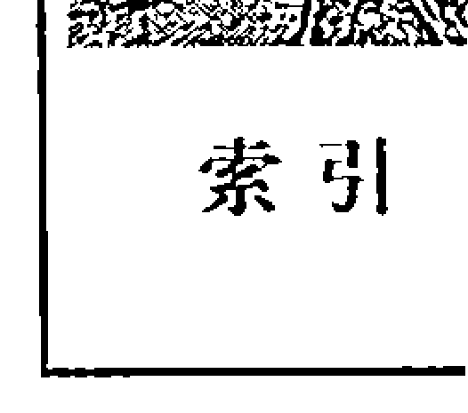

## 索引

## 致谢

特别感谢作者加里·戈德施耐德先生和约斯特·埃尔费尔斯先生撰写了《星座秘语》（The Secret Language）丛书，并授权北京科学技术出版社出版发行其简体中文版。

本丛书堪称星座书中的“百科全书”，其权威性、丰富性以及细致程度都达到了极致。原版自1994年首印起即销售逾百万册，被译成16种语言在世界各地出版发行。

本丛书体现了作者渊博的知识与严谨的态度。作者引经据典、旁征博引，通过全面的调查研究，以及阅读、分析和总结，很好地将占星学、心理学和历史融合在一起，帮助我们更深入全面地了解自己和我们所关心的人，从而使我们更好地处理和其他人的关系。

对于这样一套“百科全书”级的星座书，我们的编者力求最大限度地呈现作者原汁原味的智慧精华。

感谢本丛书的责任编辑代艳、郭晶晶女士以及校对叶思婧女士为此付出的辛勤劳动。她们兢兢业业、夙兴夜寐，历时一年完成了本丛书的编辑工作。

希望本丛书能够为爱好星座的朋友们提供一些参考！

由于种种原因，我社经过多方努力，目前仍未能与本丛书部分图片及译文的权利人取得联系。因此，请相关权利人发现后及时与我社联络，我们将支付相关费用。欢迎致电010-66165605。

策划编辑 田恬
2012年8月于北京