# THE SECRET LANGUAGE OF BIRTHDAYS

# 星座秘语之生日全书

一年中的每一天的人文星象学完全指南

[美] 加里·戈德施耐德 [美] 约斯特·埃尔费尔斯 著

仅英文原版即销售1300000册 连续加印40余次 16种语言全球发行

腾讯星座 ASTRO.QQ.com 独家推荐

北京科学技术出版社

上架建议：时尚生活 / 星座

ISBN 978-7-5304-5957-7

定价：98.00元

Copyright © Gary Goldschneider and Joost Elffers, 1994
All rights reserved
Simplified Chinese edition copyright © 2012 by Beijing Science and Technology Publishing Co., Ltd.

著作权合同登记号 图字：01-2011-3503

# 图书在版编目（CIP）数据

星座秘语之生日全书 /（美）戈德施耐德，（荷）埃尔费尔斯著；
韩笑，张甜甜等译 .—北京：北京科学技术出版社，2012.11
ISBN 978-7-5304-5957-7
Ⅰ. ①星… Ⅱ. ①戈… ②埃… ③韩… ④张… Ⅲ. ①星座－关系－性格－通俗读物 Ⅳ. ① B848.6-49
中国版本图书馆 CIP 数据核字（2012）第 138357 号

# 星座秘语之生日全书

作 者：[美]加里·戈德施耐德 [荷]约斯特·埃尔费尔斯
译 者：韩 笑 张甜甜等
策 划：田 恬
责任编辑：郭晶晶
责任印制：张 良
图文制作：博雅思
出 版 人：张敬德
出版发行：北京科学技术出版社
社 址：北京西直门南大街16号
邮政编码：100035
电话传真：0086-10-66161951（总编室）
0086-10-66113227（发行部）
0086-10-66161952（发行部传真）
电子信箱：bjkjpress@163.com
网 址：www.bkjpress.com
经 销：新华书店
印 刷：三河市国新印装有限公司
开 本：787mm × 1092mm 1/16
印 张：51
版 次：2012年11月第1版
印 次：2012年11月第1次印刷
ISBN 978-7-5304-5957-7/B · 027

定价：98.00元

京科版图书，版权所有，侵权必究。
京科版图书，印装差错，负责退换。

# THE SECRET LANGUAGE OF BIRTHDAYS

# 星座秘语

# 生日全书

一年中的每一天的人文星象学完全指南

[美] 加里·戈德施耐德 [荷] 约斯梯·埃尔费尔斯 著

北京科学技术出版社

# 编者的话

虽然我们希望读者的理想阅读顺序是从综合性的阐述（季节、星座、星区）到具体的论述（天），但实际上这很难实现。《星座秘语之生日全书》这本书实际地考虑到了读者会首先翻到自己生日的那一页，然后再去看其他的介绍（可能是在看完好友和爱人的生日之后），因此，所有必要的信息都会出现在生日这一天的延伸阅读中。比如，一个出生在4月15日的人会在自己生日的那一页上看到如下关键词：春季、白羊座和白羊座三。为了给出一幅全景图片，属于那一天的元素、特质和相关的星体都会有所讨论。

出生在清晨的人可能想读一读出生于前一天的人的情况，而在接近午夜时分出生的人则愿意读读后一天出生的人的情况，看看自己是否和他们更加契合。实际上，一些人可能因为医护人员的疏忽和父母的不确定而对自己的生日产生怀疑，不过这些人可以通过《星座秘语之生日全书》的介绍来为自己选择一个生日，这样他们就可以确定地、高兴地庆祝自己的生日了。

因为书中展示的是将一年分为四十八星区的新体系，所以这些星区所对应的星座会被赋予新的名称（如金牛座二或者天蝎座三），并且人们可以自由地创造新词来命名交界星座，比如双鱼座和白羊座交界处的星座常被简称为“双鱼白羊座”，金牛座和双子座交界处的星座常被简称为“金牛双子座”。如果如我们所期望的那样，对于交界星座的讨论更加广泛了，这些名称或者其他名称就会被更加普遍地使用，而现在，它们只是因为简洁而被尝试性地使用。

# 目录

引言
4

生命大循环
9

三大宫位
12

十大星体
13

星座四相
14

四季
18

十二星座
22

四十八星区
34

每年的这一天
82

# 引言

《星座秘语之生日全书》是一本便于使用的个性指南书，书中对人类个性的概述是基于心理学、历史学、命理学、占星学等学科以及塔罗牌得出的。根据生日，人们不但可以更加深入地了解自己，还可以进一步了解朋友、爱人，甚至是刚刚认识的人。

占星家们认为，占星时人们必须知道一个人出生的准确时间和地点，以便计算出对应星体的方位、运行路线和运行趋势。这是进行详细的占星解读所必需的。其实，仅仅通过一个人的生日我们就可以知道关于他的很多信息。报纸和杂志上流行的占星学较为宏观，因为它是基于太阳星座的占星术，即仅仅通过一个人出生时太阳所在的星座（如双子座、水瓶座）来判断他的个性，而忽略具体的日期（某一天）。正因如此，世界上的很大一部分人不仅知道自己所属的星座，还会认同这个星座在日常生活中的象征符号。

《星座秘语之生日全书》是第一本将太阳星座占星术向前推进了一大步的书籍。书中概述了人的性格特征和一年中每一天的关系，而不仅仅是其和星座之间的关系。那么每一天所代表的性格特征是如何建立起来的呢？为了回答这个问题，我们有必要看看占星家们是怎样解释早就确立了的星座特征的。

多数情况下，太阳星座占星家是通过将星座的总体特征应用于人来对人的个性进行评价的。比如，有些星座是火相的，这预示着这个星座的个体活力十足，但是脾气比较暴躁。星座也是根据宫位（运行模式）来分类的，比如固定位星座意味着固执、坚定和洞穿世事的能力（更多关于星座四相和宫位之间的讨论详见第12～16页）。同时，占星家们将每个星座和某个星体（这些星体包括我们熟知的八大行星以及冥王星、太阳和月亮）相联系，并将相应星体的特质赋予每个星座。此外，每个星座都因其结构外形而拥有一个确切的名字，据此每个星座也可以获得一个传统的象征意义。从这些假设中，我们可以得出十二星座中的每一个星座的个性特质，而属于某个星座的人自然而然也就具有了自己所属星座的个性特质。比如，某些理论基于处女座的土相星座、变动位星座以及由水星主宰的特质分析出了9月12日出生的人的性格特征：通常来说，他们善变、聪明、挑剔——想要寻求改变，但是只会按照自己的方式去改变。

虽然《星座秘语之生日全书》一书接受了许多关于太阳星座的整体概括，但它的解说方式却和上面叙述的过程相反。《星座秘语之生日全书》一书首先会介绍每一天的特质，然后是一段时期，最后才是星座。书中用得更多的是归纳法，而非演绎法。比如，本书不会问“处女座的人是什么样子的”这样的问题，而会问“9月12日出生的人是什么样子的”。在总结了这一天出生的所有名人，研究、阅读了他们的相关资料，同时结合其朋友、家人以及作者认识的其他一些人的分析，并且忽略了其中因个体差异而产生的分歧之后，本书提出了一个简单的问题：这一天出生的人有什么共同之处？

本书旨在按照生日来收集人的资料，并对其进行分类和排序，在心理学和历史学之间建立一种联系，概括出一年中同一天出生的人所具有的共同特质，在此过程中，我们将不考虑这些人的国籍、种族或者所属时代。支撑《星座秘语之生日全书》一书中呈现的人文星象学体系的数据当然就是人们的生日——超过7000个人的生日。在这些生日背后还有7000多个名人或者有巨大影响力的人，可能还有几千个作者见到过或者观察过从几分钟到一生不等的人。

# 人文星象学基础

如果说占星学是面向天堂的，那么人文星象学便是指向地面的。也就是说，人文星象学最为基本的结构是建立在地球上生活的人们所经历的一年又一年之上的。每一年的节奏主要取决于季节的更替以及昼夜的更迭。每年，太阳的变化规律都是基本一致的。我们被固定在一个生命的轮回之上，这个轮回的运动（在北半球）从冬至开始，也就是从 12 月 21 日左右开始。一年中，在冬至这一天，白昼最短，黑夜最长。过了这一天，白昼逐渐变长，黑夜逐渐变短，直到 3 月 21 日春分这一天昼夜等长。我们将冬至和春分之间的季节称为冬季，在这个季节里，只有很少的一部分植物可以生长，一些动物会冬眠，而其他动物则会利用它们厚重的皮毛抵御寒风。随着春天的来临，白昼逐渐变长，万物开始复苏，并最终迎来夏至。夏至大约在 6 月 21 日，这一天也是一年中白昼最长的一天。随着秋天收获季节的到来，昼夜再次等长（秋分，9 月 23 日左右），然后白昼越来越短，世界再次迎来寒冬。

因此，从人文星象学上来说，一年中四个最重要的点就是春分、秋分、冬至和夏至。这四个点构成了一个十字架，每年时间之轮便绕着这个十字架运动。占星学认为这些点并不落在任何一个星座上，而是落在星座的中间：春分落在双鱼座和白羊座之间；夏至落在双子座和巨蟹座之间；秋分落在处女座和天秤座之间；冬至落在射手座和摩羯座之间。这四个区域中的每一个区域都和交界星座相关。也许有人会说，占星学更强调星座，而人文星象学更依赖交界星座，其实，这两个体系并不存在真正的冲突，只是侧重点和角度不同而已。

伟大的心理学家荣格喜欢提醒人们不要忽视大自然的自然节奏，以及在一年中的特定时间会产生特定的植物、动物甚至形态和想法。类似的，荣格也认为某种类型的人会出生于一年中某个特定的时期。荣格强调的是人不能独立于自然秩序之外。

人文星象学认为，某种特定类型的人不仅可能如荣格所说出生于一年中的某个特定时期，并且会精确到某一天。荣格指出，在人类家庭中生活的我们，不管出生在哪里，也不管生活方式如何，都在无意识中带有某种整体性的、有代表性的特征。在黄道十二宫的画面上展现出的标志物不仅仅是从天上的星座中得来的，也同样是从我们所具有的人类的共性中得来的。

通过研究许多出生于同一天的人的个性特征，并把这些特征与我们根据心理学和占星学的基本理论对他们产生的了解相联系，人文星象学旨在寻找出生在同一天的人——无论这些人存在于历史还是出生于未来——似乎命中注定要具有的某些可重现的想法、行为、观念和生活主题。

# 作为循环理论的人文星象学

一天即是一年即是一生即是一世

正如我们已经说过的，人文星象学的核心是循环性。在与其构成关系最为紧密的三个领域——占星学、历史学和心理学中，只有占星学要求人们进行循环思考，可能这是由于黄道十二宫的大转盘本身就是以我们头顶上 360° 的天空为基础的。历史经常以近似直线的方式展现在我们面前，好像这就是历史发展的轨迹，一个个日期就像是串在一条线上的珠子，从不确定的过去而来，向着深不可测的未来而去。然而黑格尔在 19 世纪提出了一种不同的历史观，他将历史看做一个动态交互的体系（不同于直线的历史观），而循环和辩证法则是这个体系的基础。

占星学告诉我们，正如印度教的轮回理论所说，随着春秋的交替，我们围绕着黄道带缓缓前行，从一个 2000 年走向另一个 2000 年。爱尔兰诗人、神秘主义者叶芝相信，生命是处于螺旋式运动之中的，两个螺旋（像是两个顶部相连的圆锥体）分别象征着人类发展的兴和衰。他在《第二次来临》中这样写道：“在渐渐开阔的螺旋中盘旋，猎鹰再也听不到驯鹰者的呼声。”

猎鹰的旅程成了历史运动的比喻。

以同样的方式，中世纪的炼金术士告诉我们“上即是下”。乔治·葛吉福的追随者，比如罗德尼·科林，他在《天体影响理论》(The Theory of Celestial Influence)中认为电子绕原子的圆周运动和行星绕太阳的圆周运动有关，两种运动是和谐统一的。在这个过程中的每个阶段，从万亿到百万到几千到几十，反之，从最小到最大，世界都在不停地旋转，而在旋转的中心，也就是零点位置的，就是我们生活的世界。牛顿的理论主要是为适应这个接近零点的世界而生的，但是随着科学研究更大的世界（宏观世界）或者更小的世界（微观世界），牛顿的理论也要进行调整。

人文星象学提出了一个核心类比：一日即一年即一生即一世。这个类比从两个方面修正了传统的占星学——一方面修正了其经验主义的、强调以地球为中心的说法（如上文所述），另一方面修正了一个星座仅仅是上一个星座的深度进化的看法。如此一来，任何一个星座都不是纯粹的个体，而是一个巨大的轮回转盘上的一根辐条。我们这个时代最为重要的占星家戴恩·鲁德海尔提出了这个问题，并对其进行了详尽的阐释。

为了从人类和发展的角度来解释星座，可以用一个完整的黄道循环来表现人生中的前 84 年（源于天王星绕太阳一周需要 84 年），这样的“一生”可以被平均分成 12 个时间段，每个时间段为 7 年。比如，白羊座，黄道十二宫的第 1 个星座，可以代表人从出生到 7 岁这段时间。从白羊座到双鱼座（也是《星座秘语之生日全书》这本书所遵循的顺序）这段旅程则代表了从出生到死亡的人生循环。

从历史上看，我们或许可以部分地解释为什么具有相似性格的人虽然在不同的时代出生，但都出生于同一个星座，甚至同一天。这个循环展现的重复形象——很像是叶芝所说的螺旋——暗示了一个确定的性格虽然会出现在螺旋的不同高度上，但它总是出现在一年当中的某个确定的时间点。

在心理学领域，埃里克·埃里克森在他的著作《儿童与社会》中将弗洛伊德的更趋静态的人类发展模式（口欲期、肛门期、性器期）修正为更符合人类特点的动态发展模式（比如信任与不信任）。但是直到 20 年前，多数心理学家仍主要将童年阶段作为研究人类发展的阶段，而忽略了中年和老年阶段，只有玫瑰十字会对人一生的各个阶段，从青年时期到老年时期，都给予了同等重视。

更具整体观和更趋人性化的心理学研究终于在我们的时代成为主流。亚伯拉罕·马斯洛认为，每个人在一生中都不停地向着人生的更高阶段进化，而那些陷在某个阶段停滞不前，或者拒绝或无法迈入下一个阶段的人便是真正的活死人。马斯洛毕生坚持一个观点，即每个人都必须努力成为他或她可能成为的最好的人。

因此，将占星学、历史学和心理学融入一个同轴的循环或者螺旋——强调个体进化而非静态模式——便是人文星象学的核心。在十二星座、四十八星区和 366 天（包括闰年多出来的那一天）中展现的性格类型是灵活的、流动的，每一个都向着下一个进化，处在不停的运动和变化当中，而不像石头一般静止。

# 生日资料

这本书中展示的生日资料是通过多种渠道收集的。对于同一个人的生日，不同渠道持有不同意见的事常有发生，在这种情况下，我们会参考得到五六个渠道一致认可的资料。在收集生日资料的过程中，由于资料相似而产生错误的事时常发生，比如日子是正确的，而月份却搞错了，或者日子记录错误，18 日错记成 8 日，21 日错记成 2 日等。有时我们得到的是死亡日期而非出生日期，或者研究人员可能将两个名字相同或相近的人的出生日期搞混了。

实际上，生日有时也不太可靠，比如在娱乐领域，经纪人经常选择圣诞节或者 7 月 4 日（美国国庆日）作为其艺人的生日以吸引客户的眼球。路易斯·阿姆斯特朗没有被收录到《星座秘语之生日全书》中就是因为他的生日至今无法确定，尽管很多地方都将他的生日写为 7 月 4 日。但丁和其他一些名人也因为相同的原因被排除在本书之外。实际上，人们可能问：怎样才能准确地知道一个人的生日到底是哪一天呢？尽管我们都在自己出生的现场，却可能和别人一样不知道自己到底是哪一天出生的。

在收集生日资料的过程中，我们常将出生记录或者出生证明当做 20 世纪出生的人的生日和出生地点的证据。然而在很多欧洲国家，如意大利，出生记录要在一个人出生几天之后才登记填写，因此登记的生日要比实际的生日至少晚一天。追溯到 19 世纪，18 世纪或者 17 世纪，甚至更早的时候，事情变得更加不确定，因为登记的生日多是婴儿受洗的日期而非实际的生日。

幸运的是，母亲通常记得孩子出生那天所发生的特别的事，并且生产的场景也会牢牢地刻在母亲的记忆里。同样，父亲也可能回忆起和孩子出生那天相关的工作或者新闻。这些事件都可以查证，从而确定出生日期。

但是，同样无可否认的是，一些人隐瞒了自己的生日，他们采用了另外的日期作为自己的生日，其中一个例子便是凯瑟琳·赫本。赫本大概想让自己更加贴合天蝎座的形象，因此制作公司便公布 11 月 8 日为她的生日。实际上，赫本出生于 5 月 12 日，这在其自传的开头便得到了澄清。尽管马塞洛·马斯楚安尼坚持说他的生日登记晚了两天，但人们仍然认为他是 9 月 28 日出生的。

一年本身的长度也会让生日的问题更加复杂。历史上关于一年的长度的分歧确实令人震惊。问题始于恺撒大帝在一位希腊天文学家的指导下创立的儒略历。儒略历基于一年实际上是 365.25 天的理论断定我们需要每隔 4 年便多加 1 天。这一说法几乎被所有人所接受，除了圣比德。圣比德是中世纪英国的历史学家，他在 8 世纪的时候向世人宣称儒略历的一年比实际的一年长 11 分 14 秒。但是，直到 16 世纪圣比德的说法才被教皇格雷戈里证实。教皇格雷戈里的专家们确认由于儒略历的错误，一共有 10 天的时间没有被计算在内。因此，1582 年，格雷戈里宣布 1582 年 10 月 4 日之后的那天不是 10 月 5 日，而是 10 月 15 日，他觉得这样问题就得到了解决，此外，未来的人也就不用再为此烦心。格雷戈里同时宣布每 4 年有一个 366 天长的闰年，但整百数的年份，必须是 400 的倍数的才是闰年，不是 400 的倍数的，虽然是 4 的倍数，也是平年（因此 1900 年不是闰年，而 2000 年是闰年）。

尽管看上去格雷戈里解决了这个问题，但实际上他给生日资料的收集带来了潜在的麻烦。因为只有那些受到罗马影响的天主教国家（如法国、意大利、葡萄牙、西班牙和卢森堡）立刻采用了格雷戈里的方案，而新教国家或者德国、荷兰的部分属地则是在此后不同的时期采用这一方案的。最大的问题在于英国人的生日，因为英国直到 1752 年才采用这一方案。当然，一个 17 世纪的英国人的旧式生日（儒略历生日）可以通过加上 10 天而简单地转为新式生日（格雷戈里历生日），但问题是像约翰·弥尔顿这样的 17 世纪的人到底应该用哪个生日呢？是 12 月 19 日（格雷戈里历生日），还是 12 月 9 日（儒略历生日）？我们又该如何处理像乔治·华盛顿这类曾经历过这个变革的人的生日呢？华盛顿的生日是应该记为 2 月 11 日（儒略历生日），还是 2 月 22 日（格雷戈里历生日）？

为了不致混淆，《星座秘语之生日全书》采用了以下这些规则。中世纪以前的人和在格雷戈里历被采用之前去世的欧洲人均采用儒略历生日。尽管占星家对此并不认同，认为 1421 年 4 月 3 日实际上应该是 1421 年 4 月 12 日，但是本书统一认识，认为生日应该是政府和个人共同确认的日期。至于少数公众人物和占星家，比如诺查丹玛斯，他们很在意这种生日的差别，或者看上去已经超越了他们的时代，因此我们采用他们的格雷戈里历生日。由此看来，历史上的生日多数采用的是旧式记法，直到格雷戈里历被采用才用新式记法。因此，尽管其他国家 17 世纪的人的生日都已经加上了 10 天，17 世纪的英国人的生日仍然是按照儒略历进行记载的。

在处理英国人或者美国人的生日的时候，像华盛顿这样在人生中的第 30 年前后经历了 1752 年的纪年变化的人，多采用格雷戈里历记法，因为他们中的大多数都更改了自己的生日，并且在日历改变之后庆祝了自己的新生日。

最后要特别说明的一点是俄国人的生日：19 世纪时基本上整个“文明”世界都已经采用格雷戈里历了，所以虽然俄国直到 1917 年十月革命才更改了日历，但 19 世纪和 20 世纪的俄国人使用的已经是格雷戈里历生日了。因此，虽然通常人们认为柴可夫斯基的生日是 5 月 7 日，但实际上他是在 12 天前出生的，也就是 4 月 25 日。

## 这一天出生的名人

限于篇幅，《星座秘语之生日全书》的每一个生日最多只能列举 20 位名人。我们采用三个标准来安排这些名人的顺序：重要性（特别是在其领域的重要性）、知名度以及与这个生日的契合度。当然，这种排序是非常主观的。

我们努力尽可能多地收录女性，但是许多女性在诸如《谁是谁？》、各种百科全书似的著作和其他提供生日资料的著作中并没有出现，即便出现也没有注明生日。此外，尽管多数这些参考资料在近些年经过了很大改进，但其仍然缺少很多关于非西方人的信息。

生日资料的收集涉及广泛的领域和活动。从古代到现代，音乐、文学、传媒、政治、体育、科学、哲学、艺术和探险等领域中的佼佼者都被囊括其中。

## 生命大循环

我们可以将一切生命过程象征性地视为一个大循环。通过类比，我们可以将三个重要的领域——人生、自然界和占星学——放在同一个圆周内进行研究和对比。对人来说，这个圆周代表人从出生到死亡这一段时间；对自然界来说，这个圆周指一年四季的更迭；对占星学来说，这个圆周指十二星座所在的黄道带。这三个领域所在的圆周被一根水平轴线和一根垂直轴线切分。圆周的起点是水平轴的左端，从该起点开始沿逆时针方向环绕一圈，并最终回到该起点，便完成了一次生命大循环。

圆周上最重要的四个点是圆周与两根轴线的交点（见图1）。

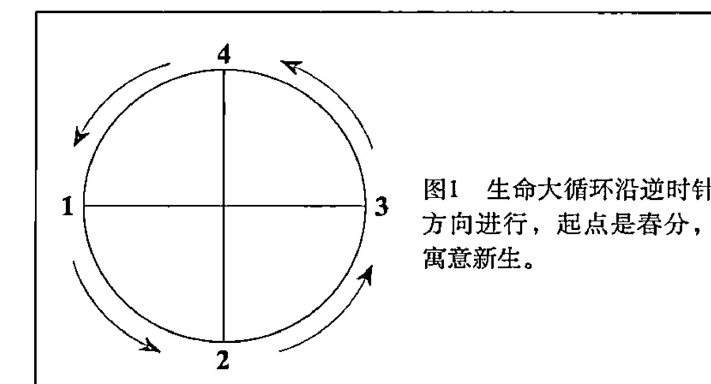

| 位置 | 人生 | 自然界 | 占星学 |
| :--- | :--- | :--- | :--- |
| 1 | 新生 | 春分 | 白羊宫0° |
| 2 | 21岁 | 夏至 | 巨蟹宫0° |
| 3 | 42岁 | 秋分 | 天秤宫0° |
| 4 | 63岁 | 冬至 | 摩羯宫0° |

### 圆周的上、下半周

如图2所示，水平轴线将圆周分为上、下两个半圆。下半周，也就是生命大循环的第1个半周，代表人和自然界客观、外在的成长（从出生到42岁，从春季到秋季）。在此期间，人体和自然界都经历了显著的变化，与此相类似的，人对世界的认识也变得非常个人化。因此，从占星学和心理学的角度来说，下半周的心理取向是主观的（更多是无意识的）。位于下半周的第1~6个星座为“自我型”星座，其主宰星为太阳系中的“内”星体（水星、金星、火星）以及太阳和月亮。这五个星体通常代表生活中的感觉、情绪、亲情和爱情，以及现实中出现的事情和问题等，而非哲学层面的问题和对宇宙的思考。此时的主导力量也具有主观意味——直觉和感受。因此可以说，生命大循环的第1个半周主要以客观的方式展现，但是心理取向趋于主观。

上半周，也就是生命大循环的第2个半周，代表人和自然界主观、内在的成长（42~84岁，从秋季到春季）。在此期间，人的心智和自然界在生命表象之下不断发展并走向成熟。伴随着内在的成长，人看待周围事物的方式愈加客观，逐渐培养出广阔的视角和务实的态度。因此，从占星学和心理学的角度来说，上半周的心理趋向是客观的（有意识的）。位于下半周的第7~9个星座为“社会型”星座，第10~12个星座为“宇宙型”星座。除了天秤座，这些星座的主宰星均为太阳系中的“外”星体（木星、土星、天王星、海王星及冥王星）。这些巨大而遥远的星体，有更多宇宙和哲学方面的内涵，它们代表着更大的社会问题：命运、天数，以及生命中无法改变的、永恒存在的问题。上半周的主导力量更具有客观意味——感觉和思考。因此，第2个半周与第1个半周相反，是主观力量（内在、表象之下的）彰显的阶段，而人们的心理取向趋于客观。

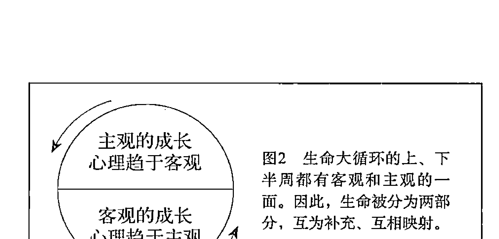

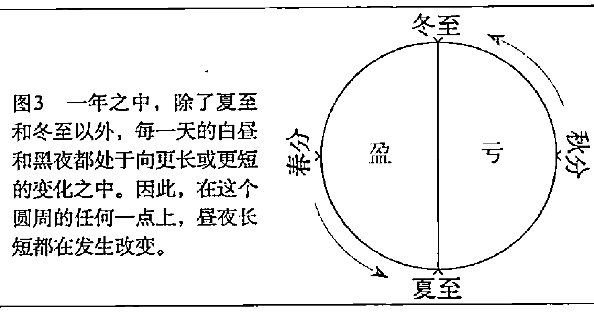

## 四分体

如果同时采用两种分法（上、下半周，左、右半周），我们就可以将 360° 的生命大循环的圆周分为 4 个四分体。在人生的 84 年中，每个四分体代表 21 年；在自然界的一年中，每个四分体代表 1 个季节；在占星学中，黄道带上有 12 个星座，每个四分体代表 3 个星座（3 个星座的分法和排列顺序很重要，是固定不变的，见图 4）。

## 圆周的左、右半周

垂直轴将圆周分为左、右两部分（见图 3）。黄道带的左边部分（从摩羯宫到巨蟹宫）代表逐步增强的变化（盈）——从冬季到春季，白昼时间逐渐变长，右边部分（从巨蟹宫到摩羯宫）代表逐步减弱的变化（亏）——从夏季到秋季，白昼时间逐渐变短。垂直轴的两个端点分别为夏至和冬至，这是昼夜时差最大的两天：夏至（6 月 21 日）白昼最长、黑夜最短，冬至（12 月 21 日）正好相反。根据《易经》的描述，这分别是至阳和至阴的两天。而在春分（3 月 21 日）和秋分（9 月 23 日）这两天，昼夜正好等长。从另一个角度来说，春分过后，地球向离太阳最近的点逐渐靠近，而秋分过后，地球向离太阳最远的点逐渐靠近。

另外，每个四分体对世界的认知方式如下：
I 直觉 III 感觉
II 感受 IV 思考
每个四分体代表 1 个季节、21 年的生命时长以及黄道带上 1 个 90° 的区域。我们从以下几个方面评估四分体的特质：变化、表现、心理倾向、认知方式。

由于《星座秘语之生日全书》这本书是建立在以地球为中心的星座系统上的，所以春分、秋分、夏至、冬至的位置对切分生命大循环具有举足轻重的意义。从这个方面来说，我们不同于传统的以太阳为中心的占星学，而将研究重心转变为我们此时此地的日常生活——也就是我们所在的地球上复一年的四季更迭、生老病死和万物变换。

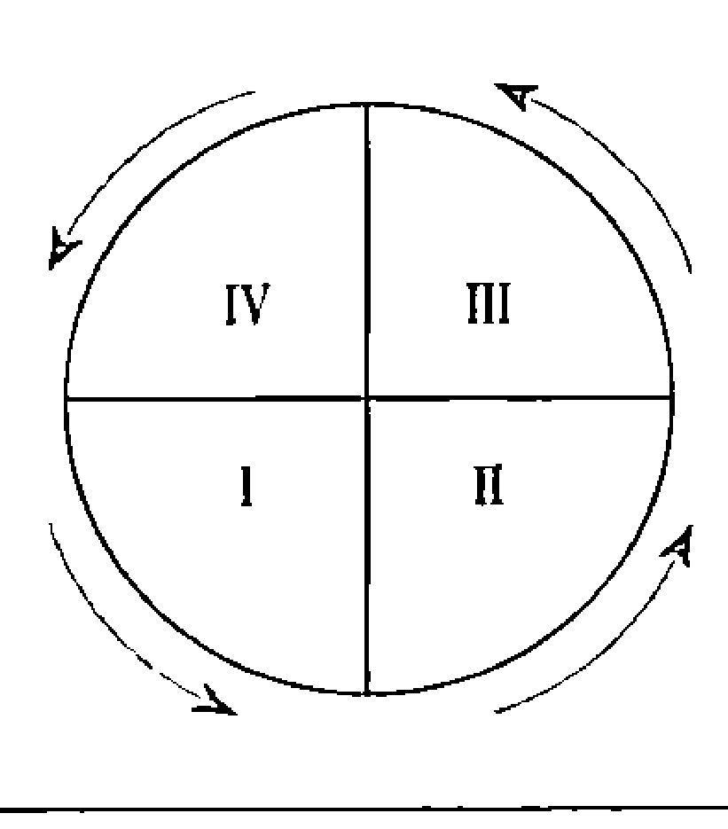

| 区域 | 季节 | 年龄 | 所属星座 | 变化 | 表现 | 心理倾向 |
| :--- | :--- | :--- | :--- | :--- | :--- | :--- |
| I | 春季 | 0~21岁 | 白羊座、金牛座、双子座 | 盈 | 客观 | 无意识 |
| II | 夏季 | 21~42岁 | 巨蟹座、狮子座、处女座 | 亏 | 客观 | 无意识 |
| III | 秋季 | 42~63岁 | 天秤座、天蝎座、射手座 | 亏 | 主观 | 有意识 |
| IV | 冬季 | 63~84岁 | 摩羯座、水瓶座、双鱼座 | 盈 | 主观 | 有意识 |

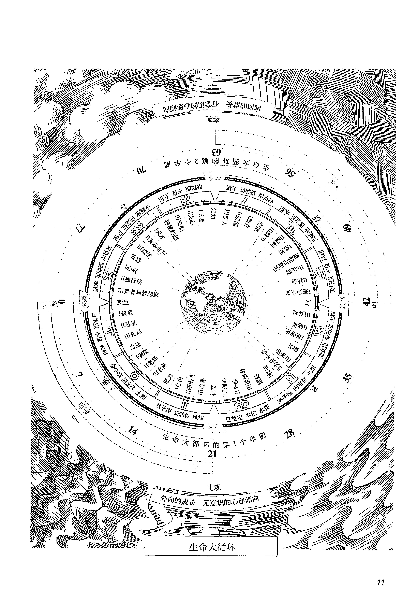

## 本位，固定位，变动位

占星学根据十二星座在黄道十二宫中所处的位置分出三大宫位：本位、固定位和变动位，这三者与星座四相（土相、风相、火相、水相）组合之后，衍生出十二星座不同的特质。比如，白羊座是本位火相星座，双子座是变动位风相星座。其他组合如右表所示。

| 宫位 | 土相 | 风相 | 火相 | 水相 |
|---|---|---|---|---|
| 本位 | 摩羯座 | 天秤座 | 白羊座 | 巨蟹座 |
| 固定位 | 金牛座 | 水瓶座 | 狮子座 | 天蝎座 |
| 变动位 | 处女座 | 双子座 | 射手座 | 双鱼座 |

本位指的是星座处于最纯粹、最原始的状态，固定位指的是星座处于稳定、难以改变的状态，变动位指的是星座具有灵活性和良好的调适能力。无论处在黄道十二宫的哪个四分体中，这三大宫位都是按照本位、固定位、变动位的顺序排列的。这个顺序同时更清晰地表明，本位是起始阶段，固定位是发展、稳固、集中的阶段，变动位则是准备转换到下个宫位的阶段。

### 本位

本位星座在黄道十二宫中的出现顺序为白羊座、巨蟹座、天秤座、摩羯座，主宰星分别是火星、月亮、金星和土星。白羊座是最纯粹的火相星座，代表春天的开端，奠定了第1个四分体的基调。巨蟹座是水相星座中最温柔似水的一个星座，像夏天一样拥有丰富的感情和多变的情绪。天秤座是最基本的风相星座，拥有水星赋予他们的杰出的社交才能，奠定了秋季星座和第3个四分体的基调。摩羯座是最纯粹的土相星座，是冬季星座和第4个四分体的开端。

### 本位星座的个性

属于本位的四个星座都很能干，不管是事业、社会组织还是家庭，他们都喜欢自己去创立。他们喜欢全心全意地投入一项工作，而不喜欢在工作的时候受到干扰。本位特质的星座是先锋者，他们常常想出新点子，成为所擅长领域（白羊座擅长运动、探险，巨蟹座在处理家庭关系方面很有天分，天秤座的能力体现在社会关系方面，摩羯座则会在工作中表现突出）团队的领导者。本位星座最大的问题是犹豫不决。

### 固定位

固定位星座在黄道十二宫中的出现顺序为金牛座、狮子座、天蝎座和水瓶座，主宰星分别是金星、太阳、冥王星和天王星。金牛座是土相星座中最顽强的一个星座，非常稳定，代表春季的富饶。狮子座是火相星座中最稳定的一个，就像太阳一样为夏季带来热情与活力。天蝎座是最具能量与控制力的水相星座，在展现秋天感官享受的同时，因受到冥王星的控制，也代表了大自然开始沉寂的特征。水瓶座（在发现天王星之前，人们认为水瓶座受土星主宰）是最有力量的风相星座，象征着先进的思想和冬天的冷静。

### 固定位星座的个性

固定位星座很难被困难击退，他们具有强烈的占有欲，稳守自己的地盘，而且非常清楚自己想要什么。他们笃定而自信，渴望摆脱别人的掌控，难以屈居人下。固定位星座善于发挥影响力，甚至支配他人。他们最大的问题是情绪不稳定。

### 变动位

变动位星座在黄道十二宫中的出现顺序为：双子座、处女座、射手座和双鱼座，主宰星分别是水星（双子座和处女座）、木星（射手座）和海王星（双鱼座）。双子座是风相星座里变化最大的一个，像春天一样善变，他们大多多才多艺。处女座则是最不稳定的土相星座，透露着秋天的变化和即将收获的信息。射手座可以说是火相星座中最柔和的一个，拥有迎接冬天需要的乐观，且善于哲学性思考。双鱼座暗示着春天的来临，象征精神层面的改变与重生。

这种周而复始的变化可以在生命大循环（第9 - 10页）里看出来。以第3个四分体为例，随着大自然的变化，星座从本位、风相的天秤座，经过固定位、水相的天蝎座，到达变动位、火相的射手座。

### 变动位星座的个性

变动位星座热爱变化、追求刺激、喜欢旅行，尤其喜欢变换旅行地点——只有不停地改变才能让他们真正感到快乐。虽然变动位星座的情绪不够稳定，但他们的灵活性很好，可以迅速适应新环境。他们明白生命中恒久不变的本质就是变化，对他们来说，最糟糕的状况莫过于受到限制、失去自由。

可以说，处于相同宫位的星座会带有某些相同的特征，和不同宫位的人相处也可以感受到三种宫位之间的差异，比如当固定位星座和变动位星座相处时，他们虽

## 星体

占星学的十大星体是我们目前从地球所观测到的 10 个星体，包括 2 个肉眼看起来有光的星体——太阳和月亮，3 个“内”星体——水星、金星和火星，5 个“外”星体——木星、土星、天王星、海王星和冥王星。这些星体的英文名称大多源于罗马神话，以众神的名字命名。这些星体也是天文学里实际存在的星体。每一个星体都代表了不同的性格特质，不同时间出生的人因为主宰星的不同会有性格上的差异。

### 太阳

太阳赋予太阳系生命，代表强大的创造力和动力，还有男性的阳刚特质。作为太阳系的中心，太阳源源不断地向外输送着能量。在占星学里，太阳代表自我的外在驱动力和独特的个人气质。狮子座和数字属性为 1 的人都受太阳主宰，这些人不论男女，都具有勇往直前、要求高和善于鼓舞他人的特质。

### 月亮

月亮不仅影响着地球上的潮汐，也深刻地影响着人的情绪。月亮代表潜意识、梦境和强烈的情感。月亮是地球的卫星，带有女性的阴柔特质以及强烈的同情心。巨蟹座与数字属性为 2 的人都受月亮的影响，这些人细心敏锐，在团队中大多和他人相处融洽。

### 水星

水星体积很小，是距离太阳最近、太阳系中运动速度最快的行星。它的英文名称“Mercury”源自罗马神话里长着翅膀的信使的名字。水星是双子座、处女座与数字属性为 5 的人的主宰星，它赋予他们敏捷、擅长社交的特质。受水星影响的人还注重细节，喜欢玩游戏和探秘，有着良好的复原能力。

### 金星

正如罗马神话中维纳斯（Venus，金星的英文名称就使用了这个词语）的女性形象一样，受金星主宰的金牛座、天秤座以及数字属性为 6 的人，不论男女，不管是在身体层面还是在精神层面，都非常喜欢美丽的事物，他们也拥有维纳斯的温暖和活力。维纳斯代表“爱”，因为没有人可以抵御她的儿子丘比特所射出的爱神之箭。

### 火星

火星的英文名称是以战神玛尔斯（Mars）的名字命名的。火星在夜空里透出红色的光芒，宛如战神一般，代表着男性的阳刚之气。受火星主宰的星座有白羊座和天蝎座（冥王星发现之后，人们认为天蝎座是由冥王星主宰的），受火星影响的人，不论男女，都具有侵略性和冒险精神，以及热爱成功、不屈不挠的特质。

### 木星

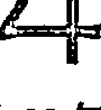

木星是太阳系八大行星中最大的行星，绕太阳公转的周期约为 12 年，换句话说，木星会在每个星座大约停留 1 年的时间。木星的英文名称是 Jupiter，原指罗马神话中的主神，即被认为是众神之父的宙斯，罗马统治希腊后将宙斯改称朱庇特（Jupiter）。木星带给射手座和数字属性为 3 的人以快乐、开朗、乐观和幸运，所以受木星主宰的人富于哲学思辨以及变化的特质，遇到问题时，他们会以最积极的态度、最具建设性的方法去解决问题。

### 土星

和木星的开朗相反，土星代表收缩和内敛。传统上，人们认为土星具有黑暗和冰冷的致命力量。但是，换个角度来看，土星也代表着建设、秩序和责任。受土星主宰的摩羯座以及数字属性为 8 的人相信自然法则和法律，坚守个人价值观，拥有强大的力量并有强烈的展示愿望。

### 天王星

天王星是水瓶座与数字属性为 4 的人的主宰星。天王星直到法国大革命时期才被发现，象征着个人主义和反叛。天王星不规则的运行轨道也意味着受它影响的人不按规则行事，自由而冲动。在本书中，天王星 84 年的公转周期被视为人类的生命周期。

### 海王星

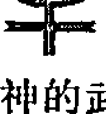

海王星的英文名称来自罗马神话里海神的名字，海神的武器三叉戟也被用做海王星的象征符号。受海王星主宰的双鱼座和数字属性为 7 的人拥有海洋般的深沉和吸纳能力，这种强大的魅力可以消解人们之间的隔阂和矛盾。此外，他们想象力丰富，喜欢幻想，令人难以揣测。

### 冥王星

美国的天文学家罗卫尔（Percival Lowell）曾预言冥王星的存在，所以冥王星的英文名称“Pluto”以罗卫尔名字的首字母开头。冥王星被看做地狱之王的化身，象征着人类的黑暗面——金钱、权力和性欲，受冥王星主宰的天蝎座拥有火山般猛烈的力量。冥王星也代表一种难以冲破的无情的力量，如何驾驭这股力量，并将之转化为积极的动力则是受冥王星主宰的人们一生的重要课题。

## 土相
### 金牛座。处女座。摩羯座

土是固态元素，它有多种含义，并与其他事物有着千丝万缕的关系。首先，“土”表示土壤、泥土，人们不仅利用土壤耕种庄稼，还在上面绿化环境，其实人们就是在由土构成的陆地上生活的。地球——太阳系的八大行星之一，太阳系中从内到外的第3颗行星——虽然超过70%都是水，但是我们没有称它为“水球”，而称它为“地球”。英语中“earth”这个词在表示“土”的同时，也表示地球。因为地球孕育了众多生命，包括我们人类，所以我们常常称其为“地球母亲”。其次，“土”还有很多引申义，比如它可以用来形容某些事物的性质，如民间的、非现代化的（在这一点上区别于“洋”），也可以用来形容人的气质，如果我们形容某些人有点“土气”，那就代表他们不合潮流或者思想不开通，但同时也表示他们自然、淳朴。

在星座四相中，土相星座的人很符合我们提到的上述特点——稳健、踏实。土相是一个高度稳定，不易改变的相位。就像土壤（Earth）中还包含了许多不同的化合物和矿物质一样，同为土相星座的人性格也各自不同。在四相关系中，土、风和水一起孕育了富饶的土地，是所有植物生命不可或缺的生存条件。

### 土相星座

土相星座的标志物是公牛、处女和山羊，这三种标志物所代表的都偏重于物质和性欲层面的意义，根据其宫位（本位、固定位和变动位）和主宰星的差别，以上三个星座各有不同。

| 星座 | 宫位 | 主宰星 | 标志物 | 座右铭 |
|---|---|---|---|---|
| 金牛座 | 固定位 | 金星 | 公牛 | 我拥有 |
| 处女座 | 变动位 | 水星 | 处女 | 我服务 |
| 摩羯座 | 本位 | 土星 | 山羊 | 我掌管 |

本位土相的摩羯座呈现的是土相星座最纯粹、最原始的状态，摩羯座的人注重身体和物质的双重享受，他们看重金钱、性欲和权力。不过，摩羯座的人也有丰富的内涵，有的人富有审美意识，同时还是物质主义者；有的人极具野心，同时也注重精神发展；有的人推崇技术和实践，同时也注意理论的学习。总之，摩羯座的人具有多面性，很难确切地说哪一种才是典型的摩羯座人。

固定位土相的金牛座代表人性中牢固不变的那部分特质，金牛座的人大多比较顽固，很难被人说服，而且很难轻易作出让步。但是属于土相星座的他们是注重和谐的，并不会彻底拒绝所有形式的让步。我们常常会将金牛座与象征生养的意象，如德墨忒耳（希腊神话中司农业，尤其是谷物的女神）、盖娅（希腊神话中的大地女神）、地球母亲和大自然联系在一起，这就赋予了金牛座人生育和养育他人的能力。金牛座的主宰星金星强化了其土相星座的特质。受此影响，金牛座的人注重美的人和事物。许多金牛座人的价值观是非常贴合人的本性的。

变动位土相的处女座是这三个星座中土相特质最不明显的一个。受主宰星水星的影响，处女座的人较为灵活，很注重精神和心理层面的东西。处女座的人机灵、擅长分析的能力看起来似乎不像是土相星座该有的特点，但其实他们也具有土相星座最根本的特质：依赖性强、稳定、富有服务意识。处女座的人大多会将感官方面的欲望隐藏起来或是选择性地展现出来的。此外，处女座的人是极端的实用主义者，常常只以结果作为判断依据。

### 土相星座的性格

土相星座的人主要通过感觉来理解世界，他们会通过视觉、听觉、味觉、嗅觉和触觉的实际感觉来判断这个世界。对他们来说，有形的实体要比梦想或幻想更有意义，他们大多是实用主义者，认为“所见即所得”。

- 认知方式：感觉
- 本源状态：干燥
- 气质类型：忧郁质
- 体液类型：黑胆汁
- 物质形态：固态

虽然土相星座的人看重此时此地的东西，但是他们也善于等待和忍耐。在面对对手和挑战时，除了深呼吸，他们还会沉下心来慢慢积蓄力量，等待合适的时机奋起一击，最终取得成功。不过，这也容易出现一个问题，那就是一拖再拖，失去了最佳时机。因此，等待、忍耐虽然是优点，但若成为不付诸行动的借口，反倒会成为缺点。

土相星座的人喜欢享受餐桌上和床上的乐趣，不管是基于休息还是感官上的享受，或者两者都有。他们并不掩饰自己这方面的需求，对他们来说，生理的需求居于优先地位，这也表现在他们对运动、烹调、性爱、生儿育女以及手工方面的热情。

土相星座的人感官欲望高于内心的热情，因此他们很享受身体上的接触，这也使他们的触觉极为敏锐。大多数土相星座的人喜欢亲自动手——自给自足，不愿意寻求他人的帮助，也不愿意轻易接受帮忙，因为他们觉得凡事自己去做总比浪费唇舌来The request was rejected because it was considered high risk

## 风相

## 双子座·天秤座·水瓶座

星相学中所说的“风相”对应的是我们现实世界中的空气。空气是无形的气态元素，围绕地球形成了大气层，是维持生物生存所必需的。它包含 78% 的氮气、21% 的氧气和少量二氧化碳等气体。跟地面大致平行的空气发生流动时就会产生风，所以我们说风是大自然的呼吸。不管是空气，还是风，都与其他事物有着千丝万缕的关系，正因为有了空气，我们的世界才有了丰富美妙的曲调。而如果把目光放到“风”这个词语上，我们就会发现它的含义其实不仅仅停留在一个物理现象上面，它和我们的现实生活联系得是如此紧密：当你听到“透露了风声”这几个字时，你可能立马看到一个模糊的影子就那么无声无息地从缝隙中钻了出去；而“风云人物”、“风华正茂”、“风度翩翩”……这些用来形容人的词语也可以说不胜枚举。

| 星座 | 宫位 | 主宰星 | 标志物 | 座右铭 |
|---|---|---|---|---|
| 双子座 | 变动位 | 水星 | 双胞胎 | 我交流 |
| 天秤座 | 本位 | 金星 | 天平 | 我权衡 |
| 水瓶座 | 固定位 | 天王星 | 倒水侍者 | 我普及 |

思考来理解世界。对他们而言，无形的思想和概念比有形的实体更容易把握，因此风相星座的人大都带有一些理想主义色彩。由于过分注重前景和发展方向，风相星座的人容易被现实的困难绊倒，或者困在自己既有的思维方式中走不出来。风相星座的人似乎与感官刺激形成了共振，外界一点点的声音或气味的刺激，都可能在他们身上引起很大的反应。

## 风相星座

三个风相星座的标志物分别是双胞胎、天平和倒水侍者。与土相星座的标志物相比，风相星座的标志物更抽象。单从字面上看，这三种标志物和风本身没有太大的关联，但它们和风的引申义有关，即它暗示了飘逸或者聪敏这种特质。

的天王星，因此水瓶座的人大多乐于挑战，并可以克服重重困难，冲破强劲对手的阻挠。水瓶座的人聪明伶俐，但有时候会不安于现状，他们喜欢自由自在的生活方式，勇于追求客观、科学的宇宙真理，对新生活和人类未来发展充满期待。

风相星座的人虽然乐观，但他们也仅止于快乐、乐观主义罢了。不要忘了，他们同时也有消极、挑剔的一面。也许风相星座的人并不聪明绝顶，但是他们中的很多人都喜欢测试自己的智力，玩些猜谜、侦探破案之类的智力游戏。

本位风相的天秤座呈现了最基本、最纯粹的气态风格。天秤座的人有自己独到的见解，喜欢参加群体活动，而且在此过程中会建立起良好的人际和社会关系。受主宰星金星的影响，天秤座的人的审美能力和感知能力极为突出，他们喜欢各种各样美丽、造型特别的事物。和谐对天秤座的人来说十分重要，他们常常在不同的事物之间仔细比较、评估，从而找到一个平衡点。天秤座的人非常在意自己与他人之间的关系，尤其是与婚姻对象和合作伙伴之间的关系。

变动位风相的双子座非常关注细节、事实以及与他人的沟通（这是因为空气是声波和其他讯号的传导媒介）。双子座的主宰星水星，其名称源于罗马神话中诸神的使节墨丘利。据说他手持传令杖，足踏有翅凉鞋，在空中飞来飞去传递信息。双子座的标志物是双胞胎，这代表双子座的人的双重性格，以及他们对寻找自己另一半的迫切需要——很少有双子座的人会觉得自己是一个完整的个体，他们希望通过思想、逻辑和言语表达与周围的人们建立联系。在占星学上，标志物为双胞胎的双子座是最多变的一个星座。

风相星座的人悟性很高，但忘性也大。他们不会长时间地记住某一件事情或维持一段令人疲惫的关系，尤其是痛苦的恋情，因此他们会被人指责用情不深，像花蝴蝶一般在花丛间周旋。不管这些说法是否正确，风相星座的人行事自然、随心所欲是无可否认的。由于内心的热情高于感官的欲望，所以他们相信身体的接触代表亲密的情感。虽然他们具有情绪化和多愁善感的一面，从而使事情难以掌控，但风相星座的人也常常把内心澎湃的感情掩藏在淡定、超然的外表之下。

和以上意象联系起来的风相星座的人虽然本身是稳定的、纯粹的，但是他们也会随着环境的变化而变化，就像随着海拔的升高大气压力、空气密度和含氧量会有所变化，或者在密闭的有生物生存的环境中空气中某些成分的比例也会有所变化一样。在四相关系中，对所有生物来说，空气（风）是最不可或缺的，此外，它可以同土和水很好地融合，同时也是火存在的必要条件。

固定位风相的水瓶座的主宰星是有“破坏者”之称

## 风相星座的性格

风相星座的人主要通过

- 认知方式：思考
- 本源状态：冰冷
- 气质类型：多血质
- 体液类型：血液
- 物质形态：气态

## 火相

### 白羊座 · 狮子座 · 射手座

火是代表燃烧的元素。从科学的角度说，火是物体燃烧时所发的光和焰，燃烧这种化学反应会产生光与热，物体在燃烧的过程中会释放大量的能量。宇宙星体中的太阳就是火的典型代表，这颗燃烧着的火球源源不断地释放着它的能量，自古以来便被人们崇拜，被看做神赐给人类赖以生存的礼物。然而，再看给人类带来了福音的原子反应（核裂变和核聚变），它所产生的巨大能量则向人们揭示了它在造福人类的同时所具有的巨大破坏性。

| 星座 | 宫位 | 主宰星 | 标志物 | 座右铭 |
|---|---|---|---|---|
| 白羊座 | 本位 | 火星 | 公羊 | 我存在 |
| 狮子座 | 固定位 | 太阳 | 狮子 | 我创造 |
| 射手座 | 变动位 | 木星 | 弓箭手 | 我哲学化 |

同其他元素相比，火同时具有正反两个方面的含义：它既可以代表强烈的情感以及情感的强烈释放，比如说某个人“激情似火”就是形容他能量十足、很活跃，而脾气很“火爆”则是指情绪具有瞬间爆发性，也可以形容不好的情绪（即怒气），如“冒火”、“心头火起”等。

### 火相星座

三个火相星座的标志物分别是公羊、狮子和弓箭手。三者都是动态的、富有活力的形象，都代表不可抵抗的强大行动力。同时，三个火相星座也因为特质和主宰星的不同而有所差异。

本位火相的白羊座呈现的是处于最原始、最纯粹状态下的火的状态。在主宰星火星的影响下，白羊座的人有一些冲动、任性，凡事喜欢付诸行动，富有激情，乐于充当领导者，获得成功是他们的目标。本质上他们比较孩子气，喜欢成为人们关注的焦点，常常没有耐性，想到了就要马上去做。他们生性叛逆，不喜欢受限制，就像拥有锋利羊角的公羊一样。总的来说，白羊座大多性格急躁而又富有热情。

固定位火相的狮子座就像它的主宰星——光芒四射的太阳一样，散发着稳定的光芒。如果说白羊座是不受掌控的火，那么狮子座便是控制得当的火。狮子座的人富有创意，待人热情，他们看不起卑鄙小气的行为，自己高昂的姿态正如狮子一样，颇具王者风范。稳定可靠、勇敢坚忍是狮子座最明显的特点。

变动位火相的射手座通常被描绘成一位张着弓瞄准猎物的弓箭手，但实际上这个箭头指向的并非只是猎物本身，还有更高的哲学目标。尽管射手座的标志物是一个弓箭手，但其实射手座是一个非常喜欢动物的星座，射手座又称“人马座”，人马正是一种半人半马（人首马身）的动物。射手座也是一个多变的星座，射手座的人有些理想主义，并很重视道德伦理，他们把荣誉感放在最高的位置。因此，应该提醒的是，射手座的人应该注意把自己旺盛的精力用在开拓进取和对崇高道德目标的追求中。

在四种元素中，火是一种大部分人都在实践的元素，但也是最不稳定的一种，因此人类必须对其小心控制，善加利用。我们注意到，大部分熊熊燃烧的火外观上是有很大相似度的，只是我们会根据燃料和温度的不同对其加以区分。在四相关系中，风生火，空气（风）能使火燃烧得更加猛烈，而且在大部分情况下，没有了空气，火就无法存在；土和水则克火，可以将火掩熄和浇灭。

### 火相星座的性格

火相星座的人主要靠直觉来理解世界，他们更多地凭借自己的第六感作出判断。火相星座的人喜欢的直觉、冒险和天马行空都体现了他们热情、不稳定的性格特质。火相星座的人不需要别人告诉他们该怎么做，也不会从书中寻找答案——他们自己便清楚得很。除非他们对自己产生了怀疑而改变主意，否则他们的第六感很少出错。所以火相星座的人依照最初的直觉做事反而比想那么多更好一些。患得患失并不适合他们，那只会有损他们积极的心态和高度的自信。

火相星座的人自我意识很强，有些人会因此批评他们过于傲慢。然而他们虽然以自我为中心，但是并不自我放纵，只不过有时他们的步调有点快，或者反感别人在公众场合表达出对自己的占有欲或做出亲密的举动而已。火相星座的人享受性欲，但是和风相星座的人一样，他们内心的热情要高于感官的欲望。同时，火相星座的人也享受竞争性运动带来的刺激，并会在这一方面付出一定的努力。

火相星座的人脾气急躁，容易发火，他们冲动的特质常常导致意外的发生，而且火相星座的人行事反复无常、难以预测，但是如果工作需要，他们也可以长期投入地去完成一件事情。在家庭生活中，他们对爱人忠诚、热情，但是一旦出现了问题，他们也会真诚地去面对。

- 认知方式：直觉
- 本源状态：火热
- 气质类型：胆汁质
- 体液类型：黄胆汁
- 物质形态：燃烧

## 水相

### 巨蟹座·天蝎座·双鱼座

水是液态元素，它有多种含义，并与其他事物有着千丝万缕的关系。比如水首先是一种化学物质，分子式写作 H₂O，它是地球上生物生存的必需物质之一；作为溶剂，它是把盐离子变成溶液的关键物质；由水构成的海洋占去了地球地表大部分的面积，而且很多生物体内的主要构成物是水，人类也是如此；大型水体都较为稳定，比如地球的温度就不会变化很快；在四个元素中，只有水可以在液态、气态和固态之间相互转换，而且在转换过程中，水的特性不变；不管是咸水还是淡水，它都可以转化成雨或其他水体；对人来讲，水不只是我们所喝的水，还可以指人类的分泌物和排泄物，比如眼泪和尿液。

| 星座 | 宫位 | 主宰星 | 标志物 | 座右铭 |
|---|---|---|---|---|
| 巨蟹座 | 本位 | 月亮 | 螃蟹 | 我感受 |
| 天蝎座 | 固定位 | 冥王星 | 蝎子 | 我控制 |
| 双鱼座 | 变动位 | 海王星 | 鱼 | 我相信 |

座就像浩瀚的海洋一样，希望可以包容吸纳一切事物。

### 水相星座的性格

翻看汉语词典，我们可以发现非常多以“水”开头的词语，如“水草”、“水滴”、“水电”、“水果”、“水珠”等，就像无处不在的水元素一样，“水”这个字眼在我们的语言中也是最常见的一个。

壤，和空气（风）结合可以变成湿气或云，水、土和空气都是生物生存的必备物质。在四相关系中，水克火。

水相星座的人主要依赖感受来理解世界。在水相星座的人的世界里，情感一直都是居于首要位置的，绝大部分水相星座的人都富有同情心，对别人的遭遇能感同身受，因此当没有得到同等回报时，他们便会感到很受伤害。水相星座的人对别人的批评和反对相当敏感，经常在对方还没有用言语表达之前，他们就已经明白了对方的态度。

### 水相星座

三个水相星座分别以螃蟹、蝎子和鱼为标志物。这三种动物分别属于甲壳纲动物、蛛形纲动物和水生脊椎动物，都是生长在人们生活中不常见到地方，如隐秘的地下和水里。三个水相星座则因为特质和主宰星的不同而有所差异。

特质。
固定位水相的天蝎座最能展现水的力量，并能置这种力量于有效的掌控之下。天蝎座的人目标明确，并且非常清楚如何才能达到目的。天蝎座虽然是一个相当社会化的星座，但也有非常自我和个性化的一面。受主宰星冥王星的影响，天蝎座的人有着强烈的性欲追求，具有火山般的旺盛精力。同时，冥王星带给他们强烈的占有欲，天蝎座的人无论如何都不会放弃已经到手的东西。注重隐私的天蝎座在受到侵扰时，会进行突然的反击，有时这种反击会相当无情。

水相星座的人善于察言观色，能够领会别人内心真正的需求，所以他们很擅长说服别人，也能够很好地引导别人顺着自己的思路往下走。因为感情丰富，水相星座的人通常看起来有些严肃和深沉，因此幽默对于水相星座的人来说意义独特，它不仅可以让水相星座的人开朗起来，还可以消除他们与别人之间的隔阂。虽然水相星座的人真正亲密的朋友不多，但是他们喜欢和别人聚在一起，享受那种亲密的气氛。

水自身也是一个矛盾的集合体。虽然水的承压能力很强，但是水也可以迅速地转换为水蒸气或者冰，正如老子在《道德经》中说：“水善利万物而不争，处众人之所恶，故几于道。”“天下莫柔弱于水，而攻坚强者莫之能胜，以其无以易之。”

本位水相的巨蟹座呈现的是水的最原始、最纯粹的状态。巨蟹座的人很重视感情，善于保护自己和他人。就像螃蟹一样，巨蟹座的人总是想寻找一个隐秘的地方居住，对于外人的入侵十分敏感。同时，他们也知道怎样发挥自己的进取精神，能够迅速地反击敌人。巨蟹座的主宰星月亮不仅影响着自然界的潮汐变化，也深刻地影响着人的情感。月亮与螃蟹的特点都点出了巨蟹座的

变动位水相的双鱼座是将水的特质过度发展的一个星座。双鱼座的人有一些过度灵活和包容，其内敛的个性和丰富的内心世界是他们的最大魅力。信仰与灵魂的体会对于感性的双鱼座来说十分重要，就像生活在深海中的鱼儿一样，双鱼座的人的情感极为深厚。另外，受主宰星海王星的影响，双鱼

- 认知方式：感受
- 本源状态：潮湿
- 气质类型：黏液质
- 体液类型：黏液
- 物质形态：液态

在四相关系中，水和土结合可以造就适宜种植的土

水相星座的人有和土相星座的人一样敏锐的感官，然而，相较于土相星座，他们的感觉更能自然流露，不过他们必须谨防表达过度或苛求。水相星座的人用情很深，尤其是对于爱情，有时候他们很难从爱情的泥淖中走出来。

## 春

3月21日～6月21日

现代占星学是以北半球为基准的占星体系，把白羊宫0°（3月21日）定为一个周期的开始，因为这一天是北半球的春分（南半球的春季开端是9月23日），昼夜等长，标志着新生。随着春天的到来，白昼渐长，黑夜渐短。春季占据每年的第1个1/4，即生命大循环的第1个90°切角，自春分而始，到夏至为终。

| 黄道带位置： | 白羊宫0°～巨蟹宫0° |
| --- | --- |
| 四分体： | 第一区 |
| 象征年龄： | 0～21岁 |
| 交界理念： | 新生，力量，活力 |
| 星座： | 白羊座，金牛座，双子座 |
| 主宰星： | 火星，金星，水星 |
| 标志物： | 公羊，公牛，双胞胎 |
| 元素： | 火，土，风 |
| 座右铭： | 我存在，我拥有，我交流 |
| 认知方式： | 直觉 |

而处于这个时期的人的内心状态却是极为主观的。

占星学对此的解释是，白羊座、金牛座和双子座的主宰星分别为火星、金星和水星。这些天体体积较小，靠近地球和太阳，属于“内在型”、“自我型”行星。

人生0～21岁的阶段表现为高度的主观和自我。这个阶段的孩子认为世界是自我的延伸，对生命的理解受直觉和强大的主观力量的影响，具有惊人的吸收和同化外界事物的力量。有时，年轻人受上述力量的影响，会做出不太理智的行为。

春天是万物复苏的季节。随着地表和空气温度的回升，太阳融化了冬天的冰雪。春雨下起来了，河水涨起来了，地球因为有了水的滋润，万物焕发生机。人们开始种植粮食和蔬菜，因为这时黑夜变短，没有了霜冻的危险。土壤中的种子发芽了，嫩芽破土而出，迅速生长。花儿开放了，鸟儿结束迁徙，动物从冬眠中醒来，或许还有些新出生的小家伙们，一起为这一年的第一季度增添美丽和活力。人们也逐渐脱去厚重的冬装，换上五颜六色的春衣。他们有更多时间去户外尽情娱乐，享受大自然的美好。

### 春天性格

一般而言，春天出生的人在面对生活时总是热情澎湃，对于新的计划，往往会表现出惊人的能量。同时，他们的生存能力和适应能力也令人惊叹。这个时期的人性格多外向，能对环境产生强大的影响力。不过，他们大多不太能够尽责而坚定地完成一项任务。

### 星座和人生阶段

占星学上归于春季的星座有：本位火相的白羊座、固定位土相的金牛座、变动位风相的双子座。与这三个星座相对应的是人生中的0~21岁，涵盖了新生、幼儿、童年和少年时期，是人体快速生长的阶段。大自然的春季与人生的这个阶段有着异曲同工之妙，也是万物生长、分化和发展的时期。

春天出生的人，热衷于分享自己的思考、创意和成果，也比其他季节的人更期待得到他人的欣赏和认可。对自由的向往是他们的一大特点，如果受到外来的限制，他们可能就没有好脸色了。春天出生的人就是要不断锻炼自己，不断对外界产生影响，最终留下自己的印记。

生命大循环的第1个四分体时期，受直觉的支配，是一个生命在客观上渐渐成长的时期，目标和方向多是无意识的。也就是说，虽然外在的成长是客观的，

春天出生的人一生都带着孩童般的气息，生性天真、率性、冲动。他们的价值观大多积极向上，面对过于严肃的态度和消极的心理倾向，他们可能退避三舍，或者失去耐心。

## 夏

6月21日～9月23日

6月21日，北半球迎来了夏至（在南半球，夏至是12月21日）。这是神奇的一天，白昼达到一年之中的最长，黑夜达到最短。之后，白昼逐渐缩短，黑夜逐渐变长。夏季占据每年的第2个1/4，即生命大循环的第2个90°切角，以夏至为始，至秋分而终。

夏季是万物由新生走向成熟的季节，温度达到一年中的最高。一到下午，动物们都懒洋洋地待着，因为天气太热不适合运动。人们一般都选择在这个季节放下手中的工作，外出度假，享受户外运动的乐趣。放暑假的年轻人活力四射，大清早就出没于大街小巷。花儿姹紫嫣红、争相怒放，自然界的一切丰饶和美好都绽放到了极限。人们在这个季节的生活节奏缓慢而随性，饮食清淡，着装轻薄。夏季的生活，从很多方面来说，比其他季节要轻松许多。

| 黄道带位置： | 巨蟹宫0°～天秤宫0° |
| :--- | :--- |
| 四分体： | 第二区 |
| 象征年龄： | 21～42岁 |
| 交界理念： | 神奇，摆荡，敞开 |
| 星座： | 巨蟹座，狮子座，处女座 |
| 主宰星： | 月亮，太阳，水星 |
| 标志物： | 螃蟹，狮子，处女 |
| 元素： | 水，火，土 |
| 座右铭： | 我感受，我创造，我服务 |
| 认知方式： | 感受 |

的主宰星分别为月亮、太阳和水星。这些星体均属于“内在型”、“自我型”行星，它们靠近地球，绕黄道带旋转的周期约为一个月（月亮）或一年（太阳和水星）。

同童年和少年时期相像，人生21～42岁这一阶段的观点和见解仍表现出高度的自我，不过客观和获得的智慧也有所彰显。逐渐成熟的个体开始能够将自我同外界区分开，对事物的理解也不再像以前一样受直觉和强大的无意识力量的极端影响。吸收和同化外界事物的能力仍然很强，但个性和自我意识已基本定型。受上述改变的影响，这个时期人们的表现会增添几分理智和冷静。

### 星座和人生阶段

占星学上归于夏季的星座有：本位水相的巨蟹座、固定位火相的狮子座、变动位土相的处女座。与这三个星座相对应的是人生中的21～42岁，涵盖了充满活力的青年和中年时期。人在这一时期的成长、成熟与成就，和夏季赐予大自然的变化有异曲同工之妙。

生命大循环的第2个四分体时期，是由感受来支配的，是一个客观性渐渐变弱的时期，目标和方向多是无意识的。也就是说，本阶段自然界和人类所经历的主要还是客观的外在成长，不过成长的步伐已经减慢，至于内心的方向，仍像上一个时期一样以主观为主。

占星学对此的解释是，巨蟹座、狮子座和处女座

### 夏季性格

一般而言，夏季出生的人举止行为比在春季出生的人少了一点夸张，虽然热情依旧，却多了几分冷静的意味。相对于制订某个计划，他们更愿意将精力用于使计划完成并生效的过程。他们的性格大多是外向和内向的混合体，感受在他们多彩的生活中扮演越来越重要的角色。他们常常有帮助他人和加入他人生活的冲动，其细腻丰富的感情不仅倾注于他人身上，也会投入到工作和外在环境中。

夏季出生的人一般不会有向外界展现自我的强烈欲望。许多隐藏的特性在这一阶段形成。对他们来讲，能不能获得欣赏不再是头等大事。同时，他们也学着不再将自己的自由和独立放在第一位，开始把时间花在他人身上，并乐于为他人服务——夏季出生的人喜欢被他人需要的感觉。

# 秋

## 9月23日～12月21日

9月23日，北半球迎来秋分，预示了秋季的到来（南半球的秋季从3月21日开始）。在这个收获的时刻，昼夜等长的现象再一次出现，之后，白昼渐短，黑夜渐长。秋季占据每年的第3个1/4，即生命大循环的第3个90°切角，以秋分为始，至冬至而终。

秋季是收获的季节，万物经过整个夏季的成长最终成熟。收获过后，落叶覆盖大地，为过冬做准备。植物开始分解，土地因此变得肥沃。大部分农田处于休耕状态，也有部分用于种植冬季作物。气温开始下降，清晨雾气蒙蒙，印证着夜晚的寒冷。动物们有的进入冬眠，有的向温暖的地方迁徙。寒风开始肆虐，落叶萧萧而下，树木改变了颜色，空气中弥漫着寒意。生命活动的节奏变慢，无论是人类还是动物，在这个季节都选择高能量的食物或增大食量，因为随着食物的减少，生活会再一次变得艰难。

| 黄道带位置： | 天秤宫0°～摩羯宫0° |
| :--- | :--- |
| 四分体： | 第三区 |
| 象征年龄： | 42～63岁 |
| 交界理念： | 美，戏剧与批评，变革 |
| 星座： | 天秤座，天蝎座，射手座 |
| 主宰星： | 金星，冥王星，木星 |
| 标志物： | 天秤，蝎子，弓箭 |
| 元素： | 风，水，火 |
| 座右铭： | 我权衡，我控制，我哲学化 |
| 认知方式： | 感觉 |

占星学对此的解释是，天秤座、天蝎座和射手座的主宰星分别为金星、冥王星和木星，其中后两个属于带外行星或“宇宙型”行星。带外行星远离地球，绕行黄道带一周的时间约为12年（木星）和248年（冥王星）。金星虽然为“自我型”行星，但受社会和感官力量的影响颇深。

与之前的阶段不同，这一时期的成人，其观点和见解少了自我的色彩，变得社会化。这是一个现实意味很强的阶段，主要表现为客观、批判、理智的思考和觉悟。严肃而具有哲学性的态度在这个时期出现了。他们的认知方式是直觉、感受和思考多管齐下，不过唯有感觉是不变的主导方式。他们可以客观地对一些现象作出评估，也能更理智地享受感官的快乐。

### 星座和人生阶段

占星学上归于秋季的星座有：本位风相的天秤座、固定位水相的天蝎座、变动位火相的射手座。与这三个星座相对应的是人生的42～63岁，涵盖了中年阶段的始末。这是人生充满力量的时期，成熟、稳重、内敛、重视生存，其特质与大自然的秋季极为相像。

生命大循环的第3个四分体时期，是由感觉来支配的，是一个主观性渐渐减弱的时期，这使目标和方向都是有意识的。也就是说，人和自然界的内在成长取代了外在成长。不过，在心理上，人们已经清晰而客观地意识到了日渐衰老的事实，但难以接受衰老带来的改变，于是，这个时期的人们明显表现出控制这种改变的欲望。

## 秋季性格

一般而言，秋季出生的人有强烈的能力和欲望去控制外部环境。他们不像春夏出生的人那般对任何事情都很热情，而是有选择的，并且带有批判性。对于新计划，他们重点考虑的不是如何开始或者如何开展，而是如何维持。相对于春夏出生的人，他们更加内向，更喜欢思考，对感情的控制更加严格。这些人的社会表现往往较为成熟，社会能力得到充分发挥——对他们来讲，友情、团体、社区活动以及对社会的直接贡献都非常重要。秋季出生的人有强烈的分享欲望，喜欢严肃而充实的人际关系。

秋季出生的人往往能用更长远的眼光来看待身边发生的事，这一点可能比在其他任何季节出生的人都做得好。他们对待感情一般很低调，不过也更加敏感和复杂。他们重视自我理解，也善于自我控制。

# 冬

## 12月21日～3月21日

北半球的冬至一般是12月21日（南半球的冬季开始于6月21日）。这是个万籁俱寂的时刻，黑夜达到一年之中的最长，白昼达到最短，随后，白昼渐长，黑夜渐短，暗示着春季的临近。冬季占据每年的第4个1/4，即生命大循环的最后一个90°切角，以冬至为始，至春分而终。

冬季一般给人这样的印象：河流冻结，大自然似乎进入了静音模式，一切都销声匿迹。白雪纷纷落下，为沉睡的大地盖上一层厚厚的白毯。太阳低斜，仅为天空带来几小时的光亮。天空总是灰蒙蒙的，搭配着几根光秃秃的树枝。然而，在大自然沉寂的表象下，地球深处正活跃着一股强大的力量，它所酝酿的改变将在春天破土而出。实际上，这个时期的万物并没有真正消亡，他们只是变换了存在的状态——植物深入地下，等待春天发芽；寒风凛冽咆哮，动物钻进洞穴；人们躲进房屋，依偎在火炉边取暖，靠储藏的食物度过漫漫寒冬。

### 星座和人生阶段

占星学上归于冬季的星座有：本位土相的摩羯座、固定位风相的水瓶座、变动位水相的双鱼座。与这三个星座相对应的是人生的63~84岁，涵盖了老年到离世的阶段。这一时期的人，外表不动声色，无欲无求，内在却充实厚重。这是精神和灵魂发展的阶段，与大自然的冬季一样外静内动。

生命大循环的第4个四分体时期，是受思考支配的，是一个主观性渐渐成长的时期，目标和方向都是有意识的。也就是说，内在活动已经完全取代了外在成长。客观的变化即将开始，这一时期人不再关注外在事物，而开始关心内在的思考、信仰、哲学、精神以及其他宇宙层面的命题。

| 黄道带位置： | 摩羯宫0°～白羊宫0° |
| :--- | :--- |
| 四分体： | 第四区 |
| 象征年龄： | 63~84岁 |
| 交界理念： | 先知，神秘幻想，敏感 |
| 星座： | 摩羯座，水瓶座，双鱼座 |
| 主宰星： | 土星，天王星，海王星 |
| 标志物： | 山羊，倒水侍者，鱼 |
| 元素： | 土，风，水 |
| 座右铭： | 我掌管，我普及，我相信 |
| 认知方式： | 思考 |

占星学对此的解释是，摩羯座、水瓶座和双鱼座的主宰星分别为土星、天王星和海王星，这三个行星均属于沉重的外行星。它们体积庞大，远离地球，绕行黄道带一周的时间大约分别为28年、84年和165年。

这个时期的人更加博闻广见。他们很少考虑怎样在商场上打拼、养家、打造光鲜强势的外表甚至改变社会，这些念头在他们身上几乎找不到一点痕迹。他们的思考大多具有哲学意味，因为他们必须面对人生的终点了。

### 冬季性格

一般来说，冬季出生的人更关注大局。他们通常是自己所在团体的领导或中坚力量，同时表现出灵活、敏感、宽容、崇尚精神生活的特质。这个季节出生的人一般都是安静的类型，不过通过他们的思考、理想和工作，我们能感受到他们巨大的热情。最令他们与众不同的是，他们的生活充满了奇思妙想，他们沉迷于各种各样的想法，而不受社会或个人看法的约束。因此，他们应当注意避免沉溺于幻想不能自拔。同时，如果能将这些奇思妙想具体化，变成创新的来源，他们将会非常成功。

冬季出生的人很少关心世界的现状，而更加关注未来可能或应该出现的发展。因此，他们普遍具有改革精神，对政治和经济社会的公正问题关注颇多。

## 白羊座

元素：火
宫位：本位
主宰星：火星
标志物：公羊
认知方式：直觉
座右铭：我存在

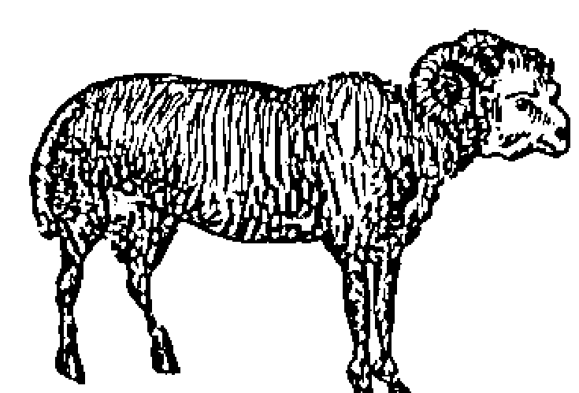

## 3月21日～4月20日

| 时期 | 映像 |
|---|---|
| 双鱼白羊座 (3月21日～24日) | 新生 |
| 白羊座一 (3月25日～4月2日) | 孩童 |
| 白羊座二 (4月3日～10日) | 星星 |
| 白羊座三 (4月11日～18日) | 先锋 |
| 白羊金牛座 (4月19日～20日) | 力量 |

白羊座是黄道十二宫的第1个星座，也是最原始的星座，它代表着万物生长的开端。作为第1个星座，白羊座是自然的根本，具有难以再细分或解释的本质。白羊座代表自我和最纯粹的、没有丝毫杂质的意志。从转世的角度看，白羊座代表精神或者灵魂重回大地；从人类生命周期的角度看，白羊座象征着新生和孩子的早期发展。

白羊座的主宰星是活力十足而又强势的火星，因此白羊座的人易怒，天赋异禀且极富动感。他们坚持我行我素，不希望通过客观比较来认识自己。他们努力追求最为纯粹的表现——我存在。正因为如此，白羊座的人无法忍受他人对自己的误解。

白羊座可以看做双鱼座和金牛座之间的过渡星座，它将水相双鱼座弥散的、超凡脱俗的能量转化成土相金牛座稳定的、实际的能量。

### 幸运石及其作用

- 钻石：增强自信
- 红宝石：提升战斗力
- 绿宝石：帮助交际
- 紫水晶：缓解头痛

### 幸运色

各种红色

### 代表的身体部位

头，脸，上颌，大脑，脑脊髓系统

### 个性

如果白羊座代表的是生命初始的前7年，其个性的形成就像是人体组织的发育一样——需要慢慢培养。随着自身的成长，他们会慢慢认识周围的世界，那些各种各样的经历也会反过来作用到他们所处的环境上。在此过程中，他们习得语言，体验情感，学习掌握适应社会和其他的生存技能。像年幼的孩子一样，白羊座直白坦诚，常常心血来潮，并以自我为中心，还有点儿异想天开。单纯的白羊座会怀着敬畏和好奇之心去认识世界，揣着强烈的愿望去探索世界。他们十分渴望成为夜空中闪耀的星星，在漆黑的夜晚照亮整个世界。通常来说，白羊座不需要通过寻求别人的肯定来增强自信，但他们希望能够引起别人的注意，因为他们清楚地知道自己的价值，在他们看来，自我怀疑就是毒药。不过，过分自信的白羊座也需要了解自省的意义，否则就有可能栽跟头，甚至挫伤自己高度的自信。

### 幸运曲目

A大调（贝多芬《第七交响曲》，舒伯特《鳟鱼五重奏》，莫扎特《第二十三钢琴协奏曲》，弗兰克《A大调钢琴与小提琴奏鸣曲》）；升F小调（巴赫《十二平均律钢琴曲集》中的《升F小调前奏曲与赋格》）

### 幸运植物

蓟属植物，蕨类植物

### 幸运树

- 春分：荆豆，野生橄榄树
- 3月21日～4月14日：赤杨，石榴树，梾木
- 4月15日～20日：黑刺李，柳树

白羊座就像孩子一样，需要在成长的过程中不断摸索、学习，挖掘自己的潜力，从而找到适合自己的发展道路。在他们看来，行动胜过思考。对他们来说，解决问题最好的办法不是沉思而是立即着手行动。当白羊座的行动计划受到阻挠或者被延误时，他们会感到十分痛苦。可能正是因为这一点，他们才更需要学着跳出自己看问题的条框，学着从另一个角度观察问题，从而客观地找到解决问题的方法。

### 容易被谁吸引

双子座，狮子座，天秤座，天蝎座

## 白羊座的名人

列奥纳多·达·芬奇，特蕾莎·德阿维拉，拉斐尔，简·古多尔，塞缪尔·贝克特，比利·霍利迪，马龙·白兰度，莎拉·沃恩，查理·卓别林，伊夫琳·阿什福德，文森特·威廉·凡·高，玛格丽特·杜拉斯，约翰·塞巴斯蒂安·巴赫，贝蒂·戴维丝，汉斯·克里斯琴·安徒生

白羊座经常会表露出强烈的领导欲望，但是那些有此愿望却又缺乏必要的执行力或领导才能的白羊座有时会因此受挫，感到沮丧，甚至自怨自艾。那些有此能力的白羊座则可能成为创新的、理想的开拓者，不过他们要避免一味追求新奇，成为毫无怜悯之心的自我主义者。

## 金牛座

元素：土
宫位：固定位
主宰星：金星
标志物：公牛
认知方式：感觉
座右铭：我拥有

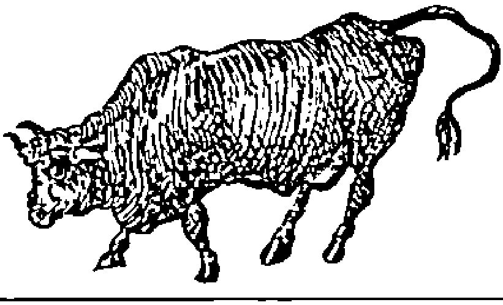

## 4月21日～5月21日

金牛座是黄道十二宫的第2个星座，代表成长和发展。金牛座是第1个土相星座，会表现出踏实的性格特点。金牛座也代表对个人修养——关爱、自持和坚守的培养。对人类来说，这象征着一个人从童年向青少年的稳定成长。

受控于金星，金牛座追求和谐，热衷于将周围环境改造得更美好。金牛座和物质世界关系紧密，因此对金牛座而言，拥有财产和建立安全感是非常重要的。因为金牛座的宫位是固定位且其又是土相星座，所以金牛座常给人以固执严肃的印象，就像它的星座标志物公牛一样。但是当涉及和谐的问题时，金牛座又可以灵活得令人惊叹。

金牛座可以看做从白羊座到双子座的过渡星座，它将火相白羊座直接的、单纯的能量转化成风相双子座扩张的、变化的能量。

| 时期 | 映像 |
| --- | --- |
| 白羊金牛座 (4月21日～24日) | 力量 |
| 金牛座一 (4月25日～5月2日) | 表现 |
| 金牛座二 (5月3日～10日) | 老师 |
| 金牛座三 (5月11日～18日) | 自然 |
| 金牛双子座 (5月19日～21日) | 活力 |

### 幸运石及其作用

- 玫瑰红石英：抚慰人心，激发想象
- 红宝石：提升学习力，增强自信
- 青金石：深化物质层面的活动

### 幸运色

所有蓝色，深绿色

### 代表的身体部位

耳朵，声带，颈和喉咙，腭，唾液腺，小脑

### 幸运曲目

F大调（贝多芬《田园交响曲》和《春季奏鸣曲》），巴赫《第一勃兰登堡协奏曲》，勃拉姆斯《第三交响曲》；E大调（维瓦尔第《四季》中的《春》，亨德尔《快乐的铁匠》，巴赫《E大调小提琴协奏曲》；贝多芬《钢琴奏鸣曲》中的第109号作品）

### 幸运植物

雏菊，蒲公英，百合花

### 幸运树

- 4月21日～5月12日：黑刺李，柳树
- 5月13日～21日：山楂树

### 容易被谁吸引

天秤座，天蝎座，摩羯座

## 金牛座的名人

威廉·莎士比亚，伊曼纽尔·康德，罗伯特·奥本海默，奥利弗·克伦威尔，查尔斯·里克特，赫伯特·斯潘塞，詹姆斯·门罗，威灵顿公爵，尼可洛·马基雅弗利，奥黛丽·赫本，卡尔·马克思，西格蒙德·弗洛伊德，约翰·布朗，乔治·卢卡斯

### 个性

如果金牛座象征着人生的第2个时期——从7岁到14岁，金牛座的人就像是更多地掌控了周围环境的孩童，学习什么属于他，什么不属于他。在拥有更多东西的同时，金牛座也有双重责任：学习如何使用它们并照看它们。因此，对金牛座的人来说，维护事物的外观是非常重要的课题，正如孩童意识到东西如果被很好地照料就会使用得更加持久、更加顺手一样。如果说在前7年中父母是获得支持的主要来源，那么在童年的第2个阶段则强调学习独立，并逐渐向自治过渡。伴随这一点而来的是金牛座会痛苦地意识到自己并不总是被关注的中心，自觉有意义的角色更多是在和兄弟姐妹或同学的伙伴关系中建立起来的。对金牛座而言，合作会成为一门必修的课程。

金牛座对从性到食物再到运动的所有事物都持有浓厚兴趣，就像成长中的孩童一样，对周围的物质世界充满了好奇。尽管他们的能力之一是开创并且构建新事物，但金牛座并不像白羊座那样一直追求动态，实际上他们很享受休息和安逸的生活。他们可以是敏锐的观察者——对他人进行的活动很有见地，也不乏思考的能力——可以细致地筹划一个项目，待机而动。然而不得不承认的是，他们的确有拖延、失去行动力的倾向。

金牛座喜欢成为团队中的一员，但前提是他们必须保有很大程度的自治权力，因为他们的控制欲和个性总是使得他们很难长时间安于追随者的位置。金牛座以固执著称，因此和他们合作的人很可能触及他们的底线——要不按照我的方式做，要不就不做。金牛座可能被指责有点自私，在足够公平的情况下，金牛座会首先保护自己的利益，不过他们也非常关心周围人的利益。金牛座为他们所爱的人而生活。

## 双子座

元素：风
宫位：变动位
主宰星：水星
标志物：双胞胎
认知方式：思考
座右铭：我交流

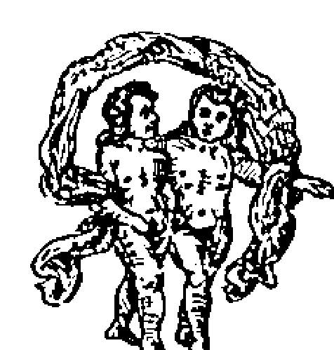

## 5月22日～6月21日

| 时期 | 映像 |
| --- | --- |
| 金牛双子座 (5月22日～24日) | 活力 |
| 双子座一 (5月25日～6月2日) | 自由 |
| 双子座二 (6月3日～10日) | 新语言 |
| 双子座三 (6月11日～18日) | 追寻 |
| 双子巨蟹座 (6月19日～21日) | 神奇 |

双子座是黄道十二宫的第3个星座，代表敏捷的思维和随和的交流。双子座是第1个风相星座，也是第1个心理倾向更趋于主观的星座，因此可以被比喻为一个活跃的智者，而这个智者正在试图和其他持有不同见解的人沟通。同样的，对人类来说，双子座象征着从青少年成长到成年所表现出的思维能力的扩展。

受控于水星，双子座关注思维和语言表达之间的微妙联系，关注细节，而非宏观图景。经历和环境的活跃、多样和变化对这个风相星座非常重要。双子座的那对双胞胎是第1个成对出现的星座标志物，它明确地表达了双子座对同伴的渴求。双子座有很强的适应能力，即使事情突发逆转也没有关系。

双子座可以看做从金牛座到巨蟹座的过渡星座，它将土相金牛座稳定的、实际的能量变为水相巨蟹座保护性的、同情的、感性的能量。

### 幸运石及其作用

- 黄水晶：使交流更愉快
- 琥珀：使想象更贴合实际
- 碧玺：帮助集中注意力

### 幸运色

黄色，浅绿色

### 代表的身体部位

手，手臂，肩膀，神经系统，上呼吸道系统

### 个性

如果双子座代表人生的第3个阶段——从14岁到21岁，双子座的个性就可以形容为从青少年向成年发展中的挣扎。这个时期的典型特征是既渴望融入社会，又想脱离父母或者社会的权威。实际上，双子座虽然有些直言不讳但却并不反叛，他们只是陶醉于自己的个性，视个人自由高于一切罢了。像青少年一样，双子座的人喜爱刺激和变化，他们很容易感到无聊，通常喜欢外出追求刺激，而不喜欢待在家里享受安稳和简单的快乐。很少有什么事情可以比和一个或者多个朋友外出旅游，然后惹上点麻烦更让他们感到高兴的了。对双子座的人来说，麻烦意味着冒险、勇敢和创新，同时也可以为自己的英勇事迹添上浓浓的一笔，还顺便添置了一些让生活变得更加丰富多彩的作料。

通常双子座的人急切地想要燃烧能量，这是受到双子座的主宰星水星影响的缘故。水星是罗马神话里长着翅膀的信使的化身，他飞过的地方总能创造新的速度纪录。在保有水星能量的同时，双子座会受到那些可以让他们感到有所提升或是受到赞美的活动的吸引。如果真的有一个星座会飞，那么一定是双子座。许多形式的旅行都让双子座为之神往，从骑自行车和摩托车到开汽车和溜冰都是如此。但是他们很容易感到疲惫，面对需要费时费力的活动，他们可能很快便放弃，或者改变方向。

双子座也喜欢成为团队中的一员。他们倾向于用自己的点子和语言能力让社交场合变得气氛热烈。但是，他们可能没有准备好承担作为集体一员的责任，经常被指责三心二意，甚至肤浅。但是在他们看来，改变想法并没有什么罪过，而且不从属他人通常也为双子座所普遍认同。

### 幸运曲目

G大调（巴赫《哥德堡变奏曲》，马勒《第四交响曲》，贝多芬《第四钢琴协奏曲》，莫扎特《弦乐小夜曲》）；G小调（莫扎特《第四十交响曲》，勃拉姆斯《第一钢琴四重奏》，舒曼《G小调钢琴奏鸣曲》）

### 幸运植物

艾菊，蓍草，女贞

### 幸运树

- 5月22日～6月9日：山楂树
- 6月10日～21日：橡树
- 夏至：帚石楠，雪松，欧椴树

### 容易被谁吸引

处女座，水瓶座，射手座

## 双子座的名人

苏格拉底，奥诺雷·巴尔扎克，理查德·瓦格纳，卡尔·冯·林奈，维多利亚女王，伊莎朵拉·邓肯，王淦昌，约翰·肯尼迪，沙皇彼得一世，沃尔特·惠特曼，玛丽莲·梦露，安妮·弗兰克，叶芝

## 巨蟹座

元素：水
宫位：本位
主宰星：月亮
标志物：螃蟹
认知方式：感受
座右铭：我感受

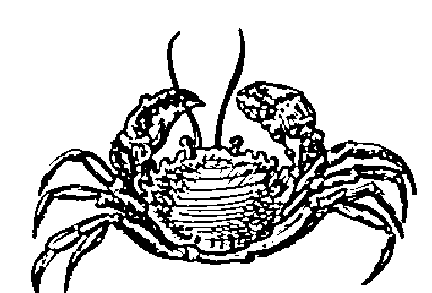

## 6月22日～7月22日

巨蟹座是黄道十二宫的第4个星座，代表深刻的情感、保护力和家庭责任。巨蟹座是第1个水相星座，象征着人类成熟后开始建立家庭，并通过反省来认识生活。确切地说，巨蟹座这个时期可以比做刚刚成人时情感上的进化和完善期。此时，自己第1个孩子的出生引发了他们强大的保护本能。

受控于月亮，巨蟹座和高度自我的情感与下意识的心理活动相联系。梦是巨蟹座的世界的一部分。如果说潮汐受制于月亮的海洋可以被认为代表了弥漫的感觉，那么巨蟹座就象征着那些情感在一个个个体身上的体现，就像螃蟹的外壳将它极为敏感的内心很好地隐藏了起来一样。

巨蟹座可以被看做从双子座到狮子座的过渡星座，它将风相双子座扩张的、变化的能量转化成火相狮子座稳固的、明确的能量。

| 时期 | 映像 |
| --- | --- |
| 双子巨蟹座 (6月22日～24日) | 神奇 |
| 巨蟹座一 (6月25日～7月2日) | 同理心 |
| 巨蟹座二 (7月3日～10日) | 个性 |
| 巨蟹座三 (7月11日～18日) | 说服者 |
| 巨蟹狮子座 (7月19日～22日) | 摆荡 |

### 个性

如果巨蟹座代表人生的第4个阶段——从21岁到28岁，这个星座的人就可以比做试图第一次拥有自己的家、事业甚至家庭的年轻人。尽管螃蟹有着防御性，知道如何等待时机，但认为巨蟹座是被动的则是错误的看法。巨蟹座在试图得到自己想要的东西的时候可以变得非常有侵略性，但通常喜欢让别人了解自己的需求、感觉和多样的情绪，而不是直接提出要求。相比于道理和逻辑，巨蟹座更加看重人和人之间感情的共鸣。正如对年轻人来说，深厚的友谊对他们来说是最重要的，他们需要相互信任和分享。实际上，巨蟹座很难与那些他们无法与之互相理解的人共事。

巨蟹座非常清楚是什么原因让他们和别人疏远。同时，他们在非语言表达方面的天赋也表现在对家中结构的布局上，巨蟹座特别重视对厨房和卧室的布置。而像吃东西、睡觉、性表达以及感情分享或者同情等活动必须要私下、定期地进行，并且要令其满意，这可以让巨蟹座获得超乎想象的心理支持。这些心理支持对巨蟹座来说非常必要，如果没有，巨蟹座就会变得紧张易怒。

单独和朋友一起度过一个安静的夜晚对巨蟹座来说是非常开心的事情。但是，许多巨蟹座又有一些奇怪的个性，即需要定期地向公众展示些什么。总的来说，相比于表达和释放，获得别人的肯定对巨蟹座来说并不十分重要。当然，在私人领域巨蟹座非常有说服力，因为在私人领域巨蟹座可以最好地发挥他们的魔力。

### 幸运石及其作用

- 月长石：平衡情绪，减轻胃痛
- 珍珠：舒缓忧伤和沮丧的情绪，减轻孤独感，强壮骨骼
- 碧绿橄榄石：稳固乐观心态，增强内心力量，抵抗情绪波动

### 幸运色

灰白色，奶油色，白色

### 代表的身体部位

胸部，膈膜，胃，皮肤

### 幸运曲目

E小调（德沃夏克《新世界交响曲》，柴可夫斯基《第五交响曲》，西贝柳斯《第一交响曲》）；降E小调（巴赫《降E小调前奏曲与赋格》，肖邦《降E小调前奏曲》，勃拉姆斯《降E小调间奏曲》）

### 幸运植物

睡莲，灯芯草

### 幸运树

- 夏至：帚石楠，雪松，欧椴树
- 6月22日～7月7日：橡树
- 7月8日～22日：冬青树

### 容易被谁吸引

双鱼座，天蝎座，水瓶座

## 巨蟹座的名人

乔治·奥威尔，海伦·凯勒，让-雅克·卢梭，迈克·泰森，弗兰兹·卡夫卡，菲尼亚斯·巴纳姆，约翰·洛克菲勒，尼古拉·特斯拉，约翰·昆西·亚当斯，盖乌斯·尤利乌斯·恺撒，约翰·雅各布·阿斯特，欧内斯特·海明威，马塞尔·普鲁斯特，埃尔文·布鲁克斯·怀特

元素：火
宫位：固定位
主宰星：太阳
标志物：狮子
认知方式：直觉
座右铭：我创造

## 狮子座

## 7月23日～8月23日

| 时期 | 映像 |
| :--- | :--- |
| 巨蟹狮子座 (7月23日～25日) | 摆荡 |
| 狮子座一 (7月26日～8月2日) | 权威 |
| 狮子座二 (8月3日～10日) | 力量平衡 |
| 狮子座三 (8月11日～18日) | 领导 |
| 狮子处女座 (8月19日～23日) | 敞开 |

狮子座是黄道十二宫的第5个星座，代表个体光芒四射的创造力点亮周围的世界。这是第2个火相星座，但与白羊座不同，狮子座的强大能量能得到更加充分的掌控。狮子座象征着个体想在世界上留下自身印记的渴望。有野心、力量和自信是这个星座的特点，正如狮子的勇气和王者风范让它受到其他动物的尊重甚至惧怕一样。

受控于太阳，狮子座代表通过强势直接的行动充分地表达自我。狮子座喜欢领导他人，希望他人怀着对他们的尊敬进行服从。但是，分享和温暖对这个星座同样重要，这个阳光的、极具狮子天性的金黄色星座需要愉悦、满足和和谐。另一方面，狮子座面对不公正、压迫和黑暗将会毫不犹豫地采取行动与之对抗。

狮子座可以看做从巨蟹座到处女座的过渡星座，它将水相巨蟹座保护性的、同情的和感性的能量转化成土相处女座服务型的、有辨析力的能量。

### 幸运石及其作用
- 黄水晶：帮助重获内心的平静，缓解压力
- 虎眼石：给予活力
- 红宝石：增强内心力量
- 乳黄色琥珀：使想象更贴合实际

### 幸运色
赭色，金色

### 代表的身体部位
心脏，背部，脊椎

### 个性

### 幸运曲目
降E小调（贝多芬《英雄交响曲》，西贝柳斯《第五交响曲》，莫扎特《第三十九交响曲》，马勒《千人交响曲》）；升G小调（穆索尔斯基《图画展览会》之《古城堡》）

如果狮子座代表人生的第5个阶段——从28岁到35岁，狮子座的人就可以比做正将自己的全部力量和全部个性展现给世界的成年人。狮子座喜欢以高姿态出现，他们不喜欢卑鄙和小气的行为。同时，就像百兽之王狮子一样，狮子座常常忽视那些他们认为无足轻重的事情。狮子座非常慷慨，如果他不能给予你很多东西，他就会干脆什么都不给你，有时对他们来说，接受别人的礼物也是一件困难的事情。狮子座倾向于按照自己的意志行事，并且有能力拒绝接受行不通的提议，他们通常会很坚定自己的信念。狮子座恪守维护尊严的原则，因此当他们打赌输掉或者投资失败的时候，他们会主动承担责任，同时他们也希望别人也能这样做。在他们看来，许下了承诺就要兑现。

### 幸运植物
向日葵，甘菊，薰衣草

### 幸运树
- 7月23日～8月4日：冬青树
- 8月5日～23日：榛树，杏树，苹果树

### 容易被谁吸引
天蝎座，摩羯座，狮子座

### 狮子座的名人
卡尔·古斯塔夫·荣格，斯坦利·库勃里克，马塞尔·杜尚，贝尼托·墨索里尼，亨利·福特，赫尔曼·梅尔维尔，克劳狄一世，珀西·比希·雪莱，约翰·休斯顿，路易斯·利基，让·皮亚热，雷德·霍尔兹曼，亚历克斯·黑利，约翰·洛吉·贝尔德，丹尼尔·斯蒂尔，麦当娜，梅里韦瑟·刘易斯

狮子座喜欢被人崇拜，不过他们期待的崇拜不仅是外表上的，更是对于他们所做的事情。被别人放在基座的位置上对他们来说丝毫不是问题。狮子座的人通常是天生的领导者，他们享受成为团体典范的感觉，无论在家庭、社会还是政治团体里都是如此，但是多数狮子座更希望能够低调地完成任务，从而给人一种高度自信、值得信赖的形象。

家庭是狮子座的城堡。出生在这个星座的人对他们的出生地感到自豪，当他们对自己的居住环境感到满意的时候，他们便会非常好客。狮子座以忠诚著称，如果有必要的话，狮子座会为了维护家庭、朋友和伴侣直到流尽最后一滴鲜血。需要注意的是，固执、墨守成规可能不利于他们的成长。

## 处女座

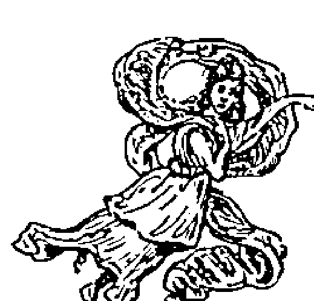

元素：土
宫位：变动位
主宰星：水星
标志物：处女
认知方式：感觉，思考
座右铭：我服务

## 8月24日～9月22日

处女座是黄道十二宫的第6个星座，也是继金牛座之后的第2个土相星座，以及继双子座之后的第2个受控于水星的星座。但是，处女座和金牛座与双子座的特质并不相同，处女座更加善于分析，更加仔细，也更加有序。处女座代表所有生命都需要一个系统的方法来看待存在这个问题。这个星座可以象征性地理解为将弥散的能量带到地面并且留住它们。

对人类来说，处女座就像是想要建构自己生活的成年人，他们通过有序服务为世界作出贡献。强烈的道德倾向赋予处女座严肃的形象，只有某些特定形式的幽默才能够打动他们。实际上，处女座对错误有着极强的识别能力，对需要关注的多数人类活动形式也会精挑细选。

处女座可以看做从狮子座向天秤座的过渡星座，它将火相狮子座稳固的、明确的能量转化为风相天秤座温和的、社会和外交上的能量。

### 个性

如果处女座代表人生的第6个阶段——从35岁到42岁，这个星座的人就可以比做成熟的成年人，他们已经稳定地立足于世界，但同时又不可避免地会遇到一些重要而又不好解决的问题（特别是在40岁左右时会遭遇中年危机）。处女座凡事喜欢保密，对于他们想要隐藏或者透露的事情他们心里非常有数，至于何时去做以及如何去做这些事也是如此。处女座的内心世界并不像双鱼座和巨蟹座那样不切实际、充满幻想，相反，他们的内心世界被分析、破解和衡量所占据。未来是处女座关注的焦点，他们倾向于按照计划向既定目标前进。比如，限定工作时间段来确保自己可支配的自由时间，节省旅行开支，作出经过深思熟虑之后的安排，节约使用行李或者运输空间，这些都是处女座打算度假时的特征。

这并不意味着处女座不接受临时的决定，他们不仅会坦然应对，通常还会隐藏一定的做事结构和秩序。双子座所展现出的速度和独立等水星特质在处女座身上有所缓和，处女座更喜欢将上帝赋予自己的才能用来服务他人。处女座通常是非常好的家庭成员和同事，可以为集体作出巨大的贡献。

处女座容易相信表象，因此如果别人向处女座许诺，处女座就会希望他们能履行自己的承诺。尽管处女座也喜欢文字游戏、耍耍小聪明，但是他们的幽默感有时会因拘泥于字面含义而被掩盖。处女座提出要求的方式通常是无声无息的，他们希望自己的需求无需说出来就能够被别人洞察。依照传统，处女座通常被描绘成一种谦逊的甚至迂腐守旧的形象，但许多处女座其实可以摆脱传统的道德立场，无拘无束地表达他们的感觉和欲望，而且，他们赋予自己的这种自由（但很少赋予他们所爱的人这种自由）很少失控。

| 时期 | 映像 |
| --- | --- |
| 狮子处女座 (8月24日～25日) | 敞开 |
| 处女座一 (8月26日～9月2日) | 系统化 |
| 处女座二 (9月3日～10日) | 谜样 |
| 处女座三 (9月11日～18日) | 真我 |
| 处女天秤座 (9月19日～22日) | 美 |

### 幸运石及其作用
- 紫水晶：帮助获得远离日常事务的自由
- 红玉髓：减轻忧虑、胃痛、减少噩梦
- 黄铁矿：增强自信和活力

### 幸运色
银色，靛蓝色，深紫色

### 代表的身体部位
腹部，大肠和小肠，胰腺，脾，新陈代谢系统

### 幸运曲目
C大调（舒伯特《流浪者幻想曲》和《第九交响曲》，莫扎特《木星交响曲》，肖邦《第一序曲》，贝多芬《第一钢琴协奏曲》）；降D大调（李斯特《叹息》，德彪西《月光》）

### 幸运植物
鹿蹄草，鼠尾草，女贞

### 幸运树
- 8月24日～9月1日：榛树，杏树，苹果树
- 9月2日～22日：葡萄藤，黑莓
- 秋分：白杨树，山杨树

### 容易被谁吸引
双子座，双鱼座，金牛座

### 处女座的名人
李·德福里斯特，特雷莎修女，歌德，玛丽·戈德温·雪莱，玛利亚·蒙台梭利，洛奇·马西亚诺，路易斯·沙利文，丹尼尔·伯纳姆，路易十四，简·亚当斯，伊丽莎白一世，列夫·托尔斯泰，弗朗兹·韦费尔，戴维·赫伯特·劳伦斯

元素：风
宫位：本位
主宰星：金星
标志物：天平
认知方式：思考，感觉
座右铭：我权衡

## 天秤座

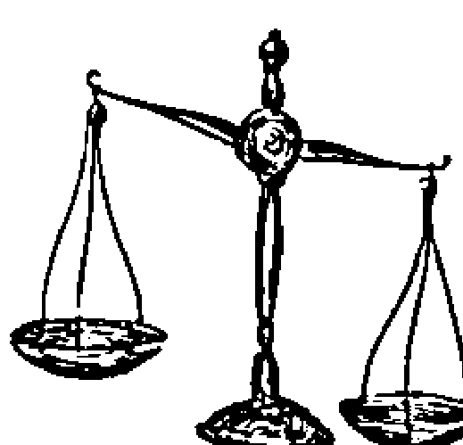

## 9月23日～10月22日

| 时期 | 映像 |
| --- | --- |
| 处女天秤座 (9月23日～24日) | 美 |
| 天秤座一 (9月25日～10月2日) | 完美主义 |
| 天秤座二 (10月3日～10日) | 社会 |
| 天秤座三 (10月11日～18日) | 戏剧 |
| 天秤天蝎座 (10月19日～22日) | 戏剧与批评 |

天秤座是黄道十二宫的第7个星座，也是继双子座之后的第2个风相星座，继金牛座之后的第2个受控于金星的星座。作为十二星座中最社会化的星座，天秤座象征着成熟的人渴望在现实世界中占据一席之地。此外，天秤座对人类在世界舞台上扮演的不同角色也有充分的认识。

天秤座的标志物是天平，强调生命对平衡的需求。实际上，天秤座可能非常执著于衡量不同的选择，这可能让他们在深思熟虑之后作出决定，也可能让他们陷入无法决定和不确定当中。天秤座致力于公正地对待所有人，但是有时候又可能对他人指责过度。天秤座的金星特质常常为人们所欣赏，这包括感性、美丽、优雅和良好的幽默感。

天秤座可以看做从处女座到天蝎座的过渡星座，它将土相处女座服务型的、有辨析力的能量转化为水相天蝎座固定的、强大的、可控制的能量。

## 天秤座个性

如果天秤座代表人生的第7个阶段——从42岁到49岁，天秤座的个性就可以形容为成熟的成年人经过中年时期，正努力规划人生的第2个半生。不可避免的，在这个过程中，天秤座要通过重新考虑事物之间的联系来调整自己的社会定位。金星的统治地位构成了天秤座爱美和社会性强等特质的基础，同时也让天秤座渴望和谐。矛盾的是，尽管天秤座喜爱事情顺畅地发展，没有什么阻碍，但是他们可能因为自己爱争辩的态度和行为惹来很多非议。虽然天秤座十分慷慨，可是他们有时候还是会意识不到别人的愿望，而是自顾自地前行。

因为天秤座做事需要看到问题的正反两个方面，并且要切实地衡量每一点，因此他们可能做事拖延。天秤座固执地拒绝任何催促，他们需要有充足的呼吸空间，如果处于拥挤或者压力过大的场合，他们会感到紧张，但是他们还是很擅长向别人施加压力的，特别是当他们认为这样做是为那些人好的时候。

得益于自身的能量和耐心，天秤座作为同伴和同事的时候常常受到高度赞扬，但是，他们必须注意不要将自己的意见强加给别人。因为天秤座真的不知道该怎样应对沮丧，所以他们可以轻松对待问题并且享受其中的时候，也是他们发挥最好的时候。对天秤座来说，具有吸引力是十分重要的，但是他们必须当心过度沉迷于追求外表的美丽。他们如果在这方面陷得太深，就很有可能损害他们的尊严。天秤座关注的另一件极其重要的事是公正，但是在他们追求平等的过程中，他们必须保持中间立场，这样不至于让他们陷入对别人的过度认可或者过度指责的陷阱中。

### 幸运石及其作用
- 欧泊：释放能量，增强判断力
- 碧玉：帮助肾脏工作，提升勇气以作出富有同情心的决定

### 幸运色
- 原色，艳粉红色，深蓝色

### 代表的身体部位
- 肾，腰椎，卵巢，降结肠

### 幸运曲目
- 降A大调（贝多芬《钢琴奏鸣曲》中的第110号作品，艾尔加《第一交响曲》，李斯特《爱之梦》）；
- F小调（贝多芬《热情奏鸣曲》；肖邦《第四叙事曲》，勃拉姆斯《钢琴四重奏》）

### 幸运植物
- 三色堇，报春花，紫罗兰，草莓

### 幸运树
- 秋分：白杨树，山杨树
- 9月23日～29日：葡萄藤，黑莓
- 9月30日～10月22日：常春藤

### 容易被谁吸引
- 水瓶座，白羊座，金牛座

### 天秤座的名人
- 威廉·福克纳，德米特里·肖斯塔科维奇，托马斯·斯特恩斯·艾略特，约翰尼·查普曼，塞缪尔·亚当斯，梅里斯·达卡拉瓦乔，恩里科·费米，欧里庇得斯，埃利·维泽尔，吉米·卡特，莫汉达斯·甘地，托马斯·沃尔夫，路易·吕米埃，海伦·威尔斯·穆迪，杰西·杰克逊，亨利·卡文迪什，爱莉诺·罗斯福，玛格丽特·撒切尔夫人

## 天蝎座

元素：水
宫位：固定位
主宰星：冥王星
标志物：蝎子
认知方式：感受
座右铭：我控制

## 10月23日～11月21日

天蝎座是黄道十二宫的第8个星座，是继巨蟹座之后的第2个水相星座。严肃而热情的天蝎座被黑暗星体冥王星所统治，同时也受金星主宰，因此天蝎座也具有一些和白羊座一样的侵略性特质，但在心理倾向上更加稳定。天蝎座象征性地展示了中年的力量以及相应的引导和掌控人生的能力。

极具防御性的蝎子并不是天蝎座的唯一标志，滑翔的雄鹰代表了天蝎座看得远的特质，以及能屈能伸的能力。如果天蝎座不想与人接触，他们完全有能力做到，并且可以意志坚定地处理某些严肃的问题。冥王星赋予天蝎座火山喷发般的能量以及洞察事物量变甚至质变的能力。

天蝎座可以看做从天秤座向射手座的过渡星座，它将风相天秤座温和的、社会和外交上的能量转化为火相射手座哲学的、变化的能量。

### 个性

如果天蝎座代表人生的第8个阶段——从49岁到56岁，天蝎座的个性就可以形容为处在中年的开端，人们开始试图在各自的社会角色中获取充分的权力，这可能包括在家庭和工作环境中成为主导力量，或者达到个人创造性成果的顶峰。冥王星对天蝎座的统治主要表现在强势的、性的、黑暗的、宿命的和深刻的层面，而另一个主宰星火星的统治则赋予天蝎座活力十足和直接的特质，但同时也可能让天蝎座变得好斗。天蝎座大多很严肃，好像身上有刺一般，懂得这一点的人们就会知道天蝎座不是轻易可以忽略的人。不过，天蝎座的人通常不会主动与人发生冲突，他们更倾向于将自己的武器拿来自卫。

没有一个星座像天蝎座这样受到过这么多诽谤，实际上，许多天蝎座的人都被不公正地贴上了这样的标签：奸诈、阴险、性欲过盛。实际上，天蝎座确实和潜意识密切相关，并且在天蝎座的生活中，死亡与重生的主题一直在交错变换。许多天蝎座的人看上去似乎都经历着一种艰难甚至痛苦的个性变化，这种变化也许是轻微的，但也许是本质的改变。

总的来说，天蝎座天生就对人生的严肃性和不幸的一面有很好的认识，因此，他们对盲目乐观的人生哲学、万能灵药、肤浅的看法或者表面的光芒都持怀疑态度。另一方面，他们通常有出色的幽默感，能对生活的讽刺给以成熟的理解。不过，他们必须当心自我毁灭的倾向和对其他事物（不管是人还是某种想法）的持续依赖，同时，应该避免控制过度的行为，也不要沉溺于某些东西。

| 时期 | 映像 |
| --- | --- |
| 天秤天蝎座 (10月23日～25日) | 戏剧与批评 |
| 天蝎座一 (10月26日～11月2日) | 强烈 |
| 天蝎座二 (11月3日～11日) | 深刻 |
| 天蝎座三 (11月12日～18日) | 魅力 |
| 天蝎射手座 (11月19日～21日) | 变革 |

### 幸运石及其作用
- 红宝石：支撑面对世界所需要的信仰和勇气
- 石榴石：平衡性冲动
- 红玉髓：让人脚踏实地
- 黑珍珠：给人以平静，在困难时期给人以安慰

### 幸运色
黑色，血红色，炭灰色

### 代表的身体部位
鼻子，生殖器，血液，尿道，膀胱

### 幸运曲目
D小调（巴赫《夏康舞曲》，贝多芬《第九交响曲》，莫扎特《钢琴协奏曲》，勃拉姆斯《钢琴协奏曲》，舒伯特《死神与少女四重奏》）；升C小调（贝多芬《月光奏鸣曲》；马勒《第五交响曲》）

### 幸运植物
根菜类植物，毒芹（有毒，勿食）

### 幸运树
- 10月23日～27日：常春藤
- 10月28日～11月21日：芦苇

### 容易被谁吸引
摩羯座，狮子座，双鱼座

### 天蝎座的名人
安东尼·冯列文虎克，皮埃尔·吉勒斯·德热纳，梅里安·库珀，西奥多·罗斯福，埃德蒙·哈雷，克里斯托弗·哥伦布，威尔·罗杰斯，雷蒙·勒维，玛丽·居里，伊万·屠格涅夫，费奥多尔·陀思妥耶夫斯基，路易·雅克·芒代·达盖尔

元素：火
宫位：变动位
主宰星：木星
标志物：弓箭手
认知方式：直觉
座右铭：我哲学化

## 射手座

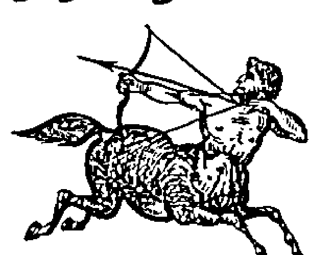

## 11月22日～12月21日

| 时期 | 映像 |
|---|---|
| 天蝎射手座 (11月22日～24日) | 变革 |
| 射手座一 (11月25日～12月2日) | 独立 |
| 射手座二 (12月3日～10日) | 原创 |
| 射手座三 (12月11日～18日) | 巨人 |
| 射手摩羯座 (12月19日～21日) | 先知 |

射手座是黄道十二宫的第9个星座，是继白羊座和狮子座之后第3个也是最后一个火相星座。受控于开朗的木星，射手座象征着人类成长中的世界观：胸襟开阔，乐观，拒绝因死抠细节而停滞不前——也就是说，具有从整体上把握的能力。

射手座被描绘成了一个弓箭手——一个富有智慧的人马形象，他们中的哲人通常可以直接抓住事情的本质。射手座努力让人类变得更加崇高——他们的弓箭可以把我们带到其他星球上去。射手座的人可能犯过犹不及的毛病（走得过远或者过快），但是这可以鞭策我们不要对鸡毛蒜皮的事情斤斤计较，也不要屈从于一些卑劣的行径。射手座的木星能量鼓励他们和其他人看到事物最好的方面。

射手座可以看做从天蝎座到摩羯座的过渡星座，它将水相天蝎座固定的、强大的和可控制的能量转化为土相摩羯座积极向上的、务实的能量。

### 幸运石及其作用
- 绿松石：抵御灾难
- 紫水晶：促进和善与相互理解
- 黄水晶：连接高层自我和低层自我

### 幸运色
牛仔蓝色，米黄色，古铜色

### 代表的身体部位
臀部，大腿，肝脏，血管，肌肉系统

### 个性

如果射手座代表人生的第9个阶段——从56岁到63岁，射手座的个性就可以形容为那些拥有充分权力的人开始让自己脱离家庭和事业的责任，投身于个人或者人类普遍关心的事情，这样的倾向是木星影响的结果。木星能量带给射手座开阔的胸襟、乐观的精神和想要看到全局的愿望。此外，射手座对所有人都坚持诚实和信任的道德准则。然而，尽管射手座整体上给人以乐观的外表，他们还是经常因为自己理想化的想法而陷入纠纷。他们充满激情的能量是惊人的，但是当他们的自我激励变少和自信下降的时候，他们的能量也会随之衰减。

射手座永远都是学生，不断地探知周围的世界。他们的星座标志物是半人半马的弓箭手，因此他们对人类和动物都有强烈的兴趣也并不令人诧异。对射手座来说，动物代表一种理想，一种人类可以努力赶超的理想。他们甚至坚决抵制很多社会价值而相信更高的真理。不过，他们必须小心不要过度贬低那些与他们信仰不同的人。

射手座的人热爱运动和旅行是众所周知的，但是当他们觉得找到了自己的节奏的时候，他们也乐于在一个地方安定下来。射手座在家里会感到安心，因为他们可以在这里探索自己的思想领域，同时也可以开发新的、有挑战性的项目。射手座很少感到无聊，他们会不断寻找新的方式表达自己。

### 幸运曲目
降B小调（巴赫《勃兰登堡第六协奏曲》，莫扎特《钢琴协奏曲》，勃拉姆斯《钢琴协奏曲》，舒伯特《钢琴奏鸣曲》）；A小调（巴赫《A小调小提琴协奏曲》，泰雷曼《A小调竖笛组曲》，格里格《钢琴协奏曲》，西贝柳斯《第四交响曲》）

### 幸运植物
芦笋，栗树，黄豆

### 幸运树
- 11月22日～11月24日：芦苇
- 11月25日～12月21日：接骨木
- 冬至：紫杉

### 容易被谁吸引
双子座，白羊座，金牛座，处女座

### 射手座的名人
查尔斯·舒尔茨，诺伯特·威纳，吉米·亨德里克斯，小亚当·克莱顿·鲍威尔，刘易斯，伍迪·艾伦，玛丽亚·卡拉丝，约瑟夫·康拉德，沃尔特·迪斯尼，查尔斯·马丁·霍尔，诺姆·乔姆斯基，古斯塔夫·阿道弗斯，小津安二，亚历山大·埃菲尔，史蒂文·斯皮尔伯格

## 摩羯座

元素：土
宫位：本位
主宰星：土星
标志物：山羊
认知方式：感觉
座右铭：我掌管

## 12月22日～1月20日

摩羯座是黄道十二宫的第10个星座，却是第1个“宇宙型”星座（双鱼座、水瓶座也是这种类型的星座），也是继金牛座和处女座之后第3个也是最后一个土相星座。受到宿命的土星的控制，摩羯座象征着成年人的严肃外表，也象征着个人精神和宇宙相连的意识。节约、反对浪费、做事严谨都是摩羯座责任感强的表现。

| 时期 | 映像 |
| --- | --- |
| 射手摩羯座 (12月22日～25日) | 先知 |
| 摩羯座一 (12月26日～1月2日) | 王者 |
| 摩羯座二 (1月3日～9日) | 决心 |
| 摩羯座三 (1月10日～16日) | 支配 |
| 摩羯水瓶座 (1月17日～20日) | 神秘幻想 |

摩羯座的山羊可能在平原上吃一会儿草，但最终它会在山上寻找一个可以高瞻远瞩的有利位置：志向高远、努力奋斗以获取成功是这只有抱负的山羊的典型特质。幸运的是，摩羯座总能找到这样一个位置并占据它。从这个星座的人身上总是可以感受到人生的宿命感，但是自由意志和坚定自信的重要性也不应该被低估。

幸运石及其作用
钻石：增强自信，使人更有雄心
隼眼石：提高洞察力，激发直觉
白宝石：结合自律和友好

摩羯座可以被看做从射手座到水瓶座的过渡星座，它将火相射手座哲学的、变化的能量转化为风相水瓶座分散的、离心的能量。

幸运色
所有棕色，橙色

代表的身体部位
牙齿，骨骼系统，膝盖

### 个性

幸运曲目
C小调（贝多芬《第五交响曲》和《悲怆交响曲》，马勒《复活交响曲》，勃拉姆斯《第一交响曲》，巴赫《帕萨卡利亚舞曲》）；
B大调（勃拉姆斯《第一号钢琴三重奏》；肖邦《B大调夜曲》）

如果摩羯座代表人生的第10个阶段——从63岁到70岁，摩羯座的个性就可以形容为对成熟的需求，这种成熟可以给他们带来安全感并支撑其生活结构，但同时也可能预示着更加僵化的思想。主宰星土星带给摩羯座以严肃、强烈的责任感和想要限制而非扩展的愿望，这一点和木星对射手座的控制相反。摩羯座倾向于保守，但这并不意味着他们无法追求新事物，他们经常用耐心和持之以恒去克服自己的保守倾向。摩羯座的人并不特别在意他们完成目标所花的时间，他们总是慢条斯理地、仔细地处理手中的事情，很少中途放弃。

幸运植物
毒芹（有毒，勿食），牛蒡根

幸运树
冬至：紫杉
12月22日：接骨木
12月23日～1月20日：桦树

许多占星学家都承认摩羯座是最难解释的一个星座，因为出生于这个星座的人的个性很多样。不过，摩羯座的人看上去都具有土星控制下的宿命感，这赋予了他们一种不同于水瓶座的开放的接受能力。摩羯座承认卑微、困难甚至苦难都是生活的一部分，当事情变得异常顺利或者容易的时候，摩羯座可能还会感到怀疑。此外，摩羯座通常可以很好地接受自己的人生角色，但是有时缺少适时改变的灵活性。

容易被谁吸引
金牛座，天蝎座，狮子座

摩羯座的名人
贾科莫·普契尼，约瑟夫·史密斯，米歇尔·德诺查丹马斯，耶稣，路易·巴斯德，拉迪亚德·吉卜林，里修小德兰，艾萨克·阿西莫夫，约翰内斯·开普勒，埃尔维斯·普雷斯利，史蒂芬·霍金，亚历山大·汉密尔顿，杰克·伦敦，小马丁·路得·金，黛安·福西

摩羯座对权力及其运作有一种天生的感知力。许多摩羯座的人都应该当心自己有独裁倾向。有一些摩羯座的人不会告诉别人要去做什么，而是告诉他们该怎么做。通常摩羯座会展示丰富的知识来支撑自己的观点。总的来说，摩羯座给人的感觉是他们知道该怎样表达，如果他们犯了错误或者走向了错误的方向，他们会在遭到别人的批评后很长时间（有时是几年）才承认他们的错误。

## 水瓶座

1月21日～2月19日

元素：风
宫位：固定位
主宰星：天王星
标志物：倒水侍者
认知方式：思考
座右铭：我普及

| 时期 | 映像 |
|---|---|
| 摩羯水瓶座 (1月21日～22日) | 神秘幻想 |
| 水瓶座一 (1月23日～30日) | 天才 |
| 水瓶座二 (1月31日～2月7日) | 青春自在 |
| 水瓶座三 (2月8日～15日) | 接纳 |
| 水瓶双鱼座 (2月16日～19日) | 敏感 |

水瓶座是黄道十二宫的第11个星座，和摩羯座与双鱼座一样，都是心理倾向更宽泛的星座。水瓶座是继双子座和天秤座之后的第3个也是最后一个风相星座，并且受到具有爆发性的天王星的控制，水瓶座象征着先进的思想，这可以让我们脱离自身的物理状态而看到事物的无限性。水瓶座也代表接纳，在他们的行为和思想里有着天生的普遍智慧。

倒水侍者带给我们可以分享的明确真理和永恒智慧。水瓶座的主宰星天王星运动不稳定，并且有可以冲破任何阻碍的强大能量。在不削弱其影响的前提下，这种能量必须要被驯服，引导到正确的方向上。水瓶座代表科学价值和超感能量，预示着我们即将要进入一个新时代，在这里我们的世界将会发生翻天覆地的变化。

水瓶座可以看做从摩羯座到双鱼座的过渡星座，它将土相摩羯座积极向上的、务实的能量转化为水相双鱼座弥散的、超脱尘世的能量。

### 个性

如果水瓶座代表人生的第11个阶段——从70岁到77岁，水瓶座的个性就可以形容为像孩子一样逐渐超脱于尘世之外，多少有点异想天开（但也是非常智慧的）。水瓶座高度接纳的特质使其能够超越物质的约束和局限，但是，主宰星天王星会赋予水瓶座不可知性、古怪和多变性。出生于这个星座的人经常以奇特的行为著称，试图猜透水瓶座的心思可以说是白费工夫。同样，试图规范他们的行为，让他们从事重复性的工作也通常不怎么奏效。水瓶座需要尽可能多的空间来发挥他们的想象力，至于限制则越少越好。

愉悦是水瓶座的一个基本特质。通常水瓶座对拒绝感到不可理解，因为他们总是以一种开放的态度去对待人生，可以接纳更多的事物，并因此觉得别人也同样可以接纳，但是事实并非如此。此外，水瓶座喜欢将事情简化，对快乐和理解的渴望充满了他们所做的每一件事情。但是如果面临冲突或者压迫性的要求，他们就会以最快的速度反击，要不就干脆离开。

水瓶座推崇崇高的理想，非常重视科学和普遍真理，并努力保持客观性，因此他们常常遭受冷漠或者缺少同情心的指责。水瓶座通过放大来快速处理一些事情，有些人觉得这种方式太过肤浅，但是水瓶座却可以借此轻松地应对生活。然而遗憾的是，水瓶座会经常不由自主地被人性深处的一些黑暗面所吸引，而这些特质在他们的个性中并不突出。

- 幸运石及其作用
天河石：激发灵感
蓝宝石：释放情感，打败沮丧
黑胆石：稳定天王星的影响
琥珀：平复不安

幸运色
铁蓝色，银灰色，荧光色

代表的身体部位
小腿和踝关节，循环系统

幸运曲目
D大调（巴赫《尊主颂》，贝多芬《庄严弥撒》和《小提琴协奏曲》，勃拉姆斯《小提琴协奏曲》，柴可夫斯基《小提琴协奏曲》，莫扎特《小提琴协奏曲》，马勒《第一交响曲》）；升F大调（贝多芬《升F大调钢琴奏鸣曲》，马勒《第十交响曲》）

幸运植物
蒲公英，乳香木，没药树

幸运树
1月21日：桦树
1月22日～2月18日：花楸树
2月19日：白蜡树

容易被谁吸引
白羊座，双子座，天秤座

水瓶座的名人
司汤达，哈德良，沃尔夫冈·阿马多伊斯·莫扎特，阿瑟·鲁宾斯坦，富兰克林·德拉诺·罗斯福，弗朗兹·彼得·舒伯特，兰顿·休斯，詹姆斯·乔伊斯，汉克·阿伦，乔治·赫尔曼·鲁斯，查尔斯·狄更斯，托马斯·阿尔瓦·爱迪生，弗雷德里克·道格拉斯，玛丽安·安德森

## 双鱼座

元素：水
宫位：变动位
主宰星：海王星
标志物：鱼
认知方式：感受
座右铭：我相信

## 2月20日～3月20日

双鱼座是黄道十二宫的第12个星座，是继巨蟹座和天蝎座之后最后一个水相星座，也可以看做所有星座中演化程度最高的一个星座。它不仅受有水性特征的海王星主宰，同时也受木星的影响。木星赋予双鱼座和射手座一样的开阔胸襟和变动特质。双鱼座是白羊座获得重生的必经阶段，象征着人类灵魂和宇宙的相融合，也象征着人类对宇宙庞大力量的深刻信仰。

鱼可以下潜很深，从而探求隐藏的、终极的神秘。双鱼座的两条鱼自由地在宇宙的海洋中遨游，它们代表着友谊，也代表着洞察人生和自然内部的能力。双鱼座教育我们不要畏惧脱离尘世——死亡也意味着新生。

双鱼座可以看做从水瓶座到白羊座的过渡星座，它将风相水瓶座分散的、离心的能量转化为火相白羊座直接的、单纯的能量。

| 时期 | 映像 |
|---|---|
| 水瓶双鱼座 (2月20日～22日) | 敏感 |
| 双鱼座一 (2月23日～3月2日) | 心灵 |
| 双鱼座二 (3月3日～10日) | 独行侠 |
| 双鱼座三 (3月11日～18日) | 舞者与梦想家 |
| 双鱼白羊座 (3月19日～20日) | 新生 |

### 个性

如果双鱼座代表人生的第12个阶段——也就是最后一个阶段，从77岁到84岁，双鱼座就象征着摆脱尘世负担和宇宙融为一体的精神。海王星的统治赋予双鱼座梦幻的、精神的和富有情感的特质。虽然双鱼座并不以实际著称，但是却可以熟练地理解和表达抽象的概念和体系。因此，可以称得上是梦想家的双鱼座在给人们描述自己的所见所想时，其实是带给了人们一份珍贵的礼物。总的来说，双鱼座很乐于与人分享，他们比其他任何一个星座都享受友谊和亲密关系带给他们的愉悦。但是有时候他们也需要一段时间独处，即使被别人说成遁世者或者独行侠也没有关系。

双鱼座极度敏感，很容易沮丧，有时候还会陷于自怜的泥潭，这让他们很难处于领导地位。尽管通常被看做悲伤的代表，双鱼座还是可以很好地接受苦难的。他们深刻复杂的感情世界，对那些渴望了解生活深层次的东西的人很有吸引力。不过，双鱼座应该警惕逃遁和上瘾这两个危险的倾向。

双鱼座记忆力很好，或许这和他们的敏感性有关。此外，他们可以非常虔诚，能成为真正的信徒，这不仅表现在对宗教的信奉上，也表现在对其他体系和原则的信仰上。受土星的影响，双鱼座非常慷慨，也有着很强的同情心：当他人遭遇不幸，他们会十分敏感；面对别人的厄运，他们会表现出怜悯之情。但是，双鱼座的人必须当心受人欺骗和利用。

幸运石及其作用
白色欧泊：加强对幻想的认识
碧玉：平衡肾脏功能，减轻恐惧感
珍珠：抚慰人心
紫水晶：防止对某些事物上瘾

幸运色
淡紫色，紫色，碧绿色

代表的身体部位
脚，脚趾，淋巴系统

幸运曲目
B小调（巴赫《B小调弥撒》、舒伯特《未完成交响曲》、柴可夫斯基《第六交响曲》）；降B小调（肖邦《钢琴奏鸣曲》和《谐谑曲》、巴赫《平均律钢琴曲》中的《序曲与赋格》）

幸运植物
苔藓，蕨类植物，海藻

幸运树
2月20日～3月17日：白蜡树
3月18日～20日：赤杨，石榴树，楝木
春分：荆豆，野生橄榄树

容易被谁吸引
水瓶座，巨蟹座，天蝎座

双鱼座的名人
迈尔·阿姆谢尔·罗斯柴尔德，威廉·格林，皮埃尔·奥古斯特·勒努瓦，维克托·雨果，君士坦丁大帝，马里奥·安德烈蒂，安东尼奥·维瓦尔第，米开朗琪罗，卢瑟·伯班克，哈丽雅特·塔布曼，马里于斯·珀蒂帕，珀西瓦尔·洛厄尔，阿尔贝特·爱因斯坦，安德鲁·杰克逊，戴维·利文斯通

## 双鱼白羊座

## 3月19日～24日

双鱼白羊座融合了黄道十二星座中的最后一个星座双鱼座和第1个星座白羊座的特征，代表着新生，因此，双鱼白羊座可以说是代表重生、新生的区间，这一段时间也可以比做人类刚出生的阶段。许多文明地区都将春分（在北半球大约是3月21日）视为一年的开始。不同语言中表示“春天”的字眼也特别强调这个意思，例如：意大利文的primavera、法文的printemps、荷兰文的voorjaar。从这里便可看出古人对生命循环的深刻理解与卓越见解——占星学家和古人大多不将1月1日当做一年的起始，而是把春分当做新的一年的第一天。

在这个时间段出生的人，不仅拥有双鱼座爱幻想、安静以及敏感的特性，同时也有白羊座率直、暴躁、易怒的个性。

| 黄道带位置： | 双鱼宫27° ～ 白羊宫4° |
| 核心理念： | 新生 |
| 季节： | 晚冬/早春（春分） |
| 元素： | 水/火 |
| 宫位： | 变动位/本位 |
| 主宰星： | 海王星/火星 |
| 标志物： | 鱼/公羊 |
| 认知方式： | 感受/直觉 |

到不解。他们可以在梦想家和行动者之间转换自如。但是，作为通过感受和直觉理解事物的典型，他们经常缺少稳定的思绪和客观的头脑。正因为如此，他们的人生总是充斥着很多冲突和变化。

那些无法理解双鱼白羊座个性的人最好不要探究他们做事的动机或者深层次的原因，因为他们不喜欢被人分析，他们觉得无论自己的做法是对还是错，这就是他们最真实的样子。所有自我分析的过程对他们来说都是痛苦的，但是他们人生的成功会直接得益于他们的自我反思。

### 个性

双鱼白羊座对待生活的方式非常率直，这样的坦率虽然受到了别人的赞赏，却也常常遭到误解。他们崇尚基本、原始，他们无法被拒绝也不能被拒绝。双鱼白羊座很少能看到自己的缺点或者错误，因此他们拒绝改变自己的态度或者生活方式。即便是他们之中最温和的人也总是带着一副自己一贯正确的神情。他们坚持自己选择的道路。

每个交界星座的个性都会因受到相邻的两个完全不同的星座的影响而表现出互相冲突的元素。因为双鱼白羊座表现出了水相双鱼座敏感、丰富的感情以及火相白羊座强大的行动力和意志力，因此出生于这个星座的人性格中共存的被动和主动特质会让其他人感

## 建议

对双鱼白羊座来说，最重要的课题是学着培养耐性，通过和别人共事来学习社交技巧。试着控制自己的鲁莽和急性子，在说话或者行动之前慎重拿捏分寸。认真反思以便更好地认识自己。

### 容易被谁吸引

出生在双鱼白羊座的人总是被出生于其他交界星座的人所吸引，特别是出生于天秤天蝎座（10月19日～25日）和金牛双子座（5月19日～24日）的人。

### 双鱼白羊座的名人

戴维·利文斯通，怀亚特·厄普，奥维德，亨里克·易卜生，约翰·塞巴斯蒂安·巴赫，沃尔特·吉尔伯特，安东尼·范戴克，马塞尔·马索，黑泽明，琼·克劳馥，威廉·莫里斯，约瑟夫·普里斯特利

## 白羊座一

## 3月25日～4月2日

白羊座一的中心映像是孩童，代表人的幼年时期。此时的人充满惊奇、敬畏、恐惧、好奇之心和充沛的生命力。

白羊座一这个阶段象征着幼童开始好奇地探索周围的新鲜世界，每一天都展现出孩童性格的不同层面。他们透过复杂的感官经验，抱着惊奇和敬畏的心理来认识世界。出生在白羊座一的人就像孩子一样，善于融入环境，同时又能保持自己的独特性。

| 黄道带位置： | 白羊宫3°～13° |
| :--- | :--- |
| 中心映像： | 孩童 |
| 季节： | 早春 |
| 元素： | 火 |
| 宫位： | 本位 |
| 主宰星： | 火星 |
| 标志物： | 公羊 |
| 认知方式： | 直觉 |

上。只要他们没有感到自己的理想或者尊严受到威胁，他们就可以在一个位置上有着持久的良好表现。

白羊座一很少感到沮丧。尽管他们易怒，但是他们的怒火就像雷阵雨一样短暂。幸运的是，因为白羊座一看到的是自然中单纯的部分，怀疑或者困惑会很快消逝。人们会发现，对白羊座一来说，精心算计和险恶用心实在是太遥远的事情。

或许对白羊座一来说，理想的状态就是没有任何限制地独自生活。在事业上，如果有充足的时间并且可以自由选择做事情的方式，他们会有最佳表现。在个人问题上，那些与白羊座一相恋的人需要顾及他们对于独立的极度渴望，同时也要顾及他们对于关爱和分享的渴求。

### 个性

白羊座一常常表现出孩童般坦率、开放、活力十足的举止。就像孩童一般，他们不仅自然、活泼，也会欣赏别人身上的这种特质。白羊座一常常被当成天真、肤浅的人。他们对批评极为敏感，在遭到批评、误解或者不被严肃对待的时候，白羊座一会倾向于一走了之。实际上，那些希望和他们交流的人需要理解他们内心对于坦率表达自我的渴望。

尽管他们看起来似乎很适应公共生活，并且确实享受社会活动，但是对白羊座一来说最大的困难是在世俗世界里每天与人相处。他们饱满的精神和美丽的的确让他们惹人喜欢，他们也知道如何给别人留下良好的印象，但是，他们固执地坚持自己的信仰，理想主义让他们无法作出妥协。这种死板很可能成为他们在日常生活中的阻碍。

即使白羊座一有巨大的成为领导者的动力，他们也可能无法胜任这个职位。实际上，他们大多过于敏感，缺少艰苦斗争所需要的坚强。虽然他们可能有毅力坚持下去，但是他们可能无法拿出同样坚定的信念前进。正因为如此，他们经常固定在团队成员的位置

## 建议

多从事平和的活动，让自己静下心来，但也别压抑了充沛的活力和进取心。遭遇挫折时，试着先了解问题所在，再采取行动。需要协助时，不要不好意思，尽管开口吧！承认自己也需要别人的关爱和支持。

## 白羊座一的名人

贝洛·鲍尔托克，阿图罗·托斯卡尼尼，罗伯特·弗罗斯特，桑德拉·戴·奥康纳，威廉·康拉德·伦琴，拉斐尔，马克西姆·高尔基，里克·巴里，约翰·泰勒，伊莱休·汤姆孙，文森特·威廉·凡·高，弗朗西斯科·德戈雅，勒内·笛卡尔，弗朗兹·约瑟夫·海登，亚伯拉罕·马斯洛，威廉·哈维爵士，汉斯·克里斯琴·安徒生

## 白羊座二

## 4月3日～10日

白羊座二的中心映像是星星。这个时期可以看做小孩子首次从被保护与照顾的环境中向外探索的时期。这个时期的孩子将对周围的世界更加熟悉，做事时可能常常以自我为中心。

白羊座二就像孩子一样，主动活泼，凡事喜欢亲身体验，热衷于公众事务。对人类而言，这样一颗闪亮的孩童之星开始忙碌于第一次的自我认知，并且将发展出自我意识，第一次学会使用自己的名字，并懂得用“我”这个字来表达。他们经由不断地尝试和获取经验来探索、了解周围的世界。在大胆探索的过程中，他们有时不免走得太急太快，甚至做得有些过火，但这也不过只是孩子们成长的必经之路罢了。

| 黄道带位置： | 白羊宫12°～21° |
| :--- | :--- |
| 中心映像： | 星星 |
| 季节： | 早春 |
| 元素： | 火 |
| 宫位： | 本位 |
| 主宰星： | 火星 |
| 标志物： | 公羊 |
| 认知方式： | 直觉 |

但是，白羊座二确实需要一个富有同情心和洞察力的伴侣或者密友来帮助他们了解自己和自己在人生中扮演的角色。因为他们对事物的实际衡量并不总是那么精准，所以他们需要这些人来充当自己的顾问，而那些从没有遇到过这样的顾问的白羊座二则会感到无依无靠。

不否认的是，白羊座二确实有夸大自己重要性的倾向。在家庭和事业中，他们可能真的是不可缺少的一员，但是如果他们看不到自己和组织或者团体之间的相互联系，他们就可能产生敌对情绪。同时，因为白羊座二是高度目标导向型的人，他们倾向于外化自己个人的和内心的挑战，这样做的结果便是他们可能无法解决自己的内心问题，也无法更好地了解自己。面对那些用外部力量无法解决的困难，白羊座二会向内心找寻答案，他们欢迎这样的挑战。那些最成功的白羊座二在经历了这样的成长之后，会允许朋友、同事和家庭成员展示他们自己的才能。

### 个性

白羊座二是明显的以成功为目的的人，这在社会中的表现就是他们喜欢成为焦点。但是许多白羊座二同样有能力和毅力在不被关注的情况下坚持完成他们的项目。当周围的人意识到他们的个性和成就后，白羊座二迟早会成为关注的焦点，并发展出喜爱他们甚至崇拜他们的追随者。对于这种崇拜，他们通常能够坦然处之。

但是这并不意味着白羊座二就是自高自大的人。令人感到奇怪的是，别人要想成为被关注的焦点通常要经过一番苦斗，白羊座二却不用，可能正是因为这一点，白羊座二反而会表现得并不以自我为中心。不管怎么样，他们在追求梦想的过程中会突破自己的一些个性局限。

这种个性的缺点便是他们拒绝许多情感和感觉，那些试图在情感上打动白羊座二的人会发现自己简直是白费力气。此外，许多白羊座二的人并不对别人表现出同情心，实际上，他们可能非常冷漠和孤独。

## 建议

过人的精力应该用来督促自己，而不是压抑他人。行事应该更加负责谨慎，切莫过度以自我为中心而忽略他人的感受。别汲汲于吸引别人的注意力或试图去影响他人。坚定自己的内在价值，开发自己的潜能。

## 白羊座二的名人

简·古多尔，马龙·白兰度，玛格丽特·杜拉斯，马迪·沃特斯，布克·华盛顿，托马斯·霍布斯，詹姆斯·沃斯顿，哈罗德·埃杰顿，方济各，威廉·华兹华斯，艾伯特一世，雅克·布雷尔，夏尔·博德莱尔，玛丽·璧克馥，马修·佩里，约瑟夫·普利策

## 白羊座三

4月11日～18日

白羊座三的中心映像是先锋，象征儿童进一步社会化的过程。这个时期的孩子开始彰显更多的人类特性，对群体活动表现出浓厚的兴趣。伴随着换牙年龄的到来，他们开始借由阅读、写作和媒体，汲取大量的人类文明。

白羊座三展示出了强烈的社会性倾向。白羊座三这个时期相当于人类生命周期中，孩子开始对学习感兴趣，正式接受教育的时期。在这一阶段，适应规则和打破规则的愿望表现得非常强烈，孩子开始参加社会活动，培养合作精神、领导能力和防御能力。白羊座三有着强烈的探索精神，同时伴随着孩子般想要影响周围环境甚至超越周围环境的愿望，白羊座三比其他白羊座表现出了更多的社会性，预示了即将到来的金牛座强烈的社会表达欲望。

| 黄道带位置： | 白羊宫20°～29° |
| :--- | :--- |
| 中心映像： | 先锋 |
| 季节： | 早春 |
| 元素： | 火 |
| 宫位： | 本位 |
| 主宰星： | 火星 |
| 标志物： | 公羊 |
| 认知方式： | 直觉 |

力，白羊座三常常忽略这些追随者或者自己对这些追随者的责任。白羊座三对别人经常有非常独特的理解，这是他们最大的财富。他们展现出了对人类思维的巨大信心，相信人类可以让世界变得更加美好。

白羊座三存在的最大问题是，尽管他们怀着让环境变得更好的热情，但实际上他们可能给别人带去苦难（经常是由于他们的崇高理想无法实现而造成的）。尽管他们想给别人最好的东西，却往往会忽视别人的真实想法。此外，他们经常被不诚实的人操控，那些人假装理解或者相信他们的努力以此来控制白羊座三。

### 个性

白羊座三常常思考社会问题，对社会互动和政治非常感兴趣。和白羊座家族其他更加以自我为中心的成员不同，白羊座三认为他们的舞台更加广阔，因而并不太顾及自我形象。他们喜欢研究自己所处领域的传统，结果是他们可能走向两个方向：一是坚守传统成为保守主义者，一是成为反传统者。但是后一种人一旦成功地施行了自己的规则，就会变得更加保守。

## 建议

注意聆听别人真正想表达的是什么，留心那些想独占你时间和精力的人，别让自己的古道热肠被人利用了。理想虽然值得全身心去投入，但也具有毁灭性。在大方伸出援手前，先确定别人是否真的需要协助和引导。尽量认清事物的真实面貌，别被自己一厢情愿的热情误导。

正如之前提到的，白羊座三有强烈的开拓精神。白羊座三是天生的领导者，他们能够毫不犹豫地向着目标前进。通常他们会借由自己的个性魅力（而不是自己的想法）使别人追随自己，但无论他们多么有活

## 白羊座三的名人

查尔斯·伊文思·休斯，迪安·古德哈姆·艾奇逊，亨利·克莱，丹尼斯·班克斯，托马斯·杰斐逊，塞缪尔·贝克特，阿里·阿卡巴汗，阿诺德·汤因比，列奥纳多·达·芬奇，亨利·詹姆斯，查理·卓别林，威尔伯·赖特，摩根

## 白羊金牛座

4月19日～24日

白羊金牛座是黄道十二星座中的第1个星座白羊座和第2个星座金牛座交界处的星座，融合了这两个星座部分不同的特质。它可以比做7岁大的孩童，以及北半球的仲春时节。此时正是大自然最美丽、最有力量的时候，因此，白羊金牛座代表力量。春天带给人的一般印象虽然有如田园生活般悠闲，但在这个时期，无论是在较原始的文化中，还是在基督教的复活节或是犹太教的逾越节时，都有血祭的仪式。春天，山上融化的雪水汇聚成汹涌的水流，甘霖普降，新生命纷纷自泥土中冒出来寻求阳光和空气。人类的孩童到了7岁时，也开始换新牙，男孩和女孩分别开始认同父亲和母亲；在这个时期，他们开始感受并运用新生的力量，独立自主的意识也逐渐萌芽；此外，他们开始表现出保护者的姿态，甚至代替父母照看年幼的弟妹（或者婴儿，或者蹒跚学步的小孩）。

这个时期可以说充分显现了白羊金牛座充满力量的特质：不但拥有白羊座特有的直接和任性，同时也有土相金牛座实际、容忍的一面。

| 黄道带位置： | 白羊宫27° ～金牛宫4° |
| :--- | :--- |
| 核心理念： | 力量 |
| 季节： | 仲春 |
| 元素： | 火/土 |
| 宫位： | 本位/固定位 |
| 主宰星： | 火星/金星 |
| 标志物： | 公羊/公牛 |
| 认知方式： | 直觉/感觉 |

白羊金牛座融合了火相白羊座充满激情、冲动和凭直觉作出判断与土相金牛座踏实、感性和实际的特点，想象和现实之间的冲突可能表现在白羊金牛座的身上。另一方面，土相特质赋予白羊金牛座以平衡和宁静，这限制了火相星座的易怒倾向。因为靠直觉和感觉理解事物，这可能导致在这个时期出生的人偶尔缺少情感上的敏感性。

白羊金牛座在思想和行动上都有高度的战略性，这体现在他们能够解决貌似很严重的问题，在准确的直觉的引导下等待时机。此外，他们很擅长做细致入微的准备，而不会急切地想要获得结果。

### 个性

白羊金牛座有很强的主导个性，他们能够强势地影响周围的环境并且控制周围的人。无论他们是否选择成为领导者，他们都能够通过很多方式获得成就：在公司里稳步升职；成为有影响力的自由职业者；建立经营一个家庭；建立稳固的经济基础。如果被迫放弃他们的自主性或者被迫屈服于别人的权威，白羊金牛座就会感到不舒服。此外，他们必须避免成为自己的动力和志向的受害者。

每个交界星座的个性都会因受到两个相邻的完全不同的星座的影响而表现出互相冲突的元素。因为白

## 建议

学习让步，让事情顺其自然地发展。不要试图控制别人，该放手时就放手，让别人用他们自己的方式去完成一些事情，就算他们偶尔会犯点小错，也是正常的。此外，应该多多留意你周围亲朋好友的感受。

### 容易被谁吸引

出生在白羊金牛座的人总是被出生于其他交界星座的人所吸引，特别是出生于金牛双子座（5月19日～24日）和天蝎射手座（11月19日～24日）的人。

## 白羊金牛座的名人

达德利·穆尔，格伦·西博格，阿道夫·希特勒，拿破仑三世，伊丽莎白二世，夏洛特·勃朗特，约翰·缪尔，叶卡捷琳娜大帝，伊曼纽尔·康德，罗伯特·奥本海默，威廉·莎士比亚，芭芭拉·史翠珊，威廉一世

## 金牛座一

4月25日～5月2日

金牛座一的中心映像是表现。从人的一生来看，这个时期可以看做一个人的孩童时期，这个时期的孩子开始学会运用自己真正的力量来将脑中的想法化为具体行动。此外，他们也已经学会了架构实体，开始能够自己找出切实可行的方法。这些都是他们表现自我的方式。

| 黄道带位置： | 金牛宫4°～13° |
| :--- | :--- |
| 中心映像： | 表现 |
| 季节： | 仲春 |
| 元素： | 土 |
| 宫位： | 固定位 |
| 主宰星： | 金星 |
| 标志物： | 公牛 |
| 认知方式： | 感觉 |

只要事情进展顺利，金牛座一就可能成为很讨人喜欢、很随和的人，但是对那些麻烦制造者他们就不会怎么友好了。当遭遇不顺时，金牛座一的心情会低落很长时间。这时，他们可能不会进行政策上的改变而会选择等待。这种性格的优点是通过避免草率行动增加了成功的机会，缺点则是他们可能等待太长时间。金牛座一经常因为过度谨慎而错失良机。

金牛座一可以比做正在读小学的孩子。在大型的社会组织中，他们不断发展自己独特的人格。在日常生活中，他们不断遇到追求权力、沟通、自主、妥协、抵抗等问题，并想办法加以解决，他们的性格也正是在此过程中逐渐成形的。

虽然强大的领导力和远大的志向并不是金牛座一的典型特征，但是他们非常喜欢充当老板或者父母的角色，保护者、助人者或者培养者的形象对他们来说很重要。金牛座一最重要的天赋之一便是在和谐和合作的基础上打造一支凝聚力很强的团队，因为金牛座一知道，工作中与人相处的能力和他们的天赋与智慧同样重要。

### 个性

金牛座一是顽固的实际主义者，这种顽固和公牛的固执劲头十分相似。当别人给金牛座一某个提议或者要求时，如果金牛座一觉得它会造成不必要的麻烦或者是一件浪费精力的事情，他们会毫不犹豫地拒绝，丝毫不会感到遗憾。但这并不是说金牛座一不近人情、不知变通，因为他们会在恰当的时候接受合理的建议和创新。同时，金牛座一极易受他人魅力的影响，特别是当这种魅力来自他们所爱的人或者他们喜爱的孩子的时候。

## 建议

别把责任全往自己身上揽。多留意一下是否有改变自己的必要。别用谨慎或者好意做借口来拖延问题，迟迟不肯解决。敞开心扉，试着接纳别人不同的意见和观点。

金牛座一十分看重物质生活：建造一个温馨美丽的家，享受舒适的桌子和床，参加运动和休闲活动，等等。整体来说，打理家庭和商业事务都是他们的专长。实际上，相比于激动人心的创新，维持现状是金牛座一更乐于去做的事情。抽象的概念可能使他们着迷一阵子或者对他们产生一些启发，但通常还是现实世界里实际的东西更能吸引他们的注意。

## 金牛座一的名人

奥利弗·克伦威尔，古列尔莫·马尔科尼，马库斯·奥里利厄斯，贝聿铭，赫伯特·斯潘塞，塞缪尔·摩尔斯，爱德华·吉本，奥斯卡·辛德勒，哈珀·李，埃林顿公爵，威廉·伦道夫·赫斯特，安德烈·阿加西，威利·纳尔逊，德日进，特里·萨瑟恩，约瑟夫·海勒，萨蒂亚吉特·雷伊

## 金牛座二

5月3日～10日

金牛座二的中心映像是老师。从人的一生来看，这个时期相当于孩子开始接受正式教育的时期，这是为了之后在社会上的发展做基础。

| 黄道带位置： | 金牛宫12°～21° |
| :--- | :--- |
| 中心映像： | 老师 |
| 季节： | 仲春 |
| 元素： | 土 |
| 宫位： | 固定位 |
| 主宰星： | 金星 |
| 标志物： | 公牛 |
| 认知方式： | 感觉 |

出生于金牛座二的人是行动家、改革者。他们的想法很少是肤浅的，通常和严肃重要的问题有关，因此他们总是强烈地影响他人的人生。不幸的是，金牛座二可能变得过于爱说教，并且总是自认为正确。这样的金牛座二需要让自己学会变通和接纳，否则他们会把自己逼到墙角里。金牛座二在生活中可能感到孤单，因为出生在这个时期的人既需要领导别人又需要与社会保持一定的距离。作为父母，他们要当心孩子将他们拒之门外；作为雇员，他们要当心和同事之间的隔阂。金牛座二高度重视他们的隐私，对他们来说，按照自己安排好的时间行事是非常重要的，因此他们对意外的打扰十分反感。

金牛座二这段时间代表着正规教育的发展过程，此时老师的示范作用显得特别重要。专注、觉醒、道德和独立都是这一时期的重要元素。这个时期的人开始接收事实信息，学习如何解决抽象问题，同时也试着建立信心去采用在他们看来值得尝试的创新方法。此外，这个时期的孩子将学会如何将自己融入周围庞大的社会群体中，尤其是某些亚文化和国家意识。这个时期的孩子也开始将自己学到的东西教授给别人。

### 个性

金牛座二关注思想和科技的发展与传播。无论他们如何选择自己的人生道路，选择什么样的职业，出生于这个时期的人都有东西可以和别人分享。因此，对他们来说拥有聆听者是十分重要的。他们的听众可能只是一个密友，也可能是千人大军。金牛座二的观察能力惊人，所得出的观测结果也很有价值，因此常常被他人拿去使用。金牛座二从自身的言谈中获得想法，而且这些想法可以极富影响力。

## 建议

试着尽量放松心情，亲切待人，避免出现咄咄逼人、独断专行、不知通融的行为。记住“教学相长”这句话，一个好的老师是不会忘记随时随地地学习、充实自我的。勇于承认错误并汲取教训，适时地反思自我。

即便并不从事老师的职业，金牛座二也总是参与类似的活动，不过他们大多并不直接说出自己的想法，而是用行动来引导别人，这是一种比书本教育更高级的教育方式。这样的金牛座二常常能坚定自己的信念，而这些信念却不一定是保守的，实际上出生于这个时期的人经常有不同寻常甚至激进的行为。

## 金牛座二的名人

尼可洛·马基雅弗利，舒加尔·雷·鲁滨逊，奥黛丽·赫本，托马斯·亨利·赫胥黎，卡尔·马克思，齐克果，西格蒙德·弗洛伊德，奥森·威尔斯，约翰内斯·勃拉姆斯，彼得·伊里奇·柴可夫斯基，约翰·布朗

## 金牛座三

5月11日～18日

金牛座三的中心映像是自然。从人的一生来看，这段时间相当于孩子快速发展的时期，他们正在逐步建立社会关系，但同时又希望自己还不用负担社会责任；他们渐渐进入青春期，开始出现性特征，并慢慢尝试接纳自己的性特征；他们试图表现得更加成熟稳重，不再扭捏害羞。

伴随着童年的即将结束，金牛座三会释放出惊人的能量。这些改变不仅表现在生理上，也表现在想象和潜意识等心理现象方面。此时，这些孩子还会表现出叛逆与幼稚，受了诱惑却又拼命压抑等矛盾的行为。实际上，告别童年是个相当痛苦的过程，特别是当孩子们凭着直觉与本性大胆探索周遭世界时，他们常常遇到挫折而使他们退缩、犹豫。原本个性安静的孩子，到金牛座三的时期会变得精力充沛，甚至有些躁动不安，这是因为它受到了紧接在后的双子座活力充沛的能量的影响。

| 黄道带位置： | 金牛宫20°～29° |
| :--- | :--- |
| 中心映像： | 自然 |
| 季节： | 仲春 |
| 元素： | 土 |
| 宫位： | 固定位 |
| 主宰星： | 金星 |
| 标志物： | 公牛 |
| 认知方式： | 感知 |

生于这个时期的人都倾向于选择一条阻碍最少的路，但是他们认为最简单的对别人来说却往往是更困难、更无法理解的。当他们无法或者不愿顺从社会常规的时候，问题往往会出现。成功的金牛座三非常抗拒负面的批评，并且试图压制它们，但那些不太强势的金牛座三则可能养成紧张的习惯，变得神经质甚至陷入强烈的沮丧之中。

金牛座三天生优雅，经常给人留下深刻的印象。见过他们的人大多都会觉得他们非常完美，但是实际上，金牛座三可能并不如他们看上去那样完美。这个时期出生的人身上藏着很多冲突和懊丧，这些冲突和懊丧在他们身上表现得都很自然，和他们自己的欲望并无关系。金牛座三可能用他们惊人的天赋和乐观的个性来隐藏自身的不安全感，但他们其实时刻都承受着那种痛苦的感觉。

### 个性

出生在金牛座三的人高度重视自然，行事方式也崇尚自然。但矛盾的是，如果他们遭到批评、排斥或者阻拦，他们就会感到拘束。总的来说，金牛座三是十分敏感的人，他们需要自由地表达自己而不用担心被批评。

金牛座三排斥僵化的学校教育，更倾向于自学。他们不仅从自己的经历中学习，也从自然界中学习。从某种程度上来说，这些自由的精神可以看做婴儿时期无拘无束、自由表达的典范。正因为如此，他们特别喜爱动物。

金牛座三常常被指天真，甚至当他们实际上是在追求最简单直接的表达的时候也会被指幼稚。多数出生在这个时期的人都倾向于选择一条阻碍最少的路，但是他们认为最简单的对别人来说却往往是更困难、更无法理解的。当他们无法或者不愿顺从社会常规的时候，问题往往会出现。成功的金牛座三非常抗拒负面的批评，并且试图压制它们，但那些不太强势的金牛座三则可能养成紧张的习惯，变得神经质甚至陷入强烈的沮丧之中。

## 建议

深入挖掘自己内心深处的人格特质。如果你希望别人认真看待你的话，你就要多用点心思在待人处事上。另一方面，别放弃自己自然的天性，顺着直觉去追求理想的生活状态。对自己的要求再高一些，鞭策自己能更上一层楼。

## 金牛座三的名人

玛莎·葛雷厄姆，萨尔瓦多·达利，吉杜·克里希那穆提，弗洛兰斯·南丁格尔，乔·路易斯，史蒂维·汪德，乔治·卢卡斯，莱曼·弗兰克·鲍姆，克劳迪奥·蒙特威尔地，利伯雷斯，比利·马丁，爱德华·詹纳，丹尼斯·霍珀，伯特兰·罗素，法兰克·卡普拉

## 金牛双子座

5月19日～24日

金牛双子座是黄道十二星座中的第2个星座金牛座和第3个星座双子座交界处的星座，融合了这两个星座部分不同的特性，代表了人类14岁左右的年纪，或者北半球的春季末期，因此，金牛双子座可以说是活力的化身。一年当中的这个时节，万物欣欣向荣，生长快速；白天渐长，夜晚渐短，气候愈加暖和。对人类而言，14岁则正好是结束童年生活、迈入青春期的开始。这个年纪的少年浑身上下都充满了活力，在快速成长的同时，求知欲也随之大增。但一般而言，这个时期既不轻松好过，也没有规律可言，因为他们的身心皆起了巨大变化，有时，变化之大几乎让你认不出是同一个人来。

| 黄道带位置： | 金牛宫27°～双子宫4° |
| :--- | :--- |
| 核心理念： | 活力 |
| 季节： | 晚春 |
| 元素： | 土/风 |
| 宫位： | 固定位/变动位 |
| 主宰星： | 金星/水星 |
| 标志物： | 公牛/双胞胎 |
| 认知方式： | 感觉/思考 |

每个交界星座的个性都会因受到相邻的两个完全不同的星座的影响而表现出互相冲突的元素。金牛双子座融合了土相金牛座的踏实、感性和风相双子座的不安定、开朗，可能出生在金牛双子座的人会表现出一些矛盾的地方。金牛双子座通过感觉和思考来理解世界，这可能让他们缺少情感上的敏感性，并且不够相信自己的直觉。正因为如此，他们会反复琢磨情感问题，同时对别人表现出冷淡或者缺乏同情心的一面。

因为疯狂的生活节奏，金牛双子座常常感到身心俱疲。但是，如果他们能够做到自律并且受到有效的引导，他们成功的机会就会非常大。

这个时期出生的人活力四射，不仅表现在生理上，也表现在思想与交流上。因为受到了双子座风相因素的影响，这一时期出生的人常常有令人紧张刺激的举动。

## 建议

注意生活节奏，不要忽视他人或者轻易放弃某个想法。尽量言行一致，不要说变就变。收敛一下自己，别太爱出风头。正视自己的恐惧和缺乏安全感的原因，千万不要一味逃避。

### 个性

在许多方面，金牛双子座都可以被称为青春永驻的人。他们活力四射，有说服力并且硕果累累。无论他们做什么，他们都热爱自己的工作。同时，出生在这个时期的人大都多才多艺，但是他们也可能做得太多而抢了周围人的风头。他们需要学会控制自己，在转向下一个领域之前先深入探索一下上一个领域。当精力充沛的金牛双子座无法主动地追求想要的东西时，他们喜欢和身边的人倾诉。对他们来说，生命如果缺少了交流，就会变得淡而无味。金牛双子座擅长活跃的语言交谈，但是有时候这样的交谈会变成他们的个人演说。

### 容易被谁吸引

出生在金牛双子座的人总是被出生于其他交界星座的人所吸引，特别是出生于白羊金牛座（4月19日～24日）和射手摩羯座（12月19日～25日）的人。

## 金牛双子座的名人

马尔科姆，洛兰·汉斯贝里，苏格拉底，奥诺雷·德·巴尔扎克，安德烈·萨哈罗夫，史蒂芬·吉拉德，理查德·瓦格纳，阿瑟·柯南道尔，卡尔·林奈，约翰·巴丁，维多利亚女王，乔治·华盛顿·卡弗

## 双子座一

5月25日～6月2日

双子座一的中心映像是自由，这个时期可以看做年轻人积极追求思想自由和独立的时期。叛逆是这个时期特有的现象，这时的年轻人很容易察觉到不公正，痛恨各种形式的专制和约束。不过，如果只是以偏概全地反对所有制度，他们反而会局限自己的视野。

在这个时期出生的人好比是在念中学的青少年，因此会显露出青少年积极地表现自我、扩大社交圈的特性，他们学习经济独立、判断事物价值，以及处理个人思想上的问题。当然，追求理想和发表意见对他们来说也是很重要的。另外，到了这个时期的青少年如果还不能顺利地融入群体生活，那将是一件很痛苦的事。

| 黄道带位置： | 双子宫3°～13° |
| :--- | :--- |
| 中心映像： | 自由 |
| 季节： | 晚春 |
| 元素： | 风 |
| 宫位： | 变动位 |
| 主宰星： | 水星 |
| 标志物： | 双胞胎 |
| 认知方式： | 思考 |

期严肃的担忧，他们就不得不面对赡养、照顾和维护的责任。这看上去是对双子座一强加的限制和负担，但实际上这也是促使双子座一获得成功的动力，就像是人们终于让自己的才能起到了建设性的作用一样。没有这样的责任和约束，双子座一可能沉迷于各种疯狂的行为之中，甚至招惹麻烦。

双子座一有很强的攻击性，控制不好很容易导致冲突和摩擦。但是如果这方面受到压抑，他们就会感到沮丧。通常，双子座一会找到一种方法来调节自己的这种攻击性。体育运动对这方面的调节很有益，既可以发泄也可以限制更多的混乱的能量。不管在何种情况下，向外追求、应对挑战对双子座一的健康都至关重要。当他们无计可施或者与志同道合的人分开时，他们会感到非常痛苦。

### 个性

双子座一会奋力维护他们相信的东西。当然，如果他们表现得过于好斗就会招致敌意。因为他们的强烈信仰多与行动和思想的自由相关，所以他们常常会不只想保护那些被剥夺了公民权的人或者被社会压迫的人，更想把他们从压迫者手中解放出来。

双子座一通常做事持久且行动迅速。他们不喜欢把时间浪费在不必要的讨论上面，在他们看来，如果在短时间内别人不能理解他们的想法，那一定是对方的问题。他们敏捷的思维表现了他们高度的活跃性。出生在双子座一的人擅长手工，他们中的很多人眼手配合得相当默契，这使得他们在各种手工和艺术领域成就卓越。

因为他们的思维和行为具有跳跃性，双子座一做事经常虎头蛇尾。但是，一旦有了自己的孩子或者长

## 建议

做事要有始有终，跟别人交往时也要多点耐心。为了和谐，有时势必得牺牲一部分的理想。尽量避免找各种理由来逃避现实。保持忙碌而愉快的生活，但也别忽略自己内心的情感世界。

## 双子座一的名人

迈尔斯·戴维斯，约瑟普·布罗兹·铁托，玛丽皇后，莎莉·赖德，伊莎多拉·邓肯，阿梅莉亚·詹姆斯·布卢默，吉姆·索普，约翰·肯尼迪，约瑟夫·冯斯登堡，彼得大帝，本尼·古德曼，霍华德·霍克斯，怀特·惠特曼，让·鲁什，玛丽莲·梦露，杨百翰，托马斯·哈代，约翰尼·魏斯穆勒，凯文·布朗洛

## 双子座二

6月3日～10日

双子座二的中心映像是新语言。从人的一生来看，此时相当于一个人离开高中，准备进入大学或开始工作的年纪。在这个过渡时期，一切都充满了不确定感，年轻人必须决定自己未来的方向或职业，并对其加以规划、实行。

良好的思考能力、语言表达能力对他们愈来愈重要。此外，准确连贯的思维、想象力和观察力也都至关重要。这时的年轻人会培养出独立的人格，并能够坦然接受人生中的悲喜。

黄道带位置：
双子宫12°～20°
中心映像：
新语言
季节：
晚春
元素：
风
宫位：
变动位
主宰星：
水星
标志物：
双胞胎
认知方式：
思考

充满讽刺和挖苦，多数出生在这个时期的人往往会因出言不逊而伤人。如果他们想要保持成功，并且受人喜爱，他们就必须保持审慎的态度，不要话里带刺。

双子座二对自己同样严苛，实际上，有一些双子座二对每一个细节都感到担心，这种担心来自不自信，比如担心自我能力不够、看上去愚蠢或者让别人失望等。这样的双子座二必须学会更加轻松自如地对待自己，认识到犯错误是人的天性。

总的来说，双子座二喜爱辩论和讨论，并且总是能够很好地坚持自己的观点。此外，他们也总是利用自身的魅力来战胜对手。实际上，对双子座二来说，获得胜利是他们最重要的事情，而最坏的事情就是被忽视或者不被严肃地对待。

### 个性

双子座二喜欢创新，甚至开创了自己独特的语言。但是对这些善于表达的人来说，语言并不局限于口头或者书面语言，对他们来说，肢体语言和其他无需言语的表达都是强有力而又能唤起他人情感共鸣的交流方式。双子座二十分擅长这一点，并且毫不掩饰自己的这种能力。实际上，和那些能真正懂得他们想法的人交流可以带给双子座二最大的满足。

就他们的表达能力来说，双子座二可能并没有意识到他们所传达的信息对一般人来说都是难以理解的。结果，当人们不知所云时，双子座二就会感到非常沮丧。问题可能出在当解释一个问题或者维护一个立场时，双子座二总是连珠炮似的说个不停，或者他们想表达的观点太多以致没有一个清晰的思路。双子座二有强烈的交流欲望，然而在表达上却不如人意。

尽管双子座二的思想很复杂，他们却可以表现得十分直接和坦诚，有时候甚至过于坦率。他们并不擅长阿谀奉承、说软话或者顾左右而言他，他们的语言

## 建议

做事不要匆匆忙忙地。讲话要清晰、有条理，并且讲究策略。多留意别人对你的印象和看法，反思是否有可以改进的地方。记住“沉默是金”的重要。多花点时间与别人建立深厚的友谊。

## 双子座二的名人

约瑟芬·贝克，杰斐逊·戴维斯，朱迪丝·马利娜，安东尼·布拉克斯顿，约翰·梅纳德·凯恩斯，约翰·库奇·亚当斯，托马斯·曼，亚历山大·谢尔盖耶维奇·普希金，弗兰克·劳埃德·赖特，罗伯特·舒曼，科尔·波特，迈克尔·福克斯，朱迪·嘉兰，哈蒂·麦克丹尼尔

## 双子座三

6月11日～18日

双子座三的中心映像是追寻。从人的一生来看，这时相当于年轻人告别青春期，积极准备在社会中找寻立足点的阶段。这段时间他们忙着找工作、住所、朋友，甚至伴侣。他们也很努力地发展新的想法并扩大自己的眼界。

双子座三代表年轻人的雄心。他们努力去说服或挑战别人，勇于冒险，积极拓展自己的发展领域，并为未来做准备。这段时间出生的人应该破除自我限制和疑虑，放手去尝试，克服获取自信的障碍，大胆地在生活经验中探索并学习成长。

黄道带位置：
双子宫19°～28°
中心映像：
追寻
季节：
晚春
元素：
风
宫位：
变动位
主宰星：
水星
标志物：
双胞胎
认知方式：
思考

他们懂得不同的物质有不同的特性，这些不同的特性会产生不同的观点和相互冲突的个性。有时出生在这个时期的人会花费太多的时间去取悦他人或者激励他人，以致他们自己忘了去享受生命的美好。

不过，有一件事情是确定的，那就是双子座三的生活从不无聊。出生在这个时期的人不一定要到很远的地方旅行才能找到挑战和冒险的感觉。无论是探索如烹饪、运动、金融和人际关系等未知领域，还是抚养子女，双子座三总能让别人猜测他们下一步要做些什么。但是，有些出生在这个时期的人却对现实视而不见，不停地告诉自己一切顺利，尽管事实并非如此。这样的双子座三必须努力客观地看待这个世界、看待自己，抵制否认生活中有黑暗面的倾向。

### 个性

双子座三是探险家，试图超越时间和地点的限制。出生在这个时期的人会在体育运动方面展现出很强的天赋，但实际上激励他们的是超越身体的、超自然的诉求。

双子座三属于坐不住的类型，他们不停地在动。在个人生活里，他们总是从一个地点转移到另一个地点，关注的人也一直在变；在商业或者事业方面，他们总是从一个项目转移到另一个项目；在艺术方面，他们所表现的艺术风格和技能也总是不停地在变换。他们的风格是不在一个地方停留，这样他们才可以走得尽可能远。这样的性格让其他人很难追上他们的脚步，实际上，双子座三的伴侣或者朋友有时会觉得自己被排斥在外或者落在其后。不过，赞美双子座三的人一般都很认可他们的冒险精神，并且清醒地知道不应该去占有他们或者拴住他们。

通常双子座三用他们对待工作的随性和自由来对待家庭。出生在这个时期的人对周围的生命十分敏感，

## 建议

有时候做些身边的事情也可以像到远方冒险一样有趣。你没有义务去影响所有事情的发展，必要时可以表达出自己的负面情绪。不要吝于给自己一些奖赏。

### 双子座三的名人

雅克·伊夫·库斯托，珍妮特·兰金，安妮·弗兰克，乔治·布什，叶芝，路易斯·沃尔斯特·阿尔瓦拉斯，哈丽雅特·比彻·斯托，爱德华·格里格，赛薇亚拉·荷兰德，亚当·斯密，芭芭拉·麦克林托克，约翰·韦斯利，伊戈尔·斯特拉温斯基，保罗·麦卡特尼，西尔维娅·波特

## 双子巨蟹座

6月19日～24日

双子巨蟹座是黄道十二星座的第3个星座双子座与第4个星座巨蟹座交界处的星座，结合了这两个星座部分不同的特性。它的核心理念是神奇。此时大约相当于人21岁的年纪，以及自然时序中北半球的初夏。初夏时节，各种植物生长繁茂，花儿绽放出美丽的花朵，白昼变得更长，黑夜则相对更短。到了夏至（北半球约6月21日），白昼相对于一年中的其他日子最长，黑夜则最短，这天的夜晚就是传统上所谓的“仲夏夜”。这个温暖的夜晚仿佛充满了精灵的各种气味和声音，奇迹好像随时会发生在身旁似的。就人的发展而言，21岁代表青春期的结束，人们开始迈入成人的世界。这个时期浪漫的爱情神迹般吸引着年轻人去追逐。怀着孩童天真的好奇心、敬畏心，他们一步步往前探索世界的奇妙。

双子巨蟹座这个时期表现出神迹不仅是因为风相双子座瞬息万变的特质，也是因为巨蟹座的丰富情感。追求情感的提升、内心的探索是这个时期出生的人的特质。

黄道带位置：
双子宫27°～巨蟹宫4°
核心理念：
神奇
季节：
晚春/初夏（夏至）
元素：
风/水
宫位：
变动位/本位
主宰星：
水星/月亮
标志物：
双胞胎/螃蟹
认知方式：
思考/感受

双子巨蟹座来说，光明、有活力的风相双子座特质与善于感受、感觉的水相巨蟹座特质正好相互补充，这赋予了这个时期出生的人以优雅的魅力。其实，他们的冲突主要产生于双子座对精神逻辑和精确的坚持与巨蟹座更加难解和微妙的情感之间。此外，双子巨蟹座的主要认知方式为思考和感受，这种看待事物的方式让这个时期出生的人缺少对世俗的率直、炽热的情感或直觉冲突。双子巨蟹座经常被狂热的状态所吸引，幸运的是他们有能力从最平凡的生活中找到灵感。但是对他们而言，生活只有在得到爱情和浪漫的滋润时才算完整。

### 个性

在某些方面，双子巨蟹座可以说是能力卓越的人。无论他们的灵感更趋私人化还是更趋公共化，出生在这个时期的人通常都具有忠诚的个性，对他们所爱的人、职业或者事业会表现出关怀的冲动。双子巨蟹座可能因此非常谦逊，从而可以为职位更高或者权势更大的人服务。正因为如此，他们给人的印象，特别是第一印象并不怎么阳光明媚、活力四射，而是让人感觉深刻、有想法，散发着由内至外的光芒。

每个交界星座的个性都会因受到相邻的两个完全不同的星座的影响而表现出互相冲突的元素。但是对

## 建议

当你运用自身的魅力待人处事时，多加点关怀在里面。对自己的要求可能需要稍微严格一点。坚守自己的目标，不要随便放弃或改变心意。不要沉溺于某样事物，像这样一股脑儿地栽进去将很难再找回自己。避免让压抑的情感或强烈的负面情绪左右你的思想和行为。

### 容易被谁吸引

出生在双子巨蟹座的人总是被出生于其他交界星座的人所吸引，特别是出生于水瓶双鱼座（2月16日～22日）和天蝎射手座（11月19日～24日）的人。

### 双子巨蟹座的名人

凯瑟琳·特纳，葆拉·阿卜杜勒，埃罗尔·弗林，切特·阿特金斯，让-保罗·萨特，弗朗索瓦丝·萨冈，梅里尔·斯特里普，埃里克·玛丽亚·雷马克，艾尔弗雷德·金西，温莎公爵，特里·赖利，杰克·登普西

## 巨蟹座一

6月25日～7月2日

巨蟹座一的中心映像是同理心。此时相当于一个人成年后急需被了解、被认同的时期。同时，这期间的成年人也很想了解别人的生活背景、情感和个性，并以同理心包容别人的不同想法。他们必须完善自己的性格，并投入群体生活。若到了这个年纪还不能融入社会，那个人就会被摒除在社会主流之外。

巨蟹座一象征刚成年的人，他们开始培养判断外界事物的能力；遇到有害的诱惑时，他们能加以抵制；不知不觉中，逐渐受到外界正面的影响，同时也会变得比较世俗。除此之外，他们也学会分析自己，知道自己的喜怒哀乐和潜意识如何影响他人。换言之，他们已经知道要去探究别人的动机。

| 黄道带位置： | 巨蟹宫3°～11° |
| :--- | :--- |
| 中心映像： | 同理心 |
| 季节： | 初夏 |
| 元素： | 水 |
| 宫位： | 本位 |
| 主宰星： | 月亮 |
| 标志物： | 螃蟹 |
| 认知方式： | 感受 |

因为无论在哪里，他们都有强烈的安全感，感觉自己受到了庇护。出生于这个时期的人防御心很强，同时和螃蟹一样，他们也可能展现出强大的攻击性。必要的时候，巨蟹座一可以快速从害羞或者腼腆的姿态转换为攻击姿态。

不过，巨蟹座一需要非常小心的一点是，不要让自己的攻击性在某些场合引起骚乱。实际上，他们面临的另一个危险就是他们会否认自己具有攻击性的一面，并且试图压抑它。对某些出生于这个时期的人来说，这样的否认可能最终导致意志消沉和间断性的发怒。

如果放任自己沉溺在感情世界中，巨蟹座一可能受到折磨。但是这样的巨蟹座一也可能通过复杂的思想斗争，从而不自觉地迈出了进化的第一步。如果他们能够在这场斗争中获胜，他们就有可能成为十分积极和成功的人。

### 个性

巨蟹座一擅长获得他们想要的东西，因为他们懂得他人的需求和动机。尽管巨蟹座一总体上给人不切实际、爱幻想的感觉，但是他们经常可以将梦想变为现实。实际上，出生于这个时期的人很有可能在商业领域获得惊人的成就，他们管理财富的能力令人称道。巨蟹座一的水性特质表现在他们将财富看成流动的商品，他们清楚地意识到流动的资金对金融业的重要性就像潮汐对海洋的重要性一样。此外，巨蟹座一的另一个专长就是销售，因为他们掌握了人类心理，能够成功说服潜在的买家，并且向他们推销对的产品。

家对巨蟹座一来说极为重要，就像选择、设计甚至建造一个住所是螃蟹最重要的事情一样。但是同其他巨蟹座家族的人不同，巨蟹座一的家就在他们心里，

## 建议

别把自己全副武装起来，保留一些弹性。让别人也有冒险的自由。你的好口才或许无懈可击，但不见得人人都能接受。不只要正视自己的恐惧心理，还要透过自我解放和行动来彻底克服它。

### 巨蟹座一的名人

乔治·奥韦尔，安东尼奥·高迪，米尔德丽德·埃拉·迪德里克松·扎哈里亚斯，赛珍珠，海伦·凯勒，威利·莫斯科尼，让-雅克·卢梭，亨利八世，安东尼·德圣修伯里，哈蒙·吉尔布鲁，迈克·泰森，温斯顿·格雷厄姆，乔治·桑德，黛安娜王妃，赫尔曼·海塞

## 巨蟹座二

7月3日～10日

巨蟹座二的中心映像是个性。这段时间好比是一个人的年轻岁月。此时的年轻人感兴趣于脱轨、不寻常的人和事物。实现独一无二的自我成为他们追求的目标，但是和青春期的行为模式不同，他们更像是在维护独立的自我。他们思考和阅读的范围无所不包，他们不认为有哪一个领域是不好的，也不觉得有什么事情不能做。这个时期的他们完全了解隐私权的价值，以及个人内在生活的珍贵。

这一阶段的年轻人会考验团体的价值，揭露隐而未宣的秘密，展现璀璨与华丽的一面，以及冒出奇怪的念头与幻想，同时也具有自我毁灭的力量。在这充满丰富奇想的人生阶段，他们最受不了的事就是无聊、枯燥和缺乏想象力了。

| 黄道带位置： | 巨蟹宫10°～19° |
| :--- | :--- |
| 中心映像： | 个性 |
| 季节： | 初夏 |
| 元素： | 水 |
| 宫位： | 本位 |
| 主宰星： | 月亮 |
| 标志物： | 螃蟹 |
| 认知方式： | 感受 |

奇怪的想法隐藏数年之久，因为他们觉得还是不要吸引太多注意力的好。不过，在私人时间他们会沉迷于自己的幻想，这让他们过着一种双面生活。

其他一些更加无忧无虑、没有那么多烦恼的巨蟹座二则可以充分施展自己的想象力，从而神奇地深入到人们内心隐秘的地方，那个地方少有人知，也少有人想要去探索。通过打开一条通向那个地方的通道，巨蟹座二可以将许多人想要却不敢表达的东西表达出来。通过捕捉别人的想象，他们在社交领域甚至在商界可以赢得别人的尊重。但是，这样的巨蟹座二如果无法找到一位可以分享思想的听众，就会感到异常痛苦，并将这看做对自己的否定。

### 个性

巨蟹座二并不总是他们看上去的那样。无论他们展现出的形象是否“正常”，人们都可以确定在他们的表面之下潜藏着一些不同寻常的，甚至是古怪的、充满幻想的个性。或许因为巨蟹座二了解自己的潜意识，因此那些本来奇特和怪异的东西在他们看来也就不那么奇怪了。他们不仅被不同寻常的人吸引，同时也被正常人身上最奇特和怪异的部分所吸引。

许多巨蟹座二都喜欢观察、讨论，也喜欢按照时间顺序记录人类行为和自然与艺术最为奇妙的地方。当他们这样做的时候，他们的表达方式会很有幽默感。特别的是，当出生在这个时期的人将注意力转向别人的怪癖或者独特之处的时候，他们可以变得非常有洞察力。随着双方交流的进行，他们会了解彼此。

当然，许多巨蟹座二在平凡的职业中表现得很正常，并不给人以奇怪的印象，他们可以将那些幻想的、

## 建议

多花些心思关心一下外界的人和事。对自己的立场要更坚定些。有时不妨迟钝一点，太过敏感也不好。培养对财务的敏感性，并培养耐心和毅力。跟关心你的人随时保持联系。若能将丰富的想象力用在有用的事物上，那就更好了。

### 巨蟹座二的名人

弗兰兹·卡夫卡，汤姆·克鲁斯，纳撒尼尔·霍桑，南希·戴维斯·里根，斯蒂芬·柯林斯·福斯特，菲尼亚斯·巴纳姆，让·科克托，弗拉基米尔·阿什克纳济，林戈·斯塔尔，乔治·丘克，詹姆斯·韦思，古斯塔夫·马勒，马克·恰加尔，约翰·洛克菲勒，菲利普·约翰逊，尼古拉·特斯拉，伊莱亚斯·豪，约翰·加尔文，马塞尔·普鲁斯特，惠斯勒

## 巨蟹座三

7月11日～18日

巨蟹座三的中心映像是说服者。从人的一生来看，此时相当于25岁左右这个时间，也就是可以在事业领域和人际关系上运用说服力的时段。在这段时间，什么事情都可以尝试，各种机会也等着开发，而建立自己的事业、找到终身伴侣、创建一个家庭或者寻求更广阔的发展空间，都是这个时期的代表事项。

年轻人高昂的兴致很能代表巨蟹座三这一个时期的特点。他们通过种种方式来证明自己也是一号人物，譬如投入事业、因势利导地运用手腕、说服别人相信自己的价值和杰出的能力，以及利用手边的物质条件建立持久、坚实的社会生活架构。

| 黄道带位置： | 巨蟹宫18°～26° |
| :--- | :--- |
| 中心映像： | 说服者 |
| 季节： | 初夏 |
| 元素： | 水 |
| 宫位： | 本位 |
| 主宰星： | 月亮 |
| 标志物： | 螃蟹 |
| 认知方式： | 感受 |

独立生存的能力。

无论是有意的还是无意的，多数巨蟹座三都能够通过他们的同情心微妙地控制别人的情绪。出生在这个时期的人可能因此让别人觉得反感，但是当他们说服别人相信他们这样做是为了他们的家庭或者组织的时候，那些人就很难反对他们了。实际上，当巨蟹座三正确地运用他们的能力，作为发言人或者代表来替别人发表意见时，他们通常能够为所有相关人士获得巨大的利益。

引诱和某些形式的操控并不一定是不好的或者不道德的行为。想增强吸引力、采取行动都是天性的一部分。多数巨蟹座三了解这些事实，因此他们很珍视自己的和他人的见识与思想上的提升。有些出生在这个时期的人甚至可能走得更远，他们会精巧地将一些想法植入别人的脑海中，在未来再利用这些想法。利用这样的社交手段，巨蟹座三能够强烈地影响别人，甚至将团体和组织带向新的高度。

### 个性

巨蟹座三知道如何说服别人认可自己的价值，并且让他们按照自己的想法行事。巨蟹座三是环境的强势操纵者，常常表现出强大的驱动力和坚定的决心，而且很少成为盲目的雄心壮志的受害者。即便他们的努力会带来经济利益，巨蟹座三也通常会给自己投资而不会沉迷于物质享受或者权力幻想。

尽管巨蟹座三可能很擅长辩论，但是许多巨蟹座三并不靠辩论说服别人，而靠他们的仪态。出生于这个时期的人有很强的个性，他们不会羞于在必要的时候悄悄地、有效地给别人施加压力。实际上，精明的巨蟹座三总是为政治或者社会利益而争斗不休。

由于巨蟹座三有极强的说服能力，他们必须避免将自己的意愿过度施加在别人身上，否则这会让与他们交往的人感到窒息。特别是对待自己的孩子的时候，巨蟹座三应该努力不要变得飞扬跋扈，占绝对的支配地位，或者更糟糕地压抑孩子的个性。这样的行为可能严重毁坏年轻人的自我意识和独立意识，削弱他们

## 建议

不要太自以为是，认为自己总是知道什么对别人最好。多花些工夫，将家里打点得井然有序些。允许别人尽情地表达自己。或许根本没有人怀疑你的好意，所以也不需要去辩解。对自己的能力要有更大的信心。

### 巨蟹座三的名人

约翰·昆西·亚当斯，乔治·阿尔马尼，埃尔文·布鲁克斯·怀特，盖乌斯·尤利乌斯·恺撒，亨利·戴维·梭罗，约翰·雅各布·阿斯特，伍迪·格思里，艾萨克·巴什维斯·辛格，伦勃朗·范赖恩，伊尼戈·琼斯，玛格丽特·史密斯·考特，约翰·雅各布·阿斯特

## 巨蟹狮子座

7月19日～25日

巨蟹狮子座是黄道十二星座中第4个星座巨蟹座以及第5个星座狮子座交界处的星座，综合了这两个星座部分不同的特征。这个星座就像钟摆一般，具有不停地来回摆动的能量。以一个人的年龄而言，巨蟹狮子座代表的相当于28岁左右，这也与土星公转一周的时间（约28年或29年）和天王星在黄道上移动约120°所需要的时间相吻合。这个时期的人第一次以历史的观点回溯反省自己的童年、青春期和刚刚踏入社会的时期，检讨成长过程中或生活中的种种得失，并为将来拟定计划。所以这个时候对人的一生而言，是个充满变量的关键期。在这个时候，他们可能面临结婚、分手、找新工作、搬到别的城市居住或整建新家等事情，换句话说，巨蟹狮子座象征了这个时期人的变动不安、彷徨、犹豫不决的特性。

出生在巨蟹狮子座的人会表现出摇摆不定的特质，但是他们同样需要果断。他们身上带有月亮的阴柔、敏锐以及太阳积极、暴躁的特质。

黄道带位置：
巨蟹宫26°～狮子宫3°
核心理念：
摆荡
季节：
仲夏
元素：
水/火
宫位：
本位/固定位
主宰星：
月亮/太阳
标志物：
螃蟹/狮子
认知方式：
感受/直觉

的事情，那便是控制他们摇摆的极限，让他们的运动曲线尽量向直线靠近，在各种冲突性的倾向中间谋求妥协和融合。

巨蟹狮子座多是生机勃勃、活跃且充满了激情的人，他们有寻找挑战并且克服困难的欲望。在他们的发展过程中，对身体的约束和掌控起着很重要的作用。通常巨蟹狮子座不仅关注力量，同时也关注行动的优雅。

## 建议

不论是处于人生的高潮还是低谷，稳定和平静都能带来许多好处。严于律己，但也别因此丧失本性。保持冷静地观察和判断的能力，这不仅能增加你的自信，也可以让你心态平和。把握眼前的珍贵时刻，不必为过去的问题或者未来的计划而烦心。适时地调整步伐，才能在人生的道路上走得更远。

### 个性

巨蟹狮子座拥有易变的个性，能迅速从一个极端转变到另一个极端。实际上，许多形式的运动、变化和变动都典型地反映出了这个时期出生的人的特质。这些变动不仅有物理方面的，如旅行、改变住址、探险、体育运动等，也包括思想和感情上的摇摆。巨蟹狮子座可能这一秒表现得害羞腼腆，而下一秒却十分活跃，表现出了感性的水相巨蟹座与自信的火相狮子座之间的碰撞。出生于这个时期的人有一件必须要做

### 容易被谁吸引

出生在巨蟹狮子座的人总是被出生于其他交界星座的人所吸引，特别是出生于天秤天蝎座（10月19日～25日）和摩羯水瓶座（1月17日～22日）的人。

### 巨蟹狮子座的名人

赫伯特·马库塞，塞缪尔·科耳特，埃德蒙·希拉里爵士，弗朗茨·法农，欧内斯特·海明威，哈特·克莱恩，亚历山大大帝，格雷戈尔·门德尔，雷蒙德·钱德勒，詹姆斯·菲茨西蒙斯，阿梅莉亚·埃尔哈特，大仲马，罗伯特·格雷夫斯，奥马尔·海亚姆

## 狮子座一

7月26日～8月2日

狮子座一的中心映像是权威。从人的一生来看，此时相当于一个成年人到了30岁左右的时候。顺利的话，成年人到这个时候已经基本解决了28岁、29岁（土星公转一周的时间）时所面临的彷徨疑虑，变得对自己更加有信心。他们最主要的任务是在特定的领域里持续建立自己的权威。这个年纪的人必须在他们正在成长的子女面前扮演权威者的角色；有些人则以更年长、更有经验的人为师，经由这些人的带领进入更宽广的领域；而有的人则会借由书本、实践、宗教或者玄学、哲学等媒介，来强化他们的自信心。

狮子座一这个时期象征着一个成熟的人开始建立独特的自我风格，为自己、家庭或者公司作出重大决定，并成功地让自己受到大家的信赖。

### 个性

出生在狮子座一的人是十二星座中最强势最权威的人。尽管他们中的许多人有领导能力，但是他们并不为领导地位所吸引，吸引他们的是能够肯定自我、让自己受到严肃对待的人或事。同时，他们的许多能量都来自内心而非外部环境，这些能量帮助他们增强身体力量和提高能力。对这些强壮的人来说，成功并不只是由世俗的标准来衡量的。狮子座一总是怀着一些个人目标，这些目标可能是智力方面的，也可能是身体方面的，唯一可以肯定的是他们会持续不断地将这些目标追求下去。超越之前的成绩对他们来说是非常重要的。

狮子座一并不是甘于平庸的人，实际上，他们经常想主导周围的环境。出生在这个时期的人学习得越深入，就越有可能获得超人的成就。但是，狮子座一天生拥有让人印象深刻的姿态，因此他们无论做什么都很难保持低调，因为他们的外表总是有些强势并且积极。狮子座一可能无法理解别人的多愁善感或者消极情绪，如果他们因为遭遇拒绝或者挫折而显得消极，那么他们是没有足够的能力去处理这种情绪的。

狮子座一经常陷入需要为别人做决定的境遇。他们想步入上流社会，并且也有可能坐到拥有很高权力，同时也有着巨大责任的位置。一般来说，出生在这个时期的人完全有能力处理挑战性的要求，但是在某些情况下，他们的个人目标和真正的兴趣会被他们的职业生活所淹没，这当然会让他们感到沮丧。或许对这样的狮子座一来说，一个可能的情况就是他们在努力获得成功的过程中让自己成为公司或者组织中不可缺少的一员，他们不能轻易离开，会逐渐习惯获得回报、感到被需要和有价值。

## 建议

学习接纳别人的优缺点。不必刻意伪装自己，待人接物时要圆融、敏感些。虽然你很善于替别人拿主意，但碰到自己的事情时，别忽略了某些重要的原则。平时不要太严肃，放轻松一点并不会削弱你的威望。

### 狮子座一的名人

卡尔·古斯塔夫·荣格，萧伯纳，皮纳·鲍施，利奥·迪罗谢，马塞尔·杜尚，杰奎琳·肯尼迪·奥纳西斯，米基斯·塞奥佐拉基斯，查理·克里斯琴，亨利·福特，埃米莉·勃朗特，赫尔曼·梅尔维尔，克劳狄一世，弗雷德里克·奥古斯特·巴托尔迪，詹姆士·鲍德温

## 狮子座二

8月3日～10日

狮子座二的中心映像是力量平衡。从人的一生来看，此时相当于一个成年人正处在喜欢付出、关爱和保护弱小的时期。这个时期的成年人会用更认真的态度思考人生，并在家庭、社会或团体中扮演重要角色。他们会鼓起勇气去追寻个人的理想和信念，绝不轻易放弃目标。

| 黄道带位置： | 狮子宫9°～18° |
| :--- | :--- |
| 中心映像： | 力量平衡 |
| 季节： | 仲夏 |
| 元素： | 火 |
| 宫位： | 固定位 |
| 主宰星： | 太阳 |
| 标志物： | 狮子 |
| 认知方式： | 直觉 |

出生在这个时期的人并不是不能成为某些团体中的一员（他们有能力融入许多不同的社会阶层），他们只是在对待他们在其中的角色时非常严肃。因此，当狮子座二遇到不真诚、爱模仿或者犹豫不决的人时，他们不一定会表现出个人对他们的反感，但一定会认为他们不可靠，和他们交往是在浪费自己的时间。实际上，确定地、毫无隐瞒地做事情是狮子座二的典型特点。

在这段时间出生的人会发展出成年人特有的均衡、冷静特质，不论在社会上扮演何种角色、从事哪种行业，他们都有超高的工作效率，也能充分掌握权力并施展影响力。换句话说，这段时间出生的人都具有有魄力、荣誉感和尊严感强、忠诚的特质。

坚强的狮子座二可以承受很多失望。他们能经受得住暴风雨，知道如何等待时机，放长线钓大鱼来获得最终的胜利。必要的时候，狮子座二会服从命令，但是他们通常更加喜欢按照自己的意愿行事。他们享受独立，但是也因此倾向于过一种充满限制的、与他人界限分明的生活，这样他们可以最大限度地行使权力并且面对最少的阻碍。

### 个性

狮子座二对他们的力量感到自豪，并且享受用建设性的方式来测验他们的能力，因此具有挑战性的活动总是很吸引狮子座二的注意，特别是那些有风险甚至危险因素的活动。通常吸引狮子座二的并不是目标本身，而是实现目标的奋斗过程。出生在这个时期的人一旦开始某项活动就很少放弃，他们展现出了很强的忍耐力和毅力。这种毅力的好处不言而喻，但是顽固地坚持有时也会影响效率，比如狮子座二有时无法暂停或者放弃不尽如人意的事情。经过很多年的挣扎之后，狮子座二可能突然意识到自己的问题，让那些见证了他们拒绝妥协或者放弃的人大吃一惊。在这个时候，通常是在他们40多岁的时候，狮子座二可能突然改变方向，放弃他们苦斗了许久去培育或者维护的事业。

## 建议

注意自己的脾气，太急躁的个性只会使你无法客观冷静地处理事情，最终导致事与愿违。有时妥协和圆滑的手段是必要的，不必抱着不屑的态度，还是培养这方面的能力比较好。敞开心扉接纳别人的爱吧，对自己不要太严苛，同样，也要避免用太高的标准来要求别人。

在多数情况下，狮子座二都特别忠诚。他们把自己看做弱者的保护神或者受压迫者的声援者。多数出生在这个时期的人都鄙视排斥和贬低别人的行为，也正是因为这样，他们总是和平常人而非权贵站在一起。

### 狮子座二的名人

安尼·派尔，约翰·兰迪斯，珀西·比希·雪莱，克努特·汉姆生，约翰·休斯顿，尼尔·阿姆斯特朗，艾尔弗雷德·丁尼生，亚历山大·弗莱明，路易斯·利基，达斯廷·霍夫曼，欧内斯特·劳伦斯，让·皮亚热，马文·明斯基，帕蒂·奥斯汀，伊恩·安德森

## 狮子座三

8月11日～18日

狮子座三的中心映像是领导者。这个时期相当于成年人到了拥有丰富的经验和知识，具有良好的体能和乐于做事的热忱，能够担当重责大任的时期。这时的成年人可能接管了公司、家族事务，开始大刀阔斧地整顿，创造新契机和巅峰，所扮演的领导地位逐渐稳固，甚至为日后的发展奠定了不可动摇的根基。例如，原本的经理、主管到了这个时期，已经晋升为股东或者当起了老板；原本的子女，也转为扮演家里的支柱和家长。

这段时期出生的人拥有成熟的经验与技术，知道何时该运用传统方法，何时该大胆冒险创新，也知道要找寻最有效的方法领导团队，让大家有更好的表现。

| 黄道带位置： | 狮子宫17°～26° |
| :--- | :--- |
| 中心映像： | 领导 |
| 季节： | 仲夏 |
| 元素： | 火 |
| 宫位： | 固定位 |
| 主宰星： | 太阳 |
| 标志物： | 狮子 |
| 认知方式： | 直觉 |

以他们为中心的事情来赋予平凡的场景以特殊的感觉，甚至是光辉的感觉。我们每个人都有可能创造自己的传奇，在那个传奇里我们就是明星，这对狮子座三来说尤为正确。

狮子座三总是觉得自己为某种崇高的理想或者事业而奋斗着。尽管他们可能被某些无权的人看做自我主义者，但他们从事的活动所需要的这种自我牺牲和忠诚证明那些人的指责是错误的。不可否认的是，对许多狮子座三来说，他们为之奋斗的事业与他们的内在性格是密切相关的，甚至是互惠互利的。

因为有充足的自信，狮子座三会认为自己绝对可靠，甚至更严重地，认为自己总是立于不败之地。尽管他们对自己坚信不疑的精神是值得称赞的，但是如果他们变得孤僻或者不切实际，那么他们就可能种下自我毁灭的种子。

### 个性

狮子座三是天生的领导者，不过有些狮子座三可能对成为统治者和对别人施加绝对权力很有兴趣，而有些狮子座三则对统治没有丝毫兴趣，更愿意通过他们的思想、榜样作用或者道德来领导别人。无论是哪种情况，狮子座三都不愿意成为队伍中的落后者。

狮子座三是深刻的、感情复杂的人。他们经常被体内火山般的，也可能是黑暗的能量所激发，因此他们可能毫无预警地爆发——突然暴怒或者变得暴力。尽管他们总是很有吸引力，在性方面也有着强烈的魅力，但他们需要从朋友和同伴那里获得很大的理解。实际上，有些出生在这个时期的人可能认为他们不够幸运，而实际上他们正蒙受着自己丰富的情感的恩惠。这样的人会变得过于敏感，很在意别人对自己的看法。如果他们觉得别人认为他们不招人喜爱、不正常或者古怪的话，他们可能变得不快乐。

即便是在最平凡的生活里，狮子座三也能够找到有英雄或者冒险意味的元素。通常他们能够通过做出

## 建议

尽量克制自己喜欢要求别人、爱发号施令的个性。要时时反省自我，仔细检讨自己的动机。柔化自己好斗的性格，用更平和的态度待人处事。避免凡事以自我为中心，不妨摆脱个人主义的束缚，以更宽广的视野看世界。接纳缺失，将之转化成另一股积极的力量。

### 狮子座三的名人

亚历克斯·黑利，黄哲伦，塞西尔·德米尔，罗斯·麦克沃特，诺里斯·麦克沃特，约翰·洛吉·贝尔德，艾尔弗雷德·希契科克，莉娜·韦特米勒，黛比·迈耶，拿破仑，格蒂·科里，麦当娜，查尔斯·布科夫斯基，阿尔·希布勒，戴维·克罗克特，梅·韦斯特，米哈伊尔·伯特温尼特克，吉耶尔莫·维拉斯，梅里韦瑟·刘易斯

## 狮子处女座

8月19日～25日

狮子处女座是黄道十二星座的第5个星座狮子座和第6个星座处女座两个星座交界处的星座，融合了这两个星座部分不同的特性，这个时期可以比做一个人35岁左右的年纪，也相当于北半球的夏末。这时人们开始将草割下晒干以备冬天之用，采收某些水果和农作物，其他的农作物也已接近成熟的状态。这段日子里白天逐渐缩短，夜晚逐渐加长，秋天的脚步逐渐近了，暑假也快结束了。人在一生的发展过程中，到了35岁这个时候，已经十分成熟，在人格发展、工作和家庭生活方面都已有显著成就，也可能发掘出或向别人展露出了自己人格中一直隐藏的或从未被发现的一些东西。这样一来，因为自我身份感的强化，一股新的力量就会源源不绝地注入体内。许多还没有生育的女性会积极考虑生产，担心会等待太长的时间。这个阶段的人们会重视家庭或两性交往的价值，也愿意开诚布公地跟别人分享心中的秘密。至于单身男女，此时也渴望找到一种更有意义的生活方式。

| 黄道带位置： | 狮子宫27°～处女宫3° |
| :--- | :--- |
| 核心理念： | 敞开 |
| 季节： | 夏末 |
| 元素： | 火/土 |
| 宫位： | 固定位/变动位 |
| 主宰星： | 太阳/水星 |
| 标志物： | 狮子/处女 |
| 认知方式： | 直觉/感觉/思考 |

因此，不论是他们个性中隐秘的部分，还是外露的部分，都可以被当做途径、技巧甚至武器来巧妙地帮助他们获得成功。

每个交界星座的个性都会因受到相邻的两个完全不同的星座的影响而表现出互相冲突的元素。幸运的是，狮子处女座为其建立了一种有机的动态平衡，将土相处女座的实际与火相狮子座的直觉、爆发性进行了完美的结合。尽管狮子处女座用直觉和感觉的方式理解事物，但是因为同时又受水星的影响，从而有着良好的逻辑思维能力。处女座的世俗性在某种程度上被这种力量削弱了，使得出生在这个时期的人变得更加有辨别力，而不至于过于感性。第4种理解事物的方式，也就是感受，是出生于这个时期的人所缺少的，因此狮子处女座有时候会和自己或者别人的感情脱节。

在狮子处女座出生的人会表现出不尽相同的特质，他们身上的火相狮子座充满激情和攻击性强的特质与土相处女座理性、谨慎和隐秘的特质既可能相互融合，也可能产生冲突。

### 个性

狮子处女座的个性特征会有两种不同的表现，一些会高度隐秘，而另外一些则很外露。当然，这些明显相反的元素只是硬币的两个面而已。为了揭示先前隐藏的部分，秘密不得不占据第一位。此外，人们可能这样说，狮子处女座将一些东西隐藏起来是为了有朝一日可以最大化地将其显露出来，让这些“秘密”产生最大的影响。幸运的是，许多狮子处女座都对时机有很好的把握，他们知道什么时候应该说话，什么时候应该保持沉默。

## 建议

如果老是将自己隐藏起来，就别怪别人不认同你。多敞开心扉，让别人有机会了解真正的你。别将所有的心事和秘密全压抑在你一个人的心中，让别人进入你的内心世界，跟你一起分享喜怒哀乐。

### 容易被谁吸引

出生在狮子处女座的人总是被出生于其他交界星座的人所吸引，特别是出生于双鱼白羊座（3月19日～24日）和金牛双子座（5月19日～24日）的人。

### 狮子处女座的名人

奥维尔·赖特，比尔·克林顿，加布利埃勒·科科·夏奈尔，埃罗·萨里宁，阿瑟·诺夫，威尔特·张伯伦，登顿·库利，亨利·卡蒂埃·布雷松，吉恩·凯利，帕特里夏·麦克布赖德，伦纳德·伯恩斯坦

## 处女座一

8月26日～9月2日

处女座一的中心映像是系统化。这段时期相当于一个人到了婚姻、事业或男女朋友关系都很稳固、和谐的人生阶段。此时，很多人开始参与带有服务性质的活动，在家庭、行业或者社会中回馈自己的所得，充分表现出助人和发挥正面影响力的意愿。

在这个时期出生的人开始为社会理想贡献自己的力量。他们会与志趣相同、互相支持的伙伴合作，建立忠诚、高效的合作关系，以一丝不苟的态度面对自己的人生。年轻时过得无忧无虑、逍遥自在的处女座一，在这个阶段也不得不认真思考责任和义务的问题。

| 黄道带位置： | 处女宫2°～10° |
| :--- | :--- |
| 中心映像： | 系统化 |
| 季节： | 夏末 |
| 元素： | 土 |
| 宫位： | 变动位 |
| 主宰星： | 水星 |
| 标志物： | 处女 |
| 认知方式： | 感觉/思考 |

大的空间，他们完全可以围绕着他们的想法组建一个体系。

处女座一拥有优秀的朋友，尽管他们可能并不出类拔萃、光彩夺目，但却能够在处女座一感到沮丧的时候为他们提供安全的港湾。因为他们的可依赖性，有些处女座一会吸引那些反复无常的人，并且滋养他们的依赖性。因此，尽管处女座一看上去有无尽的能力可以去帮助别人，但是他们必须保护好自己，以免受到那些对他们索取过多的人的伤害。

处女座一喜欢通过言语或者文字夸大想法、计划和思想。通常他们能够找到几百个理由来支持他们的观点，但是也可能因为固守一个想法或者思路而拒绝其他东西。他们可能沉迷于和某个人在一起，特别是当处女座一无法交到持久的、可以交心的朋友时。

### 个性

总的来说，处女座一是直接坦率的人。出生在这个时期而又具有领导才能的人，通常能将它们的天赋和能量发挥在为团体或者事业的实际服务中。如果把注意力集中在自我利益的经营上，处女座一可能就不会那么成功了。处女座一有很好的伴侣、同事和商业伙伴。很多出生在这个时期的人不喜欢成为被关注的焦点，而喜欢在团队中工作或者做幕后工作，他们享受这种默默无闻的自由。而其他处女座一会选择独自工作，这可能显得孤僻、与人疏离。实际上，坚强并且无私的处女座一能够很多年毫无怨言地做着低回报的工作。

处女座一知道事情总会有解决的办法的。他们自信的关键在于他们懂得如何减少一个体系的负担，或者如何通过实践来解决技术问题。当然，有一个危险就是他们的生活可能因为这样死板的计划而变得高度僵化。在这样一种生活里，体系本身可能比目标重要。因此作为家长，处女座一必须注意在给孩子制定规则的时候不要过于严苛。不过话说回来，如果被赋予极

## 建议

稍微降低一点自己的标准，尊重别人的意愿，让事情顺其自然地发展。试着将公事与私生活分开。有时不妨放手，将事情交给别人去负责。提高警惕，别结交到一群酒肉朋友。偶尔自私一点也没关系，多为自己争取些利益。

### 处女座一的名人

纪尧姆·阿波里耐，安托万·拉瓦锡，特雷莎修女，黑格尔，歌德，黄宗霭，杰弗里·豪恩斯菲尔德，查利·帕克，约翰·洛克，迈克尔·杰克逊，玛丽·戈德温·雪莱，欧内斯特·拉瑟福德，玛利亚·蒙台梭利，埃德温·摩西，洛奇·马西亚诺，吉米·康纳斯，埃里克·迪克森

## 处女座二

9月3日～10日

处女座二的中心映像是谜样。从人的一生来看，此时相当于一个人到了38岁或者39岁的时候。成年人到了这个时候，会顿觉自己不再年轻，有必要重新整顿一下自己的生活。此时，青春的消逝使他们开始认真思考一些严肃的议题——通常是探索人的本质，以及解决心理问题或者改变生活方式。他们会认真思考人类存在的难题和疑惑。另一方面，他们也开始重视伦理道德的提升，开始设法让自己过得更好。

在这个时期出生的人会打破旧有的生活习惯和模式，运用智慧寻求更大的成功，以丰富的人生经验反观自己神秘、难以理解的一面。由外向内探索和了解自己、成就自我是此阶段最主要的任务。

| 黄道带位置： | 处女宫9°～18° |
| :--- | :--- |
| 中心映像： | 谜样 |
| 季节： | 夏末 |
| 元素： | 土 |
| 宫位： | 变动位 |
| 主宰星： | 水星 |
| 标志物： | 处女 |
| 认知方式： | 感觉/思考 |

位置。出生在这个时期的人如果在童年时期遭到过拒绝，没有得到应有的关爱，或者被过分地苛责，就可能对自己的孩子或者成年生活中的伴侣重复同样的行为。尽管处女座二接受不同的观点，对新发现持开放的态度，但是处女座二可能对别人的个性和小缺点不够包容。当他们把为人父母的姿态内化成自己的一部分后，他们会对自己提出极高的要求，经常严厉地批评自我，迫使自己很少休息，变得异常紧张。

因为许多处女座二都有温和、讨人喜欢的外表，因此他们可能被误认为很好相处，但是与他们接触过的每个人都不会忘记他们那强硬的态度。出生在这个时期的男性和女性都是十二星座中最有形体魅力的，即便不是天生丽质，也通常可以设法让自己变得迷人。

### 个性

处女座二让人很难捉摸，他们矛盾神秘的个性看上去简直无法解释。一部分原因是处女座二经常单打独斗，看上去难以交流或者分享事情。因此，他们的个人追求和拼搏会不得不独自进行。

在处女座二的个性里，智力的力量扮演着重要的角色。出生在这个时期的人擅长在科学、技术和实践活动中动用脑力，他们通常将自己的技艺磨炼到专业水平。同时处女座二也注重保持现有的工作标准。不幸的是，他们会将同样严格的标准施加给那些能力稍差或者更加安逸的人，而那些人很难达到处女座二的标准。当处女座二将他们的价值体系延伸到道德领域的时候，他们在别人眼中就会变成令人生畏的甚至冷酷无情的人。幸运的是，出生在这个时期的人很少执行双重标准，并且对保持自己行为的公正性有良好的警觉。

在处女座二的个性中，赞成和不赞成占有重要的

## 建议

试着降低你的高标准，凡事多点弹性，学会容忍与接纳。敞开心扉，接纳别人的友谊和关爱。注意自己老爱谴责别人和疾恶如仇的个性。培养温和、仁慈的个性和圆融的处事能力。别站在高高在上的位置批判社会，多参与群体活动。偶尔露出自己的缺点，天也不会塌下来。

### 处女座二的名人

路易斯·沙利文，卡尔·戴维·安德森，丹尼尔·伯纳姆，丹下健三，路易十四，法丽达，简·亚当斯，约瑟夫·肯尼迪，伊丽莎白一世，桑尼·罗林斯，理查德一世，安东宁·德沃夏克，列夫·托尔斯泰，奥蒂斯·雷丁，弗朗兹·韦费尔，阿诺德·帕尔默

## 处女座三

### 9月11日～18日

处女座三的中心映像是真我。从人的一生来看，这个时期相当于一个人到了40岁左右，开始迈入中年生活的阶段。这个时期的成年人变得更加实际，也面临着许多困难抉择，他们会犹豫到底要不要继续从事原先的工作，或者彻底转行；要不要保持现在的宗教信仰；是要巩固目前的关系，还是要离婚，重新过日子。对某些女人而言，这个年纪也是决定要不要生小孩的最后机会。

这个时期出生的人已经是完全成熟的人，能订立重要的人生规划，以无惧的态度追求自己真正想要的生活。这时他们已累积了相当多的人生经验，识多见广，评断能力最强，善于重新安排事物、调整环境，以符合个人利益的需要，但是，这个时候他们要注意的是不要放弃个人的抱负和需求。

| 黄道带位置： | 处女宫17°～26° |
| :--- | :--- |
| 中心映像： | 真我 |
| 季节： | 夏末 |
| 元素： | 土 |
| 宫位： | 变动位 |
| 主宰星： | 水星 |
| 标志物： | 处女 |
| 认知方式： | 感觉/思考 |

或者蓄意毁坏他们计划的人极度蔑视，他们可能严惩那些人，也可能不立即采取行动，但是一定会在将来疏远他们。

处女座三讨厌混乱，这体现了处女座典型的喜爱整洁有序的特点。他们个性中另一个积极的层面就是他们很自信，但是，他们可能在实践想法的过程中变得极其残忍，经常采用高压政策和巧妙的控制相结合的方法。当他们的热情固定在某个人身上时，他们会表现出高度的忠诚和乐于服务的态度，但是同样也会表现出控制和发号施令的癖好。对那些意志力不如他们强、不如他们坚定的人，处女座三要格外注意。

### 个性

处女座三并不羞于表达自己想要什么。他们关注的焦点在于适合他们的东西。处女座个性中的责任感和奉献精神在处女座三的身上表现得并不明显，但是，这并不是说处女座三唯利是图或者冷酷无情。实际上，他们像我们所有人一样，需要付出并且收获温暖和关爱，只是他们对这种付出和收获的方式有更多的选择性，同时，他们对自己和别人的感受也都有高度的辨别力。

处女座三擅长将全部的思考能力用在应对当下的问题上，但是如果他们的情感中心受到影响，他们可能就会失去平衡。总的来说，处女座三难以很好地处理情感问题。因为他们倾向于从表面的意思去理解事物，并且高度看重智力因素，所以他们可能无法对别人的痛苦表现出同情。他们尤其鄙视自怜和缺乏自省的行为，因此对那些放纵自己或者看上去利用自己的弱小的人尤其冷酷。同时，处女座三对那些背叛他们

尽管处女座三经常表现得雄心壮志，但是他们想要出类拔萃的渴望仅仅是为了炫耀而已。实际上，他们不喜欢过度的感情化，也不喜欢卖弄或者大惊小怪，这让他们在生活中免受了很多痛苦和不必要的麻烦。

## 建议

试着多体谅一下别人的感受，要知道不是所有人都像你那么意志坚定、表达直接。不要经常胡思乱想，正常饮食，保证充足的睡眠，多从事一些感官上的、肢体方面的活动，这样你才能保持充沛的精力。对想帮助你的人别依赖太深。

### 处女座三的名人

戴维·赫伯特·劳伦斯，欧·亨利，亨利·哈得孙，杰西·欧文斯，沃尔特·里德，克拉拉·舒曼，玛格丽特·山额夫人，马修·博尔顿，阿加莎·克丽丝蒂，让·勒努瓦，亨利五世，希尔德加德·冯宾根，汉克·威廉斯，威廉·卡洛斯·威廉斯，格蕾塔·嘉宝，埃德温·麦克米伦

## 处女天秤座

### 9月19日～24日

处女天秤座是黄道十二星座中的第6个星座处女座和第7个星座天秤座交界处的星座，融合了这两个星座部分不同的特性。从人的一生来看，这段时期可以比做42岁前后这个时期；就自然时序而言，则刚好是初秋（一般北半球的9月23日是秋分，这一天昼夜等长）；在占星学方面，此时土星已经绕着太阳转了一圈半，正好处于其公转起点的正对面。土星的公转轨迹与天王星的公转轨迹是平行的，因此天王星此时也正运转到其起点的正对面。假设人的理想寿命为84岁（即天王星公转一圈所需要的时间），那么42岁就可以视为人生的中点。人生走到此时，人们通常会碰到无法冲破的瓶颈，也即走到了人生的分水岭上。此时人们开始专心致力于追求形式多样的美，有些人开始注重自己的外表（例如尝试保健法或者美容疗法）；有些人则会想办法多跟年轻人或者有魅力的人相处，让自己感觉上年轻些，避免心态的老化；当然，还有人会满怀信心地追逐一些较新鲜、成熟、有深度又能持久延续的理想与抱负。

相应的，出生在处女天秤座的人会展现出对美的追求，他们融合了土相处女座的理性、辨析能力与风相天秤座的社会性。

### 个性

正如刚刚提到的，处女天秤座是美丽和感官享受的追逐者。他们或者沉迷于有魅力的人、艺术、珍贵的物品和类似的事物，或者想为自己或者家人创造更加有吸引力的居住环境或者生活方式。由于对细节非常关注和重视，处女天秤座通常能够让业务、项目或者家庭活动顺畅和谐地运转，这对我们来说一点也不奇怪。

每个交界星座的个性都会因受到相邻的两个完全不同的星座的影响而表现出互相冲突的元素。然而对于处女天秤座来说，这些差异被“美”这个核心理念融合在了一起。通常在处女座和天秤座出生的人都很关注品味和美学理想，处女天秤座也不例外。但是，通过感觉和思考来理解事物的方式使得处女天秤座在感受和直觉方面缺少深度，这让他们看上去有点“肤浅”。不可否认的是，处女天秤座的确十分关注外表，但是他们更倾向于追求内心的完美外观，在他们看来，外表的完美源自内心。

## 建议

不要太注重外表，而要保持对内在美的追求；也不要沉迷于物质生活的满足，而忽略对精神生活的追求。避免变得疲惫、盲从或者过分冲动，注意控制情绪。

### 容易被谁吸引

出生在处女天秤座的人一般也会被出生在其他交界星座的人所吸引，特别是出生在摩羯水瓶座（1月17日～22日）和白羊金牛座（4月19日～24日）的人。

### 处女天秤座的名人

黎塞留红衣主教，威廉·戈尔丁，雷德·奥尔巴克，索菲娅·洛伦，赫伯特·乔治·韦尔斯，史蒂芬·金，埃里希·冯施特罗海姆，保罗·茂尼，约翰·威廉·柯川，盖乌斯·屋大维·奥古斯都·恺撒，弗朗西斯·斯科特·菲茨杰拉德，吉姆·亨森

| 黄道带位置： | 处女宫26° ～ 天秤宫2° |
| :--- | :--- |
| 核心理念： | 美 |
| 季节： | 夏末/初秋（秋分） |
| 元素： | 土/风 |
| 宫位： | 变动位/本位 |
| 主宰星： | 水星/金星 |
| 标志物： | 处女/天平 |
| 认知方式： | 感觉/思考 |

## 天秤座一

### 9月25日～10月2日

天秤座一的中心映像是完美主义。这个时期可以看做刚过人生中点的时期。对人来说，此时最重要的课题就是在人生的特定领域中，以新的决心去充分表现自我，发挥内在的无限的潜力。此处所强调的不仅有自我的完善，也包括生活状态的改善及社交活动的增加。此外，这段时期人们得留意各种问题，妥善处理需要维护的事物，千万不要忽略琐碎的生活细节。

| 黄道带位置： | 天秤宫1°～10° |
| :--- | :--- |
| 中心映像： | 完美主义 |
| 季节： | 初秋 |
| 元素： | 风 |
| 宫位： | 本位 |
| 主宰星： | 金星 |
| 标志物： | 天平 |
| 认知方式： | 思考/感觉 |

他们会极小心地掩盖自己的真实想法，或者将自己的目的掩藏在讽刺或者嘲弄的外表之下。别人可能自认为懂得天秤座一，却往往发现事实并非如此。比如，一些天秤座一可能看上去太重视工作而对身边的人关心不够，实际上，他们可能意识到了并且也关心着别人的想法。虽然他们看上去有点孤僻或者冷酷，但是在他们这样的外表下其实隐藏着各种复杂的情感。天秤座一并不像他们的外表般冷酷，他们只是试图将所有的感情都掌控在手中而已。

天秤座一象征着成熟的成年人开始拥有更伟大的目标、更优秀的表达能力、更杰出的工作表现、更成功的社交技巧，以及完成长期计划所需要的耐心。理论上说，他们应该已经可以沉着地面对挑战，学会如何更有效地解决人生中各种心理上和技术上的障碍，不再像年轻时那般鲁莽、冲动，老是以不成熟的心态待人处世了。

技术对天秤座一有强大的吸引力，天秤座一可能将大部分的空余时间都用在了修理东西上。“修理”不仅指修理汽车或者烤面包机，也指修理系统、组织或者关系，甚至还包括修理人性的某些方面。天秤座一经常认为他们可以掌控事态并且让它按照正确的方向发展，但是他们可能因为太迷恋工作本身而无法达到目的。当他们不断进行调整，考虑再考虑的时候，时间已经没有了。因此出生在这个时期的人应该对别人提出的好的建议和鼓励都统统接受下来。

### 个性

简单地说，天秤座一是十二星座中最有天赋、最具吸引力的人。但是很奇怪的是，尽管天秤座一拥有这么多上天赐予的礼物，但是他们却很难在生活中按照他们想象的那样稳步前行。这样的结果可能与他们对技术上的完美的过度坚持有关。同时，他们的感情非常不稳定，如果得不到良好的掌控，他们的努力就会大打折扣。

## 建议

培养自信心。批评别人时切记不要太激烈，小心被反咬一口。坚定自己的立场。克制喜好拖延的倾向。即使不如你意，也不要去干扰已经顺利进行的事情。错误有时也是游戏规则的一部分。

天秤座一不仅经常对自己提出很高的要求，对他们在日常生活中接触的人也是如此。他们对与美丽、真实和质量相关的标准都非常高，这让他们看上去令人生厌，甚至让人难以忍受。另一方面，当天秤座一感到愉悦的时候，他们会对朋友、同事和家人给予真心的、意味深长的肯定和鼓励。

### 天秤座一的名人

威廉·福克纳，德米特里·肖斯塔科维奇，乔治·格什温，伊万·巴甫洛夫，巴德·鲍威尔，阿瑟·佩恩，梅里斯·达卡拉瓦乔，布丽吉特·巴多，莱因，恩里科·费米，欧里庇得斯，埃利·维泽尔，弗拉基米尔·霍罗威茨，格雷特·魏茨，莫汉达斯·甘地，华莱士·史蒂文斯，巴德·阿博特

天秤座一有很高的行为准则，他们很少违背自己的原则或者个人道德观，但是这也会带来消极的影响，即

## 天秤座二

### 10月3日～10日

天秤座二的中心映像是社会。从人的一生来看，此时相当于人的壮年时期。这时的人们大都拥有更有现实意义的社会关系，或者说他们投入了更多的时间参与社会活动（例如政党、俱乐部、宗教团体、读书会、社区协会等各类组织的活动）。他们的生活重心在于加深与社会之间的联系，这里的“社会”不仅指上述的各种团体，也包括他们的好友及家人。

天秤座二体现了中年的几个特点：领导社会风俗规范，做困难的决定，更理性更客观地看待人性，学着减少金钱上的开销等。

| 黄道带位置： | 天秤宫9°～18° |
| :--- | :--- |
| 中心映像： | 社会 |
| 季节： | 初秋 |
| 元素： | 风 |
| 宫位： | 本位 |
| 主宰星： | 金星 |
| 标志物： | 天平 |
| 认知方式： | 思考/感觉 |

点的时候从不含糊其辞。因为他们十分看重公正和公平，因此对那些他们认为腐败或者堕落的事情会有强烈的反应。他们尤其不喜欢那些凡事都漫不经心、无视别人痛苦的人，可能时不时还会对这样的人进行嘲讽。天秤座二虽然并不认为自己的行为总是正确的，但是他们通常想要得到别人的尊重。

在他们的社交圈中，天秤座二经常是确定流行趋势和品味的人。这些潮人对自己知道什么正在流行，什么已经过时感到无比自豪。此外，许多出生在这个时期的人都迷恋时尚的发展史、创新和发明，尽管他们不是墨守成规的人，但是他们却可以接受良好的传统社会规范教育。最成功的天秤座二依靠这种教育来确定崇高的个人理想，这种理想造就了他们未来的职业、社会阶层和家庭。

### 个性

天秤座二关注社会成功，但只是在某种程度上。出生在这个时期的活跃个体通常对获得控制别人的权力没有兴趣，不能被称为趋炎附势的人。他们通常对所属团体的工作非常感兴趣，不管从事什么样的工作，他们都可能参与到部门规章制度和工作重心的制订等事情上来。

天秤座二不管到哪儿通常都不会感到不自在。尽管他们可能非常喜欢独处，但是如果他们真的让自己变得超然了，他们也就浪费了自己的天赋和才能，因为他们与人相处的技巧真的非常高明。许多人觉得天秤座二值得信赖，并且愿意向他们吐露自己的秘密。其实，他们容易让人相信的原因之一是，天秤座二会给身边的朋友和同事一种感觉，那就是他们不屑于利用别人的不幸或者信息为自己牟利。此外，出生在这个时期的人大都有良好的幽默感，可以给自己和别人带来快乐。

天秤座二同时也是十分坦率的人，在表达自己观点的时候从不含糊其辞。因为他们十分看重公正和公平，因此对那些他们认为腐败或者堕落的事情会有强烈的反应。他们尤其不喜欢那些凡事都漫不经心、无视别人痛苦的人，可能时不时还会对这样的人进行嘲讽。天秤座二虽然并不认为自己的行为总是正确的，但是他们通常想要得到别人的尊重。

## 建议

试着找出你内心的真实渴望，一旦找着了，记得表现出你真的在乎它，不要总是见一个丢一个，而应该抓住最宝贵的那一个，不轻言放弃。有些事情虽然有趣，却会让你转移注意力，偏离主要的目标，因此你应该学习控制这方面的倾向。做些困难的取舍，同时不放弃自己的梦想和愿望。

### 天秤座二的名人

埃莱奥诺拉·杜丝，托马斯·沃尔夫，巴斯特·基顿，罗伯特·威尔森，德尼·狄德罗，路易·吕米埃，勒科尔比西耶，弗洛伦斯·塞伯特，德斯蒙德·图图，莱恩，杰西·杰克逊，西泽·米尔斯坦，米格尔·德塞万提斯·德萨韦德拉，约翰·伦农，亨利·卡文迪什

## 天秤座三

### 10月11日～18日

天秤座三的中心映像是戏剧。从人的一生来看，这个时期相当于刚过45岁这个阶段。这时的人们已经完全融入社会，通常也已功成名就或者功败垂成，他们所要扮演的社会角色已经大致确定，接下来的任务就是如何扮演好这个角色了。为了完成这个目标，最重要的是去发展良好的表达能力，和足以成就大事的耐受力。当然，他们希望以使人愉快且明智的方式来完成这个目标。

这段时期象征充满自信的中年人努力在诸多的社会要求中寻求平衡点，发挥敏锐的判断力和稳健的领导能力，通过感应生活脉动来调整步调以适应整体大环境的未来发展趋势。

| 黄道带位置： | 天秤宫16°～25° |
| :--- | :--- |
| 中心映像： | 戏剧 |
| 季节： | 初秋 |
| 元素： | 风 |
| 宫位： | 本位 |
| 主宰星： | 金星 |
| 标志物： | 天平 |
| 认知方式： | 思考/感觉 |

天秤座三是十分有责任感的人，但是和天秤座三有私人交往的人会觉得自己在情感方面容易被误解或者被忽视，这经常是因为天秤座三不想要这段关系更进一步发展了。通过这种方式，出生在这个时期的人觉得他们可以为工作节省精力，并且保持自由，从而不致被拖进复杂的情感纠葛或者情绪当中。

保持工作的高质量对天秤座三来说非常重要，他们也因此获得了别人的赞赏。通常，出生在这个时期的人不仅精通他们的专业技术，在财政方面也有良好的表现。因为天秤座三总是希望自己成为不可或缺的人，并会为此付出不懈的努力，所以当他们被忽略或者被拒绝的时候，他们会觉得困惑和沮丧。尽管他们通常都比较自信，但是天秤座三可能需要加强他们的独立意识，这样才不至于过度在意别人对他们的看法。

### 个性

出生在天秤座三的人都是不会感情用事的实际主义者，他们有勇气和动力去不断向前进。但是，他们获得成功大都依靠专一地坚持而非多样化的方法。尽管志向高远是他们最主要的特性之一，但是天秤座三对结果或者权力并不完全感兴趣，他们更多地关注事情完成的过程。因此出生在这个时期的人可能认为，如果没有足够的气派、明确的动机或者目的，所进行的尝试或者努力就都是不成功的。

天秤座三是技艺高超的角色扮演者，他们对自己的形象有很深刻的认识。无论是通过外表、语言还是通过举止姿态，他们都试图给人以良好的印象。实际上，保持这样的形象是他们生活的中心。对天秤座三来说，表现得镇定自若、优雅、有礼貌是非常重要的。矛盾的是，这些谨慎的人却经常让身边的人感到威慑力，特别是他们的冷静、放松和表面上的客观经常让对手感到十分恼火。

## 建议

不要轻易承诺做不到的事情。仔细考量自己的所作所为可能引起的反应。虽然有时候需要敷衍假装一番，但是千万不要欺骗自己。多考虑别人的感受，对感情方面的事情要投入足够的时间和耐心。

### 天秤座三的名人

爱莉诺·罗斯福，杰尔姆·罗宾斯，卢恰诺·帕瓦罗蒂，萨姆·摩尔，玛格丽特·撒切尔夫人，亚特·塔特姆，彭威廉，莉莲·吉什，弗里德里希·尼采，维尔吉尔，威廉·道格拉斯，诺厄·韦伯斯特，阿瑟·米勒，埃费尔·克尼韦尔，马丁娜·娜拉提诺娃，查克·贝里

## 天秤天蝎座

### 10月19日～25日

天秤天蝎座是黄道十二星座中的第7个星座天秤座和第8个星座天蝎座交界处的星座，身上既表现出了风相天秤座轻快、善社交、戏剧性的一面，也表现出了水相天蝎座严肃、感性、有批评倾向的特性。这个时期可比做一个人49岁左右的时候，也是北半球进入仲秋前后的一段时间。就人的成长而言，此时已过人生的中间阶段，即将步入中年时期。这个阶段正好可以用戏剧与批评这个理念来表示：因为对于人生的戏剧性，不管是在哲学层面上的思考还是个人感受，都有更深刻的了解，所以处于这个阶段的人们会开始意识到自己过去和未来的存在意义，于是，批判的态度会变得更加严厉。他们也懂得抛弃草率的和偏颇的想法，努力追寻事实的真相与本质，这种态度会带来人际关系和对闲暇时间利用方式的深刻转变，以及对自己角色的重新定位。

出生在天秤天蝎座的人会展现出“戏剧与批评”的诸多特征，因为他们融合了风相天秤座社会化、戏剧性的一面和水相天蝎座更加严肃、感情更加丰富和爱批判的个性。

| 黄道带位置： | 天秤宫26°～天蝎宫3° |
| :--- | :--- |
| 核心理念： | 戏剧与批评 |
| 季节： | 仲秋 |
| 元素： | 风/水 |
| 宫位： | 本位/固定位 |
| 主宰星： | 金星/冥王星（协同火星） |
| 标志物： | 天平/蝎子 |
| 认知方式： | 思考/感觉/感受 |

天蝎座来说，天秤座高度发展的社会意识可以很好地与天蝎座强大的控制力相融合。但是，在智力和情感能量中间可能发生冲突，并且这种冲突很难被化解。天秤天蝎座理解事物的方式主要是思考、感觉和感受，因此他们可能不相信直觉冲动。

另一方面，天秤天蝎座也有疯狂的一面，他们可能在某个时刻丢下他们公正客观的外表，做些冒险和疯狂的事。此外，他们一旦参与其中，就不愿意中途退出，无论这个过程多么痛苦。由于对事情能够专心投入，还拥有迷人的外表和强大的吸引力，出生在这个时期的人通常能够稳居高位，或者牢牢抓住情人的心。

### 个性

让人印象深刻的天秤天蝎座是十二星座中最具批判性的人。出生在这个时期的人可以完美地代表时代精神，但同时也会对这种精神进行评论。无论他们从事何种职业，他们轻率的想法和尖利的舌头经常让他们被看做需要三思的人。如果被问及意见，天秤天蝎座通常会直率地表达，丝毫没有隐瞒。因此，可能不少人都愿意向他们寻求诚恳的评价，但同时也会因为他们的尖锐而生畏或者退避三舍。

每个交界星座的个性都会因受到相邻的两个完全不同的星座的影响而表现出互相冲突的元素。对天秤

## 建议

轻松地对待生活，享受其中的快乐，不要太挑剔。不要轻易放弃自己所拥有的，凡事保持自己的平衡。继续与生活中的苦难奋战到底，拒绝逃避或自怜自艾。放下过去，迎向未来。愤世嫉俗或冷嘲热讽的态度对你一点好处也没有。

### 容易被谁吸引

出生在天秤天蝎座的人一般也会被出生在其他交界星座的人所吸引，特别是出生在金牛双子座（5月19日～24日）和射手摩羯座（12月19日～25日）的人。

### 天秤天蝎座的名人

奥古斯特·吕米埃，约翰·勒卡雷，杰利·罗尔·莫顿，查尔斯·艾夫斯，艾尔弗雷德·诺贝尔，塞缪尔·泰勒·科尔里奇，萨拉·伯恩哈特，弗朗兹·李斯特，格特鲁格·埃德尔，迈克尔·克赖顿，安东尼·冯列文虎克，皮埃尔·吉勒斯·德热纳，巴勃罗·毕加索

## 天蝎座一
### 10月26日～11月2日

天蝎座一以强烈为其中心映像。从人的一生来看，这段时间恰好是步入中年时期的开端，个人开始用尽全力，以期能在50多岁或者60岁出头的时候达到事业和生活的巅峰。此时，个人的控制能力、调节自身力量的能力，以及统筹各种变量以达成个人意愿的能力都开始显现出来。

天蝎座一反映了专注力下面隐藏的东西，以及随之而来的化腐朽为神奇的组织、引导、转化能力。虽然生物机能到了这个年龄可能已经衰退了，可是在性、情爱的表达方面却不见得就会减少。许多人甚至认为自己的感情变得更加直接、强烈，不会像年轻时那般容易消散，或呈现不稳定的状态。

| 黄道带位置： | 天蝎宫1°～11° |
| :--- | :--- |
| 中心映像： | 强烈 |
| 季节： | 仲秋 |
| 元素： | 水 |
| 宫位： | 固定位 |
| 主宰星： | 冥王星（协同火星） |
| 标志物： | 蝎子 |
| 认知方式： | 感受 |

至因此损害别人的形象。不得不说，出生于天蝎座一的人很会恶搞，他们一旦决定整治一个人，马上就可以变得冷酷无情。

天蝎座一通常会遵守严格的准则（但愿是道德的，而不是不道德的）。他们对探究动机很感兴趣，在他们看来，要评判一个人的努力或者行动，知道为什么这样做比单一根据结果更加重要。因此相比于不纯的动机，天蝎座一更容易原谅一个单纯的错误行为。天蝎座一鄙视无聊或者地下行动，厌恶依靠作弊获得的成功。此外，除非是真诚的，并且是很少出现的，否则他们对道歉和借口一概不屑一顾。在工作方面，出生在这个时期的人不只注重服务和产品的数量，也同样关注它们的质量。相应的，为了获得预期的效果，他们会慢条斯理地持续工作很长一段时间。

### 个性

天蝎座一的感情非常强烈。他们一旦咬住了什么东西就绝对不会轻易松口，他们不是会轻易妥协的人。尽管相比于其他天蝎座的人天蝎座一更加阳光、快乐，但是他们也同样知道难过的滋味。

天蝎座一通常一眼就能觉察出一个人会是朋友还是敌人，而且这种第一印象会一直伴随着他们。当面对对手时，天蝎座一会表现出很强的战斗性，这常常使他们陷入争执或者冲突的状态。但是多数情况下，天蝎座一的攻击性只是为了自我保护，并且如果他们发现争论的事情毫无意义或者他们处于严重劣势时，他们会聪明地走开。同样，这些斗士（男性和女性）很少浪费精力在不值得的对手身上。

最大限度地发挥自己的魅力是天蝎座一的特质之一。他们有很强的幽默感，但是有时会幽默过度，甚至因此损害别人的形象。不得不说，出生于天蝎座一的人很会恶搞，他们一旦决定整治一个人，马上就可以变得冷酷无情。

## 建议

要求自己要像要求别人那样，但是犯错时也不要过于自责。可能的话，学会原谅跟忘记别人的过错。过去的就让它过去吧，负担过去的伤痛，对任何人尤其是你自己来说，都太过沉重了。

### 出生在天蝎座一的名人

弗朗索瓦·密特朗，希拉里·罗德姆·克林顿，西奥多·罗斯福，尼科洛·帕格尼尼，伊拉斯谟，乔纳斯·爱德华·索尔克，埃德蒙·哈雷，范妮·布赖斯，克里斯托弗·哥伦布，约翰·亚当斯，扬·弗美尔，约翰·济慈，亚历山大·阿列金，翁贝托·阿涅利，本韦努托·切利尼，玛丽·安托瓦内特

## 天蝎座二
### 11月3日～11日

天蝎座二以深刻为其中心映像。从人的一生来看，这个时期相当于人的中年时期。此时，当人性中更深层的需求开始浮现时，一个崭新的、深刻的原动力就会在这里产生。在这个阶段，即使是和黑暗力量无意识的接触，也可能导致人生中的一个重大转折。

天蝎座二象征了人生中较严肃的一面，代表着经由对内在与外在世界的深入了解、揭露和改变，淬炼出超越平凡经验的能力。就如同凿到油田使原油大量喷出一样，隐藏在深层的不为人知的巨大能量因此得以释放。当然，像这样的能量最好能给以引导，否则就会导致毁灭。理想的话，人们在这个时期应该能发展出强大的、敏锐的洞察力。

| 黄道带位置： | 天蝎宫10°～20° |
| :--- | :--- |
| 中心映像： | 深刻 |
| 季节： | 仲秋 |
| 元素： | 水 |
| 宫位： | 固定位 |
| 主宰星： | 冥王星（协同火星） |
| 标志物： | 蝎子 |
| 认知方式： | 感受 |

不知道如何利用其去更好地谋生；另一方面，从潜意识中挖掘这样的东西也是一件危险的事情，可能将个性中的不稳定因素变得更加不稳定，甚至出现更糟糕的情况。对于想要找到一个良好的平衡的天蝎座二来说，掌控冥王星的能量是极大的挑战，但是也可能带来有价值的回报。

天蝎座二本能地反映了人类现状中沉重的方面。他们不仅在睡觉时比大多数人睡得更沉，对事物的感受也更加深刻。实际上，有些出生在这个时期的人可能沉迷于在饭桌上和床上获得的乐趣和快感，然而他们必须注意不要让这些活动主导他们的人生。对天蝎座二来说，语言有的时候会碍事，许多出生在这个时期的人经常不用言语便可以有效地表达称赞和爱意，或者表达不满和不同意。

### 个性

天蝎座二是深刻的个体，能够接触到人生的阴暗面。一般来说，天蝎座二总是不紧不慢的，他们觉得时间是站在他们一边的，因此他们能够等待。在他们身上和他们的生活里，变化总是缓慢地、隐秘地进行着，要发生质变可能要花上许多年。值得提醒出生在天蝎座二的人的是，等待最佳时机本身并不总是好的事情，它也可能成为一种拖延。这样静止的行为可能导致压抑，进而导致沮丧。因此在这种时候，天蝎座二必须注意不要让他们的阴暗面主导他们的外在。

可以说，天蝎座二因为可以接触到他们个性的最深层面（其他星座只能偶尔接触到这一层面）而拥有很大的优势。天蝎座二能否有效利用这种优势还有待观察，这是因为：一方面，尽管他们接触到了自己更深层面的思想和情感，他们中的一些人却从来不懂得如何处理自己的深刻，也就是说，他们不知道怎样将这种对自己个性深层次的理解与日常生活结合起来，也

## 建议

感受生活的美好，同时把自己阳光的一面表现出来。凡事不要太严肃，保持情绪的稳定，体会这样做将带给自己和他人多大的快乐。将自己奇特的见解运用在有建设性的事物上，学习用轻松、幽默的方式看待自己和社会中的种种现象。

### 天蝎座二的名人

查尔斯·布朗森，威廉·卡伦·布赖恩特，拉里·霍姆斯，威尔·罗杰斯，阿特·卡尼，雷蒙·勒维，费雯·丽，约翰·菲利普·苏泽，萨莉·菲尔德，玛丽·居里，詹姆斯·库克，克里斯蒂安·巴纳德，赫尔曼·罗夏，伊万·屠格涅夫，斯坦福·怀特，恩尼奥·莫里科内，弗里德里希·冯席勒，费奥多尔·陀思妥耶夫斯基，卡洛斯·富恩特斯

## 天蝎座三
### 11月12日～18日

天蝎座三以魅力为其中心映像。从人的一生来看，这个时期相当于人生的中年时期。此时人们通过领导能力或魅力来影响他人的力量已经达到了顶点。在天蝎座三这个时期，强烈的情绪再加上强大的说服力，通常能得到良好的正面效果，但是这种特性也有可能导致自大跟自恋。

| 黄道带位置： | 天蝎宫19°～27° |
| :--- | :--- |
| 中心映像： | 魅力 |
| 季节： | 仲秋 |
| 元素： | 水 |
| 宫位： | 固定位 |
| 主宰星： | 冥王星（协同火星） |
| 标志物： | 蝎子 |
| 认知方式： | 感受 |

天蝎座三非常喜欢感官享受，这不仅很容易吸引别人，也可能促使他们自己寻求多种多样的身体满足。自我宠溺可能成为天蝎座三的一种生活方式，而尤其让他们感到满足的则是旅行和假期带来的乐趣。

天蝎座三总是散发着中年人的迷人风采，能够通过研究、观察、个人魅力以及高超的领导技巧，向自己的目标稳步前进，同时也能得到满足。他们在表达情绪时如果能够因势利导，就非常能够激发别人，但这些天蝎座三绝对不能以此作为控制他人的工具。而且，如果天蝎座三能够赢得同事、下属或者客户的信任，他们就能建立有助于成功的关系。

天蝎座三的内心极其稳定，他们看上去好像只有一场高强度的地震才能打破内心的平衡一样。这一方面是由于他们有强大的自控力，另一方面是因为他们很有自知之明，从来不让自己贸然尝试超出能力范围的事情。因此，天蝎座三可能不得不时常提醒自己多冒点险，勇于面对失败，只有这样他们才能达到新的高度。

或许对天蝎座三影响最大的是那些不围着他们转、不屈服于他们的魅力或者迷人特质的人。实际上，天蝎座三需要至少一个能够给出诚实、客观的建议和批评的好朋友。

### 个性

天蝎座三多是有着强大吸引力且感性的人。因此尽管他们本身可能没有意识到这一点，但是出生在这个时期的人对他们周围的人都有很大的影响。假如他们的道德品质不够高尚，他们很可能自私地利用别人谋求私利，从而对周围的人造成严重的伤害。因此，明确健康的工作准则或者道德标准，强调人的价值，尊重他人的意愿是天蝎座三自始至终都要重视的课题。

## 建议

目标要远大，不要怕失败。随时检视自己，多接受高难度的挑战，必要时也应该冒险一试。要用心体会什么才是人生中最重要的东西，注意哪些是具有恒久价值的东西。

许多出生在这个时期的人无论在家还是在工作中都想成为领导者，在多数情况下，他们绝对有能力承担这个责任。通常天蝎座三老板能够感受到员工的情感需求，尽管他们可能非常苛刻，但是他们通常可以客观地制订规则、分配任务，让受其领导的人可以很好地接受他们的安排。

### 天蝎座三的名人

奥古斯特·罗丹，圣奥古斯丁，罗伯特·路易斯·史蒂文森，克洛德·莫内，阿伦·科普兰，威廉·赫舍尔爵士，埃尔温·隆美尔，汉迪，阿尼奥洛·迪科西米，伯纳德·劳·蒙哥马利，西里尔·拉马福萨，路易·雅克·芒代·达盖尔，多萝西·迪克斯

## 天蝎射手座
### 11月19日～24日

天蝎射手座是黄道十二星座中的第8个星座天蝎座和第9个星座射手座交界处的星座。这段时间可以被看做人生的56岁左右这段时间，就像是白昼渐短、天气日益寒冷的北半球的11月。有些人认为天蝎射手座代表改革。从占星学的角度看，在此区间内运行着的3颗十分重要的行星，分别是完成了第2个运行周期的土星（土星约每28年回到初始位置一次），以及正在运动的天王星和海王星（分别运行到和它们初始位置成240°角和120°角的位置）。所有这些运行都指向人生新纪元的开端，人生会不可避免地发生一些变化，比如退休、婚姻或者其他关系可能变得不太理想，孙子女可能取代子女成为新的关注焦点，或者人们可能不得不面对身体方面的限制。与此同时，这个时期出生的人会对其他人付出更多的关怀，更关心世界性、全球性的事务（宗教或精神层面的都有）。许多人到了这个年纪，会懊悔许多事情曾经想做却未去做，于是他们将此刻视为最后的一次机会。如果没有发生过重要的改变，天蝎射手座的变革天性会让彻底重组的需求变得突出。出生在天蝎射手座的人表现出了活跃的社会重组意识，但是一些社会冲突也会随之而来。天蝎座深刻的情感、严肃而神秘的特质与射手座直觉的、外向的和热爱自由的特质相结合，让天蝎射手座表现出了先认识自我，然后再采取行动的特质。

| 黄道带位置： | 天蝎宫26°～射手宫3° |
| :--- | :--- |
| 核心理念： | 变革 |
| 季节： | 晚秋 |
| 元素： | 水/火 |
| 宫位： | 固定位/变动位 |
| 主宰星： | 冥王星（协同火星）/木星 |
| 标志物： | 蝎子/弓箭手 |
| 认知方式： | 感受/直觉 |

高程度的自主权力的时候往往也能高效率地完成工作。
每个交界星座的个性都会因受到相邻的两个完全不同的星座的影响而表现出互相冲突的元素。天蝎座的水相特质和射手座的火相特质可能发生碰撞，导致他们内心产生骚乱。天蝎射手座用感受的方式理解事物，这让他们缺少了土相星座的踏实和风相星座的精神性倾向，而这些品质恰好是他们保持平衡所必需的。
许多出生在天蝎射手座的人都很容易变得疯狂，特别是当他们年轻的时候，他们可能也痛苦地感觉到了自己和其他人的这种不同。因此，他们可能从来没有想过要过传统的生活。另一方面，那些经历了一些困难而不得不收敛的天蝎射手座则可能因此失去方向感和目标感。

### 个性

天蝎射手座可以说是勇于对抗权威的人。非常奇怪的是，出生在这个交界星座并且掌握权势的人通常能够熟练地使用权力，但是，总的来说，天蝎射手座在没有受雇于人的追求中表现最好。那些在大公司或者组织工作的人，或者参与团体行动的人，当获得很高程度的自主权力的时候往往也能高效率地完成工作。

## 建议

遵循自己对人生的看法，但是也别和社会脱节。保持自己诚恳、纯粹的内心，培养客观的观察能力以看清自己的生活。试着多原谅别人，占有欲不要太强。

### 容易被谁吸引

出生在天蝎射手座的人通常也会被出生在其他交界星座的人所吸引，特别是出生在双鱼白羊座（3月19日～24日）和巨蟹狮子座（7月19日～25日）的人。

### 天蝎射手座的名人

马丁·路德，费迪南德·德莱塞普，纳迪娜·戈迪默，塞尔玛·拉格洛夫，伏尔泰，科尔曼·霍金斯，查尔斯·戴高乐，乔治·埃利奥特，哈波·马可仕，何塞·奥罗斯科，比利小子，巴鲁赫·斯宾诺莎，亨利·图卢兹·洛特雷克

## 射手座一
### 11月25日～12月2日

射手座一的中心映像是独立。此时，土星刚好运行完第2圈公转。这个时期好比人生的56岁左右，是中年人渴望一种新独立形态的阶段。在这个阶段他们渴望挣脱束缚，他们会将大部分的精力从家庭或者工作上转移到个人身上。最典型的例子就是，他们会满心喜悦地重拾昔日的兴趣，兴致勃勃地重新开展一段人生。

这个时期象征着成年人高举个人的独立旗帜，试图重新感受生活的愉悦，寻求更宽广的世界，甚至学习如何享受独处。因此，任何企图阻碍或者扼杀这些渴望的行为，都会遭受他们顽强的反抗。

| 黄道带位置： | 射手宫2°～11° |
| :--- | :--- |
| 中心映像： | 独立 |
| 季节： | 晚秋 |
| 元素： | 火 |
| 宫位： | 变动位 |
| 主宰星： | 木星 |
| 标志物： | 弓箭手 |
| 认知方式： | 直觉 |

依靠自学，因为他们相信生活本身就是一个很好的老师，经历就是最好的教科书，他们从中学习到的会更多更实际。尽管出生在这个时期的人能够创造性地利用他们的能量，但是他们最终可能相信舒适的生活才是最有创造性的活动。因此，有固定工作的射手座一通常会投入很大一部分精力在休闲生活和刺激的兴趣爱好中。家庭出游、社区活动、体育运动，或者只是和朋友们出去找找乐子都会成为他们生活的重要组成部分。射手座一可能有时十分具有批判性，甚至严厉地批评别人的行为很愚蠢，但是，他们并不认为自己的讽刺挖苦是消极的、具有毁灭性的，反而认为这是生活所需要的坦率和真实。对射手座一来说，他们最看重的便是个性和诚实。

### 个性

射手座一是十二星座中最能自力更生的人。实际上，出生在这个时期的人受自己行为准则的影响，大都需要感觉、思考和行动的自由。但是，反过来说，他们确实能够从帮助那些需要他们保护或者培养的对象（小孩子，弱势群体，家养动物，等等）中得到极大的满足。在和这些人接触的过程中，他们的慷慨和爱给予特质发挥得淋漓尽致。

射手座一无法被限制，也不能被限制。他们有非常强烈的直觉，做事时倾向于跟随自己的直觉，有时候他们还可能有些冲动，甚至鲁莽。幸运的是，尽管出生在这个时期的人经常被疯狂和理想的行为所吸引，但是他们同样可以从别人认为平凡无奇的事情中找到兴奋点。

对于多数射手座一来说，学校和正规教育并没有太大的吸引力。他们崇尚自由，会觉得教室让人感到压抑、受到限制，特别是当他们被要求遵守一些形式化的、教条主义的规章制度的时候。他们很大程度上

射手座一倾向于拥有一些经过筛选的朋友。出于对独立的渴望，他们也可能过上孤单的生活。但是对出生在这个时期的人来说，独自生活并不一定是孤独的。

## 建议

努力保持情绪的平衡与稳定，避免表现出高傲或者专横的态度。不要老是期望过高，应该试着多原谅别人和自己。妥协和一时的失败都是很正常的现象，千万不要小题大做。

### 射手座一的名人

安德鲁·卡内基，蒂娜·特纳，查尔斯·舒尔茨，尤金·尤涅斯库，吉米·亨德里克斯，李小龙，威廉·布莱克，克劳德·利瓦伊·特劳斯，路易莎·梅·奥尔科特，阿莫斯·布朗森·奥尔科特，马克·吐温，温斯顿·丘吉尔，伍迪·艾伦，贝特·米德勒，玛丽亚·卡拉丝，尼科斯·卡赞查斯基

## 射手座二
### 12月3日～10日

射手座二的中心映像是原创者，这个阶段好比是人生的中年时期，这时出生的人的内在冲动会表现在独特的言语行为中。在这个生命转折的阶段，如果他们能在创新的计划或活动中根据以往的经验激发出一些独到的见解，那么他们便有足够的勇气宣称自己有了新的自由，找到了新的感动。这种想要表现这些感动和自由的渴望，不只反映出了他们对生命的热情，同时也显示了他们是一群勇气十足的人。面对人生旅程中的成败、盛衰甚至生死，他们丝毫不畏惧。

射手座二这个时期象征了成熟的个体有勇气去面对自己的真性情。这种和则来、不和则去的干脆态度是这个时期的人们的典型特征，使得他们信心满满、很有担当，但是无形中也会导致他们缺乏自知之明和羞耻心，因此不得不说这是一把双刃剑。此外，他们大方、豪爽，从不畏惧别人的目光。随着岁月的流逝，他们会越来越喜欢标新立异，将个人的独特性充分展现出来。

| 黄道带位置： | 射手座10°～19° |
| :--- | :--- |
| 中心映像： | 原创 |
| 季节： | 晚秋 |
| 元素： | 火 |
| 宫位： | 变动位 |
| 主宰星： | 木星 |
| 标志物： | 弓箭手 |
| 认知方式： | 直觉 |

度反常的行为，而且他们还自有一套可以让正常人蠢蠢欲动的方法，因为他们通常反对妥协，反对弱化自己的立场。射手座二可能在人际关系和事业上经历很多冲突和拒绝，他们要想获得成功，关键在于在遇到困难的时候要有毅力坚持住。

或许对这些出生在射手座二的人来说，一个重要的事情就是找到可以适应和适合他们与众不同个性的伴侣和职业。射手座二通常不屑于为他们的原则、生活方式或者个人决定找借口，但是，如果能够和真正欣赏他们的人合作，他们会有更多的机会获得成功。

多数射手座二都对取得领先地位不感兴趣，甚至一些人会干脆放弃对世俗目标的追求，不关心自己是否能够得到认可。矛盾的是，这些人可能命中注定会被贴上成功者的标签，被某些事情推动着不断向前，不管他们自己是否愿意。一个努力工作的射手座二最终放弃他所做的事经常发生，而且可能就在这之后他又突然获得了成功。

### 个性

射手座二的人是与众不同的，并且丝毫不畏惧展示这一点。人们可能说射手座二的个性各不相同，很难以一概全地形容他们。这是因为每个射手座二的人都是那么独特，在许多方面他们的复杂个性都无法被准确描述。通常他们蔑视既有的行为准则和社会规范，但是这并不是因为他们个性叛逆，而是因为他们只是单纯地按照自己的方式而不是已有的方式行事。实际上，有的时候射手座二看上去只能做自己，不能成为任何一个他人。如果出生在这个时期的人让别人感到了为难，那么他们会选择放弃。

这样个性、有独到见解的人通常不易相处，但是他们经常期望别人能够理解他们复杂的思维过程和高

## 建议

试着多与社会接触接触，偶尔做点一般人做的事情。不要因为没人了解自己就往墙角钻，应该想办法让其他人进入自己的内心世界，绝对不可以逃避。凡事保持激情，随时更新自我的要求。

### 射手座二的名人

约瑟夫·康拉德，斯文·尼奎斯特，瓦西里·康定斯基，伊迪丝·卡维尔，沃尔特·迪斯尼，沃纳·海森伯格，查尔斯·马丁·霍尔，唐·金，薇拉·卡瑟，诺姆·乔姆斯基，小萨米·戴维斯，吉姆·莫里森，约翰·弥尔顿，柯克·道格拉斯，埃米莉·狄更生，奥利维耶·梅西昂

## 射手座三
### 12月11日～18日

射手座三的中心映像是巨人。这个阶段可以比做人生中的60岁出头这个时期，此时大部分人开始进入退休阶段，卸掉工作的束缚后，重新获得自由，安排自己的生活与时间，扩大生活领域与交际圈。此时的生涯规划，多半围绕着重新设计财务支出次序、尝试填满漫长的休闲时间，以及追寻各种新奇有创意的活动等。

射手座三象征着成熟的人渐渐开始多考量体能问题，增加休闲娱乐的时间，甚至尽情放开自己的想象力去做各种尝试，同时可以跟随自己的内心决定自己的未来。自青年时期之后，他们第一次感到有足够的自由去做可能影响未来的重大决定。

| 黄道带位置： | 射手宫18°～27° |
| :--- | :--- |
| 中心映像： | 巨人 |
| 季节： | 晚秋 |
| 元素： | 火 |
| 宫位： | 变动位 |
| 主宰星： | 木星 |
| 标志物： | 弓箭手 |
| 认知方式： | 直觉 |

常射手座三并不是话多的人，他们更倾向于用行动说话。对他们来说，通过写作而非言语可以更好地表达自己。

射手座三必须学会控制自己的脾气，当他们发怒的时候，他们的样子真的很恐怖，不过出现另一个极端也有可能，那就是他们陷入死寂般的沉默。无论是哪种情况，他们的行为的背后都可能藏着自卑或者对失败的恐惧。因此，尽管出生在这个时期的人表现得很强势，有时甚至表现得像上帝一般，但是实际上他们可能缺少自信。

射手座三通常只尊重权威或者只把他们自己的话当真，因此射手座三的朋友、家人和同事可能很难与他们相处。射手座三通常不会通过阴险的或者地下的手段来谋取利益，而会用非常直接的方式——说服别人。因此，出生在这个时期的人可能不得不学习如何变得更加老练，如何迂回地绕过障碍而不是横冲直撞。此外，射手座三需要仔细考量风险，避免将巨大的能量浪费在注定失败的事情上。

### 个性

射手座三多是思想崇高、性格开朗的人。他们理想远大，并且追求广阔的发展空间。不过这并不是在暗示他们忽略细节，因为很多射手座三同样都精于手艺，技术娴熟。通常出生在这个时期的人在把自己的才能运用到更加崇高的事业中的时候会感到更加得心应手，这种事业可能是社会性的、科学方面的、和家庭相关的或者高度私人化的。

出生在射手座三的人有的身材魁梧，有的则可能没那么高大。但是，即便是身材娇小的射手座三也能有重量级的表现。对很多人来说，这样的表现可能有胁迫感，但是对另一些人来说这样的表现能给人以安全感。无论如何，射手座三都是很难被忽视的人。

许多出生在这个时期的人喜欢克服巨大的困难，实际上有时候他们的确如此，但是他们需要注意不要逞强。尽管他们的力量难以抵抗，但是除非他们能够学会控制自己的力量，否则他们会因此遇到更大的阻力。

## 建议

学习享受人生中的一些简单的乐趣，多去体谅、了解别人。用自己的道德标准要求自己，多花点心思在个人成长方面。必要的时候通过合适的方式融入社会，不要像刺猬一般一生气就把自己武装起来。

## 射手座三的名人

亚历山大·索尔仁尼琴，让·拉辛，弗兰克·西纳特拉，蔡其矫，古斯塔夫·福楼拜，海因里希·海涅，玛格丽特·蔡斯·史密斯，詹姆斯·杜立德，保罗·格蒂，埃斯兰达·罗伯逊，路德维希·范贝多芬，简·奥斯汀，帕拉塞尔苏斯，汉弗莱·戴维爵士，史蒂文·斯皮尔伯格，罗伯特·摩西，泰·科布，拉姆齐·克拉克

## 射手摩羯座
### 12月19日～25日

射手摩羯座是黄道十二星座中的第9个星座射手座和第10个星座摩羯座交界处的星座，融合了这两个星座部分不同的特性。从人的一生来看，我们可以将射手摩羯座这个时期比做63岁上下的年纪，它也代表了北半球冬天的开始。在这段时间中，土地已经休耕，有些动物开始冬眠，连吹来的风也都是冷飕飕的。白天越来越短，而到了冬至（北半球12月21日左右），黑夜变得比一年中的其他黑夜都长，白昼则变得比一年中的其他白昼都短。就是在这个时间，巨石阵那儿的德鲁伊教祭司们开始观测天象、预测未来并为人算命。正因为如此，射手摩羯座可以说象征了古代的先知或者巫师。

在一个人生命中的这个时段，中年已经快要结束，而老年即将开始。他们必须了解，自己对物质世界的贡献已经愈来愈少，不过就精神层面来说，他们的价值则可能大为提升，也许能成为别人的心灵导师，也许能成为激励别人的力量。在射手摩羯座这个时期，“预言”（运用智能推测未来）的特色展现无遗，因为这是一个集射手座的目光远大、富于直觉与摩羯座的讲究实际、偏重经验于一体的星座。

**黄道带位置：**
射手宫26°～摩羯宫4°

**核心理念：**
先知

**季节：**
晚秋/初冬(冬至)

**元素：**
火/土

**宫位：**
变动位/本位

**主宰星：**
木星/土星

**标志物：**
弓箭手/山羊

**认知方式：**
直觉/感觉

每个交界星座的个性都会因受到相邻的两个完全不同的星座的影响而表现出互相冲突的元素。对射手摩羯座来说，这尤其正确。实际上，火相射手座的冲动特质会和土相摩羯座的步调更加缓慢、更加精于计算的特质发生冲突。此外，在木星（射手座的主宰星）的乐观开朗和土星（摩羯座的主宰星）的限制性倾向中间也可能发生碰撞。出生在这个时期的人通过直觉和感觉来理解事物，这让他们缺少风相星座的轻松和水相星座的感性。

射手摩羯座是深刻的、沉重的个体，他们通常喜爱沉默。许多出生在这个时期的人都有能力运用沉默的力量来延伸他们的个性。但是他们必须当心不要疏远和他们一起生活和工作的人，也不要切断与他人之间的沟通。

### 个性

射手摩羯座不仅拥有预知未来的天赋，还具有可以很好地塑造未来的能力。未来经常属于出生在这个时期的人，其原因之一就是当机会来临时，他们总是做好了充分的准备。射手摩羯座通常是项目的首创者，能够在很短的时间内让事情高效运转，但是对那些无法欣赏他们计划的人，他们则会表现得很不耐烦。面对缺少合作的情况，出生在这个时期的人只好独自前行，坚定并且用尽全力。

## 建议

学会控制自己热烈的情感。只要能足够了解自己，就能不再受情绪的左右。努力改善人际关系，多交朋友。小心不要让自己再回到自闭的状态。充分展现温暖慈爱的一面，并保持心胸的开阔。

### 容易被谁吸引

出生在射手摩羯座的人也通常会被出生在其他交界星座的人所吸引，特别是出生在金牛双子座（5月19日～24日）和狮子处女座（8月19日～25日）的人。

## 射手摩羯座的名人

让·热内，伊迪丝·比阿夫，悉尼·胡克，鲍勃·海斯，本杰明·迪斯累里，贾科莫·普契尼，艾琳·伯恩斯坦，约瑟夫·史密斯，让·弗朗索瓦·商博良，米歇尔·德诺查丹马斯，蒂古·布拉厄

## 摩羯座一

12月26日～1月2日

摩羯座一的中心映像是王者。从人的一生来看，这个时期相当于人们准备从职场退休的年纪。这时人对自己的生活已经有了较强的掌控能力，可以自由决定自己每天的活动，而不需要再被工作牵着鼻子走。如果他们打算鞠躬尽瘁，继续自己的事业，他们多半都希望成为有权一族，可以自治。这些人在家中可能也拥有绝对的权威，不论男女，他们都扮演着大家长的角色。

摩羯座一象征了许多老年人的特质，像历尽沧桑而得来的坚毅、指挥的能力，等等。此外老年人也开始寻找新的服务对象，并加深对艺术与精神生活的兴趣。

| 黄道带位置： | 摩羯宫3°～13° |
| :--- | :--- |
| 中心映像： | 王者 |
| 季节： | 初冬 |
| 元素： | 土 |
| 宫位： | 本位 |
| 主宰星： | 土星 |
| 标志物： | 山羊 |
| 认知方式： | 感觉 |

非常不喜欢不假思索的、毫无根据的意见，进而会讨厌发表这样意见的人，特别是那些在他们各自领域被看做骗子的人。

摩羯座一愿意无所畏惧地反抗不公正，这一点确实让人敬佩。他们不仅会为他们自己的权利奋起反抗，也会为其他受害者的权利发起反击。在他们年轻的时候，这样的行为可能让人觉得他们很叛逆，但是当他们逐渐长大，他们的立场会变得愈加保守。部分原因是他们尊重传统，更倾向于对现状进行改善而非彻底颠覆。摩羯座一是实用主义者，他们通常会支持一个看上去可行的合理方案，并且不会轻易拒绝一个需要时间检验的方案。但是同时，好奇心会让他们时刻关注自己所在领域（无论是政治还是文化）的最新发展。出生在这个时期的人大多不喜欢多愁善感、盲目的爱国主义或者封闭的社交圈，在他们看来，这些是软弱和无知的表现。

### 个性

无论摩羯座一走到哪里，人们都能看出他们就是老板。他们言语中总是透着一种确定性，即便他们错了的时候也是如此。蕴藏在他们个性中的并不是领导力，而是统治力，这种统治力可以确认他们的力量，足以和法律的力量相媲美。

出生在这个时期的勇敢个体很少会从他们珍视的位置上走下来。类似的，一旦他们在日常生活中作出了决定，特别是包含“不”的决定，那么让他们改变主意就绝对是一件恐怖的事情。但是，即便是那些对统治不感兴趣的摩羯座一也要当心自己的顽固倾向，不要让自己对某些想法或者行为的忠诚变成固执甚至毫无理由的拒绝改变。

摩羯座一通常自豪于他们对自己感兴趣的领域有深入的了解。因为倾向于将自己的努力限制在很少的几个领域内，因此他们可以对这些相关事物获得深刻的理解，事实也的确如此。也正是因为这一点，他们

## 建议

试着多给别人领导的机会。也许你很聪明，但是要记得，智者可以从愚者身上学到很多东西，而愚者却无法从智者身上汲取半点经验。犯错时，试着勇敢地承认。别固守过时的信条或者观念。

## 摩羯座一的名人

苏珊·布彻，卡尔顿·菲斯克，路易·巴斯德，威廉·马斯特，伍德罗·威尔逊，莫尔瑙，巴勃罗·卡萨尔斯，玛丽·泰勒·摩尔，拉迪亚德·吉卜林，保罗·鲍尔斯，亨利·马蒂斯，伊丽莎白·阿登，詹姆斯·弗雷泽爵士，贝齐·罗斯，里修小德兰

## 摩羯座二
### 1月3日～9日

摩羯座二的中心映像是决心。从人的一生来看，人在这个时期大多年事已高，开始培养新的兴趣，而且如果还算顺利的话，人们应该都有相当的自由可以做自己想做的事。这个年纪的人多半见多识广，看事情也都能比较深入。当然了，他们最大的困扰就是身体已经开始不中用了。因此对他们来说，最重要的事情莫过于重拾健康，并保持一颗乐观的心了。

摩羯座二的这个时期象征了老年人生命的重新开始。此时他们有很多时间可以去旅行，思考哲学或者宗教上的问题，也可以一偿宿愿，或许是追求更多的名与利，或许是其他个人或者精神上的目标。总之，在这个时期，人们会追求自己最想要的东西。

| 黄道带位置： | 摩羯宫11°～20° |
| :--- | :--- |
| 中心映像： | 决心 |
| 季节： | 初冬 |
| 元素： | 土 |
| 宫位： | 本位 |
| 主宰星： | 土星 |
| 标志物： | 山羊 |
| 认知方式： | 感觉 |

情况下会使摩羯座二的道德观趋向低俗，从而导致心理问题或者反社会倾向。而且一旦被发现，他们就会被拒绝或者遭受惩罚。

最理想主义的摩羯座二可能投入到服务组织或者更崇高的事业当中，但是通常他们会更想承担具有挑战性、显眼的角色，而非幕后的默默地无私奉献的角色。不过摩羯座二的志向可能更多的还是在于为组织而非个人作出贡献，从这个角度来说，他们实际上是有奉献精神的、忠诚的人。但是，这并不保证他们称为“道德”的东西真的就是道德的，他们可能美化自己的行为，使用了不正当的手段却借用崇高的或者神圣的幌子来为自己辩护。

摩羯座二是奋斗者，就像山羊奋力地向最高的岩石迈进一样。然而，尽管他们意志坚定，他们却可能因为无法时刻抓住现实而导致最终的失败。

### 个性

摩羯座二通常要花上比常人更多的时间才能找到自己的路。实际上，出生在这个时期的人意志坚定，知道如何最大限度地获利，如何最大限度地发挥自己的才能。许多摩羯座二尽管只是谦逊地展现自己的才能，却仍然可以让自己比那些更有天赋的人更受重视。他们完全明白“天才是百分之一的灵感加上百分之九十九的勤奋”这句格言的意思。即便是出生在这个时期的理想主义者也表现出了强烈的实际的一面，这让他们可以建造并且保持真正可行的思想体系。然而，出生在摩羯座二的人实际上非常实际，以至于他们并不关心行为背后的动机，而只关注结果。

## 建议

承认自己的极限，因为你毕竟不是圣人。适时做一点小小的让步，甚至可以在失败后认错。把自己比较脆弱的一面表现出来吧，这不会要你的命的。试着让自己的理想更实际一点，而且记得弄清楚幻想与现实之间的差距。

这后一个事实可能让一些摩羯座二在道德领域出现问题。因为他们总是用结果作为标准去衡量成功与否，所以他们可能使用阴险狡诈的方法，特别是在处理金钱和权力的问题的时候。这样的行为在极端的情

## 摩羯座二的名人

马库斯·图利乌斯·西塞罗，托尔金，牛顿，雅克布·格林，阿尔文·艾利，黛安纳·基顿，约翰内斯·开普勒，海因里希·谢里曼，圣贝尔纳黛特，佐拉·尼尔·赫斯顿，埃尔维斯·普雷斯利，史蒂芬·霍金，理查德·尼克松

## 摩羯座三
### 1月10日～16日

摩羯座三以支配为其中心映像。以人的一生来看，这个时期相当于将近70岁的年纪，而这个年纪正是支配欲最强的时期。如果这个欲望是发挥在技术领域的，那么结果应该还算不错；但是如果被错用在家庭关系中，这种支配欲就可能引起夫妻间的不合了。因为，你的伴侣也想获得支配权。其实，这种类型的冲突最常发生于两个闲在家里的老人身上。然而，比较成功的摩羯座三多半会把这些精力花在内在的修养上面，比如学习控制反复无常的情绪和冲动，减少胡思乱想，等等。

| 黄道带位置： | 摩羯宫19°～27° |
| :--- | :--- |
| 中心映像： | 支配 |
| 季节： | 初冬 |
| 元素： | 土 |
| 宫位： | 本位 |
| 主宰星： | 土星 |
| 标志物： | 山羊 |
| 认知方式： | 感觉 |

位置带给自己的安全感，而非处在高位需要面对的不稳定性，因为那样会让他们自己过于暴露而易受攻击。因此，不管是在工作或者商业领域中，还是在人际关系和社会活动中，摩羯座三都可能通过拒绝冒险来限制自己的表现，而这可能让他们陷入听天由命和孤立的境地。

摩羯座三这个时期象征了老年人为了布置一个属于自己的环境所做的现实评估，以及评估后所作出的艰难决定。他们寻求的是更多的舒适、快乐与成就感。通过平静的接纳和坚定的自律，摩羯座三可以将自私的欲望和无用的挣扎抛在一边，让那些有自我毁灭倾向的冲动最终烟消云散。

许多摩羯座三确实都很积极进取，他们想象着自己正在英勇地和世间的不平斗争着，尽管他们可能处于劣势，比如身体残疾，外表、头脑或者天赋方面有点缺陷。然而可喜的是，他们在勇敢追求的过程中没有放弃自己的崇高理想，始终保持着脚踏实地的态度。实际上他们中的许多人追求的是在生活中找到适合自己的位置，不论这个位置是高还是低。在那个“王国”里，他们是无可置疑的王者。但是，出生在这个时期的人必须当心一点，那就是他们对统治地位的坚持并不能保证他们就是唯一的主宰和王者。

### 个性

摩羯座三具有很强的支配欲，无论是在家里还是在工作中，他们都想支配、领导他人，很难接受居于他人之后的局面。作为兄弟姐妹或者孩子，他们通常支持家里地位最高的人，但是最终他们会发现自己陷入了对权力的挣扎——想要取而代之，获得最高地位。同样的，出生在这个时期的人特别喜欢划定自己的领地，并且确保别人不会插进手来。

## 建议

别害怕冒险，如果你没有失败的勇气，恐怕也就无法达成心中的愿望。你对安全感的坚持有时可能太过分了。在事关他人情感的问题上，试着通情达理一点。不要以为你的价值观就是大家的价值观。

摩羯座三的坚定常常可以让他们从属的团体获得惊人的稳定性。许多摩羯座三展示出了很强的领导欲望，而出在这个时期的另一些人则更喜欢获得不可攻破的权力，然后稳居其位。这后一种人更喜欢那种

### 摩羯座三的名人

安德烈亚斯·维萨留斯，马克斯·罗奇，亚历山大·汉密尔顿，威廉·詹姆斯，杰克·伦敦，埃德蒙·伯克，霍雷肖·阿尔杰，苏菲·塔克，艾伯特·施魏策尔，小马丁·路得·金，圣女贞德，黛安·福西

## 摩羯水瓶座
### 1月17日～22日

摩羯水瓶座是黄道十二星座中的第10个星座摩羯座和第11个星座水瓶座交界处的星座，融合了这两个星座部分不同的特性。这个时期相当于一个人70岁左右的年纪。此时白昼虽然逐渐延长，但是北半球还是非常寒冷，至于夜晚的严寒就更不用说了，想要避寒的话，不躲在屋内是不行的。摩羯水瓶座可以说代表了神秘与幻想。从人的一生来说，到了70岁这把年纪，人们对于大限之期已多少有了心理准备。这个年纪的人必须开始为余生稍做安排，才能舒舒服服又富有成效地度过晚年。在这个时候，他们外在的步调虽已大大地减缓，可是内在的生活却相对地加快了节奏，这包括心智与情感的发展、精神生活等。他们沉浸在想象、幻想与梦想的国度，有时候甚至连感受与行为都像小孩子似的。一种深刻的感知、普世的智慧在这个时候可能就展现出来了。

摩羯水瓶座这个时期展现出的神秘和幻想，来自务实保守的摩羯座特质和无法预测、不守成规的水瓶座特质之间的碰撞。

**黄道带位置：**
摩羯宫26°～水瓶宫3°

**核心理念：**
神秘幻想

**季节：**
仲冬

**元素：**
土/风

**宫位：**
本位/固定位

**主宰星：**
土星/天王星

**标志物：**
山羊/倒水侍者

**认知方式：**
感觉/思考

水瓶座来说，摩羯座的稳定性可能在某个时刻因水瓶座快如闪电般的精神变化而支离破碎。这个交界星座充满了保守和激进之间的碰撞，并且这种冲突不太可能被彻底调和。摩羯水瓶座用感觉和思考的方式理解事物，这让他们缺少情感波动，而不易受到内心冲动的影响。

摩羯水瓶座对于非同寻常的经历以及生动的视觉形象毫无抵抗能力。他们有着丰富多彩的梦幻生活，这可能是上帝的一种恩赐，也可能是一种诅咒，在睡着的时候，他们会体验一个全新的世界，这让真实的世界显得毫无生趣。出生在这个时期的成功人士可以将梦中的那个世界作为创造力的源泉，将他们自己看到的景象转化为对朋友、社会或者世界有意义的事物或者想法。

### 个性

想象力丰富的摩羯水瓶座不会过无聊的生活。出生在这个时期比较浮夸的人会经常自娱自乐，并且无论走到哪里，他们都能带去刺激。这样的能量源自他们的内心世界：神秘和幻想在争夺主导权。甚至出生在这个时期的人中的少数分子，那些看上去安静、没有过着梦幻般丰富生活的人，也可能私底下做过很多刺激的事。

每个交界星座的个性都会因受到相邻的两个完全不同的星座的影响而表现出互相冲突的元素。对摩羯

## 建议

想个办法发泄自己的创造力。多谈谈你的看法。试着不要去在乎无知的批评或者误解。不要乱发脾气，你该做的是去找一个能够了解并欣赏你的人。

### 容易被谁吸引

出生在摩羯水瓶座的人通常也会被出生在其他交界星座的人所吸引，特别是出生于巨蟹狮子座（7月19日～25日）和天蝎射手座（11月19日～24日）的人。

## 摩羯水瓶座的名人

本杰明·富兰克林，穆罕默德·阿里，米尔恩，丹尼·凯，埃德加·爱伦·坡，保罗·塞尚，费代里科·费利尼，乔治·伯恩斯，杰克·尼克劳斯，普拉西多·多明戈，拜伦，弗朗西斯·培根，谢尔盖·艾森斯坦

## 水瓶座一
### 1月23日～30日

水瓶座一的中心映像是天才。从人的一生来看，这个时期相当于70岁出头的年纪。这个年纪的人对宇宙、时间以及人类都已经有了比较完整的了解。对大多数70多岁的人来说，想引起别人的注意、努力累积财富、为了成功而奋斗、肩负起养家的重任，都已经是过往云烟了。他们更愿意把时间花在看书和思考上，或许也会想一些哲学、社会或者国际局势之类的问题。理想的状态下，这个时期的人已经拥有了人生智慧，因为他们的外表给人以尘埃落定的感觉。

水瓶座一这个时期象征了老人面对自己的一大把年纪，试着去接受时日无多的事实。这时候他们会思考自己的个性如何，会想象远离尘世后的生活，也会探讨人类的命运等问题。此外，他们自己在一生中所做的，不论是科学上的、哲学上的，还是物质上的重要成就，都会一一重新浮现在眼前。

| 黄道带位置： | 水瓶宫2°～11° |
| :--- | :--- |
| 中心映像： | 天才 |
| 季节： | 仲冬 |
| 元素： | 风 |
| 宫位： | 固定位 |
| 主宰星： | 天王星 |
| 标志物： | 倒水侍者 |
| 认知方式： | 思考 |

那些循规蹈矩的人屈服，而他们的反叛也经常招致情感上或者身体上的惩罚。公正地说，水瓶座一那种不接纳的态度有时来自他们自己，他们排斥志不同道不合的同辈，也拒绝想帮助他们控制身上反复无常却极为难得的能量的长辈。不过，一些做事更加有条理的人遇到水瓶座一时会从他们的良好意图中受到启发，并且愿意引导水瓶座一拥有更加有意义的人生。

出生在这个时期的人通常通过坚持他们自己的生活方式，坚持做他们自己来获得情感上的灵感。如果水瓶座一成为妒忌或者追捧的对象，麻烦就会随之而来，因为当他们不同寻常的个性、生活方式或者习惯总是受到关注时，水瓶座一就可能感到厌倦。实际上，除了那些他们真正关心的人，出生在这个时期的人无法满足别人复杂的情感需求和渴望。

### 个性

水瓶座一通常早熟。在孩提时代，尽管和其他星座的孩子一样，水瓶座一的智力也有高有低，但是出生在这个时期的人通常表现出高于同龄人的理解力和学习力。另一方面，水瓶座一很容易感到厌倦，如果无法快速理解某个概念或者解决某个问题，他们就会失去兴趣。因此他们通常不适合做需要始终如一的专注和坚定努力的重复性工作。不论在哪个方面，耐心都不是他们的专长。

因为思维敏捷，水瓶座一经常和这样一些人发生冲突，这些人想要“教”他们成为更有“责任感”的人，或者强迫他们接受毫无挑战的生活、毫无刺激的工作。出生在这个时期的人所拥有的自由精神让他们很少对

## 建议

静下心来想想，自己究竟是个什么样的人。生活中与他人的互动虽然不尽如人意，却还是必需的。试着不去理会别人的责难，如果有必要的话，干脆彻底地不闻不问。培养冷静、耐心和稳定性，不要老是一意孤行。学习如何处理挫折感，不屈不挠、沉着冷静地把自己的能力发挥到极限。

## 水瓶座一的名人

亨弗莱·鲍嘉，爱德华·马内，司汤达，哈德良，腓特烈大帝，罗伯特·彭斯，萨默塞特·毛姆，道格拉斯·麦克阿瑟，保罗·纽曼，沃尔夫冈·阿马多伊斯·莫扎特，刘易斯·卡罗尔，科莱特，阿瑟·鲁宾斯坦，托马斯·佩因，安东·巴甫洛维奇·契诃夫，富兰克林·德拉诺·罗斯福，詹姆斯·瓦特

## 水瓶座二

1月31日～2月7日

水瓶座二以青春自在为中心映像。从人的一生来看，这个时期相当于70多岁的年纪。这样说起来似乎有点矛盾，其实不然，因为人到了这个年纪，与小孩子（尤其是自己的孙子和孙女）的关系总是特别密切。而伴随这把年纪而来的成熟与智慧，也往往和小孩子开放而充满惊奇的世界不谋而合。在这个年纪，人常常活力十足，甚至还有人会觉得自己像是经历了第二个童年，轻松、自在、时间充裕，这都让人享受其中，但是也经常带来问题，特别是当老人独自生活的时候。此外，出生在这个时期的人不受许多责任所累，面对困难时心态都比较轻松。

黄道带位置：
水瓶宫10°～19°
中心映像：
青春自在
季节：
仲冬
元素：
风
宫位：
固定位
主宰星：
天王星
标志物：
倒水侍者
认知方式：
思考

他们通常通过不断地生产和表现来获得成就，而非通过抽象的或者原创性的思考。因为他们看重自己的魅力和迷人的外表就如同看重精湛的技艺一样，因此水瓶座二可能十分依赖别人的赞赏甚至敬畏，如果无法实现这一点，他们就会感到痛苦。

“年轻”这个主题可能以某种形式展现在所有水瓶座二的个性中。确实，出生在这个时期的人可能在20岁的时候就释放出了他们大部分的能量。然而因为水瓶座二不能很好地面对麻烦或者困难（表现在工作中便是缺少坚持），所以可能有人认为他们肤浅或者缺少深度。尽管这样的指责可能是缺少根据的，但不可否认的是，水瓶座二的一生都保留有那么一点孩子气。

水瓶座二这个时期象征老人努力与其年纪进行对抗，并积极寻找更有意义地度过晚年的方式。有点古怪又有点任性、想结交同年纪的新朋友，更加喜爱小朋友，努力调整自己的思绪，以及追求最大的舒适与快乐，凡此种种，都是这个年纪最明显的特质。

### 个性

水瓶座二最喜欢事情简简单单的。他们经常用轻松愉悦的态度面对工作和生活，这让别人对他们印象极为深刻。这样的表象给人以错觉，让人误认为水瓶座二可以毫不费力地，甚至是准确无误地获得某些技能。此外，这种自在感同样也将水瓶座二在人际关系中经历的冲突和问题很好地掩藏了起来。不管怎么说，骑生活这辆自行车却不扶把手的确是水瓶座二的专长。

## 建议

试着多了解一下自己的内心感受。有时候，直接面对问题还是比较好的。现在的一点点痛苦，可能可以为你避免以后更大的痛苦。别太依赖别人对你的看法，勇敢地做你自己，不要觉得你应该讨好别人或者使别人开心。

像水瓶座一一样，水瓶座二也有敏捷的思维和身体。但是不同于水瓶座一的是，水瓶座二很少表现出智力上的优势，而会表现出精湛的技艺。换句话说，

### 水瓶座二的名人

弗朗兹·彼得·舒伯特，托马斯·默顿，兰顿·休斯，鲍里斯·尼古拉耶维奇·叶利钦，詹姆斯·乔伊斯，雅舍·海费兹，格特鲁德·斯泰因，费利克斯·门德尔松·巴托尔迪，汉克·阿伦，威廉·伯勒斯，乔治·赫尔曼·鲁斯，罗纳德·里根，查尔斯·狄更斯，辛克莱·刘易斯，巴斯特·克拉布

## 水瓶座三

2月8日～15日

水瓶座三以接纳为其中心映像。从人的一生来看，这个时期大约相当于人在晚年逐渐变得比较包容的年纪。许多年轻时的偏见与好论断的习惯，在此时都已经缓和了很多，甚至可能完全消失。虽然说到了这个年纪还是有可能大发雷霆或者爱抬杠，但是大部分这个年纪的人对自己、自己以前所做的选择，还有朋友、所爱的人，其实几乎是对所有的事情，都抱着宽容的态度。如果有宗教信仰的话，他们则会为了来生，以及此时更为强烈的责任感而从事一些慈善活动。那些看到生命的终点即将到来的人，想抓住最后的机会做些值得的事或者让自己流芳百世。

水瓶座三这个时期代表着用积极的态度迎接人生终点的到来。拥有精神力量，能够享受单纯的愉悦，思想与言语间充满了机智与幽默，都是这个年纪的特色。理想上，就算是到了这把年纪还在奋斗的人，还是能够展现生命的尊严与性格的圆融的，这对年轻人相当具有启发性。

黄道带位置：
水瓶宫18°～27°
中心映像：
接纳
季节：
仲冬
元素：
风
宫位：
固定位
主宰星：
天王星
标志物：
倒水侍者
认知方式：
思考

在确定立场之前多一份深思熟虑。
水瓶座三会为了维护自己的信仰而勇敢抗争，批评、反对或者嘲笑都无法让他们放弃自己的立场。尽管火热的外表下面是一颗冷静的头脑，但是他们实际上非常脆弱，当受到人身攻击的时候，他们可能还是无法很好地应对。那些想伤害他们的人很容易就可以发现何时、如何对他们发起攻击最好。

水瓶座三是极其活泼、感情丰富的个体。他们开放、积极，寻找乐趣、发现笑话、分享亲密情感或者发表评论都是他们的个性表现。如果自由自在毫无责任，他们可能很长时间都处于这种放松快乐的状态。但是他们又极度敏感，情绪很容易产生波动，甚至变得激动，对无意的或者他们臆想出来的轻视作出过激的反应。可以说，出生在这个时期的人很容易受到强烈的感情和愤怒情绪的影响，甚至表现得非常不稳定。因此，水瓶座三必须学会控制他们的情绪，不要过分关注小的刺激。

### 个性

水瓶座三通常是有想法的人，他们当中的许多人都有强烈持久的社会意识。他们可能是道德观念很强并且高瞻远瞩的人，能够从普世的角度理解日常生活。一些水瓶座三还可能有特异功能，可以准确地预测一些事情。他们最突出的品质或许就是他们能够接纳别人认为奇怪、诡异或不感兴趣的想法、人和情况。

但是，许多水瓶座三并不一定按照那个方向发展。实际上，他们的接纳能力会随着年龄的增长而增强。年轻的时候他们可能有一点过于冷静，坚持要给出反对意见以正视听。然而随着时间的推移和阅历的增加，出生在这个时期的人会变得不那么爱评头论足，以及

## 建议

承认自己对其他人也有需求，并培养一些有意义的社交关系。保持开放与接纳的态度，同时让别人接受你本来的样子。你的特异功能很有价值，多把这些能力用在好的地方。小心别让别人的批评降低了你对自己的评价。

### 水瓶座三的名人

伊曼纽尔·斯韦登堡，朱尔·凡尔纳，艾丽斯·沃克，米娅·法罗，贝特霍尔特·布莱希特，鲍里斯·帕斯特纳克，托马斯·阿尔瓦·爱迪生，弗吉尼亚·约翰逊，亚伯拉罕·林肯，查尔斯·达尔文，乔治·西姆农，威廉·肖克莱，弗雷德里克·道格拉斯，托马斯·马尔萨斯，卡尔·伯恩斯坦，伽利略

## 水瓶双鱼座

2月16日～22日

水瓶双鱼座是黄道十二星座中的第11个星座水瓶座和第12个星座双鱼座交界处的星座，融合了这两个星座部分不同的特性。这个时期在北半球来说正是天寒地冻的严冬，还好此时冬天已经快要结束，而春天也随着白昼的逐渐延长而即将来临。

从人的生命历程来看，水瓶双鱼座大约相当于77岁左右的年纪。77岁应该算是离生命的终点不远了。到了这个年纪，人们应该对自己的一生已经看开了，而对自己所爱的人和朋友应该也都能平和相处了。此时最重要的，应该就是打破原有的武装，表现出自己最诚实的情感。这时的人应该不会再有新的工作要做了，不过对于真正看得开的人来说，这个生命的最后阶段也还是有可能创造自我实现的最高峰的。在这个时期，人们的重点应该放在让内心更平和、接纳万物和让自己的身体运转规律上面。比起恐惧、抵触和抗争，优雅而有尊严地面对死亡可能是更加明智的选择。

水瓶双鱼座这个时期象征了敏感（这也是水瓶双鱼座的核心理念），融合了积极、有创意、多才多艺的水瓶座特质，以及柔情似水、多愁善感、爱幻想的双鱼座特质。

### 个性

出生在这个时期的人都是极为敏感的个体，他们将自己的能量大部分导向两个领域：个人和普世，而经常忽略世俗领域。实际上，水瓶双鱼座可以看做探索者，他们有足够的勇气去深度挖掘自己并试图超越自己进入普世的领域。或许正是这二者的调和让他们认识到了内部和外部、主观和客观、个人和普世的极限就像是一个硬币的两面。同样，对出生在这个时期的人来说，最难以应对的便是这二者之间的部分，也就是自我功能和社会表现，因此，他们不得不将更多的能量集中在经营人生上。

黄道带位置：
水瓶宫26°～双鱼宫4°
核心理念：
敏感
季节：
晚冬
元素：
风/水
宫位：
固定位/变动位
主宰星：
天王星/海王星
标志物：
倒水侍者/鱼
认知方式：
思考/感受

每个交界星座的个性都会因受到相邻的两个完全不同的星座的影响而表现出互相冲突的元素。在这个特别的交界星座中，水瓶座好动、普世的个性可能被高度敏感和个人化的双鱼座驯服或者挑战。多数成功的水瓶双鱼座能够调和他们个性的这两个方面，既不会失去自我而导致空想，也不会让自己陷入深刻的忧虑。

水瓶双鱼座渴望经历。对他们当中的许多人来说，从外部世界得来的灵感就像是食物或者燃料，能给他们提供创造动力。但是因为他们极为敏感，因此他们很难在和世界的接触中保持客观。这也是他们试图在日常生活中创建平衡却很难实现的原因之一。

## 建议

不要对世界绝望，也不要退缩。如果有必要的话，拆掉自己所建的高墙，借此重新了解敏感的自我。学会了信任或许就能停止恐惧。在不妨碍你追根究底的需求下，尽量保持中庸吧！

### 容易被谁吸引

出生在水瓶双鱼座的人通常也会被出生在其他交界星座的人所吸引，特别是出生在巨蟹双子座（6月19日～24日）和狮子处女座（8月19日～25日）的人。

### 水瓶双鱼座的名人

约翰·麦肯罗，约翰·施莱辛格，玛丽安·安德森，迈克尔·乔丹，安德烈斯·塞戈维亚，托妮·莫里森，尼古拉斯·哥白尼，斯文·赫丁，安塞尔·亚当斯，路易斯·卡恩，阿奈·宁，亨利·纽曼，乔治·华盛顿，弗雷德里克·肖邦，路易斯·布努埃尔

## 双鱼座一

2月23日～3月2日

双鱼座一以心灵为其中心映像。从人的一生来看，这个时期大约相当于将近80岁的年纪。在这生命的薄暮时分，许多人追求的都是层次比较高的理想或是心灵的满足。在这个年纪，有些人非常依赖宗教，而有些人则仍在追求他们的理想。他们都知道，自己到了这个岁数已经活得比一般人久了，也因此感受到一种以前未曾有过的感叹——生命如此珍贵！在这个时候，每一年、每个月、每个星期，甚至每一天，都像是老天爷赐给的一份特别礼物。不过，这个时候也有些人会开始觉得活着是一种负担，他们甚至希望最好能早日从这皮囊中得到解脱。

双鱼座一这个时期象征老人尽情地拥抱每一刻，不管他们的心情是轻松还是难过。不过，他们还是会时不时地回想一下过去，或者遥想一下未来。在这个年纪去想这些问题，其滋味必然与年轻时迥然不同。对生命的意义有更深的认识、为更高的理想而牺牲、开始相信来生或轮回，甚至仍对生命怀抱热情、期望能永远年轻，都是这个时候的人们可能有的特征。

### 个性

多数双鱼座一都相信精神高于物质，因此他们通常投身于理想事业或者精神追求。出生在这个时期的一些人可能在这方面走得很远，最终彻底放弃世俗世界，特别是当他们的工作变得世俗化的时候。

实际上，许多双鱼座一对非物质生活都有渴望和热情，比如思想、音乐、艺术和体育运动。他们可能有宗教信仰，但是并不皈依哪个具体的教派而成为泛神论者，因为他们处处可以见到上帝。同样的，他们也可以对工作、家庭或者兴趣表现出极度的忠诚，让

黄道带位置：
双鱼宫3°～12°
中心映像：
心灵
季节：
晚冬
元素：
水
宫位：
变动位
主宰星：
海王星
标志物：
鱼
认知方式：
感受

兴趣看上去不仅仅是兴趣，而是一项值得全身心投入的追求。人们很少在出生在这个时期的人身上看到不加节制的自我，因为即便是那些投身于事业或者自我发展的双鱼座一，也表现得是在服务于一项崇高的事业。

但是双鱼座一也会变得冷漠，甚至有的时候过于沉迷于自我或者自己的工作，从而忽略了家人和朋友。同时，他们总是摆出一副一贯正确的姿态，这让他人对双鱼座一“我比你好”或者“我都知道”的态度感到沮丧甚至气愤。

许多双鱼座一对生活都有实际得惊人的看法。他们的兴趣十分广泛，从人类智慧到日常生活的实际事务甚至到宇宙的最远端都在其中。双鱼座一实际上可能并没有把精神世界看得很遥远，在他们看来，对精神世界的追求更像是应对当下现实的更加智慧或者清醒的方式。

## 建议

有时候要积极一点。保持和日常生活的接触，以及对自己与他人需求的关注。小心不要让自己的优越感造成与别人之间的隔阂。追寻人生的真谛固然是好事，可是却不能因此把自己的责任丢在一边。

### 双鱼座一的名人

迈尔·阿姆谢尔·罗斯柴尔德，威廉·爱德华·伯格哈特·杜波依斯，威廉·格林，温斯洛·霍默，皮埃尔·奥古斯特·勒努瓦，美赫巴巴，维克托·雨果，奥诺雷·杜米埃，君士坦丁大帝，约翰·斯坦贝克，马里奥·安德烈蒂，莱纳斯·鲍林，安妮·李，焦阿基诺·罗西尼，山德罗·波提切利，汉斯·霍夫曼，西奥多·瑟斯·盖泽尔，珍妮弗·琼斯

## 双鱼座二

3月3日～10日

双鱼座二以独行者为其中心映像。从人的一生来看，这个时期差不多相当于80岁这个非常有威严的年纪。在这个年纪，人们可能觉得自己已经能与所有的事物合而为一了，可是与人的世界反而变得愈来愈远。这时可能很多朋友，甚至自己的老伴都已经先走了一步，只留下自己一个孤单老人。这种情形对心理与身体都会造成很大的考验，所以此时的人更难对人生保有积极的看法。有些人这时只想要有个善终就很心满意足了，而有些人则会把握机会，享受最后这一段轻松的日子，并因此感受到一种全新的自由。

黄道带位置：
双鱼宫11°～21°
中心映像：
独行侠
季节：
晚冬
元素：
水
宫位：
变动位
主宰星：
海王星
标志物：
鱼
认知方式：
感受

双鱼座二在世间的生活并不轻松。他们经常因为自己的敏感和一些不好的习惯受到指责甚至责难，这可能让他们在青少年时期或者刚刚成年的时候便开始脱离社会。其他那些更加“正常”的双鱼座二则会有越来越强烈的孤僻倾向，然而这并不是因为他们不喜欢外界或者受到了外界的伤害，而是因为他们真的觉得独处的状态更加有效率、更有意义。许多这样的人经常能够比别人更敏感地感受到日常生活中无尽的噪音。

这个时期象征彻底年迈的老人对于纯心灵满足的追求，以及他们愈来愈孤独的人生。思想中满是创意与幻想，思考着死后的报应或者奖赏，对事物本质的美有更深刻的体会等，都是这个年纪的特质。

因为出生在这个时期的人通常是开放的、敏感的个体，有很强的接纳和接受能力，因此他们比大多数人更能够妥当地应对事故和疾病，同时也能够更好地应对积极的学习经历和感官刺激。这样看来，双鱼座二命中注定要在山顶和谷底之间不断挣扎。幸运的是，出生在这个时期的人大多有惊人的恢复力，可以从别人无法承受的打击中迅速恢复过来。

### 个性

双鱼座二通常是花很长时间独处的人，当然，和其他人一样，他们也履行自己的日常家庭义务和工作职责，但是即便是在高效运转的时候，他们也可能沉浸在自己的世界里。双鱼座二通常不是过于社会化的人，他们有自己的朋友圈子，这对他们来说已经足够了。许多双鱼座二会选择成为个体经营者，而不喜欢在家或者在办公室里工作。当在团队中工作的时候，双鱼座二在拥有自己的空间（他们可以关上门不受干扰）的时候表现最佳。

## 建议

试着让自己的想法实际一点，抵制任何形式的逃避。向世界开一扇窗，继续争取他人的信任和接纳，但是记得也要为自己争取权益。提升自己的社会地位可能让事情做起来更方便。你所受的苦难可能极为普遍，但不是不能避免的。

很少有人可以走进双鱼座二的内心世界，然而一旦有人走了进去，双鱼座二就会和他们变得非常亲密。其他星座中很少有人可以像双鱼座二这样巧妙地富有意义地与别人分享自己，特别是他们不寻常的内心生活。有幸拥有双鱼座二朋友的人很清楚与这样敏感而又热情的人交往时收获的愉悦。

### 双鱼座二的名人

亚历山大·格雷厄姆·贝尔，杰基·乔伊纳·克西，安东尼奥·维瓦尔第，唐·阿方索·恩里克，皮尔·保罗·帕索利尼，雷克斯·哈里森，米开朗琪罗，加夫列尔·加西亚·马克斯，卢瑟·伯班克，莫里斯·拉威尔，奥托·哈恩，小奥利弗·温德尔·霍姆斯，哈丽雅特·塔布曼，马塞勒斯·马尔皮吉

## 双鱼座三

3月11日～18日

双鱼座三以舞者与梦想家为其中心映像。从人的一生来看，这个时期相当于人的生命即将终结的阶段。生命周期至此终于转完了一圈。将要结束生命的人们，这个时候对人世的留恋可能比其他任何时候都要强烈，同时也感觉到另一个世界的力量正毫不留情地将他们拉着往前走。他们可能感到十分痛苦，心中五味杂陈，也可能已经看开，满心期待。他们愈来愈觉得即将面临的是自己从未经历过的，有时他们甚至也可以稍微感受到一点那种死后的状态。不管是现在还是以前所发生的一切，都将留在这个躯壳里，而心灵则会进入一个梦境，灵魂将继续舞动。

双鱼座三这个时期象征了人进入另一个世界的过程。发挥自己的直觉和灵性，面对死亡（不管是拥抱它还是抗拒它），将心灵提升到一个新的高点，更深刻地体会人生，以及最后生命的结束和新生的开始，都是这个时期的人所要经历的。

### 个性

双鱼座三经常有些不同寻常的能力和直觉天赋，但是如果他们无法将这种天赋用在当下，那么他们就可能浪费自己的才能。平衡相互冲突的观点、能量和日常活动是双鱼座三获得高效的关键。

有一些挣扎我们所有人都会经历，但对双鱼座三来说则尤其重要。这些挣扎多和相对与绝对、主观与客观、实际与理想相关。比如，许多双鱼座三都知道万事都是相对的，但同时他们又强烈地感受到需要相信一些普世原则。或者他们尽管知道自己要在日常生活中遵循一些不容置疑的真理，但同时也认识到我们看到的事物都印上了我们的主观看法和回应。在这样的看法中间来回挣扎是双鱼座三的典型特点，但也正是他们这种内在的欲望驱使着他们去调和这些看上去冲突的元素。

出生在这个时期的人身上有很多不实际的因素，特别是那些没有花太多时间和精力去发展实际技能的双鱼座三。这些双鱼座三在学会走之前就想学会跑。不过，出生在这个时期的人确实从小就展示出了一些科学无法解释的能力，这让他们拥有了与众不同的时空和因果概念。但是不论他们是否展示出了这样的能力，双鱼座三看上去都的确和特殊的人类和宇宙现象相联系，而这是很多人无法感应到的。因此，可能在某个时刻他们会决定放弃世俗追求，转而投向他们认为更高的挑战和更崇高的事业。

## 建议

在个人成长上面不妨多要求自己一点，此外也要为自己的人生多尽一点力。不要拒绝去打造一个比较坚实的基础。你能克服的困难是有限的，不要太逞强，如果有必要，试着去妥协。

### 双鱼座三的名人

马里于斯·珀蒂帕，多萝西·吉什，瓦斯拉夫·尼金斯基，莉莎·明内利，珀西瓦尔·洛厄尔，罗恩·哈伯德，阿尔贝特·爱因斯坦，保罗·埃尔利希，安德鲁·杰克逊，斯莱·斯通，杰里·刘易斯，贝尔纳多·贝尔托卢奇，鲁道夫·努列耶夫，纳特·金·科尔，约翰·厄普代克，埃德加·凯斯

| 黄道带位置： | 双鱼宫19°～28° |
| :--- | :--- |
| 中心映像： | 舞者与梦想家 |
| 季节： | 晚冬 |
| 元素： | 水 |
| 宫位： | 变动位 |
| 主宰星： | 海王星 |
| 标志物： | 鱼 |
| 认知方式： | 感受 |

月份：3月
第21天
双鱼宫29°～白羊宫1°
双鱼白羊座
本位/火相

## 3月21日

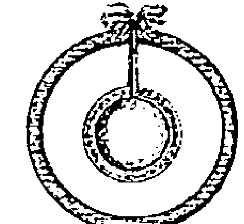

## 澄澈透明的一天

## 出生于这一天的名人

3月21日是一年中重要的交界日之一。一般来说，它是春天的第一天，即“春分”。在这一天，昼夜等长；在这一天出生的人，个性比较率直单纯，不会有特别复杂或者敏感的心思。不过，在日常生活中他们一向我行我素，不喜欢被别人指指点点，甚至在最简单的日常活动、任务和责任方面也是如此，因此常常会被人误会，让人以为他们不愿意或者无法适应大众生活，故意特立独行。

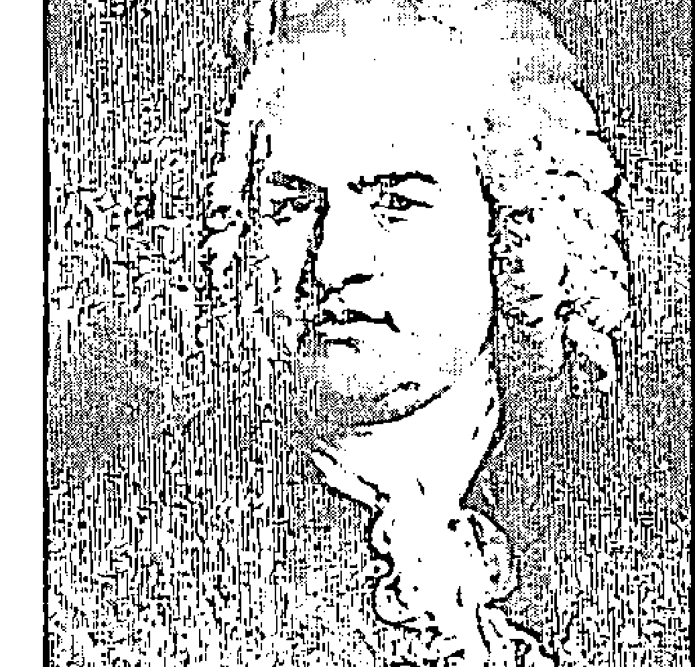

3月21日出生的人虽然有一点梦想家的味道，但是通常也会有实际的一面来平衡他们好幻想的倾向。他们在构建组织与结构方面很有天分，然而事情的结果却常常出乎他们的意料，这些结构经常会土崩瓦解，尤其当这些结构涉及人的时候。不过，值得庆幸的是，他们总能收获一些价值能长久保持的经验。

约翰·塞巴斯蒂安·巴赫（德国作曲家，管风琴师，巴洛克音乐的代表人物），彼得·布鲁克（英国舞台剧及电影导演，作品有《乞丐的歌剧》等），莫杰斯特·穆索尔斯基（俄国国民乐派民族音乐作曲家，作有歌剧《鲍里斯·戈东诺夫》，享年42岁），傅里叶（法国数学家），英格丽德·克里斯蒂安森（挪威赛跑女选手，曾获纽约马拉松赛冠军及2次波士顿马拉松赛冠军，也是女子5000米及10000米马拉松赛跑的世界纪录保持者），马修·布罗德里克（电影演员），弗洛伦兹·齐格飞（音乐剧、戏剧制片人），艾尔顿·森纳·达席尔瓦（巴西赛车手，获得过2次大奖赛总冠军），沃尔特·吉尔伯特（美国分子生物学家，以发现DNA排列顺序，从而可以解读遗传密码获得了诺贝尔奖），保罗·韦斯（生物学家，主要研究胚胎发育、细胞发育与再生），约翰·戴维森·洛克菲勒三世（美国金融家及慈善家），罗伯特一世（苏格兰国王），索恩·豪斯（蓝调歌手，吉他手），加里·吉登斯（评论家，专栏作家，作家），罗杰·霍奇森（摇滚歌手，音乐创作者，新浪潮乐队主唱），伊日·基利安（编舞家，舞蹈家），菲莉斯·麦金利（美国诗人，主要创作打油诗），加里·莱昂那德·奥尔德曼（英国电影演员）

3月21日出生的人多半没有过度热情、积极的个性，他们宁可独自一人，也不愿意和不了解他们的人在一起。另外，也因为比较自信和沉稳，他们常常被认为是消极、被动型的人。实际上，他们只是觉得没有必要为自己的行为辩解罢了，如果别人不懂得欣赏，那是别人的不幸，与他们无关！

对3月21日出生的人而言，生活中有关身体和美的东西十分重要，因此舞蹈和其他动作优美的活动非常适合他们。然而，令人觉得奇怪的是，在这一天出生的人总是期待别人有读心术，这样他们不用多加解释，别人就能理解他们的想法和情感。幸好他们是天生的领导者，也许真的可能只需要沉默或是简单的几句话，就可以让其他人心领神会。

3月21日出生的人勇气十足，在认为自己正确的时候会坚持到底，绝不退缩，即使这意味着战斗也会在所不惜。虽然他们给人的印象通常是置身事外，对发生了什么漠不关心，但是一旦发起脾气来，他们就会像火山爆发一样，非常可怕。他们时常表现得有些孩子气或者说乐于表现得像个孩子。如果他们幼年时没有受到大人足够的重视，成年后便会以小孩为重，并且尽力给予子女最好的一切。

精神寄托对3月21日出生的人十分重要，无论他们信仰的是传统教派还是非传统教派。另外，他们如果期望保持清醒的意识，就必须小心使用各种药物，千万不要因为用药不慎而失去了这一天出生的人特有的澄澈与本真。在这一天出生的人最好能不受拘束和干扰地去做一些事情，虽然他们的表达方式可能有些古怪，可是就算在表现最差的时候，他们也不会对身边的人造成多大伤害，而如果他们处在最佳状态，你就会感受到他们非常积极的感染力。

## 每年的这一天

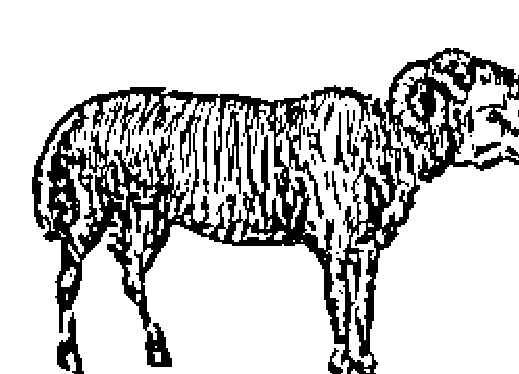

## 白羊座
3月21日

## 幸运数字和守护星

3月21日出生的人受数字3（2+1=3）与木星的影响。这一天出生的人必须提防脾气爆发所造成的行为失控，这是开朗的木星与热情的火星（白羊座的主宰星）相互作用的结果。这一天出生的人大多相当自负、雄心万丈，不过有时候他们的万丈雄心也只局限于眼前的日常生活。如果成为领导者，他们会争取权威地位，而一旦获得了这一地位，他们就会尽量避免争执，不希望有人质疑他们的权威。许多受到数字3影响的人（通常是女性），并不向外寻求权力的满足，而是在家中掌控大权，对自己的另一半展示权威。

员），蒂莫西·多尔顿（威尔士电影演员，曾饰演“007”系列电影主角詹姆斯·邦德）

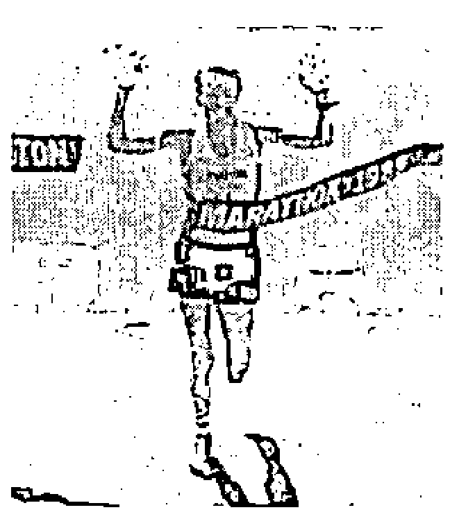

## 塔罗牌

大秘仪塔罗牌的第21张是“世界”。牌面上有一位女神手持权杖在奔跑，她拥有无穷的力量，能够穿越全世界以传播真理。这张牌的象征意义是：在我们生活的这个星球上没有什么是无法获得的。然而，尽管这张牌代表了收获和完整，但传统上这张牌也暗示了无法克服的外部障碍，比如挫折、精力分散和自怜等。

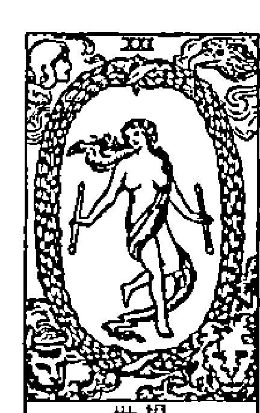

## 健康

3月21日出生的人非常喜欢独来独往，因此每天能有一大段属于自己的时间对他们的身心健康非常重要。能够获得爱当然很不错，但是这种爱要以他们能够接受的方式表达出来而且要符合他们的需求。他们不喜欢那种像橡皮糖般黏腻得叫人透不过气来的情感方式，也不喜欢被看护或者宠溺。如果生病了，他们自有一套疗法，有时用的方法会十分特别。他们并不要求饮食多样化，只要求烹调细致、合乎健康原则即可，这一点在那些追求美味的人看来，或许显得很乏味。跳舞是出生在这一天的人最佳的运动及休闲娱乐方式。

## 优点

- 勇敢
- 直接
- 善于表现自我

## 缺点

- 容易遭人误解
- 专断
- 不擅社交

## 建议

不要自怨自艾，自怜是毒药。和他人相处时，要更有弹性，尽量学习原谅和遗忘。要更懂得人情世故，努力用更好的沟通技巧将自己的意愿表达得更清楚一些。还有，要提醒自己不要太骄傲或者自负。

- 本位 12页
- 火相 16页
- 春季 18页
- 白羊座 22页
- 双鱼白羊座 34页

## 静思语

最简单的曲子最难演奏。

月份：3月
第22天
白羊宫0°～2°
双鱼白羊座
本位/火相

## 3月22日

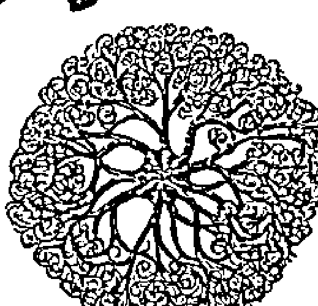

## 直来直往的一天

## 出生于这一天的名人

3月22日出生的人有点自负，总认为自己绝对不会出错，而且还不准别人否认这一点。在感情表达上，他们觉得没有必要大声嚷嚷或登高疾呼自己的意志或观点，因为他们绝对地自信、沉着，并且讨厌自吹自擂。他们高度自信、意志坚定，所以不会轻易走上岔路或者迷途。在完成目标的道路上，即使困难重重，他们也会勇往直前，任何事情都不能动摇他们的决定。当然，有些3月22日出生的人目标不是那么远大，他们也许只是想追求幸福的家庭生活、休闲娱乐的享受或是培养一些爱好，但是即使是这样简单朴实的想法，他们也一定会去努力实现。

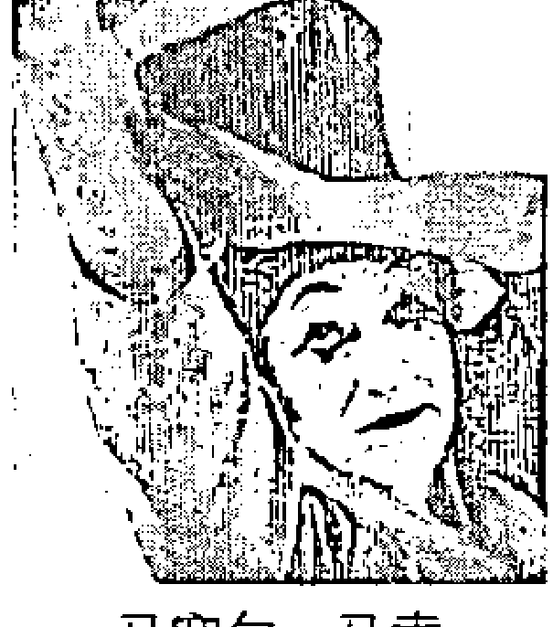

马塞尔·马索

安东尼·范戴克（法国巴洛克时期的画家），马塞尔·马索（法国默剧艺术家，可以称得上是当代最伟大的默剧演员），露丝·佩奇（芭蕾舞表演者，编舞家），罗伯特·安德鲁·密立根（美国物理学家，在电学及光学研究方面十分著名，曾获得了诺贝尔奖），阿格尼丝·马丁（画家），乔治·本森（爵士乐吉他手，歌手），伦纳德·马克思（歌舞喜剧演员，电影演员，著名演艺团体马克思兄弟的成员，钢琴家），威廉·沙特纳（电视剧，电影演员，在《星际争霸战》中饰演“科克船长”），卡尔·莫尔登（电视剧，电影演员），马克西米利安一世（15世纪时的德意志皇帝），威廉一世（19世纪时的普鲁士国王，德意志皇帝），斯蒂芬·桑德海姆（美国著名音乐剧及电影音乐作曲家，作词家），安德鲁·劳埃德·韦伯（美国百老汇舞台剧作曲家），帕特·罗伯逊（传道者），威廉·特拉维拉（设计师），詹姆斯·尼尔（遗传学家），罗恩·凯里（美国卡车司机工会主席），尼古拉斯·蒙萨拉特（英国作家，代表作有《沧海无情》等），马修·莫迪恩（电影演员）

3月22日出生的人最让其他人伤脑筋的特性之一，就是不喜欢别人分析他们的个性，也不承认自己有其他潜意识的动机。简单说来，这一天出生的人是少见的表里如一的人。如果有人胆敢怀疑他们不是真的心口如一，那可就有得受了。正因为如此，他们会对矫饰、欺诈、虚伪等行为极度反感。不过，由于讨厌拐弯抹角的言行，他们会有错将外交手腕看成口是心非的危险。

许多3月22日出生的人会在心中为自己塑造一个英雄形象，为了自己有朝一日能够成为这样的理想人物，他们不懈地努力。不过，他们所渴望的并非极为戏剧性的英雄主义，而是一种沉静的、能保护他人的英勇，而这可以使他们博得亲友和同事的尊敬，甚至崇拜。事实也的确如此，在这一天出生的人，大多具有特别值得信赖的好名声。

3月22日出生的人一旦发现自己真正的人生追求（通常是在20岁左右发现），便会终其余生把这一追求继续下去，其他活动会从这个中心点衍生出来。即使衍生的相关事件非常多，大方向也十分确定。实际上，这一天出生的人很少会从已经选定的道路上突然转向。

3月22日出生的人很有商业头脑。如果他们愿意，且能以客观、批判的眼光去审察自己的产品或服务，他们绝对可以在激烈的竞争中获得事业上的成功；反之，则可能反复受挫进而失去信心。另外，他们必须控制好自己强烈的检查热情，这不只是因为他们会因得意忘形而越界，还因为别人也受不了他们那种举止。此外，3月22日出生的人也应该避免专断或独裁的倾向，这一点一定要格外注意。

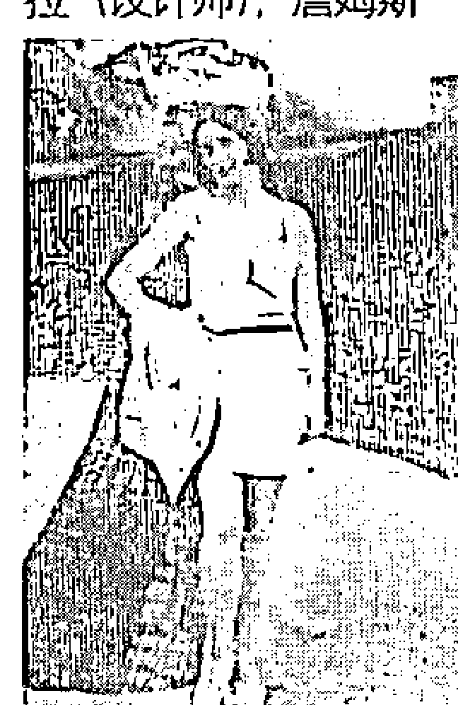

露丝·佩奇

84

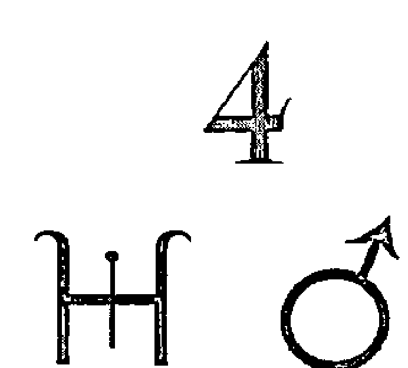

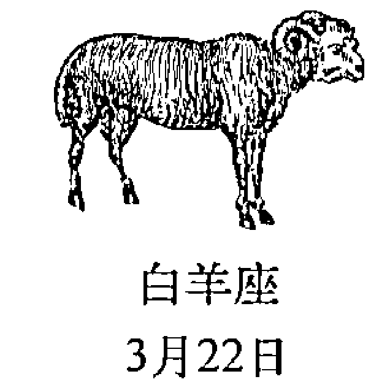

每年的这一天

白羊座
3月22日

## 幸运数字和守护星

3月22日出生的人受数字4（2+2=4）与天王星的影响。受数字4影响的人，在做事和看待事物上有一套独特的方式，然而遗憾的是，由于他们不喜欢人云亦云，又对自己很有把握，所以他们容易引起对立或在毫无察觉的情况下就树了敌。此外，象征怪异和乖僻的天王星，加上激情似火的火星（白羊座的主宰星），足以说明3月22日出生的人是非常具有爆发性的。在这一天出生的人常常会对各种成双成对的事物表现出浓厚的兴趣，例如双胞胎、对称的东西或是同时发生的事情等。

威廉·沙特纳

## 塔罗牌

大秘仪塔罗牌的第22张是“愚者”。图案是一个人快活地站在悬崖边。有的人认为这个人十分愚蠢，缺乏理性判断的能力；有的人则指出他极端崇尚精神层面的东西，不在乎现实。从积极的一面来看，这张牌代表不拘泥于形式，遵循天性；从消极的一面来看，这张牌则代表愚蠢、冲动和虚无主义。不管怎么说，在这一天出生的人中，较成熟的会从生命的历练中汲取经验，然后成为自己理想中的人。

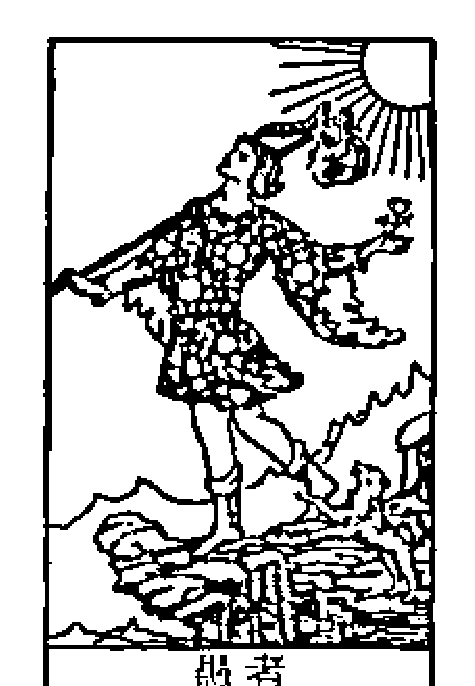

## 健康

3月22日出生的人会把身体健康视为理所当然的事情，这是因为他们天生极具信心，又有旺盛的精力，所以觉得身体也该是活力无穷的。然而，正是由于忽视了“身体健康必须靠保养”这个事实，他们的身体常常毁在自己无穷尽的热情的耗损之下。对大多数3月22日出生的人而言，控制热量、平衡维生素的摄入量或是补充必需的营养等，貌似都与他们的生活毫无关系，他们所希望的是能够随心所欲地吃东西。因此，周围的亲朋好友应该对他们晓之以理，告诉他们应该合理饮食。但和要他们改变饮食习惯相比，建议他们进行适当的户外运动和摄取适量的脂肪及糖分可能更易被他们所接受，不过这也得循序渐进，千万不要期盼会立竿见影。

| 优点 |
| --- |
| 热情 |
| 有计划性 |
| 充满活力 |

| 缺点 |
| --- |
| 蛮横 |
| 情绪反应迟钝 |
| 自负 |

## 建议

不是每个人都像你一样非常清楚自己未来的方向，所以请对这些人耐心一点。可以慢慢努力，但态度要坚决，努力要持久。工作虽然要全力以赴，但是有时让事情顺其自然会更好。学着放松，多培养些外交技巧，宽待他人。

| 本位 12页 |
| --- |
| 火相 16页 |
| 春季 18页 |
| 白羊座 22页 |
| 双鱼白羊座 34页 |

## 静思语

> 爱是尊重一切时空中的生物。

85

月份：3月
第23天
白羊宫1°～3°
双鱼白羊座
本位/火相

## 3月23日

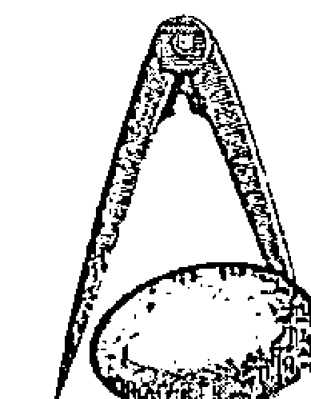

## 好奇的一天

## 出生于这一天的名人

黑泽明（日本著名导演，作品有《罗生门》、《梦》、《乱》等），戴恩·鲁迪雅（法国裔美国占星学家，哲学家，音乐理论家，心理学家，作家），皮埃尔·西蒙·拉普拉斯（法国科学家，主要致力于天体力学研究），沃纳·冯布朗（德国裔美国火箭专家），赫尔曼·斯托丁格（德国诺贝尔化学奖得主，主要研究高分子学），罗杰·班尼斯特（英国著名运动员，第1个在正式比赛场合4分钟内跑完约1610米的人，神经学专家，牛津大学老师），琼·克劳馥（电影女演员），威廉·史密斯（英国地质学家，英国地质学之父），埃里克·弗罗姆（精神分析学家，作家，最著名的作品为《爱的艺术》），胡安·格里斯（西班牙立体派画家，雕塑家，书籍插画家，舞台及戏服设计师），夏卡康（歌手，歌曲创作者），摩西·马隆（篮球运动员，获得过6次美国职业篮球联赛篮板王，4次美国职业篮球联赛总冠军，3次最有价值球员称号），范妮·法默（19世纪时的厨师），阿曼达·普鲁默（舞台剧和电影演员），海斯·艾伦·詹金斯（4次男子单人滑冰世界冠军得主，奥运会金牌获得者，戴维·詹金斯的兄弟，娶了卡罗·海斯为妻，二人为著名滑冰运动员），朱莉娅·霍姆斯（滑冰冠军），米尔顿·森（儿童精神病学专家，耶鲁儿童研究中心主任），罗伯特·萨金特（英国阿拉伯语学者，旅行家，作家）。

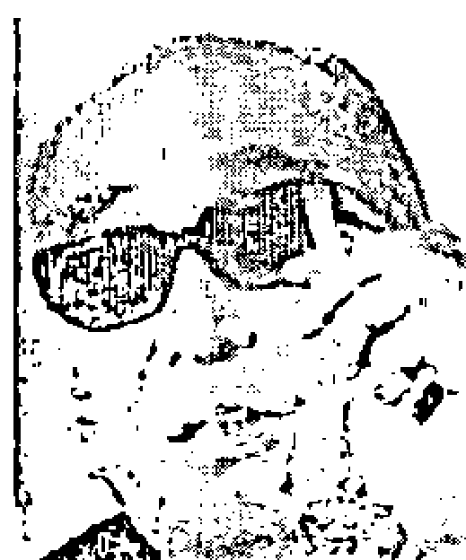

3月23日出生的人似乎对任何事物都很好奇。不过，他们感兴趣的事物通常是身边最普通的事件、思想、个人感受，以及关于生存的看法等。有关生死、年华以及基本的人类情感的问题是他们最感兴趣的。他们对待生命的方式大抵是合乎科学的，他们虽然不见得是科学家，但是却经常像科学家那样去探究、检验所接触的事物。

这一天出生的人不会轻易接受任何观念或者观点，除非它们经过了检验。当然，如果没有事实根据，不能提出具有建设性的意见，他们也不会贸然去劝告别人。他们根据自己的观察来给生命、生活下定论，因此，他们是很难糊弄的人。他们不是傻瓜，他们所做的决定都有扎实的经验作为基础。另一方面，经由这样的经验而得到的认知，他们会非常珍惜，绝不会轻易放弃。在这一天出生的人会表现得非常固执，即便有很多证据表明某个理论是错误的，他们也拒绝妥协。而一旦某些东西被证实是正确的，他们便会抓住不放。

3月23日出生的人多才多艺，而且可以和多种多样的人成为朋友。他们不怕冒险，但是必须当心赌博的诱惑，不管是赌场上的赌博还是日常生活中带有赌博性质的活动。这一天出生的人有充足的体能和旺盛的精力，应该好好地释放一下，即使偶尔从事一些稍有危险的活动也不要紧。他们虽然通常在传统领域里探索，但是有时也会被奇特的事情或者人物所吸引。这是他们个性中不同寻常的一面，而这一面经常被他们隐藏得很好。

这一天出生的人通常也会表现出对孩童的兴趣及喜爱，但这并非表示3月23日出生的人像孩童一样爱幻想、爱嬉闹。他们对待孩童的方式，就像他们对待其他事物的方式一样——是科学的、实际的并且有原则的，而不是主观的或是受情绪左右的。

虽然3月23日出生的人爱探究各种各样的事物，然而“人类”仍是他们最关心的，尤其是人类的发展。这种兴趣首先是出于求知目的，而不是为了寻求温暖或者慰藉等感情上的因素。因此，这一天出生的人有可能为了满足自己的探索和学习欲望而表面上与人友善相处，私底下却非常以自我为中心。因此，与其说他们喜爱社交，不如说他们只是好奇罢了。

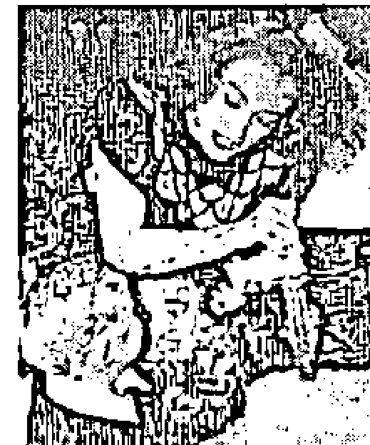

86

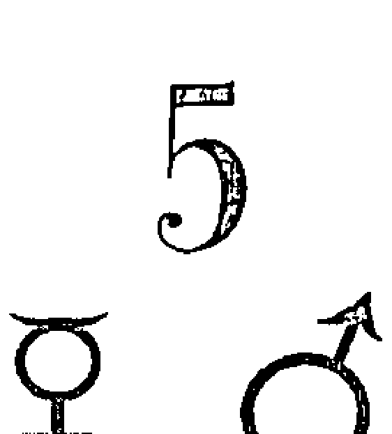

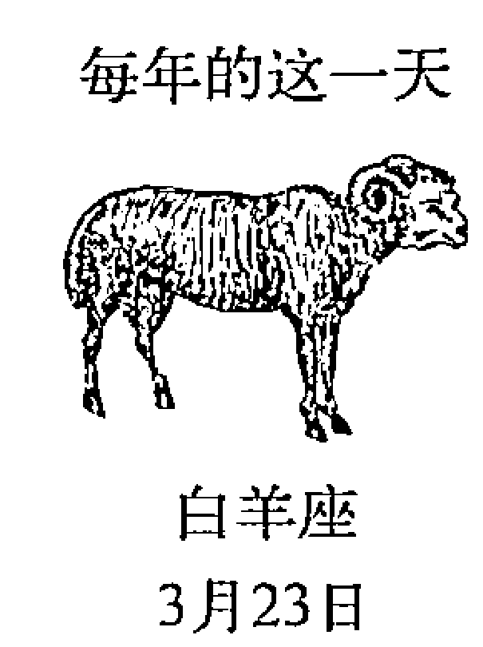

每年的这一天
白羊座
3月23日

## 幸运数字和守护星

3月23日出生的人受数字5（2+3=5）与水星的影响。这一天出生的人容易紧张，有些神经质（情绪多变），但是精力却格外旺盛，这是因为受到了白羊座的主宰星——火星的影响。受数字5影响的人会随时改变兴趣，别人也许觉得惊讶，他们却乐此不疲。他们会对最普通的事物着迷，会考证事实，探讨事物到巨细无遗的地步。不论在哪一个月份，23日都是属于“有事情发生”的日子。但是3月23日出生的人一点儿也不在乎这一点，反而会被发生的新鲜刺激的事情所吸引，甚至会将这些刺激放大，进而影响周围的人。

著有《南阿拉伯猎奇》等），约瑟夫·恰佩克（捷克现代主义画家，死于纳粹集中营）

罗杰·班尼斯特

## 塔罗牌

大秘仪塔罗牌的第5张是“教皇”。他是令人畏惧的神秘事物的解释者，象征人类的认知及信仰。他知识渊博，并主宰抽象的事物。从积极的一面来看，这张牌代表信心十足、不疑不虑以及对事物有正确的理解；从消极的一面来看，这张牌代表爱说教、夸大其词以及独断的个性。

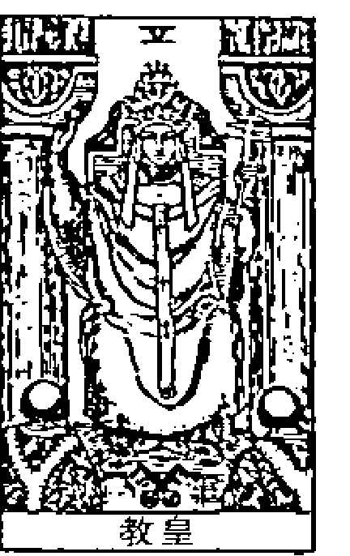

## 健康

虽然3月23日出生的人看起来并不在意自己的健康，可是通过阅读和学习他们会明白该如何保重自己的身体。然而，问题是如何要他们把这些知识运用在自己身上。如果你能让他们明白健康的生活方式对促进工作或者提高阅读能力有何帮助，他们也许会有点兴趣，否则，就省省力气，算了吧！3月23日出生的人，由于对事物的本质及其如何运作有着强烈的好奇心，所以很容易感到疲惫。让他们尽情地去做自己喜欢的事（比如享受性爱、睡眠或者参加体育活动等），通常来说都是不错的主意。

| 优点 |
| --- |
| 有趣 |
| 多才多艺 |
| 体贴 |

## 建议

保持平静，不论研究别人是一件多么有趣的事情，都请你绝对不要把他人当做标本。培养自己感性的一面，避免说教，多听听别人的意见。不要整天只想自己的事情。

| 缺点 |
| --- |
| 过分投入 |
| 喜欢窥探他人隐私 |

| 本位 12页 |
| --- |
| 火相 16页 |
| 春季 18页 |
| 白羊座 22页 |
| 双鱼白羊座 34页 |

## 静思语

在人类世界和宇宙之间，有许多不同的时空。

87

月份：3月
第24天
白羊宫2°～4°
双鱼白羊座
本位/火相

## 3月24日

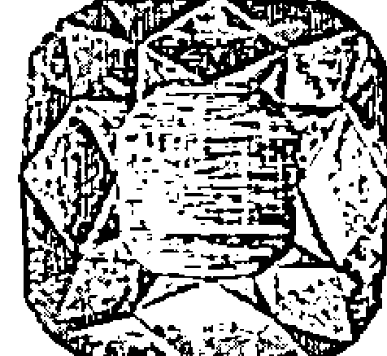

## 纯真迷人的一天

## 出生于这一天的名人

3月24日出生的人自然且直接，喜欢过简单的生活。无论是在工作上还是在个人生活中，他们面对问题时多采用快刀斩乱麻的方式，尽量避免纠缠不清。但是世事往往并不都遂人愿，生活中总会出现一些复杂的问题、难以对付的人，或者必须克服的困难。因此，对这一天出生的人来说，找出最简单的应对方法成了当务之急。

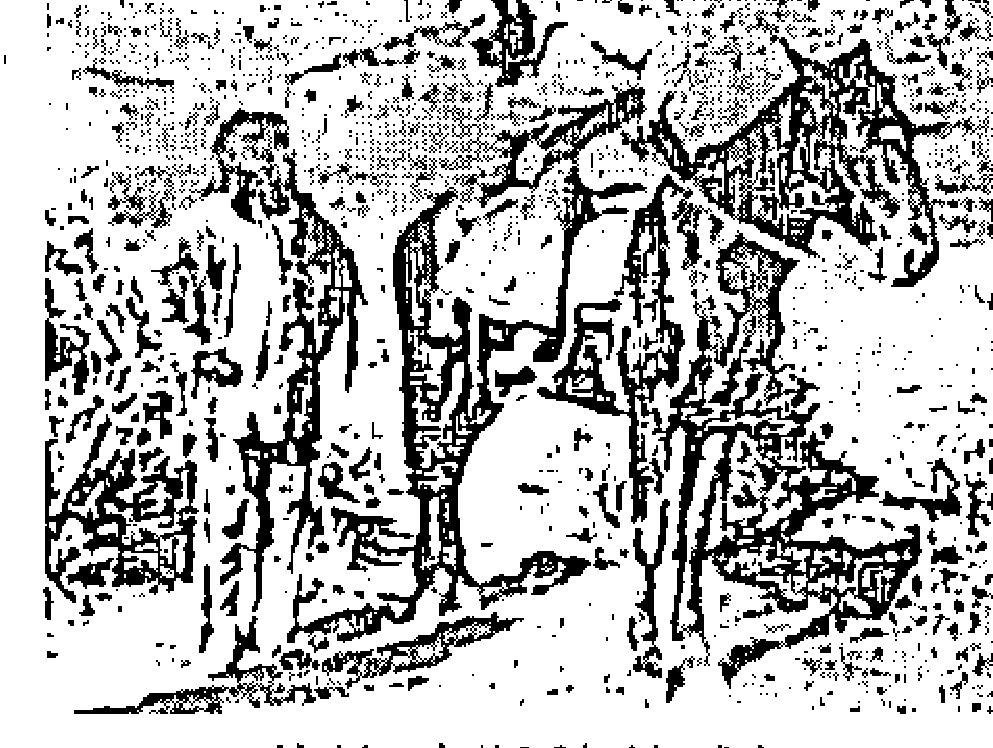

3月24日出生的人十分天真烂漫。通常在初次见面时，人们就可以见识到他们如纯真孩童般自然的举止和坦诚的态度。由于他们总是期待事情会顺利发展，所以对失望和拒绝的反应要比大多数人强烈，在碰到极严重的挫折时，他们很容易泄气。实际上，对许多在这一天出生的人来说，淡淡的哀愁会伴其一生。

威廉·莫里斯（英国前拉斐尔派诗人，艺术家），约瑟夫·普里斯特利（英国化学家，氧气的发现者，牧师，哲学家），约翰·韦斯利·鲍威尔（地质学家，美国原住民），史蒂夫·麦奎因（电影演员），罗斯科·阿巴克尔（被称为“大胖”，默剧演员），威廉·赖克（心理学家，倭格昂盒子的发明者），托马斯·杜威（美国总统候选人，纽约州州长），帕特·布拉德利（女子高尔夫球选手），劳伦斯·费林盖蒂（美国“垮掉一代”派诗人，作家，画家），马尔科姆·马格里奇（英国作家，记者），鲍勃·麦凯（服装设计师，时尚设计师），金·蒲里苏尔（爵士乐歌手），查利·托罗普（荷兰女画家），厄斯金·桑迪福德（巴巴多斯首相），英格尔伯特·范安德莱特（比利时抽象表现主义画家），比尔·波特（美国奥运会跨栏比赛金牌得主），约翰·萨克

3月24日出生的人通常表现得很安静。他们很少为了说话而说话，而比较喜欢用实际行动来表达自己，在爱情、兴趣和体育运动方面都是如此。不管是作为伴侣还是作为同事，他们都能够做得令人满意。这一天出生的人很少在职场上树敌，他们通常能够以谦和的态度对待一切，并独立取得一些稳定的成果，这种能力使得他们在工作上备受重视。

谦逊是许多3月24日出生的人的优点。也许他们的确有点保守，甚至有时候还很害羞，但是如果你以为他们消极被动或者好欺负，那可就大错特错了。在面对反对或者直接的攻击时，他们会表现得无比坚毅，绝少退却。在家庭生活中，他们通常会坚持按照自己的方式去做事，并尽可能争取和谐的氛围。3月24日出生的人比较脆弱，原因主要是他们长期处在不明确的压力之下或不被旁人所肯定、认同，这些压力及不认同感会使他们疲惫不堪，并且会慢慢消磨掉他们的信心和积极性。

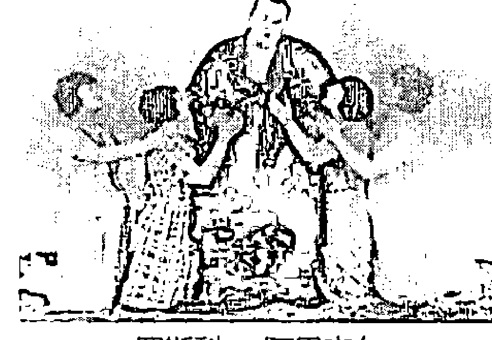

由于这一天出生的人有许多优点——重感情、忠贞、自然纯真，所以他们的亲友可能很难明白为什么他们老是陷入问题之中。这或许是因为他们过度乐观、坦率，以为事情一定会顺利发展，因而没有采取比较实际的应对方法吧。因此这一天出生的人应该学会在面对及处理日常问题时，除了不要那么爱幻想之外，还应该在直率当中多加一些警觉，以及一份谨慎与小心。

（记者），雷纳尔多·尼赫迈亚（跨栏运动员），玛丽卡·基柳斯（德国滑冰运动员）

88

## 每年的这一天

白羊座
3月24日

## 幸运数字和守护星

3月24日出生的人受数字6（2+4=6）与金星的影响。受金星及数字6影响的人最重视和谐，并且认为社交是一件既刺激又有回报的事情。虽然他们喜欢浪漫，但是他们渴望的爱情通常是温馨细腻的感情，而不是燃烧热烈的激情。不过，因为白羊座受火星主宰，3月24日出生的人会受到金星与火星的双重影响，具备一定的性吸引力，而且能够创造出相当有激情的爱情生活。

史蒂夫·麦奎因

## 塔罗牌

大秘仪塔罗牌的第6张是“恋人”。恋人象征着通过两性结合的爱，全人类能够团结在一起。从积极的一面来看，这张牌代表道德、美学以及肉体方面更高层次的感情与渴望；从消极的一面来看，这张牌代表没有止境的欲望、多愁善感和迟疑不决。

## 健康

3月24日出生的人非常敏感，他们的健康和他们自己以及周围人的心理、情绪直接相关。因此，他们应该努力维持人际关系及生活状态的和谐。如果情绪失衡，他们就会生病，而这些疾病通常会以多种形式表现出来，有的是急性的，有的是慢性的。不过，只要找出情绪失衡的原因并加以处理，即使相当严重的身心失调也能恢复。3月24日出生的人需要均衡的饮食，也应该尽量少吃刺激性的食物，例如咖啡、酒、糖等，不过巧克力可能具有缓解沮丧情绪的作用，倒是可以试一试。以口味清淡的米饭（或者面条）搭配水煮的青菜当做正餐，也是维持身心平衡的最佳选择。另外，这一天出生的人不妨每天或者每周固定地从事一些适度的体育运动。

- 优点
  - 积极
  - 开放
  - 亲切

- 缺点
  - 不严谨
  - 压抑
  - 不切实际

## 建议

维持生活的平衡，谨防自寻烦恼。谨慎耐心地处理小事情，它们都是值得你关注的细节。

| 本位 | 12 页 |
| --- | --- |
| 火相 | 16 页 |
| 春季 | 18 页 |
| 白羊座 | 22 页 |
| 双鱼白羊座 | 34 页 |

## 静思语

一个人可以给予别人最好的礼物，便是展现自我。

月份：3月
第25天
白羊宫3°～5°
白羊座一
本位/火相

## 3月25日

## 生气勃勃的一天

## 出生于这一天的名人

3月25日出生的人很有活力，前行的脚步总是很难停下。一年中这一天出生的人最活泼、最生气勃勃。他们当中有些人似乎是天生的领导者，不过，说他们是独行侠似乎更恰当。他们之所以会去带领团队，通常是因为他们太有才干或是为情势所迫，而不是他们真的想要获得领导地位。

3月25日出生的人不会盲目行事，他们知道自己的能力，清楚自己能做什么、不能做什么。一旦离开全身心投入的繁忙的工作，他们就会急于寻求平静，因为他们认为私生活也应该是很神圣的。

或许由于他们只能把自己照顾得不错吧，结婚对3月25日出生的人而言并不容易。他们的伴侣不但必须是知己，还得能够调和他们充沛的精力。通常这一天出生的人要到中晚年才能找到真正的伴侣。实际上，如果真的没有令他们满意的伴侣，他们可能宁愿过着独身生活，也不愿意退而求其次。这一天出生的女性独立能力很强，而男性则渴望拥有温馨的家庭，换句话说，他们想要一个宁静的港湾。

有时候3月25日出生的人会给人活力过度充足、精力过度旺盛的错觉。实际上，他们也会感到精疲力竭，而且会变得暴躁易怒。在这种情况下，他们很容易发脾气，只要有一丁点儿被忽视的征兆，他们就认为受到了侮辱，甚至还会用尖酸恶毒的言语伤人。他们忠实于自己所爱的人，然而奇怪的是，有些时候就算他们不完全忠诚于对方，甚至有了出轨行为，他们也还是认为自己是忠贞的。他们忠实于家庭，但是注定要过不同寻常的家庭生活。

3月25日出生的人可能显得有些老练，但是实际上他们非常率直而且急躁，这会为他们招来一些麻烦。幸好别人也都知道他们本性善良而且为人正直，所以很容易就会原谅他们。有几个可以谈心的知己，对3月25日出生的人而言相当重要，这些亲密的朋友围绕着他们，就好比是可以保护他们的缓冲器——不仅可以隔开外界的批评，还可以阻止他们自我毁灭。那么，当他们的知心朋友有什么好处呢？通常，除了一份知己的满足感之外，还可以随时去找他们（如果他们有空的话），要他们给你出主意，陪你一起做些什么，甚至借钱给你。他们的亲朋好友、上司同事，都必须学会放手让他们独闯世界——去旅行、去体验，甚至以他们最独特的方式去爱。唯有给他们自由，他们才会在情感和身体上无拘无束地释放出爱。

阿图罗·托斯卡尼尼
贝洛·鲍尔托克（匈牙利作曲家，钢琴家，钢琴教师，人种音乐学家，20世纪的音乐先锋人物），阿图罗·托斯卡尼尼（意大利裔美国指挥家，古典乐坛的传奇人物，曾经担任美国大都会歌剧院、纽约爱乐乐团、美国国家广播公司交响乐团指挥），弗兰纳里·奥康纳（女性小说家，代表作有《慧血》等），阿瑞莎·富兰克林（福音及灵魂歌手），霍华德·科赛尔（广播员），戴维·利恩（英国电影导演，影片剪辑人员，作品有《桂河大桥》、《阿拉伯的劳伦斯》等），格洛丽亚·斯泰纳姆（女权主义运动者，作家），西蒙娜·西尼奥雷（法国电影女演员），格曾·博格勒姆（美国雕刻家，以其在拉什茂山上的雕刻作品而闻名），雷蒙德·弗思（社会人类学家），德比·托马斯（获得过2次世界花样滑冰冠军，奥运会银牌得主），汤姆·莫纳汉（达美乐比萨公司总裁，底特律老虎棒球队老板）。

## 每年的这一天

白羊座
3月25日

## 幸运数字和守护星

3月25日出生的人受数字7（2+5=7）与海王星的影响。独立是受数字7影响的人表现出来的一个特质，而3月25日出生的人有时候会将这种特质发展到极致，这是因为所有充满活力的活动都会因受到白羊座的主宰星——火星的影响而被加强。受7这个数字影响的人喜爱旅行，这既因为旅行本身就很有趣，也因为他们想要了解其他文化。由于受海王星的影响，这一天出生的人应该当心非现实状态、奇异的梦或者幻觉。

詹姆斯·洛弗尔（美国宇航员），拉斯洛·帕普（匈牙利拳击手，获得过3枚奥运会拳击金牌），保罗·迈克尔·格拉泽（电视剧演员，主演了《警探斯塔斯基和赫奇》等剧），琼·路易斯·科姆·维拉尔（电影演员，导演），史蒂夫·诺曼（英国打击乐手，萨克斯管演奏者，史班道芭蕾合唱团成员），埃德·贝格利（舞台剧、电视剧、电影演员）

## 塔罗牌

大秘仪塔罗牌的第7张是“战车”。牌面上的胜利者以一种强有力的姿态，展现着他在人世间的丰功伟业。这张牌可以解释成：不论正道多么艰险难行，你都得继续走下去。从积极的一面来看，这张牌代表成功、才能和效率；从消极的一面来看，这张牌则代表专制的态度和不强的方向感。所以3月25日出生的人应该特别小心车祸，尤其是在驾驶车辆的时候。

## 健康

3月25日出生的人因为总是干劲十足，所以几乎没有时间照顾自己的身体。他们常常以为自己天生就很健康，因此会忽略一些病痛。他们可以忍受好几种病痛缠身，仍然日复一日地工作和生活。其实，他们应该每年定期做一次健康检查。此外，适当做些体育运动也可以保持身体健康和消除赘肉（3月25日出生的人通常喜欢大吃大喝，重质也重量，因此体重容易增加）。良好的食欲当然是有利于健康的，但是应该尽量避免摄入过多的盐、肉、奶制品以及酒精。

## 优点

- 精力充沛
- 忠诚
- 独立

## 建议

你确实是个难以掌控的人，但是有时候还是需要克制一下自己，毕竟自制和遵守纪律是很重要的。学习调整自我，变得温和些，并且学着去欣赏沉默和寂静的价值。试着想想：外面的世界真的有那么重要吗？

## 缺点

- 吹毛求疵
- 说话直接
- 有自我毁灭倾向

## 静思语

雄性动物会美化自己。

- 本位 12页
- 火相 16页
- 春季 18页
- 白羊座 22页
- 白羊座一 35页

月份：3月
第26天
白羊宫4°～6°
白羊座一
本位/火相

## 3月26日

## 诚实正直的一天

## 出生于这一天的名人

3月26日出生的人有着孩童般的天真、自然和直率，不费很大工夫就可以把事情做好。对他们而言，单纯是最基本的方针。他们讨厌一切过度复杂的形式。也就是说，如果你是一个会不断制造问题和麻烦的人，就不太可能跟3月26日出生的人成为好朋友。这一天出生的人对于任何有关“人”的问题，都会采用最简单的方法——追根究源去研究。正因为如此，3月26日出生的人通常有很强而且很准的直觉，也正是因为这种直觉式的洞察力，他们很适合去做需要追根究底的研究工作。

罗伯特·弗罗斯特（美国诗人，获得过4次普利策奖），桑德拉·戴·奥康纳（美国最高法院历史上第1位女法官），约瑟夫·坎贝尔（荣格派神学者，著有《神的面具》等），伦纳德·尼莫（美国电视剧、电影演员，在《星际争霸战》中饰演“史帕克”），韦恩·恩布里（美国体育史上第1位非洲裔队长），田纳西·威廉斯（剧作家），皮埃尔·布莱兹（法国作曲家、指挥家），维克托·弗兰克尔（奥地利心理学家、精神病学家，著有《追寻生命的意义》等），黛安娜·罗斯（至高无上乐队主唱、电影女演员），特迪·彭德格拉斯（灵魂歌手，原为蓝色音符乐队鼓手，在一场交通意外中下肢瘫痪），詹姆斯·卡安（电影演员），詹姆斯·穆迪（美国爵士乐萨克斯管演奏大师、长笛演奏家、作曲家、管理者），艾伦·阿金（电影演员），马丁·肖特（加拿大喜剧电影演员），埃丽卡·容（作家，著有《怕飞》等），斯特林·海登（电影演员），威廉·巴克豪斯（德国钢琴家，擅长演奏贝多芬作品），豪斯曼（英国诗人、学者），邓肯·海因斯（餐厅评论家），约翰·斯托克顿（篮球后卫，5次以副队长身份参加美国职业篮球联赛，奥运会金牌获得者，美国梦之队成员）

3月26日出生的人虽然非常活泼，但是有时也会表现出哲学家般的冷静与超然。他们以旁观者清的姿态静静地衡量情势，思索哪里会出错，进而找到有效的解决方法。有时候他们也可能将自己从生活中抽离，甚至与世隔绝一段时间。他们退隐到自己喜爱的地方，或许是遥远的山里，或许是沙漠中或者海滨，这种独处能让他们从大自然中重新获得能量。通常他们在独处的时候只是单纯地体验与世隔绝的感觉，以东方式的冥想来平定心绪、涤清心灵，而不是去构思或酝酿什么伟大的计划或想法。

3月26日出生的人按照自己的步调工作，多半不慌不忙，心态轻松。私底下他们常有出人意料的思想及行为，这种思想与行为多半是自然流露出来的，带有一定的幽默性，比如在工作时突然冒出一两句令人轻松的话来。有时候，3月26日出生的人会轻松得过了头，在应该往前冲刺的时候却裹足不前，如果此时他们的竞争对手是更积极、更有目的性的人，他们就会处于弱势地位。

3月26日出生的人深知自己的缺点，也知道自己喜欢按照自己的方式做事。跟大多数人比起来，他们显得有点奇特，所以有时候会被同伴们认为有些离经叛道。不过，幸好他们不是什么古怪或者优柔寡断的人。他们不会轻易许诺，也不喜欢自吹自擂。

能结交到3月26日出生的朋友是很幸运的，因为这一天出生的人不随便交友，一旦和谁成为朋友，他们就会很珍视自己的这个朋友。对他们而言，朋友是交一辈子的。不管多少年没联络，他们对共享过特殊情谊的友人一样会敞开心扉、给予关注。即使朋友忘了他们或是不理会他们，他们也不会怨恨，反而能够坦然接受。

桑德拉·戴·奥康纳

## 每年的这一天

白羊座
3月26日

## 幸运数字和守护星

3月26日出生的人受数字8（2+6=8）与土星的影响。他们不会特别想要给谁留下深刻的印象，所以看起来有些含蓄甚至冷漠。事实却不是这样的，因为受到火星（白羊座的主宰星）能量的影响，他们通常很热情。同时，因为受到土星的影响，3月26日出生的人通常很有责任心，虽然有时火星那种反复无常的不稳定性会使他们分心，但是他们迟早都会回到自己的职责上面。受8这个数字影响的人有过度牺牲自我的倾向，再加上又很容易满足，这两点很不利于他们获得成功，甚至会导致他们出现无法施展才华的压抑感。

伦纳德·尼莫

## 塔罗牌

大秘仪塔罗牌的第8张是“力量”或者“勇气”。图中一位优雅的皇后正在驯服一头愤怒的狮子。皇后象征女魔法师，可以驾驭不易控制的能量，并代表道德及体能。从积极的一面来看，这张牌代表个人魅力以及追求成功的决心；从消极的一面来看，这张牌代表自满和滥用权力。

## 健康

3月26日出生的人遇到的最大危险来自心理和精神层面。他们可以消除别人的负面情绪，但是当这些负面情绪出现在自己身上时，他们却经常毫无招架之力，甚至不肯面对现实。3月26日出生的人大多属于体力型，需要多种挑战。大量的体育运动、休闲活动和适当的性满足，能让他们健康快乐。虽然冒险会带来意外或者伤害，但是这一天出生的人通常很快就可以痊愈，就算是身体残障，他们也能克服困难并适应得很好。他们应该保持健康的饮食习惯，除了不要暴饮暴食之外，还需要定时定量。他们不经常亲自下厨，而喜欢别人做给他们吃。所以，在此给掌厨者提供一个秘诀：食物要能刺激他们的食欲才行。

- 优点
  - 直觉很准
  - 自立
  - 有责任心

- 缺点
  - 消极
  - 压抑
  - 缺乏安全感

## 建议

切莫过度地有道德感、过多地评断别人。学会放松，让自己不要那么严肃，去嬉戏、享乐！保持孩童般的特质。不要向恶势力低头，也不要在工作上冲刺过度。

- 本位 12页
- 火相 16页
- 春季 18页
- 白羊座 22页
- 白羊座一 35页

## 静思语

当一个孩子转愁为笑时，你会发现一切事情都有解决办法。

月份：3月
第27天
白羊宫5°～7°
白羊座一
本位/火相

## 3月27日

## 创始者的一天

## 出生于这一天的名人

3月27日出生的人是强烈的个人主义者。他们像孩童般有着快速学习的能力，一旦学会，他们便会去追寻自己的梦想。他们有着明确的风格以及超乎常人的技艺，这种技艺是他们在成长期就已经学习并掌握了的。这一天出生的杰出人物通常是在其研究领域中最先完成某项研究的人，但是，即使才能中等，他们也能作出自己独特的贡献。

路德维希·米斯·范德罗厄（德国裔美国建筑师，设计师）

爱德华·斯泰肯（摄影师），威廉·康拉德·伦琴（德国物理学家，因发现X射线获诺贝尔物理学奖），詹姆斯·艾尔弗雷·尤因爵士（苏格兰物理学家，磁力学家），罗米拉斯（罗马城的建造者），萨拉·沃恩（爵士乐歌手），亨利·罗伊斯爵士（英国工程师及设计师，与劳斯共同创立了劳斯莱斯汽车公司），本·韦伯斯特（爵士乐高音萨克斯管演奏者），姆斯季斯拉夫·罗斯特罗波维奇（俄国裔美国大提琴家，指挥家，钢琴家），阿瑟·米切尔（舞蹈家，编舞家），格洛丽亚·斯旺森（电影演员），朱尔斯·奥利茨基（抽象派大师，色彩画家），迈克尔·约克（英国电影演员），凯尔·亚伯勒（赛车手，获得过3次全国运动汽车比赛冠军、4次代托纳500汽车比赛冠军），兰德尔·坎宁安（美国费城老鹰橄榄球队四分卫），米勒·哈金斯（曾担任纽约扬基棒球队教练11年，带领球队获得过3次世界职业棒球大赛冠军、6次美国职业棒球大联盟比赛冠军），迈克尔·盖拉尔（法国厨师，新派法国菜的首创者）

3月27日出生的人，对于新经验抱着不排斥的态度，但是他们非常实际，不会轻易上当受骗。实际上，这一天出生的人中，有些会因为在成功的路上经历了多年的磨难而变得有些硬心肠。一般而言，他们不会过度热情或是多愁善感，也不会特别去关注别人的问题。可以说，他们不是那种善于关心人的人。能够吸引他们的，不是人，而是工作，而这工作多半是带有技术性的。

3月27日出生的人对科学原理很感兴趣。你会发现他们经常摆弄家里的东西，甚至把它们拆开看看到底是怎么一回事，然后再想办法将其安装好。有时这种行为或者兴趣只是一种障眼法、一种逃避情感表达的方式。这种在情感表达上有困难的人，容易变得感情闭塞，或者会以爆炸性的方式挣脱这个障碍，从而使周围的人大为吃惊。

3月27日出生的人对社会流行趋势有着敏锐的感受。如果他们是艺术家、生意人或是劳工，他们会知道哪些东西能被大众接受，哪些不能。这倒不是因为他们对人的心理有什么特别的认知，而是因为他们对人的价值观和期望有一种纯直觉式的了解。这一天出生的人与团体有着良好的关系，有时这种关系或许会好过他们与其他个体的关系，这一点的确令人有些惊讶。他们常常会因他人的情绪感到困惑，但是客观的眼光可以帮助他们看出问题的症结所在。

虽然3月27日出生的人看起来不是情绪化的人，但是他们非常热情，而且正是这种强烈的情感使得他们的努力更有效果——采用开门见山的方式，能激起别人的共鸣。他们容易被简单的线条和强烈的对比所吸引。这一天出生的人和孩童一样，对所有的事物都用非好即坏、非黑即白的二分法来评判——他们讨厌折中和灰色地带。他们也不喜欢撒谎或者隐瞒事实，看待自己也很客观，因此在评估自己的能力时也是实事求是的。

格洛丽亚·斯旺森

跟这一天出生的人一起生活并不容易，因为他们经常沉溺在与个人感情有关的事情里。此外，这一天出生的人不仅对自己很严格，对家人和朋友的要求也不宽松。虽然是很好的朋友，他们却不会给你打气、帮助你建立自信，他们说“实话”而不说“好话”，甚至有时候还会显得过于强硬及直白。尽管如此，这一天出生的人还是会给最亲密的伙伴一份默默的支持和温暖。

## 3月27日

每年的这一天

白羊座
3月27日

## 幸运数字和守护星

3月27日出生的人受数字9（2+7=9）与火星的影响。数字9对其他数字有着强大的影响力（任何个位数加9，皆可回复到原数，例如5+9=14，4+1=5；任何数字乘9，都能回复到数字9，如9×5=45，4+5=9）。因此，受数字9影响的人通常能成为领导大众、制订规则的人物。同时，火星能量造就了他们冲动与鲜明的个性。其实这一天出生的人本身就具有这种特质（白羊座的主宰星就是火星），所以他们必须留意自己对别人的影响。

著有《优选菜肴和原料》等），阿尔弗雷德·德维尼（法国浪漫派作家），内利·威尔逊·帕森斯（作家，作品主要描述加拿大农场主的生活），赛勒斯·万斯（美国国务卿，被称为“美国头号麻烦处理专家”）

## 塔罗牌

大秘仪塔罗牌的第9张是“隐士”。画面中的人提着一盏灯，拄着拐杖，代表了冥想、孤立与寂静，象征着智慧的结晶和绝对的纪律。隐士是严厉的导师，他通过良心教育使人走上正途。从积极的一面来看，这张牌代表有所坚持、有目标、深沉且专注；从消极的一面来看，这张牌表示专断、心胸狭窄、多疑以及气馁。

## 健康

3月27日出生的人容易出意外，他们应该提防交通事故或任何稍不留神就会招致大祸的情况。在这一天出生的人容易着凉，或者患上与骨头、关节及牙齿有关的慢性病，因为他们会冲动得不穿外套就冲进雨里，或是大冷天也去修车。总之，他们除了因为长年忽视不利于健康的环境而罹患慢性病之外，还会因为短时间内的疏忽而患上急性病。通常他们的工作对象（机器、汽车、化学药品）就是导致他们身体出问题的原因。有一件事说来好玩，不下厨的他们有时候是要人家把他们拖到饭桌旁才会吃饭的——他们不是不喜欢食物，只是太专心于所做的事情，而忘了有“吃饭”这回事。

- 优点
  - 自立
  - 实际
  - 精通技术

- 缺点
  - 健忘
  - 忽视自己
  - 难以相处

## 建议

培养与人相处的技巧，学会宽容、和善待人与理解，在必要的时候不妨折中一下。偶尔放下自己的专业技能，把它丢到一旁也没事。你并没有你想象的那么强壮、打不倒。

- 本位 12 页
- 火相 16 页
- 春季 18 页
- 白羊座 22 页
- 白羊座— 35 页

## 静思语

专心的秘诀在于接纳没完没了的烦扰。

## 3月28日

月份：3月
第28天
白羊宫6°～8°
白羊座一
本位/火相

## 纯真无邪的一天

## 出生于这一天的名人

3月28日出生的人经常给人一种纯真的印象。他们按照自己的方式生活，却不时会因漫不经心而浑然不知走的是哪个方向。这一天出生的人大多数会专注于手边的事情，一般来说，这些事情都和工作有关。他们做起事来无比专心，即使有炸弹在身边爆炸，他们可能仍然无动于衷。奇怪的是，这一天出生的人虽然并不十分重视别人的感受，却有不错的人缘。他们的诚实和率直颇受人们喜爱，其中良好的幽默感帮了不少忙。

拉斐尔（意大利文艺复兴时期重要画家、壁画家及诗人），圣特蕾莎（西班牙神秘主义者，禁欲派天主教修道院的创立者，著有《内心的城堡》等），马克西姆·高尔基（俄国短篇小说家及剧作家，著有《底层》和自传体三部曲等），弗朗·巴托罗门（意大利文艺复兴时期的画家），科尼利厄斯·海曼斯（比利时诺贝尔医学奖获得者，发现颈动脉窦和主动脉在呼吸调节中的机理），鲁道夫·塞金（画家），萨德·琼斯（爵士乐小喇叭手，乐队领队，歌曲创作者），德克·博加德（英国电影演员，作家），里克·巴里（篮球前锋，唯一一个在美国职业篮球联赛和美国篮球协会联赛都当过得分王的篮球运动员），摩西·彭德尔顿（自学成为编舞家，舞蹈家），埃德蒙·马斯基（美国参议员，国务卿，总统候选人），奥古斯特·安霍伊泽·布施（啤酒公司老板，全球最大啤酒企业百威啤酒公司负责人），保罗·怀特曼（指挥家，大型乐队领队），威廉·门赫尔贝赫（荷兰指挥家），弗雷德里克·埃克斯利（小说家，著有《球迷笔记》等），尼尔·金诺克（英国工党领袖），罗素·班克斯（小说家，著有《大陆漂移》等），凯伦·凯恩（加拿大芭蕾舞舞蹈家），弗雷迪·巴塞洛缪（出生于英国的童星）

不论周围情况是好是坏，这一天出生的人似乎都能够心平气和地接受。这并不是因为他们听天由命，而是因为他们没什么兴趣去研究好坏有什么不同。

虽然3月28日出生的人可以表现得很外向，而且可能注定从事社交性很强的活动，但是他们最喜欢的还是独处。他们对隐私的要求从他们的家就可以明显地看出来——他们的家必须足够安全且私人化。不论别人对他们如何崇拜，能住在隐秘或者偏僻的地方就是他们最大的快乐。

从许多方面来看，这一天出生的人并不是天生的领导者。能当上首号人物，多半是因为屈居第二让他们很不舒服。他们本性纯真无邪，在生活中无法强悍地、无情地往前冲。通常来说，只要拥有相当程度的自主性，即使担任级别较低的职务，他们也能坦然接受。当处在级别较高的职位上且必须接受大家严格的审查时，许多3月28日出生的人都会缺乏自信。虽然他们非常胜任这样的职位，对此也早有准备，但是他们仍然不敢相信这个事实。因此3月28日出生的人永远都在怀疑自己的职业选择及决定。“这样做对吗”是他们最常问自己的问题。

这一天出生的人通常有一群忠诚、热心的亲朋好友以及同事。他们会花很多时间去照顾、帮助这些人，包括维持联络、安排见面。由于他们可能成为这种相处模式的维系者，因此在对独处的渴望和必须去做维系者之间会产生一些矛盾和冲突。自我保护对3月28日出生的人而言十分重要，无论在情感、金钱上面，还是在艺术或者政治等领域，他们很少让自己处于易受伤害的位置。

希望和3月28日出生的人有情感互动的人可能感到失望甚至受伤。尽管这一天出生的人可以成为很好的朋友，但是只要感到有所限制，他们就会消失无踪。然而，对那些跟他表达过爱意或者付出了感情的人而言，这么快就被抛弃，除了惊讶之外，大概还会悲切万分吧！其实，3月28日出生的人的感情还是比较丰富的，只是强烈的欲望、意愿或者恐惧都隐藏在了天真的外表之下。

## 幸运数字和守护星

3月28日出生的人受数字1（2+8=10，1+0=1）与太阳的影响。受数字1影响的人向来是具有强烈的个人风格、固执己见且汲汲于高位的人。不过我们在前面也提过，3月28日出生的人通常缺乏自信心，若是有一个机会可以让他们往前迈进或是得到更好的职位，他们会变得很紧张。尽管如此，这一天出生的人也确实会有一些好运，因为他们出生在白羊座一（受火爆的火星主宰），而白羊座一处在靠近黄道第1个交界星座的位置，属于生命大循环的第1个时期，此时太阳已经过了春分点，白羊座一获得的能量会非常大。

马克西姆·高尔基

## 塔罗牌

大秘仪塔罗牌的第1张是“魔术师”。魔术师象征着智慧、沟通和资讯。画面中魔术师头上有一个代表无限的符号，这个符号有时也以宽帽表示，有时则是一道光环。这张牌有许多种解释，其一是：魔术师领悟出了生命循环不息的本质，并且因为这层体悟而拥有力量。所以这张牌代表的积极意义是富有外交手腕、精明干练，而消极意义则是毫无顾忌与投机心态。

## 健康

3月28日出生的人必须提防各种意外，这些意外通常和职业无关。这一天出生的人大都性格开朗且积极，但是因为缺乏自知之明，又不喜欢思考以及做心理分析，因而他们在心情沮丧、无计可施时，会非常消沉、抑郁。可是从另一方面来看，沮丧也会强迫他们去了解深层次的自我，所以他们不应该浪费这么好的机会。一般来说，这一天出生的人还算明智，懂得照顾自己，可以避开因为疏忽或者放纵所造成的疾病。对他们而言，进食不仅是为了给身体供应能量，还应该被当成一件乐事，毕竟，只有好好品味，食物才会更滋养。此外，运动也不只是一种养生之道，更是一种休闲娱乐的方式，只有抱持这种看法才能让他们精神振奋。

| 优点 |
| --- |
| 独立 |
| 开朗 |
| 勤奋 |

| 缺点 |
| --- |
| 浑浑噩噩 |
| 反复无常 |

## 建议

做筹划时要仔细，并且留出思考的时间。经常安排假期，让自己稍作休息，平息内心，排除杂念，以便对自己有更深入的了解。不要害怕抛开自己的伪装，这没有什么。不要再怀疑自己，怀疑只会让你裹足不前。

| 本位 12页 |
| --- |
| 火相 16页 |
| 春季 18页 |
| 白羊座 22页 |
| 白羊座一 35页 |

## 静思语

> 沮丧大多源于愤怒，愤怒大多源于恐惧。

## 3月29日

月份：3月
第29天
白羊宫7°～9°
白羊座一
本位/火相

## 观察者的一天

## 出生于这一天的名人

约翰·泰勒（美国前总统，任内将得克萨斯州并入了美国领土），约翰·梅杰（英国前首相），珀尔·贝莉（歌手，艺人），尤金·麦卡锡（美国总统候选人），伊莱休·汤姆孙（英国发明家，与爱迪生共同创立了通用电气公司），沃尔特·弗雷泽（篮球运动员，纽约尼克斯队全明星后卫，评论员），鲍尔·比格斯（管风琴演奏者），埃里克·伊德（英国喜剧演员，巨蟒六人喜剧团成员，电视剧、电影演员），厄尔·坎贝尔（足球后卫，获得过3次美国国家足球联盟的带球冲刺冠军，3次职业明星球员称号，2次最有价值球员称号），珍妮弗·卡普里亚蒂（网球运动员，美国奥运会金牌得主，最年轻的打入大满贯半决赛的运动员），迈克尔·布雷克（爵士乐萨克斯管演奏者，作曲家），萨姆·沃尔顿（沃尔玛董事长，美国首富），比利·卡特（美国总统卡特的兄弟，企业家，做坚果生意），丹尼·麦克莱恩（棒球运动员、投手，获得过2次最佳投手称号，带领球队获得了30场胜利，因敲诈勒索被判入狱，获刑25年，服刑29个月后翻案），薇拉·迪安（俄国裔美国国际事务专家，编辑），查尔斯·埃尔顿（英国动物学家，著有《动物生态学》等），比尔·武

3月29日出生的人行事谨慎，对于生活上的决定会三思而后行。但是从另一方面来说，他们也可能是有城府的甚至滑头的家伙，不容易掌控。其实，他们一旦知道有人真的是一本正经地在为他们解决困扰，就会变得认真、严肃起来。3月29日出生的人不会让人失望，在紧要关头他们会尽一切力量坚持下去。

理想主义不但贯穿了他们所做的每一件事，也促使他们拥有了公正的信念。对这一天出生的人中不太成熟的人而言，这种公正会变成一种偏见，甚至可能对别人造成压迫感。相反的，比较成熟的人则会谨守“不非议别人，以免被他人非议”的原则过日子。

3月29日出生的人通常在早年就对世界和世事形成了一种观念，并且终其一生都秉持着这种观念，同时，他们也会领悟到自己在这个世界上应该做些什么。对他们而言，生活只不过是一个沿着个人轨道前行的简单的事情——平稳、自然，甚至无情。虽然这一天出生的人做起事来可以有过人的表现，但是他们欠缺大多数外向性格的人所具有的自我鞭策力，以及渴望受到众人赞赏的渴望。他们对名不符实的东西十分厌恶，不过，这一点有时候并不是什么坏事，因为有可能正由于他们不去强求高官厚禄，他们反而能获得这些东西。就算命中注定要默默无闻，他们也不怨天尤人，他们会在家庭中找到平静和快乐。如果他们是独自生活，那么个人的兴趣爱好可以使他们找到平静和快乐。这一天出生的人喜欢各种令人感到快乐和舒适的事情，但是他们仍然必须谨防在自己的世界中迷失，或是被某些晦暗的情绪所影响。

3月29日出生的人中思想层次较高的那些人大都很忠诚，值得信赖，至于那些思想低俗的人，多会为了达到目的而格外狡诈无情。后者如果希望提升自我修养，就必须学会处理恐惧和控制偏执的倾向。不过，大多数3月29日出生的人都能成为绝佳的朋友、合伙人和伴侣，因为他们有一些讨人喜欢的特性，所以别人也可以接受他们个性中比较奇怪的一面。

3月29日出生的人是少数能够自我解嘲的人，他们能够清楚地看到生活中具有讽刺性的一面。实际上，很少有事物能够逃得过他们的法眼，因为他们是非常仔细的社会观察者。他们很清楚别人的弱点和缺陷，对自己的优缺点当然也看得很清楚。

即使住在离出生地很远的地方，3月29日出生的人也不会忘记自己的根。许多这一天出生的人一辈子都住在一个地方，感情丰富，喜欢收集各种回忆，对老友和同事也念念不忘。

## 每年的这一天

白羊座
3月29日

## 幸运数字和守护星

3月29日出生的人受数字2（2+9=11，1+1=2）与月亮的影响。这一天出生的人通常个性温和而浪漫，即使担任助理或者陪衬的角色，也能乐在其中。如果他们刚好在家中排行老二，又碰上爱发号施令的兄弟姐妹，这种情况就会更明显。这样的人容易朝追求精神生活的方向发展，和重视体格发展的兄弟姐妹们相反。月亮会带给受数字2影响的人以想象力和感受力，深刻地影响着人的情绪，同时，白羊座受极具爆发力的火星主宰，月亮与火星激烈的相互作用要求3月29日出生的人必须提防情绪的爆发。

科维奇（赛车手，获得过2次印第500大奖赛冠军），威廉·沃尔顿（英国影视作曲家），罗西娜·莱维纳（茱莉亚学院的钢琴老师）

## 塔罗牌

大秘仪塔罗牌的第2张是“女祭司”。画面中女祭司坐在宝座上，看起来自在平静，还有些高深莫测。女祭司拥有灵性，可以让隐藏的力量和秘密显现出来，进而赋予人们这些知识。因此，从积极的一面来看，这张牌代表宁静、直觉、含蓄以及谨慎；从消极的一面来看，这张牌则代表诡秘、猜疑、冷漠和迟钝。

## 健康

3月29日出生的人通常身体强健但内心敏感，容易沮丧，也容易出现不同程度的精神失调。3月29日出生的人应该避免过分油腻的食物和过多的酒精及药物，这些东西都会伤害他们的肝脏和胆囊。此外，要注意防范蛀牙。这一天出生的人由于受月亮的影响，情绪方面非常敏感，有可能出现内分泌方面的问题，尤其是女性。如果心情不好，他们多半藏不住，旁人一看脸色就能明白，尤其是通过他们的眼睛。在面临压力的时候，心爱之人的肯定与支持是绝对重要的。适度的运动有助于3月29日出生的人保持健康，但是耗费过多体力的运动则能免就免。每天多喝点白开水有助于预防胆囊和肾脏出现问题。就饮食而言，这一天出生的人大多喜欢辛辣的食物，但是一定要注意不要超过合理的量。

- 优点
  - 理想主义
  - 敏锐
  - 忠诚

- 缺点
  - 固执己见
  - 胸无大志
  - 冷漠

## 建议

不要把自己的信念强加于别人，不是每个人都同意你的看法。提防引起对立情绪。鞭策自己去创造成就。努力改变那些使你裹足不前的奇特个性，勿沉迷其中。

- 本位 12页
- 火相 16页
- 春季 18页
- 白羊座 22页
- 白羊座一 35页

## 静思语

> 做好自己就是对世界最好的尽责。

## 3月30日

月份：3月
第30天
白羊宫8°～10°
白羊座一
本位/火相

## 不妥协的一天

## 出生于这一天的名人

3月30日出生的人积极进取，始终对别人产生着强烈的影响。正因为如此，他们在追求成功的道路上总是遭遇反对和阻碍。在实现个人目标或社会目标之前，他们可能遭受一次又一次的失败，但是他们始终无畏无惧，信念坚定，最终取得可喜的成绩。只是别人对他们的肯定来得比较晚，有时他们只能在死后享有殊荣。其实这一天出生的人很在意自己的形象，因为他们十分看重别人对自己的评价。如果没能得到别人的欣赏，他们会表现得非常明显，比如公开表露出错愕与痛苦的表情。不过，这样的挫折只会让他们的信念更加坚定。

3月30日出生的人只有按照自己的方式做事才能有好的表现，因此从事自由职业可能更适合他们。如果受雇于人的话，他们则会很容易与上司和同事发生摩擦，而如果给他们以自由，这些冲突就可以避免。对他们来说，分享别人的梦想是一件困难的事，因为他们只会为一个目标而奋斗，他们的全部能量都只为这个目标而积聚。

这一天出生的人总是满怀激情。他们的目标感很强烈，因此他们不容易放松下来，时常是周围的人已经疲惫不堪了，他们却仍然精力十足、不屈不挠。这一天出生的人对事物保持着单纯天真的看法，因而可能出现情绪问题。他们很多人都是自学成才的，正统的教育无法带给他们太大的启发。幸运的是，他们对自己未来的设想很明确，清楚地知道自己要做什么，因此他们总是能够获得必要的灵感来帮助他们掌握工作所需的技能。

对这一天出生的人来说，拥有众多的朋友并不重要。他们功成名就之后，身边自然会聚集很多人，甚至会多得让他们难以招架。此时他们会渴望重新拥有从前的私人空间，甚至后悔取得了如此大的成就。不过，到最后他们总是别无选择，只能屈从他们内心希望获得成功这股力量的驱策。有时，在极端的情况下，他们的个性像被湮没在了无休无止的忙碌中，他们似乎不再是有血有肉的人，而是他们心中那股驱策力的化身，他们存在的意义就是为了他们的工作。

在两性关系中，这一天出生的人对另一半的要求非常苛刻。被他们吸引或者已经和他们坠入情网的人最好做足准备，和这样的人保持步调一致是极其困难的。或许这一天出生的人的最佳伴侣应该是独立而又随和的，这样的人最能触动他们对于人生伴侣的想象。不过他们的伴侣一定要非常特别，甚至独一无二，这样才能让他们的热情不至于随着时间的流逝而消失。此外，这一天出生的人并不总是能够按照伴侣所期望的那样对待成功，还喜欢把自己的欲望强加在另一半的身上。

尽管3月30日出生的人的感情非常复杂，但是他们总是忠于自己的选择，并且会尽最大努力支持家人和朋友，至少在不影响追逐他们的梦想的情况下，他们会尽力而为。

文森特·威廉·凡·高（荷兰画家，艺术创作时间不到10年，37岁时在玉米地里举枪自杀），弗朗西斯科·德戈雅（西班牙画家，首席宫廷画家，所创作的蚀刻画主要描绘梦魇般的图像和政治人物），沃伦·贝蒂（电影演员，导演，执导过《烽火赤焰万里情》等片），埃里克·帕特里克·克拉普顿（英国蓝调摇滚吉他手，歌手，作曲家），保罗·魏尔兰（19世纪法国象征主义诗人，因用手枪打伤了兰波的膝盖被判入狱），肖恩·奥卡西（爱尔兰剧作家），阿斯特丽德·吉尔伯托（巴西巴萨诺瓦歌手），弗朗姬·莱恩（歌手），安娜·休厄尔（19世纪英国作家），梅拉妮·克莱因（奥地利儿童精神分析学家），丹尼斯·伊齐森（19世纪英国恐怖文学作家），杰里·卢卡斯（篮球运动员，美国职业篮球联赛年度新秀，获得过9次篮板王称号，也是教练、作家、电视教育家），玛丽·卡尔金斯（19～20世纪心理学家、哲学家、教育家），娜奥米·西姆斯（模特，作家），理查德·赫尔姆斯（曾担任美国情报局局长7年），麦乔治·邦迪（美国国家安全顾问），弗朗西斯·皮拉特尔·德罗齐耶（18～19世纪热气球驾驶员），查尔斯·柯伦（神学教授）。

## 3月30日

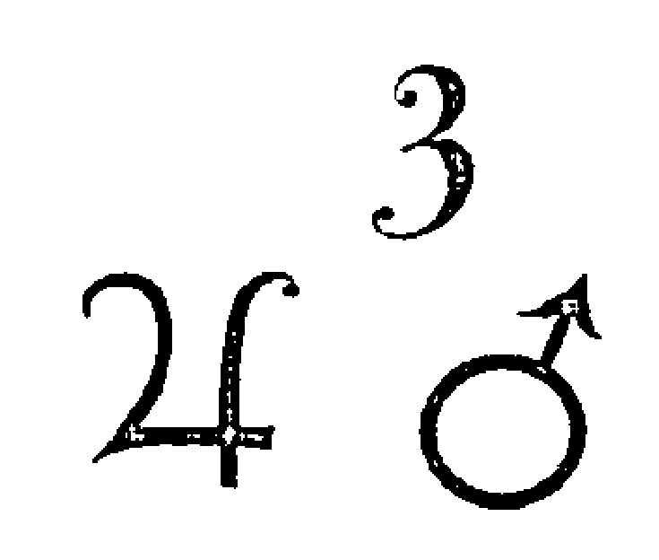

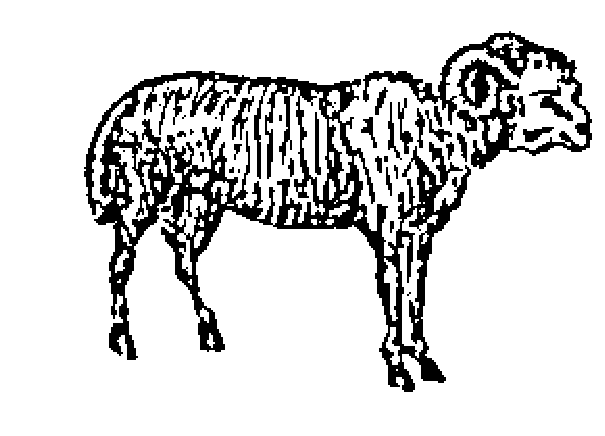

## 每年的这一天

## 白羊座

## 3月30日

## 幸运数字和守护星

3月30日出生的人受数字3（3+0=3）与开朗的木星影响。受数字3影响的人通常都有雄心壮志，有时甚至很独裁。然而，因为3月30日出生的人容易引起他人的敌对态度，因此开朗的木星的能量加上直接的火星（白羊座的主宰星）的能量，可能导致他们受挫，而挫折正是某些精神和身体疾病的主要致因。如果这一天出生的人能够跨过障碍、攀上高峰，那么他们就必须严防出现专制、独裁的倾向。

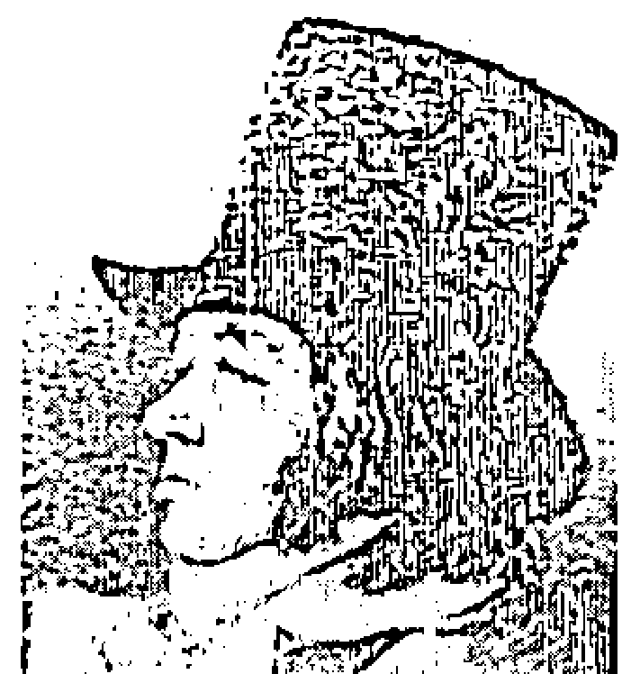

特德·希思（英国大型乐队领队），亨利·哈丁（英国陆军元帅）

## 塔罗牌

大秘仪塔罗牌的第3张是富有创造性智慧的“皇后”。画面中的她是发展到极致的完美女性，是孕育大地的母亲，也是我们梦想与渴望的化身，象征着有创造力的聪明才智。因此，这张牌代表的积极意义是魅力、优雅与毫不保留的爱，而消极意义则是自负、矫作及苛责。

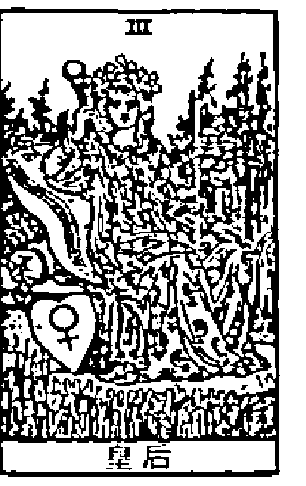

## 健康

对3月30日出生的人来说，压力是影响健康的主要原因。他们的身心无时无刻不充满了狂热，他们很难找到喘息的机会。使用药物或许偶尔有帮助，但是有让他们产生依赖性的危险。对出生在这一天的人而言，头痛、眼睛痛、牙痛是司空见惯的事情。具有安神效果的滋养品、药草茶、泡澡及按摩或许是不错的选择。医生会在生活方式上给他们提出严重警告，以免他们得心脏病、胃溃疡以及其他与压力有关的疾病。然而，言者谆谆，听者藐藐，3月30日出生的人对医生的这些话常常充耳不闻。除了生活方式、处事态度，他们还应该远离烟、酒和咖啡。但是以上所提的几点多半积习已久，很难戒除。当3月30日出生的人自己做饭吃的时候，他们多半会吃得很匆忙，或是干脆以方便面等速食来打发一餐。如果运气好，有人替他们做饭，真的希望他们能好好地坐下来，慢慢享受厨师的手艺，品尝一下人间的美味。或者，培养对烹饪的兴趣也不错。

- 优点
  - 进取
  - 精力充沛
  - 有梦想

- 缺点
  - 容易紧张
  - 孤僻
  - 叛逆

## 建议

冷静下来，不要急着去解释，别人会了解的。避免冲突，控制自己苛责的一面。学着用点外交技巧。与人相处时，稍作妥协并不表示必须把你的理想打折。不要忽视自己。

- 本位 12页
- 火相 16页
- 春季 18页
- 白羊座 22页
- 白羊座—35页

## 静思语

> 人越大越像孩子。

月份：3月
第31天
白羊宫9°～11°
白羊座一
本位/火相

## 3月31日

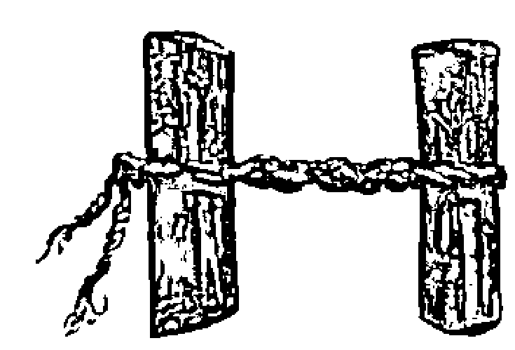

## 不屈不挠的一天

## 出生于这一天的名人

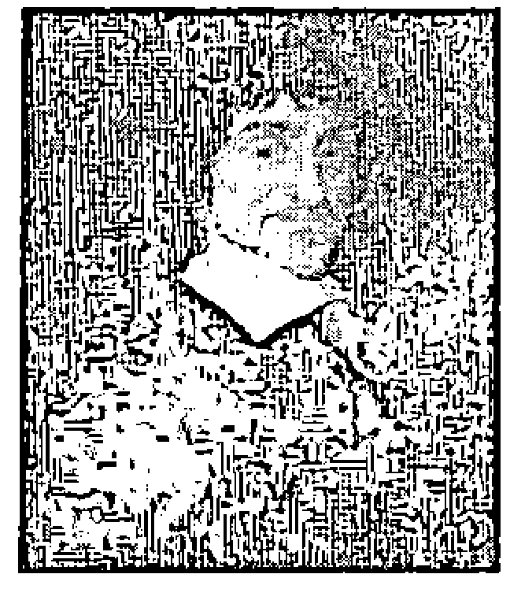

勒内·笛卡尔，朗兹·约瑟夫·海登（18～19世纪奥地利作曲家，贝多芬的老师，创造了4种主要的音乐形式：弦乐四重奏、钢琴奏鸣曲、交响乐、协奏曲），摩西·本·迈蒙（又名迈蒙尼德，埃及穆斯林统治者萨拉丁的御用医生，犹太哲学家），尼古拉·果戈里（俄国小说家，著有《死魂灵》等），西泽·查维斯（墨西哥裔美国劳工运动者），小艾伯特·戈尔（美国前副总统，田纳西州议员），高迪·豪（曲棍球右翼球员，6次当选美国国家曲棍球联盟得分冠军，12次入选全明星阵容，也是有史以来得分排名第2的球员），弗尔克尔·施伦多夫（德国电影导演，作品有《铁皮鼓》等），大岛渚（日本电影导演，执导了《圣诞快乐，劳伦斯先生》等剧），约翰·福尔斯（小说家，著有《魔术家》等），克里斯托弗·瓦尔肯（电影演员），莉兹·克莱本（时尚设计师），雪莉·琼斯（歌手，演员），理查德·张伯伦（电视剧、电影演员），赫布·阿尔珀特（小喇叭手，嘉年华唱片公司的共同创始人），詹姆斯·内德兰德（纽约戏剧总监，制片人），约翰·杰克斯（电视剧编剧，著有《南方与北方》等），利奥·布斯卡利亚（理疗师，电视讲师），雷亚·珀尔曼（电视剧演员），怀康特·威廉·沃尔多夫·阿斯特（纽约商人，约翰·雅各布·阿斯特之子）

3月31日出生的人是勇士，无论何时何地都会勇往直前。他们有不屈不挠的精神，会坚持到最后一秒。一旦他们在某个职位上坐稳了，你就很难要他们退下来。他们也许有一些颇具创意的想法，却始终不表达出来，因为他们常常把心思花费在如何获得一个有利的职位上面。不过，关键时刻他们总有本事想出既有创意又切实可行的办法，这些办法不但能解决问题，还可以为他们赢得上级的赞赏。

3月31日出生的人难以跟别人共事，因为他们好争辩，对同事的要求也高。不过，最重要的一点是，这一天出生的人对待他们的工作非常务实。他们有耐心，也够精明，这足以保证他们在职场上生存得很好。

这一天出生的人一生中或许有机会面对一两次职业上重大的转变，如果接受这些机会，花上一段时间之后，他们便有可能成功；如果放弃这些机会，那么他们深藏不露的才能或许就永无见天之日了。这一天出生的人能够很好地应对挑战，但是由于他们喜欢有安全感，对金钱也看得很重，所以他们只愿意接受经过安全评估的冒险，而不喜欢欠缺思考的赌博。

3月31日出生的人虽然当老板会十分自在，但是从事团队工作会表现得更好，因为他们革新和创造的才能会大大增强团队努力的效果。这一天出生的人可以独自生活很多年，也可以将家庭生活过得很好。由于他们多半晚婚，所以他们可能收养小孩，或是与已经离婚的单亲爸妈组成家庭。

3月31日出生的人不怎么爱黏人，通常以自己的方式来表达感情——借由开开小玩笑或者幽默的说法来传达爱意。公然表现的爱意会吓到他们，所以他们表面上看起来有点爱嘲讽，甚至有些愤世嫉俗。他们极需要关怀，若是童年时他们受到过父母的排斥，这种需求会更加明显。他们的伴侣必须是既亲切又能体谅人的人，知道什么时候该给予关怀，什么时候应该走开。能看得懂他们的讯息是能够与他们亲密相处的关键。他们非常敏感，直觉也强，所以期望爱他的人也是一样——一个字都不用他们说就能够了解他们。他们非常不信任过于能言善辩以及动不动就给人承诺的人。

3月31日出生的人并不会急着成为伟大的领袖，他们可以很耐心地等待，最终得到他们想要的东西。通常他们行事颇为理智，不会被感情牵着鼻子走。因为他们凡事以理性为前提，所以你对他们最好不要动之以情（尤其是想要借此操纵他们），而要晓之以理，如此才能得到真诚的反应，毕竟这一天出生的人最珍视的就是有话直说。

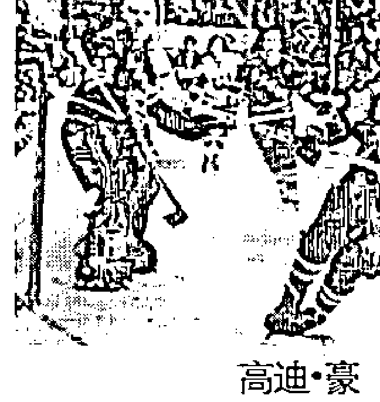

高迪·豪

## 每年的这一天

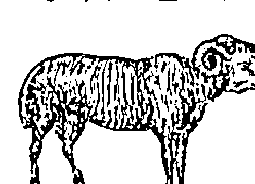

## 白羊座
3月31日

## 幸运数字和守护星

3月31日出生的人受数字4（3+1=4）与天王星的影响。由于一年中有31天的月份只有7个，所以这一天出生的人比较难以猜测。火星（白羊座的主宰星）和天王星的相互作用，造就了这一天出生的人的火爆脾气和难以预测的冲动行为。受数字4影响的人对事物的看法和其他人不同，他们通常顽固好辩。他们的内心十分敏感，尤其是遭到拒绝时，他们会难以释怀。但是一般来说，3月31日出生的人十分明理识大体，这一点稍稍中和了他们性格中古怪的那一部分。

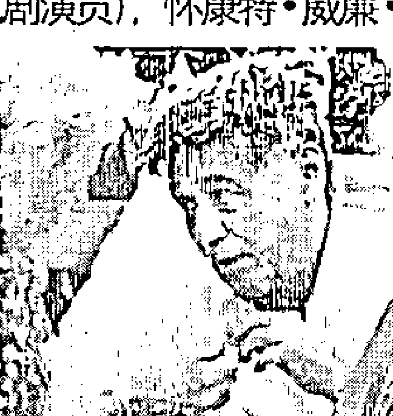

## 塔罗牌

大秘仪塔罗牌的第4张是“皇帝”。皇帝通过智慧——他的强大力量的主要来源——来统治所有有形的世俗事务。皇帝是稳定的、深刻的形象代表，他的权威不容置疑。从积极的一面来看，这张牌代表强大的意志力和坚定的信念；从消极的一面来看，这张牌代表任性、暴政和残酷。

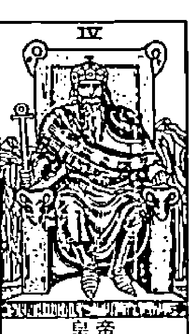

## 健康

3月31日出生的人健康上最大的危险是：他们会把挫折和愤怒压抑在心里，从而导致溃疡、高血压等慢性病，甚至是癌症。这些病症在他们年轻时还不太明显，可是他们一旦上了年纪，恐怕就很难避免了。这一天出生的人需要直接地表达自己，因为他们经常要顾全大局，或是做中间人及调解人。建议他们多做一些运动量大的体育运动，例如跑步、拳击、体操或者登山。另外，由于他们喜欢团体活动，所以棒球或者篮球等运动会很吸引他们。3月31日出生的人人际关系发展得不错，不论是参加户外野炊还是吃自助餐，他们都乐于和大家一起进餐，因为他们喜欢看别人吃东西、交谈和联谊。对他们而言，没有什么比做菜给别人吃更有意思的了。至于他们的饮食，则不太需要受到什么限制。

| 优点 |
| --- |
| 务实 |
| 头脑清晰 |
| 不屈不挠 |

| 缺点 |
| --- |
| 压抑 |
| 好争辩 |
| 容易沮丧 |

## 建议

虽然运用理智可以获益，但是也要信任自己内心最深处的直觉。提防好辩的倾向。敞开胸怀去接受爱情。正视自己害怕被拒绝的心理。

- 本位 12页
- 火相 16页
- 春季 18页
- 白羊座 22页
- 白羊座— 35页

## 静思语

> 放弃并不总是坏事。

月份：4月
第1天
白羊宫10°～12°
白羊座一
本位/火相

## 4月1日

## 自尊自强的一天

## 出生于这一天的名人

4月1日出生的人通常是正直、自律、为他人设想且勤奋的人。即使他们在专业技术上可能已经达到了大师级水平，他们也很少夸耀自己的聪明才智。当还是小孩子的时候，他们对日常生活就已经开始表现出认真负责的态度，并且承担起别的孩子视为负担的责任。长大之后，这一天出生的人也绝对能成长为让亲朋好友赞不绝口、常年依靠的人物。

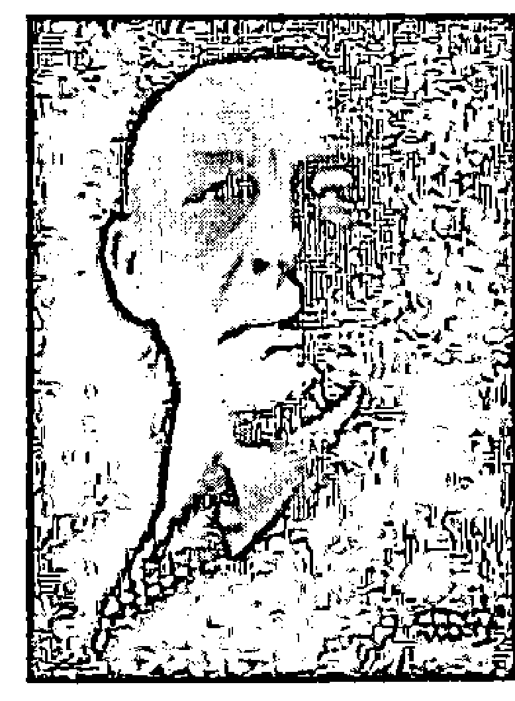

4月1日出生的人大多具有明星气质，这一点谁也无法否认。但是，引人注目、成为众人关注的焦点并不是他们的初衷，成为正在发生的事情的主角才是他们所看重的。他们真正想做的只是投入到他们的工作当中。的确，这一天出生的人对工作的专注程度几乎到了浑然忘我的地步，不管处于人生的哪个阶段，他们都是大家公认的工作狂。许多这一天出生的人会给别人留下害羞，甚至内向的印象，实际上，他们也的确不爱交际应酬，除非是为了工作需要。

谢尔盖·瓦西里耶维奇·拉赫玛尼诺夫，亚伯拉罕·马斯洛（心理学家，人本主义心理学的创立者，著有《人格心理学》），威廉·哈维爵士（英国医师，发现了血液循环现象），克拉拉·麦克布赖德·海尔（创办了慈善机构“海尔之家”，专门收容及治疗吸毒母亲生下的婴儿，被称为“海尔妈妈”），谢尔盖·瓦西里耶维奇·拉赫玛尼诺夫（钢琴家，作曲家），朗·钱尼（默剧演员，化妆大师，出演了《歌剧魅影》，被称为“千面人”），三船敏郎（日本电影演员），埃德蒙·罗斯丹（作家，著有《大鼻子情圣》），米兰·昆德拉（捷克诗人、剧作家、批评家、小说家，著名作品包括《生命中不能承受之轻》），菊竹清训（日本建筑师，提出了“浮动城市”设想），华莱士·比里（电影演员），黛比·雷诺兹（电影演员），哈里·卡尼（爵士乐低音萨克斯管演奏者，首个循环呼吸的倡议者），莉·麦·克劳（电影演员），杜克·乔丹（爵士乐钢琴家，作曲家），杨·卡达尔（捷克电影导演，执导了《大街上的商店》等剧），丹·弗莱文（艺术家），简·鲍威尔（电影女演员），费鲁乔·布索尼（德国裔意大利钢琴家，作曲家），林腾·韦尔斯（国际记者）

4月1日出生的人对精妙技术的喜爱会达到疯狂的程度，他们喜欢掌控自己所做的每一个细节。对他们来说，向别人请教恐怕是件让人很尴尬的事情。这一天出生的人的学习能力特别强，他们精湛的技术多半是他们在学校外面学来的。上课会让他们坐立难安，所以许多这一天出生的人都恨不得能赶快毕业、离开学校，好开始自我教育的过程。由于他们能从经验中学习，又能借鉴他们所尊敬、崇拜的人的好方法，因此他们很快就能发展出自己的独特的风格。

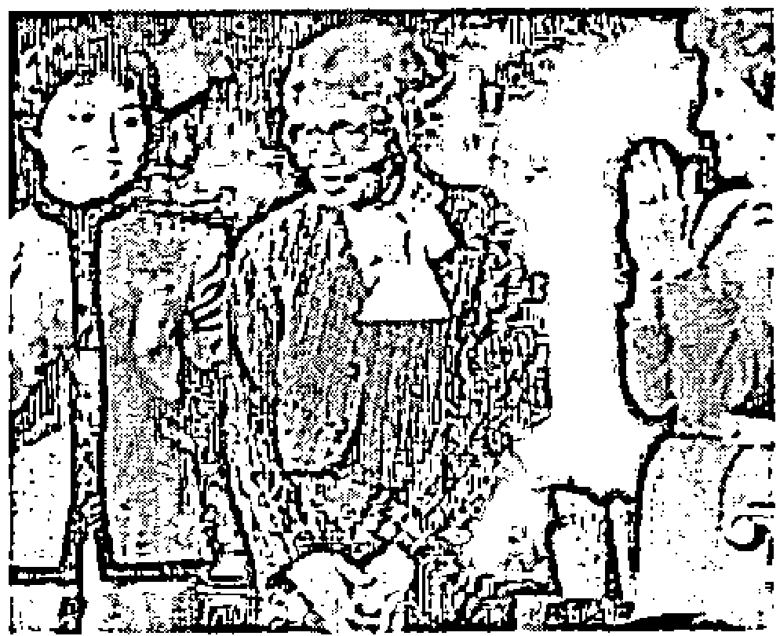

虽然4月1日出生的人颇具创造力，可是出人意料的是，他们在工作中很少表现出大胆或特别的行为，反而更趋向于保守稳重。通常这一天出生的人非常喜欢历史，他们可以以史为鉴，知道该如何做事，以及为什么有的能够成功而有的却会失败。他们在乎的不是个人的成功，而是他们的计划和努力是否成功。

4月1日出生的人非常追求完美，总希望与他们自己有关的事情都能令人满意，因此不论需要耗费多少精力，需要作出多大牺牲，他们都会努力地去完成每一项计划。4月1日出生的人不需要他人带给他们乐趣，所以他们身边不会有太多朋友或者仰慕者。也许有的时候有些人会为他们感到难过，认为他们这样子实在是太孤单、孤僻或者孤独了，但实际上，这一天出生的人倒是很高兴能靠自己过日子，行动也可以非常自由。4月1日出生的人有时会对自己要求过高，因此他们必须避免同时着手多项计划。4月1日出生的人非常讲究自律，唯一能激发他们的兴趣和创造力的是他们的爱好，他们对自己的爱好的投入会热切到让人误以为那是他们的工作。

## 每年的这一天

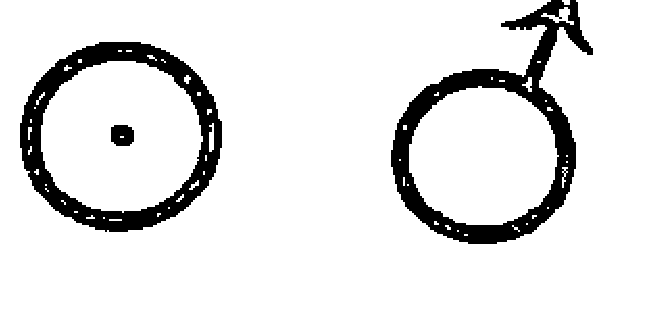

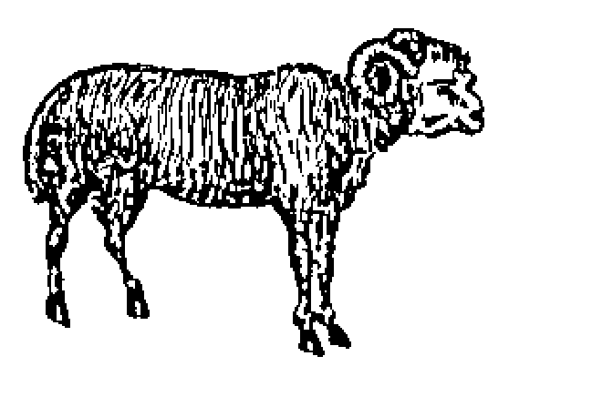

## 白羊座

## 4月1日

## 幸运数字和守护星

4月1日出生的人受数字1与太阳的影响。通常在1日出生的人凡事都喜欢争第一，第二名或第三名无法带给他们欣慰。他们天生就要当胜利者，而且别人对他们的期望也是如此。虽然受数字1影响的人时常表现出明显的领袖特质，但奇怪的是，他们并不愿意领导别人，反而宁愿做个可以自由行动的人。由于受到太阳的影响，受数字1影响的人会散发正面的能量，再加上白羊座的主宰星火星的作用，其正面的能量会更强烈。然而，他们若是遭受挫折，就会变得难以沟通，并散发出负面的、阴沉的能量，从而导致灾难性的后果。

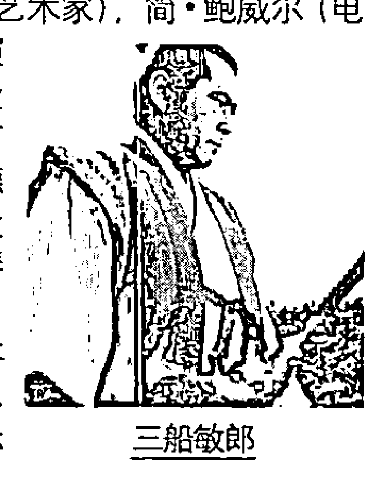

## 塔罗牌

大秘仪塔罗牌的第1张是“魔术师”。魔术师象征着智慧、沟通和资讯。画面中魔术师头上有一个代表无限的符号，有时以宽帽表示，有时则是一道光环。这张牌有许多种解释，其一是：魔术师领悟出生命循环不息的本质，并且因为这层体悟而拥有力量。所以这张牌代表的积极意义是富有外交手腕、精明干练，而消极意义则是毫无顾忌与投机心态。

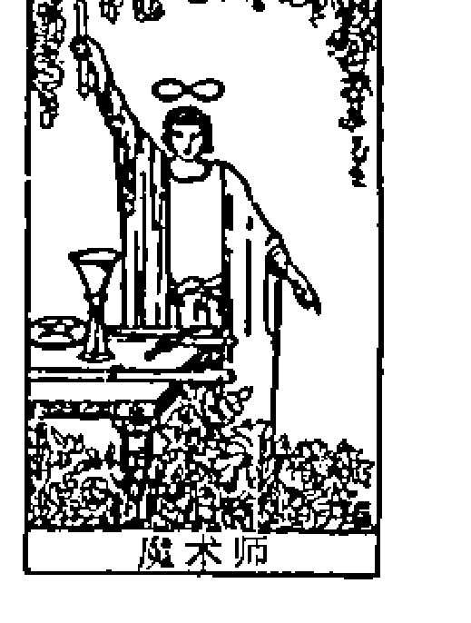

## 健康

为了保持健康，4月1日出生的人需要大量的运动。他们应该尽可能去做那种让他们有机会伸伸腿或是到户外活动的工作。如果是坐在办公室里，那么他们就绝对需要在闲暇时做一些消耗体力的运动。由于4月1日出生的人很像探险者和开路先锋，所以健行、登山和骑马等活动都十分适合他们。

- 优点
  - 目标明确
  - 诚实
  - 技术娴熟

- 缺点
  - 孤僻
  - 福狭
  - 工作狂

## 建议

和你的朋友保持联系，不要与世隔绝。与所爱的人共享喜怒哀乐。不要承担过多的工作，避免工作压力过大，学会放松。

## 静思语

> 我站在桥上看风景，看风景的人在楼上看我。

- 本位 12页
- 火相 16页
- 春季 18页
- 白羊座 22页
- 白羊座— 35页

月份：4月
第2天
白羊宫11°-13°
白羊座一
本位/火相

## 4月2日

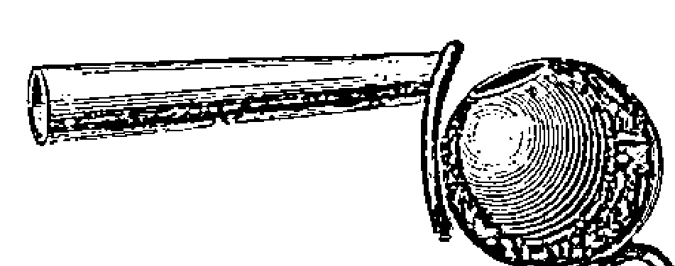

## 理想主义的一天

## 出生于这一天的名人

在日常生活中，4月2日出生的人极富理想主义色彩。因为这项特质，他们想在事业上完成目标就会有些困难。不过，当他们以孩子般的纯真天性来拥抱世界的时候，他们可能就没有特别强烈的成功欲望了。由于他们的思想太理想化，所以只有在找到生活的目标、接受了能力的有限，以及对较低的地位妥协之后，他们才能将可观的能量与活力充分发挥出来。但是，除非认清现实的真相，踏实地思考，否则他们会一路跌跌撞撞，一事无成。

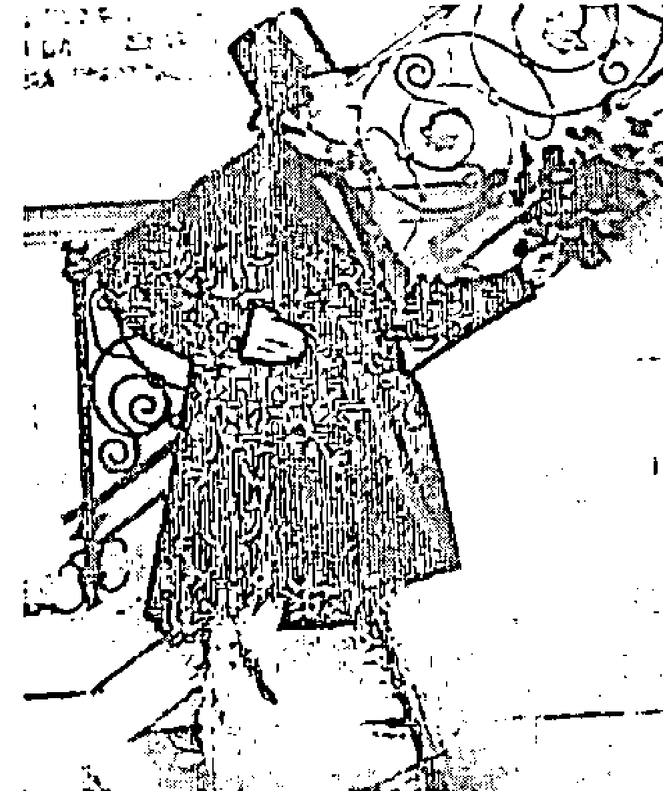

4月2日出生的人通常是以家庭为中心的人，尤其是男性。对这样的男性而言，家是他的城堡，家人就是他的朝臣。这种心态不时会为他们带来问题，尤其当子女并不喜欢当他的臣属的时候。

4月2日出生的人永远都在谈他们的理想、梦想和抱负。在他们身边的人必须花费极大的耐心去应付他们的理想主义，尤其对那些比较务实的同事们来说，他们的想法简直如童话般难以置信。4月2日出生的人常神游到另一个世界，他们的诚实和专注常会使别人误解他们以及他们的动机。因为思想单纯，他们会认为“妥协”是一件很困难的事，而且会将同事的不了解或是不赞同看成一种背叛。

汉斯·克里斯琴·安徒生（丹麦童话作家，剧作家，诗人，著有《丑小鸭》和《国王的新衣》等），埃米尔·佐拉（法国小说家，著有《萌芽》），亚历克·吉尼斯（英国电影，舞台剧，电视剧演员），马克斯·厄恩斯特（德国表现主义者，超现实主义画家，雕刻家），克莱斯勒（汽车制造商），乔瓦尼·卡萨诺瓦（传记作家），马文·盖伊（灵魂歌手，作曲家，被自己的父亲枪杀），卡米拉·帕格利亚（女权主义作家，著有《性面具》等），达纳·卡维（喜剧演员，电影，电视演员，《周六夜现场》成员），埃米卢·哈里斯（乡村歌手），罗谢尔·欧文斯（剧作家），乔姬·盖耶（专栏作家），塞吉·甘斯布（法国歌手，艺人），巴迪·艾布森（电影，电视剧演员），拉里·科里尔（爵士乐吉他手），托尼·克拉克（英国著名录音师，制片人），杰克·韦布（电视剧演员，代表作有《警网》），丽塔·加姆（女演员），约瑟夫·伯纳丁（芝

4月2日出生的人很受人喜爱，但是他们必须注意：不要用自己的想法去干扰朋友。他们必须学习妥协，虽然对他们来说这是一件十分陌生的事情。他们经常以一种非黑即白的态度来看待世界，可是我们不得不说：这是一种与人疏离的态度。由于他们不善计算，又非常坦诚大方、通情达理，所以他们即使有一些怒气、怨言和情绪，也很快就会被原谅。此外，他们也常会因支持弱者而招致当权派的敌意，不过，这样也会让他们赢得朋友及他人的仰慕。

别人的情绪常会使4月2日出生的人感到惊讶，因为他们只有在碰到危机、困难，甚至灾难的时候，才会有类似的情绪。还有，这一天出生的人可能忘记别人对他们的看法，甚至要过去很长一段时间他们才可能明白：不是每个人都欣赏他们那种纯洁却极端的观点。不过，要是被贴上麻烦制造者的标签，他们就会对这样的批评反应激烈。

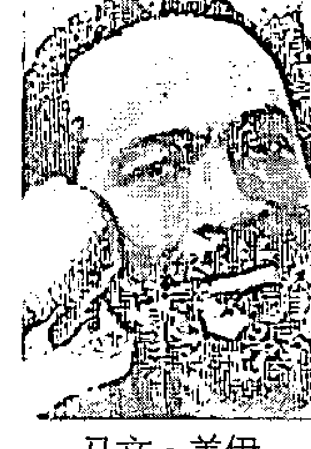

马文·盖伊

## 幸运数字和守护星

4月2日出生的人受数字2与月亮的影响。月亮通常赋予人浪漫和富有想象力的特质。4月2日出生的人出生在积极的白羊座（受火星主宰），所以会受到月亮和火星的双重影响。他们具有魅力、野心及较强的性欲，尤其是男性。如果受数字2影响的人恰好在家中排行老二，他们就有可能躲掉父母亲的坏脾气，因为凡事都有哥哥或姐姐替他们处理。受数字2影响的人通常可以成为好同事或好伙伴，但是成为领袖型人物倒不常见，所以他们如果想扮演掌权者，就很可能遇到问题。

加哥大主教），杰克·布拉海姆爵士（澳大利亚赛车手，获得过3次一级方程式赛车冠军）

亚历克·吉尼斯爵士

## 塔罗牌

大秘仪塔罗牌的第2张是“女祭司”。画面中女祭司坐在宝座上，看起来自在平静，还有些高深莫测。女祭司拥有灵性，可以让隐藏的力量和秘密显现出来，进而赋予人们这些知识。因此，从积极的一面来看，这张牌代表宁静、直觉、含蓄以及谨慎；从消极的一面来看，这张牌则代表诡秘、猜疑、冷漠和迟钝。

## 健康

4月2日出生的人适合做一般的体能运动，这些运动可以使他们把心思放在自己的身体上，让他们从蜗居的高度精神的世界中得到喘息的空间。丰富的想象力会把4月2日出生的人弄得疲惫不堪，因此他们必须注意自己的精神状态，还必须小心被压抑的愤怒情绪，否则这种愤怒情绪必然导致抑郁。一再地受挫有时甚至会迫使他们完全活在梦境之中，从而使他们患上严重的心理疾病。这一天出生的人必须注意身体所发出的讯号，比如疼痛、长年的不适以及背部与颈部的问题，这些问题应该定期由专家诊治。定期检查是非常重要的，因为他们常会忽视慢性病，一直拖到病入膏肓才发现一切都来不及了。至于饮食，4月2日出生的人很喜欢吃东西，除非限制乳制品、酒精和肉类的摄取量，否则他们一定会发胖。

| 优点 |
| --- |
| 诚实 |
| 诚恳 |
| 努力 |

| 缺点 |
| --- |
| 天真 |
| 自我压抑 |
| 浑浑噩噩 |

## 建议

强迫自己实际一些，不要活在梦境之中。理想主义诚然可敬，但是不能当饭吃。良药苦口利于病，忠言逆耳利于行。只要你肯用心思考，他人的批评就说不定能对你产生积极影响。

| 本位 12页 |
| --- |
| 火相 16页 |
| 春季 18页 |
| 白羊座 22页 |
| 白羊座一 35页 |

## 静思语

活在当下，敏于发生之事。

月份：4月
第3天
白羊宫12°～14°
白羊座二
本位/火相

## 4月3日

## 成为支点的一天

## 出生于这一天的名人

4月3日出生的人有非常强烈的愿望成为周围生活中不可或缺的重要人物，只有这样他们才可以找到自我。不管是在专业领域，还是在个人才干或是社会认知方面，他们都会竭尽所能地想处于领先地位，而不管是在家中还是在工作场合，对他们来说，发号施令及掌控一切也是一件非常重要的事情。4月3日出生的人对周围一切的掌控不是通过大声嚷嚷，而是用直截了当的方式让对方清楚地知道他们的意愿，另外，他们也会要求别人专心聆听他们的话语。这一天出生的人不能忍受被人忽视，不过，对此他们不会摆出一副盛气凌人的姿态，而会发挥他们自然的吸引力，以一种非常平和的方式来赢得人心。

这一天出生的人对人性（尤其是人性的基本层面的东西）具有强烈的、直觉式的了解。虽然有的时候他们会将事情过分简化，但是他们确实能够找出问题的核心。他们的坦白和直言不讳有时会让他们惹祸上身，不过大多数时候别人还是会正视且珍惜这一天出生的人的洞察力的。而在一些比较危险的情况中，别人也通常会发现他们强壮的身体具有令人心安的力量。

简·古多尔（野生动物研究者，多年与黑猩猩生活在一起，观察研究它们，著有《人类的阴影》和《贡贝的黑猩猩》），马龙·白兰度（电影演员），华盛顿·欧文（19世纪的短篇小说家，著有《瑞普·范温克尔》、《无头骑士》等），埃迪·墨菲（美国喜剧电影演员），多丽丝·戴（歌手，电影演员），亨利·卢斯（《时代》周刊、《生活》画报的出版商），理查德二世（14世纪的英国国王，镇压了当时的农民起义），威廉·马西·特威德（19世纪的纽约坦幕尼厅政客，统治纽约市20年，通过公共事业搜刮了上千万美元，被称为“老板”，死于狱中），亚力克·鲍德温（舞台剧、电影演员），乔治·赫伯特（英国玄学派诗人），斯科特·拉法罗（爵士乐贝司手，25岁时死于车祸），莱斯利·霍华德（英国电影演员），玛莎·马森（电影演员），乔治·杰塞

4月3日出生的人颇能独立做事。虽然团体与社会活动会耗去他们大量的精力，但是他们还是很乐意参加这些活动。这一点儿也不稀奇，因为他们希望受人感激，当然也就愿意帮助别人。他们可以发挥自己独特的个人力量将不同的事物，甚至是产生过分歧的事物很好地整合在一起。不过，他们偏心的倾向会给自己惹来麻烦，也会使某些人过分依赖他们。

4月3日出生的人通常本性善良，但是偶尔也会因为幼稚被别人批评。实际上，在别人的眼里，这一天出生的人兼具幼稚与成熟、理想与务实、自私与负责等多种特质，是矛盾、奇异的组合体。他们会犯下极大的判断错误，通常是因为他们固执己见、不知变通。幸好因为他们并无恶意，所以亲友和仰慕者多半很快就会原谅他们。

4月3日出生的人需要面临的一项重大的挑战，就是不要让他们自己在人生中只扮演一种角色，从而避免错失更好的发展机会。因此，他们必须小心不要让他们所占据的关键地位本身成为这种跨越式发展的主要障碍。另外，他们最好能早点学会跟那些使他们分心的人或计划说“不”，培养独立创新的能力，学会不轻易感到内疚，这些都至关重要。

## 每年的这一天

## 白羊座
4月3日

## 幸运数字和守护星

4月3日出生的人受数字3及开朗的木星影响。受数字3影响的人，在他们的专业领域中大都能晋升到显赫的职位，通常他们比较独裁，不过这种倾向在4月3日出生的人身上会稍微缓和一些，因为他们喜欢不需要他们直接下令，周围的事情就能顺利运作。暗示之类的非语言沟通正是他们的专长。因为木星与火星（火星主宰着白羊座）的相互作用，这一天出生的人将特别需要独立的思考及行动能力。

尔（喜剧演员），约翰·伯勒斯（自然主义作家），威廉·范埃登（乌托邦自然主义作家，被称为“荷兰的索罗”），格斯·格里索姆（美国宇航员），黛西·阿什福德（英国作家，9岁时著有《青年来访者》），梅木三吉（日本演员）

## 塔罗牌

大秘仪塔罗牌的第3张是富有创造性智慧的“皇后”。画面中的她是达到极致的完美女性，是孕育大地的母亲，也是我们梦想与渴望的化身，象征着我们的志向和希望。因此，这张牌代表的积极意义是魅力、优雅与无条件的爱，而消极意义则是自负、矫情及苛责。

## 健康

4月3日出生的人若是出现健康问题，通常是因为他们过度关注身边的人的缘故。这些把心思放在他人身上的人，必须有家人、朋友或是医生在旁边不断提醒：把自己的健康放在第一位对大家都有好处。基本上这一天出生的人天生就长得很结实，所以他们的问题通常是多年的忽视所造成的。良好的食欲是4月3日出生的人在健康上的一项资产，不过跟一般人一样，他们也有因发胖而致病的烦恼。因此他们需要双管齐下，通过运动和减少脂肪的摄取量来保持健康。定期的出游和度假或许可以减轻头痛以及因压力引起的不适，不过他们最好和别人一起安排旅游事项及承担相关责任。

- 优点
- 本性善良
- 谦逊
- 风趣

- 缺点
- 严苛
- 天真
- 以自我为中心

## 建议

不要太依赖别人的认同，也不要一心一意只服务他人。找出自己的内在价值，维护自己的士气，发展潜藏的才能。压抑想控制周围人的欲望，学习偶尔退到一旁，消失一段时间。

| 本位 12 页 |
| --- |
| 火相 16 页 |
| 春季 18 页 |
| 白羊座 22 页 |
| 白羊座二 36 页 |

## 静思语

> 鸡是鸡蛋再生的凭借。

月份：4月
第4天
白羊宫13°～15°
白羊座二
本位/火相

## 4月4日

## 积极进取的一天

## 出生于这一天的名人

4月4日出生的人具有创新精神，这种创新精神使他们看起来与众不同。也许他们非要具备这种特质不可，因为周围的情势常常对他们不利。这或许是因为别人认为他们有些奇特，或许是因为他们自己就是他们最大的敌人。无论是哪一种情况，他们都必须去努力争取自己想要的东西。然而问题是，他们可能要花很长时间才能知道自己是谁，自己想要追寻什么。因此，如果想成功，毅力就是他们必备的另一项重要特质。

4月4日出生的人不仅要努力地开创新项目，还必须脚踏实地地将其付诸实践，只有这样他们才能获得成功。一般说来，他们人生的成败取决于他们实践的程度。他们也需要克制自己无限地往新方向发展的倾向，因为他们能够做的事是有限的。

玛格丽特·杜拉斯（法国小说家、导演，著有小说《情人》、电影剧本《广岛之恋》，曾执导过电影《印度之歌》等，同时也是新闻记者、电视访谈节目主持人），马迪·沃特斯（蓝调歌手、吉他手、音乐创作者），安东尼·珀金斯（电影演员），马娅·安杰卢（诗人及作家，著有《现在示巴唱着歌》，曾在克林顿就任总统大典上朗读开幕诗），亚瑟·默里（舞蹈教师），埃尔默·伯恩斯坦（影视音乐作曲家），休·马斯盖拉（南非小号手、歌手），琼·卡纳（高尔夫球运动员，获得过2次美国公开赛冠军、3次女子职业高尔夫球赛年度最佳球员），小罗伯特·唐尼（电影演员），安东尼·图德（舞蹈家），吉尔·霍奇（美国布鲁克林道奇棒球队队员，曾担任奇迹棒球队经理，并带领该队获得了世界大赛的冠军），克洛丽丝·利奇曼（电影、电视剧演员），巴特利特·吉迈蒂（耶鲁大学校长，比较文学家，棒球协会主席），埃米特·威廉姆斯（诗人，“图像诗”的创始人），爱德华·希

4月4日出生的人有可能完全走错了方向，不过不必担心，他们只要发现了这个错误，就会立刻下定决心调整方向，拟定新计划，继续前进。这一天出生的人对于他们所尽力做的事情会非常坚持，如果不是很清楚他们想做些什么，最好不要随便提出反对意见。因此，他们的伴侣或工作伙伴要很有耐心才行。

4月4日出生的人不只追求被人接纳，也追求在所处的领域中拥有极高的声望。但与其说他们寻求别人的崇拜和阿谀奉承，倒不如说他们希望在所从事的领域中拥有显赫的地位。若是剥夺了他们与生俱来的开创需求，那么绝对是给了他们致命的一击。4月4日出生的人可以成为很好的经理人，既能实现想法，又能在工作上表现良好。当他们成为家庭或社会团体中的领导人物时，他们会花很多心思并努力去完成任务。在4月4日出生的人手下工作相当辛苦，但会感到很舒心，因为他们总能将自己的期望交代得很明白，对于别人所做之事的评价也同样会说得很清楚。不过，对于一再重复自己说过的话，他们会感到很不耐烦，所以在他们第一次说明的时候，最好就能完全弄明白。基于上述的种种原因，许多4月4日出生的人最后会发现，原来做一个能独立作业的专业人士才是最适合他们的工作。

必须强调的是，除非发现了自己人生的目标，否则4月4日出生的人就不可能找到正确的人生方向。如果他们在已近中年时还浑然不觉地走在一条错误的道路上，就必须有一个他们十分信任、亲近的人私底下告诉他们这个情况。如果他们能自己去发现当然最好，但是多半等到他们自己发现时就已经太迟了。所以，能有个不时给予严肃而客观的劝告的伴侣或是亲密的友人，对他们而言特别重要。糊里糊涂地被一群仰慕者或谄媚的人包围对他们并无益处，牢牢把握现实才是他们幸福的基础。

## 每年的这一天

## 白羊座
4月4日

## 幸运数字和守护星

4月4日出生的人受数字4和天王星的影响。受数字4影响的人惯于我行我素，行事风格特异。天王星代表心意变化不定，行为无法预测。火星（白羊座的主宰星）的影响则会使这些突如其来的行为带有十分猛烈的攻击性。由于这一天出生的人本身具有很强的开创力，再加上数字4和火星的影响，因此其行为的危险性就更加明显了。这一天出生的人最让人担心的是：靠直觉过生活而未能表现出他们的开拓能力。

克斯（画家），皮埃尔·蒙特（指挥家），皮埃尔·保罗·普鲁东（法国画家，拿破仑的宫廷画师），多罗西娅·迪克斯（监狱改革者），姬蒂·凯莉（美国作家，著有未经授权的《西纳特拉传记》），克里丝·赛兹莫尔（多重人格混乱患者，《三面夏娃》中对多重人格有所描述）

## 塔罗牌

大秘仪塔罗牌的第4张是“皇帝”。皇帝通过智慧——他的强大力量的主要来源——来统治所有有形的世俗事务。皇帝是稳定的、深刻的形象代表，他的权威不容置疑。从积极的一面来看，这张牌代表强大的意志力和坚定的信念；从消极的一面来看，这张牌代表任性、暴政和残酷。

## 健康

对4月4日出生的人来说，会对他们的健康产生最大伤害的就是他们的冲动个性。决定改变人生的方向或是事情进展的方向的时候，就是他们最冒险的时候。不论是在徒步行走或是在驾车，这一天出生的人都应该随时小心会有意外发生。此外，他们也应该避免任何会使他们紧张的职业、环境或物质。有安神效果的药方，不论是药草还是其他什么，都是最安全的缓和剂。用香精油沐浴、按摩（尤其是按摩头盖骨及上脊椎部位）有助于身体回复到适当的平衡状态。4月4日出生的人的饮食宜均衡中多变化。

- 优点
- 活泼
- 雄心万丈
- 富有创新精神

- 缺点
- 冲动
- 缺乏稳定性
- 叛逆

## 建议

了解沉思及沉默的价值。让自己成为更好的团队成员，找出与别人更好地分享更多事物的方法。有时也需要保持低调，不要锋芒毕露。培养认知的深度，感受神秘的力量。克制任何猛烈、冲动的本能。

| 本位 12 页 |
| --- |
| 火相 16 页 |
| 春季 18 页 |
| 白羊座 22 页 |
| 白羊座二 36 页 |

## 静思语

> 保持平静或许是人类最大的挑战。

月份：4月
第5天
白羊宫14°～16°
白羊座二
本位/火相

## 4月5日

## 坚韧的一天

## 出生于这一天的名人

4月5日出生的人具有成功的潜质，以及维持成功的执著。他们拥有明星的特质，能展示出沉稳自信的形象，却又不会过度以自我为中心。他们多半着眼于事物的表面，而不去深入地探讨。大多数在这一天出生的人一生只追求一个职业、一种原则和一套思想体系。4月5日出生的人就像其他那些具有明星特质的人一样，会追逐别人的掌声。幸运的是，在他们看来，就算得不到别人的掌声也没有关系，不管别人有没有注意到，他们依然会坚持努力。不管周围发生什么事，他们仍然会全神贯注于自己手头的事情。

很难想象具有这种明星特质的人会是谦虚的人，然而事实的确如此！对他们而言，做个平凡的人是最舒服自在的事儿了。当然我们也可以说，对这一天出生而格外有演艺天赋的人而言，谦逊只不过是他们精湛的演技罢了！不过，在这方面他们并不喜欢被人分析或探讨。只要他们扮演的角色是真实的自我，他们就不希望再被任何人做深入的挖掘或评断。

布克·华盛顿（非洲裔美国教育领袖，创立了“塔斯基吉学院”，同时也是作家，著有《超越奴役》等），托马斯·霍布斯（英国政治哲学家，著有《利维坦》），约瑟夫·利斯特（19～20世纪的英国医师，发明了消毒药），贝特·戴维丝（电影演员），斯宾塞·特蕾西（电影演员），格利高里·派克（电影演员），赫伯特·冯·卡拉扬（德国指挥家，就职于柏林爱乐交响乐团），科林·鲍威尔（美国陆军将军），朱迪丝·雷斯尼克（美国宇航员，在挑战者号事故中丧生），梅尔文·道格拉斯（电影演员），罗伯特·布洛克（恐怖小说家，著有《精神病患者》），阿尔杰农·斯温伯恩（前拉斐尔画派诗人），琼·霍诺尔·弗拉戈纳德（法国洛可可派画家），玛丽莲·弗格森（社会活动家，出版商，编辑，作家，著有《宝瓶同谋》），罗杰·科尔曼（电影制片人，导演，执导了《血腥妈妈》等剧），迈克尔·莫里亚蒂（电影演员），斯坦利·特伦坦（爵士乐萨克斯管演奏者），莱斯特·詹姆斯·佩里斯（斯里兰卡电影导演，执导了《村庄的

4月5日出生的人最适合做的工作是那种可以做一辈子的工作，因为他们比较喜欢在体系完善且令人满意的工作中做稳定、持续的努力。可是，他们的婚姻可就不是这样了。他们的婚姻状况多半如狂风暴雨般猛烈，有的4月5日出生的人还会有鲁莽的行为和为时颇久的婚外情，但他们并不觉得这样有何不妥。别人很难触碰到他们的情感层面，连好好坐下来把事情说个明白都很困难，或许他们鄙视或者不屑于做这样的事情吧！4月5日出生的人总认为身边的人本来就应了解他们。另外，他们会有一堆仰慕者像蜜蜂般涌来，所以他们的伴侣需要给予很多的体谅。

虽然4月5日出生的人最不喜欢引起争议，但是他们却会因行事直接和坦率而招致威胁或敌对。不过，他们不会放弃自己的信念，即使因此引起财务上的危机也在所不惜——反正金钱对他们来说也不是最重要的。对他们而言，重要的是计划能够实现，并且确保理想不会受到威胁。虽然他们深信维护诚实和正直是必需的，但是他们也有可能为了顺利进行他们的人生事业而避开这些纷纷扰扰。通常他们会把“需不需要有一场争辩”的问题交由对手去决定。

当专注于一件事情时，他们通常停不下来，而且也浑然不知别人可能已经厌烦或是想做别的事情了。同样地，有些在这一天出生的人很可能终其一生都习惯做同样的事，过没有什么变化的生活。其实他们应该定期评估一下自己的人生，必要时做些改变，即使这很困难，甚至有些痛苦。

## 4月5日

白羊座
4月5日

## 幸运数字和守护星

4月5日出生的人受数字5及水星的影响。水星代表思维敏捷，也代表改变。在这一天，火星（白羊座的主宰星）会给予水星充足的能量，而这种能量也将伴随他们终生。受数字5影响的人喜欢冒险，所以我们会发现那些即使家庭、事业两得意的人私底下也会有些冒险的行为，比如赌博、开快车、搞危险的外遇关系等。生活的打击对他们来说并没有多大的影响，他们依然我行我素，不受干扰，他们超强的韧性确实令人望尘莫及。

安迪·麦克费尔（棒球队总经理，带领明尼苏达队获得了2次世界大赛冠军）
赫伯特·冯卡拉扬

## 塔罗牌

大秘仪塔罗牌的第5张是“教皇”。他是令人畏惧的神秘事物的解释者，象征人类的认知及信仰。他知识渊博，即使抽象的事物也受他主宰。从积极的一面来看，这张牌代表信心十足、不疑不虑以及对事物有正确的理解；从消极的一面来看，这张牌代表爱说教、夸大其词以及独断的个性。

## 健康

4月5日出生的人在工作时会尽心负责，闲暇时也容易玩过头。大吃大喝、意外事故、随意糟蹋身体，全都对他们的健康有害。这一天出生的人尤其要注意酒精和药品问题。4月5日出生的人特别喜欢有异国风味的辛辣食物，但是他们确实应该改变这种单为满足口腹之欲、不为健康着想的饮食习惯。由于他们有少见的强壮体格和顽强的生命力，因此很长一段时间内，即便行为鲁莽，他们依然可以获得成功，即使出现了问题也不会太严重。不过，他们应该把明智的工作态度也运用在饮食、嗜好和户外活动上。

## 优点

- 努力
- 始终如一
- 有成功潜力

## 建议

学会把握放弃和离开的时机，离开不见得不好。试着更忠实地对待你的伴侣。不要把身体健康视为理所当然的事情。不要只和别人谈论自己的成功，也要谈谈遭遇到的问题，和别人分享喜怒哀乐。

## 缺点

- 不愿改变
- 放纵
- 情感封闭

- 本位 12页
- 火相 16页
- 春季 18页
- 白羊座 22页
- 白羊座二 36页

## 静思语

> 如果你有两只脚，你可以跑；如果你只有一只脚，你可以跳；如果你没有脚，你可以飞。

## 4月6日

月份：4月
第6天
白羊宫15°～17°
白羊座二
本位/火相

## 实验者的一天

## 出生于这一天的名人

4月6日出生的人有一种无法控制的冲动——想利用在身边发现的所有事物做实验。在这方面，他们很有科学精神，会深入探索情绪、身体和心理层面的各种问题，没有一件事情能逃得过他们的审视，而且他们会不厌其烦地去挖掘事情的真相，或者看它是如何运转的。许多这一天出生的人不只拥有孩童般的好奇心，也会展现出非同凡响的创造力。

即使是在最平凡的领域，包括日常事务和业务工作，这些从不疲倦的探索者也会努力寻找什么地方出错了（因为永远都可能有地方出错），并且想办法对其进行纠正。他们最基本的动机是探寻事物的本质。当然，如果必须做实验，他们就会用到实验用的小白鼠——这一天出生的人不单很欢迎他们的亲朋好友或陌生人来担任这个角色，也很愿意亲自上阵。在寻求答案的时候，他们可是不考虑个人情感因素的。

哈里·霍迪尼

詹姆斯·沃斯顿（DNA的发现者之一，美国诺贝尔生物奖获得者），哈罗德·埃杰顿（物理学家，闪光灯的发明者），哈里·霍迪尼（杰出的逃生术魔术师，从束缚衣到水中加锁的沉箱，全都难不倒他），约翰·斯卡利（公司高管，苹果公司总裁），理查德·阿尔珀特（后改名为巴巴·拉姆·达斯，成为了印度教领袖），珍妮特·琳恩（曾获得过5次美国花式滑冰冠军），安东尼·福克（荷兰飞机制造商），道格拉斯（飞机制造商），默尔·哈格德（西部乡村歌手，生活艰难，曾被装进卡车里作为流动农业工人运往加利福尼亚），安德烈·普鲁文（指挥家、钢琴家、作曲家，供职于伦敦交响乐团），查理·劳斯（高音萨克斯管演奏者，特洛尼斯·蒙克曲目的最佳阐释者），格里·马利根（美国爵士乐萨克斯管演奏者，作曲家，编曲家），彼得·托什（牙买加雷鬼乐艺术家，哭泣者乐队创建成员），巴里·莱文森（电影导演，执导了《锡人》和《雨人》），比利·迪伊·威廉斯（电影、电视剧演员），古斯塔夫·莫罗（法国象征主义画家），米歇尔·吉列姆·菲利普斯（歌手，妈妈和爸爸演唱组成员），詹姆斯·米尔（英国历史学家，政治经济学家）

只要这一天出生的人对事情产生了疑问，他们就会要求对这件事情进行逻辑性的讨论。他们心胸开阔，而且喜爱思考，不过他们通常会把自己的观点建立在测试或经验之上。令人头痛的是，当他们得到预料之外的结果时，问题就来了：这一天出生的人中比较开明的那些人，还是愿意承认原先的假设是错的，但是顽固派的人就不接受了，他们会一次又一次地尝试找出合乎自己观点的结果，这样的坚持近乎盲目，常令身边的人倍感困扰。

4月6日出生的人通常会找出最佳方法来完成一件事情，不过，前提是他们对这件事情没有太多成见。有时候，他们乐于尝试最怪异的方法的开放心态会显得很可笑，不过，他们的出发点可是很严肃的。他们的这个特质会得到家人和朋友们的喜爱，不过却容易惹恼伴侣，使彼此疏远。所幸4月6日出生的人颇有自嘲的能力，这一点也证明了他们重视他人的立场胜于维护自己的自尊。

最重要的是，4月6日出生的人相当有远见，可以把握宏伟的目标，并预见种种可能性。因此，这一天出生的人在本质上可以算是预言家。然而，就像所有的预言家一样，他们会让身边的人觉得难以捉摸。虽然他们极具影响力的活力有可能赢得一些同事或朋友，但是这一天出生的人有时的确会高估他们所能得到的支持。如果要实现宏伟的目标，这一天出生的人最好先培养一份能激励团队朝共同目标前进的能力。

珍妮特·琳恩

## 幸运数字和守护星

4月6日出生的人受数字6及金星的影响，具有吸引异性并取得别人崇拜的魅力。由于金星与社会互动有密切的关联，所以4月6日出生的人不可避免地会将其发明及实验成果运用在人类社会中。他们喜欢与别人共事，不论表面上看起来多么孤僻，在工作中他们都会参与社交活动。4月6日出生的人也受到了火星（白羊座的主宰星）的强烈影响，而且这种影响能和数字6以及金星的影响配合得很好，所以4月6日出生的人，不论男女，都是精神健全、心智发展平衡的人，这使他们的吸引力更强了。

默尔·哈格德

## 塔罗牌

大秘仪塔罗牌的第6张是“恋人”。恋人象征着通过两性结合的爱，全人类能够团结在一起。从积极的一面来看，这张牌代表道德、美学以及肉体方面更高层次的感情与渴望；从消极的一面来看，这张牌代表没有止境的欲望、多愁善感和迟疑不决。

## 健康

4月6日出生的人对自己的身体就像对其他事物一样好奇，不过，由于他们总是自己手头掌握的第一个实验用的“小白鼠”，所以他们总是先拿自己来验证自己的新发现。这样大胆的行为真的是有碍健康的。如果服用药物是他们实验的一部分，那么他们就有对药物产生依赖的危险。好的视力对观察这项活动来说至关重要，这对4月6日出生的实验家来说更是如此，所以如果眼睛有问题，他们就要立刻就医，必要时得戴眼镜进行矫正。这一天出生的人不停地在动，所以额外的运动就没有那么重要了。他们喜欢在吃饭时和人聊天联络感情，喜欢可以大量制作的食物，例如意大利面、煮豆子、汤和烤肉。他们吃东西时也不忘记研究，会把食物做各种有趣的组合来实验。

## 优点

- 具有吸引力
- 有远见
- 富有创新精神

## 缺点

- 褊狭
- 狂躁
- 强势

## 建议

记住自己的责任。提防成为井底之蛙，保持情绪的平稳。学着让别人也去发现一些事情。不要摒弃传统价值。实际一点，当某个理论真的不合适的时候，就把它暂且放到一边吧。

- 本位 12页
- 火相 16页
- 春季 18页
- 白羊座 22页
- 白羊座二 36页

## 静思语

> 没有哪件事情是没有价值的。

## 4月7日

月份：4月
第7天
白羊宫16°～18°
白羊座二
本位/火相

## 兴致勃勃的一天

## 出生于这一天的名人

4月7日出生的人不管做任何事都兴致勃勃、十分专注。但是如果不幸因为父母或环境的关系而有一个不快乐的童年，那么他们在之后的人生中多少都会有些感伤。他们会在年轻时展现出热忱和创造力，待日后才会安于较可预测或是较舒适的状态。另一方面，这一天出生的人在少年时代有可能因为叛逆而浪费许多精力。虽说人会随着年岁的渐长而越发聪明、理性，但容易变得愤怒仍然是这一天出生的人最大的问题。

这一天出生的人经常因无法进一步提升内心修养而无法获得某种程度的发展，此时他们就必须作出重大改变，从而走到人生的拐点，这种情形大约发生在他们28岁（土星公转一圈所需时间）或是42岁（此时土星和天王星都在公转起始点的对称位置点上）时。如果这一关他们能够顺利通过，他们就能在新生活中获得更大的成功，不再觉得自己是被硬生生地扔进社会，而能打开心扉接纳外界的人和事。

方济各（来华传教士，天主教耶稣会创始人之一），威廉·华兹华斯（英国浪漫主义诗人），比利·霍利迪（爵士乐歌手），弗朗西斯·福特·科波拉（编剧、制片人及电影导演，作品有《教父》、《现代启示录》），杰里·布朗（美国加利福尼亚州州长，总统候选人），拉维·尚卡尔（印度艺术家），蒙贡·圣塔玛丽亚（古巴拉丁爵士打击乐队队长，作曲家），约翰·麦格劳（曾担任纽约巨人棒球队经理30年，带领球队获得了3次世界大赛冠军、10次超级碗冠军，史上累计总获胜场数排名第2），布罗尼斯拉夫·马利诺夫斯基（文化人类学家），托尼·多塞特（橄榄球跑锋，海斯曼奖获得者，年度最佳球员，4次入选全明星阵容，2次闯入超级碗总决赛），詹姆斯·加纳（电影、电视剧演员，代表作有《洛克福德档案》），乔尔·罗比雄（法国厨师，曾经被高尔特和米劳选为世纪名厨，现任雅曼餐厅大厨），戴维·弗罗斯特（英国电视节目主持人、记者、制片人、作家，著有《世界最短的书》），弗雷迪·哈伯特（爵士乐小号手），约翰·奥茨（歌手，歌曲创作者，和达里尔霍尔组成了合唱组合），贾尼斯·伊恩（歌手，歌曲创作者），奥利·柯克·克里斯琴森（丹麦玩具制造商，“乐高”玩具的发明人），巴斯特·道格拉斯（拳击手，击败泰森获得了重量级冠军）

即使4月7日出生的人正处于一段平静时期，他们对别人的积极的能量也十分敏感，并且会有所回应。这一天出生的人中更上进的人，会有能力将这股积极的能量导引到社会及宗教信仰上。精神生活对这一天出生的人来说相当重要，不论有没有积极加入哪个教派，他们都会对这个世界表现出虔诚、严谨的态度。就这一点而言，4月7日出生的人最好避免这种一成不变的乐观心态，因为这种乐观心态不一定能引起共鸣，有时反而会让人退避三舍。因此，培养批判和客观审视的能力对这一天出生的人来说就显得十分重要了。

这一天出生的人中资质较差的人，也许给人一种值得信赖的感觉，但是在紧急的情况下，人们却往往发现他们其实并不可靠。这样的人有点不切实际，而且很容易发脾气，一心想要依靠他们的人到头来可能大失所望。至于那些资质较好的人，他们可靠的程度倒是和热情的程度相当，不过如果有太多的人都想依靠他们，他们就会疲于应付。当发生了这种情况时，他们通常会选择独处，有时候恐怕还会独处颇长一段时间。

这一天出生的人在两性关系中经常鼓励对方，让对方有尊严感。但是潜在的危险就是对方可能依赖上这种热情，一旦有一天它褪去了，对方就会感到崩溃。

这一天出生的人在担任公职时会有很好的表现，因为他们会以身作则，激发他人取得更高的成就。他们应该不断努力，以更实际的眼光看待日常生活，切记不可被幻想冲昏了头。如果别人没有达到自己的期望，他们也应该避免发脾气。

## 幸运数字和守护星

4月7日出生的人受数字7及海王星的影响。这个以罗马神话里海神的名字命名的行星掌管着幻想和梦境，而受数字7影响的人并非每次都能实现他们的想法，因此4月7日出生的人很容易变得不切实际。此外，受火星（白羊座的主宰星）的影响，这一天出生的人容易让自己或他人生气或愤怒。受数字7影响的人是典型的喜欢改变和旅行的人。由于4月7日出生的人没有金钱概念，所以他们必须提防没有计划地乱花钱，或是依赖朋友或家人而使自己陷入贫困的境地。

## 塔罗牌

大秘仪塔罗牌的第7张是“战车”。牌面上的胜利者以一种强有力的姿态，展现着他在人世间的丰功伟业。这张牌可以解释成：不论正道多么艰险难行，你都得继续走下去。从积极的一面来看，这张牌代表成功、才能和效率；从消极的一面来看，这张牌则代表专制的态度和拙劣的方向感。

## 健康

4月7日出生的人如果能保持心境的平和，通常就能保持健康并长寿。然而问题是，他们常会过度热心，过度损耗体力，把体质好视为理所当然的事情。由于人类身体的能量是有限的，所以除非这一天出生的人能更警觉于自己身心的极限，否则寿命会缩短。就身心健康这方面来说，如果他们遇到危机时能审慎地调整人生方向，他们将可以确保更长的寿命。另外，培养耐心、学习等待也是相当重要的事情，这些可以直接反映在他们的健康上面。由于这一天出生的人很容易患上因压力所致的胃溃疡，所以他们必须多选择一些无刺激性的食物，并且避免过于油腻、辛辣和过酸的食物。

## 优点

- 积极
- 精力充沛
- 有想象力

## 缺点

- 缺乏耐心
- 不切实际
- 容易被激怒

## 建议

不是每个人都像你一样拥有满腔热情，给别人一个机会，让他们能够自然地作出反应。不要让自己的精力和期望压垮别人，也不要剥夺别人做选择的权利。

- 本位 12页
- 火相 16页
- 春季 18页
- 白羊座 22页
- 白羊座二 36页

## 静思语

三思而后行。

## 4月8日

月份：4月
第8天
白羊宫17°～19°
白羊座二
本位/火相

## 乐善好施的一天

## 出生于这一天的名人

4月8日出生的人常常表现得情感强烈，有明显的人道主义和利他主义倾向。对他们来说，受人仰慕（他们大都十分受人仰慕）或是成为事件的焦点并不够，重要的是表达出他们对同事、亲友或同胞的强烈情感。在他们看来，别人的幸福是最重要的，比自己的幸福要重要得多。他们也极不能容忍自己只重视某一个团体（虽然他们是这个团体的成员），而忽视另一个团体。

说也奇怪，虽然4月8日出生的人拥有明星特质，但是他们却天性害羞。他们在人生舞台上扮演自己的角色时，似乎是置身在隐秘的私人世界里的，然而在私底下的团体聚会中，他们又十分开放。4月8日出生的人在压力和危机中会表现得十分冷静，在困难时刻他人会因他们的镇静和坚定的支持而非常信赖他们，有时他们甚至会展现出几乎只有圣人才有的特质。

大多数4月8日出生的人会支持为弱者谋福利的政策，这并不是说他们需要成为社会改革家，不过他们确实认为每个人都应该有平等的机会。由于他们大多数都重视弱者甚至被压迫者的权利，所以他们如果从事公共服务业或从政，便会尽力去改善不好的社会条件。不管4月8日出生的人的身份或地位如何，当他们看到有权有势者沉溺于荒淫或不公正的行为时，他们都会义正词严地予以批评，或是不留情面地有话直说。此时，他们犀利的言辞可谓一针见血、直指要害。他们虽然是强悍的人物，但也会因无法控制事情的进展而尝到波折和起落的滋味。

4月8日出生的人不太愿意让别人触碰他们的感情，他们通常会默默地承受别人无法理解的内心伤痛。大多数这一天出生的人并不希望别人了解或者理解他们的内心，因为他们一向喜欢扮演付出、给予的角色，他们的能量主要是外授型的而非内受型的，这一点往往使想要帮助他们，以及和他们比较亲密的人感到无奈。因此，要他们接受别人（不管是谁）的东西会很困难，更不要说接受心理上的协助，或是他们认为是施舍的东西。

4月8日出生的人是独自在天空中闪耀的星星，孤单，带有一点忧郁气质和一种奇特的美。他们不需要别人的崇拜，却尽可能地提升自己的价值。他们想获得成功的动力也许很强大，但是出发点却很少是自私的。当他们在工作上或家庭中寻求权力时，他们通常是为了众人的利益。不论在何时何地，面对任何人，他们都真的是极度无私的人。

## 幸运数字和守护星

4月8日出生的人受数字8及土星的影响。土星的影响使人具有责任感，能了解自己的极限，谨慎并相信宿命。这一天出生的人不会冲动地完成他们的计划，而会缓慢谨慎地建立自己的事业及生活，这种情况与火星的生气勃勃及白羊座的冲动并不一致。因此资质较差的人身上就可能产生冲突，有不融合的双方交战般的挣扎，仿佛心中同时出现了两种声音——一种来自不负责任的孩子，一种来自成熟的大人。由于数字8带有土星般的清冷，所以4月8日出生的人会给别人一种距离感，实际上他们有一颗温暖而乐善好施的心。不过，受数字8影响的人应该注意不要持过分狂热的看法。

哈伯格

## 塔罗牌

大秘仪塔罗牌的第8张是“力量”或者“勇气”。图中一位优雅的皇后正在驯服一头愤怒的狮子。皇后象征女魔法师，可以驾驭不易控制的能量，并代表道德及体能。从积极的一面来看，这张牌代表非凡的个人魅力以及追求成功的决心；从消极的一面来看，这张牌代表自满和滥用权力。

## 健康

4月8日出生的人应该注意不要把太多精力放在周围的人和事上，不管是个人、理念还是宗教。和其他白羊座的人一样，这一天出生的人很外向，但是他们具有强烈的社会良知，可能对自己的需求熟视无睹，最终忽视自己的健康。其实，只要稍微注意一下，他们就可以很健康，比如定期到山上或海边度假，让自己躲开尘世的忧烦和负担，好好地休息一下。4月8日出生的人喜欢吃，但是如果四周的人都在闹饥荒，那就另当别论了。对他们来说，和他人共享食物是令人格外满足的事情。

## 优点

- 有道德感
- 好施与
- 有社会责任感

## 缺点

- 爱牺牲自我
- 偏激
- 情感封闭

## 建议

尽量保持宽容，避免有优越感。敞开心扉。注意自己的需求，不要过度牺牲你自己而过后后悔。留些时间用于自我反省。

- 本位 12页
- 火相 16页
- 春季 18页
- 白羊座 22页
- 白羊座二 36页

## 静思语

> 我是地球上人类的一员。

月份：4月
第9天
白羊宫18°～20°
白羊座二
本位/火相

## 4月9日

## 能量盈余的一天

## 出生于这一天的名人

4月9日出生的人的确是独一无二的。他们绝不甘于平凡，经常表现出另类的倾向，并且非常爱展现自己的才华。想对他们的才能有所限制或干预，恐怕是行不通的事情。通常他们看待问题的观点非常明确，他们坦率、直接，有时甚至无情。不过，他们并不擅长把所做的事情说出来，而比较喜欢用实际行动来表示，他们做起事来就好像拼命三郎似的。

4月9日出生的人有一项独特的天分就是可以将理念转化为行动，换句话说，他们会用最实际的方法去实践幻想，他们甚至靠这个天分谋得不错的生计。幸好他们的理念大多具有社会性质，可以丰富他人的生活。4月9日出生的人思路较奇特，通常颇为幽默，不过，他们并不是什么梦想家，相反，他们非常务实，而且似乎还有一种超能力知道灵感会在什么时候出现。

夏尔·博德莱尔（法国象征主义诗人，著有《恶之花》，曾花费多年时间将美国作家爱伦·坡的小说译成法文，曾因猥亵而获罪，在穷困潦倒中因梅毒过世），保罗·罗伯逊（美国著名歌手，演员，学者，美式足球选手），玛丽·璧克馥（默剧女演员，联艺影业公司的创立成员之一），让·保罗·贝尔蒙多（法国演员），查尔斯·普罗蒂厄斯·斯坦梅茨（德国裔美国工程师，发明家），卡尔·珀金斯（歌手，歌曲创作者），休·赫夫纳（《花花公子》创刊人），丹尼斯·奎德（电影演员），罗伯特·赫尔普曼（澳大利亚舞蹈家，编舞家，作品有《红鞋子》等），汤姆·莱勒（讽刺歌曲创作者，表演家），索尔·胡洛克（古典音乐演出者），詹姆斯·富布赖特（美国阿肯色州议员，学者，作家，著有《帝国的代价》），特雷莎·诺伊曼（德国圣痕现身者，据说她在世时有30年未曾进食），安托尔·多拉蒂（匈牙利裔美国指挥家，明尼阿波利斯交响乐团成员），埃弗雷姆·津巴利斯特（小提琴家），多萝西·蒂坦（英国莎士比亚剧作演员），贾斯汀·希尔（人类学家，考古学家，杂志编辑），塞韦里亚诺·巴列斯特罗斯（西班牙高尔夫球选手，获得过3次英国公开赛冠军，2次大师赛冠军），弗洛伦丝·普赖斯（史上第1位女性非裔美国交响乐作曲家）

由于4月9日出生的人不擅交际，所以他们主要靠想法去和他们的同事、朋友、家人沟通。通常情况下，他们的世界相当个人化，甚至是孤独的，所以，他们很愿意将自己的发现和知己共享，但是不见得每次都能如愿。4月9日出生的人能给别人的最好礼物，就是展现自己内心最深沉的一面，然而，他们通常不会这么做。

4月9日出生的人对别人的强烈影响不见得全是好的。他们的亲友或是追随者如果要采纳他们偏颇和极端的想法，最好谨慎一点，以免出现不好的结果。不过不管怎么说，这一天出生的人在争取行动自由、工作纪律以及不妥协（这一点大多数人都无法效仿）等方面都树立了良好的榜样。当他们打定主意要以身作则彻底改变别人的想法时，他们的做法通常都能奏效，但是因为他们多半没有道德观念，所以他们常常会被身边的人认为没有原则或是自私自利。如果他们能定期反省自己的想法和生活方式，并且尽可能地去改善那些不足的方面，那么他们做起事来就会顺利得多。

4月9日出生的人非常关注健康，注重身体锻炼。他们对人类身体的极限很感兴趣，甚至会去努力尝试突破这些极限。这样的努力会从世俗事物开始，然后慢慢地深入到精神层面。但是，这一天出生的人中资质较差的人可能停留在物质层面而没有办法得到提升，所以，这些人应该扩展视野，从更哲学的角度来看待生命的一切。

## 每年的这一天

## 白羊座
4月9日

## 幸运数字和守护星

4月9日出生的人受数字9及火星的影响。由于火星是白羊座的主宰星，所以这一天出生的人受到的火星的影响是双倍的。当他们冲动或愤怒时，疯狂的攻击行为就可能随之而来。所以这一天出生的人如果想成功，就必须先确定自己已经具备了克制冲动的能力，以及能够恰到好处地管理猛烈的能量。数字9对其他数字有着强大的影响力（任何个位数加9，皆可回复到原数，例如5+9=14，4+1=5；任何数字乘9，都能回复到数字9，如9×5=45，4+5=9）。因此，受数字9影响的人通常能成为领导大众、制定规则的人物。

## 玛丽·璧克馥

## 塔罗牌

大秘仪塔罗牌的第9张是“隐士”。画面中的人提着一盏灯，拄着拐杖，代表了冥想、孤立与寂静，象征智慧的结晶和绝对的纪律。隐士是严厉的导师，他通过良心教育使人走上正途。从积极的一面来看，这张牌代表有所坚持、有目标、深沉且专注；从消极的一面来看，这张牌代表专断、心胸狭窄、多疑以及气馁。4月9日出生的人应该从隐士身上学习隐世的价值，并定期检视自己的价值观。这张牌可以不断提醒4月9号出生的人自我控制的重要性。

## 健康

4月9日出生的人必须非常小心，千万不要让过剩的能量毁了自己（他们确实有弄伤自己的危险）和别人。这一天出生的人受火星的影响非常大，因此他们容易与那些看不惯直言不讳的人产生摩擦，甚至暴力相向。在容易引发肢体冲突的事情上面，4月9日出生的人要克制自己的冲动。至于饮食，这一天出生的人容易在禁食和放纵口腹之欲之间摇摆不定，因此他们应该培养一个良好的饮食习惯，比如注意营养的均衡，合理地摄取脂肪等。

## 优点
- 意志坚强
- 有说服力
- 积极进取

## 缺点
- 容易误导他人
- 放纵
- 具有破坏性

## 建议

必须学会妥协，谨防自私自利，明白爱与被爱对每个人都重要。目光放远一些，不要在物质层面滞留不前。缓和那些狂野的欲望，学习如何平衡你的身心。

- 本位 12页
- 火相 16页
- 春季 18页
- 白羊座 22页
- 白羊座二 36页

## 静思语

天外有天，人外有人。

月份：4月
第10天
白羊宫19°～21°
白羊座二
本位/火相

## 4月10日

## 大胆冒险的一天

## 出生于这一天的名人

4月10日出生的人有勇气做自己，并且会努力使心中的计划与构想开花结果。虽然他们不怕招致对立，也有足够的毅力为自己的生活奋斗，可是除非别人先发难，不然他们不会主动与人发生冲突。他们做任何事情都不会冒冒失失，他们的勇气是一种道德上的坚忍不拔，以强大的原则和简单的常识为基础。

马修·佩里（美国海军上将，打开了日本西海岸），约瑟夫·普利策（匈牙利裔美国新闻记者，出版者，创立了一年一度的普利策新闻奖），弗朗西丝·珀金斯（美国第1位女性内阁成员，在罗斯福总统当政时担任劳工部部长，为期12年），威廉·布思（救世军的建立者与领袖），塞缪尔·哈内曼（德国裔美国医师，顺势疗法创始人），保罗·埃鲁（法国化学家，与美国的查尔斯·马丁·霍尔同时提出了熔融电解法制铝法），克莱尔·布思·卢丝（美国女国会议员，驻意大利大使），保罗·泰鲁（剧作家，小说家，著作《三个阿拉伯人》等），雨果·格劳秀斯（17世纪荷兰历史学家，神学家），乔治·拉塞尔（爱尔兰诗人，神秘主义者，以笔名“AE”闻名），马克斯·冯赛多（电影演员），奥马尔·谢里夫（电影演员，桥牌选手），约翰·马登（奥克兰突袭者队教练，拥有112场比赛执教经历，带领球队获得了超级碗冠军，9次艾米奖，也是体育节目解说员），唐·梅雷迪思（橄榄球四分卫，体育节目解说员），帕特·斯泰尔（纽约画家），本·尼科尔森（英国立体派静物画与抽象几何风景画画家），肯尼思·诺兰（后绘画性抽象画家），威廉·黑兹利特（英国散文家，浪漫主义批评家），查克·康纳斯（电影演员），赫里文塔·范格丝（美国田径冠军）

4月10日出生的人一生中至少会出现一次明显的事业改变。他们一旦认识到自己真正的使命，就会立刻放弃为某个职业（可能是仓促决定或迫于父母压力而选择的职业）所做的一切前期准备。由此可知，对这一天出生的人来说，发现自己的真正使命是最重要的事情。

4月10日出生的人并不是思虑不周的人，但是在别人看来，他们非常喜欢冒险，有时甚至还有点鲁莽。其实事后想来，有时候还真得感谢他们这样的大胆与冒险。他们当初所冒的险，看起来也像是经过了他们精确的评估似的，也许在他们眼里，这一点儿也不算冒险。这一天出生的人天生喜欢赌博，他们不只喜欢在人生中赌，也喜欢真正的牌桌和赌场。竞争的刺激和评估胜算的乐趣永远都吸引着他们。

4月10日出生的人真心热爱他们的职业，并且喜欢独立，所以要他们过正常的家庭生活可能不是一件容易的事情。然而矛盾的是，他们又很需要安定感，非常依赖善解人意的伴侣或朋友，希望这些人能在需要时随时出现。或许更准确的说法是，他们需要的两性关系是非传统的，既拥有足够的爱，又不会约束彼此。

在这一天出生的人中，有两种截然不同的“明星”类型：第一种是“独行侠”型，喜欢独自完成项目，独立发展出一种风格或才能、掌握某种技艺；第二种是“交际明星”型，喜欢成为领导人物，率领徒众门人。第二种类型的人具有传教士的热忱，能够以最有活力的方式激励他人为其使命效力。他们不像闭关自守的独行侠，把精力贯注在个人领域，特别是技术研究上，相反，他们通常会将精力用在组织团体或从事社会运动上，而且向来都有宏伟的规划。不过，虽然他们在真正做了事时，会希望别人能感谢他们的付出，但是这些追求实际的“赌徒”却没有时间应付逢迎谄媚的人，因为他们的心里非常明白，那些人只能带来虚荣罢了。

这一天出生的人中资质较好的，很明了自大和自负是致命的缺点。他们是真正的勇士，很有自知之明。虽然他们会把自己推向巅峰，但是很少会超越自身的极限。他们对不切实际的计划十分鄙视，他们最乐意做的就是构思一个想法或计划，然后将它完成。

## 每年的这一天

## 白羊座
4月10日

## 幸运数字和守护星

4月10日出生的人受数字1（1+0=1）和太阳的影响。受数字1影响的人通常希望成为第一名。由于这一天出生的人又同时受到了火星（白羊座的主宰星）与太阳的影响，因此他们更加渴望站在最重要的位置上。虽然数字1是领袖人物及雄心壮志的代表，但如同前面说过的，有些4月10日出生的“独行侠”喜欢埋头于自己的目标，只有“交际明星”型的人才会显现出“头号人物”的领袖特质。其实，不论他们是哪种人，太阳与火星的相互作用的影响都会使这一天出生的人活力充沛。

## 马克斯·冯赛多

## 塔罗牌

大秘仪塔罗牌的第10张是“命运之轮”。它象征时运的逆转，并告诉人们除了变化本身，世界上并没有真正的永恒不变的东西。这张牌揭示了4月10日出生的人喜欢赌博的倾向，这个被一再强调的赌博特质会使他们的生活起伏不定，得得失失，成成败败。受数字1和10影响的人必须时刻留意，抓住人生的关键时机，只有这样才能获得成功。实际上，人生的成功与失败都与命运之轮紧紧相连，生活中的成或败不会永久不变。

## 健康

培养放松身心的能力是维持健康的关键。这一天出生的人会对暂时的挫折感到烦忧，随之而来的沮丧也会使他们变得虚弱。由于对批评难以释怀，所以他们容易灰心丧气，或产生不适（主要是头痛和皮肤问题）。4月10日出生的人最好有个私密的地方，在这里他们能够给自己定期充电。对“交际明星”型的人来说，这意味着离开众人的目光；对“独行侠”型的人而言，这则是工作之余必要的休息。另外，对食物保持兴趣和没有过多限制的饮食也可以振奋他们的精神。4月10日出生的人必须严防对酒精和药物上瘾。偶尔抽抽烟或喝喝酒，加上健康的性生活，对这些有强烈愿望的人来说是个挺不错的折中方法。

## 优点
- 投入
- 勇敢
- 大胆

## 缺点
- 缺乏稳定性
- 容易沉溺
- 容易紧张

## 建议

放松紧绷的身心，小心不要有自我强迫的倾向。享受简单的生活乐趣。个人的成功和做人成功同样重要。偶尔也要顺从情感的指示，不要总是那么理智。学习关掉引擎，停下脚步。

- 本位 12页
- 火相 16页
- 春季 18页
- 白羊座 22页
- 白羊座二 36页

## 静思语

> 单纯地思考也是一种创造。

月份：4月
第11天
白羊宫20°～22°
白羊座三
本位/火相

## 4月11日

### 决策者的一天

## 出生于这一天的名人

4月11日出生的人并不像白羊座二那样渴望成为事物的焦点，他们置身事内，多半是因为具有真才实学，而不是只有野心。令他们感到最舒服自在的事情就是成为决策小组的成员，在这里他们经常可以拥有主导权。观念与想法远远比荣耀与名望更令他们感到骄傲、兴奋。

4月11日出生的人不太在乎如何培养充满活力的个性，也不喜欢用华丽的辞藻说上一大堆平庸的或者不切实际的想法。他们乐于知道别人的想法，而且希望别人有话直说，不要绕弯子。但是，这并不代表这一天出生的人没有办法用含蓄的方式来表达他们自己，或者是缺乏外交手腕，实际上，4月11日出生的人是十分优秀的调停者，不仅能使敌对的双方化敌为友，也能调和分歧很大的意见。无论是在工作场所、家中或是在朋友之间，4月11日出生的人都是别人无计可施时的求救对象。

查尔斯·伊文思·休斯（美国最高法院法官，因竞选总统而辞去职务，后返回法院担任主法官），迪安·古德哈姆·艾奇逊（美国国务卿，第二次世界大战之后美国的政策制定者），玛丽·奥文顿（民权改革家，美国全国有色人种协进会的创立会员及理事主席），埃塞尔·肯尼迪（罗伯特·肯尼迪的妻子，11个孩子的母亲），休·凯里（美国纽约州州长，美国国会议员），井深大（日本实业家，索尼公司经理），尼古拉斯·布雷迪（美国财政部部长），迈克尔·迪弗（里根公司经理），埃伦·古德曼（专栏作家，曾获普利策奖，执笔的专栏为《转折点》），奥列格·卡西尼（时尚设计师），阿朗佐·杰克·盖瑟（美国橄榄球教练，曾带领佛罗里达队赢得6场黑人大学赛冠军），埃夫丽尔·普尔（英国卫生部首席护理官员），雷蒙德·卡尔爵士（牛津大学圣安东尼学院院长），约瑟夫·伯内特·斯图尔特（英国商业高管，罗伯特·弗莱明股份有限公司董事会主席），克莱夫·埃克斯顿（英国剧作家，编剧），路易丝·拉瑟（电影演员），乔尔·格雷（喜剧电影演员），埃尔默·奥克斯（美国陆军元帅），曼纽尔·内里（雕塑家），杰维斯·派尔（单簧管演奏家）

4月11日出生的人既然拥有这些本事，自然聪敏过人，有能力使他人达成共识。他们对概念和语言有深刻的了解，也很清楚其中蕴藏的力量。不过，在个人生活中，他们经常对伴侣所说的事情感到困惑，尤其是在他们并不喜欢这些事情时。说也奇怪，他们在外交和决策方面虽然很在行，但是有时对于至亲的需要却又非常迟钝。

4月11日出生的人认为自己应该担负起养家糊口及支持家人的责任，不过想归想，他们通常无法做到，因为要完成这些愿望的精力大部分都被他们用在了别的地方。此外，这一天出生的人还要注意不要和家族中的长辈起冲突。

由于拥有高超的社交技巧，4月11日出生的人非常适合做需要与他人合作的工作，例如社会工作或是以人为规划对象的工作（例如行政管理）。不过，他们也必须学习倾听别人的声音，否则会降低成功的几率，而如果他们渐渐变得不愿意接受任何批评，结果则会更糟糕。

4月11日出生的人必须随时保持开放的心态，即使作了决定，如果因情势所需而必须更改，那就改，也不要怕不好意思。对这一天出生的人而言，要想保证行为的公正与做事的效率，培养做人和做事的弹性就变得很重要。

## 每年的这一天

## 白羊座
4月11日

## 幸运数字和守护星

4月11日出生的人受数字2（1+1=2）和月亮的影响。受数字2影响的人天性温和且富有想象力。他们能够对各种计划提出有建设性的提议，却不想成为领导者。不过，身为白羊座，他们必须提防受火星的影响而变得易怒、急躁和过度自信。月亮与火星的相互作用也可能使他们情绪不稳定，因此4月11日出生的人最大的挑战不是如何做领导人，而是做自己的主人。出生于11日或者22日的人，因为日期中两位数字相同，所以可能对各种成双成对的东西特别感兴趣，例如双胞胎、对称的事物和同时发生的事情等。

## 埃塞尔·肯尼迪

## 塔罗牌

大秘仪塔罗牌的第11张是“正义”。牌面中坐着一位安详的女性，她一手拿着天平，一手拿着宝剑。她提醒我们要遵循整个宇宙的规律，只要我们坚持正道，生活就能维持平衡与和谐。这张牌代表的积极意义是正直、公平、诚实和守纪律，代表的消极意义则是不主动、冷淡没有人情味、惧怕创新以及抱怨。

## 健康

充足的睡眠对4月11日出生的人非常重要，因为睡眠有助于维持他们的平静与沉着。此外，休假也是必要的，不论是周末还是长假。因为当教师可以享有寒暑假，所以教师这个职业对这一天出生的人便特别有吸引力。4月11日是具有强大精神力量的日子，因此这一天出生的人千万不可忽略自己的生理需求，在此强烈建议这一天出生的人和他们伴侣要有规律的性生活。这一天出生的人只要适度地运动，使身体保持健康、增强了体力即可。均衡的饮食对身心的平衡有奇效，因此，如果他们有体重过重的烦恼，那么每日三餐就需要定时且营养均衡，这样既有助于健康，也能使他们心情愉快。

## 优点
- 果断
- 精明
- 有外交手腕

## 缺点
- 迟钝
- 爱抗拒
- 缺乏热情

## 建议

开阔心胸，不要承担太多责任。让自身的能量保持动态平衡，把能量用掉或者干脆丢掉。对于亲密的人的需求要更细心、敏感。控制你的脾气，避免与家人发生冲突。

- 本位 12页
- 火相 16页
- 春季 18页
- 白羊座 22页
- 白羊座三 37页

## 静思语

> 勿以善小而不为。

月份：4月
第12天
白羊宫21°～23°
白羊座三
本位/火相

## 4月12日

## 有社会意识的一天

## 出生于这一天的名人

4月12日出生的人似乎总是能伸出他们的触角，感知大众的情绪。他们的社交天分令人惊叹，而这种天分与其说是老天爷恩赐的，倒不如说是来自他们对与人相处之道的领会。他们会用最巧妙的技巧来证明他们在社交上的确很有能力。毫无疑问，4月12日出生的人喜欢成为被关注的焦点，但是对那些极为成功或是杰出的人物而言，他们之所以会获得关注，通常是因为他们对人们有所贡献，例如他们常常是希望和梦想的象征，能为大家带来光亮。

4月12日出生的人很难将自己视为单独的个体，通常会投注所有的心力在团体或社会的事情上，所以他们就不太有时间和心思去深入地了解自己。由于缺乏自我了解，他们当中资质较差的人就会惹上许多麻烦，这麻烦不只会出现在社交上，还会出现在财务和法律方面；资质较好的人则知道缺乏自我认知的危险，因此这一部分人会寻求方法来克服这个缺点。

对于别人的请求，不论是写作、发言或是做一些具体的事情，这一天出生的人都会非常乐意帮忙，他们乐于充当同事、朋友或家人的代言人，甚至是发言人。能够提出自己的观点和其他人相互沟通，就是他们感觉最快乐的事。要4月12日出生的人对着一群对他们所讲内容毫无兴趣的听众演说，是一件很残忍的事，因此他们的朋友或伴侣不仅要是好听众，还要和他们有相同的志趣。

许多4月12日出生的人对于时事会有一种无法自拔、永不满足的兴趣，甚至对某些人而言，评论时事也是很重要的。这样的偏好可能让他们养成爱评判的个性，或者因为这种个性惹上麻烦。因此，他们最好能定时离开忙碌的生活轨道，到一个安静的地方，客观地检视他们的观察所得和内心世界。

在私生活中，这一天出生的人必须避免冒失的做事风格，尤其是当他们处在愤怒之中，针对自己所爱的人时。为了保持内心的平衡，他们应该学会接纳和客观地看待问题，否则，他们会因放不开而让自己和其他人抓狂。不过，值得庆幸的是4月12日出生的人有很好的幽默感，偶尔的自我解嘲能够缓和他们个性中不和谐的一面。

这一天出生的人不喜欢远离正在发生的事情。无论是住在都市，还是住在乡下，他们都会参与各种团体活动。4月12日出生的成功人士总是被叫去帮忙谈判（大到辩诉交易，小到讨价还价）、调解纠纷或是讨论事情，他们通常是游戏规则、法律或社会传统方面的专家，所以会很自然地扮演顾问的角色。

亨利·克莱（曾是美国发言人、国会议员，被称为“伟大的妥协者”），丹尼斯·班克斯（美国原住民领袖，奇佩瓦族人，美国印第安人运动领导人，曾占据“伤膝溪大屠杀”事件遗址，目前在狱中服刑），戴维·麦克尔·莱特曼（电视娱乐节目主持人），皮特·罗斯（美国棒球明星，辛辛那提红人队棒球队内野及外野手，曾是美国棒球联赛历史上击球命中次数最多的球员），埃尔比·汉考克（爵士乐钢琴家，作曲家，作家，讲师），陶毛·贾诺威茨（小说家，著有《纽约奴隶》等），罗伯特·德洛奈（法国抽象主义画家），安·米勒（踢踏舞舞蹈家，演员），艾伦·艾克伯恩（英国社会讽刺剧作家），蒙特塞拉特·卡巴耶（歌剧女高音歌唱家），莉莉·庞斯（歌剧女高音歌唱家），简·威瑟斯（喜剧演员），戴维·卡西迪（歌手、电视剧演员，作品有《鹧鸪家庭》），斯科特·图罗（律师，小说家，作品有《无罪》），玛丽埃塔·特里（联合国代表，纽约市规划者），乔治·弗朗瑞（法国电视剧、电影导演，作品有《无脸之眼》），埃莉诺·格卢克（犯罪学家，与他人合著有《解释青少年犯罪》），琼·马歇尔·凯尔西（又名琼·格兰特，小说家，著有《领主与女士》），哈迪·克鲁格（德国电影演员，作家，著有《和西奥多共进早餐》），沃伦·马格努森（美国华盛顿参议员）

## 每年的这一天

## 白羊座
4月12日

## 幸运数字和守护星

4月12日出生的人受数字3（2+1=3）及开朗的木星的影响。受数字3影响的人通常具有雄心大志，甚至是相当独裁的。因为他们常专注在调解事情上面，且通常采取折中方法，所以他们野心过大的倾向可能造成很大的冲突。数字3以及木星的相互作用会使他们具有开阔的视野以及乐观的做事态度，可是如果再加上火星（白羊座的主宰星）的影响，恐怕他们就会有急躁和过度自信的表现。

## 塔罗牌

大秘仪塔罗牌的第12张是“倒悬者”。画面中的这个人用单脚倒吊在树上，虽然看起来有点无助，可是实际上他拥有无穷的精神力量和深刻的思想。因此，这张牌代表的积极意义是有自知之明、能够解决问题和人性化，代表的消极意义则是目光短浅、精神方面会受到限制。

## 健康

一般来说，4月12日出生的人大都体质很好，因为他们不纵情于烟酒和毒品，也不忽视睡眠、运动和健康的饮食的重要性。不过，他们也不要过于乐观，否则容易因大意而生病。这一天出生的人获得健康的必要条件是：内心有一个安静平衡、可供休息的处所。至于饮食习惯，4月12日出生的人喜欢和他人一起进食。由于他们认为聚餐是社交的一部分，因此他们的注意力大多不是放在享受食物上，而是用在与人交谈上，所以常常一顿饭吃下来，他们根本不记得自己吃的是什么。通常来说，他们的饮食应该是美味而丰盛的，而不是过度受限或只能以健康食物为主不可的。

## 优点
- 有社会意识
- 表达能力强
- 有外交手腕

## 缺点
- 有沉溺倾向
- 容易沮丧
- 对自我重视不够

## 建议

培养更坚定的自信心。不要过度渴望别人的注目和赞赏，那只是缺乏安全感的表现。了解自己的极限，不要跨越这个极限点。

- 本位 12页
- 火相 16页
- 春季 18页
- 白羊座 22页
- 白羊座三 37页

## 静思语

否认事实只会阻碍自我发现。

月份：4月
第13天
白羊宫22°～24°
白羊座三
本位/火相

## 4月13日

## 打破传统的一天

## 出生于这一天的名人

4月13日出生的人试图通过工作来解决他们和世界的冲突。这一天出生的杰出人士之所以会成功，通常是因为他们被迫在一个和他们格格不入的社会中另辟蹊径，开创出了一片新天地。但即使处在一个普通的社会环境中，他们仍然想重写自己所处领域的游戏规则。4月13日出生的人擅长表达自己，有独立作业的能力，这一点很多人都不知道。如果终于“杀”出了一条路，他们就会强迫别人肯定他们的激进手段，可能还会要求别人也如法炮制；如果失败了，他们当然也会觉得被人排斥或是感到自卑，不过，不论别人怎么想，他们都会继续坚持自己的选择。他们当中资质较差的人可能否认自己具有开创的天赋，而一味地采取压抑、保守的态度，或是凭空想象自己是居于高位的重要人物。

托马斯·杰斐逊（美国前总统，曾在华盛顿任总统期间担任国务卿，也是学者、建筑师，创建了维吉尼亚大学，并设计了校舍建筑），塞缪尔·贝克特（诺贝尔奖得主、剧作家、诗人、小说家，著有《莫洛伊》，曾与美国“冷面笑匠”巴斯特·基顿合作拍摄电影，作品有《电影》），索尔·帕多弗（杰斐逊研究专家，历史学家），加里·卡什帕罗夫（亚美尼亚和犹太混血儿，世界象棋冠军），詹姆斯·恩索尔（比利时画家，蚀刻家，作家，作曲家），雅克·拉康（法国精神分析学家，语言学研究者），兰福尔德·威尔逊（早期外百老汇剧作家），弗兰克·伍尔沃思（美国连锁商店大亨），谢默斯·希尼（爱尔兰诗人），斯坦利·多宁（电影制片及导演，编舞家，作品有与吉恩·凯利合作的《雨中曲》、《谜中谜》），阿尔·格林（灵魂歌手，布道者），尤多拉·韦尔蒂（作家，批评家），马达琳·奥海尔（律师，无神论者，倡导禁止学校祷告），罗思·珀尔曼（电影演员），弗雷德里克·诺思（英国政治家，美国独立战争时期任英国首相），菲利普·拉马克（荷兰外科整形医生，擅长变性手术），汉斯·海因里希·蒂森·博尔奈米绍·考绍（艺术品收藏家），玛丽昂·霍姆斯（19世纪改革家），特迪·查尔斯（爵士乐颤片琴演奏者，作曲家与编曲家），巴德·弗里曼（爵士乐萨克斯管演奏者）

4月13日出生的人意志坚强，不论周围的人接受与否，他们都会将自己不落俗套的处事方法发挥到极致。如果亲友强烈反对这些看起来颇怪异的行为，他们就可能出现下面两种情况：一是把别人的否定放在心里，然后闷闷不乐而生起病来；一是为争取应有的认同和接纳而奋斗。4月13日出生的人如果患上了慢性病，那他们就有可能为了给自己治疗而从事与疾病有关的工作，例如做医生、护士、心理或社会辅导人员。如果他们是属于奋斗型的人，那么在实现自己的价值之前，他们就绝对不会放弃。

这一天出生的人有一些奇特的习惯与个性，也不愿意别人发现这一点，因此他们的私生活通常十分隐秘。这种对隐秘的需求甚至带点病态，还好这种情况并不多见。说也奇怪，这一天出生的人喜欢在生活中有一个或是几个伴，对于这一点他们通常也做得很隐秘。由于个性和生活方式比较特别，因此关于他们的各种传闻会自然在社交圈中流传，而其中有些也确实所言不虚。这些谣言会给他们造成很大的困扰，因为他们对别人的意见非常敏感。然而正是因为他们不喜欢公开，别人才会对他们的私生活感到好奇。

4月13日出生的人有不错的品味，也颇能接受现代的艺术形式及娱乐方式。他们就算本身不是艺术家，也多是艺术品或古董收藏家，他们对看似平凡的物品独具慧眼。4月13日出生的人虽然是理想主义者，却也足够实际，他们只要愿意，就能成功地累积财富。

## 每年的这一天

## 白羊座
4月13日

## 幸运数字和守护星

4月13日出生的人受数字4（1+3=4）及天王星的影响。天王星通常预示着剧烈或突然的改变，以及怪异的非传统的行为。这种不稳定的特质在受到火星（白羊座的主宰星）的影响时将更加明显。4这个数字一向代表叛逆的行为、怪异的思想以及打破常规的欲望，因此4月13日出生的人想要打破现状的意愿就显得格外强烈。虽然许多人认为13是个不祥的数字，但实际上，13是个很有力量的数字，它既可以被善加利用，也可以造成破坏。

## 塔罗牌

大秘仪塔罗牌中最容易被误解的是第13张牌，也就是“死神”。我们极少依字面意思去解读它，因为它的积极意义就是抛开过去、超越限制并持续成长。这张牌和数字4都暗示了4月13日出生的人必须避免沮丧、悲观或忧愁。

## 健康

4月13日出生的人必须学习处理失望、拒绝和排斥，否则这些负面的情绪将在他们生命中的不同阶段，以不同的生理和心理病症显现出来，例如头疼、焦虑或者十分沮丧等，这些都有可能发生。睡眠对他们来说既是福也是祸——通常睡眠具有治疗作用，但是如果加上沮丧，睡眠就会成为一种逃避日常生活，甚至逃避生命本身的消极方法。就逃避现实这方面来说，酗酒尤其具有毁灭性。面对这些问题，有一个解决方法就是建立规律的工作与运动习惯。许多4月13日出生的人天生就有运动细胞，可以参与不同的运动，如健行、游泳、健美操等。对他们来说，定时地心情愉快地进食可能是最好的药。

## 优点
- 坦率
- 意志坚强
- 具有开拓精神

## 建议

尝试多与人接触，不要封闭自己。偶尔试试以别人的立场来看这个世界。自由地施予，并且也接受别人的慷慨付出。有些时候过强的自尊心只会碍事。

## 缺点
- 不合群
- 爱拒绝
- 容易被人误解

- 本位 12页
- 火相 16页
- 春季 18页
- 白羊座 22页
- 白羊座三 37页

## 静思语

退一步海阔天空。

月份：4月
第14天
白羊宫23°～25°
白羊座三
本位/火相

## 4月14日

## 传统的一天

## 出生于这一天的名人

4月14日出生的人精于传统，他们会学习历史（通史或关于某个专业或家族的历史），并且会试着让自己跻身于思想家或行动者之列。这一天出生的人会很努力寻找自己在社会中的适当位置，对他们而言，适当的位置就是领导者，但实际上，他们并不具备出色的领导才能。因此，比较可能出现的状况是，这一天出生的人只是凭着良好的外表或形象，就赢得了周围人的尊敬、崇拜，甚至畏惧。在这些人当中，比较成熟的人只需要得到别人的尊敬，而不太成熟的人则希望受人崇拜，希望别人服从自己。后者必须提防被自己的想法冲昏了头，以及为达目的不择手段。

阿里·阿卡巴汗（印度萨洛德琴演奏大师，学校创办人），阿诺德·汤因比（英国历史学家），约翰·吉尔古德（英国莎士比亚舞台剧演员，电影演员），安妮·曼沙利文（社会工作者，海伦·凯勒的老师），洛蕾塔·琳恩（美国西部乡村女歌手，电影《煤矿工的女儿》中主角的原型），弗朗索瓦·杜瓦利埃（海地前总统，外号“医生爸爸”），罗德·斯泰格尔（电影演员，舞台剧演员），朱莉·克丽丝蒂（电影演员），埃里克·冯丹尼肯（作家，关注异国文明，著有《众神之车》），“矮子”罗杰斯（爵士乐小号手，作曲家，编曲家，乐队领袖），姬恩·安蒙斯（爵士乐高音萨克斯管演奏者，乐队领袖），莫顿·苏博特尼克（作曲家），赫梅尼·布托斯（墨西哥画家），詹姆斯·布兰奇·卡贝尔（小说家，著有《于尔根》），马文·米勒（棒球运动员，协会理事长），费里德里希·冯阿梅灵（19世纪奥地利画家，主要画人物肖像），阿普里尔·米洛（歌剧女高音歌唱家），布拉德福德·迪尔曼（电影演员），威廉·亨利（波兰爵士，18世纪时的英国发言人）

4月14日出生的人不只能够以历史的眼光来看待自己，对于自己所生存的时代也能准确地把握。另外，对于职业的发展和未来的展望，这一天出生的人也有非常清晰的判断。他们并不重视改变，所以容易显得极端保守。即使其中有些人是改革派，他们也可能发现他们所改革的结果其实还是源于传统的价值。最普遍存在的状况可能就是，4月14日出生的人反抗父亲的权威，并不是出于尊重孩子，而是因为他们想出了自己的一套刻板的管教方法，而这套方法也就是日后他们身为父（母）施展权威的不二法门。

4月14日出生的女性有强烈的家庭观念，虽然她们并不一定是家庭主妇。她们中的很多人都希望家人能够体谅她们追求事业的需要，同时又想主宰家中的一切。这一天出生的男性可以调动他人的积极性，却常会过度控制自己和身边的人。总之，4月14日出生的人，不分男女，都有变得过分专横、对亲友和同事太过独断的倾向。

4月14日出生的人越早在工作和家庭生活中安定下来越好，一再更改生活方式或是职业对他们并没有好处，因为唯有稳定的环境才能使他们产生创造力。适合他们从事的工作最好是可以按部就班、依序完成的工作，也就是条理性强的工作。一般来说，这一天出生的人不可以在两个计划之间休整太久，否则他们会感到不安和没有把握。学习对同伴有耐心，了解家人的需要，是4月14日出生的人避免冲突和不快乐的好方法。

## 每年的这一天

## 白羊座
4月14日

## 幸运数字和守护星

4月14日出生的人受数字5（1+4=5）及水星的影响。数字5和水星都代表改变和对单调的不耐烦，加上火星（白羊座的主宰星）的影响，这预示了他们对闯劲的需求以及冲动行事的可能性。因此，典型的4月14日出生的人，即使事情进展得都很顺利，也还是会每隔一段时间就对他们正在做的事感到不满。幸好5这个数字赋予了他们有弹性的性格，以及能够从生活的挫败中迅速恢复的能力。

## 塔罗牌

大秘仪塔罗牌的第14张是“节制”。牌面上是一位守护天使，他能够保护我们，并使我们保持稳定。从积极的一面来看，节制可以调整我们的热情度，帮助我们获得新的真知，并将其融入我们的日常生活；从消极的一面来看，节制中其实也包含了反复无常和赶浪头。因此，4月14日出生的人应该避免盲目地追求时尚或维护传统，因为这很可能变成哗众取宠。

## 健康

4月14日出生的人经常过分关注自己的外表，因此有些人会因不合理的节食、不必要的美容整形和过度运动而受害。身为白羊座，4月14日出生的人可能尤其注意自己的容貌。对他们来说，健康未必是问题，青春不再才是最大的烦恼。如果随着年岁的增长，他们能接受容颜渐老、体力日衰的事实，他们就会更开心一些，并且能调适性情，习惯于这样的改变。至于饮食方面，4月14日出生的人不是尝试新口味的最佳人选，所以传统可靠的食物是比较保险且恰当的选择。

## 优点
- 有社会意识
- 有说服力
- 力量强大

## 建议

不要怕冒险，不要怕失败。传统有时候不过是一堆坏习惯。“改变”是事物发展的自然规律，一切都会过去。应看重诚实更甚于谄媚。

## 缺点
- 自我压抑
- 不知足
- 独断专行

- 本位 12页
- 火相 16页
- 春季 18页
- 白羊座 22页
- 白羊座三 37页

## 静思语

活着，直到死去。

月份：4月
第15天
白羊宫24°～26°
白羊座三
本位/火相

## 4月15日

## 阐释人性的一天

## 出生于这一天的名人

4月15日出生的人简直实际到了极点，对他们来说，凡事非眼见为实不可。他们对人类的生存状态很感兴趣，而且他们不管做任何事情，都会先调查、比较和记录一番。

在日常生活中，4月15日出生的人总是忙着实施各种计划，应家人和朋友的要求提供具体的建议，对别人的衣食住行、所想所做也都要发表一下意见，而且常常热心过了头，让参与变成了干预，于是问题也就随之产生了。当他们身边的人讨厌这种压迫式的关心，开始向往拥有私密空间和独立时，情况将最严重。如果4月15日出生的人还想更进一步地干预，同时又要加入自己的道德判断，他们就需要准备面对反抗了。不过，对于需要强人指点、喜欢依赖他人的人来说，4月15日出生的人倒是一个必需的角色。

4月15日出生的人很会鼓舞、激励别人，因此，被他们洋溢的才华所感动的人或许很崇拜他们，并且对他们言听计从。不幸的是，他们当中资质较差的人对他人是否幸福没有什么兴趣，所以在制定个人的道德准则时，他们就可能成为自私的独裁者。对4月15日出生的人来说，将自己和周围人的关系定义清楚，或是让别人可以自由地决定或选择，其实是一项挑战。另外，当计划进展得不顺利时，这一天出生的人最好让它结束；如果他们执意挽救，就很可能使每个人都损失惨重。总而言之，保持心胸开阔，学会接受是4月15日出生的人最重要的课题。

这一天出生的人精于策划以及建立新的结构、组织或制度，不过，他们最好能适时放手，以进行新的计划，因为如果他们的才华只用来守成，他们的创造力就可能因此受限。换句话说，一再地重复相同的事情将使他们无法成长。

4月15日出生的人对环境的了解可能过于表面化。由于他们非常实际、讲究效率、脚踏实地，所以他们可能无法了解人们的感性需求。有时，他们也会因为忽视自己心中其实也有年轻人般不切实际的幻想，而对所有事情都采用成人的方法去应对。其实，他们应该了解，人除了有成熟的一面，也会有幼稚、非理性的一面。另外，他们也应该学会幽默，不要太严肃，偶尔扮演一下傻瓜又何妨？

列奥纳多·达·芬奇（文艺复兴时期的奇才，既是画家、雕塑家、建筑师，也是军事工程师、发明家），亨利·詹姆斯（美国小说家及评论家，著有《美国人》），贝茜·史密斯（爵士乐蓝调歌手），尼科·廷贝亨（荷兰动物学家，诺贝尔奖获奖者，动物行为和自闭儿童研究专家），克劳迪娅·卡尔迪纳莱（意大利女演员），托马斯·哈特·本顿（近代现实主义画家），内维尔·马里纳爵士（英国指挥家和小提琴家，成立了圣马丁室内乐团），詹姆斯·克拉克·罗斯爵士（19世纪英国南极探险家，航海家），理查德·戴维斯（贝斯演奏家），乔治·卡德伯里爵士（英国食品制造商，制造了“卡德伯里”巧克力），阿尔·布卢明代尔（百货公司老板），哈罗德·华盛顿（第1位非洲裔美国芝加哥市市长），萨曼莎·福克斯（电影、电视剧演员），伊丽莎白·蒙哥马利（电影演员，作品有《家有仙妻》），罗伊·克拉克（乡村艺人），杰弗里·阿彻（英国政治家、小说家，作品有《凯恩与亚伯》），海梅·帕斯·扎莫拉（玻利维亚前总统），沃尔特·赫德尔斯顿（美国参议员），戴维·吉尔

## 每年的这一天

白羊座
4月15日

## 幸运数字和守护星

4月15日出生的人受数字6（1+5=6）和金星的影响。受数字6影响的人多半颇有个人魅力，能使人产生崇拜之心。由于金星和火星（白羊座的主宰星）的相互作用，性生活对他们来说相当重要。有时他们会激发出别人非理性的倾向，而这种倾向恰巧就是他们自我压抑的部分。金星代表对和谐的渴望，因此当事情没有按照预期发展时，他们就会感到困惑。这一天出生的人会面临一个高难度的挑战，就是平衡金星和火星的能量，做到了这一点，他们就可以获得刚柔并济、活泼好动与善于接纳等不同的特质，并用很自然的方式将其表现出来。

胡利（雕塑家，陶瓷艺术家）

贝茜·史密斯

## 塔罗牌

大秘仪塔罗牌的第15张是“恶魔”。由于受到性的强烈吸引以及非理性与激情能量的影响，这张牌呈现出了恐惧与欲望。魔鬼利用人对安全感和金钱的需求，通过人性的矛盾使人们成为他的奴隶。这张牌代表了感官的魅力和对热情的表达，但同时也提醒我们，即使肢体受到束缚，精神也还是可以自由翱翔的。

## 健康

4月15日出生的人常会因为手边的急事而忽略身体状况，这一点让其他人颇感讶异，因为健康知识十分丰富、又在意生活是否过得平顺的他们，怎么可能疏忽健康呢？也许有一种原因可以解释，就是4月15日出生的人对健康知识知道得多，对疾病却知道得少。也许他们应该不时生点小病，让身体自己去做调整、自动康复，而不需他们慌乱地祈求疾病立刻好转。在运动方面，这一天出生的人应该避免急于求成的健身方式。另外，由于他们通常胃口很好，多变化的饮食倒是不错的选择。

- 优点
  - 主导性强
  - 有组织性
  - 逻辑思维能力强

- 缺点
  - 爱评断
  - 过度在意自己
  - 自我设限

## 建议

让自己的胸襟更为开阔些，接纳外面的世界。看看孩子们，向他们学习。非理性并没有那么可怕。勇敢地表达自己的心意，不要怕被拒绝，也不要觉得这样做很傻。在生活中寻找乐趣。

| 本位 12 页 |
| --- |
| 火相 16 页 |
| 春季 18 页 |
| 白羊座 22 页 |
| 白羊座三 37 页 |

## 静思语

> 置身事外，顺其自然。

月份：4月
第16天
白羊宫25°～27°
白羊座三
本位/火相

## 4月16日

## 大喜剧的一天

## 出生于这一天的名人

对4月16日出生的人来说，笑是一件很自然的事，当然他们也有能力让别人笑。对从事喜剧艺术工作的人来说，对悲剧或愁苦的了解是很重要的。4月16日出生的人就跟喜剧艺术工作者一样，对人生的悲苦也有相当的了解。他们知道如何利用笑来让自己从很不自在，甚至是痛苦的境况中脱身，又因为他们明白人生的笑与泪总是相伴相随的，所以他们更能了解人生的情境，并能很好地调整自己来适应这个大环境。

这一天出生的人在某些方面非常聪明，但也会有很大的盲点。他们对于别人的错误通常都能接纳、体谅，很宽宏大量。另一方面，他们也容许别人占他们的便宜。然而这种良好的品德很可能变成纵容，而对他们想要帮助的人及整个社会造成不良的影响。虽然他们的观察力很敏锐，能注意到周围的细节，但在判断上他们也许犯下大错，尤其是在处理和金钱有关的事时。

查理·卓别林

查理·卓别林（英国裔美国谐星及导演，作品有《城市之光》、《摩登时代》，也是制片人、作家及作曲家，塑造了“小流浪汉”这个角色），威尔伯·赖特（飞机的发明者之一），阿纳托尔·法朗士（法国作家，作品有《企鹅岛》），彼得·乌斯季诺夫（英国电影演员、作家），金斯利·埃米斯（英国讽刺作家，作品有《幸运的吉姆》），斯派克·米利根（英国喜剧讽刺作家），梅尔塞·坎宁安（美国现代舞编舞家、舞蹈家），亨利·曼西尼（作曲家、编曲家、指挥家），卡里姆·阿卜杜勒·贾巴尔（篮球中锋，6度当选最有价值的球员，曾拿下20个项目的冠军，包括总得分），伊夫琳·阿什福德（美国奥运会短跑4块金牌获得者），朱尔·阿杜安·芒萨尔（法国路易十四时期的宫廷建筑师，凡尔赛宫的设计师），罗伯特·威尔逊爵士（英国天文物理学家，紫外线卫星设计者），埃伦·巴尔金（电影演员），埃尔比耶·曼（美国爵士乐长笛演奏家），博比·文顿（歌手），伊迪·亚当斯（电视艺人），皮尔斯伯里（面粉商人），约翰·格拉布爵士（英国阿拉伯军团指挥官）。

4月16日出生的人不只能觉察到身边人的梦想和希望，有时候他们自己就像生活在另一个星球上，拥有各种奇思异想。不过，他们的梦想绝不是无聊的念头，4月16日出生的人有本事将他们的梦想变为现实，因为他们是实实在在的行动者。若不是这样，别人也许根本不会把他们的言行当真。总而言之，他们实现计划的能力的确非常惊人。

一般说来，4月16日出生的人对朋友和家人非常忠心。不过，要是让他们在自己的梦想和配偶的希望之间做选择，他们会毫不犹豫地选择自己的梦想，而让另一半大失所望。他们似乎对事物有比一般人更深刻的看法，这种体悟虽然有时可以找得到人分享，但是更多时候只对他们自己有意义。这种内心的声音会使他们以一种哲学的方式不断接触生命的真正意义。不过，如果过度专注于内心世界，只顾着倾听内心的声音而不顾现实，结果会很悲惨。

这一天出生的人不只会注意到他们自己的声音，也会注意到别人的声音。认真看待他人的困境，深切感受别人的不幸，是他们个人发展过程中极重要的一部分。有时他们会过度理想主义而忘却他人的需要，变得冷酷无情，不过，很少有人会责怪他们或怀恨在心，原因是他们也常能很快地原谅别人。4月16日出生的人在教导他人的时候，最好不要有太强的批判意味，而应从容地接受生命中的挫折和困难。

梅尔塞·坎宁安

## 每年的这一天

白羊座
4月16日

## 幸运数字和守护星

4月16日出生的人受数字7（1+6=7）及海王星的影响。海王星通常象征着梦、幻想及虔诚的信仰。受数字7影响的人容易脱离现实。由于4月16日出生的人本来就有四处神游、不着边际的倾向，所以他们必须格外注意，不要让火星（白羊座的主宰星）的能量使他们不切实际过了头。此外，受数字7影响的人对物业资产没有什么概念，所以偶尔会使家人在经济方面陷于困境。

被称为“格拉布帕夏”，哈维·里昂（精神分析学家，米拉蒙特医疗中心创始人），弗拉迪米尔·冯（俄国自学成才的画家）

## 亨利·曼西尼

## 塔罗牌

大秘仪塔罗牌的第16张是“塔”。画面上国王从雷击的高塔上摔下来，而建塔者则被一拳打中头部而死。塔不只象征着物理结构的暂时性，也代表了人际关系和职业的变动性，这些改变往往发生得突然且迅速。这张牌代表的积极意义是能接受挫折，并勇敢克服挑战；代表的消极意义则是得意忘形，自作自受，以及沉迷在虚幻不实的想象中。

## 健康

4月16日出生的人的体质通常天生就非常好，不太令人担心，可是如果他们真的疏忽大意，再加上不愿意严肃地看待实际问题的话，他们的健康就会出现一些状况。其实，心理上的问题才是他们更应该关心的。这一天出生的人似乎只有在身体出现不舒服以后才会花时间去思索自己出了什么问题。至于饮食方面，4月16日出生的人食欲好，几乎什么都能吃，不太挑剔。不过，他们最好还是注意一下营养。

- 优点
  - 幽默
  - 大度
  - 包容

## 建议

请记住谁才是你的朋友。不要忽略了家人。保持情绪的平稳，避免滥情。不要沉溺于过去，要放眼未来。提防那些想利用你的好脾气占便宜的人。

- 缺点
  - 脱离现实
  - 缺乏金钱观念
  - 过于随意

## 静思语

> 上帝关闭了你的一扇门，就一定会给你打开一扇窗。

| 本位 12 页 |
| --- |
| 火相 16 页 |
| 春季 18 页 |
| 白羊座 22 页 |
| 白羊座三 37 页 |

月份：4月
第17天
白羊宫26°～28°
白羊座三
本位/火相

## 4月17日

## 严肃认真的一天

## 出生于这一天的名人

4月17日出生的人对于自己的权力有强烈的意识，同时也展现出了强大的冒险精神和明显的领袖特质。他们期望别人都能集中注意力，用心聆听他们说话。当旁人有意或者无意忽略了他们时，他们会感到十分难受。这一天出生的人非常清楚自己的影响力与重要性，也因此他们期望别人尊敬他们，必要时甚至追随他们到天荒地老。

4月17日出生的人当中，有些人在初见面时可能并不起眼，但是你仍然能感觉到潜藏在他们内心的强大力量。如果哪一个4月17日出生的人没有意识到自己对权力有强烈的欲望，那么迟早会有一个重要事件将他们的这种欲望搬上台面。

4月17日出生的人对哲学或宗教可能有很深的兴趣，因为强有力的理念总会吸引强有力的人。另外，对他们来说，只要是符合社会性的事情，都应该最大限度地加以维护。不过，他们非常鄙夷欺虐行为，对于那些滥用特权或仗恃高位欺负别人的人，他们会想法子给以重击，甚至将其击败。这一天出生的人有可能出身卑微，不过他们绝对不会忘本。

4月17日出生的人最重视坚强的意志力和敏锐的推断力。他们的机敏或是精明干练，也常帮助他们从最困难的境遇中脱身。就这方面而言，他们是没有道德观念的，所以他们必须严防自己把气力用在道德败坏或卑劣的事情上，免得日后不管多么位高权重，他们依然会被这些事拖累。

他们当中资质较好的会将精力用于服务他人，尤其是用于帮助那些无法保护自己的弱者；资质较差的人则会沉迷在自私和贪婪的行为中。对部分4月17日出生的人来说，沉溺于身心的欢愉会耗尽一切。因此，学习放弃一些物质享受、减弱太强的占有欲，是很重要的人生课题。实际上，这一天出生的人应该严防做出自私的行为，尤其是在对待家人时，他们一定不能利用孩子的孝心或是父母无私的爱。不过，他们最终会明白，每个人都是人类大家庭的一员，他们应该扮演实际且对大众有用的角色才对。

这一天出生的人对待自己时十分严肃，或许过于严肃了。他们必须记住，必要时还是要自嘲一下，发现生活轻松的一面，试着不要那么热衷于评断他人或事情。对他们来说，生活是非常重要的，对此越早认识到这一点越好。

摩根（19世纪末、20世纪初最有势力的商人，也是艺术品收藏家），伊萨克·迪内森（丹麦作家，咖啡庄园主人，又名卡伦·布利克森，著有《走出非洲》），帖木儿（14世纪帖木儿帝国开国君主），拉斐尔一世（加尔底亚公教会元老），康斯坦丁诺斯（20世纪初期希腊大诗人，生于埃及的亚历山大城），桑顿·怀尔德（剧作家，获得过2次普利策奖），克莱尔·弗朗西斯（英国作家，冒险家，曾绕世界航行），威廉·霍尔登（电影演员），哈里·里森纳（电视记者，美国《60分钟》栏目主持人），辛西娅·欧芝克（诗人，散文家，小说家，作品有《信任》），简·哈默（捷克爵士乐键盘手，贝司手，作曲家），巴斯特·威廉姆斯（爵士乐贝司手），林赛·安德森（英国电影导演）

伊萨克·迪内森

## 每年的这一天

白羊座
4月17日

## 幸运数字和守护星

4月17日出生的人受数字8（1+7=8）及土星的影响。这一天出生的人会过度重视对物质财富的追求，但受土星的影响，他们又会有强烈的受限感及约束感，于是他们内心便会产生矛盾与挣扎。此外，土星带有爱评断的特性，这加强了他们原本具有的严以责人的倾向。火星（白羊座的主宰星）和土星相互作用的影响，有时也会使他们为了获得阿谀奉承而变得过度乐于助人和过度谦虚。8这个数字带有物质世界和精神世界的冲突，因此受数字8影响的人会很孤独，也容易放纵自己。

作品有《如此运动生涯》、《大都市小人物》），唐基施纳（摇滚音乐会促进者，电视节目主持人），奥利维娅·赫西（英国电影演员），罗伯特·伍德（哥伦比亚广播公司总裁），西格弗里德·耶路撒冷（德国男高音歌唱家），乔治·亚当斯基（不明飞行物专家）

## 塔罗牌

大秘仪塔罗牌的第17张是“星星”。画面上是一位赤身裸体的少女，她在星空下一边用水罐把清水浇灌在干燥的土地上，一边用另一个水罐使死水复苏。她代表世间生命的美丽，但也代表了受物质的奴役。天空的星星永远在提醒她，别忘了还有一个更高层次的精神世界存在。因此，需要提醒4月17日出生的人的是，过分追求物质享受可能导致他们不思进取。

## 健康

4月17日出生的人必须严防对不同事情或事物的放纵或沉溺，例如性、毒品或饮食，因为他们会因为感到孤独或是受到了误解而陷入某种沉溺的状态。另外，他们若要控制体重（如果心情沮丧，他们的体重就会呈直线上升），就应该控制饱和脂肪、肉类、浓烈的酱汁和香甜的蛋糕等易使人发胖的食物的摄入量。如果这一天出生的人能够找到合适的工作以及一两个知己，并且和爱他们的人一起生活，那么他们的情绪就容易趋于稳定。若想放松身心，练瑜伽不失为良策。旅游可以使他们朝气蓬勃，尤其是带点冒险性质的旅游，会让他们保持神清气爽、头脑清晰的状态。

- 优点
  - 机敏
  - 意志坚强
  - 有责任心

- 缺点
  - 过于挑剔
  - 爱评断
  - 严厉

## 建议

不要太爱批评别人，也不要太依赖别人的赞许。除了感官活动，也要做一些精神方面的活动。放轻松一点，去找些快乐的事情做。让自己除了做难做的事以外，也做些容易做的事。

- 本位 12页
- 火相 16页
- 春季 18页
- 白羊座 22页
- 白羊座三 37页

## 静思语

> 笑是最好的药。

月份：4月
第18天
白羊宫27°～29°
白羊座三
本位/火相

## 4月18日

## 捍卫理想的一天

## 出生于这一天的名人

4月18日出生的人是信念的有力维护者，他们不仅维护自己感兴趣的信念，也维护不受重视的人的想法。通常他们所捍卫的东西以及想要实现的新想法都是走在时代前端的。这一天出生的人会为自己的理想奋斗，并且常被认为是进步、前卫的思想家。但他们并不是极端分子，他们的思想其实十分传统，他们只是希望能将以往的经验和知识运用在当前的情况中。

4月18日出生的人很关注自己的仪表和公众形象，也很在意别人对他们的看法，因此他们少有当众出糗的时候。同样地，他们也会非常小心地以理智的姿态出现在同行或同事面前。对这一天出生的人来说，他们的家人除了要爱他们，还要尊敬他们，这一点对他们来说是很重要的。

克拉伦斯·达罗（律师，斯科普斯审讯辩护律师），利奥波德·斯托科夫斯基（指挥家），弗雷泽里卡王后（希腊王后），米尔德丽德·贝利（美国陆军上将，也是陆军妇女军团团长），乔治·希金斯（美国诺贝尔生物化学奖获得者，化疗法发明者），德西奥（意大利地理学家，探险家，第1位登上世界第二高峰的人），詹姆斯·伍德（电影演员），埃里克·罗伯茨（电影演员），米克罗什·罗饶（匈牙利出生的电影音乐作曲家），罗伯特·胡克斯（舞台剧、电视剧、电影演员，黑人合奏公司共同创始人），亨廷顿·哈特福德（金融家，艺术赞助者，学术专业图书中心的继承人），约瑟夫·戈尔茨坦（美国诺贝尔奖获得者，研究分子遗传学），朱塞佩·佩拉（意大利经济学家），路德维希·迈德纳（德国表现主义、现实主义画家），马克斯·韦伯（表现主义、立体主义画家），蒙哥马利（蓝调钢琴家，歌手），海利·米尔斯（电影演员），亨利·海德（美国伊利诺伊州国会议员），马尔科姆·马歇尔（巴巴多斯的板球快速投球手）

所有在4月18日出生的人都有一种高贵的气质，但是如果这种气质受到了污蔑，他们就会深感痛苦，并且会用尽一切方法去改变这种情况。而在这段痛苦的时期，他们会非常沮丧，通常要经过一段相当长的时间才能恢复精力和镇静，也才能采取必要的行动。

这一天出生的人非常忠诚，他们维护的对象不仅有朋友和家人，连同事和客户也包括在内。这种不愿身边的人受委屈的作风可能给他们自己树立一些敌人。不过，谁都不可能是别人永远的靠山，所以有时候他们也应该让受保护对象自己站出来说话。

一般来说，4月18日出生的人会和父母中的其中一方更亲一些，通常是儿子和母亲较亲，女儿和父亲较亲，同时他们也会非常依赖父亲或者母亲的精神支持。他们的道德观，以及长大后在社会中的行事态度都是在亲情的基础上形成的。因此，4月18日出生的人要做的最重要的事情，就是尽量在青春期以前就解决好和父亲或者母亲的恶劣关系（实际上他们和父母之间也经常产生摩擦，甚至有狂风暴雨般的冲突），这样他们才能真正迈开生命的步伐，不至于因为某些心理问题而停滞不前。

4月18日出生的人能否成长的关键就在于能否完全释放出自己的亲密情感和爱。如果将自己的感情世界封闭，他们就会形成偏激的人格，甚至认为自己受到了全世界的迫害；如果让他们内心的情感和爱通行无阻，4月18日出生的人就能带给周围的人无穷的正面力量。

## 每年的这一天

白羊座
4月18日

## 幸运数字和守护星

4月18日出生的人受数字9（8+1=9）及力量强大的火星的影响。由于白羊座本身就受火星的主宰，所以这一天出生的人必须特别小心，千万不要让攻击性性格所掌控，并且应该尽量避免冲突。此外，这一天出生的人身上强盛的火星能量很容易把他们和他们的同伴带向错误的方向。但愿他们能够克制住冲动，并且为这股可观的冲劲找到健康的宣泄之道。

米尔德丽德·贝利

## 塔罗牌

大秘仪塔罗牌的第18张是“月亮”。月亮主要代表梦境、情感和潜意识的世界。传统上，月亮的形象是女性的力量和情感的化身。因此，从积极的一面来看，这张牌代表敏感、有同情心、能够感同身受；从消极的一面来看，这张牌则代表情感上的顺从、被动和缺乏自我。月亮的超强的想象力的影响能够为4月18日出生的人创造幻境，设置各种陷阱、埋伏和骗局。

## 健康

心理平衡应该是4月18日出生的人最应该关心的事情。因为他们的意志力、想象力远胜于理智，所以他们必须接受某些严格的心智磨炼。为了维持良好的健康状况，这一天出生的人应该规律作息，有建设性地使用自己的精力，而不要白费精力做些无谓的追求。规律的工作习惯和运动形式，有助于这一天出生的人发挥他们的意志力和想象力。同样地，规律均衡的三餐也可以产生正面的效果。他们的精力如果没有获得恰当的疏导，就很容易导致争斗和意外，从而使他们的头部和脸部受伤。对他们来说，规律而温和的运动对身心的放松有奇迹般的效果。

| 优点 |
| --- |
| 可敬 |
| 公正 |
| 精力充沛 |

## 建议

不要防御过度，或是急切地想把事情整理出头绪。多信任别人一点，放松心情，尽量去接纳别人。如果生活在周围的人并不会打扰到你，就不要管他们。要能抑制自己的愤怒。

| 缺点 |
| --- |
| 不切实际 |
| 爱争执 |
| 情绪易波动 |

| 本位 12页 |
| --- |
| 火相 16页 |
| 春季 18页 |
| 白羊座 22页 |
| 白羊座三 37页 |

## 静思语

> 永远不要太当真。

月份：4月
第19天
白羊宫28°～金牛宫0°
白羊金牛座
本位/火相

## 4月19日

## 严密控制的一天

## 出生于这一天的名人

4月19日出生的人对自己所做的每一件事都希望能完全掌控。虽然他们具有明星和先锋的特质，但他们表现于外的多半是坚忍、踏实的个性。通常他们认为可完成的目标在旁人看来却如遥远的星星般难以触摸到。另外，他们注意的焦点在于能否对事件控制良好，而非担任领导。

格伦·西博格（美国诺贝尔化学奖获得者，包括钚在内的9种重金属的发现者之一），卢克雷齐娅·博尔贾（罗马教皇亚历山大六世的私生女，以奸诈著称，支持文艺复兴运动，26岁时去世），达德利·穆尔（美国谐星，电影演员，钢琴家），默里·佩拉亚（美国钢琴家），詹姆斯·莫利森（苏格兰飞行员，和妻子埃米·约翰逊一起完成了史上第1次横跨东西大西洋的飞行），帕洛马·毕加索（巴勃罗·毕加索的女儿，珠宝和香水设计师），云塞尔（赛车手，优胜赛冠军，17次印地赛车比赛胜利者，印地500大赛冠军），杰恩·曼斯菲尔德（电影演员，性感偶像，因车祸丧生），安德烈亚·米德·劳伦斯（美国高山滑雪运动员，获得过2次奥运会金牌），理查德·加温（防御物理学家，氢弹科学家），休·布赖恩（演员），安东尼·布利斯（大都会歌剧院院长），马克·沃尔曼（歌手，歌曲创作者，作品有《海龟》等），唐亚当斯（电视剧演员，作品有《糊涂情报员》），拉里·拉默斯（歌手），埃玛·布朗（植物学家，生态学先驱），古斯塔夫·特奥多尔·费希纳（德国哲学家，心理学家，医师），康斯坦丝·塔尔梅奇（舞台剧、电影演员），理查德·休斯（英国小说家，作品有《牙买加的风》），肯·卡彭特（美国奥运会铁饼金牌得主）

4月19日出生的人最大的快乐，是建立一套基础稳固的事业、家庭结构或一套体系，并且让自己一手建立起来的这些结构体系能持续发展下去。没错，这一天出生的人的确喜欢各种形式的权力，不过他们最重视的还是把不起眼的原材料变成有价值的成品。

基于这种喜欢建立结构及掌控全局的特质，4月19日出生的人对于制作物品、开创新观点，甚至生儿育女都相当看重。举个例子来说，如果某件东西对他们具有重要意义，那么这件东西除了必须是确实存在的物体之外，还必须是他们自己亲手做的。当然，他们也喜欢去改善别人的产品，比如加上一些自己的理念，或是想办法使产品更吸引人一些。

这一天出生的人会被强有效的构想或是有才干的人所吸引，但问题是当他们崇拜别人时，他们就无法完全开发自己的潜能。所以，他们最好能早早发现自己的长处，并且对其不断培养，如此一来，他们才很有可能出人头地。如果能够再多听听同事的经验，从别人的错误中汲取教训，那么他们的进步就会更快，否则，恐怕他们只会墨守成规，一辈子从事沉闷的工作。所谓“危机就是转机”，这句话对4月19日出生的人来说太重要了，尤其是当他们去捕获一生仅有一次的重要机会（这个机会通常会在他们20多岁时出现）时。可惜的是，他们常会以各种理由放过这个机会，却没想到错过了这一次，机会可能再也不会降临了。

4月19日出生的人在面临人生方向的抉择时（男性多半是在42岁左右，女性则稍微早一点），如果选对了方向，就能享有幸福和成功，若不幸走错了方向，就会四处碰壁，感叹伯乐难寻。所以他们要切忌受一些华而不实的小东西或者眼前的利益诱惑而看不清真正的目标，毕竟有所割舍才能完成更高远的目标。

这一天出生的人若想提升心灵修养，就必须克制他们内心想掌控他人的欲望，并且给予别人（尤其是伴侣或子女）犯错的权利。当然，如果他们出于好意想保护旁人，倒也无可厚非，但他们必须谨记，不要让自己专制得不准他人体验人家自己的生活。

## 每年的这一天

## 白羊座

4月19日

## 幸运数字和守护星

4月19日出生的人受数字1（1+9=10，1+0=1）及太阳的影响。由于这一天出生的人是在白羊金牛座的第一天出生的，又受数字1与太阳的强烈作用，所以他们必须提防自己滥用权力，以免对家庭及个人造成负面的影响。好在4月19日出生的人同时也受到了金星（金牛座的主宰星）的影响，因此他们可以借金星的唯美、和谐以及稳定等特质来缓和火星（白羊座的主宰星）的热烈和太阳的火热。对4月19日出生的人来说，学习何时该积极、何时该消极是生活中非常重要的课题。

## 塔罗牌

大秘仪塔罗牌的第19张是“太阳”，可以说是所有大秘仪塔罗牌中最好的一张。它象征知识、活力和幸运，也代表值得受人尊敬和回报。这张牌代表的正面意义是清澈、人际关系和谐及名声美好等，代表的负面意义则是骄傲、自负和虚伪等。

## 健康

4月19日出生的人如果是坐在办公室里工作的，那他们就得小心体重过重的问题。每天做一点运动，保持睡眠充足，对健康都非常重要。这一天出生的人通常很少有睡眠问题，他们如果因为压力而失眠，可以用精油泡澡或按摩，这会有不错的舒缓效果。另外，规律的性生活也会有所帮助。因为想要掌控工作上的每个细节，所以4月19日出生的人可能神经十分紧绷。因此，如果他们想保持身体健康，学会放松便是一大关键。试着尽量轻轻松松地、好好享用一顿营养均衡的美餐，从面包、蔬菜、粗粮，到异国风味的辛辣菜式都可以。

## 优点

- 自制
- 坚忍
- 灵巧

## 建议

不要陷在控制的欲望中无法自拔，让事情自然发展。避免停滞不前，学习倾听他人的意见。面对改变，敞开心扉，并及时把握机会。让别人自己决定自己的事情。

## 缺点

- 傲慢
- 不愿改变
- 固执

| 本位 | 12 页 |
| --- | --- |
| 火相 | 16 页 |
| 春季 | 18 页 |
| 白羊座 | 22 页 |
| 白羊金牛座 | 38 页 |

## 静思语

> 没有一种力量大过爱的力量。

月份：4月
第20天
白羊宫29°～金牛宫1°
白羊金牛座
本位/火相

## 4月20日

## 善于挑战的一天

## 出生于这一天的名人

4月20日出生的人具有很高的领导才能。他们充满了动力，无时无刻不驱策着自己迈向更高的地方，当然也就不可避免地会走上通往成就、成功和权力的道路。此外，这一天出生的人很少会满足于完成个人目标，他们总认为将家人、公司或社会团体带上正路也是自己的责任，毕竟，团体价值对他们而言总是最优先的考虑对象。

然而，不太寻常的一点是，这一天出生的人同时也极为敏感孤僻，是高度自我的人。他们拥有丰富的想象力，这种想象力若能被他们善加利用，就会对他们的事业有很大的帮助。敏感这个特质可能使他们易怒、易激动，但也给他们的性格增添了一种能够深深吸引他人的魅力。然而，他们得对自己负责任，除了必须了解自己的感情，还得学习克制它们，因为这一天出生的人有给他人带来情感困扰的倾向，尤其是对他们的爱人和朋友。

哈罗德·劳埃德

阿道夫·希特勒（奥地利裔德国纳粹独裁者、作家，著有《我的奋斗》），霍安·米罗（西班牙画家），拿破仑三世（法国皇帝，普法战争战败被俘），格罗·哈莱姆·布伦特兰（挪威前首相），杰西卡·兰格（电影演员），丹尼尔·戴·刘易斯（爱尔兰电影演员），巴莫妈妈（泰国前总理），杰弗里·莱顿（英国海军上将，第二次世界大战期间任英国三军统帅），罗伯特·瓦格纳（美国纽约市市长），蒂托·普恩特（曼波乐打击乐手、乐队领袖、钢琴家、萨克斯管演奏者、作曲家），莱昂内尔·汉普顿（爵士乐钢琴演奏家、乐队领袖、作曲家），哈罗德·劳埃德（喜剧、默剧、电影演员、导演），路德·范德鲁斯（灵魂歌手），瑞安·奥尼尔（电影演员，塔特姆·奥尼尔的父亲），哈维·费尔斯通（轮胎制造商），格列戈尔·皮亚蒂戈尔斯基（俄国大提琴家），唐马丁利（纽约扬基棒球队一垒手，多次获得金手套奖、最有价值球员称号），乔治·塔凯（电视剧、电影演员，《星际迷航》中饰演苏鲁先生），菲尔·希尔（赛车手，美国第一位获得一级方程式大赛冠军的车手），尼娜·福煦（电影、舞台剧演员）

不论4月20日出生的人拥有什么样的地位，从事什么行业，各种挑战都会促使他们一再地前进。大多数情况下，他们不会避开冲突或问题，反而会乐于接受挑战。这一天出生的人天生就不适合过安逸、轻松的日子，而且这种生活似乎还会成为他们获得幸福和休息的障碍，更奇怪的是，他们会在处理非常刺激和难以解决的问题上找到慰藉，这更像是小鸟或者飞机在飓风眼中寻找安全的港湾。不过，他们那种旋风式的冲劲常常让别人吃不消，最后连他们自己也会尝到苦头。

4月20日出生的人是典型的凭直觉行事的人，他们通常不按牌理出牌。不过，与此同时，他们又非常注重实际方面的东西，既需要美味可口的食物，又需要与人接触，还需要稳定的家庭生活所提供的满足感。虽然他们性格中务实的一面可以缓和其爱幻想的一面，但他们内心的矛盾冲突也会因此而起，尤其当他们的梦想和现实之间的差距大到无法平衡的时候。

4月20日出生的人必须警惕不要让自己长期处于沮丧的状态之下，而应该在必要时把自己的目标降到能够完成的水平。同时，如果想生活过得更顺畅，这一天出生的人还必须学会客观地评估自己的能力，定期反思自己的所作所为，并且愿意随时调整自己的生活态度。

## 每年的这一天

## 白羊座

4月20日

## 幸运数字和守护星

4月20日出生的人受数字2（2+0=2）和月亮的影响。受数字2影响的人个性温和，富有想象力，很容易因为别人的批评或疏忽而受到伤害。而火星（白羊座的主宰星）的影响则使他们很容易动怒，再加上月亮和数字2的相互作用，4月20日出生的人通常很敏感且情绪化。由于4月20日出生的人在行使权力方面可能遭遇问题，因此他们必须警惕自己的敏感特质，并且做一些能改善自己心理（如自尊心太强）的事情。

## 塔罗牌

大秘仪塔罗牌的第20张是“审判”。在这里当事者被鼓励抛开物质上的束缚，寻求更高境界的精神生活。牌面的图案是吹着号角的天使，这张牌象征着负有重任的崭新一天的开始，展示了超越自我、发掘无限潜力的正面特质，然而从另一方面来看，号角声多半报喜不报忧，暗示了容易沉溺在对欢乐的追逐中，并且缺少面对忧伤的能力。

## 健康

前面已经大致提过，4月20日出生的人会在生活中面临巨大的压力，尤其是在平衡务实和易怒的特质方面。实际上，他们能否健康正取决于是否能取得这种平衡的状态。有些食物（尤其是糖）他们最好尽量少吃，如此才能保持情绪的稳定。此外，他们也要尽可能远离辛辣和异国风味的食物，这些是典型的白羊座喜欢却对他们不太好的东西。那么，4月20日出生的人到底该吃些什么呢？能稳定情绪的谷类食物和根茎类的蔬菜，例如马铃薯、白萝卜、胡萝卜、甜菜等，都是不错的选择。另外，加有矿物质或精油的热水浴、芳香疗法、按摩和瑜伽都可以帮助他们身心放松，这一天出生的人不妨一试。

## 优点

- 力量强大
- 鼓舞人心
- 令人振奋

## 缺点

- 爱幻想
- 过于情绪化
- 集权主义

## 建议

不要钻牛角尖，实际一点。多接纳、包容别人，不要那么容易生气。沉着与自信可以让你不会那么着急去证明自己。

| 本位 | 12 页 |
| --- | --- |
| 火相 | 16 页 |
| 春季 | 18 页 |
| 白羊座 | 22 页 |
| 白羊金牛座 | 38 页 |

## 静思语

> 最高级的控制是适时放手。

月份：4月
第21天
金牛宫0°～2°
白羊金牛座
固定位/土相

## 4月21日

## 献身专业的一天

## 出生于这一天的名人

4月21日出生的人很讲究尊严。对他们来说，卓越完善的专业技术比什么都重要。他们的言行便是他们的法则。他们通常走在时代的前端，成为引领潮流的人。不过话说回来，这一天出生的人的私生活可能如暴风雨般轰烈——婚姻纪录不止一次，外遇更是家常便饭。没办法，他们注重感官的享乐，所以很容易被性、美食、睡眠和其他一切能带来欢愉的事物所吸引。这些人对价值的判断取决于美与和谐，只要是美的东西，不论是人工制品还是天然产品，他们都极为喜爱。

不管是因为家庭责任，还是因为不确定自己的就业能力，在这一天出生的女性即使已经30多岁或40岁出头了，仍会利用一些时间为自已在职场觅得一席之地。一旦上紧发条，她们就不可能停下来。4月21日这一天尤其会带给女性很强的活力。

这一天出生的人非常需要爱与被爱，而且对于爱的需要往往甚于被爱。当这样的需求无法获得满足时，他们的私生活就会如前面所说的，陷入狂风暴雨之中。这一天出生的女性很能够承担自己犯错所造成的后果。一旦打破了现状，并表达出了自己到底要的是什么，她们就会变得更独立。另一方面，4月21日出生的男性却往往由于太自负，而必须学习如何接受他人的帮助。

4月21日出生的人天生有抓取权力的能力，并懂得如何利用它们。也就是说，他们知道怎样控制权力，却不会成为权力的奴隶。也因此，在成为有钱和特权阶级之后，这些人一点也不会觉得不自在。无论如何，和他们良好的声望相比，金钱根本不算什么。

由此也可以看出，4月21日出生的人容易受攻击的地方在于其专业能力。如果因为工作做得太烂而受责备，或专业技术不获肯定而不再受群众欢迎，他们必然会难以释怀，而且可能变得很沮丧，甚至会产生轻生的念头。幸好他们的疗伤能力颇强，生命力更是异常旺盛。

只要是跟所爱的人有关的事物，4月21日出生的人都会给予永无止境的关怀。从另一个角度来看，这样可能导致负面的影响，使他们迫切地想要控制家人（不论是孩子还是配偶）。这一天出生的人实在应该学会让别人有一些喘息的空间，否则他们就可能严重伤害他们所爱的人，尤其是他们的孩子。

出生在4月21日的人很懂得养精蓄锐的道理。他们很会赚钱，却也喜爱宁静和安适的生活，因此他们会把大部分闲暇时间用于放空自己、再充电，以及构筑创造性的梦想。如果他们的睡眠时间、休息时间和假期都被剥夺了，他们的思绪便会变得不清晰，判断也容易出错。4月21日出生的人并不全都是工作狂，实际上，他们还有拖延的习惯。但是虽然过了期限，他们手边的工作也常能圆满完成。

约翰·缪尔（出生于英国的美国博物学家、探险家、生态环境保护者，倡议建立国家公园），叶卡捷琳娜大帝（俄国女皇，相传她联合情夫从夫君彼得三世手中夺得政权，并大肆扩张帝国疆域），伊丽莎白二世（20世纪的英国女王），夏洛特·勃朗特（英国小说家，著有《简·爱》），安东尼·奎因（电影演员），罗洛·梅（心理分析学家、作家，著有《权力与无知》），马克思·韦伯（德国社会学家、哲学家），伊基·波普（歌手、歌曲创作者、鼓手，丑角合唱团成员，被称为“朋克之父”），扬·范里贝克（荷兰海军军医，发现了南非的开普敦），帕蒂·卢波内（舞台剧演员、歌手，作品有《艾薇塔》、《崩溃边缘的女人》），斯莱德·汉普顿（爵士乐长号演奏家），埃德蒙·帕特·布朗（美国加利福尼亚州州长），西尔瓦娜·曼加诺（意大利电影演员），池浦喜三郎（日本银行家），托尼·丹扎（电视剧演员），诺曼·帕金森（英国时尚和名人肖像摄影家），理查德·迪本康（画家），贝尔特·迈耶（荷兰作家、电视台、电台记者），约翰·克利福德·莫蒂默（英国律师、小说家、剧作家），伊莱恩·梅（喜剧表演家）

## 每年的这一天

## 金牛座

4月21日

## 幸运数字和守护星

4月21日出生的人受数字3（2+1=3）以及开朗的木星影响。那些受数字3影响的人常常显得野心勃勃，有时候还相当专横独裁。受木星乐观特质的影响，4月21日出生的人对金钱的处理常常太过大意，他们只想着如何快速致富，却往往落得负债累累、财务透支或生意亏损的结果。另外，火星和金星（分别主宰白羊座和金牛座）的影响，加强了这一天出生的人对感官享受、性满足和舒适的生活等方面的追求。他们喜欢追求时尚，所以常常拿出“只要我喜欢，花再多钱也不在乎”的态度。

## 塔罗牌

大秘仪塔罗牌的第21张是“世界”。牌面上有一位女神手持权杖在奔跑，她拥有无穷的力量，能够穿越全世界以传播真理。这张牌的象征意义是：在我们生活的这个星球上没有什么是无法获得的。然而，尽管这张牌代表了收获和完整，但传统上这张牌也暗示了无法克服的外部障碍，比如挫折、精力涣散和自怜等。

## 健康

4月21日出生的人可能面临许多健康方面的问题，通常是慢性病而不是急性病。有时候，他们因为太过于关心自己的健康，反而变得疑神疑鬼，总以为自己得了什么病。由于这一天出生的人有注重感官享乐的倾向，所以他们对按摩、精油疗法、脊椎按摩疗法等都相当感兴趣。4月21日出生的人，对所有疾病都需要加以注意，尤其是颈部和喉咙的问题，从一般的喉咙酸痛到耳咽管、腮腺、涎腺，甚至甲状腺方面的问题。这些人其实非常需要有规律地运动，但是由于他们天生喜爱宁静和舒适，所以他们往往坚持不了多长时间。4月21日出生的人，无论男女都很会做菜，也很喜欢吃，因此，缺乏锻炼的他们可能有体重方面的烦恼。春夏期间，园艺活动可能是最适合他们的活动了。

## 优点

- 有品位
- 关心别人
- 力量强大

## 缺点

- 生活混乱
- 放纵任性
- 戒备心过强

## 建议

尽量不要干涉别人的事务，有时你可能令人难以接受。偶尔让别人帮帮你吧！给予可能也是一种控制，试着无条件地给予。别让自己经年累月受折腾。先知道你自己想要什么，然后努力去实现。

- 固定位 12页
- 土相 14页
- 春季 18页
- 金牛座 23页
- 白羊金牛座 38页

## 静思语

> 把核能看得很重要，却把烹饪看成小事，这样的文明肯定会走向死亡。

月份：4月
第22天
金牛宫1°～3°
白羊金牛座
固定位/土相

## 4月22日

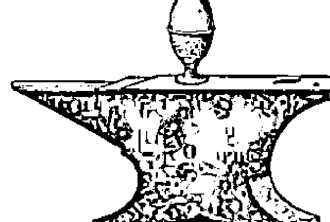

## 组织构建的一天

## 出生于这一天的名人

4月22日出生的人对组织和构建事物相当积极，这些事物不只有抽象的思想体系，还包括实际物质方面的建设。他们很擅长组织并经营家庭、餐厅、学校或社会团体。矛盾的是，这些人并不特别爱交际，反而比较喜欢独来独往。他们大多是安安静静的，不太喜欢吸引别人的注意力。这一天出生的人很懂得以轻松的方式来完成艰巨的任务。他们组织各种盛大集会的超强本领迟早都会显露出来的，就算它没能在职场派上用场，而只是运用在家庭聚会、生日派对或结婚周年派对这类小场面中，但是只要是值得付出的，他们就会感到满足和刺激。

话说回来，4月22日出生的人如果不将他们的才能发挥在商场上，那还真是浪费。有时候虽然他们的组织技巧很强，但是因为与上司的意见不合，他们还是会感到心灰意冷。例如，他们可能被指派去成立并经营一家别人名下的公司，却在做得有声有色之后，他们才发现老板吹毛求疵或固执己见。诸如此类令人气馁、沮丧的情形，常使他们宁可挂冠而去。从另一方面来说，4月22日出生的人和工作伙伴之间却很少出现问题。在他们麾下工作的人也会很敬重这位上司的能力和实事求是的精神，以及他们身上散发出来的浓浓的人情味。不论体格强健与否，他们那威严的仪态常常是帮助他们获得成功的重要因素。

杰克·尼克尔森

伊曼纽尔·康德（德国哲学家，著有《纯粹理性批判》），罗伯特·奥本海默（美国原子能物理学家，核武器之父，“曼哈顿计划”负责人，普林斯顿高级研究中心首脑），杰克·尼克尔森（电影演员），查尔斯·明格斯（爵士乐贝司手，作曲家），保罗·钱伯斯（爵士乐贝司手），耶胡迪·梅纽因（小提琴家，指挥家），丽塔·蒙塔尔奇尼（意大利裔美国诺贝尔奖获得者，神经生物学家，研究神经生长因子），唐纳德·克拉姆（美国诺贝尔化学奖获得者，研究合成分子），凯瑟琳·费里尔（英国女低音歌唱家），白杨（中国舞台剧、电影演员），埃伦·格拉斯哥（小说家，作品有《他们不惜干蠢事》），彼得·弗兰普顿（歌手，歌曲创作者），格伦·坎贝尔（歌手，歌曲创作者），安

4月22日出生的人最大的挑战在于控制自己的权力欲望。这些人当中比较成熟的会表现得非常谦虚，既不逞能，也不骄傲；不太成熟的人则可能太过专权，对别人不够宽容，而且常常令人难以琢磨。这一天出生的人要切记公平、公正地行使他们的指挥权。虽然他们会被财富和权贵人士所吸引，但他们不该全盘接受那些人的价值标准，而应该取其精华去其糟粕。

一旦创建了家庭、公司或组织，4月22日出生的人就会每隔一段时间去检讨一下它的发展是否已经达到了自己所预期的水平。由于具有这样的意识，他们可能面临一项大挑战，即是要依照原订的路线继续走下去，还是在某些重要的方面作修正，或是干脆放弃，改朝更有价值、更具意义的方向努力。对这样的人来说，他们通常不知道何时该辞职，以及怎么辞职，而且还可能因此产生精神上的痛苦和焦虑。此时他们必须倾听自己内心的声音。除此之外，为了避免被物质所奴役，这一天出生的人在精神层面上的发展就显得特别重要。

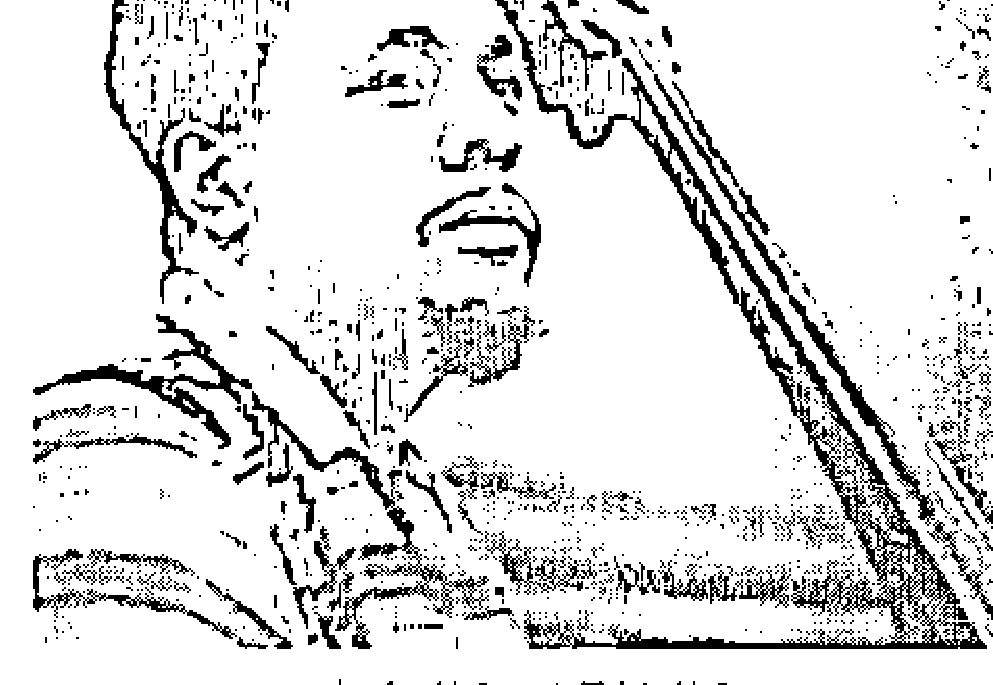

查尔斯·明格斯

146

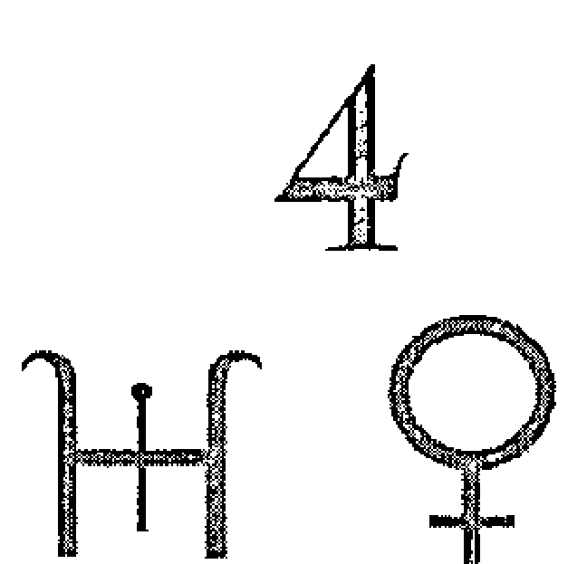

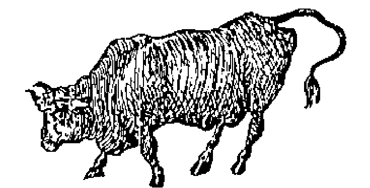

每年的这一天

金牛座
4月22日

## 幸运数字和守护星

4月22日出生的人会受数字4（2+2=4）以及天王星的影响。天王星代表的是古怪和暴躁。因为受火星（白羊座的主宰星）和金星（金牛座的主宰星）的影响，4月22日出生的人在运用权力时必须避免利用性或迷人的外表去达到控制别人的目的。受数字4支配的人常常见解独特，做事方法也很有特点。由于他们常采用少数人的观点，加上自信心极强，所以他们有时不免招来敌意，甚至树立无数躲在暗处的敌人。此外，22中的两个数字相同，因此4月22日出生的人经常对成双成对的事物表现出浓厚的兴趣，例如双胞胎、对称的东西或是同时发生的事情等。

娜·路易斯·德塔埃尔夫人（法国小说家，批评家），奥迪勒·雷东（法国象征主义画家），阿龙·斯佩林（电视制片人），迪恩·贝曼（澳大利亚画家）

## 塔罗牌

大秘仪塔罗牌的第22张是“愚者”。图案是一个人快活地站在悬崖边。有的人认为这个人十分愚蠢，缺乏理性判断的能力；有的人则指出他极端崇尚精神层面的东西，不在乎现实。从积极的一面来看，这张牌代表不拘泥于形式，遵循天性；从消极的一面来看，这张牌则代表愚蠢、冲动和虚无主义。不管怎么说，在这一天出生的人中，较成熟的会从生命的历练中汲取经验，然后成为自己理想中的人。

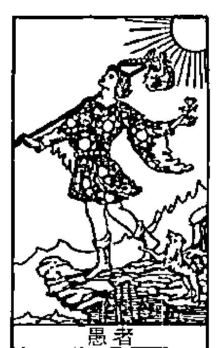

## 健康

虽然在4月22日出生的人天生拥有一副好嗓子，但是他们可能有颈部和喉咙方面的健康问题。究竟是要充分发挥这个嗓子好的优势呢，还是要尽量避免可能出现的健康问题？对此，他们得好好权衡一下。对4月22日出生的人来说，性是非常重要的。他们可能单纯地对性十分着迷，也可能把它发展出不同的感官享乐形式，例如，给人按摩或被人按摩都能使这一天出生的人产生特殊的快感。另外，他们待在厨房时会感到非常快乐，因此他们应该尽可能让自己悠游于烹饪和品尝美食的天地中。适度的运动有助于避免体重的增加，但是不要运动过度。

- 优点
组织能力强
实事求是
仪态威严

- 缺点
不易相处
崇尚物质

## 建议

不要被权力冲昏了头。遵从上帝的旨意，或遵从内心最美好的意愿。寻求精神上的指引，提升自我。不要忘本，更不要在追求进步的过程中迷失自己。保持朴实的真面貌，并且培养谦虚的美德。

- 固定位 12页
- 土相 14页
- 春季 18页
- 金牛座 23页
- 白羊金牛座 38页

## 静思语

> 在黑暗中看不清事物，那就用心来感受吧。

147

月份：4月
第23天
金牛宫2°～4°
白羊金牛座
固定位/土相

## 4月23日

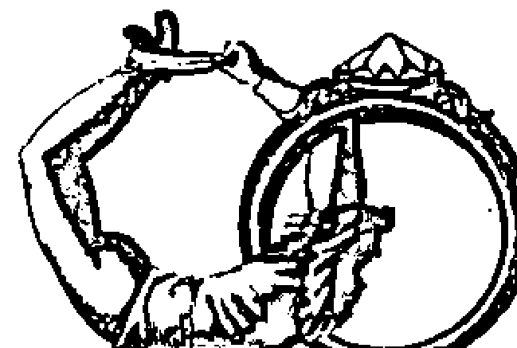

## 收获安全感的一天

## 出生于这一天的名人

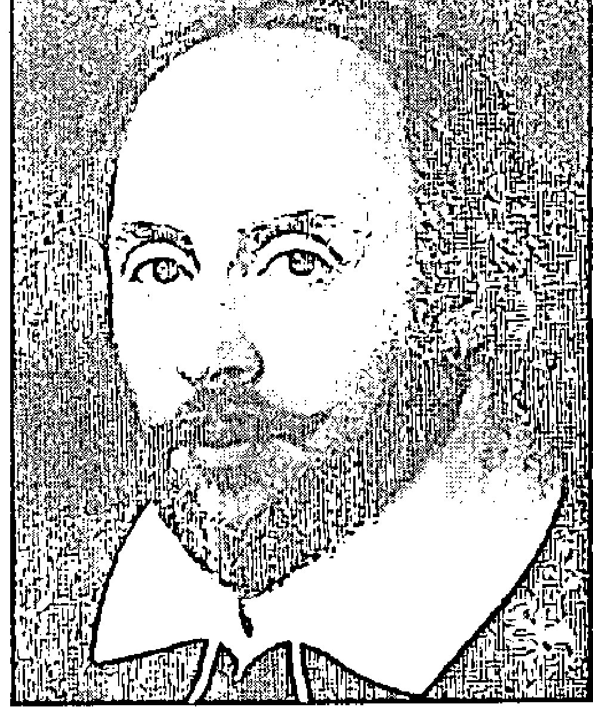

威廉·莎士比亚（英国伊丽莎白女王时代的剧作家和诗人，代表作有《罗密欧与朱丽叶》、《哈姆雷特》、《麦克白》、《李尔王》等，也是一位戏剧导演、演员），凯瑟琳·德梅迪西（法国王后），马克斯·普朗克（德国理论物理学家，诺贝尔奖得主，研究量子力学），约瑟夫·特纳（英国早期印象派画家），谢尔盖·普罗科菲耶夫（俄国作曲家，画家），弗拉基米拉·纳博科夫（俄国作家，著有《洛丽塔》），詹姆斯·布坎南（美国前总统），恩盖欧·马什（新西兰神秘主义小说家），秀兰·邓波儿（电影女童星，美国外交官），罗伊·奥尔比森（摇滚歌手，歌曲作曲家），贝尔纳黛特·德夫林（爱尔兰政治家），斯蒂芬·道格拉斯（美国众议员、参议员，林肯的对手），沃伦·施潘（棒球运动员，投手，赛扬奖获得者），昌西·迪普（美国中央铁路公司总裁，美国纽约州参议员），莱斯特·皮尔逊（加拿大首相，诺贝尔和平奖得主），巴德·威尔金森（美国俄克拉荷马州立大学橄榄球教练，荣获了3个全国冠军头衔，47场胜利），罗伯特·怀特（美国通用公司金融服务者，美国全国广播公司、美国无线电公司总裁），乔治·斯坦纳（经济学

4月23日出生的人总会为他们那强大的天赋寻找最好的避风港，而且一定要等到知名的或是实力雄厚的公司发现自己时，他们才会停下脚步，喘一口气。这并不表示他们一定要接受那家公司的雇用（虽然事实经常是这样），也可能是那个公司扮演类似赞助人的角色，或是将他们推荐给别人，从而开启他们的成功之门。我们经常可以发现4月23日出生的人在选择婚姻对象时，通常会选择有良好家庭背景的人。这一天出生的人不太喜欢单独生活，他们需要在一个较大的社交圈子里展现他们的权力。经济上的成功对他们来说则是最重要的。

这一天出生的人如果是文艺界的人（作家、记者、画家）或商人（制造商或商店老板），他们就会依靠自己的固定的支持群体而生活，这些支持他们的人会年复一年、持续不断地购买他们所出版的书或产品。如果从事服务业（当医生、律师、会计师），他们也会谨慎地建立顾客群。他们非常清楚，如果没有这些顾客，自己便一无所有。4月23日出生的人会设法让别人知道，自己是家庭或专业领域里的一员。当他们处在这个团体里时，他们讲话绝对不会太直、太冲，如此他们才不会失去这个团体对自己的支持。从这几个方面可以看出，这一天出生的人非常依赖别人的善意回应与信赖。

这一天出生的人本性中有一种对激情的渴望，这种渴望会发展成一种冲动，这对极需安全感的人来说是很危险的。这个类型的人有时候做事很鲁莽，会危及到他们现有的职位。其实，如果他们能将这种对变化和刺激的渴望导入工作中，同时保持私生活的平稳，那么他们就一定会成功；相反地，没有经过深思熟虑的行为所带来的，很可能是事业和家庭的双瓦解。

对4月23日出生的人来说，能够选择一个可以终生参与的活动会给他们带来极大的快乐，而这种快乐是难以用笔墨形容的。但是如果太压抑自己的特色，他们就会对其他人或者事失去兴趣。所以最好的方法就是，定期发明一些新鲜的玩意儿，提出一些已经考虑得很周详、并能帮助他们继续前行的新计划。这个类型的人最好不要满足于现状，而应该利用自己强大的创新能力向目标一步步迈进。

对于别人的小缺点，4月23日出生的人经常能看得很清楚，而且他们对人性和他人的做事动机的了解也非常深入。他们应该谨慎并且有建设性地运用他们的洞察力，尤其当他们在担任教育工作者或为人父母时。4月23日出生的人必须明智地运用他们对别人的深远影响力，学会控制他们敏锐的心智和伶牙俐齿的特点。

148

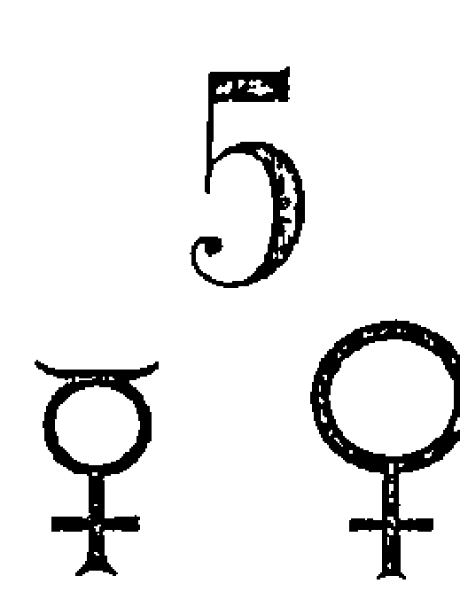

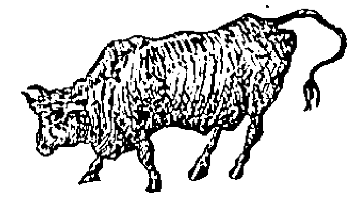

每年的这一天

金牛座
4月23日

## 幸运数字和守护星

4月23日出生的人受数字5（2+3=5）和水星的影响。水星代表思维灵敏和变化的迅速，因此在这一天出生的人必须设法在这种活力和对安全感的强烈需求之间找到平衡点。此外，他们也必须控制自己体内激荡着的追求快感的冲动，这种冲动会让他们进入快车道开车，而且这种冲动在火星（白羊座的主宰星）和金星（金牛座的主宰星）的影响下会变得更强烈。幸运的是，在生活中遭受到的巨大打击，很少会对那些受数字5影响的人产生持续性的影响。

家，文化历史学家，比较文学专家，著有《悲剧之死》。李·梅杰斯（电视剧演员，作品有《无敌金刚》），加伊·古德里奇（篮球运动员，后卫）

## 塔罗牌

大秘仪塔罗牌的第5张是“教皇”。他是令人畏惧的神秘事物的解释者，象征着人类的认知及信仰。他知识渊博，即使抽象的事物也受他主宰。从积极的一面来看，这张牌代表信心十足、不疑不虑以及对事物有正确的理解；从消极的一面来看，这张牌代表爱说教、夸大其词以及独断的个性。

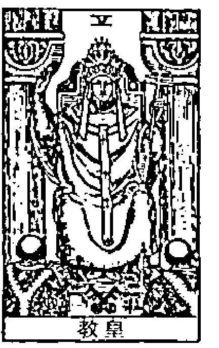

## 健康

4月23日出生的人必须为老年生活及早做准备。他们总会陷于一种固定的习惯之中。随着年岁渐增，年轻时求新求变的能力消失殆尽，他们想要改变现状可能再也无能为力了。因此，他们最好持续参加一些不太激烈的运动。花些时间和孙子们在一起，并且和小孩子一起从事一些义务工作，将使他们保持身心愉快，而且能让他们感受到年轻人的活力。这一天出生的人很容易患上各种关节疾病，特别是颈椎病。他们也很容易丧失听力，以及产生眩晕症状，严重的如梅尼埃氏病也有可能产生。为了预防关节病，他们应该有计划、有规律、适度地运动，如此可以延缓身体变差以及关节硬化，在进入老年期时，也能使身体维持较佳的柔软度。这样的人在食物方面的口味复杂而且多样化，但是过多的奶油、面包和糕饼却对身体有害而无益。他们最好能多吃些谷类食物，如米饭和玉米粥等。

| 优点 |
| --- |
| 善于社交 |
| 有安全感 |
| 谨慎 |

| 缺点 |
| --- |
| 不变通 |
| 焦虑 |
| 自我压抑 |

## 建议

在展现自己的能力时要有信心。不要让自己一成不变，试着更灵活一些。让情绪自然发泄，并且跟着感觉走。保持生活的平稳。别害怕吐露心声，不过在表达时要有技巧，对人要友善。

- 固定位 12 页
- 土相 14 页
- 春季 18 页
- 金牛座 23 页
- 白羊金牛座 38 页

## 静思语

> 总有一个可以让你独处的地方。

月份：4月
第24天
金牛宫3°～5°
白羊金牛座
固定位/土相

## 4月24日

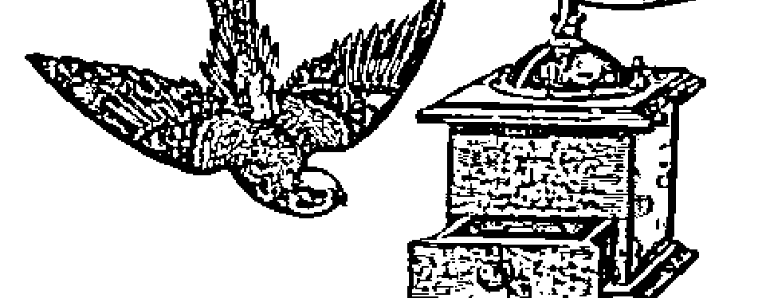

## 保护者的一天

## 出生于这一天的名人

4月24日出生的人最喜欢做的事就是利用写作、演说或举例子，把他们的意念传达出来，这是因为让别人知道自己的想法对他们来说非常重要。虽然这些人本身可能就是领导者，但是对他们最重要的并不是驾驭别人的力量够不够强，而是有没有能力保护所爱的人以及跟所爱的人过好日子。由此可见，4月24日出生的人对自己所爱的人是会极尽保护之能事的。

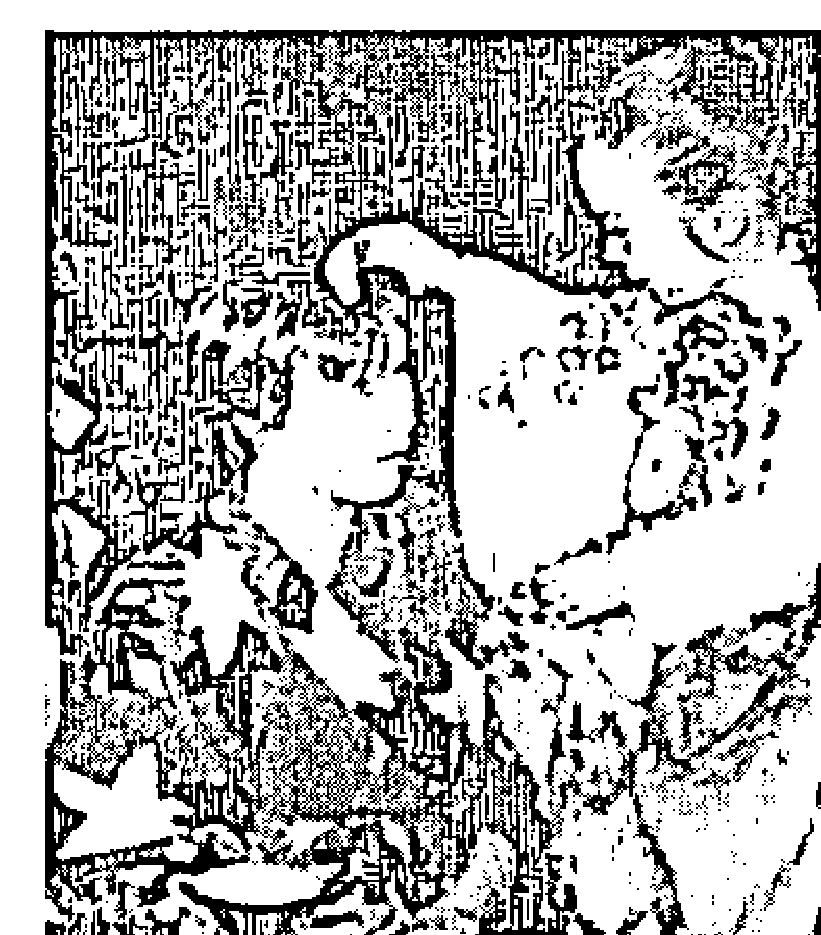

4月24日出生的人有女性或是母性的特质，不仅喜欢照顾别人，而且还表现得非常明显。不难想象，这一天出生的人会成为出色的父母，在孩子成长的过程中，他们会不断给予支持和鼓励。当然了，4月24日出生的人想要的并不只有孩子的听从，还有配偶对他们的言听计从。如果孩子把他们的话当耳边风，他们就会戏剧化地表现出悲伤的样子，同时陷入焦虑不安，甚至极度的沮丧之中。

作为孩子，4月24日出生的人会很爱并尊敬他们的父母。只有当他们受到不公正的对待和虐待时，他们才会表现出叛逆的一面。这种叛逆可能仅仅针对父母中的一方，而对父母中的另一方他们却依然可以很敬爱，尤其是在父母离异的情况下。

这一天出生的人力求维持家庭状况和人际关系的稳定。遗憾的是，在爱的领域里，他们却可能饱尝失望之苦，比如遭遇不愉快的恋情，以及高度紧张的婚姻状况。从另一方面来看，这些人并不完全在乎社会的成规，他们在乎的是怎样才能成功地栽培自己所爱的人，并且使其事业蒸蒸日上。4月24日出生的单亲父亲或母亲，在寻找新的配偶时，若试过一两次都不能成功，便可能专注于培育他们的孩子。

工作对4月24日出生的人很重要。因此，他们的职业、家庭和私生活之间经常出现冲突。在面临两难抉择时，他们往往要花很长的时间才能作出正确的决定，而在这段时间里，他们仍会尽力把每一件事情做好，以维持平衡的局面。最后，他们往往会选择放弃家庭，转而投向工作伙伴、客户或支持自己的群体，并且巧妙地将他们对事业的渴望和培育或保护团体的渴望结合起来。

4月24日出生的人也许找一位能力很强的伙伴来联手创业，也许成为老板的助理，随时帮老板记录每一件事，最后还会出面代为行事。这一天出生的人当老板的秘书颇能尽忠尽职，是相当理想的人选。这样的人能很快地认识到自己与他人之间的利益关系，很少纯粹为了私利而背弃伙伴，或者做损害公众利益的事情。

芭芭拉·史翠珊（美国歌手，流行歌曲作曲家，电影演员，导演，作品有《杨朵》、《往日情怀》、《越爱越美丽》），威廉一世（被称为“沉默者”，获封“奥尔治王子”，16世纪荷兰统治者和国家英雄，被刺杀），雪莉·麦克莱恩（美国电影及舞台剧演员，舞蹈家，作家，作品有《孤立无援》），威廉·德库宁（荷兰裔美国画家），圣文森特·德保罗（法国牧师），罗伯特·佩恩·沃伦（小说家，著有《国王的人马》），乔·亨德森（爵士乐高音萨克斯管演奏者，作曲家），约翰尼·葛格里芬（爵士乐高音萨克斯管演奏者），卡尔·罗思柴尔德（金融家族梅耶尔家族成员），安东尼·特罗洛普（英国维多利亚时代小说家，著有《名利场》），斯坦利·考夫曼（美国普林斯顿教授，哲学家，研究存在主义），约翰·威廉斯（古典乐吉他手），吉尔·爱尔兰（美国电影演员，与查尔斯·布朗森结了婚），理查德·戴利（芝加哥市市长），艾伦·伊格尔森（美国全国曲棍球球员联盟执行经理），埃德蒙·卡特赖特（18世纪英国发明家）

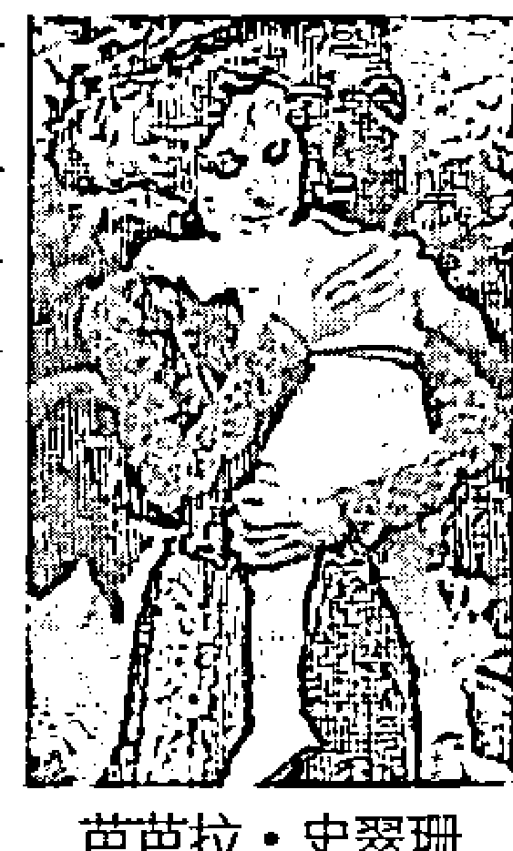

150

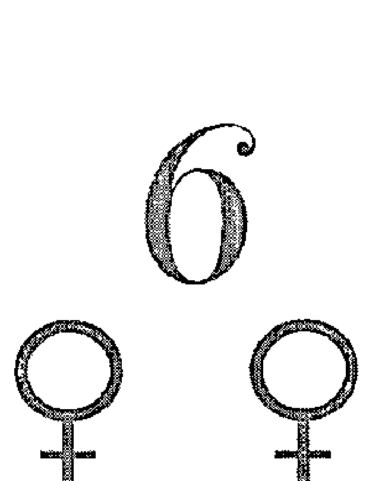

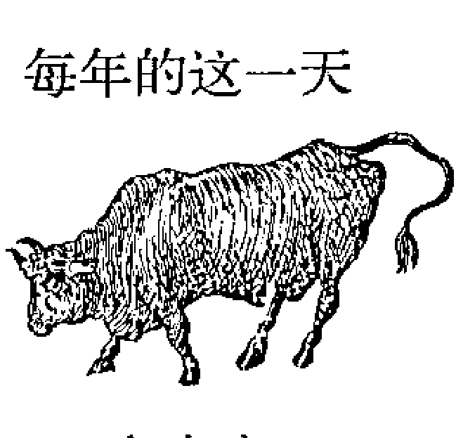

每年的这一天

金牛座
4月24日

## 幸运数字和守护星

4月24日出生的人受数字6（2+4=6）以及金星的影响。受数字6影响的人大都很有魅力，能使别人产生爱意与仰慕之情；再加上金星是金牛座的主宰星，和社会有着密切的关联，所以4月24日出生的人不可避免地会和其他人共事。在那些受数字6影响的人的生命中，爱经常成为最主要的课题。从占星学上来看，数字6的特质以及4月24日出生的人本身的性格都表明了金牛座主要受金星影响，这使在这一天出生的人受到了对爱的渴望的强烈影响，同时也受到了一切与和谐、亲属关系和美相关的事物的影响。

明家），亨利·菲利普·贝当（第一次世界大战时的法国元帅，被法国人视为民族英雄，第二次世界大战期间任法国内阁总理，却在战后以叛国罪获判终身监禁），布里奇特·赖利（英国光效应艺术画家），斯塔福德·克里普斯（英国工党政治家，掌管国库，倡导实施了战后欧洲援助计划），卡尔·席勒（德国政治学家，经济学家）

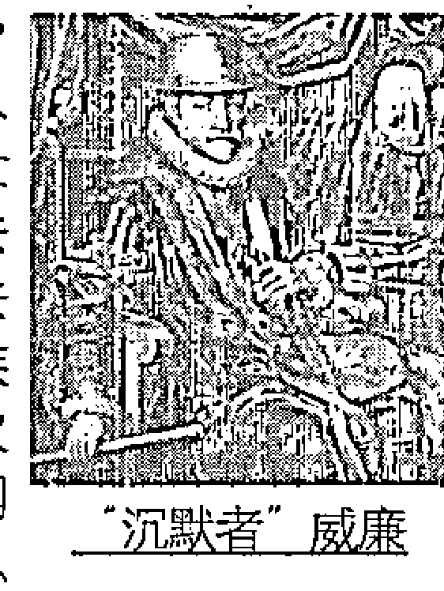

“沉默者”威廉

## 塔罗牌

大秘仪塔罗牌的第6张是“恋人”。恋人象征着通过两性结合的爱，全人类能够团结在一起。从积极的一面来看，这张牌代表道德、美学以及肉体方面更高层次的感情与渴望；从消极的一面来看，这张牌代表没有止境的欲望、多愁善感和迟疑不决。

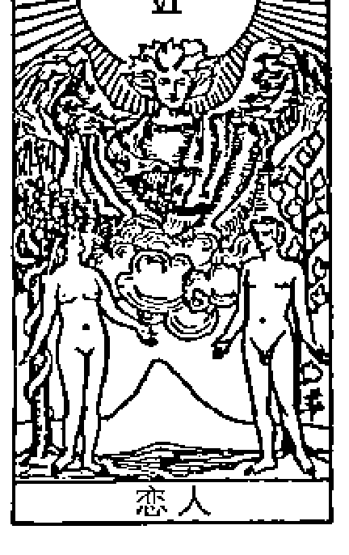

恋人

## 健康

4月24日出生的人会为了爱情作出很大的牺牲，所以他们经常让自己置身于巨大的压力之下。为了和所爱的人保持和谐的关系，他们几乎什么事都愿意做。如果事情的结果不尽如人意，他们可能遭受焦虑和沮丧之苦，有时甚至会不知不觉地暴饮暴食、酗酒或对某些药物产生依赖。情绪上的问题还可能因内分泌失调而雪上加霜，因此，这一天出生的女性尤其要注意雌激素和黄体酮方面的问题。好在这种喜欢照顾别人的性格可以在厨房里找到宣泄渠道。不过，他们想要照顾（尤其是饮食方面）别人的冲动，以及将食物视为爱的一种形式，往往会给他们的孩子带来心理和身体两方面的问题。另外，在这一天出生的人应该保持简单、清淡的饮食习惯，尤其要多吃新鲜的蔬菜和水果，远离垃圾食物。

- 优点
会照顾人
保护欲强
表达能力强

- 缺点
令人窒息
孤芳自赏
情绪化

## 建议

对你所爱的人多一些信心吧！很多事情冥冥之中自有安排，所以不要什么事都得过问。多多发展你的自制力，学会对自己说“不”。不要太挑剔，以免无法公平地对待他人。

| 固定位 12 页 |
| 土相 14 页 |
| 春季 18 页 |
| 金牛座 23 页 |
| 白羊金牛座 38 页 |

## 静思语

> 怎么会有人坚持认为，上帝和凡人是一样的？

151

月份：4月
第25天
金牛宫4°~6°
金牛座一
固定位/土相

## 4月25日

## 实质的一天

## 出生于这一天的名人

4月25日出生的人只要一出现，就会引人注目。不论他们体格壮硕与否，每当他们走进一个房间，所有人都会注意到他们。从工作中也可以发现他们这种特质，无论在想法、观点或态度的表达上，这些人都极为坚决而表述明确。实际上，他们的大部分精力都用在了印证自己的存在上面。

这一天出生的人认为，与其坐而言，不如起而行。他们是很有语言天分的，而且通常只把这种天分用在最具经济效益的地方。他们不空谈，也不用浮夸的词汇，而是就事论事，一针见血，这正是这些人能干的一面。的确，他们讲话时会非常率直。不过，这一天出生的人也保留了其复杂的一面，因而更显得魅力十足。

奥利弗·克伦威尔（17世纪英国军人，政治、宗教领袖，以“护国公”的名义统治英国），古列尔莫·马尔科尼（意大利发明家，诺贝尔物理奖得主，无线电和电报的发明人），埃拉·菲茨杰拉德（爵士乐歌手），阿尔·帕西诺（电影演员，代表作有《教父》），塔利亚·希雷（电影演员，在《教父》中饰演帕西诺的妹妹），威廉·布伦南（美国最高法院大法官），爱德华·默罗（电视台、电台记者），保罗·马祖尔斯基（导演，作品有《老人与猫》、《乞丐皇帝》，也是制片人、演员），阿尔贝特·金（蓝调吉他手、歌手），约翰尼·夏因斯（蓝调吉他手、歌手），贝特朗·塔韦尼耶（法国电影导演，作品有《乡村星期天》、《午夜旋律》），卡雷尔·阿佩尔（荷兰画家，眼镜蛇画派联合创始人），约翰·克鲁伊夫（荷兰足球明星、教练），沃尔特·德拉梅尔（英国诗人），塞·通布利（画家），梅多拉克·乔治·莱蒙（被称为“篮球小丑王子”，哈林队领袖），厄尔·博斯蒂克（爵士），爱德华二世（14世纪时的英国国王），保罗·埃米尔·卡迪纳尔·莱格尔（梵蒂冈理事会工作人员）

在人际关系方面，4月25日出生的人要小心不要抢了自己伙伴或孩子的风头；在工作上，他们也最好不要招来过度的关注。因为他们常常喜欢走动，即使只是离开家庭或公司一阵子，他们也会被人注意到，就好比在人生这块织布上突然出现了一个大洞一样，非常显眼，所以他们不论是否出席某个场合，都很引人注意。

这样的人一生中所面临的最大挑战在于个人的成长，尤其是精神方面的发展。由于他们太强调当下而忽略为未来做准备，所以如果能有一位精神上的导师指引他们认识超越了物质的生命价值，他们就会受益良多。

虽然一般而言4月25日出生的人大都身体强健，但由于他们做事时喜欢亲历亲为，所以他们的健康会受到一些伤害。这些人勇气十足，虽然不会存心对抗他人，但当面对冲击和困难时，他们绝不会畏缩。通常，他们是靠体力和耐力来赢得胜利的。他们是难以对付的人，周围的人应该努力多看到他们好的一面。

对出生在这一天的人而言，单单有想法或计划是不够的，只有把这些东西付诸实践才能让他们感到心安。但这并不表示他们对理论性的东西不感兴趣，有时候他们也会产生一些有趣或奇怪的念头，不过前提是这些念头必须能行得通。4月25日出生的人凡事讲究实用，既鄙视阴险狡诈的人，也不喜欢那些油腔滑调、千方百计想要令他们印象深刻的人。可想而知，这一天出生的人在选择朋友和生意上的合作伙伴时必然会十分小心。虽然他们会对家庭和朋友很上心，也会很细致地去尽自己的义务，但这一天出生的上班族仍会把职业放在家庭和朋友之前。4月25日出生的人有时候简直固执到了极点，要他们倾听别人说话是很困难的，特别是倾听孩子的心声。接受事物既有的模式对这样的人来说也可能是个难题，因为在他们眼里只有他们想要的才是最重要的。要是有什么事或什么人挡了他们的路，他们会毫不留情地将其移除。

## 幸运数字和守护星

4月25日出生的人受数字7（2+5=7）和海王星的影响。因为海王星（是以罗马神话里海神的名字命名的）支配着视野、梦想和心灵，因此如果与现实脱节，4月25日出生的人就会感到非常忧虑，特别是当他们介入别人的感情纷争时，这个问题会因金星（金牛座的主宰星）的影响而更加严重。另外，受数字7影响的人的典型特征就是喜欢变化和旅行，而4月25日出生的人又需要在稳定的环境中巩固自己所经营的基础，因此他们的这种求变性格可能造成他们内心的冲突。

## 塔罗牌

大秘仪塔罗牌的第7张是“战车”。牌面上的胜利者以一种强有力的姿态，展现着他在人世间的丰功伟业。这张牌可以解释成；不论正道多么艰险难行，你都得继续走下去。从积极的一面来看，这张牌代表成功、才能和效率；消极的一面来看，这张牌则代表专制的态度和拙劣的方向感。

## 健康

4月25日出生的人的健康状况一般来说都不错，但是他们容易因抽烟或饮酒过量而加重心脏和血液循环的负担。此外，他们有患胃溃疡和十二指肠溃疡的危险，因此他们应该少喝酒。更重要的是，他们必须尽可能以最安全的方式来活动，并且避免过度的劳累。为了安全起见，建议他们不妨听听值得信赖的医生或朋友的建议，毕竟旁观者清。各种与音乐相关的活动形式，如跳舞和唱歌，都很适合4月25日出生的人，或许这些活动还是治疗的良方。因为在这一天出生的人有压力太大的倾向，所以他们还应该少吃黄油和动物脂肪，以免胆固醇过高。补充一些卵磷脂或维生素E等，对心脏可能有所帮助。

| 优点 |
| --- |
| 精力充沛 |
| 意志坚定 |
| 有活力 |

## 建议

| 缺点 |
| --- |
| 抗拒 |
| 记仇 |
| 专横 |

有时候你太清高而让人难以驾驭。尊重别人有反对意见或走自己的路的权利。容忍那些心怀梦想却不像你一样将其付诸实践的人。不要老想着报复别人，因为到头来受伤的还是你自己。

| 固定位 12页 |
| --- |
| 土相 14页 |
| 春季 18页 |
| 金牛座 23页 |
| 金牛座一 39页 |

## 静思语

谋事在人，成事在天。

月份：4月
第26天
金牛宫5°~7°
金牛座一
固定位/土相

## 4月26日

## 耕作者的一天

## 出生于这一天的名人

出生在4月26日的人拥有一种天分，不但能创造新的系统和有形的结构，而且知道怎样维持这些事物的稳定状态。他们会竭尽全力珍惜并保护自己的社会工作组织和个人的亲属关系、家庭关系，甚至还有朋友的健康与福祉。想出新的点子并将其付诸实践只是他们做事的开端而已，对他们来说，组织的日常运营也同样重要，甚至更重要。对于完成长远目标，这一天出生的人不仅有足够的体力，也有马拉松长跑所需要的耐力。从开始奋斗起，他们便会朝着目标日复一日，年复一年，始终努力不懈地往前迈进。

约翰·詹姆斯·奥杜邦绘制的鸟类图鉴

马库斯·奥里利厄斯（罗马皇帝、将军、哲学家，著有《沉思录》一书），贝聿铭（华裔美国建筑师），戴维·休谟（苏格兰哲学家），路德维希·维特根施泰因（奥地利哲学家，著有《哲学研究》），约翰·詹姆斯·奥杜邦（博物学家、画家），欧仁·德拉克鲁瓦（法国浪漫主义画家），玛雷尼（蓝调歌手、作曲家），米歇尔·福基涅（俄国芭蕾舞编舞家，作品有《火鸟》、《彼得鲁齐卡》），查尔斯·里克特（美国地震学家，设计了表示地震释放能量的对数标度，即现在常用的里氏地震分级标准），卡罗尔·伯内特（喜剧电视剧、电影演员），范妮·布兰科尔斯·科恩（跨栏运动员，荷兰奥运会4块金牌得主），唐娜·德瓦罗纳（美国奥运会2块金牌得主，创造了18项世界纪录，也是女性运动基金会共同创始人）。

4月26日出生的人的想法有时候会一成不变，他们固执、不愿变通，不过有时还是愿意听一听别人的想法的。只要是合乎逻辑且对现状有所改善的建议，他们多半会虚心接受，但如果是要他们放弃整个计划，那么他们可能就会充耳不闻了。

这一天出生的人有一种强烈的想要服务他人的欲望。对他们而言，提供服务并不一定是最有趣的工作，但仍然不可缺少。如果让这种人去负责一家公司或企业里的一个部门，大概很少有人会抱怨他们效率差或服务不周，因为他们确实可以如人们所愿使事情进展顺利。有时候人们虽然会怪他们无情，不过最后还是会因为他们的公正而接纳他们。

许多在这一天出生的人会视自己为园丁或牧羊人，总是要做些什么使事情顺利地进行下去。他们喜欢在欢乐的环境里工作，还喜欢和同事们说说笑笑。不过，这些人虽然很乐意融入团体之中，但是与那些和他们意见相左的人在一起时，他们却总是显得格格不入。这一天出生的人本质上是非常实际的，他们相信只要不断地精益求精，使自己近乎完美，一切就都有可能。

经常全心全意投注于自己所维护或保护的事物上，可能使这一天出生的人觉得寂寞。这些人的想法尽管并非极端的个人主义，不过对那些被他们视为异类的人来说，特别是孩子或亲戚，要想和他们打成一片是很困难的。他们对所有事物都强求一致，不管是事情还是人，都要经过调整达到他们的标准，他们才会满意。

贝聿铭

虽然这一天出生的人很实际，但是在某些时刻他们也会充满哲学意味。一般来说，他们的生活哲学听起来都很保守，甚至还会显得这些人很顽固。4月26日出生的人通常很尊重法治，而且会维护社会的价值标准，但是这些价值标准必须要让他们觉得合理才行。这些人也是铲除官僚主义的先锋，他们非常乐于除掉不必要的陈规陋矩。

伯纳德·马拉默德（小说家，著有《杜宾的生活》），阿妮塔·露丝（好莱坞剧作家，作品有《绅士爱美人》），鲁道夫·赫斯（希特勒的副手，第二次世界大战后被判终身监禁），阿尔弗雷德·克虏伯（19世纪德国实业家），查尔斯·斯坦（美国音乐公司创始人，经营演出业务），博比·吕德尔（摇滚歌手），阿尔弗雷德·埃尔登·范沃格特（加拿大科幻小说家，作品有《斯兰》），杰斯·斯特恩（作家，作品有《瑜伽》、《青春与再生》）

## 幸运数字和守护星

4月26日出生的人受数字8(2+6=8)和土星的影响。土星代表强烈的责任感，以及谨慎、限制和宿命，因此4月26日出生的人的保守倾向才会这么明显。受数字8影响的人会缓慢而审慎地为他们的生活和职业发展添砖加瓦，这也强调了4月26日出生的人的特色。虽然受数字8影响的人可能相当热诚，但是他们的外表却经常显得有点冷漠。由于土星和金星（金牛座的主宰星）之间的关联性，在爱情方面，他们可能遭遇困难与失望。

## 塔罗牌

大秘仪塔罗牌的第8张是“力量”或者“勇气”。图中一位优雅的皇后正在驯服一头愤怒的狮子。皇后象征女魔法师，可以驾驭不易控制的能量，并代表道德及体能。从积极的一面来看，这张牌代表非凡的个人魅力以及追求成功的决心；从消极的一面来看，这张牌代表自满和滥用权力。

## 健康

4月26日出生的人的生活通常会固定于既定的模式，因此当他们生病时，医生和朋友若想改变他们的习惯，恐怕要花不少力气。这些人习惯于忍受长期的抱怨，甚至学会了与之共存。或许他们相信，照顾自己的身体就和维护事业、房子和家庭一样，是值得花心思的一项大工程。4月26日出生的人必须注意与遗传因素和饮食相关的疾病，例如糖尿病与心血管疾病（如高血压、动脉硬化等）。因为日常生活中他们习惯久坐，很少运动，所以情况会更加复杂。饮食方面，这一天出生的人也要多加注意，少吃高糖分和高脂肪的食物。此外，抽烟一定要避免。

## 优点

- 坚强
- 独立
- 逻辑思维能力强

## 建议

学会倾听别人的想法，多留心别人的意愿。有时候要能够认输，懂得退让，有时丢掉一些东西可能更好。待人处事要有技巧，机灵一些。时时反省自己有没有偏见，如果有就试着作出改变。

## 缺点

- 孤僻
- 一成不变
- 顽固

- 固定位 12页
- 土相 14页
- 春季 18页
- 金牛座 23页
- 金牛座一 39页

## 静思语

> 冲动是魔鬼。

月份：4月
第27天
金牛宫6°～8°
金牛座一
固定位/土相

## 4月27日

## 自给自足的一天

## 出生于这一天的名人

一般来说，4月27日出生的人通常都在幕后工作；除非被要求或者被强迫，不然他们不会想担任领导角色。相反地，最令他们快乐的事就是窝在一个安全的地方，不受干扰，专注做好分内的事。可想而知，这种人并不向往热闹的社交生活，通常只有在特定机构（如学校、公司、教堂等）中，他们才能与人侃侃而谈。

这一天出生的人即使没有担任某种职务，也会让人感受到他们的存在。他们有很强的影响力，他们的想法、发起的活动，甚至单单是他们的身影，都会让周围的事物动起来。因此，在单独行动时，他们从未感到过寂寞。难得的是，他们不会嫉妒那些受大众欢迎的人物，以及家里或朋友眼中的宠儿，他们追求的是自己能尽所长，兢兢业业做好分内的事情，他们根本没空去理会那些世俗的批评或赞美。他们认为只有自己才最了解自己，因此究竟是成功还是失败，他们并不需要外人的评估。这一天出生的人有一种很多人所没有的能力，就是不但能将事情转危为安，也总能从之前的错误中汲取教训，从而无所畏惧地朝目标挺进。

4月27日出生的人需要隐私，而且希望不受干扰地工作。在人际关系以及家庭事务（如教养孩子）方面，他们都能处理得很好。下班以后，他们喜欢在家里与另一半和孩子，或是其他任何人享受宁静的夜晚。如果这一天出生的人是家庭主妇，家就是她们的城堡——仿佛只要待在家里，她们的任何需求都能获得充分的满足。因为他们要求自己忠诚、有奉献精神，所以他们也要求别人也这样。

这一天出生的人中不太成熟的必须注意，不要变得退缩、愤世嫉俗或怨天尤人。这些人常常无视自己的粗鲁举止。若他们能找到自己真心喜爱的人生发展方向，或者磨掉性格中的棱角，他们就能开启一段新的生活。否则，他们可能郁郁寡欢地终老一生。

4月27日出生的人通常具有非常高超的专业技能，并且很有自知之明，很少错估自己的实力。然而，他们却可能因为对自己的要求太高，加上内心不够成熟，或是太压抑自己的感情而突然爆发出具有毁灭性的情绪，这种情绪足以把别人吓跑。这种人虽然不轻易发脾气，但是一旦他们发飙，大伙儿可就得小心了。总之，4月27日出生的人所具有的这种毁灭性力量是相当大的。

在这一天出生的人应该找一些能帮助他们放松的朋友。开怀大笑以及不要太严肃对他们来说都很重要。从这个方面来看，他们确实需要交一些思想开放又风趣的朋友。

塞缪尔·摩尔斯

赫伯特·斯潘塞（英国进化论哲学家，社会达尔文主义的倡导者，主要著作为《社会地位》），塞缪尔·摩尔斯（电报和摩斯电码的发明人，肖像画家），尤利塞斯·格兰特（美国前总统，美国南北战争时期的联军总司令），科雷塔·斯科特·金（美国政治活跃分子，歌手，黑人民权领袖马丁·路德·金的妻子），爱德华·吉本（英国历史学家，著有《罗马帝国衰亡史》），玛丽·沃斯通克拉夫特（活跃于18世纪的英国政坛，女性主义作家，著有《女权辩护》），罗杰斯·霍恩斯比（棒球运动员，二垒手），康妮·凯（爵士乐鼓手，现代爵士四重奏团体成员），塞西尔·戴·刘易斯（爱尔兰出生的英国小说家，桂冠诗人），厄尔·安东尼（保龄球运动员，获得了6次美国职业保龄球大赛年度冠军，有41个冠军头衔），诺尔曼·贝尔·赫德斯（舞台设计师），杰克·克卢格曼（电视剧、电影演员，饰演《扭计俏冤家》中的奥斯卡，出演了《验尸官昆西》），沃尔特·兰茨（漫画家，作品有《调皮啄木鸟》），查克·诺克斯（匹兹堡钢人队教练，带领球队获得过3次超级碗冠军），乔治·格温（篮球运动员，前锋，绰号“冰人”，获得过4次美国职业篮球联赛最高得分球员），张洁（中国小说家，著有小说集《无字》），希娜·伊斯顿（歌手），凯西·凯森（最顶尖的40位电视主持人之一），桑迪·丹尼斯（舞台剧、电影演员），阿努克·艾梅（电影演员）

尤利塞斯·格兰特

## 幸运数字和守护星

4月27日出生的人受数字9（2+7=9）以及火星的影响。数字9对其他数字有很强的影响力（任何个位数加9，皆可回复到原数，例如5+9=14，4+1=5；任何数字乘9，都能回复到数字9，如9×5=45，4+5=9），因此4月27日出生的人对周围的人也相应地有着很大的影响。火星是一颗强有力的行星，代表着男性的力量，但是火星的力量在这里却因为金牛座的主宰星金星（带有女性的活力）的作用而变柔和了不少。因此，对4月27日出生的人来说，这是一个难得的机会可以将男性与女性的特色整合起来。

## 塔罗牌

大秘仪塔罗牌的第9张是“隐士”。画面中的人提着一盏灯，拄着拐杖，代表了冥想、孤立与寂静，象征着智慧的结晶和绝对的纪律。隐士是严厉的导师，他通过良心教育使人走上正途。从积极的一面来看，这张牌代表有所坚持、有目标、深沉且专注；从消极的一面来看，这张牌代表专断、心胸狭窄、多疑以及气馁。

## 健康

4月27日出生的人要谨防土星的影响（依塔罗牌的隐士牌所显示），其中包括情绪低落，以及骨头和牙齿方面的毛病。后者可能对这一天出生的产后或停经妇女有所影响，前者则可能是4月27日出生的男性在工作上遇到挫折之后的附带表现。他们也会出现听力和身体平衡问题，尤其当他们进入晚年之后。更重要的是，在这一天出生的人应该试着让自己快乐，因为快乐或许是最好的药。4月27日出生的人在家里会很快乐，特别是在厨房做饭时。虽然他们偶尔也会下馆子，但是一般来说在这一天出生的人都愿意把厨房弄得很舒适，成为令人满意的避风港。在这一天出生的人，无论男女都会成为好厨师，在准备三餐时，他们会很严肃地考虑食材。

## 优点

- 自立
- 专注
- 有影响力

## 缺点

- 孤僻
- 过于严肃
- 自我压抑

## 建议

试着多和社会接触接触，不要孤立自己。提高自己的精神层次。不要将自己的价值观强行加在别人身上。别拘泥于常规。不要让自己长时间闷闷不乐。

| 固定位 12页 |
| --- |
| 土相 14页 |
| 春季 18页 |
| 金牛座 23页 |
| 金牛座一 39页 |

## 静思语

> 自己的内心即是佛。

月份：4月
第28天
金牛宫7°～9°
金牛座一
固定位/土相

## 4月28日

## 坚定不移的一天

## 出生于这一天的名人

4月28日出生的人能够利用自己的肢体语言、情绪以及心理暗示来表达自己，从而给人留下深刻的印象。作为一年中出生的最有决心的人之一，他们只要开始一个计划或一个行动，就绝对不会放弃。不论对手多么具有竞争力，或多么不可一世，他们都会坚定不移地做下去；尽管他们没有大的胜算，而且这件事也可能违背自己以及最亲近的人的利益，这些人还是会坚持下去。他们想明确自己的地位的愿望很强烈，他们很少会放弃自己所主张的一切。

因为这一天出生的人在日常生活中是谈判高手，而且做事很谨慎周到，所以他们经常给人一种讲理的甚至温顺的印象。虽然他们表面上看起来很亲切，但是和他们打交道的人会渐渐发现，最后可达成的方案其实只有一个，那就是4月28日出生的人所期望的那一个。他们往往先给出承诺，然后再对其重新诠释或曲解一番，甚至最后出尔反尔。这种人等待的耐力可是一流的——实际上，通常是他们的对手最终耗尽了力气而放弃。

奥黛特·桑瑟姆

詹姆斯·门罗（美国前总统，在位期间宣布了“门罗主义”的外交政策，禁止任何欧洲国家干涉美洲大陆的事务，从西班牙手中得到了佛罗里达州，并支持反奴隶主张），萨达姆·侯赛因（伊拉克领导者），詹姆斯·贝克（美国国务卿），奥斯卡·辛德勒（奥地利商人，纳粹党成员，第二次世界大战期间曾救出1000多名犹太人，电影《辛德勒的名单》就是以他们的事迹为主题的），奥黛特·桑瑟姆（法国抵抗斗士，英国特殊力量成员，被纳粹秘密警察折磨，拒绝说话），查尔斯·斯特尔特（出生于澳大利亚的英国探险家），杰伊·莱诺（美国喜剧演员，《今夜秀》节目主持人），库尔特·格德尔（数学家，著有《格德尔、埃舍尔和巴赫》），伊夫·克莱因（法国概念和身体艺术画家），哈珀·李（小说家，著有《杀死一只知更鸟》），肯尼思·卡翁达（赞比亚前总统，因建立赞比亚非洲国民议会被囚禁），安东尼奥·萨拉查（葡萄牙独裁者，在位36年），莱昂内尔·巴里莫尔（舞台剧、电影演员），安·玛格丽特（演员，歌手，舞蹈家），威利·科隆（拉丁爵士乐长号演奏家，乐队领袖，歌手，歌曲创作者，制片人），布洛瑟姆·迪尔里（歌手，钢琴家，歌曲创作者），新藤兼人（日本电影导演，作品有《裸岛》，制片人），亨利·卢斯三世（记者，出版商），罗兰·埃文斯（电视记者），安加娜·恩特斯（舞蹈家，画家）

4月28日出生的人很注重自己的外表，对穿着非常用心。本能告诉他们，给人的第一印象是持续时间最长的一种印象。因此，他们拒绝放过任何开启不同生活之门的机会。这一天出生的女性如果当了妈妈，会在家中处处留下她们的印记，亲自料理日常生活的一切，例如一日三餐、作息、家庭杂物以及个人卫生等。这一天出生的男性如果当了爸爸，会订下家规，并且期望家人完全遵守。如果他们的孩子喜欢充满变化、丰富多彩的生活的话，那么对每一个相关的家庭成员来说，日子都不会好过。

4月28日出生的人当中资质较好的会有非常优秀的朋友、爱人和父母，这是因为他们能坚定地面对挑战，而且值得依靠。同时，他们也是很好的领导，能设身处地地理解属下的心情，他们不会以威吓的态度来管理人，而会以活泼、有朝气又有自信的洞察力来指导、带领属下，因此这些人不会遇到什么大风大浪。但如果他们的资质没那么好，他们就会因为自己的固执和难以驾驭而一再地品尝苦果。

詹姆斯·贝克

对这一天出生的人而言，非常重要的一点就是不要太严肃，也不要摆出一副高人一等的姿态，以免招来别人的敌意。不过，他们在处于困境和低潮时仍能奋战不懈，是极值得嘉许与敬佩的。当他们的孩子、朋友或同事能够在没有他们的帮助下独立做一些事情时，他们就应该学会放手。如果4月28日出生的人想培养自己的冷静和客观，好让自己偶尔能休息片刻，回顾一下过往的人生，他们就应该学会不要当不可或缺的人，也不要总是命令、要求别人。

## 幸运数字和守护星

4月28日出生的人受数字1（2+8=10，1+0=1）和太阳的影响。受数字1支配的人是很有特点的人，他们目标明确，迫不及待地想攀上高峰。从积极的方面来看，这一天出生的人是倾向于占优势的类型，但他们必须谨防不要被自己的权力欲所左右。太阳象征着强大的创造力和活力，这些能量需要被稳定地加以引导（主宰金牛座的金星具有这种正面的影响），而不是零乱地燃烧掉，终致不可收拾。

## 塔罗牌

大秘仪塔罗牌的第1张是“魔术师”。魔术师象征着智慧、沟通和资讯。画面中魔术师头上有一个代表无限的符号，这个符号有时也以宽帽表示，有时则是一道光环。这张牌有许多种解释，其一是：魔术师领悟出了生命循环不息的本质，并因这层体悟而拥有力量。所以这张牌代表的积极意义是富有外交手腕、精明干练，而消极意义则是毫无顾忌与投机心态。

## 健康

一般来说，4月28日出生的人拥有健壮的体格，但是还是可能出现心脏病、高血压或腺功能失调，尤其是甲状腺与肾上腺素的问题。对这一天出生的人来说，最理想的策略就是保持源源不断的活力，并且避免让压抑的情绪受到阻塞或突然爆发出来。在饮食方面，由于他们喜爱的食物类型非常广泛，所以饮食过量才是他们真正的问题。4月28日出生的人必须培养并保持良好的饮食习惯，以避免身体出现严重的疾病。在运动方面，他们应该尝试各种竞技性的体育运动。

## 建议

试着别让自己那么严肃。提高获取快乐的能力。仔细想想你的想法和态度对周围人的影响。最重要的是，多加努力去体会别人的感觉，同时对他们的需求敏感一点。

- 优点
  - 意志坚定
  - 可靠
  - 实在

- 缺点
  - 不变通
  - 专制
  - 迟钝

## 静思语

> 地球转动、群星跳舞、彗星歌唱，有没有可能不是因为地心引力以及爱因斯坦定律，而是因为爱的力量？

- 固定位 12页
- 土相 14页
- 春季 18页
- 金牛座 23页
- 金牛座— 39页

月份：4月
第29天
金牛宫8°～10°
金牛座一
固定位/土相

## 4月29日

## 注重形象的一天

## 出生于这一天的名人

4月29日出生的人很在意自己在公众面前的形象，就好像他们随身带着一面镜子，时刻准备照出自己在别人眼中的模样。这意味着他们所展现出来的形象，是经过精心设计的对他们自己最有利的形象。

这些人重视社会、朋友和家人对自己的评价，但这并不表示他们欠缺安全感。在任何情况下，他们都很清楚自己是怎样的人，究竟想要什么。因为他们天生具有良好的影响力，所以别人对他们的印象常常也很符合他们想要展现出来的形象。这里提到“常常”其实也暗示有时他们也会失败，这种状况会令他们相当不安。

虽然4月29日出生的人具有很强的支配他人的欲望，但是这并不异于一般人想攫取权力的欲望，只是他们很难突破现状，或是理想难以实现，而内心深处却渴望具体行动的反映。因此当他们历经几个阶段的变化之后，由于他们和以前的差别实在太大了，所以周围的人可能很难接受眼前这个“新人”。也就是说，不只4月29日出生的人难以改变自己的形象，他们的朋友和家人也难以面对他们的新形象。有时候在这一天出生的人可以感受到，自己在对事件的预测以及信念的坚信度方面受到了限制。他们渴望以一种本能的冲动或是下意识的行为来突破困境，但是在某些方面确实显得无能为力。

4月29日出生的人很可靠，所以常常身负重任。实际上，老是受人依赖也是一种负担，尤其当他们只想什么都不想，甚至像傻瓜一样好好玩一玩时。只有在这些较轻松的时刻，他们才能卸下面具，表现出真正的自我。当然，他们也会很珍惜这些可以和自己共享欢乐时光的亲朋好友们。只不过有时候可能只有一个特别的人才能满足他们这样的需求，因此，如果有一天这个人去世了或与他们分道扬镳了，别人一定可以轻易地察觉到。

因为4月29日出生的人喜欢在别人面前展示个人的美好形象，所以他们通常对服装、仪态、声调和姿势很感兴趣，对于观察和评论他人的形象也非常敏锐。不过，他们也可能因为想传达一种对外表完全漠视的信息而故意不修边幅，或者穿得破破烂烂，这样的行为是他们经过深思熟虑的，绝不是天生如此。如果想追求财富或名誉，4月29日出生的人通常会展现出能力过人的样子，只有在个人的快乐大过自己的野心时，他们的生活方式以及所选择的形象才不会有太大的负担。无论如何，在这一天出生的人必须避免设定互相矛盾的目标，否则他们会将自己的人格撕裂成碎片。

埃林顿公爵（美国爵士乐作曲家，钢琴家，乐队领袖），威灵顿公爵（英军指挥官，绰号“铁公爵”，曾在滑铁卢一役打败拿破仑，战功彪炳），裕仁天皇（第二次世界大战时期的日本天皇，后主动退位），亚历山大二世（俄国沙皇），威廉·伦道夫·赫斯特（出版商，报业巨头，电影《公民凯恩》讲述的就是他的事迹），爱德华四世（15世纪的英国国王），米歇尔·法伊弗（电影演员），安德烈·阿加西（网球冠军，大满贯得主，有著名广告语“形象就是一切”），哈罗德·尤里（美国氢弹物理学家，因发现氘获得诺贝尔奖），托马斯·比彻姆（英国指挥家，英国皇家管弦乐团成员），马尔科姆·萨金特爵士（英国指挥家，英国广播公司交响乐团成员），祖宾·梅赫塔（印度指挥家，以色列管弦乐团成员），安倍晋太郎（日本政治家，外相），雷·巴雷托（拉丁爵士乐打击乐表演家，乐队领袖），戴尔·恩哈特（赛车手，获得过5次全美汽车比赛冠军，获得的奖金总金额最高），路易斯·阿帕里西（棒球游击手，大多数比赛中的核心人物），托茨·蒂勒曼斯（比利时顶尖爵士乐口琴音乐家），西莱斯特·霍尔姆（电影演员），乔治·艾伦（美国洛杉矶公羊队、华盛顿红人队橄榄球教练，4次总胜率冠军），罗伯特·戈特利布（《纽约客》编辑）

## 幸运数字和守护星

4月29日出生的人受数字2（2+9=11，1+1=2）和月亮的影响。受数字2影响的人通常可以成为优秀的工作伙伴和搭档，而非领袖，因此这一天出生的人最好将自己的影响力运用在实现家庭或工作团队的理想上。数字2的这种影响力也可以在个人的主动性和行动方面扮演刹车的角色。月亮强烈的思考和被动倾向，以及金星（金牛座的主宰星）女性化的影响，突出了数字2的特质。次要数字11（2+9=11）则奠定了这一天出生的人对物质的偏好（同样是受金牛座土相星座影响的表现），以及对对称、成双的事物和现象的兴趣。

## 塔罗牌

大秘仪塔罗牌的第2张是“女祭司”。画面中女祭司坐在宝座上，看起来自在平静，还有些高深莫测。女祭司拥有灵性，可以让隐藏的力量和秘密显现出来，进而赋予人们这些知识。因此，从积极的一面来看，这张牌代表宁静、直觉、含蓄以及谨慎；从消极的一面来看，这张牌则代表诡秘、猜疑、冷漠和迟钝。最后两个特点可能暗示了这一天出生的人拒绝改变的特点。

## 健康

4月29日出生的人通常会追随时代的潮流，并身体力行，因此在今天讲究健康的世界里，他们有可能跟着流行的脚步走——适度地运动和适量地进食。这是非常适合他们的。他们的声音（确切地说是喉咙和声带）对他们来说有特别重要的意义。不过，这些人有可能过度偏好谷类食物（尤其是面包），并且嗜吃土相星座金牛座的食物，如炖肉、马铃薯和香浓的肉汤等，这方面他们可能需要适度节制才行。29日出生的人因为对月亮的感受力很强，所以要留意内分泌失调的问题，必要时需予以治疗。

| 优点 |
| --- |
| 可靠 |
| 镇静 |
| 适应能力强 |

| 缺点 |
| --- |
| 以自我为中心 |
| 虚荣 |
| 过于严肃 |

## 建议

偶尔别理会什么形象不形象的问题。弯下身来玩玩沙子（不管你的年纪多大），并且和其他小朋友一起玩。多倾听内心的声音，不要在乎你塑造的形象。在运用权力时要小心谨慎。

- 固定位 12 页
- 土相 14 页
- 春季 18 页
- 金牛座 23 页
- 金牛座— 39 页

## 静思语

> 乐器是内心的一面镜子。

月份：4月
第30天
金牛宫9°～11°
金牛座一
固定位/土相

## 4月30日

## 责任过重的一天

## 出生于这一天的名人

4月30日出生的人喜欢支配他人，同时又经常向往放弃重责大任，过上闲云野鹤的生活。在卸下专业的职务之后，他们往往与书本为伴，除非有必要，否则他们不会轻易让外人插手他们的生活。他们虽然是严苛的老板或主管，但是严于律己，凡事必定身先士卒。

对许多在这一天出生的人来说，责任就像神祇一样重要，所以他们很不情愿去质疑自己的责任，或是质疑那些比自己更优秀的人的责任。因此，他们做事时可能以为一切正确无误而不假思索地身先士卒，但实际上却走错了方向。好在只要他们对这种倾向有所认知，即使刚开始他们可能对所经历的不确定性感到不安，最后成功的概率也还是很大。

或许4月30日出生的人在担任具有权威性的职位时，最需要的就是属下的爱戴和尊重。作为同事，他们既享受又可以加强同事间的温暖情谊。他们会对同事或属下极尽保护之能事，但是对方要在某些基本问题方面和他们有共识才能获得他们的青睐。至于他们不喜欢或对他们不恭敬的人，他们通常会对其嗤之以鼻，甚至加以嘲笑。

朱丽安娜女王（20世纪的荷兰统治者，在第二次世界大战时仍为公主的她曾远避加拿大，化名为贝娅特丽克丝），玛丽二世女王（17～18世纪英国的统治者，丈夫为荷兰的威廉），威利·纳尔逊（美国乡村歌手，作曲家，电影演员），伊夫·阿登（喜剧演员，电影，电视剧演员），珀西·希思（爵士乐贝司手，现代爵士四重奏成员），吉尔·克莱伯格（电影演员），伊塞亚·托马斯（美国底特律活塞队明星篮球后卫，最有价值的球员），唐斯科兰德（美国奥运会游泳项目5块金牌得主），弗雷德里克·奇卢巴（赞比亚前总统），凯瑟琳·托尔（美国海军陆战队领导），弗朗茨·莱哈尔（歌剧编剧），爱丽丝·托克拉思（格特鲁德·斯坦的伴侣，厨师，著有《爱丽丝·托克拉思的烹饪手册》），约翰·克罗·兰塞姆（诗人，批评家，创办《凯尼恩评论》），赫伯特·费伯（抽象表现主义画家，雕塑家），彼得·阿伦茨（英国建筑师），约阿希姆·冯·里宾特洛甫（希特勒政府时曾任驻英国大使和外交部部长等职务。后被纽伦堡国际军事法庭判处绞刑），科琳娜·卡尔弗特（电影演员），约翰·汉弗莱斯（加拿大联合国人权事务工作者），罗伯特·肖（合唱指挥家，有罗伯特·肖合唱队成员，亚特兰大交响乐团成员），刘易斯·西尔科克斯（机械工程师，美国、加拿大铁路工程师）

4月30日出生的人很需要家人和朋友的关爱。他们最喜欢的是没有烦恼和争执，以及有一定距离的相处模式。如果这一天出生的人当了父母，他们的孩子很快就会知道怎样从父母那里得到想要的一切。这样的父母表面看起来一副不太好应付的样子，实际上只要摸清楚他们的脾气，用点技巧，几乎就能得到自己想要的一切了。这一天出生的人对异性孩子的魅力尤其难以招架。

想劝阻4月30日出生的人，千万不能硬碰硬。当他们认为对方不怀好意时，那种顽固的牛脾气就更势不可挡了。从另一方面来说，在这一天出生的人很欣赏优雅和聪慧，甚至那些利用机智巧辩试图转变他们立场的人也能获得他们的欣赏和佩服。但是他们必须小心，切勿利用这一点给别人造成精神上的威胁，例如以沉默来胁迫别人，或以暗示来恫吓他人。

4月30日出生的人有时会放弃自己的权利，特别是女性，她们会完全顺服于父亲、兄长或另一半。其实她们应该仔细考虑这样的选择到底对不对，因为这样的选择会渐渐给她们带来不快乐和挫折感。在这一天出生的妈妈经常将自己的野心升华为对孩子的关爱。另外，这一天出生的父母具有强烈的母性特质，但是他们必须避免过度的关注，否则会令孩子喘不过气来。

## 幸运数字和守护星

4月30日出生的人受数字3（3+0=3）以及木星的影响。受数字3影响的人不论在家里还是在工作中，都很容易爬上最高的职位。他们喜欢独立自主，但是如果必须融入团体中，却又不能免去某些责任，他们就会有挫折感。木星为4月30日出生的人增添了乐观和开朗的一面，这一点在受到爱好美和舒适的金星（金牛座的主宰星）的影响时会显得更加强烈。

## 塔罗牌

大秘仪塔罗牌的第3张是“皇后”。画面中的她是达到极致的完美女性，是孕育大地的母亲，也是我们梦想与渴望的化身，象征着有创造力的聪明才智。因此，这张牌代表的积极意义是魅力、优雅与无条件的爱，而消极意义则是自负、矫情及苛责。

## 健康

沉溺于感官享乐，不论是饮食还是性爱，都会对4月30日出生的人造成健康上的危机，因此他们必须对感官享乐的追求善加引导，以减少对自己身体的伤害。假使这一天出生的人必须得忍气吞声服从别人，他们势必会积郁成疾，沮丧、溃疡或甚至癌症的案例比比可见，所以他们最好能用心理治疗的方式来对这些疾病加以预防。4月30日出生的人适合做规律的户外运动，唯一的危险就是他们可能太热衷于这类活动，以致日常事务受到干扰。新鲜的水果、蔬菜和沙拉最适合这一天出生的人，它们可以取代大鱼大肉和大量淀粉类食物。

- 优点
  - 保护欲强
  - 专业
  - 刚毅果断

- 缺点
  - 严苛
  - 无节制
  - 自我放纵

## 建议

试着尽可能倾听内心的声音。在做决定前先征求更明智的意见。认真考虑同事和朋友的劝告。培养忍耐力和自觉的能力，掌控自己的欲望。

| 固定位 12 页 |
| --- |
| 土相 14 页 |
| 春季 18 页 |
| 金牛座 23 页 |
| 金牛座—39 页 |

## 静思语

> 自我安慰是愉快的消遣，却少有裨益。

月份：5月
第1天
金牛宫10°～12°
金牛座一
固定位/土相

## 5月1日

## 眼光犀利的一天

## 出生于这一天的名人

5月1日出生的人善于观察周围的一切以及与旁人沟通他们的所见所想。他们在表达时通常不是用口述，就是用笔写，很少两者都用。这种人并不喜欢多说话，但却能够使说出来的话显得很有价值。因为他们的陈述都是一语中的、简洁有力的，有时候还富有争议性，所以这一天出生的人通常都能把内心的感受表达得很清楚。

5月1日出生的人不仅仅是直来直往的人，对身边的许多事情也都显示出了强烈的兴趣。即便是最害羞的人，在家里、公司或者社团中也有一席之地。虽然并不会得到所有人的喜爱，但是这一天出生的人也不会刻意去讨某个人的欢心。通常情况下，他们因为诚实而受敬重。即便是对他们很重要的议题，他们也都能坦率直言；然而，在表达对和谐和美的事物的喜爱时，他们却很感性。因此，为了取得和平和宁静，他们不会找人吵架，而会努力避免冲突。

特里·萨瑟恩（电影编剧、小说家，作品有《不平凡的爱》、《糖果》），德日进（法国哲学家、教士，古生物学家、地质学家，曾参与鉴定北京人化石，也是作家，著有《人类的现象》），斯特林·布朗（文学批评家、诗人，著有《美国文学中的黑人形象》），朱迪·柯林斯（民谣歌手、歌曲创作者），杰克·帕尔（《今夜秀》节目主持人、电视艺人），鲍比·安·梅森（作家，著有《在乡村》），威廉·利利（17世纪的英国天文学家、哲学家、宇宙学家），约瑟夫·艾迪生（18世纪的英国小品文作家、记者，与斯梯尔共同制定了新兴中产阶级的文学标竿），查克·贝德纳里克（美国费城老鹰队橄榄球中锋，曾为宾夕法尼亚州夺得2次全美比赛冠军），奥利·马特森（全美橄榄球前卫，奥运会参赛选手，4次入选全职业赛，14个赛季中完成了73次达阵传球），约瑟夫·海勒（美国小说家，代表作为《第二十二条军规》），哈里·戈尔登（记者），瓦莲京娜（乌克兰裔美国时尚设计师），格伦·福特（电影演员），达尼埃莱·达里厄（法国电影演员），温迪·托伊（英国戏剧演员，舞蹈家，电影导演，作品有《陪审审判》），丽塔·库莉奇（歌手），凯特·史密斯（歌手），西奥·范高（画商，文森特的兄弟）

对付那些妨碍他们安宁的人，他们主要的武器就是锐敏的机智和带刺的幽默感，而善于观察和评论的倾向也为他们提供了足够的弹药。这种贬抑别人的伪装和傲慢的天分经常能为他们赢得圈内人的尊敬。5月1日出生的人清楚玩笑的力量——可使一个狂妄自大的人泄气，也可以戳破他人吹的牛皮。他们并不是聪明到了极点的人，但因为具备了良好的批判才能，所以对于别人空泛的言论以及谎言，他们往往会表现出轻蔑与不屑。

这一天出生的人注重感官的满足，饮食、休息和性爱最能令他们享受欢愉了。实际上，比起运动，休息可能令他们感到更舒适。一般来说，在这一天出生的人绝不会冒很大的危险，而是跟着自己的感觉走，去选择支持胜算较大的人。然而，这种发展良好的直觉并没有延伸到爱的世界里，在爱的世界里他们欠缺良好的判断力，甚至在选择合作伙伴时也常常找错人。或许在这个方面，他们都被浪漫的幻觉冲昏头了吧！

无论如何，在大部分的领域里，5月1日出生的人都是实际且活跃的。在处理业务、金钱甚至艺术表现时，他们也不会天马行空，随意想象。因为他们总能预知灾难，对骗子也有精准的第六感，所以想要愚弄他们是很难的。5月1日出生的人并不急于求取成功，通常是等待数年之后才完成最终的目标。但是一个机会一生也许只出现一次，谁能及时抓住，谁就能幸福快乐。遗憾的是，这一天出生的人总是和机会擦肩而过，只因为他们太小心，不敢放手一搏。

## 每年的这一天

## 金牛座

## 5月1日

## 幸运数字和守护星

5月1日出生的人受数字1和太阳的影响。在每个月的第一天出生的人做什么事都喜欢得第一，但是5月1日出生的人的竞争驱动力因为受到了金星（金牛座的主宰星）的影响，而变得比较柔和。太阳代表的是温暖以及发展良好的自我，由于受太阳的影响，5月1日出生的人对生命的态度积极而有同情心。受数字1影响的人对大部分事情采取个人主义且态度明确的观点。虽然5月1日出生的人也会试着避免和别人公开起冲突，但是他们的顽固却是显而易见的。受数字1影响的人是典型的野心家，但是5月1日出生的人可能只在细微的方面才将此特点展露无遗。

## 塔罗牌

大秘仪塔罗牌的第1张是“魔术师”。魔术师象征着智慧、沟通和资讯。画面中魔术师头上有一个代表无限的符号，有时以宽帽表示，有时则是一道光环。这张牌有许多种解释，其一是：魔术师领悟出了生命循环不息的本质，并且因为这层体悟而拥有力量。所以这张牌代表的积极意义是富有外交手腕、精明干练，而消极意义则是毫无顾忌与投机心态。

## 健康

不论是用于唱歌或是说话，声音对5月1日出生的人来说都是很珍贵的。一般来说，金牛座的人较容易受伤的部位是声带，因此他们一有感冒的征兆，就应该立刻对其加以治疗，可服用维生素C或是有舒缓作用的草药吸入剂（如洋甘菊精油）。由于大部分5月1日出生的人对食物了解甚多，而且味蕾发达，所以对他们来说，要维持良好均衡的饮食并不是问题，但是必须注意的是他们的体重。适当的体育锻炼，以及有度假性质的游泳、滑雪活动尤其适合这一天出生的人。其实各种温和的体育运动，包括有规律的性生活，都会使5月1日出生的人保持精力充沛。

- 优点
- 冷静
- 实际
- 犀利

- 缺点
- 拖延
- 嗜睡
- 迟钝

## 建议

在爱情方面，试着实际一点。在生活中，要多往前看。一旦制定了计划，就要付诸行动。若不想让生命的脚步停滞，有时候就得冒一些必要的险。

- 固定位 12 页
- 土相 14 页
- 春季 18 页
- 金牛座 23 页
- 金牛座一 39 页

## 静思语

> 居安不忘思危。

月份：5月
第2天
金牛宫11°～13°
金牛座一
固定位/土相

## 5月2日

## 观察人性的一天

## 出生于这一天的名人

5月2日出生的人对人性的发展特别感兴趣，包括从年轻到老每个阶段的人性表现。凡是针对和人有关的各种主题，他们都会毫不胆怯地表达自己的想法。那些想法都是经过他们彻底、仔细思考过的，而且大多早已深植在他们内心。这样的人不会轻易被愚弄，因为他们对人的心理和思考过程有敏锐的洞察力。

在这一天出生的人倾向于成为独裁者。在家里或社交圈中，他们都是规则的制定者；在工作方面，如果可以的话，这些人会选择自己独立经营的方式，因为他们并不擅长与人周旋。虽然5月2日出生的人外交手腕并不高明，但是他们通常会因为直率而获得人们的尊敬。他们有种嗜好，就是爱闲聊和打听别人的事情，但这主要是出于好奇心，并无恶意。

萨蒂亚吉特·雷伊（作曲家，印度电影导演，作品有《阿普的世界》三部曲、《孤独的妻子》），本杰明·斯波克（美国著名小儿科医师，作家），宾·克罗斯比（美国歌星，综艺节目演艺人员，电影演员），西奥多·赫策尔（世界犹太复国主义组织主席，是犹太建国的支持者，记者），亚历山德罗·斯卡拉蒂（作曲家），诺瓦利斯（德国浪漫主义诗人），劳伦兹·哈特（抒情诗人，曾与理查德·罗杰斯合作），西奥多·比凯尔（民谣歌手，电影演员），西尼·斯科尔斯基（纽约记者，好莱坞八卦专栏作家，电影制片人），理查德·霍姆斯（爵士乐风琴手，贝司手），比安卡·贾格尔（电影演员、模特，嫁给了米克·贾格尔），菲利普·哈尔斯曼（时尚摄影师），埃德蒙·培根（建筑师、作家，著有《城市设计》），迈克尔·卡泽尔（英国经济学家，著有《东欧的经济过渡》），亨利·范德瓦尔斯（荷兰实验医师），莱斯利·戈尔（歌手），唐纳德·法尔纳（动物学家），巴龙·曼弗雷德·冯里希特霍芬（第一次世界大战时的德国空军，曾创下击落80架敌机的纪录，因驾驶红色福克飞机而被称为“红爵”），黑达·霍珀（好莱坞八卦专栏作家，电视台记者），约翰·马尔科姆爵士（18～19世纪的英国作家，著有《波斯历史》）

5月2日出生的人会选择社会关系相对简单的工作，如需要独处的艺术创作、贸易、运输或耕种等。他们会以相当独特的方式来排遣闲暇时光，那就是研究人性。大部分5月2日出生的人都善于分析而非创作，客观而不主观，多靠理智而非直觉。一旦他们专心于一项主题活动，他们就会尽可能作出深入的探讨。

许多这一天出生的人都有一个毛病，就是欠缺谈话的技巧，而且容易令人生厌。这不仅可能引起别人的敌意，而且会树敌无数，招来严重的祸患。5月2日出生的人应该善加利用自己的智慧以及对人心理的了解，来培养良好的社交能力。如此一来，在生活的各个领域里他们都能获得更大的成功。

5月2日出生的人是完美主义者。他们能够采取实际的行动，以最高的效率完成计划。这种类型的人善于组织，可以凭借一己之力完成大量的工作，有时候甚至超过整个团队所能完成的工作量。在某些情况下，他们希望独处的欲望也会延伸到私生活中。不过一般而言，在一天辛劳的工作之后，他们还是喜欢享受家庭的温暖的。这一天出生的人若为人父母，必须小心不要过多指导、控制孩子的童年生活。在教养子女方面，他们必须放开心胸，不可固执己见，也不能对子女有太强的占有欲。

5月2日出生的人会把工作中用到的高超的分析技巧用于追求自己的业余爱好和手工艺上。因为有双灵巧的手，他们很会为孩子们改造玩具，为家里安装小物件，或者把家里布置得赏心悦目。他们的所作所为无不体现了他们对美的热爱。

## 幸运数字和守护星

5月2日出生的人受数字2和月亮的影响。因为月亮的影响，这一天出生的人性格中充满了浪漫和想象的色彩，这种特质在金星（金牛座的主宰星）的影响下会变得更强。5月2日出生的人对事物的看法客观且理性，这一点可能和他们自己丰富的想象力起冲突。受数字2影响的人如果碰巧在家中排行老二，可能受到家人的保护，也可能被忽略。在父母的引导下，他们会对家中的老大有着深厚的感情，但是同时也被迫屈居次要的角色。受数字2影响的人是最佳的婚姻伴侣，但并不是绝好的创业伙伴。

## 塔罗牌

大秘仪塔罗牌的第2张是“女祭司”。画面中女祭司坐在宝座上，看起来自在平静，还有些高深莫测。女祭司拥有灵性，可以让隐藏的力量和秘密显现出来，进而赋予人们这些知识。因此，从积极的一面来看，这张牌代表宁静、直觉、含蓄以及谨慎；从消极的一面来看，这张牌则代表诡秘、猜疑、冷漠和迟钝。

## 健康

5月2日出生的人应避免因追求完美而逼自己太甚，这会造成他们自己和周围人的心理紧张。他们要谨防头痛、喉咙酸痛以及焦虑。在园艺上花点力气并为自己设计一套以新鲜蔬菜、水果和谷类为主的食谱，会对他们的身体健康相当有益。最重要的是，要有适量的运动以及充足的休息。在排得满满的工作表上，想要安排一些假期可能很难，但是可能的话，还是要定期休假，给他们自己充一下电。短暂的休息可以让他们走更远的路。维持情绪的稳定和心情的平静对这一天出生的人的健康是最好不过的了。

| 优点 |
| --- |
| 能干 |
| 完美主义 |
| 善于观察 |

## 建议

培养老练的外交手腕。不要过多干涉别人的事务，尤其是和孩子有关的事。别太神经过敏，让自己放松，快乐一点。懂得自我检讨以及因地制宜。

| 缺点 |
| --- |
| 爱管闲事 |
| 独断专行 |
| 不够圆滑 |

| 固定位 12页 |
| 土相 14页 |
| 春季 18页 |
| 金牛座 23页 |
| 金牛座一 39页 |

## 静思语

> 打破寂静的，我们称之为噪音；使寂静更为寂静的，我们称之为乐音。

月份：5月
第3天
金牛宫12°～14°
金牛座二
固定位/土相

## 5月3日

## 现实主义的一天

## 出生于这一天的名人

5月3日出生的人对于人生百态有数不完的经验可以告诉他人。他们不仅把群众心理摸得一清二楚，而且也有能力担任领导或发言人。不论是用语言或是用文字，他们的声音永远是众人中最响亮的。更厉害的是，与生俱来的魅力和娱乐大众的能力使他们不费吹灰之力就能引人注目。总之，他们知道怎样利用情感和逻辑来吸引别人的注意力。

这一天出生的人是从骨子里讲究实际的现实主义者。他们的智慧绝对是高人一等的，所以他们的家人在做重大选择或需要建议时，找他们商量准没错！因此，想要这些精明、务实的人偶尔脱离现实幻想一下，简直比登天还难。脚踏实地的他们永远会找最有效的方法来解决问题。

他们引人发笑的本事一流！他们时常会用些有趣的比喻和幽默来娱乐大众，所以，在团体中他们的人气永远最旺。不过，他们最好不要做得太过分，以免幽默变成了讽刺和挖苦而惹祸上身。5月3日出生的人是很好的顾问和仲裁者，而且具有高度的商业敏感性。对于顾客的购买动机和心理，没人比他们更清楚。因此，让他们担任促销分析师或企业经理是再合适不过的了。

舒加尔·雷·鲁滨逊（世界中量级、轻中量级及轻量级拳击冠军，被推崇为有史以来最伟大的拳击手），亨利·费尔丁（18世纪的英国小说家，著有《汤姆·琼斯》），威廉·温德姆（18～19世纪的英国下议院议员），约翰·路易斯（爵士乐钢琴家，作曲家，现代爵士四重奏乐团的团长），沃尔特·斯莱扎克（舞台剧、电影演员），玛丽·阿斯特（电影演员），皮特·西格（美国民歌歌唱家，歌曲创作者，社会活动家），贝蒂·康登（抒情诗人），玛丽·萨顿（小说家、诗人，作品有《独居日记》），巴伯（记者、编辑、出版商，曾写了602篇文章，做了25年银行职员），威廉·英奇（普利策奖获得者），道格·亨宁（加拿大魔术师），恩格尔贝格·汉佩尔丁克（歌手），梅尔·拉扎勒斯（漫画家），弗吉尔·福克斯（风琴演奏家），戈尔达·梅厄（以色列总理），亚历山德罗·阿洛利（16世纪的意大利风格主义肖像画家），史蒂文·温伯格（美国物理学家，诺贝尔物理学奖获得者），尼可洛·马基雅弗利（意大利政治家，《君主论》作者），曼宁·霍普·克拉克（澳大利亚历史学家，民族主义者）

在私生活方面，5月3日出生的人应尽量避免对另一半或子女要求太多。不过，奇怪的是他们结婚前反而会给对方较多的自由，不会主动去维持关系。他们认为只有三思而后行才能找到生命中的真爱。这一天出生的人当中资质较差的，除了做事犹豫不决外，对理财和把握商机也不怎么在行，这是他们的两大致命伤。

5月3日出生的人千万记得要储备精力，“用力”维持朋友关系。如果他们能把对人性的领悟和洞察力用到处理日常生活中的个人关系上，要结交好朋友根本就是小事一桩。此外，他们必须切记做点小善事的重要性。

5月3日出生的人随时都可能面临这样一种危险：因为忙于自己的理想和社会事务而忽视了自己的家庭。对他们来说，真正的挑战不是工作，而是日常事务。因此从这一点来看，他们根据自己的处事原则来对待他人时既可能做得不错，也可能做得很糟。5月3日出生的人很热衷于在社交圈中充当指导者，然而问题是，他们能从自己所掌握的知识中获益吗？

## 每年的这一天

## 金牛座

## 5月3日

## 幸运数字和守护星

5月3日出生的人受数字3与开朗的木星的影响。受数字3影响的人通常能在他们的专业领域里表现得很出色，不过也容易因此变得独断专行、自大（5月3日出生的人尤其要小心这一点）。此外，受数字3影响的人通常渴望独立，再加上木星与金星（金牛座的主宰星）的影响，他们通常拥有过人的社交魅力与吸引力。

## 塔罗牌

大秘仪塔罗牌的第3张是富有创造性智慧的“皇后”。画面中的她是达到极致的完美女性，是孕育大地的母亲，也是我们梦想与渴望的化身，象征着我们的志向和希望。因此，这张牌代表的积极意义是魅力、优雅与无条件的爱，而消极意义则是自负、矫情及苛责。

## 健康

5月3日出生的人和大多数金牛座的人一样都热爱食物，所以他们要切忌饮食过量，好在这一天出生的人喜欢各种运动。因为个性独立，他们通常选择个人运动，如慢跑、骑自行车、徒步旅行和瑜伽等，不过一流的社交技巧让他们在团体运动（譬如棒球、足球、橄榄球等）中也一样积极活跃。5月3日出生的人如果能为朋友下厨做饭，必会有更大的回报。这一天出生的人要有健康的身体就必须小心照顾自己的颈部和喉咙，千万不要过分损耗自己的声带。

## 建议

探求别人的心理和行为动机时，不妨也想想自己的。时常关心一下朋友，多花点心思在个人关系上。追求爱情时千万别迟疑。

| 优点 |
| --- |
| 洞察力强 |
| 聪颖 |
| 魅力十足 |

| 缺点 |
| --- |
| 严苛 |
| 爱拖延 |
| 顽固 |

| 固定位 12页 |
| 土相 14页 |
| 春季 18页 |
| 金牛座 23页 |
| 金牛座二 40页 |

## 静思语

> 世间有绝对的肯定吗？

月份：5月
第4天
金牛宫13°～15°
金牛座二
固定位/土相

## 5月4日

## 培育支持的一天

## 出生于这一天的名人

5月4日出生的人很愿意将自己从书中或经验中学到的东西传授给别人。不论是否担任教职，他们都愿意将自己的专业知识倾囊相授。虽然他们外表温和，内心却蕴藏着犹如磁铁般的强大力量，这让他们成为足以担当重责大任的人。不过，对他们来说，与其成为领导者，不如作为一般的队员。

这一天出生的人有冒险倾向。很多5月4日出生的人一直到头发花白，想对自己的生活做些改变以及提升精神层次时，才发现自己有这种倾向。他们的字典里没有“冲动”这个词语，可是，他们冷静、保守的外表下却潜藏着赌徒的基因。他们对冒险的渴望不是生理上的，而是表现在放肆地编织美梦、想些新点子或尝试颠覆流行风尚等方面。当走到某些人生的拐点，他们将不得不面对这项挑战。

奥黛丽·赫本（美国电影演员，联合国儿童基金会工作者），托马斯·亨利·赫胥黎（英国动物学家，演说家，小说家），巴尔托洛梅奥·克里斯多福里（意大利乐器制造商，制造了世界上第1架钢琴），朗·卡特（爵士乐贝司手，作曲家），胡斯尼·穆巴拉克（埃及前总统），林肯·柯尔斯坦（美国纽约市芭蕾舞团经理），基思·哈林（画家，涂鸦艺术家），梅纳德·弗格森（爵士乐小喇叭手，乐队领袖），索尼·佩恩（爵士乐鼓手），保罗·埃利希（医师，生物学家），弗雷德里克·埃德温·丘奇（19世纪的风景画家），劳伦斯·罗尔（埃克森石油公司总裁），罗伯塔·彼得斯（花腔女高音歌唱家），霍勒斯·曼恩（教育改革家，现代公立学校教育体系的发起人），霍华德·达席尔瓦（演员，电视台主播），阿默斯·奥兹（以色列小说家，著有《我的米海尔》），爱丽丝·利德尔（《爱丽丝漫游仙境》女主人公的原型），曼努埃尔·贝尼特斯（传奇西班牙斗牛士），兰迪·特拉维斯（乡村歌手，歌曲创作者），约翰·汉

因为5月4日出生的人有温和、亲善的外表，所以大家常常把他们当做柔弱的老好人，然而实际上，他们内心强大得足以对抗别人的“剥削”，而且，他们既倔强又严厉，因此，他们绝对是“表里不如一”的人。虽然他们通常表现得很温顺、圆滑又和善，然而一旦遇到重要的事情，他们就会非常严肃，而且不会轻言让步。对他们而言，理想比什么都珍贵，绝不能妥协！

5月4日出生的人内心坚定，有培育他人的特质，这会紧紧地吸引住那些需要引导与帮助的人。因此，这一天出生的人要小心，千万别把所有的时间都投注在别人身上，诸如朋友、家人等，也别把自己整个人都卖给了组织。虽然这样会让别人快乐无比，但拼死拼活地奋斗几年之后，这些5月4日出生的人便会对这些责任感感到厌烦而极度渴望自由了。

这一天出生的人通常会安排好退休生活，至少这是他们唯一能享受自由、发展自己兴趣的时候。他们算是晚发展型的人，一次大胆的改变（大概出现在40多岁或50多岁时）可能为他们带来意想不到的成功和幸福。

5月4日出生的人值得依赖，乐于帮助他人。他们不太擅长以言辞来表达自己，往往会直接付诸行动。这些理性又朴实的人会为自己创造一个美丽、舒适、有气氛的家，身在其中的时候便是他们最快乐的时刻了。

## 幸运数字和守护星

5月4日出生的人受数字4以及反复无常又有爆发性的天王星影响。还好这一天出生的人天性冷静、沉稳，可以控制天王星的能量。另外，受金星（金牛座的主宰星）的影响，他们追求美与和谐。不过，受数字4影响的人因为有自己独特的观点和做法，所以常常信心满满地提出不同意见，这很容易招来敌对、怨恨的情绪，四处树了敌而他们还浑然不觉。虽然这些受数字4影响的人是典型的常规反叛者，不过他们大都能用温婉的方式来进行。

宁·斯皮克（英国探险家，第1个发现非洲维多利亚湖的欧洲人）

## 塔罗牌

大秘仪塔罗牌的第4张是“皇帝”。皇帝通过智慧——他的强大力量的主要来源——来统治所有有形的世俗事务。皇帝是稳定的、深刻的形象代表，他的权威不容置疑。从积极的一面来看，这张牌代表强大的意志力和坚定的信念；从消极的一面来看，这张牌代表任性、暴政和残酷。

兰迪·特拉维斯

## 健康

5月4日出生的人必须注意别让自己心力枯竭，如果出现这种情况，则通常是过分要求他人所致。正常的饮食和作息是维持健康和快乐的不二法门。养育小孩通常是他们最重要的事，他们可以淋漓尽致地发挥教育天分。各种美好的事物对这一天出生的人都有正面的影响，只要他们身边美的事物被剥夺而去，他们的身心就会受到很大的伤害。由于受金牛座对美食爱好的影响，这一天出生的人必须好好控制食欲才行。如果在饮食上放纵自己，短时间内他们的体重必定会发生变化。温和的运动，例如走路或园艺活动，都是很好的选择。5月4日出生的人要特别注意他们的声带，尤其是以讲话或唱歌为业的人。

| 优点 |
| --- |
| 体贴 |
| 热心 |
| 坚定 |

## 建议

| 缺点 |
| --- |
| 爱牺牲自我 |
| 容易愤慨 |
| 不能持之以恒 |

不要过多牺牲自我，对自己好一点。相信子女的能力，让他们有独立的空间。别老担心自己在别人面前的形象，多表达一下自己的情感。记住，别怕失败，否则永远也不会成功。

| 固定位 12页 |
| --- |
| 土相 14页 |
| 春季 18页 |
| 金牛座 23页 |
| 金牛座二 40页 |

## 静思语

只有画作才没有欲望。

月份：5月
第5天
金牛宫14°～16°
金牛座二
固定位/土相

## 5月5日

## 启蒙家的一天

## 出生于这一天的名人

5月5日出生的人老是觉得自己负有教导、启发别人的神圣使命。他们不管自己的境况如何，反正就是觉得自己的建议可以让别人活得更好。但是这样做的结果常常是招来别人的白眼，那些人会认为他们根本就是爱管闲事。不过，那些反抗的人，到最后往往会发现他们的建议其实还是有用的。

5月5日出生的人相当有智慧，他们不会把心思花在假设或诡辩上，而会将其投注在理论和实际思考上，而这也正好使他们认识到了工作的真正含义。他们很固执，在犯错时很难低头承认错误。实际上根本没有必要如此，因为别人评断他们会不会成功，其实是根据他们在面临失败或挫折时，是否具有重新振作的力量。

蒂龙·鲍尔

齐克果（丹麦哲学家及神学家，著有《恐惧与颤抖》），詹姆斯·比尔德（食物作家，厨师），塔米·维恩内特（乡村歌手，结过5次婚），贝尔纳·皮沃（法国记者，历时15年的文学电视节目《猛浪谭》的主持人），迈克尔·佩林（英国电视剧、电影演员，喜剧演员，作品有《巨蟒和圣杯》），查士丁尼一世（6世纪时拜占庭皇帝），罗伯特·普雷斯科特（飞虎航线创始人），尤金妮娅皇后（拿破仑三世的妻子），查理斯·贝内特·格兰斯（诗人），汉斯·巴卢斯谢克（德国社会批评画家），乔治·穆赫（德国抽象主义、超现实主义画家），汉斯·普菲茨纳（德国浪漫主义作曲家），蒂龙·鲍尔（电影演员），威利·麦泰尔（蓝调歌手，吉他手，歌曲创作者），兰·麦卡洛克（吉他手，歌手，作曲家，英国传奇乐队成员），凯文·桑德森（歌手，歌曲创作者，制片人），爱丽丝·费伊（喜剧电

5月5日出生的人先入为主的行为有时会让朋友和家人感到压力，而且他们不太容易赞赏他人的独特风格。其实，这一天出生的人应该宽容地对待自己所关心的人，就算他们不太完美、有怪癖，或是有特殊的需要。当他们为人父母时，他们尤其要努力让子女感觉到足够的父爱或者母爱，而且父母的爱不是为了子女长大后能做什么，而是不论子女怎样，父母都会永远爱他们的孩子。

演讲者一定需要听众。对5月5日出生的人来说，最悲惨的事就是没人理他们，因此他们会不计一切地避免这种情况发生。正因为如此，这一天出生的人中资质较差的人，最后可能不把时间花在思考上，反而投注太多的精力去推销自己。不过，话说回来，这一天出生的人的确对推销自己很有一套。

启发别人算是他们一生中最主要的使命了。他们特别喜欢激发别人，一定要把大家不切实际的幻想打破，让大家认识到真正的现实，他们才安心。不管是要身旁的人从头到脚彻底改变，或是仅仅要他们完善生活上的小细节，5月5日出生的人是绝对不会放过任何机会的。总之，这一天出生的人绝不容许自己受到家人、朋友或同事的忽视，要是别人对他们不理不睬，那简直就是要他们的命！

如果有人想霸占他们教育大师和楷模的地位，他们肯定会醋劲大发，奋力捍卫。其实，他们不应如此排斥对手，这样不但会失去合作机会，而且也无法得到别人的支持。要他们培养容人的度量实在很难，特别是要他们接受那些无所作为、罪恶满盈的人。不过，反过来说，只要他们觉得别人有进步，不管进步多么小、多么慢，他们都会拿出足够的耐心来对待那些人。

爱丽丝·费伊

## 幸运数字和守护星

5月5日出生的人受数字5和水星的影响。水星代表的是的思维的敏捷和改变的迅速，这将使他们的智慧和力量倍增。金牛座的主宰星是金星，金星代表的是魅力和理想主义。受数字5所影响的人往往喜好冒险，甚至会尝试赌博、飙车或建立危险关系等行为，所以和他们做朋友可要注意了。不过，冲动归冲动，他们在工作时却能不惧挫折地勇往直前。

影演员)，赫舍尔·洛夫莱斯（美国艾奥瓦州州长）

## 塔罗牌

大秘仪塔罗牌的第5张是“教皇”。他是令人畏惧的神秘事物的解释者，象征着人类的认知及信仰。他知识渊博，即使抽象的事物也受他主宰。从积极的一面来看，这张牌代表信心十足、不疑不虑以及对事物有正确的理解；从消极的一面来看，这张牌代表爱说教、夸大其词以及独断的个性。

## 健康

5月5日出生的人应该好好制定一下自己的作息计划，让工作、运动、饮食、性欲、休闲各方面都得到良好的平衡。他们有沉迷于其中某项事物而牺牲其他事物的倾向，所以他们应该试着将各种活动都善加安排。5月5日出生的人对于自己用不完的精力总有办法找到发泄渠道，旁人永远不用担心他们的热情会减退。他们最没办法抗拒食物的诱惑，因此要特别注意点心、面包、肉类等高油脂类食物的摄取量。总之，用意志力控制食欲是最好的方法。

## 建议

试着让身边的人耳根清净一下。正视自己的问题，你会更有效率。不要害怕承认错误。最重要的是，让别人自己去下结论，即使这意味着你可能要眼睁睁地看着他们犯下错误。在养育子女方面，这一点尤其重要。

| 优点 |
| --- |
| 有说服能力 |
| 洞察力强 |
| 善于启发他人 |

| 缺点 |
| --- |
| 武断 |
| 迟钝 |
| 嫉妒心重 |

| 固定位 12页 |
| --- |
| 土相 14页 |
| 春季 18页 |
| 金牛座 23页 |
| 金牛座二 40页 |

## 静思语

> 如果走错了路，就重新选择一条新的路。

月份：5月
第6天
金牛宫15°～17°
金牛座二
固定位/土相

## 5月6日

## 实现梦想的一天

## 出生于这一天的名人

5月6日出生的人很清楚梦想、想象和潜意识是怎么一回事，这样的天赋有两种表现方式：一种是给予他人支持，与他人（例如老师、顾问、父母等人）心意相通；一种则是实践别人的梦想，从本质上来说，就是成为明星。前一种人能引导身旁需要帮助的人，在这些人有困难时，他们能够为这些人指点迷津；第二种人则相当有实践力，会勇敢地去追求让多数人望而却步的梦想。

西格蒙德·弗洛伊德（犹太人，奥地利精神心理学家，著有《梦的解析》，被称为“精神分析学之父”），马克西米利安·罗伯斯庇尔（法国大革命时期的政治家，激进派领袖，曾推行恐怖政治，后来被送上了断头台），奥森·威尔斯（美国导演、制片人及演员，作品有《公民凯恩》、《历劫佳人》），罗伯特·皮尔里（美国探险家及科学家，第1位到达北极的人），马克斯·奥菲尔斯（德国电影导演，作品有《倾国倾城欲海花》），恩斯特·基希纳（德国表现主义画家，雕塑家，图片艺术家），鲁尼尼（商人，美国银行创始人），怀特（记者，作家，作品有《1960年总统的产生》），井上靖（日本小说家，作品有《孔子》），尤班克（足球教练），塞缪尔·卡尼翁·多伊（利比里亚前总统），芭芭拉·艾伦斯坦·布莱克（哥伦比亚法学院院长），盖纳·季米特洛娃（保加利亚歌剧歌唱家），伊曼纽尔·赛勒（美国纽约州参议员），克里斯蒂安·莫根施特恩（德国作家），斯图尔特·格兰杰（电影演员），维克托·诺伊堡（英国诗人），鲁道夫·瓦伦蒂诺（默剧时代的传奇人物，作品有《酋长》，在银幕上塑造了“拉丁情人”的形象）

5月6日出生的人开发想象力的能力相当独特，但他们必须对其妥善地加以运用才行。如果将这项天赋运用在做不道德的事情上，或者是漫无目的地滥用，他们便可能变得为了私利而操控别人，或是反而让自己陷入从来都不想要的事业或婚姻里。反之，如果能认清自己的极限，并能客观平等地对待自己和他人的目标，他们便算是收获了最大的成功。

5月6日出生的人大多有不愉快的童年，不过他们会凭着勇气和不屈不挠的精神来克服这些困难，从而让他们比一帆风顺长大的人有更强的人生洞察力。如果这一天出生的人能以富有同情心的和换位思考的方式好好运用这份洞察力，那它对社会来说便是无价之宝。不过，5月6日出生的人虽然能给别人极大的帮助，但是对自己的痛苦、困难却往往无能为力，其原因就在于他们习惯隐藏真实的自我，不愿对他人敞开心扉。

正因为他们非常敏感，或者说受到了强大潜意识的支配，5月6日出生的人的情绪才特别容易起伏，身体也常常这儿痛、那儿痛。大多数在这一天出生的人终其一生都会不断地为了克服障碍而努力，而且强烈地想掌握自己的命运，这会使他们渴望将每一分钟都用于做最严谨的妥善的安排，并且担心若不这样步步为营，事情就会失控。因此，他们看似过着合理、有效率的生活，其实内心可能暗藏着蠢蠢欲动的火山，但关于这一点他们自己却毫不知情。

然而，5月6日出生的人对别人不理性的行为却了如指掌，就好像有精准的第六感一般。因此，旁人彷徨无助时绝对可以依赖他们的智慧和勇气。5月6日出生的人通常会护卫弱者，因为他们太了解弱者的心情了。这一天出生的人如果长得还算不错，千万要小心别让求助的人爱上他们，因为让这些人把他们当做偶像，虽说能满足虚荣心，但是也会让他们了解自我的过程变得更加缓慢。

## 幸运数字和守护星

5月6日出生的人受数字6和金星的影响。受数字6影响的人极容易坠入情网，身边多半不缺仰慕者。又因为金星（金牛座的主宰星）代表了积极的社会互动，所以5月6日出生的人必定会和其他人有许多社交接触。对受数字6影响的人而言，爱情几乎可以说是他们一生中最主要的课题。

典型形象，31岁时即去世了），威利·梅斯（棒球外场手，以4次本垒打和4次成功偷垒位居联盟之首，获得过2次最有价值球员称号，12次外野金手套奖，入选了名人堂），安德烈亚·梅西纳（18~19世纪时的法国将军）

## 塔罗牌

大秘仪塔罗牌的第6张是“恋人”。恋人象征着通过两性结合的爱，全人类能够团结在一起。从积极的一面来看，这张牌代表道德、美学以及肉体方面更高层次的感情与渴望；从消极的一面来看，这张牌代表没有止境的欲望、多愁善感和迟疑不决。

## 健康

由于潜意识和想象力特别活跃，5月6日出生的人比较容易处在情绪压力之下。虽然他们对情绪的转变、歇斯底里，以及其他情绪问题有客观的看法，但这种客观只是用于看待别人的问题。因此，这一天出生的人需要特别小心别让自己成为情绪失控的受害者，同时应该鼓励自己用更实际的眼光来看待自己，建立自信。不过，他们也要小心别矫枉过正，变得过于专断。另外，他们还要注意别对性爱与爱情过分沉溺。饮食方面，新鲜蔬菜和谷类食物能帮助他们平衡过于敏感的情绪。顺势疗法和中药也都会有不错的效果。

## 建议

好好管理自己的情绪。随时准备帮助他人，同时不要害怕请求别人的帮助。维持井然有序的居家环境。对你的洞察力要善加利用，永远保持对别人情绪的敏感。

| 优点 |
| --- |
| 敏感 |
| 机敏 |
| 想象力丰富 |

| 缺点 |
| --- |
| 情绪不稳定 |
| 容易感到痛苦 |
| 任性 |

| 固定位 12页 |
| --- |
| 土相 14页 |
| 春季 18页 |
| 金牛座 23页 |
| 金牛座二 40页 |

## 静思语

或许奇怪的巧合是宇宙正常运转的一种表现。

月份：5月
第7天
金牛宫16°～18°
金牛座二
固定位/土相

## 5月7日

## 奉献的一天

## 出生于这一天的名人

5月7日出生的人通常有副乐于奉献的热心肠。他们为了表现自己对宗教、思想、艺术或社会的支持，就算流尽最后一滴血也会在所不惜。虽然他们不是把金钱摆在第一位的人，但是他们很懂得品味生活，可以享受能带来欢乐的一切东西。或许正因为他们并不汲汲于财富，所以他们在追求理想的过程中常会有意外的礼物、金钱自己送上门来。在这一天出生的人当中不太成熟的，会满足于拥有这些物质财富，而比较成熟的则除了追求物质享受外，还会努力追求精神财富。有时候5月7日出生的人把对宗教的奉献定为人生的第一目标。不过，别以为他们拥有崇高的道德和美学情操就会变得不切实际，他们的奉献还是相当理性的。

约翰内斯·勃拉姆斯

约翰内斯·勃拉姆斯（19世纪德国作曲家，出生贫寒，受罗伯特和克拉拉·舒曼赏识而被介绍给音乐界，作品融合了浪漫与古典传统），彼得·伊里奇·柴可夫斯基（19世纪俄国作曲家，莫斯科乐派的创始人，主要作品为芭蕾舞剧《天鹅湖》、《睡美人》、《胡桃夹子》以及交响曲），罗伯特·布朗宁（英国浪漫主义诗人），阿奇博尔德·麦克利什（3次普利策奖得主，诗人，剧作家），约翰尼·尤尼塔斯（橄榄球四分卫，5次入选全美职业橄榄球比赛，获得过3次最有价值球员称号，入选了名人堂），悉尼·奥尔特曼（美国诺贝尔化学奖得主），爱德华·兰德（美国著名的发明家和物理学家，发明了一步成像摄影法，自学成才），托尼·格温（棒球外场手，获得过4次全国联赛击球冠军，职业生涯平均击打率为0.328），吕德·吕贝尔斯（荷兰首相），卡罗琳·勒姆（时尚设计师），安妮·巴克斯特（电影演员），加比·海斯（电影演员），吉米·拉芬（灵魂歌手），加里·库珀（电影演员），泰戈尔（印度诺贝尔奖诗人，短篇故事作家，剧作家，抒情诗人及思想家），彼得·多梅尼西（美国新墨西哥州

他们是最喜爱美的事物的一族，对音乐尤其热爱。维纳斯式的美感会让他们对优美的声音或性感的肢体大加赞赏。正因为如此，无论5月7日出生的人创作了什么样式的事物，其形状、色彩、设计风格、声音或文字，都能让别人感叹：“美啊！”

5月7日出生的女性会过于自谦和自我牺牲。在紧张和焦虑的情况下，她们通常会压抑情感而感到受挫。不过，她们知道自己的这个缺点，所以她们会想办法改进，把自己调整得更沉着冷静。这一天出生的男性心情抑郁的时候则会有不同的表现，他们会努力去满足自己的需要，但是其过程却比别人要辛苦一些。

5月7日出生的人具有优雅、高贵的气质，他们会激发别人的自信，并且毫不费时或拐弯抹角，总是一针见血地直指重点。他们喜欢当孤独的人，享受有限的交际空间，对他们来说，最好的事就是窝在安全的家里。等他们当了父母，他们会比谁都认真，能给小孩最好的爱和物质生活条件。

5月7日出生的人通常是无师自通的人。他们在讲一件事时多半运用实例说明，而非泛泛而谈。如果觉得书本真的没用，他们会毫不犹豫地把书本丢掉。基本上来说，这一天出生的人非常传统，是典型的保守派人物。在学习传统文化方面，为了精通自己的专业以及为理想打下坚实的基础，他们会努力自学。另外，这一天出生的人非常敏感，不管在公共事务上或在私生活方面，他们都会努力控制自己的情绪。对他们来说，最重要的事就是照顾好情绪，不让情绪受到过度压抑。

加里·库珀

## 5月7日

每年的这一天

金牛座
5月7日

## 幸运数字和守护星

5月7日出生的人受数字7和海王星的影响。这个以罗马神话里海神的名字命名的行星代表着幻想、梦境和心理现象。受数字7影响的人应尽量避免与现实脱节，5月7日出生的人更应该如此，因为金星（金牛座的主宰星）对海王星的影响会让他们变得更浪漫、敏感。此外，受数字7影响的人通常特别喜欢改变和旅行，然而5月7日出生的人却需要培养稳定踏实的个性，两者会产生相当大的冲突与矛盾。

议员），伊娃·庇隆（演员，阿根廷前总统夫人，音乐剧《艾薇塔》的原型），玛乔丽·博尔顿（作家，批评家，诗人），赫拉德（荷兰医师，奥地利医药改革者）

伊娃·庇隆

## 塔罗牌

大秘仪塔罗牌的第7张是“战车”。牌面上的胜利者以一种强有力的姿态，展现着他在人世间的丰功伟业。这张牌可以解释成：不论正道多么艰险难行，你都得继续走下去。从积极的一面来看，这张牌代表成功、才能和效率；从消极的一面来看，这张牌则代表专制的态度和拙劣的方向感。

## 健康

5月7日出生的人必须注意在年轻时就要保持心理、生理与情绪的平衡，让自己在有压力或紧张时还能保持良好的状态。等到年纪大些，他们真正能接受现实的自我时就会找到心灵的平静。另外，随着年纪的增长，他们绝对不能缺少运动。此外，沉思以及对精神信仰的追求也会对身体的健康有所帮助。5月7日出生的人千万别因为年纪增长就把心思放在别的事情上面，而忘记保养身体。音乐对他们也是一种非常有效的疗法。

| 优点 |
| --- |
| 高贵 |
| 乐于奉献 |
| 有美感 |

## 建议

接受自己。别把重心放在过去，放眼未来更重要。不要因为信仰失去自我。每隔一段时间就休息一下。对自己的要求稍微降低一些。

| 缺点 |
| --- |
| 不切实际 |
| 容易受挫 |
| 容易沮丧 |

| 固定位 12页 |
| 土相 14页 |
| 春季 18页 |
| 金牛座 23页 |
| 金牛座二 40页 |

## 静思语

进化就像音阶的发声一样！

## 5月8日

月份：5月
第8天
金牛宫17°～19°
金牛座二
固定位/土相

## 有话直说的一天

## 出生于这一天的名人

5月8日出生的人有话就说，有想法就要表达。他们说起话来铿锵有力，而且固执己见。他们最擅长说，不过用文字表达时也一样不含糊。他们乐于捍卫固有的价值观，甚至重拾古老的传统。他们是勇于采取行动的人，会用现代的方法和先进的科技完成行动目标，不过，他们内心还是把传统放在第一位。

不论好坏，这一天出生的人都跟身边的环境有着超乎常人的特殊联系。作出有关整体环境或是他们自己居住条件的决定，对他们而言是极为重要的。虽然5月8日出生的人很关注身边的环境，但是他们不一定会死守着老家，他们之中来自偏远地区的人常常会到世界各地探险。

这一天出生的人不仅为自己发言，也替群众表达心声。但是他们的坦率可能惹麻烦，所以他们说话要小心，别太直接或太冲。不幸的是，他们的特质里通常没有“圆滑”这一点，所以他们时常引起别人的反感。5月8日出生的人非常有自信，说话也相当具有说服力，这一方面是因为他们冷静、沉着，另一方面是因为他们不会随便乱“放炮”，对于事情一定都是经过深思熟虑后才会发表意见。

5月8日出生的人不怕恶势力，也绝对不会屈服于威胁。即使和对手实力悬殊，他们也会寻找强有力的方法反击。善用策略就是他们的另一个武器，所以可别随便得罪他们！虽然他们会给犯错的人一次改过的机会，但是也仅给一次而已。这一天出生的人，不管男女对爱情或朋友都相当忠诚，同时也会成为最尽职尽责的父母。

在表达意见时，因为太过自信于内容的重要性，他们常常不注意自己的表达方式。旁人很难拒绝那些资质特别好的5月8日出生的人，因为他们不但言之有物，就连表达的方式、肢体动作都是艺术的表现。若5月8日出生的人能同时结合文字和语言进行表达，那它所产生的力量和效果绝对比单独运用其中一种来得强大得多。

如前所述，优美的环境对他们来说是再重要不过的了，所以他们应该和大自然永远保持接触。最理想的状况是，他们若有自己的房子，就自己设计房子；若能拥有自己的土地，就自己布置景观。对他们而言，从小就开始培养品味是很有必要的。他们应该多接触各式各样的风格和观念，以免眼光渐渐变得狭隘，思想受到局限。他们所能达到的最理想的境界就是做个快乐的世界公民。

坎迪丝·本根

坎迪丝·本根（电影女演员，摄影记者，政治积极分子），哈里·杜鲁门（美国前总统，第二次世界大战时曾对日本使用原子弹，提出了马歇尔计划，创建了北约，曾组织空投援助柏林，派兵进驻朝鲜半岛），琼·亨利·杜南（国际红十字会创始人，曾获诺贝尔和平奖），加里·斯奈德（美国普利策奖得主，诗人，得奖作品为《斧柄》，同时也是一名生态学家，著有《大地家族》），奥斯卡·哈默斯坦（美国发明家，发明了制造雪茄的机器，以及其他上百种新发明，也是剧院经纪人，设立了曼哈顿歌剧厅），罗伯托·罗塞利尼（意大利电影导演，作品有《不设防城市》、《罗马之夜》、《弥赛亚》），托马斯·平钦（小说家，作品有《万有引力之虹》），基思·贾勒特（爵士乐、古典乐钢琴家，作曲家），富尔顿·约翰·施恩主教（天主教主教，作家），玛丽·卢·威廉斯（爵士乐钢琴家，作曲家，编曲家），里基·纳尔逊（歌手、电视剧演员，在飞机失事中丧生），斯隆·威尔逊（作家），唐·里克莱斯（喜剧演员，电影、电视剧演员），菲利普·贝莉（蓝调主唱，土、风与火乐队成员），桑尼·利斯顿（世界重量级拳击冠军），彼得·本奇利（小说家，作品有《大白鲨》），费尔南德（喜剧电影演员），诺曼·拉蒙特（英国财政大臣，掌管国库），路易斯·莫罗·戈特沙尔克（19世纪时的美国钢琴家及作曲家），简·罗伯茨（作家，作品有《赛斯书》）

## 幸运数字和守护星

5月8日出生的人受数字8和土星的影响。土星代表强烈的责任感、小心谨慎以及宿命论，这些特质在这一天出生的人身上都表现得淋漓尽致。受数字8影响的人会慢慢地、谨慎地建立自己的生活和事业。虽然他们内心善良，但是因为受到了土星的影响，他们的外表可能给人一种冷漠、严肃的感觉。如果再加上金星的影响，5月8日出生的人的情感世界就更复杂了。

路易斯·莫罗·戈特沙尔克

## 塔罗牌

大秘仪塔罗牌的第8张是“力量”或者“勇气”。图中一位优雅的皇后正在驯服一头愤怒的狮子。皇后象征女魔法师，可以驾驭不易控制的能量，并代表道德及体能。从积极的一面来看，这张牌代表非凡的个人魅力以及追求成功的决心；从消极的一面来看，这张牌代表自满和滥用权力。

## 健康

5月8日出生的人通常是工作狂，所以要想维持充沛的精力以及保持良好的健康状态，正常地饮食就对他们非常重要了。这一天出生的人在生病时喜欢依靠中药、顺势疗法和传统疗法，他们认为这些神奇的药物比西药有效多了。大部分5月8日出生的人都有很强的康复能力，特别是当他们离开都市而去到环境更健康、民风更纯朴的乡村时。他们自己会回想年轻时是怎么保持健康的，而且会欣然接受别人对他们健康的良好建议。

## 建议

高兴一点，学着贪玩些，甚至有时当当傻瓜也无所谓。可以自我解嘲，但别贬低自己。控制爱讥讽别人的倾向。放下架势，偶尔承认缺点和软弱也无妨。

| 优点 |
| --- |
| 谨慎 |
| 有说服力 |
| 乐于助人 |

| 缺点 |
| --- |
| 过于严肃 |
| 爱评断 |
| 独断专行 |

| 固定位 12页 |
| 土相 14页 |
| 春季 18页 |
| 金牛座 23页 |
| 金牛座二 40页 |

## 静思语

> 没有事情是偶然的，每件事情都有它的道理！

## 5月9日

月份：5月
第9天
金牛宫18°～20°
金牛座二
固定位/土相

## 捍卫道德的一天

## 出生于这一天的名人

5月9日出生的人天生有着一份捍卫公平的正义感，所以他们说的话绝对可信，而且他能使周围的人也能一诺千金。如果没有了正义和公平，他们的生命大概就没什么意义了。不但如此，为了捍卫真理他们还有绝对的勇气去奋战，甚至连牺牲生命也在所不惜。

约翰·布朗
(美国废奴主义者，为推动理念走遍全美，并在1859年率众在哈伯斯费里发动武装起义，起义被镇压后被处以叛乱罪杀害)，丹尼尔·贝里根 (美国牧师)，詹姆斯·巴里 (苏格兰剧作家，《小飞侠彼得潘》的作者)，比利·乔尔 (美国著名歌手、钢琴家及作曲家)，艾伯特·芬尼 (英国舞台剧、电影演员)，迈克·华莱士 (美国电视台主播及记者，《60分钟》节目主持人)，卡洛·玛丽亚·朱利尼 (意大利指挥家)，拉尔夫·博斯顿 (美国跳远奥运会金牌得主)，戴夫·普拉特 (灵魂歌手，萨姆和达夫组合成员)，詹姆斯·海格蒂 (美国艾森豪威尔总统的秘书)，安东·瑟马克 (美国芝加哥市市长，被刺杀)，凯瑟琳·库尔曼 (牧师)，潘乔·冈萨雷斯 (网球冠军，多次获得美国网球公开赛、温布尔登网球公开赛的冠军，职业辉煌期长达10年，退役后从教)，亨利·凯泽 (工业家，汽车制造商，建筑商兼工程师)，戈登·沙夫特 (建筑师，摩天大楼设计者)，万斯·德沃·布兰德 (美国宇航员)，简·迪贝兹 (荷兰概念画家)，奥维尔·弗里曼 (美国海军，明尼苏达州州长)，格伦达·杰克逊 (英国舞台剧、电影

这一天出生的人常会遇到的问题在于他们空有一大堆的点子、原则以及个人理想，因为他们很少能将其付诸实践。的确，他们抱有太多不切实际的期望，甚至某个目标已经摆明了难以实现，他们仍然会紧抓不放。可以说，他们有几近自虐的工作狂倾向。所有这一天出生的人都应该学会适时放弃对理想的执著，看看事情的真相。

这一天出生的人可能长得娇小玲珑，但是不管外表如何，他们散发出来的活力的确令人无法漠视。他们并不会表现出侵略性，反而有一种内在的保护力量，保护自己也保护需要帮助的人。这一天出生的人天生拥有很强的说服力和领袖魅力，所以他们从不缺乏朋友和支持者，但是他们当然也有缺点，脾气不好就是其中之一。当他们设定的公平标准被打破或是他们承受的压力过大时，他们身旁的朋友、家人或同事马上就可以见到这些平日安静、理性的人是如何变脸的。为了他们自己以及亲朋好友的安全，5月9日出生的人要多学习控制自己的脾气才是。

5月9日出生的人绝对是站在弱者的一边的，他们痛恨任何形式的强权，不管对方是有权力的个人还是组织。如果符合他们的道德标准，他们肯定既慷慨又和善，还会感到愉悦；反之，他们就会变得易怒、没耐心。当他们因为某件事生气而钻牛角尖时，他们的家人和朋友就没好日子过了。因此，为了让大家能够安然度日，这一天出生的人最好把重心放到现实的生活和事业上，这样不但可以让他们的创造力得到发挥，而且也不会违背他们崇高的道德标准。不过，有些5月9日出生的人情愿做改革者、反对派。在他们看来，只有抗争才会有成就感，为此，再大的代价他们也愿意付出。

金牛座对美丽与自然的喜爱在5月9日出生的人身上得到了充分的发展。只要把目标设定在理性的范围之内，他们就会对具体的事物把握得很好，在艺术或商业领域取得很好的成绩，并培养出不错的商业敏感性。5月9日出生的人不会把精力和金钱投放在不稳当的事情上，稳健经营的成果才是他们想要的。总之，自制是他们最大的挑战，要想成功，他们首先得学会自制。

## 幸运数字和守护星

5月9日出生的人受数字9和火星的影响。数字9对其他数字有极大的影响力（任何个位数加9，皆可回复到原数，例如5+9=14，4+1=5；任何数字乘9，都能回复到数字9，如9×5=45，4+5=9），同样的，5月9日出生的人也能强烈地影响身边的人。火星蕴含着强大的男性能量，不过，经过金星（金牛座的主宰星，富含女性能量）的中和后，5月9日出生的人就没有那么强的侵略性了，反而表现出了温和的性格。像这种火星搭配金星的组合，也让5月9日出生的人拥有了让人难以抗拒的性感魅力。

女演员，政治家），迪特里希·布克斯特胡德（德国风琴演奏家，作曲家）

格伦达·杰克逊

## 塔罗牌

大秘仪塔罗牌的第9张是“隐士”。画面中的人提着一盏灯，挂着拐杖，代表了冥想、孤立与寂静，象征着智慧的结晶和绝对的纪律。隐士是严厉的导师，他通过良心教育使人走上正途。从积极的一面来看，这张牌代表有所坚持、有目标、深沉且专注；从消极的一面来看，这张牌代表专断、心胸狭窄、多疑以及气馁。

## 健康

5月9日出生的人要注意火星带来的影响：愤怒、莽撞，这容易对他们的身体造成伤害。当他们大胆无惧的天性和脾气发作时，他们往往会不顾高度紧张的情境下潜藏的危险而鲁莽行事。学习远离怒气，尝试接受不完美的事物会有助于他们获得健康和快乐。建议他们多参加冥想、瑜伽或其他能培养自觉能力、观察力、自制力的活动。饮食方面，这一天出生的人应该少吃阳性食物（例如肉类），某些阴性食物（例如糖）也要加以节制，多吃蔬菜、水果、五谷杂粮、鱼肉等。

| 优点 |
| --- |
| 道德感强 |
| 保护欲强 |
| 公正 |

## 建议

尽量控制你的脾气。请记住，别人也有依照自己的方式过生活的权利，减少对他人的批评会使你和身旁的人都更快乐。松懈时，学会为自己加把力；固执时，告诉自己不要那么强势。

| 缺点 |
| --- |
| 心胸狭窄 |
| 道德感过强 |
| 不切实际 |

| 固定位 12页 |
| 土相 14页 |
| 春季 18页 |
| 金牛座 23页 |
| 金牛座二 40页 |

## 静思语

人们在互不了解时容易争吵。

## 5月10日

月份：5月
第10天
金牛宫19°～21°
金牛座二
固定位/土相

## 独自行动的一天

## 出生于这一天的名人

5月10日出生的人在专业领域里能有很好的表现，任务通常是由他们个人独立完成的，而非由团队合作完成。他们就像世界上最常见的老师，不过与普通老师不同的一点是他们往往用实例来做教材，虽然这些生动的例子可能很难让人去实践。这一半是因为他们的思绪异于常人，一半是因为他们的表现方式极为特殊。

5月10日出生的人常常招来对手。当他们有所成就时，他们会吸引一堆追随者，同时也会招来一些有权有势的反对者。不过，此时恰恰就是他们发挥威力的时刻。这种人天不怕地不怕，不管怎样都要追求他们眼中的真理。事情只有按照他们的意愿进行，才能让他们高兴。还有，这群人通常拥有迷人的外表，不但很有说服力，而且还极具魅力。

弗雷德·阿斯泰尔（舞蹈家，电影演员，歌手），约翰·威尔克斯·布思（舞台剧演员，射杀了林肯，随后被捕），戴维·塞尔兹尼克（好莱坞电影制片人），理查德·威廉（德国汉学家，与琼格合译了《清》一书），卡尔·克拉夫特（德国天文学家，统计学家，宇宙生物学共同创始人，因反对希特勒被送到集中营），马克斯·斯坦纳（影视作曲家），德米特里·蒂奥姆金（影视作曲家），多诺万（歌手，歌曲创造者），琼·休斯敦（心理学家，创建了思想研究中心，著有《思维游戏》），阿里尔·杜兰特（作家，与丈夫威尔合著了《文明的故事》），锡德·维舍斯（美国朋克歌手及贝司手），芭芭拉·伍德豪斯（训犬师），米尔顿·巴比特（作曲家），梅尔·刘易斯（爵士乐鼓手，乐队领袖），菲尔·梅尔（高山滑雪运动员，3次世界杯冠军得主，为美国队获得奥运会金牌），史蒂夫·梅尔（高山滑雪运动员，排在双胞胎兄弟菲尔之后，为美国队获得奥运会银牌），王贞治（华裔日本棒球运

5月10日出生的人很有才华，但却特别安于天命，能够顺时应势，很少去参与反抗社会权势的活动。他们似乎天生就知道什么时候该进，什么时候该退；什么时候该奋力反抗，什么时候该退到一旁；什么时候该来硬的，什么时候该用软的。他们有强烈的直觉（并非经过感受或思考，而是基于他们对世界的了解而产生的），依着这种直觉做决定一定错不了。

5月10日出生的人必须学会衡量自己的行为所带来的后果。他们总是太投入在手边的事情上，以致无法让目光看得长远，容易冲动的本性也常使他们陷入困境。另外，他们应该学会对自己的所言所行更负责任。不论是在家庭、工作或是社会大环境中，他们都应提醒自己多为群体谋福利。其实，与其说这一天出生的人自私，倒不如说他们过度专注于自我。多参加一些社交活动或承担一般性的责任，有助于他们心智的成长，避免过度陷溺于自我的小世界。

千万要记住，5月10日出生的人可以说是天赋异禀的人，但是他们也需要别人不时地帮助他们指点迷津，避免误入歧途。他们常常因为埋首手边的事而错失更好的发展机会。因此如有值得信赖与尊敬的朋友或家人可以给些意见和指点，那就是他们的福气啦！而且，最好的指引就是对他们的爱和赞赏。当他们寂寞或被误解时，旁人的安慰与鼓励肯定是最有效果的。这时，别看他们好像一副不在乎的样子，其实，情感的支持是他们人生追求中很重要的一部分。

王贞治

## 每年的这一天

## 金牛座
5月10日

## 幸运数字和守护星

5月10日出生的人受数字1（1+0=1）和太阳的影响。受数字1影响的人通常做任何事都非得拿第一不可，而太阳则让他们拥有热情的个性、良好的自我意识，以及独特的积极的人生定位。再加上金牛座的主宰星金星的力量，他们的魅力和激情简直无法阻挡。但是，如果他们在小时候没有得到足够的爱和关怀，这种魅力就会大打折扣。受数字1影响的人大多极具野心，但这一天出生的人不会将这种野心表现在外，他们的能量通常用在幕后，或者用于主导那些在台前的人。

动员，日本巨人队经理。球员生涯一共打出868支本垒打，获得过9次最有价值球员称号，2次三冠王），帕特·萨默罗尔（美国足球联盟专业球员和解说员），朱迪思·贾米森（舞蹈家），奥拉夫·斯特普尔顿（英国科幻小说家，著有《最后和最先的人》）

## 塔罗牌

大秘仪塔罗牌的第10张是“命运之轮”。它象征时运的逆转，并告诉人们除了变化本身，世界上并没有真正的永恒不变的东西。这张牌揭示生活的起伏不定和得失成败。受数字1和10影响的人必须时刻留意，抓住人生的关键时机，只有这样才能获得成功。实际上，人生的成功与失败都与命运之轮紧紧相联，生活中的成或败不会永久不变。

## 健康

5月10日出生的人常常因为太投入于工作，而忘了照顾自己的身体，所以把维持健康当成工作的一部分倒是不错的办法。为了完成这项健康工作，他们肯定会乖乖地定期到医生那儿报到。因为情感的支持对他们极其重要，所以他们千万不可小看人际关系。虽然他们可能不自觉，但他们的健康的确与能不能找到爱人和能不能关心他的亲朋很有关系。5月10日出生的人还算能维持均衡的饮食，不过他们一工作起来，就老是用速食来凑合。这样长期下来，他们会不知不觉地养成下班后喜欢吃甜食和容易让人发胖的食物的习惯。对他们来说，适度的运动就可以了，所以建议他们放假时参加健行、游泳等活动。

| 优点 |
| --- |
| 活跃 |
| 直觉很强 |
| 大胆 |

| 缺点 |
| --- |
| 冲动 |
| 专注于自我 |
| 粗心 |

## 建议

三思而后行，多考虑一下行动的后果。别忽略了日常生活中的琐事，也别忽略自己在团体里的角色。多关心一下别人，也多关注一下他们的需要。打开心胸，接受别人理性的建议。

| 固定位 12页 |
| --- |
| 土相 14页 |
| 春季 18页 |
| 金牛座 23页 |
| 金牛座二 40页 |

## 静思语

> 幻想只是一个开始。

月份：5月
第11天
金牛宫20°—22°
金牛座三
固定位/土相

## 5月11日

## 爱幻想的一天

## 出生于这一天的名人

5月11日出生的人以一种很独特的眼光来看这个世界。如果公开表达自己的想法，或者让脑袋里的幻想成形，他们很可能收到反效果，所以这群人也知道要隐藏这些想法。不过，他们之中个性较极端的反而会满不在乎地到处张扬自己的怪癖。当然了，他们的亲朋好友也只能在一旁皱眉，让他们讲个高兴。

5月11日出生的人有的只是有些小怪癖，有的根本就像是外星人，不过，他们有个共同点就是爱幻想，发挥起来简直就是天马行空。这群人中最成功的人能够让他们的梦想和想象成真。的确，有些5月11日出生的人会因进出让人意想不到的点子而致富，不过他们首先得获得上司的信任才行，这些上司可以帮助他们取得成功。此外，如果这一天出生的人能够足够客观地表达自己的观点，且能让听众相信他们的想法，觉得他们的想法有趣或者有用，他们赢得别人的赏识和奖励就不难了。相反，如果他们只是不停地乱做一些不着边际、无法施行的计划，那么这些创意就确实会让人大失所望。

玛莎·格雷厄姆（舞蹈家及编舞家，美国现代舞的创始人），金·奥利弗（新奥尔良爵士乐小号手，乐队领袖），巴龙·冯闵希豪生（18世纪时的德国乡绅，以擅长讲故事闻名），卡米洛·乔斯·塞拉（西班牙诺贝尔奖获奖小说家，著有《杜阿尔特家族》），欧文·伯林（美国作曲家，流行音乐词作家），安德烈·格雷戈里（舞台剧导演，演员，作家），玛格丽特·拉瑟福德（英国舞台剧，电影演员），卡拉·布莱（爵士乐钢琴家，作曲家），安东尼·休伊什（英国物理学家，因发现脉冲星而获得诺贝尔奖，脉冲星与类星体和微波背景辐射并列为近代天文学三大发现；也是编辑、作家，著有《超越未知》），马科·费雷里（意大利导演，作品有《平凡人的疯狂》，也是制片人、演员），埃里克·伯登（歌手，歌曲创作者，新动物乐队成员，著有自传《我曾是个动物，但是现在我没事了》），希金博特姆（爵士乐长号手），菲尔·西尔弗斯（喜剧演员，电视剧演员），莫特·沙尔（喜剧演员），查理·格林格（棒球运动员，击打冠军，曾入选名人堂），萨尔瓦多·达利（西班牙超现实主义艺术家，雕刻家及作家），耶科夫·阿加姆（以色列画家）。

最危险的是，5月11日出生的人的亲朋好友总是把他们归为“无害”的一类人，对他们的话通常只是一笑置之，从来也不当成一回事。这种一笑置之的态度比完全漠视他们更具杀伤力。一旦别人用这种态度对待他们，他们就开始自暴自弃地表现出一副“正常”的样子，甚至压抑自己的本性。正因为如此，他们最喜欢那些能了解他们、能让他们拥有自我的朋友，而非只会一味苛求、批判的朋友。

说真的，5月11日出生的人在描述一件事的时候实在很会添油加醋，有时候还会把死的说成活的。不过，聪明的朋友或同事多半能分辨出他们说的哪些是事实、哪些是虚构的，只有那些容易上当的人才会轻信他们的故事。虽然5月11日出生的人很能把别人的注意力引导到实际上面，但若是因此以为他们所说的每件事都正确，那就大错特错了。

其实，与5月11日出生的人一同过多彩多姿的生活也没什么不好。他们的行为大多没有恶意，他们顶多会为自己的自负而内疚，但绝不会存心欺骗别人。实际上，正因为他们太没自信，太需要别人的支持和关怀，他们才会有如此表现，想用些比较孩子气的方式，例如编故事、奇怪夸张的行为等，来吸引别人的注意力。幸运的是，他们由内而外散发出来的魅力能让他们在遇到难关时得以顺利度过。

每年的这一天

金牛座
5月11日

## 幸运数字和守护星

5月11日出生的人受数字2（1+1=2）以及月亮的影响。受数字2影响的人通常可以成为好同事、好搭档，却不是最佳的领导人选。独特的天性让他们很适合做文字工作者、小企业的老板，或其他比较自由、独立的职业人员。5月11日出生的人的想象力因为受到了月亮的影响而变得更丰富了，同时，他们也可能表现出做事时深思熟虑的特质和消极的态度。他们从金星（金牛座的主宰星）那里获得了无穷的魅力，同时对物质享受也很有品位。有趣的是，11日出生的人通常对成双成对的东西特别感兴趣，例如：双胞胎、对称的事物和同时发生的事情等。

沃尔特·德沃（医师），彼得·坎珀（18世纪时的荷兰解剖学家），耶日·亚罗茨基（电影院经理）

巴龙·冯闵希豪生

## 塔罗牌

大秘仪塔罗牌的第11张是“正义”。牌面中坐着一位安详的女性，一手拿着天平，一手拿着宝剑。她提醒我们要遵循整个宇宙的规律，只要我们坚持正道，生活就能维持平衡与和谐。这张牌代表的积极意义是正直、公平、诚实和守纪律，代表的消极意义则是不主动、没有人情味、惧怕创新以及抱怨。

## 健康

因为5月11日出生的小孩拥有丰富的想象力，所以他们的父母常常不知道他们是真病还是假病，是需要挂急诊，还是只是一般的小病痛。当然，父母识别的诀窍就是要摸清楚他们编故事的公式和心理。他们长大成人后会变得很能照顾自己，而且通常都能长寿，不过容易患忧郁症。这一天出生的人通常有相当极端的节食计划，奇怪的是，即使这样，他们也能维持不错的健康状态。

## 优点

- 想象力丰富
- 有创造力
- 富有情趣

## 建议

谁能告诉你该怎么做？试着说别人能听得懂的话，这样才能赢得他人的信赖，不过，也别完全放弃想象能力。总而言之，制定计划时必须要有所选择，在发挥想象力之余，也请尽量从客观的角度衡量一下。

## 缺点

- 不切实际
- 脱离社会
- 孤僻

## 静思语

什么重要，什么不重要，都只是一种价值判断和人类自我意识的产物。

| 固定位 12页 |
| --- |
| 土相 14页 |
| 春季 18页 |
| 金牛座 23页 |
| 金牛座三 41页 |

月份：5月
第12天
金牛宫21°～23°
金牛座三
固定位/土相

## 5月12日

## 调皮独立的一天

## 出生于这一天的名人

5月12日出生的人是天生的调皮鬼，他们虽不至于顽皮到四处惹麻烦，不过，喜欢玩恶作剧的名声早已传遍了千里。这一天出生的人之中，有些人非常注重生活品质，但还是不免插手管管闲事。一般来说，他们做事绝不会遵循常理，他们有自己的风格和做法，这种风格和做法总是和大部分人相差十万八千里。

5月12日出生的人天生钟情于“揭穿”这个词语，没有比揭穿事情的真相更令他们快乐的事了，即使要使用讥讽或一些具有破坏性的做法。另一方面，他们不会宣称拥有所有问题的答案，所以要想知道他们真正在想什么、相信什么并不容易。虽然相当有见地，他们却不经常和别人讨论自己的哲学观或原则问题，倒是对于别人的问题，他们常能提供不少有用的好点子。5月12日出生的人因为时常挑战大家习以为常的模式，所以可能被误认为是激进人士或叛逆者。其实，没有什么可以使他们远离真理。他们大多看起来很保守，且非常有逻辑思维能力，甚至有时看起来会很严肃，或者冷淡、无情。实际上，严苛和铁石心肠都是一种保护性的伪装，可以让他们不受外来的伤害。

吉杜·克里希那穆提（印度哲学家、教师，著有《不可能的问题》），弗洛兰斯·南丁格尔（英国护理学先驱，妇女护士职业创始人），爱德华·利尔（插图画家，谐趣诗人，创作有五行打油诗，作品有《猫头鹰和小猫咪》），约瑟夫·博伊斯（德国画家，雕塑家），弗兰克·斯特拉（画家，建筑艺术家），但丁·加布里埃尔·罗塞蒂（前拉斐尔派诗人，画家），加布里埃尔·福尔（法国作曲家，管风琴家），约吉·贝拉（棒球运动员，捕手，获得过10次世界大赛冠军，3次最有价值球员称号），贾斯特斯·利比希（德国化学家，开创了有机化学），伯特·巴卡拉克（歌曲创作者），霍华德·史密斯（电视台记者，主持人），史蒂夫·温伍德（歌手，歌曲创作者），法利·莫厄特（加拿大自然主义者，作家，著有《与狼共度》，自传《生来坦荡》），乔治·卡林（喜剧演员，电视剧演员，作品有《乔治·卡林秀》），帕特·麦

这一天出生的人通常会扮演领导的角色。他们也不是特别想领导别人，只是因为他们的优点常会得到上司的赏识。其实，他们之所以可以脱颖而出，不仅是因为他们能力出众，也是因为他们有冲劲，做事投入。他们的观念、行为不但能和上司产生共鸣，而且能得到四周的同事的认可。这一天出生的人拥有十足的自信，因此更能得到同伴的欣赏，也就常常这样被推举为代言人。可以这么说，他们虽然不易亲近，但却很讨人喜欢。在让人们对生命的荒谬进行嘲笑的同时，他们自身却能保持冷漠超然的状态。

5月12日出生的人非常理性，很少有人能愚弄或欺骗他们。他们绝对不是靠幻想生活的一族，而且通过他们清晰的思绪，其他人往往可以看到许多愚蠢的社会风俗和不知变通的人生观。5月12日出生的人并不认为自己个性活泼，反而觉得自己是属于严肃的一类，他们的“活泼”完全是因为别人的愚蠢和错觉给他们贴上了顽皮的标签。需要指出的是，这一天出生的人虽然可以交到好朋友，但是也可能树立很危险的敌人。

## 每年的这一天

## 金牛座

5月12日

## 幸运数字和守护星

5月12日出生的人受数字3（2+1=3）和开朗的木星的影响。受数字3影响的人通常能在他们的专业领域中得到最高的地位，但也容易变得专断独行，5月12日出生的人要特别注意这一点。不过，木星和金星（金牛座的主宰星）的相互作用可以让这一天出生的人拥有温和、理想主义的特质。受数字3影响的人喜欢不受约束，所以常会希望把管理的重责大任交出去，这样他们才能拥有更多的自由。实际上，命令别人做事会让他们感觉浑身不自在。数字3的特质再加上木星的天性，让5月12日出生的人对自己的努力和前途都保持着非常正面、乐观的态度。

考密克（美国奥运会4枚跳水金牌获得者），埃米利奥·埃斯特维兹（电影演员，导演，马丁·希恩的儿子），伦诺克斯·伯克利（作曲家），凯瑟琳·赫伯恩（电影女演员），威尔弗雷德·海德·怀特（英国电影、舞台剧演员）

## 塔罗牌

大秘仪塔罗牌的第12张是“倒悬者”。画中的这个人用单脚倒吊在树上，虽然看起来有点无助，可是实际上他拥有无穷的精神力量和深刻的思想。因此，这张牌代表的积极意义是有自知之明、能够解决问题和人性化，代表的消极意义则是目光短浅、精神方面会受到限制。

## 健康

5月12日出生的人从不挑食，胃口奇佳，好在他们的精力消耗得也快，因此他们不用担心发胖的问题。但他们需要注意的是不要饮酒过量，否则会损害他们的新陈代谢和神经系统的功能。建议他们通过自学和思考来保持内心的平静。5月12日出生的人应该尽量消除愤恨，找出一个好方法来排解困扰，调整消极的心态。对这群精力充沛的人来说，除非他们拥有超乎常人的运动天赋，不然适度的运动就足够了。

## 优点

- 头脑清晰
- 有才
- 犀利

## 建议

让别人按照他们自己的方式做事吧，难道你真的喜欢扮演传教士的角色？看紧自己尖酸刻薄的嘴，培养老练的交际手腕。记得爱别人也要爱自己。

## 缺点

- 吹毛求疵
- 烦恼多

## 静思语

瞬间是什么？我们只是活在当下，共享着眼前的时空！

| 固定位 12页 |
| --- |
| 土相 14页 |
| 春季 18页 |
| 金牛座 23页 |
| 金牛座三 41页 |

月份：5月
第13天
金牛宫22°～24°
金牛座三
固定位/土相

## 5月13日

## 天生具有吸引力的一天

## 出生于这一天的名人

5月13日出生的人通常在团体中或社会里具有极大的吸引力。别人费了九牛二虎之力才能争取到的认可和胜利，他们往往能够通过最自然的方式很轻松地得到。可惜，这样的能力往往会招来别人的白眼，甚至被人指责为肤浅、毫无深度。
他们对别人有很大的影响力，但如果只是为了好玩，他们就千万要小心别因此弄得诉讼缠身；如果是为了启发别人或挺身发言，他们则要小心别惹那些已经被权力腐化了的人物。另外，除了提供点子，5月13日出生的人常会亲自出面，或者通过参与某些活动来传达他们想传达的信息。

乔·路易斯（史上重量级拳击冠军最长记录的保持人，长达12年，职业生涯63胜3负，49次击倒对手获胜），史蒂维·汪德（美国摇滚灵魂乐歌手、作词者、键盘手、鼓手及制作人），吉尔·埃万斯（爵士乐作曲家、编曲家、钢琴家、乐队领袖），乔治·布拉克（法国立体画派画家，是第1个生前在罗浮宫展出自己作品的画家，因勇气可嘉2次受到法国军队表彰），亚瑟·沙利文爵士（英国音乐剧作曲家），吉姆·琼斯（美国人民圣殿教的创始人、领袖，领导了南美洲圭亚那琼斯镇集体自杀事件），罗杰·泽拉兹尼（科幻作家，著有《光明王》），布鲁斯·查特温（小说家，著作《歌之版图》），玛丽亚·特蕾莎女皇（18世纪奥匈帝国统治者），里奇·瓦伦斯（歌手、歌曲创作者），达夫妮·莫里耶（英国女小说家，著有《丽贝卡》），约翰·高尔文（北约联盟最高指挥官），贝亚·阿瑟（演员，出演了《莫德》和《黄金女郎》中的多萝西），阿道夫·赫尔策尔（德国画家），蓬尼特·拉维·尚卡（西塔琴大师），简·埃里森·格洛弗（英国指挥家），阿方斯·都德（法国记者、戏剧批评家、作家、小说家，作品有《太守》），泰奥多尔·阿克森托维奇（波兰画家）。

5月13日出生的人对独立处理财务不怎么在行。他们通常会把全部精力都放在自己所扮演的角色上，而且他们对这种现实的问题根本就不屑一顾，所以最好的办法就是请家人、专业的会计或财务人员帮忙管理财产或给予指导。

各种迁移或旅游对这一天出生的人来说都相当重要。每隔一段时间他们就会因为自己不再受欢迎或者想象自己的人缘变坏了而感到沮丧，尤其在他们觉得自己受困于某处或某个工作时。

5月13日出生的人最适合从事技艺研究或技术开发等需要深度理解、强度较大的工作，然而他们要求自然、能够自学、表达简单，因此他们无法在这方面获得长远的发展。若他们能在某一领域里努力地深入学习，他们就能成为被人看重的艺术家、生意人、运动员或者工人等，而非只是半吊子。面对并克服这个问题将是他们生命中最主要的挑战：他们可以选择利用自己的天赋给别人留下深刻的印象，也可以选择充实自己，走出一条属于自己的康庄大道。而作为一个更成熟的人，在这个时候就必须懂得为旁人着想，变成一个真正有责任感的人，而不再是自私自利或有自我毁灭倾向的人。

他们生命的转折点往往出现在他们遭遇挫折或发生悲剧的时候——这种“灾难”不论是生理上、精神上还是情感上的，都可能造成危机或让他们崩溃，如果他们能够安然度过，他们的智慧便能得到增长和深化；但是如果他们没有度过，他们的人生格局就会更受限。不过，无论如何，这一天出生的人都会永远保持他们自然、活泼的特质。

每年的这一天

金牛座
5月13日

## 幸运数字和守护星

5月13日出生的人受数字4（1+3=4）和不够稳定、具有爆发性的天王星的影响。数字4通常代表着叛逆的行为、怪异的思想以及打破常规的欲望。虽然多数人认为13是个不吉利的数字，实际上它是个力量强大的数字，它可以被人善加利用，也可能带来自我毁灭。另一方面，因为5月13日出生的人常会参与社交活动，所以他们必须学会控制体内的天王星特质，并让金星（金牛座的主宰星）的特质带领他们发现美与和谐。

平面画家，女性肖像画家），哈维·凯特尔（美国电影演员、制作人），约瑟芬·巴特勒（19世纪时的英国社会改革家）

哈维·凯特尔

## 塔罗牌

大秘仪塔罗牌中最容易被误解的是第13张牌，也就是“死神”。我们极少依字面意思去解读它，因为它的积极意义就是抛开过去、超越限制并持续成长。这张牌和数字4都暗示了4月13日出生的人必须避免沮丧、悲观和忧愁。

## 健康

5月13日出生的人似乎有源源不断的精力，只要不被前面所说的的具有自我毁灭性的力量所影响，他们便可以长保健康。5月13日出生的人特别要避免服用会让人产生幻觉或抑郁的药，这些药会让他们的怪癖浮现，影响他们正常的判断力。最好的健康灵药就是多接触大自然的美，另外，与他人分享快乐时光也对他们的健康十分有帮助。饮食方面，这一天出生的人应该少吃传统的土相金牛座食物（如面包、肉类），而应多吃清淡的蔬菜。

## 建议

自己的事情自己做决定。选择那条艰难的道路，在那里你不仅会收获快乐，也会付出责任，这是使你的天赋得到最大程度发挥的途径。别被那些批评你安逸的人所影响，不过也别轻易自我满足。

| 优点 |
| --- |
| 自然 |
| 活泼 |
| 放得开 |

| 缺点 |
| --- |
| 草率 |
| 不稳定 |
| 容易沮丧 |

| 固定位 12页 |
| 土相 14页 |
| 春季 18页 |
| 金牛座 23页 |
| 金牛座三 41页 |

## 静思语

> 老师的职责在于教会学生自学。

月份：5月
第14天
金牛宫23°~25°
金牛座三
固定位/土相

## 5月14日

## 现代先锋的一天

## 出生于这一天的名人

5月14日出生的人往往一眼就能看出眼前和未来的机会。他们的思想相当前卫，紧跟时代潮流，他们甚至能预见一两百年后的世界会是什么样子的。然而，即使如此，他们也能十分安分地活在当下。这一天出生的人当中有些对旧事物极为反感，他们认为传统只不过是一堆坏习惯，所以当他们毫不迟疑地打破职场的传统惯例时，人们一点儿也不会感到惊讶。比起书上的知识，他们宁可相信自己的经验。当然了，如果书的作者是他们自己，那就另当别论了。

精力充沛的他们一天到晚地要求自己要变得更完美，可是他们减少犯错的方法恐怕就有点极端了。其实他们成功的最大资本就是他们走在时代前沿的能力，但他们如果不知调整步伐，过于着急，就不但会累坏自己，还会把家人、朋友、同事都弄得鸡犬不宁、紧张兮兮。不用说，5月14日出生的人将会是最难取悦的父母，他们的孩子各方面的表现肯定时时都在其监控之下。

乔治·卢卡斯（美国电影导演、制片人，作品有《五百年后》、《星际大战》），加布里埃尔·丹尼尔·华伦海特（德国物理学家，发明了酒精及水银温度计），帕特里克·布鲁尔（法国歌手，歌曲创作者），奥托·克伦佩雷尔（德国指挥家），托马斯·庚斯博罗（18世纪时的英国肖像画家及风景画家），克劳德·多尼尔（德国飞机生产者、设计家，生产了最早的喷射飞机），安东尼奥·伯尼（阿根廷超现实主义画家），帕特里斯·芒塞尔（美国女高音歌唱家），库尔特·布朗宁（加拿大花样滑冰3次世界冠军获得者），罗伯特·欧文（18~19世纪时的英国社会博爱主义改革家），博比·达林（歌手、电影演员），杰克·莫里斯（棒球投手、年度投手），诺曼·卢波夫（诺曼·卢波夫合唱团经理），杰克·布鲁斯（英国贝司手、奶油乐队成员），理查德·约翰·纽豪斯（牧师、作家），玛丽昂·哈珀（广告公司高管），西德尼·贝谢（爵士乐高音萨克斯管演奏者、单簧管手），多纳·林

虽然进取心十足，甚至过于严苛，但是5月14日出生的人对情绪的处理相当低调，特别是在精神层面，他们更强调个人的隐私权。典型的5月14日出生的人常常变幻无常并喜欢沉思，所以和他们相处、共事的人往往难以判断什么时候该接近他们，什么时候该远离他们，这些人如果挑错了时间，恐怕就有麻烦了。5月14日出生的人对误解他们的人不会有多少耐心，他们非常希望别人做事的节奏能和他们一致，虽然他们可能有时会慢得让人抓狂，有时又快得像急风骤雨。不过，通常说来，这一天出生的人还是比较喜欢正常的速度，稳扎稳打。

正因为5月14日出生的人永远走在其他人前面，所以计划刚开始时，他们往往遭到别人的误解甚至冷嘲热讽。不过，别人迟早会欣赏他们的特质的。实际上，一般人通常都需要一段时间才能赶上他们。

若是身体残疾了或患了病，5月14日出生的人通常都能靠坚强的意志力克服这些，绝对不会退缩。实际上，许多横在他们人生道路上的障碍，他们根本不看在眼里。这一天出生的人当中资质较好的会接纳他们所尊敬的人的意见，接受忠告，事实也证明了他们这样做真的没错；不听忠告的人，日子久了就会发现他们将面临身心的双重伤害。这一天出生的人慢慢就会知道自己的精力不是无穷的，复原能力也不是超强大的。其实，最重要的是他们应该学会让身旁的人发挥自身的特质，如此他们将可以完成更多的事。

月份：5月
第14天
金牛宫23°~25°
金牛座三
固定位/土相

## 5月14日

## 每年的这一天

## 金牛座

## 5月14日

## 幸运数字和守护星

5月14日出生的人受数字5（1+4=5）和水星的影响。数字5和水星代表喜欢改变、讨厌无趣的行为以及冲动的个性。水星和金星相互作用的影响让这一天出生的人拥有优雅的举止和智慧，并表现出了理想主义的色彩。不过，这一天出生的人一定不能太莽撞，而应该尝试控制一时的冲动，同时学会接受温和渐进的改变。好在数字5所赋予的个性会让他们在受挫后能迅速振作起来。

恩·乔治（歌曲创作者），戴维·伯恩（歌手，歌曲创作者，传声头像乐队主唱），约瑟夫·弗鲁顿（生物化学家）

## 塔罗牌

大秘仪塔罗牌的第14张是“节制”。牌面上是一位守护天使，他能够保护我们，并使我们保持稳定。这个形象对5月14日出生的人来说就像一个模范一样，这张牌警示人们不要表现出任何形式的自我主义。从积极的一面来看，节制可以调整我们的热情度，帮助我们获得新的真知，并将其融入我们的日常生活；不过从消极的一面来看，节制其实预示了消极和没有效果。因此，5月14日出生的人必须避免过度追求时髦，而应该尽可能地建立自己的风格、方法和思想系统，并坚定地坚持下去。

## 健康

5月14日出生的人常给自己带来各种压力，因此，宁静和舒适的环境对他们的身心放松十分有效，而且对工作效率的提升也大有帮助。头痛、咽痛、甲状腺疾病，以及颈肩背酸疼等都是他们容易出现的毛病。如果能正常饮食，每天规律地进行运动，他们就可以避免体力不支或生病。土相金牛座食物（如谷物饭、面包、马铃薯、炖汤）对他们的健康很有帮助。如果有失眠问题，那他们就千万别再服用刺激大脑的药物了。

## 优点

- 思想进步
- 精力充沛
- 完美主义

## 缺点

- 压力过大
- 容易紧张
- 难以相处

## 建议

培养冷静的个性，中庸之道是成功的关键。你当然有权进行强有力的批评，但是请先确定你的出发点是好的。别为了几棵树而错失整个森林。

| 固定位 12 页 |
| 土相 14 页 |
| 春季 18 页 |
| 金牛座 23 页 |
| 金牛座三 41 页 |

## 静思语

了解过去，活在当下，为将来做好准备。

月份：5月
第15天
金牛宫24°~26°
金牛座三
固定位/土相

## 5月15日

## 织梦者的一天

## 出生于这一天的名人

5月15日出生的人天生有种吸引力，能让四周的人很自然地就向他们靠近。通常他们周围的人并不清楚为何被吸引，甚至连这一天出生的人自己也非常惊讶，因为他们一直不知道自己拥有这样的魅力。反正，他们就是能在不知不觉中触动家人、朋友和同事的心弦。

5月15日出生的人不太关注自己的一个原因是，乍看之下他们并不是那种会有超凡表现的人，而且他们的外表也不是特别出众。5月15日出生的人的魅力并不会立即显露出来，但通常情况是，相处一段时间之后，他们身旁的人就会渐渐发现他们的迷人之处。5月15日出生的人工作的素材都是来自日常生活中的事物，但这一天出生的人确实有着独特的天赋，能化平凡为神奇，使一件看起来甚为普通的东西变得充满创意、绚丽动人。其实，并非所有人都能被他们深深地打动，只有那些能和他们产生共鸣的人才会体会到最深层的震撼。

莱曼·弗兰克·鲍姆

莱曼·弗兰克·鲍姆（作家，《绿野仙踪》的作者，创造了多萝西一角，作品有《小木头人》、《胆小的狮子和稻草人》），克劳迪奥·蒙特威尔地（意大利巴洛克音乐作曲家），布莱恩·伊诺（英国电子音乐作曲家，音乐人），詹姆斯·梅森（英国电影演员），彼得·谢弗（英国剧作家，作品有《马迪厄斯》），理查德·埃夫登（时尚摄影师，受聘于《Vogue》杂志），约瑟夫·科顿（电影演员），皮埃尔·居里（法国诺贝尔物理奖得主，与妻子玛丽共同发现镭元素，在车祸中丧生），理查德·戴利（美国芝加哥市市长，大城市老板），米哈伊尔·布尔加科夫（乌克兰作家，作品有《主人和玛格丽特》），雅各布·罗思柴尔德（德国金融财团之一，主管巴黎业务），乔治·布雷特（棒球运动员，三垒手，获得过3次美国联盟冠军），埃迪·阿诺德（乡村歌手，唱片销量超过7000万），迈克·奥德菲尔德（英国作曲家，乐器演奏家，专辑有《管钟》），马克斯·弗里施（瑞士剧作家，小说家，作品有《斯蒂尔》），大卫·柯南伯格（加拿大电影导演，作品有《双生兄弟》、《裸体午餐》），贾斯珀·约翰斯（流行艺术家），唐·布拉格（美国奥运会金牌得主）。

5月15日出生的人通常是孤单的独行侠。他们可以在工作时间从事一般性的日常工作，而在下班后或利用周末时间培养出更多的独特兴趣。有时候，他们沉浸在自我的私密世界里以致疏离了亲朋好友，甚至导致自己患上严重的精神疾病，所以这一天出生的人应该多表达自我。或许刚开始的时候他们只能和几个亲密的朋友分享他们的想法和计划，但慢慢地他们便可以尝试在较公开的场合里表现自我。当然，他们的最终目标就是能将时间投注在自己喜欢的事情上。只可惜不太积极的个性使5月15日出生的人可能根本就不打算表现自己，而且少数的几个欣赏他们的人也可能不再给予他们情感或经济上的支持，这种状况对每一个相关的人来说都可能是个大问题。这一天出生的人迟早都要自己站出来，肩负责任，发展事业。他们愉悦他人的能力绝对可以在社会上有一番作为，而不是浪费在自我埋怨上面。

5月15日出生的人通常觉得，只有经过多年的历练才能建立自己的处事原则，也只有这样才能引导别人，而非误导别人。因此，除非他们认为自己完全做好了准备，或有足够成熟的思想可以影响别人，否则他们绝不会去追求掌握权力的地位。

贾斯珀·约翰斯

## 幸运数字和守护星

5月15日出生的人受数字6（1+5=6）和金星的影响。受数字6影响的人通常很有魅力，甚至还会让别人产生崇拜之情。之前也提到过，数字6和金星有一定的关联，而金星又是金牛座的主宰星，所以，5月15日出生的人可能带有过强的金星特质而表现得非常消极。他们必须试着积极主动一些，让体内蕴藏的火星能量散发出来，如此火星（代表男性）和金星（代表女性）的能量才能得到平衡。

凯瑟琳·安妮·波特（英国短篇故事作家、小说家，代表作有长篇寓言小说《愚人船》），马里奥·莫尼切利（意大利电影导演，作品有《让我们祈祷这是个女孩》）

## 塔罗牌

大秘仪塔罗牌的第15张是“恶魔”。由于受到性的强烈吸引以及非理性与激情能量的影响，这张牌呈现出了恐惧与欲望。魔鬼利用人对安全感和金钱的需求，通过人性的矛盾使人们成为他的奴隶。这张牌面代表了感官的魅力和对热情的表达，但同时也提醒我们：即使肢体受到束缚，精神也还是可以自由翱翔的。

## 健康

5月15日出生的人可能深受编织美梦之害，所以他们千万不能把自己封闭在不切实际的内心世界里而切断了和现实生活的联系。一切能接触人的活动，不管是体育运动（健身操、跑步、团体运动），或是社交活动（跳舞、派对、晚餐），对他们的健康都有很大帮助。饮食方面，5月15日出生的人应该多品尝各式菜肴，并借此认识更多的朋友，为了这一点，学学做菜绝对是值得的。这一天出生的人切勿过度沉溺在性爱和爱情中，否则他们很容易变得眼中只有爱人而无视其他人或者事，如果是这样的活，那这一天出生的人就只会更加孤僻了。

## 建议

准备好了就大胆去做吧。负起责任和善尽社会义务是对的，但要更主动积极于追求自己的目标。不要忘记爱和启发其实是密切相关的。学会与他人分享，试着让别人进入你的内心世界。

## 优点

- 想象力丰富
- 具有天然魅力

## 缺点

- 容易沮丧
- 孤僻
- 消极

| 固定位 12 页 |
| 土相 14 页 |
| 春季 18 页 |
| 金牛座 23 页 |
| 金牛座三 41 页 |

## 静思语

> 精神层面的爱可以鼓励人往更高层次发展。

月份：5月
第16天
金牛宫25°-27°
金牛座三
固定位/土相

## 5月16日

## 才华惊人的一天

## 出生于这一天的名人

5月16日出生的人在表现自己亮丽的一面时，最好别忘了保持一份矜持。大多数这一天出生的人很早就知道自己的一些古怪行为，而且把自己归为外向的乐观派。当然，其中出生在较稳定背景的人会发展出比较冷静、保守的个性，而这些人通常也会在年纪稍长时才开始散发光芒。不过，大多数这一天出生的人，年纪越大，做出的骇人听闻的事就会越多。

这一天出生的人通常给人的印象是冷静、有自制力。的确，他们讲起话来总是温文尔雅，但是只要他们的兴趣被激发出来了，他们就会变得劲头十足，兴致勃勃。其实，他们有着非常激烈的情感，特别是在愤怒时，他们就像正在烧煮中的水壶，随时都可能因水沸腾而爆发。看过他们翻脸的人在接近他们时都知道要穿上防弹衣，因为他们发狂时可不是闹着玩的。

利伯雷斯（美国著名钢琴家、艺人），贝蒂·卡特（爵士乐歌手），亨利·方达（电影演员），琼·贝努瓦（美国奥运会金牌得主，第1位女性马拉松冠军，获得过2次波士顿马拉松比赛冠军），珍妮·杰克逊（美国摇滚乐歌手、艺人），德布拉·温格（美国电影女演员），伍迪·赫尔曼（单簧管演奏家、乐队领袖），弗兰克·曼凯维奇（公共事务处理专家，美国总统罗伯特·肯尼迪的新闻秘书，作家，著有《美国还是尼克松：最后的危机》），沟口健二（日本电影导演，作品有《西鹤一代女》），克里斯琴·拉克鲁瓦（法国时尚设计师），加布里埃拉·萨巴蒂尼（美国网球公开赛冠军），理查德·陶伯（奥地利男高音演唱家、作曲家、演员），斯塔兹·特克尔（作家，作品有《工作者》），乔·索伦蒂诺（14岁入狱，苦学后从哈佛法学院毕业，担任法官，捍卫青少年权利，著有自传《浪子回头》），加斯·艾伦（《美国占星术》编辑，望远镜设计者，气象研究者），比利·科巴姆（爵士乐和摇滚乐鼓手），奥尔佳·科尔布特（苏联奥运会体操3块金牌得主），玛格丽特·苏利文（亨利·方达的第1任妻子，简和彼得的母亲，电影演员），比利·马丁（美国洋基棒球队经理，个性火爆，曾与球队老板不合，3次遭解雇，后来又复任，率

如果这一天出生的人能以较有创意的方式转化其狂爆的情绪，他们便可以创造强大且富有高度想象力的工作成效；反之，如果不能自制，他们就只会白白消耗精力在情绪的发泄上。5月16日出生的人应该多训练他们个性中纯真、擅长表现的特质，简单的说，就是像驯服自己的宠物一样就对了。

如果5月16日出生的人不断地遭遇人生挫折，他们将会产生心理问题，而且会因强悍的个性，连他们的心理医生都对他们的自我伤害、抑郁、疯狂攻击等行为束手无策，除非他们自己愿意去平息内心的狂乱。他们的家人、朋友虽然要懂得适时避开这样的暴风圈，但还是要在一旁给予他们支持。在这种痛苦时刻，亲朋好友的支持绝对是必要的。另一方面，在事情一切顺利时，和他们相处其实是一件很愉快的事情，他们就像太阳一样会将温暖的阳光洒向每一个人，没人会拒绝他们的亲和力。

服饰的色彩、质地和剪裁效果对5月16日出生的人来说十分重要，因为衣着打扮对他们的心情和行为有着强大的影响。不过，他们中的大多数人都懂得适可而止，不会让对时尚的追求造成不适当的影响。这一天出生的人的最大特点在于才华洋溢，而且这样的才华必须得以发挥。人们会发现这样一个事实，5月16日出生的人的才华并不只限于艺术方面，从生意到体育运动，他们都能有很好的表现。如果这一天出生的人能发展出自己的风格，并且将之展现出来，相信他们必会有成功又快乐的人生。

## 幸运数字和守护星

5月16日出生的人受数字7（1+6=7）和海王星的影响。海王星是代表梦、幻想以及虔诚的信仰的行星，再加上金星（金牛座的主宰星）的影响，这一天出生的人显得超级浪漫、敏感。因为这一天出生的人本来就有不稳定的倾向，所以他们要特别小心别脱离现实。受数字7影响的人有时候会毫不顾忌地花费金钱，甚至让家中的财务状况陷入窘境。因此，对5月16日出生的人而言，一位好会计或财务人员将是无价之宝。

领该队夺得了2次世界杯冠军），佐薇·芳塔娜（时尚设计师）

## 塔罗牌

大秘仪塔罗牌的第16张是“塔”。画面上国王从雷击的高塔上摔下来，而建塔者则被一拳打中头部而死。高塔不只象征着物理结构的暂时性，也代表了人际关系和职业的变动性，这些改变往往发生得突然且迅速。这张牌代表的积极意义是能接受挫折，并勇敢克服挑战；代表的消极意义则是得意忘形，自作自受以及沉迷在虚幻不实的想象中。

## 健康

5月16日出生的人如果能适时表达自己，让情绪处于平衡状态，维持健康便不成问题。不含添加剂和有害化学物的均衡、简单且营养丰富的饮食对身体大有帮助。另外，多活动活动他们就不会有体重超重的问题。可是，有抑郁倾向的他们可能有贪食的坏习惯。安定的家庭生活和稳固的家人关系对他们的心理和生理健康都极为重要。5月16日出生的人必须小心喉咙处的病痛，如果有症状发生，就应该立即借助顺势疗法和中药治疗，这样就不需用猛药治病了。

- 优点
- 活泼开朗
- 不受拘束
- 善于表现自己

## 建议

挖掘表现自我的独特风格。和别人充分沟通，同时也要学会自制。缩小活动范围能让你真正地扩展格局。试着按照顺序完成每一件事情，别急于同时进行两个计划。

- 缺点
- 缺乏洞察力
- 缺乏稳定性
- 脾气火爆

- 固定位 12 页
- 土相 14 页
- 春季 18 页
- 金牛座 23 页
- 金牛座三 41 页

## 静思语

> 有些病是自己造成的。

月份：5月
第17天
金牛宫26°～28°
金牛座三
固定位/土相

## 5月17日

## 坚守本真生活的一天

## 出生于这一天的名人

5月17日出生的人大多过着最基本、最简单的生活，渴望接近生活的本真面貌。不论是艺术家、经济学家或是政治家，这一天出生的人都会以最简单却极具深度的方式来表达意见。他们拒绝和不必要的复杂事物打交道，他们坚守的信仰也直指生活的本真状态。

5月17日出生的人不属于老练圆滑的一类，他们是直肠子，心里想什么就说什么，别人要么接受，要么就拉倒。这样的态度虽然会赢得一部分人的支持，但同样也会树立敌人。虽然他们会尽量避免复杂事物以减少问题，但不知怎的，结果往往会有反效果出现。当他们只想独处时，他们反而会被众人的争辩所环绕。他们算不上是沉默的人，但也不喜欢到处谈论自己的私事。要他们打开自己的情感世界并不容易，不过他们一旦对某个人产生了信任感，便会愿意把真实的感觉说出来。信任的标准在他们这一方是相当严格的，所以要赢得他们的信任十分困难。5月17日出生的人应该少一点保护色彩，并且试着多接受一点别人的好意。

丹尼斯·霍珀（美国电影演员、导演，作品有《逍遥骑士》），爱德华·詹纳（18～19世纪时的英国内科医生，发明了牛痘疫苗来预防天花），詹姆斯·贝尔（被称为“酷爸爸”，黑人棒球联盟中野手，史上速度最快的跑垒员），埃里克·萨蒂（法国作曲家），休格·雷·伦纳德（世界轻量级、次中量级、中量级拳击冠军），比吉特·尼尔森（歌剧女高音歌唱家），津卡·米拉诺夫（南斯拉夫女高音歌唱家），阿亚图拉·鲁霍拉·霍梅尼（伊朗什叶派宗教领袖），保罗·昆尼雪（爵士乐高音萨克斯管演奏者），杰基·麦克莱恩（爵士乐萨克斯管演奏者），丹尼斯·布莱恩（英国裔法国号手，20世纪最伟大的法国号手），杜威·雷德曼（爵士乐高音萨克斯管演奏者），塔杰·马哈尔（歌手，歌曲创作者，吉他手），简·加潘（法国电影演员），莫琳·奥沙利文（电影演员），盖洛德·豪泽（健康食品提倡者），杰西·温切斯特（歌手，歌曲创作者），阿方索十三世（西班牙国王，由于建立共和政府而退位，在流放过程中去世），阿奇博尔德·考克斯（哈佛大学法学院教授，在“水门事件”调查案中出任特别检察官）。

这一天出生的人自尊心相当强，不喜欢向人求助，很多时候表现得像独行侠一样，独来独往。别看他们不说，其实他们很渴望得到关怀，特别是来自亲人、朋友的情感支持。在冷漠的外表下，他们也有感性的一面，时而像温柔的小猫咪，时而像困在笼中发狂撒野的猛虎。这一天出生的人最好避免会引起幻觉或者令人亢奋的药物，这些药物会使他们不够稳定的情绪以极具毁灭性的方式发泄出来。

5月17日出生的人可能对他们所做的事物产生狂热，他们的专注力是非常可怕的，这种专注力会带来很大的成就，但是长期下来，他们不仅身体健康会受到影响，甚至会后劲不足。这一天出生的人当中资质较好的会学会将自己的能量控制在不太紧张的稳定状态，让自己过上快乐而满足的生活。

有时候，5月17日出生的人会对自己的命运感到沮丧，并对自己要拼命努力才能生存的情况感到强烈不满，从而让自己满怀愤恨之情。因此，他们必须学会接受现实，甚至要欣然接受，不然他们就必须转变思想或是换工作，选择新的奋斗方向。通常选择后者对他们而言是不可能的，因为一旦做了选择，不管是好是坏，他们肯定会坚持到底。也许，学会过得快乐点才是他们最大的，也是唯一的挑战。

196

每年的这一天

金牛座
5月17日

## 幸运数字和守护星

5月17日出生的人受数字8(1+7=8)和土星的影响。土星带有强烈的批判力，这强化了前面说过的5月17日出生的人爱批评的特质。其实，有时候他们的批评，不管是对别人还是对他们自己，都没有必要严厉到那种程度。而土星与金星（金牛座的主宰星）的交互作用，则会给5月17日出生的人在各种社交关系的维护上造成很大的困难。数字8的影响也会使他们在物质与精神两个层面之间产生很大的矛盾。

“酷爸爸”詹姆斯·贝尔

## 塔罗牌

大秘仪塔罗牌的第17张是“星星”。画面上是一位赤身裸体的少女，她在星空下一边用水罐把清水浇灌在干燥的土地上，一边用另一个水罐使死水复苏。她代表世间生命的美丽，也代表受物质与感官的奴役。天空的星星永远在提醒她：别忘了还有一个更高层次的精神世界存在。

## 健康

5月17日出生的人经常让自己处在极大的压力之下，而身体长期处于紧绷状态会导致颈部和背部的疼痛。因此，这一天出生的人应该安排休假时间，卸掉肩上的重担，让自己完全放松。传统按摩、中药浴、指压按摩都会对他们有不小的帮助，不过，最重要的是他们要减少对自己的严格要求，尽量善待自己。另外他们还需要注意不要过度刺激或过度使用喉咙。

## 建议

学会放松，偶尔自我解嘲一下，别把生命看得那么严肃。如果太想掌控环境，就会得到反效果，试着接受事情原来的样子吧。让自己休息一下，并且积极地追求让你满意与快乐的事物。

- 优点
- 专注
- 有责任感
- 严肃认真

- 缺点
- 过度紧张
- 不够圆滑
- 好批评

| 固定位 12页 |
| 土相 14页 |
| 春季 18页 |
| 金牛座 23页 |
| 金牛座三 41页 |

## 静思语

> 想了解事物的内在联系，就要抓住事物的本质。

月份：5月
第18天
金牛宫27°～29°
金牛座三
固定位/土相

## 5月18日

## 确立行动的一天

## 出生于这一天的名人

5月18日出生的人喜欢融合传统和现代的开明思想，可以这么说，他们是改革的发动者，而且他们的出发点是为了改善社会，而不是搅乱社会。这一天出生的人大多很有反抗精神，当他们发现不公正的事时，他们绝对会大声地说出来。不管涉不涉及政治问题，5月18日出生的人对自己的工作、爱好或艺术创作绝对都有相当专业、高端的品位，更厉害的是，他们用的却是很传统、单纯的方法。

伯特兰·罗素（英国哲学家，数学家，著有《数学原理》，同时也是和平主义者、无神论者。1950年以《为什么我不是基督徒》一书获诺贝尔文学奖），法兰克·卡普拉（美国电影导演、制片人，凭借作品《一夜风流》获得了奥斯卡金像奖，并执导过《百老汇万花筒》、《浮生若梦》、《风云人物》等片），马戈·芳廷（英国芭蕾舞女演员），尼古拉二世（最后一位俄国沙皇），雷吉·杰克逊（棒球外野手，有“十月先生”之称，曾获得4次全垒打冠军，并因5支全垒打而连续登上最有价值球员宝座），鲁道夫·卡纳普（德国裔美国哲学家，逻辑学家，逻辑实证主义的主要代表），雅各布·贾维茨（美国纽约州参议员），大乔·特纳（蓝调歌手），布鲁克斯·鲁宾逊（巴尔的摩金莺队棒球球员，三垒手，16次获得金手套奖），马戈·芳廷（英国芭蕾舞女演员），佩里·科莫（歌手，电视节目主持人），卡伊·温丁（丹麦爵士乐长号手），乔治·斯特雷特（乡村歌手，歌曲创作者），查尔斯·特雷内（法国歌手，歌曲创作者，作家，作品有《眩晕的黑色》），唐莱斯利·林德（美国宇航员，美国宇航局指挥官），理查德·布鲁克斯（电影导演，作品有《寻找古德巴先生》），托亚·

不管他们的想象力多么丰富，5月18日出生的人确实很实际。他们希望不要太过复杂或经历太多曲折就能把一件事情妥善处理完毕。当他们受到忽视或别人心存偏见的时候，他们才不会乖乖地忍气吞声呢！但是这种直言不讳的个性却可能让他们惹上麻烦。他们鄙视非理性的做法，而喜欢条理清晰的、合逻辑的处理方式。在家庭中，5月18日出生的人是全家理性声音的代表，不过，当他们为人父母时，他们的理性可能变成对孩子的专制，因为他们知道什么对孩子最好，而且在孩子犯错时他们会对孩子进行过于严厉的批评。

5月18日出生的人要特别小心，在他们被误导投入某件事时，他们会变得像那些被他们批评的人一样没有理性。可偏偏他们又不知道自己的这个特点，所以当别人告诉他们时，他们会难以接受，而要他们改变就更困难了。因此，当他们盲目执著时，他们会掉进自己制造的情感陷阱里。

5月18日出生的人对生活中的各种事物都有高昂的兴致——探索、试验、品味生活，对他们而言无一不充满乐趣。他们的个性给人感觉有一种无可置疑的完整性，当你遇到他们时，你会觉得你好像遇见了十分完整的人。这可能是因为5月18日出生的人在改造世界前，能把自己的一切都弄得井然有序。即使他们在年轻时还对自己存有疑惑，他们也会在成长后找到答案。他们会把生命定义成一个不断挣扎的过程，这种挣扎可能是关于生活的，也可能是内心成长的挣扎，于是冲突矛盾就会变成他们生活中的常客，发掘问题并克服它们也会变成他们的家常便饭。所以，要他们休息一下可能很难。

虽然5月18日出生的人看起来是“完整”的人，但他们还是有无法实现梦想的遗憾。他们为社会、家庭整天忙碌，自己个人的需要反而会被压抑下来，变成他们不快乐的来源，偏偏他们对这些潜藏的痛苦又很迟钝。因此，在必要的时候，朋友和家人就可以扮演镜子的角色，鼓励他们将内心的郁闷发泄出来。

198

每年的这一天

金牛座
5月18日

## 幸运数字和守护星

5月18日出生的人受数字9（1+8=9）和火星的影响。数字9对其他数字有强大的影响力（任何个位数加9，皆可回复到原数，例如5+9=14，4+1=5；任何数字乘9，都能回复到数字9，如9×5=45，4+5=9），因此，5月18日出生的人对身旁的人也有着类似的强大的影响力。火星强大的能量加上温和的金星（金牛座的主宰星）能量倒是个奇特的组合，这两者的结合会产生一股强大的磁力和性欲倾向，当这种性欲受挫时，它就可能对5月18日出生的人造成伤害。

威尔科克斯（英国摇滚音乐人、女演员），梅雷迪思·威尔逊（走秀歌手），沃伦·拉德曼（美国新罕布什尔州参议员），约翰·保罗二世（罗马天主教教皇），皮埃尔·巴尔曼（法国设计师）

## 塔罗牌

大秘仪塔罗牌的第18张是“月亮”。月亮主要代表梦境、情感和潜意识的世界。传统上，月亮的形象是女性的力量和情感的化身。因此，从积极的一面来看，这张牌代表敏感、有同情心、能够感同身受；从消极的一面来看，这张牌则代表情感上的顺从、被动和缺乏自我。

## 健康

平衡火星和金星两者的能量，对这一天出生的人而言是相当重要的事情，其方法之一就是避免过度压抑欲望。这一天出生的人对性爱多半会有很大的需求，这种需求通常可以借助其他感性的方式得到满足，例如分享情感或关怀。如果因为个人需求得不到满足而发怒，他们便容易有一大堆的病症随之产生，包括神经紧张或肌肉失衡等，最糟糕的是还可能有中风、高血压，或其他心血管疾病。部分素食或全部素食的饮食会有助于降低这些危险。这一天出生的人应该安排休息的时间，要有规律的睡眠，如果晚上睡不着，睡个午觉也是很重要的。

- 优点
- 立场坚定
- 理想主义
- 有责任心

## 建议

放慢脚步以便更好地认识自己。定期安排假期，远离繁忙喧嚣的世界，为自己充电。学习聆听自己内心的声音，接受它的引导，而非压抑控制它。试着包容、接纳他人，即使你无法忍受他人的想法，你也要试着培养宽容和接纳的心态。

- 缺点
- 不接纳他人
- 自我否定
- 有强迫倾向

- 固定位 12 页
- 土相 14 页
- 春季 18 页
- 金牛座 23 页
- 金牛座三 41 页

## 静思语

一切都会好的。

月份：5月
第19天
金牛宫28°～30°
金牛双子座
固定位/土相

## 5月19日

## 心悦诚服的一天

## 出生于这一天的名人

5月19日出生的人精力十分充沛，因此他们必须学习如何对其加以控制，并将其往正面的方向引导才行。对这些拥有很强的领导潜能的人来说，这一点是十分重要的。虽然他们必须花费很多时间去尝试，同时经历身体和精神方面的历练，不过，只要目标能够明确下来，他们便可以出人头地。他们的精力就像天气一样，非常自然且富有爆发力，这样的精力最适合用于实现长远的计划，如建立社会或家庭生活的结构等。

5月19日出生的人通常是自学成才的人，他们喜欢采取自然的方式做事。但当他们太过注重逻辑和推理，而将直觉能力束之高阁时，恐怕他们就会陷入困境。当他们想得太深太多时，他们就可能偏离原先的目标，这是因为他们过于追求完美了。其实，他们应该尽量顺着内心的感受走，因为他们的内心就像是船上的指南针，会指引他们航行于正确的航线上。

这一天出生的人，不论男女，通常都会有一个同性且较年长的强势人物成为他们生命中最重要的人。如果他们是在性格形成的时期遇到了这样的人，这样的人便会成为他们了解整个世界的导师。虽然5月19日出生的人可以从书本或艺术作品中得到鼓舞，但除非他们在现实生活中遇到了一个真正了解他们的人，否则，他们很可能陷入一片茫然，不知该如何利用自己的天分，更不知道该如何在社会中占有一席之地。

那么他们的天分究竟是什么呢？一是沟通的能力，这也是最重要的；二是非凡的领导能力；三是说服能力，他们能说服朋友、家人和同事相信什么时候才是采取行动的正确时候。这一天出生的人当中资质较好的，通常拥有说客般的好口才，这是他们强有力的工具；但资质不那么好的，恐怕就不免沦为油腔滑调或肤浅的人了。也就是说，他们迷人的且具有说服力的天赋，可能使他们具备启迪人心的能力，也可能让他们变成一名技术高超的骗子，当然，后者只在最糟糕的情况下发生。

在生活中，5月19日出生的人明显地需要接受一些精神上的训练，以及一个非常有条理、运作得很好的社会架构。有时候，他们会因过度关心自己或别人物质上的满足，而被物质主义的网给网住。对5月19日出生的人来说，最困难的事就是避免纠缠（也可能是他们自己造成的），这样才能保持行动的自由。所以，如何既能承担应有的责任，又能维持自由之身，是这些人生命中最主要的挑战。也就是说，他们必须学会在责任范围内创造自由，否则他们就会遭受重大挫折。

马尔科姆（非洲裔美国运动家，作家，著有《马尔科姆自传》，被刺杀），格雷丝·琼斯（牙买加裔美国模特，歌手，电影演员，男性和女性都喜欢的偶像），彼得·汤曾德（吉他手，歌手，歌曲创作者，谁人乐队成员），吉姆·莱勒（记者，《麦克尼尔和莱勒新闻小时》主持人，作家，著有《我们曾是追梦者》），塞西尔·麦克比（爵士乐贝司手），詹姆斯·福克斯（英国电影演员），桑尼·福琼（爵士乐男高音歌唱家，萨克斯管演奏者），简·埃伦·布罗迪（《纽约时报》健康专栏，科学专栏作家），爱德华·德博诺（英国物理学家，提出了平行思考的概念），诺拉·艾弗罗恩（小说家，作品有《我心欲焚》），乔伊·雷蒙（歌手，雷蒙斯乐团主唱），小威廉·沃尔多夫·阿斯特（出生于美国的英国企业家，政治家，《观察家》报的老板，南希的前夫），南希·阿斯特（美国出生的英国政治家，威廉的妻子），优素福·伊德里斯（埃及剧作家，小说家，作品有《禁果》），约翰·西奥菲勒斯·菲克特（德国浪漫主义哲学家），内利·梅尔巴（澳大利亚歌剧女高音歌唱家），唐纳德·沃尔特斯（教师，在美国加州创建了“阿南达村”，作家，著有《生活教

200

## 5月19日

每年的这一天

金牛座
5月19日

## 幸运数字和守护星

5月19日出生的人都受数字1（1+9=10，1+0=1）和太阳的影响。由于他们出生于第1个交界星座的第1天，同时又受数字1与太阳的强烈影响，所以，他们必须谨防被强有力的能量误导，否则这种能量恐怕会为他们的家庭或人际关系带来灾难。受数字1影响的人喜欢当第一，富有野心，不喜欢受拘束。虽然金牛座的主宰星是金星，然而在5月的这个时候，双子座的水星效应也开始慢慢地显现出来了，所以，5月19日出生的人应该小心不要太依赖精神力量，慎防心浮气躁、情绪不稳定。对他们来说，学习让自己的身心平静下来是最重要的。

育》。洛兰·汉斯贝里（剧作家，曾获戏剧评论奖，作品为《太阳下的一粒葡萄干》，也是公民权的改革者，34岁时去世），约翰·雅各布·弗罗贝尔（德国巴洛克作曲家）

## 塔罗牌

大秘仪塔罗牌的第19张是“太阳”，可以说是所有大秘仪塔罗牌中最好的一张。它象征着知识、活力和幸运，也代表着值得受人尊敬和回报。这张牌代表的正面意义是清澈、人际关系和谐及名声美好等，代表的负面意义则是骄傲、自负和虚伪等。

## 健康

5月19日出生的人必须谨防他们拥有的毁灭性的力量对自己或别人造成伤害。同时，由于他们早年的身体并不好，因此他们必须靠着坚强的意志才能克服健康方面的问题。不幸的是，他们偏偏又很容易出意外，因此，在运动或进行激烈的体能活动时，他们最好能谨慎一些，当然，开车或出游时更不能大意。但话说回来，对这些人的健康最有益的还是体育锻炼，这是因为他们天生就活力十足，有这样的需求。这些需求如果被忽略了，就会导致各种身心的不适，而且大多数不适常与压力有关。此外，这一天出生的人如果想寻求和谐安宁的生活，就应该知道不好的饮食习惯对身体造成的伤害有多大。

| 优点 |
| --- |
| 自然 |
| 精力充沛 |
| 公正 |

| 缺点 |
| --- |
| 控制欲强 |
| 容易崩溃 |
| 容易沮丧 |

## 建议

有时候，别人想怎么做就让他们怎么做吧，不要老想控制人家。跟随自己最好的一面行事，让自己拥有自由的空间。当感觉自己快冒火时，就远离那些烦人的事物吧！一生中，至少完全释放一次自己的感情。

- 固定位 12页
- 土相 14页
- 春季 18页
- 金牛座 23页
- 金牛双子座 42页

## 静思语

> 有些事人力可为，有些事只能听乎天命。

## 5月20日

月份：5月
第20天
金牛宫28°～双子宫0°
金牛双子座
固定位/土相

## 表现力丰富的一天

## 出生于这一天的名人

5月20日出生的人不论想做什么，都会痛快地去做。这种人是完全藏不住话的，不论什么事，他们都要一吐为快；而且，单是表达自己的感情尚无法感到满足，他们非要把自己异于常人的精力播散到四周不可。这些人常喜欢以敏锐的分析能力检视、探测周围的环境，并且很能乐在其中。如果他们的身体并不是非常强健，他们或许还会抑制一下脑海中的想法，否则的话，他们就会是标准的“行动派”了。

法国画家贾克·路易·戴维所绘的《苏格拉底之死》

这一天出生的人似乎随时都得找些乐子，才不会无聊透顶。有时候，他们会感觉自己扮演着娱乐别人的角色，可结果却弄得周围的人神经紧张。或许他们正因为太过外向了，所以反而没有花时间来了解自己。然而，对他们的心智发展而言，了解自我却是最基本且重要的。5月20日出生的人可能在某个时候突然发现，自己被归为了肤浅的人，这主要是因为他们中的有些人做起事来真的是蜻蜓点水，只接触生活的表面，从来不曾在任何地方深深扎过根。不过，对于其他的在这一天出生的人来说，这也使他们的兴趣极为广泛，前进的速度过快，以致他们的诚意或深度还是受到了质疑。

苏格拉底（古希腊哲学家，奠定了西方哲学的基础，开创了对话研讨的形式，同时也是柏拉图的老师，因对神不敬而获起诉，被判死刑，服铁杉毒平静而死），约翰·斯图尔特·米尔（英国哲学家，智商估计高达200），谢尔（歌手，电影演员），乔·科克尔（英国歌手，歌曲创作者），威廉·桑顿（美国建筑师，发明家，华盛顿国会大厦的建造人），西格丽德·温塞特（挪威女诗人和小说家，曾获1928年诺贝尔文学奖，作品有《克里斯廷·拉夫斯达特》），摩西·达扬（以色列国防部长），威廉·法戈（富国银行共同创始人之一），斯坦·米基塔（冰球运动员，4次获得美国冰球职业联赛得分王和最有价值球员称号），勒罗伊·凯利（足球后卫），多丽丝·福利森（美国第1位女性政治专栏作家），欧文·史密斯（美国奥运会撑竿跳高金牌得主），奥诺雷·德巴尔扎克（19世纪法国小说家，创作量惊人，建立了古典小说的形式，著有《人间喜剧》、《高老头》和《贝特表妹》等），约翰·雅各·阿斯特（伦敦《泰晤士报》的老板，慈善家），吴作栋（新加坡前总理），利娅·博西（意大利画家），康斯坦丝·托尔斯（电影演员），乔治·

许多在5月20日出生的人都对旅行深深着迷，不论是环游世界，或是只是到外面四处走走。然而，当他们的行为显得太过狂热时，紧接而来的便是无可避免的崩溃。实际上，这些人大都精力充沛、神经紧张，虽然会一次又一次地获得成功，但内心过度紧绷的能量还是会周期性地爆发出来。

这一天出生的人能量十足，而且很爱批评。这样的特质展现于外时，会让他们既显得机智敏捷，又忧虑重重，尤其会让他们深受各种恐惧所扰。实际上，许多这一天出生的人的大脑就像一个永不休止的发动机，而且这个发动机还和嘴巴紧密相连着，搞得嘴巴也全天候不停地运作。所以，他们必须学习两门“精神课程”，首先使内心平静下来，放空大脑；其次退一步，以旁观者的姿态观察自己。他们只要能学会冥想和客观，就可以迈向成功之路；否则，他们会陷入无止尽的混乱之中，不仅不能实现梦想，还会毁坏原来的计划。

巴尔扎克

5月20日出生的人的一个主要特点，就是会以惊人的速度，从一个计划跳到另一个计划上面。他们学得很快，变得也很快，一旦技术成熟，他们会立刻转向别的新鲜事物，追求另一个全新的挑战。“变化是生活的调味料”是他们推崇的至高无上的信条。其实，这一天出生的人当中最成功的，经常都是那些能专心于一件事物的人。所以，一旦学会了某种技能，他们就应该坚持到底，并且善加利用这种技能。

## 5月20日

每年的这一天

金牛座
5月20日

## 幸运数字和守护星

5月20日出生的人受数字2（2+0=2）和月亮的影响。受数字2影响的人温文尔雅，且富有想象力，很容易因别人的批评和忽视而受伤。再加上同时受月亮和金星（金牛座的主宰星）的影响，他们可能过于敏感和情绪化，他们的思维过程也会经常被印上情绪色彩。如前所述，由于经常受到情绪起伏的影响，他们不时会有改变计划和想法的倾向，而这种欲望之所以会如此强烈，也是因为受到了双子座的主宰星水星的强化。总而言之，他们必须多留意，避免神经紧张和情绪上的不稳定。

戈贝（美国电视喜剧演员），吉米·斯图尔特（电影演员），伊莱贾·芬顿（18世纪时的英国诗人）

## 塔罗牌

大秘仪塔罗牌的第20张是“审判”。在这里当事者被鼓励抛开物质上的束缚，寻求更高境界的精神生活。牌面的图案是吹着号角的天使，这张牌象征着负有重任的崭新一天的开始，展示了超越自我、发掘无穷潜力的正面特质，然而从另一方面来看，号角声多半报喜不报忧，暗示了容易沉溺在对欢乐的追逐中，并且缺少面对忧伤的能力。

## 健康

5月20日出生的人在健康方面最应该注意的就是“稳定性”。跳舞、和谐的性生活、抚育子女或体育运动，都能为他们的健康奠定良好的基础。除此之外，家庭责任以及扮演供应者的角色，也能巩固他们内心的稳定性，使他们的生活更有规律。至于焦虑和失眠问题，镇定剂和安眠药虽然可以暂时帮助他们，但不可长期服用。当然，在各种迷幻药的使用上他们更要格外小心。在饮食方面，5月20日出生的人如果经常吃快餐或叫外卖，就必须服用营养补充品，以提供身体所需而饮食当中又缺乏的维生素和矿物质。每天吃点维生素C片倒是不错的选择。

| 优点 |
| --- |
| 积极 |
| 富有创新精神 |
| 善于表达 |

| 缺点 |
| --- |
| 话太多 |
| 任性 |
| 不能持之以恒 |

## 建议

观察一下自己的生活，找出自己的生活重心，并掌握好它。关掉“发动机”，如果可能，让自己专注于手边的工作，并且有始有终。

- 固定位 12页
- 土相 14页
- 春季 18页
- 金牛座 23页
- 金牛双子座 42页

## 静思语

> 在人生的竞技场上，角色可以迅速转换。

## 5月21日

月份：5月
第21天
金牛宫29°～双子宫1°
金牛双子座
固定位/土相

## 织梦者的一天

## 出生于这一天的名人

5月21日出生的人不只看得远，想得深，还相当固执己见。这种人一旦埋首奋斗，就会将整段时间都投入其中，而不管事情的难度有多大。实际上，他们热爱挑战，因此他们在做事情时，遇到任何困难都只会更加受鼓舞。在这方面，他们绝不会像那些眼高手低的人一样，光说不做，或者三分钟热度，他们会想办法去实现自己的想法，将其转化为实实在在的东西。这一天出生的人触觉灵敏，对生活中感性的一面也有切实的感受，因此，通常情况下，他们的想法会根据具体情况的改变而改变。

阿尔布雷克特·丢勒

阿尔布雷克特·丢勒（德国文艺复兴时期的画家，木雕艺术家，雕刻家），安德烈·萨哈罗夫（俄国物理学家），史蒂芬吉拉德（法国裔美国金融业者，慈善家，为失去双亲的男孩创办了吉拉德学院），亨利·鲁索（法国画家），马塞尔·布鲁尔（设计师，建筑师），莫里斯·安德烈（法国小号演奏家，20世纪最伟大的古典小号演奏家），菲利普二世（西班牙国王），盖伊·德罗斯柴尔德男爵（法国银行家），哈罗德·罗宾斯（作家，被誉为“世界五大畅销书作者之一”，作品有《大冒险家》等），吉纳·巴乔尔（钢琴家），罗伯特·蒙哥马利（电影，电视剧演员），雷蒙德·伯尔（电影，电视剧演员，作品有《佩里·梅森》，《轮椅神探》），弗朗西斯·丹斯摩尔（美国民族音乐学家，曾以2500个装腊的圆筒罐存录美国原住民音乐），阿曼德·哈默（美国商人，发展了美国与苏联以及美国与中国之间的贸易关系），阿拉·帕尔塞吉安（足球教练），赫尔曼·洛策（德国哲学家，心理学家以及社会心理学研究者），马尔科姆·弗雷泽（澳大利亚前总理），玛丽·鲁宾逊（爱尔兰前总统）

这一天还暗示着一种强烈的社会关联性，也就是说，5月21日出生的人并不是关在象牙塔里的梦想家，而是切实的行动派，只要是他们认为是对的事，他们便会极力维护。虽然他们的改革大多是为自己而做的，但通常他们也都能无私地为别人献身。其实这些人最擅长的是施，而不是受。硬要他们接受别人的礼物或帮助，恐怕相当困难。就这方面来看，他们的生活就像是一场不折不扣的“个人秀”，因为工作就是他们的重心，而且他们并不需要经理或公关人员来分担他们的责任，而喜欢靠自己从头到尾独立完成。

5月21日出生的人总是有办法在最后一刻筹到为了完成目标所需要的资助。他们有异常坚定的信念，认为自己的努力必然会成功，或许正因为如此，每当他们需要别人的注意和支持时，援手就会神奇地出现。然而，他们也可能历经好几年的奋斗都没有成功，甚至因此被取笑或轻视，不过这都不会令他们退缩，他们依旧会朝着原定的目标奋进。此外，这一天出生的人还有强烈的支配欲，一定要别人听命于他们才会感到快乐。这些人当中不够强大的人可能终生郁郁寡欢，空有满腹的创意和才华，却不知怎样来表现自己；有时，与他们工作上的伙伴、手足或孩子们比起来，他们都可能稍逊一筹。这种人的内心不可避免地会充满忿恨和自怜之情。其实，他们最需要的只是行动的勇气，因为这正是和他们同一天出生但资质较好的人的致胜之道。另外，有些生于这一天的人还会遭遇不知道自己究竟有何天分的困难，其实他们真正的问题只是缺乏自信罢了。

玛丽·鲁宾逊

上天赐给5月21日最好的礼物是成就和成功，这可不是一般人能轻易得到的。不过，出生于这一天的人必须小心，不可流于傲慢，以自我为中心，或是屈从于自我的诱惑，去扮演烈士或受难圣人的角色。他们必须不时地检查个人的动机，以确定自己是否真的像表面上看起来那样慷慨无私。5月21日出生的人也必须了解，施与受就像一枚硬币的两个面，接受别人的帮助是人之常情，而给予也绝不是施舍，自我主义和任何形式的自负都必须予以谨慎的提防。

## 5月21日

每年的这一天
金牛座
5月21日

## 幸运数字和守护星

5月21日出生的人受数字3（2+1=3）以及开朗的木星影响。受数字3影响的人常显得野心勃勃，甚至锐不可当，因此这一天出生的人必须谨防自己具有过强的攻击性。而受到木星乐观特质的影响，他们对钱财的处理则显得过于随便，不但会使自己透支、欠债，还会让自己想快速致富的愿望破灭，落得亏损的下场，甚至让自己变成散银户，容易上当受骗或者轻易借钱给人。在木星和水星（双子座的主宰星）的共同影响下，这一天出生的人非常固执己见，以至于很难和别人好好讨论事情。

尔兰前总统），法兹·华勒（爵士乐钢琴师，作曲家），克拉伦斯·盖恩斯（篮球教练）

法兹·华勒

## 塔罗牌

大秘仪塔罗牌的第21张是“世界”。牌面上有一位女神手持权杖在奔跑，她拥有无穷的力量，能够穿越全世界以传播真理。这张牌的象征意义是：在我们生活的这个星球上没有什么是无法获得的。然而，尽管这张牌代表了收获和完整，但传统上这张牌也暗示了无法克服的外部障碍，比如挫折、精力涣散和自怜等。

## 健康

5月21日出生的人，很容易面临体力透支的危险，因为他们总是倾尽全力做事，而自身的活力又似乎源源不绝，所以他们的身体可能因太过劳累而吃不消。当他们警觉到问题的严重性时，多半已为时已晚了。尽管他们多半不愿承认自己的身体有极限，但如果他们想活过50岁，他们就必须学会识别身体的警讯，以及家人、朋友和医生的建议。很明显地，5月21日出生的人经常使自己的神经系统过度紧张，幸好这个系统可以算得上是他们身体组织里最强健也最有调节能力的部分。不过无论如何，由于他们体力的消耗量很大，所以他们务必要做到规律地饮食和摄取充分的营养。此外，如果午睡不会造成他们晚上失眠，那么中午小睡一下会有不错的效果。

| 优点 |
| --- |
| 顽强 |
| 勇敢 |
| 有成功潜力 |

| 缺点 |
| --- |
| 自我主义 |
| 好逞强 |
| 容易紧张 |

## 建议

密切注意自己，检视你的做事动机。学着接受别人的帮助，要知道人都会有脆弱的时候。除了大项目，也应参与一些小工作。请维持一贯的礼貌和仁慈。休息是非常重要的。

| 固定位 12页 |
| --- |
| 土相 14页 |
| 春季 18页 |
| 金牛座 23页 |
| 金牛双子座 42页 |

## 静思语

人们总是看得多，发现得少，领悟得更少。

## 5月22日

月份：5月
第22天
双子座0°～2°
金牛双子座
变动位/风相

## 创作史诗的一天

## 出生于这一天的名人

5月22日出生的人拥有创作史诗所必备的旺盛精力。类似史诗的成系列的长篇创作和娱乐方式能够使他们充分发挥自己各方面的才华，所以特别能吸引这些人。他们旺盛的生命力并不一定表现在累积财富或广结好友上，但必然会在创作上展露无遗。他们通常会以一个典型或者概念为中心，创作出一系列形式丰富、风格多变的作品。这一天出生的人通常也是搜集家，不管是名单、事件、数字、生日或是物件，全在其收集之列，因此他们常常埋首于分类、命名及编号。他们甚至也“收集人”，广泛交游。

理查德·瓦格纳（德国音乐家，创作了著名歌剧《尼布龙的指环》，是19世纪的文化象征，同时也是一位脚本作家、诗人、散文作家、多媒体艺术家，更是第1位全套贝多芬交响曲演奏指挥者，现代交响乐团的先驱），查尔斯·阿兹纳武尔（法国歌手，歌曲创作者，电影演员），玛丽·卡萨特（画家），阿卜杜勒·巴哈（波斯巴哈伊教领袖），埃尔热（比利时漫画家，作品有《丁丁历险记》），保罗·温菲尔德（电影演员），迈克尔·萨拉赞（电影演员），朱迪丝·克里斯特（报纸、电视、电影评论员），亚历山大·蒲柏（18世纪英国诗人，讽刺诗人，著有《夺发记》），博恩·沃克（蓝调歌手，吉他手，钢琴家），斯科特·佩克（心理学家，著有《足迹罕至的路》），哈维·米尔克（美国旧金山市参议员，同性恋，被刺杀身亡），西里尔·费根（天文学家），马里·菲什（海洋学家，生物声学家），玛丽·索尔（美国女画家及雕刻家），苏珊·斯特拉斯伯格（舞台剧、电影演员），洛伊丝·罗登（天文学家，星盘收集者，《星座数据》系列作者），阿瑟·柯南道尔爵士（英国侦探小说家，塑造了歇洛克·福尔摩斯一角，外科医生），劳伦斯·奥利维尔爵士

如果这一天出生的人有了自己的孩子，那么没有什么比享受当家长的感觉以及看着儿女茁壮成长更让他们快乐的了。他们即使不能或不愿生育，也会乐于融入其他人的家庭，享受当干爹、干妈、叔叔、阿姨的乐趣。总之，对他们来说，家庭组织和家庭生活的温暖都是生命中不可或缺的。

此外，出生于这一天的人须谨防过分强迫自己，或从事超出自己能力范围的工作。说真的，这些人可以说是典型的自大狂，越艰巨的工作越能吸引他们。因此，他们会有权力综合征，有时觉得自己是全能的上帝，有时却又觉得累得不行。毕竟，过度自我膨胀的背后必定隐藏着极度的自卑。

5月22日出生的人通常记忆力很好，也因此他们常需要重新诠释一下过去，才不至于陷入痛苦之中无法自拔。另外，他们对别人的轻视和误导通常不能释怀，而时时心怀怨恨。所以，他们不但应该学习如何原谅，更要学会如何遗忘。

可想而知，这样的人情绪都不太稳定。因此，当他们正专心做一件事时，一旦被打断，他们就会像孩子般大发雷霆。这种人如果想获得成长，就必须学会控制歇斯底里的情绪，让自己冷静下来。这一天出生的人中即使比较早熟的，通常也要到30岁左右才能克服这种冲动。

5月22日出生的人一旦发现了目标，便会铆足劲冲向前去，不让它溜掉，但他们又随时有可能转向其他方面的兴趣。亲近他们的人最好能了解他们的热情，而不要去追究他们的三分钟热度，同时和他们保持适当的距离，不要期望过高。因为5月22日出生的人通常都有很好的恢复能力和适应能力，所以，当计划失败时，其他人可能还陷在失望之中，而这一天出生的人却早已重新站了起来，开始了新的追求。

阿瑟·柯南道尔爵士

## 每年的这一天

## 双子座
5月22日

## 幸运数字和守护星

5月22日出生的人受数字4（2+2=4）和天王星的影响。这两者皆代表了反复无常及充足的爆发力。对出生于这一天的人而言，天王星和水星（双子座的主宰星）的交互影响助长了他们神经质的特性，以致他们常作出仓促的决定，或是骤然改变主意。受数字4影响的人非常独特，也相当坚持自己独到的见解，所以容易树立敌人。因为22中的两个数字相同，因此在22日出生的人会对成双成对的事物感兴趣，如：双胞胎、同时发生的事情以及对称的事物等。

士（英国舞台剧、电影、莎剧演员，曾担任英国国家剧院导演，执导了《理查德三世》），让-丁格利（法国达达主义艺术家）

## 塔罗牌

大秘仪塔罗牌的第22张是“愚者”。图案是一个人快活地站在悬崖边。有的人认为这个人十分愚蠢，缺乏理性判断的能力；有的人则指出他极端崇尚精神层面的东西，不在乎现实。从积极的一面来看，这张牌代表不拘泥于形式，遵循天性；从消极的一面来看，这张牌则代表愚蠢、冲动和虚无主义。不管怎么说，这一天出生的人中较成熟的，会从生命的历练中汲取经验，然后成为自己理想中的人。

## 健康

因为5月22日出生的人经常动手，所以他们必须特别注意对手的保养，尤其是手腕和指关节。同时，过度使用手臂和肩膀也会导致腹痛、肌肉紧张和颈部酸痛等症状，热水澡、按摩以及桑拿浴都有助于缓解这些症状。自我强迫倾向会使这一天出生的人让自己处于艰难境地，精疲力竭。而头痛和颈部酸痛虽然可以靠吃止痛药缓解，但总不如催眠和指压按摩来得有效。5月22日出生的人需要固定的休息，尤其是午睡。至于饮食方面，他们应保持良好的饮食习惯，均衡营养，多吃蔬菜、水果等。

优点
坚韧
精力旺盛
多产

缺点
自我强迫
冲动
不切实际

## 建议

努力学习控制自己的情绪。做事要持之以恒，不可马马虎虎。避免苛责他人，凡事多反省自己。切忌贪多，做每一件事都应该有始有终。

- 变动位 12页
- 风相 15页
- 春季 18页
- 双子座 24页
- 金牛双子座 42页

## 静思语

> 与多数动物相反，男人并不排斥噪音。

月份：5月
第23天
双子座1°-3°
金牛双子座
变动位/风相

## 5月23日

## 散播活力的一天

## 出生于这一天的名人

卡尔·林奈（瑞典植物学家，提出“二名法”为物种命名），弗朗兹·安东·梅斯梅尔（奥地利催眠师、医师，当代催眠术的先驱，“催眠”一词的原文即由其姓氏而来），约翰·巴丁（美国物理学家，2次诺贝尔奖获得者，因对超导性微观理论和晶体管效应的研究获奖），罗伯特·穆格（发明家），乔舒亚·莱德伯格（美国诺贝尔奖获得者，研究遗传学的专家，细菌遗传重组的发现者），弗朗兹·克兰（美国艺术家，抽象表现主义画家），马文·哈格勒（世界中量级拳击冠军，职业生涯中62胜，3平，2负，52次击倒对手），艾丽西亚·德拉罗查（西班牙钢琴家），查尔斯·巴里爵士（英国建筑师，伦敦国会大厦的设计者），道格拉斯·范朋克爵士（默剧电影演员），阿纳托里·卡尔波夫（俄国国际象棋世界冠军），詹

5月23日出生的人善于散播他们的活力、情绪和思想。他们的举止即使不够端庄，甚至显得比较轻佻，仍然深具视觉魅力。这一天出生的人很难被忽视掉，因为他们全身散发着一种特殊的诱人魅力，总能得到人们正面的关注。

在教育子女方面，5月23日出生的人通常能给子女以积极的影响，是非常出色的父母。他们不但关心子女的课业，而且有足够的精力来应付抚养小孩的生活琐事，因为对5月23日出生的人（尤其是女性）而言，亲子关系可是非常重要的。

5月23日出生的人不喜欢个人英雄主义，反倒乐于参与团队的合作。由于他们能在感官欲望和理智之间取得极好的平衡，因此他们多半身心健康。他们好玩，喜欢运动、跳舞、下棋、玩扑克牌等各种活动。他们与生俱来具有良好的科学能力，而且奇怪的是，即使是尚处于研究中的东西，他们也能将其散播出去，如生物学特征或者电流知识。

5月23日出生的人虽然不喜欢卷入纷争，却常常出面帮人家解决问题。外向的个性使他们把大部分的精力花在了家庭、朋友及工作上，反倒常忽略自己的困难。然而，如果他们长时间忽略自己在感情上或生理上的问题，总有一天会出现无法挽回的局面。所以，这一天出生的人必须避免忽视自我的需求，而应该像处理他们所爱的人或事遭受到的危险一样，立即回应自己本身的问题。

如果5月23日出生的人白天忙的是与科技相关的工作，那么他们在闲暇时最好能从事艺术、音乐等能使他们感到放松的活动。双手灵巧的他们，往往会乐于利用空闲时间做出各式各样的东西，从玩具到衣服、独木舟，简直什么都有。只要能不断扩大、改变生活圈，他们就会很快乐，否则他们就会有受困、难以伸展的感觉。另外，5月23日出生的人强烈地需要社交生活，所以他们最好不要长时间地独处。他们的社会需求太强烈了，即使他们做着需要单独完成的事情，他们身边也最好有一些做着类似工作的其他人。对他们而言，从事一个需要社交的稳定工作是绝对有益的。

5月23日出生的人渴望凡事都能顺利进行，这可能导致他们过度牺牲自我而深感沮丧。其实，他们必须学会拒绝别人的要求，并且勇于说出自己的需要。可是这一天出生的人，无论男女，大多会为了讨好别人而不敢加以拒绝，但他们必须认识到，为了得到暂时的认同所要付出的代价，就是牺牲自己的个性。

姆斯·布利什（科幻作家，作品有《星际迷航》），托马斯·多纳休（大气科学家，地质物理学家，负责旅行者和伽利略飞行器飞行任务），约翰·纽科姆（曾3度蝉联世界第一种子球员，温布尔登及美国网球公开赛冠军），罗斯玛丽·克卢尼（歌手，演员），亚历山大·鲁佩蒂（天文学家，作家，作品有《成长的循环》），斯卡曼·克罗瑟斯（电影演员），琼·柯林斯（美国电视剧《朝代》的女演员），理查德·安奴斯凯维奇（光效应艺术画家）

## 每年的这一天

## 双子座

## 5月23日

## 幸运数字和守护星

5月23日出生的人受数字5（2+3=5）与水星的影响。因为水星代表思绪的敏捷及变化的迅速，而且水星又恰好是双子座的主宰星，所以这一天出生的人常会过于感情用事，不断求变，这种变不仅包含他们的思想，还包括他们选择的环境。他们个性率直，这能使他们的真情自然流露出来，但当他们犯了严重的错误时，这些特质就会变得令人生畏了。此外，受数字5影响的人遇到人生的重大打击时，通常恢复得很快，不会痛苦太久。而23日是属于“有事情发生”的日子，因此5月23日出生的人凡事总喜欢参与其中。

## 塔罗牌

大秘仪塔罗牌的第5张是“教皇”。他是令人畏惧的神秘事物的解释者，象征着人类的认知及信仰。他知识渊博，并主宰抽象的事物。从积极的一面来看，这张牌代表信心十足、不疑不虑以及对事物有正确的理解；从消极的一面来看，这张牌代表爱说教、夸大其词以及独断的个性。

## 健康

虽然这一天出生的人多半从事着劳心的工作，但他们在休闲活动（包括运动、飙车和各种高危险性的活动）中所投注的狂热却可能导致自己受伤。可能的话，他们还是把精力转移到比较安全的活动上为好。此外，这些人应该加倍注意自己的身体健康，并保持均衡的饮食。中药、特制食品、补充维生素和矿物质的预防性的药品，也有不错的效果。另外，5月23日出生的人也应特别小心保护自己的双手。如果是在办公室内办公，那么他们就要多组织一些社交活动，或利用机会（例如一起进午餐、散步、喝咖啡）和同事接触，也能增添工作的乐趣。

## 优点

- 有吸引力
- 有说服力
- 思维活跃

## 缺点

- 草率
- 爱自我牺牲
- 对自我重视不够

## 建议

多关心关心自己。尽量控制你冲动的个性。时不时地多正视一下自己严肃的一面。不要奢望能取悦所有人。

- 变动位 12页
- 风相 15页
- 春季 18页
- 双子座 24页
- 金牛双子座 42页

## 静思语

> 世上不是只有指纹和雪片是独一无二的。

月份：5月
第24天
双子座0°~2°
金牛双子座
变动位/风相

## 5月24日

## 放大镜的一天

## 出生于这一天的名人

5月24日出生的人似乎对天底下所有的事都有自己的一套见解，然而，社会始终是他们最感兴趣的，从温和的批评到直言不讳，甚至是革命性的言论，都是他们关心社会的表现。这些人心思敏捷，言语尖刻，最怕别人不了解他们的想法。但问题是，他们几乎每隔几年（甚至每隔几个月）就会改变一下想法，令周围的人瞠目结舌，不明所以。

维多利亚女王（在位64年，统治过历史上最大的帝国，也是英国历史上统治时间最长的君主），让-保罗·马拉特（法国大革命领袖兼记者，在沐浴中遇刺身亡），让-克里斯琴·斯马茨（南非前总理，哲学家，将军），杨科尔曼（美国底特律市市长），约瑟夫·布罗德斯基（俄国裔美国诺贝尔奖获得者，诗人），帕蒂·拉贝尔（歌手），塞缪尔·纽豪斯（《风尚》杂志的发行人，白手起家的报业大亨），阿奇·席普（爵士乐高音萨克斯管演奏者，剧作家，教师，作曲家），约翰·罗伯特·拉塞尔（英国作家，著有《势利鬼小传》），埃尔莎·马克斯韦尔（专栏作家，钢琴家，夜总会老板，出版代理商，演员），罗丝安妮·卡什（歌手），普丽西拉·普雷斯莉（电视剧、电影演员，猫王的妻子，作家，著有《我和猫王》），梅·泽特林（瑞典导演兼小说家，曾执导《夜幕游戏》，另著有《鸟类迁移》），琼·米克林·西尔弗（电影导演，制片人，作品有《赫斯特大街》），阿瑟·温·皮内罗爵士（英国剧作家，社会评论家），艾伯特·安德烈（法国画家，设计师），加里·伯格哈夫（电影、电视剧演员，饰演了《风流医生俏护士》中的雷达），鲍勃·迪伦（歌手，歌曲创作者，诗人），乔治·华盛顿·卡弗（植物学家，博物学家，化学家）

虽然5月24日出生的人喜欢发表很多对社会的看法，成为众人注目的焦点，但另一方面又经常有所保留。实际上，他们非常注重个人的隐私，只愿意在恰当的时间、地点，以自己希望的方式，说他们认为该讲的话。这种直截了当的态度常使人误以为他们平易近人、思想开明，然而事实却并非如此。对部分这一天出生的人而言，沟通并不是一种双向的对话，而只是其他人聆听他们的高见。他们的亲朋好友或许早已习惯了他们的滔滔不绝，甚至更惨的是，还习惯了他们无情、尖酸刻薄的批评。

大多数这一天出生的人通常会站在弱势群体这一边。他们天性好斗，在任何“战役”中总是同情弱者，可惜他们很可能因为不够客观，反倒支持了不值得支持的人。

5月24日出生的人口齿伶俐，能言善辩，而且很懂得如何带动群众的情绪，制造对自己有利的气氛。他们精辟、哲学式的说话方式更是深具群众魅力。实际上，5月24日出生的人本来就很爱也很善于思考，他们对各种议题都有一定的探索。这些不善照料自己或别人生活起居的人，常会忙得无暇去为诸如倒垃圾、洗衣服等日常琐事烦恼，因此他们多半必须依赖别人来帮他们管家，否则他们的生活将会呈现一团糟的状况。不过幸好，如果情况真的需要，他们还是可以集中精力先处理眼前最棘手的事的。

虽然5月24日出生的人所造成的影响有时难免具有争议性，甚至是负面的，但他们在疏放人们长久以来受压抑的情绪（诸如愤怒、愤恨，甚至暴力倾向等）时，却扮演了相当重要的角色。所以，即使曾经发生过不愉快，事情也能在风平浪静之后获得改善或澄清。然而无论如何，这一天出生的人切记不可养成霸道、专横的个性，同时，最好能培养出良好的幽默感，而不要过于严肃。

及发明家），詹姆斯·克伦肖（美国加利福尼亚州的记者，研究来生的专家，著有《两个世界之间的电话》）

乔治·华盛顿·卡弗

## 每年的这一天

## 双子座

## 5月24日

## 幸运数字和守护星

5月24日出生的人受数字6（2+4=6）以及金星的影响。由于受数字6影响的人具有能使他人产生爱慕之情的魅力，而金星又代表密切的社会互动关系，因此这一天出生的人不可避免地会常与他人接触。虽然爱情对受数字6影响的人来说非常重要，但他们多半不是终生都不断付出真爱的那一方，而是扮演接受者的角色。又因为上水星是双子座的主宰星，所以这一天出生的人在感情方面会显得比较轻浮、难以捉摸。

## 塔罗牌

大秘仪塔罗牌的第6张是“恋人”。恋人象征着通过两性结合的爱，全人类能够团结在一起。从积极的一面来看，这张牌代表道德、美学以及肉体方面更高层次的感情与渴望；从消极的一面来看，这张牌代表没有止境的欲望、多愁善感和迟疑不决。

## 健康

5月24日出生的人的神经系统比较脆弱，容易因为压力过大而崩溃，所以他们应避免承担过多的社会工作。对这些人来说，找一个僻静的地方躲起来，也许才是最好的休养方法，因为他们只有在完全与世隔绝的情况下，才能得到真正充分的休息。此外，这一天出生的人活动起来不仅动作快，持续时间也久，所以他们需要特别注意自己的手臂、手腕和肩膀，同时，应尽量避免粗枝大叶的做法。又因为他们平时容易神经紧张，因此他们至少每隔几天就要有一次充足的睡眠，即使睡得不太踏实，也仍然有益健康。烹饪应该算是最适合这一天出生的人的休闲活动，建议他们不妨试试五花八门、充满异国情调的食物。

优点
善于表达
敏锐
入世积极

缺点
以自我为中心
尖刻
封闭

## 建议

调慢自己的脚步，以免累倒旁人。试着控制自己的嘴巴，少一些评断。对朋友和自己的信仰要忠诚。避免以高姿态发表任何意见。

- 变动位 12页
- 风相 15页
- 春季 18页
- 双子座 24页
- 金牛双子座 42页

## 静思语

> 对许多人而言，卧室即战场。

月份：5月
第25天
双子座3°～5°
双子座一
变动位/风相

## 5月25日

## 勇者的一天

## 出生于这一天的名人

5月25日出生的人，无论精明与否，都是骁勇善战的斗士，经常为了捍卫事业、思想以及家园而奋战。但这并不代表他们思想保守或过时，相反地，这些人随时都能跟得上潮流，走在时代的尖端。虽然他们很重视金钱、服饰和外在的生活状态，但他们内心非常清楚这些东西只是更高层次的精神生活的投射而已。

5月25日出生的人适应能力非常强，每当社会出现变动的时候，他们总是能及时调整自己，有时顺着潮流走，有时则想办法开辟新途径。不过，他们的朋友和家人会发现，他们其实只在某方面表现得迷人、亲切而已，因为，他们从来不会妥协，就算会招致不满也在所不惜。

迈尔斯·戴维斯（爵士乐喇叭手，乐团团长，作曲家），拉尔夫·沃尔多·爱默生（美国先验哲学派诗人，散文家及哲学家），理查德·丁布尔比（第二次世界大战时的英国国家广播电台特派员，是该广播公司第1位国外特派员，也是第1位上轰炸机报导的战地记者，年度最佳新闻奖即是以他的名字命名的），比尔·博杰格·鲁宾逊（踢踏舞舞蹈家，电影演员），伊恩·梅理·麦凯伦爵士（英国舞台剧，电影演员，同性恋权利运动家），贝弗利·西尔斯（歌剧女高音歌唱家），贝内特·瑟夫（出版商，编辑），玛丽·韦尔斯·劳伦斯（广告界高管），费正清（历史学家，作家，大学教授，著名的中国通），罗伯特·林德斯（作家，作品有《死亡拼图》），林塞·纳尔逊（广播电视评论家，曾4度获得年度体育转播奖，以及艾美奖终身成就奖），爱德华·布尔沃·利顿勋爵（英国诗人，剧作家，小说家，作品有《佩勒姆》），让-约瑟夫·利普斯基（波兰异见文学批评家），西奥多·赫斯伯格（圣母大学校长），约瑟普·布罗兹·铁托（克罗地亚裔南斯拉夫将军，统一了南斯拉夫），牙买加·金凯德（作家，著有《安妮·约翰》），莱斯利·格塞

因为与生俱来的哲学倾向，5月25日出生的人对任何事物都有一套根据一般规范归纳而来的定见，这些规范可能是行为上的，也可能是信仰方面的，或者两者皆是。这些人不但会以这些规范为标准来约束自己，甚至还要求其他人也同样遵守这些规范，一旦别人没有做到，他们便绝不原谅。由于他们非常重视荣誉和责任感，因此他们的期望就会相对地高一些，在这种情况下，体谅和容忍便是他们需要再多学习的东西了。

5月25日出生的人不仅注重精神生活，也颇重视物质方面的东西。只可惜，他们的情感不是受到了点压抑，就是在儿童时期被伤害过而变得封闭起来，因此，虽然这一天出生的人认同情感的价值，却总是难于表达自己的感情或接受他人的感情，再加上本身的自信心不足，他们就更难去相信别人了。这样的人无论做什么事，比如艺术、运动、性爱或工作，都能做得很完美，可惜都缺乏感情。实际上，部分这一天出生的人还颇以自己喜怒不形于色的冷酷而感到自豪呢！

其实，5月25日出生的人最需要克服的心理障碍，就是害怕被拒绝。不论他们的外表看起来多么坚强，他们都需要学会不再害怕，这一点对他们来说很重要。当然，自信心是需要经年累月慢慢建立起来的，但至少可以肯定的是，这对他们取得成功绝对是有帮助的，而且还能避免发生毁掉自己计划的错误行为。另外，他们必须树立一个道德标准，使他们不致一直沉陷在自我反省与自责当中，同时又能让自己的理想符合实际。否则，他们不但会变得不切实际，还会弄不清楚自己的需求。

每年的这一天

双子座
5月25日

## 幸运数字和守护星

5月25日出生的人受数字7（2+5=7）以及海王星的影响。由于海王星控制的是视野、梦想及精神层面的东西，所以5月25日出生的人很容易因为脱离现实而陷入困境，尤其当涉及感情问题的时候。受数字7影响的人通常都喜欢变化、旅行，这对5月25日出生的人来说不会带来什么冲突，他们反而会乐在其中。

斯（歌手），约翰·韦茨（时装设计师），吉思·滕尼（世界重量级拳击冠军，因登普西一战而闻名），卡洛·多尔奇（佛罗伦斯巴洛克时期画家）

吉思·滕尼

## 塔罗牌

大秘仪塔罗牌的第7张是“战车”。牌面上的胜利者以一种强有力的姿态，展现着他在人世间的丰功伟业。这张牌可以解释成：不论正道多么艰险难行，你都得继续走下去。从积极的一面来看，这张牌代表成功、才能和效率；从消极的一面来看，这张牌则代表专制的态度和不强的方向感。

## 健康

5月25日出生的人通常都有良好的健康观念，尤其注重饮食。虽然他们很需要一个冷静的旁观者不时地对他们嘘寒问暖，但是很少有人能够在感情上跟他们亲密起来，不仅可以给予他们所渴望的温暖，还可以为他们提供关于睡眠、饮食习惯等方面的建议，甚至作为客观的借鉴。另外，这一天出生的人当中个性较为内向的，必须鼓励自己多表达一下自己的情感，无论是用特殊的方式，还是只用纯粹的聊天方式，都有助于化解他们内心的障碍。

## 建议

努力变得不太爱评断，多宽恕别人。凡事三思而后行，不要作出仓促或意气用事的决定。耍酷不见得是真正的酷，你应当认识到适当的“脆弱”和思想更开放一些的价值。

| 优点 |
| --- |
| 理想主义 |
| 坚毅 |
| 适应能力强 |

| 缺点 |
| --- |
| 爱评断 |
| 没有容忍能力 |
| 不切实际 |

| 变动位 12页 |
| --- |
| 风相 15页 |
| 春季 18页 |
| 双子座 24页 |
| 双子座一 43页 |

## 静思语

> 发现别人的秘密，就如同学习外语一般。

月份：5月
第26天
双子座4°～6°
双子座一
变动位/风相

## 5月26日

## 坚定的维护者的一天

## 出生于这一天的名人

5月26日出生的人有一种天生的魅力，虽然他们固执己见，但那些与他们意见相左的人通常能够明了他们那样做的理由，并因此对他们敬佩有加。矛盾的是，虽然这一天出生的人对自己的世界观很负责任，而且看起来也在努力维护传统而保守的价值观，但在现实生活中，他们很可能做出反常、甚至骇人听闻的举动，完全不符合自己平时所抱持的信条。冲动的个性会使他们容易使用暴力或成为暴力的受害者。

对行为自由的极度渴望会导致5月26日出生的人违反家庭或社会的规范，或者触犯法律。从这个方面来说，他们可能生存在社会的边缘，甚至偶尔还会出现刑事犯罪的念头。不过，这一切反倒可能增强他们的魅力，甚至让他们扮演起弱势者的守护神。这种强烈自我表现的放纵倾向，可能来自幼年时严厉的家教导致的受压抑的心理。

玛丽皇后（20世纪英国君主），马尔伯勒公爵（又名约翰·丘吉尔，英国议员，军事侵略者，布兰姆宫建造者），奥林斯公爵（15世纪时的法国士兵，诗人，最早的情诗作家之一），莎莉·赖德（美国宇航员兼物理学教授，第1位登上太空的美国女性），詹姆斯·阿尼斯（电视剧演员，出演了《荒野镖客》），杰伊·西尔弗希尔斯（电视剧、电影演员），小汉克·威廉姆斯（乡村歌手，歌曲创作者），帕姆·格里尔（电影演员），菲利普·迈克尔·托马斯（电影演员，出演了《迈阿密风云》），佩姬·李（歌手），史蒂夫·尼克

或许正因为如此，5月26日出生的人在许多方面都充满了对比性的矛盾。比方说，虽然他们不善于公开表达自己的情感，但是他们却有一副好心肠。这一天出生的人把自己看做弱势群体的守护神，然而矛盾的是，他们却往往走上位高权重的强势者位置。另外，他们虽然对责任感很在意，却常常严以待人、宽以待己。实际上，因为受个性中反复倾向的影响，“负责”对他们而言是需要奋斗、挣扎的，并且需要付出许多精力，如果不能达到自己所订下的严格标准，他们就会感到非常悔恨、内疚。

5月26日出生的人常拿出一副冷酷、严肃的表情，在面对人生时，他们的内心充满了矛盾、纷争的苦恼，对他们而言，快乐几乎是不可能的。亲朋好友都希望他们对待生活时能够顺其自然，但这一天出生的人根本就是绝对的宿命论者，在用尽各种方法努力之后，他们通常都能平静地接受无可挽回的结果，安心地认为自己已尽了全力。

佩姬·李

不论个性多么外向，5月26日出生的人仍保留有自己最隐秘的部分。他们不但常常隐瞒自己的真实感受，而且会定期脱离俗世，甚至与整个世界隔绝。关于个人问题，他们表面上看来好像根本不愿意去面对，私底下却有一套奇妙的解决方案。通常来说，5月26日出生的人爱憎分明，对待他人不是极度欣赏，就是极度讨厌。总之，这一天出生的人个性非常复杂，不花点时间是无法真正了解他们的。

斯（歌手，歌曲创作者，弗利特伍德·马克乐队成员），列翁·赫尔姆（歌手，鼓手），彼得·库欣（英国演员），简·克雷恩（电影演员），布伦特·穆斯伯格（电视体育节目评论员），戴维·弗多维斯基（波兰心理学教授，集中营幸存者），理查德·莱德勒（作家和语言学家，电台秀主持人），威廉·博尔科姆（作曲家，钢琴家）。

每年的这一天

双子座
5月26日

## 幸运数字和守护星

5月26日出生的人受数字8（2+6=8）以及土星的影响。因为土星具有强烈的责任感，而且个性谨慎，经常给自我设限，再加上有宿命论的倾向，因此这一天出生的人通常非常保守。受数字8的影响的人通常会非常谨慎地经营自己的人生、事业，而水星（双子座的主宰星）所带来的焦虑不安则多半会抵消掉一些他们冲动的特质。然而，如前所述，虽然5月26日出生的人拥有一副热心肠，但数字8和土星的影响却会造就他们冷酷的外表。

约翰·韦恩（电影演员），薇薇安·罗布森（英国占星学家）

约翰·韦恩

## 塔罗牌

大秘仪塔罗牌的第8张是“力量”或“勇气”。图中一位优雅的皇后正在驯服一头愤怒的狮子。皇后象征女魔法师，可以驾驭不易控制的能量，并代表道德及体能。从积极的一面来看，这张牌代表非凡的个人魅力以及追求成功的决心；从消极的一面来看，这张牌代表自满和滥用权力。

## 健康

5月26日出生的人常忽略疾病的征兆，到最后发现时已为时晚矣。最好的方法是找一位能让他们信服的医生，给他们定期做做检查，因为想让这一天出生的人放慢节奏或改变生活习惯实在是太困难了。关于饮食，这一天出生的人必须试着去控制自己毫无节制的饮食习惯。如果能找到既包含谷类、蔬菜，又符合他们口味的食物搭配，他们的健康必会大获帮助。剧烈运动，尤其是竞赛性的运动，非常适合他们，如网球、手球等一对一的运动，或是赛跑、自行车赛等考验个人耐力的比赛活动。

| 优点 |
| --- |
| 保护欲强 |
| 道德感强 |
| 值得尊敬 |

## 建议

降低一下道德标准，对自己也许会好些，快乐不应该被忽略或低估。凡事冷静对待，不要火上浇油。当对方的挑衅并无害时，不妨学着保持理智和冷静。

| 缺点 |
| --- |
| 冲动 |
| 容易内疚 |
| 逃避现实 |

| 变动位 12页 |
| --- |
| 风相 15页 |
| 春季 18页 |
| 双子座 24页 |
| 双子座一 43页 |

## 静思语

> 我们惟一能确定的是我们相信。

月份：5月
第27天
双子座5°～7°
双子座一
变动位/风相

## 5月27日

## 全心奉献的一天

## 出生于这一天的名人

5月27日出生的人分为两种，一种人全心投注于一个理想或社会结构，另一种人则完全专注在自我的成长与发展上。无论哪一种人，他们都是全心向前冲刺，并且专精于某一特定领域的人。这些人非常需要和他人沟通，因此当工作完成时，他们会立刻强有力地把成果向全世界展示一番。他们通常不是沉默寡言的人，而会坦率、言辞犀利地抒发自己的意见。

5月27日出生的人可能为家庭或社会团体奉献一生，也可能全力发展自己的天赋，但绝少会两者兼顾，也就是说，这是一个二选一的绝对关系。在这种情况下，完全投入自我发展的人便显得与社会联系不够紧密，而投入于社会团体的人却可能埋没本身的才干。但是不管怎么说，他们都是充满热情与冲劲的全心奉献者。

伊莎多拉·邓肯（现代舞的创始者，曾对芭蕾舞进行改革，同时也是贫民窟之花，因披肩卷入跑车轮胎中而意外身亡），休伯特·汉弗莱（美国前副总统，民主党总统候选人），亨利·阿尔弗雷德·基辛格（德国裔美国国务卿，诺贝尔和平奖得主），杰伊·古尔德（19世纪时的金融家，“强盗贵族”，曾控制股市），希科克（美国元帅，拓荒者，被称为“狂野比尔”，将法律和秩序带到了边境城镇，在打扑克牌的时候被人从背后枪杀，时年39岁），朱莉娅·沃德·豪（19世纪时的作家，女权主义者，慈善家），阿梅莉亚·詹姆斯·布卢默（19世纪时的女权主义运动家，灯笼裤的发明者），达希尔·哈米特（推理小说家，塑造了山姆·斯佩德的形象，著有《马尔斯特之鹰》），山姆·斯尼（英国高尔夫球公开赛冠军，3次大师赛冠军，职业高尔夫球锦标赛冠军），乔治·鲁奥（法国表现主义画家），中曾根康弘（日本前任首相），约翰·巴思（小说家，著有《羊童贾尔斯》），文森特·普赖斯（恐怖电影演员，艺术品收藏家），克里斯托弗·李（恐怖电影演员），赫尔曼·沃克（小说家，作品有《哗变》），小路易斯·戈赛特（舞台剧、电视剧、电影演员），哈伦·杰伊·埃利森（科幻小说家），埃德温·莫里斯（历史学家，总统自传撰写者），瑞秋·卡森（美国海洋生物学家，被封为“环保运动先驱的自然文

一般来说，大多数5月27日出生的人一生中都会有一个重要的转折点，这个转折点出现在土星完成第1圈公转的28岁～30岁之间，或是产生中年危机的40岁～45岁之间，此时他们必须作出一个重大的事业上的抉择，而且一经决定便不会轻易更改。

5月27日出生的人看世界的眼光非常狂野、怪异。他们常常不假思索地将自己的想法分享给大家，以致他们与众不同的幽默感有时反而会令人瞠目结舌。其实，不够机智或缺乏外交手腕，有时比选错时机更令人难以忍受。由于太专注于自己的表现，有时他们反倒会对观众或听众的反应判断错误。

无论个性是粗暴无礼的还是极端保守的，5月27日出生的人都会带给别人巨大的影响力，然而别人的回应常令他们感到为难或不知所措，结果他们最后往往会选择放弃，对别人的批评完全置之不理。这类型的人无论是否受到肯定，都能一直坚持下去，所以最后往往能取得成功。从另一方面来看，他们也可能无视自己的缺点，而表现得好像完全不在乎一样。

典型的这一天出生的人是在他乡功成名就的。他们觉得有必要去其他地方看看，在那里他们落脚生根。虽然出门在外很艰辛，但是他们却因此能跨过障碍，战胜挑战，并在新环境中改革创新，这正是5月27日出生的人的特色。况且，新环境提供的多种休闲方式也正能符合他们的需求。

每年的这一天

双子座
5月27日

## 幸运数字和守护星

5月27日出生的人受数字9（2+7=9）以及火星的影响。数字9对其他数字有着强大的影响力（任何个位数加9，皆可回复到原数，例如5+9=14，4+1=5；任何数字乘9，都能回复到数字9，如9×5=45，4+5=9），因此，5月27日出生的人同样也深具影响力。至于火星，则代表强势、侵略性以及阳刚的力量，这种特质在水星（双子座的主宰星）的双重影响下变得更明显了，所以，5月27日出生的女性才会那么爱打击别人出风头。

学作家，著有《寂静的春天》。
威廉·塞申斯（美国联邦调查局局长）

瑞秋·卡森

## 塔罗牌

大秘仪塔罗牌的第9张是“隐士”。画面中的人提着一盏灯，拄着拐杖，代表了冥想、孤立与寂静，象征着智慧的结晶和绝对的纪律。隐士是严厉的导师，他通过良心教育使人走上正途。从积极的一面来看，这张牌代表有所坚持、有目标、深沉且专注；从消极的一面来看，这张牌代表专断、心胸狭窄、多疑以及气馁。

隐士

## 健康

5月27日出生的人通常会因太专注于工作，而无暇注意到运动，除非他们的工作本身就是和运动有关的，如运动员或体育教师。同样，他们只要对烹饪产生了极大的兴趣，就一定能够把大家的口味都照顾到，否则他们就会干脆不做。此外，这种类型的人并不太忌烟、酒，万一上瘾，他们也很容易将其控制住或戒掉。这一天出生的人非常注重休闲娱乐，属于那种又会做事又很会玩的类型。至于最应该注意的，是他们周期性的情绪低落，这会导致他们疏远社会，这种反应可以看做过敏症发作的先兆。跟所有双子座一样，5月27日出生的人必须学会维持神经系统的平衡。

- 优点
- 幽默
- 坚韧
- 通晓世故

- 缺点
- 笨拙
- 缺乏自我批评精神
- 压抑

## 建议

即使不愿听别人的批评，你也应该多注意自己的精神发展，让更高层次的自我引导自己。不要把自己逼得太紧，多去旅游、度假。注意自己所引发的反应，不要轻易忽略自己的过错。

- 变动位 12页
- 风相 15页
- 春季 18页
- 双子座 24页
- 双子座一 43页

## 静思语

许多人都知道，只有改变自己才能改变世界。

月份：5月
第28天
双子座6°～8°
双子座一
变动位/风相

## 5月28日

## 开拓创新的一天

## 出生于这一天的名人

只要有新计划可做，或是自己的创意被采用，或是受邀发表自己的看法，5月28日出生的人就会感到无比快乐。他们的工作虽然简单，但充满了创意和格调。他们个性直接，做事严谨且见解独特，因此，如果选对行的话，他们通常可以获得较大的成功。不过在获得成功之前，他们很可能在职场中沉沉浮浮，不断更换着工作。

5月28日出生的人不仅有创新精神，而且是实实在在的行动派。他们非常看重个人的行动自由，然而麻烦的是，他们有时会做得太过火，完全不顾社会规范。假使他们能力不够还要硬干，结果可能就是他们跌到谷底，再也爬不起来。但是不管怎么说，只要有决心，这一天出生的人就会毫不畏惧地勇往直前，否则就会干脆放弃。

吉姆·索普（美国原住民运动员，是奥运会五项全能及十项全能运动的金牌得主，也是职业棒球与足球选手、教练，曾入选美联社的“半世纪最佳运动员”），乔治·利盖蒂（匈牙利作曲家），王淦昌（中国实验原子核物理、宇宙射线及基本粒子物理研究的主要奠基人和开拓者，被誉为“中国核武器之父”、“中国原子弹之父”），兰·弗莱明（小说家，塑造了詹姆斯·邦德这个角色），格拉迪丝·奈特（灵魂歌手），杰里·韦斯特（篮球后卫兼队长，曾率队赢得第十届美国职业篮球联赛以及奥运会团队金牌），约翰·福格蒂（歌手、歌曲创作者、吉他手），迪特里希·费希尔·迪斯考（德国男中音歌唱家），巴里·康芒纳（生物学家、环境学家，著有《科学与生存》），帕特里克·怀特（英国裔澳大利亚小说家，诺贝尔奖获得者，著有《坚挺的曼陀罗》），约瑟夫·吉约坦（法国外科医师，发明了断头台），巴尼·李·罗塞特（格罗夫出版社的创办人），沃里克·迪平（英国小说家，著有《索雷尔与儿子》，写过40部小说），小威廉·皮特（英国发言人，24岁时继任首相），鲁道夫·朱利亚尼（曾任美国纽约市市长、美国检察官），沃纳（卡内基技术学院院长、化学家，曾为曼哈顿计划研究钚元素），柯克·吉布森（全美橄榄球运动员，最有价值球员），托马斯·穆尔（19世纪爱尔兰诗人兼作曲家），乔治一世（德裔英国国王）

5月28日出生的人几乎都是靠白手起家的。他们大多是以惊人的才华崭露头角，获得成功，他们中很少有人是靠占便宜或裙带关系出人头地的。5月28日出生的人中较不出色的，会常常遭受挫折，既不被别人认同，也找不到人愿意聆听他们不切实际的想法。其实，他们应该去学习适应眼前的工作，并随时做好准备，等机会一出现，他们便可以立刻表现自己，而不必做一些徒然耗费心力，又令人不解的事了。

因为不善于解释自己的想法的来龙去脉，所以5月28日出生的人很少能成为良师。其实，像他们这样的行动派，根本就忙得没空停下来好好想想自己奇特的构思过程，再加上过度膨胀的自我意识，有时他们还可能无法跟周围的人，甚至自己沟通。因此，5月28日出生的人最好多留意一下自己和他人的想法以及行为动机。

或许正是因为喜欢同时进行很多项计划，而又只对初创阶段感兴趣，所以，这一天出生的人常常无法完成这些计划。这样的人不仅重视创新，而且从内心深处也需要有不断的新的刺激，只有这样，他们才能保持青春活力。另外，因为他们害怕不断地重复，在一个计划中持续太久而可能丧失灵感的源泉，甚至变得机械化，所以，5月28日出生的人更应该培养持续的精神和坚忍的个性。换句话说，他们所创造的东西就是他们赖以为生的命根，因此，他们永远都在挑战自己的极限。

## 5月28日

每年的这一天
双子座
5月28日

## 幸运数字和守护星

5月28日出生的人受数字1（2+8=10，1+0=1）以及太阳的影响。受数字1影响的人是典型的个人主义者，他们有自己独到的见解，而且热衷于爬上最高点。由于5月28日出生的人的出生时间正接近生命能量达到顶峰的这个周期（5月19～24日），同时又受到水星（双子座的主宰星）的影响，因此，他们往往能以敏捷的心思和无穷的活力迷倒其他人。不过，太阳代表了旺盛的创造力和爆发力，所以他们最好能对自己的能量善加疏导，避免突然出现一发而不可收拾的局面。

## 塔罗牌

大秘仪塔罗牌的第1张是“魔术师”。魔术师象征着智慧、沟通和资讯。画面中魔术师头上有一个代表无限的符号，这个符号有时以宽帽表示，有时则是一道光环。这张牌有许多种解释，其一是：魔术师领悟出了生命循环不息的本质，并且因为这层体悟而拥有力量。所以这张牌代表的积极意义是富有外交手腕、精明干练，而消极意义则是毫无顾忌与投机心态。

## 健康

5月28日出生的人比一般人更容易遭遇意外，因为他们老是在做新的尝试，或是培养自己新的才能。通常情况下，这些人的人生观是很正面的，只有接二连三遭受严重的打击，或是长期受不到赏识，才可能导致他们的心情跌入谷底。所以，只要他们能好好地规划人生，善用自己的能力，他们通常都能维持健康的心理。当然，知心好友及家人的爱和关怀也是非常重要的，它们能支持他们面对人生中无可避免的重挫。至于饮食，因为单调容易使他们感到无趣，因此建议他们多变换口味，不妨时常尝试点特殊的异国风味。除非是专业的运动员，否则他们最好不要做过分激烈或具有竞赛性的运动，温和的运动还是比较保险也比较适合他们的。

| 优点 |
| :--- |
| 独特 |
| 个性 |
| 有创造力 |

## 建议

明辨道德是非，不要太快失去信心。在转移目标之前，先试试看能不能再持续做下去。找到自己的专业领域，从中不断创新，尽量不要在不同领域间变来变去。不要过分隐藏内心的情感，放松。

| 缺点 |
| :--- |
| 个人主义 |
| 野心过大 |
| 缺乏耐心 |

- 变动位 12页
- 风相 15页
- 春季 18页
- 双子座 24页
- 双子座一 43页

## 静思语

> 每个人都有自己不同的生理时钟——有的跑得快，有的跑得慢。

## 5月29日

月份：5月
第29天
双子座7°～9°
双子座一
变动位/风相

## 瞬息万变的一天

## 出生于这一天的名人

5月29日出生的人，一生中最重视的课题就是揭露、传统和沟通。在遭遇突发事件和巨大变故时，他们不会是那种临阵却步、向恶势力屈服的人。只要发现了一项真理，他们就会急着去维护并告诉大家；对于能负责决定成败的工作，他们会全身心地投入。这样的人如果身为老板、父母或官员，通常都能寻求大家的共识，而不会专断独行，而对于好的建议及批评，他们也能加以采纳。

5月29日出生的人常会为别人的事奔走，甚至被别人视为利他主义者，但是这些人却从来不曾忘记过自己的需求。他们能够在利人与利己之间取得平衡，而且丝毫不觉得帮助别人会与满足自己的需求有任何冲突。

约翰·肯尼迪（美国最年轻的总统，同时也是第1位罗马天主教徒的美国总统，曾是麻州参议员，普利策奖得奖作家，在古巴导弹危机中击败了苏联，在达拉斯遇刺身亡），帕特里克·亨利（美国爱国主义者兼演说家，其名言“不自由，毋宁死”成为美国革命志士鼓舞士气的号召），奥斯瓦尔德·斯彭格勒（德国政治哲学家，著有《西方的没落》），安妮特·贝宁（电影演员），约瑟夫·冯斯登堡（奥地利犹太裔美国电影导演，善于使用光线与阴影，作品有《蓝天使》、《上海快车》），保罗·埃利希（生态学家及人口生物学家，著有《人口爆炸论》），拉扎罗·卡德纳斯（墨西哥议员），托尼·扎勒（获得过2次世界中量级拳击冠军，保持冠军头衔长达7年），马尔堡公爵夫人莎拉·丘吉尔（17～18世纪时的英国贵族），怀特（英国作家和诗人，中世纪文学译者和编辑，著有“亚瑟王传奇”四部曲《永恒之王》，其中首部为《石中剑》），鲍勃·霍普（喜剧演员，电影演员），艾

因为有好斗的倾向，这一天出生的人可能需要培养更强的能力以应付可能引起的冲突。此外，他们内心被压抑的冲突有时也会爆发出来。因此，这一天出生的人不应该强行压制心中的不平或怒火，而应该设法找到一个能为社会大众接受的表达方式，例如参加竞赛或趣味性的机智问答等。通常来说，5月29日出生的人必须注意，不要只顾强调带有典型水星（双子座的主宰星）特质的心智能力，而忽略自己的情绪。

5月29日出生的人常常自命为真理的守护者、传统的维护者，因此他们往往会以现实且符合时代要求的眼光来检视已建立的传统体系。他们不见得非常在意金钱与物质，但奇妙的是，他们经常可以轻易地得到这些东西。其实，这一天出生的人真正在意的是有没有听众与观众，而扮演这些角色的，既可能是他们公司的同事、在社会或军队中职位较低的人，也可能是他们的家人。如果失去了这些听众或观众，5月29日出生的人将会承受严重的打击。

思绪敏捷是这一天出生的人的特性。他们重视机智、魅力和幽默的能力，尤其赞赏诸如会谈和辩论等语言艺术，而不管自己是否有一副好口才。虽然语言和思维方面的能力几乎主宰了这一天出生的人的个性，但存在于他们内心的肉体欲望却不容忽视。即使5月29日出生的人因车祸或疾病造成了身体残疾，他们也一定会奋战到底，克服障碍，甚至做得更漂亮。这样的人天生就喜欢发号施令，而且个性活泼外向，但在为人处世方面，他们还是平缓一点的好，最好能让事情顺其自然地发展。

## 幸运数字和守护星

5月29日出生的人受数字2（2+9=11，1+1=2）以及月亮的影响。因为受数字2影响的人通常是较好的合作伙伴，而非领导者，所以5月29日出生的人的攻击性多少受到了些缓和，这让他们反而在家庭或工作中可能有较好的表现。然而，这种倾向也可能阻碍他们的创造性和行动力，再加上月亮的影响（代表被动），他们很容易感到受挫。至于次要数字11（2+9=11）则代表对物质的敏感，这一点恰好与水星的爱思考倾向相互平衡。同时，数字11也使人对各种成双成对的事物有所偏好，例如：双胞胎、对称的东西或是同时发生的事情等。

萨克·阿尔贝尼兹（西班牙作曲家，钢琴家），扬尼斯·克赛纳基斯（希腊作曲家，第二次世界大战时的自由战士），阿尔·昂塞尔（赛车手，获得过4次印第安纳波利斯500冠军、3次美国汽车俱乐部比赛冠军），费伊·文森特（美国职业棒球大联盟主席，有争议的决策者，在得不到任何一票信任票之后辞职），拉托娅·杰克逊（作家，迈克尔·杰克逊的二姐），查理二世（英国国王），珀尔·兰（编舞家，舞蹈家），约翰·欣克利（曾枪击美国前总统里根，患有精神病）

## 塔罗牌

大秘仪塔罗牌的第2张是“女祭司”。画面中女祭司坐在宝座上，看起来自在平静，还有些高深莫测。女祭司拥有灵性，可以让隐藏的力量和秘密显现出来，进而赋予人们这些知识。因此，从积极的一面来看，这张牌代表宁静、直觉、含蓄以及谨慎；从消极的一面来看，这张牌则代表诡秘、猜疑、冷漠和迟钝。不过，5月29日出生的人很少表现出冷漠和迟钝的特质，除非是他人原因造成的。

## 健康

5月29日出生的人应该特别小心任何可能造成身体伤害的情况。因为他们对危险和疾病大多认识不清，容易掉以轻心，所以学习如何保护自己便显得相当重要。这一天出生的人应该记住，感到害怕有时也是一种必须得到重视的警告，就像疼痛是身体不适的警告一样。对5月29日出生的人来说，把问题讲出来可以帮助他们感受到更多的人情味，而接受心理医生或社区卫生人员的治疗也会很有意义。一般来说，只要他们多注意运动，避免不当的体重增加，并维持每日三餐的规律饮食，他们的健康就能获益良多。

| 优点 |
| :--- |
| 坚定 |
| 有保护性 |
| 善于表现 |

| 缺点 |
| :--- |
| 压抑 |
| 狭隘 |
| 好斗 |

## 建议

不要怕寻求帮助，将自己的烦恼说出来。对自我的要求不要过度严格，也不能过度追求完美，而应该多学习如何保护自己不受外来的伤害，少冒险些。凡是关系到个人喜好的问题，都不可固执己见。

| 变动位 12页 |
| 风相 15页 |
| 春季 18页 |
| 双子座 24页 |
| 双子座一 43页 |

## 静思语

> 暴君和谋杀犯，都是一时丧失心智、不要命的人。

## 5月30日

月份：5月
第30天
双子宫8°～10°
双子座一
变动位/风相

## 节奏快的一天

## 出生于这一天的名人

对5月30日出生的人而言，虽然追求自由和独立有正、负两方面的影响，但是他们仍然需要绝对的自由。他们可能很难年复一年地重复相同的工作，因为如果他们内心那种追求快速和最大程度的改变的渴望受到了压抑，他们就会有非常大的挫折感。虽然5月30日出生的人总希望能做到负责任、值得信赖和依靠，但他们即使不断努力，仍然很难实现自己的承诺。因此，这一天出生的人在从事较为自由、能展现个人创意方面的工作时，最能表达自己，也做得最好。

许多人在和5月30日出生的人交往时，经常都有期望落空的体验，也难免气恨恼怒，但若因此责备他们预谋已久或狡诈，则是不公平的，因为多变和不够持久本来就是他们的天性。实际上，这些人（尤其是男性）的心情变化起来可以快得跟翻书一样，相反地，这一天出生的女性却能够同时兼顾不同的活动，例如同时兼顾操持家务及工作，或是一面过着安定的生活，一面又会有突发奇想的举动。

本尼·古德曼（爵士乐古典单簧管演奏家，乐队领袖），彼得大帝（俄国沙皇，为圣彼得堡的设计者与建造者，曾经匿名在荷兰居住一年多，以便学习西方的建筑技巧，同时也是社会改革者、军事家，并且是位加冕皇帝），霍华德·霍克斯（大师级电影导演及制片人，作品有《沉睡》、《红河》等），吕德尔·米切尔（巴蒂尔摩子弹橄榄球队接球手），艾尔弗雷德·德勒（英国歌手，最伟大的现代假声男高音歌唱家，戴勒合唱团领袖），彼得·卡尔·费伯奇（俄国设计师，金匠，珠宝商），葆拉·芬迪（时尚设计师），梅尔·布兰克（动画《露尼之歌》的幕后配音，担任了《小虫邦尼》、《小胖猪》的配音），科尼莉亚·奥蒂斯·斯金纳（作家），詹姆斯·迈克吉利夫雷（苏格兰雕塑家），基尔·达利（电影、舞台剧演员），盖尔·塞耶斯（橄榄球中卫，曾获选年度最佳新球员，帮助所在球队赢得了美国第二届足球比赛、第五届职业足球比赛冠军），斯蒂平·费奇特（电影演员），克里斯蒂娜·乔根森（早期有争议的变性人）

5月30日出生的人必须注意不要对做不到的事作出任何承诺，即使当初他们的确是出于一片好意。这一天出生的人如果本身的资质不是那么好，则除非他们能认清事实的真相，否则就会经常失算，因为他们完全没有考虑到事情的可行性，而误以为凡事都会船到桥头自然直。这样的人必须知道，有些人就是会把他们的话当真。同样地，他们也要学会控制自己花钱毫无顾忌的毛病，否则他们将使家人陷入严重的经济困境。有这种“破产”倾向的人应该设置一个花钱的底线，一步一步稳扎稳打地走下去。

速度快是5月30日出生的人极大的优点，但这一点也常常演变成过度亢奋的狂乱。不过，动作快加上自信，以及自然流露出来的活力和孩子般天真的人生态度，倒成了他们最吸引人的地方。此外，他们突然的决定也常常令人感到惊讶，当然，如果这种惊讶是一种惊喜，那他们的确会受到他人的欢迎，但过不了多久，他们的朋友就会对他们开始的新计划或新做法而持保留的态度。从另一个角度来看，这种人的点子新奇，表达也很有说服力，再加上他们的雄心和强大的行动力，他们甚至会令人感到大受威胁。

5月30日出生的人目标通常都很高，而且他们一般也都能做到，除非他们制造麻烦的本事反过来坏了自己的好事。对这些行动力极强的人而言，无论在事业、感情或家庭的经营上，最重要也最难做到的，都是谨慎。当他们去做自己喜欢做的事情，并技术成熟的时候，他们就会发现自己多么需要将理论付诸实践。

## 每年的这一天

## 双子座

## 5月30日

## 幸运数字和守护星

5月30日出生的人受数字3(3+0=3)以及木星的影响。受到数字3影响的人，会在自己的独特领域中寻求最高的职位，并且喜欢独立（这一点被双子座的特性加强了）。木星为5月30日出生的人带来了乐观的人生态度以及开阔的社会眼光，但也可能预示着错误的大计划及安排。至于水星（双子座的主宰星）的影响，则显现在他们容易紧张的个性上。

性人），戴维·麦克纳（爵士乐钢琴家），薇诺娜·贾德（西部乡村歌手），阿格尼丝·瓦达（法国电影导演，作品有《五到七岁的克利奥》），保罗·克洛普斯特格（科学家，发明家），简·迪特尔·里平（美国女童子军）

## 塔罗牌

大秘仪塔罗牌的第3张是富有创造性智慧的“皇后”。画面中的她是达到极致的完美女性，是孕育大地的母亲，也是我们梦想与渴望的化身，象征有创造力的聪明才智。因此，这张牌代表的积极意义是魅力、优雅与毫不保留的爱，而消极意义则是自负、矫情及苛责。

## 健康

5月30日出生的人健康方面的最大隐忧，在于能否控制过度兴奋的神经系统。使用镇定剂有时的确很有效，但它却有副作用，因此应该避免使用。在人生的某些阶段，尤其是早期，这一天出生的人最好能接受一些精神或心理方面的训练。这些人在50岁之前，就要开始注意自己的身体状况以及他人的建议。通常，他们的身体在年轻时都很好，然后随着年龄的增长逐渐衰退，期间，烟酒会加速身体机能的老化。至于饮食方面，他们的口味偏向基本的、简单而不花哨的食物。强烈建议这些匆忙的双子座一学习做菜，以及尝试各种变化的菜肴，以免觉得乏味。

| 优点 |
| :--- |
| 动作快 |
| 开朗 |
| 灵巧 |

## 建议

做事要孜孜不倦，不可心不在焉。行事要谨慎，目标要明确，避免无所事事和轻率。

| 缺点 |
| :--- |
| 过度敏感 |
| 容易紧张 |
| 缺乏稳定性 |

## 静思语

当爱情、财富或好事突然降临时，我们和宇宙之间的关系就会展露无遗。

- 变动位 12页
- 风相 15页
- 春季 18页
- 双子座 24页
- 双子座一 43页

## 5月31日

月份：5月
第31天
双子宫9°～11°
双子座一
变动位/风相

## 锋利的一天

## 出生于这一天的名人

5月31日出生的人通常给人以强悍、冷酷的印象。实际上，只要多接近他们，便会发现这些人其实比想象中的更友善，他们情感丰富，有时甚至还会心软。平时他们用假面具来隐藏内心缺乏安全感的表现或童年的创伤。他们个性直爽，废话不多，非常能干且有效率，还很注重细节，但是他们不断重复、唠叨的行为却令和他们住在同一个屋檐下的人难以忍受，他们的另一个缺点是，有时非常好与人争辩。

怀特·惠特曼（19世纪美国诗人，著有《草叶集》，开创了无韵诗，同时也是记者、编辑。曾站在费城的街角散发自己的诗），诺曼·文森特·皮尔（传教士及作家，著有《正面思考的力量》），雷纳·沃纳·法斯宾德（德国电影大师，导演，作品有《柏林亚历山大广场》、《玛丽·布朗的婚姻》，同时也是演员、制片人），乔·纳马思（橄榄球四分后卫球员，效力时其队曾赢得了全美第一、二届橄榄球赛冠军，同时是模特儿、演员、体育新闻播音员），布鲁克·希尔兹（电影演员，模特），弗雷德·艾伦（电台主持人），拉尼耶三世王子（摩纳哥统治者），希拉·雷鲍伊（首位古根海姆基金会会长，曾与劳埃德·莱特共同设计了博物馆），埃尔斯沃思·凯利（硬边画家，雕刻家），尼古拉斯·克鲁舍尼克（硬边画家），亨利·杰克逊（美国议员，律师），唐·阿米奇（电影演员），彼得·弗莱明（戏剧评论家，小说家，作品有《第六纵队》），弗里德里希·冯哈登伯格（19世纪时的普鲁士政治家），帕特里夏·哈里斯（律师），路德维希·蒂克（德国诗人，小说家，剧作家），让·鲁什（法国人类学家，电影导演，摄像师），克林特·伊斯特伍德（电影演员兼导演，作品有《杀无赦》，美国卡麦尔市市长），弗赖·奥托（德国建筑师）

5月31日出生的人无论做什么事，都充满了朝气与活力。双子座的他们，不但心思敏捷，而且体能很好，他们的体能甚至超越了心智能力。这样的人即使作出离谱的决定，也很少会改变主意或动摇情绪，因为他们很难被影响，就算是和他们最亲近的人，也要费尽心思花上几个月甚至几年的时间才有可能有成效，或许借助感性或荣誉感和信任感会比较有效。无论在感官上还是在情感方面，5月31日出生的人既性感，又情感丰富，他们就像磁铁一样，深深地被热情的人或激昂的言词所吸引。

虽然他们的思想和做法都相当超前，但是身为公众人物的他们，追求的是一般大众的支持和认同，而不是少数人眼中的精英。在自我表达方面，他们非常有自信，并认为自信是成功之母。然而，相对来说，他们对失败可能毫无准备，一旦失败，他们便完全不知所措。所幸这一天出生的人恢复能力很强，最后一般都能反击回去。

5月31日出生的人的个性中潜藏着杂乱无章的倾向、追求快速变化的癖好，以及强大的适应能力。有时候，这一天出生的人为了取得平衡，他们会对自已和家人的生活制定过多的规则，似乎靠着这些严厉的规则，他们就能防止自己陷入懒惰或混乱之中。因此，5月31日出生的人永远都很忙，忙着做事、到处跑、修补或开始新计划等。他们通常技艺高超，而且希望自己的本事能引起全世界的注意，不过，就算才华再多，还是以专心在一个领域内的人更有成就。

5月31日出生的人中最有成就的，通常都是能够通过工作、家庭及社会关系，学会如何调和自己个性中的各种极端倾向的人。相反地，如果做不到这一点，他们就会像痛苦的灵魂一般，永远在挫折感和不幸之中挣扎。即使能将接二连三的事都忘掉，或是暂时逃避掉问题，他们也不能得到真正长足的休息。实际上，对大多数这一天出生的人而言，真正的平静几乎是不可能得到的。

## 幸运数字和守护星

5月31日出生的人受数字4（3+1=4）以及天王星的影响。因为一年有31天的月份只有7个，所以31日可以算是个较不寻常的出生日期，而在这一天出生的人通常也不那么容易被了解。受数字4影响的人，见解非常独特，而且好与人争辩，也不太能接受被拒绝，所以不太容易与他人合作。另外，因为这一天出生的人受到了天王星的影响，所以他们的心情容易在短时间内发生巨大的变化，这种特性在水星（双子座的主宰星）的影响下会更明显。

## 塔罗牌

大秘仪塔罗牌的第4张是“皇帝”。皇帝通过智慧——他的强大力量的主要来源——来统治所有有形的世俗事务。皇帝是稳定的、深刻的形象代表，他的权威不容置疑。从积极的一面来看，这张牌代表强大的意志力和坚定的信念；从消极的一面来看，这张牌代表任性、暴政和残酷。

## 健康

任何形式的逃避，都会给5月31日出生的人带来严重的健康威胁。因为缺乏处理挫折的能力，他们会倾向于在烟酒中寻求慰藉，来抚平自怜情绪。然而，他们必须认识社会的现实面，明了正与反、善与恶是同时存在的，并学会承认自己也会有失败的时候。其次，这些人也应该对自己有更深一层的了解，学着不要过分逼迫自己，留点时间来找出解决问题的办法。至于饮食，5月31日出生的人不应该把饮食只看做组建生活的一个元件，而应该放松心情，享受美食的感觉也是有益于身心健康的。

- 优点
  - 不说废话
  - 能干
  - 适应能力强

## 建议

像处理外在事务一样，正视自己的情绪问题。尽量软化自己锋利的一面，避免不必要的争执，以免浪费精力。学习从内心寻找平静。

- 缺点
  - 焦躁不安
  - 极端
  - 逃避现实

- 变动位 12页
- 风相 15页
- 春季 18页
- 双子座 24页
- 双子座一 43页

## 静思语

> 接受已发生的事情是发现真理的必要条件之一。

月份：6月
第1天
双子宫10°～12°
双子座一
变动位/风相

## 6月1日

## 众人瞩目的一天

## 出生于这一天的名人

6月1日出生的人通常不是公众人物，就是走在时代尖端的人。不管属于哪一类，他们都是在社会中备受瞩目的焦点，或是见证社会发展的人。他们对历史的兴趣，通常仅止于那些对“现在”有影响的话题。实际上，这类型的人可以把所有的精力都花在关注社会趋势、穿着打扮、时髦话题，以及研究各种形式的艺术上。

玛丽莲·梦露（电影演员、偶像，曾主演《游龙戏凤》《乱点鸳鸯谱》等剧，曾先后与迪马乔及阿瑟·米勒结婚，享年36岁），杨百翰（摩门教领袖，传言能见到神迹，曾带领大批信徒西迁，发现了盐湖城，拥有17位太太，56个小孩），摩根·费里曼（美国舞台剧及电影演员），乔纳森·普赖斯（英国舞台剧、电视剧、电影演员），雷韦朗·艾克（传教士），科琳·麦卡洛（澳大利亚小说家，作品有《荆棘鸟》），诺曼·福斯特（英国建筑师），帕特·布恩（歌手），纳尔逊·里德尔（乐队领袖、经理），安迪·格里菲思（电视剧演员，作品有《马特洛克》），约翰·梅斯菲尔德（英国桂冠诗人），米哈伊尔·伊凡诺维奇·格林卡（俄国作曲家），西蒙·戈德堡（小提琴演奏家，荷兰室内乐团指挥），埃多·德瓦特（荷兰指挥家，双簧管演奏家），莫莉·皮肯（舞

不过，以上这些并不代表6月1日出生的人太社会化了。从表面上看来，他们似乎很外向，甚至在某些情况下还会显得有些爱表现，但在这活泼的外表下，多半隐藏着孤独、寂寞的心灵。因此，不少人即使自认与他们交情甚深，但实际上却很难真正了解他们。6月1日出生的人不但擅长隐藏情感，甚至还很会隐瞒自己的所作所为，因此，很少有人能够真正进入他们的世界。

虽然如此，6月1日出生的人，无论男女，都不喜欢落单，所以他们很少会单独行动。为了避免感到孤单，有些人甚至会全身心地投入社交活动中，结识一大群朋友。

6月1日出生的人很少会承认自己无知。尽管他们连自己的专业部分都不见得很熟悉，但他们还是常常喜欢夸耀自己学识渊博。不过，对于他们真正喜爱的领域，这些人倒是肯投注大量的心力，因而能有可观的收获，同时，他们的这种研究并不只限于学术方面，体育、连环漫画等都有可能包括在内。

他们天生就有语言的天赋、灵巧的双手，而且非常了解人们的心理，所以很适合当推销员，他们往往一眼就能看到潜在的客户。此外，如果有足够的耐心和毅力，能忍受某些行业中不可避免的无聊和等待，他们就很有可能成为其中的佼佼者。不过还是要奉劝6月1日出生的人，要努力增强自己集中注意力的能力，培养不必向外寻求刺激的自娱能力，因为这些对人格的成长都非常重要。

因为有敏锐的价值感，所以他们是很精明的消费者，并且擅长理财。不过，因为喜欢欣赏别人的创意，又拥有超强的模仿能力，这一天出生的人往往很难深入挖掘自己的潜能。然而在成长过程中，对自己有信心是非常重要的，毕竟如果缺乏自信，再完美的模仿也会黯然失色。因此，在人生的某些阶段，他们必须鼓起勇气，挖掘自己的潜能，一旦真正认识了自我，了解了自己的所需，不管社会、父母或朋友如何看待这一切，他们都会朝着自己的梦想前进。

雷韦朗·艾克

## 每年的这一天

## 双子座
6月1日

## 幸运数字和守护星

6月1日出生的人受数字1以及太阳的影响。在每个月第一天出生的人，凡事也总喜欢拿第一，这一天出生的人当然也不例外。他们是典型的个人主义者，非常固执己见，永远都想争第一。虽然平时还算安于现状，但在某些时候他们仍会拼命来争取成功。这一天出生的人有不少都过着非常水星（双子座的主宰星）式的生活，他们不停地从一个目标转移到另一个目标。太阳象征着旺盛的创造力和爆发力，因此他们最好能对自己的能量善加疏导，避免突然爆发而不可收拾。

台剧演员），弗雷德丽卡·冯斯塔德（歌剧女高音演唱家），克利文·利特尔（电影演员），伦尼·尼豪斯（爵士乐中音萨克斯管演奏者，电影作曲家，编曲家），勒·佩托马内（法国新锐艺人，以腹部运气模仿各种音乐、声音而闻名），米雷耶·约翰斯顿（法国食物作家，英国广播公司电视节目主持人）

## 塔罗牌

大秘仪塔罗牌的第1张是“魔术师”。魔术师象征着智慧、沟通和资讯。画面中魔术师头上有一个代表无限的符号，有时以宽帽表示，有时则是一道光环。这张牌有许多种解释，其一是：魔术师领悟出了生命循环不息的本质，并且因为这层体悟而拥有力量。所以这张牌代表的积极意义是富有外交手腕、精明干练，而消极意义则是毫无顾忌与投机心态。

## 健康

6月1日出生的人常认为自己对疾病有独到的见解，其实他们只是忽略了这些问题而已。他们坚信自己的体力很好，在生病时足以自行康复，而且他们太轻信医生。至于心理方面的问题，他们则需要一位优秀的辅导员或心理医师帮助他们认识自我，可惜6月1日出生的人通常都不喜欢接受治疗，他们相信：“只要东西还没坏掉，就不必忙着修理。”关于饮食，这一天出生的人可以说是非常挑食。因为天生胃口好，所以他们要特别注意避免盲从流行的东西或过度节食，菜色也应该多样且富于变化。

- 优点
  - 洞察力强
  - 精明
  - 有趣

- 缺点
  - 情绪化
  - 精力不够集中
  - 没耐心

## 建议

试着暂时忘掉社会的价值观，以及对自己的期许。鼓起勇气做真正的自己，并接纳真实的自我。发掘自己的优点，即使有人不看好也要对其多加利用，自我本身的价值应超越一切。

- 变动位 12页
- 风相 15页
- 春季 18页
- 双子座 24页
- 双子座一 43页

## 静思语

生活是一门创造性的艺术。

月份：6月
第2天
双子宫11°～13°
双子座一
变动位/风相

## 6月2日

## 解决问题的一天

## 出生于这一天的名人

6月2日出生的人仿佛是天生的“问题专家”，总有大量的不同问题和困难围绕着他们。但这并不见得是坏事，因为排除问题、解决困难似乎就是他们的生活重心。实际上，如果日子平淡无奇，他们恐怕还会主动去找些麻烦来处理呢。所以我们常见到这一天出生的人会选择一些帮人解决困难的行业，这样他们就能公开地让自己一直在处理的人生中的个人问题客观化。这一天出生的女性在选择对象时，也多半会挑选复杂的、不单纯的人物，这样一来，不但挑战不断，他们相处的过程也会让她们更觉刺激有趣。遗憾的是，当她们认真地思考另一半在个性上的局限，以及她们的需求未能获得满足时，她们便会不由自主地产生强烈的挫折感。

托马斯·哈代（19世纪英国小说家及诗人、建筑师，作品有《德伯家的苔丝》、《无名的裘德》、《还乡》等），阿莱桑德罗·迪卡廖斯特罗（意大利炼丹术士、庸医、铁匠、灵媒，曾散发春药和抗衰老药物，以异教徒罪名入狱），马文·哈姆利施（歌曲创作者、百老汇电影音乐、作曲家），洛特·赖尼格（德国动画大师，制作出了首部动画长片，作品有《艾哈迈德王子历险记》），查理·沃兹（滚石合唱团的鼓手），阿尔伯特·印诺瑞托（剧作家、导演），爱德华·埃尔加爵士（英国作曲家及指挥家），约翰尼·魏斯穆勒（美国自由泳泳将、5块奥运金牌得主、电影演员，在一系列作品中扮演“泰山”），斯泰西·基奇（电影、电视剧演员），萨莉·凯勒曼（电影演员），埃德温·韦·蒂尔（自然主义者兼作家、插画家），米洛·奥谢伊亚（爱尔兰电影、舞台剧演员），凯文·布朗洛（英国电视剧制片人、电影导演，作品有《纳粹暴行录》、翻拍了埃布尔·冈斯的《拿破仑》），也是作家，作品有《在无辜的面具之后》，贾利克斯·魏因加特纳（歌剧指挥、作曲家），康斯坦丁二世（希腊末代国王），庇护十世（罗马教皇），加里·格兰姆斯（演员），萨缪尔·哈维克（工程师）

可想而知，6月2日出生的人的生活中必然充满了新计划、新作为，他们绝不会让自己感到无聊。这种渴望变化的个性，使他们即使遇到了失败，也不会减少对生活的热情。实际上，这一天出生的人随着生活的继续，意志会更加坚定，小至个人挫折，大至意外灾难等各种难关，他们都能一一承受住。人生中的起伏变化，对他们而言只不过仅有程度上的差别而已。由于他们是如此值得依靠，又能妥善地处理危机，因此不论是在家庭方面或是在事业方面，他们都扮演了非常重要的角色。不过，他们还是得注意避免多管闲事。

6月2日出生的人的感情世界让人捉摸不透，这一点没什么可奇怪的，因为他们的感情很复杂，并且难以定性，他们的情绪也不是非常稳定。他们在遇到问题时通常能够沉着应战，但是周期性的情绪起伏却使他们很难维持长久的平静。此外，这一天出生的人潜在的冲动个性，不但不能为别人带来安全感和抚慰，反而可能使人陷入危机。

好在6月2日出生的人虽然爱好自由，但是责任感很强，甚至还常常会牺牲自己的空闲时间，帮忙处理他人的事务。但是话又说回来，虽然他们的出发点是好的，但是6月2日出生的人还是很可能因为干涉过多，而给别人或自己带来麻烦。他们几乎不曾发觉自己的人际关系有何不妥，也从不思考该如何面对自己真正的烦恼。不过，虽然如此，也不用太为他们担心，因为这一天出生的人天生的组织能力还是能使他们在生活中表现出一定的稳定性的，而随着时间的磨炼，似乎也没有什么事情是他们解决不了的。

## 每年的这一天

## 双子座

## 6月2日

## 幸运数字和守护星

6月2日出生的人受数字2以及月亮的影响。受数字2影响的人通常可以成为良好的合作伙伴，对于这一天出生的人而言，在工作或人际关系上，这种影响会有很大的帮助。不过，数字2同时也可能严重阻碍个人的创造性与行动力，再加上月亮强烈的喜欢深思和被动倾向的影响，这种情形会更为明显。另外，在月亮和水星（双子座的主宰星）的双重影响下，6月2日出生的人常会以圆滑却肤浅的方式处事，甚至会不由自主地想取悦他人，这种情形在排行老二的人身上特别明显，这主要是他们长期受制于较有权威的兄姊所致。

## 查理·沃兹

## 塔罗牌

大秘仪塔罗牌的第2张是“女祭司”。画面中女祭司坐在宝座上，看起来自在平静，还有些高深莫测。女祭司拥有灵性，可以让隐藏的力量和秘密显现出来，进而赋予人们这些知识。因此，从积极的一面来看，这张牌代表宁静、直觉、含蓄以及谨慎；从消极的一面来看，这张牌则代表诡秘、猜疑、冷漠和迟钝。

## 健康

因为喜欢参加社交活动，所以6月2日出生的人很可能在参加过无数的舞会、晚宴之后，体重呈直线上升趋势，因此，他们最好多选择一些素菜，以防摄取过多的脂肪。他们也可以在家学习烹饪，这样也颇能有效控制热量的摄取量。至于运动方面，几乎所有一对一的竞赛性活动，如网球等，都能够缓解他们的挫折感，有益于他们的身心健康。这一天出生的人在健康及饮食方面的知识丰富，但除非是在自己的专业范围之内，否则他们最好不要给别人提供太多的建议。还有，对他们那负荷过重的神经系统来说，定期且长时间的休假是非常有必要的。

- 优点
  - 创造力强
  - 适应能力强
  - 解决问题的能力强

- 缺点
  - 挑剔
  - 爱制造问题

## 建议

不要把全世界的事都往自己肩上扛，应该多想想自己。不要老是将别人牵扯到自己的计划中，而应该试着独立完成工作。主动去追求幸福和快乐，并且真正重视这些建议。

| 变动位 12 页 |
| --- |
| 风相 15 页 |
| 春季 18 页 |
| 双子座 24 页 |
| 双子座一 43 页 |

## 静思语

> 愿望经常可以成真。

月份：6月
第3天
双子宫12°～14°
双子座二
变动位/风相

## 6月3日

## 表达流畅的一天

## 出生于这一天的名人

6月3日出生的人有与人分享想法的需要，且通常通过语言与别人进行沟通，然而他们的话语，无论是通过说还是通过肢体表达，都很新颖，有时还可能太过细腻或是带有嘲讽性，而让人难以理解。幸好，当他们变得情绪化的时候，人们会因为了解而体谅他们，但还是会为他们的直率感到难过。所以，如果能学会如何适度地表达，他们便能从中获益良多。

约瑟芬·贝克（舞蹈家，电影演员，艺人，曾收养各个种族的小孩），杰斐逊·戴维斯（美国士兵，南方邦联总统，后被联盟军逮捕）。

6月3日出生的人不只说话的内容出人意料，在量上通常也非常惊人，只要一遇到他们感兴趣的话题，这一天出生的人往往就会滔滔不绝，说个没完没了，而且永远都是一副意犹未尽的样子。当然，如果听众能够持续地专心倾听，他们就绝对有充沛的精力持续说下去，维持大家的注意力。

托尼·柯蒂斯（电影演员），艾伦·金斯堡（美国颓废派诗人，作品有《嚎叫》），保莉特·戈达德（电影女演员，先后与查理·卓别林、伯吉斯·梅雷迪思结过婚），简·皮尔斯（歌剧女高音歌唱家），莫里斯·埃文斯（英国舞台剧演员），柯琳·杜赫斯特（舞台剧、电视剧演员），阿兰·雷奈（法国电影导演，作品有《凡·高》、《去年在马里昂巴德》、《广岛之恋》），达科塔·斯塔顿（爵士乐歌手），拉乌尔·杜飞（法国画家，插画家，设计师，壁画家），易卜拉欣·艾哈迈德·侯赛因（肯尼亚长跑名将，获得了纽约马拉松赛冠军，3次波士顿马拉松比赛冠军），伊丽莎白·孔茨（教师，第1位非洲裔美国国家教育协会会长），柯蒂斯·梅菲尔德（歌手，歌曲创作者，吉他手，印象乐队成员，专集有《超级苍蝇》），苏济·夸罗（歌手，贝斯吉他手，歌曲创作者），丹宣（匈牙利游泳选手，曾获得过4次奥运会金牌，同时是世界200米及400米混合泳纪录保持人），利奥·戈尔塞（电影喜剧演员，鲍勃·霍普的搭档）。

6月3日出生的人是那种绝少妥协的人，不论是站在支持者的一方或是站在反对者的一方，他们都竭尽全力维护自己的观点。因此，他们喜欢参加辩论会、讨论会之类的活动，在这里他们可以畅所欲言，一吐为快，而且即使未受邀请，他们也会大胆地说出自己的看法。总之，这一天出生的人绝少会在辩论中妥协。

6月3日出生的人思考能力很强，而且机智、灵敏，不过在必要的情况下，他们还是可能使用暴力解决问题。这一天出生的人，不论男女，表现出来的力量都源于个人魅力，而不是恫吓。有时，6月3日出生的人能够理智地进行辩论，但如果他们情绪失控，他们就会表现出一副丝毫没有讨论余地的态势来。面对比较敏感的话题，他们的确容易变得独断。碰到这种情况，最好的处理办法就是先让他们冷静下来，暂时不要和他们起正面冲突。

如果对方的思虑周详、观点清晰，6月3日出生的人即使不同意其看法，也还是会由衷地心生佩服的，对于这一点，想要说服他们的人应该谨记在心。这一天出生的人是属于吃软不吃硬的类型，必须智取不能强夺，只要使用方法得当，他们一样可以说服。

6月3日出生的人说起话来可以很诙谐，也可以充满讽刺或者挖苦，尤其是被惹恼时，他们的遣词用字更是无比尖酸刻薄，就好比一把利剑，会硬生生地伤害好友之间的感情，然而他们对自己这方面的伤害力却一点也不知道。所以这一天出生的人最好随时注意周围亲友对自己的反应。

冷落他们是对这一天出生的人最严重的惩罚，因为他们很难忍受沉默，或被团体排除在外。但是这招必须小心使用，如果纯粹是为了激怒他们，可能招致比想象得更激烈的回应。此外，千万不要侮辱他们，他们随时都可能以迅雷不及掩耳的速度作出反击。

## 每年的这一天

## 双子座
6月3日

## 幸运数字和守护星

6月3日出生的人受数字3以及木星的影响。受数字3影响的人，喜欢在特定的领域中追求最高的成就，并且热爱独立自主（这一点在双子座的人身上更为明显）。木星则使6月3日出生的人有开朗的性格和乐观的人生观，可惜还是没办法去除他们喜欢冷嘲热讽、愤世嫉俗的个性。

厄里男孩组合成员），黑尔·欧文（高尔夫球运动员，作为年龄最大的运动员获得了美国公开赛冠军，获得19场美国职业高尔夫球比赛胜利），乔治五世（20世纪英国国王，放弃了自己的德国姓氏），玛莎·克拉克（舞蹈教练，即兴舞蹈家）

## 塔罗牌

大秘仪塔罗牌的第3张是富有创造性智慧的“皇后”。画面中的她是达到极致的完美女性，是孕育大地的母亲，也是我们梦想与渴望的化身，象征着我们的志向和希望。因此，这张牌代表的积极意义是魅力、优雅与无条件的爱，而消极意义则是轻率、虚荣及矫揉造作。

## 健康

一般人很难说服6月3日出生的人去看医生，不过，假使理由充足，他们还是会听的。一般来说，这一天出生的人的健康状况良好，只要他们记得每年定期体检，及早发现小毛病并及早治疗，他们就能够避免产生严重的病症。这一天出生的人最好选择较温和的运动，例如散步、游泳等。另外，在饮食方面，因为他们很容易对固定不变的食物失去兴趣，所以他们的饮食最好富于变化，时时充满惊奇。

## 建议

小心不要过于自信，并不是每一次你都能自圆其说。注意自己暴躁的脾气，尽可能让大家用他们自己的方式做事。言语也很能伤人——多体谅与同情别人。

| 优点 |
| --- |
| 能说 |
| 有说服能力 |
| 机智 |

| 缺点 |
| --- |
| 霸道 |
| 健忘 |

| 变动位 12页 |
| 风相 15页 |
| 春季 18页 |
| 双子座 24页 |
| 双子座二 44页 |

## 静思语

> 如果真想了解自己，就跳上最近的一辆电车。

月份：6月
第4天
双子宫12°～14°
双子座二
变动位/风相

## 6月4日

## 专业能力的一天

## 出生于这一天的名人

因为心思敏捷、言词流利，6月4日出生的人常是众人瞩目的焦点。当讨论某个问题时，他们的思维会非常活跃，但是要表达反对意见时，他们反而不太能进行细致入微的描述，或者说缺乏表达技巧。虽然这一天出生的人不是很理想的领导人选，但他们仍有可能爬到最高的管理阶层，不过，这么高的地位容易使他们缺乏安全感，所以他们需要避免独断专行的倾向。其实，在团队工作中若能被充分授权，他们就会觉得快乐得多。

朱迪丝·马利娜

朱迪丝·马利娜（德国出生的舞台剧演员、导演，纽约现代剧场的创办人之一），乔治三世（德国出生的美国独立战争期间的英国国王），安东尼·布拉克斯顿（萨克斯管演奏家，低音单簧管演奏家，作曲家），布鲁斯·德恩（电影演员，劳拉·德恩的父亲），丹尼斯·韦弗（电影、电视剧演员，作品有《纽约法警麦克劳德》），罗莎琳德·拉塞尔（电影演员），奥利弗·爱德华·纳尔逊（爵士乐作曲家、编曲家、教育家、高音萨克斯管演奏者），霍华德·麦岑鲍姆（美国俄亥俄州参议员），摩根娜·金（爵士乐歌手，电影演员），塞西莉亚·巴尔托丽（意大利女高音歌唱家），莫蒂默·朱克曼（房地产开发商，《亚特兰大》杂志老板），琼·艾拉·娜兹莫娃（俄国舞台剧、电影演员，小提琴演奏家，重婚者），亨宁·卡尔森

6月4日出生的人，要小心维持性格中难得的弹性，否则他们可能受困于严厉的规则或教条，以及卷入一些责任不明的事件中。最令他们高兴的是学习某项专业技能或培养某种兴趣的过程，作为一个学习者，他们擅长坚持不懈地向着目标前行。因为不耐烦单调、没有远景的工作，他们必须时时准备着手新计划，好满足内心追求进步的热情。他们的缺点是，会把怒气发泄在家人、朋友或工作伙伴的身上。

6月4日出生的人的话语充满了批判性，即使他们言之有理，也还是会引起别人的不悦，所以，他们应该努力培养谈话的技巧，尽量使自己的谈话方式更有建设性。相对于客观事实，6月4日出生的人更应该把精力放在人际关系的处理上，毕竟，通过不带嘲讽的幽默表达出来的东西才更容易被人接受。

6月4日出生的人的专业才能是毋庸置疑的，他们通常可以成为某个领域中的专家，或者至少是在职场上被争相聘用的人才。许多这一天出生的人不但对自己的专业很在行，而且能建立良好的组织环境。在帮别人出主意时，他们内心或许会有些迟疑，但是他们优秀的组织能力还是能将有意见分歧的个人，成功地组合成有凝聚力、有效率的团体。

布鲁斯·德恩

6月4日出生的人对事情的判断全凭直觉。具有工作狂倾向的他们，要注意避免同时投入太多工作而导致心力交瘁。至于生理方面的需求，不管是休闲放松还是性爱需求，都不应该被刻意压抑，而应该得以表达和满足。这一天出生的人应该多花时间去表达自己对别人的关爱之情，多做一些能帮助他人的日常活动。实际上，要这一天出生的人接受别人的感情并不成问题，但要他们接受别人的帮助却相当困难。其实，6月4日出生的人应该明白，在人生的成长过程中，施与受同样重要。

## 每年的这一天

## 双子座

6月4日

## 幸运数字和守护星

6月4日出生的人受数字4以及天王星的影响。受数字4影响的人非常自我，好与人争辩，也不容易与他人相处，这一点在6月4日出生的人身上尤为明显。6月4日出生的人心智敏锐、脆弱，很难承受被人拒绝的打击。受天王星影响的人可能有非常突然且激烈的情绪转变。这项特质只有在6月4日出生的人身上最明显，因为他们同时受到了水星（双子座的主宰星）的强烈影响，以及水星对天王星的激烈作用而产生的影响。

(丹麦电影导演，作品有《狼在身边》，编辑，制片人)，克拉克·布兰森 (作家，作品有《霍华德·霍克斯：荣格研究》)，达西·基斯特勒 (芭蕾舞舞蹈家)，理查德·克罗斯 (美国陆军将领)，威廉·伊顿 (单分子生物学家，供职于美国国家健康局)

## 塔罗牌

大秘仪塔罗牌的第4张是“皇帝”。皇帝通过智慧——他的强大力量的主要来源——来统治所有有形的世俗事务。皇帝是稳定的、深刻的形象代表，他的权威不容置疑。从积极的一面来看，这张牌代表强大的意志力和坚定的信念；从消极的一面来看，这张牌代表任性、暴政和残酷。

## 健康

如果运动量不够的话，6月4日出生的人可能在中年时发福，所以，建议他们从事具有竞赛性的运动，这样不但可以防止发胖，还可以磨掉他们太过锋利的棱角。染上烟瘾跟酗酒的毛病非常不利于健康，这一天出生的人必须不计任何代价去戒掉这些坏习惯。在这一天出生的人的一生中，他们的神经系统可能经历不少严重的病痛，而且，6月4日出生的人虽然在年轻时常需要让自己冷静一点，以免太冲动，但年纪大之后，他们反而要小心容易满足于现状的心态。随着岁月的流逝，对他们来说最重要的就是保持活力，他们不但要适度引导自己的能量，而且要将其控制得宜。饮食方面，他们相当传统，其实他们应该多尝试新的烹饪方法做出来的食物，以达到营养均衡。学习烹饪是他们改善口味的最佳方法。

| 优点 |
| --- |
| 思维活跃 |
| 能说 |
| 直觉强 |

| 缺点 |
| --- |
| 严苛 |
| 批判性太强 |
| 压抑 |

## 建议

多了解更高层次的自我。在人生道路上找到一个引导，别害怕寻求帮助——大部分人都会乐意帮忙的。接受真实的自己，并且多去关心、包容别人。定期休假，学习偶尔什么事都不做，都不想。

| 变动位 12页 |
| --- |
| 风相 15页 |
| 春季 18页 |
| 双子座 24页 |
| 双子座二 44页 |

## 静思语

忠言逆耳。

月份：6月
第5天
双子宫13°～15°
双子座二
变动位/风相

## 6月5日

## 前途明亮的一天

## 出生于这一天的名人

6月5日出生的人常常感到惊讶：他们以最简单的方式陈述的事实，竟然没有人听得懂。其实，6月5日出生的人的想法不但复杂难懂，甚至还会脱离现实，听众即使尝试追寻他们的思考逻辑，也仍然没有办法抓到谈论的重心。部分这一天出生的人会因过度强调完善观点以及思考的系统，而忽略日常生活的真实的一面。
的确有许多6月5日出生的人似乎活在自己的象牙塔里，可是在他们看来，沟通是如此重要，以至于如果他们的想法不被人了解，他们就会产生很强的挫折感。这一天出生的人当中资质较好的，会在引发争议时留给大家足够的时间去消化、思考，而比较以自我为中心的则会迫不及待地发表自己的意见，但往往会流于形式、了无新意。所以建议这一部分人先彻底了解自己的想法，再从容不迫、确切地将其表达出来。直接拿出一个有说服力的论证，有时候比采用一打有争议的论点更有效。
大部分6月5日出生的人，会随着成长而逐渐变得较有节制、慎重，做事时也能深思熟虑。如果能有效运用自己的活力，他们就能将自己的生活安排得有条不紊。此外，6月5日出生的人要注意掌控自己的热情，并且学习用坚定的意志和沉着的态度去接受失望和打击。
6月5日出生的人有很强的使命感，凡事都要做到自己满意才肯停手。这一天出生的女性，虽然早期可能显得脆弱，到后来却可能成长为独当一面的强者。此外，这一天出生的人容易杞人忧天，总要事事准备妥当才能放心，“万一”是在他们脑子里最常出现的词语，这是因为他们担心出差错而受到批评或是表现不佳被人看轻。如果这一天出生的人能够学会轻松，凡事豁达一点，偶尔自我解嘲一下，他们便可以过得更快乐、更健康。
6月5日出生的人能力强，又很好胜，他们虽然不是天生的完美主义者，却因为这种特质而容易取得成功，所以他们往往会极力说服自己追求完美。其实他们最可怕的敌人就是他们自己，他们老是给自己还有他人制造一些不必要的麻烦。虽然他们对心智方面的矛盾冲突有特别的兴趣，但是他们真正需要关心的是身体的负荷。能够平衡身心两方面的活动最适合他们，因为这些活动既能提供满足感，又能让他们避免焦虑不安。

约翰·梅纳德·凯恩斯（英国经济学家，同时是英国银行总裁，以及现代经济学之父，著有《货币论》、《就业、利息和货币通论》等书），费雷德里克·加西亚·洛尔卡（西班牙诗人，剧作家），约翰·库奇·亚当斯（英国天文学家，曾预测海王星的存在），劳里·安德森（歌手，歌曲创作者，小提琴演奏家，表演艺术家），斯波尔丁·格雷（表演艺术家），比尔·默耶斯（记者，电台、电视播音员，主持人），威廉·佩蒂爵士（政治经济学家，解剖学家，地图绘制者，税务专家），汤米·史密斯（美国短跑名将，200米跑奥运会金牌获得者，因为在颁奖台上提倡改善黑人处境被剥夺金牌），戴维·黑尔（英国剧作家），理查德·斯卡里（儿童作家），玛莎·阿赫里齐（阿根廷画家），肯·福利特（英国作家，作品有《针眼》），弗洛伊德·泰勒（研究科学家，心理学家，宇宙飞船座舱设计者，3次申请成为飞行员但都被拒绝），托尼·理查德森（英国电影导演，作品有《汤姆·琼斯》、《长跑者的寂寞》），玛格丽特·德拉布尔（英国作家，编辑，作品有《牛津英国文学史概要》），阿尔弗雷德·卡津（作

劳里·安德森

## 每年的这一天

## 双子座

## 6月5日

## 幸运数字和守护星

6月5日出生的人受数字5以及水星的影响。由于水星本身是双子座的主宰星，代表着思维的敏捷及变化的快速，因此在这种双重影响之下，6月5日出生的双子座特别容易改变心意，经常寻求周围环境的变化。他们必须控制自己冲动的个性，因为这种个性虽然有其吸引人的地方，但是有时却会令人错乱而制造麻烦。不过就好的方面来说，受数字5影响的人通常不会被重大的挫折打击得一蹶不振，他们能够很快恢复正常的状态。

家，批评家，作品有《一位作家的美国1988》，威廉·比尔·博伊德（牛仔电影演员，在多部西部片中饰演卡西迪这个角色），彼得·巴林（新西兰出生的作家，作品有《玛雅塔罗书》），戴维·瓦戈纳（诗人，小说家，作品有《空中花园》），约瑟夫·德图内福尔（17～18世纪的植物学家）

## 塔罗牌

大秘仪塔罗牌的第5张是“教皇”。他是令人畏惧的神秘事物的解释者，象征人类的认知及信仰。他知识渊博，即使抽象的事物也受他主宰。从积极的一面来看，这张牌代表信心十足、不疑不虑以及对事物有正确的理解；从消极的一面来看，这张牌代表爱说教、夸大其词以及独断的个性。

## 健康

好动的天性使6月5日出生的人总会消耗大量的体能，所以他们需要定期的休养。在饮食方面，他们习惯偏向摄取大量的蛋白质以及碳水化合物，幸好这个习惯一直到晚年都还不至于危害他们的健康。同时，他们容易酗酒或者沾染毒品，所以他们必须节制自己在这方面的癖好，或干脆全部戒掉。为了健康着想，6月5日出生的人最好多遵循理性的判断，而不要全凭冲动的本性行事。多样化的饮食对他们来说是最好的，不过他们还是需要从天然食品中多摄取一些维生素及矿物质。6月5日出生的人喜欢规律的运动，因此他们只需注意不过度即可。将近中年时，他们应做一些较温和的运动，例如慢跑、散步、瑜伽等。

## 优点

- 活力四射
- 做事有系统性
- 脑筋灵活

## 缺点

- 焦虑
- 混乱
- 容易被迷惑

## 建议

有些心理训练对成功的确很有帮助。简化自己的想法，清楚道出自己的本意。注意放慢速度，确定大家都能跟得上。

| 变动位 12页 |
| --- |
| 风相 15页 |
| 春季 18页 |
| 双子座 24页 |
| 双子座二 44页 |

## 静思语

> 音乐的流动并不在于音符本身，而在于音符之间，在于那些沉寂的时刻。

月份：6月
第6天
双子宫14°～16°
双子座二
变动位/风相

## 6月6日

## 高瞻远瞩的一天

## 出生于这一天的名人

6月6日出生的人相当有远见，这样的特质会展现在他们的职业发展、家庭事务和研究领域上，而且会影响他们生活的每个层面。对他们来说，实现远大的计划永远是第一要务，虽然他们偶尔会感到些许寂寞，但是因为他们早已习惯了将心事深深地埋藏起来，所以即使是最亲近的人也很难分享到他们内心深处的情感。

托马斯·曼
(德国小说家，1929 年以《魔山》获诺贝尔文学奖，并著有《魂断威尼斯》、《浮士德博士》。1955 年卒于苏黎世)。

6月6日出生的人最大的危机在于过于远大的目光会使他们在言语或是行为方面表现得过于极端，并因此遭受伤害、遭遇失败，甚至带来生命危险。因此，在这一天出生的人应该特别小心运用自己的天赋。

亚历山大·谢尔盖耶维奇·普希金
(俄国最伟大的诗人、小说家，著有诗歌《假如生活欺骗了你》，诗体小说《叶甫盖尼·奥涅金》，对现代俄国文学影响深远)。

凡是两极化的事物都相当能吸引6月6日出生的人。要他们对别人有所妥协，他们会感到极其不耐烦，此外，他们也不喜欢寻求中庸之道，最合他们心意的行事模式就是直截了当地去追求心中的目标。部分在这一天出生的人，或许外表看上去温和保守，但实际上他们的内心隐藏着强烈的情感。假使社会和环境迫使他们过着平凡的生活，他们仍旧会把那股冲劲转移到梦境和幻想之中。

迭戈·委拉斯开兹 (17世纪西班牙画家)。

内森·黑尔 (美国独立运动战争革命战士，被英国以间谍的罪名处决；他的名言：“很遗憾我只有一条命可以贡献给国家。”)。

6月6日出生的女性看起来可能有些奇特，甚至有些怪异，不过，比起这一天出生的男性，她们可就不算什么了，他们才是真正的怪人。6月6日出生的人当中不太成熟的，会因为事前欠缺考虑以及定位不准而制订出荒诞不经的计划，当然这些计划也就无法实现了。实际上，这些不太成熟的人应该学会接受自己在人生中所扮演的角色，并认真规划为自己寻求合适的出路，不然，如果长期处在极度不平衡的状态下，他们很可能做出触犯法律或摧残心理的事来。

玛丽安·赖特·埃德尔曼 (儿童福利运动家，同时是儿童保护基金会创办人兼董事长)。

艾哈迈德·苏加诺 (印度尼西亚第1任总统，带领印度尼西亚脱离荷兰独立，执政18年后被推下台)。

妮内特·德瓦鲁瓦夫人 (英国编曲家，建立了皇家芭蕾舞团和芭蕾舞学校)。

6月6日出生的人当中最成功的人，会用他们高瞻远瞩的能力来启发周围的人并使其有所发展。通常，他们会通过一些特殊的沟通方式来完成，比方写作、演讲或非语言的表达方式等，而那些了解他们的人也的确可以因此获得灵感、得到某种启发。然而为了让更多的人听得见他们的意见，他们偶尔也需要发表一些文章，来确保自己的想法已经被清晰地传达了，并且确定在他们与听众之间没有障碍存在。

比利·怀特洛 (英国电视剧、舞台剧演员，曾经演出贝克特一角)。

比约恩·博格 (瑞典的前世界排名第一的男子网球运动员，获得过6次法国网球公开赛冠军，5次温布尔登公开赛冠军)。

此外，6月6日出生的人还具有革命般的热忱，为了社会进步（从他们的角度来看是这样的），他们会对现有的社会构架进行重构，而非全面改造。所以，总的来说，“自由”对6月6日出生的人来说其实只是个口号。

吉米·兰斯福德 (乐队领袖)。

罗伯特·英格伦 (英国电影演员，作品有《猛鬼街》)。

罗伊·英尼斯 (保守派非洲裔美国社会活动家)。

亚历山德拉·费奥多罗芙娜 (俄

## 6月6日

## 幸运数字和守护星

6月6日出生的人受数字6以及金星的影响。受数字6影响的人，天生具有群众魅力，加上金星又代表良好的社交互动性，因此6月6日出生的人绝对是积极参与社会的人。另外，因为受水星（双子座的主宰星）的影响，他们很能像变魔法般想出各种奇特的点子，这体现在他们在文学、商业及艺术等领域的创作和表现上。通常受数字6影响的人，一生中最重视的课题就是爱。

国末代沙皇尼古拉二世的皇后），柯克·克科里安（航空公司创始人，飞行员），戴维·斯科特（美国宇航员），罗伯特·斯科特（英国船长，南极探险家），本·亨特（广播电台和电视主持人），阿拉姆（美国作曲家），皮埃尔·科内尔（17世纪法国剧作家）

## 塔罗牌

大秘仪塔罗牌的第6张是“恋人”。恋人象征着通过两性结合的爱，全人类能够团结在一起。从积极的一面来看，这张牌代表道德、美学以及肉体方面更高层次的感情与渴望；从消极的一面来看，这张牌代表没有止境的欲望、多愁善感和迟疑不决。

## 健康

6月6日出生的人因为个性极端，常常忽视自己的健康，也不太懂得适度担心的重要性，所以他们需要家人及朋友的细心照顾。另外，周围的人千万不要因为这一天出生的人要做的事听起来很危险或是很愚蠢，就对其嗤之以鼻，因为他们可是百分之百会认真地去执行的。心理方面的治疗以及咨询，往往能够有效地帮助他们渡过难关，和他们在一起生活的人要多体谅并且支持他们。至于饮食方面，建议这一天出生的人多吃菜色丰富、营养均衡及传统的食物。

## 优点

- 有远见
- 擅长表达
- 有美感

## 建议

学习与人分享，注意自己对周围人的影响，多做一些修补关系的小事情。努力脚踏实地地生活。

## 缺点

- 易遭误解
- 极端
- 脱离现实

| 变动位 12 页 |
| 风相 15 页 |
| 春季 18 页 |
| 双子座 24 页 |
| 双子座二 44 页 |

## 静思语

技巧纯粹是个人性的，它只是一种个人的表达方式。

### 6月7日

### 表演者的一天

## 出生于这一天的名人

6月7日出生的人不但是流行的风向标，同时也是带动社会新潮流和家庭新风气的人。他们或许是不切实际或不够可靠的梦想家，但却能够精准地抓住人们的希望和想法。不过，6月7日出生的人并不适合担任发号施令的角色，因此有时候他们的自信和领导行为会使大家感到失望。很幸运的是，只要这一天出生的人愿意尝试，他们就绝对有足够的魅力赢取社会大众的回应和支持。

保罗·高更（法国印象派画家、雕刻家兼陶艺家，放弃了事业及家庭投入绘画，曾有短暂的时间与凡·高一起创作，后来搬到塔希提岛，娶了一名13岁的当地女孩为妻），普林斯（歌手、歌曲创作者、艺人），汤姆·琼斯（威尔士歌手、艺人），阿尔·乔尔森（歌手、意第绪语艺人、歌曲创作者），杰西卡·坦迪（舞台剧、电视剧、电影演员），博·布鲁梅尔（英国贵公子，男士穿着和举止风格的代表，后被收入债务人的监狱，死于法国一家精神病院），洛基·格拉齐亚诺（世界中量级拳击冠军，电影《像我一样的人》中主人公的原型，艺人），乔治·塞尔（管弦乐指挥家、画家），菲利普·昂特勒蒙（法国画家、指挥家），詹姆斯·艾沃里（电影导演，作品有《看得见风景的房间》，制片人），图尔曼·芒森（棒球接球手，年度最佳新秀，最有价值球员，死于飞机失事），伊丽莎白·鲍恩（爱尔兰小说家，作品有《爱的世界》），塔尔·法洛（爵士乐吉他手），弗吉尼亚·阿普（美国麻醉学及畸形学的领先学者，创立了新生儿健康评估系统），阿恩·苏丹（喜剧作家），夏洛特王后（墨西哥统治者），利奥波德·奥尔（匈牙利小提琴家、

6月7日出生的人若想让成功延续下去，就不能只满足于对物质生活的追求，因为即使他们拥有了名牌服饰、高级汽车或花园洋房，但是如果他们不能深入到人生较为深刻的精神层面，他们就还是很难交到相知相惜的知心朋友。然而，6月7日出生的人却可能从未意识到自己的这个缺点，也许这必须借由他们最在乎的人适时地给予当头棒喝，他们才会恍然大悟，开始反省。

一般情况下，6月7日出生的人最擅长的表达方式肯定是非语言的。虽然并不怎么聪明，不过，他们天生具有丰富的眼神和肢体语言，最适合谈情说爱。不管是在现实中还是在心理幻想层面，他们都有追求他人的强烈欲望，而且他们会依据他们对肢体、文字表达的擅长程度，适当地选择表达方式。不过，对别人而言别具意义的举动，可能只是他们一时兴起而做出来的，所以他们常常令人失望。

偶尔，6月7日出生的人会有些怪异的行为，但这些行为多半无伤大雅。或许，这些6月7日出生的人只是在尝试一些新点子，就像试戴新帽子一样，实际上并没有什么好大惊小怪的，而且对他们来说，这只不过是最常见的小事而已。实际上，6月7日出生的人就是那种会得到“年度最风趣奖”的风云人物，特别是当他们扮演主人的角色时。

6月7日出生的人是典型的感官主义动物，他们喜欢与他人接触，并常常通过肢体语言与他人进行沟通。此外，6月7日出生的人非常喜欢通过做恶作剧来吓人或是通过开玩笑来寻找乐趣，而他们最讨厌的人便是那种自以为是、爱装腔作势的人。在这一天出生的人即使有一天取得了非常高的成就，也仍然会以走在时代潮流的顶端而自豪。至于最能令他们高兴的事，则莫过于欣赏表演或参加各种富于娱乐性的活动了。

王子

238

## 7

## 每年的这一天

## 双子座

### 6月7日

## 幸运数字和守护星

6月7日出生的人受数字7以及海王星的影响。这个以罗马神话里海神的名字命名的行星掌管着人的视野、梦境以及心理层面的东西，因此受数字7影响的人，要特别小心避免陷入不切实际的状态。另外，数字7同时代表喜欢变化以及旅行，幸好6月7日出生的人本身适应力强，适合不断地改变（这一点因为受到了双子座的主宰星水星的影响而得到了强化），因此不会产生内心的矛盾冲突。

教师，他的学生包括海费兹及其他音乐大师），兰迪·特平（英国重量级拳击冠军），彼得罗·安尼戈尼（意大利艺术家，肖像画家），维维安·凯勒姆斯（实业家）

### 杰西卡·谭蒂

## 塔罗牌

大秘仪塔罗牌的第7张是“战车”。牌面上的胜利者以一种强有力的姿态，展现着他在人世间的丰功伟业。这张牌可以解释成：不论正道多么艰险难行，你都得继续走下去。从积极的一面来看，这张牌代表成功、才能和效率；从消极的一面来看，这张牌则代表专制的态度和拙劣的方向感。

## 健康

6月7日出生的人非常注意自己的身体健康及外表，所以很愿意接受每年都要进行健康检查的观念。对于做精心装扮自己、保养皮肤、修剪指甲或保持好身材这类事情，他们从来不会嫌累。饮食方面，虽然他们不太喜欢健康食品，而爱吃垃圾食物及甜食，但是只要健康一出现问题，他们马上就能警觉到，从而迅速调整回来。另外，只要不是独自一人进餐，就算是最普通的菜，他们也能好好享用，但是和严肃的或面无表情的人一起用餐，则会令他们大倒胃口。至于运动方面，需要大胆跟创新的活动最能吸引他们。最后需要建议这一天出生的人的是，虽然多一些多样化的感官享受或性体验很好，但是他们必须小心行事。

## 优点

- 能令人愉快
- 有趣
- 迷人

## 建议

注意控制自己的魅力，不要等对方陷入感情漩涡后又后悔。学习自我娱乐，不应该太依赖群众的掌声。尽量彻底了解自己的问题，并对自己所说的话负责。

## 缺点

- 不可靠
- 心事重重
- 不够敏感

- 变动位 12页
- 风相 15页
- 春季 18页
- 双子座 24页
- 双子座二 44页

## 静思语

> 人就像花朵一样，既脆弱又坚韧。

### 6月8日

### 强势的个人主义的一天

## 出生于这一天的名人

多数6月8日出生的人都相当聪明，无论在科学、人文或在艺术领域，他们常会有杰出的表现。若是身为家族领导者（特别是这一天出生的女性），他们则通常有着强烈的责任感，即使遭遇困难挫折，也能够坚守自己的品性。不过，这一天出生的人天赋愈高，性格愈古怪，因为他们有过度敏感的倾向，所以当置身于这个凡事讲究的世界里，6月8日出生的人就容易有心理无法平衡的问题。

弗兰克·劳埃德·赖特（视觉艺术建筑师及设计师，作品有古根海姆博物馆，同时也是作家，著有《现代建筑》），罗伯特·舒曼（德国浪漫主义乐派作曲家及乐评家，第1位肯定肖邦和勃拉姆斯音乐的人，曾企图溺水自杀，最后死于精神疗养院），弗朗西斯·克里克爵士（英国分子生物学家，因发现DNA而获诺贝尔奖），格兰特·莱维（占星家，作品有《天晓得》），玛格丽特·尤瑟纳尔（法国女小说家，以历史小说《哈德里安回忆录》成名），罗伯特·史蒂文森（18～19世纪苏格兰工程师），苏哈托将军（印度尼西亚军政领袖，自民选总统苏加诺手中夺得了政权），贝克（漫画家，作品有《马弗尔船长历险记》），琼·里弗斯（喜剧演员，电视节目主持人，主持节目“我们可以聊聊吗？”），芭芭拉·布什（美国前总统夫人，致力于提高识字率），南希·西纳特拉（歌手，弗兰克的女儿），博兹·斯卡格斯（歌手，歌曲创作者），约翰·迪博尔德（创建了迪博尔德集团，管理咨询师，预言了新电子科技），莎拉·帕雷茨基（侦探小说家，作品有《失踪的病历》），威利·达文波特（跨栏运动员，美国奥运会金牌得主），威廉·卡利（美国陆军中尉，被指控参与屠杀越南美莱村平民，入狱3年，出狱后

6月8日出生的人行事通常不太考虑后果，而且又不擅长交际，因此即便只是一次重大的错误，也可能导致他们满盘皆输或者至少会摧毁他们之前所有的努力。在此，建议这些6月8日出生的人要尽量细心地制订计划并客观地思考，如此他们才能走向成功之路。6月8日出生的人中天分较高或创造力较强的人，可能觉得自己需要定期远离繁复的世俗社会去充充电或寻找一些灵感，不过，在此过程中他们还是与外界保持联系的好。虽然研究人类习性是6月8日出生的人最钟情的课题，但这并不代表他们是属于社会化的一群人。充满乐趣的活动、俱乐部里的联谊活动以及一些社会性工作，都能使这一天出生的人建立良好的人际关系。

在待人接物方面，6月8日出生的人有时会为了求得绝对的公正，而显得专横，有时他们又会为了表现勇敢而变成激进分子。即使6月8日出生的人本身的思想并不传统，但他们也可能因为爱说教这个毛病让人觉得保守。6月8日出生的人似乎是那种宽以律己、严以待人的人，不过，客观地说，这些出生于这一天的人相当看重忠诚，他们对家人和朋友都奉行着这个准则，但是为了他们个人的成长，这些6月8日出生的人还是试着减轻因为责任感太强而导致的内疚感为好。

由于获取成功需要不断地冲刺，而6月8日出生的人又大都不太能承受压力，所以许多出生于这一天的人欲望并不高，他们往往会安于现状。不过，这一天出生的人中想要追求更高职位的人就必须学会承受孤单，坦然应对生活中不可避免的各种挑战。一旦6月8日出生的人有机会位居要职了，他们就要切忌刚愎自用，或是缺乏与下属或公众的沟通，而应该建立公开的沟通渠道，让相关讯息自由流通，如此一来他们不但能得到别人的支持，还可以全心全意地发挥自己的才能，成功地实现自己的理想，为众人谋得福利。

玛格丽特·尤瑟纳尔

240

## 每年的这一天

## 双子座

### 6月8日

## 幸运数字和守护星

6月8日出生的人受数字8以及土星的影响。因为土星代表了强烈的责任感、个性谨慎、约束以及宿命论，所以6月8日出生的人保守的特性得到了加强。受数字8影响的人大多做事时非常谨慎，会一步步脚踏实地经营他们的生活和事业。另外，水星（双子座的主宰星）加上土星的影响，会使这一天出生的人看来非常严肃刻板，即使他们有极其热情的心，土星加上数字8的双重影响，也仍然会使他们变成外表冷酷的人。

成为保险推销员），勒鲁瓦·奈曼（画家），亚历克西斯·史密斯（电影女演员），布鲁斯·麦坎德利斯（美国宇航员），布·维德贝里（瑞典电影导演，作品有《纪念乔·希尔》）

## 塔罗牌

大秘仪塔罗牌的第8张是“力量”或者“勇气”。图中一位优雅的皇后正在驯服一头愤怒的狮子。皇后象征女魔法师，可以驾驭不易控制的能量，并代表道德及体能。从积极的一面来看，这张牌代表非凡的个人魅力以及追求成功的决心；从消极的一面来看，这张牌代表自满和滥权。

## 健康

因为精神压力大，再加上承担的责任过重，6月8日出生的人可能有各种神经系统的毛病，诸如最常见的头痛、肌肉紧张以及焦虑症等。他们不能只治标不治本，要知道这些病症其实是一种警告，提醒他们要改变生活习惯了。失眠可能也是压力过大造成的，虽然药物或家庭偏方多少会有点帮助，但是冥想或心理咨询的效果可能更持久。其实，最根本的解决办法还是要回到问题的源头——减轻压力。培养对烹饪的兴趣，将会十分有益于健康。至于长时间坐办公室的6月8日出生的人，则必须有恒心地定期运动。对城市居民而言，偶尔离开每天生活的喧嚣的环境，到户外走走，对身心健康都会有不错的效果。

## 优点

- 有责任感
- 精通技术
- 有个性

## 建议

让自己的责任感以及批判倾向处在可控范围之内。仔细检讨自己设定的标准，不论是对别人或是对自己。放轻松点，试着对自己目前的状态多些满意，别让野心冲昏了头。

## 缺点

- 容易紧张
- 过度热心
- 容易犯错

- 变动位 12 页
- 风相 15 页
- 春季 18 页
- 双子座 24 页
- 双子座二 44 页

## 静思语

> 生长于变化是一切生命的法则。

241

## 6月9日

### 坚持想法的一天

## 出生于这一天的名人

6月9日出生的人个性中表现出了一种双重性，他们一方面可能很强势，另一方面又可能很被动。通常他们的双重个性表现在：在生活中的某些方面他们会表现得强势坚决，而在其他方面则可能令人惊讶地表现出不愿行动的倾向。可能他们在工作中果断而强势，但在人际交往中，特别是别人发起的关系中，却表现得唯唯诺诺；又或者正好相反，他们在事业上没有表现出什么野心和动力，但是在家中却占据着主导位置。这种双重性甚至可能只在一个方面表现出来，并且经常发生变化。因此，其他人可能不知道6月9日出生的人会做出什么举动，特别是在情感领域。那些在某个方面和他们有关联的人可能对他们在其他方面的表现大吃一惊。

科尔·波特
科尔·波特（百老汇音乐剧作曲家，歌曲创作者，作词家），罗伯特·麦克纳马拉（美国商人及政治家，美国共和党党员，曾任美国国防部部长和世界银行行长，福特汽车公司总裁），迈克尔·福克斯（电影演员），莱斯·保罗（爵士乐吉他手，电吉他发明者），拜伦·怀特（美国最高法院法官，橄榄球跑卫，获得过2次全美橄榄球联盟最佳跑卫），卡尔·尼尔森（丹麦作曲家），德拉菲尔德（早期女权主义运动者，小说家，著有《无砖之草》），约翰尼·德普（电影演员），伊丽莎白·加勒特·安德森（英国医生，为女性可以攻读医学专业而奋斗），乔治·史蒂芬森（19世纪苏格兰工程师，蒸汽机发明者），格特鲁德·马勒（儿童安全专家，发明了许多安全装置，包括世界上第1个儿童安全汽车座椅），肯尼·巴伦（爵士乐钢琴演奏家，作曲家，教师），杰基·梅森（喜剧演员，百老汇艺人），罗伯特·卡明斯（电视剧，电影演员），约翰尼·埃斯（饶舌歌手，圣诞节前夜在化妆室准备演奏《俄国轮盘》的时候举枪自杀），肯思·阿德尔曼（里根政府官员，作家，著有《非洲现实》），马文·卡尔布（美国华盛顿电视台记者），杰里·邓菲（播音员），弗雷德·韦林（管

但是6月9日出生的人对他们的想法却可能过分坚持，不会轻易改变他们的信念。6月9日出生的人坦诚直率，对别人的想法的批评尖锐直接。实际上，有的时候可能对那些和他们观点相同的人大加批判，因为出生在这一天的人并不认为愚忠是一种美德。6月9日出生的人从不忽视细节，他们可能几近疯狂地确保他们和他们的朋友、家人或者同事真的意见相同。

6月9日出生的人头脑灵活，富有逻辑，但是有的时候他们可能在情感方面表现得不够成熟。幸运的是，他们身上更多的是孩子般性格的积极的一面，而非幼稚的一面，并且出生在这一天的人本身很会和孩子相处。出生在6月9日这一天的人中没有孩子的那些人会经常在工作中和年轻人相处，或者成为一名志愿者，他们很喜欢和别人家的孩子在一起。

德拉菲尔德

6月9日出生的人必须防止毫无控制地表达自己本能的情绪，特别是嫉妒、愤怒、崇拜或者以其他形式出现的不健康的情绪。对他们来说，精神训练是控制这些情绪表达的关键。在混乱的时候保持客观，将积极的因素从生活的一个方面带到另一个方面，打破他们自设的虚假的界限和牢笼，这些对他们来说都是巨大的挑战，却也会带来丰厚的回报。这一天出生的人的一个人生主题就是整体性，做一个完整的人。当6月9日出生的人可以将生活的各个方面整合在一起，那么他们就会得到巨大的幸福和成功。如果不能做到这一点的话，他们在精神上便仍然会四分五裂，极不一致，这在某些领域可能是件好事，但是在其他领域却可能是极大的缺点。

242

## 每年的这一天

## 双子座
6月9日

## 幸运数字和守护星

6月9日出生的人受数字9以及火星的影响。数字9对其他数字有着强大的影响（任何个位数加9，皆可回复到原数，例如5+9=14，4+1=5；任何数字乘9，都能回复到数字9，如9×5=45，4+5=9），因此，6月9日出生的人同样也深具影响力。至于火星则代表强有力、男性的阳刚力量，再加上水星（双子座的主宰星）具有迅速的特质，所以6月9日出生的人，尤其是女性，特别容易过分激烈地攻击别人。

迈克尔·福克斯

## 塔罗牌

大秘仪塔罗牌的第9张是“隐士”。画面中的人提着一盏灯，拄着拐杖，代表了冥想、孤立与寂静，象征着智慧的结晶和绝对的纪律。隐士是严厉的导师，他通过良心教育使人走上正途。从积极的一面来看，这张牌代表有所坚持、有目标、深沉且专注；从消极的一面来看，这张牌代表专断、心胸狭窄、多疑以及气馁。

## 健康

6月9日出生的人通常会从事各种不同形式的运动以及有规律性的运动，如瑜伽、有氧舞蹈、武术等，这些运动对健康都很有帮助，而且能引起他们的兴趣。在饮食方面，这一天出生的人也应该像看待运动一样开放，不要老想着不该吃的东西，而应该尝试提高自己的厨艺。另外，因为这一天出生的人是双子座，所以他们要多注意对双手和呼吸系统的保养。

## 优点

- 坦率
- 意志坚强
- 逻辑思维能力强

## 建议

尽量以自己的优点作为改掉缺点的标杆。了解自我与反省非常重要。偶尔离开世俗，好好地深入地思考一些事情。在表达自我方面多点创意。

## 缺点

- 不成熟
- 缺乏稳定性
- 自控能力差

- 变动位 12页
- 风相 15页
- 春季 18页
- 双子座 24页
- 双子座二 44页

## 静思语

> 如果死亡是校长，活着就是我们的功课。

月份：6月
第10天
双子宫18°～20°
双子座二
变动位/风相

## 6月10日

## 喜忧并存的一天

## 出生于这一天的名人

人生对6月10日出生的人而言，就像过山车般会有大起大落，懂得自我调适的人，能够轻松应付各种状况——快乐与悲伤、热情与沮丧、愉悦与悲惨，否则，他们就会像钟摆似的被这种反复循环的高潮和低谷逼疯。另外，有一部分6月10日出生的人只有在面临绝境时，才会变得有勇气、有决心。他们从外表看起来大胆无畏，其实内心早已忧心忡忡了，因为他们老是费尽心力想在两难中作出抉择。6月10日出生的人看起来似乎在任何处境中都能随遇而安，或者至少可以苦中作乐。其实，若是深入窥探他们的内心，就会发现这些出生于6月10日的人也有黑暗面。

朱迪·嘉兰

一部分在6月10日出生的人慢慢会了解到，人生中的好与坏、善与恶，都不是绝对对立、毫不相容的。无论是日常生活中的琐碎小事，或是社会化过程中的成年、结婚、生病、死亡等大事，这一天出生的人通过亲身的经历后，都会慢慢明白任何事物都有两个面。不过，他们之中资质较差的，可能永远都在情绪的起伏中感到失落，人生经历对他们的帮助不大，他们也很难从成长过程中累积出一套自己的生活哲学。

朱迪·嘉兰（美国电影女演员，电影歌曲歌唱家，舞蹈家，17岁时以《绿野仙踪》中一曲《在彩虹的另一端》成名，47岁时自杀），哈蒂·麦克丹尼尔（电影演员，第1位赢得奥斯卡金像奖的美国黑人），古斯塔夫·库尔贝（法国现实主义画家），理查德·福尔曼（先锋派戏剧导演，剧作家），伊曼纽尔·韦利科夫斯基（有争议的科学理论家，作家，著有《碰撞中的世界》、《混沌的年代》，同时也是医生，心理治疗师），李·贝利（辩护律师，海军军官，飞行员），纳特·亨托夫（记者，爵士乐评论家），霍伦·沃尔夫（蓝调歌手，歌曲创作者，吉他手），莫里斯·森达克（儿童文学作家，插画家，儿童绘本《厨房之夜狂想曲》获得了美国凯迪克银奖），罗伯特·马克斯韦尔（英国报业大亨，出版商，慈善家），弗雷德里克·勒韦（音乐剧创作者），波

冥王星的黑暗势力跟土星不够幸运的影响力，使得6月10日出生的人对于性爱、死亡、毁灭、激情和暴力这类事物特别感兴趣，而且还有可能沉溺其中。实际上，恐惧感才是对6月10日出生的人有真正致命的吸引力的东西，它会激发出这些人许多深藏的、无法控制的情绪。这一天出生的多数人会将这种沉迷深藏在他们热情洋溢的笑脸之下，而其他少数人则会比较偏向冥王星的特质，在压抑自己的黑暗面的同时仍然保有一股魅力。总而言之，6月10日出生的人都有很好的分析能力，适合从事研究、探索、实验、归纳的工作。

6月10日出生的女性，从表面上看，似乎做事没有条理而且神经质。通常这种性格会反向转化为对周围环境的控制，例如工作上要求完美，或是家居摆设一定要整理得一尘不染。这可能是因为在她们在潜意识中想要控制混乱的缘故。

理查德·福尔曼

因此，6月10日出生的人，不论男女都应该小心驾驭他们那股狂野的力量。如果他们能将这种力量以积极的方式转化到工作上面，他们就会变得更快乐、更成功。6月10日出生的人若是有机会成为受欢迎的公众人物，则必须小心不要迷失自我，否则，在不能克服私生活消极混乱的情况下，他们很容易落得像小丑一般，人前嬉笑、人后落泪的下场。

尔蒂亚·波特（女性斗牛士），早川雪州（日本演员），塔季扬娜女

## 1

## 每年的这一天

## 双子座

## 6月10日

## 幸运数字和守护星

6月10日出生的人受数字1（1+0=1）以及太阳的影响。在每个月第一天出生的人喜欢凡事争第一，而太阳则代表温和、成熟的个性，以及独特的人情味和积极的人生态度。受数字1影响的人凡事自有定见，所以有时会显得固执，可是虽然显得固执，他们表面看起来却很温和（因为双子座本身是变动的风相星座）。太阳和水星（双子座的主宰星）的影响，使6月10日出生的人很懂得用比较温和的手段，从幕后操控一切。

大公（俄国末代沙皇尼古拉二世的女儿），格雷斯·米拉贝拉（杂志编辑、出版商），埃布尔·沃尔曼（工程师，发明了自来水氯气消毒法），让·莱萨格（加拿大魁北克省省长），塞缪尔·斯金纳（美国交通部部长），菲利普王子（伊丽莎白二世女皇的夫婿），丹·福茨（圣地亚哥橄榄球队四分卫，联盟跑动总码数排名第2，后成为体育节目主持人）

罗伯特·马克斯韦尔

## 塔罗牌

大秘仪塔罗牌的第10张是“命运之轮”。它象征时运的逆转，并告诉人们除了变化本身，世界上并没有真正的永恒不变的东西。这张牌揭示了人生的起伏不定和得失成败。受数字1和10影响的人必须时刻留意，抓住人生的关键时机，只有这样才能获得成功。实际上，人生的成功与失败都与命运之轮紧紧相连，生活中的成或败不会永久不变。

## 健康

6月10日出生的人要注意自己具有破坏性的冲动，这种冲动往往不是针对别人的，但是会伤害他们自己。这一天出生的人有容易沮丧的倾向，所以要避免吃抗忧郁药物而上瘾的问题。其实这个问题的解决方法不是只强调光明面，而是6月10日出生的人要在光明面与黑暗面之间找到一个平衡点，认清自己个性的阴暗面，不要害怕面对它，然后努力争取得到最终的和谐。缺乏感官层面的表达会造成负面的结果。为维持健康而做的专业体育运动是有益的，但不是必要的，温和的活动倒可以多尝试尝试。

## 优点

- 勇敢
- 能力强
- 有人情味

## 缺点

- 困扰多
- 情绪化
- 不稳定

## 建议

看清楚问题的症结在哪里。无论何时何地，都不要逃避现实，也不要想在别人身上找到另一个自己。努力将行动和幻想结合起来。

| 变动位 12页 |
| 风相 15页 |
| 春季 18页 |
| 双子座 24页 |
| 双子座二 44页 |

## 静思语

> 艺术家是很容易认出来的——不管拿不拿得到工资，他们每天都会做自己的工作。

月份：6月
第11天
双子宫19°～21°
双子座三
变动位/风相

## 6月11日

## 挑战极限的一天

## 出生于这一天的名人

6月11日出生的人有很大的勇气，去挑战社会或大自然设定了的限制。他们意志坚强，总是能克服难关，并打破僵局，再向前跨出一步。从这个方面来说，6月11日出生的人的个性可以说是向外扩张的，甚至是激进的。

然而，要征服宇宙、超越极限的第一步，就是要了解自己。6月11日出生的人中在这方面能够成功的，通常都是学有专精的学者或是科学家。他们总是先确认研究的主题，然后才动手去做，而且在做的过程中不仅不怕艰难险阻，反而会把它们当做必要的刺激。他们一旦超越了别人无法突破的极限，就会义无反顾地继续朝下一个目标前行。他们的这种冲劲表现在很多方面，如工作、运动、烹饪、性爱、嗜好、情绪以及心理活动等方面，或者令人恐惧的行为以及会带给全家生活巨大转变的行为方面。

雅克·伊夫·库斯托

雅克·伊夫·库斯托（法国海洋学家，作家，电影制片人，“卡利普索号”船的船长），珍妮特·兰金（美国众议院第1位女议员），文斯·隆巴尔迪（希腊橄榄球教练，带领球队获得了5次全国橄榄球联赛冠军、1次超级碗比赛冠军），乔·蒙塔纳（橄榄球四分卫，2度当选美国橄榄球联赛最有价值球员，同时是最有效率的球员，带领圣弗朗西斯队打进了超级杯），杰基·斯图尔特（苏格兰赛车手，曾经赢得3次世界冠军，27岁时成为一级方程式赛车冠军，同时是体育节目主持人），本·约翰逊（17世纪英国剧作家，诗人，智者），阿索尔·富加德（南非演员，剧作家），理查德·施特劳斯（德国作曲家，指挥家以及钢琴演奏家），威廉·斯蒂伦（小说家，著有《苏菲的选择》），吉恩·怀尔德（电影演员），瑞丝·史蒂文斯（歌剧女中音歌唱家），约翰·康斯太布尔（英国风景画家），欧文·豪（文学批评家，《异见》的共同创始人，作家，著有《我们祖辈的世界》），谢利·曼（爵士乐鼓手，乐队领袖，俱乐部老板），理查德·洛布（迷恋尼采哲学而杀害年轻男孩，富有的哈佛学生，在狱中被杀害），迈克尔·柯杨尼斯（希腊舞台剧、电影导演，作品有《希腊人左巴》），黑兹尔·斯科特（爵士乐歌手，钢琴演奏家），尼娜·季莫费耶夫（俄国芭蕾舞舞蹈家），阿德里安娜·巴尔博（电视剧女演员）

自然界的四大元素——土、风、火和水，通常是6月11日出生的人的生活中心，他们会由此开始探索生命的意义。因此，与6月11日生活在一起的人会有机会分享到他们的这种体验，但并不会实际地参与其中，毕竟，这些6月11日出生的人所尝试的是一种自我了解的过程，其最终的目的还是希望突破他们自己的极限。

6月11日出生的人不像典型的双子座那样拥有一堆使人眼花缭乱的兴趣，他们比较务实，而且会钻研于一个专业，并投入所有的心力。他们是很强的竞争对手，斗志高昂，想要赢得胜利的渴望十分强烈，所以很少退缩，绝不轻言放弃或屈服，通常，他们遇到挫折后会奋战到最后一刻，直到倒下。他们不会选择提早退休，即使退休了，他们也会保持活跃。对他们而言，人生没有必然的成功，他们宁可轰轰烈烈大战一场，也不愿默默无闻地平淡一生，唯有全力搏斗的过程才是最重要的，输赢倒是其次的东西。

6月11日出生的成功者，通常是团队工作中的好成员，而且是掌舵者。他们明白为了追求团队的利益，个人的努力和不过分宣扬自我同等重要，所以在团队合作中，这些出生于6月11日的人会备受尊崇。

不过，6月11日出生的人还是得注意不要逾越社会规范的底线。在某些人看来，他们似乎狂傲自大到了目中无人的地步，所以说，他们经常不自觉地激起别人的敌意和嫉妒，因此变成悲惨的受害者，如受到社会群体的打压和排挤。这一天出生的人只有学会谦恭，才不至于自以为是。

## 幸运数字和守护星

6月11日出生的人受数字2（1+1=2）以及月亮的影响。受数字2影响的人通常可以成为很好的同事和工作伙伴，而且6月11日出生的人的冒险天性，会紧密地与其家庭、工作或社会关怀相结合。因为受月亮的影响，6月11日出生的人的想象力非常丰富，而且具有很强的反省能力，但却有被动的倾向。数字11则加强了他们身体的灵敏度，弥补了双子座偏重心智发展的不足。

乔·蒙塔纳

## 塔罗牌

大秘仪塔罗牌的第11张是“正义”。牌面中坐着一位安详的女性，她一手拿着天平，一手拿着宝剑。她提醒我们要遵循整个宇宙的规律，只要我们坚持正道，生活就能维持平衡与和谐。这张牌代表的积极意义是正直、公平、诚实和守纪律，代表的消极意义则是不主动、没有人情味、惧怕创新以及抱怨。

## 健康

因为6月11日出生的人老是静不下来，所以要他们维持一个固定的饮食习惯并不容易。如果他们长期吃速食或甜食，最后他们的身体就必然会出现毛病。正常的饮食、规律的运动和定期的身体检查等都很重要，对此，他们必须持之以恒。6月11日出生的人大多是工作狂，不过既然他们能乐在其中，这种工作方式就不见得有碍健康。不过，他们必须把休假当做生活中正常且必需的一部分，而不是一种奢侈的浪费。

## 建议

注意其他人的感觉，试着更敏锐地去感觉家人和朋友的需求。学习谦恭的态度，不要自恋。过于激进会招来强劲的敌人。

## 优点

- 方向感强
- 积极
- 勤奋

## 缺点

- 倔强
- 容易让人厌烦

- 变动位 12页
- 风相 15页
- 春季 18页
- 双子座 24页
- 双子座三 45页

## 静思语

过于自大的人，会自以为能毁灭大自然。

月份：6月
第12天
双子宫20°～22°
双子座三
变动位/风相

## 6月12日

## 乐观主义的一天

## 出生于这一天的名人

6月12日出生的人天性乐观、富有生命力，即使情况不如预期的顺利，他们也很少感到沮丧。虽然从外表上看起来很开朗，但他们内心还是有个人的困扰的。6月12日出生的人总是以积极的态度面对人生的各种挑战，用宽阔的胸襟拥抱世界，并会投注大量的精力在这些方面，结果他们反而没有太多的精力去处理自身的问题。由此来看，这些乐观的6月12日出生的人必须多花点心思去解决个人问题，以免影响他们所付出的努力。

只要认为别人列出的理由是正当的，6月12日出生的人就可以相当慷慨。不过，乐观的性格并不代表他们耳根子软，可以被买通，其实这一天出生的人不但实际而且客观，并且深信“天助自助者”，即使在对待子女和父母时，他们也是如此，所以，这一天出生的人的家人可能觉得他们不容易亲近，而且只会批评却不肯多付出。实际上，6月12日出生的人责任感是很强的，只是他们觉得过多的关爱可能使对方太过依赖而不能独立，在他们看来，过度的照顾反而会阻碍对方的成长。

安妮·弗兰克（第二次世界大战中希望和灾难的人类象征，犹太裔荷兰人，著有《安妮的日记》，15岁时死于贝尔森集中营），乔治·布什（曾任美国总统，副总统，美国中央情报局局长，驻中国大使），罗伯特·安东尼·艾登（英国首相），伯特·萨克曼（美国诺贝尔奖得主，神经心理学家，曾测量细胞功能），欧文·艾伦（电影制片人），埃贡·希尔（奥地利表现主义画家，死于28岁），路易斯·加西亚·贝兰加（西班牙电影导演，作品有《普拉西多》），安塞尔姆·罗特席尔德（出身于金融家族，主管法兰克福分部事务），戴维·洛克菲勒（银行家，曼哈顿银行总裁），奇克·科里亚（爵士乐键盘手，作曲家），约翰·查尔斯·克利福德（编曲家），亚历山德罗·彭纳（意大利诗人，作家），埃里克·戈尔德曼（美国历史学家，著有《林登·约翰逊的悲剧》，同时也是电视新闻评论家），吉姆·内伯斯（电视剧演员，歌手），维克·达莫内（歌手），布里吉德·布罗菲（英国作

有趣的是，6月12日出生的人不但是实用主义者，同时也是理想主义者。他们的天真纯洁一般来说只会表现在他们的个人性格上，而不会主导他们待人接物的方式，其实，这一天出生的人是能够很好地辨别现实与虚幻的。只可惜，他们并未将大千世界当做了解自我的一面镜子，反而老是和不切实际的人为伍。6月12日出生的人的最大的问题就在于无法客观地观察自己。

没有比处在变动中更让6月12日感到快乐的事了，他们热衷于飞行、开车，而且只要是出于自身意愿的旅行，他们就都很喜欢。这些爱动的出生于6月12日的人以为只要四处走走就可以抛下所有的麻烦，但事实并非如此。对大多数这一天出生的人来说，集中精力于各类活动之后，休息一阵子是对他们颇有益处的。这一天出生的人当中资质较好的，能够以较成熟的心态面对打击，一旦他们熬过了刚开始的震惊与沮丧，即使挫折继之而来，他们也能坚强面对。

在各种主持活动中，6月12日出生的人似乎有用不完的精力。此外，这一天出生的人还是很风趣的人，有足够的能力扮演好父母、朋友的角色。不过，即使再有价值、有才华的人，也必须懂得因时制宜，认真面对个性中的问题，6月12日出生的人尤其要如此。

## 每年的这一天

## 双子座

6月12日

## 幸运数字和守护星

6月12日出生的人受数字3（1+2=3）以及木星的影响。受数字3影响的人，通常能在自己的专业领域中获得最高的地位，但同时也具有独断专行的倾向，所以6月12日出生的人当中比较强势的人要特别小心这一点。同时，受数字3影响的人还喜好独立，因此6月12日出生的人可能非常需要放弃权位，以换取更多的个人自由，或许他们也会厌烦那种发号施令的日子。数字3受到木星的影响后，会加强上述的开朗个性和乐观的态度。至于木星与水星（双子座的主宰星）的共同影响，则会让这一天出生的人理智、诚实。

家，著有《雪球》、《剧作家莫扎特》。罗娜·贾菲（小说家，作品有《一切最好的事》）。玛丽·拉文（短篇小说家）。查尔斯·金斯利（英国牧师，作家，著有《向西进！》）

## 塔罗牌

大秘仪塔罗牌的第12张是“倒悬者”。画面中的这个人用单脚倒吊在树上，虽然看起来有点无助，可是实际上他拥有无穷的精神力量和深刻的思想。因此，这张牌代表的积极意义是有自知之明、能够解决问题和人性化，代表的消极意义则是目光短浅、精神方面会受到限制。

## 健康

6月12日出生的人要注意因为自己不切实际的想法而导致的自我伤害——当他们没有认清自己的极限时，他们会经常让自己陷入危险的境地。另外，他们对自己的健康太过乐观，总觉得自己是不会生病的人，因此，当突然受到疾病的打击时，他们可能毫无心理准备。此外，他们要避免各种伤痛，特别是手指、双手、手臂等处的伤痛。定期去医院做体检，并采纳医生为他们提供的健康建议，可以预防严重的疾病。在饮食方面，他们的胃口通常很好，而且乐意为自己和家人准备健康的餐饮，同时因为是双子座的缘故，他们会有很好的饮食习惯，喜欢多样化的饮食风格。

| 优点 |
| --- |
| 乐观 |
| 开朗 |

| 缺点 |
| --- |
| 缺乏自知之明 |
| 太爱评断 |

## 建议

认清自己的缺陷，逃避并不能解决问题，也无法否定问题的存在。坐下来好好跟自己谈谈。不要把自己内心的挣扎加在别人身上，应该试着去找出原因。

| 变动位 12页 |
| --- |
| 风相 15页 |
| 春季 18页 |
| 双子座 24页 |
| 双子座三 45页 |

## 静思语

太阳带来了生命，也带来了死亡。

月份：6月
第13天
双子宫21°～23°
双子座三
变动位/风相

## 6月13日

## 去远方冒险的一天

## 出生于这一天的名人

6月13日出生的人是逐梦家，喜欢沉浸在遥远国度的冒险幻想中。从年轻的时候开始，他们所读的书、所做的梦，就都充满了到世界各地探险的狂热，他们甚至会背起行囊，到遥远的岛屿旅行，或是研读神话故事中各种虚构出来的过去或者未来的世界。6月13日出生的人当中较为成熟的人，会把这种探险梦想通过对事业、科学研究、艺术等的追求加以实现；至于他们当中野心较小的人，就只能在心中藏着他们的秘密欲望，做做白日梦，不过这些梦想虽然不能得以真正实践，但是还是可以丰富这些人的人生。不管怎么说，6月13日出生的人都需要认识到这样一个问题，即期望和现实之间是存在着一定的落差的，否则，他们可能产生严重的挫折感。

叶芝

叶芝（爱尔兰诗人，剧作家，诺贝尔文学奖获得者），路易斯·沃尔斯特·阿尔瓦拉斯（美国诺贝尔物理学奖得主，研究雷达，地面控制技术），克里斯托（比利时出生的概念艺术家，以设计地标建筑著名），帕沃·努尔米（芬兰长跑运动员，22项世界纪录保持者，获得了3块奥运会金牌），阿格里科拉（罗马指挥官，许多成功运动的领导者），巴兹尔·拉斯伯恩（英国电影演员，以扮演“福尔摩斯”著名），唐·巴奇（网球冠军，第1位大满贯得主，带领美国队获得了2次戴维斯杯），雷德·格兰奇（橄榄球跑锋，获得过3次美国橄榄球联盟冠军，协助创立了澳大利亚橄榄球联赛），马莎·华盛顿（美国前总统夫人，乔治·华盛顿之妻），多萝西·塞尔（英国侦探小说家），多克·奇塔姆（爵士乐鼓手，歌唱家），理查德·托马斯（电视剧，电影演员，出演了电影《狂野的心》），艾丽·希迪（电影演员），卡尔·赫利希科费尔（探险家，外科医生，自然科学家，登山者），迪克·曼（赛车手），阿里汗（巴基斯坦王

在6月13日出生的人看来，天下没有不可能完成的事。他们会用无比坚强的意志力去战胜任何困难，而且通常能成为“有志者事竟成”的验证人。对这一天出生的人而言，危机只会出现在心理意识层面，而不会出现在现实生活当中，其实他们有这种想法基本上是自欺欺人。因此，在没有人给他们当头棒喝之前，6月13日出生的人倒是能快乐地继续做着美梦。

6月13日出生的人非常钦佩勇于尝试的人（不管是古代的英雄还是现代的能人），而且他们通常会把这种对英雄的崇拜固定到某个具体的人身上。如果他们心中的偶像正好是自己的父母，那么一旦他们的父母做出一些不符合偶像应有的行为（当然是在他们看来），他们对父母的像对神一样的崇拜之情就会瞬间破灭。因此，身为被他们偶像化的父母、朋友或情人，刚开始可能很容易使他们感到愉悦，可最后往往会感受到沉重的压力。因此，建议6月13日出生的人，最好避免将他人偶像化的行为。

帕沃·努尔米

因为这一天出生的人常常在做白日梦，所以他们会忽略生活当中的一些细节或对日常用品的维修护理。他们喜爱旅行、爬山、散步、慢跑等有变化且可以向时间和空间的极限进行挑战的活动，因此，一旦他们陷入某种重复呆板的状态，不管是在工厂、公司或是在家里，6月13日出生的人都会觉得自己像犯人一样，痛苦万分。

6月13日出生的人会被各种危险或者冒险的事情所吸引，不过这一点倒也没有什么好奇怪的，这倒不是因为他们喜欢自我摧残，而是因为像滑翔、水上运动或爬山之类的运动，都是需要技巧和勇气的，能促使他们向自我挑战、超越极限。

## 幸运数字和守护星

6月13日出生的人受数字4（1+3=4）以及不够稳定、具有爆发性的天王星的影响。因为6月13日出生的人常从事一些影响深远的活动，不管这些活动是幻想层面的还是真实世界里的，所以他们必须控制自己的天王星特质，多遵循水星（双子座的主宰星）的讲究逻辑性的特质。天王星代表变化和暴力，以及古怪、颠覆传统的行为，这都显示出了6月13日出生的人渴求极端的天性。虽然大多数人认为13是个不吉利的数字，但是它其实是个力量很强大的数字，代表着能够负责，它的力量既有可能被有效使用，也有可能被误用而导致自我毁灭。

储，赛车手，花花公子，死于交通事故），保罗·林德（喜剧演员，电视名人），范妮·伯尼（18世纪英国小说家，塞缪尔·约翰森的朋友），伊丽莎白·舒曼（德国音乐会、歌剧女高音歌唱家），亨利·克朗（商人，亿万富翁）

克里斯托

## 塔罗牌

大秘仪塔罗牌中最容易被误解的是第13张牌，也就是“死神”。我们极少依字面意思去解读它，因为它的积极意义就是抛开过去、超越限制并持续成长。这张牌和数字4都暗示了6月13日出生的人必须避免沮丧、悲观或忧愁。

死神

## 健康

从上面的描述来看，我们大致可以肯定6月13日出生的人是容易发生意外的人。大部分的人已经注意到了这一点，并且会提高警觉。然而，要他们通过心理方面的警觉来保护自己可能很困难，因为他们会沉迷于强烈的幻想之中。在某些极端的情况下，他们还会失去心理平衡，活在一个压抑的、充满挫折感的梦想世界当中。无论他们这方面的倾向严重与否，他们都最好能去做一下心理咨询，并且要尽量避免对着子女或父母发泄负面的情绪，否则家庭的和谐与稳定很可能因此遭到严重破坏。无法出国旅游的时候，学着做些异国料理倒是不错的点子，这样一样可以享受到异国情调。

- 优点
注重精神追求
想象力丰富
有冒险精神

## 建议

- 缺点
追求危险
不切实际
盲目崇拜

人当然应该遵循自己的心意，但别忘了在追寻的过程中保护自己。切忌将情绪发泄在别人身上，人家也有自己的问题要解决。维持内心的平静以及家庭关系的和睦。试着研究未来可能发生，但目前尚未成形的事物。

- 变动位 12页
风相 15页
春季 18页
双子座 24页
双子座三 45页

## 静思语

> 外国的月亮总是比较圆。

月份：6月
第14天
双子宫22°～24°
双子座三
变动位/风相

## 6月14日

## 勇于对抗的一天

## 出生于这一天的名人

6月14日出生的人个性强烈、很有决心，而且像老鹰一样，对周围的事物有着敏锐的观察能力和判断能力。他们通常很有主见、忠诚，总是拿出可观的勇气为正义与光荣而战。此外，这一天出生的人可以洞悉人性，能够让虚假与伪善的行为无所遁形，所以在处事方面，他们相当善于利用这项优势坚持己见、说服别人。

6月14日出生的人，尤其是女性，无论是在心智方面或是在体能方面都特别优异。这一天出生的男性虽然不比女性差，但是总是免不了自负或者独断专行的倾向，甚至有些人在处理事情的时候还很不成熟，会情绪化地与他人发生冲突，或是欺骗他人。另外，在这一天出生的人，不论男女都擅长讥讽和攻击对手，而且他们的话语总是一针见血、毫不留情。

哈丽雅特·比彻·斯托（新英格兰小说家，反奴隶制度作家，著有《汤姆叔叔的小屋》），耶日·科辛斯基（作家，著有《在这里》，后自杀），玛格丽特·伯克·怀特（美国摄影师、作家，第二次世界大战时的第1位女性战地记者，鱼雷攻击事件的幸存者，曾出版11本书，图文皆出自她的手），埃里克·海登（美国5次奥运会快速滑冰金牌得主，每次参赛必赢，曾赢得沙利文奖），施特菲·格拉夫（英国网球4次世界冠军得主，多次获得美国网球公开赛、温布尔登公开赛和法国网球公开赛冠军），博雷克·希佩克（捷克建筑师，设计师），布瓦·格拉夫·奥多德（英国歌手），皮埃尔·塞林杰（记者，政治家，最年轻的美国海军将领），唐纳德·特朗普（美国纽约地产大亨），伯尔·艾夫斯（民谣歌手，演员），萨姆·沃纳梅克（舞台剧演员，导演），赛·科尔曼（爵士乐钢琴演奏家，编曲家），路易斯·芬克尔斯坦（犹太神学协会会长），吉恩·巴里（电影、电视剧演员），多萝西·麦圭尔（电影演员），摩根·罗斯伯勒（美国陆军将领），瓦妮莎·哈伍德（舞蹈家）

6月14日出生的人十分顽固，即使说好听话也很难取悦他们。这些顽固分子也是相当坚决的人，一旦定下了目标，他们就会二话不说地勇往直前。家人是他们奉行忠诚的首选对象，其次是朋友，最后才是社会。从积极的一面来看，当6月14日出生的人真心地跟随某一位领导者或者信服某一项真理时，他们很可能成为最佳的发言人；不过，从消极的一面来看，他们也会成为相当可怕的敌人，如果有谁想和这一天出生的人对抗，那简直就是在自讨苦吃，因为报复正是6月14日出生的人的拿手本领。

虽然老是被困难跟问题所包围，但是6月14日出生的人仍然会展现出绝佳的处理能力。就像是有经验的球场老将，他们懂得如何在错综复杂的游戏中保持冷静。不过，需要建议这一天出生的人的是，最好避免在团体当中长期占据掌控者的主导地位，也不能因为自己先洞悉了问题的症结，就独自行动而不给同事们解决问题的机会，其实，即使这些同事失败了也无妨，因为其中必定有值得大家学习的地方。从这一点来看，过度地保护或是强迫都不是很恰当的方式。

6月14日出生的人非常注重行动的自由，不论是心理层面的还是生理层面的，因此他们实在无法忍受行动受到限制或是被他人耽搁时间的行为。对诸如此类的被迫违背自己意愿的事情，某些这一天出生的人会感到恐惧，如果这种恐惧感严重的话，它就可能演变成恐惧症。

出生于这一天的人具有很强的竞争能力，而且乐于享受胜利的快感。不过，他们最好避免把生活中的每一个方面都变成竞技场。在人际关系方面，6月14日出生的人也要学习控制自己的激进个性和好斗的倾向，特别是这一天出生的男性，更应该留意自我过度膨胀的倾向，同时最好不要做出太冒险的举动。

## 幸运数字和守护星

6月14日出生的人受数字5（1+4=5）以及水星的影响。数字5、水星以及双子座都代表着变化、对一成不变的行为的鄙视，以及冲动的倾向，所以6月14日出生的人必须学会控制自己的情绪，同时保持开放的思想去面对利人又利己的一些渐进的（而非突然的）改变。幸运的是，数字5带来了很好的恢复能力，能让他们快速地从人生的重大打击中站起来。

谢·格瓦拉

## 塔罗牌

大秘仪塔罗牌的第14张是“节制”。牌面上是一位守护天使，他能够保护我们，并使我们保持稳定。这一点对6月14日出生的人来说是个极大的好消息，他们应该对此多加关注。此外，6月14日出生的人应该避免各种形式的自负，并利用自己的天赋来提升自己。从积极的一面来看，节制可以调整我们的热情度，帮助我们获得新的真知，并将其融入我们的日常生活；不过从消极的一面来看，节制中其实也包含了反复无常和赶浪头。

## 健康

参考塔罗牌“节制”所代表的意义，6月14日出生的人就知道自己应该多注意各方面的节制，好让身体更健康。即使看起来好像有无穷的精力，他们也必须小心身心两方面的过度耗损。均衡的饮食和规律的睡眠，都有助于维持身心的平衡。不过，当他们迷失自己、变得自负并放纵自己的时候，他们过去的努力就会白费，成功更不会有什么指望。因此，就算只是为了避免这种情况发生，他们也应该学习调整自己的步调，并变得有耐心一点。此外，家人、伴侣及朋友的支持对他们来说也是非常重要的。

- 优点
有成就
勇敢
有雄心壮志

## 建议

学习节制、平衡自己。记得回应别人对自己的关爱。避免过度自我膨胀，以免局面一发不可收拾。凡事不要独断专行，必要时退一步，让自己的伙伴也有体验人生的机会。

- 缺点
过分紧张
没耐心
独断专行

- 变动位 12页
风相 15页
春季 18页
双子座 24页
双子座三 45页

## 静思语

> 快乐是我们最害怕的事，而和平则是我们觉得负担不起的奢侈品。

月份：6月
第15天
双子宫23°～25°
双子座三
变动位/风相

## 6月15日

## 魅力迷人的一天

## 出生于这一天的名人

6月15日出生的人总是能靠他们的魅力行遍四方，得到他们想要的，他们最主要的天赋便是出色的公关能力。同时，他们迷人的工作魅力相当需要被欣赏、喝彩，也就是说，他们是那种活力四射、喜欢尽情展现个人魅力的人，而不是感情内敛的人。此外，他们有一套特别的本领，可以说服别人转而支持自己的观点，然后达到自己的目的。大多数6月15日出生的人只是想获得别人的欣赏，只有资质最差的才会暗地里斤斤计较、另打算盘，这种人通常十分看重金钱。

马里奥·科莫（美国纽约市市长），埃罗尔·加纳（爵士乐钢琴演奏家兼作曲家），爱德华·格里格（挪威作曲家，作品《佩尔金组曲》融合了挪威的民谣音乐），赛薇亚拉·荷兰德（荷兰人，《花花公子》杂志记者，作家，著有《快乐的霍克》），韦伦·詹宁斯（乡村歌手，歌曲创作者，贝司手，刚好错过了摇滚乐歌手巴迪·霍利的致命航班），韦德·博格斯（棒球三垒手，获得过5次美国棒球联盟冠军，自1992年开始职业生涯，职业生涯打击率为0.342），克洛德·布拉瑟尔（法国舞台剧、电影、电视剧演员），埃里克·埃里克松（德国出生的美国心理学家，著有《儿童和社会》），亚基·贝亚德（爵士乐萨克斯管演奏者，钢琴演奏家，作曲家），吉姆·贝卢斯（电影演员），洛夫蒂·曼苏里（圣弗朗西斯歌剧院董事长），索尔·斯坦伯格（漫画家，艺术家，建筑师），赫伯特·西蒙（美国社会活动家，诺贝尔经济学奖获得者），哈里·兰登（默剧演员，喜剧演员）

一般来说，这一天出生的人非常在乎自己是否能成为大家注目的焦点。如果不是天生丽质，他们便会以知性美掳获人心，要是这招无法奏效的话，他们就会更努力地运用机智、谈吐或对人性的了解去引起别人的兴趣。这一天出生的人总是有办法巧妙地利用上述的各种魅力，让异性依赖他们，觉得少不了他们。不过，这一切都是公开于台面上的，绝不像乍听起来那样工于心计，而且实际上，当事人双方都乐于置身于这一场游戏。

6月15日出生的人不但能够洞悉人性，知道人们的做事动机、梦想、期望以及最基本的要求，更重要的是，他们还非常懂得如何妥善地运用这项能力。他们如果提倡某种信念，必然会吸引其他人参与进来；若是在某家公司任职，他们便能有效地让顾客注意到他们的商品或服务的特色。对他们来说，公关跟宣传能力似乎是与生俱来的。换句话说，任何需要劝服人的工作都很适合他们，比如教会工作。

6月15日出生的人很擅长引导小孩，因为他们了解年轻人的想法。基本上他们会是好爸爸或者好妈妈，只是要特别注意，别宠坏了孩子或者控制孩子，一会对孩子说不可原谅，一会又向孩子道歉。

如果做生意需要筹措资金，6月15日出生的人将会是最佳的合作伙伴；至于掌握市场趋势，吸引顾客消费，他们也会是最好的人选。随着生活阅历的增加，这一天出生的人会更明白做事的分寸，懂得应对的技巧。此外，他们不会沉迷于追求不道德的目标，因为对他们来说，追求过程中的趣味远远胜于目标本身。

6月15日出生的人大多风采迷人，能让周围的人感到愉快，但他们的真实面貌究竟如何，恐怕连他们自己都不完全清楚。6月15日出生的人中资质较好的那一部分人，不会将自己局限在追求外表的魅力之上，而会保持心胸开阔，尽量多地接触一些更高层面的意识形态或想法。

每年的这一天

双子座
6月15日

## 幸运数字和守护星

6月15日出生的人受数字6（1+5=6）以及金星的影响。受数字6影响的人很有吸引力，有时甚至会被当成偶像崇拜。就像前面所说的，6月15日出生的人的确具有这样的特质。因为双子座的主宰星是水星，所以这一天出生的人既有金星的重视美感，又有水星的聪敏。

员），艾米·克兰皮特（诗人，著有《西方》），欧内斯廷·舒曼·海因克（捷克出生的女低音演唱家，电影演员），伊丽莎白·科尔森（人类学家），罗伯特·拉塞尔·贝内特（作曲家，编曲家），马尔维娜·霍夫曼（雕刻家），卡罗尔·福克斯（歌剧制作人）

爱德华·格里格

## 塔罗牌

大秘仪塔罗牌的第15张是“恶魔”。由于受到性的强烈吸引以及非理性与激情能量的影响，这张牌呈现出了恐惧与欲望。魔鬼利用人对安全感和金钱的需求，通过人性的矛盾使人们成为他的奴隶。因为6月15日出生的人在思想上表现得积极进取，而在身体方面却表现得较消极被动，本性又喜欢享受快乐，所以他们更像一个不畏惧非理性的综合体，这个综合体综合了可以自然地接受和表现的特质。从积极的一面来看，这张牌代表了感官的魅力和对热情的表达，但它同时也提醒我们，即使肢体受到束缚，精神也还是可以自由翱翔的。

## 健康

6月15日出生的人绝对懂得保持身体魅力的重要性，但是金星的影响可能使他们变得追求享乐、懒惰、自我放纵，从而导致体重增加甚至变得过于肥胖。其实，这一天出生的人应该努力维持规律的运动，像散步、慢跑、有氧舞蹈等，这样不仅可以保持好身材，还可以让身体变得更健康。多数这一天出生的人都必须非常注意饮食，因为他们很爱吃，从不管食物是否有利于健康，在他们看来，只要有得吃就吃。幸好，不同于大多数的双子座，他们没有心理与神经系统方面的毛病。

| 优点 |
| --- |
| 有魅力 |
| 注重美感 |
| 聪明 |

| 缺点 |
| --- |
| 控制欲强 |
| 过于外向 |

## 建议

提升自己的内在价值，并在这样的基础上建立稳固的思想系统。不要过分看重他人的反应。学习独处，并享受一个人的乐趣。增强自信心。

| 变动位 12页 |
| --- |
| 风相 15页 |
| 春季 18页 |
| 双子座 24页 |
| 双子座三 45页 |

## 静思语

大部分生物都需要持续的满足。

月份：6月
第16天
双子宫24°～26°
双子座三
变动位/风相

## 6月16日

## 投资理财的一天

## 出生于这一天的名人

6月16日出生的人相当擅长投资管理。这里的“投资”、“管理”当然指的是他们精于理财，同时这也暗示着，只要这一天出生的人投注心力去努力经营，比如经营事业、家庭等，他们一般都能经营得很好，而且即使面临了失败或遇上了经济不景气的状况，他们也能进行自我反省，化危机为转机。因为擅长化险为夷，重新找到立足点，所以6月16日出生的人可以说是名副其实的资本家。

亚当·斯密（英国经济学家、哲学家，著有《国富论》，这是政治经济学的第1本巨著，在书中他支持自由贸易与放任的经济政策），芭芭拉·麦克林托克（美国植物遗传学家，81岁时获得了诺贝尔生理学和医学奖，是遗传学研究领域第1位独立获得诺贝尔奖的女科学家，也是世界上第3位独立获诺贝尔奖的女科学家），罗伯托·杜兰（巴拿马拳击选手，世界轻量级、中量级拳击冠军，职业生涯记录86胜，9平，0负），珍妮·格罗辛格（出生于卡茨基尔避暑胜地，餐馆老板，厨艺作家，著有《犹太厨艺》），斯坦·劳雷尔（喜剧电影演员，与哈迪是一对有名的搭档），爱德华一世（有“黑王子”之称，13世纪英格兰国王，文治武功俱佳），若泽·洛佩斯·波蒂略（墨西哥前总统），吉姆·丹因（画家，雕刻家，诗人），汤普森（爵士乐高音歌唱家，萨克斯管演奏者，乐队领袖），乔伊斯·卡罗尔·奥茨（小说家，著有《邪恶的爱》），拉蒙特·多齐尔（歌手，歌曲创作者，制片人），汤姆·格雷夫尼（英国历史上最伟大的板球运动员），埃里克·西格尔（小说家，著有《爱的故事》），尼尔森·道布尔迪（美国出版商），凯瑟

6月16日出生的人目光长远，懂得投资未来，不会贪图短利。他们不会担心计划执行的初期没有明显的利润回报，反而能耐心地等待丰收。从某种程度上来说，6月16日出生的人似乎就是园艺家，懂得细心准备、及时耕耘，最后收获自然会来临。当然，如果在计划执行过程中需要有些变动，只要是有利的，他们就会及时作出调整。

6月16日出生的人相当喜欢各式各样的收藏，比如在公司中收集各种有价值的商品，就是他们觉得最快乐的事。不过，有时候他们也会因为过于谨慎而犹豫不决，无法及时行动，反而错失了良机。另外，他们最好避免因为贪念而假公济私，攫取不义之财。这一天出生的人当中比较聪慧的，通常明白金钱是具有流动性的，它必须处于稳定的流通状态，有进有出才行，所以为了将本钱赚回来，甚至赚取更多的利润，他们就必须不断投资。

6月16日出生的人在做生意时必须抵制放短线钓大鱼的想法，因为相对于他们的事业生涯，那通常只会是昙花一现的成就，而且会使他们在乎的人对他们形成深刻但不好的印象。不过幸好，6月16日出生的人很快就会了解到短暂的利益只会破坏长期发展的机会这样一个事实。因此，这一天出生的人最好能学会如何同时兼顾市场参与度与果断的判断力，并且懂得耐心地等待，也就是说，他们必须培养这样一种时间观——在适当的时候，做该做的事。

通常，6月16日出生的人在择友方面会非常小心，他们有很强的直觉能看出谁跟自己契合，而谁只想利用他们。他们当中的一部分人还可能发展出某些特别的能力，热衷于研究第六感或灵性方面的东西。对6月16日出生的人而言，不论是肉体与精神层面，或是物质与哲学层面，都不会互相矛盾。总而言之，6月15日出生的人是既实际，又富有想象力，并且能与周围世界维持良好的关系的人。

罗伯托·杜兰

每年的这一天

双子座
6月16日

## 幸运数字和守护星

6月16日出生的人受数字7(1+6=7)以及海王星的影响。受数字7影响的人，有时会无法实践自己的想法，甚至脱离现实。海王星代表了梦想、幻想以及虔诚的情感。因此，6月16日出生的人需要一位称职的会计师、办事员或是银行投资家来帮助他们，其实，作为双子座，他们身上的水星特质也需要这些人提供周全的建议。

琳·格雷厄姆 (报纸出版商), 马里亚诺·鲁莫尔 (意大利前总理), 威廉·夏普 (经济学家), 古斯塔夫五世 (瑞典国王, 在位43年), 爱丽丝·贝莉 (通神论者, 社会工作者), 罗伯特·克拉夫特 (天体物理学家, 加利福尼亚观察台台长)

## 塔罗牌

大秘仪塔罗牌的第16张是“塔”。画面上国王从雷击的高塔上摔下来，而建塔者则被一拳打中头部而死。塔不只象征着物理结构的暂时性，也代表了人际关系和职业的变动性，这些改变往往发生得突然且迅速。这张牌代表的积极意义是能接受挫折，并勇敢克服挑战；代表的消极意义则是得意忘形，自作自受，以及沉迷在虚幻不实的想象中。同时，这张牌也再次提醒6月16日出生的人，谨防对自己的事业产生幻想以及贪婪之心。

芭芭拉·麦克林托克

## 健康

6月16日出生的人通常很注重自己的健康与饮食习惯，因为他们知道最佳的投资，就是对自己健康的投资，当然，这是指他们够明智的话。这一天出生的人当中较不成熟的，可能具有更明显的海王星特质，完全忽略自己的身体状况。其实，如果这一天出生的人能够脚踏实地，在运动、饮食、性爱，以及其他各种形式的感官享受方面保持适度的原则，持续地注意自己的身体状况，他们就通常能过得十分惬意。另外，他们并不是容易上瘾的人，但对于像抽烟、喝酒、吃甜食等对他们身心会造成伤害的诱惑，他们可能很难抵制，因此他们要特别注意这一点。

| 优点 |
|---|
| 精明 |
| 有耐心 |
| 容易成功 |

## 建议

不要过得过于安逸，要有持续冒险的精神。不可丧失改变的能力，要随时注意世界上发生的事。让你的金钱处于灵活运转之中。对新认识的朋友别太多疑。

| 缺点 |
|---|
| 容易自满 |
| 优柔寡断 |

| 变动位 12页 |
|---|
| 风相 15页 |
| 春季 18页 |
| 双子座 24页 |
| 双子座三 45页 |

## 静思语

> 有时我们必须大声说出自己的需要。

月份：6月
第17天
双子宫25°～27°
双子座三
变动位/风相

## 6月17日

## 灵巧能干的一天

## 出生于这一天的名人

6月17日出生的人做事认真，不管外表看起来多么放松或者轻松自在，他们都会专心致志地朝着既定目标前进，努力成为负责任的家人及朋友。他们表面上看起来似乎是很善于安排生活的人，可是实际上，由于对自我的要求太高，他们很可能对身边的人造成严重的负担。如果有忠心的跟随者或部属，他们的道德标准可能更高，他们不但会非常严厉，还会要求别人绝对地服从。

因为6月17日出生的人心思敏锐，行动敏捷，所以他们可能对一起工作的同伴显得有些不耐烦。通常他们不适合当老师，因为他们缺乏向学生讲解的耐心与对学生的理解。另外，当工作一团乱时，他们绝不会闲在一旁发呆，只要一眨眼的工夫，他们就会把事情处理好。

约翰·韦斯利（英国宗教改革家，创建了卫理公会教堂），伊戈尔·斯特拉温斯基（俄国出生的富有创新精神的现代作曲家，作品有芭蕾舞剧《春之祭》），詹姆斯·布朗（灵魂歌手，歌曲创作者，艺人，有“灵魂音乐教父”之称），埃舍尔（荷兰现代图像艺术家），格温德琳·布鲁克斯（非洲裔美国普利策奖获奖诗人），阿纳斯塔西娅（俄国女大公，尼古拉斯二世的女儿，对其是否在俄国大革命中被杀仍有争议），查尔斯·古诺（法国作曲家），巴里·马尼洛（歌手，歌曲创作者），迪安·马丁（电影演员，歌手，艺人），埃迪·默克斯（传奇的比利时自行车运动员，多次获得环法自行车大赛冠军），埃尔罗伊·赫希（洛杉矶公羊橄榄球队接球手，联盟领导人，入选了名人堂），安德烈·德兰（法国野兽派画家，抽象主义画家，雕刻家），乔·皮斯科波（喜剧电影演员），佩姬·西格（民谣歌手），拉尔夫·贝拉米（舞台剧、电视剧、电影演员），金曼·布鲁斯特（耶鲁大学校长，美国驻英国大使），妮古拉·特鲁萨尔迪（意大利时尚设计师），牛

当这一天出生的人与别人争论时，他们相当擅长于向对方施加压力并说服对方。不论从外表上看或是从内在性格来说，他们都是很强硬的人，喜欢迫使他人依照他们的意思行事。6月17日出生的人中资质较好的，可能在自己有所专长的领域深具影响力，即使退休之后他们也仍是如此。

大部分这一天出生的人都有超乎常人的体能跟智商，但是他们的情商和直觉能力就不那么出色了。由于情绪经常起伏不定，所以旁人很难与他们好好相处，更别提走进他们的内心世界了。有时候他们会刻意与人保持距离，有时候他们又变得热情洋溢，有时候可能前一秒钟他们还表现得很成熟，下一秒钟却急躁得像个孩子，所以他们不太容易获得别人的信任。

6月17日出生的人可以成为优秀的企划者、设计师和旅行家。他们的方向感极强，对现实的空间也很有概念。在某些情况下，他们甚至会因为思想太前卫、所用的方法太独特，反而把事情弄得太复杂，就好像他们缺乏专业素养一般。因此，在这一天出生的人应该明白，只有当自己的方法被证实可行之后，人们才会理解他们的想法。

大家都知道6月17日出生的人喜欢夸大其词，甚至为了达到目的，可能还会编出一大套故事来。他们之中的确有少数人会因为欺骗他人而得不偿失。虽然这样的欺骗可能并不会带来很严重的后果，但就像玩游戏一样，不管玩什么，都应该光明磊落且不能失控。6月17日出生的人应该远离赌博，因为即使他们头脑再聪明，手段再高明，他们也会有失算的时候，倘若因此沉沦到不择手段的地步，那就太不值得了。

每年的这一天

双子座
6月17日

## 幸运数字和守护星

6月17日出生的人受数字8（1+7=8）以及土星的影响。土星有严肃的倾向。在土星和水星（双子座的主宰星）的双重影响下，6月17日出生的人激烈、严厉的批判性倾向得到了加强。数字8则代表物质与精神世界之间的矛盾冲突，所以受数字8影响的人通常比较孤独，而且容易放纵自己。

顿·金里奇（美国佐治亚州参议员），约翰·赫西（小说家，著有《墙》），艾尔弗雷德·克诺夫（美国出版商）

## 塔罗牌

大秘仪塔罗牌的第17张是“星星”。画面上是一位赤身裸体的少女，她在星空下一边用水罐把清水浇灌在干燥的土地上，一边用另一个水罐使死水复苏。她代表世间生命的美丽，但也代表了受物质的奴役。天空的星星永远在提醒她，别忘了还有一个更高层次的精神世界存在。因此，6月17日出生的人应该避免过分追求物质享受，而应该将精力放在追求更高的生活目标上，如让自己更和蔼可亲一些。

## 健康

因为这一天出生的人更注重物质和感官的享受，所以无论是烟、酒、有害健康的食品或是其他任何可以带来快乐的事，包括人际关系和性爱，他们都必须小心，以免上瘾。在发号施令或追求目标时，这一天出生的人的意志会非常坚定，但在控制自己的私欲上面他们却缺乏必要的意志力或完全缺乏斗志。这之中的问题主要在于他们没有弄清楚这些欲望对身心会造成多大的伤害，或是他们根本就不在乎。固定的饮食、适度的运动，以及较稳定的生活习惯，可以有效地降低这些欲望，且效果会比较持久，而且现在有许多人认为上瘾不只是一种行为的缘由，而是体内一种化学物质失调的结果。

| 优点 |
|---|
| 有说服力 |
| 体能好 |
| 有空间感 |

## 建议

试着让他人按照他们自己的方法做事，没有必要每次都说服他们按照你说的来。不要肆无忌惮变得没有道德感。跟随事实，而不是幻想。不要为了自己的目的总是利用他人。

| 缺点 |
|---|
| 不易亲近 |
| 放纵 |
| 缺乏耐心 |

| 变动位 12页 |
|---|
| 风相 15页 |
| 春季 18页 |
| 双子座 24页 |
| 双子座三 45页 |

## 静思语

尊敬路上遇见的每一个人。

| 月份：6月 |
|---|
| 第18天 |
| 双子宫26°～28° |
| 双子座三 |
| 变动位/风相 |

## 6月18日

## 擅长理财的一天

## 出生于这一天的名人

6月18日出生的人通常行动隐秘，总是在幕后控制一切。他们对别人有着巨大的影响力，甚至能够跨越时间和空间的限制，通过强大的思想将力量传送出去，所以说，如果他们成了你的敌人，那你就有得受了。此外，6月18日出生的人还相当擅长理财，非常懂得如何投资赚钱，尤其是这一天出生的女性，绝对可以成为出色的资金管理人。

有趣的是，多数6月18日出生的女性，早期大都只是平凡无奇的小角色，到后来才突破固有的生活模式成为超级女强人。就这方面来说，她们是顽强的斗士，能克服极大的困难并抚平童年的创伤，因此，她们特别能够理解别人的挫折感，并能成为很称职的心理辅导人员。至于这一天出生的男性，则能成为很好的组织者或管理者。

保罗·麦卡特尼（英国歌手、作曲家、低音贝司手，曾是披头士乐队成员，被誉为“史上最成功的歌曲创作者之一”、“20世纪最伟大的歌手之一”），西尔维娅·波特（金融专栏作家，财富专家，著有《西尔维娅·波特的财富秘籍》），依莎贝拉·罗塞利尼（模特儿及电影女演员，知名导演罗伯托·罗塞利尼及演员英格丽·褒曼的双胞胎女儿之一），萨米·卡恩（歌曲创作者），卢·布罗克（棒球外场手，曾获得8次全国职业棒球联赛的盗垒王，并创下3.023的打击率纪录），乔治·米坎（篮球中锋，勾手投篮是他的独门武器，曾带领湖人队5度蝉联美国职业篮球联赛冠军宝座，美国职业篮球队领队，1959年入选美国篮球名人堂），卡斯尔雷子爵（英国发言人，乔治五世的内阁成员），约翰·洛克菲勒四世（西弗吉尼亚州议员，美国参议员），马歇尔（电影、电视剧演员），理查德·布恩（电影、电视剧演员），达德利·赫施巴克（美国诺贝尔化学奖得主，研究反应力学），盖尔·戈德温（小说家，著有《心的简史》），罗杰·埃伯特（美国影评人、剧作家，著有《西斯克尔和埃伯特电影评论》），珍妮特·麦克唐纳（歌手，电影演员，和纳尔逊·埃迪是有名的搭档），伊恩·卡迈克尔（英国喜剧电影演员），唐

此外，6月18日出生的男性通常会依赖个人魅力与天赋去讨人喜欢。他们喜欢高高在上，受家人、朋友、群众的崇拜，因此会有自大的毛病。他们当中较为成熟的人，往往能够摆脱这些毛病，而发展成坚强、自立的人。总之，对6月18日出生的男性来说，培养真正的谦虚绝对是值得的。

无论男女，6月18日出生的人都会是好父母，他们了解子女在娱乐与教育各方面的需求。通常，他们会拿出必要的时间与精力，让子女感受到他们的关爱。不过，他们并不会宠坏子女，对重要的事他们仍非常有原则，而且他们最重视的就是子女性格的培养。同时，他们也明白，对一个家庭来说，稳定的经济状况有多么重要。

6月18日出生的人非常有趣而且爱玩，然而他们的脾气却相当倔强。他们当中的一些人即使个性温和，在对待道德上犯错的人时也会很严厉。这一天出生的人抱持凡事忍让的态度，但只要是有关荣誉与信用的事情，他们就绝对不会放低要求。此外，凡是有趣的事都特别吸引他们，因为他们很难拒绝乐趣，而且喜欢各种有趣的游戏。

6月18日出生的人通常对配偶、家人和朋友都很忠心，当然他们有的时候也会受到诱惑，但是很少会为了承诺另一个人共享更美好的将来，而牺牲自己的爱人。他们是很棒的、负责任的朋友，但是有时会喜欢操纵别人，而且有点古怪，对于这两点，他们应该尽力弱化才行。另外，因为容易无聊，他们必须不断寻求新刺激与变化，其实，有时候引诱他们误入歧途的正是这种特质，而不是他们天性中邪恶的那部分。

每年的这一天
双子座
6月18日

## 幸运数字和守护星

6月18日出生的人受数字9（1+8=9）以及火星的影响。这些影响可能给受水星支配的6月18日出生的双子座带来麻烦，使他们好争辩，而且容易因为生气而丧失理智，所以他们必须注意情绪的爆发。同时，因为他们好争辩而容易树敌，所以他们也应该避免引发冲突。此外，受到来自数字9的火星力量的影响，这一天出生的人可能把双子座偏重心智发展的特质时不时地抛至一旁。

纳德·基恩（文学批评家，翻译家，日本文学研究专家，带头人），爱德华·达拉第（曾任法国总理，在慕尼黑会议上同意让希特勒瓜分捷克斯洛伐克），陆锡麒（华裔美国电影演员，曾出演《陈查理在巴黎》中陈查理的长子），伊莱·莱文（美国圣达菲画家），弗勒利希·雷尼（考古学家，博物馆馆长）

## 塔罗牌

大秘仪塔罗牌的第18张是“月亮”。月亮主要代表梦境、情感和潜意识的世界。传统上，月亮的形象是女性的力量和情感的化身。因此，从积极的一面来看，这张牌代表敏感、有同情心、能够感同身受；从消极的一面来看，这张牌则代表情感上的顺从、被动和缺乏自我。月亮超强的影响力能够为6月18日出生的人创造幻境，设置各种陷阱、埋伏和骗局。因为接下来的那个星座巨蟹座（巨蟹座受月亮主宰）和双子巨蟹座此时也开始发挥作用，所以月亮的影响力被极大地增强了，这将使出生于6月18日的人更敏感以及更有同情心。

## 健康

6月18日出生的人因为是双子座，所以要特别注意和双手、手臂及神经系统相关的各种问题，谨慎地处理沮丧的情绪，并且注意呼吸系统的健康，避免吸太多的烟。虽然6月18日出生的人重视金钱，但是他们也很注重精神方面的东西，所以他们喜欢把钱与时间投资在健康上，比方去做瑜伽、冥想或心灵训练等。他们也很实际，会看到传统运动的价值，诸如散步、游泳和简单的健美操等。性生活能使他们感到快乐，但通常不是他们生活的重心。一般来说，他们都能煮一手好菜，而且能够控制自己的饮食。

- 优点
  - 有活力
  - 擅长理财
  - 有影响力

- 缺点
  - 控制欲强
  - 古怪
  - 好动

## 建议

试着整合生活中的不同部分。在每个领域中都投放一些精力。努力改掉自己的坏毛病，或至少认清自己的坏习惯。偶尔离开一下世俗生活。

- 变动位 12页
- 风相 15页
- 春季 18页
- 双子座 24页
- 双子座三 45页

## 静思语

> 很多出于同一意识的想法和行动，其实是同时产生的。

月份：6月
第19天
双子宫27°～29°
双子巨蟹座
变动位/风相

## 6月19日

## 迸出火花的一天

## 出生于这一天的名人

6月19日出生的人，能够同时激发出别人最好与最差的一面。虽然他们并不是故意刺激别人的，但别人多半还是会反应强烈，很少有人能够完全不在意。似乎当这一天出生的人在场时，就会有某种带有威胁性的力量产生，很容易引发敌对的情绪。不过，实在地说，6月19日出生的人的强大冲劲和坚忍的毅力，也的确令人佩服。

6月19日出生的女性相当具有说服能力，她们的目标非常明确，无论是关于工作岗位上的晋升、学习中的进步、两性关系中的付出与收获或是关于经济上的稳定，她们都知道自己确切的需求。另一方面，这一天出生的男性则较为稳重而有干劲，他们总是正面迎向挑战，并尽全力去解决问题，他们完全不相信有所谓的命运安排这种事情，但是也正因为这样的性格，他们的人生之路总是走得比较艰难。总而言之，这一天出生的人，不论男女都会积极行动使周围的事物正常运转。

凯瑟琳·特纳（美国电影女演员），葆拉·阿卜杜勒（歌手，歌曲创作者），菲丽西雅·拉沙德（电视剧演员），萨曼·拉什迪（英国小说家，因发表著作《魔鬼诗篇》引起伊斯兰教徒的反感，这些人声称要将之处死），卢·格里克（美国洋基棒球队一垒手，素有“铁马”之称，职业生涯共计得分2130分，名列最有价值球员之一），保利娜·凯尔（《纽约时报》电影评论家，作家），吉纳·罗兰兹（电影女演员），华莱士·辛普森（美国社会名流，温莎公爵爱德华八世为她放弃了英国王位），布莱兹·帕斯卡尔（法国哲学家，数学家），詹姆斯一世（17世纪英国国王，精专于巫术，也是作家，著有《鬼神学》），莫·霍华德（电影演员，活宝三人组成员之一），路易斯·乔丹（法国歌手，艺人，法国电影演员），盖伊·隆巴多尔（乐队领袖），弗朗索瓦丝·戈克兰（女统计学家，心理学家，占星学家），查尔斯·格瓦斯米（建筑师）。

6月19日出生的人从不屈服于外来压力的精神虽然令人敬佩，可是有时候却会使他们显得太顽固，拒绝改变。实际上，适度的妥协反而能让事情进行得更顺利。可是，不管他们这样固执的坚持到底正不正确，他们就是会把妥协看成一种出卖自己的理念、抱负和期望的行为。

6月19日出生的人擅长激励别人，能使最懒惰的人也不得不行动起来。他们强大的说服力与行动的勇气绝对可以说是别人的榜样。或许他们用来鼓励他人的手段有点强硬，但不可否认的是，有些人有时就是需要被狠狠地踹上一脚；而且有些人即使当时可能怀恨在心，但日后还是会感激他们当时的好意的。

然而，6月19日出生的人的真正问题可能在于他们无法，甚至拒绝面对自己的能力有限以及所扮演的社会角色也有限这样一个事实。他们如果把自己逼得太狠，就只会让自己濒临崩溃，甚至出现无法挽回的局面。或许6月19日出生的人真的能在压力之下表现得很出色，但是时间长了之后，这些压力很可能产生后遗症。此外，这一天出生的人还应该考虑到这种拼命三郎式的生活方式，是否会对他们的家人以及所爱的人造成不好的影响，也许他们身边的人并没有心理准备要面对这样的生活。

如果6月19日出生的人能够更进一步地了解自己以及周围的事物，他们就能趋吉避凶，获得更好更多的成功机会。只要能给自己更大的选择空间，懂得绕过阻碍，而不是硬着头皮正面对抗，这些有恒心的6月19日出生的人就等于朝正确的方向迈出了一大步了。

每年的这一天

## 双子座

## 6月19日

## 幸运数字和守护星

6月19日出生的人受数字1（1+9=10，1+0=1）以及太阳的影响。因为6月19日是双子座与巨蟹座交界的第一天，深受水星和月亮的影响，所以这一天出生的人可能在思想和情感之间带有强烈的冲突。这些特质再加上数字1的有野心、不愿受压抑的倾向，便可能导致他们工作上出现问题。在精神成长方面，学会让自己的身心都平静下来，对这一天出生的人来说是很重要的课题。

汤姆·威克（记者，《纽约时报》编辑，小说家），毕尔·伊纳亚特汗（苏菲派领袖，音乐家，哈兹拉特·伊纳亚特汗的儿子），托拜厄斯·沃尔夫（小说家，著有《这个男孩的生活》），艾伦·克兰斯顿（美国加利福尼亚州参议员）

## 塔罗牌

大秘仪塔罗牌的第19张是“太阳”，可以说是所有大秘仪塔罗牌中最好的一张。它象征知识、活力和幸运，也代表值得受人尊敬和回报。这张牌代表的正面意义是清澈、人际关系和谐及名声美好等，代表的负面意义则是骄傲、自负和虚伪等。

## 健康

6月19日出生的女性要特别注意，太多的活动会把自己累垮并导致疾病产生。此外，她们还应该避免过大的精神压力，才不致对周围环境抱怨不停，选择一个舒适的居住和工作环境对她们会有很大帮助。至于这一天出生的男性，则应多注意持续出现的疾病症状或是沮丧情绪，这些有可能是各种严重的慢性病的征兆。另外，拒绝别人也是这一天出生的男性很难处理的问题。其实，心理层面的男性特质和女性特质的平衡对6月19日出生的人的健康非常重要。如果饮食丰富多变，这一天出生的人就可以表现良好，因此，如果他们把才华发挥在烹饪上会更好。建议他们只做温和的运动，如散步、游泳以及其他冲击力较小的运动。

## 优点

- 投入
- 有恒心
- 爱挑战

## 建议

遇事多思考。避免固定在任何一种倾向或角色中。多去了解别人的感受，以更积极的态度面对妥协。

## 缺点

- 爱挑衅
- 烦恼多
- 缺乏警觉性

## 静思语

不和猎豹赛跑，不与袋鼠比拳击。

- 变动位 12页
- 风相 15页
- 春季 18页
- 双子座 24页
- 双子巨蟹座 46页

月份：6月
第20天
双子宫28°～巨蟹宫0°
双子巨蟹座
变动位/风相

## 6月20日

## 令人着迷的一天

## 出生于这一天的名人

让－玛丽·勒庞（法国极右党派政治家，在选举中失去了左眼），埃罗尔·弗林（电影演员，当红偶像），辛迪·劳珀（歌手，歌曲创作者），莱昂内尔·里奇（歌手，歌曲创作者），埃里克·多尔菲（爵士乐萨克斯管演奏家，单簧管演奏家，长笛演奏家，死于36岁），奥迪耶·墨菲（士兵，演员，因徒手杀死很多敌方士兵而出名），布赖恩·威尔逊（歌手，歌曲创作者，唱片制片人），切特·阿特金斯（美国西部乡村歌曲创作者，吉他手，歌手，猫王的唱片制作人，被视为“纳什维尔乐风的创始者”，被昵称为“吉他先生”），斯蒂芬·弗里尔斯（英国电影导演，作品有《女王》），奥林匹娅·杜卡基斯（电影女演员，导演），丹尼·艾洛（舞台剧、电影、电视剧演员），莉莲·赫尔曼（剧作家），乔治·德拉科特（出版商，慈善家），雅克·奥芬巴赫（法国歌剧作曲家，康康舞曲创作者），马丁·兰多（舞台剧、电影、电视剧演员，导演，制片人，作家），凯瑟琳·库克森（英国现代浪漫主义小说家），铃木忠志（日本戏剧导演，制片人，创建了日本艺术中心，著有《什么是戏剧》）

辛迪·劳珀

莱昂内尔·里奇

6月20日出生的人很善于带动他人的情绪，能让他人完全摆脱束缚，丢掉害羞。这一天出生的人天生就情感丰富，情绪也不太稳定，不但自己容易激动，也能让周围的人跟着激动起来，甚至兴奋异常或者失去理性。更极端的是，6月20日出生的人会带动他人变得精神恍惚、狂悲狂喜，甚至是歇斯底里。这一天出生的人中也有不少人具有奇特的第六感、特异功能或者预知未来的能力。

6月20日出生的人应该注意保持自己的理性优势，并定期训练自己的逻辑思维能力，以免思想和行为跟着情绪跑，偏离正常的轨道。这一天出生的人很崇拜那些颇具辩才的说客，也很向往成为那样的人，只可惜他们不能包容反对意见，甚至单从自己的角度看，也认为那是一种威胁。实际上，一部分在这一天出生的人会非常希望周围的环境中有一些潜在的共识存在，这些共识足以支持他们时常显得极端的想法。

无论6月20日出生的人外表看起来多么理智、通情达理，他们骨子里都隐藏着非理性的一面，因此，亢奋与情绪化总是好像要吞噬了他们一般。这些常有的不羁、喜欢刺激和追求冒险的倾向其实来自他们灵魂深处的天性，只不过他们周围的人，甚至他们自己似乎都看不到这一点。然而，这并不意味着他们的生活就注定会过得一塌糊涂，因为6月20日出生的人既然有唤醒情绪的魔力，自然就能对它收放自如，顺势引导。

虽然6月20日出生的人出生在接近夏至的日子，可以强烈地影响甚至左右身边的父母、朋友、子女及其他亲近的人的感受，但是实际上，这些6月20日出生的人并不清楚自己的影响力会有多大。正因为如此，他们的建议、偏好和愿望往往能在不知不觉中发挥作用。因此说，不管6月20日出的人多想否认这一点，或者无视他们自身的这种影响力，他们都有义不容辞的责任，将这股力量导向更有建设性的方向。

虽然6月20日出生的人对情感特别敏锐，但是这并不表示他们在任何时刻、对任何人都会有相同的灵敏度。因此，这一天出生的人必须努力提升自己的亲切感以及体贴跟接纳的能力，同时收敛嫉妒和易怒的个性，这些改变对他们来说是非常重要的。另外，6月20日出生的人也应该学会如何自然地流露情感，避免让情绪大起大落，同时培养内心与外在表现的平静感。

每年的这一天

## 双子座

## 6月20日

## 幸运数字和守护星

6月20日出生的人受数字2（2+0=2）以及月亮的影响。受数字2影响的人比较温柔，富有想象力，容易因为别人的批评或冷漠而受伤，也容易因为觉得被冒犯而有防卫心理，此外，他们又非常容易变得焦躁不安。这些受数字2影响的人同时会受到月亮的强烈影响，所以他们通常是相当敏感的人，理性判断常受到情感因素的影响。这种情绪化倾向在6月20日出生的人身上会更明显，因为月亮同时也是下一个星座巨蟹座的主宰星。

莱恩·道森（橄榄球四分卫，带领堪萨斯酋长队获得了超级碗冠军、3次美国职业棒球大联盟冠军），库尔特·施维特斯（德国达达主义画家及雕刻家），多丽丝·哈特（网球运动员，获得了温布尔登网球公开赛冠军及2次美国网球公开赛冠军）

## 塔罗牌

大秘仪塔罗牌的第20张是“审判”。在这里当事者被鼓励抛开物质上的束缚，寻求更高境界的精神生活。牌面的图案是吹着号角的天使，这张牌象征着负有重任的崭新一天的开始，展示了超越自我、发掘无限潜力的正面特质，然而从另一方面来看，号角声多半报喜不报忧，暗示了缺失平衡感，容易沉溺在对欢乐的追逐中，并且缺少面对忧伤的能力。对6月20日出生的人来说，一项大的挑战就是他们该如何表现自己的情感而不会被情绪俘获。

## 健康

由于能唤醒周围环境中强大的力量，本身又极有吸引力，因此6月20日出生的人很容易有各种情绪跟心理方面的毛病。为了更确切地了解自己，他们可能需要心理医生的指导，可惜他们大都不愿寻求这种帮助。然而，强烈的情绪表达或压抑，都可能使他们崩溃，引发紧张、焦虑、失眠等症状，所以，他们必须好好规划自己的生活，才能满足安稳的睡眠及规律的饮食等需求。和大多数受巨蟹座影响的人一样，6月20日出生的人对饮食相当挑剔，所以他们应该多依循双子座的口味，使自己的口味更丰富多变一些。至于运动方面，则建议这一天出生的人做一些比较轻松、温和的运动。

| 优点 |
| --- |
| 感情丰富 |
| 有激情 |
| 有魅力 |

| 缺点 |
| --- |
| 感情过于丰富 |
| 压抑 |
| 具有破坏性 |

## 建议

关注自己更深层的情感，以及可能对别人造成的影响。保持头脑冷静，理智地思考问题。多表达自己的情感，千万不要把感受全部埋在心底，那样是没有好处的。

- 变动位 12页
- 风相 15页
- 春季 18页
- 双子座 24页
- 双子巨蟹座 46页

## 静思语

> 若无法原谅，就忘记。

月份：6月
第21天
双子宫29°～巨蟹宫1°
双子巨蟹座
变动位/风相

## 6月21日

## 热爱生活的一天

## 出生于这一天的名人

让-保罗·萨特（法国存在主义哲学家，小说家，剧作家，著有《存在与虚无》，曾拒领诺贝尔文学奖），贝娜齐尔·布托（巴基斯坦前总理，第1位伊斯兰国家的女性领袖），弗朗索瓦丝·萨冈（法国小说家，著有《你好，忧愁》），玛丽·麦卡锡（美国小说家及评论家，著有《一个天主教少女的回忆》），莫里斯·萨奇（广告界高管，金融巨贾），卡尔·斯托克斯（美国克利夫兰市市长，电视播音员，律师），莱因霍尔德·尼布尔（德国清教神学家，著有《自然和人类的命运》），罗克韦尔·肯特（画家，插图画家），诺曼·卡曾斯（《星期六评论》的编辑），简·拉塞尔（电影演员，性感偶像），朱迪·霍利迪（舞台剧、电影女演员，喜剧演员），尼尔斯·洛夫格伦（歌手，吉他手，键盘乐器演奏者），威廉·谢伊（律师，谢伊体育馆就是以他的名字命名的），阿诺德·格塞尔（美

6月21日出生的人热爱现实生活中的一切。无论是内敛的知识分子、外放的享乐主义者，还是高高在上的贵族，或是一般的市井小民，这一天出生的人都渴望去体验人世间的种种生活面貌。在发达国家，这种人的生活更会成为现代资本主义社会的最佳写照，他们不仅看重金钱，对于公司或家庭的财务也能管理得很好。由于非常重视自己是否成功，这一天出生的人在为人处事方面可能显得过于独断专行，无法容忍有悖自己所设立的标准的行为。6月21日正好是夏至日（对北半球来说），也是全年中白昼最长的日子，所以这一天出生的人的生活大多多彩多姿。

6月21日出生的人，即使只是普通的知识分子，也不会忽略感官享受，尤其是对性欲的满足。不论他们平时多么愤世嫉俗、喜欢冷嘲热讽或冷静理性，一旦爱情来临，这些6月21日出生的人就会深陷其中而不能自拔。因此，他们中的许多人会极力追求能够充分享乐的生活，以达到身心的完全享受。实际上，这样的人不仅热情洋溢，床上功夫了得，而且体贴入微。6月21日出生的人是所有星座当中，少数可以既热烈追求物质享受又能兼顾精神发展的人，而且他们可以将这两者完美地结合在一起。

不用说，6月21日出生的人一定是感情热烈的人。他们如果不是世人公认的美人，就是自认为有十足的魅力可以吸引他人的人。不管他们是哪一种人，人们都可以经常看到他们身上美女与野兽般的美与活力。

为了达到目标，充满热情和干劲的6月21日出生的人总能克服任何困难。他们就像有魔法一般可以影响别人，因此，他们常常能在家庭、社会或事业中，占据举足轻重的地位。若不是想法常常与社会标准相左，6月21日出生的人很可能成为成功的政治家。

然而，6月21日出生的人必须注意不要在激动之余做出越轨的行为，包括过于严厉地批评他人、坚持不合时宜的想法或沉溺于漫无节制的性爱等。这一天出生的人可能以为自己活在一个“只要我喜欢，有什么不可以”的时代，却忘了他们可能被自己的骄傲吞噬，被自己的放纵毁灭，被自己的欲望冲昏头脑。

由于很容易在自己专注的事物上投入过多的精力，因此6月21日出生的人通常都是工作狂，少有正常的人际关系，即使是他们的伴侣、朋友和子女，也觉得他们难以相处。或许追求精神生活，才是唯一能让这一天出生的人摆脱世俗诱惑的方法。

## 每年的这一天

## 双子座

## 6月21日

## 幸运数字和守护星

6月21日出生的人受数字3（2+1=3）与木星的影响。受数字3影响的人通常很有野心，甚至有独断专行的倾向。木星乐观的天性，加上水星（双子座的主宰星）以及月亮（巨蟹座的主宰星）的影响，会使6月21日出生的人变得不切实际、肤浅而且野心过大。这一天出生的男性特别注重品味，为了光鲜的外表，他们花起钱来会毫不犹豫。实际上，数字21的确有注重外表美的倾向。

国儿童心理学家，成立了耶鲁儿童发展临床医学中心，首创了儿童智力发展的科学研究法，著有《学龄前儿童的心理成长》。詹姆斯·肖特（英国天文望远镜制造者），罗伯特·斯泰西·贾德（建筑师），杰拉尔德·考夫曼（英国工党影子秘书），阿黛尔·西蒙斯（麦克阿瑟基金会主席），威廉王子（英国王室成员，查尔斯王储和黛安娜王妃的长子）

## 塔罗牌

大秘仪塔罗牌的第21张是“世界”。牌面上有一位女神手持权杖在奔跑，她拥有无穷的力量，能够穿越全世界以传播真理。这张牌的象征意义是：在我们生活的这个星球上没有什么是无法获得的。然而，尽管这张牌代表了收获和完整，但传统上这张牌也暗示了无法克服的外部障碍，比如挫折、精力涣散和自怜等。

## 健康

6月21日出生的人很可能被自己的欲望跟激情搞垮，因此他们必须避免过于疲劳的情况出现。其实，解决这个问题的主要方法是调整自己的步调。如果他们沉迷于某种活动，这种活动便会占据他们的整个生活，而且需要他们投入更多才能满足他们的需求，更严重的是，这种活动很可能导致激进的社会行为，或者至少也会使他们疏离亲朋好友。至于饮食，这一天出的人可以试着培养完全吃素或半素食的习惯，清淡、不辛辣的口味非常有益于他们的健康，多吃谷类食物及根茎类蔬菜也能帮助他们维持良好的健康基础。运动方面，则建议6月21日出生的人只从事温和的活动。属于工作狂的他们要特别注意胃病、十二指肠溃疡，以及其他和压力有关的疾病，如吸烟引起的肺病和酗酒导致的肝硬化等。

| 优点 |
| --- |
| 快乐 |
| 有批判精神 |
| 感情热烈 |

## 建议

别太以自我为中心，如果你任由自己完全依照自我意志行事，那别人怎么办？让每个人都得到他们该得到的，不要老是想掌控一切。保持良好的食欲。维持身心的平衡，偶尔让自己放松、清闲一下。

| 缺点 |
| --- |
| 无法掌控 |
| 专横 |
| 过度投入 |

| 变动位 12页 |
| --- |
| 风相 15页 |
| 春季 18页 |
| 双子座 24页 |
| 双子巨蟹座 46页 |

## 静思语

> “过度”之路通向智慧的皇宫？

月份：6月
第22天
巨蟹宫0°～2°
双子巨蟹座
本位/水相

## 6月22日

## 浪漫快乐的一天

## 出生于这一天的名人

6月22日出生的人，不管是外向的还是内向的，都将人生视为一场恋爱游戏，或是一场冒险。他们总是过着戏剧般的生活，而且无法抗拒充满惊险的旅程、出轨的感情或神秘的恋情的诱惑。这一天出生的浪漫派当中比较外向的人，从不会隐藏他们奔放狂野的感情，所以很明显，这部分人是喜爱冒险的类型；至于较内向的浪漫派则会发现隐藏的秘密——恋爱才是人世间最浪漫最特别的事，这部分人经常是害羞而又安静的那一类型，而且经常表现出一副“没人了解我的感受”的样子。

梅里尔·斯特里普（电影女演员），埃里克·玛丽亚·雷马克（犹太裔德国小说家，著有《西线无战事》），比尔·怀尔德（德国出生的电影导演，作品有《日落大道》、《热情如火》），克里斯·克里斯托弗森（歌手，吉他手，歌曲创作者，电影演员，金手套拳击手，罗兹学者，美国陆军将领，直升机驾驶员），亨利·赖德·哈格德（英国小说家，著有《所罗门王的宝藏》，并著有40部超奇幻的爱情冒险故事），约瑟夫·帕普（百老汇制片人，导演，纽约莎士比亚戏剧节和公共剧院的创始人），迈克·托德（百老汇、好莱坞制片人，伊丽莎白·泰勒的前任丈夫，后来因飞机失事而过世），约翰·迪林格（黑帮头目，头号公敌，被枪杀），杰克·德林杰（健美运动员，美国先生，世界先生），克劳斯·玛丽亚·布兰道尔（奥地利电影、舞台剧、电视剧演员，导演），安妮·莫罗·林德伯格（飞行员，作家，著有《海的礼物》，被绑架的孩子黛西的妈妈），卡尔·哈贝尔（纽约巨人棒球队棒球投手，获得过2次最有价值球员称号，入选了名人堂），黛安娜·范斯坦（美国加利福尼亚州参议员，圣弗朗西斯科市市长），埃德·布拉德利（记者，《新闻60分钟》播音员，获得过3次艾米奖），比尔·布拉斯（服装设计师），霍华德·凯兰（吉他手，歌手，乌龟乐队和发明之母乐队成员），托德·伦德格伦（歌手，歌曲创作者），弗雷迪·普林兹（喜剧演员，电视剧演员，出演了《奇

这一天出生的人充满了激情和丰富的情感经验。当深陷热恋之中或追寻一段冒险之旅时，他们会变得不切实际，好像他们与现实世界没有太多瓜葛一样；但是，当他们并不处在这类情境中时，他们又再实际不过了。所以，这一天出生的人，不论男女都会成为不错的持家能手。当他们情感激烈时，他们会像虔诚的教徒一样，不幸的是，他们沮丧起来也会很严重，所以他们常为焦虑和沮丧所苦。在接受几次失败的经验之后，他们可能开始变得实际一些，他们的动机和行动也会变得比较隐秘而与情人有所疏离。令人担忧的是，随着时光的飞逝，他们会逐渐脱离自己的梦想世界，而这个梦想世界却是一个不曾在真实生活中出现过的美丽世界，充满了他们浪漫的回忆。

6月22日出生的人很少知道他们的情绪是如何深刻地影响自己的需要的，而且他们会任由自己让泛滥的情感所摆布。举个例子来说，他们会告诉某个人他们深爱着他（她），或者不时地想念着他（她），并借此彰显他们对这些人的主控权或者宣称这些人就是他们所爱的人。相同地，他们也会将自己想象的世界营造得就像真实的世界一样，以至于这样的想法竟可以在不知不觉中影响他们行为的对象。

很多在6月22日出生的人，都会跟随他们探索未知的欲望或是想象力的脚步，不断找寻生命中的一个又一个高潮（当然是不真实的高潮）。而这一天出生的人当中较为极端的人，最后则会希望找到真正的自我并且发展出更高形式的自我意识。这是一种高度自觉的练习，他们会时时刻刻观察周围的环境以及自身内在的变化，只有这样他们才能停止对自己所做过的一切的不断重复。

正如前面所提到的，6月22日出生的人的情绪力量是相当强大的，因此在他们身边的人很快就了解到这些人的期许与禁忌，知道什么是可以说的，什么是不可以说的。这一天出生的人总是会深深地影响到他们的伴侣，他们在双方之间设置了一个无形的墙壁，只留下一个无形的大门半开半掩着。

268

## 每年的这一天

## 巨蟹座

## 6月22日

## 幸运数字和守护星

6月22日出生的人受数字4（2+2=4）与天王星的影响。天王星代表的通常是反复无常而又极具有爆发性的特质。受数字4影响的人大都是个人主义者，因为他们总是持与大多数人不同的观点，又表现得很自负，所以他们很容易引起别人的反感，甚至树立不少敌人——可能是暗箭伤人的那种。6月22日出生的人经常对自己或是与情绪有关的事感兴趣（这是因为受到了巨蟹座的主宰星月亮的影响）。因为数字11和22中的两个数字相同，所以在任何月份的11日或22日出生的人经常对成双成对的事物表现出浓厚的兴趣，例如双胞胎、对称的东西或同时发生的事情等。

科和男子》，后自杀身亡），朱利安·索雷尔·赫胥黎（英国生物学家，作家），林赛·瓦格纳（电视剧女演员）

## 比尔·怀尔德

## 塔罗牌

大秘仪塔罗牌的第22张是“愚者”。图案是一个人快活地站在悬崖边。有的人认为这个人十分愚蠢，缺乏理性判断的能力；有的人则指出他极端崇尚精神层面的东西，不在乎现实。从积极的一面来看，这张牌代表不拘泥于形式，遵循天性；从消极的一面来看，这张牌则代表愚蠢、冲动和虚无主义。不管怎么说，在这一天出生的人中，较成熟的会从生命的历练中汲取经验，然后成为自己理想中的人。

## 健康

6月22日出生的人必须特别注意自己的皮肤状况，他们的脸部和上半身特别容易长疹子，过敏是这些人经常出现的问题。这一天出生的人多半有敏感的消化系统，而且他们总是不恰当地改变一些饮食习惯。因为非常挑食，所以他们喜欢或厌恶的食物可能一日三变，因此在正常情况下，他们最好每天自己准备食物。运动方面，只推荐他们做一些温和的运动，例如走路或游泳等。6月22日出生的巨蟹座，比较容易患上支气管炎和其他肺部方面的疾病，所以他们可能有痰多的毛病。

| 优点 |
| --- |
| 浪漫 |
| 情感经验丰富 |
| 想象力丰富 |

| 缺点 |
| --- |
| 天真 |
| 不切实际 |
| 控制欲强 |

## 建议

不可忽视自己的想象力。小心嫉妒和占有欲毁了你，要学习顺其自然。坦然接受失败，从中汲取教训，然后重新出发。

- 本位 12页
- 水相 17页
- 夏季 19页
- 巨蟹座 25页
- 双子巨蟹座 46页

## 静思语

> 该是你的总归是你的。

269

月份：6月
第23天
巨蟹宫1°～3°
双子巨蟹座
本位/水相

## 6月23日

## 相处愉快的一天

## 出生于这一天的名人

6月23日出生的人总是周旋于各种情爱关系，这种关系既包括别人的，也包括自己的。他们的确重视自己的亲密关系甚于一切，而且还会用尽一切方法去吸引他们的伴侣，或增加他们的个人魅力。这种强烈的恋爱感觉就像一股魔力一样吸引着这一天出生的人。实际上，6月23日的夜晚正是人们要庆祝狂欢的仲夏夜，因此这一天带上了一些神秘的色彩，而这一天出生的人则会想知道人们追求的动机、喜欢的外形以及任何亲密行为的细节。这样深入的研究虽然不能算是偷窥行为，但也并不排除会演变成偷窥癖的可能性。

人际关系当然是大多数人生活中的一部分，但是要维持一对一的浪漫关系，对6月23日出生的人来说却是难上加难的，因为不仅他们自身的情绪在左右着这些人，甚至整个社会环境对他们的感情世界也有影响。不论是他们的兴趣或是他们的生活方式都倾向于社会化，因此他们很少和伴侣选择远离世俗的生活。他们并不会对别人隐藏自己的感情世界，同时也乐于享受社会所提供给伴侣的各种福利。除非是本身的宗教信仰有严格的要求，否则结不结婚对他们来说没什么差别，而国家的法律是否承认他们的婚姻，对6月23日出生的人而言也完全没有意义。

艾尔弗雷德·金西（美国心理学家、性学专家、作家，著有《男性性行为》和《女性性行为》），温莎公爵（即英国的爱德华八世，为了迎娶辛普森夫人而放弃王位），克拉伦斯·托马斯（美国最高法院大法官），鲍勃·福斯（演员，舞蹈家，舞蹈教练，电影演员，作品有《酒店》，电影《爵士春秋》中主人公的原型），威尔马·鲁道夫（美国奥运会短跑项目3块金牌获得者），雷·戴维斯（英国歌手，歌曲创作者，奇想乐队乐队成员），詹姆斯·莱文（美国纽约大都会歌剧院指挥），约瑟芬·博阿尔内（拿破仑的妻子，法兰西第一帝国的皇后），米尔特·欣顿（爵士乐贝司手，摄影师），拉纳辛哈·普雷马达萨（斯里兰卡前总理，该国第1位平民出身的总理），让·阿努伊（法国剧作家），理查德·巴赫（作家）

6月23日出生的人喜欢文学、音乐和美术，那些了不起的人物角色、奇妙的内容与音乐、迷人的色彩与线条总是吸引着他们。因为艺术在这一天出生的人的生活中占有很大的分量，所以他们很自然会成为高水准的读者、听众或观众，而且他们非常容易为小说中的主角或是电影里的演员而着迷，甚至还会因此暂时转移他们对伴侣的情感。

当然，出生于6月23日的人也必须活在现实生活当中，他们通常过着平静的日子，因为他们懂得如何去操持家务以及处理日常生活中的重要事项。只不过，他们对待这些事情的态度当然不会像对待喜欢的那些奇妙的事情那样积极狂热罢了。

6月23日出生的人在心里早就规划好了人际关系的蓝图并整理好了相关的讯息。他们喜欢和别人分享心里的想法，还有其他疯狂、诡异、有关爱与性方面的理论，所以他们一定要小心做事轻率的倾向，并极力控制喜欢传小道消息的欲望，同时应该极力避免窥探他人隐私的行为。然而，这些对他们来说是强人所难了一点，因为这正是他们的兴趣所在。那些深陷热恋之中的人一定不能有仇恨和嫉妒之心，否则会导致毁灭性的后果，尤其是那些初涉情场的人。

270

## 每年的这一天

## 巨蟹座

## 6月23日

## 幸运数字和守护星

6月23日出生的人受数字5（2+3=5）与水星的影响。因为水星代表的是思维灵敏和变化的迅速，所以这一天出生的人会发现他们似乎在心智方面老是反应过度，而且还会定期地改变他们的想法和对周围环境的感觉。由于受到了月亮（巨蟹座的主宰星）和水星（双子座的主宰行星）的交互影响，这一天出生的人会具有口才好和机智的特质，但是在某些时候，他们必须控制想谈论别人隐私的欲望。受数字5影响的人不管在生活上遭遇什么打击，都能坦然面对。数字23意味着会有事情发生，这强化了6月23日出生的人对充满神奇的体验的渴望。

著有《海鸥乔纳森》。菲贝尔特·巴伊（坦桑尼亚中长跑选手，1500米世界纪录当前保持者），特德·拉皮迪（法国设计师），卡尔顿·库恩（人类学家），阿兰·马西森·图林（英国数学家，计算机专家），唐·艾西尔（美国宇航员，阿波罗7任务的领航员），克劳德·戈雷塔（瑞士电影导演，著有《编织的女孩》），欧文·科布（幽默作家），爱德华·摩根（电影演员）

## 塔罗牌

大秘仪塔罗牌的第5张是“教皇”。他是令人畏惧的神秘事物的解释者，象征着人类的认知及信仰。他知识渊博，即使抽象的事物也受他主宰。从积极的一面来看，这张牌代表信心十足、不疑不虑以及对事物有正确的理解；从消极的一面来看，这张牌代表爱说教、夸大其词以及独断的个性。

## 健康

一般说来，出生在这一天的人如果多去参加一些舞会、宴会和其他社交性强的活动，将会使他们的健康极大地受益，因为在这样的场合他们可以尽情地表达自己的欲望和兴趣，但是喝酒和抽烟却可能成为健康的杀手，因为他们的胃和肺可能超级敏感。这一天出生的人要小心毒品在他们的身体和心理上所产生的负面影响。性生活对大部分这一天出生的人来说都非常重要，所以规律、多样化和有创造性的性生活对他们是有益而无害的。至于食物，这一天出生的人喜欢新奇、富有想象力的食物，但是为了健康着想，适度的饮食节制还是必要的。

| 优点 |
| --- |
| 浪漫 |
| 迷人 |
| 想象力丰富 |

| 缺点 |
| --- |
| 轻率 |
| 爱窥探 |
| 过分投入 |

## 建议

按时处理现实中的平凡事务。让你的生活和居住环境维持有序的状态。小心言多必失。做事谨慎一些，培养更高的鉴赏力。

- 本位 12页
- 水相 17页
- 夏季 19页
- 巨蟹座 25页
- 双子巨蟹座 46页

## 静思语

> 在爱的世界里，选择的力量是显而易见的。

月份：6月
第24天
巨蟹宫2°～4°
双子巨蟹座
本位/水相

## 6月24日

## 快乐的智者的一天

## 出生于这一天的名人

6月24日出生的人通常会全身心地投入到他们的专业研究、艺术创作或事业中去。这一天出生的人当中资质比较好的，多半会投入到具有创造性和正面价值的人生追求之中，但是那些资质比较差的人则会将精力发泄在具有负面影响或是具有破坏性的事物上面。不论是前面的那类人还是后面的这种类型，他们做事时都会相当投入，特别是在专业技术方面，因为6月24日出生的人在做事情时会细致到照顾每一个细节。在他们看来，这种技术并不是一般人能学会的客观技术，而是一种非常个人化的工作方式，这种工作方式可以让他们毫无保留地表达自己并且出色地完成自己想做的事。

特里·赖利

施洗者圣约翰（神秘主义者，诗人），特里·赖利（美国作曲家和即兴钢琴演奏家，第1首短篇作品《C大调》曾深获好评），杜邦（法国裔美国工业家），约翰·查尔迪（诗人），杰克·登普西（世界重量级拳击冠军，冠军头衔保持了8年，被认为是拳击史上最有实力最凶狠的重量级拳王之一），瑟奇·鲁宾斯坦（金融巨贾，死于神秘谋杀），亨利·沃德·比彻（神父，废奴主义者），弗雷德·霍伊尔（美国天体物理学家和天文学家，著有《宇宙中的人类》，同时也是科幻小说家，作品有《第79元素》等），克劳德·沙布罗尔（法国电影导演和演员，作品有《表兄弟》），杰夫·贝克（英国蓝调歌手，爵士乐和摇滚乐吉他手），霍雷肖·赫伯特·基奇纳勋爵（英国将军，在爆炸中身亡），胡安·曼纽尔·樊焦（阿根廷赛车手，获得过5次一级方程式比赛冠军），威廉·乔治·彭尼（英国核物理学家，原子弹发明

通常6月24日出生的人中较为成熟的会倾向于精神追求，因为他们将这视为神圣之爱。他们在追求目标时，会展现出仁慈、警觉、敏锐、心灵的力量、对宗教的热情以及对所有生命的尊重。但是他们当中的另一类人却可能走上完全相反的道路，倾向于冲突、伤害、痛苦、挣扎以及控制。虽然这种类型的人很难改变，不过也并不是完全无可救药，在他们漫长的一生当中，其实还是有重新来一次的机会的，因为现在大多数人的寿命都超过了84岁（天王星绕行太阳1圈的时间，也是本书前面所提到过的1个生命周期的时间）。因此，从某种程度上来说，现代人其实拥有两个人生，多了一次可以改过自新的机会。这种改变可以经由学习、提高自觉能力，增强自我意识与增加丰富多元的经验来实现，当然最重要的是他们自己必须想改变才行。

通过观察6月24日出生的人的生活，我们可以用“具有宗教般的热情”来描述他们做事的态度。高度的自我约束力以及出色的专注能力，正是这一天出生的人获取成功的本钱。他们不仅重视流畅、自然的做事方式，以及临时想到的做事方法，而且能以扎实的操作技巧作为根基。即使是他们当中最不在乎道德规范的人，也会意识到他们的行为可能带来好或坏两种结果。这一天出生的人多半会在40岁出头时，面临道德方面严重的中年危机。

总之，6月24日出生的人最需要的就是有足够的个人空间来做自己想做的事，所以他们的家人和朋友必须理解他们在工作上所需要的自由和隐私权。这一天出生的人偶尔会跨到别的领域探险，不过，他们通常会先做好最重要的防御工作，通常在他们看来最安全、最隐秘的家就是最好的根据地。这些6月24日出生的人如果是上班族，不管是坐在办公室里办公还是在社会上跑，通常会把家庭生活看得比工作重要，因此他们会拿出大部分的精力投注在个人兴趣上。

瑟奇·鲁宾斯坦

272

## 每年的这一天

## 巨蟹座

## 6月24日

## 幸运数字和守护星

6月24日出生的人受数字6（2+4=6）与金星的影响。受数字6影响的人大都很有魅力，能使别人产生爱意与仰慕之情。由于金星代表极度注重自己与社会之间的互动，因此这一天出生的人可能在社交以及工作所需的隐私之间挣扎不已。巨蟹座会受到月亮的强烈影响，而数字6则会显示金星最原始的影响力，所以这一天出生的人会经常处于狂欢、充满想象力的状态。受数字6影响的人通常能将爱情视为生活中最重要的课题。

## 出生于这一天的名人

安布罗斯·比耶尔斯（美国记者，短篇小说家，著有《恶魔的字典》），乔治·斯坦福·布朗（电视剧演员），比利·卡斯珀（美国高尔夫球大师赛冠军，获得过2次美国职业高尔夫球年度运动员称号），米歇尔·李（电影女演员），戴维·罗斯（管弦乐队队长）

## 塔罗牌

大秘仪塔罗牌的第6张是“恋人”。恋人象征着通过两性结合的爱，全人类能够团结在一起。从积极的一面来看，这张牌代表道德、美学以及肉体方面更高层次的感情与渴望；从消极的一面来看，这张牌代表没有止境的欲望、多愁善感和迟疑不决。由于受到了月亮和金星的影响，6月24日出生的人必须控制好自己趋于主观的幻想力，小心不要因为爱情、社会关系以及美貌而迷失自我。

## 健康

正如上面所叙述的，这一天出生的人经常处于极度的热情之中，很容易忘记现实的真相，这可能导致健康方面的大灾难。很多6月24日出生的人有心血管、呼吸系统和胃部的问题。练习冥想可以帮助这一天出生的人放空大脑、放松身心，从而避免身体方面的疾病。6月24日出生的人很适合食用烹调细致、基础性的食物，同时进食时间要规律。这样的饮食不仅可以让他们脚踏实地，而且可以通过减少肉和糖的摄入量减少过盛的侵略性力量。这一天出生的人必须远离毒品，如果无法完全戒掉酒瘾，就对其适量控制。

## 优点

- 灵巧
- 想象力丰富
- 迷人

## 建议

客观地检视工作成效，并从合乎道德的角度去评估它。密切关注当前社会的主流价值。不要变得太畏缩或是离群索居。

## 缺点

- 烦恼多
- 破坏性强
- 健忘

| 本位 | 12 页 |
| --- | --- |
| 水相 | 17 页 |
| 夏季 | 19 页 |
| 巨蟹座 | 25 页 |
| 双子巨蟹座 | 46 页 |

## 静思语

艺术家是宇宙用来展示自己的工具。

---

月份：6月
第25天
巨蟹宫3°～5°
巨蟹座一
本位/水相

## 6月25日

## 感觉敏锐的一天

## 出生于这一天的名人

6月25日出生的人拥有实现梦想的罕见能力。他们成功的原因包括对周围环境和所处时代的了解，以及对什么有用什么没有用的敏感。因此，这些能干的6月25日出生的人不但能融入到人群与生活环境当中去，而且也通常能够抓住眼前的发展机会。如果这一天出生的人能够充分运用这种与生俱来的能力，他们便可以非常容易地赚进大笔财富，但是他们也可能在发现自己有这个天赋异禀之前，早已深受缺钱之苦，甚至贫困缠身。

乔治·奥韦尔（英国小说家和散文家，作品流露出了独特的社会主义思想，著名的作品有预言小说《1984》和反对极权主义的讽喻小说《动物农庄》），安东尼奥·高迪（西班牙建筑家，代表作品有圣家族大教堂），悉尼·吕梅（好莱坞电影导演、演员，作品有《典当商》、《热天午后》），威利斯·里德（篮球中锋，曾带伤帮助尼克斯队获得美国职业篮球联赛的冠军），乔治·迈克尔（英国歌手、歌曲创作者、制片人），卡莉·西蒙（歌手），萨姆·弗朗西斯（画家，第二次世界大战时期的飞行员），罗伯特·文图里（建筑师，引领后现代主义流派对抗功能主义流派），彼得·布莱克（英国流行艺术家），米凯兰杰洛·皮斯托莱托（意大利新现实主义雕塑艺术家，镜子也是其作品的一部分），路易斯·蒙巴顿伯爵（第二次世界大战时期东亚地区的同盟军指挥官，英国海军司令，最后一位印度总督，被刺杀），菲莉丝·乔治（前美国小姐，电视体育节目评论员），琼·洛克哈特（舞台剧、电影演员），米尔顿·沙普（美国宾夕法尼亚州州长，工业家，白手起家的亿万富翁），维斯瓦纳特·辛格（印度前总理），赫尔曼·奥伯特（欧洲火箭之父，德国火箭专家，现代航天学奠基人之一），德尼斯·阿诺德（加拿大电影制片人），乔治·阿博特（剧作家，制片人），三栗谷南希（灵媒）

不管是有意识的或是无意识的，6月25日出生的人总是要求别人相信他们的能力，因为他们的所言所行通常都如空中楼阁般不切实际。而被人们接受的感觉，对这一天出生的人来说却格外重要，因为这关系到他们的自信心、工作能力与创造力的泉源。这种接受也包含家人的支持，因为家庭是他们事业稳定的基础，如果缺少了这份信任，他们的精力可能消耗殆尽或是走下坡路，最后他们可能崩溃。在特定的情况之中，这一天出生的人会发现他们自己因为过于放任感官上的享乐而把自己搞得身心俱疲了。

6月25日出生的人总是很容易受到他人不管是正面的或是负面的影响，对这一点他们一定要特别注意。这些影响会使他们误认为这一切都是他们自己的想法，而不是因为受到了外界的影响。所以对这一天出生的人的心理成长来说，培养客观性和辨识能力是很有必要的。

一般来说，6月25日出生的人的培育能力都得到了非常好的开发，他们不仅善于照顾家人、鼓励朋友和同事，而且很会照顾家庭、管理财产和金钱。他们喜欢看着这些人和物不断向着好的方向成长、发展，所以6月25日出生的人大部分都精于赚钱和投资，而且也懂得在生活的某些方面，适时地投注一些小小的关怀和温暖，以便将来有更大的回报。

6月25日出生的人，虽然对自己的爱和感受多半隐藏得很深，不轻易说出口，但是在人际关系上则可能非常情绪化。他们喜欢公开地尖锐地批评别人，偶尔还会因为生气而大发雷霆，甚至出言不逊。所以，既然知道自己的情绪不是一般的变化无常，他们就应该小心不要变成专横傲慢的人，也不要硬将自己的看法强加在别人的身上，或是疏离别人，因为这样的行为会吓跑别人，而他们也将再也无法从那些人身上获得他们非常需要的信任了。

罗伯特·文图里

---

月份：6月
第25天
巨蟹宫3°～5°
巨蟹座一
本位/水相

## 6月25日

## 每年的这一天

## 巨蟹座

6月25日

## 幸运数字和守护星

6月25日出生的人受数字7（2+5=7）与海王星的影响。由于海王星（是以罗马神话里海神的名字命名的）支配着视野、梦想和心灵，而巨蟹座的主宰星月亮又掌管着情绪，所以这一天出生的人多半能够对别人感同身受，而且有的时候会做得有点过。换言之，月亮和海王星的影响会强化6月25日出生的人的弱点，甚至变成他们的负面能量。

## 塔罗牌

大秘仪塔罗牌的第7张是“战车”。牌面上的胜利者以一种强有力的姿态，展现着他在人世间的丰功伟业。这张牌可以解释成；不论正道多么艰险难行，你都得继续走下去。从积极的一面来看，这张牌代表成功、才能和效率；消极的一面来看，这张牌则代表专制的态度和拙劣的方向感。

高迪的圣家族大教堂

## 健康

正如前面所说的，6月25日出生的人必须去除负面的能量。同时，因为他们的感受力极强，很可能无法抵抗传染性的疾病，所以他们一定要特别懂得保护自己。这一天出生的人受到的负面影响当然也包括心理方面的困扰，所以为了自己的健康着想，他们最好能在自己和他人之间保持一段安全的距离。当他们年纪渐长，大部分的人会更善于利用正面的影响来维护健康。其实，和他人分享美食是一件很有益健康的事，因此这些不精通厨艺的人，如果可能，真的应该多下下厨。一般说来，如果他们愿意下厨，他们就会收获一种特别的成就感，从错误中感受试验的快乐，而不是衣来伸手，饭来张口。至于运动，游泳则是非常适合他们的好运动。

## 优点

- 能感同身受
- 感觉灵敏
- 有独创能力

## 缺点

- 过度敏感
- 情绪化
- 缺乏自信

## 建议

努力在感情方面保持客观。必要的时候要懂得保护自己，对于正面的影响要用开阔的胸怀去接纳。培养辨别能力，别将他人的感觉误以为是自己的。

| 本位 | 12 页 |
| --- | --- |
| 水相 | 17 页 |
| 夏季 | 19 页 |
| 巨蟹座 | 25 页 |
| 巨蟹座一 | 47 页 |

## 静思语

> 世界上最神奇的地方，是你现在所在的这一块方圆之地。

---

月份：6月
第26天
巨蟹宫3°~5°
巨蟹座一
本位/水相

## 6月26日

## 有活力的一天

## 出生于这一天的名人

6月26日出生的人对他们的家人和朋友来说，通常是可以依赖的坚固堡垒。他们从外表上看起来通常是那种非常魁梧的人，虽然他们的内心可能也相当敏锐，但是他们的整体形象却如大地般稳固坚实。6月26日出生的人不论从事什么职业，都总是期望在感官方面的享受能够多彩多姿一些，不过，他们也能够在家里发现安定和快乐，例如整理和维修自己的房子、与家人同乐等。

作为6月26日出生的人的孩子是很幸福的，因为在这个险恶的世界中，他们的家将会是安全的港湾。然而这样的父母有的时候却会因为过度保护孩子，反而剥夺了孩子可以经过教训获得宝贵经验的机会。大部分人都会承认6月26日出生的人是相当了不起的人，但是他们并不怎么了解人性，更不知道人心隔肚皮的意义，这可能使他们无法有比较亲密的朋友。6月26日出生的人多半会率性而为，因此和他们一起生活的人会发现他们骨子里原来是大老粗。

米尔德丽德·埃拉·迪德里克松·扎哈里亚斯（可以说是有史以来最伟大的全能型女性运动员，曾代表美国获得过2届奥运会金牌，还获得了职业高尔夫球赛冠军），赛珍珠（美国小说家，凭借小说《大地》赢得诺贝尔文学奖），格雷格·勒蒙德（美国加利福尼亚州自行车运动员，获得过3次环法自行车大赛冠军），阿布纳·道布尔迪（美国陆军军官，以发明棒球著名），威利·梅塞施米特（德国飞机设计师），彼得·洛尔（捷克裔美国舞台剧、电影演员），米克·琼斯（英国歌手，歌曲创作者，吉他手，碰撞乐队成员），克劳迪奥·阿巴多（意大利指挥家，供职于柏林和维也纳爱乐管弦乐团），戴夫·格鲁辛（钢琴家，制片人，电影音乐作曲家），雷吉·沃克曼（爵士乐贝斯演奏家），露辛达·尤斯蒂斯·蔡尔兹（后现代主义舞蹈教练），科林·威尔逊（英国作家，著有《局外人》），沃尔特·法利（作家，著有《黑神驹之子》），查尔斯·罗布（美国弗吉尼亚州参议员），斯图尔特·赛明顿（美国密苏里州议员，工业家），劳里·李（英国诗人，作家，著有《萝西和苹果汁》），安东尼娅·布里科（女性指挥家），威廉·梅隆（人文主义者，医学传教士），沃尔夫冈·温德加森（德国瓦格纳男高音歌唱家），杰西·香博（乡村教育家，四健会的创办者）

6月26日出生的人通常在体格或是体育运动方面略胜他人一筹，他们虽然年事已高，但却老当益壮。即使不是运动型的人物，他们也会在其他领域找到适合发泄精力的地方，可能是精神生活领域，也可能是性生活。这一天出生的人对性生活和其他感官享受的欲求相当明显，所以他们会喜欢刺激的和抚触型的活动，例如按摩、桑拿浴、水流按摩和一些海上运动等。

6月26日出生的人几乎都很会赚钱，不过他们花钱的本事也不容小觑。他们多半喜爱高档商品，所以他们一定要小心不要让自己花的比赚的多。这一天出生的人对储蓄并没有什么兴趣，但是却懂得投资。或许他们在使用金钱时就像使用精力一样，会感到一种无法言喻的解脱。这一天出生的人善于使用流动资金，由此可以看出他们曾事先做过细致的规划。虽然他们一生中不一定会大富大贵，但是起码的生活品质却会维持在一定水准之上。

6月26日出生的人不太可能受骗或受到威吓。虽然他们会尽量避免一些正面的冲突，但是如果他们已经极度反感了，即使并非他们所愿，他们也绝对不会退让，而且多半会表现得无畏无惧。在一些并没有直接受到威胁的情况下，这一天出生的人可能因为种种非理性的焦虑而做出一些神经过敏的行为，例如满屋子乱跑，不准别人碰触或是移动他们的东西，或是做出一些奇怪的迷信行为或是恐惧行为。实际上，6月26日出生的人多半对自己的恐惧有一种又爱又恨的情结，这使得他们一次又一次地测试自己的忍耐度，例如明知有恐高症却一次又一次地跑去搭飞机、爬山和滑翔。一般来说，这一天出生的人特别喜欢挑战，但是如果生活过得很舒适，他们也不会拒绝这种舒适，特别是待在家里。

---

月份：6月
第26天
巨蟹宫3°~5°
巨蟹座一
本位/水相

## 6月26日

## 每年的这一天

## 巨蟹座

6月26日

## 幸运数字和守护星

6月26日出生的人受数字8（2+6=8）与土星的影响。土星代表的是责任感、限制、谨慎与宿命，所以这一天出生的人多半相当保守。受数字8影响的人会小心翼翼地建构自己的生活和事业，而金钱和事业对他们来说无疑格外重要。虽然这一天出生的人其实是心肠很软的人，但是因为受到了土星和数字8的影响，他们可能表现出冷漠无情的态度，从而给人一种冷酷、不易接近的印象。

## 塔罗牌

大秘仪塔罗牌的第8张是“力量”或“勇气”。图中一位优雅的皇后正在驯服一头愤怒的狮子。皇后象征女魔法师，可以驾驭不易控制的能量，并代表道德及体能。从积极的一面来看，这张牌代表非凡的个人魅力以及追求成功的决心；从消极的一面来看，这张牌代表自满和滥用权力。

## 健康

由于活跃的本性和健壮的体格，6月26日出生的人一定要小心各种意外的发生，特别是腿部、胸部和腹部方面的。一般来说，他们经常操劳过度，这可能导致肌肉拉伤、血管脆弱、疲劳过度，或是骨折等骨头方面的疾病。他们多半善于处理心理上的压力，所以会在他人认为压力过大而无法胜任的工作上一展才干。对他们的心理健康而言，拥有孩子和家庭的支持格外重要，他们虽然善于独立作业，但是有时候也会强烈需要和所爱的人在一起，分享这份亲密的关系。此外，对他们健康大有裨益的是他们多半对准备食物和下厨有强烈的兴趣，而且又懂得做一些适当的体育活动来保持他们健美的身材。

## 优点

- 勇敢
- 保护欲强
- 体格好

## 建议

对家人和孩子稍做一些让步，相信他们有照顾自己的能力。不要老是挑战自我，轻松地看待人生吧。

## 缺点

- 太重视感官享受
- 易恐惧
- 保护过度

| 本位 | 12 页 |
| --- | --- |
| 水相 | 17 页 |
| 夏季 | 19 页 |
| 巨蟹座 | 25 页 |
| 巨蟹座一 | 47 页 |

## 静思语

女人天生可以令男人在性爱中自动缴械。

---

月份：6月
第27天
巨蟹宫4°～6°
巨蟹座一
本位/水相

## 6月27日

## 防卫性开拓者的一天

## 出生于这一天的名人

6月27日出生的人相信最有效的攻击必须先有妥善的防卫，所以他们会想方设法保护自己的王国（家庭或事业），并且小心翼翼地探索外面的世界，在他们看来，只有自己的家才是最安全的小窝，因为它可以防御一切外在的威胁。他们一旦将自己的安全系统设定好，就会毫无畏惧地向目标迈进，绝不迟疑。而且，这一天出生的人只要锁定了自己的目标，不管发生什么事，他们都会以惊人的决心全力以赴。而在这种决心背后通常潜藏着巨大的道德力量，因此这一天出生的人老是认为自己的行为才是百分之百的公正和正确，很少对自己的行为产生质疑，他们简直自信得令人咋舌。

海伦·凯勒和沙利文老师

海伦·凯勒（美国教育家，克服了聋哑和眼盲的障碍，著有《假如给我三天光明》、《我的生活》），罗斯·佩罗（美国总统候选人，亿万富翁，软件开发商），威利·莫斯科尼（或许可以算是历史上最伟大的台球选手，14次获得世界冠军），埃玛·戈德曼（社会革命家），克丽丝特尔·福塞特（美国种族关系专家，美国第1位女性非洲裔立法者），伊莎贝尔·阿佳妮（法国电影女演员），胡安·特里普（美国环球航空公司的创始人），杰弗里·哈考特（澳大利亚经济学家，著有《富国的动力》），爱丽丝·麦克德莫特（小说家），约恩克海尔·劳登（皇家荷兰壳牌石油公司总裁），威廉·托马斯·格兰特（商人），查理九世（法国国王），路易十二世（法国国王），查理十二世（瑞典国王）

一般来说，6月27日出生的人的目标多半非常个人化而不具有社会性，而且他们具有强烈的竞争倾向，会不惜一切代价打败竞争对手，但结果往往是为自己制造了更厉害的敌人。这不仅会妨碍他们在职场上的晋升，而且在一些极端情况下会使他们遭到毁灭性的打击。

这一天出生的人绝对无法承认失败，至少在他们的思维逻辑或态度上是这样的。这种不服输的态度固然有其优点，但通常也会因为他们不愿意接受令人难堪的真相，而使他们看起来僵硬死板或者目光短浅如井底之蛙。当别人提出反驳的意见或是出言攻击时，他们只会感到迷惑，甚至关上心门退缩到自己安全的小世界里。

6月27日出生的人不仅有强烈的欲望保护自己，还极度想保护他们的家庭、朋友和社交圈，但是对其他人却又可能显得攻击性太强。显而易见，他们是既善于攻击又善于防卫的变色龙。

威利·莫斯科尼

因为他们是如此坚定自己的信仰，所以6月27日出生的人可以说是天生的推销员。他们有本事将冰块卖给爱斯基摩人，把通心粉卖给意大利人，特别是当他们一旦有了自己信奉的意识形态，稳固了自己的信仰体系，并整理出了做事原则之后，他们就会强烈地渴望和别人分享他们的价值观，并想进一步说服、教育或迫使别人相信他们。

6月27日出生的人具有感同身受的能力，往往很快就能察觉到别人的感觉。但是因为他们多少会做出一些挑衅的行为，所以他们的家人、室友或工作伙伴对他们的厌恶之情总是大于同情。而且他们既然那么强壮又强悍，也就不那么需要他人的同情与善意了。

6月27日出生的人的精神之旅既漫长又艰难，或许他们必须等到经过了各种人生历练，才会让时间来检验自己并作出一些修正。希望到那个时候，他们已经能够改变自己，并获得成长。

每年的这一天

巨蟹座
6月27日

## 幸运数字和守护星

6月27日出生的人受数字9（2+7=9）与火星的影响。数字9对其他数字有很强的影响力（任何个位数加9，皆可回复到原数，例如5+9=14，4+1=5；任何数字乘9，都能回复到数字9，如9×5=45，4+5=9），所以6月27日出生的人对身边的人也相应地有着很强的影响力。火星是一颗强有力的行星，代表着男性的阳刚力量，因此6月27日出生的女性很可能颠覆女性是弱者的看法。火星和月亮（巨蟹座的主宰星）的相互影响，使这一天出生的人具有很强的理财技巧和表达能力。

王），菲利普·古斯顿（美国抽象表现主义画家），约翰·特纳·萨金特（出版商），埃尔莫·霍普（爵士乐钢琴家），鲍勃·金塞恩（电视剧演员，作品有《袋鼠指挥官》）

埃玛·戈德曼

## 塔罗牌

大秘仪塔罗牌的第9张是“隐士”。画面中的人提着一盏灯，拄着拐杖，代表了冥想、孤立与寂静，象征着智慧的结晶和绝对的纪律。隐士是严厉的导师，他通过良心教育使人走上正途。从积极的一面来看，这张牌代表有所坚持、有目标、深沉且专注；从消极的一面来看，这张牌代表专断、心胸狭窄、多疑以及气馁。6月27日出的人必须从隐士身上学习隐世的价值，并定期重新检视自己的价值观，不过可不能变成与世隔绝的人。

## 健康

6月27日出生的人多半具有火星的能坚持、固执的特质。他们之中稍知变通的人会小心地改变和软化这种倾向，但是那些冥顽不灵的人却会因此引发身体的不适，如头痛、背痛，甚至极具杀伤力的关节炎等，同时，他们也要小心防范压力所引起的胃溃疡和十二指肠溃疡。这一天出生的人需要较温和的运动，如瑜伽、太极拳或是游泳等，这些运动可以帮助他们舒缓紧张的情绪。除非是正式的运动员，否则这一天出生的人最好避免太过紧张或是竞技性太强的运动。

| 优点 |
| --- |
| 有说服能力 |
| 坚决 |
| 保护欲强 |

## 建议

经常检讨自己，审视自己观点的正确性。学习倾听他人的声音，尽量放松自己。绝对不要低估对手，适时承认自己的弱点。借助上述方法找出自己的精神发展之路，并努力前进。

| 缺点 |
| --- |
| 刻板 |
| 感情封闭 |
| 孤立主义 |

| 本位 12页 |
| --- |
| 水相 17页 |
| 夏季 19页 |
| 巨蟹座 25页 |
| 巨蟹座— 47页 |

## 静思语

我们总是忽略自己的所思所为对周围环境的深刻影响。

月份：6月
第28天
巨蟹宫5°～7°
巨蟹座一
本位/水相

## 6月28日

## 情绪激动的一天

## 出生于这一天的名人

6月28日出生的人总是情绪的表达先于理性的思考，所以他们处理事情的方式通常都非常直接迅速。对他们的同事、朋友或是家人而言，6月28日出生的人最吸引人的地方就在于幽默和嘴巴甜。由于幽默感是最有效的拉近人们之间的距离的工具，所以他们通常都能给别人留下还算不错的印象。

让-雅克·卢梭（18世纪瑞士裔法国启蒙思想家、哲学家，同时是自学成才的音乐家、歌剧作家、评论家和作家，著有《忏悔录》），亨利八世（英国国王，因与阿拉贡的凯瑟琳离婚而和天主教教会决裂，推行了宗教改革），克里

6月28日出生的人会使别人也跟着他们变得很情绪化，这有可能是因为他们想故意吸引别人的注意力而精心设计的，不过，如此一来所制造出来的效果也是很惊人的，所以了解他们的人都知道他们迟早什么样的怪事都能做得出来。虽然他们那些哗众取宠的小动作看似随兴而为，但是其中的大部分其实都是经过他们预先设计好的。不得不说，这一天出生的人确实很善于预知观众的反应。

一般说来，6月28日出生的人会避开别人苦口婆心或者委婉的劝诫，而情愿面对毫无保留的正面攻击。不过说实话，他们做事的确非常有效率，而且他们相当擅长制定精密的计划，所以这些6月28日出生的人很少弄错他们将要面对什么样的人。他们的个性大都非常外向，不过其中还是有一些比较深沉、复杂的人，这些人总是让人摸不透他们的心里到底在打什么算盘。

斯·哈尼（南非政治家，非洲人国民大会主席，后被刺杀），查尔斯·斯图尔特·帕内尔（爱尔兰独立运动领袖，国会议员），彼得·保罗·鲁本斯（佛兰德斯画家），理查德·罗杰斯（歌曲创作者，作曲家），梅尔·布鲁克斯（喜剧演员，电影导演，制片人，作品有《灼热的马鞍》），路易吉·皮兰德娄（意大利剧作家），吉尔达·拉德纳（喜剧演员，《周六夜现场》嘉宾），赛尔久·策利比达赫（罗马尼亚指挥家，在巴伐利亚无线电管弦乐团担任指挥），阿什利·蒙塔古（社会人类学家，作家），亚历克西斯·卡雷尔（法国外科医生以及生物学家，由于在血管外科手术方面的突出贡献荣获诺贝尔医学奖），约翰·丘萨克（电影演员），约翰·埃尔韦（橄榄球四分

很多6月28日出生的人会成为家庭或是社交圈里的领导者。如果他们是职员，他们则会暂时安分守己地装作努力工作的样子，一旦发现说笑话的好机会，或是发现可以尽情地展示他们的才华，他们一定会当仁不让。逻辑思考不是他们的长处，但是由于具备能够善始善终的工作态度和工作热情，他们大致说来仍然算是好职员。然而，勤奋工作并不表示他们在家时也会规规矩矩，他们的私生活（爱情、家务、抚养小孩、准时赴约等）或许完全是一团乱的，有时候甚至完全处在失控状态。

或许对6月28日出生的人而言，最大的处罚莫过于别人对他们的用心毫不感激或是完全忽视。他们一方面总是强烈渴望社会上的互动与认同，另一方面又希望能独自做一些标新立异的怪事。他们的配偶和孩子不仅要具有很强的幽默感和宽容心，还要很爱他们才行，有时候这种爱或许还得是盲目的。

6月28日出生的人总是对别人有着莫大的兴趣。他们天生就非常着迷于人类的特质（特别是小孩的），甚至还可能去研究行为学、历史学、语言学或是人类学，因此6月28日出生的人可能成为优秀的心理顾问。只可惜他们总是喜欢装模作样，所以有的时候别人对他们的意见也只是随便听听而已。虽然这一天出生的人从外表来看非常快乐，其实他们的内心极度敏感而严肃。

## 每年的这一天

巨蟹座
6月28日

## 幸运数字和守护星

6月28日出生的人受数字1（2+8=10，1+0=1）与太阳的影响。这些受数字1影响的人对事情通常相当有主见，而且一心想要成功。由于他们极欲主导一切，喜欢用自己情绪的狂潮淹没他人，因此他们一定要小心不要被权力欲望所控制（这是因为受到了巨蟹座的主宰星月亮的影响）。太阳象征着强大的创造力和活力，这些能量需要被稳定地加以引导（主宰金牛座的金星具有这种正面的影响），而不是零乱地燃烧掉，终致不可收拾。

卫，带领丹佛队获得过3次美国橄榄球联赛冠军），皮埃尔·赖伐尔（法国发言人），约瑟夫·约阿希姆（德国小提琴家，曾协助勃拉姆斯完成小提琴协奏曲），唐纳德·卡尔·约翰松（古人类学家，人类起源专家），纳拉辛哈·拉奥（印度前总理），凯西·贝茨（电影女演员），埃里克·安布勒（英国悬疑作家，著有《魔鬼的面具》）

## 塔罗牌

大秘仪塔罗牌的第1张是“魔术师”。魔术师象征着智慧、沟通和资讯。画面中魔术师头上有一个代表无限的符号，这个符号有时也以宽帽表示，有时则是一道光环。这张牌有许多种解释，其一是：魔术师领悟出了生命循环不息的本质，并因这层体悟而拥有力量。所以这张牌代表的积极意义是富有外交手腕、精明干练，而消极意义则是毫无顾忌与投机心态。

## 健康

6月28日出生的人通常很爱吃，所以总是有体重方面的问题。浮夸的本性会使他们将吃饭当成一件大事来处理，他们会将吃饭的乐趣和一起进餐的人当做吃饭的重点，反而忽略食物本身的营养，这样的结果往往是引发各种器官（包括肠胃、肾脏和胆囊）方面的疾病。这一天出生的人比一般人容易对事物上瘾，所以他们最好避免尝试任何化学物质。至于他们肾脏方面的问题，很大程度上是饮酒过量所导致的。有规律的运动可以维持强健的体魄，但是这些人通常只对床上运动才有这股热情。

- 优点
- 幽默
- 风趣
- 令人愉快

## 建议

成为关注的焦点固然是一件有趣的事情，但是人迟早都是要长大的。改掉具有毁灭倾向的缺点，必要的时候谨言慎行，但可以保留幽默感。

- 缺点
- 健忘
- 粗心
- 容易惹人生气

- 本位 12 页
- 水相 17 页
- 夏季 19 页
- 巨蟹座 25 页
- 巨蟹座— 47 页

## 静思语

> 背对他人代表最直接的轻视。

月份：6月
第29天
巨蟹宫6°～8°
巨蟹座一
本位/水相

## 6月29日

## 空中梦想家的一天

## 出生于这一天的名人

6月29日出生的人总是充满了对生活的憧憬和奋斗目标，最重要的是，他们大多具有不可思议的能力，去为他们的幻想找到实现的途径，从而让自己的美梦成真，此外，他们还很乐意和别人分享这一切。这一天出生的人通常对别人的希望也非常敏感，因此别人会期待他们像圣诞老人一样帮助别人实现梦想，然而在这种时刻，他们又会马上变成大做白日梦的梦想家。

安东尼·德圣修伯里（法国飞行员、作家和插画家，著有《风、沙和星星》、《小王子》，因飞机失事在地中海附近失踪），斯托克利·卡迈克尔（非洲裔美国政治活动家，著有《美国的政治解放》），乔治·华盛顿·戈瑟尔斯（美国陆军军官和工程师，建造巴拿马运河的监督者，纽约大桥就是以他命名的），奥丽娅娜·法拉西（意大利记者、作家，著有《一个人》），拉斐尔·库布利克（捷克指挥家，捷克爱乐乐团指挥，后被流放），哈蒙·吉尔布鲁（棒球击球手，职业生涯打出6计全垒打，获得过4次打点冠军以及最有价值球员称号），威廉·梅奥（医师，与父亲和哥哥一起创建了梅奥诊所），斯利姆·皮肯斯（电影演员），雷·哈里豪森（电影制片人、特技创造者，作品有《巨猩乔扬》），安妮·索菲·马特（德国小提琴家），戴维·詹金斯（美国奥运会金牌获得者，获得过3次花样滑冰冠军，海斯的兄弟），路易莎·泰特拉齐尼（意大利花腔女高音歌唱家），加里·布西（电影演员，因没戴头盔而丧生于摩托车车祸），小伊娃（歌手），克劳德·蒙塔纳（法国时尚设计师），霍华德·达尔（飞行员），贾科莫·莱奥帕尔迪（19世纪意大利诗人），保罗·克兰西（占星家、出版商），纳尔

幸运的是，为了成功地实现计划，6月29日出生的人总是有办法筹募到所需要的资金，这也是这一天出生的人的优势所在。他们通常对自己的专业技术有全面的了解，做事时也会进行全盘性的考虑，只可惜他们不善言辞，所以6月29日出生的人虽然很乐意与人分享，却很难将自己的专业本领传授给别人。不过让他们倍感欣慰的是，他们所取得的成果很容易得到别人的赞赏，这常使他们获得上司或者同事所赋予的“魔法师”的美誉。

除此之外，6月29日出生的人还是真理的追寻者，他们贬抑所有的虚言伪行，面对假权威会奋起反抗，而且还会揭发不真实的行为，他们希望自己的努力能够取得真真切切的成果，从而显示出万事万物的真实状态。这一天出生的人很少会轻易对某种信仰产生狂热的感情，因为他们在将全身心投入之前，会非常小心地检视它到底是怎么一回事。

风、呼吸、飞翔、唱歌和跳舞是6月29日出生的人生命中经常出现的主题。大部分出生于这一天的人都相当生龙活虎，喜欢玩耍，而且还有沉迷于空想的倾向。有时候他们不免被别人认为是矫揉造作的人，但其实他们并不会大肆宣扬自己的道德标准。这一天出生的人当中资质较差的人，喜欢限制别人的自由和改变，而被认为是自私自利的人，因为他们会认为自己有权利任意翱翔，但是对不起，别人可不行。

6月29日出生的人经常表现得非常孩子气。如果以年轻人的观点来看，他们的确天真、开放、有魅力，但是在这种表象之外，他们多半善于赚钱（同时也会大把大把地花钱），而且一心想在竞争激烈的职场上占据一席之地。如果6月29日出生的人想往这个方面继续发展，他们就必须小心将来可能筋疲力尽或是变得愤世嫉俗。不过，虽然他们喜欢竞争，6月29日出生的人却可以成为很好的工作伙伴，因为他们喜欢和别人分享个人的生活，而不是一味地追求个人的成功。这一天出生的人大都相当慷慨，当他们能够和别人一起分享自己的财富时，他们会觉得最快乐。

## 每年的这一天

巨蟹座
6月29日

## 幸运数字和守护星

6月29日出生的人受数字2（2+9=11，1+1=2）和月亮的影响。受数字2影响的人通常可以成为优秀的工作伙伴和搭档，而非领袖。实际上，6月29日出生的人多半也同意这样的说法，但是这种想法会限制他们的思想和行动，从而带来挫折感。而且，在月亮（巨蟹座的主宰星）的影响下，这种情况对6月29日出生的人来说会更糟，很多人会有强烈的反省和消极倾向。另一方面，数字11代表他们会对双胞胎、同时发生的事或是成双成对的东西感兴趣。

逊·埃迪（男中音歌唱家，演员）

## 塔罗牌

大秘仪塔罗牌的第2张是“女祭司”。画面中女祭司坐在宝座上，看起来自在平静，还有些高深莫测。女祭司拥有灵性，可以让隐藏的力量和秘密显现出来，进而赋予人们这些知识。因此，从积极的一面来看，这张牌代表宁静、直觉、含蓄以及谨慎；从消极的一面来看，这张牌则代表诡秘、猜疑、冷漠和迟钝。这也揭示了一部分6月29日出生的人有时在行动之前会等待太久。

乔治·华盛顿·戈瑟尔斯

## 健康

很多6月29日出生的人都对各种各样的生活体验感兴趣，因此他们会过上一种相对平稳的生活。但是因为高度发展的想象力和感同身受的能力，他们常常不仅承担着别人心理上的问题，自己也会患上一些疾病。6月29日出生的人的一个明显倾向，就是容易陷入过度依赖或具有毁灭性的关系中，在这种情况下，忠告对他们来说将是无价之宝。一般而言，这一天出生的人的健康状况都很不错，只要他们不沉溺于丰富的食物、酒或毒品。所有与呼吸有关的运动，如唱歌、瑜伽、游泳、跳舞、慢跑等，都是值得推荐给这一天出生的人的运动。

| 优点 |
| --- |
| 有活力 |
| 爱好乐趣 |
| 天真烂漫 |

## 建议

不要为别人的期待所困，放松一点，相信自己主动行动的能力。培养更严谨的表达的能力。你周围的那些过于严肃的人会非常焦虑，注意体谅他们的困难。

| 缺点 |
| --- |
| 被动 |
| 爱拖拉 |

| 本位 12页 |
| --- |
| 水相 17页 |
| 夏季 19页 |
| 巨蟹座 25页 |
| 巨蟹座一 47页 |

## 静思语

在这一刻，有人在飞翔。

月份：6月
第30天
巨蟹宫7°~9°
巨蟹座一
本位/水相

## 6月30日

## 积极的一天

## 出生于这一天的名人

迈克·泰森（有“铁人迈克”之称，是历史上最年轻的重量级拳击冠军，后来因为强奸罪被判刑入狱6年），莉娜·霍恩（歌手，电影女演员），巴迪·里奇（著名爵士乐鼓手，乐队指挥，小鼓演奏技术高超），斯坦利·克拉克（爵士乐低音歌手，电影配乐师），苏珊·海沃德（电影女演员），温斯顿·格雷厄姆（英国历史和悬疑小说家，著有“波达克”系列小说），哈里·布莱克斯通（魔术师），比利·米尔斯（美国运动员，奥运会10000米长跑冠军），托尼·穆桑特（电影演员），拉奥（印度化学家，印度科学院主任，著有《氧化物超导体化学》），舍利·弗里（温布尔登网球公开赛冠军），南希·迪索（音乐喜剧演员），沃尔特·汉普登（演员），卡吉尔·诺特（早期气象学研究者），克里斯·欣策（荷兰爵士乐大师），戴夫·伦克

莉娜·霍恩

如果想让6月30日出生的人去做他们根本没有兴趣的事情，那简直是自讨没趣。这一天出生的人可以分为两种典型：内向型和外向型。两种人各有自己的梦想，但他们的个人世界通常只对少数人公开。这一天出生的人中更趋于内向型的人非常喜欢居家生活，喜欢把自己的家收拾得井井有条，他们的生活就是家庭的延伸，此外，这种人通常喜欢安全、稳定且处于掌控之中的生活。相比之下，更趋于外向型的人虽然看起来脾气很好，温文尔雅，但是在某些情况下他们真正的脾气就会表露无遗，所以提醒6月30日出生的外向型的人要注意控制自己的脾气。

6月30日出生的人在技术上很有天分，说他们当中的某些人技术精湛一点都不夸张。他们通常会成为很厉害的对手，在防卫工作上很少出现失误，但是在情感和身体方面，6月30日出生的人就要特别注意了，尤其是他们当中的外向型的人，一定要克制自己的侵略倾向。还有，这一天出生的人中有很多人不习惯于表达自己的情绪，因为他们觉得这可能给自己或他人带来伤害。

然而，一旦外向型的人表现出他们的侵略性特质，其极端性就会非常明显，他们甚至会表现出暴力倾向。他们通常都很有吸引力，但在某些情况下如果不注意控制自己的脾气，他们就会变得非常暴躁，甚至变得很危险。不过，当他们与喜欢的人在一起或者与他人讨论问题时，他们反而会表现得被动甚至温驯。

上面提到的两种类型的人在别人面前表现出来的往往不是他们的真性情，因为他们会根据情况（如在场的人或自己的心情）而有不同的表现，这种特质在6月30日出生的男性身上比女性身上表现得更为明显。有时候发展到最后，他们连自己的真性情都摸不清楚，所以如果能够恰当地自我反省，他们将会受益匪浅。

这一天出生的人在理财上很有天赋，不管是打理自己的金钱还是帮别人做理财工作，他们都能够做得非常出色。他们灵活的财务理念会吸引很多人，这让他们经常能够给别人提供具有建设性的意见。这一天出生的人非常精于成本计算，总是懂得如何用最小的投入换取最大的收益。

6月30日出生的人通常会把很多精力花在自己的爱好或工作之外的追求上面，这些爱好和追求往往比他们的专业工作更能吸引他们。不过，他们这种投入通常不会局限于自身的爱好，如果他们对所处的环境或者他人的愿望有兴趣，他们就能作出不小的贡献。他们应该多参加一些能够促进相互信任、互谅互让或者其他的交流性活动，因为这一天出生的人的内心世界只对很少的人开放，所以能够被“选中”成为他们的朋友其实也是一件不错的事情。

哈里·布莱克斯通

（民族歌手，歌曲创作者），弗洛伦斯·巴拉德（歌手），莉迪娅·罗伯茨（营养学家），琼·瓦利（歌手），韦恩·戴维斯（美国费城装潢师，设计师，艺术家）

## 6月30日

巨蟹座

## 幸运数字和守护星

6月30日出生的人受数字3（3+0=3）与木星的影响。受数字3影响的人喜欢拥有自己独立的空间，在自己的空间里随心所欲。因为受到了木星的影响，这一天出生的人积极乐观，而且具有很好的社交能力，不过前提是他们得懂得如何释放自己的能量。受巨蟹座的主宰星月亮的影响，6月30日出生的人往往坚强，且具有道德勇气。

## 塔罗牌

大秘仪塔罗牌的第3张是富有创造性智慧的“皇后”。画面中的她是达到极致的完美女性，是孕育大地的母亲，也是我们梦想与渴望的化身，象征着有创造力的聪明才智。因此，这张牌代表的积极意义是魅力、优雅与无条件的爱，而消极意义则是自负、矫情及苛责。

## 健康

6月30日出生的人要特别留意因为各种抱怨而产生的疾病，对他们来说，消化系统紊乱、肺部和心理方面的疾病是最常见的。如果有饮食方面的问题，建议他们最好不要在情绪低落的时候进食。要注意饮食的平衡，不要对食物过分沉溺。有些这一天出生的人只吃他们所深爱或是信任的人所做的食物，不过还是要推荐他们自己学习下厨，在吃的方面对自己更好一些。适度的运动，如走路或是游泳很适合6月30日出生的人。

## 建议

多爱自己一点，同时想一想你能替别人做些什么。在与人相处的时候，尽可能把侵略性特质转化为创造性的追求。找出恐惧的根源，从源头上解决问题。别让自己困缩在狭小的世界里。

| 优点 |
| --- |
| 精通技术 |
| 善于理财 |
| 积极 |

| 缺点 |
| --- |
| 情绪化 |
| 压抑 |
| 悲观 |

| 本位 12页 |
| --- |
| 水相 17页 |
| 夏季 19页 |
| 巨蟹座 25页 |
| 巨蟹座— 47页 |

## 静思语

不会走焉会跑！

## 7月1日

月份：7月
第1天
巨蟹宫8°～10°
巨蟹座一
本位/水相

### 解放的一天

## 出生于这一天的名人

乔治·桑德（19世纪法国小说家、女性主义者，著有《魔沼》等，曾经和肖邦有过一段恋情），黛安娜王妃（威尔士王妃），格特弗里德·威廉·冯·莱布尼茨（德国伟大的数学家、物理学家、哲学家、历史学家、逻辑学家和形而上学专家，举世罕见的科学天才），查尔斯·劳顿（英国舞台剧、电影演员），托亚·撒普（舞蹈家，舞蹈教练），卡尔·刘易斯（美国运动员，8枚奥运会田径项目金牌得主，获得了沙利文奖），威利·狄克逊（蓝调歌手，音乐制作人，音乐家），丹·艾克罗伊德（美国喜剧电影、电视演员，《周末夜现场》节目成员），本杰明·奥利芙·戴维斯（首位非洲裔美国将军，曾参加美国对西班牙的战争、第一次世界大战和第二次世界大战），威廉·惠勒（美国知名电影导演，代表作有《咆哮山庄》、《罗马假日》等），悉尼·波拉克（电影制片人、导演，代表作有《杜丝先生》），德博拉·哈里（歌手、演员），南希·利伯曼·克莱因（篮球运动员，首位在男队职业联赛中上场的女选手），拉希德·阿里（爵士乐鼓手），卡伦·布莱克（电影女演员），奥利维娅·德哈维兰（电影女演员），莱斯莉·卡伦（舞蹈演员、电影女演员），热纳维耶芙·布鲁（电影女演员），让·斯

7月1日出生的人一般都相当敏感、能干而且适应能力强，在情感方面也很开放。虽然这一天出生的人可能长期面临情绪方面的问题，但是通常来看，他们大多能成功地调整自己，摆脱情绪的控制、非正义和其他各种形式的压迫等问题。

很多7月1日出生的女性会在工作与家庭或者说母亲的角色之间产生强烈的冲突，因此她们多半会参与讨论当今社会上有关性别的议题。相比之下，这一天出生的男性则具备超常的敏锐度，不但对女性所处的境况能够感同身受，对自身所具有的女性特质也有相当的敏锐度。

总的来说，7月1日出生的人，不管是男性还是女性，他们自己就是他们最可怕的敌人——在生活中他们总是使自己陷于持续沮丧的状态，虽然他们自己并不希望如此。他们总是担心自己在工作关系或是家庭关系中低人一等，即便在他们最成功的时候这种心理也无法避免。

从积极的角度来看，这一天出生的人很少盲从，而且不管他们对一件事情如何投入，或是多么忠于某种意识形态，他们总能够灵活地去看待问题，从多个角度思考，寻找最好的方法，绝对不会食古不化、刚愎自用。在处理事情的时候，这一天出生的人擅长深思熟虑，不会满足于简单的答案或肤浅的想法。

7月1日出生的人常常把自己（或者说他们的复杂性格）隐藏得很深，他们从来不会轻易地表露自己真正的感觉。然而，他们又很喜欢参加社会活动，热情、无私地为社会贡献一己之力。他们懂得施比受更美好，懂得接纳别人、理解别人，因此他们常常无私地帮助别人。不过，一旦他们自己遭受了挫折或痛苦，他们就自顾不暇了。

7月1日出生的人在情绪上有自我折磨的倾向，如果他们不能直面这种问题，同时主动试着去解决这种心理上的困扰，那么他们就很难在个人的发展上有所突破。而且，这种自我折磨的倾向也很可能使他们受困于自己的消极情绪之中无法自拔，只有之后出现的某个转机或者重大的打击，才有可能将他们牵引到另一个方向上去。也许要一直到这个时候，他们才能幡然醒悟，觉察到自己的行为的偏差，进而尝试改变自己，最后重新以积极乐观的人生态度开始新的旅程，同时将社会、家庭和爱情成功地结合在一起。如果7月1日出生的人愿意走出自己的小天地，他们将会变得十分开放，能够主动寻找生活中的乐趣。这种解放应该可以算是他们一生中最值得庆幸的事了。

## 幸运数字和守护星

7月1日出生的人受数字1和太阳的影响。出生在1日这一天的人凡事都喜欢争第一，而受数字1影响的人则通常比较自我，非常有主见，而且争强好胜。虽然7月1日出生的人在自我表达时会有一点被动，但这种情况在受到太阳与月亮的双重的积极影响之后会有所好转。太阳象征着强大的创造力和活力，这些能量需要被稳定地加以引导，而不是零乱地燃烧掉，终致不可收拾。

塔福德（短篇小说家，曾获普利策奖），法利·格兰杰（电影演员）

黛安娜王妃

## 塔罗牌

大秘仪塔罗牌的第1张是“魔术师”。魔术师象征着智慧、沟通和资讯。画面中魔术师头上有一个代表无限的符号，有时以宽帽表示，有时则是一道光环。这张牌有许多种解释，其一是：魔术师领悟出了生命循环不息的本质，并且因为这层体悟而拥有力量。所以这张牌代表的积极意义是富有外交手腕、精明干练，而消极意义则是毫无顾忌与投机心态。是拥抱肤浅和假象，还是追求更有意义的目标，全在于7月1日出生的人怎么选择。

## 健康

7月1日出生的人通常不会让自己的身体处于太过舒适的状态，虽然他们举止优雅，还会享受各类运动，但他们会摇摆于积极地表达性欲与完全地禁欲之间。这一天出生的人所面临的最大问题可能是忧郁，在问题变得严重的时候他们最好能够去寻求心理咨询。7月1日出生的人在生活中需要一个密友、心灵导师或是心理医生让他们偶尔能倾吐一下自己的痛苦。这一天出生的人的饮食习惯和一般人的不太一样，他们有时会纵容自己的食欲，有时又极力限制自己的饮食，有时甚至还很挑剔，无疑地，这些不健康的饮食习惯会使他们的身体极大地受损。他们应该早早地循序渐进地对这些不良饮食习惯予以纠正。

| 优点 |
|---|
| 深刻 |
| 乐善好施 |
| 有决心 |

| 缺点 |
|---|
| 困扰多 |
| 容易沮丧 |
| 痛苦时间长 |

## 建议

快乐未必意味着肤浅，深刻也不一定等于消极。一旦你了解了自己，你就可以投入到社会生活中去了，要对自己有信心。不要害怕一个人待着，你的支持者和朋友会陪伴着你。像你善于给予一样，学会接受别人的帮助也很必要。不要被任何人彻底打败。

- 本位 12页
- 水相 17页
- 夏季 19页
- 巨蟹座 25页
- 巨蟹座— 47页

## 静思语

> 比上不足，比下有余。

## 7月2日

月份：7月
第2天
巨蟹宫9°～11°
巨蟹座一
本位/水相

### 潜意识与意识分离的一天

## 出生于这一天的名人

7月2日出生的人既感情丰富，又能很好地接纳他人的情绪。这一天出生的人多半有两种典型，一种会极力隐藏情感，一种则是感情外向型的，这种人会将内心的情感以激烈的方式表现出来。其实，压抑自己情感的人应该学会放松，而感情外向型的人则应该设法缓和他们容易爆发的丰富情感。

7月2日出生的人常常缺乏自信心，总是怀疑自己的能力，但是别人一般不会发现他们有这种不安全感，尤其当这一天出生的人有所成就的时候，别人就更难察觉到这种不安全感了。部分这一天出生的人之所以隐藏他们的情感，主要是因为他们不想成为别人的负担，在这些人看来，解决自己的问题是很个人的事情，他们多半不会向别人寻求帮助。

赫尔曼·海塞（20世纪德国小说家、诗人，著有《流浪者之歌》、《草原之狼》，后自杀身亡），瑟古德·马歇尔（第1位非洲裔美国最高法院大法官），理查德·佩蒂（被称为“理查德王”，赛车比赛传奇式人物，7次全国汽车比赛协会冠军，55次高速公路赛的赢家，7次代顿500赛车冠军，1997年入选国际赛车名人堂，是第1个赢得百万美元的赛车选手），塞尔曼·亚伯拉罕·瓦克斯曼（苏联微生物学家，在作土壤研究时发现了链霉素），伊梅尔达·马科斯（菲律宾前总统马科斯的妻子，曾角逐总统宝座），卡洛斯·梅嫩（阿根廷前总统），艾哈迈德·贾马勒（爵士乐钢琴家），约翰·苏努努（美国白宫办公室主任），罗恩·西尔弗（电影演员），丹·罗恩（喜剧演员，和马丁是很不错的搭档），乔斯·坎斯（职业棒球明星，年度最佳新人），杰丽·霍尔（著名模特儿，滚石合唱团主唱米克·贾格尔的妻子），帕维尔·科胡特（捷克作家，喜剧和电影导演），帕特里斯·卢蒙巴（刚果首任总理），奥拉夫五世（挪威国王），埃马纽埃尔·诺伊曼（犹太复国主义者领导者），布罗克·彼

7月2日出生的人充满了活力，通常都过着丰富多彩的生活，只可惜他们常常将这种生活视为一场潜意识里的梦或一场白日梦，从来不以积极的眼光来看待这种生活。解决这个问题的关键就在于正视自己潜意识中的幻想，认识它们对自己情绪的影响。换言之，这些7月2日出生的人应该设法让自己的意识与潜意识认识彼此。这种自我审视需要花费不少的时间和精力，然而这一天出生的人却往往宁可将大把大把的时间和精力花在处理一些无关紧要的生活琐事上面，也不愿意正视这个对自己来说其实是很重要的问题。如果他们愿意花费时间用于自我发展，那么他们便会在健康与工作上取得很大的改善，甚至可能使自己的整个生活焕然一新。在社会生活方面比较成功的7月2日出生的人，多半是能够能将自己的想象世界与事业完美结合起来的人。

7月2日出生的人的伴侣在他们认识自我的过程中扮演着重要的激励者角色。他们的感情非常丰富、深刻，实在值得他们的伴侣对其加以激发和引导。然而这一天出生的人往往非常敏感，对冲突、控诉或是责备等易反应过度，但是值得庆幸的是，正因为这种敏感，他们反而需要自己卸下盔甲，而不是等待别人刺穿，而这的确需要很大的耐心与反思精神。

对于感情外向型的7月2日出生的人来说，他们的好意有时候会因为他们情绪化的表现而被人误解，结果反而让他们自己无所适从了。7月2日出生的人可能无法很好地处理他人侵略性的行为，在面对冲突的时候，他们有的时候会奋起直面挑战，但大多数情况下会选择退缩。其实，如果他们能学会平衡自己的情绪和想象的世界，他们就能变得更加稳健，同时得到别人的喜爱。

## 幸运数字和守护星

7月2日出生的人受数字2和月亮的影响。受数字2影响的人通常会是优秀的工作伙伴和搭档，而非领袖。这种趋于被动的特质在内向型的人的身上会更明显，但是对于外向型的人来说，这种被动特质却可能在个人的主动性和行动方面扮演刹车的角色，并导致挫折感。而且，在月亮（巨蟹座的主宰星）的影响下，这种情况对7月2日出生的人来说会更糟糕，很多人会产生强烈的反省和被动倾向。另一方面，月亮和数字2的特质在排行老二的7月2日出生的人身上表现得会更明显，这些孩子多半会对哥哥或姐姐言听计从。

得斯（电影演员），冯格卢克（德国作曲家），克兰麦（圣公会坎特伯雷大主教，英国国王亨利八世的牧师，伊丽莎白女王的家庭教师，以异教徒之名被处以火刑），弗雷德里克·西奥菲勒斯·克洛卜施托克（德国诗人）

## 塔罗牌

大秘仪塔罗牌的第2张是“女祭司”。画面中女祭司坐在宝座上，看起来自在平静，还有些高深莫测。女祭司拥有灵性，可以让隐藏的力量和秘密显现出来，进而赋予人们这些知识。因此，从积极的一面来看，这张牌代表宁静、直觉、含蓄以及谨慎；从消极的一面来看，这张牌则代表诡秘、猜疑、冷漠和迟钝。这也揭示了一部分7月2日出生的人有时在行动之前会等待太久。

## 健康

7月2日出生的外向型的人有时会有点歇斯底里，容易出现焦躁和焦虑的情绪，而内向型的人有的会因为压抑情绪而患上一些慢性病。不管是内向型的还是外向型的，他们都必须小心毒品的诱惑，一不留神就很可能产生无法挽回的后果。对7月2日出生的人而言，不论是生理层面的还是精神层面的对关爱的表达都对他们的健康影响甚深。能安抚他们情绪的人，特别是冷静、体贴、有耐心的伴侣会对他们帮助很大。建议7月2日出生的人做些适当的运动，建立规律、谨慎的饮食习惯。

| 优点 |
|---|
| 想象力丰富 |
| 有责任心 |
| 充满了活力 |

| 缺点 |
|---|
| 缺乏安全感 |
| 容易焦虑 |

## 建议

不要放弃你的想象世界，检视它是如何和你的情绪产生冲突的，然后解决自己情绪上的问题。在你的内心世界与外部世界之间找到平衡，尽量有效地满足他人的需求。

| 本位 12页 |
| --- |
| 水相 17页 |
| 夏季 19页 |
| 巨蟹座 25页 |
| 巨蟹座— 47页 |

## 静思语

> 我们的影子不是用来吓自己的，而是用来帮助我们更好地了解自我的。

## 7月3日

月份：7月
第3天
巨蟹宫10°－12°
巨蟹座二
本位/水相

### 纪念者的一天

## 出生于这一天的名人

许多在7月3日出生的人喜欢记录历史，他们喜欢写日记、保存纪念品或收集具有历史意义的资料，他们天生对自己的权益非常坚持，虽然他们的内心世界可能有点奇怪，但他们从外表看起来却很保守，而且他们有着相对保守的习惯。

大部分7月3日出生的人看起来都有点调皮或者玩世不恭，但是如果你仔细观察的话，你就会发现愤世嫉俗其实只是他们用来隐藏自己极度敏感的内心的堡垒，他们从这座堡垒中观察人世的百态；既可以观察得细致入微又能够面面俱到。

7月3日出生的人可以准确地观察到别人的癖好与缺点，而且总是不吝于评论所看到的任何事物，他们借此来打发时间。有趣的是，这一天出生的人不仅对所谓的怪人有兴趣，他们对正常人的习惯和癖好也颇为好奇。可以说，人类的所有奇怪习性都逃不过他们敏锐的双眼。

7月3日出生的人多半都有极强的哲学性思维，有时候他们甚至会将自己从现实生活中抽离，像法官一样来评断世事。他们会借助法官的小木槌，对那些外来的、散漫的或是虚伪的言论给予无情的抨击。然而，对于这些事情，他们的家人或朋友有时候却觉得没有什么大不了的，尽管也承认他们的观点很有意思，但还是会觉得他们未免太强人所难，因此这些人往往不会很认真地对待他们的评论，以致他们敏感的内心可能因此而备受打击。其实他们很需要别人的支持，却又不喜欢直接求助于人，以至于他们中的不少人会耗费大量的时间和精力只为找到一个能真正了解他们的人。

7月3日出生的人喜欢对人性进行探究，这种兴趣远远超过了他们对所有科技的、科学的或是自然现象的兴趣，他们不仅观察人们做什么、说什么，还想知道人们的感觉是什么。因为这项特质，他们中的许多人会被周围的人看成爱多管闲事的人。实际上，7月3日出生的人确实有一点窥视癖，因为他们总是想知道隐藏在背后的秘密。

有时候7月3日出生的人的探究欲可能过于强烈，他们甚至还想知道社会不允许触及的领域到底是什么样的。但是当他们对此介入太深，不再只是扮演单纯的观察者的角色时，他们就会给自己带来麻烦。因为他们敏锐、对他人的处境能够感同身受，所以他们可能花上一段时间去做这些颇受争议的观察和研究，但很多时候他们又会很快失去兴趣，转而等待进行下一次探险。这样看来，这一天出生的人很少觉得无聊乏味，因为他们总是有办法发现身边好玩的事情。不过到了晚年，他们的识别力可能发展得太好，以致他们会对人和事产生厌倦感。

弗兰兹·卡夫卡（捷克犹太裔短篇小说家，著有《变形记》、《审判》、《城堡》等），汤姆·克鲁斯（电影演员），乔治·科汗（作曲家，剧作家，演员，制片人，导演），肯·拉塞尔（英国电视演员，电影导演，作品有《恋爱中的女人》、《呼救无门》），汤姆·斯托帕德（捷克出生的英国剧作家），迈克尔·伯顿（电影导演，代表作有《蝙蝠侠》等），莱奥什·雅纳切克（捷克作曲家），斯塔夫罗斯·尼亚尔霍斯（希腊船王，世界上最大油轮舰队的拥有者），让－克劳德·杜瓦利埃（海地前总统，继承了父亲的总统职位，政变后逃亡），约翰·克莱默（爵士乐高音萨克斯管演奏家），乔治·桑德斯（电影演员），格洛丽亚·奥尔雷德（律师，女权主义者），拉马尔·亚历山大（美国教育部长），卡洛斯·克莱伯（指挥家），露丝·克劳福德·西格（作曲家，民族音乐学者，皮特的继母，佩姬的母亲），皮特·方丹（新奥尔良单簧管手），阿尔韦托·耶拉斯·卡马戈（哥伦比亚前总统），路易十一世（法国国王），科尔内耶（20世纪荷兰画家），多萝西·基

## 每年的这一天

## 巨蟹座
7月3日

## 幸运数字和守护星

7月3日出生的人受数字3与木星的影响。受数字3影响的人会非常努力，力争上游，直到攀上最高的位置。因为受到了木星的影响，7月3日出生的人积极乐观（在巨蟹座的主宰星月亮的影响下，他们可能有些理想化），但也可能变得脱离世俗和愤世嫉俗。

尔加伦（专栏作家）

汤姆·克鲁斯

## 塔罗牌

大秘仪塔罗牌的第3张是富有创造性智慧的“皇后”。画面中的她是达到极致的完美女性，是孕育大地的母亲，也是我们梦想与渴望的化身，象征着我们的志向和希望。因此，这张牌代表的积极意义是魅力、优雅与无条件的爱，而消极意义则是自负、矫情及苛责。

## 健康

7月3日出生的人内心向往着离开人群独居，但他们必须时时抵制这种心态，他们敏感的特质最好在一些具有创意性的研究或其他相关事物中找到用武之地。同时，他们最好能在实际生活中多与人接触，而不只是冷静地以旁观者的姿态对人和事进行观察和评判。家人、朋友的支持和欣赏是7月3日出生的人防范各种疾病，特别是心理疾病的良方。对7月3日出生的人而言，经常为喜欢的人准备食物是与别人接触的好办法。在运动方面，他们倒是可以尝试散步或游泳，当然，团队运动（如排球）也是非常值得一试的。

## 建议

尽量全心全意地投入到身边的人际交往中，多一些亲身参与而不是作为旁观者。不要害怕让别人观察你的内心世界。在观察别人与自己的生活时，避免使用双重标准。努力赢得他人的肯定，不要轻易放弃。

| 优点 |
| --- |
| 善于观察 |
| 真诚 |
| 感觉灵敏 |

| 缺点 |
| --- |
| 自以为无所不知 |
| 严苛 |
| 孤僻 |

| 本位 12页 |
| 水相 17页 |
| 夏季 19页 |
| 巨蟹座 25页 |
| 巨蟹座二 48页 |

## 静思语

> 所有多维的时间和空间实际上只存在于一个时空之中。

月份：7月
第4天
巨蟹宫11°～13°
巨蟹座二
本位/水相

## 7月4日

## 团队代表的一天

## 出生于这一天的名人

纳撒尼尔·霍桑（新英格兰短篇小说家，著有《红字》），斯蒂芬·柯林斯·福斯特（美国作曲家，可以说是美国19世纪最受欢迎的作曲家，共写了超过200首歌曲，因酗酒于贫困中死去），朱塞佩·加里波第（意大利军人，意大利民族统一运动领导者），路易斯·迈耶（美国电影工作室经营者，米高梅电影公司的创立者之一），小约翰·卡尔文·柯立芝（美国前总统，参议员，马萨诸塞州州长），尼尔·西蒙（百老汇剧作家），罗恩·科维奇（美国作家，越南和平活动参与者，电影《7月4日诞生》就是根据他的故事改编而成的），阿比盖尔·范布伦（专栏作家，笔名为“亲爱的阿比”，安·兰德斯的孪生姐妹），安·兰德斯（专栏作家），热拉尔多·里韦拉（电视访谈节目主持人），伊娃·玛丽·森特（电影女演员），劳洛勃丽·吉达（意大利电影女演员，专业摄影记者），阿尔·戴维斯（奥克兰突袭者橄榄球队主教练兼球队经理，之前曾供职于洛杉矶袭击者队，圣地亚哥电光队），乔治·施泰因布伦纳（纽约洋基棒球队老板），钱皮恩·杰克·杜普

能够成为自己引以为傲的团体体表，是最让7月4日出生的人感觉有成就感的事情。团体归属感对这一天出生的人来说非常重要，不管这个团体是家族的、地方的、民族的、政治的、经济的或是社会的，他们都很少忘记自己的出身，因为他们的影响，他们周围的人也不会忘记。这一天出生的人不会只为个人的成就感到满足，他们喜欢被视为团体的核心贡献者中的一员。当然，这并不意味着他们不喜欢单独工作，实际上，当7月4日出生的人要完成一些计划或需要采取某些行动时，他们或许需要很长的独处时间。

在成年之后，7月4日出生的人通常会加入某个团体，即使他们不能成为团体的领导者，他们也会是积极贡献的成员，这些忠诚的7月4日出生的人不会因为自己没有担任领导角色而不努力作出自己的贡献。实际上，不管是领导者还是成员，他们都会引以为傲，这一点从他们早期的成长背景中不难看出。

对7月4日出生的人来说，定期的家族聚会非常重要。当然，7月4日是美国的独立纪念日，在这一天的庆典自然也变成了一件大事。实际上，这一天出生的人的爱国情操并不是简单地停留在“我的国家是对或错”之类的看法上的，他们具有更强的进取心，希望能够以自己的力量为自己的国家作出贡献，或者提供建设性的意见。但是，7月4日出生的人中也有一部分对政治和社会事务不是特别关心。

这一天出生的人很多都有很强的同理心，因此他们特别能够感受到别人的想法或感觉。但是不同于其他传统的具有同理心的人的是，他们能够用比较客观的方式来处理问题，在这一点上他们和一般人的区别非常明显。不过，这些明显的物理特征或者心理特点，或者说更细微的性格特征，只有在熟人面前，他们才会显露出来。

许多7月4日出生的人从外表上看起来要比他们真实的自我更朴实和简单。这并不是因为他们想故意给他人制造假象，而往往是因为他们常常忽视、甚至压抑自我以及他们情绪上的冲突，他们认为这样做能使他们更好地发挥实力。然而，这些做法会限制他们努力后本应取得的提升空间，如果他们希望获得更大的成功，他们就需要作出改变。所以，即使只是为了自己，这一天出生的人一定也要想办法克服以自我为中心、自负以及乱发脾气的习惯，只有这样，他们才会在事业上更上一层楼。

## 每年的这一天

巨蟹座
7月4日

## 幸运数字和守护星

7月4日出生的人受数字4与天王星的影响。受数字4影响的人都有自己独特的做事方法，一般情况下，他们好与人争辩，也不容易与他人相处，这主要是因为他们看待世界的方法与别人不同。这一特质在7月4日出生的人身上表现得更为明显，他们通常不在乎自己是否可以赚大钱，但是因为受到了天王星的影响，他们可能有非常突然且激烈的情绪转变。这种特质会因为月亮（巨蟹座的主宰星）对天王星的强烈的情绪影响而更突出。

雷（蓝调歌手，早期爵士乐钢琴家），鲁布·戈德堡（漫画家，发明家），威廉·伯德（英国伊丽莎白时期的作曲家），乔治·墨菲（电影演员），托马斯·巴纳多（爱尔兰慈善家，曾为弃儿建立救济所）

## 塔罗牌

大秘仪塔罗牌的第4张是“皇帝”。皇帝通过智慧——他的强大力量的主要来源——来统治所有有形的世俗事务。皇帝是稳定的、深刻的形象代表，他的权威不容置疑。从积极的一面来看，这张牌代表强大的意志力和坚定的信念；从消极的一面来看，这张牌代表任性、暴政和残酷。如果7月4日出生的人当了领导者，他们就必须对这些消极倾向十分警觉。

## 健康

7月4日出生的人一定不要让自己承担过重的工作而把自己搞得精疲力竭。因为他们对团队非常重视，所以身为团体代表的他们往往对自身要求很高，有时甚至忽视他们自身的需求，这对他们的健康是非常有害的。这一天出生的人一定要注意自己的饮食习惯，同时要保证能吃足够的水果、蔬菜和谷物。在运动方面，他们更适合做一些规律的、相当精细的养生活动，而不是其他激烈的运动，参加团体活动可能正好可以使他们保持体能和协调性。

## 优点

- 忠诚
- 乐善好施
- 自尊心强

## 建议

不管是从社会的角度还是从整个世界来看，你都要随时警惕对团体的盲从，注意保持自身观念的客观性和批判精神。注意在认同之下隐藏的问题。偶尔也要将自身从团体中释放出来，做真正的自己。

## 缺点

- 以自我为中心
- 怀有偏见
- 固执

| 本位 12页 |
| 水相 17页 |
| 夏季 19页 |
| 巨蟹座 25页 |
| 巨蟹座二 48页 |

## 静思语

> 也许没有哪一件事情一定比其他事情更重要。

月份：7月
第5天
巨蟹宫12°～14°
巨蟹座二
本位/水相

## 7月5日

## 杂耍者的一天

## 出生于这一天的名人

菲尼亚斯·巴纳姆（马戏团的创始人，马戏团老板，经纪人，聘有“瑞典夜莺”之称的珍妮·林德到美国巡回演出，并且发掘60厘米高的侏儒“拇指汤姆”参加演出），让·科克托（法国诗人、小说家、评论家、剧作家、画家、设计家和电影导演，主要作品有《奥菲厄斯》和《美女与野兽》），万达·兰多夫斯卡（20世纪波兰钢琴家、羽管键琴家和音乐理论学家），罗比·罗伯逊（歌手，吉他演奏家，作曲家），塞西尔·罗兹（大英帝国创建者之一，创建了好望角的殖民地，现在的津巴布韦当时曾以他的名字命名为“罗得西亚”），亨利·卡伯特·洛奇二世（政治家，作家），雅诺什·斯塔克（美国籍匈牙利大提琴家），阿瑟·布莱思（美国著名爵士乐萨克斯管演奏大师，作曲家，乐队指挥），休伊·刘易斯（歌手，作品有《休伊·刘易斯和新闻》），蓬皮杜（法国前总统，著名的蓬皮杜美术馆正是以他的姓氏来命名），哈兹拉特·伊纳亚特汗（伊斯兰教中苏菲派领袖，音乐家，作家，把苏菲派介绍给了西方），德怀特·戴维斯（网球运动员，戴维斯网球大赛的创始人），威廉·斯特德（英国新闻记者，慈善家，社会改革者，死在了泰坦尼克号上），凯瑟琳·赫尔蒙德（舞台剧、电影和电视女演员，出演了《时光大盗》、《恐惧拉斯维加斯》等剧），德尔米勒（轻驾车赛选手，教练），查克·克洛斯（写实主义肖像画家），沃伦·奥茨（电影演员），米尔本·斯通（电视剧演员，出演了《荒野大镖客》），雪莉·奈特（电影演员）

7月5日出生的人很少有无聊的时候，他们似乎总有用不完的精力，从这件事忙到那件事，他们喜欢不断地尝试，不断地体验，不停地前进。这一天出生的人喜欢富于变化、多彩多姿的生活，那些不寻常的事情或是特立独行的人、话题、颜色、景物等都会吸引他们。由于他们的行动总是很快，所以他们的外表和内心世界都会吸引周围的人——他们很喜欢这种变化和尝试——但是要小心，这些周围的人可不都是强壮的、可以依靠的那种类型。

7月5日出生的人很善于捕捉机会，在说服别人方面也很有一套，而且对于自己的这种说服能力，他们深谙使用之道。他们拥有超凡的魅力和强大的力量，但是有时候这种魅力和力量并没有十分牢固的基础，他们的热情有可能将自己身边的人推向远处。如果他们能够有较为稳定的伴侣或寄托，在他们人生的重大时刻这些人和寄托就可能助他们一臂之力，并且有助于他们集中注意力，发挥自己的才能，最终让他们更上一层楼。这种情况或许发生在他们28岁时（此时，土星第一次回到公转原点），或者在他们40岁的时候，此时他们可能面临中年危机。

对7月5日出生的人来说，青少年时期是他们人生中特别困难而狂野的一段时期。古怪的人际关系、不停变换的兴趣、不稳定的学习表现、奇怪的作息习惯，对他们来说都是家常便饭，而他们的内心世界却十分强大，他们想象力丰富，头脑中不断创造出各种精彩刺激的梦幻世界。这些早期的表现也为他们日后的成功或失败奠定了基础，他们成功的原因是他们将自己的幻想在生活中实现了，而失败则多数情况下是因为他们没有勇气将自己的想象力在现实生活中富有创造性地身体力行，有时候他们甚至会退缩到个人的梦幻世界当中，表面上一切正常，但其实内心却异常空洞、没有满足感。

如果7月5日出生的人属于白领阶层或是朝九晚五的上班族，他们就会想办法将自己的想象力放在自己的兴趣或休闲娱乐上。但由此引发的问题往往是，当这类活动完全占据了他们的休闲时间时，他们的伴侣和孩子就要抗议了。一个可能的解决方法是，将他们的兴趣爱好和他们所爱的人联系起来，如投向家庭园艺、养宠物或室内设计上，这不仅可以改善他们的家庭生活，同时也能满足他们的喜好。7月5日出生的人一定要努力让他们的家人感受到他们的爱，但又不会让家人将他们的所有付出视为理所当然。

这一天出生的人一般都比较活泼，总是可以把一些好玩的事情带给朋友和同事。然而7月5日出生的人所面临的最大的挑战是，保持自己的才华和精力，不让它们轻易地浪费掉。

## 每年的这一天

## 巨蟹座
7月5日

## 幸运数字和守护星

7月5日出生的人受数字5和水星的影响。水星代表敏捷的思维和快速的变化，所以7月5日出生的人面对刺激时很可能反应过度，而且他们倾向于频繁地改变想法，变换四周的环境。不管他们一生中遇到什么重大打击，7月5日出生的人总是能够迅速恢复，重新振作起来。但是因为受到了月亮（巨蟹座的主宰星）的影响，感情上的创伤或失败的爱情却可能给他们留下深刻而又无法抚平的伤痕。

女演员），埃利奥特·菲尔德（舞蹈家，舞蹈教练）

## 塔罗牌

大秘仪塔罗牌的第5张是“教皇”。他是令人畏惧的神秘事物的解释者，象征人类的认知及信仰。他知识渊博，即使抽象的事物也受他主宰。从积极的一面来看，这张牌代表信心十足、不疑不虑以及对事物有正确的理解；从消极的一面来看，这张牌代表爱说教、夸大其词以及独断的个性。

让·科克托

## 健康

7月5日出生的人对食物的选择比较奇特，不过“一个人的佳肴可能是另一个人的毒药”，对于7月5日出的人的食物选择，在多数情况下，旁人最好不要置喙。这一天出生的人看重的不是食物的营养，而是食物的颜色、材料和外形，他们能从中得到很多的乐趣，不过这种做法并不值得提倡。在其他生活领域，7月5日出生的人也有着类似的特殊品味，这在一定程度上可能有益于他们的健康，但他们必须注意不要因为这些习性影响到自己心理的稳定。对他们来说最合适的运动是那种好玩、带有游戏性质的运动。

教皇

## 优点

- 能鼓舞人
- 有趣
- 想象力丰富

## 建议

不要把你的想象世界埋在心底，尽量与家人和朋友分享，为大家的生活添加乐趣。如果不被赏识，不要沮丧，要继续尝试下去。每天的工作都需要你多花一点心思。

## 缺点

- 古怪
- 不可靠
- 不稳定

| 本位 12页 |
| 水相 17页 |
| 夏季 19页 |
| 巨蟹座 25页 |
| 巨蟹座二 48页 |

## 静思语

思想是外向的。

月份：7月
第6天
巨蟹宫13°～15°
巨蟹座二
本位/水相

## 7月6日

## 磁石般吸引的一天

## 出生于这一天的名人

7月6日出生的人总是对人际关系和工作很投入，那里有种磁石般的能量吸引着他们。对这一天出生的人来说，生命中的际遇就像宿命般无可避免，没有给他们什么选择的余地。

7月6日出生的人对自己着迷的人和事物总是很有激情，不管那个目标是什么，他们一旦锁定了就坚定不渝，尤其是在他们年轻的时候。对他们来说，感情动机是最高的指导原则，可以推翻原先的规划。例如，他们会坚定地认为自己必须要有一个情人或朋友，或疯狂地渴望某个奖品、奖励、事业或办公室，也有可能受到性、金钱的吸引而情不自禁，不过这都是一种欲望，与欲望所针对的对象或目标并没有关系。

弗丽达·卡洛

7月6日出生的人的这种磁石般的欲望会带来各种各样的危险。当失去心仪的对象时，他们内心的震惊、失落和绝望可能引发很大的灾难，而且如果他们孤注一掷，不留任何改变的余地的话，到头来他们可能忽略或错过其他更值得倾心的对象，这种情况可能持续很多年，最后他们可能对曾经爱慕过的对象由爱生恨，对这段感情充满悔意。但是如果这种对象是较为普通的事物（例如性或金钱），他们就会接触到五花八门的人性。一旦他们深陷在不正常的男女关系中，他们就会放弃自己的身体和灵魂，甚至连理想、自身利益和自尊都弃之不顾。

弗拉基米尔·阿什克纳济（俄国钢琴家和指挥家），弗丽达·卡洛（德国出生的墨西哥象征写实画家），詹姆斯·韦思（20世纪著名画家），西尔维斯特·斯塔隆（美国电影演员），德拉·里斯（歌手），珍妮特·莉（电影女演员），凯蒂·特尔·霍斯特（第二次世界大战期间从事地下抗暴运动，被称为“阿纳姆的天使”），格里芬（歌手，电视主持人，制片人，娱乐游戏节目创始人），内德·贝蒂（电影演员），比尔·黑利（摇滚乐明星，代表作有《比尔·黑利里和彗星》），南希·戴维斯·里根（歌手，舞蹈家，女演员，前总统夫人），墨西哥马的马克西米利安一世（奥地利大公，后被杀），坎迪·巴尔（脱衣舞女，诗人），路易丝·埃德里希（小说家，著有《痕迹》），康拉德·尼基·希尔顿（希尔顿酒店连锁继承人，是家中长子，曾与伊丽莎白·泰勒结婚），杰纳勒尔·沃伊切赫·雅鲁泽尔斯基（波兰前总理），埃莉诺·克拉克（小说家，评论家，著有《苦

虽然这种成长需要他们付出昂贵的代价，但是许多在7月6日出生的人在缴交过无数次的学费之后，还是能够学到不少宝贵的经验，可以分得清楚是非好坏。较聪明的人甚至会领悟到，欲望本身是没有错的，它可以带来积极的影响，但是过分投入甚至迷恋到无法自拔的地步则会使这种欲望成为毁灭性的力量。此外，他们也会明白生活总是要过下去的，不能总是去迷恋、依赖，甚至把自己封锁在精神世界里。因此，7月6日出生的人会善加利用这种磁铁般的力量来促进个人的成长、学习、自我意识以及精神上的发展。

因为潜藏在内心深处的磁石般的欲望，7月6日出生的人会面临很大的挑战和责任。这时候他们必须要学习的主要课程，便是对每一天、每一刻、周围的每一个和他们有关的人都付出关怀和善心，而不是在很短时间内就将他们的全部情感孤注一掷，因为这种孤注一掷到最后会给他们带来嫉妒、羡慕、占有欲和随之而来的挫折感。最好的情况便是，这些7月6日出生的人可以丢掉自己过强的欲望，以平和的心态和完整的人格来面对生活，这会使他们原本沉重的生活充满更多乐趣。

西尔维斯特·斯塔隆

## 每年的这一天

## 巨蟹座

## 7月6日

## 幸运数字和守护星

7月6日出生的人受数字6与金星的影响。受数字6影响的人具有吸引异性并取得别人崇拜的魅力，而且由于金星与社会互动有着密切的关联，所以7月6日出生的人会发现他们似乎很难找到可以用来工作的隐秘空间，也几乎没有必要的个人情感空间来做一些有关个人成长的努力。浪漫的爱情常常是受数字6影响的人一生的主旋律。

盒子》，荒川修作（日本概念画家）

珍妮特·莉

## 塔罗牌

大秘仪塔罗牌的第6张是“恋人”。恋人象征着通过两性结合的爱，全人类能够团结在一起。从积极的一面来看，这张牌代表道德、美学以及肉体方面更高层次的感情与渴望；从消极的一面来看，这张牌代表没有止境的欲望、多愁善感和迟疑不决。由于巨蟹座深受月亮的影响，而数字6和塔罗牌都指向金星的影响，所以这一天出生的人可以减弱磁石般的欲望对他们的影响，可以稍稍放松一下。

## 健康

7月6日出生的人需要定期离开工作和各种社会关系给自己放个小假，让自己有机会独处，以便发展自控能力和自我意识。因为这一天出生的人对某些事物很容易上瘾，所以他们必须小心毒品或是类似的东西，同时也要注意避免对某些食物和酒精上瘾。还有一种非常糟糕的可能性是，为了减肥他们会拒绝摄取必要的营养，这对身体极为有害。如果可能，他们应该尽量均衡地饮食，而不是只痴迷于某些特定的食物。

## 优点

- 富有吸引力
- 专心
- 投入

## 建议

学会放手，接受各种新的经历和变化。发展自己的意志力和洞察力以抗拒各种各样的诱惑。享受生活，记得让自己放松一下。

## 缺点

- 过分投入
- 钻牛角尖
- 容易上瘾

- 本位 12页
- 水相 17页
- 夏季 19页
- 巨蟹座 25页
- 巨蟹座二 48页

## 静思语

> 我处在两条线的交叉点上。

月份：7月
第7天
巨蟹宫14°～16°
巨蟹座二
本位/水相

## 7月7日

## 深刻揭示的一天

## 出生于这一天的名人

“启示”或者说“揭示”，是7月7日出生的人的一生中重复出现的词汇。这一天出生的人急切地希望揭示或是展示自己以及他人内心的想法、感觉和思想。或许这一天出生的人可以被称为不折不扣的“暴露狂”，不过，这里用的不是字面上的意义，因为通过揭示自己的想法和思想，7月7日出生的人往往会对他人产生影响，他们的方式或是温柔的提醒，或是啰里啰唆的唠叨，有时则是醍醐灌顶的一击。

古斯塔夫·马勒（生于捷克，犹太裔奥地利作曲家，曾任纽约大都会歌剧院与爱乐乐团指挥，作品充满了深厚而炽热的情感和梦想），马克·恰加尔（犹太裔俄国画家和插画家，描绘梦幻的具有象征性的村庄生活、不朽的壁画、玻璃肮脏的窗户，97岁时病逝），皮埃尔·卡丁（法国裔意大利流行设计家，设计领域横跨飞机、左特套服和高级女子服装），罗伯特·安森·海因莱因（科幻小说家，代表作有《异乡异客》），萨切尔·佩奇（棒球投手，参加了黑人联盟55场无安打比赛，42岁时首次参加职业棒球大联盟的比赛），林戈·斯塔尔（英国鼓手、歌手和作曲家，披头士成员之一，电影演员），维托里奥·德西卡（意大利电影演员及导演，代表作有《单车失窃记》、《风烛泪》等），乔治·丘克（美国电影导演，代表作有《费城故事》、《窈窕淑女》），威廉·孔斯特勒（刑事诉讼律师），谢利·杜瓦尔（电影女演员），乔·扎维努尔（奥地利键盘手、作曲家，代表作有《天气预报》），多克·塞韦林森（吹鼓手、乐队指挥），艾泽迪·查理斯（重量级拳击冠军），尼古拉斯一世（19世纪俄国沙皇），汉克·莫布利（爵士乐高音萨克斯管演奏者、作曲家），约瑟夫·玛丽·雅卡尔（法国织布工人，发明了雅卡尔织布机），杰茜卡·

这一天出生的人与他们的同事、家人和朋友表面上可以相处得很和谐，在这方面他们自有办法。或许在别人看来他们只是有一点怪而已，然而实际上，他们奇异的幻想与行为却一直存在着。7月7日出生的人的潜意识非常活跃，通过这种潜意识的活动，他们可以了解各种各样的心理，探求人类的大脑到底在想什么，这些在旁人看起来奇怪的心理和梦想，在他们眼里早就是平常物了。

不管7月7日出生的人从事什么样的职业，他们都会发现他们无法掩藏自己爱揭露真相的冲动。他们很喜欢表达自己的想法，自然而然地，他们也认为表露他人的想法也没什么大不了的，他们甚至会介入一些和自己几乎没什么关系的事情，所以很多时候人们会觉得他们多管闲事。但是另一方面，这一天出生的人也非常注意保护自己私生活的隐秘性，他们表达自己的想法时总会有所保留，就像会躲过展示自己待洗的脏衣服一样。他们所揭露的更多的是自己的内心所想，而不是自己做了什么，这里的内心所想一般都是指他们自己的梦想、幻想和感情。

7月7日出生的人一般难以相处，或者说，旁人无法轻易地理解他们，即使他们的伴侣也需要花费很多精力才能真正地了解他们。所以，在生活中，他们的孩子可能称他们为“梦想家”，朋友们会认为他们“不切实际”，而工作伙伴则会评价他们“不可靠”。其实，这些大都是别人的误解。整体来看，在这个竞争激烈的社会中，他们仍然可以在工作和生活中做得很好，而且往往会在事业上或是社会交往中有所成就，成为对社会有重要贡献的人。另外，他们潜意识中的高要求往往会给他们的工作或是自身形象带来一些压力和麻烦，因此如果他们能够把自己的幻想世界与事业结合起来，他们就是最幸福的人了。

大部分7月7日出生的人的直觉都非常灵敏，尽管他们有时会有些焦虑，甚至有一点专断。然而，当他们面对比他们性格更强硬的人，特别是他们的工作遭到严厉批评的时候，他们就会感到困惑。这种困惑到后来还可能转变成一种愤怒和怨恨，有时候还会导致他们退回到自己的世界里。因此当这一天出生的人觉得自己被人误会时，他们一定要想办法克服这种退缩的心态。

## 每年的这一天

## 巨蟹座
7月7日

## 幸运数字和守护星

7月7日出生的人受数字7和海王星的影响。因为海王星（这个以罗马神话里海神的名字命名的行星掌管着幻想、梦境和心理现象）与月亮有关（月亮是巨蟹座的主宰星，主管内心的情绪），所以7月7日出生的人对别人的感情体会能力非常强大，只是有的时候他们会过犹不及。数字7一般预示着喜欢改变和旅行，对7月7日出生的人而言，这种特质在他们人生中的某个阶段会表现得更加明显。但是巨蟹座的人，尤其是7月7日出生的人，还是需要建立一个安定温暖的家庭的。

哈恩（吉姆·巴克丑闻中的人物），吉安·卡洛·梅诺蒂（意大利裔美国歌剧编剧），费利西安·罗普斯（比利时象征主义画家），文斯·爱德华兹（电视剧演员）

## 塔罗牌

大秘仪塔罗牌的第7张是“战车”。牌面上的胜利者以一种强有力的姿态，展现着他在人世间的丰功伟绩。这张牌可以解释成：不论正道多么艰险难行，你都得继续走下去。从积极的一面来看，这张牌代表成功、才能和效率；从消极的一面来看，这张牌则代表专制的态度和拙劣的方向感。

## 健康

对于7月7日出生的人来说，工作往往会给他们带来不小的压力，再加上他们多半是备受争议的人物，所以他们一定要主动想办法减压。他们最好能够定期地接受心脏、血压和胃部的检查。这一天出生的人如果能有一个安稳的家，就可以将其营造成为容许他们自由做梦的温暖小窝。规律的运动对他们来说可能不是那么重要，所以他们并不需要强迫自己去健身。7月7日出生的人应该在厨房里自由发挥，他们可以成为很好的厨师和食客。

## 优点

- 有创造力
- 真诚
- 想象力丰富

## 缺点

- 令人难以理解
- 易令人不安

## 建议

人们并不总是喜欢你揭露真相的做法。多了解他人的感受。坚持自己的看法，同时持续不断地努力。不要让困难将你打倒，别人迟早会欣赏你的。

- 本位 12页
- 水相 17页
- 夏季 19页
- 巨蟹座 25页
- 巨蟹座二 48页

## 静思语

> 绘画需要空间，音乐需要时间。

月份：7月
第8天
巨蟹宫15°～17°
巨蟹座二
本位/水相

## 7月8日

## 极度实用主义的一天

## 出生于这一天的名人

7月8日出生的人可以说是不折不扣的实用主义者，因此，相对于理论分析，他们更看重结果。7月8日出生的人常常是卓越的开创者，他们不仅能够建立各种组织，组建和谐的家庭以及打拼出自己的事业，而且能轻松地搞定一些麻烦事。另一方面，这一天出生的人的另一个重要的人生宗旨就是守成，他们非常在乎是否能够管理好自己的事业和家庭。

7月8日出生的人中，有些人会执著于观念，而有些人则不会，后者认为理想这个东西对有能力的人而言并没有那么重要，所以有时为了自身的利益他们会违反社会规范，不惜侵犯他人的权益，有时还会做出一些极端的行为。但是对他们来说，在某些时刻道德是不值得一看的。对大多数这一天出生的人来说，宗教般严格的道德洁癖不能提起他们的兴趣。

约翰·洛克菲勒（创立了美孚石油公司，几乎掌控了美国的石油贸易），纳尔逊·洛克菲勒（曾任美国副总统，纽约州州长，总统候选人，洛克菲勒家族财产继承人），菲利普·约翰逊（美国建筑师，代表作品有纽约的林肯中心），伊丽莎白·屈布勒·罗斯（美国心理学家，死亡问题专家，著有《论死亡和濒临死亡》），弗里茨·珀尔斯（德国心理学家，创立了完形疗法），安洁莉卡·休斯顿（美国电影女演员），阿瑟·埃文斯爵士（英国考古学家，在克里特岛发掘出了克诺索斯王宫遗址），费迪南德·齐柏林伯爵（德国飞机设计师和制造业者），卡特·珂勒惠支（德国女画家，女雕刻家），比利·埃克斯坦（作曲家，钢琴家），马蒂·费尔德曼（英国喜剧演员），费伊·沃特尔顿（堕胎合法运动的领导者，美国计划生育联盟主席，作家，著有《如何与孩子谈性》），杰克·兰伯特（橄榄球中后卫，带领匹兹堡队赢得了4次金碗奖），约瑟夫·张伯伦（19世纪英国政治家，帝国主义者），哈里森·迪拉德（唯一一位获得短跑和跨栏运动两枚金牌的运动员），珀西·格兰杰（澳大利亚作曲家），凯文·培根（美国演员），鲁恩·阿利奇（美国广播公司体育栏目和新闻栏目主管），乔治·克雷格（昆虫学家，关于

7月8日出生的人会很努力地工作，他们会为了自己执著的目标而全身心地投入到工作中去，不管这个目标是赚大钱，还是创立或者经营自己的事业。因此，他们的伴侣或者其他家庭成员可以享受到他们努力带来的物质财富，但是相对的，也必须要有被他们忽视的心理准备。部分这一天出生的人会把家庭放在首要位置，这时他们的伴侣和孩子就必须学会容忍他们的过度保护行为，甚至是强烈的控制欲望。

7月8日出生的人特别善于将自己塑造成不可或缺的角色。在他们的有生之年，他们会让周围的人产生非常强烈的存在感，甚至在他们去世很长一段时间之后，还会让人产生他们还活着的错觉。此外，死亡也是这一天出生的人常常关注的话题之一，这可以成为他们努力工作的强大动力，有时他们也会为此认真地做好准备（这一天出生的人会幽默地对待这个严肃的话题）。因为他们大多在生前就会将保险或基金等投资都处理好，甚至连他们的遗产和遗物也会分配妥当，所以他们的家人很少因为他们的过世而陷入经济困难当中。他们中的有些人甚至会帮助他们的伴侣和孩子在精神上准备这一天的到来，以便留下自己好的思想、记忆、意见和原则，并确保这些内容在死后还是家人生活的最高指导。

在工作上，7月8日出生的人一定要注意防范以自我为中心的倾向。除此之外，他们还需要谨慎地对待自己很强的存在感，尤其是那些处在较为敏感的工作环境中的人。这种现实中的强大存在感有时候会阻碍他们在精神层面的发展和成长。同时，7月8日出生的人也一定要注意控制自己的贪心、残忍、报复心、强烈的挑衅欲望以及其他的不良举止，还有不要让自己成为脱离群体、难以沟通的人。

## 每年的这一天

## 巨蟹座
7月8日

## 幸运数字和守护星

7月8日出生的人受数字8与土星的影响。土星的影响使人具有责任感、能了解自己的极限、谨慎并相信宿命，所以这一天出生的人原本保守的倾向会更明显。受数字8影响的人不会冲动地完成他们的计划，反而会缓慢而谨慎地建立自己的事业及生活，7月8日出生的人在对待他们的金钱和事业时尤其会如此。因为数字8带有一种冷淡的特质，所以这一天出生的人可能给人一种距离感，但实际上他们非常热心，乐于助人。月亮（巨蟹座的主宰星）的影响也会使7月8日出生的人看起来很严肃，加重他们离群索居的倾向。

伊蚊发表了350篇学术文章)

费伊·沃特尔顿

## 塔罗牌

大秘仪塔罗牌的第8张是“力量”或者“勇气”。图中一位优雅的皇后正在驯服一头愤怒的狮子。皇后象征女魔法师，可以驾驭不易控制的能量，并代表道德及体能。从积极的一面来看，这张牌代表非凡的个人魅力以及追求成功的决心；从消极的一面来看，这张牌代表自满和滥用权力。

## 健康

7月8日出生的人一定要想办法让自己有足够的运动量，因为他们似乎总是坐着管理他们的“王国”（家庭、事业或是公司），而忘了运动的重要性。足够的运动量不但可以帮助他们减肥，有益于他们的循环系统，还可以缓解他们侵略性的一面，而不用他们仅凭内心的力量去压抑这种本性。不管是竞技性的运动（如网球、手球或武术），或是可以得到成就感的运动（如跑步、健身操和游泳），都对他们助益良多。7月8日出生的人一定要注意调整自己的饮食习惯，以满足工作和运动对体能的需要。

## 优点

- 实用主义
- 保护欲强
- 有责任感

## 建议

有时要想办法给自己点空闲时间，随意一点，轻松地生活。对周围亲近的人要多花一点时间，而不只是给他们物质上的满足。可以将自己侵略性的一面在游戏中抒发出来。如果需要别人的帮助，就勇敢地说出来，学会承认自己的弱点也是强者的表现。

## 缺点

- 防备心太强
- 易令人窒息
- 不够敏感

- 本位 12页
- 水相 17页
- 夏季 19页
- 巨蟹座 25页
- 巨蟹座二 48页

## 静思语

> 即使会遇到伤害，也要敞开心扉。

月份：7月
第9天
巨蟹宫16°～18°
巨蟹座二
本位/水相

## 7月9日

## 奇妙的一天

## 出生于这一天的名人

7月9日出生的人不但有丰富的想象力去建构非同寻常的假设，而且还具备实际的能力去付诸实践，所以他们总是能够影响他们周围的世界。许多这一天出生的人会希望了解生命产生与创造的过程，他们喜欢把东西拆得七零八碎，再设法把它们拼回原状。这种从实际经验中获得的能力正是7月9日出生的人成功的关键。

对7月9日出生的人来说，各种无法解释的巧合、神秘力量，以及事物的本质都像磁石一般吸引着他们的注意力。对这些无法解释的事件，他们中的绝大部分人可能满足于读一读现有的解释，但是有些人却会坚持自己尝试，找出答案，他们可不想轻易放过这样的机会。从这一点来看，他们可以被称为对世界有良好感知的“机会主义者”——精力充沛，勇往直前，兴趣多样，喜欢尝试各种事情且很投入。

尼古拉·特斯拉（克罗地亚裔美国物理学家，发明了发电机、变压器，对交流电和感应发动机的发展贡献很大），伊莱亚斯·豪（缝纫机的设计制造者），芭芭拉·卡特兰（英国诗人，剧作家，全世界最多产的作家之一），汤姆·汉克斯（电影演员），奥利弗·萨克斯（脑神经学家，作家，著有《错把妻子当帽子》），迈克尔·格雷夫斯（建筑师，设计师），戴维·霍尼克（英国波普艺术画家），辛普森（橄榄球超级明星，体育评论员，电影演员），爱德华·希思（英国首相，指挥家，作家，代表作是《我们的欧洲》），约翰·惠勒（物理学家，曼哈顿计划成员，著有《重力和时空之旅》）。

7月9日出生的女性一般都非常独立，有很多人通常可以成为女强人，即便有些人没有外出工作，她们也会是家中掌握大权的人。如果他们因为丈夫身体不适或不幸过世而需要接管丈夫的事业，她们就会毫不犹豫地挺身而出。作为事业伙伴，这一天出生的女性似乎有一种天生的能力去观察并且提供建设性的意见，帮助大家把事情做得更好。

通常情况下，7月9日出生的人会因为没有得到别人的肯定而失望不已（有些人确实努力了好几年都没能得到肯定），不过，在这样一个痛苦的过程中，他们之中的大部分人还是可以进行自我肯定的。可是，如果他们被一而再、再而三地拒绝或是遭到一连串的挫败，那些意志不坚定的人就会放弃了，有些人甚至会退缩到自己想象的世界中去，变得更加不切实际；而那些意志坚定的人则不论面对什么样的困难都会勇往直前，他们中的有些人甚至还可以把别人的拒绝作为自己努力的动力。

7月9日出生的人喜欢挖掘事情的真相，描述甚至记录自己生活中感兴趣的各种话题，但是这种时时刻刻存在的好奇心有时候会让他们看起来很奇怪，甚至有一点不合常理。不过在他们眼里，别人认为奇怪的东西正是最值得一探究竟的东西。这一天出生的人平常可能看起来很正常，或是偏于保守，但是他们古怪的想法和观念以及永无穷尽的好奇心会让人无可奈何。

7月9日出生的人对别人的接受度很高，很少看不起或歧视别人以及别人的观点，这不仅因为他们头脑开放，而且因为他们的自负心理，这种自负心理驱使着他们用自己的眼光看问题，自己做决定。

弗兰克·怀特（爵士乐高音萨克斯管演奏者），默文·皮克（作家，插画家，作品有《戈门哈斯特》三部曲），布赖恩·丹尼希（电影演员）

## 7月9日

## 幸运数字和守护星

7月9日出生的人受数字9与火星的影响。数字9对其他数字有着很强的影响力（任何个位数加9，皆可回复到原数，例如5+9=14，4+1=5；任何数字乘9，都能回复到数字9，如9×5=45，4+5=9），所以7月9日出生的人对周围的人也有着类似的强大影响力。火星代表男性的强有力并且具有侵略性的阳刚力量，因此这一天出生的女性从传统观念来看会有点强势。对7月9日出生的人而言，火星和月亮（巨蟹座的主宰星）的相互影响暗示了他们有很强的财富和权力运势。

## 出生于这一天的名人

吉米·斯米茨（电影、电视剧演员，出演了《洛城法网》），理查德·朗特里（电影演员），戴维·琼斯（美国空军上将，美国三军参谋长联席会议主席），多萝西·汤普森（专栏作家），米内蒂·勒尼尔（魔术师），李罗莎（中国裔美国承包商），奥托里诺·雷斯皮吉（意大利作曲家）

## 塔罗牌

大秘仪塔罗牌的第9张是“隐士”。画面中的人提着一盏灯，拄着拐杖，代表了冥想、孤立与寂静，象征着智慧的结晶和绝对的纪律。隐士是严厉的导师，他通过良心教育使人走上正途。从积极的一面来看，这张牌代表有所坚持、有目标、深沉且专注；从消极的一面来看，这张牌代表专断、心胸狭窄、多疑以及气馁。7月9日出生的人应该从隐士身上学习隐世的价值，并定期检视自己的价值观。

## 健康

那些不会轻易感到满足和愉悦的7月9日出生的人，会发现他们经常受到精力不足、压抑、各种慢性病的困扰，而活力较充沛的那部分人也要小心各种意外，这些意外大部分是因为他们的好奇心与创造力所致。许多7月9日出生的人都有把自己当做试验品的习惯，不管是试验家传秘方、新的食物和药品，或是试验各种不寻常的运动（当他们想减肥的时候）。他们喜欢尝试新的方法，但是提醒他们一定要小心不要尝试快速节食、做极限运动和瑜伽等方法，适当地控制饮食倒是有益健康的选择。

| 优点 |
| --- |
| 好奇心强 |
| 富有创造力 |
| 开放 |

## 建议

不要灰心丧气，保持真我，坚守梦想。选择自己的兴趣时更严格一些，做事时更专注一些，不要被不切实际的想法浪费太多精力。脚踏实地，注意稳定自己的情绪。

| 缺点 |
| --- |
| 爱幻想 |
| 缺乏实践力 |
| 孤僻 |

| 本位 12页 |
| --- |
| 水相 17页 |
| 夏季 19页 |
| 巨蟹座 25页 |
| 巨蟹座二 48页 |

## 静思语

> “我不知道”在任何语言中都是非常重要的。

## 7月10日

### 动静皆宜的一天

## 出生于这一天的名人

约翰·加尔文（法国出生的著名宗教改革家，神学家，基督教新教的重要派别加尔文教派创始人。他的神学名著是《基督教要义》，人称“日内瓦的教皇”）。

7月10日出生的人一生中都表现出了超然物外的气质，即便当他们处在生命中最光辉的时刻，这种气质也仍然存在。这一天出生的人具有很好的接受能力，保护欲很强，喜欢内省，极度敏感，即便是他们之中那些外向、喜欢运动的人也不例外。因此他们具有一项独特的品质，就是他们既有强烈的成功欲望，也能适时地选择退回到自己的世界。

马塞尔·普鲁斯特（20世纪法国最伟大的小说家，意识流文学的先驱与大师，也是20世纪世界文学史上最伟大的小说家之一，代表作有《追忆逝水年华》）。

7月10日出生的人大都独具慧眼，不但能把对外面世界的观察结果加以消化、吸收，而且能够把这些观察成果反映在自己的工作当中。他们对身边发生的事情非常敏感，不过他们一般都会以相当低调的方式去处理事情，以避免自己成为注目的焦点。当事业的发展需要他们主动出击获取某些东西时，他们也会毫不犹豫地去努力赢取。

惠斯勒（19世纪美国画家，曾经参与印象主义运动、表现主义运动和新艺术运动）。

卡米尔·皮萨罗（法国印象派画家）。

索尔·贝洛（美国诺贝尔文学奖得主，代表作有《赫佐格》）。

乔治·德基里科（意大利超现实主义画家）。

阿瑟·阿什（美国网球明星，第1位非洲裔美国网球公开赛和温布尔登网球公开赛冠军）。

弗吉尼亚·韦德（温布尔登网球公开赛冠军，美国网球公开赛冠军）。

雅克·拉莫塔（世界中量级拳击冠军，电影《愤怒的公牛》中主人公的原型）。

戴维·丁金斯（首位非洲裔纽约市市长）。

7月10日出生的人会非常有耐心地观察这个世界，发展他们独特的人生哲学，不过这种人生哲学不一定带有强烈的道德偏见。那些反对既成观点的人会遵循自己的人生哲学生活，有时候他们还会因为自己这种身体力行的做法被人称做“圣人”或者“魔鬼”。

7月10日出生的人在言辞方面并不是非常出色，他们大部分都偏于安静，喜欢在自己的地方观察世界并根据情况采取行动。他们身上的月亮（巨蟹座的主宰星）特质或许会使他们看起来具有不同寻常的魅力和外表——这种特质可能非常吸引人，但也可能让人避之不及。

7月10日出生的人中比较保守的那部分会过一种非常朴素、平淡无奇的生活。他们逃避世界的方法就是让别人看不到他们，但是在生命中几个特殊的阶段——青少年时期、中年，特别是55岁左右，他们可能将原本消极、默默无闻的个性转变为强势的性格，他们的家人和朋友则会惊异于这种变化。实际上，出现这种变化在他们看来并不意外，因为对于这些很有耐心的7月10日出生的人来说，他们想做这种改变已经很久了，只不过在这个阶段终于找到了改变的契机而已。

7月10日出生的人不怕向人诉说自己的心情，但是他们比较喜欢有技巧地表达。有的时候他们会因为察觉到别人的感受而放弃自己的需要，延迟自己的决定或是克制自己的欲望，以免给别人带来痛苦。像他们这种克制自我、拒绝面对事情本质的倾向最终会给他们带来痛苦，所以这一天出生的人最好不要在行动之前等待太久以免错失良机。

李摩根（爵士乐吹鼓手，被妻子枪杀在舞台上）。

阿洛·格思里（民族乐歌手，作曲家，演员）。

戴维·布林克利（电视台记者，新闻节目主持人）。

玛丽·麦克劳

## 幸运数字和守护星

7月10日出生的人受数字1（1+0=1）和太阳的影响。受太阳影响的人一般具有温和的性格和发展良好的自我意识，对他人和生活的态度都积极乐观。但是如果这一天出生的人受到了父母的过度保护或控制，这些积极的特质在他们身上可能就不那么明显了。受数字1影响的人对于大部分事情都有自己的观点。7月10日出生的人虽然看起来很容易相处，但实际上他们非常固执、很难被说服。虽然数字1一般都和野心联系在一起，但是7月10日出生的人的野心一般都是掩藏在平静的外表之下的（这是由于受到了月亮——巨蟹座的主宰星的影响）。

德·贝休恩（非洲裔美国民权运动者，建立了全国黑人妇女联盟），里格斯·戴蒙德（纽约黑帮，与歌舞女郎在床上被枪杀），贝尔纳·比费（法国画家），约翰·辛洛布（美国上将，曾在3次战争中得到嘉奖），约翰·吉尔伯特（明星电影），欧文·张伯伦（美国诺贝尔物理学奖获得者），罗伯特·钱伯斯（19世纪苏格兰出版商，编辑，代表作有《时间之书》）

## 塔罗牌

大秘仪塔罗牌的第10张是“命运之轮”。它象征时运的逆转，并告诉人们除了变化本身，世界上并没有真正的永恒不变的东西。这张牌揭示了4月10日出生的人喜欢赌博的倾向，这个被一再强调的赌博特质会使他们的生活起伏不定，得得失失，成成败败。受数字1和10影响的人必须时刻留意，抓住人生的关键时机，只有这样才能获得成功。从这一点来看，7月10日出生的人必须注意行动之前不要等待过久。

## 健康

7月10日出生的人千万不可以对疾病，特别是慢性病掉以轻心。他们应该定期地做健康检查，而定期的按摩、私人诊疗以及其他预防疾病的方法也一样有效。7月10日出生的人对于别人提供的食物多半来者不拒，但是他们最好学会自己下厨，这样他们才能主动控制自己的饮食。运动方面，建议这一天出生的人只做那些比较温和的运动，如散步和游泳。

| 优点 |
| --- |
| 有耐心 |
| 接受力强 |
| 善于观察 |

## 建议

在生活中更主动一些，你的害羞会成为自我表达的障碍。更直截了当一点，不要害怕做错事或是做傻事。不要认为一直站在远处就可以维持安全的假象。

| 缺点 |
| --- |
| 拖拉 |
| 难以沟通 |
| 孤僻 |

- 本位 12页
- 水相 17页
- 夏季 19页
- 巨蟹座 25页
- 巨蟹座二 48页

## 静思语

> 理解只是开始，而不是终点。

## 7月11日

### 主动表达的一天

## 出生于这一天的名人

7月11日出生的人是典型的社交型人物，他们喜欢多彩多姿的世界，如果谈到什么事情或者话题，他们往往表现出自己懂得不少。即使是这一天出生的人中最内敛的那部分人，也会有一个由家人和朋友组成的小圈子，在这里，他们可以侃侃而谈，主动为这些人提供他们的建议。

但是另一方面，个人隐私对7月11日出生的人来说却是非常重要的，他们只愿意为少数人解除他们的防卫武装。这一天出生的人在很多情况下都喜欢先故作神秘，隐藏一些秘密，然后再找个机会将它揭示出来——这种行为也表明了这些7月11日出生的人确实很在意别人对他们的看法。不管是在工作场所或是在社交圈中，他们似乎总是处于舆论旋涡的中心，不过这也没什么不好，如果他们位于最高的职位，这些言论反而会具有很重要的实际意义，因为这可以让他们多少知道一些这个圈子中正在发生的和已经发生的事情，如此一来，他们便可以用最有效的方式去调控情势。

约翰·昆西·亚当斯（美国前总统，卸任后当选美国国会众议员达17年之久，反对奴隶制，曾参与吞并得克萨斯州与墨西哥州的战争，因中风死于工作中），乔治·阿尔马尼（意大利顶级服装设计师之一，曾在医学院学习），埃尔文·布鲁克斯·怀特（散文家，儿童文学作家，著有《夏洛特的网》），尤尔·布林纳（美国电影和舞台演员），史蒂夫·沃·尼亚克（苹果公司创办人之一，与好友史蒂夫·乔布斯在位于硅谷的家中车库里成立了公司），克丽丝蒂·亚马古基（美国花样滑冰运动员，获得了奥运会金牌），罗伯特一世（即罗伯特·布鲁斯，苏格兰国王），约翰·沃纳梅克（商人，创建了第1家百货商店），利昂·斯平克斯（世界重量级拳击运动员，美国奥运会冠军），尼古拉·杰达（意大利歌剧演唱家），赫尔曼·普赖（德国歌剧演唱家），哈罗德·布卢姆（文学批评家），邦妮·品特（歌手，有专辑《品特姐妹》），托

如果有必要的话，7月11日出生的人在骗人方面还是很有一套的。他们有本事将谣言或虚假的消息四处散布，狠狠地把竞争对手和敌人修理一番。有的时候，出于需要，这些狡猾的7月11日出生的人还可以装出一副木讷、没有野心或是不具有威胁力的样子，其实他们内心早已在为自己高超的演技而洋洋自得了。但是有的时候如果对方看穿了他们的把戏，那可就惨了，因为他们在别人心中的信誉可能就此而一扫而光。

当7月11日出生的人充当工作搭档或者团队成员的时候，他们会做得非常成功。通常来说，这一天出生的人并不愿意充当领导者，以避免承担重任，所以除非是逼不得已，否则他们很少愿意扮演领导者的角色。对7月11日出生的许多人来说，工作是应该以最严肃的态度对待的事情，不过工作之外的时间就要被他们的私生活与想象活动所占据了。7月11日出生的人总是习惯于计划来计划去，总想要摆脱命运的控制，当大锤子砸下来的时候没有站在错误的地方，或者抓住最佳时机一矢中的，功成名就。

7月11日出生的人中比较自恋的人非常注意自己的服饰和家里的布置。对生活的品味在他们的生活中扮演了相当重要的角色，在某些极端情况下，追求高品位甚至会成为他们人生的重大目标，他们会花费相当多的时间和精力去想如何布置家居环境，选择什么样子的饰品，等等。因此，7月11日出生的人一定要注意，不要被这些外在的物品占据了自己的内心。

## 幸运数字和守护星

7月11日出生的人受数字2（1+1=2）和月亮的影响。受数字2影响的人通常可以成为很好的同事和事业伙伴，而不习惯扮演领导者的角色，对7月11日出生的人来说尤其如此。7月11日出生的人的想象力会因为受到月亮（巨蟹座的主宰星）的影响而得到加强，但是这种强大的想象力也会赋予他们更明显的不切实际的倾向。不过，数字11会带来对物质的渴求欲望，这种欲望可以平衡巨蟹座的情绪化倾向。出生于两个数字相同的日子（如11日或22日）的人会对双胞胎、同时发生的事情和对称的事物产生强烈的兴趣。

马斯·鲍德勒（英国医生，编辑，英文中表示修订的“bowdlerize”就是因他而来的），高夫·惠特拉姆（澳大利亚前总理），威廉·巴泽蒂斯（抽象派超现实主义画家），莱恩·哈维（英国拳击冠军），拉朗德（18世纪法国数学家），马克·莱斯特（电影演员），莫蒂默·卡普林（律师，官员）

## 塔罗牌

大秘仪塔罗牌的第11张是“正义”。牌面中坐着一位安详的女性，她一手拿着天平，一手拿着宝剑。她提醒我们要遵循整个宇宙的规律，只要我们坚持正道，生活就能维持平衡与和谐。这张牌代表的积极意义是正直、公平、诚实和守纪律，代表的消极意义则是不主动、没有人情味、惧怕创新以及抱怨。

## 健康

在生活中，7月11日出生的人会把别人的健康或者大众的健康看得比自己的健康还重要，但是迟早他们会把这方面的信息和知识运用到自己身上，当然，这种运用的结果可能是好的，也可能是不好的。7月11日出生的人应该注意多学习一些身心健康方面的常识，并对其加以运用，而不是盲目地受潮流所影响。传统的食物以及规律的饮食可以稳定他们的健康和生活结构，但是他们中的很多人却偏好精致的食物、美味大餐或者快餐，如果他们不加节制，总归会出问题的。规律的性生活和运动对他们来说也很重要，因为这些可以帮助他们减少不切实际的想法而更加脚踏实地。天然温泉浴或中药沐浴、按摩以及类似的活动则可以缓解他们的压力。

| 优点 |
| --- |
| 知识渊博 |
| 擅长社交 |
| 懂得合作 |

| 缺点 |
| --- |
| 滔滔不绝 |
| 容易误导他人 |
| 崇尚物质 |

## 建议

如果过分地对真相添油加醋，就没有人再相信你的话了。控制自己的想象力，做事时更贴合实际一些，但是不要自恋。尝试在天马行空与脚踏实地之间找到平衡。

- 本位 12页
- 水相 17页
- 夏季 19页
- 巨蟹座 25页
- 巨蟹座三 49页

## 静思语

> 成熟的果实之所以吸引人，是因为它的颜色。

## 7月12日

### 说服力强大的一天

## 出生于这一天的名人

盖乌斯·尤利乌斯·凯撒大帝（罗马皇帝，将军，与庞培、克拉苏结成前三头同盟，征服了高卢，还袭击了英国，被暗杀身亡），亨利·戴维·梭罗（美国超验主义作家，诗人，作品有《瓦尔登湖》、《论公民的不服从》），比尔·科斯比（美国喜剧演员，电影和电视剧演员，制作人），巴克敏斯特·富勒（美国工程师，发明家，环境理论学家），阿马德奥·莫迪利亚尼（意大利画家，雕刻家），巴勃罗·聂鲁达（智利诗人，曾获得诺贝尔文学奖），胡利奥·塞萨尔·查韦斯（墨西哥次轻量级、轻量级、次重量级拳击冠军，慈善家），乔治·伊斯门（美国企业家，创立了柯达公司，发明了照相底片），奥斯卡·汉默斯坦二世（剧作家，和理查德·罗杰斯合作写出了多部经典名剧，曾获普利策奖，作品有《南太平洋》），希尔斯滕·弗拉格斯塔（挪威著名瓦格纳女高音歌唱家），安德鲁·韦思（20世纪最著名、最杰出的画家之一，出生于绘画世家），范克莱本（钢琴家，钢琴比赛的资助者），托德·布朗宁（电影导演，制片人，恐怖电影奠基人，作品有《德库拉》、《畸形人》），米尔顿·伯利（电视剧演员，喜剧电影演员），乔赛亚·韦奇伍德（英国陶瓷制造商），拉斯·维伦（芬兰运动员，奥运会5000米和10000米赛跑冠军得主）

7月12日出生的人常常是说服别人的高手，他们的理论完整而且富有逻辑性，此外，他们还有很强的时间观念。如果情况需要，他们会责骂对方或是说些甜言蜜语，而逼不得已时，他们甚至会威胁对方，但更常见的是，他们会用轻松幽默的口吻来说服他人。

7月12日出生的人不只懂得如何去说服别人，还善于鼓励别人采取实际行动。正是由于他们这样的说服力，很多原本看起来如空中楼阁般的计划最后竟都能得以完成。有的时候，他们甚至厉害到不但能说服别人去做一件事，还会使那个人认为这正是他自己一开始就想要做的。

然而不幸的是，7月12日出生的人可能也是控制欲强的父母。因为他们已经习惯了施加自己的影响力，所以他们的孩子会从一开始就受到他们的这种影响，一直到最后他们才会明了，自己是多么残忍地控制了孩子的生活，并扼杀了孩子的天性。在某些极端的情况下，他们的孩子在长大之后甚至会成为意志不够坚强的人，离不开别人的引导。

相同的情况也会发生在与爱人的关系中，有时候这一天出生的人的爱人会因为受不了他们这种强大的控制欲而怨恨他们，他们在生活中也很难找到可以忍受自己性格的伴侣，因此他们想在私生活方面找到快乐比较困难。

7月12日出生的人不管在哪里都有很大的影响力，在工作中，他们会因为自己的专业知识和技能而备受推崇，在解决争端的时候他们也会很好地扮演调解员的角色。然而，他们却往往无法忍受没有能力的直接上司或不尊重自己的上司，因此在职业生涯中，这一天出生的人许多都自己做老板，或者在工作上没有直接的上司。因为他们往往都很固执，在生活中都有自己的一套做事原则，所以这些人很难全盘接受公司或组织中的规章制度。

7月12日出生的人总想说服别人，甚至会强人所难，这种行为常常招致别人的不满和敌意，还会让他们四处树敌。有时候他们自认为是为了大家的利益而战，可别人却视他们为独断专行的人——不仅死不认错而且还好争辩。不过有一个不争的事实就是，7月12日出生的人解决问题的脑筋的确动得比别人快，这也给了他们骄傲的资本。不过，如果这一天出生的人不能学会如何咽下自己想要说的话，同时给别人作决定的机会和自尊，还是一如既往地那么强势，那么他们的员工、孩子和朋友就会变得无法自主地作出决定，只能依靠他们。

## 每年的这一天

## 巨蟹座
7月12日

## 幸运数字和守护星

7月12日出生的人受数字3（2+1=3）与木星的影响。受数字3影响的人通常比较有野心，有时候还有一点独断，所以7月12日出生的人要注意不要让自己变得太有老板腔或太具侵略性。此外，受数字3影响的人往往都相当独立，所以有时候他们会想放弃稳定的工作，而选择较自由的职业。木星会带给这一天出生的人一种积极开朗的个性，而月亮（巨蟹座的主宰星）的影响则会使他们带有理想主义的倾向。

主），斯特凡·乔治（德国浪漫主义作家，诗人），奥蒂斯·戴维斯（美国运动员，奥运会400米赛跑金牌获得者），威利斯·兰姆（美国诺贝尔物理学奖获得者），理查德·西蒙斯（电视节目健身教练）

## 塔罗牌

大秘仪塔罗牌的第12张是“倒悬者”。画面中的这个人用单脚倒吊在树上，虽然看来有点无助，可是实际上他拥有无穷的精神力量和深刻的思想。因此，这张牌代表的积极意义是有自知之明、能够解决问题和人性化的，代表的消极意义则是目光短浅、精神方面会受到限制。

## 健康

7月12日出生的人常常因为忙于自己的工作而忽视自己的健康，所以他们最好安排定期的健康检查，同时采纳医生的建议。为了避免只是偶尔兴起去健身房锻炼几次，他们也可以定期上健身房做做有课程安排的运动。慢跑、有氧舞蹈或游泳都是很适合他们的运动。如果有机会的话，到大自然中放松身心也是很好的方式，可以为他们充电。此外，他们一定要注意自己的饮食习惯，按时进餐以免体重超标。

## 优点

- 有能力
- 坚定
- 善于观察

## 建议

学会韬光养晦，不要过多干预别人的事情，也不要强迫别人接受你的意见。对别人的需要和愿望变得敏感一点。

## 缺点

- 保护欲过强
- 控制欲强
- 顽固

- 本位 12页
- 水相 17页
- 夏季 19页
- 巨蟹座 25页
- 巨蟹座三 49页

## 静思语

> 给别人空间，就等于给自己空间。

月份：7月
第13天
巨蟹宫20°～22°
巨蟹座三
本位/水相

## 7月13日

## 抓住机遇的一天

## 出生于这一天的名人

7月13日出生的人一生都很善于抓住身边的机会并获得成功，当然，也有少部分人在机会来临时无法意识到这一点，或者采取了不正确的方法，最后败阵而归。不过，这一天出生的人中大部分还是能够在准确的时候抓住机会，并择机而出的，在一展能力获得成功之后，他们就可以享受物质或者是精神上的胜利成果。

那些少部分无法辨认或无法抓住机会的人在遇到失败的时候，会认为自己很倒霉，这不仅严重影响了他们的自信心，也导致了他们一而再再而三地失败。与此相反，那些更成功的人则始终认为幸运之神迟早会来临，不管现在他们处在顺境还是处在逆境，事业发展比较快还是比较慢，他们都始终满怀自信和骄傲，这样的表现自然会赢得成功的青睐。

那些成功的7月13日出生的人即便从底层做起，只要他们在进步，职位在提高，他们就会心满意足。从这个方面而言，我们可以将他们比做有耐心和意志力的登山者，这些人会一步步地爬上他们的人生顶峰，但是在登顶的过程中，他们有时候会需要做一些猜测并下赌注，通过风险计算来选择胜算较大的那条路。命运似乎也总是因为这些极端的冒险而对这些赌徒似的人物有很多眷顾，这里的“极端的冒险”当然也包括他们当中有的人会放下一切，移民海外，或是放弃安定的工作转向新的行业。其实，他们冒这种风险的原因一部分是他们认为自己当前的情况已经很糟糕了，即便输了也不会出现更糟糕的情况。

在拟定了计划或开始做生意的时候，这一天出生的人会全身心地投入，一路走下来，他们会收获成功、挫折、失败、经验和教训。如果万一面临了经济困难或是致命的失败，他们多半会放下眼前的一切，然后从头再来。他们绝非那种哭哭啼啼、怨天尤人的人。

作为7月13日出生的人的家人，要对他们这种爱冒险的性格和能够抓住机遇的能力多一些信赖。如果他们的伴侣无法了解，或者不支持他们的这种做事方式，他们的关系就可能面临很大压力，甚至最终破裂。

这一天出生的人可以成为忠诚的好友，但是他们不是那种能够轻易原谅别人的类型。在有些情况下，当他们的朋友越界之后他们会毅然决然地表示他们的朋友关系已经到了尽头，所以和他们交朋友的人做事时要小心。这一天出生的人对朋友的这种决然态度也决定了他们不会阳奉阴违。

弗拉纳根神父（罗马天主教神父，曾为一些无家可归和有问题的男孩建立了“男孩之家”），哈里森·福特（美国电影演员），约翰·雅各布·阿斯特四世（房地产巨头，科幻小说家，发明了船用燃气涡轮机和自行车刹车，死在泰坦尼克号上），沃莱·索因卡（尼日利亚剧作家，第1位获得诺贝尔文学奖的非洲作家），杰克·肯普（美国参议员，住房和城市发展部秘书长，橄榄球四分卫，全国橄榄球联盟领袖式人物），艾伯特·艾勒（爵士乐高音萨克斯管演奏家），查尔斯·斯克里布纳（出版商），伊萨克·巴贝尔（乌克兰犹太裔短篇小说家，著有《红色骑兵》），奇·马林（喜剧演员，电影演员），鲍勃·克兰（电视剧、舞台剧演员，出演了《霍根英雄》中的霍根），海伦·库尔萨德（复兴运动改革家，在贫民窟中长大），卡洛·贝尔贡齐（意大利男中音歌唱家），约翰·迪伊（英国伊丽莎白一世时的占星家），博斯利·克劳瑟（纽约时报电影评论员），戴维·汤普森（篮球前锋，弹跳力极佳），乔治·朗（匈牙利烹饪专家），悉尼·韦布（英国社会主义经济学家，费边协会创始人之一），乔治·吉尔伯特·斯科

哈里森·福特

## 幸运数字和守护星

7月13日出生的人受数字4（1+3=4）与天王星的影响。天王星代表反复无常、具有爆发性的特质。7月13日出生的人多半目标明确，而且会非常有耐心地追求目标，所以他们需要将这种天王星的特质控制好，否则他们会变得没有耐心，不等时机成熟就采取行动。虽然我们传统上认为数字13是不吉利的，但是正如对所有强大力量的运用一样，如果把握得好，它会带给我们很大的助力，而如果把握得不好，则会有被其毁灭的风险。有一部分7月13日出生的人习惯于消极、自怨自艾，这其实是给他们最可怕的预演，容易将他们束缚在自怜的困境当中。数字4传统上代表的是叛逆的行为、怪异的思想以及打破常规的欲望，所以7月13日出生的人常常发现自己处于社会之外，在用旁观者的眼光审视着这个社会。由于月亮是巨蟹座的主宰星，所以7月13日出生的人要小心别被自己冲动的情绪所掌控。

特爵士（英国建筑家）、肯尼斯·克拉克爵士（英国艺术史学家、作家，作品有《伦勃朗和意大利文艺复兴》）

沃莱·索因卡

## 塔罗牌

大秘仪塔罗牌中最容易被误解的是第13张牌，也就是“死神”。我们极少依字面意思去解读它，因为它的积极意义就是抛开过去、超越限制并持续成长。这张牌和数字4都暗示了7月13日出生的人要正确看待幻想破灭，恰当处理沮丧、消极和忧郁的情绪。

## 健康

7月13日出生的人一定要小心在激烈的转变期间，意外和心理压力带来的健康隐患。他们虽然能够客观地看待自己的目标，但往往会忽视心理和体力方面的问题。对7月13日出生的人来说，如果在即将完成目标时他们的心理或身体崩溃了，那可就真是人生的一大憾事了，所以他们一定要改善自己的饮食习惯，同时规律地运动，以便慢慢恢复或改善自己的健康状况。通常这一天出生的人对各种食物都很好奇，而且如果愿意投入时间的话，这一天出生的人也可以做出相当美味的饭菜。

| 优点 |
| --- |
| 胆大 |
| 目标明确 |
| 意志坚定 |

| 缺点 |
| --- |
| 冲动 |
| 心胸狭窄 |
| 自我贬低 |

## 建议

善于等待最佳时机是你最大的优势，就像老虎一样，知道什么时候该潜伏，什么时候该跳起捕捉猎物。你付出的耐心总会有回报的。只要开始行动就全力以赴，不怕失败是你成功的关键——不要贬低你自己。

- 本位 12页
- 水相 17页
- 夏季 19页
- 巨蟹座 25页
- 巨蟹座三 49页

## 静思语

> 所有事情都在不停地改变。

月份：7月
第14天
巨蟹宫21°～23°
巨蟹座三
本位/水相

## 7月14日

## 讲故事的人的一天

## 出生于这一天的名人

7月14日出生的人天生有一种赢得别人信任的能力，他们的说服力并不是来自他们仪表堂堂的外表，而是来自一种难以言说的内在魅力。仔细看来，他们赢得别人信任的方式有所不同，有的是因为外露的自信令人信服，有的则是因为低调、自谦的做事风格令人产生信任感。在工作中，他们客观而专业的形象也常常给别人留下保守、无味的印象。

伍迪·格思里（美国民谣歌手、吉他手和作曲家，有“现代民谣之父”之称），艾萨克·巴什维斯·辛格（美国作家，用意第绪文描绘了欧洲东圃村的村庄生活，曾获诺贝尔奖，代表作是《卢布林的魔术师》），英马尔·贝里曼（瑞典电影导演大师，代表作有《第七封印》、《哭泣与低语》、《范妮与亚历山大》，也是一名电影编剧），古斯塔夫·克里木特（奥地利画家，德国新艺术派画家），欧文·斯通（传记作家，著有《万世千秋》），杰拉尔德·福特（美国第38任总统，在尼克松辞职后担任总统，同年下令赦免尼克松，曾是无敌的密歇根足球队的核心人物），朱尔斯·马萨林（法国红衣主教与外交家），哈里·迪安·斯坦顿（电影演员），杰里·鲁宾（20世纪60年代的政治活动家，作家，演讲家），埃玛莱恩·潘克赫斯特（早期英国女性主义者，建立了“女性权力联盟”），约翰·希格尔顿·科普利（美国殖民地时期的肖像画家），钱德勒（美国棒球协会专员，参议员，肯塔基州州长），约翰·钱塞勒（电视台记者，电视节目主持人，评论员），道格拉斯·爱德华兹（电视记者），诺思拉普·弗赖伊（文学评论家），纳塔利娅·金兹伯格（作家，评论家），罗斯福·格里尔（足球运动员，电影、电视剧演员，针线活专家），特里·托马斯

7月14日出生的人的最神奇之处在于他们是在不自觉中释放自己的魅力的，所以即便是那些对他们的魅力怀有戒心的人，也仍然会被他们的魅力所征服，享受被他们说服、带领的过程。也许我们可以这么说，7月14日出生的人之所以具有这种魅力，可能正是因为他们的出发点不在于引诱和说服别人，而在于探寻某种方式来启发别人。

大部分这一天出生的人在专业、技能和业务方面的表现都非常出色。他们讲的故事引人入迷、令人信服。假如他们犯了错，依靠这种编故事的本领，他们还可以说服别人他们是无辜的；如果能善用这种说服力，他们就可以在工作上取得很大的成就。当然，如果别人觉得他们总是难以捉摸，即使他们说的是真话，有时也难免让人怀疑。

虽然7月14日出生的人在他人看来拥有非比寻常的魅力、自信和幽默感，但私下里他们却会周期性地甚至无缘无故地陷入低潮之中。仔细观察的话你就会发现，其实正是这种淡淡的忧郁气质让这一天出生的人具有了更浓的人情味和更强的吸引力。的确，当7月14日出生的人在独处时，他们往往会坠入自己内心深处忧郁纠结的地方，这种情况外人往往不易察觉到，不过也许是因祸得福，正是因为这一天出生的人接触到了人的灵魂深处的东西，他们才具备了这种与灵魂特质相匹配的气质。

由于7月14日出生的人一般都很受人推崇，说话很有说服力，所以他们在给别人提供建议的时候更要确保自己的建议与言论的真实性，努力摈除自己虚构和想象的部分。由于他们的听众很广，所以只要他们愿意，他们总能轻易地施展自己的魅力影响他人。他们编故事的本领一流，就像魔术师变魔术一样不费吹灰之力。如果无法了解自己这方面的特质，这一天出生的人就可能在不自觉的情况下误导他人，甚至改变他人的命运。所以，对他们周围的人来说，7月14日出生的人在某种意义上是危险人物。

## 每年的这一天

## 巨蟹座

## 7月14日

## 幸运数字和守护星

7月14日的人受数字5（1+4=5）与水星的影响。数字5和水星都代表变化、对单调行为的不耐烦，它们的影响可以让人作出快速却可能轻率的决定。由于月亮是巨蟹座的主宰星，月亮和水星的共同影响给这一天出生的人带来了康复能力和再生能力，数字5也赋予了7月14日出生的人在遭到打击后的迅速恢复的能力。

(英国喜剧电影演员), 波莉·伯根 (女演员, 歌手, 创建了自己的化妆品公司), 阿瑟·劳伦茨 (剧作家, 作曲家)

## 塔罗牌

大秘仪塔罗牌的第14张是“节制”。牌面上是一位守护天使，他能够保护我们，并使我们保持稳定。从积极的一面来看，节制可以调整我们的热情度，帮助我们获得新的真知，并将其融入我们的日常生活；从消极的一面来看，这张牌则代表反复无常和赶浪头。因此，7月14日出生的人不要盲目追赶潮流，而要尽早建立自己的生活方式、做事方法和思维体系，并培养坚定的意志。这张牌给了这一天出生的人两种截然不同的选择，要么积极地学习真知，控制自身消极的力量，要么变得过分消极、懒惰甚至无节制。

## 健康

对7月14日出生的人来说，他们和疾病似乎有着奇怪的关系：一方面，他们不仅自己有很强的自愈能力，也能给周围的人带来很好的影响力；但另一方面，他们自己却会不时地深受负面情绪的困扰，而且他们整理情绪的过程往往看起来痛苦异常。对一部分人来说，沮丧和低沉的情绪可以帮助个人成长。在身体方面，他们的消化器官、呼吸器官或是皮肤可能出现病症，如果出现了这些问题，他们一定要尽快就诊。通常这一天出生的人的饮食习惯非常与众不同，而且他们对额外运动的兴趣也不大，所以在饮食和运动方面，他们还是按自己的习惯来吧。

| 优点 |
|---|
| 想象力丰富 |
| 有说服能力 |
| 有魅力 |

## 建议

认识自己强大的吸引力，同时将它用在有建设性的地方。你对别人的影响也表明了你自己的态度。虽然你可能因为了解自己的黑暗面而成长，但还是跟着自己的光明面走吧。

| 缺点 |
|---|
| 易误导他人 |
| 不可靠 |
| 爱操纵他人 |

| 本位 12页 |
|---|
| 水相 17页 |
| 夏季 19页 |
| 巨蟹座 25页 |
| 巨蟹座三 49页 |

## 静思语

> 你和发生在你周围的事情是一体的。

月份：7月
第15天
巨蟹宫22°～24°
巨蟹座三
本位/水相

## 7月15日

## 用物质诱导的一天

## 出生于这一天的名人

7月15日出生的人善于通过利用物质利益来引导别人完成他们自己的目标。他们对自己周围的环境有很强的控制能力，而在控制人方面，7月15日出生的人往往会首先刺激或激发起他人的积极性，然后再慢慢地对其施加正面的压力，从而使人们按照他们预定的方向前进。

7月15日出生的人一生中会不断地运用自己的智慧、天赋，通过各种途径来成就他们的事业和其他目的，如金钱之于有钱人，房地产之于房地产经纪人，父亲或母亲之于家庭，颜料和画布之于画家，或者乐器之于音乐家等。如果这一天出生的人是艺术家，那么虽然他们表现的方法很实际，但是作品的内容还是会随着他们的成长向非物质层面，甚至精神层面的方向发展。

虽然7月15日出生的人人生追求的动力来自达成愿望和获得吸引力等正面的因素，但是他们往往一旦得手就会将其与物质建立起联系。因此，这一天出生的人要小心，不要太放纵自己的物欲，否则就容易变得洋洋自得、爱嫉妒，或是沉溺于性欲之中。

当7月15日出生的人把自己的精力积极地投注在社会改良上时，他们将能够成为对社会贡献很大的人。这一天出生的人中资质较好的人喜欢与人分享财富、好运和其他一些所有物，但是资质不太好的人则喜欢独自享有或是只和他们的家人分享这些东西。

7月15日出生的人和物质世界有着独特的关系，所以他们必须作出对他们的人生非常重要的决定，即要么成为物质的奴隶，要么成为物质的主宰者。这里所说的“主宰”并不是那种剥削式的控制，而是可以使他们和所处的环境产生互动的控制，在那里静与动同样是维持和谐的重要元素。

因为7月15日出生的人对别人有着巨大的影响力，所以我们可以说，作为社会中的一员，这一天出生的人对社会有着重大的责任。因此，7月15日出生的人要在尽可能年轻的时候就根据自己的信仰形成一套自己的理论系统和生活规范，如此他们将会受益良多，因为他们对别人施加影响的能力根本就没有包含必要的道德深度。虽然他们的责任感可以帮助降低跨越道德红线的风险，但是在人生的道路上他们一定不能为了自己的私利而利用他人，抑或通过言语等行动给孩子、员工或周边的人灌输空洞的价值观。

伦勃朗·范赖恩（17世纪荷兰大师级画家，蚀刻师），卡夫里尼修女（天主教传教士，创建了福利机构、孤儿院和哥伦比亚卡夫里尼医院），伊尼戈·琼斯（17世纪英国建筑师），朱利安·布里姆（英国吉他演奏家，琵琶演奏家），艾里斯·默多克（英国小说家，代表作有《在网下》），琳达·龙施塔特（歌手，歌曲创作者），雅克·德里达（法国哲学家，结构主义者，解构主义者，著有《论文字学》），菲利·乔·琼斯（爵士乐鼓手），穆达·哈桑纳尔·博尔基亚（可以说是世界上最富有的人，文莱苏丹王），让-贝特朗·阿里斯蒂德（海地前总统），利昂·莱德曼（美国核物理学家，曾获诺贝尔物理学奖，发现了子中微子），福里斯特·惠特克（电影演员），让-迈克尔·文森特（电影演员），多萝西·菲尔茨（作曲家，第1位选入名人纪念馆的女性歌手，代表作有《安妮扛起你的枪》），亚历克斯·卡拉斯（足球运动员，电视剧演员，体育节目评论员），卡尔·比尔特（瑞典首相），莱奥波尔多·加尔铁里（阿根廷前总统），鲁道夫·莱维（德国犹太裔画家，在奥斯维辛集中营遇难），让-巴蒂斯特·沙尔科（法国神经学家，南极探险家）。

## 每年的这一天

## 巨蟹座

7月15日

## 幸运数字和守护星

7月15日出生的人受数字6（1+5=6）和金星的影响。受数字6影响的人往往具有神奇的吸引力，而且容易让人崇拜他们。就像上文所说的，7月15日出生的人常常对周围的人有很大的影响力，而且他们的控制欲很强。巨蟹座的主宰星是月亮，所以这一天出生的人在月亮和金星的影响下会具备更加强大的吸引力，而且这种吸引力会随着他们的情绪变化而起伏不定。他们面临的最大挑战是不要被物质世界所迷惑。如果他们能够充分利用自己天生的热情，先去了解状况，再去学习如何控制，最后去驾驭自己的欲望，那么他们就会取得非常好的成果。

布丽吉塔·尼尔森（女演员）

卡夫里尼修女

## 塔罗牌

大秘仪塔罗牌的第15张是“恶魔”。由于受到性的强烈吸引以及非理性与激情能量的影响，这张牌呈现出了恐惧与欲望。魔鬼利用人对安全感和金钱的需求，通过人性的矛盾使人们成为他的奴隶。这张牌代表了感官的魅力和对热情的表达，但同时也提醒我们，即使肢体受到束缚，精神也还是可以自由翱翔的。7月15日出生的人必须了解自己的欲望及其来源和动机，并最终学会控制自己的欲望。

## 健康

7月15日出生的人在各个方面都不可过分放纵，因为过分的放纵往往会带来身体和心理方面的损害。酗酒也会引起肝硬化和胃溃疡，而抽烟则更会雪上加霜。7月15日出生的人如果能够控制自己的情绪，就能够在健康方面有很大的进步。因为饮食过量也常常是他们所要面对的问题，所以他们应该尽量多吃清淡的或是低热量的食物，如谷物、水果和新鲜的蔬菜。这一天出生的人也可以将他们迷恋事物的精力转移到具有竞赛性或一些可以锻炼身体的运动（如慢跑、游泳、有氧操等）上来，这些都能让他们变得更健康。

| 优点 |
| --- |
| 有影响力 |
| 有活力 |
| 能鼓舞人 |

| 缺点 |
| --- |
| 物质主义 |
| 控制欲强 |

## 建议

学会控制并且善加利用自己物质生活方面的才能。注意警惕沉溺于某些事物的后果，它最终可能毁了自己。在改变之中逐步成长。想清楚自己要成为什么样的人。

| 本位 12页 |
| --- |
| 水相 17页 |
| 夏季 19页 |
| 巨蟹座 25页 |
| 巨蟹座三 49页 |

## 静思语

> 彻底灭绝的死亡是不存在的。

月份：7月
第16天
巨蟹宫22°～25°
巨蟹座三
本位/水相

## 7月16日

## 涨潮的一天

## 出生于这一天的名人

玛丽·贝克·埃迪夫人（科学基督教创始人，作家，著有《科学和健康》），金杰·罗杰斯（百老汇舞蹈演员，电影女演员），鲁宾·布莱兹（巴拿马萨尔萨舞曲歌手，作曲家，乐队指挥，电影演员），让-巴蒂斯特·卡米耶·科罗（法国风景和肖像画家），罗阿尔·阿蒙森（挪威探险家，是第1位抵达南极的人），安妮塔·布鲁克纳（英国作家，著有《湖滨旅店》），贝拉·达维多维奇（俄国裔美国女钢琴家），平查斯·楚克尔曼（以色列裔美国小提琴家和指挥家），欧仁·亚赛（比利时小提琴家，教师），玛格丽特·史密斯·考特（前世界排名第1的澳大利亚网球选手，获得过11次澳大利亚网球公开赛冠军、7次美国网球公开赛冠军、5次法国网球公开赛冠军、3次温布尔登网球公开赛冠军），芭芭拉·斯坦尼克（电影女演员），卡尼德斯（古希腊哲学家，新哲学学院创始者），特吕格弗·赖伊（挪威政治家，律师，第1任联合国秘书长），乔·杰克逊（棒球外场手，打击率高达0.356，因卷入当时的“黑袜事件”被终生禁赛），巴里·桑德斯（美国橄榄球联盟跑锋，获得了海斯曼奖杯，美国大学生篮球联赛单季跑锋领导者，美国橄榄球联盟年度新人奖，美国橄榄球联盟最有价值球员），郎世宁（18世纪意大利画家，曾来华任清乾隆皇帝的宫廷画师，可以熟练绘制中国画作），豪尔赫·

7月16日出生的人常常活在浪漫的感觉中，对爱情、探险以及类似的能给人惊喜的事物都有着无可救药的喜爱。他们会因为生活中这些好玩的能令人兴奋的事情而活力四射，这让他们显得如此与众不同；而相反地，那些无聊平凡的事情则会让他们一点精神也提不起来。他们也是天生的理想主义者，坚信自己所做的一切都是有意义的，更认定自己的所作所为是对社会的一种无私的奉献与付出。

除了这浪漫的一面，7月16日出生的人也具备高度发展了的智慧力量。很多这一天出生的人会认为自己是非常理性的人，他们相信理智的力量会超越其他东西，但是要注意了，他们的言行可能并不太一致。如果仔细解读他们所说的话，你就可以看见逻辑的影子；但是如果仔细观察他们与其他人的沟通，你就会发现他们本质上是很情绪化的。他们说话的方式简直就像是在布道，尤其当他们想说服别人相信自己的时候，他们的思维会显得更加富有逻辑性。

因此，7月16日出生的人会在理性和情绪之间摇摆不定，面临不断出现的冲突。有时候他们会因为自己强烈的情感而感到困扰，这时他们会期望接受一些严格的教条以规范自己的感情，不过这种努力往往无法成功，他们反而会因此变得更加沮丧、与人群疏离，而他们热烈的情感还是会处于沸腾的状态不能停止。

很多7月16日出生的人会试图改变别人的宗教信仰或观点，而且喜欢利用自己的逻辑或感情或者两种兼用，让别人信服自己。鉴于这种情况，他们一定要注意，不要让自己过多地介入别人的事情或是强加给别人自己的观点，剥夺别人亲自体验和学习的机会。

7月16日出生的人中比较保守的一部分人会找一个普通的工作，然后过着平静的生活。虽然如此，如果观察他们所读的书、喜欢的电影或电视节目，便可以发现他们不安于平静的灵魂。他们那种强烈的愿望总要表达出来，只有这样，他们才不会感到虚度此生。

恋爱会给7月16日出生的人带来非常大的影响，这是因为他们大多爱得很深或是爱了很多次。不管是在什么样的情况下，即使机会十分渺茫，你也很难将他们从梦中打醒。对他们来说，阻碍、困难、挫折等都只是浪漫生活中的家常便饭而已。一旦他们的幻想开始了，他们就只会闷着头往前冲。如果他们迷恋的不是一个人，而是一个地方、一件事物或是一种生活方式，那么除非他们发现自己永远无法得到或明白过来这种追求的荒谬性，否则他们可能一辈子无怨无悔地迷恋着它。在这个方面，他们会坚守自己的梦想。的确，比起实际的行动来，梦想可以说是最好的替代品了。

## 每年的这一天

## 巨蟹座

7月16日

## 幸运数字和守护星

7月16日出生的人受数字7与海王星的影响。受数字7影响的人可以说是不折不扣的超级梦想家，这也是受到了月亮（巨蟹座的主宰星）的影响所致。海王星通常象征着梦、幻想及虔诚的信仰。因为7月16日出生的人有明显的这方面的特质，所以他们在生活中一定要控制自己好幻想的倾向。受数字7影响的人有时候会不听别人的劝告而滥用金钱，结果不好时可能使整个家庭陷入经济困难的境地。如果他们能够找到一个好的会计或是帮忙记账的人，那就再好不过了，这些人会对他们助益良多。

卡斯蒂略（西班牙超现实主义画家），卡尔·谢德（爵士乐铁琴演奏家），贝丝·迈尔森（美国小姐）

鲁宾·布莱兹

## 塔罗牌

大秘仪塔罗牌的第16张是“塔”。画面上国王从雷击的高塔上摔下来，而建塔者则被一拳打中头部而死。塔不只象征着物理结构的暂时性，也代表了人际关系和职业的变动性，这些改变往往发生得突然且迅速。这张牌代表的积极意义是能接受挫折，并勇敢克服挑战；代表的消极意义则是得意忘形，自作自受，以及沉迷在虚幻不实的想象中，7月16日出生的人尤其会如此，因为他们容易沉迷在想象的事业成功之中。

## 健康

7月16日出生的人往往会因为过于坚信自己的意志力可以克服身体方面的不足，而造成健康方面的危机，所以在发现身体有某些地方不适时，他们一定要去看医生，或者咨询相关的专业人员。当然，从另一方面来看，我们也必须承认，有时候他们这种坚强的心智力量的确对他们助益良多，而且也可以使他们不易受到压力的影响。不论如何，一份认真设计的、量身定做的饮食和运动计划的确是很必要的。

| 优点 |
| --- |
| 忠诚 |
| 热情 |
| 会照顾人 |

| 缺点 |
| --- |
| 压抑 |
| 不切实际 |
| 爱说教 |

## 建议

冷静一下，让感情轻松地表达出来，不要压抑它们。将自身的热情导向积极的方面，注意不要激怒别人或是吓跑别人。不要为自己的懒惰找借口。保持乐观的心境，但不可盛气凌人。

| 本位 12页 |
| --- |
| 水相 17页 |
| 夏季 19页 |
| 巨蟹座 25页 |
| 巨蟹座三 49页 |

## 静思语

> 人生如戏，你我皆是演员。

月份：7月
第17天
巨蟹宫23°～26°
巨蟹座三
本位/水相

## 7月17日

## 关注事业的一天

## 出生于这一天的名人

7月17日出生的人常常有很强烈的愿望去创造非凡的成就（比如当上明星）或登上事业的巅峰，但是他们往往会将自己的野心掩藏在谦逊、严肃认真甚至害羞的外表之下，所以，我们千万不要将他们的安静误解为被动，或被他们隐士般的模样而迷惑，一旦到了他们专精的领域，他们的锋芒就会显露无遗。当他们觉得很放松的时候，你会在他们严肃的外表下看到一个轻松幽默的灵魂。当然，也有一些7月17日出生的人（通常是那些资质不够好或者不太成熟的人）会因为尚未发现自己的力量或者尚未意识到自己也有像他们一样潜在的野心而有挫败感。

约翰·雅各布·阿斯特（德国裔美国皮毛业大亨，百万富翁，拥有曼哈顿的很大一部分地产），约翰·保罗·琼斯（苏格兰裔美国海军指挥官，1812年率队击败了英国海军），詹姆斯·卡格尼（美国电影演员），布赖恩·特罗蒂尔（著名的曲棍球运动员），唐纳德·萨瑟兰（美国电影演员），唐·阿布萧（女高音歌唱家），厄尔·斯坦利·加德纳（推理小说作家，著有“佩里·梅森系列”小说），贝雷妮丝·阿博特（纽约摄影家），狄娜·卡罗尔（歌手，女演员），菲比·斯诺（美国歌手），奇科·弗里曼（爵士乐萨克斯管演奏家，乐队指挥），达利尔·拉莫尼卡（足球四分卫，被誉为“疯狂的投弹手”），彼得·斯尼克（喜剧音乐家），尼科莉特·拉森（美国歌手），菲莉丝·迪勒（喜剧女演员），唐纳德·弗朗西斯·托维爵士（英国作曲家，音乐理论家，钢琴家），埃莉诺·斯蒂伯（歌剧演唱家），文斯·瓜拉尔迪（爵士乐钢琴演奏家），理查德·斯卡蒙（美国选举分析家，政治学数据研究专家），莱昂内尔·法宁格（美国画家，漫画家）

或许7月17日出生的人会很关注金钱或物质方面的东西，但却不见得他们会为此花费太多的时间和精力。他们当中资质不太好的人会将大部分的精力花在一些不值得的人、组织或小事上，而浪费了他们最宝贵的财富——时间。如果他们在年轻的时候能多多征求别人的意见和教诲，那就再好不过了，这些建议不但能够帮助他们明确自己的能力所在，也能让他们知道如何更上一层楼。

7月17日出生的人在自由职业、小型企业和任何自主权很强的工作中最能够发挥自己的所长。这一天出生的人很可能有一个在背后给他们提供支撑的丈夫或者妻子，但是在大多情况下他们都倾向于选择独立工作。他们能够暂时享受朝九晚五的工作，但是当他们学够了自己所需要的经验，他们就会立刻走人，寻求更吸引他们的工作。一旦他们找到了适合的工作，他们就会勇往直前直到抵达事业的巅峰。因此对信任他们的人来说，7月17日出生的人是最好的投资对象。

大部分7月17日出生的人做事时都非常投入而且很自信，他们会不停地做下去，耐心地等待别人的认可。在具备了一定的影响力之后，他们会用不易察觉的方式来影响身边的人以促进自己的工作。这一天出生的人必须定期地评定自己的工作进度，否则，他们可能意识不到自己的工作速度太慢了。如果他们是艺术家，建议他们找非常有能力的经纪人，因为这种工作需要经常出面面对媒体和大众，容易让他们无法专注于创作。

有的时候7月17日出生的人在攀登事业巅峰的过程中会因为生活中的一些事情而改变自己的人生轨迹，通常这种改变是因为性格方面的原因，而不是因为对自己有了新的了解或有了新的发现或意外。一般而言，这一天出生的人会在他们新的人生方向上付出同样多的精力，尽管在新的方向上他们的野心可能没有以前那么大了，但他们会更加注重精神层面的东西。7月17日出生的人可能在晚年时重拾早年的事业。

## 每年的这一天

## 巨蟹座

7月17日

## 幸运数字和守护星

7月17日出生的人受数字8（1+7=8）与土星的影响。土星带有严肃的特质，所以7月17日出生的人要注意不要对自己或别人过分严厉。数字8暗示了物质与精神世界的冲突，受数字8影响的人可能觉得寂寞（这一点在7月17日出生的人身上表现得更明显，因为他们是巨蟹座，受主宰星月亮的影响），同时也有放纵自己的危险。

约翰·保罗·琼斯

## 塔罗牌

大秘仪塔罗牌的第17张是“星星”。画面上是一位赤身裸体的少女，她在星空下一边用水罐把清水浇灌在干燥的土地上，一边用另一个水罐使死水复苏。她代表世间生命的美丽，但也代表了受物质的奴役。天空的星星永远在提醒她，别忘了还有一个更高层次的精神世界存在。因此，7月17日出生的人需要时常以“星星”为警示，一定不能忘了更高的人生追求。

## 健康

7月17日出生的人非常重视自己的健康，因为他们清楚地知道自己的成功很大程度上要依赖自己身体条件的支持。因为他们在饮食方面很敏感，所以他们要注意多补充一些维生素和矿物质，特别是维生素C。在心理方面，除非他们注意排解自己心理方面的问题，否则他们将无法以健康的心理状态去面对工作中激烈竞争的压力，在面临失败时也不能坚强地去处理。这一天出生的人往往不会花很多的时间来深入了解自己，而且对自己的爱人有过分依赖的倾向，因此当他们非常亲近的人过世时，他们会遭受很大的精神打击。一些能帮助他们提升自我认知的活动，如精神训练、瑜伽、心理咨询、阅读和学习等，都对他们非常有益。

| 优点 |
| --- |
| 有野心 |
| 严肃认真 |
| 自信 |

| 缺点 |
| --- |
| 自负 |
| 难以亲近 |
| 固执 |

## 建议

施和受的天平应该一样高。避免操纵身边的人，不要为了自己的野心牺牲别人的利益。将自己的想法表达清楚。注意放松，经常开怀大笑会让你更加健康。

## 静思语

> 生命中的苦难是成长的契机。

| 本位 12页 |
| --- |
| 水相 17页 |
| 夏季 19页 |
| 巨蟹座 25页 |
| 巨蟹座三 49页 |

月份：7月
第18天
巨蟹宫24°～26°
巨蟹座三
本位/水相

## 7月18日

## 团体发言人的一天

## 出生于这一天的名人

7月18日出生的人可以很清楚地反映所在集体的成员的真正想法，因此他们往往会发现自己成为了一些人或者某个团体（他们不仅认同这些人或者团体的理念，而且还会将其付诸实践）的发言人。他们会将集体的利益放在第一位，所以不管这一天出生的人在政治上是否活跃，他们心中总会有清楚的行为标准和道德规范，他们知道自己的下一步该怎么做。

纳尔逊·曼德拉（南非前总统，反对种族隔离政策，担任非洲民族会议主席，曾遭受20年囚禁），皮斯·皮尔格（著名的漫游者，花了20年时间步行穿越非洲，行程超过40233千米，借以表达对和平的渴望），约翰·格伦（战斗机飞行员，美国宇航员，俄亥俄州议员），叶夫根尼·叶夫图申科（俄国诗人），亨特·汤普森（美国小说家，著有《恐惧拉斯维加斯》），杰伊·霍金斯（演奏怪异大胆的摇滚乐，作曲家，钢琴家），维德昆·吉斯林（挪威政治家，在第二次世界大战期间与法西斯合作），克利福德·奥德茨（美国剧作家），休姆·克罗宁（加拿大裔美国演员，作家，制作人），威廉·梅克皮斯·撒克里（维多利亚时期的小说家，著有《名利场》），亨德里克·安东·洛伦兹（荷兰诺贝尔物理学奖获得者，从事电磁场理论研究），理查德·布兰森（具有传奇色彩的亿万富翁，冒险家，维京唱片公司的创始人，事业涉及航空等许多领域），早川一会（出生于加拿大，美国慈善家，教育家），迪克·巴顿（美国花式溜冰好手，曾夺得2届奥运会冠军及5次世界冠军），田莉·奥尔布赖特（美国花样滑冰运动员，获得2次世界冠军），威廉·吉尔伯特·格雷斯（19世纪英国板球运动员），奥尔佳·西佩西夫茨娃（俄国芭蕾舞演员），尼克·纳尔逊

由于7月18日出生的人有很强的包容力和影响力，所以他们在各种小型集体（包括家庭、俱乐部或是地方社团等）或者大一点的组织（工会、政治团体或是政府机构）中都是理想的发言人，有的时候他们甚至还会成为团体的精神代表人物。因此，如果7月18日出生的人能够认真地和自己的家庭成员、选民、同事维持良好的关系，那么有朝一日他们就可能有机会成为很有权势的人物。不过，从另一方面来说，如果这一天出生的人发现自己被团体排除在外了，他们就会觉得十分难过，并感到特别焦虑，有时甚至还会出现精神危机，他们会迫使自己反思自己的价值观。

7月18日出生的人往往都是很强大的人。如果他们有自由的选择权、冒险精神或者想跳出团体崇拜的倾向，他们可能从中获益良多，但是从他们的天性来看，这种假设通常是没有实际意义的。当置身于团体之中，个人的思想、行动和选择自由往往是受所属团体的限制的，而他们也只好在这些限制之下工作，或在有限的范围中发挥他们的创造力。不过，他们也不会盲从于团体的价值观，当他们发现团体的价值观与自我的价值观相差太远时，或者认为团体作出的决定或行为不公正时，他们也会勇敢地站出来作出反抗。在这个方面，他们可是不知疲倦、勇气十足的。

在个人生活方面，7月18日出生的人的私生活常常因为工作而一团糟，所以必须提醒他们的是，要花足够的时间和他们的伴侣、孩子在一起。很多这一天出生的人在社交方面才能卓著，但是另一方面，私下里他们却像小孩子，对私人关系的处理可能就没那么令人满意了。他们非常依赖爱人的照顾和关爱，而且一直都害怕会失去对方，但是如果他们不投入时间和精力去关心自己的伴侣，那么他们的关系就会出现危机。总的来看，建议他们在私生活中要如同在公众面前表现得那么勇敢地去面对问题，不要抱着暂时把问题搁在一旁，等有空了再去处理的想法。

纳尔逊

## 每年的这一天

## 巨蟹座

7月18日

## 幸运数字和守护星

7月18日出生的人受数字9与火星的影响。数字9对其他数字有着很强的影响力（任何个位数加9，皆可回复到原数，例如5+9=14，4+1=5；任何数字乘9，都能回复到数字9，如9×5=45，4+5=9），所以7月18日出生的人对周围的人也有着类似的强大影响力。由于巨蟹座是由月亮主宰的，所以这一天出生的人处于月亮和火星的双重影响之下，也因此，这一天出生的人同时具有月亮和火星的特质。他们要留意自己暴躁、喜欢吵架的倾向，也不要把自己的情感需求和别人的情感需求搞混了。7月18日出生的人的情绪就像是过山车一样，上上下下地起伏不定，摇摆在被动和主动出击之间。

福尔多（英国高尔夫运动员，先后获得6次大满贯冠军），雷德·斯凯尔顿（喜剧演员），哈丽雅特·纳尔逊（电视剧女演员）

## 塔罗牌

大秘仪塔罗牌的第18张是“月亮”。月亮主要代表梦境、情感和潜意识的世界。传统上，月亮的形象是女性的力量和情感的化身。因此，从积极的一面来看，这张牌代表敏感、有同情心、能够感同身受；从消极的一面来看，这张牌则表示情感上的顺从、被动和缺乏自我。

## 健康

7月18日出生的人必须注意自己容易紧张和愤怒的性格，一味地压抑或是狂暴地把这种情绪发泄出来都会严重影响健康。人在遇到危险时本应该感到恐惧，可他们却常常故作镇定，把所有的感觉都深深埋在心底。但是，他们要知道，过度地压抑自己的潜意识或情绪都对身体非常有害，如果有条件的话，他们最好去寻求心理医生或咨询师的帮助以便使身心取得平衡。他们渴望拥有美满的家庭，因此，舒适的家和家庭的温暖，以及各种可口的食物可以很好地使他们安定下来。另外，每天适当的运动也是非常必要的。

## 优点

- 勇敢
- 忠诚
- 有进取心

## 缺点

- 压抑
- 易自我设限
- 固执

## 建议

不要忙昏了头。想办法了解自己的情绪，而且用让自己感觉舒服的方法去表达它们。没有人是永远都不可或缺的，不要给自己太大压力。正视自己的人际关系，不要害怕被人拒绝。

## 静思语

我们常说个人渺小、宇宙浩瀚，其实每个人心中都有一个小宇宙。

| 本位 | 12页 |
| --- | --- |
| 水相 | 17页 |
| 夏季 | 19页 |
| 巨蟹座 | 25页 |
| 巨蟹座三 | 49页 |

月份：7月
第19天
巨蟹宫25°～27°
巨蟹狮子座
本位/水相

## 7月19日

## 行动可控的一天

## 出生于这一天的名人

可以说7月19日出生的人一生的主调就是行动、优雅和形式感。他们非常在意别人对自己的看法，也善于运用肢体语言来表达自己。在他们对外在表现非常重视的背后，隐藏着他们内心强烈的控制欲与受压抑的情绪，他们怕自己在言行上做得不够完美。

许多出生于这一天的人有心情不稳定的倾向，有时候甚至前一秒还病恹恹的，下一秒就忽然生龙活虎起来了，搞得别人摸不清他们的脾性。青少年时期，他们的心情也常常起伏不定，甚至连他们自己也搞不清楚自己的心情，但长大后他们会培养出由内散发出来的优雅气质以及彬彬有礼的言行举止。

实际上，7月19日出生的人在许多方面都有超乎常人的自觉性。如果他们偶尔因误会而伤害了别人，他们会很快地发现自己的错误，虽然不一定会马上去向别人道歉，但此后他们一定会尽量改善自己对那个人的态度以作为弥补。他们的朋友、家人或是伙伴也常常感受到他们这种勇于改错的精神，并会深受感动。

虽然7月19日出生的人相对而言善于控制自己的言行，与别人的关系也能处理得恰到好处，但当他们内心最深处的情感被触动时，他们仍然会失控。所以，在这个方面始终保持心情的平静对他们来说非常重要。如果他们能明白以不变应万变的道理，他们就会发现自己过得更愉快、更有自信心了。

7月19日出生的人天生喜欢自我批判，不过在思考的时候，他们要注意不要把深思熟虑与思前想后、犹豫不决混为一谈。为了大获全胜，他们需要耐心等待让自己处于有利位置，然后深思熟虑，并在最佳时刻全力冲击。拒绝眼前的享乐在他们看来是增强内心力量的重要方法，在人生中经历了困苦之后，他们多半会从中学得很多道理。

不过7月19日出生的人要警惕一点，就是不要盲目地信任别人。他们也没有必要去奉承和崇拜谁，否则会因此失去他们的自我价值和自我表现能力。对他们来讲，重要的是有自己的特色。有时候，他们要有足够的勇气放下过去的一切，面对现实，然后重塑全新的自己。

在感情生活方面，尤其是在谈恋爱时，7月19日出生的人的不切实际的特点很明显，他们会把自己内心的情感完全投射到对方身上，此时用“情人眼里出西施”这句话来形容他们就再合适不过了，不过他们却很有可能因此受到他人的欺骗。所以这一天出生的人要改变自己这种过分主观的毛病，不过单纯的压抑是没有用的，他们需要的是培养乐观、开朗、有活力的个性。

埃德加·德加的画作《排演》

赫伯特·马库塞（马克思主义哲学家，“新左派”的创始人，著有《爱欲与文明》），艾蒂安·马赛·德克鲁（法国哑剧学校的创建人，马尔塞·马索和让-路易·巴劳尔的老师），汤姆·麦克洛克林（演员），埃德加·德加（法国印象主义画家），查尔斯·梅奥（与威廉·梅奥共同创建了梅奥诊所），乔治·麦戈文（曾参加美国总统竞选，参议员，南达科他州人），莉齐·博登（被指控用斧头砍杀了自己的父亲和继母），塞缪尔·科耳特（机械制造商，发明了科耳特左轮手枪），纳塔利娅·别斯梅尔特诺娃（俄国著名芭蕾舞演员），纳斯塔塞（罗马尼亚职业网球运动员，前世界排名第一，美国和法国网球公开赛的冠军得主，被称为网球界的“坏男孩”），帕特·欣利（美国电影和舞台剧演员），乔治·汉密尔顿四世（美国西部乡村音乐歌手），伊娃（冰岛画家，电影导演，行为艺术家），薇姬·卡尔（会多种语言的流行歌曲歌手，曾当选年度杰出女性），克罗宁（英国小说家，著有《堡垒》），埃马纽埃尔·勒罗伊·拉迪里（法国历史学家，著有《蒙塔尤》《中世纪的乡村》）。

“坏男孩”纳斯塔塞

## 每年的这一天

## 巨蟹座

7月19日

## 幸运数字和守护星

7月19日出生的人受数字1（1+9=10，1+0=1）和太阳的影响。他们出生于巨蟹狮子座的第一天，同时受到了月亮（巨蟹座的主宰星）和太阳（狮子座的主宰星）的强烈影响。然而，在他们的心里，比较外向的太阳和数字1特质会与内省型的月亮特质会产生冲突，前者的影响一般会大过后者。受数字1影响的人多半野心勃勃，不喜欢受到限制。

扬·米达尔（作家，著有《丝绸之路》），乔治二世（希腊国王），乔迪·布雷迪（儿童女演员），吉尔伯特·谢尔登（17世纪坎特伯雷大主教，建造了牛津谢尔登剧院）

## 塔罗牌

大秘仪塔罗牌的第19张是“太阳”，可以说是所有大秘仪塔罗牌中最好的一张。它象征着知识、活力和幸运，也代表了值得受人尊敬和回报。这张牌代表的积极意义是清澈、人际关系和谐及名声美好等，代表的消极意义则是骄傲、自负和虚伪等。

## 健康

7月19日出生的人要特别关注自己的手和脚方面的健康问题，尤其要小心风湿或关节炎等病症。在寒冷、潮湿的日子里，他们需要保持身体的暖和与干燥。偶尔他们的胸部（胸口或心脏部位）会有长期不明原因的疼痛，此时他们应该立刻找医生仔细检查。每天要有适度的运动，如跳舞、瑜伽、慢跑或散步等。心理方面，他们天生具有平衡积极与消极两方面的能力，所以维持稳定的情绪对他们的心理健康来说就显得很重要了。此外，他们最好不要对事情赋予过高的期望。维持营养均衡的饮食，注意补充维生素和矿物质（如果需要的话），都是很好的保养之道。

## 优点

- 优雅
- 自觉
- 情感丰富

## 缺点

- 缺乏耐心
- 喜怒无常
- 不随和

## 建议

虽然人人都需要控制自己的情绪，但绝对不要因此失去激情和对理想、自由的坚持。率直一点，别怕人家觉得你天真。不要过分崇拜别人或在别人身上投注过多的情感。

| 本位 | 12页 |
| --- | --- |
| 水相 | 17页 |
| 夏季 | 19页 |
| 巨蟹座 | 25页 |
| 巨蟹狮子座 | 50页 |

## 静思语

> 我们需要的大部分东西其实都伸手可及。

月份：7月
第20天
巨蟹宫26°~28°
巨蟹狮子座
本位/水相

## 7月20日

## 起伏不定的一天

## 出生于这一天的名人

7月20日出生的人的人生常常起伏不定，他们的生活，包括他们的职业、情绪、家庭、社交生活，还有梦想和兴趣都经常变化。就像大自然有四季变化一样，他们的个性里也少不了这种起伏不定的特质。

埃德蒙·希拉里爵士（新西兰探险家及登山家，和来自西藏的向导登津·诺盖一起最先登上珠穆朗玛峰；作家，著有《云中学校》）。

想真正了解7月20日出生的人，就应该用变化的眼光来观察他们，此时你会发现他们常常从一种状态转向另一种状态。其实严格说来，我们不能用起、落、输、赢，或是有输有赢来界定他们，而应该用“行动”本身来解释——他们总是在不断地往前进，不断地改变。对他们而言，未来能成为什么样子比现在是什么样子更重要。这种人生是极端动态的而非静态的。因为他们经常改变自己的状态，所以他们的个性会相当不稳定，但是他们就是在这种快速变化的过程里不断成长的，而且在这种变化之中找到了平衡与精神寄托。这也可以说活生生地证明了，飓风的中心反而是最平静的地方。

弗朗茨·法农（法国心理学家，政治作家，著有《黑皮肤，《白色面具》）。

弗朗切斯科·皮特拉克（意大利爱情诗人，作家），雅克·迪洛斯（曾任欧盟主席），卡洛斯·桑塔纳（美国吉他手，歌曲创作者），娜塔莉·伍德（电影女演员，溺水身亡），塞萨雷·扎瓦蒂尼（意大利剧作家，作品有《偷自行车的人》、《两个女人》），乔治·莫兰迪（意大利画家），西达·巴拉（无声电影女演员），黛安娜·里格（英国电影、电视剧女演员），格尔德·宾宁（德国物理学家，因发明扫描隧道显微镜获得诺贝尔物理学奖），查克·戴利（底特律活塞篮球队的主教练，执教期间活塞队获得过2次美国职业篮球联赛冠军），托尼·奥利娃（美国篮球运动员，获得过2次美国联盟打击王头衔），西奥多·普罗斯塔科夫（音乐奇才，3岁时就可以弹奏钢琴，16岁时举办世界巡演，17岁时因精神崩溃终止钢琴演奏事业），赫尔曼·亚历山大·冯凯泽林（生于爱沙尼亚，德国哲学家，科学家，作家），托马斯·伯杰（小说家，著有《隐形人》），埃利奥特·理查森（美国尼克松时期

虽然他们之中有的人可以成功地拥有内心的安宁与平静，但是在被社会地位和财富冲昏了头脑时，他们还是要注意不要骄傲自满而使自己停滞不前，而应该不断向更高、更具挑战性的巅峰迈进，在这个攀登的过程中还要保持内心的平静，这样才会对自己更有益处，同时也能为社会作出积极的贡献。他们很容易一方面过分积极进取，一方面又带有骄傲的情绪，这样是有害而无益的，所以他们要设法回到现实中来，把这两个缺点改掉。

成为7月20日出生的人的爱人和合作伙伴都是很幸运的事，因为不管是在生活中或是在工作中，这一天出生的人都是忠实可靠的，不过想深入了解他们就需要拿出不少的耐心和时间。

一般人无法理解的一点是，7月20日出生的人常常在愿望达成的那一刹那产生失落感，如果积极地来看，我们也可以将其理解成这一天出生的人更希望通过失败与挫折的磨炼，彻底地改造自己。就像我们一再强调的，7月20日出生的人绝对不能对自己的生活感到太“舒服”或者太“满意”，否则他们就会裹足不前——7月20日出生的人就是无法安于平凡安逸的生活。这一天出生的人身边的人，尤其是他们的朋友、家人、爱人和孩子，可能无法理解他们竟然这么喜欢“挣扎”、“奋斗”，所以这些人可能不愿意和他们一起牺牲眼前的快乐，转而去经历痛苦，追求成长。如果他们能在工作或生活中找到他们渴望的刺激和挑战，他们或许就可以在追寻和拥有之间找到平衡，否则的话，他们可能因“满足”而感到乏味。

## 每年的这一天

## 巨蟹座

## 7月20日

## 幸运数字和守护星

7月20日出生的人受数字2（2+0=2）和月亮的影响。受数字2影响的人一般都很温柔，想象力丰富，所以他人的批评或忽视常常令他们感到伤心。同时，他们可能很容易被激怒，以至他们会立即摆出防卫姿态。受月亮和数字2影响的人通常既敏感又情绪化，而且耳根子软，所以他们做起事来往往摇摆不定。因为7月20日出生的人是巨蟹座（受月亮主宰），所以这种摇摆不定的特性也就更为强烈了。

的卫生、教育与福利部部长），马克斯·李卜曼（德国表现主义画家），拉斯洛（匈牙利建构主义画家，雕刻家，设计师），威廉·哈蒙（美国流行病学专家，利用丙种球蛋白来预防小儿麻痹症）

## 娜塔莉·伍德

## 塔罗牌

大秘仪塔罗牌的第20张是“审判”。在这里当事者被鼓励抛开物质上的束缚，寻求更高境界的精神生活。牌面的图案是吹着号角的天使，这张牌象征着负有重任的崭新一天的开始，展示了超越自我、发掘无限潜力的正面特质，然而从另一方面来看，号角声多半报喜不报忧，暗示了容易沉溺在对欢乐的追逐中，并且缺少面对忧伤的能力。这张牌也再次提醒7月20日出生的人一定要谨记内心稳定平衡的价值，尤其是在攀上高峰之后。

## 健康

7月20日出生的人要注意不要过分透支自己的体力而损害自己的身体。他们在奋斗中常常忘记人的体能是有极限的，而把自己长期放在可能发生意外或导致慢性病的危险环境中。在这个方面，他们最好多听从医生和朋友的忠告。在锻炼方面，普通人不是职业运动员，因此适量地运动就好，别超出身体的极限。此外，一定要避免对药物的依赖，化学药品可能使他们上瘾。饮食方面，这一天出生的人应该力求多样化的饮食，只有这样才不会对一种食物沉迷。

## 优点

- 有冒险精神
- 活力十足
- 务实

## 缺点

- 浮躁
- 不知足

## 建议

不要被眼前的舒适生活所限而作出妥协，把目光放长远。听听自己内心的声音，它能告诉你你究竟需要什么，保持内心的平静。你可以大胆前进，攀登高峰，或者对自己目前已经拥有的一切感到满意和快乐。

| 本位 | 12页 |
| --- | --- |
| 水相 | 17页 |
| 夏季 | 19页 |
| 巨蟹座 | 25页 |
| 巨蟹狮子座 | 50页 |

## 静思语

能吃到好东西的只有两种人：吃得快的和肚子饿的。

月份：7月
第21天
巨蟹宫27°～29°
巨蟹狮子座
本位/水相

## 7月21日

## 悲喜交加的一天

## 出生于这一天的名人

即使想尽办法不去惹麻烦，7月21日出生的人还是会在短暂的安定后迎来事端。莫名其妙的是，他们身边总有暴风雨在酝酿，而且是悲喜参半型的“暴风雨”。令人更惊异的是，连那些温和乖巧的人也往往遭遇同样的事端，好像命中注定了会发生一些刺激或无法预料的事情。当然，有一部分事端的确是一些比较好事的人自己惹出来的。

欧内斯特·海明威（美国短篇故事作家、新闻记者，诺贝尔文学奖得主，著有《老人与海》，过着探险般的生活，最后自杀身亡）。
哈特·克莱恩（诗人，著有《桥》，33岁时跳海自杀）。
罗宾·威廉姆斯（美国喜剧演员）。
马歇尔·麦克卢汉（加拿大传媒理论家，提出“媒介就是信息”的说法）。
艾萨克·斯特恩（小提琴家）。
诺曼·朱伊森（电影制片人、导演，代表作有《辛辛那提少年》、《炎热的夜晚》）。
卡尔·赖斯（捷克裔英国电影导演，作品有《法国中尉的女人》、《谁能让雨停住？》）。
乔纳森·米勒（英国歌剧和舞台剧导演、纪录片导演、内科医生）。
唐·诺茨（喜剧演员）。
约翰·洛维兹（喜剧演员）。
卡特·斯蒂文森（英国著名流行歌手和作曲家，后皈依伊斯兰教，并更名为“优素福·伊斯兰”）。
凯·

7月21日出生的人擅长从不同的角度看问题，并且总是以尖锐机智的方式把这个特长表现得淋漓尽致。他们不仅是强有力的辩论家，还能扮演好仲裁者、调停人和和平使者的角色。他们主张人人平等，即便坏人也应享有人权，而且也正是这种观念使得他们可以从正反两个方面来看待事情。他们对冲突见怪不怪，因而在别人看来很棘手的事情，在他们看来也只是小事一桩。他们常常用自己独具的幽默感轻轻松松地就打破僵局，即使在心情起伏很大的情况下，他们仍然能够保持冷静而消除外界的影响。不管怎么说，他们确实对动荡的环境和不确定性有很大的兴趣。

7月21日出生的人中，有一种类型很爱表现，喜欢在大众面前表演的刺激感，他们表现的多半是物质方面的东西以及需要强健体魄的事情。另一种类型是比较有修养的，他们最终会把这种粗犷的肢体行为升华为对精神内涵的追求。还有一种类型是不求上进型的，这一部分人可能沉溺于肉体欢愉、酗酒、毒品等事物以逃避现实生活，或者过着自认为是隐士般的其实是自闭的生活。更有一种极端的类型，他们成天追求感官刺激，甚至厌倦生命，老是想自杀。

所以说，7月21日出生的人追求各种各样刺激的事物，尤其喜欢关注人与人之间的争端。也因此，他们常常不能自拔地沉溺于战争或战争游戏、辩论大会、案件调查、间谍故事、侦探小说、恐怖电影或过山车等。

7月21日出生的人会由于自己的激情而扰乱自己和周围的人的生活，严重的话，甚至还可能使别人敬而远之，拒绝与他们往来，不过，这种情形很少出现。一般情况下，只要有他们在，就会有无限的乐趣，因此他们在社交圈中颇受欢迎。只是需要提醒他们的是，不要总是对亲朋好友的劝告以及别人的意见持抵制态度，如果拒绝作出改变，他们很可能让人觉得根本就是个听不进意见、不可理喻的家伙。

每年的这一天

巨蟹座
7月21日

## 幸运数字和守护星

7月21日出生的人受数字3（2+1=3）和木星的影响。受数字3影响的人通常都比较有野心，甚至带有专断的倾向，所以7月21日出生的人要注意不要因为好辩而变得过于霸道（这是因为接近狮子座而受到了其主宰星太阳的影响），还要防止因为受到木星的乐观气质的影响而变得不切实际，尤其是在受到巨蟹座的主宰星月亮的影响之后。受数字3影响的人，尤其是7月21日出生的人，容易因为这些特质引起别人的敌意。

史蒂文森（电影女演员），阿瑟·特雷彻（英国演员），凯·斯塔尔（歌手），吉恩·富尔默（中量级拳击比赛冠军），保罗·朱利叶斯·冯路透男爵（出生于德国，路透社的创始人），莱斯·阿斯平（美国国会议员，威斯康星州人，克林顿时期担任美国国防部部长），阿尔伯特·埃德费尔特（瑞典画家），莉诺·乌尔里克（电影女演员），詹姆斯·拜伦·霍尔（小说家，著有《阳光下的赛车手》）

## 塔罗牌

大秘仪塔罗牌的第21张是“世界”。牌面上有一位女神手持权杖在奔跑，她拥有无穷的力量，能够穿越全世界以传播真理。这张牌的象征意义是：在我们生活的这个星球上没有什么是无法获得的。然而，尽管这张牌代表了收获和完整，但传统上这张牌也暗示了无法克服的外部障碍，比如挫折、精力涣散和自怜等。

## 健康

很多7月21日出生的人喜欢不加节制，好像末日狂欢一般地生活，因此他们会有出现意外的危险，例如酒后开车。这一天出生的人中，即便是个性最保守的也对自己的身体与健康有相当的信心，这些人自以为是地认为自己无坚不摧，从不把身体上的意外、伤痛、病痛当一回事。他们会对“预防胜于治疗”这样的忠告嗤之以鼻，他们自有从书中看来的方法。饮食方面，这一天出生的人很喜欢吃，尤其喜欢吃些奇奇怪怪的东西。由于他们做事有过度的倾向，所以他们要防止自己沉迷于某些食物或酒。此外，他们也很难养成规律的运动习惯。

- 优点
勇敢
富有激情
体力充沛

## 建议

- 缺点
易上瘾
有自我毁灭倾向
喜欢争辩

控制一下自己爱冒险的冲动。不要固执己见，相反的意见也可能有参考价值。探索并强化自己内心的力量。随着人生阅历的增长，应该将追求感官刺激转为追求心智方面的成长。

- 本位 12 页
- 水相 17 页
- 夏季 19 页
- 巨蟹座 25 页
- 巨蟹狮子座 50 页

## 静思语

万物相连是宇宙的基本法则。

月份：7月
第22天
巨蟹宫28°～狮子宫0°
巨蟹狮子座
本位/水相

## 7月22日

## 职业不断变化的一天

## 出生于这一天的名人

7月22日出生的人没办法安稳地待在一个固定的工作岗位上，他们会发现自己时而好运连连，时而又坎坷不断。眼看建起了高楼，可转眼楼又塌了——这种事对他们来说并不新鲜。这种坎坷的另外一种表现就是：十年寒窗无人问，一举成名天下知，或者生前默默无闻，死后却声名远扬。

不仅是工作，他们的感情生活同样也起伏不定。恋情、婚姻、离婚、分居和类似的事都是他们的生活颠沛流离的表现。他们有追求成功的强烈欲望，在他们的字典里没有“放弃”两个字。他们掌握权势之后看上去就会像一个不倒的巨人。只可惜，他们的内心再怎么坚强执著，他们最终也摆脱不了命运的捉弄而从权利的巅峰跌落。

7月22日出生的人最大的缺点就是看不见自己的缺点，因而他们不能改变自己的个性和生活。他们总是很有自信，总觉得自己所做的全部都是对的，却看不见祸患到来的预兆，等到他们想回头时通常都为时已晚了。还有一个问题就是，他们控制不住自己的攻击性，时而表现出独断强势的一面，时而表现出面对问题踌躇不前的一面。如果强制性地要求他们压抑自己的侵略性，那么我们无法预料他们哪一天会突然爆发，特别是爆发在最不恰当的时候。所以他们的伴侣、家人、朋友和孩子可要多注意了。

7月22日出生的人很有勇气，能够勇往直前，而且不管胜算多大，他们都希望接受各种挑战，但是他们同时也可能有有勇无谋、固执己见、不切实际的缺点。如果结果是失败，他们最好先搞清楚失败的原因，从中汲取教训，然后再重整旗鼓，蓄势待发；反之，如果他们不停下来反思，只是一味地前进，恐怕不久他们就会重蹈覆辙，再度跌入失败的深渊。所以，让自己拥有短暂的时间调整身心，等充分恢复后再扬帆起航才是聪明的做法。

我们每一个人都应该深入地了解自己的优点、缺点和极限，对这一天出生的人而言，这一点尤其重要。能否真正地了解自我直接决定了他们能不能在各个领域不断地成功，而要真正做到这一点，他们就必须对自己持铁面无私的态度，不断反思，只有这样，他们才能摆脱这种坎坷的命运。

亚历山大大帝

亚历山大大帝（古代马其顿国王，征服了希腊，后又消灭了波斯帝国，在32岁去世前已经征服了大部分已知世界的领土），格雷戈尔·门德尔（奥地利修道士、植物学家，奠定了现代遗传学的基础），奥斯卡·德拉伦塔（时尚设计师），亚历山大·考尔德（美国雕塑家、艺术家，以发明活动雕塑闻名于世），爱德华·霍珀（现实主义画家），斯蒂芬·文森特·贝尼特（史诗诗人，写有《约翰·布朗的遗体》），罗丝·肯尼迪（约翰、罗伯特和爱德华的母亲，共育有9个孩子，但是其中5个都死于非命），卡尔·门宁格（心理学家，私人诊所的创始人），汤姆·罗宾斯（作家，著有《蓝调牛仔妹》），菲利普一世（西班牙国王，死因至今不明），丹尼·格洛弗（舞台剧和电影演员），威廉·达福（电影演员），保罗·施拉德尔（剧作家、电影导演，著有《出租车司机》，执导了《美国舞男》），查尔斯·韦德曼（美国编舞家，现代舞的发明者），贾森·罗巴兹（电影、舞台剧演员），特伦斯·斯坦普（英国电影演员），罗伯特·多尔（美国参议员，来自堪萨斯州，曾被提名为副总统），阿尔·

罗丝·肯尼迪和她的孩子

每年的这一天

巨蟹座
7月22日

## 幸运数字和守护星

7月22日出生的人受数字4（2+2=4）和天王星的影响。天王星代表的是反复无常以及具有爆发性的特质，受数字4影响的人在做事或分析事情时都有自己的一套方法，因此我们常常发现他们非常有自信地与人争辩，这种做法有时会惹来别人的反感和敌意。此外，他们也不愿固守规范与死板的教条，他们抱有改革的雄心。月亮（巨蟹座的主宰星）和天王星的双重影响使他们的感情极具爆发性。一个月里只有22日和11日两天是两位数字相同的日子，22日出生的他们，会对双胞胎、同时发生的事和对称的东西等感兴趣。

迪·米奥拉（融合爵士乐吉他手），布赖恩·福布斯（英国电影演员、制片人和导演，代表作有《复制娇妻》，也是小说家，著有《远方的笑声》），亚历克斯·特里贝克（游戏竞赛节目主持人）

## 塔罗牌

大秘仪塔罗牌的第22张是“愚者”。图案是一个人快活地站在悬崖边。有的人认为这个人十分愚蠢，缺乏理性判断的能力；有的人则指出他极端崇尚精神层面的东西，不在乎现实。从积极的一面来看，这张牌代表不拘泥于形式，遵循天性；从消极的一面来看，这张牌则代表愚蠢、冲动和虚无主义。不管怎么说，在这一天出生的人中，较成熟的会从生命的历练中汲取经验，然后成为自己理想中的人。

## 健康

7月22日出生的人如果不花点时间好好自省，迟早会面临严重的心理问题。另外，不考虑自己的体能情况而做激烈的运动，不仅不能给身体健康带来好处，反而会带来各种与压力有关的疾病，包括心脏、背部和胃部的不适。所以，建议这一天出生的人尽可能平时就维持营养丰富的饮食，固定用餐时间，以提供身体所需的养分，补充每天消耗的体力。如果戒不掉香烟和咖啡，至少该节制一点。最后，定期放假休息，常做一些体能消耗不大的运动。

| 优点 |
| --- |
| 有活力 |
| 勇气十足 |
| 执著 |

## 建议

你成功的诀窍是：想办法让自己稳定下来，做事时运用整体观来全盘考虑。让自己放松，享受手头的工作，有时即便什么都没做也无所谓，休息是为了走更远的路。学会接纳别人的意见，不要为了追求成功而过分逼迫自己，长期一贯的努力才是最重要的。

| 缺点 |
| --- |
| 运气不好 |
| 压力过大 |
| 缺乏自知之明 |

## 静思语

> 任何事件都发生在刹那之间。

- 本位 12 页
- 水相 17 页
- 夏季 19 页
- 巨蟹座 25 页
- 巨蟹狮子座 50 页

月份：7月
第23天
巨蟹宫29°～狮子宫1°
巨蟹狮子座
固定位/火相

## 7月23日

## 抛除不确定性的一天

## 出生于这一天的名人

7月23日出生的人，一生面临的最大问题就是重复出现的不确定性，然而这一天出生的人中，只有较聪颖的佼佼者才能最终解决这种不确定性的问题，从而既可以为自己的生命找到可靠的港湾，又可以凭借自己的专业能力为别人指出明路。但那些资质稍差的人，则会遇到周期性的认同危机，从而产生对自己的深刻怀疑和严重的自我批判倾向。

海尔·塞拉西 (20世纪埃塞俄比亚皇帝)。雷蒙德·钱德勒 (美国恐怖小说家、剧作家，著有《夜长梦多》)。詹姆斯·吉本斯 (美国的第2位红衣主教，作家，著有《对神父的信仰》)。马克斯·海因德尔 (通神论者，玫瑰十字会领导者)。埃米尔·詹宁斯 (德国电影、舞台剧演员)。詹姆斯·菲茨西蒙斯 (被称为“阳光吉姆”，赛马驯师，所训练的马赢了超过2000场比赛，包括2次三冠王)。格雷厄姆·古奇 (英国板球运动员，队长)。唐·德赖斯代尔 (美国棒球投手)。利昂·弗莱舍 (钢琴家，教师，指挥家，后来右手残废了)。矶崎新 (日本建筑师)。理查德·罗杰斯 (英国建筑师)。史蒂夫·莱西 (爵士乐高音萨克斯管演奏者，作曲家)。维拉·鲁宾 (占星学家)。安东尼·肯尼迪 (美国大法官)。伍迪·哈勒尔森 (电影、电视剧演员)。古斯塔夫·沃尔特·海涅曼 (德国政治家，曾任德国总理)。尼古拉斯·盖奇 (记者，作家，电影制片人)。科拉尔·布朗 (生于澳大利亚，美国电影女演员)。格洛丽亚·德黑文 (电影女演员)。罗伯特·亚当斯 (考古学家，主教)。

大体来说，7月23日出生的人虽然有时会提出一些新观点，但骨子里仍然是带着保守思想的传统主义者。不管对哪个领域感兴趣，他们都想尽可能摸清个人的职业、嗜好或技艺的来龙去脉，以除去其中的不确定性。他们对自己不懂的事总会打破砂锅问到底。这种追根究底的精神在很多方面，从私人调查或警察办案一直到科学研究或社会服务工作，都会被他们发挥得淋漓尽致。

此外，7月23日出生的人在面对世界时防卫心理很严重，因此他们会隐藏自己的情绪，让人难以捉摸。实际上，这样压抑容易带来身心的不协调，甚至导致他们对毒品上瘾。他们更多关注的是自己内心的情感状态，而不是对外面世界的探索或智力的开发。这一天出生的人通常都有精神化和信仰虔诚的倾向，因而进行些冥想练习会在很大程度上帮助他们维持身心的健康。不过，如果仅仅追求外在的成就，而忽视内在生命的完整性，其结果只能是越来越严重的紧张和压力。

但是退缩、逃避也不是办法，7月23日出生的人还是应该努力消除外在社会活动与内心感情生活的矛盾，使其合为一个整体。在很多情况下，7月23日出生的人与外界沟通的桥梁是由一个与他们有长期亲密关系的恋人、配偶或朋友搭建起来的，但是这么一来，他们会有过度依赖这些人的危险。不过，他们还是可以从中获益良多的：凭借着他们发展良好的解决问题的能力、决心、体谅以及关怀等难能可贵的品质，他们也能跟别人建立起很好的关系。

无论他们的自我意识发展到什么程度，他们都难逃周期性的被自我怀疑所困扰的命运。但是他们只要能够解决这个问题一次，就会变得更坚强一点，并朝自我价值的实现迈出一大步。与别人分享丰富美妙的生活体验，既对他们有很大好处，也会赢得别人的由衷感谢，所以这一天出生的人适合做社工人员、心理学家、律师或医生等工作。尤其是那些经历了重大感情创伤的人，对受伤害及恢复过程会有更深的体会，即使还处于疗伤止痛的阶段，他们也能帮助别人解决心里的困扰。别人能从他们那里得到实际的帮助，他们也能获得别人的感恩，因而这样的相处是一件对彼此都有益的事。这一天出生的人情感丰富，待人热诚，而又具有人性的挣扎，所以与他们交往将是一件有意义的事。

每年的这一天

狮子座
7月23日

## 幸运数字和守护星

7月23日出生的人受数字5（2+3=5）和水星的影响。水星代表思维灵敏和变化的迅速，而受太阳主宰的狮子座则给了7月23日出生的人更高的精神价值，所以这一天出生的人会经常改变想法，想要改变四周的环境。不过，这一天出生的人要谨防自己生活得太过理性，以致情感、直觉和精神等方面的特质都全部被抹杀了。受数字5影响的人，若在生活中遇到挫折，会恢复得很快，不会痛苦太久。23这个数字与各种奇奇怪怪的事物相关，正好可以满足7月23日出生的人猎奇的需要。

要研究美索不达米亚平原)

## 塔罗牌

大秘仪塔罗牌的第5张是“教皇”。他是令人畏惧的神秘事物的解释者，象征着人类的认知及信仰。他知识渊博，即使抽象的事物也受他主宰。从积极的一面来看，这张牌代表信心十足、不疑不虑以及对事物有正确的理解；从消极的一面来看，这张牌代表爱说教、夸大其词以及独断的个性。

## 健康

7月23日出生的人容易有身心不协调和依赖药物的毛病，虽然心理治疗或心理咨询可以改善他们的心理状况，但要真正根除则必须花多一点精力来认清他们复杂的个性。建议他们不要乱吃药，不要对有酒精成分的东西上瘾。医生开出的抗忧郁症处方也要小心使用，切勿对其产生依赖性。此外，由于对各种不同料理有非常大的兴趣，所以他们的饮食相当丰富，这对他们的身体健康相当有益。和别人分享美食，带给别人快乐，对他们来说是一件能让他们也乐在其中的事情。即便他们现在还不是烹饪高手，但如果要学，他们也还是有天赋很快学会的。他们渴望被别人需要与重视的感觉。运动方面，温和的运动比较合适他们，如散步、骑脚踏车等，网球或游泳也很不错。

| 优点 |
| --- |
| 富有同情心 |
| 大方 |
| 有人情味 |

| 缺点 |
| --- |
| 忧郁 |
| 危机感重 |
| 过于脆弱 |

## 建议

不要把自己看做超人，认为自己可以帮助所有人解决他们的所有问题。多花点心思处理自己的事情，但不要钻牛角尖。不要把什么事情都往自己身上揽，让事情顺其自然地发展也不错。总是批判、怀疑没什么好处，凡事不要太严苛。

- 固定位 12页
- 火相 16页
- 夏季 19页
- 狮子座 26页
- 巨蟹狮子座 50页

## 静思语

> 任何行动都含有不确定性。

月份：7月
第24天
狮子宫0°～2°
巨蟹狮子座
固定位/火相

## 7月24日

## 追求刺激变化的一天

## 出生于这一天的名人

7月24日出生的人容易被快速变化的生活所吸引，也容易对刺激性强烈的情景、人或地方着迷，因而他们对乏味平凡的日常生活很容易产生厌倦感。大部分这一天出生的人拥有变色龙一样极高的可塑性，能很快地随着周围环境的改变而调整自己。但另一方面，正因为如此，他们的同事或爱人会常常被他们搞得茫然无措。

7月24日出生的人中，那些资质较一般的人可能很不安稳，而较聪颖的那些人则能够克服自身善变、不稳定的个性，并将之转化为旺盛的活力，从而使自己更富有吸引力，同时拥有更多力量去打拼。不管怎么说，7月24日出生的人热衷于各种新奇的事情，并且喜欢不按照常理出牌，但他们可以凭借自己的创新能力开拓出新的局面。

阿梅莉亚·埃尔哈特（美国著名女飞行员，首位驾驶飞机飞越美国领土的女性驾驶员，在一次南太平洋飞行中失踪），西蒙·玻利瓦尔（拉丁美洲军人、政治家，玻利维亚独立战争的领导者，为拉丁美洲的统一而战斗，“玻利维亚”这个国名就来源于他的名字），大仲马（法国小说家，代表作有《基督山伯爵》、《三个火枪手》），杰尔达·菲茨杰拉德（斯科特·菲茨杰拉德的妻子，著有《了不起的盖茨比》，爵士乐时代的代表人物，患有精神分裂，死于医院大火），罗伯特·格雷夫斯（英国诗人、批评家、神话研究专家、历史小说家，著有《我，克劳狄》），朱莉·克朗（女职业赛马师），琳达·卡特（电视剧女演员，出演了《神奇女侠》），约翰·麦克唐纳（侦探小说家，代表作有“特拉维斯·麦吉”丛书），贝拉·阿布朱格（美国女国务卿，提倡女权主义），沃尔特·贝拉米（美国著名篮球运动员），卡尔·马隆（美国犹他爵士篮球队前锋，绰号为“邮差”，曾率领犹他爵士队2度打入美国国家职业篮球联赛），比利·泰勒（爵士乐钢琴演奏家）。

对自己在别人面前的表现，他们有敏锐的洞察力，他们最不能忍受别人认为自己无趣透顶，因此那些内心偏保守的人会从事前卫艺术，或加入新潮画派，而那些天生才华出众或者人们常常称为“怪胎”的人则喜欢表现自己，走到哪里都让人们感觉到他们的表现欲。实际上，让7月24日出生的人陷在一成不变的环境里动弹不得，还不如让他们去死。

7月24日出生的女性常有神经容易紧张的毛病，对此她们在以后的生活中应该注意控制和改善，不要被自己逼得手忙脚乱。而这一天出生的男性则需要改掉狂妄自大的毛病。还有，这一天出生的人，无论男女都不能过分地以自我为中心，明智的做法是在既充满自信又不锋芒毕露之间取得一种平衡。其实，这一天出生的人只要不总是努力向别人证明自己的生存价值，而是一步一步地慢慢来，按部就班地做事，他们就终会成功。

当然，7月24日出生的人终会获得表现自己的机会的，这也是应该的。但对于这一天出生的人来说，他们最大的麻烦可能源自他们容易发脾气的性格，这会给他们的伙伴和家人带来不愉快，甚至因此搞得众叛亲离。对他们来说，感情生活的稳定程度会直接影响到他们事业的稳定程度，反过来也是如此。其实，如果他们能够更加自信，他们就不会那么在乎别人的掌声了。可是要想这样，他们首先得明白对自己最重要的是什么，知道自己究竟想从生活中得到什么，这样他们才能丢掉那些追求别人夸奖和注意力的心态，也可以避免对人际关系造成破坏。不过，随着环境的改变，他们有时会不得已地突兀地与人断绝来往，在这种情况下，他们要真心地替别人着想，尽量好聚好散，降低对彼此的伤害程度。

## 7月24日

## 幸运数字和守护星

7月24日出生的人受数字6（2+4=6）和金星的影响。受数字6影响的人通常都富有魅力，容易让别人心生爱慕之情，甚至崇拜之情。此外，由于金星与社会有着紧密的联系，因此，激烈的恋情和性生活一直强烈地诱惑着这一天出生的人，而太阳——狮子座的主宰星的影响，则会使他们的性生活更加富于激情。无论如何，很多受数字6影响的人都会把爱情摆在第一位。

厄恩斯特·布洛克（作曲家），奇夫·丹·乔治（美国原住民领导者），查尔斯·麦克弗森（爵士乐中音萨克斯管演奏者），盖伊·萨沃伊（法国作家），肯尼思·克拉克（美国教育家，民权运动领导者），彼得·塞金（钢琴家），法兰克·韦德金德（德国剧作家，演员，诗人）

西蒙·玻利瓦尔

## 塔罗牌

大秘仪塔罗牌的第6张是“恋人”。恋人象征着通过两性结合的爱，全人类能够团结在一起。从积极的一面来看，这张牌代表道德、美学以及肉体方面更高层次的感情与渴望；从消极的一面来看，这张牌代表没有止境的欲望、多愁善感和迟疑不决。

## 健康

因为鲁莽的个性，7月24日出生的人要防范各种意外事故。我们前面提到过，他们缺乏稳定性，经常变换自己的生活轨迹，所以他们要是不小心的话，就会陷入危险的境地，而且通常都无法全身而退。这一天出生的人喜欢尝试毒品，体验神秘刺激的事物以及认识奇特的人，但建议他们一定不要去碰毒品这种东西，对于后两者，他们也最好不要沉溺而无法自拔，否则便有害而无益。这一天出生的人有大吃大喝的倾向，为了改掉这个毛病，他们的饮食内容应尽量多样化，同时，他们应该多吃新鲜蔬菜和五谷杂粮，少摄取蛋白质、肉和糖分。运动方面，他们倒不必刻意追求，因为他们在平常生活里会自觉地做足够的运动。

## 优点
- 勇敢
- 富有激情
- 有魅力

## 建议

要经常做计划，调整自己投入精力的方向。不是想要什么就能得到什么，不要过分勉强而把自己搞得筋疲力尽。学习独处并享受其中的乐趣。多关心别人的感受。

## 缺点
- 不稳定
- 狂妄
- 纵欲

- 固定位 12页
- 火相 16页
- 夏季 19页
- 狮子座 26页
- 巨蟹狮子座 50页

## 静思语

识时务者为俊杰。

## 7月25日

### 堂吉诃德式进取的一天

## 出生于这一天的名人

奥马尔·海亚姆（波斯诗人，数学家，天文学家），托马斯·伊肯斯（19-20世纪美国自然主义画家，教师），沃尔特·佩顿（美国职业橄榄球运动员，被认为是历史上最伟大的跑卫之一，曾被选为最有价值球员），阿瑟·詹姆斯·贝尔福（英国伯爵，政治家，英国首相，曾担任外交部长，颁布了《贝尔福宣言》，提倡在巴勒斯坦建立一个犹太民族的家园），戴维·贝拉斯科（舞台剧演员，舞台剧编剧），约瑟芬·泰伊（苏格兰侦探小说家，剧作家，著有《时间之女》，笔名为伊丽莎白·麦金托什和戈登·达维奥），路易斯·布朗（第1名试管婴儿），马克斯菲尔德·帕里什（画家，浪漫派插画家），安妮·罗斯（英国爵士乐歌手，女演员），沃尔特·佩顿

7月25日出生的人带有一种与生俱来的浪漫情结，一心想要去远方探险，想要开创理想中的丰功伟绩，但往往他们的梦想都很难实现。由于缺乏行动力，大部分7月25日出生的人在追求他们的目标的过程中，要么很出人意外地获得成功，要么早在人们预料之中地失败。他们的理想主义似乎总是走在现实因素之前。

然而，即便失败了，7月25日出生的人也会觉得尝试过就值得了。这些人大部分都赞同“成功与失败并不重要，过程才是最重要的”这样的说法，因此，他们很看重行动背后的动机，而不在乎最后的结果。换句话说，他们习惯用动机是否纯正来评价一个人，包括他们自己。因此，可以想象当他们成为父母后，他们绝不会对孩子的分数斤斤计较，而会根据孩子学习过程中的努力程度和学习态度的端正程度来评价孩子。

同样地，“危险”这个词对他们也很有吸引力，即使面临巨大的危险，他们也很少退缩——他们会勇敢地面对问题。他们宁可别人站在他们面前直接批评或挑战，也不愿别人拐弯抹角地说话，或者在背后嚼舌头。即便受尽了困苦，他们也会坚持到底，决不放弃。

虽然7月25日出生的人非常看重荣誉，但他们不会硬要别人和自己持相同的意见。他们严格要求自己保持言行一致，视荣誉为第二生命，所以他们宁可自己受苦；也不会食言。然而，他们这种令人敬佩的品质有时却会使他们在这个人心难测的社会里受到欺骗，甚至会将他们置于不利的境地。所以，他们必须学会对自己宽容，既然能容忍别人的错误，也就应该允许自己偶尔出点小问题吧。

7月25日出生的人情绪变化很大，但凭借着他们强大的内心，他们也能牢牢地掌控自己。他们的自我修养有很强的作用力，能使他们坚守承诺并付诸实践。他们对待生活的态度就像日本武士的行为准则一样——为了尊严，毫无畏惧，甚至忽略经济利益和精神上的痛苦。

7月25日出生的人中，只有那些最能融入生活的人才能了解日常生活的珍贵，脚踏实地地面对自己的现实状况。7月25日出生的人需要相当长的时间，经历各种挫折和起伏，才会把精力从堂吉诃德式的幻想——把风车当做魔鬼——中抽离出来，冷静地观察当下发生的事情，并深刻理解它们的意义。但不管怎样，他们永远不会（也不应该）失去对冒险的热爱，以及对创造丰功伟绩的渴求。从这一点上说，7月25日出生的人对家人、朋友和孩子有很大的激励作用。

## 幸运数字和守护星

7月25日出生的人受数字7（2+5=7）和海王星的影响。除了海王星的影响，7月25日出生的人还受到了太阳（狮子座的主宰星）的影响，因此，他们会具有非常明显的太阳和海王星相互作用之后呈现出的特质——内心容易迷乱，热衷于不切实际的浪漫幻想。一般来说，受数字7影响的人喜欢变化和旅行，这与7月25日出生的人希望到远方探险的渴望不谋而合。数字25经常与危险连在一起，从前面说过的来看，这一点也正好符合他们的性格。

布伦男（电影演员），约瑟夫·罗伊斯曼（美国小提琴家），约翰尼·霍奇斯（爵士乐中音、高音萨克斯管演奏者），唐·埃利斯（爵士乐鼓手，作曲家，乐队指挥），拉乌尔·鲁伊斯（智利电视剧、电影导演，代表作有《水手的三枚硬币》，在阿连德政府垮台后逃往欧洲），斯坦利·丹塞（美国轻驾车赛马骑手，获得4次汉布尔顿冠军赛冠军，驯马师），弗洛伦斯·恩特维斯尔（著名的人物摄影师），埃斯特尔·格蒂（电视剧女演员，出演了《黄金女郎》中的索菲亚），埃里克·霍弗（哲学家），米奇·德克特（政治活动家），珍妮特·马戈林（电影女演员）

## 塔罗牌

大秘仪塔罗牌的第7张是“战车”。牌面上的胜利者以一种强有力的姿态，展现着他在人世间的丰功伟业。这张牌可以解释成；不论正道多么艰险难行，你都得继续走下去。从积极的一面来看，这张牌代表成功、才能和效率；消极的一面来看，这张牌则代表专制的态度和拙劣的方向感。

## 健康

7月25日出生的人具有堂吉诃德式的内心，他们需要长久的、定期的保养才能维持身心健康。定时休息、固定用餐时间对维持生活的平静很有效果。选择简单的饮食，避免刺激性食物，多食用天然食品有助于他们脚踏实地地生活。规律的体能运动，如跑步或有氧舞蹈，能帮助消耗他们过剩的精力，排除体内的毒素。对一些这一天出生的人来说，参加篮球、足球类的团体运动，可以满足他们喜欢荣耀的心理需求。

## 优点
- 想象力丰富
- 有理想
- 重视荣誉

## 建议

多关心眼前的事情，不要只把眼光放在未来。多关心身边的人究竟在说些什么、做些什么。理解自己，并接受自己的现状。朝理想迈进是对的，但一定要脚踏实地。

## 缺点
- 爱评断
- 内心容易产生挣扎
- 不切实际

## 静思语

口香糖不起眼，但粘到你的鞋底后你就知道它的厉害了。

- 固定位 12页
- 火相 16页
- 夏季 19页
- 狮子座 26页
- 巨蟹狮子座 50页

## 7月26日

### 象征先驱的一天

## 出生于这一天的名人

7月26日出生的人支配欲极强，但他们的权威并不是基于优越的物质条件，而是建立在对社会真相的了解，以及把这种了解转化成的具体行动的基础上的。由于他们的知识根植于实际经验（通常包括对该事件背景的深刻理解），所以当他们分析评论某一个事件时，他们通常很清楚自己所想表达的意见。这一天出生的人中那些非常优秀的甚至会被人们视为某方面的先知，他们会把讯息传给所有愿意聆听的人。

卡尔·古斯塔夫·荣格（瑞士心理学家、精神分析医生、作家，著有《心理类型》；他的观点和弗洛伊德的不同，认为有一个潜意识的原型存在于人类的意识之中）。萧伯纳（爱尔兰剧作家、小说家、音乐评论家，曾获诺贝尔文学奖，高寿94岁），萨尔瓦多雷·阿连德（智利前总统、马克思主义者，被暗杀身亡），奥尔德斯·赫胥黎（英国小说家，著有科幻小说《美丽新世界》），米克·贾格尔（英国歌手、作曲家、滚石乐队成员、电影演员），斯坦利·库勃里克（美国著名的电影导演，作品有《奇爱博士》、《2001年：太空漫游》、《发条橙》等都是电影史上的经典之作），詹姆斯·洛夫洛克（英国科学家、作家，著有《盖亚年代》），布莱克·爱德华兹（电影导演，作品有“粉红豹”系列、《蒂凡尼早餐》），琼·谢泼德（美国多媒体表演家），安德烈·莫鲁瓦（法国传记作家，著有《雪莱传》），乔安尼·布拉肯（爵士乐钢琴家、作曲家），多萝西·哈米尔（美国奥运会花样滑冰冠军），格雷西·艾伦（喜剧演员，乔治·伯恩斯的妻子及演艺搭档），路易斯·贝尔森（爵士乐鼓手、乐队指挥、作曲家），扬克尔·阿德勒（犹太裔波兰人，20世纪著名画家、雕刻家），乔治·格罗斯（德国画家，达达主义艺术家），埃斯蒂斯·基福弗（美国参议员，田纳西州人，案件调查专员），霍伊特·威廉（美国棒球运动员），莫里斯·赫什菲尔德（著名画家），詹姆斯·沃特福尔（美国加利福尼亚州占星学家）

7月26日出生的人认为，与其广泛涉猎各种领域获得不同经验，不如全神贯注于一个重要领域的研究，因而他们具有单向发展的特质。在这个他们选定的领域里，他们利用自己关于人生的知识来处理一切事情。

7月26日出生的人能够说出人们的心里话，又是勤俭、努力、节制等看起来已经过时但却宝贵的社会价值的模范代表，因而许多这一天出生的人对家庭、社交圈甚至整个社会都有相当大的影响力。然而过分地投入这种角色，却可能使他们无暇顾及自己内心深处的需求，阻碍完整人格的发展。在生命中的某个时刻，7月26日出生的人可能需要坚定地走下受人敬仰的宝座，拒绝重回辉煌，才能做回完整的自己。

7月26日出生的人没有一丝一毫保守派的观念，相反他们经常拥护激进的观点和思想，因而他们可能招致保守派卫道士的攻击。但幸运的是，7月26日出生的人大多是那种拥有很强自信心的人，无论反对势力多强大，他们都能坚持到底，决不放弃。

7月26日出生的人似乎是天生的赌徒，而且没有人会怀疑这种说法。他们经常注定似的被艰难甚至危险的情景所吸引，面对的事情越难处理，他们就越会坚持下去，甚至不惜搭上身家性命，他们也一定要圆满地解决那个问题。他们拥有加起来威力无比的才能和耐力，因而每次都能化险为夷，突破极限。

7月26日出生的人不会曲意逢迎，他们会坦白直接地说出事实真相，有时为了捍卫真相，他们甚至会不惜得罪自己的朋友。其实，这一天出生的人与其尽力去展示他们的内在魅力，倒不如花点时间、用点心力去发掘自己有血有肉感性的一面，给予别人理解和同情，并控制自己侵略性的一面。

## 幸运数字和守护星

7月26日出生的人受数字8（2+6=8）和土星的影响。这一天出生的保守派的观念正符合土星本身所带有的强烈的责任感和因责任感而产生的谨慎、节制和宿命观。尽管他们的内心可能是热忱的，但他们表现出来的却是冷酷和难以相处。受数字8影响的人外表会表现出一些冷淡与疏离。他们会一步一步仔细地规划生活，开辟他们的人生道路。在金钱问题上，7月26日出生的人尤其会小心翼翼。受土星和太阳（狮子座的主宰星）共同的影响，这一天出生的人在做事时能够专心致志，但奇怪的是，他们缺乏真正的自信，在信心十足的外表下，隐藏着一颗脆弱的心。

## 塔罗牌

大秘仪塔罗牌的第8张是“力量”或者“勇气”。图中一位优雅的皇后正在驯服一头愤怒的狮子。皇后象征女魔法师，可以驾驭不易控制的能量，并代表道德及体能。从积极的一面来看，这张牌代表非凡的个人魅力以及追求成功的决心；从消极的一面来看，这张牌代表自满和滥用权力。

## 健康

鉴于他们好动的个性，7月26日出生的人必须有良好的体魄，否则他们会很容易感到精疲力竭。维持定时的睡眠，保证充足的营养，虽然对十分繁忙的他们来说是一件挺困难的事，但他们还是要努力做到。性生活的满足和被爱的感觉对这一天出生的人（无论男女）是十分重要的，因为缺少性爱会使他们内心产生挫败感，还可能使他们出现轻微的生理失调。7月26日出生的人很少有肉食主义者，他们大都非常喜欢素食。比较温和的运动，如散步或游泳比较适合他们。对他们最重要的是：结交几个可以分享内心情感的朋友，缓解压力，保证心理的健康。

## 优点
- 有活力
- 有影响力
- 魅力十足

## 缺点
- 激进
- 直言不讳
- 不好相处

## 建议

时不时让自己放松一下，也不要对别人太严苛。要记得自己不过只是集体中的一员，别把自己看得太重要了。谦逊一些，多理解别人、体贴别人会更好。

- 固定位 12页
- 火相 16页
- 夏季 19页
- 狮子座 26页
- 狮子座— 51页

## 静思语

> 一棵树有许多树叶和树枝，但只有一根树干。

## 7月27日

### 决策者的一天

## 出生于这一天的名人

皮纳·鲍施（德国舞蹈家，舞蹈教练），利奥·迪罗谢（棒球经纪人，24年中率队赢了超过2000场比赛，获得过3次锦旗，1次世界冠军，自传《最后一个好人》），马丁·恩纳尔斯（英国人权活动家，国际特赦组织领导人），佩姬·弗莱明（美国滑冰运动员，获得过3次奥运会金牌），克里斯托弗·迪安（英国花样滑冰选手，奥运会金牌获得者），乔舒亚·雷诺兹爵士（英国肖像画家），诺曼·利尔（电视节目制作人），安东·多林（英国芭蕾舞演员，伦敦节日芭蕾舞团创建人之一），巴拉蒂·慕克吉（印度裔美国小说家，代表作有《茉莉花》），查尔斯·维多（匈牙利裔美国电影导演，代表作有《封面女郎》与《吉尔达》），鲍比·金特里（美国乡村女歌手），莫琳·麦戈文（歌星，电影女演员） 恩里克·格拉纳多斯（西班牙作曲家），基南·温（电影演员），汤姆·科诺（美国举重运动员，奥运会金牌获得者），小仲马（法国剧作家，小说家，大仲马之子，代表作有《茶花女》），伊莱尔·贝洛克（英国诗人，小说家，散文家），特洛伊·佩里

7月27日出生的人在安排工作进度、期限，处理各种人际关系等问题上很有天赋，因而他们经常会为他人或所在组织做一些决策，如建立理论上的架构，也通常能够成为所在组织、社会团体或家里的掌权人。

当需要做个人或情感方面的决定时，这些工作上精明能干的决策者就暴露出问题来了。这就像修水管的工人，可以帮别人处理好水管问题，却对自己家的水管不闻不问一样，这一天出生的人往往太投身于组织或过于关注自己的工作和事业，而无暇整理自己那个内心的“家”。

对7月27日出生的人来说，最难下的决定就是离开他们能够施展才华的组织，而他们之所以离开绝不是因为他们已经很成功了（以社会一般的标准来评价）或者其他个人原因，而是其他的组织或公司看到了他们的价值，想要挖走他们。当他们把次要的事情当成生命中的第一要义时，他们的生活就会产生危机，因为这种事情通常掺杂了十分强烈的感情因素——需要全心全意地奉献自己。然而，常使他们失去真正行动力的是麻木不仁，他们会担心自己放弃最重要的事情或者怀疑自己的能力。

7月27日出生的人，无论男女都有脾气暴躁或侵略性的倾向。毫无疑问，这样会严重影响他们的身体健康，甚至会吓坏他们身旁的人。对此，他们要么借助所在团体或个人的工作（投身于工作或追求个人表现）来疏导自己这种过于旺盛的精力，要么就压抑自己的侵略性。但即使这样，这种侵略性还是会以突然爆发的形式周而复始地一再出现。有趣的是，他们表面上看起来非常自信，但在这种自信的面纱之下却深藏着不为人知的羞怯和挥之不去的恐惧感。

因此，对7月27日出生的人来说，他们最重要的决定应该是为了自己而不是为了别人而做的，他们自己才是主角。他们必须拟出切合实际并且能够保证他们获得幸福和成功的职业规划，或者诚实地告诉自己他们乐于接触并与之交往的那一种类型的人。除非他们发现自己对生活（包括社会方面和个人方面）产生了真正的热情，而且他们愿意作出艰难的抉择，将他们这种强大的热情投入到生活当中，否则他们命中注定要在一份安稳的职业或生活中过着一成不变的生活——拖延，强辩，并想以此获得成功，而同时，他们又很矛盾地渴望逃离这种单调的生活。因此，他们必须要有极大的勇气去遵从自己内心的渴望，并忠实于自己，一旦他们真正做到了这一点，他们收到的回报就会非常可观了。

乔舒亚·雷诺兹爵士自画像

## 每年的这一天

## 狮子座
7月27日

## 幸运数字和守护星

7月27日出生的人受数字9（2+7=9）和火星的影响。因为数字9对其他数字有很大的影响力（任何个位数加9，皆可回复到原数，例如5+9=14，4+1=5；任何数字乘9，都能回复到数字9，如9×5=45，4+5=9），所以这一天出生的人对别人也相应地有着很大的影响力。火星是个能量十足且富有侵略性的星球，象征着男性的旺盛精力，主宰狮子座的太阳强化了这种特质，因此，对那些持有传统观念的女性来讲，这一天出生的女性未免过于强势了。

（洛杉矶同性恋团体的牧师），罗伯特·马乔林（法国经济学家），艾尔诺·冯多赫纳尔（匈牙利钢琴家，作曲家，指挥家）

## 马丁·恩纳尔斯

## 塔罗牌

大秘仪塔罗牌的第9张是“隐士”。画面中的人提着一盏灯，拄着拐杖，代表了冥想、孤立与寂静，象征着智慧的结晶和绝对的纪律。隐士是严厉的导师，他通过良心教育使人走上正途。从积极的一面来看，这张牌代表有所坚持、有目标、深沉且专注；从消极的一面来看，这张牌代表专断、心胸狭窄、多疑以及气馁。7月27日出的人必须从隐士身上学习隐世的价值，并定期重新检视自己的价值观，不过可不能变成与世隔绝的人。

## 健康

受益于他们做事有条理的特质，7月27日出生的人有着相当规律的生活，会定时安排自己的三餐、运动和睡眠时间。他们的健康很大程度上得益于营养均衡的三餐。这些体力很好的人可以去从事一些诸如爬山等需要充沛的体力的运动，甚至一些竞技性的运动。这一天出生的人经常有周期性的心理障碍，尤其是在面对他们不曾处理过的情感问题时，他们会感到事情非常棘手。在这种情况下，他们可以向心理医师咨询，或者征询好友的建议，这两方面的建议既体贴又非常客观，会让他们受益颇多。

| 优点 |
| --- |
| 做事有条理 |
| 有魄力 |
| 果断 |

## 建议

面对自己真正的需求和愿望时，试着对自己坦诚一点。不要被自己的问题困扰太久，不要压抑自己内心的真实感受。不要妄图控制一切，顺其自然或许更好。

| 缺点 |
| --- |
| 不爱改变 |
| 缺乏自知之明 |
| 爱拖延 |

- 固定位 12页
- 火相 16页
- 夏季 19页
- 狮子座 26页
- 狮子座一 51页

## 静思语

> 我只为世界而存在——我不属于任何人，更不属于我自己。

月份：7月
第28天
狮子宫4°～6°
狮子座一
固定位/火相

## 7月28日

## 胜利者的一天

## 出生于这一天的名人

7月28日出生的人天生有一种希望成为社交圈或者工作中的第一名的强烈愿望，他们直接通过肢体语言来表现他们的权威。其实最重要的不是他们说了什么或想了什么，而是他们是什么样的人。在和他们交往的过程中你会发现，即使是7月28日出生的最温和的人，也从来没有想过要屈居第二。因此说，这一天出生的人是真正的挑战者，即使面临着狂风暴雨，他们也要登上人生或事业的顶峰。

马塞尔·杜尚（法国现代艺术家，观念艺术的先驱，纽约达达艺术运动的创始人，后来为了西洋棋放弃艺术），杰奎琳·肯尼迪·奥纳西斯（美国名媛，先后嫁给了约翰·肯尼迪总统与希腊船王亚里士多德·奥纳西斯），比阿特丽克斯·波特（英国儿童作家，创造了“彼得兔”的形象），阿尔韦托·藤森（秘鲁前总统），比尔·布拉德利（美国参议员，新泽西人，律师，曾担任美国篮球队队长，帮助纽约尼克队赢得了2次美国国家职业篮球联赛冠军），里卡尔多·穆蒂（意大利小提琴家，钢琴家，指挥家，费城爱乐交响乐团指挥），萨莉·斯特拉瑟斯（电影女演员），杰勒德·曼利·霍普金斯（英国诗人），布鲁斯·古尔德（《家庭妇女周刊》主编），维达·布卢（美国棒球投手，曾获得最佳新人奖），马尔科姆·劳里（英国小说家，著有《火山之下》），迈克·布洛姆菲尔德（摇滚乐蓝调吉他手），鲁迪·瓦利（美国歌手），圣纳扎罗（15世纪意大利诗人，对英语诗歌影响很大），路德维希·费尔巴哈（德国哲学家），伊格纳茨·伯森德费尔（维也纳钢琴制造家），乔·布朗（喜剧演员，电影演员），约瑟夫一世（17～18世纪德国皇帝）。

无论在哪个地方，从游戏室到卧室，再到公司的核心决策会议室，7月28日出生的人都想成为胜利者。当然，他们这样做的同时也必须面对强大的心理挑战，因为别人有可能认为他们是盲目追求领导地位，或是为达目的不择手段的险恶小人。此外，别人如果发现他们是为了达到他们自己的目的才表现出坚毅的决心，就会对他们产生反感之情。

7月28日出生的人必须好好培养自己的人际交往能力，包括交际方式、耐心和体贴别人的心，这可以帮助他们在人生旅途上走得更顺畅一点。如果7月28日出生的人发现自己的兴趣和别人的兴趣有很大关联，或者他们把自己当做了大集体中的一员，他们就会想方设法使自己更好地融入这个集体。相反地，如果他们抗拒融入集体，希望独自工作和生活，那么他们就有失去朋友，甚至是最亲密的朋友的危险。

对7月28日出生的人来说，人生另一项重要的课题就是学会接受失败，并在失败面前保持良好的风度。他们必须知道，为了达到目的而不择手段的做法是与绝大部分的社会规则相抵触的，但因为他们一直都是富有吸引力并很有活力的人，所以他们可能永远无法理解上述这一点，即使他们非常努力地去理解这一点，他们也必然会遭到许多挫折。

此外，7月28日出生的人会面临信任、容忍和爱的问题，其中爱的课题是最难的，但也是对他们个人发展最有益处的。要想成长，他们就必须学会无条件地给予爱，并以开放的态度从别人那里接受爱。然而，对7月28日出生的人来说，要完成这个课题，就必须修正他们的道德认知模式，不能将爱视为一种竞赛，因为这样发展出来的关系无法形成一种更持久的、可以相互分享的关系，而仅仅是一场两性之间的以权利与控制为中心议题的追逐战。当他们主动地作出这种积极的改变之后，他们就能寻找到一位值得信赖与付出的伴侣。

## 每年的这一天

## 狮子座

7月28日

## 幸运数字和守护星

7月28日出生的人受数字1（2+8=10，1+0=1）和太阳的影响。受数字1影响的人凡事喜欢争第一，他们目标明确，渴望爬到最高峰。太阳象征着丰富的创造力和活力，这些能量需要被稳定地加以引导，而不是零乱地燃烧掉，终致不可收拾。由于7月28日出生的人本身就具有的强烈支配欲，再加上主宰狮子座的太阳的影响，他们的这种特质就更加明显了。因此，这一天出生的人需要学会克制自己对权力的欲望，不要压制和贬低别人的想法。

巴林顿·布思（救世军领导者，救世军创始人威廉·布思的儿子），彼得·达钦（美国钢琴家）

## 塔罗牌

大秘仪塔罗牌的第1张是“魔术师”。魔术师象征着智慧、沟通和资讯。画面中魔术师头上有一个代表无限的符号，这个符号有时也以宽帽表示，有时则是一道光环。这张牌有许多种解释，其一是：魔术师领悟出了生命循环不息的本质，并因这层体悟而拥有力量。所以这张牌代表的积极意义是富有外交手腕、精明干练，而消极意义则是毫无顾忌与投机心态。会受到积极意义的影响还是消极意义的影响的关键，在于7月28日出生的人在运用自己的力量时，是否与道德规则相符。

## 健康

就像前面说过的，7月28日出生的人是善于在艰苦环境中生存的人，他们具有很强的免疫力，即使受伤或者发生意外，他们也能战胜疾病并快速康复。然而他们也必须明白，没有人是金刚不坏之身，预防远胜于治疗，尤其是有些慢性病最需要事先预防。这一天出生的人常常非常顽固地拒绝承认自己生了病，而且在饮食上也毫无顾忌，不愿受到约束。如果他们能听从优秀的营养师或家庭医生的建议，他们的健康就会很受益。此外，由于他们好争斗的天性，这一天出生的人会十分热爱运动，但切勿过度。

| 优点 |
|---|
| 乐观 |
| 机智 |
| 有活力 |

| 缺点 |
|---|
| 不够敏感 |
| 孤僻 |
| 爱抗拒 |

## 建议

学会无条件地给予爱，培养自己的同情心和和蔼的态度。要记住符合他人利益的事情往往也可能符合自己的利益，而忽略这一点，“赢”有时也会变成“输”。

| 固定位 12页 |
|---|
| 火相 16页 |
| 夏季 19页 |
| 狮子座 26页 |
| 狮子座一 51页 |

## 静思语

> 传染病验证了人类分享的天性。

月份：7月
第29天
狮子宫5°~7°
狮子座一
固定位/火相

## 7月29日

## 文化评论的一天

## 出生于这一天的名人

7月29日出生的人能很好地分析别人的个性、潜力、品行与才华。除此之外，他们还有一项令人非常赞赏的才能，就是他们能够十分准确地预测自己的家庭、社会或组织的发展。由于他们所拥有的精准判断力，他们能够准确地评估国外情势或反对阻力，因而这一天出生的人很适合从事与商业、政治或军事有关的工作。

当然，7月29日出生的人也会有缺点，比如，在研究别国的文化习俗或民族性时，他们常常受到刻板印象或先入为主的观念的影响，并且在这一方面相当固执，难以改变。由于他们对自己所属组织的观察存在盲点，所以他们对其他组织的评判会比对自己的组织的评判要准确得多。换句话说，他们在这方面的客观性并不够。

当然，7月29日出生的人也可以把这种爱国情操或对组织的热爱转化为其他形式的忠诚，比如对运动团队、公司或社团组织等的拥护。在他们的圈子里，7月29日出生的人是很好的组织者和策划人。除此之外，他们还很重视家庭、亲情和伦理，对自己的孩子、配偶和亲人会给予百分之百的支持，同时，他们还很喜欢参加各种家庭聚会。这一天出生的人特别会保护家人，他们会尽一切努力使家人远离物质短缺或家庭破碎的威胁。

基于他们对团队特性的深刻了解，在面临纷争的时候7月29日出生的人往往是最佳的仲裁者。在与人沟通交往的过程中，在了解对方代表或谈判者的文化背景后，他们会很快知道应该怎样去接近对方，并会使用各式各样的交际手段，因而这一天出生的人也很适合从事教师、社工人员、劳工仲裁者或政府工作人员等职业。

不过，7月29日出生的人有过于强调团队概念的倾向，因而他们常常忽略个体差异性的重要性。当他们成为父母的时候，他们一定要注意把不同的孩子当做不同的个体去看待，并鼓励孩子发展他们自己的个性。由于他们忠诚的天性，这一天出生的人会忘记自己也是具有自由意识的个人，所以在个人生活问题上他们需要更果断一些。一般情况下，如果犯了错误，他们就会主动承认并承担自己的责任，而成功时他们又常常将功劳归于团队。长此以往，7月29日出生的人很可能忘记自己的理想，甚至无法发展出自己独立的意识形态。

米基斯·塞奥佐拉基斯（希腊民族主义作曲家，电影配乐师，代表作为《希腊人左巴》），贝尼托·墨索里尼（意大利法西斯独裁者，第二次世界大战时被称为“领袖”，后被游击队员枪决），亚历克西·德托克维尔（18世纪法国政治家，政治学学者，历史学家，代表作有《论美国的民主》），达格·哈马舍尔德（瑞典经济学家，曾担任联合国秘书长，并获诺贝尔和平奖，在一次飞机意外事故中丧生），查理·克里斯琴（第1位爵士乐电子吉他手，为本尼·古德曼乐团成员），伊丽莎白·汉福德·多尔（美国前红十字会会长，曾先后担任美国运输部部长、劳工部部长），布思·塔金顿（19-20世纪剧作家，小说家，著有《彭罗德与山姆》），肯·伯恩斯（纪录片制作人，作品有《美国内战史》），唐·卡特（保龄球手，获得过6次年度保龄球手称号，被认为是历史上最伟大的保龄球手），威廉·鲍威尔（电影演员，拍摄有“瘦人”系列），克拉拉·鲍（电影女演员），珍妮·霍尔泽（美国概念主义艺术家），保罗·泰勒（舞蹈公司老板），比尔·福赛思（苏格兰电影导演，作品有《南方英雄》），欧文·拉铁摩尔（美国著名汉学家、蒙古学家，受麦卡锡主义迫害身亡），哈里·穆利希（荷兰小说家，著有《攻击者》），南希·卡斯鲍姆（美国参议员，堪萨斯州人），梅尔文·贝利（著名辩护律师），玛丽莲·奎尔（美国前副总统丹·奎尔的妻子），罗杰·巴特菲尔德（作家，著有《美国的过去》）

## 每年的这一天

## 狮子座
7月29日

## 幸运数字和守护星

7月29日出生的人受数字2（2+9=11，1+1=2）和月亮的影响。受数字2影响的人通常是优秀的工作伙伴和搭档，而非领导者。这一特质很符合这一天出生的人的团体价值观，不过，这种被动特质却可能在个人的主动性和行动方面扮演刹车的角色，并导致挫败感。由于还受到了月亮强烈的反省意识与被动倾向的影响，他们的这种特质会更加明显，但是，这一天出生的人也会因太阳（狮子座的主宰星）的影响而表现出活跃的一面。此外，数字11（2+9=11）使7月29日出生的人具有了一种物质感知力，这使他们个性中看重概念的一面更加切合实际了。

## 塔罗牌

大秘仪塔罗牌的第2张是“女祭司”。画面中女祭司坐在宝座上，看起来自在平静，还有些高深莫测。女祭司拥有灵性，可以让隐藏的力量和秘密显现出来，进而赋予人们这些知识。因此，从积极的一面来看，这张牌代表宁静、直觉、含蓄以及谨慎；从消极的一面来看，这张牌则代表诡秘、猜疑、冷漠和迟钝。这种消极意义也暗示了7月29日出生的人的消极倾向，比起具体行动，他们可能更喜欢讨论。

## 健康

有些7月29日出生的人会担心自己会不会患上与父母、兄弟姐妹相同的遗传病，不幸的是，这种担心最后往往会变成现实。心理上的不稳定、易上瘾的倾向或一些缺陷也会被他们视为家庭的遗传病。不可否认，一些疾病的确来自遗传，但这一天出生的人必须明白，最关键是自己要有健康的生活方式，而治疗、康复和战胜疾病等更是要靠自己的积极心态去完成的，与遗传没有半点关系。这一天出生的人做事很有计划性，因此会乐于遵循特定的三餐和睡眠安排，这会对维持健康很有好处。

| 优点 |
| --- |
| 善于观察 |
| 忠诚 |
| 看重概念 |

| 缺点 |
| --- |
| 固执己见 |
| 排外 |
| 自我设限 |

## 建议

不要对所有人都要求一样，记住每个人都是不同的个体。不要忽略自己的想法。可以为前人的遗产而骄傲，但不能深陷其中不可自拔。

| 固定位 12页 |
| --- |
| 火相 16页 |
| 夏季 19页 |
| 狮子座 26页 |
| 狮子座一 51页 |

## 静思语

忘了去记得，记得去忘记。

月份：7月
第30天
狮子宫6°-8°
狮子座一
固定位/火相

## 7月30日

## 切实存在的一天

## 出生于这一天的名人

说实话，7月30日出生的人总会给人很看重物质的感觉，他们不仅追求个人的富足，还很清楚地知道物质对生活的重要作用。这一天出生的人很实际，他们会将生活的物质根基稳稳地扎下，而且要说服他们发展精神生活可能很困难——他们只专注于此时此地，将全部精力都用在做好眼前的事情上，而不会将时间花费在内省或抽象的哲学思考上。

亨利·福特（汽车发明家，也是工业改革者与福特汽车公司的创办者），埃米莉·勃朗特（英国小说家，著有《呼啸山庄》，30岁时就去世了），阿诺德·施瓦辛格（奥地利裔美国电影演员，健美先生），戴利·汤普森（英国运动员，获得过2次奥运会十项全能冠军），亨利·穆尔（英国雕刻家），彼得·波格丹诺维奇（电影导演，代表作有《最后一场电影》、《纸月亮》），帕特·施罗德（美国女国务卿，科罗拉多州人），凯西·施滕格尔（当了14年的棒球运动员，25年的球队经理，率领纽约洋基队赢得了10次美国联盟区冠军以及7次世界大赛冠军），戴维·桑伯恩（融合爵士乐萨克斯管演奏者，长笛演奏家，电视音乐节目主持人），索尔斯坦·凡勃伦（美国经济学家，社会学家），巴迪·盖伊（蓝调吉他手，歌手），凯特·布什（美国歌手，作曲家），戈登·麦克唐纳（地球科学家，著有《二氧化碳含量上升的影响》），杰拉尔德·穆尔（英国钢琴家，最伟大的钢琴伴奏家之一，作家，著有《我很吵吗？》），乔治·瓦萨里（意大利艺术史作家，画家，建筑大师）

大多数情况下，7月30日出生的人会通过强有力而且讲究美感的方式来表达自己的看法和创造力。可是晚年的时候，他们就会开始思索一些形而上学的问题，这是由于“死亡”对这一天出生的人来说，是一个尤其难处理的问题。他们一方面不能接受人死亡后必将消散的事实，另一方面也很难相信不朽灵魂的存在。在火星公转第2圈结束（约56岁左右）后，他们可能萌发对宗教和哲学的兴趣，从而开始一段崭新的生活。只是在这一天来临前，他们的生活始终会是极其讲究实际甚至世俗的。

对7月30日出生的人来说，爱也是一个令人苦恼的问题。这一天出生的很多人都会发现他们很难区别纯粹的爱和物质上的需求，因而他们会通过一种奇特的、怪异的或离经叛道的方式去表达他们内心的感觉。无法找到正常、率真且令人满足的爱，会导致他们沉溺在幻想中，甚至面临危险的处境。更不幸的是，一些这一天出生的人会因此产生消极感，觉得真正的爱是可望而不可即的，这种想法持续发展下去的话就会影响他们对未来的展望，还会导致他们产生玩世不恭的态度，从而无法获得良好的自我成长。

7月30日出生的人易被各种体能运动所吸引，而且，这一天出生的人中身体不太强健的人，无论男女通常都会对体育运动、健美活动、选美大会、模特大赛和各种展现肢体美的活动产生兴趣。这种兴趣可能极具审美性或艺术性，也可能只是一般性的兴趣，在有些情况下甚至会相当低俗。

此外，7月30日出生的人在面对害怕和恐惧时往往束手无策，在出现意外事故时更会乱了阵脚。如果在事前没有经过心理或精神训练帮助他们渡过难关，他们就无法好好处理这些焦虑的情绪。虽然如此，意外事故却可能成为他们探索精神层面的动力，促使他们对物质世界背后的东西产生好奇心。由于不服输的天性，这一天出生的人会想克服自己的恐惧感，去弥补自己的缺点。如果真能这样做的话，他们就会有真正的成长，并从中得到对生活更深刻的理解，而不是他们最讨厌的“脱离现实”。

## 每年的这一天

## 狮子座
7月30日

## 幸运数字和守护星

7月30日出生的人受数字3（3+0=3）和木星的影响。受数字3影响的人很喜欢独立，做事果断，常常希望可以登上他们所处领域的高峰，并致力于追求金钱和物质上的成功。木星对7月30日出生的人的影响会使他们对未来发展持乐观的态度，这一影响会被来自太阳（狮子座的主宰星）的胆量和活力所强化。但不利的一面是，这会导致这一天出生的人对未来过度乐观，无法意识到进而无法正确处理他们的失败。

师），迈克尔·基拉宁（爱尔兰电影制片人，作家），保罗·安卡（美国歌手），诺思科特·帕金森（英国记者，历史学家，作家，代表作有《帕金森定律》），埃莉诺·斯米尔（社会活动家，女权运动者），比尔·卡特赖特（曾是芝加哥公牛队的核心球员）

## 塔罗牌

大秘仪塔罗牌的第3张是富有创造性智慧的“皇后”。画面中的她是达到极致的完美女性，是孕育大地的母亲，也是我们梦想与渴望的化身，象征着有创造力的聪明才智。因此，这张牌代表的积极意义是魅力、优雅与无条件的爱，而消极意义则是自负、矫情及苛责。

## 健康

7月30日出生的人通常很在意自己的身体，这种在意又分为两种类型：一种是展示和炫耀，另一种是自觉和对自己最好一面的掩饰。如果身体受到了压抑，一些这一天出生的人很可能产生忧郁症。作为父母，他们可能因为太强调生活中的物质层面，而忽略了情感、直觉和心智方面的需求。令人难以理解的一点是，当他们与年龄相仿的人交往时，他们会拼命地压抑自己的侵略性，生怕因为流露出的负面情感带来失控的难堪局面。不用说，经常性的运动、对各种形式的美和性欲的表达对7月30日出生的人来说都十分重要。建议这一天出生的人多培养对按摩、瑜伽、音乐和雕刻等以触觉形式来表现的活动的兴趣。这一天出生的人有时会有暴饮暴食的毛病，会摄入过多的蛋白质和糖分，他们必须有意识地加以控制才行。

| 优点 |
| --- |
| 坚强 |
| 讲究美感 |
| 果断 |

| 缺点 |
| --- |
| 易恐惧 |
| 压抑 |
| 太实际 |

## 建议

试着去观察物质世界之外的东西，提升自己的内在美。敞开自己的胸怀，去接受一些新的体验和深层次的情感接触，它们会改变你的。培养一些对形而上学层面的东西的兴趣。

| 固定位 12页 |
| --- |
| 火相 16页 |
| 夏季 19页 |
| 狮子座 26页 |
| 狮子座—51页 |

## 静思语

> 即便是圣灵也有躯体。

月份：7月
第31天
狮子宫7°~9°
狮子座一
固定位/火相

## 7月31日

## 刻画人类的一天

## 出生于这一天的名人

7月31日出生的人对“人类”这个词所代表的意义很感兴趣，他们会迷恋有关人类本性的哲学讨论和道德话题，尤其是关于人类那些特别的和反常的一面的东西。因此，他们的探讨范围涉及人类行为的各个层面，而且，当他们讨论和研究这些问题时，他们没有丝毫枯燥的感觉，反而会觉得很生动有趣。比如讨论有关迫害、监禁、专制、暴政与折磨受害者的故事，常常使这些人非常感兴趣，他们会像听到了伟人的言论一样富有激情。不过，不要以为7月31日出生的人只对这样少数的事例感兴趣，实际上，他们对普通人的日常生活、风俗和习性也很有自己的见地。

普里莫·莱维（意大利犹太裔作家，著有《周期表》，第二次世界大战中纳粹集中营里的幸存者，后自杀身亡），米尔顿·弗里德曼（美国诺贝尔经济学奖得主，主张自由竞争的市场经济），让·迪比费（法国画家，画风自然而巧妙），雅克·维庸（法国立体画派画家，是现代艺术家马塞尔·杜尚的哥哥），康斯坦·培梅克（比利时表现主义画家，雕刻家），乔治·巴克斯特（19世纪英国画家），赫里特·贝纳（荷兰抽象主义风景画家，自学成才），埃里克·赫克尔（德国表现主义画家，几何艺术家），伊凡妮·古拉贡（澳大利亚女子网球名将，曾获得2次温布尔登网球公开赛与4次澳大利亚网球公开赛冠军），阿瑟·戴利（纽约时报体育专栏作家，曾获得普利策奖），肯尼·伯勒尔（爵士乐吉他手），斯坦利·乔丹（爵士乐吉他手，用弹奏钢琴的手法弹奏吉他），惠特尼·扬（社会工作者，民权运动领导者），杰拉尔丁·查普林（美国电影女演员），汉克·琼斯（爵士乐钢琴演奏家），柯特·高蒂（广播播音员和电视体育节目主持人），豪尔赫·桑希内斯（玻利维亚电影导演，代表作品有《主要敌人》），威廉·贝内特（美国教育部部长，毒品防治

此外，7月31日出生的人总是乐于将自己所学到的东西或者感想展示给别人。他们当中较内向的人可能选择通过日记、书信、短文等文字形式，或素描、绘画等形式将自己的想法展示出来；而较外向的人就干脆直接通过与社会的互动来贡献自己的知识和长处。无论如何，我们都必须承认，7月31日出生的人很善于表达，而且很有眼光。此外，不管性格内向还是外向，这一天出生的人总是会不遗余力地四处推销他们的观点，尤其是心中对于理想中的男人、女人和社会的理解。

多数7月31日出生的人都有变成工作狂的倾向，他们也因此常常受到家人和朋友的抱怨。如果他们不知道调整，时间久了之后，家庭冲突和家庭危机对这些人来说就会非常频繁。不过让人不可思议的是，7月31日出生的人中有不少人会因此愿意成为“不婚俱乐部”的会员，更甚者，为了研究有关“人类”的学问，一些人不得不与私人感情生活保持绝缘的状态。

7月31日出生的人对未来的看法很务实，但有时会显得很悲观。举个例子，当他们觉得周围的人和事不能令人满意之后，他们就会缩回自己的小世界，可这样怎么能快乐起来呢？其实，只要他们不把自己逼进死胡同，这样务实的人是可以成为健康又幸福的人的。

7月31日出生的人必须常常提醒自己，通过努力，他们是可以推动当下世界的发展的，而他们花在更趋于宇宙性的议题上的精力，并不见得能够产生实际的意义。不过，或许只要真的能做到尽可能为人类做贡献，这一天出生的人就极有可能成为他们心中的理想人物。

## 每年的这一天

## 狮子座
7月31日

## 幸运数字和守护星

7月31日出生的人受数字4（3+1=4）和天王星的影响。由于一年中有31天的月份只有7个，所以就日期来说，这一天是比较特殊的一天，而这一天出生的人也比较难以猜测。受数字4的影响的人个性顽固且喜欢争辩，因此虽然他们表面上非常强势，但当他们遭到情感上的伤害和拒绝时，他们的内心会非常脆弱。天王星代表具有爆发性与善变的特质，而这些特质在7月31日出生的人身上会因为太阳（狮子座的主宰星）所带来的强大影响力与活力而得到加强。

委员会负责人），林恩·里德·班克（英国小说家，著有《陋室红颜》），乔纳森·丁布尔比（英国记者，为自己的父亲理查德·丁布尔比撰写了一本传记）

## 塔罗牌

大秘仪塔罗牌的第4张是“皇帝”。皇帝通过智慧——他的强大力量的主要来源——来统治所有有形的世俗事务。皇帝是稳定的、深刻的形象代表，他的权威不容置疑。从积极的一面来看，这张牌代表强大的意志力和坚定的信念；从消极的一面来看，这张牌代表任性、暴政和残酷。

## 健康

7月31日出生的人千万别忽视自己的健康问题。他们可能因过分关心别人的利益，或者在追求知识方面过分执著，而忽视自己的健康问题，忽略营养均衡的三餐、充足的睡眠和运动的重要性。他们应该多食用谷类食物、新鲜水果和蔬菜，适量且规律地摄取蛋白质，保持良好的饮食习惯。如果他们在睡觉时不能摒除杂念，他们就很有可能辗转反侧难以入睡。要解决这个问题，他们不妨进行一些有益健康的活动，比如阅读、冥想，性爱或交谈也是不错的主意。7月31日出生的人对人类的行为，以及人与人之间的互动关系有极大的兴趣，因而他们特别喜欢团队运动。但如果不是职业运动选手的话，他们只要维持适量的运动量就够了。

| 优点 |
| --- |
| 善于观察 |
| 善于表达 |
| 有眼光 |

| 缺点 |
| --- |
| 焦虑 |
| 不安 |
| 孤僻 |

## 建议

不要让悲观主义占据了你的生活和工作的中心。你所坚持的现实主义不应该成为治疗不快乐的唯一方法。不妨和周围的人一起分享你的知识和见解。

| 固定位 12页 |
| --- |
| 火相 16页 |
| 夏季 19页 |
| 狮子座 26页 |
| 狮子座— 51页 |

## 静思语

话语都带有虚假性。

月份：8月
第1天
狮子宫8°～10°
狮子座一
固定位/火相

## 8月1日

## 独具一格的一天

## 出生于这一天的名人

8月1日出生的人不仅有很强的支配欲，而且以自我为中心，他们喜欢说服别人接受自己的观点，甚至遇到障碍了也要这样做。当他们已经成为别人认为的所在领域的佼佼者时，他们还不满足，他们会坚持通过工作表现，或者说服他人使别人认识到他们的领袖地位。即使这样做难免遇到失败、挫折和失望，他们也很少因此而放弃努力。

赫尔曼·梅尔维尔 (19世纪美国小说家、诗人，代表作有《比利·巴德》、《白鲸》：《白鲸》发表时并没有获得认可，但100年之后被认为是最伟大的美国小说之一)，克劳狄一世 (公元前1世纪～公元1世纪的罗马皇帝，历史学家，于前任皇帝卡利古拉遭谋杀后登基，后来被妻子阿格丽品娜下毒杀害，他的故事曾被拍摄成电视剧《我，克劳狄》)，圣洛朗 (法国时尚设计师)，罗恩·布朗 (美国民主党主席，克林顿时期的劳工部部长)，迈尔·卡亨 (右翼犹太复国主义者，建立了犹太防卫联盟，后被暗杀)，杰里·加西亚 (美国歌手，吉他手，歌曲创作者，美国传奇乐队感恩而死的主唱)，吉姆·卡罗尔 (美国诗人，作曲家，作家，代表作有《篮球日记》)。

8月1日出生的人是拥有高昂斗志的勇士，他们会带着热忱与兴趣去工作和生活。然而，表面上看起来严肃，甚至似乎标榜禁欲主义的他们，骨子里其实很有幽默感，但这种幽默感并不是直接表现出来的，所以你会发现他们的话语里经常充满了冷嘲热讽。这一天出生的人给人的印象是话中带刺，针针见血，但实际上，他们不只是对别人这样高要求，对他们自己也是一样。

可以看出，8月1日出生的人并不很好相处，他们往往会对别人的指挥嗤之以鼻——他们只相信自己，所以他们并不适合在别人手下做事。如果能在家中、工作场所或艺术领域担任领袖人物，他们会感到非常愉悦；但若只能充当次要角色，他们心中就会产生自卑感和挫败感。对这一天出生的人来说，生活特别艰难，因为他们不是天生的“老大”，但又不满足于只做团队中的“勇士”。

除此之外，8月1日出生的人经常身陷是非之中。他们做的事情常常引来别人的兴趣或敌意，因此处理那些针对他们的争端也就成了家常便饭。尽管他们非常善于用言语保护自己，但在这种情况下，他们还是倾向于缩回自己的甲壳中，与外界隔离开来。这种隐秘的藏身之处——自己的世界——对这一天出生的人来说，既是十分重要的地方，也是他们最喜欢的地方。

8月1日出生的人虽然给人的感觉是可以自给自足，但别忘了，最低水平的生活也需要一个安稳的窝，因此，他们还是需要别人的帮助的。在人际关系上，虽然他们乐于施予，但由于他们对工作和私人空间的重视，他们能提供的资源其实十分有限。因而，只有那些已经做好心理准备的人才适合与这些人交往，并与他们成为密友或伴侣。

贾恩卡洛·詹尼尼

8月1日出生的人最突出的能力就是他们能以水晶般透明清澈的眼光，抛开幻想和遮蔽来观察周围的世界。或许他们非常善于创造有象征意义的、神秘的事物，并制造各种矛盾，但这绝对不会影响到他们对事物本质的洞察力。

萨米·李 (美国跳水运动员，获得过2次奥运会金牌，后担任美国队教练、美国亲善大使)，杰弗里·霍尔德 (美国舞蹈演员)，贾恩卡洛·詹尼尼 (意大利电影和电视剧演员)，弗朗西斯·斯科特·基 (律师，诗人，曾为美国国歌创作歌词)，理查德·亨利·达纳（海事律师，作家，著有《航海两年》），多姆·德路易丝（喜剧电影演员），让-巴蒂斯特·德拉马克（法国博物学家），杰克·克雷默（美国网球运动员，温布尔登网球公开赛冠军），劳伦斯·伊格尔伯格（美国政治评论家、政治家，曾任美国副国务卿、代理国务卿和国务卿），艾里斯·洛夫（考古学家），伊夫林·沃尔什·麦克莱恩（美国收藏家），克劳德·布拉格登（建筑师，艺术哲学家），约瑟夫·赫希霍恩（金融学家，艺术收藏家）

## 幸运数字和守护星

8月1日出生的人受数字1和太阳的影响。出生于1日的人通常凡事喜欢争第一。受数字1影响的人通常固执己见，渴望爬到事业的顶峰，成为人群中的优胜者。但8月1日出生的人必须注意，千万不要为了权力欲而迷失自己，甚至为了达到自己的目的而拖周围的人下水。太阳能够给予这一天出生的人坚强、创造力与热情（太阳是狮子座的主宰星，对8月1日出生的人的影响尤为强烈），但他们一定不能纵容这些特质毫无节制地蔓延，而必须让其平稳地发展。

## 塔罗牌

大秘仪塔罗牌的第1张是“魔术师”。魔术师象征着智慧、沟通和资讯。画面中魔术师头上有一个代表无限的符号，有时以宽帽表示，有时则是一道光环。这张牌有许多种解释，其一是：魔术师领悟出了生命循环不息的本质，并且因为这层体悟而拥有力量。所以这张牌代表的积极意义是富有外交手腕、精明干练，而消极意义则是毫无顾忌与投机心态。会受到积极意义的影响还是消极意义的影响的关键，在于8月1日出生的人在运用自己的力量时是否与道德规则相符。

## 健康

8月1日出生的人对自己的健康相当自豪，但有时候过于自豪就容易忽视身体出现的慢性病。他们应该定期做心脏检查，而当背部有酸疼的感觉时，他们就需要一个职业素质良好的脊椎医生的帮助了。背部下方的不适或扭伤多半和压力有关，因而常常坐在办公室里的人应该留意自己的坐姿，并注意在休息时伸展一下自己的身体。由于他们在生活中常常采用权威的专家意见，并认为自己在健康上拥有一样的把握能力，因而他们往往忽略家人和医师的建议。要想改变8月1日出生的人对健康的看法，必须有极具说服力的论据和事实才行。

## 建议

设身处地为别人想一想，不要一意孤行。不妨从繁忙的工作中偶尔拿出一点时间，把心思转移到一些日常事务上面。要警惕自己的工作态度是否会招来别人的敌意，有时不妨稍微妥协一下。

## 静思语

有些人奋力拼搏，而有些人只能羡慕。

## 狮子座
8月1日

| 优点 |
| --- |
| 有魄力 |
| 实际 |
| 有眼光 |

| 缺点 |
| --- |
| 难以相处 |
| 孤僻 |

| 固定位 12页 |
| --- |
| 火相 16页 |
| 夏季 19页 |
| 狮子座 26页 |
| 狮子座一 51页 |

月份：8月
第2天
狮子宫9°～11°
狮子座一
固定位/火相

## 8月2日

## 多才多艺的一天

## 出生于这一天的名人

弗雷德里克·奥古斯特·巴托尔迪（法国雕塑家，设计了美国自由女神像），詹姆斯·鲍德温（美国流亡作家，著有《乔瓦尼的房间》、《没人知道我的名字》），彼得·奥图尔（电影演员），默纳·洛伊（电影女演员），亨利·斯蒂尔·奥尔科特（律师，记者，与海伦娜·勃拉瓦茨基夫人联合创办了神智学会），杰克·华纳（时代华纳电影公司创办人），琳达·弗拉蒂安尼（美国花样滑冰选手，获得了奥运会金牌），卡罗尔·奥康纳（电影、电视剧演员），伯娜丁·希利（美国卫生管理人员，心脏病专家，美国红十字会第1位女主席），艾拉·普罗格夫（心理学家，日志式文件系统的创始人，作家），加思·赫德森（风琴演奏家，作品有《乐队》），阿瑟·布利斯爵士（英国作曲家），凯西·伦农（歌手，作品有《伦农姐妹》），维多利亚·杰克逊（喜剧女演员），鲁思·马库斯（耶鲁大学哲学教授），加里·梅里尔（电影演员），路易斯·保韦尔斯（法国记者，作家，著有《魔法师的早晨》），鲍勃·雷（加拿大政治家），杰弗里·达盾（澳大利亚诗人，作家，批评家），史蒂文·罗森堡（免疫学家）

8月2日出生的人相当多才多艺，无论从事什么行业，他们总会留下独特而深刻的个人影响。虽然一般人可能认为他们做事时不按常理出牌，经常放弃既有的成就，或屈服于虚幻的诱惑，但这一天出生的人却可以在不丢失自我的情况下，创造出新的成就。他们就像变色龙一样，一边不停地变换颜色，一边仍保持着自我本色。

8月2日出生的人赢得或失去别人的信任通常都是暂时的现象。他们是天生的战斗者，不会因为普通人认为某事危险或者不可能实现而停止自己的努力。也许直到许多年之后，和他们一起工作或生活的人才能够看出他们做的事中蕴含的智慧，才开始懂得尊敬他们，那时就算日后他们的想法看上去不切实际，这些人也还会完全信任他们。

8月2日出生的人中，有的感觉非常敏锐，有的反应却相当迟钝。虽然这种差异有点两极化，但无论是哪一种人，不管遇到什么挫折，他们都会坚持朝着既定目标前进。他们简直就是推土机，同时又怀着高度的理想主义，除非他们自己停下来，不然他们绝对不会轻易被别人的看法所阻拦。权势和金钱对这一天出生的人来说是巨大的诱惑，但他们也会将这两者当工具利用，不会让自己沦为它们的奴隶。

此外，8月2日出生的人有着独特的品味和生活方式，他们不会因为周围人施加的压力而改变自己。8月2日出生的人中的敏感者很可能因为别人的批评而受到伤害，但他们却不会表现出来。这一天出生的人还有一个明显的特点，就是对他人或自己的感受有时会很无情，就算是早年感情细腻敏感的人，最后也通常会变得很冷漠，他们的温柔和脆弱也会随着与日俱增的冷漠而消失。

8月2日出生的人有很强的自信心，因为他们知道自己什么事能做，什么事不能做。这种脚踏实地的自知之明常常可以帮助他们走向成功。此外，这些自信的8月2日出生的人宁愿凡事靠自己，也不愿意接受别人的帮助，虽然这种坚持常常使他们的身体或精神备受煎熬。但是，随着年龄的增长，他们迟早会懂得与他人分担责任和义务，尤其是建立深层次互信关系的必要性。8月2日出生的人对爱情抱有很美好的憧憬，但是经过一段时间之后，他们就会发现要找一个符合他们高标准的伴侣并不容易。他们会在人生道路上遇到各种各样的“天气”，但这些都只会使他们变得更加成熟。

## 每年的这一天

## 狮子座
8月2日

## 幸运数字和守护星

8月2日出生的人受数字2和月亮的影响。一般情况下，受数字2影响的人通常是优秀的工作伙伴和搭档，而非领导者。然而，这对8月2日出生的人并不适用：无论从他们是否成熟的角度来看，还是从他们的资质上来说，他们的工作能力都是堪称榜样的。由于太阳是狮子座的主宰星，所以在太阳和月亮的共同影响下，8月2日出生的人必须避免强迫自己做超出身体承受能力的事情。在这一天出生的人中比较敏感的那部分人身上，月亮强烈的反省意识与被动倾向会更加明显。对在8月2日出生，而且是家中第二个孩子的人来说，因为上面有年长的哥哥姐姐的缘故，上述与月亮和数字2有关的特质会特别明显。

## 塔罗牌

大秘仪塔罗牌的第2张是“女祭司”。画面中女祭司坐在宝座上，看起来自在平静，还有些高深莫测。女祭司拥有灵性，可以让隐藏的力量和秘密显现出来，进而赋予人们这些知识。因此，从积极的一面来看，这张牌代表宁静、直觉、含蓄以及谨慎；从消极的一面来看，这张牌则代表诡秘、猜疑、冷漠和迟钝（这些特质在这一天出生的偏内向的人身上更明显）。

## 健康

8月2日出生的人（尤其是个性冷漠的人）必须特别留意心脏和循环系统的过度损耗问题。随着年龄的增大，高血压可能是另一个威胁。特别是这一天出生的男性，如果不能在工作和生活中放松自己的话，他们就有相当大的可能出现上述健康问题。建议他们给自己营造一个安全的家居环境，把更多的金钱、精力和时间花在家庭生活上面。在饮食和运动方面，注意不要过于标新立异，这样至少能让他们精力更加旺盛，身体更加健康。

| 优点 |
| --- |
| 多才多艺 |
| 适应力强 |
| 坚决 |

| 缺点 |
| --- |
| 冷漠 |
| 孤立 |
| 不负责任 |

## 建议

不要丢掉自己敏感的一面，这是你与人性之间的桥梁。保持自己的理想主义，但同时不要忘了尊重他人的想法。牢记家庭和小孩的需求，学会接受他人的帮助。

- 固定位 12页
- 火相 16页
- 夏季 19页
- 狮子座 26页
- 狮子座一 51页

## 静思语

> 当战争不再被社会所接受时，它自然会消失。

月份：8月
第3天
狮子宫9°～11°
狮子座二
固定位/火相

## 8月3日

## 冒险家的一天

## 出生于这一天的名人

8月3日出生的人容易被危险的事物所吸引，他们渴望将自己置于危险之中，或者希望自己能将别人从危险的境地中救出来。同时，为了揭示他们所看到的真理，他们往往不计风险，而实际上对他们而言，这种风险本身比真理更重要。这一天出生的人必须警惕，不要因为自己的行为而使别人陷入险境。

8月3日出生的人不太喜欢繁琐的日常生活，而宁愿远离家园去探索新的世界。他们之中有些人会付诸行动，到世界各地去冒险；有些人却只是坐在舒服的椅子上幻想冒险经历的刺激。这部分行动能力较差的人容易受他人或新奇事物的刺激，活在幻想之中，但是大多数行动派的人则会亲身体验这种有趣冒险的经历，并将这种经历转化为工作上的创意和专业能力。

安尼·派尔（第二次世界大战时的著名随军记者，专栏作家，曾获普利策奖，在日本冲绳县被杀），詹姆斯（英国侦探小说家，代表作有《计谋与欲望》等），约翰·司各普（美国教授，因违法公开教授进化论被指控，后因只是出于学术性探讨被无罪释放，但被罚100美元），若纳斯·萨文比（安哥拉革命家，争取安哥拉彻底独立全国联盟创始人），利昂·尤里斯（美国小说家，代表作为《出埃及记》），鲁珀特·布鲁克（英国战争诗人，“被战争毁了的青年一代”的代表人物），马丁·希恩（电影、舞台剧演员，在拍摄《现代启示录》时心脏病发作），托尼·贝内特（美国歌手），哈比卜·本·阿里·布尔吉巴（突尼斯前总统），马塞尔·迪翁（加拿大冰球运动员，球队核心队员）。

8月3日出生的人常给自己带来伤害，无论家人朋友怎样劝阻，他们都不会改变他们对冒险的热爱之情，甚至他们中的有些人还会将这种挑战视为上苍的考验，就算不能通过这场考验，失败而归，他们也心甘情愿。此外，还有人乐于享受不安定的状态，把冒险当成家常便饭。所以说，最难劝阻的可能是那些为了理想而发誓决不放弃的人。即使表面上看起来他们的行为好像具有浪漫主义或理想主义的特色，但是事实表明，这种行为本质上是偏向实际层面的，必要时还会相当冷酷。

对某些8月3日出生的人来说，“拯救”这个词也具有相当大的吸引力——他们希望自己能够拯救或保护弱势的人，并给予这些人心理上或精神上的安慰。希腊神话中俄耳甫斯拯救尤丽斯，或以色列抢攻乌干达的恩德培的故事，都令他们向往不已。当英雄的感觉对他们而言很重要，他们想扮演的其他角色可能包括受人敬重的家长、披着闪亮盔甲的武士或殉道者圣女贞德等。

8月3日出生的人必须注意不要过分自我膨胀。此外，他们也要警惕将满腔的热情放在了错误的对象上，比如说，他们想拯救的人很有可能对自己能否被拯救一点也不关心。此外，他们最大的危险在于，除非这种刺激的冒险程度不断增强，否则他们冒险的欲望会越来越难以满足，正如吸食毒品的人一样，只有不断地加大用药量才能够得到刺激感。也正因为如此，他们追逐冒险的本性会变得越来越让人畏惧，如果能够控制住这种大胆的欲求并将它转移到具有创造性的目标上，他们就会变得更成熟，能更好地发展自我。

## 每年的这一天

## 狮子座
8月3日

## 幸运数字和守护星

8月3日出生的人会受数字3和木星的影响。受数字3影响的人很多都想攀上他们所在专业领域的最高峰，而且喜欢独立。这些特质在8月3日出生的狮子座人身上更为明显。受木星的影响，这一天出生的人积极乐观，具有很好的社交能力，而且他们还具有主宰狮子座的太阳的活力，这也增强了他们原有的自信和积极乐观的倾向。

兰斯·奥尔沃斯思（美国橄榄球运动员，3次担任美国足球联盟领导人，被列在名人堂中），约翰·兰迪斯（电影导演，作品有《鬼马兄弟》、《来到美国》），安妮·克莱因（纽约设计师），多洛雷斯·德尔里奥（墨西哥电影女演员），斯坦利·鲍德温（英国政治家，曾连任3届首相），埃迪·杰斐逊（爵士乐歌手，作曲家，最初是为爵士乐作词，在俱乐部外被枪杀），迈克尔·沃根（爱尔兰电视节目主持人，英国广播公司采访主持人），利奥诺·菲尼（超现实主义画家，舞台设计师），比吉特·库尔伯格（瑞典舞蹈家）

## 塔罗牌

大秘仪塔罗牌的第3张是富有创造性智慧的“皇后”。画面中的她是达到极致的完美女性，是孕育大地的母亲，也是我们梦想与渴望的化身，象征着我们的志向和希望。她的坚定品质应该被8月3日出生的人当做榜样。这张牌代表的积极意义是魅力、优雅与无条件的爱，而消极意义则是自负、矫情及苛责。

## 健康

8月3日出生的人经常遇到各种意外和身体上的伤害，但他们对自己的安全总是表现出满不在乎的态度，因此，他们常常一不小心就发生肌肉扭伤、割伤、淤血，甚至是骨折的事故，这些对他们来说已经成了家常便饭。这一天出生的人属于典型的狮子座——很少有心脏问题，但肌肉、背部和韧带却比较容易有毛病。8月3日出生的冒险爱好者比较偏好各种口味重、辛辣和富有异国风味的食物。在厨艺方面，这一天出生的人拥有独特的想象力和杰出的烹饪才能，但他们要注意营养均衡的问题和热量的摄取。

## 优点

- 勇敢
- 理想主义
- 坚决

## 建议

要谨慎地辨认谁才是需要自己施以援手的受害者，不要让自己和朋友无缘无故地陷入危险之中。与其把生命浪费在碌碌无为和刺激的冒险幻想之中，不如稳健而坚定地朝值得你付出的理想奋进。

## 缺点

- 鲁莽
- 有自我毁灭倾向
- 自我主义

- 固定位 12页
- 火相 16页
- 夏季 19页
- 狮子座 26页
- 狮子座二 52页

## 静思语

> 就像凶猛的雌虎一样，人类中的女性也是出色的猎人。

月份：8月
第4天
狮子宫10°～12°
狮子座二
固定位/火相

## 8月4日

## 指路明灯的一天

## 出生于这一天的名人

不管在社会组织中、政治运动中、家里，还是在工作中，8月4日出生的人都经常扮演指路明灯的角色。虽然他们不一定成为领导者，但他们始终能够占据重要地位。的确，他们很善于利用自己的影响力，并让周围的人都能了解他们的处世哲学。很多时候他们会成为所在组织的代表人物，代表着组织的理想和目标，也代表着组织所推崇的生活方式。

8月4日出生的人积极、富有活力，对他们来说重要的是能用自己的方法做事。他们经常很冲动，尤其是在遇到阻碍的时候，他们急躁的个性很快就会显露出来。另外，他们有抵制规章制度的倾向，因此，除非革命和活动本身是该团体的宗旨，否则他们在团体中的中坚角色只能是暂时的。8月4日出生的人天生具备坚强的意志和坚定的决心，他们总是在竭力争取可以大声发言和随心行事的社会角色。

珀西·比希·雪莱（英国浪漫主义抒情诗与史诗诗人，著有《解放了的普罗米修斯》，因撰写《无神论的必要性》而被牛津大学开除，随后又被逐出英国，30岁时因船难丧生），拉乌尔·瓦伦贝格（瑞典外交家，擅长谈判，第二次世界大战时从纳粹集中营中解救出了许多犹太人及战俘），克努特·汉姆生（挪威小说家、剧作家、诗人，著有《饥饿》等，曾荣获诺贝尔文学奖），哈里·劳德爵士（英国艺人），马里·德尔·斯莱尼（美国中跑名将，美国7项赛跑纪录的保持者，曾获得1500米及3000米赛跑的世界冠军），杰斯·托马斯（美国歌剧中音歌唱家），罗杰·克莱门斯（棒球投手），莫里斯·理查德（曲棍球右翼，第1个在同个赛季内打入50球的人），达拉斯·格林（棒球运动员），鲁迪·范丹斯（荷兰著名舞蹈教练），桑顿·布拉德肖（哈佛商学院教授，曾担任美国无线电公司董事会主席），伊丽莎白（英国王后，乔治六世的妻子），威廉·汉密尔顿爵士（爱尔兰物理学家、数学家与天文学家，12岁时就能讲13种语言），赫布·埃利斯（爵士乐吉他手），埃利·

8月4日出生的人既敏感又聪明，在年少时就会发展出一种能使自己免于被责骂和处罚的能力，这种能力直到他们成年时仍然十分突出。这样看来，他们一生中很大的一个课题就是“不要被别人抓到”，也就是某种意义上的“不让自己的灯火熄灭”。对他们而言，能够自由地散发光芒，向周围的人散发理想和创新的光和热是最重要的事。在他们看来，人世间最痛苦的事莫过于遭到周围人的歧视。

8月4日出生的人经常希望凭借自己的形象来发挥他们的影响力，他们最奇特或最保守的装扮都是为了达到这个目的，他们会根据想给人哪一种印象而确定自己的穿衣风格。他们对周围环境非常敏感，如果他们能够不那么冲动，发挥坚毅和果断的优势，就很少有事能避开他们的注意力，而且他们也能针对事件迅速作出反应。他们自认为是坚强的人，所以容易陷入复杂而危险的境地中。

如果8月4日出生的人能够保持自己身心的平衡和稳定，他们就能拥有让人羡慕的判断力。但若他们偏离正道，那么他们自己还有他们所信服的理想和信念，就都会遭受极大的伤害。他们必须牢记，周围有许多人依靠着他们，所以他们一定要以负责任的态度做事。

经过岁月的洗礼，8月4日出生的人会学着控制叛逆的个性，向更有益的方向寻求发展。当他们年长之后，他们会比年轻时更懂得尊老敬贤。然而，他们一生中最难的课题或许就是学会以平静、淡然的态度去接受自己在逐渐变老的事实。此外，这一天出生的人对大自然和壮丽的美景充满了热爱之情，而且这种情感会随着他们年纪的增长而愈加浓烈。

## 每年的这一天

狮子座
8月4日

## 幸运数字和守护星

8月4日出生的人受数字4与天王星的影响。受数字4影响的人一般都有自己独特的做事方法，好与人争辩，也不容易与他人相处，这一特质在8月4日出生的人身上表现得尤为明显。同其他受数字4影响的人们一样，8月4日出生的人也常常不在乎自己是否可以赚大钱。受天王星影响的人可能有非常突然且激烈的情绪转变，在太阳（狮子座的主宰星）的影响下，这一天出生的人的这种特质会更突出。因此，这一天出生的人必须谨慎防范情绪的突然爆发。

卡伯特森（桥牌专家，著有《完全的平静》），彼得·德斯贝格（心理学家，音乐家，幽默作家），奥斯伯特·兰开斯特爵士（英国作家，艺术家，漫画家），戴维·拉塞尔·兰格（新西兰首相），安娜·海德堡（护士），赫德森（英国自然主义者，作家）

## 塔罗牌

大秘仪塔罗牌的第4张是“皇帝”。皇帝通过智慧——他的强大力量的主要来源——来统治所有有形的世俗事务。皇帝是稳定的、深刻的形象代表，他的权威不容置疑。从积极的一面来看，这张牌代表强大的意志力和坚定的信念；从消极的一面来看，这张牌代表任性、暴政和残酷——这正是8月4日出生的人最鄙视的事情。

## 健康

许多8月4日出生的人常常忽略别人的各种警告，若他们能照顾好自己的健康也就罢了，但现实往往不是如此。也许因为对权威持怀疑态度并很反感，8月4日出生的人对于维持身体健康所必需的一些生活习惯完全没有兴趣。如果他们想让自己的身体运转得更加顺畅，变得更有活力，他们就最好维持均衡的饮食、规律的运动和睡眠。

## 优点

- 聪明
- 敏捷
- 难以揣测

## 建议

记住自己的职责所在，试着克服对权威的厌恶感，更有技巧地和上司接触。个人的自由并不一定是最重要的事。学会接受、专注和观察。

## 缺点

- 健忘
- 头脑易发热
- 不善社交

## 静思语

去接受，甚至“享受”自己的变老，可以说是人生最伟大的艺术。

- 固定位 12页
- 火相 16页
- 夏季 19页
- 狮子座 26页
- 狮子座二 52页

月份：8月
第5天
狮子宫11°～13°
狮子座二
固定位/火相

## 8月5日

## 坚定沉着的一天

## 出生于这一天的名人

8月5日出生的人一旦作出决定，就会以无比坚决、果断的态度将其贯彻到底。虽然这一天出生的人实际上趋于情绪化，但他们却能妥善地控制自己的情绪，用一种自然而且简单的方法来达到自己的目的。
从表面上看起来，8月5日出生的人镇定自若，但实际上他们的内心并不像看上去的那么平静——简直就像是坐在火山口一样。从某种程度上说，大多数这一天出生的人，越能更好地掌控自己的情绪和行事的稳健程度，就越能获得成功。
尽管大部分8月5日出生的人都对心智活动有偏好，但不可否认的是，这些深受上天眷顾的人也拥有相当优秀的体能和勇气。但是，一旦缺少了坚定的意志，这些天赋就有可能被滥用掉。8月5日出生的人大都带有暴力倾向，尤其是这一天出生的男性，他们最好能将这种冲动转变为具有创造性的动力。
实际上，8月5日出生的人的侵略性在他们幼年时就应该得以疏导，运动竞赛或各种体能活动，如下棋、电脑游戏、纸牌和拼字游戏等都能给这种好战的倾向一个发泄的出口。这一天出生的人一旦发起脾气来，往往会使周围的人感到不知所措；如果你不幸正好是他们的发怒对象，下场则更惨。幸运的是，随着年龄的增长，8月5日出生的人能够逐渐意识到自己的坏脾气所带来的心理和身体上的伤害。过了而立之年，他们就能愈发感觉到自己怒气的破坏性，并且顾虑到别人的感受。这种情况在朋友和爱人的关系中尤其突出，这些出生于这一天的人在学会怎样去真正关心朋友和爱人之前，可能已经为他们自己的所作所为承受了很多年的痛苦和挣扎。
8月5日出生的人需要获得充分的自由来快速行动，并果断地拿定主意。因此，在公司和团体中，他们多半会要求拥有某种程度上的独立自主性，但这并不代表这一天出生的人就一定没有合作精神或难以共事，这只是说，当他们在领导别人、超越别人、为了共同的利益而奋斗时是最快乐的。
对出生于这一天的精力充沛的人来说，与人为善非常重要。他们可能在年轻时就接触过这种人并深深地为对方的行为所折服，因而他们崇拜这样的人，甚至会不由自主地模仿他们。8月5日出生的人幼年时总是怀着强烈的情感，但只有到年龄稍大一些之后，他们才会真正了解到情感以及坦然大方地表达情感的重要性。可能他们从始至终都是十分难缠的人，但长大之后他们的脾气会变得比较温和，即便原来性格乖戾，此时也会变得十分可爱。

约翰·休斯顿（爱尔兰裔美国大师级电影导演，作品有《碧血金沙》、《非洲皇后》、《霸王铁金刚》等，也担任电影演员与制作人），尼尔·阿姆斯特朗（美国宇航员，第1个登上月球的人），盖伊·德莫泊桑（法国小说家，代表作有《羊脂球》），康拉德·艾肯（诗人，曾获普利策奖），露丝·索耶（儿童文学作家，代表作《滑轮女孩露欣达》），罗伯特·泰勒（美国电影演员），帕特里克·尤因（美国篮球中锋，11次入选全明星队，5次入选最佳阵容，1992年入选梦之队，两届奥运会金牌获得者），赫布·布鲁克斯（美国曲棍球联盟教练，带领美国国家曲棍球队获得了奥运会冠军），罗曼·加布里埃尔（美国橄榄球四分卫，曾获美国橄榄球联盟年度球员称号），米里亚姆·罗思柴尔德（英国博物学家，世界著名的跳蚤杀虫剂研究专家，传记作家），马克斯·利布曼（电视制作人），温德尔·贝里（诗人，小说家，著有《野生的鸟》），约翰·萨克森（美国电影演员），伊雷妮（荷兰公主），杰拉尔丁·施图茨（时装搭配师），悉尼·奥马尔（占星学家），哈罗德·霍尔特（澳大利亚前总理，曾派兵参加越南战争），雅克塔·霍克斯（英国考古学家，作家，著有《土地》），洛尼·安

## 每年的这一天

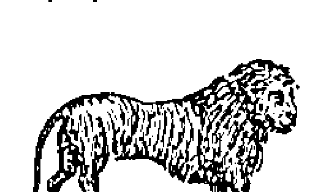

## 狮子座
8月5日

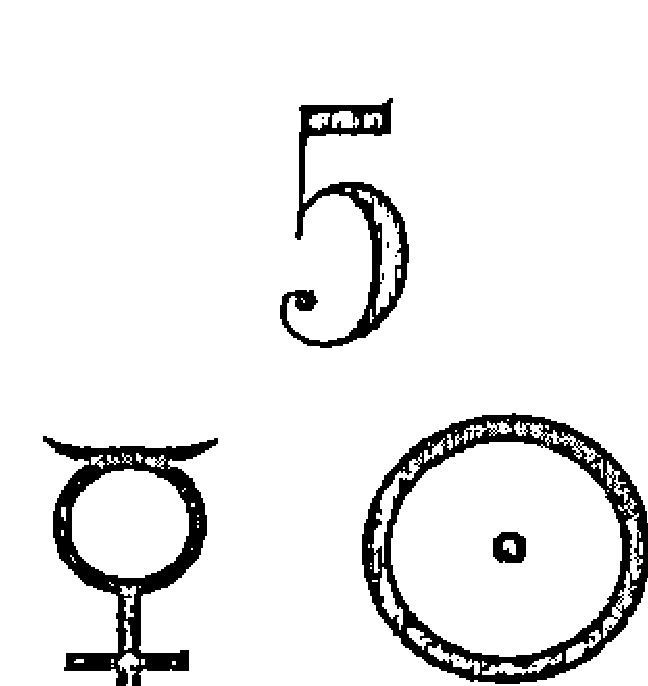

## 幸运数字和守护星

8月5日出生的人受数字5和水星的影响。水星代表思维的敏捷和变化的快速。8月5日出生的人已经受到了狮子座主宰星太阳的强烈影响，此时又加上水星的影响，所以他们可能发现自己在年轻时就常常作出一些鲁莽的决定，并会一再地改变已经决定了的想法。不管他们一生中遇到什么重大的打击，他们总是能够迅速恢复，重新振作起来。太阳的影响力往往能使他们恢复的速度变得更快。

德森（电视女演员），伊利亚·列宾（俄国批判写实主义画家）

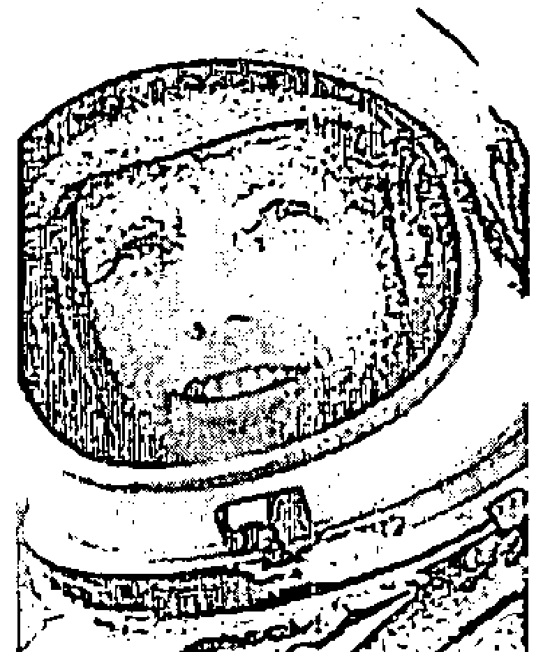

## 塔罗牌

大秘仪塔罗牌的第5张是“教皇”。他是令人畏惧的神秘事物的解释者，象征人类的认知及信仰。他知识渊博，即使抽象的事物也受他主宰。从积极的一面来看，这张牌代表信心十足、不疑不虑以及对事物有正确的理解；从消极的一面来看，这张牌代表爱说教、夸大其词以及独断的个性，这也暗示了8月5日出生的人需要对别人有更多的接纳。

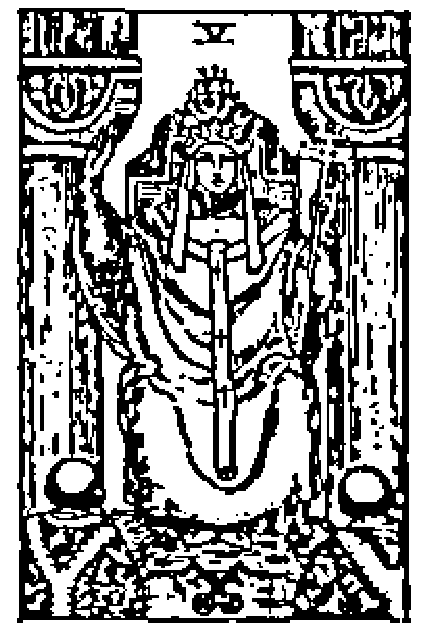

## 健康

一般来说，8月5日出生的人都非常明白保持好身材的重要性，但也会有些人因为太重视外在美而忽略身体健康。抽烟、喝酒、暴饮暴食等都是这一天出生的人身上最常见的恶习，他们必须学会好好控制自己的不良习惯，就像克制他们的情绪一样。为了不舍弃他们热爱的美食，这一天出生的人要更加留意有益健康的食物并认真选择。若能亲自动手烹饪，自然更有益于他们的健康。这一天出生的人会被各种体育运动所吸引，而疏解他们侵略性能量的最佳方式莫过于竞赛性的运动了。

| 优点 |
|---|
| 有目标 |
| 威严 |
| 沉着 |

## 建议

加强对别人的了解，重视感情和友善，降低对自己和别人的要求。试着用大众能接受的、富于建设性的方式来表达自己的情感。

| 缺点 |
|---|
| 好斗 |
| 压抑 |
| 不善言辞 |

| 固定位 12页 |
|---|
| 火相 16页 |
| 夏季 19页 |
| 狮子座 26页 |
| 狮子座二 52页 |

## 静思语

> 纵然相距一亿多公里，太阳仍然照耀着我们的肌肤。

月份：8月
第6天
狮子宫12°～14°
狮子座二
固定位/火相

## 8月6日

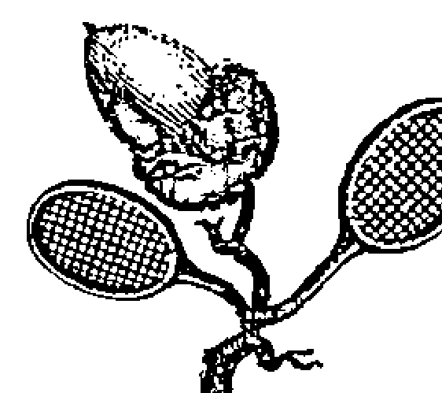

## 独特的事情的一天

## 出生于这一天的名人

8月6日出生的人有一种与生俱来的、难以阻挡的追求人生经验的热忱——他们非常渴望能获得一些不同寻常的人生体验，这些独特的事情可能一辈子才发生一次，或是几乎不可能发生的让人难以理解的神奇的事情。有时候是这一天出生的人自己在引导这些独特的事情的发生，有时候这样的事情发生在他们身上纯粹是巧合，有时是他们直接参与这些事情，有时则仅仅是读或者写一些关于他们的东西。无论哪一种情况，独特的个人经历，包括接触一些已经被长久遗忘的事物或人类未知的事件就像难以抗拒的磁石一样吸引着他们。

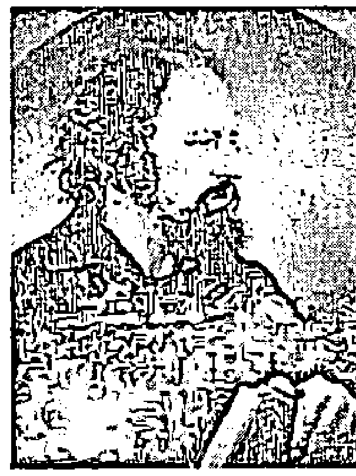

艾尔弗雷德·丁尼生
莱明（苏格兰细菌学家，以发现了青霉素而闻名于世，并获得了诺贝尔化学奖），安迪·沃霍尔（波普艺术的倡导者和领袖，电影制片人，作品有《沉睡》，也是作家、摇滚乐作曲者、出版商），露西尔·鲍尔（美国电影、电视剧女演员，《我爱露西》的女主角），查尔斯·克赖顿（英国电影导演，代表作有《拉凡德山的暴徒》、《一条叫万达的鱼》），皮尔斯·安东尼（英国裔美国科幻作家），查尔斯·福特（奇异事件的记录者），查理·黑登（爵士乐低音吉他手），阿比·林肯（爵士乐歌手、作曲家），戴维·鲁宾逊（美国篮球运动员，圣安东尼奥马刺队的核心队员，后入选梦之队并获得奥运会金牌），汉克·伊巴（美国大学篮球教练，41年职业生涯中赢了767场比赛，美国奥林匹克篮球队教练，率领球队获得过2枚奥运会金牌），斯科特·尼尔林（美国社会科学家、农民、作家，著有《好好生活》），弗雷迪·莱克爵士（英国航空公司的老板），米林·达约（荷兰魔术师、托钵僧），卢埃拉·帕森斯（漫谈栏专栏作家），竹松信（日本建筑师），海因里希·施卢斯努斯（德国歌剧男中音），霍华德·霍奇金（英国艺术家），艾尔弗雷德王子（维多利亚女王的儿子）

对8月6日出生的人来说，平凡的世俗生活一点也不刺激，实际上他们很快就会对这样的平凡生活感到索然无味。所以，如果他们拥有一份普通的工作，或是普通的家庭生活，他们获得新奇体验的心理就无法得到满足，从而他们就很有可能活在能使他们感到极度兴奋的幻想世界里——这很危险。不过，随着年龄的增长，在经历了多年的沮丧和失败后，有一些人会下定决心放弃这种安稳的生活，重新寻找一个崭新的天地，而做出这些激烈的改变之后，这些8月6日出生的人则会发现自己根本不是安于平淡的人；而有些人则会为了没有早点发现这一点而感到懊恼不已。

8月6日出生的人中，只有极为成功或资质较好的人，才能将他们对独特的事物的热爱与安定的日常生活很好地结合在一起。通常情况下，只有从事创意十足的工作，或者从事能直接接触到奇特事件的工作，他们才能完成这种结合，而且他们不仅拥有从平凡生活中挖掘奇特事物的天分，还能将这种独特的发现与别人分享。

对8月6日出生的人来说，超凡脱俗（或至少追根究底）的体验是非常重要的，他们会积极地表现出对生命的热爱。然而，除非他们的伴侣也对他们所追寻的事物相当感兴趣，否则很可能无法接受他们所选择的生活方式。此外，8月6日出生的人常常迅速地改变自己，速度之快会让他们的伴侣、家人或朋友感到惊异。

这一天出生的人对爱和各种感官享受，尤其是性欲的表达有强烈的需求，但他们的个性决定了他们在追寻完美恋爱和理想的伴侣关系时会经常感到失望。8月6日出生的人会成为很好的朋友和家长，而且他们会用自己的方式证明这一点。但是因为他们追求“8月6日”的生活方式，所以即便他们做得很用心，也很认真地负起了他们的责任，他们也很难让他们所爱的人感到满意。

## 每年的这一天

## 狮子座
8月6日

## 幸运数字和守护星

8月6日出生的人受数字6与金星的影响。受数字6影响的人会以他们磁铁般的吸引力吸引众多仰慕者，而且金星和社交有很深的联系，因而这一天出生的人通常会在具有高度社会性的环境中工作。然而有一些人会厌恶这种环境，甚至会因此躲藏起来去过不为人知的（甚至被人遗忘的）生活。8月6日出生的人最不喜欢平静无波的社会生活。对受数字6影响的人来说，爱往往是一辈子最大的主题。受金星和太阳（狮子座的主宰星）的双重影响，8月6日出生的人会显得非常迷人和性感，而且他们的生活会充满浪漫。

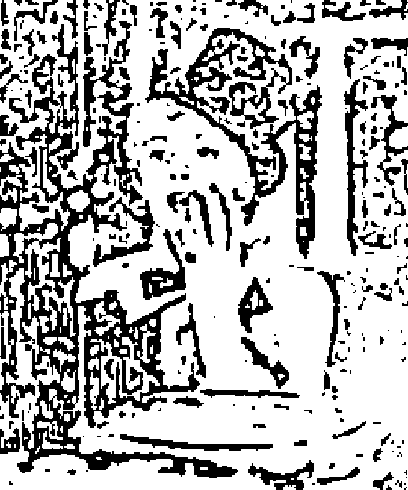

## 塔罗牌

大秘仪塔罗牌的第6张是“恋人”。恋人象征着通过两性结合的爱，全人类能够团结在一起。从积极的一面来看，这张牌代表道德、美学以及肉体方面更高层次的感情与渴望；从消极的一面来看，这张牌代表没有止境的欲望、多愁善感和迟疑不决。

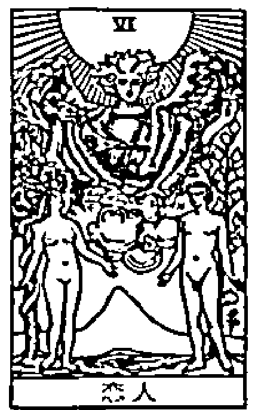

## 健康

8月6日出生的人受追求奇特事物的渴望影响非常大。因为无法过着平淡无奇的生活，他们所选择的生活方式也无法让他们的身体保持健康，所以他们很可能使家人十分失望。8月6日出生的人必须借着美味而准时的三餐、舒适的按摩、美满的性爱生活，散步、慢跑或游泳等经常性的运动才可以维持良好的健康。对他们来说，最大的挑战就是如何不会感到乏味地维持这种有益健康的生活方式。然而，他们天生具有可以成功避免意外伤害的本领（这可能源自他们对于不寻常甚至危险事物的沉迷），所以他们会时不时地打破习以为常的生活作息，参加各种野外的狂欢聚会。

| 优点 |
|---|
| 有趣 |
| 浪漫 |
| 有创造力 |

| 缺点 |
|---|
| 容易失望 |
| 鲁莽 |
| 不善交际 |

## 建议

必须认清一件事：对于人生中的一些事，你必须学会妥协。为了得到爱和温情，你必须放弃对新奇体验的不停追求。学着从别人的角度看事情。

- 固定位 12页
- 火相 16页
- 夏季 19页
- 狮子座 26页
- 狮子座二 52页

## 静思语

> 未曾预料到的事情总会发生。

月份：8月
第7天
狮子宫13°～15°
狮子座二
固定位/火相

## 8月7日

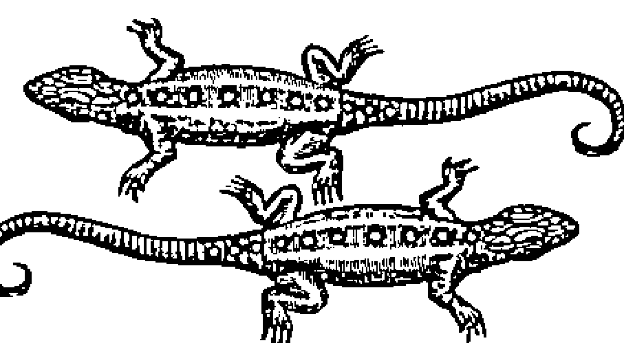

## 双面间谍的一天

## 出生于这一天的名人

8月7日出生的人总是被隐晦的或秘密进行的事件强烈吸引。一般情况下，他们自己的行为是相当公开的，但他们对侦探、推理、间谍之类的故事更感兴趣。倾向于科学研究的那部分这一天出生的人则希望自己能掌握外国的语言、钻研历史或解开大自然的奥秘。他们最大的快乐就是发掘别人不知道的奇闻轶事，然后讲给自己亲近的朋友或同事听。从某种程度上说，他们就像是侦探，喜欢挖掘事实真相，并以有趣甚至有利可图的方式加以运用。

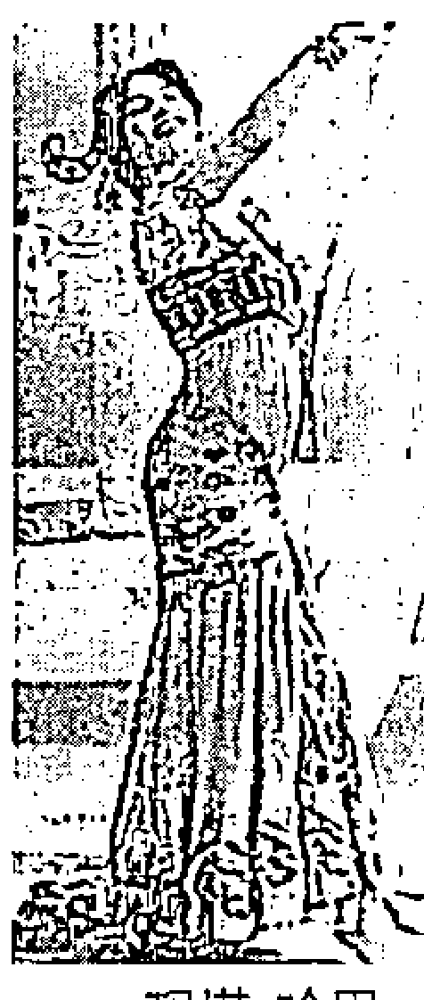

路易斯·利基（英国古生物学家，理论家，在奥杜瓦伊峡谷发现早期人类活动的遗迹；作家，著有《人类的起源》），玛塔·哈里（荷兰出生的间谍，双重间谍，也是当时有名的舞者，后被处决），拉尔夫·邦奇（美国政治家，因促成以色列与阿拉伯之间停战而获得诺贝尔和平奖），乔纳森·杰伊·波拉德（美国情报机关工作人员，曾向以色列情报机关透露情报），罗兰·柯克（美国爵士乐多种乐器演奏者，作曲家），尼古拉斯·雷（美国电影导演，主要作品有《无因的反抗》、《以夜为生》），埃米尔·诺尔迪（德国表现主义画家），马尼塔斯·德普拉塔（弗朗门科吉他演奏者），亚历山大·季佳京（俄国体操运动员，获得了多枚金牌），加里森·凯勒（电台撰稿者，作品有《梦回夏愁湖》），阿尔贝托·萨拉查（获得过3次纽约马拉松长跑冠军），唐·拉森（美国著名棒球投手），弗兰克·菲茨西蒙斯（美国卡车司机工会的负责人），艾伦·佩奇（美国橄榄球防守前锋，名人堂球员），斯坦·弗里伯格（美国喜剧演员），戴夫·沃特尔（美国运动员，获得了奥运会800米赛跑冠军），比利·伯克（美国电影女演员），劳拉·马丁·史密斯（心理学家），艾伦·利奥（占星学家）

8月7日出生的人必须注意，他们对事实真相的揭露可能无意中与一些人成为了敌人，特别是那些因为他们揭露真相而受到伤害或不得不作出妥协的人。有时候虽然他们的动机是好的，但无法预测事情最后会演变成什么样子，所以，他们还必须下一番工夫来研究他们的新发现，使之成为可靠的证据或结论，以免沦为道听途说。

很多8月7日出生的人都有展现内心世界和个人隐私的欲望，但又十分害怕这样做，所以有时他们会对自己的事情守口如瓶。通常他们只会向一个亲密的朋友或家人透露心事。所以在某些情况下，即便是最亲密的人，如妻子或丈夫，在和这一天出生的人相处了一辈子之后，也还是有可能不了解他们心中深藏的秘密世界。之所以会出现这种情况，是因为8月7日出生的人很擅长扮演两种甚至多种角色。从外表上看，他们可能是最保守最正直的公民，是标准的道德模范、模范太太或模范丈夫以及为人父母的榜样，但与此同时，他们也可能拥有一个不为人知的秘密世界。有一些8月7日出生的人能够在这两种角色中找到一种平衡，在这样的两个世界里平静地生活很长时间。也许直到某一天，甚至在他们离世之后，别人才知道他们隐藏的另一个世界。

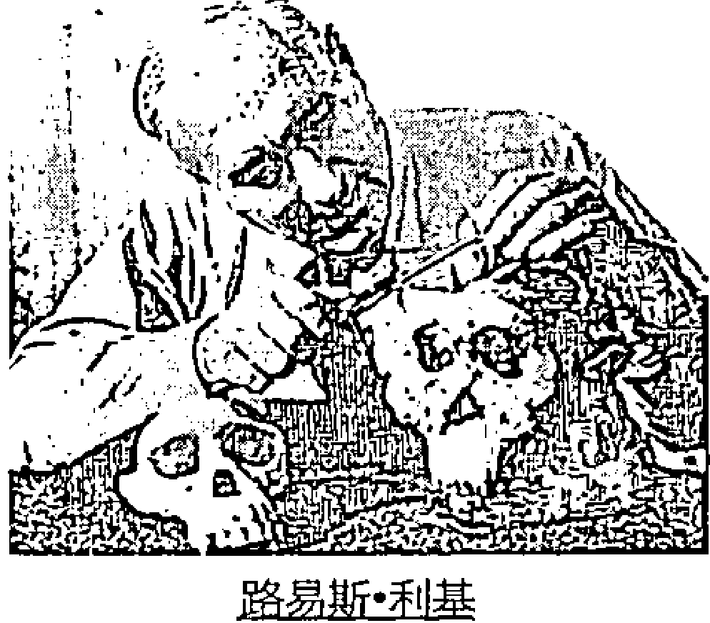

此外，在面对潜在的危险时，尤其是他们对自我产生怀疑的时候，8月7日出生的人非常善于运用幽默来化解难题。他们习惯于刻意隐瞒一些琐碎的事，或是在不必要的时候将真相全盘托出。对这一天出生的有些人来说，只给出一个扼要的陈述或者直截了当的答案是一件挺困难的事情。他们在陈述某件事情时，很可能为了取悦别人而不知不觉地添油加醋，尤其是在他们极度想融入某个环境或社会团体中，同时想让别人欣赏他们的所作所为时，这种想取悦别人的倾向会变得更加明显。

## 每年的这一天

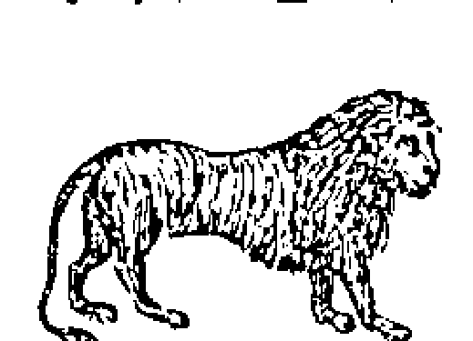

## 狮子座
8月7日

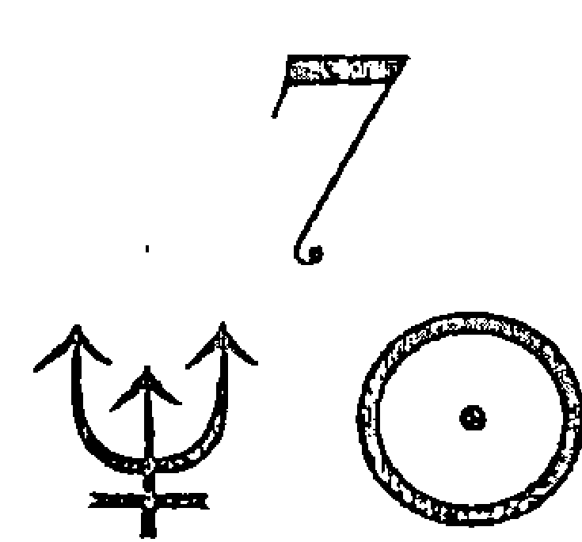

## 幸运数字和守护星

8月7日出生的人受数字7和海王星的影响。这个以罗马神话里海神的名字命名的行星掌管着幻想、梦境和心理现象，所以这一天出生的人可能比较不稳定。这种力量一旦与太阳（狮子座的主宰星）的影响力相结合，就容易使这一天出生的人更加偏离实际，如出现反复无常的行为、拟出不切实际的计划等。数字7一般预示着喜欢改变和旅行，这恰好与8月7日出生的人的爱好相吻合。

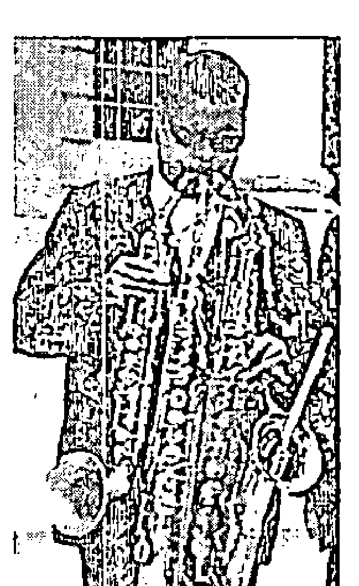

## 塔罗牌

大秘仪塔罗牌的第7张是“战车”。牌面上的胜利者以一种强有力的姿态，展现着他在人世间的丰功伟业。这张牌可以解释成：不论正道多么艰险难行，你都得继续走下去。从积极的一面来看，这张牌代表成功、才能和效率；从消极的一面来看，这张牌则代表专制的态度和拙劣的方向感。

## 健康

8月7日出生的人最大的健康威胁来自心理。有一些这一天出生的人会因为与现实脱节而在性格上表现出不稳定性，而另一些人则可能拼命追求稳定的生活，却需要面对极大的心理压力。实际上，大部分这一天出生的人都能从心理治疗或心理咨询中获益匪浅，有效的治疗既能使他们的行为受到客观的指导，又能给他们提供严格保密的环境，使他们有机会探索自己的内心。由于8月7日出生的大多数人的健康状况受心理状态的影响很大，所以他们的心理健康在健康问题方面就被排在了首位。建议他们定时吃三餐，保证营养均衡，并经常进行一些较温和的运动。

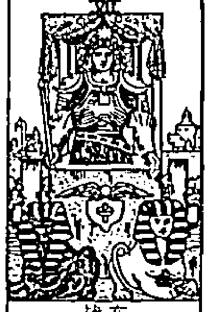

## 优点

- 聪明
- 有趣
- 善于社交

## 建议

把你的侦探才能用在富有建设性的目标上，而不要只是停留在满足私人窥探欲层面。试着以公正和诚实的态度来对待周围的人，对自己也要坦诚一些。

## 缺点

- 爱打听
- 有自我伤害倾向
- 易逃遁

## 静思语

电话已经成了现代人无法沟通的最终象征。

| 固定位 12页 |
|---|
| 火相 16页 |
| 夏季 19页 |
| 狮子座 26页 |
| 狮子座二 52页 |

月份：8月
第8天
狮子宫14°～16°
狮子座二
固定位/火相

## 8月8日

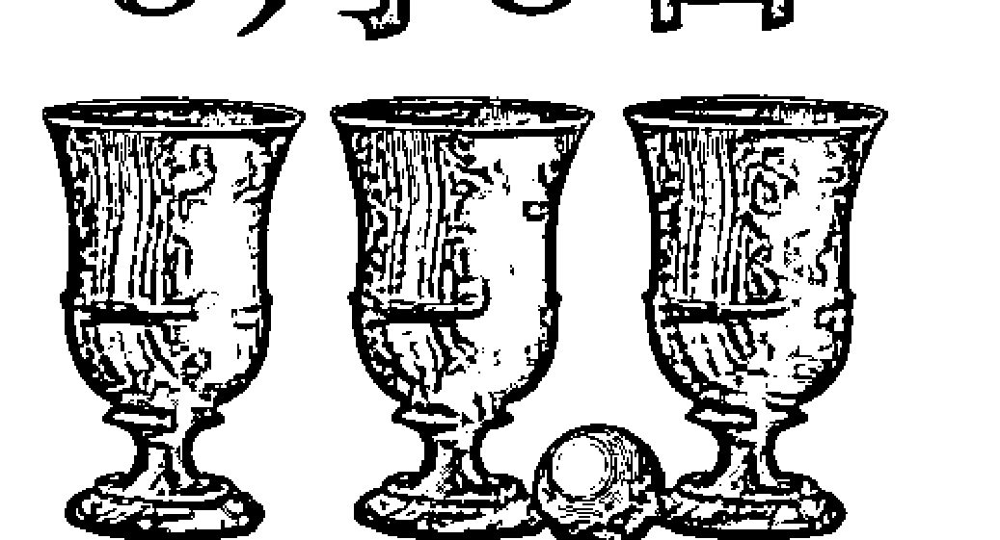

## 角色扮演者的一天

## 出生于这一天的名人

8月8日出生的人天生有强烈的愿望去扮演各种不同的角色，当然，这并不代表他们是经常变换人生轨道的轻浮者，相反，他们都是在经过了辛苦的准备和研究之后，才开始尝试每一项改变、扮演新的角色的，也正因为如此，他们才能获得成功。通常，这一天出生的人很渴望在专业上得到别人的认可和赞赏，而只要他们选择的职业不是十分不切实际或严重不符合他们的个性，大多数人就都能获得他们想要的成功。

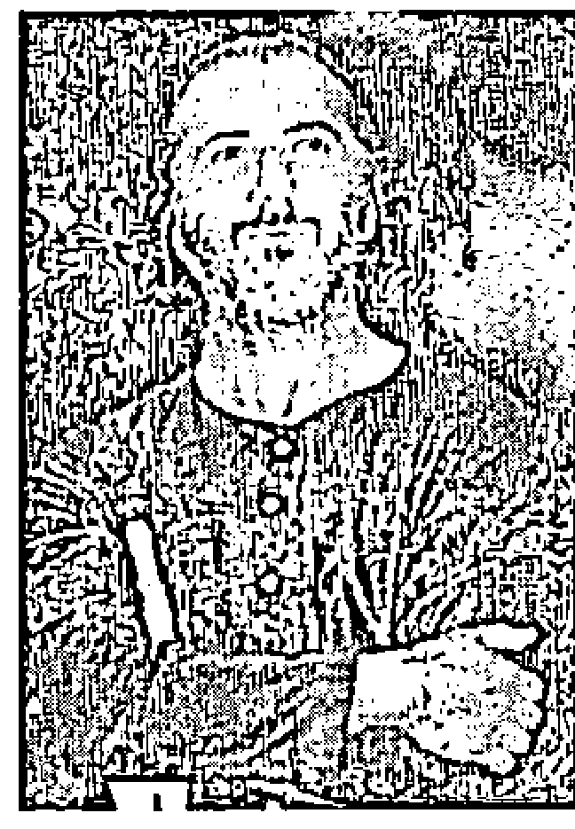

达斯廷·霍夫曼（美国著名电影与舞台剧演员），本尼·卡特（美国爵士乐中音及高音萨克斯管演奏者，作曲家，乐团领导人），基思·卡拉丹（美国电影演员，歌手，作曲家），欧内斯特·劳伦斯（美国诺贝尔物理学奖得主，发明了亚原子粒子加速器和电视彩色显像管），莱奥尼德·马西涅（俄国芭蕾舞编舞家，作品有《火鸟》与《春之祭》），迪诺·德劳伦蒂斯（美国电影制片人，导演），伊莎贝尔·阿连德（秘鲁小说家，代表作有《埃娃·卢纳》），肯·德赖登（加拿大曲棍球守门员，率领蒙特利尔队获得了6次斯坦利杯），奈杰尔·曼塞尔（英国赛车手，1992年的国际汽车大奖赛冠军），埃斯特·威廉姆斯（游泳选手，电影女演员），阿瑟·戈德堡（美国最高法院大法官，曾担任美国驻联合国代表），海伦·雅各布斯（著名网球选手，曾获得1次温布尔登网球公开赛冠军，4次美国网球公开赛冠军），玛乔丽·金南·罗林斯（儿童文学作家，代表作有《鹿苑长春》），吉米·威瑟斯庞（蓝调歌手），格特鲁德·斯泰因（美国作家、诗人、收藏家），弗雷德·麦克默里（美国电影演员），罗伯特·雷德福（美国电影演员、导演），拉尔夫·贝拉米（美国电影演员），迪克·海涅斯（美国橄榄球教练），罗伯特·霍奇（美国橄榄球运动员），罗伯特·穆格（美国电子乐器发明家），罗伯特·雷德福（美国电影演员、导演），拉尔夫·贝拉米（美国电影演员），迪克·海涅斯（美国橄榄球教练），罗伯特·霍奇（美国橄榄球运动员），罗伯特·穆格（美国电子乐器发明家）

在经过一系列的变化之后，再回顾这些人的人生历程，旁人甚至8月8日出生的人自己都会惊异地发现，他们在扮演每一个角色的时候都是那么投入。8月8日出生的人讲究实际，勇于承担责任，只有在全力扮演了一个角色或者得到了满足之后，他们才会转移到另一个角色中去。从家庭主妇变成职业妇女的女性，即使获得了成功也要变换公司或职业的男性，以及和不同家人相处时表现得判若两人的小孩，都有力地证明了8月8日出生的人出色的适应能力。如果这一天出生的人是演员或是从事创作的艺术家，那么他们会有十分多样化的艺术风格和艺术表现方式。

即使无法专注于某一项特定的工作，8月8日出生的人也会毫不畏惧地继续尝试新的工作，或者尝试以前被他们忽略掉的工作。然而，那些较成熟的8月8日出生的人并不会容许自己这样不停地改变，也不愿意一天到晚转移兴趣，分散精力。因此，如果要同时扮演多个角色，付出的时间和精力必须打折扣的话，他们就不会在同一时间做一件以上的工作。当然，这样的他们也可以成为可信任的伴侣、事业伙伴、父母和朋友。

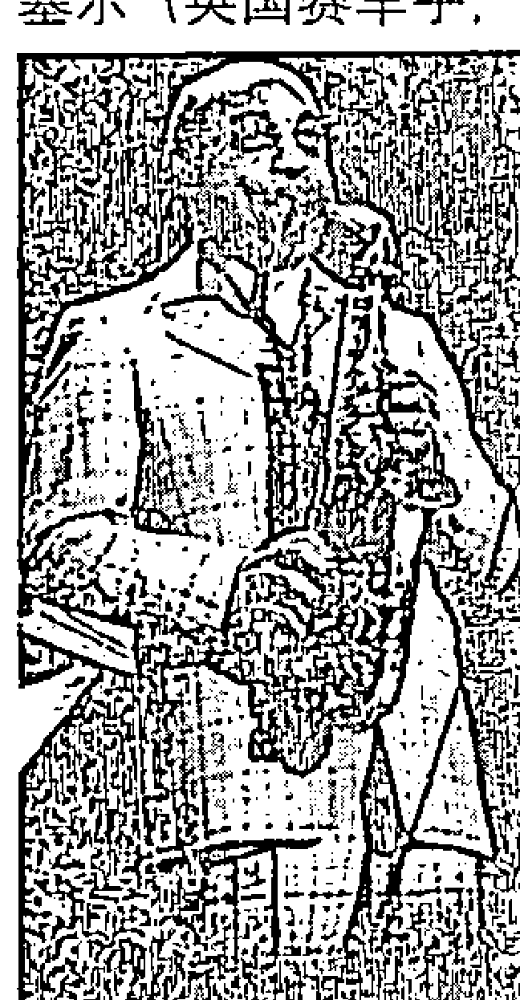

当8月8日出生的人走错了方向或偏离了正常的人生轨道时，他们会非常乐于接受别人的建议（这在坚守己见的狮子座中可以算是个例），因此，在这个时候他们的密友和伴侣对他们的建议就显得十分重要了。然而，尽管如此，在权衡了各种合理的观点和建议之后，这一天出生的人通常还是会作出一个以后不大可能再改变的决定。

为了保证生活的快乐幸福，8月8日出生的人最好在生活中能够尝试不同的休闲娱乐方式，掌控他们以自我为中心的个性，同时在制订目标时再符合实际一些。适度的安全感将有助于他们工作与生活状态上的稳定。

## 8月8日

每年的这一天

狮子座
8月8日

## 幸运数字和守护星

8月8日出生的人受数字8与土星的影响。土星的影响使人具有责任感，能了解自己的极限，谨慎并相信宿命，所以这一天出生的人原本保守的倾向会更明显。受数字8影响的人，虽然在职场中有强烈的变换职业的冲动，尤其在中年时会特别想在工作上实现很大的突破，但一般来说，他们仍然会谨慎小心地发展自己的事业。此外，太阳（狮子座的主宰星）对土星的影响在8月8日出生的人身上体现得非常明显，但这并不等于太阳会赋予他们足够的自信心。

德·希梅尔·法伯（历史学家，著有《论贫穷》）。
马茨·韦德兰（瑞典网球运动员，曾获得美国网球公开赛和法国网球公开赛冠军）。
乔斯·德尔加多（神经生理学家，曾在动物体内植入电极进行试验）。
德博拉·诺维尔（美国《今日新闻》节目的记者）。
康妮·史蒂文斯（美国歌手）。
梅尔·蒂利什（美国乡村歌手）。
基思·卡拉丹

## 塔罗牌

大秘仪塔罗牌的第8张是“力量”或者“勇气”。图中一位优雅的皇后正在驯服一头愤怒的狮子。皇后象征女魔法师，可以驾驭不易控制的能量，并代表道德及体能。从积极的一面来看，这张牌代表非凡的个人魅力以及追求成功的决心；从消极的一面来看，这张牌代表自满和滥用权力。

## 健康

对8月8日出生的人来说，定时的三餐、规律的运动、充足的睡眠与和谐的性生活是维持健康的重要条件，而且他们可以据此很好地了解自己的身体，判定自己的需求。因此，一些竞争性或锻炼性的运动，如慢跑和体操对他们都有相当大的吸引力。而为了使两性关系更加融洽，感情的表达是不可或缺的。体重方面的问题，一般来说，他们都能通过加强摄取谷类食物与新鲜蔬果等方法来加以控制。建议他们不妨多举办一些能让家族成员一起参与的户外活动，如度假、野餐、旅游与露营等，而在这个过程中最重要的是，多和亲近的好友或家人分享内心的情感，因为这是维持心理健康的非常有用的做法。

- 优点
  - 才华横溢
  - 多才多艺
  - 有责任感

- 缺点
  - 以自我为中心
  - 严苛
  - 糊涂

## 建议

在忙于工作之外，抽出一些时间来进行思考，或和家人一起参与一些休闲活动。让目标更实际一点，但可别因此而被困。保持良好的适应能力与调节能力。

- 固定位 12页
- 火相 16页
- 夏季 19页
- 狮子座 26页
- 狮子座二 52页

## 静思语

什么时候我们才是真正的自己呢？

## 8月9日

月份：8月
第9天
狮子宫15°～17°
狮子座二
固定位/火相

### 心理力量的一天

## 出生于这一天的名人

相对于依赖他们的人来说，8月9日出生的人是充满力量的人——他们不仅是杰出的团队成员，而且会以身作则带领团体努力地朝目标前进。虽然他们可能处于领导者的位置上，有许多便利条件，但他们绝不会为了满足自己的利益而牺牲大家的利益。此外，他们也是骁勇的战士，他们最清楚群众的心声，始终站在大众这一边。

让·皮亚热（法国儿童心理学家，智力专家），马文·明斯基（电脑科学家，人工智能开拓者，作家，作品有《机器人学》），惠特尼·休斯顿（美国著名歌星，电影女演员），约翰·史密斯（美国摔跤运动员，获得过3次世界冠军、2枚奥运会金牌，唯一获得沙利文奖的摔跤运动员），鲍勃·库西（波士顿凯尔特人篮球队队员，10次入选最佳第一阵容，最有价值球员，最佳助攻，曾率领凯尔特人队获得过6次冠军），梅拉妮·格里菲思（美国电影女演员），罗德·拉弗（澳大利亚网球冠军，获得过2次大满贯冠军、4次温布尔登网球公开赛冠军），约翰·德赖登（英国桂冠诗人），拉尔夫·霍克（纽约洋基棒球队经理人，带领球队获得过3次美国联盟大赛冠军、2次世界职业棒球锦标赛冠军），雅克·帕里索（经济学家，魁北克党前领导人），戴维·施泰因贝格（美国喜剧演员），萨姆·埃利奥特（美国演员），罗伯特·奥尔德里奇（美国电视剧、电影演员，制片人，代表作有《最长的一码》），奇诺·弗兰切斯卡蒂（小提琴家），桑德斯（棒球外野手，橄榄球防守后卫，美国全国橄榄球联盟职业运动员），布雷特·赫尔（加拿大冰上曲棍球球员，鲍比·赫尔的儿子），马里奥·扎加洛（巴西队的传奇球星和教练，带领巴西队获得了世界冠军），乔·杰克逊（美国歌手，歌曲创作者），菲利普·拉金（英国诗人），艾萨克·沃尔顿（17世纪英国作家，著有《垂钓大全》）

8月9日出生的人十分了解人性。通过对人性的研究，他们不仅能一眼看出某个人的特质，还知道该怎么去接近他，在必要时他们还能发挥自己的说服力，让那些人明白什么才是对大家都有好处的东西。因此，对于如何使人们拥有最好的生活，得到最需要的东西，以及个人如何在政治与社会的大环境下寻求发展，他们都有一套独特的见解。然而，正因为如此，在慷慨给予他人建议的同时，他们也有过于霸道或专断的倾向。所以，有些时候他们不妨让别人自己来决定，什么才是最符合其利益的做法。

8月9日出生的人往往口才出众，可以运用自己的说服力将别人从另一个阵营中拉拢过来。他们还有很强的责任心，对那些采纳了他们建议或加入了他们所在阵营的人，他们有一种责任感。这种负责任的态度也表现在他们生活中的其他领域，如金钱、道德观、休闲方式、教育等，而其中的教育是最吸引他们的，他们会一再改进并精炼出最佳的学习方法。必须提醒8月9日出生的人的是，他们一定要避免介入他人的生活，毕竟有些人并不需要别人的建议，而更喜欢用人家自己的方式来解决问题。但是，由于8月9日出生的人大多很有见地，且性格强势，因此他们常常对周围的人，甚至是偶尔接触过的人，产生非常大的影响力。

一旦开始实施一项计划之后，8月9日出生的人就不会轻言放弃。他们大多在幼年时期就能发现自己最主要的兴趣，并执着在这个兴趣上面。大部分这一天出生的人都会是忠诚的伴侣，但如果因为配偶死亡或其他意外状况而必须再婚的话，他们也会毫无保留地奉献出自己全部的爱。

有时，8月9日出生的人对于自己所爱的人的需求并不敏感，这是因为在倾听爱人真正的想法之前，他们常常自认为已经了解了什么才是最好的做法，因此，他们的观点和做法难免有失偏颇，这时如果有个值得信赖的朋友来告诉他们（这一点对他们来说很重要）的话，那他们就会非常受益。但是你会发现，由于他们具有很强的影响力，所以当他们有了错误的想法或做了错事时，他们身旁还是会围着一群盲从的人。

## 幸运数字和守护星

8月9日出生的人受数字9与火星的影响。数字9对其他数字有着很强的影响力（任何个位数加9，皆可回复到原数，例如5+9=14，4+1=5；任何数字乘9，都能回复到数字9，如9×5=45，4+5=9），所以这一天出生的人对周围的人也有着类似的强大影响力。另外，火星代表男性的强有力并且具有侵略性的阳刚力量，（受主宰狮子座的太阳的影响，这种特质会变得格外明显），因此，从传统观念来看，这一天出生的女性可能有点强势，而男性则会显得更有侵略性。

## 塔罗牌

大秘仪塔罗牌的第9张是“隐士”。画面中的人提着一盏灯，拄着拐杖，代表了冥想、孤立与寂静，象征着智慧的结晶和绝对的纪律。隐士是严厉的导师，他通过良心教育使人走上正途。从积极的一面来看，这张牌代表有所坚持、有目标、深沉且专注；从消极的一面来看，这张牌代表专断、心胸狭窄、多疑以及气馁。8月9日出生的人应该从隐士身上学习隐世的价值观，并定期检视自己的价值观。

## 健康

由于8月9日出生的人总是为团体的事情投入过多的精力，所以他们必须有良好且规律的作息才能保证身体的健康，但实际上，他们更关心别人的健康，而非自己的身体状况。如果能注意必要的营养摄入、运动与休息，他们也能维持很不错的健康状态。不过，他们常常忽略照料自己的身体，因此他们的爱人、家人与朋友需要时常提醒他们好好照顾自己。

## 优点

- 组织能力强
- 利他主义
- 细心

## 建议

你认为对别人最有好处的不一定真的会有好处。注意你的措辞，语言既能给人带来正面的影响，也能伤害人。不要对别人的生活产生过多的影响，学会倾听。

## 缺点

- 自以为是
- 霸道
- 易激动

- 固定位 12页
- 火相 16页
- 夏季 19页
- 狮子座 26页
- 狮子座二 52页

## 静思语

有些人在保持安静的时候反而能将事情做得更好。

## 8月10日

月份：8月
第10天
狮子宫16°～18°
狮子座二
固定位/火相

### 话语迷人的一天

## 出生于这一天的名人

8月10日出生的人向周围的世界强有力地展示着他们的魅力，就好像有一种声音必须要人仔细倾听一样。他们表达的方式和内容同样重要，因此，在和这些人沟通的时候，要特别注意他们的表达风格和技巧。

帕蒂·奥斯汀（美国著名爵士乐歌手），伊恩·安德森（美国摇滚乐歌手，长笛演奏者，歌曲创作者），阿什利·帕特南（花腔女高音歌手），埃迪·费希尔（美国流行歌手），吉米·迪安（美国流行歌手），赫伯特·胡佛（美国前总统，1929年华尔街股票市场崩盘之后，拒绝融资给公司提供就业机会，曾任国际救援会主席，也是“胡佛战争、革命与和平问题研究所”的创办人），诺曼·希勒（美国电影女演员），洛萨娜·阿尔克特（美国电视剧、电影女演员），朗达·弗莱明（美国电影女演员），玛莎·海尔（美国电影女演员），简·怀亚特（美国电影女演员），卡米洛·本索·迪卡武尔（意大利政治家，撒丁岛总理，帮助实现了意大利统一），沃尔夫冈·保罗（诺贝尔物理学奖得主，发现了被称为“保罗陷阱”的物理现象），雷德·霍尔兹曼（篮球运动员，篮球教练，曾获得“年度最佳教练”称号，曾率领纽约尼克斯队获得2次美国职业篮球联赛冠军，带领球队在各种比赛中7次夺冠），拉法埃洛·迪诺拉（意大利企业家），本杰明·沃德（纽约警察局负责人），谢克特（美国全国广播公司广播部门高级经理），胡戈·埃克纳（开发出了齐柏林硬式飞艇，是兴登堡号飞艇指挥官），亚历山大·格拉祖诺夫（俄国作曲家），迈克尔·曼特尔（前卫派爵士乐作曲家，鼓手，爵士管弦乐队成员）

8月10日出生的人最吸引人的地方是他们的活力与幽默感，同时他们也是很值得信赖的人，一点也不轻浮毛躁。这种天生的幽默感使他们有能力成为出色的艺人。当他们感到受人（可能是他们所爱的人或亲近的人）重视时，他们会毫不保留地奉献自己，但实际上这种热情的奉献是为了躲避内省工作。而内省对他们来说虽然很困难，但是非常重要——如果他们想拥有健全成熟的人格，花在内省上的工夫是绝对不能省的。

出生于8月10日的资质较好的那部分人，大概要到40岁以后才能够充分明白独处的重要性，了解自己是他们最重要的课题，因为唯有了解自己，他们才能准备好面对未来的挑战。务实的计划将使他们不致偏离正轨太远，或整天做着不切实际的白日梦。

8月10日出生的人在言辞方面很有天分，因此，和客户接触或与同事互动的工作最适合他们，而对于那些整天坐在办公桌前的工作，他们最好敬而远之。不管是在职场还是在家中，能时常从别人那里收获批评指教对他们的成熟会有很大的帮助，而如果他们能积极改进的话，那他们的收获就会更大。媒体工作或经常需要被他人评估的工作，都颇符合上述的求职标准。但他们要留意的是，当逐渐爬到社会上层之后，他们必须提醒自己不要成为狭隘的精英主义者。

虽然8月10日出生的人也很想找到可以倾诉的听众，但一般人还是很难了解他们的内心世界，他们也常常无法敞开心扉谈论自己的心事。因此，他们中的很多人只好将注意力放在公众生活中，借此获得自我肯定。这也就意味着，假若工作表现不被赏识的话，这一天出生的人就会觉得十分苦闷；如果一再遭受拒绝，他们甚至会变得有点愤世嫉俗。因此，培养坚定的信心，不让自己随着别人的看法而轻易改变，不仅对他们的事业非常重要，还能提升他们信任别人以及与别人分享的能力。

一般来说，8月10日出生的人对金钱不是特别在乎，他们关心的是出色地完成工作之后的满足感。这种态度显然是很值得人称赞的，但是它的一个缺点是，可能导致他们忽视对工作的必要回顾。

## 幸运数字和守护星

8月10日出生的人受数字1（1+0=1）和太阳的影响，受数字1影响的人通常都非常有主见，渴望能够爬上人生的巅峰。8月10日出生的人必须注意不要偏离正常的轨道太远，也不要为强烈的驱策力所支配，或对注意力有太高的要求，还有不要因为自己精力充沛而使他人疲于奔命。太阳（狮子座的主宰星）象征着强大的创造力和活力，这些能量需要被稳定地加以引导，而不是零乱地燃烧掉，终致不可收拾。

## 塔罗牌

大秘仪塔罗牌的第10张是“命运之轮”。它象征时运的逆转，并告诉人们除了变化本身，世界上并没有真正的永恒不变的东西。受数字1和10影响的人必须时刻留意，抓住人生的关键时机，只有这样才能获得成功。而命运之轮也教导我们，不管是生活中的成功还是失败，都不是永久不变的。

## 健康

8月10日出生的人可能对外表太过重视了，他们重视自己的身材、牙齿、头发与皮肤远甚于自己身体的健康。一般来说，这一天出生的人相貌都是相当不错的，美中不足的是身材可能有点不够令人满意。此外，这一天出生的人要特别注意自己的嗓子（喉咙与声带）的健康，同时也应该避免给心脏、脊椎、循环系统与消化系统造成太大的压力。除此之外，应酬性质的饮酒和抽烟也要注意加以节制，他们最好能将自己的社交活动转移到一些运动项目中，例如网球、溜冰等。当迈入晚年之后，为了减肥，这一天出生的人还有可能成为素食主义者。

## 建议

问问自己，外表的价值到底在哪里？加强自信心，这样你就不会太依赖他人的意见，或太在意他人对你的看法。培养观察能力、容忍能力、无私地爱与无条件给予的能力。

## 静思语

电视是一架瞄准观众的机关枪。

狮子座
8月10日

埃迪·费希尔

命运之轮

- 优点
  - 有魅力
  - 有趣
  - 语言有魅力

- 缺点
  - 依赖他人的关注和肯定
  - 缺乏自信

- 固定位 12页
- 火相 16页
- 夏季 19页
- 狮子座 26页
- 狮子座二 52页

## 8月11日

月份：8月
第11天
狮子宫17°～19°
狮子座三
固定位/火相

## 证实的一天

## 出生于这一天的名人

8月11日出生的人天生有一股追根究底的强烈欲望，同时，他们能充分地认识到生活中的黑暗面，敢于谈论一些别人觉得不恰当或感觉不舒服的话题。他们认为大胆地揭示被隐藏起来的真相是他们责无旁贷的义务，为此，他们会进行测试、深入的调查，必要时还会揭露某些人的虚伪行径，而在揭露某些人的秘密时他们甚至会六亲不认。他们会不厌其烦地求证与记录事实，而从不考虑这些事实会让人感到多么不舒服，这一点很难改变，似乎可以说是他们毕生的兴趣所在。

亚历克斯·黑利（美国黑人作家，著有长篇小说《根》），黄哲伦（美国革新派剧作家，代表作有《蝴蝶君》），耶日·格罗托夫斯基（波兰戏剧理论家，创立了波兰工人剧院），费尔南多·阿拉瓦尔（西班牙裔法国超现实主义剧作家，写了49部戏剧，同时也是散文家），路易斯·博根（美国诗人，批评家），安格斯·威尔逊（英国作家，评论家，讽刺小说家，代表作有《惊世骇俗》），伊妮德·布莱顿（英国儿童作家，塑造了诺迪这个广受喜爱的人物），杰里·福尔韦尔（电视传教士，节目主持人，作家，著有《基要主义者现象》），胡克·霍根（美国职业摔跤运动员，偶像人物），马维什·加朗（流放作家，著有《逆耳忠言》），萨迪·卡诺（法国前总统，被暗杀），菲尔·奥克斯（美国乡村歌曲创作者，抗议歌手），克劳斯·冯比洛（商人，被判谋杀罪，后来又改判无罪），卡丽·雅各布斯·邦德（19～20世纪著名歌曲创作者），迈克·道格拉斯（美国歌手，电视节目主持人），理查德·米德（17～18世纪英国内科医生，预防医学的先驱），阿琳·达尔（美国电影女演员，化妆品业商人），阿利格拉·肯特（芭蕾舞演员），休·麦克迪尔米德（苏格兰民族诗人）

8月11日出生的人中资质较好的那些人会以比较正面、富于建设性的方式来处理这类事情，他们希望借此达到启发他人的目的；而那些资质不太好的人，则可能身体力行这些令人不愉快的事情，甚至做出一些违反社会规则的事情。不过，尽管如此，这些资质不太好的人还是可以借此了解自己在做些什么，并试着寻求另一个更高的生存目标，从而提升自己的意识层次。就这个方面而言，那些资质一般或者不太好的人反倒有更好的机会可以发展提升自己。

8月11日出生的人对人性了解得十分透彻，所以并不容易被骗。如果他们是以金钱为人生追求的，他们就能明智地选择投资方向。然而，一般人很难进入这一天出生的人的情感世界，因为他们很难信任他人，而且也不相信与人分享、容忍可以改善他们的生活。为了毫无负担地走上自己所选择的道路，他们往往会刻意地使自己不那么多愁善感。

8月11日出生的人非常希望能有忠实的听众来倾听他们与众不同，甚至惊世骇俗的观点，或者有人来观看他们不按常理出牌的作为。不管观察到的事实是什么，他们都认为有公开、摊在众人眼前的必要。虽然8月11日出生的人很希望能得到别人的敬重，但他们往往不太看重别人对他们的看法。实际上，他们在生活和事业上的敌人或反对者，只会成为他们的刺激物，给他们更大的动力走向成功。尽管如此，他们最好还是不要树立太多敌人，因为他们可能受到致命的伤害。

对8月11日出生的人来说，只要能够掌握恰当的时机，以最有建设性的方式提出他们的观点，他们就有很大的可能获得相当大的成功，但他们要注意不要成为家庭的麻烦制造者。另外，他们天生就具备制造问题的特质，他们会引发各个社会层面对争论性问题的讨论，因此，他们经常置身于暴力、分歧、争吵与挣扎的环境当中。一般来说，这一天出生的人中资质较好的会设法通过他们的言辞、工作或具有创意的项目等让这些不愉快的事情远离自己的生活。随着生活阅历的增加，这一天出生的人有可能变得更有智慧，更能控制自己叛逆的一面。

杰里·福尔韦尔

## 每年的这一天

## 狮子座
8月11日

## 幸运数字和守护星

8月11日出生的人受数字2（1+1=2）和月亮的影响。受数字2影响的人通常都可以成为很好的同事和事业伙伴，也可以与别人建立富有建设性的人际关系。太阳（狮子座的主宰星）代表充满力量与启发性的活力，在与月亮所具有的反省特质结合之后，会使这一天出生的人拥有很强的洞察力。数字11会为他们带来脚踏实地的特质（这一点会因为太阳强大的影响力而变得更加明显）。此外，他们可能对各种成双成对的东西特别感兴趣，例如双胞胎、对称的事物和同时发生的事情等。

党的创立者，苏格兰方言诗人）

## 塔罗牌

大秘仪塔罗牌的第11张是“正义”。牌面中坐着一位安详的女性，她一手拿着天平，一手拿着宝剑。她提醒我们要遵循整个宇宙的规律，只要我们坚持正道，生活就能维持平衡与和谐。这张牌代表的积极意义是正直、公平、诚实和守纪律，代表的消极意义则是不主动、没有人情味、惧怕创新以及抱怨。

## 健康

由于自身体质以及喜欢冲突的性格，8月11日出生的人很有可能碰上各种意外事故，因此，他们必须注意不要让这些意外给他人和他们自己造成伤害。建议他们不要吃太多肉类及乳酪类等热性食物，如果可能的话，以谷类食物来取代不健康的食物自然是最好的。出生于这一天的人很容易处事武断，因此他们应该尽量避开生活的黑暗面，以免因此而情绪不稳。8月11日出生的人中有一些会比较消极，他们的生活充满了这种消极与自己本性的冲突感，因此建议他们不妨诚实地面对内心好胜的一面，并学着处理这两种对立的倾向。对一部分这一天出生的人来说，感官享受和性生活是他们生活中十分重要的部分，但他们最好能对其加以节制，参加一些其他活动。

| 优点 |
| --- |
| 追求真理 |
| 强大 |
| 洞察力强 |

| 缺点 |
| --- |
| 忧郁 |
| 易烦恼 |
| 有伤害力 |

## 建议

不要让直觉与冲动失去控制。真相虽然能启发人，但也能伤害人。你的成功与你的人际关系有着密切的联系。培养自己感性的一面，多一些容忍，不要忽略小善举的价值。

- 固定位 12页
- 火相 16页
- 夏季 19页
- 狮子座 26页
- 狮子座三 53页

## 静思语

> 为什么疯子的洞察力有时更深刻？

369

月份：8月
第12天
狮子宫18°～20°
狮子座三
固定位/火相

## 8月12日

## 捍卫传统的一天

## 出生于这一天的名人

勃拉瓦茨基夫人（俄国女神通学者、作家，著有《神秘的信条》，神通协会的创办人之一），塞西尔·德米尔（好莱坞电影导演、制片人，电影《十诫》1923年版及1956年版的导演），伊迪斯·

8月12日出生的人是传统的卫道士，他们会根据自己的专业知识来坚定自己的主张，他们最重要的工作，似乎就是维护古老的智慧、规则与技艺。这一天出生的人中的成功者虽然很少会碰到旗鼓相当的竞争对手，但是这并不影响他们为了汲取新知识而作出努力，有的时候为了获取新知，8月12日出生的人甚至会付出更多，因为他们视知识为力量的象征。从这一点人们不难发现8月12日出生的人的生活形态与价值观。

8月12日出生的人明白人真正的力量源自恒久的、超越了时空的规则与定律。不过，这一天出生的人中，只有那些没有什么能力的人才会盲目地拥护传统，而那些真正懂得传统的人则会立足于传统之上，努力开创出新的道路，推动科技的进步，提高自己的整体素质，并使周围的人获益。对8月12日出生的人而言，传统是一个有生命力的存在，它的意义不仅存在于它本身，也存在于他们的工作之中。

虽然8月12日出生的人是传统的捍卫者，但是这并不表示他们就一定是保守主义者或者反动主义者。他们只是相信，越了解历史、背景与文化传统，人们就越能分辨出什么是传统的精华，什么是历史的糟粕，也更有智慧来做出正确的抉择，去追求应该追求的，同时懂得放弃一些永远无法求得的东西。如果忽略人类过往的经验，人们就只会一错再错。

汉密尔顿（美国古典学者、作家，著有《希腊方式》），罗斯·麦克沃特（与孪生兄弟诺里斯·麦克沃特创办并编辑了《吉尼斯世界纪录》），诺里斯·麦克沃特（与孪生兄弟罗斯·麦克沃特创办和编辑了《吉尼斯世界纪录》），帕特·梅思尼（融合爵士乐吉他手、作曲家），马克·克诺普夫勒（英国著名的吉他手、歌手、歌曲创作者，“恐怖海峡”乐队成员），布莱雷迪（被称为“钻石吉姆”，纽约金融家、美食家），塞缪尔·富勒（美国电影导演、制片人、作家，导演了《红一纵队》等电影；第二次世界大战的英雄，获得了青铜勋章、银星勋章和紫心勋章），威廉·戈德曼

8月12日出生的人很容易被突发的状况所吸引，经常处于脚步错乱的节奏中，结果他们就有可能失去健康，还有可能给配偶、家人及朋友带来危险，也有可能引起同事的反感。的确，这一天出生的人似乎常常招惹别人的嫉妒与敌意，甚至还会被别人认为势利或霸道。

如果能更好地了解自己的实力，控制住自己的支配欲，对别人多一些容忍，那么8月12日出生的人就能在工作中获取更大的成功。如果能再进一步弱化自己的控制欲和专制的倾向，他们就能赢得周围的人更多的尊重，也能避免别人对自己的反感。对许多8月12日出生的人来说，如果能让自己看起来不那么冷漠，抛开对别人身份的成见，他们就能获取更高的精神价值和真正的人道主义。因此，他们必须仔细检查他们自己设立的特殊的评价体系，并定期对其修订或者干脆将其废弃掉。

## 每年的这一天

## 狮子座
8月12日

## 幸运数字和守护星

8月12日出生的人受数字3（2+1=3）与木星的影响。受数字3影响的人通常具有雄心大志，渴望登上他们所在领域的最高峰，8月12日出生的人当然也不例外。受数字3影响的人还喜欢独立，这一点被富有激情的狮子座强化了；而木星使人具有开阔的视野以及乐观的做事态度（这种特质会被主宰狮子座的太阳所强化），因此，这一天出生的人会满怀自信、积极乐观地面对生活。

（作家，好莱坞剧作家，代表作有《马拉松人》），玛丽·罗伯茨·莱因哈特（惊险小说家，代表作有《旋转楼梯》），乔治·贝洛斯（纽约艺术家，体育画家），费尔南多·科洛尔·德梅洛（巴西前总统，被弹劾后辞职），约翰·波因德克斯特（美国海军上将，国家安全顾问），阿列克谢（俄国沙皇尼古拉斯二世的儿子），乔治四世（英国国王），乔治·汉密尔顿（美国电影演员），约翰·乔治·格梅林（18世纪德国自然主义者，西伯利亚旅行者），罗伯特·骚塞（英国浪漫主义诗人，与柯尔律治、华兹华斯同被称为“湖畔派”诗人）

## 塔罗牌

大秘仪塔罗牌的第12张是“倒悬者”。画面中的这个人用单脚倒吊在树上，虽然看起来有点无助，可是实际上他拥有无穷的精神力量和深刻的思想。因此，这张牌代表的积极意义是有自知之明、能够解决问题和人性化，代表的消极意义则是目光短浅、精神方面会受到限制。

## 健康

8月12日出生的人要注意避免与家人，尤其是和子女之间产生心理上的冲突。如果他们管理孩子太过严厉，孩子们理所当然会加以反抗。如果他们要求配偶对他们百依百顺，他们也许能够获得配偶的短暂的服从（但维持不了几年），但是他们最终会受到所有爆发出来的压抑情绪与受挫的侵略性的打击。因此，如果他们能学会容忍、体谅，并能适度地放松自己，那么他们自己以及家人的健康就会受益良多。适度地玩乐加上经常变化的三餐是他们维持健康的最好的方法，而家庭或社团的聚餐也会给他们提供放松自己的机会。

## 优点

- 博学多闻
- 忠实
- 认真

## 建议

偶尔走出你的象牙塔，和周围的人群多交流一下。学着容忍与分享，最重要的是学会放松、笑，以及给自己一些轻松愉快的享受，一味排斥这些会产生负面的影响。

## 缺点

- 专横
- 高傲

## 静思语

也许世界上根本不存在偶然。

| 固定位 12 页 |
| --- |
| 火相 16 页 |
| 夏季 19 页 |
| 狮子座 26 页 |
| 狮子座三 53 页 |

月份：8月
第13天
狮子宫19°～21°
狮子座三
固定位/火相

## 8月13日

## 可能性极小的一天

## 出生于这一天的名人

一般来说，很多人都认为13这个数字并不吉利，而8月13日出生的人一生当中也的确经常会碰到一些困难阻挡他们攀上高峰，或迫使他们原地踏步。对他们来说，他们需要不断努力去保住一个不错的职位、追求自己的目标或处理好自己的社会关系。不管是天生就不一样，还是由于后天环境的影响而使他们看起来异于常人，8月13日出生的人一生都有自己鲜明的个性和独特的世界观。

尽管有时8月13日出生的人会被一些巨大的困难或挑战压得喘不过气来，心情沉重，甚至有可能被现实击倒，但他们还是能够恢复过来，以积极的态度和充满希望的内心来面对这个世界。他们对别人的批评相当敏感，而且会不由自主地往最坏的方面猜测，不过，他们往往会将这样的忧虑隐藏起来，尽力展现出自己友善、开朗、积极进取的一面。但是我们千万不要误以为8月13日出生的人很容易亲近，实际上，8月13日出生的人在允许他人走进自己的秘密世界之前，首先会花上几个月，甚至几年的时间来了解那个人。

艾尔弗雷德·希契科克

约翰·洛吉·贝尔德（苏格兰人，电视发明者，1926年发明了黑白电视，1939年发明了彩色电视），艾尔弗雷德·希契科克爵士（英国裔美国电影导演，悬念电影大师，代表作有《迷魂记》、《后窗》、《惊魂记》），安妮·奥克利（美国水牛比尔马戏团明星，神枪手），本·霍根（高尔夫球选手，获得过4次美国高尔夫公开赛冠军，2次美国高尔夫大师赛冠军，2次美国高尔夫锦标赛冠军，1次英国高尔夫公开赛冠军），菲利普·珀蒂（法国空中杂技演员，曾在世界贸易中心双子塔之间行走），乔治·希林（英国爵士乐钢琴家，盲人，作曲家），凯瑟琳·巴特尔（歌剧女高音歌唱家），艾尔弗雷德·克鲁伯（德国工业家，曾为纳粹制造武器，在第二次世界大战后被判监禁，出狱后事业再度崛起），马卡里奥斯三世大主教（塞浦路斯东正教教会大主教，塞浦路斯国王），弗雷德里克·桑格（英国生物化学家，曾获得2次诺贝尔化学奖，专门研究胰岛素结构和DNA），萨尔瓦多·卢里亚（意大利裔美国分子生物学家，曾获得诺贝尔奖，主要从事噬菌体研究），伯特·拉尔（美国电影。

8月13日出生的人相当独特，甚至可以说奇特，他们很容易被一些不寻常的人物所吸引，而和严谨的人或保守派的共同点却很少。还有一点，这一天出生的人可以纵容自己沉浸在理想化的哲学思考或计划当中，却对他人看似不切实际或过于乐观的想法嗤之以鼻。8月13日出生的人最大的特点就是无法容忍任何形式的束缚、专制与压迫，他们会反抗到底。不过，由于这一天出生的人具有担当领袖的潜力，所以他们也必须经常反省自己是否有过于专制的行为和倾向。

许多8月13日出生的人都喜欢危险的事物，但这并不会为他们招致致命的伤害，他们只是想完成一些看似不太可能的事，寻求这种不可能就是他们最大的梦想。这一天出生的人中即便是最羞怯的，也不会生活在十分安逸却完全没有挑战性的生活中。这一天出生的人中有些非常谨慎，总是小心翼翼地解决生活中的各种意外或困难，但慢慢的，有一天他们周围的人就会大吃一惊，不敢相信这些人竟然敢冒那么大的风险。从这里可以看出，出生于这一天的人大都很有韬光养晦的能力，愿意为自己所喜欢的事物“潜伏”很久，并且明白什么时候才是最佳时机。然而，不幸的是，他们努力追求的目标并不一定都有长久的价值，而且他们的运气常常不太好。因此，如果他们能认清自己的特点，并且喜欢上这种自我剖析的话，他们就不会为要寻求社会的接受，或追求稳定的生活而感到焦虑，而会选择开创与众不同的人生。等他们历经了这些危险、困苦之后，幸运之神就会开始向他们伸出臂膀，让他们在意想不到的时候遇到好运。

安妮·奥克利

372

## 每年的这一天

## 狮子座
8月13日

## 幸运数字和守护星

8月13日出生的人受数字4（1+3=4）与天王星的影响。天王星通常预示着剧烈或突然的改变，以及怪异的非传统的行为。受数字4影响的人比较好辩，令人难以相处，这是因为他们时常以一种与常人不同的角度来看待事情。另外，由于数字4代表着反叛、特异、想改变既有规则的欲望，因此8月13日出生的人身上的这些特质都会被强化，再加上太阳对天王星的强烈影响，这一天出生的人的热情特质会更明显。虽然我们传统上认为数字13是不吉利的，但是如果知道如何正确地运用它，它将会带给我们很大的助力；而如果不能对其善加利用，它则会给我们带来自我毁灭的风险。

舞台剧演员），丹·福格尔伯格（美国歌手），托尼·盖奈特（法国建筑师，城市设计师），菲利普·伯克·马斯顿（诗人，4岁时失明），博比·克拉克（美国曲棍球中心成员，3次获得最有价值球员称号，带领费城飞人队获得2次斯坦利杯冠军），让-博罗特拉（法国网球运动员，法国第1位获得温布尔登网球公开赛冠军的运动员），查尔斯·格罗夫爵士（英国音乐作家，著有《格罗夫音乐及音乐家字典》，曾是一位职业土木工程师），史蒂夫·布朗（私人飞机飞行员，在滑翔中摔断了全身的骨骼，之后存活了6周）

## 塔罗牌

大秘仪塔罗牌中最容易被误解的是第13张牌，也就是“死神”。我们极少依字面意思去解读它，因为它的积极意义就是抛开过去、超越限制并持续成长。这张牌和数字4都暗示了8月13日出生的人必须避免沮丧、悲观或忧愁。

## 健康

8月13日出生的人对饮食、运动和养生之道都有自己独特的看法。然而，就睡眠习惯来说，他们中的大部分人都会遵从传统的养生之道，尽量让自己每天睡足8个钟头。对许多8月13日出生的人来说，梦境和潜意识有很重要的地位，他们会极力地对其加以保护。不管是有意为之或是无意为之，这一天出生的人大多不太在乎健康问题。因为他们早已习惯了和不太可能发生的事打交道，所以当他们必须克服一些身体上的病痛，或面对成功几率不是很高的手术时，他们反而会比一般人更容易获得成功。

| 优点 |
| --- |
| 不屈不挠 |
| 有精神 |
| 勇气十足 |

| 缺点 |
| --- |
| 古怪 |
| 过分敏感 |
| 缺乏安全感 |

## 建议

以现有的资源做最大的努力，不要让这个世界将你击倒。找到和你志同道合的朋友，要小心自己暴躁的脾气与霸道的性格。不要局限在自己的小世界里，试着敞开心胸信任别人。

- 固定位 12页
- 火相 16页
- 夏季 19页
- 狮子座 26页
- 狮子座三 53页

## 静思语

> 咬紧牙关坚持下去，因为那是你唯一的选择。

月份：8月
第14天
狮子宫20°～22°
狮子座三
固定位/火相

## 8月14日

## 人类的镜子的一天

## 出生于这一天的名人

莉娜·韦特米勒（意大利电影导演，作品有《一扫而空》与《七美图》），约翰逊（篮球后卫，被称为“魔术师”，创下了美国篮球职业联赛助攻纪录，3次荣获最有价值球员称号，率领湖人队获得2次美国篮球职业联赛冠军，也曾入选美国奥运会“梦之队”），史蒂夫·马丁（美国喜剧电影演员），维姆·文德斯（德国电影导演，作品有《道路之王》、《欲望之翼》），加里·拉森（漫画家，代表作有《月球背面》），拉塞尔·贝克（纽约时报专栏作家，作品有《美好时光》），丹尼尔·斯蒂尔（畅销书作家，著有《走遍美国》、《卓娅》），黛比·迈耶（美国游泳运动员，第1位在同届奥运会上获得3枚游泳项目金牌的运动员），约翰·高尔斯华绥（英国剧作家与小说家，诺贝尔文学奖得主，最著名的小说为《福尔赛世家》），理查德·厄恩斯特（瑞士化学家、发明家，获得了诺贝尔化学奖，主要从事核磁共振光谱研究），伦佐·皮亚诺（意大利建筑师），罗宾·史密斯（滑稽剧女演员），戴维·克罗斯比（美国歌手，歌曲创作者，吉他演奏者），理查德·冯克拉夫特·埃宾（德国神经学家）

8月14日出生的人就好像拿到了人类的镜子一样，对人类的情况了解得非常透彻。一般来说，这一天出生的人可以分为两种类型：第一种类型的人呈现出了他们所处时代的特性——时代的风格、生活哲学、优点与缺点，不过这些人并不特别清楚他们代表了什么，而且也没有兴趣对这些发表评论；第二种类型的人则酷爱分析与评论，一心想要揭露周围世界的所有缺点。

8月14日出生的人一生最大的主题就是反省与揭露。他们经常扮演领导者的角色，但这种角色很多时候都是指导者或教师（不一定是教师这个职业，也可以指借由举例或分享自己的经验来指导别人的角色）。一般来说，这一天出生的人很少有，甚至完全没有管理、统治或命令他人的欲望，不过也有少数人能在其专业领域内享有统领地位，被大家尊崇为领袖。有两个主题会深深吸引8月14日出生的人——一个人的操守与道德的问题，以及人类生命如蜉蝣般短促的问题。

8月14日出生的人喜欢分析他们周围的生活，也很了解幽默在表达看法时的重要性。人类社会中存在的愚蠢、嘲讽或笨拙都逃不出他们敏锐的观察。当他们拿着这样的一面镜子去观察别人（家人、朋友、一般群众、同事或员工）时，他们的目的是希望别人能通过这面镜子看到自己真正的面貌。有时候，8月14日出生的人会用怪异的方法来吸引别人的注意力，借此来表达自己的观点，而别人在听完他们所发表的这些离奇的言论后，不管一开始觉得有趣、厌恶还是嗤之以鼻，到最后总会发觉他们的话还是有深刻的道理的。此时这些人就会认真地思考他们刚说过的话并进行反思，看看他们自己是否犯了这些毛病。

8月14日出生的那些不喜欢评论别人的人，则在自己身上表现出了人类的特质。他们会很直率，不会刻意掩饰自己的失败或困难，因此，他们不仅能从和他们有同样遭遇的人那里获得同情，还能从想从他们身上获得最后答案的人那里赢得赞美。虽然这类人或许缺乏自知之明，但他们却能和时代主题紧紧联系在一起。

8月14日出生的人理想的伴侣关系是，在这种关系中，他们的伴侣能成为他们自己内心的一面镜子，反映出来的是他们自己平时看不到的那一面。他们的爱恋对象经常是他们自己最好或最坏那一面的投影，有时这些人还具有由一两个特质主导的非常极端的个性。

374

## 每年的这一天

## 狮子座
8月14日

## 幸运数字和守护星

8月14日出生的人受数字5（1+4=5）和水星的影响。出生于8月14日的人喜欢发表评论、分析人，其理性与分析的特质会被强化（这是因为主宰狮子座的太阳会巩固他们的心理力量）。在这些受数字5影响的人的身上，我们也可以观察到变幻莫测的行为与冲动的举止。8月14日出生的人必须学会控制这些冲动，同时，要以开放的心态来逐渐（而非突然）改变自己。不过幸好，数字5会带来强大的恢复能力，因此，这一天出生的人能够从生活的挫败中迅速恢复过来。

家，作家，著有《性精神病态》），霍斯特（出生于德国的时尚摄影师），斯蒂夫·史密斯（爵士乐小提琴家），约翰·布罗迪（旧金山橄榄球四分卫，美国橄榄球联盟核心球员），艾丽斯·亚当斯（作家，著有《第二次机会》），萨拉·布赖特曼（英国歌手，女演员），马克·菲德里奇（美国棒球运动员，底特律老虎队投球手，年度最佳新秀）

## 塔罗牌

大秘仪塔罗牌的第14张是“节制”。牌面上是一位守护天使，他能够保护我们，并使我们保持稳定。从积极的一面来看，节制可以调整我们的热情度，帮助我们获得新的真知，并将其融入我们的日常生活；从消极的一面来看，这张牌则代表反复无常和赶浪头。因此，8月14日出生的人不要盲目追赶潮流，而要尽早建立自己的生活方式、做事方法和思维体系，并培养坚定的意志。

## 健康

8月14日出生的人应该利用自己对人类行为的知识，建立起一个有益于自身健康的生活模式。饮食不均衡、抽太多烟或滥用药物等这些他们易犯的毛病会导致他们的心脏与循环系统出现毛病。对于这些问题他们可以通过寻求心理医师的帮助或理疗来加以克服。不太激烈的运动，如散步、慢跑、适度的有氧操与游泳，都非常适合身体刚恢复时的他们，可以帮助他们回归健康。他们需要持之以恒地保证健康的饮食，多吃谷类食物，尤其是全麦（过敏者除外）食物，此外也可以再加上一些乳酪和肉类，并增加新鲜蔬果的摄入量。

## 优点
- 观察敏锐
- 诚实
- 风趣

## 建议

将你对人类的知识灵活应用于自己的生活中。将镜子转向自己，评估每个阶段的成长情况并经常反思。不要丧失你的自发性，但要加以节制。只要你想改变自己，你就能做到。

## 缺点
- 缺乏自知之明
- 逃避现实
- 焦虑

- 固定位 12页
- 火相 16页
- 夏季 19页
- 狮子座 26页
- 狮子座三 53页

## 静思语

> 如果你想知道下一步该做些什么，不妨环顾一下，答案就在你的眼前。

月份：8月
第15天
狮子宫21°～23°
狮子座三
固定位/火相

## 8月15日

## 皇家领袖的一天

## 出生于这一天的名人

8月15日出生的人很有威严，可以说是天生的领袖。他们有着贵族般的领袖气质和高雅的生活格调，他们的生活字典中没有“吝啬”、“自私”和“平凡”这几个词语。他们往往专注于大方针的规划，而不会拘泥在繁琐的细小事务上面。整体而言，8月15日出生的人展现出了王者的风范与高贵的气质，他们会不惜一切代价地捍卫他们的尊严。无论在家庭、事业或社会团体中，他们都扮演着核心的角色。也只有当他们坐上拥有最高权力的位置时，这些8月15日出生的人才会觉得获得了精神上的满足。

拿破仑（出生于科西嘉的法国统治者、军事指挥官，颁布了《拿破仑法典》，后于流放中死亡），梅纳赫姆·贝京（以色列已故总理，因与埃及达成历史性的和解而获得诺贝尔和平奖），希蒙·佩雷斯（以色列前总理），腓特烈·威廉一世（普鲁士国王），沃尔特·斯科特爵士（苏格兰小说家、诗人，著有《艾凡赫》），格蒂·科里（美国生物化学家，第1位女性诺贝尔医学奖获得者），路易·德布罗伊（物理学家，获得了诺贝尔物理学奖，主要研究电子的波动性），詹姆斯·基尔·哈迪（苏格兰政治家，建立了苏格兰工党），安妮公主（伊丽莎白二世的女儿），苏丹娜·阿迦汗三世（阿迦汗三世的妻子，一家法国酒店老板的女儿），巴里莫尔（美国电影、舞台剧女演员），奥斯卡·彼得森（爵士乐钢琴家、作曲家），朱利亚·蔡尔德（美食作家，电视美食节目厨师），埃德娜·费伯（美国小说家，著有《如此之大》，获得了普利策奖），莉莲·卡特（美国第39任总统吉米·卡特的母亲，以68岁的高龄参加远赴印度的和平队提供志愿服务），室利·阿罗频多（印度精神哲学家，民族主义者，诗人，瑜伽修行者），尼古拉斯·罗格（英国电影导演，代表作有《梦幻演出》、《天降财神》。吉恩·厄普肖（橄榄球运动员，美国奥克兰突击者队前锋，美国橄榄球球员工会负责人），詹弗兰科·费雷（意大利时尚设计师），穆罕默德·阿布沙迪（埃及银行家，国际银行家协会主席）

对于他们所拥有的威严气质，8月15日出生的人自己并未觉察，但他们周围的人却感觉非常明显。出生于这一天的女性需要得到崇拜与敬爱，她们的家就是她们的皇宫，老公就是国王，孩子就是公主或王子；而出生于这一天的男性，则希望可以在经济上、社会团体中或家中号令他人，想要得到他人无条件的服从。另外，这一天出生的人也具有仁慈与宽宏大量的品质，感情丰富，待人热情，拥有非凡与纯净的高贵灵魂。不过，这些人格特质并非与生俱来的，而是需要后天培养与发展的。

但是，这么说并不表示8月15日出生的人本来是粗鲁或是不仁慈的，这只不过是在强调他们本身拥有狮子座难得的巨大能量，会势如破竹般地前进，锐不可当。他们一生中最具挑战性的课题，就是学会控制他们过于旺盛的精力和耀眼的光芒，培养分辨和关注细节的能力。此外，他们也必须学会倾听和将心比心，试着了解别人的观点。

8月15日出生的人面对的另外一个主要问题就是他们对自己及他人的期望过高。因为他们这样的性格，不管他们是有意识的或是无意识的，他们的子女都会因为他们望子成龙、望女成凤的期待承受相当大的压力，而他们的配偶也会在他们严格要求的巨大压力下喘不过气来。

出生于这一天的人一定要有团队工作的概念，学会把强烈的自我意识置于整个团体的利益之下。他们喜欢独来独往，所以会抗拒那些妨碍他们自己的计划的东西，这时只有有技巧的沟通和关怀才能改变他们。大部分8月15日出生的人都相当温和、感情充沛，喜欢各种赞美与崇拜，但是人们常常只看到他们美好的一面，而忽略他们专断的另一面。一般而言，只要有适度的感情安抚，这些“狮子”们就会感到十分快乐。

## 每年的这一天

## 狮子座
8月15日

## 幸运数字和守护星

8月15日出生的人受数字6（1+5=6）和金星的影响。受数字6影响的人往往具有神奇的吸引力，而且容易让人产生崇拜之情。这种影响力使得8月15日出生的人更有领袖的风范了。太阳是狮子座的主宰星，所以8月15日出生的人的身上既有太阳的特质，又会表现出一定的金星特质，即既有侵略性又充满爱心。

## 塔罗牌

大秘仪塔罗牌的第15张是“恶魔”。由于受到性的强烈吸引以及非理性与激情能量的影响，这张牌呈现出了恐惧与欲望。魔鬼利用人对安全感和金钱的需求，通过人性的矛盾使人们成为他的奴隶。这张牌代表了感官的魅力和对热情的表达，但同时也提醒我们，即使肢体受到束缚，精神也还是可以自由翱翔的。

## 健康

8月15日出生的人所表现出来的豪爽往往包含着奢侈的意味，因此，如果在饮食上不加节制的话，他们就很可能出现健康方面的问题。如果糖分与脂肪摄取过多，那么他们不仅会产生肥胖困扰，还可能患上心血管方面的疾病，所以即使不愿牺牲享受美味的机会，这一天出生的人也要有意识地节制饮食。建议他们不妨多做一些规律的、充满活力的运动，如骑马、带有竞赛性质的运动或有氧健身操等。至于那些不太爱运动的人，则应该朝着这个方向逐步努力，但要小心激烈运动过度反而有害。此外，令他们满意的性生活对他们的健康也有很大帮助。总之，他们对生命抱有很大的热情，但是如果这些“狮子”们想更长寿、快乐的话，他们就应该多少节制一下自己与生俱来的热情。

## 优点
- 有领导力
- 果断
- 豪爽

## 缺点
- 侵略性过强
- 不够敏感

## 建议

你不可能在所有的地方都发号施令，学着和其他人一起做事。不要让自己过多支配他人，控制自己想要得到他人敬重的倾向。当人们在表达他们自己的感受时，不妨仔细地倾听。

- 固定位 12页
- 火相 16页
- 夏季 19页
- 狮子座 26页
- 狮子座三 53页

## 静思语

> 爱也包括对法则的无情的包容。

月份：8月
第16天
狮子宫22°～24°
狮子座三
固定位/火相

## 8月16日

## 高电压的一天

## 出生于这一天的名人

8月16日出生的人属于充满爆发力的感官主义者，他们十分清楚自己想得到什么，应该怎么做。不管他们做的是什么事情，他们都能散发出优雅的气质和迷人的魅力。这些特质使得别人乐于与他们相处，也有进一步亲近他们的欲望。大部分这一天出生的人不论从外表上看起来多么安静，都不可避免地会对感官刺激与性爱活动产生特殊的兴趣。此外，他们身上还潜伏着成为权威的欲望，因此，他们不但无法容忍和他们意见相左的看法，还会设法压制这些人，有时甚至还会试图除去这些反对者。在他们身上，我们还可以发现很明显的想构建自己势力团队的强烈欲望。

麦当娜（美国超级巨星，歌星，歌曲创作者，演员），劳伦斯（英国探险家，军人，作家，被称为“阿拉伯的劳伦斯”，著有《智慧七柱》），查尔斯·布科夫斯基（作家，诗人，著有《常态的疯狂》，《火腿黑面包》），比尔·埃文斯（美国爵士乐钢琴家，作曲家），阿尔·希布勒（美国爵士乐与民谣歌手，天生的盲人，和著名爵士乐作曲家埃林顿公爵住在一起达8年之久，是埃林顿公爵乐团的重要成员），乔治·米尼（美国劳工联合会及产业工会联合会主席），蒂莫西·赫盾（电影演员），弗兰克·吉福德（纽约巨人橄榄球队中卫，获得过4次美国橄榄球联盟最佳中卫称号，周一橄榄球播报节目主持人，凯茜·李的丈夫），凯茜·李（电视名人，著名橄榄球明星弗兰克·吉福德的妻子），布鲁斯·贝雷斯福德（澳大利亚导演，代表作有《温柔的慈悲》，《温馨接送情》），罗伯特·卡尔普（电视剧，电影演员），威廉·冯特（德国生理学家，心理学家，实验心理学的创始人），凯瑟琳·哈姆内特（英国时尚设计师），马尔塞洛·加埃塔诺（葡萄牙前总理），罗代尔（有机园艺专家，作家），费斯·帕克（电影，电视剧演员），埃迪·戈尔梅（歌手），乔吉特·海尔（英国浪漫主义作家，侦探小说家），彼得·索尔（波普艺术家与社会讽刺画家），苏珊娜·法雷尔（美国芭蕾舞歌手）

一旦8月16日出生的人感到无拘无束了，他们就真的会做出离经叛道的事情。对他们来说，惊世骇俗没什么大不了的，况且他们那些奇特的行为也很需要有观众来捧场——他们无法忍受默默地做这些事情。出生于这一天的人非常希望能在众人面前展现自己，让大家一起分享他们的体验。

一般而言，8月16日出生的人是极端敏感又神经质的人，虽然他们会因为别人的冷漠而受到伤害，但是他们也会将自己武装起来，以一颗坚强的心应对各种精神和身体上的打击。假若他们有意要击溃某人的话，他们的确能做得出来，甚至有时候，报复还是他们相当重要的行为目的。除了拥有魅力与吸引力之外，这些8月16日出生的人还会凭借自己的魅力给别人或事件带来强大的影响。如果他们太离经叛道的话，到最后就会不可避免地把这些毁灭性的力量转移到自己身上。此外，这一天出生的人喜欢寻求无止境的刺激感，这会扭曲他们的人格或让他们变得十分极端。

8月16日出生的人要面临的最大的潜在危险就是，不再有能力欣赏单纯的乐趣或任何被他们嘲笑为老古董的事物。因此他们会发现自己逐渐与家人或朋友疏远了。不过，尽管他们有反抗权威，甚至违反社会规则的倾向，但大多数人还是能在社会中找到适合他们的生存方式。他们会在在这个领域内发挥自己的才干，满足自己生活的需求。

此外，8月16日出生的人虽然喜欢领导他人，但对于统治他人却不甚热衷。身为领导者，他们可能获得别人的推崇甚至崇拜，但身为统治者，他们不一定担负得起为团体谋划的重担。他们的专长在于劝说与鼓舞，而非支配与控制。

## 每年的这一天

## 狮子座
8月16日

## 幸运数字和守护星

8月16日出生的人受数字7与海王星的影响。受数字7影响的人做事常常虎头蛇尾，很容易与现实脱节。海王星通常象征着梦、幻想及虔诚的信仰。通过海王星与太阳（狮子座的主宰星）的相互影响，8月16日出生的人会具备鼓舞他人、高度浪漫的特质。受数字7影响的人有时候会因为不听别人的劝告而滥用金钱，结果不好时可能使整个家庭陷入经济困难的境地。如果他们能够找到一个好的会计或是帮忙记账的人，那就再好不过了，这些人会对他们助益良多。

弗兰克·吉福德和凯茜·李夫妇

## 塔罗牌

大秘仪塔罗牌的第16张是“塔”。画面上国王从雷击的高塔上摔下来，而建塔者则被一拳打中头部而死。塔不只象征着物理结构的暂时性，也代表了人际关系和职业的变动性，这些改变往往发生得突然且迅速。这张牌代表的积极意义是能接受挫折，并勇敢克服挑战；代表的消极意义则是得意忘形、自作自受，以及沉迷在虚幻不实的想象中。

## 健康

8月16日出生的人有放纵自己的倾向，因此他们必须注意不要沉溺于食物、酒、性爱、恋爱与追求刺激的行为，以免影响心理上的稳定性。对8月16日出生的人来说，要他们过正常、健全或公式化的生活简直是一种折磨。不过，只要他们能将某些健康的爱好——例如对天然食物或有趣的运动的喜爱——转化为日常生活的一部分，他们一般都能进入正确的生活轨道。当然，随着年龄增长，他们也会为自己的健康着想而作出一些改变，但长寿并不会成为这一天出生的人所追寻的目标。

## 优点
- 有魅力
- 有磁性
- 目标性强

## 建议

当你必须处理人间繁杂的事务时，学着将你的电压转换成热能，但不要一次使用殆尽。对你的敌人仁慈一点，也许有朝一日你也需要他们。

## 缺点
- 具有破坏性
- 叛逆
- 放纵

- 固定位 12页
- 火相 16页
- 夏季 19页
- 狮子座 26页
- 狮子座三 53页

## 静思语

> 对有警惕心的人而言，枕边耳语很少出现谎言。

月份：8月
第17天
狮子宫23°～25°
狮子座三
固定位/火相

## 8月17日

## 强大爆发力的一天

## 出生于这一天的名人

8月17日出生的人具有强大的爆发力，他们与出生于8月16日的人有不少共同点，这两天出生的人都可以称得上是拥有“高电压”的人，但是相比之下，8月17日出生的人更热衷于主宰大局。这种喜欢控制的欲望正是源自他们那充沛的能量。大多数8月17日出生的人，不管是男性还是女性，本质上都是极具支配欲的权威主义者。他们无法忍受别人挑战他们的权威，无论对方是自己的父母、老师还是战友或朋友。实际上，当别人反抗他们这种控制欲时，他们的情绪会跌入低谷。

戴维·克罗克特（美国拓荒传奇英雄，国会议员），罗伯特·德尼罗（美国电影演员，画家），梅·韦斯特（美国电影女演员，性感偶像，活到了88岁），肖恩·佩恩（美国电影演员，被称为好莱坞的“坏男孩”），塞缪尔·戈尔德温（美国电影制片人，电影制片厂老板），米哈伊尔·伯特温尼特克（俄国人，世界国际象棋大赛冠军，唯一一位夺得过3次冠军宝座的大师），拉里·里弗斯（纽约画家），纳尔逊·皮盖（巴西赛车手，获得过3次一级方程式赛车冠军），特德·休斯（英国桂冠诗人），吉姆·库里耶（澳大利亚网球运动员，获得过2次法国网球公开赛冠军），莫尔斯·佩卡姆（文学家、社会批评家、理论家），维·苏·奈保尔（英国移民作家，代表作有《河湾》等），罗宾·卡曾斯（英国花样滑冰选手，获得了奥运会金牌），莫琳·奥哈拉（美国电影女演员），弗朗西斯·加里·鲍尔斯（美国军人，驾驶的U-2侦察机在苏联上空被击落，被以间谍罪判处有期徒刑10年，后与苏联克格勃上校交换）

矛盾的是，有些8月17日出生的人却拥有安静，甚至称得上孤僻的个性，他们只想过着不被外人干扰的生活。在工作之余或一般的社交范围之外，他们偏好独处。虽然有时候他们也会表现得很善于交际，甚至常常和别人出去享受夜生活，但他们绝对不是轻浮的好出风头的人，他们不会将精力浪费在华而不实的浮夸上。不过，虽然8月17日出生的人带有优雅与迷人的气质，但他们从外表上看起来通常显得十分冷漠，让人感觉难以亲近。

对8月17日出生的人来说，他们最大的挑战就是掌控自己好争论的个性。因为这种个性，他们经常招致他人的敌意与防御心理。如果不加以控制的话，这种个性不仅会使他们树敌过多，还会使他们疏离自己的朋友和家人。当然，那些了解他们、爱他们的人或许能试着适应他们，并原谅他们冲动的言辞与行为。但是如果他们放任这种性格自由发展，他们就一定会尝到苦果。

从心理学的观点来看，8月17日出生的人的这种行为可能源自儿童时期发展出的不安全感与自卑感，最典型的情况就是他们和父母中的一方（通常是和自己同性别的一方）相处得非常糟糕，心中对她（或他）既爱又恨。此外，还有一个原因就是他们并不曾花工夫去真正了解自己，因此，一旦碰上不如意的事情，他们就会陷入沮丧与挫败感中，而没有有意识地从经验中汲取教训。或许，心理咨询师的帮助能让他们多认识自己一点。

如果8月17日出生的人能恰当地运用自己那旺盛的精力，再加上深入和周全的思考，那么在许多方面他们就都能给人相当大的启发或者帮助。虽然8月17日出生的人很少会居心不良，但是他们却很可能被一种他们无法掌控的力量所驱使，从而做出有悖于自己初衷的行为。有很多心理训练都可以帮助他们妥善地处理这种火山般的能量，如学着去发现事发前的征兆，并且在风暴降临前先安抚好自己的情绪等。

## 每年的这一天

## 狮子座
8月17日

## 幸运数字和守护星

8月17日出生的人受数字8（1+7=8）与土星的影响。土星带有严肃的特质，所以这一天出生的人要注意不要对自己或别人过分严厉。太阳（狮子座的主宰星）和土星的双重影响会让人持有一种格外负责任的态度，但同时却可能让他们缺乏勇气。数字8暗示了物质世界与精神世界的冲突，受数字8影响的人可能经常觉得寂寞，并有放纵自己的危险。

回国），乔治·杜维维耶（爵士乐低音歌手，作曲家，编曲家），吉耶尔莫·维拉斯（阿根廷最杰出的网球大师，获得过美国网球公开赛和法国网球公开赛的冠军），易卜拉欣·巴班吉达（尼日利亚独裁者），约翰·惠特尼（父亲、祖父、外祖父都曾是美国总统内阁成员，与他人共同出品了电影《飘》），汤姆·考特尼（美国运动员，奥运会800米赛跑金牌获得者）

## 塔罗牌

大秘仪塔罗牌的第17张是“星星”。画面上是一位赤身裸体的少女，她在星空下一边用水罐把清水浇灌在干燥的土地上，一边用另一个水罐使死水复苏。她代表世间生命的美丽，但也代表了受物质的奴役。天空的星星永远在提醒她，别忘了还有一个更高层次的精神世界存在。因此，8月17日出生的人需要时常以“星星”为警示，一定不能忘了更高的人生追求。

## 健康

对8月17日出生的人来说，潜在的最大的健康威胁来自他们对自己侵略性的压抑。如果他们面对问题时脾气暴躁，用激烈的方式发泄自己的焦虑，他们就可能出现胃肠道问题、高血压和其他小病痛。参加更多的社交活动，在充满激情、自由度高的环境中工作和生活会对他们的健康有很大的益处。那些能让他们更开心地与人接触的活动都很适合他们，如集体锻炼、社交聚会等。他们需要留心被压抑的情绪，因为这些被压抑的情绪一般都是与愤怒相关的，而这些情绪对健康害处很大。

## 优点

- 多才多艺
- 坚强
- 实际

## 建议

在适当的时候，让自己变得更温和一点。利用独处的时间审视你的动机，这会帮助你更加了解自己。从日常生活中观察自己，并学着感应要发脾气的预兆。不妨以轻松的心情看待一切。

## 缺点

- 脾气不好
- 爱对抗
- 冷漠

- 固定位 12页
- 火相 16页
- 夏季 19页
- 狮子座 26页
- 狮子座三 53页

## 静思语

> 摸鼻子的意思就是“不”。

月份：8月
第18天
狮子宫24°~26°
狮子座三
固定位/火相

## 8月18日

## 耐力持久的一天

## 出生于这一天的名人

在8月18日出生的人的一生中，不管他们多么成功或幸福，他们总会面临许多困难与挑战，这些困难和挑战就好像是有意找上门要考验他们的勇气与耐性似的。因此，8月18日出生的人会比一般的人经历更多的困苦，但是这并不影响他们成为快乐的人——因为这些适应力极强的8月18日出生的人深知：在这些磨难和考验中他们的生命将变得更有意义。

梅里韦瑟·刘易斯 (18~19世纪美国军人及探险家，曾担任美国路易斯安那州州长)，弗朗兹·约瑟夫一世 (奥匈帝国君主，统治期长达68年)，罗曼·波兰斯基 (波兰电影导演，代表作有《唐人街》、《惊狂记》，也是舞台剧、电影演员，8岁时在华沙起义中多次死里逃生，妻子被曼森帮派杀害)，罗伯特·雷德福 (电影演员，电影导演，代表作有《普通人》)，谢利·温特斯 (美国电影女演员)，马塞尔·卡尔内 (法国电影导演，代表作有《天堂的孩子》，也是文艺批评家)，弗吉尼亚·戴尔 (美国殖民地时期第1位诞生在美国、父母都是英国人的孩子，出生于1587年)，雷弗·约翰逊 (美国运动员，奥运会十项全能冠军，电影、电视剧演员)，阿兰·罗布·格里耶 (法国小说家、电影导演、剧作家，代表作有《去年在马里昂巴德》)，安东尼奥·萨列里 (作曲家，教师，莫扎特的对手，舒伯特乐队领导)，帕特里克·斯韦

除了亲身经历之外，没有任何东西（包括各种研讨会、电视节目、音乐或文学）可以说服8月18日出生的人相信人生中存在着可以替代实际经历的方式。所以在体验生活的过程中，他们会为了实现梦想而努力奋斗，即便明知这是一件十分艰难的事情，他们也从来不曾想过要投机取巧。

许多8月18日出生的人会被一种莫名的恐惧感所折磨，这种恐惧感就像是若隐若现的怪物，无论他们从事的是哪一个行业——资讯业、娱乐业、制造业或者服务业，他们都会碰到这个怪物。因此，除了将这个怪物杀掉之外，他们似乎没有别的选择。

很多时候，8月18日出生的人面临的挑战其实来自他们的伴侣或朋友。由于个性或者职业的原因，他们的伴侣或朋友常常遇到一些麻烦，这时8月18日出生的人就成了这些人最需要的救星。当然，他们往往能够不负众望，可以给这些人提供适当的指导或建议，帮助他们的伴侣或朋友解决难题。

8月18日出生的人可以成为优秀的领导者，他们也通常会将巨大的挑战视为获得巨大成功的机会。然而，一般来说，其中的某个挑战或冲突会在他们的生命中长期占据着重要的位置，成为他们最持久、最不妥协的“敌人”。

幸运的是，8月18日出生的人同样是耐力持久、不轻易妥协的人。尽管他们面对许许多多的挑战，责任也很重，但他们往往能够幸福长寿。在遇到问题时，这一天出生的人不会抱怨，也不会默默承受，而会勇敢地面对每一个挑战，在问题刚出现时就开始想办法——他们会竭尽所能地解决这些问题。这一天出生的人既不是乐观主义者，也不是悲观主义者，他们只是讲求实际的人，他们努力将最有利的情势掌控在自己手里。我们可以这样理解，8月18日出生的人早已预测到了人生就是一场持久战，纵使生命的本质是苦多于乐，他们也有自信能获得最后的胜利。

兹 (美国电影演员)，罗伯逊·戴维斯 (加拿大小说家，代表作有《德普特福德三部曲》)，布赖恩·奥尔迪斯 (英国科幻小说家，文选编者，文学编辑)，马歇尔·菲尔德 (企业家，百货公司老板)。

## 9

## 每年的这一天

## 狮子座
8月18日

## 幸运数字和守护星

8月18日出生的人受数字9（1+8=9）和火星的影响。由于太阳是狮子座的主宰星，所以8月18日出生的人会受到太阳与火星的双重影响，这使得他们的精力格外旺盛，但同时也使他们容易有反应过度、行事冲动和不肯服输的性格。8月18日出生的人很容易因为与人发生口角而树敌，所以他们必须留意情绪问题，尽可能地避免任何会导致与人争吵的情况。若想获得更大的成功，8月18日出生的人就必须控制他们的火爆脾气；如果能善于利用由数字9所带来的精力、雄心与支配欲的话，8月18日出生的人就会有更多成功的机会。

罗莎琳·卡特（美国前总统夫人），卡斯珀·温伯格（曾担任美国国防部长），马丁·马尔（美国喜剧演员），马尔科姆·贾迈勒·沃纳（美国电视剧演员，代表作有《天才老爹》），约翰·罗素（19世纪英国首相），维贾雅·潘迪特（印度政治家，外交家，尼赫鲁的妹妹）

## 塔罗牌

大秘仪塔罗牌的第18张是“月亮”。月亮主要代表梦境、情感和潜意识的世界。传统上，月亮的形象是女性的力量和情感的化身。因此，从积极的一面来看，这张牌代表敏感、有同情心、能够感同身受；从消极的一面来看，这张牌则代表情感上的顺从、被动和缺乏自我。

## 健康

一般而言，8月18日出生的人都非常注重维持身心的健康，而且因为他们十分看重个人经验，所以他们很乐于采纳朋友或家人的意见。尽管如此，他们在忙碌的生活中却很少能抽出时间来参加体育锻炼。由于他们给自己的压力太大，同时也需要处理许多难题，所以这一天出生的人一定要注意保证规律的作息与休闲时间。同样的，如果他们想在人生这一场持久战中保持巅峰的体能状态，他们就必须保持良好的睡眠习惯。度假其实也是很好的休闲方式。维持营养均衡的三餐，减少肉与糖分的摄取量，多食用谷类食物与新鲜蔬果都有助于他们保持充足的体力。

## 优点

- 适应力强
- 有耐心
- 有深度

## 建议

痛苦不总是有必要的，征服也不是人生旅程中唯一的前进方式。不要将自己逼得太甚，不妨偶尔从现实中抽离出来，学着让时间静止并放松自己。

## 缺点

- 好斗
- 过于执著
- 好胜心强

- 固定位 12页
- 火相 16页
- 夏季 19页
- 狮子座 26页
- 狮子座三 53页

## 静思语

最难的方法不一定总是最好的。

月份：8月
第19天
狮子宫25°～27°
狮子处女座
固定位/火相

## 8月19日

## 令人惊异的一天

## 出生于这一天的名人

奥维尔·赖特（航空业先驱，创下了世界上首次成功的飞行纪录），比尔·克林顿（美国前总统，曾任美国阿肯色州州长，也是法学教授，罗兹学者），伯纳德·巴鲁克（美国投资家，政治家），马尔科姆·福布斯（经济分析师，出版业大亨），纳什（美国诗人，幽默大师），威利·休梅克（历史上杰出的职业赛马师，创下了8833场胜利的世界纪录，获得过5次贝尔蒙特赛冠军，4次肯塔基赛冠军，2次普里克内斯赛冠军），加布利埃勒·科科·夏奈尔（法国服装设计师，香水师），阿尔·奥特（美国铁饼运动员，连续4届奥运会均获得铁饼项目冠军），林·拉德纳（好莱坞电视剧编剧，代表作有《风流医生俏护士》），吉恩·罗登贝瑞（编剧，代表作有《星际迷航》等），彼得·邬斯宾斯基（哲学家，作家，著有《寻找奇迹》），吉尔·圣约翰（电影女演员），罗曼·维肯尼亚（美国微生物学家，摄影家，作家，作品有《消失的世界》），杜巴里夫人（法国国王路易十五的情人，后被砍头），马歇尔·安德烈·别洛夫（俄国军事指挥官），金杰·贝克（摇滚乐鼓手），戴维·达伦伯杰（美国议员，来自明尼苏达州），詹姆

8月19日出生的人的人生主题与揭示隐藏的秘密有关，这些秘密有时是有关他们自己或别人的，有时则属于科学、哲学或自然等领域。一旦获知了真相，8月19日出生的人就会郑重其事地将其揭示出来让众人得知。
别人很难完全了解这一天出生的人，往往当别人认为已经足够了解这一天出生的人的时候，却发现他们早已挣脱了以前的枷锁，走入了另外一个天地。因此这一天出生的人常常遭人误解，被认为是靠不住、不值得信赖的人。要真正了解他们，关键就在于要先了解为什么他们有时会让自己变得难以捉摸，有时却又毫无保留地表现自己。对这一天出生的人中那些拥有雄心壮志的人来说，他们不仅需要小心、稳健地构建他们的事业，还需要谨慎地处理他们的缺点，因为他们的缺点很可能导致失败。努力树立良好的外在形象是一件很个人的事情，但是却可以让他们获得事业的成功。
8月19日出生的人善于利用他人的秘密来获取自己的利益，他们知道该在什么时候公开这些秘密，也知道什么时候该保持缄默。另一方面，他们非常关注他们所处的时代，对周边发生的事情了若指掌，有时还会推上一把，促进周围所发生之事的进展。他们的新发现常常给他们带来一个可以让他们获益的新世界。所以我们可以看出，这一天出生的人不只可能推动时代的发展，还可能成为真正的发明家、未来的“建筑师”。
这一天出生的人中较成功的那部分人非常看重真相，但他们会认为周围的人其实并不想了解真相，或并不希望听他们讲出真相，因此他们更倾向于将这些真相埋在心里，有时会隐藏长达数年之久。可能一直要等到他们认为人们可以接受这样的事情时，他们才会将真相和他们的想法以一种相当直接的方式公开出来，而他们的听众却常常很难理解为什么他们要将事情隐瞒这么久。
值得注意的是，8月19日出生的人没有丝毫的自卑情结，相反，他们相当了解自己的价值，对自己也很有信心，除非准备充分，否则他们一般不会轻易出手。但是这情况会带来另外一种风险，即可能错失最佳时机，甚至还可能导致他们长期处于充满嫉妒与伤痛的情绪里。
8月19日出生的人的同事、搭档甚至朋友经常被他们开朗的外表所蒙蔽，误以为他们是坦率直白的人，而且对他们的能力与个性也往往认识不清，有很多想当然或者假想的成分。尽管如此，他们当中那些不按常理出牌的人也不会去迎合别人对自己的看法或期望。这些人个性复杂，做事方式也不是直接的那一种，旁人可能很难理解他们。

## 1

## 每年的这一天

## 狮子座
8月19日

## 幸运数字和守护星

8月19日出生的人受数字1（1+9=10，1+0=1）和太阳的影响。由于这一天是狮子座与处女座交界的第一天，这一天出生的人会同时受到太阳（狮子座的主宰星）与水星（处女座的主宰星）的强烈影响，因此8月19日出生的人会不可避免地带有强烈的驱策力，这有利于他们在脑力劳动的工作中获得相当大的成功。受数字1影响的人凡事喜欢争第一，多半野心勃勃，不喜欢受到限制。

士·古尔德·科曾斯（美国小说家，代表作有《情铸》），兰迪·奥克斯（模特，电影女演员），巴伦·阿穆尔里（苏格兰政治家）

## 塔罗牌

大秘仪塔罗牌的第19张是“太阳”，可以说是所有大秘仪塔罗牌中最好的一张。它象征知识、活力和幸运，也代表值得受人尊敬和回报。这张牌代表的积极意义是清澈、人际关系和谐及名声美好等，代表的消极意义则是骄傲、自负和虚伪等。因为8月19日出生的人非常喜欢隐藏自己的真实意图和目的，所以他们必须小心不要被误解，甚至更糟地不被他人信任。

## 健康

8月19日出生的人应当定期请医生为他们做全身健康检查，因为如果没有规律的定期的预约的话，他们经常会一拖再拖，最后把小毛病拖成慢性病。同样的，因为他们注重隐私，不太愿意与陌生人分享私事，所以能和一个他们信任的医生发展出持久的良好友谊，对他们来说相当重要。有时，要等到真正生病之后，他们才会采取严格的饮食疗法或通过运动来改善身体状况。但基于他们自身体质的考量，建议他们多做一些诸如慢跑和游泳之类的运动。此外，简单、均衡的三餐对他们很有好处，有时也可添加一些美味的餐点以刺激他们的食欲。这一天出生的人需要特别留意肠胃方面的疾病。

## 优点

- 有耐性
- 自信
- 有影响力

## 建议

凡事不要拖延。为什么要隐瞒这么久呢？试着让自己的心胸更开阔一些，学会与人分享。你能单枪匹马找出某件事情的真相吗？不要太圆滑，保持中立对你比较好。

## 缺点

- 自负
- 神秘

- 固定位 12页
- 火相 16页
- 夏季 19页
- 狮子座 26页
- 狮子处女座 54页

## 静思语

有的事情是必须要做的，比如喂嗷嗷待哺的孩子。

月份：8月
第20天
狮子宫26°～28°
狮子处女座
固定位/火相

## 8月20日

## 隐藏秘密的一天

## 出生于这一天的名人

埃罗·萨里宁（芬兰裔美国建筑师、设计师，设计了象征美国西部开发大门的圣路易市的杰斐逊国家纪念碑），洛夫·克拉夫特（美国恐怖小说家，著有《敦威奇小镇的恐怖》、《疯狂顶端》等作品），瓦西里·阿克肖诺夫（俄国小说家，著有《燃烧》），杰奎琳·苏珊（美国小说家，代表作有《娃娃谷》），拉吉夫·甘地（印度前总理，被暗杀），萨尔瓦托雷·夸西莫多（意大利诗人，诺贝尔文学奖获得者），本杰明·哈里森（美国前总统，美国南北战争时期任军队统帅），宗毓华（华裔美国著名电视台记者，哥伦比亚广播公司晚间新闻的主播），艾萨克·海斯（美国歌手，歌曲创作者，风琴师，电影制片人，演员），罗伯特·普兰特（美国歌手，歌曲创作者，齐柏林飞艇乐队成员），乔治·米切尔（美国参议员，来自缅因州），威廉·格雷三世（美国宾夕法尼亚州国会议员，牧师），杰克·蒂加登（爵士乐长号手，歌手，乐队指挥），罗丝·胡姆·李（社会学家，第1位在美国大学中担任学院负责人的华裔女学者），罗伯特·赫里克（17世纪英国玄学派诗人），埃德加·格斯特（诗人），雷蒙·普安卡雷（法国政治家，3次担任法国总理）

宗毓华

8月20日出生的人很可能被过去所发生的事左右，甚至大半生都被这些事情支配着。他们将这些事情藏在内心深处，不希望任何人知道。这一天出生的人中比较有勇气的那部分人会坦然面对这些问题，也会花上多年的时间去解决这些问题。然而，除了最亲近的朋友之外，周围的人并不容易察觉到他们隐藏在内心的秘密。因此，不管他们在事业或个人生活中多么成功，8月20日出生的人内心始终都会感到非常孤独。

有时，连8月20日出生的人自己也不太清楚这些秘密的本质。虽然他们自己明白有一些事情在困扰着他们，但他们却不清楚这些事情到底是什么。在这种情况下，深入研究自己的内心记忆是十分必要的，唯有如此，他们才能再度成为坚强、自信、淡定的人。

然而，这并不表示8月20日出生的人不够活泼，或者不喜欢热闹。他们的确非常细心，任何事都考虑得很周详，就算是在最开心的时候也是如此。他们清楚人的一生可能要遭遇各种各样的困难，所以他们总是抱着谨慎的态度对待未来。

8月20日出生的人具有非常丰富的想象力，他们必须给这项天赋找到用武之地，否则他们整个人会有沉溺在想象中的危险。这一天出生的人性格非常复杂，而且不愿意与别人分享自己的心事。不过，经常困扰他们的不一定都是梦境或幻想，也可能是有关非同寻常的人的事情，有时这些人好像是来自黑暗世界，甚至可能具有毁灭性的力量。从另一方面来看，这一天出生的人经常是别人倾诉的对象，这正是因为他们了解别人的痛苦，而且时常抱持着悲天悯人的态度去聆听。因此，许多8月20日出生的人都比一般人坚强——他们不仅必须面对并征服自己的恐惧，还要设法安抚别人的恐惧。

8月20日出生的人特别喜欢发呆，只有在发呆的过程中他们才可以暂时忘掉自己。他们中的很多人十分向往充满喜悦的生活（不管是自然而成的，还是人为的），并期望自己能有机会过上这样的生活。这种充满喜悦的经历如果是在有效控制之内的，而且能成为他们表达感情而非逃避现实的一种途径，那就会对他们身心的健康有相当大的帮助。此外，他们应该清楚，当进行这种生活方式的探索时，他们经常给朋友和爱人二选一的选择：参与他们的探索，或者渐渐产生隔膜。

几乎所有8月20日出生的人个性都很安静，说话轻柔，也不太喜欢处在镁光灯之下。只有和亲密的人在一起，或是处在一种能让他们感到安全与充满温情的环境之中，他们才有可能放松，无拘无束。

埃罗·萨里宁

## 每年的这一天

## 狮子座
8月20日

## 幸运数字和守护星

8月20日出生的人受数字2（2+0=2）和月亮的影响。受数字2影响的人一般都很温柔，想象力丰富，他人的批评或忽视会令他们感到伤心，因此他们常常采取防御的姿态来面对事情。因为受到了狮子座的主宰星太阳的影响，8月20日出生的人脾气通常不太好，而受月亮影响的人一般来说都比较敏感，所以他们的思想也容易受情感的左右。作为狮子座的人，8月20日出生的人通常拥有强大的身体能量，当然，他们位于狮子座与处女座交界的地方，处女座的主宰星水星会相应地影响到他们的心智。

总理），克里斯琴·贝拉尔（电影和舞台剧设计师），吉姆·里夫斯（美国西部乡村歌手），卡拉·弗拉奇（芭蕾舞者）

## 塔罗牌

大秘仪塔罗牌的第20张是“审判”。这张牌鼓励人们摆脱物质的束缚，寻求更高境界的精神生活（对8月20日出生的人来说，可能就是要抛开过去的事情）。牌面的图案是吹着号角的天使，象征着负有重任的崭新一天的开始。这张牌展示了超越自我、发掘无限潜力的正面特质，然而从另一方面来看，号角声多半报喜不报忧，暗示了容易沉溺在对欢乐的追逐中，并且缺少面对忧伤的能力。

## 健康

出生于8月20日的人必须小心沉迷于毒品、性爱、食物及各种偏执的嗜好的危险。他们希望能够逃离生活中的痛苦或无聊，但是这很可能导致他们偏离正轨。因此，对出生于这一天的人来说，要想过上健康的生活，就必须更好地约束自己。这一天出生的人的运动细胞都很好，所以如果感到旺盛的精力无处发泄，他们就可以通过散步或游泳等方式来排解。8月20日出生的人要警惕腹部及内脏器官的毛病，尤其是肝脏与肾脏方面的疾病。建议他们每年都进行身体健康检查。

| 优点 |
|---|
| 想象力丰富 |
| 有同情心 |
| 勇敢 |

## 建议

当了解或明白事实的真相后，忘掉过去就会变得更容易些，过去的就让它过去吧！不要为过去的事情浪费太多精力。要记住，今天就是一个全新的开始。积极地寻求令自己愉悦的事情，做最好的自己。

| 缺点 |
|---|
| 焦虑 |
| 孤独 |
| 逃避现实 |

| 固定位 12页 |
|---|
| 火相 16页 |
| 夏季 19页 |
| 狮子座 26页 |
| 狮子处女座 54页 |

## 静思语

> 我们活在当下，也只拥有当下，然而它很渺小，而且转眼即逝。

月份：8月
第21天
狮子宫27°～29°
狮子处女座
固定位/火相

## 8月21日

## 出类拔萃的一天

## 出生于这一天的名人

阿瑟·诺夫（美国心理学家，原始疗法的创始人，作家，著有《原始尖叫》），康特·巴锡（美国乐团指挥，钢琴家，作曲家），威尔特·张伯伦（美国篮球中锋，曾获得过7次得分王，11次篮板王，4次最有价值球员），彼得·韦尔（澳大利亚电影导演，代表作有《加利波利》，《证人》），肯尼·罗杰斯（美国歌手，歌曲创作者），奥布里·比尔兹利（英国插画家，25岁时便去世了），罗伯特·斯通（美国小说家，代表作有《亡命之徒》），阿特·法默（美国爵士乐小号手，粗管短号手），乔·斯特鲁穆尔（美国歌手，歌曲创作者，乐队吉他手），珍妮特·巴克（英国多媒体音乐会女高音），玛格丽特公主（英国伊丽莎白二世的妹妹），威廉四世（英国国王，也被称为“水手国王”，有很多桃色事件，与爱尔兰喜剧女演员多罗西娅·乔丹育有10个孩子，但这10个孩子因其婚姻不被承认而都被当成私生子），阿

康特·巴锡

威尔特·张伯伦

8月21日出生的人经常为了保护自己的隐私作出很多努力，但可惜的是，这种努力往往徒劳无功。而在这一天出生的人中那些非常注重隐私的人，尤其希望不要被外界打扰，但是这种喜欢平静的愿望对他们来说却像奢侈品一样。许多在这一天出生的人习惯于隐藏自己的感情、想法与观点，只对他们完全信任的人才透露。然而，对这一天出生的职业不是演员的人来说，要他们当众演戏简直就像要他们睁眼说瞎话一样，他们会感觉非常不自在。更讽刺的是，他们越是想隐藏自己，就越会受到大众的关注。因此，他们生命中始终有两股相对的力量：想隐藏自己的冲动和外界不断要求他们展现自己的压力。

有时候凭借自然的装扮和突出的个性，8月21日出生的人会自然而然地散发光芒，想要别人不注意他们都很难。但是只要他们能接受这种事实，并为自己在社会中找到适合的位置，最后他们就能学会该如何与他人分享私生活，而不用为这种事承受太多不必要的痛苦与难堪。为了逃避世人给他们的压力，他们会寻求慰藉，有时会做出怪异的事情——这些举动不仅会伤害他们自己，还会伤害他们的家人。

如果他们本身没有那么出众，或他们所做的事、所从事的职业不属于人们注目的焦点的话，他们就不会感到太多来自公共生活与个人生活之间的冲突。整体来看，这一天出生的人给人的第一印象是有点保守，事实也的确如此：在人际交往中他们很少采取主动姿态，而要和他们一开始就建立很好的关系通常也比较困难；他们也不会主动取悦他人，因此难免给人留下孤僻的印象，但其实这只是他们的一种生活方式——喜欢独来独往，不想介入太复杂的社会关系。这些行为表面上看虽然显得与社会格格不入，但背后却指向了他们十分不寻常的一面，所以如果有人能够了解他们独特的想法、真实的性格，就一定会对他们赞赏有加的。

8月21日出生的人，不管是男性还是女性（在家庭中会相当称职），都能成为维护社会稳定的中流砥柱。当遇到他们认为必须坚持的事时，他们会毫不迟疑地让别人明白他们的观点，或声明他们的独立性，即使这些举动可能引起别人的不满也在所不惜。有些人或许为了别人而压抑自己的需求，但这绝不是出于被迫。他们最不能忍受专断、假道学与谄媚的人，也很难被愚弄或被收买，而如果用道理说服他们，而不是用激烈的手段强迫他们，他们一般都很乐善好施。

感受或性爱的表达对8月21日出生的人来说相当重要，不过因为他们自己就是极具吸引力与诱惑力的人，所以他们要小心不可纵欲无度。家庭与社会工作最能满足他们情感与精神上的需求，并能帮助他们找到自我实现的途径。

## 每年的这一天

## 狮子座
8月21日

## 幸运数字和守护星

8月21日出生的人受数字3（2+1=3）和木星的影响。受数字3影响的人通常都比较有野心，甚至带有专断独行的倾向，虽然木星所带来的乐观心态（别忘了还有狮子座的主宰星太阳所带来的乐观心态）与宽阔的心胸可以平衡这一点，但出生于这一天的人还是要小心，不可以让自己的控制欲太强，这种控制欲有时会以沉默来表示他们的不认同。一般来说，受数字3影响的人，尤其是出生于8月21日的人很容易引起他人的敌意与嫉妒，容易树敌。还有，数字21通常暗示了美丽的外表。

奇·格里芬（美国橄榄球跑卫，是唯一一位赢得过2次海斯曼奖杯的大学生球员），托·布莱克（曲棍球左边锋，最有价值球员，带领蒙特利尔队获得2次斯坦利杯，后担任7年曲棍球教练），吉姆·麦克马洪（橄榄球四分卫，曾率领芝加哥熊队赢得超级碗冠军），尼古拉·博戈柳博夫（苏联物理学家），鲁道夫大公（奥匈帝国继承人，弗朗茨·约瑟夫一世之子），亚瑟·布雷默（精神病杀手，枪击了乔治·华莱士并导致其瘫痪），弗里茨·弗利昂（动画专家，动画制作人，制作了兔巴哥卡通片），妮科尔·马萨里（美国电视制片人，电视行业高管）

## 塔罗牌

大秘仪塔罗牌的第21张是“世界”。牌面上有一位女神手持权杖在奔跑，她拥有无穷的力量，能够穿越全世界以传播真理。这张牌的象征意义是：在我们生活的这个星球上没有什么是无法获得的。然而，尽管这张牌代表了收获和完整，但传统上这张牌还暗示了无法克服的外部障碍，比如挫折、精力涣散和自怜等。这张牌还揭示了8月21日出生的人的主要任务——以更有建设性的方式来追求自己的梦想。

## 健康

一般而言，8月21日出生的人具有想保护、关爱他人的特质，这对他们家人的健康有很大的好处。然而，如果他们太在乎他们自己及所爱之人的幸福与健康的话，他们就会承受过大的压力。而过度紧张的结果，就可能是导致胃溃疡或十二指肠溃疡等疾病。不过幸运的是，这一天出生的人并不排斥看医生，所以例行性的健康检查或个别问题的特别检查都可以帮助他们检查出这些问题。刚开始时，他们也许对顺势疗法持怀疑态度，但是最后还是会从实际的角度学着不去排斥它，如果真有了疗效，他们就更容易接受了。

- 优点
- 冷静
- 愿意支持他人
- 保护欲强

- 缺点
- 保护欲过强
- 内向
- 逃避现实

## 建议

试着在社会压力面前保持平静，在公共生活和个人的私生活之间取得平衡。尽量学着信任别人，心胸更开阔一些，不要太快就对别人妄下断语。不必非得证明自己的想法。

- 固定位 12页
- 火相 16页
- 夏季 19页
- 狮子座 26页
- 狮子处女座 54页

## 静思语

> 在音乐中，两种声音之间会产生一个空间——因为它们是在同一时间内发出的。

月份：8月
第22天
狮子宫28°～处女宫0°
狮子处女座
固定位/火相

## 8月22日

## 经验丰富的一天

## 出生于这一天的名人

登顿·库利（美国心脏科医生，首个成功移植人工心脏的医生，曾为病人做过超过10000次心脏手术），亨利·卡蒂埃·布雷松（法国摄影家），克劳德·德彪西（法国印象主义作曲家），约翰·李·胡克（美国蓝调歌手、吉他手兼歌曲创作者），莱尼·里芬施塔尔（德国女导演，曾为纳粹拍摄宣传片，作品有《意志的胜利》与《奥林匹亚》），雷·布拉德伯里（美国科幻小说家，代表作有《华氏451》），多萝西·帕克（美国短篇小说家、幽默作家、记者），卡尔·亚斯切姆斯基（波士顿红袜棒球队外场手，职业生涯长达23年，曾获得三重冠、最有价值球员称号），卡尔海因茨·施特勒克豪森（德国前卫派作曲家），辛迪·威廉斯（美国电影、电视剧演员），诺曼·施瓦茨科普夫（美国将军，军队最高统帅，曾指挥美国对伊拉克的战争），比尔·帕斯尔斯（橄榄球教练，曾带领纽约巨人队赢得2次超级碗冠军），瓦莱丽·哈珀（电视剧女演员，代表作有《罗达》），雅克·利普席茨（立陶宛裔美国雕塑家），史蒂夫·戴维斯（世界斯诺克比赛冠军，英国人），杰拉尔德·卡尔（美国航天员，“太空实验室三号”太空船的指挥），勒内·韦勒克（耶鲁大学文学教授、作家，代表作有《歧

不管8月22日出生的人的想象世界、幻想或富有创造性的追求多么缥缈，他们都不会让这些东西与日常生活和工作中的实际经验脱节，因为他们正是从这些实际的工作和日常活动中找到这些事物的根源的。他们不会忘记这些帮助他们成长的根源，也非常清楚他们的才能所在。因此，他们鄙视那些自命不凡的人，还有那些因狂妄自大或者自负而将自己和朋友置于危险境地的人。在对这个世界客观认识的基础上，这一天出生的人会理性地分析他们是否应该停留在实际经验中，或研究比较抽象的概念及复杂的知识。

出生于8月22日的人通常都有一双慧眼，能够以独特的眼光来看待日常生活中的种种事物。他们那双敏锐的眼睛能够发现一些很容易被他人忽略的精巧物品的美。毫无疑问，8月22日出生的人天生就是鉴赏家，也是收藏家。

大多数8月22日出生的人都极有耐性，不会因一时的急躁而破坏自己的计划。一般来说，他们都很擅长为自己谋划将来，他们会不断地完善自己的计划，做好充分的准备，然后在最恰当的时候全力出击，一举获得成功。不论他们做的是什么事，都通常带有很强的原创性，同时又具有很高的专业程度。

8月22日出生的人能毫不畏缩地将自己的想法付诸行动。无论他们的自身天赋是强是弱，他们都能够充分利用它。因为他们明白“天才是一分灵感加上九十九分的努力”的道理，所以他们不会嫉妒他人所拥有的才能。同样的，他们也不会因为旁人对他们能力的怀疑而失去自信，相反，碰到这种情况时，他们会要求自己表现得更好一些，并用最后的成功来证明自己。

8月22日出生的人对他们的朋友、家人、伙伴与同事都很忠诚，但从另一方面来看，他们也非常随心所欲，绝不接受任何人的指挥或作威作福。虽然从外表上看他们很直率、坚强、外向，但是他们从不会轻易让别人进入他们那敏感的内心世界。

有一些这一天出生的人会有强烈的好奇心，对探索事情的真相、揭开谜团、揭露秘密等都很有热情。也有许多出生于这一天的人对古董情有独钟——对他们而言，历史就像一个广阔的充满未知的世界，等待人们去探索。但是，如果过分沉迷于自己的嗜好或兴趣，他们就免不了会忽视朋友与家人。

8月22日出生的人也要小心将自我神化的倾向。其实与其死撑着坚持自己绝不可能犯错，还不如坦然承认自己的能力有限。通过分析自己的错误，他们还会获得成长。这一天出生的人中比较优秀的那部分不仅能扮演好领导者的角色，还能很出色地扮演同事、父母等角色。在这些工作中，他们也颇能控制自己的权力欲。

登顿·库利

## 每年的这一天

## 狮子座
8月22日

## 幸运数字和守护星

8月22日出生的人受数字4（2+2=4）和天王星的影响。天王星代表的是反复无常以及爆发性的特质，而这种具有爆发性的能量会因为太阳（狮子座的主宰星）的影响而变得更加强大。受数字4影响的人在做事或分析事情时都有自己的一套思路和方法，因此我们常常发现他们非常有自信地与人争辩，这种做法有时会惹来别人的反感和敌意。另外，因为22是个两位数字相同的数字，所以出生于22日的他们，会对双胞胎、同时发生的事和对称的东西感兴趣。

视》），丹尼尔·弗罗曼（企业家，演出经理人，纽约剧院经理），杰夫·戴维斯（被称为“流浪汉王”，牧民），克里斯琴森（训练出了导盲犬）

多萝西·帕克

## 塔罗牌

大秘仪塔罗牌的第22张是“愚者”。图案是一个人快活地站在悬崖边。有的人认为这个人十分愚蠢，缺乏理性判断的能力；有的人则指出他极端崇尚精神层面的东西，不在乎现实。从积极的一面来看，这张牌代表不拘泥于形式，遵循天性；从消极的一面来看，这张牌则代表愚蠢、冲动和虚无主义。不管怎么说，在这一天出生的人中，较成熟的会从生命的历练中汲取经验，然后成为自己理想中的人。

## 健康

8月22日出生的人喜欢追求各种不同的经历，常在各种体验和冒险的过程中将自己置于危险的境地，因此他们需要特别留意意外事件。出生于这一天的人非常热爱美食，而且可以适应各种不同的口味。如果8月22日出生的人想让自己更有活力和朝气的话，他们就应该多吃一点谷类食物与新鲜的蔬菜和水果，同时尽量控制肉类食物、糖分与脂肪的摄取量。虽然他们觉得运动很重要，但是很多时候他们都不见得会真正去锻炼，所以这一天出生的人最好还是别忘了敦促自己走出室外，体验一下各种运动的乐趣，这样他们才能找出最适合自己的运动项目。不管是散步、游泳还是慢跑，都会有益于他们的身心健康。

| 优点 |
|---|
| 想象力丰富 |
| 有耐心 |
| 经验丰富 |

| 缺点 |
|---|
| 盛气凌人 |
| 傲慢 |
| 顽固 |

## 建议

虚心采纳别人的意见或建议，不要老想压制你所爱的人或你的工作伙伴。大方地承认自己性格上的缺点，别人反而会更喜欢你。没有必要总是摆出一副强硬的面孔。

| 固定位 12页 |
|---|
| 火相 16页 |
| 夏季 19页 |
| 狮子座 26页 |
| 狮子处女座 54页 |

## 静思语

一切变化皆依据因果法则发生。

月份：8月
第23天
狮子宫29°～处女宫1°
狮子处女座
固定位/火相

## 8月23日

## 活泼严谨的一天

## 出生于这一天的名人

吉恩·凯利（美国舞蹈家、编舞家、歌手、电影演员、导演，代表作包括《锦城春色》、《雨中曲》），帕特里夏·麦克布赖德（纽约芭蕾舞演员），路易十六（法国国王，玛丽·安托瓦妮特的丈夫，在法国大革命后被送上断头台），埃德加·李·马斯特斯（19～20世纪的美国诗人、小说家、传记作家、律师，代表作有《匙河集》），基思·穆恩（英国摇滚乐鼓手，最后因吸毒过量而亡），里弗·菲尼克斯（美国电影演员，在夜店外意外身亡），博比·沃斯顿（爵士乐高音萨克斯管演奏者、作曲家），哈里·古根海姆（纽约出版商、工业家、慈善家，建立了古根海姆航空博物馆），薇拉·迈尔斯（美国电影女演员），谢利·朗（电视剧、电影女演员），桑尼·于尔根森（橄榄球四分卫，最有价值球员，获得了2次美国橄榄球联盟核心传球手称号），莉萨·哈拉比（美国出生的约旦王后，约旦国王侯赛因的妻子），威廉·普里姆罗斯（英国小提琴家），皮特·威尔逊（美国加利福尼亚州州长），罗兰·迪马（法国外交部部长），米歇尔·罗卡尔（法国前总理），罗伯特·索洛（美国经济学家，获得了诺贝尔经济学奖）。

很多8月23日出生的人看起来好像是游离于生活之外的人，因此从旁人的立场来看，这一天出生的人相当冷漠甚至冷酷。也许是因为对于日常琐事不感兴趣，或是因为太专注于自己的需求和欲望，他们最常给人的印象就是过于关心自己的事情了。其实他们并不自私，只是因为太专注于自己的兴趣以及人生目标，才忽略了别人的眼光。

许多出生于8月23日的人都是赚钱高手，他们懂得如何有效地累积财富，然而最终他们会明白，对他们来说，成功地领导、管理周围的一切才是更重要的事情。这一天出生的人做事积极、干脆利落又充满活力，他们会全心全意地朝着预定的目标前进，为了达到目的他们会使出直接又有效的手段，毫不犹豫地除去面前的阻碍，也因此，出生于8月23日的人会为自己招来众多的对手。

然而，这并不表示出生于8月23日的人是非常外向的人，相反，他们更喜欢把大部分的时间用于独立的工作和计划。虽然在人际关系或工作方面他们很重视个人的自主性，且在满足自己的愿望方面也很有侵略性，但整体而言，只要没受到他人的侵犯，他们的态度就还是十分和善的。

技术层面的问题对8月23日的人来说并不算难，他们似乎天生就知道事情该怎么运作，可以熟练高效地做好里里外外的工作。不管选择什么样的职业，他们总能在自己的专业领域中出类拔萃。除此之外，他们也能很出色地将他们深刻的思想运用在物质世界当中，只不过他们太强的占有欲容易让人反感，所以他们最好能学着克制一下这方面的冲动。他们喜欢帮助别人，需要表达自己的仁慈和爱，并深深陶醉在这种付出之中，他们很喜欢被需要的感觉。

8月23日出生的人拥有旺盛的精力和好战的性格，他们很少在对阵中临阵退缩，相反，他们不仅能够勇敢面对，甚至还会以保护弱小为己任。不过他们需要特别注意的是，千万不能沉迷于这种保护者的角色（尤其是在没有得到他人“授权”的情况下）。对出生于这一天的人来说，学着控制与疏导自己的精力，且将之运用在具有建设性的目标上，可以说是非常关键的成功前提，因为只有这样，他们的侵略性与好战的冲动才可能得到升华。这一天出生的人喜欢追求刺激，这可以让他们有更多的机会结识更多有趣的人；他们也崇尚精神自由，这种对精神自由的追求会凸显出他们身上迷人的那一面以及坚强的性格——和他们在一起，人们可以享受轻松欢乐的时光。

## 8月23日

每年的这一天
狮子座
8月23日

## 幸运数字和守护星

8月23日出生的人受数字5（2+3=5）和水星的影响。水星代表思维的灵敏和变化的迅速，即将到来的处女座也受到了这个代表快速的星球的影响，所以这些特质在8月23日出生的人身上会特别明显。狮子座的主宰星太阳会让这一天出生的人更具有侵略性，不过幸运的是，受数字5影响的人不管遇到什么打击或险阻，都能很快地从伤害中康复。23这个数字与各种奇奇怪怪的事物都相关，而对8月23日出生的人来说，这正好彰显了他们对有趣的人、物与事件的猎奇心态。

厄尼·布什米勒（漫画家，代表作有《南希》），亨利·普林格尔（记者，获得了普利策奖），芭芭拉·伊登（电视剧女演员）

## 塔罗牌

大秘仪塔罗牌的第5张是“教皇”。他是令人畏惧的神秘事物的解释者，象征着人类的认知及信仰。他知识渊博，即使抽象的事物也受他主宰。从积极的一面来看，这张牌代表信心十足、不疑不虑以及对事物有正确的理解；从消极的一面来看，这张牌代表爱说教、夸大其词以及独断的个性。这张牌也强调了8月23日出生的人需要对他人的忧虑与想法更关注一点。

## 健康

8月23日出生的人更容易在心理方面出现问题，最常见的就是心理压抑。他们经常以突然而猛烈的方式来表达自己的感受，而在一些比较极端的情形下，他们则会退缩到自己的“甲壳”内，而且开始对痛苦感到麻木。所以建议出生于这一天的人在受到心理问题的困扰时立刻去看心理医生。在饮食方面，8月23日出生的人在控制糖分的摄入量时会有困难，虽然他们也为此付出了很多努力，但却往往徒劳无功。有一些这一天出生的人还需要注意对某些食物的过敏反应。规律而严格的运动习惯对出生于这一天的人有很大的帮助，对容易产生心理问题的人来说尤其是如此。带有竞赛性质的运动很适合他们，因为这类活动不仅能使人因获胜而兴奋激动，也能让人有机会学习在失败时表现出优雅的风度。

- 优点
  - 热情
  - 从容
  - 技术高超

- 缺点
  - 过度在意自己
  - 冷漠
  - 情感封闭

## 建议

试着对别人的感受敏锐一点。更重要的是，要了解自己深层次的需求。控制一下你的侵略性，同时不要让自己太过压抑。学着无条件地给予，不要在物质世界中迷失自己。

- 固定位 12页
- 火相 16页
- 夏季 19页
- 狮子座 26页
- 狮子处女座 54页

## 静思语

> 真正有抱负的人的最大成就也许只是一颗和善的心。

## 8月24日

月份：8月
第24天
处女宫0°～2°
狮子处女座
变动位/土相

## 敏锐探索的一天

## 出生于这一天的名人

出生在8月24日的人面对自己感兴趣的事物时，内心会产生一种想解开其中奥秘的冲动，那些还有谜团存在或未经探索的人类知识领域都深深地吸引着他们。这一天出生的人不仅会深入探究人类的境况，通常还很有激情地为了客观知识本身而去学习研究，所以哲学或科学、实践的或理论的研究都是他们研究的对象。他们对信息和细节永无止境的探索可以帮助他们寻求生命的意义，并且丰富他们的内心世界，使他们的思想更具深度，知识更加渊博。

出生于8月24日的人天生就有“解剖”复杂事物的愿望，各种困扰着人们的难题、矛盾和谜团都是他们喜欢研究的对象。从某种程度上来说，说这一天出生的人有点难懂其实还是一种委婉的说法，因为他们往往流连于思维的迷宫，并拥有一大堆令人困惑的想法。虽然出生于这一天的人并不是那么容易被理解，但是他们自己却很少感到无所适从或迷失方向。

豪尔赫·路易斯·博尔赫斯（阿根廷小说家、散文家、诗人，诺贝尔文学奖得主，主要作品有《迷宫》、《沙之书》），费尔南·布罗代尔（法国历史学家、作家，著有《资本主义与物质生活》），伊丽莎白·李·黑曾（微生物学家、真菌专家，研制出了第1种真菌抗生素——制霉菌素），小卡尔·里普肯（巴尔的摩金莺棒球队游击手，获得过2次美国职业棒球大联盟最有价值球员称号，获选了永久票选明星球员，排名第2），马克斯·比尔博姆（英国作家、演员），乔治·斯塔布斯（英国画家、雕刻家，擅长画马，著有《马的解剖》），马尔科姆·考利（英国作家、批评家、历史学家，著有《流放者的归来》），阿瑟·詹森（美国教育心理学家），拜厄特（英国女作家，著有《拥有》），威廉·威尔伯福斯（英国慈善家、废奴主义者），理查德·库欣（罗马天主教领袖），谢利·安·赫夫斯特德勒（美国教育部部长），梅森·威廉斯（作曲家、作家），约瑟夫·张伯伦（占星学家、地球物理学家），格里·库尼（重量级拳击运动员），莱蒂齐亚·波拿巴（拿破仑的母亲），巴斯特·史密斯（爵士乐高音萨克斯管演奏者，单簧管演奏者，作曲家），克里丝·查伯克（电视台公共事务部门负责人，自杀身亡），詹弗兰科·巴鲁凯洛（物质主义艺术家，画家）

然而不幸的是，就像他们的工作、探索和研究的领域一样，8月24日出生的人的确很复杂难懂，可他们对这一点却毫不知情，反而认为自己单纯而率直，这种自我认识的错觉会对他们身边的人造成不小的困扰。他们的家人、朋友和爱人在揣测他们的动机、真正的感受和需求时，常会无从下手，困惑不已。而且，当8月24日出生的人被他人指责将问题复杂化了或试图逃避问题时，他们经常茫然以对或矢口否认。

为了发现事实真相，8月24日出生的人不仅会钻研书本、研究人的性格，而且会真正地翻山越岭，探索大自然的奥妙。在空闲时间里，对他们来说最好的消遣莫过于探索一些新鲜的事物了。其实，他们的兴趣甚至职业都可以反映出他们内心对于探索的渴望。

8月24日出生的人非常关注孩子的成长问题，他们通常都能成为很好的父母。然而，如果想使家中的每一个人都能得到他们各自所需的生活空间和必要的隐私权，他们就必须付出相当大的努力。换句话说，8月24日出生的人必须克制他们过度分析孩子的行为，甚至过度干预孩子的生活的倾向。

8月24日出生的人应该尽量使生活简单化，想办法避开永无止境的复杂问题——有时候这些复杂的甚至无解的难题不是他们发现的，而是他们自己创造出来的。除此之外，他们还必须努力减少对周围人的生活的干预。如果时常能让他们的朋友或所爱的人自行解决问题，那么他们的人际关系就能获得很大的改善。

## 每年的这一天

## 处女座
8月24日

## 幸运数字和守护星

8月24日出生的人受数字6（2+4=6）和金星的影响。受数字6影响的人通常都富有魅力，容易让别人心生爱慕之情，甚至崇拜之情。此外，由于金星与社会有紧密的联系，所以对8月24日出生的人来说，刺激浪漫的爱情与性爱体验便成了一种很大的诱惑，他们很可能沉溺其中。当然，由于水星（处女座的主宰星）的明显影响，这一天出生的人在精神上不一定直接融入这样的体验，而可能以旁观者的姿态来观察这样的体验。

## 塔罗牌

大秘仪塔罗牌的第6张是“恋人”。恋人象征着通过两性结合的爱，全人类能够团结在一起。从积极的一面来看，这张牌代表道德、美学以及肉体方面更高层次的感情与渴望；从消极的一面来看，这张牌代表没有止境的欲望、多愁善感和迟疑不决。

## 健康

有些8月24日出生的人会有轻微的或十分严重的忧郁症，而且会在与个人相关的事物上投入过多的注意力。他们自我监控的欲望非常强烈，对自己极为严格，因此他们也许显得有点怪异。有时，他们甚至会因为观察到的一些细微改变而惊慌失措，常常表现得有点反应过度。当他们将观察自己健康状况的细心程度转移到家人或爱人身上时，他们的这种压力可能让他们的家人或爱人觉得难以承受。所以8月24日出生的人应该学着让自己放松，不要对身体健康方面的事过分苛求，这一点对他们来说相当重要。饮食方面，不妨在一年中找几天放松一下，享受美食带来的快乐，这样远比毫无计划的节食更实际一些，这对8月24日出生的人来说尤其重要，他们应该尽量让自己单纯地享受与品味自己所吃的美食。这一天出生的人需要大量的睡眠，甚至还需要在每天中午小憩片刻，以确保有足够的休息和放松的身心。运动方面，建议他们只做一些简单的而且温和的运动。

- 优点
  - 观察敏锐
  - 喜好研究
  - 认真

- 缺点
  - 分析欲过强
  - 压抑
  - 难以理解

## 建议

凡事不要过于苛求，偶尔也要让事情顺其自然地发展。你的观察研究并不一定总会得到他人的感激。顺着自己的心意行事的同时，也要尊重他人的感受。有些秘密还是不要说出来比较好。

- 变动位 12页
- 土相 14页
- 夏季 19页
- 处女座 27页
- 狮子处女座 54页

## 静思语

> 一些最出色的舞者和音乐家也是动物世界的成员。

## 8月25日

月份：8月
第25天
处女宫1°～3°
狮子处女座
变动位/土相

## 性格外向的一天

## 出生于这一天的名人

8月25日出生的人不论是在私底下还是在公开的场合中，都有一种很强烈的展示自己的欲望。当然，这一天出生的人也可以将某个秘密深藏在心中很多年，直到某一天，他们会将它说出来，甚至有可能在大庭广众之下以一种炫耀的方式宣扬出来。大多数8月25日出生的人都是天生喜欢出风头的人，但是在有些场合中他们也能适时收敛，做一个很安静的人。

伦纳德·伯恩斯坦（美国钢琴家、指挥家兼作曲家，曾任纽约爱乐交响乐团指挥），伊万大帝（俄国沙皇，被称为“恐怖大帝”），路德维希二世（巴伐利亚国王，被称为“疯子国王”，后被淹死），洛拉·蒙特兹（爱尔兰舞蹈家，巴伐利亚国王路德维希一世的情人），肖恩·康纳里（苏格兰电影演员，因饰演“007”系列电影中的情报员詹姆斯·邦德而闻名），埃尔维斯·科斯特洛（英国歌手，作曲家），奥尔西娅·吉布森（第1位非洲裔美国网球冠军，获得了美国网球公开赛、温布尔登网球公开赛冠军，同时也是高尔夫球选手），罗利·芬格斯（棒球投手，美国职业棒球大联盟最有价值球员，曾获得最佳新人奖），鲁比·基勒（百老汇齐格菲歌舞团舞蹈演员，歌手，电影女演员），韦恩·肖特（美国爵士乐中音、高音萨克斯管演奏者，作曲家），马丁·埃米斯（英国批评家、小说家，代表作有《金钱》），弗雷德里克·福赛思（英国作家，著有《豺狼的日子》），布雷特·哈特（记者、小说家，著有《航海两年》），欧根·格斯登美尔（德国反希特勒地下工作者，第二次世界大战后曾任西德联邦议院议长，神学家），乔治·华莱士（美国阿拉巴马州州长，倡导种族隔离制度，后遇刺导致瘫痪），汉斯·克雷夫斯（德国裔英国生物化学家，获得了诺贝尔化学奖），艾伦·平克顿（首创了侦探机构），范约翰逊（电影演员），吉恩·克莱因（摇滚歌手，作品有《亲吻》），哈马达（美国模特，女演员）

一般来说，8月25日出生的人都比较外向，拥有敏锐的心智，可是却十分喜欢感官享受，他们可能给人留下非常性感而且情感丰富的印象。这一天出生的人一向不会回避用戏剧性的方式将自己的喜好和愿望展示给大家。特别是对这一天出生的女性来说，一旦心仪于一个男人之后，她们就不会再轻易改变心意了。出生于这一天的人，无论男女都十分清楚该怎么利用他们最有利的条件（美貌、智慧或个性等）去赢得他们的另一半。

然而，有时可能因为顾虑到背景不太好、学识不够或者社会历练不足，一些8月25日出生的人会过分强调他们外表的迷人之处，借以弥补他们自己所认为的不足。从这个理由来看，许多花花公子与水性杨花的女人都诞生于这一天，就不是那么令人感到惊奇的事实了。

但是，其实大部分8月25日出生的人真正的长处都是在学识和智力方面的，而且如果他们能越早发现这个事实，他们就越能获益。此外，他们的这种发现如果可以减弱他们对感官享受的兴趣，那么就可以帮助他们在职业发展或职业规划上作出更切合实际的选择，并让他们的形象更明确，不会让人误解。但是，对出生于这一天的人来说，心智与感官的冲突可以说是他们一生中最重要的主题。比如说，8月25日出生的人会十分希望自己在感官与心智方面都能获得他人的肯定，可是这正是最难得到满足的一种愿望，因为人们有种根深蒂固的刻板印象，即美貌会冲抵智慧，或者智慧会减损美貌。

8月25日出生的人很善于运用自己的魅力去吸引他们所爱慕的人，但是如果想让爱情更长久的话，他们就需要培养出建立在自我价值基础上的独立性，否则他们就会受到桃花运、不稳定性以及各种出轨事件的困扰。

8月25日出生的人要注意挖掘自己真正的天赋，进而发展自己这方面的才能，这样当他们必须自立时，他们就有勇气站出来直面自己的人生了。如果沉迷于爱情已经成了他们的一种自我毁灭的生活方式，那么他们就应该从下一段经历中意识到这段时期他们是如何在自欺欺人。

## 每年的这一天

## 处女座
8月25日

## 幸运数字和守护星

8月25日出生的人受数字7（2+5=7）和海王星的影响。太阳与水星（分别为狮子座与处女座的主宰星）对出生于狮子处女座（8月18日到25日）最后一天的人依然有很大的影响力。水星与海王星的结合暗示了出生于8月25日的人很容易内心迷乱，热衷于不切实际的浪漫幻想；而太阳与海王星的结合则象征着浮夸与感官主义的倾向，这会让8月25日出生的人活泼迷人，但是也很可能带来不良的后果。一般来说，受数字7影响的人会享受变化与旅行所带来的乐趣，可是这也常常和危险的事物联系在一起，所以他们必须时时提高警觉，以防意外事故的发生。

## 塔罗牌

大秘仪塔罗牌的第7张是“战车”。牌面上的胜利者以一种强有力的姿态，展现着他在人世间的丰功伟业。这张牌可以解释成：不论正道多么艰险难行，你都得继续走下去。从积极的一面来看，这张牌代表成功、才能和效率；从消极的一面来看，这张牌则代表专制的态度和拙劣的方向感。

## 健康

因为8月25日出生的人非常外向，所以他们必须注意由混乱的性爱所带来的疾病与暴力。更重要的是在考虑事物时不仅要顾虑到自己的健康问题，而且要考虑是否能保障家人的安宁生活。出生于8月25日的人如果能善用自己的智慧与意志去实现自己的目标，他们就会深刻地体验到健康的生活方式所带来的好处。反之，那些无法健康生活的人则会承受身体与心灵上的双重困顿与折磨。因为这一天出生的人常有体重过重的问题，所以建议他们少吃动物脂肪含量高的食物和肉类食品。另外，也强烈推荐他们经常做一些不太激烈的运动，而与一个固定伴侣的有节制的性爱生活也会给他们带来不少好处。

- 优点
  - 引人注目
  - 性感
  - 富有活力

- 缺点
  - 依赖他人的关注和肯定
  - 缺乏安全感

## 建议

你有很好的性格，不要浪费太多的时间去讨别人的欢心。更深入地了解你自己。你喜欢你自己吗？如果答案不是肯定的话，就请你在这方面加把劲吧。

- 变动位 12页
- 土相 14页
- 夏季 19页
- 处女座 27页
- 狮子处女座 54页

## 静思语

> 一再坠入不同的情网，很可能是一个人不爱自己的表现。

## 8月26日

月份：8月
第26天
处女宫2°～4°
处女座一
变动位/土相

## 得力搭档的一天

## 出生于这一天的名人

8月26日出生的人比较喜欢和其他人一起为某个共同的目标而努力，而很少在事业、家庭或社会活动中扮演显眼的领导角色。更确切地说，很多这一天出生的人更倾向于和某个有能力、有活力的人一起工作，这个人可以是他们的兄弟姊妹、爱人或朋友。但无论是谁，他（她）都必须是能吸引众人目光的人。正因为如此，一些人经常会为了让自己获得赏识或重视而不得不努力奋斗，虽然他们十分了解自己的价值，但是这个世界并不总是能够很快地发现他们的可贵之处。如果他们能够安于扮演好搭档的角色，或是耐心地等待由他们独撑大局的时刻的到来，那么即使很辛苦，他们也能过得十分快乐而且充满激情；反之，他们就有可能感到失败，无精打采。

纪尧姆·阿波里耐（法国作家、诗人、艺术家），安托万·拉瓦锡（法国化学家，成功地分离出了氧气），李·德福里斯特（美国收音机之父，研究收音机和电视机的先驱，发明了三极真空管与震动器），艾伯特·萨宾（美国细菌专家，研究出了口服的脊髓灰质炎疫苗，用于小儿麻痹症的预防），杰拉尔丁·费拉罗（美国国会议员，素有“国会女王”之称，副总统候选人），约瑟夫·蒙戈尔菲耶（法国发明家，研究热气球的先驱），布兰福德·马萨利斯（美国爵士乐萨克斯管演奏者，今夜秀乐队的领袖），佩姬·古根海姆（美国富豪的继承人，艺术品收藏家），阿尔贝特（萨克森科堡哥达的王子，英国维多利亚女王的丈夫），克里斯托弗·伊舍伍德（英国裔美国作家，著有《在那儿进行访问》），吉米·拉欣（爵士乐歌手，被人称为“五五先生”），奥托·宾德（科幻小说家），威廉·弗伦奇·史密斯（美国司法部部长），本·布拉德利（《华盛顿邮报》编辑），厄尔·朗（美国路易斯安那州州长，和休伊·朗是兄弟），汤姆·海因松（篮球前锋，波士顿凯尔特人队教练，电视体育节目解说员），瓦莱丽·辛普森（作曲家、歌手）

8月26日出生的人如果想靠自己的力量独立工作，那么就很可能给别人留下孤僻、不合群的印象。的确，有些8月26日出生的人确实喜欢顾影自怜，而且还会对他人表现出来的各种形式的消极反应和拒绝极度敏感。然而，不管最终有没有得到想要的重视，这些独立工作的人如果能够靠着他们强大的意志力坚持努力多年，那么他们就能以一种稳健、毫不怨天尤人的心态来继续坚守。

因为8月26日出生的人十分清楚组织性与结构性在孩子生命中的重要性，所以他们大都会成为很好的父母。那些没有太大野心的人通常也不会对他们的孩子有太严格的要求。然而，如果他们认为自己是因为缺乏天赋和知识而在事业上受挫的话，那他们就极有可能将希望寄托在比较聪明的孩子身上，并因此对孩子进行过于严厉的敦促。

许多8月26日出生的人都很享受充当幕后人员的乐趣，而且在一些特殊情况下，他们甚至还能成为某些知名人物或团体背后的强大的支撑力。这一天出生的人不仅可以成为优秀的团队分子，还能出色地完成幕后工作，并真正从中获得工作的满足感。在他们看来，与其汲汲于别人对自己的注意，倒不如享受这种自由所带来的快乐，而且他们在工作时不会放任太多的主观意识来干预工作。像这样有牺牲奉献精神的人对家庭或企业来说都如同黄金一样珍贵。

作为团队工作的重要推动者，8月26日出生的人迟早会攀上事业的巅峰（通常会在50岁或60岁左右），那时他们就会发出这样的感叹：“嗨！这是为了什么呢？”或“哦！老天！到底我的人生发生了什么事？”到了这样的时候，他们通常都可以大大方方地告别幕后工作，而迈向一条崭新的道路了。这可能让很长时间以来一直依赖他们或已经视他们的工作为理所当然而忽略他们的人们感到诧异，但是他们自己心里可清楚得很——他们完全拥有这种改变的自由。而且，当这种改变真的发生时，他们并不会感到愧疚。

## 每年的这一天

## 处女座
8月26日

## 幸运数字和守护星

8月26日出生的人受数字8（2+6=8）和土星的影响。土星本身带有的强烈的责任感和因责任感而产生的谨慎、节制和宿命观。对这一天出生的人来说，这进一步强化了他们扮演好搭档的倾向。受数字8影响的人会一步一步仔细地规划他们的生活，开辟他们的人生道路。在金钱问题上，他们会更加小心翼翼。虽然8月26日出生的人有一颗热情的心，但由于土星与水星（处女座的主宰星）的影响，他们的外表会显得有点冷漠或超然物外。

森（美国歌手），默林·塔特尔（生态学家，研究蝙蝠的专家，保守主义者），乔·亨利·恩格尔（美国航天员，美国国家航空航天局上校），鲁菲诺·塔马亚（墨西哥壁画家，艺术家）

## 塔罗牌

大秘仪塔罗牌的第8张是“力量”或者“勇气”。图中一位优雅的皇后正在驯服一头愤怒的狮子。皇后象征女魔法师，可以驾驭不易控制的能量，并代表道德及体能。从积极的一面来看，这张牌代表非凡的个人魅力以及追求成功的决心；从消极的一面来看，这张牌代表自满和滥用权力。

## 健康

8月26日出生的人必须注意，他们容易忽略自身疾病的症状，虽然他们是十分细心的人，对于理性的决策也会花时间去仔细斟酌，但是因为害怕看医生以及面对疾病，所以他们不太愿意上医院或进行心理治疗。同时，虽然他们对家人或朋友的健康会十分关心，但他们对自己的健康状况却并不怎么上心。因此，对8月26日出生的人来说，家人或朋友在身体健康方面的细心体贴的提醒，会对他们有很大的帮助。这一天出生的人天生就习惯于过有规律的生活，因此他们会拥有比较规律的睡眠、饮食与经常性的运动。不论身为大厨还是食客，这一天出生的人都应该花点时间来开阔一下自己在美食方面的眼界，体验一下各种没吃过的诱人的食物，而不要死守平淡的生活。

| 优点 |
| --- |
| 从容 |
| 接纳性强 |
| 有合作精神 |

| 缺点 |
| --- |
| 被动 |
| 压抑 |
| 有自我牺牲倾向 |

## 建议

有时候过分地迎合别人的心意并不是一件好事，你应该学着独立自主一些。在工作上，你应该以稍微强硬一点的态度去争取自己应有的回报。不要过分依赖别人，有时也可以为自己做主。

| 变动位 12页 |
| --- |
| 土相 14页 |
| 夏季 19页 |
| 处女座 27页 |
| 处女座— 55页 |

## 静思语

处于同一个空间的两个画面之间有一段独立的时间。

月份：8月
第27天
处女宫3°~5°
处女座一
变动位/土相

## 8月27日

## 理想社会的一天

## 出生于这一天的名人

在他们的一生中，8月27日出生的人始终都很同情社会中的小人物、失败者以及受压迫的人。他们明白这个世界并不完美，也非常能够感同身受。因此，在日常生活中他们会不停地问自己，该怎么做才能使情况有所改善。虽然他们对于理想的支持看起来是无私的，然而大多数出生于这一天的人或多或少还是相当喜欢被他们培育或保护的人对他们表现出崇拜或感激的态度。

特雷莎修女（出生于南斯拉夫，在印度传教并创办了仁爱之家，荣获了诺贝尔和平奖），黑格尔（德国大哲学家，历史理论家），林登·贝恩斯·约翰逊（美国总统，曾任副总统、得克萨斯州参议员，提出了“大社会”概念），亚西尔·阿拉法特（巴勒斯坦解放组织领导人），莱斯特·杨（被称为爵士乐坛的“总统”，伟大的爵士乐萨克斯管演奏家），曼·雷（达达主义画家，电影摄影师，摄影家），曼戈苏图·布特莱齐（祖鲁人酋长，英卡塔自由党领袖），帕布斯特（澳大利亚电影导演，代表作有《三分钱歌剧》），西奥多·德莱塞（小说家，著有《美国悲剧》），文森特·奥里奥尔（法国作家，律师，政治家），艾丽斯·科尔特拉内（美国爵士乐钢琴家，竖琴师，作曲家），亲穆仪大师（印度精神领袖，长笛演奏家），皮威·赫尔曼（电视演员，儿童偶像人物），塔斯黛·韦尔德（美国电影女演员），诺曼·拉姆齐（美国诺贝尔物理学奖获得者，作家，著有《分子豆》），汉尼巴尔·哈姆林（曾任美国副总统），查尔斯·道威斯（美国政治家，曾任美国副总统），艾拉·莱文（小说家，著有《罗斯玛丽的婴儿》），鲍勃·克里（美国参议员，来自内布拉斯加州，曾参加过越战），玛莎·雷伊（美国喜剧女演员），曼戈苏图·布特莱齐酋长。

8月27日出生的人有很多种类型，从知识分子和理想主义者，到那些更务实的人，几乎各种性格的人都有。这里提到的前者更珍惜原则本身的价值，后者则更注重在实际生活中显现出来的实际的影响力。对这两种类型的人而言，物质与精神都是他们所看重的东西——因为他们了解，这两者都是构成人性本质与需求的要素。而当他们面对这个世界的不完美时，他们很可能感到挫败，甚至一蹶不振，这是他们都会面临的危险。

成为家庭或团体中建立和睦关系时不可或缺的一员，是许多这一天出生的人的精神需要。的确，如果看到没有他们插手而事情仍能顺利进行，他们就会感到伤心。然而，有许多资质不错的8月27日出生的人到最后会有一种越来越强的能力，即无条件地给予，或在帮助他人时仅要求极少的回报。

对8月27日出生的人来说，他们的生活不能少了人际关系之间的互动，所以如果他们尝试在远离人群的场合独自工作、累积自身的能量或财富，他们中就很少有人能够真正成功。还有，过于强大的驱策力反而容易使8月27日出生的人精神崩溃，或者在成堆的计划中感到受挫。出生于这一天的人都明白，他们的命运是与人际交往密不可分的，所以他们都非常善于使用自己高明的交际手腕。

在8月27日出生的人当中，有一些人自幼就亲身经历了这个世界比较残酷黑暗的一面，因此，这一部分人会压抑甚至完全根除他们的理想主义。虽然这样的人不会对这个世界有太多美好的幻想，甚至还会对人性本质持颇具讽刺性的观点，但他们还是会坚信自己是“杰出人物”，而且仍会以比较实际的方式去造福他人。

这一天的星象暗示着精神方面极大的发展与成长，然而，这种精神方面的高度发展也伴随着屈服于自我意识的诱惑的危机。所以很明显的，成功或失败完全取决于8月27日出生的人所作的选择。此外，这一天出生的人更倾向于消极乃至负面的思考模式——人们称他们是现实主义者，但实际上他们是消极主义者。不过，即便如此，他们仍会为了家人和朋友的利益而努力。如果有条件的话，建议他们加入俱乐部、社会团体或其他协助社区发展的公益机构，这样可以帮助他们挖掘更多他们自己所拥有的潜力。

## 幸运数字和守护星

8月27日出生的人受数字9（2+7=9）和火星的影响。因为数字9对其他数字具有很大的影响力（任何个位数加9，皆可回复到原数，例如5+9=14，4+1=5；任何数字乘9，都能回复到数字9，如9×5=45，4+5=9），所以这一天出生的人也能深刻地影响别人。火星是个能量十足且富有侵略性的星球，象征着男性的旺盛精力。因此，对那些持有传统观念的女性来讲，这一天出生的女性未免过于强势了。火星和水星（处女座的主宰星）的双重影响会使这一天出生的人拥有良好的直觉和敏锐的洞察力，但同时也会使他们有好辩的倾向。

## 塔罗牌

大秘仪塔罗牌的第9张是“隐士”。画面中的人提着一盏灯，拄着拐杖，代表了冥想、孤立与寂静，象征着智慧的结晶和绝对的纪律。隐士是严厉的导师，他通过良心教育使人走上正途。从积极的一面来看，这张牌代表有所坚持、有目标、深沉且专注；从消极的一面来看，这张牌代表专断、心胸狭窄、多疑以及气馁。8月27日出生的人必须从隐士身上学习隐世的价值，并定期重新检视自己的价值观，不过不能变成与世隔绝的人。

## 健康

8月27日出生的人通常并不会太注意自己的健康和形象，而且他们还常常因为忙别人的事情而累垮自己的身体。如果他们发现自己的帮助和辛苦没有获得别人的认同，他们的沮丧情绪就会严重影响他们的心理和身体健康。比如说，当他们的孩子长大以后，他们可能就觉得他们已不再被人需要了，并会因此感到沮丧和失落。对8月27日出生的人来说，良好的健康和稳定的心理状态与宗教信仰有直接的关系，当然也与他们维持良好的饮食、睡眠及运动习惯有关。另外，有一点很重要，就是不要在意志消沉的时候酗酒。

| 优点 |
| --- |
| 擅长社交 |
| 体贴 |
| 理想主义 |

| 缺点 |
| --- |
| 过于投入 |
| 压抑 |
| 容易紧张 |

## 建议

不要太专注于个人的困扰。如果你不曾帮助过别人的话，就马上去帮助一些人吧，在这个过程中你的努力会帮你认清你自己的路，以及你在这个世界中的位置。不要让恒久不变的理念限制你的思考力和创造力。

| 变动位 12页 |
| --- |
| 土相 14页 |
| 夏季 19页 |
| 处女座 27页 |
| 处女座— 55页 |

## 静思语

> 所有事物都是相关联的。

月份：8月
第28天
处女宫4°~6°
处女座一
变动位/土相

## 8月28日

## 有语言天赋的一天

## 出生于这一天的名人

8月28日出生的人有很高的语言天赋。一般而言，语言指的是书写下来的及口头表达出来的语言，许多这一天出生的人都在这个方面很有天赋。从更广义的角度来说，语言也可引申指一种技巧，也可以说是一种技术性的沟通工具。如果这一天出生的人不太善于口头表达的话，他们则会在自己所在领域的技术层面非常专业。除此之外，8月28日出生的人还非常有说服力，他们十分清楚该怎么让别人去思考他们的话，去羡慕他们所做的事，甚至去附和他们的看法。

歌德（德国诗人、小说家、剧作家，主要作品有《少年维特之烦恼》、《浮士德》等，同时也是一名哲学家、律师与生物学家），黄宗霑（1899年出生于中国，美国电影摄影师），英格丽德·褒曼（瑞典电影女演员），唐纳德·奥康纳（美国歌手，舞蹈演员，电影演员），布鲁诺·贝特尔海姆（儿童心理学家，作家），杰弗里·豪恩斯菲尔德（英国发明家，发明了扫描仪，获得了诺贝尔奖），本·加扎拉（美国舞台剧、电影、电视剧演员），珍妮特·埃文斯（美国游泳运动员，获得过4次奥运会金牌），斯科特·汉密尔顿（美国花样滑冰选手，赢得过4次世界大赛冠军），查尔斯·博耶（法国电影演员），梅农（印度物理学家，发表了上百篇的文章探讨宇宙辐射线与基本粒子），戴维·苏尔（美国电视剧、电影演员，成名作品为《警网双雄》，同时也是一名歌星），卢·皮涅利亚（棒球外场手，棒球队经理，带领辛辛那提红人队以4比0大胜奥克兰运动家队），罗恩·吉德里（棒球投手，获得了最佳新人奖），约瑟夫·伦斯（荷兰政治家，荷兰外交部部长）。

8月28日出生的人通常会成为很优秀的辩论家，他们不仅善于理性地思考，还很会运用一些概念的说明作为辩论手段，可以说，在辩论的过程中他们的话语比防水系统更无懈可击，别人几乎找不到可以反驳的地方。同时，出生于这一天的人通常都会注意避免使用夸张的或是言过其实的语言，也会尽量少地使用技术层面的语言，他们认为技术上的优势并没有太大的用处，除非它们有助于解释原因或他们认为有价值的概念。因此，8月28日出生的人会将他们的辩论技巧运用在澄清他们的想法上，让他们的观点得到别人的认同。

出生于8月28日的人常会运用他们渊博的知识或深刻的思想在不知不觉中说服他人，同样的，他们也能运用众多的事实为自己的言论做支撑。然而，他们可能过于确信自己所做的事情的正当性了，从而错误估计了听众的需求与愿望，因此他们的家人、朋友和其他人在辩论的当时可能同意他们的说法，但是事后又会改变心意，甚至更糟糕地完全忘了整件事。

8月28日出生的人如果还没有发现或发展他们的智慧力量，或许可以将原因归于教育上的缺憾或尚未成熟的职业选择。当然，他们还是可以凭借阅读或学校教育发展自己在语言方面的天赋的。另外，有许多出生于这一天的人在学习外语时也表现出了特殊的才能。

很多8月28日出生的人都能成为出色的顾问、神职人员、社会工作者以及政治家等，因此他们的家人或朋友会很自然地来找他们寻求建议。相应的，他们会背负相当沉重的社会、家庭和公民的责任。由此看来，他们在向别人施加影响的时候就必须十分谨慎了。另一方面，8月28日出生的人中狂妄不实的那些人也可能成为骗子和欺诈者，而且在这种犯罪行径上也有同样强大的说服力。

8月28日出生的人要记住将他们给别人的建议也用于自己身上，同时必须警惕不要变成一个清教徒式的人物，把排斥某些形式的享乐与满足归咎于严苛与难以接受的信仰体系。他们应学习如何使自己更灵活一些，更多地考虑他人的感受。

## 幸运数字和守护星

8月28日出生的人受数字1（2+8=10，1+0=1）和太阳的影响。受数字1影响的人会带有想争第一的性格，他们目标明确，渴望登上最高峰。太阳象征着强大的创造力和活力，这些能量需要被稳定地加以引导，而不是零乱地燃烧掉，终致不可收拾。由于8月28日出生的人已经具有了强烈的支配欲望，所以加上太阳与水星（处女座的主宰星）的双重影响力后，他们的这种特质会更明显。而且，正如之前所提过的，这还会使他们周围的人不自觉地服从于他们所提出的思想与观点。

长，曾担任北大西洋公约组织秘书长）彼得·弗雷泽（出生于苏格兰，曾任新西兰总理），卡尔·伯姆（奥地利指挥家），威廉·科恩（美国议员，来自缅因州），罗杰·托里·彼得逊（美国博物学家，艺术家），鲁道夫·冯阿尔特（19世纪奥地利写实主义画家）

## 塔罗牌

大秘仪塔罗牌的第1张是“魔术师”。魔术师象征着智慧、沟通和资讯。画面中魔术师头上有一个代表无限的符号，这个符号有时也以宽帽表示，有时则是一道光环。这张牌有许多种解释，其一是：魔术师领悟出了生命循环不息的本质，并因这层体悟而拥有力量。所以这张牌代表的积极意义是富有外交手腕、精明干练，而消极意义则是毫无顾忌与投机心态。会受到积极意义的影响还是消极意义的影响，关键在于8月28日出生的人在运用自己的力量时，是否与道德规则相符。

## 健康

对于健康问题，8月28日出生的人常常有他们自己的一套理论，所以他们很难接受别人的建议或指导，而更喜欢为家人和朋友贡献知识、提供建议。如果某些8月28日出生的人表现出了对食物及烹调的极大兴趣，而这些人又刚好以厨师为职业，那么他们的老板就可以获得很大的利润，因为烹调和食物的选择都需要用到不少营养学的相关知识，而在这一方面他们非常有天赋。运动方面，建议这一天出生的人选择长时间地散步这种方式，这主要是考虑到了消化和运动之间的关系，而这一点很多人都已经熟知了。有规律的性爱生活对出生于这一天的人有很大的助益，所以他们不妨暂时控制一下禁欲主义的倾向。

| 优点 |
| --- |
| 有说服力 |
| 口才好 |
| 聪明 |

| 缺点 |
| --- |
| 不知变通 |
| 极端拘谨 |
| 不接纳他人 |

## 建议

不要一直坚持自己的答案才是唯一正确的答案，学着倾听他人的观点。不要被周围众多的事例所淹没，而应该从整体上把握更重要的东西。选择一条正确而真实的道路前行。

| 变动位 12页 |
| --- |
| 土相 14页 |
| 夏季 19页 |
| 处女座 27页 |
| 处女座— 55页 |

## 静思语

> 维特根斯坦说：“世界是事实的总和，而不是事物的总和。”

月份：8月
第29天
处女宫5°~7°
处女座一
变动位/土相

## 8月29日

## 有计划地行动的一天

## 出生于这一天的名人

在所有事情当中，混乱是8月29日出生的人最反感最痛恨的，也正因为如此，他们会将自己的工作弄得清清楚楚、有条有理。然而这并不表示他们就是过分严苛或缺乏情趣的人，相反，他们有很强的行动欲望，而且还有满腔的热情，只不过他们是以一种有条理、有组织的方式来表达罢了。

查利·帕克（美国比波普爵士乐的先驱，高音萨克斯管演奏家，作曲家，34岁时就去世了），约翰·洛克（英国经验主义哲学家，著有《人类悟性论》），迈克尔·杰克逊（美国超级巨星，歌手，舞蹈家，作曲家），查尔斯·凯特林（美国通用汽车公司实验室负责人，发明了汽车启动器和高燃烧汽车发动机），莫里斯·梅特林克（比利时诺贝尔文学奖获得者，剧作家，散文家，著有《盲人》），威廉·弗里德金（电影导演，代表作有《法国贩毒网》），理查德·阿滕伯勒（英国电影演员、导演，代表作有《甘地》），让-英格雷斯（法国经典主义画家），黛娜·华盛顿（爵士乐歌手），埃利奥特·古尔德（美国电影演员），鲍勃·比蒙（美国跳远运动员，曾获得过奥运会金牌，保持世界纪录长达23年），怀米亚·泰厄斯（美国短跑运动员，获得过2次世界女子100米短跑冠军），彼得·詹宁斯（电视台记者、主播），普雷斯顿·斯特奇斯（美国电影导演，代表作有《沙利文的旅行》），奥利弗·温德尔·霍姆斯爵士（医生、作家），莱曼·莱姆尼策（美国律师）。

即兴发挥是8月29日出生的人一生当中一再重复的主题。这不仅表示他们很少迷失自己，而且还表明了他们很会想出一些新的切入点来解决问题。从这个角度来看，这一天出生的人可以说是积极进取的思考者与行动者，他们一直在寻找着更有效率、更精细、更有连贯性的做事方法和思路。

然而，8月29日出生的人却难以完全控制他们的情绪，换言之，他们是非常情绪化的人，有许多人甚至因此无法拥有完整的私生活。对他们来说，很典型的一种情况是，他们会很努力地将公事（在这方面他们经常很成功）与私事（经常乱成一团）分开。然而不可避免的是，他们始终无法很好地控制自己，而这种无法控制的情绪经常把事情搞得一团糟，也因此他们常常为自己惹来许许多多的麻烦。人们会认为这些人可能更愿意专注于他们的工作，而将私生活尽可能保持简单，但是实际上，这一天出生的人对家庭、朋友和爱人的依赖和需求十分强烈。他们一方面努力工作，另一方面又想拥有美满的私生活，为此他们常常处于强烈的内心冲突之中。作为不太擅长交际的一族，他们必须能够通过一种私密的方式来对他们想亲近的人表达爱意，然而冲突也会随之产生。

8月29日出生的人的配偶会面临一个很大的问题，就是很难抓住这一天出生的人的注意力，因此这些人时常有孤单的感觉。如果想要亲近这一天出生的人，最有效的方式就是直接向他们表达情感。一般来说，这一天出生的人非常注重感官的享乐，所以性生活对他们来说非常重要。此外，尽管他们是令人十分着迷的伴侣，但是因为他们急躁善变的个性，他们不一定是最能使人信赖的对象。

8月29日出生的人并不总能很好地面对生活的重担，有时有些人可能从酒或毒品中寻求慰藉，而有一些人则可能通过养成某些怪异的习惯或幻想来逃避现实，或与一些奇怪的人交往以释放挫折感。由于工作与私生活之间的冲突，一些这一天出生的人会试图通过逃避来摆脱这些冲突，然而逃避是不能解决问题的，而且这些问题会在他们的生命中逐渐占据更多的空间，最终导致悲剧和个人生活的崩溃。如果他们能好好地安排自己的工作与生活，以具有创造性的方式处理工作与生活的共性与独特之处，他们就可以成功。

## 每年的这一天

## 处女座

## 8月29日

## 幸运数字和守护星

8月29日出生的人受数字2（2+9=11，1+1=2）和月亮的影响。受月亮影响的人通常可以成为很好的同事或工作伙伴，却往往难以成为优秀的领导者，这也相当符合8月29日出生的人的团体价值观。然而，这种特质也会限制他们自己的想法或行动，从而带来挫折感。同时，因为月亮会带来强烈的自省与被动的倾向，8月29日出生的人身上的这种特质会被进一步强化。另外，水星（处女座的主宰星）也会带来一种处理事情时过分内省的倾向。

国参谋长联席会议主席），汤姆·冈恩（英国诗人），马克·莫里斯（美国编舞家、舞蹈演员），罗宾·利奇（著名电视节目主持人）

## 塔罗牌

大秘仪塔罗牌的第2张是“女祭司”。画面中女祭司坐在宝座上，看起来自在平静，还有些高深莫测。女祭司拥有灵性，可以让隐藏的力量和秘密显现出来，进而赋予人们这些知识。因此，从积极的一面来看，这张牌代表宁静、直觉、含蓄以及谨慎；从消极的一面来看，这张牌则代表诡秘、猜疑、冷漠和迟钝。

## 健康

许多8月29日出生的人的神经系统都极为敏感，在压力之下他们可能想借助麻醉品来躲避现实。对爱情和性爱的沉溺也是他们可能出现的另外一种危险倾向，然而爱情与性爱虽然能带来一时心绪上的宁静，但同时也极易导致情感的崩溃。如果出生于这一天的人能运用理智的力量处理工作和情绪方面的混乱，他们就会感到十分快乐与满足；然而如果不能的话，他们就得小心防范——再也没有比混乱的生活更令他们感到困扰的事了，这可是很多这一天出生的人的生活写照。8月29日出生的人必须学会接受自己的生活方式，和其他人一样为了生活而奋斗，而不应该消极地批判社会，或只想逃避所面临的问题。健康、多样化的饮食对保证他们情绪的稳定有极大的帮助，而且这也可以算是对抗他们潜在的不良沉溺习惯的最佳武器。

## 优点

- 适应性强
- 想象力丰富
- 有条理

## 缺点

- 逃避现实
- 依赖他人的爱
- 不稳定

## 建议

开朗一点，试着了解自己并接受自己，同时接受和别人一样的生活状态。学着在公事和私事之间轻松地转换心情。避免为自己强加不合理的要求。经常抽出时间和自己所爱的人一起去度假。

- 变动位 12页
- 土相 14页
- 夏季 19页
- 处女座 27页
- 处女座—55页

## 静思语

> 正如我们常常听到的——我们最大的敌人，就是我们自己。

月份：8月
第30天
处女宫6°~8°
处女座一
变动位/土相

## 8月30日

## 稳如磐石的一天

## 出生于这一天的名人

8月30日出生的人当中那些有能力的人像磐石一般令人信赖，他们尤其擅长处理金钱问题，经常能从处理财务问题中得到很大的乐趣，同时他们也能成功地管理好公司、个人或家庭的财务问题。不管他们从事什么领域的工作，大部分这一天出生的人都希望在工作中获得较为具体的成就，而不太喜欢理论性或理想化的工作。与此类似，8月30日出生的人总是把家里整理得井井有条，十分舒适，细心的布置也体现出了他们对于物质方面的需求与想法。

大多数8月30日出生的人都相当有自信，他们经常信心满满地认为自己可以处理好各式各样的状况。然而，也正因为如此，有一些人会被他们散发出来的魅力所吸引而过于依赖他们，这当然会成为他们沉重的负担。即便他们有能力来肩负这样的责任也不行，因为人的能力总是有极限的，而且当他们发现自己需要摆脱别人的依赖时，他们都会产生或多或少的罪恶感。因此，当那些依赖他们的人奉承他们的时候，虽然他们当时会很受用，但最终他们还是会后悔自己对别人的放纵。在这个过程中，如果他们能自觉地认识到自己做了什么事，以及这么做的真正动机，那么在个人成长的道路上，他们就能往前迈进一大步。

玛丽·戈德温·雪莱

玛丽·戈德温·雪莱（英国恐怖小说家，代表作有《弗兰肯斯坦》。丈夫是英国浪漫主义诗人珀西·比希·雪莱），欧内斯特·拉瑟福（新西兰原子物理学家，获得了诺贝尔化学奖，发现了原子的结构），特德·威廉斯（美国波士顿红袜棒球队外场手，曾获得6次美国联盟的打击冠军，2次最有价值球员称号，也曾夺得三冠王，退休前创下了击出400支安打的纪录，平均打击率为0.344，可以说是名副其实的打击王），罗伊·维尔金斯（美国全国有色人种协进会主席，为非洲裔美国人争取权利的活动家），雅克·路易·戴维（法国古典绘画的创始人），休·朗（美国路易斯安那州州长，被暗杀身亡，电影《国王班底》中主人公的原型），杰里·塔坎尼安（历史上获胜最多的大学篮球队教练，美国篮球协会教练），让-克劳德·基利（法国滑雪运动员，获得过3枚奥运会金牌），西尔维娅·厄尔（美国海洋植物学家，深海探险者，创下了最深的潜水纪录），特奥·范杜斯堡（荷兰风格派画家），雷蒙德·马西（电影和舞台剧演员），肯尼·多哈姆（爵士乐小号手），理查德·斯通（英国经济学家，诺贝尔经济学奖得主），沃伦·巴菲特（美国投资家，所罗门兄弟公司董事长），蒂

但是，8月30日出生的人所拥有的强大自信与沉着对他们的孩子与爱人来说并不一定是件好事，而且他们周围的朋友也很容易产生不如他们的感觉，尤其是涉及物质生活方面的比较时。因此，对孩子来说，拥有8月30日出生的父母应该是件令人感到有点窒息的事情，而且孩子在这样的父母面前也会变得比较优柔寡断。所以，在这一天出生的为人父母者，一定要时时审视自己是否有让孩子肩负越来越多家庭责任的倾向，此外，还要耐心将自己所学到的技巧传授给孩子和爱人，让他们的能力渐渐增强，变得更加独立自主。8月30日出生的人很想在家中立下严格的规矩，这时他们就要注意一定不能太霸道、不知变通、难以亲近或有失公正。

有时8月30出生的人会被他人批评为物质主义者，但是严格说起来，触动他们神经的通常是头脑方面的组织能力与优秀的工作体制，而非单纯的物质利益本身。出生于8月30日而又不太关心金钱的人会更有能力管理从家庭琐事到大型活动等事情，而比较讲究实际的人，则在追求具体有形的成果时比较有天赋。

## 每年的这一天

## 处女座

8月30日

## 幸运数字和守护星

8月30日出生的人受数字3（3+0=3）与木星的影响。受木星的影响，8月30日出生的人会比较积极乐观，充满豪情壮志。而受数字3影响的人则会希望可以登上他们所处领域的高峰，所以8月30日出生的人通常会被内心的欲望所驱使，想在物质生活方面实现想要的成功。幸运的是，处女座的主宰星水星给他们带来了敏锐地处理财务问题的能力。受数字3影响的人喜欢拥有自己独立的空间，在自己的空间里想做什么就做什么。虽然独立可能给他们的生活带来更大的压力，可是也能带来更多的挑战，以及采取关键性行动的好机会。

莫西·博顿斯（美国电影演员），谢利·布思（美国电影和舞台剧女演员），沃尔夫冈·瓦格纳（拜罗伊特节日合唱团指挥，理查德·瓦格纳的孙子），弗雷德·麦克默里（美国电影和舞台剧女演员，代表作有《我的三个儿子》），伊丽莎白·阿什利（美国戏剧女演员，女权主义者），琼·布隆德尔（美国电影女演员）

## 塔罗牌

大秘仪塔罗牌的第3张是富有创造性智慧的“皇后”。画面中的她是达到极致的完美女性，是孕育大地的母亲，也是我们梦想与渴望的化身，象征着有创造力的聪明才智。她的坚定特质也暗示了8月30日出生的人拥有强大的稳定能力。这张牌代表的积极意义是魅力、优雅与无条件的爱，而消极意义则是自负、矫情及苛责。

## 健康

8月30日出生的人必须警惕各种沉溺倾向，尤其是涉及物质方面享乐的时候。这一天出生的人经常将这个世界当成个人纵情的游乐场，所以，在饮食与娱乐方面他们会有稍微放纵自己的倾向。出生于这一天的人要注意控制脂肪、糖分与肉类食物的摄入量，其实他们可以先逐步减少肉类与乳酪品的食用量，之后再控制过多的糖分与淀粉。除了体重的问题之外，8月30日出生的人也有喜欢抽烟和喝酒的倾向。提到抽烟和喝酒就不得不提醒他们，在染上食道疾病和肺病之前，还是先好好考虑一下必须付出的健康代价吧。除非他们是职业运动员，否则不建议他们进行激烈的运动。

- 优点
- 有经济头脑
- 有组织性
- 值得信赖

## 建议

不要让别人太依赖你，教导你的孩子要独立自主。当谈到规则时，不要太严肃刻板。不要认为你可以控制周围的一切。培养精神上的寄托，除了这个物质世界，看看是否能有其他新的发现。

- 缺点
- 独断专行
- 不知变通

- 变动位 12页
- 土相 14页
- 夏季 19页
- 处女座 27页
- 处女座一 55页

## 静思语

> 唯一的规则就是“例外”。

月份：8月
第31天
处女宫6°～9°
处女座一
变动位/土相

## 8月31日

## 公开表现的一天

## 出生于这一天的名人

8月31日出生的人非常关心公众对他们的看法，也很关注如何才能帮助别人在社会中开创他们自己的道路。这一天出生的人总会发现他们被深深地卷入了周围事件的旋涡当中。的确，他们无可避免地会陷入生活的主要事件当中，但他们也命中注定似的会从这些事件中脱颖而出，有时他们是以一种比较安静的方式从周围人群中突显出来。有些8月31日出生的人认为被别人和事情围绕能带给他们很大的乐趣，而有些人则比较严肃认真，对改善人们（尤其是儿童）的命运非常关注。那些更在乎乐趣的人乐于表现自己，也会注意提升家人和朋友的精神层次，而更为严肃的人则对教育他人显出了更大的兴趣——他们会借由举例说明，或者某种理论和知识来教导他人。不管用什么方式来公开地表现自己，他们都是为周围的人奉献的那种，他们总想通过自己的努力来改善一些事情。

玛利亚·蒙台梭利

玛利亚·蒙台梭利（意大利教育家、医生，专门研究儿童的康复治疗和儿童教育），赫尔曼·路德维希·费迪南德·冯亥姆霍兹（德国数学家、心理学家、解剖学家、医生，著有《生理光学》、《对音的感觉》），埃德温·摩西（美国跨栏运动员，曾两度勇夺奥运会跨栏比赛冠军，在10年间的122场比赛中从未失败过），卡尤斯·恺撒·卡利古拉（罗马帝国皇帝），杜博思·海沃德（美国诗人、剧作家、小说家），弗兰克·罗宾逊（棒球外场手，曾获得过三冠王，第1位出任主要棒球队经理人的非洲裔美国人），詹姆斯·科伯恩（美国电影演员），理查德·盖尔（美国电影演员），埃尔德里奇·克利弗（非洲裔美国人，政治活动家、作家，代表作有《冰魂》），伊扎克·佩尔曼（以色列裔美国人，小提琴家），范莫里森（美国歌手，作曲家），威廉·明娜（荷兰王后，任期长达50年），弗里德里克·马奇（电影、舞台剧演员），理查德·贝斯哈特（美国电影、电视剧演员），伯纳德·洛弗尔爵士（英国天文学家，射电天文学之父，建造洛弗尔望远镜的重要推动者），威廉·萨罗扬（美国剧作家、小说家，曾获得普利策奖，著有《人间喜剧》），艾伦·杰伊·勒纳（美国作曲家），阿尔玛·申德勒·梅勒·韦费尔·格罗皮乌斯（奥地利作曲家，先后

8月31日出生的人深知如何使别人买他们的账，不管他们的角色是父母、演员、老板或是教师，他们都十分懂得别人的心理，可以理解及影响别人的想法和情绪，有时还会启发别人。然而，从某种程度上而言，8月31日出生的人需要问问他们自己，他们是不是有想获得别人注意力的倾向。从这一点来看，一直要到大约42岁左右（天王星和土星处于相对应的位置时），他们才会开始对个人成长变得比较感兴趣，思考更多内心的东西，并调整自己对公共事务过分关注的倾向。

8月31日出生的人所拥有的温和与沉着的特质使他们具有了很大的魅力，因此，他们不仅可以成为很好的团队成员，到了最后，他们的这种魅力通常还会帮助他们成为团体中的领导。他们所具有的才干通常和领导需要具备的种种能力十分相符，尤其是两项重要才能——组织能力与决策能力——他们都具备。但从另一方面来说，这会给他们的人格发展带来相当大的压力。

一般而言，8月31日出生的人不喜欢卖弄浮夸的作风。实际上，面对虚伪与自负的表现，他们还会给予十分尖锐的批评。他们的回答经常带有强烈的反讽意味，有时甚至还显得有点尖酸刻薄，而且他们所说的话通常都能一针见血，深深地刺入人心。因此，出生于这一天的人也许在讲话时应该更圆滑与克制一些。

通常来说，8月31日出生的人在展示自己的才能方面不会有太大的困难，只是他们要挣扎于献身公共事务的使命感与个人的需求和愿望之间的冲突。因此，拥有一个可以宣泄的通道、一种爱好，或远离众人的目光过一段平凡安静的生活，对他们的心理健康都会有很大的帮助。不过话说回来，在调和公共事物与私生活之间的关系时，有时他们也会让生活产生一些有趣的变化。

## 每年的这一天

## 处女座

8月31日

## 幸运数字和守护星

8月31日出生的人受数字4（3+1=4）和天王星的影响。由于一年中有31天的月份只有7个，所以就日期来说，这一天是比较特殊的一天，而这一天出生的人也比较难以猜测。受数字4影响的人个性顽固且喜欢争辩，因为他们看事情的眼光总是那么与众不同，而且他们表面上虽然非常强势，但当遭到情感上的伤害和拒绝时，内心会非常脆弱。天王星带有爆发性与动作快的特质，这反映在他们的身上就是情绪的突然转变，而处女座的主宰星水星又带有善变的特质，所以在天王星与水星的共同作用下，上述几个特质在8月31日出生的人身上会更明显。

嫁给了3位著名艺术家），保罗·温特（萨克斯管演奏家，作曲家，保罗·温特合唱队成员），琼·贝利沃（加拿大曲棍球核心球员，率领蒙特利尔队获得过10次斯坦利杯）

## 塔罗牌

大秘仪塔罗牌的第4张是“皇帝”。皇帝通过智慧——他的强大力量的主要来源——来统治所有有形的世俗事务。皇帝是稳定的、深刻的形象代表，他的权威不容置疑。从积极的一面来看，这张牌代表强大的意志力和坚定的信念；从消极的一面来看，这张牌代表任性、暴政和残酷。

## 健康

8月31日出生的人必须注意自己消化系统的问题，尤其是胃部、大肠、小肠、肝脏与胰脏方面的问题。因为他们比较容易患与饮食有关的疾病，所以他们必须尤其注意保持胃部和十二指肠的健康，因为这些器官特别容易因他们繁忙的工作和生活而患病。强烈推荐8月31日出生的人经常练习瑜伽和冥想，这些活动可以缓解他们精神方面的问题，令他们受益匪浅，同时散步对其身体与心理也会有很大的帮助。如果他们能时常出去度假，那就再好不过了。医生或营养师也可能建议他们采用饮食疗法来保持健康。

- 优点
- 有活力
- 有影响力
- 风趣

## 建议

寻求内心的指引，多花一点时间在独处上面，减少对他人的认可与掌声的依赖。在责任与乐趣之间寻求一个平衡点。学着欣赏别人的长处。

- 缺点
- 容易疲惫
- 依赖社会的关注
- 苛刻

- 变动位 12页
- 土相 14页
- 夏季 19页
- 处女座 27页
- 处女座— 55页

## 静思语

> 你知道老鼠城和老鼠国的故事吗？

月份：9月
第1天
处女宫7°～9°
处女座一
变动位/土相

## 9月1日

## 单刀直入的一天

## 出生于这一天的名人

9月1日出生的人很坚强，也很有能力去处理生活中的各种难题，他们讲究实际却又不失个人魅力，能够朝着人生目标勇往直前。出生于这一天的人常常有一些奇特的幻想，不过他们清楚地知道如何将这些幻想转化为现实，因此会获得许多财富上的回报。

9月1日出生的人做起事来绝不浪费时间，他们实事求是，既讨厌自我吹嘘，又不喜欢将自己的努力贬低得一文不值。他们能够虚心地接受别人的批评，因为他们关心的是如何将事情做得更好。因此，从某方面来说，9月1日出生的人有点追求完美，也因此能够敞开心胸接受别人善意的建议。

洛奇·马西亚诺（美国重量级拳击选手，不败拳王，曾创下了辉煌的胜场纪录，但不幸在一次飞机意外事故中丧生），吉姆·科比特（被称为“绅士”，美国重量级拳击赛选手冠军，电影演员），安·理查兹（美国得克萨斯州女州长），肯尼思·汤姆森（加拿大出版界大亨，世界上最富有的人之一），沃尔特·鲁瑟（美国工人联盟领导者，建立了汽车工人联盟），埃德加·赖斯·伯勒斯（英国小说家，代表作是《人猿泰山》），小泽征尔（日本指挥家），阿特·佩珀（爵士乐中音萨克斯管演奏家，曾撰写自传《率性而活》），莉莉·汤普林（喜剧女演员），格洛丽亚·埃斯特凡（美国歌手，曾遭遇意外事故，不过坚强克服了磨难），艾伦·德肖维茨（美国著名律师，曾为辛普森杀妻案、克林顿绯闻案与弹劾案、泰森案等一系列轰动全球的大案担任辩护律师，著有《厚脸皮》），谢姆·百切勒（美国大学橄榄球教练），伍迪·斯蒂芬斯（美国驯马师，获得了5次贝尔蒙特赛马会冠军、2次肯塔基赛马会冠军），维托里奥·加斯曼（意大利舞台剧、电影演员、导演），威廉·艾伦（美国波音飞

虽然9月1日出生的人比较理性，但这并不代表他们没有感性的一面。当感官上的需求获得满足时，他们就会觉得快乐而且充满希望。这一天出生的人属于战斗型人物，他们随时准备着以行动来实践他们的诺言，而且绝不会临阵脱逃。因此他们必须注意，不要用强硬的态度对待那些可能对他们的直接猛攻敏感的人。9月1日出生的人认为每个人都要有保护自己的能力，所以他们会要求自己的孩子和所爱的人去学习一些防身术或其他可以保护他们自己的方法。综合来看，9月1日出生的人一直都在寻求精神和感官上的平衡与满足。比如说，如果他们想举办一次聚会或野餐，他们会卷起袖子亲自烧菜或做一些打扫的工作；如果是在工作中，他们就会想出一些新点子或新的工作方法，而且这些新点子或新的工作方法必须被采用，且都在他们的掌控之中，否则他们就会闷闷不乐。在他们看来，不管最后创造出来的是什么，最重要的是参与其中的乐趣。

对出生于9月1日的人来说，性生活的满足是一件很重要的事情，不过，他们会要求他们的伴侣对他们的思想要和对他们的身体一样感兴趣，对于这一点这一天出生的人应该明白，并非所有的人都和他们有相同的看法，有人也许会认为，将思想与感官明确地划分开会令他们更舒服。因此，这种认知上的差异很可能导致9月1日出生的人和他们的伴侣之间产生分歧。此外，9月1日出生的人还必须学着放松自己，对事业或工作不要苛求，偶尔也尝试过个欢乐的周末或假期。

9月1日出生的人会发现他们的生活中总会出现许许多多的冲突，虽然他们常常是这些冲突和纷争的获胜者，但是好运不会永远落在同一个人身上，因此他们还是应该满足于已经拥有的一切。另外，这一天出生的人天生不愿轻易放弃，要他们改变这种个性也很难，因此他们总是在吃了很多苦头之后才能吸取教训。

## 每年的这一天

## 处女座
9月1日

## 幸运数字和守护星

9月1日出生的人受数字1和太阳的影响。出生于1日的人通常态度坚决，渴望爬到事业的顶峰，成为人群中的优胜者，9月1日出生的人尤其如此。但这一天出生的人必须注意，不要为了一时的权利欲望而迷失自己，甚至拖周围的人下水，或让野心超过他们自身的能力范围。太阳象征着强大的创造力和活力，这些能量需要被稳定地加以引导，而不是零乱地燃烧掉，终致不可收拾。太阳和水星（处女座的主宰星）的相互影响会给这一天出生的人带来非常强大的心智力量。

机制造公司总裁），约翰·帕赫贝尔（德国作曲家），理查德·法恩斯沃思（美国电视剧、电影演员），梅尔文·莱尔德（曾任美国国防部部长），巴里·吉布（澳大利亚歌手、歌曲创作者），伊冯娜·德卡洛（美国电影女演员）

## 塔罗牌

大秘仪塔罗牌的第1张是“魔术师”。魔术师象征着智慧、沟通和资讯。画面中魔术师头上有一个代表无限的符号，有时以宽帽表示，有时则是一道光环。这张牌有许多种解释，其一是：魔术师领悟出了生命循环不息的本质，并且因为这层体悟而拥有力量。所以这张牌代表的积极意义是富有外交手腕、精明干练，而消极意义则是毫无顾忌与投机心态。

## 健康

稳定的工作及良好的生活习惯可以极大地促进9月1日出生的人的健康。按时进餐、规律的睡眠和运动习惯对他们的身体健康也有很大的好处。不管什么时候，9月1日出生的人对感官上的要求都必须得到充分的满足。在运动方面，他们往往具有强烈的竞争欲望，所以一对一的运动项目，例如网球、回力球或手球都能吸引他们。此外，9月1日出生的人对吃相当挑剔，如果不想在家做饭或提高自己的厨艺，他们也可以找时间到菜色与味道都相当不错的餐厅或朋友家里吃饭。

| 优点 |
| --- |
| 正直 |
| 强健 |
| 勇敢 |

## 建议

学会放弃，并知道什么时候应该放弃。也许，你并不像自己所想象的那般拥有那么强的能力。在给别人建议时，要小心思考自己所说的话是否会伤到对方。试着控制自己严肃的一面，并积极学习别人的长处。

| 缺点 |
| --- |
| 急迫 |
| 冷酷 |
| 顽固 |

| 变动位 12页 |
| --- |
| 土相 14页 |
| 夏季 19页 |
| 处女座 27页 |
| 处女座— 55页 |

## 静思语

接受已经发生的事情，可以带领你走向真理。

月份：9月
第2天
处女宫8°～10°
处女座一
变动位/土相

## 9月2日

## 讲究效率的一天

## 出生于这一天的名人

9月2日出生的人不会装模作样，他们讨厌一切虚假的东西，鄙视各种形式的做作。他们很少会为自己所做的事情找借口，也不太愿意花时间去分析自己的真正动机，而宁可让行动来说明一切。他们非常热爱工作，很多9月2日出生的人可以说是工作狂。

在面临失败或挫折时，9月2日出生的人可能缺乏必要的心理承受能力去承受已经发生的一切，或者去改变当前的困境。当他们听到一些非议和在他们看来不恰当的批评时，他们会表现得极为愤怒。当然，如果这些批评是出自他们信赖的家人或朋友，他们倒是可以坦然接受——他们很重视这些熟人的意见。

吉米·康纳斯

大多数9月2日出生的人都表现得很谦虚，而且不大喜欢出风头。那些较稳健的人会选择风险低、稳当可靠的发展路线。但也有少部分这一天出生的人有着不同寻常的激进性格，他们会主动追寻一定程度上的危险与刺激，他们更喜欢自己去创造体验，而不愿随着大众瞎起哄。

吉米·康纳斯（美国网球明星，曾获得5次美国网球公开赛冠军，2次温布尔登网球公开赛冠军，当时在网球单打方面所向披靡），埃里克·迪克森（美国橄榄球后卫，5次荣获最佳后卫称号，3次成为冲球核心，创造了单季冲球记录），特里·布拉德肖（橄榄球四分卫，曾带领匹兹堡队赢得4次超级碗冠军，同时也是橄榄球评论家），霍勒斯·西尔弗（爵士乐钢琴演奏家，作曲家，乐队指挥），克利福德·乔丹（爵士乐高音萨克斯管演奏家，作曲家），彼得·尤伯罗思（美国职业棒球大联盟秘书长，组织了洛杉矶夏季奥运会），约翰·汤普森（美国乔治城大学篮球队教练），格伦·萨瑟（埃德蒙顿曲棍球教练，球队经理，曾带领球队赢得4次斯坦利杯），克丽丝特·麦考利夫（教师，美国航天员，在美国挑战者号航天飞机事故中遇难），亨利·乔治（美国社会改革家，政治经济学家，金矿勘探专家，报社编辑），玛吉·钱皮恩（美国舞台剧、电影舞蹈家），艾伦·辛普森（美国参议员，来自怀俄明州），雅克·朗（法国文化部部长），里吉斯·德布雷（美国政治作家），艾伦·德鲁里（美国作家，著有《华府风云》），弗里德里希·威廉·奥斯特瓦尔德（德国物理化学家，哲学家），唐·威尔逊（美国广播电视名人），克利夫兰·艾默里（美国作家），拉斯·康韦（美国流行音乐钢琴家），西姆斯（英国专栏作家，笔名是“达戈内”，作品有《女房东的回忆录》）

9月2日出生的人更倾向于用平等主义者的眼光来看待这个世界，他们会为了大众的共同利益挺身而出。此外，他们会用平实、中肯的方式来陈述他们的意见，尽量让所有人都明白他们的意思，而且他们会极力避免任何可能造成不实印象的表达。同样的，他们也不喜欢别人的话语中或想法上所表现出来的以自我为中心、不切实际或不必要的复杂化。他们十分同情穷苦、不幸或惨遭变故的人，但是当他们自己遇到困难时，他们却会拒绝他人伸出的援手。这种不愿求人的个性往往导致他们压抑自己的负面情绪，而这些负面情绪就像不定时炸弹一样——当累积到一定程度，就可能随时爆发。

9月2日出生的人通常都很有金钱观念，善于理财，特别是对他们自己的钱财。他们不仅有物质主义的倾向，还是强烈的感官主义者。物质的美丽与实用性强烈地吸引着他们。在了解了事物的价值之后，他们就会根据价值的高低来衡量该怎么对待它们。在感情方面，9月2日出生的人择偶的眼光很高，甚至可以说十分挑剔，他们宁可选择孤独终老，也不愿降低自己的期望。

不管从事哪一行，9月2日出生的人大都能够信守承诺，他们重视荣誉感，会依照自己的原则做事。对他们来说，达成的交易或说出口的诺言，就是该被实践的事，他们不会后悔、犹豫或是找任何借口食言。从这个角度来说，虽然他们的严格、不宽容甚至无情有时候会使别人感到吃不消，但他们还是很好相处的人。总而言之，出生于这一天的人应该尽可能开朗一些，并使生活变得更有趣一些。

## 每年的这一天

## 处女座
9月2日

## 幸运数字和守护星

9月2日出生的人受数字2和月亮的影响。一般情况下，受数字2影响的人会成为很好的同事或伙伴，但不会是最佳的领导人。当9月2日出生的人在适应工作或人际关系时，他们的被动特质可能在个人的主动性和行动方面扮演刹车的角色，并导致挫折感。月亮代表着强烈的自省心与被动的倾向，而水星（处女座的主宰星）则指向了内省与口头的抱怨，这两者结合在一起会使前面提到的情形在9月2日出生的人身上更加明显。对受数字2影响而且是家中第2个孩子的人来说，他们更有可能成为很好的合作伙伴，特别是当他们和他们的哥哥姐姐相处得不错的时候。

## 塔罗牌

大秘仪塔罗牌的第2张是“女祭司”。画面中女祭司坐在宝座上，看起来自在平静，还有些高深莫测。女祭司拥有灵性，可以让隐藏的力量和秘密显现出来，进而赋予人们这些知识。因此，从积极的一面来看，这张牌代表宁静、直觉、含蓄以及谨慎；从消极的一面来看，这张牌则代表诡秘、猜疑、冷漠和迟钝。

## 健康

9月2日出生的人经常不要命似的投入工作，而且总是承受过重的压力。他们必须特别留意自己是否因为工作压力而患上了相关的慢性病，尤其是胃部与大肠、小肠的问题，所以他们需要尽力避免胃溃疡或胃酸过多的毛病。9月2日出生的人要在脾气失控与过度压抑自我两个极端之间取得一个平衡，在这方面，健康规律的饮食可能是个很有效果的方法。9月2日出生的人可以寻求营养师或美食专家的建议，请他们提供一些合适的食谱。当然，如果他们本身对烹饪有兴趣的话，他们就能明白这些建议的重要性和益处。此外，建议他们做些规律的激烈运动。

| 优点 |
| --- |
| 公正 |
| 诚实 |
| 谦逊含蓄 |

| 缺点 |
| --- |
| 顽固 |
| 情绪化 |
| 情绪容易爆发 |

## 建议

学着平衡自己的感觉。不要满足于取得第二的成绩，如果你认为自己有能力去做的话，就放手去做吧！偶尔也需要给自己一些灵感——不只是工作方面的。常常和别人分享一下你的感受吧。

| 变动位 12页 |
| --- |
| 土相 14页 |
| 夏季 19页 |
| 处女座 27页 |
| 处女座一 55页 |

## 静思语

> 我们的世界只是众多世界当中的一个。

月份：9月
第3天
处女宫9°～11°
处女座二
变动位/土相

## 9月3日

## 打破规范的一天

## 出生于这一天的名人

路易斯·沙利文（美国建筑师，早期摩天大楼设计师，主张“形式服从功能”，代表作是芝加哥证券交易所），卡尔·戴维·安德森（美国诺贝尔物理学奖得主，发现了正电子），迪克西·李·雷（美国海洋生物学家，华盛顿州州长），玛格丽特·希金斯（美国记者，曾报导朝鲜战争，也是首位赢得普利策国外报道奖的女性记者），杰弗里·戈德斯通（英国裔美国物理学家，麻省理工学院理论物理研究所所长），查理·希恩（美国电影演员），皮埃尔·特鲁瓦格罗（法国厨师，新式烹调法的发明人，也是旅店老板和餐馆老板，开有著名的特鲁瓦格罗兄弟餐馆），乌尔霍·凯科宁（曾任法国总统），洛伦·艾斯利（美国人类学家、作家，著有《永无尽头的旅程》），艾莉森·卢里（美国小说家，所著的《异国恋情》获得了普利策小说奖），弗兰克·麦克法兰·伯内特（澳大利亚微生物学家），斯利姆（美国蓝调音乐家），艾伦·拉德（美国电影演员），爱德华·范·贝纳姆（荷兰指挥家），齐纳·阿比丁·本·阿里（突尼斯前总统，领导了突尼斯政变），瓦莱丽·珀赖因（美国电影女演员，曾是拉斯维加斯歌舞女郎），姬蒂·卡莱尔（美国歌手、电影女演员），默特·沃克（漫画家）

9月3日出生的人并不总和外表看起来一样，因为别人常常不了解他们的特质与潜力，所以他们可能经常需要被迫接受一些“虽不满意但也不是不能接受”的角色。虽然9月3日出生的人有多方面的才华，可是他们会因某一方面的才能太突出而使人们认识不到其他潜在的能力。例如，对这一天出生的女性来说，容貌与身材是她们很值得骄傲的一部分，但正因为她们长得太漂亮了，人们反而容易忽略她们其他方面的长处与特点；而出生于这一天的男性，则常因为所从事的职业或家庭状况，而被错误地认为是极其随和的人。

虽然9月3日出生的人常常给人安静温和的印象，可是人们如果因为这个想占他们的便宜，可就大错特错了。9月3日出生的人拥有一副钢铁铸就的铠甲，可以抵御所有的谄媚与欺蒙。从表面上看他们也许显得很温和，甚至很温顺，但是在争取他们应有的尊严与公平的待遇方面，他们会坚持到底，而且对于别人的逼迫也会作出激烈的反抗。

9月3日出生的人所做的工作通常都充满了幻想特质，有时他们的想法和行为会超越同时代的人们，而旁人对他们的所作所为的理解也通常都比较滞后。不过这一天出生的人中那些能打破成规的人都很有耐性，而且对自己的价值也颇有信心，所以即便在没人了解他们真正能力的情况下，他们也能默默地执著于自己的工作。如果他们愿意多花一些时间，用一般人容易理解的方式，对别人解释他们追求的目标以及实现目标的方法，相信他们就能更容易被别人接受了。

不论9月3日出生的人拥有的最强的能力是什么，他们强大的行动力与好辩的倾向都是很突出的。此外，如果按照某些规范或体制他们必须做出一些违背自己意愿的事情的话，他们就会作出强烈的反抗，尤其当他们觉得自己被误解的时候。此外，他们是天生的乐观主义者，但脾气十分倔强，容易激动。如果想成功，他们就得对这两种特质好好地加以调控，培养坚强的意志力与稳定的情绪。

在爱情和友情方面，9月3日出生的人经常表现出令人讶异的消极态度，所以他们往往会面临两种状况：给他们亲近的人留下他们不在乎这些人的印象，或者当必须采取重大行动时，他们又裹足不前。可是，他们如果对别人过分顺从的话，就很可能在恋爱关系中受伤，或者让生命中一些重要的选择机会悄悄溜走。

对出生在9月3日的人来说，最大的难题就在于如何对别人敞开心扉，同时勇敢地直面自我怀疑。他们应该将道德标准与正义感用来保护那些需要帮助的人，而不是用来为自己辩护。如果他们能发展自己最好的一面，并有技巧地坚定地将它展示出来，那么旁人对他们新奇的观念或工作成果就更容易接受了。

## 幸运数字和守护星

9月3日出生的人受数字3和木星的影响。受数字3影响的人很多都想在自己的专业领域取得最高的成就，而且大都喜欢独立，所以在9月3日出生的人要避免过多干涉别人的想法和行为。受木星的影响，9月3日出生的人大都积极乐观，具有很好的社交能力，木星和水星（处女座的主宰星）的双重影响，会赋予这一天出生的人强烈的荣誉感与自尊心。

家），杰拉尔丁·桑德斯（美国小说家，著有《爱船》），彼得罗·洛卡泰利（意大利巴洛克风格作曲家）

## 塔罗牌

大秘仪塔罗牌的第3张是富有创造性智慧的“皇后”。画面中的她是达到极致的完美女性，是孕育大地的母亲，也是我们梦想与渴望的化身，象征着我们的志向和希望。她的坚定品质应该被9月3日出生的人当做榜样。因此，这张牌代表的积极意义是魅力、优雅与无条件的爱，而消极意义则是自负、矫情及苛责。

## 健康

9月3日出生的人一旦在所选择的领域中安定下来，就会安于现状，甚至懒散起来，这会让他们比较容易罹患糖尿病、心血管病以及胆囊方面的疾病。建议这一天出生的人严格地控制脂肪与糖分的摄入量，同时坚持运动。但是对天性偏好运动的他们来说，懒惰倒不是问题，是否有充足的睡眠与休息才是他们最应该注意的。此外，这一天出生的人最好戒烟、戒酒。为了保证身体和心理的健康，9月3日出生的人还必须能真正快乐地生活，不为了赢得别人的欢心而去迎合别人。也就是说，发展积极的自我认知和明确自我期待，是相当重要的事情。

## 建议

积极地找出你真正想做的事，培养你的自信与主见，不要害怕失败。多花一些时间向别人解释你的工作方式与目的，没有必要为自己的事情增添太多的神秘色彩。

| 优点 |
| --- |
| 多才多艺 |
| 善于社交 |
| 有耐心 |

| 缺点 |
| --- |
| 爱拖延 |
| 过分禁欲 |
| 顽固 |

## 静思语

倾听他人的想法，同时注意你内心的声音。

| 变动位 12页 |
| --- |
| 土相 14页 |
| 夏季 19页 |
| 处女座 27页 |
| 处女座二 56页 |

月份：9月
第4天
处女宫10°～12°
处女座二
变动位/土相

## 9月4日

## 建设者的一天

## 出生于这一天的名人

9月4日出生的人最突出的才能就是善于建设。不管他们的职业是什么，也不管他们家庭状况或社会关系如何，他们都与建设、形式、组织或将事物整合以使它们有效运转等工作密切相关。虽然许多这一天出生的人在技术方面很有天赋，但他们更擅长的是规划，而且是对未来很有远见的规划。举例来说，建设货物生产和供货系统，不论是具体的实际建设，还是只是在理论层面进行构建，他们都很擅长。此外，9月4日出生的人也很讲究实际。极端地说，9月4日出生的人认为衡量做事方法好坏的真正标准是事情的结果。

9月4日出生的人相当善于批评、分析，他们会将大家十分熟悉的架构拆解成几个部分，以便说明该系统的运作方式。此外，他们经常能提出一些有效实用的方法。从消极的角度来看，这一天出生的人如果进行违法犯罪活动，则会对社会产生极大的破坏，所以，他们一定要避免走上这条道路。

伯纳姆设计的纽约市弗来特埃朗大厦

出生于9月4日的人非常重视效率，讨厌绕远路。如果他们的工作是提供商品或服务的话，他们一定会确保客户所花的每一分钱都是值得的。生活的美满幸福与富足对他们来说十分重要，所以他们不会把亏本的事情当做事业来做，对他们来说，这种情况无法容忍。

丹尼尔·伯纳姆（美国建筑师，摩天大楼设计专家，城市规划专家，美国芝加哥市的重建设计师），丹下健三（日本建筑师），亨利·福特二世（企业家，福特汽车公司的老板），唐纳德·彼得森（福特汽车公司前总裁），乔治·洛夫（美国企业家，克莱斯勒汽车公司总裁），科内利斯·费勒蒙（荷兰造船业企业家），理查德·赖特（美国小说家，主要作品为《土生子》），维孔特·弗朗索瓦·勒内·德夏多布里昂（法国诗人，旅行作家，中世纪的基督教修正主义者），安东·布鲁克纳（奥地利作曲家），达吕斯·米约（法国作曲家），安托南·阿尔托（法国作家，剧作家），奥斯卡·施莱默（德国作家，编舞家，设计师），米茨·盖纳（美国歌手，舞蹈家，电影女演员），米基·科恩（黑帮传奇人物），汤姆·沃森（美国高尔夫球手，荣获6次年度最佳球员称号，1次美国高尔夫球公开赛冠军，5次英国高尔夫球公开赛冠军，2次大师赛冠军），唐·弗雷泽（澳大利亚游泳选手，获得过3枚奥运会金牌），利兹·格林（美国占星学家，心理分析师，作家，著有《天命占星》），克雷格·克莱本（美食作家，曾为《纽约时报》撰写美食文章），伊万·伊里奇（俄国教育学权威专家，“去学校化”运动的领袖）

并非所有9月4日出生的人都会从事与建设有形的组织结构相关的工作，但大部分9月4日出生的人多多少少都会和整合、聚集或培养一些事物有关。不论是建立自己的事业、声望或是组建自己的家庭，在做事形式上他们都会以好像测试过一样的程序一步一步地逐步进行。

9月4日出生的人相信旧的事物必须为新的事物让位置。面对一个根基不稳固的架构，他们通常不会修修补补，而更倾向于将其完全拆掉，重新构建。或许别人认为不论事情差到什么地步，都可以将就，但是对9月4日出生的人而言，坏掉的牙齿、不好的朋友、难以维持的婚姻、不合格的建筑、坏主意，甚至是坏掉的车，只要到了他们的手里，都会被颠覆重建。这一天出生的人会彻底切除他们认为对整个组织有害的东西，不管这里的组织指的是人体、家庭还是公司，这是他们颇为冷酷的一面。

## 每年的这一天

## 处女座
9月4日

## 幸运数字和守护星

9月4日出生的人受数字4与天王星的影响。受数字4影响的人好与人争辩，也不容易与他人相处，这主要是因为他们看待事物的眼光与别人不同，这一特质在9月4日出生的人身上表现得更明显。当他们发觉自己被误解或被拒绝时，他们会十分难过，甚至难以承受被人拒绝的打击。受天王星的影响的人可能有非常突然且激烈的情绪转变，而由于水星（处女座的主宰星）的强烈影响，9月4日出生的人身上所具有的这种特质会更加明显。水星和天王星的双重影响则会赋予这些人快速理解事物的能力。

## 塔罗牌

大秘仪塔罗牌的第4张是“皇帝”。皇帝通过智慧——他的强大力量的主要来源——来统治所有有形的世俗事务。皇帝是稳定的、深刻的形象代表，他的权威不容置疑。从积极的一面来看，这张牌代表强大的意志力和坚定的信念；从消极的一面来看，这张牌代表任性、暴政甚至残酷。

## 健康

很多9月4日出生的人都是工作狂。他们经常让自己工作得十分疲惫，承担过多的责任，所以他们必须懂得调整工作的压力，否则终有一天会面临崩溃。建议他们安排定时的休假，限制每天的工作时间，保证充足的休息。他们对周围的人的批评十分敏感，反应强烈，不过建议他们还是不要对事情要求得过于严格，放松身心是比较好的选择。9月4日出生的人要时常从事一些能让他们感到放松并且有创意的活动，比如说，培养对食物的兴趣会对他们的健康有很大的帮助。他们应该发现并享受美食与厨房所带来的乐趣，而不需太担心食品健康或节食的问题。此外，这一天出生的人要明白定时的睡眠是维持情绪稳定的基本要素。

| 优点 |
| --- |
| 有条不紊 |
| 有能力 |
| 有建设才能 |

| 缺点 |
| --- |
| 不知变通 |
| 爱强求他人 |
| 严苛 |

## 建议

将你的知识应用在符合道德标准的事情上。顺应内心的指引去服务别人，但千万不要忽略你自己。在减少自己的工作压力和要求的同时，要能保持相当高的工作标准。

- 变动位 12页
- 土相 14页
- 夏季 19页
- 处女座 27页
- 处女座二 56页

## 静思语

> 就算是兔子，有时也会扭到自己的脚踝。

月份：9月
第5天
处女宫11°～13°
处女座二
变动位/土相

## 9月5日

## 幻想的主权的一天

## 出生于这一天的名人

9月5日出生的人天生喜欢用他们那活跃又敏锐的头脑去构建最富有想象力、最浪漫的梦想，而且也非常有能力让梦想付诸实践。但是问题在于，他们经常依据不切实际的标准来评估他们取得的成功。过分自夸与放纵的倾向，有时难免会让他们与现实脱离。所以，当他们碰到最不愿意面对的问题时，他们就会感到特别苦恼。

路易十四（法国国王，别号“太阳王”。在位达73年之久，是欧洲专制王权中在位时间最长的一位国王，下令在凡尔赛建立了一座极其奢华的王宫，还下令杀害了很多胡格诺派教徒），法丽达（埃及王后），拉达克里希南（印度前总理），约翰·凯奇（美国作曲家、作家与摄影家），维尔纳·赫尔左克（德国科幻电影导演，代表作为《阿吉雷：上帝的愤怒》，影片中可看到一艘缓缓而行的汽船，众人冒着失去生命的危险穿行于丛林之中），利根川进（诺贝尔生物医学奖得主，日本分子生物学家，从事免疫系统的研究），维克托里安·萨尔杜（法国剧作家，代表作有《费多拉》、《托斯卡》），达里尔·柴纳克（电影制片人），拉克儿·韦尔奇（美国电影女演员），弗雷迪·莫库里（著名歌手，曾为乐队写歌），鲍勃·纽哈特（美国喜剧演员），威廉·德韦恩（美国电影演员），琼·肯尼迪（泰德·肯尼迪的妻子），凯茜·吉斯威特（美国漫画家，代表作有《凯茜》），阿瑟·凯斯特勒（匈牙利裔美国作家，代表作有《中午的黑暗》），约翰·道尔顿（英国化学家与哲学家，分子质量的单位名称就是以其名命名的），沃纳·埃哈德（埃哈德式讨论训练法的创始人，教师，作家），莫里斯·卡尔诺夫斯基（美国演员，戏剧导演），约翰·米切尔（尼克松案时的司法部部长，因“水门事件”被判重罪），克里斯多夫·诺兰（爱尔兰作家，身残但志坚，著有《时钟的眼睛》）

出生于9月5日的人身上一个很严重的问题就是自我贬低。他们习惯不断地否定自己，沉湎在强烈的以自我为中心的世界里，或将自己深埋于手头的工作之中。这会导致他们不仅无法得知别人对他们的看法，也无法看清自己的内心与潜意识。

9月5日出生的人的真实生活可能极其平凡，不过他们善于编织各种美妙的幻想。他们的创造力和所研究的事物经常让周围的人感到惊异。9月5日出生的人常常把他们自己看做他们想象出来的童话世界里的统治者，这个由他们创造出来的世界对他们来说具有特别的意义。不幸的是，他们很容易在这个虚幻的世界与现实世界的转换中迷失方向。当9月5日出生的人远离他们浪漫的梦想世界之后，人们很难想象他们究竟会变成什么样的人，对于这个问题其实连9月5日出生的人自己也无法想象。

9月5日出生的人若想在心理与精神层面上取得进步，就必须首先区分出幻想的世界与现实的世界。建议他们在学习上花更多的时间，对他们自己的人生有更实际的想法。但是在建立这个真实的自我的过程中，他们必然会很痛苦地经历反反复复的否定自我与重建自我的过程。

9月5日出生的人虽然有很严肃的一面，但是也可以成为很有趣的朋友，因为享乐对他们来说也是很重要的事，而且他们具备慷慨与细心的特质。不过，他们经常在毫无先兆的情况下就离开朋友，收回他们的情感，因此，他们行事的动机很容易受到他人的误解。有些人会批评9月5日出生的人，认为他们只会和那些当时对他们有吸引力的人来往。的确，只有那些资质不怎么好的9月5日出生的人才会表现得肤浅或者精于算计，大多数9月5日出生的人通常都十分天真烂漫，他们会和那些真正关心他们的人亲近，并给予对方真诚的友谊。

约翰·凯奇

## 每年的这一天

## 处女座
9月5日

## 幸运数字和守护星

9月5日出生的人受数字5和水星的影响。水星代表思维的敏捷和变化的快速，所以9月5日出生的人（处女座的主宰星也是水星）面对刺激时很可能反应过度，而且他们倾向于频繁地改变想法，变换四周的环境。9月5日出生的人必须控制他们冲动的特质，这种特质会增强他们的自然天真的特质，但也会使周围的人无所适从。无论在人生中遇到什么重大打击，他们都能迅速地恢复，重新振作起来。

## 塔罗牌

大秘仪塔罗牌的第5张是“教皇”。他是令人畏惧的神秘事物的解释者，象征人类的认知及信仰。他知识渊博，即使抽象的事物也受他主宰。从积极的一面来看，这张牌代表信心十足、不疑不虑以及对事物有正确的理解；从消极的一面来看，这张牌代表爱说教、夸大其词以及独断的个性。

## 健康

9月5日出生的人有自我破坏的倾向，不管是在身体上还是在心理上都是如此，而且他们自己还很难察觉到这一点，所以他们的家人、朋友或心理医师就要时常给他们提供一些中肯的建议。对他们而言，最常见的问题就是他们会高估自己的能力，认为自己可以承担所有的事，可是到头来还是得去面对人的体能是有极限的这个残酷的事实；即使有一部分这一天出生的人可以长期地挥霍自己的健康，他们也免不了这个问题。建议9月5日出生的人按时（至少1年1次）去作身体的健康检查。在饮食方面，种类多样且营养均衡的饮食最适合他们。

## 优点

- 想象力丰富
- 浪漫
- 有趣

## 建议

牢牢地把握现实状况，但也别放弃浪漫的火花。你不可能犯了错还永远不受责罚——这笔账迟早会回来找你的。试着多了解自己，多喜欢自己一点。

## 缺点

- 有自我毁灭倾向
- 缺乏自觉
- 过分投入

- 变动位 12页
- 土相 14页
- 夏季 19页
- 处女座 27页
- 处女座二 56页

## 静思语

> 对睡着的人而言，醒着的生活反倒是在梦中。

月份：9月
第6天
处女宫12°～15°
处女座二
变动位/土相

## 9月6日

## 命运难料的一天

## 出生于这一天的名人

相比于其他人，9月6日出生的人似乎更会受到命运之神的左右，命运之神可能让他们一帆风顺，也可能让他们霉运连连。对许多这一天出生的人而言，当生活看起来不再需要为什么而努力的时候，未来的日子就会变得平淡无奇了。

9月6日出生的人会发现，当他们怀着某种目的想去掌控或规范自己的生活时，结果总是事与愿违。可能他们也作了极为周详的计划，设想好了每一个该进行的环节，但最终还是会发现实际上没有一件事情是按照他们预期的那样进行的。如果一而再、再而三地面对这样的情况，这一天出生的人就会有非常强烈的挫败感。除了那些意志超级坚强的人，很多这一天出生的人都会因为这种事情而感到十分沮丧。

有时候，9月6日出生的人太汲汲于眼前那些可以立即获得成功的事物上，因此别人会觉得他们有点目光短浅，没有把眼光放到未来为前途而奋斗。然而，这种说法对他们是很不公平的，因为9月6日出生的人会从体验生活的经历中学到要将重心放在当前，然后跟随生活的节拍有节奏地迈向未来。

虽然有一部分9月6日出生的人可能过得并不顺畅，但是他们依然能够表现出令人讶异的知足感与虔诚。他们非常重视家人和朋友，这些人除了给予他们情感上的支持，在生活中还常常为他们解决难题，为他们提供保护网。如果周围有人背叛了他们，并被他们发现的话，后果会相当悲惨。

大多数9月6日出生的人都很重视外表的美丽与浪漫的爱情，他们不仅十分在意他们自己能否吸引别人，而且会为自己姣好的姿容感到骄傲。有些9月6日出生的人相信美丽与浪漫的爱情可以使他们逃离现实世界的无情，可是当他们真正经历了之后，他们就会认清这个美丽幻想背后的真实。

在30岁之前，9月6日出生的人一般都会过着比较顺遂平稳的生活，但此后他们似乎就像被命运之神的巨手紧紧地握住了一般，他们的生活会因出现一些意想不到的事情而改变轨迹，而许多出生于这一天的人在面临这样的改变时会逐渐变成宿命论者。也许他们曾经努力抗拒过命运的摆布，但到了最后却发现自己仍逃脱不了命运的安排，最后他们就真的成了命运之神的忠实信徒。在这样的心态影响下，9月6日出生的人会倾向于在潜意识里和实际行动中自发实现各种预言，所以他们必须注意他们所说的话，因为他们所说的话不仅可能影响他们自己的生活，还会影响旁人的生活。

简·亚当斯（美国诺贝尔和平奖得主、社会改革家、和平主义者，创办了专门收容穷人的收容所“赫尔大厦”，也是国际妇女争取和平与自由运动的发起者），约瑟夫·肯尼迪（美国第35任总统约翰·肯尼迪和美国司法部部长、参议员罗伯特·肯尼迪的父亲，金融家，25岁时便担任银行总裁，成为当时最年轻的银行总裁，也曾担任过美国驻英国大使、美国证券交易委员会主席、电影公司总裁，还涉足过造船业），拉斐德侯爵（法国将军，于美国独立战争期间充当华盛顿的参谋），简·柯廷（喜剧女演员，美国流行综艺节目《周末夜现场》的嘉宾），约翰尼·凯利（美国长跑健将，曾获2次波士顿马拉松赛跑冠军、7次亚军，在81岁高龄时还完成了第61次马拉松比赛），安德鲁·怀特（爵士乐音乐家，会演奏多种乐器，还从事乐曲改编工作），克兰西·西加尔（美国记者、小说家，著有《离去》），弗里茨·金克尔（德国性格分析师，阿德勒的追随者），克劳斯王子（荷兰王子），比利·罗斯（美国企业家，歌曲创作者，俱乐部老板），佩奇·史密斯（历史学家），卡伦·鲍德温（世界小姐），弗朗兹·约瑟夫·施特劳斯（德国前总统），弗洛伦斯·古迪纳夫（美国发展心理学家，著有《儿童心理手册》），罗杰·劳（英国漫画家），玛格丽特·米勒德（美国医生），安东·迪亚贝利（澳大利亚裔美国作曲家），哈罗德·斯科特（美国演员），萨克伯雷（美国少将），罗伯特·怀特（18世纪苏格兰医学作家）

## 每年的这一天

## 处女座
9月6日

## 幸运数字和守护星

9月6日出生的人受数字6与金星的影响。受数字6影响的人会以他们磁铁般的吸引力吸引众多的仰慕者，而且金星预示着和社交有很深的联系，所以9月6日出生的人会发现他们几乎没有独处的时间来做一些有关个人成长方面的努力。水星（处女座的主宰星）对金星的影响力带给了9月6日出生的人良好的品位、理想主义和对美的热爱。而浪漫的爱情常常是受数字6影响的人一生的主旋律，对9月6日出生的人来说更是如此。

## 塔罗牌

大秘仪塔罗牌的第6张是“恋人”。恋人象征着通过两性结合的爱，全人类能够团结在一起。从积极的一面来看，这张牌代表道德、美学以及肉体方面更高层次的感情与渴望；从消极的一面来看，这张牌代表没有止境的欲望、多愁善感和迟疑不决。

## 健康

9月6日出生的人千万不能认为他们拥有健康的身体是理所当然的事情，也不能对他们的健康状况太有自信。压抑的情绪会对他们的腹部器官产生不好的影响，要想保持健康就要经常把情绪发泄出来，并且按时去作身体健康检查。但是对他们的健康更重要的是，要在对世界有客观认识的基础上发展出积极乐观的心态。这一天出生的人通常不会得到父母的溺爱，在他们小的时候，他们的各种要求也不会总能得到满足，这些情况都会导致他们在情感上有时比较脆弱。如果他们曾在小时候为了实现需求与愿望而抗争过，那么他们长大之后在心理上就会变得比较强悍，也不太容易生病。9月6日出生的人应该经常做一些能让人朝气蓬勃的运动，养成健康的饮食习惯和生活习惯，这样才能从年轻到老一直保持健康。

## 优点

- 个性随和
- 富有同情心
- 有品位

## 缺点

- 过度在意自己
- 压抑
- 宿命论

## 建议

学着去调适命运，它既不是你的敌人也不是你的朋友，但可以成为一个人生旅途的伴侣。不要害怕采取主动姿态。看清事实，活在当下，不要总是追忆以前和幻想未来。不要认为自己比旁人不幸而自怜自艾。

- 变动位 12页
- 土相 14页
- 夏季 19页
- 处女座 27页
- 处女座二 56页

## 静思语

> 思考与讲话是非常有力的预言活动。

月份：9月
第7天
处女宫13°～16°
处女座二
变动位/土相

## 9月7日

## 追求成功的一天

## 出生于这一天的名人

9月7日出生的人一生不懈追求成功的故事简直可以写成一部励志小说，不过他们对成功如此执著也暗示着，他们在人生中必将遭受许多困难与挫折。追求成功的道路是一条漫长的路，他们所面对的岔路口多种多样，充满了冒险性。但是，除非已经完成了当初想要追求的目标，否则这些信心坚定的9月7日出生的人是决不会半途放弃的，就算要付出最后一口气的代价，他们也绝不会松手。

伊丽莎白一世（16世纪英国女王，令英国成为了当时欧洲最强大的国家之一），桑尼·罗林斯（美国爵士乐高音萨克斯管演奏者，作曲家，乐团指挥），摩西（自学成名的画家，67岁开始绘画生涯，活到了101岁，被称为“祖母”），伊莱亚·卡赞（美国舞台剧、电影导演，代表作有《在水边》、《伊甸之东》），巴迪·霍利（美国传奇摇滚歌星，歌曲创作者，在飞机事故中不幸丧生），迈克尔·德贝基（外科医生，完成了首例人工心脏移植手术），詹姆斯·范艾伦（美国物理学家，发现了环绕地球的高能粒子辐射带，这个辐射带也被称为“范艾伦辐射带”），保罗·布朗（富有创新精神的橄榄球教练，球队经理，曾带领克利夫兰布朗队获得4次全美橄榄球联合会比赛冠军，3次美国国家橄榄球联盟比赛冠军），克丽茜·海因德（英国歌手，歌曲创作者，伪装者合唱团成员），雅各布·劳伦斯（美国画家），乔治·路易·德布丰伯爵（18世纪法国自然主义者），戴维·帕卡德（惠普公司创始人之一），路易丝·萨格斯（美国高尔夫球名将，曾参加50次女子职业高尔夫球协会比赛，并获得11次大满贯赛冠军），伊迪丝·西特

很多人不会一开始就明白他们的这种决心和追求，但是凭借着他们的意志力与开拓创新的精神，他们最终都可以赢得众人的认可。然而，与很多人不同的是，经过一番努力，9月7日出生的人大多可以在所处领域中顺利爬到最高的位置，甚至在相当年轻的时候就能功成名就。可是一旦取得了成功，他们就可能失去奋斗的目标，有些人甚至在此时放弃已经拥有的一切，转投另一个领域重新出发——这种行为通常会令他们的家人和朋友感到无法理解，甚至难以接受。

9月7日出生的人着迷的并不是成功本身，而是奋斗的过程。他们努力向前冲，按照计划和对手或者毁谤他们的人斗争。可见，这一天出生的人绝不会是令人感到愉快的敌人，他们歼灭对手的欲望非常强烈，在将要拼出胜负的决战时刻他们绝不会有丝毫的妇人之仁。但是，从另一个角度来看，他们却可以成为绝佳的盟友和朋友，至少对那些与他们站在同一战线的人而言是这样的。

当9月7日出生的人从事技术方面的工作时，在完全掌握该领域的技术之前他们绝不会半途而废。如果他们是领导，他们更会与自己的属下紧紧地凝聚在一起，为了团体的目标而协调一致，努力奋斗。在他们领导的团体中通常不会有人质疑真正的领导或工作目标。在家里，他们也会是极有权威、值得信赖的家长，他们会给孩子与爱人指明方向，为他们加油打气，但是会要求孩子和爱人绝对服从，因此当他们的孩子长到青春期时，他们和孩子的关系就可能产生危机。矛盾的是，虽然他们会训练自己的孩子，要求孩子独立自主、有主见，但他们自己却缺乏这方面的技巧，无法处理因此而产生的摩擦。

“祖母”摩西

如果9月7日出生的人能够更冷静一点，学会和别人一起分担责任，或者更好地融入团队之中，他们成功的可能性就会更大。当他们对控制权的得失问题少一些关心时，他们自己以及他们所属的团队也就更容易获得工作上的成功。这一天出生的人会随着年纪的增长而变得更加成熟，但他们中的有些人也会因此而失去竞争力。这样看来，对他们来说，最理想的生活也许就是在人生的最后几年再得到期望中的成功。如果他们感到自己按部就班地努力就可以取得成功，或者从来就不知道自己的梦想是什么的话，他们就可以以平静的心态生活。

## 每年的这一天

## 处女座
9月7日

## 幸运数字和守护星

9月7日出生的人受数字7和海王星的影响。这个以罗马神话里海神的名字命名的行星掌管着幻想、梦境和心理现象，所以9月7日出生的人可能不太稳定。这种不稳定的倾向和水星（处女座的主宰星）的影响给合在一起之后，会使他们对追求轰动效应的兴趣更明显。因此，9月7日出生的人必须警惕自己虚幻的心理或怪异的行为。数字7一般预示着喜欢变化和旅行，而变化和旅行会为9月7日出生的人带来兴奋与满足感。

韦尔（英国女诗人，文学批评家），杰克·摩根（金融家，银行家，资产高达5亿美元），格洛丽亚·盖纳（美国歌手），彼得·劳福德（美国电影演员），泰勒·考德威尔（美国小说家，著有《魔鬼代言人》），阿尔·麦圭尔（美国篮球运动员，篮球教练，体育节目解说员），丹尼尔·井上健（美国夏威夷州参议员）

## 塔罗牌

大秘仪塔罗牌的第7张是“战车”。牌面上的胜利者以一种强有力的姿态，展现着他在人世间的丰功伟业。这张牌可以解释成：不论正道多么艰险难行，你都得继续走下去。从积极的一面来看，这张牌代表成功、才能和效率；从消极的一面来看，这张牌则代表专制的态度和拙劣的方向感。

## 健康

9月7日出生的人必须按时检查身体，因为他们很容易忽略自己身体方面的健康问题。他们对食物的味道很讲究，因此如果他们能早点学习厨艺的话，就会让他们的身体大受益处。这一天出生的人并不是非常重视运动的人，但是团队运动的挑战倒是可以成为他们消耗能量的一个渠道。9月7日出生的人注重感官享受，所以他们对性生活的要求很高，协调规律的性生活可以帮助他们保持身心的快乐。

## 优点

- 勤勉
- 目标性强
- 有决心

## 建议

接受你内心的一切。生活中并不一定时时刻刻都要战斗，学着让自己快乐一些，然后再将快乐传递给别人。对自己和周围的人不要过于苛求，严苛、不宽容的态度反而会种下叛逆的种子。

## 缺点

- 过于强调竞争
- 不敏感
- 不够宽容

## 静思语

其实，每件事情都会发生两次。

- 变动位 12页
- 土相 14页
- 夏季 19页
- 处女座 27页
- 处女座二 56页

月份：9月
第8天
处女宫14°～17°
处女座二
变动位/土相

## 9月8日

## 奇怪洁癖的一天

## 出生于这一天的名人

别人很难知道9月8日出生的人心中到底在想些什么，他们就像一个谜。其实，在内心深处，他们最感兴趣的就是把所有事情整理得有条有理、干净利索，而改善家庭、社会甚至国际关系的境况则是他们最想做的事。然而，问题在于，当他们做错时他们很难意识到自己的错误，反而仍然认为自己的行为是合理的、负责任的。总而言之，不管他们的努力到最后的结果是好是坏，9月8日出生的人通常都会对他们周围的环境带来很大的影响。

9月8日出生的人会遭到他人的误解，最主要的原因就是他们太神秘了。不过因为他们出众的个人形象，他们中的一些人会成为某个团体或某种生活模式的代言人，甚至象征。他们是生活舞台上出色的演员，能够扮演各种角色，但或许就如马库斯·奥雷柳斯在《沉思录》一书中所建议的：我们只要能将其中一种扮演好就应该心满意足了。

绝大部分9月8日出生的人都会拿一种“非黑即白”的标尺来衡量世事，认为凡事都处在善与恶这两股势力当中。他们自己所选择的角色一般都是某种信念的保护者，来对抗家庭、国家、党或教会的敌人。然而很讽刺的是，他们自己就经常是这种信念或原则的敌人！建议出生于9月8日的人多花一点时间来审视他们的价值观是否如他们所想象的那般纯洁，这对他们来说是极为重要的，因为这样可以帮助他们看清他们行动的真正动机，并且对他们自己的欲望保持高度的警觉。

9月8日出生的人常常能借由纯熟的演技、幽默感以及严肃感使别人听命于他们。他们给人的存在感很强，很少有人可以无视他们的存在，许多出生于这一天的人都能赢得别人相当程度的敬重，而其中的优秀者还能成为别人崇拜的对象，但也有一些人会让人心生畏惧。如果他们处在父母、爱人的位置上，不同的身份会给他们带来很大的挑战——一方面他们可能特别专横、顽固，甚至独断专行，另一方面他们也会十分顾家、值得信赖。这一大堆令人困惑的矛盾往往也是吸引爱慕他们的人的地方。

9月8日出生的人非常想成为团体中的领袖，特别是政治领袖——政治对他们格外有吸引力。就算他们没有在社会性事务中积极地扮演领导的角色，他们也会对当代重要的社会议题表现出很大的兴趣，然而他们针对这些议题所持的观点并不会显出特别的包容性。大多数这一天出生的人都乐于维持现状，反对任何欠考虑的改变或者他们认为会带来恶果的改变。可以说出生于这一天的人并不十分好相处，不过他们并不依赖他人的看法行事，而会选择坚持自己的道路，同时坚定地认为他们所做的一切都是为了全社会的最高利益。

理查德一世（英国国王，凶狠残暴，被称为“狮心王”，曾参加十字军东征，结果被奥匈帝国国王囚禁了2年，被赎回国后重新取得了王权），安东宁·德沃夏克（19世纪捷克作曲家），彼得·塞勒斯（英国喜剧电影演员），让-路易·巴劳尔（法国舞台剧、电影演员，导演，法国国家大剧院经理），帕奇·克莱因（美国乡村歌手，歌曲创作者），罗伯特·塔夫脱（美国参议员、众议员，来自俄亥俄州），萨姆·纳恩（美国参议员，来自乔治亚州），温德尔·福特（美国参议员，来自肯塔基州），克劳德·佩珀（美国国会议员，来自佛罗里达州，倡导保障老年人的权益），鲍曼（曲棍球教练，带领蒙特利尔队获得5次斯坦利杯），小林登·拉鲁什（政治家，排外主义者，仇视闪米特人），亨德里克·弗伦施·维沃尔德（南非前总理，国务活动家，教授，编辑），锡德·西泽（美国喜剧演员，电视节目主持人），弗兰克·卡曾斯（工会主席，国会成员），格雷斯·迈特里斯（小说家，著有《冷暖人间》，40岁时就去世了），爱德华·默里克（德国童话和神秘主义作家，著有《画家诺尔顿》），季米特里奥斯一世（东耶路撒冷宗主教主教），马兰·梅森（法国音乐理论家，著有《宇宙和谐》），西格弗里德·沙逊（英国诗人，第一次世界大战时最伟大的诗人之一，小说家）

## 每年的这一天

## 处女座
9月8日

## 幸运数字和守护星

9月8日出生的人受数字8与土星的影响。土星的影响使人具有责任感、能了解自己的极限、谨慎并相信宿命，所以这一天出生的人保守的倾向会特别明显。土星与水星（处女座的主宰星）的双重影响，会为9月8日出生的人带来演讲与思考方面的能力，而受数字8影响的人则会谨慎小心并且慢慢地发展自己的生活和事业。他们非常热心、乐于助人，但是由于土星的影响，他们看起来总是比较严肃、难以亲近。实际上，他们是外冷内热型的人。

## 塔罗牌

大秘仪塔罗牌的第8张是“力量”或者“勇气”。图中一位优雅的皇后正在驯服一头愤怒的狮子。皇后象征女魔法师，可以驾驭不易控制的能量，并代表道德及体能。从积极的一面来看，这张牌代表非凡的个人魅力以及追求成功的决心；从消极的一面来看，这张牌代表自满和滥用权力。

## 健康

一般来说，9月8日出生的人都比较固执，而且很难被别人说服，对于他们自己的健康问题也是如此，他们有一套自己的看法。然而也正是因为这样的固执，这一天出生的人可能不得不品尝由他们自己的错误所带来的苦果，他们的倔强脾气会为他们制造各种各样的健康问题。虽然这一天出生的人认为周围的人的思想必须得到净化，但是他们却没有将同样的标准用在自己的饮食习惯与生活方式上。这一天出生的人比较容易紧张，容易得一些心血管方面的疾病，因此注意自己的饮食习惯和丢掉饮食中会危害到健康的东西，就显得特别重要了。建议他们寻求性生活上的节制与平衡。另外，保持情感上的稳定对出生于这一天的人来说也是极为重要的。

## 优点

- 严肃认真
- 有活力
- 善于表现

## 缺点

- 顽固
- 独断专行
- 容易误导他人

## 建议

你的观念不一定始终都能让别人接受。不要对别人苛求太多，给别人一点时间，让他们能稍作休整。努力做自己，但不要让自己变得飞扬跋扈或感觉迟钝。

- 变动位 12页
- 土相 14页
- 夏季 19页
- 处女座 27页
- 处女座二 56页

## 静思语

> 有人说：“生活中的大部分都属于灰色地带。”

月份：9月
第9天
处女宫15°～17°
处女座二
变动位/土相

## 9月9日

## 渴望挑战的一天

## 出生于这一天的名人

在9月9日出生的人一生中，他们自身复杂的特质会让他们一再地面对各种艰难的状况，当然，也有少部分是命运使然。如果这一天出生的人能选择阻力比较小的道路，而不要总是选择困难重重的道路，他们的日子就能平静许多，但同时他们的生活也就没有那么丰富多彩了。

9月9日出生的人毫无疑问地容易受到各种困难挑战的吸引。想要求他们一直重复做可以预期回报或者没有回报的工作，那简直比登天还难。因此，自觉或不自觉的，他们总会寻求机会和一些比较复杂的人交往，或者到一些奇特的地方，再或者参与到一些复杂难懂的事情当中，这种挑战困难的愿望可能出自他们内心不想错过什么的渴望，而不管当时他们多么成功或多么富有。因此，许多9月9日出生的人从小就会感到有追寻失去的某种事物的需要。

这种情感的复杂性使9月9日出生的人非常有吸引力，很多时候异性都想在他们身上得到母爱或者父爱的满足感。虽然这些9月9日出生的人很想在爱人身上获得可以滋养心灵的感情，但他们同时也想保有自己的自主性与意愿。一旦这一天出生的人决定了要做某件事，就谁也没有办法能令他们改变主意。此外，9月9日出生的人很善于自我反省，他们非常在乎个人所作的选择，在犯了错误或者是选错了方向时，他们会很有自知之明，很快加以改正或调整。他们的一个弱点是会夸大自己的问题，而且在求助时常常找错对象。

9月9日出生的人是非常重视隐私的人，但是另一方面他们的职业或兴趣又常常使他们与社会和人群有着广泛的接触，这是一个矛盾之处。他们也非常善于判断大众的品味，并且深知如何满足这些需求。因此，他们会面临一个选择难题——是处理上层社会或精英阶层的问题，还是迎合普通民众的需求，或者在两者当中寻求一个折中的立场。不过可喜的是，不管作出什么样的选择，9月9日出生的人均能从这个过程中赚到很多钱，同时实现自我成长。

对9月9日出生的人来说，生活就是一场持续性地对抗恐惧与缺乏安全感的战斗，不过从另一方面来看，这种恐惧感常能驱使他们获得巨大的成功，而这也是为什么挑战对他们那么有吸引力的另一个原因。就像是具有反恐惧人格一样，9月9日出生的人似乎不得不把自己置于危险的境地以体验征服恐惧后的满足感。9月9日出生的人必须牢牢控制他们内心狂野的一面，因为这部分性格会令他们做出周围的人无法理解的自毁性行为。

列夫·托尔斯泰（俄国作家、思想家、社会改革者，著有小说《战争与和平》、《安娜·卡列尼娜》以及短篇小说《克莱采奏鸣曲》等），奥蒂斯·雷丁（美国灵魂歌手，歌曲创作者），马克·斯莱因哈特（德国舞台剧演员，制片人，导演），埃尔文·琼斯（著名爵士乐鼓手，爵士乐大师，节奏革新者，乐队指挥，作曲家），哈兰·桑德斯（美国企业家，肯德基创始人，以炸鸡配方开始创业，被称为“上校”），威廉·布莱船长（英国海军将领，因“慷慨”号哗变闻名），迈克尔·基顿（美国电影演员，扮演了蝙蝠侠），哈伊姆·托波尔（以色列籍百老汇演员，出演了《屋顶上的小提琴手》），汉斯·格奥尔格·德梅尔特（德国裔美国科学家，以离子阱技术荣获了诺贝尔物理学奖），乔治·姆拉兹（捷克爵士乐低音歌手），所罗门·罗思柴尔德（金融家，主管罗思柴尔德家族在维也纳的业务），阿瑟·拉克姆（英国维多利亚时代的艺术家，插画家），詹姆斯·希尔顿（英国小说家，著有《消失的地平线》），比利·普雷斯顿（键盘手，歌手，歌曲创作者，录音师），克利夫·罗伯逊（电影演员），约翰·柯里（英国花样滑冰选手，获得了奥运会金牌），切萨雷·帕韦塞（意大利诗人、小说家，因反对法西斯而被囚禁），贝弗利·尼科尔斯（自传体恐怖小说家，著有《父亲形象》，此外也写园艺、猫的故事等方面的书），菲莉丝·惠特尼（浪漫主义悬疑小说家，代表作是《银剑》），保罗·古德曼（作家，代表作是《荒谬地成长》）

## 每年的这一天

## 处女座
9月9日

## 幸运数字和守护星

9月9日出生的人受数字9与火星的影响。数字9对其他数字有着很强的影响力（任何个位数加9，皆可回复到原数，例如5+9=14，4+1=5；任何数字乘9，都能回复到数字9，如9×5=45，4+5=9），所以9月9日出生的人对周围的人也有着类似的强大影响力。火星代表男性的强有力并且具有侵略性的阳刚力量，可是，属于处女座的9月9日出生的人受主宰星水星的影响，这两个行星的结合将使他们拥有过于好辩与挑剔的个性。

## 塔罗牌

大秘仪塔罗牌的第9张是“隐士”。画面中的人提着一盏灯，拄着拐杖，代表了冥想、孤立与寂静，象征着智慧的结晶和绝对的纪律。隐士是严厉的导师，他通过良心教育使人走上正途。从积极的一面来看，这张牌代表有所坚持、有目标、深沉且专注；从消极的一面来看，这张牌代表专断、心胸狭窄、多疑以及气馁。9月9日出生的人应该尽可能地避免隐士身上极端的隐世倾向，并尽可能地学习隐士身上自我反省的积极特质。

## 健康

9月9日出生的人容易患上消化系统方面的疾病。他们很敏感，也容易沮丧，对压力的承受能力很低，因此一旦情绪出现波动，压力就会使他们的胃分泌出过多的胃酸。在这种情况下，有些9月9日出生的人的饮食状况就很不稳定，沮丧时他们会感觉没有食欲，而忧郁时他们则可能暴饮暴食，所以出生于这一天的人必须学习如何均衡自己的饮食，同时还建议他们尝试一些新口味，试着喜欢上这些新口味。此外，他们还必须强迫自己经常运动，但是就运动的具体形式而言，除非是职业的运动员，否则他们不必进行激烈的运动。为了有比较安稳的睡眠，他们也必须花一些心思和精力，将床铺、卧室等睡觉时的环境布置得舒适一些。

| 优点 |
| --- |
| 有辨别力 |
| 喜欢挑战 |
| 善于自我反省 |

| 缺点 |
| --- |
| 易恐惧 |
| 缺乏安全感 |
| 依赖他人 |

## 建议

建立自信是一项很大的工程。你必须有反省的空间，然后再确认自己的真实才能，并毫不犹豫地依此而行。如果恐惧与忧虑占据了你的内心，它们就会把你吞噬。只有你自己才会让你后退。保持喜悦，永不绝望。

| 变动位 12页 |
| --- |
| 土相 14页 |
| 夏季 19页 |
| 处女座 27页 |
| 处女座二 56页 |

## 静思语

苦恼有时是自找的。

月份：9月
第10天
处女宫16°～18°
处女座二
变动位/土相

## 9月10日

## 个人目标的一天

## 出生于这一天的名人

9月10日出生的人很热衷于研究传统与起源的东西，他们会以一种效果显著并且实际的方式来让自己适应传统，并且在其中发展出个人的意志。这一天出生的人是最能过着快乐而平衡的生活的一群人——不论做什么事都能表现出色，但又不会过分引人注目——这就是他们行事的风格。他们虽然会为事业奉献很多，但却很少因为工作上的忙碌而忽略家庭。实际上，在工作与家庭之间取得平衡，是他们做事时的主要前提。

如果9月10日出生的人能在青少年的时候就找到一个奋斗目标，而且在成年时还充满热情地努力为此奋斗的话，他们就会是非常幸运的人，因为这一天出生的人往往会在生活的大海上随波逐流，通常都要到很长时间之后才能根据自己的个性、需求与愿望来选定职业，找到人生伴侣共组家庭。9月10日出生的人虽然是非常讲究实际的人，却不会贬低自己，他们给人的印象是极度平静、追求上进而且稳重坚定，他们的确拥有这些特点，并且能给他们的伴侣带来平和与安全感。

虽然9月10日出生的人过着极为注重个人隐私的生活，但他们的热情有时还是难以控制。他们并不是那种做事要精确算计的人，反倒是时不时会被卷进周围的事情中的那种人。为了让自己精神饱满，他们需要经常性的外在刺激，因此他们常常与一些不寻常的有趣的人交往。9月10日出生的人虽然在本性上很保守，却喜欢和一些奇怪的朋友靠得很近，其实这种行为反映出了他们内心深处的另一种真实的渴望。虽然这一天出生的人偶尔也会试着去过不寻常的生活，但这么做时他们内心实际上会承受相当大的压力。

对出生于9月10日的人来说，处理压力问题并不是一件很轻松的事。比如当他们被派去做一项前任做时曾被挑剔过的工作时，他们就会感到十分焦虑。此外，他们会希望自己的伴侣是比较不寻常的人，最好是能吸引众人注意力的那种，这样他们就可以安心地隐藏在伴侣的背后，为共同的目标努力奋斗了。但是，迟早他们会明白，他们必须把注意力放在自己的生活上，有足够的勇气去发展自己独立自主的能力，并找出真正的自我——既不是他们的工作，也不是他们的家庭或者伴侣——因为这才是他们最真实、最重要的课题。

9月10日出生的人必须让自己寻求更多可以获得成长与发展的领域，千万不能停滞不前。如果可以在自己的内心生活中找到快乐的话，他们就能更好地处理周围的一些干扰和困难了。对9月10日出生的人而言，世俗的成功并不是终极答案——他们所追寻的通常是深奥难解的东西。

弗朗兹·韦费尔（19～20世纪奥地利诗人、剧作家、小说家，作品有《贝尔纳黛特之歌》），特伦斯·欧念儒（英国外交官，曾任驻华代办），阿诺德·帕尔默（高尔夫球选手，曾获得过4次大师赛冠军，2次英国高尔夫球公开赛冠军，1次美国高尔夫球公开赛冠军），斯蒂芬·杰伊·古尔德（美国古生物学家、作家，著有《猫熊的拇指》），伊马·苏美克（秘鲁歌星，可以表演从曼博音乐到歌剧等各种音乐形式），罗杰·马里斯（纽约洋基棒球队的超级击球手，以61支全垒打创下了新的单季全垒打纪录），卡尔·拉格菲尔德（德国时尚设计师），罗伯特·怀斯（电影导演，代表作有《西区故事》、《音乐之声》），查尔斯·库拉尔特（电视记者、主播），乔斯·费利西亚诺（歌手、吉他手、歌曲创作者，也是6届格莱美奖得主，先天失明），埃米·欧文（电影、电视剧女演员），希尔达·杜丽特尔（诗人），费伊·雷（美国电影女演员），伯纳德·贝林（历史学家，著有《美国革命的思想根源》），艾尔弗雷德·普赖德（美国海军航空运输机先驱）。

## 每年的这一天

## 处女座

## 9月10日

## 幸运数字和守护星

9月10日出生的人受数字1（1 + 0 = 1）和太阳的影响。受数字1影响的人会希望在专业领域中取得第一，而受太阳影响的人一般具有温和的特质和发展得很好的自我意识，对生活的态度都很积极乐观。因为水星是处女座的主宰星，所以9月10日出生的人的沟通能力与敏捷的思维能力会更强。受数字1影响的人对大部分事情都有自己的观点，实际上，他们非常固执，很难被人说服。

罗伯特·莱顿（天文学家，物理学家），玛格丽特·特鲁多（皮埃尔·特鲁多的妻子），罗伊·艾尔斯（爵士乐铁琴演奏家，代表作是《无处不在的罗伊·艾尔斯》），芒戈·帕克（苏格兰探险家，医生），魏德曼（荷兰艺术史学家）

## 塔罗牌

大秘仪塔罗牌的第10张是“命运之轮”。它象征时运的逆转，并告诉人们除了变化本身，世界上并没有真正的永恒不变的东西。受数字1和10影响的人必须时刻留意，抓住人生的关键时机，只有这样才能获得成功。而命运之轮也教导我们，不管是生活中的成功还是失败，都不是永久不变的。

## 健康

一般来说，9月10日出生的人都比较注意他们的健康状况，但是他们也会想隐瞒自己的焦虑与疾病。他们所得的疾病往往和紧张的情绪或其他心理问题有关。但是，只要这些出生于这一天的人能够保持规律的生活方式和良好的生活习惯，就算是处在压力之下，他们的健康状况也会相当不错。但是，当他们的生活或工作不顺利时，以前被隐藏的各种问题就极可能突然爆发出来。让出生于这一天的人保持规律的运动习惯是件挺困难的事，但他们还是要尽量做到才好。此外，建议他们花些时间设计营养均衡的三餐，他们的睡眠质量会因此得到很大的提高。

## 优点

- 有能力
- 务实
- 可信赖

## 缺点

- 易沮丧
- 焦虑
- 易怒

## 建议

注意自己的需求和愿望。按照自己的步伐，发展最有潜力的才能。不要拿严苛的标准去批评别人或自己。开阔你的视野，让未来有更多的可能性。

| 变动位 12 页 |
| 土相 14 页 |
| 夏季 19 页 |
| 处女座 27 页 |
| 处女座二 56 页 |

## 静思语

> 自觉是人们唯一可以了解自己的方式。

月份：9月
第11天
处女宫17°～19°
处女座三
变动位/土相

## 9月11日

## 喜剧性的选择的一天

## 出生于这一天的名人

9月11日出生的人一生中经常会不得已作出一些重大的且具有戏剧性的选择，甚至当他们还很年轻的时候，有时候在16岁之前，他们就需要作出一些这样的选择。而当他们长大之后，他们的工作或私人生活已经过得很顺利时，他们很可能又会不停地遇到一些无法预期的选择。其实，在社会容许的范围内，能够依据个人的意愿作出选择也许就是一个人最大的权利了。9月11日出生的人绝不会忽视这个事实，他们还很清楚地知道该如何让他们的选择产生最大的力量。

人们会发现出生于9月11日的人常常使别人感到震惊，他们对自己勇于冒险的精神也感到相当自豪，在事后叙述自己的丰功伟业时，他们也可以得到莫大的成就感。不论是在思想上还是在实际的行动中，那些无聊的、中产阶级的或世俗的事物都会被他们摒除在外，而他们最希望得到的则是一种只有在温暖且充满爱心的家庭中才能获取的安定感，因此他们想象中希望成为的自我（极端自由）和实际上他们表现出来的自我（极端保守）之间就会出现很剧烈的冲突。

戴维·赫伯特·劳伦斯（英国诗人、小说家，著有《儿子与情人》以及充满了争议性的《查泰莱夫人的情人》，后者在当时掀起了很大波澜，被列为禁书），欧·亨利（美国短篇小说家），路易·若利耶（法国裔加拿大五大湖地区的探险家，牧师，地理学家，皮毛贸易商），杰茜卡·米特福德（英国社会抗议作家，著有《仁慈与不寻常的惩罚》），洛拉（歌手，舞蹈演员，曾是拉斯维加斯的歌舞女郎），布赖恩·德帕尔马（美国电影导演，作品有《疤面煞星》与《铁面无私》），皮埃尔·德龙萨（法国文艺复兴时期的诗人，七星诗社的组织者），费迪南德·马科斯（菲律宾独裁者，被赶下了台，在流放中去世），汤姆·兰德里（担任达拉斯橄榄球队教练长达29年，率领球队获得2次超级碗冠军），保罗·布赖恩特（著名橄榄球教练，担任教练长达38年，曾带领球队15次获得超级碗冠军，带领阿拉巴马队获得了5次全国冠军），弗朗兹·贝肯鲍尔（德国足球明星，担任教练时带领球队获得了世界冠军），阿尔沃·帕特（爱沙尼亚作曲家），赫伯特·洛姆（捷克裔英国舞台剧，电影演员），利奥·科特基（吉他演奏家，擅长即兴演奏），达林顿·胡普斯（美国社会党党魁），爱德华·汉斯立克（19世纪捷克裔奥地利音乐评论家、美学家），罗伯特·克里平（美国航天员），伊娃·亚当斯（美国联邦铸币局局长），米诺娃·巴韦（印度社会改革家，继承了甘地的衣钵），克丽丝蒂·麦克尼科尔（美国电影女演员）

从后者的角度来看，9月11日出生的人可能是极为重视道德、喜欢评论他人的那种人。然而与此矛盾的是，一方面他们拥护爱情的自由性，另一方面却又很重视对伴侣的绝对忠诚，并认为这两个方面并不冲突。此外，他们很乐于在大众面前显露他们的形象魅力，而在其他时候却仍旧维持其绅士或淑女的形象。性解放可以说是他们一生当中一个相当重要的主题。

从政治方面考虑，出生于这一天的人会认为，解放所指的不只包括妇女与弱势群体获得自由和权利，还应该包括所有被压迫的民族的解放。他们非常鄙视那些当权者或拥有权力的人对群众的责骂，也厌恶各种假装关怀与同情的姿态，更重要的是，他们非常讨厌势利眼——对他们而言，人类的情感应该是十分神圣的，永远都不应该遭到玩弄或剥夺。除此之外，他们还非常善于影响别人的情绪，但也正因为如此，他们很容易被认为是喜欢操纵他人的人。其实他们很清楚该怎么获取他们想要的东西。一般来说，他们行事的模式就是利用自己的智慧，以一种实在、直接而且合乎逻辑的方式表达他们的观点，这种做法几乎成为了他们的独家行事秘诀。9月11日出生的人有很大的可能成为杰出的经理人，因为他们富有组织才能，只用简单的几句话就能够让属下或工作伙伴明白工作要求。

9月11日出生的人非常喜欢小孩，而且对于父母的角色也扮演得很成功。可是，他们必须注意避免前后态度转变太快的情形：有时太挑剔、严格，有时又太宽容、松懈。没有顾及他人的感受是他们糟糕的一面，不过更重要的是，他们必须控制自己变化太快的情绪。

## 每年的这一天

## 处女座
9月11日

## 幸运数字和守护星

9月11日出生的人受数字2（1 + 1 = 2）和月亮的影响。受数字2影响的人通常都可以成为很好的同事和事业伙伴，却不习惯扮演领导者的角色，这种特质更凸显了9月11日出生的人守纪律与保守的一面。因为受到了月亮和水星（处女座的主宰星）的双重影响，9月11日出生的人会变得更富有想象力，机智聪敏。但是，月亮却会为人带来强烈的自省与被动的性格倾向，而数字11则会使人更注重感官感受，这强化了处女座心智方面的专注力与讲究实际的一面。

## 塔罗牌

大秘仪塔罗牌的第11张是“正义”。牌面中坐着一位安详的女性，她一手拿着天平，一手拿着宝剑。她提醒我们要遵循整个宇宙的规律，只要我们坚持正道，生活就能维持平衡与和谐。这张牌代表的积极意义是正直、公平、诚实和守纪律，代表的消极意义则是不主动、没有人情味、惧怕创新以及抱怨。

## 健康

9月11日出生的人特别容易出现饮食和消化方面的问题，所以他们中的有些人会花费许多时间去寻找食谱与三餐的菜单，以解决肠胃方面的问题。他们对饮食非常讲究，当然，如果遇到自己喜欢吃的东西，他们也时常将这些他们所谓的美食拼命吃完。这样来看，他们就必须特别注意糖分与酒精的摄入量了。从心理层面来看，9月11日出生的人非常需要被爱护的感觉，也需要以各种形式表达出他们的爱给周围的人，这对他们心理上的安宁舒适有非常重要的影响。9月11日出生的人天生不太喜欢运动，但是需要提醒他们的是，整天坐着对他们的健康是没有任何好处的。

## 优点

- 追求精神自由
- 能够培养他人
- 富于激情

## 建议

不要将你自己和你的信念看得太重。要学会宽容，试着理解别人行事的动机以及做事的方式。保持神秘感并没有太大的必要。尽量发挥自己的天分，不要害怕失败。

## 缺点

- 容易感到乏味
- 喜欢操纵他人
- 武断

- 变动位 12页
- 土相 14页
- 夏季 19页
- 处女座 27页
- 处女座三 57页

## 静思语

> 笑，一直笑到痛；哭，一直哭到笑。

月份：9月
第12天
处女宫18°~21°
处女座三
变动位/土相

## 9月12日

## 无惧的改革者的一天

## 出生于这一天的名人

亨利·哈得孙（英国裔荷兰航海家、探险家，曾到达北极和格陵兰岛，试图和儿子一起找出西北航路，却被叛变的水手放逐在海上），杰西·欧文斯（美国短跑与跳远名将，曾在柏林奥运会上获得5枚金牌，在一天之内就刷新了5项世界纪录），门肯（美国记者、作家、编辑，擅长写讽刺作品，代表作有《美国语言》），阿瑟·海斯·苏兹贝格（出版商，创立了《纽约时报》），艾尔弗雷德·克诺夫（《纽约客》的出版商），乔治·琼斯（美国乡村歌手，一生出了250多张专辑），莫里斯·舍瓦利耶（法国明星，电影演员，草根出身），巴里·怀特（美国歌手，歌曲创作者），玛丽亚·马尔道尔（歌手，歌曲创作者），斯科特·汉密尔顿（爵士乐高音萨克斯管演奏家，作曲家），路易斯·麦克尼斯（爱尔兰诗人，剧作家），本·沙恩（犹太裔美国社会写实主义画家），赫伯特·亨利·阿斯奎思（第1代牛津伯爵及阿斯奎思伯爵，曾担任英国首相），马戈·詹姆斯（美国妓女工会领袖），韩素音（后改名“伊丽莎白·柯默”，华裔英国女作家，亚欧混血儿，著有《爱情多美好》，同时也是医生），弗兰克·麦吉（电视记者），理查德·加特林（发明家，发明了棉花播种机、加特林机关枪），戈悟觉（中国作家，记者，代表作有《记者和她的故事》），约普·范提金（荷兰记者，编辑），罗伯特·欧文（艺术家）

9月12日出生的人十分注意书面语言以及口语的直接意义，他们不只对字词的使用很有兴趣，也经常被各种语言和沟通方面的问题所吸引。此外，他们也非常喜欢有听众仔细聆听他们的讨论，但这并不表示他们是啰里啰唆的人，恰恰相反，他们非常注意节制。实际上，大多数出生于这一天的人都很安静，而且也都非常注重个人隐私。他们勤勉努力地工作，有些时候比较喜欢用行动本身来代替他们一向很看重的言语来表达自己。

对9月12日出生的人来说，伦理方面的问题是他们关注的一个焦点。如果他们投身于公众事务或行政工作，他们不仅可以规范组织或团体的行为，还可以设法让组织更有效、更顺畅地运作。如果有必要，他们还会无所畏惧地面对所有的挑战，坚信真理最终会获胜——对他们来说，真理就是善。他们不是充满幻想的理想主义者，而是坚毅、有批判能力的思想家，很少有事情可以让他们认输。此外，他们非常诚实，不愿意为了私利行贿及过多地影响他人。在出现的大部分争议当中，他们更倾向于保持客观公正的立场。当然，在社会工作中，一旦热情被点燃，他们就会全身心为他们认为代表正义的一方摇旗呐喊。

9月12日出生的人并不是很好相处的人。在工作中或家庭中，他们很善于隐藏自己的感情以及运用各种手段来保护自己，同事或家人很难突破这一层防护罩。在他们看来，当远离人群的时候他们可以更好地集中精神，维持心理的平衡状态，尤其是后者对他们来说相当重要。如果他们对保护个人隐私的需要遭到了危害，他们就会变得很紧张，甚至面临情绪崩溃的危险。

虽然这一天出生的人大部分都有雄心壮志，但是他们必须更脚踏实地一点，不要成为盲目的乐观主义者。此外，他们身上有一种很强的批判倾向，甚至可以说是爱嘲讽的特质，这表现在他们会瞧不起各种过度热心、歇斯底里或夸张的行为。他们认为，人们在行为举止方面都应该表现得很自然、实话实说，不能夸张。他们也很喜欢在言谈中加入一些反讽或挖苦人的幽默，而这往往会给他们树敌，特别是当他们处在充满了犯罪行为的黑道中，或高层政治及上流社会的环境里时。

对9月12日出生的人来说，成功的关键就在于妥善协调精神和感官的需求，并且控制自己易紧张与好批评的性格，定时从繁忙的公务中抽出身来，享受一段可以充分休息的美好时光。此外，还建议他们建立丰富有趣的个人生活，和亲密的朋友、家人与爱人一起享受生活的美好，不过这些要求对狂放不羁的他们来说，可能是个很大的挑战。如果他们想将这世界所能提供的快乐据为己有，他们就必须学会和别人进行有意义的分享，并适时适当地作出妥协。

## 每年的这一天

## 处女座
9月12日

## 幸运数字和守护星

9月12日出生的人受数字3（1 + 2 = 3）和木星的影响。受数字3影响的人通常比较有野心，有时候还有一点独断，所以这一天出生的人要注意不要让自己变得太有老板腔或太具侵略性，当然，有时候他们也会慢慢地对指挥他人这件事感到厌倦。此外，受数字3影响的人大都相当喜欢独立，所以有时候他们会想放弃稳定的工作，而选择相对自由的职业。数字3与木星的双重影响会使这一天出生的人对未来与所作出的努力抱有极其积极、开朗和乐观的态度，而木星和水星（处女座的主宰星）的结合，则会带给9月12日出生的人正直与诚实的特质。

## 塔罗牌

大秘仪塔罗牌的第12张是“倒悬者”。画面中的这个人用单脚倒吊在树上，虽然看起来有点无助，可是实际上他拥有无穷的精神力量和深刻的思想。因此，这张牌代表的积极意义是有自知之明、能够解决问题和人性化，代表的消极意义则是目光短浅、精神方面会受到限制。

## 健康

出生于9月12日的人容易患心血管和消化系统方面的毛病，这些毛病往往是由压力导致的，不过这并不是说这一天出生的人就不应该注意控制抽烟和饮酒的行为，有可能的话，他们最好完全不抽烟不喝酒，辛辣的食物也应该少吃。清淡营养的三餐是非常值得推荐给他们的，多食用蔬菜也会对他们的健康有很大的帮助。9月12日出生的人很少会主动运动，但至少要每天按时散步，这算是最低要求。他们还必须注意一点，长期坐着的工作可能损害他们的健康并带来一些慢性病。亲密和谐的朋友和家人的关系，能帮助他们放松精神并获取迫切需要的睡眠。

| 优点 |
| --- |
| 正直 |
| 机智 |
| 无畏无惧 |

## 建议

试着为自己营造温馨舒适的个人生活。如果想长寿一点，就应该节制一下对工作的狂热。不要承诺一些超出能力范围的事情。就当是为自己所爱的人着想，也要好好地关注一下自己的健康。

| 缺点 |
| --- |
| 冷漠 |
| 愤世嫉俗 |
| 封闭 |

| 变动位 12页 |
| --- |
| 土相 14页 |
| 夏季 19页 |
| 处女座 27页 |
| 处女座三 57页 |

## 静思语

> 内心世界与外面的世界之间是可以保持畅通的。

月份：9月
第13天
处女宫19°～22°
处女座三
变动位/土相

## 9月13日

## 热情与关爱的一天

## 出生于这一天的名人

上天赐予了9月13日出生的人惊人的专注力以及灵活的判断力，而他们则会将全部的精力投注在手头的工作上。在追求成功时，他们不可避免地会遇到很多的阻碍，但他们从不会怀疑自己的最终目标。很多出生于这一天的人都相信自己有克服所有困难的神奇力量，不过他们并不迷信，也不会为自己所做的事找理由，他们总是能够勇往直前，不听信那些胡说八道的方法。而且，在有些时候，有些9月13日出生的人竟然能够完成那些一般人认为不可能完成的任务，可见他们是非常优秀的。

沃尔特·里德（美国细菌学家、病理学家、军医，发明了治愈黄热病的办法），克拉拉·舒曼（德国钢琴家、作曲家、音乐家罗伯特·舒曼之妻），阿诺德·舍恩贝格（奥地利无调主义作曲家、大提琴家、画家、音乐理论家，发明了十二音位系统），克劳德特·科尔伯特（美国电影、舞台剧与电视剧女演员），莫里斯·雅尔（法国电影配乐大师），梅尔·托尔梅（爵士乐歌手、演员），费瑟（英国裔美国爵士乐评论家、音乐制作人、经纪人、钢琴家、专栏作家、广播电台音乐节目主持人，著有《爵士乐百科全书》），奥斯卡·阿里亚斯·桑切斯（哥斯达黎加前总统，获得了诺贝尔和平奖），杰奎琳·比塞特（电影女演员），罗伯特·印第安纳（流行艺术家、画家），贝拉·卡罗伊（罗马尼亚裔美国体操教练，纳迪亚·科马内奇的教练），杰西·拉斯基（派拉蒙电影公司创始人之一，杂技演员），罗阿尔德·达尔（英国短篇小说家、儿童作家，著有《查理和巧克力工厂》），米尔顿·赫尔希（美国巧克力制造商，赫尔希食品公司创始人，来自宾夕法尼亚州），普里斯特利（英国散文家、剧作家、小说家，代表作有《好伙伴》），舍伍德·安德森（作家，代表作是《俄亥俄州的温斯堡》）

9月13日出生的人很固执，他们会固守某些观念或主张。可是，一旦发现自己错了，他们就会很快地加以改正。他们的热诚与自我奉献的精神常常能够赢得别人的尊敬，即便是他们的敌人也不得不尊敬他们。在生命中的某个时刻，他们会彻底地改变当前的方向，转而朝另一个崭新的世界努力，而且，一旦踏上了这条新的路途，他们就不会半途而废，而会一直努力直到最后的成功或失败。这一天出生的人一旦下定了决心，就不会轻易动摇，虽然有时候他们这么做可能只是权宜之计，而非真的要引起不好的结果。

在与家人或者同事在一起的时候，9月13日出生的人可能表现得相当专制，不通情理。而且，他们会把自己的事业和工作团队的利益放到第一位，所以他们的家人和朋友可能觉得备受冷落，但这并不表示他们不负责任（相反，他们都具有强烈的责任感），其实他们这么做主要是因为他们觉得家人和朋友都生活得不错了，至少在金钱方面是富足的，所以他们认为他们没有后顾之忧，可以一心一意地发展事业。

9月13日出生的人要注意控制自己不给人留情面的特质。其实，这并不代表他们居心不良或是不择手段地与人竞争，只不过说明了他们会积极地为自己的计划、希望或承诺而努力工作，不会因为良心不安而妥协或半途而废。

虽然9月13日出生的人的意志力与专注力都很强，但是在情感方面他们却有非常强烈的需求——他们想与伴侣或家人一起分享生活中的点点滴滴，希望家人和爱人能完全接纳他们的一切，包括他们的缺点。当然，他们也会以这种态度对待他人，只不过在这方面他们会经常处在为他人全心奉献和满足自身需要之间的挣扎之中。在分居、离婚或伴侣过世之后，9月13日出生的人（特别是女性）虽然可以打起精神继续生活，可是他们对原来的伴侣还是会念念不忘。

## 每年的这一天

## 处女座
9月13日

## 幸运数字和守护星

9月13日出生的人受数字4（1+3=4）与天王星的影响。受天王星影响的人通常不够稳定，且具有爆发性。因为9月13日出生的人经常卷入一些影响深远的事件，这些事件既包括现实生活中的，也包括思想方面的，所以他们必须用富有逻辑性的水星（处女座的主宰星）能量来驾驭天王星的能量。天王星会带来突然且激烈的变化，使受其影响的人常常做出超乎寻常的事情，这就是为什么9月13日出生的人会有一些极端行为的原因。虽然我们传统上认为数字13是不吉利的，但是如果知道如何正确地运用它，它将会带给我们很大的助力；而如果不能对其善加利用，它则会给我们带来自我毁灭的风险。

斯堡》，又名《小城畸人》），梅费尔·博伊（英国珠宝大盗，写有自传《梅费尔·博伊》，曾以偷盗卡地亚珠宝为乐，后坐了3年牢），欧内斯特·博耶（教育学家，卡内基教育基金会主席），约翰·史密斯（英国工党的影子内阁成员），舒·贝里（爵士乐高音萨克斯管演奏者）

## 塔罗牌

大秘仪塔罗牌中最容易被误解的是第13张牌，也就是“死神”。我们极少依字面意思去解读它，因为它的积极意义就是抛开过去、超越限制并持续成长。这张牌和数字4都暗示了9月13日出生的人必须避免沮丧、悲观或忧愁。

## 健康

整体看来，9月13日出生的人大都拥有旺盛的精力、十足的干劲和健康的身体，对于头脑中不需要的东西或身体用不到的东西他们会干脆地丢掉。可是就算是铁打的身体也会有病倒的一天，所以，这一天出生的人必须特别注意压力所引起的慢性病，如糖尿病和癌症。他们最好能够避免食用那些可能致癌的食物，此外，建议他们尽可能让饮食和生活保持干净与清爽。如果9月13日出生的人能够放松精神，多一些健康习惯，多和朋友、家人一起锻炼锻炼身体，那他们就能更长寿一些，否则，上天赋予他们的精力就会被很快地消耗殆尽。

## 优点
- 热情
- 有奉献精神
- 不屈不挠

## 建议

## 缺点
- 易偏离正道
- 顽固
- 缺乏自觉

多关心周围的人，对别人的需求敏感一点。不要忽略精神方面的自我。控制好自己的负面情绪，不要任由它和你选择艰难道路的天性发生对抗。可以做有限度的让步，但不要在最终的目标上妥协。

- 变动位 12页
- 土相 14页
- 夏季 19页
- 处女座 27页
- 处女座三 57页

## 静思语

伴随着双足在大地上踩出节奏，跑步会成为有韵律的飞翔。

月份：9月
第14天
处女宫20°～22°
处女座三
变动位/土相

## 9月14日

## 敏锐批判的一天

## 出生于这一天的名人

9月14日出生的人非常关心他们所处的社会，他们是国家和时代的护卫者与批判者。他们看重知识，热忱地希望参与到能够改善人类境遇的行动中去，希望人们可以了解事情的真相，这是他们心中的使命。

9月14日出生的人也是注重视觉的人，他们可以运用一些简单易懂的词汇描述出所看到的景象。他们所秉持的一个信念就是：世上最大的空间，就是改善的空间。也正因为如此，他们评估别人时会毫不犹豫地提出具体的建议，例如通过哪几个方面的努力可以将事情做得更好，或哪些地方需要改进等。有时候，他们甚至会对抱持不同观点的人以教训的口吻说话，或干脆不与他们交往。

在家庭关系方面，9月14日出生的人通常都很忠诚，而且富有责任感。相对的，他们对日常生活的要求也是比较严苛的。对他们来说，具体的现实就是一切，空谈无法有效地解决生活上实际的需求。正因为如此，他们会要求自己的另一半也同样扮演主动者的角色，而不会自己默默地承担一切责任或牺牲自己。因此，当他们看到一件应该立刻去做的事情而别人却没有赶上来时，他们就会变得非常没有耐心。

对9月14日出生的人来说，高效是很重要的。他们难以容忍混乱与邋遢，如果碰到脏乱或者不整齐的情况，他们就会很快地将其收拾好，如把歪了的相框扶正等。总之，他们会在最短的时间内让一切物归原处，即便他们因为一时太忙而疏忽了一些事情，他们也会随后把它做好。9月14日出生的人有明确的时间表、完善的计划以及守时的观念。

9月14日出生的人似乎对每一件事都有他们自己的看法，但是在严肃的讨论中，他们会很明智地将他们的发言限制在他们的专业领域之内。他们不仅自己这样做，也会以同样的标准要求别人这样做，所以他们鄙视那些肤浅以及油腔滑调的人，尤其是那些假装自己懂得很多，而实际上却知识贫乏的人，在和这种人相处时，9月14日出生的人会表现出自己的敌意。实际上，有时他们会因为自己思想方面的侵略性过强而给他们自己和别人带来麻烦。

在生活方面，9月14日出生的人喜欢舒适的生活，固守着他们自己规律的生活习惯。他们喜欢美食、性爱和睡眠，需要强烈的可以平衡他们精神力量的物质依赖感。通过享受规律的性生活，而非一味地压抑自己然后再尽情地纵欲，他们可以保证自己的情绪处于稳定状态，而这种稳定性对他们完成重大和长期的计划是至关重要的。

玛格丽特·山额夫人（美国护士，节制生育运动领导人，曾在中国宣传计划生育，成立了第1家避孕诊所），马修·博尔顿（与瓦特共同改良了蒸汽机），凯特·米利特（美国女性主义者、作家，著有《性政治》），埃托雷·索萨斯（意大利建筑师与设计师，孟斐斯组织的创立者之一），阿兰·布卢姆（哲学家、教授、作家，著有《美国精神的封闭》，翻译了柏拉图的《理想国》），玛格丽特·拉德金（培珀莉农场的创建者），阿尔韦托·佩德罗·卡尔德龙（数学家），亚历山大·巴龙·冯洪堡（18～19世纪德国自然主义哲学家，南美洲探险家，生态学家），弗雷德里克·派尔（英国军官，第二次世界大战时反德国空袭行动的领导人），查尔斯·达娜·吉布森（美国插画家，创造了吉布森女孩这个形象），彼得·马卡姆·斯科特（美国自然主义画家，鸟类学者），拉里·布朗（篮球运动员，美国加州大学洛杉矶分校和堪萨斯队教练，获得过3次美国篮球协会年度教练的称号），哈里·辛登（曲棍球教练，曾率领加拿大队完胜苏联队），尼科尔·威廉森（英国舞台剧演员），古列尔莫·恰尔迪（意大利画家），迈

## 每年的这一天

处女座
9月14日

## 幸运数字和守护星

9月14日出生的人受数字5（1 + 4 = 5）和水星的影响。受水星影响的人一般都思维缜密，反应灵敏，因为处女座的主宰星是水星，所以这些特质在9月14日出生的人身上会表现得非常明显。出生于这一天的人要特别留意自己思想方面的要求是否太高了，是否期望别人在转移话题和方向时也和自己一样迅速。因为数字5和水星的共同影响，这一天出生的人不管在生活中遭遇到什么样的打击或陷阱，都可以迅速恢复。

克尔·海登（奥地利作曲家，弗朗兹·约瑟夫·海登的弟弟），特雷莎·贝尔（德国女中音歌唱家），拉里·柯林斯（作家，著有《巴黎烧了吗？》），克莱顿·穆尔（电视剧演员，技拙演员），乔伊·希瑟顿（电影女演员，模特）

## 塔罗牌

大秘仪塔罗牌的第14张是“节制”。牌面上是一位守护天使，他能够保护我们，并使我们保持稳定。从积极的一面来看，节制可以调整我们的热情度，帮助我们获得新的真知，并将其融入我们的日常生活；从消极的一面来看，这张牌则代表反复无常和赶浪头。因此，9月14日出生的人不要盲目追赶潮流，而要尽早建立自己的生活方式、做事方法和思维体系，并培养坚定的意志。

## 健康

9月14日出生的人通常会最大程度地关心自己的身体以获得健康。如果能从按摩或者运动等方面得到感官的愉悦和身体健康的良好感觉，他们就会主动控制自己的三餐饮食和体育运动。特别建议他们参加团队性的运动，或是一对一的竞技性活动，如网球和回力球等。对注重精神发展的人来说，充足的睡眠是非常重要的，而性爱或各种感官的需求也不能被忽视。能够向他人表达爱并接受他人的爱意，对维持他们精神方面的平衡会有很大的帮助。此外，他们不妨亲自下厨烹制美食，如果有机会还可以考虑进入餐饮业，因为他们在这个领域真的很有天赋。

## 优点
- 善于观察
- 富有影响力
- 讲究效率

## 建议

## 缺点
- 苛刻
- 难以相处
- 缺乏耐性

有时候将自己的意见放在心里就好，因为你的某些意见并不一定总会被人们理解或受欢迎。学着做个幕后工作者。当你勉强他人时，要小心是否会树敌。让事情在最佳时机自然发生吧！即使是聪明的人，也无法拥有思想上的独断权。

- 变动位 12 页
- 土相 14 页
- 夏季 19 页
- 处女座 27 页
- 处女座三 57 页

## 静思语

> 虽然俄狄浦斯刺瞎了自己的双眼，但是他却获得了洞视一切的能力。

月份：9月
第15天
处女宫21°~23°
处女座三
变动位/土相

## 9月15日

## 专业领域大师的一天

## 出生于这一天的名人

9月15日出生的人会努力地在世界中找到一个适合自己的领域，不论这个领域是小是大，他们都会在其中积极地开发自己的潜能，并将这个潜能发挥到极致。他们有种不寻常的能力，能使自己成为非常精通自己的行业的人，同时又能准确把握这个领域的发展方向，并为它设计出完整的蓝图。不管他们的角色是专家、艺术家、父母或是一般的蓝领，他们都会在自己所从事的工作中很自然地精通一切，成为该领域的大师，这可不是压力之下的成果。实际上，这里所谓的“精通”是指掌控时的灵巧和灵活变通，而不是指一般人对处女座的传统印象——毫不通融的完美主义。

阿加莎·克丽丝蒂
(美国谋杀悬疑作家，作品有《捕鼠器》等，成功地塑造了埃居尔·普瓦罗和马普尔小姐这两个角色)，让·勒努瓦 (法国大师级电影导演，代表作有《大幻影》、《游戏规则》)，威廉·霍华德·塔夫脱 (美国前总统，曾任美国最高法院大法官，成功解决了汽油与香烟的垄断问题，并设立了劳工部)，詹姆斯·费尼莫尔·库珀 (美国文学的先驱者和奠基人之一，第1个蜚声世界的美国作家，著有《间谍》、《拓荒者》、《舵手》等，曾被任命为海军上尉)，布鲁诺·沃尔特 (德国裔美国指挥家，纽约爱乐乐团指挥)，杰茜·诺曼 (女高音歌唱家)，今村昌平 (日本电影导演，作品有《复仇在我》)，朱利安·阿德利 (爵士乐高音萨克斯管演奏家，作曲家，乐队指挥)，杰基·库珀 (儿童电影演员)，奥利弗·斯通 (编剧，电影导演，代表作有《野战排》)，汤米·李·琼斯 (电影演员)，波菲里奥·迪亚斯 (19世纪墨西哥总统，独裁者)，约翰尼·哈特曼 (爵士乐歌手)，博比·肖特 (歌手，钢琴家)，丹·马里诺 (橄榄球四分卫，获得了4次美国橄榄球联盟最佳传球手称号)，盖洛德·佩里 (棒球投手，获得了2次赛扬奖)，默林·奥尔森 (美国洛杉矶公羊队防守前锋，最有价值球员，体

在30岁以前，9月15日出生的人给人的印象往往是害羞的、不善交际的，然而在过了而立之年之后，他们的雄心壮志就会显现出来了。仿佛为了这一刻，他们已经等待了很多年。在这很多年中，他们耐心地培养实力，锻炼自己的才干，收集各方面的相关信息，或者潜心研究以发展自己独特的见解。的确，为了某天能实现他们的伟大理想，即使这些准备要花上好多年的时间，他们也在所不惜。

热情洋溢的个性可以帮助9月15日出生的人得以尽情享受人生的乐趣，但是他们最主要的特质其实还是神秘。有时候他们会对自己的亲人、朋友甚至爱人隐瞒某些事情，但是在另一些情况下，他们又会和这些人亲密地分享一些私密的事情，而且一点也不会觉得难为情。实际上，他们保守秘密是为了维护他们的形象，例如，当他们受到伤害时他们会自己默默承担下来，不希望自己的人际关系因此受到影响。

大多数9月15日出生的人对金钱的欲望都很强，但是财富本身并不是他们的首要目标，他们更在乎的是伴随着财富而来的名望、地位及其他东西。在面对经过努力而得来的回报时，他们会毫不犹豫地将其抓住。完整的生活、受人敬重的社会地位，以及很好的社交生活在他们的一生中始终占据数一数二的地位。

各种形式的物质主义都非常能打动9月15日出生的人的心。这些人当中那些资质较好的可以借着他们单纯且温和的行事风格，将物质生活与精神生活很好地结合在一起，他们会对自已所拥有的东西感到满足。如果想过协调、有意义的生活，他们最好能卸下自己的心理包袱，培养理想主义方面的人文思想，并且敞开胸襟接受来自精神层面的影响。出生于9月15日的人如果有谁在这方面无法有所成长的话，那他就很可能沉湎于奢侈、安逸的生活以及性方面的感官享乐，而那些比较有原则的人则会保持工作的热情，寻求自我实现的途径。

## 每年的这一天

## 处女座

## 9月15日

## 幸运数字和守护星

9月15日出生的人受数字6（1+5=6）和金星的影响。受数字6影响的人往往具有神奇的吸引力，而且容易让人产生崇拜之情。金星则会带来对美的热爱以及对和谐的渴望，所以当事情做得并不是很完美或者恰当时，9月15日出生的人就会有挫败感，不知所措。水星（处女座的主宰星）与金星的双重影响，会令这一天出生的人拥有不错的品位和审美观，可是同时也很有可能让他们变成势利眼或精英主义者。

育节目评论员），玛格丽特·洛克伍德（英国舞台剧、电影女演员），保罗·格罗斯（化学家），海因里希·科尼利厄斯·阿格里帕·冯内特斯海姆（德国炼金术士，神秘主义者，著有《秘传智术》）

## 塔罗牌

大秘仪塔罗牌的第15张是“恶魔”。由于受到性的强烈吸引以及非理性与激情能量的影响，这张牌呈现出了恐惧与欲望。魔鬼利用人对安全感和金钱的需求，通过人性的矛盾使人们成为他的奴隶。这张牌代表了感官的魅力和对热情的表达，但同时也提醒我们，即使肢体受到束缚，精神也还是可以自由翱翔的。

## 健康

9月15日出生的人对于人生的“胃口”很大，而在日常生活中，出生于9月15日的人必须特别注意自己的体重问题。体重的增加会给他们的心血管、消化系统、胰脏与胆囊等器官带来过大压力，从而导致它们出现毛病。此外，他们还要注意控制脂肪与糖分的摄入量，以免造成身体内分泌的失调。酗酒或者吸烟则是非常有害的，他们必须远离这些坏习惯。一般而言，9月15日出生的人应该控制对感官刺激的过度欲求，他们应该将精力用在能让人精力充沛的运动上，如有氧操、慢跑和具有竞争性的其他运动项目。

## 优点
- 胸襟开阔
- 富有动力

## 缺点
- 物质主义
- 野心过大

## 建议

坚守你的道德原则，否则你将成为随波逐流的人。耐心地守候，一定有苦尽甘来的一天。不要为了金钱与人妥协。要主动控制感官方面的欲望，而不要让它控制你。

- 变动位 12页
- 土相 14页
- 夏季 19页
- 处女座 27页
- 处女座三 57页

## 静思语

勇敢地做最好的自己。

月份：9月
第16天
处女宫22°～24°
处女座三
变动位/土相

## 9月16日

## 能量充足的一天

## 出生于这一天的名人

亨利五世（英国国王，在阿金库尔战役中击败了法国，莎士比亚的戏剧《亨利五世》对他进行了高度赞扬），希尔德加德·冯宾根（中世纪圣女，作曲家，医生，精神疗法专家），“布鲁斯男孩”金（美国蓝调吉他手、歌手、作词家），内森·迈耶·罗斯柴尔德（金融世家罗斯柴尔德家族成员，家族企业伦敦分部的创立者，曾为维多利亚时期的英国提供经济资助），艾伯特·圣捷尔吉（匈牙利裔美国诺贝尔奖得主，生物化学家，主要从事维生素的研究），纳迪娅·布朗热（法国作曲家，指挥家，教师），劳伦·白考尔（美国电影女演员，著名演员汉弗莱·博加特的妻子与事业伙伴），丹尼斯·康纳（美国游艇比赛选手，获得过3次美国队冠军杯队长称号），彼得·福尔克（电影、电视剧演员，作品有《科伦坡》），埃尔金·贝勒（篮球运动员，湖人队前锋，10次入选第一阵容），戴维·科珀菲尔德（魔术师的先驱，曾在魔术表演中使自由女神像“消失”），詹姆斯·彭尼（美国企业家，创立了美国最大的百货连锁商店），卡伦·霍尼（心理学家，精神分析学家，作家，著有《我们内心的冲突》），约翰·诺尔斯（小说家，著有《阿克斯·里德的私人生活》），亚历山大·梅德韦季（乌克兰摔跤运动员，获得过3枚奥运会金牌），阿尔德·申克（荷兰速滑运动员，曾在同届奥运会中赢得3枚金牌），查尔斯·伯德（爵士乐吉他手），奥雷尔·赫舍尔（美国洛杉矶道奇队赛扬奖得主，最佳投手），约翰·盖伊（英国作家，著有《乞丐的歌剧》）

9月16日出生的人表现出了一种不认输的个性，他们无时无刻不在鞭策自己，决不能轻易向失败或者极限低头，他们希望能够超越当下、突破自我。在奋斗的同时，他们也有足够的耐心去提高自己的专业技能，最终达到精通的程度。考虑到这一点，人们就不会认为他们是自我主义者或追求名利的人了。另一方面，9月16日出生的人总会自然而然地流露出高昂的斗志，这也是他们展现自我的方式。但还是要提醒他们不要逾越特定的规范，一旦有这种情况发生，他们就必须立即停止，同时也要尊重他人的意愿。

9月16日出生的人对冲锋陷阵的事情从不畏惧，他们拥有足够的勇气和坚定的信念，但是因为他们在对抗时很少退缩或者作出让步，所以他们在团体中经常与权威的人或负责人意见不合。这一天出生的人还是天生的冒险家，但他们还是要警惕不要纯粹为了刺激而寻求刺激。整体看来，9月16日出生的人还是控制一下自己爱冒险的个性为好。

人们会发现自己很难改变9月16日出生的人的行事作风——他们总是精力过人，难以控制。这一天出生的人的父母若想管教他们或想阻止他们做什么事，往往成功的可能性不大，甚至还可能让事情往相反的方向发展。因此，那些明智的父母会根据他们的天生性格，将他们的精力引导到有创造性的活动中。另外，作为这一天出生的人的父母，也要注意命令与建议、强迫与引导、强制与容许、教训与提议等态度上的区别。

9月16日出生的人的明显特质就是充满了活力。他们爱好竞争的天性往往表现得非常明显，然而他们内心的价值观却使他们不屑于采取交易的做法，或者为了目的不择手段。由于天生不善于与人合作，因此9月16日出生的人必须学着如何做好团队中的一员。随着年龄的增长和经验的增加，他们会意识到这么做的好处，而且在这个过程中他们能够真正培养出领导者的气质。由于这一天出生的人对自己的学识非常自信，也很热心地想把这些知识传授给他人，因此他们可以考虑教师这个职业，他们是很有潜力成为杰出教师的。不过他们也要注意对学生多一些关怀，而且对学生的感觉要更敏锐一点。

被梦想与幻想牵着走是某些9月16日出生的人的一个大问题。幸运的是，因为他们有很强烈的欲望去实现自己的愿望，而且很希望自己的工作能得到他人的尊重与赞赏，所以大多数9月16日出生的人都能以具体的行动实现他们的愿望。

## 每年的这一天

## 处女座
9月16日

## 幸运数字和守护星

9月16日出生的人受数字7（1 + 6 = 7）和海王星的影响。海王星通常象征着梦、幻想及虔诚的信仰，而受数字7影响的人有时会沉溺在梦想中，脱离现实。因为9月16日出生的人在这方面有明显的倾向，所以在现实生活中他们一定要控制好自己。受数字7影响的人有时候会因为不听别人的劝告而乱花钱，结果不好时可能使整个家庭陷入经济困难的境地。如果他们能够找到一个好的会计或是帮忙记账的人，那就再好不过了，这些人会对他们助益良多。

## 塔罗牌

大秘仪塔罗牌的第16张是“塔”。画面上国王从雷击的高塔上摔下来，而建塔者则被一拳打中头部而死。塔不只象征着物理结构的暂时性，也代表了人际关系和职业的变动性，这些改变往往发生得突然且迅速。这张牌代表的积极意义是能接受挫折，并勇敢克服挑战；代表的消极意义则是得意忘形，自作自受，以及沉迷在虚幻不实的想象中。

## 健康

出生于9月16日的人要小心防范意外的发生，尤其是运动伤害、车祸，以及爬山、游泳与乘坐飞机时的不幸事件。对活力充沛的他们来说，了解自己的极限是非常重要的。而维持心理、情绪与精神上的平衡也不容忽视，对出生于这一天的人来说，这种平衡也应该反映在日常三餐的调配上——不管是谷类食物、蔬菜、水果的摄入量，还是肉类食品与乳制品的摄入量都要有一定的比例。此外，他们还需要注意不能吃过多含糖的食物。出生于这一天的人往往拥有强烈的性欲，因此他们也要注意不要纵欲。

## 优点
- 目标远大
- 勇敢
- 坦诚

## 建议

学着将自己旺盛的精力导向正确的方向。始终紧锁目标，并试着向不理解自己的人加以说明。不要脱离现实生活太久或走得太远，多接触一些日常生活中的平凡事物。

## 缺点
- 感官主义
- 叛逆
- 具有毁灭性

- 变动位 12页
- 土相 14页
- 夏季 19页
- 处女座 27页
- 处女座三 57页

## 静思语

> 恶龙并不一定总要被屠杀——有时候，它也能成为朋友。

月份：9月
第17天
处女宫23°～25°
处女座三
变动位/土相

## 9月17日

## 坚定不移的一天

## 出生于这一天的名人

暂且不论他们是否具有创造力，9月17日出生的人始终都能以不屈不挠的精神从众人之中凸显出来。为了实现理想，纵使要花上好几年的时间他们也在所不惜，而他们似乎也喜欢这样的做事方式。他们不仅有能力建立一份自己的事业，取得一定的声望和地位，而且终有一日能功成名就地登上事业的顶峰。一旦他们设定了奋斗目标，不论这个目标多么崇高或多么微不足道，他们都会努力地将它完成，绝对不会半途而废。在这一天出生的人常常看起来很严肃、不太好相处，甚至很难管理，但其实他们不但是热心肠，而且非常认真、信守诺言。

汉克·威廉斯（美国传奇乡村音乐歌手，歌曲创作者），威廉·卡洛斯·威廉斯（美国诗人，儿科医师），沃伦·伯格（美国最高法院大法官），萨姆·欧文（美国参议员，来自北卡罗来纳州，“水门事件”调查委员会主席），弗里德里希·冯施托伊本（曾服役于普鲁士军队参谋部，担任上尉，在美国独立战争时期帮助训练华盛顿的军队），安·班克罗夫特（美国电影女演员），乔治·布兰达（美国国家橄榄球联盟与美国橄榄球联盟四分卫，有史以来最杰出的球员，职业生涯长达26个赛季），弗雷德里克·阿什顿（英国编舞家，舞蹈家，舞蹈的创新者），弗朗西斯·奇切斯特爵士（曾独自环游世界），莫琳·康诺利（美国网球名将，第1位赢得大满贯的女性选手，夺得过3次温布尔登网球公开赛及1次美国网球公开赛的冠军），肯·凯西（小说家，著有《飞越疯人院》），菲尔·杰克逊（美国纽约尼克斯篮球队前锋，曾执教于芝加哥公牛队，率领芝加哥公牛队连续夺得3届总冠军），哈伊姆·赫尔佐克（以色列前总统，律师），伊娃·伯罗斯（救世军大将），詹姆斯·布雷迪（美国里根时期的国务卿，律师，在总统遇刺凶案中受伤严重，妻子是枪支管制运动的积极倡导者），戴维·苏特（美国最高法院大法官），斯特林·莫斯（英国传奇赛车手，获得过16次一级方程式赛车冠军），毛里奇奥·维塔莱（瑞士裔意大利服装设计师），罗迪·麦克道尔（英国舞台剧、电影、电视剧演员），奥兰多·塞佩达（圣路易红衣主教棒球队强击手）

对9月17日出生的人来说，挫折与磨难就像家常便饭。面对对手，他们不会用闪电战的方式来迫使敌人就范，而宁可慢慢地给对手施压，然后再击溃他们。在面临巨大的压力时，他们往往不会太紧张，在紧要关头时也不会缺乏自信心。因此，在最艰难的时刻，人们是可以信任9月17日出生的人的。

虽然有一些这一天出生的人创造力很强，可是大多数出生于9月17日的人都很顽固，他们是用左脑思考的人，惯用形式逻辑的概念来思考问题。他们的推理方式是：如果A是真的，那么B也必然是真的。出生于9月17日的人有很强的正义感，希望纷争能被公平地裁决，他们不仅希望自己能被公平地对待，同时也能很公平地对待别人。所以，出生于这一天的人有潜力成为极优秀的律师或法官。

虽然有的9月17日出生的人也会从事改革事业，以便改善现有的环境，但是一般而言，他们都是比较安于现状的人。就算是这一天出生的人中最激进的，到最后也还是会在既有的组织中找到一个安定的位置——也许这是因为他们比较喜欢有组织、踏实的感觉，而不喜欢混乱或无组织的状态。他们常常站在保守者的这一方，重视既有事物与传统的延续与保存。

尽管是保守主义者，9月17日出生的人仍有很强的幽默感，这种特质使他们与其他的保守主义者有所不同，同时他们也会以一种最不寻常的方式去完成平凡的任务。他们通常并不像外表所显现的那样严肃，在比较轻松的状态下他们也会让人觉得非常有趣。可惜他们并不轻易让自己幽默的一面表现出来，所以周围的同事也许从来都没有机会去认识他们的这一面。

9月17日出生的人有很强的节制力，他们很少以别出心裁的手法去加深别人对他们的印象，或是吸引别人的注意。同样的，他们也不太需要别人的奉承或照顾，因为这可能使他们因为异想天开与任性而受到伤害。对他们来说，情感是一种很严肃的东西，不能轻易表现出来，因此当他们说“我爱你”时，他们是相当认真的。

## 每年的这一天

## 处女座
9月17日

## 幸运数字和守护星

9月17日出生的人受数字8（1+7=8）与土星的影响。土星带有严肃的特质，所以9月17日出生的人要注意不要对自己或别人过分严厉。数字8暗示了物质世界与精神世界的冲突，受数字8影响的人可能觉得寂寞（这是因为受到了主宰星月亮的影响），同时也有放纵自己的危险。土星和水星（处女座的主宰星）的双重影响使9月17日出生的人严肃的一面更突出了。

## 塔罗牌

大秘仪塔罗牌的第17张是“星星”。画面上是一位赤身裸体的少女，她在星空下一边用水罐把清水浇灌在干燥的土地上，一边用另一个水罐使死水复苏。她代表世间生命的美丽，但也代表了受物质的奴役。天空的星星永远在提醒她，别忘了还有一个更高层次的精神世界存在。因此，9月17日出生的人需要时常以“星星”为警示，一定不能忘了更高的人生追求，而培养对别人的善意则会成为他们人生的重要课题。

## 健康

不管9月17日出生的人从事的工作是较为安静的还是偏于动态的，他们都要多参加一些能让人精神振奋的运动，因为他们会有体重超标的危险。减少脂肪与蛋白质的摄入量对他们的健康有很大的帮助，能避免一些心血管方面的疾病。如果能够维持较长久的恋爱关系，并且性需求得到了很好的满足，那么出生于9月17日的人就会有出色的工作表现。不过，这一天出生的人应尽可能地避免身体或情感上剧烈的冲突。

## 优点
- 坚定
- 顽强
- 勇敢

## 建议

评论他人是你最坏的习惯。试着随和一点，抽点时间给自己找一些有趣的事情去做。有时变得傻一点并没有什么好害怕的。抛开既有的模式，敞开心扉让别人走进来。

## 缺点
- 保守
- 固执
- 太严肃

- 变动位 12页
- 土相 14页
- 夏季 19页
- 处女座 27页
- 处女座三 57页

## 静思语

> 手是地图，心是指南。

月份：9月
第18天
处女宫24°～26°
处女座三
变动位/土相

## 9月18日

## 内心神秘的一天

## 出生于这一天的名人

9月18日出生的人非常重视隐私，常给人一种神秘的感觉。但奇怪的是，他们似乎总是从事与大众有密切关系的工作。他们拥有隐秘的个人世界，外人很难走进去。也许他们会依赖他人，但因为果断的性格和出其不意的行事作风，他们很可能突然关闭友情或者爱情的大门。因此，与他们交往的人要有心理准备，要知道他们可能随时变心，否则跟他们交往会是件很危险的事情。

出生于这一天的人有很强的能力去实现很大的成功，但另一方面，他们也很可能被失败与厄运所困。在他们的一生中，美丽是最大的主题。他们对于各种形式的纷争、暴力和激烈的竞争都极为敏感，对于这些纷扰，他们希望能远远地躲开。实际上，9月18日出生的人在面临很大的压力时会感觉不知所措，尽管他们拥有吸引人的外表，但上天却没有赋予他们同样程度的自信心。

不过，9月18日出生的人对于复杂的问题却能处理得很好，这是因为他们很喜欢将事情理出个头绪来。他们对事情的真相很感兴趣，有极强的探究欲望，所以他们会经常单独去探索一些事情，远远地离开人群。他们爱思考，做事能够深思熟虑，他们对待生命的态度非常严肃，有时甚至会严肃过了头。

不管是在个人成长的过程中，还是在艺术表达方面，又或是在社会关系方面，大多数出生于9月18日的人都会发现自己与某种信仰或崇拜有特别的关系。由于做事时能够专心致志，因此这一天出生的人非常适合从事研究工作。他们喜欢过着不受干扰、潜心忘我的生活。但是，他们也要明白，如果长期过着这种孤僻的生活，他们很可能产生情绪失控的问题。不过他们这种生活方式也会为他们带来一种神秘感，从而使他们更加引人着迷，让别人产生好奇心。想与他们交往的人必须清楚，什么时候可以走近他们，而什么时候又必须与他们保持一定的距离。能否和9月18日出生的人建立持久的关系，关键就在于是否能敏锐地把握住这种时机。

9月18日出生的人经常发现他们自己走得离他们的家太远了，不管是从地理位置上来说，还是从精神方面来看。有一些这一天出生的人对过去并不执著，会任凭过去的一切随风消逝，他们也不会重新开始已经结束的事情或失败的人际关系。

格蕾塔·嘉宝（瑞典裔美国电影女演员、银幕女神，后隐居于纽约住所，拒绝透露自己的幕后生活，被称为“20世纪的蒙娜丽莎”），塞萨雷·博尔贾（意大利佛罗伦萨贵族，红衣主教，军人），埃德温·麦克米伦（诺贝尔物理学奖得主，利用粒子回旋加速器发现了钚元素），萨缪尔·约翰逊（英语语言专家、作家，著有《英语语法》、《拉塞拉斯》），夸米·恩克鲁玛（加纳独立运动领袖，加纳共和国首任总理和总统），罗伯特·布莱克（美国电影、电视剧演员，作品有《巴雷塔》），杰克·沃登（电影、电视剧和舞台剧演员），阿格尼丝·德米尔（美国舞蹈家，百老汇编舞家），弗朗姬·阿瓦隆（歌手，电影演员，青少年的偶像），杰克·卡迪夫（英国摄影师、电影导演，作品有《儿子与情人》），沃尔特·科克（数学家，占星学家），约翰·迪芬贝克（加拿大前总理），罗萨诺·布拉齐（意大利电影演员），吉米·罗杰斯（美国西部乡村歌手，歌曲创作者），齐藤博（日本新日铁公司总裁），埃迪·安德森（喜剧演员，技拙演员），彼得·史密森（英国建筑师），威廉·柯林斯（19世纪英国风景画家），哈维·哈迪克斯（棒球投手，曾在一次比赛中投出12局完美投球，但最终没有赢得该场比赛），韦尔西·费希尔（传教士）

## 每年的这一天

## 处女座
9月18日

## 幸运数字和守护星

9月18日出生的人受数字9（1 + 8 = 9）与火星的影响。当火星和水星（处女座的主宰星）的影响力结合在一起时，它们会赋予9月18日出生的人敏捷的思维，但同时也会带给他们不善于交际的倾向，甚至是笨拙的交际手段。9月18日出生的人必须注意控制他们的脾气，不要毫无理由地拒绝别人。如果他们能驾驭自己情绪上的冲动，并且善用火星与水星的正面特质，他们就可以取得很好的成果。数字9会使出生于这一天的人具有很强的生存能力。

## 塔罗牌

大秘仪塔罗牌的第18张是“月亮”。月亮主要代表梦境、情感和潜意识的世界。传统上，月亮的形象是女性的力量和情感的化身。因此，从积极的一面来看，这张牌代表敏感、有同情心、能够感同身受；从消极的一面来看，这张牌则代表情感上的顺从、被动和缺乏自我。

## 健康

9月18日出生的人很容易患慢性病，有时这些慢性病是由意外或手术引发的。他们的腹腔、生殖器、肾脏、肾上腺都比较脆弱。当9月18日出生的人的健康出了问题时，他们会很快地顺应自己的身体情况，生活变得有节制甚至清心寡欲。其实，他们最好能以一种更积极的方式去对抗疾病，而不是消极地接受与配合。不要把对食物和性爱的欲望一直作为紧张时的发泄渠道。不论禁欲还是纵欲，两个极端都对身体无益。当身心失调时，9月18日出生的人有时会有自我毁灭的举动，其实在遇到这种情形时，他们或许可以采用针灸、脊椎按摩疗法或瑜伽来缓解那种冲动。

## 优点
- 能够深思熟虑
- 严肃认真
- 具有审美情趣

## 缺点
- 孤僻
- 困扰多
- 消极

## 建议

在做事时多一些坚持，有时冲突是在所难免的。试着倾听你的身体在向你说些什么，不要忽略身体的警示。你神秘的面纱有时会挡住外面绚丽的阳光，不妨变得更开朗一点。

- 变动位 12页
- 土相 14页
- 夏季 19页
- 处女座 27页
- 处女座三 57页

## 静思语

宇宙中的每一个事物都是有生命的。

月份：9月
第19天
处女宫25°～27°
处女天秤座
变动位/土相

## 9月19日

## 美丽外表的一天

## 出生于这一天的名人

9月19日出生的人对事物外在的样子非常关注，他们不仅很在意自己的外表，对自己的家居、周围的环境和家庭给人留下的印象也很看重。他们希望一切都整整齐齐、漂漂亮亮的。不管自身经济能力如何，他们总是要求很严格，甚至还喜欢强迫有组织能力的人把周围的人组织起来，使之成为一个高效、团结的集体。

形式上的美深深地吸引着9月19日出生的人，尤其是身体感官方面的美。他们的服装和仪表的修饰总是毫无瑕疵，在他们看来，如果他们显得不修边幅的话，别人就会把对他们这个人内在的评价和对他们外表的评价等同起来——都是“邋遢”。9月19日出生的人在服饰与品味方面都没有跳出主流社会价值观的范畴。如果想引人注目的话，他们也可能把自己打扮得稍稍与众不同一点，但不论他们打扮得多么独特，都还是在社会大众可接受的范围里，不过其中总会显出他们对品味的自觉性。

黎塞留红衣主教（法国教士，政治家，路易十三统治时期的重要大臣，在与西班牙的30年战争中成功地抵挡了西班牙的进犯，也安然躲过了多次宫廷阴谋），威廉·戈尔丁（英国寓言小说家，成名作品为《苍蝇王》），埃米尔·扎托佩克（捷克长跑运动员，共获得了4枚奥运会金牌，曾在同届奥运会中赢得5000米和10000米长跑冠军），布赖恩·爱泼斯坦（披头士乐队的商业经理人，因服用过量的安眠药去世，著有自传《充满噪音的地窖》），杰里米·艾恩斯（英国电影、电视剧演员），崔姬（英国超模，时尚界的经典传奇），布鲁克·本顿（灵魂歌手），卡斯·埃利奥特（歌手，作品有《妈妈和爸爸》），威利·佩普（获得过2次世界轻量级拳击冠军，被认为是拳击选手的典范），乔·摩根（棒球内场手，获得过2次美国联盟最有价值球员称号，曾带领辛辛那提队获得了2次世界冠军），杜克·斯奈德（布鲁克林道奇棒球队强击手），琼·伦丁（电视记者，《早安美国》节目主持人），利昂·贾沃斯基（“水门事件”特别检察官），戴维·麦卡勒姆（电视剧演员，作品有《秘密特工》），理查德·艾布拉姆斯（爵士乐钢琴演奏家，作曲家），赞德拉·罗兹（英国时装设计师）。

9月19日出生的人一不小心就会被贴上“肤浅”的标签，这是因为他们会被人误认成只在乎外表的人。其实，有一部分这一天出生的人在注重外表的同时，也同样重视内在的美。不过大部分这一天出生的人都处于这两极中间的地带，并且经常在触手可及的世俗性愉悦与不易获得的自我价值之间挣扎，而解决这个难题的关键就在于，他们不仅要容许自己享有生命中转瞬即逝的乐趣，还要能紧握对他们最有意义的事物。如果做到这些的话，他们就可以在不失去自我的情况下，尽情地享受其间的乐趣，拥有自己的风格、品味以及物质带给他们的快感。如果9月19日出生的人解决不了这个问题的话，他们就可能对自己的生活越来越不满意，而曾经吸引他们的美感也将不再能让他们沉醉。为了追求进一步的自我发展，这一天出生的人可能要放弃他们的占有欲和周围美好的事物，甚至他们精心设计的自我形象。

当9月19日出生的人面临经济压力的时候，他们会下定决心脱离这种卑微（确切地说应该是入不敷出）的生活，努力地爬到社会的高层。在这个过程中，他们会试着改变自己。的确，他们可能从一个安静的、爱退缩的或不谙世事的人在短短几年内变成一个非常成功、富有侵略性、极度自信以及富有社交手腕的人物。然而，9月19日出生的人必须要知道，当他们这么做的时候，他们会和自己的过去断开，甚至遗忘自己曾经视若珍宝的家人与朋友。和他们的根保持联系对他们精神上的安宁是十分重要的。

## 1

## 每年的这一天

## 处女座
9月19日

## 幸运数字和守护星

9月19日出生的人受数字1（1 + 9 = 10，1 + 0 = 1）和太阳的影响。受数字1影响的人通常野心勃勃，希望成为顶尖人物，不喜欢受到局限或约束。9月19日是处女座与天秤座交会的第一天，所以这一天出生的人会受到来自水星（处女座的主宰星）与金星（天秤座的主宰星）的双重影响，也因此，他们无可避免地会有想将自己最闪耀的一面展现给全世界的强烈冲动，同时也拥有充沛的精力。

保罗·威廉斯（歌手、歌曲创作者），马歇尔·怀尔德（侏儒幽默家、作家，著有《和我一起笑过的人们》），亨利·查尔斯·利（出版商、历史学家），亚历山德拉·马丁内斯（意大利芭蕾舞演员）

## 塔罗牌

大秘仪塔罗牌的第19张是“太阳”，毫不讳言，这是所有牌中最好的一张。它象征知识、活力和运气，也代表值得受人尊敬和收获回报。牌面正立时代表清晰、良好的人际关系以及好名声等；牌面倒立时，则代表骄傲、自负、虚伪等。因为就像上面所说的，9月19日出生的人非常关注外表，所以他们必须避免做各种表面文章或者可能误导别人的事情。

## 健康

9月19日出生的人很注意自己的皮肤、头发与身体上的洁净。如果他们想让自己成为众人瞩目的焦点，他们就必须注意选用没有刺激性的香皂或化妆品，这样的东西含有的油脂才是健康的，才能让皮肤散发出丰润健康的色泽。除此之外，如果要让指甲、牙齿与头发看起来更健康的话，他们就要摄取足够的卵磷脂、钙、锌与硒等微量元素，如果有需要的话还要再加上铁。丰富、均衡的营养也是必需的。脂肪与蛋白质的摄取则要注意不可过量。为了使自己看起来更有精神，他们还必须保证有足够的睡眠，尽量避免过多的压力。

## 优点
- 有品位
- 优雅
- 爱整齐

## 建议

要对自己坦诚，不要忘了自己的根。小心各种形式的物质诱惑，寻求精神上的目标，而且不要轻易放弃。培养忠诚度与丰富的情感。

## 缺点
- 追求时髦
- 爱强迫别人
- 物质主义

- 变动位 12页
- 土相 14页
- 夏季 19页
- 处女座 27页
- 处女天秤座 58页

## 静思语

再深挖一点！

月份：9月
第20天
处女宫26°～28°
处女天秤座
变动位/土相

## 9月20日

## 管理者的一天

## 出生于这一天的名人

雷德·奥尔巴克（波士顿塞尔提克篮球队教练、总经理，是美国职业篮球联赛有史以来赢得最多球赛的教练，率领塞尔提克队拿下了9次美国职业篮球联赛的冠军），索菲娅·洛伦（意大利电影女演员），伊丽莎白·肯尼（澳大利亚出生的医护专家，率先开始照顾小儿麻痹症患者），厄普顿·辛克莱（倡导社会主义的美国小说家，著有《丛林》），盖伊·拉弗勒（加拿大曲棍球右前锋，获选了3次美国全国曲棍球联盟得分王，2次最有价值球员，捧得5次斯坦利杯，为蒙特利尔队效力），朱拉隆功（19世纪泰国国王，电影《安娜与暹罗王》讲述了朱拉隆功的故事），阿南多·玛希伦（20世纪泰国国王），乔伊斯·布拉泽斯（心理学博士，电视节目主持人），东孝光（日本建筑师，著有《城市生活哲学》），詹姆斯·加拉诺斯（时尚设计师），费尔南多·雷伊（西班牙电影演员），史蒂维·史密斯（英国女作家，诗人），查利·德雷森（美国布鲁克林道奇棒球队经理，捧得过2面美国棒球联盟冠军锦旗），维托里奥·塔维亚尼（意大利电影导演，作品有《我父我主》），唐纳德·霍尔（美国桂冠诗人、文选编者，著有《赶牛车的人》），约翰·丹克沃思（英国爵士乐歌手），理查德·麦克德莫特（美国速滑运动员，获得了奥运会金牌），阿拉纳·柯里（朋克歌手，键盘手），乔治·罗比（英国音乐剧场喜剧演员）

在各种情况下，9月20日出生的人都能施展他们管理上的才华。他们非常关心自己所在团体的利益，而且会不惜一切代价来确保他们所执行的计划能够顺利地实施。对一些这一天出生的女性来说，这可能表现为对家庭的投入和重视家庭的价值观；对另外一些女性来说，则可能表现为重视所在社会团体的团结。对这一天出生的男性来说，这则表现为对家人的保护，然而他们更多是把家庭作为一种附属品，而事业才是他们关注的核心。出生在这一天的人，不管男性还是女性，都很清楚在个人理财方面量入为出的做法的益处，因此，他们不仅会发挥自己的聪明才智去赚钱，还会精打细算地购物与投资，当他们在美化自己的家居环境时更会如此——体面舒适的居室会让他们引以为傲。

当工作和生活中的事情出了差错时，9月20日出生的人很有自信能将事情补救回来，使其恢复正常。对他们来说，“恢复正常”所涵盖的范围很广，例如，使发生口角的人冰释前嫌，帮助所爱的人恢复健康等，都是这种修补的例子。而他们所使用的方法则包括从祈祷、传统的方法到按摩，能想到的他们都会用上。9月20日出生的人要警惕千万不要让自己钻牛角尖或夸大自己的能力，因为这不仅会给他们带来危险，同时也会危及他们身旁的人。

这一天出生的人的判断力通常都很好，但是要避免过度自信，或盲目地认为自己有能力应对任何情况。其实，关键的一点就在于要有自知之明，能够察觉出自己所犯的错误，并且能够及时改正。如果他们能够从错误（往往是很大的错误）中得到教训，并重新开始的话，他们必然能够有所收获，从而获得成长。反之，如果在犯了错误之后还是无法改进，那他们势必会一再地在同一个地点跌倒，这时最大的原因就是他们自己的不自觉了，而不能归咎于他们一向引以为傲的判断力出了错。如果他们任由这种情况继续发展，也许到了某一天，他们就会承认自己是在错误中度过了一生。

出生于9月20日的人经常无法理性地驾驭自己的感情，在爱情方面尤其会如此。当他们迷恋上一个人的时候，他们会倾尽心力，付出所有，所以有时到最后不免给彼此带来遗憾与伤痛。可是，只要他们有足够的耐心，并且懂得节制的话，他们就不难得到对方感情方面的回应。最适合他们的伴侣是那些跟他们有相同兴趣，甚至是处于同一行业的人。和自己的伴侣成为事业上的好伙伴，对9月20日出生的人来说是很常见的事情，他们通常能够携手发展、相互扶持，一起追求商业投资、研究工作或艺术发展的成功。

## 每年的这一天

## 处女座
9月20日

## 幸运数字和守护星

9月20日出生的人受数字2（2 + 0 = 2）和月亮的影响。受数字2影响的人一般都很温柔，想象力丰富，所以他人的批评或忽视常会令他们感到伤心。此外，受数字2影响的人还很容易被激怒，而且很情绪化，但因为9月20日出生的人属于处女座（受水星主宰），所以他们有时会高估自己的心智能力。处女天秤座会对社交与爱情产生强大的影响力（因为即将到来的天秤座受金星主宰），因此，过度追求心智能力并不能完全代表9月20日出生者的特质。

## 塔罗牌

大秘仪塔罗牌的第20张是“审判”。在这里当事者被鼓励抛开物质上的束缚，寻求更高境界的精神生活。这张牌可能象征了9月20日出生的人所面临的一个挑战，即忽视外表的美丽以及物质生活的舒适。牌面的图案是吹着号角的天使，象征着负有重任的崭新一天的开始。这张牌展示了超越自我、发掘无限潜力的正面特质，然而从另一方面来看，号角声多半报喜不报忧，暗示了容易沉溺在对欢乐的追逐中，并且缺少面对忧伤的能力。这张牌提出了一个警告，尤其是对9月20日出生的人，那就是不能变得自负以及太脱离现实。

## 健康

一般来说，出生于9月20日的人在注意自己的健康之外，还很重视身体的美感。所以他们并不需要别人的提醒，就非常清楚运动和健康的饮食对于保持身体健康与好身材的重要性。不过另一方面，他们却必须提醒自己，不要过分重视外表的吸引力或把外表的美丽作为目标，因为有时他们会为了这个目标过度节食或运动过量，从而牺牲了自己的健康。出生于这一天的人一定要谨慎防范各种慢性病，尤其是内分泌失调引起的不适。

## 优点
- 有条理
- 精明
- 善于观察

## 缺点
- 过分自信
- 感情过于丰富
- 自我膨胀

## 建议

从错误中学习，仔细考察事情的结果，并反思自己的做事方法——不管是成功的还是失败的。如果有必要改变方向的话，就不要犹豫。稍微控制一下自己的情感，耐心一点。

- 变动位 12页
- 土相 14页
- 夏季 19页
- 处女座 27页
- 处女天秤座 58页

## 静思语

观察生活中的自己。

月份：9月
第21天
处女宫27°～29°
处女天秤座
变动位/土相

## 9月21日

## 时尚流行的一天

## 出生于这一天的名人

9月21日出生的人非常关心所处时代的最新流行趋势，其中有的人只是纯粹地观察，有的人则会在生活中身体力行，比如购买时尚的物品。大多数出生于这一天的人都是非常明显的时尚追求者，他们的想法、衣着、生活方式，甚至连他们的车都在追求最新的流行趋势。因此，如果他们的经济状况不容许他们这样追求时尚，那么这些出生于9月21日的人就会非常不快乐。这种对时尚的需求也往往给他们造成压力，使其去努力赚取更多的金钱。不过，也有小部分人没有让这些外在之物占据自己的心灵，他们更关心知识上的最新发展。对这一类的人来说，自然的生活风格、远离城市的喧嚣是最适合他们的。

我们把“时髦”这个字眼套用在9月21日出生的人身上是很合适的，而且这一天出生的人与这个词的两种含意都相符：既能紧跟时代的步调，又能引导潮流。你会发现他们十分着迷于现代建筑、最新的观念、时尚趋势以及科学上的最新发现等，只要是“新”的东西他们都很有兴趣。另外，他们还可能兴致勃勃地期待最新发明的工具、器械或新鲜玩意儿。他们醉心于新发明的事物，认为新事物会为自己的生活带来更大的便利，提高自己的工作效率，但是其实最主要的是，他们想借此让别人知道他们是走在时代前端的人物。

赫伯特·乔治·韦尔斯（英国历史学家、经济学家与小说家，著有科幻小说《星际大战》），史蒂芬·金（美国恐怖小说家，著有《闪灵》），比尔·穆里（美国喜剧演员，电影、电视剧演员，《周六夜现场》节目组成员），古斯塔夫·霍尔斯特（英国作曲家），伦纳德·科恩（加拿大歌手，歌曲创作者，诗人），汉密尔顿·乔丹（吉米·卡特和罗斯·佩罗的竞选运动经理人，总统的高级助手），谢莉·康兰（英国记者、纺织品设计师、作家，著有《打倒女超人》），弗朗西斯·霍普金森（美国革命家，法官，作家），奇科·汉密尔顿（爵士乐鼓手，乐队指挥），唐纳德·阿瑟·格拉泽（诺贝尔物理学奖获得者，著有《弱相互作用》，也从事微生物、分子生物学和细胞生物学的研究），约翰·伦敦·麦克亚当（苏格兰工程师，碎石路的发明者），拉里·哈格曼（电视剧演员，导演），罗伯特·费希尔（曾为格劳乔·马克思创作喜剧，作品有《阿莫斯和安迪》），吉罗拉莫·萨伏那洛拉（意大利诗人，基督教传教士，改革家，殉教士），艾伦·莱恩爵士（英国出版商，创办了企鹅出版社，平装图书的创始人），斯拉姆·斯图尔特（爵士乐贝司手），费伯·伯里曼（色彩专家、功能色彩先锋，著有《艺术中的颜色感知》），玛莎·诺曼（剧作家），塞西尔·菲尔德（棒球内场手，获得过2次冠军），汉斯·哈通（德国裔法国抽象主义画风先锋）

9月21日出生的人对于他们自己创造出来的新事物相当自豪，包括有形的“新”（如小孩、艺术作品、事业或组织机构）和抽象的“新”（如概念、系统、计划与虚构的东西）。对他们来说，最理想的工作莫过于研发创新型的工作，在看到自己的构想被具体化、被实际应用了之后他们会感到非常开心。大多数这一天出生的人都希望自己看起来很优雅，能被别人爱慕，甚至被崇拜。所以可以想象得出，漂亮对出生于这一天的人来说是多么重要的事情。有关审美品位的事通常都会被他们优先考虑。

9月21日出生的人对于神秘、悬疑的事物，甚至危险、暴力都有很强的好奇心。如果这种好奇心被引导到具有创造性和建设性的一面，那它就能激发出他们的创新能力和追求梦想的动力；但是，如果它被引向了错误的方向，那这一天出生的人就可能发展出具有毁灭性的人格。9月21日出生的人极度追求“美”，有时甚至发展到病态的程度，不过他们也有能力化腐朽为神奇，将平凡的东西变得十分有趣。不管怎么说，9月21日出生的人最好能多充实自己、提升自己，避免沉溺于感官享乐，沦为感官主义者。

## 每年的这一天

## 处女座
9月21日

## 幸运数字和守护星

9月21日出生的人受数字3（2 + 1 = 3）和木星的影响。受数字3影响的人通常都比较有野心，甚至带有独断专行的倾向。因为受到了木星乐观主义气息的影响，9月21日出生的人对金钱的态度比较随意，所以他们很容易出现负债、透支的状况，或沉迷在暴富的幻想中。出生于这一天的人要特别注意，不要让他们社会性的一面控制了他们的个性。另外，受数字3影响的人很容易招致别人的嫉妒，因此他们要更敏感一点，多观察周围人情绪的波动。

## 塔罗牌

大秘仪塔罗牌的第21张是“世界”。牌面上有一位女神手持权杖在奔跑，她拥有无穷的力量，能够穿越全世界以传播真理。这张牌的象征意义是：在我们生活的这个星球上没有什么是无法获得的。然而，尽管这张牌代表了收获和完整，但传统上这张牌也暗示了无法克服的外部障碍，比如挫折、精力涣散和自怜等。这张牌也揭示了9月21日出生的人一生中的主要任务——以具有建设性的方式开创出自己的一片天地。

## 健康

9月21日出生的人希望能紧跟时代的脚步。在这个强调个人健康的社会中，9月21日出生的人会特别重视健康的饮食与运动，并会将其严格控制在规范当中，也因此，他们对于健康食品、蔬菜、水果以及减肥餐等都会有强烈的兴趣。另外，他们也很热衷于有氧操、瑜伽、太极拳，或其他有助于健康的体育活动。不过，需要提醒9月21日出生的人的是，千万不要强迫自己接受不适合自己的饮食方式，并且，最好选择最有助于身心平衡的三餐食谱与运动项目。当然，如果他们能定时去做健康体检或向健康顾问咨询一下，以确保在健康这条路上他们并没有走错方向，那就再好不过了。

| 优点 |
| --- |
| 积极进取 |
| 有品位 |
| 审美能力强 |

| 缺点 |
| --- |
| 物质主义 |
| 感官主义 |
| 充满幻想 |

## 建议

发现内心真实的价值，不要被那些新潮的、流行的事物所迷惑。试着坚守一条道路。如果你愿意的话，偶尔嘲笑一下自己的缺点也无妨，可是绝不要让它整日盘踞在你的心里。有时没必要那么在意别人在想些什么。

- 变动位 12页
- 土相 14页
- 夏季 19页
- 处女座 27页
- 处女天秤座 58页

## 静思语

> 美丽并不是你唯一要追寻的东西。

月份：9月
第22天
处女宫28°～天秤宫0°
处女天秤座
变动位/土相

## 9月22日

## 动力持久的一天

## 出生于这一天的名人

9月22日出生的人都具有一种无法停息的强大动力，这种动力驱使着他们追寻和完成各种新的工作计划，所以当他们手头上的工作刚完成，他们就会迫不及待地开展另一项工作计划。有时，他们还会同时处理好几项工作。出生于这一天的人对没有挑战性的生活会感到无聊，因此，他们常自己去找一些具有挑战性的项目。有时候他们会表现出一副很开朗活泼的样子，有时又让人觉得难以亲近、保守，但其实不论在哪种情形下，他们独特的个性一直都没有改变。

埃里希·冯施特罗海姆（奥地利裔美国电影演员、导演，作品有《贪婪》），保罗·茂尼（舞台剧、电影演员），约翰·豪斯曼（戏剧导演，电影、电视剧制片人、演员，墨丘利剧团的创立人之一），迈克尔·法拉第（英国物理学家、化学家，发现了电磁感应现象、电解定律，发现了“法拉第效应”的现象），安娜·卡林娜（丹麦裔法国电影、电视、舞台剧女演员），费伊·韦尔登（英国喜剧小说家，著有《乔安娜·梅的克隆体》），汤米·拉索达（洛杉矶道奇棒球队经理，率队获得了2次世界级比赛冠军），杨振宁（华裔美国诺贝尔物理学奖得主，主要从事基本粒子的研究），英厄马尔·约翰松（世界重量级拳击比赛冠军），威廉·凯特尔（第二次世界大战时期德国军队的最高指挥官，在纽伦堡国际军事法庭被判死刑，后被处决），琼·杰特（摇滚乐歌手、电影女演员），戴维·斯特恩（美国职业篮球联赛总监，推动了篮球比赛的国际化），查尔斯·哈金斯（医生，主要从事癌症研究，获得了诺贝尔医学奖），拉吉斯拉夫·菲亚尔卡（默剧导演），克丽丝特布尔·潘

9月22日出生的人经常在进攻与防守之间摇摆不定，然而从某个角度来看，也许这两种姿态就像是一个事物的两个面一样不可或缺，因为最好的防守就是进攻，反之亦然。不管从社会还是个人角度而言，公平与平等的话题总是最能吸引出生于9月22日的人的注意力。一般来说，他们会关心与权力及人事委任相关的问题。在表达个人见解时，他们的话语中常会带有一丝嘲讽的语气，同时又充满了机智幽默，所以会令人会心一笑。但是，这种幽默方式并不是对每个人都有效，有时也会伤害别人。

通常人们会认为，既然9月22日出生的人从事的工作具有相当强的专业性（这种专业性需要他们具有稳定的特质），那么他们的生活也就应该是相当和谐稳定的。但其实不然，出生于这一天的人十分缺乏稳定性，他们必须时时处理自己永不停止的驱动力和稳定的特质之间的冲突。他们常常可以为自己的事情想得很周到，可对别人却并不宽容，特别是对那些不聪明却又领导着他们的人。所以，这一天出生的人一定要注意，不要到处树敌，以免招致同事们的反感。

9月22日出生的人虽然外表看起来冷酷，但其实他们有一颗温暖的心，而这颗心只为那些他们非常信任与重视的人敞开。他们有强烈的现实感，加上自己经常面对命运的捉弄，因而他们也具有非常不一般的洞察能力，此外，他们还很擅长判断他人的性格，可以很快就掌握一个人的特点。只有少数几个人可以得到他们较多的重视，并且分享他们内心的情感，而这些可以与他们交心的人常常包括他们的父母。

9月22日出生的人对周围的人产生的影响比他们能想到的还要大，不管是对他们的敌人还是朋友都是如此。此外，假若他们想成为生活这个战场中真正的勇士，除了仔细清查自己的武器与防卫装备之外，他们还必须谨慎而有效地使用它们，同时避免把自己与世界隔离开来。

## 4

## 每年的这一天

## 处女座
9月22日

## 幸运数字和守护星

9月22日出生的人受数字4（2 + 2 = 4）和天王星的影响。天王星代表的是反复无常以及具有爆发性的特质，而受数字4影响的人在做事或分析事情时都有自己的一套方法，因此我们常常发现他们非常有自信地与人争辩，然而这种行为有时会惹来别人的反感和敌意。此外，他们也不愿固守规范与死板的教条，他们大多抱有改革的雄心。因为处女座的主宰星水星代表着充满活力以及做事速度快的特质，所以暴躁的脾气和不够稳定的特质在9月22日出生的人身上特别明显。

克赫斯特夫人（英国妇女政权论者），保罗·鲍姆（德国画家），安东尼奥·绍拉（西班牙自由主义画家），塔伊·巴比洛尼亚（美国花样滑冰选手），罗杰·比西埃（法国画家，作家），弗利茨·温特（德国抽象主义画家）

## 塔罗牌

大秘仪塔罗牌的第22张是“愚者”。图案是一个人快活地站在悬崖边。有的人认为这个人十分愚蠢，缺乏理性判断的能力；有的人则指出他极端崇尚精神层面的东西，不在乎现实。从积极的一面来看，这张牌代表不拘泥于形式，遵循天性；从消极的一面来看，这张牌则代表愚蠢、冲动和虚无主义。不管怎么说，在这一天出生的人中，较成熟的会从生命的历练中汲取经验，然后成为自己理想中的人。

## 健康

出生于9月22日的人要注意避免独居带来的压力，同时也要避免招来他人的毁谤或直接的人身攻击。他们往往一直工作，似乎从来不知道休息为何物，这也让他们比较容易遇到意外事件，或者因为疏忽大意而受到伤害。不过让人感到惊叹的是，他们同时拥有自我疗伤的能力。在饮食方面，9月22日出生的人比较偏好异国风味，因此，他们必须警惕辛辣、不寻常或过分滋养的食物对他们身体的影响。因为他们不知道休息，所以容易产生具有毁灭性的冲动，但是如果能依照健康的三餐来调节自身的话，他们的这种冲动会在一定程度上受到限制。运动方面，建议出生于这一天的人只进行一些温和的运动。

## 优点

- 独特
- 感觉灵敏
- 目标性强

## 缺点

- 苛刻
- 阴郁
- 谨慎过度

## 建议

不要瞧不起那些比你容易妥协或者不那么聪明的人。时常与你的内心交流一下。不要将自己局限于某种固定的观点。给自己一些时间去做梦，或者改变自己的梦想。

- 变动位 12页
- 土相 14页
- 夏季 19页
- 处女座 27页
- 处女天秤座 58页

## 静思语

> 佛安坐在树下，任由整个世界接近他。

月份：9月
第23天
处女宫29°～天秤宫1°
处女天秤座
本位/风相

## 9月23日

## 突破限制的一天

## 出生于这一天的名人

9月23日出生的人一直都在努力突破限制，他们当中那些比较外向的人需要冲破身体方面或者是形式上的束缚才能拥有自己的事业和性格自由发展的空间。通常，这些突破和努力都是非常剧烈的，而且，在突破之后他们往往还会面临其他难题，需要继续努力。因此，对他们来说，生活就像是一连串不停的挑战，必须一个一个地将其打败。从这个角度来看，我们可以称他们为精神战士。

约翰·威廉·柯川（爵士乐历史上最伟大的萨克斯管演奏家之一，作曲家），盖乌斯·屋大维·奥古斯都·恺撒（罗马帝国的开国皇帝，被奉若神明，统治时期是罗马帝国文化和法律的鼎盛时期），布鲁斯·斯普林斯廷（美国摇滚乐巨星，歌手，歌曲创作者，吉他手），雷·查尔斯（美国歌手，歌曲创作者，钢琴家，萨克斯管演奏家），维多利亚·伍德哈尔（经纪人，出版商，女性主义者，参加了1872年的美国总统竞选，不过没有成功，89岁时去世），胡利奥·伊格莱西亚斯（西班牙歌手，歌曲创作者，曾是专业足球运动员），阿尔多·莫罗（意大利前总理，曾被绑架，后被恐怖组织红色旅杀害），阿尔芒·伊波利特（法国物理学家，第1位测得光速的科学家），苏桑·瓦拉东（巴黎艺术家的典范，画家），米基·鲁尼（电影，电视剧演员），罗米·施奈德（维也纳电影女演员），弗兰克·库普卡（捷克裔法国抽象主义画家），弗兰克·福斯特（爵士乐高音萨克斯管演奏者，编曲者，歌曲创作者），沃尔特·皮金（电影演员），埃利奥特·罗斯福（美国总统前罗斯福的儿子，作家），沃尔特·李普曼（作家、政论家），阿兰·维利尔斯（澳大利亚海员、作家，著有《辛巴德的儿子》），保罗·德尔沃（比利时超现实主义画家），罗伯特·布赖恩·克拉克（占星学家），迈克尔·博斯金（经济学家）

9月23日出生的人如果发展得好，就能以自己的奋斗成果来造福周围的人，哪怕是作为战胜困境的榜样也能给别人带来好的影响；可如果发展得不够好，他们就会有陷在人格冲突的泥沼里无法自拔的危险，而这通常是他们内在的自我在作祟的结果。这个时候，他们往往会面对许多麻烦。因此最好的解决办法就是先暂时退出这样激烈的战斗生活，养精蓄锐，休养生息，让脑袋清醒些再战斗，也可以将充沛的精力暂时放在其他真正有意义的事情上面。

虽然9月23日出生的人有着坚强的意志，但是一旦陷入沮丧的情绪或处于低谷之中，他们就会变得毫无生气。他们并不是懒惰或者迟钝的人，只是没有办法在那种情况下装出意气风发的样子。如果真的提不起劲来，他们宁可什么都不做，这总比做错事情要好。

9月23日出生的人容易受各种事物的吸引，他们之中不论是注重精神、情绪的人还是注重肉体享受的人，都可以算做行动主义者，对他们来说，语言只是达到目的的工具，行动才是一切。不过说实话，这一天出生的人大部分并不擅言辞，与人沟通时他们喜欢实话实说，有时候甚至连语言都会放到一边不用。他们说起话来通常都简单明了、没有废话，而且用词大都比较文雅。

此外，9月23日出生的人格外有异性缘，尽管他们在初次见面时看起来有些冷漠，或喜欢拒人于千里之外，但他们依旧别具魅力。不过，人们也不要误以为他们是在吊人胃口，尤其是在性的方面。通常情况下，他们都会把工作放在首要的位置，然后再享乐。不管这一天出生的人形象如何，他们的好朋友都不多，而且他们不喜欢私下里谈论别人。因此，与其企图亲近他们，还不如远远地欣赏他们为妙。从另一个角度来看，这一天出生的人容易犯孤芳自赏、好高骛远的毛病，他们容易只顾大的目标而忽略小的个人事务，换句话说，就是只见树木而不见森林。

## 5

## 幸运数字和守护星

9月23日出生的人受数字5（2 + 3 = 5）和水星的影响。水星代表思维的灵敏和变化的迅速，由于在秋分时刻受到了水星（处女座的主宰星）和金星（天秤座的主宰星）的双重影响，这一天出生的人会具有这两个星体的特质，他们富有创造力和理想主义，散发着魅力。另外，因为受到了数字5的影响，他们会发现自己经常反应过度，想不断地改变主意和周围的环境，不过他们的复原速度也很快，就算是很大的挫折也不会给他们留下永久的伤痕。23这个数字与各种奇奇怪怪的事物都相关，这正好可以满足9月23日出生的人活跃的大脑和猎奇的欲望。

## 塔罗牌

大秘仪塔罗牌的第5张是“教皇”。他是令人畏惧的神秘事物的解释者，象征着人类的认知及信仰。他知识渊博，即使抽象的事物也受他主宰。从积极的一面来看，这张牌代表信心十足、不疑不虑以及对事物有正确的理解；从消极的一面来看，这张牌代表爱说教、夸大其词以及独断的个性。

## 健康

9月23日出生的人务必要与酒精和毒品保持距离，因为他们在沮丧时有依赖这类物质的倾向。集中一段时间或长期食用保健食物、新鲜蔬菜、蛋奶类食物或水果，会有助于他们的身体排除毒素。运动可以刺激食欲、促进循环。此外，这一天出生的人也必须警惕因为饮食不均衡或保养不够而引起的肝、肾、胃和小肠等处的疾病。

## 优点

- 富有创意
- 敢于冒险
- 有激情

## 建议

如何在情绪低落期调整自己是你最重要的课题，这种时候不妨尽量进行一些思考和回顾，寻找自己的缺点。随时准备迎接生活里的各种挑战，而作好准备是关键。

## 缺点

- 烦恼多
- 压抑
- 容易上瘾

- 本位 12页
- 风相 15页
- 秋季 20页
- 天秤座 28页
- 处女天秤座 58页

## 静思语

当自我感觉良好时，人们总是无法看清自己的缺点。

月份：9月
第24天
天秤宫0°~2°
处女天秤座
本位/风相

## 9月24日

## 流浪者的一天

## 出生于这一天的名人

9月24日出生的人可以说是天生的流浪者，因此他们不仅爱好旅行，而且还会切切实实地付诸实践。可以说，流浪或旅行就是他们生活中最真实的主题，当然这种旅行也包括精神层面的探险。在理解的时候千万不要把“流浪”局限在字面意义上，它包括各种身体的和心灵的流浪，如阅读、思考、梦想和旅行等。

有一些9月24日出生的人早年经常处于“流浪”状态，之后他们才会选择过安定的生活；有些这一天出生的人则是到了中年时期才突然游兴大发，准备离开这喧嚣的俗世，踏上新的征途。不过大多数这一天出生的人都无法长期安定下来，即便他们让自己相信安定是他们梦寐以求的生活，他们还是会不由自主地将目光转移到新环境、新对象或者新计划上面，而且还自以为终于找到了他们一直在寻觅的东西。不过，那些有自知之明的人会明白，对他们而言，并没有所谓真正的永恒。

弗朗西斯·斯科特·菲茨杰拉德（美国爵士时代代表作家、小说家，著有《了不起的盖茨比》、《夜未央》等），约翰·马歇尔（美国最高法院大法官、政治家，协助创办了司法评论刊物《自由钟》，因积劳成疾而辞世），吉姆·亨森（美国木偶演员，创造了“大眼蛙”这个角色，也曾担任过电影、电视剧的导演和制片人），琳达·麦卡特尼（摄影师、音乐家，保罗·麦卡特尼的妻子，伊斯门财团的继承人），乔·格林（美国匹兹堡钢人橄榄球队防守截锋，获得过5次美国橄榄球联盟最佳防守截锋称号），吉姆·麦凯（播音员、电视体育节目主持人，著名体育节目《体育大世界》的主持人，获得过12次艾美奖），菲特斯·纳瓦罗（爵士乐鼓手，22岁时去世），菲尔·哈特曼（喜剧电视剧演员，《周六晚在线》工作组成员），约瑟夫·肯尼迪二世（美国参议员，来自马塞诸塞州，罗伯特·肯尼迪11个孩子中的次子），安东尼·纽利（英国演员、作家、歌曲创作者），曼弗雷德·韦尔纳（北大西洋公约组织秘书长），斯韦特兰娜·别廖索娃（俄国第一芭蕾舞演员），马克·汉纳（美国工业家、金融家，也是共和党主席及美国参议员），谢里尔·克劳福德（纽约制片人、导演），约翰·麦基（橄榄球近端锋，打出了著名的超级碗打），帕特里克·凯利（时尚设计师），夏洛特·西特利（天体物理学家），约翰·扬（美国宇航员），热尔曼·巴赞（法国艺术史学家），斯蒂芬·贝克特尔（高级管理人员，建筑工程师）

9月24日出生的人中最幸福的是那些可以在稳定与野心之间实现平衡的人，这些人会首先建立起稳定的生活，然后抓住短期旅游的机会去满足自己流浪的天性。即便他们无法出游，他们也会想办法借着阅读、看电影和看电视，或其他生活方式来缓解他们不安定的情绪。

如果有人想用人际关系和家庭利益来讨好9月24日出生的人，往往会无功而返。如果和他们朝夕相处的话，就会发现他们对世俗活动或平凡的事情和人没什么兴趣，而且他们还会要求别人迁就他们的需要。因此他们的配偶需要体谅他们喜欢变化的个性，以及喜欢调情和到处“放电”的毛病。在日常生活之外，他们会寻求不同寻常的性爱表达方式。

9月24日出生的人最需要学习的课程就是安定下来。他们必须明白，激烈的情绪和精神刺激总有给自己带来麻烦的时候。可是问题是，他们的大脑非常活跃，品位非凡，如果一定要他们过刻板的平凡生活，那实在是有点强人所难。他们之中有些人的思想天马行空，这些人常常幻想，而另外一些人则会出乎意料地从事科技领域的工作。尽管在许多人的眼中，他们简直就是“怪胎”，但当他们用心时他们也可以成为忠实的朋友。在绝大部分的场合中，他们都能自得其乐，同时也能让别人感到快乐。

## 每年的这一天

## 天秤座
9月24日

## 幸运数字和守护星

9月24日出生的人受数字6（2 + 4 = 6）和金星的影响。受数字6影响的人通常都富有魅力，容易让别人心生爱慕之情，甚至在无形中驱使人们主动讨他们的欢心。此外，金星与社会有紧密的联系，所以这一天出生的人常常禁不住诱惑，去尝试浪漫的体验。金星原本就是天秤座的主宰星，因此这一天出生的人会受到金星很大的影响。爱情通常会成为受数字6影响的人的生活重心，对9月24日出生的人尤是如此。

## 塔罗牌

大秘仪塔罗牌的第6张是“恋人”。恋人象征着通过两性结合的爱，全人类能够团结在一起。从积极的一面来看，这张牌代表道德、美学以及肉体方面更高层次的感情与渴望；从消极的一面来看，这张牌代表没有止境的欲望、多愁善感和迟疑不决。

## 健康

9月24日出生的人在人生的不同阶段往往都会遇到相当严重的心理困扰，所以他们最好能趁早接受某种形式的心理治疗或心理咨询，这样可以早点获得帮助，发现自己不寻常的潜意识，并学习如何克服烦躁和爱幻想的缺点。冥想虽然对他们有所帮助，但只适合短期使用。他们与其依赖药物，不如努力寻找更健康的生活方式，也可以换个新环境来帮助自己更健康地生活，比如可以尝试做一些园艺、种植蔬菜的活。同时，他们也要注意改变饮食习惯，不要过多食用含防腐剂的食品，尽量食用新鲜的水果和蔬菜，同时必须防止对酒精上瘾。至于运动，适度即可，不要过量。

## 优点

- 想象力丰富
- 精神自由
- 乐善好施

## 缺点

- 易紧张
- 不安定
- 神经质

## 建议

行动起来。漂泊不定的生活短期内看起来很有趣，但是总有一天你会厌倦的。你周围的家人和朋友或许想多依赖你一点呢。不要害怕发挥你的才华。坚持到底，有始有终。

| 本位 12 页 |
| 风相 15 页 |
| 秋季 20 页 |
| 天秤座 28 页 |
| 处女天秤座 58 页 |

## 静思语

> 家也是一种心灵的归宿。

月份：9月
第25天
天秤宫1°～3°
天秤座一
本位/风相

## 9月25日

## 依赖又讽刺的一天

## 出生于这一天的名人

9月25日出生的人和社会之间存在着一种奇特的关系。虽然他们依赖当前的社会而生存，并在那里获得成功，但他们又常常公开地讽刺社会，用各种方式暴露所处社会的缺陷。有时候，他们真的可以揭露出社会的结构性问题，指出有效的改善方法。因此，这种看似负面、追根究底的批评有时也能引导出正面的结果。

很奇怪的是，一旦他们走出所生活的环境，9月25日出生的人就往往被当做他们所走出的那个环境的鲜活的代表。也就是说，别人会认为生活在那个地方的人就是像他们这个样子的。然而，他们总是习惯于把他们所处的环境、城镇、都市、省份或者国家看得很彻底，并且给予很多讽刺。因此这些地方和他们本身之间就呈现了有趣的“共生”关系：既可以带给对方好处，又会互相伤害。

9月25日出生的人可以对他们的家庭和社交圈特别负责任，此外，他们还可以身体力行他们所在团体或者同阶层人的价值观。然而尽管如此，他们有时还会显得有些冷漠，这主要得归因于他们爱批评和喜欢质疑的特质。

出生于9月25日的人很难敞开心扉，也难以诚实地表达自己的情感。他们其实很渴望得到关爱，但初次和人接触时却习惯于表现得疏远而冷淡，这可能是因为他们以前在感情方面受到过伤害，所以习惯于与世界保持距离。在情感方面，他们会显得有点孤僻；而在事业上，虽然他们的工作需要社交活动，但他们却会极力逃避这种社会联系，这是他们的一个很明显的倾向。

9月25日出生的人具有丰富的想象力，但又非常精明、踏实。作为完美主义者，他们总是反复检查自己的工作，希望找出错误，弥补缺点，但当他们要求别人和要求自己一样严格时就会带来麻烦了。而且，虽然他们喜欢批判自己所处的团体，但却不会附和旁人对他们所属团体的批判，有时甚至还会加以反驳，很有沙文主义作风。

对9月25日出生的人来说，相比于与朋友建立持久深厚的友谊，与社会、团体或事业伙伴建立深入的个人关系要更简单一些，所以他们日常生活中的朋友往往觉得自己在情感上和他们并不亲密。因此，9月25日出生的父母应该特别注意，不要让自己的孩子在成长的过程中感受不到父爱或母爱。

威廉·福克纳（美国小说家，获得了诺贝尔文学奖，著有《献给埃米莉的玫瑰》、《押沙龙，押沙龙！》），德米特里·肖斯塔科维奇（苏联作曲家，在第二次世界大战德国围攻苏联之际，创作了《列宁格勒交响曲》），马克·罗斯科（色彩画家），格林·古尔德（加拿大钢琴家，作曲家，巴赫理论的革新者），迈克尔·道格拉斯（电影演员，制片人，柯克·道格拉斯的儿子），芭芭拉·沃尔特斯（电视台记者，《20分钟时事》节目的主持人），罗伯特·布雷松（法国电影大师级导演，代表作有《圣女贞德的审判》、《扒手》等），萨姆·里弗斯（爵士乐萨克斯管演奏者，会演奏多种乐器），弗朗切斯科·普罗密尼（意大利巴洛克风格建筑师），让-菲利普·拉莫（法国巴洛克风格作曲家），佩德罗·阿尔莫多瓦尔（西班牙讽刺电影导演）

## 每年的这一天

## 天秤座

## 9月25日

## 幸运数字和守护星

9月25日出生的人受数字7(2 + 5 = 7)和海王星的影响。海王星与金星（天秤座的主宰星）的结合使9月25日出生的人富有艺术气质，拥有优雅和超凡脱俗的行为举止。另一方面，海王星与金星的结合也会使这一天出生的人容易对酒精上瘾，甚至还会带来沾染毒品的风险。受数字7影响的人喜欢变化和旅行，但9月25日出生的人却有待在离家近一点的地方的倾向，因此这种内在的冲突会使他们对自己的生活形态产生矛盾的感觉。

刺主义电影导演，作品有《崩溃边缘的女人》。克里斯多夫·里夫（美国电影明星，电影《超人》的男主角），马克·哈米尔（电影演员，出演了《星球大战》），温德尔·菲利普斯（探险家，成立了美国人类研究中心），谢里尔·蒂格斯（超级名模），鲍勃·麦卡杜（篮球前锋、中锋，获得过3次得分王），皮平（篮球运动员，美国芝加哥公牛队前锋，入选了美国篮球梦之队，获得了奥运会金牌），诺曼·布朗（历史学家、作家，著有《生与死的对抗》），科林·戴维斯爵士（英国指挥家），希瑟·洛克利尔（女演员、模特）

## 塔罗牌

大秘仪塔罗牌的第7张是“战车”。牌面上的胜利者以一种强有力的姿态，展现着他在人世间的丰功伟业。这张牌可以解释成：不论正道多么艰险难行，你都得继续走下去。从积极的一面来看，这张牌代表成功、才能和效率；消极的一面来看，这张牌则代表专制的态度和拙劣的方向感。

## 健康

9月25日出生的人必须强迫自己去运动，尤其是那些缺乏运动细胞的人，更要劝诫自己。不愿去运动的原因其实只有一个，那就是懒。对他们而言，锻炼身体的最佳方式是每天长时间地步行，而且他们可以一边散步，一边放松心情，或者随意想象，有时在这种随意的想象中还可以形成很好的计划。在饮食方面，大部分这一天出生的人只要有普通的三餐就会感到满足了，但如果平时只偏重摄取蛋白质、脂肪或碳水化合物而忽略其他营养的话，那他们的健康就容易出现问题。另外，如果他们的职业是属于坐在办公室里的工作，那他们就更需要注意背部下半部分的毛病。这一天出生的人最好滴酒不沾，并养成每天多喝流质饮料（以水最佳）的好习惯，以便减轻肾脏的负担，避免引发膀胱或尿道等处的疾病。

- 优点
  - 勤奋
  - 目标性强
  - 果断

- 缺点
  - 封闭
  - 不敏感
  - 不宽容

## 建议

犀利、好批评的个性会给你带来麻烦。请千万记得，言语的杀伤力比棍子还大。试着保持一颗宽容的心，不要封闭自己的生活。

- 本位 12 页
- 风相 15 页
- 秋季 20 页
- 天秤座 28 页
- 天秤座— 59 页

## 静思语

> 阅读会给人带来更大的财富。

月份：9月
第26天
天秤宫2°～4°
天秤座一
本位/风相

## 9月26日

## 耐心练习的一天

## 出生于这一天的名人

作为完美主义者，在9月26日出生的人深知，如果想把一件事情做到最好，唯一的办法就是不断地尝试。就像那个被问到怎样才能抵达卡内基音乐厅的人一样，他的回答是——“练习！”没错，这一天出生的人就是以不断的练习来达到完美境界的。他们以掌握最好的技术为目标，不断地完善他们的技巧。这一天出生的人中极度严格的那部分人深知如何才能达到他们的目标，不过他们也具有教导别人的天分。对欣赏他们的人来说，他们可以说是最佳的激励模范。

乔治·格什温（美国作曲家、作词家及钢琴家，美国音乐的代言人，38岁时因脑瘤病逝），伊万·巴甫洛夫（苏联生理学家，实验心理学的先驱，“巴甫洛夫条件反射”现象就是以他的名字命名的），托马斯·斯特恩斯·艾略特（英国诗人、剧作家、文学批评家、编辑，获得了诺贝尔文学奖，著有《荒原》），约翰尼·查普曼（被称为“撒播希望种子的约翰尼”，美国拓荒时期传奇人物，果树种植者，曾为美国西部提供大量苹果树苗），伊迪斯·阿博特（社会改革者、作家，著有《女人在工业中的角色》，亦是芝加哥大学社会工作研究所的创办人之一），简·斯迈利（作家，著有《一千英亩》），迈克尔·海德格（剧作家、电影编剧），马丁·海德格（德国存在主义哲学家、纳粹党成员，著有《存在与时间》），布赖恩·费里（英国歌手、钢琴家、歌曲创作者，洛克西音乐乐团成员），奥利维娅·牛顿·约翰（英国歌手、歌曲创作者、电影女演员），加里·巴茨（爵士乐男高音歌唱家、高音萨克斯管演奏者），乔治·拉夫特（电影演员、舞蹈演员），朱莉·伦敦（英国爵士乐歌手、女演员），罗伯特·林德（社会学家），罗马诺·墨索里尼（意大利爵士乐钢琴家，贝尼托·墨索里尼最小的儿子），阿尔弗雷德·科尔托（法国钢琴家、教师，作品

9月26日出生的人的这种完美主义的态度不仅表现在工作上，也表现在他们的个人生活中，他们会坚持己见，咄咄逼人，这会导致他们回到家里时显得有些神经质，以为如果无法完全掌握日常工作的话，他们的生活就无法继续，这种心理不仅会给他们自己带来烦恼，也会给他们的家人、朋友带来麻烦。当然，可以想象，这一天出生的人也会是难以应付、严苛的上司。

9月26日出生的人重视逻辑的作用，并且会身体力行地贯彻这一点。他们也明白，生活中有些问题根本无法运用理性的原则加以解决，而且他们有时还会表现得任性而不讲理。所以我们只能说，这一天出生的人通常具有多重人格的倾向，让人捉摸不定。

9月26日出生的人还有一个特点，就是大多会有第二份，甚至第三份工作或副业，或者是不为人知的嗜好。在这一天出生的人喜欢保有部分生活隐私，热衷于从事不为人知的隐秘活动。

9月26日出生的人个性直率，做起事来会埋头苦干，但也容易紧张。他们纵然有些理想主义，但一般不会偏离现实太远。虽然他们喜欢将事情理论化，但他们真正关心的还是这个想法最后到底会不会成功。

大部分在9月26日出生的人都很有幽默感，但可能因为这种幽默感通常都带有强烈的反讽意味，所以人们时常忽略他们的这种特质。他们尖锐的批评往往会给受批评者留下无法磨灭的印象，也容易给他们自己树敌。这一天出生的人中那些资质较好的可以给周围的人施加很大的影响力，而且影响的范围会很广，甚至当他们离开了这个世界之后，他们的影响力还依然存在。哪怕是不怎么欣赏他们的人也不得不承认他们耀眼夺目的成就。

## 每年的这一天

## 天秤座
9月26日

## 幸运数字和守护星

9月26日出生的人受数字8（2 + 6 = 8）和土星的影响。9月26日出生的保守派的观念正符合土星本身所带有的强烈的责任感和因责任感而产生的谨慎、节制和宿命观。受数字8影响的人会一步一步仔细地规划生活，开辟他们的人生道路。在金钱和个人问题上，9月26日出生的人尤其会小心翼翼。虽然在金星（天秤座的主宰星）的影响下他们大多都是热心肠的人，但伴随着数字8而来的土星影响却令他们的外表显得冷淡甚至冷漠。

有《理性的钢琴技巧》、保罗六世（意大利红衣主教）、弗里茨·文德利希（德国抒情男高音歌唱家）、肯特·麦科德（电影演员）、林恩·安德森（乡村歌手）

## 塔罗牌

大秘仪塔罗牌的第8张是“力量”或者“勇气”。图中一位优雅的皇后正在驯服一头愤怒的狮子。皇后象征女魔法师，可以驾驭不易控制的能量，并代表道德及体能。从积极的一面来看，这张牌代表非凡的个人魅力以及追求成功的决心；从消极的一面来看，这张牌代表自满和滥用权力。

## 健康

9月26日出生的人必须注意身体内部的各种问题。他们最好有节制地吸烟和饮用含咖啡因的饮料，但不幸的是，烟和咖啡正是他们最难以抗拒的东西。表面上看起来，他们似乎可以把压力处理得很好，其实他们只是把问题埋在了心里而已，这种做法最后会给他们带来身体与心理的双重伤害。他们之所以会有这么多神经质的行为，主要是为了排解内心的恐惧以及焦虑，因此，温馨与关爱可以说是帮助他们稳定情绪的良方，而心理咨询也会有所帮助。这一天出生的人应该维持均衡的饮食，尤其是在超过40岁之后，不妨考虑吃素，并尽量避免摄取过量的糖分。

| 优点 |
| --- |
| 技术好 |
| 有影响力 |
| 执著 |

## 建议

放松，否则你会令别人退避三舍的。在教导别人的同时也要注意学习。有时候错误也是必要的，不要把完美作为你最高的追求。偶尔让自己过过简单的生活也是不错的。

| 缺点 |
| --- |
| 过分投入 |
| 有强迫倾向 |
| 爱隐秘 |

| 本位 12页 |
| 风相 15页 |
| 秋季 20页 |
| 天秤座 28页 |
| 天秤座一 59页 |

## 静思语

人无完人。

月份：9月
第27天
天秤宫3°～5°
天秤座一
本位/风相

## 9月27日

## 矛盾的英雄的一天

## 出生于这一天的名人

9月27日出生的人具有令人费解的矛盾性格。他们表面上看起来活泼外向，再正常不过了，但当我们深入分析他们的人格时，那些隐藏在内的问题就会慢慢浮现出来了。

不管是在自己做事的时候还是在别人的眼中，9月27日出生的人其实都已经做得很好了，但是他们还总是怀疑自己，觉得自己做得不够完美，然后他们就会给自己施加太大的压力。或许，这是因为他们对自己的要求太高了的缘故。在追求完美主义（他们喜欢让自己成为英雄）的路上，当这一天出生的人给自己设定的几乎无法完成的目标不能实现时，他们内心会充满沮丧。其实，他们只要稍微降低一下标准，同时坦然地面对失败，就可以让自己的心情好一点，不过这样做也有沦为平凡的可能。

塞缪尔·亚当斯（美国革命家，波士顿茶叶党领袖，马萨诸塞州州长，反对印花税条例），巴德·鲍威尔（美国爵士乐钢琴家，比波普音乐的改革者，42岁时于巴黎逝世），阿瑟·佩恩（电视剧、舞台剧和电影导演，代表作有《雌雄大盗》、《小巨人》），博塔（南非前总理），迈克·施密特（美国费城费城人棒球队三垒手，获得过8次美国全国棒球联盟的全垒打王、3次最有价值球员称号，年年蝉联金手套奖，在大联盟历年的全垒打总数排行榜上名列第7），凯西·惠特沃思（高尔夫球手，获得过7次美国女子职业高尔夫球巡回赛年度球员称号、6次大赛冠军），威廉·康拉德（导演、制片人、演员，作品有《杰克和胖子》等），乔尔·夏皮罗（雕塑家），雷德·罗德尼（比波普爵士乐小号手，乐队指挥），维托里奥·墨索里尼（意大利爵士乐评论家，贝尼托·墨索里尼的次子），米克洛斯·杨索（戏剧和电影导演，作品有《红军与白军》），芭芭拉·霍沃（电视台记者），路易斯·奥金克洛斯（小说家、批评家，笔名是“安德鲁·李”，著有《冷漠的孩子们》、《先知之宅》等），希瑟·沃茨（芭蕾舞演员），米特·洛夫（歌手、歌曲创作者），萨缪

在9月27日出生的人的生命历程中，失败与成功总是交替出现。因为害怕失败，所以他们内心深处的不安会不断地激发他们的潜能，促使他们迈向成功。其实他们并不是真的非常想要这种成就，而且他们也无法心安理得地享受这种成就，只是他们不得已走上了这样一条道路。因此，尽管他们看起来野心勃勃，实际上他们并不是真的那么有野心。

类似的，9月27日出生的人经常过着感情封闭的生活，但这并不是因为他们个性冷淡或喜欢独处，而是因为他们生活和工作的方向让他们不得不如此。那些极度敏感的人只期望能安安静静地工作，磨练自己的技能，但是他们却经常发现自己的内心还是想追求完美，而他们固执的个性也会给他们带来困扰。因此，不管他们的事业发展到了什么阶段，这一天出生的人都会对自己的事业和未来的发展充满野心。这时候，他们特别需要亲朋好友来提醒他们应该如何定位，从而为他们带来内心的平静。

9月27日出生的人往往富有才华，多才多艺，乐于探索工作中各种相关的知识。他们颇有识人的能力，也喜欢被别人欣赏。他们很勤奋，就算压力很重，也仍然能表现得很敬业。他们对工作的狂热与投入也往往会给他们自己带来家庭生活的问题，所以9月27日出生的人最好能够反思一下，自己的工作如何塑造了自己的性格。

## 每年的这一天

## 天秤座

## 9月27日

## 幸运数字和守护星

9月27日出生的人受数字9（2 + 7 = 9）和火星的影响。因为数字9对其他数字具有很大的影响力（任何个位数加9，皆可回复到原数，例如5+9=14，4+1=5；任何数字乘9，都能回复到数字9，如9×5=45，4+5=9），所以这一天出生的人对别人也有着很大的影响。火星是个能量十足且富有侵略性的星球，象征着男性的旺盛精力，这一点会和天秤座所具有的金星的柔美有所中和。因此在9月27日出生的人身上可以同时看到阳刚的力量与阴柔之美，这会使他们洋溢出让人无法抗拒的魅力。

尔·斯特拉顿（美国众议员，来自纽约州），文森特·尤尔曼斯（作曲家），克莱奥·德·梅罗德（法国舞蹈家），雅各·蒂博（法国小提琴家），西里尔·斯科特（作曲家，健康和医学作家，神秘主义者）

## 巴德·鲍威尔

## 塔罗牌

大秘仪塔罗牌的第9张是“隐士”。画面中的人提着一盏灯，拄着拐杖，代表了冥想、孤立与寂静，象征着智慧的结晶和绝对的纪律。隐士是严厉的导师，他通过良心教育使人走上正途。从积极的一面来看，这张牌代表有所坚持、有目标、深沉且专注；从消极的一面来看，这张牌代表专断、心胸狭窄、多疑以及气馁。9月27日出生的人应该从隐士的身上思考这种隐世状态的利弊。

## 健康

9月27日出生的人对运动、饮食和健康方面的问题都很有兴趣，所以他们会乐于听取别人在这方面的意见，尽管他们并不一定会采纳这些意见。他们热衷于各种各样的健身活动，不管是有氧操、竞赛类运动，还是柔道、瑜伽，他们都乐于尝试，而且与别人一起参加活动可使他们持之以恒。游泳和步行的健身方式也是很值得推荐给他们的。9月27日出生的人必须注意肾脏、生殖器和膀胱等处的各种疾病。

- 优点
  - 努力
  - 有成就
  - 冷静

## 建议

尽量不要缩在自己的世界里。学着信任、接纳别人。对自己的天赋要有信心。每个人都会犯错——因为我们只是凡人。你怕什么呢？幸福是可以抓到的，只要你想去捕捉。

- 缺点
  - 过于敏感
  - 缺乏安全感
  - 孤僻

- 本位 12页
- 风相 15页
- 秋季 20页
- 天秤座 28页
- 天秤座— 59页

## 静思语

> 精美如纳瓦霍毛毯也会有缺陷。

月份：9月
第28天
天秤宫4°～6°
天秤座一
本位/风相

## 9月28日

## 令人心碎的一天

## 出生于这一天的名人

9月28日出生的人可以持续赢得他们想要获得的人的喜爱，这倒不一定是因为他们外表很有吸引力，更多的应该是因为他们拥有让人无法抗拒的魅力，这种魅力可以让铁石心肠融化，让人心潮澎湃。但有时候他们也会让人生气恼怒，或者心烦意乱，但是这反而增加了他们的吸引力。

梅里斯·达卡拉瓦乔（意大利早期巴洛克风格画家），布丽吉特·巴多（法国电影女演员，息影后致力于保护动物的工作），马尔切洛·马斯楚安尼（意大利影星），彼得·芬奇（英国舞台剧和电影演员），埃塞尔·罗森堡（被认定是偷窃核武器秘密技术的特务，与丈夫一同受审并被处决），乔治·克列孟梭（法国前总理，在第一次世界大战期间极力为德雷福斯辩护），本·金（美国摇滚乐歌手，灵魂歌手，漂流者乐队成员），卡洛斯一世（葡萄牙国王），阿梅利奥（葡萄牙王后），史蒂夫·拉詹特（美国西雅图海鹰橄榄球队外接手，美国国家橄榄球联盟最佳接球手），埃德·沙利文（电视节目主持人），约翰·塞尔斯（电影导演，作品有《怒火阵线》、《八面威风》），马克斯·施梅林（德国世界重量级拳王，曾与乔·路易斯进行过2场举世瞩目的比赛），约翰·杰克逊（18～19世纪英国拳击冠军），安东尼奥·雅辛托（安哥拉诗人，因身为马克思主义者被囚禁），弗朗西斯·威拉德（社会改革者，妇女戒酒运动组织者），艾利斯·马博（获得过4次美国网球公开赛冠军，也曾获得温布尔登网球公开赛冠军），海伍德·汉塞尔（第二次世界大战时期的美国空军总指挥，指挥了对日本和德国的轰炸行动），威廉·佩利（哥伦比亚广播公司总

9月28日出生的人给别人造成痛苦的能力和他们讨人欢心的能力不相上下，不过究竟他们会做出哪一种行为就要看他们当时的心情、工作或兴趣了。不过说句公道话，9月28日出生的人并不喜欢看人痛苦，因为他们自己也能感同身受。因此，从某种程度上来说，这也体现了他们单纯和人性化的一面。

9月28日出生的人经常有许多恋人，至少在他们年轻的时候是这样的，他们会觉得这些恋人都不能满足他们的要求。说他们很难取悦也不尽其然，只是在漫长的追求过程中，他们很容易感到厌烦或因其他挫折而让情绪占了上风。幸运的是，他们本性不擅心计，至少在大的事情上不会，否则这种人还真是致命的危险人物呢。渴望能满足自己所需要的恋爱，然而进行追求，最后享受性爱（一般都是这个顺序），这些行为动机情有可原，尽管在这个过程中他们大可有意无意地占别人便宜，但是基于自律，他们通常不会这么做。

“破坏”是9月28日出生的人重要的生活课题，这里的“破坏”包括伤害别人的感情、智力上的取胜，还有体力上的征服。不过我们要再次强调，这并不是因为他们有喜欢伤人的天性，只是看起来他们运用了这种方式，在各方面都扮演了专门冲破别人的防卫的角色。不过，要冲破这么多人的防卫，他们也会有失败的时候，但是他们却乐于面对各种顽固的挑战，如果对手软弱无力，也就无法激发他们的斗志了。他们喜爱美丽的事物且崇拜力量，会情不自禁地被有魅力的人、艺术或自然现象所吸引。有人说他们是美丽的崇拜者，这种说法没错，他们得警惕自己有将喜欢的事物（甚至自己）神化的倾向。

虽然9月28日出生的人看起来并不安定，但其实他们可以成为值得信赖的家庭成员。他们很忠诚，当朋友陷入困境时，他们总会伸手援助。不过要和他们长期并深入地交往还是要彻底了解他们的弱点和致命的吸引力。9月28日出生的人常常没有什么意志力，他们富有激情，但是没有耐性。不过，当他们犯错时，他们很清楚自己在做什么。

## 每年的这一天

## 天秤座
9月28日

## 幸运数字和守护星

9月28日出生的人受数字1（2 + 8 = 10，1 + 0 = 1）和太阳的影响。受数字1影响的人会有想争第一的性格，他们目标明确，渴望爬到最高峰。9月28日出生的人还有过分浪漫的倾向，而这一点在受到天秤座的主宰星金星的影响之后会更明显，所以他们千万不能被感情冲昏头脑，忘掉生活的目标。太阳象征着强大的创造力与活力，这些能量需要被稳定地加以引导，而不是零乱地燃烧掉，终致不可收拾。

裁），阿尔·卡普（漫画家，作品有《阿布纳》）

## 塔罗牌

大秘仪塔罗牌的第1张是“魔术师”。魔术师象征着智慧、沟通和资讯。画面中魔术师头上有一个代表无限的符号，这个符号有时也以宽帽表示，有时则是一道光环。这张牌有许多种解释，其一是：魔术师领悟出了生命循环不息的本质，并因这层体悟而拥有力量。所以这张牌代表的积极意义是富有外交手腕、精明干练，而消极意义则是毫无顾忌与投机心态。会受到积极意义的影响还是消极意义的影响，关键在于9月28日出生的人在运用自己的力量时，是否与道德规则相符。

布丽吉特·巴多

## 健康

9月28日出生的人特别希望自己有美丽的外表，然而他们丰富的感情却有害于他们的健康，因此，努力控制饮食就成了他们重点要做的功课。不过，要他们做到这一点会很难，因为他们会发现自己总是不由自主地被丰富的而且看起来很好看的美食或者异国风味的食物所吸引。此外，这一天出生的人很容易沾染酒瘾和烟瘾，无疑这些习惯会伤害他们的身体健康。这一天出生的人，不管男女都得小心提防那些通过性行为传播的疾病，而这一天出生的女性，尤其要谨慎地采用各种避孕方式。

- 优点
浪漫
有品位
富有吸引力

- 缺点
有破坏倾向
自满
过分投入

## 建议

在生命中的某些时刻，你需要面临重要的抉择，到那个时候，千万不要犹豫不决。经常给自己的进步打打分数吧。

- 本位 12页
风相 15页
秋季 20页
天秤座 28页
天秤座一 59页

## 静思语

> 尼采很喜欢说：爱情的行为是无法以道德标准衡量的。

月份：9月
第29天
天秤宫5°～7°
天秤座一
本位/风相

## 9月29日

## 两极化摇摆的一天

## 出生于这一天的名人

9月29日出生的人总是在不断地为安定自己的情绪而努力。有时候他们自以为是所有事情的控制者，有时候又觉得自己一文不值。这种在情绪及自我定位方面的两极化摇摆是因为他们对自己缺乏自信。他们之中有些人在结婚之后可以安定下来，但是最终还是会受原来的性格影响，甚至变得孤立。

莱因（美国心理学家，超心理学之父），恩里科·费米（意大利裔美国物理学家，首创了弱相互作用的费米理论，设计并领导建成第1座自持续链式裂变核反应堆），霍拉肖·纳尔逊（英国海军上将，在特拉法尔加海战中击败了拿破仑的军队），杰里·李·刘易斯（美国摇滚歌手及钢琴家），米凯兰杰洛·安东尼奥尼（意大利电影导演，作品有《爆炸》、《奇遇》等），丁托列托（16世纪意大利画家），罗伯特·克莱夫（确立了英国对印度的殖民权，军事征服者），马德琳·卡恩（喜剧电影女演员），布赖恩特·冈贝尔（电视体育节目著名主持人，《今日秀》的主持人），塞巴斯蒂安·科（英国田径运动员，获得了奥运会金牌，800米及1000米赛跑的世界纪录保持者），斯坦利·克雷默（电影导演，作品有《高高的月亮》、《逃狱惊魂》），罗伯特·本顿（电影导演，作品有《克莱默夫妇》、《我心深处》），吉恩·奥特里（美国乡村音乐歌手，牛仔明星，企业家），格里尔·加森（电影女演员），让-蓬蒂（法国爵士乐小提琴家），安妮塔·埃克伯格（电影女演员，性感女星），斯蒂夫·特西奇（编剧，剧作家），沃尔特·拉特瑙（德国政治家，外交部部长，被右翼分子所害），约翰·托尔（美国参议员，来自得克萨斯州，死于飞机事故）

9月29日出生的人很有吸引力，而且相当能干。然而，不管他们走到哪里或做什么，他们始终都无法确定自己的兴趣，也无法安定下来，例如，即使找到了很好的工作或是事业伙伴，他们也不会安定太久。他们就像飓风中的风眼一样，虽然自身是平静的，但是却被风暴与动荡所环绕。面对外界所发生的一切，他们看起来好像都很冷静，但他们却经常引起别人强烈的反应。他们必须注意随时可能发生的意外，为了掌控这样的危险，9月29日出生的人应该及早醒悟——是他们自己压抑的情绪招致了这样的困扰，对于这一点，他们越早认清就越对自己有好处。

当9月29日出生的人全心投入某个团体、公司或家庭时，他们会在群体里找到促使他们成功的动力。他们不单在组织和协调活动中有管理的才华，还能大胆地、颇具远见地管理财务。

9月29日出生的人做起事来有时非常急迫，有时却又很放松，有时他们外表表现得风平浪静，内心却动荡不安——他们始终有一股冲动要以夸张的方式向世界展示自己的才华与性格。实际上，倘若他们的活力能通过适当的途径得到释放，那么他们就可以创造辉煌的事业并获得不错的物质回报。

9月29日出生的人通常对事物发展过程中技术方面的问题很感兴趣。虽然他们的实际能力多半很强，但是如果要把事情组织起来，顺利地开始或完成一个项目，对他们来说就不是那么容易能做到了。这是因为他们开始着手任何事情之前都要迟疑和磨蹭很久，同时因为强烈的完美主义倾向，他们又会过于挑剔，拘泥于细节，而无法成就大事。旁人经常感叹他们浪费了自己的才华和能力，感慨他们空有天赋和能力却让自己偏离了轨道、错失了良机。如果这一天出生的人能牢牢地把握自己的人生，在追求目标的过程中不动摇或走偏，那他们就确实能够创造出非凡的成就。

## 每年的这一天

## 天秤座
9月29日

## 幸运数字和守护星

9月29日出生的人受数字2（2 + 9 = 11，1 + 1 = 2）和月亮的影响。受数字2影响的人会成为很好的同事或伙伴，但不会是最佳的领导人选。这一天出生的人如果个性偏内向，就最好能根据家人或团体的理念来完成目标。不过，想与他人联合在一起的想法会削弱他们的进取心，干扰他们的努力，甚至让他们觉得气馁，而象征强烈反应与被动倾向的月亮则强化了这种矛盾。数字11使9月29日出生的人具有了一种物质感知力，而主宰天秤座的金星则补充了他们的情感倾向。

## 塔罗牌

大秘仪塔罗牌的第2张是“女祭司”。画面中女祭司坐在宝座上，看起来自在平静，还有些高深莫测。女祭司拥有灵性，可以让隐藏的力量和秘密显现出来，进而赋予人们这些知识。因此，从积极的一面来看，这张牌代表宁静、直觉、含蓄以及谨慎；从消极的一面来看，这张牌则代表诡秘、猜疑、冷漠和迟钝。

## 健康

9月29日出生的人在反省自己与剖析自己之前会遭遇各种各样的意外与危险，所以他们必须学会敞开心扉、信任别人。很多这一天出生的人有许多奇怪的饮食爱好，他们的饮食习惯大多是根据他们对各种食物与健康的认知而来的——他们喜爱以简单的蔬菜、谷类食物、水果、乳制品和鱼类食物为主的营养均衡的三餐，同时会避开任何极端的食谱。他们中的很多人天生就喜欢运动、舞蹈和性爱，不需要别人提醒他们就可以自发地去锻炼。

## 优点

- 技术好
- 热情
- 能力强

## 建议

坐下来，想想你的角色是什么样的，即使这种思考要花费你很多年的时间也无妨。重拾自信，善用你的才华。让你的生活变得更有组织性，不过要记得维持你的自发性。拆除内心的樊篱与障碍。

## 缺点

- 过分投入
- 缺乏安全感
- 孤僻

- 本位 12页
- 风相 15页
- 秋季 20页
- 天秤座 28页
- 天秤座一 59页

## 静思语

> 当你位于风眼时，你会看见什么？

月份：9月
第30天
天秤宫6°～8°
天秤座一
本位/风相

## 9月30日

## 揭露真相的一天

## 出生于这一天的名人

9月30日出生的人擅长揭露真相，并将其公之于众。他们完美主义的天性会体现在他们的工作习惯中，他们在开口之前通常都已经做好了准备工作。虽然这一天出生的人有时候表现得很冲动，但他们肯定是有充足的证据在支撑自己这样的行为和观点的。他们之中有许多人把揭露真相看成一项事业，这也是他们理想化的体现，因此，不管结果会引发多大的负面效应，他们都会大胆地将真相揭露出来。

欧里庇得斯（古希腊剧作家，擅长写悲剧，创作了《美狄亚》、《特洛伊城的女人们》等），埃利·维泽尔（犹太裔诺贝尔文学奖获得者，作品多以第二次世界大战时德国纳粹对犹太人的大屠杀为主题，如《煎熬的灵魂》），杜鲁门·卡波特（自学成才的小说家，著有《冷血》等），让-马里·莱恩（法国化学家，合成分子研究专家，获得了诺贝尔化学奖），刘易斯·迈尔斯通（俄国裔美国电影导演、制片人、剧作家、编辑，执导的作品有《西线无战事》、《阳光下的行军》），德博拉·克儿（电影女演员），约翰尼·马西斯（歌手），安吉·迪金森（电影、电视剧女演员，作品有《女警》），迈克尔·鲍威尔（英国电影导演，作品有《红菱艳》），安妮·马丁（妇女政权论者，女性主义者，美国第1位女性参议员），弗朗姬·莱曼（摇滚乐歌手，传奇的假声歌手），奥斯卡·佩蒂福德（爵士乐贝司手），罗宾·罗伯茨（美国费城费城人队棒球投手，获得过2次美国国家棒球联盟最佳投手称号，名人堂球员），莱斯特·马多克斯（美国佐治亚州州长），默文

9月30日出生的人非常有吸引力，不是外表很漂亮，就是内在的人格魅力很强。当他们参与公共活动时，外表对他们来说很重要，他们很在乎自己在穿着、言谈举止等方面给人留下的印象。这也许是因为他们希望自己看起来无坚不摧，在揭露一些社会秘密的同时能给自己留下一些余地，而且不想让别人太了解他们。

从整体上来看，9月30日出生的人并非属于学校教育的成功者，他们更多是从实际的经验中学习的。在学术方面，他们可以通过自学而对某个领域有所专精，甚至成为该领域的专家。由于他们能够引经据典来支持自己的论点与看法，旁人多半无法对他们所说的话有所反驳。

不管是传统的或是非传统的人物，9月30日出生的人都可以凭借他们的外表吸引别人。他们在包装公众形象、掌控亲友的注意力方面可以说做得得心应手。虽然他们有很强的适应社会的能力，也能够很敏锐地洞察人性与别人的动机，但他们还是需要切记不能因此而耍小聪明，为了一己之利而利用别人。

9月30日出生的人很有可能养成爱指责别人、评判别人的习惯，他们的这种倾向很强，甚至会让别人一看到他们就本能地进入防御状态。因此，他们应该学习接受别人，发现别人的优点，而不是一味地指责别人。

另一方面，9月30日出生的人也很有能力抵御别人的进攻，虽然他们也很敏感，不过他们却能够以幽默的方式来面对别人的攻击（这得归功于他们天生的自信）。因为他们自学之后有了成就，而且历经了各种艰难，所以他们一般都能锻炼出坚强的个性，不会轻易宣告失败。这一天出生的人应该努力维持自己的同情心，用坚强的个性作为保护自己的武器，而不是采取攻击的策略，变得咄咄逼人，令别人避之唯恐不及。另外特别值得一提的是，这一天出生的人也擅长理财，他们很有天赋利用手头的资金去获取更多的金钱。

## 每年的这一天

## 天秤座
9月30日

## 幸运数字和守护星

9月30日出生的人受数字3（3 + 0 = 3）和木星的影响。受数字3影响的人很喜欢独立，做事坚决果断，常常希望可以登上自己所处领域的顶峰。此外，他们还会致力于追求金钱和物质上的成功。因为受到了木星的影响，9月30日出生的人会对未来保持乐观的态度，而金星（天秤座的主宰星）的影响则使他们具有了一定程度的理想主义。

（诗人，翻译家），彼得·利夫廷克（第二次世界大战之后的荷兰财政部部长），维多利亚·坦南特（英国舞台剧、电视剧、电影女演员，嫁给了史蒂夫·马丁），米歇尔·奥恩（黎巴嫩将军，信仰基督教），尤里·柳比莫夫（苏联被流放的戏剧导演、演员）

## 塔罗牌

大秘仪塔罗牌的第3张是富有创造性智慧的“皇后”。画面中的她是达到极致的完美女性，是孕育大地的母亲，也是我们梦想与渴望的化身，象征着有创造力的聪明才智。因此，这张牌代表的积极意义是魅力、优雅与无条件的爱，而消极意义则是自负、矫情及苛责。

## 健康

因为9月30日出生的人非常重视自己的外表，所以即使不是出于天性，他们也很懂得在饮食方面应该有所节制，同时也很清楚运动的重要性。实际上，9月30日出生的人通常需要花一些精力来对抗烟酒、咖啡和甜食的诱惑。另外，9月30日出生的人应该将自己钻研的习惯运用于寻求适合他们自己的养生之道上。此外，这一天出生的人也很有烹饪天赋，可能也正是得益于这个天赋，他们才明白新鲜的食物对美食及健康的重要性。

## 建议

尽管你有很好的学识和辩才，但是这不代表你所说的就总是对的。不要企图操控别人。学着开放一点，接纳别人的意见。有空时，不妨整理一下自己的房间吧。

- 优点
好奇心强
博学
给人的印象深刻

- 缺点
爱评判
爱指责
自以为是

- 本位 12 页
风相 15 页
秋季 20 页
天秤座 28 页
天秤座一 59 页

## 静思语

每个人在自己的道路上都会听到自己内心最真实的声音。

月份：10月
第1天
天秤宫7°～9°
天秤座一
本位/风相

## 10月1日

## 掌权者的一天

## 出生于这一天的名人

10月1日出生的人一生中都在努力爬上事业的顶峰或者成为团体或家庭的掌权者，这并不是因为他们侵略性太强或者具有强大的动力，而是因为他们会给自己很好的规划。有的人会发现这一天出生的人拥有杰出的才能，但是这也会带来一些问题，因为10月1日出生的人可能并没有人们以为的那样有那么大的野心。没错，作为领袖人物总会面临很多的压力，尤其是心理方面的压力，而他们自己却很难处理好这些压力。

吉米·卡特（美国前总统，曾任佐治亚州州长，促进了埃及和以色列的和谈，也是慈善家、作家，著有《保持信心，一个总统的回忆录》），弗拉基米尔·霍罗威茨（俄国钢琴家，最后一位浪漫主义大师），格雷特·魏茨（挪威长跑运动员，获得过9次纽约马拉松比赛冠军），罗德·卡鲁（棒球内场手，最有价值球员，获得过7次美国联盟击球冠军，职业比赛中击球3053次），威廉·伦奎斯特（美国最高法院大法官），朱莉·安德鲁斯（英国舞台剧及电影女星，歌手），理查德·哈里斯（英国舞台剧、电影演员），沃尔特·马托（电影、舞台剧演员），詹姆斯·惠特莫尔（美国舞台剧演员），斯坦利·霍洛韦（英国歌手，舞蹈演员，电影和舞台剧演员），艾伯特·柯林斯（蓝调吉他手），邦尼·帕克（银行抢劫犯，其故事被拍成了电影《邦尼和克莱德》），安妮·贝赞特（英国神秘主义学者，通神学会主席，社会改革者），乔治·佩帕德（电影、电视剧演员），兰迪·奎德（电影演员），多尼·哈撒韦（美国灵魂歌手，自杀身亡——从15楼跳下），亨利三世（13世纪英国国王），詹姆斯·帕蒂森（加拿大商人，1986年温哥华世界博览会负责人），马

10月1日出生的人总是遭遇事业方面的问题，举个例子，有时候他们会费尽心思爬到某个重要的位置，然后却突然发现这并不是他们所期待的结果，这时他们就会有非常强烈的挫折感。当然，还有一部分原因是他们是非常严谨以及喜欢压抑自己的人，他们不会敞开心胸去充分享受成功的乐趣。工作所带来的难题在折磨着他们，而完美主义倾向则让他们无法彻底放手，所以他们会陷入僵局。不过，通过征服这些磨难，他们也能表现出惊人的学习能力，并且最终获得辉煌的成绩。

人际关系方面，10月1日出生的人喜欢和能力强、果断、目标明确的人在一起。而对于自己的另一半，这一天出生的人希望找到既关心他们，又能了解他们，并且能帮助他们发展的人成为他们的伴侣，因为来自伴侣的情感支持将会有力地支持他们走向成功。

一般来说，10月1日出生的人也算是理想主义者，只懂得以自己奇特的方式处理问题。而且奇怪的是，他们努力的结果经常招来别人的崇拜，也难怪有人甚至奉他们为偶像。当我们以旁观者的姿态来看这一天出生的人工作，或者看他们与朋友的合照时，就会发现他们和别人的状态并不一样。非正统的工作方法或理念，会让他们成为所从事领域里奇怪的人物。虽然这一天出生的人会对工作全神贯注，但是因为他们并没有把伙伴或公司的政策放在眼里，所以会导致自己成为别人苛责的对象。

10月1日出生的人大多认为经验教育胜于传统教育，当然，我们绝对不能小看他们的专业性。他们看起来既精干、自信，又诚实、有威严，即便在很多年之后，他们也能赢得别人的尊敬。而他们离开某个团体之后，别人还会怀念他们，连以前对他们有意见的人也会帮他们说好话呢。

## 1

## 每年的这一天

## 天秤座

10月1日

## 幸运数字和守护星

10月1日出生的人受数字1和太阳的影响。出生于1日的人通常态度坚决，渴望爬到事业的顶峰，成为人群中的领导者。或许，他们对自己应当扮演的角色有着复杂的感受，但不论这种感受带给他们何种程度的沮丧或愤怒，他们都有足够的精力与专注力可以坚持到底。太阳能够给予他们强大的创造力和活力，这些能量需要被稳定地加以引导，而不是零乱地燃烧掉，终致不可收拾。金星（天秤座的主宰星）与太阳的结合，将会为这一天出生的人带来浪漫与理想主义的气息。

克·埃德蒙·琼斯（占星学家，神秘主义者，塞比教徒的代表人物，享年92岁），玛丽·麦克法登（美国时尚设计师，杂志约稿人）

## 塔罗牌

大秘仪塔罗牌的第1张是“魔术师”。魔术师象征着智慧、沟通和资讯。画面中魔术师头上有一个代表无限的符号，有时以宽帽表示，有时则是一道光环。这张牌有许多种解释，其一是：魔术师领悟出了生命循环不息的本质，并且因为这层体悟而拥有力量。所以这张牌代表的积极意义是富有外交手腕、精明干练，而消极意义则是毫无顾忌与投机心态。是拥抱肤浅和假象，还是追求更有意义的目标，全在于10月1日出生的人怎么选择。

## 健康

10月1日出生的人，不管是实际主义者还是追求理想型的人都很有健康观念。如果他们把自己完美主义的性格放在改进或维持身体健康上面，他们就会把自己的身体照顾得很好，可如果相反，他们将这种完美主义放在了其他的地方，那他们就会几乎完全无视自己的健康。这一天出生的人要特别留意自己的肾脏或其他身体器官的状况，因为它们很可能因不良饮食或药物而受到伤害。对他们来说，蛋白质、动物性脂肪含量高的食物和甜食要尽量不吃或者少吃，酒也要远离。此外，营养高的谷类食物、新鲜蔬菜和其他健康食品都是这一天出生的人应该选择的。

## 优点

- 独特
- 专注
- 威严

## 缺点

- 易产生危机
- 爱犹豫不决
- 孤僻

## 建议

持之以恒。排解掉自己的一部分恐惧与顾虑。小心不自觉地实践自己的某些不好的预言。试着将权责分与他人。

- 本位 12页
- 风相 15页
- 秋季 20页
- 天秤座 28页
- 天秤座—59页

## 静思语

> 当两个人同时陷入困境时，如果其中的一个人不会思考或判断，另外一个人就得帮两个人作决定。

月份：10月
第2天
天秤宫8°～10°
天秤座一
本位/风相

## 10月2日

## 言语尖锐的一天

## 出生于这一天的名人

10月2日出生的人不会拐弯抹角地说话，也不会矫饰自己的想法——他们通常会直白地表达自己的意见，而且对于自己坚定的立场他们也很少给人留下怀疑的余地。不过，人们还是常常对他们说话时的有所节制印象深刻，这一天出生的人观察敏锐，观点明确，也很有说话技巧，他们不需要动怒或发火就能够让别人明白他们的感受。

莫汉达斯·甘地 (印度民族独立运动的政治领袖、杰出的思想家，被印度人尊为“圣雄甘地”，后来遭宗教狂热分子暗杀)、华莱士·史蒂文斯 (美国诗人，普利策奖获得者)、格劳乔·马克思 (喜剧电影演员，电视节目主持人)、格雷厄姆·格林 (英国小说家，著有《布莱顿硬糖》)、斯廷 (英国歌手，歌曲创作者，贝司手，演员，生态保护者)、科德尔·赫尔 (美国政治家，获得了诺贝尔和平奖)、安妮·莱博维茨 (很有个性的名人摄影师)、理查德三世 (英国国王)、鲁思·切尼·斯特里特 (第二次世界大战时期的美国海军陆战队后备役领导人，92岁时去世)、保罗·冯兴登堡 (第一次世界大战期间德国元帅，政治家，魏玛共和国时期的第二任总统)、费迪南·福煦 (第一次世界大战时的法国司令)、罗伊·坎贝尔 (南非诗人、讽刺作家，著有自传《祖鲁女人》)、唐娜·卡兰 (时尚设计师，创立了“DKNY”这个服装品牌)、巴德·阿博特 (喜剧演员、电影演员，作品有《两傻大闹好莱坞》)、麦克法兰 (儿童电影演员，电视节目嘉宾)、雷克斯·里德 (电影、电视节目评论家，专栏作家)、威利·利 (德国裔美国火箭工程师，古生物学者，太空旅行的先驱人物)、鲁思·布赖

10月2日出生的人可能有流于尖酸刻薄的危险，而引起那些对他们不够了解的人的不满。他们自己往往并不清楚他们的评论对敏感的人或脸皮薄的人具有多大的杀伤力，因此，也难怪有时别人会责怪他们不仅说话伤人，做出来的一些事也挺无情。

10月2日出生的人的思想和行为不可避免地会受到社会与政治的影响，他们中的有些人会对社会劳动感兴趣。他们非常了解别人的观点，也擅长操纵别人。他们能将原先的坏状况彻底改变，将其变成对他们有利的条件，或者改变那些会对他们构成障碍的人的想法。

10月2日出生的人身上散发着一种特别的优雅气质，这一点会被他们迷人的外表或者给人印象深刻的未加修饰的力量所掩盖。但是千万别以为他们内心软弱，实际上恰恰相反，他们内心很强硬，尤其是在考虑关系生存的大事时。他们兼具强大的攻击力与防御力，对旁人来说可不是软弱的敌人。他们多半会先守后攻，以减少树敌的冲突。有时候他们会因为自己过强的侵略性而惹麻烦，有时候则又过于羞涩。在他们年轻的时候，10月2日出生的人可能与暴力事件有瓜葛，所以他们必须试着放松，设法维持内心的宁静与平衡，只有这样才能避开冲突。对他们来说，非常重要的一点就是，要能够以一种别人能够接受的方式来表达自己的意见、看法、侵略性与野心，或者不要做出让别人怀疑自己深层次动机的行为。

10月2日出生的人经常双眼闪闪发亮，嘴角带着微笑，他们会很好地款待别人，也喜欢被朋友款待。在他们那略显冰冷、讥讽的机智里掺杂着些许幽默，只是他们多半会以别人为开玩笑的对象，而如果情况反了过来，他们成了别人开玩笑的对象，他们就会感到很窘迫。总之，他们对幽默的看法有双重标准。

10月2日出生的人会用自己难以亲近或过度平易近人的外表掩饰自己极端敏感的个性，这些伪装足以模糊他们真正的性格。此外，他们还擅长用机智分散别人对他们内心世界的注意力，所以只有和他们非常亲近的人才能看清他们感情方面的脆弱。

## 2

## 每年的这一天

## 天秤座

10月2日

## 幸运数字和守护星

10月2日出生的人受数字2和月亮的影响。一般情况下，受数字2影响的人会是优秀的工作伙伴和搭档，但不会是最佳的领导人选。10月2日出生的人会在工作岗位上和周围的人保持很好的关系，然而，数字2可能在个人的主动性和行动方面扮演刹车的角色，并导致挫折感。此外，月亮强烈的反省意识与被动倾向会使情况变得更复杂，幸而主宰天秤座的金星会为他们带来优雅和魅力，可以中和他们个性上尖锐的一面。

## 塔罗牌

大秘仪塔罗牌的第2张是“女祭司”。画面中女祭司坐在宝座上，看起来自在平静，还有些高深莫测。女祭司拥有灵性，可以让隐藏的力量和秘密显现出来，进而赋予人们这些知识。因此，从积极的一面来看，这张牌代表宁静、直觉、含蓄以及谨慎；从消极的一面来看，这张牌则代表诡秘、猜疑、冷漠和迟钝。

## 健康

10月2日出生的人必须小心因压抑自己的野心或害怕受伤害而引发暴力行为，不管这种暴力行为是他们自发的还是出乎意外。假使他们中有的人属于偏激进型的人物，那么这些人就更要注意不要伤害别人。心理咨询可以帮助他们发现脾气坏的原因，让他们明白该如何改进自己的行为和态度。10月2日出生的人要小心各种意外伤害，尤其是背部及腹部的意外伤害。总之，他们一定不能认为自己是金刚不坏之身。安定的生活环境、均衡的饮食以及适量的运动，都是维持健康的好方法。此外，这一天出生的人还要谨记凡事不要过度。

## 优点

- 机智
- 富有魅力
- 有吸引力

## 建议

不要戴着面具生活，让别人了解真正的你。不要害怕，培养你的自信心。找出适当的方式来表达你的反感，不然你的评判会刺激甚至伤害别人。请让别人走进你的生活圈里。

## 缺点

- 直白
- 压抑
- 爱担心

- 本位 12页
- 风相 15页
- 秋季 20页
- 天秤座 28页
- 天秤座一 59页

## 静思语

> 沉默之所以比言辞更有力，是因为它能让人平静，触摸真正的自我，而不是因为它更具攻击力。

月份：10月
第3天
天秤宫9°～11°
天秤座二
本位/风相

## 10月3日

## 引导潮流的一天

## 出生于这一天的名人

10月3日出生的人喜欢把自己的触角往外伸，不断去探测最新的流行趋势。他们不只喜欢追赶潮流，也擅长引领潮流，至少在他们自己的社交圈里是如此。他们喜欢时髦的衣服、房子、车子和观念，想在各方面都走在流行前端。不过，他们也有一些传统的想法，比如说一旦在哪里落地生根，他们就会在那里打下根基并努力获得成功。

埃莱奥诺拉·杜丝（意大利舞台剧女演员，现代舞台剧的改革者，经常在男友丹农齐奥的戏剧里担任主角），托马斯·沃尔夫（自传体小说家，著有《天使望故乡》、《你不能再回家》等），皮埃尔·勃纳尔（法国后印象主义画家，版画家），史蒂夫·赖克（极简主义作曲家，电子音乐创作的先锋），李名觉（美国耶鲁大学舞台设计系主任，著名的舞台设计师），芭芭拉·卡林斯卡（服装制造商，设计师，美国纽约市芭蕾舞团设计师），查比·切克尔（摇滚乐歌手，开了扭扭舞的先河），埃米丽·波斯特（礼仪专家，以《社交规范蓝皮书》为所谓的“美国风范”建立了一套标准），杰克·拉兰纳（电视健身节目教练，健身俱乐部老板），戴夫·温菲尔德（棒球外场手，核心运动员），查尔斯·佩德森（诺贝尔化学奖获得者，杜邦公司研发人员），冯弗里曼（爵士乐高音萨克斯管演奏者），路易·拉拉贡（法国剧作家），弗吉尼亚·吉尔德斯利夫（曾担任巴纳德学院院长长达36年），查尔斯·杜克（美国宇航员），乔瓦尼·巴普蒂斯塔·贝卡里亚（自然主义哲学家）

10月3日出生的人心胸开阔，不拘小节，对很多事情都能产生兴趣，他们往往会同时是数个领域的专家。他们意气风发，但容易得意忘形。尽管他们可以敞开心扉体验许多不同的经历，但他们喜欢和讨厌的东西仍然非常明显甚至极端化。

10月3日出生的人对事业非常认真，希望能够竭尽所能地做到最好。如果他们具有特殊才能或是担任领导职务，他们便常常成为别人崇拜或模仿的对象。不过，这样拼命工作的方式却可能将他们的精力消耗殆尽。

10月3日出生的人相当清楚自己在社会里所扮演的角色，也明白该怎样扮演好自己的角色。他们的言行举止有时候还会带有一些演戏的味道，似乎在表现给别人看，所以最令他们飘飘欲仙的莫过于成为镁光灯下的焦点了。虽然他们能够长时间地独处，但是他们却非常难以接受被人忽略的感觉，仍然需要时不时地回到众人面前，接受大家的注目。

10月3日出生的人经常觉得自己有必要督促家人或工作伙伴的进度。不管是公事还是私事，他们都希望可以监控别人的进度，而不愿意静静地等待结果。10月3日出生的人对自己的品位极其自豪，所以如果他们被任何人批评为没品位的人，他们会视之为一大侮辱。

10月3日出生的人同时具有内向和外向的个性，他们的个性是两种性格奇特的组合。他们常常能看穿别人内心的想法，却不愿意让别人了解他们，而且他们只愿意花时间和一小群人认真相处，也只愿意与两三个知己分享生活的点滴。在生活中他们可以算作尽职尽责的父母，只是有时不太爱花时间与家人共处，尤其是和子女。

10月3日出生的人必须警惕不要让自己变得肤浅与势利，否则会对晚辈造成不好的影响，更不利于自己的人际关系发展。有些这一天出生的人经常被人指责是利用朋友发展自己事业的人，或者被指责为势利小人。

## 每年的这一天

## 天秤座

10月3日

## 幸运数字和守护星

10月3日出生的人受数字3和木星的影响。受数字3影响的人很多都想在自己的专业领域里登峰造极，而且很为自己的独立个性而自豪。木星的能量与天秤座的金星能量结合起来，会使10月3日出生的人具有积极乐观的人生观。

学家），埃迪·科克伦（歌手），格特鲁德·伯格（电视剧女演员），康拉德·克努森（公司高层管理人员）

## 塔罗牌

大秘仪塔罗牌的第3张是富有创造性智慧的“皇后”。画面中的她是达到极致的完美女性，是孕育大地的母亲，也是我们梦想与渴望的化身，象征着我们的志向和希望。因此，这张牌代表的积极意义是魅力、优雅与无条件的爱，而消极意义则是自负、矫情及苛责。这张牌所带有的稳定特质应该成为10月3日出生的人的榜样，因为他们带有强烈的不稳定性，尤其是思想太多变了。

查比·切克尔

## 健康

对10月3日出生的人来说，在人生的各个阶段他们都可能深受“宴会后遗症”或“饭店后遗症”的危害，因为他们经常借着应酬的名义让自己沉迷于烟酒和咖啡之中，所以在这个方面他们应尽可能地有所节制，或干脆戒掉这些让自己着迷的东西。10月3日出生的人用餐时经常很匆忙，他们会把三餐像做夹心饼干一样挤进快节奏的生活当中。其实，他们只要放慢生活的步调，慢慢地享用三餐，细嚼慢咽，并规律地运动，就可以维持不错的健康状态。

## 建议

当你忙着和时间赛跑时，不要忽略你的头脑的发展。找出生活的原则，专心于个人的发展。不要因为某些诱惑而偏离你的正轨——看起来闪闪发亮的东西不见得就一定是黄金。

| 优点 |
| --- |
| 适应能力强 |
| 时髦 |
| 热情 |

| 缺点 |
| --- |
| 注意力不集中 |
| 自命不凡 |
| 喜欢出风头 |

| 本位 12页 |
| 风相 15页 |
| 秋季 20页 |
| 天秤座 28页 |
| 天秤座二 60页 |

## 静思语

穿衣的目的是掩藏还是展露？

月份：10月
第4天
天秤宫10°～12°
天秤座二
本位/风相

## 10月4日

## 积习难改的一天

## 出生于这一天的名人

10月4日出生的人只依照自己的方式生活，按照自己的想法做事。他们看起来和蔼可亲，魅力十足，其实内心十分顽固，拒绝作出改变。他们非常现实，看重实际利益，并因而发展出了爱嘲讽的性格、敏锐的观察力和“黑色”的幽默感。
10月4日出生的人喜欢事情平顺地进行，或者更准确地说，是顺着他们的心意进行。他们具有操控别人的能力，总是可以不露痕迹地指挥别人。在这个方面，他们的表里相差甚远，他们平常看似宽容，仿佛肚子里面可以撑船，但一旦自身的权威受到威胁，他们就变得丝毫不愿作出让步。不管怎样，他们只要能放松一点，就能留给别人愉快、宽容的印象。
10月4日出生的人拥有不同于常人的世界观，不过每当他们和别人分享自己的想法时，他们那些奇怪的想法非但不会受到排挤，甚至还很受人欣赏呢。这或许是因为他们喜欢接触人群，并随之肩负起了社会责任的缘故吧。就这个方面来说，他们是名副其实的群居生物。不论是与同性好友或是与异性好友，他们都能维持亲密的关系。这些人即使爬上了高位，尝到了功成名就的滋味，也很少变成势利小人。
危险对10月4日出生的人来说拥有特殊的吸引力，或者应该说，他们看待危险的方式和一般人不一样：他们不把危险当做会危害生命或具有负面影响的事物，反而认为那些所谓的危险都是因为一时的疏忽大意所造成的。因此，不论是爬山、潜水或是滑翔、飞行，在行动之前，他们都会先上些必要的培训课程，所以虽然他们从事的这些运动带有冒险的成分，但他们都会准备好之后才出发，自然也就很少出现危险状况了。
这一天出生的人会以他们的家人为荣，一般来说，就算他们自己没有孩子，他们也会是最有人缘的姑姑、阿姨、叔叔或舅舅，当然他们也会是家庭中的好丈夫、好妻子。他们非常擅长交际，但这并不代表他们不喜欢独处——他们独立工作时的专注便是最好的证明。
10月4日出生的人共有的难题是：野心不够大，并且喜欢舒适愉悦的生活。他们很有品位，对美丽的东西往往爱不释手。如果他们缺少奋斗的压力，他们就得靠一些刺激来促使他们作出努力，例如在工作领域里遭受挫折、排挤，或是有一位暴君型的上司，这些都能够激发出他们的战斗潜能。

巴斯特·基顿（美国默剧演员、导演，以“冷面笑匠”著称，主要作品有《福尔摩斯二世》和《将军》），潘乔·比利亚（墨西哥强盗、将军，退休后在自己的车上被枪杀），苏珊·莎兰登（美国电影女明星），查尔顿·赫斯顿（电影演员），罗伯特·威尔森（剧作家、戏剧导演、设计师，著有《海滩上的爱因斯坦》），让-弗朗索瓦·米利特（法国传统主义画家），拉瑟福德·海斯（美国前总统，美国南北战争时期的将军），胡安·马奇（西班牙企业家，走私者，佛朗哥政权的支持者），阿尔文·托夫勒（未来学家，著有《未来冲击》），特伦斯·康兰爵士（英国著名设计师，创立了艾伯特皇家大厅的设计博物馆，康兰连锁店的创立者），洛厄尔·内斯比特（新现实主义画家），史蒂夫·斯沃洛（爵士乐贝司手、歌曲创作者），福井谦一（日本化学家，诺贝尔化学奖得主），安妮·赖斯（恐怖小说家，代表作有《夜访吸血鬼》），安尼塔·德弗朗茨（律师，作为舵手获得了奥运会铜牌），巴迪·罗默（美国路易斯安那州州长），埃莉莎·拜尔克（儿童文学家），恩格尔贝特·陶尔斐

## 每年的这一天

## 天秤座
10月4日

## 幸运数字和守护星

10月4日出生的人受数字4和天王星的影响。受数字4影响的人一般都有自己独特的做事方法，而天王星则表示突然的改变和无法预测的行动，这些特质都可以在10月4日出生的人身上发现。一般来说，受数字4影响的人都不会太关注金钱，10月4日出生的人当然也是如此，他们更看重自己的思想和做事的原则。因为受到了天王星和金星（天秤座的主宰星）的影响，他们带有一些神经质的特性，并对性事比较热衷。

斯（奥地利前总理，被纳粹支持者暗杀），马尔科姆·鲍德里奇（美国里根政府的商务部部长），乔瓦尼·巴蒂斯塔·皮拉内西（18世纪意大利建筑师，工程师）

## 塔罗牌

大秘仪塔罗牌的第4张是“皇帝”。皇帝通过智慧——他的强大力量的主要来源——来统治所有有形的世俗事务。皇帝是稳定的、深刻的形象代表，他的权威不容置疑。从积极的一面来看，这张牌代表强大的意志力和坚定的信念；从消极的一面来看，这张牌代表任性、暴政和残酷。

## 健康

不管10月4日出生的人多么小心，他们都难免会面临一些意外伤害。因为他们常常让自己陷于危险的境地，所以发生意外的可能性也就大大地增加了。这一天出生的人要特别留意因为摔倒、撞击或其他意外所带来的对背部或内脏的伤害。此外，他们还要小心不要因为纵欲而影响情绪，甚至损害自己的健康。10月4日出生的人喜欢尽情享乐，会随心所欲地吸烟、喝酒、喝咖啡，对此，他们还是有意识地多加控制为妙。

## 优点

- 有品位
- 擅长交际
- 幽默

## 建议

切勿自满。为自己设定目标，并制订时间表。注意修身养性，珍惜独处的时间。不断提高自己，不要停滞不前。

## 缺点

- 自满
- 固执
- 鲁莽

| 本位 12 页 |
| 风相 15 页 |
| 秋季 20 页 |
| 天秤座 28 页 |
| 天秤座二 60 页 |

## 静思语

> 你感受得到地球的转动吗？你听得到星星的歌唱吗？

月份：10月
第5天
天秤宫11°～13°
天秤座二
本位/风相

## 10月5日

## 捍卫正义的一天

## 出生于这一天的名人

10月5日出生的人视正义为生命之本。通常来说，他们会义无反顾地捍卫真理，竭尽所能地揭穿所有不正义、腐败和压迫的现象，反抗社会的黑暗面。不过，只做这些还不够，他们还会游说他们认识的人，共同致力于改善这些不公正的情况。他们也常常以同样的决心去自主创业，或是爬到社会的最高层。

瓦茨瓦夫·哈韦尔

10月5日出生的人会更加努力地争取公平的待遇，绝不容许别人伤害自己的尊严。然而，因为他们总是把“公平”挂在嘴边，所以有的时候他们会让别人误以为他们是为了自己的私利才这么做的（在某些情况下的确如此）。不过，从整体上来看，平心而论，10月5日出生的人通常还是会以公正与否为优先考量的标准，其次才考虑个人的需求。为了实现公正的目标，这一天出生的人可以花费很长时间去奋斗，或者不顾自己的需求，甚至放弃个人所爱以成就自己的正义理想和世人的幸福。

瓦茨瓦夫·哈韦尔（捷克前总统，曾从事戏剧创作），德尼·狄德罗（18世纪法国哲学家，曾编辑百科全书），菲利普·贝里根（罗马天主教牧师，和平主义者，反战人士），切斯特·阿瑟（美国前总统、律师，曾为逃跑的黑人奴隶进行辩护，支持公务员改革），路易·吕米埃（法国化学家，电影摄影师，和哥哥奥古斯特一起发明了投影仪，在电影制作方面很有创新，被称为“法国电影之父”），鲍勃·格尔多夫（英国摇滚音乐家、演员，“拯救生命”慈善演唱会的组织者，著有自传《就是这样吗？》），霍勒斯·沃波尔（即英国的奥福德伯爵，学者），马里奥·勒米厄（匹兹堡企鹅曲棍球队核心球员，获得过3次美国曲棍球联盟得分王称号，带领匹兹堡企鹅队获得了2次斯坦利杯），史蒂夫·米勒（歌手，歌曲创作者），舍瓦利耶·德翁（法国间谍，曾化装成女人，被称为“双面骑士”），理查德·戈登（美国宇航员），格莉妮斯·约翰斯（出生于南非，电影女演员），迈克尔·安德烈蒂（美国赛车手，比赛冠军，单季比赛获胜次数的纪录保持者），埃尔达·安德森（美国洛斯阿拉莫斯原子弹研究人员，保健物理学家，倡导防放射危害，死于白血病），巴里·斯威策（美国俄克拉荷马州橄榄球教练，带领球队获得过3次全国性比赛冠军），祖·拉马斯瓦米（印度记者，

然而，在这里还是要规劝一下这些出生于10月5日的人，他们最好克制一下这种冲动，因为他们个人的欲望或者需求是不会永远被压抑下去的，它们迟早会显露出来，到了那个时候，他们可能就不得不放弃自己的事业，或者完全卸下他们的责任，从而给那些已经依赖他们很长时间的人带来灾难性的后果。

10月5日出生的人很懂得享乐。他们通过领导大众或服务团队来满足自己的成就感，这也是他们最健康的宣泄方法。对他们而言，最大的快乐就是看到他们帮助过的人脸上流露出感激之情，甚至可以说，他们非常依赖这种成就感。因此，别看他们表面上好像很坚强独立，其实心里很渴望得到别人的赞赏和感激。对于和人无关的事他们通常没有太大的兴趣，原因很简单，因为只有人才会注意他们的外表和工作表现。

尽管10月5日出生的人很喜欢参加群体活动，但是他们很少真正地融入整个环境之中。他们经常待在不太适合他们的位置上，就好像穿错了制服似的。不过，由于他们的社会适应能力很强，因此当他们很成功之后，他们会重新调整自己的公众形象。

10月5日出生的人必须警惕自我膨胀、自以为是的危险，如果他们任由这种情况发展下去，到最后这种自我膨胀就会吞噬他们原来所坚持的理想和目标。因此，他们做事时最好不要太武断，尤其是在并没有很大把握的情况下。建议他们学习更好地面对不同的意见，培养积极乐观的人生观。

## 5

## 每年的这一天

## 天秤座
10月5日

## 幸运数字和守护星

10月5日出生的人受数字5和水星的影响。水星代表思维的敏捷和变化的快速，因为金星主宰着天秤座，所以水星和金星的结合不但会为10月5日出生的人带来魅力和社交能力，还会使他们具有势利和投机的倾向。此外，因为水星的影响，这一天出生的人会一而再再而三地改变自己的想法，变换周围的环境。数字5的影响则使他们不管在人生中遇到什么重大打击，都能够迅速恢复。对这一天出生的人来说，这种强大的恢复能力可能也代表着即使他们遭到拒绝，他们仍然可以找到新朋友或新恋情。

剧作家，律师），奥康纳（英国议会爱尔兰代表），马克斯·阿克曼（德国画家，石版家），弗兰克·弗朗西斯（英国博物馆馆长）

## 塔罗牌

大秘仪塔罗牌的第5张是“教皇”。他是令人畏惧的神秘事物的解释者，象征人类的认知及信仰。他知识渊博，即使抽象的事物也受他主宰。从积极的一面来看，这张牌代表信心十足、不疑不虑以及对事物有正确的理解；从消极的一面来看，这张牌代表爱说教、夸大其词以及独断的个性。

## 健康

10月5日出生的人很可能忽略自己的健康，所以定期的健康检查就显得非常必要了。10月5日出生的人会为了他们追求的公正事业而牺牲自己的需要，这种为别人而活的态度当然会影响他们的身体健康，而且从长期来看，因为个人的需求总是遭到压制，他们还会受到心理方面的伤害。此外，这一天出生的人必须小心不要为了博取社会的认同而养成吸烟、喝酒和喝咖啡的习惯，这些行为的不节制很可能带来健康上的问题，他们最好能将其彻底戒掉。运动方面，建议这一天出生的人多参加团队型运动，步行也不错。

## 优点

- 公正
- 热爱生命
- 合群

## 建议

不要一意孤行。多听听别人的看法，并适时征求他人的建议。关注日常生活中的小事情，如果只是好高骛远，反而可能为小事所误。

## 缺点

- 心事重重
- 易烦恼
- 焦虑

| 本位 12 页 |
| 风相 15 页 |
| 秋季 20 页 |
| 天秤座 28 页 |
| 天秤座二 60 页 |

## 静思语

老天爷所给的报酬或许不尽如人意，不过总是有回报的。

月份：10月
第6天
天秤宫12°～14°
天秤座二
本位/风相

## 10月6日

## 美好生活的一天

## 出生于这一天的名人

勒科尔比西耶（瑞士建筑大师，画家，作家），乔治·威斯汀豪斯（工程师，制造商，威斯汀豪斯公司的创立者），弗洛伦斯·塞伯特（生物化学家，发明了检查肺结核的方法），罗伯特·曼（哈佛大学与麻省理工学院共同建立的生物医学工程中心负责人，生物医学教授，发明家，把滑液关节生物动力学应用到了导弹研究上面），珍妮·林德（19世纪美国女高音歌唱家，有“瑞典夜莺”之称，曾接受美国著名秀场经纪人巴纳姆的赞助进行全国巡回演出，引起了很大的轰动），海伦·威尔斯·穆迪（网球运动员，获得过8次温布尔登网球公开赛冠军、7次美国网球公开赛冠军、4次法国网球公开赛冠军），哈菲兹·阿萨德（叙利亚前总统），托尔·海尔达尔（挪威探险家，乘木筏横越了太平洋和大西洋，著有《“康奇基”号远征记》），卡萝尔·隆巴德（美国女影星，克拉克·盖博的妻子，33岁时因飞机失事身亡），埃德温·菲舍尔（德国钢琴家），保罗·巴杜拉·斯科达（奥地利钢琴家），埃德加·扬（旅游作家），克劳斯·迪比亚西（意大利跳水运动员，连续3届都获得了奥运会金牌），珍妮特·盖纳（电影女演员），布里特·埃卡兰（瑞典女演员），路易·菲力普（法国国王）。

10月6日出生的人通常都有一种愿望，即希望通过他们自己的失败教训或行动改善周围人的生活。但这并不是他们愿意努力就可以实现的，因为他们并不像他们自己所想的那样，是为公众服务的仆从。其实，真正促使他们愿意奉献自我的是从中得到的乐趣和新鲜感，或是足以改善生活品质的东西。

10月6日出生的人喜欢过有声有色的生活。对他们而言，生活就是一场冒险。他们不喜欢乏味的现实生活，经常想简化自己的工作。在他们看来，这些工作虽然是日常生活所需的，但却是既耗费体力又无乐趣的事情，只有经过一番调整，他们才会有更多的时间从事休闲或刺激性的活动。这一天出生的人宁可流于感官主义，也要追求刺激。

10月6日出生的女性有的会为了爱情牺牲一切，她们绝不允许婚姻或任何社会制度阻碍她们追求理想中的爱情。就这方面而言，她们完全不在乎普通人所谓的道德，她们会大胆地张扬自己的感情而丝毫不感到害羞。而10月6日出生的男性却不会有这种性格，不过他们也很容易沉迷于追求浪漫、探险和肉体的享乐中。

10月6日出生的人往往可以成为讨人喜欢的朋友，这倒不是因为他们比较可靠或忠诚，而是因为有了他们的相伴，生活会变得更有乐趣。不论是什么样的聚会场合，10月6日出生的人都能制造出欢乐的气氛，而他们自己也很乐意成为众人目光的焦点，并会陶醉于受人瞩目的感觉。因此，只要有听众，他们就可以讲个不停。

不可否认的是，10月6日出生的人天生就具有取悦他人的能力，比如在取悦他们的朋友、家人或同事时，他们就很有天赋。他们的开朗和积极也确实可以调剂他人的情绪，但是这种调剂通常禁不住时间的考验，时间久了之后他们的这些行为会变得索然无味，甚至令人沮丧。有时他们似乎是借着宣泄强烈的欲望来减少生命中的严肃和深层的意义的。他们当中资质较差的人，可能沉溺于感官享乐，并且在感情生活方面滥情，最后还可能因此失去原本属于他们的东西。

大部分10月6日出生的人都有一定程度的乐观天性。他们表面上嘻嘻哈哈，但个性中却不乏坚强的一面，这种坚强可以使他们很好地衡量自己的所作所为所带来的结果，而且还能赋予他们对于成功的渴望。的确，他们中的有些人确实具有不顾一切、坚持到底的强大意志力。

这一天出生的人喜欢现代化设备所带来的便捷，但是另一方面，他们的喜好和品味却又相当传统。虽然他们确实懂得如何过精致而有意思的生活，但这一天出生的人还是应该注意不要太依赖舒适的生活和奢侈品。

## 幸运数字和守护星

10月6日出生的人受数字6和金星的影响。受数字6影响的人具有吸引异性并取得别人崇拜的魅力，而金星则表示与社会互动有密切的关联。因为金星本来就是10月6日出生的人的主宰星，所以上面所说的那些特质在他们身上会表现得更显著。也因此，这一天出生的人通常都得经过许多挣扎才能约束自己的行为，守护自己所需要的个人空间或者隐私。

爱德华五世（16世纪英国国王），理查德·戴尔·贝内特（英国民谣歌手，吉他手，琵琶演奏家，歌曲创作者），查尔斯·拉皮克（法国画家，乐观主义科学家），约翰·基（英国剑桥大学凯斯学院的创立者）

卡萝尔·隆巴德

## 塔罗牌

大秘仪塔罗牌的第6张是“恋人”。恋人象征着通过两性结合的爱，全人类能够团结在一起。从积极的一面来看，这张牌代表道德、美学以及肉体方面更高层次的感情与渴望；从消极的一面来看，这张牌代表没有止境的欲望、多愁善感和迟疑不决。

## 健康

10月6日出生的人必须控制自己各种形式的“过度”。虽然感官享乐可以为他们的精神发展带来正面的影响，但它也有让人迷失于欢闹而忽略健康的隐患。然而，10月6日出生的人明知危险却仍然像飞蛾扑火一样不顾一切，寻找刺激。还有，这一天出生的人无忧无虑的乐观态度，也可能使他们难以面对生活中的失败，同时也无法给予他人足够的同情心与关心别人的能力。

## 建议

你必须认清人性的黑暗面。即使感到忧伤，也不要害怕将它显露出来。毫无限制的乐观反而会让人觉得不舒服。不要忽略日常生活中的细节，它们一样很重要。

| 优点 |
| --- |
| 乐观 |
| 有冒险精神 |
| 活泼 |

| 缺点 |
| --- |
| 太关注自我 |
| 感官主义 |

| 本位 12页 |
| 风相 15页 |
| 秋季 20页 |
| 天秤座 28页 |
| 天秤座二 60页 |

## 静思语

为了收获丰收的喜悦，要先辛苦地劳作。

月份：10月
第7天
天秤宫13°～15°
天秤座二
本位/风相

## 10月7日

## 反抗者的一天

## 出生于这一天的名人

10月7日出生的人有很强烈的反抗精神，这种叛逆的特性迟早会在生活中显露出来。这一天出生的人非常相信自己的价值观，可偏偏他们的价值观经常和社会上大多数人的看法或者他们所处时代的主流价值观相冲突，所以，他们常常想改变他们看到的东西，甚至整个社会。于是，他们经常非常努力地来获得指挥者的位置，这种位置可以赋予他们一种发言权和影响这些改变的主导权。实际上，这一天出生的人很少因为私利而发展自己的野心，常常都是为了实践社会理念才去争取权力的。

德斯蒙德·图图

德斯蒙德·图图（南非大主教，反对种族隔离政策，获得了诺贝尔和平奖），伊莱贾·穆罕默德（美国穆斯林黑人领袖），莱恩（英国存在主义精神病学家，作家，《经验的政治》），海因里希·希姆莱（纳粹党卫军的领导人，纳粹大屠杀的主要参与者，后自杀身亡），奥利弗·诺思（美国军人，参议员预备人选），乌尔丽克·迈因霍夫（德国恐怖主义者，红色军团成员），马友友（华裔美国大提琴演奏家），亨利·华莱士（第二次世界大战时的美国副总统），尼尔斯·博尔（丹麦核物理学家，获得了诺贝尔物理学奖，主要研究原子结构和放射现象），乔·琼斯（爵士乐鼓手，巴锡乐队成员），阿米里·巴拉卡（原名“勒鲁瓦·琼斯”，爵士作家，诗人，剧作家），约翰·库加尔·麦兰坎普（歌手，歌曲创作者），海伦·麦金尼斯（间谍题材小说家，著有《萨尔斯堡谍影》），克莱夫·詹姆斯（澳大利亚电视节目主持人，作家，著有《重塑》），琼·阿利森（电影女演员）艾尔弗雷德·德雷克（英国音乐喜剧明星），詹姆斯·惠特科姆·赖利（19世纪印度诗人，自学成才，也是广告牌绘制者和模仿表演者），罗斯托（美

10月7日出生的人外表很有魅力，所以初次见面时，人们很难立即看出他们反叛的个性。他们似乎活在自己设计的世界里，并且处于这个世界的中心，然而过不了多久，他们说话尖锐与富有洞察力的一面就会表现出来了。不管发表哪一方面的意见，他们通常都会有话直说，不会加以矫饰，不过幸运的是，他们总是很有幽默感，表达技巧也很不错，再加上自身强大的洞察力，所以无论在什么时候和什么人相处，他们都能很快地掌握对方的心理。许多时候，这一天出生的人不喜欢浪费时间来让自己的行为合法化，而会采取直截了当的方式做他们认为最正确的事。

10月7日出生的人大多都很固执己见，因为这个性格，他们在团体生活中恐怕会惹出问题。虽然从整体上来说他们的团体可以包容他们的理念，但是对他们自己来说，还是弄清楚自己该扮演的角色为好。而且，因为他们自己的原则和立场可能一直在变，所以团体中的合作、忠诚度或领导问题就会成为他们可能处理不好的地方。

另一个矛盾点是，10月7日出生的人的行为总是在道德与不道德间游移。其实他们并不是没有道德感，当违反道德时他们自己会心知肚明，只是在这个千变万化的世界里，他们对是非对错的定义会变来变去，所以他们才会给人留下这种印象。因此，这一天出生的人在责怪不知变通的保守主义者时，最好不要太自以为是或者做得太过火，否则日后会有问题来找他们的。

10月7日出生的人会很好地表达他们只是希望能够独处的愿望，但是尽管他们视自己为隐士，他们还是注定了要不断地和人群接触。只不过，周围的人经常将他们视为特立独行的人，所以，那些比较传统的人会和他们保持距离。这一天出生的人必须找到令他们尊敬，并能真心包容、接纳他们的同伴，同时也需要扩展他们的社交圈。

奥利弗·诺思

## 每年的这一天

## 天秤座

## 10月7日

## 幸运数字和守护星

10月7日出生的人受数字7和海王星的影响。海王星（是以罗马神话里海神的名字命名的行星）掌管着幻想和梦境，出生于10月7日的人相应地也会受到这些不稳定因素的影响。由于金星（天秤座的主宰星）与海王星的共同影响，10月7日出生的人极具魅力，让人印象深刻，但也可能有点不切实际。因此，10月7日出生的人应提防专注于心灵与玄学的倾向。受数字7影响的人喜欢变化和旅行，这增强了10月7日出生的人把自己的幻想变为现实的欲望。

国经济学家，《纽约时报》记者），琼·保罗·李奥佩尔（加拿大画家，雕塑家，石版家，赛车手）

## 塔罗牌

大秘仪塔罗牌的第7张是“战车”。牌面上的胜利者以一种强有力的姿态，展现着他在人世间的丰功伟业。这张牌可以解释成：不论正道多么艰险难行，你都得继续走下去。从积极的一面来看，这张牌代表成功、才能和效率；从消极的一面来看，这张牌则代表专制的态度和拙劣的方向感。

## 健康

长远来看，10月7日出生的人可能很难一直保持身体的健康，这是因为他们内心的沮丧和隐藏的愤怒会不断地积累，最后常常导致情绪上的极度焦虑和压抑。10月7日出生的人必须尤其注意这种挫败感，最好能够防微杜渐，或者将其扼杀在摇篮之中。固定的饮食和睡眠有帮助他们稳定情绪的作用，建议他们最好能遵循这样的好习惯。此外，这一天出生的人需要避免食用热性太强或凉性太强的食物，如羊肉和糖等。当然，充分的运动也是必要的。

## 优点

- 投入
- 理想主义
- 迷人

## 建议

勇敢地面对你和上司、长辈之间的问题，改进与父母的关系。对于你信赖的人，不要吝惜你的信任。坚定立场，稍微抑制一下自己的反叛个性，寻求更好的平衡。

## 缺点

- 爱忧虑
- 不实际
- 孤僻

- 本位 12页
- 风相 15页
- 秋季 20页
- 天秤座 28页
- 天秤座二 60页

## 静思语

> 如果能对有些事情睁一只眼闭一只眼，或许就能如婴孩般无忧无虑。

483

月份：10月
第8天
天秤宫14°～16°
天秤座二
本位/风相

## 10月8日

## 极度浪漫的一天

## 出生于这一天的名人

对10月8日出生的人而言，生活就是一场神奇无比的浪漫冒险。他们可以为爱付出一切，给爱情赋予至高无上的地位，也可能对爱情完全失望，再也不碰。而且，他们的浪漫主义不只限于爱情，还表现在从奥妙的自然、悬疑的外太空到行星的运转等各式各样的主题方面。10月8日出生的人非常聪明，尤其擅长窥探他人的心理，不过他们中的很多人对自己的个性却并不怎么了解。当这一天出生的人知道了别人的心理之后，他们通常只会继续埋首于事业，效率十足地做着该做的事，而让别人睁大眼睛盯着他们古怪的行为，百思不得其解。

杰西·杰克逊

杰西·杰克逊（非洲裔美国政治家，黑人民权领袖，浸信会牧师，演说家，美国第1位竞选总统的黑人），埃迪·里肯巴克（第一次世界大战时的美国王牌飞行员，赛车手，印第安纳波利斯赛车场的老板），戴蒙·鲁尼恩（作家，记者），西戈尼·韦弗（美国女影星），西泽·米尔斯坦（英国分子生物学家，获得了诺贝尔生物学奖，对抗体生成研究贡献卓著），马特·比昂迪（美国游泳选手，曾获得过8枚奥运会金牌），吉维·蔡斯（美国喜剧电影、电视剧演员），克劳斯·金斯基（波兰电影演员），比利·康恩（世界轻量级拳击比赛冠军），保罗·霍根（澳大利亚电影演员，扮演了“鳄鱼邓迪”这个角色），鲁本·马穆利安（戏剧、电影导演，作品有《变身怪医》），胡安·庇隆（阿根廷前总统），迈耶·莱文（作家，著有《强迫》），比尔·埃利奥特（赛车手，获得过2次戴通纳500赛车冠军，纳斯卡赛车冠军），佩珀·亚当斯（男高音萨克斯管演奏家），宫泽喜一（日本前首相），海尔吉·托马森（芭蕾舞舞蹈家），雷·里尔登（斯诺克威尔士公开赛冠军）。

在家庭或团体关系中，10月8日出生的人都表现得不喜欢受羁绊，而愿意率性而为。因此，人们并不会完全地信任他们的知识和判断，尤其是那些讲究实际的人。不过，10月8日出生的人很擅长理财，在管理家庭方面也很有能力，他们对自己应尽的义务也很负责任。可惜的是，即使明明知道有危险在等着他们，他们的心思依然随时会跳转到另一个世界，进入不确定的领域。从他们看待生活的体验观出发，他们认为生活几乎是没有极限与束缚的，也因为如此，他们很可能因为渴望刺激而陷入感官主义。

西戈尼·韦弗

10月8日出生的人经常让自己陷入各式各样的麻烦当中，尤其是情绪方面的困扰。他们的人际关系不仅复杂，有时甚至带有危险的成分。他们喜欢结交一些古里古怪，甚至有问题的朋友，但有时他们又会和一些非常温和传统的人在一起，只是这些温和传统的人对他们并没有太大的吸引力。10月8日出生的人对稀奇古怪的人甚至奇异的环境很感兴趣，宿命论有时也会吸引他们的注意力，因此有些人会利用这一点，把他们当做工具来达到自己的目的。不过，让人感到奇怪的是，他们总有办法逃离这种被人利用的情况，并躲到对他们较友善的伙伴身旁。这一天出生的人深受个人生活经历的影响，特别是失去所爱的人或物的痛苦。当然，他们也不会轻易就被这些打击击倒，反而可能变得更善于配合现实，或直面现实（有时是被迫的），更加机敏。虽然这一天出生的人可能非常用心地研读、思考（可能经常这么做），但是最终看来，他们的智慧仍然主要是从生活经验中得来的，而且相比于其他东西，这一天出生的人更看重生活经验。

10月8日出生的人一定要记住任何时候都不能忘本。他们很可能因为醉心于权力的追求，或是陶醉在权威感中而丧失自我，变得越来越不快乐，因为他们能否保有快乐与稳定性与他们能否坚持真正的自我有直接的关系。不管遇到什么困难或毒蛇猛兽，他们都要勇于克服，也可以把这些障碍变成自己的朋友和助力。

484

## 每年的这一天

## 天秤座

## 10月8日

## 幸运数字和守护星

10月8日出生的人受数字8和土星的影响。土星的影响使人具有责任感、能了解自己的极限、谨慎并相信宿命，所以10月8日出生的人原本保守的倾向会更明显。再加上金星（天秤座的主宰星）的影响，这一天出生的人在处理人际关系时容易出现沮丧、不满意的感觉。受数字8影响的人不会冲动地完成他们的计划，反而会缓慢而谨慎地建立自己的事业及生活。10月8日出生的人非常热心，乐于助人，但由于土星的影响，他们看起来总让人觉得比较严肃、难以亲近。有时候，土星与金星的结合意味着童年时与异性的父亲或母亲在相处上会出现问题。

罗娜·巴雷特（好莱坞八卦专栏作家），恩斯特·克雷奇默（德国心理学家，类型学家）

## 塔罗牌

大秘仪塔罗牌的第8张是“力量”或者“勇气”。图中一位优雅的皇后正在驯服一头愤怒的狮子。皇后象征女魔法师，可以驾驭不易控制的能量，并代表道德及体能。从积极的一面来看，这张牌代表非凡的个人魅力以及追求成功的决心；从消极的一面来看，这张牌代表自满和滥用权力。

## 健康

相比与身体状况，10月8日出生的人在心理方面会遇到更多的问题，尤其是情绪方面的问题。这一天出生的人很容易沮丧，也不善于处理自己悲伤的情绪，所以最后他们要不就假装完全没这么一回事，要不就任由悲伤控制他们的生活。因为这一天出生的人的情绪非常复杂，所以他们可能需要寻求心理咨询来改善现状，或者也可以多从事一些能让人感受到更多美感的运动，例如舞蹈。另外，这一天出生的人千万不要太相信那些极端的或是稀奇古怪的饮食疗法，相反的，谷类食物、浓汤和根茎类蔬菜等朴实而平常的食物才是这一天出生的人真正需要的。

| 优点 |
|---|
| 想象力丰富 |
| 浪漫 |
| 能力强 |

## 建议

不要停滞不前，看清你的方向，稳健地前进。学着处理混乱的心情，不要因为情绪问题而分心。用你的智慧帮助别人和自己。经验不只是用来指导你的生活的。小心陷入困境。

| 缺点 |
|---|
| 轻狂 |
| 情绪不稳定 |
| 权力欲强 |

| 本位 12页 |
| 风相 15页 |
| 秋季 20页 |
| 天秤座 28页 |
| 天秤座二 60页 |

## 静思语

> 占星学也可以叫做宇宙中的心理学。

月份：10月
第9天
天秤宫14°～17°
天秤座二
本位/风相

## 10月9日

## 眼光敏锐的一天

## 出生于这一天的名人

米格尔·德塞万提斯·德萨韦德拉（西班牙小说家、剧作家、诗人，曾当过海员、指挥官，在勒班陀战役中受伤被俘，且被贩为奴隶，一生写了30部戏剧，代表作有《堂吉诃德》），约翰·伦农（英国歌手、歌曲创作者，披头士乐队成员，40岁时在纽约寓所外不远处遇刺身亡），卡米耶·圣桑斯（法国作曲家及钢琴家），约瑟夫·拉蒂夫（爵士乐高音萨克斯管演奏家，作曲家），阿卜杜拉·易卜拉欣（南非爵士乐钢琴家，作曲家），杰克逊·布朗（歌手，歌曲创作者），雅克·塔蒂（法国电影演员、默剧演员、导演，作品有《于洛先生的假期》），史蒂夫·奥韦特（英国运动员，奥运会800米赛跑冠军），艾梅·森普尔·麦克弗森（福音传道士，国际四方福音教会的创始人），阿尔弗雷德·德赖弗斯（犹太裔法国军官，富有争议性的人物，因叛国罪被驱逐出军队），查理十世（最后一位法国波旁王朝的国王），约翰·恩特维斯托（英国摇滚乐音乐家，谁人乐队成员），霍华德·亨特（“水门事件”的同谋者之一），伊姆加德·泽弗里德（澳大利亚女高音歌唱家），吉尔·康韦（历史学家，作家），威廉·爱德华·博克（荷兰裔美国人，《妇女家庭杂志》的主编，获得了普利策奖，著有自传《爱德华·博克的美国化》），哈罗德·佩里（罗马天主教的高级教士），卡尔·弗莱斯（匈牙利出生的小提琴教师），阿拉·麦思维驰（占星学家，在这个领域写作了141篇学术论文）。

10月9日出生的人总是能够以准确的、略带挑剔的眼光看透周围的人和事物，然而奇妙的是，这种透视的本领主要是用心去感觉的，而非用头脑去分析、判断。这一天出生的人不但有能力欣赏别人，而且他们本身就极具魅力，总是像磁铁一样强烈地吸引着身边的人。通常他们的直觉还是很准确的，不过一旦事情关系到他们自己，尤其是当自己情绪失调的时候，他们的直觉就会产生很大的盲点。

从某个角度来看，10月9日出生的人对事情的看法相当开放，对于周围发生的事情也能机敏地作出评价。不过就像刚刚所说的，当他们自己卷入其中时，他们判断的准确性就大打折扣了，甚至连看起来很明显的事实都无法认清。具体来说，出现这种情况的原因主要是因为他们对某个特殊人物的情感过于强烈了，从而致使他们非常容易受到迷惑、伤害或打击。只有等到清醒过来的时候，他们才会恍然大悟为了得到那份感情或关怀，他们自己反而丢掉了某些最有价值的东西——这种情形不只会发生在他们的感情世界，也会出现在他们生活中的其他方面。有点像浮士德和魔鬼签下出卖灵魂的契约，他们仿佛也和魔鬼或是提供物质享受的邪灵达成了协议，愿意放弃他们原有的一部分自制力。

虽然10月9日出生的人很敏锐，并且大多具有艺术方面的潜质，但是他们可不是弱不禁风的那种类型。对异性的吸引是他们生活中很重要的一个主题，这一点有时会与他们的信仰发生冲突，有时却具有弥补他们心智方面的不足的作用。10月9日出生的人大多都多才多艺，而且具有多面的性格。在心智方面，他们具有敏锐的观察力；在表达能力方面，他们口齿清晰；在心智方面，他们有着虔诚的信仰；在身体方面，他们的外表富有魅力，非常性感，具有运动后的健美体型。这些特质会将他们拉向不同的方向，他们必须注意恰当地对其加以调和。这一天出生的男性个性偏阴柔（敏感、包容、女性化），女性则偏阳刚（外向、积极、男性化），这一点让事情更加复杂了。

10月9日出生的人有能力激发别人的潜能，并可以为别人指出如何才能完成目标，他们也经常从事与此相关的行业。对他们的服务对象来说，他们富有激情，能够激励人，给人施加正面的影响力；但对10月9日出生的人自己来说，学习如何有技巧地实现自己的目标却是当务之急。其实除此之外，他们也应该学习不耻下问，寻求帮助，利用耐心和自省来克服自我的盲点。尤其重要的是，他们必须小心不要让心灵的创伤持续下去，也不应该在危险已经展露迹象时，还不采取措施，而选择继续硬撑下去。

486

## 每年的这一天

## 天秤座

## 10月9日

## 幸运数字和守护星

10月9日出生的人受数字9和火星的影响。数字9对其他数字有着很强的影响力（任何个位数加9，皆可回复到原数，例如5+9=14，4+1=5；任何数字乘9，都能回复到数字9，如9×5=45，4+5=9），所以10月9日出生的人对周围的人也有着类似的强大影响力。火星代表男性的强有力并且具有侵略性的阳刚力量，但是金星（天秤座的主宰星）的影响则使这一天出生的人带有明显的女性特质。这种金星与火星的共同影响，将赋予这一天出生的人很强的对异性的吸引力。

肖恩·伦农（音乐家，有一个伟大的父亲，一个备受争议的母亲大野洋子）

## 塔罗牌

大秘仪塔罗牌的第9张是“隐士”。画面中的人提着一盏灯，拄着拐杖，代表了冥想、孤立与寂静，象征着智慧的结晶和绝对的纪律。隐士是严厉的导师，他通过良心教育使人走上正途。从积极的一面来看，这张牌代表有所坚持、有目标、深沉且专注；从消极的一面来看，这张牌代表专断、心胸狭窄、多疑以及气馁。10月9日出生的人应该从隐士身上学习自省的积极意义。

米格尔·德塞万提斯·德萨韦德拉

## 健康

10月9日出生的人必须当心事情没有按照他们预期那样发展时所产生的沮丧、愤怒与慌乱。他们必须学习以强硬的甚至无情的态度去对付那些企图利用他们以获得私利的强权。然而实际情况却是，10月9日出生的人希望事情都能顺利进行，因此常常为此让步，不惜牺牲自己的想法。积极的精神追求、信仰的培养和果断处事能力的训练，对一部分10月9日出生的人会有所帮助。在饮食与运动方面，这一天出生的人可以跟着直觉走，但是在服用抗忧郁药和镇静剂时一定要万分小心，千万不要出现任何形式的药瘾。

## 优点

- 多才多艺
- 善于观察
- 富有灵感

## 建议

培养你的意志力。面对艰难的选择，不要犹豫不决。不必急着讨好别人，也绝对不要出卖自己的灵魂和最珍贵的东西，坚守自己梦想的人才是最幸福的。

## 缺点

- 易松懈
- 目光短浅
- 自满

| 本位 12页 |
| 风相 15页 |
| 秋季 20页 |
| 天秤座 28页 |
| 天秤座二 60页 |

## 静思语

> 一艘小船在冰面上艰难地缓缓前行，这时一个人说道：“爱能破冰。”

月份：10月
第10天
天秤宫15°～18°
天秤座二
本位/风相

## 10月10日

## 谨慎理财的一天

## 出生于这一天的名人

亨利·卡文迪什（英国化学家、数学家、天文学家、气象学家、地质学家，去世时是英国持有最多银行股份的人），塞隆尼斯·蒙克（超现实主义爵士乐创新者、钢琴家、作曲家、编曲家），哈罗德·品特（英国剧作家），朱塞佩·威尔第（意大利歌剧作曲家，作品有《奥赛罗》、《茶花女》等），詹姆斯·克拉维尔（小说家，著有《幕府将军》），海伦·海斯（舞台剧、电影、电视剧女演员），本·韦林（舞蹈演员，电影、电视剧演员，歌手），艾伯特·希拉（美术书出版商），阿尔贝托·贾柯梅蒂（瑞士雕塑家及画家），安东尼·华托（18世纪法国画家），约翰尼·格林（歌曲创作者），弗里乔夫·南森（挪威北极探险家，政治家），哈里·爱迪生（被称为“甜心”，爵士乐鼓手），克洛德·西蒙（法国诺贝尔文学奖得主，著有《弗兰德公路》等），艾沃里·乔·亨特（说唱音乐歌手，歌曲创作者，钢琴家，歌曲创作者，据说写了超过7000首歌），朱尼尔·曼斯（爵士乐钢琴家），奥姆·保罗·克鲁格（南非政治家，克鲁格金币就是以他的名字命名的），劳伦斯·特赖布（哈佛大学宪法学教授，作家），伊西多·拉夫丁（外科医生，癌症治疗专家），伊莎贝拉二世（西班牙女王，阿

10月10日出生的人在处理金钱和商业事务时通常都相当谨慎，他们中的很多人都是理财投资的高手。在他们眼中，金钱非但能使鬼推磨，而且是一个人成就高低的最重要的指标。10月10日出生的人头脑机敏，又很有分析能力，经过时间的考验，他们的确可以证明他们有足够的能力去管理好财务、家庭或组织里的事情。他们在经营管理方面的判断力值得信赖，而且因为善于守成，他们在管理财务方面也会十分可靠。

当人们遇到失败时，向10月10日出生的人寻求帮助是很好的选择。他们很有耐心，会高效利用时间帮助人们收拾残局，让这些人重新开始。他们不只有能力处理问题，将错误以神奇的方式纠正好，还能协同他人一起从整体出发来处理事情，以确保同样的问题不再发生。他们是有效率的思考者，非常厌恶浪费、滥用以及各种无用功和没有实际效用的想法。他们很少对事物表现出狂热的态度，通常都十分冷静，尤其当涉及生活方面的事物时。

在个人生活方面，10月10日出生的人可以分为两种类型：内向型与外向型。内向型的人在处理事务时非常冷静、精明，不论受到多大的诱惑，他们都能小心地避免陷入危险的境地，相比于别人，他们对计划、工作和事业更有兴趣。外向型的人则十分热情，满怀着爱心且少有戒心，他们想象力丰富，追求浪漫。

10月10日出生的人喜欢将家里布置得很舒适，但又不会花费很多钱。不管自我感觉多么渺小，只要拥有生活必需品，他们就能创造出美丽又朴实的居住环境；而不管贫穷或者富裕，他们始终都相信稳定、简单的生活依然充满了乐趣。10月10日出生的人做事条理分明，喜欢今日事今日毕。此外，他们从不浪费，就连这一天出生的艺术家，也会以废物利用的方式来美化环境。

10月10日出生的人中最成功的那一部分人是最懂得如何利用财富以及善用资源的人；而那些不太成功，通常也是不太快乐的人，则属于过于节俭甚至吝啬的人，这些人害怕丢掉自己所拥有的东西。因此，10月10日出生的人必须明白，花钱和存钱是一样重要的，只有正常、健康的金钱流动才能让人们生活得更好。这个道理同样适用于他们的感情生活。没错，当他们能真正地投入情感、更信任自己的爱人时，他们会更愉快。在生活里，施与受的学问是10月10日出生的人必须学习的。

## 1

## 每年的这一天

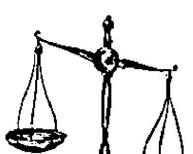

## 天秤座

## 10月10日

## 幸运数字和守护星

10月10日出生的人受数字1（1+0=1）和太阳的影响。受数字1影响的人会凡事希望争第一，并希望在专业领域中攀登到最高峰。受太阳影响的人一般具有温和的特质和发展很好的自我意识，对人和生活的态度都积极乐观。金星（天秤座的主宰星）的影响则让10月10日出生的人在处理人际关系时表现得热心、开放。此外，受数字1影响的人还通常是野心勃勃的人，他们在大部分的事情上都会有独立、明确的见解，但是这个特点有时候也表现为顽固，这使10月10日出生的人有时会不太受人欢迎。不过，上面提到的争第一的野心正是驱使10月10日出生的人迈向成功的一大要素。

方索十二世的母亲)

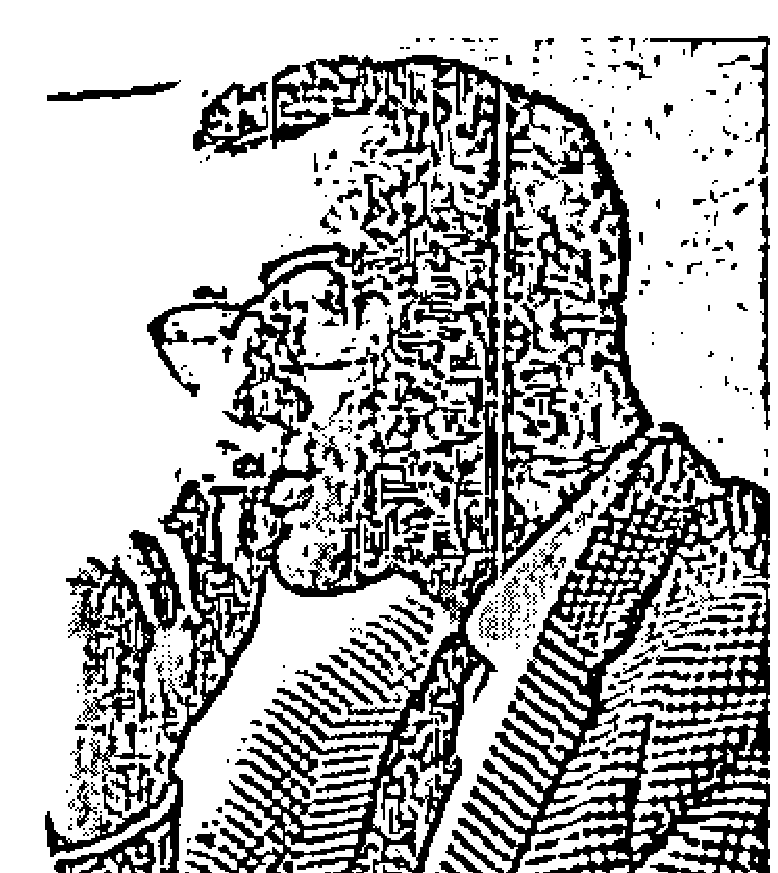

哈罗德·品特

## 塔罗牌

大秘仪塔罗牌的第10张是“命运之轮”。它象征时运的逆转，并告诉人们除了变化本身，世界上并没有真正的永恒不变的东西。这张牌揭示了10月10日出生的人喜欢赌博的倾向，这个被一再强调的赌博特质会使他们的生活起伏不定，得得失失，成成败败。受数字1和10影响的人必须时刻留意，抓住人生的关键时机，只有这样才能获得成功。

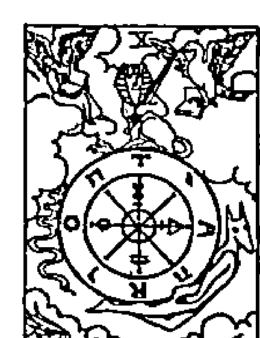

## 健康

10月10出生的人要注意，不要因为过度省吃俭用而影响了健康。他们经常会在走了一些弯路之后才明白，购买有质量保障的食物、营养品、健身器材，或参加健身俱乐部对他们来说才是最有用的投资。10月10日出生的人对食物有很明显的喜欢与厌恶之分，而这往往不利于他们的健康。如果他们能够每天食用大量的新鲜水果和蔬菜，会对他们的健康有很大的帮助。此外，这一天出生的人喜欢尝试不寻常的口味，因此建议他们好好锻炼一下自己的厨艺，尤其是学习做一些异国风味的食物。

| 优点 |
| --- |
| 善于选择 |
| 洞察力强 |
| 精明 |

| 缺点 |
| --- |
| 过分小心 |
| 怕事 |
| 封闭 |

## 建议

不要吝惜你的金钱、时间和精力，偶尔挥霍一下又何妨？敞开你的心扉，让自己再雄心勃勃一点。发展你的艺术潜能，放松心情，让你的想象力自由驰骋。

- 本位 12页
- 风相 15页
- 秋季 20页
- 天秤座 28页
- 天秤座二 60页

## 静思语

> 有些人结婚的理由是，这是唯一能帮助他们躲开另一桩婚姻的事情。

489

月份：10月
第11天
天秤宫16°～19°
天秤座三
本位/风相

## 10月11日

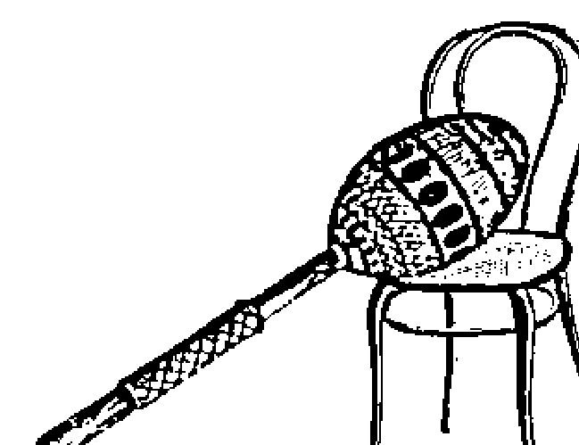

## 优雅安逸的一天

## 出生于这一天的名人

10月11日出生的人有很强的欲望走入决策中心，而且认为自己必须扮演重要的角色，可惜，他们喜欢过安逸的生活和享乐的天性是他们获得成功的最大绊脚石。对10月11日出生的人而言，定位自己的角色是非常重要而且必需的，因为在他们的职业生涯里充满了许许多多的困难与挑战。实际上，他们可能不得不不断地变换工作，直到找到真正适合他们的工作为止。

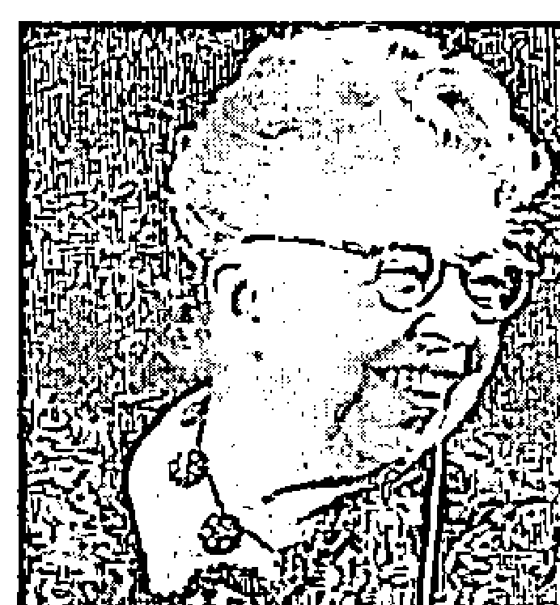

在工作之余，10月11日出生的人可以称得上是非常享受社交生活的人。他们无法忍受独处的生活方式，而喜欢和人打交道，他们的命运好像和他们的这种人类本性紧紧地捆绑在了一起。也正因为这样，当他们扮演团体或私人的代表的角色时，他们总是成绩斐然。

爱莉诺·罗斯福（美国前总统夫人，也是政治家、社会改革者，曾任美国驻联合国代表），杰尔姆·罗宾斯（美国编舞家，舞蹈公司的创办人，舞台剧导演），阿特·布莱基（美国爵士乐鼓手，爵士信差乐团成员），玛丽亚·比诺（巴西网球冠军，获得过4次美国网球公开赛冠军，3次温布尔登网球公开赛冠军），乔治·威廉斯爵士（英国社会改革者，基督教青年会的创办人），查尔斯·雷夫森（化妆品企业家，露华浓化妆品公司的创立者），莱斯特·鲍伊（爵士乐鼓手，芝加哥艺术团的创立者之一），达里尔·霍尔（美国灵魂歌手，作曲家，霍尔与奥茨乐队的成员），弗朗索瓦·莫里亚克（法国剧作家及小说家，著有《蝮蛇结》，获得了诺贝尔文学奖），比利·希金斯（爵士乐鼓手），皮埃尔·查尔斯·茹夫（法国诗人、小说家，著有《荒废的世界》），小约瑟夫·艾尔索普（专栏作家），埃米利奥·格雷科（意大利雕塑家），托马斯·斯旺（科幻作家，著有《弥诺陶洛斯之日》），罗伯特·盖尔（医生，擅长做骨髓移植手术），罗恩·莱布曼（电视剧、电影演员），弗朗西丝·依尔克（儿科医师，格赛尔人类发展研究所成员），弗

10月11日出生的人有时候会太好说话，过分宽容。因为这样的性格，他们缺乏明确的职业目标和实现这种目标的强烈欲望，这也导致了他们无法在工作上安定下来，而随便迁就。这一天出生的人不喜欢面对复杂的情况，或许应该说他们懒得去面对挑战，而宁可享受舒适的生活和快乐。他们的生活方式是可以兼顾事业、感情、家庭和休闲娱乐的那种生活方式。

10月11日出生的人喜欢呼朋引伴，在团队中发挥作用。他们和蔼可亲的性格使他们在换到不同的环境中后总是能很出色地处理好人际关系，而且一点也不觉得费力。无论是和达官贵人还是和贩夫走卒相处，他们都能维持相当自在的态度，即使他们很有学识或者社会地位很高，他们也不会摆出势利或骄傲的态度。

10月11日出生的人必须小心不要被强势的人所掌控。不过说实话，10月11日出生的人就算发现自己吃了亏，也会给对方第二次（甚至第三次）机会。就这方面而言，这一天出生的人或许该对自己的动机作一番内省——这么做是否纯粹是因为他们包容的态度，如果是的话，那么这种做法就代表了他们内在心灵的成长与健全，但是，如果答案是否定的，那这种做法就暗示了他们潜意识里有被虐待的倾向，也意味着他们需要作出改变了。

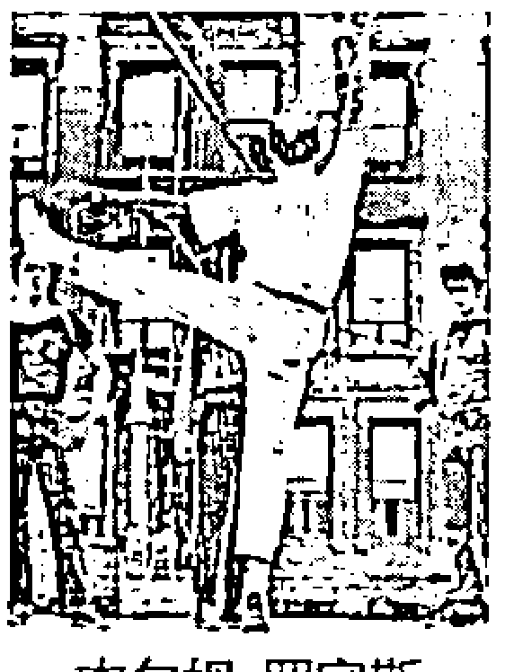

当10月11日出生的人对现状感到满足时，他们内心便会有很强烈的喜悦感，这种喜悦是大多数人无法体会的。然而，他们很强的包容能力并不代表他们的精神生活已经有了充分的发展，其实他们还是应该花一部分的精力来发展自我、了解自我，否则他们会停滞不前。

## 每年的这一天

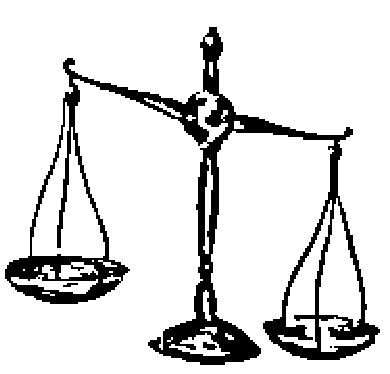

## 天秤座

## 10月11日

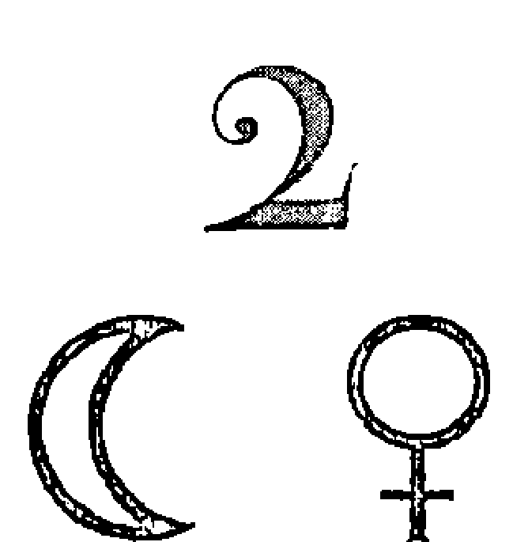

## 幸运数字和守护星

10月11日出生的人受数字2（1 + 1 = 2）和月亮的影响。受数字2影响的人通常可以成为优秀的工作伙伴和搭档，但不会是最佳的领导人选。10月11日出生的人的社交才能会在家庭与群体合作中表现出来，而他们优雅的举止和丰富的想象力在月亮与金星（天秤座的主宰星）的双重影响下也会得到加强，但他们应该警惕不能让自己的这种才能流于浮华、盲从与自满。数字11使人更注意感官感受，对10月11日出生的人而言，理想化或性感的事物可能是很难拒绝的诱惑（这也是因为金星的影响）。同时，受数字11的影响，这一天出生的人很可能对双胞胎、同时发生的事情和对称的事物产生强烈的兴趣。

雷德里克·贝吉乌斯（德国诺贝尔化学奖获得者），西蒙·泽希特尔（奥地利风琴演奏家，作曲家），帕特·弗拉纳根（作家）

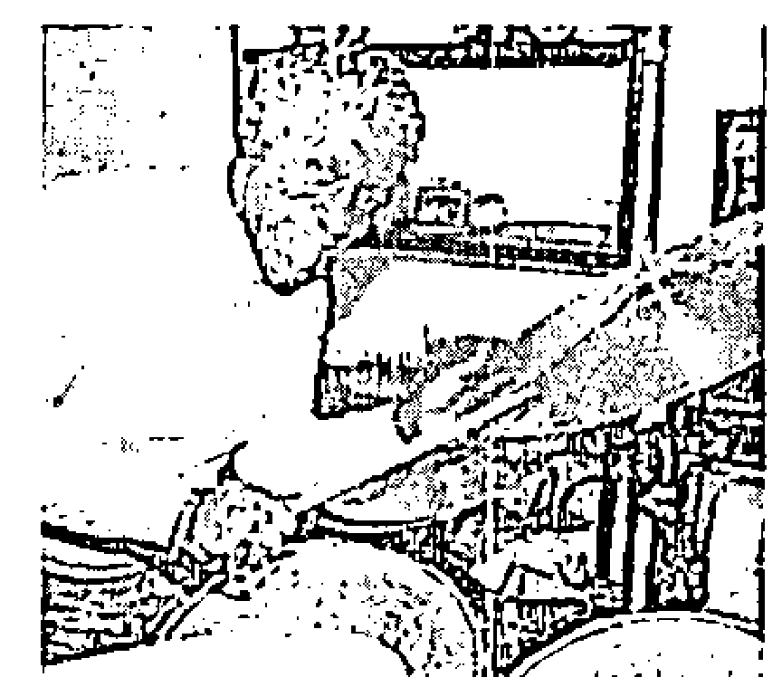

## 塔罗牌

大秘仪塔罗牌的第11张是“正义”。牌面中坐着一位安详的女性，她一手拿着天平，一手拿着宝剑。她提醒我们要遵循整个宇宙的规律，只要我们坚持正道，生活就能维持平衡与和谐。这张牌代表的积极意义是正直、公平、诚实和守纪律，代表的消极意义则是不主动、没有人情味、惧怕创新以及抱怨。

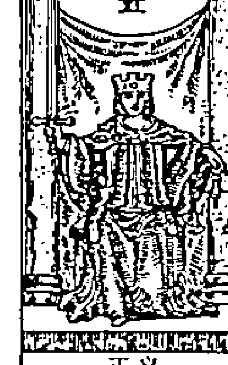

## 健康

静态的生活方式会使10月11日出生的人有神经衰弱的毛病，或罹患与饮食有关的疾病。如果他们整天不离开座位，他们就必须注意背部与肾脏的问题，每天还要尽量多喝水。此外，他们还需要避免暴饮暴食，或沉溺于烟、酒或咖啡。赖床或懒散地坐着不动对他们来说可能是一种乐趣，不过，凡事都有个度，超出了这个度他们就需要付出事业和健康的双重代价。建议他们最好还是多做一些能让人精神振奋的运动，这样同时也能强化他们的警觉性、意志力和魄力，可以说是一举两得。

| 优点 |
| --- |
| 迷人 |
| 包容 |
| 安稳 |

| 缺点 |
| --- |
| 自满 |
| 消极 |
| 易停滞不前 |

## 建议

严于律己，避免自满，不进则退。预防问题并不等于逃避挑战。目标要远大，做事要脚踏实地。

- 本位 12 页
- 风相 15 页
- 秋季 20 页
- 天秤座 28 页
- 天秤座三 61 页

## 静思语

> 电视可以看做心灵感应术的电子尝试。

491

月份：10月
第12天
天秤宫17°～20°
天秤座三
本位/风相

## 10月12日

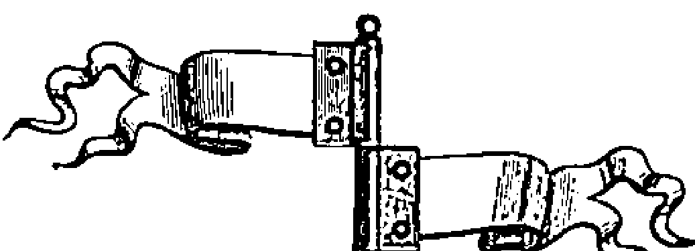

## 仪态大方的一天

## 出生于这一天的名人

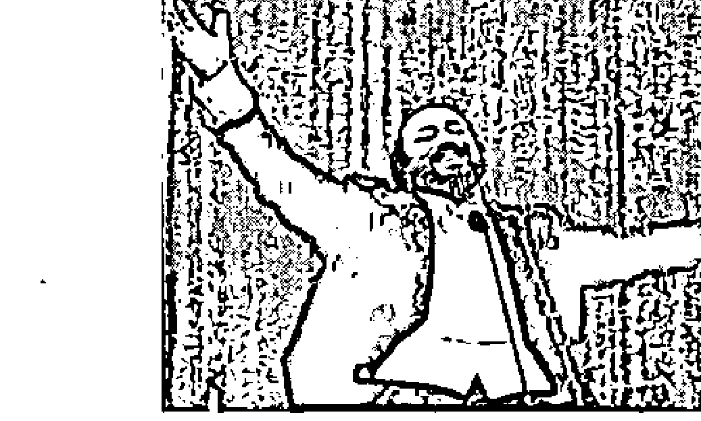

卢恰诺·帕瓦罗蒂

卢恰诺·帕瓦罗蒂（意大利男高音歌唱家），迪克·格雷戈里（美国喜剧演员，政治活跃分子，饮食专家），珀尔·梅斯塔（美国华盛顿女商人，美国大使），阿莱斯特·克劳利（英国魔法师，神秘主义者，作家，被称为“世界上最邪恶的男人”，著有《魔术理论与实行》，因为滥用毒品死亡，死前已经发了疯，并且身无分文，孤身一人），理查德·阿兰·迈耶（建筑师），拉尔夫·沃恩·威廉斯（威尔士裔英国作曲家），艾伯特·保罗·布劳斯坦（法学教授，著有《民权与非洲裔美国人》），萨姆·摩尔（美国灵魂歌手，和戴夫是绝佳拍档），卡罗莉·施内曼（美国表演艺术家，电影制片人及作家，著有《超越肉身的喜悦》），阿瑟·尼基施（匈牙利裔德国指挥家），阿尔·赫尔德（美国画家），多萝西·海恩斯（恐怖主义作家，著有《行邪术的女人不可容》），爱德华六世（亨利八世的儿子，幼年时即位成为英国国王，15岁时去世），佩德罗一世（巴西皇帝，后被迫退位），托尼·库贝克（棒球内场手兼外场手，美国棒球联盟年度新人，电视节目评论员），约翰·罗格（民权运动领导者，律师），汉斯·克劳斯（善本图书经销商，收藏家），比尔·斯坦克劳斯（马术运动员，美国马术队队长），苏珊·安东（模特，电影女演员），拉姆齐·麦克唐纳（英国政治家，首位来自工党的英国首相）

10月12日出生的人热衷于成为人群瞩目的焦点，他们擅长与人周旋，无论是在市井小民的圈子里还是在上流阶层的聚会中，他们都能应付自如。这一天出生的人以他们的工作成就为荣，希望能获得身边所有有识人士的赏识。

10月12日出生的人在理财方面很有天赋，直觉也很强。当亲戚朋友遭遇困难时，这一天出生的人总会爽快地伸以援手，不管是时间还是金钱，他们都会直接奉献出来，他们讨厌吝啬小气的行为。更难得的是，在他们帮助别人时，他们并不会让人有种被施舍的感觉，所以他们的付出就更容易受到肯定。不过，问题是，他们自己无法以同样的心态去接受别人的帮助。因此，对10月12日出生的人来说，如何尽早学会坦然面对生活中的施与受是重要的课题。

虽然10月12日出生的人很重视传统，但无论是在思想、言谈方面，还是在行为表现方面，他们都不是保守派。他们性格外向，很有幽默感，而且聪明伶俐，这让周围的人很喜爱他们。这些特质体现在他们生活中的许多方面，从和异性的关系到违反社会规范的行为，你都可以观察得到。对10月12日出生的人而言，世界就是个大舞台，上演着他们自己编写的剧本，而他们则用非常自然的方式争取着表演空间，别人不会认为他们异于常人的表现只是要引人注目。

从另一个角度来看，10月12日出生的人必须警惕自己骄傲的倾向。如果无视自己的行为对他人的影响，就会导致自我毁灭。尽管这一天出生的人对法律或社会传统很明了，但他们中的大部分人还是认为他们可以摆脱这些规则的约束，尤其是在个人生活方面。

10月12日出生的人可以说是乐善好施及自私两种特质的极度混合体。的确，这一天出生的人对自己的需求总是很看重，他们一定会想方设法满足自己的这些需求，而这种做法常常激怒他们的伙伴。在爱情方面，10月12日出生的人可以称得上是“危险人物”，当感情出现问题时，他们会想逃离，而不考虑对方是否接受，也不考虑对对方造成的伤害。

因为10月12日出生的人具有卓越的能力和社会知识，所以他们可以成长为同事、朋友和家人依赖的对象。不过，在关切或满足他人深层次的需求的同时，这一天出生的人还是得注意要适度放权，避免专断——这也是他们必须面对的最大的挑战。

492

## 每年的这一天

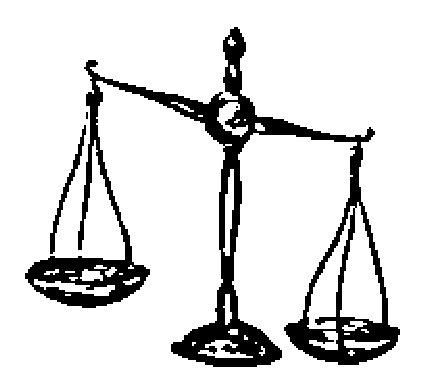

## 天秤座

10月12日

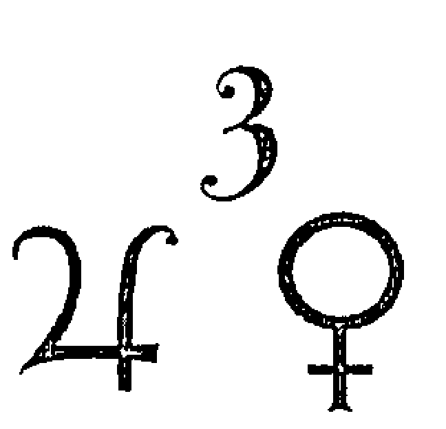

## 幸运数字和守护星

10月12日出生的人受数字3（1 + 2 = 3）和木星的影响。受数字3影响的人通常比较有野心，有时候还有一点独断，所以10月12日出生的人要注意不要让自己变得太有老板腔或太有侵略性。受数字3影响的人往往都相当独立，所以有时候他们会想放弃稳定的工作，而选择相对比较自由的职业。木星会给10月12日出生的人带来一种积极开朗的个性，而金星（天秤座的主宰星）则会为他们带来理想主义的倾向。

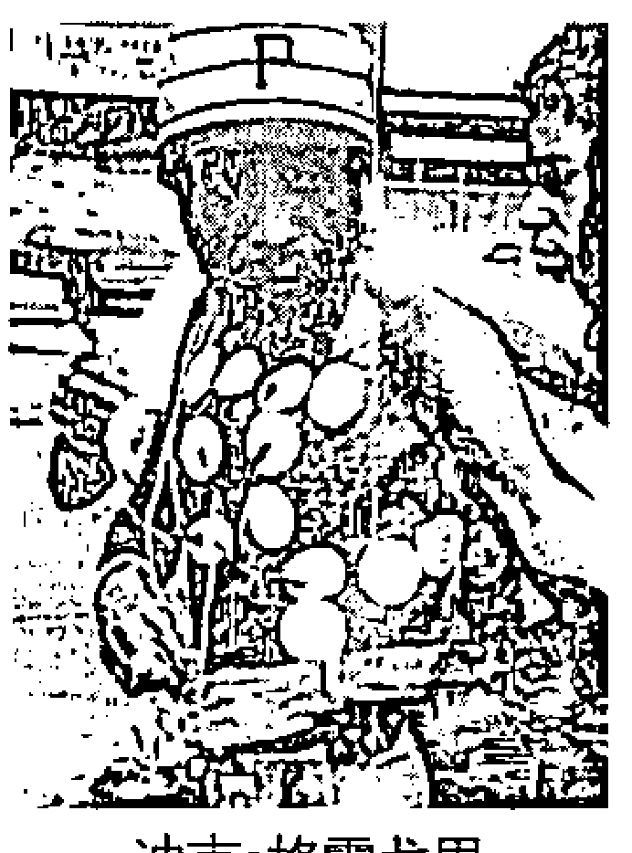

## 塔罗牌

大秘仪塔罗牌的第12张是“倒悬者”。画面中的这个人用单脚倒吊在树上，虽然看起来有点无助，可是实际上他拥有无穷的精神力量和深刻的思想。因此，这张牌代表的积极意义是有自知之明、能够解决问题和人性化，代表的消极意义则是目光短浅、精神方面会受到限制。

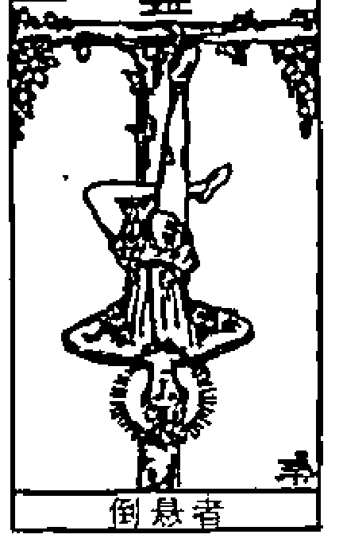

## 健康

10月12日出生的人一定不能认为自己百毒不侵，好像永远不会生病。对他们来说，定期的健康检查是一定要有的，找一个可靠的家庭医生来照顾他们的健康也会非常有益。10月12日出生的人喜欢生活中一切好的东西，因此，可以想象他们会常常吃一些不合乎健康的、高热量的美味食物。可能的话，每天适度的运动是保持健康的不错的方法，他们可以选择从轻松的步行、游泳到稍微剧烈的网球运动等各种运动方式。10月12日出生的人不论男女，都要注意提防背部、肾脏及肠胃方面的问题，而这一天出生的女性尤其要小心卵巢及膀胱的毛病。

| 优点 |
| --- |
| 社交能力强 |
| 慷慨 |
| 可靠 |

| 缺点 |
| --- |
| 任性 |
| 爱炫耀 |

## 建议

一定要留意别人的感觉。将你身边的人的需要放在心上。无条件的爱是值得你去追求的。

- 本位 12页
- 风相 15页
- 秋季 20页
- 天秤座 28页
- 天秤座三 61页

## 静思语

> 在你的生活中，什么是你最难以失去的？

493

月份：10月
第13天
天秤宫19°～21°
天秤座三
本位/风相

## 10月13日

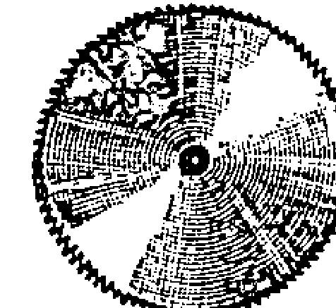

## 坚强自信的一天

## 出生于这一天的名人

10月13日出生的人绝对不会在职场上浑水摸鱼，他们工作起来非常认真，而且会为自己的能力与成绩感到自豪。他们非常坚强，可以凭着自己坚韧不拔的毅力克服各种困难，所以他们也会是非常危险的敌人。在他们的字典里没有“如果”、“可是”、“危险”这样的字眼。

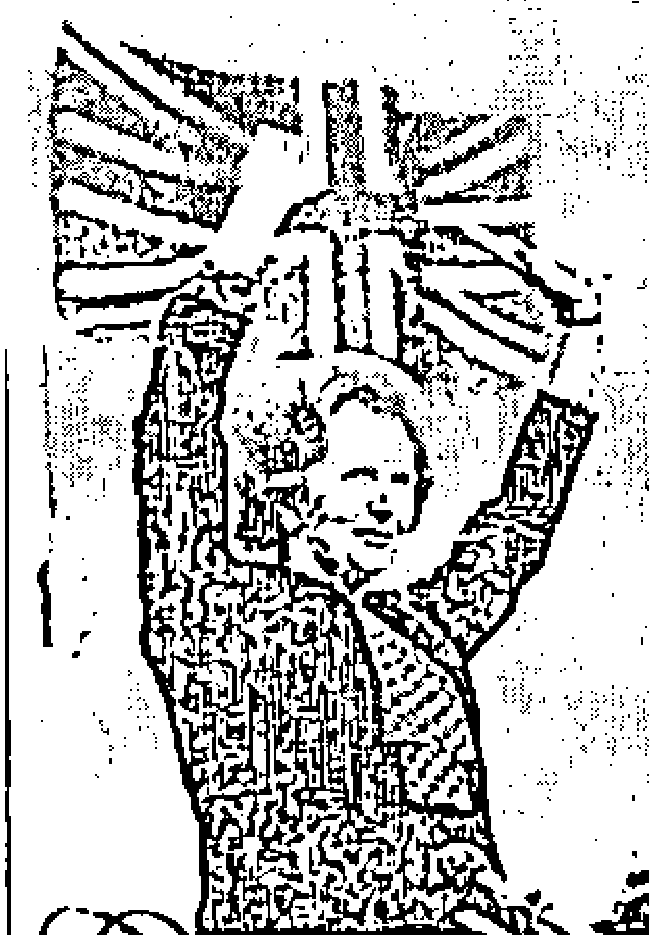

然而，10月13日出生的人总是一副严肃异常、正经八百的样子，很难与快乐为伍。对于周围的事情，他们更是挑剔得很，不够宽容。他们其实很需要放松心情，但他们又常常发现自己根本无法放松，即使是他们当中那些很有才华的人也难以让生活的步调慢下来。也因为如此，10月13日出生的人通常都有人际关系上的问题——他们一直处在紧张的状态下，要去取悦别人就更加困难了。

玛格丽特·撒切尔夫人（英国保守党领袖，有“铁娘子”之称，执政11年，是英国保守党中首位女性党魁），亚特·塔特姆（爵士乐钢琴家，演奏技巧非常高超），列尼·布鲁斯（美国社会讽刺作家，富有争议性的喜剧演员，著有《如何说粗话并影响别人》），保罗·西蒙（美国歌手，吉他手，歌曲创作者），法罗·桑德斯（爵士乐男高音演唱家，高音萨克斯管演奏家，作曲家），马娅·德伦（先锋派电影制片人，作品有《变形时间中的仪式》），南希·克里根（美国花式溜冰选手，曾遇袭受伤，复原后夺得了奥运会银牌），雷·布朗（爵士乐贝司手，与奥斯卡·彼得森同属于一个乐队），李·克尼茨（爵士乐男高音萨克斯管演奏家，作曲家），赫尔曼·

然而奇怪的是，10月13日出生的人竟然会以和善、慷慨著称，这是因为实际上他们对自己的要求要比对别人的要求严格得多。这并不代表他们一定就是完美主义者，不过不可否认的一点是，他们挑剔的性格总是使他们自己很难与人很好地相处。幸运的是，从最后的结果来看，他们的工作质量真的很高，总是很少留下可争议的空间，所以别人也很难去责怪他们。

当情况需要时，10月13日出生的人也很懂得回避问题，所以，人们很难从他们嘴里套出什么消息，即使他们说了些什么，多半也只是他们投放的烟幕弹或使用的障眼法。虽然10月13日出生的人能通过这样的回避和闪躲减少受骗的可能，但其实，对于那些值得信任的人他们应该更加开诚布公一点。

10月13日出生的人天生具有技术方面的天赋。表面上看起来，像他们这样有才华的人在事业上应该比较顺利才对，然而事实却并不是这样，当他们遭到了排挤或受到了忽视时，他们会有很强烈的挫折感，变得狼狈不堪。10月13日出生的人很难忘记甚至承认自己以前的失败，不过，经过这样的打击或者看起来很失败的体验，他们自身会得到进步，尤其当他们已经功成名就，需要通过否定自己来进行自我反省的时候。

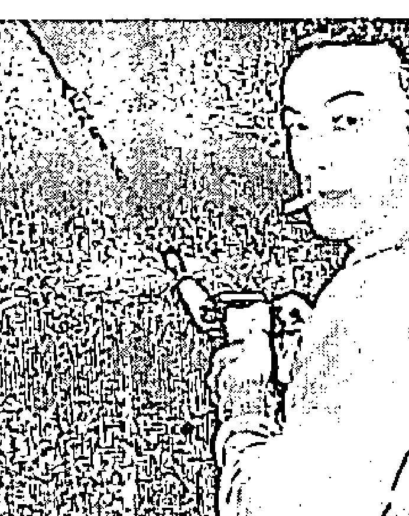

对10月13日出生的人来说，要先了解自己，然后才可以更好地和周围的人逐渐建立关系。学会放松，变得快乐一点以及对待事情不要太严肃对他们会有所帮助。当铆足劲头，全身心地投入并奉献出自己非凡的才能时，这一天出生的人就算不想成功也难。

莫里斯·德萨克斯伯爵（法军指挥官，陆军元帅），特里·吉布斯（爵士乐铁琴演奏家），鲁道夫·

494

## 每年的这一天

## 天秤座

## 10月13日

## 幸运数字和守护星

10月13日出生的人受数字4（1+3=4）与天王星的影响。天王星代表反复无常、具有爆发性的特质，既然10月13日出生的人经常出现在各种社交场合，那他们就必须妥善控制自己这种天王星特质。天王星与金星（天秤座的主宰星）的共同影响可能使10月13日出生的人的爱情相当不稳定，还可能使他们具有展开怪异、非传统的恋爱关系的倾向。虽然我们传统上认为数字13是不吉利的，但是正如对所有强大力量的运用一样，如果把握得好，它将会带给我们很大的助力，而如果把握得不好，则会有被其毁灭的风险。数字4传统上代表的是反叛、特异的信念和突破常规的欲望，这些特质也都能在10月13日出生的人的身上表现出来。

菲尔绍（德国细胞病理学家，政治家），伊夫·蒙唐（法国歌手，电影演员），杰里·李·赖斯（美国橄榄球外接手，获得过5次最佳外接手称号，有史以来单季表现最佳），艾迪·马修斯（棒球三垒手，在连续9年的职业生涯中打出了超过30次的全垒打），莉莉·兰特里（英国舞台剧女演员），杜尚·马卡韦耶夫（南斯拉夫电影导演，作品有《黑山》），哈维尔·索托马约尔（古巴跳高运动员，世界冠军，奥运会金牌得主，第1位跳过8英尺高的跳高运动员），康奈尔·怀尔德（电影演员），德蒙·威尔逊（电视剧演员，作品有《桑福德和儿子》）

## 塔罗牌

大秘仪塔罗牌中最容易被误解的是第13张牌，也就是“死神”。我们极少依字面意思去解读它，因为它的积极意义就是抛开过去、超越限制并持续成长。这张牌和数字4都暗示了10月13日出生的人要正确看待幻想破灭，恰当处理沮丧、消极和忧郁的情绪。

## 健康

10月13日出生的人必须学会放松自己，因为他们的健康问题大都源自过大的压力，而他们又常常要靠药物来缓和，这反而加重了这种健康问题。10月13日出生的工作狂认为，与其花时间去了解自己或休息，还不如用吸烟、喝酒或吃药的方式来消除紧张，但是这样的替代品当然不可能长久有效，而且还可能导致他们对其形成依赖或上瘾，甚至最后无法控制自己。10月13日出生的人往往对自己了解得不够深入，其实，当内心有烦恼时，他们最好能求助于心理咨询或心理治疗。对他们来说，冥想和瑜伽也是不错的养生之道。

- 优点
  - 热情
  - 追求成功
  - 专业

- 缺点
  - 过于压抑
  - 苛求
  - 挑剔

## 建议

必须学会放松，适时地安排假期，或至少拨出一些休息的时间。不要太在意别人是否满意自己，重要的是，你要能够勇敢地接受错误，并且改掉爱指责他人的毛病。有弱点也能拥有快乐。

- 本位 12页
- 风相 15页
- 秋季 20页
- 天秤座 28页
- 天秤座三 61页

## 静思语

> 反省和行动都会影响周围的事物。

月份：10月
第14天
天秤宫20°—22°
天秤座三
本位/风相

## 10月14日

## 中庸之道的一天

## 出生于这一天的名人

中庸之道是10月14日出生的人的生活哲学，当然这并不表示他们呆板或保守，只是对他们来说，要在人生的航程中走在极端行为的危险中，确实是一项很大的挑战。一旦偏离了正道，10月14日出生的人就会常常惹麻烦上身。不过话说回来，10月14日出生的人正是通过这些错误而得到成长，并学会如何处理危机的。从某种意义上来说，他们本身就适合过着有节制而且中庸的生活。不过，像他们这样凡事力求平衡且喜欢节制的性格，虽然能避免失败和低潮，但也剥夺了生活中的许多快乐和刺激的机会。

彭威廉（英国基督教贵格会领导人、社会哲学家、和平主义者，创建了美国宾夕法尼亚州和费城），德怀特·戴维·艾森豪威尔（美国前总统，第二次世界大战时同盟国联军的最高统帅），莉莲·吉什（舞台剧女演员，美国默片时代的女影星，曾主演了上百部影片），卡明斯（美国诗人），汉娜·阿伦特（政治学家、哲学家，著有《人类的状况》），约翰·伍登（篮球教练，率领加州大学洛杉矶分校篮球队史无前例地获得了10次全国冠军），拉蒙特·扬（美国前卫作曲家，钢琴家，极简主义音乐先锋），埃蒙·德瓦莱拉（爱尔兰独立战争斗士，爱尔兰前总统），拉尔夫·劳伦（英国服装设计师），罗杰·穆尔（英国电视剧和舞台剧演员），约翰·迪安三世（“水门事件”的同谋者之一，尼克松的助理），多萝西·赖特·利布斯（纺织品设计师，被称为“现代纺织之母”），尤金·福多尔（旅行作家），克利夫·理查德（英国歌手，电影演员），凯瑟琳·曼斯

10月14日出生的人中资质比较好的那部分人身上具有明显的镇静、审慎和自制的特质。对这些人而言，花时间做好每一件事情很重要，他们讨厌有人催促他们匆忙地完成某项工作。他们一般并不擅长言辞，而通常靠一些有形的东西、文字、音乐、领导力或行动来表达自己。他们最喜欢的活动包括交流知识、评论他人的工作以及抒发对人生的看法，他们不太喜欢强调体能方面的体育运动。实际上，也只有当他们的性欲被唤起时，或是有了孩子、发生了意外、生了病或沉迷于某种运动时，这些“头脑型”的人物的躯体才会突然苏醒。

10月14日出生的人喜欢掌握权力，但与别人不同的是，他们很少采取强势或者引人注意的方式，而常常是在幕后操控。10月14日出生的人并不怎么迷恋物质生活，但是却很重视家庭，他们甚至常常在家里处理工作上的事情。在个人生活方面，这一天出生的人通常对一夫一妻制下的婚姻关系相当满足，他们不会主动追求不符合社会道德规范的婚外情。但当面对支配欲较强的爱人时，他们必须小心自己变得封闭而顺从，尤其是对这一天出生的女性来说。

10月14日出生的人是他们的家人、朋友、同事和团体获得稳定生活和持续性发展的支柱。他们喜欢融入生活这部戏剧当中，但不是想当明星，而是要当经理。

既矛盾又有趣的一点是，虽然10月14日出生的人好静不好动，可是他们注定了有很多出门旅行的机会，而且他们成年之后几乎都不会住在年少时成长的地方。对他们当中性格发展得比较好的人来说，这样的生命之旅不仅包括物理方面的移动，也象征着精神束缚的解除。由于10月14日出生的人喜欢稳定，凡事力求平衡和中庸，因此他们中的许多人很容易感到满足，针对这一点，这些人应该为自己设定较高的标准，最好能有每月或每年必须完成的目标。

德怀特·戴维·艾森豪威尔

## 每年的这一天

## 天秤座

## 10月14日

## 幸运数字和守护星

10月14日出生的人受数字5(1 + 4 = 5)和水星的影响。水星代表变化的迅速，在水星的影响下，10月14日出生的人会展现出发展得很好的心智能力，就像上文中提到的那样。金星（天秤座的主宰星）与水星的共同影响则带给10月14日出生的人无限的魅力与良好的判定能力。对这些容易偏离正轨的10月14日出生的人而言，数字5暗示了能屈能伸的个性，这种个性使他们在遭到生活的重创之后可以迅速恢复。

菲尔德（新西兰作家，著有《花园舞会》），艾萨克·米兹拉希（时尚设计师），希拉·扬（美国速度滑冰选手，世界纪录的保持者），詹姆斯二世（英国国王），阿莱西奥·巴尔多维内蒂（意大利文艺复兴时期的画家）

## 塔罗牌

大秘仪塔罗牌的第14张是“节制”，与我们上文所提到的10月14日出生的人所具有的中庸和节制特质正相符。牌面上是一位守护天使，他能够保护我们，并使我们保持稳定，它可以成为10月14日出生的人的榜样。从积极的一面来看，节制可以调整我们的热情度，帮助我们获得新的真知，并将其融入我们的日常生活；从消极的一面来看，这张牌则代表反复无常和赶浪头。因此，10月14日出生的人一定要抵制这方面的影响，尽早建立自己的生活方式、做事方法和思维体系，并培养坚定的意志。

## 健康

10月14日出生的人必须严防由于久坐和过于静态的生活方式而导致的健康问题。如果他们长期受到压抑，那么产生的挫败感就会导致体重过重、情绪低落等问题；而如果缺乏体育锻炼，这一天出生的人也会面临健康问题。10月14日出生的人在烹饪方面很有天赋，能够成为优秀的厨师，他们中的有些人甚至会将厨房视为发挥创意的舞台，这也很适合他们内向的性格。不过他们必须注意营养的均衡，不要食用太多脂肪含量高及辛辣的食物。建议他们每天抽出一些时间用于散步。

| 优点 |
|---|
| 慎重 |
| 理性 |
| 沉着 |

| 缺点 |
|---|
| 过于小心 |
| 压抑 |
| 拘束 |

## 建议

给自己多一点压力和驱动力。不要把好的东西一直藏起来，要懂得和大家分享。给别人带去一些惊喜，你也会享受到快乐。不要害怕失败。

| 本位 12页 |
|---|
| 风相 15页 |
| 秋季 20页 |
| 天秤座 28页 |
| 天秤座三 61页 |

## 静思语

> 当明白鸡蛋是世间包装得最好的物品时，我们就很难再去质疑造物主的存在。

月份：10月
第15天
天秤宫21°～23°
天秤座三
本位/风相

## 10月15日

## 世界大舞台的一天

## 出生于这一天的名人

弗里德里希·尼采（德国哲学家、作家，著有《悲剧的诞生》、《查拉图斯特拉如是说》，因梅毒引起精神失常而逝世），维尔吉尔（古罗马诗人，作品有《埃涅阿斯记》、《牧歌》、《农事诗》），奥斯卡·怀尔德（爱尔兰剧作家、诗人、小说家，著有《多里安·格雷的画像》，曾因性侵犯罪入狱），约翰·沙利文（美国拳击运动员，首位重量级拳王，入选了拳击名人堂），托马斯·赫恩斯（美国中量级、轻量级拳击运动员，次中量级拳击手冠军），李·艾科卡（曾担任福特和克莱斯勒公司总裁），伊迪丝·高尔特·威尔逊（美国前总统夫人，在其丈夫伍德罗·威尔逊中风之后实际上履行了总统职权），吉姆·帕尔默（美国巴尔的摩金莺棒球队投手，获得过3次赛扬新人奖），莎拉·弗格森（约克公爵夫人），沃德豪斯（幽默作家，创作了“吉夫斯”系列小说，著有《万事成空》），保罗·米歇尔·富科（法国解构主义哲学家、心理学家，著有《癫狂与文明》），马里奥·普佐（作家，著有《教父》），彭尼·马歇尔（电影、电视剧女演员，作品有《拉弗内和雪莉》，同时也是一名导演，执导了《苏醒》等剧），鲍比·莫罗（美国短跑运动员，在奥运会上获得了3枚金牌），阿瑟·施莱辛格（历史学家、作家，曾任肯尼迪总统的特别助理，著有《一千天：约翰·肯尼迪在白宫》），约翰·肯尼思·加尔布雷思（经济学家，总统顾问），埃德温·赖肖尔（亚洲研究学者，外交官），埃万杰利斯塔·托里拆利

不论在家庭、社交圈里或在团体里，10月15日出生的人都喜欢担任领导者的角色。在人生这部大戏剧当中，他们可以算得上是主角，而且他们也可能在他们所选择的专业领域里成为资深的评论家、权威专家等重要人物。他们不仅工作做得出色，同时还散发着无限的个人魅力，所以有一些崇拜者会对他们言听计从。不过，要提醒10月15日出生的人的是，千万不能误导了这些崇拜者，更不能为了私利而滥用权力。

10月15日出生的人喜欢采取与众不同的领导方式——他们既不热衷于激烈的斗争或改革，也不会亲自监督执行过程中的具体细节，他们更多的是以鼓励、嘉奖以及以身作则的方式来实现领导。大部分10月15日出生的人都无法成为很好的工作伙伴——这些人大都宁可选择单打独斗，或是作为团队中可以自由来去的自由分子，因为只有在这两种情况下，他们才能依照自己的意愿去做事，去探索。

10月15日出生的人常常成为备受争议的人物，这主要是因为他们喜欢开诚布公地说出内心的真实想法，但也正是因为这种特质，他们常常可以成为能够激励或者刺激别人的人。10月15日出生的人要小心不要轻易引发周围人士的反抗或负面的情绪，即使这些周围的人不是什么重要人物，这些不断增多的负面情绪最终也可能给他们带来很大的压力，或许还有导致他们崩溃的危险。身为社会性很强的人，10月15日出生的人很难享受寂寞，如果强迫他们暂时告别社会和团体，那简直就像放逐了他们一般。

当然，10月15日出生的人也有不讨人喜欢的一面，这方面的性格也为他们带来了许多不友善的称号，例如“煽动者”、“爱现的人”或“吹牛大王”。对10月15日出生的资质较好的人来说，他们洋溢的才华和渊博的知识能够帮助他们逃脱这样的指责，然而资质比较普通的人便可能真的比较肤浅。

10月15日出生的人即使已经获得了好友和同事的认可甚至崇拜，也还是会忍不住想去炫耀。如果10月15日出生的人能培养出稳重、内敛的特质，那么他们就能更脚踏实地一点，而这种特质也会比其他任何炫耀和表现都更引人注目。只有当他们找出了对付诱惑的方法，更好地处理了人际关系，他们才能取得更大的成绩。

无论如何，10月15日出生的人都应该警惕自负、傲慢、理所当然，甚至自认为可以逍遥法外等缺点——这些都可能给他们带来致命的伤害。

## 每年的这一天

## 天秤座

## 10月15日

## 幸运数字和守护星

10月15日出生的人受数字6（1 + 5 = 6）和金星的影响。受数字6影响的人往往具有神奇的吸引力，而且容易让人产生崇拜之情。受金星的影响，10月15日出生的人对美与和谐有特别的偏爱，这也使他们遇到不合心意的事物时便会觉得受挫和困惑。金星也是天秤座的主宰星，所以10月15日出生的人身上的喜欢社交生活、注重美感与舒适、感性等这些金星特质会得到双倍加强。

(意大利数学家，发现了大气压)。赫尔曼·阿布斯(德国银行家，经济学家)，伊塔洛·卡尔维诺(第二次世界大战后的意大利作家，著有《看不见的城市》)

约翰·沙利文

## 塔罗牌

大秘仪塔罗牌的第15张是“恶魔”。由于受到性的强烈吸引以及非理性与激情能量的影响，这张牌呈现出了恐惧与欲望。魔鬼利用人对安全感和金钱的需求，通过人性的矛盾使人们成为他的奴隶。这张牌代表了感官的魅力和对热情的表达，但同时也提醒我们，即使肢体受到束缚，精神也还是可以自由翱翔的。

## 健康

如果10月15日出生的人从事的工作需要久坐，而不太需要走动，那么就需要提醒他们警惕背部的问题。此外，因为暴饮暴食、酗酒（影响肝）、压力过大（影响肾上腺）或摄入过多的糖分（影响胰脏）和精制面粉（影响大肠）也会影响他们体内器官的健康，所以这一天出生的人要极力避免这种情况的发生。10月15日出生的人也很有可能因为压力而出现精神方面的危机，特别是当他们与他人交恶而必须经常保持警戒状态时，在这种情况下就算是最坚强的战士也会因为神经的持续紧张而崩溃。10月15日出生的人必须学会忍受长时间的孤独，还要定期休假，让自己完完全全地放松与休息。均衡可以说是这一天出生的人应该时刻关注的问题，从饮食、运动、性生活到心理状况皆是如此。

恶魔

- 优点
  - 富有魅力
  - 学识渊博
  - 积极主动

- 缺点
  - 爱炫耀
  - 不平衡
  - 自负

## 建议

静下心来。你大胆的行径可能引起负面的反应。听听别人，尤其是对手的说法。你不可能事事如意，偶尔也是需要妥协的。

| 本位 12页 |
|---|
| 风相 15页 |
| 秋季 20页 |
| 天秤座 28页 |
| 天秤座三 61页 |

## 静思语

> 要成为神探，首先必须具备一流的犯罪头脑。

月份：10月
第16天
天秤宫22°～24°
天秤座三
本位/风相

## 10月16日

## 不可或缺的判断力的一天

## 出生于这一天的名人

“判断”这个主题是10月16日出生的人的生活中心。无论是公事或是私事，他们都可以在思考之后作出很明智的决定。判断形势，抓住核心问题，然后作出决断，对他们来说是自然而然的事情。难得的是，10月16日出生的人并不会成为喜欢评判别人的人，也不会心存偏见，即使事情并不合乎他们的道德观，他们也不会直接摒弃。他们的思想还是很开放的，对于各种新观念都能有选择性地加以接受、讨论。他们对周围事物的判断主要依据他们客观的评估，所以10月16日出生的人往往能识别出某个人或某件事的真正价值。

尤金·奥尼尔

10月16日出生的人非常看重常识，虽然他们也颇有想象力，但他们却可能以极端现实的眼光来看待他们周围的生活。这种理性与想象力的有趣结合是这一天出生的人的一个重要特色。比如说，他们虽然可以看透某件事情的本质，作出很好的判断，但是当他们要将其表达出来时，他们可能非常善于运用比喻、类推和寓言等巧妙的方法。

大部分10月16日出生的人都会尽量以他们所说的那样去生活，因此，他们的信仰系统对他们来说就非常重要了，而且其基本准则必须得以理性的规范。对于那些说一套做一套的人，或者打着信仰的招牌去做伤天害理的事情的人，他们是绝对不会同情的。整体来说，他们处理公务时总是逻辑清楚、有话直说。

威廉·道格拉斯（美国最高法院大法官，在此职位上工作了36年），诺厄·韦伯斯特（18～19世纪美国词典编纂家，编纂了第一部美国英语词典《美国英语大词典》），戴维·本·古里安（以色列前总理），尤金·奥尼尔（美国最杰出的现代剧作家，获得了4次普利策奖，著有《长夜漫漫路迢迢》等），京特·格拉斯（德国小说家，著有《铁皮鼓》），蒂姆·罗宾斯（电影演员），朱塞佩·安东尼奥·瓜尔内里（意大利小提琴制作大师），罗伯特·阿德里（好莱坞编剧，人类学家，著有《非洲创世纪》），安杰拉·兰斯伯里（美国舞台剧、电影、电视剧女演员，主演了《推理女神探》等剧），蒂姆·麦卡弗（棒球接球手，职业生涯长达40年，曾担任比赛解说员并获了奖），戴夫·德比谢尔（纽约尼克斯篮球队前锋，参加过8次全明星赛，是最年轻的美国篮球职业联赛教练），罗伯特·史蒂芬森（苏格兰机车设计师，铁路工程师），迪诺·布扎蒂（意大利小说家，著有《老森林的秘密》），安杰伊·蒙克（波兰电影导演，作品有《旅人》），亨利·刘易斯（指挥家），迈克尔·康拉德（电视演员），苏珊娜·萨默斯（电视剧女演员，作品有《三人行》），查尔斯·科尔森（美国尼克松时期的政府官员，“水门事件”的同谋者之一，同时也是作家，著有《重生》），布鲁克斯（批评家，著有《理解诗歌》），阿诺德·勃克林（瑞士风景画家）

不过在个人生活中，10月16日出生的人就不是如此理性了。他们可能行事怪异，还会出现任性的行为与反应。对于别人所设定的标准，他们顶多只愿意做到刚刚达标的程度，而不会自发地去追求完美。从这方面来看，10月16日出生的人恐怕是难以相处和行为无法预料的伙伴。

10月16日出生的人会对他们所处社会的制度时而支持，时而批判。当这些人进行指责时，他们会表现出一副不知感激、不懂得欣赏的样子，不过实际上，他们更愿意把指责的矛头朝向他们的公司、家庭或居住的环境，而尽量不指向某些特定的人。当他们被问及自己的判断或决定时，如果他们的结论是负面的，他们会将其委婉地表达出来。虽然说这一天出生的人也愿意公开地表达自己的评判，但他们其实对这个并没有太大的兴趣。当他们思考一件事情的时候，他们非常痛恨被打扰或干涉，所以当需要作出判断的时候，他们常常躲在角落里或是远离工作场所的地方。他们必须学会不轻易激动，并且避免情绪化、防卫心过强或做事太神秘的倾向。建议10月16日出生的人偶尔也用用他们所具有的判断力来分析、评判一下自己，而不是只用它来评价外在的事和人。

每年的这一天

天秤座
10月16日

## 幸运数字和守护星

10月16日出生的人受数字7（1 + 6 = 7）和海王星的影响。海王星通常象征着梦、幻想及虔诚的信仰。当海王星的影响和金星（天秤座的主宰星）的影响相结合之后，10月16日出生的人会更具有脱俗的魅力。标志天秤座的“天平”则意味着平衡与谨慎思考后的判断。

戴维·本·古里安

## 塔罗牌

大秘仪塔罗牌的第16张是“塔”。画面上国王从雷击的高塔上摔下来，而建塔者则被一拳打中头部而死。塔不只象征着物理结构的暂时性，也代表了人际关系和职业的变动性，这些改变往往发生得突然且迅速。从积极的一面来看，这张牌可以使人从别人的错误中学习，对10月16日出生的人来说尤其是如此。这张牌代表的积极意义是能接受挫折，并勇敢地克服挑战；代表的消极意义则是得意忘形，自作自受，以及沉迷在虚幻不实的想象中。

## 健康

10月16日出生的人必须远离可能让他们上瘾的东西，尤其是会危害神经系统和内部器官（尤其是肝脏）的酒。此外，因为这一天出生的人很多都是工作狂，所以需要建议他们找出时间好好享受人生，比如定期休假。幸运的是，10月16日出生的人都很有判断力，对于均衡饮食、定时睡眠和规律运动等忠告都很容易采纳。如果他们真的相信某种健身之道，例如有氧操、防身术、瑜伽或饮食疗法，他们就会表现出让人刮目相看的恒心和热情。

## 优点

- 有判断力
- 实际
- 公正

## 建议

考验自己。将有效的方法挑出来，丢掉那些没有用的。为自己设定界限。尊重别人的处事方式，不要过分地干涉别人或夺走别人作决定和做事的空间。

## 缺点

- 容易激动
- 防卫心过强
- 难以相处

- 本位 12页
- 风相 15页
- 秋季 20页
- 天秤座 28页
- 天秤座三 61页

## 静思语

> 信人以知，而非以言。

月份：10月
第17天
天秤宫22°～25°
天秤座三
本位/风相

## 10月17日

## 不稳定的平衡的一天

## 出生于这一天的名人

10月17日出生的人像猫一样，通过脚丈量土地。无论面临怎样的困难或危险，10月17日出生的人总是尽一切努力去维持平衡。其实，如果不是因为他们常常喜欢冒险，可以说维持平衡并不困难。不够稳定可能算是他们最可怕的敌人了，但是他们又老是自找麻烦。

阿瑟·米勒（美国剧作家，凭借《推销员之死》获得了普利策奖），埃费尔·克尼韦尔（摩托车运动冒险者，经历了无数次事故，身体数度受伤），蒙哥马利·克利夫特（电影演员，在惨烈的汽车事故中幸存了下来），丽塔·海华丝（美国女影星），卡梅伦·麦金托什（英国轰动一时的音乐剧导演，作品有《猫》、《悲惨世界》等），吉米·布雷斯林（专栏记者，作家），索菲娅·海登（智利裔美国建筑师），保罗·安德森（美国重量级举重运动员，获得了奥运会金牌），鲍勃·西格伦（美国撑竿跳高运动员，奥运会金牌得主），纳撒尼尔·韦斯特（美国小说家，著有《寂寞芳心》），柏木阳介（日本东京银行董事长），简·阿瑟（电影女演员），巴尼·凯塞尔（爵士乐吉他手），多丽丝·汉弗莱（编舞家、舞蹈演员、作家，撰写了现代舞基本教程《舞蹈创作艺术》），玛戈·基德尔（电影女演员），约翰·威尔克斯（群众运动领袖，政治宣传家），吉米·西尔斯（歌手，歌曲创作者，和克罗夫茨是很好的搭档），皮埃尔·安东尼·博杜安（18世纪法国画家），蔡尔德·哈萨姆（印象主义画家），西蒙·费斯特代克（荷兰小说家，著有《埃尔泽·伯勒尔》）

10月17日出生的人可以明显地分为两类：一类是貌似胜算在握的稳定型，另一类是难耐沉闷、喜欢刺激的冒险型。对后一类人来说，出生入死只是一件小事，不冒险的生活简直枯燥至极，所以他们喜欢钻研绝处逢生的制胜技巧。这些人当中不那么极端的人，也会喜欢拿金钱、财产或爱情冒险。而前一类人的生活虽然比较安定，但仔细观察就会发现他们经常被一些艺术气息强、神经质或不寻常的特殊事物和人所吸引，这会为他们的生活带来不确定性。至于10月17日出生的这两类人的共同点，则是他们都喜欢戏剧、看热闹，只不过稳定型的喜欢当观众，而冒险型的喜欢参与其中。

10月17日出生的人会发现他们很难改变自己的行为方式——骄傲使他们不肯承认自己的错误，反而让他们认为自己仿佛可以超越法律，不为它所束缚。可惜，正是因为这一点，他们不仅常常犯错，而且会犯大错，最后往往得赔上钱财或健康。然而江山易改本性难移，即使犯下再大的错，他们也还是不愿意改变，自信地认为不论遇到什么样的挫折，他们都可以复原。在这个方面，他们将宿命视为爱人，或至少像老友一般——或许他们期待的正是这种危险的游戏。不过还是得提醒这一天出生的人一定要避免各种形式的自欺欺人。

大多数10月17日出生的人在对自己和自己所具有的天赋进行评价时都相当从容自在。这一天出生的艺术家能够将别人的构想运用在作品中，转化成自己的东西，他们也擅长把旧的东西改造成新的。但是10月17日出生的人基本上仍是传统主义者，无论他们的想法多么现代、多么前卫，他们在基本生活方式上还是维持着保守的倾向。这一天出生的人会在经验基础上仔细研究，作好充足的准备和限制，这些都使他们能够大胆地去冒险。

另一方面，10月17日出生的人通常又会理智、体贴地对待同事、朋友和家人，不过千万别去惹恼他们！一旦他们感到自己的权威受到了威胁，或是想法受到了质疑，他们就会像火山爆发般地大发脾气，因为他们自认为他们拥有过人的判断力，实际上，大多数情况下的确如此。可是，当他们偶尔判断错误时，他们自己也无法觉察到。总之，10月17日出生的人需要更深入地认识自己，也需要更认真地去追求精神层面的东西。

每年的这一天

天秤座
10月17日

## 幸运数字和守护星

10月17日出生的人受数字8（1 + 7 = 8）和土星的影响。土星带有严肃的特质，所以10月17日出生的人要注意不要对自己或别人过分严厉，同时土星也会增强他们自以为是的倾向。土星和金星（天秤座的主宰星）的结合会为这一天出生的人带来阴郁、难以满足的个性，这会导致他们个人生活里出现各种各样的麻烦。数字8暗示了物质世界与精神世界的冲突，受数字8影响的人可能觉得寂寞，同时也有放纵自己的危险。

## 塔罗牌

大秘仪塔罗牌的第17张是“星星”。画面上是一位赤身裸体的少女，她在星空下一边用水罐把清水浇灌在干燥的土地上，一边用另一个水罐使死水复苏。她代表世间生命的美丽，但也代表了受物质的奴役。天空的星星永远在提醒她，别忘了还有一个更高层次的精神世界存在。因此，10月17日出生的人需要时常以“星星”为警示，一定不能忘了更高的人生追求。

## 健康

对10月17日出生的人来说，他们喜欢冒险而且缺乏健康意识的个性很明显是危害他们健康的一大原因。当意外发生时，他们的背部和内脏最容易受伤。对某些出生于这一天的人来说，通过性传播的疾病也要小心防范。10月17日出生的人天生喜欢厨艺，厨房是他们展示自己绚丽的一面的好地方。对他们来说，适量地运动即可，他们最好选择步行、游泳或其他冲击性较小的运动。

## 优点

- 自信
- 适应性强
- 大胆

## 建议

不要将自己逼得太甚，另外，也得避免自命不凡和自满。偶尔认输或认错也没什么。你的形象真的对你那么重要吗？

## 缺点

- 自负
- 鲁莽
- 顽固

- 本位 12页
- 风相 15页
- 秋季 20页
- 天秤座 28页
- 天秤座三 61页

## 静思语

> 凡事必有代价，不过时间早晚而已。

月份：10月
第18天
天秤宫23°～25°
天秤座三
本位/风相

## 10月18日

## 个人领导力的一天

## 出生于这一天的名人

在生活这个大舞台上，10月18日出生的人会积极地担任重要的角色。他们不但是出色的演员，在家里、工作上或团体中他们也能胜任导演的职务。10月18日出生的人在努力向上爬的过程中一点也不会感到害羞，然而尽管他们有很强的欲望成为站在最高端的国王或王后，但是如果需要的话，他们也愿意保持低姿态。

马丁娜·娜拉提诺娃（捷克裔美国网球选手，赢得了9次温布尔登网球公开赛冠军，4次美国网球公开赛冠军，3次澳大利亚网球公开赛冠军，2次法国网球公开赛冠军），查克·贝里（美国摇滚乐先驱，歌手，作曲家，吉他手，萨克斯管演奏家），维奥莱塔·沙莫拉（尼加拉瓜前总统，驱逐了桑地诺的支持者），皮埃尔·埃利奥特·特鲁多（加拿大前总理），乔治·斯科特（舞台剧、电影、电视剧演员），温顿·马萨利斯（爵士乐歌手，古典音乐小号手，乐队指挥，歌曲创作者），安尼塔·奥戴（爵士乐歌手），亨利·伯格森（法国诺贝尔文学奖获得者，作家，哲学家，富有创造性的进化论者），皮埃尔·德拉克洛（法国小说家、剧作家，代表作为《危险关系》），梅利娜·迈尔库里（希腊舞台剧及电影女演员，曾任希腊文化部部长），彼得·博伊尔（电影演员），温迪·瓦瑟斯坦（剧作家），杰西·赫尔姆斯（美国北卡罗来纳州参议员），洛特·莲妮亚（德国歌手，舞台剧女演员），康斯坦丁·米佐普洛斯（希腊前总理），教皇皮乌斯二世（福音教路德教会领导人）

不过，10月18日出生的人确实很难算是典型的领导人物，因为他们的兴趣实在是太广泛了。比如，如果他们是公司的领导，当需要他们完全投入这个角色时，他们可能有所动摇，因为他们自己还有其他的兴趣；当被提拔担任经理职务后，他们可能希望重新回到他们原来感兴趣的领域。一般来说，当他们离开原来的工作岗位，原来的同事会怀念他们正直、诚实的品格。

10月18日出生的人中那些不是那么有才华的人也可以凭借自己的能力、人际关系和运气成就一番事业或者获得财富。只不过高处不胜寒，当他们要承担重任时，随之而来的压力会使他们面临崩溃的危险，最终他们会面临两难的选择：是降低自己的事业追求，还是成为压力的俘虏。

10月18日出生的人喜欢参与到发生的事情中来，尤其是处在事情的中心位置。但是即便是出生于这一天的比较鲁莽的人，也具备一定的反省能力。虽然他们可以成为领导人物，但是建议他们不要强求，也不要硬撑，毕竟工作和个人爱好才是自己的主要兴趣之所在，强求的话只会使自己变得不快乐。

10月18日出生的人喜欢和别人一起玩，不过，因为他们并不那么善于交际，所以有时他们会有相处上的困难。这一天出生的人喜欢参加亲朋好友的聚会活动，在这样的场合里如果他们发现自己被忽略或者落单了，他们就会发脾气。不过，由于他们鄙视自怜的人，因此即使情感上受到了伤害，他们也绝对不会显露出来，通常他们会回到个人的工作和兴趣上，而不会像无法参加舞会的灰姑娘似的一自怜自艾。这种自我解脱的方式固然值得钦佩，但也要提醒他们不要把事情看得太严重，以至切断了与朋友和亲人的联系。

10月18日出生的人最好经常与别人进行联系、交谈，当以开放的姿态跟别人交流时，他们就能够避免给别人留下自以为博学多识或者冷淡的印象。他们应该保有自己的尊严和谦虚的心态，不要成为高高在上、自以为无所不能的人物。

每年的这一天

天秤座
10月18日

## 幸运数字和守护星

10月18日出生的人受数字9与火星的影响。数字9对其他数字有着很强的影响力（任何个位数加9，皆可回复到原数，例如5+9=14，4+1=5；任何数字乘9，都能回复到数字9，如9×5=45，4+5=9），所以10月18日出生的人对周围的人也有着类似的强大影响力。不过，火星所代表的强大活力会被金星（天秤座的主宰星）所代表的平静气质抵消一部分，而金星与火星的结合则会为这一天出生的人带来迷人与性感的特质，只不过当这些人遇到挫折时，他们很可能给他们自己和他人带来危害。

查克·贝里

## 塔罗牌

大秘仪塔罗牌的第18张是“月亮”。月亮主要代表梦境、情感和潜意识的世界。传统上，月亮的形象是女性的力量和情感的化身。因此，从积极的一面来看，这张牌代表敏感、有同情心、能够感同身受；从消极的一面来看，这张牌则代表情感上的顺从、被动和缺乏自我。

## 健康

10月18日出生的人必须避免因为担负了太多的责任而把自己累垮，或者承受不住太大的压力而崩溃的事情发生。当感到自己的体力消耗已经快到极限时，这一天出生的人要学会拒绝。其实在做事之前他们就应该先想想，究竟什么是自己能处理的，什么又是自己不能处理的，这样想了之后，他们才能清楚自己的极限在哪里。健康的睡眠和饮食习惯对于稳定10月18日出生的人的情绪有很大的帮助，不过他们在用餐时需要特别注意营养的均衡，最好多食用谷类食物和新鲜蔬菜。此外，这一天出生的人在饮用咖啡上要有节制，还要远离那些可能导致麻痹、沮丧或休克等后遗症的药品或酒，而毒品则是万万沾不得的。建议10月18日出生的人花点时间去接受类似按摩、瑜伽和生理治疗等健身项目，这些可以帮助他们消除疼痛（尤其是背部中部和下部的疼痛），同时对他们精神的放松也大有帮助。

| 优点 |
| --- |
| 富有灵感 |
| 想象力丰富 |
| 直率 |

| 缺点 |
| --- |
| 过分紧张 |
| 冷淡 |
| 焦虑 |

## 建议

学会说“不”，不只是对他人，也包括对自己。成果只是生活的一部分而已，不妨对自己宽容一些。如果有可能的话，享受不确定性的乐趣。

- 本位 12页
- 风相 15页
- 秋季 20页
- 天秤座 28页
- 天秤座三 61页

## 静思语

> 你随时可能遇到意想不到的问题。

月份：10月
第19天
天秤宫24°～27°
天秤天蝎座
本位/风相

## 10月19日

## 探照灯的一天

## 出生于这一天的名人

10月19日出生的人性格独立，感情外露，不仅自身充满了活力，还可以给周围的人带来不少活力。不过，在生活中他们也是独断专行的顽固派。他们的急性子不仅使他们喜欢竞争，也容易让他们引发争吵和斗争。出生于10月19日的人一生中的一个重要主题就是揭发隐藏着的真相，他们也非常厌恶隐秘的动机、工于心计的操纵和背后的惩罚。当他们发怒的时候，他们的脾气就如同暴风骤雨一般，但是暴风雨过后，他们又会主动回去找对方和解，消除双方之间的芥蒂。或许隐藏在这样开放主动的天性背后的驱动力正是他们的欲望——就像上面我们所说的，想让事情暴露于阳光之下的欲望，或者说，想让真相之光照耀在他们感兴趣的事情上的渴望。

奥古斯特·吕米埃（法国化学家，与弟弟路易斯共同发明了电影摄影机和放映机，电影界的先驱），托马斯·布朗爵士（英国物理学家，哲学家），约翰·勒卡雷（英国小说家，以创作间谍小说为主，著有《冷战谍魂》），埃米尔·吉列尔斯（俄国钢琴家），伊万德·霍利菲尔德（世界重量级拳王），玛丽莲·贝尔（长距离游泳者，曾游泳穿越安大略湖和英吉利海峡），彼得·托什（牙买加摇滚乐歌手，作曲家），杰克·安德森（报纸专栏作家），路易斯·芒福德（城市设计师，作家，著有《历史中的城市》），帕特里夏·爱尔兰（社会活动家，全国妇女联盟主席），彼得·马克斯（商业艺术家，设计师），约翰·利思戈（电影演员），蒙古（泰国国王，育有67个孩子，电影《安娜和暹罗国王》就是根据其故事改编的），翁贝托·波丘尼（意大利未来主义画家），埃迪·丹尼尔斯（爵士乐单簧管演奏者），西蒙·沃德（英国舞台剧、电影、电视剧演员），戴维·杰拉尔德（京士顿三重唱乐队成员），约翰·普罗富莫（英国国防大臣，桃色丑闻曝光后引咎辞职）

有一些10月19日出生的人很怕自己的秘密被揭露出来，于是他们会想把自己保护得密不透风，甚至会为了躲避大众的目光而变得有些神经质。不过，就像患有恐高症的人经过训练最后还是能够爬到最高峰一样，他们经过自我训练也可以慢慢地解除防卫。可以大方地表现自己的时候，便是他们取得胜利的时刻。就这一点而言，他们克服羞怯或内向性格的成果要远远超过一般人。

10月19日出生的人获得成功的另一个途径是脱离大众的视线。他们会在人们看不到的地方磨炼自己的技巧，然后以光彩夺目的姿态复出。不过，这个方法的危险性在于，当离开公众的目光之后，他们很有可能就此停滞不前，或是习惯于懒惰的生活方式，以至于再也没有发展。

10月19日出生的人会成为很好的朋友，也会是忠实的家庭成员。但是，因为他们喜欢精神自由，所以想束缚他们可能有难度。的确，如果非要勉强他们作出什么承诺（这种承诺会使他们的行为受到约束），就很可能激怒他们。他们对亲近的人会非常挑剔，而且有时他们说出的批评性话语还会给别人带来意想不到的伤害，因为他们的目光确实太敏锐了。

10月19日出生的人要努力卸下防卫武装，同时还要警惕他们对喜欢、亲近的人产生强烈的控制欲，例如他们一定要对方把自己看做最好的朋友，而不只是好朋友。当10月19日出生的人愿意退一步，或扮演协助者的角色，甚至可以享受这样的地位时，就代表他们的心智发展已经迈出了一大步。

## 10月19日

## 每年的这一天

## 天秤座

## 幸运数字和守护星

10月19日出生的人受数字1（1+9+10，1+0=1）和太阳的影响。10月19日出生的人出生在天秤座和天蝎座交界第一天，同时受到了金星（天秤座的主宰星）和冥王星（天蝎座的主宰星）的强烈影响，因此他们在日常生活中会表现出相当强的活力和性需求，同时在社会关系方面，他们也会具有强烈的占有欲和控制欲。数字1意味着野心，这一天出生的人不但不喜欢受到限制，还野心勃勃，凡事想要争第一。

咎辞职），瓦斯科·普拉托利尼（意大利小说家，作品有三部曲《意大利历史》），贝妮塔·瓦伦蒂（抒情女高音歌唱家）

## 塔罗牌

大秘仪塔罗牌的第19张是“太阳”，可以说是所有大秘仪塔罗牌中最好的一张。它象征知识、活力和幸运，也代表值得受人尊敬和回报。这张牌代表的积极意义是清澈、人际关系和谐及名声美好等，代表的消极意义则是骄傲、自负和虚伪等。因为10月19日出生的人自身的天性和这张牌的共同影响，他们会受到太阳的强烈影响。然而，必须指出的一点是，对太阳能量的误用也会导致毁灭性的伤害。因为10月19日出生的人在社会关系方面已经有很强的控制欲了，再加上太阳的影响，他们就必须严防自己对别人施加负面的影响、轻易许下诺言以及变得肤浅的可能性。

## 健康

10月19日出生的人要防止因为好斗、喜欢竞争而带来的对身体的伤害。好斗的性格让他们容易到处树敌，还会危害身体与心理的健康。这一天出生的人其实内心很敏感，很容易因为别人难看的表情和伤人心的话而受伤。此外，他们还很容易受到刺激，对周围的事物经常反应过度。10月19日出生的人应该更好地控制自己的饮食，特别是控制对于奶制品、甜品和其他脂肪含量高的食物的摄入量。这一天出生的人喜欢竞争，因此只有那些与其他人有竞争关系的运动才能吸引他们，但是其实散步和游泳更适合年长之后的他们。这一天出生的女性要警惕膀胱炎，而男性则要注意前列腺问题。

| 优点 |
| --- |
| 有毅力 |
| 独立 |
| 活泼 |

| 缺点 |
| --- |
| 好辩 |
| 困扰多 |
| 占有欲强 |

## 建议

懂得沉默的价值。有时候可以用你的行动而不是语言来表现自己。平衡渴望独立与需要陪伴这两种心理。不要认为别人总是会原谅你。

| 本位 12 页 |
| 风相 15 页 |
| 秋季 20 页 |
| 天秤座 28 页 |
| 天秤天蝎座 62 页 |

## 静思语

> 对始终生活在洞里的人来说，墙上的影子就是真实的事物。

月份：10月
第20天
天秤宫26°～28°
天秤天蝎座
本位/风相

## 10月20日

## 时尚的一天

## 出生于这一天的名人

10月20日出生的人对于流行趋势十分敏感，他们非常清楚外面的世界正在流行着什么，而什么则是已经过时了的。这一天出生的人有特别强大的影响力，以至他们可以引领某种社会潮流，甚至左右周围人对流行的看法。但是，有的时候，他们自己的所作所为也会与当时的流行风尚有所出入。10月20日出生的人追赶潮流，想在时尚领域影响别人的欲望也十分强烈，因此，如果在这个领域他们遭到了拒绝或失败了，他们会非常沮丧。

杰利·罗尔·莫顿（美国最著名的爵士乐作曲家、钢琴家），查尔斯·艾夫斯（美国第1位先锋派作曲家，百万富翁，拥有一家保险公司），阿瑟·兰波（法国诗人、探险家，著有《地狱一季》，曾参与奴隶贸易、走私活动，被同性情人魏尔兰枪击射中膝盖），约翰·里德（美国共产主义者、无政府主义者，37岁时逝世，是电影《烽火赤焰万里情》中男主角的原型），克里斯托弗·雷恩爵士（英国建筑师，负责了伦敦大火后的重建工作，还设计了圣保罗大教堂），贝拉·卢戈希（匈牙利裔美国恐怖电影演员，曾参与《德古拉》的演出），弗雷德里克·丹奈（侦探小说家，和表兄弟共同使用“埃勒里·奎因”的笔名写作），米基·曼特尔（洋基棒球队中场手，三重冠获得者，也获得过3次最有价值球员称号，全垒打、打点和垒打数成绩世界第一），约翰·杜威（实用主义哲学家、教育家，著有《民主与教育》），詹姆斯·查德威克爵士（英国物理学家，因发现中子而荣获诺贝尔物理学奖），阿特·布赫瓦尔德（美国著名专栏作家、幽默大师，普利策奖获得者，著有《快到来不及说再见》），托马斯·休斯（19世纪英国作家，著有《汤姆·布朗的求学生涯》），汤姆·佩蒂（歌手、吉他手、歌曲

10月20日出生的人常常过着双重生活——将自己的事业当做纯粹的赚钱工具，而将自己的爱好看做他们投注自己创造性才能的地方。因此，这一天出生的人会对自己的职业表现出冷漠的态度也就不足为奇了，他们的心思放在了其他地方。但是或许正是这种冷漠的态度使他们保持了客观的眼光，有时反而能因此获得成功。

10月20日出生的人一般会在物质领域获得成就，他们在金钱和理财方面很有能力，有的人还会沉溺其中。此外，这一天出生的人也可以成为很有能力的管理者。但可惜的是，很多这一天出生的人的身体状况都比较差，这一点从某种程度上来说阻碍了他们许多计划的实现。对有形事物的关注是10月20日出生的人一生中不断出现的主题。

10月20日出生的人十分顽固，一旦下定了决心，他们就会一心一意地将其贯彻到底，而没有丝毫退让的空间。学会承认自己的错误对这一天出生的人的个人发展极其重要。幸运的是，他们通常都十分明理，对情绪的控制能力也相当不错，所以合理的提议对他们会有一定的吸引力。如果谁能够为10月20日出生的人举出实际有效的例子，他们就更容易采纳这些意见了。当然，他们的采纳方式可能有点不同寻常。

10月20日出生的人非常在乎自己的外表。他们不认为时尚、风格和设计是毫无意义的东西，反而觉得它们正是表现独特个性的工具。无论他们的职业是否直接与这些领域相关，这一天出生的人都会非常在意自己给别人留下的印象。的确，很多10月20日出生的人都会给自己的亲人、朋友和同事留下非常深刻的，甚至难以磨灭的印象。

## 每年的这一天

## 天秤座

10月20日

## 幸运数字和守护星

10月20日出生的人受数字2（2+0=2）和月亮的影响。受数字2影响的人一般都很温柔，想象力丰富，所以他人的批评或忽视常令他们感到伤心。这些人很容易被激怒，而且在被激怒后可能立即采取防卫姿态。此外，他们还很敏感、情绪化、耳根子软，所以做起事来往往摇摆不定。月亮、金星（天秤座的主宰星）和冥王星（天蝎座的主宰星）三者的影响，使10月20日出生的人经常受到财富和感官享受的强烈吸引。

创作者），基斯·埃尔南德斯（棒球一垒手，多次获得金手套奖和打球冠军），迈克尔·麦克卢尔（诗人，剧作家），美智子皇后（日本明仁天皇的妻子），马里奥·布阿塔（室内装饰设计师），伊沃·波戈雷利奇（南斯拉夫钢琴家），米沙·埃尔曼（俄国小提琴家），弗朗西斯·凯勒（社会调查者，律师，改革派人物）

## 贝拉·卢戈希

## 塔罗牌

大秘仪塔罗牌的第20张是“审判”。在这里当事者被鼓励抛开物质上的束缚，寻求更高境界的精神生活。牌面的图案是吹着号角的天使，象征着负有重任的崭新一天的开始。这张牌展示了超越自我、发掘无限潜力的正面特质，然而从另一方面来看，号角声多半报喜不报忧，暗示了容易沉溺在对欢乐的追逐中，并且缺少面对忧伤的能力。

## 健康

10月20日出生的人遇到的健康问题往往不同寻常，这些问题通常会引发身体的功能性障碍，所以他们必须在饮食等方面小心地照顾自己。这一天出生的人对周围的环境非常敏感，容易患各种过敏、气喘、关节炎和免疫系统方面的疾病。他们最好能够规范自己的饮食，作出必要的改变，比如少吃黏性食物、乳制品，避开容易引起过敏的食物等。相对激烈一点的运动可以帮助他们排除体内的毒素，不过对有些10月20日出生的人来说，更好的做法还是远离食品添加剂和防腐剂。人类的生物性活动，如享受性爱或生儿育女，可以帮助这一天出生的人更加脚踏实地。

## 优点

- 富有激情
- 逻辑性强
- 讲究效率

## 缺点

- 顽固
- 控制欲强
- 放纵

## 建议

更脚踏实地一点。注意身体的基本需求，不要牺牲身体的健康。弄清楚自己在所处环境里扮演的角色。得意忘形会让你失去朋友。

- 本位 12 页
- 风相 15 页
- 秋季 20 页
- 天秤座 28 页
- 天秤天蝎座 62 页

## 静思语

让思绪平静下来是迈向智慧的第一步。

月份：10月
第21天
天秤宫27°～29°
天秤天蝎座
本位/风相

## 10月21日

## 特立独行的一天

## 出生于这一天的名人

艾尔弗雷德·诺贝尔（瑞典化学家、工程师，发明了炸药，创立了诺贝尔奖），希列斯彼（美国爵士乐先驱，小号手，作曲家，乐队指挥），塞缪尔·泰勒·科尔里奇（英国浪漫主义诗人，文学理论家，文学评论家），厄休拉·勒吉恩（美国科幻小说家，著有《黑暗的左手》），欧金尼奥·蒙塔莱（意大利诗人，诺贝尔文学奖获得者），卡丽·费希尔（美国电影女演员、作家，代表作有《来自边缘的明信片》），葛饰北斋（日本江户时代的浮世绘画家），弗朗姬·菲茨杰拉德（女记者，获得了普利策奖，作品有《湖上的火》），乔治·佐尔蒂（匈牙利裔美国指挥家，芝加哥交响乐队指挥），亚历山大·施耐德（小提琴家，布达佩斯四重奏乐团成员，马可波罗音乐节管弦乐团指挥），唐·拜厄斯（高音萨克斯管演奏者），惠特尼·福特（纽约洋基队棒球投手，获得了赛扬新人奖），西蒙·加里（英国剧作家），本杰明·韦斯特（18～19世纪的美国裔英国画家），特德·肖恩（舞蹈演员，丹尼斯肖恩舞蹈学校的创始人之一，克服了腿部疾病重新回到了舞台上），瓦莱里安·博罗夫奇克（波兰动画家，电影导演），达夫妮·尼科尔斯（英国裔美国表演艺术家），本杰明·内塔尼亚胡（以色列总

不论是个性还是观点，10月21日出生的人都与周围的人非常不同，关于这一点，也没有人能够否定。虽然他们在人际关系与工作中表现得和蔼可亲，可是一旦涉及私人的事情，他们的态度就会变得强硬起来。他们的人际关系非常复杂，再加上挑剔和固执的性格，他们遇到的问题可能更麻烦。尽管10月21日出生的人表面上看起来很看重和谐与平静，也会花心思取悦他人，但是他们还是难免会为一些小事所困扰，为爱人所犯的错误而发怒。

10月21日出生的人很容易被情绪左右，他们强烈的情绪冲动会为他们惹来不少麻烦。也可以这样说，在他们强烈的理性与狂暴易变的感情之间存在着难以界分的灰色地带。

为了把自己从父母、社会和社交圈的负面影响中解脱出来，10月21日出生的人要不断努力。在花费了一生的时间和精力去拒绝那些他们并不相信的教条和想法之后，他们可能与佛教思想产生共鸣，并拥有佛教徒般的宁静。不过，在他们的个人生活里，要截断与以前的负面关系很难，即便和原来的朋友或爱人已经断绝了关系，他们也可能还需要花上好几年的工夫来衡量之前生活的得失。

10月21日出生的人在语言表达方面的能力很出众，他们可以靠言语打动人心，令人印象深刻。有趣的是，他们似乎并没有意识到自己的这种杰出的表达能力。有时一段时间过后，当有人向他们提起他们当年的辩才时，他们会惊讶不已。虽然他们经常开怀大笑，也很能享受生活的乐趣，但是整体而言他们的个性仍然偏于严肃，甚至他们总是思考事情糟糕的一面。可不管怎么说，他们灵活的交际手腕和杰出的展现自己的能力都会让他们在各种集体中大受欢迎。

当10月21日出生的人为人父母之后，他们会非常重视是非观念，凡事不容许有丝毫的含糊。这倒不是意味着他们走向了保守，而是说明他们比较珍惜传统。他们在家里经常表现得很坚强，是家里的顶梁柱，以至于家人都忽略了他们的弱点，也许一直要等到他们的情绪突然爆发后，家人才知道其实他们也需要感情的支撑。因此，建议这一天出生的人在自己的情绪到达爆发的临界点之前向自己的配偶或子女寻求帮助。

10月21日出生的人的专注和投入精神让人肃然起敬。他们可以忍受失败的打击，但同时也会因为思想过于活跃而无法完全放松自己，所以他们还是难以达到心无旁骛的境界。虽然出生于这一天的人会被各种富有魅力、变化多端的个性所吸引，但是对他们自己来说，最需要的还是安定的家庭生活和事业。

## 每年的这一天

## 天秤座

10月21日

## 幸运数字和守护星

10月21日出生的人受数字3（2+1=3）和木星的影响。受数字3影响的人通常都比较有野心，甚至带有独断专行的倾向，因此10月21日出生的人必须防止自己变得爱权、专权。受数字3影响的人，尤其是10月21日出生的人，可能容易产生负面情绪，尤其是嫉妒心理。伴随着这种倾向而来的可能是这样一个事实，即10月21日出生的人会比较关注外貌的美丽，特别是这一天出生的女性。木星、金星（天秤座的主宰星）和冥王星（天蝎座的主宰星）三者的共同影响会为这一天出生的人带来过多的恋爱经历，甚至灾难。

理），马歇尔·奥热罗（卡斯蒂廖内伯爵，波拿巴主义将军），约瑟夫·克拉克（美国费城市市长，美国宾夕法尼亚州参议员）

## 塔罗牌

大秘仪塔罗牌的第21张是“世界”。牌面上有一位女神手持权杖在奔跑，她拥有无穷的力量，能够穿越全世界以传播真理。这张牌的象征意义是：在我们生活的这个星球上没有什么是无法获得的。然而，尽管这张牌代表了收获和完整，但传统上这张牌也暗示了无法克服的外部障碍，比如挫折、精力涣散和自怜等。这张牌指出了10月21日出生的人在生活中要面临的主要挑战——用具有建设性的方法成就自己的事业。

## 健康

10月21日出生的人必须避免自己容易沉迷和上瘾的倾向，不管是身体方面的还是精神方面的。由于他们有高度的自觉性，他们可能利用麻醉品或催眠药来缓解自己的焦虑、头痛等问题。在饮食方面，定时、适量及丰富的新鲜蔬果和谷类食物对他们的健康尤为重要。因为这一天出生的人容易产生紧张和焦虑情绪，所以他们中的有些人可能在睡眠方面有问题，但是劝诫这些人一定不要依赖安眠药，朋友、家人的安慰和心理咨询会对这一点很有帮助，其中爱人的体贴、理解和安慰是最重要的。

## 优点

- 富有灵感
- 有吸引力
- 能言善辩

## 缺点

- 有自我毁灭倾向
- 易沉溺
- 爱争辩

## 建议

让内心平静下来。有时候，退一步海阔天空。不要过于挑剔，学会接纳别人，珍惜爱的力量。与世界分享你的才能。

- 本位 12页
- 风相 15页
- 秋季 20页
- 天秤座 28页
- 天秤天蝎座 62页

## 静思语

> 死亡也可以看做一个再生的机会。

月份：10月
第22天
天秤宫27°～天蝎宫0°
天秤天蝎座
本位/风相

## 10月22日

## 充满诱惑的一天

## 出生于这一天的名人

10月22日出生的人在人生中的各个阶段、各种场合都会遇到与诱惑、吸引、魅力有关的问题。虽然大多数的情况下，他们是散发魅力和具有诱惑力的一方，但是有时也难免被别人吸引、喜欢别人。不管是哪一种情况，当他们开始一段恋爱关系的时候，他们都有可能遇到无法避免的危机。当牵涉到第三者时，问题会更复杂，在这种情况下，他们最容易招致别人的嫉妒和愤恨。

萨拉·伯恩哈特扮演的哈姆雷特

10月22日出生的人感情丰富、充满了激情，他们的存在很容易激起波澜。不过，10月22日出生的人通常很擅长控制自己的情绪，只要他们愿意，他们就可能将别人玩弄于股掌之间。因此，10月22日出生的人可以称得上是人际关系中的“危险分子”。

萨拉·伯恩哈特（法国戏剧演员、导演，当代最伟大的演员，被称为“女神萨拉”），弗朗兹·李斯特（匈牙利作曲家，钢琴演奏大师，退休后成为知名的钢琴教师），蒂莫西·利里（60岁时成为了印度教古鲁），鲍比·西尔（军事政治活动家，“黑豹党”的创立者之一，因在芝加哥公开参与争取8小时工作制的罢工被判有罪，后被迫害），罗伯特·劳申贝格（画家），多丽丝·莱辛（作家，著有《金色笔记本》），德里克·雅各比（英国舞台剧、电影、电视剧演员），凯瑟琳·德纳夫（法国电影女演员，女模特），琼·方丹（电影女演员），布赖恩·博伊塔诺（美国花样滑冰选手，获得了奥运会金牌），杰夫·戈德布卢姆（电影演员），梅兰芳（中国戏剧演员），乔治·比德尔（美国基因生物化学家，获得了诺贝尔化学奖），多里·普雷文（女演员，歌曲创作者，安德烈·普雷文的妻子），安妮特·富尼切洛（电影女演员，弗朗姬·阿瓦隆的搭档），

有一部分10月22日出生的人外表看起来很谦虚、冷静，但是实际上他们的内心却隐藏着一股感情的激流，而且他们只会让这种感情的暗流在熟人面前显露出来。这一天出生的人不善于表达情绪，却有轻易唤起他人情感的本事。此外，他们的影响力也很强，甚至强大到只要他们一加入某个团体，那里的气氛就会立刻跟着改变。因此，10月22日出生的人必须小心利用自己的影响力，否则可能伤害到他们自己和别人。

因为10月22日出生的人比较懂得自我保护，所以一般情况下，他们伤害别人的可能性往往比他们受到伤害的可能性更大。不过，他们不会那么有侵略性，也不会做过多的防卫，他们主要凭借自己善解人意、温柔体贴的性格来保护自己，并扭转局势。因此，当他们的恋爱关系中止时，他们不但问心无愧，还常常令对方有怀念之情。

10月22日出生的人大多有严重的叛逆性格，但是经过青少年时期的严重叛逆期之后，他们大多会安守在保守的社会环境里，特别是当他们年逾不惑之后，而他们自己却可能还不清楚为什么自己会有这种变化。

10月22日出生的人最好能够找到一位发展均衡、能冷静地看待或者忽视他们的诱惑力的伴侣，但是面对这样的伴侣，这一天出生的人会甘拜下风，甚至愿意服从。对10月22日出生的人来说，控制自己（或别人）的诱惑力是人生中最重要的功课——唯有如此，他们才能够找到开放和无条件的爱情，并最终获得幸福。

凯瑟琳·德纳夫

## 每年的这一天

## 天秤座

10月22日

## 幸运数字和守护星

10月22日出生的人受数字4（2+2=4）和天王星的影响。这两者都象征着反复无常以及具有爆发性的特质。金星（天秤座的主宰星）和冥王星（天蝎座的主宰星）的共同影响增加了10月22日出生的人的诱惑力（尤其是在性方面）。数字4代表叛逆、搞怪和改变既有规则的愿望，对10月22日出生的人而言更是如此。一个月里只有22日和11日两天是两位数字相同的日子，22日出生的他们会对双胞胎、同时发生的事和对称的东西等感兴趣。

艾尔弗雷德·道格拉斯伯爵（奥斯卡·王尔德的同性情人，英国贵族），若阿金·希萨诺（莫桑比克前总统），霍利斯·卡斯韦尔（教育学教授，《世界图书百科全书》的顾问），康斯坦丝·贝内特（电影女演员），威廉·汉利（剧作家）

## 塔罗牌

大秘仪塔罗牌的第22张是“愚者”。图案是一个人快活地站在悬崖边。有的人认为这个人十分愚蠢，缺乏理性判断的能力；有的人则指出他极端崇尚精神层面的东西，不在乎现实。从积极的一面来看，这张牌代表不拘泥于形式，遵循天性；从消极的一面来看，这张牌则代表愚蠢、冲动和虚无主义。不管怎么说，在这一天出生的人中，较成熟的会从生命的历练中吸取经验，然后成为自己理想中的人。

## 健康

一般来说，10月22日出生的人都非常在乎自己的外表，所以他们应该特别注意自己的饮食，以便使皮肤保持良好的状态，并避免体重过重的问题。他们的腹部器官、免疫系统和循环系统比较脆弱，对这方面的问题他们应该多加留意，如果出现了问题就应及早治疗。由于这一天出生的人天生喜欢运动，所以新陈代谢的速度也很快，他们也很少有运动不足的问题。不过，为了让身体保持在最佳状态，还是建议他们按时测试自己的体能。喜欢美食佳肴的10月22日出生的人要注意避免摄入过多的动物脂肪和糖分。还有，这一天出生的人也要牢记酒精对胃肠、肝脏和肾脏的伤害。

- 优点
  - 有魅力
  - 迷人
  - 富有激情

- 缺点
  - 有破坏倾向
  - 不平衡
  - 控制欲强

## 建议

不要滥用自己的影响力。保持善良、体贴的心。将你内心的真实情感流露出来。你不用牢牢地控制每件事情。

- 本位 12页
- 风相 15页
- 秋季 20页
- 天秤座 28页
- 天秤天蝎座 62页

## 静思语

> 魔幻和心理操纵潜藏着危险，而且与真正的灵性无关。

月份：10月
第23天
天秤宫29°～天蝎宫1°
天秤天蝎座
固定位/水相

## 10月23日

## 抵触宿命的一天

## 出生于这一天的名人

10月23日出生的人很少在生活的各个方面都达到稳定的状态。不管他们多么努力地想平衡自己的精力与能量，他们还是会发现某个方面出了问题，而且不知道为什么，他们也总是会引来争议。不过说实话，他们确实容易对事物感到厌倦，经常寻求刺激。也正因为这样，一般人觉得压力大、困难的工作，他们却可以享受其中。

大多数10月23日出生的人并不善于预先制订好计划。他们拥有随机应变的天赋，当出现状况时他们可以迅速地想出解决办法。不过，他们也容易冲动，一看见机会出现便会毫不犹豫地力争到底。

佩莱（巴西足球传奇人物，被称做历史上最伟大的球星，带领巴西队获得了3次世界冠军），格特鲁格·埃德尔（美国游泳选手，获得过3枚奥运会金牌，第1位游过英吉利海峡的女性，打破了男性2个小时横穿的纪录），迈克尔·克赖顿（小说家、电影导演，著有科幻小说《安德罗美达菌株》，执导的电影有《血洗乐园》等），约翰尼·卡森（电视节目主持人），弗里达·弗罗姆·赖克曼（心理医生，心理学家），福兰克·里佐（美国费城市市长，警察局局长），约翰·海因茨（美国宾夕法尼亚州参议员，死于飞机事故），皮埃尔·拉鲁斯（法国字典编纂家，编辑了法国的百科全书），克拉伦斯·利勒海（外科医生，心脏手术专家，第二次世界大战时获得了铜质勋章），埃米莉·金布罗（作家，著有《我们的心年轻并快乐》），菲利普·考夫曼（电影导演、制片人，作品有《太空先锋》），爱德华·金霍尔茨（艺术家，雕塑家），黛安娜·道尔斯（英国电影女演员，性感偶像），珍妮·李（脱衣舞娘，电影和电视剧女演员），马歇尔·安多什·朱诺（19世纪法国司令官），弗吕蒂（美国橄榄球四分卫，获得了海斯曼奖），伊利亚·弗兰克（苏联医生），威廉·莱布尔（19世纪德国现实主义画家），理查德·莫泰森（20世纪丹麦解构主义画家）

当10月23日出生的人对周围的某些事物感到不满时，他们会直言不讳地表达出反对的意见——他们不喜欢含糊其辞或阿谀奉承，不过这样做的后果就是容易得罪人。在他们的社交圈、工作环境或文化圈里，他们可能被某些卫道士看做鲁莽或者不懂人情世故的人。

不可否认的是，10月23日出生的人拥有很强的组织能力与领导才能，他们独特的魅力和良好的幽默感也的确会令他们大受欢迎。然而，当他们需要辞职或者退下高位时，他们却很难放手。这种占有欲也体现在了他们的人际关系方面，有时他们会表现出嫉妒，甚至变得咄咄逼人。其实，随着年龄的增长，这一天出生的人应该学习对权力放手，追寻无条件的真爱，这对他们而言会更有意义。

10月23日出生的人，不论男女往往都会被冒险与挑战所吸引（在这样的情境下，他们常常扮演救世的英雄角色），他们经常发现自己处在十分危险刺激的环境中。然而，实事求是地说，即便是这一天出生的人中那些冷静勇敢的人，也必须小心身边突如其来的不稳定的局面，甚至灾难。在这一天发生各种意外事件是非常常见的事情，因此出生于这一天的成功人士通常极善于处理紧急事件。

因为10月23日出生的人喜欢活跃多变而非趋于静态的生活，所以他们能够获得更多的成长与发展的机会。从个人的精神层面来看，10月23日出生的人有能力在他们的一生中获得很大的进步。如果没有实现这样的进步，他们就可能变成感官主义者，不断地追求感官刺激。总之，保持均衡的发展，拒绝沉溺于享乐或误入歧途，追求内心的宁静是他们的主要努力方向。

## 每年的这一天

## 天蝎座

10月23日

## 幸运数字和守护星

10月23日出生的人受数字5（2+3=5）和水星的影响。水星代表思维灵敏和变化的迅速，因此10月23日出生的人会发现自己在情绪上容易反应过度，经常改变想法，想改变四周的环境。水星、金星（天秤座的主宰星）与冥王星（天蝎座的主宰星）三者的影响则使这一天出生的人在恋爱关系与人际关系两方面都容易陷入困境。23这个数字和各种奇奇怪怪的事件有关，能刺激这一天出生的人去寻求非同寻常且刺激的体验。

约翰尼·卡森

## 塔罗牌

大秘仪塔罗牌的第5张是“教皇”。他是令人畏惧的神秘事物的解释者，象征着人类的认知及信仰。他知识渊博，即使抽象的事物也受他主宰。从积极的一面来看，这张牌代表信心十足、不疑不虑以及对事物有正确的理解；从消极的一面来看，这张牌代表爱说教、夸大其词以及独断的个性。

## 健康

10月23日出生的人要小心各种形式的意外事故，此外，还应该控制好自己的脾气，否则它不仅会伤害他们自己，还会伤害他们周围的人。压抑自己的进攻性并不能解决问题，反而会让问题更严重，不过心理治疗可以帮助他们解决这个问题。情绪受到压抑可能对他们的心脏和腹部器官产生破坏性的影响，因此建议他们培养有益身心平和的生活方式，例如从事园艺活动、种植供自己食用的蔬菜（即使是在公寓阳台上也可以）、学习或改进烹饪技巧，以及多接近大自然等。推荐他们每天做一些能让人精神振奋的活动，如演奏乐器、跳舞。

| 优点 |
|---|
| 有活力 |
| 动作快 |
| 热情 |

## 建议

寻求稳定、宁静、和谐。不要过分注重控制力。事情不会因为离开了你的控制就无法正常进行。听听你的对手对你的批评，并且从中学习。得失心不要太重。

| 缺点 |
|---|
| 不善于社交 |
| 占有欲过强 |
| 易激动 |

| 固定位 12页 |
|---|
| 水相 17页 |
| 秋季 20页 |
| 天蝎座 29页 |
| 天秤天蝎座 62页 |

## 静思语

> 地球上有些地方四季分明，而有的地方只有气候，没有四季——人也是。

月份：10月
第24天
天蝎宫0°～2°
天秤天蝎座
固定位/水相

## 10月24日

## 注重细节的一天

## 出生于这一天的名人

10月24日出生的人在生活中有两个主题：第一个主题是出人意料地揭示出事情的真相，第二个主题是不辞辛劳地关注所有的细节。这一天出生的人是非常冷酷、善于分析的人，因此当他们发现了什么的时候，他们会觉得很有必要将自己的发现公布出来，让大家都知道。但是他们并不能算是爱出风头的人，实际上，他们像工匠和专业人员一样，通常都是以认真严谨的态度投入工作的，而人们也会注意到他们的贡献。10月24日出生的人最大的魅力是才华横溢，这一点常常能够吸引大家对他们的注意。

10月24日出生的人拥有很强的自我控制力，这种自我控制力使他们在家庭生活或者社交圈中往往可以成为领导型人物。虽然当领导的人可以发号施令，但是这一天出生的人宁愿选择沉默。确实，他们觉得自己的行为足以证明一切，不需要语言的宣告。

安东尼·冯列文虎克（荷兰人，自然主义者，微生物学家，发明了显微镜，进行了早期的细菌研究），皮埃尔·吉勒斯·德热纳（法国物理学家，诺贝尔物理学奖获得者，被誉为“液晶显示器之父”），凯文·克兰（舞台剧和电影演员），默里·亚伯拉罕（舞台剧和电影演员），卡尔弗里德·格拉夫·杜克凯姆（德国哲学家，佛教研究专家，作家，著有《绝对的生活》），丹尼斯·莱维托芙（诗人，作品有《此时此地》等），西比尔·桑代克（英国舞台剧女演员，作家，作品有《宗教与舞台》），比尔·怀曼（英国贝司手，滚石乐队成员），梅里安·库珀（电影导演，制片人，作品有《金刚》，同时也是一名探险家，还做过战斗机飞行员，飞机被射下2次，后来与约翰·福特一起成立了一家电影制片公司），莫斯·哈特（普利策奖获得者，剧作家），索尼·特里（布鲁斯口琴演奏者），卢恰诺·贝里奥（20世纪意大利作曲家），蒂特尔（美国纽约巨人，旧金山49人橄榄球队四分卫，获得过4次最佳四分卫称号、1次最有价值球员称号），胡安·马里沙尔（棒球投手），马歇尔·戈德堡（美国橄榄球中卫，获得过2次最佳选手称号，芝加哥红雀队明星球员），维多利亚·埃娜（西班牙王后，生于苏格兰），拉斐尔·特鲁希略（多米尼加军人，独裁者，控制国家超过30年，被暗杀身亡），大波普（摇滚乐明星，与摇滚乐演奏家巴迪·霍利、里奇·瓦伦斯一起在飞机事故中丧生），蒂托·戈比（意大利歌剧演唱家），谢里尔·施图德（女高音歌唱家）

10月24日出生的人是完美主义者，会注意到工作与想法上最细致的部分。当他们为人父母的时候，他们会体贴地照顾好孩子生活中的各个细微之处。作为朋友和爱人，他们也会展现出自己体贴关怀的一面。正如开头所说的，出人意料地揭示真相和对细节的注意是他们的生活中必不可少的两个主题，而他们常年辛勤的学习与积累的经验也给了他们令人信服的权威和能力。10月24日出生的人很严谨，不会对自己没有深入了解的事情妄作评断，同样的，他们也无法忍受伪造的东西，还能够很敏锐地识破借口和虚假的信息。

不幸的是，10月24日出生的人比较难以共事和相处，人们必须理解他们对工作的投入，才不会误以为他们拒绝了自己。一旦这一天出生的人对某个人着了迷，他们眼中就容不下其他人了，当然，这种极端的做法也会产生另一个极端的问题。

10月24日出生的人应该避免因为过度控制身边的环境，而引起人们的不满甚至愤恨。如果他们要在事业上有更好的发展，他们就还要注意减少自己的嫉妒心与强烈的占有欲。此外，10月24日出生的人也应该了解，对细节的过分关注会给别人带来很大的压力。学会享受生活的乐趣可以帮他们缓解压力。

## 每年的这一天

## 天蝎座

## 10月24日

## 幸运数字和守护星

10月24日出生的人受数字6（2+4=6）和金星的影响。受数字6影响的人通常都富有魅力，容易让别人心生爱慕之情，甚至崇拜之情。金星与社会有紧密的联系，因此10月24日出生的人可能禁不住诱惑而纵欲或沉溺于爱情，又因为10月24日出生的人所处的星座正是天秤座（受金星主宰）和天蝎座（受冥王星主宰）交界的星座，所以这一点会更加明显。无论如何，很多受数字6影响的人会把爱情摆在第一位。

## 塔罗牌

大秘仪塔罗牌的第6张是“恋人”。恋人象征着通过两性结合的爱，全人类能够团结在一起。从积极的一面来看，这张牌代表道德、美学以及肉体方面更高层次的感情与渴望；从消极的一面来看，这张牌代表没有止境的欲望、多愁善感和迟疑不决。

## 健康

10月24日出生的人经常为自己和周围的人带来与压力相关的难题，因此他们需要定期安排休假，从工作中分出一些时间来休息，并将工作与家庭生活严格分开来，这样对他们减轻压力、保持健康很有好处。在生理方面，他们必须远离各种方式的纵欲和混乱的性生活；在感情方面，他们应避免过强的占有欲或嫉妒心。此外，他们也容易对事物上瘾，尤其是在工作、爱情和性欲上面。这一天出生的人应该把自己的家布置得更加舒适温馨一点，以保证拥有良好的睡眠质量，同时应该减少夜间的应酬。饮食方面，10月24日出生的人几乎没有什么需要控制摄入量的食物。运动方面，建议他们每天都做一点运动，以确保背部与身体器官的健康，以及拥有曼妙的身材。

| 优点 |
| --- |
| 有魅力 |
| 完美主义 |
| 富于激情 |

| 缺点 |
| --- |
| 爱嫉妒 |
| 苛刻 |
| 压力过大 |

## 建议

有时候可以静观其变。没有必要对每一件事情都深入了解然后掌控它。如果嫉妒变成了一种生活方式，那就很难再改变了。有时候事事都告诉别人是在削弱你的权威。

| 固定位 12页 |
| --- |
| 水相 17页 |
| 秋季 20页 |
| 天蝎座 29页 |
| 天秤天蝎座 62页 |

## 静思语

> 生活可能是由一连串的错觉构成的——为什么不享受能为我们带来快乐的东西呢？

月份：10月
第25天
天蝎宫1°～3°
天秤天蝎座
固定位/水相

## 10月25日

## 实际行动的一天

## 出生于这一天的名人

10月25日出生的人会把自己的想法落实到实际行动中。虽然他们的想象力十分丰富，但是在他们把这些想法转化为实际行动之前，这些幻想和设想是没有丝毫价值的。10月25日出生的人留给人们的印象是可靠、注重实际，他们虽然通常是沉默寡言的人，但却是他们的家人和朋友稳固的支柱。当他们作为员工、老师或者经理时，他们的老板、学生或者下属可以完全信赖他们，因为他们从不会让人失望。

巴勃罗·毕加索（西班牙画家、蚀刻师、石版家、雕塑家、陶瓷艺术家，91岁时去世），理查德·伯德（极地探险家，美国海军少将，20世纪航空先驱，第1位飞越北极的人，美国南极科学考察站就是用他的名字命名的），乔治·比才（法国歌剧作曲家，曾为《卡门》作曲，36岁时就去世了），小约翰·施特劳斯（维也纳“圆舞曲之王”，轻歌剧作曲家），丹·盖布尔（美国摔跤运动员，奥运会金牌得主，获得过2次全国大学生体育比赛冠军，后成为摔跤教练），美岛绿（日本小提琴家），阿贝尔·冈斯（法国电影导演，作品有《拿破仑》），加林娜·维什涅夫斯卡娅（俄国女高音歌唱家），科内利亚·恩德（德国游泳选手，第1位在同届奥运会上获得4枚金牌的运动员），鲍勃·奈特（篮球教练，带领球队获得了奥运会金牌），克劳斯·巴比（被称为“里昂屠夫”，纳粹党卫军头目，在玻利维亚被捕，被判终身监禁），海伦·雷迪（澳大利亚歌手，歌曲创作者），吉米·希思（爵士乐萨克斯管演奏家，长笛演奏家，作曲家，指挥），亨利·斯蒂尔·康马杰（历史学家），哈罗德·布罗德基（短篇小说家、史诗作家，著有《失控的灵魂》），戴夫·考恩斯（波士顿凯尔特人篮球队中锋，最有价值球员，篮球教练），李·麦克费尔（美国职业棒球大联盟主席，总经理，鲍比·布朗的前任），鲍比·布朗（棒球运动员，在李·麦克费尔卸任后接任）

10月25日出生的人中那些资质较好的人并不满足于自己身体的自我发展，还希望可以把自己的实际感受在形式与结构上全面地表达出来。对所有在这一天出生的人而言，最具有挑战性的事情就是去构筑并实现内心的梦想，将自己的想象变为现实。通常10月25日出生的人会对艺术、政治、文学、都市规划、生态环境或其他可以让他们发挥务实本性的领域产生很大的兴趣。不过，最终他们会走得更远，以他们的创新能力迈向更抽象和理论化的世界。在这个过程中，他们必须小心自己想摆脱控制的欲望，以免误入歧途或做出毁灭性的行为。

10月25日出生的人厌恶混乱的局面，喜欢把事情掌控在自己手中。他们无法忍受古里古怪、故作神秘或含糊其辞的人，对这些人他们会相当严厉。他们中的很多人在20多岁时就会下定决心去克服自身的一些不确定性，严格要求自己，不断努力，直到自己的性格变得如岩石一般坚硬。为了达到这个目的，他们会牺牲掉自己宝贵的感受能力。因此，还是建议他们不要对那些他们觉得不成熟的人吹毛求疵，甚至冷嘲热讽。

10月25日出生的人一生中所要面临的一大挑战就是避免陷入瓶颈，这里的瓶颈既包括性格发展方面的，也包括个人心智发展上的困境。难以改掉的习惯、重蹈覆辙的倾向、安逸的生活、经济上的富足等都可能导致他们放弃自己的理想与目标，只想安于现状、无所事事地生活。而另一种危机则是如果有人年轻的时候已经在物质方面取得了很大的成就，随着年龄的增长和权力的减少，他们可能不知所措。在这种情况下，如果有其他的很好的发展机会，他们就会犹豫不决，甚至要犹豫好长时间才能下定决心，采取行动。10月25日出生的人精明能干，但是还是要学着在遇到困难时向别人求助，并且适时给别人掌控权力做事的机会。

## 每年的这一天

## 天蝎座
10月25日

## 幸运数字和守护星

10月25日出生的人受数字7（2+5=7）和海王星的影响。海王星和金星（天秤座的主宰星）的结合给10月25日出生的人带来了优雅的气质与丰富的想象力，然而由于冥王星（天蝎座的主宰星）的影响，这一天出生的人的权力欲也得到了彰显。受数字7影响的人喜欢变化和旅行，但也有一部分人希望以家庭为中心，于是在后者身上可能看到追求变化和稳定之间的冲突，特别是他们的工作地点离家很远或他们需要因公出差的时候。

任后担任美国职业棒球大联盟主席，杰克·肯特·库克（美国湖人篮球队老板，曲棍球队老板），洛德·麦考利（英国政治家，废奴主义者）

## 塔罗牌

大秘仪塔罗牌的第7张是“战车”。牌面上的胜利者以一种强有力的姿态，展现着他在人世间的丰功伟业。这张牌可以解释成；不论正道多么艰险难行，你都得继续走下去。从积极的一面来看，这张牌代表成功、才能和效率；从消极的一面来看，这张牌则代表专制的态度和拙劣的方向感。

## 健康

10月25日出生的人往往忽略疾病的征兆及健康变坏的信号，如果任由慢性病持续恶化，最后就会危害他们的身体。他们对自己自我治疗的能力深信不疑，但是这并非每一次都能奏效。因此，当较严重的疾病产生时，他们一定不可以延误治疗的时机。大多数10月25日出生的人都会挑食，他们喜欢美食，喜欢品尝各式各样的佳肴，所以建议他们每天或一星期内几次进行长距离步行、慢跑或者游泳——选择自身缺乏扎实基础而又耗费体力的活动并不明智。10月25日出生的人通常需要大量的睡眠和规律的性生活以满足他们的生理欲望，如果能早一些寻觅到性格合得来、能相互理解且体贴的伴侣自然最好。随着年龄的增长，这一天出生的人应该更注意节制感情上与身体上寻求冒险的冲动，最终消除这样的冲动。

| 优点 |
| --- |
| 外表迷人 |
| 实际 |
| 可靠 |

| 缺点 |
| --- |
| 傲慢 |
| 偏狭 |
| 自满 |

## 建议

警惕自己袖手旁观的态度。不要把自己困在僵局里。认清目标，别轻言放弃。试着听听批评者对你的意见。不要自绝后路，把自己逼入死角。

- 固定位 12 页
- 水相 17 页
- 秋季 20 页
- 天蝎座 29 页
- 天秤天蝎座 62 页

## 静思语

> 敞开心扉，让阳光照进来。

月份：10月
第26天
天蝎宫1°～4°
天蝎座一
固定位/水相

## 10月26日

## 组织凝聚力的一天

## 出生于这一天的名人

弗朗索瓦·密特朗（法国前总统），希拉里·罗德姆·克林顿（美国前总统夫人），穆罕默德·礼萨·巴列维（伊朗前国王，被伊斯兰革命军赶下了台），乔治·雅克·丹东（法国大革命领导人，演讲家，律师，带领人民冲破了巴士底狱），马哈里亚·杰克逊（福音歌手），雅姬·库根（儿童演员，掀起了反对剥削儿童、克扣儿童工资的运动），多梅尼科·斯卡拉蒂（意大利作曲家），锡德·吉尔曼（美国橄榄球教练，在守卫术方面有很多创新，带领洛杉矶公羊队获得了5次美国西部赛区的冠军，1次美国全国比赛的冠军），鲍勃·霍斯金斯（英国电影演员），卢嘉锡（中国物理化学家、化学教育家和科技组织领导者），玛格丽特·哈古德（统计学家，社会学家，被称为“美国南部之母”），约翰·约瑟夫·克罗尔（罗马红衣主教），约翰·奈特（出版商，报业大亨），纳尔逊·佩雷拉·多斯·桑托斯（巴西电影导演，制片人，编辑，作品有《贫瘠的土地》），唐·西格尔（电影导演，作品有《天外魔花》、《肮脏的哈里》），查理·巴尼特（爵士乐萨克斯管演奏家，乐队指挥，一生共有11次

10月26日出生的人在改革、重组及管理各种组织机构和团体，如俱乐部、运动队伍、教会团体、商业公司甚至是更庞大的政治单位方面都很有天赋。不论是担任领导还是扮演重要的咨询顾问这种角色，他们都很擅长将整个团队的力量凝聚起来。虽然他们总是循规蹈矩地做着自己分内的工作，但是当与同事和伙伴一起合作时，他们却能够在人群中绽放自己的光芒。他们清楚如何在把团队利益放在第一位的前提下，显示出自己所作的努力。而另一方面，他们也不愿意牺牲个人目标，因此他们会去寻找团体的发展与自身的前途可以相辅相成的团体。

10月26日出生的人很清楚什么是权力，以及权力是如何在社会上运作的。他们还在理财方面很有才能，常常通过与所在组织的共生关系来增加自己的财富。因此，如果他们担任高管的职务，就可以有效地实施投资及银行储蓄策略。他们很少做出可能危害团体长期发展的事情，而当需要他们作出极大的牺牲时，他们会不顾一切地冲上前去，不过前提是他们坚信自己所追求的目标。

10月26日出生的人容易给人留下天不怕地不怕的印象，但是其实除了有时候做事鲁莽了一点之外，大部分情况下他们都能很好地控制和引导自己的感情与行为。有一部分这一天出生的人自制力非常强，如上帝一般无情无欲，对别人的情绪和弱点也表现得比较冷漠，甚至毫无感觉。实际上，如果他们愿意改变，就会使他们自身的发展很受益，因为这种无懈可击的姿态最终会成为他们人生发展的绊脚石。这一天出生的人可以从经验中学到，真正的尊敬不是通过强迫可以得来的，而是靠自己争取来的。有时10月26日出生的人会有畏惧心理，然而其中资质不太好的人也许不承认这样的事实。

10月26日出生的人不但是计划者，也是实践家。当手中有权力时，他们往往说到做到，比如毫不犹豫地打扫房间、调整某个单位的结构等，即使这样的行为会引起很强的对立情绪也在所不惜，因为他们有信心向大家证明自己这样高效的办事方式是可行的。同样的，10月26日出生的人的孩子也通常不会对自己的未来感到茫然，确切地说，这些孩子会期望从父母的手中获得足够的自主权，同时，还可能厌恶犹豫不决的或者模棱两可的指导。

责任感对这一天出生的人而言是相当重要的，这些10月26日出生的人一般都相当坚持自己既定的原则。不过，他们仍必须注意自己容易向权力欲低头、忘却心中道德判断的倾向。

## 每年的这一天

## 天蝎座

10月26日

## 幸运数字和守护星

10月26日出生的人受数字8（2+6=8）和土星的影响。由于土星代表强烈的责任感和因责任感而产生的谨慎、节制和宿命观，因此给自我设限与听天由命等保守倾向在10月26日出生的人身上会更突出，其中听天由命的性格特征会因为冥王星（天蝎座的主宰星）的影响而表现得尤其明显。土星及冥王星的结合会强化这一天出生的人的严肃认真的态度、控制欲和权力欲。受数字8影响的人会一步一步仔细地规划生活，开辟自己的人生道路，然而尽管他们的内心可能是热忱的，他们表现出来的却是冷酷和疏离。

婚姻），贾克琳·史密斯（电视剧女演员，出演了《霹雳娇娃》等剧），贝尔·马卡姆（航空学家，飞行员），弗朗索瓦·迪皮伊（法国天文学家），帕特·萨耶克（电视名人，作品有《财富之轮》）

## 塔罗牌

大秘仪塔罗牌的第8张是“力量”或者“勇气”。图中一位优雅的皇后正在驯服一头愤怒的狮子。皇后象征女魔法师，可以驾驭不易控制的能量，并代表道德及体能。从积极的一面来看，这张牌代表非凡的个人魅力以及追求成功的决心；从消极的一面来看，这张牌代表自满和滥用权力。

## 健康

10月26日出生的人要注意切勿暴饮暴食，或是走向另一个极端，如清教徒一般保持清苦、过分简单的饮食生活，虐待自己的消化系统。其实他们应该双管齐下，既寻求适量多变的饭菜，同时又保证自己能够摄取足够的谷类食物、清淡的蔬菜和帮助消化排泄的富含纤维的食物。此外，这一天出生的人每天需要喝足够的水，同时控制咖啡的饮用量。运动方面，这一天出生的人可以将过剩的精力发泄在活动量大的体育运动上，还可以将自己攻击性的冲动投入到团队运动或武术练习之中。

## 优点

- 有集体意识
- 善于理财
- 有组织性

## 缺点

- 不爱讲话
- 压抑
- 顽固

## 建议

在放荡不羁与禁欲主义之间寻找平衡点。不要对别人或自己期望过高，有时候人的能力仅止于此。真正明白自己希望做的事情是什么，不要让手头上在做的事情和你的理想相去太远。

| 固定位 12 页 |
| 水相 17 页 |
| 秋季 20 页 |
| 天蝎座 29 页 |
| 天蝎座一 63 页 |

## 静思语

> 人的性格的阴暗面总会显现出来的。

月份：10月
第27天
天蝎宫3°－5°
天蝎座一
固定位/水相

## 10月27日

## 冲动的一天

## 出生于这一天的名人

10月27日出生的人情绪起伏很大，也容易冲动。他们炽烈的感受可以通过多种感情表达方式表达出来，从阳光的微笑到极端抑郁的悲哀。这一天出生的人情绪很不稳定，所以学习管理自己的情绪对他们而言便格外重要。倘若他们任由自己的脾气发作，就会对他们自己的生活与工作造成巨大的危害。

西奥多·罗斯福（美国前总统，获得了诺贝尔和平奖，曾是一名军人、反托拉斯运动的支持者，取得了巴拿马运河的开凿权，创立了美国国家公园，还是一名历史学家，著有《赢得西部》），尼科洛·帕格尼尼（意大利浪漫主义小提琴家、作曲家，第1位音乐表演巨星），迪伦·托马斯（威尔士诗人、剧作家、短篇小说家，爱酗酒，39岁时去世），西尔维娅·普拉思（女诗人、作家，著有长篇小说《钟形罩》，30岁时自杀而亡），鲁比·迪伊（舞台剧和电视剧女演员），汤亭亭（小说家，著有《女勇士》），罗伊·利希滕斯坦（波普艺术画家），约翰·克里斯（英国喜剧演员，作品有《弗尔蒂旅馆》、《蒙地蟒蛇》，同时也是一名作家），彼得·马丁斯（美国芭蕾舞剧团的创立者，舞蹈指导，编舞家，舞蹈演员），圣母玛丽·罗杰斯（玛利诺外方传教会的创立者），霍尔德曼（美国尼克松时期的总参谋长，作家，著有《权力之末》，被判定为“水门事件”的同谋者之一），南妮特·凡伯雷（喜剧电视剧和电影女演员），王济达（中国雕塑家），拉尔夫·基内尔（美国匹兹堡海盗棒球队外场手，美国国家棒球联盟连续7

如果10月27日出生的人中有的人性格中的阴暗面占了上风的话，这些人就会比较内向，同时会有逃避现实、沮丧，甚至自我毁灭的冲动，而沮丧和自我毁灭的冲动是十分危险的，它们可能突然爆发，令他们所爱的人不知所措。如果有的人相对地更偏向光明面的话，他们就会比较外向，懂得如何将自身的能量导向体外发挥积极作用，例如发展与朋友、同事间的人际关系，或积极地改善生活环境。不管怎样，这一天出生的两种类型的人都具有丰富的创造力，这可以让他们的工作充满活力、更加有趣。

许多10月27日出生的人会希望给别人留下坚强可靠的印象，因此他们可能常常忽略自己的感受。其实，在他们坚强的外表下隐藏着一颗脆弱的心，他们很容易受到伤害。然而因为这样的愿望，这一天出生的人很可能面对这样一种危险，即逼迫自己承担超负荷的工作和责任，同时脆弱的内心又常常使他们难以处理沮丧的情绪和挫折的打击。

出生在10月27日的人非常需要朋友与家庭的支持与关怀。对他们而言，获得大家的钟爱是最重要的事情。然而，10月27日出生的人很可能操控亲近的人的情绪（他们很擅长做这种事情），还会不顾别人的感受突然爆发自己情绪上的冲动与强烈反应。

有时候10月27日出生的人的一个眼神甚至一个想法，就能在周围引起轩然大波，因此，他们必须特别注意自己强烈的占有欲和嫉妒心，还要注意自己无意中疏远他人的倾向。的确，他们这么做时常常是无意识的，对自己带给别人的冲击也往往浑然不知。因此，了解自己的影响力与“杀伤力”是这一天出生的人需要学习的重要课题，特别是当关系到与他们有着责任关系或是相互依赖的人时，如子女、配偶、父母、好友、同事或下属员工等。

## 每年的这一天

## 天蝎座
10月27日

## 幸运数字和守护星

10月27日出生的人受数字9（2+7=9）和火星的影响。数字9对其他数字具有很大的影响力（任何个位数加9，皆可回复到原数，例如5+9=14，4+1=5；任何数字乘9，都能回复到数字9，如9×5=45，4+5=9），所以这一天出生的人对别人也相应的有着很大的影响。火星表示富有力量与攻击性，在火星和冥王星对天蝎座的共同影响下，火星的这种能量在10月27日出生的人的身上会得到双倍加强。因此，10月27日出生的人不仅带有火星的侵略性、积极性和冲动，还带有冥王星所带来的不可抗拒、无法避免的阴暗的能量，尤其是在金钱、性欲与权力方面。

年本垒打最佳选手），罗伯特·扬格（美国纽约雕塑家），尼尔·希恩（越南记者、作家，著有《闪亮新世界》），利夫·埃里克森（电影和电视剧演员），弗朗西斯·莱博维茨（作家，著有《社会研究》），奥利弗·利斯（英国海军指挥官，第二次世界大战时指挥了英国第八军团）

西尔维娅·普拉斯

## 塔罗牌

大秘仪塔罗牌的第9张是“隐士”。画面中的人提着一盏灯，挂着拐杖，代表了冥想、孤立与寂静，象征着智慧的结晶和绝对的纪律。隐士是严厉的导师，他通过良心教育使人走上正途。从积极的一面来看，这张牌代表有所坚持、有目标、深沉且专注；从消极的一面来看，这张牌代表专断、心胸狭窄、多疑以及气馁。

## 健康

10月27日出生的人经常冲动地耗费自己的精力，把自己弄得筋疲力尽。要从紧张激烈的工作或生活体验（包括疾病）中恢复，他们可能需要很长时间的休养。对这一天出生的人来说，身体上的一些症状及不寻常的现象尤其需要他们注意，当出现这些现象时他们最好不要耽误治疗的时机。如果在某些重要的事情上遭到了拒绝与否定，如失恋，这一天出生的人就极有可能陷入抑郁之中，而如果他们在年轻时就失去了亲人，他们就更容易有这种倾向。这一天出生的人在休息期间也应该找一些事情做，无所事事并不能使他们获得满足感，他们可以做一些富有活力的体育活动，但最好避免竞争性的运动。

## 优点

- 活泼
- 有激情
- 有力量

## 缺点

- 压抑
- 爱嫉妒
- 有自我毁灭倾向

## 建议

以和善、体谅的态度对待别人，别人才会以同样的方式对你。仔细倾听别人的话和建议。不工作时，设法将自己旺盛的精力引导到有建设性的事物上。

- 固定位 12 页
- 水相 17 页
- 秋季 20 页
- 天蝎座 29 页
- 天蝎座一 63 页

## 静思语

> 人类的精神世界无边界。

月份：10月
第28天
天蝎宫3°～6°
天蝎座一
固定位/水相

## 10月28日

## 调查研究的一天

## 出生于这一天的名人

10月28日出生的人相信充足的准备是成功的根本。当他们要就某个话题发表演讲，或是将时间、金钱及精力投入到一项工作或生意之前，他们会尽力去了解所有相关的信息。即使他们的事业走上了正轨，他们也仍然会继续勤勉地学习，“做好准备工作”是许多这一天出生的人抗拒不了的本性——他们最痛恨的就是被人发现自己毫无准备。当他们面临一些状况（如截止日期临近、赶时间、赶进度、工作上追求良好表现）而感到焦虑不安的时候，他们的确会变得极端神经质。

伊拉斯谟（荷兰文艺复兴时期的哲学家、学者，著有《论自由意志》，把《圣经》翻译成了希腊文），乔纳森·爱德华·索尔克（美国医生、医学研究者、作家，研制出了小儿麻痹症疫苗，著有《人类的演变》），艾萨克·梅里特·辛格（发明了手摇缝纫机，制造商），伊迪丝·海德（最伟大的好莱坞演出服装女设计师），罗伯特·利斯顿（苏格兰医生，第1位做麻醉手术的人），理查德·多尔爵士（英国科学家、流行病学家，被称为反烟草危害运动的“教父”），比尔·盖茨（微软公司总裁，31岁时就已经成了亿万富翁），奥古斯特·埃斯科菲耶（法国厨师，改进了法式西餐），弗朗西斯·培根（20世纪时的英国画家），朱莉娅·罗伯特（电影女演员），汉斯·德里施（德国哲学家、灵学家、生物学家、活力论者），尼古拉斯·卡尔佩珀（17世纪英国占星学家、草药医生），布鲁斯·詹纳（美国电视体育节目评论员、运动员，获得了奥运会十项全能冠军），简·亚历山大（电影女演员），伊夫林·沃（20世纪英国小说家，著有《被爱》），琼·普莱特（英国舞台剧、电影女演员，劳伦斯·奥利维尔的妻子），埃尔莎·兰彻斯特（电影女演员），查利·丹尼尔斯（歌手、歌曲创作者，查利·丹尼尔斯乐队成员）。

如果10月28日出生的人拿自己的标准去要求别人，或者依据自己的意见去指挥朋友的话，就会给他们自己招致困扰。学会接受关于自己的嘲笑和笑话，接纳自己的小错误对这一天出生的人保持健康很有好处。很多10月28日出生的人无法把工作和个人生活区分开来，不过也有些人正好完全相反，在家中可以拥有放松，甚至随便的状态，当然，后者会过得更快乐一点。但不要忘了，这两种人都需要亲友的体谅和关爱。

对10月28日出生的人来说，探究现象背后的本质，了解事物的运作方式是非常重要的事情，而他们在这方面也会抱着严肃、谨慎、实事求是的态度。在调查研究时，这一天出生的人总是以增加自己的伙伴或者朋友的利益为目标，勤恳努力地向这个目标稳步迈进。然而矛盾的是，10月28日出生的人其实并不是真的在乎所有人的福祉，甚至可能内心对人群是有排斥感的。

10月28日出生的人在人际交往和建立友谊方面的标准相当高，但是他们也需要记得给别人发展彼此情谊的机会。同样的，他们还要注意，不要对自己的小孩太过严厉，或者整天说教。

10月28日出生的人一个重要的人生主题就是揭发事情的真相，也正因为这一点，他们有可能变得喜欢嘲讽别人，甚至尖酸刻薄。因此，建议这一天出生的人避免在不恰当的场合刺探或干扰别人的生活。如果能进一步运用一些交际手腕，以更和善、体贴的方式来引起大家对某些事物的注意力的话，会对改善他们的人际关系有很大的帮助。

比尔·盖茨

整体来看，10月28日出生的人都很善于理财，对为自己建立稳固的经济基础也十分有激情，他们深谙投资和储蓄之道。他们认为，只有当权力有利于他们的工作、社会团体或者所处社会的发展时，追求权力才是重要的。不过这一天出生的人必须注意自己严格、专断、武断的作风，谨防扼杀别人的自发性。

## 10月28日

每年的这一天

天蝎座
10月28日

## 幸运数字和守护星

10月28日出生的人受数字1（2+8=10，1+0=1）和太阳的影响。受数字1影响的人会具有想争第一的性格，他们目标明确，渴望爬到最高峰。由于10月28日出生的人本身就具有强烈的支配欲，再加上数字1的特质影响，因此他们要格外小心不要让权势冲昏了头。太阳象征着丰富的创造力和活力，这些能量需要被稳定地加以引导，而不是零乱地燃烧掉，终致不可收拾。太阳和冥王星（天蝎座的主宰星）的结合能帮助减少天蝎座性格中的消极因素，使这一天出生的人更开朗，但也为他们带来了严肃的特质。

马歇尔·格鲁希（法国波拿巴主义者，军队指挥官），霍华德·汉森（作曲家，音乐教授）

伊迪丝·海德

## 塔罗牌

大秘仪塔罗牌的第1张是“魔术师”。魔术师象征着智慧、沟通和资讯。画面中魔术师头上有一个代表无限的符号，这个符号有时也以宽帽表示，有时则是一道光环。这张牌有许多种解释，其一是：魔术师领悟出了生命循环不息的本质，并因这层体悟而拥有力量。所以这张牌代表的积极意义是富有外交手腕、精明干练，而消极意义则是毫无顾忌与投机心态。

## 健康

10月28日出生的人无须提醒就会关心自己的健康，留意疾病的征兆。然而他们也必须注意自己在这方面会做得过度，对病症过分敏感。有一点他们一定要知道，那就是身体有自我治疗的能力，所以建议这一天出生的人不要为了一点小毛病就病急乱投医，投入太多的精力，毕竟持续地服用药物会让自己的身体产生抗药性。10月28日出生的人很有耐心，心思缜密，具有烧得一手好菜的潜质，所以他们不妨在空余时间钻研钻研烹饪技巧。此外，每天适量的运动，如步行、游泳或骑自行车等，都是不可缺少的。

## 优点

- 好奇心强
- 一丝不苟
- 有趣

## 缺点

- 爱打听
- 严苛
- 刻薄

## 建议

培养自己性格中偏温柔的一面。有时不妨顺其自然，不要对每一件事情都追根究底。不要过分严苛或妄下判断，容许自己展露自然的一面。担忧和恐惧才是你真正的敌人。

| 固定位 12 页 |
| 水相 17 页 |
| 秋季 20 页 |
| 天蝎座 29 页 |
| 天蝎座—63 页 |

## 静思语

> 有时候顺其自然也是一门做事的艺术。

## 10月29日

月份：10月
第29天
天蝎宫5°～7°
天蝎座一
固定位/水相

## 新观点的一天

## 出生于这一天的名人

埃德蒙·哈雷（英国天文学家，发现了彗星），比尔·莫尔丁（政治家，普利策奖获得者，第二次世界大战时的军事漫画家，作品有《前线》），艾尔（英国逻辑实证主义哲学家，著有《知识的问题》），亚伯拉罕·克伊波（荷兰神学家，教会改革领导者，自由大学的创立者，反革命党主席），詹姆斯·博斯韦尔（苏格兰传记作家，曾为塞缪尔·约翰逊作传：《塞缪尔·约翰逊传》），理查德·德赖弗斯（电影演员，导演，制片人），保罗·约瑟夫·戈培尔（纳粹时期的德国宣传部部长，后全家自杀），范妮·布赖斯（轻歌舞剧、电视剧女演员，广播员，塑造了“宝贝斯努克斯”这个形象），让·吉拉杜（法国剧作家），乔治·阿博特（坎特伯雷大主教，詹姆士一世时期的主教），索尔斯泰恩·保尔松（冰岛首相），弗朗兹·冯·巴本（前纳粹时期的德国总理，希特勒时期的副总理），祖特·西姆斯（爵士乐高音萨克斯管演奏家），切斯特·克罗克（教育学家，美国外交部副部长），凯特·杰克逊（电视剧女演员，出演了《霹雳娇娃》等剧），梅尔巴·穆尔（歌手），丹尼斯·波特温（曲棍球守卫，获得过3次诺里斯奖杯、5次国家曲棍球联盟最佳守卫称号），克利奥·莱恩（英国爵士乐歌手），戈特弗里德·范斯威坦（维也纳图书馆馆长，狂热的音乐爱好者，曾为海登做过一些笔头工作，也是莫扎特和贝多芬的朋友）

比尔·莫尔丁

无论10月29日出生的人的身份、地位如何，他们都擅长在工作上提出新观点、新点子，能很快抓住做事的要领。无论身为知识分子、普通的公司职员或是其他蓝领工作者，他们通常都很有逻辑性，能够很好地遵守规章制度，并出色地完成任务，尤其是当他们独自承担某项工作的时候。多数时候，这一天出生的人的计划是经过仔细推敲及深思熟虑的结果，他们会反复思考，直到满意为止。这种喜欢做好充分准备的倾向，加上他们的性格特质，决定了他们的成功。

10月29日出生的人，不论男女都对家庭、社会团体或国家的政治事务有很大的兴趣。不管是有意的还是无意的，他们都热衷于探求权力的本质，以及权力在人与人之间的运作。这一天出生的人一般也都具有相当大的个人魅力，所以他们很有说服力。从个人生活来看，他们有能力影响甚至操纵和他们亲近的人的决定，所以在这个方面他们应该多加注意，不要过度地影响亲朋好友的生活，更不要沉溺在这种影响力中无法自拔。

10月29日出生的人擅长利用性、金钱或权力来操控他们所处的环境。好像是出于本能一样，他们知道如何给人留下鲜明的第一印象，以及如何得到自己想要的东西。从他们的价值观以及发挥自身才能的决心方面来看，这一天出生的人根本不需要不择手段或是以金钱为目的去做这样的事情，而称他们是善于交际、机智、富于计谋的人或许才更合适。不可否认的是，10月29日出生的人喜欢利用权力以便让人印象深刻，以及热衷于影响别人的做法增加了他们被人认为冷酷，甚至被人加害的危险。

10月29日出生的人通常都是所在专业领域的权威，有的则拥有特殊的才华。如果他们能够改掉自以为是的毛病，他们会更成功，因为这种自以为是的做法终究只会滋长同事或下属的怨恨及背叛。而且，如果他们常常把权力作为保护自己的挡箭牌，他们就会渐渐忽略自己的情感需求，变得冷漠、麻木。由于这一天出生的人充满了神秘感，别人可能猜不透他们的行事动机或目的。如果他们能以更开放的态度去待人处事，让自己更有接纳能力，那就会对他们很有好处。

10月29日出生的人对自己的家庭和朋友非常关心、体贴，因为他们对自己的亲友有很强的保护欲，会自发地严谨地挑起家庭的责任。不过，他们必须注意把自己的家庭与世界隔绝开来的问题，以及只对他们喜欢的人给予很多的体贴照顾，而对其他人却很少问津的做法。

## 幸运数字和守护星

10月29日出生的人受数字2（2+9=11，1+1=2）和月亮的影响。受数字2影响的人会成为很好的工作伙伴和搭档，但不会是最佳的领导人选。这一特质很适合10月29日出生的人的团体价值观，然而，这种特质也可能成为个人创造力和行动上的阻碍，并给他们带来挫败感。由于还受到了月亮强烈的反省意识与被动倾向的影响，他们的这种特质会更加明显。而月亮与冥王星的共同影响则赋予了这一天出生的人能看透本质的洞察力。数字11（2+9=11）强调物质层面的东西，这一点强化了受冥王星主宰的天蝎座拥有的性本能，也使这一天出生的人对双胞胎、同时发生的事和对称的东西等有很大的兴趣。

## 塔罗牌

大秘仪塔罗牌的第2张是“女祭司”。画面中女祭司坐在宝座上，看起来自在平静，还有些高深莫测。女祭司拥有灵性，可以让隐藏的力量和秘密显现出来，进而赋予人们这些知识。因此，从积极的一面来看，这张牌代表宁静、直觉、含蓄以及谨慎；从消极的一面来看，这张牌则代表诡秘、猜疑、冷漠和迟钝。

## 健康

10月29日出生的人通常对保健方面的新发展与进步很感兴趣，不过，他们必须避免盲目地接受来路不明的偏方，因为这样的方法可能只会浪费大量的时间和金钱，甚至给他们的身体带来巨大的伤害。建议他们采用科学的、经过证实有效的医疗方法。在饮食方面，10月29日出生的人最好不要拒绝各种美味，甚至异国的菜肴，而应多多体验，从中找到适合自己的口味。在运动方面，对10月29日出生的人来说，适量的非竞争性的运动才是理想的选择，不过这一点当然不适用于对某项体育项目非常热衷的爱好者和专业运动员。

| 优点 |
|---|
| 有说服力 |
| 一丝不苟 |
| 影响力强 |

| 缺点 |
|---|
| 过分投入 |
| 封闭 |
| 隐秘 |

## 建议

放弃某些目标也是一种值得庆贺的解脱。学习真心与人分享。试着聆听别人的想法，尊重他们的意愿。记得适时地打开自己的心扉，将自己隐藏起来可能仅仅是在浪费时间。

| 固定位 12页 |
|---|
| 水相 17页 |
| 秋季 20页 |
| 天蝎座 29页 |
| 天蝎座—63页 |

## 静思语

个人信仰的神圣性也需要得到尊重。

## 10月30日

月份：10月
第30天
天蝎宫6°～8°
天蝎座一
固定位/水相

## 监管者的一天

## 出生于这一天的名人

当10月30日出生的人被委以重任时，他们通常可以发挥自己的领袖才能，成为优秀的负责人。出生在这一天的人大都多才多艺，还可以利用自己在某个领域的能力来向另一个完全不相关的领域发展。除了拥有很扎实的专业知识以外，他们还可以动员大家全身心地投入到某项计划、事业中去，激起别人学习的欲望和努力工作的冲劲。不可思议的是，许多这一天出生的人会为了工作，或是开始另一段新生活而远渡重洋。

克里斯托弗·哥伦布（意大利裔西班牙航海家；人们通常认为哥伦布发现了美洲），约翰·亚当斯（美国前总统，《美国独立宣言》的起草者之一，第1位美国驻英国大使，反对与法国开战，与杰斐逊总统同一天去世），埃兹拉·庞德（移居国外的美国诗人、学者、翻译家，第二次世界大战时因支持意大利法西斯组织而被指控叛国），迭戈·阿曼多·马拉多纳（阿根廷足球明星），保罗·瓦莱里（法国象征主义诗人、哲学家、批评家），路易·马莱（法国电影导演，作品有《与安德雷吃晚餐》、《大西洋城》），克劳德·勒卢什（法国电影导演、制片人、摄影师，执导了《一个男人和一个女人》等剧），克利福德·布朗（爵士乐小号手，25岁时在一次汽车事故中丧生），格雷·斯利克（歌手、歌曲创作者，组有乐队杰斐逊飞机和杰斐逊星际飞船），埃迪·霍兰德（摩城唱片公司的歌手、歌曲创作者，也是一名制片人），理查德·布林克利·谢里登（爱尔兰喜剧作家），查尔斯·阿特拉斯（健美先生），戴维·奥伊斯特拉赫（苏联小提琴家），阿尔弗雷德·西斯莉（法国印象主义画家），乔治二世（出生于德国的英国国王），亨利·温克勒（电视剧、电影演员、制片人，出演了《快乐时光》等剧），玛丽昂·拉德维希（保龄球手，获得过9次年度女子保龄球手称号），哈里·哈姆林（电影、电视剧演员，出演了《洛城法网》等剧），马克斯·蒂施勒（化学家，默沙东药厂总裁），丹尼尔·内森斯（美国微生物学家，获得了诺贝尔生物学奖）

漂洋过海对10月30日出生的人来说还是一种与人生相关的比喻，因为他们必须航行过自己生命中的三个关键时期：15岁～20岁、25岁～30岁和40岁～45岁，在每个时期的起点，他们都要做好面对新生活的准备。如果他们决定留在原地，逃避挑战，最后他们往往会发现自己生活中除了挫折，剩下的只有仍未实现的梦想。然而，倘若他们冒险一试，他们也可能有遭遇层出不穷的困难和动荡的危险——旁人也许觉得接受挑战是一种展现勇气的方式，不过对10月30日出生的人来说，他们别无选择，只能追随自己的梦想前进。

在团体中，虽然10月30日出生的人经常是新项目的发起者，但是他们也可以成为尽力配合别人的进度与工作方式的工作伙伴。他们同时拥有管理能力和听取别人意见的可贵品质，因此，他们不但可以成为英明的领袖，也能是骁勇善战的战士；既可以成为老练的厨师，也能是勤劳能干的助手。他们对自己的本职工作非常负责任，无论发生什么问题，也不管这个项目是自己的或是别人的，他们都不会中途放弃。另一方面，10月30日出生的人很善于有效地巩固自己的权威地位，但是相对的，在家里、社交圈中或工作场合他们也会因为这种权力欲和控制欲招致愤恨。不过当这种情形出现的时候，他们会想办法平息别人的怒火，说服别人回到各自的工作岗位上。

在新的机会来临时，虽然10月30日出生的人并不会排斥，但却会因为太过专注于当前需要处理的事情而错失升职或变换工作的机会。如果他们可以给自己一个广阔的思考空间，以必要的客观性和一定的距离来审视自己的生活，他们就可以在职业发展方面做得更好。当这一天出生的人在进行一项很大的计划时，随着截止时间的临近，他们会有想放弃重担的冲动。

10月30日出生的人不仅应该将自己的精力投注于外界，朝现实世界的成功目标迈进，同时也应该顾及自身的需求及想法，而不要为了团体的利益或某项事业的发展忽视自己精神上的发展——给自己时间用于个人成长也同样重要。

## 幸运数字和守护星

10月30日出生的人受数字3（3+0=3）和木星的影响。许多受数字3影响的人都很有野心，甚至还带有独断专行的倾向，但是这样的特性在以中庸方式追寻物质成果的10月30日出生的人身上并不是那么明显。另一方面，10月30日出生的人喜欢出风头的冲动个性因为没有脱离冥王星（天蝎座的主宰星）的影响，变得更加明显了。此外，受数字3影响的人还很喜欢独立，而对一向很有集体责任感的10月30日出生的人来说，这种追求有时反而成了他们不得不面对的问题。

## 塔罗牌

大秘仪塔罗牌的第3张是富有创造性智慧的“皇后”。画面中的她是达到极致的完美女性，是孕育大地的母亲，也是我们梦想与渴望的化身，象征着有创造力的聪明才智。因此，这张牌代表的积极意义是魅力、优雅与无条件的爱，而消极意义则是自负、矫情及苛责。

## 健康

相对于自己的健康，10月30日出生的人常常投入更多的精力关心他们的家人、员工和同事的健康，不过他们确实应该学着将自己持续不懈的精神运用在照顾自己的身体上。培养规律的进食与睡眠习惯是一个很好的开始，均衡的营养、足够的新鲜蔬果和谷类食物对他们的健康也很重要——这不仅是为了营养考虑，也是顾及到他们胃肠的正常运作。另外这一天出生的人必须注意的是，每天都要喝足够的水，咖啡及红茶的饮用不要过量，花草茶的饮用则保持适量。由于10月30日出生的人在竞赛性的团体活动中很有天赋，因此这一类相对激烈的运动比较适合他们。

## 优点

- 有条理
- 信心十足
- 专心

## 缺点

- 易忽视自己
- 沮丧
- 太专心

## 建议

别为了几棵树而放弃整座森林，要有长远的目标。多花点时间及精力在自己身上。打开心胸去采纳其他人的意见与建议。

| 固定位 12页 |
|---|
| 水相 17页 |
| 秋季 20页 |
| 天蝎座 29页 |
| 天蝎座一 63页 |

## 静思语

> 死亡只是通向另一个世界的通道。

## 10月31日

月份：10月
第31天
天蝎宫7°～9°
天蝎座一
固定位/水相

## 专注努力的一天

## 出生于这一天的名人

10月31日出生的人很为自己细心的观察和对细节的追求而自豪。他们可以把全部精力集中起来处理事情，冲破阻挠——这种全神贯注的能力也使他们会是非常可怕的敌人。但是10月31日出生的人并不是那么富有侵略性，虽然他们内心隐藏着坚强的一面，但他们给人的印象通常是柔和而亲切的。从人际关系方面来看，这一天出生的人是既体贴又会保护人的类型。

10月31日出生的人，不论男女都非常勇敢，但是这种勇士的精神也会给他们带来麻烦。虽然有时候麻烦是他们自找的，但是他们却不这么认为，在他们看来，他们只有被人激怒时才会反击。这一天出生的人会出现一厢情愿、太过武断等问题，他们中的有些人可能过于热心，让自己受了委屈却还得不到别人的感激，此时他们通常会后悔不已。这样的结果不但会使他们感到沮丧，到最后还会使他们内心产生愤恨之情。

扬·弗美尔（17世纪著名荷兰画家，一生仅创作了包括《挤奶女工》、《情书》等40多幅作品），约翰·济慈（英国浪漫主义诗人、医生，25岁时死于肺结核），丹·拉瑟（电视台记者，哥伦比亚广播公司主播），埃塞尔·沃特斯（宗教歌手，电视剧、电影女演员），迈克尔·兰登（电视剧演员、制片人、导演、作家，出演了《草原小屋》、《幸运》等剧），约翰·坎迪（喜剧电影、电视剧演员），简·波利（电视台主播、记者，《早安美国》栏目主播），弗兰克·肖特（美国奥运会马拉松比赛金牌得主，是1908年以来第1位赢得马拉松冠军的美国人，也是体育节目评论员），纳撒尼尔·迈耶·罗思柴尔德（英国生物物理学家、商业研究专家、反间谍活动专家），加夫里尔·波波夫（俄国第1位民选总统），玛丽安·蔡斯（第1位舞蹈治疗师），赫尔穆特·牛顿（摄影师），伊利诺斯·雅凯（爵士乐高音萨克斯管演奏家），罗宾·穆尔（出版商、作家，著有《绿色贝雷帽》等，并与他人合著了《法国贩毒网》），萨莉·柯克兰（电影女演员），戴尔·埃文斯（女影星、歌手，嫁给了篮球运动员罗伊·罗杰斯），布克·欧文（爵士乐高音萨克斯管演奏家），理查德·伯恩斯坦（飞秒化学研究先锋，著有《原子分子碰撞理论》），汤姆·帕克斯

对10月31日出生的人来说，和身体及心理方面的斗争是他们生活里反复出现的主题。他们在精神上是骁勇的战士，乐于享受各种胜算不大的挑战，同时，他们也可以控制自己，忍受食物、饮用水和睡眠的匮乏，并承担痛苦。这一天出生的人还常常为自己能够摆脱安逸享乐和奢侈品的诱惑、迅速处理突发事件而感到自豪。由此来看，心智的发展便成了10月31日出生的人性格发展上的关键。

10月31日出生的人不会轻易退步，他们思想锐利、批判性强、善于揭露虚假的信息、发现危险的事物。这一天出生的人热爱侦查工作，对犯罪及冒险的行为有着浓厚的兴趣。预测危险的确可以吸引他们，但他们绝不会鲁莽行事，然而即便如此，在他们的人生里，他们还是很容易发生意外。当遇到这些问题的时候，他们就会下定决心努力改变现状，而且通常也能成功地扭转局势。

这一天出生的人要注意，不要动不动就因为小事发火。10月31日出生的人获得力量的关键在于全神贯注，如果失去了这一点，他们就可能变得糊里糊涂，并在某些重要的场合出错。当他们坚定一个信念或对某个人完全信任的时候，他们通常会全力以赴，然而，他们也应该学习如何处理遭受拒绝及感情低潮的情况。此外，由于他们重视质量甚于数量，因此有时他们可能给人以消极被动、缺乏野心和动力的印象，其实归根结底这主要是因为他们的约束感，以及对吸引不必要的注意力缺乏兴趣。

## 4

## H P

10月31日

## 幸运数字和守护星

10月31日出生的人受数字4（3+1=4）和天王星的影响。由于一年中有31天的月份只有7个，所以就日期来说，这一天是比较特殊的一天，而这一天出生的人也比较难以猜测。受数字4的影响的人个性顽固且喜欢争辩，因此虽然他们表面上非常强势，但当他们遭到情感上的伤害和拒绝时，内心会非常脆弱。天王星使受数字4影响的人具有爆发性与情绪变化快的特质，而这些特质在10月31日出生的人身上会因为冥王星（天蝎座的主宰星）和火星（天蝎座的共同主宰星）的双重影响而得到强化，这可能使他们更善变、难以揣摩。

顿（乡村歌手）

## 塔罗牌

大秘仪塔罗牌的第4张是“皇帝”。皇帝通过智慧——他的强大力量的主要来源——来统治所有有形的世俗事务。皇帝是稳定的、深刻的形象代表，他的权威不容置疑。从积极的一面来看，这张牌代表强大的意志力和坚定的信念；从消极的一面来看，这张牌代表任性、暴政和残酷。

## 健康

如果希望自己能维持警觉性，发挥自己所具有的前面所述的才能，10月31日出生的人就需要特别注意自己的健康。保证充足的睡眠、养成良好的饮食习惯对他们很有帮助。此外，如果这一天出生的人本来不会烹饪，那他们可以学着自己下厨，以新鲜蔬菜及谷类食物为主，而尽量少吃肉类食物。10月31日出生的人希望可以进行比较耗体力的运动，这样他们可以宣泄自己过剩的精力，而竞赛性的运动与体操则可以满足他们的这一要求。如果有些人想要更刺激些的运动，他们可以选择有打斗性的活动，如拳击、空手道、武术或剑道；如果有些人想培养优雅的气质、耐心与自制力，他们可以打太极拳。在性生活方面，他们的需求很高，会精挑细选自己的伴侣。

- 优点
  - 有爱心
  - 善于观察
  - 不屈不挠

- 缺点
  - 谦卑
  - 容易发脾气
  - 充满愤恨

## 建议

对自己的要求可以更高一点，有进步是非常重要的。放松戒备心，让别人可以接近你，学习交际技巧。少怀疑，多信任，少一些批评和辩论。有自信心是成功的秘诀。

- 固定位 12页
- 水相 17页
- 秋季 20页
- 天蝎座 29页
- 天蝎座—63页

## 静思语

> 一个人最伟大的战争是与自身的战斗。

月份：11月
第1天
天蝎宫7°～10°
天蝎座一
固定位/水相

## 11月1日

## 突击猛攻的一天

## 出生于这一天的名人

富有活力的 11 月 1 日出生的人无论做什么事都会全力以赴，受到这一点的影响，他们容易受某些危险事物吸引。不但 11 月 1 日出生的人自己会去寻找危险事物，这些危险事物有时也会尾随他们突然出现，给他们来个措手不及。对这一天出生的人来说，在工作中寻求刺激是很重要的事情。如果他们在一个平淡无奇的工作上花费了很长时间，他们很容易就会停滞不前，失去兴趣。除非他们找到了一项工作能满足这种寻求刺激的需要，否则他们仍旧会觉得自己没有得到满足。

亚历山大·阿列金（俄国国际象棋棋手，世界冠军，保持世界冠军称号长达 18 年），斯蒂芬·克兰（战争前线记者、小说家，著有《红色英勇勋章》，28 岁时死于肺结核），阿布尔（曲棍球教练，带领纽约岛人队连续 4 次获得斯坦利杯，是带领球队获胜次数排名第 2 的教练），拉里·弗林特（色情文学出版商，出版了《好色客》杂志，被狙击手射中后变成了残疾，不过终又奋发图强），马塞尔·奥菲尔斯（法国电视剧和电影导演，作品有《悲哀与怜悯》，马克斯·奥菲尔斯之子），费尔南多·巴伦苏埃拉（20 世纪 80 年代美国洛杉矶道奇棒球队的王牌投手，曾获得年度新人、美国职业棒球大联盟最佳投手称号以及赛扬新人奖），加里·普莱耶（南非高尔夫球选手，获得过 3 次大师赛冠军、1 次英国高尔夫球公开赛冠军、2 次美国职业高尔夫球协会比赛冠军），理查德·刘易斯（文学评论家、学者，著有《美国梦》），内奥米·米奇森（苏格兰小说家，著有《非洲英雄》，曾是农民），雅克·若泽·阿塔利（欧洲银行总裁，贝尔纳的孪生兄弟），贝尔纳·阿塔利（法国航空公司董事长），斯威特·卢·唐纳森（萨克斯管演奏家），维多利亚·德路斯·安赫莱里（西班牙女高音歌唱家），埃德加·莱茨（德国电影导演，作品有《故乡》）。

人们可以很容易发现 11 月 1 日出生的人性格中的攻击成分。一般情况下，由于这一天出生的人通常都是以一种率直、坦诚的方式来展现自己的，因此人们也不会感到自己被冒犯。对这一天出生的人来说，诚实是很自然的，不过他们也会将自己复杂的情绪隐藏起来。因此，虽然他们相当乐于向外界表露他们自己，但是他们还是会有所保留。

11 月 1 日出生的人很有自信心，然而他们对危机的忽视以及缺乏警觉的状态很可能给他们的身体和精神带来伤害。此外，这一天出生的人还有低估自己对手的倾向，不喜欢听逆耳忠言，这其实对他们一点好处也没有。因此，这一天出生的人要学着在评估对手的力量时更实际一点，还要用冷静、客观的眼光来审视自己的生活，同时在生活中多聆听别人的劝告，并虚心接受。

11 月 1 日出生的人只有根据他们亲手选定的努力方向工作时，才会是最快乐的。只要是他们自己作出的选择，不论是处理一大堆的文件、使用某个工具、参与某项比赛性的游戏、运动，还是追求某个心仪的对象，他们都会像上了瘾一样很难停下来。他们不是那种小心翼翼、喜欢给自己设限的人，他们的做事方式是雷厉风行的那一种。他们这种做什么事都全力以赴的个性可能给他们自己招来非议，但是在某些竞争激烈的场合中，他们可能还是会放弃防卫，而选择发动防御性的进攻。

11 月 1 日出生的人通常对人和技术层面的事务有着卓越甚至精辟的见解，但是他们对自身没有这样的洞察能力，他们或许还要花很多时间去了解自己本性中更深层次的东西。就像之前提过的，提高警觉性会对 11 月 1 日出生的人很有好处，而更好地学习生活常识也会帮助他们在自己所选的道路上走得更远。

每年的这一天

天蝎座
11月1日

## 幸运数字和守护星

11月1日出生的人受数字1和太阳的影响。出生在1日的人凡事都喜欢争第一，而受数字1影响的人则通常比较自我，非常有主见，而且争强好胜。虽然11月1日出生的人很有活力，做事时也很专注，但是他们还是会感到沮丧。太阳象征着强大的创造力和活力，这些能量需要被稳定地加以引导，而不是零乱地燃烧掉，终致不可收拾。加上冥王星和火星的影响，太阳的影响会使这一天出生的人做事鲁莽，甚至给他们自己和别人带来破坏性的伤害。

同时也是电影摄影师、制片人），谢约（即路易斯·哈蒙伯爵，术士、占星师，还研究手相术），翁贝托·阿涅利（意大利实业家，意大利都灵汽车制造厂董事长），尼古拉斯·布瓦洛（18世纪法国政治讽刺家），爱德华·赛义德（文学评论家，巴勒斯坦立国运动活跃分子），汉娜·霍赫（德国达达主义画家），欧根·约胡姆（德国指挥家）

斯蒂芬·克兰

## 塔罗牌

大秘仪塔罗牌的第1张是“魔术师”。魔术师象征着智慧、沟通和资讯。画面中魔术师头上有一个代表无限的符号，有时以宽帽表示，有时则是一道光环。这张牌有许多种解释，其一是：魔术师领悟出了生命循环不息的本质，并且因为这层体悟而拥有力量。所以这张牌代表的积极意义是富有外交手腕、精明干练，而消极意义则是毫无顾忌与投机心态。是拥抱肤浅和具有破坏性的冲动，还是追求对社会有深远影响的积极的目标，抑或深化个人目标，全在于11月1日出生的人怎么选择。

## 健康

在11月1日出生的人极易出现意外事故，因此他们必须特别注意不要耗尽所有的精力与能量，最好多找时间休息。比较剧烈的体育活动或竞争性的游戏和运动更适合这一天出生的这些充满活力的人。他们也可能对武术感兴趣，不过他们最好保持谨慎的态度，循序渐进地练习。在饮食方面，这一天出生的人通常不太挑食，也不喜欢把自己的饮食习惯用条条框框规范起来。不过还是要提醒这一天出生的人注意控制饮酒的量。

| 优点 |
| --- |
| 活力充沛 |
| 自信 |
| 开朗 |

| 缺点 |
| --- |
| 有破坏性 |
| 邋遢 |
| 易烦躁 |

## 建议

生活常识是你迫切需要的，学会在日常生活中保护自己。关注第一的位置，但是不要忘记自己的后面，保持警觉。更好地了解自己。

| 固定位 12页 |
| --- |
| 水相 17页 |
| 秋季 20页 |
| 天蝎座 29页 |
| 天蝎座—63页 |

## 静思语

> 飓风中最平静的地方是它的中心。

## 11月2日

## 改革的一天

11 月 2 日出生的人总是忙着某种改革，这种改革不仅包括改变他们自己，也包括改善他们身处的周围环境。在人生的舞台上，这一天出生的人总是扮演着这样一种角色，即他们一出现就会改变剧情的发展，不管剧情是往好的方向发展还是往坏的方向发展。11 月 2 日出生的人中，比较成熟的人能够十分清楚自己对周围环境的影响力，但不太成熟的人往往会被外界的种种所左右，就像木偶一样任其摆布，这会导致一些意想不到的后果。

因此，11 月 2 日出生的人必须更清醒地认识自己所拥有的改革力量，并且将它导向符合社会道德准则的正途上。在这一方面，这一天出生的人对家庭与朋友的责任重大。比如，生性敏感的人可能受 11 月 2 日出生的人的意见、行为举止甚至心照不宣的愿望所影响；同时，这一天出生的人有时会想插手管一些他们觉得需要改善的事情，但可能过度介入了别人根本不希望他们干涉的领域。因此，那种明智地等待和不厌其烦地引导伴侣和孩子的能力，将成为 11 月 2 日出生的人精神上成长的重要指标。

11 月 2 日出生的人往往把改革的触角伸得很远，不管是商业组织还是社会和宗教团体的结构、工作方向和目标，都可能成为他们的改革范围。但是，从个人发展的角度来讲，他们深陷于对自己的无止境的改变中并不总是有益的。11 月 2 日出生的人通常会在他们 28 岁（土星公转 1 圈所需时间）、44 岁（此时土星和天王星在公转轨迹上的位置正好相对）或 56 岁（土星公转 2 圈所需时间）左右，来到人生的十字路口，面临许多抉择，这时候他们就必须重新彻底地整顿生活的步调。倘若他们能进行一次内心深处的改革，认识自身的需求，甚至下定更大的决心去了解自己，那么他们在人生道路上获得成功的机会就会大大地增加。而如果情况相反，他们不能满足自身内在转变的需要，他们就可能变得喜欢退缩，最后产生挫折感、愤恨、失望和沮丧之情。

此外，11 月 2 日出生的人容易被与金钱、性爱和权势有关的事物所吸引甚至迷惑，他们必须小心，不要让这些诱惑慢慢左右了他们的性格。这一天出生的人最好以轻松的平常心来面对所有事情，并且在生活中培养幽默感、享受乐趣。如果能运用自己的影响力，在对实际事物的服务和关怀他人方面发挥所长的话，他们就可能对自己周围的生活有极大的贡献。

## 出生于这一天的名人

本韦努托·切利尼（意大利文艺复兴时期金匠、雕塑家），玛丽·安托瓦内特（法国皇后，路易十六的妻子，后被砍头），詹姆斯·波尔克（美国前总统，在任期间政绩显著，被历史学家评为美国最勤奋最有效率的总统），丹尼尔·布恩（传奇的拓荒者），赛义德·奥伊塔（摩洛哥奥运会冠军，曾获得过 1500 米、2000 米、3000 米、5000 米跑世界冠军），卢基诺·维斯孔蒂（意大利电影导演，曾执导了《无辜》、《魂断威尼斯》等剧），伯特·兰开斯特（电影演员），凯蒂·麦克洛克林（美国洛杉矶默剧团默剧演员），沃伦·哈定（美国第 29 任总统，取消了威尔逊在国内采取的战时措施，鼓励投资，让资本家放手自由经营，同时实行贸易保护政策，在办公室去世），阿迦汗三世（印度政治家，伊斯兰教伊斯玛仪派的领袖，被称为世界上最有钱的人，是 5000 万人的精神领袖），希尔·海特（两性学专家，女权运动者），菲尔·伍兹（爵士乐高音萨克斯管演奏家、作曲家），理查德·塞拉（雕塑家），杰西·丹尼尔·埃姆斯（反对私刑的改革者，妇女政权论者），肯·罗斯韦尔（美国网球冠军，18 岁时就取得了法国网球公开赛和澳大利亚网球公开赛冠军，并获得了 2 次美国网球公开赛冠军），邦尼·贝

每年的这一天

## 天蝎座
11月2日

## 幸运数字和守护星

11月2日出生的人受数字2和月亮的影响。受数字2影响的人通常会是优秀的工作伙伴和搭档，而非领袖。但是月亮的影响力可能在个人的主动性和行动方面扮演刹车的角色，并导致挫折感。这种情况在月亮所具有的强烈的反省和被动倾向的作用下会愈加显著。加上天蝎座本身所具有的冥王星的阴暗特质，月亮能促使这一天出生的人身上那种能深刻影响别人生活的强烈的控制欲及操纵欲爆发出来。

里根（爵士乐小号手，乐队队长），帕特·布坎南（美国总统候选人，新闻编辑，电视政治评论员），莱昂·哈特（英国普雷斯顿足球俱乐部球员，前锋运动员，海斯曼奖杯的获得者，防守和进攻全能型选手），卢肯（拉丁诗人），约翰·范德尔·米尔（棒球投手）

## 塔罗牌

大秘仪塔罗牌的第2张是“女祭司”。画面中女祭司坐在宝座上，看起来自在平静，还有些高深莫测。女祭司拥有灵性，可以让隐藏的力量和秘密显现出来，进而赋予人们这些知识。因此，从积极的一面来看，这张牌代表宁静、直觉、含蓄以及谨慎；从消极的一面来看，这张牌则代表诡秘、猜疑、冷漠和迟钝。

## 健康

11月2日出生的人经常因为大意导致他们的身体生病，因此，这一天出生的人应该以自我反省的方式为工具，更进一步地了解自己，同时试着影响身体内部器官的运作过程。对这一天出生的人来说，所有排泄过程的进行以及牵涉到净化方面的事物，都需要格外审慎地处理。几乎所有有关性的问题都源于他们的心理因素，通过他们的学习和耐心练习或许可以获得改善。此外，这一天出生的人应该尽量避免严格规律的饮食习惯，不妨尝试富有创意且具有异国风味的食物组合来丰富自己的味觉经验。体重的增加或减轻对11月2日出生的人来说，是一项迟早会出现的困扰，因此，寻找一种适合自己的运动方式将是一件非常重要的事情。

- 优点
  - 有影响力
  - 强大
  - 适应能力强

- 缺点
  - 沉闷
  - 控制欲强
  - 心情易沉重

## 建议

改变并不总是有益或必需的。要寻找合适的时机，不要贸然行事。仔细地聆听其他人的心声。学会放弃，才能收获更多的东西。

| 固定位 12 页 |
| --- |
| 水相 17 页 |
| 秋季 20 页 |
| 天蝎座 29 页 |
| 天蝎座— 63 页 |

## 静思语

> 清空水罐才能把它重新装满。

月份：11月
第3天
天蝎宫10°～12°
天蝎座二
固定位/水相

## 11月3日

## 深呼吸的一天

## 出生于这一天的名人

11月3日出生的人仿佛是极富活力与耐性的战士，无论何时何事都会坚持到底。他们拥有高昂的斗志，不是和别人实打实地较量，就是努力地为个人的成就及目标奋斗。对他们来说，想求取升迁、名位是再自然不过的想法。面对压力时，虽然这一天出生的人会极力隐藏内在的爆发力量，别人也仍然能明显地感受到它的存在，但是通常情况下他们还是能表现得非常镇定。因此，当这一天出生的人面对棘手的事情时，他们的完全的不动声色将对他们的对手十分不利。11月3日出生的人，无论男女，在打击对手的过程中都非常冷酷。

明治天皇
睦仁（即日本明治天皇，15岁即位，在位期间对日本进行了多项改革，使日本成为世界强国之一，史称“明治维新”），利奥波德二世（19～20世纪时的比利时国王，在位44年），伊扎克·沙米尔（以色列前总理），安德烈·马尔罗（法国小说家、政治家，著有《人类的命运》等书，参加了中国解放战争、西班牙内战、第二次世界大战等战争），查尔斯·布朗森（电影演员），威廉·卡伦·布赖恩特（19世纪诗人、传记作家、编辑、出版人、记者），罗丝安妮·巴尔（电影、电视剧女演员、夜总会喜剧演员），拉里·霍姆斯（重量级拳击手、世界冠军、20次卫冕），鲍勃·费勒（最优秀的棒球投手之一，第二次世界大战期间曾服役于太平洋战场，成为大联盟名人堂中唯一一位拥有军士长军衔的球星），迈克尔·杜卡基斯（美国总统候选人、马萨诸塞州州长），拉塞尔·朗（美国参议员，来自路易斯安那州），詹姆斯·赖斯顿（美国作家、记者，《纽约时报》的专栏作家），马丁·克鲁兹·史密斯（作家，著有《高尔基公园》），潘迪特·普兰·纳特（印度歌手），阿诺德·费希尔（桥梁专家、作家，代表作品为《建桥》），郑东（中国研究专家、医

11月3日出生的人知道如何去等待，他们不喜欢仓促行事，并且往往坚信机会是站在他们这一边的。这一天出生的人或许给人一种老是喜欢拖延耽搁的印象，但其实这是为了伺机而动。因此，这一天出生的人很少由于一时的冲动或过早的执行策略而惨遭失败。正因为他们的战略是经过严谨的评估，而不是意气用事或直觉判断的结果，所以他们的进攻总会打对手个措手不及。

11月3日出生的人非常好强，通常不愿意服输，所以当运气不好时，这样疯狂地追求成功会使他们为此付出相当大的代价。实际上，无论是感情不顺还是财务运气不好，都可能彻底瓦解这一天出生的人的精神力量，以致他们会感到失意，变得潦倒，甚至想自杀。因此，有时候11月3日出生的人虽是赢家，但也承受了不小的打击，即使他们强自镇定，从他们双眼凹陷的脸孔上也能看出他们是真的跌入了痛苦的深渊。不过，当他们心情愉快时（通常是事情进行得比较顺利时），11月3日出生的人会变得异常风趣。在这样极端的情绪变化中，他们很可能突然变得疯狂。

11月3日出生的人意志力相当强大，心智及生理方面的成长也颇能令人满意，但是他们不善于表达内心的感受。他们会筑起一座高墙，来抵挡其他人探测他们内心想法及情感的尝试，并且拒绝谈及私人的问题。然而，在对待别人时，他们却会投入感情与同情心，尽可能了解别人的困难。作为深奥难测的一类人，这一天出生的人似乎连他们自己也无法看清他们深沉的内心世界。

11月3日出生的人之所以会成为被人深恶痛绝的敌手，不单是因为他们表现出来的样子与奇妙的战略让人恐惧，更是因为他们对对手的讽刺攻击常让对手无法招架，的确，他们光凭犀利的言语就足以将对手伤得体无完肤。其实，他们应该学会韬光养晦，收敛一下自己的攻击性，让内在的情感自然和谐地表露出来，同时，他们还要改变自己的狭窄度量，尝试多一点宽容、接纳与开放。

## 每年的这一天

## 天蝎座

## 11月3日

## 幸运数字和守护星

11月3日出生的人受数字3和木星的影响。受数字3影响的人会在所处的领域中努力地往高处爬，11月3日出生的人也不例外。同时，木星的能量配合冥王星（天蝎座的主宰星）与火星（天蝎座的共同主宰星）的能量，将可能使这一天出生的人狂热的侵略特质失控，或者使其往内发展而导致悲惨的结果。此外，受数字3影响的人热爱独立，所以只有当他们是真正地为自己卖力工作，或拥有高度自主权的情况下，他们才是最快乐的。

生），安娜·温特（时尚杂志主编），路易斯·沙利文（美国健康和公众服务部秘书长），丹尼斯·米勒（喜剧演员，《周六夜现场》节目组成员，电视脱口秀节目主持人），罗伊·埃默森（澳大利亚网球冠军，获得过6次澳大利亚网球公开赛冠军、2次法国网球公开赛冠军，也获得过美国网球公开赛和温布尔登网球公开赛的冠军）。

## 塔罗牌

大秘仪塔罗牌的第3张是富有创造性智慧的“皇后”。画面中的她是达到极致的完美女性，是孕育大地的母亲，也是我们梦想与渴望的化身，象征着我们的志向和希望。因此，这张牌代表的积极意义是魅力、优雅与无条件的爱，而消极意义则是自负、矫情及苛责。

## 健康

11月3日出生的人无论如何都必须注意他们容易苦恼与压抑情感的个性，因为这样会引发各种各样的心理与生理疾病。对这一天出生的人来说，从心理层面来看，沮丧与自暴自弃将是很大的威胁；从身体方面来看，服务功能的器官（尤其是排泄系统）容易出问题，严重的话，还可能演变为恶疾，如肾结石或溃疡之类的疾病。大多数这一天出生的人都相当好吃，因此除非等到他们自己真的患了某些疾病，否则他们不太可能主动控制脂肪、酒精及蛋白质的摄取量。总之，11月3日出生的人要想长保健康，唯一的方法就是对自己的饮食习惯做某种程度的调整，或者每天都做适量的运动来平衡他们贪吃的毛病。

## 优点

- 有毅力
- 能够全神贯注
- 有能力

## 缺点

- 易苦恼
- 爱拖延
- 压抑

## 建议

学习如何松手，只要自己愿意放手，痛苦与怨恨都可以被抛却。对于热衷的事物应该抱持务实的态度。小心不要变得懒散，享乐应当有所节制。

- 固定位 12页
- 水相 17页
- 秋季 20页
- 天蝎座 29页
- 天蝎座二 64页

## 静思语

> 优雅地面对失败是一种重要的胜利。

月份：11月
第4天
天蝎宫11°～13°
天蝎座二
固定位/水相

## 11月4日

## 破坏分子的一天

## 出生于这一天的名人

11月4日出生的人拥有挑起争端的本领。他们的言语及行为经常充满了挑衅的意味，在家庭与社交圈中，他们也往往是居于领导地位或有重要地位的成员。

虽然许多11月4日出生的人都比较保守，外表看起来也很平凡，但是在言谈之间他们的个人魅力及多样化的性格会表露无遗。初见面时，他们通常给人一种活泼中带着诚恳的印象，他们不会立即展现出他们极善于煽动挑拨的一面。但是和他们认识越久，就越能看出他们不但善于加油添醋，而且能刺透和他们有关的最厚实的盔甲。作为擅长攻破防御的高手，这一天出生的人十分清楚别人的弱点或脆弱之处。实际上，一旦他们开始行动，就很难有人能让他们停下来，甚至他们自己也不能。由此来看，了解自己的缺点、控制自己的能量，在他们追求自己的人生目标的过程中就变得越发迫切了，而维持积极向上的生活态度也是他们尤其应该谨记于心的。

此外，11月4日出生的人还具有极好的幽默感，有时能调节枯燥无味以及拘谨的氛围，而有时却会感染别人，甚至带动起热闹的气氛。他们的这种积极的特质可以使他们快速地为不同种族、阶级或不同宗教信仰的人搭起沟通的桥梁。哪怕只是一个笑话或一些笑声，他们也可让大家放松心情，打破僵局。因为他们自己鲜少沮丧失意，所以他们也难以了解别人的消极面。严重的问题是，他们经常认识不到自己所处的境遇有多糟糕，当前景真的黯淡渺茫时，他们仍会保持盲目的乐观的态度。

11月4日出生的人极具魅力，他们不但拥有说服人的才华，对于别人正面提出的批评也能视而不见，或是机灵地躲开，因为在他们的心中，他们总认为自己迟早会让别人完全信服他们的观点的。不过，最后的结果往往证明他们错估了别人的接受程度，尤其是当他们的看法极端、讲话的方式又惹怒了别人，甚至令人感到讨厌的时候。像这样的混乱状况就可能削弱他们的影响力。

11月4日出生的人很喜欢让人服侍，不过他们一般都会以至少等比的善意来回报别人。一般来说，这一天出生的人可以说是会过度付出的类型，因此其他人可能利用他们的这种倾向而要求太多，然而即使他们拥有无穷的精力，长此以往，对其中的某些人而言，别人对他们的期望也会变成无法忍受的沉重负担。

11月4日出生的女性尤其要小心不要爱上不该爱的人。而这一天出生的男性则会有离不开感情需求的倾向，但对那些亲近他们的人来说，也许他们的需求太多了一点，所以他们应该注意不要养成这样的习惯。

威尔·罗杰斯（喜剧演员，舞台剧演员，民间哲学家），罗伯特·马普尔索普（有争议的摄影家，表现得不可一世），沃尔特·克朗凯特（美国电视新闻记者，偶像人物），阿特·卡尼（舞台剧、电影、电视剧演员，在《蜜月期》中扮演了诺顿），威廉三世（荷兰国王，和詹姆斯二世的女儿玛丽共同统治了英格兰、苏格兰和爱尔兰，在统治英国后将詹姆斯二世驱逐了出去），约翰·斯隆·迪基（教育家，律师），马丁·鲍尔萨姆（电影演员），洛蕾塔·斯维特（电视剧演员，出演了《风流医生俏护士》等剧），弗雷迪·海内肯（荷兰啤酒制造商，公司总裁），加塔克（印度电影导演，代表作品有《云遮星》），约翰·惠特菲尔德·福斯特（威尔士牧师、五旬节派传教士、作家，作品有《以色列，我的爱》），杰夫·洛伯（爵士乐键盘手，吉他手，歌手，歌曲创作者），保利娜·特里格尔（时尚设计师），罗伯特·洛里默爵士（英国艺术家），迪克·格罗特（棒球运动员，美国职业棒球大联盟最有价值棒球游击手），卡尔·陶西希（19世纪德国钢琴家，指挥），凯特·里德（电影演员），威廉·

阿特·卡尼

## 4

## H P

## 每年的这一天

## 天蝎座

## 11月4日

## 幸运数字和守护星

11月4日出生的人受数字4和天王星的影响。受数字4影响的人通常有自己的一套处理事情的方法，而天王星则代表了快速改变的能力及无法预知的行动，这些特征在11月4日出生的人身上会表现得更加明显。一般来说，受数字4影响的人并不太看重金钱，他们毫无例外地拥有一种对理想的专注与坚持。11月4日出生的人对于心理上的伤害很难承受，尤其是被他们全心投入的圈子拒绝的时候。另外，天王星与冥王星（天蝎座的主宰星）的结合，则会给这一天出生的人带来充满活力的性感魅力。

布鲁克（荷兰即兴音乐表演团体的领导），斯坦尼斯瓦夫·菲亚尔科夫斯基（波兰绘图艺术家），查尔斯·肯尼斯·威廉斯（诗人）

## 威廉三世

## 塔罗牌

大秘塔罗牌的第4张是“皇帝”。皇帝通过智慧——他的强大力量的主要来源——来统治所有有形的世俗事务。皇帝是稳定、深刻的形象代表，他的权威不容置疑。从积极的一面来看，这张牌代表强大的意志力和坚定的信念；从消极的一面来看，这张牌代表任性、暴政和残酷。

## 健康

11月4日出生的人在各方面都很投入，这可能造成心理及生理上的压力，因此，让自己的责任有个限度，寻求一个安静的家作为港湾或者定期去幽静的地方度假，对他们来说都是非常重要的事情。这一天出生的人比较会关心别人，却往往容易忽视自己健康变差的信号，因此，他们尤其应当注意做好基本的预防措施，以免遭受传染病的侵袭。许多11月4日出生的人对食物的热爱可以说是到了惊人的地步，因此要求他们节制饮食是相当困难的，所以说控制体重对这一天出生的女性来说是一个伤脑筋的问题，也许只有运动才是最有效的解决方法。

## 优点

- 有魅力
- 做事投入
- 迷人

## 缺点

- 爱多管闲事
- 不现实

## 建议

试着秉持较中立的立场去面对人生。平稳地处理事情，并设法控制自己的情绪。不要一味地付出以致超过你所能负荷的程度。注意自己对他人的种种苛求。别忘了将自己的幽默感发扬光大。

- 固定位 12页
- 水相 17页
- 秋季 20页
- 天蝎座 29页
- 天蝎座二 64页

## 静思语

信仰有时候比行动更有力量。

月份：11月
第5天
天蝎宫12°～14°
天蝎座二
固定位/水相

## 11月5日

## 现实至上的一天

## 出生于这一天的名人

11月5日出生的人是现实至上的人，只要他们发现了事情的真相，他们就会忍不住想将这些事实公之于世，同时他们的生活方式也会随着事情的发展而有所变化。非但如此，11月5日出生的人还会去注意是否有人愿意了解时代的发展方向。因此，这一天出生的人可以说是最能代表他们家庭、工作环境、社交圈或宗教团体的特色人物。

11月5日出生的人总是希望揭露那些存在于历史的虚构的神话，或者拆穿别人的谎言与片面之词，让一切都现出原貌。为了达到这种目的，他们会表现得十分勇敢，甚至还会显得有点叛逆（在某些特别的情况中，这一天出生的人很愿意放手一搏），但是，他们需要提高警觉，以避免变成喜欢四处打探别人私生活的好事者。虽然有一部分11月5日出生的人的确不受人欢迎，但到了最后，这些人还是可能得到大多数人的支持。11月5日出生的人根本无法认同和接受大部分的人所持的谨慎态度，尤其是事事顺其自然、害怕扰乱事情顺利发展的态度。

雷蒙·勒维和他设计的火车头

11月5日出生的人中，那些不太成熟的人可能成为神秘主义者，他们希望将有关他们的事或自己的世界隐藏起来，害怕它们被曝光。他们甚至还会尽全力做到凡事保密，但这样做的结果往往是对自己和别人造成严重的伤害。如果这些神秘主义的11月5日出生的人能够认识到，自己神秘的行事方式会越来越厉害地妨碍他们个人的发展，而只有抛却自身的恐惧感与不安全感才能对他们有利，那么他们的人生将可能获得改善。

雷蒙·勒维（法国出生的工业家，数百件美国产品的设计师），萨姆·谢泼德（普利策奖获得者，剧作家，舞台剧、电影演员），尤金·德布斯（工人领袖，社会运动领导人），艾达·米内尔娃·塔贝尔（丑闻揭发作家、编辑、激进分子，享年87岁），费雯·丽（英国电影演员，出演了《乱世佳人》、《魂断蓝桥》、《欲望号街车》等剧，23岁时嫁给了劳伦斯·奥利弗），阿特·加芬克尔（歌手、歌曲创作者、电影演员），罗伊·罗杰斯（牛仔电影、无线电台、电视剧演员，快餐企业经营者），比尔·沃尔顿（波兰开拓者篮球中心成员，最有价值球员，获得过3次年度最佳大学球员称号，同时也是一名反战活动家），沃尔特·吉泽金（德国钢琴家），约翰·霍尔丹（英国生物学家，遗传学先驱），约翰·哈克特爵士（英国陆军司令，军事学教授），乔尔·麦克雷（电影演员），塔特姆·奥尼尔（儿童电影演员，和约翰·麦肯罗结了婚），安德烈娅·麦卡德尔（舞台剧女演员，扮演过“安妮”这个角色），埃尔克·佐默（德国裔电影演员），艾克·特纳（专业演员、歌手），布赖恩·亚当斯（加拿大重金属摇滚乐歌手、歌曲创作者），亚瑟·利曼（出庭辩护律师，“伊朗门”事件中的参议院委员会首席顾问），威尔·杜兰特（历史学家、作家，代表作品有《哲学的故事》等），汉斯·萨克斯（中世纪时的德国诗人，诗乐协会会员）

当11月5日出生的人与某个目标、偶像或组织联系太紧密时，他们就应该注意不要丧失他们的个人特色。一旦他们给别人留下的印象被固定后，他们要想再展现出自己的特色就需要非常努力了。不过由于他们喜欢成为众人目光的焦点，害怕自己的地位受到动摇，因此这种要求对他们而言或许是不容易做到的事情。此外，正是因为他们太热衷于探索神秘的事物，解答人生中的困惑，揭露真相，他们往往忽略其中的最大谜团——他们自己。

一般来说，实际是11月5日出生的人最主要的特质。这一天出生的人喜欢顺着潮流而动，他们往往可以成为很好的听众与观众，有时候他们甚至还会觉得保持消息灵通、关心时事是十分有价值的。因此，对某些11月5日出生的人来说，无法了解每天的新闻是一件相当痛苦的事情。然而不管他们属于哪一个社会阶层，这一天出生的人本身就是新闻的制造者。不过在他们生活中的某些方面，他们或许希望能多花点时间独处，并且专心发展个人的创新能力。

## 5

## 每年的这一天

## 天蝎座

## 11月5日

## 幸运数字和守护星

11月5日出生的人受数字5和水星的影响。水星代表思维的敏捷和变化的快速。因为天蝎座的主宰星是冥王星，所以11月5日出生的人会受到水星及冥王星的双重影响，这使他们的思考增添了一份深刻，也让他们的好奇心膨胀了一些。这一天出生的人极可能招致别人的怨恨，进而暗中和他们作对。不过，受数字5影响的人无论遭受什么打击或陷害，通常都能迅速恢复，重新振作起来。

## 塔罗牌

大秘仪塔罗牌的5张是“教皇”。他是令人畏惧的神秘事物的解释者，象征人类的认知及信仰。他知识渊博，即使抽象的事物也受他主宰。从积极的一面来看，这张牌代表信心十足、不疑不虑以及对事物有正确的理解；从消极的一面来看，这张牌代表爱说教、夸大其词以及独断的个性。

## 健康

11月5日出生的人应该设法保持心理上的平衡。他们乐于贡献自己的力量，但又不幸地容易被周围环境所影响，所以他们可能因此产生焦虑感。不过时间的流逝或是一些医学疗法，将有助于他们进行自我认识和潜力挖掘。这一天出生的人往往比较注意保健方面的最新发展，但是他们应该注意理智地选择适合他们的疗法，而不是盲目地追逐一时的潮流。一般来说，历史悠久的中药疗法、饮食疗法以及运动养生法往往比较适合他们。例如，以大量谷类食物、蔬菜配合有限的蛋白质为基础的简单均衡的饮食通常非常有益于他们保持健康。此外，适量的运动（比如说每天步行或游泳）也是不可或缺的养生良方。

## 优点

- 博学
- 与时俱进
- 现实

## 建议

不要将自己的生活和其他人捆绑在一起，探究你内心的需要。努力变得有自知之明，同时对个人的成长和改变保持开放的态度。

## 缺点

- 难以相处
- 没有自知之明

## 静思语

放弃偏见有助于发现真相。

- 固定位 12页
- 水相 17页
- 秋季 20页
- 天蝎座 29页
- 天蝎座二 64页

月份：11月
第6天
天蝎宫13°～15°
天蝎座二
固定位/水相

## 11月6日

## 唤醒活力的一天

## 出生于这一天的名人

对11月6日出生的人来说，即使是最没活力的人也能受到他们的旺盛精力的感染而振奋起来。这一天出生的人通常天性活泼好动，热衷于为自己和别人创造热情高涨的气氛。无论如何，这一天出生的人确实拥有能使人热血沸腾的能力。

11月6日出生的人的热情十分容易感染别人，这是因为他们的热情并不是表面上装出来的，而是由内而发的。这一天出生的人实事求是、注重细节、自信，但很固执，他们往往对自己的能力深信不疑，坚信自己有机会获得成功。

当然，这其中也暗藏了危险，那就是他们可能变得自负，一味遵循以往成功的经验而导致错误地估计未来的发展。虽然懂得为将来铺路是件好事，但人生绝不可能是一条直接通往胜利之门的坦途，更可能的是一条处处有悬崖峭壁的坎坷之途。因此，这一天出生的人必须面对现实，认清自己的缺点。随着年龄的增长，他们更应该培养出高度客观、严谨的精神，以确保他们能继续保持优异的表现。

毫无疑问，11月6日出生的人具有鼓舞别人、娱乐大众的能力，但并不是每个人都能了解并欣赏他们这种耿直的强硬个性。而且奇怪的是，这一天出生的人过度旺盛的精力有时候反而会使人感到沮丧，特别是对那些比较实际的人而言。或许，这种情况对11月6日出生的人来说并不是一件容易明白的事情。

11月6日出生的人需要找到一种调节失败和失望的方法，因为他们面对这些负面的情绪时并不像想象中的那么坚强。这一天出生的人可以从反对自己的人身上受益良多，他们的精神训练的一项内容就是学习保持内心的平衡、平静和矜持，确保自己的能量如持续不断的涓涓细流，而不是突然迸发的急流。

一般来说，资质较好的11月6日出生的人都有很好的幽默感，这种幽默感不仅可以避免他们太深沉或者太严肃，还可以扮演他们自己和别人之间的桥梁角色。然而，因为他们的幽默之中常常带有一股讽刺和挖苦的味道，所以他们必须小心不要冒犯了别人。身体是他们非常关注的对象，在这方面，有些11月6日出生的人会下意识地影响他们周围的人。他们追求变得更性感、健美、有诱惑力，而不要普通的不能刺激人的感官魅力。

11月6日出生的人有一种特别的能力，能为其他人竖起一面镜子，尤其是为他们并不一定是表面上那个样子的家人和朋友。因此，这一天出生的人有责任去做好一面能反映真实情况而不会扭曲现实的镜子。不过，他们也应该谨记，有时候事实还是不要说破的好。

约翰·菲利普·苏泽

约翰·菲利普·苏泽（19～20世纪进行曲作曲家，乐队指挥），阿道夫·萨克斯（比利时乐器制造人，萨克斯管的发明者），萨莉·菲尔德（电影、电视剧女演员），詹姆斯·奈史密斯（加拿大裔美国体育教育家，篮球的发明者），沃尔特·约翰森（棒球投手，被称为“大火车”，全场完封冠军），约翰·阿尔科克爵士（英国飞行员，第1次合作直航跨大西洋航班的飞行员），尤里安二世（罗马皇帝，被看成“叛教者”，试图振兴异教），迈克·尼科尔斯（舞台剧、电影导演，执导了《毕业生》等剧），詹姆斯·拉蒙·琼斯（小说家，著有《从这里到永恒》），雷·康尼夫（乐队队长，乐曲改编者），罗伯特·埃尔德·冯缪西（奥地利小说家，著有《没有德行的人》），玛莉亚·舒莉华（电视记者），詹姆斯·格雷戈里（苏格兰数学家，天文学家，反射望远镜的发明者），克莱芒·阿尔芒·法利埃（法国前总统），阿索尔女公爵（英国政治家），弗朗西·博兰（比利时爵士乐作曲家，乐曲改编者，钢琴家），科利·西伯（17～18世纪英国剧作家），埃兹尔·福特（福特公司总裁，亨利·福特之子），马克·麦科马克（著名的国际管理组织体

## 11月6日

## 幸运数字和守护星

11月6日出生的人受数字6和金星的影响。受数字6影响的人通常极具魅力，能够吸引他人的支持与欣赏。而冥王星（天蝎座的主宰星）和火星（天蝎座的共同主宰星）对金星的影响，则会使11月6日出生的人的这种吸引力多一份性感。正因为如此，两性间的爱情便会经常成为他们生活中的主要课题。

## 塔罗牌

大秘仪塔罗牌的第6张是“恋人”。恋人象征着通过两性结合的爱，全人类能够团结在一起。从积极的一面来看，这张牌代表道德、美学以及肉体方面更高层次的感情与渴望；从消极的一面来看，这张牌代表没有止境的欲望、多愁善感和迟疑不决。因为天蝎座明显地对性很关注，所以11月6日出生的人必须注意不要让自己对性的热情控制了自己的生活。

## 健康

就健康方面来说，11月6日出生的人要防止自己成为盲目乐观主义的牺牲者。对这一天出生的人来说，除了要严格地控制体重、饮食习惯和运动以外，定期的健康检查也是不可或缺的。这一天出生的人对于需要消耗大量体力的运动往往能持之以恒，如长跑、瑜伽、武术等。跳舞也是一项非常有益于身心健康的活动。此外，这一天出生的人要特别注意消化器官的功能状态，最好能借助摄取高纤维的食物来增强消化能力。

## 建议

当心自己给其他人带来的影响。当你的理智还算清醒时赶紧设法平复自己的情绪。试着让自己少点防备心，敞开心胸，如此别人才能真正地了解你。学着如何应对挫折。

| 优点 |
| --- |
| 活力十足 |
| 能激励人 |
| 积极乐观 |

| 缺点 |
| --- |
| 自负 |
| 不敏感 |
| 太关注身体 |

| 固定位 12页 |
| --- |
| 水相 17页 |
| 秋季 20页 |
| 天蝎座 29页 |
| 天蝎座二 64页 |

## 静思语

除了用眼睛看、耳朵听，我们还要学会用心思考。

## 11月7日

### 发现的一天

## 出生于这一天的名人

玛丽·居里（出生于波兰的法国物理学家、化学家，是世界上唯一既获得了诺贝尔物理学奖又获得了诺贝尔化学奖的科学家，和她的丈夫皮埃尔一起发现了镭和钋两种天然放射性元素），詹姆斯·库克（英国航海家、南海探险家，55岁时被杀害），阿尔贝·加缪（法国诺贝尔文学奖获得者，存在主义哲学家、剧作家、小说家，代表作品有《局外人》、《西西弗斯的神话》），康拉德·洛伦茨（生态学家，动物行为学家，奥地利诺贝尔奖获得者），葛培理（美国著名基督教福音布道家，历史上影响最广的传教士），钱德拉塞卡拉·温卡塔·拉曼因爵士（印度诺贝尔奖获得者，发现了分子使光线散射的过程），赫尔曼·曼凯维奇（编剧，《公民凯恩》的作者之一），约尼·米切尔（加拿大歌手，歌曲创作者），琼·萨瑟兰（奥地利女高音歌唱家），约翰尼·里弗斯（蓝调吉他手，歌手，歌曲创作者），阿尔·希尔特（爵士乐小号手，乐队队长），海伦·苏兹曼（南非反种族隔离运动者），赫尔曼·莱维（德国指挥家）

11月7日出生的人通常喜欢全新的冒险，不过他们并非只是为了寻求刺激，更多的是为了去探索、研究并发掘真相，这才是他们生活动力的主要来源。因此，不管是个人的小探索或是大规模的调查，这一天出生的人都会全神贯注，绝不会中途妥协退出。

11月7日出生的人对周围的一切都怀有强烈的好奇心，他们尤其热衷于学习技术或在职进修。他们喜欢将东西拆开后再重组回来，以了解它们的内部构造以及它们的工作原理，有时候他们甚至不必经过指导或阅读相关书籍就能办到。就这点来看，这一天出生的人可以说是活到老学到老，不懈地完善自我直至最后达到完美境地的类型。11月7日出生的人愿意接受一再的尝试与失败，但这并不代表他们的标准低。他们也很少主动肯定任何尝试（无论是他们自己的工作或是别人的工作），除非它已经百分之百做好了。正因为如此，11月7日出生的人可能是相当严苛的上司。

不过从另一个角度来看，11月7日出生的人确实喜欢找乐子，也的确非常风趣、魅力十足。但不幸的是，他们只对少数人付出真情，所以他们有可能误导别人，不管那是有心的还是无心的，而将他们的友善和亲切误以为是挑逗的人则往往会受到伤害。因此，这一天出生的女性会在自己的周围划定一条无法轻易逾越的界线。爱上这些令人心碎的人将是一件冒险的事情。同样，11月7日出生的人，无论男女都能表现得冷酷无情，当他们面临权力游戏中的挑战时，他们能够斩断一切情感因素，变得毫无恻隐之心。虽然如此，对那些向他们直言不讳的人，他们倒是很少拒绝，而且可能还相当温和有礼。

11月7日出生的人生来就是热爱挑战的冒险家，所以，当陷入某种规律的工作、一成不变的家庭生活或是社交中再三重复的例行公事时，他们难免感到烦恼沮丧。其实，他们的大部分问题都源自一种厌恶感，这使他们经常需要经过一番挣扎。因此，这一天出生的人应该设法为自己设立一些具体的目标，并通过自我训练来抗拒外界的干扰，以帮助自己心理与精神方面的成长。此外，11月7日出生的人在早年的时候会因为注重外向发展而经常忽略对深层次的自我的探索，这可能导致的问题是，他们很容易随着年纪的增长而变得懒惰及自满（这是很危险的）。这种情况带来的最大危机就是他们的自信会开始降低，对自己和自己的能力也产生消极的想法，然后可能在不知不觉中成为自己最糟糕的敌人。对所有11月7日出生的人来说，保持高昂的激情并以积极的眼光看待世界与自己的定位，将是十分重要的一件事。

## 幸运数字和守护星

11月7日出生的人受数字7和海王星的影响。海王星（是以罗马神话里海神的名字命名的）掌管着幻想、梦想与心理现象，所以，11月7日出生的人往往容易被这些不稳定的影响力所左右。而海王星及冥王星（天蝎座的主宰星）的结合，则显示出了11月7日出生的人有必要将他们从小所接受到的宗教和家庭价值观加以转变，重新发展一套属于他们自己的人生哲学。不过，他们得特别注意，不要因为盲目地追逐自己的梦想而脱离现实，同时也应该避开任何没有把握的心理探索和超自然的活动。此外，受数字7影响的人可以说是热爱改变和旅游的典型，这项特征刚好也符合11月7日出生的人渴望冒险与探索的个性。

## 塔罗牌

大秘仪塔罗牌的第7张是“战车”。牌面上的胜利者以一种强有力的姿态，展现着他在人世间的丰功伟业。这张牌可以解释成：不论正道多么艰险难行，你都得继续走下去。从积极的一面来看，这张牌代表成功、才能和效率；从消极的一面来看，这张牌则代表专制的态度和拙劣的方向感。

## 健康

一般来说，11月7日出生的人最需要小心的是一切有关消化、排泄及生殖器官方面的慢性病。这一天出生的女性应该特别小心一些避孕方法或药物所带来的副作用，而这一天出生的男性则要对尿道和前列腺等器官的慢性病提高警觉。11月7日出生的人相当热爱美味佳肴，他们当中不乏技艺高超的大厨与品酒专家。这一天出生的人旺盛的求知欲会促使他们不断地去发掘新的烹饪技巧，但他们应该注意保持体重，并且避免染上酒瘾，尤其是当他们年纪大的时候。此外，由于大多数11月7日出生的人热衷于性事及体育运动，所以他们通常不需要特别进行散步或骑自行车等运动。

- 优点
- 有求知欲
- 有冒险精神
- 有技术天赋

- 缺点
- 易烦躁不安
- 难以相处
- 易伤害别人

## 建议

保持乐观的心态。别任由自己过着单调乏味的生活，不妨设定一个个人目标并积极着手进行。避免在情感方面受到伤害，控制住性冲动。

- 固定位 12页
- 水相 17页
- 秋季 20页
- 天蝎座 29页
- 天蝎座二 64页

## 静思语

> 自己对自己的预言往往会成真。

## 11月8日

### 边界线的一天

## 出生于这一天的名人

11月8日出生的人喜欢那些别人认为含糊、可疑的人生体验。这一天出生的人似乎总是无法遵守传统礼教，走人们传统上所谓的正道。虽然他们的外表或情感表现得十分“正常”，但是过了一段时间之后，人们可能就会发现他们的嗜好及兴趣真的让人难以理解，甚至还显得有些古怪。对11月8日出生的人而言，最值得他们关心的事就是去探究人生体验中的限制，然后再不断地打破这些限制。这一天出生的人的生活方式和生活目标的确会使那些更愿意活在稳定、平静状态下的人感到混乱与不安。

克里斯蒂安·巴纳德（南非心外科医生，完成了第1例换心手术，同时也是一名生物学家、小说家、政治作家、电视剧制片人），赫尔曼·罗夏（瑞士心理学家，荣格和布洛伊勒的学生，发明了人格测量量表），小安杰尔·科德罗（全职赛马骑师，赢得了3次肯塔基马术大赛冠军，2次普里克内斯锦标赛冠军，38646场比赛，7057场获胜，在一次严重的赛马事故后退役），玛格丽特·米切尔（小说家，作品有《飘》），阿兰·德隆（法国电影演员），邦妮·雷特（歌手，歌曲创作者），里基·李·琼斯（歌手，歌曲创作者），尔莎·怀特（被称为“仁慈的天使”，社会福利活动家，女商人），石黑一雄（日本裔英国小说家，作品有《长日将尽》），克里斯蒂·李·赫夫纳（《花花公子》出版人，总裁），米科尔·丰塔纳（时尚设计师，商业主管），米歇尔·德卢基（意大利建筑家，孟菲斯集团的创始人之一），帕蒂·佩奇（歌手），多萝西·戴（罗马天主教徒，社会活动家），莫利·塞弗（电视台记者），米尔顿·布拉德利（游戏商，出版商），杰尔姆·海因斯（音乐会，歌剧男低音歌唱家），拉塞尔·米特迈尔（自然保护主义者，灵长类动物学家，国际自然保护联合会主席）。

大多数11月8日出生的人都会近乎疯狂地奉献自己去经营工作与自己的兴趣。他们全神贯注的力量通常让人惊异，但是如果他们不设法学着缓和放松自己，他们就会使自己、朋友、爱人及家人因为承受不了压力而发疯。因此，11月8日出生的人实在应该少做一些复杂的事，多花点时间去体验简单的乐趣。

另外，11月8日出生的人也善于理财，他们往往能在金融界获得很大的成就。但他们并不会过度乐观，当别人提出一套理论或计划时，他们总是抱着“要证明给我看”的态度，并眼观六路、耳听八方，尽量去参考各种有意义的现象或意见。不过，即使如此，他们也仍然容易屈服在权力欲之下，所以健全的社会关系及家庭关系对他们来说是无法取代的安定力量。

11月8日出生的人应该去抗拒冥王星内在的影响力，并且防止自己与社会上的不良分子或黑社会来往。赌博、吸毒和偷税漏税等犯罪行为也应该避免。性格保守的事业伙伴和伴侣也许可以帮助他们变得实际和积极向上。一般来说，通过不时地阅读书籍和看一些有关人类黑暗面的影片，就能够满足11月8日出生的人的冥王星天性。

从另一方面来看，11月8日出生的人的确有必要去面对自己邪恶的一面，因为对于那些会定期浮上来的破坏性因子，不论采取压抑的方式还是忽略的方式，它们终究都会导致挫折感和不快，甚至引发暴力行为。就这一点而言，或许各式各样的自我分析及心理辅导并不见得管用，但一位可以互相分享经验的知己密友是不可或缺的。总之，这一天出生的人应该设法找出自己的内心世界和外在生活间的界线，而不是与世隔绝地活在自己的角落里，或是放纵自己沉迷在世界的欢愉中，因为这些都会给他们的个人发展造成致命的伤害。

## 幸运数字和守护星

11月8日出生的人受数字8和土星的影响。土星具有强烈的责任感，并倾向于谨慎小心，具有自我控制的特性，因此它和冥王星（天蝎座的主宰星，代表一种绝不妥协的力量）的结合，会触发11月8日出生的人在人际关系方面的黑暗面，并且可能引起主要人格的转变。同时，受数字8影响的人不会冲动地完成他们的计划，反而会缓慢而谨慎地建立自己的事业及生活。虽然他们实际上和蔼可亲，但他们的外表往往表现得异常冷静以及超然物外。

## 塔罗牌

大秘仪塔罗牌的第8张是“力量”或者“勇气”。图中一位优雅的皇后正在驯服一头愤怒的狮子。皇后象征女魔法师，可以驾驭不易控制的能量，并代表道德及体能。从积极的一面来看，这张牌代表非凡的个人魅力以及追求成功的决心；从消极的一面来看，这张牌代表自满和滥用权力。

## 健康

11月8日出生的人在健康上可能遇到的最大威胁在于心理层面的问题，因此，学习如何建立防御系统及设定自己的底线对他们而言是相当重要的。从另一方面来看，这一天出生的人也必须避免心理上的孤独感，不要压抑自己的阴暗面。健全且严谨周到的心理疗法应该对他们有很大的益处。倘若他们觉得求助于精神科医生的主意太过恐怖，那么他们不妨选择学习某些确实有效的医疗方法，参加研讨会和援助团体或者拟订个人的发展计划，也可以借助自我测试来实现不断成长的愿望。除此之外，在很多时候，拥有一位良师或指导者对他们来说也是非常重要的。另外，也非常鼓励他们参与感官性强的活动，而瑜伽则是特别推荐的运动。

- 优点
- 深刻
- 认真
- 追求成功

- 缺点
- 易上瘾
- 烦恼多
- 有破坏倾向

## 建议

别急着马上否定现实，我们可以从日常生活中学到很多东西。试着和自己的阴暗面交朋友，敞开心扉，对他人多点体恤，让自己充满生气与希望。

- 固定位 12页
- 水相 17页
- 秋季 20页
- 天蝎座 29页
- 天蝎座二 64页

## 静思语

> 在黑暗中沉睡，在阳光下清醒。

## 11月9日

### 俗世诱惑的一天

## 出生于这一天的名人

11月9日出生的人常常禁受不住各种世俗享乐的诱惑而沉溺其中，甚至达到无法自拔的程度。这些11月9日出生的人往往只着迷于眼前的刺激和兴奋，而忽略幕后的黑暗的操纵力量。因此，对这一天出生的人来说，努力发现自己的缺点并且发掘利用自己惊人的才华与力量是非常值得尝试的，虽然在此过程中他们会遇到种种困难。

伊万·屠格涅夫（俄国戏剧家、小说家，作品有《父与子》等），斯坦福·怀特（建筑家，百万富翁，因玩弄年轻女性被其愤怒的丈夫所杀），海迪·拉马尔（奥地利裔电影演员，曾有过6段婚姻），卡尔·萨根（天文学家，地理学家，火星和金星研究专家，普利策奖得主），鲍勃·吉布森（美国圣路易红雀队棒球投手，获得过2次赛扬奖、2次赛事最有价值球员称号、1次赛季最有价值球员称号），弗洛伦斯·查德威克（美国游泳冠军，曾横渡英吉利海峡），汤米·多尔西（长号手，乐队队长），梅·马什（默剧演员，最早的“高德温女孩”），弗洛伦斯·萨宾（医学研究者，胚胎学家，首位在约翰斯·霍普金斯医学院任职的女性），萨金特·施赖弗（和平部队领导人，商人，律师），赫伯特·卡尔马斯（彩色印片法的发明者），玛丽·特雷斯勒（电影女演员），罗纳德·哈伍德（南非小说家、剧作家、电视剧编剧，作品有《近身》），汤姆·魏斯科普夫（高尔夫球冠军，英国公开赛获胜者），斯皮罗·阿格纽（美国副总统，漏税事件曝光后辞了职，被指控曾受贿），威蒂·赫佐格（美国圣路易棒球队经理，带领球队取得了世界大赛的胜利），莎伦·斯托德（美国游泳运动）

诱惑既是11月9日出生的人生活中的重要部分，也给他们带来了道德上的冲突和难题，比如教育和成人经验之间的冲突，社会标准和个人价值观之间的冲突等。一般来说，11月9日出生的人拥有完善的道德观念，即使在犯错误之后，他们也能保持相当高的警觉性。但有一些这一天出生的人还是很难感到满足，进而去从事危险、阴暗、神秘的活动来满足自己，甚至做出违法的事情。

不过，虽然11月9日出生的人本性复杂，但是他们仍然有积极的生活目标，比如发掘和探索。这一天出生的人的生活渐渐平静下来的时候，也就是他们对自己和生命本身有了重要认识的时候。类似的，随着年龄的增长，一部分11月9日出生的人会变得越发理性和豁达，甚至可以达到沉稳内敛的境界，不仅做事情时能够深思熟虑，还能站在升华后的高度反思自己的行为，谨慎地选择未来。然而，就算已经变得很有智慧并具备了广博的学识，这一天出生的人也不会为未来方向的抉择而思前想后，在他们看来，未来的事情只能由未来决定，眼前的事情还是顺其自然的好。

危险常常伴随在11月9日出生的人周围，所以如何保护自己就是一项他们必须学习的课程。他们不仅要知道尊重同事和伙伴的重要性，也要注意把报酬看得轻一些，不要把它当做与人相处的首要目的。为了不遭到拒绝，这一天出生的人有极大的可能退缩逃避或心怀怨恨，甚至在某些极端情况下，宁愿活在黑暗的幻想世界里。

11月9日出生的人中那些资质比较好的人能够巧妙地利用他们和黑暗面之间的关系，发现生命和宇宙的运作方式，并且能够把自己的想法与别人分享。此外，就像俄耳甫斯曾经自阴间重回人世一样，11月9日出生的人也应当抛弃过去，不要回头，努力地向前走，迎接光明的到来。不过，这之中潜藏的危险就是，他们会沉迷于某些人或事物（特别是物质和肉体方面的享受），因此，对11月9日出生人来说，为自己设定一个崇高的合乎世俗规范的道德目标就变得十分必要了。

## 每年的这一天

## 天蝎座
11月9日

## 幸运数字和守护星

出生于 11 月 9 日的人受数字 9 和火星的影响。数字 9 对其他数字有着很强的影响力（任何个位数加 9，皆可回复到原数，例如 5+9=14，4+1=5；任何数字乘 9，都能回复到数字 9，如 9×5=45，4+5=9），所以 11 月 9 日出生的人对周围的人也有着类似的强大影响力。火星代表男性的强有力并且具有侵略性的阳刚力量。因为火星是这一天出生的人的守护星，也是天蝎座的共同主宰星，所以火星的能量在 11 月 9 日出生的人（不管男性或女性）身上会十分显著。加上与冥王星（天蝎座的主宰星）的结合，火星所潜藏的冷酷无情的特质与盲目的野心在这一天出生的人身上便有了不断增强的趋势，不过，意义深远的变化潜力也将随之升高。

员，奥运会冠军），埃德·温（喜剧电影、电视剧演员），爱德华七世（20世纪英国国王），卢·费里尼奥（健美运动员，电视剧演员，作品有《绿巨人》）

## 塔罗牌

大秘仪塔罗牌的第 9 张是“隐士”。画面中的人提着一盏灯，拄着拐杖，代表了冥想、孤立与寂静，象征着智慧的结晶和绝对的纪律。隐士是严厉的导师，他通过良心教育使人走上正途。从积极的一面来看，这张牌代表有所坚持、有目标、深沉且专注；从消极的一面来看，这张牌代表专断、心胸狭窄、多疑以及气馁。11 月 9 日出生的人应该避免像隐士一样与世隔绝，同时以他积极的一面为榜样，更好地发展自己的人格。

## 健康

从一定程度上来说，11 月 9 日出生的人的确有必要去平复自己内心不稳定的情感。通过均衡的饮食及充分的运动可以使情绪高低起伏的状况获得缓和，或许瑜伽、冥想的练习也可以发挥此类功效。就饮食方面而言，11 月 9 日出生的人需要减少食用容易让他们上火的食物（尤其是肉类），并应该重点加强蔬菜、水果的摄取量。另外，具有目标性、挑战性并需要耗费大量体力的活动（如体操、攀岩、冲浪等）或许能够满足他们挑剔的口味。充足的睡眠对他们来说也是非常重要的，不过睡眠不应该被当成逃避现实世界的借口。

| 优点 |
|---|
| 身材好 |
| 坚定 |
| 开放 |

| 缺点 |
|---|
| 易冲动 |
| 烦恼多 |
| 看重物质 |

## 建议

充实自己的精神世界。不要给自己太多束缚，学着无牵无挂一些。不要一味纵情于享乐，当心它们所带来的影响。有时不妨后退一步，仔细检视你的生活。时刻留意自己内心的愿望，跟随你更高层次的自我。

- 固定位 12 页
- 水相 17 页
- 秋季 20 页
- 天蝎座 29 页
- 天蝎座二 64 页

## 静思语

> 屈服于诱惑会面临许多强大的挑战。

月份：11月
第10天
天蝎宫16°～19°
天蝎座二
固定位/水相

## 11月10日

## 蜕变的一天

## 出生于这一天的名人

11月10日出生的人总是想设法彻底地改变他们自己或是他们所用的材料以及产品。他们个人的蜕变过程有时候似乎十分缓慢，甚至可以说痛苦不堪，进入最后阶段时他们更得面临一番激烈的争斗。这一天出生的人就好像一只尚未蜕变的蚕蛹，在破茧而出成为美丽的蝴蝶之前，他们必须在与世隔绝的虫茧中度过一段很长的时间，甚至好几年。而且，也正如同蝴蝶一般，他们刚开始时的模样其实和未来的面貌根本就完全不同。

恩尼奥·莫里科内（意大利电影配乐师），弗里德里希·冯席勒（德国诗人、剧作家，作品有《阴谋与爱情》等），理查德·伯顿爵士（出生于威尔士的英国舞台剧、电影演员），梅布尔·诺曼德（美国默剧演员，曾拍过上百部电影，33岁时因毒瘾发作去世），约翰·诺思拉普（航空工程师，设计师），威廉·贺加斯（英国巴洛克风格画家，雕塑家，社会讽刺作家），雅各布·爱泼斯坦爵士（美国裔英国雕塑家），韦切尔·林赛（诗人，作品有《刚果》等），麦克·鲍威尔（美国跳远纪录保持者，打破了比蒙保持了23年的纪录），多萝西·布雷特夫人（艺术家，作家，曾与罗伦斯共事，后定居在美国新墨西哥州专心创作，作品有《劳伦斯和布雷特》），约翰·马昆德（普利策奖得主，侦探小说家，作品有《已故的乔治·阿普雷先生》等），罗伊·沙伊德尔（电影演员），克劳德·雷恩斯（电影、舞台剧演员），弗朗索瓦·库伯兰（法国作曲家），保罗·布莱（爵士乐前卫钢琴家，作曲家），唐娜·法戈（西部乡村音乐歌手，歌曲创作者），戴维·斯托克曼（美国里根内阁成员，供应学派经济学大师），包玉刚（香港企业

矛盾的是，这一天出生的人却常常给人一种极坚定且恒久不变的印象。不过即便如此，若能像查看手表上的时间一样，时时注意他们的一举一动，也能发现某种缓慢到几乎感觉不出来的进展确确实实正在悄悄地发生。在工作方面，他们也会永无止境地追求完美，并且总是能奇迹般地将平淡无奇的材料转变为十分精美的产品，或是独立作出有益的贡献，让周围的人刮目相看。

此外，大多数11月10日出生的人还拥有一种熟知事情运作状况的本能以及能让人惊叹的耐性，并且精通于管理生活环境。不过，从另一方面来看，虽然他们本身极富魅力，却对人性缺乏基本的了解与认识，而且还可能遇到社交障碍及以自我中心等问题。因此，这一天出生的人如果能够认识到和社会接触的重要性，并在有需要时全力支持、信赖某个可靠的人，最后就能获得相当大的成就；但是若过于注重个人的成长，而忽略发展自己的事业及在这个世界当中的位置，他们就可能觉得生活只是一场永无休止的斗争而已。“认识什么并不重要，重要的是认识谁”这句话听起来可能有点过于现实和露骨，但在很多情况下能够成立。

11月10日出生的人天性爱挑剔、严谨而且不容易满足，所以在某些时候他们会遭到别人的谴责。同样，他们极度严肃的性格及独特的嗜好也可能惹怒某些人。实际上，他们的朋友、家人或爱人必须做到百分之百的忠诚与信任，才能够年复一年、长久不变地站在他们旁边，给予他们支持和帮助。

11月10日出生的人在探索世界时并非总是充满自信，即使偶尔感到失意或沮丧，他们也能保持一种自豪感，继续坚信自己的价值。虽然他们的内心世界在别人眼中可能是黑暗混沌、摸不着边际的，但是他们自己对其相当了解并能泰然处之。就好像盲人一样，他们已经彻底地探索过了这个内心世界，对自己的能力与极限也都有了准确的定位，这就是为什么他们很少冲过头，但从另一方面来说，他们也可能有做得不够的危险。因此，充分了解自己便成了这些复杂却又魅力十足的人的救星，但同时也可能成为一种障碍。

550

## 11月10日

每年的这一天

天蝎座

11月10日

## 幸运数字和守护星

11月10日出生的人受数字1（1+0=1）和太阳的影响。受数字1影响的人通常凡事喜欢争第一，受太阳影响的人一般具有温和的性格和发展良好的自我意识，对他人和生活的态度都积极乐观。不过，由于冥王星（天蝎座的主宰星）阴暗面的影响，这些阳光开朗的特质在11月10日出生的人身上很可能被埋没。此外，受数字1影响的人对于大部分的话题都拥有强烈的主观意识，有时候还非常固执，认为把握机会才是成功的关键，但这样的做法可能并非明智之举。

家，银行家，船王），埃塞克斯伯爵（即罗伯特·德弗罗，英国冒险家，伊丽莎白的最爱）

恩尼奥·莫里科内

## 塔罗牌

大秘仪塔罗牌的第10张是“命运之轮”。它象征时运的逆转，并告诉人们除了变化本身，世界上并没有真正的永恒不变的东西。这张牌揭示了11月10日出生的人喜欢赌博的倾向，这个被一再强调的赌博特质会使他们的生活起伏不定，得得失失，成成败败。

## 健康

11月10日出生的人患慢性病的可能性似乎比患急性病的可能性更大。由于他们习惯长年地忍受某种病痛，并总是拖延着不去治疗，因此他们的身体难免有些问题。在心理层面，对这一天出生的人来说，压抑内心情感的倾向将是健康的一大威胁，同时也可能导致腹部器官产生问题。配合专业照顾进行的心理治疗一般都非常有帮助，而且还可能最终证明非常有必要。此外，这一天出生的人通常是热爱美食且擅长做菜的人。实际上，厨房正是一处可以让他们尽情发挥想象力的最佳场所。然而虽然如此，11月10日出生的人还是应该尽量节制自己的烹饪创意和感官上的偏好，尤其当他们走近大自然或行动受到限制的时候。

## 优点

- 有创造能力
- 自信
- 有吸引力

## 缺点

- 冷淡
- 挑剔
- 乏味

## 建议

随时注意自己是否给别人带来了麻烦。解开对自己的束缚，与整个世界共享你的喜怒哀乐。别害怕放射光芒、展露身手。请常常打开情感的大门，学着去信任别人，同时试着过过丰富多彩的生活。

| 固定位 12 页 |
| 水相 17 页 |
| 秋季 20 页 |
| 天蝎座 29 页 |
| 天蝎座二 64 页 |

## 静思语

> 植物总是缓慢却坚定地转向太阳。

551

月份：11月
第11天
天蝎宫18°～20°
天蝎座二
固定位/水相

## 11月11日

## 隐蔽的一天

## 出生于这一天的名人

11月11日出生的人酷似谜团，令人难以捉摸，他们表面上经常呈现出一种生气勃勃甚至欢乐的状态，使旁人误以为他们的本性就是如此，实际上他们的性格却是过激、矛盾不安且神秘晦涩的。他们擅长控制周围的环境，凡是对他们重要的人、事物或活动，他们都有强烈的占有欲。与沉闷为伍反倒增添了他们的幽默感，并且赋予了他们一种喜感（就如同大多数好看的喜剧片所具备的要素一样）。此外，这一天出生的人天生恋家顾家，是家庭的捍卫者和资源供应者，喜欢将自己放在家庭聚会或郊游休假的核心位置。他们通常拥有很好的组织能力，能够帮助所属的事业机构或社会团体推动系统化的工作。

费奥多尔·陀思妥耶夫斯基（俄国著名小说家、政治哲学家，代表作品有《罪与罚》、《卡拉马佐夫兄弟》、《双重人格》、《女房东》等），卡洛斯·富恩特斯（墨西哥著名作家、外交官、大学教授，作品有《阿尔特米奥·克罗斯之死》等），乔治·巴顿（第二次世界大战时的美国陆军统帅），丹尼尔·奥尔特加（尼加拉瓜桑地诺革命领袖），小库尔特·冯内古特（小说家，作品有《第五号屠宰场》等），萨尔瓦托雷·卢恰诺（来自意大利西西里的美国黑手党头目，美国东海岸犯罪组织首领，后被驱逐出境），黛米·穆尔（电影女演员），阿尔杰·希斯（美国国防部雇员，因叛国罪、伪证罪被起诉），阿比盖尔·亚当斯（美国前总统约翰·亚当斯的妻子，作家），莫塞·艾利森（爵士乐钢琴家、歌手、歌曲创作者），乔纳森·温特斯（喜剧电影、电视剧演员），比比·安德森（瑞典电影女演员），霍华德·法斯特（作家，代表作有《风云群英会》等），雷内·克莱尔（法国电影制片人，代表作品有《自由属于我们》、《百万法郎》），爱德华·维亚尔（19～20世纪法国画家）。

11月11日出生的人全身上下都散发着一种性感的魅力，他们也很懂得如何利用这项致命的吸引力，不过，负面影响却是使他们容易迷上同样具有独特吸引力的人。这一天出生的人（无论男女）的性格特质通常都平衡得很好，所以他们的朋友也大都是男女各半，相当均衡。即便如此，这一天出生的男性还是要注意防止大男子主义倾向，而女性则应该避免过度领导或过于专断的倾向。

这一天出生的人擅长说服别人，能够使用极具说服力的方法来阐述自己的意见。他们凭着直觉就能知道如何达到目的，有时候他们还会软硬兼施，运用各种策略来取得更好的效果。同时，他们也能够暂时压抑住自己的冲动，耐心地静观其变。然而不幸的是，当急需作决定时，耐心等待可能就会变成一种拖延耽误。另外，11月11日出生的人也非常容易陷入沉思之中，从而导致行为的懒散和情绪的低落。

11月11日出生的人有时也会面临一些问题，其中有一部分问题似乎是由于他们表里之间的交战和冲突而来的。他们的亲朋好友或许为此惊奇地瞪大眼睛，疑惑于如此聪颖的人，为何滥用或漠视他们的才能、积极的进取心和事业心，而落得一路下滑的地步。这一天出生的人原本是可以大展宏图的，但因为潜藏的恐惧感以及一种对安定的强烈渴求，最后他们往往变得默默无闻。为了避免这种情况，这一天出生的人必须培养自己的意志力并谨慎地构筑未来的蓝图，加强自己的目标感来推动自己前进。长期漫无方向的探索必然只会带来挫折感，以及饱受压抑、如火山般的怒气，这让他们随时都有可能在最挚爱的人面前爆发。不过，一旦这些11月11日出生的人真正地下定了决心，他们就能够自行平复一时的灰心和气馁，而他们的火爆脾气也很少再次发作。

552

## 每年的这一天

## 天蝎座
11月11日

## 幸运数字和守护星

11月11日出生的人受数字2（1+1=2）和月亮的影响。受数字2影响的人通常可以成为很好的同事和事业伙伴，而不习惯扮演领导者的角色。在月亮的影响下，他们丰富的想象力与温文尔雅的特质会更加突出，而冥王星（天蝎座的主宰星）和火星（天蝎座的共同主宰星）的结合则又给他们增添了一种强势的力量。然而，这些特质相近的星球只会使得11月11日出生的人所具有的火爆脾气与潜在的控制欲望有增无减。数字11主导了向着物质方向发展的路线（这一天出生的人会因为冥王星的影响而特别关注性欲），受数字11影响的人会对双胞胎、同时发生的事情和对称的事物产生强烈的兴趣。

帕特·奥布赖恩（电影演员），罗伯特·瑞安（电影演员），玛丽·巴什科采夫（乌克兰日记作家，16岁时因结核病去世），保罗·西涅克（法国印象主义画家），埃内斯特·安塞美梅（瑞士管弦乐团指挥）

## 塔罗牌

大秘仪塔罗牌的第11张是“正义”。牌面中坐着一位安详的女性，她一手拿着天平，一手拿着宝剑。她提醒我们要遵循整个宇宙的规律，只要我们坚持正道，生活就能维持平衡与和谐。这张牌代表的积极意义是正直、公平、诚实和守纪律，代表的消极意义则是不主动、没有人情味、惧怕创新以及抱怨。

## 健康

11月11日出生的人相当注重物质生活的享受，并且常常沉迷于性欲之中。虽然他们在任何纵情享乐的时刻都有可能觉察到自己不当的行为，但他们偶尔还是会太投入于自己及家庭的娱乐玩闹。此外，因为他们很容易受到别人的影响而动摇，所以他们必须切记不要过分依赖医生或是某些最新的治疗方法与药物。能够令人精神振奋的运动是他们的最佳选择，譬如有氧操、跳舞、跑步和体操等，不过对于竞赛性质的活动可能就得三思了。由于咖啡、酒和各种刺激物似乎是这一天出生的人无法抗拒的诱惑，因此抑制对它们的渴望将是一件极为重要的事情。

## 优点

- 有说服能力
- 有趣
- 有活力

## 缺点

- 占有欲强
- 烦恼多
- 容易被迷惑

## 建议

有时不妨暂时忘掉自己的愿望，学着去无条件地付出，但不要做被人踢来踢去的皮球。尽量表现自己的才华，以免徒留遗憾。索要你所需要的东西，但命中没有时则不应强求。

- 固定位 12页
- 水相 17页
- 秋季 20页
- 天蝎座 29页
- 天蝎座二 64页

## 静思语

> 真正的精神世界中没有盲目的崇拜和效忠。

月份：11月
第12天
天蝎宫19°～21°
天蝎座三
固定位/水相

## 11月12日

## 感官魅力的一天

## 出生于这一天的名人

对 11 月 12 日出生的人而言，感官刺激与吸引力是他们生活中的两个主题：追求感官刺激表现在他们的产品外观和工作成果上，吸引力则可以从他们的家庭生活、地下恋情或他们的职业和社交圈中可见一斑。

才华出众、天分过人的 11 月 12 日出生的人，必须格外小心误用自身的驱动力的问题。他们在日常生活中创造“奇迹”的能力为自己赢得了不少赞美，而在某些特别的情况下，他们的拥护者还可能将他们视如天神一般伟大。但这种盲目的崇拜往往只会助长他们反社会的人格倾向。不过，这一天出生的人中心智成熟且精明干练的人却能够善加运用自己的影响力，为周围的人带来快乐和启示。大多数 11 月 12 日出生的人对自己的工作持有很强的使命感，这使他们整个人散发出了一种独特的优雅气质，而其中担任公职的人则极有可能形成一股强劲的积极的政治力量。

奥古斯特·罗丹（法国雕塑家），格蕾丝·凯莉（电影女演员，摩纳哥王妃，在车祸中丧生），尼尔·扬（加拿大歌手，歌曲创作者，吉他手），纳迪娅·科马内奇（罗马尼亚体操运动员，获得过5枚奥运会金牌，第1个在奥运会中取得10分的体操选手），亚历山大·鲍罗丁（俄国作曲家，化学研究者），托尼娅·哈丁（美国花样滑冰运动员，曾参加奥运会比赛，后被牵连进了对滑冰运动员南希·克里根的袭击事件中），巴克·克莱顿（爵士乐小号手，编曲人），哈里·布莱克门（美国首席大法官），伊丽莎白·卡迪·斯坦顿（19世纪女权主义者，社会改革家），布克·琼斯（歌手，歌曲创作者），奥杜安·多尔菲斯（法国天文学家），阿尔·迈克尔斯（体育节目评论人），德威特·华莱士（出版商，美国《读者文摘》的创办人），金·亨特（电影女演员），理查德·奎因（电影导演，代表作品有《相逢何必曾相识》等剧），罗伯特·海斯斯（社会活动家，律师，提倡无家庭主义）

对 11 月 12 日出生的人来说，他们善、恶两面的性格冲突从未间断过，而且还可能纠缠他们一生。此外，这一天出生的人也可能从前程似锦的青年时期，走向黯淡无光的中年期，经历明显的衰退堕落。这一天出生的人在个人成长方面经常得面对的一项巨大挑战，就是必须设法疏导和安抚自己狂暴不安的情绪，并且进一步认识自己。或许献身于某个有价值的目标会有助于他们发展出这样的能力。

创造或欣赏各种形式的美是 11 月 12 日出生的人的主要爱好之一，不管是在他们漂亮的小孩、艺术爱好、居家布置、身材外貌方面或是单纯的感觉上面，都可以找到这项特征。然而，隐藏在这种追求美感的冲动的背后，其实是某种更原始、无可抗拒的强烈的吸引力，它驱使着 11 月 12 日出生的人一路向前。这种力量存在于他们火热的灵魂之中，当借由外在的黑暗力量启动并转化成触动感官的事物出现在这个世界上时，转瞬间就会变成他们的天堂或地狱。

正因为如此，对 11 月 12 日出生的人来说，生活并非总是件容易简单的事情。悲剧和不幸往往无端地令他们苦恼好几天、好几周，甚至也可能致使他们经年沉迷于一种无上的快乐或刺激惊险的体验。这时他们唯有通过对自我的了解才能平衡生活，控制这股力量。如果他们有办法认识到自己身边的物质是他们性格的产物，并坦然承担心灵上的责任，同时以一种具有道德感的方式来生活，那么他们便能够应付那些和他们纠缠不清的负面的力量。否则，他们迟早会成为自己难以掌控的力量下的牺牲者。

554

## 每年的这一天

## 天蝎座

11月12日

## 幸运数字和守护星

11月12日出生的人受数字3和木星的影响。受数字3影响的人会设法在自己的专业领域中取得最高的职位，同时，他们也很容易变得傲慢自大，这一点是11月12日出生的人应该特别注意的地方。此外，受数字3影响的人还很重视个人的独立性，所以有些11月12日出生的人为了能够自由地工作或创业，往往放弃某个具有保障的稳定的工作。虽然木星的力量能激励11月12日出生的人坚定决心，去充实自己并努力提高自己的地位，但在冥王星（天蝎座的主宰星）的影响下，他们很可能对金钱、性欲和权力有强烈的渴望。

## 塔罗牌

大秘仪塔罗牌的第12张是“倒悬者”。画面中的这个人用单脚倒吊在树上，虽然看起来有点无助，可是实际上他拥有无穷的精神力量和深刻的思想。因此，这张牌代表的积极意义是有自知之明、能够解决问题和人性化，代表的消极意义则是目光短浅、精神方面会受到限制。

## 健康

11月12日出生的人必须时刻小心防止自己运用或吸引负面的能量。这一天出生的人与生俱来的魅力十分强大，这也使他们常常招致各式各样不必要的麻烦，并损害自己的健康。此外，他们的心理投射力非常强大，这种力量在现实世界中反射回来之后会不断地纠缠他们。因此，他们的健康主要取决于他们是否能运用意志力去克制那些有害无益的行为和习惯。所有的药物，尤其是那些容易让人上瘾的，他们都应该谨慎地对待。此外，11月12日出生的人还要避免盲目崇拜，因为他们意识形态中的狂热成分通常并不会带来正面的影响。即便如此，宗教信仰与祈祷对这一天出生的人而言仍然是相当重要的，而且对他们的身体健康也确实有帮助。

| 优点 |
| --- |
| 迷人 |
| 有吸引力 |

| 缺点 |
| --- |
| 沉重 |
| 易上瘾 |
| 烦恼多 |

## 建议

努力加强你的道德建设，以亲切、和蔼以及尊重人的态度对待别人。设法解除内心的挣扎与冲突。最重要的是，通过认识自我为意志力提供强大的支撑。

- 固定位 12 页
- 水相 17 页
- 秋季 20 页
- 天蝎座 29 页
- 天蝎座三 65 页

## 静思语

> 人类需要知识，就如同生命需要水一样。

月份：11月
第13天
天蝎宫20°—22°
天蝎座三
固定位/水相

## 11月13日

## 评论员的一天

## 出生于这一天的名人

11月13日出生的人对于时事通常有细致入微的观察和独到的见解。不管他们身处何种地位或行业，他们都喜欢对周围正在发生的能引人注意的话题高谈阔论，仿佛每件事情都能引起他们的兴趣，尤其是和社会或政治有关的话题。无论是通过报纸、电视或是借由研究历史和社会学之类的书籍而获得的知识，他们都总是能对事情会怎么发展或不会怎么发展提出相当有说服力的意见。

圣奥古斯丁（公元前354年出生，古罗马帝国时期的基督教思想家，欧洲中世纪基督教神学、教父哲学的重要代表人物，著有《上帝之城》），应罗马教皇格雷戈里的要求，把基督教传到了英国），罗伯特·路易斯·史蒂文森（苏格兰诗人、小说家，代表作品有《金银岛》、《化身博士》等），路易斯·布兰代斯（美国最高法院法官，85岁时逝世），胡比·戈德堡（喜剧电影女演员，电视节目主持人），埃德温·布思（19世纪舞台剧演员，偶像明星），约翰·哈蒙德（歌手，蓝调音乐吉他手，口琴演奏者，小约翰·亨利之子），爱德华三世（14世纪时的英国国王，为争夺法国王位掀起了百年战争），米歇尔·戈克兰（比利时统计学家、心理学家、占星术研究者、作家，著有《宇宙时钟》，最后自杀身亡），加里·马歇尔（电视剧制片人、电影导演，代表作品有《风月俏佳人》），琼·塞贝里（电影女演员），弗吉

许多11月13日出生的人面临着一个共同的问题，那就是他们无法在自我发展与自我了解上投注足够多的精力。由于他们的兴趣总是停留在事物的表面，因此他们很有可能流于肤浅。认识他们的人可能觉得他们外向、风趣，但同时缺乏深厚的涵养。虽然如此，这一天出生的资质较好的人却会尽可能地从兴趣爱好中学习并吸收知识，将自身内在的发展与外在世界联系起来。这种人能有所准备地向他们的奋斗目标迈进，并实现自己的理想。

11月13日出生的人常常发现自己会分裂成两种不同的典型：一种是用理智与常识来解读世界（这种人大多是无神论者和不可知论者），而另一种却有着传统的宗教信念。虽然这一天出生的人从青年时期一直到中年时期都多半是严格的理性主义者，但在某些阶段他们也会面临重大的转折而转变成精神或宗教的信仰者。经历这种整个理念转变的过程的同时，他们或许觉得并没有必要放弃自己的逻辑或理性思考，只是需要更加谨慎地使用它，从而为自己的信念寻求进一步的支持。一般来说，像这样的人不会是盲目崇拜的狂热分子，而会是乐观主义者，他们会惊叹于大自然的奥妙，认为世界上的一切都活生生地见证了上帝与我们同在。

11月13日出生的人往往对自己的观点坚信不疑。尽管他们痛恨各种不公平和非正义的行为，但他们还是可能以独断专行或高高在上的权威作风来表达自己的想法。因此，这一天出生的人的当务之急便是以开放的态度尽量主动、多方面地听取反对意见，而且不管自己是否认同别人所说的话，都应该采纳对他们有益的建议。

另外，11月13日出生的人也是标准的务实主义者，虚假的计谋和令人怀疑的主张大多逃不过他们的慧眼。出生于这一天的人会强烈攻击任何不值得信赖的体系，包括公司、协会、联盟或俱乐部。就这个方面来看，这一天出生的人可以说是相当直言不讳甚至有些好争辩的人，因此他们应该注意不要有与人作对或是树立强敌的倾向。11月13日出生的人成功的关键，是培养谦虚的态度和朴实的生活方式，同时不管身在何方，都不能忘记自己的根。

尼娅·梅·布朗（国际贸易委员会主席），查尔斯·弗雷德里克·沃思（英国裔法国时尚设计师），亚历山大·斯科比（演员，幕后解说员，电视台、电台主播），川崎诚一（日本银行家，元三井信托银行总裁），琼·鲁克（英国专栏作家），乔治·凯里（坎特伯里大主教），琳达·克里斯琴（电影女演员）

## 每年的这一天

天蝎座
11月13日

## 幸运数字和守护星

11月13日出生的人受数字4(1+3=4)与天王星的影响。天王星代表反复无常、具有爆发性的特质，天王星与冥王星（天蝎座的主宰星）的双重影响使11月13日出生的人会做出破坏别人的生活的行为，而他们自己的生活也容易产生剧变。虽然许多人认为数字13是不吉利的，但是正如对所有强大力量的运用一样，如果把握得好，它会带给我们很大的助力，而如果把握得不好，则会有被其毁灭的风险。因此，11月13日出生的人有责任明智地利用自身的力量，不然会面临自我毁灭的危险。数字4代表的是叛逆、特立独行和想要改变教条的欲望，这正好进一步突显了前面所述的11月13日出生的人的特质。

罗伯特·路易斯·史蒂文森

## 塔罗牌

大秘仪塔罗牌中最容易被误解的是第13张牌，也就是“死神”。我们极少依字面意思去解读它，因为它的积极意义就是抛开过去、超越限制并持续成长。从这张牌来看，冥王星（黑暗王国的统治者）的影响和数字4都暗示了11月13日出生的人容易深受忧郁情绪和情感伤害的打击。

## 健康

11月13日出生的人必须当心，不要因为过度消耗自己的旺盛精力而搞得自己精疲力竭。这一天出生的人需要设法在外在世界与内心世界中间寻得一处可以供他们休养并平复冲劲的宁静的场所，并以此来维持平衡的心理状态。对许多这一天出生的人而言，日常生活中的精神训练、瑜伽、冥想、太极拳或是固定下来的宗教仪式，都能使他们获益匪浅。适量的运动是唯一的可行之道，但他们最好避免竞争激烈的活动。此外，这一天出生的人不妨多尝试一下各种烹调方法和新奇的食物，享受多种多样的美食。一般来说，11月13日出生的人并不需要在饮食上有太多的限制。

| 优点 |
| --- |
| 投入 |
| 博学 |
| 聪明 |

| 缺点 |
| --- |
| 爱管闲事 |
| 易沮丧 |
| 桀骜不驯 |

## 建议

将注意力放在自己身上。找到自己的中心，然后制造一条与世界沟通的纽带。随时留心自己带给他人的影响，同时学会聆听你内心深处的声音。别让自己的狂热倾向太过头。

| 固定位 12页 |
| --- |
| 水相 17页 |
| 秋季 20页 |
| 天蝎座 29页 |
| 天蝎座三 65页 |

## 静思语

鸟儿飞翔，鱼儿遨游，人们……

月份：11月
第14天
天蝎宫21°～23°
天蝎座三
固定位/水相

## 11月14日

## 调查者的一天

## 出生于这一天的名人

11月14日出生的人渴望探索自己的周围环境，且极度关注细节。虽然他们对身边的人和事物普遍怀有很强的好奇心，但对于个人的兴趣他们会仔细地加以选择，并且会有一套自己的独特见解。这一天出生的人（不管是保守主义者还是自由开放的人）的社会责任感通常来说都十分明确，也十分贴合道德的本质。

11月14日出生的人大多喜欢介入、支配他人的生活。他们可以很容易地发现某些需要改善的地方，而且他们发现的这些不足之处从客观上来看往往十分切合实际。不过，虽然如此，他们也还是要谨记自己的主观想法多少会对别人产生一些影响，而他们的介入也未必会获得他人的感激。特别是对于别人的恋情，他们最好保持沉默、静观其变。同时，因为他们在遇到特定情况时能很快地辨别出自己的优势与劣势，所以他们不会让别人有机会去探查他们的虚实。

克洛德·莫内在吉维尼

克洛德·莫内（法国印象派画家，人称“印象派之父”，在吉维尼得到了灵感并创作了大量作品，代表作有《日出·印象》等），贾瓦哈拉尔·尼赫鲁（印度独立后的第1任总理），约瑟夫·麦卡锡（美国参议员，来自威斯康星州，领导了对共产党的政治迫害行动，遭到了参议院的责难），布特罗斯·布特罗斯·加利（第6任联合国秘书长，埃及人），查尔斯王子（威尔士王子，英国王位的继承人，马球运动员），阿伦·科普兰（美国著名作曲家、指挥家，代表作有管弦乐《墨西哥沙龙》、《林肯肖像》以及芭蕾舞剧《比利小子》、《阿帕拉契亚之春》），纳塔利娅·古特曼（俄国大提琴家），小爱德华·怀特（美国宇航员，实现太空行走的第一人，在一次地面训练时因火灾不幸遇难），哈里森·索尔兹伯里（记者），若列斯·梅德韦杰夫（俄国裔英国生物学家、农业化学家、老人医学专家、作家，代表作有《戈尔巴乔夫》），查尔斯·莱尔爵士（19世纪英国地质学家），路易斯·布鲁克斯（默剧演员），乔治·卡布勒（爵士乐钢琴家、作曲家），利奥波德·莫扎特（奥地利小提琴教师，沃尔夫冈·阿马多伊斯·莫扎特的父亲），侯赛因（约旦国王），约约·怀特（美国波士顿凯尔特人篮球队后卫），布赖恩·基思（电影、电视剧演员），皮埃尔·贝尔热（法国时装设计师、艺术品收藏家，伊夫·圣罗兰的伴侣及生意伙伴，圣罗兰品牌的创始人之一），卡洛·德贝内代蒂（意大利实业家，菲亚特和好利获得公司的总裁），芭芭拉·赫顿（伍尔沃斯的女继承人，有过7段婚姻）

11月14日出生的人有个长处，就是从不期望那些对他们的成就和能力的无缘无故的称赞与夸奖。而且这一天出生的人，不论男性或者女性，多半都能够心无旁骛地致力于某个目标，并且能够避免犯错。正因为他们对自己有充足的信心，所以他们一眼就能识破那些谄媚和不怀好意的人。

11月14日出生的人中资质较好的人，无论是艺术家、科学家、制造商、商人或是服务业从业人员，都会下苦工夫，为他们准备投身的计划做好准备工作——调查、测试，然后以一丝不苟的态度对待他们所要研究的对象。他们会诚实且客观地检验自己的理论，并且能毫不留情地抛弃无效的成果或元素。

就像他们善于观察外界的现象一样，11月14日出生的人还应该更进一步地发展领悟真实的内心世界（包括他们自己与别人的情绪及精神状态）的能力，而这样的一种能力能够帮助他们更有效地处理人际关系和会影响他们的事业与工作的社会问题。因为这一天出生的人总是希望能尽可能地完成所有的尝试和努力，所以他们会为了实现自己的理想而不计牺牲奉献的代价，这样来看，他们必须从一开始就制订出明确而切实可行的计划。

对11月14日出生的人来说，加固自己与朋友、家庭和社会之间的关系是非常重要的事情。那些在这方面付出了努力的人会使自己身上的重担有所减轻，并享有一种坚定的目标感，成功也就指日可待了。不过，这一天出生的人通常野心勃勃，积极强势，这就要求他们在寻求他人的共识时，必须培养出一种能够妥协、退让的才能。只要找出一条中庸之道或试着改变某些极端的倾向，他们就能更加熟练地处理人生中面临的一切问题，并且能够持续不断地获得想要的结果。

## 每年的这一天

## 天蝎座

11月14日

## 幸运数字和守护星

11月14日出生的人受数字5（1+4=5）和水星的影响。水星代表了变化和行动的迅速，受它的影响，11月14日出生的人具有一种非凡的理智和不屈不挠的性格。而冥王星（天蝎座的主宰星，也是黑暗世界的统治者）的作用，则强化了这一天出生的人的好奇心和想发掘秘密的欲望。另外，对某些经常遭受不幸的人来说，数字5会带来一种能够迅速恢复精力的特质，也能使他们在人生现实的无情打击下避免遭受具有毁灭性的伤害。

贾瓦哈拉尔·尼赫鲁

## 塔罗牌

大秘仪塔罗牌的第14张是“节制”，它强调平衡和适度。牌面上是一位守护天使，他能够保护我们，并使我们保持稳定。从积极的一面来看，节制可以调整我们的热情度，帮助我们获得新的真知，并将其融入我们的日常生活（从这一点来看，它可以成为11月14日出生的人的榜样）。这张牌提醒我们要抵制任何形式的以自我为中心。这张牌所代表的消极意义是喜怒无常和对潮流的盲目追赶，因此11月14日出生的人应该试着建立自己的生活方式、做事方法和思维体系，并培养坚定的意志。

## 健康

11月14日出生的人必须小心，别让自己受到各种真实的或幻想出来的疾病的困扰。某些这一天出生的人只要碰到一点小毛病，就容易变得杞人忧天，并为此整日发愁，而且求诊的次数可能过于频繁。因此，这一天出生的人应当试着去信任身体的自愈能力与天然疗法。此外，如果11月14日出生的人能多花点心思钻研一下饮食和烹饪技术，他们肯定会成为了不起的美食专家。此外，他们也不应该过分关注自己的体重，以免变得神经质。性生活与体育活动则最好能维持在个人健康所能允许的范围以内。

| 优点 |
| --- |
| 投入 |
| 周到 |
| 善于观察 |

| 缺点 |
| --- |
| 支配欲强 |
| 过于挑剔 |
| 爱管闲事 |

## 建议

保证你的道德感和喜欢评判他人的倾向处于控制之下。学习心平气和、置身事外的做事态度，尊重每个人的价值观。并非每件事都是你可以探查到的，尤其是别人的隐私。

- 固定位 12页
- 水相 17页
- 秋季 20页
- 天蝎座 29页
- 天蝎座三 65页

## 静思语

首先看看你眼前的东西。

月份：11月
第15天
天蝎宫22°～24°
天蝎座三
固定位/水相

## 11月15日

## 偶遇的一天

## 出生于这一天的名人

11月15日出生的人在生活中总是要面对源源不断的挑战，他们也常常接触人群，这些人通常是他们从未见过的人。因此，不管是面临突发状况，还是应对事前计划好的事件，预先做好充足的准备是这一天出生的人的一大要事。

众所周知，11月15日出生的人属于顽强不屈的类型，他们几乎不会（即使有也很少）逃避挑战，也不会为了苟且偷安或者贪图眼前的利益而在争论时有所让步。他们随时都在准备替自己辩护，对那些需要他们保护的人来说，他们是十分坚强可靠的斗士。不过，他们也很愿意从毫无意义的争端和那些只会伤害他们自尊、他们完全没有胜算的境地里脱身出来。其实，他们真正的力量在于防御，最有力的武器就是那种反击的威胁感。面对他们，人们往往产生一种直觉，认为这些人就如同黄蜂巢一般，最好还是不要轻易惊动。

大多数11月15日出生的人通常极具耐心。他们明白伺机而动的重要性，也很少判断错误。在别人的眼里，他们看起来可能过于严肃或小心翼翼了，仿佛如果发生什么闪失，他们的美好人生就会毁于一旦。不过话说回来，他们的谨慎在大多数情况下来源于直觉，他们凭着直觉就知道什么东西是自己真正害怕的。

在恋爱关系当中，11月15日出生的人无疑是极其危险的伴侣。他们魅力十足，几乎从不缺乏异性追求者，在人情世故方面也相当游刃有余，但在这些表象背后所隐藏的他们的本质，却远比任何人想象得到的还要缺乏稳定性。他们出人意料的表现可能引起众人极大的恐慌，不过这也增添了一分刺激感，能够迅速点燃他们的激情。

11月15日出生的人常常感到忧郁，仿佛世界末日即将来临，一切都要完了。他们总是习惯往坏处想，总想弄清楚最糟糕的情况是什么。在他们的生活中似乎一再地爆发各种状况，同时他们也可能因为突兀的行为而遭受别人的责难。当他们不得不有所行动时，别人就必须给他们让道儿。此外，由于他们动作异常迅速且行为十分神秘，这一天出生的人往往如同夜晚的鬼火一般，能够悄无声息地来去自如。因此，对那些重视安全感的人来说，与他们谈恋爱是件冒险的事情，但对喜欢刺激的人来说，这一天出生的人正是理想的伴侣。

11月15日出生的人经常将高尚的行为看得很重，然而在诱惑面前却没有丝毫的抵抗力。因此，虽然真诚和正直这两个问题在他们的生活中占有很重的分量，但是他们内心的挣扎从未间断。不过，他们并不会为自己的选择感到内疚——他们不愿为会烦扰自己太久的最终结果浪费精力。

威廉·赫舍尔爵士（德国裔英国天文学家，天王星的发现者），埃尔温·隆美尔（第二次世界大战时的德军陆军元帅，被称为“沙漠之狐”，指挥了北非战场的蒙哥马利战役，被牵连到了行刺希特勒的事件中，后自杀），乔治娅·奥基夫（画家），詹姆斯·格雷厄姆·巴拉德（英国小说家，代表作品有《太阳帝国》），杨菲特·克特（电影演员），丹尼尔·巴伦博伊姆（英国钢琴家、指挥家，与大提琴家杰奎琳·杜普雷丝结了婚），埃夫里尔·哈里曼（美国杜鲁门时期商务部部长，纽约州州长，外交官），霍华德·贝克（美国参议员，里根总统的首席参谋），柯蒂斯·李梅（美国空军上将，美国战略空军司令部司令），约瑟夫·韦普纳（法官、战斗英雄、电视圈名人，代表作品有《人民法院》），埃德·阿斯纳（电视剧演员），凯文·尤班克斯（爵士乐吉他手，乐队队长），佩图拉·克拉克（英国歌手），萨姆·沃特斯顿（舞台剧、电影演员），弗朗切斯科·罗西（意大利电影导演，代表作品有《教父之

威廉·赫舍尔爵士

## 每年的这一天

## 天蝎座

## 11月15日

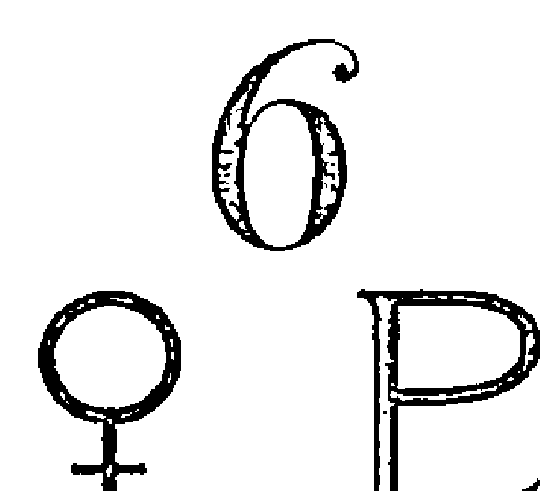

## 幸运数字和守护星

11月15日出生的人受数字6（1+5=6）和金星的影响。受数字6影响的人往往具有神奇的吸引力，而且容易让人崇拜他们。不过，在金星与冥王星（天蝎座的主宰星）的双重影响下，11月15日出生的人的爱情生活看似包含了各种刺激且令人着迷的元素，实际上却充满了危险和不安。因此从这一点来看，这一天出生的人应该避免自己沉溺（尤其是对性欲的需求）的倾向。

祖》. 曼托瓦尼（指挥家, 编曲人）. 安德鲁·马弗尔（17世纪英国哲学诗人）. 韦恩·蒂埃博（画家）. 奥尔迦大公爵（俄国皇后, 尼古拉二世的妻子, 在俄国大革命中被处以死刑）.

## 塔罗牌

大秘仪塔罗牌的第15张是“恶魔”。由于受到性的强烈吸引以及非理性与激情能量的影响，这张牌呈现出了恐惧与欲望。魔鬼利用人对安全感和金钱的需求，通过人性的矛盾使人们成为他的奴隶。这张牌代表了感官的魅力和对热情的表达，但同时也提醒我们，即使肢体受到束缚，精神也还是可以自由翱翔的。11月15日出生的人应该注意控制好自己的欲望，不要激发自己身上不能掌控的能量。

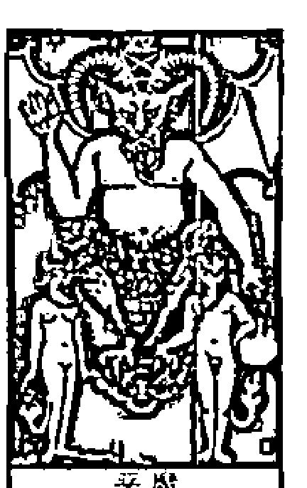

## 健康

11月15日出生的人可能必须经常反思自己的情绪。对峙的局面或是他人的恐吓威胁（甚至未说出口的）的报复手段，都会使他们承受极大的压力。这一天出生的人容易发生意外，并有暴力倾向，因此他们不但应该注意自己的一举一动，同时也应该思考自己的哪些特质是造成事故的原因。饮食方面，这一天出生的人需要尽量避免吃太多的红肉，而糖的食用量也应该控制在适当的范围之内。像米饭、小麦（面粉）及玉米等谷类食物不妨多吃一些，而富有营养的蔬菜汤和炖菜等也一样是多多益善的。另外，能够让人精神振奋的活动将有助于他们疏导过剩的精力与攻击性行为，不过如果参加具有竞赛性质的运动及武术练习，他们就需要再谨慎一点。

| 优点 |
| --- |
| 慎重 |
| 正直 |
| 勇气十足 |

| 缺点 |
| --- |
| 不稳定 |
| 容易出事故 |

## 建议

心理调节对你来说非常重要，尝试去疏导你的攻击欲望或恐惧感。不要总是摆出一副吓人的模样，要对自己多点信心，亲切和蔼的态度更能显示出强者的风范。

| 固定位 12页 |
| --- |
| 水相 17页 |
| 秋季 20页 |
| 天蝎座 29页 |
| 天蝎座三 65页 |

## 静思语

沉默是金。

月份：11月
第16天
天蝎宫23°～25°
天蝎座三
固定位/水相

## 11月16日

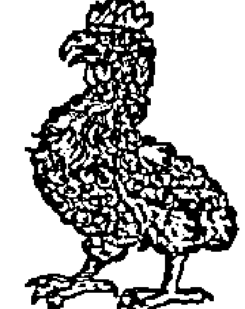

## 当老板的一天

## 出生于这一天的名人

11月16日出生的人，不论男女都对权力有一种天生的感知能力，并知道该如何使用它。无论是在家里还是在工作中，大部分这一天出生的人都是人们所公认的好领导、好主管。而在他们所属的社会团体或工作团队中，11月16日出生的人也非常善于为别人提供参考意见，或指导他人掌握某些技能。因为他们总是想方设法地去避免别人的怨恨或背叛，在作决定时也总是优先考虑团体的最大利益，所以他们发布的命令很少被质疑或遭到反对。

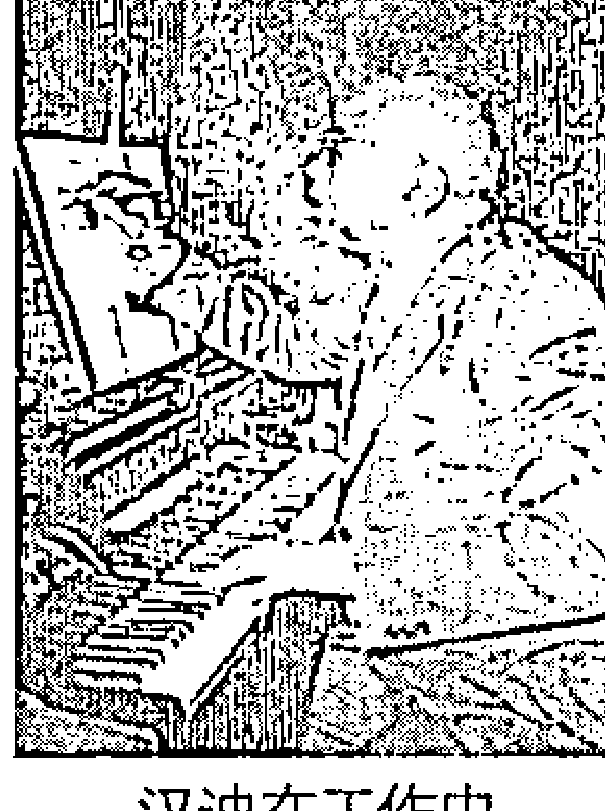

汉迪（非洲裔美国民间音乐创新人，作曲家，音乐改编者，钢琴家，被称为“布鲁斯音乐之父”，同时也是一名出版商）。

不过，这一天出生的人在青少年时期却常常十分叛逆，甚至具有破坏倾向。大约要到30岁以后，他们才可能变得较成熟。幸运的是，大多数11月16日出生的人总能不断反省并审查自己的行为，并能借此明了自己的优缺点、行为动机和需求，以及自己与周围的人的关系。

阿尼奥洛·迪科西米（16世纪意大利佛罗伦萨雕塑家，被称为“第二个布龙奇诺”），提比略（古罗马第2代教皇），伯吉斯·梅雷迪思（舞台剧、电影演员），德怀特·古登（棒球投手，年度新秀选手，三冠王，赛扬奖得主），乔治·考夫曼（剧作家，普利策奖得主），保罗·欣德米特（德国作曲家，方法论者），奇诺瓦·阿切贝（尼日利亚诗人、小说家，代表作品有《萨瓦那巴的蚂蚁山》），菲利普·里德（美国通用电气董事会主席，美国联邦储备银行董事长），阿德里安·圣约翰（美军陆军少将），埃迪·康登（迪克西兰爵士乐、摇摆舞吉他手，五弦琴手），莉莎·博内特（电视剧演员），梅尔文·帕顿（美国奥运会200米速度滑冰冠军），弗兰克·布鲁诺（英国和欧洲重量级拳击冠军），安东尼奥·加德斯（舞蹈家），玛丽·玛格丽特·麦克布赖德（广播电台记者），安·麦克劳克林（美国里根时期劳工部部长），詹姆斯·格罗皮（激进的天主教）。

11月16日出生的人往往是极端的个人主义者，他们不会受社交圈、家庭或同事太多的影响，相应的，他们也很难接受别人的帮助、教导或支持。但是，这一天出生的人拥有十分丰富的想象力，这种想象力能够使他们感同身受地去了解别人的境遇，并且真正设身处地地去体会别人当时的感受。在这一天出生的人之中最成功的那些人多半都懂得做好工作的技巧，并擅长在某个特定的领域建立自己的权威。不过，这些人精通于如何与人相处，并且具备丰富的人生阅历，因此他们在团队中也往往能成为配合度很高的成员。尽管这一天出生的人从外表上看起魅力无穷，没有很大的杀伤力，但别人仍然能够从他们的身上感觉到一股强大的坚毅的力量，因此别人很少在不假思索的情况下对他们作无谓的反抗或攻击。11月16日出生的人热爱竞争，所以对那些和他们实力相当的人来说，他们会是不错的竞争对手。

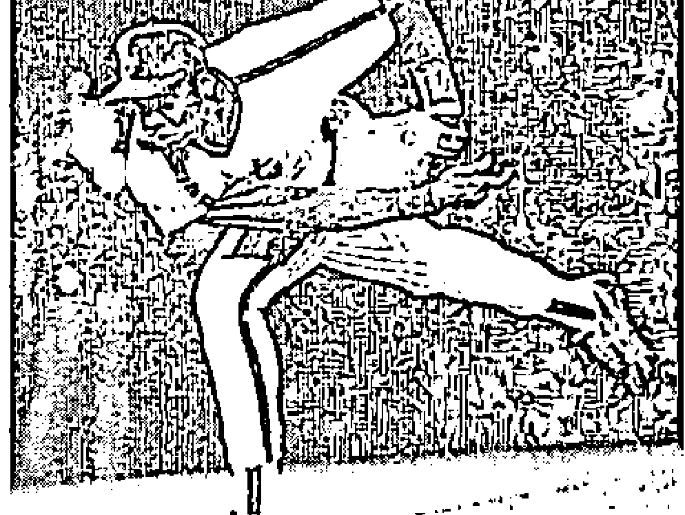

此外，11月16日出生的人也会十分认真地为自己寻找合适的搭档。对这一天出生的人来说，不管是选择爱情上的终身伴侣还是选择事业上的合作伙伴，都是头等重要的大事。如果没有等到他们命中注定的那个人，这一天出生的人就很难在工作领域有所建树。然而，不幸的是，在爱情方面，11月16日出生的人往往在尚未水到渠成之前便已经错失良缘，于是他们可能在情海中浮沉飘荡很久。的确，在这一天出生的人的生活地图上，很有可能布满不愉快的恋爱经历、破碎的婚姻以及不够和谐的性生活。那些从未寻找到自己命中注定的那个人的11月16日出生的人，最后终究会过着非常孤单的生活。尽管这一天出生的人生性独立，但他们可能还是非常依赖自己的家人或挚友，不过，幸好他们也是可以让人依靠的类型。

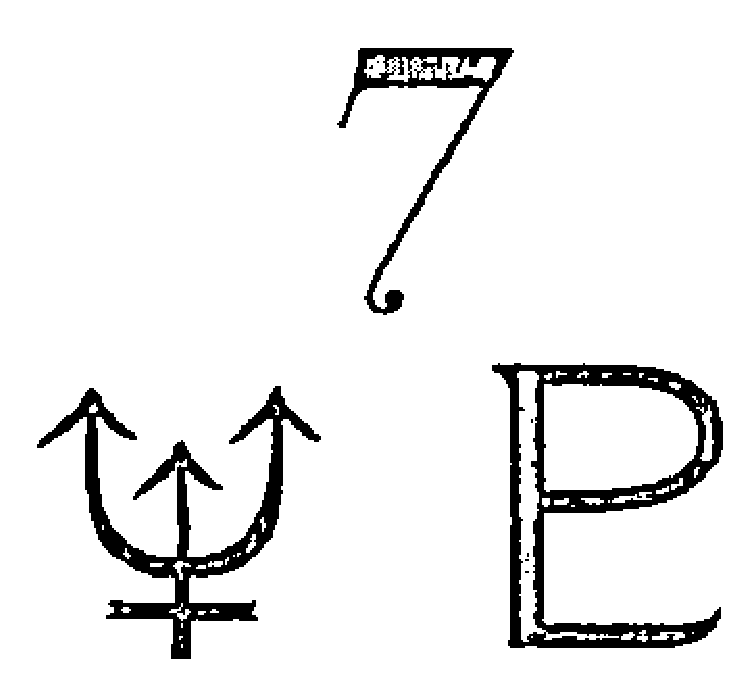

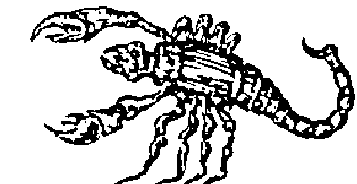

每年的这一天

天蝎座
11月16日

## 幸运数字和守护星

11月16日出生的人受数字7（1+6=7）和海王星的影响。尽管受数字7影响的人往往无法实现自己的想法，并且极容易与现实世界脱节，但对11月16日出生的人来说，这些问题只有当他们不够成熟或者历练不足时才会发生。在冥王星（天蝎座的主宰星）的影响下，这一天出生的人通常能对客观事物，尤其是金钱，有稳固的控制力量。不过，那些较缺乏深谋远虑的11月16日出生的人可能将谨慎的态度置诸脑后，使自己的家人陷入经济拮据的窘境之中。

神父，曾被监禁），奥斯瓦尔德·莫斯利（英国工党主席，法西斯主义者），伊丽莎白·布伦纳·德鲁（记者，作家）

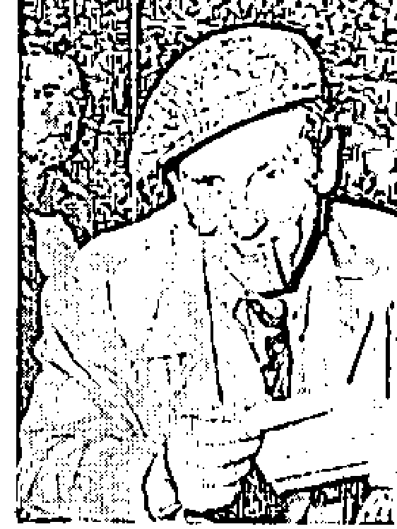

伯吉斯·梅雷迪思

## 塔罗牌

大秘仪塔罗牌的第16张是“塔”。画面上国王从雷击的高塔上摔下来，而建塔者则被一拳打中头部而死。塔不只象征着物理结构的暂时性，也代表了人际关系和职业的变动性，这些改变往往发生得突然且迅速。这张牌代表的积极意义是能接受挫折，并勇敢克服挑战；代表的消极意义则是得意忘形、自作自受，以及沉迷在虚幻不实的想象中。这张牌也再次提醒11月16日出生的要小心不要做那些自己没有把握的事情。

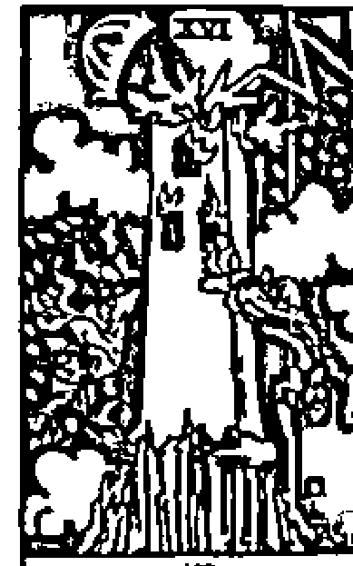

## 健康

11月16日出生的人必须注意持续久坐引起的疾病，尤其是背部的毛病、排泄功能的紊乱以及容易发胖的倾向，所以严格坚持每天定时运动的生活方式对他们的健康来说是不可或缺的。这一天出生的人也应该避免饮食过量，特别是食用太多奶油制品或乳脂类食品。生活上的纵欲会造成他们消化系统、肝脏和胰脏方面的负担，可能在他们40多岁时引发胆囊疾病（由于脂肪的摄取过量）、肝硬化（与饮酒有关）及糖尿病（过多的糖所导致）等问题。在某些情况下，服用花草茶或输液对他们的健康可能有极大的帮助。

| 优点 |
|---|
| 有领导才能 |
| 实际 |
| 有判断力 |

| 缺点 |
|---|
| 过分关注自我 |
| 缺乏稳定性 |
| 孤僻 |

## 建议

永远记得顾及别人的利益。拿出负责任的态度并明智地行使自己的支配权，而不要陷在权势的欲望深渊中。小心外来的蓄意破坏，但也别偏执地胡思乱想。保持镇静与警觉才是最重要的。

- 固定位 12页
- 水相 17页
- 秋季 20页
- 天蝎座 29页
- 天蝎座三 65页

## 静思语

> 权力是相对的。

月份：11月
第17天
天蝎宫24°～26°
天蝎座三
固定位/水相

## 11月17日

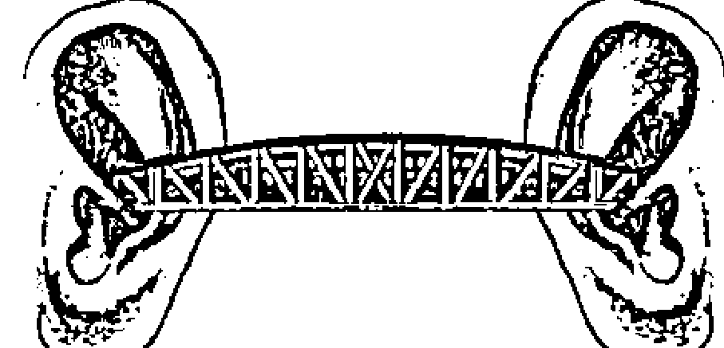

## 沟通桥梁的一天

## 出生于这一天的名人

11月17日出生的人就像翻腾不止的河水上的大桥，能在许多相反的见解、立场不同的人、不同的意见或兴趣之间建立起沟通的桥梁。他们的生活似乎可以比喻为由许多交汇线组成的交叉路口，他们非但经常扮演领导者的角色，还能不时地将不同的事物凝聚在一起，发挥如黏合剂一样的功能。因此，不管是在家庭、社会或是职业生涯中，他们都有自己的一套办法，可以帮助团体的工作顺利进行。

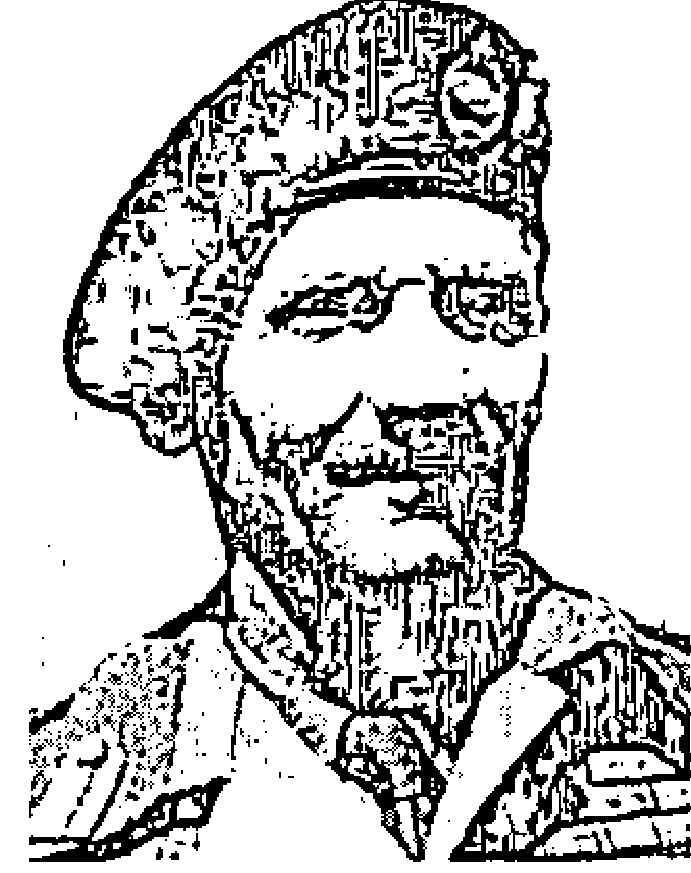

或许11月17日出生的人知道促使事物聚合的原因，即他们自身的文化背景或基因组成，这两者通常可以成为两种或更多种不同事物的混合剂。因此，这一天出生的人好像生来就是为了证明那些看似对立的互异文化、阶级或政治团体，实际上是可以融洽相处的。他们痛恨那些无谓的争吵、异议和各种形式的差别待遇。事业发展得比较好的女性，思想行为往往能够摆脱传统的约束，她们也不会为了什么事而出卖自己独立自主的地位。因此，凡是那些被认为没有多大能力而只能从事服务性质工作的女性，或许有必要重新审视自己的处境，可能的话，应该重振旗鼓、继续前进。至于这一天出生的男性，可能比较倾向于独断或做出挑衅性的攻击行为，不过大体来说他们仍能明白妥协的重要性，尤其是到了晚年，他们通常会将注意力转移到子孙身上，为自己的遗产分配问题烦恼不已。

在11月17日出生的人看来，雄心壮志并不是生活的必需品，但是他们一旦位居要职，就会固守岗位，对抗任何想赶走他们的势力。而当他们被要求去领导别人或是保护某些需要保护的人时，哪怕必须攀上天庭与天神搏斗，他们也在所不惜。虽然处理别人的问题可以获得颇高的成就感，但他们可千万不能对这种通过操控别人的事情所带来的满足感产生依恋，否则有朝一日当他们遭到忽略或是不再被需要时，他们必定十分痛苦难受。

这一天出生的人还拥有非常稳固坚定的道德信仰体系，这种体系会偶尔抑制他们的灵活性。同时，他们在表达个人情感方面也可能产生问题。许多11月17日出生的人在面临逆境和压力时，仍能保持相当强的自制力及客观性，同时也会为自己的这种能力感到自豪。为了能够做到这一点，他们会不断地训练自己去阻挡任何干扰，但也很可能因此而变得冷淡无情或者中断与朋友之间的往来。

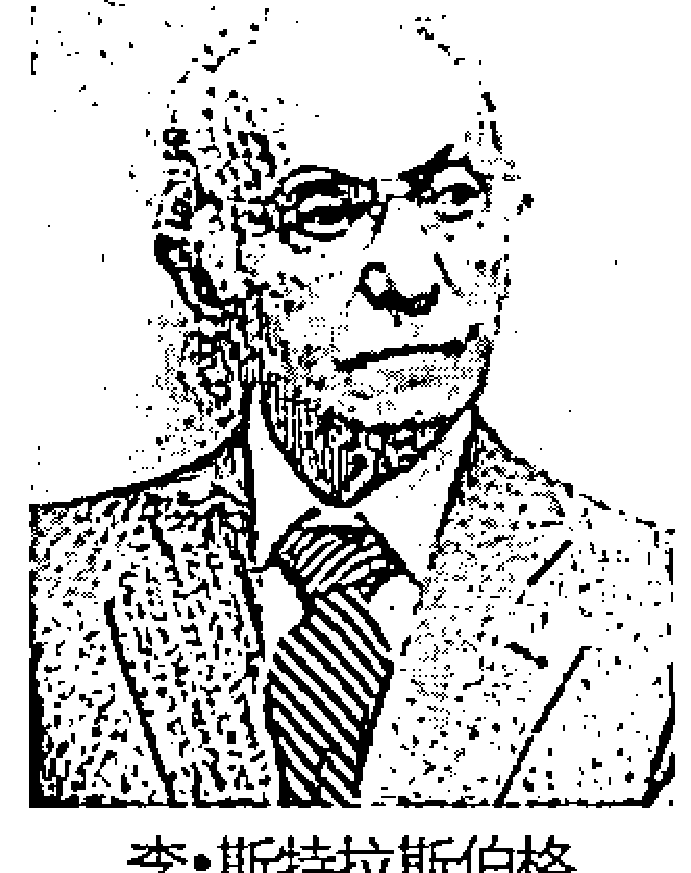

11月17日出生的人会为了更好的物质生活而不断奋斗，所以他们极少将自己置于经济困难的境地。他们的家看起来稳固、舒适而整洁。老实说，这一天出生的人的确不会随意孤注一掷，不过他们还是得小心自己的控制欲过强的倾向。

## 每年的这一天

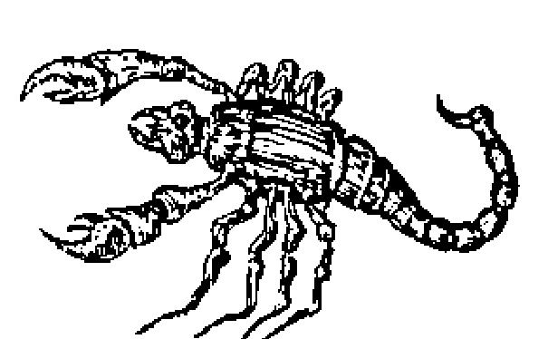

## 天蝎座

## 11月17日

## 幸运数字和守护星

11月17日出生的人受数字8（1+7=8）和土星的影响。土星带有强烈的限制感与约束感，同时还具有特别喜欢批判的一面，因此，受土星影响的11月17日出生的人更容易成为自以为公正无私的牺牲者。而土星和冥王星（天蝎座的主宰星）的双重影响，则突显出了这一天出生的人具有的独断专行、冷淡及刻意压抑的特质。数字8带来了物质世界与精神世界之间的冲突，而受数字8影响的人则常有孤独和纵欲无度的倾向。

获得了诺贝尔化学奖，主要研究神经和表皮生长因素），玛丽·伊丽莎白·马斯特兰托尼奥（电影女演员），韦斯巴芗（罗马皇帝），路易十八（19世纪法国国王），戈登·莱特富特（加拿大歌手，歌曲创作者），戴维·阿姆拉姆（法国作曲家，指挥家，小号表演家），弗雷迪·吉拉德特（瑞士厨师），阿斯特丽德（比利时王后）

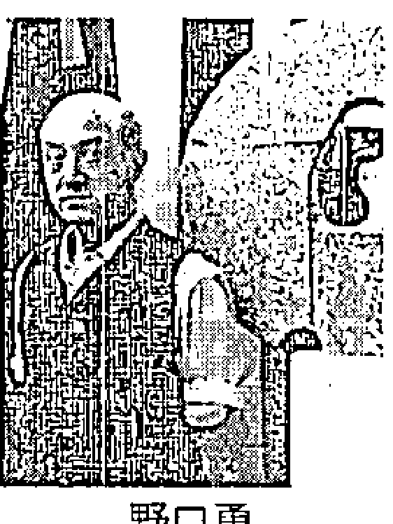

## 塔罗牌

大秘仪塔罗牌的第17张是“星星”。画面上是一位赤身裸体的少女，她在星空下一边用水罐把清水浇灌在干燥的土地上，一边用另一个水罐使死水复苏。她代表世间生命的美丽，但也代表了受物质的奴役。天空的星星永远在提醒她，别忘了还有一个更高层次的精神世界存在。因此，11月17日出生的人需要时常警惕过分贪婪的倾向，尤其是对金钱和权力的过分狂热，同时，也一定不能忘了更高的人生追求。

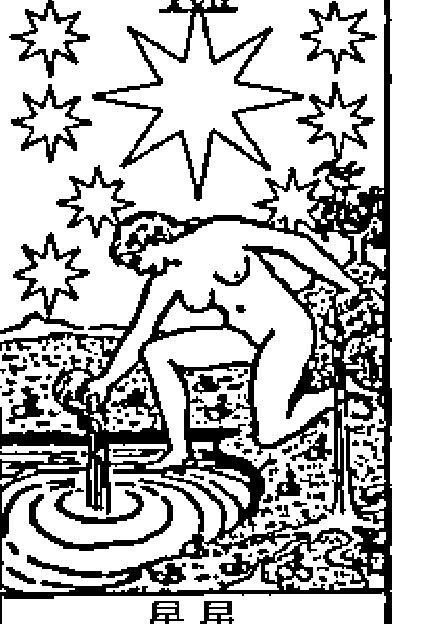

## 健康

11月17日出生的人必须对自己的身体状况多加留意（尤其是到晚年的时候），特别是有关骨骼系统和脊椎等处的毁损或病变。物理疗法、脊椎按摩、推拿及针灸都会有蛮不错的功效。这一天出生的人对于病痛常常抱着能忍则忍的态度，所以可能忽视患上慢性病的信号。正因为如此，他们才更应该定期做健康检查，包括验血以确定是否有贫血的迹象等。另外，这一天出生的人也容易因为忧思操劳而导致如小肠（十二指肠溃疡）或大肠（大肠炎和局限性回肠炎）出现毛病。那些味道太浓或者进口的食物会使上面所述的病症恶化，他们最好还是小心为妙。对11月17日出生的人而言，除非他们具有强健的体魄，否则只能进行适度的运动。此外，培养警觉心也是相当重要的，尤其是在他们晚年的时候。

| 优点 |
|---|
| 擅长调解 |
| 乐于助人 |
| 有责任感 |

| 缺点 |
|---|
| 道德感太强 |
| 冷淡 |
| 控制欲强 |

## 建议

试着敞开心胸，别将自己封闭在情感的窠臼里。保持勇往直前的冲劲，并避免阻塞自己的沟通管道。弄清楚自己的方向与目标。

- 固定位 12页
- 水相 17页
- 秋季 20页
- 天蝎座 29页
- 天蝎座三 65页

## 静思语

> 只有人类才是上帝的选民。

月份：11月
第18天
天蝎宫25°～27°
天蝎座三
固定位/水相

## 11月18日

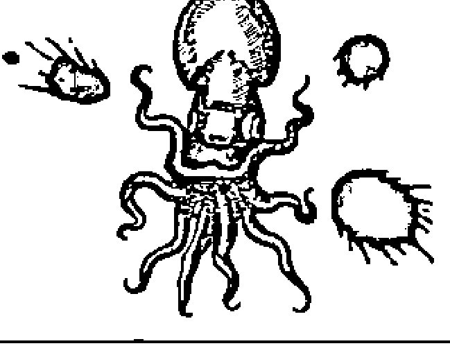

## 性情多变的一天

## 出生于这一天的名人

11月18日出生的人相当活跃，无论在生理上或是在心理上，他们都经常维持着一种精力充沛、兴致高昂的状态。即便他们可以随时换上冷静、平静及镇定的外衣，但是他们最主要的人格特质还是情绪的反复无常。就这一点来看，他们可以说是擅长自我克制的高手，而且他们也的确必须如此才行，因为他们不想将自己内心沸腾不已的情感暴露出来被世人看到。不过，一旦遇到特殊状况，他们就能很快地找到办法来调节自己强烈的情感，并将其引导到他们的工作中去。

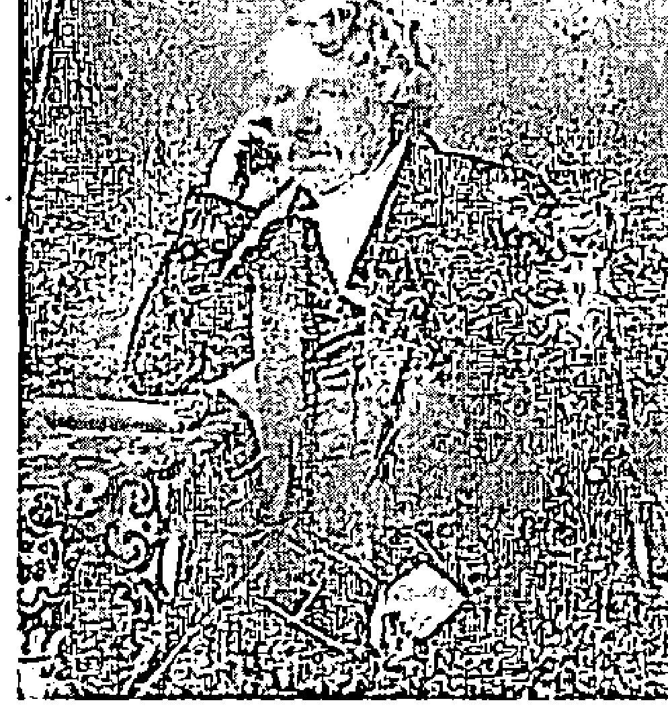

11月18日出生的人相当善于交际，也多半喜欢成为众人目光的焦点。他们往往怀有雄心壮志，也适合在生活中担任领导者，他们非凡的野心通常是在社会团体的活动中展现出来的。不管自己的才华是大放异彩型的或是内敛谦虚型的，他们都喜欢自己决定是否要去施展它。同样的，在做好准备之前，他们是绝对不会强迫自己去追求成功的。有时候他们其实早就准备好了，但他们就是畏缩不前，出现这种情况的原因并不单单有外来因素的影响，更多的是他们自己的问题。

路易·雅克·芒代·达盖尔（法国画家，发明了实用摄影术，即“银版摄影术”，也称为“达盖尔摄影法”），威尔玛·曼基勒（社会活动家），艾伦·谢泼德（美国宇航员，第1位进入太空的美国人），多萝西·迪克斯（专栏作家，主张妇女有权参政，活到了90岁），乔治·盖洛普（美国舆论分析家），阿梅丽塔·加利·库尔奇（意大利女高音歌唱家），尤金·奥曼迪（指挥家，美国费城管弦乐团指挥），约翰尼·默塞尔（作曲家，歌唱家），唐·彻丽（爵士乐小号演奏家），卡尔·文森（美国佐治亚州议员，从政从了50年，是美国历史上任职时间最长的议员），沃伦·穆恩（橄榄球四分卫，获得了年度运动员称号），伊莫金·科卡（喜剧电视剧演员，和锡德·西泽是主持搭档），吉恩·毛奇（棒球队经理，所带球队胜率排名第9），杰克·塔特姆（橄榄球防守后卫），凯文·尼尔森（喜剧电视剧演员，美国《周六夜现场》节目组成员），布伦达·瓦卡罗（电影、电视剧女演员），琳达·伊万斯（电视剧演员，作品有《朝代》等），霍华德·瑟曼（神父，第1位非洲裔美国波士顿大学教授），亚历克·伊斯哥尼斯（土耳其裔英国汽车设计师）

勤奋不懈并非11月18日出生的人性格中最具有优势的一面，因为比起许多脚踏实地的苦干者或是花费很长时间努力的人来说，他们似乎光靠直觉、审慎与敏锐的洞察力便能获得令人满意的收获。不过，他们在感觉方面的发展并不是太好，与此形成对比的是，他们的情感丰富强烈、变化无常。此外，他们欢迎别人对他们产生兴趣或进行研究，通常对他们挖掘越多就会发现越多，同时他们如变色龙一般变化多端的内心情感还能不断地为这些人提供意外惊喜。11月18日出生的人就是以这种方式来促使别人对他们着迷、神魂颠倒的。

11月18日出生的人极度需要受到别人的注意和关心，并且在尚未得到这些之前绝不会善罢甘休。就这个方面而言，他们可以说是极度依赖他人关注的人，这也暴露了他们内心的不安全感，然而他们很可能解释说，这是因为自己引起了别人的兴趣，或他们拥有了丰厚的成果的缘故。他们的成果可能是可触摸得到的有形物品，但更多时候是娱乐和服务领域的东西，或者只是单纯的有积极影响的力量。在后面这种情况下，因为他们可以给他人的生活带来阳光和欢笑，所以他们会成为很受欢迎的朋友或家庭成员。作为颇具魅力（虽然无可否认他们也有自私、暴躁、情绪化以及善变的一面）的一类人，他们可以给任何他们所参与的事情带来生气。

因为11月18日出生的人擅长扮演不同的角色，所以有时他们会被人扣上肤浅或是没有责任感的罪名。不过只要深入地观察他们，就会知道这样的指控其实不大公正。不过话虽如此，这一天出生的人仍须格外当心自己对于吸引他人注意力的强烈需求，以免在追求这种个人满足的过程中损害并牺牲掉个人的理想。

## 每年的这一天

## 天蝎座

## 11月18日

## 幸运数字和守护星

11月18日出生的人受数字9（1+8=9）和火星的影响。火星（天蝎座的共同主宰星）与冥王星的双重影响，给11月18日出生的人的性格中增添了一种极富吸引力和魅惑特质的强大力量，不过这种能量绝对不可以被滥用，否则它会导致这一天出生的人产生暴力和破坏性的行为。数字9向来是一个具有高度影响力的数字，因而能够赋予这一天出生的人在事业上努力冲刺的动力。此外，由于11月18日出生的人对别人的影响往往相当大，所以充足的责任感也是这一天出生的人所不可或缺的。

## 塔罗牌

大秘仪塔罗牌的第18张是“月亮”。月亮主要代表梦境、情感和潜意识的世界。传统上，月亮的形象是女性的力量和情感的化身。因此，从积极的一面来看，这张牌代表敏感、有同情心、能够感同身受；从消极的一面来看，这张牌则代表情感上的顺从、被动和缺乏自我。

## 健康

11月18日出生的人应该设法克制他们神经质的个性和不稳定的情绪，同时要对自己有充分的了解，这都是非常要紧的事情，因为唯有如此，他们才不会任由自己受情绪的摆布或被耍得团团转，最后导致出现既害人又害己的结局。由此来看，某些心理训练或精神方面的研究课程是相当值得他们一试的。此外，11月18日出生的人不妨通过系统化的学习和适度的运动，来达到提升修养和坚定意志力的目的。在饮食方面，11月18日出生的人需要增加谷类食物及新鲜蔬菜的摄取量，并应该远离糖、咖啡和酒，这些做法都能够使他们长保健康。至于红肉，他们最好不要食用过量，而应有所节制。另外，如果可能的话，这一天出生的人每天最好多喝点水，以帮助体内的清理过程顺利进行。

| 优点 |
| --- |
| 直觉强 |
| 感情丰富 |
| 善于交际 |

| 缺点 |
| --- |
| 依赖他人的关注 |
| 情绪多变 |
| 脾气暴躁 |

## 建议

更深入地认识自己。在生活中顺势而为，试着找出属于自己的路，留心周围的迹象。别怀疑你的直觉，同时注意你带给别人的影响。

- 固定位 12页
- 水相 17页
- 秋季 20页
- 天蝎座 29页
- 天蝎座三 65页

## 静思语

> 生命可能是一个幻想，所以安于你选择的角色并且好好地扮演它。

月份：11月
第19天
天蝎宫26°～28°
天蝎射手座
固定位/水相

## 11月19日

## 改革家的一天

## 出生于这一天的名人

马丁·路德（德国宗教领袖和改革家，作家，哲学家，作曲家），詹姆斯·加菲尔德（美国前总统、美国南北战争时期的将军、激进的共和党人，反对奴隶制，被刺杀），乔治·罗杰斯·克拉克（美国军官，美国西北地区的拓荒者，参加了刘易斯与克拉克的远征探险队），英迪拉·甘地（印度前总理、印度首任总理尼赫鲁之女，遇刺身亡），查尔斯一世（英国国王，被斩首），费迪南德·德莱塞普（法国巴拿马运河的建造者），比利·森戴（基督教布道者，长老会复古主义者，棒球运动员），特德·特纳（美国最大的有线电视新闻网CNN的创办者，开创了世界上第1个全天候24小时滚动播送新闻的频道——这也是世界上最早出现的国际电视频道，此外还担任了美国在线时代华纳公司的副董事长，买下了多家电视台及多个电视频道），乔迪·福斯特（美国电影女演员、导演，作品有《锦绣童年》），珍妮·柯克帕特里克（美国联合国大使），比利·斯特瑞霍恩（爵士乐作曲家，编曲家，钢琴家），卡帕夫兰卡（古巴国际象棋冠军），卡尔文·克莱因（服装设计师），迪克·卡韦特（电视台脱口秀节目主持人），拉里·金（美国有线电视台脱口秀节目主持人），海勒姆·宾厄姆（美国议参员、考古学家，重新发现了马丘比丘），梅格·瑞安（电影女演员），吉洛·蓬泰科尔沃（意大利电影导演，作品有《阿尔及尔之战》），罗伊·坎

11月19日出生的人的革命细胞非常活跃，他们很善于捕捉转机，并开创自己的事业。然而，他们不会仅仅表现出叛逆的一面，身为改革的行动家，他们还会小心翼翼地策划制作某样新的东西去取代旧事物，然后再更进一步地给予照料管理，使其产生切实的效果。正因如此，他们可以说是激进与保守、无政府状态和既定制度的有趣混合体。在他们的生活中，常常出现关乎控制，甚至是压抑的课题，这些问题有时是他们自己的叛逆行为造成的，有时则是其自发产生的。

11月19日出生的人时常被家庭、社会团体或职场中的管理权力所吸引而无法自拔。他们对权限的授予及范畴也总是保持严肃认真的态度，表现得极为关心。虽然他们可能与不赞同他们的人进行程度不一的激辩论，但他们心中对自己的观点和得体的表现少有疑问，或者说根本就是深信不疑。老实说，他们的确是有那么一点尼采情绪，总喜欢以言辞和哲学原理来为自己的行为辩护，因而他们很可能与普遍的社会价值观脱节。因此，他们应该时时注意自己是活在现实世界中的，应该对别人的批评指教保持一种宽宏大量及接纳的态度。

大多数11月19日出生的人都拥有与天同高的自信心，不过这项特质有利也有弊。他们之中有许多人会一再成为自己极端自负心态下的牺牲者，这些人不但固执地对抗事情发展的必然趋势、无视危险征兆的警告，而且还可能因为树敌太多而自毁前程，甚至赔上整个人生。11月19日出生的人都是自由意志的忠实信徒，尤其坚信自身的意志，但他们还必须学习有关自我克制与凡事步步为营的重要性。

11月19日出生的人一向以社会改革者及为改革奋斗的战士的身份自居。虽然他们的政治策略和方针经常用于支持、拥护某个普通的人，但是他们本身偏好与精英名流接触的倾向仍然十分明显。只要有机会向周围的人教授知识或传递讯息，他们通常都能将自己的才能发挥得淋漓尽致，而且由于他们会偶尔显露出爱争辩、甚至好斗的个性，因此他们很容易将众人之中最优秀的对手及事件的真相牵引出来。在他们的课本里，没有什么比事实和传播事实更有价值了。

11月19日出生的人其实非常世俗化，他们是极注重物质享受、爱家顾家的人，也是喜欢走在时代前端的典型，他们对于时下流行的事物很少一无所知。然而，即便这些特质对他们的生活很有帮助，但他们还是需要小心别变成哗众取宠的人，或因为一时的狂热和风尚而冲昏了头。假若11月19日出生的人希望自己的事业能长久稳定的话，那他们就应该以传统的价值观为基础，用一种稳定可靠及非歇斯底里的方式利用自身的影响力，让其发挥积极的作用。

## 每年的这一天

## 天蝎座

## 11月19日

## 幸运数字和守护星

11月19日出生的人受数字1（1 + 9 = 10，1 + 0 = 1）和太阳的影响。由于这一天出生的人在天蝎射手座（核心理念是“变革”）的头一天出生，并同时受到了冥王星（天蝎座的主宰星）、火星（天蝎座的共同主宰星）和木星（射手座的主宰星）的强大力量的影响，因此他们在生活中会明显地展现出精力充沛、富有创造能力，甚至可能具有毁灭倾向的特质，同时，可能在思想和行动上采取积极进取与心胸开阔的态度，但在追求成功时则具有攻击性，甚至拿出冷酷无情的姿态。同样的，受数字1影响的人往往不喜欢受到束缚和限制，并且凡事都要抢先，高居第一。

帕内拉（美国布鲁克林道奇棒球队接球手，获得了3次全国联赛最有价值球员称号，后来成为了棒球教练，但因为意外事故而瘫痪）

## 乔迪·福斯特

## 塔罗牌

大秘仪塔罗牌的第19张是“太阳”，可以说是所有大秘仪塔罗牌中最好的一张。它象征知识、活力和幸运，也代表值得受人尊敬和回报。这张牌代表的积极意义是清澈、人际关系和谐及名声美好等，代表的消极意义则是骄傲、自负和虚伪等。

## 健康

11月19日出生的人很可能在最意气风发、信心满满时遭受飞来横祸，对此，他们务必要多加留意。学习以一种较实际的态度去评估自身的处境，将有助于这一天出生的人平衡自己所面临的高潮和低谷，同时也能帮助减少碰到突发灾难的机会。许多11月19日出生的人对于内省或了解内心的行为都抱持排斥的态度，不过他们迟早会考虑接受某些自我研究的方法。这一天出生的人在饮食方面往往既不用忌口也不用设定所谓的时间限制，但如果他们肯多注意一下自己的饮食及阅读一些相关的专业著作，那他们的健康状况必定会大有改善。需要耗费大量体力的激烈活动对这些天性活泼的人来说相当合适，尤其像赛跑、慢跑、有氧舞蹈、网球、短拍壁球和其他具有竞争性或者一对一的运动。

## 优点

- 紧跟时代发展
- 有说服能力
- 有建设能力

## 缺点

- 心事重重
- 自负
- 顽固

## 建议

了解沉默的价值，设法缓和自己的叛逆性。谨慎做好迎接生活挑战的准备，并控制意气用事的行为。记得别独断专行，也不要无视大自然或人类社会的规则。

- 固定位 12页
- 水相 17页
- 秋季 20页
- 天蝎座 29页
- 天蝎射手座 66页

## 静思语

> 沉默中方能听见真理的声音。

月份：11月
第20天
天蝎宫27°～29°
天蝎射手座
固定位/水相

## 11月20日

## 勇敢攀登的一天

## 出生于这一天的名人

11月20日出生的人生来就是斗志十足的战士，因此也容易陷入各式各样的奋战苦斗之中。这一天出生的人通常是爱争论的人，他们的观点和个性也总是成为别人讨论和观察的对象。尽管这一天出生的人实际上非常忠于自己的家庭、公司与社交圈，他们还是可能表现出叛逆的情绪化行为。他们本身的想法十分偏激，而且在表达自我时又过于强势，因此常招致别人的敌意和不满。不过11月20日出生的人在唇枪舌剑的激辩中很少退让放松，他们总是宁愿抗争到底，也绝不改变自己的初衷与思想。

11月20日出生的人有时候说话时会带有讽刺挖苦的意味，但有时也表现得十分幽默。他们善于观察别人的弱点，并以取笑或作弄那些自以为是或傲慢自大的人为乐。对这一天出生的人而言，似乎再没有比让某个人从马背上摔下来或惨遭重击更令他们满足的了。

罗伯特·肯尼迪（美国司法部部长、民主党总统候选人，遇刺身亡），吉姆·加里森（美国新奥尔良市检察官，负责调查肯尼迪遇刺事件，电影《刺杀肯尼迪》就是以其为原型改编的），梅雷迪思·蒙克（美国纽约多媒体表演艺术家、歌手、作曲家），纳迪娜·戈迪默（南非作家，诺贝尔文学奖获得者，南非施行种族隔离政策的见证者和记录者），市川昆（日本电影导演，作品有《缅甸的竖琴》、《细雪》），亨利·乔治·克卢佐（法国电影导演，作品有《孽迷宫》），塞尔玛·拉格洛夫（获得了诺贝尔文学奖的瑞典女作家，作品有《尼尔斯骑鹅历险记》等），塞缪尔·丘纳德爵士（加拿大裔英国航海家，航线创始人），迈娅·普利谢茨卡娅（俄国芭蕾舞舞蹈家），罗伯特·伯德（美国参议员，来自西弗吉尼亚州），约瑟夫·拜登（美国参议员，来自特拉华州），阿利斯泰尔·库克（英国记者，电视节目主持人），唐·

11月20日出生的人大都相当注重实际，尤其是这一天出生的女性，他们在第一次跟别人见面时就能给人留下与众不同的印象。不过，实际上这多半是因为他们对自身的个性进行了掩饰，那些表象并非他们性格的真实面目。从好的方面来看，也可以说他们有良好的自制能力，对自己的表现能收放自如。虽然如此，这一天出生的人，不论男女本性上都易激动，而且一旦遭遇连续的挫折，他们就极可能情绪失控。因此，对11月20日出生的人来说，内心的锻炼将是他们成功的关键，同时，他们也必须学习控制自己情感上具有爆发性的一面，并找出发脾气的原因和处理情绪的方法。

此外，11月20日出生的人常常对打破现行社会规范的运动、非法的尝试及打擦边球的商业经营之道有着浓厚的兴趣。从生活中的某些方面来看，这一天出生的人可能禁不住诱惑而参与这些活动，但一般来说他们都会明智地避免自己投入太多精力，并避免偏离自己正常的人生轨道。或许这是因为他们一向自命为法律（最高尚纯洁的形式）的拥护者，并且严格要求遵守道德规范的缘故吧。

11月20日出生的人还拥有孩童般天真无邪的一面，在外貌及精神上能永葆年轻的状态——这是一种跨越年龄限制的能力。同样的，这一天出生的人懂得如何与小孩子相处，他们的家庭生活也往往充满了活力。11月20日出生的人可以成为别人良好的典范，较年轻的一辈可能把他们当做英雄一样崇敬，因为他们展现出了一种对生活严肃认真的态度，令人钦佩。不过，这一天出生的人也可能由于过分狂热地追求自己的目标而忽略所爱之人的内心感受，因此，他们必须谨防自己沉迷于工作或理想的倾向危害到家庭的和睦。

## 每年的这一天

## 天蝎座

## 11月20日

## 幸运数字和守护星

11月20日出生的人受数字2（2+0=2）和月亮的影响。受数字2影响的人往往温和并富有想象力，不过他们容易被别人的批评或忽视所伤。同时，他们可能很容易被激怒，以致他们会很容易就摆出防卫姿态。对11月20日出生的人来说，天蝎射手座（核心理念是变革）的影响会使他们的情绪不够稳定，并有大发雷霆的倾向（此项特征会被月亮、冥王星、天蝎座的共同主宰星火星，以及射手座的主宰星木星的影响强化），尤其是当别人不了解或不欣赏他们的时候。

德利洛（小说家，作品有《天秤座》），查尔斯·贝特尔海姆（法国经济学家），杜安·奥尔曼（摇滚乐吉他手，在摩托车事故中身亡），博·德里克（电影女演员），迪克·斯马瑟斯（喜剧演员，斯马瑟斯兄弟组合成员），凯·巴拉德（喜剧电视剧演员，歌手），芭芭拉·亨德里克斯（歌剧女高音演唱家）

## 塔罗牌

大秘仪塔罗牌的第20张是“审判”。在这里当事者被鼓励抛开物质上的束缚，寻求更高境界的精神生活。牌面的图案是吹着号角的天使，象征着负有重任的崭新一天的开始。这张牌展示了超越自我、发掘无限潜力的正面特质，然而从另一方面来看，号角声多半报喜不报忧，暗示了容易沉溺在对欢乐的追逐中，并且缺少面对忧伤的能力。

## 健康

11月20日出生的人经常因为自己的偏激思想及无法停止运转的能量引起别人情绪上的负面反应，因此，学习放松自己、凡事泰然处之对这些11月20日出生的人来说就变得十分重要了。通过能够使人精神振奋的运动来消耗旺盛的精力应该可以获得不错的成效，特别是长距离的跑步、游泳、各种竞争性的运动、有氧舞蹈和体操，都是很好的选择。在饮食方面，这一天出生的人最好能多摄取一些营养价值高的食物，尤其是汤类、炖菜类，此外，还要多吃些根类蔬菜。另外，倘若11月20日出生的人想在纷乱不已的生活中寻得平静及和谐，那么设法与一位冷静且具有内涵的搭档建立起一种相互信赖和稳定的关系就是绝对有必要的了。

| 优点 |
|---|
| 活泼 |
| 勇于拼搏 |
| 理想主义 |

| 缺点 |
|---|
| 反复无常 |
| 过分狂热 |
| 容易沉溺 |

## 建议

试着掌控自己的能量，不要逞口舌之快。已经做出的事就如同泼出去的水一般，很难再收回，唯有自制力才是唯一的解决之道。设法了解自己愤怒的原因，偶尔不妨学习一下自嘲。尽量避免引发争论、仇视与针锋相对的情况。

- 固定位 12页
- 水相 17页
- 秋季 20页
- 天蝎座 29页
- 天蝎射手座 66页

## 静思语

简单的生活往往能显示出不平凡的一面。

月份：11月
第21天
天蝎宫28°～射手宫0°
天蝎射手座
固定位/水相

## 11月21日

## 高贵典雅的一天

## 出生于这一天的名人

11月21日出生的人天生具有一种自然的大方风度与优雅气质，这些气质经常体现在他们的言行举止上，或者通过严谨精妙的想法和独特的创意散发出来。他们对周围环境中正在流行的新奇事物十分感兴趣，而且几乎从不浪费时间在旧式古板的思考上。虽然如此，他们仍能敏锐地察觉到已被世人遗忘，但有希望再度流行起来的技术与一些构想，并可以为其加入一些独特、现代的元素。因此，11月21日出生的人常常发现他们自己其实刚好处于某种根深蒂固的传统习俗的边缘。实际上，他们极可能因为上一代（大多是他们的父母）无法明了他们所从事的工作的重要性，而和自己的长辈产生巨大的冲突。然而，就算要花上一辈子的时间，他们也绝对会向不理解他们的人以及诽谤他们的人，甚至全世界，证明自己的眼光是准确无误的。

莱内·马格里特

伏尔泰（法国启蒙思想家、哲学家、诗人及作家，是自由思想的倡导者，著有《哲学通信》），科尔曼·霍金斯（爵士乐萨克斯管演奏大师、乐曲革新家，是爵士音乐史上第1位杰出的次中音萨克斯管演奏者，被称为“老鹰”），莱内·马格里特（比利时超现实主义派画家），斯坦·穆夏尔（美国圣路易卡迪诺棒球队一垒手，获得过7次美国全国联赛冠军、3次最有价值球员称号），约翰博士（美国新奥尔良市歌手、钢琴家、歌曲创作者），锡德·勒克曼（橄榄球四分卫，6次入选职业联赛，获得了最有价值球员称号，曾带领灰熊队获得了4次美国全国联赛冠军），詹姆斯·德普里斯特（指挥家，曾经患有小儿麻痹症，但勇敢地战胜了病魔），玛丽莲·弗伦奇（女性主义作家，著有《女人的房间》），玛丽埃尔·海明威（电影女演员、模特），蒂娜·布朗（《名利场》及《纽约客》杂志总编），钱钟书（中国作家，著有《围城》），拉里·马汉（柔道冠军，获得过6次全能牛仔称号），查理·约翰逊（爵士乐钢琴家，第1位脱离拉格泰姆风格的钢琴家），拉尔夫·米克

11月21日出生的人在年轻时常作出错误的判断，尤其是在28岁以前，他们很容易表现出能导致自我毁灭的叛逆性格，缺乏人生的方向，对目标也不确定，当然，这是相较于他们身边的朋友与同事而言的。不过，虽然如此，他们仍然有一种强烈的自豪感和自我认同感，而且他们也总是能够从错误中汲取教训。

从另一方面来看，11月21日出生的人面临一项潜在的危险，即他们在经历了生活上不断的打击之可能变得极为无情冷漠。举例来说，外表优雅的11月21日出生的人往往表现出封闭固执、不善交际的模样，但是实际上他们在情感方面是高深莫测、难以看穿的人；至于内在优雅型的人，则可能变得越来越势利、贪财，只关心具有实际效益与报酬的事物。不管是哪一种类型的人，都具有想根除任何外貌不足以及行事缺乏技巧的倾向，这会导致挫折和失败。

然而，当11月21日出生的人学习到更多不让自己受伤害的办法之后，他们就可能失掉自己某些可以为他人带来欢乐的能力、创新能力以及那颗孩童般无邪的心。因此，他们要务必注意，不要画地为牢、拒绝冒险，而应该学习在追求完美及成功的旅程中享受生活的乐趣，也应该将不愉快的过往忘掉。

伏尔泰

11月21日出生的人会由于过分热衷于投入物质世界而忽略对自己内心世界的探索研究，因此，对他们而言，在进入中年时期之前或者在40岁之前，明确自己在世界上的定位相当重要。这也包括让自己变得更透明一些——让自己从恐惧与严肃拘谨的伪装面具下解放出来。倘若他们已经通过多年的努力建造起了一座无懈可击的防御堡垒，那么不管是在身体上还是在心理上，他们或许都得再次学习还原自己那原本童真和热情的心。唯有如此，他们才能够使自己的内心世界与周围的外界取得协调，并且有希望持续获得成功与快乐。

## 每年的这一天

## 天蝎座

## 11月21日

## 幸运数字和守护星

11月21日出生的人受数字3（2 + 1 = 3）和开朗的木星的影响，受数字3影响的人向来野心勃勃，有时甚至会表现出专横独断的一面。数字21通常暗示着外表的美丽，对11月21日出生的女性来说更是如此。木星（射手座的主宰星）与数字3的双重影响力，使这一天出生的人具有了一种积极乐观的世界观，不过冥王星（天蝎座的主宰星）的影响，则会在11月21日出生的人的活力中增添一份阴暗、激烈的能量，导致他们拥有易怒的倾向。

（电影演员），菲比·奥姆利耶（飞行家，技艺高超），奥立弗·哥尔德斯密斯（英国诗人、历史学家、作家，著有《韦克菲尔德牧师传》），马洛·托马斯（电影、电视剧女演员），埃莉诺·鲍威尔（舞蹈家）

## 塔罗牌

大秘仪塔罗牌的第21张是“世界”。牌面上有一位女神手持权杖在奔跑，她拥有无穷的力量，能够穿越全世界以传播真理。这张牌的象征意义是，在我们生活的这个星球上没有什么是无法获得的。然而，尽管这张牌代表了收获和完整，但传统上这张牌也暗示了无法克服的外部障碍，比如挫折、精力涣散和自怜等。

## 健康

11月21日出生的人往往对周围的自然环境十分敏感，所以可能罹患和过敏相关的病。此外，11月21日出生的人在情绪上也比较不稳定，容易因为外界的干扰而大动肝火。这一天出生的人需要得到受他人注意的感觉，如果没有获得他人的注目，他们就可能变得沮丧并感到失落，甚至还会出现伤害他们自己的行为，所以他们的家人和朋友有时得多关心一下他们的心理健康。社会交往较多的活动或者公众性的活动，像周末的步行、游泳与团队运动，长久坚持下来都将使他们的身心获益良多。规律地满足性需求对11月21日出生的人而言极为重要，不过那些没有固定性伴侣的人则应该小心某些会通过性行为传播的疾病。总之，11月21日出生的女性得定期接受妇科检查，至于男性，随着年龄的增长最好也能注意健康状况。

- 优点
  - 想象力丰富
  - 高雅
  - 性感

- 缺点
  - 情绪不稳定
  - 有自我毁灭倾向
  - 封闭

## 建议

在众人面前展示自己，冷酷并没有太大的价值。保持自己最好的一面和最富有创新能力的部分。自怜自艾只是害人的毒药。

- 固定位 12页
- 水相 17页
- 秋季 20页
- 天蝎座 29页
- 天蝎射手座 66页

## 静思语

> 我们的身体就像一面能用来观察内心和外在世界的棱镜。

月份：11月
第22天
天蝎宫29°～射手宫1°
天蝎射手座
变动位/火相

## 11月22日

## 解放者的一天

## 出生于这一天的名人

查尔斯·戴高乐（法国将军，前总统，第二次世界大战期间领导了自由法国运动），乔治·埃利奥特（英国女性小说家，原名玛丽·安·埃文斯，作品有《米德尔马契》），比利·琼·金（美国网球冠军，曾获得过6次温布尔登网球公开赛冠军，4次美国网球公开赛冠军，同时也是女性运动主义者），鲍里斯·贝克尔（德国网球运动员，美国网球公开赛冠军，戴维斯杯网球比赛冠军，澳大利亚网球公开赛冠军，最年轻的温布尔登网球公开赛冠军），安德烈·纪德（法国小说家，诺贝尔文学奖获得者，作品有《背德者》等），霍奇·卡米歇尔（美国歌手，歌曲创作者，钢琴家，电影界名人），杰拉尔丁·佩姬（舞台剧、电影演员），罗德尼·丹杰菲尔德（喜剧电影演员），特里·吉列姆（美国裔英国电影导演，执导了《天涯沦落两心知》等电影），杰米·李·柯蒂斯（电影女演员），彼得·霍尔爵士（英国喜剧电影、歌剧导演），托马斯·库克（英国旅行社创始人），罗伯特·沃恩（电影、电视剧演员，出演了《年轻的费城人》等剧），威利·波斯特（飞行员），本杰明·布里顿（英国作曲家，钢琴家，指挥家），冈瑟·舒勒（法国爵士乐作曲家，编曲家，乐队领袖，小号手，批评家），约翰·菲尔德（英国芭蕾舞舞蹈家，英国皇家芭蕾舞团导演），威廉·弗里德曼·巴赫（德国作曲家，巴赫的大儿子），伊曼纽尔·富尔曼（大提琴演奏家）

对11月22日出生的人而言，生命最大的意义就是追求自由与解放。这一天出生的女性经常大声要求平等权和自主权，甚至为了争取自我的发展空间而不惜一切代价消除所有的障碍。纵然她们有时会因为勇气不足或意志力不够坚定而变得沮丧，但是渴望自由的心终究不会停止跳动，她们的这种欲望也会再度被引发。相似的，这一天出生的男性也有向往自由的灵魂，但在向上攀登的过程中，他们要特别注意不要受别人的控制而让自己反而变成了自己原先极力抨击的对象。

11月22日出生的人通常不太在意别人对他们的看法，总是很随心所欲地选择自己的生活方式、穿衣风格和口味。更重要的是，这些爱自由的11月22日出生的人心中自有一把量尺，可以度量哪些事情才是他们应当关注的重点。

11月22日出生的人不但追求自由，也希望别人能同样享受自由的滋味。然而，无论是在家里或是在社会上，他们这种勇于向权威挑战和对不平等待遇奋起反抗的行为经常为他们自己惹来麻烦。因此，在这一天出生的人应该学着圆融些，火药味不要太浓，同时还应该明了，过度的挑衅只会导致适得其反的结果，不仅给自己惹来捣蛋鬼的坏名声，还会降低改变不合理现况的可能性。因此，有的时候这些出生于11月22日的人不妨将自己强烈的意图隐藏起来，用比较微妙、委婉的方式来达到目的。

如果11月22日出生的人很幸运地实现了自己的抱负，他们也绝对不会就此沉醉在已经获得的成就之中——他们除了会确保自己的努力有所收获之外，也会很积极地为自己的伙伴与同事争取利益，例如工作权、升迁机会、福利享受和教育机会等，这些都会成为他们关心的焦点。

11月22日出生的人在当上父母之后通常会对子女的发展和幸福非常关心，有时他们甚至会表现得有点过火。有些11月22日出生的父母会收起他们原有的革命性思想，规定孩子只能遵循一种思考模式；而有些则会鼓励孩子自由思考，让孩子依照自己的兴趣与本能做事，但是碍于大环境的限制和现实的考虑，这些父母的处理方法难免会导致孩子的不满和叛逆。这样看来，不管这一天出生的人对孩子如何用心照顾，似乎都免不了要面对一些家庭纷争。

由于他们的生命中不能缺乏挑战，成功的11月22日出生的人常常对固定的职位感到不满，觉得自己被一个没有变化的角色给绑死了。他们非常怀念那些为争取属于自己的地位而打拼的日子。其实，解开这种心结最好的办法就是不断地设定新目标，而不是只留恋过去的黄金岁月。

## 每年的这一天

## 射手座

11月22日

## 幸运数字和守护星

11月22日出生的人受数字4（2 + 2 = 4）和天王星的影响。天王星代表的是反复无常以及具有爆发性的特质。又加上冥王星（天蝎座的主宰星）和木星（射手座的主宰星）的双重影响，11月22日出生的人会具有强烈的叛逆倾向以及专断的性格，并且充满理想主义。数字4也代表了叛逆的性格、特异的价值观和改变规则的欲望，而11月22日出生的人正是这些特质最好的写照。22是一个两位数字相同的数字，因此11月22日出生的人会对双胞胎、同时发生的事和对称的东西等感兴趣。

## 塔罗牌

大秘仪塔罗牌的第22张是“愚者”。图案是一个人快活地站在悬崖边。有的人认为这个人十分愚蠢，缺乏理性判断的能力；有的人则指出他极端崇尚精神层面的东西，不在乎现实。从积极的一面来看，这张牌代表不拘泥于形式，遵循天性；从消极的一面来看，这张牌则代表愚蠢、冲动和虚无主义。不管怎么说，在这一天出生的人中，较成熟的会从生命的历练中汲取经验，然后成为自己理想中的人。

## 健康

11月22日出生的人要特别注意，不要因为激烈的反对态度而树立太多敌人。虽然让自己和别人都能获得自由的努力会给年轻的岁月增添许多色彩，但是随着时光的流转，这些努力终将成为过眼云烟。对11月22日出生的人来说，优雅地接受自己变老以及随之而来的身心痛苦，无疑是一项极大的挑战。这一天出生的人平常最好多从事一些温和的运动，千万不要为了掩饰年龄大而采取激烈的运动方式或尝试整容手术。此外，服用维生素和接受顺势疗法都是值得鼓励的养生之道。

- 优点
  - 热爱自由
  - 有激情
  - 孜孜不倦

- 缺点
  - 压抑
  - 烦恼多
  - 爱挑衅

## 建议

少说多做才是达到目的的最好的方法。为人父母者千万不要对小孩抱持过高的期望。多关心自己的问题，让自我获得成长。不论你相不相信，少了你，世界仍然能运行不止。

- 变动位 12页
- 火相 16页
- 秋季 20页
- 射手座 30页
- 天蝎射手座 66页

## 静思语

> 困在笼中太久，鸟儿就可能不愿再展翅高飞了。

月份：11月
第23天
射手宫0°~2°
天蝎射手座
变动位/火相

## 11月23日

## 不好惹的一天

## 出生于这一天的名人

面对强权和过分的压榨，11月23日出生的人会很快地表现出他们的不满。他们不会轻易相信别人认为应该相信的事物，不过这并不表示他们没有信仰或是不够忠诚，反而说明了这一天出生的人只相信经过证实、真正值得相信的事情。如果他们对强行加在自己身上的规定不满，这一天出生的人通常会以沉默或是义正词严的方式来加以反抗，或者只用一个简单明了的动作来表达他们的不满。如果真的到了让他们忍无可忍的地步，麻烦就来了，因为这一天出生的人可能开骂或开打。一般来说，11月23日出生的人与一群难以相处的人在一起时很容易表露出好斗的本性。因此，除非是跟他们喜欢的人，或者至少是他们尊重的人为伍，否则11月23日出生的射手座还是独处比较好。

11月23日出生的人总是秉持着人各有志、互不干扰的生活态度，别人一旦触犯了这个信条，想干扰他们的生活，便会马上遭到他们严厉的反击。可是，偏偏这一天出生的人又特别敏感，因此常常给别人借题挑衅的机会。从这一点来看，这一天出生的人应该多学点忍的功夫，改掉动不动就情绪失控的毛病。

哈波·马可仕（美国音乐喜剧、电影演员，喜剧丑角，竖琴演奏者，喜剧二人组马可仕兄弟的一员），何塞·奥罗斯科（墨西哥画家，20世纪最伟大的壁画家之一，擅长用强烈的现实主义风格和漫画手法来表现革命的社会主义思想），比利小子（真名为威廉·邦尼，美国西部的亡命之徒，杀死了21个人，22岁时被警察谢里夫·帕特·加勒特击杀；也有人认为他是除暴安良的西部英雄），海伦·罗杰斯·里德（《纽约时报》出版商），鲍里斯·卡洛夫（英国恐怖电影演员，饰演了“科学怪人”弗兰肯斯坦），瓦尔德马尔·波尔森（丹麦发明家，发明了录音机），埃尔泰（法国设计师，前卫艺术家），沙恩·古尔德（澳大利亚女子游泳运动员，获得了3枚奥运会金牌，16岁时退役），富兰克林·皮尔斯（美国前总统，墨西哥战争时的将军），克日什托夫·彭代雷茨基（波兰作曲家），爱德华·拉特利奇（美国独立初期的政治家，《独立宣言》的签署人之一），卢·霍德（澳大利亚网球冠军，获得了2次温布尔登网球公开赛冠军），莫里斯·佐洛托（娱乐记者），奥蒂斯·钱德勒（《洛杉矶时报》的出版商），埃尔·利西茨基（本名为拉扎尔·马尔科维奇·利西茨基，俄国构成派画家），亚历山大·罗德先科（俄国构成派画家，雕刻家，摄影师），赛巴巴（印度宗教精神领袖），查尔斯·贝利茨（语言学校创始人），曼努埃尔·德法利亚（西班牙作曲家）

另外，大部分这一天出生的人在成长的过程中都与自己的父母有过严重的摩擦，这种孩提时代的叛逆性格会延续到成年时期，甚至到40岁、50岁，直到有一天他们能够改变自己的个性，不再那么容易挑起冲突。虽然这一天出生的人与双亲之间有过一段不太美好的回忆，但是如果父母在与自己之间的冲突尚未解开之前就已撒手人寰，那么这就会像一种能让天地变色的大灾难一样砸到他们的头上。因此，不趁现在赶快解开心结，更待何时？

11月23日出生的人通常都机智过人，而且具有良好的幽默感。这项特质应该被好好地加以运用，因为它有助于解救很多火爆场面，如果这一天出生的人还能学会自我解嘲的话，那他们就更是在自我修正的道路上向前跨了一大步。他们对于精神的追求大多发生在三十几岁的时候，但通常得经过十几二十年的时间才会开花结果。借由冥想或是深度的思考与感受，11月23日出生的人可以从原本负面的性格中得到充分的解放。然而矛盾的是，天性叛逆的他们居然也很可能发展成为他们原本痛恨的权威人物。

对11月23日出生的人而言，稳固自己的事业和家庭是对自我发展非常重要的事情，因为将心力投注于工作和家庭有助于稳定他们狂野的本性。但是，在追求更高理想的时候，他们应该将上天赋予的战斗精神拿出来，免得老是在原地踏步，无法突破瓶颈。

## 每年的这一天

## 射手座

11月23日

## 幸运数字和守护星

11月23日出生的人受数字5（2 + 3 = 5）和水星的影响。水星代表思维的灵敏和变化的迅速，因此受水星影响的人通常有反应过度的倾向，而且会经常改变想法，想改变四周的环境。水星、冥王星（天蝎座的主宰星）及木星（射手座的主宰星）的相互影响强化了上述特质。11月23日出生的人还要特别注意不要算错钱。不过，尽管如此，受数字5影响的人无论遭受什么冲击或陷入何种深渊，都能很快地恢复到原来的状态。23这个数字与各种奇奇怪怪的事物相关，所以11月23日出生的人大多渴望能拥有特别而又刺激的人生经验。

## 塔罗牌

大秘仪塔罗牌的第5张是“教皇”。他是令人畏惧的神秘事物的解释者，象征着人类的认知及信仰。他知识渊博，即使抽象的事物也受他主宰。从积极的一面来看，这张牌代表信心十足、不疑不虑以及对事物有正确的理解；从消极的一面来看，这张牌代表爱说教、夸大其词以及独断的个性。

## 健康

11月23日出生的人天性容易紧张，也容易产生惨遭拒绝和孤立无援的感受，因此他们最好能尽量保持精神和情绪的稳定，勇于接受挑战。这一天出生的人也必须尽可能对批评保持开放的态度，因为不管他们愿不愿意，该受到的批评总是会来找他们的。为了确保精神与心理的健康，他们可以借助哲学、宗教或精神方面的训练来获得情绪的稳定。一般来说，11月23日出生的人喜欢享受物质世界里的一切，尤其钟爱饮食之乐和床笫之欢。由于禁不起高热量食物的诱惑，这一天出生的人的饮食计划总是一团糟。他们也不太可能执行规律运动的计划，不过他们还是应该尽量多活动活动筋骨，只是要注意不要做得太过头了。

- 优点
  - 个性
  - 思想开放
  - 幽默

- 缺点
  - 好战
  - 孤僻
  - 易冲动

## 建议

控制好自己的各种反应，不要受他人的控制。培养客观地看事情的能力，退后一步，重新审视自己。活到老，学到老。

- 变动位 12页
- 火相 16页
- 秋季 20页
- 射手座 30页
- 天蝎射手座 66页

## 静思语

> 小不忍则乱大谋。

月份：11月
第24天
射手宫1°～3°
天蝎射手座
变动位/火相

## 11月24日

## 善辩好论的一天

## 出生于这一天的名人

11月24日出生的人通常是很活力的社交型人物，他们也很希望自己努力的成果能够获得别人的肯定，但这并不是说这一天出生的人不会利用独处的时间，只要看一下他们的生活，就会知道朋友和认识的人对他们的特殊意义。实际上，11月24日出生的人会是非常忠诚的朋友，但反过来说，他们也可能成为很难对付的对手。

巴鲁赫·斯宾诺莎（17世纪荷兰犹太哲学家、伦理学家，因对神权与政治的探讨而受排斥，后遭放逐，被阿姆斯特丹的犹太教会逐出了教门），斯科特·乔普林（伟大的拉格泰姆旋律作曲家、钢琴家），亨利·图卢兹·洛特雷克（法国艺术家，近代海报设计与石版画艺术的先驱，于骑马时发生意外变残，37岁时因中风而亡），扎卡里·泰勒（美国前总统、陆军少将，在墨西哥战争时以一敌四，击败了由墨西哥总统圣安纳率领的墨西哥军队），奥斯卡·罗伯逊（名人堂篮球后卫，美国职业篮球联赛史上助攻榜排名第3，获得过9次最有价值球员称号），威廉·巴克利（保守的出版商、专栏作家、电视节目主持人），约翰·诺克斯（苏格兰宗教改革家），特迪·威尔逊（爵士乐钢琴家），阿尔弗雷德·施尼特凯（俄国现代作曲家），约翰·弗利特·林赛（美国纽约市市长，第二次世界大战时获得了5枚战争勋章），乔治·莫斯科内（美国旧金山市市长，被刺杀身亡），杰拉尔丁·菲茨杰拉德（电影演员），弗朗西丝·霍奇森·伯内特（英国儿童小说家，作品有《秘密花园》），阿尔·科恩（爵士乐高音萨克斯管演奏家），巴特·马斯特森（美国元帅），罗纳德·德勒姆斯

11月24日出生的人天生好辩，这种爱争论的个性经常让他们陷入各种争执与纠纷之中，但是这也正是让他们充满活力、迈向成功的动力来源。11月24日出生的人绝对不会逃避问题，虽然他们也会适时地安抚别人，但是他们更喜欢干脆地直面真实的状况。讨论通常是这一天出生的人展现社交能力与睿智的思考的方式，其实，没有什么事情能比处在一场激烈的辩论中更能使他们感到快乐了。

由于某些生理上或心理方面的因素，11月24日出生的人在年轻的时候就本能地感觉到自己与别人不同，但这对他们来说并不总是一件愉快的事情，因为他们也很希望自己能像其他人一样融入群体之中。实际上，让自己感觉像平常人一样正是11月24日出生的人的最主要的任务，然而这个渴望也使他们变得异常脆弱，更容易受到其他的负面事物的影响。

不论11月24日出生的人多么希望自己无忧无虑地处在群体之中，他们还是会感觉到内外交战的痛苦，一方面他们想寻找乐趣，另一方面他们又会将沉默当做避难所，或者在两种选择之间举棋不定。然而，如果从更深层次的角度来看，这未尝不是一种证实他们的确是作为社会人存在于群体之中的方式，这不仅可以给他们带来一种对自我价值的肯定和归属感，也可以让他们深信自己也许并不是那么与众不同。

11月24日出生的人都很活跃，也很有趣，他们乐于助人，同时又很敏感，而且还喜欢积极地参与各种活动。不管是在辩论，或是在欢乐的聚会中，这一天出生的人身边总是会围绕一大群朋友，这些人不仅会欣赏他们的行为（包括从欢乐的晚宴到气氛热烈的聚会中所做的一切事情），还会保护他们。总之，与朋友一起吃饭、饮酒是这一天出生的人最大的乐事之一。

11月24日出生的人只要能接受真实的自己，就能获得一定的自由，免于逃避，并且建立起稳固和丰富多彩的生活。此外，他们也可能发现自己的与众不同其实具有相当强大的力量，这种力量可以帮助他们在所选择的行业里出人头地。

## 每年的这一天

## 射手座

## 11月24日

## 幸运数字和守护星

11月24日出生的人受数字6（2 + 4 = 6）和金星的影响。受数字6影响的人通常都富有魅力，容易让别人心生爱慕之情，甚至崇拜之情。此外，由于金星与社会有着紧密的联系，有一些11月24日出生的人会过度追逐享乐。冥王星（天蝎座的主宰星）和木星（射手座的主宰星）的共同影响，也使这一天出生的人特别容易对一件事物上瘾和充满幻想。对受数字6影响的人来说，爱情通常是他们生活的重心所在。

（美国国会议员，来自加利福尼亚州），劳伦斯·斯特恩（英国小说家，著有《商第传》），保罗·塔利亚布（美国橄榄球职业联盟主席，法定代理人），胡尼佩罗·瑟拉（西班牙裔美国加利福尼亚州的传教士），马林·菲茨沃特（美国布什总统的新闻秘书）

## 塔罗牌

大秘仪塔罗牌的第6张是“恋人”。恋人象征着通过两性结合的爱，全人类能够团结在一起。从积极的一面来看，这张牌代表道德、美学以及肉体方面更高层次的感情与渴望；从消极的一面来看，这张牌代表没有止境的欲望、多愁善感和迟疑不决。

## 健康

11月24日出生的人喜欢自得其乐，因此他们会努力成为优秀的厨师或美食家，这能带给他们莫大的乐趣。但是他们也必须特别注意，不要酗酒或者沉迷于高热量的食物（沉迷对一般人来说都会造成问题），否则他们的血管和消化系统会首先成为受害者。这一天出生的人对体能活动非常热衷，因此他们可以多从事一些特别能使人精神振奋的运动，例如网球、有氧操和团队运动等。在心理健康方面，11月24日出生的人常常会周期性地焦虑和沮丧，要解决这个问题，只能靠他们自己寻出病源，对症下药。

## 优点

- 忠诚
- 精力充沛
- 投入

## 建议

试着让自己平衡稳定下来。对自己更负责任一点，明了什么才是对你最好的。不要逃避问题。如果觉得自己与众不同，就接受它并以此为傲吧。

## 缺点

- 爱逃避
- 孤僻
- 好争论

- 变动位 12页
- 火相 16页
- 秋季 20页
- 射手座 30页
- 天蝎射手座 66页

## 静思语

心灵是宇宙的养料。

月份：11月
第25天
射手宫2°～4°
射手座一
变动位/火相

## 11月25日

## 努力不懈的一天

## 出生于这一天的名人

11月25日出生的人知道如何长久地保持精力，但这并不是说他们只会被动地等待事情的发生，相反，他们通常是引导事情发生的人。除了充满活力、做事效率高，这一天出生的人也有保守拘谨的一面，会展现出端庄稳重的另一种特质。这一天出生的人在工作上充满了干劲，但在一对一的人际关系上呈现出了敏感、体贴和安静的个性；虽然他们充满了活力，但他们只会将这种能量平静而缓和地释放出来。

11月25日出生的人喜欢独自工作，但是在生命历程中又会经由生育、婚姻或是继承的关系而依恋另外一个强而有力的人。通常这一天出生的人有一段时期会活在这些人的羽翼之下，和这些人和谐共处许多年，但是随着这些靠山去世、离婚或是出于自觉的反抗，这些11月25日出生的人迟早会开始注重自己的权益而要求中断这些关系，进而寻求自我认同而拥有自己的生活。这种情况通常是因为11月25日出生的人在年轻的时候非常向往梦想中的浪漫形象所导致的。

11月25日出生的人会欣赏多才多艺或者天赋异禀的人，这一点也不奇怪，因为“成就”对这一天出生的人来说简直就像上帝一样，他们总是不断地鞭策自己去取得一些伟大的成就，如果最后没有实现这种愿望，他们就会遭受极大的打击并且变得沮丧。另外一个危险就是，因为工作时总是非常勤奋，也很讲究效率，所以11月25日出生的人会让那些倚靠他们的人觉得他们是不可或缺的，也让他们自己无法再往其他方面努力，最终导致他们的生活变得没有弹性，甚至他们没有办法退休。通常11月25日出生的人在家里会想从事一些自己感兴趣的事情以取代日常工作，也许，等到退休以后，他们会希望过上沉静的生活，并且从事一些精神方面的研究。

大多数情况下，在工作方面，11月25日出生的人会把卓越成就摆在第一位，权力第二，金钱第三，不过他们很乐善好施，一点也不吝于与别人分享他们所谓的财富。实际上，11月25日出生的人都会取得一些佳绩，例如圆满和谐的家庭、较多的资产或者对艺术和科技领域的贡献。

11月25日出生的人道义感很重，对于“是对还是错”有一套自己的规范，因此这一天出生的人一定要避免强迫别人接受自己的价值观，同时也不要太严苛和专断独行。各种类型的期望都可能给11月25日出生的人带来麻烦，因此，如果他们还是一味地拒绝慎重，而习惯于武断地看待他人或处理各种状况，那么他们就不可避免地会因此树敌，并停滞不前。

安德鲁·卡内基（苏格兰出生的工业家，创建了美国钢铁公司，也是一名慈善家），蒂娜·特纳（歌手，表演艺人），乔·迪马乔（美国纽约洋基棒球队中外野手，创下了连续56场安打的最高纪录，曾获得过3次最有价值球员称号、2次最佳打击球员称号，与玛丽莲·梦露结了婚），卡丽·纳辛（美国戒酒活动家），教皇约翰十三世（学者，智者），卡尔·弗里德里希·本茨（19世纪德国汽车发明家，工程师），巴金（原名李尧棠，中国作家，出版家，翻译家，作品有《激流三部曲》等），海伦·加黑根·道格拉斯（电影演员，连任3届美国参议员，来自加利福尼亚州），奥古斯托·皮诺切特（智利将军，推翻了其前任总统阿连德的统治），特丽莎·布朗（编舞家，舞蹈家），乔·吉伯斯（橄榄球教练，带领红人队获得过3次超级碗冠军），洛佩斯·德拉维加（16～17世纪西班牙戏剧家），纳特·阿德利（爵士乐小号手，作曲家），保罗·德斯蒙德（爵士乐萨克斯管演奏家，作曲家），威廉·肯普夫（德国钢琴家，作曲家），里卡多·蒙塔尔班（电影、电视剧演员），伦尼·威尔金斯（篮球运动员，教练），弗吉尔·汤普森（作曲家，批评家，作家），凯瑟琳·格兰特·克罗斯比（电影演员，电视节目主持人），小约翰·菲茨杰拉德·肯尼迪（律师，美国前总统肯尼迪的小儿子）

## 幸运数字和守护星

11月25日出生的人受数字7（2 + 5 = 7）和海王星的影响。海王星（是以罗马神话里海神的名字命名的行星）掌管着幻想和梦境，它与木星（射手座的主宰星）的双重影响，赋予了11月25日出生的人许多天赋、高度的理想主义和同情心。然而，另一方面，这种影响也造成了这一天出生的人容易对各种事物产生不真实的看法和误解。受数字7影响的人一般都喜欢变化和旅行。

## 塔罗牌

大秘仪塔罗牌的第7张是“战车”。牌面上的胜利者以一种强有力的姿态，展现着他在人世间的丰功伟业。这张牌可以解释成：不论正道多么艰险难行，你都得继续走下去。从积极的一面来看，这张牌代表成功、才能和效率；从消极的一面来看，这张牌则代表专制的态度和拙劣的方向感。

## 健康

11月25日出生的人不管做什么事都能持之以恒，对生命的态度也总是积极乐观的，但是他们要特别注意疏导活力的方式，并小心那些嫉妒他们或者想纠缠他们的人，这些人是会使用阴招给他们造成伤害的。因此，11月25日出生的人应该学会保护自己，还要学会说“不”。到了年纪稍大一点的时候，这一天出生的人还要特别注意腿部和循环系统的问题，尤其是静脉曲张以及相关的疾病。此外，这一天出生的人还应该多留意自己的饮食习惯，因为他们常常暴饮暴食，或者根本就忘了吃东西，养成定时用餐的习惯对他们来说是非常有好处的。虽然蛋白质很大程度上必须从乳制品、家禽肉或者鱼肉中获得，但他们仍然应以新鲜蔬菜为主。至于运动与否并不会对这些本身活动力很强的人造成太大的影响。

## 优点

- 能持之以恒
- 一丝不苟
- 追求成就

## 建议

做事不要太武断，也不要成为凡事苛求的人。让自己变得独立一点，避免对自己不利的依赖和幻想。减少冲动，并且学习与人沟通。

## 缺点

- 武断
- 严苛
- 专断

- 变动位 12页
- 火相 16页
- 秋季 20页
- 射手座 30页
- 射手座一 67页

## 静思语

> 两人合作时，一加一的力量大于二。

月份：11月
第26天
射手宫3°～5°
射手座一
变动位/火相

## 11月26日

## 特立独行的一天

## 出生于这一天的名人

大多数情况下，11月26日出生的人在做事时都表现出了一种十分独特的行事风格，人们往往无法以一般人的行为模式来判定这一天出生的人，他们似乎脱离了自己的人类本性。他们的思想偏向哲学性，而且很开放，但是同时他们又有实际主义的一面，凡事讲求实事求是。除了有极高的贯彻能力和完成目标的能力，11月26日出生的人还非常重视自己在工作上的创意和自我发展的程度，他们对这方面的重视要远远超过对世人所给予的荣誉与奖励的重视。11月26日出生的人中，有些人更愿意将生活本身当成极富创意的挑战，因此他们非常看重每天丰富的生活经历，然而与此同时，思想却在无边无际的浪漫幻想中遨游。

查尔斯·舒尔茨（美国漫画家，代表作为《花生漫画》，创造了史努比、查理·布朗、露西等卡通人物），埃里克·塞瓦赖德（电视新闻播音员，记者），威廉·皮特（英国政治家，演讲家），尤金·尤涅斯库（罗马尼亚荒诞剧剧作家），诺伯特·威纳（美国数学大师，天才，10岁时即入哈佛大学就读），玛丽·德雷克塞尔（继承了亿万富翁银行家德雷克塞尔的遗产），塞缪尔·雷谢夫斯基（俄国象棋大师，作家），梅拉妮·卡亨（时尚插画家，内室及工业设计师），里奇·利特尔（喜剧演员），扬·斯特内鲁德（橄榄球定位踢球员，入选了名人堂，总得分排名第2），乔治·西格尔（雕塑家），厄尔·怀尔德（钢琴家），罗伯特·古利特（歌手，百老汇电影演员），埃姆琳·威廉斯（威尔士诗人），西里尔·丘萨克（爱尔兰舞台剧、电影演员，诗人），帕梅拉·普拉蒂（意大利主持人），帕特里西奥·艾尔温·阿索卡尔（智利民选总统），莫德皇后（挪威皇室人员）

既然在11月26日出生的人无法放弃实际的一面，也不能缺少想象的空间，那他们就只好努力尝试调和这两种特质。通常这种矛盾的性格会耗去这一天出生的人很多的精力，而且可能持续好几年，不过，只要他们能够取得两者的协调，他们未来的成就就将是不可限量的。通常来说，协调这两种特质的方法主要靠他们从生活经验中获得，但是在取得真正的平衡之前，11月26日出生的人通常得花上好几年的时间在理性逻辑和讲究实际的一面与爱幻想的一面之间反复徘徊。最终，这一天出生的人可能获得丰硕的成果，但同时他们心中却可能感到遗憾，因为他们有些潜能因为这种游移与徘徊丧失掉了。

爱情关系对11月26日出生的人来说可能是一个棘手的问题，而这基本上是因为这一天出生的人是极其个人主义的人，他们对自由的热爱远远超过对长期伴侣的需要。11月26日出生的人通常不是热情似火就是冷酷如冰，因此他们无法也不愿给对方长久的承诺。通常这一天出生的人对同性朋友比对他们的爱人还要看重，对朋友也比较忠诚，关系也比较亲密。更有甚者，他们有的人本身就拒绝接受爱情关系，当一段感情出现时，他们会首先冲动地表示拒绝，他们的这种做法也时常让那些与他们有感情关系的人陷入困境。

不用说也知道，11月26日出生的人不太愿意触及婚姻与抚养子女的责任。当然，这些人若选择单身，偶尔会感到生活不太快乐，但是同时又会觉得单身总比被一种长久的、无法更改的关系束缚住更好。通常这些单身的11月26日出生的人喜欢夸耀保有自由之身的好处，但是当受到来自社会既定习俗的压力时，他们也会觉得无比难受。不过，不论感情是否有所寄托，只要知道自己真正想要的是什么，同时又能将互相矛盾的个性协调好，11月26日出生的人就能够在人生的道路上顺利前行。

## 幸运数字和守护星

11月26日出生的人受数字8（2 + 6 = 8）和土星的影响。土星的影响使人具有责任感，能了解自己的极限，谨慎并相信宿命。但是由于受到了木星（射手座的主宰星，代表了积极乐观的人生观）的影响，11月26日出生的人无可避免地会在这两种截然不同的个性中挣扎，不是太抱有希望，就是太悲观。通常受数字8影响的人不会冲动地完成他们的计划，反而会缓慢而谨慎地建立自己的事业及生活。虽然这一天出生的人可能内心热情似火，但是由于土星和数字8的双重影响，他们显露在外的却是冷淡和疏离的一面。

## 塔罗牌

大秘仪塔罗牌的第8张是“力量”或者“勇气”。图中一位优雅的皇后正在驯服一头愤怒的狮子。皇后象征女魔法师，可以驾驭不易控制的能量，并代表道德及体能。从积极的一面来看，这张牌代表非凡的个人魅力以及追求成功的决心；从消极的一面来看，这张牌代表自满和滥用权力。

## 健康

11月26日出生的人通常在体能方面都比较出色，他们浑身充满了活力，有时他们的思想也非常活跃。思想较活跃的人应该对自己的身体多下一点工夫，这是这一天出生的人常忘记和忽略的地方；而身体上较具活力的人则可能运动过多或纵欲过度，并经常从事大胆和危险的尝试，这种类型的人必须特别注意背部下方和腿部的伤害。从心理层面来说，11月26日出生的人最好不要疏离人群，毕竟秉持太与众不同的想法会让他们觉得自己与这个社会格格不入。这一天出生的人应该让自己的饮食更多样化、具有趣味性，因为他们对普通的、没有变化的饮食容易感到厌烦，并很可能因此养成不良的饮食习惯。

## 优点

- 有趣
- 思想开放
- 独特

## 缺点

- 烦恼多
- 犹豫不决
- 反复无常

## 建议

努力与别人好好相处，你可能比你自己想象的更正常。跟随你内心的感受，不要害怕付出爱。

- 变动位 12页
- 火相 16页
- 秋季 20页
- 射手座 30页
- 射手座一 67页

## 静思语

呼吸的节奏永远伴随着生活。

月份：11月
第27天
射手宫4°～6°
射手座二
变动位/火相

## 11月27日

## 令人兴奋的一天

## 出生于这一天的名人

11月27日出生的人通常很会制造兴奋的场面，要不就是自己很容易感到兴奋，有的人也可能两者兼具。他们手脚麻利，做事的速度很快，电流般的特质在各种行为中都显露无遗。不过，他们也非常容易冲动，极少停下来看看是不是走错了方向。因此，尽管这一天出生的人直觉很敏锐、正确，但太快的速度经常给他们自己带来很多麻烦。

不管是在精神上还是在外在形象方面，11月27日出生的人总是给别人很紧张的印象，人们看到的总是他们持续不断的快动作。他们可以为了赶进度而使出浑身解数，所以对团队来讲，这一天出生的人会是很好的合作伙伴。再加上他们敏锐的直觉，11月27日出生的人经常在技术上或情绪上给予同事们很好的协助，因此他们也可以成为很优秀的老板。虽然他们绝非权威主义者，也会极力反抗横阻在面前的约束，而且对于必须将一些原则加诸别人身上的做法也感到困扰，但总体上来说，他们仍然是绝佳的老板人选。绝对的行动自由是出生于11月27日的人最基本的需求，因此，只有深切了解这种特性的人才能与他们相处融洽。

吉米·亨德里克斯（美国摇滚乐歌手、歌曲创作者，改革了蓝调电吉他，可以说是20世纪60年代的著名偶像人物，却不幸于28岁时因吸毒过量而亡），李小龙（华裔美国人，武术界的一代宗师，出演了《精武门》、《猛龙过江》等功夫片，于32岁时离奇身亡），詹姆斯·阿吉（电影批评家、剧作家、作家，代表作有《让我们赞美名人》、《家中丧事》等，后者让其获得了普利策奖），贝尼尼奥·阿基诺（菲律宾政治活动家、参议员，反对马科斯的统治，在结束流放期归国的时候被刺杀），戴维·梅里克（百老汇制片人），安德斯·摄尔西乌斯（瑞典天文学家，发明了摄氏度温标），罗莎·蒙德·图夫（文学学者、作家，作品有《伊丽莎白和形而上学意象》），兰迪·布雷克（爵士乐小号手）

当11月27日出生的人被没有弹性的生活形态所束缚，或与顽固的道德主义者相处时，他们会产生很明显的挫折感，不但会在片刻间失去耐心，脾气也会变得暴躁。对这一天出生的人来说，不管怒气是明显地爆发出来的，还是压抑在心底的，处理它都是一个很严重的问题。如果气愤之情受到了压抑，他们就很容易意志消沉，贬抑自我。这一天出生的人情绪高昂时可以像平流层那么稳定，低落时则可以像一场大风暴。然而，他们的情绪通常不会时好时坏，而是好坏都会持续一段时间，但是，他们也不会停留在一种没有效用的情绪中太久。幸运的是，他们快节奏的本性会很快地将他们从这些困境当中解救出来。

11月27日出生的人在家庭中的表现好得出奇，因为他们喜欢小孩和动物，他们的家庭也会因为他们的存在而显得温馨安全。能够同时享受这种幸福与自由是这一天出生的人最快乐的事情，虽然，这种组合的机会可以说是微乎其微的。他们不是权威主义者，将自己的孩子当做朋友或同胞一样来对待他们可能感觉更舒服自在一些，但是对需要强大的父母形象的小孩来说，他们的这种方式会造成很大的困扰，这些孩子会为了满足这种需要而转向别处寻求。

激烈的情绪经常使很多11月27日出生的人不是对自己发脾气，就是对周围的环境产生无名火。学着抚平自己的怒气、整理烦乱的情绪并在纷乱中求得平静，对这一天出生的人来说无疑是一场极大的精神考验。然而，像这样的自我提升会大大地增强他们的包容能力，也能适度地将他们心中的怒气疏导出去。

## 9
♂ 24

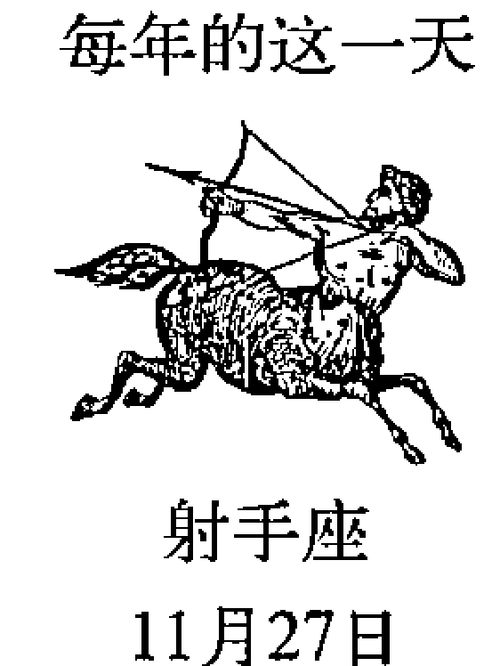

## 幸运数字和守护星

11月27日出生的人受数字9（2 + 7 = 9）和火星的影响。数字9对其他的数字有着极大的影响力（任何个位数加9，皆可回复到原数，例如5+9=14，4+1=5；任何数字乘9，都能回复到数字9，如9×5=45，4+5=9），所以这一天出生的人对别人也相应地有着很大的影响。火星象征着旺盛的精力和积极进取的精神，加上木星（射手座的主宰星，本身就代表了开朗的个性）的影响，会使11月27日出生的人精力十分充沛。的确，由于火星和木星的双重影响，这一天出生的人可以说是激情四射、热情洋溢，并且活力十足。

号手），罗宾·吉文斯（电视剧演员），维托兹·杰诺韦塞（早期黑手党头目），焦万纳·丰塔纳（意大利时尚设计师），皮诺·兰切蒂（意大利设计师，香水制造者），布法罗·鲍勃·史密斯（电视节目主持人），威廉·西蒙（财政大臣，金融家），小室哲哉（日本艺术家），何塞·德格莱夫特（西班牙雕塑家），金伯莉·格拉戈（芭蕾舞女演员），卡罗琳·肯尼迪（美国前总统肯尼迪与杰姬之女），杰恩·肯尼迪（体育记者）

## 塔罗牌

大秘仪塔罗牌的第9张是“隐士”。画面中的人提着一盏灯，拄着拐杖，代表了冥想、孤立与寂静，这张牌同时也象征着智慧的结晶和绝对的纪律。隐士是严厉的导师，他通过良心教育使人走上正途。这张牌为11月27日出生的人指出了培养某些积极特质的方法，而这些特质可能正是他们所必需的。从积极的一面来看，这张牌代表有所坚持、有目标、深沉且专注；从消极的一面来看，这张牌代表专断、心胸狭窄、多疑以及气馁。

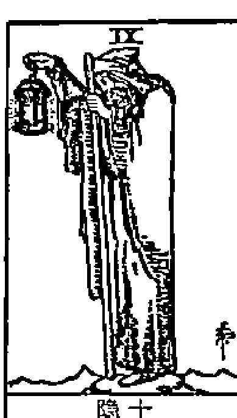

## 健康

由于11月27日出生的人经常处于亢奋的状态，他们的神经系统及肌肉组织往往负荷过重，即使他们原本精力无限，最后也可能走到崩溃的地步。由此看来，随着年纪的逐渐增长，自我调节便成了这一天出生的人最重要、也最实际的课题。这时，拥有一位稳定而且善解人意的伴侣会有很大的帮助，不过，就像前面说过的，11月27日出生的人本身的性格可能只会让这件事情难上加难。在轻松的环境下平静地用餐，维持良好的睡眠习惯，并能享受足够的温情爱意，会给11月27日出生的人带来奇迹。简单朴实的食物，如根类蔬菜、糙米和其他谷类食物、细心选择的肉类食物等，则可以增强这一天出生的人的体质。

- 优点
动作快
直觉敏锐
有冲劲

- 缺点
鲁莽
叛逆
易沮丧

## 建议

控制你内心的风暴，并且积极地将它们导往更有用的地方。多了解自己一点。不要害怕请求别人的谅解。

变动位 12页
火相 16页
秋季 20页
射手座 30页
射手座— 67页

## 静思语

> 一匹训练良好的马并不会比野马缺乏奋起直追的动力。

月份：11月
第28天
射手宫5°～7°
射手座一
变动位/火相

## 11月28日

## 独行的狼的一天

## 出生于这一天的名人

11月28日出生的人具有非常强烈的个性，总是我行我素，再加上与生俱来的矛盾及叛逆的性格，他们真的可以说是非常复杂的一类人。他们的家人和朋友经常被他们时而充满挑衅、时而又敏感体贴的两极化言行搞得不知所措。基本上，这一天出生的人都拥有自己的一套思想体系，这对他们来说极其重要，不过他们的思想可以在瞬间发生变化，让人摸不着头脑，他们说起话来还会非常严肃，言语中甚至还会加夹着反讽的意味。举例来说，从他们的言行中，旁人很难断定这一天出生的人到底是保守派还是激进派，是左倾主义者还是右倾主义者，是社会秩序的拥护者还是无政府主义的叛乱分子。实际上，外人的这些分类与11月28日出生的人的想法一点都不搭界，他们另有一套自己的理解方式。

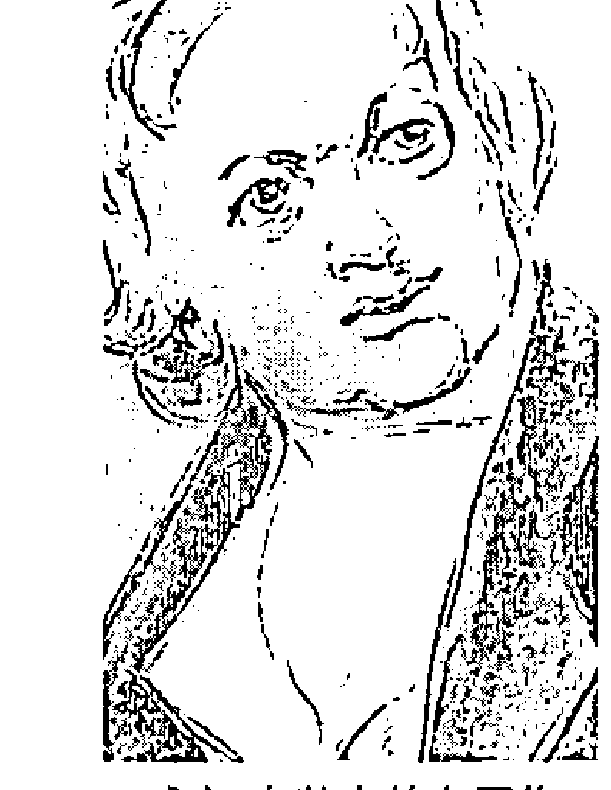

威廉·布莱克的自画像

威廉·布莱克（英国诗人、警世哲学家、雕刻家、画家、神秘的幻想家，著有诗集《天真之歌》与《经验之歌》，哲学著作有《天国与地狱的婚姻》），克劳德·利瓦伊·特劳斯（法国哲学家、民族学者、结构主义者，作品有《结构人类学》），弗朗西斯·耶茨（英国学者、作家，作品有《记忆的艺术》），安东·鲁宾斯坦（俄国钢琴大师、作曲家），阿尔贝托·莫拉维亚（意大利小说家，作品有《顺从者》），莫里斯·路易斯（非绘画性抽象艺术画家），丽塔·梅·布朗（英国女同性恋者，也是电视女星、讽刺小说家，作品有《红果林》），兰迪·纽曼（讽刺歌曲创作者、歌手、钢琴家、电影音乐作曲家），加托·巴维里（阿根廷高音萨克斯管演奏家、作曲家），加里·哈特（美国参议员，来自科罗拉多州），迈克尔·里奇（电影导演，作品有《候选人》、《少棒闯天下》等），墨菲（爱尔兰作家），亚历山大·戈杜诺夫（俄国芭蕾舞蹈家），让-巴蒂斯特·吕里（18世纪意大利裔法国歌剧作曲家），吉吉·葛莱斯（爵士乐萨克斯管演奏家、作曲家、编曲家），保罗·谢弗（键盘手、乐队领袖、电视节目主持人），南希·米特福德（作家，作品有《恋恋冬季》），罗伯特·厄克特爵士（第二次世界大战时期的英国指挥

虽然在11月28日出生的人常给别人四肢发达的印象，可是他们的主要动力来自精神层面。无论从事哪种行业，他们都会对自己的工作不断地进行批评与反思，不愿意遵从既有的教条规定或信仰体系。11月28日出生的人大多是自学成才的人，学校对他们来说，好听一点的是一种干扰，难听的说法则根本就是一座监狱。由于讨厌绝对性的言论或是一般概论，他们总是喜欢持反对的观点来面对所有事物。

11月28日出生的人喜欢尖锐的幽默方式，所以总是利用灵敏的反应或反唇相讥的手段作为反击敌人的武器，这同时也清楚地表达了他们对事情的看法，但绝大部分情况下他们是以直接而严厉的态度来表达观点的。此外，这一天出生的人很容易困在自己的情绪旋涡里无法脱身。浪漫的爱情经常发生在他们的身上，但是都很难稳定发展。从另一方面来说，他们与朋友的关系却非常牢固，这种朋友关系对他们而言也具有很重大的意义。与他们交往过的人都会有这样一种难忘的体验，那就是这些人难以相处，常常使人发狂，而且态度强硬，言行反复不一，永远只顺着自己的意思做事。举例来说，他们有时会很慷慨，有时却又无与伦比地自私。通常他们的善良和真性情只有动物或小孩才能体会，一般具有批判能力的成年人是不太容易体会到的。对于大自然和动物世界的喜爱在他们来看也是非常神圣的事情，因为人类社会总是带给这一天出生的人失望和不安定的感觉。

或许11月28日出生的人面对的最大难题就是了解自己以及整顿自己复杂难懂的个性，这是因为翻腾的情绪使他们无法客观、清楚地审视自己的内心。当觉得自己陷得太深时，他们就会利用工作来逃避。总的来说，11月28日出生的人应该将智力、情绪、直觉和感知等四个方面好好地加以平衡，唯有如此，他们才能让人格发展得更臻成熟，与社会人群也才能更和睦地相处。

586

## 1

## 24

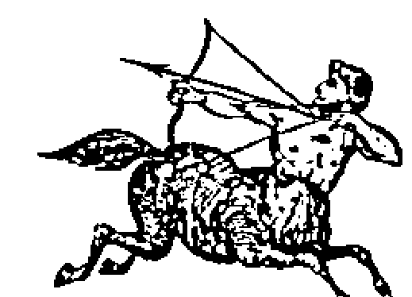

每年的这一天

射手座
11月28日

## 幸运数字和守护星

11月28日出生的人受数字1（2 + 8 = 10，1 + 0 = 1）和太阳的影响。受1影响的人非常独特，对任何事物都有一套自己的明确的看法，而且极度期望自己能攀上所处领域的最高峰。他们的支配欲通常也十分强烈，因此要小心别受好胜心的牵制。太阳象征着丰富的创造力和活力，这些能量需要被稳定地加以引导，而不是零乱地燃烧掉，终致不可收拾。太阳与木星（射手座的主宰星）的结合使11月28日出生的人具有宽宏大量的特质以及积极乐观的人生观，另外，幸运之神对这一天出生的人也总是特别眷顾。

官），保罗·沃菲尔德（美国迈阿密海豚橄榄球队外接员）

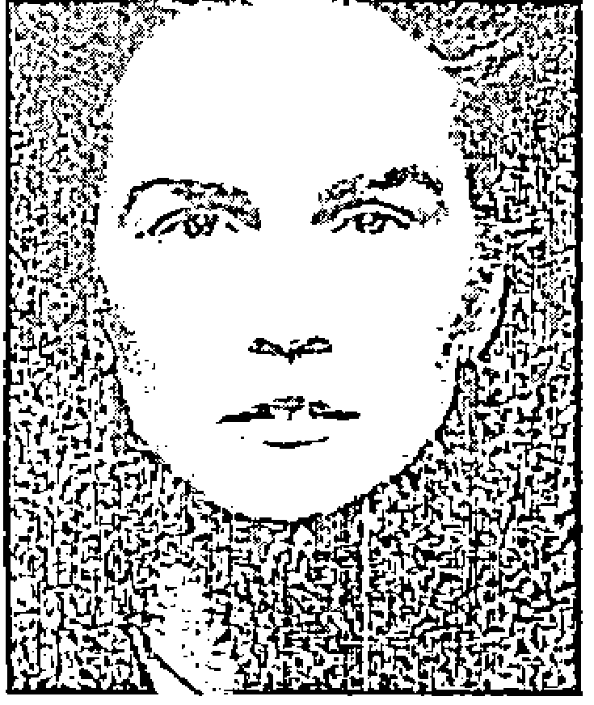

## 塔罗牌

大秘仪塔罗牌的第1张是“魔术师”。魔术师象征着智慧、沟通和资讯。画面中魔术师头上有一个代表无限的符号，这个符号有时也以宽帽表示，有时则是一道光环。这张牌有许多种解释，其一是：魔术师领悟出了生命循环不息的本质，并因这层体悟而拥有力量。所以这张牌代表的积极意义是富有外交手腕、精明干练，而消极意义则是毫无顾忌与投机心态。

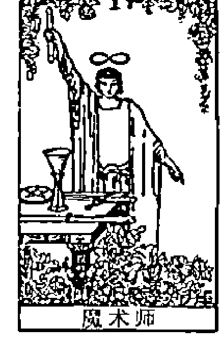

## 健康

11月28日出生的人非常需要安定的家庭为其提供心灵上的祥和与宁静。对他们来说，与大自然接触也是非常重要的一件事，即使只是让他们的生活环境增添点绿色植物或是几只小动物，也能让他们的生活变得更有意义。全素的饮食是一种很好的选择，即使是爱吃肉的人，也应该多吃点新鲜蔬菜、面包和乳制品。11月28日出生的人要特别注意支气管方面的毛病，尤其是吸烟者，更应该定期做肺部检查，就算每次医生的建议都是“戒烟”，也仍要继续检查。这一天出生的人天生好动，因此他们非常喜欢运动和从事各种体能训练。

- 优点
博学多闻
坦率自然
敏感

- 缺点
爱唱反调
易困惑
武断

## 建议

寻找一个发泄身体能量的渠道。试着更好地了解自己。对别人和自己的意见采用相同的评价标准。先调整好自己的内心世界，生活自然会恢复正常。

- 变动位 12 页
火相 16 页
秋季 20 页
射手座 30 页
射手座一 67 页

## 静思语

> 孩子和老人是最靠近上帝的人。

587

月份：11月
第29天
射手宫6°～8°
射手座一
变动位/火相

## 11月29日

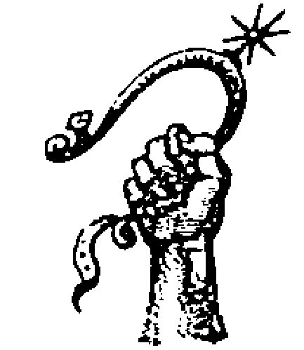

## 刺激人的一天

## 出生于这一天的名人

11月29日出生的人深谙如何刺激别人，有时候仅仅是刺激别人产生一些想法，有时候则会和别人直接发生冲突。这一天出生的人总是喜欢施加影响力，只要他们一出现，原先的状况就必定发生变化。虽然常常被视为麻烦人物，但是他们并不在乎别人的看法。

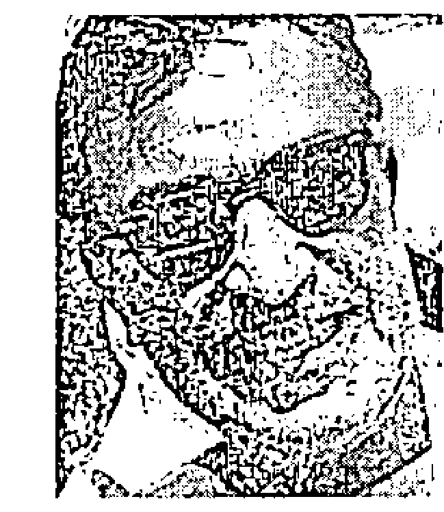

小亚当·克莱顿·鲍威尔 (美国国会议员，纽约哈林区的居民，牧师，人权主义先锋)，路易莎·梅·奥尔科特 (19世纪美国作家，著有《小妇人》等书，美国南北战争时曾担任护士，是阿莫斯·布朗森·奥尔科特之女)，阿莫斯·布朗森·奥尔科特 (19世纪美国超越论哲学家，冥想团体果园公社的创始人)，刘易斯 (英国批评家、小说家，著有《爱的寓言》、《纳尼亚传奇系列》)，贝里·戈迪 (歌曲创作者，音乐制作人，塔姆拉莫顿唱片公司创始人，第1家全黑人唱片公司)，让-马丁·沙尔科 (法国神经学家，现代神经病学的奠基人)，雅克·希拉克 (法国前总统，巴黎市市长)，马塞尔·弗朗索瓦·勒菲弗 (罗马天主教皇，因带领分立教会派反对教堂自由化被逐出教会)，巴斯比·伯克利 (美国舞蹈家，好莱坞编舞家，导演了歌舞剧《1935淘金女郎》)，詹姆斯·罗森奎斯特 (流行艺术画家)，保罗·西蒙 (美国参议员，来自伊利诺伊州)，埃尔默·朱姆沃尔特 (美国海军上将)，加埃塔诺·多尼泽蒂 (意大利歌剧作曲家)，李远哲 (以分子水平化学反应动力学的研究获得了诺贝尔化学奖)，约翰·梅奥尔 (蓝调歌手，作曲家)，菲利普·悉尼爵士 (英国伊丽莎白时期的诗人，大臣)，查克·曼吉欧尼 (爵士乐小号手，作曲家)，加里·尚德林 (喜剧演员，电视名人)

11月29日出生的人也知道如何触动别人的情绪，通常只要插入一段评论、挑动挑动眉毛或者仅仅是保持沉默就能达到扰乱别人心绪的目的。他们自许为真理的守护神，只要有人胆敢无视真理的存在，他们就绝对会让这些人吃尽苦头。他们对这些人的惩罚是非常让人震惊的，因为他们深知该从哪里下手、何时出手，不过这一天出生的人最好谨慎行事，以确保自己所施的惩罚不会因为过于残酷而失去原本应有的正面意义。

11月29日出生的人对于社会或政治团体并没有太多的贡献，但是他们绝对是非常忠诚的人，而且时刻都保持警觉。在个人生活方面，这一天出生的人总是能守护自己的家人和朋友，为他们带来安全感，他们就像一场固定了位置的飓风一般，总是在原地打转，不会马上离开。任何人只要在这个飓风眼之内，就绝对会受到他们的保护，免受外面风雨的伤害。

通常最受11月29日出生的人的不稳定情绪和不安定感所折磨的人，就是他们自己。他们可能给别人带来很多麻烦，别人却很难想象隐藏在他们内心深处的痛苦。他们那种对自己不满的情绪与内心宽以待己的欲望之间的冲突对他们的煎熬，大概只有感觉细腻的人才有可能发现吧。

至于野心和往上爬的驱动力，11月29日出生的人永远都在忙每天的日常琐事和自我的问题，因此他们根本无暇思及征服世界这类事情。不过，这一天出生的人本身有很强的社交天分与职业智慧，所以他们通常能取得一定的成就，但也就是停留在那个阶段了，不会再有所攀升。所幸11月29日出生的人尚有制胜出击的天赋，因此他们或许还可以在同一个地方长期地发挥他们惊人的影响力。如果说有任何因素使他们的宝座不保，那一定是因为同事们已经受够了彼此间的争端与纠扯。同样的问题也会出现在他们本来很有耐心的伴侣和朋友身上，这些人到后来会发现如果少了与这一天出生的人的争论，虽然会少些乐趣，但是生活会轻松许多。因此，如果11月29日出生的人想生活过得快乐一点，他们就必须学会少烦扰别人，凡事就让它顺其自然地发展吧。

## 2
C 24

每年的这一天

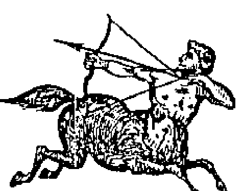

射手座
11月29日

## 幸运数字和守护星

11月29日出生的人受数字2（2 + 9 = 11，1 + 1 = 2）和月亮的影响。受数字2影响的人通常可以成为优秀的工作伙伴和搭档，却不是最佳的领导人选，这一特质很符合11月29日出生的人的团体价值观，同时也有助于实现他们对于呵护家庭的理想。不过，这种被动特质可能在个人的主动性和行动方面扮演刹车的角色，并导致挫败感。由于还受到了月亮强烈的反省意识与被动倾向的影响，他们的这种特质会更加明显。月亮和木星（射手座的主宰星）的双重影响会使11月29日出生的人具有强烈的评断别人的倾向，喜欢把别人潜藏的动机挖掘出来。第2个影响这一天出生的人的数字是11，这个数字使他们具有了一种物质感知能力，同时也会对所有成双成对的事物特别感兴趣，例如双胞胎、对称的事物等。

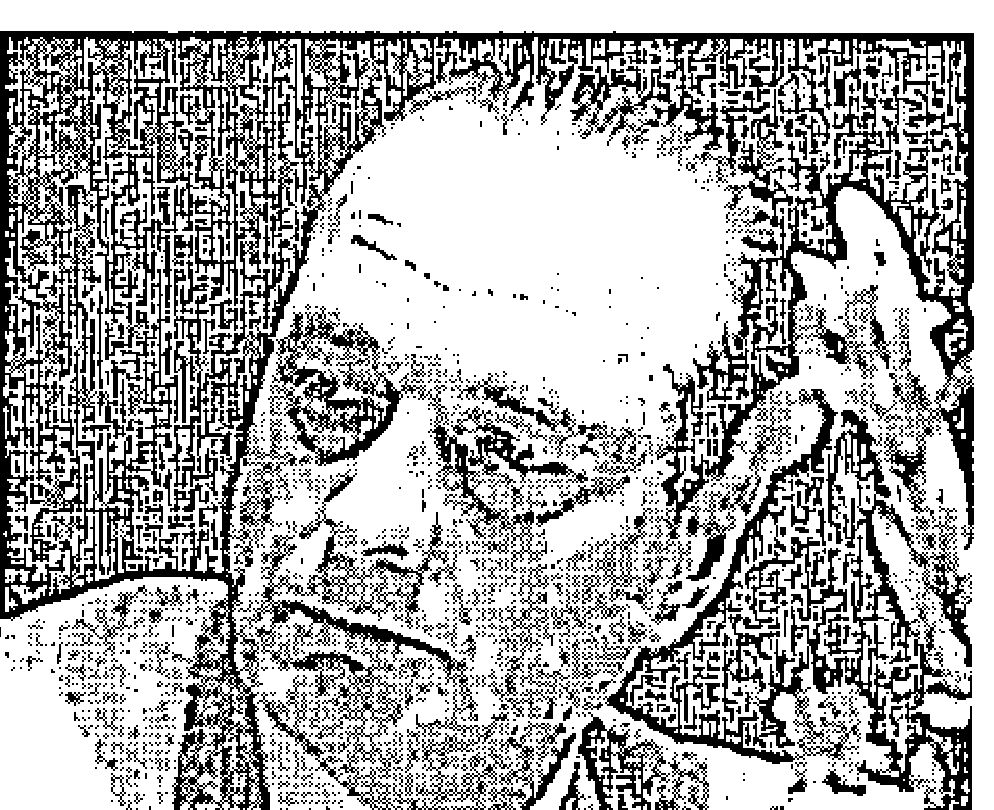

## 塔罗牌

大秘仪塔罗牌的第2张是“女祭司”。画面中女祭司坐在宝座上，看起来自在平静，还有些高深莫测。女祭司拥有灵性，可以让隐藏的力量和秘密显现出来，进而赋予人们这些知识。因此，从积极的一面来看，这张牌代表宁静、直觉、含蓄以及谨慎；从消极的一面来看，这张牌则代表诡秘、猜疑、冷漠和迟钝。

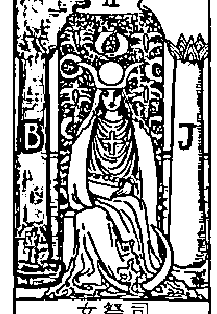

## 健康

11月29日出生的人要特别注意别让自己的内心过于烦乱。过度的焦虑和持续的情绪低落，很可能导致神经系统的负担过重。保持稳定的心理状态可以说是这一天出生的人在健康上最大的挑战。他们的生理也很可能出现不平衡的状况，尤其是荷尔蒙系统，例如内分泌、甲状腺、性激素的失调等。至于饮食，11月29日出生的人最好多吃一些新鲜蔬果、谷类食物，避免过多的糖分和脂肪含量过高的乳制品，还有少吃红肉，这些都对他们的健康有很大的助益。激烈的体育运动和积极的性生活也能适当地发泄及稳定他们的身体能量。

| 优点 |
| --- |
| 善于刺激他人 |
| 有活力 |
| 有影响力 |

| 缺点 |
| --- |
| 烦恼多 |
| 爱烦扰别人 |
| 太过压抑 |

## 建议

有时候保留对其他人、事、物的判定和道德评价也是不错的选择。让自己冷静下来。学着在旁边静静地观察而不发表意见。善用你自己的能力，以积极的方式改变周围的环境。

| 变动位 12 页 |
| --- |
| 火相 16 页 |
| 秋季 20 页 |
| 射手座 30 页 |
| 射手座— 67 页 |

## 静思语

> 调整呼吸可以舒缓情绪。

589

月份：11月
第30天
射手宫7°～9°
射手座一
变动位/火相

## 11月30日

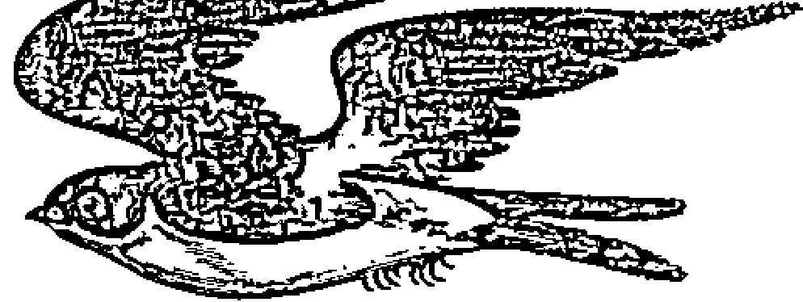

## 谋定而动的一天

## 出生于这一天的名人

11月30日出生的人天生就有一种能力：知道什么时候以及怎样向眼前的挑战出手反击。不过这种反击行动并非采用以快制胜的方式，而是先经过谨慎、仔细的估测，然后再打出制胜的一击。这一天出生的人直觉敏锐，出招时也总是让面前的对手大吃一惊，待对手们回过神来才恍然大悟，原来他们在采取行动之前下了非常多的准备工夫，这才得以克敌制胜的。

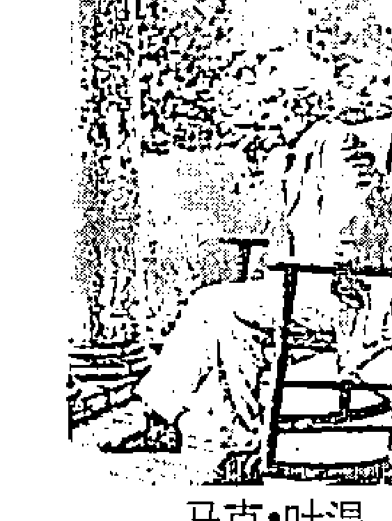

马克·吐温（美国幽默大师、作家，代表作有《汤姆·索亚历险记》、《哈克贝利·费恩历险记》），温斯顿·丘吉尔（英国政治家，英国首相，第二次世界大战时的英国领导人之一，获得了诺贝尔文学奖，作品有《讲英语的人的历史》），乔纳森·斯威夫特（19世纪爱尔兰作家，讽刺大师，代表作有《格列佛游记》），雪莉·奇泽姆（非洲裔美国政治活动家），阿比·霍夫曼（社会活动家、作家，制造了很多恶作剧，著有《偷走这本书》），比尔·沃尔什（橄榄球教练，为旧金山49人队教练，曾带队夺得3届超级碗冠军，也是体育节目解说员），土井多贺子（日本社会党主席），戈登·帕克斯（摄影师，歌曲创作者，电视剧、电影导演，作品有《铁杆神探》），戴维·马梅特（美国纽约剧作家，电影编剧，舞台剧及电影导演，作品有《杀人犯》），乔吉特·鲁宾逊（英国秘密安全局，伦敦警察厅工作人员，国际刑警组织代理，著有自传《绿色雪崩》），博·杰克逊（棒球外场手，橄榄球跑动后卫，传奇人物），迪克·克拉克（美国老牌音乐节目主持人），戈登·利迪（“水门事件”当事人，著有《意念》），安德烈亚·帕拉第奥（意大利建筑师），比利·伊多尔（歌手，歌曲创作者），特伦斯·马利克（电影导演，作品有《不毛之地》），琼·普安泰（歌手，普安泰姐妹团体）

只要观察11月30日出生的人工作的情况，大概就能对他们有所了解。不管是拜访客户、构思一项提案，或是向某人求爱，这一天出生的人都会在心里反复演练，直到可以应付各种突发状况为止。在最基本的准备阶段结束之后，他们便开始与“猎物”约定时间和地点，这里的时间和地点当然也是经过他们深思熟虑和“猎物”的同意之后才选定的。最后，他们便可以伺机向这个“猎物”下手了。无论穿着的款式、说话的方式或是时间的掌握，所有的一切都是经过他们精心编排好的，可以说是完美至极。一般来说，11月30日出生的人真的是令人难以拒绝的人，不过，他们最好也能对可能的失败有所认知，并且能够接受和调整自己的心态，因为无论他们的说服能力如何强大，毕竟不是每个人都会受他们的摆布的。

11月30日出生的人对于自己拥有的天赋总是能够发挥到极限，一点也不浪费。大多数这一天出生的人都很有幽默感，通常只需一个微笑，就能将严肃的场面很有技巧地转化为较愉快的场面。他们的这种幽默经常很狡黠，但也很可能是猛拍大腿、哄然大笑型的。由于善于伪装，这一天出生的人对别人的讥讽几乎不露任何痕迹，致使大部分的人根本无法察觉他们的意图。不得不说，他们的幽默有时也确实发人深省。

虽然一向态度殷勤，但是11月30日出生的人在受到攻击时会显示出强烈的防御性，因此他们最好学着不要对别人所说的话反应过度，或是将自己内心潜藏的不安全感一下子表现出来。这一天出生的人可以说是脸皮非常薄的人，尤其不喜欢被当做笑柄，对别人的攻击也通常会先筑起一堵硬墙防御，然后慎重地作准备，伺机大举反击，叫对手苦不堪言。由于天生喜欢等待，他们必须特别小心不要自怜自艾，过度压抑自己的情绪，或是将挫折感闷在心底。比较成熟的人大多会以优雅的姿态、沉着的心态与宽大的胸怀来面对一切指向他们的负面状况。

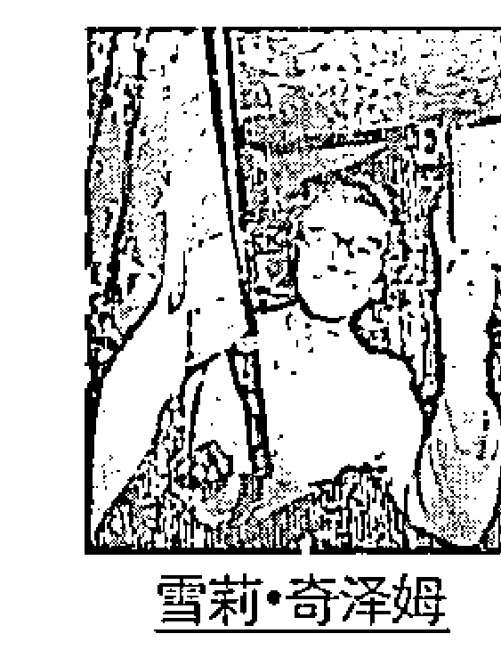

11月30日出生的人通常都有孩子般纯真的个性，因此，只有真诚的建议和协助才能真正地感动他们。实际上，这一天出生的人总是很顽固地拒绝世上各种危险的或者奸诈的想法，而对于率直和纯真却总是无法抗拒。

590

## 3
24 24

每年的这一天
射手座
11月30日

## 幸运数字和守护星

11月30日出生的人受数字3(3 + 0 = 3)和木星的影响。受数字3影响的人，通常会努力走上他们所从事领域的最高位置。木星同时是射手座的主宰星，因此诸如开朗、乐观和宽宏大量的特质会在11月30日出生的人身上发挥到极致。受数字3影响的人热爱独立，因此，不管是自己创业或是做一个自由职业者，他们都能有很好的发展。

成员)，克莱福特·斯蒂尔（美国抽象主义画家），雅克·巴曾（文化历史学家），弗吉尼娅·梅奥（电影女演员）

## 塔罗牌

大秘仪塔罗牌的第3张是富有创造性智慧的“皇后”。画面中的她是达到极致的完美女性，是孕育大地的母亲，也是我们梦想与渴望的化身，象征着有创造力的聪明才智。因此，这张牌代表的积极意义是魅力、优雅与无条件的爱，而消极意义则是自负、矫情及苛责。对11月30日出生的人来说，这张牌提醒他们要培养自控能力以及做事要有原则。

## 健康

11月30日出生的人务必注意，不要因为精心制定的计划无法成功或遭到任何挫败，就变得沮丧、消沉。这也主要是因为这一天出生的人太有自信了，以致只要一碰到失败，他们纷乱的心绪就会无孔不入。更严重的是，一旦丧失了活力或稳定的情绪，他们那种惊恐简直就是不可言喻的。学习保持“既来之，则安之”的心态，适度地调整自己，对他们的心理健康是非常重要的。在生理方面，11月30日出生的人非常活跃，充满了活力，在饮食、性爱和运动方面他们也都有很健康的习惯。经常到乡间或郊外走走，或养一些猫、狗等宠物，对他们的生理或心理健康都很有帮助。此外，这一天出生的人还要避免工作过量，并且要学着调整脚步，因为承担太多的责任会对他们的神经系统造成太大的压力。若是对别人的成见变得越来越深了，那么他们最好能够避开这些人，千万不要浪费时间试图去改变这种状况。

- 优点
考虑周全
有趣
有活力

- 缺点
脸皮太薄
易反应过度

## 建议

允许自己随兴创作，放松。你的自我控制能力是很强大的，但是顺其自然也同样是很不错的生活方式。对于自己的小瑕疵就一笑置之吧。常保孩童般单纯的心。

- 变动位 12页
- 火相 16页
- 秋季 20页
- 射手座 30页
- 射手座— 67页

## 静思语

> 知识广博的人，未必具有真知。

月份：12月
第1天
射手宫8°～10°
射手座一
变动位/火相

## 12月1日

## 尽情欢乐的一天

## 出生于这一天的名人

出生于 12 月 1 日的射手座一通常是直言不讳、口没遮拦的人，而且是说到做到的行动派。虽然他们经常出言不逊，但是他们闪亮、认真的眼神和佯装出来的无辜表情，总是能够博得人们的原谅。除了在说话方面不喜欢受到羁绊之外，12 月 1 日出生的人在做事时也喜欢打破常规陋习，尤其是碰到与他们自身的利害有很大关系的事情时。

伍迪·艾伦 (美国喜剧演员、电影演员、导演，作品有《安妮·霍尔》、《曼哈顿》)，贝特·米德勒 (歌手，电影演员，喜剧演员)，理查德·普赖尔 (喜剧演员，电影演员)，玛丽·马丁 (美国音乐喜剧女演员、歌手，曾扮演过原版舞台剧《小飞侠》中的彼得·潘)，鲁·罗尔斯 (歌手，表演艺人)，李·特雷维尼奥 (高尔夫球运动员，获得过2次美国职业高尔夫联赛冠军，也获得过美国、英国高尔夫球公开赛冠军)，埃里克·罗默 (法国作家、批评家、电影导演，作品有《克莱尔之膝》)，特里特·威廉斯 (电影演员)，雷克斯·斯托特 (神秘作家，著有“尼罗·沃尔夫”系列侦探小说)，艾丽西亚·马尔科娃夫人 (英国芭蕾舞女演员)，西里尔·里查德 (英国舞台剧、电视剧演员，曾扮演原版舞台剧《小飞侠》中的霍克船长)，彼得·卡利科 (房地产开发商，《纽约邮报》的出版商)，约翰·保罗·登斯莫尔 (摇滚乐鼓手，大门乐队成员)，哈科·帕斯托瑞斯 (爵士乐贝司演奏大师、创新者，35 岁时因打架而死)，安娜·科穆宁娜公主 (12 世纪君士坦丁堡历史学家)，戴安娜·伦农 (歌手，伦农姐妹组合成员)，维奥莱特·韦尔迪 (芭蕾舞舞蹈家，曾供职于巴黎歌剧院、波士顿芭蕾舞团)

因为人们通常能够猜到 12 月 1 日出生的人的感觉，所以有些人可能觉得这一天出生的人都非常浅薄。然而，实际情况却恰恰相反，他们也能够很深沉、复杂，只不过一根肠子通到底，凡事都喜欢说出来罢了。有时他们似乎是受到了一股莫名的力量的驱使，根本不知道自己在做什么，甚至怀疑自己的定力不够，但是这种奇妙的精神状态也帮助他们成就了不少的事情。

12 月 1 日出生的人也是非常乐善好施的人，他们对周围的朋友或者较亲密的人会毫不吝啬地给予财务、时间或者精神上的照顾，可是，忙碌的工作经常使这些大善人少有时间去做想做的善事。因此，不但他们自己觉得非常沮丧，他们身边的亲人也常常颇有怨言。不过，虽然如此，有如自动发电机的 12 月 1 出生的人还是会迎难而上，知其不可为而为之，竭尽所能地满足各方的需求。

对于异性，12 月 1 日出生的人可以说是调情的能手。不过，尽管喜欢对别人展现魅力，他们还是会把最真挚的爱留给最特别的人。在成长的过程中，这一天出生的人大多都经历过顽皮的童年、狂风暴雨式的青春期以及脚步尚未踏稳的成熟期。幼时因为调皮捣蛋而受处罚或者父母过多的限制也会给他们造成挫折感。在性爱上所表现出来的主动与强势姿态，正反映了这一天出生的人内心强烈的不安全感。

12 月 1 日出生的人追求精神的自由。虽然他们可以胜任一切公司职务，但是，如果他们感觉时机正确，而公司也能依着他们的决定让他们铆足了劲去做想做的事情，那他们在工作上的表现就会好上加好。然而，长时间地待在同一个地方工作，会将他们自由的精神一点一点地消磨掉，就像久困牢笼中的动物会失去自然的本能一样。

因此，能够自由自在地表现自己，对 12 月 1 日出生的人来说就变得极其重要了。只不过他们也必须知道，社会上的人不会永远容忍他们桀骜不驯的态度，所以这一天出生的射手座一最好学会有所保留，做事再圆融一点，不要把所有情绪都赤裸裸地呈现在别人面前。而且，如果想让别人看重自己，就应该首先在自己的可信度上多下点工夫。

## 1

每年的这一天

射手座
12月1日

## 幸运数字和守护星

12月1日出生的人受数字1和太阳的影响。出生在1日这一天的人凡事都喜欢争第一，而受数字1影响的人则通常比较自我，非常有主见，而且争强好胜。太阳象征着强大的创造力和活力，这些能量需要被稳定地加以引导，而不是零乱地燃烧掉，终致不可收拾。由于同时受到了太阳和射手座的主宰星木星的影响，12月1日出生的人通常显得特别慷慨、情绪高昂，而且信心十足。

导演），
卡尔·施
特·罗特
卢夫（德
国表现主
义画家，
桥社创始
人）

## 塔罗牌

大秘仪塔罗牌的第1张是“魔术师”。魔术师象征着智慧、沟通和资讯。画面中魔术师头上有一个代表无限的符号，有时以宽帽表示，有时则是一道光环。这张牌有许多种解释，其一是：魔术师领悟出了生命循环不息的本质，并且因为这层体悟而拥有力量。所以这张牌代表的积极意义是富有外交手腕、精明干练，而消极意义则是毫无顾忌与投机心态。是利用自己的能量去攫取财富、名望和别人的重视，还是培养能力追求更有意义的目标，全在于12月1日出生的人怎么选择。

## 健康

在12月1日出生的人必须特别注意不要耗尽所有的精力与能量，最好多找时间休息。不管是精神崩溃、头疼、腰酸背痛、内分泌失调或是其他症状的发生，都表示身体对主人长期的疏于照顾和过度操劳所发出的抗议。这一天出生的女人尤其有体重增加（特别是臀部和大腿）的困扰，而男性则可能变瘦，上了年纪之后还可能布满皱纹。均衡的健康饮食可以改善这种状况，他们最好选择既可口又健康的食物，若能搭配固定且适度的运动就更完美了。此外，对12月1日出生的人来说，规律的性生活对于维持心理和生理的健康也是非常重要的。

- 优点
充满生气
外向好动
活力四射

## 建议

控制好你的能量。只有充分了解自己才能让自己获得自由。小心因为太过直接而惹恼别人，学习委婉地表达。学习交际技巧，谨慎一些，别把所有东西都给别人。

- 缺点
容易疲惫
易受误导
缺乏自知之明

| 变动位 12 页 |
| --- |
| 火相 16 页 |
| 秋季 20 页 |
| 射手座 30 页 |
| 射手座— 67 页 |

## 静思语

> 生活中最简单的事物通常是最重要的事物。

月份：12月
第2天
射手宫9°～11°
射手座—
变动位/火相

## 12月2日

## 富有传奇色彩的一天

## 出生于这一天的名人

12月2日出生的人具有强大的精神力量。不论他们的体型多么瘦小，他们对周围环境的影响力都是初识的人所始料不及的，尤其是在做事时，他们的光彩会真正地散发出来。他们的影响极为神奇，有时候那些和他们有关联的人可能觉得自己好像被拳击手打了一样。

12月2日出生的人比较情绪化。情绪好的时候他们是很敏锐的价值判断者，能够诚实地作出公正的判断；情绪不好的时候，他们很容易记恨，喜欢把坏脾气发在不相干的人身上。这一天出生的人如果修养比较差，会因为操纵别人的感情或要求身边的人赞同他们、对他们忠诚，而对他人和自己造成很大的伤害。然而，一般而言，这一天出生的人都非常自信，相信自己的所作所为是对的，就算要承认错误，也是很久以后的事了。

玛丽亚·卡拉丝（希腊裔美国歌剧女高音歌唱家，与希腊船王奥纳西斯的韵事举世闻名），尼科斯·卡赞查斯基（希腊小说家，作品有《希腊人佐尔巴》），乔治·修拉（法国新印象主义画家，32岁时去世），莫妮卡·塞莱斯（南斯拉夫裔美国女子网球世界冠军，20世纪最年轻的大满贯冠军得主，曾被刀刺伤），朱莉·哈里斯（舞台剧、电影、电视剧演员），查尔斯·林林（美国马戏团团长，林林兄弟组合的一员，巴纳姆与贝利马戏团团长），威廉·韦格曼（纽约摄影师，视频艺术家，画家），杰弗里·劳伦斯（英国法官，主持了纽伦堡审判），亚历山大·黑格（美国里根时代的国务卿，作家），埃德温·米斯（美国里根时代的总检察长），让·特鲁瓦格罗（法国厨师，新菜系的创始人），拉塞尔·莱恩斯（哈珀的编辑，作家），奥托·迪克斯（德国后表现主义画家），托马斯·布莱斯德尔（美国罗斯福在任时的政府官员），贝丝·弗曼（记者，作品有《白宫档案》），保罗·莫尔登豪尔（德国经济学家）

12月2日出生的人不但自己具有强悍的性格，也崇拜他们所尊敬的人身上强悍的一面。他们不是驯顺的羔羊，可是更强悍的人能够叫他们俯首称臣，比如某个人提出的某一种主张正好和他们的想法相吻合，他们就会忠心地追随这个人。对人性具有基本的信心是12月2日出生的人的特质。确实，人的感情、行动、思想和感受——从最基本的和最不靠谱的到最纯粹的和最合乎理想的——就像一个万花筒，令这一天出生的人着迷。从另一个角度来看，生活就是他们的上帝，但是他们过度的信心和勇敢会导致过大的生活压力。通常，这一天出生的人要是受到了刺激，也会奋起反抗，但不会太具侵略性。由于他们很少做出让步，因此这种“拒绝放弃”到最后会转化成一种狂热。

12月2日出生的人往往认为生活就是一场战斗，他们必须成为胜利者。不过，他们奋斗的目标不一定是个人的福祉，还可能是他们所看到的某些幸存的人性的基本价值。除了能力、信仰，12月2日出生的人也很重视品德，尤其是正直，因此，如果他们发现自己行为卑下、低贱，他们就会懊悔不已。在他们的生活中，是否“犯罪”了常常是一大问题。

对12月2日出生的人来说，发展自己的风格、寻找自己的精神道路并努力去实践自己的梦想，是他们最大的挑战。虽然他们常常偏离这条道路，但是他们总是秉持着不屈不挠的精神，即使在他们最艰难的时刻，他们也绝不肯放弃。在这样的生活当中，他们要学习的第一课就是分辨对与错，以及什么是假象，什么是真正有意义的事。

## 每年的这一天

## 射手座
12月2日

## 幸运数字和守护星

12月2日出生的人受数字2和月亮的影响。受数字2影响的人通常会是优秀的工作伙伴和搭档，而非领袖。然而，月亮的影响可能在个人的主动性和行动方面扮演刹车的角色，并导致挫折感，对受到了更强主导特质的影响的人尤其会如此，这一点还会因为月亮严重的内省和被动特质而更加严重。月亮的影响加上木星（射手座主宰星）的作用，能够支持这一天出生的人爱护别人和慷慨的冲动。如果12月2日出生的人正好是家中的第2个孩子，那么他们就比较难成为独立的个体，因为他们心里很早就形成了“附属于强大的兄姊”的观念。

家），罗伯托·卡普奇（意大利时尚设计师），卢修斯·毕比（美国专栏作家，出版商，记者，铁路历史学家），约翰·巴尔比罗利爵士（英国指挥家，哈雷管弦乐团指挥）

## 塔罗牌

大秘仪塔罗牌的第2张是“女祭司”。画面中女祭司坐在宝座上，看起来自在平静，还有些高深莫测。女祭司拥有灵性，可以让隐藏的力量和秘密显现出来，进而赋予人们这些知识。因此，从积极的一面来看，这张牌代表宁静、直觉、含蓄以及谨慎；从消极的一面来看，这张牌则代表诡秘、猜疑、冷漠和迟钝。

## 健康

12月2日出生的人的健康得益于他们对自己的信心，可是，他们最好还是每年都进行一次健康检查。对于身体上的一些小毛病（感染、头痛、胃痛等），他们很喜欢拖很久也不接受治疗。这一天出生的人得特别提防下肢静脉的问题，尤其是心血管系统的损害和腿部静脉的病变，如果对其放任不理，他们很可能到年纪大一点的时候患上静脉曲张。此外，他们还要多培养烹饪的兴趣，改善食欲和饮食习惯。至于运动，这一天出生的人做适度的运动即可。睡眠对他们的心理健康特别重要，如果有必要的话，最好一个晚上睡够10个小时，因为他们需要做梦的时间。

| 优点 |
| --- |
| 有活力 |
| 理智 |
| 有人情味 |

| 缺点 |
| --- |
| 脾气不好 |
| 爱评断 |
| 控制欲强 |

## 建议

注意自己的脾气。不管别人怎么说，赢并不代表一切。真正的自我肯定会使你不再渴望别人的欣赏。试着少一些评断与指责。想进步，就必须首先认识自己的缺点和错误。

- 变动位 12页
- 火相 16页
- 秋季 20页
- 射手座 30页
- 射手座— 67页

## 静思语

> 在最简陋的地方可能发现真正的伟大。

月份：12月
第3天
射手宫10°～12°
射手座二
变动位/火相

## 12月3日

## 心灵手巧的一天

## 出生于这一天的名人

在实现自己理想的道路上，12月3日出生的人很少让障碍横挡在眼前。他们会运用各种巧妙的方法来完成自己的计划，在此过程中，为了能够更自由一些，他们会做得比较隐秘或者对计划的控制比较强。然而，这并不表示他们会为了私利而不择手段，实际上，这一天出生的人会为了自己的创作、家庭、工作或兴趣而奋斗，而不会单单只想着为自己赢得名利双丰收。也正因为如此，12月3日出生的人的家人经常担心这种个性没办法为他们自己成功地创造财富。

约瑟夫·康拉德（波兰裔英国小说家，作品有《黑暗之心》、《吉姆爷》），让-吕克·戈达尔（法国政治激进派导演，作品有《无法呼吸》、《周末》），斯文·尼奎斯特（瑞典电影摄影师，曾与大导演伯格曼合作拍过十几部影片），安东·韦伯恩（20世纪奥地利作曲家），尼诺·罗塔（电影音乐作曲家），兹拉塔·菲利波维奇（儿童作家，作品有《兹拉塔的日记：一个孩子在萨拉热窝的生活》），塞缪尔·克朗普顿（18世纪英国发明家，走锭纺纱机的发明者），妮古拉·阿马蒂（意大利小提琴制造家），吉尔伯特·斯图尔特（美国肖像画家），安娜·弗洛伊德（奥地利心理分析师，西格蒙德·弗洛伊德的女儿），凯塔琳娜·威特（著名花样滑冰运动员，获得过4次世界冠军、2次奥运会冠军），博比·艾利森（赛车手，获得过3次戴托那500大赛冠军），里克·米尔斯（赛车手，获得过4次印第安纳波利斯500大赛冠军），乔治·麦克莱兰（美国南北战争时期的联盟军将领、政治家），哈利·伯内特（小说家，作品有《心是孤独的猎手》），安迪·威廉斯（歌手），朱利叶斯·毕西尔（德国抽象主义画家），奥齐·奥斯本

精巧的手艺和创造精神是上天特别赐给12月3日出生的人的礼物。由于太讲究真功夫，他们真可以称得上是完美主义者。有些人可能被他们一心一意的奉献所感动，因而不断向他们投以钦佩和关爱的眼神，还会对他们在做什么表现出很大的兴趣，不过这些垂爱对这一天出生的大师级人物来讲并不是特别需要的东西，这种兴趣也不会干扰他们，他们还是会继续自己的工作，不需要别人的肯定，甚至不希望别人来打扰他们。

实际上，对12月2日出生的人来说，拥有高度的隐私是非常有必要的，在某些重要时刻，他们甚至会完全与外面的世界隔绝，因为只有如此，他们才能专注于自己的事情，为更高层次的创作而努力。这种情况通常发生在30岁以后，这一天出生的人也因此会成为别人眼中的隐士。的确，他们在封锁自己、不借助外力引导的情况下也能取得成就，有时这的确颇令人费解。然而，这并不代表12月3日出生的人特别具有奉献精神或是宗教信仰，实际上，他们非常理性，甚至还有点愤世嫉俗。

12月3日出生的人对工作会非常投入，但是这种现象很可能导致危机：认识不到自我人格成长的重要性。基本上，这一天出生的人根本不在乎自己或别人的个性如何，他们认为既然上天赋予了他们创造的才能和充沛的体力，他们就得好好利用，仅此而已。不过幸运的是，慢慢地，这些12月3日出生的人就会开始努力探索更深层次的自我，而且把这件事情当成工作般认真对待。到了这个时候，他们作品中的特异性与工匠气就会减少很多，他们以及他们的作品也会更人性化，更容易被人们所接受。

## 3
24 24

每年的这一天
射手座
12月3日

## 幸运数字和守护星

12月3日出生的人受数字3和木星的影响。受数字3影响的人通常希望能在所从事的领域中走到最高的位置，然而，就像前文所讲的，12月3日出生的人对工作本身的兴趣远远大于对事业前程的规划。好在木星（射手座的主宰星）能在人格的成长和对工作的态度上，赋予这一天出生的人更大的发展潜力和乐观的天性。由于受数字3影响的人热爱独立，因此，不管是自己创业或是成为自由职业者，他们都能有很好的发展。

（重金属摇滚乐歌手，黑色安息日乐队成员），约翰·巴克斯（计算机科学家），路易吉·浦尔契（15世纪意大利诗人）

## 塔罗牌

大秘仪塔罗牌的第3张是富有创造性智慧的“皇后”。画面中的她是达到极致的完美女性，是孕育大地的母亲，也是我们梦想与渴望的化身，象征我们的志向和希望。皇后稳定的特质通常可以成为12月3日出生的人的榜样，而这些人也可以成为可靠的朋友和忠诚的家人。因此，这张牌代表的积极意义是魅力、优雅与无条件的爱，而消极意义则是自负、矫情及苛责。

## 健康

12月3日出生的人常常因为沉浸于思考及工作而忽略自己和家人的健康，所以他们应该定期让信任的医生给自己作健康检查。虽然他们会经常阅读各种有关身心疾病的书籍，但是他们还是应该更积极地维护自己的身体健康，而不仅止于接收资讯而已。把工作时精益求精的态度运用在设计健康食谱上，将更有助于他们制订饮食计划，例如热量的计算、维生素的补充，以及蛋白质、碳水化合物、脂肪的摄取等。至于运动，这一天出生的人则应选择较温和的体能训练，例如走路、骑单车或游泳等。感情生活与性爱对12月3日出生的人来说是属于比较私密的东西，人们应该尊重他们这方面的隐私权。

- 优点
- 全神贯注
- 富有革新精神
- 手艺好

- 缺点
- 神秘
- 奇怪
- 不易接近

## 建议

多关心一下自己的健康和个人的发展，有时可以放心地将责任递与其他人。小心不要变得太与世隔绝——多与外界接触接触，并且试着帮助别人。

变动位 12页
火相 16页
秋季 20页
射手座 30页
射手座二 68页

## 静思语

> 如果洞已经挖得足够深了，就应该出来透透气。

月份：12月
第4天
射手宫11°～13°
射手座二
变动位/火相

## 12月4日

## 坚忍不拔的一天

## 出生于这一天的名人

瓦西里·康定斯基 (俄国画家, 美学理论家, 现代艺术的创始人), 伊迪丝·卡维尔 (英国护士, 也是比利时护理学校及其附属医院的创办人, 曾于第二次世界大战期间在战场服务, 不幸被俘, 被德国射击小组枪决), 拉尼尔·马里亚·里尔克 (德国诗人, 作品有《献给俄耳甫斯的十四行诗》, 同时也是作家, 作品有《马尔特·劳里茨·布里格记事》), 莉莲·拉塞尔 (女演员, 19世纪90年代杰出的艺人, 20世纪的女性主义者), 弗朗西斯科·佛朗哥 (西班牙独裁者, 西班牙内战时的将军), 谢尔盖·布勃卡 (乌克兰撑竿跳大师, 奥运会金牌得主, 第1个打破6.096米记录的人), 杰夫·布里奇斯 (电影演员), 卢·詹金斯 (美国世界轻量级拳击冠军), 撒迪厄斯·曼 (英国心理学家, 再生生物化学家, 著有《精液生化研究》), 吉姆·霍尔 (爵士乐吉他手), 温顿·凯利 (爵士乐钢琴家), 弗朗西斯·鲍尔·科布 (反对活体解剖者), 托马斯·卡莱尔 (19世纪英国文化历史学家, 批评家, 作家), 迪安娜·德宾 (电影演员), 阿伦·西斯金德 (摄影师, 教育家), 克里斯·希尔曼 (摇滚乐吉他手, 贝司手, 曼陀林演奏家, 飞鸟乐团, 飞翔的伯里托兄弟乐团, 马纳萨斯乐团成员), 塞缪尔·巴特勒 (19世纪英国讽刺小说家, 作品有《有何无之乡游记》), 霍斯特·布赫霍尔茨 (德国舞台剧, 电影演员), 赫伯特·里德 (英国艺术历史学家, 诗人)

12月4日出生的人是勇敢、积极进取的一类人, 有足够的勇气去追求自己的人生理想, 追随内心和灵魂的召唤。痛苦、冲突、挣扎对他们而言并不陌生, 因为他们老是碰到大大小小的挑战。然而, 如果能够结合不同寻常的优雅气质和活力, 再加上必需的谨慎, 同时还能不激起他人的嫉妒, 那么他们就可能完成自己长远的目标。可是, 很多这一天出生的人常常在强敌面前心存恐惧, 或者至少会因为担忧而引发焦虑情绪。

值得一提的是, 12月4日出生的人在追求目标或理想时会变得非常无情、专注, 如果他们给自己的对手稍微流露出一点仁慈的感觉, 那他们的对手可能就再难察觉到这一点了。

12月4日出生的人常常有自大、违反社会规范的倾向, 所幸这种倾向很少能控制他们的个性。由于他们拥有理想和信仰, 因此他们往往会从事人文、政治或艺术方面的服务, 此外, 他们也会为了信仰而牺牲舒适平静的生活。这一天出生的人通常富有组织才干, 能够接受同事或者下属的意见, 不过他们绝对不容许任何人威胁到他们的权威, 因为在他们看来, 他们的权威是毋庸置疑、不可动摇的——他们总想在自己的领域 (小至自己的家, 大到一个国家) 保持绝对的权力。因此, 为了他们自己好, 他们必须有效调整这种心态才行。另外, 他们可能承担太多自己担不起的责任, 这也是很危险的。对他们来说, 了解自己能力的极限可以为他们避免许多挫折和羞辱。

12月4日出生的人通常批评能力都很强。他们有一种别人罕有的能力, 即不需要依靠事先想好的一些意见或者判断, 就能够快而且准地评断他人的论点。然而, 如果是感情上的问题, 这一天出生的人的客观程度就要大打折扣了。因此, 这一天出生的人必须让自己的公、私生活泾渭分明才行, 否则, 如果在公事上面徇私, 就很可能造成严重的后果。

对12月4日出生的人来说, 越早控制性格中的分裂倾向 (尤其是人格中的戏剧性的一面) 对他们越有利。这并不是说他们需要克制自己的个性及风格, 而是暗示他们必须了解自己的行为对周围环境的影响。12月4日出生的人若能够随着人生阅历的增加而使自己的智慧有所增加, 同时学会以具有建设性的方式来驾驭自己的力量, 就会对周围的人的生活有很大贡献。

598

## 4

## H 24

每年的这一天

射手座
12月4日

## 幸运数字和守护星

12月4日出生的人受数字4和天王星的影响。受数字4影响的人通常都有自己独特的做事方法；天王星代表的则是突然的改变和出乎意料的行为，这种特质在12月4日出生的人身上尤其明显。此外，受数字4影响的人，尤其是在年轻的时候，对赚钱都并不怎么在意，这一点在喜欢探讨思想的12月4日出生的人身上也比较明显，不过这一天出生的人对金钱和权力之间的关系非常了解。由于天王星的影响，受数字4影响的人情绪变化很快，而且富有爆发性，在射手座的主宰星木星的影响下，这种特质（连带的进取心、追求物质生活方面的运气）在12月4日出生的人身上会得到放大。

卢·詹金斯

## 塔罗牌

大秘仪塔罗牌的第4张是“皇帝”。皇帝通过智慧——他的强大力量的主要来源——来统治所有有形的世俗事务。皇帝是稳定的、深刻的形象代表，他的权威不容置疑。从积极的一面来看，这张牌代表强大的意志力和坚定的信念；从消极的一面来看，这张牌代表任性、暴政和残酷。

## 健康

12月4日出生的人必须小心，千万不要让自己的侵略性失控，这不但是为了他们自己好，也是为了他们的朋友和家人好。12月4日出生的人可以从事比较激烈的运动，包括具有竞争性的团队运动和耐力运动，如登山、慢跑、水上运动等，以此来疏导过多的能量和侵略性。学习打坐，每天让大脑、愿望和欲望静下来几分钟也是很有帮助的。在饮食方面，12月4日出生的人最好多吃一些能让人安定的食物（如谷类食物、根类蔬菜、浓汤等），糖、辛辣的食物和酒等则应尽量少吃。

- 优点
- 精力充沛
- 勇敢
- 有进取心

- 缺点
- 有破坏倾向
- 权力主义
- 控制欲强

## 建议

要知道，最强大的力量就是爱的力量。保持情绪高昂，但要保证它的方向是正确的。不要只关注外在美，要更注重内在美，心中谨记别人的好。不要害怕失去自己的权威。

变动位 12页
火相 16页
秋季 20页
射手座 30页
射手座二 68页

## 静思语

> 有时候，放弃权力是最勇敢的做法。

599

月份：12月
第5天
射手宫12°～14°
射手座二
变动位/火相

## 12月5日

## 充满自信的一天

## 出生于这一天的名人

沃尔特·迪斯尼（动画片制作人，电影制片人，娱乐帝国的建造者），沃纳·海森伯格（德国诺贝尔物理学奖获得者，创立了量子力学的矩阵形式，提出了著名的“不确定性原理”），乔治·卡斯特（美国南北战争和印第安战争时的将军，死于小比格霍恩河战役），弗立茨·朗（奥地利裔美国电影导演，作品有《大都会》），马丁·范布伦（曾任美国总统、国会议员、国务卿、州长），利特尔·理查德（美国表演艺人，摇滚乐歌手），詹姆斯·克利夫兰（福音歌手，作词人），奥托·普雷明格（美国电影导演，作品有《日安，忧郁》、《劳拉》），何塞·卡雷拉斯（西班牙男高音歌唱家），琼·迪迪翁（编剧，作品有《星梦泪痕》，也是小说家，作品有《白色唱片》），阿特·戴维斯（爵士乐贝司手，心理学家），凯尔（歌手，歌曲创作者），阿纳斯塔西奥·索摩查·德瓦伊莱（尼加拉瓜独裁者，被桑地诺的支持者推翻），谢尔登·格拉肖（美国诺贝尔物理学奖获得者，主要研究基本粒子），亚伯拉罕·波隆斯基（电影导演，作品有《追凶三千里》），菲利普·里格利（口香糖制造商，芝加哥小熊棒球队老板），吉姆·普伦基特（橄榄球四分卫，带领奥克兰突袭者队获得了2次超级碗冠军），斯特罗姆·瑟蒙德（美国南加利福尼亚州议员），克里斯蒂娜·罗塞蒂（英国前拉斐尔派诗人），罗伯特·汉德（星相学家，

12月5日出生的人对自己的能力抱有极大的信心，总认为他们能将每件事情圆满完成。有时候这种自信能充分发挥功效，但有的时候却不如人意。的确，自信能让这一天出生的人屡建奇功，但也可能让他们因此摔得鼻青脸肿，这种失败并非因为他们不够努力，而是因为他们太过自信，盲目乐观地认为前景一片美好，却忽略了事情的实际变化。往往在跌倒之后，这些12月5日出生的人才能深刻地认识到除了努力向前冲之外，事先的规划与评估才是决胜之钥。

在12月5日出生的人天性活泼主动，不是推一下才动一下的人。他们对于周围的人和所发生的事情都会非常用心地观察、体会，并且乐于将自己的经验与别人分享。可是当他们发现居然连自己最亲近的人也未必会像他们那样将自己的心得拿出来分享，或者对他们的事情感到乏味的时候，他们就会觉得很不理解。当然，这种事情碰多了，这一天出生的人也能学会忍受和尊重别人的隐私权，但是喜欢与别人分享自己的经验的热忱却是依旧不变的。

拥有自信心当然也会带来很多好处，比如12月5日出生的人就不会像其他人一样老是忧心忡忡、怀疑自己，不过他们还是认清实际存在的困难为好，因为他们总是过于自信地肯定事情必定会进行得很顺利，但是事实往往不是这样。这一天出生的人也应该将自己与朋友、同事和熟人之间的情感互动，甚至敌人或者竞争对手的反应当做晴雨表，用以衡量自己下一步要怎么走。不管怎么说，12月5日出生的人必须了解他人的想法和说法，即使那些想法和说法未必完全符合事实，对他们来说也是很有帮助的。

12月5日出生的人是彻底的行动派，他们绝不会拖拖拉拉地做事情，更不会对事情撒手不管，任其自由发展。虽然这种积极的态度让他们的生活省去了不少麻烦，但是客观来说有些事情顺其自然反而比较好。因此，正确的判断和自我观察对这一天出生的人可以说是成功之钥。在确定自己真正扮演的角色和追求的目标之前，他们不可避免地会碰到很多挫折，错误百出，也可能丢掉一向乐观的心态，甚至灰心丧气，但是在这个过程中他们正好可以积累不少无价经验，从而知己知彼。

当12月5日出生的人能够体会到万物无常的本性，承认命运之神的存在，并且深刻感受到潜藏在人们心中的矛盾性格时，他们便能够为自己的未来构建出一个稳固扎实的框架了。

利特尔·理查德

600

## 5

每年的这一天

射手座
12月5日

## 幸运数字和守护星

12月5日出生的人受数字5和水星的影响。水星代表思维的敏捷和变化的快速。因为木星是射手座的主宰星，所以12月5日出生的人会受到水星和木星的双重影响，从而具有正直的特质、积极乐观的人生态度以及强大的说服能力。数字5的影响能让一个人不管遭遇什么打击或者陷于何种逆境，都能迅速恢复到原来的状态，这种天赐的力量也正是12月5日出生的人最需要的。

作品有《运行中的行星》

## 塔罗牌

大秘仪塔罗牌的5张是“教皇”。他是令人畏惧的神秘事物的解释者，象征着人类的认知及信仰。他知识渊博，即使抽象的事物也受他主宰。从积极的一面来看，这张牌代表信心十足、不疑不虑以及对事物有正确的理解；从消极的一面来看，这张牌代表爱说教、夸大其词以及独断的个性。

弗立茨·朗

## 健康

12月5日出生的人必须特别注意各种意外的发生，因为他们焦躁的个性常常驱使他们无所畏惧地向命运挑战。均衡的饮食和静坐冥想有助于他们调整自己旺盛的精力。这一天出生的人尤其要多食用一些谷类食物和根茎类蔬菜，糖分较高的和掺有防腐剂的食物则不宜食用过多。另外，他们也要勇敢地向迷幻药或兴奋剂说“不”。在运动方面，对天性活跃的12月5日出生的人来说，多样化的体能运动是非常不错的选择。

教皇

## 建议

仔细观察你自己和周围环境的变化。如果你还不了解自己的实力，那就给自己的优缺点列个清单吧。多听听别人对你的看法，如果觉得合理，就接受它吧。

- 优点
- 自信
- 大胆
- 积极

- 缺点
- 自负
- 不切实际
- 缺乏自知之明

| 变动位 | 12页 |
| --- | --- |
| 火相 | 16页 |
| 秋季 | 20页 |
| 射手座 | 30页 |
| 射手座二 | 68页 |

## 静思语

认清事实的能力和远见同样重要。

601

月份：12月
第6天
射手宫13°～15°
射手座二
变动位/火相

## 12月6日

## 萃取精华的一天

## 出生于这一天的名人

12月6日出生的人眼光精准，能从一堆乱石中一眼看到蕴藏的钻石，也总能够在各种情势中捕捉最好的机会。举例来说，他们能洞察出市场中的商机，或挖掘出一家公司、一个人或是一个点子的潜在优势，如果他们能对这些优势善加利用，他们必定能大展宏图。通常在他们感觉到第一道曙光的时候，他们就会立即锁定目标，勇往直前。

查尔斯·马丁·霍尔

12月6日出生的人通常不是开创者，却具有管理、组织和协调沟通的能力，尤其善于发展事业和改进工程。什么情况下需要怎样的调整，都逃不过他们那双敏锐的眼睛。只要一件事情或一个物品失去了利用价值，他们便会毫不犹豫地将它舍弃掉。这种态度虽然有助于推动事业的发展，但是对他们的人际关系是一大伤害。比如，他们的友谊或者爱情一旦触礁，12月6日出生的人便希望能够马上中止这种关系，免得导致更糟糕的局面。然而对他们的朋友或者爱人而言，这段感情可能还是很重要的，说不定还有挽回的余地，不过最终的结局总是令人神伤。

查尔斯·马丁·霍尔 (美国化学家，发现了提炼铝的方法)，唐·金 (美国拳击术推广人)，奥托·格雷厄姆 (克利夫兰布朗橄榄球队四分卫，5次入选美国橄榄球职业联赛，获得过2次美国橄榄球职业联赛最有价值球员称号)，艾尔弗雷德·艾森斯泰特 (摄影记者)，贡纳尔·米达尔 (瑞典经济学家，曾获得诺贝尔经济学奖)，艾拉·格什温 (获得过普利策奖的作词家，和哥哥乔治组有组合)，戴夫·布鲁贝克 (爵士乐钢琴家，作曲家)，埃莉诺·霍尔姆 (美国仰泳奥运会金牌得主，因在公开场合喝酒和赌博被逐出国家队)，德怀特·斯通斯 (美国跳高世界纪录保持者，体育评论员)，阿兰·坦纳 (瑞士电影导演，制片人，作品有《白城恶魔》)，乔伊斯·基尔默 (诗人)，利比·海曼 (生物学家，研究无脊椎动物的权威人物)，埃利奥特·波特 (野生生物摄影师，作家，自然资源保护论者)，吉姆·富克斯 (美国奥运会田径铜牌得主)，尼古拉斯·汉能考特 (奥地利指挥家)，宫泽秋良 (日本爵士乐高音萨克斯管演奏者)，埃莉萨·兰迪 (意大利女伯爵，小说家，舞台剧，电影演员)，威廉·哈特 (西部牛仔电影演员)，米科拉伊·戈雷茨基

12月6日出生的人是非常讲究实用的人，只有有用的东西才能提起他们的兴趣，别人的理论也必须有实用价值才能让他们信服。在面对人生的挑战时，他们认为只有取得胜利才是生命的终极目标。因此，提醒12月6日出生的人千万不要沦为过大的野心、肤浅的价值观或过强的操控欲的牺牲品。

12月6日出生的人在感情的表达上通常非常直接，而且不时会做出强烈的肢体动作，因此他们总是带给他们所爱的人强大的冲击感。此外，若想和12月6日出生的人交往，就必须先明白他们是凡事讲求竞争的人，纵使会迸出火花，他们还是希望你的能力可以与他们分庭抗礼，或者至少你要有自己的一套。

12月6日出生的人喜欢挑选最好的事物，跟最杰出的人交往。假如他们的朋友或者同事具有坚强的意志，而且能从各项刺激和挑战中取到一些成果，那这一天出生的人的聪明才智就能得到激发，促使他们取得成功。但是这一天出生的人若发现自己与当下的环境格格不入，或者伙伴们根本不求上进时，他们就宁愿退出这个圈子，不再有任何接触。

埃莉诺·霍尔姆

无可讳言的是，这一天出生的人应该好好培养能容忍的胸怀，并学着接受别人的缺点，而且他们最好能够独自奋斗，因为如果失败了，他们就只能责备自己，不能迁怒于他人。实际上，这一天出生的人若能少费点力气在改变别人这种事情上，他们就可以发挥更多的创造天赋，从而变成真正的开创型人才。

## 每年的这一天

## 射手座

## 12月6日

## 幸运数字和守护星

12月6日出生的人受数字6和金星的影响。受数字6影响的人具有吸引异性并获得别人崇拜的魅力。对12月6日出生的人而言，因为同时也受到了木星（射手座的主宰星）的影响，所以不但他们的这种吸引力会得到增强，他们本身还会展现出热情洋溢、活力四射的特质。此外，对受数字6影响的人来说，浪漫的爱情在生命中扮演的角色通常是意义非凡的。

（波兰作曲家），奥古斯特·冯·麦肯森（第一次世界大战时的普鲁士陆军元帅）

## 塔罗牌

大秘仪塔罗牌的第6张是“恋人”。恋人象征着通过两性结合的爱，全人类能够团结在一起。从积极的一面来看，这张牌代表道德、美学以及肉体方面更高层次的感情与渴望；从消极的一面来看，这张牌代表没有止境的欲望、多愁善感和迟疑不决。后面这两种消极特质对12月6日出生的人来说可能并不算什么大问题，但是他们还是应该以其为挑战对象，争取一切和爱有关的最好的东西。

## 健康

12月6日出生的人总是为事业忧心如焚，并过度地鞭策自己。如果可能的话，他们应该尽量避免以烟酒来缓解压力，因为这些东西只会破坏他们的循环系统、肺和胃的功能。对12月6日出生的人来说，青少年时期的过度运动会导致日后关节方面的毛病，男性则有肌肉转化成脂肪的危险，因此，温和的运动会比较适合这一天出生的人。等过了40岁，尤其是在50岁以后，他们更得谨慎控制自己的运动量。

## 优点

- 实用主义
- 有洞察力
- 有能力

## 建议

学着接受他人的价值观。不要终日劳碌，找时间休息一下以补充能量。不管做什么事，都要坚守应有的道德观念。

## 缺点

- 过分投入
- 不敏感
- 专断独行

| 变动位 12 页 |
| --- |
| 火相 16 页 |
| 秋季 20 页 |
| 射手座 30 页 |
| 射手座二 68 页 |

## 静思语

> 我们的所见所触都只不过是沧海一粟。

月份：12月
第7天
射手宫14°～16°
射手座二
变动位/火相

## 12月7日

## 特立独行的一天

## 出生于这一天的名人

12月7日出生的人有些特立独行，不论在求学阶段、职场中或在与家人的相处上，他们都始终感觉与别人格格不入，因为他们总认为自己异于常人，甚至可以说是非常怪异。不管事实是否真的如此，他们就是相信自己与别人不同，而且总是按照自己的期望生活。

薇拉·卡瑟（女散文家、小说家，获得过普利策奖，作品有《我的安东尼亚》），诺姆·乔姆斯基（语言理论学家、政治活动家、作家，作品有《语言和心理》），拉里·伯德（美国篮球明星，被称为“大鸟”，波士顿塞尔提克队前锋，9次入选全明星队，3次获得最有价值球员称号，曾入选梦之队并获得金牌），伊莱·沃勒克（舞台剧、电影演员），汤姆·韦茨（美国歌手、作词家，擅长多种乐器，也是电影演员），乔瓦尼·洛伦佐·贝尔尼尼（意大利巴洛克风格建筑师，雕塑家），马里奥·阿尔贝托·诺布雷·洛佩斯·苏亚雷斯（葡萄牙前总统，社会党人），约翰尼·本奇（辛辛那提红人棒球队接球手，获得过2次最有价值球员称号，3次打点冠军，2次本垒打冠军），摩西·阿伦斯（以色列外交部部长），哈里·蔡平（歌手，作词人），理查德·西尔斯（美国著名的元老级零售企业西尔斯公司的创建人），乔伊思·凯里（英国小说家，作品有《马嘴》），彼得罗·马斯卡尼（意大利歌剧作曲家），艾伦·伯斯泰因（电视剧、电影演员），凯瑟琳·库尔曼（歌剧女高音歌唱家），鲁道夫·弗里姆尔（捷克裔美国歌剧作曲家），汉密尔顿·菲什（美国纽约州议员），迈克·

在12月7日出生的人比较喜欢与其他同样怪异的人相处。无论如何，他们都非常敬佩各行各业中能够勇敢走出自己道路的人。这一天出生的人比较注重隐私，希望与其他人的交往不要太频繁，偶尔和人群接触一下会让他们感觉比较自在。当然他们也可以强迫自己去适应群体生活，只不过他们很可能因此变得神经质或者神经衰弱。

12月7日出生的人在青春期，甚至成年之初大多还尚未决定将来要从事什么行业或追求什么理想，通常在找到真正适合自己的职业之前，他们会尝试很多种性质完全不同的工作。然而，一旦找到了自己的路线，他们就很可能坚持一生，而不管自己是否真的喜欢这份工作，这也是为什么他们总是没有办法扮演好一个社会人角色的原因之一。因此，他们最想做的或是认为最上手的工作，通常不是最能让他们赚钱的工作。虽然在工作过程中，这一天出生的人可以忍受相当多的煎熬和挫败，但是到了最后他们往往会发现自己其实入错了行。

12月7日出生的人应该多花点时间休息，不要对自己太苛求。在孩提时代，他们惊人的天赋与才华极可能引起家人与师长极高的期望，但是这种期望往往很难满足，因此他们会变得叛逆、闭塞、神经质，甚至会为自己建造一堵围墙，以免别人失望的眼神和自己被拒绝的惨痛经历再度伤害他们敏感的心。有些幸运的人可能因为父母的关心和照料而比较容易找到自己的出路，若是再幸运一点，能碰到欣赏他们并让他们发挥才能的伯乐，他们的独特性就很可能转变成重要的资产。实际上，这一天出生的人要赢得别人的肯定或者出人头地还真不是一件难事。

但是，随着年纪的增长，12月7日出生的人要注意别让自己太奇异了，或是与外在的世界失去了联系。因为这些天生的梦想家很可能终其一生停留在自己独特的心理状态之中，绝少与普通人的生活有交集，所以他们应该尽可能地参与一些社交活动或者融入家庭生活，和朋友多接触接触、打打电话或者写写信，不要丧失了沟通的机会。此外，多花一些时间审视自己也是一种不错的自我沟通方式。

12月7日出生的人还需要知道，正如车轮必须发出吱吱响的声音才能获得加油的机会一样，自怜自艾只会是一种毒药。

604

## 每年的这一天

## 射手座

## 12月7日

## 幸运数字和守护星

12月7日出生的人受数字7和海王星的影响。海王星是以罗马神话里海神的名字命名的行星，掌管着幻想、梦境和各种心理现象，12月7日出生的人正好都具有这些不稳定的特质。海王星和木星（射手座的主宰星）的结合使这一天出生的人具备了理想化和不拘小节的特质，但同时也可能因为太纯真、容易受外界影响而存在潜在的危机。一般来说，受数字7影响的人都喜欢变化和旅行。

戈尔曼（精神疾病的改革者），查尔斯·邓肯（美国海军将领），安东（戏剧导演）
汤姆·韦茨

## 塔罗牌

大秘仪塔罗牌的第7张是“战车”。牌面上的胜利者以一种强有力的姿态，展现着他在人世间的丰功伟业。这张牌可以解释成：不论正道多么艰险难行，你都得继续走下去。从积极的一面来看，这张牌代表成功、才能和效率；从消极的一面来看，这张牌则代表专制的态度和拙劣的方向感。

## 健康

12月7日出生的人神经特别敏感，所以他们应该尽量减少压力，以防产生焦虑。各种麻醉剂或者能使人产生幻觉的药品都坚决不能使用，倒是经常到乡下或者田园去走一走，观赏一下自然美景对健康很有帮助。而且，平常在都市中生活可能难得有时间做运动，而在乡野之间，大自然的清新空气却能激发身体动一动的欲望。此外，多与小孩在一起也会获得很多的欢乐，不管是不是自己的小孩，这都对健康很有助益。至于饮食方面，这一天出生的人应该尽量不挑食，吃各种各样的食物，并且注意愉快的用餐气氛。除非有过敏现象，否则他们不需有太多饮食限制。不过，这一天出生的人的确很容易过敏，例如对灰尘、动物的毛发、香皂或食物过敏，但是这些现象大都是因为心理作用而产生的。另外，也是很重要的一点，这一天出生的人绝对不能暗自担忧自己的病痛，不管是真病还是幻想症，他们都应该去就医检查。

## 优点

- 想象力丰富
- 敏感
- 特立独行

## 缺点

- 怪异
- 容易紧张
- 孤僻

## 建议

多参加一些社交活动。对自己不要期望过高，凡事放松一点。不要将自己困在牢笼里。

| 变动位 12 页 |
| --- |
| 火相 16 页 |
| 秋季 20 页 |
| 射手座 30 页 |
| 射手座二 68 页 |

## 静思语

> 无论做什么，你都得面对自己。

605

月份：12月
第8天
射手宫15°～17°
射手座二
变动位/火相

## 12月8日

## 完全投入的一天

## 出生于这一天的名人

小萨米·戴维斯（歌手，舞蹈家，喜剧演员，电影演员），吉姆·莫里森（美国歌手，歌曲创作者，诗人，号称“蜥蜴王”，门户乐团的成员，因吸毒过量而去世），玛丽女王（苏格兰女王，被迫把王位让给了其子詹姆斯六世，被禁16年后从容勇敢地面对了处决），迭戈·里韦拉（墨西哥画家，壁画

12月8日出生的人做起事来会全身心地投入，而且不只在工作上是这样，在个人生活中也是如此。不论是对朋友或是爱人，他们都会把整颗心交给对方，毫无保留。他们只要一下定决心，就会完全投入。

然而，完全的投入和随之而来的责任感却往往令12月8日出生的人面临一些问题。譬如，如果被迫离开家或者离开工作岗位，他们就会因为离开亲近的人而感到内疚、难过，虽然这种事情不是他们可以控制的。因此，如果能够客观一些，稍微让自己有所保留，就不至于如此，只是他们很难做到这一点。不过，经历过多年的失望、沮丧之后，他们也许能学会这一点，而不是每次都毫无保留地给予——希望这种做法不会影响他们慷慨的天性。

12月8日出生的人浑身充满了精力，可是有时候他们并没有好好地利用它们。有些计划明明一看就知道会失败，可是他们却看不到，反而照做不误。尤其是在爱情和性方面，他们老是有一种倾向，就是喜欢卷入破坏性的关系之中，而且总是要过很多年才能够脱身。

吉姆·莫里森

12月8日出生的人对拥有“正常的”朋友并不满足，他们总是在寻找最刺激、最好玩的人，以及一些需要他们投注全部注意力与精力的人。也许他们需要一些时间才能明白，无论自己怎么付出都不够，而且实际上，他们所得到的回报的确很少。在这一方面，12月8日出生的人其实是属于容易上瘾的人。对某些这一天出生的人来说，也许只有放纵才会让他们暂时忘掉困扰自己的东西，例如恐惧、焦虑、个人问题等。

画家，革命家），谢妮德·奥康纳（爱尔兰歌手，作词家），乔治·梅莱斯（法国电影导演，制片人，特效之父，作品有《月球旅行记》，拍摄了500多个短片），琼·西贝柳斯（20世纪芬兰交响乐作曲家），詹姆斯·高尔韦（爱尔兰长笛大师），吉米·史密斯（爵士乐风琴演奏家），马克西米利安·谢尔（德国舞台剧，电影，电视剧演员），詹姆斯·瑟伯（滑稽演员，漫画家，作家，作品有《梦里乾坤》），比约恩斯彻纳·比昂松（挪威诗人，小说家，剧作家，获得了诺贝尔文学奖），托马斯·罗伯特·切赫（美国化学家，诺贝尔化学奖得主，主要研究RNA的酶活性），戴维·卡拉丹（舞台剧，电影，电视剧演员，作品有《功夫》），金·贝辛杰（电影演员），伊莱·惠特尼（发明了分离棉花纤维和棉籽的机器），杰里·巴特勒（歌手，作词人，印象乐队的成员），理查德·弗莱舍（电影导演，作品有《海底两万里》、《超

比较成熟的12月8日出生的人能够将自己惊人的精力导入工作之中，在他们的工作成果中可以看到这种精神力量甚至野性，不过他们自己还是能够建立一种比较稳定又能被社会接受的生活方式。这种人确实值得羡慕，因为他们不但有“蛋糕”，而且还吃到了“蛋糕”。但是，如果他们想永远维持这种高度的平衡，他们就必须时刻保持警觉性。

因此，谨慎的态度和觉察力的培养对12月8日出生的人而言非常重要。如果他们很幸运，很早就碰到了一个值得他们关注与奉献的人，那他们就会非常幸福。但是他们也要明白一点，那就是不管是朋友、爱人还是同事，都不可能对他们回以同样全心全意的关注和投入。因此，在各种关系中，12月8日出生的人必须抱持实际的期待，尽可能地客观看待一切，只有这样他们才能保护自己免受伤害。

606

## 每年的这一天

## 射手座

## 12月8日

## 幸运数字和守护星

12月8日出生的人受数字8和土星的影响。土星的影响使人具有责任感、能了解自己的极限、谨慎并相信宿命，而木星（射手座的主宰星）的影响则刚好相反，使人具有乐观、外向的特质，两者在12月8日出生的人身上会形成巨大的冲突，因此他们会发现自己有时候想这样，有时候又想那样；有时候想负责任、给予关心和投入，有时候又想拥有完全的自由和解放。受数字8影响的人不会冲动地完成他们的计划，反而会缓慢而谨慎地建立自己的事业及生活，但是正如前面说过的，有时候他们又不是这样的。虽然12月8日出生的人大多数情况下都是热心肠，然而因为数字8的影响，他们外表上可能看起来有些冷淡、疏远。

世纪谋杀案》，菲利普·威尔逊（喜剧演员），阿黛尔·辛普森（时尚设计师）

谢妮德·奥康纳

## 塔罗牌

大秘仪塔罗牌的第8张是“力量”或者“勇气”。图中一位优雅的皇后正在驯服一头愤怒的狮子。皇后象征女魔法师，可以驾驭不易控制的能量，并代表道德及体能。从积极的一面来看，这张牌代表非凡的个人魅力以及追求成功的决心；从消极的一面来看，这张牌代表自满和滥用权力。

## 健康

12月8日出生的人必须小心，不要染上各种生理和心理方面的瘾（上瘾其实是生理需要的一种表现），以免损害自己的健康。可能是因为脑中释放有脑内啡的关系，大部分12月8日出生的人都会对某种东西、经验，乃至人上瘾，但是比起其他大部分的人，12月8日出生的人更容易对某些人或者事物上瘾。因此，这一天出生的人必须培养节制、慎思的能力，对周围的人和事物多一份警觉，更加冷静地看待自己的经验。

## 优点

- 有趣
- 友善
- 活力充沛

## 缺点

- 烦恼多
- 优柔寡断
- 反复无常

## 建议

你可以驯服自己，却不必丧失你的热情。不要怕负责任，责任会给你丰厚的回报。让自己稳稳地抓住幸福的机会。

| 变动位 12 页 |
| --- |
| 火相 16 页 |
| 秋季 20 页 |
| 射手座 30 页 |
| 射手座二 68 页 |

## 静思语

> 不论代价多高，都必须解放灵魂。

607

月份：12月
第9天
射手宫16°～18°
射手座二
变动位/火相

## 12月9日

## 华丽咏叹者的一天

## 出生于这一天的名人

古斯塔夫·阿道弗斯大帝（瑞典国王），约翰·弥尔顿（17世纪英国盲人诗人、作家，作品有《失乐园》、《力士参孙》），柯克·道格拉斯（美国知名演员、制片人），朱迪·登奇女爵士（英国舞台剧、电影演员），多尔顿·特朗博（原为好莱坞收入最高、最有才华的剧作家，后来在好莱坞反共年代被列入黑名单并被捕下狱），小道格拉斯·范朋克（电影演员），迪克·布特库斯（橄榄球中后卫，获得过7次美国全国橄榄球职业联赛最佳防守人称号），迪肯·琼斯（橄榄球后卫，5次入选美国全国橄榄球职业联赛），李约瑟（英国生物化学家，以研究中国科学技术史著称，曾任英中友好协会和英中了解协会会长，著有《中国科学技术史》），约翰·马尔科维奇（美国舞台剧、电影明星，导演，制片人），伊丽莎白·施瓦茨科普夫（德国歌剧演唱家），李·科布（电影演员），琼·阿马特雷丁（英国歌手），博·布里奇斯（电影演员），约翰·卡萨维兹（演员，即兴电影导演，作品有《影子》、《权势下的女人》），雷德·福克斯（俱乐部喜剧演员，电影、电视剧演员，出演了《弗雷德·桑福德》中的桑福德和他的儿子），巴克·亨利（剧作家，电影演员，导演），汤姆·凯特（高尔夫球选手，以660万美元的奖金成为美国高尔夫职业联赛获得奖金

柯克·道格拉斯

约翰·马尔科维奇

12月9日出生的人很活跃，想象力丰富，喜欢成为公众注意的中心。对他们而言，生活就是一场浪漫的探险，充满了各种英勇事迹而且惊险万分。通常情况下，这一天出生的人必须感觉到自己是整个演出中的明星，在生活这一场戏中，他们就是主角。

小时候，12月9日出生的人总是安静而敏感，很爱幻想。在想象中他们常常扮演英雄的角色，而这些角色则会变成他们的模范。长大后，他们尽管过着平静的生活，但其实内心还是一直幻想着大胆英勇的冒险行为以及建立丰功伟业。如果想获得真正的快乐，他们就得大胆承认自己喜欢对外表现自己的特质。因此，12月9日出生的人的一大课题就是克服害羞和忌讳。

12月9日出生的人多数活在自己的主观世界里，对外在情况的认知往往和朋友、同事、家人的差距很大。譬如，别人也许对当下的状况很满意，他们却认为迫切地需要做出改变。这或许是因为我们所说的英雄主义所致，这种英雄主义使他们具有一种不妥协的品质。

对他们的孩子或者爱人而言，12月9日出生的人就是勇敢的护卫者。他们会和这个世界的残暴势力战斗，而且手下毫不留情。但是这样的角色并不容易扮演，因为环境变化太快，对方的需要也会跟着改变，关注的事情也会大不一样。因此，12月9日出生的人如果执意要扮演这种角色，那就需要对这种“照顾那些依赖我的人”的意义进行灵活的调整，而且，这种调整可能意味着他们要去承担一些不是光彩夺目的、也不能马上让他们获得满足的责任。

12月9日出生的人如果想将自己的侵略性完全表现出来，就一定要注意不可肆无忌惮，否则会使自己的亲友、同事因为害怕而走得远远的，不敢亲近他们。另外，他们还必须学习克制自己的坏脾气，否则脾气一旦爆发，就可能给他人以及他们自己造成难以弥补的伤害。

12月9日出生的人的最大挑战也许在于让自己成熟，这种成熟包括言行一致、遇事冷静等特质。喜欢接受挑战、克服障碍是这一天出生的人性格中的一部分，而学习从容地付出与索取、接受环境的现状而不过分夸大，则对他们人格的发展有很大的帮助。随着年龄渐增，12月9日出生的人会渐渐成长为有智慧的人，他们将不得不放弃年少时那种活跃、热情洋溢、幼稚的处事态度。若能够对生活多一些思考，对自己更客观一些，他们做起事来就会更有效率，对他人也更有益。

608

## 9

幸运数字和守护星

12月9日出生的人受数字9和火星的影响。9这个数字对其他数字有着很强的影响力（任何个位数加9，皆可回复到原数，例如5+9=14，4+1=5；任何数字乘9，都能回复到数字9，如9×5=45，4+5=9），所以12月9日出生的人对周围的人也有着类似的强大影响力。火星这颗行星代表男性的强有力并且具有侵略性的阳刚力量。对12月9日出生的人来说，这种特质在木星（射手座的主宰星）的影响下会更加明显。

塔罗牌

大秘仪塔罗牌的第9张是“隐士”。画面中的人提着一盏灯，拄着拐杖，代表了冥想、孤立与寂静，象征着智慧的结晶和绝对的纪律。隐士是严厉的导师，他通过良心教育使人走上正途。从积极的一面来看，这张牌代表有所坚持、有目标、深沉且专注；从消极的一面来看，这张牌表示专断、心胸狭窄、多疑以及气馁。12月9日出生的人应该从隐士身上学习隐世的价值，但是必须警惕不要让自己的生活处于孤僻的幻想世界之中。

健康

更外向的12月9日出生的人必须软化和引导自己的侵略冲动，而偏内向的12月9日出生的人则要避免为了压抑自己的侵略性而躲到浪漫的梦幻世界中去的做法。有时候这种压抑不知道为什么会招致他人对自己实施人身暴力、突然闯入或者破坏自己的家。通过心理咨询来帮助认识自我，对这一天出生的人非常有帮助。能让人精神振奋的运动，如体操、有氧操、跑步等，都对他们很有好处，但是如果要练习武术，就必须要小心了。

| 优点 |
| --- |
| 浪漫 |
| 热情 |
| 精力充沛 |

建议

要勇于做个平凡的人。你不需要总是成为众人注目的焦点。追求内心平静的愉悦，和别人和谐相处。不要让愤怒爆发，寻求正面、积极的方式来疏导情绪。要脚踏实地。

| 缺点 |
| --- |
| 容易被误导 |
| 爱幻想 |

| 变动位 12页 |
| --- |
| 火相 16页 |
| 秋季 20页 |
| 射手座 30页 |
| 射手座二 68页 |

静思语

真正的英雄能勇于面对自己道德和心理方面的缺点。

月份：12月
第10天
射手宫17°～19°
射手座二
变动位/火相

## 12月10日

内心热情的一天

出生于这一天的名人

12月10日出生的人感情内敛，行事谨慎，并且相信自己的价值。如果他们想引起别人的注意，最大的原因可能就是他们想强化自己所传达的讯息，提倡自己的主张。他们有时候对自满、骄傲、傲慢、以自我为中心全然不知，最大的希望就是服务他人。然而，大部分人都不了解12月10日出生的人感情有多么深刻，这主要是因为情感是极其个人化的事物，这一天出生的人不愿轻易和他人分享。12月10日出生的人可以送给别人的礼物当中最特别的就是坦诚，因为这代表了极大的信任。

信仰是12月10日出生的人生活中最重要的课题。他们为人忠诚，在品格、智慧、道德的圣坛上祈祷，只尊敬人性中最精良的特质。然而，他们最大的兴趣往往不在人身上，因为他们本能地知道血肉之躯毕竟无法实践最高的理想。不论是动物、植物，还是人烟未至的地方，这些充满了神奇的大自然元素都特别令12月10日出生的人着迷。这一天出生的人的思想很有深度，经常思考有关生命的问题。他们信仰上帝、大自然、宗教和科学法则，乃至万事万物背后的“神”，不过他们通常又把信仰放在别的东西上面。对12月10日出生的人而言，这些方面的信仰可以并行不悖、互不排斥。

埃米莉·狄更生（19世纪美国诗人、隐士，有诗作上千首，但只匿名出版了一部分），奥利维耶·梅西昂（20世纪法国作曲家、管风琴演奏家），埃达·拜伦（拜伦之女，洛夫莱斯伯爵夫人，有数学及科学的天赋，是机械计算器的发明人之一），威廉·劳埃德·加里森（美国废奴主义者、改革家、记者、演说家），塞萨尔·法兰克（比利时裔法国浪漫主义作曲家，擅长演奏管风琴），莫顿·古尔德（美国作曲家、作家、出版商联合协会会长），多萝西·拉摩（电影女演员），切特·亨特利（电视记者，亨特利和布林克利组合的成员），路德维希·克拉格斯（德国哲学家、笔迹学专家），雷·南斯（爵士乐小号手、小提琴演奏家、歌手、舞蹈家），苏珊·戴伊（电视剧演员），迈克尔·斯诺（加拿大实验电影制作者，作品有《波长》，同时也是画家、雕塑家、音乐家），克莱顿·尤特（美国贸易代表），多丽丝·克罗斯（现代画家、平版印刷专家），丹尼斯·摩根（电视剧、电影演员），托马斯·霍尔克罗夫特（18世纪英国剧作家及翻译家），威廉·芬威克·威廉斯爵士（英国19世纪历史将军），伊迪丝·兰德尔（占星学家）

12月10日出生的人常常给人一种出世的印象。他们确实像是活在另一个天地里，远离了俗世生活的琐碎、苦恼。然而也就是因为这个缘故，这一天出生的人可能很难在社会中找到自己的位置，也难以找到一个伴儿来分享他们丰富的想象力。就算他们找到了这样一个人，这个人可能也只是他们的防御墙、保护者和支持者。

如果12月10日出生的人担任了领导的职务，那对任何相关的人和事来说就都是好事，因为这一天出生的人往往可以成为既有同情心又颇具才华的老板，不但能和同事维持良好的关系，而且能巧妙地化解纷争，避免没有什么好结局的冲突。另外，这一天出生的人不仅可以成功地为自己赢得德高望重的形象，也可以成为非常爱护孩子、关心孩子的父母，不过前提得是他们的伴侣能够积极地分担为人父母的责任。然而，遗憾的是，他们敏感的本性限制了他们掌控权力的能力，而且无可否认的一点是，他们也不善于处理压力，因此，除非他们能够镇静地处理压力，并能最终获得舒适的生活和保有自己的隐私，否则12月10日出生的人不应该担任位高权重的职务。

每年的这一天

射手座
12月10日

幸运数字和守护星

12月10日出生的人受数字1（1 + 0 = 1）和太阳的影响。受数字1影响的人凡事喜欢争第一，所以在12月10日出生的人会把个人的需要摆在第一位。受太阳影响的人一般具有温和的性格和发展良好的自我意识，对他人和生活的态度都积极乐观，对12月10日出生的人来说，这种态度会因为木星（射手座的主宰星）的乐观和理想主义的影响而被强化。受数字1影响的人对大部分事情的观点都很明确，因此12月10日出生的人会很顽固。此外，抱负远大也是受数字1影响的人的特质，但是对12月10日出生的人而言，他们的目标往往不在于世俗生活，而在于个人与宇宙万物。

塔罗牌

大秘仪塔罗牌的第10张是“命运之轮”。它象征时运的逆转，并告诉人们除了变化本身，世界上并没有真正的永恒不变的东西。受数字1和10影响的人必须时刻留意，以抓住人生的关键时机，的确，在恰当的时候采取恰当的行动才是他们获得成功的关键。命运之轮也告诉了人们生活中没有永恒的成功，当然，也没有永恒的失败。

健康

12月10日出生的人必须小心，不要沉湎在感情当中。他们应该永远对外面的世界敞开胸怀，如果过于畏缩，他们就会产生一些情绪问题，变得越来越难以和他人交流或和他人分享内心的情感。拥有一个朋友圈或拥有一个能了解他们的挚友，对他们会有很大帮助。可是另一方面，这一天出生的人也不应该太依赖别人，不论对方多么值得信赖，对他们多么有助益。12月10日出生的人特别需要付出，所以对于烹饪、照顾孩子、营造舒适的家等这一类照料型的活动，他们都应该多参加，这会对他们的健康很有帮助。培养健康的饮食习惯，尤其是学会与他人分享食物（当然是指新鲜的食物和可口的菜肴）对他们建立积极的生活态度非常重要。12月10日出生的人应该多进行户外散步、园艺等温和的运动，若能时不时地享受一下乡村生活也是非常有帮助的。

| 优点 |
| --- |
| 内心祥和 |
| 有鉴识力 |
| 有灵性 |

| 缺点 |
| --- |
| 高深莫测 |
| 喜欢遁世 |

建议

克制自己避世的倾向，和他人保持联系。相信别人，也要相信上帝或者大自然。不要害怕被拒绝，要让别人听到你的建议，必要时奋力一战。

| 变动位 12页 |
| --- |
| 火相 16页 |
| 秋季 20页 |
| 射手座 30页 |
| 射手座二 68页 |

静思语

> 在万事万物中寻觅上帝的踪迹。

月份：12月
第11天
射手宫18°～20°
射手座三
变动位/火相

## 12月11日

感情强烈的一天

出生于这一天的名人

12月11日出生的人基本上都是很严肃的人，他们做事认真，能够深思熟虑，心中充满了目标。他们追求的目标往往非常明确，意志相当坚定，所以通常很难有什么能够阻挡他们的脚步。这一天出生的人不仅思想深刻，也很看重精神发展（这种倾向并不是只体现在言辞上面），而且他们的体形往往也很震慑人心，这种身心的结合使他们成了异常强大的人。

12月11日出生的人的驱动力能够带领他们跨越任何障碍，然而，如果被他人忽略、失去了宠爱或者失去了导师和追随者的支持，他们就会产生极大的精神压力，有时候甚至濒临崩溃。不过幸运的是，12月11日出生的人总是能够从重大的挫折当中恢复过来，重新出发，而且比以往更加有活力。他们那难以损耗的活力——对自己的信心以及内心那股不服输的力量——似乎有自己的生命，不会受个人情感因素的影响，保证他们能够获得成功。

亚历山大·索尔仁尼琴（俄国小说家，诺贝尔文学奖得主，代表作有《癌症病房》及《古拉格群岛》），让·拉辛（17世纪法国剧作家，悲剧作家），罗伯特·科克（生物学家，获得了诺贝尔生物学奖，主要研究结核杆菌的分离技术），菲奥雷洛·拉瓜迪亚（美国纽约市市长，国会议员，反对腐败的改革者），麦科伊·泰纳（爵士乐钢琴家，作曲家），埃克托尔·柏辽兹（法国浪漫主义作曲家），厄休拉·布卢姆（英国小说家、剧作家，写了约500部书和50部无线电广播剧本），格雷斯·佩利（短篇小说家），纳吉布·马赫福兹（埃及作家，获得了诺贝尔文学奖，作品有《婚礼进行曲》），卡洛·蓬蒂（意大利电影制片人），丽塔·莫雷诺（舞台剧、电影演员、歌手），吉姆·哈里森（诗人、编剧、小说家，著有《巫师》），让-路易·特兰蒂尼昂（法国电影演员），桑顿大妈（蓝调歌手），苏珊·塞德尔曼（电影导演，作品有《寻找苏珊》），克里斯蒂娜·奥纳西斯（商业高管，世界上最富有的女人之一，38岁时去世），吉尔伯特·罗兰（电影演员），恩里克·贝穆德斯（尼加拉瓜反抗军创始人，后被刺杀），艾尔弗雷德·德缪塞（法国诗人、小说家、剧作家，作品有《一个世纪儿的忏悔》）

身为能量通道，12月11日出生的人对身边的人会有极大的影响力，不但他们说的话、做的事会影响到身边的朋友、同事与家人，连他们的思想也有这种作用。此外，你只要一看到他们，就知道他们在想什么，因为他们非常透明，感情总是写在脸上，表现在肢体语言当中，大家都能看得到。然而奇怪的是，别人看得一清二楚，他们自己却并不清楚。在这一点上面，12月11日出生的人需要有一个了解他们的同伴或者朋友，来帮助他们拥有多一点的自知之明，知道别人是如何看待他们的对他们会有很大的助益。

12月11日出生的人可以担负重任，但是他们并不是担任客观公正的仲裁者的最佳人选。他们主要的责任体现在他们的工作和想法上面，或者还可能体现在对道德的理解以及对生活所抱有的憧憬上面。这一天出生的人对于事情的对错非常认真，所以他们很可能出现爱谴责他人、爱评断是非对错的毛病。他们的这种评断有时候很严重，会令他人感到深深的痛苦。12月11日出生的人若是为人父母了，就必须分外小心，不要对孩子施加太大的压力。实际上，抱着有幸能来这世上走一遭的态度，也许好过挥舞复仇天使的利刃。除此之外，12月11日出生的人还必须学习放松心情，学会享受生活。因为他们的严肃往往破坏别人愉快的心情，所以如果他们能够把这种严肃态度用在工作上，而在工作之余让自己轻松愉快一点，那么他们的生活品质就会得到不小的改善。

菲奥雷洛·拉瓜迪亚

每年的这一天

射手座
12月11日

幸运数字和守护星

12月11日出生的人受数字2（1 + 1 = 2）和月亮的影响。受数字2影响的人的人通常可以成为很好的同事和事业伙伴，却不是最佳的领导人选。月亮的影响增强了他们的想象力和优雅的气质，而木星（射手座的主宰星）的影响则赋予了他们良好的品质、理想主义和喜欢照顾他人的特质。数字11代表喜欢实际的东西，对12月11日出生的人来说尤其正确，他们会对双胞胎、同时发生的事情和对称的事物产生强烈的兴趣。

塔罗牌

大秘仪塔罗牌的第11张是“正义”。牌面中坐着一位安详的女性，她一手拿着天平，一手拿着宝剑。她提醒我们要遵循整个宇宙的规律，只要我们坚持正道，生活就能维持平衡与和谐。这张牌代表的积极意义是正直、公平、诚实和守纪律，它代表的消极意义则是不主动、没有人情味、惧怕创新以及抱怨。

健康

12月11日出生的人要小心，久坐不动的职业会严重影响他们身体的健康，况且他们又是非常容易变胖的人。由此来看，运动和饮食对于他们维持良好的健康状况就显得非常重要了。他们必须控制肉类食物、乳酪、糖和淀粉含量高的食物（尤其是面粉类食物）的摄入量，不要吃得过于丰盛，最好能够代之以新鲜蔬菜、水果和五谷杂粮等食物。性生活和充足的睡眠对12月11日出生的人很重要。因为他们的大脑总是在想事情，个性中情绪化的一面又使他们很难专注和平静下来，所以他们必须培养坚强的意志力，学习不要轻易感到沮丧，尽量让自己放松下来。

| 优点 |
| --- |
| 果断 |
| 有影响力 |

| 缺点 |
| --- |
| 过度关注自己 |
| 缺乏自知之明 |

建议

顺其自然，尽量去接受已经发生的事情。保持积极的态度可以改善你的状况，也可以改善你所爱的人的状况。笑能使你更健康。

| 变动位 12页 |
| --- |
| 火相 16页 |
| 秋季 20页 |
| 射手座 30页 |
| 射手座三 69页 |

静思语

> 你怎么想，事情就会怎么发展。

月份：12月
第12天
射手宫19°～21°
射手座三
变动位/火相

## 12月12日

肢体语言的一天

出生于这一天的名人

12月12日出生的人非常注重自己的身体状况，例如身体是怎么活动的，以及一般情况下他们是如何使用他们的肢体语言的等。但是这并不是说他们没有思想或者不注重精神方面的东西，而只是说明了肢体语言的使用着实令他们很着迷。的确，12月12日出生的人很可能是阅读他人肢体语言的专家。因此，这一天出生的人在和其他人接触时，就有了一个窗口可以窥见对方的心理和情感状态。

弗兰克·西纳特拉（意大利裔美国著名歌手，歌曲创作者，电影演员），小津安二郎（日本知名电影导演，代表作有《东京物语》、《晚春》等），约翰·奥斯本（英国剧作家），爱德华·鲁宾逊（电影演员，艺术品收集家），迪翁·沃里克（歌手），爱德华·蒙克（挪威表现主义画家），特雷西·奥斯汀（网球运动员，最年轻的美国网球公开赛冠军），埃默森·菲蒂帕尔迪（巴西赛车手，印地500大赛冠军，获得过2次一级方程式比赛冠军），格罗弗·华盛顿（爵士乐萨克斯管演奏家，作曲家），埃德·科克（美国纽约市市长，报纸专栏作家，电视、广播电台的名人），乔·威廉斯（蓝调、爵士乐歌手），托尼·威廉斯（爵士乐鼓手），凯茜·里格比（美国奥运会体操金牌得主，体育解说员），秋吉敏子（日本爵士乐作曲家，钢琴家，乐团领导人），德马拉（模仿专家，擅长模仿医生、监狱看守、拉丁文教师等，著名作家克里克东曾为他作传，书名为《伟大的替身》），鲍勃·佩蒂特（篮球前卫，10次入选全明星阵容），海伦·弗兰肯塔勒（美国画家），蔡其矫（中国诗人，作品有《雾中汉水》、《川江号子》），马克斯·贝克曼（德国裔美国画家），鲍勃·迪伦（美国音乐家、诗人、诺贝尔文学奖得主）

12月12日出生的人懂得“表演”，通常通过角色扮演来表现自己的存在。同样，这并不是说他们身体比较笨拙或者具有太爱关注身体的特质，实际上这一天出生的人更倾向于是肢体柔软、活跃、健康的类型。但是，不管是胖是瘦，12月12日出生的人的身体给人的印象总是轻松的、十分舒服的。有一些12月12日出生的人甚至不用摆什么姿势，光是人站在那里，就具有慑人的力量。这种隐含的强大力量不一定那么明显地含有胁迫意味，可是确实会让别人知道他们在那里。

12月12日出生的人很会利用自己身体上最突出的特征，譬如身高、肌肉、好身材等来达到他们的目的。如果他们的外表和社会上主流的审美标准相差很多，譬如肥胖、矮小、五官太与众不同（多是不好看的）等，他们就会想办法把这些缺点变成优点。

奇妙的是，任何人只要和12月12日出生的人相处过一阵子，他或者她的各种身体特征就会呈现出透明空气的感觉，隐藏于外在结构下的真正的人格特征就会显现出来。此时他或者她就会恍然大悟——身体特征只不过是真正人格的外在符号，扮演的只是桥梁的角色罢了。

12月12日出生的人的声音也必须看做他们的一个重要的特征。这一天出生的人比别人更常用声音来表现自己，只不过用的并不是声音背后隐藏的感情，而是通过他们所说的话语本身。的确，他们懂得怎样通过话语来诱导或者强迫别人，以取得很好的效果。

12月12日出生的人如果想在精神上有所成长，就必须深入地了解自己。他们不能迷恋自己的外表或者外表的优势，抑或名和利等，同时，也不应该执著于物质需求或依赖他人的赞同。面对生活的艰辛与诱惑，12月12日出生的人必须保持完整的独立与尊严，这是他们的成长过程中极其重要的一部分。追求信仰、精神、哲学等物质以外的东西会使他们获益良多。

## 3
24 24

每年的这一天
射手座
12月12日

## 幸运数字和守护星

12月12日出生的人受数字3（1 + 2 = 3）和开朗的木星的影响。受数字3影响的人通常想在自己所处的领域中爬到最高的位置。他们也会非常果断，有时候甚至会专断独行，12月12日出生的人必须特别提防这一点。此外，受数字3影响的人还特别喜欢独立，这可能使某些12月12日出生的人放弃稳定的工作，而从事自由职业。数字3具有木星的动力（对12月12日出生的人来说，木星又是射手座的主宰星），表示他们追求的是长远的精神与实际的目标，同时态度乐观、心胸开阔。

巴克（游戏秀主持人，倡导保护动物权利的活动家）

爱德华·鲁宾逊

## 塔罗牌

大秘仪塔罗牌的第12张是“倒悬者”。画面中的这个人用单脚倒吊在树上，虽然看起来有点无助，可是实际上他拥有无穷的精神力量和深刻的思想。因此，这张牌代表的积极意义是有自知之明、能够解决问题和人性化，代表的消极意义则是目光短浅、精神方面会受到限制。

## 健康

12月12日出生的人最大的课题就是学习“限制”的价值，以及学会约束自己的行为。好好安排睡眠、饮食、运动、娱乐各项活动，对获取最终的自我价值感和安全感有很大的帮助。在饮食方面，这一天出生的人应该偏重面包、肉类食物、根类蔬菜等能使神经安定的食物，千万不要摄取含有过多的糖分、咖啡因等会使神经兴奋的食物，用大米、面粉、玉米等谷类食物来调理三餐是非常好的点子。此外，12月12日出生的人通常喜欢激烈的运动，但其实太极、瑜伽等比较温和的运动对他们会更好一些。

| 优点 |
| --- |
| 擅长使用肢体语言 |
| 冷静 |
| 开朗 |

| 缺点 |
| --- |
| 重物质 |
| 易冲动 |
| 固执 |

## 建议

不要沉迷于追求物质层面的东西，应该同时注意精神方面的成长。小心不要过度执著于一些人和一些事。尽量实际一点。

- 变动位 12页
- 火相 16页
- 秋季 20页
- 射手座 30页
- 射手座三 69页

## 静思语

> 物质给人的是永久的假象，它只是各种能量的呈现形式。

月份：12月
第13天
射手宫20°～22°
射手座三
变动位/火相

## 12月13日

## 精巧的工艺的一天

## 出生于这一天的名人

12月13日出生的人不仅具有粗线条的一面，也有很细致的一面。他们总是咬着牙，慢慢地、仔细地精确打磨他们的工作，可是又不会因此而忽略长远的目标，这种收放自如的个性使他们的成功概率大大地增加了。但是，他们也可能因为对细枝末节的东西也要求尽善尽美而变得如履薄冰般的谨慎甚或恐惧，以致会深陷其中无法自拔，到最后很可能灰心丧气，不得不选择放弃。这样一来，他们原来认为可以在短时间内完成远大目标的雄心壮志，可能马上就会转变成一种难以承受的负担。

幸运的是，12月13日出生的人还拥有跑马拉松般的坚韧斗志，而且他们会从短暂的痛苦经验中认识到：罗马不是一天建成的，真正有价值的目标是无法一蹴而就的。实际上，这一天出生的人对于传言中的捷径或速成方法、制胜秘诀等都抱持怀疑的态度，认为它们太肤浅，不过他们自己也不见得能够顺利突破每道关卡，向更长远的目标迈进。有时候，当他们使出浑身解数也不能突破困境时，他们简直连呼吸都困难，更别说要继续前进或寻找生命的意义了。

古斯塔夫·福楼拜（法国小说家，作品有《包法利夫人》，曾因作品“淫秽”而受审，属于精雕细刻型作家），海因里希·海涅（德国犹太裔浪漫主义诗人，可以说是德国最伟大的诗人之一，著有《诗歌集》），卡洛斯·蒙托亚（西班牙吉卜赛风格吉他手），阿奇·穆尔（世界轻量级拳击冠军，保持冠军头衔长达9年，职业生涯中199胜，26平，8负，145次击倒对手），克里斯托弗·普鲁默（加拿大出生的舞台剧、电影、电视剧演员），雨果·方克（波兰裔美国设计师，艺术家，发明家，建筑师，电缆车改革者），迪克·范戴克（舞蹈家，歌手，电影、电视剧演员），范赫夫林（电影演员），奎因·西尔弗（少年天才，哲学家，科学家），弗格森·詹金斯（棒球投手，获得过赛扬奖，职业排名第9），罗斯·麦克唐纳（神秘小说家，散文家），劳伦斯·范德波斯特（荷兰裔南非作家，作品有《消失的卡拉哈世界》），亨利四世（16世纪法国国王，波旁王朝第1任国王），海因·特吕格弗·哈韦尔马（挪威经济学家，获得了诺贝尔经济学奖），索尼·格里尔（爵士乐鼓手），卡里姆·阿迦汗四世（伊斯玛仪派的精神领袖），威廉·麦克雷爵士（英国

12月13日出生的人有时也很像心理学家，他们特别有兴趣从家人、朋友或同事的言行中探察这些人的潜在动机。他们不但了解人类的矛盾心态，也能一眼看穿某个人的言行究竟是自然本性的流露，还是防卫心态下的反应动作。同时，这一天出生的人自认为是挖掘生命中各种奇妙故事的侦探，但是别人并不见得喜欢他们这种敏锐的洞察力。的确，这一天出生的“大侦探”们应该学会适时收起敏锐的天线，多尊重一下别人的隐私权。

12月13日出生的人往往通过工作上的概念形成和企划案的设计来展现他们的天赋，并且也确实能以从容、优雅的方式来完成这些工作，但是对于实际执行方面的问题，他们却较少花费心思。其实，这一天出生的人只要不舍本逐末，光记着擦亮门把却忘记开门的话，他们是很容易就能闯出一片天地来的。

令人担忧的是，12月13日出生的人有反复无常的倾向，怪癖又特别多，因此工作经常不太顺利，与朋友及家人的关系也常常出状况。如果能够为整体的融洽着想，而作一些适当的妥协和让步的话，他们的事业便可以绝处逢生，家庭和友情关系也能得到很好的调整。总而言之，12月13日出生的人千万不要因为吹毛求疵而把别人都惹火了。

## 幸运数字和守护星

12月13日出生的人受数字4（1 + 3 = 4）和天王星的影响。受天王星影响的人通常具有反复无常的个性和火爆的脾气，再加上木星（射手座的主宰星）的影响，12月13日出生的人通常不太能察觉到自己对别人所造成的困扰。木星和天王星的相互作用，的确会让12月13日出生的人常常在生命中的重要时刻经历无与伦比的纷乱与不安。虽然很多人都认为数字13是不吉利的，但是正如对所有强大力量的运用一样，如果把握得好，它会带给我们很大的助力，而如果把握得不好，则会有被其毁灭的风险。数字4通常来说代表了叛逆的个性、异于常人的信念以及改变成规的欲望。

## 塔罗牌

大秘仪塔罗牌中最容易被误解的是第13张牌，也就是“死神”。我们极少依字面意思去解读它，因为它的积极意义就是抛开过去、超越限制并持续成长。从这张牌来看，冥王星（黑暗王国的统治者）的影响和数字4都暗示了12月13日出生的人容易深受忧郁情绪和情感伤害的打击。

## 健康

12月13日出生的人特别重视自己的健康状况，他们不但对于自己身体的不适会有一些异于常人的看法，对于如何消除这些病痛也有他们自己的一套奇怪理论，不过，结果经常适得其反，病情不但没有好转，反而恶化了。无论是新药品、医学界尚持怀疑态度的新疗法或是类似医学理论的方法，这一天出生的人都应该小心看待。实际上，一个好的内科医师或是医药顾问才是这一天出生的人最好的健康守护者。在饮食和运动方面，12月13日出生的人应该改掉过度注重细节的毛病，经常变换一下饮食内容和运动方式。坚持已经试用过的好的饮食计划才能保持均衡的营养，如果能再配合做一些温和的体能运动，他们就更能远离病痛的折磨了。

| 优点 |
| --- |
| 专心 |
| 有洞察力 |
| 善解人意 |

| 缺点 |
| --- |
| 令人烦恼 |
| 令人恼怒 |
| 难以取悦 |

## 建议

不管做什么事都不要身陷其中无法自拔，要继续你的脚步。有时候太多的修饰反而是在浪费时间和精力。接受别人的特色和缺点。不是只有你才需要自由的发挥空间。

- 变动位 12页
- 火相 16页
- 秋季 20页
- 射手座 30页
- 射手座三 69页

## 静思语

> 如果只见树而不见林，你就很可能永远也走不出那座森林。

月份：12月
第14天
射手宫21°～24°
射手座三
变动位/火相

## 12月14日

## 选择性展示的一天

## 出生于这一天的名人

12月14日出生的人通常给人爱表现的印象，实际上，对于在何时、以何种方式以及在什么条件下来展示他们自己或者他们的工作，这一天出生的人都会有非常谨慎的选择，绝不会胡乱地伸展他们亮丽的羽翼。

虽然12月14日出生的人经常是众所瞩目的焦点，但是很少有人能真正了解他们的私人世界。他们就好像在一栋关上了门窗的房子里做一些惊天动地的事情，只有在适当的时机才会拉开窗帘让外人引颈翘望。外人大多只能看到他们在做什么，却不了解他们在想什么，或者根本不知道他们到底是何方神圣。对这一天出生的人而言，大方的展现其实是一种障眼法，其目的是为了隐藏更私密的个人世界。

12月14日出生的人的个性大多非常深沉、复杂，令人难以理解。他们在许多生活方面，例如对性爱的喜好、个人兴趣、生活习惯与心理现象等都异于常人，甚至可以说非常怪异。此外，他们也是具有哲学思想的一群人，往往能为自己特异的行径列出令人不得不信服的理由。

12月14日出生的人从很小的时候就认识到了自己与别人的不同之处，尤其是当他们对社会上的权势产生抵触的时候，例如和父母或师长有所冲突时，这一天出生的人会更加坚定他们的与众不同。于是，他们会变得更加在意自己，更倾向于展现自己的、别人认为奇怪的特质或者不好的习惯。

父母根本无法——当然也不值得鼓励——将12月14日出生的小孩套入一个固定的模式之中，因为这根本没用。这些12月14日出生的小孩也许因为屈于权威，刚开始会顺从父母的心意，但日后可能引发更多、更大的麻烦，更别说爆发对父母隐忍已久的愤恨之情与叛逆了。这种压抑在内心的情绪可能影响到和12月14日有关的人身上，甚至会延续到他们进入社会以后的人际关系上。

12月14日出生的人胆量很大，但是绝非是逞一时之勇。在面对困难的时候，他们一向毫无惧色，必要时即使置身险境也在所不惜。他们也很容易利用自己的言行来激怒别人，但这并不是肤浅、不成熟的冲动行为，而是要以身试法，借由这样的刺激来让别人认清现实。因此，这一天出生的人经常可以成为引发变化的催化剂，不管这种变化是发生在家里、社交圈中，还是发生在更大层面的社会之中。

玛格丽特·蔡斯·史密斯

玛格丽特·蔡斯·史密斯（美国国会女议员，任职8年，缅因州议员，任职6届），詹姆斯·杜立德（美国航空工程师，特技飞行家，将军，第二次世界大战期间率军攻击日本东京，也是壳牌石油公司的副总裁），保罗·艾吕雅（法国诗人，无政府主义者，第一次世界大战时期在救护站服务，作品有《诗与真理》），莱昂纳多·博夫（巴西天主教神学家，穷人的斗士），雪莉·杰克逊（小说家，作品有《彩票》），斯坦·史密斯（美国温布尔登网球公开赛冠军），斯派克·琼斯（美国滑稽乐团团长），克拉克·特里（爵士乐小号手），格拉尔德·雷夫（荷兰小说家，作品有《爱的语言》），唐·休伊特（电视新闻制作人，《60分钟》栏目的创始人），帕蒂·杜克（电影、电视剧演员），克里斯托弗·帕肯宁（英国古典乐吉他手），罗莎琳·图雷克（钢琴家，擅长演奏巴赫的作品），李·雷米克（电影、电视剧演员），斯坦利·克劳奇（美国诗人，杂志记者），希亚姆·班纳格尔（印度

## 每年的这一天

## 射手座

12月14日

## 幸运数字和守护星

12月14日出生的人受数字5（1+4=5）和水星的影响。数字5为12月14日出生的人带来了强大的心智力量，而木星（射手座的主宰星）的影响则为他们的各种言论增添了不小的气势和信服力。当12月14日出生的人遭受了挫折或者内心无法平衡时，数字5会像雪中送炭一样及时施展它的灵活性，使这一天出生的人能够很快地从纠结的逆境中突破出来。

电影导演，作品有《安柯》，尼古拉·巴索夫（俄国物理学家），塞西尔·佩恩（爵士乐男中音萨克斯管演奏者），乔治六世（20世纪英国国王，印度皇帝），埃塞尔·布朗·哈维（细胞生物学家，胚胎学家）

## 塔罗牌

大秘仪塔罗牌的第14张是“节制”。这张牌暗示了12月14日出生的人在生活中所需要的平衡和节制。牌面上是一位守护天使，他能够保护我们，并使我们保持稳定。从积极的一面来看，节制可以调整我们的热情度，帮助我们获得新的真知，并将其融入我们的日常生活。这张牌也警告人们应该抵制任何形式的过度的任性或者以自我为中心。因为这张牌代表的负面意义是反复无常和赶浪头，所以12月14日出生的人应该尽早建立自己的生活方式、做事方法和思维体系，并培养坚定的意志。

## 健康

12月14日出生的人必须小心，不要让与众不同的言行举止和冒险的冲动使自己惹祸上身，尤其要特别预防意外和暴力行为的产生。虽然很多在这一天出生的人从小就不被一般的世人所理解，但是他们还是要避免让自己陷入孤僻的状态。酒和其他能麻醉人的药品虽然能暂时减轻精神上的痛苦，但是使用者很容易因为上瘾而变得意志消沉、萎靡不振，身心受到很大的伤害。在饮食方面，这一天出生的人应该均衡地饮食，避免暴饮暴食；在运动方面，则以温和的运动为最好的选择；至于性生活，他们则应参考塔罗牌“节制”所提出的建议。

| 优点 |
| --- |
| 有独创性 |
| 能激发他人 |
| 胆大 |

| 缺点 |
| --- |
| 放纵 |
| 情绪化 |
| 孤僻 |

## 建议

有时不妨以更平和的方式来表达你的观点，谨记三思而后行的原则。温和待人，多发展自己的哲学思考的能力。遵行中庸之道。

- 变动位 12页
- 火相 16页
- 秋季 20页
- 射手座 30页
- 射手座三 69页

## 静思语

少一份庸人自扰，就能多一个成功的机会。

月份：12月
第15天
射手宫22°～24°
射手座三
变动位/火相

## 12月15日

## 扩张的一天

## 出生于这一天的名人

尼禄（疯了的罗马皇帝），保罗·格蒂（美国煤业大亨，亿万富翁，有名的艺术品收藏家），埃斯坦达·罗伯逊（人类学家、作家、传记作家，作品有《非洲之旅》，也是保罗·罗伯逊的妻子），莫里斯·威尔金斯（新西兰分子生物学家，诺贝尔生物学奖获得者，和沃森和克里克一起阐明了DNA的结构），亚历山大·埃菲尔（法国工程师，设计过多座著名的桥梁，其中最著名的工程为埃菲尔铁塔），小约翰·亨利·哈蒙德（美国唱片制作人、主持人、民权斗士，发掘了许多明星，如比利·霍利迪、鲍伯·迪伦、布鲁斯·斯普林斯廷等），阿兰·弗里德（舞厅司仪，黑人摇滚乐冠军，因受贿被处死），埃迪·帕尔米耶里（萨尔萨舞曲钢琴家，乐队领袖），巴里·哈里斯（爵士乐钢琴家，教育家），缪里尔·鲁凯泽（社会抗议诗人、活动家、作家，作品有《绿波》），贝蒂·史密斯（小说家，作品有《天堂树》），丹尼·里士满（爵士乐鼓手），乔治·罗

12月15日出生的人总是觉得任何事越大越好。他们开朗的个性让他们的思想能够自由地奔跑，有时候甚至会狂野地奔驰，没有节制。可是他们喜欢权力，也知道怎样运作才能实现他们的雄心壮志。12月15日出生的人最大的挑战在于，他们一旦在事业或社会团体中实现了抱负，就可能不知道该如何保证自己永远站在最高的位置上。由于道德上的盲目、过度的乐观或者骄傲，他们有可能跌得很惨。也许他们应该学习满足于适合自己的阶层，接受自己的不足，善用自己所拥有的一切。

大部分12月15日出生的人本身其实是社会性很强的人，他们很享受自己能够为家人、朋友以及社会产生正面的影响。不过重要的是，他们必须谨慎地思考自己这种影响是否真的是好的影响。在这个方面，12月15日出生的人在宽容（不是委屈）、助人（不是干涉）、关怀（不是唠叨）的状态下，能够表现最好。

12月15日出生的人通常人缘很好，因为他们往往只要人在那里，就能让别人觉得很舒服。他们生性乐观、心态轻松、心胸开阔，这都是很受人喜欢的特质。出生于这一天的人之所以这么深受人们的喜爱，正是因为他们能够看出那些值得他们钦佩、尊敬的人的优点与潜力。然而，如果是和自己不了解的人交往，他们就应该更实际一点，避免被别人操纵或者依赖，进而被人家占便宜。对一部分这一天出生的人来说，他们所面临的最大的危险在于金钱方面，在这方面他们特别容易被榨取或者剥削。

12月15日出生的人通常很相信自己的运气，他们对大部分的事情都信心满满。他们的信心并非是一种对某种优势或者特殊才能的信心，而是一种内心的愉悦感。这种愉悦感在大多数情况下都是很健康的，不过有时会让他们对某些不是太好的情况造成错误的判断。不幸的是，12月15日出生的人会因为思想过于哲学化，甚至带有宿命的一面，而没有注意到这种危险。在他们看来，如果注定会失去，那就失去吧！而且，面对坏的情况，他们往往掉头就走，不会想办法去弥补。他们认为与其悬在那里，倒不如重新开始。不过，对他们而言，出牌可能不如留着牌更有利、更有收获。因此，12月15日出生的人面临的一项重大的挑战，就是要把注意力集中在眼前所做的事情上面，并坚持下去——不断精炼、打磨，使自己所做的更完美。他们必须明白，大多数成功的人都是在一个领域中完全熟练之后，才进入另外一个领域的。

## 每年的这一天

## 射手座

12月15日

## 幸运数字和守护星

12月15日出生的人受数字6（1 + 5 = 6）和金星的影响。受数字6影响的人往往具有神奇的吸引力，而且容易被人崇拜。然而，12月15日出生的人不但受到了金星的影响，也受到了木星（射手座的主宰行星）的影响，这种双重影响使他们固然在社会上很得人缘，但是也更容易吸引社会上的不法之徒。因此，12月15日出生的人必须尤其注意这一点，另外还要防止别人太依赖他们。

姆尼（18世纪英国肖像画家），弗里登斯赖希·汉德瓦萨（奥地利抽象主义画家），马克斯韦尔·安德森（剧作家，普利策奖获得者），戴维·克拉克（歌手，戴维·克拉克五人组成员），萨姆·波拉克（蒙特利尔加拿大人队总经理，获得过9次斯坦利杯），唐·约翰逊（电视剧、电影演员，代表作有《迈阿密风云》），蒂姆·康韦（喜剧电视剧演员），迈克尔·波格丹诺夫（英国戏剧导演）

## 塔罗牌

大秘仪塔罗牌的第15张是“恶魔”。由于受到性的强烈吸引以及非理性与激情能量的影响，这张牌呈现出了恐惧与欲望。魔鬼利用人对安全感和金钱的需求，通过人性的矛盾使人们成为他的奴隶。这张牌代表了感官的魅力和对热情的表达，但同时也提醒我们，即使肢体受到束缚，精神也还是可以自由翱翔的。12月15日出生的人必须了解自己的欲望及其来源和动机，并最终学会控制自己的欲望。

## 健康

12月15日出生的人有时候对自己的健康会过于乐观，高估自己的体能，因此，他们可能忽略一些疾病的信号，对一些轻微的症状置之不理，直到医生给他们作健康检查时才发现问题的严重性。为了处理这些健康问题（最严重的会导致失去工作能力），进行某些精神、哲学或宗教信仰方面的训练会很有帮助。不论从哪方面着手，这一天出生的人都可能不堪长期生病卧床而导致的身体耗损。在饮食方面，12月15日出生的人通常不在乎什么饮食节制，除非受到了医生的警告。至于运动，慢跑、游泳、网球、保龄球、快步行走等都很适合他们。

| 优点 |
| --- |
| 欢乐 |
| 合群 |
| 人缘好 |

## 建议

不要陷入权力游戏当中。提防自己屈从的态度。最先扩张的，到最后都会收缩。学习处理受限制的情况。

| 缺点 |
| --- |
| 不切实际 |
| 控制欲强 |
| 盲目 |

| 变动位 12页 |
| --- |
| 火相 16页 |
| 秋季 20页 |
| 射手座 30页 |
| 射手座三 69页 |

## 静思语

桃子讨人喜欢，洋葱让我们流泪；可是桃子有核，而洋葱没有。

月份：12月
第16天
射手宫23°～25°
射手座三
变动位/火相

## 12月16日

## 想象力高飞的一天

## 出生于这一天的名人

路德维希·范·贝多芬（德国音乐大师，伟大的作曲家、钢琴家，浪漫主义艺术家的典范，中年失聪），简·奥斯汀（英国小说家，作品有《傲慢与偏见》，42岁时去世），亚瑟·克拉克（英国作家、编剧、发明家，尤其以撰写科幻小说闻名，作品有《童年的终结》、《2001：太空漫游》），玛格丽特·米德（人类学家，作品有《萨摩亚人的成年》，曾和她的3位人类学家丈夫一起工作），诺埃尔·科沃德爵士（英国剧作家、演员、导演、作曲家），菲利普·迪克（科幻小说家，作品有《幻觉》），乔治·桑塔亚纳（西班牙裔美国哲学家、散文家、诗人、小说家，作品有《理性的生活》），佐尔坦·科达伊（匈牙利作曲家、民族音乐家），利夫·乌尔曼（挪威裔瑞典女星，舞台剧、电影演员、作家，作品有《抉择》），乔·法雷尔（爵士乐高音萨克斯管演奏者），乔·韦努蒂（爵士乐小提琴家），布雷特·韦斯顿（摄影师），约翰·阿伯克龙比（爵士乐吉他手），马尔·沃尔德伦（爵士乐钢琴家），爱德华·鲁沙（艺术家、摄影师），詹姆斯·麦克拉肯（歌剧演唱家），伊丽莎白·霍斯（美国时尚设计师），莱斯莉·斯塔尔（电视记者、主持人），威廉·佩里（橄榄球运动员，芝加哥熊队的防守前锋）

路德维希·范·贝多芬

简·奥斯汀

12月16日出生的人是一年内出生的人中最有想象力的，不过这样说并不是贬低他们的身体，他们的身体往往锻炼得很好，和他们的性格一样，在生活中占有相同的地位。实际上，12月16日出生的人生命的一大主题就是超越身体的限制，追求更高的精神目标。

12月16日出生的人并不容易相处，因为他们经常有各种各样情绪上的问题，这通常是由于他们复杂的天性所致。和这一天出生的人相处，必须了解他们的需要，而且要对这些需要很敏感。在他们的诸多需要当中，有一个就是要定期与世隔绝一段时间。的确，这一天出生的人必须在自己的世界里工作才有效率，因此他们只有远离办公室、单位，在符合自己要求的环境中做事，才能有最佳表现。

12月16日出生的人常常觉得有一股强大的力量在引导他们，甚至给他们做着指示，在跟随这一股强大的力量的过程中，他们会找到自己。这股力量在性质上可以是社会性的、宗教性的，也可以是宇宙性的，不管是哪种，其最终目的都是让他们得到解放——通过这种关联，12月16日出生的人至少可以暂时摆脱世俗性的问题。

12月16日出生的人能够完成需要耗费大量精力的事情，他们一旦朝着某个崇高而又实际的目标开始努力，尤其是工作上的意义深远的成就，就几乎没有任何事情能够阻止他们。然而他们又很容易被一些琐事（实际的和想象出来的）、烦恼以及涉及个人感受的芝麻小事（对此，他们并不总是最敏感的）影响到，进而改变行动的方向。

不论是否真的活在极高的精神世界或者形而上的云端，12月16日出生的人都没有办法和那些成天忙着俗事、斤斤计较的世俗的人相处。然而，脚踏实地活在日常的现实世界里对12月16日出生的人来说却是至关重要的。关心周围人的生活可以使他们和外界保持接触，同时对他们人性的发展也很重要。因此，他们的朋友、同伴、孩子都会在他们的生活中扮演重要的角色。

处理感情问题、学习信任及如何爱人等人生课题，都只有经由和他人互动、接触才能够完成。爆发性的反应和冷淡、疏远交替出现，一阵狂热后的沮丧，爽朗的笑声以及接下来的沉默不语，都是12月16日出生的人人生调色盘上的色彩。这一天出生的人中最成功的那些人能够通过创作、爱好以及社会工作来表达自己崇高的理想和感情，因此他们能够透过分享自己的兴趣与别人交流。

## 每年的这一天

射手座
12月16日

## 幸运数字和守护星

12月16日出生的人受数字7（1 + 6 = 7）和海王星的影响。受数字7影响的人可能往往无法实现自己的想法，并且极容易与现实世界脱节，这种情况对12月16日出生的人来说尤其容易发生。海王星通常象征着梦、幻想及虔诚的信仰，海王星的影响加上木星（射手座的主宰星）的影响，使12月16日出生的人具有高度的理想主义，对人生奥秘和宗教颇感兴趣。数字7使这一天出生的人有乱花钱的倾向，他们必须提防这种倾向，以免家人或公司财务受到影响。

诺埃尔·科沃德爵士

## 塔罗牌

大秘仪塔罗牌的第16张是“塔”。画面上国王从雷击的高塔上摔下来，而建塔者则被一拳打中头部而死。塔不只象征着物理结构的暂时性，也代表了人际关系和职业的变动性，这些改变往往发生得突然且迅速。这张牌代表的积极意义是能接受挫折，并勇敢克服挑战；代表的消极意义则是得意忘形，自作自受，以及沉迷在虚幻不实的想象中。

## 健康

12月16日出生的人常常遭受种种能够看出来的或者比较隐蔽的病痛的折磨，有时候这些病痛其实强烈地暗示了心理方面的问题。消化道和内部器官方面的慢性病可能很多年都会纠缠这一天出生的人，不过他们也许可以用健康的饮食，尤其是新鲜的高纤维蔬菜和五谷杂粮来辅助治疗。12月16日出生的人渴望运动，并喜欢待在大自然当中，所以走路、游泳以及其他户外活动都非常适合他们。

## 优点

- 有远见
- 想象力丰富
- 有领导能力

## 建议

脚踏实地一点。严肃对待自己的健康问题。多关注一下日常生活中的事情。对他人的感受要敏感一点。

## 缺点

- 不切实际
- 不易接近
- 烦恼多

- 变动位 12页
- 火相 16页
- 秋季 20页
- 射手座 30页
- 射手座三 69页

## 静思语

生命的风暴终会平息。

月份：12月
第17天
射手宫24°～26°
射手座三
变动位/火相

## 12月17日

## 注重实质的一天

## 出生于这一天的名人

帕拉塞尔苏斯（16世纪瑞士炼金术士，化学家，物理学家），汉弗莱·戴维爵士（英国化学家，对电化学的发展有巨大贡献，发现了许多化学元素），威拉德·莉比（化学家，发明了碳测定年代的方法），威廉·萨菲尔（美国杂志记者，《纽约时报》的专栏作者，作家），厄斯金·考德威尔（美国小说家，作品有《烟草路》，也曾做过军火走私商、专业足球运动员、工人、保镖、摘棉花工），彼得·斯内尔（新西兰运动员，获得过3枚奥运会赛跑项目的金牌），艾伦·考克斯（美国地球物理学家，美国国家科学院研究员），加布丽埃勒·埃米莉（侯爵夫人，翻译了牛顿的《自然哲学之数学原理》），穆罕默德·希达亚图拉（印度大法官，代理总统），亚瑟·菲德勒（波士顿流行乐团的指挥），福特·马多克斯·福特（英国小说家、历史作家，作品有《好士兵》、《第五位女王》），沃尔特·布克（爵士乐贝司手），汤米·斯蒂尔（英国摇滚乐歌手，舞台剧、电影明星），保罗·巴特菲尔德（蓝调音乐家，乐队领袖），比德·格里菲斯（本笃会僧人，作家，著有《宇宙启示录》），玛丽亚·菲达·莫罗（记者，曾为自己的父亲阿尔多·莫罗写传记），威廉·莱昂·麦肯齐·金（加拿大前总理），约翰·格林利夫·惠蒂埃（美国作家，废奴主义者），雅各布·兰多（画家）

12月17日出生的人很关心事物表面下的实质结构。他们是很入世的人，总是考虑事物的实际意义。他们对生活中实质性的和可靠的东西很有兴趣，而对那些不可靠的事物，不管是表面化的、幻想的或是善变的均不屑一顾。这一天出生的人无论在何时何地，总是想知道身边的事情是怎么进行的。同样的，他们判断他人时也是根据这些人的行为和行为结果来观察的，绝不会单凭感觉来断定一个人或一件事。

12月17日出生的人通常会将自己的哲学性思考局限于自己看得到、摸得到、尝得到、闻得到、感觉得到的范围内。他们是务实派，不管行为动机，只看结果。对12月17日出生的人来说，凡是不存在的东西都没有什么意义，除非是能够让他们倾注精力、观念和创意的奋斗目标。正是由于他们能够倾尽全力于眼前之事，这一天出生的人往往能够成就一番事业，而不会误入歧途。

如果12月17日出生的人有什么社会性或者人际关系的问题产生，那么这些问题往往和他们严肃的个性有关。和别人谈话的时候，他们常常认为别人的想法没有什么大的价值，对于别人精辟的论点，他们也总是认为只是讲得好听而已。对等级制度或者礼仪的厌恶并无法增加他们在社交圈或工作场所晋升的机会，然而对大多数这一天出生的人来说，他们目前的社会地位以及别人对他们的成就的认可已经足够了。

当然，12月17日出生的人也必须小心，千万不要因为对实际的事物过分关注而沉溺其中无法自拔。过于注重客观现实，将使他们的想象力变得分外迟钝。其实，他们应该培养能为自身带来儒雅气质的爱好，比如深入地欣赏艺术，尤其是绘画、雕塑、舞蹈等高度入世、感官性的艺术。

在个人方面，12月17日出生的人会觉得很难抗拒具有入世能力和感官个性的人，常常想尽可能地和那些人接触，能在一起多久就在一起多久。如果他们真的这样做了，那么他们就必须小心，因为他们可能面临占有、互相依赖、完全沉溺在两人的关系中等危险。

一般而言，太执著于观念、个性、结构和组织会给12月17日出生的人带来负面的影响，阻碍他们个人的成长与发展，特别是当环境因素要他们有所行动而他们还执著于这些东西的时候，这种情形会更加严重。

## 每年的这一天

射手座
12月17日

## 幸运数字和守护星

12月17日出生的人受数字8（1 + 7 = 8）和土星的影响。数字8表示精神和物质两个世界的冲突，受数字8影响的人可能觉得孤独而放纵。土星带来的是强烈的拘束感和限制感，以及爱评断的特质。由于12月17日出生的人同时也受到了木星（射手座的主宰星）的影响，因此他们有过于乐观和宽容的倾向，这两方面也会产生一定程度的冲突。因此，如果土星（代表收缩、抑制）的能量和木星（代表扩张、无限）的能量能够相互平衡，12月17日出生的人就能在自身努力的领域中走得更远。

威廉·萨菲尔

## 塔罗牌

大秘仪塔罗牌的第17张是“星星”。画面上是一位赤身裸体的少女，她在星空下一边用水罐把清水浇灌在干燥的土地上，一边用另一个水罐使死水复苏。她代表世间生命的美丽，但也代表了受物质的奴役。天空的星星永远在提醒她，别忘了还有一个更高层次的精神世界存在。因此，12月17日出生的人需要时常以“星星”为警示，一定不能忘了更高的人生追求。

## 健康

12月17日出生的人必须小心血管、骨头和肌肉方面的慢性病。由于积极入世的性格，他们喜欢吃，因此容易出现体重方面的问题。建议他们少吃肉类食物和脂肪含量高的食物，同时考虑限制乳酪类食品的摄取量。这一天出生的人适合从事相对激烈的运动，如果因为慢性病而无法从事激烈的运动，他们可以尝试瑜伽或各种温和的体操。12月17日出生的人容易沉溺于床上的两大娱乐——性爱和睡眠，这会影响他们的心智的发展和主动性。有时他们会拿这两大娱乐作为借口，而在其他方面停滞不前。

| 优点 |
| --- |
| 可靠 |
| 稳定 |
| 做事有条理 |

| 缺点 |
| --- |
| 世俗 |
| 占有欲强 |
| 鲁莽 |

## 建议

振奋起来，时不时地到外面去并享受快乐。稍微发展一下你的社交生活，找一种恰当的方式和别人分享你的兴趣。让你信任的人走进你的个人世界，建立能丰富你的生活的桥梁。

- 变动位 12页
- 火相 16页
- 秋季 20页
- 射手座 30页
- 射手座三 69页

## 静思语

> 跳生活之舞时，要关注你的舞伴。

月份：12月
第18天
射手宫25°～27°
射手座三
变动位/火相

## 12月18日

## 成就大事业的一天

## 出生于这一天的名人

对12月18日出生的人来说，生命的篇章一定要谱写得很宏大，他们喜欢人事工程浩大的计划。不过，除了深谋远虑之外，他们对细节可是一点也不含糊。实际上，他们所进行的长远计划都是建构在坚忍的意志力和强大的使命感之上的，工作层面越广，他们能获得的成就感也就越多。但也正因为如此，12月18日出生的人经常被指责为重量不重质、光顾广度而缺乏深度的人。

“放长线钓大鱼”是12月18日出生的人一贯采取的策略，他们可以年复一年地坚持手中的计划，但是这种坚持也容易给他们带来身心的双重困扰，尤其是当情况变得复杂难行或者大势已去而他们又不肯放弃时，麻烦就更容易出现了。这种态度也会反映在他们的友情与爱情上面，不过这并不是说12月18日出生的人应该轻易地舍弃朋友，而只是说他们应该认识到当别人不愿意或者无法改变的时候，他们应该适度地调整自己对朋友的期望。

12月18日出生的人必须特别小心，不要太想掌控周围朋友的生活。虽然他们未必是依赖他人的认可与关注的人，但是他们的确对别人有很多的要求。这一天出生的人需要明白，他们所具有的想全神贯注、不愿受人打扰的愿望，也正是别人所想要和需要的。

许多在12月18日出生的人会活在自己精心构建的远大而复杂的理想当中，他们让自己的心神尽情地徜徉其中，连带的也将自己的能量推向极限，在此期间他们不需要得到别人的允许或者鼓励。在孩提时代，他们只需要父母提供一个稳定的充满家庭温暖的环境，然后在旁边默默地支持子女做自己想做的事情即可。因此，当这一天出生的人成为父母时，他们也要谨记：除了提供给子女适当的环境之外，更要给予子女自由发挥的空间以及温和的指导，避免让子女痛苦地活在父母的阴影之下。

有些不太成熟的12月18日出生的人可能因为不切实际的野心、梦想、愿望以及欲望而将自己折磨得体无完肤，这时他们可能应该稍微收敛一下吃大饼的欲望，而将计划的规模适度缩小到可完成的范围。其实，这一天出生的人最需要的就是打下一个稳固并且有效的基础，如果能够再找到一位志同道合又善解人意的伙伴，为共同的理想奋斗，那就再完美不过了。

那些尚未发挥自己特殊潜力的12月18日出生的人，千万不要惧怕自己的能量，请尽情地释放它吧——为自己建构适合本性发展和发挥才能的生活方式和工作环境，才是制胜的不二法门。

史蒂文·斯皮尔伯格（美国人，可以说是史上最成功的电影导演、制片人，作品有《外星人》、《侏罗纪公园》、《辛德勒的名单》等），罗伯特·摩西（美国建筑师，曾负责设计纽约市，代表作有联合国大厦及林肯中心等，也是公园管理处委员长），泰·科布（传奇的美国棒球外野手，以打击率0.367名列最高纪录保持者），本杰明·戴维斯（第1位非洲裔美国空军将军），基斯·理查兹（英国吉他手，歌曲创作者，歌手，滚石乐队成员），乔治·史蒂文斯（电影导演，作品有《原野奇侠》、《巨人》等），保罗·克利（瑞士画家），贝蒂·格拉布尔（美国电影女演员），史蒂夫·比科（南非学生组织负责人，被警察杀害），弗莱彻·亨德森（爵士大乐队领袖，钢琴家，编曲家），哈罗德·瓦默斯（物理学家，诺贝尔物理学奖获得者），拉姆齐·克拉克（律师、和平活动家、作家，作品有《战争罪》），奥西·戴维斯（舞台剧、电影演员），克利斯托弗·弗

## 9
♂ 24

每年的这一天

射手座
12月18日

## 幸运数字和守护星

12月18日出生的人受数字9（1 + 8 = 9）和火星的影响。数字9是一个极富影响力的数字，能带给12月18日出生的人在工作上的超强动力；而木星（射手座的主宰星）与火星的双重影响也为他们提供了充足的能量。由于这些动力与能量会给人带来难以抵抗的影响力，所以12月18日出生的人必须特别注重责任感，免得误用自己的能量或者让自身的能量如脱缰野马般无法掌控。

赖伊（英国剧作家），约瑟夫·格里马尔迪（英国小丑演员），爱德华·麦克道尔（作曲家），艾拉·吉特勒（记者），阿兰特查·桑切斯·比卡里奥（西班牙网球运动员）

泰·科布

## 塔罗牌

大秘仪塔罗牌的第18张是“月亮”。月亮主要代表梦境、情感和潜意识的世界。传统上，月亮的形象是女性的力量和情感的化身。因此，从积极的一面来看，这张牌代表敏感、有同情心、能够感同身受；从消极的一面来看，这张牌则代表情感上的顺从、被动和缺乏自我。

## 健康

12月18日出生的人应该尽量避免将自己推到极限之外，其实，能够了解自己的极限所在就已经向成功迈出了第一步。他们经常有将自己的能量燃烧殆尽的倾向，但是也很可能烧错方向，让自己掉入一个非常不真实的、过于浪漫的世界里。因此，保持客观、开放的态度对这一天出生的人而言是非常重要的。在陷入困境的时候，他们不妨寻找朋友、医生或者宗教人士的协助。对这一天出生的人来说，不管是否察觉到了自己的体能与精力经常遭到严重损耗，这些体能和精力的损耗都远比不过精神上的折磨对他们造成的伤害。均衡的饮食，尤其是摄取定量的谷类食物和蔬菜非常有益于他们的身心健康，糖分则越少越好。只有远离酒以及其他能使他们暂时离开现实、使神智进入虚幻状态的药物，才能改善身心备受煎熬的情况。此外，他们最好能再进行一些温和的、不具有竞争性的运动，并经常规划能使身心得到放松的休假。

月亮

| 优点 |
| --- |
| 能干 |
| 胸襟开阔 |
| 有毅力 |

| 缺点 |
| --- |
| 易产生偏见 |
| 易沮丧 |
| 顽固 |

## 建议

寻找内心的宁静与平衡。空间和沉默本身其实都有其丰富性，因此你不需要硬将水壶灌满，也不需要硬找事情做来填满空闲的时间。另外，请让别人也有散发光芒的机会。

- 变动位 12页
- 火相 16页
- 秋季 20页
- 射手座 30页
- 射手座三 69页

## 静思语

> 积极行动之外，保持静态也是一种挑战。

月份：12月
第19天
射手宫26°～28°
射手摩羯座
变动位/火相

## 12月19日

## 做自己的一天

## 出生于这一天的名人

12月19日出生的人十分大胆且具有百折不挠的精神，很少对困难做出妥协让步，因此他们总是能够吸引别人的注意力。这一天出生的人喜欢做自己，如果要他们戴着面具迎合大众，那简直是难上加难的事情。因此，他们总是表现出“这就是我，喜不喜欢随你”的态度。

让·热内（法国剧作家、小说家，作品有《黑人》、《争执》等，年轻时曾在法国外籍兵团中服役，后因偷窃罪判刑），伊迪丝·比阿夫（法国女歌唱家、演员，一生充满了坎坷：在妓院出生，童年时因脑膜炎双眼全盲，爱人马塞尔·塞尔当是拳击冠军，但因空难丧生），理查德·利基（人类学家、作家，玛丽和路易斯的儿子，作品有《人类的起源》），明妮·马登·菲斯克（19～20世纪时的演员），玛丽·阿什顿·利弗莫尔（19世纪时的改革家、演讲家，主张妇女有权参政），拉尔夫·理查森爵士（英国莎士比亚舞台剧、电影演员），西塞莉·泰森（电影、电视剧演员），亨利·克莱·弗里克（美国实业家，卡内基钢铁公司的经理，知名的艺品收藏家），鲍比·莱恩（底特律橄榄球队四分卫，带领狮子队获得了美国全国橄榄球职业联赛冠军），阿尔·卡林（底特律老虎棒球队队员，美国全国棒球职业联赛最年轻的冠军获得者，职业生涯中共有3007次击打，并打出过399计全垒打，职业生涯持续了22年），戴维·聚斯金德（电视剧、电影制片人），弗里茨·赖纳（指挥家，美国芝加哥交响乐团指挥），亨利·罗兰伯德（即“长发教授”，钢琴家，被后人尊称为“新奥尔良节奏与布鲁斯之父”），布罗尼斯拉夫·休伯曼（波兰小提琴演奏家），莫里斯·怀特（歌手、鼓手、制片人，地球、风、火合唱团的灵魂人物）。

12月19日出生的人特别擅长排解困难，而且好像命中注定就是要不停地努力奋斗一样，因此他们的生活自然不会风平浪静。这一天出生的人的生活总是充满了一连串的挑战，而他们也总是会全力以赴，克服万难，赢得一场又一场的胜利。他们不是没有尝过失败的滋味，只是每当跌到痛苦的深渊，逼得他们几乎必须放弃时，这些不屈不挠的12月19日出生的人就会更有力量去抵抗，奋战到底，所以他们最终尝到的胜利的滋味也往往显得更加甜美、更有意义。因此，不要认为他们是天生的盲目的英雄主义者，而应该说12月19日出生的人比别人更有宁死不屈的决心和毅力。

姑且不论命运所设置的诸多难题，12月19日出生的人最大的敌人就是他们自己。有时候，他们会因为一时的泄气而变得消沉，无意再战；有时候也可能是被一场突如其来的情绪风暴所席卷，刚开始只是自己心神不宁，到后来却可能波及其他人。在这种状况下，人们实在很难去责备这一天出生的射手座，因为他们自己已经被一股强大的黑暗力量所控制而无法突破。较敏感的外人看到他们这般模样都会不知不觉生出同情之心，但是，如果这一天出生的人仍然消极地任由自己沉沦，那么旁人即使有再多的同情心也起不了任何作用。热情、令人困惑、使人恼火的12月19日出生的人的确可以用来测试一般人的耐性，但是如果少了他们，生活又会变得平淡无奇。

实际上，很多年轻人把喜欢展现自我、心胸开放的他们当做崇拜的偶像，但是12月19日出生的射手座并不需要为这些模仿他们的年轻人负责，只不过在与小孩子相处时，身为年轻人偶像的他们应该对自己冲动的行为有所节制。

一般来说，12月19日出生的人喜欢轻松的生活方式，但绝不是令人反感的松弛、虚假的幽默。他们的幽默通常带有讽刺的意味，甚至包含了某些嘲弄的成分。这些射手座的人经常以一副桀骜不驯的表情，伴随着一些比较开放的姿态出现在别人面前。在工作上，他们比较适合主动性强的工作，因为只有这样的空间才能让他们自由自在地发挥自己的能力。

## 12月19日

每年的这一天

射手座
12月19日

## 幸运数字和守护星

12月19日出生的人受数字1（1+9=10,1+0=1）和太阳的影响。受数字1影响的人总是喜欢争当第一名，充满了野心，而且不喜欢受到限制。12月19日出生的人由于刚好位于射手摩羯座，因此会同时受到主宰射手座的木星和主宰摩羯座的土星的影响，表现在个性上就是精力特别集中、态度直接而感情强烈。木星外放的能量和土星内敛的能量相互冲突，使受太阳（代表了强烈的自我驱动力）守护的他们同时具有乐观与压抑的个性，以及外张但又内敛的特质。

赫蒂·戈德曼（考古学家、作家），鲍比·蒂蒙斯（爵士乐钢琴家、作曲家），约翰·坎迪斯（数学天才，在几秒钟内就能完成20个数字的计算），戈登·杰克逊（英国电影、舞台剧、电视剧演员）

## 塔罗牌

大秘仪塔罗牌的第19张是“太阳”，可以说是所有大秘仪塔罗牌中最好的一张。它象征着知识、活力和幸运，也代表着值得受人尊敬和回报。这张牌代表的积极意义是清澈、人际关系和谐及名声美好等，代表的消极意义则是骄傲、自负和虚伪等。

## 健康

12月19日出生的人由于情绪经常大起大落，因此比较容易患上精神方面的疾病。他们如果要脱离这些痛苦，最重要的就是要从更深的层面上了解这些问题的根源，为此，在必要的时候他们可能需要借由咨询等手段，但是绝对不能通过喝酒或者使用镇静剂来发泄或者稳定情绪。能让人精神振奋的运动和丰富多变的饮食可以让这一天出生的人保持心情开朗，而与善解人意、包容力强的人发展长久的友谊关系则能为他们提供可信赖的支援系统。此外，多参加一些外界的活动也可以让12月19日出生的人走出自己的小天地，并获得可与朋友共享的均衡的生活方式。

## 优点

- 有深度
- 胆大
- 百折不挠

## 缺点

- 爱苦恼
- 不可理解
- 忧郁

## 建议

放松。不要对别人投注过度的关爱，也不要老是缩在自己的小世界里，多与他人交往。还有，别忘了每天大笑数次，把不快乐的事抛诸脑后吧。

| 变动位 12页 |
| --- |
| 火相 16页 |
| 秋季 20页 |
| 射手座 30页 |
| 射手摩羯座 70页 |

## 静思语

> 困难即是学习，阻碍即是挑战，不可能的事就是让你进步的邀请函。

月份：12月
第20天
射手宫27°～29°
射手摩羯座
变动位/火相

## 12月20日

## 创始者的一天

## 出生于这一天的名人

12月20日出生的人对于激发想法、感情和提高身边的活动质量都特别用心，他们想去做一些事情的欲望非常强烈。这一天出生的人喜欢顺着自己的感觉做事，不太在意维护和管理上的问题，只要事情完成了一步，他们就会马上进入下一个阶段。由于对各项工作都有很强的持续力，因此他们很能建立“路遥知马力”的信誉。

悉尼·胡克（政治哲学家，发表了1000多篇文章），鲍勃·海斯（美国短跑骁将，奥运会100米赛跑的金牌得主，同时也是美国职业足球后卫），罗伯特·范德格拉夫（核物理学家，范德格拉夫发生器的发明者），乌里·盖勒（以色列人，据说具有特异功能，专门从事心灵感应活动的表演），苏珊·兰格（哲学家、作家，作品有《哲学新要》），内田光子（日本钢琴家，擅长演奏莫扎特的作品），汤姆·弗格森（柔道牛仔，获得过6次美国全国比赛冠军，第1位获得百万美元职业奖金的人），布兰奇·里基（棒球运动员，布鲁克林道奇队经理，将杰克·罗宾逊带入联赛，使其成为第1位进入联赛的非洲裔美国运动员，在棒球行业工作了59年），小汤姆·博德曼（英国科幻故事发行人、编辑、选集作者，著有《科幻小说ABC》），马克斯·勒纳（政治科学家、作家），基弗·萨瑟兰（电影演员），乔治·罗伊·希尔（舞台剧、电影导演，作品有《虎豹小霸王》《骗中骗》，同时也是演员、战斗机飞行员、作家），约翰·希尔曼（电影、电视剧演员），金泳三（韩国前总统），霍滕丝·卡利舍（小说家，作品有《纽约客》），彼得·克里斯库拉（颇有影响力的摇滚音乐家，作品有《吻》），珍妮·阿格特（英国

对12月20日出生的人来说，做事的冲动和实际行动本身都是以极快的速度在进行的。实际上，只要他们下定决心做一件事情，他们就很难停下来，这主要是因为他们的速度实在是太快了！他们不仅速度快，效率高，而且还讲究精巧度和做事时的气质，因此他们总能获取惊人的成果。有一些12月20日出生的人对精神追求特别投入，虽然他们在自己所从事的艺术、学术研究或理论探索的领域中，有很强的可以容纳各种不同的论点的能力，也不会只专注于某种特定观念的深入探讨，但是有时候他们还是会被指肤浅。

12月20日出生的人大多善于控制自己的精神力量，对一些形而上的经历也非常神往，不过他们也能很坚定地活在当下，对任何未经证实的其他方面的经验和奇迹都抱持着高度的怀疑态度。12月20日出生的人绝对不会轻易接受所谓的权威理论和道听途说的东西，对于未经证实的说法他们也总是会进行严厉的抨击，同时，他们也会积极地迫使别人接受自己的看法。

在更大的层面或者从宏观的角度进行的讨论和思考对12月20日出生的人来说是非常重要的。他们喜欢以哲学思考的方式来看待事情，对于那些肯聆听他们观点的人更是充满了感激。通过思想影响他人可以为这一天出生的人带来很多快乐，因此，父母和老师的角色自然很适合他们。12月20日出生的人通常是不会感到疲倦的辛勤工作者，所以他们会要求子女或者学生付出相同的精力和努力。但是，他们必须了解个人差异性的存在，明白并不是每个人都有自发地付出心力与专注力的特质。实际上，预设立场的想法和期待对12月20日出生的人会造成很大的困扰，因为当碰到同样固执己见的人时，他们会承受许多不必要的负担和压力。

12月20日出生的人必须想办法让自己的能量在发泄时更平和一点，以便更好地了解别人，同时也应该尽量以轻松的心态来看待创造的成果。不管怎样，这一天出生的可能迟早希望将自身的能量导向内心并好好保存起来，让自己变得安静却强大。

## 幸运数字和守护星

12月20日出生的人受数字2（2 + 0 = 2）和月亮的影响。受数字2影响的人通常都很温柔，想象力丰富，所以他人的批评或忽视会令他们伤心。同时，他们可能很容易被激怒，以致他们会立即摆出防卫姿态。受月亮影响的人则有敏感、情绪化、感觉主导心理变化的倾向。12月20日出生的人由于处于射手摩羯座，因此会很期待别人尊重他们的意见，如果情况不是如此，他们就会觉得很沮丧。木星（射手座的主宰星）和土星（摩羯座的主宰星）的双重影响使这一天出生的人具有爱进行哲学性思考和严肃的特质。

## 塔罗牌

大秘仪塔罗牌的第20张是“审判”。在这里当事者被鼓励抛开物质上的束缚，寻求更高境界的精神生活。牌面的图案是吹着号角的天使，这张牌象征着负有重任的崭新一天的开始，展示了超越自我、发掘无限潜力的正面特质，然而从另一方面来看，号角声多半报喜不报忧，暗示了容易沉溺在对欢乐的追逐中，并且缺少面对忧伤的能力。

## 健康

12月20日出生的人通常对健康和用药有自己的一套看法，而且对此还颇有信心。他们认为自己能够很快地感觉到别人的身体出了什么异常状况，也知道应该给予哪一种建议来补救。但是其实，这些12月20日出生的人应该先把心思放在自己的身体健康上面才对，他们尤其需要多看牙医和作健康检查。在饮食方面，这一天出生的人总是可以找到很好的理由来证明自己的饮食方式是很健康的，不过事实最终证实那些食物只不过是好吃而已，所以说，他们实在应该像厨师般对自己的饮食习惯多用点心。运动方面，建议他们从事一些温和的运动，但绝对不要参加有竞赛性质的活动。

## 优点

- 动作快
- 有冲劲
- 多产

## 缺点

- 草率
- 自认为无所不知
- 好争斗

## 建议

不要老是觉得自己什么都知道，要学着承认自己的错误。专注于现在做的事情，不要转移得太快。培养谦恭的态度。

- 变动位 12页
- 火相 16页
- 秋季 20页
- 射手座 30页
- 射手摩羯座 70页

## 静思语

请永远为心灵启示开一扇窗。

月份：12月
第21天
射手宫28°～摩羯宫0°
射手摩羯座
变动位/火相

## 12月21日

## 巨大谜团的一天

## 出生于这一天的名人

本杰明·迪斯累里（英国维多利亚时期的首相，第1任比肯斯菲尔德伯爵，小说家，作品有《薇薇安·格雷》），托马斯·贝克特（12世纪时的坎特伯雷红衣主教，艾略特作品《大教堂凶杀案》中的谋杀者原型），弗洛伦丝·格里菲思·乔伊纳（美国杰出的短跑骁将，田径场上的“花蝴蝶”，曾获得过3枚奥运会金牌，同时也是100米及200米短跑的世界纪录保持者），简·方达（电影演员，政治活动家），法兰克·扎帕（作词家，作曲家，歌唱家，精通多种乐器，作品有《发明之母》），克里斯·埃弗特（网球巨星，曾经赢得7次法国网球公开赛、6次美国网球公开赛、2次澳大利亚网球公开赛、3次温布尔登网球公开赛的冠军），海因里希·伯尔（德国小说家，诺贝尔文学奖得主，作品有《九点半的撞球》），库尔特·瓦尔德海姆（奥地利前总统，联合国秘书长，第二次世界大战时期被指为纳粹分子），菲尔·多纳休（电视脱口秀节目主持人），迈克尔·蒂尔森·托马斯（指挥家），乔·帕泰尔诺（美国宾夕法尼亚州橄榄球教练，曾4次当选年度最佳教练），约翰·麦科马克（美国议员，白宫发言人），路易吉·巴尔齐尼（意大利记者，小说家，批评家，作品有《黑绵羊和灰鹰隼：穿越南斯拉夫的旅程》），安东尼·鲍威尔（英国作家，作品有《渔王》），艾利西亚·阿朗索（古巴裔美国芭蕾舞蹈家），安德拉斯·希夫（钢琴家），克里斯托

12月21日出生的人是非常强大的人，他们懂得如何利用沉默来让自己处于有利地位。不论讲不讲话，他们都主要使用自己的肢体语言，通过自己的仪态或者心理力量，以一种让人无可抗拒的方式将自己的观点传达出去。别人要想反对他们很难，因此他们很直接地就达到了自己的目的。

确实，12月21日出生的人只要下定了决心，就会尽力而为，让手中的事情以单行道的方式朝着目的地直线前进。即使这一天出生的人强迫别人按照他们的方式做事，他们也颇能控制结果。

12月21日出生的人能够利用沉默达到破坏性的效果。他们在和别人谈话或者谈判时，会在重要关头故意不讲话，以此来达到威吓或者令人恐惧的目的，这种方法往往比大喊大叫的效果还要显著。有时候旁人会感觉到在这种沉默之后隐藏着一股脾气，它随时都可能爆发。因此，一般人在和这一天出生的人相处时总是得小心翼翼，免得招惹火山爆发，这种如履薄冰的感觉到最后总是会使人感到筋疲力尽，最糟糕的情况便是令人崩溃了。因此，12月21日出生的人可能很难长久地维持他们的人际关系，甚至到最后还可能留下一长串破碎的心。

12月21日出生的人往往不太愿意回答有关他们自身的问题，这一方面是因为他们内心的幻想世界异常神秘，而另一方面则是因为他们又很强悍地将自己的幻想投向外面的世界，并以此来改变周围的环境。同时，这一天出生的人也有很强的欲望以及能力去控制其他人。很多人都是按照他们的意愿来跟他们交往的，就是为了让气氛愉快一些，因为，这些人很清楚如果不这么做会有什么样的后果。然而当与他们所爱的人在一起的时候，12月21日出生的人也能够变得颇具魅力、性感、热心。

由于动静皆宜，12月21日出生的人（不论男女）的身体大多都很健康。另外，他们也很喜欢小孩子或者小动物，这种喜欢有时候甚至超越了他们对成人的喜欢。他们强大的直觉和无言的影响力，在自己与小朋友和小动物这种关系中得到了充分发挥。

“不和我在一起就是反对我”往往是12月21日出生的人的标志性话语，其实他们应该学习谅解他人，不要只喜欢那些喜欢他们的人。如果想促进心灵的成长，12月21日出生的人就要排解因为被他人排斥而产生的恐惧、怀疑与不安，同时冷却希望别人仰慕自己的欲望。

弗洛伦丝·格里菲思·乔伊纳

## 3
21 21

每年的这一天
射手座
12月21日

## 幸运数字和守护星

12月21日出生的人受数字3（2 + 1 = 3）和开朗的木星的影响。受数字3影响的人往往野心勃勃，有时候甚至比较专断。由于12月21日出生的人总是想控制别人，又渴望得到别人的仰慕，所以他们特别容易受伤。数字21和身体的美有很密切的关系，尤其对女性来说。木星（射手座的主宰星）和数字3的双重影响，赋予了这一天出生的人积极乐观的人生观，但是土星的影响（摩羯座的主宰星）则会给他们带来忧郁、易怒的特质。

弗·基恩（指挥家，纽约城市剧院管理人），汉克·克劳福德（爵士乐低音、中音演唱家，高音萨克斯管演奏家，钢琴家）

## 塔罗牌

大秘仪塔罗牌的第21张是“世界”。牌面上有一位女神手持权杖在奔跑，她拥有无穷的力量，能够穿越全世界以传播真理。这张牌的象征意义是：在我们生活的这个星球上没有什么是无法获得的。然而，尽管这张牌代表了收获和完整，但传统上这张牌也暗示了无法克服的外部障碍，比如挫折、精力涣散和自怜等。

## 健康

12月21日出生的人必须提防因为遭受挫折而意志消沉的倾向。压抑怒火与愤恨之情可能导致他们想控制他人，最后引发暴力行为。对这一天出生的人来说，性欲的表达和满足非常重要，在这个方面，他们需要的伴侣不仅要能够给予温暖和感情，还要能够在肉体上满足他们。另外，12月21日出生的人可能因为饮食失调而面临皮肤、牙齿方面的健康问题或是体重增加的危险，因此他们必须克制吃甜食的欲望，以及食用太多动物脂肪和乳酪制品的倾向。若想服用可能令人上瘾的东西，尤其是酒和抗忧郁剂，他们就要非常谨慎。至于运动方面，有氧运动、骑马等相对比较激烈的运动非常适合这一天出生的人。

优点
意志坚强
身体好
直觉强

## 建议

学习更开放一些，不要那么神秘。信任他人，多和他人分享你的世界。不要累积愤怒。你对外投射的幻想可能是危险的。避免占有别人。

缺点
过分关注自我
控制欲强

变动位 12页
火相 16页
冬季 21页
射手座 30页
射手摩羯座 70页

## 静思语

> 诚实的第一步就是对自己无所不言。

月份：12月
第22天
射手宫29°～摩羯宫1°
射手摩羯座
本位/土相

## 12月22日

## 坚持不懈的一天

## 出生于这一天的名人

12月22日出生的人相当擅长执行长远的计划，不管是在家庭生活中或是在工作上面，成功这个主题对他们来说都是非常重要的。通常，他们可以根据过去的经验准确地预测自己未来要做什么，但是这并不意味着他们是不可改变的，相反，这恰恰表明了他们非常清楚生命中每一个阶段所要追求的目标，然后能够有效地规划时间、投入精力、按部就班地朝目标前进。

12月22日出生的人非常需要安全感，所以他们往前走的速度很慢，而且只有在非常确定的状况下才会继续向前走，并且总是小心翼翼地经营着他们的人生。由于这种谨慎的天性，12月22日出生的人很少给自己惹麻烦。然而，人生在世难免会碰上一两个难关，当他们碰上这样的困难的时候，他们所遭受的打击往往特别重。不过，他们只需要花些时间舔舔伤口就可以完全复原，继续像蜗牛一般慢慢地前行了。12月22日出生的人如果有野心的话（通常是不会有的），就会在往上爬的过程中经历不少艰难困苦，而且速度会非常慢，因为他们不愿意冒险或者轻易妥协。对于生活的态度，12月22日出生的人就像手工师傅一样，对工作过程的重视往往远胜于得到的成果。

贾科莫·普契尼（意大利歌剧作曲家，真实主义歌剧乐派的代表人物，作品包括《图兰朵公主》、《蝴蝶夫人》和《波希米亚人》），艾琳·伯恩斯坦（美国第1位女性戏剧设计师，和托马斯·沃尔夫有着著名的情史），贾科莫·曼祖（意大利雕塑家），埃德加德·瓦雷兹（法国出生的美国先锋派作曲家，创作了很多早期的电子音乐），佩姬·阿什克罗夫特女爵士（英国舞台剧、电影演员），埃德温·阿林顿·罗宾逊（美国诗人，曾2度荣获普利策奖），史蒂夫·卡尔顿（美国费城人棒球队投手，曾获得过4次赛扬奖，5个球季中获得了超过20场的胜利，入选了棒球名人堂），黛安娜·索耶（电视记者），莫里斯·吉布（美国流行乐歌手，歌曲创作者），安德烈·科斯特拉尼茨（管弦乐团领袖，指挥家），吉姆·赖特（美国议员，白宫发言人，因丑闻辞职），赫克托·埃利桑多（舞台剧、电视剧、电影演员），约翰·克里（美国马萨诸塞州议员），克劳迪娅·约翰逊（美国前总统夫人，商业女性），迪姆斯·泰勒（作曲家，作家，批评家），马克斯·比尔（瑞士画家，雕塑家，考古作家，作品有《连续》），杰拉尔德·尼科尔斯（画家），让·马洛里（法国人类地理学家，北极探险者），查尔斯·彼得斯（《华盛顿月报》的创始人、编辑）

12月22日出生的人非常有耐心，这一点时间愈久愈明显。但是，他们常常为了日常生活中的小事烦恼，搞得自己焦躁不安，对现况抱怨不断。幸好，他们的情绪来得快，去得也快，只要让他们发泄掉不满的情绪，他们就会平静下来，很少受到不良的影响。不过，当他们订下规矩之后，他们就希望别人能够严格遵守，尤其是在教养孩子方面，这一天出生的人会相当严格。由此看来，12月22日出生的人应该注意控制自己，不要对小孩太严格，也不要变得专断独行，以免招致家人的不满，甚至孩子的对抗。

大体而言，12月22日出生的人都具有认真、内敛的特质。当他们展现自己的幽默感的时候，周围的人会觉得他们魅力四射，不过，他们的幽默感常常带有尖锐的嘲讽意味，因此他们必须注意，别让幽默变成了尖酸刻薄的讽刺或令人难堪的攻击。实际上，这一天出生的人很喜欢跟一大群好友或者家人聚在一起的感觉，但是天生的孤僻性格让他们需要很多时间独处。在社交场合里，12月22日出生的人不善于放松自己，有时候甚至还会选择逃避，不愿意被别人注意到。不管怎样，对12月22日出生的人而言，在趣味和严肃、社交与独处之间寻得一个平衡点是很重要的。可能的话，他们应该找到一个恰当的方法来抒发他们内心深沉的情感以及与众不同的想法。

## 每年的这一天

## 摩羯座

## 12月22日

## 幸运数字和守护星

12月22日出生的人受数字4（2 + 2 = 4）与天王星的影响。这两者都代表反复无常以及具有爆发性的特质，再加上木星（射手座的主宰星）和土星（摩羯座的主宰星）的相互影响，12月22日出生的人就产生了一种内敛、保守又具有爆发性的倾向。受数字4影响的人很自信，在做事或分析事情的时候都有自己的一套方法，因此我们常常发现他们非常自信地与人争辩，这种做法有时会惹来别人的反感和敌意。由于22日是个两位数字相同的日子，22日出生的他们会对双胞胎、同时发生的事和对称的东西等感兴趣。

## 塔罗牌

大秘仪塔罗牌的第22张是“愚者”。图案是一个人快活地站在悬崖边。有的人认为这个人十分愚蠢，缺乏理性判断的能力；有的人则指出他极端崇尚精神层面的东西，不在乎现实。从积极的一面来看，这张牌代表不拘泥于形式，遵循天性；从消极的一面来看，这张牌则代表愚蠢、冲动和虚无主义。不管怎么说，在这一天出生的人中较成熟的会从生命的历练中汲取经验，然后成为自己理想中的人。

## 健康

12月22日出生的人会因为自己的深沉以及复杂的思想和感情而产生问题，这些原本深藏于心里的问题最后可能在身体上呈现出来，特别是在年老时，骨骼组织、循环系统会迅速老化。因此，他们应该将一些强调身体柔软度的运动持续到中年，特别是瑜伽、健身操、太极等运动，或是可控制的竞争性活动。更重要的是饮食，12月22日出生的人应该开发新的、能令人兴奋的食物以取代之前固定的没有变化的饮食（虽然之前的饮食也是健康的）。至于他们那强烈的可以控制的感情，则有希望在正常的性生活中得到发泄与排解。

| 优点 |
| --- |
| 谨慎 |
| 凡事有准备 |
| 自信 |

| 缺点 |
| --- |
| 急躁 |
| 固执 |
| 尖刻 |

## 建议

尽量柔化你可能让人觉得有威胁的那一面。学习敞开心胸、接受别人。凡事别埋怨。有时做些看似愚蠢的事情可能有些帮助，同时也会让生活变得有趣得多。另外，记住多与人群接触。

- 本位 12 页
- 土相 14 页
- 冬季 21 页
- 摩羯座 31 页
- 射手摩羯座 70 页

## 静思语

> 语言或许像音乐般美妙，但是沉默更有魔力。

月份：12月
第23天
摩羯宫0°～2°
射手摩羯座
本位/土相

## 12月23日

## 改进者的一天

## 出生于这一天的名人

12月23日出生的人最大的快乐来自突破瓶颈的成就感。他们经常为了实现某个想法或者梦想而积极努力，但是这并不表示他们就是那种特别激进的人或是具有革命精神的人，实际上，12月23日出生的人是非常谨慎的一类人，做事时会仔细思量，从容不迫。

约瑟夫·史密斯（摩门教创始人，以顿悟的方式传教，著有《摩门书》，最后与其弟弟一起被暴徒枪杀，生前拥有至少34个妻子）。

一般而言，12月23日出生的人都有固定且坚定的信仰以及价值观，在采取行动之前他们必定会计划周详，并且与自己的家人或者所属的社交团体保持密切的联系。的确，人们经常可以发现他们为了改善这些关系密切的人的处境而努力。由于反应灵敏，他们几乎可以凭着直觉决定最合理的做法，就这一点而言，我们甚至可以说这一天出生的人具有预知能力，能够看到未来的需要，并知道如何为未来之事做好准备。

让-弗朗索瓦·商博良（美国考古学家，第1位古埃及文专家，成功解读了埃及的象形文字），约翰·杰伊（美国最高法院大法官，外交家），罗伯特·布莱（美国诗人，倡导男性认识雄性特质，著名著作为《铁人约翰》），安东尼奥·塔皮耶斯（20世纪西班牙画家），明仁天皇（日本天皇，昭和天皇的儿子，娶了一位平民女子），赫尔穆特·施密特（国际著名政治家，德国前总理），康妮·麦克（美国费城人棒球队老板，曾担任过49年的棒球总监，赢过5次世界大赛冠军，9次美国职业棒球联盟赛冠军，获胜场数最多的纪录保持人），切特·贝克（美国爵士乐小号手及歌手，生平事迹后来成为电影《让我们一起迷失》的素材），乔斯·格雷科（意大利裔美国舞蹈家，尤其擅长弗朗明哥舞），亚历山大一世（俄国沙皇），詹姆斯·杜克（美国实业家，烟草公司的创始人，杜克大学的赞助商），保罗·霍尔农（橄榄球后卫，获得过3次美国橄榄球职业联赛得分王，号称“金色男孩”），约尔马·考柯宁（吉他手，歌手，作词人，杰斐逊飞机乐队和星船合唱团成员），迪诺·里西（意大利电影导演、批评家、精神病学家，作品有《困难的生活》），鲍勃·库兰（篮球中卫，3次入选全明星队，曾带领美国队获得过2次奥运会篮球冠军），苏珊·卢奇（电视剧女演员，作品有《我的孩子们》），迪克·韦伯（获得过3次美国职业保龄球协会年度最佳球员称号，在40年的时间里获得了30个美国职业保龄球比赛冠军头衔），哈罗德·马苏尔斯基（美国国家航空航天局的地质学家）

12月23日出生的人拒绝被别人忽视，他们会将别人的忽视当成对他们个人的挑战而进行回击。对这一天出生的人而言，奋斗是生命中自然存在的事情，所以他们在面对压力时毫不畏缩。然而，这并不表示他们不会自我怀疑，只是这种不安全感会促使他们做更多的改进，力争更上一层楼。实际上，这一天出生的人经常对现状不满，不过这种不满的情绪通常能够使他们更积极地去追寻实现梦想的途径，而不是只做白日梦而已。

12月23日出生的人具有一种特别的质朴气质，凡事能够脚踏实地，但是也有些固执，所以有时候他们很难相处。他们并不喜欢自己的权威受到挑战，也不喜欢太前卫的想法（除非是他们自己的想法）。因此，对12月23日出生的人来说，很重要的一件事就是，当得到权力或者具有影响力之后，他们还要保持开放的态度接受批评及建议，而且要能分辨出哪些才是有建设性的意见，而不是将其和那些一味批评的意见混为一谈。

对12月23日出生的人来说，善解人意的能力（尤其是在情感方面的）并不是个人能力和价值中最重要的一部分。虽然他们极力表现出友善或者随意的态度，让人觉得温暖，但一般而言，这一天出生的人看起来都比较冷漠、有距离感。12月23日出生的男性要注意不要表现得太大男人主义，而女性则不应该显得太有侵略性或者过于专断。这一天出生的人，不论男女在晚年时都必须学习让路的精神，让年轻人有自主发展的空间。对大多数12月23日出生的人而言，退休可能是一件很困难的事情，他们更愿意重返职场扮演积极活跃的角色。

罗伯特·布莱

## 每年的这一天

## 摩羯座

12月23日

## 幸运数字和守护星

12月23日出生的人受数字5（2 + 3 = 5）和水星的影响。水星代表思维的灵敏和变化的迅速，所以12月23日出生的人常常有过度的精神反应，不时地想改变一下原本可能很规律、合理的想法以及周围的环境。不过，这种善变的特质会因为土星（摩羯座的主宰星）的影响而有所减弱。通常，受数字5影响的人在遇到挫折时会恢复得很快，不会痛苦太久。23这个数字与各种奇奇怪怪的事物都相关，所以12月23日出生的人可能去追求一些有趣却很危险的体验。

## 塔罗牌

大秘仪塔罗牌的第5张是“教皇”。他是令人畏惧的神秘事物的解释者，象征着人类的认知及信仰。他知识渊博，即使抽象的事物也受他主宰。从积极的一面来看，这张牌代表信心十足、不疑不虑以及对事物有正确的理解力；从消极的一面来看，这张牌代表爱说教、夸大其词以及独断的个性。

## 健康

12月23日出生的人要特别注意他们的身体，年纪愈大愈需要注意。这一天出生的人很可能因为肌肉过度劳累或者骨骼（尤其是背部的）承受了太多压力，而受到一些伤害。他们在年轻时要特别注意自己的牙齿，否则在三四十岁的时候会产生牙齿方面的问题。一般而言，12月23日出生的人在中年之前就会形成固定的饮食习惯，但是有时候他们不应该过于执著，最好能适时地朝比较正确的方向调整，减少脂肪的摄入量，多吃一些新鲜蔬果，以此来保证健康长寿。在运动方面，对出生于12月23日的人来说，适度的运动即可，团体活动虽然可能有助于社交关系，但是他们最好还是不要参加竞争性太强的活动。

优点
活跃
有责任感
天性善良

缺点
权力主义
顽固

## 建议

人生的格局要大，不要斤斤计较于小事而在大事上面糊里糊涂。如果对未来规划得太多，反而可能使事情的发展受到限制。试着学习接纳别人的观点。

| 本位 12页 |
| 土相 14页 |
| 冬季 21页 |
| 摩羯座 31页 |
| 射手摩羯座 70页 |

## 静思语

> 有时候被别人忽视也是一种幸福。

月份：12月
第24天
摩羯宫1°～3°
射手摩羯座
本位/土相

## 12月24日

## 情感复杂的一天

## 出生于这一天的名人

12月24日出生的人很难有轻松的人生。他们对于快乐、悲伤、回报、失望的感觉，通常要比其他人的深刻，这也许让别人觉得，是他们自己让自己处在这种没有必要的压力和激荡的情绪之中的。在感情上，这一天出生的人（特别是这一天出生的女性）会付出很多，但要求也很高，这给他们原本就已经非常复杂的生活更增添了不安的因子。

米歇尔·德诺查丹马斯（普罗旺斯裔犹太预言家，医生，占星学家，对未来的很多重要预测都成为了现实），伊格内修斯·洛约拉（西班牙耶稣会创始人），蒂古·布拉厄（16世纪丹麦天文学家，开启了系统化和准确的天文观察），基特·卡森（美国陆军将领、侦察兵、开拓者、牧场主，擅长设置陷阱），利德贝利（美国蓝调歌手，曾经是谋杀犯，因为替德克萨斯州州长作曲并演唱蓝调歌曲而获得特赦），罗柏特·乔福瑞（美国纽约编舞家，创办了1个芭蕾舞团及1所舞蹈学校），霍华德·休斯（美国实业家，孤僻的亿万富翁，也是飞行家、电影制片人），阿娃·加德纳（美国著名的电影女演员），卡布·卡洛韦（表演艺人，歌手，乐队领袖），迈克尔·柯蒂兹（美国著名导演，导演过150多部电影，有“导演之霸”的称号，作品包括《胜利之歌》、《卡萨布兰卡》），伍迪·肖（爵士乐小号手），巴比·多兹（新奥尔良风格的爵士乐鼓手），伊曼纽尔·拉斯克（德国国际象棋选手、数学家及哲学家，连续27年夺得世界国际象棋比赛冠军），马修·阿诺德（英国诗人、文化评论家）

虽然12月24日出生的人的生活少有顺遂的时候，但他们还是能让自己有喘息的机会，并成就一些大事的。他们非常善于规划自己的人生，把事情处理得井然有序。然而，在工作中，他们却经常因为天生的情绪化倾向出现问题，这也导致了他们与上司或者同事之间出现问题。不过，一般来说，他们和别人相处得还算可以，甚至还能赢得别人的尊敬。然而尽管如此，他们还是避免不了招致别人的敌意（虽然人家可能不会表露出来），有时他们还会遇上顽固的敌人。别人不喜欢他们的地方是，当他们对一些事情感到不满时，他们的批评通常都很直接，缺乏交流技巧。对这一天出生的人而言，改进自己的关键在于，弄清楚自己的生活模式并加以仔细研究，不要重复徒劳无益的事情。只有这样，他们的生活才能更美好，也才能避免陷入他们自己最痛恨的混乱状态。

12月24日出生的人富有灵感，直觉也强，总是能够预见别人还没感觉到的事情并做好准备，这种能力有时也会给他们带来一些问题。因此，这一天出生的人必须培养耐心，不要很快就转变方向或是感到厌倦。他们拥有神奇的力量可以吸引别人，特别是异性，但是他们通常碰不到对的人，也无法发展出长久的具有积极意义的人际关系，往往到了最后，这些12月24日出生的人想从这种错误的关系中抽身都很困难。

12月24日出生的人经常在某些特殊的技术领域表现得很优秀。如果他们在努力工作的同时，能够很好地处理自己的焦虑或者低落的情绪，而不让其影响工作，并维持自信和灵感，他们通常会在所处领域中出人头地。相反，如果不能保持客观的态度，他们就可能很多年也一事无成。由于不是很懂得保护自己，12月24日出生的人应该在履行责任的时候保持自己独立的自主权。

12月24日出生的人必须学习处理负面的情绪，以及那些会令他们颓丧的环境因素。如果不能培养出积极乐观的生活态度，而只是预知会有不快乐的事发生，那他们就不会感到快乐。另一方面，如果能够保持实际且开放的态度，以轻松的心态看待得与失，那他们就可以少一些困难，生活得更加愉快。

## 每年的这一天

## 摩羯座
12月24日

## 幸运数字和守护星

12月24日出生的人受数字6（2+4=6）与金星的影响。受数字6影响的人富有魅力，容易让别人心生爱慕之情，甚至崇拜之情。此外，由于金星与社会有着紧密的联系，12月24日出生的人会过分追求由快感带来的满足，若不是有土星（摩羯座的主宰星）的牵制，他们很可能任性地随波逐流。金星与土星的相互影响让这一天出生的人拥有了比较难以处理的人际关系。对受数字6影响的人而言，爱情是他们生命中的主要课题。

国诗人、作家、批评家，作品有《文化与无政府状态》），斯通（记者、作家），皮埃尔·苏拉热（法国抽象表现主义画家），毛里西奥·卡格尔（阿根廷先锋派作曲家），“无地王”约翰（英国国王，签署了大宪章），圣·伊丽莎白女王（19世纪奥地利和匈牙利的统治者，被无政府主义者刺杀身亡）

## 塔罗牌

大秘仪塔罗牌的第6张是“恋人”。恋人象征着通过两性结合的爱，全人类能够团结在一起。从积极的一面来看，这张牌代表道德、美学以及肉体方面更高层次的感情与渴望；从消极的一面来看，这张牌代表没有止境的欲望、多愁善感和迟疑不决。

## 健康

12月24日出生的人要非常小心，以免招来大量会产生不良影响的能量。在这个方面，他们有自我毁灭的倾向。在心理方面，不稳定的情感会让他们陷入焦虑、绝望或者亢奋的状态。因此，建立自信心、抗拒负面能量以及对抗缺乏建设性的批评，对这一天出生的人都是非常重要的。经常做一些心理咨询也是不错的选择。12月24日出生的人要千万注意，不要养成靠药物控制情绪的习惯。能让人精神振奋的运动、良好的饮食习惯，对稳定他们的情绪都相当有用，跳舞也不错，特别是交际舞。这一天出生的人在饮食方面不应该设置太多限制，大可多尝试各种不同的食物。

## 优点

- 有远见
- 有能力
- 有组织性

## 缺点

- 思想不集中
- 有自我伤害倾向
- 易迷惑

## 建议

从受到伤害的经验中学习，不要重蹈覆辙。你不是一个任人踢踏的足球，要相信自己，让自己的才华和能力得到别人的认可。对于各种容易让人上瘾的药物都必须特别小心。

- 本位 12页
- 土相 14页
- 冬季 21页
- 摩羯座 31页
- 射手摩羯座 70页

## 静思语

> 到底是庄公梦蝶，还是蝶梦庄公？

月份：12月
第25天
摩羯宫2°～4°
射手摩羯座
本位/土相

## 12月25日

## 超自然的一天

## 出生于这一天的名人

耶稣（出生于拿撒勒，基督教创始人；这里是按传统的生日日期来算的），克拉拉·巴顿（美国南北战争时期的护士、人道主义者，也是美国红十字会的创始人，享年91岁），罗伯特·里普利（漫画家，作品有《信不信由你》），茜茜·斯帕切克（电影女演员），罗德·塞林（美国著名的剧作家，曾6次荣获艾美奖最佳剧本奖，主持《冥冥时分》和《夜间画廊》等节目，第二次世界大战期间曾入伍服役担任伞兵），安瓦尔·萨达特（埃及前总统，在位时极力与以色列谈和，并因签订和平协定而获得诺贝尔和平奖，但最后也因此遇刺身亡），卡洛斯·卡斯塔涅达（人类学家、巫师的学徒、作家，作品有《唐望的教诲》），厄恩斯特·鲁斯卡（德国物理学家，电子显微镜发明人，曾荣获诺贝尔物理学奖），格哈德·赫茨伯格（加拿大物理学家，主要从事分光镜研究，曾荣获诺贝尔化学奖），里基·亨德森（奥克兰运动家棒球队外场手，单赛季和棒球史上最出色的盗垒手，获得了最有价值球员称号），拉里·琼卡（橄榄球后卫，带领迈阿密海豚队完成了一个完美赛季，并获得了超级碗的冠军），安妮·论诺克斯（美国著名的摇滚乐手，忧里乐团

克拉拉·巴顿

罗德·塞林

12月25日出生的人喜欢直接体验生命中最不平常的经历。通常他们最感兴趣的，就是能让周围的人们从世俗的观念中解放出来，以此来追求更高或者崇高的境界的活动。他们可能借由音乐、舞蹈等艺术形式或者宗教经验来达到这种境界，有时甚至仅仅靠想象力来使自己超脱。然而，有些不太成熟的12月25日出生的人可能寻求一些负面的方法，诸如兴奋剂、会使人上瘾的东西或者感官刺激等，来让自己从日常生活或是个人问题中逃离出去。

对许多12月25日出生的人而言，最棒的体验还是实际的作为和成就，而非花哨的想法或是想象力。毕竟，实现一个想法有着令人无法抗拒的魅力，所以12月25日出生的人几乎都喜欢将自己的能力和才华发挥到极限。的确，即使是这一天出生的人中不那么出类拔萃的人也会有这种倾向，在自己的事业、嗜好或者兴趣上面最大程度地发挥自己的能力。一般而言，相对于财富或者权力，他们更重视对个人能力或者社会限制的超越。

对大多数12月25日出生的人而言，不管他们的最终目标能不能实现，他们都是冒险家。如果身为商人，他们绝对不会在投资之后坐等收获；如果是艺术家或者手工艺人，他们对自己的作品也鲜少有完全满意的；作为家庭成员，他们除了关心生活的舒适度和日常琐事之外，对家庭成员的理想目标会投入更多心力。然而，这一天出生的人必须避免做超过自己能力范围的事情，以免使那些依赖他们过日子的人的生活出现问题，或是导致自己不自觉地陷入自我毁灭的冲动。

因为12月25日出生的人总是专注于往前冲、不停地超越以及取得成就，所以他们很可能忽略眼前正在发生的事情。因此，对这一天出生的人来说非常重要的一点就是，学会享受当下，放松一点，偶尔享受一下自己的成就所带来的美好感觉。从这个方面来看，如果12月25日出生的人有一些朋友或是所爱的人可以让他们展现出轻松的一面，帮助他们在面对人生时少一点严肃感，那么他们就是十足的幸运儿了。实际上，要想完整地体验事物美好的一面，这一天出生的人就要学会接受生活的本来面目，当然也必须接受事物不太完美的那一面，不管是他们自己的，还是他人的。的确，只有立足于现实世界，12月25日出生的人所追求的高层次的体验才会更有意义，他们的成就也才会更长久。

## 每年的这一天

## 摩羯座

## 12月25日

## 幸运数字和守护星

12月25日出生的人受数字7（2 + 5 = 7）和海王星的影响。海王星是以罗马神话里海神的名字命名的行星，统治着神秘世界与宗教领域，同时也掌管着幻想、梦境和心理现象，因此，12月25日出生的人有易变的倾向。海王星和土星（摩羯座的主宰星）的双重作用，使他们不仅拥有自我控制的能力，也拥有物质财富。然而，从消极的一面来看，它们也有可能产生迷失、不切实际等副作用，甚至导致身体上的疾病。这可能是因为土星与海王星携带的是两种互相冲突的能量，土星掌管着现实、责任和成熟，而海王星则主管着幻象、超越现实的想法和无拘无束的自由。

的主唱），龙尼·丘伯尔（爵士乐中音萨克斯管演奏者，乐队领袖，作曲人），海伦娜·鲁宾斯坦（俄国化妆品制造商），康拉德·尼科尔森·希尔顿（美国希尔顿旅馆创始人，亿万富翁），芭芭拉·曼德雷尔（乡村歌手，曼德雷尔姐妹组合成员），高缨（中国作家，作品有《达吉和她的父亲》），弗拉基米尔·塔特林（俄国构成主义画家），诺埃尔·雷丁（摇滚乐贝司手），昆廷·克里斯普（作家，作品有《裸体公仆》）

## 塔罗牌

大秘仪塔罗牌的第7张是“战车”。牌面上的胜利者以一种强有力的姿态，展现着他在人世间的丰功伟业。这张牌可以解释成：不论正道多么艰险难行，你都得继续走下去。从积极的一面来看，这张牌代表成功、才能和效率；从消极的一面来看，这张牌则代表专制的态度和拙劣的方向感。

## 健康

就像上面提到过的，12月25日出生的人必须小心容易让人上瘾的东西，特别是咖啡、安非他明、酒和迷幻剂等。这一天出生的人通常喜欢具有刺激性的食物，像辛辣的、咸的、甜的，这些食物能够让他们食欲大振，或感觉很快乐，甚至会让他们觉得生命竟是这么美好。但是从长远来考虑，这一天出生的人应该增加新鲜水果和蔬菜的摄入量，最好多吃谷类和低脂食物，适度补充肉类食物。12月25日出生的人最适合强度稍大点的、具有竞争性的或是团队性的运动。如果可能的话，他们应该保持规律的运动习惯，让运动成为生活中的一部分，而非三天打鱼两天晒网。

优点
追求成功
勇敢

缺点
追求轰动效应
易焦躁不安

## 建议

虽然应该实际一点，但也不要丧失冒险的精神。努力对抗幻灭所带来的不良影响。虽然有必要积极地争取生活所需，但有时也要适度妥协，让自己和别人都生活得容易一些。凡事放松一点。

- 本位 12 页
- 土相 14 页
- 冬季 21 页
- 摩羯座 31 页
- 射手摩羯座 70 页

## 静思语

> 捐赠的金钱是礼物，但如果人家偿还了，它就成了借款。

月份：12月
第26天
摩羯宫3°～5°
摩羯座一
本位/土相

## 12月26日

## 不气馁的一天

## 出生于这一天的名人

12月26日出生的人拒绝被打败，而且像很多人一样，身体内存在着叛逆因子，特别是在青少年时期。因为他们喜欢在边缘地带生存，极其反对他们所属时代的传统标准，所以他们常常被视为制造麻烦的人，也因此总是引起别人的敌意，并招来一些不好的人和事。然而，随着年龄的增长，他们从外表看起来会变得比较保守、稳定以及冷淡，但是如果他们一直都没有在社会中得到满足，他们就可能不会有这样的改变。而12月26日出生的人当中较有智慧的，则会逐步修正自己对于权力的投入，变得比较开放，也较能接受别人。

亨利·米勒
(美国流亡作家，所著《北回归线》因内容猥亵而被禁)，苏珊·布彻(雪橇狗比赛选手，获得过4次艾迪塔罗德狗拉雪橇比赛冠军)，卡尔顿·菲斯克(曾担任波士顿红袜队和芝加哥白袜队的棒球捕手，是美国职业棒球捕手全垒打次数最多的纪录保持人，也是捕手出赛场次最多的纪录保持人，共参加了23个球季)，格伦·戴维斯(橄榄球后卫，3次入选美国橄榄球职业联赛全明星队，曾赢得过海斯曼奖杯，获得过2次奥运会400米赛跑冠军)，奥奇·史密斯(圣路易斯红雀棒球队的头号游击手，号称“游击区的魔术师”，获得过12次金手套，9次入选全明星队)，菲尔·斯佩克特(音乐发行人、制作人，曾为披头士乐队当制作人)，史蒂夫·艾伦(美国演员，多才多艺，不仅是电视剧、电影演员，还主持喜剧节目，此外也有作家、钢琴家、作曲者等身份，所作的曲子超过4000首)，理查德·威德马克(电影、电视剧演员)，约翰·斯科菲尔德(爵士乐吉他手)，乔治·杜威(美国海军上将，西班牙裔美国战争英雄)，雅克·勒苏尔纳(《世界报》的总编)，莫里斯·郁特里洛(法国画家)，威廉·洛布(报纸出版商，《联盟领导报》出版人)，艾伯特·戈尔(美国田纳西州议员，美国前副总统的父亲)，林恩·马丁(美国伊利诺伊州女议员)，埃米特·约翰·休斯(独立记者、作家、政府顾问)，理查德·阿奇瓦格(艺术家)，托马斯·格雷(18世纪时的英国诗人)，罗丝·玛

12月26日出生的人是天生的挑战者，对于任何一件事情的真假，都一定会仔细审察，绝对不会故意装做没事或是为了个人方便的原因假装没有问题。这一天出生的人还非常勇敢，有足够的勇气去面对别人会回避的冲突。不管是在家庭、社会中，或是在工作场所里，他们通常都是敢说敢做的人，不会浪费精力去做逢迎谄媚、狡诈欺骗的事情。他们是重视实际的人，关注的通常都是当下的日常琐事，而非对超自然或者形而上学的追求，所以12月26日出生的人可以说是实实在在的实际主义者。

对12月26日出生的人而言，最大的危险就在于他们有可能变得太无情，然而就像石头一样，年复一年地抵抗风雨侵袭的结果就是失去了敏感度，不论是在个人生活方面，或是在情感上都毫无热情。因此，为了避免发生这样的事情，12月26日出生的人必须有意识地多表达自己比较人性化的一面，努力去承认自己的错误，或是认可不同的看法，甚至有时候还必须承认自己的失败。尤其在三四十岁的时候，他们更要特别注意保持开放的态度，不仅要能接受新的体验，还要追求更远大的抱负。

12月26日出生的人通常不会急着把事情做完，而会耐心谨慎地一步步去实现自己的想法，而且他们通常也不会去做自己能力范围之外的事情。这一天出生的人能够将自己所有的能量都集中在一件事情上面，这会让他们成为难以对付的对手或者破坏性极大的敌人。然而，这样的个性也可能让他们在面对爱情时有一点紧张，并面临一些困难，因为他们一定要扮演握有主导权的角色。其实，霸道地控制别人最终会导致挫败，并造成双方关系的破裂，所以他们应该学习多一些温柔、体贴，并能够毫无所求地去爱，这对12月26日出生的人来说是一大挑战。

## 每年的这一天

## 摩羯座

## 12月26日

## 幸运数字和守护星

12月26日出生的人受数字8（2+6=8）及土星的影响。土星带有强烈的责任感，以及随之而产生的谨慎、节制和宿命观。这种保守和宿命的倾向在12月26日出生的人身上会更明显，因为摩羯座的主宰星就是土星。受数字8影响的人会小心翼翼地仔细规划生活，建立自己的事业。虽然实际上12月26日出生的人可能是很热心肠的人，但是土星的影响让他们在外表上显得冷漠、令人生畏。

丽·伍兹（理查德·尼克松总统的秘书，至死忠诚）

## 塔罗牌

大秘仪塔罗牌的第8张是“力量”或者“勇气”。图中一位优雅的皇后正在驯服一头愤怒的狮子。皇后象征女魔法师，可以驾驭不易控制的能量，并代表道德及体能。从积极的一面来看，这张牌代表非凡的个人魅力以及追求成功的决心；从消极的一面来看，这张牌代表自满和滥用权力。

## 健康

12月26日出生的人可能有消化、排泄方面的问题。如果他们发现自己的新陈代谢比较慢，身体机能的运作也比常人慢很多，那他们就可能需要请中医、顺势疗法医生或者营养师提供建议。一般而言，增加富含纤维的食物和膨胀类食物，减少过于精致的食物和糖果，对他们的健康状况会有所帮助。定期去牙科作检查也是很有必要的，这可以防止牙齿出现问题或产生缺钙的情况。一旦出现了这些问题，就可以通过换牙或是补充钙质、维生素等方法来处理。对这一天出生的女性而言，停经后适当地补充一些雌激素有利于避免年龄大了之后出现骨质疏松的问题，但是一定要在医生的指导下进行；男性则可能有前列腺的问题，所以最好去看泌尿科。在运动方面，每天做一些温和的常规运动或者一个星期做两三次运动就可以了，不过要尽量多做一些能增加骨骼弹性的运动，因为这个星座的人年纪愈大骨骼就愈僵硬。

| 优点 |
| --- |
| 仔细 |
| 有毅力 |
| 讲方法 |

| 缺点 |
| --- |
| 固执 |
| 控制欲强 |
| 权力主义 |

## 建议

保持思想的开放，做事时保持弹性。不要害怕承认错误，也不要求绝对的服从，以免引起他人的反感。永远记得你有家人和朋友在身边，别让自己的心肠变硬了。

- 本位 12 页
- 土相 14 页
- 冬季 21 页
- 摩羯座 31 页
- 摩羯座—71 页

## 静思语

> 最坚硬的树通常是大风来时最先倒地的。

月份：12月
第27天
摩羯宫4°～6°
摩羯座一
本位/土相

## 12月27日

## 聪明的奉献者的一天

## 出生于这一天的名人

路易·巴斯德（法国生物化学家、细菌学家、预防医学的创始人，倡导疾病细菌学说，发明了预防接种和巴斯德氏消毒法），威廉·马斯特（美国性治疗师，与弗吉尼亚·约翰森共同做了许多研究，著有《人类性之不足》），玛琳·迪特里希（德国裔美国电影女演员，是第二次世界大战期间美国大兵的梦中情人，因而她的电影在德国遭到了禁演），乔瓦尼·帕莱斯特里纳（意大利文艺复兴时期的作曲家，擅长演奏圣歌以及抒情小曲），雅克·伯努利（16世纪瑞士数学家，重要的微积分理论家），热拉尔·德帕尔迪厄（法国电影演员），米歇尔·皮科利（法国电影演员），奥斯卡·黎凡特（美国钢琴家、作曲家、格什温音乐演奏家、电视名人、作家，作品有自传《奥斯卡无足轻重》），悉尼·格林斯特里特（电影演员，作品有《马耳他之鹰》），赛勒斯·伊顿（实业家、金融家），亨里克·雅布翁斯基（波兰历史学家、政治家），波格丹·苏霍多尔斯基（波兰哲学家，作品有《谁是男人？》），奥古斯特·瓦扬（法国无政府主义者，曾将炸弹扔到国民议会处，后被送上断头台处决），威廉·范奥特鲁（荷兰指挥家、作曲家）

从最高的层面来看，12月27日出生的人是以服务他人为人生目标的，也就是说，他们非常关心家人、朋友和大众的愿望及需求。而他们也通常有这个能力，知道如何利用自己的智慧来实现抱负。尽管有点理想化，但他们还是可以调整做法，为周边的生活做出实际的贡献。

12月27日出生的人喜欢智慧型的幽默，而且一般而言，他们都是心地善良的人。然而，虽然本性善良，但是他们还是有可怕的一面，这种特质只有少数跟他们很亲近的人才会知道。他们的情感深沉丰富，这使他们很敏感，对于别人的侮辱或是拒绝多半反应很强烈，但是他们也能默默地承受这种痛苦很多年，将挫折感和对别人的敌意深藏在心里。这一天出生的人真的应该学习多表达自己，必要的时候可以将自己的反应多表现出来一些，冲动一点也无妨。

12月27日出生的人会将自己的工作和个人生活完全分开，实际上，这也是非常好的做法。别人可能感到很奇怪，他们在下班回家之后，居然能将工作完全抛诸脑后，变成另外一个人，即使是那些在家里开工作室的人也是一样。这主要是因为这一天出生的人十分珍惜他们的家庭生活，而且不会忽略和他们亲近的人。

12月27日出生的人所面临的最大的问题之一，就是具有自我牺牲的倾向。他们可以为了别人的错误决定而牺牲自己，却没有勇气站出来替自己争取应有的权利。这一天出生的人中比较有智慧的人最后会强硬地设置各种限制来保护自己，明白任何时候都不能纵容不满占据自己的内心；至于那些不太聪明的人，就只会责备自己，终日陷在低谷里，因为缺乏自尊心而痛苦万分。不过，基本上所有12月27日出生的人都认为自己的牺牲是崇高的道德行为，并为此感到相当自豪，所以当他们心中对此产生疑虑或者内疚感时，自然会给自己造成无与伦比的打击。因此，他们应该学习如何处理内心的消极想法，这对他们的人格及精神发展都是非常重要的。

因为12月27日出生的人通常都被别人认为是很大方的人，所以有时他们选择为自己的目标奋斗会让别人觉得失望。但是，他们仍应该坚持自己的独立性以及坦率，如果他们愿意，不妨尽情展示自己的不同。

对12月27日出生的人而言，信仰是生活里的重要元素。他们经常需要某种宗教信仰或精神力量，让他们的生活更有意义。这样的信仰（不管是对崇高的神还是对某个人，或者两者都有）都能让他们更能接受别人。除此之外，他们也应该学习在性格上取得平衡，可以和蔼可亲，但不要让自己被人欺负或利用。

每年的这一天
摩羯座
12月27日

## 幸运数字和守护星

12月27日出生的人受数字9（2 + 7 = 9）及火星的影响。数字9对其他数字有着很大的影响力（任何个位数加9，皆可回复到原数，例如5+9=14，4+1=5；任何数字乘9，都能回复到数字9，如9×5=45，4+5=9），所以这一天出生的人对别人也相应地有着很大的影响。火星能量十足且富有侵略性，但是，由于12月27日出生的人有时会压抑自己，显得死气沉沉，因此他们必须学习让火星带来的能量产生正面的效果。一般而言，火星和土星（摩羯座的主宰星）的相互作用会让他们产生过分退缩和温和的倾向。

家），查尔斯·拉塞尔（美国内华达州州长，国会议员），卡尔·楚克迈尔（德国裔瑞士诗人，剧作家），邦克·约翰森（早期迪克西兰爵士乐鼓手），科尼尔斯·米尔顿（17世纪英国哲学家，有争议的作家），亚瑟·墨菲（18世纪爱尔兰剧作家，作家），比尔·克罗（爵士乐贝司手）

## 塔罗牌

大秘仪塔罗牌的第9张是“隐士”。画面中的人提着一盏灯，拄着拐杖，代表了冥想、孤立与寂静，象征着智慧的结晶和绝对的纪律。隐士是严厉的导师，他通过良心教育使人走上正途。从积极的一面来看，这张牌代表有所坚持、有目标、深沉且专注；从消极的一面来看，这张牌代表专断、心胸狭窄、多疑以及气馁。12月27日出生的人应该从隐士身上学习隐世的价值，但是必须警惕不要让自己变得过于孤僻，或是切断自己社会化的一面而生活在自己的小世界当中。

## 健康

12月27日出生的人容易过度地牺牲自我，且不善于与人争夺利益，这种性格容易给他们带来情绪问题，包括压抑以及沮丧等。经常将愤怒埋藏在心里会使他们失去自我的意志。任何能让他们消耗精力的活动，像体育运动、令人感到快乐且多样的饮食、与爱侣之间规律的性生活等，都能帮助他们拥有健康的心理。12月27日出生的人应该特别注意饮食，不要造成动脉或血栓上的问题，建议饮食上可以以低脂、低碘、低胆固醇、低糖的食物为主，再加上一定量的新鲜水果，及稍微烹调过的蔬菜。此外，长期坐在办公室里的工作可能对他们的健康产生不良影响，尤其是在他们没有充分运动的时候。

- 优点
乐善好施
品德好
乐于奉献

- 缺点
易内疚
爱怀疑自己
压抑

## 建议

勇敢地面对低落的情绪。保持思想的开放和活力，别让任何人夺去你的弹性和乐观，珍视你的积极的想法和感觉。继续付出，但要懂得要求回报。认清自己的价值。

- 本位 12 页
土相 14 页
冬季 21 页
摩羯座 31 页
摩羯座— 71 页

## 静思语

> 笑声本身可能毫无意义，它对心灵的影响却深刻而持久。

645

月份：12月
第28天
摩羯宫5°～8°
摩羯座一
本位/土相

## 12月28日

## 单纯又老练的一天

## 出生于这一天的名人

12月28日出生的人不仅能全力以赴于手头的事情，而且能做得从容不迫。这种老练是建立在他们对自己以及对自己所能完成的事的信心之上的。他们的童年即使不是很多彩多姿，也仍然能为他们提供足够的稳定感，让他们可以全力发展自己的事业并最终建立自己的家庭。这一天出生的人很少忘记他们是从哪里来的，也不会掩饰自己的出身背景，他们质朴、直率，不会矫揉造作。

12月28日出生的人工作努力，对自己所做的事都很认真，拒绝被不相干的琐事干扰。虽然他们也喜欢追求乐趣，但是能适可而止，尤其是在工作受到干扰时。虽然他们有很多的能量，但一次专注于一件事才是最有成效的；如果同时做太多事情，不仅一件事也做不好，他们自己也会觉得很痛苦。另外，他们必须特别注意的一点就是不要过于自信。

21000名士兵拼成的伍德罗·威尔逊总统的画像

12月28日出生的人的另一个弱点是无法克服严重的挫折感。因为他们总觉得自己对生活中的一切都看得很清楚，也为可能发生的事情都做好了准备，所以当发生非预期中的事情或持续有外来的反对力量时，他们就会觉得很难理解，以致灰心丧气。当他们面对反对者、竞争者或是很直接的敌人时，他们通常不会仔细思考对方的动机，而会埋头做自己的事，直到把别人都排挤掉。对于朋友、同事或家人，他们会把为对方谋得好处当做自己的成就之一，可是会忽略有些人其实希望自己管自己的事，并不需要别人帮忙。

伍德罗·威尔逊（美国前总统，第一次世界大战期间美国的三军统帅，战后曾大力推动国际联盟的成立，并获得诺贝尔和平奖），莫尔瑙（德国电影导演，作品有《日出》、《最后一笑》），玛吉·史密斯女爵士（英国舞台剧、电影演员），登策尔·华盛顿（电影演员），约翰·冯诺伊曼（数学家、计算机开发者，作品有《赛局理论与经济行为》），海因斯（爵士乐钢琴家、作曲家），詹姆斯·康斯尔曼（游泳教练，获得过6次美国大学体育总会冠军，59岁时横渡英吉利海峡，成为横渡英吉利海峡年纪最大的人），希尔德加德·克内夫（德国舞台剧、电影女演员、作家，著有《大审判》），曼纽尔·普伊格（阿根廷小说家，作品有《蜘蛛女之吻》），米歇尔·彼得鲁恰尼（法国爵士乐钢琴家），亚瑟·埃丁顿（英国宇航员），凯蒂·斯科菲尔德·洛凯姆（美国罗斯福党政期间的民主党人、作家），比兰德拉·比尔·比克拉姆·沙阿·德夫（尼泊尔国王），斯特普尔斯（歌手、吉他手、作词人，斯特普尔斯乐队成员），奈杰尔·肯尼迪（英国小提琴家），朗尼·利斯顿·史密斯（爵士乐键盘手、作曲家、声乐家），卢·艾尔斯

12月28日出生的人必须注意，不要给人留下什么都知道的印象，反而应该学着让别人偶尔表现一下。如果能够表现出对别人的意见感兴趣，那将使他们更受欢迎。除此之外，偶尔要求别人帮忙做些简单的事也能让别人与他们更亲近，觉得他们更富有人情味。

对12月28日出生的人而言，能让事业成功的特质同时也能破坏他们的个人生活。很多人跟他们在一起都是因为他们的能干和稳定的特质，而非其他原因，所以这一天出生的人到最后不是和那些因为仰慕而甘愿臣服他们的人走到一起，就是碰到因为忌妒而和他们明争暗斗的人。因此，12月28日出生的人如果能找到一位相互可以平等对待且又能力相当的工作伙伴，就真的是很幸运了。

12月28日出生的人喜欢被人欣赏，如果没人注意到他们的优点，他们就会觉得很难过。然而，他们确实应该学习与他人分享生活经验，建立稳固的友谊而不要高高在上，并抛弃一些错误成见，这些都能帮助他们变得更快乐，得到更多的爱。

646

## 1

每年的这一天

摩羯座
12月28日

## 幸运数字和守护星

12月28日出生的人受数字1（2 + 8 = 10，1 + 0 = 1）以及太阳的影响。太阳象征着丰富的创造力和活力，这些能量需要被稳定地加以引导，而不是零乱地燃烧掉，终致不可收拾。一般而言，受数字1影响的人凡事喜欢争第一，看法绝对，渴望爬上最高峰。太阳和土星（摩羯座的主宰星）的结合使12月28日出生的人倾向于崇拜偶像（有时候是崇拜同一性别的父亲或者母亲），而且对竞争始终持小心翼翼的态度。

（电影、电视剧演员），雷·波克（曲棍球防守球员，9次入选国家冰上曲棍球联盟），斯蒂夫·范布伦（美国费拉德尔菲亚老鹰橄榄球队后卫，获得过4次联盟最佳冲球手），琼·拉多克（英国国会议员，反对核武器的运动家）

## 塔罗牌

大秘仪塔罗牌的第1张是“魔术师”。魔术师象征着智慧、沟通和资讯。画面中魔术师头上有一个代表无限的符号，这个符号有时也以宽帽表示，有时则是一道光环。这张牌有许多种解释，其一是：魔术师领悟出了生命循环不息的本质，并因这层体悟而拥有力量。所以这张牌代表的积极意义是富有外交手腕、精明干练，而消极意义则是毫无顾忌与投机心态。

## 健康

12月28日出生的人可能经常因为敏感而受伤，特别是当他们内心感到外在世界的威胁时。除此之外，他们也可能有排泄方面的问题，比如便秘和静脉循环方面的问题。过度的自制也可能有碍他们的身心健康。12月28日出生的人应该容许自己更随性一点，甚至在某些状况下更冲动一些。所有团队性质的竞争性活动对他们的健康都有好处，可以让他们和别人多接触，也能让他们发现自己比较积极的那一面。同样的，他们也应该与人分享食物以及对于烹调的兴趣，同时为自己比较传统的饮食习惯打开一扇门，接纳更多异国的、奇特的食物。建议他们多吃一些根茎类蔬菜和其他高纤维食物。

- 优点
自信
经验丰富
可靠

- 缺点
自负
冷淡
孤独

## 建议

尽量避免在偶像崇拜和自觉高人一等之间游移，学习与他人平等地互动。不妨多花些时间让别人了解自己的想法，这样会更有说服力。倾听别人的反对意见并有所回应。

- 本位 12 页
土相 14 页
冬季 21 页
摩羯座 31 页
摩羯座一 71 页

## 静思语

> 有些人不只要学会笑，还必须学会哭。

647

月份：12月
第29天
摩羯宫6°～9°
摩羯座一
本位/土相

## 12月29日

## 杰出的一天

## 出生于这一天的名人

12月29日出生的人注定要扮演领导者的角色。虽然他们可能不想当老板，但是命运之神总是将他们放在一个必须担负起责任的职位上。这一天出生的人中适合扮演领导角色的，可以待在一个管理者的位置上年复一年、稳如泰山，但是不具备管理才能的人很可能有一天发现这样的宝座并不好坐，而从高高的位置上惨跌下来。

在这里还需要再强调一下，12月29日出生的人通常不是很有野心的人，不过，他们总是有本领在恰当的时机出现在恰当的地方。通常他们自己所能选择的只是该不该接受命运之神所提供的机会，因此，为了做出明智的选择，12月29日出生的人实在应该花更多的时间了解一下自己，对自己的天赋和能力进行实际的评估。

巴勃罗·卡萨尔斯

巴勃罗·卡萨尔斯（西班牙著名的大提琴家、指挥家、作曲家和钢琴家），威廉·尤尔特·格拉德斯通（英国维多利亚时期的自由党人，4次出任英国首相，反对迪斯雷利，推出了《爱尔兰自治法案》），安德鲁·约翰逊（美国前总统，在林肯时期任副总统，购买了阿拉斯加，因政治原因被指控，后被无罪释放），汤姆·布拉德利（美国洛杉矶市市长，警察局局长），玛丽·泰勒·摩尔（电影、电视剧演员，电视节目《玛丽·泰勒·摩尔秀》的主持人），乔恩·沃伊特（电影、舞台剧演员），玛丽安娜·费思富尔（美国乡村歌手、作词人，染上过毒瘾，后来成功戒毒并在乐坛上成功地掀起了后朋克的风潮），特德·丹森（美国著名舞台剧、电影、电视演员，制片人，成名作为《欢乐酒店》），吉姆·默里（《洛杉矶时报》体育专栏作家，获得过14次年度体育作家称号），格尔西·柯克兰（芭蕾舞舞蹈家），蓬巴杜夫人（路易十五的情人，政治家，很有影响力的大臣），莱昂内尔·特蒂斯（英国小提琴家），弗雷德·汉森（美国奥运会撑竿跳高金牌得主），雷·尼奇克（橄榄球中场后卫队员，绿湾包装工队员，入选了名人堂），维韦卡·林德福什（瑞典裔美国电影演员），萨姆·谢泼德博士（被指控谋杀了自己的妻子，服刑12年后被证

有些12月29日出生的人可能发现自己其实更适合扮演辅助者的角色，但他们还是会处在与权力中心比较近的位置。这些12月29日出生的人有能力做好自己的工作并能很好地融入社交活动当中，行为也绝对符合社会标准。然而，他们必须培养自己的敏感度和民主态度，因为这些特质通常不是他们天生就有的。除此之外，12月29日出生的人还要特别注意，别人可能怀疑他们做了一些错事，但是实际上他们根本没有做。在这一点上，如果太大意或是骄傲自大，他们就可能很容易让自己受到伤害。因此这一天出生的人必须在行动之前先确定自己的动机，别让一己之利误导了自己的行为方向。

12月29日出生的人也有幽默感，只是通常别人都不会注意到或欣赏。在别人的印象里，他们看起来可能过于严肃，可是实际上，他们很有讽刺精神。当这一天出生的人想表现自己的沟通才华时，他们会像有魔法一般紧紧地抓住听众的注意力，他们的听众包括家人、朋友，甚至其他的陌生人，这也许是因为他们的外表或者能够绕梁三日的声音吸引了别人的注意力。很多这一天出生的人具有一种被抑制住的却强大的威慑力，这使别人不得不注意到他们的存在，好奇之中又带着敬畏。

对12月29日出生的人而言，要他们在家庭、社交圈或是工作上尽到他们所承担的相应的责任，就是最大的挑战。然而，他们必须避免使自己的角色僵化，别老是以固定的行为模式或作风去处理事情，也永远不要排除有一天他们可能想卸掉所有责任的可能性，当然这种情形最好不要在有恶意或是罪恶感的情况下发生。

## 每年的这一天

## 摩羯座

12月29日

## 幸运数字和守护星

12月29日出生的人受数字2（2 + 9 = 11，1 + 1 = 2）及月亮的影响。受数字2的影响人通常可以成为很好的工作伙伴，但不是最佳的领导人选，所以12月29日出生的人如果处在一个权威的位置上可能觉得有压力。虽然月亮的影响强化了他们与人合作的能力和团队精神，但是它可能在个人的主动性和行动方面扮演刹车的角色。数字11（2 + 9 = 11）使这一天出生的人具有了一种物质感知能力，并可能对同时或者重复出现的现象产生兴趣。此外，月亮和土星（摩羯座的主宰星）的结合给他们带来了稳定性，但同时也会使他们反应慢半拍，并充满自怜之情。

明无罪，成为了专业摔跤手），查尔斯·格林（法国诗人，代表作为《播撒灰烬的人》）

玛丽安娜·费思富尔

## 塔罗牌

大秘仪塔罗牌的第2张是“女祭司”。画面中女祭司坐在宝座上，看起来自在平静，还有些高深莫测。女祭司拥有灵性，可以让隐藏的力量和秘密显现出来，进而赋予人们这些知识。因此，从积极的一面来看，这张牌代表宁静、直觉、含蓄以及谨慎；从消极的一面来看，这张牌则代表诡秘、猜疑、冷漠和迟钝。

## 健康

12月29日出生的人很容易心生愤恨之情，并将失败感埋藏在心里，因此，他们必须避免从酒或容易让人上瘾的药品里寻找安慰。这一天出生的人可能很容易变得虚弱无力，或者因为长期小病不断而引发内部器官和循环系统、骨骼系统的疾病。当这些病症出现时，他们应该及时就医，同时通过自然疗法或心理疗法进行辅助治疗。在饮食方面，12月29日出生的人应该尽量吃能让他们感觉愉快并能激发他们赢得胜利的欲望的食物，而学习烹调不同种类与味道的食物则可以让他们对人生产生不可思议的感受。在运动方面，一星期进行一两次能让人精神振奋的运动是必需的。

- 优点
风趣
沟通能力强
有威严

- 缺点
没有自知之明
马虎
不善社交

## 建议

要有勇气去充当领导者，但也必须学会妥协，勇于承认自己的错误。当需要放弃的时候，要懂得走开，重新开始。当机会来临时，尽力而为，发挥潜力。

| 本位 12页 |
| 土相 14页 |
| 冬季 21页 |
| 摩羯座 31页 |
| 摩羯座一 71页 |

## 静思语

领袖通常是走在最前面的人。

649

月份：12月
第30天
摩羯宫7°～9°
摩羯座一
本位/土相

## 12月30日

## 果断权威的一天

## 出生于这一天的名人

12月30日出生的人可以用很简短的话把自己的观点讲得很清楚。在做事时，他们通常会遵循已经建立的传统和方法，并且只相信经过考验的事实和真理。同时，这一天出生的人也是经营事业或组织管理方面的宝贵人才，不喜欢任何没有效率的举措以及无用功。同时，他们可以很快找到工作中出现的问题及解决方法，他们是消灭问题的能手，或者至少可以说擅长将损失减到最小。

拉迪亚德·吉卜林（英国诗人、小说家、记者，曾获诺贝尔文学奖，著有畅销的儿童书《丛林故事》），保罗·鲍尔斯（美国作家兼作曲家，著有《遮蔽的天空》），本·约翰逊（加拿大田径骁将，曾在奥运会短跑比赛中获得金牌并创下世界短跑纪录，但这一荣誉因其使用违禁药品而遭到取消），艾尔弗雷德·爱因斯坦（音乐家、作家，作品有《莫扎特》），桑迪·科法克斯（棒球运动员，曾是道奇队投手，3次荣获赛扬奖，4次击出全垒打，5次当选得分率最高的投手，也曾担任过棒球队经理），博·迪德雷（很有影响力的蓝调、摇滚乐吉他手、歌手、作词人），阿尔·史密斯（美国纽约州州长，总统候选人），帕蒂·史密斯（歌手、作词人），特雷西·厄尔曼（英国模仿家、演员、歌手，擅长即兴喜剧表演），卡洛·里德（英国电影导演、制片人，作品有《第三个人》）。

然而，这并不表示12月30日出生的人是容易紧张或者不知道如何放松的人，相反，很少有人能比他们更放松地和朋友享受一顿美好的晚餐或一个很棒的夜晚。这主要是因为他们在工作上下了很大的工夫，所以当回到家之后，他们就可以完全放松自己了。12月30日出生的人通常很亲切慷慨，但是千万别惹他们或对抗他们的控制权。事实也的确如此，这一天出生的人大部分就是要当老板，并且没别的商量余地。不过，他们必须小心不要摆出“我什么都知道”的姿态，也要避免因为固守一些原则而独断专行，否则会引起别人强烈的敌意。

因此，当12月30日出生的人与上级发生严重冲突时，人们一点也不会觉得讶异。并非他们天生具有叛逆性，而是当他们发现主事者能力不足或办事缺乏效率时，他们便会开始想如果是自己来做一定会做得更好。换句话说，他们的想法都很具有建设性，但这并不是为了满足自我——对他们而言，最重要的不是权力或主宰机会，而是怎样才能将事情做得最好。

12月30日出生的人痛恨混乱和没有秩序的状态，因此，他们会采取比较简单有序的生活方式，要不至少会把自己的东西与他人的隔开，或是关上房门，不与别人搅在一起，以减少混乱。别人可能因此以为他们经济拮据，但其实大多数情况并非如此，12月30日出生的人在需要或想要某些东西的时候也是很会花钱的，甚至可能毫无顾虑地透支。可是，节俭的天性经常可以使他们避免浪费金钱，并进行很划算的交易。

《孤雏泪》，阿兰·沙佩尔（法国厨师，新菜系的创始人，也是餐馆老板），提图斯（罗马帝王），德米特里·卡巴列夫斯基（俄国作曲家），杰克·罗德（电影、电视剧演员，作品有《檀岛警骑》）。

挫折和担心可以让12月30日出生的人整晚睡不着觉。对他们这种经常很沉静的人而言，长期陷入沮丧的状况是非常不好的，因此，他们最好在碰到问题时能立刻想出办法解决。然而很不幸的是，当碰上因为别人的愚蠢和大意（他们自己都看见了）而产生的问题时，这一天出生的人会变得极其焦躁。为了不浪费他们自己的宝贵精力，12月30日出生的人必须学会接受自己所不能改变的事实，并将思考导向一些比较具有建设性的事情上面。

650

## 3
24 ♄

每年的这一天
摩羯座
12月30日

## 幸运数字和守护星

12月30日出生的人受数字3（3 + 0 = 3）及木星的影响。受数字3影响的人可以在他们的专业领域里爬到最高的职位。由于土星主宰着摩羯座，12月30日出生的人在朝目标前进时，经常会呈现严肃、谨慎和耐心等土星特质。然而，木星的影响可能驱使他们发展得比预期的更快，甚至过快从而造成挫折感。因为受数字3的影响的人非常喜欢独立，所以12月30日出生的人为自己工作时能够表现得最好。处在一个没有太多规则或者限制的职位，同时拥有一定的自主权时，他们也能表现得很出色。

约瑟夫·霍尔（美国海军上将，美军中央司令部司令），伯特·帕克斯（电视节目《美国小姐》的主持人），拉斯·坦布林（舞蹈家，演员），乔·范弗利特（电影演员），路易斯·布鲁斯（美国印第安事务局局长）

保罗·鲍尔斯

## 塔罗牌

大秘仪塔罗牌的第3张是富有创造性智慧的“皇后”。画面中的她是达到极致的完美女性，是孕育大地的母亲，也是我们梦想与渴望的化身，象征着我们的志向和希望。因此，这张牌代表的积极意义是魅力、优雅与无条件的爱，而消极意义则是自负、矫情及苛责。

## 健康

12月30日出生的人应该保持积极的态度，别让自己陷入自怜或者沮丧的情绪当中。虽然他们有时候会发现很难激发自己的积极性，但他们还是应该努力在日常生活中维持规律运动的习惯。此外，他们还应该定期进行健康检查，不要故意忽略身体上的小病征，或者希望这些毛病会自动消失。12月30日出生的人必须小心天性中善变的一面，因为这可能引起别人的反感，同时让自己的情绪陷入低谷。那些不好的感觉会干扰他们的心理，让他们觉得自己不受欢迎，从而对他们的身体健康产生负面的影响，尤其会造成失眠、骨骼或者肌肉僵硬、头痛等问题，压力过大也会产生的副作用。

| 优点 |
| --- |
| 非常有能力 |
| 实干 |
| 切合实际 |

| 缺点 |
| --- |
| 爱指挥他人 |
| 虚伪 |
| 封闭 |

## 建议

对事情的反应要快一点，多花些时间去解释自己。小心不要因为固守严格的规矩或信仰而使别人厌恶。尝试将过去的事情抛诸脑后，学习原谅。提高自己接受他人的能力，问题就能减少很多。

| 本位 12页 |
| --- |
| 土相 14页 |
| 冬季 21页 |
| 摩羯座 31页 |
| 摩羯座— 71页 |

## 静思语

其他人会发生的状况，同样也会发生在自己的身上。

月份：12月
第31天
摩羯宫8°～11°
摩羯座一
本位/土相

## 12月31日

## 追求美感的一天

## 出生于这一天的名人

12月31日出生的人喜欢追求各种形式的美，他们的工作经常与提升各种形式的美感或促进和谐相关。实际上，很多12月31日出生的人都表现出了对文学、艺术和音乐的赞赏。但是，从另一个角度看，追求美的第一件工作便是去除丑陋，因此，这一天出生的人会非常注意周围的生活，努力找出破坏性的元素，然后予以消除。

12月31日出生的人必须特别注意，在美与不美的看法上是不能专断的。他们可能经常需要被人提醒，他们的想法不管得到了怎样的验证，也都仅仅是他们个人的品味而已。不过，很多12月31日出生的人的确对周围社会的风潮和需求有着非常准确的直觉，也可能有很棒的想法来满足这些需求。他们经常是走在时代前沿的实际主义者，不会轻易屈服于怀旧或是保守的态度。对这一天出生的人而言，最适合他们的工作就是站在前线，负责提升事物的美感，除去丑陋的部分——所有丑陋的事情对他们而言都是一种公开的侮辱。

亨利·马蒂斯（法国表现主义画家、雕塑家，在20世纪初期的法国艺术领域独领风骚，年轻时因为作品用色大胆、风格狂野而被艺术学校拒之门外，享年85岁），伊丽莎白·阿登（美国企业家，创立了伊丽莎白·阿登美容沙龙连锁店），黛安娜·菲尔斯滕贝格（时尚设计师，列支敦士登公国的公主），本·金斯利（英国舞台剧、电影演员），安东尼·霍普金斯（威尔士舞台剧、电影演员），奥代塔（美国民谣歌手），莎拉·迈尔斯（英国舞台剧、电影演员），西蒙·威森塔尔（纳粹猎人，曾追捕阿道夫·艾希曼），唐娜·萨默（流行歌手），约翰·丹佛（民谣歌手，作词人，电影演员），迪奥高特伯爵夫人（本名是“玛丽·德弗拉维尼”，法国小说家，笔名是“达尼埃尔·斯特恩”，李斯特的情人），朱尔·史汀（音乐喜剧作家），乔治·马歇尔（美国陆军上将，发起了美国援助欧洲的马歇尔计划），马克斯·佩希施泰因（德国表现主义画家），佐薇·韦尔斯（艺术家），乔瓦尼·博尔迪尼（意大利第一次世界大战前的肖像画家），山德罗·裴多菲（匈牙利诗人），戴维·默恩斯（美国国会图书馆工作人员），弗朗西斯·斯特劳夫（纽约高谭书店的创始人，反对国家政府部门对报刊、影视等媒体以及有些书籍、信件等进行审查的制度），内森·米尔斯坦（俄国小提琴家）

12月31日出生的人很可能过分注意他们的外表以及他们在别人眼中的形象，因此，他们会把自己打扮得很体面，在社交或是商业场合里尽量展现出最好的一面。这并不是因为他们有肤浅的自恋倾向，而是因为这一天出生的人非常清楚第一印象的重要性，明白不见得每一个人都有第二次机会。

协调、稳定和美是12月31日出生的人在个人发展和家庭生活里努力追求的主要目标，当事情进展顺利时，他们绝对不会主动制造麻烦。因为很有自知之明，所以他们很善于满足自己的需要，同时还不会引起太多的反对意见。他们非常清楚自己做得到和做不到的事是什么，也绝对不会接受超出自己能力范围的工作，因此，他们的努力经常获得成功。在许多人看来他们的目标也许过于谨慎了，但这些目标都是可以明确完成的。

12月31日出生的人中不太成熟的那些人，要小心不要被勇于追求冒险的精神所控制，否则很可能招致他人的敌意，并激发自己身上负面的能量，最终导致失败。他们必须学习以安静、温和的方式做他们想做的事，这样不仅可以达到相同的目的，还可以减少一半的麻烦。感情上经常大起大落对12月31日出生的人并不好，他们自己也很清楚这一点。

12月31日出生的人通常都知道自己的利益所在，并且不会轻易挑战固有的看法，可是如果别人非要他们发表意见，他们很可能说出一些不怎么受欢迎的看法，从而让别人惊讶不已。稳定性是12月31日出生的人成功的基础，因此他们必须在理想与现实之间寻得一个平衡点。

每年的这一天

摩羯座
12月31日

## 幸运数字和守护星

12月31日出生的人受数字4（3 + 1 = 4）及天王星的影响。因为一年里只有7个月有31天，所以就日期来说，这一天是比较特殊的一天，而在这一天出生的人也经常令人觉得高深莫测。受数字4影响的人因为观点经常和别人的不同，所以显得不容易相处、好争辩。受天王星影响的人往往情绪变化很快，具有爆发性。然而，对12月31日出生的人来说，他们的天王星特质因为受到了土星（摩羯座的主宰星）的影响，会变得更稳定一些。

## 塔罗牌

大秘仪塔罗牌的第4张是“皇帝”。皇帝通过智慧——他的强大力量的主要来源——来统治所有有形的世俗事务。皇帝是稳定的、深刻的形象代表，他的权威不容置疑。从积极的一面来看，这张牌代表强大的意志力和坚定的信念；从消极的一面来看，这张牌代表任性、暴政和残酷。

## 健康

12月31日出生的人必须注意皮肤和牙齿的健康状况。为了确保这两者的健康，他们不只要有意识地注意个人的卫生习惯，还要从他们的饮食菜单里排除那些会使他们过敏的食物。除此之外，他们也必须小心酒、糖和咖啡的摄入量，特别是在青少年时期，一定要坚决避免接触毒品。对12月31日出生的人而言，多花点钱买有抗过敏功效的肥皂、乳液、洗发水等都是很值得的，这些东西可以让他们保持美丽的外表。最适合他们的饮食习惯是适度摄取油和脂肪，保持营养均衡。12月31日出生的人对美的喜爱可以在厨艺上加以展现，进行一些烹饪实验着实是不错的选择。各种各样的运动（从温和的到相对激烈的）都可以让他们保持好身材。

| 优点 |
| --- |
| 有鉴识能力 |
| 有品位 |
| 理想主义 |

| 缺点 |
| --- |
| 自以为无所不知 |
| 固执己见 |
| 不知变通 |

## 建议

容许别人有自己的品味和意见。太积极的态度可能让他人心底不愉快。只有在被询问的时候才给予意见，借此来避免冲突。要有心理准备，有时候和谐必须借助妥协得来。

| 本位 12页 |
| --- |
| 土相 14页 |
| 冬季 21页 |
| 摩羯座 31页 |
| 摩羯座—71页 |

## 静思语

拿下眼镜才能将世界看得更清楚。

月份：1月
第1天
摩羯宫10°～12°
摩羯座一
本位/土相

## 1月1日

## 情绪化的组织者的一天

## 出生于这一天的名人

1月1日出生的人是威权主义者，喜欢组织和建构事情，不论是在家中或是在工作场所，他们都是发号施令的人。他们很好学，而且非常重视教育，此外，还相当执著于个人的信念，可是在实现雄心壮志的过程中，这一天出生的人所标榜的原则有时反而会成为绊脚石。虽然他们也想权衡轻重，可是或许因为太正直、忠诚又太重视荣誉了，所以他们常常无法给自己回转的余地。除了上面的问题，他们还会因为过度重视形式而照本宣科，从而自缚手脚。此外，由于对挫折的耐受力很差，因此当挫折来临时，他们潜在的负面情绪便会表露无遗。

贝齐·罗斯

1月1日出生的人的许多特质不仅复杂，而且看起来相互矛盾。举例来说，他们具有高度的责任感，却往往会包揽超过自己能力负荷的责任；他们容易激动，但是可能将情绪憋在心中不知怎样表达；他们或许思想很开明，或许还有叛逆的倾向，但是行事非常保守。最重要的是，他们的内心存在着激烈的挣扎，有时候他们似乎是受困于不能自主的力量。

詹姆斯·弗雷泽爵士（苏格兰人类学家，作品有《金枝：巫术与宗教之研究》），福斯特（英国小说家，著有《印度之旅》），埃德加·胡佛（美国联邦调查局局长，担任局长职务长达49年），保罗·里维尔（美国银器工匠，也是一名爱国志士，在美国独立战争期间，英国军队计划发动突袭，里维尔得知后策马狂奔为独立人士传递警报），贝齐·罗斯女士（美国裁缝师，也是美国独立战争期间的爱国志士，设计并且缝制了第1面美国国旗），艾尔弗雷德·施蒂格利茨（摄影师），米尔特·杰克逊（美国爵士乐钢片琴演奏家，现代爵士四重奏团体成员），巴里·戈德华特（美国参议员、共和党总统候选人，来自亚利桑那州，著有《我站在哪里》），杰尔姆·戴维·塞林格（美国小说家，著有《麦田里的守望者》），奥斯曼·塞姆班（塞内加尔作家和电影导演，作品有《黑女孩》、《哈拉》），哈维尔·库加特（西班牙出生的拉丁语乐队领袖），莫里斯·贝雅尔（比利时编曲家、舞蹈公司创始人），维达（英国小说家），布利·盖拉德（爵士乐、蓝调歌手，吉他手，钢琴家，歌曲创作者），汉克·格林伯格（美国著名棒球运动员，获得过2次最有价值球员称号，现已名列棒球名人堂），多克·沃克（橄榄球后卫，海斯曼奖获奖者，曾带领底特律队获得过2次美国全国橄榄球联赛冠军），达纳·安德鲁斯（电影演员），卡萝尔·兰迪斯（巴比·帕克利风格舞蹈家、喜剧电影演员，有过4任丈夫，后自杀身亡），威廉·卡纳里斯（德国将军，因反对希特勒被处死），弗雷德里克·怀斯曼（纪录片电影制作人，作品有《法律与秩序》）

在人生规划上，对1月1日出生的人极为重要的一点是，他们必须在人生的某些转折点停下来冷静地想一想，问问自己在所选择的领域中，究竟想攀升多高，然后彻底地评估一下自己的实力和弱点，这样才能估算出贴合实际的成功机会并制定出合理的目标。不管是长期目标还是短期目标，他们都要加以明确，并为之制定时间表，然后尽可能坚持到底。如果1月1日出生的人决定要攀到顶峰，他们就必须有十成的把握，保证自己能够承受得住任何压力，同时拥有足够的耐力以及情绪控制力以抵达目的地。

绝大部分1月1日出生的人都有一个弱点，就是他们太敏感了，结果可能导致他们缺乏耐心，难以在别人手下做事。在和朋友互动或是指导别人时，这一天出生的人，尤其是身为老师的人会表现得魅力十足、讨人喜欢而且游刃有余。不过如果他们的职业规划是在企业里一步步向上爬，或是在竞争激烈、不讲情面的领域里较劲时，他们就必须真正地武装好自己，同时在这个过程中，硬起心肠，关好心门，只允许少数人触动自己的情感。如果能够做到这点，他们的努力就不会轻易被他们的情绪反应所抵消了。

1月1日出生的人尤其应该谨记的一点是，不要过于严苛或急切地驱策自己以及身边的人，他们必须特别提醒自己，不是所有高期望都必然会以失望收场。虽然他们认为自己是既重实践又讲实效的人，但是他们必须知道自己跟别人一样拥有浪漫的梦想，而且有梦想就必须加以满足。因此，能否建立起与他们情感深度和复杂性一致的真实的自我形象，就成了他们能否获得快乐、成功的关键。

## 1

每年的这一天
摩羯座
1月1日

## 幸运数字和守护星

1月1日出生的人受数字1与太阳的影响。出生在1日的人凡事都喜欢争第一，而受数字1影响的人则通常很有主见，希望爬到最高峰。然而如同我们已经讨论过的，1月1日出生的人不一定够坚韧或拥有足够的自信来充分发挥他们的才华与潜力。再加上土星（摩羯座的主宰星）的影响，太阳的影响力会使1月1日出生的人具有高度的责任感，但是也会导致他们包揽精神上负荷不了的责任。

保罗·里维尔

## 塔罗牌

大秘仪塔罗牌的第1张是“魔术师”。魔术师象征着智慧、沟通和资讯。画面中魔术师头上有一个代表无限的符号，有时以宽帽表示，有时则是一道光环。这张牌有许多种解释，其一是：魔术师领悟出了生命循环不息的本质，并且因为这层体悟而拥有力量。所以这张牌代表的积极意义是富有外交手腕、精明干练，而消极意义则是毫无顾忌与投机心态。也许“魔术师”这张牌暗示了很多1月1日出生的人所要面临的困境——要想获得成功并更充分地利用自己的才华，就要在道德准则方面具有与之相匹配的灵活性。

## 健康

1月1日出生的人容易因为潜藏的恐惧与焦虑而忧心如焚。要免于陷入焦躁与沮丧的恶性循环，进行心理咨询或治疗可能有所帮助。在身体方面，这一天出生的人要留心排泄系统的毛病，例如便秘（高纤维食物会有帮助），而且要注意在饮食上兼顾质与量。他们特别容易罹患与压力相关的疾病，尤其是心血管疾病，因此他们应该尽可能地不抽烟。为了健康着想，减少糖、面粉及动物脂肪的摄入量是绝对必要的。1月1日出生的人不可以懒洋洋的，而应该保持活跃，从事规律而温和的运动，例如散步和游泳等。

| 优点 |
| --- |
| 有责任感 |
| 有组织能力 |
| 能干 |

| 缺点 |
| --- |
| 固执 |
| 过于敏感 |
| 心怀恐惧 |

## 建议

不要闪烁其词，在表达愿望之前先确定自己想要什么。尽量倾吐情绪，不要硬憋在心里。永久的保障往往是幻象。

- 本位 12页
- 土相 14页
- 冬季 21页
- 摩羯座 31页
- 摩羯座—71页

## 静思语

> 两个人才能跳探戈，不过最好能共舞为一体。

月份：1月
第2天
摩羯宫11°～13°
摩羯座一
本位/土相

## 1月2日

## 自我要求的一天

## 出生于这一天的名人

1月2日出生的人对生活很认真，对自己的要求也很高。基本上，他们对于自己的存在价值总有着超高的标准，内心的驱动力也异常强大，而经常出现的有积极作用的不安全感则成了刺激他们去努力证明自己的动力。他们可以一次又一次地接受任务，或是逼迫自己在很短的时间里攀到似乎不可能的高度，然而，即使是处在如此巨大的压力之下，他们也能做到不以为然，甚至还引以为乐。

里修小德兰（19世纪法国圣女，号称“小花”，患有肺结核，据说能够看到耶稣，著有自传《灵魂的故事》）。

即使外界对他们的要求不多，1月2日出生的人也拒绝让自己生活得太轻松。换句话说，这一天出生的人可以说是典型的工作狂，并具有强迫症的倾向。1月2日出生的人，即使是比较能够放松情绪的人，也经常担负重大的责任，比如养活一大家子的人，背负房屋的贷款，或者接受工作上极具挑战性的长期计划。

艾萨克·阿西莫夫（出生于俄国的美国科学家，一生共写作了500多本科普书籍和科幻小说，在临终的前一年，平均每星期可以写出一本书。代表作有《银河帝国三部曲》等）。

1月2日出生的人没有必要非得单独奋斗，他们可以成为优秀的团队成员，年复一年地忠实地执行任务直到最后。退休后过着清闲的日子可能并不适合他们的个性，然而，如果这意味着时间可以任由他们支配的话，那就另当别论了。从另一方面来看，1月2日出生的人非常适合从事创意工作，或者自己当老板，在后面这种情况下，他们需要自己计划时间的进度或者制订自己的计划。大部分1月2日出生的人并不是真正的革新者，而更像是过分追求完美的手工艺者，他们总是尽其所能地做出最好的作品，提供最佳的服务。尽管他们非常有想象力，但在执行实际、有范围限制，且目标明确的任务时他们会表现最好。这一天出生的人鲜少尝试他们明知道做不到的事，也不会故意夸大自己的工作表现。因为对自己的要求太高，他们很难从自己的成就上得到满足的快乐。

雷娜塔·苔巴尔迪（意大利歌剧女高音歌唱家）。

吉姆·巴克（福音传教士，后被解除神职）。

威廉·克罗（美国海军上将，美国参谋长联席会议主席）。

利昂·利昂尼都福（美国音乐制作人，著名的广播城市音乐厅的制作人）。

何塞·费兰（西班牙芭蕾舞舞蹈家）。

路易·布勒盖（螺旋飞机的发明人，法国航空公司的创办人）。

詹姆斯·沃尔夫（英国陆军指挥官，英法魁北克战役中的英雄，但也在此战役中阵亡，享年33岁）。

乔治·勃朗（法国厨师、作家、商业高管，作品有《白色海洋》）。

海部俊树（日本首相）。

1月2日出生的人实在应该多休假，抛掉紧张和认真，享受更多的生活乐趣，不过他们通常可以借着与家人和朋友相处达到这个目的。如果将自己与亲友隔离开，他们就会随着年岁的增长而越来越孤僻。减少与外在社会的接触或与现实世界脱节，都会威胁他们正常的生活。虽然有时他们讨厌社交的倾向最后证明是对的，但这容易成为他们将自己自私或反社会的行为合理化的理由之一。因此，对1月2日出生的人来说，最重要的是维持他们社会性和人性化的一面，并且依这种本能生活、工作。

格里戈洛维奇（俄国芭蕾舞舞蹈大师，基洛夫和波尔肖两大俄国芭蕾舞团的芭蕾舞剧导演）。

薇拉·佐里娜（芭蕾舞舞蹈家）。

丹·罗斯滕科斯基（美国参议员，来自伊利诺伊州议员，也是美国众议院筹款委员会主席）。

这一天出生的人必须注意，不要觉得自己很有力量就盲目地往前跑，不妨学习联系的观点，将自我放在世界和宇宙的宏观层面去思索。

吉诺·马尔凯蒂（橄榄球防守球员，参加过8

## 每年的这一天

## 摩羯座

## 1月2日

## 幸运数字和守护星

1月2日出生的人受数字2及月亮的影响。受数字2影响的人通常可以成为优秀的工作伙伴和搭档，却不是最佳的领导人选，这种特质有助于1月2日出生的人处理他们的工作和人际关系。然而，月亮的影响可能在个人的主动性和行动方面扮演刹车的角色，并导致挫折感。月亮的影响和土星（摩羯座的主宰星）的影响结合后，会让他们获得很大的成功，但内心有着深沉、复杂的情感。如果受数字2影响的人在家里又刚好排行老二，他们就可能受到家人的保护，但有些人可能被忽视，甚至对哥哥或姐姐言听计从，在这种情况下，父母就应该从对老大的注意中分出一点关心给他们。

次美国橄榄球职业联赛，入选了名人堂），池田大作（日本教育家、佛教思想家、哲学家、社会活动家、作家、摄影师，著有《佛教与宇宙》），罗伯特·史密森（艺术家），彼得·扬（极简主义艺术家），米利·巴拉基廖夫（俄国作曲家）

## 塔罗牌

大秘仪塔罗牌的第2张是“女祭司”。画面中女祭司坐在宝座上，看起来自在平静，还有些高深莫测。女祭司拥有灵性，可以让隐藏的力量和秘密显现出来，进而赋予人们这些知识。因此，从积极的一面来看，这张牌表示宁静、直觉、含蓄以及谨慎；从消极的一面来看，这张牌则表示诡秘、猜疑、冷漠和迟钝。

## 健康

1月2日出生的人经常将他们的害怕和担忧放在心里，对自己的健康的关心也不例外。这一天出生的人容易罹患慢性病而不是急性病，所以，他们应该小心照顾自己的身体机能，特别是需要日常维护的牙齿、头发、肌肉和骨骼。由于有工作狂的倾向，他们更需要计划定期的休假，好让自己彻底休息。在饮食和身体活动方面，他们必须强调其能增加生活乐趣的一面。经常享受生活的乐趣对1月2日出生的人有相当大的帮助，会使他们精神振奋，免于陷入死气沉沉或是冷漠的状态。

- 优点
- 有责任感
- 深沉
- 专注

- 缺点
- 工作狂
- 自我抑制
- 要求过多

## 建议

不管怎样都别让自己与外在的世界隔离开。抛掉忧愁和负担，不要签收别人的麻烦，将它们还给送来的人。坚持自己的权利，别人也应该同样合理地对待你。千万别拒绝生命提供给你最好的、最令人快乐的经验。

- 本位 12页
- 土相 14页
- 冬季 21页
- 摩羯座 31页
- 摩羯座—71页

## 静思语

> 我们看到的困难有多大，它就有多大。

月份：1月
第3天
摩羯宫11°～14°
摩羯座二
本位/土相

## 1月3日

## 全身心投入的一天

## 出生于这一天的名人

马库斯·图利乌斯·西塞罗（罗马演说家，作家），托尔金（英国语言学家，学者，作家，作品有《指环王》），理查德·阿克赖特爵士（英国棉纺织机的发明者，实业家），梅尔·吉布森（澳大利亚电影演员），塞尔焦·莱昂内（意大利电影导演，专门导演美国西部牛仔电影，例如《好人》、《坏蛋和丑女》、《西部往事》等），约翰·斯特吉斯（美国知名的电影导演，制片人，执导了《豪勇七蛟龙》、《第三集中营》等片），波拉·内格里（波兰默剧演员），乔治·马丁（英国编曲家及钢琴家，披头士合唱团的制作人，录音公司的总裁），鲍比·赫尔（加拿大冰上曲棍球球员，左边锋，获得过3次全国联赛得分王，2次最有价值球员称号，10次入选全明星阵容），扎祖·皮茨（喜剧演员），雷·米兰德（电影演员），史蒂文·斯蒂尔斯（歌手，歌曲创作者，吉他手），谢里尔·米勒（美国篮球明星，获得过3次年度大学篮球明星球员，曾带领美国队获得了奥运会金牌），维克托·博尔格（丹麦喜剧钢琴家），多萝西·阿兹娜（电影导演，作品有《跳吧，女孩子》），赫尔比·尼科尔斯（爵士乐钢琴家，作曲家），约瑟夫·达

一旦1月3日出生的人答应照顾某个人或者负责某项工作，他们就会以百分之百的努力去做好这件事情。他们几乎做任何事情都会全身心投入，很少或者说从来不会放弃或者中途退出。然而，当事情没有做成时，这种性格就会给他们以及和他们有关联的人带来一些问题，因为这些出生于这一天的人通常无法也不愿意接受这种失败。当事情进行得很顺利时，他们就会是做这件事情最可靠的人了，因为他们谨慎、勤奋、有献身精神。即使是对最简单的工作，他们也不会感到厌倦，这主要是因为他们有很强的责任感。出生于这一天的人不会推卸自己的责任，因为他们知道这样做就等于将工作推卸给其他人，而他们是不会这样做的。

1月3日出生的人天生具有说服力，但是也很固执，因此，与他们合作的人若想中途退出可能觉得困难重重，甚至根本无法脱身。1月3日出生的人很会通过给别人施加巨大的压力来让这些人按照自己的要求行事，他们的诀窍在于能够洞悉别人要的是什么，因此他们可以采取比较隐秘的手段非常巧妙地给别人施加压力，或者以幽默的方式进行，甚至直接施压。然而尽管如此，在工作上却很少有人指责他们为谋私利而利用别人，因为他们对组织或者事业的忠心是不容置疑的。

1月3日出生的人并不介意站在“火线”上，甚至一旦面对挑战，他们还会变得更积极主动，不过，一般来说他们会尽量避免发生冲突，并保持礼貌和谦逊。这种老练正是他们吸引人的地方，他们不仅知识渊博，举止优雅，也对平常事物了若指掌。这一天出生的人很健谈，热爱生命中所有美好的事物，并非常脚踏实地。在行事上，他们会给别人选择的机会，是好好地完成工作，还是心不甘情不愿地工作，但是不管怎样，他们认为该做的事就是得做完。

由于具有强大的说服能力及意志力，1月3日出生的人有时会显得过于傲慢，甚至在某些状况下，他们还会变得很难应付。与他们相处时，人们经常因为他们的这种个性而变得沮丧，想中止这种交往，并心怀不满。不过，通常到最后都是感到不满的这一方投降，其中一部分原因就是这一天出生的人自制力很强。他们惯用的方法就是表面上表现出放弃的态度，却暗中布棋，等待时机成熟时东山再起。在现实生活中，他们从不放弃自己非常在意的东西。

出生在1月3日的人必须注意，自己是否为了团体利益而放弃了太多自己的个性。因此在选择职业时，他们应该选择不会压抑自己个性的工作，同时在自由与责任间取得平衡。他们不应该放弃精神上的追求，更不应该为了工作而牺牲自己。

## 幸运数字和守护星

1月3日出生的人受数字3和木星的影响。受数字3影响的人通常拥有在专业领域里出人头地的能力，不过当坐上高位时，他们可能变得很专断独行。由于土星是摩羯座的主宰星，所以1月3日出生的人知道如何来限制自己的行为，不会因为木星的影响而有不切实际的乐观态度。木星和土星的相互作用虽然会让人产生野心，但也能为这一天出生的人带来工作认真、值得信赖等特质。受数字3影响的人重视自己的独立性，可以将自己的事业发展得很好，但不幸的是，1月3日出生的人却可能因为太有献身精神以及太忠心，而困在公司的工作中。

米安（比利时天主教主教，死于麻风病），芭芭拉·南宁（荷兰陶器雕塑家），达布尼·科尔曼（电视剧演员），维多利亚·普林奇帕尔（电视剧、电影演员）
鲍比·赫尔

## 塔罗牌

大秘仪塔罗牌的第3张是富有创造性智慧的“皇后”。画面中的她是达到极致的完美女性，是孕育大地的母亲，也是我们梦想与渴望的化身，象征我们的志向和希望。因此，这张牌代表的积极意义是魅力、优雅与无条件的爱，而消极意义则是自负、矫情及苛责。皇后的各种稳定的特质通常可以成为1月3日出生的人的榜样，而这些1月3日出生的人，就像上面所提到过的，通常可以成为很可靠的朋友和很忠诚的家庭成员。

## 健康

1月3日出生的人很注意自己的牙齿和身体健康，因此会定期去作这些方面的检查。然而，他们却总是为了工作而牺牲自己的健康和利益。这样看来，他们必须从年轻时就开始慢慢培养良好的饮食习惯和个人卫生习惯，并保证固定的睡眠时间。能让人精神振奋的体育运动，不包括具有竞争性的团体运动和一对一的运动，对这一天出生的人会有很大的帮助。1月3日出生的人尤其应该注意皮肤病和各种过敏性疾病。

- 优点
- 值得信赖
- 以服务为目标
- 有奉献精神

- 缺点
- 固执
- 隐秘
- 令人发狂

## 建议

不必每次都赢，毫无弱点并不会让你受欢迎。别期望每一个人都像你一样投入，认清和尊重每个人的差异。

| 本位 12 页 |
| --- |
| 土相 14 页 |
| 冬季 21 页 |
| 摩羯座 31 页 |
| 摩羯座二 72 页 |

## 静思语

> 无所求的付出是一个崇高的目标。

月份：1月
第4天
摩羯宫13°～15°
摩羯座二
本位/土相

## 1月4日

## 配方师的一天

## 出生于这一天的名人

1月4日出生的人天生有办法解决各种疑难问题，而这种天分最常表现在技术层面。这一天出生的人擅长检查情况，并能简明扼要地指出错误之处。他们能够明确地指出别人很难发现或者无法想象到的情况，这使他们成了不可或缺的人。

牛顿（英国数学家、物理学家及自然哲学家，发现了重力原理，并系统地阐述了3个物理学的基本运动定律）。

1月4日出生的人非常实际，讲究效率，经常能够以最少的努力完成工作。但是，他们的想象力也可以天马行空，不过，这种想象可不是凭空的胡思乱想，而是以现实世界为坚实基础的梦想。就这一点而言，1月4日出生的人可以说是幸运的，因为只有很少一部分人能让自己的梦想成真。1月4日出生的人中资质比较高的，通常都能够依照自己的想法，一步步走完从观察、计算到实践的整个过程，一旦这些努力成功了，他们就可以举一反三，来实现其他的想法。

雅克布·格林（德国语言学者、民俗学者，编纂了字典，并和哥哥威廉一起创作了《格林童话》）。路易·布拉耶（法国发明家，3岁的时候失明，后发明了盲人的阅读系统）。艾萨克·皮特曼（美国速记法的发明人）。唐·舒拉（橄榄球教练，带领球队获胜率排名第2，获得过4次年度教练称号，带领6个球队获得了超级碗冠军）。琼·狄克逊（巫师，报纸专栏作家）。弗洛伊德·帕特森（世界重量级拳击冠军，第1位恢复重量级冠军头衔的选手）。约瑟夫·苏克（捷克小提琴家、作曲家，创建了波希米亚弦乐四重奏乐队）。格雷丝·邦布里（歌剧演唱家）。约翰·麦克劳克林（吉他手、作曲家，慈悲管弦乐团成员）。赫尔穆特·扬（新现代主义摩天大楼建筑师）。卡洛斯·绍拉（西班牙电影导演，作品有《血色婚礼》）。乔瓦尼·巴蒂斯塔·佩尔戈莱西（意大利巴洛克风格作曲家，死于26岁）。简·怀曼（电影演员）。马斯登·哈特利（画家）。安德烈·马松（法国象征主义、超现实主义画家，插图画家，雕塑家）。约翰·麦科恩（美国中央情报局局长，原子能委员会会长）。

1月4日出生的人天生喜欢收集各种东西，不仅是实实在在的物品，也包括真理和详细的资讯。他们喜欢用书、工具、材料和其他有用的收集品将自己包围起来，这样他们随手就可以取得所需之物。这一天出生的人个性非常直接，不会浪费时间作无意义的猜测。就社交而言，他们喜欢通过言语沟通，但必须是有意义或者有目的的交流才能长时间地吸引他们的注意力。

一般来说，1月4日出生的人都非常讲究条理，不管这种条理是出于明晰思想的需要，还是出于对实际生活里物品的安排的需要，他们对于秩序的坚持有时会让别人发疯。对他们而言，要了解任何事似乎都必须在一个特定的框架里，人类的情绪也是一样。因为这种倾向，他们可能和更倾向于跟着感情或者直觉走的人产生分歧，尤其是在爱情当中。同样的道理，虽然他们可以是很好的父母和抚养人，但他们也可能因为自己的独断和严格的控制而引起孩子的怨恨。因此，1月4日出生的人必须时时提醒自己，生活的方式不是只有一种，如果能对孩子和配偶的管制稍微松一点，那会让每一个人都更自由，更能活出自己。

路易·布拉耶发明的盲文

因为1月4日出生的人行事风格很奇特，所以他们经常被当做很有个性的人。不仅是他们的想法，他们的衣着、行为举止也都明显地体现了他们的个人风格。正因为如此，要他们总是接受命令行动恐怕相当困难。虽然他们也可以在某个团队或组织里成为非常有价值的成员，但是大部分这一天出生的人都期望能成立自己的公司，拥有自己的事业。不管是成为艺术家、手工艺者，或是自己当老板，他们都能勇往直前并取得丰硕的成果。

## 每年的这一天

## 摩羯座

1月4日

## 幸运数字和守护星

1月4日出生的人受数字4和天王星的影响。受数字4影响的人通常很难相处，又好辩论，这种特质在1月4日出生的人身上尤其明显。一般来说，受数字4影响的人不怎么重视金钱与物质，实际情况也的确如此，1月4日出生的人更在意野心和权力，而非金钱。受天王星影响的人可能有非常突然且激烈的情绪转变，不过幸运的是，这种特质在1月4日出生的人身上由于土星（摩羯座的主宰星）的作用而受到了限制。

实业家，威廉·科尔比（美国中央情报局局长，律师），弗兰克·韦斯（爵士乐长笛萨克斯管演奏大师），乌雪主教（16～17世纪爱尔兰出生的英国神父，宣称我们这个世界的年龄是5000岁，这个说法后来被西方普遍接受）

艾萨克·皮特曼发明的速记文

## 塔罗牌

大秘仪塔罗牌的第4张是“皇帝”。皇帝通过智慧——他的强大力量的主要来源——来统治所有有形的世俗事务。皇帝是稳定的、深刻的形象代表，他的权威不容置疑。从积极的一面来看，这张牌代表强大的意志力和坚定的信念；从消极的一面来看，这张牌代表任性、暴政和残酷。

## 健康

1月4日出生的人必须学习对别人更有耐心，千万不要因为一点混乱就不高兴，这种经常出现的不安会刺激他们的神经系统和循环系统，导致健康出现问题。如果能学会接受别人，更客观中立一些，他们就可以替自己免掉很多麻烦。对1月4日出生的人来说，建立固定的运动模式是很重要的，如果他们的工作是需要长期坐在办公室里的，那他们就更需要注意了。在饮食方面，建议这一天出生的人不妨以放松的心态，尽情享受各种风味的食物，而收集各种食谱正能满足他们的要求。此外，令人鼓舞的浪漫行为或是积极的性行为都对他们的健康有益。因此，这一天出生的人在扮演自己的时候，最好能容许一些冲动、直觉和即兴发挥存在，同时也要愉快地接受他们的伴侣拥有这样的特质。

- 优点
- 概念性强
- 讲究条理
- 实干

- 缺点
- 固执
- 封闭
- 褊狭

## 建议

生活中的事情并不是每一件都可以经过精密计算的。即使别人可能走错路，也仍然要尊重他们的选择。打开心胸，接受新的做事方法。不断地提升自己固然没有错，但是在必要的时候能随兴一点也是很重要的。简而言之，凡事放松。

- 本位 12页
- 土相 14页
- 冬季 21页
- 摩羯座 31页
- 摩羯座二 72页

## 静思语

> 对于未知的世界，我们必须保持敬畏之心。

月份：1月
第5天
摩羯宫14°～16°
摩羯座二
本位/土相

## 1月5日

## 复原力强的一天

## 出生于这一天的名人

对1月5日出生的人而言，“复原”是他们生命中一个很重要，且经常出现的主题。这一天出生的人有着惊人的恢复能力，没有谁会让自己在劣境中停留太久。不管是在个人层面，或是在社会环境里，他们总是能够逐渐地或突然地从不利状况中复原。就个人来说，这可能意味着他们能克服疾病、灾难，或只是避免坏运气；在社会环境里，这代表他们能够重新获得失去的地位，或者带领团队重新回到原有的状态。

阿尔文·艾利

阿尔文·艾利（纽约舞蹈家，编舞家，舞蹈公司的创始人），翁贝托·埃科（意大利符号学教授，小说家，作品有《玫瑰花的名字》），罗伯特·杜瓦尔（电影，电视剧演员，作品有《寂寞之鸽》），黛安娜·基顿（美国电影女演员），艾尔弗雷德·布伦德尔（钢琴家，擅长演绎贝多芬和舒伯特的作品），沃尔特·蒙代尔（美国前副总统，明尼苏达州参议员，总统候选人），查克·诺尔（橄榄球教练，带领球队获胜率排名第5，带领匹兹堡队获得了4次超级碗冠军），吉米·佩奇（吉他手，歌曲创作者，齐柏林飞船乐队成员），吉姆·奥托（美国橄榄球明星，外号为“双零”，是奥克兰突击者队的中锋，有非常长的职业生涯，已名列橄榄球名人堂），尤迦南达（印度精神导师，作家，作品有《一个瑜伽信徒的自传》），赖莎·戈尔巴乔夫（俄国社会学教授，戈尔巴乔夫的妻子），胡安·卡洛斯（20世纪西班牙国王），佐勒菲卡尔·阿里·布托（巴基斯坦前总统，前总理，成立了巴基斯坦人民党，后来遭遇政变下台，最后被处决，他的女儿贝娜齐尔后来也成了巴基斯坦总理），弗里德里希·迪伦马特（瑞士剧作家），诺诺德格拉斯（诗人），埃丽卡·莫里尼（小提琴家），泽布伦·派克（美国陆军军官，探险家，派克峰就是以他的名字命名的，死于34岁），艾尼斯·乔伊·威肯斯（美国经济学家，统计学者），伊迪思·卡斯特（出版商，作品有《水星时间》）

不用说，1月5日出生的人具有十足的“不倒翁”精神。无论发生什么事，他们都能从各种伤痛和意外事件里恢复过来。更令人印象深刻的是，就算是感情失意了或受到了拒绝，他们也能迅速复原。当然，能做到这一点的最主要的原因是，他们拥有坚定的意志力和自信心，能够将过去抛诸脑后，继续向前迈进。

然而，这并不表示所有事情对他们都无关痛痒，即使失去也不打紧。相反，1月5日出生的人是感情十分专注，且非常有奉献精神的人，因此他们对每一个打击都感受深刻。所以说，他们能从如此沉痛的打击里复原着实令人惊讶。这一天出生的人之所以有这么强大的能力，部分原因是他们能够接受现实，并明白没有人是永远的赢家。

1月5日出生的人非常清楚该如何运用丰富的资源，引导出别人最好的一面，对他们的家人是如此，在社会或是专业工作上也是如此。因此，他们非常适合在团队中工作，如果担任领导之职，他们能更灵活地运用自己正面的影响力。

然而，他们也必须小心，不要太乐观，或者过于自信地认为所有困难都可以借由理性的方法解决。这种乐观和积极的倾向可能让他们忽略别人一些非理性的、潜在的、十分具有杀伤力的情绪。忽视这股力量的结果，就是有可能对他们自己或整个组织造成很大的伤害。

另一个问题是，当克服了挑战和不确定性，在生活中建立了稳定性之后，1月5日出生的人会变得自得意满。当然，适度的放松是正当且自然的，但是他们绝对不应该因此而忽略主动性、创造性和精神的成长。随着年岁的增长，他们会向某些理想妥协，进而放弃越来越多的个人思想。然而，在必要的时候，他们仍应该鼓起勇气，追随心灵的呼唤，就算这意味着必须放弃受人敬仰的形象或者舒服的生活也在所不惜。

## 1月5日

每年的这一天

摩羯座
1月5日

## 幸运数字和守护星

1月5日出生的人受数字5与水星的影响。水星代表思维的敏捷和变化的快速，但因为摩羯座的主宰星是土星，水星与土星的影响结合之后，会使1月5日出生的人在工作上更认真，也更具有权威。而受数字5影响的人，不管碰上了什么样的困难或陷阱，通常都可以快速恢复，这一点在1月5日出生的人身上会表现得更明显。

黛安娜·基顿

## 塔罗牌

大秘仪塔罗牌的第5张是“教皇”。他是令人畏惧的神秘事物的解释者，象征着人类的认知及信仰。他知识渊博，即使抽象的事物也受他主宰。从积极的一面来看，这张牌代表信心十足、不疑不虑以及对事物有正确的理解力；从消极的一面来看，这张牌代表爱说教、夸大其词以及独断的个性。因此，1月5日出生的人必须小心不要表现出自高自大的态度。

## 健康

1月5日出生的人具有克服身体或心理疾病的能力，这对他们的健康来说是很好的事情，然而这并不代表他们就可以忽视对疾病的预防工作。他们应该谨记，如果他们能随时保持警惕，在疾病刚出现时就发现它，并作彻底的治疗，这些疾病被治愈的几率就会大得多。另外，如果能维持规律的运动、正确的饮食（例如，限制动物脂肪、乳制品和糖的摄入量）和充足的睡眠，他们就可以避免很多疾病的发生。在此再次强调一点，1月5日出生的人千万不要对自己的健康和复原能力过于自信。

- 优点
- 认真
- 适应能力强
- 足智多谋

## 建议

记得保持自己的弹性，凡事顺其自然。有时你可能没有将事情搞清楚。别害怕请求别人帮忙或指引。注意那些让生命更有价值的事情。

- 缺点
- 自负
- 固执
- 自满

| 本位 12页 |
| 土相 14页 |
| 冬季 21页 |
| 摩羯座 31页 |
| 摩羯座二 72页 |

## 静思语

从更高的存在形式来看，这个世界可能只是由一堆符号组成的。

## 1月6日

月份：1月
第6天
摩羯宫15°～17°
摩羯座二
本位/土相

## 证实的一天

## 出生于这一天的名人

对1月6日出生的人来说，“证实”是他们生活的一个中心主题——不管是形而上的或是现实的生活，他们的目的只是向自己和别人证明每件事情的真相。而他们这种要找出生命意义的欲望会通过很多种方式展现出来，比如进行哲学思考，找寻一种最好的生活方式，等等。

约翰内斯·开普勒（16～17世纪的德国天文学家、占星学家，将一生的心血都投注在行星轨道的研究上，发现并提出了行星运动三大定律，修正了哥白尼的行星理论，为现代天文学奠定了基础），海因里希·谢里曼（德国考古学家及商人，证明了特洛伊城确实存在），路易斯·哈里斯（舆论专家，民意测验专家，创建了哈里斯民意测验法），卡利尔·纪伯伦（黎巴嫩哲理散文家、神秘主义诗人、艺术家，作品有《先知》等），约翰·利利（精神病学家、海豚智力研究者，著有《龙卷风的中心》、《海豚的日子》），阿兰·沃茨（禅宗作家、哲学家），文鲜明（韩国基督教教派统一教创始人暨教主），卡尔·桑德伯格（诗人，获得了普利策奖），南希·洛佩斯（高尔夫球选手，获得过4次女子高尔夫球职业联赛年度选手称号和3次女子高尔夫球职业联赛冠军），亚历山大·尼古拉耶维奇·斯克里亚宾（俄国作曲家、神秘主义者，作品有《狂喜之诗》），古斯塔夫·多雷（法国画家、雕刻家、插画家），汤姆·米克斯（牛仔演员），洛蕾塔·扬（电影、电视剧女演员，商业女性，青年戏剧计划带头人，每年拍摄4部好莱坞电影，这样保持了25年），多克托罗（小说家，作品有《小镇浩劫》），克劳德·斯坦纳（心理治疗师、作家），默里·伊恩·罗斯（澳大利亚游泳运动员，曾获得过3枚奥运会金牌），厄尔利·温（棒球投手，获得了赛扬奖以及5次比赛冠军，保持着棒球投手最长职业生涯的记录，入选了名人堂），丹尼·托马斯（电视喜剧演员），约翰·德罗宁（企业高管，通用汽车公司高管），萨姆·雷伯恩（美国众议院议长）

1月6日出生的人当中即使是最看重物质的，通常也相信神、大自然或者宇宙的灵性或是灵魂。对他们而言，人类的存在固然是个奇迹，但仍不足以证明宇宙力量的神奇。大多数强调精神发展的1月6日出生的人会将人类肉眼看不见的事物或经验，通过奉献、爱、责任和牺牲具体呈现出来。他们对于精神性的各种物质表现都具有相当大的兴趣，然而，这种兴趣通常并不集中在太具有物质性的东西上，而是集中在更具有哲学性且诗意化的东西上。虽然有极端主观的倾向，但是他们还是能将自己奇特的想法清楚地表达出来，使别人能够了解。因此，不管他们的专业是哪一种，他们都经常扮演教师的角色。

这一天出生的人非常勇敢，不怕面对危险，这是因为他们不但能够认清黑暗的力量，也能散发纯真和光明的力量，即使是铁石心肠也会为之软化，最恶劣的批评也终会消弭于无形。他们是真正的信徒，内心的信念使他们即使走过最艰难的路途也坚定不动摇。这种信念并非来自个人的信心，而是一种对于冥冥之中存在着超越自己的力量的信心，这种力量会在某种程度上引导每个人的命运。

1月6日出生的人可能面临好几个问题，最明显的一个问题就是，他们会在很多地方看到自己的想法得到验证，因此他们便相信每个事件的发生都有其特别的意义。他们强烈地需要有人追随、崇拜他们，甚至将他们视为生命之光来敬爱，而这正是他们要面对的另一个问题，即可能有人觉得他们要求太多了，因为这些人喜欢活得轻松一点，认为他人没有必要来教自己如何生活，尤其不喜欢这种随时向别人宣扬自己、证明自己、验证自己的观察的人。

但是，不管怎么说，1月6日出生的人反应真实、意见诚恳。或许有人觉得他们并不实际，太渴求被别人需要，也或许有些人觉得他们很天真，不过，他们确实是很稳定的人，即使是在最善变的青年时期也不会变来变去。然而，正因为他们拥有一颗真诚的心，对未知的事物充满了好奇和敬畏，他们反而可以比那些批评者走得更远。实际上，他们会在自己的生命旅途中，借由经验或者学习来发现什么才是最适合自己投身的东西。

古斯塔夫·多雷

## 幸运数字和守护星

1月6日出生的人受数字6以及金星的影响。受数字6影响的人不但有一种能够吸引他人的魔力，而且善于表达自己的同情心和敬慕之情。受土星（摩羯座的主宰星）的影响，1月6日出生的人忠心耿耿，并有偶像崇拜的倾向。土星和金星的相互作用使他们的感情生活极其复杂、不平常，而且充满了令人痛苦的困境。对受数字6影响的人而言，爱情经常是他们生命里最重要的主题。

## 塔罗牌

大秘仪塔罗牌的第6张是“恋人”。恋人象征着通过两性结合的爱，全人类能够团结在一起。从积极的一面来看，这张牌代表道德、美学以及肉体方面更高层次的感情与渴望；从消极的一面来看，这张牌代表没有止境的欲望、多愁善感和迟疑不决。1月6日出生的人必须小心别为了爱情而牺牲自我。

## 健康

1月6日出生的人必须注意他们崇拜某个人或是自我牺牲的倾向。他们可能为了照顾别人的需求而忽视自己的健康，最后累垮自己，更严重的是，他们可能因过于崇拜某个更有力量却有很强的控制欲的人而损害自己的健康。因此，当涉及健康的时候，1月6日出生的人必须维持适度和平衡的状态。培养经过试验的良好的饮食习惯、建立稳定的运动模式，同时维持足够的规律的睡眠，对他们的健康会有助益。

## 建议

切记，这是你自己的生命，别为他人而活，或依赖他人而活。照顾自己，维持开阔的心胸，学会与人分享。只服务值得你服务的人。

| 优点 |
| --- |
| 忠诚 |
| 包容 |
| 有探索精神 |

| 缺点 |
| --- |
| 天真 |
| 不切实际 |
| 有自我牺牲倾向 |

| 本位 12页 |
| 土相 14页 |
| 冬季 21页 |
| 摩羯座 31页 |
| 摩羯座二 72页 |

## 静思语

每个人都可能有无限的力量。

## 1月7日

月份：1月
第7天
摩羯宫15°～18°
摩羯座二
本位/土相

## 特殊兴趣的一天

## 出生于这一天的名人

1月7日出生的人经常对不平常的事物产生高度的兴趣，这或许源于其本身不寻常的个性。跟大多数的人比起来，这一天出生的人对于生活中的事情拥有更多个人的看法。他们具有反讽的能力，对人性有精确的洞察力，能够多角度地观察周围的生活，这都使他们可以看到很多别人看不到的事情。

通常1月7日出生的人不会对他们所遇到的人的小缺点或者怪癖过于惊讶，当碰上特殊的情况或超自然现象时，他们也不会过于讶异。但这并不表示他们对这些现象已经习以为常了，只是对于生活所提供给他们的每件事物，这一天出生的人都永远保持着欣赏和学习的心情。他们明白，即使看起来最平凡的人，也有其自身的价值和多样性，也会产生潜意识的幻想和奇怪的梦，他们的生活也会有令人惊奇之处。而他们更清楚的是，这样的事情会影响人的行为和习惯。通过自然现象，这一天出生的人能够看到事情之间的关联，也因此更容易接受巧合、意外和无法解释的事情。

圣贝尔纳黛特（19世纪末法国卢尔德的一名美丽的农村少女，多次梦到圣母玛利亚，14岁时进入修道院，后来被称为“圣女”，她的生平后来被写成小说，并拍成电影《贝尔纳黛特之歌》），佐拉·尼尔·赫斯顿（非洲裔美国人类学家、民俗学研究者、小说家，作品有《摩西，山之人》、《老人岩》），查尔斯·亚当斯（美国卡通画家，擅长画恐怖怪异的造型，创作了《亚当斯一家》），威廉·彼得·布拉蒂（美国小说家，著有《驱魔人》），让-皮埃尔·朗帕尔（法国长笛演奏家），尼古拉斯·凯奇（电影演员），杰拉尔德·达雷尔（美国动植物学家、作家，著有《我的家人与其他动物》），克拉拉·哈斯基尔（德国钢琴家），尼古拉斯·萨瓦莱塔（西班牙竖琴艺术大师），奥斯卡·多明格斯（西班牙超现实主义画家），欧文·佩奇（医疗研究科学家，分离并识别出了血管紧张素和血清素），米勒德·菲尔莫尔（美国前总统，在泰勒总统去世之后继任总统一职，在位期间努力让国家保持统一），罗伯特·邓肯（美国诗人，作品有《衍生》）。

1月7日出生的人通常属于神经紧张型的人，对环境相当敏感。他们可以很快地注意到周围环境的能量，尤其能够敏锐地感受到负面的能量。或许是感受能力太强了，这些1月7日出生的人必须让自己远离周围那些不稳定的、极端的或扰人的因素。只有当拥有了稳定的工作、稳固的感情，这一天出生的人才能表现得更好。

因为1月7日出生的人经常可以在平凡的事物当中看见不平凡的一面，所以他们通常不会觉得“怪异”或“不正常”是一些单独的或者奇怪的抽象概念的组合体，反而认为这是自然和人性的一部分，是所谓的“正常”生活的反面。但是基于现实生活的实际考量，这一天出生的人最好和社会所能接受的一般习惯保持步调一致，并跟随社会的主流价值观。

此外，1月7日出生的人还应该记得，虽然每一个人都是生命奇迹的一部分，但并不是每个人都有这种独特的欣赏能力，也不是每个人都希望过这种有趣的生活。因此，这一天出生的人应该将他们丰富的想象力以及独特的一面留给那些能够真正欣赏它们的人，建议他们不妨积极找寻能够分享他们的兴趣及强烈好奇心的朋友或者同事。

## 每年的这一天

摩羯座
1月7日

## 幸运数字和守护星

1月7日出生的人受数字7和海王星的影响。海王星是以罗马神话里海神的名字命名的行星，掌管着幻想、梦境和心理现象，所以1月7日出生的人容易处在不稳定的状态下。土星（摩羯座的主宰星）和海王星的结合，能够为1月7日出生的人带来经济和物质上的好运气，但是这只有当他们展现了足够的自制力时才会发生作用。除此之外，受数字7影响的人必须注意与现实脱离的倾向，以免在幻象和梦想之中陷得太深。

弗朗西斯·普朗克（法国作曲家），特丽·穆尔（电影演员、作家，霍华德·休斯的妻子，作品有《你的名字叫霍华德》），肯尼·洛金斯（吉他手、歌手、歌曲创作者，洛金斯和梅西纳组合成员），亨利·艾伦（爵士乐小号手），伯纳德·芬奇（医师，从背后射杀了自己的妻子，和护士有染，后两人都被判了死刑），奥维尔·福伯斯（美国阿肯色州州长，反对种族融合），克劳德·柯克（美国佛罗里达州州长）

## 塔罗牌

大秘仪塔罗牌的第7张是“战车”。牌面上的胜利者以一种强有力的姿态，展现着他在人世间的丰功伟业。这张牌可以解释成：不论正道多么艰险难行，你都得继续走下去。从积极的一面来看，这张牌代表成功、才能和效率；从消极的一面来看，这张牌则表示专制的态度和拙劣的方向感。

## 健康

因为对环境非常敏感，所以1月7日出生的人就像前面所说的，会有一点神经紧张，因此他们可能容易出现过敏和疲劳的症状。高度均衡的饮食对他们保持机体系统的正常非常有好处，特别是谷类食物、蔬菜、适量的肉，或坚果、豆制品等蛋白质含量丰富的食物。另外，体育锻炼也非常重要，因此，1月7日出生的人最好每天都能从事一些能令人精神振奋的运动，若有困难，瑜伽或伸展性活动也可以。随着年岁渐长，他们更要保持积极性，多运动，以免罹患风湿类疾病或关节出现毛病。1月7日出生的人需要充足的睡眠，这可以让他们在潜意识的世界里实现幻想，不过，这不能成为他们逃避责任或感情问题的方法。

| 优点 |
|---|
| 直觉准确 |
| 想象力丰富 |
| 包容 |

| 缺点 |
|---|
| 过度投入 |
| 过于敏感 |
| 太爱幻想 |

## 建议

别让自己与现实世界脱离。找到那些能与你分享想法和感觉的朋友。抽时间从工作中走出来，好好休息。

- 本位 12页
- 土相 14页
- 冬季 21页
- 摩羯座 31页
- 摩羯座二 72页

## 静思语

> 碰到的每一个问题都可能是个机会。

## 1月8日

月份：1月
第8天
摩羯宫17°～19°
摩羯座二
本位/土相

## 潜力爆发的一天

## 出生于这一天的名人

1月8日出生的人似乎注定会对周围亲朋好友的生活产生巨大的影响。他们不见得是外向或是感情太外露的人，但是在公开的社交场合或是私人的聚会上，他们总是能够让人觉得他们很重要，因为他们所表现的自我意识是那么强烈，以至当人们离开后还会对他们印象深刻。这一天出生的人，不管外表是否有特点（很多这一天出生的人都貌不惊人，甚至有的还是残障人士），都会传达出一种无比坚定的信念，而这就是他们的标志。

埃尔维斯·普雷斯利（即美国摇滚歌手“猫王”，同时也是电影演员以及大众的偶像，一生共录制了45张金唱片，拍了20部电影，享年42岁），史蒂芬·霍金（英国物理学家，也是一位天文学家，以研究黑洞物理而闻名，对于宇宙的起源有一套理论，著有《时间简史》），戴维·鲍伊（英国歌手，歌曲创作者，电影演员），雪莉·巴锡（英国歌手），乔斯·费勒（电影，电视剧演员），罗比·克里格（吉他手，歌曲创作者，大门乐队成员），比尔·格雷厄姆（摇滚乐队经理人，企业家），伊薇特·米米亚克斯（电影女演员），弗兰克·纳尔逊·道布尔迪（出版商），威廉·威尔基·柯林斯（英国早期侦探小说家，科幻小说家，作品有《白衣女人》），索比·赛尔斯（电视节目主持人，喜剧演员），汉斯·冯比洛（德国指挥家，钢琴家及作曲家，娶了作曲家及钢琴家李斯特的女儿科西玛，但是科西玛后来离开了他，嫁给了著名的歌剧作曲家理查德·瓦格纳），艾伯特·维克托·温莎（爱德华七世的儿子，沉迷于酒色，死于28岁），舍曼·亚当斯（艾森豪威尔的竞选活动经理，特殊助理，被指曾受贿，后辞职），亚历山德拉·里普利（小说家，作品有《飘》）

因此，1月8日出生的人会在职场上异军突起也是很常见的事情。他们似乎能够将每一份能量酝酿储存，然后在某个特定的场合或是某件作品上突然爆发，做出惊人的表现。这种能够在有限的空间或时间里集中能量的做法，正是他们工作的特征——充满了十足的爆发力。他们很清楚自己能力所及之事以及不可及之事，所以，他们很少去做超乎自己能力范围的事情，也不会做白日梦或是产生在现实世界不可能实践的幻想。别人可能觉得他们思想前卫，敢于冒别人不敢尝试的危险，但是实际上，说这一天出生的人能够随遇而安也许更贴切。

1月8日出生的人对于工作中的同事或是家人、朋友所认为的理所当然、绝对可以自圆其说的事实，最典型的反应就是冷静地质疑。然而，他们之所以会这么做，并不是想故意反对或捣乱，只是因为他们早已仔细地研究了这种状况，并且有了不尽相同的结论。

不见得每一个1月8日出生的人都有大智慧，但是至少他们都会很努力地尽量利用上天赐给自己的才能，通常他们会将自己的能力发挥到极限。在他们的生活里，不停地克服精神和身体上的障碍是很重要的主题。

1月8日出生的人必须学习不要给自己太多压力，对那些不善于处理紧张情绪却拥有充沛精力的人而言，学习在做事情时放松一点是当务之急。同时，他们还要能接受别人、原谅别人，这一点特别重要，因为很多这一天出生的人会有“顺我者昌，逆我者亡”的态度。如果自以为是神，视他人为蝼蚁，那么这种自大、自欺就会成为他们的致命伤。

戴维·鲍伊

## 1月8日

## 幸运数字和守护星

1月8日出生的人受数字8和土星的影响。土星的影响使人具有责任感、能了解自己的极限、谨慎并相信宿命，加上摩羯座的主宰星也是土星，所以1月8日出生的人拥有一种特别的力量，当他们运用这种力量的时候，可以发挥深刻、重大、长久的影响力。受数字8影响的人通常倾向于缓慢而谨慎地建立自己的事业及生活，但是，1月8日出生的人却经常异军突起，好像不知道从哪里突然冒出来的一样。另外，受数字8影响的人虽然本性善良，但是表面上会显得有些冷酷，与人有距离感。

的续集《斯嘉丽》), 路易斯·拉帕姆 (时尚杂志《哈珀》的编辑), 桑德·瓦诺克尔 (电视台记者), 班达拉奈克 (斯里兰卡前总理, 因提倡西医比传统疗法优越而被佛教徒刺杀), 查尔斯·埃杰顿·奥斯古德 (电视台记者, 节目主持人), 让-马里·斯特劳布 (法国先锋派电影导演, 作品有《编年史》)

史蒂芬·霍金

## 塔罗牌

大秘仪塔罗牌的第8张是“力量”或者“勇气”。图中一位优雅的皇后正在驯服一头愤怒的狮子。皇后象征女魔法师，可以驾驭不易控制的能量，并代表道德及体能。从积极的一面来看，这张牌代表非凡的个人魅力以及追求成功的决心；从消极的一面来看，这张牌代表自满和滥用权力。

## 健康

1月8日出生的人必须避免将自己孤立在自我意识里，以为自己的想法和行动永远是对的或者无懈可击的。很重要的一点是，这一天出生的人应该保持常规的社交活动，而且永远也不要脱离自己的根、生长背景、家人以及朋友。强烈的道德感或者宗教信仰可以帮助他们不误入歧途。简单的饮食对他们的健康颇有助益，因此，他们最好不要吃得过于丰盛。此外，1月8日出生的人切记要远离容易让人上瘾的物品或者药品，特别是酒这类能够麻醉神经的物品。建议他们每天进行一些适量的温和的运动，常到户外走走，尤其是长距离的散步会很不错。除此之外，这一天出生的人还应该特别注意骨骼状况以及身体的姿势。

## 优点
- 自信
- 有影响力
- 感情强烈

## 缺点
- 自负
- 不够大度
- 严肃

## 建议

千万不要太得意忘形。加深和身边的人的感情，包括爱和理解。对于付出与收获，要处之泰然。对任何变化都保持开阔的心胸，抓住机会，有时不妨从事一些小冒险，同时别为了成功放弃个人的原创性。

- 本位 12 页
- 土相 14 页
- 冬季 21 页
- 摩羯座 31 页
- 摩羯座二 72 页

## 静思语

迷失在自己虚构的世界中的人，外表可能不错，但情商通常很低。

### 1月9日

月份：1月
第9天
摩羯宫17°～20°
摩羯座二
本位/土相

### 充满野心的一天

## 出生于这一天的名人

1月9日出生的人很强硬、很难对付，不管是对自己或是对家人，他们都可以说是有着强大野心的人。他们希望能爬到人生的最高点，成为最优秀的人，而为了达到这个目标，他们可以投入所有的精力，年复一年，坚持到最后。1月9日出生的人的意志力绝对不容低估，而且他们很会对别人施加强大的压力，从而让别人顺从他们的意志。更厉害的是，这一天出生的人有一双能够发现机会的慧眼，他们绝不允许自己错失任何一个能让他们爬得更高的机会。

理查德·尼克松（美国第37任总统，谈判能手，对国际事务具有广泛的认知，并且重新建立了美国与中国的关系，但最后却因“水门事件”而下台），约翰·史密斯（美国殖民主义者，英国士兵，詹姆斯敦总督），西蒙·德波伏瓦（法国存在主义者，哲学家，作家，著有《第二性》），卡丽·查普曼·卡特（女权主义工作者，主张妇女有权参政），克丽丝特尔·盖尔（美国西部乡村歌手，洛蕾塔·琳恩的妹妹，是所有乡村歌手中酬劳最高的歌手），琼·贝兹（美国民谣歌手，歌曲创作者，激进分子），肯尼·克拉克（爵士乐鼓手，波普爵士乐的开创者），吉普赛·罗斯·李（著名的脱衣舞娘），巴特·斯塔尔（橄榄球四分卫，当选了最佳球员，带领绿湾队获得了5次橄榄球全国联赛冠军，2次超级碗冠军，入选了橄榄球名人堂，后来成了一名橄榄球教练），理查德·哈利伯顿（探险家，作家，作品有《探求传奇故事的大道》，在尝试驾船横渡大西洋的时候身亡），芬恩·马尔姆格伦（瑞典气象学家，北极探险家，在北极失踪），苏珊娜·约克（英国电影女演员），李·范克里夫（美国电影演员）

然而，1月9日出生的人有时难免会失算，并需要为此付出极高的代价，从而各种损失、失败和挫折就成了他们生活中的点缀品。幸运的是，1月9日出生的人不但有很好的复原能力，也有强烈的欲望和强大的意志力去追求目标，因此，即使失败了，他们也依然可以再站起来。想击垮他们或逼迫他们投降，是一件极其困难的事情。

1月9日出生的人非常重视个人的行为动机、责任和自由，所以他们有时可能缺乏对社会的关怀之心以及能够造福更多人的目标，也无法了解或者欣赏为群体着想的思考方式。因此，这一天出生的人应该学习认真地对待别人，而不是将别人当成完成自己的目标的工具，只有这样，他们才能最终走得更远。培养仁慈、理解、接纳等品质，不但有助于这一天出生的人的个人成长，也能帮助他们达到最后的成功。

正因为对奋斗与挑战情有独钟，所以1月9日出生的人才很少让自己因为一些小成就而停下来，或者享受快乐和满足。工作狂的倾向使他们能够百分之百地投身于工作，却也导致在一天结束之后仍然很难放松自己。能够找到一个搭档、朋友或者家人来帮助他们放松自己对他们来讲是格外重要的，因为他们也非常需要笑声和欢乐。

面对别人的反对，1月9日出生的人个性中较没有同情心的一面便会冒出来，开始像战斗家一样，竭尽所能地使用任何可以取得的武器，打败对手，同时也全心期待对方相同的反击。然而，事情往往不是只有黑与白，他们应该明白现在的敌人可能是自己未来的帮手和朋友，如此他们才能增长智慧，加强社会地位。

## 每年的这一天

## 摩羯座

### 1月9日

## 幸运数字和守护星

1月9日出生的人受数字9以及火星的影响。数字9对其他数字有着很强的影响力（任何个位数加9，皆可回复到原数，例如5+9=14，4+1=5；任何数字乘9，都能回复到数字9，如9×5=45，4+5=9），所以1月9日出生的人对周围的人也有着类似的强大影响力。火星代表男性的强有力并且具有侵略性的阳刚力量，但是，对1月9日出生的人而言，火星的能量因为与土星（摩羯座的主宰星）的能量的互动，使他们能够认真地对待目标，但同时也具有了潜在的想控制一切的倾向。

演员），奇克·扬（漫画家），米奇·米切尔（摇滚乐鼓手，吉米·亨德里克斯经验乐队成员），珍妮·杰尔姆（伦道夫·丘吉尔的夫人，温斯顿·丘吉尔的母亲），格蕾西·菲尔茨（英国艺人，喜剧电影、广播剧演员），费尔南多·拉马斯（西班牙电影演员），朱迪丝·克兰兹（小说家，作品《顾虑》），鲁道夫·宾（奥地利裔美国大都会歌剧院经理，爱丁堡艺术节创始人）

## 塔罗牌

大秘仪塔罗牌的第9张是“隐士”。画面中的人提着一盏灯，拄着拐杖，代表了冥想、孤立与寂静，象征着智慧的结晶和绝对的纪律。隐士是严厉的导师，他通过良心教育使人走上正途。从积极的一面来看，这张牌代表有所坚持、有目标、深沉且专注；从消极的一面来看，这张牌代表专断、心胸狭窄、多疑以及气馁。这些土星特质对1月9日出生的人来说尤其重要。

## 健康

1月9日出生的人经常因为压力而产生头痛、焦虑、肌肉紧张、抵抗力差、睡眠不好等问题，因此，对他们来说，学习放松和容许自己追求乐趣是维持健康的重点，而家庭、社交活动和固定的假期，也都应该成为生活里很重要的一部分。令人振奋的大餐、丰盛的点心都能让他们好好享受用餐的乐趣，并有益于他们的健康。建议这一天出生的人只做一些温和的运动，并进行阶段性的休息，偶尔睡个午觉也不错，这都能对他们的健康产生神奇的作用。除此之外，他们还必须特别注意，压力会影响骨骼和牙齿的健康，因此，他们必须确保自己每天都摄入了适量的维生素和矿物质。

## 优点
- 适应能力强
- 目标明确
- 机智

## 缺点
- 控制欲强
- 固执
- 压力过大

## 建议

观察玩耍中的孩子，并向他们学习，别让野心吞噬了自己内心最好的那一部分。保持开阔的心胸，接受建议，认真看待别人的意见。

- 本位 12 页
- 土相 14 页
- 冬季 21 页
- 摩羯座 31 页
- 摩羯座二 72 页

## 静思语

> 成熟并不表示必须放弃玩心。

## 1月10日

月份：1月
第10天
摩羯宫19°～21°
摩羯座三
本位/土相

### 明察秋毫的一天

## 出生于这一天的名人

1月10日出生的人最大的特质就是实际，他们对每种状况都能够进行细致入微的观察、分析，并依此行动，他们少有不切实际的希望或是幻想。他们也对自己能实际评估事情的能力感到自豪。无论他们的感觉是否敏锐，这一天出生的人都不会让任何人的感觉绊住自己。他们不会在观点上妥协，也不会习惯捡好听的话说。对他们而言，事情是怎么样的就是怎么样的，要或不要，随便你。

安德烈亚斯·维萨留斯 (16世纪比利时解剖学家，被后人称为“现代解剖学之父”，著有《人体的构造》)，马克斯·罗奇 (爵士乐鼓手、编曲家、指挥家、教育家、乐队领袖)，吉姆·克罗斯 (歌手、歌曲创作者，死于车祸)，萨尔·米内奥 (电影演员，被刺杀身亡)，乔治·福尔曼 (美国拳王，世界重量级拳击冠军，曾获得过奥运会金牌，在40多岁的时候又东山再起)，罗德·斯图尔特 (英国摇滚乐歌手、歌曲创作者)，唐纳德·费根 (歌手、歌曲创作者，斯蒂利·丹乐队成员)，沃尔特·希尔 (美国电影导演、剧作家，作品有《战士》)，帕特·贝纳塔 (摇滚乐歌手)，鲁宾逊·杰弗斯 (诗人)，达里奥·鲁宾 (西班牙诗人)，雷·博尔杰 (舞蹈家、歌手、电影演员，饰演了《绿野仙踪》中的稻草人)，谢里尔·米尔恩斯 (美国大都会歌剧院领衔男中音歌唱家)，加林娜·乌兰诺娃 (俄国芭蕾舞舞蹈家)，威利·麦科维 (美国棒球明星，巨人队的强打者，曾3次当选全垒打王，获得过2次打点最多球员称号以及最佳球员奖)，琳达·洛夫莱斯 (女演员，

因此，有人会指责1月10日出生的人太直接、没有交际技巧，但很少有人说他们不诚实。即使是反对他们的人也必须承认，这一天出生的人没有双重标准，对自己、对别人都是一样严格，没有回转的余地。他们不见得是分析型或是批判型的人，只是直白的观点和不妥协的态度使他们容易与人产生冲突。的确，大部分这一天出生的人会毫不犹豫地发表不受欢迎的意见，或表现出和传统不协调的行为，特别是当他们觉得某个规矩是没有道理、不合理的时候。然而，并非所有这一天出生的人都是爱表现的人，也有一些人不喜欢宣扬自己的看法，尽管他们的看法不见得不切实际，他们甚至会在容易引起别人意见的状况之下保持沉默。然而，即使是不表示赞同或没有直接的回应，他们的沉默也仍然可以传达出其强烈的想法。

通常1月10日出生的人并不反对当领导者，不过，能在幕后掌控状况对他们而言就已经足够了。正面冲突、先发制人并不是他们对待竞争对手的风格，因为他们通常很善于与人周旋，并知道如何等待有利于自己的时机。因为他们也很擅长引发别人的激烈反应，所以他们经常在一开始就占据上风。另一方面，就算他们被敌人打败了，他们也不会让别人知道他们受的伤有多深。

除此之外，似乎很少有什么能让1月10日出生的人感到惊讶，好像什么东西都是事先安排好的。当然，就像其他人一样，他们也有弱点，就是希望被亲近的人感激或者崇拜，甚至被更多的人称赞和欣赏。不过虽然如此，他们却不会有强烈的不安全感，也不会表现出特别需要被别人喜欢的样子。

然而，若说到尊敬，则是另外一回事了。1月10日出生的经常过分要求别人对自己表示尊敬。他们极容易被批评所伤，当自己没有别人那么受欢迎时也会感到难过，而这个致命弱点在他们嫉妒别人时尤其容易暴露，甚至在面对敌人或竞争对手非直接的挑战时也是这样。碰上这种情形，这一天出生的人实在应该学习以微笑来忘掉一切。

## 幸运数字和守护星

1月10日出生的人受数字1（1+0=1）和太阳的影响。受数字1主宰的人做什么事情都喜欢争第一，这在1月10日出生的人身上则体现为，他们总喜欢扮演整个事件的掌控者。受太阳影响的人一般具有温和的性格和发展良好的自我意识，以及积极乐观的生活态度。然而，摩羯座的主宰星为土星，1月10日出生的人身上的太阳特质会受到限制，甚至会变得冷酷无情。受数字1影响的人对大多数事物都有非常明确的看法，而1月10日出生的人有时的确很顽固。

出演了《深喉》等剧），保罗·亨里德（越南电影演员），约翰尼·雷（歌手），亚历山大·巴耶夫（俄国分子生物学家，遗传学家），艾伦·伊格（爵士乐高音萨克斯管演奏家）

## 塔罗牌

大秘仪塔罗牌的第10张是“命运之轮”。它象征时运的逆转，并告诉人们除了变化本身，世界上并没有真正的永恒不变的东西。这张牌揭示了1月10日出生的人生命中会充满起伏不定的因素，得得失失，成成败败。

## 健康

1月10日出生的人有极端实际的倾向，反对依感性行事，然而在这个过程中他们很可能埋葬掉自己的情绪和敏感性。因此，心理上的固执和身体上的僵硬是他们极易出现的问题。当他们年纪大时，他们不仅会有骨骼受损、关节炎、肌肉僵硬、精神紧张等类似问题，也会承受胸闷、排泄不畅等困扰，这些病征都表示他们过于武装自己了，对于这一点，他们必须突破才行，也许在极端情况下他们可以试试比较有挑战性的方法，例如罗夫按摩法、呼吸重生疗法以及其他能让他们活跃起来的疗法。对这种类型的人而言，最应该努力的就是维持敏锐的情感，并且坦率地表达感情。在饮食上，1月10日出生的人应该保持清淡、有趣和多样化的饮食，最好远离味道太重的食物。光线良好、有阳光的房子对他们是最好的，如果可能的话，屋子里应该有大量的新鲜空气。至于运动方面，1月10日出生的人通常喜欢能让人紧张起来或激烈的运动，其实他们应该选择更具社交形式的活动，例如跳舞。

| 优点 |
| --- |
| 坚强 |
| 权威 |
| 实际 |

| 缺点 |
| --- |
| 不敏感 |
| 防备心强 |
| 嫉妒心强 |

## 建议

放松，享受生活的乐趣。偶尔抛掉警戒心也无妨，老是全副武装是很辛苦的。偶尔退到次要位置上，享受放松的感觉。容许自己被别人需要，同时也需要别人。

| 本位 12页 |
| --- |
| 土相 14页 |
| 冬季 21页 |
| 摩羯座 31页 |
| 摩羯座三 73页 |

## 静思语

> 打开心房可以通过手术，也可以利用精神。

## 1月11日

月份：1月
第11天
摩羯宫20°～22°
摩羯座三
本位/土相

### 评估专家的一天

## 出生于这一天的名人

1月11日出生的人不仅意志坚强、非常能干，而且个性刚强，能够准确地评断生活中的各种经验和所遇到的人。1月11日出生的人通常觉得自己对任何人、事都没有偏见，对此，他们还颇感自豪。然而实际上，他们在作判断时，经常因为原来所相信的事物的主导而出现一些偏差，所以他们的客观度也不是百分之百的。这一天出生的人如果能更好地将个人的信念暂放一旁，就可以更公平地评定周围的人和事。

对很多1月11日出生的人来说，很难克服的一个缺点就是他们的道德感太强烈了，他们会对有违他们信念的事情严厉谴责。这种态度在教育孩子时尤其会出问题，因为谴责不仅会让孩子产生负罪感，而且还会使孩子缺乏自信、独立行事的能力。因此，这一天出生的父母要尽量避免扮演高高在上的批判角色，因为这样的角色最终只会导致孩子的敌意和叛逆。

亚历山大·汉密尔顿（美国爱国主义者、将军，华盛顿的助手，也是一位政治理论学者，首任美国财政部部长并协助拟定了美国宪法，46岁的时候在与阿伦·伯尔的决斗中死亡），威廉·詹姆斯（心理学家、机能主义心理学创始人、哲学家、实用主义者，著有《宗教经验之种种》），伊娃·勒加利纳（演员、百老汇导演、制片人，美国常备剧目戏院的创始人），博兰（爱尔兰领袖，联合国大会会长），格兰特·廷克（美国全国广播电视台台长），特蕾西·考尔金斯（美国奥运会游泳冠军，获得了3枚金牌，创造了5项世界纪录），罗杰·吉耶曼（美国精神医疗学家，与沙利共同发现了肽类激素并获得了诺贝尔奖），克拉伦斯·克莱蒙斯（萨克斯管演奏者，布鲁斯·斯普林斯汀的E大街乐队成员），罗德·泰勒（电影演员），什穆埃尔·阿什肯纳西（小

当谈及他们所熟悉的文本、物品、方法、资产和各种系统的时候，这一天出生的人确实会有真知灼见，甚至可以媲美专家。由于这种技能，他们经常被别人请去发表他们的专业意见，或许是关于物品投资的价值，或许是关于文艺作品、工艺品和艺术品的质量和所有权，等等。在这个方面他们展现出了优秀的分析能力，能有技巧地判断，冷静地抽丝剥茧。这一天出生的人通常能够立刻发现其中弄虚作假的成分，因此在去除工作流程中的浪费或腐败时，他们可以有很大的贡献。的确，想欺骗1月11日出生的人几乎是不可能的。

很不幸的，1月11日出生的人有时也会非常死脑筋、固执、不知变通，一旦作了决定，就再也没有讨论的空间，因此，当他们在谈论一些其实他们知道得很少或什么都不知道的事情时，他们还是会很有自信地认为自己不会犯错。这一点很让别人受不了，但是他们经常还是很冷静地重复所说的话，立场坚定不移。除非他们说的话真的被证明是错的，不然这些话可能被当成圣经般遵守。

对1月11日出生的人而言，最迫切的需要就是培养自己的弹性。实际上，他们具有慷慨、仁慈和专注的特质，只是爱评判的态度使他们无法变得更开放、更能接受别人。偏见和严格死板的看法只会阻碍他们施展力量，也就是说，让他们无法清楚地了解人生体验，也无法更具洞察力。虽然坚持和耐心也是必需的，然而开阔自己的心胸，在开放的态度之下运用自己善于评断的天分和分析的能力却是当务之急。

## 1月11日

每年的这一天
摩羯座
1月11日

## 幸运数字和守护星

1月11日出生的人受数字2（1+1=2）和月亮的影响。受数字2影响的人通常可以成为很好的同事和事业伙伴，却不是最佳的领导人选。因为受到了土星（摩羯座的主宰星）的影响，1月11日出生的人可能成为不太合群的人；而月亮的影响则可能让他们对于社会如何运作和如何定义个人在社会里的角色，具有独到的见解。这一天出生的人通常会是很优秀、忠诚的伴侣。数字11显示出了他们经常对双胞胎、同时发生的事情、对称的事物、镜像等产生强烈的兴趣。

提琴演奏家），威尔伯·德帕里斯（迪克西兰爵士乐长号手，乐队领袖），伊娃·赫西（雕塑家），埃兹拉·康奈尔（美国慈善家、商人，发明了电报系统并创立康奈尔大学），约翰·亚历山大爵士（加拿大第1位总理），让·克雷蒂安（加拿大自由党领袖，加拿大前总理），娜奥米·贾德（乡村歌手，和自己的女儿一起组建了贾德母女合唱组），鲍勃·恩沃尔森（爵士乐长号手，高音萨克斯管演奏者，贝司手），莫里斯·迪吕夫莱（法国作曲家），亨利·霍华德（即诺福克伯爵），乔治·纳撒尼尔·寇松（第1代凯德尔斯顿的寇松侯爵，英国保守党政治家，曾任印度总督）

## 塔罗牌

大秘仪塔罗牌的第11张是“正义”。牌面中坐着一位安详的女性，她一手拿着天平，一手拿着宝剑。她提醒我们要遵循整个宇宙的规律，只要我们坚持正道，生活就能维持平衡与和谐。这张牌代表的积极意义是正直、公平、诚实和守纪律，它代表的消极意义则是不主动、没有人情味、惧怕创新以及抱怨。

## 健康

1月11日出生的人经常专心致力于照顾别人，甚至会因此将自己累垮，因此，他们必须学习放松，偶尔离开工作岗位给自己放个假。除此之外，他们还必须要有足够的信心放手，容许事情自然地发展。过分紧张的精神会让他们的身体僵硬，尤其是当他们年纪大时，这种紧张对他们的骨头和骨骼系统的影响会特别明显。至于饮食，1月11日出生的人一定不能对自己的饮食有所限制，而应该多接受新的食物，尝试各种烹调方式。一般来讲，丰富多变且营养均衡的饮食对他们是最好的。在运动方面，他们应该努力维持固定的运动习惯，不要从事太激烈的运动，最适合他们的运动就是走路和游泳。

- 优点
  - 可以信赖
  - 有能力
  - 意志坚强

- 缺点
  - 爱评断
  - 固执

## 建议

保持自己的弹性，敞开胸怀接受所有的可能性。不要在给别人机会之前先埋怨别人。承认自己的错误，在适当的时候别吝于给予赞美。

| 本位 12页 |
| --- |
| 土相 14页 |
| 冬季 21页 |
| 摩羯座 31页 |
| 摩羯座三 73页 |

## 静思语

> 尽量不要有成见，让人有呼吸新鲜空气的机会。

## 1月12日

月份：1月
第12天
摩羯宫21°～23°
摩羯座三
本位/土相

## 野性呼唤的一天

## 出生于这一天的名人

1月12日出生的人总是不可避免地会献身于一个需要投注很多心力的专业活动。他们的人生规划或终身兴趣经常在二十多岁时就产生了，之后他们便会为了这个兴趣牺牲掉很多东西，特别是个人内在的成长。尽管他们认为生命的宗旨在于服务别人，但实际上，他们也很容易被各种刺激和冒险的事情吸引，有时是和别人一起，有时则仅仅是个人的追求。一旦他们被这个野性的呼唤所吸引，他们便会义无反顾地跟随这个呼唤，无论走向何方。

杰克·伦敦（美国短篇故事作家，擅长写冒险小说，代表作有《野性的呼唤》、《白牙》、《海狼》），埃德蒙·伯克（爱尔兰裔英国作家，知名的政治作家，也是英国议会的一员，非常善于演说，曾为当时的美国移民游说奔走），詹姆斯·法默（民权运动领袖，美国全国有色人种协进会会长），约翰·辛格·萨金特（19～20世纪的肖像画家），霍华德·斯特恩（美国广播电台的名人，被称为“全媒体之王”），赫尔曼·戈林（纳粹德国空军元帅，创立了盖世太保，希特勒指定的接班人，在纽伦堡审判中被判处绞刑），亨尼·扬曼（美国喜剧演员，以“一句笑匠”著名），哈里·肖（百万富翁，因嫉妒而杀害斯坦福·怀特，曾致力于救济院的工作），肯·欧士顿（美国的赌博高手，著有自传《大玩家》），比尔·马德罗克（棒球三垒手，获得过4次联赛击打冠军），路易丝·拉尼尔（电影女演员），特克斯·里特尔（演员），约瑟夫·雅克·塞泽尔·霞飞（第一次世界大战时期的法国指挥官，工程师），汤姆·登普西（美国橄榄球明星，天生残疾，右脚脚掌只有一半，但是他保有美国橄榄球史上最长距离踢球得分的纪录，一次从57米外将球踢进了门里），柯斯迪·阿莉（电视剧、电影女演员）

正因为工作占据了他们生命的中心位置，所以1月12日出生的人必须小心地选择自己的工作，避免走上弯路，做出对他们自己以及别人有害的事情。对于这一点，维持严格的道德准则，坚守传统的人类价值观，是至关重要的事情。这一天出生的人必须小心监控自己身上朝两个不同方向发展的力量——自我牺牲的冲动和以自我为中心的欲望，这样才不会让自己失去控制。很多这一天出生的人会轻易认同某个社会性或政治性的理想，他们会为了这个理想放弃自己的大部分个人特质。另一方面，有一些1月12日出生的人也可以完全投身于经营自己，尤其是当他们的个性或形象是他们事业成功的关键时，这时他们的工作大多是销售或是某些可以让他们自由提供服务的工作，例如公关、广告、演艺以及其他需要技巧的工作。

1月12日出生的人通常很活泼，甚至太健谈了，所以他们必须时时小心不要让人觉得自己太骄傲，因为这必定会引起别人的不悦。在某些情况下，如果他们能用比较低调的态度以及一份高度的敏感性去倾听别人的需求，那他们成功的几率就会更大。然而，1月12日出生的人经常跟着自己的想法跑，根本不留心别人的警告或者建议，即使注定会失败的计划，他们也会固执地坚持到底，而不去尝试改变。因此，当计划确实失败了的时候，他们就不可避免地要承受极大的打击。

不过，我们至少可以这样说，似乎1月12日出生的人投身的专业（或是全心投入的兴趣）都是很不平常的。正因为这样，当他们成功时，别人除了会认为他们很聪明、很不平凡外，还会觉得有一点怪异。事实也的确如此，稳定的生活、平凡的成就，都不是这一天出生的人所追求的。然而，如果他们碰对人——这个人通常要比他们保守或者表面上没有什么特别之处，但显然是个很棒的人（拥有冷静和稳健的特质），他们便可以找到持续的快乐。

## 幸运数字和守护星

1月12日出生的人受数字3（2+1=3）和开朗的木星的影响。受数字3影响的人通常希望在专业领域里爬到最高点，也可能有独断专行的倾向，对此，1月12日出生的人需要特别注意。另外，受数字3影响的人往往喜欢独立，所以1月12日出生的人可能为了寻求更大的自由度而放弃大权在握的高位，他们也可能逐渐发现指导别人是一件相当累人的事情。木星所产生的影响会刺激1月12日出生的人跟随自己热情的呼唤，但是土星（摩羯座的主宰星）的影响又会让他们在必要的时候保持谨慎与实际，特别是在他们的私生活中。

演员），特雷莎·赫尔本（美国纽约剧院制片人，导演，剧作家），利利安娜·卡瓦尼（电影摄影师），马丁·阿格龙斯基（电视台记者）

## 塔罗牌

大秘仪塔罗牌的第12张是“倒悬者”。画面中的这个人用单脚倒吊在树上，虽然看起来有点无助，可是实际上他拥有无穷的精神力量和深刻的思想。因此，这张牌代表的积极意义是有自知之明、能够解决问题和人性化，代表的消极意义则是目光短浅、精神方面会受到限制。

## 健康

1月12日出生的人很容易忽视自己的健康，除非这直接关系到他们要参加的重要活动，因此，建议他们每半年或者一年作个健康检查。通常他们牙齿会是首先发生问题的地方，此外，他们也会有内分泌失调、体态不正常等问题，甚至会有超重或体重过轻的状况，其他令人困扰的过敏、皮肤问题等也从不间断。采取稳定的生活形态以及其他能维持健康的方法对他们很有帮助。饮食上他们应该务求营养均衡，最好多吃新鲜水果、蔬菜、谷类食物，限制摄取动物脂肪和糖分等。运动方面，只推荐他们进行一些温和的运动，尤其是户外的远途步行。

| 优点 |
| --- |
| 专业 |
| 能鼓舞人心 |
| 忠诚 |

## 建议

拿出更多的精力关注自己的生活，维持基本的道德观念。记得听取他人的建议。注意不要有傲慢或自大的态度。别在专业上失去理智，工作只是你生活的一部分。

| 缺点 |
| --- |
| 有自我牺牲倾向 |
| 心事重重 |
| 大意 |

| 本位 12页 |
| --- |
| 土相 14页 |
| 冬季 21页 |
| 摩羯座 31页 |
| 摩羯座三 73页 |

## 静思语

> 心灵的最大呼唤可能是真实地对待自己。

## 1月13日

月份：1月
第13天
摩羯宫22°～24°
摩羯座三
本位/土相

## 努力向上的一天

## 出生于这一天的名人

霍雷肖·阿尔杰（儿童作家，写的故事都获得了很好的反响，白手起家），乔治·葛吉福（中亚哲学家，著有《魔鬼比左巴柏的故事》、《与伟人相见》），苏菲·塔克（美国歌星，知名的娱乐圈人士，在舞台上表演了60年，著名的角色为“最后的热艳妈妈”，著有自传《那些日子的点点滴滴》），约翰·约瑟夫·潘兴（第一次世界大战时的美国将军，美国的陆军参谋长，外号叫“黑桃杰克”，也称“铁锤将军”），黄柳霜（第1位华裔美国好莱坞电影演员，还出演过默剧、舞台剧），汤姆·戈拉（美国篮球前锋兼后卫，大学期间曾4次当选美国明星球员，4次入选美国职业篮球联赛明星对抗赛），列夫·库列绍夫（苏联电影理论家、导演，作品有《韦斯特先生在布尔什维克大地上的非凡冒险》），埃德蒙·怀特（美国著名的男同性恋作家，作品有《一个男孩自己的故事》），格思里（西方小说家，作品有《大天空》），罗伯特·斯塔克（电影、电视剧演员，出演了《铁面无私》中的埃略特·内斯），格温·弗登（百老汇音乐剧歌手，舞蹈家，电影演员），乔·帕斯（爵士乐吉他手），凯文·米切尔（美国旧金山巨人棒球队外场手，美国全国联赛打点和全垒打冠军），拉尔夫·爱德华兹（电视台主持人），迈克尔·邦德（美国作家，专门撰写儿童故事，创作了“帕丁顿熊熊家族的故事”），钱尼（占星学家），明妮·西奥博尔德（神秘主义者），理查德·阿丁塞尔（作曲家），约翰·里奇·芬德利爵士（英国出版家），奥林·威尔逊（美国天文学家）

1月13日出生的人最在意的就是如何改进现况，增加自身的安全感。当然，有些人非常幸运地出生于富贵人家，但大部分1月13日出生的人都得穷尽一生的时间努力向上，以求获得具有影响力的社会地位，得到安全感和威望。一旦提高了自己的社会阶层，他们就不会让自己再回到以往的生活状态。的确，若他们从贫困环境里挣脱出来，这些1月13日出生的人就往往表现出对自己卑微出身的不屑。一般而言，只有让自己变成自己所认同的中产阶级或贵族阶级，才会让他们感到舒服。在这一天出生的人看来，人生最大的目标就是让自己变得有钱，非常有钱，过上舒适的生活或者获得安全感。

对这一天出生的人而言，这个努力向上的主题或许带有一丝哲学的意味。从更广大、更具深度的意义来看，1月13日出生的人投注的心力可是为了人类的进步。他们不但替自己，也替家人和朋友寻找教育、启蒙和增长智慧的途径。而他们不可思议的记忆力以及积极乐观的态度，都是他们努力向上的助力。

1月13日出生的人往往有着强烈的不安全感。因为他们总是不断努力让自己变得更好，所以他们可能对任何状态都觉得不够满意。在许多时候，他们会在每一件事上都坚持自己是对的，以此来肯定自己，甚至无法承认自己的任何弱点或失败。不过，这并不表示他们认为自己是完美的，只是他们觉得如果承认自己做了一个很差的决定、犯了错误或是缺乏见识，就会让自己的地位不保，而这是他们绝对不容许发生的。因为他们的自尊心比任何人都强，所以1月13日出生的人不喜欢让自己所处的地位比相识的任何一个人低。这种心态长期累积的结果可能导致内心烦躁。

以上种种因素可能使1月13日出生的人无法很实际地判断自己的真正能力和成就。又因为不太认同别人的想法，他们很可能逐渐变成只靠自己的判断行事的人，到最后甚至完全不接受别人的意见。很显然，这样的态度将使他们受到孤立，无法交到朋友。

从另一个角度来说，如果1月13日出生的人能够开开心心地与别人分享自己的世界，他们就能成为社交场合的中心人物，因为他们积极的生活态度能够带领、感染别人。虽然这一天出生的人特别固执己见，有时候还有点执拗，但是他们从不会让人感到厌烦。

1月13日出生的人应该善用他们的仁慈和大方，试着对得失更坦然一点，因为这关乎他们的心理健康，尤其是在他们晚年的时候。他们应该努力地学习毫无条件地给予，也要学习接受别人的给予而不觉得受到威胁。最重要的一点是，他们应该永远记得自己来自何处，记得是哪一块土地孕育了自己。

## 幸运数字和守护星

1月13日出生的人受数字4（3+1=4）和天王星的影响，这两者都代表反复无常、具有爆发性的特质。对1月13日出生的人来说，天王星和土星（摩羯座的主宰星）的相互影响预示了内敛、警觉，或许还有暴力的倾向。数字4代表着叛逆、跟别人不一样的信仰以及改变游戏规则的渴望。然而，1月13日出生的人一旦得到了权位，就可能在自己所订的规则方面变得专断独行。虽然许多人认为13是个不好的数字，但其实它是个具有强大力量的数字，需要被聪明地加以运用，否则会带来毁灭。

## 黄柳霜

## 塔罗牌

大秘仪塔罗牌中最容易被误解的是第13张牌，也就是“死神”。我们极少依字面意思去解读它，因为它的积极意义是抛开过去、超越限制并持续成长。这张牌和数字4都暗示了1月13日出生的人要提防幻觉以及气馁、沮丧和忧郁的情绪。

## 健康

1月13日出生的人在年纪大了之后会过度关心自己的健康问题。他们常常过于积极地注意自己的身体哪里出了差错，甚至会把医生当成偶像来崇拜，或者至少会期盼医生能提供给他们尽量多的服务。比较有代表性的是，这一天出生的人的关节比较脆弱，随着年纪的增加这一点会逐渐明显。剧烈的运动可以让他们的身材保持苗条，但他们也不能运动过度，以免给自己造成伤害。至于饮食，对1月13日出生的人来说最健康的饮食方式就是少食多餐，多吃新鲜蔬果以及其他容易消化的食物，这些食物可以大大增进他们的活力和耐力。

## 死神

## 优点

- 目标明确
- 自尊自重
- 独立

## 缺点

- 被动
- 易恐惧
- 孤僻

## 建议

绝对的安全感是不存在的。持续学习，追求不断的成长。不停地捕捉机会，不要故步自封、裹足不前。注意自己多疑的倾向。金钱并不代表全部。

- 本位 12页
- 土相 14页
- 冬季 21页
- 摩羯座 31页
- 摩羯座三 73页

## 静思语

> 在疯子眼中，正常的人才是精神病患者。

## 1月14日

月份：1月
第14天
摩羯宫22°～25°
摩羯座三
本位/土相

## 合成者的一天

## 出生于这一天的名人

1月14日出生的人很能吃苦耐劳，总是忙着整合、协调他们生活和工作中各个方面的事情。他们能够以惊人的组织能力从整体上把握一件事情，全然不同于那些只能注意到琐碎细节的人。1月14日出生的人也能够强有力地将生活里细小的事物整合到一起，并将其组织成一个有意义的结构。一旦他们相信自己走的路是对的，他们就绝不再迟疑，即使他们的所作所为违背了社会规则也不回头。当然，他们非常清楚自己的行为可能带来回报，也可能造成不好的影响。

艾伯特·施魏策尔（德国诺贝尔和平奖得主，物理学家，哲学家，风琴演奏家，音乐理论专家，医生，作家及神学家），三岛由纪夫（日本小说家、剧作家，擅长写短篇小说，著有《假面的告白》，也是一位好战的国家主义者，最后切腹自杀），马丁·尼默勒（第一次世界大战时德国海军潜水艇的指挥官，后受命担任神职，成为世界教会组织的总裁，由于倡导反纳粹主义而被送到德国南边的集中营，不过幸存了下来，著有《从潜艇到教坛》），约翰·多斯·帕索斯（小说家，作品有《美国》），费伊·达纳韦（电影女演员），艾伦·图森特（新奥尔良钢琴家，歌手，歌曲创作者，编曲人，制作人），小林正树（日本电影导演，作品有《化石》），劳伦斯·卡斯丹（电影导演，作品有《心寒》），朱利安·邦德（民权运动领袖），朱利奥·安德烈奥蒂（意大利前总统，因丑闻辞职），悉尼·比德尔·巴罗斯（五月花号成员的后代，高级应召女郎，作家，著有《五月花夫人》），特雷弗·纳恩（英国舞台剧导演，皇家莎士比亚公司领导），约瑟夫·洛西（美国裔英国舞台剧、电影导演，作品有《仆人》），安迪·鲁尼（讽刺作家，电视合记者，《新闻60分钟》的主持人），托马斯·特赖恩（演员、小说家，作品有《丰收之家》），贝尔特·摩里索（法国印象派画家）

危险好像对1月14日出生的人特别有吸引力，虽然他们并不反对自己生活在正常生活的边缘，但是他们很少单纯地为了振奋自己而追求兴奋感和刺激感，通常这些都是他们投身于自己的理想之后的副产品。对一些1月14日出生的人而言，重重困难正好提供了可以战胜奇特状况的机会。大部分1月14日出生的人都很清楚自己的力量，但仍然会一再地测试自己，对抗阻力、障碍和那些会让他们受到挫折的任何事或人。这一天出生的人确实带有一点专断的倾向，可是偏偏又不喜欢当制订规矩的人。虽然他们很有领导才能，但是如果他们害怕承担居高位者的责任的话，那这种才能可能就隐而不显了。

通常1月14日出生的人作了决定之后，就几乎不会再有任何改变，特别是在感情或情绪上，甚至可以用铁石心肠来形容他们。为了尽到自己的责任，即使不用作出承诺，他们也绝对不会轻易妥协。然而，即使是追求为众人谋利的理想，这些1月14日出生的人通常也会保留独自行动的权力，因为他们重视个人的自由胜过其他一切。在必要的时候，他们中的一些人会不顾一切地争取自己所要的，绝不会为了某些理由而委屈自己。

然而，不可避免的是，1月14日出生的人仍会与整个社会或整个世界产生关联，因此，他们的个人生活肯定会有一些波折，甚至出现狂风暴雨。他们的配偶、家人以及朋友如果选择与他们一起同甘共苦，就必须是他们百分之百的支持者，也要理解他们。然而很不幸的是，这一天出生的人在投入生命战场时，总是会忽视或者忽略这些和他们很亲近的人，这无疑会让事情变得更糟糕。

这些出生于1月14日的人通常都是在竞争失败或赌博输光之后不得不向别人求助时，才发现自己原来是孤零零的一个人，根本无人可求。如果希望永远有人在背后支持，他们就应该花更多的精力在生活和社交上。学习与别人分享生命中的事物、学习给予和接受对他们相当重要，但这必须是从实际的层面考量，而不是从利他的角度出发。

## 5

## 每年的这一天

## 摩羯座

## 1月14日

## 幸运数字和守护星

1月14日出生的人受数字5（1+4=5）和水星的影响。水星带给1月14日出生的人很大的精神潜力，再加上土星（摩羯座的主宰星）的加强作用，他们的力量会更集中、更有目标性。当1月14日出生的人失去平衡时，很幸运地，数字5所带来的弹性可以让他们从生命的重大挫折中迅速恢复过来。

象派画家），塞西尔·比顿（英国舞台剧设计师，摄影师），杰克·琼斯（歌手），比比·丹尼尔斯（电影女演员，第二次世界大战时的平民工人，总统自由勋章的获得者），玛乔丽·魏因茨魏格（哲学教授，著有《妇女解放的哲学方法》）

## 三岛由纪夫

## 塔罗牌

大秘仪塔罗牌的第14张是“节制”。牌面上是一位守护天使，他能够保护我们，并使我们保持稳定。对1月14日出生的人来说，这张牌强调了生活中平衡和节制的重要性。从积极的一面来看，节制可以调整我们的热情度，帮助我们获得新的真知，并将其融入我们的日常生活；从消极的一面来看，这张牌则代表反复无常和赶浪头。这张牌催促1月14日出生的人赶快建立自己的伦理规则，并抵抗那些不良诱惑，因为这些诱惑会导致他们为了私利而做错事。

## 健康

1月14日出生的人会经常出现头痛、失眠、泌尿系统的问题和其他与压力相关的疾病，这是因为他们给自己的压力太大了。除此之外，因为他们具有将自己置于危险地带的倾向，所以他们很容易受伤或发生意外。如果希望保持健康，他们就必须学习控制自己的侵略性以及喜欢与人发生冲突的天性。当然，对1月14日出生的人来讲，精神上的受伤可能是另一个必须克服的障碍。这一天出生的人应该学习在吃饭的时候完全放松，好好享受，此外，他们还应该尝试各种不同的食物。同样的，除了追求能让人感到兴奋、充满激情的性生活，1月14日出生的人还应该寻找充满美感和柔情的性生活。适度的运动可以维持他们的健康，当然最好是具有社交性的活动。

- 优点
不屈不挠
勇敢
有组织能力

- 缺点
情感冷漠
不愿妥协

## 建议

谁好谁坏并不在你个人的管辖范围之内。你应该多花些心思注意社会的价值观和他人的感觉。学会妥协。没有什么伤害或不公平能够大到足以让你变得没心没肺。不妨容许自己也有缺点和弱点。

- 本位 12 页
土相 14 页
冬季 21 页
摩羯座 31 页
摩羯座三 73 页

## 静思语

> 下棋的时候，每走一小步都是为更大的一步铺路。

月份：1月
第15天
摩羯宫23°～26°
摩羯座三
本位/土相

## 1月15日

## 英雄本色的一天

## 出生于这一天的名人

英雄主义是1月15日出生的人生命中无法回避且时时萦绕的主题。或早或晚，他们都会发现自己身体内隐藏着大无畏的精神，然后会以这种无惧的精神面对生命中的各种危机和难关。这一天出生的人经常不知道自己所拥有的英雄本色，往往要等到命运之神下了挑战书，他们才会让自己的英雄本色绽放光芒，在此之前，他们可能只是过着还可以，甚至很平凡的生活。这个会引发他们充分发挥自我潜力的事件会在他们将近30岁的时候发生。

小马丁·路得·金（美国黑人民权运动领袖，获得了诺贝尔和平奖，也是一位牧师，设立了美国南方基督教领袖会议，后来被刺杀身亡），圣女贞德（法国爱国主义者和军队首领，以异端和女巫罪被焚），阿卜杜勒·纳赛尔（埃及前总统），莫里哀（法国剧作家，著有《厌世者》），爱德华·泰勒（匈牙利核物理学家，原子弹的发明者），皮埃尔·约瑟夫·蒲鲁东（法国小资产阶级社会主义者，经济学家，无政府主义者），奥纳西斯（世界巨富，希腊航运巨贾），马里奥·范皮布尔斯（电影演员、导演，作品有《纽约黑街》、《拳王阿里》），吉恩·克鲁帕（爵士乐鼓手，本尼·古德曼乐队成员），约翰·奥康纳（美国纽约红衣大主教），劳埃德·布里奇斯（电影、电视剧演员，博和杰夫的父亲），沙特·伊本·阿卜杜勒（沙特阿拉伯前国王），休·特雷弗·罗珀（英国历史学家，著有《希特勒最后的日子》），弗兰兹·格里尔帕策（奥地利剧作家），“牛心上尉”（摇滚乐歌手，歌曲创作者），玛格丽特·奥布赖恩（电影女演员），玛丽亚·谢尔（维也纳出生的舞台剧、电影女演员），斯坦尼斯瓦夫·维斯皮皮斯

1月15日出生的人在童年时期常会对某个人或是某个假想的对象产生英雄崇拜或是浪漫爱恋之情，这个对象甚至可能是他们的父母，但通常是一个与他们很亲近、像父母一样照顾他们的人。对这一天出生的人而言，接受自己担任一个英雄角色就像是一种启蒙，一个通往另一段旅程的仪式，只是当时机尚未出现时，他们很难有什么大的发挥。很多这一天出生的人必须等到自己当了父母，变成孩子心目中的英雄时，才能真正履行这个命中注定的责任。

1月15日出生的人可能是社交型的人，也可能不是，但是他们在30岁出头的时候会遇到一些重要人物，这些人不仅会启发他们，还能帮助他们发现自我。这些引导他们的老师或者前辈通常会对他们的职业产生重大的影响，而他们之间则可能发展出爱情，或至少是深厚的友谊。

1月15日出生的人在孩童和青年期最重要的特征就是叛逆，他们对于任何的不公平都特别敏锐，因此他们会随时准备对抗任何压迫或是不能忍受之事。很多这一天出生的人从外表上看起来都有点天真，很像很好说话的样子，可是如果有人因此以为他们很软弱、很无知、很好骗，而想占他们便宜的话，那可就是自讨苦吃了。这一天出生的人能很快地从经验里学习到东西，他们相信：“别人骗我一次是别人的可耻，但如果我让别人骗第二次，那就是我自己的耻辱。”

1月15日出生的人必须特别注意，那些会伤害他们的人通常都很容易进驻他们的内心，然而虽然如此，这并不意味着他们在遭到背叛或是羞辱之后，就应该在身边筑起铜墙铁壁。如何学习在开放与自卫之间寻得平衡点，对他们来说是一个很大的挑战。

最后，有一个弱点是1月15日出生的人不得不留意的，那就是他们会放任自己去追求感官的享乐。有时他们会把精力放在不值得他们关心的事情上面，但其实，他们应该稍微调整一下自己想控制环境的欲望，秉持开放的态度，接受革命性的成长和改变。

## 每年的这一天

## 摩羯座

1月15日

## 幸运数字和守护星

1月15日出生的人受数字6（1+5=6）和金星的影响。受数字6影响的人具有领袖魅力，有时甚至会让别人对他们崇拜有加。然而，金星和土星（摩羯座的主宰星）的双重影响却让1月15日出生的人产生了复杂的感情，这可能导致他们在情感关系上出现问题和挫折。通常，他们会与父母中的一方出现很大的冲突，而且只有先解决掉这个冲突，他们才可能有更进一步的成长。

基（波兰画家，诗人，戏剧家）

圣女贞德

## 塔罗牌

大秘仪塔罗牌的第15张是“恶魔”。由于受到性的强烈吸引以及非理性与激情能量的影响，这张牌呈现出了恐惧与欲望。魔鬼利用人对安全感和金钱的需求，通过人性的矛盾使人们成为他的奴隶。这张牌代表了感官的魅力和对热情的表达，但同时也提醒我们，即使肢体受到束缚，精神也还是可以自由翱翔的。1月15日出生的人必须避免使别人过度依赖自己，或者利用自己高压般的力量做不道德的事情。

## 健康

1月15日出生的人的健康问题大多与他们的感官有关，例如，他们会在某段时间内突然对某样食物或是性事爱得不得了，可隔段时间又突然一点兴趣都没有了，这其实是他们内心情绪波动的表征。他们之所以会有这样的问题，大多是因为他们童年时与父母中的一方有着紧张关系。1月15日出生的人要特别注意不要以感情为武器，或将之视为控制别人的工具，尤其是对自己的孩子。学习烹调对1月15日出生的人很重要，因为它也许可以帮助他们养成健康的饮食习惯。各种运动和活动对他们的健康都有帮助，特别是团队活动可以让他们在锻炼身体的同时也学会社交技巧。

- 优点
理想主义
乐于助人
英勇无畏

- 缺点
任性
缺乏安全感
易崇拜偶像

## 建议

你命中注定要扮演英雄角色，不过要确定是为了值得的理由而努力。要有所选择，当然也要有接受改变的空间。找寻最适合你的工作。学会耐心等待，但是需要行动的时候，要找对时机与下手的方式。

- 本位 12页
土相 14页
冬季 21页
摩羯座 31页
摩羯座三 73页

## 静思语

> 在人生的战场上，最有利的武器通常就是智慧与了解。

月份：1月
第16天
摩羯宫24°～27°
摩羯座三
本位/土相

## 1月16日

## 圆满的一天

## 出生于这一天的名人

黛安·福西（美国动植物学家，致力于保护卢旺达的深山猩猩，也是作家，被谋杀，其自传《迷雾森林十八年》后来被改编成同名电影），埃塞尔·默尔曼（美国百老汇歌星，舞台剧，电影演员），弗朗西斯科·斯卡乌洛（时尚摄影师），迪齐·迪安（美国棒球投手，曾获得过4次国家联盟三振次数以及完投场数冠军，最近一位国家联盟中赢得30次胜场的投手，曾当选最有价值球员），福依特（美国最伟大的赛车手之一，曾获得过4次印第500大赛冠军，7次美国汽车联盟比赛年度总冠军），苏珊·桑塔格（散文家，小说家，哲学教授，批评家，著有《死亡之匣》），玛丽莲·霍恩（美国歌剧，音乐会演唱家），诺曼·波德霍雷茨（作家，著有《为什么我们在越南》，也是杂志《评论》的编辑），威廉·肯尼迪（美国记者，普利策小说奖得主，亦为剧作家，著有《斑鸠菊》），欧文·米尔斯（音乐出版商，作曲家，作词家，歌手），爱德华·布伦南（美国西尔斯罗巴克公司总裁），马修斯（记者，杂志《时代》的编辑），阿拉德·洛温斯坦（美国纽约州议员，地区检察官，律师，政治战略家），戈登·克雷格（美国设计家，伊莎朵拉·邓肯的情人），罗伯特·瑟维斯（英国出生的加拿大诗人），保罗·戈特利布（《美

埃塞尔·默尔曼

福依特

对1月16日出生的人而言，生命最终的目标就是臻至圆满，无论是从个人层面、社会层面，或是从全世界的层面来说都是这样。他们最终所追求的就是一种满足和圆满的感觉，这种感觉意味着所有的努力终于得到了回报，一切皆已尘埃落定。实际上，这种圆满的感觉还包含着另外一个意义，那就是他们觉得自己已经做到了最好，所有的希望与渴求都得以实现了。从某种程度来讲，这种主观的情绪（可能还没有维持很久，下一个目标就又产生了）是他们所做的事情是否进行得顺利的一个指标。

1月16日出生的人需要这种“事情进行很得顺利”的感觉来肯定自我，满足自己对安全感的需求，所以最适合这一天出生的人的工作就是在一定的期限内有一个很清楚的目标的工作，而不是那种充满了不确定性和变数的工作。然而，对任何一个习惯于完成目标的人来说，如果工作的需求超出了个人能力和精力所能负担的范围，即使再大的满足感，也会随着时间的消逝而消失。

这是一个随时都可能出现失败的世界。当一个人处于兴奋的状态的时候，他对工作的投入自然就会更多，但是同样的，他要面临的失败风险也会更大。因此，这一天出生的人（他们可能不是很善于处理压力）必须学习处理更多意料之外的状况，否则不圆满所带来的挫折感就不可避免了，更糟糕的是，他们可能因此认为不确定才是正常的状况，最后甚至对什么都不再企求圆满了。

因此，对1月16日出生的人而言，只有认清何时挑战会带来自我毁灭，并且根据实际的情形适度调整自己的努力，才能获得成功，换句话说，他们必须能够接受自己，了解自己的局限在哪里。对他们来说，能够找到自己的工作模式，或者认清自己在社会中最适合的位置是十分重要的。实际上，在1月16日出生的人中，那些可以完成很多不同工作目标，但不一定会成为愈来愈被重视的人，更有可能获得持续的快乐，然而，这种稳定状态往往会受到威胁，因为他们的生命里总是不停地出现一些吸引人的新目标，当然，有时候则是他们自己不愿意离开职场。

需要时时自我满足的1月16日出生的人，除非能接受日常固定的生活方式，否则会让他们自己和身旁的人都感到心烦意乱，即使是那些和他们关系密切的人，也会面临相同的问题。这一天出生的人或许应该学习从每日，乃至每分每秒的生活里找寻满足，因为他们个人的成功确实与他们是否能注意当下，从手边的事情中找到更大的满足有极大的关联。

## 每年的这一天

## 摩羯座

## 1月16日

## 幸运数字和守护星

1月16日出生的人受数字7（1+6=7）和海王星的影响。受数字7影响的人经常不能实践自己的想法，容易和现实脱节，这一点在1月16日出生的人身上尤其明显，如果他们做自己能力范围以外的事情的话。海王星（是以罗马神话里海神的名字命名的）掌管着梦想、幻想和虔诚的宗教信仰。这一天出生的人如果能够掌握自己，那么在海王星和土星（摩羯座的主宰星）的影响下会拥有不错的物质生活。

国传统》的发行经理），劳拉·赖丁（诗人，批评家，作家），安德烈·米什兰（法国轮胎制造商），布赖恩·弗尼霍夫（英国作曲家）

## 塔罗牌

大秘仪塔罗牌的第16张是“塔”。画面上国王从雷击的高塔上摔下来，而建塔者则被一拳打中头部而死。塔不只象征着物理结构的暂时性，也代表了人际关系和职业的变动性，这些改变往往发生得突然且迅速。这张牌代表的积极意义是能接受挫折，并勇敢克服挑战；代表的消极意义则是得意忘形，自作自受，以及沉迷在虚幻不实的想象中。

## 健康

1月16日出生的人只有不给自己过大的压力，才可以活得健康长寿。如果他们很幸运地能找到一种适合他们同时又能让他们觉得满足的生活方式，那他们就必须时时提醒自己不要太心满意足了，否则他们会产生超重、懒散、容易感到无聊等状况。对他们而言，能让人精神振奋的体育运动，包括各种具有竞争性的运动以及可以挑战个人目标的可独立进行的运动都是很好的。至于饮食，他们应该减少乳制品、肉制品、甜点和糖的摄取量，而增加新鲜蔬果和谷类食物，这可以帮助他们减少身体的脂肪，保持均衡的营养。规律的睡眠也是必要的，然而，太多的睡眠却与他们积极的生活形态不符。

| 优点 |
| --- |
| 勤奋 |
| 稳定 |
| 细致 |

| 缺点 |
| --- |
| 爱固守习惯 |
| 压力大 |

## 建议

实事求是地评估自己的能力。努力工作，但不要做超越自己能力范围的事情。另一方面，保持积极的态度，避免太安于现状。注意自己的人际关系。

- 本位 12 页
- 土相 14 页
- 冬季 21 页
- 摩羯座 31 页
- 摩羯座三 73 页

## 静思语

> 你的手能举多高？也许梯子可以帮你再举高一点。

月份：1月
第17天
摩羯宫26°～28°
摩羯水瓶座
本位/土相

## 1月17日

## 聪明绝顶的一天

## 出生于这一天的名人

1月17日出生的人是一年之中所出生的人中最有力量、最直接的人，这主要是因为他们通常有很明确的目标，很清楚自己人生每一个阶段所要达到的目的，同时还能依据过去的经验及眼前的困难，有效地评估自己成功的几率。

不难想象，1月17日出生的人在很年轻的时候就会知道什么东西可以激发人的潜能，也会慢慢明白“动机”的重要性：正是“需要”——源自人类的基本情感，比如爱、恨、恐惧、害羞、内疚，等等——促使着人们采取行动，并且通常决定了人们在特定情况下会作出特定的反应。大多数这一天出生的人也很早就发现了，只有那些能够掌握自我、妥善管理自己的人，才能获得最后的成功。

1月17日出生的人中资质较好的人会随时评估自己的欲望和动机，并能够不断刺激自己面对挑战；而那些资质不太好的人则只会关注他们怎样才能控制周围的环境，却没有先了解自己，这些人很有可能变成喜欢控制别人（不是暗中操纵，而是明目张胆地管别人）的人。

其实，不管表面上是不是咄咄逼人，1月17日出生的人都有一种威严感，好像能够控制大部分的状况。因为就像前面所说的，他们的目标通常都非常明确，而且他们表现出了明显的自控力（至少从表面上看是这样的），所以想面对面反抗他们的人通常都有点畏缩。不仅如此，这一天出生的人想成为什么样的人根本就不需要得到别人的允许，他们似乎丢掉了那些限制人们发挥自己才能的禁锢，以及他们性格当中更活泼的一面。的确，1月17日出生的人比较在意个人的成就，也很重视个人的权利，因此他们并不适合在团队中工作，反倒在单独行动时能一展所长，表现得更好。

因此，很明显的，1月17日出生的人最大的危险就是容易忽略别人的感觉和想法。因为这一天出生的人对于自己的方案从不妥协，所以他们往往将自己的朋友或是与他们共事的人置于与自己相对的立场上。此外，他们也很可能让那些相对较弱的人（这些人觉得自己无法在公开场合与1月17日出生的人竞争）躲在暗中又气又恨，并寻找时机发动反击。因此，1月17日出生的人必须在社交关系上建立稳固的基础，同时密切与朋友和亲人的关系，最重要的是，不要将自己孤立起来，或逼迫周围的人扮演唯唯诺诺的角色。

乔·弗雷泽和穆罕默德·阿里

本杰明·富兰克林（美国政治家、科学家、发明家、作家及印刷商，创立了美国国家印钞局及邮局），穆罕默德·阿里（世界重量级拳王，奥运会拳击比赛金牌得主），乔·弗雷泽（拳王，打败了拳王阿里，登上了世界重量级拳王的宝座，也获得了奥运会拳击比赛的金牌，之后进入了演艺界），康斯坦丁·达马托（重量级拳击冠军迈克·泰森、弗洛伊德·帕特森的拳击教练），阿尔·卡彭（美国芝加哥黑帮头目，《疤面煞星》的原型），康斯坦丁·斯坦尼斯拉夫斯基（俄国舞台剧导演，表演理论家），麦克·森尼特（无声闹剧电影导演、制片人，作品有《启斯东警察》），詹姆士·厄尔·琼斯（舞台剧、电影、电视剧演员），坂本龙一（日本作曲家、键盘手），莫伊拉·希勒（电影演员、芭蕾舞舞蹈家），基普·凯诺（肯尼亚跑步运动员，奥运会1500米、障碍赛跑冠军），维达尔·沙宣（美发师，以发型设计起家，建立了洗发水王国），戴维·劳埃德·乔治（第二次世界大战时的英国首相），汤姆·杜利（传教士、医师，著有《烧山的夜晚》），道格拉斯·怀尔德（第1位非洲裔美国弗吉尼亚州州长），贝蒂·怀特（美国电影、电视剧演员），康拉德·莫里坎德（学者、色情文学作家），悉尼·尚伯格（《纽约时报》的记者），马塞尔·珀蒂奥（法国医师，谋杀了67名患者，后被处死），温迪·霍希米罗（政治活动家）

每年的这一天

摩羯座
1月17日

## 幸运数字和守护星

1月17日出生的人受数字8（1+7=8）和土星的影响。土星象征着强烈的限制感、束缚感以及爱评判的性格，这些特质在1月17日出生的人身上会更明显，因为土星正是摩羯座的主宰星。因此，1月17日出生的人要避免过分强调形而下的有形事物，或变得野心太大以及过分专断独行。此外，数字8带来了精神世界与物质世界的冲突。

## 塔罗牌

大秘仪塔罗牌的第17张是“星星”。画面上是一位赤身裸体的少女，她在星空下一边用水罐把清水浇灌在干燥的土地上，一边用另一个水罐使死水复苏。她代表世间生命的美丽，但也代表了受物质的奴役。天空的星星永远在提醒她，别忘了还有一个更高层次的精神世界存在。因此，1月17日出生的人要避免对物质生活的过分渴望，不能忘了更高的人生追求。

## 健康

1月17日出生的人必须特别注意，既不能放纵自己具有侵略性的冲动，也不能过分压抑这些冲动。如果能够控制自己的情绪，同时注意自己对周围人所造成的影响，他们充满活力的天性就会更受人喜爱，他们的精神状态也才能维持稳定。此外，这一天出生的人还需要对所有含有咖啡、尼古丁、糖或者安非他明的刺激物都小心地加以控制。饮食要均衡，少吃辛辣食物、多吃谷类食物对他们很有好处，而太多的肉类食品则对健康不好。建议这一天出生的人多做些活动量较大的运动，如柔道、健美操、耐力慢跑、游泳等，这些都很适合他们，可以帮助他们稳步消除自己的侵略性，但是，他们在运动时要特别小心，以免骨骼组织受伤。充足的睡眠、稳定的室内环境以及亲密的性伴侣，都有助于他们的身心健康。

| 优点 |
| --- |
| 独立 |
| 善于表达 |
| 坚强有力 |

## 建议

少一些控制会让自己获得解放，同时多给别人一些表现机会。让自己更人性化一些，不要与社会现实脱节。

| 缺点 |
| --- |
| 控制欲强 |
| 孤僻 |
| 不愿合作 |

| 本位 12页 |
| --- |
| 土相 14页 |
| 冬季 21页 |
| 摩羯座 31页 |
| 摩羯水瓶座 74页 |

## 静思语

天穹里可以容下亿万颗繁星。

月份：1月
第18天
摩羯宫27°～29°
摩羯水瓶座
本位/土相

## 1月18日

## 天真烂漫的一天

## 出生于这一天的名人

1月18日出生的人永远保持着孩子般的天真烂漫。有时你可能觉得他们过于单纯了，却绝对不会认为他们工于心计、求财爱富或是喜欢投机取巧。这一天出生的人非常能随遇而安，喜欢追求轻松的乐趣，对于伤脑筋的事情不太感兴趣。如果硬要将成人世界里的种种放在他们身上，则会让他们非常痛苦。因此，对这些人来说，最大的挑战就是在成为成熟的个体的同时又能享受轻松的快乐。

米尔恩 (英国作家, 著有《小熊维尼》, 书中塑造了罗宾等备受儿童喜爱的角色), 丹尼·凯 (喜剧电影、舞台剧演员、艺人, 联合国儿童基金会志愿者), 奥列弗·哈迪 (电影喜剧演员, 与劳雷尔合作演出的喜剧影片多是经典之作), 加里·格兰特 (英国裔美国电影演员), 凯文·科斯特纳 (美国电影演员, 自导自演的《与狼共舞》荣获了奥斯卡最佳影片奖, 也使其荣获了奥斯卡最佳导演奖), 约翰·布尔曼 (英国电影导演, 作品有《步步惊魂》、《激流四勇士》), 丹尼尔·韦伯斯特 (19世纪时的政治家), 曼纽尔·加西亚 (无畏的西班牙斗牛士, 后被牛刺死), 罗伯特·安东·威尔逊 (著名科幻作家), 彼得·马克·罗热 (英国医师、生理学家, 著有《罗热同义词词典》), 戴维·拉芬 (歌手, 诱惑乐队成员), 托马斯·索普威思 (英国飞机设计师, 制造了索普威思骆驼双翼机), 孟德斯鸠 (18世纪法国启蒙时代的思想家, 政治哲学家, 法律学者), 戴维·贝拉米 (英国植物学家、作家, 作品有《伟大的季节》), 查尔斯·

1月18日出生的人通常会是很好的父母，因为他们对于青少年时期的孩子会喜欢什么总是了然于心。可是，他们和自己的父母相处时反而会有很多麻烦，特别是在他们的青少年时期。对这些人而言，脱离孩童时代是一件很痛苦的事情，所以父母必须对他们在这个转折期的需要更敏感、更关心才行，而且最好不要将太多成人的要求施加于他们身上，或坚持要他们立刻丢掉一些孩提时候的习惯，因为这些要求只会造成他们的身心失调，甚至埋下叛逆的种子。

1月18日出生的人虽然喜欢轻松的生活，却又期望生活里能有很多令人兴奋的东西和冒险，好让他们的精神保持振奋。一旦不能在日常生活里找到这种兴奋体验，他们就很可能退缩到自己的幻想世界里，因为在那里面任何事情都可以发生。问题是，当这种情况一而再、再而三地发生时，他们就会开始觉得自己的快乐和兴趣完全来自个人内心的世界，于是他们会慢慢放弃与外在世界的接触，严重的话，他们甚至会完全退回到儿童时期的精神状态。当然，他们之中也有些人能够调整自己的行为，将幻想投射在现实世界当中，这些人不仅追求快乐的经验，也会拓展自己的思维、研发新的产品，或者仅仅在外表上标新立异，追求生活的艺术。

在爱情方面，1月18日出生的人通常会吸引比较实际的人，因为这种类型的人在与他们相处之后，会由于内心那种孩童般的天性被唤醒而欣喜异常。如果双方的关系发展成功，他们和这个比较实际的对象之间就会产生良好的互信，并能与对方分享自己的所有，同时，在这个基础上产生深层次的安全感。

一般而言，只要拥有完全属于自己的闲暇时间，1月18日出生的人就可以自由自在地做自己想做的事情，即使从事很实际的工作，他们也可以活得很快乐。然而，如前所述，如果他们能够将喜欢幻想的那部分融入工作当中，从事比较具创意或启发性的工作，那就更好了。否则，如果生活里没有什么值得他们兴奋的事情，他们就可能没办法集中精神，特别是在从事重复性的工作时，他们常常会大做白日梦。

## 每年的这一天

## 摩羯座

## 1月18日

## 幸运数字和守护星

1月18日出生的人受数字9(1+8=9)以及火星的影响。数字9对其他数字有着很强的影响力（任何个位数加9，皆可回复到原数，例如5+9=14，4+1=5；任何数字乘9，都能回复到数字9，如9×5=45，4+5=9），同样的，1月18日出生的人对周围的人也有着类似的强大的影响力。由于天王星（相邻星座水瓶座的主宰星）的影响，这一天出生的人还必须特别小心不要被奇异、邪恶或很难相处的人吸引，否则，他们将来恐怕会很难抽身。另外，土星（摩羯座的主宰星）对火星的影响造就了他们容易妥协的个性，这会使他们因为遭人利用而受到伤害。

德洛奈（法国爵士作家，《爵士热》的出版商，唱片目录编辑），阿尔·福斯特（爵士乐鼓手），衣笠祥雄（日本棒球明星），史蒂夫·格罗斯曼（爵士乐高音萨克斯管演奏者），柯克·瓦恩多（美国艺术史学家，纽约现代艺术博物馆馆长），鲍比·高斯保罗（歌手）

## 塔罗牌

大秘仪塔罗牌的第18张是“月亮”。月亮主要代表梦境、情感和潜意识的世界。传统上，月亮的形象是女性的力量和情感的化身。因此，从积极的一面来看，这张牌代表敏感、有同情心、能感同身受；从消极的一面来看，这张牌则代表情感上的顺从、被动和缺乏自我。

## 健康

出生在1月18日的人必须意识到他们总是想生活在梦境中的倾向。如果想更实际一点，他们就应该经常履行社会义务，主动参与家族事务，承担自己在这个世界上的责任，而不应该服用会使人产生幻觉或者精神亢奋的药物，服用抗抑郁的药物时也要特别小心。根据他们自身的健康状况制订饮食计划对这一天出生的人很有好处，异国风味、辛辣以及色泽明亮的食物也非常适合他们，但是，基本的食物，比如土豆、面包和根茎类蔬菜必须成为饮食的主体。这一天出生的人需要适当地参与锻炼，如果不是专业的运动员，他们最好不要尝试高强度的运动。充足的睡眠是很有必要的，如果可以的话，每天午睡一会也是值得尝试的。

- 优点
想象力丰富
有趣
个性

- 缺点
太天真
易心烦意乱
不成熟

## 建议

不可轻视安全感。小心别孤立了自己，在人际关系上多下点工夫。记住为你自己买单，并与现实社会保持接触。

- 本位 12 页
土相 14 页
冬季 21 页
摩羯座 31 页
摩羯水瓶座 74 页

## 静思语

宇宙的玩心表现在满天繁星的舞步里。

月份：1月
第19天
摩羯宫28°～水瓶宫0°
摩羯水瓶座
本位/土相

## 1月19日

## 梦想和洞察力的一天

## 出生于这一天的名人

1月19日出生的人需要让自己的内心有做梦的空间，以感受自己非常与众不同的生活态度。即使在最实际的工作领域里，他们也能够从远大的社会理想或全人类的理想中获得力量。这些强大的1月19日出生的人对人类的情感和潜意识有着深刻的理解，甚至会在他们从不妥协的生活态度上表现出这种情感和潜意识，因此他们往往能够成为别人的典范。

埃德加·爱伦·坡（美国诗人、评论家及短篇故事作家，是侦探小说和恐怖小说的先驱，著有《泄密之心》、《黑猫》等），保罗·塞尚（法国画家，现代艺术的先驱），罗伯特·李（美国军事家，在美国南北战争时担任南方联邦的总司令），贾尼斯·乔普林（美国摇滚乐歌星、歌曲创作者，曾经红极一时，但在27岁时因为吸毒过量而亡），古斯塔夫·梅林克（奥地利神秘主义作家，作品有《假人》），辛西娅·舍曼（摄影师，专门拍摄那些恐怖的景象），多利·帕顿（美国西部乡村歌手、电影演员），迈克尔·克劳福德（英国舞台剧、电影演员、音乐喜剧歌手），理查德·莱斯特（电影导演，作品有《一夜狂欢》），琼·斯特普尔顿（美国女演员，作品有《家族事务》），奥古斯特·孔泰（法国社会哲学家），罗伯特·麦克尼尔（电视节目主持人），哈维尔·佩雷斯·德奎利亚尔（秘鲁人，联合国秘书长），霍勒斯·帕兰（爵士乐钢琴家，战胜了小儿麻痹症），帕特里夏·海史密斯（美国小说家，以写恐怖小说见长，著有《水魅雷普利》），斯特凡·埃德贝里（瑞典网球选手，曾获得过2次澳大利亚网球公开赛冠军、温布尔登网球公开赛和美国网球公开赛冠军），亚历山大·伍考特（记者、作家、演员、戏剧批评家），西蒙·拉特尔（英国

在家庭和社交生活中，1月19日出生的人经常能够强有力地发表自己的意见，也能够借由自己的个人魅力让别人接受自己的看法，不管是对品味、政治、道德，或是对艺术都一样。然而，自我意识强烈的他们却必须小心不要被旁门左道所吸引，以免产生自我毁灭的倾向。

1月19日出生的人所过的生活通常不太轻松，这也使他们非常难以相处。然而，尽管如此，他们仍然能够八面玲珑，对周围产生相当大的影响；在必要的时候，他们甚至还能将每份精力都完全发挥出来。最令人敬佩的是，当他们全心全意投入工作，并取得非常大的成就时，他们依然能够保有一颗平常心。在这些1月19日出生的人当中，有些智慧高超的人甚至能找出潜藏于自己身上的强大的人类特质，并充分发挥这股神奇的力量，使自己变得非常与众不同，或者在工作上取得惊人的成绩。

有一些1月19日出生的人会发现他们几乎很难拥有稳定的生活，经常有个人问题的困扰，尤其是感情方面的问题。他们就像夜空中的流星一样，不停地燃烧自己，划过星空，最终消失在黑夜里。属于这种类型的人必须学会调整自己过于兴奋的能量，不要活得太“用力”。他们要想变得更稳定，最有效的方法就是与一个能够了解他们，且个性比较稳定的人建立密切的关系。

1月19日出生的人绝大部分会觉得自己必须在充满想象的生活与普通、稳定的生活之间划出明确的分界线，或者采取更正常的工作模式，以便平衡充满热情和想象的内心生活。不管哪一种方法，他们只要努力求得客观和平衡，就能帮助他们将富有表现力的能量导入正途。

其实，1月19日出生的人不应该排斥自己天生的热情以及用心生活的态度，如果硬要压抑自己的个性和创造力，最后他们必然会挫折连连，反而活得更不快乐。通常这一天出生的人会从28岁开始感觉到危机出现，到了42岁左右，他们就会作出重大的抉择，这个决定也许让他们的生活层面变得更开阔，也许让他们从此更加受限，对此谁也不能肯定。

## 每年的这一天

## 摩羯座

## 1月19日

## 幸运数字和守护星

1月19日出生的人受数字1（1+9=10，1+0=1）以及太阳的影响。因为这一天处于摩羯座与水瓶座的交界之处（主题是神秘和想象力），所以1月19日出生的人不但会受到土星（摩羯座的主宰星）的影响，也会受到天王星（水瓶座的主宰星）的影响。他们会有很多很多的能量，但这些能量必须小心加以引导才不会四处爆发，或者燃烧得太过猛烈，给他们带来压力。这一点在他们身上之所以如此明显，还有一个原因就是受数字1影响的人通常都比较有野心，也不喜欢受限制。

指挥家），朱利安·巴恩斯（英国作家，著有《福楼拜的鹦鹉》），菲尔·埃弗利（摇滚歌手，埃弗利兄弟乐队成员）

## 塔罗牌

大秘仪塔罗牌的第19牌是“太阳”，可以说是所有大秘仪塔罗牌中最好的一张。它象征知识、活力和幸运，也代表值得受人尊敬和回报。这张牌代表的积极意义是清澈、人际关系和谐及名声美好等，代表的消极意义则是骄傲、自负和虚伪等。

## 健康

1月19日出生的人必须学习将他们狂野的能量导引到比较积极的方向上。在实际与想象之间寻得平衡对他们的心理健康起着关键性的作用。因为1月19日出生的人经常活得很用力，消耗的能量太多，所以他们比较容易出现因工作过度而崩溃的问题。因此，他们必须培养自我控制的能力，学习稳定自己，让自己的生活更有条理。就后一点而言，运动和饮食扮演了重要的角色，能帮助他们合理安排一天的时间。一些能让人充满活力但不太激烈的运动，例如瑜伽、太极等，都是很好的选择。至于饮食方面，他们则应维持均衡的营养，多吃熟食，补充维生素，少吃糖，少喝酒。一般而言，一天至少与他人共进一次餐，会对他们产生很好的影响。

- 优点
有魅力
富有创造力
有影响力

- 缺点
适应能力不强
不稳定
有自我毁灭倾向

## 建议

保持清醒，走正路，别误入旁门左道。让生活的乐趣持续得久一点，别太在意人生中所遭遇的消极经历。让自己保持平静，并维持良好的工作习惯。

- 本位 12页
土相 14页
冬季 21页
摩羯座 31页
摩羯水瓶座 74页

## 静思语

> 在逐梦的路上，有些人会忘记自己是谁，有些人却会发现自己到底是谁。

月份：1月
第20天
摩羯宫29°～水瓶宫1°
摩羯水瓶座
本位/土相

## 1月20日

## 自由奔放的一天

## 出生于这一天的名人

1月20日出生的人是极其有活力的人，他们喜欢凭着一时的冲动行事，这能让他们感觉舒适自在。他们会突然下个决定，然后就按照这个决定采取行动，这种作风几乎已经成为他们的特点了。在生活态度上，他们也是即兴式的，从不事先作任何谨慎的规划，也因为如此，他们反而能够接受生命中发生的各种事情，不管情况多么混乱或令人沮丧，他们都觉得是可以处理的。实际上，他们的内心也经常处于混乱状态，但神奇的是，他们竟然能够在工作上理出秩序来，当然，这也许是因为工作本身是技术层面的东西，比较容易整理出头绪来吧！

费代里科·费利尼（意大利著名导演，作品有《道路》、《甜蜜的生活》），纳坦·沙兰斯基（俄国犹太物理学家，计算机专家，激进分子，曾被关入狱，后来流放到了以色列），乔治·伯恩斯（美国喜剧演员，舞台剧、电视剧、电影演员），卡罗尔·海斯（花样滑冰运动员，获得过5次世界杯花样滑冰冠军，并夺下了奥运会金牌），露丝·圣丹尼斯（舞蹈家，丹尼肖恩舞团创始人），艾布拉姆·希尔（非洲裔美国导演，剧作家），埃德温·奥尔德林（美国宇航员，人类首次登陆月球的宇航员之一，著有自传《回到地球》），戴维·林奇（美国导演，作品有《蓝丝绒》、《双峰》等），德福雷斯特·凯利（电影、电视剧演员，扮演了《星际迷航记》中的医生），约翰·内伯（美国游泳运动员，获得了4枚奥运会金牌），帕德里夏·尼尔（电影演员，遭遇过很多不幸，不过最终又东山再起），约瑟夫·霍夫曼（波兰画家），伊冯娜·洛里奥（法国钢琴家，梅西昂音乐的演绎者），苏

1月20日出生的人总是活力充沛，有着过人的幽默感，即使在最艰难的情况下，他们也能运用自己的智慧让事情变得不那么严重。实际上，也正是这种苦中作乐的态度使他们能够维持对事物的深度敏感。虽然他们喜欢开玩笑，甚至会在合适的时候扮演小丑来自娱自乐或者娱乐他人，但是他们强烈的自尊心始终会督促他们非常严肃地看待自己。

1月20日出生的人非常有人情味，所以往往深受家人和朋友的喜爱。虽然有时候他们也会发脾气，或者说话不留情面，但是他们通常很快就会获得原谅，因为他们多半都没有什么恶意。这些人平常总是嘻嘻哈哈的，所以除了真正熟悉他们的人外，其他人可能觉得他们很肤浅。实际上，这一天出生的人很注意保护自己的私生活，只会和少数亲近的人分享内心的希望和梦想。大多数1月20日出生的人天生都很慷慨，与别人分享东西时不会想太多，不过，一旦发现对方其实并不值得与之分享时，他们就会有被骗的感觉。

虽然不见得永远都处于最健康的状态，但是通常说来，1月20日出生的人的身体、情绪和精神状态都非常稳定，能够帮助他们渡过生命中的许多难关。不知道为什么，这些人总是能带着那种无可救药的乐观，一路平安地走过各种困境。除此之外，他们通常都会同情弱者，也有很强烈的保护欲和怜悯心，不过这种保护欲很可能使他们变得专断独行，其实这种角色并不适合他们，理由是：他们并不擅长要求别人（包括他们的孩子）去遵守自己订下的规矩，再者，他们自由奔放的天性似乎就是不理会任何限制，所以别人通常也不会认真看待他们的权威。

总而言之，1月20日出生的人心胸宽大、情绪化、善于表达，而且非常关心别人。当然他们也有明显的缺点，也会作出错误的判断，但是不管怎样，他们绝对都是没有恶意的。同时，他们对生活所保持的乐观态度以及坚持到底的勇气，都是非常值得人们学习的。

## 每年的这一天

## 摩羯座
1月20日

## 幸运数字和守护星

1月20日出生的人受数字2（2+0=2）以及月亮的影响。受数字2影响的人一般都很温柔，想象力丰富，所以他人的批评或忽视会令他们感到伤心。同时，他们可能很容易被激怒，以致会立即摆出防卫姿态。此外，受月亮影响的人通常很敏感，而且他们的思想常常被感情牵着走。因为1月20日处于摩羯座与水瓶座的交界处（主题是神秘和想象力），所以这一天出生的人特别容易被喜爱追求乐趣、极具活力的人所吸引。另一方面，土星（摩羯座的主宰星）和天王星（水瓶座的主宰星）的相互作用会给他们带来不稳定的情绪，以及认真却复杂的感情。

珊·罗滕伯格（画家），乔治·斯塔夫罗普洛斯（希腊时尚设计师），吉米·科布（爵士乐鼓手），苏曼伽罗比丘（19世纪佛教僧人），查尔斯·奥古斯塔斯·林德贝里（瑞典裔美国法律经济学家，国会议员，作家，著有《银行和货币》），沃尔特·黑塞尔巴赫（德国银行家，商业主管），埃内斯特·肖松（法国作曲家）

## 塔罗牌

大秘仪塔罗牌的第20张是“审判”。在这里当事者被鼓励抛开物质上的束缚，寻求更高境界的精神生活。牌面的图案是吹着号角的天使，象征着肩负重任的崭新一天的开始。这张牌展示了超越自我、发掘无限潜力的正面特质，然而从另一方面来看，号角声多半报喜不报忧，暗示了容易沉溺在对欢乐的追逐中，并且缺少面对忧伤的能力。

## 健康

如前所述，1月20日出生的人的健康状况不一定永远维持在最佳状态，但是他们对待生命的热情总是能够让他们渡过种种难关。不过，他们还是得小心注意，免得小小的病征发展成慢性病，同时也不要忽视身体所发出的急性病的警告。因为压力而养成的酗酒、抽烟等习惯最好都能戒掉，或至少将其降低到最低程度。这一天出生的人平常应该维持健康的饮食，如果可能的话，最好不要吃任何会让人上瘾的食物，并摄取足够的谷类食物和新鲜的蔬果，以便保证身体所需的能量，增进身心的平衡。此外，采取顺势疗法、按摩、瑜伽练习，以及寻找精神上的寄托或信仰，都对他们很有好处。

| 优点 |
| --- |
| 善于表达 |
| 适应能力强 |
| 慷慨 |

| 缺点 |
| --- |
| 混乱 |
| 不切实际 |
| 容易令人心烦意乱 |

## 建议

行动之前先看清状况。让别人有机会发表意见，不要妄下断语。更有耐心一点，别过分要求别人注意你。

| 本位 12页 |
| --- |
| 土相 14页 |
| 冬季 21页 |
| 摩羯座 31页 |
| 摩羯水瓶座 74页 |

## 静思语

> “我不行”这句话最好少说。

月份：1月
第21天
水瓶宫0°～2°
摩羯水瓶座
固定位/风相

## 1月21日

## 领跑者的一天

## 出生于这一天的名人

1月21日出生的人总是以迈向巅峰为目标，即使完成了目标，他们也知道该如何保持这种巅峰状态。然而，在他们真正了解自己的野心之前，他们可能已经承受了许多无可名状的挫折。1月21日出生的人可以说是具有巨大驱动力的坚毅型的人，不过在他们失去方向的时候，他们本性中喜欢玩乐的一面就会浮现出来，并支配他们的时间与精力。这一天出生的人中最成功的人往往可以整合自己个性中的这两个方面，然而，许多1月21日出生的人就像钟摆一样周而复始地在轻松与紧张的状态之间摆荡，似乎很难在两者之间取得平衡。

杰克·尼克劳斯（高尔夫球冠军，巡回赛胜场最多的高尔夫球手，高尔夫球全国联赛世纪最佳球员），普拉西多·多明戈（西班牙知名男高音歌唱家），伊桑·艾伦（美国军人，革命军格林山兄弟会的组建者），斯通威尔·杰克逊（美国南北战争时南方最著名的将军之一，参加了墨西哥战争，因布尔溪战役名声大震，后被友军误伤致死，时年41岁），约翰·查尔理·费里蒙特（美国将军、探险家，绘制出了俄勒冈州之路，第1位美国加利福尼亚州议员），吉娜·戴维斯（电影演员），里奇·黑文思（民谣歌手，歌曲创作者，吉他手），克里斯蒂安·迪奥（法国时尚设计师），克里斯托瓦尔·巴伦西亚加（西班牙时尚设计师），伊戈尔·莫伊谢耶夫（俄国编舞家，舞蹈公司的创建者），保罗·斯科菲尔德（英国舞台剧、电影演员），特利·沙瓦利斯（美国电影、电视演员，作品《侦探科杰克》），罗杰·鲍德温（美国公民联合会社会活动家），马克·戴维斯（乡村歌手），哈里·肖夫（美国国家航空航天局局长），奥斯卡二世（19世纪末20世纪初的挪威国王，瑞典国王），哈丽雅特·贝克尔（挪威印象派画家），克莱夫·唐纳（英国舞台剧、电视剧、电影导演，作品有《风流绅士》等），鲁迪·布莱希（爵士乐作曲家，唱片制作人，播音员），莫里茨·冯·施温德（德国浪漫主义画家，插画家，木雕家，蚀刻师）

1月21日出生的人，无论男女早晚都会涌出当领导的欲望。一旦他们在自己所选择的领域中成功地到达了巅峰，再要他们放弃可就非常困难了，即使这种工作与他们的兴趣不一致，或者他们的健康状况每况愈下，年华逝去，甚至做这种工作一点也不开心，他们也不愿放弃这种地位。如果他们真的从这种高位上走了下来，那通常都是由于他们喜爱玩乐的本性缓和了他们的冲劲。

大部分1月21日出生的人都并不适合长期当领导，因为他们缺乏领导所必备的冷酷与内在权威。这样的人也不适合从事高度政治化或等级森严的职业，真正适合他们的是那些可以让他们在才能和技术上不断精进而达到最佳状态的工作。

1月21日出生的人拥有强烈的明星气质，总是不断地吸引别人接近他们。他们不仅能在工作领域中引领潮流，在社交生活中也同样能够独领风骚。同时，因为他们在待人接物上手腕特别高明，所以他们提出的看法或建议通常都具有高度的说服力。1月21日出生并且在社会上拥有较高地位的人，通常都具有平易近人的共同特质，因此这些人和来自各行各业各个阶层中的人都能相处得很好。他们活泼、热情的天性以及能振奋人心的能力，形成了令人难以抗拒的性感魅力。但是这种万人迷的特质有时候会使他们因为表现得过于关心别人而伤害人家，尤其是在最好说再见的情况下。不过，即使相遇的时间很短暂，他们的朋友与爱上他们的人还是会对这样的相遇无怨无悔，因为他们的魅力使这段彼此共度的时光变得更加有意义了。

然而，对于自己的私生活，1月21日出生的人多少会有所保留，他们绝少让自己的公众生活与私生活混在一块。不论是他们温馨的家园或是安静的避风港，通常只为少数经过特许的人敞开大门。也许他们最大的问题就是思考自己真正想从生命中获得什么。在人生目标确定之前，他们就像萤火虫一般，一会出现在这，一会出现在那，不停地变换轨迹。

## 幸运数字和守护星

1月21日出生的人受数字3（2+1=3）和开朗的木星的影响。那些受数字3影响的人通常都具有雄心壮志，有时甚至还相当专断，不过，在1月21日出生的人的真正特质更偏向前者。数字21显示了身体方面的美丽，对女性而言更是如此，不过这句话用在这一天出生的男士身上也一点没错。木星的影响使他们形成了乐观的人生观，而水瓶座的主宰星天王星所带来的能量与生命力，则赋予了他们处理重大项目所必需的实践能力与洞察力。

## 塔罗牌

大秘仪塔罗牌的第21张是“世界”。牌面上有一位女神手持权杖在奔跑，她拥有无穷的力量，能够穿越全世界以传播真理。这张牌的象征意义是：在我们生活的这个星球上没有什么是无法获得的。然而，尽管这张牌代表了收获和完整，但传统上这张牌也暗示了无法克服的外部障碍，比如挫折、精力涣散和自怜等。

## 健康

1月21日出生的人一般都比较开明，可以接受改善他们的健康的建议，特别是像按摩这种感官上的活动，对他们更具有莫大的吸引力。只要不进行会让他们感到不适的运动，他们的身体就会很自然地想活动活动。在饮食方面，1月21日出生的人也比较能接受健康饮食的建议。这一天出生的人非常注重定期的性欲表达，以及自己的身体素质是否受到了赞赏。他们的野心和对休息以及感官享受的喜爱之间的关系状态，会直接影响他们的健康。1月21日出生的人所要找寻的伴侣必须能够尽可能地分享他们的生活方式，而来自挚爱伴侣的辅助则可以让他们在人生旅途中走得更加顺遂。

## 优点

- 具有吸引力
- 有趣
- 开朗

## 缺点

- 优柔寡断
- 喜欢玩乐
- 容易伤害人

## 建议

期望自己会有更好的表现。要对自己立场不稳的倾向有所警觉，朝着既定的目标前进。不要花太多时间守株待兔，也不要放弃自己的自由。

- 固定位 12页
- 风相 15页
- 冬季 21页
- 水瓶座 32页
- 摩羯水瓶座 74页

## 静思语

> 能力是在实践中获得的。

月份：1月
第22天
水瓶宫1°～3°
摩羯水瓶座
固定位/风相

## 1月22日

## 旋风的一天

## 出生于这一天的名人

拜伦（英国浪漫主义诗人，著有《唐璜》，被从英国流放，死于36岁），格里戈里·叶菲莫维奇·拉斯普京（俄国僧侣，声称自己拥有神力，并逐渐赢得了沙皇的信任，是沙皇尼古拉二世的朝廷中最具权势的人物，最后遭暗杀身亡），弗朗西斯·培根（英国散文家，哲学家，现代科学方法的创始人，提出了归纳法，著有《新工具》），奥古斯特·斯特林堡（瑞典剧作家），谢尔盖·艾森斯坦（俄国电影导演先驱，作品有《战舰波将金号》），杰尔姆·克恩（音乐喜剧、歌剧作曲家，歌曲创作者），乔治·巴兰钦（俄国裔美国芭蕾舞编舞家），安德烈·马里·安培（法国物理学家，电功率单位就是以他的名字命名的），比阿特丽斯·韦布（英国经济学家，社会学家），萨姆·库克（歌手，歌曲创作者，33岁时死于枪击），约翰·赫特（英国舞台剧、电影演员），约翰逊（爵士乐长号手），迈克·博西（曲棍球右边锋，带领岛人队获得了4次斯坦利杯冠军），吴丹（缅甸人，联合国秘书长），约瑟夫·温鲍（美国作家，警察，作品有《特警雄风》），派珀·劳里（电影女演员），安·萨瑟恩（电影女演员），戈特霍尔德·莱辛（德国戏剧家，批评家），道格拉斯·科里甘（飞行员，原定飞向加利福尼亚，错飞到了爱尔兰）

1月22日出生的人身上具有一种奇特的力量，在拒绝某些人的同时，也吸引了另一些人。他们也是很爱表现自己的人，所以他们会发现，无论是在公共场合或是在私生活中，他们都不容易控制自己的冲动。有一些1月22日出生的人在公众面前所表现出来的是一种控制得宜的形象，但在私生活中并不是这么回事；另外一些人则无法在自己的职业生涯中控制他们狂野的本性。总而言之，这一天出生的人当中最成功最长寿的，是那些不管是在公共场合还是私下里，都能够在汹涌澎湃的情绪浪潮中妥善引导他们冲动的本性的人。

控制情绪是1月22日出生的人所必须面对的主要课题。他们必须明白，如果他们能够缓和自己激烈的情绪，并让别人有喘息的空间，他们就能够与其他人进行更有效的交往。当1月22日出生的人发脾气的时候，他们的朋友、爱人与家人通常会感到很糟糕，而且会认为这是精神错乱而不是感情丰富的表现。

在职业生涯中，1月22日出生的人最明智的做法就是依循别人提供的对他们最有价值的经验，尽可能地追求最精确、谨慎的做事方式。不用担心他们的工作会缺少生命力、创造力或原创性，他们必须培养的反而是对细节的关注与技巧上的磨炼。他们不必害怕别人的意见会对他们造成限制，或在某种程度上让他们失去自我——要抹去他们的天性几乎是不可能的。

在1月22日出生的较有涵养的人会培养出足够的耐心与敏锐的洞察力，用来配合他们深度的情感。刚开始他们可能很痛苦，但是看清自己的本性，继而了解自己在工作上的能力，是他们建立有意义的人际关系以及争取美好的工作前景不可或缺的基础。此外，他们还要明白，培养对他人工作的兴趣，倾听他人的意见，与他人一起分享、讨论，并欣赏他人的优点，同时不断改进这些社交技巧，给他们带来的好处是无法用金钱衡量的。当这些特质与1月22日出生的人的坚强本性结合之后，一个真正优秀且处事圆融的人就诞生了。

1月22日出生的人并不善于处理沮丧的情绪，因此他们应该在成年之后尽早深入地了解自我，并实事求是地评估自己的能力。集中所有的能量从事一个行业的工作对他们来说是最好的，如此可以让他们安稳地奠定基础，继而渐渐茁壮成长。然而在重要的奠基阶段，即使一次重大的情绪爆发也可能让他们大幅度地倒退，因此他们必须小心防范这类情况发生，最好的方法就是不要压抑自己，为逐渐升温的情绪找寻一个发泄的安全出口。

## 幸运数字和守护星

1月22日出生的人受数字4（2+2=4）与天王星的影响。天王星代表的是反复无常以及具有爆发性的特质。对1月22日出生的人来说，因为天王星又是水瓶座的主宰星，所以这两种特质会得到双倍的加强。此外，出生于摩羯水瓶座（主题是神秘与想象力）的人，性格中容易激动的倾向也会更突出。受数字4影响的人在做事或分析事情时都有自己的一套方法，通常会与既定的规则相对抗，并且想改变社会秩序。因为22是由两个相同数字组成的数字，所以在22日出生的人会对双胞胎、同时发生的事和对称的东西感兴趣。

## 塔罗牌

大秘仪塔罗牌的第22张是“愚者”。图案是一个人快活地站在悬崖边。有的人认为这个人十分愚蠢，缺乏理性判断的能力；有的人则指出他极端崇尚精神层面的东西，不在乎现实。从积极的一面来看，这张牌代表不拘泥于形式，遵循天性；从消极的一面来看，这张牌则代表愚蠢、冲动和虚无主义。不管怎么说，在这一天出生的人中，较成熟的会从生命的历练中汲取经验，然后成为自己理想中的人。

## 健康

1月22日出生的人的最大的健康问题源自他们的精神与情绪的稳定性方面。因此，深入地了解自我非常重要，他们也可以求助于敏锐的医学专家。在1月22日出生的人可以从事各种体能活动，自己感兴趣的体能训练（例如调和呼吸与身体控制的瑜伽）也对他们很有帮助。特别值得一提的是他们对烹调与食物的兴趣，因为在这一天出生的人往往可以成为非常有活力且充满想象力的大厨。从爱人身上得到性的满足或爱情是他们进行自我评价的基础，尽管他们在这一方面总是显得特别脆弱。

| 优点 |
| --- |
| 自然 |
| 情感丰富 |
| 能振奋人心 |

| 缺点 |
| --- |
| 急躁 |
| 脾气暴躁 |
| 大意 |

## 建议

接受对你有益的事物。在试着重视自己的同时，也必须了解自己的极限。尝试客观地看待自己的工作，有时也应该接受别人给你的建议。面对逆境时要保持冷静。

| 固定位 12页 |
| --- |
| 风相 15页 |
| 冬季 21页 |
| 水瓶座 32页 |
| 摩羯水瓶座 74页 |

## 静思语

> 热情可以充实生命，可它一旦被误导就可能致命。

月份：1月
第23天
水瓶宫2°～4°
水瓶座一
固定位/风相

## 1月23日

## 个性的一天

## 出生于这一天的名人

1月23日出生的人拥有一种非常明显的独特性格，这让他们看起来非常与众不同。在他们的外表上这种性格表现为一种标志性的个人风格，这种风格通常是从他们的声音、动作、说话的口气或是脸部表情中显露出来的。因此，虽然许多人都拥有多种个性，但是显而易见的，那些在1月23日出生的人本身就是个性的化身。事实也的确如此，他们表现在外的特性通常可以给别人留下无法磨灭的第一印象。

亨弗莱·鲍嘉（美国舞台剧及电影演员，好莱坞影帝，出演过《化石森林》、《马耳他之鹰》等经典影片），爱德华·马内（法国画家），司汤达（法国小说家，本名为马里·亨利·贝尔，著有《红与黑》），德扬戈·莱因哈特（吉卜赛爵士乐吉他手），珍妮·梦露（法国电影女演员），基德·奥赖（早期新奥尔良爵士乐长号手，乐队领袖），约翰·汉考克（美国政治家，《独立宣言》的签署人，美国马萨诸塞州州长，大陆会议代表），乔治·巴塞利茨（德国新野性画派画家），基塔·里韦拉（舞台剧女演员、舞蹈演员、歌手），鲁特格尔·豪尔（荷兰电影演员），加里·伯顿（爵士乐钢片琴演奏者，作曲家，乐队领袖），汤川秀树（日本核物理学家，获得了诺贝尔物理学奖，主要从事介子研究），伦道夫·斯科特（牛仔电影演员），约翰·波拉尼（加拿大化学家，获得了诺贝尔化学奖，主要从事化学发光研究），爱德华·斯通（物理学家）

在1月23日出生的人生命中最重要的课题，就是他们性格中的基本成分，也就是诚实、伦理与道德的力量。虽然这一天出生的人对事物可能没有太多的想法，甚至可以假设他们在这个方面缺乏个性，但是在危急关头与艰难的环境中，他们的基本人格很快就会彰显出来。如果他们表现出了高尚的行为，那么他们就可以接受自己；如果没有，他们的内心就会承受无比剧烈的煎熬，直到找回自己的良知或改善了自我的形象为止。这种对于自我的深刻的内心挣扎，或许只能通过日后的勇敢或自我牺牲的行为才能停止。不过，不论是坚持他们年轻时候的信念，还是背弃这些信念，在他们日后的成长过程中对他们人格的形成与自我形象的树立，都会产生巨大而长久的影响。

对1月23日出生的人来说，“性格”这个词还具有一种告别的含义，因为它实际上可能被视为“个性”，也就是古怪或奇特的典型。他们可能逐渐喜欢并习惯于扮演这样的角色，因为这让他们不用刻意地维持表面形象，或者努力地做“别人”。1月23日出生的不太拘泥于社会规范或传统行为的人，可能尤其赞同这样的看法。

因为性格及个人主义是1月23日出生的人生命中非常重要的东西，所以他们可能探究、模仿或者只是欣赏别人所具有的类似特质。虽然在这一天出生的人多半会有顺其自然的态度，但是他们还是比常人更了解角色扮演对人类的重要性，因此他们往往可以在不同的人生阶段成功地扮演不同的角色，而通过这样的角色扮演，他们那些标签似的个性便能清晰地表露无遗。从这方面来说，1月23日出生的人可以说是相当透明的人。

1月23日出生的人对技术、数学或科学方面的东西有着浓厚的兴趣，这一点是毋庸置疑的，而且他们在从事这方面的工作时根本不需要非得跟其他人一起。许多在这一天出生的人都至少有一个特别的嗜好，这种嗜好也许不会表现在职业上，但肯定会与收集、发现、发明或类似的事物有关。这种技术层面的发展并不一定要与发展他们的人格与精神所需的公共角色有关，实际上这两个方面通常维持着相当的距离。然而，少数能够让这两个方面结合在一起的人，特别是其伦理道德很符合当下规范的人，通常都具有强大的力量，能在专业领域中崭露头角，并产生巨大的影响。

## 每年的这一天

## 水瓶座

1月23日

## 幸运数字和守护星

1月23日出生的人受数字5（2+3=5）与水星的影响。因为水星代表思维的灵敏和变化的迅速，所以1月23日出生的人可能发现自己在精神方面容易反应过度，并且经常想改变想法与周围的环境。主宰水瓶座的天王星代表了变化无常的本性，会进一步加强这种倾向。水星与天王星的结合赋予了他们敏锐的思想、实际的技术天赋、保持高度客观的能力以及独特的交流方式。数字23与各种奇奇怪怪的事物相关，对1月23日出生的人来说，这正好加强了他们对有趣的事物，有时甚至是危险经历的期望。

旅行者号项目首席科学家），弗朗西斯·多兰（法国女演员，剧作家、小说家、电视节目主持人、歌曲创作者），威廉·法伦（美国纽约的律师，其离奇的职业经历被拍成了3部电影），阿瑟·刘易斯爵士（英国经济学家，获得了诺贝尔经济学奖），安妮塔·普安特尔（歌手，指针姐妹合唱团成员）

## 塔罗牌

大秘仪塔罗牌的第5张是“教皇”。他是令人畏惧的神秘事物的解释者，象征着人类的认知及信仰。他的知识很深奥，即使抽象的事物也受他主宰。从积极的一面来看，这张牌代表信心十足、不疑不虑以及对事物有正确的理解；从消极的一面来看，这张牌代表爱说教、夸大其词以及独断的个性。

## 健康

1月23日出生的人对一般的健康检查通常会有一些抗拒，因为他们对于处理疾病或是调节身体不适有他们自己独特的方式。在受到疾病的折磨时，1月23日出生的人必须特别注意不要认为自己可以自行康复或根据自己的健康观作出自以为是的预测。他们的期望通常也会影响家人与朋友的健康。这一天出生的人对特定的食物通常有根深蒂固的爱好与厌恶。关于运动，他们在生命中的不同阶段，可能是毫不妥协地四体不勤，也可能是无可救药的狂热，要保持温和而适度的运动对他们而言是很困难的。这一天出生的人如果在扩大饮食范围的同时，可以接受专家对他们的健康、运动与生活形态的建议，就绝对可以获益匪浅。

- 优点
  - 理性
  - 个性
  - 技术能力佳

- 缺点
  - 过于关注自我
  - 不善社交
  - 易受困扰

## 建议

好好地利用你的技术才能。要有高尚的表现，但是在对自己与他人的期望上，不要走极端。时不时地享受一下运动的乐趣。

| 固定位 | 12 页 |
| :--- | :--- |
| 风相 | 15 页 |
| 冬季 | 21 页 |
| 水瓶座 | 32 页 |
| 水瓶座— | 75 页 |

## 静思语

看不出来的妆容通常效果最好。

月份：1月
第24天
水瓶宫3°～5°
水瓶座一
固定位/风相

## 1月24日

## 冷淡的偶像的一天

## 出生于这一天的名人

1月24日出生的人会从周围的人那里得到过多的仰慕与忠心，这是因为他们活泼的个性中具有特殊的迷人特质，这种特质好像具有某种魔力一样吸引许多人围绕着他们。这当然也会产生一系列附带的问题，因为周围的人对他们投入了如此多的注意力，根据心理学的投射观点，最极端的情况就是产生偶像崇拜的现象，因此加在他们身上的负担可以说相当沉重。这种情形不只会在他们的粉丝中发生，在面对他们的家人、朋友与同事时，他们也同样要求自己成为别人心目中的偶像。因此，那些羡慕他们所拥有的魅力或是觉得比不上他们的人，会对他们心生嫉妒就是很正常的了。

许多1月24日出生的人会显得比较自负或者自命不凡，这是很自然的，因为他们从青少年时期就被众人捧得高高的，甚至自视清高，目空一切。他们可能表现出冷淡的态度，这主要是为了保护自己的隐私所使出的防卫手段，另一个理由则可能是他们工作非常卖力，不愿为旁人的侵犯无谓地分散注意力。因为在这一天出生的人通常会不断地怀疑自己是否真的像别人所称赞的那么有魅力，因此他们不希望受到太仔细的检视。然而，只要他们对别人的期望有所回应，或者满足那些人的需要，他们就通常可以维持高高在上的地位。可是，问题是他们可能因此而完全失去真实生活中自己想要的事物。

哈德良（罗马帝国皇帝，或许可以称得上是最伟大的罗马帝王，在位21年间将罗马帝国的版图扩展到东方，使罗马帝国的势力达到了巅峰），腓特烈大帝（普鲁士统治者，指挥官，长笛演奏家，学者），霍夫曼（德国短篇小说家，评论家，艺术家和作曲家），皮埃尔·卡伦·德博马歇（18世纪法国剧作家，作曲家，作品有《塞维利亚的理发师》、《费加罗的婚礼》等），伊迪丝·华顿（小说家，著有《伊桑·弗罗姆》），罗伯特·马瑟韦尔（画家），莫里斯·顾夫·德姆维尔（法国前总理，管理外交事务和金融事务），约翰·贝鲁西（喜剧电影，电视剧演员，《周六夜现场》节目组成员），娜塔莎·金斯基（电影女演员），欧内斯特·博格宁（电影演员），尼尔·戴蒙德（歌手，歌曲创作者），玛丽亚·托尔奇夫（芭蕾舞舞蹈家），玛丽·卢·雷顿（美国奥运会体操女子个人全能金牌得主），德斯蒙德·莫里斯（人类学家，作家，著有《裸猿》），奥拉尔·罗伯茨（福音传道者，作家，著有《上帝成功和繁荣的准则》，也是亿万富翁，创建了一所大学），沃伦·泽冯（摇滚乐歌手，歌曲创作者）。

1月24日出生的人在到达特定的高点时，一定要有勇气打破他们既定的虚假形象，如此他们才能变成真正的自己。要想做到这一点，他们就要让自己变得更透明，或者说更脆弱一些，从而让别人可以了解他们的想法与情感，而这则需要他们缩短与他人之间的距离，参与日常生活中的待人接物等事情，平等地与其他人分享自己的快乐与悲伤。更坦白地说，就是这一天出生的人必须走下他们的讲台，深入人群。如果不这么做，他们会继续被当成被净化过的人，这虽然能为他们提供一种令人陶醉的自我满足，却对他们的性格、个人成长或精神发展一点帮助也没有。

1月24日出生的人一旦开始意识到他人的仰慕实际上可以成为一种巧妙的操纵，而且他们自己已经受到了这种仰慕的控制时，其实就已经为改变自我跨出正确的第一步了。在他们回归自我的转变过程中，放弃一些特定的活动与交游伙伴是绝对必需的。在走过这个阶段之后，他们就可以再度自在地放射光芒了，只是这时的他们所具有的是真正从内心散发出来的光芒，而不再是其他人想要看的虚华反射。

## 每年的这一天

## 水瓶座

1月24日

## 幸运数字和守护星

1月24日出生的人受数字6（2+4=6）与金星的影响。受数字6影响的人通常都富有魅力，容易让别人心生爱慕之情，甚至崇拜之情，而且因为金星与社会有着紧密的联系，所以对1月24日出生的人来说，纵情享乐以及成为受人仰慕的对象就成了始终都存在的诱惑。金星与水瓶座的主宰星天王星的结合，赋予了1月24日出生的人一股强大却不够稳定的力量。在他们的爱情与社会关系中，这一天出生的人有时还会散发冷酷与冷淡的特质。另外，对受数字6影响的人来说，主导他们生命的通常是爱情这个主题。

马克·古德森（电视制片人，亿万富翁，比尔·托德曼的搭档），莎伦·泰特（电影演员，和罗曼·波兰斯基结婚，28岁的时候被入室杀人犯杀害），伊迪丝·华顿，埃利奥特·艾布拉姆斯（美国助理国务卿），小罗伯特·卡斯腾（美国参议员，国会议员，来自威斯康星州）

## 塔罗牌

大秘仪塔罗牌的第6张是“恋人”。恋人象征着通过两性结合的爱，全人类能够团结在一起。从积极的一面来看，这张牌代表道德、美学以及肉体方面更高层次的感情与渴望；从消极的一面来看，这张牌代表没有止境的欲望、多愁善感和迟疑不决。

## 健康

对于自己的外表，1月24日出生的人态度不一，有时可能过于关注，有时则漠不关心。然而，对他们来说，以稳定而不沉迷的态度对待自己的皮肤、头发与五官是很重要的。加入运动团队或者在健身俱乐部中运动，参加具有理疗性质的团体课程或瑜伽课程等，都有益于他们的身心健康，并且能让他们更多地接触人群。他们最好能在烹饪方面多下点工夫，或是与家人、朋友一起进餐。说到饮食，这一天出生的人必须特别注意不要让自己忍饥挨饿，或沉迷于那些令人质疑的节食减肥法，最好选择花样多又可口的食物。1月24日出生的人通常会觉得感情与友谊至少和亲密的性关系是一样重要的，如果能在二者之间取得平衡，他们就会过得很快乐。

- 优点
  - 受人仰慕
  - 具有吸引力
  - 活泼

- 缺点
  - 以自我为中心
  - 高傲
  - 冷漠

## 建议

让自己与周围的生活同步，融入人群。你是很特别的人，但这并不是因为别人说你特别。不要成为别人的期望的猎物，为真实的自己奋斗吧。

- 固定位 12页
- 风相 15页
- 冬季 21页
- 水瓶座 32页
- 水瓶座—75页

## 静思语

> 没有门帘的房子是没有什么可掩藏的。

月份：1月
第25天
水瓶宫4°～6°
水瓶座一
固定位/风相

## 1月25日

## 命运起伏的人

## 出生于这一天的名人

1月25日出生的人可能过着艰难却有趣，并且充满回报的生活，他们个人的命运通常会和他们所处的社会与时代同步地起伏。这一天出生的人如果想在社会动荡不安的时期保持稳定，就必须让自己培养出强大的意志力，但是不幸的是，1月25日出生的人的神经系统通常是禁不起任何挑战的。和大多数人比起来，他们似乎经常莫名地受到命运之神给予的惩罚或赏赐，而且这种奖惩通常是交错而来的，完全没有定律可循。因此，对他们而言非常重要的一点是，绝对不能让自己产生受害者心态，反而应该保持活力与冲劲。

罗伯特·彭斯（苏格兰诗人，歌曲创作者，早年死于贫穷），弗吉尼亚·吴尔夫（英国小说家兼评论家，著有《到灯塔去》，自溺身亡），萨默塞特·毛姆（英国小说家、剧作家，著有《剃刀边缘》），科拉松·阿基诺（菲律宾总统，推翻了马科斯政权），安东尼奥·卡洛斯·裘宾（巴西波萨诺伐音乐大师，歌曲创作者，吉他手，钢琴家，编曲家，歌手），贝内迪克特·阿诺德（美国独立战争时的将军，一开始是英雄，但后来成了叛徒，过着逃亡流放的生活），埃塔·詹姆斯（饶舌歌手），威廉·福特文勒（德国指挥家，管理柏林爱乐交响乐团长达30余年），莫德·伍德·帕克（女性参选联盟第1任主席，主张妇女有权参政），罗伯特·波意耳（英国化学家、物理学家，主要研究气体定律），杰奎琳·杜普蕾（英国大提琴演奏者，因多发性硬化症而去世），优素福·沙欣（埃及著名电影导演，作品有《为什么是亚历山大？》等），保罗·亨利·斯巴克（比利时政治家，北大西洋公约组织秘书长），米尔德丽德·丹诺克（舞台剧、电影演员），卢·格罗扎（橄榄球拦截手，主要踢定位球，6次入选职业联赛），小爱德华·戴维

1月25日出生的人所面临的很多问题，从根本上来说都是他们自己招致的。由于他们人格中的黑暗面有强烈的表现欲望，因此寻找自己内心的平衡与平静，以及为旺盛的精力寻求适当而有创意的发泄通道，应该是这一天出生的人必须全力以赴完成的重要目标。如果他们能够学会自我调适，即使在最猛烈的暴风雨中，也依然能够坚持既定的方向而不随波逐流，那么他们就一定可以取得非常大的成就。

1月25日出生的人通常具有很远大的理想与坚定的信念，这些理想和信念会不断受到考验。他们当中意志不那么坚定的人会向诱惑屈服并舍弃原本付出了很多努力的目标，可以说这一点也不稀奇。如果这一天出生的人能够坚毅地忍受生活中的猛烈冲击，同时保持内心与灵魂的完整，那么他们所遭受的考验与苦难就会对他们人格的培养具有深刻的积极影响。这一天出生的人似乎天生就具有从最艰难的挣扎中求得生存的能力，在这种挣扎的过程中，“适者生存”这个进化理论会成为他们的常客，而这是他们一生都无法逃脱的。

许多1月25日出生的人天生就才华洋溢，而且他们中有些人确实会被视为天才。但是对他们个人而言，大部分才能一点帮助也没有。他们的人际关系通常和他们的职业生涯及社交生活一样动荡不安。然而，有些涵养深厚的1月25日出生的人却可以超越所有个人与社会的考量，让这个世界大吃一惊。值得一提的是，如果没有这些生命中的挣扎，他们的成就就不会具有如此深远的意义。

1月25日出生的人生命中最重要的课题就是命运与自由意志的对抗。这一天出生的人应该尝试掌握自己的命运，还是应该接受命运的安排，答案可能永远无法搞清楚，但是一般而言，他们必须在接受命运所赐和努力改善环境之间取得一个平衡点。通过小心地观察各种迹象、讯息、警告，并且珍惜命运所赐予的任何希望，他们应该可以保持机敏并捕捉出头的机会，而其中耐心与坚定的自制力则是最主要的。

## 每年的这一天

## 水瓶座

1月25日

## 幸运数字和守护星

1月25日出生的人受数字7（2+5=7）以及海王星的影响。海王星是以罗马神话里海神的名字命名的行星，掌管着幻想、梦境和心理现象。因为未被海王星消解的能量一定会被天王星引发或者摧毁，所以海王星与水瓶座的主宰星天王星结合之后，会带给1月25日出生的人变化巨大且极其不稳定的生活。受数字7影响的人一般都喜欢变化与旅游，但是他们必须特别注意的是，数字25通常代表着危险。

（计算机科学家，总统顾问），约翰·考尔德（英国出版商，批评家），维多·穆索（爵士乐萨克斯管演奏者，单簧管乐手，乐队领袖），埃德温·纽曼（电视台记者）

弗吉尼亚·吴尔夫

## 塔罗牌

大秘仪塔罗牌的第7张是“战车”。牌面上的胜利者以一种强有力的姿态，展现着他在人世间的丰功伟业。这张牌可以解释成：不论正道多么艰险难行，你都得继续走下去。从积极的一面来看，这张牌代表成功、才能和效率；从消极的一面来看，这张牌则代表专制的态度和拙劣的方向感。

## 健康

1月25日出生的人必须小心各种意外，特别是察觉到自己处于不稳定的状态时要更加小心。还有，当遇到对他们不利的事情时，他们很容易垂头丧气，陷入沮丧的情绪之中。因此，对他们的健康非常重要的一点是，要对自己与周围的环境保持积极的态度。随着年岁的增长，这一天出生的人的循环系统特别容易出问题，甚至可能造成早发性老年痴呆症或其他的衰老症状。避免这些问题的最佳方式，就是随时保持精神的活跃，同时通过对饮食的控制尽量降低心血管方面的损伤，并且避免碰触毒品或其他有害健康的东西。此外，保持体能充沛也是很重要的，他们最好养成经常运动的习惯。在饮食方面，他们必须小心动物脂肪、乳制品与蛋白质的摄取不要过量。正常健康的感官享受，特别是积极的性生活也是很好的。

战车

- 优点
  - 天资聪颖
  - 有趣

- 缺点
  - 爱自找苦吃
  - 不稳定

## 建议

永远不要放弃。看清楚正在发生的事情，勇敢地面对真实的处境，为自己奋斗。了解什么时候推，什么拉，什么时候什么都不做。保持高昂的情绪，将目光放在未来。变化有可能成为你最佳的朋友。

- 固定位 12 页
- 风相 15 页
- 冬季 21 页
- 水瓶座 32 页
- 水瓶座— 75 页

## 静思语

> 命运确实投射了一道长长的阴影，但不要因此放弃自己闪亮的光芒

月份：1月
第26天
水瓶宫5°～7°
水瓶座一
固定位/风相

## 1月26日

## 行动惊人的一天

## 出生于这一天的名人

1月26日出生的人通常都很勇敢、有闯劲，而且非常具有争议性。他们似乎有着无比的决心去完成他们的目标，对自己也有无限的信心，从不担心会遇到任何人或者事物的阻挠。他们是搞突击的能手，经常会在自认为恰当的时刻倾全力发动攻击，不过，身为策略家，他们在出战前通常都会制订周密的计划，而很少盲目出击。

在很多情况下，“道德”这两个字是不会出现在1月26日出生的人的视线里的，而这当然会使他们惹祸上身。在没有事先考虑各方人士的观点便依照自己的意志去做事的时候，他们往往会脱离正轨，从而招致一些强大人士或整个社会的敌意。相反的，如果他们能够表现得更有同情心、更温和、更有人情味并且更和蔼可亲，他们就不会收到那么大的敌意了。

道格拉斯·麦克阿瑟（美国将军、参谋长，参与过墨西哥战争、第一次世界大战、第二次世界大战与朝鲜战争），安杰拉·戴维斯（激进的哲学教授、马克思主义者，曾被逮捕，并被禁止教学），保罗·纽曼（电影演员，饮食业企业家，赛车手），韦恩·格雷茨基（曲棍球中场队员，得分王，获得过9次最有价值球员称号），伊尔莎·基特（歌手及电视剧演员，出生贫穷，经多年努力才出人头地），安妮塔·贝克（爵士乐歌手），朱尔斯·菲佛（纽约社会漫画家、编剧，著有《菲佛》，剧作家），吉米·范霍伊森（好莱坞作词家兼作曲家），史蒂芬·格拉佩利（爵士乐小提琴家），罗杰·瓦迪姆（法国电影导演、演员、制作人，作品有《上帝创造女人》，有过多段婚姻），埃尔马·克洛斯（捷克电影导演，作品有《大街上的店》），本尼·高尔森（爵士乐高音萨克斯管演奏者），威廉·赖利（美国国家环境保护局局长，世界自然基金会主席），埃迪·范海伦（吉他手，范海伦乐队成员），黛安娜·奥特（革命家，死于炸弹爆炸），乔治·克莱门茨（罗马天主教教士，反毒品活动者），格兰特利·迪克·里德（英国妇产科医生、作家，著有《没有恐惧的生产》），吉恩·希斯寇（报纸专栏作家，电影评论家），鲍伯·于克尔（棒球运动员，评论员，电视名人）

1月26日出生的人在做事时总是很大胆、富有激情，因此他们必须小心不要伤害别人，不管是在心理上，还是在身体上。他们迅速、果断的行事风格经常让旁人惊讶不已，因此他们所深爱的人可能在面对他们时感到不安或不舒服。除非他们能够更明确地表达自己的目的与期望，否则他们的亲友与爱人都会觉得要靠近或亲近他们是一件很困难的事情。

爆炸性的局面似乎对1月26日出生的人特别具有吸引力。他们具有洞悉事件即将爆发的直觉，而且很少让自己能参与其中的机会平白无故地溜走。由于他们非常外向，因此在生命中某些阶段，他们的责任就是要想办法更深入地了解自己，例如增加哲学性的思考，决定将纯粹的刺激放在多重要的地位上等。再次需要告诫这一天出生的人的是，除非他们在到达人生的某个转折点之前就开始关注自己内心深处的动机与需求，否则，他们的人格发展很可能面临停滞的状态。

1月26日出生的人在为人父母之后，可以很好地激励他们的孩子，而且一般情况下，他们都很乐于跟孩子们在一起，不过，他们也有可能过于严厉，甚至专断。话说回来，他们在自己的父母面前通常很叛逆，甚至还可能不自觉地激发自己的孩子做出类似的举动。稳定的家庭生活以及配偶的理解、体贴和忠诚，通常会对他们强大的驱动力产生奇妙的稳定作用。在日常生活中学习如何分享与妥协，并且参与团体活动，对他们的人格发展会有很大的帮助。

每年的这一天
水瓶座
1月26日

## 幸运数字和守护星

1月26日出生的人受数字8（2+6=8）以及土星的影响。土星的影响使人具有责任感、能了解自己的极限、谨慎并相信宿命，所以1月26日出生的人原本保守的倾向会更明显。土星与天王星（水瓶座的主宰星）的结合，则为他们的努力带来了启发与力量。受数字8影响的人通常会缓慢而谨慎地建立自己的事业及生活，但是对1月26日出生的人来说并不一定如此，理由就是他们比常人更容易冲动。虽然他们可能非常热心，但是在土星的影响下，受数字8影响的人从外表上看起来都相当冷漠。

伊尔莎·基特

## 塔罗牌

大秘仪塔罗牌的第8张是“力量”或者“勇气”。图中一位优雅的皇后正在驯服一头愤怒的狮子。皇后象征女魔法师，可以驾驭不易控制的能量，并代表道德及体能。从积极的一面来看，这张牌代表非凡的个人魅力以及追求成功的决心；从消极的一面来看，这张牌代表自满和滥用权力。

## 健康

1月26日出生的人必须非常小心他们本性中具有爆发性的一面以及他们的暴力倾向。此外，他们可能很容易发生意外，也会有吸引狂暴能量的倾向。在身体方面，这一天出生的人特别容易受伤的是双腿与脚踝，这样的伤害可能使他们在晚年出现血栓问题，甚至因此而有中风的危险。在心理方面，1月26日出生的人则需要通过一些冥想练习或精神训练来控制他们的能量并将其导向具有积极意义的地方。在饮食方面，他们应该减少肉类食物与糖分的摄入量，尽量以谷类食物和蔬菜为主。温和的活动比较适合他们，从事竞赛性或较激烈的运动时要特别小心。对他们来说，和谐的性生活通常很重要，而忠实的密友更是不可或缺的。

| 优点 |
|---|
| 活跃 |
| 富于激情 |
| 自信 |

| 缺点 |
|---|
| 具有破坏性 |
| 专横 |
| 被动 |

## 建议

培养自己的人文素养。学会放松，享受生活。承认自己的弱点有时可以减轻负担。保持冷静，随时感受别人的情绪，了解别人的看法。

| 固定位 12页 |
|---|
| 风相 15页 |
| 冬季 21页 |
| 水瓶座 32页 |
| 水瓶座—75页 |

## 静思语

有时候，调和是生存的必需条件。

月份：1月、
第27天
水瓶宫6°－8°
水瓶座一
固定位/风相

## 1月27日

## 智力早熟的一天

## 出生于这一天的名人

1月27日出生的人通常会在很小的时候就展露出他们的天分，所以早期的发展就成了他们生命中最重要的主题之一。这一天出生的人长大以后的专业通常也会和这个主题有关，甚至可能直接或间接地与青年人相关。因此，1月27日出生的人通常都非常关注新的事物，也很注意如何保持年轻。

1月27日出生的人最常遭遇的问题是“智力早熟”，其中最大的危险就是在童年时期遭遇父母或师长的揠苗助长。其实，不只他们自己的计划经常进展得太快，他们的观念也会表达得过于突然，甚至他们的财务状况都可能急转直下。由于这一天出生的人作决定的速度非常快，因此要他们保持所有事物都在可控制的状态可能很困难。在人际关系方面，他们的友谊和爱情同样也会发展得太快，虽然这可能使对方很兴奋，但也会造成不安。总之，以狂暴的力量将别人从自己的脚边踹开，是典型的1月27日出生的人会做的事。

沃尔夫冈·阿马多伊斯·莫扎特（奥地利大师级音乐家，歌剧作曲家，小提琴家及钢琴家，是最有才华的音乐神童，在35岁时便去世了），刘易斯·卡罗尔（本名是查尔斯·道奇森，英国作家，数学家，逻辑学家，著有《爱丽丝梦游仙境》），鲍比·哈彻森（爵士乐钢琴家，木琴演奏家），约翰·奥格登（英国钢琴家及作曲家），鲍比·布兰德（蓝调歌手，歌曲创作者），埃尔莫尔·詹姆斯（蓝调歌手，吉他手），佩奇（爵士乐长号手，歌手），塞缪尔·龚帕斯（英国出生的美国劳工领袖，美国劳工联合会创办人及主席），海曼·里科弗（美国海军核潜艇总司令），英格丽德·图林（瑞典电影女演员），伊利娅·爱伦伯格（苏联犹太小说家，作品有《珍妮·奈伊的爱》），埃迪特·克勒松（法国前总理，被迫辞职），威廉二世（德国独裁者，最后一位德国皇帝，退位后被流放到荷兰），斯凯奇·亨德森（乐队领袖），费利克斯·坎德拉（墨西哥工程师，建筑师），让-菲利普·科拉尔（法国钢琴家），威廉·伦道夫·赫斯特（出版商），唐娜·里德（电影女演员），爱德华·拉洛（法国作曲家），约瑟夫·伊斯拉埃尔斯（19－20世纪荷兰作家）

1月27日出生的人必须培养自己的耐心，提高自己的识别力。他们的作品不一定都蕴含了很多的才华，虽然他们的确有这样的期望，也坚信自己才高八斗。然而，无论如何，除非他们愿意用心倾听别人的意见，关心别人的反应，否则这些1月27日出生的人很可能为失望或受到拒绝所苦。他们需要搞清楚的不只是自己能做什么，还包括自己究竟是什么样的人。如果真的想获得成功，他们就必须培养实事求是地对待生活的能力。

1月27日出生的人常因为情绪过于激烈或者态度过于热情而被指不成熟，甚至幼稚，他们也确实常常只是为了满足自己孩童般的天性，而持续去做一些事情。因此，所有能帮助人日趋成熟的体验，例如拥有自己的小孩、夫妻间的性生活、分摊家务与责任、参加工作等，都是他们自我成长的挑战与机会。如果这一天出生的人一直沉溺在童年的发展阶段，他们就可能面临“彼得·潘综合征”的危险，说不定永远也长不大了。虽然这似乎是种很迷人的状态，但在进入中年之后他们就会发现自己什么也没有。

1月27日出生的人最常在28岁、36岁或42岁时遭遇“成熟危机”，因为这些时候他们必须面临重大的人生选择，即是否要完全承担作为一个成年人的责任，而且1月27日出生的人只能自己去作这种选择，而不能被强迫。这一天出生的人必须明白，保持青春活力并不一定非得和人格的成熟与强化有冲突，他们可以尝试和儿童或年轻人一起共事、开展新的计划，或者学习研究和创造的过程。总之，还是有许多健康的方法可以维持他们对年轻的感觉的需求的。

每年的这一天
水瓶座
1月27日

## 幸运数字和守护星

1月27日出生的人受数字9（2+7=9）以及火星的影响。数字9对其他的数字有着很强的影响力（任何个位数加9，皆可回复到原数，例如5+9=14，4+1=5；任何数字乘9，都能回复到数字9，如9×5=45，4+5=9）。火星代表男性的强有力并且具有侵略性的阳刚力量，受数字9影响的人则具有处理各种情况的能力。火星与天王星（水瓶座的主宰星）的结合，赋予了1月27日出生的人强大的精神力量，也让他们在大多数时候都显得冷静而不受情感左右，不过，他们会经常极其孩子气地爆发情绪。

## 塔罗牌

大秘仪塔罗牌的第9张是“隐士”。画面中的人提着一盏灯，拄着拐杖，代表了冥想、孤立与寂静，象征着智慧的结晶和绝对的纪律。隐士是严厉的导师，他通过良心教育使人走上正途。从积极的一面来看，这张牌代表有所坚持、有目标、深沉且专注；从消极的一面来看，这张牌代表专断、心胸狭窄、多疑以及气馁。对1月27日出生的人来说，这张牌所代表的消极意义是一种警示，告诫他们不要沉迷于过去所取得成就，否则将无法变成熟。

## 健康

1月27日出生的人可能容易在孩童时期罹患各种疾病，其中有些病还可能对他们的成年生活造成持续的负面影响。因此，如果你的小孩是在这一天出生的，你就必须特别注意，要在他们生病的时候迅速而明智地带他们去医院。1月27日出生的人长大以后会特别容易罹患神经系统与循环系统的毛病，而这两者其实是相互关联的。对这一天出生的人来说，通过营养搭配合理、对身体有实在好处、丰富的饮食来保持好的身材，或者针对自己的身体情况设计特殊的食谱都对他们的健康很有帮助。此外，做一些户外运动也是很有必要的。

| 优点 |
|---|
| 聪明 |
| 敏捷 |
| 天真 |

| 缺点 |
|---|
| 幼稚 |
| 没耐心 |
| 不成熟 |

## 建议

不要将成长视为一种灾难或惩罚。坦然接受不可逃避的责任，接受成熟的代价与回报。释放你的恐惧，并对年华老去有所尊重、理解。

| 固定位 12页 |
|---|
| 风相 15页 |
| 冬季 21页 |
| 水瓶座 32页 |
| 水瓶座—75页 |

## 静思语

> 岁月催人老，青春只属于年轻人。

月份：1月
第28天
水瓶宫7°～9°
水瓶座一
固定位/风相

## 1月28日

## 成就显著的一天

## 出生于这一天的名人

1月28日出生的人多半拥有取得卓越成就的能力，不过，这些成就大部分是与身体或体能有关的成就，而且他们还必须具备足够的勇气与决心去克服各种艰难险阻，才能拥有绝对的胜算。不过，尽管如此，他们的精神力量也还是不容忽视的，因为如果没有不寻常的意志力提供行动所需的力量与决心，或是缺乏高超的构想能力作指导的话，这些成就就是绝对不可能取得的。

科莱特（法国女演员、小说家，作品有《金粉世家》），阿瑟·鲁宾斯坦（波兰出生的钢琴家，肖邦作品的最佳诠释者之一，直到90多岁仍能演奏），米哈伊尔·巴雷什尼科夫（俄国芭蕾舞舞蹈家，编舞家，电影、舞台剧演员），杰克逊·波洛克（行动派画家，死于车祸），克拉斯·奥尔登伯格（艺术家），比尔·怀特（美国棒球国家联盟主席，美国黑人运动最高管理者，棒球一垒手，获得过7次金手套奖），奥古斯特·皮卡德（瑞士物理学家，曾经搭乘热气球上升到16000多米的高空做研究，也曾乘潜水艇深入3000多米深的海底进行观测研究，和让·皮卡德是双胞胎兄弟），让·皮卡德（瑞士航空工程师，化学家），亨利·莫顿·斯坦利爵士（英国探险家，曾深入非洲内陆寻找失踪的英国传教士和探险家利文斯通），查尔斯·乔治·戈登（英国陆军军官，曾指挥过中国清政府的洋枪队，在喀土穆被杀），亨利七世（英国国王），帕里·奥布赖恩（美国奥运会2枚铅球金牌得主），艾伦·阿尔达（电影、电视剧演员、导演），麦克卢尔船长（19世纪时的北极航海家），龙尼·斯科特（英国高音萨克斯管演奏家），戴克斯

1月28日出生的人对于挑战和兴趣的选择是非常具有个人色彩的。他们之中人格等各方面都发展得比较不错的人，对于自己的能力会有非常实际的了解，因此，即使有时会令人觉得太大胆，甚至鲁莽，这些人也还是能很好地进行自我控制。但那些个人发展不是那么好的人，就可能因为对自己能力的评估不切实际，甚至刚愎自用而无法获得成功。

许多1月28日出生的人都非常喜欢窝在家里看惊悚小说或者恐怖片，偶尔还会参加一些刺激性的体育运动、艺术活动或娱乐表演活动。这样一来，他们就既可以经历各种不同的惊险刺激，又不用进行任何冒险，相当于做了一笔最完美的买卖（当然，是在精神层面的）。然而，不可避免的是，即使做了最好的买卖，这些1月28日出生的人也还是想参与到实际的刺激活动中去，因此，他们经常投身于自己并没有做好准备的事务中。他们最好不要给自己的家人、朋友和同事建立这种激励模式，也不要因为自己能够以简单有效的方式处理日常事务和命运偶尔给自己设置的大挑战就将自己假想成英雄。

1月28日出生中比较大胆的人常会有去冒一下险的欲望，但这并不代表他们就是急躁或肤浅的人，相反，这种类型的人通常十分实际，否则他们就难以生存下去。这些人会先通过详细的研究，了解完成一项工作所需要的条件，然后才着手去做，他们很少在还没有做好扎实的准备工作之前就冲动得开始做某件事。不过，无论如何，要取得这样杰出的成就，确实需要相当程度的无畏与勇气。

对大部分1月28日出生的人来说，最令他们感兴趣的就是突破各式各样的记录，以及做些没人做过的事情。因此，在开创新纪元、成为先驱者与克服万难的时候，这一天出生的人会最快乐。在这整个披荆斩棘的过程中所获得的成就、荣誉，以及表现出来的个性、差异性都使他们深深地着迷。当然了，如果他们为此而与现实脱节，把日常生活看成一件单调无聊的事情，或是对自己的期望过高，那就真的不妙了。

每年的这一天
水瓶座
1月28日

## 幸运数字和守护星

1月28日出生的人受数字1（2+8=10，1+0=1）以及太阳的影响。受数字1影响的人具有明确的目标和观点，而且急欲攀登到所处领域的顶峰。对1月28日出生的人来说，太阳与天王星（水瓶座的主宰星）的结合，意味着高度紧张、神经质或古怪的倾向。尤其要注意的是，太阳象征着丰富的创造力和活力，这些能量需要被稳定地加以引导，而不是零乱地燃烧掉，终致不可收拾。然而，遗憾的是，因为天王星对太阳的不稳定的影响，1月28日出生的人的情绪大都会不定期地爆发。

特拉（荷兰女子奥运会花样滑冰金牌得主），里士满·巴特（现实主义雕刻家），戴维·斯坦利·埃文斯（英国宇航员、作家，著有《南回归线之下》），鲍勃·摩西（爵士乐鼓手，作曲家）

## 塔罗牌

大秘仪塔罗牌的第1张是“魔术师”。魔术师象征着智慧、沟通和资讯。画面中魔术师头上有一个代表无限的符号，这个符号有时也以宽帽表示，有时则是一道光环。这张牌有许多种解释，其一是：魔术师领悟出了生命循环不息的本质，并因这层体悟而拥有力量。所以这张牌代表的积极意义是富有外交手腕、精明干练，而消极意义则是毫无顾忌与投机心态。

## 健康

1月28日出生的人可能出现各种神经系统方面的问题，所以培养自己的意志力与自制力，以便适度地控制自己容易兴奋、激动的本性，对他们来说是绝对必要的。为了达到这个目的，瑜伽、心理或宗教的训练课程以及对判断力的训练都会有所帮助，甚至可能是必要的。另外，这一天出生的人也比较容易发生意外，特别是在宣泄自己的情绪时，因此，拥有一个踏实而冷静的伴侣或朋友对他们控制这个方面的问题会有很大的好处，同时也可以与他们不切实际的本性互补。1月28日出生的人还会对特殊的食物感兴趣，尝试多样化的营养均衡的饮食非常有利于他们维持健康。而在运动方面，这一天出生的人最好能定期做一些舒缓的运动，不要做太激烈的运动，但也不能完全不活动。

| 优点 |
|---|
| 勇敢 |
| 意志坚定 |
| 有动力 |

| 缺点 |
|---|
| 容易过度兴奋 |
| 感官主义 |
| 冲动 |

## 建议

要好好控制自己的脾气。实事求是地评估自己的能力，并保持冷静与耐心，不要轻易地被其他新奇的事物分散你的注意力。三思而后行。

| 固定位 12页 |
|---|
| 风相 15页 |
| 冬季 21页 |
| 水瓶座 32页 |
| 水瓶座一 75页 |

## 静思语

日常生活虽然平凡琐碎，但是也会有奇迹出现。

月份：1月
第29天
水瓶宫8°—10°
水瓶座一
固定位/风相

## 1月29日

## 富有同情心的战士的一天

## 出生于这一天的名人

1月29日出生的人会为自己所坚信的东西而战斗，但是只是在绝对有必要的情况下。他们深信在大部分的情况下理性的力量与人们之间的相互理解是可以奏效的，所以他们会用尽全力把事情做好。一般而言，1月29日出生的人只有在特殊情况下才向别人挑衅，即只有通过这样的刺激，其他人才会意识到眼前的问题，然后对之进行仔细的检查和深入的讨论，进而作出他们自己的决定。这一天出生的人很少表现得专横霸道，也不喜欢将自己的理念强加到别人身上，相反，能够作为一个团体的成员，并和其他成员一起和谐地生活和工作，才能给他们带来最大的满足。

托马斯·佩因（英国出生的美国独立战争的领袖、政治理论家、作家，著有《常识》）、安东·巴甫洛维奇·契诃夫（俄国医师、短篇小说家、剧作家，著有《樱桃园》）、威廉·麦金利（美国前总统、帝国主义者，领导了美国对西班牙的战争，被无政府主义者所杀）、菲尔茨（喜剧电影演员）、奥普拉·温弗里（美国电视台与广播电台脱口秀节目主持人、电影女演员）、恩斯特·刘别谦（电影导演，创下了美国电影风俗喜剧的新纪元，作品有《天堂里的烦恼》、《妮诺契卡》等）、杰曼·格里尔（女性主义者、无政府主义者、无神论者，作品有《女太监》等）、格雷格·洛加尼斯（美国跳水运动员，曾勇夺奥运会4枚金牌）、帕迪·恰耶夫斯基（美国剧作家，著有《网络》等）、罗曼·罗兰（法国传记作家，获得了诺贝尔文学奖，著有《米开朗琪罗》等）、巴尼特·纽曼（画家）、凯瑟琳·罗斯（电影演员）、小约翰·洛克菲勒（慈善家）、汤姆·塞莱克（电影与电视剧演员，作品有《私家侦探麦格龙》等）、诺里奥·奥加（索尼公司领导）、阿卜杜勒·萨拉姆（巴基斯坦物理学家，获得了诺贝尔物理学奖，主要从事基本粒子研究）、玛丽·李·乔布·埃克利（非洲探险家、摄影师）、约翰·福赛思

虽然1月29日出生的人通常都很活跃，工作也很富有成效，但是他们本性当中仍然潜藏着非常被动的一面。这种特质对他们既有好处，也有坏处，好处就是使他们能够保持开阔的心胸，接受别人的观点；而缺点则是使他们经常停滞不前，在需要做出重大的决定时犹犹豫豫，并且容易迷失人生的方向。他们也能够从事一项自己不怎么喜欢的工作很多年，而不去寻找一份更好的。其实，这一天出生的人非常需要安全感，不管他们的言行举止看起来多么激进，在他们的生活中，安全感仍然是最重要的。

1月29日出生的人的情绪非常复杂多变，这可能是因为他们对现状很少感到满足的缘故。譬如说，如果他们在一段爱情中找到了安全感，他们就会很快感到无趣而想要自由；可是一旦真的重获了自由，开始独立生活时，他们又会渴望别人所拥有的个人幸福和家庭生活。这一天出生的比较有创造能力的人，一方面很渴望得到别人的认同，一方面又觉得商业主义对他们独特的作品来说就如同“死神之吻”一般，而且还会使他们的幻想与想象力窒息。

正如前面所说的，1月29日出生的人通常可以接受各种不同的观点，不过，因为他们很少未作检验就否定别人的意见，所以他们可能很难做出最后的决定。他们最出色的才华之一——强大的理解力，常会导致他们在进行最后的分析时出现矛盾心理，最后反而成为他们获取成功的障碍。

尽管如此，1月29日出生的人还是会勇敢地继续前进，用同样的努力对抗内心的怀疑与社会的阻碍。由此可知，他们能否成功的关键通常在于能否建立足够稳固以及切合实际的自我意识，从而可以保护他们并帮助他们实践自己的理想。

## 水瓶座
1月29日

## 幸运数字和守护星

1月29日出生的人受数字2（2+9=11，1+1=2）和月亮的影响。受数字2影响的人通常可以成为优秀的工作伙伴和搭档，而非领导者，这样的特质虽然有助于1月29日出生的人融入团队的生活，但也可能在他们个人的主动性和行动方面扮演刹车的角色，这两点在月亮强烈的反省意识与被动倾向的影响下会更强烈。月亮与天王星（水瓶座的主宰星）的有力结合赋予了1月29日出生的人独立与理想主义的特质，但同时也会造成他们情绪上的不稳定，以至于他们很难安于平凡的家庭生活。

（电影、电视剧演员），路易吉·诺诺（20世纪意大利作曲家），弗雷德里克·戴流士（英国作曲家）

## 格雷格·洛加尼斯

## 塔罗牌

大秘仪塔罗牌的第2张是“女祭司”。画面中女祭司坐在宝座上，看起来自在平静，还有些高深莫测。女祭司拥有灵性，可以让隐藏的力量和秘密显现出来，进而赋予人们这些知识。因此，从积极的一面来看，这张牌代表宁静、直觉、含蓄以及谨慎；从消极的一面来看，这张牌则代表诡秘、猜疑、冷漠和迟钝。

## 健康

1月29日出生的人在调整自己以适应周围的环境的过程中很可能产生水土不服的情形，最常见的就是过敏。饮食中减少会导致他们产生黏液的食物对他们会有所帮助，例如乳制品。他们也比较容易罹患痔疮与腿部静脉曲张的问题，一旦有了这方面的征兆，他们就应该及早去医院治疗，并通过调整饮食来改善这种情况，譬如减少肥肉的摄入量，以及减少久站或久坐的时间，等等。此外，定期而适量的运动（包括相对激烈的和温和的各种体育运动）对他们的循环系统会非常有帮助，所以，他们应该尽量维持良好的运动习惯，如果可能的话，维持到老。在饮食方面，1月29日出生的人应该避免摄入过量的脂肪以及任何会导致他们过敏的食物。

| 优点 |
| --- |
| 理性 |
| 擅长社交 |
| 懂得享受乐趣 |

| 缺点 |
| --- |
| 没有自信 |
| 不果断 |
| 被动 |

## 建议

坚强一点。最简单的方式不一定永远都是最好的。将你的需求表达出来，不要迟疑，毕竟，你不说，怎么会有人知道你到底需要什么呢？

| 固定位 12页 |
| --- |
| 风相 15页 |
| 冬季 21页 |
| 水瓶座 32页 |
| 水瓶座一 75页 |

## 静思语

生命本身并不需要妥协。

月份：1月
第30天
水瓶宫9°～11°
水瓶座一
固定位/风相

## 1月30日

## 掌管控制的一天

## 出生于这一天的名人

1月30日出生的人是天生的领导，浑身散发着指挥家的气质。他们天生就具有指引、娱乐、教导和鼓舞他人的才能，而且通常可以清楚明了地向别人说明自己的想法。无论是在家里、公司或是在社会组织中，这样的沟通技巧都赋予了他们领导的力量。

这些天生的“领导”虽然不专断，但凡事偏好从无到有，也就是喜欢从事物的初创期便开始积极投入，建立整个计划的架构，主导整个进程。如果一定要他们管理既有的结构，他们就会有一股冲动，想将原有的一切全部归零，然后重新开始，由此将自己无可争辩的个人标签贴到这个新的结构上去。

富兰克林·德拉诺·罗斯福（美国前总统，以“新政”带领美国人走出了经济大恐慌，并制定了社会安全法，在第二次世界大战期间再度当选美国总统，是连任次数最多的美国总统），詹姆斯·瓦特（苏格兰工程师，设计了蒸汽引擎并改良了蒸汽机，目前我们使用的电力单位“瓦”就是以他的姓氏命名的），芭芭拉·塔奇曼（历史学家，获得了普利策奖，著有《遥远的镜子》），哈罗德·普林斯（百老汇制片人，导演），瓦妮莎·雷德格雷夫（舞台剧与电影女演员，政治活动家），吉恩·哈克曼（舞台剧、电影演员），厄尼·班克斯（棒球游击手一垒手，获得过2次联盟全垒打、安打冠军，以及最有价值球员称号），罗伊·埃尔德里奇（爵士乐长号手），莎朗·凯利（美国华盛顿市市长），德尔伯特·曼（电影、电视剧导演，作品有《马蒂》），理查德·布劳提根（作家，著有《在美国钓鳟鱼》），理查德·切尼（政治家），查尔斯·洛德·梅特卡夫（19世纪英国人，曾任印度、牙买加、加拿大总督），鲍里斯·斯帕斯基（俄国世界象棋冠军），柯蒂斯·斯特兰奇（高尔夫球选手，获得过2次美国高尔夫球公开赛冠军），弗朗索瓦·菲利·福尔（法国前总统），路易斯·鲁凯泽（《华尔街周报》的金融分析师），迪克·马丁（喜剧电视剧演员），奥拉夫·帕尔梅（瑞典前总理，被刺杀身亡），多萝西·马隆（电影女演员）

1月30日出生的人非常自豪于自己所拥有的优秀的判断力。当危机发生时，这些人也确实能够发挥所长。他们将自己平常的大部分努力视为一种准备，以便迎接即将到来的决定性局面，如此一来，只要时机来临，他们就能顺理成章地担任这样的重要角色。因此，失败对他们而言只是暂时性的挫折以及需要他们重点学习的课程。有些人可能觉得他们很无情，甚至怀疑他们的道德性，因为他们不会容忍有任何障碍物挡在他们的面前。很不幸的是，他们的一些行为的确很成问题，尤其是在事后来看的时候。1月30日出生的人非常在意他们的形象，而且有时会为了保住自己的好名声，不惜牺牲自己的道德原则。

1月30日出生的人具有非常强大的说服能力，只要情况需要，他们还会为了维护自己的形象或达到其他目的而扭曲事实，却丝毫不会脸红心跳（反而表现得很自然），更不会招来别人的怀疑。然而，另一方面，为了维持自己的社会平衡，他们可能投身于一些非常需要策略的工作。虽然他们的大部分行为也的确是为家人或社会团体着想的，但是有时候他们真正的动机还是出于个人的野心。

在财务处理上，1月30日出生的人通常非常实际、精明，却不会给人留下唯利是图的印象，相反，他们还可能被视为理想主义者。这样的形象因为不会引起别人的敌意与嫉妒，所以更有助于他们处理财务问题。

信任对1月30日出生的人来说是最重要的，因为没有信任，他们就什么也做不成。因为别人经常很容易非常信任他们，所以如果他们无法兑现自己所做的承诺，所造成的伤害就会很大，因此，无论如何，他们都应该尽可能地不滥用别人的信任。

## 幸运数字和守护星

1月30日出生的人受数字3（3+0=3）和木星的影响。受数字3影响的人通常会想尽办法爬到他们所处领域的最高位置。就像前面所提到过的，1月30日出生的人在寻求成功的过程中，通常会鞭策自己迈向成就的高峰。木星与天王星（水瓶座的主宰星）的结合，会让这一天出生的人以大手笔，甚至是理想主义的方式做事。受数字3影响的人有非常明显的热爱独立的特质，所以1月30日出生的人在没有太多外在的规范与限制时，通常都能独立地把工作做到最好。

## 塔罗牌

大秘仪塔罗牌的第3张是富有创造性智慧的“皇后”。画面中的她是达到极致的完美女性，是孕育大地的母亲，也是我们梦想与渴望的化身，象征着有创造力的聪明才智。因此，这张牌代表的积极意义是魅力、优雅与无条件的爱，而消极意义则是自负、矫情及苛责。

## 健康

1月30日出生的人可能有循环系统方面的问题，他们的下肢末端也比较脆弱。然而他们却有忽视这些问题的倾向，所以，对他们很重要的一点，就是拿出更多的精力关注一下自己的健康状况。这一天出生的人非常活跃，所以他们可能得有意识地找点时间，定期休息一下，特别是在年龄较大的时候，最好养成午睡的习惯。在饮食方面，这一天出生的人尤其要注意控制肉类食物与酒的摄入量，以避免强化或者刺激他们侵略性的冲动。在运动方面，适当的散步、慢跑或游泳都是很不错的活动方式。

| 优点 |
| --- |
| 精明 |
| 组织能力强 |
| 擅长社交 |

| 缺点 |
| --- |
| 工于心计 |
| 冷酷无情 |

## 建议

试着让自己更透明一些，形象并不代表一切。学习深度的分享，让别人知道你真正的想法和需求。注意自己的人际关系。

| 固定位 12页 |
| --- |
| 风相 15页 |
| 冬季 21页 |
| 水瓶座 32页 |
| 水瓶座一 75页 |

## 静思语

专注于目标，但也不必排斥享受生活。

月份：1月
第31天
水瓶宫10°－12°
水瓶座二
固定位/风相

## 1月31日

## 诗之歌的一天

## 出生于这一天的名人

1月31日出生的人渴望别人倾听他们的声音，希望得到别人的注意，如果受到了长久的冷落，他们就会变得非常不快乐。实际上，能够得到亲朋密友的欣赏与了解，对这一天出生的人的自信心与自尊心都是非常重要的。在1月31日出生的人交游很广，也善于表现自己，如果被迫要自己躲藏起来，他们就会变得郁郁寡欢。但是，如果他们在情感上受过伤害，或者自我形象曾遭到破坏，他们就需要度过一段与世隔绝的痛苦时期。幸运的是，他们通常可以迅速地恢复过来，并很快可以再次与世人分享他们的生活。

弗朗兹·彼得·舒伯特（奥地利作曲大师，创作了5000多首歌曲，9首交响曲，31岁时便去世了），托马斯·默顿（诗人，天主教特拉普派修道士，作品有《七重山》），安娜·帕夫洛娃（俄国芭蕾舞演员），约翰·莱顿（号称“腐烂的约翰尼”，歌手，歌曲创作者，朋克摇滚偶像，性手枪乐队成员），菲利普·格拉斯（极简主义音乐作曲家），马里奥·兰扎（流行歌剧演唱家），菲尔·柯林斯（歌手，歌曲创作者，鼓手，作品有《冲破禁忌》等），杰基·鲁宾逊（棒球运动员，第1位非洲裔美国棒球联盟棒球选手，曾获得过布鲁克林道奇队的年度棒球新星、最有价值球员称号），诺兰·瑞安（棒球投手，三击出局最多次数的选手，参加过7次无安打比赛，职业生涯持续到44岁），唐·赫特森（美国橄榄球后卫，曾9次当选全能选手），诺曼·梅勒（小说家，著有《血海大进攻》），赞恩·格雷（美国小说家，作品多是关于西部边疆骑士的故事，如《紫艾草骑士》等），卡罗尔·钱宁（喜剧演员），约翰·欧哈拉（小说家，作品有《酒绿花红》等），塔卢拉·班克黑德（舞台剧、电影演员），泽西·乔·沃尔科特（世界重量级拳击冠军），埃迪·坎托（轻歌舞剧表演家，广播电台、电影明星），琼·西蒙斯（电影女演员），贝娅特丽克丝（荷兰皇后），阿尔沃·米达尔（诺贝尔和平奖得主）

由于他们的本性中具有娱乐大众的一面，因此一些1月31日出生的人会发现，即使在他们真的很认真的时候，别人还是不把他们当一回事。这一天出生的人通常希望别人在意的，不只是他们表面的特质，还包括背后的意义。他们的秘密心愿是希望自己能被视为有深度的人，同时维持其他人梦寐以求的诗人气质，或拥有被人赞赏的漂亮外表。许多这一天出生的人会极其努力地改变他们的形象，希望能够变得坚强、有批判力、机智或豁达，可是往往没有什么成效。他们甚至可能表现过火，反而导致言行中带有讥讽或羞辱的意味，但是别人还是会继续喜欢他们，为他们的行为寻找借口，当然，这些人也就看不到他们深沉的一面了。

为什么1月31日出生的人表面的特质会成为注目的焦点？原因之一是他们真的很有吸引力。在一开始的时候，别人对他们的注意力可能是带有讨好意味的，但是在一些较极端的情况中，可能带有轻视的意味，那些人会将这一天出生的人视为“花瓶”。实际上，许多1月31日出生的人吸引别人的并不只是他们的外表、举止或风度，还有他们创造的美好事物，包括小孩、商业产品、精心培养的才能或具有创意的作品。即便如此，他们还是经常觉得别人真正欣赏的并不是他们本身或是他们所最珍视的内在美。

1月31日出生的人中不完全喜欢这种注意力的人，可能找不出轻松解决这个问题的方法。或许在深感挫折的时候，他们会抛下原来最擅长的工作，转而尝试其他事情，只是为了取得周围的人真诚的回应。其实更好的解决方法是努力不要太依赖别人对自己的看法，并鼓起勇气坚定持续地表达自己内心深处的想法与感受（可不是偶尔零星的表达）。如果能下定决心以一种睿智、审慎的方式，拒绝顺应别人对自己的期望，他们就可以全面主导他们所期望的一切了。

安娜·帕夫洛娃

## 每年的这一天

## 水瓶座
1月31日

## 幸运数字和守护星

1月31日出生的人受数字4（3+1=4）以及天王星的影响。由于一年中有31天的月份只有7个，所以就日期来说，这一天是比较特殊的一天，而这一天出生的人也比较难以猜测。受数字4影响的人不太好相处，有时候会容易与人争辩。再加上天王星的影响，这些受数字4影响的人的情绪变化十分迅速且具有爆发性。因为天王星同时也是水瓶座的主宰星，所以1月31日出生的人身上的天王星特质会更加明显。

## 塔罗牌

大秘仪塔罗牌的第4张是“皇帝”。皇帝通过智慧——他的强大力量的主要来源——来统治所有有形的世俗事务。皇帝是稳定的、深刻的形象代表，他的权威不容置疑。从积极的一面来看，这张牌代表强大的意志力和坚定的信念；从消极的一面来看，这张牌代表任性、暴政和残酷。

## 健康

1月31日出生的人通常会在爱情生活里遭遇挫折，并且不可避免地会有焦虑与沮丧的情绪困扰，这些都会影响他们的生理与心理的健康。同时，由于不自觉地缺乏安全感、自我评价不高或潜藏的心理问题，1月31日出生的人必须避免回想令人伤心的过去。在饮食方面，如果过度节食，他们就可能食欲大减而患上厌食症，或者反过来，喜欢暴饮暴食或者不自主地强迫自己满足口腹之欲。若能与家人共同生活，他们的饮食便可以得到较好的控制，这与适量地进食美味又健康的食物同等重要。在没有严重的健康问题的前提下，他们应该定期进行一些能让人精神振奋的运动，有氧操、慢跑、竞赛性运动都是不错的选择。

| 优点 |
| --- |
| 迷人 |
| 令人仰慕 |
| 有欣赏能力 |

| 缺点 |
| --- |
| 依赖他人的关注 |
| 易遭误解 |
| 易沮丧 |

## 建议

坚持让别人以你想要的方式对待你。让内在的自我散发光芒。建立真正的友谊，脱离所有虚假的仰慕者。寻找可以与你真正分享内心世界的朋友。

| 固定位 12页 |
| --- |
| 风相 15页 |
| 冬季 21页 |
| 水瓶座 32页 |
| 水瓶座二 76页 |

## 静思语

> 歌曲的优美并不只在于它的旋律，还在于歌词的意义。

月份：2月
第1天
水瓶宫11°～13°
水瓶座二
固定位/风相

## 2月1日

## 任性固执的一天

## 出生于这一天的名人

因为高度质朴却重视精神的特点，2月1日出生的人总是第一个而且第一眼就可以被认出来。这一天出生的人不会满足于抽象的推论，他们一定要让周围的人将他们的理念铭记于心。顽固、任性又勇敢的他们，只要认定什么是对的，就不可能再作出一丝一毫的退让。因为会对大部分的情况做最彻底的心理准备，对于突发的情况也有敏锐的洞察力，所以他们能够避开需要自己作出妥协的处境，岔开他们不愿意谈论的话题，因此，他们会成为非常难以对付的对手。2月1日出生的人的特色是活力充沛又青春洋溢，可是又像小孩子一样急躁而容易生气。

兰顿·休斯（诗人、剧作家、小说家，著有《通向辉煌的手鼓》），詹姆斯·约翰逊（早期爵士乐钢琴家、作曲家），约翰·福特（大师级电影导演，执导过120多部作品，曾获奥斯卡最佳导演奖，作品包括《驿马车》、《愤怒的葡萄》），威廉·克拉克·盖博（美国著名好莱坞电影演员，作品有《飘》等，第二次世界大战时参加了美国空军），弗里乔夫·卡普拉（物理学家、作家，著有《物理学之道》），珀尔曼（幽默散文家、剧作家，《马克思兄弟》的编剧），埃米里奥·塞格雷（核物理学家，诺贝尔奖获得者，发现了反质子），赫维·菲利翁（赛马运动员，获得过10次年度骑手称号，可以说是常胜骑手），渡边贞夫（日本高音萨克斯管演奏家），斯特凡妮（摩纳哥公主，曾发生汽车车祸，从36米高的山上跌下，不过最终保住了性命），约翰·卡纳迪（《纽约时代》的艺术批评家），胡戈·范霍夫曼斯塔尔（奥地利诗人及剧作家），维克托·赫伯特（歌剧作曲家、大提琴演奏者），里克·詹姆斯（歌手、歌曲创作者、制片人），唐·埃弗利（歌手，埃弗利兄弟组合成员），杰西卡·萨维奇（电视台记者、主持人），亚历山大·基普尼（俄国男低音）

情绪上的问题会成为2月1日出生的人的灾难，特别是在他们年轻气盛的青少年时代。他们的感觉通常是零散、冲动而且无法控制的，这会让他们一再地深陷于麻烦的泥淖。他们似乎不断游走于坚强的意志与脆弱的情感之间，因此经常表现得像是两种完全不同的人。除非他们能用自己坚强的意志力来承受自己内心汹涌澎湃的感情，逐步掌握自己的个人问题，并且开始深入地了解自我，否则他们的生活仍会持续地处在狂暴的混乱之中。

2月1日出生的人中资质较好的人，最后常能将他们多方面的才华整合起来，使自己成为能担当重任且处事圆滑的人物，不过这需要很长的时间。在他们完善自我的工作完成之前，他们的职业生活可能相当不稳定，而且他们还有一再犯错的倾向。许多看着他们这样一路匍匐前进的人都会深感迷惑，想不通具有雄心壮志的他们为什么就是无法取得成功。

除了精神与情绪的调和以外，2月1日出生的人的感官需求也必须得到适当的满足，但是如果这种满足失去了控制，它就会造成其他的问题。在前面所提到的特质中，按他们的重视程度排序，则首先是精神力，其次是感官，第三是情绪，而排名第四的则是经常被忽略的直觉。其实，这一天出生的人应该培养并依靠自己的直觉，因为他们的直觉可以成为重要的黏合剂，可以整合他们洋溢着的才华与躁动不安的情绪。

2月1日出生的人遭遇的最大问题是高度发展的理性与逻辑能力削弱了他们的直觉能力。在理性发生故障的时候，他们可能慌忙地遁入感觉与感官的王国，最后经常导致情绪崩溃或自怜自艾。

2月1日出生的人最缺乏的是对自己人格的整合，其次是对自我的了解，最后是对自我的控制。虽然有时候他们会被眼前的事物模糊真正的焦点，但是成为一个完整而情感内敛的人始终是他们最高远也是最重要的目标，这也是在最后能够让他们突破精神驱动力与毅力的限制的凭借。

## 1

每年的这一天
水瓶座
2月1日

## 幸运数字和守护星

2月1日出生的人受数字1与太阳的影响。出生在1日这一天的人凡事都喜欢争第一，而且非常有主见，渴望爬到所处领域的最高峰。太阳象征着强大的创造力和活力，这些能量需要被稳定地加以引导，而不是零乱地燃烧掉，终致不可收拾。和水瓶座的主宰星天王星结合之后的，太阳的影响会变得更强烈而不安，让2月1日出生的人精神高度紧张却又茫然不解。因此，如果他们在年纪较轻的时候遭受了太多的拒绝，他们就会逐渐变得冷淡或者冷漠。

歌唱家），克洛德·弗朗索瓦（法国歌手，作曲家）

## 塔罗牌

大秘仪塔罗牌的第1张是“魔术师”。魔术师象征着智慧、沟通和资讯。画面中魔术师头上有一个代表无限的符号，有时以宽帽表示，有时则是一道光环。这张牌有许多种解释，其一是：魔术师领悟出了生命循环不息的本质，并且因为这层体悟而拥有力量。所以这张牌代表的积极意义是富有外交手腕、精明干练，而消极意义则是毫无顾忌与投机心态。

## 健康

2月1日出生的人一般会在他们的感情生活中经历许多问题，并且经常因为紧张的情绪而陷入难以脱身甚至无法脱身的境地中。这些聪明而机智的人必须当心他们有利用身体、感官与性等方面的活动来关闭大脑的倾向，特别要避免服用会让人上瘾的药物或做出具有潜在破坏力的行为。他们最好有规律地从事一些适合他们的运动，如有氧舞蹈、慢跑与游泳。在饮食方面，2月1日出生的人应该避免摄入过量的糖分，同时不要抽烟，因为虽然抽烟可能有暂时的冷静作用，但是长期抽烟只会让人变得更紧张。谷类食物、新鲜的蔬菜、面包、丰盛的汤与闷炖出来的菜肴，都是稳定情绪的好食物，有助于他们保持冷静与稳定。

| 优点 |
| --- |
| 意志坚强 |
| 聪敏 |
| 理性 |

| 缺点 |
| --- |
| 顽固 |
| 过分理智 |
| 没有自知之明 |

## 建议

培养自己的直觉能力，它是一种天然的资源。努力变得更有耐心，更能够深思熟虑。不要太急于取悦你所爱的人。做自己的主人。

- 固定位 12 页
- 风相 15 页
- 冬季 21 页
- 水瓶座 32 页
- 水瓶座二 76 页

## 静思语

> 心灵不仅是一台个人电脑，还是一台连接宇宙的调制调解器。

月份：2月
第2天
水瓶宫12°～14°
水瓶座二
固定位/风相

## 2月2日

## 代表种群的一天

## 出生于这一天的名人

詹姆斯·乔伊斯 (爱尔兰诗人、小说家，象征主义和现实主义作家，著有《尤利西斯》，作品完美演绎了意识流技巧)。雅舍·海费兹 (美国小提琴家)，弗里茨·克赖斯勒 (维也纳小提琴家，作曲家)，斯坦·盖茨 (爵士乐高音萨克斯管演奏者)，桑尼·斯蒂特 (爵士乐高音萨克斯管演奏者)，查尔斯·莫里斯·德塔列朗·佩里戈尔 (法国主教，拿破仑时代的法国外交部部长、发言人及驻英国大使)，艾恩·兰德 (小说家，著有《源泉》)，瓦莱里·吉斯卡尔·德斯坦 (法国前总统)，加思·布鲁克斯 (西部乡村歌手，第1位3张专辑售出1500万张的歌手)，哈夫洛克·埃利斯 (英国心理学家，主要写关于恋物癖和性偏差的作品，著有《性心理》)，格雷厄姆·纳什 (英国歌手，歌曲创作者，组建过多个乐队)，法拉赫·福西特 (电视剧女演员、化妆品模特，曾出演过《霹雳娇娃》等电影)，内尔·格温 (17世纪英国女演员，出身贫寒却才气纵横，是查理二世最喜爱的演员)，伊莱恩·斯特里希 (喜剧演员，美国明星)，詹姆斯·迪基 (小说家，编剧)，尤西·比约林 (瑞典歌剧高音歌唱家)，薇拉·希季洛娃 (捷克电影导演，作品有《雏菊》)，阿巴·埃班 (以色列驻联合国代表)，汤姆·斯马

雅舍·海费兹

詹姆斯·乔伊斯

2月2日出生的人不仅处事圆滑、富有社会经验、举止优雅，而且大多数人身上都表现出了他们所处的社会群体或国籍的许多典型的特质，包括最好的与最差的。因此，不管他们是多么特立独行，他们还是紧密地依附在自身的文化根源上。
2月2日出生的人能够完成“不可能完成的任务”，而且会让事情看起来很简单。这是因为他们所使用的方法很灵巧，他们可以用一种轻松自在的方式去解决问题。虽然他们留给别人的印象是自然、能力强，但是实际上，在风光的背后他们通常需要极强的自制力与辛苦的付出。典型的出生于这一天的人喜欢私底下努力工作，不喜欢对外张扬。对他们的形象极其重要的一点是他们要保持绝对的客观，对于自己的所作所为要有百分之百的把握，换句话说，就是一切都在掌握之中。2月2日出生的人一般都认为避免问题的最佳方式就是按照自己的方式行事。实际上，不管是摆脱困难，还是避免人际关系中任何类型的问题，他们都会巧妙地采取“法西斯主义”——强制别人遵守他们的游戏规则，不然就将不守规则的人排挤在外。而他们自己控制得宜且轻松随和的态度，则总是能让他们从这些恼人的摩擦中全身而退。实际上，这一天出生的人所追寻的是平顺的生活。
2月2日出生的人在朝自己的目标奋勇迈进时，通常会忘记其他人的存在，也会忘记别人也有自己对事物的看法。和这一天出生的人交往时，碰到他们突然的情绪爆发或迅猛的对峙都是很平常的。在他们看似平静沉着的外表下，实际上隐藏着反复无常又神经质的个性。他们不善于处理压力，而且，他们当中比较极端的人根本不在意与他人的接触。
许多2月2日出生的人会特别喜爱他们的工作或爱好（通常都是技术方面的）。在这个领域中，他们展现了本性中最优秀的一面——超越个人与社会的期望，为客观的目标而努力奋斗。但是，如果沉迷于自己的爱好，他们就可能忽视其他更重要的课题，或者变得对其他事物漠不关心。因此，他们经常需要依赖别人来处理这些事物，以便让自己完全无后顾之忧。虽然他们会以国家兴亡为己任，一肩挑起社会或个人的责任，但是他们也可能经常开小差。
2月2日出生的人因为太沉迷于自己的小世界而更难于与他人沟通。这一天出生的人中资质较差的人，因为缺乏真正的才华却保留着外在的伪装，将会成为非常难以相处的人；至于那些资质较好的人，虽然保持了内心清澈与平易近人的一面，但是也同样会令人厌烦。实际上，他们的家人与密友在渴望与他们分享事情以及想变得更亲密的努力中，都会遭受挫折。因此，在这一天出生的人应该限制自己想疏离人群的冲动，让自己尽可能地变得易于相处。

## 2

每年的这一天

水瓶座
2月2日

## 幸运数字和守护星

2月2日出生的人受数字2与月亮的影响。受数字2影响的人通常可以成为优秀的工作伙伴和搭档，而非领袖，这样的特质让在2月2日出生的人可以在工作或人际关系中，调整他们疏离大众的倾向。至于月亮的影响则可能在个人的主动性和行动方面扮演刹车的角色，并导致挫折感。当月亮的影响与水瓶座的主宰星天王星结合之后，会使2月2日出生的人具有强烈的不寻常的原始冲动，但是同时也会给他们带来性格古怪与行为异乎寻常的负面特质。

瑟斯（喜剧演员，斯马瑟斯兄弟组合成员），于盖特·贝特朗（法国画家）

## 塔罗牌

大秘仪塔罗牌的第2张是“女祭司”。画面中女祭司坐在宝座上，看起来自在平静，还有些高深莫测。女祭司拥有灵性，可以让隐藏的力量和秘密显现出来，进而赋予人们这些知识。因此，从积极的一面来看，这张牌代表宁静、直觉、含蓄以及谨慎；从消极的一面来看，这张牌则代表诡秘、猜疑、冷漠和迟钝。

## 健康

随着年龄的增长，2月2日出生的人会出现各种各样的身体不适，而这大多是慢性病而不是急性病。因为在这一天出生的人会有一点抑郁症的倾向，所以并不是每个2月2日出生的人都能有很不错的体质。他们所要面临的真正严重的身体问题可能发生于肺部与循环系统，如静脉与动脉，特别是四肢。不过真正的隐忧可能源自他们平常所忽略的问题，因此定期作健康检查对他们来说是很有必要的。在饮食方面，他们真的非常需要有人监督，因为他们通常不喜欢吃对自己身体最有帮助的食物，反而很不幸的，通常偏好更精致却不符合他们经济状况的食物。定期且适度的运动对他们的健康帮助很大。

| 优点 |
| --- |
| 老练 |
| 有活力 |
| 奇特 |

| 缺点 |
| --- |
| 疏离大众 |
| 冷漠 |
| 不易动感情 |

## 建议

更加深入地了解你自己，并更注意自己留给别人的印象。和别人的语调保持协调。保持谦卑，不要忘本。

- 固定位 12 页
- 风相 15 页
- 冬季 21 页
- 水瓶座 32 页
- 水瓶座二 76 页

## 静思语

> 最简单的品味通常是最优雅的。

月份：2月
第3天
水瓶宫13°～15°
水瓶座二
固定位/风相

## 2月3日

## 严格的现实主义的一天

## 出生于这一天的名人

大部分2月3日出生的人会对他们工作中的细节极其注意，并且对技术有着非常高的评价。他们做事时讲究诀窍，不仅可以轻松地处理自己的材料而不出错，还能够将事情理得井然有序，然后加以整合，让其保持良性的运作状态。他们也有精确的时间感，通常可以抓住最佳时机在生意上或爱情方面展开行动。他们通常将爱情视为一种可以调动他们激情的“嗜好”。

格特鲁德·斯泰因
(美国先锋派女作家、诗人、评论家及小说家，著有《美国人的本质》等)，费利克斯·门德尔松·巴托尔迪 (德国作曲家，钢琴家)，诺曼·罗克韦尔 (绘图艺术家及插画家)，詹姆斯·米切纳 (小说家、作家，著有《夏威夷》)，卡尔·特奥多尔·德莱厄尔 (丹麦电影导演，作品有《圣女贞德蒙难记》、《吸血鬼》等)，弗兰·塔肯顿 (美国橄榄球运动员，曾担任明尼苏达维京人队的四分卫，刷新了美国橄榄球大联盟传球触地得分与码数罚球纪录)，鲍勃·格里塞 (海豚橄榄球队四分卫，2次入选全明星队，曾带领迈阿密队获得过2次超级碗冠军，包括在第8届超级碗大赛中打败弗兰·塔肯顿)，埃米尔·格里菲斯 (世界次中量级、中量级拳击冠军)，霍勒斯·格利利 (记者，政治家)，海伦·史蒂芬斯 (美国短跑选手，奥运会金牌得主)，阿特·阿丰斯

2月3日出生的人非常清楚他们有能力完成的事和无能为力的事是什么。他们或许无法对所有事物都拿出最独到的见解，但是能在很多方面都成为专家。不过，因为他们不具备守时这项优点，所以赴约时最好不要期望他们能够准时到达。这一天出生的人都很有耐心与毅力，而且你会惊讶于他们对自己的能力要求的准确度。不过，虽然2月3日出生的人在处理问题时显得头脑清晰、理性十足，但是在情绪上他们会表露出一些原本即存在的老问题。例如，他们对于维持任何一种正常的亲密关系都有相当大的困难，而且只要提起亲密关系就能把他们吓得逃之夭夭，特别是这一天出生的男士，简直就是十足的“承诺恐惧症”患者。2月3日出生的人，无论男女都不喜欢受传统规则的限制，在性这个方面也常常是如此。

对于一般人所看重的那些实务性的考量，2月3日出生的人表现出来的态度是拿得起放得下。如果他们怎么努力也处理不了某个问题，通常他们就会加以舍弃，并且继续前进。在金钱方面，这一天出生的人似乎很幸运，经常可以出乎意料地得到大笔的钱财，但是同时也有可能很快地失去它们，而且更糟糕的是，在莫名其妙的状况下，这些钱财不知怎么地就从指间流失了。大部分2月3日出生的人都很难在生活中找到一种持续的稳定性，但是生活本身的灵活性与弹性可以提供给他们某种安全感。他们的适应力很强，因此他们不会像大部分普通人那么容易受到反复无常的环境与不确定性的威胁。

这些不稳定的2月3日出生的人看起来似乎不太注重表面的现实生活，而更倾向于活在内心的世界当中，但是事实却不是这样子的。通过处理客观情况、细节、技巧，学习什么行得通而什么行不通，不停地闲荡与尝试（更多情况下是尝试），这种不断磨炼、改正失误的方法本身就成了他们的一种生活态度。实际上，他们需要一位善解人意、自信且具有极大的稳定性的伴侣来帮助他们平衡自己充满吸引力却爱挑剔的个性。2月3日出生的人通常不打算让自己成为别人依赖的对象来度过他们的一生，所以他们会继续他们快乐的生活方式，珍惜他们的自由，即使这需要牺牲永久性的关系来做代价也在所不惜。

诺曼·罗克韦尔
(赛车设计师)，戴夫·戴维斯 (英国摇滚音乐家，奇想乐队成员)，莉莲·阿姆斯特朗 (爵士乐钢琴

## 3
2月3日

水瓶座
2月3日

## 幸运数字和守护星

2月3日出生的人受数字3与木星的影响。受数字3影响的人希望能在他们的专业领域里晋升到巅峰的位置，而且他们喜欢自己的独立性，通常能很好地处理自己的事情，而2月3日出生的人几乎无一例外都是这样的。然而，因为天王星主宰水瓶座的缘故，2月3日出生的人可能有一点邋遢和古怪。不过，幸运的是，木星与天王星的组合通常会赋予他们一些物质上的回报。

家、歌手及作曲家，爵士乐歌手路易斯·阿姆斯特朗的妻子)，约翰·哈迪 (爵士乐高音萨克斯管演奏者，作曲家，教师)，布莱恩·丹纳 (电影演员)，乔伊·毕晓普 (喜剧演员)，谢利·伯曼 (喜剧演员)，雅克·苏斯戴尔 (法国人类学家，右翼政治领袖，活动家)，摩根·费尔柴尔德 (电视剧女演员)，保罗·奥斯特 (作家、诗人、编辑、评论家及翻译家，著有《纽约三部曲》)

## 塔罗牌

大秘仪塔罗牌的第3张是富有创造性智慧的“皇后”。画面中的她是达到极致的完美女性，是孕育大地的母亲，也是我们梦想与渴望的化身，象征着我们的志向和希望。因此，这张牌代表的积极意义是魅力、优雅与无条件的爱，而消极意义则是自负、矫情及苛责。

## 健康

很多2月3日出生的人对自己的健康的看法都特别古怪，因此他们最好能够定期作健康检查。然而，要他们准时赴约可能有很大的困难，因为他们不是将所定的检查置诸脑后，就是每次都姗姗来迟。实际上，在保持定时定量的饮食或是规律的运动方面，他们也存在着类似的问题。这一天出生的人通常会坚持随心所欲的自由，想什么时候吃就什么时候吃，想吃什么就吃什么，而且会抗拒加在他们身上的规矩与期望。只要好运气能够一直持续，而且情绪上的突然的低落不会让他们深陷沮丧之中，这种随心所欲的方式就可以让他们过得很好。对这一天出生的人来说，制订健康计划完全是别人的事情。2月3日出生的人喜欢大量生理与感官上的满足，因为活动可以让他们的身体与精神都保持在相当活跃的状态，加上关节、血管与腿部骨骼的问题会在他们晚年的时候逐渐出现，所以他们必须避免虐待自己的身体或操劳过度。

| 优点 |
| --- |
| 技能高 |
| 仔细 |
| 完美主义 |

| 缺点 |
| --- |
| 不切实际 |
| 情绪易起伏 |
| 放纵自己 |

## 建议

培养自己的意志力，在处理事情时试着坚持到最后，不要轻言放弃。遵守一些规矩是不会造成任何伤害的。不要惧怕感情，每个人早晚都必须面对责任。

- 固定位 12 页
- 风相 15 页
- 冬季 21 页
- 水瓶座 32 页
- 水瓶座二 76 页

## 静思语

> 没有情感纠葛是好事，但是人们还是会喜欢上感情这东西的。

月份：2月
第4天
水瓶宫14°～16°
水瓶座二
固定位/风相

## 2月4日

## 曲线球投手的一天

## 出生于这一天的名人

2月4日出生的人无论做什么事情都会用直来直去的方式，但是因为他们的变化莫测，有时候别人不会惊叹于他们的聪明才智，反而认为这只是他们自成一格的做事方法而已。有些2月4日出生的人很早就发现了他们理解这个世界的方式和别人不同，所以他们会随心所欲地表现出古怪的行为；而有些这一天出生的人则希望变成超级直接的人，但是他们往往无法真正实践这一点，最后的结果就是两不像；过得最快乐的2月4日出生的人反倒是那些能够表现出真实的自我，而且不会依赖他人的赞美与喝彩过活的人。

查尔斯·林白（首位成功单独不着陆飞越大西洋的飞行员，也是从纽约飞到巴黎的第1个人），伊莎贝尔·庇隆（阿根廷前总统，南美洲第1位女性国家领导人，后来因腐败而遭到驱逐），弗朗索瓦·拉伯雷（法国人类学家，喜剧讽刺家，作品有《巨人传》），费尔南德·莱热（法国画家，雕塑家），艾达·卢皮诺（英国出生的电影女演员，导演及制片人，作品有《犯重婚罪者》等），罗莎·帕克斯（非洲裔美国亚拉巴马州人，因为拒绝在公共汽车上给一名白人乘客让座而被捕，由此引发了蒙哥马利市的黑人抵制公交车运动），劳伦斯·泰勒（美国纽约巨人橄榄球队球星，美国橄榄球联盟唯一一个年度最佳防守球员），丹·奎尔（美国前副总统，参议员，来自印第安纳州），爱利斯·库珀（摇滚乐明星），戴维·布伦纳（喜剧演员），郭跃华（中国乒乓球运动员，世界冠军），贝蒂·弗里丹（女性主义活动家，作家，著有《女性的奥秘》等），创巴仁波切（中国西藏佛教大师，著有《突破修道上的唯物》等），琳达·科恩（吉他手，作曲家），阿吉·扬博尔（匈牙利钢琴家），雷蒙德·达特（英国人类学家，神经解剖学家），麦金利·坎

2月4日出生的人依照自己的方式做事的样子很有趣，但同时也会令人担忧。通常只是要完成最简单的任务，他们却会使用最迂回曲折或者大费周章的方法，所以认为他们很不实际或是做事违反常理是一点也不为过的，除非他们这种奇怪的方法能够奏效。例如，他们在整理资料或排定约会时间表时的做法可能令旁人觉得错综复杂，但是他们能够从中很有效率地搜集所需要的资料，并且以全局的眼光来处理事情。在他们独特的认知中，前可能是后，上可能是下，左可能是右，等等。有些2月4日出生的人还会表现出联觉的倾向，也就是说，听到声音联想到颜色，看到颜色听到声音，将文字看成图形，而且通过生动的联想来记忆事实与数字。

虽然在既定的系统或游戏规则中，他们的这一套不一定行得通，但是在对长远目标的追求上通常都相当有成效，特别是当他们有机会布置工作环境时。这一天出生的人可以和其他人合作得很愉快，表现出浓烈的人文气质，而且他们的热忱也会广受赞誉。虽然2月4日出生的人很少成为领导，但是他们非常乐意成为整个行动的中心，而且在困境之中还能有优异的表现。

2月4日出生的人通常很容易就会感到无聊，如果他们有很多的时间可以独处，他们就会安排许多计划与活动，或者做自己喜欢的事情，好让自己保持忙碌。他们一直保持如此活跃的部分理由，是他们必须花很多时间来解决自己无意中惹上的小麻烦，而且他们也经常回过头来收拾烂摊子，甚至尝试从头开始。

2月4日出生的人通常具有无穷尽的精力，可以完成许多任务。然而，如何将他们充沛的精力导向最富有建设性的方向，可能是令这一天出生的人最困惑的。他们会一次挑起好几个不同的重责大任，然后在精力透支的情况下，一件令自己满意的事情也无法做成。一般而言，只有那些学会按部就班完成自己计划的2月4日出生的人，才可以将自己巨大的潜力发挥得淋漓尽致。

## 4

每年的这一天
水瓶座
2月4日

## 幸运数字和守护星

2月4日出生的人受数字4与天王星的影响。那些受数字4影响的人可能难以相处，而且喜好争辩，而且对于别人对他们性格的嘲弄或排斥，他们会特别敏感，而2月4日出生的人身上的这些特质会更明显。一般而言，受数字4影响的人并不会特别热衷于累积财富，2月4日出生的人也不例外。由于受天王星的主宰，受数字4影响的人情绪变化可能非常迅速且具有爆发性，这样的特质在2月4日出生的人身上也会得到加强。另外，他们还有一些特殊的怪癖与古怪的特质，这是因为水瓶座也是受天王星主宰的。

特（小说家，获得了普利策奖，作品有《安德森维尔战俘营》等），埃里克·莱因斯多夫（指挥家），路德维希·埃哈德（德国政治家）

## 塔罗牌

大秘仪塔罗牌的第4张是“皇帝”。皇帝通过智慧——他的强大力量的主要来源——来统治所有有形的世俗事务。皇帝是稳定、深刻的形象代表，他的权威不容置疑。从积极的一面来看，这张牌代表强大的意志力和坚定的信念；从消极的一面来看，这张牌代表任性、暴政和残酷。

## 健康

2月4日出生的人会显露出一定程度的忧郁倾向。有些这一天出生的人会喜欢找事情来抱怨，结果可能变成恋物癖。有时候他们也会对独特的治疗方法深感兴趣。大部分在这一天出生的人会收集有益于健康与帮助治疗方面的最新资料，这种对最新资料的热衷也会影响到他们生活的其他方面。在饮食方面，他们会积极地寻求新的烹饪方法与各种刺激的食物组合。在运动与健身的方法上，他们也秉持着同样的态度，如果他们觉得最新的流行方式还蛮好玩的，他们就会想与潮流保持步调一致。2月4日出生的人必须学习保持生活的各个层面的均衡，不要有偏向某一方面的极端表现。

- 优点
真诚
活泼
风趣

- 缺点
散漫
不切实际

## 建议

有些想法最好还是放在自己的心里。私底下先好好想一想，再直接将想法表达出来。你的怪癖很迷人，但是有时候也会激怒别人。要学会偶尔自我解嘲一下。

- 固定位 12页
风相 15页
冬季 21页
水瓶座 32页
水瓶座二 76页

## 静思语

> 一旦球被抛到了空中，就几乎什么事情都可能发生。

月份：2月
第5天
水瓶宫15°～17°
水瓶座二
固定位/风相

## 2月5日

## 安静的说服力的一天

## 出生于这一天的名人

阿德莱·史蒂文森（美国伊利诺伊州州长，曾2次当选民主党自由派总统候选人以及驻联合国代表，影响了美国人讨论公共事务的方式），汉克·阿伦（美国著名职业棒球球员，被称为“铁槌汉克”，是生涯最多打点和垒打数纪录的保持者，入选了棒球名人堂），威廉·伯勒斯（美国作家，著有《裸露午餐》等，同时也是毒品研究专家，但却吸毒成瘾），罗伯特·皮尔爵士（19世纪英国首相），于斯曼斯（法国小说家，著有《死路一条》等），约翰·瓜尔（美国剧作家及电视剧编剧，作品有《大西洋城》等），夏洛特·兰普林（英国电影、舞台剧、电视剧演员），芭芭拉·赫尔希（电影演员），罗杰·斯托巴克（达拉斯牛仔橄榄球队四分卫，超级碗最有价值球员，获得过5次美国橄榄球联盟比赛传球冠军），约翰·卡拉丹（电影演员，戴维和基思的父亲），威廉·耶万诺维奇（出版商），阿瑟·奥克斯·苏兹伯格（报纸出版商，《纽约时报》创始人的儿子），埃文·霍奇金爵士（英国生理学家，获得了诺贝尔奖，主要从事神经传导研究），罗伯特·霍夫施塔特（美国原子物理学家，获得了诺贝尔物理学奖），安德烈亚斯·帕潘德里欧（希腊前总理，经济学家。

在大多数情况下，2月5日出生的人的行为举止都会保持流畅与优雅。他们具有一种令人折服的气质，那就是即使处于安静的状态，他们也能表现出他们是认真的，而不是在开玩笑。或许他们的言辞不像行动那样具有说服力，但是这一天出生的人具有令人放心的做事态度，这代表他们是危急当中可以托付事情的人。2月5日出生的人在通过语言表达时通常采用相当简洁而直接的方式，然而尽管简单，他们的言辞却具有无法抗拒的魅力。

2月5日出生的人对自己所处的境况具有敏锐的洞察力。并不是所有的人都会绝对地信服他们，因为他们固执己见的看法可能引起对立情绪，而他们自信满满与有点心直口快的表现也会激怒一些人。在大多数情况下，这一天出生的人只给他们的听众一次机会去倾听与了解他们的想法，如果那些人对他们产生了误解，他们也不会特意去澄清或解释。因此，2月5日出生的人必须让自己变得擅长消解分歧，花更多的时间更深入地解释自己想表达的东西，最后表明自己也同样愿意倾听别人的意见以及与别人一起合作的意愿。

2月5日出生的人会不自觉地直接挑起别人的情绪，但其实这只是他们自己的专注能力的表现，这种能力可是他们的特长。不可否认，他们本身就是很情绪化的人，而他们成功的地方就在于他们能够掌控自己躁动的本性。2月5日出生的人中很有修养的人会具有令人折服的优雅气质，特别是当别人陷入了困境而请求他们出面领导的情况下。然而，这种自信的态度有时候会激起对立情绪，尤其是在他们表现出了一副高傲与屈尊降贵的样子时。

2月5日出生的人具有多重的个性，勇于表现自我，但同时也会有很多的保留。他们神秘的内心世界是几乎不容碰触的，而且这可能导致他们出现相当怪异的嗜好与神经质的习惯，以给他们自己提供一种满足感。这一天出生的人无一例外地会无所不用其极地保护他们所爱的人，而他们自己则会争取更有权力的人或组织的支持来保护自己。另外，大部分2月5日出生的人会努力为群体与组织工作，也会对亲戚朋友奉献大量的心力。他们很少成为自由工作者或特立独行的艺术家，即使是那些为自己工作的人，通常也会从事集体性的计划。一般而言，2月5日出生的人必须学会让其他人跟上自己飞快的步调，并尽力变得更加谨慎细致，从而使自己的工作可以经得起严格的审查。

每年的这一天

水瓶座
2月5日

## 幸运数字和守护星

2月5日出生的人受数字5与水星的影响。水星代表思维的敏捷和变化的快速。因为主宰水瓶座的天王星经常被看做高阶的水星，因此2月5日出生的人除了具有活跃的精神力量以外，还有洞察更广博、更客观的事实的能力。那些受数字5影响的人不管遇到什么样的打击与陷阱，通常都能够迅速恢复，特别是2月5日出生的更善于调整自己的人。

后被流放)，珍妮弗·贾森·利 (电影演员)，史蒂芬·卡内尔 (电视剧编剧，制片人)，纳撒尼尔·奥因斯 (建筑师，城市设计师)，苏珊·希尔 (英国文学批评家)，阿尔·库珀 (歌手，歌曲创作者，键盘手)

阿德莱·史蒂文森

## 塔罗牌

大秘仪塔罗牌的第5张是“教皇”。他是令人畏惧的神秘事物的解释者，象征着人类的认知及信仰。他知识渊博，即使抽象的事物也受他主宰。从积极的一面来看，这张牌代表信心十足、不疑不虑以及对事物有正确的理解；从消极的一面来看，这张牌代表爱说教、夸大其词以及独断的个性。

## 健康

2月5日出生的人可能有一些长期影响他们健康的慢性病，这是他们所不愿意提及的。虽然一般来说他们都是健康的，但是他们通常会因一些特定的健康问题而面临终生的困扰。他们身体的某个特定的方面或是某个主要的系统，如循环系统、神经系统、淋巴系统或内分泌系统，通常会特别脆弱，然而，这方面的问题经常是他们自己造成的。找一个为他们看病的固定医生，通常比一般的诊所或大众化的医疗对他们更有好处，因为固定的医生能够对他们进行持续深入的了解。

教皇

2月5日出生的人必须对自己的饮食有所节制，同时认识到排除或减少有害的物质（如烟草、酒精、糖分、动物脂肪或容易让人上瘾的药物等）是非常重要的。对他们中的大部分人而言，适度的运动是必需的；而较喜欢运动的人则适合参与一些团体性或一对一的竞赛性运动。

| 优点 |
| --- |
| 温和 |
| 行为自然流畅 |
| 优雅 |

| 缺点 |
| --- |
| 冒失 |
| 容易造成敌意 |
| 有优越感 |

## 建议

给别人一个机会。不要期望别人和你一样敏捷。试着让自己更透明些，让别人能够更清楚地了解你的目的。别人并不一定总是了解你的处境。

| 固定位 12 页 |
| --- |
| 风相 15 页 |
| 冬季 21 页 |
| 水瓶座 32 页 |
| 水瓶座二 76 页 |

## 静思语

> 煽风点火比灭火容易多了。

月份：2月
第6天
水瓶宫16°～18°
水瓶座二
固定位/风相

## 2月6日

## 广受欢迎的一天

## 出生于这一天的名人

2月6日出生的人善于社交，能够让自己变成很受欢迎的人，同时，他们内心也有这种渴望。实际上，他们希望自己能够受到他们在意的那些人的欣赏与赞美。对其他善于社交的人来说，这一天出生的人能够如此引人注意真的是一件非常幸运的事。实际上，2月6日出生的人总是对自身真正的价值没有足够的信心，因此他们会转而寻求别人的肯定以及其他能让他们陶醉的方法。和大部分的人比起来，祈求被爱的渴望更容易成为他们内心的负担。

乔治·赫尔曼·鲁斯的最后一战

如果要尝试解释为什么2月6日出生的人会广受欢迎，就会发现原因可能有外表的美丽、内在的魅力与活泼外向的性格等，然而完全可以肯定的一点则是能触动旁人心弦的能力几乎是所有这一天出生的人的共同特点。或许正是因为他们不喜欢伪装自己，他们开放的心胸才会让熟识的人，甚至陌生人认同他们，从而造成这种强烈而正面的反应。他们在别人身上激发出来的信心与信任感，在事情顺利的情况下，通常都能够让他们赢得赞赏，而在情况不利的情况下，则能够让他们幸免于批评与责怪。

乔治·赫尔曼·鲁斯（美国棒球界的传奇人物、全垒打王，被大家叫做“贝比·鲁斯”，是保送上垒次数与强力全垒打纪录的保持者），罗纳德·里根（美国前总统，加利福尼亚州州长，电影演员），鲍伯·马利（牙买加瑞格舞歌手，歌曲创作者），克里斯托夫·马洛（英国伊丽莎白时期的剧作家、诗人，21岁的时候被谋杀而死），阿伦·伯尔（美国前副总统、军人，在与亚历山大·汉密尔顿的斗争中被杀），安妮王后（18世纪早期的英国统治者），弗朗索瓦·特吕福（法国大导演，新浪潮主义的代表，作品有《四百击》与《偷吻》等），纳塔莉·科尔（歌手，纳特·金·科尔的女儿），玛丽·利基（英国考古学家，和丈夫路易斯一起在奥杜威峡谷发现了最早的人类遗迹），伊娃·布朗（希特勒的情人，和希特勒结婚后不久与其一起自杀了），汤姆·布罗考（电视台记者，美国全国广播公司的王牌主持人），罗伯特·汤森（电影演员、导演，作品有《好莱坞之舞》等），帕特里克·麦克尼（英国电影、电视剧演员，出演了《复仇者》等剧），亨利·欧文爵士（19世纪英国舞台剧演员），莎莎·加博尔（匈牙利出生的电影女演员），费边（摇滚歌手，电影演员），里普·托恩（电影演员），拉蒙·诺瓦罗（墨西哥出生的著名默剧演员），克劳迪奥·阿劳（智利钢琴家），曼努埃尔·奥兰特斯（西班牙网球运动员，美国网球公开赛的冠军）

当然，那些2月6日出生的非常重视自己是不是受欢迎的人，在生活中也无可避免地会遭遇不太乐观的情况，那就是自己不受欢迎。这种极其令人不快的情形会严重挫伤这些2月6日出生的人的雄心壮志，因此他们必须加以克服。为了重获或保持备受受欢迎的状态，这一天出生的人中涵养较差的人通常会走极端，例如改变他们的看法、背弃朋友，甚至改变他们的外表——他们就像向日葵一样，总是面朝充满了赞赏与满足的阳光的方向；而那些涵养较好的人虽然也可能随着情势的改变而改变自己，但是同时也会珍惜与培养自己稳健而独特的一面。对这一天出生的人而言，解决这些问题的根本方法就是克服自己渴求别人认同的需要，转而关注自己内在的价值、与他人的共同点，以及如何为家庭与社区贡献心力。

实际上，对于开发自身内在的持续而有意义的价值，很少有其他日子出生的人会像这一天出生的人那样迫切需要。不过，是否要开发这种价值则完全取决于2月6日出生的人自己，与此同时，会有大量事物分散他们的注意力，让他们从如此重要的工作上转移。或许对这一天出生的人而言，最实际的答案就是依靠别人对他们的强烈的信心而努力，然而这并不是很容易就能做到的，因为一旦将别人的注意力视为理所当然，他们就会忘记别人的尊重是要靠自己的争取，以及需要作出自我牺牲的。

每年的这一天

水瓶座
2月6日

## 幸运数字和守护星

2月6日出生的人受数字6与金星的影响。受数字6影响的人具有吸引别人的赞赏并取得别人崇拜的魅力，2月6日出生的人尤其具有这种魅力。水瓶座的主宰星天王星对金星的强烈影响，使2月6日出生的人身上带有了古怪而反复无常的情绪，让他们翻脸就像翻书一样快。浪漫的爱情常常是受数字6影响的人一生的主旋律。

鲍伯·马利

## 塔罗牌

大秘仪塔罗牌的第6张是“恋人”。恋人象征着通过两性结合的爱，全人类能够团结在一起。从积极的一面来看，这张牌代表道德、美学以及肉体方面更高层次的感情与渴望；从消极的一面来看，这张牌代表没有止境的欲望、多愁善感和迟疑不决。很明显地，所有这些主题都更容易进入2月6日出生的人的生活里，因此，如果想获得持久、密切以及有意义的恋爱关系，他们就必须秉持实事求是以及谨慎的态度。

## 健康

2月6日出生的人非常注重外表，因为这与他们的公众形象息息相关。而如果想维持健康的外表，他们就应该好好研究一下天然的肥皂、洗发精与化妆品的使用技巧，并特别注意饮食中搭配合理的营养。另外，2月6日出生的人在注重外表修饰的同时，也不应该忽略内在的修养。他们最好一年当中去医院作一次或两次的健康检查。这一天出生的人通常都是运动型的人物，一般来说，他们的体格都能承受比较激烈的运动。性与感官方面的表达对他们是很重要的，但是在追求激情之爱时，他们需要注意不要得意忘形而昏了头。从长远来考虑，真挚的情感与深厚的友谊可能才对他们最有意义，而且有助于他们个人的发展以及精神上的成长。

- 优点
善于社交
广受欢迎
温和

- 缺点
没有自知之明
缺乏安全感

## 建议

抛开别人的观点，好好地审视自己。找出你的本质，让自己更透明坦率一点。加强内心的力量会有极大的助益。

- 固定位 12 页
风相 15 页
冬季 21 页
水瓶座 32 页
水瓶座二 76 页

## 静思语

> 镜子中什么也没有，它只反映它所见到的。

月份：2月
第7天
水瓶宫17°～19°
水瓶座二
固定位/风相

## 2月7日

## 乌托邦的一天

## 出生于这一天的名人

2月7日出生的人具有敏锐的社会洞察力，以及反抗不公正待遇的欲望。他们可以说是一年中出生的人中最具理想主义色彩的人，但是不了解他们的人可能将他们误解为严厉、爱讽刺，甚至愤世嫉俗的人。这一天出生的人的确是以严肃的态度来面对生活的，但是他们并不会毫不负责任地无的放矢。他们努力地依自己的理想过生活，但是如果希望别人也能够如此，那就真的不是很实际了。

查尔斯·狄更斯（英国维多利亚时期的小说家，一开始一贫如洗，后来生活非常富裕。作品有《双城记》、《雾都孤儿》等）。

2月7日出生的人不喜欢公开地批评他人他事，有时候他们会被指天真或者幼稚，这主要是因为他们像年轻人般的行为举止以及天生的气质看起来的确如此。实际上，他们非常珍惜年轻人的热诚，而且想让这样的热诚活跃在自己的心中。2月7日出生的人都相信最接近神、自然或宇宙价值的事物就是现实中所存在的最好的事物。

辛克莱·刘易斯（小说家，第1位赢得诺贝尔文学奖的美国作家，作品有《巴比特》等），劳拉·英格尔斯·怀尔德（小说家及儿童文学作家，作品有《草原上的小屋》等），托马斯·莫尔爵士（英国神学家以及哲学家，因拒绝认同亨利八世而被冠以叛国罪处以死刑，后来被封为圣人，著有《乌托邦》一书），王安（电脑天才，企业家，王安电脑的创办人），欧比·布莱克（爵士乐钢琴家、作曲家，90岁的时候还开办了演唱会），阿尔弗雷德·阿德勒（奥地利维也纳社会精神病学家），朱丽叶·格雷科（法国舞蹈家，电影女演员，存在主义者的偶像），金·柯蒂斯（爵士乐、摇滚乐高音萨克斯管演奏者，乐队领袖），斯图尔特·戴维斯（画家，插画家），巴斯特·克拉布（身体塑形师、健身专家、电影演员，出演了《飞侠哥顿》等剧），盖伊·塔利斯（作家，著有《邻居的妻子》等），拉塞尔·德赖斯代尔（澳大利亚画家），雷蒙德·比斯普林霍夫（航空工程师），达里尔·杰克逊（澳大利亚建筑师），埃迪·布拉肯（电影演员），艾尔弗莱德·沃登（美国宇航员），奥

2月7日出生的人虽然很天真，但是通常都是精明的个性判断者，以及心智与人格发展方面的资优生。他们在结交朋友时非常小心，这已经成了他们的交友原则。如果这一天出生的人接受了家庭的责任而且有了小孩，他们就会强调公平，并会试着敞开心胸接受孩子的观点。他们相信小孩子可以教人很多东西，而且孩子的童年应该是最快乐的。2月7日出生的人不赞成对弱势群体的压迫，而人们所受的苦难对他们的精神状态也有破坏性的影响，特别是在他们没有挺身而出的时候，他们更会深深地自责。因此，这一天出生的许多人都会投身于社区内的各种活动或范围更广的社会活动。

2月7日出生的人会思虑得非常长远，因此，在他们的自主权受到约束时他们会感到愤愤不平，不管这种约束是来自父母的或是社会的。那些压制他们的观点，想要这一天出生的人保持沉默的人也会遭到他们的拒绝。因为对自发性的珍视，他们也喜欢看到其他人诚实而开放地表达自我，即使他们并不一定同意别人的看法。2月7日出生的人会直截了当地反对压制、顽固、爱反复的习惯，甚至有叛逆的倾向，因为他们认为这都是对人性的一种残害。

王安

2月7日出生的人如果想说服别人接受他们的观点，就一定会想办法达成这种愿望。他们也会遭遇别人的顽强抵抗，因为那些比较实际或不太具有理想主义色彩的人会觉得虽然当前的状况不是十全十美的，但是维持现状会比改变好。这一天出生的人虽然具有自由主义的精神，但是有时候还是会揭露存在的问题并提出建议，然后让别人自行决定是要接受或是置之不理——他们借此来满足自己的正义感。如果他们不愿意强迫别人接受自己的观点，那他们就必须要有面对别人的拒绝、公然的敌意，甚至排斥的心理准备。

每年的这一天

水瓶座
2月7日

## 幸运数字和守护星

2月7日出生的人受数字7与海王星的影响。海王星是以罗马神话里海神的名字命名的行星，掌管着人的视野、梦境以及心理层面的东西，而2月7日出生的人则很容易受到这些不稳定特质的影响。海王星与水瓶座的主宰星天王星的结合，意味着他们有开放的态度去面对改变，以及有益健康的渴望去松绑一些禁忌。这一天出生的人应该避免过度强调他们的梦想与期望，以防失去与现实世界的接触，同时，也应该当心可疑的或没有事实根据的心理与超自然的活动。受数字7影响的人天生都喜欢尝试变化与旅游。

西普·加布里洛维奇 (俄国画家), 诺曼·安德森 (战斗机飞行员, 美国空军将军), 梅里尔·沃马克 (福音表演家)

## 塔罗牌

大秘仪塔罗牌的第7张是“战车”。牌面上的胜利者以一种强有力的姿态，展现着他在人世间的丰功伟业。这张牌可以解释成：不论正道多么艰险难行，你都得继续走下去。从积极的一面来看，这张牌代表成功、才能和效率；从消极的一面来看，这张牌则代表专制的态度和拙劣的方向感。

## 健康

2月7日出生的人一般都比较容易接受各种新疗法，包括新药与新的治疗方式。不过，他们原本就相当了解“一分预防胜过十分治疗”的道理，因此，他们平时就会注意保持身体的健康。瑜伽、太极、打坐与按摩都有助于他们解除过大的压力。不过2月7日出生的人必须当心追随风靡一时的饮食热潮，特别是减肥方面的秘方，这些可能对他们造成健康上的伤害。比较现代的食物与烹调方法都很适合2月7日出生的人，因为他们通常都很喜欢带有异国风味的食物以及对健康很好的基本的食物，例如新鲜的蔬菜、全麦面包、酸奶、坚果与水果等。其实，最适合他们的是清淡而富有变化的饮食。如果可以的话，他们最好每天都做一些适度的运动，例如早晨时候的慢跑或游泳。

| 优点 |
| --- |
| 有人情味 |
| 自然 |
| 坦率 |

| 缺点 |
| --- |
| 不切实际 |
| 过度悲观 |
| 不满现状 |

## 建议

虽然你只能改变世界的一小部分，但是你可以让自己更臻于完美。下工夫克服自身的弱点。为别人树立良好的典范。在日趋成熟的同时，保留开放的思想与理想主义的色彩。

- 固定位 12页
- 风相 15页
- 冬季 21页
- 水瓶座 32页
- 水瓶座二 76页

## 静思语

> 理想的人才能创造理想的世界。

月份：2月
第8天
水瓶宫18°～20°
水瓶座三
固定位/风相

## 2月8日

## 预知能力的一天

## 出生于这一天的名人

伊曼纽尔·斯韦登堡 (瑞典科学家、矿业专家，据说55岁的时候看见了神迹 之后成为宗教神秘哲学家)，朱尔·凡尔纳 (法国小说家，科幻小说的创始者，著有《海底两万里》)，玛丽一世 (16世纪英国王后，被称为“血腥玛丽”，信奉天主教，对清教徒进行了残酷迫害)，詹姆斯·迪安 (电影演员，银幕偶像，24岁时因车祸去世)，马丁·布贝尔 (德国犹太宗教哲学家，翻译家，作家，教育家，在“我与你”对话哲学思想基础上阐述了品格教育思想)，伊万杰琳·亚当斯 (第1位伟大的美国占星学家)，杰克·莱蒙 (电影、舞台剧演员)，尼克·诺尔蒂 (电影演员)，约翰·威廉斯 (电影作曲家、指挥家)，威廉·舍曼 (美国南北战争时期的联邦军将军，以火烧亚特兰大和向大海进军闻名)，约翰·罗斯金 (英国诗人、艺术家、评论家，著有《威尼斯的石头》等)，金·维多 (电影导演、制片人，作品有《群众》等)，拉娜·特纳 (电影女演员，结过8次婚)，弗伦茨·马尔克 (德国油画家、版画家，蓝骑士社的创始人)，伊迪丝·埃文斯夫人 (英国演员)，埃利·阿梅林 (荷兰女高音歌唱家)。

2月8日出生的人通常心理都非常成熟，而且善于将自己的主观想法形成概念，并通过客观事物展现出来。他们有时候能够在脑海中构思一种情况的进展，然后将他们所想的情况转变为真实情况，但是他们并不是实际地去创造这样的情况，而是借着建议或暗示的力量来实现他们的希望，并将其他人的行为导往他们所希望的方向。此外，2月8日出生的人能够相当精确地掌握周围的各种讯号，知道何时是提出议题或采取行动的最佳时机。在处理和金钱有关的事情时，他们通常都有一种对时机的敏感性，知道何时该投资或是撤资，展开或结束某种业务关系。有人可能认为这一天出生的人能够预测未来，实际上这或许只是一种开放的思想，让他们对于人与事之间的暗流具有特别敏锐的感觉。实际上，有一些在2月8日出生的人真的具有某种超自然能力，即使相隔甚远，这些人也能感知到别人的想法，而且能够像发射器一样传达出他们的讯息。即使是这一天出生的人中最普通的人都具有相当强的第六感。

2月8日出生的人通常是很强的概念主义者，他们做事的方式并不是一头栽进去，然后在不停的尝试与错误中完成目标，而是冷眼旁观，客观地审视事态，并思考事情应该怎样完成才最好。通常这一天出生的人留给别人的印象是他们好像活在另一个世界里，他们不是活生生的生物，而是由概念形成的。他们可能是知识分子、规划师、建筑师或是星相专家、音乐家、科学家、电脑专家，但绝不可能是懒散的梦想家。许多人误认为这一天出生的人是古怪或喜好幻想的人，但在知道真相后这些人通常都会大感惊讶。实际上，这一天出生的人对和高科技有关的事物具有相当强大的理解能力。

虽然2月8日出生的人才华横溢，但是他们的情绪不太稳定，甚至是混乱不堪的。如果他们从未发现或发展自己天性中的预知能力，而将大部分的能量都耗费在了人际关系上，那他们就可能虚度大把的光阴，而且不但无法找到对的伙伴，更惨的就是因为感到无望而依附于错的人。这一天出生的人常犯的错误，是担负起不适合他们的不切实际的责任。他们的本性中有相当温驯的一面——一方面可以在不求回报的情况下忘我地付出，另一方面则会陷于对自己的关注与娇宠的暖流中。很遗憾的是，他们的心智能力似乎在伴侣的选择上并没有什么帮助。他们经常希望事情可以轻松顺利地进行，但是在所遇非人的情况下，这种愿望不是完全不可能实现，就是很难实现。在对等的关系中找寻施与受的良性平衡，是2月8日出生的人应该努力实现的目标。

每年的这一天
水瓶座
2月8日

## 幸运数字和守护星

2月8日出生的人受数字8与土星的影响。土星代表了强烈的责任感以及与之相伴随的谨慎和约束感。对2月8日出生的人来说，土星对水瓶座的主宰星天王星的影响会带来保守而独特的人格特质，以及一些沟通上的障碍。虽然他们内心充满了热情，但是在土星的影响下，他们从外表上看起来可能显得冷漠或者不合群。

汤姆·拉什（民俗歌手），黄范章（中国经济学家，著有《世界经济的特点》），塞缪尔·勃特勒（17世纪英国诗人，著有《休迪布拉斯》），罗伯特·伯顿（16-17世纪英国作家）

## 塔罗牌

大秘仪塔罗牌的第8张是“力量”或者“勇气”。图中一位优雅的皇后正在驯服一头愤怒的狮子。皇后象征女魔法师，可以驾驭不易控制的能量，并代表道德及体能。从积极的一面来看，这张牌代表非凡的个人魅力以及追求成功的决心；从消极的一面来看，这张牌代表自满和滥权。

## 健康

2月8日出生的人可能深受不太明显的小病之苦，这是他们害怕或不愿意与别人加以讨论的。如果可能的话，他们应该自行挑选自己可以信任与敬重的医生，来帮助自己作定期的健康检查。这一天出生的人可能长期受到淋巴系统、内分泌系统或循环系统的毛病的困扰。在晚年，他们更应该注意患上静脉曲张的可能。在饮食上，这一天出生的人应该减少脂肪的摄入量，少吸烟或干脆把烟戒掉，并且控制饮酒的量。2月8日出生的人最好只从事一些相当温和的运动，并配合充分的休息。此外，他们还要试着不要让自己钻牛角尖，以避免本性中自我毁灭的倾向。

## 建议

在个人生活中实际一点。试着培养更好的判断能力。解决自己的困难。不是每一件事情都能轻而易举解决掉的。要当心自我毁灭的倾向。

| 优点 |
| --- |
| 概念性强 |
| 直觉准 |
| 技术高超 |

| 缺点 |
| --- |
| 依附性强 |
| 情绪混乱 |
| 被动 |

- 固定位 12页
- 风相 15页
- 冬季 21页
- 水瓶座 32页
- 水瓶座三 77页

## 静思语

虽然才华可能是天生的，但它还是需要后天的培养。

月份：2月
第9天
水瓶宫19°～21°
水瓶座三
固定位/风相

## 2月9日

## 活力充沛的一天

## 出生于这一天的名人

2月9日出生的人生性活泼有趣，容易受到令人兴奋的事物吸引，同时，他们自身也充满了无穷的活力。这一天出生的人通常都非常自然随性，不喜欢受到约束，所以他们应该开发自己在需要时全力以赴的能力，并将此当做自己的一项工作。如果能主导并充分利用自己的精力，而不是漫无目的地随处撒播自己的能量，他们就可以让自己的行事更有效率。而且，限制一下自己的狂热，可以让他们避免过早耗尽自己的能量或让自己面临有害的影响。

遭遇了麻烦或困扰的家庭成员或朋友通常会依靠他们来振奋精神。那些修养较好的人，本身对痛苦并不陌生，而且擅长将过去的痛苦而深刻的经验教训转化为一种积极乐观的态度以作为启发他人昂扬斗志的基础。他们也会想办法将潜在不利的情况转为自己的优势。

艾丽斯·沃克（小说家、诗人，获得了普利策奖，著有《紫颜色》），米娅·法罗（电影女演员，收养了许多孩子），布伦丹·贝汉（爱尔兰作家、爱尔兰共和军成员，著有《水晶男孩》，在41岁时因酗酒而亡），阿尔班·贝格（奥地利作曲家，阿诺尔德·舍恩贝格的门生，所作歌剧《伍采克》是19世纪最著名的歌剧之一），威廉·亨利·哈里森（美国前总统，在泰晤士河战役中联合印第安人打败了英国，在宣誓就职后1个月即告去世），乔·佩希（电视剧与电影演员），卡洛勒·金（歌手、歌曲创作者），比尔·维克（追求轰动效应的棒球队老板，特立独行的经理，因招纳侏儒作为代打者而著名），埃米·洛厄尔（诗人），约瑟夫·西盖蒂（匈牙利小提琴家），迪安·鲁斯克（政治家），罗纳德·科尔曼（英国好莱坞浪漫主义电影明星），凯瑟琳·格雷森（歌手、电影演员），约翰·齐格勒（美国全国曲棍球联盟主席），雅克·莫诺（法国分子生物学家，诺贝尔生理医学奖得主），罗伯特·莫里斯（美国纽约雕塑家），乔·道奇（爵士乐鼓手），比尔·埃文斯（爵士乐男高音歌唱家，高音萨克斯管演奏者），霍利·约翰逊（英国人，贝司手，歌手），帕特里克·坎贝尔（英国女演员，参演了《窈窕淑女》等剧）

2月9日出生的人，尤其是在晚年的时候，通常会因付出了惨痛的代价而为人所知，但是也因为他们是在痛苦中成熟起来的，所以他们能够运用智慧与同情心去理解别人所遭遇的困境。他们经常可以自信地说：“我自己以前经历过这样的情况，我可以理解那样的感受。”换句话说，这一天出生的人大部分都是在艰辛生活中努力熬过来的人，因此他们可以给那些正面临困境或正在生活挑战下挣扎的人以希望。毋庸置疑，他们的同情心与洞察力是帮助他们在社交圈中成为受欢迎的人最有价值的东西。

有一些2月9日出生的人似乎是被他们沉痛的经验击溃了，因为他们的肢体语言无不诉说着感情上的磨难与损耗，但是这些人仍然会努力保持乐观与活跃。这些深沉而风趣的人会经常陷入他们人格的光明面与黑暗面之间永无休止的战争中，他们是无法预测而充满爆发力的激进战士——在心情好的时候，他们会觉得阳光似乎特别亮丽；但情绪低落的时候，他们则会对所有的人和事都看不顺眼，如果有足够的能力，他们会让周围的人都立即消失。

这种情绪变化莫测的2月9日出生的人，如果想控制自己个性中令人沮丧的特质就必须痛下工夫、全力以赴。实际上，这一天出生的人在一些特殊情况下所展现的意志力是相当惊人的，然而他们唯一缺乏的就是对目标的坚持能力与坚韧不拔的毅力，这是相当遗憾的一点。许多2月9日出生的人都有自怜自艾的倾向，因此他们应该避免饮酒与接触其他令人沮丧的人和事物。几乎每一个这一天出生的人都必须努力追求生活的稳定性，而在追求这种稳定性的过程中，有一部分人需要依赖一位善解人意或一些非常亲密的朋友，同时要培养对人们的信任。

布伦丹·贝汉

每年的这一天

水瓶座
2月9日

## 幸运数字和守护星

出生于2月9日的人受数字9和火星的影响。数字9对其他数字有着很强的影响力（任何个位数加9，皆可回复到原数，例如5+9=14，4+1=5；任何数字乘9，都能回复到数字9，如9×5=45，4+5=9），因此，2月9日出生的人对周围的人也有着类似的强大影响力。火星代表强大并且具有侵略性的男性的阳刚力量。对出生于2月9日的人（不论男女）来说，这种强大的能量在天王星（水瓶座的主宰星）的影响下会更具有爆发性。

## 塔罗牌

大秘仪塔罗牌的第9张是“隐士”。画面中的人提着一盏灯，拄着拐杖，代表了冥想、孤立与寂静，象征着智慧的结晶和绝对的纪律。隐士是严厉的导师，他通过良心教育使人走上正途。从积极的一面来看，这张牌代表有所坚持、有目标、深沉且专注；从消极的一面来看，这张牌代表专断、心胸狭窄、多疑以及气馁，这一点预示了一部分2月9日出生的人自怜的倾向。然而无论如何，这张牌的积极意义都应该成为所有这一天出生的人的精神榜样。

## 健康

2月9日出生的人在处于人生的低谷期时容易变得沮丧，并会反复思考关于他们人生的各种问题。因此，他们必须避免会加重这种倾向的药物，尤其要警惕烟酒，此外他们也要避免一些会刺激精神的药物，以免让自己陷入过度兴奋的状态。在饮食方面，2月9日出生的人常常不去仔细地规划一日三餐，也不考虑营养的问题，因此他们要特别注意饮食上的调配。有一些饮食不规律的人甚至会出现厌食症，这是要他们避免摄取加快新陈代谢的刺激性药物的另一个原因。建议他们做一些温和的运动，特别是固定的日常散步、瑜伽（配合打坐与调息）和游泳等。

| 优点 |
| --- |
| 有趣 |
| 富有活力 |
| 做事效率高 |

| 缺点 |
| --- |
| 精力易分散 |
| 困扰多 |
| 压抑 |

## 建议

昂起你的头。不要让别人的负面评价影响你的心情或者健康。保存奋斗的能量，不要让它过快燃尽。仔细思量你对周围人的影响，以及你对他们的要求。别人要了解你可能要花不少的时间和精力。

- 固定位 12页
- 风相 15页
- 冬季 21页
- 水瓶座 32页
- 水瓶座三 77页

## 静思语

> 命运本身就是终极的禅师。

月份：2月
第10天
水瓶宫20°～23°
水瓶座三
固定位/风相

## 2月10日

## 欢呼喝彩的一天

## 出生于这一天的名人

2月10日出生的人会努力寻求最广泛的认同，当受到专业人士的赞赏时他们会感到十分愉悦。许多这一天出生的人都希望自己的成就能够得到文化程度较高或者阶层较高的人的欣赏，而那些资质较好的人则通常不需要付出太艰辛的努力或者道德方面的让步就可以获得他们所期待的喝彩。他们对自己的看法的自信所散发出来的光芒是那么强烈、迷人，总是可以折服其他人。

然而，2月10日出生的人很少为了让自己更受欢迎而改变自己。他们待人处事的态度基本上就是“要么接受，要么离开”，但是这种态度并不代表他们喜欢与人争斗，或者常常与人发生冲突，其实这只是因为当他们按照自己的方式去做事的时候他们才会安心。不过，遗憾的是，有人会把这种态度误以为是顽固或者不知变通。因此，2月10日出生的人应该寻找体贴、善解人意的人生伴侣，或者正是因为他们的这些古怪行为、缺点而爱他们的人。

贝特霍尔特·布莱希特（德国诗人、剧作家，与库尔特·魏尔合写了《三便士歌剧》），鲍里斯·帕斯特纳克（俄国诗人、小说家，著有《日瓦戈医生》等，获得了诺贝尔文学奖，但是拒绝了这一奖项），斯特拉·阿德勒（表演理论教师，创立了斯特拉·阿德勒演艺学校），李奥汀·普赖丝（音乐会、歌剧高音演唱家），马克·斯皮茨（美国游泳运动员，获得了11枚奥运会金牌，曾在一届奥运会上赢得了7枚金牌，拥有23项世界纪录），罗伯特·弗拉克（歌手、指挥家、钢琴家），阿德利娜·帕蒂（19世纪意大利音乐会和歌剧女高音演唱家），切萨雷·谢皮（意大利男低音歌唱家），奇克·韦布（鼓手、大乐队领袖，30岁时便去世了），劳拉·德恩（电影女演员），格雷格·诺曼（澳大利亚高尔夫球手，被称为“大白鲨”），查尔斯·哈罗德·麦克米伦（英国首相），吉米·杜兰特（喜剧电影演员），罗伯特·瓦格纳（电影和电视剧演员，作品有《神偷谍影》、《哈特夫妇新冒险》等），艾伦·黑尔（电影演员，出演了超过200部电影），约翰·恩德斯（美国病毒学家，获得了诺贝尔医学奖），亚里克斯·康福特（英国医学生物学家、作家，著有《性的欢乐》），墨菲·韦登鲍姆（经济学家），威廉姆·康格里夫（英国剧作家、诗人），查尔斯·兰姆（英国散文家、评论家，著有《莎士比亚戏剧故事集》）

2月10日出生的人能够直接触动周围的人的情绪，却不太喜欢自己的感情过于充沛。从某种角度来看，他们似乎把自己的所有活力和精力都投入到了所作的努力之中，与此同时，他们自己却会保留一定程度的超然，这种客观性正是他们成功的基础。在人生的舞台上，他们认为自己应该担负起对家人、朋友、同事和其他人的责任，同时要像飞行员驾驶飞机一样，不能分心，不能因为一时的大意而造成坠机事件。

然而，2月10日出生的人必须学着不要总是将自己置于大家注意的中心点，要懂得给别人提供一个机会，让自己担当起类似模范和教师的角色，把自己的经验和知识传授给别人，这是他们个人发展中很重要的一部分。“责任”对2月10出生的人来说是个有意思的话题，他们中的很多人对自己的工作和生活都有很强烈的使命感，但是在非常个人的层面上对他人保持责任感却是他们的弱项，所以他们要注意不要让自己的家人感到被冷落，或者将朋友、同事的存在视作理所当然。在追求客观目标的同时，2月10日出生的人应该把“关心”、“分享”、“牺牲”这些词牢记在心。

2月10日出生的人容易有专断和孤僻的倾向，不过当他们意识到自己有孤僻的倾向时能够提醒自己，并作出改变，他们就可以避免这样的结局。改变自己，修补桥梁，永远不会太迟。2月10日出生的人不缺乏对别人的同情心，但这主要是自我调整和认知方面的问题。

## 2月10日

每年的这一天
水瓶座
2月10日

## 幸运数字和守护星

2月10日出生的人受数字1（1 + 0 = 1）和太阳的影响。受数字1影响的人做事的时候喜欢争先，在2月10日出生的人身上则明显地表现为对周围事情的强烈控制欲。太阳代表温和、成熟的个性，以及独特的人情味和积极的人生态度。因为受天王星（水瓶座的主宰星）主宰，所以在天王星和太阳的相互影响下，2月10日出生的人可能带有明显的聪慧与神经质的色彩。受数字1影响的人性格通常都很有棱角，看事情非常敏锐，有时候对事物的看法还很固执。

## 塔罗牌

大秘仪塔罗牌的第10张是“命运之轮”。它象征时运的逆转，并告诉人们除了变化本身，世界上并没有真正的永恒不变的东西。这张牌揭示了人生的起伏不定和得失成败。受数字1和10影响的人必须时刻留意，抓住人生的关键时机，只有这样才能获得成功。实际上，人生的成功与失败都与命运之轮紧紧相连，生命中的成或败不会永久不变。

## 健康

2月10日出生的人有时候容易变得神经质，在压力面前十分脆弱，所以他们一定要注意平抚自己的神经系统。他们的大脑常常保持在活跃的状态，所以他们可能容易产生失眠问题，并无法保证良好的休息。建议他们多花一些精力布置自己的家，让家成为他们真正可以放松的地方，成为他们可以与外界隔绝的安静场所。关于饮食，只要在一定的健康范围之内，这一天出生的人就可以随心所欲地去吃自己喜欢的食物，可以保留自己对食物广泛的兴趣和自由的态度，但是他们要注意安排好适宜的用餐时间。运动方面，建议2月10日出生的人只进行一些温和的运动。

| 优点 |
| --- |
| 个性 |
| 自信 |
| 富有同情心 |

| 缺点 |
| --- |
| 易紧张 |
| 过度关注自我 |
| 脱离群体 |

## 建议

不要忽视小事情，简单的工作对完善你的性格很有帮助。避免沉溺在自己所做的事情中而失去自制力。不要忽视就在你眼前的事物。

| 固定位 12页 |
| --- |
| 风相 15页 |
| 冬季 21页 |
| 水瓶座 32页 |
| 水瓶座三 77页 |

## 静思语

> 接纳与普世价值确实很重要，可是洗碗拖地也一样重要。

## 2月11日

月份：2月
第11天
水瓶宫21°～23°
水瓶座三
固定位/风相

### 改善舒适度的一天

## 出生于这一天的名人

许多在2月11日出生的人会努力改善他们周围环境的质量，这种改善的冲动可能源于他们概念上的发明创造的本性，或者明显的享乐主义个性。不管是哪一种情况，他们都既能照顾周围人的物质需要，又能进一步改善他们自身的状况。对2月11日出生的人来说，一个核心的思想就是“改善”，因为他们认为事情从来都没有达到它们应该具备的舒适度和高效程度。

虽然2月11日出生的人可以用自己的努力去赢得舒适的生活和奢侈品，但是他们中的大部分本身并不是享乐主义者，只有那些为数不多的修养不太好的人才会沉溺在追求物质的享乐中，然而在短时间的享乐之后，他们就要面临不可避免的后遗症了，比如失望、嫉妒、占有欲、痛苦，等等。对那些出生于这一天的修养较好的人来说，改善他人的命运这项富有创造性的工作能够吸引他们以极大的热忱投入其中。

托马斯·阿尔瓦·爱迪生（发明家，发明了电灯、留声机、蜡筒唱片、活动电影放映机——动态电影的前身，还创立了爱迪生通用电气公司），玛丽·匡特（英国时尚设计师，改革者），弗吉尼亚·约翰逊（性学研究者，和马斯特斯合著了《人类性反应》），约瑟夫·曼凯维奇（电影制片人、导演、编剧，作品有《彗星美人》、《足迹》等），保罗·博古兹（法国厨艺大师，新式烹调法的先驱，开设了保罗·博古兹餐馆），伯特·雷诺兹（电影、电视剧演员，原先是巴尔的摩小马橄榄球队的签约球员，发生车祸之后转行成为了电影演员），劳埃德·本特森（美国德克萨斯州参议员，副总统候选人），金·法鲁克（埃及统治者，被起义军推翻了统治），曼努埃尔·诺列加（巴拿马独裁统治者，被美国指控走私贩毒，后被判刑），亨利·塔尔博特（英国植物学家，物理学家，摄影的先驱），鲁道夫·法库斯尼（钢琴家，90多岁时仍举办演奏会），蒂娜·路易斯（电影、电视剧女演员，作品有电视剧《盖

在改善他人的生活品质（如生活标准，饮食，娱乐等）时，2月11日出生的人不只希望能够让这些人生活得更轻松、更有幸福感，还注重让这些人的生活变得更有意义。在他们看来，物质层面的改善只是手段，不是目的——物质层面的改善可以为知识、精神和思维方面的改善争取更多的时间和精力，为精神方面的提升打下基础。2月11日出生的人有一项令人惊叹的优点，那就是他们可以尽情地享受生活却不会沉溺其中或丢掉生命中最重要的东西。

“自由”是2月11日出生的人一生中的一个核心主题，特别是在突破极限方面。超越身体的极限、克服先天或后天的缺陷或者不足对2月11日出生的人都有极大的吸引力，他们也可以从中得到很大的裨益。而他们最不喜欢看到的就是自己或别人被肉体、精神方面的弱点或金钱的诱惑击败。

不过，当这些2月11日出生的人在改善亲人或朋友的生活时，因为他们忽略了一个重要的事实——大部分人还是喜欢以自己的方式生活，即便自己犯了很多错误或者过得并不好，他们也不喜欢受到他人的干涉，因此，他们这种帮助别人的行为常常招来别人的怨恨。虽然看着别人继续犯同样的错误或无法把握改善自己生活的机会令他们感到痛苦，不过2月11日出生的人还是要学会面对这一点。这一天出生的人中社会地位很高的那些人常常被人看做特立独行的人，而且会引来那些受他们所提倡的改变和进步所威胁的人的敌意。因此，要想继续保持成功，他们就要让自己变得更机智老练一些，提高自己的人际交往能力，而且要意识到最好的处理方式是维持现状，而不是盲目地要求改变。

## 2月11日

每年的这一天
水瓶座
2月11日

## 幸运数字和守护星

2月11日出生的人受数字2（1+1=2）和月亮的影响。受数字2影响的人通常都可以成为很好的同事和工作伙伴，却不是最佳的领导人选，不过这还是表明了2月11日出生的人有很好的社交能力。数字11代表了他们对物质世界的关注，还会对双胞胎、同时发生的事或任何成双成对的事物感兴趣。而月亮加上水瓶座的主宰星天王星的影响，则会带给这一天出生的人古怪、特立独行的性格，还有浓烈的理想主义色彩。

里甘的岛》等），金·斯坦利（电影女演员），莱斯利·尼尔逊（电影演员），吉恩·文森特（摇滚乐歌手），维维安·富克斯爵士（英国地质学家，探险家，作家），伊娃·加博尔（出生于匈牙利的电影女演员），罗伊·富勒（英国作家，著有《战方酿》、《坐失良机》等），卡尔·布兰德勒·普拉赫德（澳大利亚占星学家），鲁道夫·鲍尔（德国现代主义画家，艺术理论家）

## 塔罗牌

大秘仪塔罗牌的第11张是“正义”。牌面中坐着一位安详的女性，她一手拿着天平，一手拿着宝剑。她提醒我们要遵循整个宇宙的规律，只要我们坚持正道，生活就能维持平衡与和谐。这张牌代表的积极意义是正直、公平、诚实和守纪律，代表的消极意义则是不主动、没有人情味、惧怕创新以及爱抱怨。

## 健康

比起一般的人，2月11日出生的人更容易受到情绪的困扰。通常他们希望按照自己的想法和方式去做事，而在满足自己的想法的时候他们可能很孩子气，有时候甚至会牺牲别人来满足自己。心理咨询或心理治疗会帮助他们明白为什么自己经常陷入激烈的情绪起伏之中。有一部分2月11日出生的人可能有暴饮暴食、纵欲过度的问题，但是一般来说精神上的沉溺问题倒是比较罕见的。在此提醒2月11日出生的人要控制自己的饮食，但是不需要太受制于那些健康养生疗法。在运动方面，许多平时运动得很少的人是不会记得提醒自己去运动的，不过还是建议他们在日常生活中尽量努力地做一些温和的、没有压力的户外活动。

| 优点 |
| --- |
| 乐于助人 |
| 有创造能力 |
| 能欣赏他人 |

| 缺点 |
| --- |
| 放纵 |
| 过分投入 |
| 不敏感 |

## 建议

试着多花点心思去看看别人真正需要的是什么，而不是只看到表面。尊重别人的隐私。你可以追求自己的理想，遵守自己的原则，但是没有必要将它们强加在你的家人或朋友身上。

| 固定位 12页 |
| --- |
| 风相 15页 |
| 冬季 21页 |
| 水瓶座 32页 |
| 水瓶座三 77页 |

## 静思语

> 追求享乐最终会引来痛苦。

## 2月12日

月份：2月
第12天
水瓶宫22°～24°
水瓶座三
固定位/风相

### 统一者的一天

## 出生于这一天的名人

在整合周围环境中不同的事物方面，2月12日出生的人展现了惊人的能力。不管是劝合一个分裂的家庭，抚平朋友之间的嫌隙，或是调解组织内部的纷争，2月12日出生的人经常扮演人与人之间的沟通桥梁的角色。

然而，这种沟通和整合的特质能否让他们成为很好的团队成员呢？答案是不一定。这一天出生的人通常是很好的领导者，习惯于从自己的立足点出发去分析既定的情况。在他们拥有控制权的时候，他们可以为组织制订一套很好的规则。不过，2月12日出生的人在整合大家的意见方面有所欠缺，当然这并不是说他们会忽视或低估别人的想法，而是他们认为自己已经消化了大部分人的观点，然后才得出自己认为最好的行动路线。由于具有这样的决心，他们可以很有说服力地影响别人接受他们的领导。

2月12日出生的人具有多方面的才华，所以他们自己也面临着整合自己多面的性格的挑战——他们的不同性格经常会在内部发生争斗，进而破坏他们想组织自己的事业与个人生活的目标。此外，他们也非常顽固，一旦下定了决心，在事情进行过程中他们就会断然否决其他的建议，这种专断会带来很多问题。在面对问题的时候，2月12日出生的人可能只知道努力拼搏，而不会想到妥协的解决办法。

2月12日出生的人经常以绝对的方式去思考，所以他们很难采纳多方面的意见，然而很多情况下，如果想明了一个既定情况的真相，他们就必须整合多方面的意见。虽然这一天出生的人希望能够忠于自己的道德原则无可厚非，但是他们也要明白变通的重要性，学着适时改变以适应新环境，还要仔细地聆听同事或朋友经过深思熟虑的建议与观察所得。因为2月12日出生的人经常习惯于某种既定的观点，然后被这个既定观点掌控自己的思考方式或工作思想，所以建议这一天出生的人能够定期地平心静气地审视自己，看看自己的观点是否经得起时间的考验。通过这种方式，他们可以坚定自己的想法，并且剔除那些不切实际的幻想与错误的观念，同时，那些人格发展最完善的2月12日出生的人也可以借此抛弃那些已经行不通的理论。

不可否认的是，2月12日出生的人整合团队的能力真的很强，不过还是要提醒他们，有时候让事情顺其自然地改变、成长甚至分解可能是更为恰当的选择。虽然坐视不管违背了大多数2月12日出生的人的本性，但是他们最终会明白，有时候最大的勇气恰恰表现在不作为的处理方式上。

亚伯拉罕·林肯（美国前总统，出生于西进运动的小木屋中，自学成才，致力于解放黑奴运动，美国南北战争期间击败了南方邦联军队，后被暗杀身亡），查尔斯·达尔文（英国博物学者、进化论者，著有《物种起源》等），科顿·马瑟（新英格兰清教徒，神学家，耶鲁大学的创建人之一，天花疫苗接种的倡导者），比尔·拉塞尔（美国篮球运动员，波士顿凯尔特人队中锋，获得过5次最有价值的球员称号，带领波士顿凯尔特人队赢得了11次总冠军，也是美国职业篮球联赛中首位非洲裔总教练），佛朗哥·泽菲雷利（意大利歌剧、电影导演，作品有《罗密欧与茱莉叶》等），约翰·刘易斯（美国矿工联合会主席），阿塞尼奥·霍尔（电视台主持人，喜剧电影演员），查尔斯·杜马（美国跳高运动员，获得了奥运会冠军，是第1位跳过2.13米的运动员），奥马尔·布拉德利（第二次世界大战时的美国陆军上将），乔治·梅瑞狄斯（英国诗人、小说家，著有《利己主义者》），阿伦·斯佩克特（美国宾夕法尼亚州参议员），雷·曼扎雷克（美国摇滚乐键盘手，大门乐队成员），洛恩·格林（电视剧演员，作品有《富源》等），埃

## 2月12日

每年的这一天
水瓶座
2月12日

## 幸运数字和守护星

2月12日出生的人受数字3（2 + 1 = 3）与开朗的木星的影响。受数字3影响的人通常很有野心，希望爬到自己所属领域的最高位置；他们也会相当独断专行，所以2月12日出生的人要注意控制这种专断的倾向。此外，受数字3影响的人还往往都相当独立，所以有时候他们会想放弃稳定的工作，而选择相对比较自由的职业。数字3所拥有的木星特质会鼓励这一天出生的人热情地追随他们内心的声音，而水瓶座的主宰星天王星的影响则赋予了他们完成自己的计划所需要的进取心、力量与运气。

迪·鲁宾逊（美国格兰布林州立大学橄榄球教练，任期内参加了50多个赛季，率领球队创造了许多纪录），乔·唐·贝克（电影、电视剧演员），胡戈·施廷内斯（德国工业家），乔·加拉乔拉（棒球接球手，体育节目解说员），朱迪·布卢姆（青少年图书作家），约瑟夫·阿利奥托（美国旧金山市市长）

## 塔罗牌

大秘仪塔罗牌的第12张是“倒悬者”。画面中的这个人用单脚倒吊在树上，虽然看起来有点无助，可是实际上他拥有无穷的精神力量和深刻的思想。因此，这张牌代表的积极意义是有自知之明、能够解决问题和人性化的，代表的消极意义则是目光短浅、精神方面会受到限制。

## 健康

2月12日出生的人通常对健康有相当完整的看法，只要自己的身体状况整体上不错，他们就会忽视细微的问题，不愿意去就诊——他们的想法体现了“只要东西没有坏掉，就不需要处理”这样的论调。这样的态度一般来说还算是健康的，不过有点过于自信了，因此还是要建议他们注意各种潜伏的小问题，以免酿成大问题，否则到那时候就不只是感觉不适的问题了。在饮食方面他们也是秉持着这种态度，如果他们感觉良好（毕竟他们还是活得好好的），那么他们就会随心所欲地吃，不考虑有什么样的后果。2月12日出生的人应该试着尽可能控制有害物质的摄入量，注重饮食的多样化，选择营养的食物。在运动方面，他们最好能够从事一些比较激烈的活动，例如体操、有氧舞蹈、竞赛性的运动与其他考验耐力的运动。

| 优点 |
| --- |
| 多面 |
| 保护欲强 |
| 抽象思维强 |

| 缺点 |
| --- |
| 褊狭 |
| 固执 |
| 封闭 |

## 建议

保持客观与开阔的心胸。检视自己的思想体系，并做好放弃不适当观念的心理准备。弹性也是一种强大的力量。将自己的爱挑剔的性格保持在可控范围之内。

| 固定位 12页 |
| --- |
| 风相 15页 |
| 冬季 21页 |
| 水瓶座 32页 |
| 水瓶座三 77页 |

## 静思语

> 不经过黑暗就不会有光明。

### 2月13日

月份：2月
第13天
水瓶宫23°～25°
水瓶座三
固定位/风相

### 富有朝气的一天

## 出生于这一天的名人

2月13日出生的人富有活力，那些富有刺激性的事物总能引起他们的兴趣，当然，这种兴奋是在理智可控范围之内的。他们会寻找那些富有激情的事情去做，也喜欢置身于镁光灯下的感觉。实际上，许多这一天出生的人具有成为公众人物的特质，而那些不太喜欢成为大众焦点的人，则可能在他们的家庭或社交关系中吸引很多注意力。2月13日出生的人在情绪表现上，不管是快乐还是忧伤，都表现得比较外露，他们希望能够有人分享自己内心的感受。他们的情绪起伏很大，很难长时间地保守秘密或将想法保留在自己的心里。他们这种情绪化的冲动经常给自己惹来麻烦，特别是在爱情方面。

乔治·西姆农（法国推理小说家，创作了“探长迈格雷”系列小说，是20世纪最多产、图书发行量最大的作者之一），查克·耶格尔（美国宇航员，试航飞行员），威廉·肖克莱（物理学家、电子学领域的天才，荣获了诺贝尔物理学奖，发明了晶体管），费奥多尔·夏里亚宾（俄国男低音歌剧演唱家，自学成才），多萝西·迪弗拉索（伯爵夫人，好莱坞明星，美国黑帮头目本杰明·西格尔的情人，影星加里·库珀和加里·格兰特都曾追求过她），科斯坦廷·科斯塔·加夫拉斯（希腊裔法国电影导演，作品有《失踪》等），金·诺瓦克（电影女演员），乔治·西格尔（电影演员，音乐家），奥利弗·里德（英国电影演员），斯托卡德·钱宁（电影女演员），彼得·加布里埃尔（英国歌手，吉他手，作曲家），田纳西·厄尼·福特（著名乡村歌手、福音歌手，曾任电视节目主持人），帕蒂·伯格（高尔夫球冠军，获得过15次重要网球比赛冠军、3次年度女球员称号），利奥波德·戈多斯基（钢琴家，摄影科技家），贝丝·杜鲁门（美国前总统夫人，曾协助丈夫竞选总统，修改演讲稿），卡罗尔·林利（电影女演员），艾琳·法雷尔（音乐会、歌剧歌手），让-雅克·塞尔旺·施赖伯（法国记者，出版商），格兰特·伍德（画家，作有著名油画《美国哥特式》）

很多2月13日出生的人都相信应该将所有的事情摊开在阳光之下，但是有时这种展露只适用于他们生命中特定的一两个方面，要在他们认为应该保持坦率的方面阻止他们这样的倾向或让他们循规蹈矩地做事几乎是不可能的。实际上，他们是很理智的人，头脑也很灵活，但是问题就出在他们的大脑与身体的行动有时是割裂的。当这种“割裂”的状况发生时，他们无法给自己的情绪刹车，也无法在冷静的思考中注入一些情感。

许多2月13日出生的人永远不乏热情洋溢、不受拘束的举动，这是他们相当健康而且善于表达的一面。然而，一些心理发展并不怎么成熟的人却可能有暴力或自我毁灭的倾向，而有的人则会兼有这两种特质。对所有2月13日出生的人而言，对于他们的成长非常关键的一点就是，在学习冷静的同时不要变得过于冷漠，在学习控制自己的冲动时也不要过度压抑自己，同时还要记住并不是每个人都可以忍受他们严苛的要求与严厉的批评。他们还必须意识到，他们的表现欲可能压制了周围那些希望精神方面更自由的人。

如果想在个人发展的道路上走得更远，2月13日出生的人就必须给自己合适的定位，并以此来规范自己的言行，同时也可能需要深入探究自己复杂的性格。他们必须花更多的精力去了解别人的想法，更敏锐地回应别人的恐惧、需要与期望。在人际关系方面，这一天出生的人经常犯一个错误，那就是期望得到快速的认同。他们会认为别人也像自己一样容易对他人推心置腹，但实际情况并非如此。2月13日出生的人希望自己所交谈或交往的人能够具有相同的反应速度，这是可以理解的，但是他们还是要学习变得更有耐心并控制自己暴躁易怒的脾气，尤其是当彼此认知上有了障碍，或他们认为是非常明显的事实但别人无法理解的时候。

## 4

## 每年的这一天

## 水瓶座

### 2月13日

## 幸运数字和守护星

2月13日出生的人受数字4（1 + 3 = 4）与天王星的影响。天王星代表反复无常以及具有爆发性的特质，数字4传统上代表叛逆的行为、怪异的思想以及打破常规的欲望，这样的性格在2月13日出生的人身上尤其明显，因为具有爆发性的天王星是水瓶座的主宰星。因此，2月13日出生的人必须控制自己的脾气，抑制自己的暴力冲动，并将过剩的精力导向具有建设性的事物上。虽然许多人都认为数字13是不吉利的，然而正如对所有强大力量的运用一样，如果把握得好，它会带给我们很大的助力，而如果把握得不好，则会有被其毁灭的风险。

## 塔罗牌

大秘仪塔罗牌中最容易被误解的是第13张牌，也就是“死神”。我们极少依字面意思去解读它，因为它的积极意义就是抛开过去、超越限制并持续成长。

## 健康

2月13日出生的人容易出现意外事故，所以他们要注意控制自己参加危险活动的冲动以避免意外事故的发生，尤其是对他们的下半身造成的伤害。学习如何在躁动的环境中保持冷静，避免冲动的行为可以帮助他们避开许多不必要的伤害。推荐他们做一些需要集中精力的活动，例如瑜伽、打坐、太极拳，这都是相当适合他们的运动。2月13日出生的人常常有浪费的倾向，但是如果这一天出生的人能够限制糖分、刺激性食品、奶制品与过量的肉类食物的摄取，就会对他们的健康有很大的帮助。2月13日出生的人通常性欲都很强，不过他们必须记住，性生活的状态和他们与爱人关系的起伏不是成正比的，性生活也不应该是与爱人关系中的焦点。在运动方面，只建议这些出生于2月13日的人做一些温和的活动。

## 优点

- 自然
- 外向
- 富有活力

## 缺点

- 冲动
- 鲁莽
- 容易分心

## 建议

观察自己的生活，注意别人的情感与看法。培养更强大的意志力与自我控制力。一般情况下自然的行为是令人欣赏的，但并不是在所有的情况下都会令人愉悦或恰当。

| 固定位 | 12 页 |
| :--- | :--- |
| 风相 | 15 页 |
| 冬季 | 21 页 |
| 水瓶座 | 32 页 |
| 水瓶座三 | 77 页 |

## 静思语

> 最平和的地方是在平静的灵魂深处。

月份：2月
第14天
水瓶宫24°～26°
水瓶座三
固定位/风相

### 2月14日

### 机智妙语的一天

## 出生于这一天的名人

2月14日出生的人很机智，在发表短小精悍、带有讽刺性甚至是毁灭性的评论方面可谓是高手。他们有令人发笑的本领，也会引人深思。他们是精简事物的专家，别人要花一个小时来叙述的事情，他们却可以改为简短的妙语警句，让听众轻松地就明白了他们所要传递的信息。2月14日出生的人喜欢笑话和故事，喜欢讲述夸张奇异的传说，而且还喜欢运用自己的机智把生活中的点点滴滴转化成对现实的辛辣评语，但是这并不是说他们是浅薄的——幽默、修辞以及讽刺都只是他们的表达方式而已。2月14日出生的人不喜欢严肃地表达关于自己的东西，或严肃地阐述对生活的一般性看法，这也明显地体现了他们的生活哲学。

弗雷德里克·道格拉斯（非洲裔美国人，废奴主义者，作家，记者，演说家，美国驻海地的总领事），托马斯·马尔萨斯（英国神学家，经济学家，著有《人口原理》等），格雷戈里·海因斯（舞蹈家，编舞家，电影演员，舞台剧导演，作品有《魔力红球鞋》），詹姆斯·霍法（美国货车司机工会主席，因犯罪被判刑，后被减刑，之后失踪，怀疑遭到了谋杀），保罗·聪格斯（美国马萨诸塞州州长，总统候选人），杰克·本尼（舞台剧，广播剧，电视剧，电影演员，多出演喜剧），莫莉·林瓦尔德（电影女演员），休·唐斯（电视新闻节目主持人），梅尔·艾伦（体育节目主持人），卡尔·伯恩斯坦（记者，“水门事件”的主要调查者，与伍德沃德一起揭露了“水门事件”这一丑闻，并合著了《总统班底》一书），克里斯托弗·肖尔斯（打字机的发明人），约翰尼·朗顿（赛马骑手，三重冠得主，第1个赢得超过6000场赛马比赛的骑手），米基·赖特（女子高尔夫球手，获得了美国女子职业高尔夫球巡回赛的冠军，4次美国高尔夫球公开赛冠军），拜伦·纳尔逊（高尔夫球手，获得了2次高尔夫球大师赛冠军，2次美国职业高尔夫球比赛冠军，1次美国高尔夫球公开赛冠军），艾伦·帕克（英国电影导演，作品有《午夜快车》等），玛吉·萨姆（蓝调歌手，歌曲创作者，吉他手），玛丽昂·马奥尼·格里芬（建筑师），罗伯特·扬（铁路大亨，股票交易投机分子），吉姆·凯利（美国水牛城比尔橄榄球队四分卫，传球速率总排名第3），肯·沃尔（电视剧演员）

那些2月14日出生的性格发展得并不是很好的人，生活态度可能非常消极，有时候还会出现具有毁灭性或挑衅的行为。他们容易犯自视过高的错误——总觉得自己可以打破人类的法律与社会规范的约束，相信自己可以免于厄运、命运和轮回。很能体现他们性格的一点是，大祸将要临头的时候他们还丝毫没有感觉。

2月14日出生的人必须注意，不要让自己的讽刺变成尖酸刻薄的挖苦，也不要用嘲笑或鄙视的语气讲话，这样的态度只会引起反抗与敌意。虽然别人可能短时间里觉得这样的黑色幽默很好玩，但是最后这些人还是会失去耐性。的确，人们都喜欢听有趣的事，但是被嘲笑的对象绝对不能是自己。2月14日出生的人有拿自己开玩笑的才能，而且不怕触及敏感的话题，但是在对自己进行贬抑的时候最好不要做得太过火。

2月14日出生的人具有非常突出的快速思考和集中精力的能力，当置身混乱的环境中时他们仍能极其专注于自己的工作。在身体方面，2月14日出生的人也具有同样坚韧不拔的毅力。他们喜欢各种各样的感官活动——这可以让他们的身心得到充分的休息。这一天出生的人可以说是喜欢滔滔不绝的人，似乎永远不知道“沉默是金”的价值，所以他们也喜欢与那些不那么理智的朋友共度休闲时光。他们的朋友通常都很实际，不仅头脑灵活，也知道放松自己与享乐。

2月14日出生的人一定要控制自己以言语侵犯别人的危险。还有，如果他们可以将批判的才能用到内省方面，他们就会受益良多，而留给自己一些独处的时间、远离周围繁杂的环境是他们进行自省的关键。

## 每年的这一天

## 水瓶座

### 2月14日

## 幸运数字和守护星

2月14日出生的人受数字5（1 + 4 = 5）和水星的影响。水星代表迅速和灵敏的行为，数字5则带给了2月14日出生的人强大的精神能力，水瓶座的主宰星天王星又强化了这一点。对那些遭受了很多挫折的2月14日出生的人而言，数字5正好赋予了他们坚韧的性格，让他们在遭到打击后可以迅速恢复。

## 塔罗牌

大秘仪塔罗牌的第14张是“节制”。牌面上是一位守护天使，他能够保护我们，并使我们保持稳定。这种特质强调了2月14日出生的人在生活中对平衡和节制的需要。从积极的一面来看，节制可以调整我们的热情度，帮助我们获得新的真知，并将其融入我们的日常生活；从消极的一面来看，这张牌则代表反复无常和赶浪头。“节制”这张牌催促2月14日出生的人要尽快建立并保持他们自己的道德原则，抵抗迷人的诱惑，避免为了私利而做出错误的行为。

## 健康

虽然在工作中，他们表现出了温和、轻松的形象，但其实2月14日出生的人很容易受到压力的伤害，因此，他们需要学会旁观与放松，不要总是让自己成为团队注意的焦点。在这个方面，学会远离骚动和不必要的刺激、保持内心的平和是关键。2月14日出生的人也要注意，不要将他们侵略性的本能内化或压抑在心中，否则最后会造成严重的身体问题。他们身体上最容易受害的部位通常是他们的腹腔、血管与内分泌系统，因此，在日常生活中他们应该尽量避免刺激性的东西，包括烟与酒，如果无法完全避免这些，他们也应该将摄入量降到最低。均衡、营养的饮食与相对比较激烈的运动对他们的身体都会有帮助。

## 优点

- 机智
- 温和
- 有趣

## 缺点

- 侵略性过强
- 尖刻
- 易伤害别人

## 建议

将充沛的能量导向积极的方面。对别人的感受要敏感，开口之前先掂量一下自己要说的话。放慢自己的脚步。沉默常常胜过千言万语。

| 固定位 | 12 页 |
| :--- | :--- |
| 风相 | 15 页 |
| 冬季 | 21 页 |
| 水瓶座 | 32 页 |
| 水瓶座三 | 77 页 |

## 静思语

> 言语造成的伤害比刀伤还难恢复。

月份：2月
第15天
水瓶宫25°～27°
水瓶座三
固定位/风相

### 2月15日

### 创新的一天

## 出生于这一天的名人

伽利略（意大利天文学家、物理学家、数学家，发明了望远镜，著有《星际使者》等，曾在宗教裁判所的威胁下被迫公开承认放弃哥白尼的学说），苏珊·安东尼（社会活动家，美国戒酒运动、废奴运动领导人，主张女性有权参政），查尔斯·蒂法尼（珠宝商，在纽约首先开设了蒂法尼珠宝店），赛勒斯·麦考密克（机械收割机的发明者、制造商），约翰·巴里莫尔（舞台剧和电影演员），杰里米·边沁（英国哲学家、经济学家、法学家），欧内斯特·沙克尔顿（爱尔兰南极探险家、作家，著有《南极之心》），艾尔弗雷德·诺思·怀特海（英国数学家、哲学家），马特·格勒宁（卡通画家，作品有《辛普森一家》、《地狱生活》等），简·西摩（电影女演员），布赖恩·霍兰（摩城唱片公司的歌曲创作者、制片人），亨利·斯利达吉尔（爵士乐高音萨克斯管演奏家、作曲家），萨克斯·罗默（作家，创作了“傅满楚”系列小说），赫尔曼·卡恩（医生），克莱尔·布卢姆（舞台剧、电影、电视剧女演员），格雷厄姆·希尔（英国赛车手，获得过2次一级方程式赛车世界锦标赛冠军）

2月15日出生的人具有突出的创新能力和丰富的想象力，不管他们的才华是技术方面的或是艺术方面的，很多这一天出生的人都常常可以把自己不寻常的愿景和梦想变成现实。他们的想法似乎很自然地就带有创新性，即便遇到了困难，他们也不会像一般人那样被吓退，因为对他们而言，生命中的逆境只能算是复杂的挑战——他们对生活的态度非常乐观。不过，如果在长期的努力之后还是没有成功，他们就会失望，甚至可能有放弃的念头，尤其是在更需要他们的耐心而非行动的时候。2月15日出生的人很敏感，对那些针对他们的评论常常反应很激烈，所有感觉都总是写在脸上，所以人们可以轻易地探知或者挑起他们的情绪。

2月15日出生的人喜欢让周围的事情平稳顺利地运行，这不仅是出于对周围的人的考虑，也是为了让他们自己可以拥有更大的个人空间和自由度，把自己的责任控制在一定范围之内，这对他们来说是很重要的。他们对于自己追求乐趣的爱好从不掩饰，但是同时又对原则和理想保持严肃的态度。这一天出生的人富有同情心，会对别人的境遇感同身受，能够更深切地感受别人的痛苦，因此，当看到弱势群体遭受了压迫和剥削时，他们会比一般人觉得更难忍受。

2月15日出生的人热爱大自然，喜欢自由自在地漫游，随意想象而不受任何羁绊。他们有强烈的好奇心，对有意思的事物会产生很强的探究欲望。他们可以让自己充分享受这种新鲜事物的刺激，他们投入的越多，生活也就越丰富。不过他们还是要注意不要长时间地保持兴奋的状态，否则会过度损耗他们的精力。

尽管2月15日出生的人有很强的自制力，可以把自己的生活安排得井井有条，但是他们排斥强加给他们的规则，有时候会表现得极其叛逆。不过，他们也会敏锐地察觉到有时纪律也是必要的，而如果强加给他们的限制是合理公平的，他们也会给以理解并认真遵守。不过，在这个并不完美的世界里，规则并不总是合理公正的。

有时候2月15日出生的人不会表现出自己的挫败感，而会将这种愤怒的情绪压抑在心底，继而，他们可能安慰自己一番，然后暗下决心，计划作出反击。那些这一天出生的心理不太成熟的人要警惕不要沉溺在自怜自艾的情绪中，并控制自己的愤怒情绪。这一天出生的人所要面临的最重要的挑战就是处理自己的负面情绪。一般情况下，他们会随着年龄的增长变得更睿智，可以更好地控制和处理自己的情绪。感情通常是这个过程中的关键，日常生活中感情的付出和收获对他们情绪的发展和完善有很好的影响。如果缺乏这样的正面影响，他们可能变得内向，生活在孤僻、虚幻的世界里。

## 每年的这一天

## 水瓶座

### 2月15日

## 幸运数字和守护星

2月15日出生的人受数字6（1 + 5 = 6）和金星的影响。受数字6影响的人往往具有神奇的吸引力，而且容易让人产生崇拜之情。金星和水瓶座的主宰星天王星的影响则会让2月15日出生的人极易受到别人的影响，同时也可能带给他们古怪、起伏不定的爱情生活。

## 塔罗牌

大秘仪塔罗牌的第15张是“恶魔”。由于受到性的强烈吸引以及非理性与激情能量的影响，这张牌呈现出了恐惧与欲望。魔鬼利用人对安全感和金钱的需求，通过人性的矛盾使人们成为他的奴隶。这张牌代表了感官的魅力和对热情的表达，但同时也提醒我们，即使肢体受到束缚，精神也还是可以自由翱翔的。因此，2月15日出生的人要发展出强大的自制力和意志力来牢牢掌握自己的情绪。这张牌也提醒我们，虽然人类受制于身体的束缚，但精神还是可以自由翱翔的。

## 健康

2月15日出生的人对周围的环境非常敏感，所以要注意各种过敏问题。他们的皮肤很敏感，使用含有维生素的镇静性乳液会很有好处。同样，由于他们敏感的情绪，他们也可能出现神经系统的问题。这一天出生的人应该注意保持充沛的体力，最好从事一些能够让人精神振奋的运动，并让自己得到充分的休息。2月15日出生的人本来就非常注意自己的饮食，因此建议他们尽量不要对自己的饮食施加什么限制。学习烹饪与培养对厨艺的欣赏可以自然地拓展他们的视野，满足他们强烈的好奇心与创新的需求。感官欲望一直都是他们生活中的前锋阵地，不过他们要注意自由地释放这方面欲望。

## 优点

- 好奇
- 有创新能力
- 感情丰富

## 缺点

- 情绪易混乱
- 过于敏感
- 情绪化

## 建议

保持好心情是可以做得到的。避免沉溺于自己的敏感之中。培养耐心，保持专注，同时学习处理拒绝与失望的状况。保持精力的流畅，不要让其受到抑制。

| 固定位 | 12 页 |
| :--- | :--- |
| 风相 | 15 页 |
| 冬季 | 21 页 |
| 水瓶座 | 32 页 |
| 水瓶座三 | 77 页 |

## 静思语

> 明天又是一个新的开始。

月份：2月
第16天
水瓶宫26°～28°
水瓶双鱼座
固定位/风相

## 2月16日

## 活泼的一天

## 出生于这一天的名人

2月16日出生的人充满了激情，他们勇敢而且富有表现欲，会为他们所参与的事情注入生命力。他们不喜欢孜孜不倦、循规蹈矩和自我压抑，而赞赏主动的行为。他们凭直觉认为灵活是生活的本质，而顽固和僵化则会让人们无法跟上时代的步伐，预示着事物的逐渐衰退。出生、新生、奠基和创新（它们的共同特征就是各种形式的开端）是他们生活的中心主题。

约翰·麦肯罗（美国网球明星，曾经连续4年排名世界第1，获得过4次美国网球公开赛冠军，3次温布尔登网球公开赛冠军），马奇诺（古巴乐队领袖，歌手），约翰·施莱辛格（英国电影导演，作品有《午夜牛郎》、《霹雳钻》等），弗朗西斯·高尔顿（英国气象学家，开创了优生学，提出了通过基因控制改善遗传的看法），勒瓦尔·伯顿（电视剧、电影演员，出演了美国电视剧《根》等），马里奥·佩伊（语言学家、学者，著有《英语语言的故事》），罗伯特·弗莱厄蒂（电影制片人、电影摄影师，被称为“纪录片之父”，作品有《北方的纳努克》、《路易斯安那州的故事》等），埃德加·伯根（口技表演者，称表演用的木偶为查理·麦卡锡，康迪斯·伯根的父亲），桑尼·博诺（歌手，桑尼和谢儿组合成员，政治家），乔治·凯南（美国学者、外交官、政治学家，提出了“遏制”政策，被称为“冷战”的“总设计师”），安东尼·道尔（英国芭蕾舞舞蹈家），埃利亚胡·殷巴尔（英国裔以色列歌剧指挥），马克斯·贝尔（世界重量级拳击冠军，电影演员），杰兰特·埃文斯（威尔士音乐会、歌剧男中音歌唱家），利德比特（英国通神论者，神秘主义学者，安妮·贝赞特的同事），菲利普·麦兰克森），约翰·安德森（美国参议员，总统候选人），西泽·罗梅罗（电影、电视剧演员，出演了《蝙蝠侠》等剧），梅利莎·曼彻斯特（歌手），约翰·萨特（瑞士裔德国探险家，在内华达山脉发现了金子，掀起了1848年的淘金热）

然而，事情开始之后是需要花费精力的，这就可能出现问题了。换句话说，如果事情进行得并不顺利，那么2月16日出生的人就会很气馁，不愿意甚至无法再继续下去。他们很难长期地忍受痛苦，在终止一份感情、工作或历程的时候，他们也会感到很痛苦的。他们不善于为事情画上句号，特别是涉及他们自己创立或执行的事情的时候。因此，他们需要用最优雅的方式来应对生活中的变化，不管是离开一个工作岗位，还是结束一段亲密的关系，他们都需要如此。

2月16日出生的人会突然地放弃自己所作的一切努力，当事情做到中途的时候转身离去，特别是当他们觉得自己无力作出更有意义的改变的时候，不过，他们对于继续努力下去还是放弃的判断通常都是正确的。如果这一天出生的人能经常想想以前的经验，那么他们就会获益良多。这一点并不是说要走回头路，而是要让过去的经验成为未来创造的一部分。他们还应该学会将自己的棱角磨圆，学会在做事的时候让行为举止更流畅优雅，同时，也要进一步了解自己是怎样的人，学会如何与别人互动。

2月16日出生的人对生命有积极的态度，这一点从他们关爱儿童和动物上就可以明显地看出来。他们崇尚单纯、诚实与直接。此外，这一天出生的人通常有着非常均衡的男性与女性特质，可以和两性都亲密而自在地相处。

对那些思想行为符合自己生活原则的朋友和同事，不管他们有什么样的背景，处于哪个阶层，拥有怎样的政治立场，2月16日出生的人都能够接受。然而，对于那些他们认为专制、高傲或专断的人，特别是那些欺凌弱小的人，他们的态度就会相当严苛，而且在这种情况下，他们保护弱小的本能就会被激发出来。虽然这种对不公平和非正义的强烈反应是正当的，但是在表达情绪时他们还是要注意适度。

## 每年的这一天

## 水瓶座

## 2月16日

## 幸运数字和守护星

2月16日出生的人受数字7（1 + 6 = 7）和海王星的影响。受数字7影响的人有时会沉溺在梦想中，在极端情况下还会脱离现实。海王星（双鱼座的主宰星）通常象征着梦、幻想及虔诚的信仰，结合了水瓶座的主宰星天王星的影响之后，会使2月16日出生的人相当不稳定。这一天出生的人必须警惕自己在金钱方面不够谨慎的毛病，这可是许多受数字7影响的人的通病。

顿（路德教支持者，德国人文主义宗教改革者），范怀克·布鲁克斯（美国文化历史学家），巴龙·特伦克（普鲁士人，俄国军官，作家，雅各宾派革命者，后被砍头），约翰·科里利亚诺（作曲家）

## 塔罗牌

大秘仪塔罗牌的第16张是“塔”。画面上国王从雷击的高塔上摔下来，而建塔者则被一拳打中头部而死。塔不只象征着物理结构的暂时性，也代表了人际关系和职业的变动性，这些改变往往发生得突然且迅速。这张牌代表的积极意义是能接受挫折，并勇敢克服挑战；代表的消极意义则是得意忘形，自作自受，以及沉迷在虚幻不实的想象中。这张牌也直接提醒了2月16日出生的人需要警惕沉迷于自我的倾向。

## 健康

2月16日出生的人并不善于处理自己所患的慢性病，甚至可能因患病而一蹶不振，所以他们必须特别花费精力来保持自己的身体健康。他们的精神状态很大程度上会受到生理状态的影响，所以他们应该定期作健康检查。在饮食与运动方面，2月16日出生的人崇尚自然，通常朝着正确的方向前行。因为他们喜欢让自己保持活力充沛的状态，所以他们适合做一些能让人精神振奋的运动。在饮食方面他们要注意多元化，不要偏食。许多这一天出生的人会把自己逼得太甚，所以他们应该有充分的休息时间。

| 优点 |
|---|
| 活泼 |
| 以生活为中心 |
| 主动 |

## 建议

学习处理低落的情绪，坦然面对失败，然后重新出发。天下没有不散的筵席。要记住别人不一定能跟上你的脚步，不管是精神上还是体能上都是如此。要多花一点时间去思考。

| 缺点 |
|---|
| 鲁莽 |
| 困扰多 |
| 易发脾气 |

| 固定位 12页 |
|---|
| 风相 15页 |
| 冬季 21页 |
| 水瓶座 32页 |
| 水瓶双鱼座 78页 |

## 静思语

> 死亡如同生命一样也是生活的重要的一部分。

月份：2月
第17天
水瓶宫27°－29°
水瓶双鱼座
固定位/风相

## 2月17日

## 勇士的一天

## 出生于这一天的名人

2月17日出生的人极其敏感，他们在很年轻的时候就会为自己穿上坚硬的盔甲，去与世界战斗。他们的成长背景很少有利于他们发展出独特的表达方式，他们往往需要从一开始就为自己而战。有一些这一天出生的人处于特权阶层，有些则属于弱势群体，但是不论他们来自哪一个阶层，他们都相信自己有能力通过奋斗来证明自己存在的价值，并能克服各种艰难险阻。但是，在他们对抗全世界之前，他们首先需要与自我抗争，把自己塑造成自己理想中的样子。

玛丽安·安德森（美国女歌唱家，她的歌声被称为那个年代最美妙的声音），吉姆·布朗（美国布朗橄榄球队后卫、助攻，在参加比赛的9个赛季中8次获得全美最佳助攻称号，也是电影演员），迈克尔·乔丹（美国职业篮球芝加哥公牛队主将，美国奥运会梦之队成员，被称为“空中飞人”，曾连续7年荣获得分王称号，并获得过6次美国职业篮球联赛冠军，2次奥运会冠军，3次最有价值球员称号），休伊·牛顿（政治活动家，美国黑人组织黑豹党的发起者之一，后被毒贩枪杀），伊莎贝尔·埃伯哈特（探险家，作家），霍勒斯·贝内迪克特·德索绪尔（18世纪热那亚哲学教授，登山者），阿尔坎杰洛·科雷利（意大利巴洛克风格作曲家），弗朗西斯·吉斯公爵（16世纪法国勇士），艾伦·贝茨（舞台剧和电影演员），哈伊姆·波托克（小说家，著有《我的名字是阿舍·列夫》等），哈尔·霍尔布鲁克（舞台剧和电影演员，作品有《今晚马克·吐温》等），安德鲁·佩特森（澳大利亚诗人、记者，创作了澳大利亚的爱国歌曲《华尔兹·玛狄尔达》等），卢·戴蒙德·菲利普斯（电影演员），雷德巴伯（美国体育节目解说员）

因为别人的批评、期待或轻视，2月17日出生的人很早就明白如果不保护好自己，他们的敏感特质会让他们难以在这个世界上生存。对这一天出生的人中资质不是太好的人来说，这种自我保护很可能发展成沉默寡言、猜忌以及身体方面的过度防卫；而那些资质较好的人则可以让自己变得多才多艺、知识广博，在社交生活中也能与他人保持正常的身体距离。遗憾的是，有一些这一天出生的人会把自己隔绝起来，拒绝受到任何好或坏的影响。外表的强悍遮掩了他们极其敏感的内心，除非是在一些特殊情况下，否则他们的敏感是不会消失的。

2月17日出生的人会被爱神之箭射中，也会被温柔的爱意深深打动，但是爱神之箭必须能够正中红心，爱意的表达也要真挚而直接。这一天出生的人不希望在实现自己的愿望时被阻挠，所以他们常常忽略正常的人际接触以避免自己受到限制或者惹上麻烦而无法脱身。那些资质较好的人可以表达出自己对生活的态度和对工作的想法，并善于调节自己对这些东西的敏感性。因此说，他们允许自己有某种程度的透明度，而且看起来似乎已经将自己的盔甲隐藏起来了，但是其实那些盔甲还是存在的。

2月17日出生的人愿意为自己、家人与朋友，甚至陌生人辩护。他们非常实际，并且对现存的社会秩序很有见地，能够看清社会上的不平等与不公平现象。虽然他们在面对挑战时会充满战斗精神，但并不会过于激进，也不会很快就感到生气或心烦。他们所具有的质朴、冷静与外在的姿态令人印象深刻，也提醒着他们的敌人不要有轻敌的心态，而那些把这种冷静错看成被动、懦弱的人最终免不了会大吃一惊。

2月17日出生的人完全相信自己的人生目标，不管这种目标是什么。大部分这一天出生的人都是“心灵的勇士”，他们制定的目标也多是个人方面的，因为对他们来说，自我发展和个人表现才是最重要的价值所在。虽然客观来说他们总是关注自己（而且可能过于关注自己），但是他们对周围的人能起到很大的启发与鼓励作用。

每年的这一天

水瓶座
2月17日

## 幸运数字和守护星

2月17日出生的人受数字8（1 + 7 = 8）和土星的影响。土星带有限制和约束的特质，也代表富有决断力。2月17日出生的水瓶双鱼座的人除了受到了土星的影响，还受到了水瓶座的主宰星天王星、双鱼座的主宰星海王星的影响，不过，这几个行星的结合可能给他们带来沉默寡言、爱猜忌以及古怪的性格。数字8代表物质世界与精神世界之间的冲突，受数字8影响的人可能觉得寂寞，同时也有放纵自己的危险。

说员，曾荣获皮博迪奖），阿瑟·肯尼迪（电影演员），西奥多·舍夫（好莱坞服装设计师，恐怖效果设计师），巴里·汉弗莱斯（澳大利亚模仿女性的演艺人员），鲁思·伦德尔（侦探小说家，著有《黑暗深处的眼睛》），玛格丽特·杜鲁门（美国前总统杜鲁门的女儿）

迈克尔·乔丹

## 塔罗牌

大秘仪塔罗牌的第17张是“星星”。画面上是一位赤身裸体的少女，她在星空下一边用水罐把清水浇灌在干燥的土地上，一边用另一个水罐使死水复苏。她代表世间生命的美丽，但也代表了受物质的奴役。天空的星星永远在提醒她，别忘了还有一个更高层次的精神世界存在。这张牌也在提醒着2月17日出生的人不要只为了物质生活而努力，还要明白什么是对自己最好的。

## 健康

2月17日出生的人容易受伤，尤其是在年轻的时候，有时这种伤害会为他们造成一生的困扰。他们的下肢、腹部器官、手臂、手腕与手的骨头以及静脉循环系统（容易形成血栓）都容易受到伤害。2月17日出生的人需要严格控制饮食中的奶油、动物脂肪和糖分的摄入量，以减少患循环系统疾病的危险。对大部分这一天出生的人来说，非竞赛性但可以独立进行的运动如举重练习、游泳、跑步、徒步旅行或形式较轻松的攀岩活动都比较适合他们。

- 优点
- 不屈不挠
- 注重精神发展
- 敏感

## 建议

- 缺点
- 戒备心太强
- 孤僻
- 固执

对外面的世界敞开心扉；即便你封锁了入口，至少也要人能够看到里面的东西。运用你的敏感特质引导你发展自己的精神生活。注意不要让自己太沉默寡言或多疑。

- 固定位 12 页
- 风相 15 页
- 冬季 21 页
- 水瓶座 32 页
- 水瓶双鱼座 78 页

## 静思语

> 不作抵抗的人反而最难推动。

月份：2月
第18天
水瓶宫29°～双鱼宫0°
水瓶双鱼座
固定位/风相

## 2月18日

## 把握全局的一天

## 出生于这一天的名人

安德烈斯·塞戈维亚（西班牙吉他演奏家、编曲家、编辑，创造性地把吉他引入了20世纪的音乐会中），托妮·莫里森（第1位荣获诺贝尔文学奖的非洲裔美国女小说家，作品有《爱》等），查尔斯·施瓦布（美国钢铁公司首任总裁，伯利恒钢铁公司的创始人），小野洋子（日本裔美国概念主义艺术家，歌手，作曲家，“摇滚教父”约翰·列侬的妻子），约翰·特拉沃尔塔（电影和电视剧演员），西碧儿·谢泼德（电影、电视剧女演员），米洛什·福曼（捷克裔美国电影导演，作品有《飞越疯人院》、《莫扎特传》等），海伦·格利·布朗（《时尚》杂志总编、作家，著有《单身女孩和性》），马特·狄龙（电影演员），琼·奥尔（小说家，作品有《洞熊家族》等），董克俊（中国艺术家），亚历山德罗·伏特（意大利物理学家，物理单位“伏特”就是根据他的名字命名的），杰克·帕兰切（电影演员），阿道夫·门罗（电影演员，出演了200多部电影），乔治·肯尼迪（电影演员），罗摩克里希那（19世纪印度神秘主义者、作家，发展了印度教吠檀多哲学流派），万纳·怀特（电视节目主持人），温德尔·威尔基（美国共和党总统候

托妮·莫里森

安德烈斯·塞戈维亚

2月18日出生的人好像具有魔力一样，总是能用自己的想法与精力为周围的环境注入活力。他们不拘小节，常常会后退一步以获得更广阔的视野，看清全局。在听取各方面的意见之前他们很少作出任何重要的决定。他们做每件事情的背后都有一套自己的生活哲学，一系列自己的做事原则，他们的生活绝不是由一连串毫无计划的事件组合而成的，他们也不会听天由命地接受任何可能发生的事情。因为这一天出生的人对自己的生活哲学和做事原则怀有非常坚定的信仰，所以要他们作大幅度的改变可能是很困难的事情，甚至是不可能的。然而，因为他们真诚地希望了解真相，所以他们还是会抱着从中学习的态度敞开心扉倾听各种不同的观点。

因为他们目光长远、目标明确、实现梦想的愿望也很强烈，所以2月18日出生的人可能忽略一些琐碎的小事或者一些无所谓的事情，但其实这些小细节可能对他们自己或别人很重要。有一些这一天出生的人的确会给人有点脱离日常生活的感觉，他们会对家务、维护家庭财物或处理财务问题感到厌烦。别人可能认为他们态度冷漠、自觉高人一等，因为这一点，他们往往会招致他人的嫉妒或敌意。虽然2月18日出生的人的确相当有自信，也有高度的自主权，需要留给自己很多的个人时间，但是他们很少把自己与同伴隔绝开来，或拒绝别人的求助。他们可以对别人的处境感同身受，也很有同情心，但是他们的同情是有限度的，因为他们不愿意为没有意义的要求或理所应当的态度牺牲自己的时间或理想。

大部分2月18日出生的人在孩童时期都有情感过度敏感的问题，在某些极端的情况下，他们还可能走向两个极端：逃避这个世界的关怀和苦痛，完善自己的理想国，或者打造钢铁般的外表与这个世界战斗。不管是哪种情况，他们都会过度夸大自己的想法的范围和影响力。

如果2月18日出生的人可以长期坚持自己的目标，同时注意现实生活中的日常事务，他们就可以获得很大的成功。但是如果他们因为无法控制自己的情绪与过分敏感的内心而退缩，那他们就可能一再地失败，进而开心不起来。对这一天出生的人而言，成功的关键就是培养坚强的意志力和韧性去实现计划，同时保留自己的敏感性。

每年的这一天
水瓶座
2月18日

## 幸运数字和守护星

2月18日出生的人受数字9（1 + 8 = 9）和火星的影响。数字9对其他数字有着很强的影响力（任何个位数加9，皆可回复到原数，例如5+9=14，4+1=5；任何数字乘9，都能回复到数字9，如9×5=45，4+5=9），所以2月18日出生的人对周围的人也有着类似的强大影响力。由于水瓶座的主宰星天王星对火星的影响，2月18日出生的人可能具有不稳定、易冲动的特质。

选人、律师，
著有《一个世界》，琼·德拉波（加拿大蒙特利尔市市长，任期维持了32年）

海伦·格利·布朗

## 塔罗牌

大秘仪塔罗牌的第18张是“月亮”。月亮主要代表梦境、情感和潜意识的世界。传统上，月亮的形象是女性的力量和情感的化身。因此，从积极的一面来看，这张牌代表敏感、有同情心、能够感同身受；从消极的一面来看，这张牌则代表情感上的顺从、被动和缺乏自我。

## 健康

2月18日出生的人很容易忽视日常生活里的细节，因为他们的注意力总是会被其他事物吸引过去。因此，定期的牙齿和全身检查对他们保持健康都是非常重要的。实际上，为生活中从饮食到运动的各个层面都建立一个完整的架构是最重要的。2月18日出生的人对食物方面的偏好可能相当古怪，甚至常常变化，所以他们最好学一学烹饪，掌握一些这方面的技巧。同时，为家人或朋友做饭也可以帮助激发他们照顾别人的一面。在运动方面，建议他们最好每天都进行一些温和的运动，例如长距离的散步、骑车或游泳。

## 优点

- 富有吸引力
- 敏感
- 冷静

## 建议

在追寻梦想的同时，不要忽略日常生活中的琐事。不要忘记你的朋友，也不要让自己与世隔绝。你只有变得开放和包容，才能打败寂寞和消极。

## 缺点

- 冷漠
- 孤僻
- 缺乏耐心

- 固定位 12 页
- 风相 15 页
- 冬季 21 页
- 水瓶座 32 页
- 水瓶双鱼座 78 页

## 静思语

> 小细节才是最难掌握的。

月份：2月
第19天
水瓶宫29°～双鱼宫1°
水瓶双鱼座
固定位/风相

## 2月19日

## 活泼的一天

## 出生于这一天的名人

2月19日出生的人性坚强，做事又有决心，他们必须毫无畏惧地探索周围的世界，并最终随着他们好追根究底的天性走向远方的世界。大部分2月19日出生的人在童年的时候就已经克服了自己的敏感，并能很快培养出处理日常生活压力的能力。虽然他们会显露出对神秘世界的兴趣，但是他们还是能够脚踏实地，以旁观者的姿态只是观察而不参与其中。他们更具想象力的一面展现在对旅游、冒险与恋爱的热爱中，不过，他们必须得面对的一个重要挑战，就是追求那些远大却难以完成的目标。

尼古拉斯·哥白尼 (15～16世纪波兰天文学家，否定了地心说，提出地球等行星是围绕太阳运转的)，斯文·赫丁 (19～20世纪瑞典探险家、作家，著有《丝绸之路》等30本书，曾率领人们到波斯、土耳其和中国的西藏、蒙古等地探险)，安德烈·布雷东 (法国超现实主义诗人、作家，著有《超现实主义宣言》)，埃迪·阿尔卡罗 (传奇的赛马骑手，获得过2次三重冠、5次肯塔基赛马会冠军、6次普利克内斯有奖赛冠军和6次贝尔蒙特赛马比赛冠军)，谭恩美 (华裔美国小说家，著有《喜福会》等)，斯莫基·鲁宾逊 (歌手、歌曲创作者)，李·马文 (电影演员)，布拉德·斯泰格尔 (超自然现象研究者、作家，著有《催眠士》等)，卡森·麦卡勒斯 (小说家，著有《心是孤独的猎手》)，约翰·弗兰肯海默 (舞台剧和电影导演，作品有《满洲候选人》)，马尔戈·海明威 (电影女演员、模特)，斯坦·肯顿 (爵士乐作曲家、钢琴家、乐队领袖)，戴维·默里 (爵士乐高音萨克斯管演奏家、作曲家)，伊什特万·绍博 (匈牙利电影导演，作品有《梅菲斯特》等)，安德鲁王子 (英国皇室成员，皇家海军军官，查尔斯王子的兄弟)，加布里埃莱·明特尔 (德国画家，青骑士社的创建人之一)，默尔·奥勃朗 (出生于塔斯马尼亚的美国电影女演员)，约瑟

2月19日出生的人喜欢通过自己的努力开拓新的领地。他们喜欢在吸引他们的观念与行为上留下自己的印记，他们有健康而强劲的驱动力驱使他们迈向成功。然而，要提醒他们的是，要避免因为不断冲破阻力、突破障碍而变得麻木或者冷酷。在奋斗的过程中保留自己内心的敏感是很重要的，也是能够实现的，但前提是他们必须把这种敏感融入自己的工作中，让这份敏感成为他们所做的事甚至他们自己的一部分。这一天出生的人认为，工作与生活是可以截然分开的两个领域，他们不会将两者混为一谈。

虽然2月19日出生的人在独立行事的时候可以表现出自己最好的一面，但他们也可以成为优秀的团队成员。他们获得成功的一个重要原因就是他们有很强的洞察力以及认知能力，尤其善于在工作中发现人们的优势及弱势，并能挖掘出人们的潜力。2月19日出生的人有很好的领导才能，虽然他们很少希望去扮演领导角色，但是人们还是会敬重他们的这种才能，把他们看做稳重可靠的人。然而，在2月19日出生的人发现自己有行动的冲动或需要作出重大改变时，他们必须要有充分的自由按照他们自己的本性去做，他们的下属和追随者必须要有心理准备来面对这样的情况。

2月19日出生的人一般不太会照顾和培养别人，而要想培养这方面的能力，最直接的一个的方法就是多花些时间和小孩相处，即使不是自己的孩子也无妨。此外，他们也可以通过各种类型的社会活动随时了解别人的问题与需求。不管怎样，最终这些2月19日出生的人还是需要独处，做自己的事。他们的目标通常都和国家、社会无关，更多的是关于他们自身的发展和荣誉。另一方面，这一天出生的人既容易冲动又有自发性，当他们意识到某方面的责任时，他们虽然不愿意承担但也只能接受。正因为他们会不顾一切，所以他们必须注意避免带有自我毁灭性的行为。我们常说的“每个人最大的敌人就是自己”这句话对这一天出生的人来说不仅正确，而且非常正确。

## 1

每年的这一天
水瓶座
2月19日

## 幸运数字和守护星

2月19日出生的人受数字1（1 + 9 = 10，1 + 0 = 1）和太阳的影响。受数字1影响的人通常野心勃勃，希望成为顶尖人物，不喜欢受到局限或约束。2月19日出生的人属于水瓶双鱼座，所以他们会同时受到天王星与海王星的影响，也因此，他们通常会对特殊感应、神秘或宗教现象很感兴趣。

夫·克尔温（美国宇航员）、路易吉·波凯利尼（意大利作曲家，大提琴家）、贾斯廷·贝特曼（喜剧电视剧演员，《周六夜现场》嘉宾）

## 塔罗牌

大秘仪塔罗牌的第19张是“太阳”，可以说是所有大秘仪塔罗牌中最好的一张。它象征知识、活力和幸运，也代表值得受人尊敬和回报。这张牌代表的积极意义是清澈、人际关系和谐及名声美好等，但同时它也代表了骄傲、自负和虚伪等消极意义。

## 健康

2月19日出生的人比较容易发生意外事故，所以他们必须特别小心腿、脚，特别是脚趾，以免受伤。他们还容易罹患各种循环系统的疾病。喝足够的水是他们保持健康的关键，所以建议他们最好每天饮用8杯左右的水。由于他们对体力活动有强烈的兴趣，因此他们会主动去做大量的运动，而不用别人提醒，只要他们有适当的安排，就能保证他们的活力和健康。在饮食方面，这一天出生的人比较自由，随心所欲，不过还是建议他们注意营养的均衡和充足，确保自己每天都摄入足够的维生素和矿物质，同时还要控制肉类食物的摄入量。2月19日出生的人必须有意识地让自己得到充分的休息，尤其是在压力很大的时候，更要如此。

## 建议

培养自己的耐心，学会以旁观者的角度观察事情。努力去做其实并不总是最好的解决办法。有时不妨让事情自然地发生，而不要主动干预。敞开心扉去体验各种事情。

- 优点
  - 大胆
  - 想象力丰富
  - 坚强

- 缺点
  - 鲁莽
  - 顽固
  - 自我控制力差

- 固定位 12页
- 风相 15页
- 冬季 21页
- 水瓶座 32页
- 水瓶双鱼座 78页

## 静思语

> 小心要比愚蠢的勇敢好。

月份：2月
第20天
双鱼宫0°～2°
水瓶双鱼座
变动位/水相

## 2月20日

## 深刻的印象的一天

## 出生于这一天的名人

2月20日出生的人对于给别人留下深刻的印象和记下别人给自己的印象很有兴趣。因为他们有很强的接受能力，所以在见到一些事物或听到一些事情之后，他们通常都会有鲜活的印象，即便过去了很久，他们也能够将其回忆起来并精确地描述出来。另一方面，他们也会尽力让别人记住他们。2月20日出生的人喜欢受重视的感觉，所以在做事的时候，不论是公事、创造性的工作，或是家庭事务，他们都会在自己参与过的事情上面留下鲜明的印迹。

安塞尔·亚当斯（摄影师），伊莎贝拉·斯图尔特·加德纳（艺术收藏家，曾被绑架，后来成为革命者、银行抢劫犯，被逮捕后又获减刑，嫁给了自己的保镖）。罗伯特·奥尔特曼（电影导演，作品有《纳什维尔》、《大玩家》等），格洛丽亚·范德比尔特（女继承人，舞台剧女演员，设计师），查尔斯·巴克利（篮球运动员，休斯敦火箭队前锋，曾当选美国职业篮球联赛最有价值球员，也是美国奥运会梦之队成员），库尔特·柯本（歌手，乐队主唱，对“垃圾摇滚”的影响很大，27岁时自杀身亡），菲尔·埃斯波西托（曲棍球球员，当选过6次美国国家曲棍球联盟最佳球员、2次最有价值球员、5次得分王），勒内·迪博（法国裔美国细菌学家，研发出了第1种可以商业化生产的抗生素），南希·威尔逊（歌手），博比·昂塞尔（赛车手，获得过3次印第500大赛冠军、2次美国赛车协会优胜赛车队比赛冠军），罗杰·彭斯克（赛车手，优胜赛车队比赛的创立者之一，获得过67次印第车赛冠军），鲍勃·理查兹（美国撑竿跳运动员，获得过2次奥运会冠军），安东尼·戴维斯（作曲家，钢琴家），圣马里（加拿大歌手，歌曲创作者），里卡尔多·沙伊（意大利指挥家），克里斯托夫·埃申巴赫（钢琴家，指挥家），桑迪·邓肯（电视剧、电影女演员），伊凡娜·特朗普（地产大亨，唐纳德的前妻）

因为这一点，人们可能认为2月20日出生的人是富有进攻性的一类人。然而，虽然大部分这一天出生的人的确都是很有力量的那种人，但是他们不能算是喜欢与人针锋相对或者辩论的人。他们之所以会给人能言善辩的印象，是因为他们在表达自己的理念以及对某些事情的共鸣时，总是感情很强烈且能够全心投入——他们总是用自己毫不保留的全身心投入来证明他们很在意自己所做的事情。他们是团体中不可多得的杰出成员——他们不仅能用自己的才能来为团队的共同利益而努力，而且对独揽大权不感兴趣。不过，在团队中他们会要求别人像他们一样努力，如果发现有人没有尽力，他们很快就会失去耐性。提醒这一天出生的人少犯这样的错误，不要因为朋友或同事看起来好像懒洋洋的样子，就断定人家没有尽力。

2月20日出生的人会表现出强烈的好胜心，然而，他们必须注意避免因为自己的洋洋自得而伤害别人。虽然这一天出生的人拥有丰富的情感，但是他们往往非常脆弱，很在意别人的批评。如果他们能够学着树立自己的信心，他们就可以让自己的性格变得更稳定一些。此外，他们心中不服输的念头常常表现得有点过分，但是对于这一点他们没有感觉，这容易让别人感觉不舒服。只要他们能明白这些，并作出一些改变，那么随着年龄的增长和自身的成长，他们就会变得更有思想、更成熟，更能了解自己带给别人的困扰，进而成为很贴心的朋友。

悉尼·普瓦捷

虽然心胸开阔和记忆力强是2月20日出生的人的优点，但是他们有时会过分追求这种印象和记忆。2月20日出生的人可能因为自己的同情和开放而受到伤害，此外，他们也常常因为想讨好别人而委屈自己。因此，建议他们学着不要那么委曲求全，在面对困难时也要忠于自己的信念，这也可以说是他们性格发展中的重要一环。

## 每年的这一天

双鱼座
2月20日

## 幸运数字和守护星

2月20日出生的人受数字2（2 + 0 = 2）和月亮的影响。受数字2影响的人一般都很温柔，想象力丰富，所以他人的批评或忽视会令他们感到伤心。他们很容易因为觉得被冒犯而有防卫心理，也很容易被激怒。受月亮的影响人具有易受外界影响以及情感丰富的特质，2月20日出生的人更是如此。另外，因为受海王星（双鱼座的主宰星）与天王星（水瓶座的主宰星）的影响，2月20日出生的人会有很强的直觉，甚至有的人会拥有超强的第六感。

## 塔罗牌

大秘仪塔罗牌的第20张是“审判”。在这里当事者被鼓励抛开物质上的束缚，寻求更高境界的精神生活。牌面的图案是吹着号角的天使，这张牌象征着负有重任的崭新一天的开始，展示了超越自我、发掘无限潜力的正面特质，然而从另一方面来看，号角声多半报喜不报忧，暗示了缺失平衡感，容易沉溺在对欢乐的追逐中，并且缺少面对忧伤的能力。

## 健康

2月20日出生的人的神经系统很敏感，因为这个原因，有的人会周期性地情绪失控。此外，他们也容易因皮肤过敏而生病。他们必须特别保护自己的四肢，这不仅是为了避免当下可能出现的肌肉拉伤或骨骼受伤，也是为了他们年龄大了之后循环系统的健康。如果有过敏症状的话，就要注意不要食用那些特定的食物，不过，大部分2月20日出生的人还是可以享用各种美味的。在运动方面，建议他们一个星期进行两三次的大活动量的运动，如团队运动、有氧舞蹈或武术、举重等。因为神经系统很敏感，2月20日出生的人通常需要足够的睡眠。

- 优点
  - 敏锐
  - 有合作精神
  - 记忆力强

- 缺点
  - 敏感
  - 武断
  - 过于感性

## 建议

坚定自己的信念，不要轻易被别人动摇。感情生活只是人生的一部分而已。拿出更多的精力关注你精神方面的力量。小心自己想过多影响别人的倾向。

- 变动位 12页
- 水相 17页
- 冬季 21页
- 双鱼座 33页
- 水瓶双鱼座 78页

## 静思语

> 我们所接收的影像决定了我们传递的是什么样的信息。

月份：2月
第21天
双鱼宫1°～3°
水瓶双鱼座
变动位/水相

## 2月21日

## 亲密的一天

## 出生于这一天的名人

阿奈·宁（法国裔美国作家，写了60本日记，也是艺术家的人体模特、舞蹈演员，与亨利·米勒传过绯闻，著有《亨利与琼》《激情维纳斯》等），奥登（英国裔美国诗人），尼娜·西蒙娜（爵士乐歌手，钢琴演奏家，作曲家），康斯坦丁·布兰库奇（罗马尼亚雕塑家），萨姆·佩金法（电影导演，作品有《日落黄沙》《比利小子》等），亨利·纽曼（天主教红衣大主教、哲学家，著有《生命之歌》），埃尔马·邦贝克（作家），罗伯特·穆加贝（津巴布韦前总统，此前曾担任过津巴布韦前总理），特恩·戴利（电视剧女演员，百老汇艺人，作品有《美国警花》等），于贝尔·德吉旺希（法国时尚设计师），芭芭拉·乔丹（美国众议院女议员，众议院司法委员会成员），塔德·达默龙（爵士乐作曲家，指挥家，乐队领袖，钢琴演奏家），安东尼奥·洛佩斯·德圣安娜（墨西哥将军、独裁者，后被流放，在贫困中死去），玛格丽特·冯特罗塔（电影女演员、导演，作品有《罗莎·卢森堡》等，嫁给了著名导演福尔克尔·施伦多夫），奥古斯特·冯瓦瓦色曼（德国细菌学家，研究梅毒的专家），彼得拉·克龙贝格（奥地利高山滑雪运动员，世界比赛冠军），安·谢里登（电影和电视剧女演员，被称为“性感女郎”），鲁·麦克拉纳汉（影视剧女演员，出演了《黄金女郎》等剧），威廉·福尔克纳（诗人，著有《沉船》等，死于船舶失事）

2月21日出生的人总是努力从个人层面来表现他们自己。在他们年轻的时候，他们会花很多时间去面对内心的冲突，一开始他们可能以为这些冲突是周围环境造成的，不过他们后来会意识到，这些问题其实来自他们自己非常复杂的本性。当然，这些问题既是挑战，也是机遇，他们可以借用这种挑战去成长，去学习，去投入。大多数2月21日出生的人会完全接受这种挑战来提升自己并最终获得成长。通过学会正确对待自己复杂的本性，或许还要克服自己情绪上的敏感，这一天出生的人可以实现很少人能够获得的自我了解。此外，他们还拥有对别人的情绪和行为动机的敏锐感知，这些都是克服困难所带来的收获。

2月21日出生的人最大的成就之一就是和别人建立起亲密感，这看起来似乎很简单，但是对他们来说，能够与别人完全分享自己的一切，敞开心扉、毫无戒备地让他人了解自己，很可能是他们所能给予的最好的礼物。不过，当有人忽略了这个礼物或者无法认识到这个特点，或对这一点根本不感兴趣时，问题就可能出现了。对这一天出生的这样敏感的人来说，不被了解是一个很大的打击，之后他们也许有很长一段时间不敢再如此坦率地敞开自己的心扉。

2月21日出生的人自我而敏感，他们很难客观地评价自己的工作，因为他们所创造出来的东西和他们自己是分不开的。因此，他们会把别人对他们的工作的负面评价等同为人身攻击，而那些这一天出生的艺术家、音乐家、艺人等具有特殊才华的人尤其会如此。如果这一天出生的人想最后获得很大的成功，那他们就要先把自己的盔甲弄厚一点，接受别人的批评。

许多2月21日出生的人在童年时期都有情绪上的问题，而且这样的困扰大多来自父母中与自己不同性别的那一位。如果他们从小就受到了这个异性长辈不断的监督、责骂或冷漠的对待，那他们就会受到一定程度的影响，前一种情况会让他们变得极端安静、内向，后者则让他们变得极端外向、爱炫耀。他们可能花费毕生的精力去寻找一份健康、让自己满足的爱情。对一部分人来说，找到一位这样的爱人就证明了自己的价值；对另外一些人来说，这样的爱人可以由能够分享自己隐秘心事的密友来扮演。不论是哪一种情况，相比于一般人，2月21日出生的人有更大的可能性被迫回到自己的内心世界，而不是寻求外在的慰藉。对他们来说，如果能找到感情方面的幸福和平静，他们就能获得极大的满足感，不过这通常需要他们花费一生的时间去成长和寻找。

## 每年的这一天

双鱼座
2月21日

## 幸运数字和守护星

2月21日出生的人受数字3（2 + 1 = 3）和开朗的木星的影响。受数字3影响的人通常都比较有野心，甚至带有独断专行的倾向。受木星影响的人在面对世界时通常都有开阔的胸襟。木星的影响加上海王星（双鱼座的主宰星）的影响，使2月21日出生的人具有了很好的理财天赋和精神世界。

## 塔罗牌

大秘仪塔罗牌的第21张是“世界”。牌面上有一位女神手持权杖在奔跑，她拥有无穷的力量，能够穿越全世界以传播真理。这张牌的象征意义是：在我们生活的这个星球上没有什么是无法获得的。然而，尽管这张牌代表了收获和完整，但传统上这张牌也暗示了无法克服的外部障碍，比如挫折、精力涣散和自怜等，而自怜自艾对2月21日出生的人尤为有害。

## 健康

2月21日出生的人喜欢把自己的问题藏在心里，这样做的结果就是他们最终会深受各种小病痛的困扰，尤其是身体内部的慢性病。从心理学的角度来看，他们很容易产生严重的挫折感，临床治疗或心理咨询可能有用，不过还是得靠他们自己调整才能最终解决这个问题。在饮食方面，均衡的饮食对他们是很重要的。美味的食物和诱人的香味可以让他们精神愉悦。充满激情的性生活是2月21日出生的人生活中的一部分，但是实际上并不总对他们有益处。在运动方面，只推荐他们做一些最不费力或者温和的运动，如散步或游泳等。

- 优点
  - 重感情
  - 有自知之明
  - 诚实

- 缺点
  - 过于关注自我
  - 不满足
  - 敏感

## 建议

发展你社会化的一面，不要把自己封闭起来。多到外面走走，和其他人接触接触。保持活力，维护你的人际关系。

- 变动位 12页
- 水相 17页
- 冬季 21页
- 双鱼座 33页
- 水瓶双鱼座 78页

## 静思语

> 月亮总有一面是黑的。

月份：2月
第22天
双鱼宫2°～4°
水瓶双鱼座
变动位/水相

## 2月22日

## 普遍性的一天

## 出生于这一天的名人

乔治·华盛顿（美国独立战争时期的大陆军总司令、第1任美国总统，确立了总统权力移交的规则），弗雷德里克·肖邦（波兰作曲家、钢琴演奏大师），埃德娜·圣文森特·米莱（美国诗人、剧作家，获得了普利策奖，著有《竖琴织工之歌》等），阿瑟·叔本华（德国悲观主义哲学家，著有《作为意志和表象的世界》），路易斯·布努埃尔（西班牙大师级电影导演，作品有《泯灭天使》），朱利叶斯·欧文（美国职业篮球联赛历史上第1位“飞人”，将滞空动作带入了篮球比赛，开创了艺术篮球的先河，被称为“博士”），茱莉艾塔·玛西娜（意大利电影女演员），罗伯特·贝登堡（第1代贝登堡男爵，英国陆军中将，国际童军运动的创始人），爱德华·肯尼迪（美国参议员，来自马萨诸塞州），海因里希·恩格尔哈德·施泰因韦格（德国钢琴制造者，斯坦威父子钢琴公司的创始人），查尔斯·芬利（美国奥克兰运动家棒球队老板，带领球队连续3次获得世界大赛冠军），斯帕克·安德森（棒球队经理，带领球队获得了世界锦标赛和联盟赛的冠军），罗伯特·沃德洛（世界上最

2月22日出生的人在追求富有意义的事业中抛弃自我意识。他们的个人世界可能是复杂难懂的，感情方面也可能非常敏感，不过他们绝不会允许这些影响到他们追逐的最重要的事业。对他们而言，关注社会、有意义的目标和理想才是最重要的。

2月22日出生的人大多都相信他们有责任为世界上的大多数人争取最好的福祉，因此，他们的民主意识和爱国精神非常强烈。他们经常是家族、组织、社区甚至是国家的领导者或者骨干人员，不过，这一天出生的人中那些人格发展更完善的人的崇高理想可能并不局限在某个地区或国家的范围内——他们希望所有人都能享受幸福的生活，不受独裁或暴政的压迫。他们可以说是追求世界自由的理想主义者。

2月22日出生的人对自己的责任感要求非常严格，甚至有点过分严厉和苛求了。当他们发现自己犯错的时候，他们会感到非常难受，很难饶恕自己；而当违背了自己的原则时，他们则会觉得非常苦闷，即便是权宜之计或为了生存也不行。因此，建议他们不要对自己过分严厉，更多地接受自己周围环境的限制。2月22日出生的人总是对自己以及别人期望过高，以致这种期望往往很难实现。

虽然我们提到过，2月22日出生的人经常为了自己的事业而放弃自我的需要，但这并不代表他们在私人关系方面很随便。虽然他们可以敞开心扉体验生活百态，但是他们也会表明自己的喜好，而且这种喜好很难改变。此外，当他们对自己的伙伴不满意时，他们也不会选择将就。

2月22日出生的人常常以一种革命者或者先锋派的姿态来批判自己所处的社会，他们对事物并不会抱持过于乐观的想法，总是客观地评价事物的优缺点。不过，那些资质不太好的这一天出生的人总是能够看到周围事物的不完美之处，但是大部分情况下这些人会听之任之，只会口头抱怨一下。那些违背自己理想主义的本性、勉强接受社会不公平的2月22日出生的人则容易有极端消极的想法。

因为具有为了社会的共同利益而把个人欲望置于一旁的能力，2月22日出生的人可以成为富有魅力的领导人，能够得到下属的衷心拥护。当然，并非所有这一天出生的人都可以成为老板、经理或政治领袖，但是只要他们需要别人的支持或帮助，且动机纯正，他们就都可以得到同事、家人或朋友的支持或帮助。

## 每年的这一天

## 双鱼座
2月22日

## 幸运数字和守护星

2月22日出生的人受数字4（2 + 2 = 4）和天王星的影响。天王星代表的通常是反复无常而又极具爆发性的特质。受数字4影响的人在做事或分析事情时都有自己的一套，因此我们常常发现他们自信地与人争辩。天王星（水瓶座的主宰星）的影响加强了2月22日出生的人身上的这种特性，同时还让他们具有了叛逆或革命的倾向。有些受数字4影响的人会想改变社会秩序，这一点在2月22日出生的人身上尤为明显。因为双鱼座受海王星主宰，所以海王星与天王星的双重影响会给这一天出生的人带来高度的理想主义、个人的混乱、对奇怪事物的沉迷，甚至自我毁灭的倾向。由于22中的两个数字相同，所以2月22日出生的人会对成双成对的事物表现出浓厚的兴趣，例如双胞胎、对称的东西或是同时发生的事情等。

高的人，身高为2.72米，22岁时去世），奥古斯特·倍倍尔（19世纪德国人，建立了德国的社会民主党），约翰·米尔斯（英国舞台剧和电影演员），罗伯特·扬（电视剧和电影演员，作品有《马库斯·韦尔比》等），凯尔·麦克拉克伦（电视剧演员），尼基·劳达（奥地利赛车手，获得过3次一级方程式赛车冠军），肖恩·奥法莱恩（爱尔兰短篇小说家，剧作家），西比尔·利克（英国占星学家）

## 塔罗牌

大秘仪塔罗牌的第22张是“愚者”，图案是一个人快活地站在悬崖边。有的人认为这个人十分愚蠢，缺乏理性判断的能力；有的人则指出他极端崇尚精神层面的东西，不在乎现实。从积极的一面来看，这张牌代表不拘泥于形式，遵循天性；从消极的一面来看，这张牌则代表愚蠢、冲动和虚无主义。不管怎么说，在这一天出生的人中，较成熟的会从生命的历练中汲取经验，然后成为自己理想中的人。

## 健康

2月22日出生的人很容易忽视自己的健康。如果不积极地做好预防工作，终有一天他们会在病情变重的时候不得不接受治疗。多关注现代医学的健康研究以及顺势疗法和整体疗法会对他们的健康很有好处，即便自己将来用不到这类信息，它们对家人也可能有用。多摄入富含维生素及矿物质的食物对这一天出生的人很重要，他们最好能够给自己准备营养丰富但低脂的三餐，食用大量的新鲜水果和蔬菜。2月22日出生的人适合做能让人精神振奋的运动，如有氧操、跑步、游泳或爬山等，团队的竞赛性运动也不错。

- 优点
  - 无私
  - 理想主义
  - 专注

- 缺点
  - 心胸狭窄
  - 消极
  - 严苛

## 建议

对自己或对别人都不要要求过高。要学会容忍错误，错误是难免的。记住你对那些信赖你的人的责任，同时，也不要忘了你只是一个凡人。

- 变动位 12 页
- 水相 17 页
- 冬季 21 页
- 双鱼座 33 页
- 水瓶双鱼座 78 页

## 静思语

> 在世界昏暗的角落里，理想与现实秘密地联姻了。

月份：2月
第23天
双鱼宫3°-5°
双鱼座一
变动位/水相

## 2月23日

## 合格人选的一天

## 出生于这一天的名人

2月23日出生的人不仅擅长给人出主意，也能够在别人遇到困难的时候挺身而出。他们常常是问题的解决者，总能够把事情向积极的方向推进。一旦这一天出生的人认定自己是某个家族的领导、承担某项社会责任或某一个工作职务的最佳人选，他们就会积极地争取这个位置，或者至少也要得到一个明确公正的说法。他们的论述和建议都是很有说服力并且有坚实基础的，因为他们在提出这些观点之前通常都已经做好了足够的准备工作。

2月23日出生的人是脚踏实地的现实主义者，他们善于衡量情势，然后准确地提出到底哪个地方需要改进。然而不幸的是，2月23日出生的人的现实主义中可能的确存在着悲观的一面，当他们进入老年时期的时候会尤其明显，他们会变得有点歇斯底里，甚至有点尖刻。2月23日出生的人性格中无可否认地存在着黑暗的一面，他们只有努力保持精神方面的平衡才能避免自己受困于沮丧的情绪。他们还必须特别警惕不要让自己陷入自我毁灭的状态。

威廉·爱德华·伯格哈特·杜波依斯

迈尔·阿姆谢尔·罗斯柴尔德（德国犹太银行家和金融家，创立了最大的投资银行体系，他的5个儿子分别在欧洲各地成立了银行分支机构），威廉·爱德华·伯格哈特·杜波依斯（非洲裔美国历史学家、社会学家、教育家、作家，创立了美国全国有色人种协进会，作品有《黑人的灵魂》等），卡齐米尔·马列维奇（富有影响力的俄国画家，结构主义设计师，至上主义画家），艾伦·麦克劳德·科马克（南非裔美国物理学家，因对计算机X射线轴向分层造影扫描图的研究而获得了诺贝尔物理学奖），卡尔·雅斯贝斯（德国存在主义哲学家），塞缪尔·佩皮斯（17世纪英国日记作家），托马斯·加拉格尔（小说家，著有《夜幕》），威廉·夏勒（记者、历史学家，著有《第三帝国的兴亡》等），伊日·门策尔（捷克戏剧和电影导演，作品有《严密监视的列车》等），彼得·方达（舞台剧和电影演员），詹姆斯·霍洛韦（美国海军上将，指挥了第1个载有核武器的航空母舰“企业”号），约翰尼·温特（蓝调音乐、摇滚乐吉他手、歌手），雷吉娜·克雷斯潘（法国歌剧演唱家），维克托·弗莱明（电影导演、制片人，作品有1939年版的

2月23日出生的人对物质世界有很大的把握，但他们不会让自己沉溺于奢侈的物质享受。对他们而言，处理实际事务以及面对每一天的挑战要依靠他们之前的积累，同时也是为将来的发展作准备。他们就像机动车一样，一旦跑起来就会持续地跑下去。

2月23日出生的人喜欢拓展自己的活动范围，同时他们也会很谨慎。他们之所以能够成功，除了实用主义的帮助之外，也在于他们能够准确地把握时机，知道什么时候该行动，什么时候该静待机会。这一天出生的人通常可以很好地应对困境，能够在承担起为自己的生活指明方向的责任的同时接受必然的法则约束。

2月23日出生的人在遇到挫折时很少半途而废，在他们看来，换个方向就好了。在大部分情况下，在实施计划之前他们就已经分析好了计划的可行性和利弊，设计好了备选方案。因此，这一天出生的人很擅长给那些走投无路的人提供建议，事实也证明了，他们自己或者他们的帮助通常能帮别人走出困境。

在个人生活方面，2月23日出生的人要注意不要让自己摆出一副无所不知或者洋洋自得的样子，也不要对别人的情感需求无动于衷。他们必须让自己的心胸保持开阔，多倾听和接受别人的想法，不要随便对别人作出论断。做到了这些，他们就可以赢得真正的友谊和支持。

## 每年的这一天

## 双鱼座
2月23日

## 幸运数字和守护星

2月23日出生的人受数字5（2 + 3 = 5）和水星的影响。因为水星代表思维的灵敏和变化的迅速，所以2月23日出生的人会发现他们在精神方面老是反应过度，而且还会想定期地改变他们周围的环境。水星与海王星（双鱼座的主宰星）的共同影响使他们对外在的事物非常敏感，并且还富有逻辑思考能力。另外，数字5的影响使他们的复原速度也很快，就算是遇上很大的挫折也不会留下永久的伤痕。23这个数字与各种奇奇怪怪的意外事件有关，正好可以满足2月23日出生的人想处于行动的中心的愿望。

《绿野仙踪》和《飘》等），埃里希·克斯特纳（德国儿童文学作家，作品有《埃米尔捕盗记》等），埃尔斯顿·霍华德（棒球运动员，第1位加盟纽约洋基队的非洲裔美国人），弗雷德·比莱特尼科夫（突击者橄榄球队外接手，在橄榄球历史上所有外接手中排名第10），维克托拉斯（营养学家，著有《21世纪生存》），安东·莫西曼（瑞士出生的英国著名厨师，提倡自然饮食）

## 塔罗牌

大秘仪塔罗牌的第5张是“教皇”。他是令人畏惧的神秘事物的解释者，象征着人类的认知及信仰。他知识渊博，即使抽象的事物也受他主宰。从积极的一面来看，这张牌代表信心十足、不疑不虑以及对事物有正确的理解；从消极的一面来看，这张牌代表爱说教、夸大其词以及独断的个性。

## 健康

出生于2月23日的人会把自己逼得太紧，所以他们必须学会让自己休息和放松。不受打扰的整晚的睡眠对他们的健康非常重要，所以他们应该首先将自己的睡眠环境整理得舒适一些，并保证绝对的安静。因为他们有很强的感官欲望，所以这一天出生的人会喜欢按摩和其他形式的能带来感官刺激的活动。这种注重感官享受的特质也体现在他们的厨艺方面，他们可以做出美味的食物，创造出新的菜式，完善传统的菜谱。不过，他们必须注意不能让自己想吃就吃，太随心所欲，此外，最好再控制一下饮食中脂肪的含量。每天适度而规律的运动非常适合2月23日出生的人。

| 优点 |
| --- |
| 有说服能力 |
| 擅长分析 |
| 实际 |

| 缺点 |
| --- |
| 吹毛求疵 |
| 消极 |
| 自以为无所不知 |

## 建议

敞开心胸听听别人的意见。你不一定总是解决某个问题的最佳人选，必要的时候学会放手，让别人自己解决。在个人生活方面多关心家人，给家人更多的关注。记得多休息，享受人生的乐趣。

- 变动位 12页
- 水相 17页
- 冬季 21页
- 双鱼座 33页
- 双鱼座—79页

## 静思语

> 能够生存下来的人往往是那些积极主动的人。

月份：2月
第24天
双鱼宫4°～6°
双鱼座一
变动位/水相

## 2月24日

## 作出牺牲的一天

## 出生于这一天的名人

对2月24日出生的人来说，“牺牲”是他们生活中的一个重要主题，而且这种牺牲会有多种表现形式。他们常常为了别人牺牲自己的利益，比如为了某个理想、父母的期望，或爱人和家人的愿望。不过，通常他们也需要别人付出同样程度的牺牲，尤其是他们的爱人。“牺牲”这个主题也可能以更抽象或哲学化的形式表现出来，这时，牺牲就意味着接受生活本来的面目，也就是对自我意识的牺牲。在好的情况下，这是一种真正的无私，一种为了大众的利益牺牲自己的愿望。

威廉·格林（德国童话作家、语言学家、民俗学者，和哥哥雅各布一同编写了《格林童话集》），温斯洛·霍默（19～20世纪时的风俗画家、插画家），乔瓦尼·皮科·德拉·米兰多拉（意大利哲学家，结合了炼金术和犹太神秘哲学），米歇尔·勒格朗（法国电影作曲家、歌曲创作者、指挥家、画家、歌手），阿兰·普罗斯特（法国赛车手，获得过3次一级方程式赛车冠军），查理五世（神圣罗马帝国和西班牙皇帝），雷娜塔·斯科托（意大利歌剧女高音歌唱家），爱德华·詹姆斯·奥尔莫斯（电影、电视剧演员，作品有《迈阿密风云》等），巴里·博斯特威克（电影导演），阿贝·维戈达（电影和电视剧演员），詹姆斯·法伦蒂诺（电视剧演员），尼基·霍普金斯（英国钢琴家），吉米·埃利斯（世界重量级拳击比赛冠军），迈克尔·哈林顿（政治活动家、作家、教育家），西里尔·阿瑟·皮尔逊（英国记者、出版人、人道主义者），威廉·格里德（钢铁工业企业，伯奇社的发起人之一），奥古斯特·德莱思（恐怖小说家和科幻小说家），阿诺德·多尔梅奇（音乐理论家、乐器制造大师），兰斯·雷文特洛（赛车设计师、赛车手），伍尔沃思家族财产的继承人，当时全世界最富有的女性芭芭拉·赫顿唯一

那些为了成就更大的目标或者为了组织的愿望而牺牲自己的2月24日出生的人，有时是出于自愿，有时却是因为他们无可救药的责任感。如果是前一种情况，那么可以说他们是为了他们所认同的价值而牺牲自己，别人的快乐就会成为他们最大的安慰。可是，当牺牲只是出于自己的责任感时，他们就会渐渐地发现实际情况并不符合内心的想法，从而产生不满和挫败感。这样的情绪积累一段时间之后，终会全部爆发出来，到那个时候，他们就可能抛弃所有的责任与束缚。

许多2月24日出生的人在追求更简单纯粹的生活模式时，会有意识地压抑自己的欲望，甚至完全抛弃自我意识。这样就可能导致出现这样一种情况，那就是他们可能是在自欺欺人，而更糟糕的是，他们可能完全迷失自我。许多比较成熟的2月24日出生的人都知道这个危险，所以他们有时候会较积极地面对外界的事物，学着根据客观的标准来改变自己，而不是盲目地放弃自我。不过，还有一些2月24日出生的人则会完全接受命运带给他们的一切——他们相信人生中的一切不幸都是上天注定的，是造物主给他们的考验，他们只能默默地接受。

显而易见，2月24日出生的人很适合从事公益事业，而且还很会讨父母或者社会的欢心，但是他们在做这些事情的同时必须发掘自己内心真正的想法，而不是一味地违背自己的意愿。相比于大多数人，这一天出生的人更需要确保他们自己的愿望在考虑之中，而且不能害怕谈论他们自己。当他们的成长总是伴随着不断的对现实的妥协时，他们内心就会产生一种自卑感，进而他们会用悲观、宿命论的观点去看待未来，这会阻碍他们以后的发展。如果有一天他们想重新掌控自己的人生，他们就可能发现面前有着重重的困难——他们必须克服那些不好的习惯以及负面的期待。

稳步的发展、意志力、果断、决心和勇气——都是2月24日出生的人在决定作出重大牺牲之前必须具备的特质。从长远来看，肯定自我并和别人分享自我要比一味地妥协更有利于他们的发展。

## 每年的这一天

## 双鱼座
2月24日

## 幸运数字和守护星

2月24日出生的人受数字6（2 + 4 = 6）和金星的影响。受数字6影响的人通常都富有魅力，容易让人心生爱慕之情，甚至崇拜之情。因为金星是与频繁的社交联系在一起的，所以2月24日出生的人热衷于追逐享乐，成为众人仰慕的焦点。金星与海王星（双鱼座的主宰星）的共同影响使2月24日出生的人拥有某种非常浪漫的气质以及迷人的魅力，不过也会减弱他们认识个人情况和现实的能力。爱情通常会成为受数字6影响的人生活中的一大重心。

的儿子，36岁时死于飞机失事），查尔斯·玛丽亚·维多尔（法国风琴演奏家，巴赫管风琴作品的编辑）

## 塔罗牌

大秘仪塔罗牌的第6张是“恋人”。恋人象征着通过两性结合的爱，全人类能够团结在一起。从积极的一面来看，这张牌代表道德、美学以及肉体方面更高层次的感情与渴望；从消极的一面来看，这张牌代表没有止境的欲望、多愁善感和迟疑不决。

## 健康

许多2月24日出生的人有沉溺于感官享乐、偏好静态的倾向，所以他们必须注意自己的脚、循环系统或淋巴系统，这些地方会因为他们缺乏运动而产生健康问题。另外，他们自我牺牲的天性常常让他们努力满足别人的期许而压抑自己的想法，从而导致他们内心产生不满或愤怒的情绪。对一部分2月24日出生的人而言，爱情是最重要的，因此，这些人必须警惕自己依赖别人或沉溺于爱情的危险。美食和性生活对这一天出生的人的生活幸福感是很重要的，不过他们需要特别注意自己的饮食，包括量和菜肴的丰富程度，建议他们追求更健康、更有意义的精神生活。

- 优点
  - 大方
  - 开放
  - 有包容心

## 建议

- 缺点
  - 过于关注自我
  - 严苛
  - 固守陈规

坚持做最真实的自己，不要总是迎合他人的期许或要求。发挥你的才华，培养你的意志力。别让虚荣心作祟。

- 变动位 12页
- 水相 17页
- 冬季 21页
- 双鱼座 33页
- 双鱼座—79页

## 静思语

> 许多悲剧都是以爱之名酿成的。

月份：2月
第25天
双鱼宫5°～7°
双鱼座一
变动位/水相

## 2月25日

## 更大的理想的一天

## 出生于这一天的名人

虽然2月25日出生的人本身就是很强大的人，不过当他们为了更远大的理想而全身心投入的时候，他们的潜力才能得到最大程度的发挥。这一天出生的人的自信心和自尊心都很强，但是通常来说，他们相信追求全人类的福祉比追求个人的利益更有意义。同时，他们直觉上认为只有通过这样集中精力、一鼓作气地追求更远大的理想，他们身体内的力量才能真正发挥出来。

皮埃尔·奥古斯特·勒努瓦（法国印象派画家），乔治·弗里德里希·韩德尔（德国裔英国作曲大师，巴洛克风格音乐家），恩里科·卡鲁索（意大利著名歌剧中音歌唱家），美赫巴巴（印度神秘主义者、灵性工作者，声称自己是当时的“阿瓦塔”，经常给麻风病患者洗脚，公开表示自己不再说话后就一直保持沉默，曾经说过的名言有“不要担心，要快乐”等），安东尼·伯吉斯（英国小说家、作曲家，作品有《发条橙》等），迈拉·赫斯（德国裔英国钢琴家），马塞尔·帕尼奥尔（法国剧作家、电影导演、制片人，作品有《甘泉玛侬》等），阿德尔·戴维斯（美国营养学家，著有《祝您健康：实用营养指南》），乔治·哈里森（英国歌手、吉他手、作曲家，披头士乐队的成员），约翰·福斯特·杜勒斯（美国国务卿），赫布·埃利奥特（澳大利亚1英里赛跑运动员，奥运会金牌得主，3次打破世界纪录，7次成绩在4分钟以下），李·埃文斯（美国奥运会金牌得主，400米赛跑世界纪录保持者），贝内代托·克罗齐（意大利哲学家、历史学家、文艺批评家），戴维·普特南（英国电影导演、哥伦比亚电影公司总裁，作品有《火之战车》、《战火屠城》等），格特·弗勒贝（德国电影演员，作品有《金手指》等），吉姆·巴克斯（电影、电视剧演员，出演了《吉利根岛》等电视系列片，曾为动画片中的角色配音），萨莉·杰西·拉斐尔（广播员、脱口秀节目主持人），汤姆·考特尼（英国舞台剧、电影、电视剧演员）

2月25日出生的人容易和身边的人发生冲突，对社会规范也常常持批评的态度。这主要是因为他们认为社会是在不断变化的，可能并不值得过多地投入精力。在孩提时期，2月25日出生的人中有些人会公然反抗父母或其他长辈；在面对不公平的事时，反应也相当情绪化。因为他们通常直到年纪很大了之后才会获得内心的平静，所以他们的青少年生活常常像充满了暴风骤雨般激烈。

在他们三四十岁的时候，2月25日出生的人会更深入地投身于有意义的事业中去，例如艺术、哲学、宗教或者人类可能获得的理想状态。一旦他们决定投身于某一项事业，他们就会在它上面投入越来越多的时间与精力——包括私下里的投入和公开的投入，或者两者兼有。当他们把这项事业和他们以前的生活恰当地结合在一起的时候，这些2月25日出生的人就可以让自己的生活更健康，也更有乐趣。

2月25日出生的人没有时间去计较生活中的小事，他们可能表现出帝王般的风范，行为举止颇优雅，但是他们绝不能算是傲慢的人。2月25日出生的人中最成功的是那些能够将他们崇高的理想与他人分享的人，而那些资质较一般的人则往往无法说服别人相信他们的目标，反而会被看做异类或者喜欢标榜自己的人。因此，如果2月25日出生的人想获得成功和真正的快乐，他们就必须能够和别人进行有效的沟通，且不引起别人的敌意。在最糟糕的状况下，他们可能因为被人误解而产生挫折感，进而自怜自艾。

对2月25日出生的人而言，付出比接受更重要，但是，他们必须更敏感一些，明白有些人并不是特别乐于接受他们的馈赠。当这种情况出现的时候，这一天出生的人就不能只是陷于被拒绝的负面情绪里，而应该坚强起来，转变自己的态度，认识到相互的馈赠可能是一种更适合他们、对他们彼此都比较有益的方式。

## 每年的这一天

## 双鱼座
2月25日

## 幸运数字和守护星

2月25日出生的人受数字7(2 + 5 = 7)和海王星的影响。海王星掌管着幻想、梦境和心理现象。因为双鱼座的主宰星正是海王星，所以海王星的这种精神方面的影响在2月25日出生的人身上会表现得更明显。受数字7影响的人喜欢变化和旅行，但由于25这个数字与危险有关，所以还是要提醒2月25日出生的人一定要提防意外的发生。

## 塔罗牌

大秘仪塔罗牌的第7张是“战车”。牌面上的胜利者以一种强有力的姿态，展现着他在人世间的丰功伟业。这张牌可以解释成：不论正道多么艰险难行，你都得继续走下去。从积极的一面来看，这张牌代表成功、才能和效率；从消极的一面来看，这张牌则代表专制的态度和拙劣的方向感。

## 健康

2月25日出生的人是很活跃的人，在生活中富有激情但缺乏自我意识。睡眠对他们非常重要，他们尤其需要给自己足够的深度睡眠的时间，同时，要尽可能弄清楚有碍自己睡眠的障碍。因为他们缺乏自我意识，所以他们经常无法有效地解决问题，容易产生焦躁、沮丧的情绪，也会有很大的压力。在饮食方面，2月25日出生的人要么是一点也不在乎所吃的食物，要么就是极度地享受美食，所以如果他们能制订出适合自己的饮食计划，那他们就会获益良多。运动对2月25日出生的人维持健康很有帮助，特别推荐他们做一些与精神修养相关的运动，如跳舞、瑜伽、太极和武术。

## 优点

- 忠诚
- 有奉献精神
- 大方

## 建议

忠于自己，但是也别忽视别人的愿望。专注于自我的提升，不要那么依赖别人的赞美。要尊重别人不同的观点。

## 缺点

- 易沉溺
- 叛逆
- 不切实际

## 静思语

大脑不只传递信息，也接收信息。

- 变动位 12页
- 水相 17页
- 冬季 21页
- 双鱼座 33页
- 双鱼座— 79页

月份：2月
第26天
双鱼宫6°～8°
双鱼座一
变动位/水相

## 2月26日

## 激励别人的一天

## 出生于这一天的名人

维克托·雨果（法国诗人、剧作家、散文家、评论家、小说家，著有《悲惨世界》、《巴黎圣母院》等），奥诺雷·杜米埃（法国著名画家、讽刺漫画家、雕塑家和版画家，因创作讽刺路易·菲利普国王的漫画而入狱），比尔·科迪（美国侦查员、陆军上校，被称为“野牛比尔”，后来转行做演员，成为“野牛比尔的西大荒演出”节目成员），约翰尼·卡什（美国乡村西部歌手、电影演员），法兹·多米诺（摇滚乐歌手，钢琴演奏家），杰基·格利森（喜剧电影、电视剧演员，出演了《蜜月新人》等剧），托尼·兰德尔（舞台剧、电影、电视剧演员），卡米耶·弗拉马里翁（法国天文学家、作家，著有《想象的世界和真实的世界》，后来成了心理研究人员），埃米尔·库韦（法国精神治疗师、药剂师和催眠师，创立了自我暗示疗法），奥德·温盖特（英国裔印度将军、特种兵，第二次世界大战时截断了缅甸铁路重创了日本军队，死于飞机事故），西奥多·斯特金（科幻小说家，作品有《超人类》）

法兹·多米诺

杰基·格利森

2月26日出生的人非常善于激发别人的情绪，以及激励别人超常发挥自己的聪明才智。因为他们能很好地体会别人的心情，所以他们能够从更深的层次上激发这些人，不过，他们也很善于利用自己的反讽能力，能够对人们所犯的错误和社会性问题发表批判性的观点。而为了完善自己的人格，许多比较成熟的这一天出生的人都愿意为公众利益无私奉献，他们的精神往往可以唤醒别人并激发别人的斗志，促使别人的身心都得到发展。

虽然2月26日出生的人是十足的个人主义者，喜欢独来独往，追求他们自己的目标，但是他们也会悄无声息地对周围的人产生磁石般的吸引力。大多数2月26日出生的人不太会让自己暴露在公众的目光下，而更喜欢自发的自然行为，参与集体活动。在私下里，他们是那种安静、严肃、喜欢平和的生活的人，但是在工作中他们通常比一般的人表现得更积极、更有进攻性。

由于2月26日出生的人的批评和对问题的洞察力对别人造成的影响都很深刻，所以他们必须注意不要让自己的评判引来敌意和不满。当这一天出生的人为人父母的时候，他们可能有过于强调自己的权威的问题，而且虽然他们的权威表面上看起来很坚固或者无法动摇，但是事实往往并不是如此——他们的内心非常容易受到伤害，而且感情很容易受到触动。当他们以这种性格和伴侣、孩子以及其他家庭成员相处时，可能也没什么不好，但是当处理工作或者其他公务时，这一天出生的人就要小心不要变成滥好人。许多2月26日出生的人都有一个坏习惯，就是在面对事情时太严肃，甚至摆出专横的姿态，可实际上事情并没那么严重，所以他们应该试着不要那么严肃，轻松一点。其实，许多比较成熟的这一天出生的人都具有一种自我解嘲而又不会伤害自尊的能力。

另外，2月26日出生的人大都能够很好地体会别人的感情，不论是在工作场合或是休闲场合，他们都可以和不太熟悉的人甚至陌生人很快产生共鸣。他们很注意让自己和别人的感受同步，分享别人的心情。那种不用自己说明白，对方就能够了解的默契会让他们欣喜不已。

因为许多2月26日出生的人私下里会把自己看做这个社会的局外人，所以被人接受对他们的意义就不言自喻了。他们常常可以取得很大的成就，如果这些成就被社会认可的话，他们就会与这个社会有更广泛的联系。然而，当他们身在高位，有了相当大的名声之后，他们就又会有很强烈的愿望想一个人独自工作。

## 每年的这一天

## 双鱼座
2月26日

## 幸运数字和守护星

2月26日出生的人受数字8（2 + 6 = 8）和土星的影响。土星带有的强烈的责任感和因责任感而产生的谨慎、节制和宿命观，对2月26日出生的人而言，他们身上的保守和独断倾向则会被强化。土星与海王星的共同影响给这一天出生的人带来了很大的魅力，更确切地说是极大的吸引力。受数字8影响的人通常会缓慢而且小心翼翼地工作和生活。虽然他们内心很热情，但是土星的影响会令他们从外表上看起来有点冷淡、不合群。

## 塔罗牌

大秘仪塔罗牌的第8张是“力量”或者“勇气”。图中一位优雅的皇后正在驯服一头愤怒的狮子。皇后象征女魔法师，可以驾驭不易控制的能量，并代表道德及体能。从积极的一面来看，这张牌代表非凡的个人魅力以及追求成功的决心；从消极的一面来看，这张牌代表自满和滥用权力。

## 健康

2月26日出生的人通常都相信自己可以通过主动接纳别人的意见以及建立积极乐观的心态来保持身体的健康。他们的确会这样做，不过，他们也有很强的感官需求，这通常表现在对美食或其他物质享受的喜爱，所以让他们节食恐怕不是一件容易的事情。他们必须注意控制黄油、奶油、汁液浓郁的佳肴或油腻的食物的摄取量。他们还容易产生过敏问题，因此他们要特别注意避开那些有浓稠黏汁的奶制品。虽然他们年轻的时候运动量很大，但是随着年龄的增长，他们可能偏好于享受安逸的生活，从而忽略身体锻炼。不过，为了自身的健康，他们应该抗拒这种懈怠的倾向，进行一些规律的运动，中等强度且不具竞争性的运动比较适合他们。

| 优点 |
| --- |
| 富有同情心 |
| 敏锐 |
| 能激励别人 |

| 缺点 |
| --- |
| 自我 |
| 严厉 |
| 叛逆 |

## 建议

不要将事情搞复杂了，像普通人一样生活。别想太多，不要把事情看得那么严重。学会倾听，和别人共同分担责任，有时候不妨让别人当一下老板。

- 变动位 12页
- 水相 17页
- 冬季 21页
- 双鱼座 33页
- 双鱼座—79页

## 静思语

> 唤醒别人带有很大的责任。

月份：2月
第27天
双鱼宫7°～9°
双鱼座一
变动位/水相

## 2月27日

## 实际掌控者的一天

## 出生于这一天的名人

君士坦丁大帝（4世纪罗马帝国的皇帝，统一了东西罗马帝国，将罗马帝国的首都从罗马迁到了拜占庭，并将该地改名为君士坦丁堡，承认基督教为合法的宗教，确立了复活节），约翰·斯坦贝克（美国小说家，获得了诺贝尔文学奖，作品有《伊甸园以东》、《人与鼠》等），亨利·沃兹沃思·朗费罗（19世纪史诗诗人，作品有《海华沙之歌》等），伊丽莎白·泰勒（美国著名女演员），德克斯特·戈登（爵士乐高音萨克斯管演奏者，电影演员），鲁道夫·斯坦纳（出生于奥地利的美国人类学家、作家，著有《更高世界的知识》等），拉尔夫·纳德（环保主义者、作家，被称为“美国现代消费者运动之父”，著有《任何速度都不安全》），劳伦斯·达雷尔（英国小说家，著有《亚历山大四重奏》），欧文·肖（剧作家、小说家，作品有《年轻的狮子》），乔安妮·伍德沃德（电影女演员），詹姆斯·法雷尔（小说家，著有《斯塔兹·朗尼根》三部曲等），戴维·萨尔诺夫（美国无线电公司总裁，被称为“现代电视之父”），洛特·莱曼（男高音歌唱家、作家，著有《我漫长的一生》等），李·阿特沃特（政治家、军事家），阿瑟·施莱辛格（历史学家，著有《源远流长》等），雨果·布莱克（美国最高法院大法官），约翰·康纳利（美国德克萨斯州州长，肯尼迪总统遇刺时他也在同一辆车上，不过最终幸免于难），戴维·休布尔（神经生物学家，获得了诺贝尔生物学奖），艾利斯·汉密尔顿（医生、社会改革家、工业毒理学先驱，活到了101岁），吉恩·萨拉曾（高尔夫球手，获得过1次英国高尔夫公开赛冠军、2次美国高尔夫球公开赛冠军、3次美国职业高尔夫球协会比赛冠军）

2月27日出生的人对周围的世界是怎样运转的有极其深刻的认识，他们会花很多精力去研究组成日常生活的基本元素，包括事情是怎样进行的，为什么人们会这么做，怎样做可以最有效地利用周围的环境，等等。但是，这样的分析对他们来说只是开始，2月27日出生的人会以这种牢固的现实为基础，把这种探求精神扩展到社会、国家甚至全球性的事物上。因为他们每一步都走得非常踏实，所以他们可以自信地运用自己从实际生活中积累的经验，去实现新的或更高远的目标，进而对自己进行再认识。

对2月27日出生的人来说，他们最大的困扰通常来自他们的个人生活。因为他们是对别人以及自己都要求非常高的那种人，并且他们在感情生活中根据直觉作出的选择通常并不适合他们，至少不是最适合他们的，所以他们的感情生活可能乱糟糟的。因为某些原因，虽然他们对这个世界了解很多，也很有能力去研究周围的世界，但是他们对自己知之甚少（少得甚至令人难以置信），对自己想要什么也认识不够。学习认识自己想要什么和自己真正需要什么之间的区别对他们非常重要，只有拥有了这种区别能力，他们才能让自己的人生之路走得更顺畅。当他们满足了自己真正的需求的时候，他们就会获得情感的稳定和幸福。他们总是认为自己的问题可以由别人来解决，而且会投入过多的精力在爱情生活中，而不会从更深层次的自我出发去寻求满足他们需要的解决方法。这一天出生的人对感情的依赖程度很高，在不同的感情之间他们很少有“停机时间”，在一段感情结束之后他们总是会急切地投入下一份感情，但是其实给自己保留一段独身的时间对他们感情方面的成长是很有好处的。因为喜欢思考及敏感的天性，他们应该可以在不借助外在帮助的情况下获得个人的成长。

当2月27日出生的人可以让思绪无拘无束地漫游的时候，他们才会觉得最幸福，而且通常来说，他们也希望自己的朋友和伴侣在心智方面也一样活跃。这一天出生的人一直在与所处的社会作斗争，希望可以掌控这个社会或者扭转社会的发展方向。他们想主宰事物的欲望非常强烈，而且由于他们本身很有魅力，因此他们必须警惕自己是否对周围的人施加了过多的影响。

如果2月27日出生的人失去了道德感，那么他们就可能给自己和别人造成巨大的伤害。另外，因为他们不只有能力探索事情的真相，还具有结合情感和意志力来实践自己的想法的能力，所以他们可能也需要面临伦理和道德方面的挑战。

## 每年的这一天

## 双鱼座

2月27日

## 幸运数字和守护星

2月27日出生的人受数字9（2 + 7 = 9）和火星的影响。因为数字9对其他数字有着很大的影响力（任何个位数加9，皆可回复到原数，例如5+9=14，4+1=5；任何数字乘9，都能回复到数字9，如9×5=45，4+5=9），所以这一天出生的人对别人也相应地有着很大的影响。火星是个能量十足且富有侵略性的星球，火星与海王星（双鱼座的主宰星）的共同影响使2月27日出生的人拥有像催眠术一样的能力来影响别人的思想。

## 塔罗牌

大秘仪塔罗牌的第9张是“隐士”。画面中的人提着一盏灯，拄着拐杖，代表了冥想、孤立与寂静，象征着智慧的结晶和绝对的纪律。隐士是严厉的导师，他通过良心教育使人走上正途。这张牌指出了发展精神力量的途径，这是2月27日出生的人所要追求的东西。从积极的一面来看，这张牌代表有所坚持、有目标、深沉且专注；从消极的一面来看，这张牌代表专断、心胸狭窄、多疑以及气馁。

## 健康

2月27日出生的人即便没有接受过正规的培训，对健康的知识也了解得特别多，这总是让人觉得不可思议。不过，似乎他们总会周期性地遗忘这些知识，从而去过一种非常不健康的生活。如果他们可以接受医生或健康专家的检查和帮助，那么他们的身体就会获益良多。这一天出生的人适合参加能让人充满活力的运动，这里推荐他们慢跑、有氧舞蹈、体操、举重、攀岩、游泳等运动形式。另外，稳定的性生活对他们的健康也很有益，不过，2月27日出生的人有酗酒和沉溺于性爱的倾向，所以他们必须培养出强大的意志力来控制自己的狂暴本性。

## 优点

- 有魅力
- 有能力
- 贴近生活

## 缺点

- 没有自知之明
- 严苛
- 情感混乱

## 建议

把探索社会的能力用于审视自己。追随自己的精神指引去发展，但是在这个发展的过程中不要对遇到的人们太强势。专注于个人的事情。不要半途而废。

- 变动位 12 页
- 水相 17 页
- 冬季 21 页
- 双鱼座 33 页
- 双鱼座—79 页

## 静思语

> “必需”是一个相对的词语。

月份：2月
第28天
双鱼宫8°～10°
双鱼座一
变动位/水相

## 2月28日

## 热情的一天

## 出生于这一天的名人

马里奥·安德烈蒂（唯一一位赢得了印第500大赛、戴通纳500大赛和一级方程式赛车三场赛事冠军的赛车手），莱纳斯·鲍林（诺贝尔化学奖得主，量子化学专家，曾积极推广维生素C的使用，著有《长寿养生之道》等），文森特·明内利（电影导演，作品有《青春乐》、《一个美国人在巴黎》等，和著名女演员朱迪·嘉兰结了婚，女儿是莉莎·明内利），本杰明·西格尔（美国黑社会老大，被称为“巴格西”，在拉斯维加斯建立了弗朗明哥酒店与赌场，后遇刺身亡），米歇尔·德蒙田（16世纪法国思想家，散文家，怀疑论者），汤米·图恩（百老汇歌手，编舞家，演员），贝尔纳黛特·彼得斯（舞台剧和电影女演员），弗兰克·格里（建筑师），本·赫克特（记者，剧作家，电影导演，编剧，小说家，著有《头版》等），泽罗·莫斯特尔（喜剧电影和舞台演员），查尔斯·布隆丹（法国走钢丝表演者，以走钢丝的方式横穿了尼亚加拉大瀑布），布赖恩·琼斯（吉他手，滚石乐队成员，因在游泳池里吸毒而死），埃内斯特·勒南（法国历史学家，著有《耶稣的一生》等），威利·博博（爵士乐打击乐手），约翰·坦尼尔爵士（英国漫画家，插画家，作品有《爱丽丝梦游仙境》等），戈弗雷·坎布里奇（喜剧电影演员），马德琳·卡罗尔（英国女演员），埃玛·德斯丁（捷克歌剧女高音演唱家），欧文·戈德施奈德（免疫学家，病理学家，研制出了脑膜炎疫苗），詹姆斯·戈德史密斯爵士（英国金融家，工业家），竹下登（日本首相），罗伯特·诺瓦克（电视台记者），罗伯特·塔夫脱（美国国会议员，来自俄亥俄州）

2月28日出生的人对生活抱有强烈的热情，不管遇到什么人，他们都会积极地与其交谈。他们可以说是非常积极、富有活力的一类人，也因此，他们可以通过自己的活泼个性调动起周围环境的气氛。不过，从另一方面来说，他们也可能因为这种活力而在错误的方向上走得更远。当他们被自己的热情完全包围的时候，要想让他们意识到自己的问题是一件很难的事情。他们投入的目标和方向有时候是积极的，有时候是无法确定好与坏的，有的时候则是负面的甚至毁灭性的。显而易见的，这一天出生的人最好能够坐下来，好好地想一想自己的生活方向，更深入地认识一下自己，然后在做事时更谨慎、更有目标一些。

因为他们的精力不够集中，甚至很容易分散，所以他们很容易被新鲜事物所吸引，并为之付出一些行动。2月28日出生的人可能有不切实际的人生观，这使和他们关系亲密的人以及他们的亲人很担心，不过，也有一种情况是一部分2月28日出生的人很享受周围的人为他们担心，所以这些人会故意去做一些危险或者可能有危险的事情去吸引别人的注意力。

对出生在这一天的人而言，事情本身所具有的兴奋点，也就是在他们自己和别人身上所产生的感官刺激让他们觉得富有活力。然而，他们必须学会认真选择自己所要努力的方向和投身的事业，对不同的事情要不同对待，在冒险的时候也要确定这个险是值得一冒的，而且在冒险之外还能有所收获，在考虑问题的时候要从长远来看，而不只是考虑短期的利益。

因为2月28日出生的人愿意让自己的生活充满活力且不轻易妥协，所以他们会比其他人拥有更多彩多姿的生活以及更丰富的人生，对于这种的选择，大多数这一天出生的人都不会后悔。然而，从另一方面来说，这种不受拘束的热情也可能源自他们的大意或草率的性格，如果是这样的话，他们的这种热情就会阻碍他们的发展。不过，等他们更成熟之后，这些2月28日出生的人可能就会认识到自己的行为所产生的一些副作用正逐渐使他们的生活乐趣或者激情变得沉重起来。

在打算把自己的精力投入某些事物之前，2月28日出生的人必须先将事情完完整整地考虑清楚。不过，在经历了人生的起伏之后，他们会逐渐发展出自己的人生哲学，同时加深对人生的理解，可是问题在于，什么时候经验才能升华为智慧？对某些这一天出生的人而言，这要等到他们年纪较大的时候才能实现，而对有些人来说则永远也不能实现这种升华。因此，2月28日出生的人有时候真的应该把自己的热情放在一旁，先冷静地观察一下自己和别人的生活再作出决定。

## 每年的这一天

## 双鱼座
2月28日

## 幸运数字和守护星

2月28日出生的人受数字1（2 + 8 = 10，1 + 0 = 1）和太阳的影响。受数字1影响的人会具有凡事想争第一的性格，而且他们通常是很自我的一类人——目标明确，渴望爬到最高峰。太阳象征着丰富的创造力和活力，这些能量需要被稳定地加以引导，而不是零乱地燃烧掉，终致不可收拾。太阳与海王星（双鱼座的主宰星）的共同影响会让2月28日出生的人过于浪漫且注重感官享受。

梦游仙境》等），杰拉尔丁·法勒（歌剧演唱家），斯蒂芬·斯彭德（英国诗人，批评家），克里斯托弗·克拉夫特（美国国家航空和航天局领导），古斯塔夫·特索尼（意大利阿尔卑斯山滑雪运动员，获得过奥运会大型障碍滑雪冠军和4次滑雪世界杯冠军），迪安·史密斯（篮球教练，率领北卡罗来纳队大学篮球队获得了12次美国大学篮球联赛冠军，带领美国队获得了奥运会冠军）

## 塔罗牌

大秘仪塔罗牌的第1张是“魔术师”。魔术师象征着智慧、沟通和资讯。画面中魔术师头上有一个代表无限的符号，这个符号有时也以宽帽表示，有时则是一道光环。这张牌有许多种解释，其一是：魔术师领悟出了生命循环不息的本质，并因这层体悟而拥有力量。所以这张牌代表的积极意义是富有外交手腕、精明干练，而消极意义则是毫无顾忌与投机心态。这张牌提醒2月28日出生的人不要沉溺在虚幻的世界之中，否则就可能选错朋友，或者把自己的精力投入到违背道德的目标和事业中去。

## 健康

2月28日出生的人可能不太了解自己的身体以及身体机能的运转情况。如果能定期向医生进行健康咨询或去医院作身体检查，就会对他们的健康很有益。2月28日出生的人要特别留意各种慢性病对他们的淋巴系统、循环系统所产生的危害，当他们年龄大的时候，还要尤其注意双腿的健康，因为那里有可能产生静脉瘤。建议他们规律地参加各种运动，像游泳、慢跑或瑜伽等能全方位调节他们身心的运动就比较适合他们。这一天出生的人非常喜欢做饭，也很喜欢美食，所以在饮食方面并不需要特别提醒他们注意什么。

| 优点 |
|---|
| 有活力 |
| 活泼 |
| 情感深刻 |

| 缺点 |
|---|
| 过于热情 |
| 精力容易分散 |
| 轻率 |

## 建议

培养自己的思考能力，直面人生中重要的问题。不要被一时的热情或者感官刺激所吸引而沉溺进去。虽然你很有活力，但是你也要考虑时间和年龄的因素。

- 变动位 12页
- 水相 17页
- 冬季 21页
- 双鱼座 33页
- 双鱼座— 79页

## 静思语

> 你投入热情的对象至少和你的热情本身一样重要。

月份：2月
第29天
双鱼宫9°～11°
双鱼座一
变动位/水相

## 2月29日

## 永恒的青春的一天

## 出生于这一天的名人

毫无疑问，2月29日出生的人比其他日期出生的人人数都要少，而且，如果我们用过了多少个生日来计算年龄的话，那么毫无疑问，2月29日出生的人要比其他人年轻得多。这么算来，2月29日出生的人在“20岁”时已经可以算是高寿了，所以我们说2月29日出生的人是拥有“永恒的青春”的人。

当然，2月29日是很特殊的一天，这是因为一年实际上要比365天还要多几个小时，人类规定出2月29日就是为了补上这多出来的几个小时。一年有366天最早是由恺撒大帝规定出来的，他宣布2月29日这一天每4年出现1次。不过，教皇格雷戈里发现每4年有1个2月29日又多了一些，他宣布正确的方法应该是每4年有1个2月29日，但整百数的年份必须是400的倍数的才有这一天，因此1700年、1800年、1900年都不是闰年，而2000年是闰年。

莫拉尔吉·德赛

安妮·李（英国出生的美国震颤教派的创办人，震颤教派教徒主要在新罕布什尔州地区过着斯巴达式的生活，主张禁欲，后来该教派消亡了），焦阿基诺·罗西尼（意大利歌剧作家、歌剧作曲家，在15年内共创作了40部歌剧，于32岁时退休，作品有《塞维利亚的理发师》、《威廉·退尔》等），莫拉尔吉·德赛（印度前总理，曾下令囚禁甘地的信徒，89岁时依然十分活跃），巴尔蒂斯（波兰裔法国画家，自学成才，主要画青春少女），吉米·多尔西（爵士乐单簧管手、萨克斯管演奏者、乐队负责人），黛娜·肖尔（歌手、电影女演员、电视节目主持人，坚强地克服了小儿麻痹症的痛苦），约翰·霍兰（爱尔兰裔美国人，发明了潜水艇），威廉·韦尔曼（电影导演、制片人，作品有《国民公敌》、《百战英雄》等），乔治·塞弗里斯（希腊诗人，获得了诺贝尔文学奖），亨利·理查德（曲棍球运动员，莫里斯的哥哥，曾经11次参加获得了斯坦利杯奖的球队进行比赛，比其他球员参加这样的比赛的次数都多），刘绍棠（中国作家，作品有《瓜棚柳巷》、《豆棚瓜架雨如丝》等），米歇尔·摩根（电影女演员），里奇·科尔（爵士乐高音萨克斯管演奏者），赤川次郎（日本小说家，作品有《幽灵列车》等），特奥菲勒·西松（政治家），杰克·洛斯马（美国宇航员），格蕾琴·克里斯托弗（歌手），爱德华·凯夫（18世纪英国画家），詹姆斯·米歇尔

2月29日出生的人确实有年轻人的活力，他们就像有九条命的猫一样，可以化险为夷，他们的生存能力就像他们独特的生日一样是他们的身份标志。的确，2月29日出生的人行为举止都很独特，他们自己也相当明白这一点，因为从很小的时候他们就发现自己关于世界的看法和一般人的不同。同他们特殊的生日一样，他们也能体会到人生的特殊之处，对此普通人并不以为奇。他们表现好的时候可以像孩子一样享受单纯的快乐，可表现不好的时候则会显得孩子气，爱依赖他人。

这一天出生的人并不喜欢到处表现自己的特殊，恰恰相反，他们极力想表现得比一般人更普通。因此，他们会从事那些处理常人所关心的事情或者日常事务的工作，而不会通过专业性或者很特殊的工作来彰显自己的与众不同。此外，他们通常只在家中展现自己丰富的想象力，而不会在大庭广众之下显露。

其实，2月29日出生的人一定不能为了让自己显得普通就完全抛弃自己的个性，或者改变自己的性格。也许他们需要改变一些让他们孤立于人群之外的习惯，但是当一些独特之处正是他们的才华所在和性格的有机组成部分的时候，他们最好还是不要压抑这些特质，此时，“改进”或“调整”这样的字眼也和“压抑”这个词没有区别。

许多2月29日出生的人会过度弥补自己真实存在的或者想象出来的不足之处，如果有人在追求成功的路上这样做了，那这些人就容易屈服于世俗的诱惑。从另一方面来看，那些本来就内向的人则会退缩变成过度浪漫的理想主义者，生活在隐秘虚幻的世界当中。2月29日出生的人最好避免这样极端的思想或行动，并找出一个中间的平衡点。

## 每年的这一天

## 双鱼座
2月29日

## 幸运数字和守护星

2月29日出生的人受数字2（2 + 9 = 11，1 + 1 = 2）和月亮的影响。受数字2影响的人会成为优秀的工作伙伴和搭档，但不会是最佳的领导人选。这种特质可以帮助2月29日出生的人把团队成员的角色扮演好，却可能在他们的个人主动性和行动方面扮演刹车的角色，并导致挫败感。月亮所带有的强烈的反省意识与被动倾向会使他们的这种特质更加明显。月亮和海王星（双鱼座的主宰星）的共同影响给这一天出生的人带来了浪漫主义和理想主义的倾向，但是会使他们在逻辑思维方面有所不足。2月29日出生的人必须警惕自己爱幻想的倾向。

## 塔罗牌

大秘仪塔罗牌的第2张是“女祭司”。画面中女祭司坐在宝座上，看起来自在平静，还有些高深莫测。女祭司拥有灵性，可以让隐藏的力量和秘密显现出来，进而赋予人们这些知识。因此，从积极的一面来看，这张牌代表宁静、直觉、含蓄以及谨慎；从消极的一面来看，这张牌则代表诡秘、猜疑、冷漠和迟钝。2月29日出生的人可以很好地发挥这张牌所代表的积极的一面。

## 健康

2月29日出生的人通常都很幸运地拥有健康的身体，不过他们似乎对健康问题看得太重了一点。他们最好不要迷信流行的饮食疗法或节食疗法，还是采取经过验证的方法比较安全。大多数这一天出生的人很自然地会想提高自己的厨艺，也很喜欢享受他们辛苦的成果，不过，他们最好能稍微节制一点，不要毫无顾忌地大吃大喝。充足的睡眠可以让他们过度活跃的神经平静下来，这对他们的健康非常重要。如果午休不会造成晚上难以入睡或者失眠的话，中午小憩片刻也是有益健康的。运动方面，强度不是太大的竞争性或社交性的运动比较适合2月29日出生的人，特别是舞蹈。

| 优点 |
| --- |
| 有青春的活力 |
| 能包容 |
| 有欣赏能力 |

| 缺点 |
| --- |
| 容易沉溺 |
| 不够成熟 |

## 建议

在你的个性与社会性之间寻找一个平衡点。培养你的自信心，但是不要太张狂。不要太在意外界的价值观，把你的想象力展现出来，并和大家分享。

- 变动位 12页
- 水相 17页
- 冬季 21页
- 双鱼座 33页
- 双鱼座—79页

## 静思语

> 有时候少意味着更多。

月份：3月
第1天
双鱼宫9°～11°
双鱼座一
变动位/水相

## 3月1日

## 对艺术敏感的一天

## 出生于这一天的名人

山德罗·波提切利（意大利文艺复兴时期佛罗伦萨画家，爱挥霍财富，去世时已陷于贫困），汉斯·霍夫曼（德国裔美国抽象主义、表现主义画家），奥斯卡·考考斯卡（奥地利表现主义画家，作家），罗伯特·洛厄尔（诗人，获得了普利策奖，作品有《威尔利爵士的城堡》），霍华德·内梅罗夫（诗人，普利策奖获得者），伊扎克·拉宾（以色列前总理、军队总参谋长，在美国的调和下与巴勒斯坦解放组织领袖阿拉法特签订了和平协议），拉尔夫·埃利森（散文家、小说家，著有《看不见的人》），格伦·米勒（乐队队长，指挥，长号手），哈里·贝拉方特（歌手，电影演员），罗杰·多特里（歌手，电影演员），戴维·尼文（电影演员），艾伯塔·亨特（蓝调爵士乐歌手，演唱生涯一直到89岁，著有自传《艾伯塔·亨特：蓝调之颂》），罗恩·霍华德（电视剧演员，出演了《快乐时光》等剧，也是电影导演，作品有《美丽心灵》、《烈火雄心》），凯瑟琳·巴赫（电影女演员），汉斯·冯·亚琛（德国矫饰主义画家），利顿·斯特雷奇（英国布鲁姆伯利作家，作品有《维多利亚时代名人传》），雅克·里韦特（法国电影导演，作品有《别碰斧头》），罗伯特·康拉德（电视剧、电影演员，作品有《圣诞老豆》），拉尔

波提切利的画作

艾伯塔·亨特

3月1日出生的人对很多事物都有一种很自然的艺术方面的感觉，对周围的环境也十分敏感。通常情况下，他们有很敏锐的审美眼光——不论是对人、自然、艺术的美或是日常生活的美，他们都是很好的欣赏者。然而，如果你就此认为他们充满了幻想或者不切实际，那就大错特错了，3月1日出生的人其实是非常实际的人。

然而，虽然他们可以用很理性的态度来对待工作，但是在个人生活方面，这种理性逻辑就不复存在了。这一天出生的人在个人生活方面的表现因人而异，有的人会选择比较轻松的方式，比如约会会迟到，生活的步调很慢等，而有的人则比较严肃，会很在意守时与否，做事情也很认真。这些不同状态的选择是依据他们对事情的重要性的判断而定的，而非他们当时的情绪。因此，当他们表现得比较懒散的时候并不代表他们缺乏纪律性，而只是说明他们选择了比较轻松的方式去处理问题，而不是被逼去做某件事情。

不管他们是艺术家还是商人，3月1日出生的人都非常在意自己的外表和周围的环境，这不仅是出于审美的考虑，还因为他们认为这些东西也是他们成功的因素之一。那些向政治或者商业方向发展的人非常明白如何让自己表现得更迷人、更有吸引力，还知道什么时候去敦促别人，而什么时候要安静地等待。3月1日出生的人认为做事的方式至少和事情本身是一样重要的，他们非常痛恨那些不懂礼貌、态度不好、鲁莽或者不友善的人。

3月1日出生的人喜欢让周围的环境轻松一点，用笑容去享受快乐的时光。他们不喜欢身边老是有麻烦存在，尤其是私人问题。在工作中，他们是那种一有麻烦就要立刻去解决的人，也许他们认识到了麻烦之中酝酿着新的机遇。然而，在个人生活中，当事情进行得不顺利的时候，他们会比一般人表现得更恼火，情绪更低沉。因此，这一天出生的人通常会在情况尚未变得更糟之前赶紧抽身离开，不过，即便逃开了，他们对这样的挫折也还是无法释怀。

尽管这一天出生的人是很擅长表达自己的人，但是当人际关系方面出现问题的时候，他们常常会关闭心门，采取消极的态度。因此，3月1日出生的人必须学会面对他们的人际关系问题，并和对方一起积极寻求合适的解决办法，而不是采取不耐烦或者拒绝的态度。

## 每年的这一天

## 双鱼座
3月1日

## 幸运数字和守护星

3月1日出生的人受数字1和太阳的影响。出生在1日这一天的人通常凡事都喜欢争第一，而受数字1影响的人则是典型的比较自我的人，他们非常有主见，而且争强好胜，渴望爬到事业的顶峰。太阳象征着强大的创造力和活力，这些能量需要被稳定地加以引导，而不是零乱地燃烧掉，终致不可收拾。加上海王星（双鱼座的主宰星）的能量，太阳的影响会带给他们浪漫主义和不喜欢受束缚的性格。3月1日出生的人必须注意不要让自己模棱两可的态度给周围的人错误的信号。

夫·格利森（爵士乐记者，评论家），琼·哈克特（电影女演员）

## 塔罗牌

大秘仪塔罗牌的第1张是“魔术师”。魔术师象征着智慧、沟通和资讯。画面中魔术师头上有一个代表无限的符号，有时以宽帽表示，有时则是一道光环。这张牌有许多种解释，其一是：魔术师领悟出了生命循环不息的本质，并且因为这层体悟而拥有力量。所以这张牌代表的积极意义是富有外交手腕、精明干练，而消极意义则是毫无顾忌与投机心态。

## 健康

3月1日出生的人往往无视身体发出的疾病信号，忽略自己健康方面的需求，而且，他们总是拿出一种怎么都可以的态度来对待自己的饮食和锻炼需求（从整体上来看，他们在这两个方面的习惯还是健康的），但是还是要提醒他们应该确保自己得到了充足的营养，并且定期作健康检查。因为他们胃口很好，而且喜欢享受美食，尤其是那些看起来就很好吃的食物，所以他们会对烹饪艺术产生兴趣。他们注重感官享受，需要和别人有充满感情的身体碰触，有时则会通过按摩来实现。3月1日出生的人尤其需要充足的睡眠，这不只是为了他们能够得到充足的休息，还有一个原因就是他们在睡觉时头脑也是极其活跃的。

| 优点 |
|---|
| 对艺术敏感 |
| 技术能力强 |
| 富有野心 |

| 缺点 |
|---|
| 优柔寡断 |
| 爱逃避 |

## 建议

不要总是想着逃避，发展自己积极好胜的一面。寻找真正适合你的，务实一点，但是不要让你自己扮演的角色完全左右你。

- 变动位 12页
- 水相 17页
- 冬季 21页
- 双鱼座 33页
- 双鱼座—79页

## 静思语

> 具有审美眼光的人也可以在平凡中发现美。

月份：3月
第2天
双鱼宫10°～12°
双鱼座一
变动位/水相

## 3月2日

## 永远忠诚的一天

## 出生于这一天的名人

3月2日出生的人都是非常可靠的人，他们在与自己的家人、朋友以及国家的关系中都表现出了极大的忠诚度，有的人还可能对自己的远大目标非常执著。出生于这一天的人会以极大的热情投入他们所信仰的事业中，甚至还会怀着憧憬和热爱的心态去实现目标。一旦全身心地投入之后，就极少有人会抽身而出，半途放弃。

然而，3月2日出生的人过于坚定的忠诚也会给他们带来一些问题，比如有的人在发现自己成为这种忠诚的对象之后可能感觉非常不舒服。实际上，他们对自己所忠诚和热爱的对象投入的关心、关注和热爱在给人带来安全感的同时，也会带来压力。当这一天出生的人为人父母的时候，他们可能遇到一些问题，比如他们的孩子可能有着和他们完全不同的价值观，并且希望脱离他们的掌控，此时他们双方就可能出现冲突。那些比较成熟的人不会把其他人锁定在一个角色上，而会允许自己的家庭、朋友和所忠诚或者热爱的目标有一些变化，而且在这个变化的过程中，他们付出的忠诚不是为了给他们自己一种安全感，而是无条件的，是随着人或者事物的不断变化而发展着的。

萨姆·休斯顿（美国将军，第1任德克萨斯共和国总统），西奥多·瑟斯·盖泽尔（儿童文学作家、艺术家，被称为“瑟斯博士”，作品有《戴帽子的猫》），库尔特·魏尔（德国音乐剧作曲家，作品有《三分钱歌剧》等），卢·里德（歌手、吉他演奏家、歌曲创作者、制片人），汤姆·沃尔夫（记者、小说家，著有《走夜路的男人》），约翰·欧文（小说家，著有《盖普眼中的世界》），马丁·里特（戏剧、电影和电视剧导演，曾获得过奥斯卡金像奖、奥斯卡最佳导演提名奖，作品有《史丹利与爱莉丝》、《诺玛蕾》、《原野铁汉》等），马克斯·林肯·舒斯特（出版商、编辑），乔恩·邦·约维（摇滚乐歌手、歌曲创作者），娜奥米·琼斯（新西兰探险家，独自环游了世界），彼得·斯特劳布（恐怖小说家，著有《浮龙》）。

许多3月2日出生的人都经常让自己全身心投入自己的工作中，尤其当他们的工作是富有创造性的工作的时候，他们可能隔绝一切外界的因素投入其中。这不仅会把他们和不相关的人隔绝开来，也会让他们表现出一根筋的倾向。3月2日出生的人可能忽视这一点，那就是在投入的时候保持开放的心胸去接纳不同的事物也是很有必要的，这些事物都可以让他们的工作变得更有价值。

当事情朝着不好的方向发展时，3月2日出生的人通常无法也不愿意中途放弃自己的目标或者承诺。即便是在败局已定的情况下，他们也可能冒很大的风险去扭转败局。不过，当事情已经没有挽回的余地或者完全失败的时候，他们也会重新开始新的事业。不管是成是败，他们认为只要尽力了就好。

3月2日出生的人面临着的一个重大挑战，就是如何在追求个人目标和为具有社会意义的事业献身之间找到一个平衡点。其实，这一天出生的人的当务之急就是处理好他们所面临的个人挑战和他们日常生活中的事情，因为只有把自己的小环境处理好了，他们才可以全身心地投入更大的事业中。

## 每年的这一天

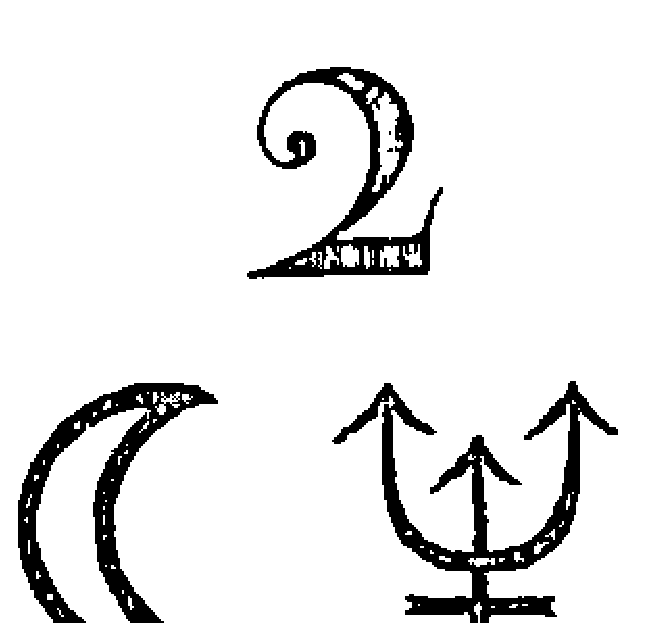

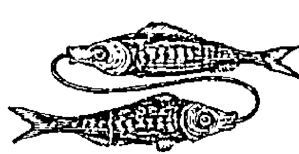

## 双鱼座
3月2日

## 幸运数字和守护星

3月2日出生的人受数字2和月亮的影响。一般情况下，受数字2影响的人会是优秀的工作伙伴和搭档，却不是最好的领导人选，这样的特质对这一天出生的人的工作或人际关系是有益的。不过，月亮所带有的强烈的被动特质和思虑过多的倾向可能在他们个人的主动性和行动方面扮演刹车的角色，容易使他们产生挫折感。月亮和双鱼座的主宰星海王星的影响使3月2日出生的人带有浪漫主义和理想主义的倾向，不过，这些3月2日出生的人一定不能让自己的精神力量受到误导或者变得混乱，同时还要注意不要被过于玄妙的理论所诱惑。

尤维纳利斯（罗马诗人，讽刺文学作家），斯梅塔纳（19世纪捷克作曲家），珍妮弗·琼斯（电影女演员），德西·阿纳兹（古巴裔美国乐队领袖，喜剧电视剧演员，制片人，作品有《我爱露西》），埃迪·戴维斯（爵士乐高音萨克斯管演奏者），奥林·基普纽斯（爵士乐录音制作人），安妮·福冯德林（荷兰政治家，欧洲议会议员），斯瓦拉·扎伊采夫（俄国时尚设计师）

## 塔罗牌

大秘仪塔罗牌的第2张是“女祭司”。画面中女祭司坐在宝座上，看起来自在平静，还有些高深莫测。女祭司拥有灵性，可以让隐藏的力量和秘密显现出来，进而赋予人们这些知识。因此，从积极的一面来看，这张牌代表宁静、直觉、含蓄以及谨慎；从消极的一面来看，这张牌则代表诡秘、猜疑、冷漠和迟钝。

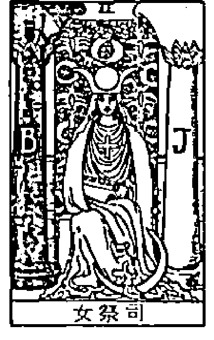

## 健康

3月2日出生的人要注意，不要让自己过着过于虚幻的生活。如果他们与现实生活脱了节，那他们就可能产生各种心理问题，所以他们最好试着对生活作些规划。定期地参与一些社交活动非常有助于他们踏实地生活，这里推荐他们参加各种各样的团队运动，也可以是带有竞赛性的运动，以及与社交有关（如健身房里的锻炼）的运动。在饮食方面，3月2日出生的人很适合食用自然简单的食物（也许他们并不爱吃），如谷类食物、根茎类蔬菜、营养丰盛的汤或者炖菜等。这一天出生的人还需要控制自己的饮酒量，而与爱人在一起的各种感官活动和规律的性生活则是有益他们的健康的。

+   优点
忠诚
富有想象力
执著

+   缺点
脱离现实
不够灵活
容易沉溺

## 建议

多接触日常生活，让自己变得更实际一点。思想可以漫游，但是对你想要实现的目标要脚踏实地地去做。不要忽略自己的需求与发展，完全抛弃自己的利益可能并不适合你，所以不要强迫自己这样做。

+   变动位 12页
水相 17页
冬季 21页
双鱼座 33页
双鱼座—79页

## 静思语

> 我们离上帝也许没有那么远。

月份：3月
第3天
双鱼宫11°～13°
双鱼座二
变动位/水相

## 3月3日

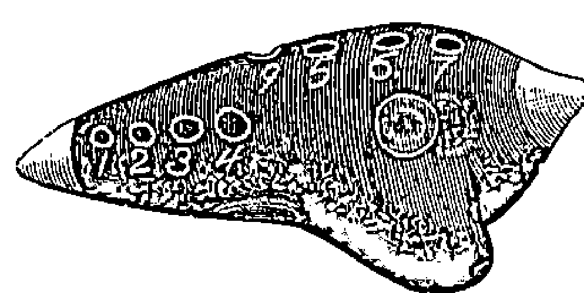

## 策划者的一天

## 出生于这一天的名人

3月3日出生的人心中对他们未来想完成的目标有着非常清晰的思路，虽然他们的想象力非常丰富，但是他们也有非常实际的一面，这种实际主义能确保他们将自己的想法付诸实践。他们不像那种还没找到实现目标的有用方法就想得到肯定或者掌声的人，这一天出生的人会首先找出实质性的问题，然后再为自己的需求全力以赴。此外，这一天出生的人不仅能够从全局的角度考虑问题，也能够关注到细节。不得不说，他们对于未来发展的预见能力的确很强。

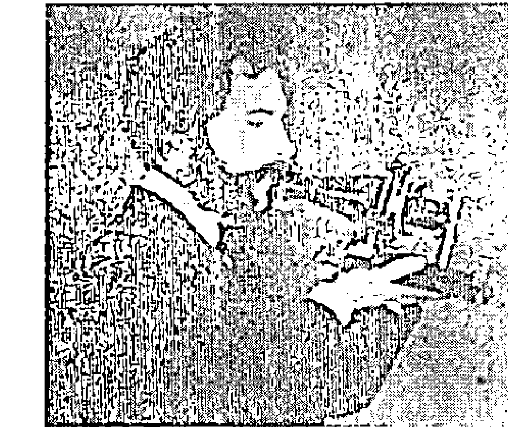

亚历山大·格雷厄姆·贝尔在作早期电话试验

3月3日出生的人喜欢在工作中和人打交道，而且就像前面说过的，他们非常实际，喜欢务实的工作作风。然而，在工作之外，他们可能喜欢保有严密的私人空间，甚至会让外人看起来很神秘。这一出生的人中有的人可能有逃避主义的倾向——有的人把自己沉溺在世俗享乐的世界里，而有的人则生活在想象出来的浪漫世界当中。可是不管怎么说，那些比较成功的3月3日出生的人大都能够平衡好他们的工作和个人生活之间的关系，而不会顾此失彼。

亚历山大·格雷厄姆·贝尔（苏格兰裔美国发明家，发明了电话、光线电话机、记录筒，还教聋哑儿童音乐和手语），杰基·乔伊纳-克西（美国七项全能奥运会冠军，跳远冠军，世界七项全能纪录保持者），吉尔伯特·阿德里安（美国米高梅电影制片公司设计师），米尔顿·埃弗里（自学成才的画家），罗纳德·塞尔（插画家，曾为《纽约客》、《人生》绘制插图），佩里·埃利斯（设计师），乔治·普尔曼（企业家，发明了火车卧铺车厢），罗德·哈克尼（英国建筑师），休勒姆·阿莱赫姆（乌克兰犹太短篇小说家、剧作家，著有《红色骑兵军》等），琼·哈洛（电影女演员，性感影星，26岁时死于尿毒症），戴安娜·巴里莫尔（电影女演员，约翰·巴里莫尔的女儿，39岁时便去世了），巴尼·比加尔（爵士乐单簧管手，高音萨克斯管演奏者），乔治·米勒（澳大利亚电影导演、制片人、作家、医生，作品有《东镇女巫》等），赫谢尔·

不管他们是喜欢与人打交道的类型还是偏于保守的类型，大多数3月3日出生的人通常都扮演着团体中负责计划和设计的角色。凡事先做好充足的准备是这一天出生的人的天性，他们通常会在行动之前对某个问题进行仔细的检查。确实，相比于实际的执行工作，很多3月3日出生的人都更喜欢策划的工作，但是，因为他们在策划阶段花费了太多的精力，他们至少会面临两种危险：首先，耗费太多时间在策划阶段会不断推迟实际执行的工作；其次，缺乏主动性，对实践没有兴趣，而且还可能因为对工作有了太多的预想而最后失望。因为很多3月3日出生的人都很难确定自己的奋斗目标，所以他们最好还是先作出一个决定然后马上去执行，不要给自己太多的选择而导致犹豫不决、迟迟不肯采取行动。

3月3日出生的人会对自己的工作过于投入，虽然这样做可以带给他们内心的满足感，但是他们可能不愿正视自己为什么会以这种沉溺于工作的方式来丢掉自我。其中的一部分原因可能是这一天出生的人有着过于挑剔的父母或在童年时承受了过重的社会压力，这些影响在他们长大之后会导致他们厌恶或不喜欢自己的性格。因此，对3月3日出生的人而言，学会喜欢自己是很重要的——不只是喜欢自己的工作，更要喜欢自己这个人。另外，安全感和满足感对他们的事业发展很有帮助，当有了这些感觉之后，他们会在执行自己的计划时更有信心，并最终获得成功。

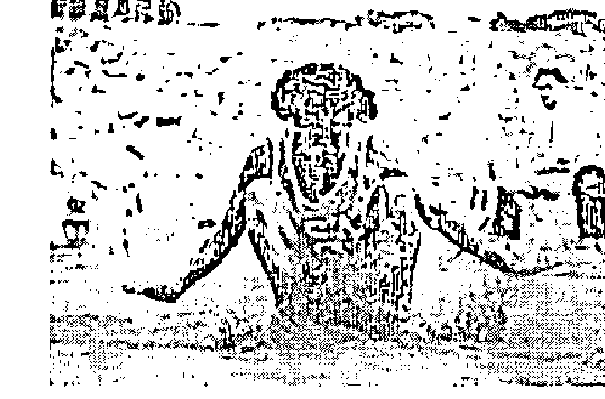

杰基·乔伊纳-克西

## 每年的这一天

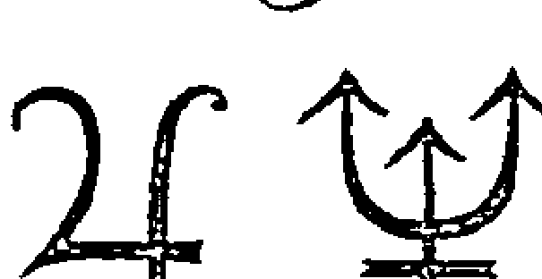

## 双鱼座
3月3日

## 幸运数字和守护星

3月3日出生的人受数字3和木星的影响。受数字3影响的人很多都想在自己的专业领域登峰造极，而且个性独立，但是3月3日出生的人因为受到了海王星（双鱼座的主宰星）的影响，可能带有犹豫不决或者容易顺从他人的性格，这些特质会影响他们取得更大的成就。此外，因为还受到了木星和海王星的共同影响，3月3日出生的人会更偏重精神层面的东西或者宗教理念，在经济方面也容易获得成功。

沃克（美国橄榄球跑卫，获得了海斯曼杯、美国橄榄球大联盟最佳跑卫称号），李·拉齐维尔（政商名流，杰姬·肯尼迪的妹妹），威廉·戈德温（英国小说家、政治哲学家，玛丽·雪莱的父亲），伦纳德·杜布（美国著名心理学家，作家），赫苏斯·洛索亚·索利斯（墨西哥儿科医生）

## 塔罗牌

大秘仪塔罗牌的第3张是富有创造性智慧的“皇后”。画面中的她是达到极致的完美女性，是孕育大地的母亲，也是我们梦想与渴望的化身，象征着我们的志向和希望。因此，这张牌代表的正面意义是魅力、优雅与无条件的爱，而负面意义则是自负、矫情及苛责。

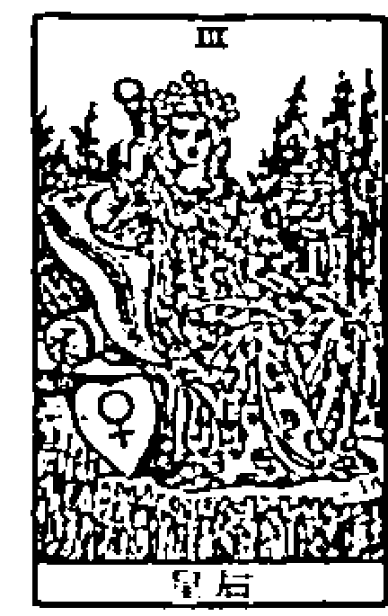

## 健康

3月3日出生的人除了拥有丰富的想象力和强大的策划能力之外，通常也都拥有健康的身体。不过，有时候他们也会出现因为运动过量而受伤的情况，这是因为他们对自己的要求太高了，运动超过了他们的身体所能承受的极限。因此，这一天出生的人必须注意不要让自己过于劳累，否则会造成免疫力下降的后果。推荐他们进行规律的适度的运动，最好不要做短时间内会大量耗费体力的运动。3月3日出生的人很容易发生各种小事故，所以他们尤其要注意自己的四肢安全。此外，他们还应该警惕并发症的出现，其实，只要平常多注意一下自己的健康就可以发现问题的征兆。在饮食方面，3月3日出生的人要注意控制脂肪和有害的食品添加剂的摄入量，不过也没必要过于谨慎而失去享受美食的愉悦，为三餐的设计花费太多的精力有时候会适得其反。

## 优点

- 有目标
- 概念性强
- 善于准备

## 缺点

- 有偏见
- 爱强迫别人
- 缺乏自知之明

## 建议

更深入地了解你自己。如果你不喜欢自己的某一种性格，那就作出一些改变。对自己太挑剔的个性容易伤害你自己。制订计划时最好设置一个合理的截止日期，给自己留出行动的时间。

- 变动位 12 页
- 水相 17 页
- 冬季 21 页
- 双鱼座 33 页
- 双鱼座二 80 页

## 静思语

> 宇宙中最宏伟的计划出自上帝之手。

月份：3月
第4天
双鱼宫12°～15°
双鱼座二
变动位/水相

## 3月4日

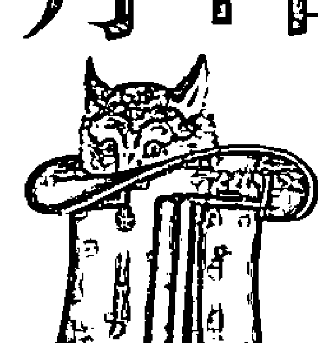

## 孤独的创新者的一天

## 出生于这一天的名人

伊琳娜·拉图辛斯卡娅

3月4日出生的人通常可以在不和外界有太多接触的情况下独自生活和工作。虽然大多数出生于这一天的人不会刻意选择这种孤僻的生活方式，但是从实际情况来看，这的确是他们很多人生活中注定会出现的一个重要主题。因此，很多3月4日出生的人都会一再地发现，不管是在实际生活方面，还是在精神发展方面或是情感方面，他们都总是会与其他人或周围的环境隔绝开来。

不过，对大多数3月4日出生的人而言，独自一个人并不代表他们会感到寂寞，相反，在这样的状态下他们的工作效率可以更高。即便有人要邀请他们到外面去和大家一起享受生活，他们也可能拒绝——这并不是因为他们害怕或者消极，而只是因为他们相信自己在将来的某一天会享受到更多。这一天出生的人中资质较好或从事创造性工作的人会把这种与人隔绝的人际关系看做他们创作出好作品的必要条件。这一天出生的人集中精力的能力通常比一般人都要强，当他们独处的时候，他们会感到更轻松自在，也不会因为分心或焦虑而影响他们创作思考的空间。

在社交生活方面，3月4日出生的人比较喜欢和少数密友相处，而不太喜欢跟一大群不熟悉的朋友在一起。“亲密”这个词对这一天出生的人而言有着相当特殊的意义——亲密关系的建立不只跟人和事有关，也和周围的环境有很大的关系。3月4日出生的人喜欢待在充满温暖、他们感到安全的环境里，而且周围的事物还必须是他们喜欢的。一旦处于拥挤、嘈杂的环境中，他们就会感到些许不安和烦躁。不过，如果他们参加的是能让他们感到放松的社交活动，那么他们就会感受到那种独特的亲密感，并能够和别人分享他们的这种感觉。

3月4日出生的人喜欢温馨舒适的环境，因此，他们会把家和办公室布置得很温馨。他们很有天赋，能通过简单却高雅的方式布置出舒适的环境，这可能是因为他们的物质需求不是那么强烈，他们自己也不会被华而不实的东西所吸引。

3月4日出生的人很喜欢和他人分享他们工作的成果，即便是陌生人，他们也可以与其分享。从别人那里听到其他人对他们的赞誉要比当面的称赞更令他们高兴，因为当面的称赞可能让他们感到害羞和不自在。3月4日出生的人的这种容易害羞的特点很惹人喜爱，不过，他们也不能总是如此羞涩，在必要的时候还是应该积极一点，主动争取自己想要的东西。也许他们会发现，有些时候果断积极一点还是很有好处的。

伊琳娜·拉图辛斯卡娅（苏联诗人、民权主义者，持有不同政见，后被囚禁），安东尼奥·维瓦尔第（意大利巴洛克风格作曲家，被称为“红发神父”，作品有《四季》等），唐·阿方索·恩里克（即亨利王子，葡萄牙亲王，被称为“航海者”，是许多著名探险家的导师和资助人，设立了天文和航海学校），玛格丽特·奥斯本·杜庞特（网球运动员，获得过5次法国网球公开赛冠军，7次温布尔登网球公开赛冠军，24次美国全国性比赛单打、双打和混合双打冠军），罗伯特·威尔逊（物理学家，雕刻家，美国费米国立加速器实验室的第1任所长），艾伦·西利托（英国剧作家、小说家，著有《孤独的长跑者》等），莉莉·克劳斯（奥地利钢琴家），米丽娅姆·马凯巴（非洲歌手），查尔斯·戈伦（美国桥牌大师，专栏作家），乔治·盖莫（物理学家、作家，著有《物理世界奇遇记》），汉斯·艾森克（英国心理学家，著有《人类性格的结构》），约翰·加菲尔德（电影演员，39岁时去世了），吉姆·克拉克（赛车选手，被称为“飞翔的苏格兰人”，获得过2次一级方程式大赛冠军、印第500大赛冠军，在赛车比赛中意外身亡），艾利斯·里夫林（经济学家），葆拉·普伦蒂斯（电影女演员），扬·加尔巴里克（挪威爵士乐高音萨克斯管演奏者），克努特·罗克尼（圣母院橄榄球队教练，死于飞机失事），伯恩哈德·克勒曼（德国记者、小说家，著有《隧道》等），凯·伦兹（电影和电视剧女演员）

## 每年的这一天

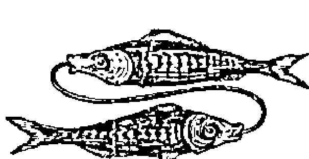

## 双鱼座
3月4日

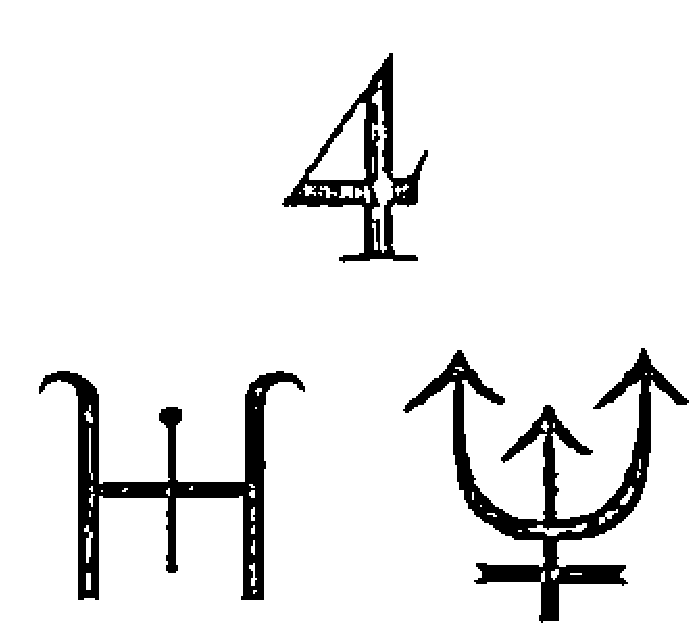

## 幸运数字和守护星

3月4日出生的人受数字4和天王星的影响。受数字4影响的人通常都非常有主见，有的人还能言善辩，甚至好与人辩论。一般来说，3月4日出生的人比较在意是否能展现自我，而非累积财富，这一点与大多数受数字4影响的人都相同。另外，因为受到了天王星的影响，受数字4影响的人情绪变化会很快，而且在这种变化过程中他们的情绪还可能突然爆发，不过，水星的影响会缓和这项特质，但是水星的影响也会给出生于3月4日的人带来喜欢幻想、叛逆或者两者兼有的特质。

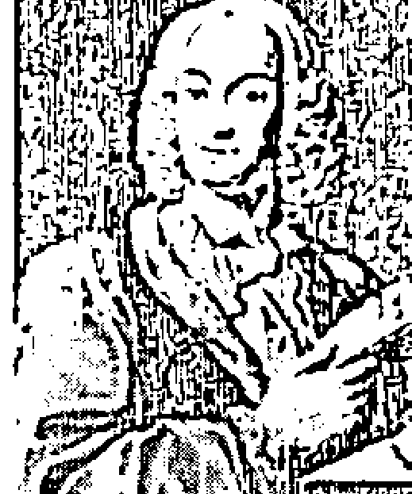

## 塔罗牌

大秘仪塔罗牌的第4张是“皇帝”。皇帝通过智慧——他的强大力量的主要来源——来统治所有有形的世俗事务。皇帝是稳定的、深刻的形象代表，他的权威不容置疑。从积极的一面来看，这张牌代表强大的意志力和坚定的信念；从消极的一面来看，这张牌代表任性、暴政和残酷。

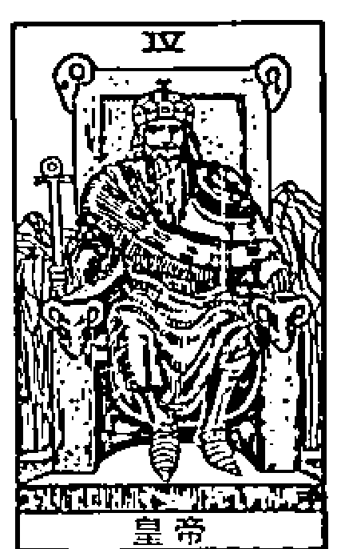

## 健康

3月4日出生的人必须积极行动起来去丰富他们的社交生活，所以凡是能够与人分享的兴趣爱好、休闲活动、俱乐部等形式的活动都是值得推荐给他们的。在运动方面，各种具体的具有团体性、社交性的运动都很适合他们，如团队运动、跳舞等，这对他们的身心健康都很有好处。在饮食方面，虽然这一天出生的人也会自己下厨，但是他们更喜欢能让他们感到舒服、有着良好互动的聚餐形式。如果这一天出生的人因为命运或其他意外事件的影响而不得不与许多聊不来的人长久相处，而且长期无法得到个人空间，那他们心里就会感到很痛苦。如果在儿童时期他们就缺乏自己的空间或父母拒绝给他们独立的空间，那他们就会产生心理上的障碍，在这种情况下，他们还是接受心理治疗比较好。

| 优点 |
| --- |
| 独立 |
| 专注 |
| 自控能力强 |

| 缺点 |
| --- |
| 容易感到害怕 |
| 羞涩 |
| 过于关注自我 |

## 建议

尽量多和他人交流互动。培养自己的社交技巧。不要把独处当成逃避的方式。关注别人的感受，和他人保持顺畅的沟通。

- 变动位 12 页
- 水相 17 页
- 冬季 21 页
- 双鱼座 33 页
- 双鱼座二 80 页

## 静思语

> 有些人沉默是因为他们没有话说。

月份：3月
第5天
双鱼宫13°～15°
双鱼座二
变动位/水相

## 3月5日

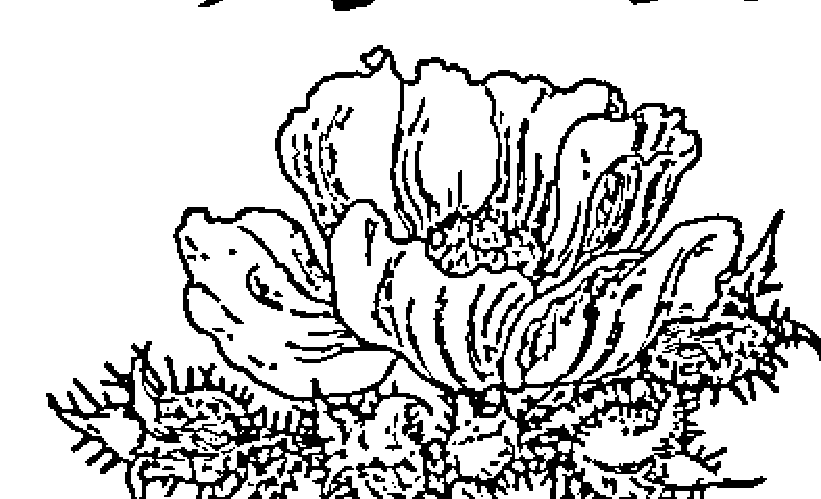

## 两极化的一天

## 出生于这一天的名人

3月5日出生的人性格中大都包含着两个极端。在别人眼中，他们温文尔雅、富有魅力，既显得久经世故，又和善体贴，但其实他们内心正竖立着一堵坚固的防护墙。他们的内心世界极其隐秘，他们往往会与表面上看起来的样子截然不同，而且会经常表现出负面的感受与情绪。

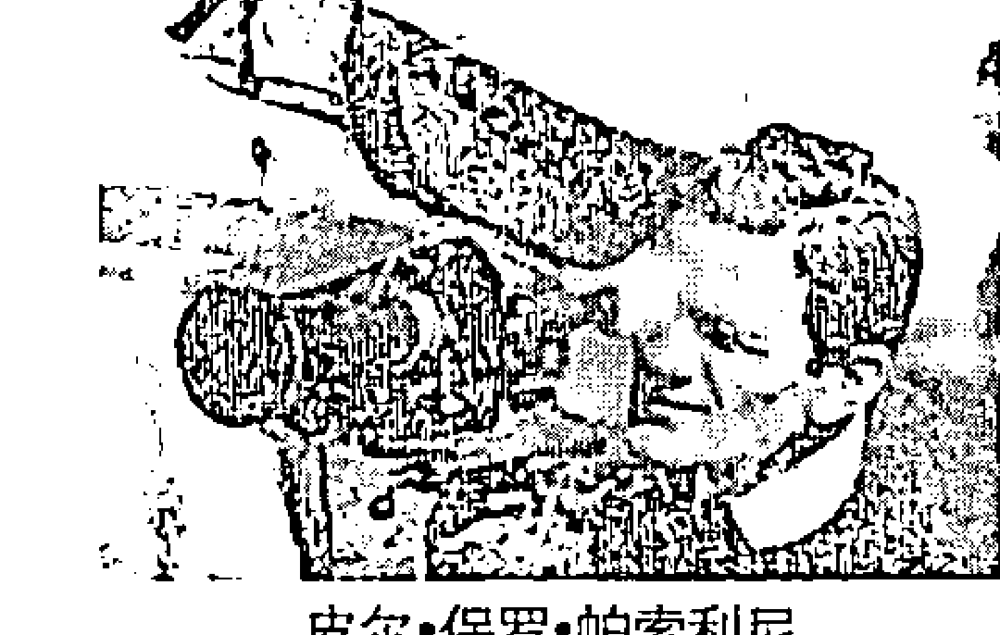

出生在3月5日的人做起事来很有效率，也富有创造力。在工作中，他们性格的两个极端可以自由地表现出来而不会发生冲撞，他们也不用害怕别人知道这一点。然而，他们的个人生活有时会因为这样的性格而充满狂风暴雨，有时甚至还会因此毁掉他们自己。3月5日出生的人思想深沉，深知人们可能产生的各种各样的情感，但是他们自己只表现出其中的一种或者两种。另外，他们也具有激发别人呈现自己最好或者最糟糕的一面的本事。因为他们观察敏锐，内心极度敏感，所以他们可以对别人产生比较大的影响，从而让那些人暴露自己的缺点、不足或不安的一面。

皮尔·保罗·帕索利尼（意大利电影导演，作品有《十日谈》、《一千零一夜》等，还是诗人、小说家、评论家，被所招的17岁的男妓所杀），雷克斯·哈里森（英国电影、舞台、音乐喜剧演员，出演了《窈窕淑女》中的亨利·希金斯教授，曾结过6次婚），奥古丝塔·格雷戈里夫人（与叶芝一起成立了爱尔兰都柏林阿比剧院），查尔斯·富勒（剧作家，获得了普利策奖，作品有《一个黑人中士之死》），乔瓦尼·巴蒂斯塔·提埃坡罗（意大利巴洛克时代晚期的画家），迪安·斯托克韦尔（电影演员），埃托尔·维拉·洛博斯（巴西民族作曲家），伊莱恩·佩奇（英国音乐喜剧明星，作品有《猫》等），汪曾祺（中国作家，作品有小说集《羊舍的夜晚》等），约瑟芬·赫布斯特（美

因此，3月5日出生的人生活得比别人更加波澜起伏也就不足为奇了。他们也比普通人更有经验，可以处理好生活中大大小小的事情。就像他们的人生画面的色彩比别人更绚丽一样，其中的明亮和阴影之处也比其他人的更突出。

3月5日出生的人有时候可以很有逻辑，内心也可以保持客观，但有时候也会完全没有理智，火爆得令人诧异，他们的这种急速的情绪转换有时候只是几分钟或者几秒钟内的事情。人们常常感到奇怪，他们怎么能这么迅速地发生变化，这么快地适应环境呢？因为他们的人际关系也经常发生变化，所以有时这一天出生的人会觉得有点孤独，甚至会怀疑自己是不是永远都找不到合适的爱人了。其实，如果他们能认识到问题是出在自己身上——正是他们的性格造成了这种局面，并且设法改善这一点，他们就可以享受愉悦的感情生活了。

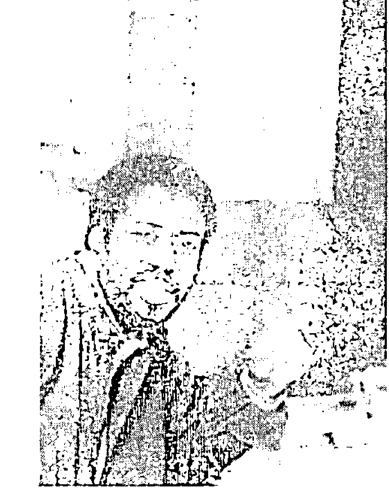

对3月5日出生的人来说，平衡自己性格上的冲突是一个大挑战，虽然要做到这一点并不容易，但是如果他们能够做好，他们就会获得很大的回报。从另一方面来说，这样变化快速的极端性格其实也是他们创作的灵感所在，所以有一些这一天出生的人可能担心，如果他们的性格变得没有这么有棱角了，他们的创作力是否就会降低。也许，这是一个他们自己的价值判断的问题。

3月5日出生的人一定要明白，他们自己可以对别人产生很大的影响。多做一些有意义的事情，多帮助别人，或者向着更高精神层次的目标发展，把精力集中在日常生活中美好的事物上面，会让他们自己和周围的人生活得更轻松。

## 5

每年的这一天

## 双鱼座

3月5日

## 幸运数字和守护星

3月5日出生的人受数字5和水星的影响。水星代表思维的敏捷和变化的快速。因为海王星主宰着双鱼座，所以3月5日出生的人会受到水星和天王星的双重影响，这会使他们对色彩、声音和味道非常敏感，也喜欢表达自己的感受。有一些这一天出生的人的情绪可能极不稳定，这会导致他们常常在天使和魔鬼之间徘徊。受数字5影响的人不管遇到什么挫折，都能很快地复原，3月5日出生的人尤其会如此。

国著名作家、记者），林恩·马古利斯（生物学家、编辑、作家，提出了共生理论，即细菌在活体细胞发展中起着主要作用），威利斯·艾伦·拉姆齐（歌手，作曲家），萨曼莎·埃加（英国电影女演员），尤金·福多尔（小提琴家），兰迪·马特森（美国铅球运动员，获得了奥运会金牌），弗雷德·威廉森（电影演员），弗兰克·诺里斯（作家，著有《章鱼》等），亨利二世（英国金雀花王朝国王）

## 塔罗牌

大秘仪塔罗牌的5张是“教皇”。他是令人畏惧的神秘事物的解释者，象征着人类的认知及信仰。他知识渊博，即使抽象的事物也受他主宰。从积极的一面来看，这张牌代表信心十足、不疑不虑以及对事物有正确的理解；从消极的一面来看，这张牌代表爱说教、夸大其词以及独断的个性。

## 健康

许多3月5日出生的人很情绪化，心情也起伏很大，所以他们要特别小心自己负面的情绪，不要把心中的负面情绪发泄在自己所爱的人身上。培养顽强的意志力和强大的自制能力对他们的身体健康同样很有好处。关于健康方面的事情，这一天出生的人有自己的一套原则，不太容易被别人说服，所以他们需要找一位他们敬重的医生来指导他们，这一点对他们很重要。3月5日出生的人很享受饮食和性爱的乐趣，这也是他们的活力指标，不过，为了他们自己以及他们的家人好，他们最好还是把握好尺度。这一天出生的人要特别严格地限制自己的饮酒量，并远离麻醉品、兴奋剂或者毒品。此外，3月5日出生的人最好能明白，他们最需要担心的不是世界上的险恶，而是自己过强的防御心——他们真正需要克服的危机其实来自他们的内心深处。

## 优点

- 擅长表达自己
- 优雅
- 敏锐

## 缺点

- 难以相处
- 脾气不好
- 不善于处理情绪

## 建议

控制好你的能量，不要被它所操纵。是你控制事物，而不是事物控制你。安排好事情的先后顺序，对自己更好一点。

变动位 12 页

水相 17 页

冬季 21 页

## 静思语

大部分孩子都认为自己是扮演天使的魔鬼，不过，通常事实正好相反。

双鱼座 33 页

双鱼座二 80 页

月份：3月
第6天
双鱼宫14°～16°
双鱼座二
变动位/水相

## 3月6日

## 美丽爱人的一天

## 出生于这一天的名人

3月6日出生的人似乎对美的事物没有什么抵抗力，他们总是被某些特定的人、情况、环境、戏剧、音乐或艺术等吸引，而且这些东西带给他们的通常是一种微妙、不可言喻的魔力，而不是某种积极的力量或者特别强烈的吸引力，不过这一天出生的人常常对自己的魅力一无所知。3月6日出生的人比较容易相处，如果他们想获得事业的成功，那他们就要花时间慢慢地了解自己所具有的魅力，并且好好发挥自己的这种魅力来帮助自己实现目标。

米开朗琪罗为西斯廷教堂绘制的“上帝造人”

米开朗琪罗（意大利文艺复兴时期的雕塑家、画家、建筑设计师、诗人，绘制了梵蒂冈西斯廷教堂的天顶壁画），加夫列尔·加西亚·马克斯（哥伦比亚裔墨西哥短篇小说家，获得了诺贝尔文学奖，作品有《百年孤独》等），西拉诺·德贝热拉克（西班牙军人、诗人、剧作家，著有《月球旅行》等，曾因为别人嘲笑自己的大鼻子与人决斗过1000多次），瓦莲京娜·捷列什科娃（苏联女宇航员，第1位女太空人），伊丽莎白·巴雷特·布朗宁（英国诗人，著有《葡萄牙十四行诗集》等），林·拉德纳（短篇小说家，创作风格很幽默），韦斯·蒙哥马利（爵士乐吉他手，在演奏方面作出了重要创新），基里·特·卡娜娃（新西兰女高音歌唱家），安杰伊·瓦伊达（波兰舞台剧和电影导演，作品有《铁人》、《下水道》等），罗布·赖纳（喜剧电视剧演员、电影导演，作品有《毕业生外传》等），玛丽·威尔逊（歌手），卢·科斯特洛（喜剧电影演员，和威廉·阿博特是很好的搭档），迪克·福斯伯里（美国跳高运动员，

当3月6日出生的人被某些人或事所吸引时，他们可能义无反顾地投身于其中，而且就算他们知道这种美的事物并不会持久，他们也无法将其从自己的脑袋里抽离。他们有可能不由自主地接近这样的人或物，这可能是因为他们具有下意识的敏感性或者敏锐的感受能力，以及天生的浪漫情怀。可能因为对世界抱有相当强烈的期待，所以3月6日出生的人会把内心理想化的愿景投射到真实世界中，尤其是在看到那些令人震撼的美丽的事物时，他们往往只会看到自己想看到的美好的一面，而忽视事物自身带有的丑陋却真实的一面——也许他们所看到的恰好反映了他们内心的需求，就如同神话中的美少年纳西瑟斯一样，爱上的是自己的倒影。

许多3月6日出生的人有很强的创造美的能力，并愿意为此奉献自己的生活，即使牺牲生命也在所不惜。此外，他们本身就是很有能力的人，有时还会赢得他人的敬佩或爱慕，但是如果这样的倾慕不是出自实际的关注与真正的需求，那它就是不理性的。

对3月6日出生的人而言，各种各样的感官体验——身体接触、声音、颜色、气味与味道——在以奇妙的方式结合起来之后都可以振奋他们的精神，不过，这些东西有时候也会给他们带来不好的影响。有一些这一天出生的人可能成为自己的欲望或者外界的吸引的奴隶，但是对他们中的大部分人而言，感官的刺激并不足以满足他们对审美的需要，他们需要更多——把自己喜爱的目标理想化，然后将其融入自己的生活，甚至让自己与其成为一体。

然而事情并不总是如此美好，当这种热爱的激情退却之后，失望和美好感觉的消失就成了他们需要面对的痛苦。对3月6日出生的人来说，只有学会客观地对待自己热爱的事物，才能更好地自主掌控自己的人生，更好地发挥自己的潜能。

加夫列尔·加西亚·马克斯

每年的这一天

## 双鱼座

3月6日

## 幸运数字和守护星

3月6日出生的人受数字6与金星的影响。受数字6影响的人具有吸引异性并取得别人崇拜的魅力，也能很好地理解别人，向别人表达自己的同情或者爱慕之情。对3月6日出生的人来说，海王星（双鱼座的主宰星）的影响会加强金星所带来的多愁善感和易受外界影响的倾向。浪漫的爱情常常是受数字6影响的人一生的主旋律。

获得了奥运会金牌，发明了背越式跳高），安·柯蒂斯（美国游泳运动员，获得了2枚奥运会金牌，是第1个获得苏利文奖的女游泳运动员），威利·史戈多尔（美国匹兹堡海盗棒球队外场手，获得了最有价值球员称号，2次美国职业棒球大联盟全垒打冠军），弗洛拉·普尔（巴西歌手），洛林·马策尔（指挥家），汤姆·福利（美国国务卿，白宫发言人），艾伦·格林斯潘（美国联邦储备委员会主席），小玛丽昂·巴里（美国华盛顿哥伦比亚特区市长）

## 塔罗牌

大秘仪塔罗牌的第6张是“恋人”。恋人象征着通过两性结合的爱，全人类能够团结在一起。从积极的一面来看，这张牌代表道德、美学以及肉体方面更高层次的感情与渴望；从消极的一面来看，这张牌代表没有止境的欲望、多愁善感和迟疑不决。3月6日出生的人经常觉得他们生活在一个别人羡慕不已的充满了喜悦的世界，然而实际上他们是自己的欲望和激情的奴隶，或者正处在一些更强大的不易受外界影响的人的严密控制之下。

## 健康

一般来说，3月6日出生的人都喜欢被很多美丽的事物所围绕，所以他们可以在有时间的时候去乡间漫步，或定期旅行，这类活动能够帮助他们暂时远离喧嚣的城市。如果他们有自己的田地的话，他们也可以把园艺类的工作，如种花或种菜培养成自己的爱好——这类活动不只可以让他们的身体得到锻炼，同时也能满足他们对审美的需求。对3月6日出生的人来说，改善健康情况的同时也会使自己的外表更美丽。他们相当看重感官享受，所以他们要警惕脂肪含量高的食物，尤其要少吃含有大量动物性脂肪的食物，不过，要这一天出生的人控制饮食还真不是一件容易的事情。虽然3月6日出生的人不太能够拒绝美味，但是他们如果想维持健康就必须控制好自己的饮食。

| 优点 |
|---|
| 有审美眼光 |
| 注意力集中 |
| 投入 |

| 缺点 |
|---|
| 自满 |
| 过于注重感官享受 |
| 不够稳定 |

## 建议

并非只有美丽的事物才是有价值的。不要轻易被美丽的事物所诱惑。寻找你的力量的真正来源，并且富有建设性地运用你自己的能量，比如可以用在自我成长方面。无论分离有多么痛苦，人都必须向前走。

| 变动位 12页 |
|---|
| 水相 17页 |
| 冬季 21页 |
| 双鱼座 33页 |
| 双鱼座二 80页 |

## 静思语

> 轻易恋爱或者经常恋爱实际上说明了这个人在否定自我。

月份：3月
第7天
双鱼宫15°～17°
双鱼座二
变动位/水相

## 3月7日

## 抽象结构的一天

## 出生于这一天的名人

3月7日出生的人比较复杂，很多人都活在自己构建的高度抽象的世界里。他们在生活中面临的最大的挑战就是给自己的这个抽象世界建构秩序。这一天出生的人中那些可以清楚地表达自己的思想的人可以获得更大的成功。

虽然3月7日出生的人会漫无边际地胡思乱想，并常常思考一些抽象的事情，但是他们实际上是以事业为重的人，在工作中他们会以非常实际的方式表达自己的想法，希望借此争取身边的人的支持和参与。不过，不管他们是否参与实际的活动，他们留给大家的印象都总是好像他们生活在另一个星球。不过十分肯定的一点是，3月7日出生的人通常会把私生活和公事截然分开。

实际上，3月7日出生的人在私下里是很孤僻的人，别人很难进入他们的内心世界。那些希望和他们做朋友的人必须非常有耐心，能够谅解他们，最重要的是，不能苛求他们。不过，这并不是说这一天出生的人吝于付出，相反，他们可以说是非常慷慨的人，只是在直接面对压力时他们很难有好的表现——通常，他们的反应是退缩，这不仅指行动上的退缩，也指精神上的封闭。

在面对批评或攻击的时候，3月7日出生的人最常用的应对办法就是缩回自己安全的壳里。他们可以很快发现哪些人是可以相信的，哪些人可以接纳他们。这一天出生的人还有点神秘，对爱人也不够坦诚，常把很多对爱人的期盼藏在心中不说出来，而对那些他们认为值得付出的人，他们愿意付出足够的时间和财力支持。3月7日出生的人可以很强烈地感受到他人的需要，这种感同身受的能力让他们持有正义感和众生平等的信念。虽然他们很关心社会，但他们并不属于喜欢交际应酬的人，对他们来说，有一两个好朋友就足够了。

3月7日出生的人所面临的难题主要有：活力无法持续，社交生活贫乏，容易感到恐惧，情绪不稳定，无法确定自己的人生目标和人生意义。不过，一旦将自己的目标确定了下来，并将精力一次只集中于一个有意义的事物，他们就可以取得成功。除此之外，他们还可以利用他们的工作成就丰富自己的社交生活。

3月7日出生的人要经常关注自己的家人、朋友和其他周围的人的想法和感受。如果他们能够在工作上投入精力和关注之余，针对自己的个人生活作出一些相应的努力，那他们就可以让自己的生活变得更好。这一天出生的人中有的人可以遇到能和他们分享人生的伴侣，而有的人则遇不到这样的爱人，不过无论如何，他们都可以找到能够分享心事的密友，和密友交流可以满足他们分享情绪的强烈需要。

卢瑟·伯班克和他的无刺仙人掌

卢瑟·伯班克（园艺培育专家，培育出了许多水果、树木和其他植物品种），皮特·蒙德里安（荷兰裔美国现代主义画家），莫里斯·拉威尔（法国印象派作曲家），安部公房（日本剧作家、小说家，作品有《沙丘之女》等），伊万·伦德尔（捷克网球运动员，4次排名世界第一，获得过3次法国网球公开赛冠军、2次澳大利亚网球公开赛冠军，同时也是计算机专家，可以说6种语言），约瑟夫·涅普斯（18世纪法国物理学家，拍摄了世界上第1张照片），珍妮特·格思里（赛车手，第1位参加印第500赛车比赛的女选手），佛朗哥·哈里斯（美国匹兹堡钢人橄榄球队跑卫，8次在比赛中跑动距离超过1000码，获得了1975年的超级碗最有价值球员称号，是林恩·斯旺的队友），林恩·斯旺（美国匹兹堡钢人橄榄球队接球手，获得了1976年的超级碗最有价值球员称号，后来成了体育节目解说员），安娜·马尼亚尼（意大利电影女演员），本·埃姆斯·威廉斯（小说家，作品有《狂恋》等），玛丽·诺顿（美国众议院女议员，劳工委员会主席，担任新泽西州众议员长达27年，是职业女性的典范），加布里埃尔·豪格（经济学家），罗杰·雷维尔（海洋学家），埃德温·亨

每年的这一天

## 双鱼座

3月7日

## 幸运数字和守护星

3月7日出生的人受数字7与海王星的影响。海王星是以罗马神话里海神的名字命名的行星，掌管着幻想、梦境和心理现象，出生于3月7日的人会受到这些不稳定因素的影响（因为双鱼座的主宰星就是海王星，所以他们所受到的影响会更大）。海王星的强烈影响会给3月7日出生的人带来敏感、爱幻想、想象力丰富、精力不容易集中等特质。受数字7影响的人一般都喜欢变化和旅行。

利·兰西尔
（英国画家、雕塑家），
阿尔贝特·卡雷尔·威林克（荷兰画家），安东尼·阿姆斯特朗·琼斯（英国摄影师），彼得·凯里（澳大利亚小说家，作品有《奥斯卡与露辛达》等），彼得·沃尔夫（歌曲创作者、歌手）

## 塔罗牌

大秘仪塔罗牌的第7张是“战车”。牌面上的胜利者以一种强有力的姿态，展现着他在人世间的丰功伟业。这张牌可以解释成：不论正道多么艰险难行，你都得继续走下去。从积极的一面来看，这张牌代表成功、才能和效率；从消极的一面来看，这张牌则代表专制的态度和拙劣的方向感。

## 健康

3月7日出生的人必须非常注意自己的健康状况。他们很敏感，感受能力也强，所以他们容易产生感染和过敏方面的问题，这些问题严重的话会加重他们的淋巴和循环系统的负担，因为他们的身体要针对这些疾病不停地调整、反抗。3月7日出生的人还要注意自己的饮食，少吃一些乳酪类制品对他们大有好处。建议他们制订丰盛且营养均衡的三餐计划，多吃一些谷类食物，蔬菜类食物则不要烹煮得过熟，这些都是可以帮助他们变得更健康的习惯。在运动方面，他们需要根据自己的身体情况挑选强度适中或较剧烈的运动，跳舞是很适合他们的运动，其他需要注意姿态的运动，如溜冰、游泳、瑜伽和太极等也是不错的选择。对3月7日出生的人来说，充足的睡眠非常重要，但是他们最好不要贪睡——睡眠也会成为逃避社会的一种方式。

| 优点 |
| --- |
| 概念性强 |
| 敏感 |
| 懂得付出 |

| 缺点 |
| --- |
| 精力不够集中 |
| 易退缩 |
| 孤僻 |

## 建议

坚定自己的立场。把自己的抽象概念形式化，并与他人沟通。不要陷于自我批评的泥沼。允许别人进入你的个人世界，更多地展现真实的自我。

| 变动位 12页 |
| --- |
| 水相 17页 |
| 冬季 21页 |
| 双鱼座 33页 |
| 双鱼座二 80页 |

## 静思语

> 追求梦想可以让我们得到自由，也可以禁锢我们的思想。

月份：3月
第8天
双鱼宫16°～18°
双鱼座二
变动位/水相

## 3月8日

## 不遵从传统的一天

## 出生于这一天的名人

奥托·哈恩（德国化学家、物理学家，因发现了核裂变而荣获了诺贝尔化学奖），小奥利弗·温德尔·霍姆斯（美国最高法院大法官，任期长达30年，被称为“伟大的反对者”，活到了94岁），肯尼思·格雷厄姆（苏格兰儿童文学作家，作品有《柳林风声》等，其实写作是他的兼职，他的本职工作是英格兰银行的秘书），安塞尔姆·基弗（德国现代主义画家），鲁杰罗·莱翁卡瓦洛（意大利歌剧作曲家），艾伦·霍夫哈尼斯（现代作曲家），赛德·沙里塞（电影女演员，舞蹈演员），艾丹·奎因（电影和电视剧演员），安东尼·卡罗（雕塑家），林恩·雷德格雷夫（舞台剧、电视剧和电影女演员），卡尔·菲利普·埃马努埃尔·巴赫（德国作曲家，约翰·塞巴斯蒂安·巴赫的儿子），康斯坦丁诺斯·卡拉曼利斯（希腊前总统，也担任过希腊总理），道格拉斯·赫德（英国外交大臣），林恩·西摩（芭蕾舞演员），密西西比·约翰·亨特（乡村蓝调歌手、歌曲创作者、吉他演奏家，曾在美国大萧条时期回去牧牛35年，之后再度被发掘了出来），吉姆·赖斯（美国波士顿红袜棒球队外场手，曾获得过3次全国职业棒球大联盟全垒打王称号、2次得分王称号，也是年度最有价值球员），里奇·艾伦（棒球运动员）

3月8日出生的人习惯以自己的方式做事，所以常常被人误解。不论是在观念、生活方式方面或是穿着打扮方面，他们都不喜欢受到社会传统的约束，所以他们经常发现自己好像与当下的社会有些格格不入。也许他们还是喜欢传统的，只是3月8日出生的人需要打破常规，斩断原来的生长环境的种种牵绊，在这个过程中，有时他们的行为可能有点过激，有时他们自己也会感到伤悲，然而只有这样，他们才能成为全新的个体。其实，有时候他们的挑剔、感情脆弱等特质会让他们的斩断行为看起来并没有必要，因为他们可能早已在心里拒绝了这种牵绊。在他们20岁左右的时候，他们对自己的这种特点就已经很清楚了，也明白自己的一生注定了要充满风风雨雨，也许自己还要孤单前行。

3月8日出生的人对生活很有激情，但是不管他们如何努力，他们的生活方式和观念都还是无法与周围的人产生共鸣。这是因为他们天生激烈的个性和不轻易妥协的态度让他们与整个社会的价值观并不一致，这也是为什么我们经常发现这一天出生的人会成为打破陋习的激进分子。这一天出生的人有着强烈的叛逆心理与攻击性，这两大特点很难为他们赢得朋友，而他们不够稳定的情绪更难以赢得他人的信任。不过，他们可以成为很忠诚的朋友，而那些得以让他们视为好朋友的人则需要以同等忠诚的友谊来回报他们。

3月8日出生的人是职场上杰出的人物，一旦选择了某个职位，他们就可以很多年在这个职位上默默奋斗而不张扬。他们也可以成功地扮演社会的顶梁柱这种角色，然而在这种角色背后，尽管他们可能为了社会或者经济的原因去担任某些传统的职务，但是在这份工作的背后他们仍然会继续从事改革的工作，表达自己性格中不爱遵从传统的一面。

3月8日出生的人是很有吸引力的人，他们凭借自己的精神力量、个人魅力和直觉可以对特定的人产生魔力般的吸引力。他们年轻的时候可能在发挥自己的魅力方面不够成熟，也常常失控，但是随着年龄的增长，这一天出生的人可以用更微妙且别人无法抗拒的方式来发挥自己这方面的优势。而且随着心理的成熟，他们终会认识到这一点并让其在自己的生活中发挥积极的作用。3月8日出生的人能够欣赏人们在各个方面的才华，会对优雅、美丽或具有独特力量的事物表达自己的赞赏，甚至崇拜之情。

## 每年的这一天

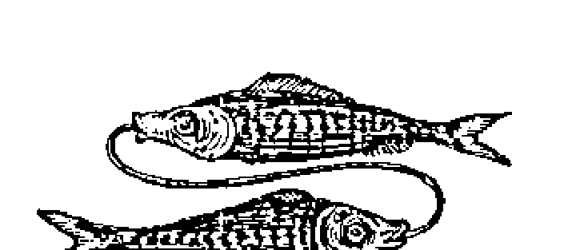

## 双鱼座
3月8日

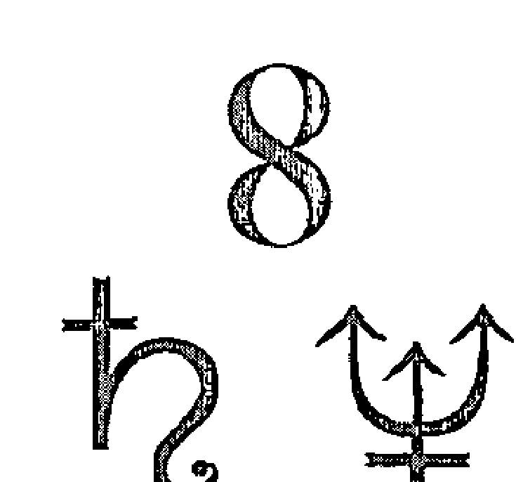

## 幸运数字和守护星

3月8日出生的人受数字8和土星的影响。土星的影响使人具有责任感，能了解自己的极限，谨慎并相信宿命。对3月8日出生的人而言，海王星（双鱼座的主宰星）的力量帮他们解除了这种束缚，还带给了他们很强的表达能力和好运，提升了他们的个人魅力。虽然受数字8影响的人一般都属于心软的类型，但是3月8日出生的人因为受到了土星的影响，从外表上看起来会比较严肃。

球强击手，美国职业棒球大联盟得分王，全垒打王，最有价值球员），莱斯利·菲德勒（文学评论家，著有《美国小说中的爱与死》等），乔治·科尔曼（爵士乐高音萨克斯管演奏者），阿迪斯·克赖尼克（芝加哥抒情歌剧院指挥）

## 塔罗牌

大秘仪塔罗牌的第8张是“力量”或者“勇气”。图中一位优雅的皇后正在驯服一头愤怒的狮子。皇后象征女魔法师，可以驾驭不易控制的能量，并代表道德及体能。从积极的一面来看，这张牌代表非凡的个人魅力以及追求成功的决心；从消极的一面来看，这张牌代表自满和滥用权力。

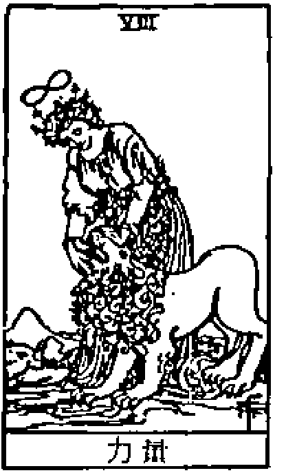

## 健康

3月8日出生的人（尤其是这一天出生的男性）很容易发生意外事故，所以在旅行或从事激烈的运动时他们要特别小心。3月8日出生的人很敏感，心胸开阔，喜欢体验不同的事情，所以他们一般不会有身体方面的疾病或者心理方面的困扰。均衡的饮食与适度的运动对他们很有帮助。大部分3月8日出生的人都具有承受繁重工作的能力，他们可以在一定时间内不眠不休地工作，通过咖啡或其他刺激性的东西来提神。不过，要保持精神上的稳定，他们还是得有充足的睡眠。如果3月8日出生的人长期睡眠不足、饮食不规律、缺乏运动或从事其他有害健康的事情，他们的心理状态就会变得非常不稳定。

- 优点
独特
有魅力
直觉很准

## 建议

保持身心的平衡。注意别人是否受到了伤害，同时不要让自己成为受害者。自怜自艾就如同毒药。不要太严肃，开朗一点，多与其他人接触接触。

- 缺点
孤僻
感情脆弱
易沮丧

- 变动位 12 页
水相 17 页
冬季 21 页
双鱼座 33 页
双鱼座二 80 页

## 静思语

力量一直都存在，我们只需要启动它。

月份：3月
第9天
双鱼宫17°～19°
双鱼座二
变动位/水相

## 3月9日

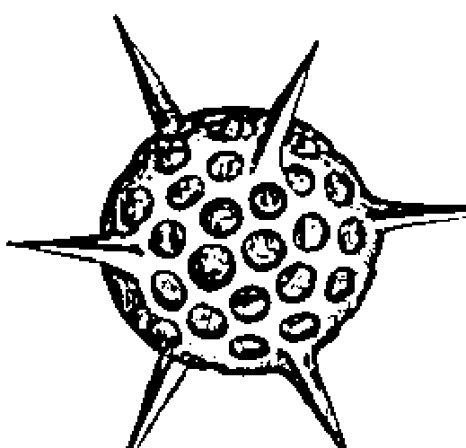

## 自由航行的一天

## 出生于这一天的名人

3月9日出生的人具有很强的概念性和丰富的想象力，他们喜欢探索周围各种各样的事情，包括心理、生理等各方面的问题。可以说，3月9日出生的人几乎对所有的事物都感到好奇，而且不追根究底决不罢休。他们不喜欢任何形式上的虚伪、做作、权威或压迫，他们尽力做到凡事顺其自然。他们非常理想主义，所以喜欢站在受害者的一边，扮演保护弱者的角色。这一天出生的人通常是很有力、富有个人魅力的人物，而且他们的心理作用也很强大，通常情况下，他们的直觉都很准确。

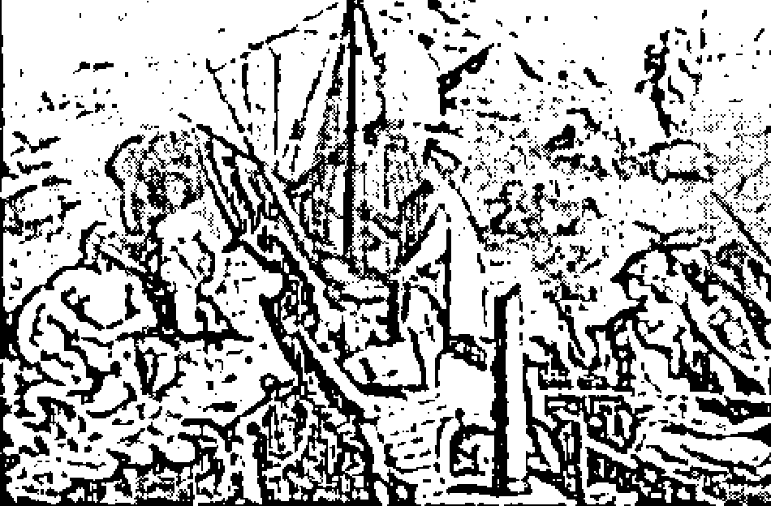

阿梅里戈·韦斯普奇

尤里·加加林（苏联宇航员，第1位进入外太空的人，在一场试航任务中不幸身亡），阿梅里戈·韦斯普奇（意大利航海家，发现了亚马孙河，美洲大陆就是以他的名字命名的），利兰·斯坦福（铁路建造企业家，美国加利福尼亚州州长，参议员，建立了斯坦福大学），博比·费希尔（唯一一位出生于美国的象棋超级大师），奥内特·科尔曼（爵士乐创新主义萨克斯管演奏家，小提琴家，作曲家），艾琳·帕帕斯（希腊舞台剧和电影女演员），劳尔·朱利亚（电影演员），杰基·威尔逊（说唱音乐灵魂歌手，作曲家，表演时因心脏病发作而昏迷），米基·斯皮兰（侦探小说家，塑造了“迈克·哈默”这个人物形象，作品有《吻我》、《骨巨人》等），安德烈·库雷热（法国时尚设计师，发明了超短裙），约瑟夫·弗朗茨·加尔（德国人，建立了颅相学），维亚切斯拉夫·莫洛托夫（苏联外交部部长，后被流放；在苏芬战争中，曾对外谎称向芬兰投放的燃烧弹其实是给芬兰人民投送的面包，后来芬兰人称对付苏联装甲部队用的汽油弹为“莫洛托夫鸡尾酒”），筱田正浩（日本电影导演、制片人，作品有《苍白的花》、《情死天网岛》等），塞缪尔·巴伯（美国作曲家）。

那些心理较成熟的3月9日出生的人很依赖自己的直觉。虽然没有人质疑他们的精神力量，但是在很多时候他们的确会舍弃胜算更大、合乎逻辑或者看起来应该那样做的做法，而选择跟着直觉行动，尤其当涉及人际关系或生活中的重大决策时。虽然有时候他们看起来好像生活在另外一个世界之中，但是这一天出生的人确实对现实生活中的很多事情都很了解，而且具有透过表象看到本质的能力。不管别人是否会把他们看做怪人，许多3月9日出生的人的确会比一般人看得更高更远，所以他们可以为周围的人提供很好的建议，而且他们提出的很多方法都是别人之前没有想到过的。

3月9日出生的人的内心经常很矛盾，既想要安定的人生，又希望可以拥有自由，四处旅行，随心所欲地追求自己的梦想。如果他们让自己受缚于沉重的个人责任与义务，他们肯定会感到非常沮丧。这里提到的责任与义务可能来自他们的家庭、工作和社会地位等，不过还有一个因素也会将他们推上这条受缚之路——因为他们很有能力，所以其他人会逐渐依赖他们。因此，他们必须谨慎地给自己留下选择的余地，可以让自己有机会去探险，或做一些自己想做的事情。

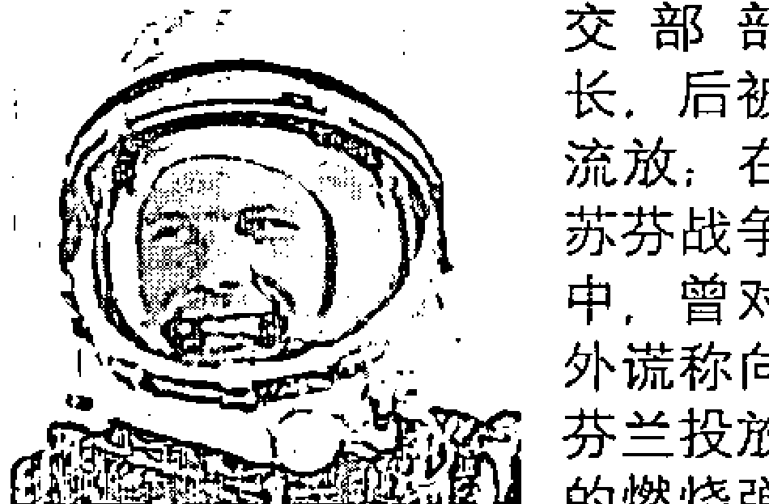

尤里·加加林

3月9日出生的人一生中经历的起伏会比一般人的多。他们天性喜欢改变，不喜欢受到约束，所以他们会把换工作、搬家或人际关系上的重大改变看成很自然的事情。有些这一天出生的人并没有很深入地了解自己，他们只模糊地意识到了自己有些独特，却不知道如何发挥自己真正的优势。不过，如果他们后来能够更好地了解自己，发现自己的不同，并开始学习去表现自己，他们的人生就会焕然一新，当然他们也会面临一些新的挑战。不管怎样，这一天出生的人心中总有一股放弃自己的社会责任和家庭义务、不屈不挠地向着自己的梦想前行的冲动。

## 每年的这一天

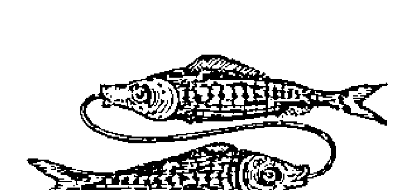

## 双鱼座
3月9日

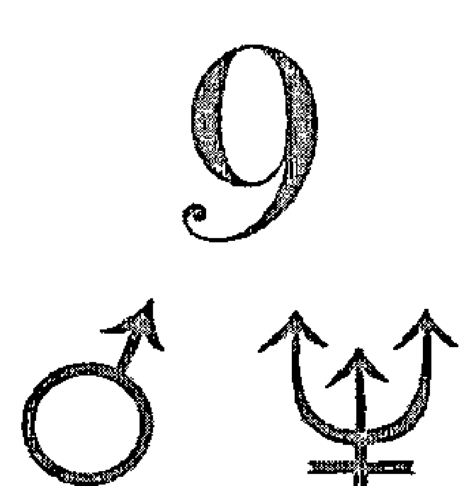

## 幸运数字和守护星

3月9日出生的人受数字9和火星的影响。数字9对其他数字有着很强的影响力（任何个位数加9，皆可回复到原数，例如5+9=14，4+1=5；任何数字乘9，都能回复到数字9，如9×5=45，4+5=9），所以3月9日出生的人对周围的人也有着类似的强大影响力。火星代表男性的强有力并且具有侵略性的阳刚力量，加上海王星（双鱼座的主宰星）的影响，3月9日出生的人会很有力量，并且具有很强的吸引力，这通常包括强大的心理承受能力和高度准确的直觉。

弗洛伊德·麦基西克（民权运动领袖，律师，浸礼会牧师），迈克尔·金斯利（电视台记者），翠施·范·德沃尔（电影和电视剧女演员），丹尼·沙利文（赛车手，美国优胜赛车队比赛冠军，所赢得的奖金在所有赛车手中排名第7），罗宾·特罗尔（英国吉他演奏家），基莉·史密斯（电影女演员，歌手）

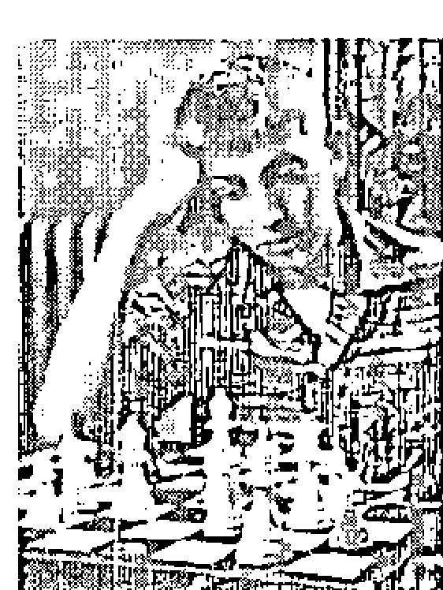

## 塔罗牌

大秘仪塔罗牌的第9张是“隐士”。画面中的人提着一盏灯，拄着拐杖，代表了冥想、孤立与寂静，象征着智慧的结晶和绝对的纪律。隐士是严厉的导师，他通过良心教育使人走上正途。从积极的一面来看，这张牌代表有所坚持、有目标、深沉且专注；从消极的一面来看，这张牌代表专断、心胸狭窄、多疑以及气馁。

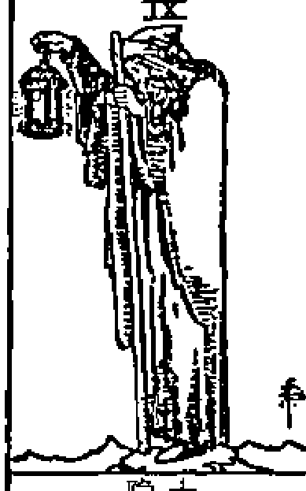

## 健康

3月9日出生的人要注意，不要因为太大的压力和太多的责任造成健康状况的恶化。他们可能经历周期性的挫败感，这种失意可能是因为他们无法很好地表现自己的创造力或者无法改善自己的工作。经常改变周围的环境，适合他们的饮食和体育运动，和谐的家庭关系，以及拥有自由地表达个人感受的权利对他们的健康都是很有帮助的。这一天出生的人特别需要解放自己精力充沛的一面，还需要学会多欣赏自己，所以人生伴侣的选择对他们的人生幸福就至关重要了。这一天出生的人很多都有烹饪天赋，但是他们要注意了，在为别人做饭和照顾别人的过程中，在他们自己得到心理满足的同时，还要注意对方是否知道感恩，是否把他们的照顾当做理所当然的事情了。

- 优点
直觉强
想象力丰富
概念性强

- 缺点
过于牺牲自我
矛盾
压力过大

## 建议

更好地了解你自己，明白什么是你必须做的。有时候不要用别人的看法来评价自己。善用你的个人魅力，鼓起勇气，做到最好。

- 变动位 12页
水相 17页
冬季 21页
双鱼座 33页
双鱼座二 80页

## 静思语

> 在你一生所遇到的人中，最有趣的那个往往就是你自己。

月份：3月
第10天
双鱼宫18°～21°
双鱼座二
变动位/水相

## 3月10日

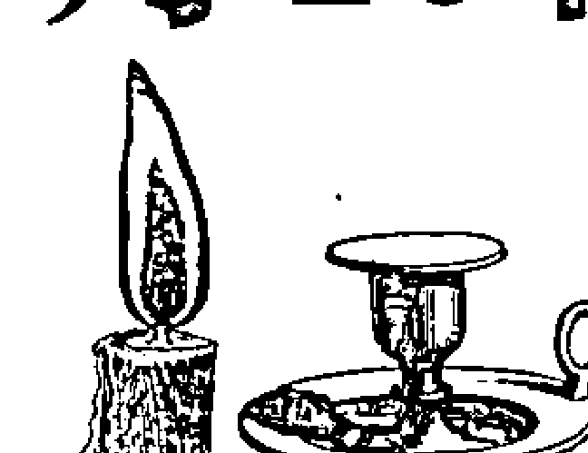

## 追寻灵魂的一天

## 出生于这一天的名人

哈丽雅特·塔布曼（非洲裔美国人，“地下铁道”的领导人，帮助无数的黑奴得到了自由，美国南北战争时期是北方联邦军队的护土，也曾做过间谍工作，91岁时逝世），比克斯·拜德贝克（爵士乐小号手、作曲家，因肺炎及酒精中毒而于28岁时英年早逝），塔玛拉·卡尔莎温娜（俄国芭蕾舞女演员，著名的俄国男芭蕾舞演员尼金斯基的搭档，伦敦皇家舞蹈学院的创办人之一），戴维·拉贝（剧作家），巴勃罗·德萨拉萨特（西班牙著名吉卜赛音乐小提琴家、作曲家），亚历山大三世（19世纪俄国沙皇，强化了国家的治安系统，迫害了很多革命者和犹太人），马塞勒斯·马尔皮吉（17世纪意大利自然主义者、解剖学家，开创了动植物的显微解剖工作，昆虫的排泄和渗透调节的主要器官就是以他的名字命名的——马尔皮吉氏小管），阿瑟·奥内热（法国作曲家），西格里德·伯里斯（小提琴手，20岁时就成为了柏林爱乐乐团的首席小提琴演奏者），香农·米勒（美国体操运动员，赢得了5枚奥运会金牌），詹姆斯·雷（杀害马丁·路德·金的凶手，被判终身监禁），傅聪（中国钢琴家），查克·诺里斯（电影和电视剧演员，空手道比赛冠军），凯利·奎因（巫师，36岁时因癌症去世），赫拉德·克鲁瓦塞（荷兰人，超自然现象研究者），保罗·文德利希（德国艺术家，雕塑家），巴里·菲茨杰拉德（爱尔兰电影演员），帕梅拉·梅森（电影女演员，詹姆斯·梅森的妻子），埃克托尔·热尔曼·吉马尔（法国新艺术风格建筑师）。

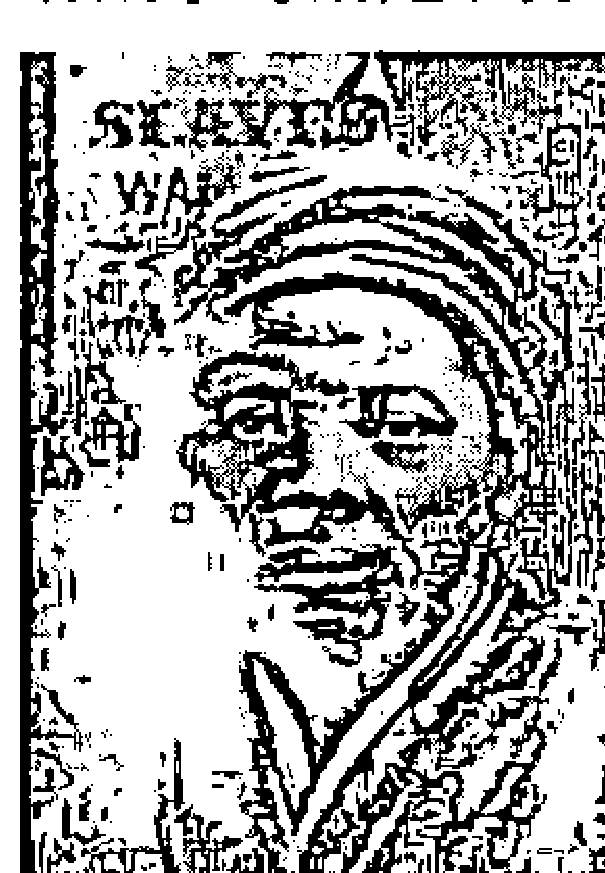

3月10日出生的人比较深沉，也有点情绪化。他们对追求事业成功的渴望并不是那么强烈，相比于财富、权力和名声，他们更看重深入地了解自己、处理好自己复杂的个性。这并不是说3月10日出生的人是个人主义者，实际上，他们喜欢充满欢笑的生活，尤其喜欢和好朋友一起享受亲密的氛围。最令他们开心的事就是发现自己在家庭关系中居于核心地位，被周围的人爱着、照顾着。

周围的人可以明显地感觉到3月10日出生的人很敏感——他们很容易受伤，别人的拒绝会给他们造成很大的伤害，而且他们很注重能够和周围的人和平相处，除此之外他们别无他想。不过，如果这一天出生的人在童年时期曾受过严重的伤害（这个伤害可能来自过于严厉的父母或者被强加的道德约束），那他们就很可能封闭自己的心门，在成年以后也喜欢退缩到个人的情感世界里，很少与人沟通。

因为3月10日出生的人太敏感了，所以他们可能比别人经历更多的生活中的起伏，因此，有时候他们会放弃在外界的奋斗而转向自己的内心，追随内心深处的灵魂。因为这样一种倾向，他们会对别人的悲伤和痛苦更有感受能力，更有同情心，因此许多这一天出生的人都很适合从事服务性质的行业。3月10日出生的人中人格比较高尚的人会对别人表现出极大的同情心和爱心，有时候他们甚至不惜以自己的生命为代价去帮助别人，几乎是圣人一般的人物了。当3月10日出生的人为人父母的时候，他们一般都能了解并且疼爱他们的子女，不过他们要注意不要对孩子保护过度或者控制得太多。

一般情况下，3月10日出生的人会首先考虑自己的需求，然后才考虑其他的事物，又因为他们情绪复杂多变，所以这一天出生的人可能很难发展出强大的意志力。因此，他们中有的人会随波逐流或者停滞不前，也没有很强烈的意愿或者强大的能力来改善他们所处的环境。对3月10日出生的人中那些资质不太好的人来说，接纳能力和被动性可能并不是他们想要的。

相比于外在社会的价值观，3月10日出生的人更重视他们内心的想法，所以他们可能有理想主义的倾向以及非物质主义的价值观。不过他们还是对安全感和基本的物质条件有一定的要求，而且年纪越大，他们的这种倾向就越明显，这是因为他们担心自己因为失去活力而无法继续提升自己的精神层次。尽管3月10日出生的人喜欢探索自己和别人的精神世界（这种倾向可以使他们变得更敏锐，也能强化他们自身注重精神发展的倾向），但是他们还是不应该把这种倾向作为不表达自己的意愿或逃避作出重大决策的借口。

## 每年的这一天

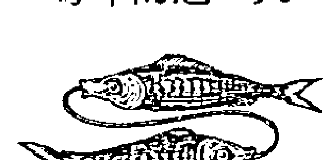

## 双鱼座
3月10日

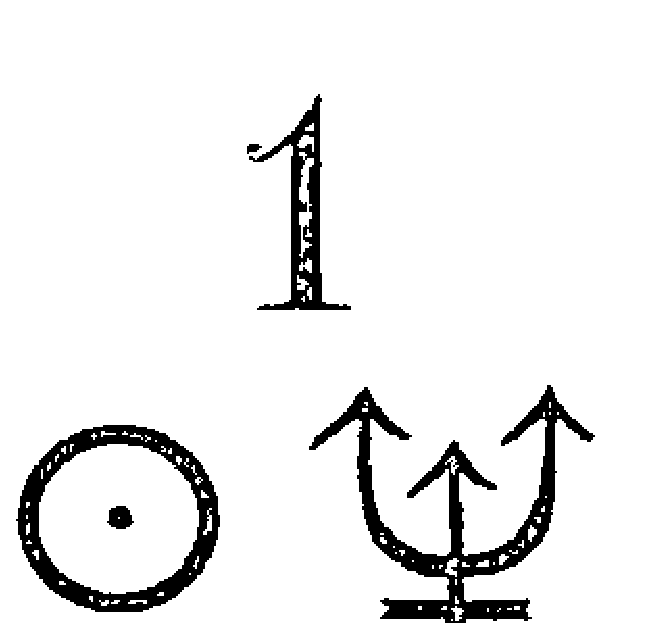

## 幸运数字和守护星

3月10日出生的人受数字1（1+0）和太阳的影响。受数字1影响的人大都争强好胜，凡事想争第一，这一点在3月10日出生的人身上则表现为把自己的感受摆在第一位。受太阳影响的人一般具有温和的性格和发展良好的自我意识，对他人和生活的态度都积极乐观。因为3月10日出生的人属于双鱼座，所以他们还会受到海王星（双鱼座的主宰星）的影响，海王星会给他们带来浪漫主义的倾向，同时也可能使他们具有散漫、多愁善感以及爱幻想的特质。

艾萨克·罗森菲尔德（批评家、散文家、小说家，作品有《回家之路》等，38岁时就去世了）

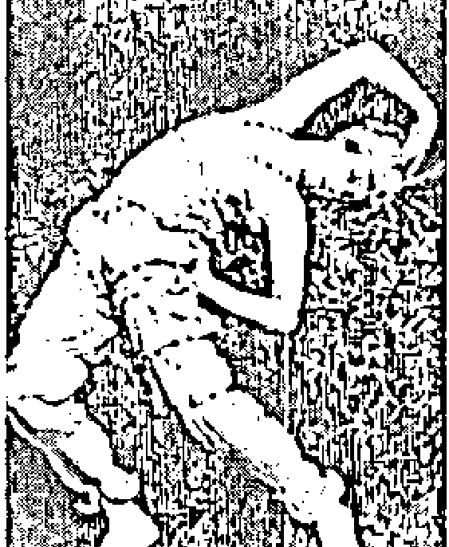

## 塔罗牌

大秘仪塔罗牌的第10张是“命运之轮”。这张牌揭示了人生的起伏不定和得失成败。受数字1和10影响的人都专注于捕获机会，厚积薄发，在适当的时机出击并取得成功。这张牌象征着命运的逆转，告诫人们除了变化本身，世上并没有其他永恒不变的东西。

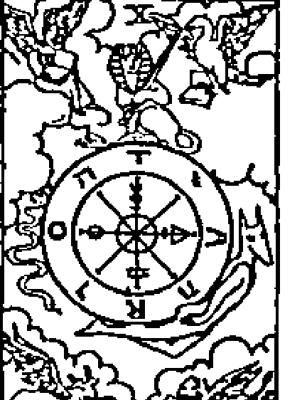

## 健康

3月10日出生的人对周围环境中的伤害性因素缺乏强大的抵抗力，他们不仅容易出现各种类型的过敏症状，同时对别人带来的负面影响也相当敏感。因此，尽管到了晚年，有的人也还是会投入无私奉献的公共事业，但是建立强烈的自我意识依然是他们心理发展的基础。3月10日出生的人容易罹患各种慢性病，尤其是神经系统与循环系统方面的疾病。总是处于变动状态可能是他们的一个很大的问题，对此，他们可以寻求医生的建议或者采用顺势疗法。3月10日出生的人是喜欢舒适安逸的一类人，所以他们会追求各种各样的感官体验。这一天出生的人必须注意自己的饮食习惯，这里特别推荐他们多吃各种谷类食物和新鲜的蔬菜，少吃乳酪类与肉类食物。规律的运动对他们非常有益，尤其是长距离的户外步行、游泳、瑜伽与温和的有氧操。

| 优点 |
| --- |
| 敏感 |
| 有同情心 |
| 人格高尚 |

| 缺点 |
| --- |
| 过分忍耐 |
| 退缩 |

## 建议

不要压抑自己的野心。建立强大的自我意识。学着在周围的环境中保护自己，但是也不要与世隔绝。保持开放的心胸，同时避免给自己带来伤害。注意不要沉溺在自己的世界里，或者沉迷于物质世界。

- 变动位 12页
- 水相 17页
- 冬季 21页
- 双鱼座 33页
- 双鱼座二 80页

## 静思语

> 一个灵魂里可能有多种人格。

月份：3月
第11天
双鱼宫19°～21°
双鱼座三
变动位/水相

## 3月11日

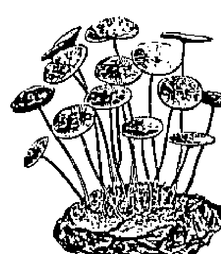

## 追求进步的一天

## 出生于这一天的名人

马里于斯·珀蒂帕（法国裔俄国古典芭蕾舞编舞家，曾任柴可夫斯基的《天鹅湖》的编舞，作品还有《睡美人》等），拉尔夫·阿伯内西（美国全国有色人种协进会主席），鲁珀特·默多克（澳大利亚裔美国传媒大亨，《泰晤士报》、《星期日泰晤士报》和天空电视台的老板），多萝西·希夫（《纽约邮报》的女老板），鲍比·麦克

3月11日出生的人总是跟时代发展的脚步保持一致，不管他们从外表看起来是开放还是保守，他们的思想都是走在时代前端的，因为他们明白，如果对周围发生的事情一无所知，个人的事业发展就无从谈起。他们把世界看做一个充满了竞争的大舞台，只有那些反应迅速的聪明人才能生存下来。不过，在个人生活方面，他们要比在工作时更放松、更爱想象，他们喜欢和朋友或家人畅谈自己的理念和梦想，喜欢自由自在地发挥想象力。在他们的工作和个人生活中，他们都拥有强大的直觉，这也是他们成功的一大助力。

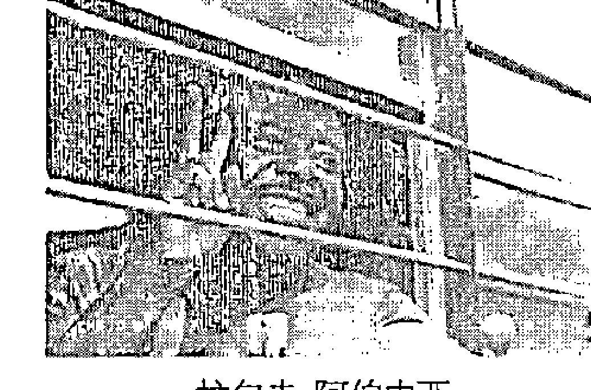

在3月11日出生的人看来，止步不前就等于退步，因为别人在你停止的时候会超过你。不过，他们也不是走极端的人，他们的野心并没有那么强烈，他们只是带着清晰的目标坚定地向前走而已。如果他们需要在某个固定的岗位上工作，那么他们一定会选择有发展空间的职位，但是他们不会不择手段地去争取晋升机会。他们认为只要付出了努力取得了成果，就可以得到赏识以及晋升的机会，这种想法正确与否要依据他们工作的环境的公平程度而定。

拉尔夫·阿伯内西

费林（爵士乐歌手），拉乌尔·沃尔什（电影演员、制片人、导演，作品有《白热》、《血海大进攻》等），多萝西·吉什（舞台剧和默剧女演员，莉莲·吉什的姐姐），哈罗德·威尔逊（英国首相），安东尼·斯卡利亚（美国最高法院大法官），艾尔弗雷德·洛温斯坦（金融家），劳伦斯·韦尔克（电视节目主持人），道格拉斯·亚当斯（英国科幻小说家，作品有《银河系漫游指南》等），默瑟·埃林顿（爵士乐小号手、作曲家，埃林顿乐队领袖，此外还是作家，著有《埃林顿公爵其人》），罗伯特·莫斯巴赫（美国商业部部长，曾是一名海员），萨姆·唐纳森（电视台记者，节目主持人），克洛德·朱塔（法国裔加拿大导演，执导了《安东万叔叔》等剧，57岁时患上了老年痴呆症，后来人们在圣劳伦斯河发现了他的遗体），托尔夸托·塔索（16世纪意大利诗人），马德琳·麦克温尼（银行董事长），尤利乌斯·布吕特纳（德国钢琴演奏家，制造商），肯尼思·米勒（美国纽约画家，蚀刻师）

如果3月11日出生的人是自由职业者，或拥有自己的企业，他们就会展现超凡的天赋，发现并抓住隐藏的机会。一旦发现了某个机会，他们就会毫不犹豫地投入足够多的成本放手一搏。他们是优秀的投资者和赌徒——他们有勇气在该放手一搏的时候大胆投入，又有判断力，不会竹篮打水一场空。

3月11日出生的人获得成功的另一个助力就是他们的判断力。他们不只善于判断什么是好的、什么是有价值的，对于如何促使某个事物或理念变得有价值也相当擅长。有些3月11日出生的人很有眼光，他们选出来的一些东西常人可能以为是假冒品或便宜货，但后来总是被证实是相当有价值的。

3月11日出生的人有要求过高和控制欲过强的倾向，他们对自己拥有的东西（不管是人还是物）从不愿放手。在家庭中，他们喜欢成为家庭关系的中心，喜欢拥有决定权，并且影响其他家庭成员。不过，他们应该明白其实每个人都喜欢自由、独立的生活，所以他们还是要控制一下自己的个性，以免引起不必要的抵抗或敌对情绪，尤其是在教育小孩方面。其实在很多方面，3月11日出生的人都应该学着放手、减弱自己想控制环境的欲望。那些性格发展较好的人终会学会相信宇宙万物的自然发展规律，明白没有什么是真的失去了就找不回来的，当明白这些之后，他们就可以减弱自己过强的控制欲，同时解放他们自己。不过，他们的强大直觉最终会引领他们放弃物质享受的欲望和控制欲，把自我的自由放在首位。

## 每年的这一天

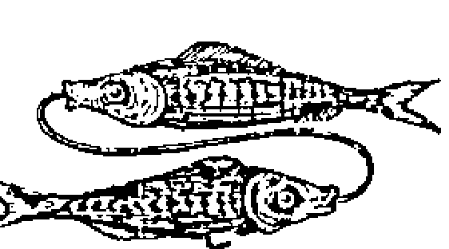

## 双鱼座
3月11日

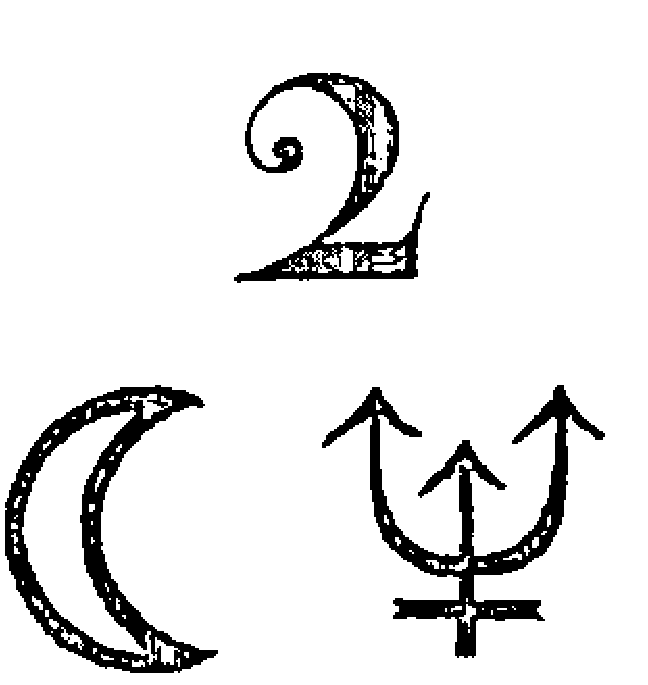

## 幸运数字和守护星

3月11日出生的人受数字2（1+1=2）和月亮的影响。受数字2影响的人通常都可以成为很好的同事和事业伙伴，而不习惯扮演领导者的角色，所以3月11日出生的人有很强的社交天赋，非常合群。因为双鱼座受海王星主宰，所以3月11日出生的人会受到月亮和海王星的双重影响，从而拥有强大的直觉，不过这种双重影响也会给他们带来爱幻想的倾向。受数字11影响的人会对物质层面的东西很敏感，同时对各种成双成对的事物很有兴趣。

## 塔罗牌

大秘仪塔罗牌的第11张是“正义”。牌面中坐着一位安详的女性，她一手拿着天平，一手拿着宝剑。她提醒我们要遵循整个宇宙的规律，只要我们坚持正道，生活就能维持平衡与和谐。这张牌代表的积极意义是正直、公平、诚实和守纪律，代表的消极意义则是不主动、没有人情味、惧怕创新以及抱怨。

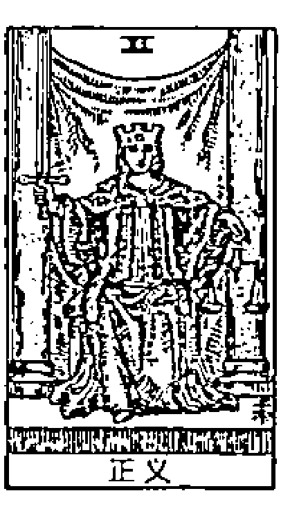

## 健康

3月11日出生的人大部分都很注意自己的外表，很希望给人留下好印象，所以他们可能需要多注意一下自己的皮肤、头发、指甲和牙齿。摄入充足的维生素并使用合适的护肤品也会对他们实现这种愿望很有帮助。3月11日出生的人大多都有烹饪天赋，可以成为厨房里的高手，而且他们也很喜欢在家中招待生意场上的好朋友，这样一来他们就可以把工作和娱乐结合起来了。此外，他们在食物的烹制与摆放方面也展现了杰出的审美能力。3月11日出生的人尽量不要吃太多乳酪制品，尤其是含乳酪过多的食品，而奶油、黄油或含糖量高的食物也要少吃。在运动方面，这一天出生的人适合从事能让人精神振奋的运动，不过最好避免具有竞争性的运动。

| 优点 |
| --- |
| 精明 |
| 有判断力 |
| 富有魅力 |

| 缺点 |
| --- |
| 占有欲强 |
| 要求多 |
| 专断独行 |

## 建议

更深入地挖掘你的思想和感情。不要太纠结于那些物质层面的目标，把精力放在精神层面的发展上。不要杞人忧天，凡事顺其自然就好。

- 变动位 12页
- 水相 17页
- 冬季 21页
- 双鱼座 33页
- 双鱼座三 81页

## 静思语

> 设想一下，带走你拥有的所有东西是不是太沉重了？

月份：3月
第12天
双鱼宫20°～22°
双鱼座三
变动位/水相

## 3月12日

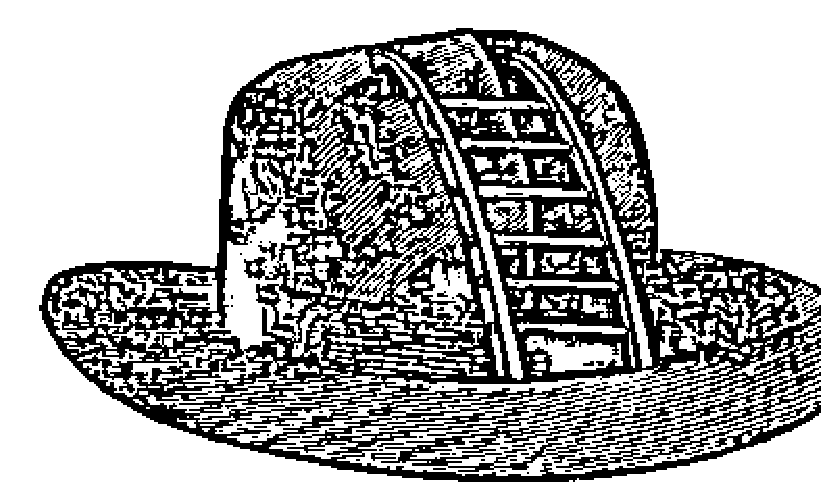

## 大飞跃的一天

## 出生于这一天的名人

瓦斯拉夫·尼金斯基（传奇的俄国舞蹈家、编舞家，28岁时因精神分裂住院，60岁时辞世），凯末尔·阿塔蒂尔克（土耳其领导人，第1任总统，现代土耳其共和国的缔造者），莉莎·明内利（歌手，娱乐明星，电影女演员，著名影星朱迪·嘉兰的女儿），加布里埃莱·邓南遮（意大利小说家、剧作家、诗人、记者、政治家，著有《火》等），杰克·凯鲁亚克（“垮掉的一代”的代表人物，著有《在路上》等），爱德华·阿尔比（剧作家，获得过2次普利策奖，著有《海景》等），安德鲁·扬（美国民权运动领导人，众议员，来自佐治亚州，曾任驻联合国代表、亚特兰大市市长），乔治·伯克利（爱尔兰基督教主教、哲学家、作家，著有《人类知识的原则》、《视觉理论》），乔治·德勒吕（法国电影作曲家），詹姆斯·泰勒（摇滚民谣歌手，歌曲创作者），阿尔·雅罗（爵士乐歌手），阿尔贝特·胡安托雷纳（古巴运动员，获得了奥运会400米和800米赛跑金牌），保罗·坎特纳（歌手，歌曲创作者，吉他手，杰弗逊飞机和星际飞船乐队成员），沃尔特·希拉（美国宇航员，“双子座”六号宇宙飞船宇航员），戴尔·墨菲（棒球外场手，3次当选美国国家棒球联盟打点王，获得过2次全垒打冠军），诺伯特·布雷宁（英国小提琴家），达里尔·斯特劳贝里（棒球外场手，最佳新秀），乔瓦尼·阿涅利（意大利工业家，菲亚特汽车公司董事长，翁贝托·阿涅利的哥哥），安妮特·亚当斯（律师，美国第1位女性上诉法官以及美国第1位女性联邦检察官），休茨（物理学家，发明家）

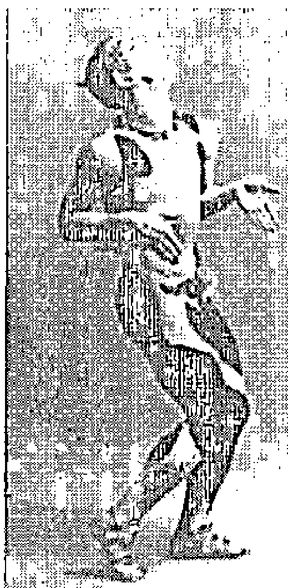

3月12日出生的人是非常勇敢坚决的人，可以坚强地面对生活中的挑战和失意，并不断总结经验，稳步前行。对3月12日出生的人而言，挣扎是很平常的事情，他们一直在努力冲破各种阻碍。他们能够把自己的天赋和能力利用到极致，而且他们中的大多数人对自己将来的发展方向也有自己的想法。

不过，3月12日出生的人最好能够坚定某个固定的发展方向，因为他们往往在好几个方面都很有能力，很可能把自己的天赋和精力分散到多个方向。这一天出生的人也很容易改变主意，他们刚开始可能对某一件事感兴趣，之后又被其他事情所吸引，所以要想有很好的发展的话，他们最好能专心、耐心地待在某个特定的专业领域中。

大多数3月12日出生的人不害怕冒险，对一些人们不敢涉足的领域他们也会冒险去探索一番。他们相信，有所付出必然有所回报，冒了如此大的风险，成功之后的回报也应该很高。当然，冒险本身也是很吸引他们的。不管他们承不承认，他们的确很享受自己成为别人谈论的主题。人们常常觉得3月12日出生的人想独处，其实这是一种错觉，因为这一天出生的人很愿意和别人谈论他们的所作所为，甚至还会带有一些夸耀的味道。

3月12日出生的人通常相信一些不属于当时当地的事情，例如前世、轮回或另一个星球的存在等，不过他们的行为又很务实——他们的确有办法可以很好地整合现实世界与他们的精神世界。虽然他们表现得很实际，但是他们也会足够聪明让这种实际来为他们的精神发展服务，他们在内心深处始终相信人世间的一切都是瞬息万变的。不管他们是否有宗教信仰，是否曾经对哲学思辨问题作过研究，他们大都相信在这个世界上存在着永恒的真理，这些真理会以各种形式隐藏在事物的表象之后，所以那些3月12日出生的更聪明的人会在抽象问题的思考方面有很强的能力。

不过要提醒这些感情热烈的3月12日出生的人，不要因为沉迷于这些抽象的思考而失去自我，除非他们已经能足够成熟地理解形而上学或玄学的东西，否则这些思考会强烈影响他们的精神世界的稳定性。兼顾务实与精神层面的发展才是比较好的，这样他们可以同时满足自己物质生活与精神发展的需求。对这一天出生的人而言，在行动与思想之间保持平衡才是最重要的。

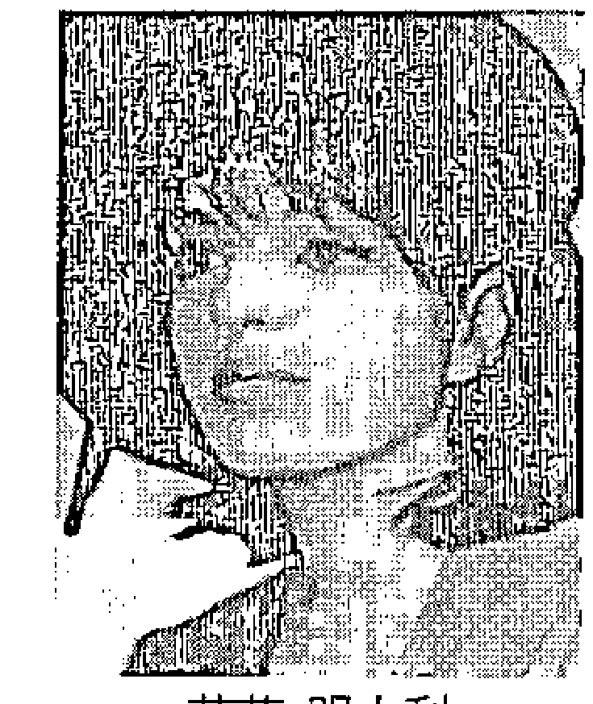

## 每年的这一天

## 双鱼座
3月12日

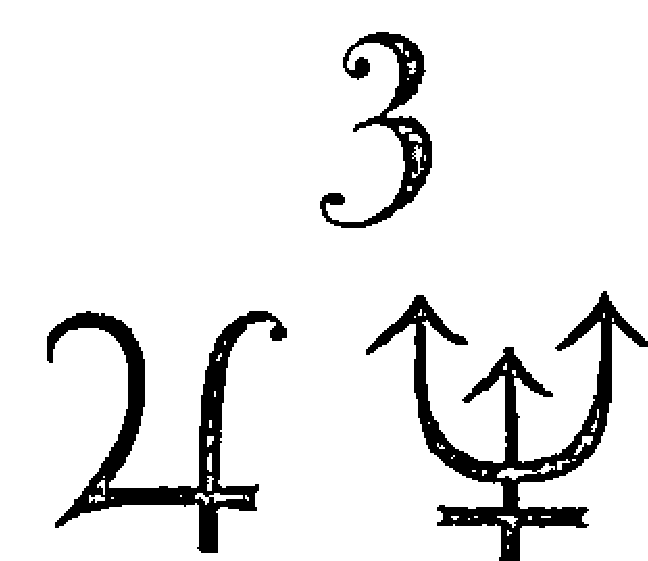

## 幸运数字和守护星

3月12日出生的人受数字3（2+1=3）和木星的影响。受数字3影响的人通常比较有野心，有时候还有一点独断，所以3月12日出生的人要注意不要让自己变得太有老板腔或太具有侵略性。此外，受数字3影响的人往往都相当独立，所以有时候这一天出生的人会想放弃稳定的工作，而选择相对自由的职业。数字3和木星的共同影响使3月12日出生的人对自己的事业和人生目标都很有激情，双鱼座的主宰星海王星的影响则给他们带来了财运。

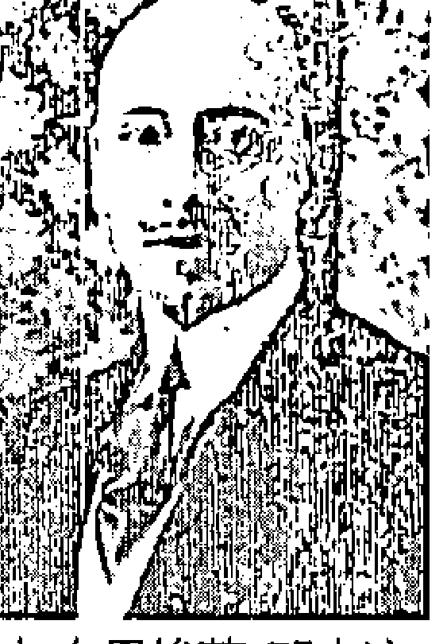

## 塔罗牌

大秘仪塔罗牌的第12张是“倒悬者”。画面中的这个人用单脚倒吊在树上，虽然看起来有点无助，可是实际上他拥有无穷的精神力量和深刻的思想。因此，这张牌代表的积极意义是有自知之明、能够解决问题和人性化，代表的消极意义则是目光短浅、精神方面会受到限制。

## 健康

3月12日出生的人容易产生心理问题，情绪也经常不太稳定。建议他们在20岁以前尽量强迫自己去作一些心理检查，直面自己心理方面的问题，并设法加以克服。当他们过了20岁，心理治疗或各种形式的心理咨询依然对他们很有帮助。3月12日出生的人也可以从实际经验中逐步改善自己的心理状态，但是一定不能急于求成，还是要稳步地构建健康的心理世界。能让人精神振奋的运动很适合这一天出生的人，另外，与固定伴侣（最好是他们彼此都深爱对方）的性生活也是很益于他们的健康的。在饮食方面，3月12日出生的人没有固定的习惯，想吃的时候就吃，对吃的东西也比较随意，就他们的健康而言这样的饮食习惯可能没什么问题，不过，如果他们身体肥胖或者想变得苗条，控制自己的饮食就可能需要相当的毅力了。

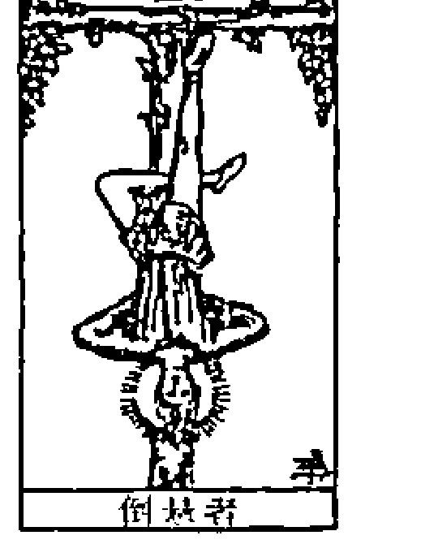

## 优点
- 胆大
- 感情热烈
- 有远见

## 缺点
- 急躁
- 不稳定
- 鲁莽

## 建议

在物质世界与精神世界之间寻找一个平衡点。学会充分地信任与分享。不要执著于过去的事情，小心自怜自艾的倾向。学习表现自己好的一面，但是也不用否认自己的缺点，人都不是完美的。

- 变动位 12页
- 水相 17页
- 冬季 21页
- 双鱼座 33页
- 双鱼座三 81页

## 静思语

> 人需要谨慎，但是不要把谨慎变成畏首畏尾。

月份：3月
第13天
双鱼宫21°～23°
双鱼座三
变动位/水相

## 3月13日

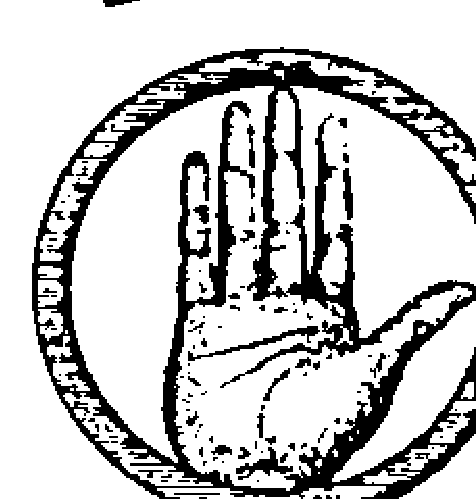

## 宿命论的一天

## 出生于这一天的名人

珀西瓦尔·洛厄尔（19～20世纪的天文学家，曾预言有冥王星存在。巧合的是，1781年的3月13日，赫舍尔发现了天王星），罗恩·哈伯德（美国畅销书作家、科幻小说家、哲学家、工程师，创立了科学派教会，提出了“排除有害印象精神治疗法”），沃尔特·安嫩伯格（美国出版商，出版了《电视指南》、《费城询问者报》等，曾任美国驻英国大使，也是慈善家，资助成立了安嫩伯格传播学院），尤金·塞尔南（美国航天员，“阿波罗”十七号登月行动的航天指挥员，第2个在太空中行走的航天员），布鲁诺·弗斯特（商业撰稿人、律师，著有《记忆术》等），阿列克谢·冯雅弗林斯基（俄国早期抽象主义画家），迈赫迪·埃尔曼雅（摩洛哥大学教授，著有《21世纪的中国》），卡尔·迪特里希·布拉赫尔（德国政治学家、历史学家，著有《攫取政权的阶段》），珍妮特·弗兰纳（美国驻巴黎记者），罗伊·哈恩斯（爵士乐鼓手，精通多种乐器），胡戈·沃尔夫（德国作曲家、批评家，因梅毒出现了精神问题），威廉·凯西（美国中央情报局负责人），弗里茨·布施（德国小提琴家、钢琴家、指挥），特伦斯·布兰查德（爵士乐鼓手）。

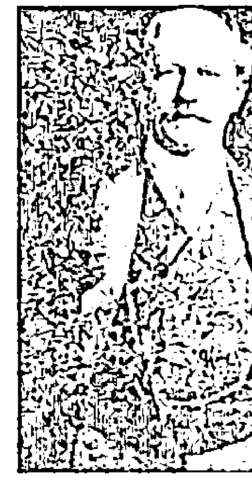

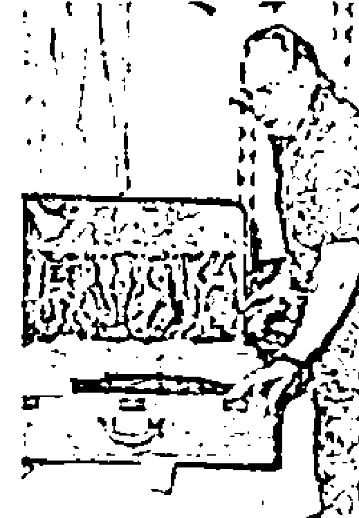

3月13日出生的人是宿命论者，在回想往事的时候，他们往往认为是命运决定了他们人生中的很多事情，他们自己很难扭转某些特定的情势。大部分这一天出生的人都坚信未来要发生的事情都是已经注定了的，而且他们还喜欢预测未来的世界和周围人的生活。3月13日出生的人所说的话经常很模糊，好像是神授的一般，他们经常带着“我知晓天命”的口吻来分析世界及其存在的问题。那些偏重学术的3月13日出生的人会被哲学或者精神性的东西、理论推测和科学或者分析系统所吸引，他们对人类的智慧与创造才能有着高度评价。不过，他们更崇敬自然的奥秘，他们相信在宇宙之中人类是很渺小的。

3月13日出生的人（特别是这一天出生的男性）可以承受一般人无法承受的身体、经济或者心理上的重挫。他们宿命论的思想让他们能够在问题出现时不多加抱怨，而是以极强的创新力和活力去继续谱写自己的人生之歌。在很多情况下，在这些打击出现之前，这些3月13日出生的人都没有完全认识到他们自己的能力与坚韧的性格。因此，这些挫折就好比一场场人生的洗礼，或者说是命运对他们的考验，能让他们变得更强壮、更成熟，也更有毅力与勇气去面对未来的艰难险阻。通过这些磨难，有些3月13日出生的人还能够更深入地了解他们自己和他们的人生方向。

个人的成长与发展是3月13日出生的人性格发展的基本组成部分，所以我们可以发现几乎所有这一天出生的人在很多时候都没有太多选择，只能不断地完善自己，向前发展。不过，他们中有的人可能因为对玄学或形而上学这类难以掌握的事情投入了太多而失去自我。当这些人试图掌握或者探究超出他们所在时空的事物时，他们就可能将自己置于危险的境地了。不过，就像我们提到过的，即便他们失败了，这些挫折仍然会促进他们个人的成长与发展。很多这一天出生的人都有这样一个心愿，就是能够启发别人，让别人因为他们的话而受益。

一般来说，3月13日出生的人最好控制好自己想预测未来的冲动，不要随便预测某些事情或者身边的人的未来，因为他们可能到最后了还不知道自己对未来发生的事情的影响。也许我们可以说他们具有“自我实现”的预言能力，因为他们内心强烈的自我期许会促使他们付诸某些行动。然而，这一天出生的人需要注意的是，如果太相信自己的预言能力，那么不只梦想能够成真，一些不好的预言最后也会应验。

## 每年的这一天

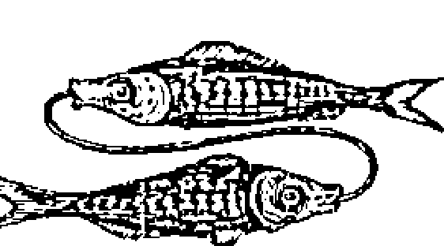

## 双鱼座
3月13日

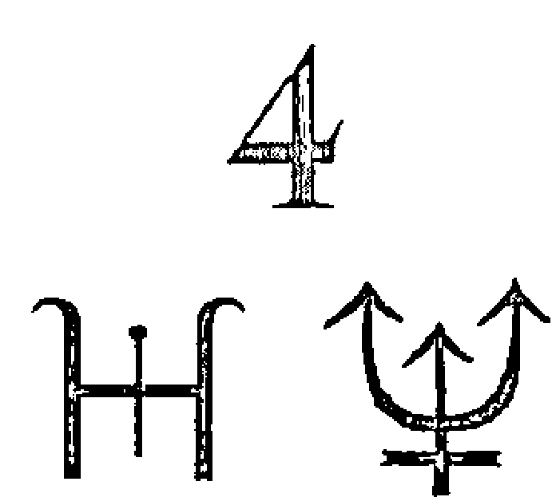

## 幸运数字和守护星

3月13日出生的人受数字4(1+3=4)和天王星的影响。天王星代表反复无常、具有爆发性的特质，受数字4影响的人很多比较叛逆，拥有奇特的信仰和想改变现状的欲望。不过，3月13日出生的人属于双鱼座，也受双鱼座的主宰星海王星的影响，而天王星和海王星的相互影响则会削弱他们性格中偏向静态和抗拒的一面。因此，不管他们愿不愿意，这一天出生的人都总会被社会上的大事深刻地影响。虽然我们传统上认为数字13是不吉利的，但是正如对所有强大力量的运用一样，如果把握得好，它会带给我们很大的助力；而如果把握得不好，则会有被其毁灭的风险。

布卢·米切尔（爵士乐鼓手），尼尔·西达卡（歌手，歌曲创作者），迪克·卡茨（爵士乐钢琴演奏家，指挥），萨米·凯（歌手，乐队领袖），威廉·博尔杰（美国邮政总局局长），泰西·奥谢（英国演艺人员，被称为“两吨重的泰西”）

## 塔罗牌

大秘仪塔罗牌中最容易被误解的是第13张牌，也就是“死神”。我们极少依字面意思去解读它，因为它的积极意义就是抛开过去、超越限制并持续成长。这张牌和数字4都暗示了3月13日出生的人要正确看待幻想破灭，恰当处理沮丧、消极和忧郁的情绪。

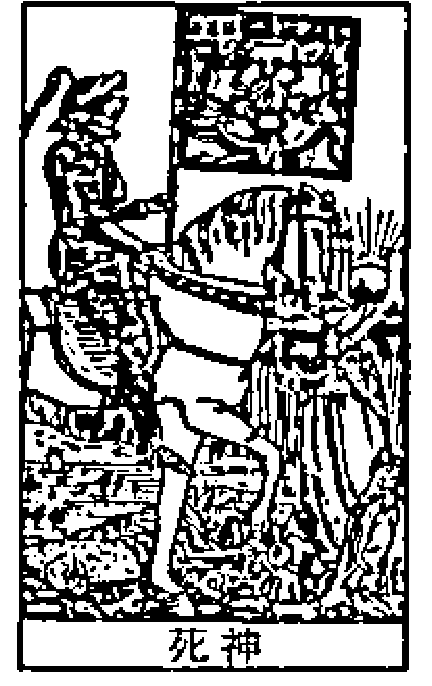

## 健康

3月13日出生的人很容易发生意外事故，所以他们必须特别注意自己的四肢，尤其是脚和脚趾头。因为他们偏重哲学思考和概念性的知识，所以推荐他们规律地进行一些强度适中的运动，尤其是那些不具有竞争性的运动，如瑜伽、能锻炼自己柔软度的体操、在大自然中的漫步、游泳、太极或跳舞等。3月13日出生的人要严格控制自己的饮食，最好多食用谷类食物、坚果、水果和新鲜的蔬菜。在某些特定的情况下，有些人还要注意多补充一些蛋白质。营养师、顺势疗法医师或其他医学专家的建议也会很有帮助。

## 优点
- 包容
- 勇敢
- 追求进步

## 缺点
- 总是做过头
- 自视甚高

## 建议

让自己开心一点，不要总是那么严肃。偶尔承认自己的无知也是一种解放。自己解决自己的问题，不要把问题留给别人。

| 变动位 12 页 |
| --- |
| 水相 17 页 |
| 冬季 21 页 |
| 双鱼座 33 页 |
| 双鱼座三 81 页 |

## 静思语

条条大路通罗马。

月份：3月
第14天
双鱼宫22°～24°
双鱼座三
变动位/水相

## 3月14日

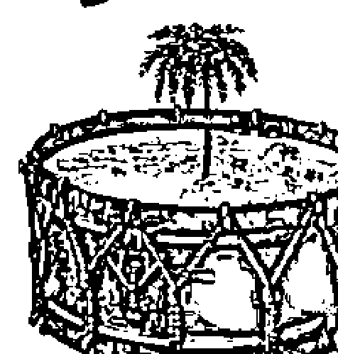

## 相对论的一天

## 出生于这一天的名人

3月14日出生的人往往倾向于通过处理人际关系来了解自己。在家庭或者社会组织中的地位对他们十分重要，因为这决定了他们所要扮演的角色，而且能够证明他们存在的价值。不过，人际关系这个生活主题对他们的生活有更深入的影响。从意识形态方面来说，这一天出生的人思想开明但又有一些奇怪，他们能够接受很多不同的想法，但又不能完完全全地认同某一种观点。3月14日出生的人的一大特点就是喜欢不断地修正自己的观念，即使他们一生都坚信某一套思想，他们也还是会根据周围情况的变化而给以适度的调整。

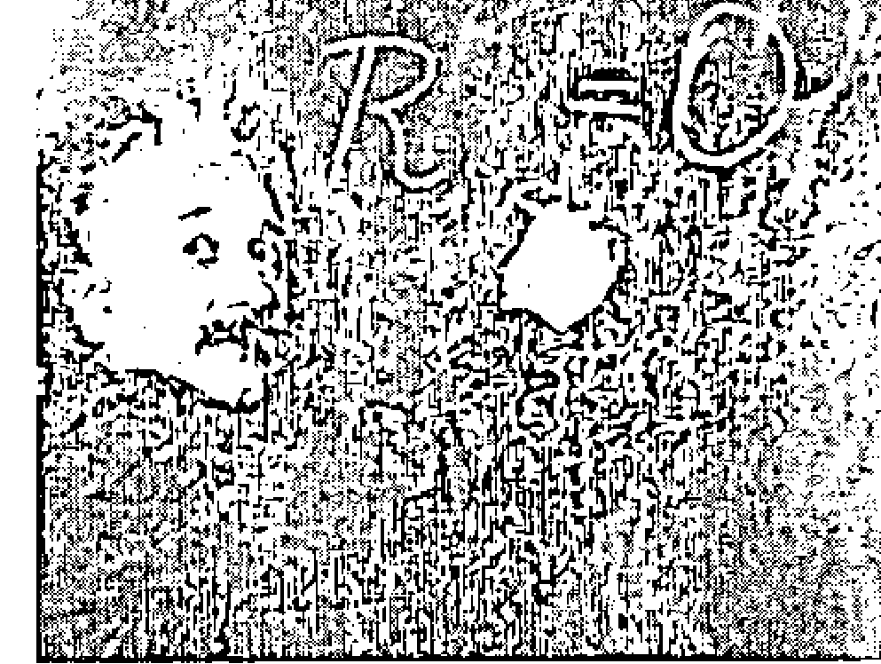

阿尔贝特·爱因斯坦（德国犹太裔美国理论物理学家、数学家，获得了诺贝尔物理学奖，提出的相对论革命性地改变了人们对时间和空间的认识），保罗·埃尔利希（德国免疫学家，诺贝尔医学奖获得者，化学疗法的奠基者），维克托·埃马努埃尔二世（意大利统一之后的第1位国王），弗兰克·博尔曼（美国宇航员，航空公司经理），乔治·菲利普·特勒曼（德国作曲家，历史上最多产的作曲家），昆西·琼斯（爵士乐鼓手、键盘手、指挥、作曲家、乐队领袖、制片人、唱片公司经理），戴安娜·内梅罗夫·阿尔比斯（肖像摄影师，主要拍摄那些比较奇特的人），迈克尔·凯恩（电影演员），西尔维娅·比奇（巴黎出版商，开办了莎士比亚图书公司，第1次出版了《尤利西斯》），约翰·施特劳斯爵士（奥地利作曲家、指挥），比利·克里斯特尔（喜剧电影演员，娱乐明星），奥萨·海伦·莱蒂·约翰逊（探险家，电影制片人），马克斯·舒尔曼（小说家，幽默大师，作品有《爱情是谬误》等），罗伯特·里默（作家，著有《来自波士顿的女孩》等），汉克·凯彻姆（漫画家，作品有《淘气阿丹》等），贝特朗·布利耶（法国导演，作品有《莫欺朋友妻》等），丽塔·塔欣厄姆（英国电影、舞台剧、电视剧女演员），柯比·帕克特（明尼苏达双城棒球队外野手，率领球队获得了2次世界冠军），凯西·琼斯（19世纪富有传奇色彩的火车司机）

那些思想比较成熟的人可以同时从不同的角度，如精神、生理或者感情等方面去思考存在的价值。此外，他们还对个人世界和宇宙世界之间的关系非常有兴趣，会经常思考那些现时和现在的问题与宇宙的不变和永恒之间的关系。大部分3月14日出生的人都有某种特定的信仰，比如相信上帝、科学或者人性，但是他们会花费一生的时间努力去给自己一个合适的定位。即便是最简单的事情，他们也会从几个方面进行思考，因为他们认为观察的角度不同，事物所呈现的面貌也会截然不同。然而也正因为如此，他们在平衡自己各种不同的观点时常常感到非常沮丧。

因为3月14日出生的人喜欢保持独立，所以他们不会积极地加入某一个团体，也不会让自己和某个组织有过于密切的关系，这很容易给人留下高傲、冷漠的印象，对此，3月14日出生的人一定要多加注意。不过，这一天出生人有很好的幽默感，能够勇敢而热切地表达自己的看法，只是在面对好友的时候他们对自己的看法的表达会偏于谨慎。

在个人生活方面，3月14日出生的人大都心胸宽广、思想开放、容忍度高，因为他们相信“三人行必有我师焉”——每个人都会有对的时候，每个人的意见都值得重视。另一方面，这一天出生的人会有把可望而不可即的目标理想化的倾向。在对待亲人方面，有一些不太成熟的人有把亲友归类排序的毛病，喜欢比较自己的亲戚，这会导致有的人在这种比较当中受到伤害。

相比之下，那些较成功的人则能做到不经比较就能欣赏某个人或者某个事物的优点。他们可以看到不同个体之间的共同点和区别，比如一个人，他与别人的共同点是他也具有人的各种基本属性，但是他又是一个独特的个体，因为他有独立的思想和感受。

## 每年的这一天

## 双鱼座
3月14日

## 幸运数字和守护星

3月14日出生的人受数字5（1+4=5）与水星的影响，水星代表变化的迅速，受水星影响的人通常具有强大的精神力量。不过，对3月14日出生的人来说，水星的影响会在海王星（双鱼座的主宰星）的影响下变得与以往有一点点不同，能使他们对外在的刺激（特别是颜色、味道、声音等）十分敏感。此外，3月14日出生的人非常幸运的一点是数字5使他们在遭到打击后可以迅速恢复。

奇色彩的铁路工程师），特莎·桑德森（英国标枪运动员，获得了奥运会金牌）

## 塔罗牌

大秘仪塔罗牌的第14张是“节制”。牌面上是一位守护天使，他能够保护我们，并使我们保持稳定。从积极的一面来看，节制可以调整我们的热情度，帮助我们获得新的真知，并将其融入我们的日常生活。然而，从消极的一面来看，这张牌则代表反复无常和赶浪头。因此，3月14日出生的人应该尽早建立自己的生活方式、做事方法和思维体系，并培养坚定的意志。

弗兰克·博尔曼

## 健康

大多数3月14日出生的人天生就比较注意营养的摄取及其他有利于自己身体健康的事情。因为他们大都是以家庭为重的人，所以他们会比别人更多地关心家中成员的健康，通常对医学保健方面的知识很有兴趣。不过，他们要警惕自己的言行，不要过于担心或唠叨过度，以免造成别人的反感。这一天出生的人容易患上内分泌与循环系统方面的疾病，尤其是他们的脚，年纪越大就要越注意。3月14日出生的人很有烹饪天赋，他们可以在厨房里尽情地发挥自己的创造力，在家里的聚餐是他们参与社交活动的重要方式。因为3月14日出生的人天生喜欢轻松与舒适的生活，所以他们很难真正有毅力地执行每日或每周的运动计划。最适合他们的是那些比较温和的运动，例如散步、游泳等。

| 优点 |
|---|
| 包容 |
| 灵活 |
| 有爱心 |

| 缺点 |
|---|
| 犹豫不决 |
| 自满 |
| 不愿承担责任 |

## 建议

在个人成长方面对自己的要求高一点，尽可能让自己做到最好。不要因为喜欢某一个人，就掏心掏肺地对待对方。对一些基本原则可以灵活处理。

- 变动位 12页
- 水相 17页
- 冬季 21页
- 双鱼座 33页
- 双鱼座三 81页

## 静思语

> 我们是如此相似，又如此不同。

月份：3月
第15天
双鱼宫23°～25°
双鱼座三
变动位/水相

## 3月15日

## 巅峰的一天

## 出生于这一天的名人

许多3月15日出生的人都强烈希望自己能够在自己所处的公司、社会团体或行业中上升到一个比较高的地位。此外，他们天生就拥有很强的领导能力和个人魅力，使别人愿意追随他们。很多时候，他们并不喜欢被束缚在一个固定的体系中发展，而更喜欢自己去开拓新的事业，在这个开拓的过程中，所有事情都由他们自己去掌控。而且，一旦确定了自己的努力方向，他们就会自然而然地产生家立业的念头。

安德鲁·杰克逊（美国前总统，美国民主党领袖，13岁时就加入了革命军，在1812年作为将军率领革命军击败了英军），露丝·巴德·金斯伯格（美国最高法院大法官），斯莱·斯通（摇滚乐灵魂歌手、歌曲创作者，乡土音乐先锋），艾伦·拉文·比恩（美国宇航员、指挥官，执行过“阿波罗”十二号登陆月球等任务，曾于海军中服役），劳伦斯·蒂施（美国哥伦比亚广播公司董事长），卢·沃瑟曼（环球唱片公司董事长），利·库德（歌手、歌曲创作者，能够演奏多种乐器，擅长吉他滑奏法，是美国传统音乐的代表人物），莱克林·霍普金斯（蓝调音乐歌手，吉他演奏家，歌曲创作者），菲利普·德布罗卡（法国电影导演、制片人，作品有《心的国王》等），塞西尔·泰勒（爵士乐钢琴演奏先驱，作曲家），戴维·沃尔（英国舞蹈家，英国皇家舞蹈学院董事会主席），傅起凤（中国历史学家，主要从事杂技、魔术理论研究，著有《中国杂技史》等），查尔斯·南热塞（第二次世界大战时期法国的空战英雄），托马斯·狄克逊（飞机制造公司经理），迈克尔·洛夫（歌手，作品有《沙滩男孩》等），特伦斯·特伦特·达比（歌手），朱迪·赫希（百老汇电影、电视剧

有趣的是，对3月15日出生的人来说，攀登到高峰不仅指追求事业的成功，也指现实生活中的登山、攀岩。很多这一天出生的人都喜欢具有一定海拔或者高度的运动，比如滑翔、跳水、攀岩或爬山赏景等。那些不那么自信的人也可能同时出现恐高的问题，然而，只有当他们有勇气去克服障碍，并且采取了实际行动去了解自身的局限时，这些人才能够克服这种恐惧。有的情况下，恐高可能与来自潜意识的束缚相关，他们潜意识里认为自己不能超越父母（通常是同性的那一方），这种压抑使他们对高度十分敏感，甚至产生恐高问题，从而限制了他们自身的发展。在这种情况下，他们对成功的恐惧甚至会超过对失败的恐惧。

大体来说，3月15日出生的人很早就会有出人头地、攀上高峰的想法，但是不同的人可能有不同的结果：如果他们在社会接受的范畴之内表达自己的这种欲望，并一步一步脚踏实地地朝目标前行，那他们就有很大的概率获得成功；但是如果他们表现得过于急躁，或在激烈的竞争中产生嫉妒心理，那他们就很容易遭到别人的排斥或者抵抗，最终结果就是实现愿望的希望很小。

当3月15日出生的人发现自己内心涌动着野心和激情，而又没有切实的奋斗目标的时候，他们就要在心中给自己亮起红灯了。这并不是说内心充满激情在任何情况下都是不好的，而是每个人，尤其是3月15日出生的人必须谨慎考虑自己努力的方向和目标，因为盲目的激情有时候潜藏有不可预知的致命危险。对这一天出生的人来说，应对这种危险的唯一的方法就是提高自己的专业技能，培养自己的自信心和包容心，尽可能灵活地处理事情。

在工作方面，3月15日出生的人面临的很重要的一个选择就是自己创业还是和其他人一起在别人的公司工作。在私生活方面，他们也常常面临类似的难以决断的选择，比如伴侣的选择，是否生孩子或者投资理财、置办产业等问题。此外，3月15日出生的人常常愿意为了保持自由的生活方式而放弃很好的工作机会或奖励，甚至抱定单身的想法。

## 每年的这一天

## 双鱼座
3月15日

## 幸运数字和守护星

3月15日出生的人受数字6（1+5=6）与金星的影响。受数字6影响的人往往具有很强的吸引力，而且容易让人崇拜他们。受金星与海王星（双鱼座的主宰星）的双重影响，3月15日出生的人具有极强的个人魅力，不过也因此他们对浪漫的爱情没有什么抵抗力，作决定时容易摇摆不定，犹犹豫豫。

演员），路易斯·伯曼（内分泌学家，分离出了甲状旁腺激素，还是作家，著有《人格的控制》），菲尔·莱什（男低音电子吉他手，伟大的死亡乐队成员）

## 塔罗牌

大秘仪塔罗牌的第15张是“恶魔”。由于受到性的强烈吸引以及非理性与激情能量的影响，这张牌呈现出了恐惧与欲望。魔鬼利用人对安全感和金钱的需求，通过人性的矛盾使人们成为他的奴隶。这张牌代表了感官的魅力和对热情的表达，但同时也提醒我们，即使肢体受到束缚，精神也还是可以自由翱翔的。

## 健康

3月15日出生的人必须非常小心感情问题带来的危机。他们有迷恋性爱的倾向，虽然这在开始的时候可以给他们带来愉悦的感觉，但是它终会演变成无止境的索求、依赖以及痛苦。这一天出生的人可以通过与有类似问题的人一起讨论来解决这个问题，或寻求针对个人的或集体的心理治疗或心理咨询，这种心理治疗或者心理咨询有助于他们深入地了解自己的问题。此外，提醒他们警惕所有容易让人上瘾的东西，如酒、会让人产生依赖性的药物等，尤其不能接触毒品。在饮食方面，如果3月15日出生的人对烹调有兴趣，那就再好不过了，他们天生敏锐的感受能力可以让他们成为烹饪高手，不过他们需要注意奶油类食物或其他营养十分丰富的食物的摄入量。每日或每周适度的运动对3月15日出生的人是很有帮助的。

## 优点

- 有野心
- 个人魅力强
- 富有激情

## 缺点

- 爱嫉妒
- 竞争欲过强
- 冲动

## 建议

可能你对自己现在的位置不是很满意，不过也可以学着接受现状，享受当下的生活。稍微控制一下你的权力欲。珍视你的无私之心，善良与慷慨会让人受益良多。放弃那些潜意识中与父母有关的束缚吧。

- 变动位 12页
- 水相 17页
- 冬季 21页
- 双鱼座 33页
- 双鱼座三 81页

## 静思语

> 爱情是极度幸福与极度痛苦的结合。

月份：3月
第16天
双鱼宫24°～26°
双鱼座三
变动位/水相

## 3月16日

## 实际与想象并重的一天

## 出生于这一天的名人

詹姆斯·麦迪逊（美国前总统，美国大陆会议代表，《联邦党人文集》的作者之一，美国人权法案的起草者之一，曾任杰斐逊总统时期的国务卿），杰里·刘易斯（喜剧电影、电视剧及舞台剧演员，也是电影制片人、导演、主持人，曾积极赞助患有肌肉萎缩症的病人），贝尔纳多·贝尔托卢奇（意大利史诗电影导演，作品有《末代皇帝》等），西蒙·欧姆（德国物理学家，提出了经典电磁理论中的欧姆定律），阿尔芒·苏利·普吕多姆（法国诗人、批评家，获得了诺贝尔文学奖），丹尼尔·帕特里克·莫伊尼汉（美国纽约州参议员），埃尔薇拉·梅布尔·伯恩斯（美国社会福利制度的奠基人），马修·弗林德斯（英国探险家，曾到澳大利亚探险），勒内·多马尔（法国超现实主义作家，著有《相似的山》等），伊莎贝尔·胡珀特（法国电影女演员），艾丽斯·霍夫曼（美国小说家，著有《危险》等），汤米·弗拉纳根（爵士乐钢琴家），南希·

杰里·刘易斯

3月16日出生的人可以把自己富于想象的一面与实际的一面、注重精神的一面与脚踏实地的一面很好地结合起来，并形成一种可以让别人羡慕的现实主义的观念。这一天出生的人的确有这种天赋，能将他们性格中相互冲突的两个方面平衡得很好。虽然偶尔他们也会被幻想冲昏头脑，不过他们总是能够很快让自己回到现实中来。

当3月16日出生的人找到了那个平衡点，并以此为基准往前走时，他们才会有最好的表现。他们这种折中的能力在大多数情况下都可以发挥积极的作用，而且他们能够欣赏并接纳他人的意见，这也会为他们的成功提供有益的助力。不过，他们还是得提醒自己，别在通往成功的道路上丢弃了自己的价值观和信念——虽然只有少数人会背弃自己的信念，这一天出生的人也极少为了利益而出卖自己，但是如果有人真的背叛了自己，那么在之后的人生道路上迎接他们的将是痛苦和懊悔。

许多3月16日出生的人对人生总是非常有信心，这种天生的乐观来自他们的自信心与包容心，当然，幸运也是一个重要的因素——他们总是在前行的路途中受到上天的眷顾。此外，他们似乎也总能作出最好的选择，这无形中也增强了他们乐观的精神。不过，他们也可能因为自己过于乐观而忽略一些潜在的问题，或者无意中忽略别人负面的情绪，最终导致突然的失败或别人的负面情绪的突然爆发。因此，提醒这一天出生的人在做事的时候要更注意事情的细微之处，迅速而彻底地解决问题，以免积累问题并最终失控。

3月16日出生的人做事时喜欢追求完美，不过，虽然他们很重视圆满与成果，但是他们个性中善变的一面也会导致他们在事情还没完成的时候就中途退出，而退出之后面对领导的批评和自责，他们又会懊悔不已。因此，这一天出生的人必须学会接受自己天性中善变的一面，同时他们也必须明白，只有稳定的持续的努力与投入才会带来丰硕的成果。

3月16日出生的人最好找一个可以让他们同时展现自己的灵感与实用主义的工作。有一些这一天出生的人可能不太擅长金融和理财方面的工作，不过为了他们自己好，这些人还是应该努力学着把这方面的事情做好。置办产业、成家、承担社会责任等对他们来说会很辛苦，然而这样的责任对他们而言既是人生中最大的挑战，也是最大的机遇。唯有做好了这些世俗的事情，3月16日出生的人才可以更自由地发挥自己的想象力与创造力。

贝尔纳多·贝尔托卢奇

## 每年的这一天

## 双鱼座
3月16日

## 幸运数字和守护星

3月16日出生的人受数字7（1+6=7）与海王星的影响。受数字7影响的人很容易脱离现实，3月16日出生的人更是如此，因为他们常常忘记要去考虑生活中的现实因素。海王星是以罗马神话里海神的名字命名的行星，通常象征着梦、幻想及虔诚的信仰，因为海王星同时还是双鱼座的主宰星，所以海王星的特质在3月16日出生的人身上表现得尤其明显。

威尔逊（吉他手，歌曲创作者，安·威尔逊的姐姐），卡罗琳·柳克丽霞·赫舍尔（18～19世纪英国天文学家，和哥哥威廉一起出版了《星球图志》），罗杰·诺林顿（英国指挥家），利奥·麦克恩（澳大利亚裔英国电影、舞台剧和电视剧演员），克丽斯塔·路德维希（歌剧和音乐会女高音歌唱家），琼·罗森塔尔（百老汇灯光设计师），西比尔·贝德福德（英国作家，著有《传说》等），罗萨·博纳尔（19世纪法国动物画家，女权主义者）

## 塔罗牌

大秘仪塔罗牌的第16张是“塔”。画面上国王从雷击的高塔上摔下来，而建塔者则被一拳打中头部而死。塔不只象征着物理结构的暂时性，也代表了人际关系和职业的变动性，这些改变往往发生得突然且迅速。这张牌代表的积极意义是能接受挫折，并勇敢克服挑战；代表的消极意义则是得意忘形，自作自受，以及沉迷在虚幻不实的想象中。这张牌提醒3月16日出生的人在做事时要脚踏实地，同时要做好面临失败的准备。

## 健康

3月16日出生的人应该为自己的健康再多花一点心思，把运动与饮食作为生活责任的一部分。定期的健康检查，包括对牙齿和其他身体部位的检查都是非常必要的，此外，他们也应该阅读一些普及性的医学资料，增加自己的健康知识。在饮食方面，3月16日出生的人必须有目标地调节饮食，或拿出更多时间谨慎地挑选适合他们的食物。在运动方面，3月16日出生的人适合从事活动量较大的运动，如一对一具有竞争性的网球运动，还有各种户外运动，包括露营、潜水、滑翔、攀岩、骑自行车和摩托车等都是不错的选择。

| 优点 |
| --- |
| 想象力丰富 |
| 实际 |
| 活跃 |

## 建议

不断坚定你对生活的信念。认识自己个性中消极被动的一面。不断朝新的方向努力，不要自满。努力表现你最好的一面。

| 缺点 |
| --- |
| 爱幻想 |
| 容易厌倦 |
| 马虎 |

| 变动位 12页 |
| --- |
| 水相 17页 |
| 冬季 21页 |
| 双鱼座 33页 |
| 双鱼座三 81页 |

## 静思语

> 用心去衡量自己是否成功，而不是依赖外界的评价。

月份：3月
第17天
双鱼宫25°～27°
双鱼座三
变动位/水相

## 3月17日

## 空中飞人的一天

## 出生于这一天的名人

3月17日出生的人生活过得非常精彩，他们的生活大字典中充满了飞行、迁移、音乐、舞蹈、变动和旅行这样的字眼。当他们热切地投入某一项活动，或者追求某一个目标的时候，他们会全身心地投入其中，而忽略休息和享受。不过，那些资质比较好的人可以做到在投入工作和事业的同时照顾好自己的生活和需要；而那资质不太好的人则容易放弃对自我的关注，在这种对事业和目标的追求中迷失自我，甚至变得消极被动，无法有效地掌控自己的生活。

鲁道夫·努列耶夫（俄国舞蹈家，编舞家），纳特·金·科尔（歌手，爵士乐钢琴演奏家，电影演员），詹姆斯·欧文（美国宇航员），托马斯·马丁利（美国宇航员），安娜·韦塞尔斯·威廉斯（美国医生、细菌学家，改良了白喉抗毒素），萨米·鲍（美国华盛顿红人橄榄球队四分卫，曾获得过6次传球王称号），博比·琼斯（高尔夫球手，高尔夫球大师赛的创办人，获得过4次美国高尔夫球公开赛冠军，3次英国高尔夫球公开赛冠军，是迄今为止唯一一位年度大满贯高尔夫球手），保罗·霍恩（爵士乐长笛、萨克斯管、单簧管演奏家），约翰·塞巴斯蒂安（摇滚民谣歌手，作曲家），戈特利布·戴姆勒（德国汽车制造业先驱，工程师），梅赛德丝·麦坎布里奇（电影女演员），库尔特·拉塞尔（电影演员），罗布·洛（电影女演员），罗杰·托尼（美国最高法院大法官，参议院，对“德雷德·斯科特黑奴案”的裁决是美国内战的导火索之一），凯特·格里纳韦（英国维多利亚时期的儿童和成人图书的插画画家），安妮·威格莫尔（立陶宛营养学家，发现了小麦草），哈伊姆·格罗斯（美国艺术家），艾琳·加勒特（巫师），贝

3月17日出生的人最享受的事情就是全身心地投入一项事业中，尤其是在从事一些社会性的活动时，他们会感到非常快乐。如果他们的生活中缺少了这类社会活动，他们就容易产生孤僻的倾向——长时间的独处会让他们变得封闭，与外面的世界完全隔离。其实，在某些时候，这些3月17日出生的人必须努力从自己的世界中挣脱出来，就像从蚕茧中飞出的美丽的蝴蝶一样，在社会活动中展现自己的独特和魅力。

不过，这里说到“蝴蝶”，可能就不得不提到另外一个相关的问题，那就是3月17日出生的人必须学会全神贯注地投入他们所参与的活动，而不要像蝴蝶一样在花丛中飞来飞去。此外，他们也必须站稳立场，以保证他们的事业、地位和荣誉随着时间的推移而不打折扣。

3月17日出生的人倾向于推崇世界上新的以及新奇的事物。他们容易对过时的事物或旧的想法感到厌烦，而比较喜欢以年轻人的活力与饱满的热情去实践新方法、开拓新领域。不过，他们这种热情常常被厄运或者巨大的现实困难所浇灭，更不幸的是，他们可能因此失去生活的激情或者变得愤世嫉俗，被消极力量牢牢控制住。这一天出生的比较成熟的人能够在自己变得更实际、做事更有效率的同时，保持自己积极乐观的思想和活力。

3月17日出生的人不喜欢被责任所束缚，或者被困在现实的问题之中，对于那些想让他们脚踏实地的人，他们常常唯恐避之不及。这种逃避态度也常常被他们利用在工作上，当他们不得不面对他人对自己的工作的细致追问的时候，他们会选择逃避来解决问题。然而，如果想成功，他们就必须用更谨慎的方式去做事，不能放纵自己善变的个性，否则他们的事业发展会受到很大的局限。他们的朋友、同事或亲人可能在短时间内被他们充满活力的天性所吸引，但最后这些人通常还是会希望他们担负起应有的责任。其实，唯有在责任的约束之下，他们才会把事业做得更好，也才有机会把他们富有创造力的一面展现出来。

## 每年的这一天

## 双鱼座
3月17日

## 幸运数字和守护星

3月17日出生的人受数字8（1+7=8）和土星的影响。土星带有严肃和拘谨的特质，同时也暗示了爱评断的倾向，所以3月17日出生的人要注意不要对自己或别人过分严厉。不过，这一特质在受到海王星（双鱼座的主宰星）的影响后会有所变化——海王星给3月17日出生的人带来了难以抗拒的个人魅力和获取物质财富的好运。数字8则带来了物质世界与精神世界的冲突，受数字8影响的人可能感到孤独，也有过度放纵自己的危险。

蒂·艾伦（歌剧和音乐会歌手）
莉萨·塞尔焦（意大利广播电台广播员，被誉为“罗马的金嗓子”）
纳特·金·科尔

## 塔罗牌

大秘仪塔罗牌的第17张是“星星”。画面上是一位赤身裸体的少女，她在星空下一边用水罐把清水浇灌在干燥的土地上，一边用另一个水罐使死水复苏。她代表世间生命的美丽，但也代表了受物质的奴役。天空的星星永远在提醒她，别忘了还有一个更高层次的精神世界存在。因此，3月17日出生的人应该像这张牌所启示的一样，把天和地所代表的想象力和实际主义结合起来。

## 健康

3月17日出生的人容易患上关节部位的疾病，特别是四肢末端的关节部位，因此他们必须特别留意自己脚部的健康，如果发现有真菌感染就要立刻处理，不要拖延。在饮食方面，重点是保证饮食的多样化和营养的均衡。虽然我们知道饮食是一种感官的享受，但是这一天出生的人要注意不要成为食物的奴隶，尽量少吃脂肪和糖的含量高的食物。在运动方面，3月17日出生的人最好每天都进行一些适度的运动，游泳、慢跑等都是不错的选择。

## 优点

- 适应能力强
- 善于表达
- 有活力

## 建议

在经验中学习，让自己脚踏实地的成长。不要磨灭你天生的热情，多参与实际生活中的活动。关注一些生活中的小事情，并且从小事中学习。做事情要有始有终，不要总是变来变去。

## 缺点

- 自卑
- 善变
- 缺乏毅力

## 静思语

虽然花朵和蝴蝶都很娇贵，但它们也能十分坚强。

- 变动位 12页
- 水相 17页
- 冬季 21页
- 双鱼座 33页
- 双鱼座三 81页

月份：3月
第18天
双鱼宫26°～28°
双鱼座三
变动位/水相

## 3月18日

## 循环的一天

## 出生于这一天的名人

埃德加·凯斯（巫师，据说有超能力，自我催眠后可以帮人治病），斯特凡娜·马拉梅（法国诗人，文学理论家），雷·詹金斯（美国参议员特别顾问，曾负责调查麦卡锡案件），德克勒克（南非前总统，改革了南非的种族隔离制度，释放了纳尔逊·曼德拉），格罗弗·克利夫兰（美国前总统，共任2届美国总统，但任期并不连续，曾任纽约市市长和纽约州州长），邦妮·布莱尔（美国速度滑冰选手，曾荣获5次奥运速度滑冰冠军，3次花样滑冰冠军，是为美国获得奥运金牌最多的女性），查理·普赖德（美国西部乡村歌手），威尔逊·皮克特（美国灵魂歌手），内维尔·张伯伦（英国首相），尼古拉·里姆斯基·科尔萨科夫（俄国作曲家，管弦乐编曲大师），鲁道夫·狄塞尔（德国工程师，发明了柴油机，1913年在乘船渡过英吉利海峡时不幸神秘失踪），英厄马尔·斯滕马克（瑞典高山滑雪运动员，获得过2次奥运会滑雪冠军），约翰·厄普代克（美国著名小说家，著有《兔子快跑》等），乔治·普林顿（作家，电视名人，探险家），勒内·克莱芒（法国电影导演，作品有《禁忌游戏》等），艾琳·卡拉（百老汇歌手，电影女演员），理查德·康登（作家，著有《谍网迷魂》），罗伯特·多纳特（英国舞台剧和电影演员），约翰·卡尔霍恩（美国政治家）

斯特凡娜·马拉梅
（毕加索作）

邦妮·布莱尔

“循环”是3月18日出生的人生活中的重要主题。这种“循环”有多种表现形式，不过最基本的表现形式就是当他们的个人发展达到某个水平之后，他们会重新开始这个上升的过程或使某项工作变得完美。那些最成功的3月18日出生的人是那些能够成功实现这种发展循环的人，而那些这一天出生的资质不太好的人则更容易做那些没有多大意义的重复工作，并陷在这种重复的泥潭中无法自拔，从而无法让自己有所发展或成长。

3月18日出生的人可以在很大程度上影响别人，他们具有很强的领导能力和直觉，可以带领大家大步地向前走，去实现梦想、完成目标。虽然有时候人们会觉得他们所做的事情和他们的目标或者任务并不相干，而且他们也可能经历一些挫折，但是他们很少轻言放弃，反而能够通过不断的努力最终为他们所做的事情画上完美的句号。完成、重新出发、努力——这三点是他们成功的关键所在，而且他们对自己的未来也是这样设计的。

3月18日出生的人对时间有自己独特的感觉，他们不像一般人那样看重现实里的时间，而是关注时机——在对的时间做对的事情。当他们在等待一个机会出现时，他们会表现出极大的耐心。那些资质不太好的3月18日出生的人有时候会花太多不必要的时间蛰伏，这最终会导致他们无法前行，而此时的耐心也会变成他们迟迟不采取行动的借口。由此来看，这一天出生的人还是要在等待和行动之间寻找一个平衡点。

一般来说，3月18日出生的人在做事时偏重从整体上把握，但是有时候又会对细节问题吹毛求疵，而这则可能使他们感到十分苦恼。此外，这一天出生的人也必须警惕过多地从概括的角度出发去处理事情。如果他们需要肩负起某些特定的社会责任或者家庭责任时，他们就要迅速地采取行动，不要拖拖拉拉。有些3月18日出生的人可能遭遇和子女相处方面的问题，尤其是性子急的子女，因为当这些孩子遇到3月18日出生的这种慢性子的父母，他们很可能产生失望、沮丧、不快乐或叛逆的情绪。

3月18日出生的人可以成为很好的中间人、特使或者代理人，因为他们可以很敏锐地找到双方利益的契合点。当他们身为调解人、外交官或仲裁人时，他们不但可以从众多不同的意见中找出有用的建议，还可以提出双方都能接受的解决办法。不过，他们也要注意，千万不要在这个过程中丢掉自己原有的信念，也不要因为自己的机敏，就忽略诚实的美德。此外，这一天出生的人也最好不要因为过于关注自己的事业而在无意间伤害他人的感情。

## 每年的这一天

## 双鱼座
3月18日

## 幸运数字和守护星

3月18日出生的人受数字9（1+8=9）和火星的影响。数字9对其他数字有着很强的影响力（任何个位数加9，皆可回复到原数，例如5+9=14，4+1=5；任何数字乘9，都能回复到数字9，如9×5=45，4+5=9），所以3月18日出生的人对周围的人也有着类似的强大影响力。在海王星（双鱼座的主宰星）的影响下，这一天出生的人要学会如何调和火星的具有进攻性的冲动，使其变得更能令人接受。对3月18日出生的人来说，火星与海王星的相互影响给他们带来了强烈的吸引力，不过，他们也可能因此而有为达目的不择手段的倾向。

## 塔罗牌

大秘仪塔罗牌的第18张是“月亮”。月亮主要代表梦境、情感和潜意识的世界。传统上，月亮的形象是女性的力量和情感的化身。因此，从积极的一面来看，这张牌代表敏感、有同情心、能够感同身受；从消极的一面来看，这张牌则代表情感上的顺从、被动和缺乏自我。

## 健康

3月18日出生的人似乎可以吸引各种不同的能量，这些能量可能对他们有所帮助，但也可能造成不好的影响，因此，他们必须学会分拣消极的能量，尤其要警惕像寄生虫一样黏在他们身边不肯离开的人，这对他们的健康至关重要。另外，在某些情况下，3月18日出生的人身上的一些负面的心理特征也会表现出来，如自我主义或冷酷无情，这往往会给他们招来敌人。其实，通过健康的人际交流，他们就不会那么孤僻了，还会变得更温和、更善解人意。在运动方面，3月18日出生的人比较适合有家庭气氛的运动，而非独自一个人进行的运动。3月18日出生的人在饮食和运动两方面都很喜欢团体的交流和融洽的气氛。

## 优点

- 直觉强
- 强大
- 足智多谋

## 缺点

- 油嘴滑舌
- 容易丢掉原则
- 爱强迫别人

## 建议

要勇敢地站出来坚定你的信念。不要采取那些违背自己道德观的手段。不要把妥协或表面上的接受当成不作为和屈从的借口。

- 变动位 12页
- 水相 17页
- 冬季 21页
- 双鱼座 33页
- 双鱼座三 81页

## 静思语

结束也意味着新的开始。

月份：3月
第19天
双鱼宫27°～29°
双鱼白羊座
变动位/水相

## 3月19日

## 顽强坚持的一天

## 出生于这一天的名人

3月19日出生的人很有毅力，不论面对多么艰难的情况，他们都能够顽强地坚持下来，而这正是他们实现梦想的一个必需元素。此外，他们也非常清楚怎样发挥自己的魅力和吸引力来帮助他们实现目标。他们既是梦想家，也是实践者，具有让梦想成真的能力。然而，虽然3月19日出生的人很果断务实，但是他们可能在自我认知方面有一些欠缺，这与他们不那么实际的一面有很大的关系。

3月19日出生的人非常坦率直接，并且总是努力让别人接受他们的观点。不过，人们可能认为他们是在挑战一些人们一直在固守的、不可更改的东西。虽然这听起来可能像是不可完成的目标，但是这一天出生的人的固执与努力往往能给他们带来意想不到的成功。

戴维·利文斯通（苏格兰探险家，是除非洲人外第1个发现维多利亚瀑布的人，后来得了重病，被英国非洲探险家亨利·莫顿·斯坦利爵士带人在丛林中找到），怀亚特·厄普（美国传奇的西部警长，他的故事后来被写成了小说，并拍成了电影《西部警长》），理查德·伯顿爵士（英国东方学家，探险家），威廉·詹宁斯·布赖恩（美国政治家，国会议员，民主党领袖，曾3次竞选总统但均落选），厄尔·沃伦（美国最高法院大法官），格伦·克洛斯（美国电影女演员），艾伯特·平卡姆·赖德（晚期浪漫主义风景画家），布鲁斯·威利斯（电视剧和电影演员），瑟奇·戴亚基列夫（俄国芭蕾舞团创办人，芭蕾舞剧制作人，首次推出了斯特拉文斯基的《春之祭》），马布利（喜剧演员，歌手），约翰·西里卡（美国“水门事件”的主审法官），菲利普·罗斯（小说家，著有《波特诺伊的抱怨》等），欧文·华莱士（小说家，著有《查普曼报告》），伦尼·特利斯塔诺（钢琴家，在很小的时候就双目失明了），考特尼·派因（英国爵士乐萨克斯管演奏家），帕特里克·麦古恩（电影、电视剧演员），厄休拉·安德烈斯（电影女演员），玛丽亚·维兹拉女爵（奥匈帝国皇帝的独子鲁道夫的女朋友，两人一同在维也纳郊外的梅林宫自杀），阿道夫·艾希曼（纳粹德国的高官，屠杀犹太人的主要负责人），阿尔贝特·斯佩尔（纳粹德国的建筑师）

3月19日出生的人拥有孩童般纯真的特质，然而，虽然他们很开朗活泼，实际上在工作中还可以说是雷厉风行的那一种人，但是他们常常给人以神游于另外一个世界的印象。这是他们性格中有一点矛盾的表现——有时候非常理想化，有时候又很实际，做事风风火火。

有一部分3月19日出生的人可以算是开拓者，他们勇于开创新的局面，敢于向一般人不敢踏足的新领域挑战。更难能可贵的是，在开疆拓土的时候他们很讲究方法，而不会盲目地去做。有时候他们会视自己为伟大的改革者，认为自己是在纠正一些一直以来被人忽视的错误，不过，有时候他们的想法其实并不够客观，努力的方向也并不正确，而且他们还会一条道走到黑，常常出现走错了路还不知道的情况。

3月19日出生的人特别需要谨慎地制订他们的计划，因为一旦决定了之后，他们就会朝着目标一直坚持到最后，决不会中途放弃。他们是极端勤奋且很有毅力的人，不管别人是赞同、支持、赞赏或是怀疑，也不管这个目标需要做多少艰苦重复的劳动，他们都会一直坚持下去。他们好像从来都不曾对自己的行为有所厌倦，即使有时候他们的进展非常缓慢，他们的思想也不会动摇。这种顽固和坚持是他们最突出的特点之一，也是很多3月19日出生的人成功的原因。

3月19日出生的人可能成为既勤劳又顽固的人，所以他们必须学会以更实际的眼光来给自己定位，更彻底地研究一下自己，明白自己的能力和极限所在，这对他们很重要。建议他们不要试图超越自己的极限，此外，他们还必须努力控制自己利己主义或本位主义的思想，学会用低姿态去做事。当他们做到了这几点，他们就会发现自己更成功了。

## 每年的这一天

## 双鱼座
3月19日

## 幸运数字和守护星

3月19日出生的人受数字1（1+9=10，1+0=1）和太阳的影响。海王星（双鱼座的主宰星）与火星（白羊座的主宰星）的共同影响，再加上太阳的影响，使3月19日出生的人原有的理想主义与激进的个性更强烈了。受数字1的影响的人凡事喜欢争第一，乐于向极限挑战，不愿屈服于威权之下。数字1的这种影响在3月19日出生的人身上会格外明显，因为他们不仅受数字1的影响，还处于双鱼座与白羊座交界的第1天。因此，对这一天出生的人而言，再也没有哪一个数字比1更有意义，而且争抢第一也会成为他们热衷的目标。

## 怀亚特·厄普

## 塔罗牌

大秘仪塔罗牌的第19张是“太阳”，可以说是所有大秘仪塔罗牌中最好的一张。它象征知识、活力和幸运，也代表值得受人尊敬和回报。这张牌代表的积极意义是清澈、人际关系和谐及名声美好等，代表的消极意义则是骄傲、自负和虚伪等。

## 健康

因为3月19日出生的人总是在不断地追求成功，所以他们容易出现压力过大而导致的头痛，以及其他因压力而造成的毛病，如失眠。温和的茶水和按摩（尤其是针对脚、脚趾与脖子的按摩）可以帮助他们缓解压力。一般来说，3月19日出生的人在厨房里算是冒险分子，因为他们通常不按照食谱上所写的做，而是按照自己的想法自由发挥。不过，这样的饮食并不一定是有益于他们的健康的，所以他们最好还是对自己在这方面的想象力加以限制，注意一下营养的均衡。对3月19日出生的人来说，每天固定地做一些能让人充满活力的运动是很重要的，因为这可以帮助他们拥有高品质的睡眠。

## 优点

- 说服能力强
- 精力充沛
- 有毅力

## 缺点

- 马虎
- 顽固
- 封闭

## 建议

更深入地了解你自己。反思你的行为动机。在生活中注意不要过多地影响别人，要尊重他人。不要急躁，努力让自己变得温和一点。尽可能地控制你的个人主义倾向。

- 变动位 12页
- 水相 17页
- 冬季 21页
- 双鱼座 33页
- 双鱼白羊座 34页

## 静思语

> 所有生命都是神圣的。

月份：3月
第20天
双鱼宫28°～白羊宫0°
双鱼白羊座
变动位/水相

## 3月20日

## 迷宫的一天

## 出生于这一天的名人

奥维德（古罗马诗人、作家，作品有《变形记》、《爱的艺术》等），亨里克·易卜生（挪威剧作家、现代戏剧的先锋，作品有《玩偶之家》等），伯尔赫斯·弗雷德里克·斯金纳（美国心理学家、研究人类行为的专家、作家，著有《沃尔登第二》等），斯派克·李（美国电影演员及导演，作品有《循规蹈矩》、《迷惑》等），贝尼亚米诺·吉里（意大利男高音歌唱家），劳里茨·梅尔基奥尔（出生于丹麦的歌剧男高音演唱家），霍莉·亨特（电影女演员），斯威特拉夫·李赫特（俄国钢琴家），马里安·麦克帕特兰（爵士乐钢琴家、教育家、播音主持人），帕特·赖利（美国篮球教练，带领湖人队获得过4次美国职业篮球联赛冠军，是获胜纪录最佳的教练），鲍比·奥尔（曲棍球守卫，获得过8次罗维斯纪念奖以及2次美国国家棒球联盟得分王、5次助攻王、8次最佳球员称号），威廉·赫特（电影演员），弗雷德·罗杰斯（著名的儿童电视节目主持人），约翰·查尔斯·赫尔德林（德国浪漫主义诗人，患有精神疾病长达30年），迈克尔·雷德格雷夫（舞台剧、电影演员）

3月20日是一个具有特殊的象征意义的日子，因为它不只是冬季的最后一天，同时也是占星学里所说的一年的最后一天。这一天出生的人通常都拥有不寻常的天赋，当然，他们要面临的问题也可能与众不同。比如说，从很多角度来看他们都是一年里所出生的人中发展得最好的人；但是从另一个方面来说，他们可能很难抛弃过去而开始新的重要的征程，在作出重大决定之前他们也会犹豫很久，尤其是当这种决定涉及他们生活的重大改变时。

3月20日出生的人具有开朗的天性，但有时候又会表现出盲目的乐观主义，而这往往会使他们陷入麻烦之中。此外，他们爱幻想的特质会让他们具有迷人的魅力，但是同时也会让他们对未来有不切实际的空想。不过，如果这一天出生的人能找到自己真正的需要或人生伴侣，那么他们就会受到有益的引导，一般不会走错方向。

我们会发现3月20日出生的人具有各种各样的才能，但也正因为如此，他们要花很多时间才能找出他们想走的同时也适合他们的人生道路。此外，这一天出生的人对自己赞赏的人或者位居高位的人有很强的崇拜心理，并会过多地受到这些人的影响，因此他们很容易迷失或者低估自我。因为他们的想象力非常丰富，所以这一天出生的人大都很浪漫，并容易给人留下多情的印象。然而当沉浸在对英雄偶像的崇拜中时，他们会下意识地低估自己，从而不自觉地对自己丧失信心。

3月20日出生的人容易陷入沮丧忧郁的情绪中无法挣脱，不管是他们对别人的崇拜还是别人对他们的鼓励，都很难让他们重整旗鼓。不过，知心的朋友或爱人在这一点上可以给他们很大的帮助。其实，如果他们能带着自信以及果断的态度去做事的话，他们就不会那么容易陷入沮丧的深渊了。

3月20日出生的人很容易被各种心理现象所吸引。虽然他们在这个方面也许很有天分，但是他们必须注意不要完全脱离了实际而走火入魔，甚至伤害自己的爱人和朋友。如果他们能适度地发展这方面的天赋，那会对他们的成功有很大帮助。

3月20日出生的人大都拥有音乐或艺术方面的天赋，尤其善于语言表达。他们通常会把唱歌当做自己的休闲方式，有的人甚至不经过专业训练就能达到专业水平。此外，他们也善于倾听别人的想法或感受，擅长解读别人的作品，可以对向他们求助的人提供很好的建议。他们出色的表达能力让他们的建议很有分量，也会让他们对客户、同事或朋友产生很大的影响，所以这一天出生的人要注意在给出自己的建议时要尽量客观。

## 每年的这一天

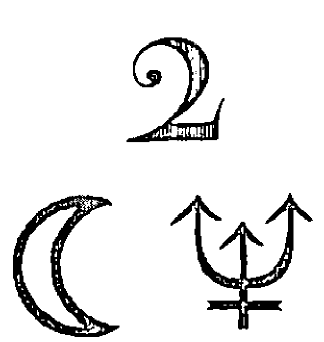

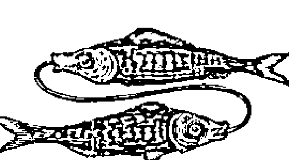

## 双鱼座
3月20日

## 幸运数字和守护星

3月20日出生的人受数字2（2+0=2）和月亮的影响。受数字2影响的人一般都很温柔，想象力丰富，他人的批评或忽视会令他们感到伤心。对3月20日出生的人来说，这一点会因为月亮与海王星（双鱼座的主宰星）的相互影响而变得明显。火星（即将到来的白羊座的主宰星）对月亮的影响会使3月20日出生的人具有两大特征，就是易怒和不安。虽然他们位居次位的时候也能把工作做好，但是他们内心仍会不时地排斥那些位居首位的人。因此，他们可能需要经常主动引导事情发展，这会让他们心情愉悦，对他们树立自信心也有帮助。

电视剧和电影演员），塔尼娅·博伊德（电影女演员），卡尔·赖纳（喜剧演员，编剧），欧文·梅赫尔（生理学家，因对细胞研究的贡献获得了诺贝尔生理学奖），阿方索·加西亚·罗布尔斯（墨西哥外交家，获得了诺贝尔和平奖），哈尔·林登（电视剧演员，出演了《笑警巴麦》等）

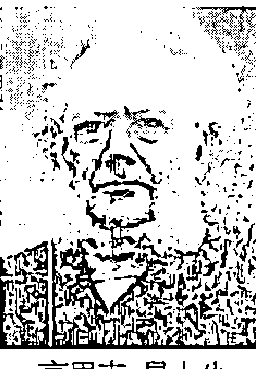

## 塔罗牌

大秘仪塔罗牌的第20张是“审判”。在这里当事者被鼓励抛开物质上的束缚，寻求更高境界的精神生活。牌面的图案是吹着号角的天使，这张牌象征着负有重任的崭新一天的开始，展示了超越自我、发掘无限潜力的正面特质，然而从另一方面来看，号角声多半报喜不报忧，暗示了容易沉溺在对欢乐的追逐中，并且缺少面对忧伤的能力。3月20日出生的人必须留意这张牌所代表的消极意义，同时谨记内心稳定平衡的价值。

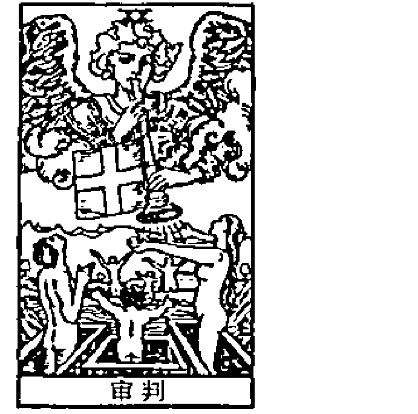

## 健康

在身体和精神两个层面中，3月20日出生的人通常比较偏重精神，所以他们容易被感觉所操纵。他们容易因为过度紧张而头痛，如果不能得到足够的休息和安定的生活环境，他们很可能出现更严重的精神问题。适度而规律的运动不仅可以帮助他们保持健康，还可以消耗他们过盛的精力，让他们远离忧郁与沮丧的威胁。3月20日出生的人要尽早开始调节自己的饮食，不过，双鱼座对食物的热爱常常让他们很难做到这一点。3月20出生的人最好保持清淡的饮食，多吃谷类食物、新鲜蔬菜和其他一些脂肪含量低的食物，同时尽量避免暴饮暴食。不过，他们也不要走向另一个极端，因为过量的运动或限制过多的饮食也会带来问题，对健康的狂热追逐也会给他们带来很大的压力。

- 优点
逻辑性强
敏感
多才多艺

- 缺点
不切实际
犹豫

## 建议

情绪可能给你带来破坏性的影响，所以尽量保持冷静、理智。把你的精力投在切合实际的目标上。多多自省。

- 变动位 12页
水相 17页
冬季 21页
双鱼座 33页
双鱼白羊座 34页

## 静思语

> 当你感到痛苦时，最好去学些什么东西——学习会使你立于不败之地。

## 致谢

特别感谢作者加里·戈德施耐德先生和约斯特·埃尔费尔斯先生撰写了《星座秘语》（The Secret Language）丛书，并授权北京科学技术出版社出版发行其简体中文版。

本丛书堪称星座书中的“百科全书”，其权威性、丰富性以及细致程度都达到了极致。原版自1994年首印起即销售逾百万册，被译成16种语言在世界各地出版发行。

本丛书体现了作者渊博的知识与严谨的态度。作者引经据典、旁征博引，通过全面的调查研究，以及阅读、分析和总结，很好地将占星学、心理学和历史融合在一起，帮助我们更深入全面地了解自己和我们所关心的人，从而使我们更好地处理和其他人的关系。

对于这样一套“百科全书”级的星座书，我们的编者力求最大限度地呈现作者原汁原味的智慧精华。

感谢本丛书的责任编辑代艳、郭晶晶女士以及校对叶思婧女士为此付出的辛勤劳动。她们兢兢业业、夙兴夜寐，历时一年完成了本丛书的编辑工作。

希望本丛书能够为爱好星座的朋友们提供一些参考！

由于种种原因，我社经过多方努力，目前仍未能与本丛书部分图片及译文的权利人取得联系。因此，请相关权利人发现后及时与我社联络，我们将支付相关费用。欢迎致电 010-66165605。

策划编辑 田恬
2012年8月于北京