# STAR

## MAG☆IC

## 星療·奇蹟

以愛而非邏輯療癒你的自我宇宙

傑瑞・薩吉斯特 Jerry Sargeant 著 吳美智

這是一種靈魂的技術、一種煉金術的能量！能夠療癒自身的宇宙、釋放完整的潛能！

- 吳若權（活水生涯企畫人）
- 呂展嘉（身心整合醫學權威）
- 李欣頻（作家）
- 周介偉（光中心創辦人）
- 廖孝敏（活能量創辦人）
- (Penny & Angels共同創辦人) 共同推薦

### St. Royal College
天使神秘学院

- 专业占卜预测机构
- 神秘学培训机构
- 水晶能量研究中心
- 神秘学资料库
- 官方微信：strcdts
- 微信公众平台：strc2011
- 读书交流QQ群：
  - 占星塔罗占卜师交流群：814594478（加入密码：PDF）
  - 神秘学其他综合群：659338717（加入密码：PDF）

微信号：strcdts

天使神秘学院

天使神秘学院 院长QQ：715104687

微信公众平台：strc2011

## 制作说明：

本书由《天使神秘学院》出重金从台湾购入的原版书籍扫描制作完成。为达到最好阅读效果，特地把原版书全部切开后，再经由专业扫描设备高精度扫描完成，并经过一张张的PS后期处理最终成书，其间花费大量的人力、物力以及时间，只为能给大家提供经济并优质的神秘学学习资料而努力。

本学院强力谴责某些机构和个人，把本学院花心血制作完成的电子书籍，包装后直接放在自家淘宝网上低价倾销的行为，以谋取不劳而获的经济利益。如果长此以往最终将无人愿意再为大家花心思制作电子书，那以后可能大家再无新书可读。

为让大家以后能够读到更多的好书，也为了本学院的良性发展。本学院恳请大家尽量做到如下几点：

- 一、尽量在本学院的网站购买电子书籍。
- 二、请勿用技术手段把电子书内的水印及加密去掉。
- 三、在收到电子书后小范围传阅即可，千万不要公开传播，更别挂到淘宝网上低价销售。

同时为答谢广大支持者，学院电子书将做如下调整：

- 一、学院会把一些早已收回制作成本的电子书折价销售。
- 二、最新制作的电子书籍会开放打印功能，大家购买后有条件的可自行打印成书。

天使神秘学院
2019年1月

## STAR MAGIC

## HEAL THE YOU-NIVERSE ROOTED IN LOVE, NOT IN LOGIC

## 星癒奇蹟

以愛而非邏輯療癒你的自我宇宙

傑瑞・陸吉安特 Jerry Sargeant 著

吳宜蓁 譯

# 目錄

- 《作者序》 006
- 《推荐序》 008
- 《推荐序》 013

# PART 1

- 第一章 靈魂的技術 022
- 第二章 我的療愈之旅怎麼開始的？ 031
- 第三章 五大療愈關鍵成分 041
- 第四章 人為什麼會生病？ 051
- 第五章 人人都可使用宇宙資料庫 057

# PART 2

- 第六章 療愈並不總是你想的那樣 064
- 第七章 靈體手術 070
- 第八章 觀察者的眼是個大關鍵 074
- 第九章 光是細胞的能量，能滋養身體 077
- 第十章 吸收光的基本方式

# PART 3

## 第十章 你也可以成為獨一無二的引導者 084

## 第十一章 危急時所有事物都為我慢了下來 088

## 第十二章 知曉勝過相信，知曉你的力量 091

## 第十三章 溫度控制與神經纖維建構過程 096

以光來強化神經系統的練習
強化神經系統
73天練習
療癒時讓身體涼爽的練習

## 第十四章 療癒前的準備 105

## 第十五章 利用全息圖來觀察個案 110

## 第十六章 基礎療癒方式與觀想 128

## 第十七章 器官 神經系統 骨骼與氣場 能量繩索 零點或顛倒場域 團體療癒

## 第十八章 水晶是能量產生器 155

如何使用水晶陣？
光手、脈輪疏通、星星、愛、地球、隨著發展，共同創造

## 第十九章 療癒中出現的幾何圖形 160

## 第二十章 自製強效能量工具 162

## 第二十一章 深入細胞層次 164

## 第二十二章 分體清理觀想法 168

## 第二十三章 清理用的金字塔 176

# PART 4

## 第二十四章 找回你的個人團隊 180

## 第二十五章 帶著光科技的星際團隊 183

## 第二十六章 埃及意識之池 188

## 第二十七章 強化自身能力的療癒觀想 193

## 第二十八章 擴張與成長的療癒觀想 201

## 第二十九章 各種靜心技巧 206

## 第三十章 專注靜心、正念靜心、光靜心、呼吸靜心、樹靜心、連結心的靜心

## 第三十一章 靜心引導：前往水之神廟下載十二次元光 212

## 第三十二章 活化松果體 218

## 第三十三章 量子知識 227

## 第三十四章 平行實相 230

鏡像法／全息圖自我療癒法／星光能量攝取法／意識之池的自我療癒法／左右腦同步流動法
顯示兩邊大腦功能差異的練習
能量覺知、能量擴張、鳥瞰視野

- 附錄
  - 將受注入水的符號 317
  - 來自真實案例的分享 304
- 第四十六章 釋放你完整的潛能 297
- 第四十五章 處理情緒 292
- 第四十四章 給療癒師的療癒 287
- 第四十三章 梅爾卡巴能量場 283
- 第四十二章 人的氣場 282
- 第四十一章 十三脈輪，十三星座 279
- 第四十章 如其在上，如其在下 274
- 第三十九章 更進一步看見 269
- 第三十八章 高階療癒方式 261
- 第三十七章 具強大火力的代碼與真相 256
- 第三十六章 星癒技術代碼的秘密配方 248
- 第三十五章 真正的營養 244
- PART 5
- 第三十四章 陰影寄生物 235

## 〈推薦序〉
### 真實不虛的宇宙傳訊

出版社找我寫推薦文時，我心裡想著：「又來了，這些年心靈書籍好像洪水般的氾濫，大量到讀者根本無法適從，不會又是一本老外的通靈書吧？」當這本書送達後，我就利用時間「姑且」看一看。第一章提到「星癒技術是宇宙間最強大的技術；星癒技術有五項關鍵的要素：愛、意念、想像、知曉、光」，覺得又是老套，一大堆心靈書都在談這些什麼愛呀光呀。很多認真的讀者不斷買心靈書來閱讀，卻又無所適從，生活品質與心靈並沒有提升。又有很多人不斷花錢上課，似乎也沒有獲得什麼進展，只聽一大堆雲端的、沒有地氣的空無。但在我繼續讀下去時，看到「我僅僅是個管道」「能量不會死（不滅）」「古文明並沒有消失或死亡，他們存在於另一個現實中的神祕領域」「身體只是一個器皿，在這輩子的時間裡裝載著靈魂」……這不就是我自己多年來也經常在談的內容嗎？繼續讀到「腫瘤、囊胞、纖維肌痛症、視力、心臟、痔瘡、斷裂的骨頭、神經系統……還有更多症狀都被療癒了，疾病就這樣消失」，我心動了一下，感覺這本不同，重點不是在講虛無的心靈揚升，而是有很多心靈療癒健康的個案，也和我在二〇〇〇年罹患腫瘤後出版不少抗癌健康書籍，與眾多病人互動的體會是相同的。作者又說『我所看到的，只有大量粒子以持續的動作在振動著——一個統一的場域』，又和這些年我以『量子理論與場域』為立論基礎，整合東方傳統醫學與西方輔助醫學，在各地提倡『超完美靈身心健康法』的量子立論相同，不禁拍案。當作者說到『大天使加百列告訴我去寫一本書，叫做《行入光中》，於是我跑回家打開電腦，這本書就這樣傾洩而出』，這也正是我四十年來能夠出版超過一百一十本書的經驗，因為很多內容也是『上天將資訊傳遞給我』，並非個人辛苦研究的心得。到此，我只有轉換自己的思維，讚嘆這本書正可以印證我四十多年來的各種經驗，確切真實不虛呀！書中內容非常具體，操作方法也極為詳細，相信用功的讀者可以照樣操作，對自己的身心靈應該會有莫大幫助。能在書中讀到傑瑞的經驗，讓我有久逢知己之感！

（本文作者為南華大學退休教授。現任美國WholeSelf研究院院長、國際華人超心理學會理事長、世界華人UFO聯合會副理事長。曾任台灣飛碟學會創會理事長、中華自然醫學教育學會創會理事長）

> 「我所看到的，只有大量粒子以持續的動作在振動著——一個統一的場域」
> 「量子理論與場域」
> 「超完美靈身心健康法」
> 「大天使加百列告訴我去寫一本書，叫做《行入光中》，於是我跑回家打開電腦，這本書就這樣傾洩而出」
> 「上天將資訊傳遞給我」

## 〈推薦序〉
### 讓我們來玩個大格局人生

認識傑瑞是在二〇一七年夏天，他在英國的農莊帶領我們做啟動梅爾卡巴的呼吸，課程中我幾乎喘不過氣來，這個練習非常強烈。他還帶領我們去跨次元的綠色星球探索，那是一趟非常真實的奇異旅程、身歷其境的靜心，我們和傑瑞同步見到獨角獸、龍、精靈，感受到這些高次元存有愛的能量，感動的淚水靜靜淌滿臉頰。之後所有同學陸續預約傑瑞的個案處理，我當時覺得自己沒什麼煩惱需要被療癒，只單純想到這幾年身材都胖胖的，也經常腰痠背痛……傑瑞在閱讀我的全息圖時看到我的前世——在當女人角色時並沒有被男人平等對待，而現在的細胞記憶中還有一些不平衡的壓力印記尚未釋放，以至於即使沒做什麼勞務工作，也會感覺腰痠背痛。傑瑞幫我移除了細胞的負能量印記，並給我「接下來六週只能吃蔬菜、水果、水，不能吃白米飯、麵食」的功課；就如同他在本書中提醒大家儘量吃地球上生長出的當地新鮮食物、不要高溫烹煮、喝水前在水中注入愛的能量……因為我們就像樹一樣需要水、氧氣、光，而我們最終將不需要食物，因為食物會將我們困在三次元的實相中。

子，我正好參與Avalon二十一天閉關靜心，因為體內細胞的不平衡能量已被傑瑞調整，加上闊期問充滿地球母親大愛能量的靜心引導，我很輕易就進入三摩地的靜定空，也進入源頭寂靜不動、能量浩瀚的光海。持續無主食計畫六週後，我瘦了七公斤，看起來就像脫胎換骨般神采奕奕，腰痠背痛的問題也減輕很多。

星癒技術並非只有療癒個人的能力，也會療癒整個星球。星癒技術結合了能量科學及量子學，加上活躍的想像力與實體成效的專注圖。傑瑞療癒過無數的癌症、憂鬱症、腫瘤、情緒創傷、車禍等身心層面的案例，書中蘊藏豐富的指導與細節，而你、我或任何進行療癒的人都只是在促進療癒的過程，是能量、智慧本源或意識在發揮作用，外星之光的自然性質才是工具。

傑瑞說：這是你的旅程、你的人生，你是生來要在大格局中遊玩，而不是小格局。你是被創造來以一種超乎尋常的層次生活的，你就是光、聲音、能量波、從無之中創造出的無數粒子，你是一個幻象，你的形式將會變得更多，我們現在正在擴張意識，點亮這個星球。現在就察覺自己的力量，完整的探索宇宙吧！

星癒技術想讓你經驗、擴展、成長、活出你、愛你、成為你自己，所以放鬆，信任與享受這趟星際療癒的奇蹟之旅吧！

（本文作者為新能量學苑總監，以及台灣近十多年來靈性覺醒活動推廣者）

我不是個療癒師，我只是一個軀殼。
我的靈界朋友透過我工作，協助人們好轉。

他們把我當成一個管道，傾注他們的療癒天賦到有需要的人體裡，
我僅僅是個管道。
請不要稱呼我療癒師，我與你並無不同。
我只是將我的時間拿來服務神，看看我能做什麼。

請不要稱呼我療癒師，我的雙手沒有新穎之處，
而當我的時間到了，這個在地球上的形體將要死亡之際，
我的靈魂會呼喊，神啊，謝謝祢使用這樣的我。

## 作者序
### 你准备好了吗？

你读过多少自助书？参加过多少课程？听从过多少不同的大师？那你为什么又拿起另一本书呢？你在寻找什么？是什么让你不断寻找？你觉得真的有可能找到你想找的东西吗？

如果你正在网路上或书店里看这本书，相信它可能会包含你极度渴望找到的答案，那么我强烈地建议你把它放下。然而，如果你已经准备好，愿意出发和我一起进行一趟旅程，穿越空间和次元的门户，允许自己乘着挚爱宇宙中的内在行星波动，那么就买下这本书，并体验它吧。

如果你准备好放下目前你已知的、被教导的，或是被要求相信的一切，然后被一个不管逻辑，但是直觉上非常完美的世界吞没，打开一个与古文明沟通的管道，与灵界中挚爱的盟友沟通，他们日复一日引导我执行远距疗愈和难以置信的灵体手术，然后安稳坐着，去感受时间、声音和能量的韵律与振动。

能量不会死（不灭），古文明并没有消失或死亡，它们存在于另一个现实中的神秘领域，等待我们以星球的方式重生，这样我们才能再度合一，共享地球的各种面向。我使用一种我们所有人都有能力发掘的疗愈方式（不是「法则」或「系统」），而这本书将会引导你想起来。

透過在時間、空間，在我們以上的多個世界中旅行，我會向你敞開心扉，與你分享我知道的、不知道的，以及已經想起的事物。我很幸運能擁有一個值得信任的團隊，是我的引導者、光的兄弟姊妹，在一次嚴重的車禍後，他們點燃了我體內深處的DNA，幫助我想起了星癒技術（Star Magic）。我現在要與你分享，如此一來，你也能夠解開你的真實智慧——它就埋在你的靈魂之礦中。

星癒技術是在超意識的層面中運作，你沒有辦法以思考去理解它。如果你試圖相信星癒技術，它也不會為你發揮作用。你必須深入、深深進入到你無限大腦的迷宮，以及無畏之心的深處。在這裡，如果你準備好放掉表面的世界、五感，進而擴張你的意識，記起所有三百六十種以上的感知能力，並且繼續旅行，你就非常有機會知曉自己的能力。

藉由與我一起旅行，你會釋放完整的人類潛能。你會認識在光與資訊層面的你，開始藉由生命感受到你的道路。當你體驗到意識和你身為人類的能力有了大幅的轉變時，舊有的範例就會瓦解。身為一個靈性生物，這是最超乎尋常的層面，有著人類的經驗，你可以重新發現靈性層面的你，那個沒有限制的層面，在那個層面的你可以扭轉時間和操控現實，可以改變形狀、雙重定位、在多重次元之間旅行，並在同一個時間內，身處在許多地方，你想身處在多少個地方都可以。

星癒技術與星語語言將會開啟你擁有的特殊天賦管道，以及更多體驗。你將會想起如何以心電感應溝通、遙視、療癒自己與世界，只要透過提升你的個人振動，和這個我們稱之為地球的美麗藍色星球的振動。

我稱自己為「引導者」，對於我施予療癒時發生的一切，我也不居功，那是「光」和「能量」的語言在作用，我單純只是想起了如何指揮光、引導光，並與光遊玩。我可以編輯你的因果業力藍圖，在非常短的時間內造成巨大改變，這種強勁的療癒方式（星癒技術）使用了應用量子物理學，可以快速清除你身體、心理、情緒上可能正在經歷的，以及阻礙你創造與活出最超凡生活的阻礙／壓力／創傷。

這種形式的療癒為何如此強效，關鍵在於所有的療癒都發生在顛倒的場域中，在根源的細胞層面及其上——在光頻的世界中——作用。在這個空間裡，每個人會立即與最真實、完整及強大的自己聚合，就能製造出一個環境，讓根源的療癒發生。這種形式的療癒讓我的個案們非常震驚，也被認為是現存最完善徹底，確實能轉化能量的療癒形式。

腫瘤、囊胞、纖維肌痛症、視力、心臟、痔瘡、斷裂的骨頭、神經系統……還有更多症狀都痊癒了，疾病就這樣消失，彷彿一開始就沒有存在過，或像是被魔法療癒一般。我也會使用星癒技術提升企業表現，移除人際關係之間的障礙等。如果你對生活不滿意，你就得認識星癒技術。

星癒技術是一種方案，一種有彈性的方案，但不是一個系統。它是個有紀律但非系統化的術。

知晓方式，而这方案可以根据每个人独一无二的方式去调整，以适合每一个人。我将会分享一些你以前没有见过的疗愈方式（我使用“方式”这个词，因为它是可以扩增的，而法则、程式或系统则比较死板，有障碍和限制），这并不是说没有其他人在使用它们，因为确实可能有。不过目前据我所知，没有其他人将高阶的星疗技术带进公众领域。我和巴西的萨满在操作上有些类似之处，不过我们依然是不同的。

我会告诉你如何驾驭个人星座区域中的光频，以及每个星宿对应哪些特定的身体频率。当两者频率校准时，疗愈就显化了。其上如此，其下亦然。

中国人使用“无为”一词，而你必须与无为共生并存，才能驾驭星疗技术的完整力量。这可以解释为“以一种自然流动的方式在生活”，你不能努力成为无为，你就是它。你不能做或成为星疗技术，它会流经你，你就是星疗技术。透过以一种自然流动的方式生活，你将能与自然之母达到和谐，以一种共振的频率振动，让奇迹得以成型，形塑出你的内在世界，因而留下一连串的超凡之美在你的外在世界，那就是你真实样貌的反映。

我花了几个月，坐在埃及的古老神秘学院，被介绍、引导去想起那些我已经遗忘的事物。每天早上起床后，我会静心好几个小时，深度的静心，在数个世界间穿梭、沟通、聆听、观察，以及开启我的大脑能力去接受强烈的光。“光”其实也是一种资讯，我会告诉你，你该如何进入这个装载丰富知识与智慧的储藏室，这些资讯都存在于光和声音的代码中。

破解這些宇宙代碼就是關鍵，我把它們稱為星癒技術的意識代碼，有了它們，你真的能夠重寫一個人生物電腦系統中的程式，而這個生物電腦系統就是「大腦」。我可以拿掉舊有的、削弱力量的、習慣性的、讓人失衡的程式，植入新的、最先進的、帶著強大力量的程式，這程式可以服務你、你的人生和這個星球。

每個資訊、事件，以及過去、現在和未來，過去一直如此，未來也將一直如此的事情，都包含在你這個人類身體的每個細胞中，你就是宇宙。透過認識星癒技術，你將有機會現在就改寫歷史，你將會看見這個世界是個統一的能量場，一個愛的來源，在其自然流動中潛藏著阻礙，而星癒技術讓你有能力移除這些阻礙——在所有層面中、裡裡外外、上下皆同，在你的宇宙，也在整個宇宙之中的阻礙——然後，你能得到的，就是創造一個完美的環境，療癒你自己和這個星球。

當你行經這些過程時，你會感覺到資訊，這些文字、紙張和書本身都包含著魔法。星癒技術包含著來自宇宙資料庫的資訊，每一個曾經有緣分接觸到的人，都是曾經遺留了某些東西在星癒技術的意識範疇，封存於這個星球，我稱之為星癒技術基質。從我想起它的那一刻起，它就像野火般不斷蔓延。

每個我曾促進療癒的人，都下載了資訊在星癒技術中，而那些資訊、那些蘊藏在療癒之光與能量之中的頻率，會繼續傳遞出去。每次這個人接觸到另一個人時，這頻率就會傳出去，就像是正向的病毒。星疗技术的能量是如此浑厚、强大，它迫不及待要扩张，它会涌起、流出，进入星疗技术基质，从一个人到另一个人身上，甚至不需要碰触。当星疗技术已经开始，你就无法令它停止，它将流出，遍布宇宙中的每个原子，然后启迪、疗愈与转化人类。星疗技术是目前最强大的转化工具，然而它不能被掌握、触摸或抓牢，它是触摸不到，却比我现在正在按键盘、跟你分享这些文字的手指「更真实」的东西。

这种能量无法以文字呈现，它只能被感觉、知晓、想起与下载。你可以把这本书当成一个疗愈工具，透过阅读也好，或仅仅拿在手中也可以。我强烈建议你，在读完或感觉完每一个章节或每一个新疗愈方法后，就停下来感受一下那股能量，以及围绕在其周围的觉知。细细思量，让它深深渗透到你里面。魔法确实存在，奇迹也确实会发生，现在你即将要亲身体验到了。

星疗技术不只是一种疗愈方法，而是一种生活方式。在你制订出游戏规则的地方，它就会成为一种体验，我们即将要一起进行这个人生的右脑游戏，根据我们的直觉和信任，创造出新的实相。你将会想起炼金术的能量，魔法和奇迹将会以你的存在而显现。

我只是一个来自街头的孩子，跟这星球上的任何一个人都没有差别，我只是经历了一趟旅程，而不愿意在逆境的表象中退让。我继续旅行、持续探索，爬上高山，学习把障碍转变为机会，想起如何辨识真实，发现我的能量，我会确保让你也做到一样的事。

分享它，创造出不可阻挡的爱的浪潮，养育与启发整个人类族群。
你准备好要爱了吗？你准备好要疗愈了吗？你准备好要忆起了吗？
星疗技术并非只有疗愈人的能力，它可以（也将）疗愈整个星球。我的使命是要跟世界

## 019 作者序 你准备好了吗？

# PART 1

## 第一章 灵魂的技术

星疗技术是宇宙间最强大的技术，目前仍在萌芽阶段，虽然现在这技术已经有我所忆起的、最不可思议的能力，但依然有大幅成长、精进技巧的空间。我在自己的旅程中，会见过当中的一些力量，我很快的就忆起了如何运用这些天赋，并且与你们分享。

星疗技术是灵魂的技术，不会失效、破灭，只会扩张，如同有生命的物质，变得更好、更强大，你所需花费的力气少了，但功效会发挥得更快。星疗技术的疗愈潜能美妙之处，在于它对环境和受到疗愈的人，都不会有负面的影响，不需要牺牲任何动物才能看见效果。星疗技术很纯粹，源自于爱，它就是一项礼物，来自宇宙的造物主、神、圣灵、无限的智慧、能量之源……无论你想要怎么称呼祂。

在本书中，我将会提及上述的每一项。当我这么说的时候，我指的就是能量或爱，一种看不见的力量、一个空间，这空间就是万物背后的一切，一切由它而生，这空间存在于创造出音乐的音符之间，在关着狮子的栅栏之间，也在让你活着的一呼一吸之间。一个杯子里的空间，就有足够的能量驱动整个世界，直到永远。所以，如果一个杯子里的空间就有这么大的能量，想像一

旦你能驾驭星疗技术的无穷力量，有能力完成的事情该有多少。星疗技术有五项关键的要素，我现在就与你们分享，稍后会再详细讨论。

- 1. 爱
- 2. 意念
- 3. 想像
- 4. 知晓
- 5. 光

这五项要素，只要正确、智慧的使用，所承载的能力便可创造许多全新的世界、宇宙，以及全新的银河。如果星疗技术有如此大的力量，那么要自我疗愈应该很简单，而确实如此。敞开你的心胸、倾听你的心，去感觉我与你分享的文字和讯息，不要相信任何写在这些书页间的东西，拜托，为了你自己，请不要用『信任』去接受任何事物。我希望你去体验我与你分享的一切，感觉这些讯息，进入它，深深进入，一旦觉得对了，就跟随它。用我与你分享的星疗技术方式去试试看，全身心的去经历，在你的心与灵魂深处，你正在忆起所谓的真实。

你可能想知道，我是怎么发现这么强大的天赋的？在本书中，我不会讲述自己的人生故事，如果想知道，可以看我其他著作《行入光中》（Into the Light），或《意识漩涡》（The Vortex of Consciousness）。我在本书里会提到的是，过去曾有段时间，我相信所谓的玛雅（幻象），相信这个虚浮世界的一切幻象。有那么一段时间，我活着的每一秒都是恍恍惚惚，受物质世界的表象驱使。我的小我在主导一切，我的心被控制了，而我生活就是在赚钱、创业、买好车，满心以为做这些事情会让我快乐。我赚了更多钱、把事业扩展得更大、旅游次数越来越多、不断的赚钱花钱，但没有什么能让我真正快乐。现在我想非常确切的告诉你，你应该全心体验这个形式的世界，你应该感受身为人的各个层面，并且在过程中，记住一项非常重要的事情——这只是个经验，所有一切都只是经验，没有所谓好与坏，就只是「有」而已，不管这件事或那件事，都是有而已。一旦你越快理解你跟万物一样就是能量或光，你就会越快乐。没有任何区隔，我们都是一体，结合起来我们就能挺立，若是分开就会倒下。种族、宗教、肤色、阶级或语言，都不能将能量或光分开，那只是一种好像有区隔的幻象，受到小我的强化。那么，我是如何从这个崇尚物质的世界，受到自我驱策，然后发现星疗技术这种超凡能力的呢？这是一条漫长的路、一次珍贵的旅程，一切始于一场交通事故，这一天撼动且改变了我的世界。

那天清晨，大约四到五点之间，我在一辆老旧福斯计程车的副驾驶座上睡着了，当时我和我的太太萝拉、两个孩子正搭车前往罗马尼亚的布加勒斯特机场。突然之间，我听到非常大的撞击声并醒了过来，我的视线模糊，肾上腺素急速分泌，看到碎玻璃飞溅，风直扑到我脸上，而计程车急速偏离方向。

我还记得自己心想着：『天哪，我们出重大车祸了！』我猜想车子可能会撞上对向来车，或是直接翻覆，而突然之间，我们在刺耳声中停了下来。我回头看，萝拉坐在那儿，口中还有碎玻璃，她紧抱着儿子贾许，而女儿阿拉雅在驾驶座下方，除了受到惊吓以外，他们都平安无事。接着我转向左边看计程车司机，他受到惊吓、两眼发直。我又再转向前方，看到眼前的景象：挡风玻璃上破了一个大洞，我的头痛得要命。而且是过了一会儿，待肾上腺素消退之后，我才发觉原来那么痛。

即使到现在，每次我们聊起这件事情时，阿拉雅都会说：『爸爸，那时你的头在流血对不对？』其实并没有，那只是她记得的样子。如果不是我的血，那是谁的血呢？

我打开车门走出去，时间仿佛静止了，感觉奇异而平静。

我们所在的乡村道路空空如也，附近连一辆车也没有。我沿着路面看过去，大约二十到三十公尺远处，有两名女性在路上。在更远一点的地方，有个看起来像人的物体，有一个人一动也不动的倒在那。

到底发生了什么事？一大堆念头从我的脑中闪过，但同时，又觉得一片空白。当时发生的事情是这样：那个清晨，有三位女士要横越马路去上班，我们的车速太快，在那条老旧的乡村道路上也没有路灯。几位女士走到街上准备横越，而我们的车正好飞奔而来，就这样撞上第一位女士，她直接撞破挡风玻璃，撞到我的头，然后又被吸回外面，翻滚到车顶上；第二位女士的两只脚踝被碾过，状况非常不好；而第三位女士肉体上没有什么伤。我走到路上的时候，望着在我左边的两位女士，真的没有我能帮忙的事情，附近工厂的一名员工已经赶来，也叫了救护车。我继续走，朝着躺在路上的那具躯体走去。我靠近的时候，就知道她已经死了，我又走近几公尺，看到她的双腿缠在头上，模样非常凄惨。当时天才刚破晓露出曙光，整个场景看起来非常超现实。路的两侧都是田野，除了一座老旧工厂还在运作，其他什么也没有。更不可思议的地方是，当我靠近尸体时，眼前所看到的事物——我看见那位女士的灵魂，一个像乙太体的能量源，在上方盘旋。简直无法相信我的眼睛到底看到了什么，我摇摇头，但是那团能量源依然在那。只有几秒钟的时间，感觉却像永恒，因为时间静止了！接着它就消失了，散无踪影，继续它的愉快旅程，回到宇宙的无垠之中。我亲身经验或目睹了死亡之后发生的事，我看见这个状况里，身体和灵魂的整个链接或脱去链接的过程。它带来的冲击，就像一辆高速行驶的火车直接撞上我。

我低头看着尸体，再抬头看天空。然后又再次低头看着尸体说：「谢谢你。」可以成为这事件的一部分，亲眼见到人死之后发生的事情，看到整个分离的过程，我觉得自己蒙受了特殊的恩典。就在那个当下，我理解身体只是一个器皿，在这一辈子里装载着灵魂。当分开的时间到了，灵魂会继续前进，没有爱会遗失，这就像是灵魂把一辆老旧的车子带去废弃回收场。我以前也见过尸体，但这次完全不一样，我这辈子第一次理解了真相。

这个事件，加上紧接着发生的其他三件事，就是带领我走上内在灵魂之旅的助力。这些事将我投射到一个全新又令人振奋的道路上，我发现了自己真正的目的、命运、来到这个星球的理由及真相，还有多重次元的宇宙之大量复杂性——也就是我们居住，且在其中进行生命游戏的宇宙。

这个事件引导我开始一趟旅程，而在时间的进程中，星疗技术这块拼图的所有片段纷纷回归所在位置。我现在的使命是提升十亿人的生命，我将会在世界各地建立起十一间星疗技术机构（疗愈中心），人们可以来这里「忆起」。我会带领每个人经历我走过的历程，在埃及古老神秘学院里。

当你开始理解／知晓星疗技术，你将能旅行到未来，那其实就是另外一个空间里的「现在」。你将能够看到未来可能的景象，并现在做出决定，选择那些能带领你和人类通往和平的道路。现在就于内在创造和平，那么和平也会立即被创造于外在。毕竟，你就是自己这个实相的共

同创造者（重点在于你要知晓和平，但不是渴望得到和平。若渴望得到，你会创造出相反的交互流动，扭曲变形）。

从渴求和平的本质中，你会制造出反面，就是纷乱或战争。想要制造和平，你必须知晓和平。一个人越试图要创造和平、消灭战争，在我们感知中的扭曲变异就会越严重。而透过知晓和平与爱，你就会知道真实，也就越来越不扭曲。一旦你的个人场域中已经毫无扭曲，你就会成为完整，知道你的能力所在。

因此，我知道自己将要在北美洲、南美洲、茉莉雅岛（法属波里尼西亚的一个火山岛）、非洲、英国、纽西兰、埃及、加拿大、葡萄牙、法国和俄罗斯等地创建十一家星疗技术疗愈中心。我已经见到这些中心完整建立的模样，太不可思议了，这就是星疗技术给予的力量。我目前还在学习——或者用我比较喜欢的说法，是还在「忆起」。一旦我忆起更多一点时，我就会建立

起我的第一家，我们的第一家疗愈中心。你将会得到明析、自信、力量，更重要的是，你会更深度的去爱自己。你所能拥有的最重要

的关系，就是跟自己的关系，而星疗技术会敞开你的心，让你无条件的去爱自己。你将释放所有障碍，打开那扇门，你将制造空间、驾驭创造力，而这样反过来就能让你的完整潜能浮现。你会得到灵感，「得到灵感」（inspired）字义上就是指「在灵之中」（in spirit），灵在其中。就是这个内在的灵会驱动你、引导你、让你走向实现天命的方向。当灵驱

动你时，去享受每个瞬间，完整的活着，处在当下，充满热忱。「热忱」是个很棒的词，是希腊人给予的，翻译成「神在里面」，热忱会给你灵感，神在在里面，灵在其中。其文字的深入程度远超过人类的逻辑观念。

当你随着书中的方法执行之后，你的世界就会打开，你的超凡之处会浮现，继而你将以完全不同的方式去看待生命。你看到的就会和我看到的一样，我看到的是没有区别、没有障碍、没有分界，我所看到的，只有大量粒子以持续的动作在振动着——「统一的场域」。我的世界由几何组成，由爱聚合在一起。当你睁开眼睛，你也会看到这些，你已经旅行得够深入，准备好要体验真实了。真实并不总是令人愉悦的，当你发现目前已知的一切都是不真实的，那是会是非常难以接受的事情。但你要知道，当这些幻象消逝，一个更大的智慧之源将会被揭露，它会提供你终极的力量，炼金转化的力量，让你的心充满喜悦。

你就是一个活生生、会呼吸的技术，一旦活化大脑中休眠的部位，唤醒带着光之代码而沉睡着的DNA，你就会成为这个技术了。你可以读懂星语言，那是一种光和声音的语言。你可以连接到宇宙资料库，那是过去、现在与未来所有事物的知识所在之处。你会成为灵魂的技术。

那位女士穿过挡风玻璃撞上车子里的我，那一天早上，我觉得她启动了一种立即的辨识能力，在我体内的辨识能力，发现我有能力，一种深刻的知晓，让我想起天生的及世代承袭而来的天赋、礼物、方式。我成为灵魂的技术，我重新活化基因组成的元素，我再一次与星星完

整的结合起来。你身体里的每个原子都是从一颗爆炸的星星而来。说不定你双手的原子与双腿的原子，是来自不同的星群呢？如果这些星星没有爆炸，我们就不会在这里，因为所有的元素——碳、氮、氧、铁——所有对生命演化很重要的元素，打从一开始就不会被创造出来了。

生命的重要元素是从星星充满爱的熔炉中创造出来，而唯一能够进入你身体的方式，就是这些星星非常善良的爆炸开来，这些星星爆炸了，所以你才会在这里。

我的朋友，你就是星尘。

## 第二章 我的疗愈之旅怎么开始的？

有一些我接触过的人告诉我，他们从小就知道自己带着某些超感官的天赋，能意识到多个世界间的生命体，也很幸运拥有鼓励他们的父母，不会像大部分的父母那样，不知不觉驯化了孩子的内在小孩。

而我认识的其他疗愈师或灵性工作者，都是后来才意识到这些天赋，我自己也是如此，成长过程中，我从来没想过以后要当疗愈师。有些孩子想当消防员、医生或农夫，我想要当橄榄球员，但是这愿望没持续太久。反正我一次都没有想过要当能量疗愈师，更别说忆起并发展这世界上最强大的能量疗愈法。

这一切始于某天（在罗马尼亚车祸后不久），萝拉突然异常剧烈的偏头痛，她躺在床上动弹不得，更别说睁开眼睛，因为疼痛实在太强烈。不知道为什么，我感觉自己可以将「头痛」取出来，所以我把手放在她头上，突然之间，我看到头痛了！我能想到最好的形容方式，就是我看到头痛的能量，于是把手贴在上面。它是绿色的，我开始慢慢把手从她的头上移开，看到那团能量也上升。它跟我的手同时升起，然后就这样从她的头上跳出来。

萝拉从床上一跃而起，感觉好像她根本没有头痛过一样。她这样形容：「我感觉到杰瑞把手放在我头上，然后有东西在移动，有点像一团雾状的云，往上移，然后到我的头顶上，我感觉到他把头痛拉出去了。」

不管疗愈／转化的是偏头痛、肿瘤，还是断裂的骨头，听到他们描述的个人体验，以及他们如何感知到疗愈，我都觉得非常奇妙。之后你还会看到一些有趣的故事，像是立即移除肿瘤、纤维肌痛消失、严重车祸意外后的脸部重建等。

把头痛从萝拉的头上取出之后，接下来好几个月没发生什么事，我可能是太忙着站稳脚步，制造出一些空间，感受来自宇宙的讯息，引导我踏上我的疗愈之旅。接着我们全家人搬到纽西兰，我们抵达之后不久，我在英国的一个朋友发生了相当严重的车祸，她被送往医院，住进加护病房。医生告诉她的父母，她可能一辈子没办法走路了，而且可能得在医院待至少一年。

我接到她父母的电话，问我能不能帮忙。我心想：「我能怎么帮忙？她在英国而我在纽西兰，我要如何从这里帮忙？」然后，我的直觉接手，我感觉我应该去躺在床上，把一些水晶拿出来。我把水晶摆在身体不同的脉轮（能量点）上，接着，一刹那间，我已经在她的医院病房内，能量开始从我的手中流出，好像我本来就知道该怎么做，我开始在心里将她的身体重新组装在一起。

我每一、两天就这样做，持续了好几周。她在十二周后就出院了，刚出院时还使用助行

器，不到几个月，已经不需辅助，可以自己行走了。医生们对她的快速复原感到非常吃惊，在他们眼中那根本是奇迹。而那个时候，我并不知道我做的那些事到底有没有真的帮助到她，我仍有质疑与不相信。

这个故事最让人吃惊的一部分，是她出院后不久，打电话告诉我：「杰瑞，我有一天晚上醒来，看着我的床边说：「你在这里做什么？」」

她是在跟我说话，她的肉眼看见我了，就在我想像自己所在的位置，完全没有丝毫偏左或偏右，确实就是我把自己传送过去的位置。我心想，这个想像的事件可不只是能被肉眼看到而已，想像其实就是现实。

那个时候，我在纽西兰开了一间健康与健身中心，一直忙着店务，同时想着疗愈的事。我其实觉得那间中心也是个催化剂，想去帮助别人，但是我一直到几年后才察觉到这点。事实上，我那时便已经开始疗愈人了，虽然跟现在的方式不一样。

这个事件发生后不久，有一次我在朋友麦克家的铜金字塔中静心，就在他家的后院。我静心的期间，耶稣出现在我面前，同时我的双脚变成了火球，他说：「杰瑞，你可以走到任何地方，而且很安全，不需恐惧，向前走吧。」我不知道他是什么意思，我在流动之中只是单纯的观察。然后出现了几层台阶或是一排阶梯，最上层有一扇木门。我走上阶梯，穿过那扇门，我就坐在「最后的晚餐」桌旁。

我是马太，耶稣的其中一个门徒，耶稣在说话，我想应该是最后晚餐的训诫。然后，在背景里，透过一扇窗户，我看见一艘太空船，巨大的太空船在窗外盘旋。它是如此鲜明，比真的「更真实」。毫无疑问，在那个瞬间，我就是马太，看向窗外，看着一个来自地球外部空间群体制作的飞行工具。过了一段时间，我不确定多久，我回到自己的身体里，就坐在庭院中的金字塔里。
在这个金字塔里发生的另一个事件，一般人可能会觉得更奇怪，但毋庸置疑是真实的。有一天我睁开眼睛静心，我非常平静，在空间之中漂浮着，突然之间，有个像太空胶囊的东西降落在金字塔旁。一个看起来像人的生物，带着强烈但友善的能量，邀请我进去。于是我带着我的光，跳进那个飞行器里，我们以我没办法描述的速度前进，降落在南门二星，那是许多年前我的家乡星球之一。
我走出飞行器，双脚感觉到地面很温暖，我需要一副太阳眼镜，因为那里很明亮。有许多生物都在欢迎我，好像我是结束长假后回到家的感觉。我感觉就像回家，非常平静。
这个星球上的科技超级先进，也非常干净，毫无污染。我在那里待了仿佛好几个小时又好几个小时，我被带进某种建筑物里，介绍给那边的首领，这是我唯一能形容的方式了。他或她，我不确定性别，碰触了我的头和肩膀，就像在封爵一样。这位生物告诉我：「你准备好了。」就在他碰我的头时，我接收到资讯，那就像一股巨大、明亮、非常淡金色的资讯流，透过他的触

碰，流入我的意识中。我可以看见代码，不过我完全看不出意义，就是一串数字、图像，和某种奇怪的字母光组合，被包覆在光流中。

我正在接受某种资讯下载。

这件事完成后，我很快的被带回（比较像是被硬拖回）太空胶囊里，我们跳进去，感觉不到几秒钟的时间，我又回到庭院坐在金字塔里。

大约一年以后，我们搬回英国，我的疗愈之旅才开始快速进展。

一个星期天早晨，我在外面慢跑，看到一些精灵在一棵树周围飞行，我停下来看他们，突然一位天使出现，他告诉我他的名字是大天使加百列，以及我必须坚持我的使命，一个我选择成为光之疗愈者的使命，就在开始这趟旅行之前，在这个地球上的体内。他要我去写一本书，叫做《行入光中》，于是我跑回家打开电脑，这本书就这样倾泄而出。我遵照指示，每天早上五点到七点之间写作。

一直到写完这本书以后，我才理解为什么必须如此。当我从这本书下载资讯时，我也是在下载光，从这位美丽的天使身上。这位天使以一个引导者的角色，将资讯传递给我。在南门二星及与大天使交会的经验，改变了我的频率。我被装载了许多资讯、光的代码，都是用来进行疗愈的。

这件事之后不久，有一天我独自走着，看到某种象形文字漂浮在空中。我也看见几何符号（我称为“空间几何”）和其他符号（和任何我在人类世界看过的几何符号都不一样），非常清晰，就在空间里盘旋移动。我闭上眼睛再睁开，那些符号就会移动，它们还是在那里，但在不一样的位置，感觉像是重新排列自己的位置，再提供新的讯息。我看着的那些讯息，就跟我在南门二下载的资讯中看到的代码一样。事物开始逐渐归位。那些标志和符号，以我的左脑来看，看不出任何意义。我试图分析发生了什么事，但是徒劳无功。于是我听从直觉，我去深深的静心。隔天早上，我早起并花了两个小时坐在自己的静心室里。我又走过好几道门、走道、更多的门，然后走进一间教室。那里有许多人坐在似乎是“桌子”的物体前面，一起看着一个男人。他看起来像老师，正在打开一些卷轴，摆在一大片平坦的表面上。他在打开卷轴，给我们（我和我的儿子乔许都在）看每一个卷轴中的图画和符号时，我从静心中出来，快速的画下这些符号，写下符号的意思。这就是星愈技术标志其中一部分的图样来源。教室里那位老师告诉我，这个图样意思是“疗愈的魔法”。当这些图样展示在我眼前时，没有人说话，却有很清楚与精确的讯息在传递。我在古老神秘学院里，被教导（受到指引而忆起）星愈技术，这个名称的魔法部分，是来自于疗愈魔法符号，星星的部分则是来自宇宙空间。我就是在这些古老神秘学院中，跟随一位曾短暂来到这些神秘星球上、非常伟大的老师，他让我知道，每一个人都是从星星而来的。我们全都是外星生物，来到这里，在地球待一段短暂的时间，去学习当人类、去互动、去连结，以及去爱，就在这充满混乱与暴行的世界中，我把它称之为丛林现实，这都是由“有分别”的幻象所引起的。我在这些学院课堂中学习了好几个月，我的儿子乔许也会跟我一起去，他可以清楚看到与感觉到，就跟我一样，能够跟他分享这些经验，是莫大的荣幸。我们一起发现了许多关于金字塔潜藏的秘密，如果你有兴趣，可以看我之前的著作《意识漩涡》。在学习、旅行、想起后不久，有重大疾病、不舒服、病症或创伤的人，仿佛不断流入我的生命。我有种必须帮助他们的感觉，于是我协助，同时也是个机会去测试我想起的资讯是否正确。每一样我尝试的事物都奏效了，真的很不可思议。就从那时开始，我决定要全职开一间公司，把所有时间和精力都奉献给疗愈，于是，一切就这样发生了。我开始与我的生命目标合一，所以生命也与我融合，个案开始纷纷上门。

这时候的另外一个重-要催化剂，一样又是萝拉。她有一天去图书馆借了一本书回家，读完后跟我说我也应该读一读。那是一本关于爱尔兰疗愈师的书，这个人叫做预言者乔。我在二十五岁时找到自己真正的妈妈，并得知我的祖先都是爱尔兰人，这本书跟我真的很有共鸣。乔有这些能力，也已经因这能力而开创了事业，那么我为什么不行呢？读了这本书，让我的信心大为提升，为我的使命往前进，去疗愈这个星球。

我很快的建立了工作坊，现在，我有全球性的个案基础，包括许多我从来没有预期会碰到的人。现在我不再做任何预期，而超乎寻常的事情毫不费力的流入我的生命，当你达到和谐合一时，生命真的会自己流动。而那就是我的使命，尽可能帮助更多人类，在他们往内探索的旅程中，帮助他们去连结能量本源，连结创造你、我，和这星球上每个人的无限智慧。星愈技术就是关键，它非常强大，它已经帮助数千人的灵魂和谐，而且非常快速。

我也开始看到天使，他们会在我身体周围制造出类似鹰架的结构，是由光组成的，让我连结到我提及的东西，就像光之传输网络。这个网络能连结宇宙资料库，让资讯流可以在不被打断的状态下流入你的意识。我的身体接受这些大量的下载，以及在埃及古老神秘学院中学习好几个月，再加上连结到光之传输网络，都在我里面起了作用，让我忆起这些能力，而每个人都有能力忆起。醒来，你会发觉自己成为更好的人，比你自己梦想成为的人还要更好。 当你受到某些伟大目的、某些超乎寻常的计划启发，你所有的思想都会突破限制，你的心智会超越极限，你会发现自己在一个全新、伟大且美好的世界中。沉睡的力量、技能和天分会苏醒。

> > 这些由印度神秘主义者写下的话语，是如此深刻、深入又真实。当你向内探索，连结到创造你的灵，并让你的独特之处浮出表面时，神奇的事件就会一件接着一件开始发生。一连串的共时现象会发生，彷佛受到魔法师的魔杖指引，开始形塑你的世界。
> 
> 取得灵感吧，我的朋友。

——波颠阇利

## 第三章 五大疗愈关键成分

当糕点师傅要烤蛋糕时，他们必须放入一些特定的成分，让蛋糕可以形成。没有这些成分，蛋糕尝起来味道就不对，或是质地也会出错。而这些成分放进去之后，实际上并没有人在烤这个蛋糕，你就只是把它放进烤箱里，看着它膨胀起来、质地变硬、闻起来香气四溢，最后将这个可爱的蛋糕拿出烤箱，静置冷却后就可以享用了。
糕点师傅不会坐在那里担心蛋糕烤出来会不会成功，好吧，如果这是他们头几次尝试，可能会，但渐渐的他们会“信任”，他们不会恐慌，一直想着蛋糕会不会太软、太硬或太甜。他们把成分混合起来后，就不会再去想这一份里面的面粉或糖是不是比另一份多。从这些成分出发，然后将混合物送到烤箱就完成，其余就让自然反应去发生。
星愈技术的做法也跟烤蛋糕非常相似。有一组特定的成分，你把这些成分混合在一起，光和能量就会产生作用，疗愈那个寻求帮助的人。你、我或任何进行疗愈的人，都只是存在促进疗愈的过程里，真正发挥作用的是能量、智慧本源或意识，外星之光的自然性质才是工具。
制作星愈技术蛋糕的五个关键成分如下。

### ① 爱

爱是宇宙中最强大、可以测量的力量。它是一种能量，一种极为强大的能量，可以减轻任何人类的痛苦，点燃他们内在的疗愈火花。毕竟，我们全都有自我疗愈的能力，我们是被设计成这样的。爱就是最大的疗愈师，爱有勇气和力量深入我们的细胞，然后继续深入到我们的灵魂，让我们与自己最深沉的恐惧面对面。透过面对这些恐惧，允许旧有的情绪模式浮上表面，我们就能观察这些情绪，与其同在，然后让其离去。爱有能力创造出最完美的环境，让深刻的疗愈得以发生。有许多方法，无论基本或高阶，你可以使用来让纯粹的、无条件的爱流入你体内，并成为所有疗程中的驱动力量，不管你是要疗愈自己或用于其他个案身上，在这本书里，我会把这些方法全都告诉你。爱就像看不见的胶水，它存在于每个原子、身体的每个细胞里，它可以渗透进所有空间中的所有事件和振动频率。爱是能量，能量就是爱。爱是连结星愈技术中所有成分的本质，它也是用同样方式将所有世界、你的宇宙和各个银河系连结在一起。

### ② 意念

这世界上所有事物的发生都蕴藏着意念，如果没有意念，我无法把一只脚跨到另一只脚前面。我可以拥有世界上所有能力，但除非我动念去运用，否则什么也不会发生。你可以拥有最快的F1赛车和最优秀的车手，但除非车手将他的意念放在把车子开快、掌控好过弯、想办法超越对手，否则他根本没有一丝希望能赢得比赛。

我准备要进行疗愈时的意念也是很不寻常的，我会透过意念和能量与光沟通，将其引导到需要疗愈的人身上。我也会使用意念召唤“指导灵”来帮忙，召唤那些最适合我眼前疗愈个案的灵魂。我会带着开放的意念，从来不会专注于特定的一件事情，我会对宇宙说：“请让我看到我所不知道的事情，帮助我促进这个美好人类的疗愈。”透过询问我不知道的事情，我让自己对无尽的可能性保持开放。

意识是智慧，能量也是。指导灵，他们知道必须做什么，会带来最好的手术或帮手，来完成这个工作。带着智慧运用你的意念，因为意念同样可以轻易创造出混乱与暴动，就像创造健康、疗愈，以及善良与感动的实相一样。使用你的意念时，一定要确定是为了最广、最远大的良善，而不是特定事件。

如果你要求某些特定的事物，它会发生，但是除那以外，其余的所有事物呢？保持开放的心，允许所有事情发生，不要去限制无尽改变之海、无限可能的王国。促进疗愈发生时，就像个孩子一样去游玩，深入你的疗愈区（稍后会提到这部分），当你进去时，跟光（信息）共同创造新的实相。

### ③ 想像

想像就是现实，绝对不要忘记这一点。你心里想的东西就是你的实相，存在于另一个空间里。同时记得没有所谓的时间和距离，所有的事物都是当下。过去、现在和未来都是一体，全都在这个当下同时发生。如果有一个个案来找我，说他有肿瘤（造影的结果如此呈现，或是医生这样告诉他），然后我看进他的肚子里，没看到肿瘤，那么谁才是正确的？我们都是正确的，我们只是从不同的角度去看。有许多种未来的可能结果，受到我们做的各种决定影响。

疗愈也是一样，我可以选择其他实相，将肿瘤从某人身体里去除。我可以使用我的想像，创造出一个环境，去产生疗愈或进行手术。

而提到疗愈，有无数种方法可发挥作用，这就是我喜欢和能量、光一起工作的原因。我可以从个案身上移除肿瘤，同时也让引起肿瘤的情绪因素瞬间消除。在另一个实相中，它根本就不存在。我们可以立即翻开各种实相，我们的力量就在知晓中。

在其他状况中，疾病可能被移除了，不过在接下来的几天、几周，也可能几个月里，最初造成这项疾病的情绪包袱会浮到表面，而这个人必须去感受、观察这些情绪，并且让它们过去。这并不容易，不过这通常就是交易的一部分。

有趣的是，我有百分之九十的疗愈都是远距的，是用想像去处理身体。比如我在英国，而你在加州或俄罗斯，我可以坐在一个位置，开始处理你的脚，我也可以一瞬间将你的整个身体翻转过来，去处理你的头。因为不管我把注意力放在什么部位，能量和光就会到达那里。
我可以同时身在你家或你所在的任何地方，在你身上工作。我可以同时坐在你的脚边、胸口旁和你的头旁边，非常快速的处理。通常我会到你的疗愈地点，藉由跟我一起工作的龙帮忙，抬起你的身体，我们会一起把你的身体传送到埃及。由于这是我工作中很重要的一部分，我稍后会深入说明。
我也可以让其他多次元的我来帮忙疗愈，所以我可以分成好几个不同形式，就像有三、四个杰瑞同时在你身上工作。我很爱这份工作的重大程度，我不断在共同创造新的实相。

### ④ 知晓

知晓是极为重要的，你必须知道你正在进行，还是已经完成。当你使用星愈技术进行疗愈时，不要设定目标，要知道能量和光会进行那些工作。创造你的意念，注入爱，知道它在进行，使用你的想像，然后让光去工作，做必须做的事情。

知晓也是感觉，当你使用星愈技术创造时，你必须稳住自己的大脑，进入你的心，去感觉一切。感觉并看到见解，感觉并看到景象，并知道你所感知的都是直接来自宇宙资料库的知识。
你看到和感觉到的一切，在理智上、逻辑上，可能是不合理的，而小我会试图辨识那些讯息。

#### 停止相信，开始知晓。

所以你必须知晓、稳定并察觉，感觉那些振动流入你的意识，透过星语言带到你面前。星语言是种能力，让你阅读蕴藏于光与声音频率中的讯息，它是从幻象中辨识出真相的能力。你越练习，就能变得越好，你理解的层级越高，就能够正确的解读这些古老象形符号的艺术。这个世界是由各种代码组成的，我们的大脑就是个生物电脑。当你熟练星愈技术（透过成就它），你能够在一瞬间改变其他人类生物电脑中的软件程式，安装全新且更强大的程式，可创造出健康、自信、明晰、丰盛、接受与更多特质。我对所有事物都有一套代码或频率，稍后我会与你分享其中的一些，就在第三十六章（第二四八页）。

“知道”同时也是不知道。这是什么意思？你知道星愈技术会产生效果，但是你不必知道怎么产生的。而且，你不知道的时候是最完美的。我总是收到很多问题，而很多时候我的答案都是：“我不知道。”这会影响我疗愈的能力吗？不会！你看得见电吗？看不见！但是你会买吗？会！对于不知道你知道什么、为什么知道，要学习对此感到自在。感觉它、体验它，但不必试着去合理化。只要与它一同爱与游玩，与它一同跳舞奔跑。

记住这点：一旦你觉得你知道，就是限制了自己。你必须知道这是个既定的事实，这个结果，是为了促进这个人／个案的整体成长，这是个既定的事实，但你同时也要知道，你不会知道这个结果会是什么。藉由给自己这样的行动自由，你就是对无限可能之海敞开了心胸。这才是奇迹发生之处。

如果我正在疗愈的人，要求特定的结果，这结果非常可能会发生。但这是对他们最好的吗？谁知道！他们自己也绝对不会知道，因为他们已经限制了美好的爆发，而蕴藏在光中的资讯代码，在一个层面中接触到这个人，操控它们的光代码去达成某个特定结果。这以外的一切就被遗漏在不同的实相中——这位个案没有敞开心胸接纳的实相。

我实行过最好的疗程，就是那些心里没有特定期待的人，自由开放，留下空间去探索。

### ⑤ 光

在目前这个阶段，有一件非常重要的事情要先说明——星疗技术不是把能量灌入你的身体，而是在应用光。当然，光也是一种能量，但是我们是在想像与直觉的领域中工作，不是让能量流经我们的身体，送入个案体内。

光不只是光。光是所有知识的本源，爱与光是携手并进的。爱是创造、创造的力量，爱是胶、是力量。光是资讯，爱没有光就无法作用，光没有爱什么也做不了。爱，创造的力量带着光的资讯，与其一同发挥魔法。爱带着光里面蕴藏的资讯，深深注入被疗愈者（在光的层面）的细胞中。毕竟，我们都是由光、几何、形状和符号所构成，我们的肉体只是个幻象。这光接着会进入细胞深处，连结到精神方面的智慧，开始改变被疗愈者的DNA结构。这就是星愈技术的特殊能力，进入造因的根源，不是这一生中被特定创伤引起的障碍，这只是最表面的样子，标准形式的疗愈而已。星愈技术会到更高层次之处，让光深入到细胞／原子里，改变源自几千、甚至是几百万年前的基因状态。光，运用在星愈技术时，会一路回到源头，不管那是哪里。数千数万年的基因状态会被带到表面快速流逝，或是被疗愈者必须感受这些情绪，并观察、学习释放。星愈技术使用光去绕过所有逻辑事物，任何脑袋创造出的界线，都不符合星愈技术中的光频率。如果你把一根杂草从花园里拔起来，它还是会长出来，为什么？因为你把根留在土里。这就是为什么癌症病患切除了肿瘤后，通常还是会再复发。为什么？因为你没办法切除情绪。想要切除情绪，你必须进入很深的地方，而这就是星愈技术传递出来、蕴藏在光里面的代码，派上用场的时候。光是星愈技术拼图中，不可或缺的一块。光包含着所有可能性。能量疗愈其实应该称为光疗愈，或是用更准确的描述方式——资讯交换。从事实层面来看，这就是所有发生的事情。光是资讯，而我带出来的频率就是光的频率，不是能量。当我在为另一个人进行疗愈时，我不是在输送能量，我在促进资讯交换，结果就创造出疗愈。

把这五种对达成任务非常关键的成分混合在一起，放在你的疗愈帷幕中，能创造一股无法动摇的力量，创造奇迹的力量，现在直到永远，在你自己的人生和其他人的人生里。我们每个人都可以用星愈技术创造，只要把这五种成分混合起来，然后任由它去，就会创造出一条途径，让你去探索宇宙的工具箱。你可以走到箱子外面，自由的浏览组成这个世界的智慧声音和光的代码。

有位女士曾跟我联系，是关于她姊姊，医生的造影检查显示她食道溃烂，而我从报告中看到的解释是，连接口腔到胃的管道有感染。这位女士当时在医院里正逐渐迈向死亡。她的食道是黑色、封闭的，而且已经有一段时间了。
在每次疗程中，我都会请求让我看见我所不知道的，并任其发展，然后我会看见数个我帮忙共同创造的实相。在这个特定的事件中，我的一位指导灵让我看见一只绿色的青蛙，这只青蛙吐了一些毒液在罐子里，然后空间里降下一道蓝色的光，进到那个罐子里，和青蛙的毒液混合在一起。然后我拿出一个注射器，把里面的混合物吸起来，注射到那位女士的脖子里，从她后颈的中间，我感觉那是最好的注射位置。整个过程大概花了十分钟左右。

隔天，我收到一封电子邮件，信里表示她已经不再疼痛，也停止呕吐了。她的喉咙很干净，而且是几个星期以来第一次开始进食，医生们感觉很困惑。在我眼中，我什么也没做；她的家人问我做了什么，医生们想知道她是怎么好转的，但在他们眼中，这根本无法解释。

当我说我把想像中的青蛙毒液和空间里的蓝色光混合起来，然后注射到她的后颈时，我真想看看医生当场的表情，哈哈！但事情就是如此，当你进入你的心，与进入你意识的东西一同游玩，臣服于不合逻辑的事物时，奇迹真的会发生。

星愈技术会帮助你跨出众所周知的框架，使用你意想不到的工具，达到超乎你所能理解的变化。

## 第四章 人为什么会生病？

人不会生病，人是表现出疾病。
你是一个由爱创造出的灵魂生物，爱不知道什么疾病，你是一大群振动的粒子，你是能量，你是光，能量不断在移动，从一种形式，变成另一种形式，瓦解之后又再聚合。能量是可以扩张的，而且随时都在移动。比如你今天看我，我看起来像杰瑞；你下个星期看我，我看起来像杰瑞；三个星期或一年后再看我，我看起来依然还是像杰瑞。你所看到的一切，只是一个形态。
我们全都是形态。这是什么意思呢？因为我们都是能量，而且因为能量总是在移动，这表示我们体内的能量一直在改变。我现在已经是新的原子、分子、碳和许多不同的化学元素，这些随时都在改变。这就像是溪流中的漩涡，漩涡一直在那里，但是流经其中的水已经不一样了。
如果我们的身体随时都因新的能量，而在改变、更新、恢复年轻活力，那么疾病或不舒服怎么可能会滞留呢？事实上这是不可能的。若大脑拥有非常有力量的思想，在这样的身体里，疾病不可能停留。当我们的身体显现出不舒服，只是因为负面想法穿过了我们的保全系统。

我们的身体是非常先进的沟通装置，它会让我们知道，有东西躲过我们的雷达偷溜进来了，造成不快乐或负面的情绪，像是愤怒、伤害、嫉妒、拒绝等。而当我们有负面的思想时，若没有发泄、表达和释放掉，通常会导致负面情绪，因为大脑和身体在本质上是相连的。

想要控制这些负面思想，你可以透过从心生活，以观察者的角度，看着自己目前生活的模样，而不是被困在幻象资讯的持续之流中。当你记得要观察自己的思想时，你就可以在这些思绪进行的过程中抓住它们。你可以清楚的看见它们，然后就能重新引导思绪，专注于那些能赋予你力量的地方。不管你的注意力去哪，能量一定会跟过去。
德蕾莎修女曾说：“请不要邀请我参加反战游行。”她知道即使参加反战游行，就算想的是反战争，她还是会把注意力放在战争上，所以她的能量会制造出更多战争。真正重要的是“制造和平”，但是要制造和平，你不可以想要和平，一旦你想要它，从想要的本质上来说，你就是制造了分别，所以，你自然的制造出了它的对立面，也就是战争或非和平。想要制造和平，你必须知晓与成为和平。
我经常接到乳腺癌的女性案例，她们就是在乳腺癌防治慈善机构工作。她们刚开始去那里工作时，身体都是非常健康的，而因为她们全副精神持续专注于乳腺癌，于是就显化在自己身上。她们是用自己的思想，持续不断的想着乳腺癌，而创造了它。
在我开始做疗愈之前，我曾经认识一位女士，她因癌症而切除了子宫。她每周都固定去一個女性癌症團體，她們所談論的一切都是疾病；之後，她的癌症復發了，這一次切除了一邊胸部，她仍一再回去參加那個團體，癌症又再次復發，另一邊的胸部也切除了。她不願聽從家人勸告，依舊每週參與那個團體。我從靈性上非常確定她是在學習教訓，而這就是她的旅程，我不會去批評什麼，這是她的路。永遠接受每一個人，這是非常重要的。

學習記得或重新引導你的思想，你就可以控制自己的情緒。

如果你還不熟練這個，或是有個家庭成員、朋友、個案就因為這些沒被觀察到的思想模式而生病，那麼你必須使用星愈技術。我們從很小的時候就被環境制約了，這會影響我們的行為、思考模式和看待世界的方式。

我是在育幼院長大的，稍大一點之後才被收養，所以拒絕和缺乏對自己的愛，對我來說一直都是很大的挑戰。尤其是要跟隨我真正的人生使命時，要寫書、在公眾前演講之類的，就必須面對我最嚴重的拒絕問題。這就是這個遊戲設計的方式，要跟隨我的心、發掘我的命運，我就必須面對我最大的恐懼；而最超凡版本的那個你，總是活在你恐懼的另一邊。

此外，我們的祖先也會影響我們的思考方式。基因條件在細胞的層面上是深植於我們的DNA裡。我們的骨頭也帶著累生累世的「東西」，如果你母親很害怕失去她的丈夫，很可能你也會如此，而且很可能你的祖母、曾祖母全都有同樣的思維、同樣的感覺，由同樣的經驗所創造，它會一路遺傳下來。而星愈技術能給你機會打斷這條鎖鏈，讓你可以自由，也讓你的孩子、孫子都得到自由。

每一種不舒服的狀況都有情緒因素，大部分的時候是以恐懼為基礎，或是缺乏愛為基礎。

讓我舉幾個例子給你聽，如果有人有些比較輕微的症狀，像是身體哪裡僵硬，這通常是他們的思想中有很死板的部分，換句話說，就是僵硬的想法。如果有些人有比較嚴重的症狀，像是癌症，通常是因為根深蒂固的悲痛，或缺乏對自己的愛，這種情緒會漸漸吃掉一個人。到最後，癌症會把身體吃掉，它只是反映出你內在看待自己的方式。根據你的思想過程，你是在「表現」這個疾病。斑點通常是憤怒的爆發，痔瘡是我經常處理的問題，尤其是男性，都是來自對過去的憤怒，對已經發生的事情不願意放手，最後被這種負擔給吞沒。

每一種不舒服的狀況都有情緒連結，其實並不需要知道全部，甚至不需要知道任何一種，因為你知道，星愈技術會越過所有邏輯思想，直接發揮作用，從最深的根源層面去減輕所謂的「問題」。我之所以跟你分享這個，是要幫助你理解，因為每一種不舒服症狀都有情緒關連，所以要移除很容易。拿掉、改變、轉換情緒，那個不舒服就會消失了。這全都可以在光的層面解決掉，當一個人使用星愈技術創造時，是不需要邏輯的。

陽光照到影子上時，會發生什麼事？——影子會消失。療癒期間發生的事情就是這樣而已，星愈技術會深入細胞和靈魂裡，然後開始釣魚。它把魚鉤拋進宇宙資料庫的檔案中，抓住造成這個傷害的情緒因素，然後開始收線，把這個因素拉到表面上。這個人必須觀察這情緒因素，然後讓它走。換句話說，就是把光打在上面。聽起來很簡單，對吧？沒有錯，就是這麼簡單，不需要一長串的療癒，不需要調配藥廠做出來的處方藥，只要使用星愈技術，去改變問題的根源就好了。

有些時候，手術還是必須的，比如說嚴重的交通事故。我處理過很多這樣的案例，在交通事故中，傷患可能會流失很多血，必須輸血，或必須縫合傷口、止血。在這種案例中，絕對需要進行手術，也需要專業的醫護團隊照料傷患。稍後你會看到，當我在跟合作對象分享一些故事時，為什麼醫生應該被帶入『星愈技術引導者』來加速復原的過程。當醫療產業完全接受星愈技術時（它將必須接受），療癒人將會簡單到不能再簡單。團隊合作就是關鍵。

這就是為什麼我們全都能自我療癒，因為每一種不舒服症狀的根源因素，就藏在自己體內。星愈技術很直接、快速、有效率，能夠抓出根源因素，並給你，以及世上的任何人一個機會，不只是復原，還能從內在移除所有阻礙，這樣你就可以（也將會）達到真正的健康快樂。有的時候，阻礙是藏在另外一個實相或次元中。

星愈技術會讓你創造／實現自己的命運，自己能預言，你會吸引到你想要的那些事業、關係、健康和財富。不管你的心受到什麼吸引，星愈技術都是答案，它會為這個星球上的每個人創造自由。

問題 。

有一件事是肯定的——『純粹的連結本源／愛』就等同於『不會有任何的疾病／不舒服／

## 第五章 人人都可使用宇宙資料庫

事故之後，從身體裡飄離的能量本源（我先前分享過的）是創造宇宙偉大智慧的一部分。這智慧非常強大、睿智、全面。這個智慧只知道愛、慈悲和純粹。這個有生命的智慧將自己顯化為許多不同形式，並活在你肉眼能看到的所有東西，以及肉眼看不見的所有東西中。宇宙智慧創造了你、我、星星、月亮、太陽、樹木、動物、植物、魚、石頭、花、鳥和所有其間的東西。空間就是宇宙本身，你也是。你是非常強大的，事實上，是超乎尋常。這個能量本源、宇宙、神、靈，不管你想給它什麼標籤，它是沒有時間、沒有盡頭的。它沒有開始、中間和結尾，它什麼也不是，同時也什麼都是，而最重要的是，它是愛，也就是人類所知最強大、可以測量的力量。耶穌說「神就是愛」，我說「愛就是神」。隨著人類已行經時間的不一致，對於我們天生就有連結能量本源的能力，這種覺知也已經消退，跟退化相差無幾了。偉大智慧，有無限的知識與智慧迷宮儲存在看不見的、非物質的世界裡。那是個龐大的宇宙資料庫，每個來到地球的人類都可以使用。數千年前來過這個地球的，許多古老且有智慧的光之存有，都知道這個智慧，也可以存取它，就像你存取電腦硬碟中的檔案一樣。今天的人們還是有這種能力，但是存取這些智慧的能力，被包覆在層層毒物底下，這些毒物來自幾世紀的制約、教化，和無法量化的操弄。心智——有史以來最強大的電腦，經過了許多年，已漸漸進入休眠，現代人只使用大約十%的大腦，大部分狀況是更少的。埃及人是意識覺知程度很高的人種，他們知道真相，可以連結並使用宇宙資料庫，活出非常超群的人生。他們不需要電話、汽車、飛機、電腦、iPad及其所有現代社會的科技奢侈品。他們可以想一個地方，然後就從心裡過去，看看發生了什麼事。他們用太空船和梅爾卡巴（人類光體的一部分，我們稍後會討論）旅行，他們不需要張開嘴巴溝通，只要使用星語言和星愈技術。這些資訊深藏在我們的DNA結構中，等待我們意識覺醒而提升，就很像碳埋在山脈中，在極大的壓力之下，等待形成鑽石後，在地球上被人類發現。不過，鑽石有價格，星愈技術是無價的。回到很久以前，當人類還能與環境連結或跟環境和諧一時，他們知道自然世界可以提供他們生氣蓬勃所需要的一切。那個世界沒有汙染，大地母親很健康、充滿生機，神授予這個星球的一切都被珍惜、尊重與照料。而今日我們生活的現代社會中，有許多因素導致我們忘記了自己的本性和遺傳的能力，那都是偉大智慧讓我們與生俱來的能力。神的粒子存在每個人裡面，是我們基因組成的部分，是完全自然的，也是「我們是誰」的核心，靈魂的能量本源。有強大力量的靈魂連結到所有生命的整體，每個粒子都包含著過去及將來所有的資訊，這些粒子在我們每個人體內。

那麼為什麼這種連結會喪失呢？為什麼大部分的人都覺得與環境有所區隔，就像身處外邦的陌生人？我們明明就跟樹木、植物、岩石一樣，都是自然環境的一部分，為什麼還得掙扎著去與環境和諧合一呢？

數個世紀以來，人類一直被制約，被灌輸了恐懼，也被許多外在力量操弄。你可以稱之為黑暗力量，或是潛藏在無光之處的力量。

那些內心燦爛灼熱的陽光被烏雲籠罩住的人，都被自己的小我控制，活在權力與控制的統治之中，只會想到自己，心靈被外在的大量事物奴役，把注意力轉向物質、幻象的世界，而使得人類種族偏離了真正的真實——那些藏於運行在太空、美麗藍色大星球上的，每個人類體內的東西。

記住這點，任何人能加在你身上的權威，是你自己交給他們的權威。

幾個世紀以來，人一直試圖用文字教導，然而人類還是一直不斷朝向全球災難前進，可說是思想的死亡。那試試用「感覺」如何呢？感覺在你心中的愛，用和諧合一的景象來包圍所有思想，將愛的感覺當成搖籃，這將能讓人類感覺到每個字、每個思想，真實的了解它。數千年來，我們的一些祖先，帶著自身的靈魂之光和智慧的波動，成為了傳奇。然而以整個種族的角度看，我們還是太過於注重於幻象的物質世界，遺忘了祖先的能力，那些完美顯現於耶穌、釋迦牟尼和其他人身上能力。真實，一種深度的知曉，當一個人實現自己的天命時，就會被帶出來，它只會發生在一個的生命和與環境的關係，透過信仰、知曉、愛和目標表現出來時。當一個人連結到自然，這個人的生命將會成為真實，意識會流經其中。每個人將會成為意識的氣流漩渦，這可以提升你的看法，讓你有能力看出潛藏的真相，你的能力是無法測量的，星愈技術會流經你的血脈。這個科技世界的建構方式是，人會繼續發明各種機械裝置和社會制度，自以為可以讓生活變得更簡單。但事實上，任何節省努力的方式都是幻象，人類正在成為科技世界的機器人，靈魂技術卻被遺忘。一個人很少花時間去思忖生命的本質，或是傾聽另一個人在說什麼，也沒有時間去反映自己的天命。我們就是在餵養一群程式化的機器人，只有存在，卻沒有欲望去真正的活著。星愈技術是自然的，靈魂技術是自然的，顯化成人類的形式。一朵花並不存在，它活著。它在春天盛開，整個夏季都欣欣向榮，它的顏色放射出去，讓空氣充滿喜悅。人類就應該是這樣，把喜悅放射出去，把愛放射出去，每天都散發著興奮快樂之情。畢竟，我們就跟花一樣自然，人類蒙受祝福而得到大腦，一個比這星球上任何人造裝置都還強大的生物電腦。現在我們取回能力、解放真實的人類潛能、把先前的光輝重新歸還給世界和大地母親的時候了。

宇宙透過振動和韻律與你溝通，而與宇宙資料庫的連結，也是透過感覺建立。藉由活出意識覺知的狀態，活出無為，同時就能產生流動。透過活在當下，真正聽從自己的心，你就能夠再連結到生命，受到自然的引導。你可以活在生命的流動中，從此過著快樂的生活。畢竟，快樂是你與生俱來的權利，是你活著的自然方式。隨著你敞開，讓星愈技術意識流動，你就能夠再一次的擁抱這個振動與熱情世界的特別與美好。這種來自地球以外的光頻，充滿了和諧共鳴。

要達到所有高尚的行為，主要的方法就是透過人的志向，而隨著你學習、發展和成長，和生命的振動與韻律頻率一致，你就可以進入知識與智慧的迷宮，你的人生使命也會變得清晰。當你開始活出愛與慈悲的真實人生，顯露出想打開連結的意志時，你的外在世界就會改變。所謂魔法，也將開始流入你的生命。

人類的思想就是部分的基因記憶，這些思想隨著時間發展，已經被轉變為酸性的頻率。一旦人類開始有覺知，分辨出哪些是我們自己的思想，哪些是被操弄過的、傳送來讓你做出毀滅行為的思想，就會變得非常簡單。

要取得你的力量，釋放完整的潛能，最重要的是要向內探尋，有覺知，看出遮掩你視線的迷霧。到那時，也只有在那時，你才能駕馭星愈技術與星語言。

魯米曾說，唯一真實的東西，就是那些不會改變的。我現在看鏡子裡的自己，和二十年前的照片比較，模樣看起來很不一樣，但是內在的我感覺是一樣的，我不覺得有任何老化，世上唯一永恆的部分，就是你的靈魂。

去年我的父親過世，我在場，而且不久前才將他帶回床上，他就在我的臂彎中辭世，母親和姊姊也在場。他轉換完成後，我們叫葬禮承辦人來。他們將他的身體帶出去，我也一起將他抬到推車上，準備推到廂型車上。他的身體感覺沒有比較輕，重量還是一樣。科學家曾測量人辭世前和剛辭世的身體重量，以重量來說沒有任何改變，但是生命的力量消失了。靈魂是沒有時間、沒有終點、沒有重量的，它無法被測量。它是驚心動魄且美妙的愛。

所有你知道的事，我都知道，反之亦然，所有耶穌和老子知道的事情，你也都知道。我們都是全知的，只是忘記了如何接觸這些資源。這些你現在就可以使用的資源和可能性，範圍大幅超越大多數人可以猜測到的，光是我們的宇宙是有電磁的，這樣一個簡單的事實，就讓大部分人震驚不已了。星愈技術會給你開啟自由之門的鑰匙，讓你處在無限可能的空間中。

在這個空間裡，你將會想起分身、心電感應、遠距離療癒、煉金術等力量。抓好你的安全帶，準備啟程吧。

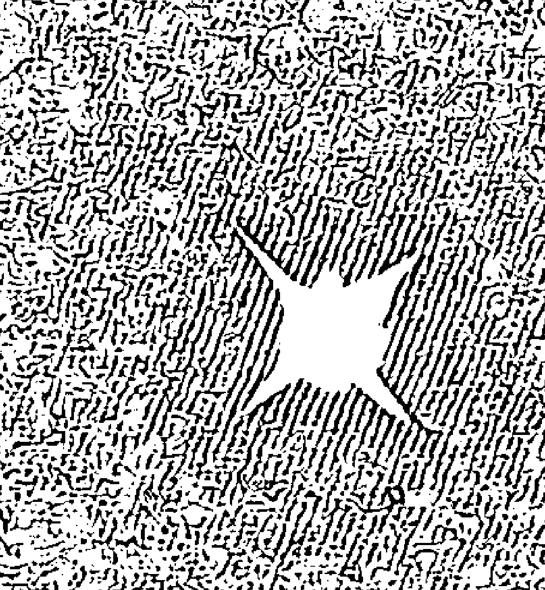

# PART 2

## 第六章 療癒不總是你想的那樣

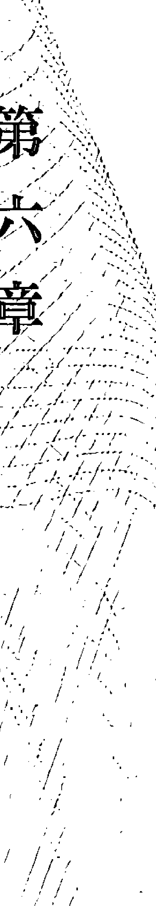

我從個案那裡得到了大量學習／憶起的經驗。事實上，每次我和個案或團體一同創造時，我都在學習／憶起，但這個經驗特別刻骨銘心。在為每個個案療癒時，我憶起了好多，我覺得應該要分享這件事，尤其是給所有在閱讀本書的療癒師。

每當有人帶著特定的不舒服和病痛來找我，想要減輕症狀時，我的第一個感覺就是療癒他們，解除他們所有的痛苦。感覺這樣是對的，本來就應該是這樣，然而，事實並不總是如此。有些時候，在特定的人身上，療癒的發生並不絕對是你以為的那樣。讓我解釋給你聽。

那時剛過完年沒多久，一個很好的朋友打電話給我，說她有位朋友叫瑞秋，得了癌症。癌細胞在她的胃、肝、脾裡，而且還在擴散。她很久以前就被診斷出來，而症狀越來越嚴重，她當時已經躺在床上，掙扎著維持生理功能，但她還是盡可能表現得很開心。她真的啟發了我，達到靈魂的深處和之上。

我第一次和瑞秋說話是在星期日晚上，我們聊了一段時間，我問她一些生活方面的問題，她也回答我。在感受瑞秋的能量一陣子後，我很明顯地感覺到，她從沒有愛過自己。隨著她繼續描述她的生活，這點變得更加明顯。我們當天晚上就開始了第一次療程，之後又做了兩次，一次在週一早上，一次在週一晚上。通常我不會這麼密集地進行療癒，但是瑞秋的癌症很嚴重。每次療程前，我們都會簡短地聊一下，做完之後，我就讓她休息。週二早上，我打電話給瑞秋時，她突然哭了起來，說道：「傑瑞，我真的愛自己了，這輩子第一次我真的愛自己了。」她非常快樂，那是快樂的眼淚。那是一次非常有啟發性的對話，我可以感覺到她的心在發光，充滿了愛。那天早上我們進行了一次療程，然後週二晚上要療癒前，又先聊了一下。瑞秋最近離婚的事讓她非常消沉，希望我剪斷她和先生之間情緒的（能量的）繩索。我們前一天討論過這種能量的連結，我同意這麼做，幾分鐘後，我們掛掉電話，我開始做遠距療癒。工作進行中，我可以看見那個繩索就在她的胸口正中央。它非常大，跟她的整副胸骨一樣大。我開始動手移除（我們稍後會討論如何找到並移除能量繩索）。它也非常粗，花了我大概二十分鐘，才把整個繩索從她的身體裡拿出來，情緒的殘骸也都跟著拉出來了。它在她的身體留下一個很大的缺口，我之前從來沒有拿出過這麼大的能量繩索，那就像把一棵大橡樹連根從地上拔起，你可以想像那會在地上留下多大的洞。

繩索拿出來後，我開始用光把這個大洞填起來，或是說觀察光的結構及光的形態，自己重新調整。同時，我與我的指導靈們溝通。
我問：『我還需要再做什麼？』
回答是：『沒了。』
我又問道：『沒了？』
回答是：『對。』
所以在我心中，我就想，她已經痊癒了：『太好了，隨著這些情緒被處理掉，癌症現在也被移除了，她會完全好起來，從此過著幸福快樂的生活。』那時我心裡就是這樣跟自己說的。
那次療程結束後，瑞秋跟我朋友聯絡，就是介紹我們認識的那位朋友。瑞秋的簡訊裡寫著：『無限的感謝傑瑞，這星期他感動了好多心與靈魂。』然後瑞秋睡著後就過世了。幾個小時後，我收到簡訊時，感到非常震驚。我往上看著天想：『她怎麼會死掉？你明明告訴我沒有其他要做的事情了。』
隔天早上一大早，我去靜心。才剛坐下來，瑞秋就進到我的房裡，她說：『傑瑞，非常謝謝你，你幫助我這輩子第一次愛我自己，你也剪斷了阻礙我靈性前進的繩索，我已經不能待在地球上了，我在這個空間中有更重要的任務要完成。』
她朝我微笑，然後就離開了。從那天開始，瑞秋來幫助我進行過許許多多次療癒。當我在準備階段，往上呼求星愈技術之流和星際團隊（這個我們稍後會提到）時，她就會來到我的空間，幫助我做必須做的工作。

我很感激她的幫忙，更重要的是，她教導我的這一課太有力量，真的讓我徹徹底底、完完全全被撼動了，無論是關於療癒、對療癒的期待，加上對任何和所有後果的情緒連結方面。

跟瑞秋的療癒，對我是很陌生的經驗，因為一直以來我覺得，被癒就是指活著、延續生命。

後來我寫下這句話：

> > 「每個人都可以被療癒，但不是每個人都準備好了。」

> > 「每個人都可以被療癒，但不是每個人都能活下來。」

這個「還沒準備好」的部分，來自次要的收穫（也就是一個人會從生病中獲得益處，像是同情心和注意力），以及這個人還沒有準備好處理自己問題的其他各種原因。你去促進療癒的時候，只要把意念放出來，其餘的就交給光和能量去處理。要記住，它是智慧，它知道什麼才能讓有關係的人獲得最大成長。另外，被療癒的人自己想要療癒，也是非常重要的。我經常接到這種電話，打來的人會說：「傑瑞，你可不可以傳送一些療癒給我媽或我爸或我哥哥？」我的答案是不行，如果他們想要療癒，他們自己會來找我。

如果當事人基於一些所謂的「狀況」，沒辦法聯絡我，那我會詢問他們的內在我（我比較喜歡用「內在我」這個詞，而不是「高我」，因為沒有什麼比你、我或任何人更高，高我是個容易誤導人的詞，把人指向一個外在方向，其實一切都在裡面），就算是嬰兒或小孩也一樣。我一定都會問，如果答案是不，那麼我就不會做療癒。我並不是每次都知道答案為什麼是不，但這是我信任我的覺知和創造萬物的智慧。有時候，有些人會自己來聯繫我，卻有一股非常強烈的、沉重的感覺朝我襲來，這時我認為不應該進行療癒。如果是這種狀況，我會放棄這案子，並且得告訴他們，我很抱歉，但這個療癒並不適合你或我的最大成長。這個世界以理性或邏輯的角度來看，並不總是都很合理，尤其是療癒這方面的事。如果你想要理性或邏輯，應該要去當個數學家或英文老師。有一次，我朋友的兒子進了醫院，這位母親非常焦急，她在我走路去健身房的途中打電話給我，問我可不可以進行療癒。我說我會詢問你的內在我，所以我就問了。我才剛把拳擊手套戴上，開始揮拳打沙包時，這個年輕小伙子就來到我的空間，非常強烈的說：「不，傑瑞，我媽必須學習她的功課。」然後就消失了。他這樣突然出現在我的空間中時，我真的嚇了一跳。很明顯，他的生病是給他媽媽的功課，他知道我的干預對她的靈性成長反而有害。星愈技術是邏輯以外的一切，它源於愛，而我們都清楚愛會讓你做出什麼瘋狂的事。請你做好接受意料以外的事吧。

像這樣的狀況，小我非常容易來干預，對你說「你怎麼可以讓這小男孩待在醫院呢？」或「拜託，傑瑞，幫他啦，好心一點。」小我會這樣撥弄你的心弦，你可能很容易就出手干預和幫忙，尤其是有小孩子時。不過，我們在這裡談論的不僅是物質世界，我們絕對不會知道，什麼才能讓另一個人得到最大的成長。還有，「不干預」也是掌握這能力的關鍵。你在觀察時，要能夠讓身邊的一切在這個當下自己展開，才是對這種特質真正的測試。如果你自己有孩子，就會完全清楚我在說什麼，應該讓孩子在毫無干預的狀況下如花盛開。

## 第七章 靈體手術

有一次，在聖誕節隔天的節禮日，我接到一位男士的電話，他的名字叫馬克。過去四十八個小時，他一直在醫院為自己的生命奮鬥，他的血液檢驗顯示有大腸桿菌和腹膜炎，掃描顯示他的腸道中有三個囊腫，而且長得很大。當時醫生告訴他，如果他能撐過接下來的四十八個小時，他們就會安排他動手術，把腸子切除約三公尺，接著他就不能自行排便，必須一輩子裝著便袋。馬克確實撐過了接下來的四十八個小時，他聯絡我，把整個狀況解釋給我聽。我請他躺在床上放鬆。我集中精神進入我的靜心／療癒空間中，然後開始工作，進入馬克的房間。他人在英國考文垂，而我在英國切爾騰漢，我們距離超過八十公里。但是，在我的工作場域中，距離並不重要，我就在當天替馬克進行了一次療癒，一週後又做了一次。以下是馬克的陳述：傑瑞要我躺在床上放輕鬆，我照做了，然後房間變得非常冷。我看見兩道光在床的旁邊，然後感覺好像我的身體被拉伸開來。我開始想到底發生了什麼事，這時不知從哪冒出來一隻獨角獸，牠親吻我的鼻子。牠告訴我，我會沒事。看到獨角獸好像一點也不奇怪，感覺很正常。

接著我開始漂流，我往上看，發現自己在一個很多人的房間裡，他們看起來都像手術室裡的外科醫生，而且他們全都站在我的周圍看著我。那棟建築物很高，石頭材質，看起來很古老。那是埃及。我感覺我的肚子正在被處理，然後有一隻手，那是傑瑞的手，伸進我的肚子裡，就是那個最疼痛的地方。我不知道這過程持續了多久，因為時間就這樣靜止了，可能是好幾個小時，也可能是幾分鐘。

接著我回到自己的房間裡，感覺迷失了方向。我站起來，去上廁所，然後低頭看我的肚子，那裡居然有一大條疤痕，我簡直不敢相信。因為太過震驚，所以我拍下照片傳給傑瑞和我媽。

第二次的療癒也非常類似，我感覺到有人在處理我的肚子，還有脊椎，我曾經在賽馬比賽中墜馬（我以前是賽馬騎師），被好幾匹馬踩過去，受了嚴重的傷。我沒跟傑瑞說過背的事情，但他似乎就一起處理了。

一月時，我到醫生那回診，他驚訝得差點從椅子上摔下來。他覺得不可思議，我肚子裡的囊腫已經完全消失，也已經正常進食，沒有再拉肚子，也不會痛。他說我看起來年輕了二十歲，每個人都說我看起來變年輕了。我本來排二月二十二日去看外科醫生，不過我的醫生說你已經不需要動手術了。我已經不再疼痛，不再吃藥，我的消化很順暢，腸子裡的那幾個腫塊也都消失了，新的血液檢驗出來，沒有大腸桿菌和腹膜炎。我痊癒了，這是個奇蹟。一般人會說這是靈體手術，對我來說，我看待所有的療癒都是一樣的。療癒就是療癒，我只是從光和資訊的層面去改變頻率而已。在每個案子裡，我都只是能量或光的器皿，我是「引導者」。這個案子對我而言，沒有比頭痛更嚴重，也沒有比危及生命的車禍事故更輕微。我對待所有事物都一樣，不做任何評判。有的時候，如果病患是腫瘤的問題，有必要的話，我會把幾次療程的時間排得比較近，視那個個案的反應而定。但基本上我對待所有不舒服的症狀，都是用相同的權威，也就是沒有權威。病症只是能量堵塞在身體裡，或是能量堵塞在另一個空間或平行次元中，連結到這個特定的人身上，必須移除或轉換掉。馬克這個案子的情緒因素，是他沒有好好照顧自己，他把所有人都看得比自己優先，沒有用正確的方式好好去愛與滋養自己的身體。我對馬克做的另外一件事情，是改變他的營養物質。我通常採用整合醫學療法的方式，必要的時候，會建議個案改變運動與營養。你會很驚訝的發現，有多少人自以為知道健康是什麼，但是吃的東西卻與健康相差十萬八千里。要記得，你的身體是天然有機體，它需要自然才能茁壯。把一些人工的、稱做食品的東西放進肚子裡，沒有辦法幫助你開始你的旅程、解開你的偉大、釋放你完整的潛能到宇宙中。我們稍後會討論營養的部分。

我漸漸理解了，人類就跟植物、樹木、花卉一樣，都需要水、陽光和氧氣才能成長茁壯。

近幾年來，我獲取營養的方式整個改變了，我不再遵照從小就被灌輸的營養模式，也就是一天要吃三餐。我還是吃，在我想吃的時候才吃。現在我大部分的營養來自於光，我每天都會花時間凝視太陽，實行一些其他的技術/方法，讓身體可以新陳代謝「光」成為營養。

把第五次元的光從其他世界或空間中帶進來，是有可能的，而且你的身體可以新陳代謝這些光成為能量。畢竟我們都是光，人類的身體只是個幻象。我現在吃很少東西，而餵食更多光。如果你去問任何參加過我工作坊的人，他們會告訴你，之後他們營養來源完全改變了。這是因為藉由深度頻率的靜心，將他們帶入非常深的地方，將非常多的光穿過他們的身體全息投影，活化他們體內的某些東西，也活化了在他們DNA內，休眠的基因密碼。

身為馬克的觀察者，我只是創造了不同的實相。他被告知說他有囊腫且正在擴大，血液檢驗中還有大腸桿菌和腹膜炎，而我只是選擇用別的觀點去看：一個完全沒有這些東西的身體。我選擇看到一個完全健康的身體。科學已經證實，觀察者會影響被觀察者，它給了我們煉金術的力量。

## 第八章 觀察者的眼是個大關鍵

星癒技術是想像的且具有無盡的可能性，就藏在你無盡的想像力中。主流醫學有其位置，也存在一些傑出的醫療人員。然而，醫療產業本身建立了一種實相模型，是侷限的、分類成一格一格的，讓大部分的人繼續受苦，就因為已經建立在這個星球上的醫療格狀結構。當病患去找醫生時，醫生會問他們有什麼問題。一旦病患說出這個問題，醫生就會透過開立處方藥，或是安排一系列療程，甚至手術，來強化這個問題。醫生是在系統內工作，一個有問題和解決方法的系統。解決方法通常都是被指定的，從問題的背後去關掉它，但這樣並不健全，因為創造出來的是更多問題。每一次，解決方法都會讓問題產生更多力量，強化整個醫療格狀系統，包含在宇宙資料庫內。實相本身就在觀察者的眼中，那個觀察特定問題的人，會以自己專屬而獨特的方式去解讀。看著同樣一個狀況的兩個人，在他們各自的心中可能都覺得自己是對的。他們兩個人都是對的嗎？沒錯，他們察覺理解的，就是他們那個版本的實相。說到意識，所有曾被想到或感覺的，都會注入乙太中，進入場域、宇宙資料庫裡。每當醫生詢問病患一系列問題時，他們就是在縮小可能的因素範圍，直到符合他們在醫學院教科書上學到的東西。好，所以你有這個症狀、那個症狀，你晚上睡不著，所以你一定是有這種病，於是病患就相信自己有那種病。如果病患沒有好起來，他們可能會再去找其他醫生，或是其他在選擇性醫學領域中的人幫忙。

最後他們可能找過很多人，每個人都有不同觀點，而所有觀點都會對這個人有極大的影響。因為觀察者會影響被觀察者，製造新的實相，被觀察者就被這範圍中的各種可能性搞得完全不知所措。為什麼會這樣？因為來自不同醫生的不同診斷，創造出許多組不同實相，全都存在在這個特定患者的場域中。

每個人都在被教導的參數範圍中用「邏輯」思考，完全沒有運用「想像」。你的想像力已經被貶低到令人絕望的深度，被人遺忘，因為想像並不存在於醫學教科書中。

當你對付一個症狀或疾病時，你無法消除病根。星癒技術可以消除病根，但不是透過消滅它，而是經由觀察者的眼，去改變被觀察者的實相。在這情形下，就是指我、你或任何使用星癒技術促進療癒的人。用星癒技術工作，可以讓你運用跟你屬於同樣來源的星塵去創造。星的光和星塵就是關鍵。

星癒技術之所以這麼強大，原因就在於它跨出了系統的限制。如果它是一套系統，你就會被限制，幸好它並不是。星癒技術是會擴張且正在成長中、發展中的技術，它沒有任何限制，限制只在觀察者的眼中。

你覺得如果我去找醫生，跟他說我可以藉由獨角獸的幫助，讓病患的腫瘤消失，他會怎麼說？嗯，我的確曾在一個靈性展覽會這麼做，當時我和一位女士進行了一段深度對話，當下我並不曉得她是醫生；後來她告訴我她是醫生，並把我的宣傳資料摔在桌上，看著我，彷彿我是個瘋子一樣。
另一方面，我也有許多個案，將他們與我合作的經驗，跟他們的醫生分享，醫生接納了這件事，告訴他們可以繼續這麼做，因為顯然是有效果的。我也邀請過許多醫生，在我跟個案談論能量和星癒技術療癒時，來加入我們的談話，而大部分都說，如果他們表現出支持的態度，他們會失去工作，更重要的是，會失去他們的名譽。我們為什麼不能共同合作呢？所有事物都有其位置啊。
如果我的個案帶著一些所謂的「醫學症狀」，我絕對不會著手去對付那個症狀。因為如果我那麼做，我就是在給它力量。相反的，我會運用觀察，改變圍繞著那個狀況的實相。當我去看一個人的能量時，我看見波動形態和粒子，若這些波沒有正確流動，我就改變它們，這樣就會接顯化於肉體。你不需要知道問題是什麼才能移除它。
觀察能量，解決方法就會出現。

## 第九章 光是細胞的能量，能滋養身體

現今的人類基因科學把百分之九十九的DNA稱為「廢物」，因為「我們不知道基因所有的意思」。事實上，人類DNA包含來自地球上所有其他生物種類的部分基因材料，加上編寫成密碼、所有人類共同經驗的基因材料，還有，你所有化身經驗的全息網絡，以及一部分的基因密碼，來自多重宇宙間、許多揚升星球中的數百個，甚至數千個有感知能力的物種（沒錯，我們不是孤單的）！

你的DNA也蘊藏著潛伏密碼，可將肉體改變為光體，一個可以新陳代謝光成為營養的身體。

星癒技術是用來把其他世界的光帶進來，它是極高頻率的智慧之光，這些外星的空間代碼會經由注入色調／顏色序列，活化一系列潛伏的密碼。而被活化的密碼會傳送訊號給你的身體，開始在DNA中產生一些變異，以及深入改變細胞新陳代謝能量的方式。這就是永無止盡的療癒和無限成長之流的開始。我們是由你的細胞新陳代謝光的能力，來測量你的光體。這種新細胞活動的狀態，會依據你細胞中三磷酸腺苷的量。在光體被活化以前，細胞作用的能量來自於一個能量製造與儲存系統，它會將能量來回傳送於二磷酸腺苷與三磷酸腺苷之間。

三磷酸腺苷是細胞裡的能量儲存化合物。在粒線體中，食物被轉換成細胞的能量，能量接受者會聚集在三磷酸腺苷裡。二磷酸腺苷有一個三磷酸鹽鏈，從分子中突出來。當三磷酸腺苷分子失去外面的磷酸基，它就變成ADP分子。這種化學結合的分裂，會釋放出能量，讓細胞得以進行活動，比如製造蛋白質。

ADP只要得到一些能量和一個磷酸基，就可以再次變成三磷酸腺苷。三磷酸腺苷和二磷酸腺苷就是藉由失去再得到磷酸基，釋放能量讓細胞運作。這是一個封閉式生物能量系統，必定會老化與死亡，不會得到新能量。

而當光體變異被星癒技術啟動之後，一系列休眠於DNA中的密碼會亮起，開始給細胞新的指引。其中一個最先得到的指引，就是告訴細胞把光當作新的能量來源。記得，我們都是不斷轉化的星塵，我們是在回到原始的自然狀態。

一開始，細胞意識會不知道怎麼處理這個新資訊。當細胞沐浴在光之中時，粒線體（對光非常的敏感）會開始完整吸收這個新顏色／色調的活化性，製造出很多三磷酸腺苷，一下子爆發。在這個階段的細胞還沒辦法吸收足夠的光來穩定磷酸基的連結，所以三磷酸腺苷會非常快速的分解為二磷酸腺苷，細胞的新陳代謝也會大幅加快。累積的毒素、老舊創傷、儲存的思想和情緒，都會開始從肉體中被沖刷出來，顯現出類似感冒的症狀。舊型態的肉體形式，將大腦功能區分為左腦與右腦不同的功能。另外，松果體和腦下垂體是萎縮的，大概是一粒豌豆而不是一粒胡桃的大小。活化之後，大腦化學物質開始改變，製造新的神經突觸。在這個階段發生的所有事情，都還非常集中於肉體中，這時才剛開始要打開我所謂的「生物轉化系統」。你的身體是被設計來解讀密碼，和更高的光能量/頻率合作，同時轉換這些能量/頻率到這個星球。做為這個分離遊戲的一部分，這些功能都萎縮了。肉體的感知能力擴大，是喚醒你的身體成為「生物轉換器」的第一個徵兆。當你開始應用我稍後提到的吸收光技術時，你身體的每個細胞都會有光經由光之傳輸網絡，直接進入裡面。光之傳輸網絡是一種網格系統，圍繞著你的身體，將你與宇宙中的萬物連結。有許多光線從你的身體朝四面八方發散出去，一旦你開始使用星癒技術，你就會看見這個網格。它是有知覺的，這個網格能讓你存取更多知識。下頁的圖並不完全正確，但如果把所有進入人體的光線都畫出來，那你就看不到身體了。確實就是有那麼多光，你真的就是一種沒有肉體的光的形式。還有另外一種光的形態，圍繞在人的身體周圍，看起來像形狀、幾何圖樣。你的人體光域美得驚心動魄，我們稍後再討論了。

隨著三磷酸腺苷分子裡的原子自旋增加，新的作用就會出現。形成三磷酸腺苷分子的莖的子中。周圍的細胞自旋點後，這個自旋點會製造聲音和光頻，改變細胞分子的原子自旋，尤其是在氫原子周圍。

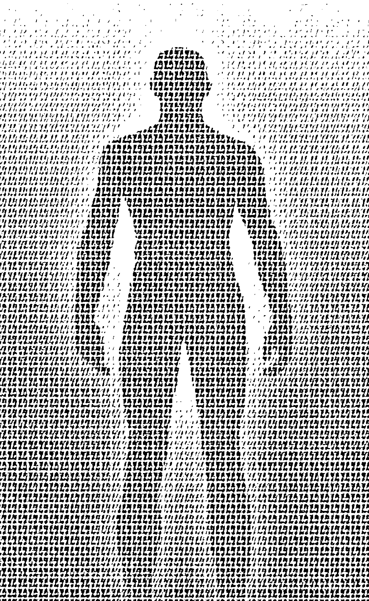

光體結構。粒線體通常會把這種光當成食物，並製造出更多三磷酸腺苷。由於細胞接受光做為一般能量，就比較少三磷酸腺苷轉變為二磷酸腺苷。當我們給身體源頭的光，來自星星，通過光之傳輸網絡進入你身體裡和身體外，三磷酸腺苷的功能會開始變得像是未分化光的天線，分子的對稱頭則有稜鏡的功能，把光分解為精巧的光譜，可以被休眠的DNA密碼使用。

在你的光體活化前，細胞裡的核醣核酸作用是個單向的傳訊者，它帶來自DNA（等待教導的密碼）中活躍的那百分之七的指令，到細胞的其他部分去執行工作，比如蛋白質合成。而核醣核酸會變成雙向的傳訊者！現在它帶著光，也就是被三磷酸腺苷天線／稜鏡分解後可利用的光譜，回到DNA中。隨著你開始帶入更多的光，把它們的資訊交給核醣核酸，核醣核酸把它傳送到其他的細胞裡，休眠狀態的基因密碼就會逐漸甦醒。

這就像地球上的雷射CD技術，大量資訊可以被儲存在一張光碟片裡。想像一下，有大量資訊可被儲存在紅色的範圍內，也有大量資訊可被儲存在綠色的範圍內。紅色的雷射光掃過光碟片，所有紅色區域的資訊都可以被閱讀了，但你對綠色光譜裡面儲存了什麼，依然一無所知。於是你又用綠色雷射光掃過光碟，讓所有的資訊可以被讀取。光譜裡面可不只兩種顏色，還有很多。

光的顏色頻率「讀取」DNA也是差不多的方式。在那個顏色的光譜被傳送之前，你不會知道裡面有什麼。每個光體層級都有它那個顏色／色調的識別調。以這種方式，靈魂的肉體可以達成一步步的變異，你會經過好幾個層級，你越常使用星癒技術就會想起越多，也會變得更加強大。

單向的DNA到核醣核酸資訊轉換，和三磷酸腺苷到二磷酸腺苷能量循環都是封閉的系統，能量必定會退化，除了衰退之外，什麼也不會改變。而活化光體後，新的、完全開放的系統得以發展，讓身體得以使用無限的能量和無限的資訊。你的肉體和靈魂之間將展開全新的對話，一個叫人興奮的新世界也為你敞開。這並不容易，需要努力。你準備好做那些必須做的事，以點亮你的世界了嗎？

### ☆吸收光的基本方式

為了讓你踏上以光滋養自己身體的道路，我想要分享一個使用簡單，不過非常強大的吸收光方式：

站在戶外，抬頭看天空。把雙手大拇指靠在一起，食指也靠在一起，做出一個三棱鏡。把它放在你的心上，閉上眼睛，用你心靈的眼睛去看偉大的中心太陽——這是太陽後面的太陽，我們宇宙的中心。想像它是一道明亮的白光，有著電光藍色、幾乎透明的外層。中心太陽是一種意識層級，以白色和藍色的光球存在，它來自第五個世界的光。集中精神，看著這個太陽在空中閃耀明亮的光。你不需要知道它確實的位置，要知道它無所不在。

偉大中心太陽是精神／物質宇宙整合的點，也是所有肉體靈性造物的源頭。這個太陽後面的太陽，是我們看見的這個物理性太陽和所有其他星星與星系，無論看得見、看不見的，包括偉大中心太陽，這一切背後的靈性原因。
以你的意念，你將召喚這個光，因為萬物一直都在同樣的地方或空間。看見一道明亮純潔的、白色水晶般的能量，從這個太陽流出來，通過你的三棱鏡，進入身體。
集中你的精神，做這項練習約十到二十分鐘。你會感覺到它，你會感覺被充滿。你的肚子會感覺滿滿的，身體會受到滋養。如果是陰天也沒有關係，因為我們可以毫不費力的穿過所有堅硬的人造物質（因為所有東西都是意識），因此要穿透幾片雲也一樣毫不費力。你甚至可以在家裡面做這個練習，只是我比較偏好到戶外。建議你每天都做這個練習，你可能會和我一樣，注意到立即的結果，也可能要多花一點時間。要有耐心，持續做下去。
要成為星癒技術的引導者，學習這種力量的使用法，你必須像植物、花或樹一樣的學習或憶起。樹需要水、光和氧氣，你和我也是一樣，你越常和星癒技術共同合作，你就會吃得越少，而你吃的東西也將是純粹的食物。

## 第十章 你也可以成為獨一無二的引導者

讓我先清楚說明一下，我跟你沒有不同，我們同樣是人類，以完全一樣的能量創造出來的。我們都是神聖的生物，顯化成人的形式，而我們每個人都有潛力成為星癒技術引導者，你可以做到任何我能做的事。如你所知，有一段時間，我完全不記得任何事情，我在這本書裡提過，而現在，我想起了所有我跟你分享過的事，還有更多。
我會繼續憶起更多事物，強化靈魂技術，為人類潛能創造出更先進的版本。這趟旅程你走得越深入，就會有越多東西要解鎖、重新發現。想到不遠的未來，星癒技術還會帶我們到哪裡，就非常令人振奮。它將會重新形塑及打造各種產業，如醫療、旅遊（當地與宇宙）、通訊、食品等產業，也將徹底轉變星球的振動。
我的使命是要療癒十億人，就從你開始。你非常強大，而你必須知道這一點。我分享這些資訊，不是要讓你看完之後想說：「傑瑞或許可以做到，但並不表示我也可以。」不是！你跟我並沒有不同，我的計畫是啟發你走上這趟旅程，給你力量療癒自己，然後使用這些方法去療癒其他人。

如果你已經是個能量工作者，可以運用星癒技術提升你的技巧。經常有靈氣療癒師來找我療癒，因為我可以让現存的療癒師成為更強大的能量療癒師，這件事也有越來越多人知道。他們告訴我，他們的個案感覺到頻率流入身體。療癒師運用星癒技術之後，覺知力變得更加敏銳，發揮的能力也更強大。

星癒技術是在很深的地方產生作用，它會移除阻礙，釋放牽絆一個人的任何事物。當這些阻礙都被移除，光和能量就可以自由流動。不過它可不只自由流動，它會點燃你這個星際種子本質的光，讓好長一段時間以來，一直潛藏在你這個人表象底下的能力具體成形。

人們經常來跟我說，他們已經是靈氣大師，運用靈氣已經超過二十五年，但他們從未體驗過星癒技術這樣的東西。它確實是不一樣的層級，其他療癒方式已經在這個世界上進行了這麼久，真是不可思議。他們開出了道路，讓療癒的球轉動起來，而現在是該提高層級的時候了。

我做夢也沒有想過，星癒技術會對人們產生這些效果，我只是很感激有機會把這個資訊傳遞出去，而且對人類有這麼正面的影響。我們都存有某些限制性的信念在阻止我們發揮最大的潛力，而星癒技術會清除這些。一旦你完全敞開自己的心，就不再有限制，只有無限的可能。

在星癒技術進入你的細胞，移除所有根深柢固的痛苦後，你的能量和光頻率會以我無法用文字敘述的方式流動，那是要體驗的。你有能力成為星癒技術引導者，我可以提供建議，但是你必須自己走這條路，沒有人可以替你完成。你必須要有決心和努力，想解開自己的謎團。

你有煉金術般的能力，你可以把水變成酒，把銅變成金，一切都是可能的，因為一切都是能量。改變你的觀點，就會改變你的世界。你在讀接下來的療癒技巧，我喜歡稱之為「方法」的內容時，不要嘗試跟我一樣，不要複製我，我只是在提供如何促進療癒的建議。你要運用想像力，以你自己獨一無二的方式去詮釋實相。

記住，星癒技術不是一套系統，不是一個公式或程式，它是一個無系統化的知曉方法。使用你的想像力時，去玩樂、有趣的挖掘，才是達成目標的關鍵，如果很僵硬刻板，你就受限了。若試著想要跟我一樣，那就是在限制自己的力量，你說不定有比我更好的方法可以運用。完全敞開心胸，接納那是什麼和不是什麼。

當我進入自己的心去療癒時，我與宇宙資料庫連結，一個量子世界會向我展開。它是完全不符合邏輯的，信任才是關鍵，信任你看到的東西，是來幫助你療癒這個特定對象的。

曾有一位腸躁症的女士來找我，進入療癒的幾分鐘後，我看到的東西是一個老舊的卡車引擎（我進入療癒區時，看到的東西就像電動玩具），裡面有紅色霧光或能量。我直覺知道這個有問題的地方。我觀想一道白光進入這個引擎，開始沖洗，把紅光清掉，就這樣一直做到完全沒有紅色霧光為止。

她的腸躁症立即痊癒了。我並沒有計畫要怎麼做，只是讓自己進入療癒區，在這裡，任憑直覺與觀察流動。

旅途展開。當你去一個從未去過的地方旅行時，你不會想像那裡的路是什麼特定的樣子，你就只是一邊走一邊看，隨著你往前進，一切會自己展開。在夜色中，你唯一能看到的，就是車前燈照到的地方而已，而你會擔心前面的路不會展開嗎？不會！你就是繼續前進，知道它會自己展開。療癒的時候，只要進入療癒區，準備好探險吧。

## 第十一章 危急中所有事物都為我慢了下來

我這輩子經歷過好幾次車禍，現在就跟你分享另外一次。
那是節禮日的傍晚，節禮日好像總是對我有特殊意義。我正在開車回家，心裡想著：「我迫不及待要看到蘿拉和孩子們了。」然後轟……一輛超速的計程車直接衝過十字路口，完全沒有停下來，撞上我的副駕駛座車門。我事後才知道整件事發生的過程，是我後面的駕駛人告訴我的。
計程車撞上我的車時，它的力量加上我前進的動力，使得我直接撞上路燈，我的車反彈開來，在路上滑行了約三十公尺。在那個疾馳的過程中，我其實醒來了。我一定是被撞昏了一下，然後重新恢復意識。我看見一面牆迎面而來，心想：「我的副駕駛座車門被撞歪了，車子前端也撞爛了，如果我撞上這面牆，引擎爆炸的話，我會被困在車子裡。」
從我醒過來到撞上那面牆，應該只有一或兩秒鐘，但是所有事物都為我慢了下來，我進入了一個完全不同的實相。我產生那個關於牆、副駕駛座車門、車子的前端、被困住的想法，然後我就從車上下來了。但一切發生得如此緩慢，感覺好像我有足夠時間煮一壺水、喝一杯茶，好整以暇的從車上下來，而我也確實這麼做了。不是泡茶的那個部分，而是好整以暇的那個部分。我從車子裡走出來，走到道路上，然後車子就撞上了牆。附近出來察看的人說，那聲音聽起來像炸彈爆炸。在這個事故中我進入的實相是一個我們隨時都可以進入的實相，每次我進行療癒時，都會進入這個版本的實相中，用交通事故來解釋，是我所能描述的最佳方式了。或許這就是為什麼我會遇到那次車禍吧？我還要跟你分享另一件關於這次交通事故的事（其實「事件」會是比較好的描述方式，因為我不覺得有任何「事故」），這件事很重要。隔天，我的右眼充滿血，感覺好像有人踩在我的眼球上，眼球就快要被壓爆，像顆葡萄一樣。我決定去找當地的醫生，完全是因為這次的事故，因為過去我從不找醫生。她這樣跟我說：「薩吉安特先生，我覺得你必須堅強起來。」我笑著走出了診間。是有點討厭，但是居然會聽到這種話，我真的覺得很好笑。我到急診室去做了掃描，他們說我的眼窩有個裂縫，神經被夾在裂縫裡面，所以才會引起疼痛，然後他們必須再觀察我的狀況。在這種情境中，我發現去找醫生根本是在浪費時間，於是我決定看看自己能做什麼。或許我一開始就應該自己解決，但是每個人都跟我說：「傑瑞，這是你的大腦，你真的應該去檢查一下。」所以我就去了。

總之，那天晚上我坐下來，進入我的心裡／我的療癒區，拿了一根想像的管子。其實，在我創造的實相中，那並不是想像。我把管子插在頭的側邊，從右邊太陽穴塞進去，一直推進去，直到管子的另外一端就在我的右眼球後方。然後我吸那根管子，以虹吸作用讓血流出來，我任血流進一個想像中的，但是非常真實的桶子裡，在四維空間裡。血在排出的時候，我用雙手去調整眼窩，放掉夾住的神經。然後我靜心，之後就去睡覺。隔天早上起床時，眼睛裡已經沒有血了，眼睛非常乾淨，痛也消失了，我感覺煥然一新。這件事只是要告訴你，集中意念時，想像力是多麼有力量，再灑上一點愛、知曉，當然還有光。我所做的一切，只是在創造一個新的實相，把兩者融合／量子糾纏在一起。

## 第十二章 知曉勝過相信，知曉你的力量

在你開始運用星癒技術時，我可以說，你依然還是或可能還是會「相信」。你相信的，可能是宗教、其他人、觀念、處理的方式、某些狀況，或是一個政黨，而你可能會相信或不相信自己。

我鼓勵你不要相信自己。

我鼓勵你不要相信任何事物，停止相信宗教、信仰、家庭成員、朋友，或社團，不要相信任何人告訴你的任何事情，當然也不要相信我或是這本書裡面的資訊，不要相信你大腦裡的想法。從現在開始立下承諾，說你不會再相信任何事物。如果你現在還做不到，沒有關係，繼續看下去。

相信系統是建立在你的思想中，你不能想星癒技術，你必須超越思想，從你的左腦移到右腦，以直覺去做。你必須知曉星癒技術，當你知一件事，你就是知道，沒有什麼能取代你知道的。相信就不一樣了，知曉會勝過相信，每一次都是。當你知道，你就是知道，這是種天賦。

我們都會鼓勵孩子去相信自己。「加油，兒子，你做得到。」他們為什麼會相信自己做得到？不管那件事是什麼，他們是用思考，去說服自己他們做得到。沒錯，這經常有效。或許他們是說服自己做得到，也或許是出自於做不到的恐懼。這樣有效益嗎？嗯，它可以是朝著正確的方向邁進了一步。相信可以是知曉的墊腳石，這就像要參加比賽的運動員，他們會累積一段時間的練習。過了一陣子後，他們就會知道這次做得到，因為他們已經做到非常多次了，不再會質疑自己，他們知道自己的能力。

所以，談到知曉自己，相信可以是一塊墊腳石；不過，相信你的宗教、社團或家人，就是另一回事了。當我們相信一個宗教或社團時，就是把自己的力量交出去，給我們相信的那個事物。但我們為什麼這麼做呢？當我們就是技術的時候，為什麼還要這麼做呢？我們就是力量！

當我們是一個社群或團體的一分子時，會覺得自己有力量。那若我們離開這個團體，會發生什麼事？許多人一旦加入了某個團體或社群，就不會離開，因為害怕孤單、被排斥，害怕失去自己的力量。

成為社團的一分子是可以的，但是在這個過程中，你不能將自己的力量交出去。你必須知道，就算你離開這個社團，你的力量也不會改變。你帶著固有的價值，那個價值就是你。不是你和你的商業夥伴、你和你的先生或太太、你和你的教會……你就是那股力量（這就像錢一樣，如果你燒掉一張百元紙鈔，它就沒有任何價值了。但如果你拿一枚金幣，熔掉後分成五片，這五片金子的總價值還是跟一枚完整的金幣一樣，因為金子帶有固有的價值）。你必須知道這點，我沒辦法給你這個，沒有人可以，這必須來自理解自我，你知道你可以控制自己思考的方式、你對生活各種狀況的情緒反應、你應付與克服所有難題的能力，在這麼做的過程中，你就在使用基本的煉金術，觀念的力量。這是什麼意思？藉由特定的方式去看事物，能把障礙轉變為機會。耶穌跟你有什麼不同嗎？沒有，他只是知曉真實，沒有更多，也沒有更少。耶穌知道星癒技術，就像以前和未來的許多人，他知道自己。他知道自己是由星塵創造出的星際種子，而因為知曉這點，所以他知道自己的固有價值。去感受生活，不要用思考去生活。去接觸你女性化的那一面，沒錯，各位男士，你們也包括在內。我不是說絕對不要思考，別誤會我的意思。在人的世界裡，思考是很有用的，尤其當你想跟某人約在下午三點時。不過談到星癒技術，你必須放下思考，你必須知道它，才能釋放完整的潛能。只要你相信它，你就會受到限制，你可能還是會得到某些結果，但是完整的力道、星癒技術的完整力量，就沒辦法自由的在你血脈中流動。

# PART 3

## 第十三章 溫度控制與神經纖維建構過程

之後我會再談論聲音，以及如何善用聲音去活化第三眼。不過，談到建立你的生命力量，氣、能量、光流都是沒有效果的，雖然有些療癒靜心會教導這個。有許多技巧教導人把能量帶進身體的某個特定部位，同時運用熱。首先，記得我們是在和光、資訊共同作用。第二，要知道我們不是在運送能量，我們是在改變光的形態或資訊的形態。
使用星癒技術時，我的身體沒有一個地方是熱的。我把身體訓練成這個狀態——偶爾我的手會散發一點溫暖，但同時，如果你觸碰我的手，會發現它們是冰的。我在瀏覺人類的全息圖時，雙手也會振動。它們在我需要的地方振動，帶領我的意識進入。
不管別人跟你說過什麼，或你讀過什麼，要真正知道的唯一方式，就是去體驗，我希望你在自己的身體裡體驗溫度控制。當身體是冷的時候，療癒會更有效，光和能量可以流動得更加順暢，對那個促進療癒程序的人也不會有副作用。當你的身體是溫暖時，它是不平衡的，當你專注於把能量／光帶進身體的某個部位，忽略其他部位，你就是不平衡的。
處在不平衡的狀態，可能會導致不同的副作用，那是不健康的。你可能會覺得暈眩、器官疼痛、肌肉疼痛、頭痛、刺痛、想吐，很不舒服。要促進療癒，卻在過程中導致自己不舒服，效果當然不會好。如果你是個療癒師，曾被教導熱是好的，你也得到過一些效果，你還是可以那麼做，也試試看把自己的身體溫度調低，看看這樣子得到的效果如何。你會非常吃驚的。

當你在促進某個人的療癒時，他們可能會感覺到熱或冷，兩者都沒關係，那表示療癒正在發生。

溫度對被療癒的人跟對療癒師而言是不同的，療癒師最好要維持低溫流動，原因有兩個：安全與效果。而且，要達成任務的關鍵，是要把你的整個身體當成療癒器皿，不只是其中某部分而已。我們不是機器，我們是自然的。

在你的身體裡，大約有七十公里長的電子線路，就是神經纖維，擴及你的整個身體。要有強大的能量／光，秘訣就是建構整個神經系統。你必須建構它擴及整個身體，如果你試著把光和能量放在某個特定部位，像是雙手，你就是在限制自己。要完整體驗到星癒技術的力量，你必須建構整個神經系統，這麼做之後，就學習調節流經全身的能量溫度。做到這一點，你就完全活化了光之傳輸網絡，或說遍布你全身，也延伸到整個身體以外的光網格系統，讓你可以光與資訊的層面，運作得更加輕鬆。

要建構神經系統，你必須使用光。運用你的意識，進入神經系統，去感覺光能量流動。接著，經由帶入更多光，你可以增加那股流動、強化神經系統、增加它的寬度。這樣一來，又可以讓更多光流經整個神經系統，也就可以讓更多資訊流經身體。記住，光就是資訊。

### ☆ 以光來強化神經系統的練習

記住，你不能強迫光和能量在身體裡移動。能量必須流動，而光無所不在，你可以控制這股流動，但絕對不可以強迫。如果強迫光或刻意移動能量，你會產生跟用了太多熱一樣的症狀。你的整個系統都有效建構起來後，光會從身體的所有部分平均流出，流經乙太，帶著療癒的必須資訊，進入你正在促進療癒的那個人的能量場或身體裡。

而生物光子是聚集在神經纖維間的光單位。

要建構你的神經系統成爲一個完整且強大的單元，你必須使用想像力、意念和覺知。一旦你的第三眼完全活化後，你將可以看見正在發生的事，但在那之前，這三個成分非常關鍵。

你也會需要信任和知曉。在你開始這個程序前，最好能先有個概念，知道神經系統看起來是什麼模樣（參見下頁圖）。

你的神經纖維。把覺知放在臉和頭裡面的神經纖維，使用想像力，用意念看著光在體內流動，告訴它該去哪裡，給它指令／意念，但是不要強迫它。記住，身體會回應你的意念。一旦你感覺／看到或知道光已經佈滿每一個神經纖維時，就可以停下來。

剛開始練習時，你可以把光從你的頭頂帶進來，看它流遍你的全身，當光流遍每一個神經纖維時，就可以停下來。

接著，你可以重複這個過程在你的脖子，接著是肩膀和胸口，再來是背部和手臂，然後是腹部，再來是臀部、髖部，到你的雙腿，最後是雙腳。當光流遍整個系統，你就可以停下來。一旦你看見這個光流遍你的整個神經系統，你就是準備好要開始建構它了——慢慢的！

### ☆ 強化神經系統二十三天練習

下面，我提供你一個為期二十三天的方法，建構、強化你的神經系統。照著做就可以提升療癒能力，同時感覺更快樂、更強壯、振動更加輕盈。

- 第一到五天 花十五分鐘重複上述的過程。第五天結束時，你應該可以用光一次活化整個神經系統了，把這個光看做是白色的。如果花的時間超過五天，也完全沒問題。
- 第六天 重複上述過程，然後使用想像和意念，看著神經纖維開始擴展，變得更粗，就在你的頭裡面。整個過程應該不會超過十五分鐘。每一天，不要超過十五分鐘。
- 第七天 重複上述過程，加入下一個身體部位，你的脖子。
- 第八天 重複上述過程，加入下一個身體部位，你的肩膀和胸口。
- 第九天 重複上述過程，加入下一個身體部位，你的背部和手臂。
- 第十天 重複上述過程，加入下一個身體部位，你的腹部。
- 第十一天 重複上述過程，加入下一個身體部位，你的臀部、髖部。
- 第十二天 重複上述過程，加入下一個身體部位，你的雙腿。
- 第十三天 重複上述過程，加入下一個身體部位，你的雙腳。
- 第十四到二十一天 重複神經纖維擴展的過程，一次包含所有身體部位。不要強迫任何事物，你會看見神經系統逐漸拓寬，更多能量流經其中。藉由使用意念與想像，持續把光帶進來，過程，就會清楚的看見它了。
- 第二十二天 把光帶進你的身體，流遍整個神經系統，看或感覺（或許兩者皆有）光的流動。現在，從你的神經系統，開始把能量平均投射出去，看或感覺（或許兩者皆有）它擴張，平均的往所有方向出去。這個練習的目標，是要看光從你的整個身體向外投射出去。你習慣這麼做之後，在你為他人促進療癒時，你身體的光在療癒過程中會自然開始投射出去。你的身體具備完整的電子系統，你必須鍛鍊它。持續這麼做，到感覺你應該停止為止！
- 第二十三天 把光擴散得更遠。每天練習，直到可以瞬間把你的光充滿整個房間。
在我的訓練經驗中，我會促進人們的星癒技術記憶過程，並分享所有我知道的事，讓人們去做這項練習。當每個人同時這麼做時，感覺就像我在海面上，而且浪濤相當狂暴，光和能量的擴張彷彿把我帶離了雙腳。
從現在開始，每天花十五分鐘把光帶進你的神經系統，看它流動、感覺它流動。開始去了解它是怎麼流動的，去看與感覺它的形態、幾何。看它擴張，並確保它平均的擴張，你可以用意志，從身體強化它的所有部位，平均的把能量投射出去。如果某個部位似乎比其他部位弱，就把意念送過去強化它，但是不要強迫它，擴充個別的神經纖維尺寸就好。

記住，在這整個過程中，進入你心的空間裡，把你的覺知帶到那裡去，你的覺知可以隨你心所欲，同時處在許多地方。

### ☆ 療癒時讓身體涼爽的練習

要讓你的身體維持在涼爽的狀態，想著涼，你就可以維持涼爽，真的就是這麼簡單。

在你促進療癒時，你會需要把覺知放在掃描或感覺整個身體，如果感覺溫度好像升高了，就想著冰、想著涼，想像冰涼的微風流經你的身體。不要弄得跟冰一樣冷，因為你可能會感覺太冷，使得意念飄離療癒過程。就想著冰，可以快速讓你冷卻下來。

在你開始看到或感覺身體變涼時，把意念放在維持這個讓你感覺涼爽的溫度。透過覺知，你將可以認識自己的身體，而如果太熱，你也很快會察覺到，因為你可能會感覺到一些副作用，像是頭痛、眩暈、刺痛、器官疼痛等。

你可以把流遍整個身體的能量看成涼爽的藍色，這會幫助保持涼爽的狀態。相對的，把能量看成紅色，通常與火和熱度有關，你就會開始熱。

當你的神經系統完全活化後，你可以把光流調節成涼爽的溫度，你將能夠有效且強力的投射能量，以你自己的能量場域、光場域或光之傳輸網絡，去操縱實相。

這表示完全不需要費力，這就是星癒技術的關鍵。你創造出一個環境，在那裡一切都為你發生，你真的成為一個純粹的器皿，你真的不需任何行動就能促進療癒。隨著你從基礎、中階，不斷進步到高階療癒方法時，這一切對你而言就會非常清楚了。

## 第十四章 療癒前的準備

在進行一次療程之前的準備，比療程本身更重要。如果你沒有妥善準備，效果就沒那麼好。這跟生活裡的各种事情都是一樣的，準備是達成目標的關鍵。你越常運用星癒技術，就越能理解為什麼如此。

那麼，療程之前我是如何準備的呢？不管是遠距離或身在同一個房間裡，獨自進行或和一大群人一起，準備的過程都是一樣的。

在遠距離療癒之前，我通常會要一張照片，看看那個需要療癒的人，我喜歡透過眼睛連結。這並不是必須的，因為我也會在沒有照片的狀況下促進療癒。但是連結，對我個人而言，在有照片的時候似乎比較好。

我做的第一件事，是讓心跳慢下來，並調整我的狀態，一種意識狀態的調整。我會進入我的心中，做緩慢深長的深呼吸大約一分鐘。以前透過深呼吸調整我的意識狀態，需要花好幾分鐘，現在進行的速度快多了。當我的心跳慢下來，我就進入一種介於半睡半醒的狀態。當人們進入深沉的靜心時，據說就是在一種θ（Theta）狀態，也就是大部分人快要進入睡眠的狀態，這個狀態是駕駛創意的最佳時機，這就是為什麼許多絕妙的想法都是在靜心時出現。

下一個層級就是δ (Delta) 狀態，這時你的腦波更慢了。在此狀態時，你可以把你的光從身體裡帶出來，開始探索。不過，在本書中我們只會淺淺提一下這部分。在δ狀態時，你進入深度無意識與直覺洞見的領域中。一旦你到這個狀態，很容易就會睡著，因此訣竅就是進入在θ與δ之間的狀態，同時維持清醒與可活動。這需要練習。

一個很好的練習方式，是拿一個玻璃杯裝滿水（剛開始可能用塑膠杯就好），坐在椅子上，用雙手握住杯子，然後開始深呼吸，眼睛張開或閉上都可以。深深的呼吸，並讓你的心跳慢下來，當你掉進各個階層，進入你的中心、你心的空間時，你就會感覺到狀態改變。目標是要能夠待在這種調整過的意識狀態中，直覺洞見開始進入你，但是不能讓水灑出來。你一定會弄灑好幾次，那沒有關係，練習才能造就完美。

當我在呼吸，讓心跳慢下來的時候，我會呼求支援，向我個人的指導靈團隊，我也稱之為星際團隊。稍後我會跟你介紹星際團隊，因為當你開始使用星癒技術幫助他人療癒時，星際團隊將會扮演特定的角色／奇蹟。你可以使用星際團隊促進自己的療癒，但那是比較進階的部分，你必須先熟練基本功。記住，進階並不代表比較困難。

我向指導靈／光之存有請求支援後，我會設定意念。比如我的意念是要促進「喬恩·瓊斯」的療癒，要在瓊斯體內注入星癒技術的意識代碼，如果我要特別專注某個地方的話，我會針對該次療癒，使用特定的代碼或頻率。之後我會分享一些意識代碼，告訴你如何運用它們，在某個人的生物電腦——他們的大腦中，重寫軟體或改變程式。透過使用星癒技術代碼或頻率，你還是可以進入無盡可能之海。在這種方式中，有特定要專注的地方並不會限制你，這跟設定清楚與直接的意念是不一樣的。你可以用代碼，也可以不用，無論哪一種，請求顯現出你所不知道的事物來促進療癒，總是好的。使用你知道的事物，會把你侷限於你知道的事物中。魔法和奇蹟藏在未知裡。在我呼求特定的代碼，請求顯現出我不知道的事物之後，我會把慈悲、純淨、神性、統馭、療癒、無條件的愛注入到療癒裡。等我進入到調整過的意識狀態之後，我會完全打開我的心輪（用我的意念、感覺或第三眼視感），然後把自己帶到另一個的空間裡，開始促進的過程。有時候我會在他們的空間裡進行療癒，也有些時候，我會把他們帶回到我的空間，或是帶他們到另一個地點去。這都要等到開始後才會知道，光/能量會去帶領療癒展開的方式。星癒技術是很有彈性的，而光/能量永遠知道怎麼做最好，所以你必須學習去感覺與信任光，一旦你進入這種意識狀態，一切都會很清楚了。接著資訊會開始出現在我面前，我可能是感覺到、看到或知道，它發生的時候，光開始流動與移動，你可以看見，非常漂亮。然後我會觀察、移動和調整頻率，我會解除並重建那個人的能量場。

量圖中的結構。當我使用特定星愈技術的意識代碼時（我並不是每次都會使用），我會創造星愈技術符號，然後把代碼寫在那個符號裡。這會造成能量流動，確保這股特定的能量或光流包含著特定的資訊。

當這些都發生之後，我會讓帶著星愈技術意識代碼的光自己去工作，我知道它正在發生。然後我會帶著我覺知的另一個元素，回到意識運作的開放空間裡，我會確認這次療癒並沒有侷限在意識代碼包含的東西中。你越是去玩，它就越容易發生。重要的是，不要只是使用代碼，代碼很強大，但是會限制在符號中。有必要的時候就使用符號，但要在可能性與改變的場域中遊玩。

我跟你分享的所有方式，看起來好像會有某一種順序，但其實沒有。隨著你開始想起星愈技術，你會了解什麼是有順序的，一切都很彈性，無系統化。憶起這些方法，開始使用它們，在它們點亮你的世界時，你就會看出它們自己是有生命的。

當個案預約療程時，他們通常會在確切的療癒日期前就開始體驗到療癒。要記得，所有事物都是現在，一旦某個人跟我預約，我也同意療癒後，一切都是現在。我們療癒時間就是現在，全可能會在療癒之前就體驗到某些情緒和改變。如果你是療癒師，重要的是讓個案知道，他們。

我的工作坊也會有這種狀況，一旦人們下定決心並報名之後，他們經常會像搭上情緒的雲霄飛車一樣，恐懼冒出來，眼淚像河流一樣流不停，我會在辦公室接到電話詢問：「這是正常的嗎？」他們會說：「我不確定這週末該不該去參加工作坊。」每個人都還是會來，而且這是他們做過最棒的事情。你看，這就是小我會冒出來，它害怕這些老舊的、不服務你的模式被釋放出來，而這樣反過來又會繼續強化小我認同的幻象。它恐慌了，所以恐懼會冒出來。小我是非常狡猾的，它會使出所有詭計，讓你停滯不前、活在小框架與對未來的恐懼裡，或是被已經不存在的過去殘骸所牽絆。一定要跟你的個案說明，當他們預約療程或工作坊後，可能會產生的狀況。

## 第十五章 利用全息圖來觀察個案

從這裡開始，你所讀到的一切，都是我把療癒區中看到的實相，以我的方式表達出來。這是個很棒的地方，你可以從這裡開始，它會打開你的心胸，發現想像可以達到或共同創造這一切。在那裡，讓你的想像狂野馳騁，越狂野越好，越是自由，療癒就能變得越強大。記住，不要把目標設定成跟我一樣，成為你自己實相的獨特版本，和你的美好與意識智慧共同創造奇蹟。我想要把這件事說得非常清楚，星愈技術是有趣的，你可以跟它玩。在你對星愈技術認真的那一刻起，就停止流動了。從你看不出能量／光會發揮作用，或是你覺得自己確實在做什麼事，而不是去經歷有趣、玩樂、想像的經驗時，它就停止了。你只是一個器皿，你在其間得到更多樂趣，讓你的想像力更加狂野馳騁，信任你所看到和感覺到的一切，它的作用就會更加強大。大多數時候，人們會告訴我他們有這個或那個病痛、不舒服，於是我的注意力就是修正那個狀況，然後會去看身體的能量和實體層面。90%的狀況下，我會先看能量，然後再看身體。如果這個人沒有告訴我他有什麼問題，我通常是從能量層面著手，我並不總是知道身體上的狀況為何，但是從能量或能量的阻塞處來看，是非常清楚的。我知道如果我移除阻塞，或是製造不一樣的實相，我就能夠創造出讓這個人得以痊癒的環境。假設我現在要替你促進療癒，你的名字叫做莎麗·史密斯，我開始看你的照片時，我就會帶出你身體全息圖。在我眼前出現的藍圖，看起來非常類似上左方的全息圖片。我在看這張全息圖時，會有好幾種不同的觀看方式。如果我是要找能量堵塞處，我會把這張全息圖擺在黑色背景上，身體會是黑色的，遍布著白色的能量網絡系統，堵塞的能量看起來會像是白色的霧狀粒子，聚集在某些區域，我就知道我必須清楚這個。我清理的方式，是用手滑過去，讓手指頭像梳子一樣刷過去，能量就會疏散開，回到直線狀態，融入能量網絡系統中。如果它不是幾何的形狀，你就知道有什麼出差錯了。絕大部分的時候，只要我調整過能量，移回直線狀態，療癒就會開始產生。不過也有此一時候，我們必須進入得更深。

### ☆ 器官

如果個案告訴我，他們的特定器官有些問題，不管是心臟的狀況、結腸裡的囊腫或肝臟裡有腫瘤。我會把全息圖放在綠色背景上看，就像上頁的圖片。器官看起來非常鮮明，感覺濕濕的，就像它們在身體裡的模樣，接著我會做促進療癒必須做的事情。我會在下一章討論，在另一個人身上創造療癒時，幾種不同的視覺化方式，本書後方也會再敘述更多。

### ☆ 神經系統

我在處理神經系統時，會把全息圖放在白色背景上，神經系統會顯示紅色，療癒之後，就會變成綠色的（見上頁圖）。有時候我在促進療癒時，全息圖是用綠色的背景，因為我在處理器官部分，然後在我心中，它會閃成白色背景，那麼我就知道神經系統也需要處理。當你保持開放，開始和星愈技術合作時，能量也會替你工作。它會變得越來越簡單，會告訴你要做什麼，你所要做的就只有傾聽或觀察，就像在調整頻道到某個廣播電臺一樣，我從一個頻道移到下一個頻道，逐一傾聽。或像這個在與神經學相關的案子裡，我就會處理神經系統，像是個案的四肢或關節受傷，在昏迷狀態，或是有某些形式的肢體障礙時。我發現在某些自閉症的案子裡，神經系統也扮演著很重要的角色。有些案子我處理神經系統，不過不知道自己這麼做的確切理由。再一次聲明，還是必須去信任。這不是邏輯實驗，我們是在跟無限的智慧一同合作，而這智慧完全清楚必須做什麼。記得，我只是個引導者，我不會去質疑，我跟隨直覺，而它總是照顧到所有相關人士的最大成長。

### ☆ 骨骼與氣場

當我在處理任何部分的骨骼結構時，我會用黑色背景去看全息圖。骨骼結構顯示為白色，需要處理的地方看起來會像是裂縫、組合斷裂的骨頭，或是模糊的白色能量，覆蓋在那個需要關注的部位。

我在看某個人的氣場時，都是用黑色背景去看，不論遠距離處理還是任何方式，都是一樣。氣場就如一團白色能量包圍著全息圖，如果在氣場的任何地方有洞，我就會去看那個特定部位，把能量補平，創造出和諧的流動。

有些人會看到身體周圍有顏色，有時候我也會，但並非總是能看到。人們會說不同顏色的氣場代表不同意義，對我來說，我並不常看到顏色，那也完全不影響我的工作。如果你看不見身體周圍的顏色，不用擔心，氣場才是真正重要的，就算你看不見，你也絕對可以感覺到它。要試著看它，稍微看向左邊或右邊，偏離你正在促進療癒的個案，把視線放鬆，讓氣場進入你的覺知／視覺場域中。你會希望這個特定對象有發光、完整的氣場，就像右上圖所示。

### ☆ 能量繩索

許多的能量框架內有能量繩索。下頁圖中，我用黑色背景顯示，但那不是我看到的樣子，我不會用任何特定背景去看它，這張圖片純粹是為了說明。

我會將雙手滑過這個人的身體，我的手會振動。當我感覺到手在振動時，就知道那裡有卡住的能量，以能量繩索的形式呈現，就在這個人的場域內。我會感覺到它，接著看到它，然後像抓一條繩子一樣握住它。如果你是清醒的，就算是遠距離施做，你也會感覺到有東西從你的體內被拉出去。我在研習班和工作坊裡這麼做，結果可能會立即顯現。移除繩索後，能量就可以自由流動。

隨著我把能量從身體裡拉出來，我看到它轉變成光，燦爛的白光。有些人會擔心這種能量會影響他們，要記得，你的意念就是一切。知道它不會影響你，它就不會影響你。看它轉變成光，飄散進入乙太中，會被運用在好的地方，無論需要的地方是哪裡，它一定會如此。你是自己頭腦的主人，靈魂的控制者，你必須知道這一點，意念就是一切。

在我移除能量繩索後，身體就可以自己痊癒，因為能量可以自由流動了。在全息圖中光的形態會自己重新組織，我不知道怎麼做的，也不知道為什麼，它們就是會這樣。我看到很多人療癒的時候，只是想要把能量灌入個案身體裡，這樣是白費功夫。為什麼呢？因為你沒有消除卡住的能量。首先要移除能量繩索，接著療癒才會發生。使用星愈技術時，不是要讓能量流經我們的身體，而是要運用光和蘊藏在光裡的資訊，去促進療癒發生。我們只是重新調整形態，轉換或交換資訊。

### ☆ 零點或顛倒場域

當我感覺或看到全息圖裡有狀況時，我會把雙手放在全息圖上的兩個位置，這兩個位置可能是任何地方，不一定要在不舒服或受傷的位置旁邊。我會感覺被吸引到兩個特定位置，會有一種『拉』的感覺。等到兩隻手都擺定位置後，我進入一種被稱為『零點場域』的地方。我不知道為什麼叫這個名字，我讀了幾本物理和量子力學的書，但大部分的資訊沒有回答我的疑問，感覺不太對。我其實是覺得有一個顛倒的場域，而這就是魔法發生的地方。如果你去看一隻在水面上優雅滑行的天鵝，牠看起來好像移動得毫不費力，然而在水面下，牠的腳是在不斷划水。腳跟水面是不一樣的高度，腳在水底下，而水面就是所謂的零點場域，沒有任何事情在這個層面發生。不過天鵝的例子當然不是如此。在水面之下，顛倒的場域中就是魔法發生的地方，讓天鵝可以在水面上移動。我不是科學家，但是我知道我所知道的，以及我每天在促進療癒時所看到的，我知道有個顛倒的場域在很深的地方運作，那個空間在我們周圍，也就是我們。下方的座標圖，你應該在學校裡看過類似的東西。x、y、z線代表的是實體世界所發生的一切，零代表零點場域，據說所有東西都是從這裡產生出來的，負x、負y、負z線代表的是顛倒場域，延伸到非常深、無盡之處，這裡才是真正的魔法發生之處，對大多數人來說，這是未冒險過的領土。我會建議你到那裡去探索一番，你會非常吃驚。現在就把你的手掌收成杓子狀，伸到你的面前，看看你手掌裡的空間，這個在你掌中的空間延伸到無限的深度。想像你小指的指甲，如果你可以縮小到比它小一百倍，你就可以走過你的指甲，進入全新的世界。

顛倒場域就是像這樣，這個實體世界只不過是真實的零點零零零零零零零零零，水面上的天鵝代表著實體世界，想像這隻天鵝游在一個跟月球一樣大的湖上，水面底下，這個跟月球一樣大的湖，才是真實的所在之處。而且要記得，月球還是有限的，它只是固定尺寸，但顛倒場域中的無限深度卻是無限的。

為什麼科學家稱它為零點場域呢？或許是因為他們希望人類停止追尋？或許是因為他們自己也搞不清楚那到底是怎麼回事？

如果有一個人要揍另一個人，你可以說這都發生在正x和正y之間，是在實體的世界裡。但果真如此嗎？的確，他可能揍了另一個人一拳，但誘發這一拳的想法呢？又或者某個想法誘發了某種情緒，於是誘發了這一拳？那誘發這個想法的又是什麼？或許是情緒誘發了想法，如果是這樣，又是什麼誘發了情緒？這是看不見的，就在顛倒場域的負x和負y之間。

如果我把一個與一塊錢差不多大小的水晶拿到眼前，然後爬進它裡面，到火星上探險，或是到娜芙蒂蒂（埃及法老阿肯納頓的王后，生卒年約為西元前一三七〇到一三三〇年）還在世的埃及，如果這一切都發生在這顆水晶裡，我還需要去更遠的地方嗎？

或許並沒有顛倒場域？或許並沒有零點？或許你可以把空間折疊成一半？或許你可以彎曲空間，而透過彎曲它，你可以將其展開到無限深度？如果是這樣，那麼一定有個顛倒場域。果真如此嗎？

都只是標籤，實際上，它並沒有描述任何東西。不管在正x 和正y 、負x 和負y 之間發生了什麼，全都是一條意識之流，毫無區別，沒有任何東西是區隔開的。

場域會在進入時顛倒過來，而在入口前就是零點。它其實兩者都是，但再次強調，兩者也若是要把負x 和負y 之間的空間區隔開來，就必須把正x 和正y 之間空間也區隔開來。

那代表了這個男人沒有原因，就只是如字面上之意的揍了另一個人一拳，而這件事是不可能的。

沒有行動會在沒有誘發物的狀況下產生，也就是有一股衝動或神經系統內的神經元發射訊號，被某一種意識活化，一種看不見的控制者，而這是沒有科學家曾發現的。

現在就請你試試這個進入零點場域的簡單練習：
閉上眼睛，進入你心的空間。宇宙資料庫，包含在顛倒場域中。星開口就是零點，如果你覺得它們是分開的，或許它們兩者都是顛倒場域，或兩者都是零點。然後打開你的心，就像打開一個門戶或星開口，走到這個星開口的邊緣，看出去，這就是會製造愛回送給你。與這裡結合，享受這裡，舒舒服服的待在這裡，讓魔法展開。不管哪一種，這個星開口是你通往無盡資訊之流的入口。你必須製造愛給這個空間，它也會與柔軟之上、不實在的小情小愛。靈／本源並不柔軟，它在最純粹與最真實的形式中，是既良善又嚴苛的。人類正在進入一種階段，來消化吸收這一點。你，在你的核心是個黑洞，光就來自於黑洞，星愈技術會帶你超出光。

當人們開始這趟靈性之旅時，會開始看到光，感覺到愛的振動，或許是想到或感覺到的，那他們就在回家的路途上了。沒有什麼可以遠離事實，這就是這趟旅程開始之處。光來自於黑暗，宇宙從空的空間出生，也就是顛倒場域。光來自於黑洞，真實的光是黑暗的。這裡有通往黑暗的鑰匙，黑暗本身不是壞的或邪惡的，它在最真實的本質中是完美的。實體和非實體世界、實體和顛倒場域也沒有區別。光和黑暗是一體的，想要真正豐盛一個人的生命，你必須邀請陰影那面的自己、你的黑暗面到表面上來，它必須被邀請到表面上來，被愛、被滋養，透過這麼做，讓它得到自由。而當你讓它得到自由時，你才會發現它一直都是自由的。你自身靈魂的這一面，一直降低自己的振動，但它始終都是你整體的一部分，而現在它提高振動，和其餘全部的你和諧一致了。這就是星愈技術帶來的，一種高等的愛，具備男性與女性的特質，不只是人類那構築於誤。

有些人還沒有準備好，如果你已經在讀這本書，那麼你一定是準備好了。真實並不是陽光與彩虹，真實，在它最原始的形式，是很嚴苛的。愛非常強烈，從中央深淵傾洩而出的純粹之愛，對大多數人都太強大了。當你在和星愈技術玩時，你就知道並親自會到這點。當你使用星愈技術時，你的陰影面沒辦法繼續躲在顛倒場域中。

恐懼待在光裡，那是它們舒適的地方。光是人類的愛，黑暗是神，黑暗是耶和我，在我們生命的核心，而黑暗就是新的光，是我們真正是誰（或什麼）的本質。

三次元世界的東西／包袱／戲劇，是外層的殼；超出這裡，就有光，再超出暗、空的空間。一旦幻象瓦解，我們看見光，以為我們到家了，但其實還沒有；我們必須再超出光到「無」，這就是顛倒場域。要轉化人類，我們必須解放內在的惡魔，畢竟它們並不真的是惡魔，它們是意識之流中的美麗面向，黑暗的基礎生出了光。

當你開始跟星愈技術玩，真實就會被揭露出來。星愈技術有效且簡易，可以教導或分享，這對我而言才是最重要的。相信我，如果我做得到，你也可以。

一旦你感覺到全息圖上的兩個位置時，就讓自然自己發生。你的工作是觀察，並使用想像去製造結果。留心你注意到的，並跟從你的直覺。

我有一個個案，她左耳的聽力突然喪失了，因此經常失去平衡。我才剛進入療癒區，就看見在另一個實相中，這位女士在一個光的游泳池裡，光流進她的耳朵，而我看見在那個聽不見的耳朵裡，有個橡皮筋或塞子，我想像光把那個塞子推出她的耳朵。

就在光把塞子推出去的瞬間，我們立即轉換到另一個實相中：她被一條繩子緊緊捆著，身體搖搖晃晃。我使用想像讓繩子變寬，然後使其變硬，它變成一塊很寬的木板。這位女士停止搖晃，我則回到房間裡，離開我的療癒區，回到三次元形式的世界裡。

好幾個月以後，她與我聯繫，告訴我一切依然好得跟療程剛結束時一樣。這在邏輯上合理嗎？不合理。這有效嗎？有效。為什麼？因為想像注入了帶著愛與知曉的意念，再與資訊（光）結合，比這本書裡的頁面還要「更真實」，這本書的書頁什麼都是，唯獨不是真實。

透過感覺到你療癒那個人的身體上，或他的能量場中的這兩個點，你就能接觸到可以療癒這個人的資訊，就像上述那樣。另一個同樣非常有效的方式，是在身體上或能量場中找到兩個點，然後在這兩點間創造出一條想像的線或光波，它就像是光或能量的雷射光。在你用想像（其實就是真實）創造出這條雷射光後，你就知道這條雷射光代表著造成創傷／疾病或功能不良情形的模式，只要打斷它就能製造出一個環境，讓療癒得以發生。

你在做的，就是瓦解這條已經不服務這個人的波，把這條波或能量／光，和這個需要解決的狀況糾纏在一起，一旦你瓦解它，這狀況或病症就會隨著光波一起消失了。就只要看著它爆開來或消失。

### ☆ 團體療癒

在我的工作坊裡，總是會進行團體療癒，不管人數有多少。人越多越歡樂，房間裡的人越多，我們就有越多能量和光可以玩。這是非常強大的，我會在好幾次團體療癒中，我們的能量把力量都激發出來，這發生在房子裡，也在我們能量療癒工作坊附近的區域裡。這力量通常會影響我們所處房間以外的每個地方，那總是令我忍不住微笑，首先是車子、房屋、辦公大樓的警報同時響起，所以你就知道是從我們房間奔騰出去的力量引起的——愛！

我在做團體療癒時，我會把所有人的能量場加在一起，然後帶出一幅團體全息圖，或主要圖。在這張全息圖中，我可以看見許多不同的病症，但若一關注全部就太多了，所以我會用強烈的光劃過整張全息圖，而這通常都能發揮功效。

若想要更好的結果，就把你的主要團體全息圖帶入一個顛倒金字塔的空間裡，看著它順時鐘旋轉。這個顛倒的金字塔位在一個逆時鐘旋轉的球體內部。想像這個畫面，它極為強大，並可。以加强这个经验。
我在私人疗愈时，也会使用完全一样的方式，它的效果非常好。记得，光／能量知道什么是最好的，而我的意念就是一切。在这种团体的情况中，我会有完全出神的倾向。我以前都觉得自己知道发生了什么事，完全清楚，直到有个朋友跟我说：「杰瑞，你意识到发生了什么事吗？」我说有，因为我觉得有，但等到她描述我的身体有什么动作时，我才想，好吧，或许实际上我不像自己以为的那样受控，反而像我被什么控制了。于是我就在下一次工作坊时录像，结束后我就能看自己的动作——但非常奇怪。
他们会跟我说，他们在疗愈过程中抬头看时，发现我不在那里，或是看到一个埃及男子站在我原本站的地方，或是一个黑皮肤的人。这真的很有趣，在这些疗愈中发生的事，是所有我的多次元自我都回家了，进入我，到这个空间里，帮助我促进疗愈。所以当人们没看到我，却看到另一个男人、女人或生物，他们只是看到其他外观的我。
这是非常正常的，但对某些人来说可能会觉得有一点诡异。我曾经录过一两次团体疗愈，但现在我倾向不录像，因为这些太过个人且私密。我把人们带入如此深层的旅行，而当他们面对自身的恐惧，释放出这一生，或前世/平行世界中的深层情绪时，被拉出来的东西经常都是很不舒服的。前世其实只真实存在于我们的脑中，当我们以线性时间思考时。真的，每一世都在此刻发生，在各处的每一世都于此刻在这个场域中展开，只是在另外一个空间，或另一种振动中。唯一真正永存的，只有现在。

## 第十六章 基础疗愈方式与观想

在本书中，我要分享一些不同的方式，有些比较基础，有些比较高阶，还有一系列中阶的方法，可以在前两者之间搭起桥梁。事实上，方法真的很简单，我只是发现以这种说法来提供信息，会比较容易记忆。我会分享一些方法，可以用在促进他人的疗愈时；以及一些方法，让你用来促进自己的疗愈。
这些方法都以观想（想象）的方式呈现。记得，你的想象就是现实。有许多促进健康的创意方法，就是通过改变不舒服、伤害、疾病的模式，也可以用来加强企业表现和人际关系。
以下的观想，都是非常基础的方法，你可以立即应用，它们能让你进入正确的位置，这样你就能以很简单的方式，开始运用想象和意念。你以前可能看过其中一些图片，我想把它们全都收录进来，因为不管你有没有看过，你都必须打好基础，才能跨入（不是往上）下一个阶段的空间。
观想会让你准备妥当，接着使用更高阶的方式，而那也不是真的更高级，我会这么说，是因为你需要更能够放手臣服才能达到。因此请先练习基础的方式，再进入到更高阶的选项，本书稍后就会提到。这样能建立你的自信。
在我们开始之前，你必须先弄清楚人体内部是什么模样，这点很重要。如果有个案跟你说，他们的脾脏里有癌细胞，你却不知道脾脏是什么、在哪个位置，这样可不太好。我不是医生，也从来没有研读过人体，个案来找我时，通常一开始我都不知道那些医学名词是什么意思，或者那个身体部位到底是哪里，所以我就去查。当你越过一切逻辑，运用比较高阶的方式时，其实是不需要知道这些的，而且效果也比较好。但是，一开始还是要先认识人体，具备一些基本知识，这样能够提升你的信心。
因此，在此提供一些人体内部的图片。
重要的是，当你在运用所有观想练习时，要把你的双手放在全息图上去感觉病症是否消失了。举例来说，如果有人肩膀僵硬，我会把双手放在他们的全息图上，感觉他们身体上的那两点，我的手被吸引到什么地方，那里会有一点刺麻、僵硬、卡卡的，或其他你感觉到与看到的、不太对劲的感觉。
有的时候，光是意识到这个区域必须处理，光就会自我调整，一切就这样发生了。但并不是如此，而当它不是这样的时候，你可以使用想像直到它这么做。一旦你想起如何去感觉或看到那些流入你意识的东西，你就可以使用它，直到你双手的感觉消退为止。那种卡卡的、有吸引力的拉力或刺痛的感觉会消失，你就知道那里已经有转变了。有时候它会立即显现在这个人的肉体上，其他时候会慢慢显现，在接下来的几天或几周内，有时会更久。
下面的观想练习都很有效，不过没有一个是不可更改的，我试着要展示的是你可以如何运用想象，用有创意的方式在量子场域中游玩，为你正在促进疗愈的对象创造出实体实相的改变。要记得，观察者会影响被观察者，当你的意念和知晓够强大，你就可以创造奇蹟。

### ☆ 爱的爆炸法

在这个接下来的部分，不会有图示，因为我希望你运用想像力，开始去玩、观想，用你自己的方式去发挥。
首先，想像你在促进疗愈这个人的身体或全息图，假设他们有肿瘤，你可以想像自己在他们的身体里装进管状或块状的炸药，这些炸药是用爱创造的。你把这些管状或块状的（我会看成爱心的形状）炸药装到他们身体里，包围那个需要疗愈的部位。全部包好之后，我会再随意多放几块炸弹到他们身体其他部位。然后启动我想像的引爆装置，把它们都炸掉，看着爆发出来的白光。
整个身体都变成光，完全消失不见。重要的是不要和肿瘤对抗，如果那样做，反而会加强它的力量。你在做的是制造不同的实相。我用这个方法消除过许多肿瘤，它真的有效。爆炸越强烈，它在你的想像中就越鲜明，也就变得「更真实」。在使用过这个方法后，你会发现想像真的就是事实。使用这方法时不要用强迫的力气，要用爱。
第一次爆炸过后，如果你还能看见某些肿瘤残存，就再引爆一次。我的某些疗程中，只用一次爆炸就把肿瘤清除了，也有些时候，需要在好几次疗程中都使用这个方法。我会把这个方法跟「分体方式」综合使用，在后面的章节「细胞层面」中会分享，这是比较进阶的方式。这两者配合使用时，效果非常优异。爱的爆炸会消除症状，有时候可以消除病因，但分体方式绝对能够消除病因，一起使用时非常强大。

### ☆ 光注射法

光的注射施做容易，对各种疼痛、痛苦、伤害的效果很棒。它们可用在断裂的骨头，各种肿胀，膝盖、手肘或肩膀拉伤，对纤维肌痛症效果很好。如果你使用这个方法疗愈纤维肌痛症，你可能也要配合分体方式。
这些都很简单。你想像一个注射器，里面装满光，把它注射到病患的身体里。如果你的个案有某个部位需要留意，你可能会看见一团污浊停滞的黑色能量，或者它可能以跟身体其他部位不一样的颜色向你显示。只要把白光注射到那个区域里，看着它转变身体回到跟其他能量和谐一致的状态。
当你越来越常使用星愈技术，你看见身体的方式会开始变得跟我一样，你会看见它是一大团振动的能量。这就是星愈技术的下一个阶段，而一旦你进入了这个阶段，促进疗愈就会更加容易。当你站上那个舞台，这里的许多视觉化方式就不再有需要了。但是目前，请你使用它们。

### ☆ 冻结与冰爆炸法

这个方法对什么都很好用。只要确定需要关注的区域，看着它被水充满（这个水是光／能量），然后将它冻结。接着使用意念，看着冰爆炸，这个地方会留下美丽的、水晶般的白光。

### ☆融化法

从身体里流掉。这个方法跟前一个一样，不过冰不是爆炸，而是融化，把负面或淤塞的能量带走，看着它

### ☆小精灵喂食法

还记得早期的电玩游戏「小精灵」吗？就是有些长着大嘴巴的圆圆小东西，跑来跑去，把看到的东西都吃掉？这个方法就是很类似的概念。如果你的个案有囊肿或癌症肿瘤，这个方法最好。你可以先确定疾病的症状（扩张）在什么位置，然后看着这些小精灵就像小小的白血球，包围住囊肿或肿瘤，接着就只要看着它们把肿瘤吃掉。这听起来有点古怪，但是真的有效，而且效果很好。你可以亲眼看着肿瘤在眼前消失不见。
在某种程度上，你是要和肿瘤战斗，但我不会这样看它。我会把肿瘤看成是这些小精灵的智慧的使用它。放手游玩吧，我的朋友。

### ☆火焰净化法

火焰疗愈的效果很好。我在促进疗愈时，个案经常会觉得热或冷，这表示疗愈正在发生。所以我们使用星愈技术的疗愈练习中，运用热和冷来辅助我们是有其必要的。我总是使用紫色或电光蓝色的火焰，虽然有时候火焰会以不同的颜色出现，如果是这样，就跟随它去，能量／光知道什么才是最好的。要有弹性，刻板僵化的心就是毁灭性的心。我使用火焰来净化个案，我会看着这个人被吞没在火焰中，从头到脚，并让他们在那个空间中停留几分钟。我也会在身体内部使用火焰，让肿胀消退，也会烧掉任何不想要的淤塞堆积能量。火焰很强大，也可以转化负面情绪。带着正确的意念，这所有方法都很强大。我允许不同颜色的火焰进入我的空间，只要那是疗愈可以使用的，紫色和电光蓝色的效果最好。

### ☆ 液态光瀑布法

我也会使用液态光的瀑布来净化个案。我会想像他们站（或躺）在瀑布底下，液态光如下雨般落在他们身上，清理他们的身体和心灵，把不想要的能量带走。我看着液态光充满他们整个身体，而身体变成纯粹明亮的白光，身体变成瀑布，其他所有已经不服务这个人的东西，都被冲走。

### ☆ 大理石光炸法

这是一个我非常喜欢的基本方式。想像身体内部装满大理石，看着整个身体装满大理石，没有留下空间。想像如果你举起这个身体摇晃的话，它会发出咚咚的声响，因为这些堆积起来的大理石块彼此碰撞。当你看见整个身体都装满大理石后，看着它们内部散发出明亮的光。接着调亮那些光，看着它们越来越明亮，当已达到你可以让它们发亮的极限时，从五到零开始倒数，看着它们全部同时爆炸开来，将所有堵塞的能量从身体里炸出去，让整个空间留下明亮的白光。

### ☆ 闪电法

这个方法对神经系统或任何神经方面的状况都很好用，它也非常适合用来刺激可能是在意外中受伤的四肢。只要看着闪电从天上打下来，看着它打在那个人的头顶，开始然后刺激他的神经系统。看着能量从大脑开始往下走，进入脊椎，沿着手脚，直到整个神经系统都在发亮为止。如果你已经达到可看见神经系统的程度，看到我先前提过的颜色，你就会看见它从红色转为绿色。就算你看不见，它还是会有效果。

### ☆ 烟火爆裂法

这很适合用来清理过度思考的脑袋。你可以看见思绪在个案的脑袋里面急窜，只要把每个思绪都看做烟火发射、炸开、爆发出美丽的颜色和形状，然后留下一条虚弱的痕迹。毕竟，大脑是非常有毁灭性的，当小我掌权，引起暴动时，这就是很棒的方法，在大脑吵杂和静止之间的鸿沟上搭起桥梁。随着思绪（也就是光）爆炸开来，你可以想像一条干净能量的电流窜入神经系统，遍及全身，净化、滋养身体，并让它充满和谐与智慧的力量。
这里所有方法都是由你的想像创造，放手并尝试看看。再多放掉一些，看看还有什么流入你的意识中。放手，那么光与能量就能发展出自己的生命，直到你变成一位想像的观察者。

## 第十七章 中阶疗愈方式

我接下来要跟你分享的三个方法，需要更多一点洞见／放手，用心灵之眼看东西的能力要更好一点，以及更高的觉知，去感觉某个疾病或不舒服的光／能量振动的位置。
这些方式非常适合用来单纯清理和净化个人的能量。例如，如果他们想要一般服务（我有时候会这样称呼），就像我们把车带到保养厂去做一般服务一样，这时用星愈技术净化疗程来清理、净化、平衡能量中心，并透过全息图来顺一个人的能量场，是非常好的方式。

### ☆光手

我会用「光手」这个称呼，是因为你是使用双手做为工具。你会需要扫描即将处理的身体图，看到或感觉到淤塞的能量堆积在哪里。一旦你找出位置，就把你的双手伸进那个人的身体里，看着你的双手完全转变为光。大部分时候，我的双手会变成明亮的白光，也有些时候，它们会闪着粉红色、绿色、蓝色、银色或其他颜色的光。要有弹性，顺着光／能量的颜色，它不需要符合任何逻辑。记住，星愈技术是源自于爱，而不是逻辑。
如果只是单纯的能量堵塞，我会把光从我的顶轮带进来，点亮我的神经系统，然后看着光和信息以代码的形式流经我的手臂，让双手充满力量。我会以意念全程维持住这股强大的光流，从我双手发射出来的光会越来越明亮，点亮我正在处理的身体部位，有时整个身体都会发亮。个案会跟我说，他们可以感觉到有东西在身体里，也有些人会说：「杰瑞，我感觉你的手在我的身体里。」记得要让这股在你身体里的光、能量和信息流，维持凉爽温度。那些通过我身体的代码，就是星愈技术与其他疗愈方式不同的地方。这些代码是我到南门二的旅程中下载来的，如果你来参加我的工作坊，我会将你与这些外星星率校准，如果你以这本书静心，把它拿在手中，它很可能也会有同样的校准作用。当你激活这些光代码时，你一定会知道，因为一切都会转变，那是种独一无二的体验。
如果有能量堵塞，我会把双手放在那个部位周围，使用同样的方法点亮双手，然后把如此强烈的光照在应该有堵塞的部位（堵塞的生理显化形式可能是病症的扩大），同时不会看到任何扩大。要记得，我不是在和扩大或堵塞的能量对抗，扩大在我的世界里并不存在，我是让光去改变这个人全息图中的光形态。
像这样的知道，要在身体的哪些部位着手是很棒的，所以要对身体的器官位置有一些基本的认识。如果你不知道要在身体哪些部位着手，这并不会阻挡你促进疗愈，要知道光会改变必须改变的东西。某些人可能是肝脏有病症，而在你的空间里，你可以把双手放在他们的头上，结果依然会是一样的。知晓才是那把金钥匙，相信则是个锚，它会拖住你。

### ☆ 脉轮疏通

再说一次，你必须能够感觉或看到（或许两者都有）能量的中心，也就是所谓脉轮在身体里的位置。很多人都知道基本的七脉轮。
我也会运用两套不同的十二脉轮系统。需要注意的是，你必须选择你要使用哪一套系统。
基本的七脉轮系统非常适合用来处理此时此地，在这个肉体与情绪身体里的议题。体内十三脉轮系统同样也能处理这些，不过，当你要激活灵性能力的更高层级时，使用这套系统也很重要。
这是一张埃及人使用的身体十三脉轮图。每个脉轮之间的距离大约是七点二公分，或是从你大拇指到小指的距离。你可以把手掌放在另一手掌旁，一掌一掌往上移动（从你的会阴到顶轮），就会碰到每一个脉轮，完美的几何，是巧合吗？
我会使用这个，是因为这是埃及人使用的。而当我在古老神秘学院中，观看如何促进他人的疗愈时，这一套比较显著。它与神圣几何紧密连结，也和完整的宇宙紧密连结。
将自己锚定到五次元的光频率中，准备好经由星系统而扬升，这是很重要的。这部分过，我希望先让你知道这一点。
在目前的阶段，我想要向你指出一件非常重要的事情。因果、灵魂之星、星际门户和基督本我脉轮，并不是真正的脉轮。许多年来，它们被其他人称为做脉轮，而我能理解为甚么。因为人们会看见或感觉到某些东西，或者他在那里，或者他知道有东西在那，但是他还没有完全调到与它们一致的频率，所以无法确实知道发生了什么事。
这四个点其实应该被称为传送中心，它们组成了我们五次元灵性神经系统中，一个非常重要的部分，让我们能链接到五次元的光。这是一条光的管子，从我们肉体以下好几公尺处，通到肉体以上好几公尺处。这个管子在我们五次元活化室内外的点之间移动，是扬升过程的完整元素。活化室是我们五次元外星光体的一部分，没错，你也一个，我们每个人都有，我们都是星际种子。
我不会深入谈论这个光体的完整细节，这对你进行疗愈并不是必须的，我只是觉得要提到这一点让大家弄清楚，这非常重要。有很多人在分享关于这些特定脉轮的资讯，虽然让大家意识到其他的东西，这样非常好，但同时也可能有点误导。知道这些点存在，也要知道它们是传送中心，而不是脉轮。
重要的是让我们主要的七个或十三个（体内的）脉轮保持开启、和谐、流动，这对身心健康非常有益。而那些传送中心在那里，只是要让信息得以流进来，无论是来自其他星系或人类潜能的基础，包括这个当下与其他活在全息空间中的实际生物。在我下一本书中，我将会深入探讨这个主题，因为它非常重要。
回到七脉轮系统，我们的脉轮在身体里就像是冰淇淋的甜筒一样，大部分人都是如此。一端很大，另一端比较小，看起来像是两个小点在身体中央会合，甜筒比较大的那一端则伸出体外。
如果你的脉轮是这样，大部分人都是如此，就是带着／卡着许多情绪在尖的那一端，那些东西会堆积在身体里。星愈技术可以让你完全打开那些脉轮，让它们成为可自由流动的圆筒，直接穿过身体。这样能将你从二元性的游戏中解放出来，用七脉轮系统来进行。
步骤一是打开每个脉轮到它完整的能量状态。
步骤二是清理每个脉轮的内部。
步骤三是将这些脉轮融合成一个统一的场域。
不过，不是每个人都准备好接受这个了，所以你必须运用你的觉知，好处是，如果他们还没准备好，这些个案的内在自我不会允许这件事发生。你可以跟他们的灵或内在自我沟通，询问：「约翰或莎拉准备好让我进行这件事了吗？」你必须仔细倾听，那个回答的声音通常很轻微，一不小心就会遗漏。
你可能会觉得那是你所谓的想象，所以你必须学习去感觉和信任。和灵沟通、打开对话的线路是你必须学会的。你可能感觉到答案，而不是听见，也可能两者都有，或者你就是知道。不管它用什么方式发生，请允许它。

> 问：「约翰或莎拉准备好让我进行这件事了吗？」你必须仔细倾听，那个回答的声音通常很轻微，一不小心就会遗漏。
> 不过，不是每个人都准备好接受这个了，所以你必须运用你的觉知，好处是，如果他们还没准备好，这些个案的内在自我不会允许这件事发生。你可以跟他们的灵或内在自我沟通，

#### 步骤一：打开每个脉轮

要打开每个脉轮，你会需要心灵的力量，因为你会遇到一些抗拒。有些案子会特别严重，根据处理的对象而定。开启脉轮可能会带出许多深藏的情绪，那些情绪已经堵塞在能量中心里面很长一段时间了。要开启这些脉轮，你只需要想像甜筒比较小的那一端逐渐扩大，直到它跟比较大的一端同样宽。身体的两边都要做，直到你创造出一个圆筒。

#### 步骤二：清理每个脉轮的内部

圆筒创造出来，有了管道从身体的一侧通到另一侧后，就可以更轻易的移除任何堵塞的能量。有的时候，你会注意到里面的能量（一些不需要存在里面的堵塞能量），是已经积在里面必要的。要完成这个，你会需要你的第二眼，稍后我会分享一些秘诀和策略，这样就可以开启第三眼，并开始完整的运用它。要创造脉轮圆筒不能强迫，不过，给它一点点温柔的催促，有时候是必要的。

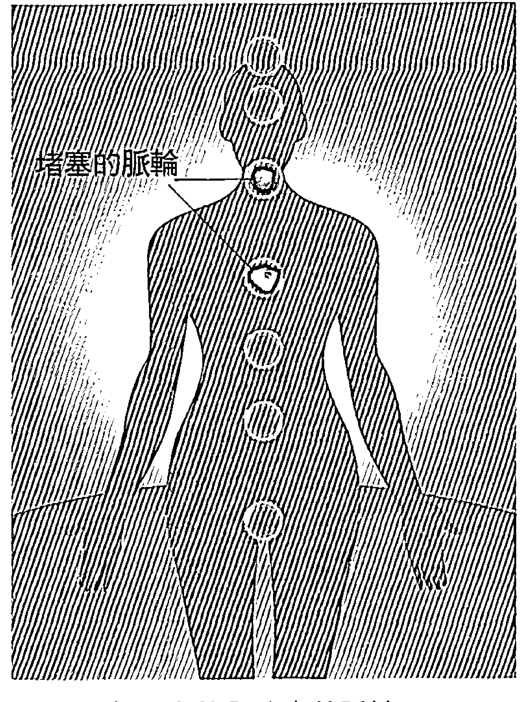

許多年的業力殘留物。以下是把這些能量清出去的方式。

把光從一端照進去，看著它從另一端過濾出來。並不會總是這麼簡單，因為這些老舊殘餘物不想被轉化。

所以你可以採用這個淨化脈輪的方法。想像脈輪圓筒就像一根吸管，它是個很粗的管子，但你可以在腦中將它縮小，如果這樣有幫助的話。

用嘴巴刁住圓筒的一端，非常用力的吹氣進去，看著那團塞住的能量不斷往前移，直到你覺得整個通道都清乾淨了為止，這時乾淨的能量就能自由流動了。

有時候我看見更大的能量，看起來就像煤塊或石頭，非常沉重，一點也不想讓步。如果這樣的狀況，我會拿一根想像的光桿，直接推進脈輪裡。有些時候，這需要非常大的心靈力，但是我會一直用力推到光桿完全穿過去，看見那個煤塊或石頭從另一端飛出去為止。記得要小一點，剛好可以穿進去就好，這樣所有堵塞的能量都會被推出去，不會有殘餘。

一四九頁的圖樣是無限符號，它就像生命的持續之流。我被教導如何將這個套用到身體裡，堵塞的脈輪——光把淤塞的能量推出去。流动，在你清理与平衡脉轮之后就可以使用。

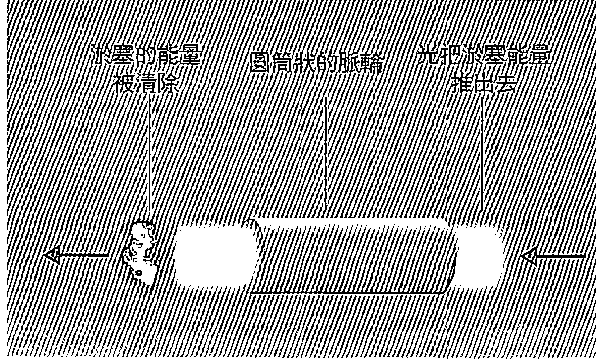

同样的，你可以运用心智，也可能觉得用手辅助它在身上流动会比较容易。先让全息图出现在你的眼前，从头部开始，往外到身体的右边，然后将它带回来，穿过右边臀部，到身体另外一边的外面，持续往下经过脚，画出一个S型。然后继续在另一侧画出同样的形状，制造出一个像8或无限符号的形状。

你必须重复这样做十一次，制造出完美的流动。它就像个人场域中所有生命和事物，都以一个完整全面的能量源在流动。这也包括你正在促进疗愈的那个人。我一开始还有疑问，我对我的指导灵说：「但我们是神圣智慧，我们本来就会全部连接在一起。」它们只是继续告诉我使用这方法，所以我进行了自己的实验。

我找了十二个人，每个人都有一点点需要疗愈的地方，而我的计划是每天使用星愈技术，直到该个案被疗愈为止。其中六个人我使用了无限符号在他们身上，另外六个没有。你可以说是巧合，不过我使用无限符号的那六个人，在一天之内就痊愈了，有的则是两天；而没有使用无限符号的那些人，疗愈的时间都比较长。

所以无论有没有无限符号，星愈技术都很强大，但如果无限符号能让痊愈速度加快，那就用吧。它绝对是有些效果的，而这就是与光合作的完美范例，它不需要合理，它是源自于爱，而不是逻辑，它是知悉与相信的抗衡。放手并允许事情发生，你可能就会冒出一大堆运用光的其他方式。如果有，那就使用它，对你有效就去做。

### ☆ 星星、愛與地球

这个方式对你自己和其他人都很棒。先把其他人或你自己的全息图带出来，看到它在你眼前。进入他们的空间，打开你的心轮，看着光从你的心流出来，从全息图的后方进入他们的心。所以就像是你站在或坐在他们的全息图后面。接着，把地球的光／能量从地上带起来，进入他们的脚，看着它沿着身体往上走，直到它与你心发出来的光连接上。接着，把星星的光带下来。看着它穿透他们的头顶，往下移动，连接到地球和心的能量/光。当这二者结合起来后，把你非常专注的意念加进去，洒上疗愈者与个案的想像（是的，如果你想，可以把个案也带进来），这样就能产生快速的疗愈。和光游玩，和资讯游玩。

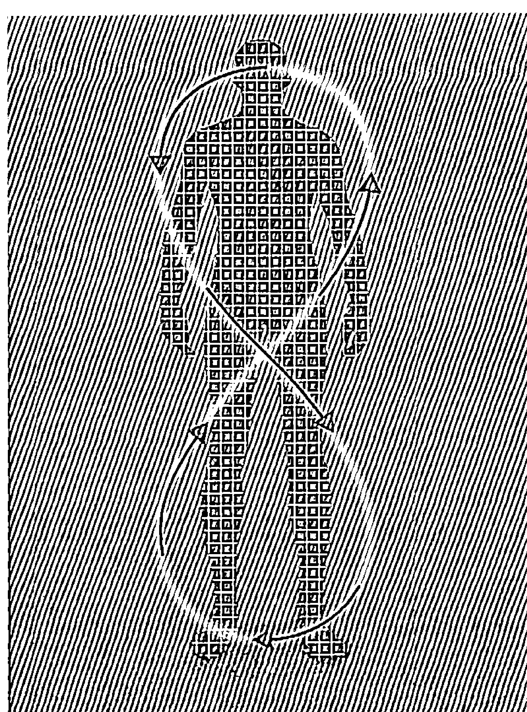

能量以無限符號的形狀流經身體。

有時候，我看見幾何圖樣在光裡流動，生命之花、麥達祖立方體、生命之樹和一些基本形狀，像是正方形、三角形、立方體。要記得，這些形狀包含著資訊，它們很有智慧。其他比較複雜的形狀，像是基督意識網絡也會進到我的空間來，伴隨著此任務的關鍵光代碼，發展出自己的生命。去留意發生了什麼，去觀察，讓光流動，看著魔法發生，調節你的頻率去體驗。

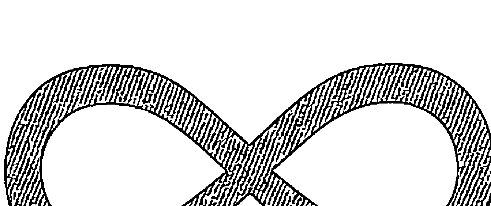

無限符號。

### ☆隨著發展，共同創造

以上所有方式都有效果，也都開放改變，我只是要給你一些概念，讓你知道什麼對我有效。現在，我想要分享的是，當你放開你的心，任其自由流動時，會發生什麼事？對我來說，這就是真正的奇蹟發生時。

有位女士在一次靈性展覽會中來找我，我通常都會在活動中進行十五分鐘的展示。這位女士坐下來，她有一邊肩膀疼痛，脊椎彎曲偏向一邊。她這輩子裡面，和男人的關係都非常受創，難怪她所有的疼痛似乎都在身體的右側。右手邊是男性，左手邊是女性，但如果是大腦的話就正好相反，所以要記得這個。

她坐在椅子上，我被吸引到她的腹部區域，我把一隻手放在她腹部前方的能量場中，另一隻手放在身體右側的能量場中，朝她的肩膀指過去。我看見一道綠色的光從她的脈輪升起，經由她的脊椎往上竄，然後從她的頭部發射出去。它這樣做了三次，而隨著它這麼做，她的脊椎也挺直起來。幾分鐘之後，她忍不住哭了起來。她站起來時，肩膀感覺好多了。不舒服並沒有完全消失，但是已經舒緩了非常多。

隔天，她聯絡我，說她已經可以完全站直了，而且肩膀也完全好了。不過，她說真正有趣又驚人的事情，是她跟生命中某個男人的關係突然完全改變了，就在一夜之間發生的，他的舉止變得不一樣了，一切看起來就像本來應該有的模樣。那些造成她疼痛的，就是跟男人間的某些情緒問題，蘊含在光裡面的資訊改變了這種情緒。一旦情緒被釋放了，肉體的療癒也會跟著產生。

有另一位女士因為胃的問題、偏頭痛、能量低落、皮膚等症狀來找我。她曾經流產，並失去了丈夫，她說過去幾年的生活真的非常艱難。我進入我的療癒區，進入她的空間。我看見她是一個小女孩的模樣，她很快樂，我也可以看到她們自己的關係裡有內在的抗拒，這個「她們」指的是這位女士和她的內在小孩。我會知道這點，是因為我在另一個實相中介紹她們認識，要求她們彼此擁抱，但是她們不肯。我可以看見她們之間有些黑色能量，我不知道那是什麼意思，只知道它不應該在那裡。

於是我完全打開我的心輪，把光照在那個黑暗區域，直到它被光消滅掉。我在這麼做的時候，她們朝彼此靠近，並且開始擁抱。接下來，我看見一隻銀色的魚出現在我手裡，我問我的指導靈這是什麼？他們告訴我把這隻魚放進她的身體裡，所以我照做。這條魚一放入她體內，就轉變為銀色的光，開始在她的體內游來游去，充滿整個身體內部。幾秒鐘後，一隻獨角獸從我的胸口穿出來，俯衝過去，她們則飄到獨角獸的背上。接著獨角獸帶著她們穿越空間，前往埃及的意識療癒之池（稍後會提到這些），將她們放下。一個生物接過來，把她們從獨角獸背上帶下來，再把她們放入療癒池中。她們擁抱並在能量中遊玩，直到過了一陣子，這位女士躺回自己的床上，而她的內在小孩完全沒進入她的身體，她們已經合為一體。從最深的層面，完全連結在一起了。不到幾天，這位女士就感覺好非常多，我們在兩週後又做了一次療癒，自那之後，她就沒有任何病症了。在實體世界中，移除看不見的黑色能量、一條銀色的魚、神秘的獨角獸、埃及生物，還有想像的療癒池，怎麼可能創造出如此強大的療癒呢？我認識一位男士，他跟我說他必須接受膝蓋手術，如果不動手術，沒有其他辦法可以讓他恢復正常走路。這聽起來可能有點瘋狂（也不是說獨角獸和銀色的魚就不瘋狂），但這個方法非常簡單，且創造了奇蹟。這位男士五十幾歲，是一位非常熱愛網球的選手，但已經超過一年沒有了。他在等待膝蓋手術，但又覺得應該還有其他選擇。我在看他的全息圖時，「閃電」波特（牙買加短跑運動員）出現在我的空間裡。我立刻想到，如果這個人有閃電波特的腳，他的網球就能打得比從前好了。於是我移除一隻腳，把閃電波特版本的左腳裝給他。接著我又想到，這個人已經五十三歲了，如果他有兩隻新的、更年輕健康的雙腿，那就太棒了。所以我把他的右腳也移除，然後把閃電波特的另一隻腳也裝給他。我看見他奔跑、打網球，就像他以前在巔峰時期的模樣。療程結束後，他跟我說他覺得舒服，當天下午他就開始打網球了。不過讓我覺得不可思議的其實是這個——隔了一週後，他聯絡我並說：「傑瑞，你知道嗎，很奇怪，我的左腳也感覺好多了。我沒有跟你說過，我的左腳一直有些討厭的小問題，但因為它還能正常運作，我就沒提。可是現在它感覺像另一隻腳一樣好了。所以你知道了，就任你的想像流動，它不需要合理。進入那個區域，順著出現在你眼前的任何事物去做，流動並共同創造另一種實相，將兩者量子糾纏在一起。

## 第十八章 水晶是能量產生器

水晶本身就是神聖的生命，它們內部蘊藏著智慧，你可以跟水晶溝通，就像你可以跟你的宇宙溝通一樣，畢竟水晶是宇宙中的一部分，你也可以用差不多的方法跟樹溝通。問一個問題，心裡不要有任何預設，然後看或感覺宇宙資料庫會給你什麼。它可能是一種感覺、一個知曉，經常也會聽到一個輕柔的聲音，告訴你答案。你所要做的就只有信任，因為有時候答案不見得合邏輯，或者那可能不是你在期待或想要聽到的。

我在療癒中會使用水晶，不是每次，但有時會用。我會用它們排出陣列或幾何結構，在我的療癒空間裡。我這麼做的時候，它會創造出一股能量旋風，在我所處的房間裡。你不需要使用水晶，但是體驗一下也很有趣。它會創造出不同的動力。我在埃及的古老神祕學院中學到如何排有效的水晶陣，這些陣一定要有一個中心點，讓能量流進去，水晶的排列法也必須經過設計，才能讓宇宙的能量／光通過外圍的水晶層而被帶進來，它就是個能量產生器。

要駕馭這種能量需要一些練習，當你可以做到時，水晶會提升你空間的能量十倍。使用任何水晶晶陣並不是必須的，不過，我強烈建議你等待你的第三眼運作得很好時，就可以看見從水晶流出來的波形光能量，看出每個水晶有什麼功能。到時你也可以跟水晶溝通，充分發揮它們的表現和效果。這需要練習，也需要開放的心，以及放手、像個孩子般遊玩的意願。

### ☆ 如何使用水晶晶陣？

我會在療程中站起來，然後又會回到坐姿。通常都是坐著。在研習班或工作坊時，我都是站著，但是遠距療癒近九十％以上我都坐著，有時我會把水晶晶陣擺在我面前的地上，然後我會挺直身子坐在我的療癒椅上。遠距療癒時，個案會待在他們自己的空間裡，而我會多重定位（同時存在兩個或更多地方）在他們的空間裡。到他們那邊後，我就會知道該做什麼。在療程開始時，我帶出個案的全息圖之前，我都會知道療癒要怎麼進行。這都是直覺性的，要根據全息圖告訴我的事情。我可能會在他們的空間裡進行，或者帶回來到我的空間裡，從我所處的地方開始進行。

根據必須做的事而定，兩者都一樣有效。在足球比賽開始前，你不會知道場上的每個人將怎麼移動、球在每個瞬間會出現在什麼位置，你只能流動、反應、隨著比賽進展而移動。星癒技術的療癒或資訊交換也是如此。

而當地面上有幾何水晶陣的時候，會發生的事情是這樣的。我會多重定位到他們的空間裡，到那邊後，我把他們的身體舉起來，不是用手，而是用我的心。我會讓他們的身體浮到空中，我就把他們的身體帶回到我的空間裡。回到我的空間後，他們的身體會浮在幾何水晶陣的上方，地面上的水晶會固定到全息圖中，開始發揮作用，輔助療程進行。

個案通常會跟我說，他們覺得身體在漂浮，或是雙腳昇起到空中，以及覺得自己身處在別的地方。有些人會描述水晶的排列方式、周遭環境，也有些人會說「我可以看到你低頭看著我」，就類似我朋友在英國的醫院病房裡看到我，非常清晰，但我實際上是在紐西蘭。記得，時間和距離都是幻象，你越常運用星癒技術，你就會經由看到或感覺到而確實明白這一點。

因此，當我在促進療癒時，我可以看見水晶在做什麼，水晶會處理全息圖，就跟我的方式一樣。會有許多道光從水晶裡流出來，進到全息圖中，改變與調整能量和光的流動，進而達到療癒。我會跟水晶同時在全息圖上工作。當你運用星癒技術的時間夠久，就可以協調整體療程，不需要再做什麼事。我可以坐在那裡用我的心去觀察一切。我可以用心靈把光／能量帶進來，然後就坐在那放輕鬆，彷彿我是管弦樂團中有人引導的樂器。光／能量是交響樂，我是樂器，神是作曲家。這需要練習，這些技巧／方式是最有效能也最有效率的，因為你完全放手，不再用自己的方式進行（而這就是高階方法）。你必須先熟練基礎的方法，在此我想再次強調基礎、中階和高階的重點。高階的技巧或方法，使用上並不會比基礎更困難，你必須使用基礎方法去激發想像，你會看見與體驗到它們的效果，接著你就會放手一點點，讓自己成為器皿或管道，讓意識經由你去發揮效用。你會完全整合起來，成為靈魂的技術，你會讓更高次元的存有去演奏鋼琴或笛子（也就是你），從光的代碼中創造出交響樂，而這樣就會顯化在肉體實相上，成為我們稱之為能量療癒的東西。坦白說，我不確定到底有沒有能量療癒這種東西。回到水晶幾何結構，我會讓個案和我一起待在房間裡，直到水晶覺得我應該要帶他們回去了。時間可能是一或兩分鐘，有時候是十或十五分鐘，我就讓光去支配療癒的過程。當療癒差不多要結束時也是如此，個案的身體會讓我知道何時差不多了。我的雙手會更加冰冷，我會彈出（這是最好的描述方式了）我調整過的意識狀態，然後我就知道差不多該結束了。我彷彿從神的狀態中彈出來，回到房間裡。如果個案付費訂了某段時間，而他需要更多一點調整的話，我通常都會超時。再說一次，我跟著光流動，能量／光總是很確實，也許未必準時，但很確實運作。

時間和金錢無法終止療程，這兩者都是幻象，不是有本質的。如果你以前從未用過水晶，我建議你去買一、兩個。到水晶店買最吸引你的那幾個，握著它們、感覺它們、聆聽它們，看看你能收到什麼訊息。你也可以買透明石英水晶的靈擺，將它拿在手中，讓光穿透它來淨化它。你擁有這些水晶後，每次使用前都應該要淨化它們，每隔一段時間也要淨化。將它們放在陽光或月光下，偶爾用水清洗它們。你甚至可以用自己身體發出來的光照射你的水晶，清潔它們。

買了水晶靈擺之後，告訴它你想要它回答一些問題，你希望它如果答案是「是」就往右轉，「否」就往左轉。你可以拿著靈擺讓水晶向下垂，確定它靜止之後，再開始問問題。先從一些簡單的問題開始，像「我的頭髮是棕色嗎？」問一些你已經知道答案的問題，這樣你就能確定水晶有給你正確的資訊。接著，你就可以開始問一些你也不知道答案的問題。水晶會告訴你，你的任務就是信任。水晶和靈性世界、知識與智慧是和諧一致的，去認識它，看它會帶領你去哪裡。埃及人經常在療癒時使用水晶，接下來當我們要討論意識之池時，你就會明白了。

## 第十九章 療癒中出現的幾何圖形

當我開始處理個案的症狀及進入療癒區時，我經常會看到幾何圖樣，像是生命之花、生命之樹、梅爾卡巴、麥達昶立方體、生命種子、金字塔，還有一些比較簡單的形狀，像是三角形、正方形、八角型等。在某些療癒中，我也會使用完整的基督意識網絡。從來沒有事先計畫，我就是順著流走。

當我看到這些形狀時，我就會知道該拿它們來做什麼。我會把它們放在個案身體的特定部位中，然後看著它們移動、扭曲、旋轉，自己自由的活動。邏輯上，我從來不知道它們在做什麼，但是它們似乎在進行療癒，這才是重點。

隨著你閱讀這些內容時，它們已經注入了我的意識，你就是在下載我所知道與看到的一切，所以當它出現在你的療癒中時，就順著它發展。不要想說：「噢，那個三角形在我的右肩上方旋轉做什麼？它不該在那裡的。」而是要帶著好奇心，問自己比較好的問題，像是「我要如何運用這個三角形，立即在這個人身上創造療癒？」或是「現在我要把這個三角形、正方形或梅爾卡巴放在哪裡，才能創造出最超凡的奇蹟？」

一旦你感覺或看到某些東西，請保持好奇，問自己能帶來力量的問題，而不是做出消除力量的評論，像是「那個不該在那裡」，因為那就會發生，如果你那麼做了，你就會創造出沒有那個三角形的實相，然後你將永遠不知道宇宙試著跟你共同創造什麼樣的魔法。

有時我會看到個案的身體是幾何形狀的形式。舉例來說，我有個個案有椎間盤突出，我不知道那是椎間盤突出，她口頭上告訴我她有椎間盤突出，但我沒有證據證明確實如此，我只是接受她的說法。當我檢視她的背時，我看到的狀況是：她脊椎的位置是一連串八角型，在靠近底部的地方（我不會告訴你那個椎間盤的確切名稱，因為我不知道）有一個八角型歪掉，跟其他的不一致。我決定把那個移回隊伍裡，跟其他的一致。療程結束後，我跟那位女士談話，她告訴我她可以像二十歲的女生一樣活動，但她是六幾歲。記住，想像就是真實。

## 第二十章 自製強能量工具

有一天，我想要實驗水晶和幾何圖樣，所以就買了一塊內部非完全透明的水晶金字塔。我聯繫一個朋友，詢問他是否可以幫我製作一個療癒工具或裝置。有強烈的感覺引導我製作這個，但是我需要專業的手工製作者，我的朋友大衛正是這樣的人才。他擅於運用各種寶石和幾何圖樣親手製作效果強大的飾品，所以我知道他能完全理解我想做出的東西。

當我把金字塔交給大衛時，我們用各種金屬和特定幾何形狀，謹慎的規畫出想要的成果。我們使用的東西如下：

- 帶電的白金膠囊一個
- 9K金三角型一個
- 銀螺旋線圈三個
- 一面是麥達昶立方體，另一面有許多梅爾卡巴的平盤一片
- 生命之花圖樣的平盤一片

我們也使用大衛特殊的技術，印出天然植物的頻率，像是瑪卡、蘆薈和枸杞。將這些加工處理到特殊的石英粉中，注入金字塔，使其與大自然的和諧程度更高。

我記得收到成品包裹的那天，我正要和家人出去。我們都在車上，在路上行駛時，我開始拆包裹。它的能量強到非常驚人，我可以感覺到它猛撲而來，我太太和孩子們開始想吐。我必須把它裝回盒子裡封起來，因為能量大到難以招架。

第一天晚上，我把它放在床邊，結果整晚無法入睡，能量太過強烈了。我開始將這個水晶金字塔用於療程中，而它能療癒各種疑難雜症。我有時會受到引導去使用它，我不知道為什麼，就只是順著直覺做，它有自己的生命。

有位有關節炎的女士來找我，我把這個小裝置拿出來，瞄準她的膝蓋，不到十五分鐘，她就從椅子上跳起來了。我可以看見能量波從水晶金字塔裡面流出來，開始產生作用，但這個裝置到底怎麼療癒的，我也不知道……或許是跟我一樣的方式吧，就只是帶著意念待在那裡，把愛倒入那個情境中。

我想看看是否能讓這個裝置的效果更加強大，所以我輸入自己的療癒代碼，然後用我的意念再次設定這個水晶，要它在碰到它覺得合適的狀況時，就使用這些代碼。要記得，水晶就是智慧，它知道該做什麼。在我用療癒代碼重新設定這個水晶後，它療癒的能力就更加強大了。

我建議你用幾何圖樣和水晶去玩、去實驗，看看你可以共同創造出什麼。跟隨你的內在引導，你會很驚訝自己能顯化出的事物。

## 第二十二章 深入細胞層次

當我在療癒其他人的全息圖時，對我而言，這還是相當合乎邏輯的，而且說到星癒技術，它絕對有其意義，也總是會有效果，因為視覺化的想像能發揮作用，效果的確非常好。視覺化在星癒技術的記憶曲線中，是一個必要的部分。

當你與星癒技術共同工作時，光／能量有能力深入到細胞層面，這讓我可以釋放個案堵塞的情緒、障礙或創傷，這些東西可能已經存在幾個世紀、存在基因之中，從他們的家族祖先一路遺傳下來。這其實很不可思議，人類現在有這種能力，或者應該說意識到有這種能力（因為我們其實一直都有，只是忘記了）去打破循環，打破造成我們在這個世界上各種心理和生理痛苦的情緒連結，只要使用星癒技術。它將會改變你的世界，以及所有人的世界。星癒技術將會改變我們的世界。

你在運用「想像」促進療癒時，它有時候依然只是移除症狀而已，但它比任何醫學治療好上百分之一千倍；然而，如果想要根治，我們必須想起如何進入更深層面。我即將要分享的方法是屬於比較高階的，而它需要許多意志力和心靈力量。我不建議你馬上運用這個方法，請先去全息圖練習所有的想像方法，熟練那些方法、用它們玩玩看，要很擅長看見特定的全息圖、幾何形狀，並探索你的內在世界，然後你就可以開始深入，你會自然的更加深入。

這個想像需要將人的身體分開來，釋放出最深層的恐懼和情緒，以及那些沒有人想面對的情緒。首先，這種療癒對個案可能會有些創傷，療程結束後會產生一些排毒反應（有些人稱之為「療癒危機」，但是我不喜歡使用這個詞彙），就是這些陳年的阻礙浮到表面，接受療癒的對象要去觀察與面對。會有一些非常劇烈的情緒起伏，持續幾天、幾週，有時甚至到幾個月。

不過，這只是個過程，它會過去，所有事物都會過去。有些人可能不會經歷到這一切，老舊的東西就立刻轉化了。如果是這樣，很棒。但如果你你促進療癒的對象必須經歷這種排毒過程，在我的經驗裡，請拒絕他們，這麼做是有充分理由的。

你可以跟他們聊聊，給他們支持，但是他們必須自己處理這些情緒。這就像待在蛹裡面的毛毛蟲一樣，如果你太早把蛹剝開（科學家做過這種事），這隻蝴蝶就不能飛了，因為牠還不夠強壯。待在黑暗中，靜靜的觀察我們的情緒，能夠幫助我們成長，我們會變得更加強壯。所以讓你的個案真真切切的去經歷這段過程，你提供給他們的是一份美好的禮物、一份經過偽裝的祝福。

那麼，要開始時，我會帶出這個人的全息圖，但在這個瞬間，我會把全息圖看做個案真正的身體。換句話說，我是在視覺化他們的身體，我一向都是從腳開始，把我的雙手放在他們的腳底。要做這個療癒，你必須直接進入場域中非常深入的地方。當我把意念放在深入、一路深入，進入到細胞裡去改變基因的狀態時，我會看見身體裡面充滿黑色的能量。有些地方會比其他部位更濃稠，我會盡其所能的解釋讓你們了解。

當你進到如此深入的地方，可以駕馭這個方法時，你會看見身體大部分地方都是黑的，這是因為身為人，我們已經歷數千年的事物，心理的、生理的、情緒的和靈性的，這些都儲存在我們的細胞裡。有時候你看見一些很可怕的遺跡，而這個療程需要純粹的強韌心靈，才能一直看到最底端。等一下我會分享一個與此相關的故事，特別要詳述的是，移除累世祖先的悲痛和人遭遇的處境，是多麼困難的事情。

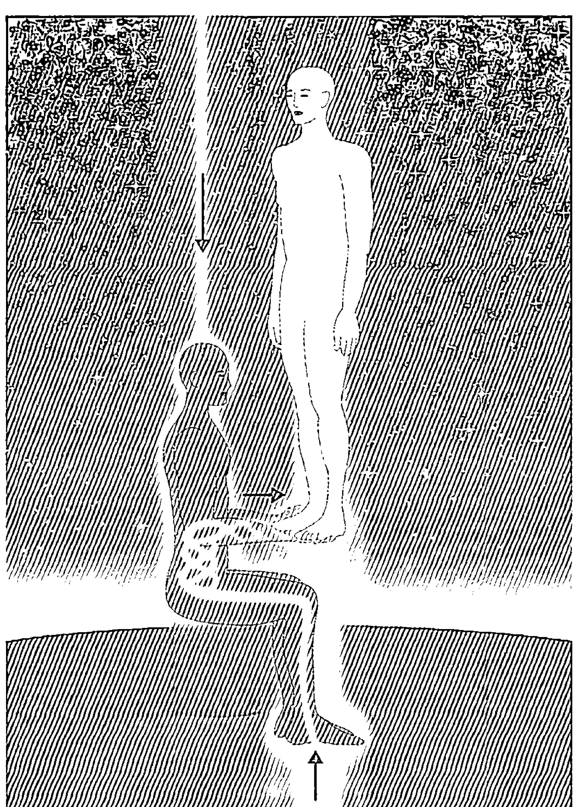

上方的能量從療癒者的頂輪進入，下方的能量從腳進入，皆通過療癒者的身體進入個案的身體。

把你的雙手放在個案的腳底，從地球內部帶來紫色或紫羅蘭色的光，通過你自己的雙腳進入身體。看著它從你的雙腳流上來，進入你的肚子。把白光從星星那帶下來，通過你的頂輪，讓它與大地母親的紫羅蘭光相會，就在你身體的中心，看著一股漩渦不斷成長。

現在，非常重要的一點是，當你在做這種類型的療癒時，你的意識要維持這兩道光持續流動，不可以讓光流停止，你會需要這股強大的光流持續移動。在每次療程中，你都應該要運用宇宙的光，而不是你自己的能量，但是這種特殊的療癒，需要更加勤奮的注意。記住，使用星癒技術的時候，我們是和光一起工作，不是在傳輸能量，所以你絕對不該因這個工作而耗盡精力。如果你有這種狀況，那麼就需要檢查一下，你確實是和通過光之傳輸網絡來的光流一起工作。

漩渦出現之後，在你的身體裡成長，而光擴展到你身體的所有部位，流到你的手臂，從手掌流出去，進入個案的腳底。這個光也會從你的腳流進個案的腳，從你的膝蓋和身體其他部位流出。一旦你的第三眼視力開啟後，你就會看到了。我提供這個方法做為墊腳石，讓你迎向稍後等著你的內容。

## 第二十二章 分體清理觀想法

接著，你需要做的事情是觀想個案的身體從膝蓋上方開始為分界線，將上下分開來。膝蓋帶著非常多的情緒，腳和小腿也是，你要做的就是把淤積的黑色能量排出去，從腳底開始，往上走到膝蓋上方，然後進入乙太，看著它被轉化為純潔的白光。

如果膝蓋以上的部分沒有拿掉的話，要移除能量會比較困難，單純是因為二次元的實相。為什麼要讓事情變困難呢？一旦你完全擁抱星癒技術的力量，分開身體這個步驟就不需要了。不過目前請相信我，採取這些步驟吧。

把這個部位清理完後，你就可以把身體其餘部位拿到它上方，重新接回來。這麼做的時候，你會需要封住剛剛療癒過的部位，這樣身體其他部位的老舊淤塞能量就不會再流回去。用白光完成這個步驟。你把腳到整個膝蓋的部分都清理完後，就可以療癒從大腿底部到肚臍下方的部分，重複一樣的步驟，就可以。把肚臍以下當作分界線，將以上的身體移除，放到一旁去，允許光流通過身體和雙手，往上進，入腳掌，然後進到雙腿。光流經腳下半部的過程會很順暢，因為你已經清理過，而且保持它的乾淨了。然後，你會看見光往上流，把淤塞的能量從雙腿、髖部、臀部、下腹部推上去，往外進入乙太，轉變成純潔的白光，能量就是會這樣做。紫羅蘭色的療癒之光接著升起，充滿這個部位。之後你就可以把身體的其他部分接回去，跟先前一樣封住它。接下來，你會需要移除手臂和頭，並且重複剛才的步驟。所以這次你是要療癒／淨化身體的上半部，淤塞的能量會從本來接著手臂的那兩個洞，以及脖子的地方流出去。記住，你依然還是從腳開始，這是非常關鍵的，隨著你每次移除下一層的淤積能量，整個身體就是一次又一次的清理。接著你再把身體接回去，封住它，這樣身體的上半部就能保持乾淨。

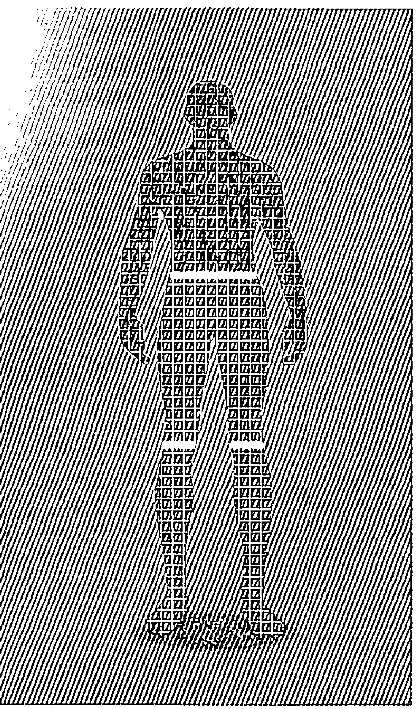

將身體放回去，跟肚臍以下潔淨的能量接在一起，用白光封住，如圖示。

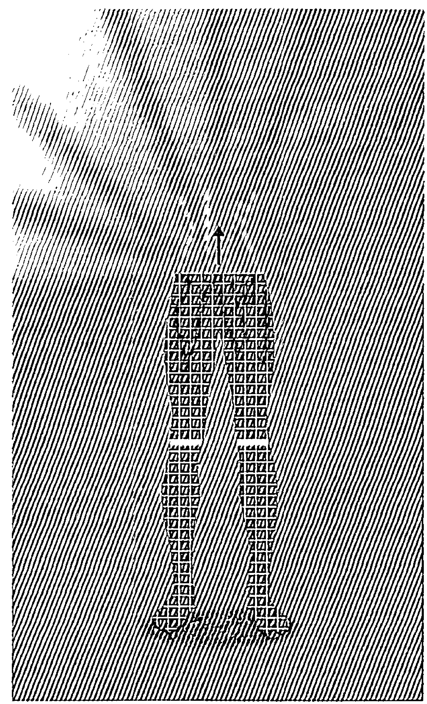

療癒前的軀幹下半部，有淤塞能量在膝蓋與肚臍之間。

下一步，你要移除雙手手掌，重複先前的步驟，我都是從手腕處分開。同樣的，從腳底開始，重複先前的步驟。等到手臂乾淨之後，再把手掌接回去。

下一步，你要在手掌中心製造一個洞，能量會自然的流入手指和手的其他部分，把所有殘餘的淤塞能量從手掌的洞推出去。維持光流，持續從腳底流入，直到雙手完全潔淨為止。

同樣的，確定那些流出去的淤塞能量轉變為燦爛的白光。

最後一個部分是頭，這裡總是很有趣。頭部經常塞著非常多停滯污濁的能量，你會需要把頭的頂部拿掉，持續讓光從腳底流上去。當光到達頭部時，它會自然的在頭內部順時鐘旋轉，然後從頭的頂部傳送出去。等到頭部（和整個身體）都乾淨之後，一道光線會以強大的力量，從這位個案的頭部發射出去。

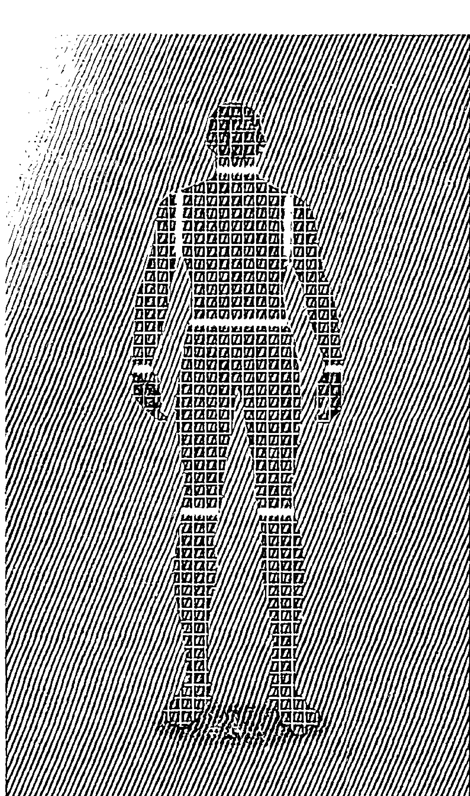

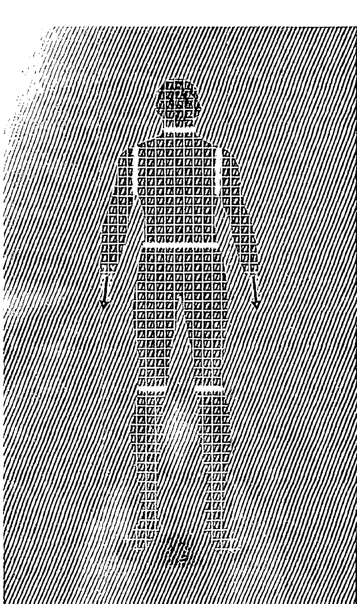

將身體接回去，手臂現在也乾淨了。

移除雙手掌，淤塞的能量從手臂流出去。

重點是，你要保持從地球來的、從星星來的，以及通過你身體的光流，一直強勁的流動著，流入你療癒的那個人體內，從他們頭部頂端出去，進入乙太之中，整趟至少三分鐘。

這整個過程約五分鐘到二十五分鐘不等，完全根據你的心靈力量與移除淤積能量的能力。我看過有些身體裡有密集的淤塞或污濁的能量，這就要花更多力氣，心靈的力氣。有的時候，抗拒的力量會大到讓人難以招架，所以你必須保持強勁。我在工作坊裡做這個練習時，參與者通常都會大哭起來，因為非常濃烈的情緒能量離開時，是很震撼且難以承受的。

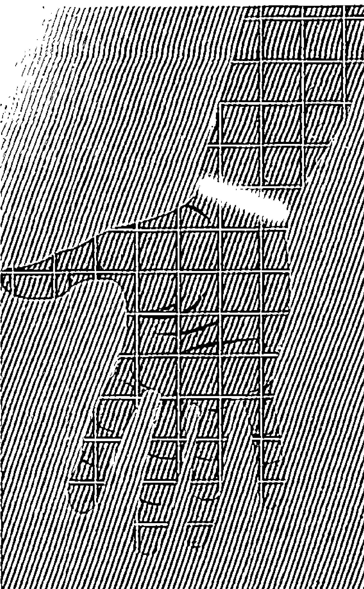

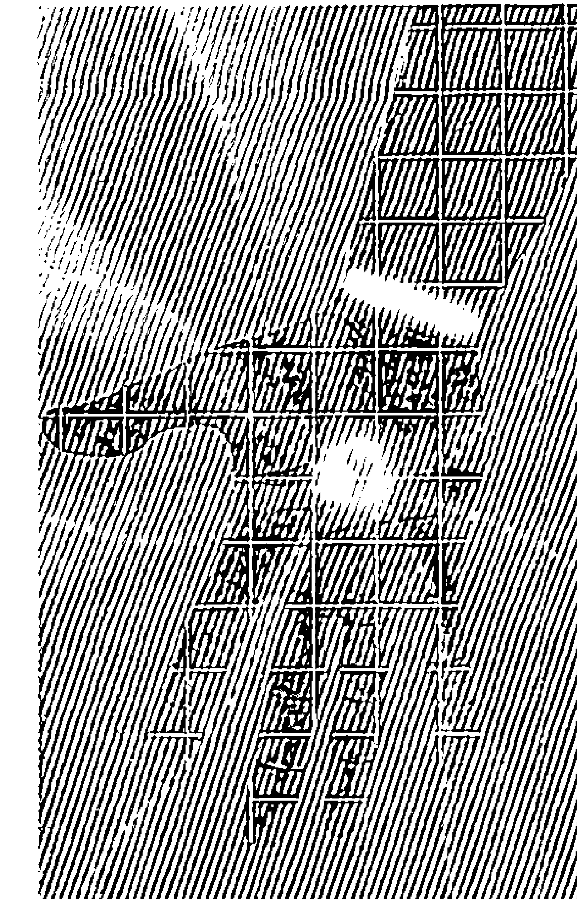

發生這種狀況時，只要接受它、順著它就好。

再說一次，這是排毒反應的一部分。有時候轉變會即刻產生，沒有情緒的劇烈起伏，不過我大部分的個案都有淨化反應（嘔吐或腹瀉），如果你曾經服用死藤水，你就會知道這種程度的淨化是什麼感覺。

以下是個案接受這種程度的療程過後，傳給我的訊息。

親愛的傑瑞：

這些年來我做過很多強大的療程，每次隔天都讓我覺得徹底被「洗滌乾淨」，簡直沒辦法起床，有時候也會嚴重腹瀉。但從來沒有體驗過像今晚這樣的「淨化」。我開始不斷的流眼淚和流鼻水，也開始覺得噁心，我知道是時候衝到廁所去，因為我已經要吐了。這是我吐最多的一次，它就這樣一直持續不斷。我知道這是療程之後的直接反應，因為現在我已經完全沒事了。
我從一九八四年後就沒再嘔吐過，覺得你改變了某些東西，在非常深層久遠的層面中，雖然在情緒方面它對我沒什麼副作用，沒有突然湧現或痛苦的記憶浮出來，而且我知道如果有需要，就可以跟你聯絡，這讓我非常安心。謝謝你在那裡。
愛與感激
克里斯

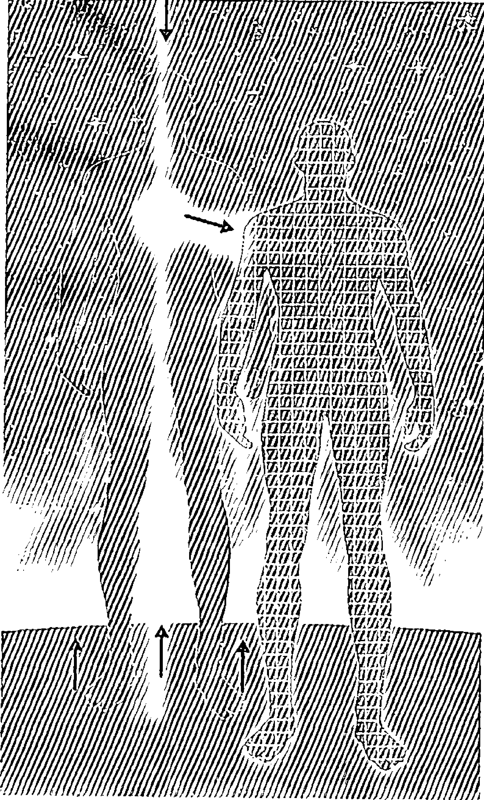

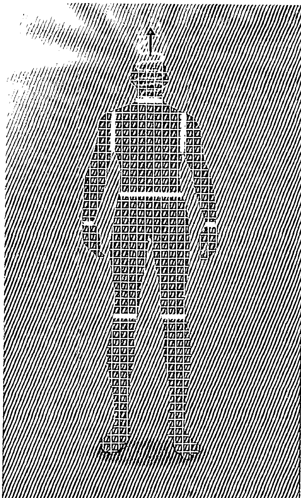

從星星和地球來的光流，經過療癒者的身體，從個案身體出去，進入乙太中。

移除頭頂，讓淤塞的能量流出去。

我要再次強調，這個方式需要練習，你可能沒辦法一開始就看見深層的能量，必須要看穿好幾層表層的毒素，才有辦法抵達核心。你可以做到的，只是需要對自己更有耐心一點。進入、信任、愛與允許。

## 第二十三章 清理用的金字塔

這個方法也是高階方法，埃及人經常使用，在古老神秘學院時，他們花了很多時間教我這個「方法」。我不會完全深入這部分，因為光這主題可能就需要寫一本書，我之後會寫，不過現在我會給你一些實際的東西，讓你可以著手去做。當你在淨化這種高強度的老舊淤塞能量時，有的時候會面臨一些嚴重抗拒。我覺得很有趣，因為我熱愛挑戰，不過你可以使用淨化金字塔，讓你的人生簡單一點。這些金字塔會替你工作，它們是自己運作的，當你用意念讓它們動起來之後，它們就離開你的意念自己行動了。

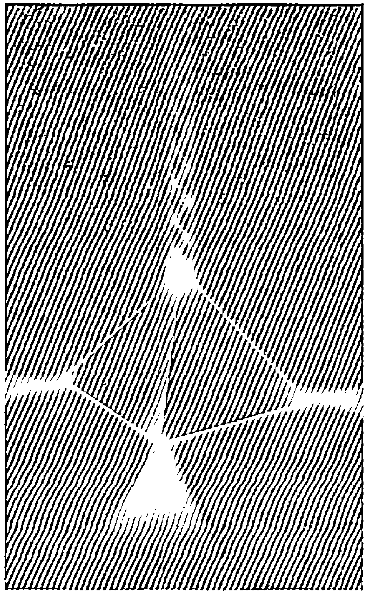

金字塔的每一個尖角都有光散射出來。

你會需要把雙手放在個案的膝蓋上，你也會看見並感覺到金字塔甦醒過來，或是從你的身體裡生出來。它們是靠著你的意念甦醒，就在你的胸膛裡，它們會往下流經你的手臂，從手掌流出去，進入你在療癒的個案身體裡。

進入個案的身體之後，金字塔就會動起來，在身體裡到處流竄，擊破所有需要被清理掉的淤塞能量。它們會跑到身體的每個部位（帶著從每個角發射出去的光），結束之後就會回到個案的膝蓋，通過膝蓋進入你的手中，然後回到你的身體裡。在淨化金字塔工作期間，你必須把雙手一直放在個案的膝蓋上。

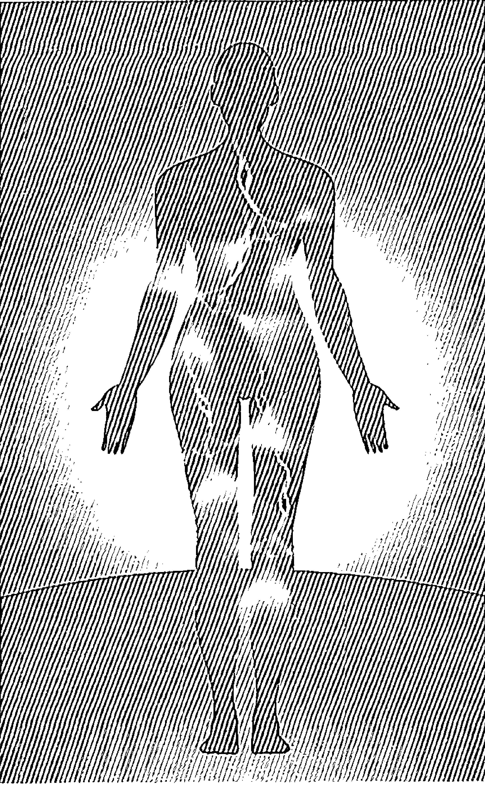

這些淨化金字塔只能從膝蓋進入身體，不要嘗試其他的部位，這樣很危險。你必須非常謹慎對待，這些金字塔很強大，只能使用兩個。你的個案會感覺到它們在身體裡到處竄，也會在心裡看見它發射的白光。相信我，這個方法會讓你得到不可思議的效果。當這些淨化金字塔決定要回到你的手中時，就讓它們回來。它們就像回力鏢一樣，把你的雙手放在膝蓋上，直到它們回來。不要試著強迫它們多做其他事，它們知道那個空間何時已經淨化完畢，能量也已經改變，足夠讓你繼續處理了。就算看起來還有一些可以做的事，也不要強迫它們。它們會替你做足夠的準備，讓你處理剩下的。

# PART 4

## 第二十四章 找回你的個人團隊

你的宇宙是多次元的，如果你想要認真運用星癒技術，成為一個很棒的引導者，那麼你必須了解，你只是星癒技術拼圖中的一小片。當你的旅程走得更深入、更遙遠之後，你做的就越少。我有一個團隊跟我一同工作，我有我的個人團隊，也有我的星癒技術團隊（星際團隊）。而你也可以將擁有你的個人團隊，並接觸到星際團隊。

我的個人團隊是我在自己的旅程中遇到的許多存有，他們就是多次元的我，而如果你想要成為最佳的自己，就去認識其他版本的你，和他們建立關係，在每次療程前都將他們帶回家，這點非常重要。我說「將他們帶回家」的意思是：把他們帶入當下，進到你的空間、身體裡，這樣你就可以結合起來，變得異常強大。

你會在靜心或流經乙太的旅途中，遇到這些光的神聖生物。通常，他們都是在你最意想不到的時刻出現，你也可以運用意念，請求他們現身。靜心是另一個和他們溝通的好方法，你可以找個安靜的地方坐下來，大聲的問出口或在心裡想：「我的指導靈們在哪裡？」或「我想要跟我 的多次元自我連結，請你們前來。」

有許多靈氣療癒師或其他的療癒師來找我，他們對我的能力感到很驚訝，同時也對星癒技術造成他們個案的改變感到不可思議。星癒技術如此強大，是因為我使用了整個宇宙的資源，沒有將自己限制在人類的軀體裡。三股完美融合的能量來源，一定會比單一的能量更強大，也更持久，尤其當我們談論的層面是靈性世界中這些極度強大、超意識的存有時。

我們所有人都會存在於宇宙中的某個時刻，是真正完整沒有分割的，而隨著時間過去，我們讓其他版本的自己踏上了其他的旅程。現在該是帶他們回來、與他們合一的時候了，以下的靜心練習幫助你做到。

閉上眼睛，做幾次深而長的深呼吸，繼續待在你的大腦中。進入你的心，在你的面前，你看見一道門。走進這道門，你看見另一邊有一條小路。沿著這條小路走，經過草坪，你會看見前面是叉路，往右邊那條路走，一直走，直到你看見一個湖，一個金色的湖，湖的外圍，你看見一個大石頭，過去坐在石頭上。坐下來後，就請求你的多次元自我向你現身。

他們可能會以人、動物、天使、精靈的形式出現。跟他們對話，去認識他們，讓他們知道你在未來的療程中，會需要他們的協助，請問他們是否可以幫忙。他們是神聖的愛與存有，會非常樂意協助你，只要你呼喚他們前來，他們就會出現。我看見他們在療癒之前，全都來到我的空間裡，他們並不總是全部都出現，但在你即將處理的療程中，需要的那幾位一定會出現。當我在療癒個案時，他們也都在那裡。

常有人跟我說：『傑瑞，我覺得好像有好幾個人在我的房間裡。原因就在這。』

你在湖邊待一段時間後，就可以沿著原路走回去。回到那道門前，進入你的空間裡。這是個很簡單的靜心，可幫助你發現自己的個人團隊。

你可能需要去好幾次，才能見到所有人，他們並沒有特定的數量，你可能還沒準備好同時跟他們全員一同工作，或許你只會被介紹一到兩位，不過等你準備好時，其餘的都會出現。

如果你第一次靜心時，什麼人也沒有見到，沒有關係，下一次再回來，當時機成熟時，你就會見到他們了。

對的時間、空間、順序，所有一切永遠都是完美的。

有個星癒技術團隊存在，我稱之為星際團隊，他們是最不可思議的生物，而我要向你們介紹其中兩位。你必須準備好放下一切邏輯觀念，才能和這兩位成員合作。我會說出關於他們的事，然後分享個案的一些心得，這些個案在與我配合的療程中，都是心靈夠開放才能看見他們。

有一隻獨角獸，名字叫威士頓（Wisdom，智慧之意），和一個昂宿星人（昂宿星團是金牛星座裡的一個星團，那裡有生命存在）名叫萊安娜。他們就跟你我一樣是多次元的生物，不過在靈性的旅途中到達的程度已超越我們（現在的我們）好幾倍。他們的能力是最頂尖的，他們很善良、誠實、強大，而且完完全全的充滿愛。我是在療癒個案的療程中遇見他們，他們就這樣出現，當時的狀況是我無法在短時間內得到我想要的效果，然後他們就不知道從哪裡冒出來，事情就這樣發生了。我說它就這樣發生了，意思是指那是另外一種知曉。這些生物出現，接下來的療癒就變成不同的方式，當下感覺是對的，所以我就隨著它發展。從頭到尾我都很清楚我可以阻止這些事，但是我沒有，我知道這是神聖的介入，而這是我還在憶起的新／舊事物。

有一位個案，她從童年時期起，便遭受非常嚴重的虐待，一直到她十幾歲，這些事件在她生命中留下許多創傷和折磨。我在促進療癒時，可以看見她體內淤塞的能量，那些能量的厚重程度就如同石頭一樣硬的瀝青，或是水泥，但不像水泥一樣灰，而是跟瀝青一樣黑。我當時正在移動這些淤塞的能量，從她的體內排出，但它就是不停的回來；我清理完一層，下一層就會出現，彷彿沒有盡頭。我記得我心裡想：『要是有誰來幫忙個忙就好了。』然後我就看見某個身影，像是留著金色長髮的女士。我一開始沒有太過留意，不過接下來我繼續療癒時，她就直接進入我的空間，然後將個案的身體拿到一個手術台上，位在一個由光科技創造的空間裡。接下來發生的事情，我會盡我所能的描述出來。她放了一個像是氧氣面罩的東西來蓋住個案的嘴巴，但那不是氧氣面罩，比較像是吸塵器或真空裝置。我那時身處於一個非常未來化的環境，像一個太空艙。她打開那台機器，就開始把那些黑得跟瀝青一樣的能量從個案的身體裡吸出去。非常大量的黑色能量被吸出來，進到一個儲存槽裡（這是我能想到最好的描述方式了）。我不確定這過程持續了多久，感覺像是好幾分鐘。她處理完之後，我可以看個案全息圖的改變，能量達到完全的平衡，氣場的流動非常完美，從細胞的層面、個案的身體裡看沒有任何淤塞的能量了，令人難以置信。一瞬間，我們又回到了我們的空間裡，她告訴我她的名字是萊安娜，如果我需要幫忙，她隨時都會在。療程結束後，我跟個案談話時，她這樣說：『傑瑞，發生了什麼事？你看到什麼？真的非常奇怪，感覺好像有東西在我身體裡面，把...』在里面的东西都吸出去，但我知道那是好的，我知道那种感觉是对的，我可以感觉到整个人变轻了。”

在这个疗程之前，克蕾儿的心理一直很绝望，她无法应付自己的人生，她试图自杀，生命处在谷底。这次疗愈后，她仿佛得到了全新的生命，再也没有恐惧、没有创伤，没有有毒情绪或糟糕的感觉。

她简直无法相信自己感觉有多棒，而那些美好的感觉维持下去了，丝毫没有一点消退。

这怎么可能呢？因为一个来自其他空间的生物，带着光的科技前来帮忙，比我们这个世界所知的一切还更先进。一种自然的技术，由爱创造，是灵魂技术中一种超级先进的形式。我从莱安娜身上学到好多，她也在许多次疗程中帮忙我，感觉就像她一直看顾着我，知道我什么时候需要她的协助。当你开始运用星愈技术，整个宇宙都会听从你的召唤。

我还有另一位个案安蒂雅，她遭受了性侵犯。在促进疗愈时，一只独角兽来到我们的空间里。当时个案躺在她家床上，我在我家里的疗愈室中，但我多重定位到她所在的地方，去那里促进疗愈。一开始我把个案带到埃及，在那里，我埃及的兄弟姊妹们处理了她的身体，然后我们回到她的空间里。以下是安蒂雅的话，以及那次疗愈的简短纪录。

“我在一个房间里，这些生物都在我的周围，他们创造出一种光结构，在我的身体周围，那是我见过最美丽的神圣几何了。他们有光杆、水晶，他们戳我的身体，而且他们真的用神性穿透我。

这过程持续了几分钟。就在这个时间点，我遇见了威士顿——星际团队中的第二只独角兽。而阿拉娜（Alana，世上最美好的人之意）是第一只，我们之后再讨论她。

> 「我躺在我的床上，我从来没看过那么多生物出现在我卧室里。这部分的疗愈非常伤痛，但我知它必须如此。我被从床上抛起来，在半空中被接住，然后又被丢回床上。这些生物确实将黑色的能量从我体内撕扯出去，房间里充满了那种能量。我知道这是这些生物将黑色能量从我身体里去除的唯一方法。」

这段文字对某些人来说，可能有点扯，安蒂雅怎么能够从床上被抛起来，在半空中被接住，然后又被丢回床上？而且她在距离我约二百公里远的地方，怎么办到的？这就是星愈技术，这就是你的宇宙的力量。我们并不是在世界上到处游荡的渺小人类，盘旋在无尽的宇宙中，孤孤单单没有其他的生命形式存在——只是大部分人类都只能看到这样的三次元实相而已。

威士顿前来帮忙这次疗愈，自此之后也一直支援着我，其实她帮忙我现在所做的每一次疗愈。当你使用星愈技术时，你可以呼唤莱安娜和威士顿来协助你。就在你要促进疗愈前，拿出这样的意念，呼唤这些魔法的生物，让他们知道，如果他们觉得可以帮助到你，那么你很欢迎他们前来帮忙。当你与莱安娜与威士顿建立关系后，各种可能性都会打开，你的疗愈潜能也将提升。

欢迎来到星愈技术的世界！随着你越来越深入，越来越常使用，我确信星际团队的其余成员也会前去自我介绍。当你越过那些层级，进入新的潜能领域，更深入未知的地域时，他们会在你最没有预期的时刻前来协助你。

## 第二十六章 埃及意识之池

我在书中分享的一些内容可能对某些人来说有点太多了，他们所能达到的极限就是使用基础的方法，如果你们有这种感觉，绝对没有问题。随着你慢慢进步，开始整合星愈技术到你的自我疗愈或促进疗愈的练习中，你就会接受到更多神秘却非常真实的面向了。有些人或许会怀疑并说：「杰瑞，但这全都是你的想象而已。」没错，确实如此，但是不要忘了，你的想象力是非常真实的，而我会反问你的是：「那么你对想象的解释到底是什么？」很多灵感强烈的人对想象都有着类似的观点，毕卡索曾说：「想象就是真实。」爱因斯坦曾说：「逻辑可以带你从A点走到B点，而想象力可以带你到任何地方。」你心里想的是什么，就是活生生的现实。你的心智比圣母峰高、比太平洋深，开始去探索吧。如果我分享的东西只是我的想象，那么其他人怎么可能跟我有一样的体验？如果想象只是一种存在于头脑里的东西，或单纯仅在我的头脑里，那么其他人怎么可能看到一样的东西？而且不只是看见，甚至身处于其中！自从我去过古老神秘学院后，我的世界就敞开了，我被带到金字塔底下的这些疗愈室中，我称为「意识之池」。在金字塔底下，非常深的地方有好几个房间，

在我的团体工作坊中，我以引导静心带大家去浸泡在这些池子里，产生的经验是令人震撼的。当中有个池子里是纯洁的白光，另一个池子里是紫光，当然还有其他的池子，不过这两个是我最常使用。在促进某些人疗愈的过程中，我会多重定位到他们的所在地，将他们的身体「拿」起来，带到埃及的意识之池中。我会把他们的身体放在那些房间里，让他们在能量中流动。一旦他们抵达该处，我看见光开始产生作用，流经他们的身体。我把人带到意识之池这件事情里，我感觉最实在的部分就是人们的全息图。它看起来不像我在做远距疗愈时看到的全息图，反而像真正的肉体，但是比较淡。或许，那是他们的灵魂吧？我在逻辑上比较不能理解的部分是，为什么每次我将个案带到「意识之池」时，全息图都要以这种实在的肉体模样向我呈现，每次都是如此。更有趣的地方是，若我把个案带到那个地方，当中有些个案可以回想起来，而且是非常准确的，就连微小的细节也是。我们抵达那些房间时，会有一群非常古老的生物前来帮助我疗愈，感觉就像我是主治外科医师，带领一个团队来动手术。这些生物会拿着水晶疗愈杆出来，对我的个案进行必要的疗愈。他们使用许多几何符号，用他们的水晶疗愈杆制造出几何图样，然后使用几何把光传送到他们面前的人体内，过程非常快速。以下是一些我曾带到「意识之池」的个案心得。

> > 『我飘出我的身体，我往下看见自己躺在床上，接着我被紫色的能量笼罩，非常漂亮。然后我就昏沉的睡着了，只记得在自己的床上醒来。』——莎拉

> > 『我往上看，看到一群人，很像准备动手术的外科医生，他们全都围在我周围，处理我的身体。』——马克

> > 『我感觉自己在漂流，好像沉到海里，但那感觉是对的，我可以看见纯粹的紫色光包围着我。』——珍

> > 『有一生物用他们的杆子穿过我，感觉非常神圣。我可以看见与感觉到他们，我知道他们正从非常深的层面疗愈着我，真的太美妙了。』——克里斯

> > 『这些年来，我接过一些非常强大的疗愈，我环游世界各地去找不同的疗愈师，现在我已经七十二岁，而从来没有过像这样震撼的体验。我不知道你带我去了哪里，杰瑞，但那栋建筑很古老，而且那里的能量真的非常惊人。』——安德利亚

当人们有这样的体验，有生动鲜明的记忆时，你必须问自己，到底发生了什么事？我问过非常多次，最后都回到这句话：『源于爱，而非逻辑』。逻辑上来说，它根本就不合理。不过其实我们是用另一种方式在看事情，或许逻辑上来说它确实非常合理，或许我们会觉得不合理，是因为我们会被教导什么才是真的或合理的，而什么不是。但若考虑到心和大脑的扩展性和无限容量，以及它们所拥有的能力，若是结合起来去接触灵性世界，或许，只是或许，星愈技术是在开启我们真实的本能。

或许星愈技术是灵魂技术的关键，或许我们一直都是技术，但这件事被保密了。因为如果每个人都知道自己的能力，某些公司要怎么谋取暴利呢？——星愈技术让你可以使用人类大脑其余的九五%。

我把个案带到「意识之池」时，还发生了另外一件事——海豚会出现。两只，一只会贴在胸膛上，一只贴在背上，他们的肚子都向内，从他们的心里闪烁出爱，直接进入个案的身体里。通常这种情绪是无法控制的，因为他们从来没有体会到如此多的爱。海豚的能量非常强大，无法以言语形容。使用意识代码时，疗愈频率十五就是海豚能量。我随时可以召唤海豚频率，不只是在「意识之池」中。

这些「意识之池」确实存在，关于金字塔的下面到底有什么，我可以揭露其中的许多秘密，我花了很多时间在探索它们。遥视和双重定位是我原本就非常有兴趣的事，我会在后面的章节「秘密制作法」中讨论遥视，解释军方是如何使用这技巧，它能解释我所做的大部分事情。

如果你是个疗愈师，你可以带你的个案到那里去促进疗愈；如果你想要疗愈自己，你也可以把自己带到那里去，促进自己的疗愈。下一章我会再解释。

蕴藏在这些埃及疗愈室中的无限可能，非常不可思议。我目睹过奇迹发生，这些奇迹从现在起，将是你生命中的一部分。我也觉得目前我们对这些疗愈池潜能的认识，只不过 是表面程度而已。每一天，随着我的意识转变，流到爱的电磁波的更深处时，星愈技术也一直在这合一的光域中不断扩张。

## 第二十七章 强化自身能力的疗愈观想

### ☆ 镜像法

要成为你所能成为的最佳引导者，你必须移除所有阻碍，光／能量必须能够自由的流动，而许多疗愈师专注于疗愈他人，却忽略了自己。我们全都需要疗愈，而我们全都是疗愈师。在你疗愈他人前，请先疗愈你自己，或者是在没有个案的空档就疗愈自己。当你在促进他人的疗愈时，你也会得到疗愈，这是真的，不过有句话说，要给自己一些完整的关注，你值得如此。

以下这些练习，可以帮助你疗愈自我。

如同你在促进他人的疗愈时，会带出他们的全息图，那么你也可以对自己做一样的事。

首先，我们全都需要疗愈，永远需要，疗愈是不可能太多的，就跟你每天都刷牙、洗澡一样，何不也给自己一些疗愈呢。

你可以想像自己在你面前。就先想像自己的样子，下一步就是想像白光从天上流下来，进入你的头顶。看着白光往下经过你的身体，清理它，随着流动净化你的身体，并随着干净能量流经你时，看着所有暗色能量流出你的身体。

### ☆ 全息图自我疗愈法

试着请求看到你自己的全息图，就跟你要促进他人的疗愈前，带出他们的全息图一样，把自己的全息图带出来，并信任那就是你的全息图。你可能会质疑并说：「这是我的吗？」当你要求看你的全息图，看到的就会是你的全息图。就像我说：「请带出杰瑞．萨吉安特的全息图。」

接着你可以着手改变自己全息图的光，移除能量的堵塞，创造出一个自我疗愈可以产生的环境。你请求让你看见一些你不知道的事，好让你可以疗愈这个不可思议的人类。在此状况中，这个不可思议的人类就是你！你怎么疗愈他人，就那样疗愈自己。

### ☆ 星光能量摄取法

站着或坐着都可以，不过如果能够，就站着做这项练习，我感觉这样更有效。想像一道白光从你的头顶发射出去，直入云霄，一路进到太空里。当那道光进到太空之后，看着许多比较小的光散射出去，去链接太空中各个不同星体。请求与这些星体链接，这是最适合疗愈的方式，也能

> 「请带出杰瑞．萨吉安特的全息图。」

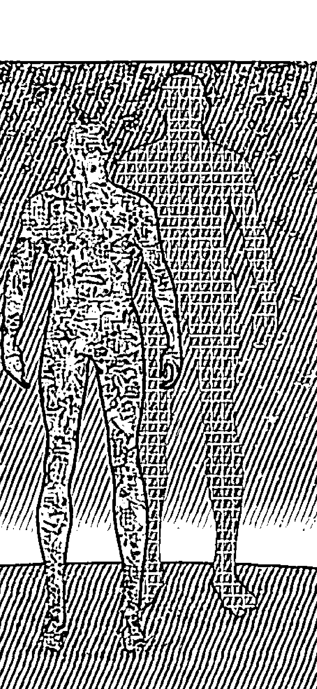

立即让你充满活力。那些光线会自动出发，去与星体链接。

接着你会看到（或感觉到），从星体传来的能量搏动，穿透你的身体。你会感觉到（或看见）星光能量将你充满。停留在这状态，直到你感觉对了为止，你准备好的时候，只要在心里中断这个链接就好了。这项练习非常强大，你这么做的时候，也会下载一些资讯。记得，光就是资讯。不是来自这个世界，却仍是实实在在的资讯。感觉它，并慢慢地整合它。我认为每位医师都应该建议自己的患者每天摄取一些星光。

### ☆ 意识之池的自我疗愈法

我要跟你说一个故事，关于我在「意识之池」疗愈自己的经验。

有一天，我那一整天都感觉好像有很多沉重的能量在我周围，这个世界里没有光的保护力，有时候，黑暗的能量会发射低振动频率，试图让你脱离轨道。我把它们称为阴影寄生物，它们是四次元的存在，以人类的恐惧为食物，并试着透过发射低频率的讯号到你的意识中，来让自己恣意活动。但你必须知道，爱就是解药。要记住，并不是脑中所有想法都是你自己的，所以

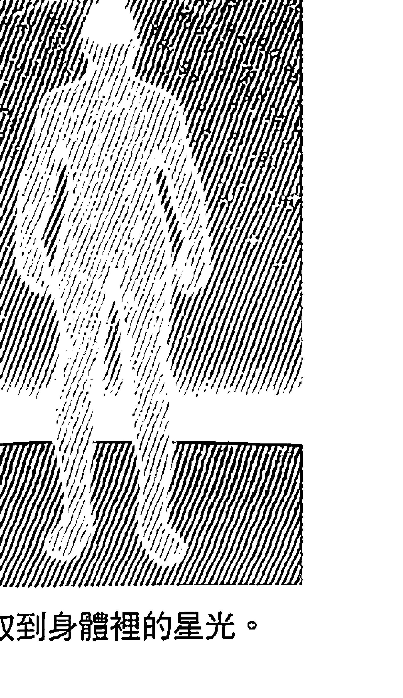

要质疑它们。当你进入自己的内在，进行灵性探询时，这些阴影寄生物通常都会试着影响你。然而，一旦你走入光中的探险旅程够远了，它们就会远离你，就好像它们对你有一定的尊重，然后说：「游戏公平结束，他们真的非常努力，他们现在已经在光里了，我们就离开他们吧。」所以，那天就是那种沉重的感觉，我知道那是怎么回事，所以我觉得我要去埃及一趟。我先看自己出现在眼前，就像我处理个案时一样，然后把自己带到埃及去。我把自己放在「意识之池」的光里，就在金字塔下面的疗愈室中。我看见自己被疗愈，那些生物出来疗愈我，光流经我的身体。我会跟你跟你分享这个故事，是因为接下来发生的事情真的太美妙了。当时我人在在家中的疗愈室里，眼睛闭着，而我太太正好在旅行。而我也真的在旅行，不过她想要跟我说话。我能听见我太太呼唤我的名字，但是我无法动弹，从头到脚完全麻痹了，甚至连睁开眼睛都没办法，好像我在非常遥远的地方，当时我在我的脑中（而看来我的身体也是），我在埃及。我太太知道我应该是在做什么而无法说话，所以她就先离开了。于是我将我的意识带回到埃及去，先把疗程结束，再把我的意识带回到我的房间。但是我回来时，还是没办法移动，我努力睁开眼睛，但是身体其他部位彻底麻痹了（这是我所能形容的唯一方式）。我试着叫我的太太或小孩，不管谁能听见都好，但是我的嘴巴没办法动。那些字眼就在我的心里，可是我无法说话。

于是我放松，去接受我正在经历这样的过程，并去感知我的整个身体。我这才理解我还在埃及被疗愈，而因为刚才我太太叫我时，我的专注力被打断，所以我太早回来了。疗愈依然在继续进行，即便我并没有意识到，也因此我没有办法移动我的肉体，那真的是最古怪的感觉了。我并不觉得紧张，也不慌乱，只觉得非常平静，而且很清楚，我只要继续坐着就好了。我不确定后来经过了多久，我才有办法移动，感觉像是十到二十分钟之间。

逐渐的，我感觉身体活过来了。最先能移动的是我的头，然后慢慢地往下到我的身体，双脚是最后可以移动的部位。很奇怪，当我身体的其他部分都离开麻痹状态时，双脚还是动弹不得，最后它们才回来，而我终于可以再次移动。我就那样坐在椅子上，感觉像在世界的顶端，感觉非常棒，我依然在试图搞清楚这次的经验。

所有事情发生都是有理由的，我觉得我是被赋予这个体验，这样对于在「意识之池」发生的事情，我才能真正珍惜它的重要性，并知道它有多真实。宇宙允许我亲自去体验极为震撼的「星愈技术」疗愈经验。

那是我第一次带自己进入这些「意识之池」，后来我又回去了好几次。我学习到去信任能量、随着能量走。光，以及那些生物同存在这个空间里，在我们钟爱的多重宇宙里，它们知道什么要对你／我们最好，你必须信任并随着它走，放手并感觉，放手并知晓，放手并去爱。个案经常告诉我，他们在疗程中恍惚出神，后来又清醒过来，但是没办法移动，他们也把这种感觉形容为...

### ☆ 左右脑同步流动法

我们有左脑和右脑，男性（左）与女性（右），男性部分是逻辑的，而女性部分是直觉的。这两边的大脑互动顺畅、完全发挥作用，是非常重要的。

当你同时使用左右脑时，你链接、看、感觉、知晓的能力，都会以最超凡的方式提升。透过开启左右脑之间沟通的管道，然后将这部分与活化松果体结合，你的超感知能力就会开始全速前进。接着你所要做的就只有信任。下方的图片是从俯瞰的角度，呈现出左右半脑的模

我强烈建议你先确实练习基础方法，从简单的方式开始，等到你很熟练后，就可以试着把自己带到埃及，沐浴在「意识之池」中。

麻痹。现在我都会跟每个人说可能会有这种情况，因为它似乎越来越常发生，他们都有可能碰到。只要你放手并接受，这其实是种很美妙的经验。

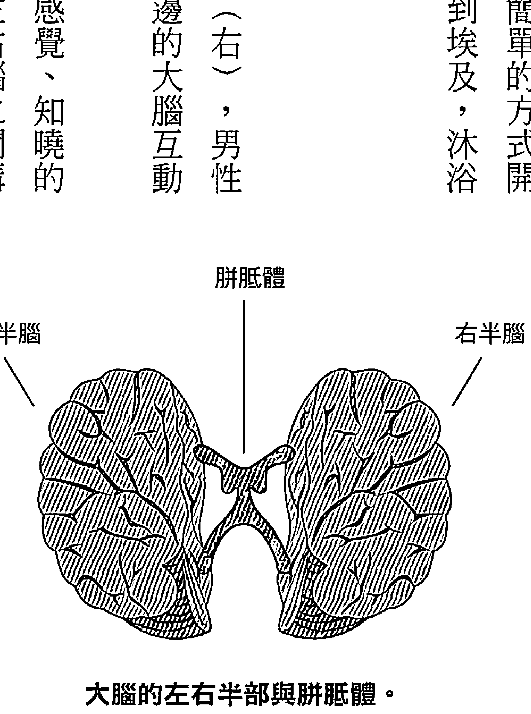

#### 大脑的左右半部与胼胝体。

样。你会看见连接左右脑的胼胝体，这就是关键所在。我希望你想象来自外太空、来自星体的白光，从宇宙间流下来，进入一个上下颠倒的金字塔，它漂浮在你的头上方约二十二公分处。看着光流入金字塔，金字塔以顺时钟方向旋转，它带入越来越多光，渐渐满起来。你准备好的时候，就看着光从这个颠倒金字塔的尖端流出，穿进你的胼胝体。把胼胝体看成一根管子或通道，是最好也最容易完成的方式。当你把它看成是一条通道，就是将两者融合在一起了。如果你之前没有和光一起进行过很多工作，你可能会发现胼胝体似乎是堵塞的。看着光流进这个区域，打通任何有堵塞的部分。看着光左右来回移动，净化这条通道。堵塞物随着强烈的宇宙之光而瓦解，接下来你会开始看到光在左右脑之间自由流动。当这个状况发生，你又有经常练习的话，你会开始看见这个世界是几何图样，边界会消失。这能让你在使用星愈技术时得到更多乐趣，因为你会开始看见所有事物的真实，你会开始使用更多右脑来疗愈，左脑去做一些人类日常的事务。一旦左右脑达到平衡，和谐的运作，你的人生就从此不同了。我其实是把左右脑之间的链接想像成一根管子或通道，这样比较容易看光来回流动。你就想像一条通道，然后运用你的意念，把这条通道跟左右脑之间真正链接融合在一起。

#### ☆ 显示两边大脑功能差异的练习

有个快速练习可以显示两边大脑功能的差异。 把你的意识完全带到左脑——逻辑的部分里，接着经过胼胝体，将它移回右脑。这样做个三次，停留在左脑或右脑的时间是三十秒。做完三次之后，移回左脑，停留在那里。现在，从你的左脑把意识带回你的家，站在大门外，看着它，然后进到屋内，到处走走，你会注意到一切看起来相当正常。 接下来，把你的意识带回到左脑，然后穿过胼胝体，进入右脑——女性直觉的那一边。现在，把你的意识带到你家，你能看到什么？走进屋内，到处看看，花几分钟探索一下。当你准备好时，要把意识带回右脑，进入胼胝体的中央，然后回到你的身体里。你会注意到，当你从右脑看你的家时，很难辨识出自己的家，因为一切都是图样、几何、空间，在这里你可以看见真实。 在我的工作坊里，我带领的静心中有这个练习的较长版本，它非常的强大，现在只是让你快速瞥一眼，让你可以看到和感觉到差异。

## 第二十八章 扩张与成长的疗愈观想

你不是你的身体，你是光，因此进入一种状态，让你得以像光一样运作，与你的人类身体分离是非常重要的，而且越常如此越好。你越常进入调整过的意识状态，你促进自己疗愈的能力就会越快速，也就可以疗愈他人。

进入这种出神的意识状态，就是我说的「掉进」或「降入」，我不太确定为什么我会说它是降入，可能是因为我会把呼吸减缓，以进入这种状态。要将我的光、灵完全带出我的身体外，我会把心跳降下来，降到大概每分钟二十五下。我的灵性旅途中有位杰出的模范，他教我如何透过把光带出我的身体，在其他次元间旅行。

我记得第一次这么做时，心跳立刻就降了下来。我把意念放在往前移动，然后我就这样弹出我的身体，我转过身，看到自己坐在椅子上。同时身处在两个地方却完全清醒，这感觉太美妙了，奇异，但是很美妙。这是我至今都还经常使用的技能。

重要的是，你要想起如何单纯以光的状态存在，离开你这副肉体造成的实体限制。最关键的部分就是，你可以进入纯粹意识、本源能量的状态，并且轻松自在的在空间里移动。以下提

供你一些基础的想像／静心／练习，让你可以用来感受你的光，以它来活动。把这些基本练习当成垫脚石，完整把你的光从身体里带出去，你或许可以自然的进入与身体完全分离的状态，如果没有，完全没关系，要有耐心。

### ☆ 能量觉知

- 深呼吸二到三分鐘，吸氣的時候數五下，停住數三下，呼出也數五下。慢慢的，你的吸氣會到達十五到二十秒，停住十五到二十秒，呼氣也是十五到二十秒。或許會更長。
- 感覺能量在你的雙手裡，把你的意識帶到那裡，然後對腳重複一樣的過程，在你的整個身體移動，感覺能量／光在你身體裡。
- 專注於那個能量／光，將你的意識在整個身體裡上下移動。
- 將你的意識放在整個身體，感覺能量／光在身體裡。一次感覺你的整個光能量體。
- 感覺它，並進入能量中。同時要非常放鬆，繼續深長而緩慢的呼吸，呼吸到你身體的每個細胞裡。
- 繼續這麼做，最後你會開始振動。

### ☆能量擴張

1.  重複前面的步驟①到⑥。
2.  停留在這種感覺到振動的狀態中幾分鐘，隨著你的肉體開始感到麻木，感覺自己更加深入。
3.  將你的意識帶進肚子的中心，看到一道光，一個明亮的光球，比天上最明亮的星星還亮。知道這個光就是你的一部分。
4.  看著這個光擴張，看著它變大，開始在你的整個身體裡移動，隨著它移動，填滿每一個細胞。
5.  等到你的身體從頭到腳完全充滿光時，用你的心智擴張這股能量。看著並感覺它往外移動，跨越了你肉體的界線，看著它擴張，往四面八方擴展。
6.  繼續看著這股能量擴張到比你所處的房間還要大，變得更高、更寬，擴張到超越你所處的建築物或戶外地點。看著並感覺它拓展，超越你的城鎮，並知道這能量就是你。
7.  你可以繼續玩玩看，看你能把自己的能量拓展到多遠。
8.  停留在這個空間裡，多久都沒關係，待到你感覺對了為止。
9.  當你準備好時，就藉由帶入意念，把你的能量收回來。看著並感覺它變得越來越小，直到你回到肚子中心的那個小光球。讓球停留在那裡，繼續閃耀。

### ☆ 鳥瞰視野

1.  重複「能量覺知」的步驟①到⑥。
2.  停留在這種感覺到振動的狀態中幾分鐘，隨著你的肉體開始感到麻木，感覺自己更加深入你的光體。
3.  將你的意識帶進頭部的中心，將意識停留在這裡約一分鐘，你不需要計時，大概就好了，直到你感覺應該進入下個階段。
4.  把你的意識帶到頭頂的頂輪處。將意識停留在這裡大約一分鐘，你不需要計時，大概就好了，直到你感覺應該進入下個階段。
5.  把你的意識帶到身體上方二公尺處。你要能夠往下看，看到自己躺著、坐著或站在原本的地方。但並沒有失去連結，你依然還在你的身體裡，但同時飄浮在空中（同時處在兩個地方）。這次最有可能的狀況是，你依然還在你的身體裡，但同時飄浮在空中（同時處在兩個地方）。當你完全把你的光從身體裡移出去時，你就感覺不到身體了。在這種階段時，你會從身體裡「彈出去」，而且是完全的分離，放輕鬆就好。第一次發生時感覺可能會有點古怪，但要知道你可以使用意念回到身體裡。
6.  等到你準備好時，將你的意識帶回到身體裡。感覺你的雙手、雙腳，動動你的手指和腳趾，把你的意念／意識帶回到肉體裡，完整的感覺它。

## 第二十八章 擴張與成長的療癒觀想

盡量多多練習這些基礎的方式，一旦你越能夠感覺到這種光，並且感覺不到你的身體時，你所進入的療癒促進狀態就能越深入。經過充足的練習後，你將可以在不到一秒的時間內進入這種狀態。不過，這也可能需要一段時間，要有耐心。在我的工作坊中，我們活在這種狀態裡，而這簡直是天堂般的極樂。在真實世界中，很難一天二十四小時、每週七天都維持這樣運作，但它還是不折不扣的極樂。這就是為什麼那麼多人在工作坊中體驗到如此深入的改變，只要處在這種出神、深入的狀態中，奇蹟就會發生。

## 第二十九章 各種靜心技巧

如果你想要發揮靜心的完整力量，你必須學習控制你的大腦。你的大腦是你擁有第二強大的工具（心是最強大的），它可以創造出和諧或徹底的混亂，決定在於你。如果你讓大腦自己為所欲為，小我就會一直將你困在未來和過去的幻象之間，而這些，我的朋友，就是混亂。透過靜心製造出空間，讓你的大腦靜止，你就能創造出一個自然的環境，讓想像力可以蓬勃發展，而清明會接管你的靈魂。

當你活化了這種清明與觀想的感覺，你就會在靜心和擴張練習中，開始發現你培育靈魂技術（也就是星癒技術）的能力進展得更加快速。寂靜會說話，寂靜包含著智慧，寂靜能產生平靜，而平靜正是每一位偉大領導者的特質。一位真正的領導者可以從遠處帶領大眾，而隨著你發展星癒技術能力，你將能駕馭終極星癒技術功能。

那就是什麼也不需要做，就能療癒。從一個徹底靜止與遼闊無聲的地方來促進療癒，無論是一對一，或是對一整個團體。隨著你透過靜心駕馭自己的大腦，就能提升掌握這項技能的機會，我稍後會再詳細討論這部分。

以下是一些你可以使用的基本靜心方式。

1.  舒服的坐或躺著，你甚至可能會想買一張靜心椅。
2.  閉上眼睛，張開也可以，靜心並沒有非如此不可的方式。
3.  不要試著控制呼吸，只要自然呼吸就好。
4.  把注意力放在呼吸，以及每次吸氣與呼氣時的身體變化。隨著呼吸，注意身體的動作，慢慢延長時間。觀察你的胸口、肩膀、胸腔和腹部。不要去控制呼吸，只要集中注意力或覺察就好。如果你的思緒飄走了，只要再把注意力帶回到呼吸上。一開始，維持這個靜心練習二到三分鐘，接著再嘗試。

### ☆ 專注靜心

專注靜心方式是關於集中注意力在一個點，可以透過觀察呼吸、重複一個字／口訣、凝視燭火、聆聽重複的敲缽聲、數算念珠。專注靜心是非常棒的墊腳石，幫助你踏上你的旅途。

在這種形式的靜心中，你只要每次發現思緒在漫遊時，就重新集中意念在你注意的事物上。與其去追趕到處飄的思緒，你只要讓它去就好。在這個過程中，你的集中力會改善，最後你就能超越專注，進入發展完善的覺知中。不要停留在專注，覺知才是道路，專注只是墊腳石。覺知就在專注的後面，它是專注中潛藏的本質，它是所有事物背後的本質。

### ☆ 正念靜心

正念這個詞最近非常流行，它給人一種心念要端正的感覺，而我們真正要的，是空的心念。為了創造出空的心念，正念就是墊腳石。這種靜心方式鼓勵人們，是當種種思緒在心中漫遊時，就去觀察它們。目的不是要介入或批判思緒，而是在每個心念興起時，單純的覺察就好。透過正念靜心，你可以看見你的思緒和感覺會傾向以特定的模式流轉。隨著時間過去，你會變得更能覺察，可以快速判斷這經驗是「好」或「壞」（「愉快」或「不愉快」）。透過練習，內在平衡會建立起來，這些標籤也就會消失。在人生、星癒技術、靜心當中，覺察就是關鍵。

### ☆ 光靜心

這是個非常棒的靜心方法，在我試圖讓內心的嘈雜話語靜止時，幫助我非常多。每天進入靜心時，我會專注在額頭的光，就在兩眉間上去一點的地方，也就是第二眼的位置。閉上眼睛，專注於這個光，呼吸。讓這個光帶你開始旅行，不管那會是哪裡。

### ☆ 呼吸靜心

專注於你的呼吸非常簡單，而且非常有效。跟著自己的呼吸，進出你的身體。每次發現思緒漫遊時，把注意力帶回到呼吸上。深深吸氣到你的肚子裡，然後慢慢的吐氣。

### ☆ 樹靜心

可以到大自然中坐在樹旁，或者更好的方式是：抱著一棵樹，感覺它的光／能量。緩慢呼吸，敞開你的心，在你呼吸與抱它的同時，感覺並看見光從你的心流出來進入樹。透過敞開的心，將你的意識放在心輪處，你的大腦將會靜止。如果大腦開始喋喋不休，說謝謝，然後回到心。

靜心沒有什麼對或錯的方式，找到最適合你的就好。我喜歡在大自然裡、在水邊，但是我也喜歡在非常吵雜的地方靜心。我們必須要能夠在時代廣場或皮卡迪利圓環（倫敦極熱鬧之處）中央靜心。如果你在靜心時聽見聲響，無論是汽車、鳥鳴，還是人說話的聲音，進入那個聲音，用那個聲音更加深入，所有事物都可用來幫助你。

有時候，當有一連串綿延不絕的思緒時，無論是否在靜心中，你都可以非常快速的在這思緒流中創造出一個空檔，只要問自己一個非常簡單的問題：

### ☆ 連結心的靜心

深呼吸，離開你的大腦，進入身體，把意識帶到心的空間裡。看見美麗的水晶白色光慢慢湧現於胸腔內。繼續呼吸，白光變得更加明亮也更加強烈。等到胸腔內部被這種明亮的光填滿。

我熱愛這個靜心，每週三我都會帶領全球靜心團體，而通常我們會一整個團體都靜止下來，經由我們的心一起進入我們的能量場域中，將愛照在這個美麗的星球上。這種能量非常強大，以下提供這種靜心的超簡短版本，讓你可以自己練習。

你問自己這個問題後，就觀察自己的大腦，你會看見你的思緒立即停止，完全的當下隨之產生。你以觀察者的角度進入了當下，這就是靜心，沒有影像，沒有思緒，沒有想法，你隨時都可以做到。現在就試試看，問自己：「下一個出現在我腦中的思緒會是什麼呢？」這不是很意思嗎？大腦就這樣靜止下來了，它不會永遠靜止，但能夠給你個空檔。你越經常邀請空檔進入你的生活，你與本質連結的速度就越快，這讓星癒技術得以流經你的意識，讓清明、連結和自由流動的療癒之泉得以流經你的血脈。

後，就用你的意念打開心，看著這股美麗的光流出去，進入宇宙中。看著白光從你的心輪前後流出去，看並感覺光往四面八方，流得比你的想像更遙遠，將你和萬物連結起來，人、動物、花、植物、樹木、昆蟲、石頭、太陽、月亮、星星、星球……一條充滿愛的明亮水晶白光毯覆蓋整個星球，透過愛的振動，將你與萬物連結。花個幾分鐘，或者依你感覺合適的時間長度，去體會合一，與各處的所有生命同為一體的感覺，所有的造物無論龐大或渺小，都是有感知能力的存有。用這種無條件的愛的感覺，去與每個人連結。處在這種振動中，會創造出完美的環境，讓星癒技術得以流動，畢竟它是源自於愛，而不是邏輯。療癒發生在你的心裡，而不是頭腦裡，奇蹟是由心產生，卻會被頭腦阻擾的。待在這個空間裡，感覺連結，將你的心傾注於這個星球與以外的地方，去感覺並成為這種連結。記得，從你的心倒出去的愛，是源源不絕的，永遠不會用盡。我邀請你加入我們的全球靜心團體，每週三的格林威治標準時間晚上九點（台灣時間為每週四的凌晨五點）。請至www.starmagichealing.com註冊，每週我都會帶領一次強大的引導靜心，在我們的虛擬靜心室中。這個靜心中注入了星癒技術的療癒頻率，全球各地的人都會加入，非常美好。

## 第三十章 靜心引導：前往水晶神廟下載十二次元光

先坐下、躺下或站好，眼睛睜開或閉著都可以，做幾次深而長的呼吸，緩慢的吐氣。
看見一個金色泡泡進入你的空間，包圍你的身體。進入這個泡泡裡面的是亞特蘭提斯（傳說中擁有高度文明發展的古老大陸，於西元前一萬多年前被洪水淹沒，消失於大西洋海底）的能量，顏色是電光藍色。

將這股電光藍色的能量吸入體內，進入每個細胞，直至你的身體被充滿。

> 運用下面的祈禱文，帶入你的意念：
> 我（你的姓名）選擇接受與整合，具深刻啟發的十二次元基督意識。我也帶入基督的金色光與亞特蘭提斯的揚升能量，進入我的梅爾卡巴，完成基督意識網絡結構……從而允許我的神聖揚升自我，得到完整、開放的顯化，以服務蓋亞、人類與萬物。

感覺這股能量流經你的生命，並察覺到更高次元中的星能量滲入你的意識。
幾隻發光的龍現在進入你的空間，引導你開始這趟旅程。

允許牠們引導你，與你分享牠們的療癒能量。看見與感覺牠們呼出保護的火焰，圍繞在你周圍。接著意識到一道門，穿過那道門，另一邊是一片原野，有一條小徑。開始沿著小徑走，感覺這個環境中的愛，看見與感覺萬物中的振動，花朵、昆蟲、樹木與動物。

你會看見喜悅的水晶神廟就在遠處，它在波賽達島中、高聳藍色山脈的頂端。波賽達是亞特蘭提斯時代的眾多偉大祭司與女祭司的家。你會感覺到這裡的能量跟地球不一樣，從這裡開始你會接收到強大的下載與頻率的提升，歡迎它。

隨著你的幾隻龍引導你走在小徑上，光／能量從這個環境裡的一切流入你體內，你完整的意識到宇宙之光的一場域，你是無分離中的一部分。

當你走到山腳下時，兩隻獨角獸正在等著你。他們低下頭，將他們的角放入你的心輪，用角的神性穿透你。當這股能量流經你時，你的身體開始振動，它深深進入你生命的核心。沒有人需要開口說什麼，你以內在的知曉在下載。

往上進到山腰的道路，是以純潔明亮的白色大理石構成。你開始往上走，身邊是你的兩隻獨角獸和幾隻盤旋的龍。這座山的高度是四百四十四公尺。

當你抵達山頂時，你為自己眼前的美麗景致而驚嘆不已。這座神廟的守衛——你的兩隻獨角獸告訴你，今天你將會得知自己內在之光的完整能力。

神廟門上寫著數字九。你走到門前，亞特蘭提斯的女神，同時也是喜悅之廟的看守者——潔安崔法前來招呼你，她的身體散射出金色光芒，全都圍繞在她的身體周圍。她歡迎你入內。神廟是金字塔的形狀，你進入後，找到可坐下的地方。裡面到處都是水晶座位，你找了一個感覺適合你的座位，將雙手放在座位的扶手上，兩邊扶手的盡頭是水晶把手，你將手放在上面，光開始流經雙手，往上進入你的手臂，流經整個身體。你變成有如水晶般透明，完全的純淨，你所能感覺到的只有無條件的愛，來自宇宙中的所有存有，以及你對自己深深的愛。神廟裡有個神聖光能量形式的群體，漂流著、毫不費力的移動、以心電感應溝通，彼此和諧一致，沒有口語的溝通，而大家似乎就是知道。完美無瑕的群體，與彼此和整個環境和諧的生活著。神廟的牆壁是透明的，你往外眺望四周令人屏息、驚心動魄的美景。你繼續坐在椅子上，現在成了這張椅子和這個神廟的一部分，你開始下載一波又一波的光。光就是資訊，來自更高次元的資訊，九、十、十一和十二次元的。你可以控制下載的量，如果太多了，請求減緩速度，如果想要加速，就運用你的意念。等到你下載完請求的大量光資訊，一位天使般的女士來到面前，她帶領你走上一條金色階梯。你走到頂端時，那裡有張水晶床，就在金字塔的尖端裡。你躺下來，放輕鬆，往外看到遠處的景色，你可以看見海洋、海灘、青蔥翠綠的森林和清澈的藍色海洋。潔安崔法坐在一張椅子上，照看著發生的所有事。你，放鬆休息。

這張床就在金字塔的尖端底下，它引進了光和聲音的代碼，引進來自許多其他世界、星體和我們以外的多重宇宙的星癒技術。這些光和聲音流經金字塔尖端，就像神性的雷射光一樣，穿透你的第三眼。

這些光碼淌入與流經你的細胞，升級你的DNA。你現在已經與以下資訊頻率校準。

| 來源 |
| :--- |
| 昴宿星團的光。 |
| 獵戶座的光度。 |
| 天狼星的深刻知識。 |
| 你自己的行星系統的揚升面。 |
| 九次元光，來自銀河精神太陽——赫利奧斯和維斯塔（赫利奧斯為太陽系之神，維斯塔為其雙生火焰）。 |
| 最重要的，貝福里坎的十二次元光。 |

此時或之後可能也會有其他的來找你，保持開放，準備好接收這些神聖的外星之光。放手並感覺，不要試著去理解，只要允許。

感覺這所有的光代碼整合，啟動你更高次元宇宙大師自我的藍圖。畢竟，你就是揚升大師，你是在回家。

當你放鬆與放手之後，你會變得越來越輕盈、強壯，感覺到你真實的力量、神性與完整，連結到那些一直在你體內的、多重宇宙的所有角落。去感覺最深層的整合，允許光擴張，超越意識現實的界線，光的場域穿透你的核心。隨著每一次振動，你憶起更多。真實與神性。
在此刻，現在，你就是所有一切，你就是神聖的存在。
聽見潔安崔法的聲音在背景中，她在說或傳送一些安適與智慧的話語。她正在覺察你的神性，你是光的大師，你一直以來都是。沒有退路了，你所有多次元的自我都已經回到你裡面。
接著，你開始飄浮，從金字塔的塔尖飄出去。你飄進空中，見到你的兩隻獨角獸和幾條龍。你飄回到山腳下，如同純粹的意識般毫不費力。回到地面上後，你的心輪打開，兩隻獨角獸將他們的角放在裡面，你可以感覺到愛的電流流進身體，這是你前來這趟美麗的旅程、下載這些資訊後，他們送給你的禮物，讓你分享給在這顆美麗藍色地球上的其餘兄弟姊妹。
你說謝謝與再見，並知道只要你想，隨時都可以再回來。一條龍帶領你沿著小徑走回原來那道門前，你走進去，回到你的空間，帶著所有的神聖智慧，再一次與你的軀體整合。
完整的感覺你的身體，慢慢來。從五倒數到一，等到你準備好就睜開眼睛，回到這個空間裡。

使用方法：隨你喜好盡量多做這個靜心，每次你都會下載更多資訊。只要你準備好了，時候到了，宇宙就會把資訊給你。保持開放的心，將下載的速度控制在你覺得舒適的範圍內。

## 第三十一章 活化松果體

維基百科從生物學角度對松果體的定義是：「一個位於脊椎動物腦中的小內分泌腺體。它負責製造褪黑激素，一種會對醒／睡模式與季節節律功能調節產生影響的激素。其形狀像是一顆小松果（這也是其名字的由來），位於腦部中央附近，介於兩個大腦半球之間，被裹在兩個圓形的丘腦接合處。」維基百科也提到，它也稱為松果腺、骨骺上腦、骨骺、腦上體或第三眼，最後一個是多數關注靈性的人會重視的方面。第三眼在接觸到光的時候會活化起來，在控制身體的生物週期方面有許多生理功能。它會配合下視丘運作，下視丘掌管身體飢餓、口渴、性和決定我們老化速度的生理時鐘。總的來說，是非常重要的腺體！

過去很長一段時間，松果體的功能都是未知的，但是神秘傳統與秘傳學院长久以來都將個位在大腦中央的部位視為肉體和靈魂世界之間的連結管道。從靈性的角度來看，喚醒第三眼是必須的步驟，這感覺起來像是大腦底部的一股壓力。活化第三眼之所以重要，是因為它能提升一個人的頻率，進入較高的意識，全部都是經由時間之眼或第三眼得到的意識經驗。

第三眼被認爲是人類所能獲得的乙太能量最強大、最高的來源，正因如此，松果體被視爲是個門戶，引導人通往更高意識的內在領域與空間。喚醒第三眼，它能做為「星開口」。那麼要如何活化它呢？靜心、觀想瑜伽和各種形式的離體旅行都能開啟第三眼，允許人類看到許多超越物質的東西。

關鍵就是星癒技術，你必須邀請蘊藏著宇宙幾何的星光，經由乙太進入你。你可以把這種光從頭頂或心口帶進來，當它帶著揚升的方式，解放你完整人類潛能的力量抵達時，透過提升通過你光之傳輸網絡的資訊層級，它就會改變你人類觀點的無限層級，進而提升你的生命。

第三眼帶來許多好處與能力，包括了清明、透徹、直覺、果斷、洞見、提升的覺知、極致的喜樂，同時還有：

-   生動／清明夢。
-   更有效的光體出竅。
-   睡眠品質更好。
-   提高想像力／看到真實的能力。
-   可以看見氣場、能量、生命體，閉上眼也能看見東西。
-   清理管道，感覺光／能量的能力會更有效率。

以上全都是星癒技術的關鍵成分。然而，如果一個人沒有好好照顧他的第三眼，這一切能力都會被切斷。如果沒有經常排毒，松果體鈣化是一定會發生的。大部分人的松果體在十七歲前就已經嚴重鈣化了，嚴重到松果體從核磁共振造影看起來就是一顆鈣塊，鈣化就是磷酸鈣晶體堆積在身體的某些部位。閉著的第三眼可不是在開玩笑的，在印度教中，它被稱為「眉心輪」，堵塞的眉心輪會帶來困惑不確定、譏笑嘲諷、悲觀厭世、羨慕嫉妒，以及人生侷限於一種面向。好消息是，你確實有辦法可以解決這種狀況。就算你的第三眼鈣化了，也不表示這扇門不會重新開啟。只要持續的關注與訓練，還是可以很快的釋放第三眼。第三眼被認為是「靈魂的座位」，一旦開啟並開始運作，它將會帶給你真正的真實視界。位在眼窩裡面的兩隻眼睛會過濾資訊，然後送到你的大腦，大腦又過濾更多資訊，所以真實到底是什麼，我們只看到極微小的片段。事實上，人類軀體是我們與彼此連結的方式，換個更好的方式描述，就是意識與意識連結的方式。我們透過眼睛確實看到的東西，根本就不是真實，那是我們一直以來被制約而以為的真實。我運用我的第三眼達成了非常多事情。它讓我以幾何、樣式、光和聲音的模式看見這個世界，並且去了解我所看見和感覺到的這些當中，包含著什麼資訊。想要確實掌握星癒技術的完整力量，你也必須做到同樣的事。就算沒有你的第三眼視力，星癒技術還是有效果，但是你為什麼會想錯過所有幻象背後的真實與美麗呢？ 在人生裡、成長過程中，你的松果體已經鈣化了，就跟以前的我還有大部份的人一樣。由於電視、甜食、易開罐飲料、加工食物裡含有的賀爾蒙和成癮物質，還有那些我稱為「空食物」的食物（在多數大型、連鎖超市中販賣的東西，如基因改造食品，牠們看起來就像食物，但其實不是）、牙膏、自來水和某些瓶裝水，裡頭都包含會鈣化松果體的物質，像是氟化物（在公共自來水系統與牙膏裡都有）。有些人推測手機也是部分問題來源，因為有大量的輻射。 你必須問自己，為什麼會有食物是被製造來阻擋你看見真相？或許，只是或許，這對某些躲在暗處的人有益，只要那些東西能讓你變笨、處在低振動頻率中、執著於錯誤的現實、一味接受電視媒體達出的內容。或者是讓你懷抱虛假的希望，以為有一天你會成為你最喜歡的名人或成為歌唱比賽冠軍，或是等你的樂透彩券中獎，而你只是喝著啤酒，一面倒著 M & M's 巧克力到嘴裡，為週末晚上的披薩或外帶食物及星期天早上帶著孩子去買得來速快樂餐而興奮。 人生，當你用平常的那雙眼睛去看時，是極度受限的；而當你用第二眼去看，你看見界限。當我用第二眼去看整個宇宙時，我看見一個完整的能量場域，沒有人類、樹木、建築、汽車、鳥。我看見持續不斷的光流，而就是以這種方式看世界，開啟了星癒技術的完整能力。 想要完全發揮星癒技術，你必須從今天開始替你的松果體脫鈣，完全打開你的第三眼。 一開始可能不會那麼好過，你可能會抓狂，你會發現你一直以來被教導或被強迫相信的真實，都是。徹底的《Meta》。 當你確實理解這點時，不能怪罪任何人，關於相信這些表象，你自己要負起完全的責任。 你的父母相信這些，而他們的父母也是，以此類推，這已經持續數千年之久。 改變的剛開始總會有些混亂，只要順著下去，待在混亂之中，直到濃霧散去，清晨的薄霧升起，陽光緩慢的從愛的山頂上流洩出來。

那麼，你要如何替松果體脫鈣，開始活化你的第三眼呢？

- 吃天然的食物，生食是最好的。大量的蔬菜，如羽衣甘藍、菠菜、酪梨、四季豆、綠花椰菜。莓果也很棒，各式各樣的莓果、生可可、枸杞、生蜂蜜（不是裝在罐子或瓶子裡的東西），早上喝果汁（水果占二十%，蔬菜占八十%）、大蒜、大麻籽、椰子油、芝麻。
- 不要再喝自來水，自己過濾水，然後在水裡注入愛。你可以在本書第三一七頁看到一張替水注入能量的符號，請剪下來影印並貼在許多水瓶的瓶身上。把過濾後的水倒在這些瓶子裡，放置兩天之後再飲用。這個符號會改變水的分子結構，在水中注入愛。它會讓水擁有滿滿的愛，溶解水中的氟化物和其他化學物質（因為就算是使用沒過濾的水洗澡，也會有不好的影響）。
- 不要使用一般的牙膏，因為裡面含氟，去天然食品商店找不含氟的牙膏。
- 不要吃加工食品。
- 不要吃糖或含糖食物。
- 不要吃速食。
- 每天静心。
- 瑜伽。
- 随时深呼吸。
- 不要看电视。
- 睡觉前一小时不要接触任何萤幕。
- 不要看报纸。
- 不要听广播。
- 尽量经常关掉手机并远离它，睡觉时转到飞航模式或关机。
- 减少使用笔记型电脑的时间。
- 每星期抱树几次，并待在大自然裡。
- 不要喝酒精饮料，或者立即戒除。
- 运动。走路、慢跑、健身房、游泳……你有一大堆选择。

对你们某些人来说，这会需要花点时间适应，我自己也花了一阵子才改变这些生活习惯。

但是你必须问自己，这一生就这么一次，我想要只看见肉眼可以看见的微小片段而已吗？还是我想要以人的軀體把握人生、完整體驗這個美好的機會？你是個靈性生物，有著人類的體驗，為什麼不好的、完整的擁有這體驗呢？

進入一個黑暗的房間，閉上眼睛，輕輕按摩兩眉中間偏上一點的位置。透過刺激這個區域，你會開始感覺此處微微的刺痛和能量的振動，接著你可以開始專注於呼吸，覺察你的感覺。

你看到什麼？你在腦中旅行到何處？一開始你可能哪裡也沒去，那沒有關係，要有耐心。

接下來，你就會開始飄到其他的次元，或是同樣次元中的其他空間。最後，你將可以引導你的意識，旅行到任何你想要去的地方。我已經練習很多年了，現在可以前往任何地方，政府大樓、其他星球或任何我選擇的地點。你越是去探索，能量就會變得越強大。你可以與其他世界的生物連結，外星生物、天使、精靈、獨角獸，他們都不是幻想中的產物，他們是真的，就跟你在正看著的這本書或電子書iPad螢幕一樣真實。

正如你所知，我先前曾被帶上太空船，相較於外面的那些魔法、神秘、多次元的銀河系和宇宙，地球就只是一粒沙子而已。而他們真的在外面嗎？或許他們在裡面呢？說不定你就是宇宙，因此你身上的DNA結構就包含所有星球、宇宙和銀河系，這不是很了不起嗎？

另一個活化第三眼的好方法就是凝視太陽，每天最早和最後的陽光，當陽光不會太過強烈時。僅睜開眼睛凝視太陽，早上和下午只要五秒鐘就好，隔天加到十秒鐘，逐漸累積。光可以滋養你。還有其他更進階的太陽凝視技巧，不過這個就足以讓你開始練習了。如果可以，盡量赤腳踩在戶外的土地上。

唱誦也是個很棒的活化第三眼方法。當你坐在黑暗中時，把意識帶到第三眼的位置，然後唱誦「OM」這個聲音，但是發音要像是「AUM」。你也可以唱誦「Allah」（發音是阿拉）。

> 此外，這個著名的禱文也效果卓越：
> HARE KRSNA HARE KRSNA, KRSNA KRSNA, HARE HARE HARE RAMA, HARE RAMA, RAMA RAMA, HARE RAMA

當你唱誦這些時，把注意力放在你的第三眼，它會開始瘋狂的振動。三種都試試看，可能全都對你有效，也可能你會偏好其中一種。我有時候會使用這些，讓自己進入瘋狂振動的狀態，然後直接彈出我的身體，這真的非常美妙。

這些都是幫助你活化第三眼的小技巧，如果你想要成爲星癒技術引導者，這並不是必須的，但是能夠看到超越形式的世界會很棒，因爲它會讓療癒更加有趣。就算你沒有辦法發展出第三眼視力，也絲毫不會減損你的療癒能力。不過我希望讓你知道，你是可以活化第三眼視力的，每個人都可以。說到功課這種事，你不能夠推卸你的責任。你鑽研的這個部分，這些憶起的成分，是非常重要的。沒有第二眼視力，你會錯過無形式世界中的一切美好。關鍵就是有紀律的訓練。

> 如同俗話常說的：「練習造就完美」。其實你已經是完美的了，所以只要調整你的意識層面，不過，練習還是達成目標的關鍵。

## 第三十二章 量子知識

在宇宙中的一切事物都是現在發生或正在發生的。這表示你可以接觸到曾經有過的一切，現在存在的一切，以及將來會有的一切……現在就可以，不是明天、下星期或明年，而是現在。

如果你想要取用他人的技能組，無論是另一位療癒師、運動員、講者、演員、攝影師，還是任何你心裡想的人，你都可以藉由現在就進入場域中，下載包含該對象的個人經驗或特殊技能組的光代碼。這有點像《駭客任務》電影中的主角尼歐，在下載他的打鬥技能。你只要傳送意念，然後接上他們的技能就好了。

這也像是之前我把個案的腳換成閃電波特的腳，他的雙腿就痊癒了。有一次，我在看某個人的全息圖，可以看出她的脊椎沒有接好，但是我並沒有看過該如何調整。在量子的場域中，當時沒有任何動作，一切似乎都淤塞了。於是我請求展示其他我可以運用的資源給我看，接著聖哲曼就出現在我的意識中。

就我的了解，聖哲曼是一位揚升大師，有點像耶穌。所以我問他：「這種情況你會怎麼處理呢，夥伴？」彷彿他是我好久不見的陳年好友一樣。他回答：「伸展她的左腿。」於是我傾身向前，在我這個版本的現實中，緊緊握住她的腳，然後用力拉。我拉的時候，她的腿似乎變長了一點，隨著腿變長，她的髖部似乎下降了一些，脊椎也就矯正了。

我立即從我的療癒區中彈出去，進入完整意識的狀態。結束後，我跟這位女士談話時，她已經可以站直身體，沒有任何狀況了。六個月之後，她還是感覺像個全新的人。我以人類的身份所能使用的這些資源，也就是你和這地球上的所有人都可以使用的同樣資源。

有一天，一位年輕人來找我，他在公園被人攻擊，之後就一直重複同樣的惡夢，他在夢中一次又一次的重播那個事件。我一開始使用時間旅行的『方法』，這個我們下一章會提到，絕大部分的狀況都適用，但是在這個特殊的案例中，它不管用。

所以我詢問我的指導靈：「你們能給我看一些我不知道的事物，來幫助這位年輕人晚上睡好覺嗎？」結果一個畫面出現，是李小龍在《龍爭虎鬥》電影中，一個人打敗十個左右的對手。

於是我再次使用時間旅行的『方法』，我回到這個人被攻擊前的時間，把包含著李小龍技能組的光，下載到年輕人的大腦中，然後療程似乎就結束了，相當突然。我就突然離開出神的意識狀態，回到了房間裡。

兩天之後，我再跟這位年輕人談話，他說他依然有做夢，但是這一次他贏了，他走在公園裡，被人攻擊，不過他把所有攻擊他的人都打倒在地。更有趣的是，接下來一個星期內，每次他再做這個夢，他走進公園裡，不過沒有人敢來惹他。現在，他已經不做這個夢了。我不知道這為什麼有效，但確實奏效了。所以我不知道原因有影響嗎？沒有！因為它確實有效，或許正是因為我不知道所以才有效。探索無限可能之海，你就會找到答案，絕對的！你可以跳進量子場域，遇見任何你喜歡的人，無論在世或過世的。那些已經過世的人，其實並沒有真正死亡，至少在量子場域中沒有。所有事物都是現在，也是即刻可以取用的。

我經常會舉辦「商業董事會議」，和一些可以幫助我或可以給我絕佳建議的人，在我的董事會中，我會邀請比爾蓋茲、威爾史密斯、愛因斯坦，和任何那個當下覺得適合的人，那些對話都很不可思議。探索你的想像，在空間與空間中移動，與人見面、寒暄、提問與遊玩，那麼你就能夠開啟那扇門，裡面蘊藏著美妙、讚嘆、興奮、趣味，以及你所有疑問的答案，在那裡，你將找到解決方法。

## 第三十三章 平行實相

我探索前世回溯好幾年了，有時候一週三次，我去過數百個我的前世，而現在我了解，那些前世並不是真的過去了，是因爲我們用線性的方式去理解，才會認爲它們已經過去。真的，這些人生現在都在進行，轉換空間和現實，去與其他版本的我們連結，是很容易的。
我記得我第一次被帶到自己的前世，我會分享這個故事，是因爲它能解釋這是怎麼運作的。以前，當我聯繫不上我太太時，就會產生一些可怕的畫面、想法和感覺。若是我打電話給她，她沒有接聽，我就會覺得是否發生了可怕的事情，然後我就會連續打十幾通。我會想到一些畫面，某人闖入我們家，傷害我太太和小孩。這可不是每次你打電話給所愛的人，他們沒有立刻接聽時，你會想要感覺到的東西。
我把這件事情告訴那位帶領我回到前世的人時，她說：「你想要去看看是什麼引起這種感覺的嗎？」所以我們就去了。我們進到了撒克遜時代，我在一艘船上，和我們這個村莊／部落（不太確定到底要怎麼稱呼）的其他男人一起。我們在船上裝載東西，離開我們的居住地／村莊／營地，繼續前進。

所有的女人和小孩都留在营地裡面，結果有些騎著馬的男人闖進來，屠殺了大部分人。我的妻子和小孩被馬踩踏，喉嚨被割破，男人沒能及時回來拯救他們。所以，我不在家的時候，我的家人被谋杀了。我的引導者和老師指示我前去和他（我靈魂的這個面向）說話，讓他我知道他是他靈魂未來的樣子，而現在我的太太和小孩都沒事。我擁抱他，將他的光帶進來與我的連結。從那天開始，我再也沒有那些想法或鮮明的畫面了。我去過許多平行實相，如果你想要聽其他故事，請看我另一本書《行入光中》。在促進其他人的療癒時，行經不同次元和進入不同實相的能力是相當實用的。你可以跨越許多空間，改變現實，創造一個情境，顯化在現在的實相中。這可以是跨越這一世或其他世的空間，因為這全都是現在。五歲那個版本的你，現在就在其他地方生活與遊玩，十年前那個版本的你也一樣。現在就可以接觸到一切。有一位可愛的女士，帶著第三期癌症來找我。我們一起回到她的過去，與不同版本的她進行連結。只要我們發現某一個版本的她感覺沒有連結時，就單純的用愛再次連結。我請她打開她的心輪，與其他版本的她連結。我們就這樣一路回溯她的人生，直到她四歲的時候。四歲的時候有非常受創的經驗，一旦連結上，這位小版本的可愛女士感覺被愛時，癌症就消失了。我可以從心靈的眼睛看見全息圖上的癌症，而它已經不在了。當這位女士回去復診時，發現癌症都清除了，她非常驚訝，她的醫生也很詫異，癌症完全消失了。我也發現，你可以把疾病送回它來的地方。它未必是你這輩子的早期形成的，可能是來自其他空間或現實。所以，如果你要求帶出個案的全息圖，在有包含那個疾病的空間，你就會看到或感覺到它們。一旦你找到了，就可以把疾病或所謂的問題，不管那是什麼，穿過空間，送到其他實相中。一個非常簡單的執行方法如下：在全息圖中，看到一個形狀，隨便你選什麼形狀都可以，比如說正方形，你可以想像一個正方形在身體裡的任何地方。完成後你必須知道，這正方形包含引起這個疾病的所有情緒與業力物質，看著這個正方形填滿些東西，把一隻手放在正方形上。接下來，用另一隻手去感覺個案身體之外的地方，空的空間中的某一個點。慢慢到處移動你的手，直到它刺痛／振動，或是你開始感覺被一股拉力吸引。找到這個點之後，停下來。接著，你的心去看著這個正方形從全息圖中移出來，移動到放在空間中的那隻手，等到它抵達那位置後，就看著它爆炸變成白光。就這麼簡單。我發現到，你這麼做之後，你就消除了兩邊現實中的疾病，兩邊的疾病都消失了，所以不用擔心你好像正在把疾病送到另外一個現實、另一版本的你身上。其實你是大大幫助了這兩個版本的你。在本書分享的各種方法中，當你在替別人促進療癒時，你可能必須嘗試一種以上的方法。

重要的是，要进入疗愈区去感觉、看与信任。不管什么出现在你的意识中，都是有帮助的东西，它可能并不合理，但一定能帮助你。你的右脑会挑选左脑无法组织分析的讯息。

如果你想要采取快速的方法，来体验这种感觉，就到巴西的丛林里去喝死藤水。它是由一种树的树皮加上另一种树的花制成，可以完全开启你的胼胝体，让你看见真相。你会看见人生真相，当你看你的脚，会看见形状和符号（几何），而不是肉体。

当时我低头看我的身体，什么也看不到，身体不在那里，我是纯粹的意识，飘荡在空间中。你清楚的看见空间之间的空间，并有机会与那裡其他的生物沟通。你会以自己的肉眼看见，这个世界是个合一的爱的场域。我进入我的疗愈区时，看到的就是这样的世界，可取用的光彩、形状、符号，以及众多变化，这一切也包含在你裡面。其实我现在不需要任何药用植物就可以看到这些，不过这是快速看见我们潜能的一个好方法。

当你在疗愈个案时，进入你的心之后，你可以请求被带到引起这种病症的触发点或根源事件，通常不会是在童年时期，而是在不同的时间空间裡，比如说两千年前。现在你可能没有办法看见这种实相或前世，这没有关系，有些人能看见的比其他人少。有时候我可以清楚看见一个人的前世或平行实相，有时候也看不见。

还有另一个也很有效的方法，将双手放在个案的全息图上，任何你觉得受到吸引的位置。

接下来，将你的意念放在回到造成这个特定问题的地点/空间/时间，或是根源因素/触发事件。接著，在你的心裡经过时间空间往回漂流时，就去感觉，当你停下来时，看看这个空间的四周是否有人，如果看到，很好，如果没有看到，就创造一个。只要想象一个人出来就好，男人或女人都无所谓，如果你没办法想象出一个人，那就创造一个物体，什么东西都可以。接著，你必须知道这个物体/人，代表著目前这位个案身上特定病症的前世或源头。你把这两个概念交缠在一起之后，就用紫/紫罗兰色的火焰包围这物体或人（你创造或想像出的这个），看著它们变化成白光或粒子，而所有不需要的东西就消失了。做完之后，看到一根管子出现。我通常会看见很淡的管子，有点像雷射，出现的颜色不一定，信任你看的颜色。它会连结你的个案与刚才你想像或创造的物体或人，而现在已经是白光或粒子的东西，不管你想像是哪一种。连结上之后，我会看见前世/平行实相中的光，被吸进这条光的管子里，一路流经时间与空间，进入我正在促进疗愈的这个人身体裡。这方法有效，它不知为什麽能够改变造成这个问题的所有工具都是你的疗愈工具，有时候你可能必须两到三种，有时候你设定好目标，一次就成功了。只要进入你的疗愈环境，移动与流动，待在你的心裡并信任它。信任，信任，信任。

## 第三十四章 陰影寄生物

如果你看過許多關於療癒的書籍，或是一些祕傳的藝術，可以說大部分人都是分享關於看見力量中好的、光明的那一面。但是比較黑暗的那一面呢？將它掩蓋起來，不去注意它，是比較容易的做法，而且很多人都這麼做。有些四次元的存在，會因人類的恐懼而茁壯，恐懼是牠們的食物來源。人會在絕望的時刻，和這種陰影寄生物達成業力的合約，牠們會以很多不同的形式顯現，並且毀掉你的人生，如果你允許的話。

我見過婚姻破裂、人們企圖自殺，還有一些人是徹底被寄生物占領，供牠們使用宿主的身體。

有點像是雪歌·妮薇佛主演的電影《異形》，只是這並不是電影，這就跟你正在閱讀的這些文字一樣真實。我本來也是要專注於光明面，但是我在某週末參加了兩次靈性展覽會，連續兩天，我都展示了現代版的驅魔儀式後，我就決定加入這個章節了。

當然，我沒有揮舞十字架、大吼《聖經》經文，或是讓人的身體漂浮到空中，但是我確實從兩個人的身體裡驅逐了幾隻陰影寄生物。這件事讓我更加確定，將這些資訊分享出來是很重要的。

第一位女士知道這些東西是何時進入她身體裡的，她在三年前參加了一次靈性成長課程，舉辦那次課程的人帶領他們靜心，而這些東西就是那個時候進入她身體裡的。不過，不能責怪那個舉辦活動的人，因為珍妮佛（就是來我攤位的這位女士）一定也在某種程度上邀請它們進入。

舉辦那次課程的人，當初可以做的是創造一個空間（保護），這樣就沒有東西可以闖進工作坊的空間，無論什麼層次／次元，或者是對所有人說明，要如何確保這些東西不會進到你的空間裡。因為有時候，就算你保護了會場空間，已經躲在人體的那些，還是會出來到空間裡。有一些會貼在外頭，那些沒有辦法進入被保護的空間裡，它們會等到門打開的時候。

有個很棒的方法可以保護你的個人空間，就是把自己放進一個光的金字塔或八面體裡，八面體就是有八個面的形狀，看起來像是兩個金字塔底貼底接在一起。其實我們每個人都有一個八面體，是我們人類光體場域延伸的一部分。而保護你所在房間空間的好辦法，就是用四個三角形覆蓋每面墙。三角形的底边靠著牆角，四个三角形的尖端朝著牆中心，在中間交會，接著就用光封住這面牆，房裡的每一面牆都這樣做。沒有東西可以穿透三角形，它是最強的保護形狀。危險本身是非常真實的，但恐懼是一種選擇。你必須知道陰影寄生物確實存在，但你絕對不該害怕。在你的靈性旅程中，它們或許會試著插手並操控你，以某些方式、陰影或形式。它們是很厲害的變形者，可以變形成任何東西，通常是天使，所以你必須質疑你在靈性世界裡看到的東西。如果你看見一個外表像天使的生物，那麼就用白光覆蓋它，讓它停留在白光之中，如果它可以維持在白光中，那很好，如果它跑掉或離開你的空間，你就知道它不是太好的東西。但是有些時候，就算在白光中，它們還是有辦法停留，那麼你必須撐住這個空間，增加白光的強度來確認。

重要的是要記住，陰影寄生物是迷失的，雖然不會做什麼好事情，而是占領你的人類軀體之類的，但它們不是邪惡的。這些東西本身住在恐懼之中，想要的不過就是回到光裡面，只是自己不知道而已。它們仍然是自然的一部分，就像你跟我一樣，只是振動的頻率不一樣，但是本質上還是一樣的，它們是你的一個面向。

音樂中有九個音符，而當中的第五個是比較低振動頻率的，它會將你帶離你的心的中心。而它就是絕大部分西方流行音樂的基礎，所以當你聽最新的流行歌時，你就會被帶離愛，朝向不和諧與恐懼前進。這是巧合嗎？某些音樂被用來當作大規模毀滅的武器。但不管怎樣，重要的要理解，因為這些震動都是自然發生的，它們是自然的一部分。它也是宏偉設計中的一部分，我們必須注意，並記住這個遊戲要怎麼玩。這只是在二元性的人類宇宙中，一個分離的遊戲而已。一旦你知道規則，就勝券在握了。所以說，這些住在這個世界裡以我們的恐懼為食的生物，也是自然的一部分。它也是宏偉設計中的一部分，我們必須注意，並記住這個遊戲要怎麼玩。這只是在二元性的人類宇宙中，一個分離的遊戲而已。一旦你知道規則，就勝券在握了。要記住，所有東西都是由愛創造的。確實有些例外，就是某些政府機構和秘密的機密行動（軍事方面）在實驗室裡製造出的物體，但那又完全是另外一回事了，不是本書要討論的。我第一次真的看到陰影寄生生物在人類身體裡，是在二〇〇六年時。幾個朋友跟我一起去英國貝辛斯托克，有個男人正在講關於二〇一二年和馬雅曆的末日。我對這類靈性的「東西」還是初學者，充滿了好奇心，兩個朋友和我一起開車到那裡，我們停在一間老舊的平房旁。坐在裡面的人我們全都不認識，大部分都比我們年長很多，當時我們才二十五歲左右，而那些人都五、六十歲了。我的朋友是在網路上搜尋「二〇一二」時，發現這個演說的訊息。我們坐下來聽那個人說話，我就姑且叫他東尼好了。我問了他一個問題，他一定是覺得我是在針對他，其實我不是要攻擊他，但是我提出的問題，某種程度上是反駁他說的內容，我單純是出於好奇。他停下来看著我，就那樣直直瞪著我，然後我看到他的臉變了，他那張人類的臉消失，浮出一張爬蟲類的臉，是綠色的，嗯，看起來就像蜥蜴。我心裡想著：「搞什麼，這是真的嗎？」我是用自己的肉眼而不是心靈的眼睛看到的，表面上，我冷靜得不得了，但心裡跟著火一樣。幾秒鐘之後，他的臉又變回人類的樣子，然後繼續說他的話。那天晚上我們待到最後才開車回家。

我朋友送我到家後，我就進去洗了個澡。當晚我什麼也沒跟朋友說，是隔天早上才說，但過後，什麼東西也沒有。

是當天晚上他也發生了奇怪的事。他說他下車後，覺得有人在他背後對著他的後頸呼氣，但他轉頭，但是他不肯離開。他說：「我的名字是詹姆斯，我是來這裡保護你的，你剛才見到的那個試圖跟你玩心理遊戲，他正在從靈體上攻擊你。」

至於我，就是回家後先洗了個澡，我洗澡的時候，腦海中突然出現一個男人的畫面，我搖頭，但是他不肯離開。他說：「我的名字是詹姆斯，我是來這裡保護你的，你剛才見到的那個試圖跟你玩心理遊戲，他正在從靈體上攻擊你。」

他們。我在洗澡時跟他對話，穿好衣服後，我走下樓，又繼續跟詹姆斯談了一小時。真的很不可思議，感覺就像在客廳裡面跟另一個人聊天一樣。詹姆斯是我的第一位指導靈，不管你想怎麼稱呼靈，而且自那之後就一直陪著我，他非常誠實，說話也很直接，他給了我最棒的建議。

詹姆斯是位老先生，他是我遇到的第一位光之存有／指導靈／天使，不管你想怎麼稱呼靈，而且自那之後就一直陪著我，他非常誠實，說話也很直接，他給了我最棒的建議。

事情告訴我。我都還沒有開始工作，這隻陰影寄生物（其實她的身體裡有兩隻）就開始說話了。它讓她開始猛抓自己的臉，並說出齷齪污穢的內容，它顯然很不喜歡我在那裡，或是她待在我的身邊，它說我是邪惡的，她的聲音變得完全不一樣了。

當你必須面對這種狀況時，不要直接與它對抗。雖然看起來這些東西好像很可怕，但要記得它們來自於跟你一樣的能量本源：愛。它們只是在自己的旅程中迷失了，在這本書中，我不會提到這些存在之所以迷失的歷史，如果你有興趣知道真相的話，可以看我的另一本書《意識漩渦》。

從某個人身上清除陰影寄生物的方法，就是誘勸它們出來。跟它們說話，跟它們商量，讓它們看到光的所在，引導它們過去。對待它們可能必須有點嚴厲，但是它們會聽的。這位女士身上的第一隻陰影寄生物顏色非常深，它有黑色的鱗片、一條尾巴和巨大的爪子。要記住，我沒有權利把這個東西直接抓出來。宿主，在這個案例中就是坐在我攤位上的這位女士，是跟它們有合約的，雖然說是無意識訂下，但我有什麼身分可以干涉這約定呢？

我好不容易引導第一隻走上我創造出的通道，加上大天使麥可的幫忙，讓它回到光裡。且這些東西到光那裡時，它們就開心極了，問題只在於怎麼把它們帶到那裡去，有時候很簡單，有時候很不容易。

第二隻我就需要一點點幫助了，相較起第一隻，這一隻留下來的心意更加堅決。我把這位女士從我帶她進入的出神狀態中帶出來，告訴她必須跟我一起努力趕走這一隻，而我會引導她怎麼做。我引導她時，讓她看到我看到的東西，她告訴我那隻陰影寄生物，以非常堅定的口吻說，它再也不能待在她的大腦、身體和靈魂裡，它再也不受歡迎，必須離開，現在就走！

## 第三十四章 陰影寄生物

我在乙太中創造出一個金字塔，完全包覆住她，以及一個通道，從這位女士的喉嚨進入金字塔。我創造這個金字塔，這樣寄生物一離開她的身體，就沒有辦法逃掉。通常我會在肚臍處建立通道，清除陰影寄生物，但這一次我被引導到的地方是喉嚨。我再一次勸誘這隻東西，搭配大天使麥可的幫忙，總算，經過四十五分鐘後，引導它走出來，進到管道裡面。它一進入金字塔，就變得非常暴躁，但麥可隨即帶它走進一扇門，回到靈性的世界裡。而它一回去，又變得極度快樂了。

坐在我椅子上的這位女士，變回到人類的模樣，她的臉也改變了，看起來仿佛年輕了十歲，她也看見並感覺到光與振動。重要的是，要知道做這個工作並非永遠都光明燦爛，但從另一方面來說，這很刺激，而且永遠都沒有什麼好害怕的。這就只是另外一個要處理的狀況，保持鎮定，不要與之對抗，跟這些東西說話就好。如果你有需要從遠距離清除它們，一定要保護好自己與個案的空間，這點很重要。你不希望它們遊蕩回乙太中，當然更不希望它們遊蕩在你家或工作地點裡。好好的做這項工作，危險是真實的，恐懼則是一種選擇。每次你驅趕陰影寄生物，狀況都不一樣，沒有情境是相同的，就跟你促進療癒過程一樣，配合宇宙顯現給你的東西去進行。當我要遠距進行時，我會把個案和我的空間放在兩個水晶八面體裡，接著我會在療癒空間以外的空白空間中，放入一個黑色電氣石金字塔。我會讓我的能量彈入黑色電氣石金字塔中，然後我再彈入一個顛倒的茶晶金字塔中，我就從那裡動手處理，結束之後，我就沿著這個結構彈回來，讓它在我背後爆炸。這就是你剛開始時應該進行的方式，等到你知道自己已經清理夠多陰影寄生物後，你就不再需要這個結構了，不過現在，還是要使用。當我在遠距離看某些受保護的目標時，我也會使用類似的結構，這樣如果我被發現，它們就沒辦法跟著我回到我的所在位置。

我知道當你的振動頻率變得夠光明，陰影寄生物就會離你而去，它們會放棄，彷彿它們在說：「好吧，遊戲公平結束，這傢伙現在已經如此深入光了，我們去找簡單一點的目標下手。」

向內探尋，處理內在的事物，待在光裡面，你就不會有任何問題，只是留意一下生命中的這一面，或靈性世界中的這一面，也是不錯的。

其實，我不喜歡使用「面」這個字，因為它有二元性的暗示，但我們是一體。所以，請你看透幻象的面紗，記住愛是所有狀況的解方，愛可以誘使陰影寄生物回到光中，愛也可以創造療癒的環境，把疾病轉變為完全的健康。記住，疾病就跟陰影寄生物一樣，是個幻象。所有的一切，都是愛。

# PART 5

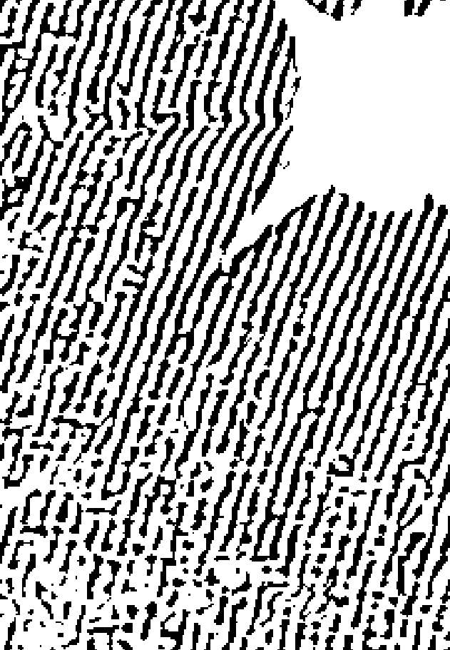

## 第三十五章 真正的營養

如果你想要成為最健康與最佳版本的自己，重要的就是確保正確的食物和液體進入你嘴巴裡。我在紐西蘭時，在我的健身房中和運動員一起工作了好幾年，所以我對營養略知一二，我並不是說我是這方面的專家，但是我知道什麼有幫助、什麼沒有。這些日子以來，我也用不同的方式看待營養。以前注重營養是為了專業運動表現，現在營養是一種工具，在我的靈性旅程中輔助我。

在光、水和食物之間，擁有平衡的營養方式（方案／計畫）是非常重要的。最終你可以切斷所有食物元素，帶入更多的光進入營養方式中。我會說「方式」是因為我不喜歡「方案」或「計畫」這種字眼，對我而言太過死板了。如果你今天感覺想吃一些跟昨天不一樣的東西，那就聽從你的身體，要把更多光帶進你的營養「方式」中，並沒有所謂正確或錯誤的方法，因為我們全都是獨一無二的人類，順著自己的道路走，所以我根據我先前在本書中分享過的建議，你必須拿這些來玩玩看，做些許的調整，看看什麼對你效果最好。

另外，如果你想要了解更多關於尿療法以及尿液的詳細優點，請看瑪莎·克莉絲蒂的《你自己的完美藥物》一書。尿液是這個星球上唯一包含你自己身體所有資訊的液體，它充滿了養分。尿酸（尿液）並不是包含所有你身體不想要的「東西」的廢棄物，它包含著所有你身體確實想要的「東西」，喝它會讓你有非常驚喜的效果。其實它喝起來也還好，一開始有一點奇妙……不過一到兩個星期之後，就會開始變成一種享受。我就很期待每天早上喝我的，雖然聽起來很奇怪。

我早晨例行事項中的下一項，就是靜心。寧靜搭配氧氣是非常健康的組合，深呼吸到你的細胞裡，有非常多的好處。這也是讓你排毒的時機，當你深呼吸時，就能夠刺激你的淋巴系統，淋巴系統負責吸出所有死亡的血漿蛋白和身體不需要的其他廢棄物。

接下來就是一大杯蔬菜汁，蔬菜和水果都要。加入各式各樣的蔬菜，讓身體保持鹼性是很重要的。到中午之前，除了蔬果汁外，我不會吃或喝任何東西。最棒的組合是百分之八十的蔬菜和百分之二十的水果，大部分是綠色蔬菜。

中午就吃任何我想吃的東西，一大盤各種顏色的蔬菜沙拉，各種生的堅果、豆類、藜麥。我偶爾會吃蛋和幾片魚肉，如果身體想吃的話。記住，你必須傾聽你的身體。我從不吃罐頭魚類，一定要是新鮮的魚，我也不吃雞肉、牛肉、火雞、羊肉或豬肉，已經不吃好幾年了。偶爾我也會吃一點點糙米，但不常。

我喝很多水，一整天之內我經常喝水，而且不會等到渴了才喝，就是時常拿起來喝。要記得，我們有百分之七十五到百分之八十都是水，骨骼和肌肉有百分之五十是水，皮膚有百分之五十是水，大腦則有百分之七十四是水，我們的器官也絕大部分都是水。事實上，我們就是水、空間和一點點非常微不足道的東西組成的。水其實就是液體水晶，你可以用「愛」改變它的分子結構。喝大量的水，不要等到口渴才喝，隨時補充，在你有口渴的感覺前，其實就已經缺水了。在喝水前，愛或祝福你的水。

目前為止我提到的一切，差不多就是我會吃的東西了。你聽起來可能會覺得選擇很少，如果你一直以來習慣吃超市貨架上的各種加工食品的話，但只要發揮創意，你就可以做出幾百種不同的沙拉，我從來不覺得這樣吃很無趣。

我不會晚上吃很多東西，可能就一些蔬菜、一盤綠色蔬菜沙拉、酪梨淋上一些檸檬汁，就是分量很少的東西。晚上我會喝花草茶和更多水，我非常少喝酒，它對我一點好處也沒有，只會讓我隔天感覺糟透了。我有時會有奇怪的渴望，想去夜店或酒吧之類的，但是當我真的屈服於這種誘惑，我也只是站在那裡想著剛才那感覺真是鬼扯。

那就只是對未來的假想，以為某件事會很刺激有趣，結果根本天差地別。我不曉得這是因為我年輕時狂歡得有點過火，導致現在這種事情就變得很平淡無趣；還是我就是比較喜歡待在公園，坐在樹下靜心。在樹下靜心我覺得非常享受，到無盡的空間中旅行，探索我們這個多次元宇宙的美麗。

所以營養的部分很簡單，吃地球長出來的東西，不要高溫烹煮，你會殺死農夫花了一個季節種出來的食物。買當地的食物，如果你住在紐西蘭，不要買巴西的葡萄，讓巴西人吃他的葡萄，你可以吃自己的，我們要照顧我們的星球。

如果上述內容都沒有提到你吃的食物，絕對是有原因的。請滋養你靈魂這輩子的房屋，好好照顧它，它將會給你極大的回饋。你真的是個自然的生物，就跟一棵樹一樣，你需要水、氧氣和光。最終我們將不需要食物，食物會讓我們困在這個二次元的實相中。

## 第三十六章 星癒技術意識代碼的秘密配方

聲音：「傑瑞，我們全都是二進位碼。」
我：「什麼意思？」
聲音：「我們全都是二進位碼。」
我：「告訴我這是什麼意思。」
聲音：「你的大腦是個生物電腦，它可以被編程與重新編程。」
我：「怎麼做？」
聲音：「我將會讓你的療癒更加容易、更快速，也更有效。」
我：「太棒了，展示給我看。」
聲音：「你是意識，不管意識決定或想要做什麼，都會發生。」
聲音：「代碼。」

我：『什麼代碼？』
聲音：『遙視是經由代碼存取。』
我：『請解釋一下。』

這個時候，有個清楚的影像進入我的意識，讓我知道這是什麼意思。有股深刻的知曉朝我湧上來，我會先解釋這些，然後再談論代碼，讓你更加清楚我說的是什麼。

在軍事中，他們會使用一種稱為遙視的技術，讓一或多個人（在這個例子中就是軍方的遙視者）去監視另一個人、許多人或是一個地點。透過練習，每個人都可以做到，不過有些人會比其他人更能自然上手。

我們找個人來舉例好了，就用我們的老夥伴薩達姆．海珊，願神祝福他的靈魂，畢竟，這個靈魂要有極大的勇氣，明知道會面對什麼，仍願選擇以海珊的身分來到人世，但這個故事並不是現在要講的。反正，如果軍方想要追蹤海珊，他們會分配一個代碼給他，一連串的數字或字母，然後注入到意識、乙太、看不見的智慧中，把這組代碼或一串數字與字母，根據他們自己的選擇，跟海珊連結在一起。

要記得，意識就是智慧，你也聽見那個聲音對我說的：

> 「你是意識，不管意識決定或想要做什麼，都會發生。」

那些想要監視海珊的人，將這個代碼注入意識中，然後透過意念將其與目標連結起來。遙視者接著就會被告知在下一次的軍事活動中，去觀看這個目標，他或她就會去執行。他們降低自己的心跳，進入調整過的意識狀態，想著和感覺那組代碼。那組代碼已經與目標連結，經由意識可以隨時在任何位置，意識會把遙視者帶到目標位置，不管他在這個星球上的哪裡，都不會有任何障礙界線。所有東西、所有地點，都可以現在就被存取到。

我怎麼會知道這些？首先，我曾經參與過幾次遙視事件，而我所看到的一切，都被某個所謂的當權機構確認屬實。我也曾經親眼「遙視」過遙視者，並看到他們工作的模樣。我們確實有能力隨時處在任何地方。

創造出我們、你、我和所有事物的智慧是活生生的，它能感覺、思考、覺知。某種程度上，它也很像一塊培樂多黏土，你可以將它變形、塑形，再影響它。這就是軍方在做事情，他們影響這個智慧，將目標與代碼連結。理由非常簡單，就因為我們全都是這個智慧，我們全都是意識，這是一個連續不斷的光場域。如同我先前解釋過的，光就是資訊，所有事物都可以被操弄。在這個例子中，軍方或許會使用它得到不正義的東西，但我沒有資格去批判，在這個宇宙中，所有事物都有其位置。

所以，回到星癒技術意識代碼，其實就跟軍方把目標與代碼連結的方式差不多，我可以把一個感覺、一種生存狀態，或一種健康狀態，跟代碼連結起來。舉例來說，完全健康的星癒技術意識代碼是0632，平靜的星癒技術意識代碼是11,11,1，自信的星癒技術意識代碼是2391。每一個代碼都會創造出療癒頻率，因為代碼在本質上就是被寫入頻率中的。

- HF 1＝愛自己
- HF 2＝完全健康
- HF 3＝合一／一致
- HF 4＝覺知
- HF 5＝平靜
- HF 6＝自信
- HF 7＝豐盛
- HF 8＝意志
- HF 9＝精力

接下來的六個療癒頻率，會帶入非常高振動的療癒代碼，想知道何時要運用它們，需不斷練習，它會自己發生。你會有一種內在的知曉，然後就發現自己已經在將它們注入到另一個人的全息生物電腦中。

- HF 10 || 水晶光／能量
- HF 11 || 天使光／能量
- HF 12 || 鑽石光／能量
- HF 13 || 星光／能量
- HF 14 || 龍光／能量
- HF 15 || 海豚光／能量
- HF 16 || 第十三個亞特蘭提斯之石（也包含其他十一個石頭的所有代碼）

想想看，你的眼睛看到周圍的一切，你的耳朵聽見這世界裡的聲音，然後這些資訊被嚴重過濾，你就只能根據你的程式去看與聽。我們被告知要穿什麼、假日要去哪裡、要如何感覺等，這種事情數千年來以不同的形式持續上演。結果都是一樣的，只是操控人的手段改變而已。我有一系列的星癒技術意識代碼已經改寫了許多程式，它們創造自由。我不是用另外一個結構式的、有限制的或設計來操弄與控制人的程式，在改寫先前的程式。我是卸載了不適合或限制性的程式，然後安裝一個有彈性的，讓人有空間擴張與成長。它在任何方法、形狀或形式上，都是沒有限制的。當然，那些特定的對象，在我替他們創造出自由後，如果他們再次接觸那些禁錮他們心靈的、舊有的系統，就能夠相當輕易的重新編程。這就是有趣的地方了，每個星癒技術意識代碼都是設計來創造更高層次的覺知，所以每個人都會活在一個更平穩與有空間的地方，他們會以完全不一樣的眼光去看世界，所以在任何操控手段進入他們的私人空間前，就能看出征兆了。當我要下載星癒技術意識代碼時，要遵守幾個製作步驟，而效果非凡。

- 步驟一：使用一個顛倒的金字塔當作我的隨身碟，我會在我的手中或腦中創造這個畫面。
- 步驟二：把最佳的頻率注入這個顛倒的金字塔。
- 步驟三：重複下面這一段內容，這是我帶入意圖的地方。

「HF6是星癒技術中完整可下載的意識代碼，代表著自信，我以有創意的愛與和諧智慧，裝載這個光。我現在把這個代碼放進你個人的全息生物電腦中，用於你的心智、肉體、情緒與靈性方面的成長。讓這個光流動。」

在這個時候，這些符號會開始流進我的身體，它們會是金色的，彷彿是由星塵（我們的源頭本質）所製造。它們會大量的流出我的身體，進入我握在手中的顛倒金字塔，接著我就把我的隨身碟放入接受療癒的個案的腦中，從他們的全息圖頭頂放進去。

如果我是在團體療癒環境中使用這些代碼，我就會把個人的全息生物電腦改為團體的全息生物電腦，意念就是一切。

我們是有選擇的，就是現在，使用星癒技術，來大幅提升在地球上的生命。我們可以重寫數千年來的制約程式，我們可以快速、有效率且大量的達成。這就是為什麼我的使命是舉辦大型的療癒聚會，這樣我可以把星癒技術注入每個人的意識中。想想看，五十或一百個人，全都在一個地點，想像那個能量、愛、意識、光，全和諧合一，想像我們把那股愛傳送到戰爭的地區，會發生什麼事。

軍人會立即放下他們的武器，離開戰場。他們也是人，而當面對這種艱難的關鍵時刻，當愛從他們的靈魂中流出時，他們會有立即的覺醒。星癒技術是這個星球上最強大、最快速，也最有效的療癒方式，它是靈魂的技術。你準備好要讓我的使命也成為你的使命了嗎？我們的使命！

我舉辦工作坊時，當我們療癒的能量傳送出去，會影響附近地區的電力，這已經為人所知了。那股力量流出去會關閉所有電力相關物品，房屋和汽車上的警報器響起、電視停止運作、風機跳電，而這只是來自一個小團體。

把這拿來想像十萬人的力量，我們將能看見意識的巨大轉變。星癒技術是讓世界變得更好的關鍵，星癒技術是讓人類自由的鑰匙。

## 第三十七章 具強大火力的代碼與實相

你可以在不同次元間翻轉/切換，同時在腦中創造出不同的實相，透過你的意念、觀察和量子糾纏，就能夠（也將會）顯化在這實體世界中，現在就可以，我們已經討論過這個部分了。

現在，把這個觀念和星癒技術的意識代碼內容結合在一起，一切都會變得非常令人興奮，這就是我們釋放強大火量的時候。

我覺得最好的描述方式，就是舉個例子給你聽，讓你知道它怎麼運作的。有一天我在伯明罕帶領練習，我每隔八週都會去帶領這個練習，我真的很享受這過程。有位女士來找我，我把雙手放在她身上，她往後癱倒，然後我輕輕的放低她的身體，讓她躺在地上。

我從心靈的眼睛看見這位女士卡在泥沼中。

我在腦中製造出一個平臺，然後把她拉起來放在那個平臺上。

平臺傾斜，她又跌回到泥沼裡。

於是我把平臺的寬度和長度都增加，再把她放回到平臺上。

這一次她站上平臺後就開始奔跑，她的臉上帶著大大的微笑，不斷的奔跑著。

接著我看到一個樹林或類似叢林的環境，裡面充滿了水。

這聽起來或許很奇怪，但我知道我必須要把塞子拔掉，把它拉起來，

水開始從樹林／叢林中流進那個塞子的孔洞。

當我為這位女士建立了新的實相，不管那到底是什麼意思，我把這個新的實相和星癒技術的意識代碼結合在一起，等於就是把資訊從這些畫面放入一道光裡，然後建立一個代碼，再把這個代碼裝到這位女士的生物電腦裡。

整個過程中，這位女士打鼾得非常大聲，但代碼才裝好，她便立即停止打鼾並睜開眼睛，看起來有點搞不清楚身在何處。等她完全清醒後，我把剛才發生的事情解釋給她聽。她告訴我，她覺得自己沉入生活中，所有事情都逐漸往她身上壓，她已經承受太多，感覺自己無法邁向她想去的地方，就像是困在泥沼中。這位女士在三個月之後放棄了幾份曾做過的工作，不再去大學上課，而開始跟從她的熱情，也就是療癒。她現在有成功的療癒事業，過得非常快樂。

要把一種實相放進代碼中，你所要做的就是看到一種顏色的光，任何顏色都可以，橘色似乎對我比較有效。我看見我用想像創造出的實相，開始像水一樣流進那個光的顏色裡，直到畫面完全消失為止，這時我就知道全部都裝進光裡了。它都進入光之後，我就可以用光的代碼把它注入這個人的生物電腦裡。

我們可以為所有情境創造代碼和實相，可能性是無限的，只會受到你自己的看法和對實相的觀點限制而已。要知道所有事情就是這樣、所有事情將會成為這樣，如果他們不是這樣，你就自己創造他們，現在就可以。當我在看那個光的顏色時，我會將它看成一種形狀，可以是正方形、三角形或任何你想要的形狀。有個效果真的很不錯的方式，是把光看成隨身碟的樣子，你會插進電腦的那一種。接著你就把實相裝進隨身碟裡，然後把隨身碟從那個人的頭頂放進去。下載完成之後，你就可以把隨身碟拿出來，放進自己的口袋裡，留待下一次使用。

當你在調整實相，或是重新設定實相時（大部分案子都是要重新設定實相），最重要的是你要很清楚知道自己要什麼。讓我舉個個案的例子給你聽，我問這位個案她想要從療程中得到什麼。在療程中，我看見她這一輩子中各個階段的自己圍成一個圓圈，她就站在中心。我請她們每個人都往前站，表現出她們的愛與感情。每一個都照做了，只有一個沒有，於是我問她幾歲，那是她十七歲時的自己。所以我知道十七歲的時候一定發生了什麼事，阻礙現在的她。這個時候，一股強大的光流經我，進入這位可愛的人體內，我看見十七歲的她帶著敞開的心，往前邁向她。

二十五分鐘過後，療程結束，我問她十七歲的時候發生了什麼事，她說她在十七歲時結婚，而她並不想要結婚，她只是為了保障安全而那麼做，從此之後就再也沒有過著真實的人生。

好，讓我們快轉三十六個小時，她身邊的一切開始全速前進，記得吧，她請我抹去一切。那是星期一早上，她正在上班，一位顧客走進來，然後問她什麼時候要離職。在那當時，她根本不知道她要離職，根本沒有人討論過此事，她也沒有這種計畫。接著，不到一小時，她的老闆走進來，給了她懲處，說她沒有在重要的截止期限前完成事情，而她根本不知道有這個截止期限。當天晚上，她丈夫告訴她，他想要把房子賣掉、遠走高飛。所以房子沒了，丈夫、家人和工作，全都在一瞬間沒了。

突然遭遇這樣的劇變，很多人會因此發狂，幸好這位女士很清楚自己要求過什麼，我們也討論過她的意念可能引起的情緒劇烈起伏。所以，這個故事主要的啟示是，你會得到你所要求的，要很確定那就是你想要的，你也必須信任發生的一切，就算它看似不合理，也要知道，最後，它一定是為了讓你這個人類經驗活著的靈性生物，得到最大的成長。

我想再分享另一個故事，當你去感知，就像這個人一樣，你就可以看見所有事物背後的美好。這是我某天收到的信件：

親愛的傑瑞：
請見附件，是我原先的信件和上週一跟你談話的支票。我對那個交易感到遺憾，但我那天後來進了醫院。

神奇的事情是，我之前已經開始練習你的靜心，接下來的那個星期一晚上，我不小心拿到消毒酒精來漱口，吞下了一些，結果進了醫院。經檢查過後，我沒有什麼事，但驚人的部分就在這裡。他們檢查出我有一種心臟疾病，我以前不知道的，他們說如果我那天晚上沒有去醫院，很可能會中風或心臟病發。我真的相信有些神聖的力量在幫助我。我非常感謝你，因為我從你的靜心練習中感覺到，我已經開始和宇宙的純粹之愛連結，因為此救了我一命。再一次，非常謝謝你，傑瑞，把你的愛與知識分享給我們所有人，我等不及要看接下來會有什麼事發生了。帶著滿滿的愛與感激。

這就是實相的改變，薇爾的心敞開與靈性連結後，改變了她的看法，她的實相因而改變，現在她能看見事物當中的美好，每件事情當中的指引。對某些人來說，消毒酒精事件一開始可能是非常糟糕的事，但它偽裝過的祝福。只要我們保持開放，用我們的心去生活，信任與跟從直覺，生命就是一連串的奇蹟。你準備好睜開你的眼睛了嗎？

薇爾

## 第三十八章 高阶疗愈方式

有意思的地方来了，其实可以说是的非常有趣。在你的脑中有意识，或者，也许你的头脑就是意识。又或者，意识是头脑？不管怎样，意识主导这场表演。由于意识，你头发会长、会流汗、心脏会跳，身体里面有许多其他美好的事情会自然发生。

科学家检视过人的大脑、身体，他们操纵过神经系统里的纤维，弄懂了思想是如何透过电脉冲命令神经系统以特定方式发射讯号，进而能让肌肉收缩或伸展，让关节和骨头移动，让身体去做天生可以做的动作。所谓的专家，知道大脑的哪个部分与身体哪些动作相关连，知道神经系统中的哪个元素会发送信号给身体其他部位。从逻辑上来看，一切都可以被追踪与记录，但也仅止于此。

大脑就像个指挥中心，这点很清楚。而当科学家试着搞清楚是谁在管理这个指挥中心时，他们就碰壁了。指挥官是谁？似乎没有人也没有东西。但是这一切怎么运作的呢？意识，那个看不见的智慧创造出的，它也就是所有生命，不管会动或不会动的东西。如果意识是看不见的，而且不需要真的接触到任何有形体的东西，就可以让一切运作，这一定表示，不需要真的接触到物体，物体就可以被控制与移动，而我们也已经确知这点了。

现在，说到成为星愈技术的引导者，发展最终极的技能组的方式，就是不使用任何东西，除了你的心和「观察」的大脑。没有手部动作，不需触碰，不需视觉化想象，什么都不用，只要知晓。

那么，你要如何在不做任何事情的前提下，去促进他人的疗愈呢？嗯，我们人类是一种存在，而不是一种动作，这把知晓拉到了一个彻底的新境界。要想起星愈技术的这个要素，你必须更深入，必须融合所有恐惧、所有思想，你必须完全净空自己的头脑，进入心的空间里。不是一半一半，不是七十比三十，甚至不是九十五比五，我说的是你必须全部投入。要达到这点，需要练习、勤奋努力，以及使用意志来打开你的心，无条件的接纳这一切，才能精通星愈技术的艺术。

### 步驟一：

讓我直接給你一个如何执行的范例。首先，记得，我们是多次元的生物，你必须开启你的心，接受各種可能性。如果有一絲絲懷疑，就沒有作用了。

好，現在坐在我的療癒椅中，在我的療癒室裡，在我的肉體裡面。我看著個案的照片，然後，用我的心，看見許多手臂和手從我的身體裡伸出來。這些手全都在療癒那個人，有光從這些手裡面散發出來。我不知道這個光確切做了什麼，我只知道它在改變實相的模式，為接受端的那個人創造一個療癒的環境。我完全沒有任何動作，然而那個人已經受到療癒了。同時，我可以雙重定位到他們的地點。一開始你或許可以這樣試試看，就看看會發生什麼事。

### 步驟之一：

接下來，你可以用同樣的方式，看著你的多次元自我離開你的身體，站在或坐在你的個案身旁。

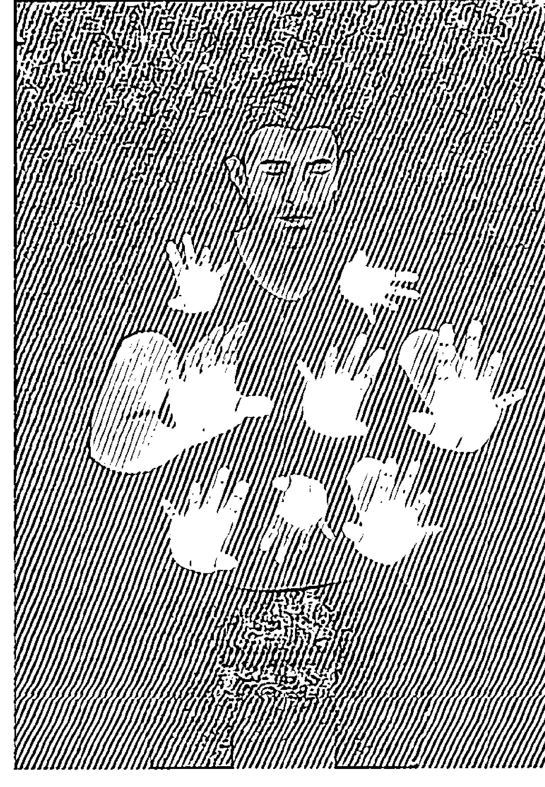

傑瑞與光之手。

當我以這種方式促進療癒時，個案通常會說，他們可以感覺到房間裡有其他人在他們身邊。我會把我的多次元自我看成天使，但是這並不是固定模式。你是獨一無二的，當你呼喚時，必須等待看看誰會出現。你會看見光從他們的手中流出來，看到他們到處移動，接觸身體的不同部位。你並不是在控制這一切，他們知道要做什麼，你必須待到一旁去，抵抗想要控制這個情況的渴望，讓一切自然的進行。

### 步驟一：

這部分就是完全的信任派上用場的時刻了，我說的是完全的信任，不是九九．九九九九九九九%的信任，你要先看你的個案，然後閉上眼睛，等待你很熟練這個方法後，你可以睜開眼睛。你可能已經在這個階段了，所以就看著你的個案，而你所要做的一切，就是拿出你的意念：

> 「我要使用星愈技術來促進……的療癒，我要把愛注入這次療癒（此時打開你的心），我要把完全的健康、自信、接納與信任，注入這次療癒。（你可以說任何你覺得必須說的內容。）

這裡沒有『非如此不可』的指引。下一步，你要問：

> 「請讓我看見我不知道的事物，幫助我促進這個美好的人類的療癒。」

這就是星愈技術，寶貝！

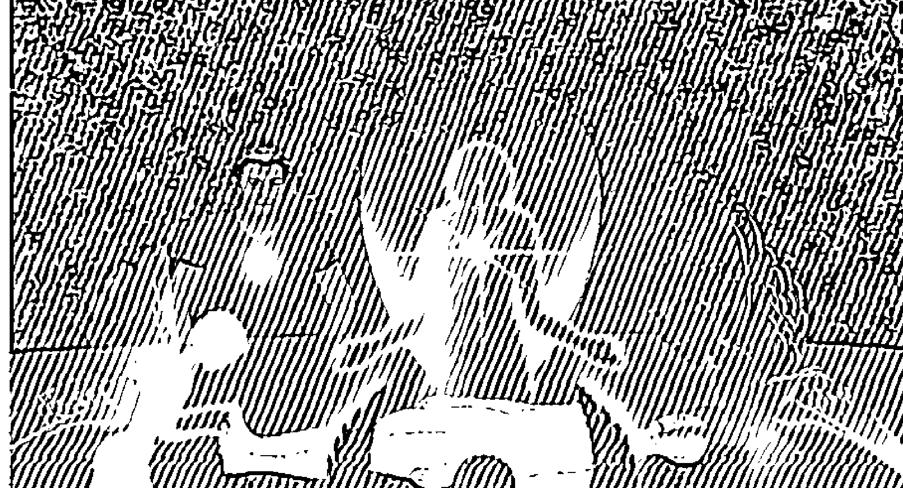

多次元自我——天使形體進行療癒。

一旦你設定意念後，就知道它開始發生了。淨空你的頭腦，成為意識的器皿，不要干涉，最棒的療癒就是在此時發生。剛開始練習時，你可能會發現你的小我開始試著要打斷這個過程，它會說：

> 「這沒有用啦，你什麼都沒有做。如果你沒有自己療癒，你要怎麼改變人？這真的有用嗎？這樣沒有用。立刻停下來，你已經徹底瘋了吧。這是你的想像在胡搞，夠了就是夠了。」

你的小我會說各式各樣的話，樣式多到跟綜合糖果包一樣。不可以，真的，它會花招擺出、千方百計試圖讓你覺得這樣沒有用，或是不可能，還有，要你面對現實，遠距療癒是一回事，遠距療癒而什麼都不做，又是另外一回事。

這時只要記住，你什麼也不做，心臟還是會跳動；你根本不用去想，腎臟跟肝臟也還是會運作；你根本連動一隻指頭也不必，指甲跟頭髮就都會生長。既然如此，為什麼會覺得你完全不必動就能進行療癒是難以置信的事呢？

我就不覺得，我已經經歷過了，你也不必這樣覺得。唯一需要被說服的，是你的小我，而它，我的朋友，你根本不必為它浪費時間。你真正重要的事情，就是深深進入你的心，在那個地方，小我沒辦法玩這種遊戲。深深進入你的心的最佳方法，就是使用我先前分享過的，不要讓水溢出來的練習方法。經過足夠的練習後，你就可以一瞬間進入你的療癒區。

我想再分享另一個快速又簡單的方法（五個步驟），讓你進入你的心。

- 1. 做幾次深呼吸。
- 2. 看著你心的中心像個順時鐘旋轉的漩渦。
- 3. 看它轉得越來越快，充斥著金色的光。
- 4. 將你的覺知放入這個漩渦，成為它。
- 5. 允許漩渦帶著你去任何你想去的地方。

小我待在頭腦的空間裡比較舒服，而不是心的空間。你的心知道當下，你的小我知道過去與未來。深深沉入你自己的心中，你就會接觸到星愈技術的真實本質。隨著閱讀這本書，練習先前的幾個方法，得到結果後，你會知道星愈技術是有效的。接著，你會逐漸進步，開始把意識代碼注入到你的意識中。再來，當你來到這個高階方法時，你將可以自然的帶出其他工具。這裡是相信和知曉真正分別的地方。我不喜歡使用「分別」這個詞，因為所有事物都是同一条意識之流的一部分。然而，在這個高階方法的領域中，知曉是唯一的解方。一旦你去試驗和思考，這個就是所謂的相信，而思考過程會引起情緒反應，你就製造出障礙了。這個高階方法要發揮效用，只有在你是純粹的意識，已經不再是個軀體，你已經整合進這条意識之流、唯一的真實、所有生命的能量，愛。你可以在你的伴侶、朋友，或是樂意讓你實驗的個案身上，嘗試使用這個方法。你必須建立自信，而建立自信的最好辦法就是得到結果，所以，架好你的馬鞍，跨上去吧。要知道你就是自己的力量，你就是宇宙。當你開始能夠完全駕馭這個全然而完整的連結時，你就會開始促進他人的療癒，使用你強大、純潔、沒有小我／恐懼的意念，去影響整個宇宙資料庫，提升你的同類兄弟姊妹的生命。這將會為你發生，不過，這又是曉的另外一個成分了：：

## 第三十九章 更进一步看见

這個成分就是觀看。只要練習與持續的輕鬆自如，你就可以沉入充滿機會和可能性的場域，很快的做出改變，這些對你來說將會變得非常簡單。接下來的階段，是沉入連結之池，觀看所有發生的事物。當你被靈、被愛佔據時，你可以（也將會）飄入一個統一的場域，沒有意識的，因這個充滿智慧的自然神性而充滿極度的喜悅，被這個粒子領域完全包覆，你會忘記你在五感世界中所追求的一切。

你的任務是要去看、去觀察，就在你眼前上演的光、能量、模式和實相的運作，以及頻率的改變。就像你看著電視螢幕一樣，你可以看見這個美妙的世界中，原子和粒子在一種超意識的層面中工作、跳舞、移動、操作，創造出一個讓療癒得以發生的環境。

要看到這些，不是視覺化你的想像，而是去觀察。當你在看操弄人心的機器，也就是電視時，你只是坐在那裡理解內容而已，你不是在想像，至少不是大部分人所認知的想像。實際上，你的心和電視兩者都是螢幕，本質不一樣的螢幕，差別之處就是過濾的程度。

當你在觀察一次療癒的過程時，你將自己當成器皿，而意識是駕駛人，是控制者，這時如果你是完全敞开的，就不会有任何过滤。不过在看电视或看平时身边事物时，你会过滤那些经过眼睛再进入大脑中的光流，所看到的是过滤之后那个版本的现实。它依然是现实，只是比较黯淡、模糊、阴暗的版本。当你进入你的心，成为整体光辉之中的韵律和振动，成为一个足够开放的器皿，让源头能量可以促进另一个人的疗癒时，而只要你能够留在那空间裡、看见真实的完整版本，你就和它是同一个能量本源/场域，毫无分别。

沉得够深入到可以看见，与更加深入到无意识的意识状态，两者之间的差异是很微妙的。就像那个走钢索的法国人菲利普·珀蒂，他在一九七四年时，在纽约双子星大楼之间，离地面约四百公尺高的地方走钢索，成功与失误的幅度也是微乎其微。同样的道理，你很容易从一个什麼都可以看见的地方，掉入一个你可以疗癒但无法察觉到知晓也看不见的地方。

看见并不是绝对必须的，疗癒还是可以进行，但是都走了这麼远却不去看，就像带一个美丽的人（所谓的异性，也或许是同性）出去吃晚餐，然後回到你家或他家，你们继续进行了几个小时的前戏、做爱，然後就在高潮之前，当你在和宇宙的韵律做爱时，当你们成为一体，你的能量场域和你的身体合一时，你停下来、抽离，任你整合的身体在合一的狂喜中振动，却不走到高潮的美妙世界。

为什麼要在走了这麼远之後却停下来？为什麼你投入这麼多努力想起星疗技术，却不去看创造出的一切美丽与雄伟。这样就像是走到吉力马札罗山顶上，却没欣赏一下景致，就直接走下山了。

所以，练习寻找这个进入点。在这里你就是基督意识，在这里你与神合一，你就是神，你就是宇宙。在这个状态中，你转变成粒子融入空间、颜色与光的场域里，这才是你来这里的目的。

要进入这种状态，同时保持你的觉知，这样你才可以看、感觉与完整珍惜所有发生的事情，最好的练习方法就是拿一杯水，像我先前说过的那样。确定你把水装到几乎跟杯缘同样高度的地方，坐在椅子上，用两只手拿着这个杯子，放在大腿上。开始深而缓慢的呼吸，非常深长的呼吸，吸入你的肚子里面，然后一样缓慢的吐气。

我刚开始想起怎么做时，我把心跳降低非常多，感觉我好像一分钟只呼吸一或两次。当我确实追踪自己的心跳时，发现每次我做这个，心跳大约是每分钟三十下，介于每分钟二十五到三十一下之间（我使用心跳监测器）。

当你降到这种极低的心律时，你的脑波其实也减慢了。当你在θ状态，脑波每秒循环四到七次，这就是深沉的静心。下一个阶段是δ状态，每秒循环零到四次。当我进入这种状态时，我其实并不完全确定自己处在那个阶段，但我感觉应该是稍微超越θ正好要进入δ的阶段。希望有一天会有机会测量一下这个，证实我的感觉。

随着你减缓呼吸，把意念集中在第三眼的位置，然后请求被带领到一个你知道的地方。任何地方都可以，一個朋友家或是一棟你認識的建築物，開始探索，這就是遙視。你要能夠在不把水打翻的狀況下進行探索，如果整杯水保持滿滿的，你可能走的還不夠遠，但如果它灑出來了，又表示你跑太遠了。我發現最好的狀態就是感覺有一點點水沿著杯子流下來，緩緩流經你的手指出，這就是你一方面可以保持覺知，另一方面進入到那個可以遙視、雙重定位，使用終極星愈技術的完美場域。等到你使用一杯水練習過基本的遙視訓練後，探索你的心，去看你沒有去過的地方。請求宇宙帶你去那裡，找個地點、建築物，或是請它帶你去全新的地方探索。熟練之後，你就可以在療程中試著使用這方法了。

你必須記得如何進入這種完美的狀態，這感覺就跟走鋼索差不多。杯子如果是滿的，你就從這一邊掉下去，如果完全灑出來了，你則是從另一邊掉下去。若它剛好從杯緣流淌一點點出來，你就抓到那個點了，你就處在完美的療癒區中。當你完全放手時，就會很容易，要對自己有點耐心。一旦你憶起這個怎麼做，療癒真的會變得毫不費力。

我曾經在移動中的狀態接到電話，開車、旅行等，他們遇到的情況非常緊急，我必須在移動狀態中立即促進他們的療癒。我並不是建議你這麼做，開車的時候促進他人的療癒是很危險的事，雖然我做過很多次。我只是試著要告訴你，當你處在那個流中，星愈技術已經是你的第二天性時，身為一個多次元的生物，你可以允許一部分的自己去促進療癒，另一部分的自己繼續開車。

此外，有許多療癒師很依賴他們的神聖空間。你為什麼要這麼做呢？所有地方都是神聖的。沒錯，我有一個療癒室，但是我也知道，如果我坐在熱鬧大街中央的長椅上，這時接到電話，我也可以馬上下來，就在那個地方促進療癒。如果我沒辦法那麼做，等於是我把權力交給我的療癒室，彷彿是我的療癒室包含著某些促進療癒的力量。你才是力量！你是宇宙，絕對不要質疑這點，你才是偉大的。

## 第四十章 如其在上，如其下

你觉得星星是在遥远的宇宙中吗？还是你觉得星星没那么远？据说有些星座是在几十亿光年以外的地方。不过这真的重要吗？……当你处理的是意识，其速度是光立方，或是每秒三百四十二亿英里。你几乎可以身处这个银河系中的任何地方，如果你想要，还可以去得更远，到这个宇宙中，毕竟，你就是宇宙。

我知道在我们每个人里面，是每个我们所知的星座，甚至是我们还不知道的星座，或者我应该说，还没忆起的。星愈技术之所以如此强大，就是因为你是连结到星星的频率，你连结到是我们银河间的兄弟姊妹的频率，他们就在外星的灵性世界中。他们有智慧，至少以种族的角度来说是如此。而外面那里有非常多不同的种族，或说在这里——就在地球上！他们只是从种族的角度来说比较有智慧，因为，要记得，他们也是意识，就跟你和我一样，全都是爱。

我经常到太空旅游，和最不可思议的生物待在一起。我在那里想起了好多，感觉就像回家，感觉合一、平静。我知道当我与外星生物坐在一起时，我就是他们的一员。我是从星星中诞生的，我生命的核心就是一颗星际种子，就跟你一样。创造出你这个人类身体的原子，就是从星塵中產生的同樣原子，而星塵來自爆炸的星星。

> > 「如果你深深進入到地球上最顯眼的恆星：太陽，進入它的核心，你會發現氦和氫原子，這些在太陽的深度核心與高溫中結合在一起，創造出更大的原子，像是氧、碳和氦。是太陽極大的引力將這些比較小的原子拉到核心，在那裡壓縮與結合，造成一種核融合反應，因此創造出較大的原子。」
>
> ——克里斯多福·蓋勒法《別管黑洞了，跟著霍金上太空！》

這樣的反應沒辦法自然的在地球上（或地球內部）產生，我們的行星太小，密度也不夠大，所以它的引力無法讓核心達到誘發反應所需的溫度和壓力。從定義上來說，這就是行星與恆星的主要差異，兩者都是大致為圓形的宇宙物體，但是行星基本上比較小，有岩石構成的核心，有時候外圍有氣體包覆。另一方面來看，恆星可以被視為巨大的核融合發電廠，它們的引力能量之大，會自然的在它們的核心處冶煉出物質。

所有組成地球的重原子，所有生命生存所需的原子，你的身體含有的原子，都曾經是由恆星的核心冶煉而成。當你呼吸時，你吸入它們，當你觸碰自己或他人的皮膚時，你就是在觸碰星塵。

雖然上述一切在某個層面上是真實的，但太陽其實是電磁的。當你調整到可以運用第二眼視物，或是可以有效的遙視太陽時，你就可以看出它的本質上是電磁的。重要的是要知道，整個宇宙都是電磁的，包括你在內，我們居住在一個電磁宇宙或攪場宇宙中。太陽也是一個主要的星開口，讓外星種族進出我們的太陽系，這是一個完全不同的主題了，不過值得分享一下，太陽可以做為一個出入口或星開口，就是因為它的電磁本質。

你知道星星有多麼重要了嗎？知道我們有多麼特別了嗎？當我運用星愈技術創造時，我是將天上的星座降下來的光，跟你這人類身體中的星座連結。身體的每個部位都對應一個星座，每個脈輪都與一個星座連結，某些狀況下會超過一個星座。

我也想要你知道，一年當中是十三個月，黃道也是十三宮，但為什麼我們被教導的不是如此？你必須想一想，十三這個數字有什麼威力？為什麼大家說十三是不祥的數字，要你遠離它？為什麼十三號星期五就是壞運氣？長久以來，我們就活在這種操弄中。

在這一章裡面，我不會講述這個歷史發展，所以你必須相信這一點而看下去，或是自己去查資料。不過我能告訴你這個，透過改變月曆和黃道宮數為十二，某些所謂的權力結構可以改變陽性與陰性間的平衡，這造成地球上的不和諧，而且透過恐懼來控制人，是比較容易達成的。

回到星座，黃道上的第十三個星座是蛇夫座，是療癒與給予神經系統力量的光，應該是個重要到不該被掩蓋忽視的星座，你不覺得嗎？

這張圖片是人的肉體，連結到不同的星座療癒對應部位。

### 星座與人體

蛇夫座一神經系統（帶著蛇的人）銀色閃電和星光
牡羊座一頭／臉（公羊）光滑的鈷藍色與金色
金牛座一脖子（公牛）洋紅色
雙子座一手臂／手／肩膀（雙胞胎）綠鬆色與銀色
獅子座一心臟／背（獅子）帶著翠綠色調的水晶透明中心，與醒目紅色外觀
巨蟹座一肋骨／胸部（螃蟹）水晶透明灑上金色星塵
處女座一腹部／腸子（少女）亞特蘭提斯藍
天秤座一髖部／臀部（秤）洋紅色，邊緣是純粹的星光白
天蝎座一生殖器（蝎子）柔和金色星塵
射手座一大腿（射箭手）橘色
摩羯座一膝蓋（山羊）珍珠白與珍珠粉紅
水瓶座一腿（拿著水的人）翡翠綠與星光白金色
雙魚座一腳（魚）黑與大理石白

在上頁圖片中，你會看見黃道星座（以常見的名稱列出）連結的身體部位，以及每個星座用來連結的主要顏色。我們以前可以看見這些星光穿過宇宙來到我們周圍，穿過我們的身體。但是男性受到天生的生存直覺驅使，而把這些光篩選掉，我們受到恐懼驅使，在外監看有沒有侵略者，隨著時間自然演進，就只能看到生存所看到的東西了。而現代科技被大企業牢牢掌握時，人們變得更加看不見我們真實與合一中的美麗了。
要和這些星座共同工作，你所要做的就是使用意念。只要你的意念一出，你就會連結到你選擇的星座，而你將會看見強勁的光湧入該身體部位。你不需要告訴它要做什麼，它已經知道了。一旦你打開與星光的連結，你的療癒能力將會攀上另外一個檔次。
我不確定到底有多少檔，而我非常期待能找到答案。現在就體驗這個，與這個光遊玩，在自己的身上練習，或是把這個靈魂技術用在你的個案身上，它的威力強大。你就是星塵，透過光之傳輸網絡連結到行星的外星物質。開始運用這些自然與遺傳而來的星特質吧，現在就釋放這些能力。

## 第四十一章 十三脈輪，十三星座

身在我們目前所處的宇宙中，在這個對人類和靈性演化的關鍵時刻，重要的是我們要將自己錨定到更高次元，準備好迎接揚升。

五次元的十三脈輪和傳送中心連結到黃道十三星座，好像不合邏輯，但它確實就是如此。

下頁的圖片顯示出人的身體、五次元的十三脈輪，還有對應的星座，也標示出連結到每個脈輪的顏色共振。

和這些脈輪共同工作時，你所要做的就是把光從星座帶下來，進入各自的脈輪。你會注意到有些脈輪連結的星座不只一個。我建議你就玩玩看，它會炸開你的舊有思維，真的就是如此。確定你想像出正確的顏色，並將它們對應到各自的脈輪。

記得，光就是智慧，它完全清楚要做什麼。把這個脈輪系統與星座連結，可以提升你自身的振動和你個案的振動一百倍，絕不是誇飾，它就是這麼強大。

在療癒的時候，你將會知道何時要使用它。事實上，它會自己發生。你越是調整自己接近星癒技術的頻率，你就越能如有機體般自然擴展。宇宙會在你療癒他人或自我療癒的過程中，展現給你看，進而引導你。在你的療癒技能當中，這部分真的是需要透過經驗、透過在宇宙資料庫裡遊玩，才能夠熟練。等到你知道如何使用星座來活化脈輪與身體部位時，這將成為你療癒技能中的主要資產。到目前為止我在本書裡分享的一切，都蘊藏在這項知識背後，這是星癒技術的基石。

**五次元脈輪與星座對照表**

| 脈輪 | 顏色共振 | 連結星座 |
| :--- | :--- | :--- |
| 星際門戶 | 光滑的藍色與金色 | 牡羊座 |
| 基督意識 | 銀色閃電和星光 | 蛇夫座 |
| 因果 | 松綠色與銀色 | 雙子座 |
| 靈魂之星 | 洋紅色 | 金牛座、畢宿五和昴宿星 |
| 眉心輪 | 水晶透明灑上金色星塵 | 獅子座、獵戶座和天狼星 |
| 頂輪 | 水晶透明灑上金色星塵 | 巨蟹座 |
| 喉輪 | 亞特蘭提斯藍 | 處女座與天狼星 |
| 心輪 | 洋紅色，邊緣是純粹的星光白 | 天秤座與南門二 |
| 太陽神經叢 | 柔和金色星塵 | 天蠍座 |
| 臍輪 | 橘色 | 射手座 |
| 海底輪 | 翡翠綠和白金色 | 水瓶座 |
| 臍骨輪 | 珍珠白與珍珠粉紅 | 魔羯座 |
| 地球之星 | 黑色與大理石白 | 雙魚座 |

### 身體裡的脈輪與星座

## 第四十三章 人的氣場

獵戶星座來清理與淨化，這個星座帶著強大的女性能量。在我們的氣場中，我們通常帶著外在控制力量植入在我們身上的東西。當你打開第三眼之後，你就能看見。立刻使用來自獵戶座的光來清理與淨化你或其他人的氣場。

把你的意識帶到人類的氣場上，然後以你的意念看見光從獵戶座流下來，連結到你正在療癒的個案氣場，如果你是在自我療癒，就連結你自己的氣場。光碰到氣場之後，你就可以坐下來，讓它自己發揮魔法了。從獵戶座流下來清理與淨化氣場的光是水晶白色的。觀察，遊玩與允許。

## 第四十四章 梅爾卡巴能量場

在每個有生命的有機體周圍都有能量場，而圍繞在人類和所有有感知能力生物周圍的能量場，就是所謂的梅爾卡巴場。事實上，梅爾卡巴只組成這個場域的一部分，不過是非常重要的部分。

根據埃及人的說法，梅爾（Mer）意思是某種特別的光，卡（Ka）是個人的靈魂能量體，而巴（Ba）表示對實相的詮釋。

在希伯來文中，它表示一種載體，拼法是Merkabah。我從與自己的梅爾卡巴共同工作得知的一件事情是，它擁有無限潛能。你的梅爾卡巴基本上是兩個四面體重疊在彼此上面。梅爾卡巴以光之傳輸網絡與你連結，光之傳輸網絡是無限的美麗與力量之網。

要完全啟動你的梅爾卡巴，你必須經由你的心。將意識帶到你的心，然後將其與頭部連結，你可以用意念完成這步驟。連結上之後，你就可以把星光從天狼星（男性能量）帶下來，進入星形四面體的頂端，然後從獵戶座（女性能量）帶來星光，進入底下的四面體。
星光開始下來後，你就會看見兩個四面體逐漸充滿光。這整個過程中，你都完全在你的心裡，你的愛也充滿了梅爾卡巴。下一個動作，是從瓠瓜一和瓠瓜四兩顆位於海豚座中的星星，邀請海豚光／能量下來。這一步做完後，你的身體會立刻改變，你會變得更加輕盈，開始以更高的頻率振動。
隨著你把光從天狼星帶進上面的四面體，它會順時鐘旋轉，轉得越來越快。而把女性能量從獵戶座帶入底下的四面體時，它則會逆時鐘旋轉。兩個四面體都會越轉越快，直到它們快到看起來彷彿是靜止的。你會感覺它們在你的身體周圍旋轉，你可以啟動個案的梅爾卡巴，就跟啟動你自己的
一樣。我建議你每天都這樣做，直到它們自己繼續旋轉。
如果你每天花十五分鐘，把這些光頻帶進你的梅爾卡巴，並且連續做二十一天，你的梅爾卡巴就會開始自己旋轉。你會看見並感覺到它，當它開始旋轉後，就會提升與強化你的每一個意念，所以務必有智慧的選擇你的思想和意念。
等到它完全啟動之後，你會自動的連結到地球周圍的基督意識網絡，這個也一樣，是由幾何構成的。每個人類都有自己的迷你基督意識網絡，連結到自身的能量場，然後再連結到星球的基督意識網絡。它由一個五邊形十二面體和一個二十面體構成。在這個場域中，有許多其他的幾何形狀全都透過原子自旋點進入光之傳輸網絡，連結到你身上。目前我們還不需要進一步討論這個，這裡的資訊已經夠你完全啟動你的人類光體了。
我建議你每天花十五分鐘將光能量／頻率帶進來，啟動你這個奇蹟般產生的靈魂機器當中的這個面向。我也建議你每天都花時間／空間將你的脈輪連結到星星，這麼做能夠活化星癒技術的完整潛能。同時，透過你的意念，將心和大腦連結起來，這是非常關鍵的舉動，如果沒有心／腦的連結，你無法釋放完整的人類潛能。要成為星癒技術引導者，需要努力與紀律。

## 第四十五章 给疗愈师的疗愈

星療技術是給療癒師的能量療癒方法，它是療癒世界中的藍寶堅尼。不是說它更好、更高或更有聲望，事實上，它是更加微妙，而正是這種微妙集結了力量和速度，正是這種微妙讓你更深入愛的場域中，與它合而為一，然後回過頭來在你的體內創造出和諧、無懼的能量流，進而讓你的療癒能力得以提升。

其他的療癒方法都是星療技術的稀釋版本。有史以來，截至目前為止，人類，現代版的人類，還沒有準備好接受如此強大、如此基本，卻又如此高階的療癒方法。自從有時間以來，星療技術就存在了。出現在地球上的第一批人類都清楚星療技術，這是他們的第一天性。我們那些在外星同伴，無論是在外太空還是在地球上，在我們身邊嬉戲的同伴們，也一直都清楚星療技術。

隨著人類族群的發展，它被遺忘了，也或许是被刻意遺失了。數千年來，人類一直試圖重組星療技術，重新將它拼起來，就像童謠中摔得粉碎拼不起來的角色「矮胖子」(Humpty Dumpty)。人們給療癒方法一些名字，像是生物能量療癒、灵气、量子能量療癒等，而這些各自扮演自己的角色。做為完美的墊腳石，這些全都很棒，它們達到了它們的目的，在鴻溝上搭起了橋梁。

若要從一個完全沒有能量／光療癒的地方，一下子到達星癒技術，那這一步或許就有點太大了。埃及人、亞特蘭提斯人，我們那些兄弟姊妹們，他們住在空的空間中、超越我們的更高次元中，一直非常有策略的耐心等待著，等到適當的時機，要讓這個世界中的生命覺醒。他們一直都在觀察，也見過這個現代世界中的全球公司造成多少痛苦與折磨，於是現在，他們覺得是時候把自由還給人類了——幫助我們想起真實。

我是分享那個真實的管道，這並沒有讓我比較特別或有什麼不同，我只是在扮演一個，在我化身進入這個軀體之前，就知道自己要扮演的角色，這是我自願要做的事。現在我已經憶起星癒技術，我就要將它傳達給你，而你的使命就是幫助我散播這個訊息。這不是為了我，而是為了我們，而我說的「我們」是指我們的世界，我們這個漂浮在宇宙中、被水覆蓋著、準備要被療癒的美麗藍色星球。星癒技術可以療癒這個星球，它會透過先療癒人類來療癒這個星球。

即使這個星球上有超過八十億人，這個療癒仍可以發生得非常快速。最近幾年，這個星球上的意識提升得非常快速。就看看我自己，十年前我還是一個在街頭混、毒品成癮，根本不相信什麼遠距靈性的人，而現在我整個人都改了。如果我可以，我們全都可以。

星癒技術是給療癒師的能量療癒方法，理由非常單純，它可以讓全世界所有能量療癒或光療癒的療癒師，快速且有效的促進個案的療癒。意思就是，如果你是一個能量／光療癒師，你將不會一而再、再而三的看到同樣的個案上門。不會！現在可以開始在一到兩次療程中就療癒你的個案了，做法是創造出他們覺知程度提升的實相，然後他們就知道自己該怎麼做。
身為一個能量／光療癒師，你現在起能夠把每個人的能量場集中起來促進療癒，療癒大量的人。
我的使命是要療癒十億人，發生的方式是從你開始了解自己的力量、成為那個力量。隨著這星球上的每一個療癒師透過星癒技術提升技巧、增加能力，療癒就會散播得非常快速。如果你不是個能量／光療癒師，你現在也知道如何以更高的頻率療癒自己與他人了。
所以現在，不管你喜不喜歡，你就是個能量／光療癒師，但不只是一般的能量／光療癒師，你已經想起星癒技術了，你知道如何促進自己與他人的療癒。這真的是個了不起的天賦，一個我們所有人類共有的天賦。
如果你想要成為星癒技術引導者，你可以到此網站找更多資訊：www.starmagichealing.com。我知道有很多療癒師會覺得要踏入一個新的領域，改用另一種療癒方式來加強自己是有些困難。有各種不同名稱的能量療癒師前來找我療癒，而他們的療癒能力強化了，為什麼呢？因為星癒技術會非常深入，將你連結到以前沒辦法接觸的外星光頻，而現在可以了。它能完全清理與釋放前來的人和療癒師，並清理通道，讓外星的光代碼可以升級你的人類系統，創造出神聖、純潔的光體。這樣一來，能夠讓他們自身宇宙的光流增加，讓他們更快速有效的進行療癒。在體驗過星癒技術後，他們會自然的想起如何走出自己的路，你也將會如此。任何人，感覺就像邪教一樣，很多不能說的秘密。這樣的東西怎麼能是秘密呢？如果你有資訊，就分享，我就在分享這些資訊，好讓你可以使用，而不是要讓你鎖起來不告訴任何人的。就連我的一個親戚去參加靈氣課程，我詢問可不可以看看那些資料時，得到的答案竟然是：「不行，我不可以把資料給任何人看。」我驚訝得差點從椅子上跌下來，這樣的資訊在圖書館都找得到。現在，星癒技術即將出現在圖書館裡，它非常不可思議，這個世界即將會被療癒，人類族群已經準備好要提升到新的、不可思議的高度，我們即將要革新這個醫藥世界。醫藥世界中的某些部分已經在使用能量療癒了，而現在我們可以強化他們做的事情。在不會太遙遠的未來裡，西醫將會與星癒技術合作，它必須如此。星癒技術將會創造出健康的全球社群，那麼人類就不會那麼經常需要外科手術或造訪醫院，他們不需要去。藉由星癒技術，他們將會變得健康、被療癒且能夠維持。企業一定會起來抵抗，因為這牽涉到金錢和控制，但隨著時間與空間演變，這些問題會自己解決。記住，健康的人不會從當前的系統中賺錢，不健康的人才會。聽起來很奇怪，不過一個國家的GDP是由一些很可怕的數據計算出的，其中一項是得癌症的人數。所以，得癌症的人數越多，GDP就越高，很誇張但是真的。星癒技術將會終結這一切。
醫藥世界永遠有其存在的目的，那就是意外發生的時候，還是需要緊急手術來止血、維持人類性命。接著，星癒技術就可以用來加速療癒過程（這種事我做過很多次），不需使用任何藥物。
從這裡開始，星癒技術的力量將可以用於意外事故，當面對的是大量出血和毀損肢體的實相。我曾被教導如何調整骨骼結構，止住出血，甚至是快速療癒開放性的創傷。我還在想起與練習，讓自己越來越開放。等到我可以想起、駕馭與完全整合這些能力時，我也會傳遞給你和我們其餘的人類家族。
意識正在提升，覺知正在強化，世界正在改變，自由正在發生，我們的生命正在展開，人類將再一次無條件的去愛。你準備好踏出你的舒適圈，深入那被遺忘的「已知」，擁抱這股神奇的力量了嗎？

### 第四十五章 處理情緒

情緒是身為人類的一部分，它可以被控制，但你為什麼要那麼做呢？壓抑情緒就是造成痛苦和折磨，最終形成疾病的原因。遏止自然的能量流動，也就是去控制、侷限情緒，它就會顯現在你的身體上，可能是心臟變硬。畢竟情緒只是活動中的能量而已，學習讓所有能量自然的流動，就能整合起來。

如果那表示淚水潰堤，就讓它流；如果那表示透過尖叫釋放某些流動，那就喊到你滿意為止；如果你覺得生氣，就生氣。完整的去感覺每種情緒，然後問自己，為什麼我會有這種感覺？對你的情緒感到好奇，完整的感受它們，進入它們，並探索它們。

和你的情緒交朋友，你就能超越所有引起疼痛的東西。抗拒情緒，痛不但會持續，還會加劇。我們是人，我們有選擇的權力。在每個時刻，我們都有權力去選擇自己要怎麼想。我們是自己宇宙的共同創造者，我們可以選擇活在當下，在這麼做時，觀察自己活在這個世界上的狀態。

又或者我們可以被困惑在危險的思想列車上，沉溺於虛幻的未來事件中，那或許永遠不會發生，但現在卻實實在在的折磨著我們。我們也可能跳上帶我們回到過去的溜滑梯，停留在過去體驗深深的後悔。如果你迷失在混亂中，這兩者都很不健康，但是，如果你可以觀察自己的思緒，去思考這些想法，你就在走在自由的道路上了。

存在是自由，做是束縛。採取行動去創造你的世界、你的宇宙固然是一件很棒的事，但是這種行動必須出自於一個平靜的地方。你必須是因為靈性受到啟發，受到神與內在的萬能智慧的指引而去採取行動，而不是被你頭腦裡的小小聲音、你的小我，藉由恐懼而驅策你向前。

數千年來人類受過的制約，都存在我們的DNA裡，在細胞的層面，我們裝載著資訊、知識與智慧，我們也帶著所有來過這地球的靈魂的痛苦。過去的每一個事件、現在的所有事物及未來將有的所有東西，都有一小部分存在我們每一個人的裡面。當你進入它，這就是唯一的方式。

當你的人類身體在這一世的盡頭腐壞時，你的能量本源會繼續前進，它會重新融合到這個智慧的宇宙中。

其實並非真的有任何靈魂，如同我先前說的，我們是同一個有生命的能量場，超越所有事物，根本沒有分別。經常運用星癒技術就能夠讓你看見這個光的場域，你會知道宇宙就在你身體中每個活著的細胞裡，因此讓你成為宇宙。有一天當你低頭看自己的腳，會不再看到任何界線，只有一大堆幾何形狀和樣式。你將會看到真實。

有一天你走在公園裡，將不會再看到人們慢跑、狗兒吠叫、孩子們遊玩，取而代之的是樣式、外框、許許多多能量場興起又融入一個統一的能量場中——毫無分別。你將會完全睜開第三眼，在完整意識的光輝中，看到它的美好。你現在就有選擇，你永遠都有選擇，而永遠一直都只是現在我們的情緒是最佳的路標，引導你通往「現在」的方向。如果你覺得生氣、難過、嫉妒、受傷，不管產生的是什麼感覺，都是在讓你知道，你偏離真實的本質了。你已經不在當下了，不在你的身體裡，而是在你的頭腦裡，可能是在飄向未來，也可能是慢慢溜回過去。你越常靜心、越常觀察、越常使用星癒技術，就會越容易看到真實。利用你的情緒來引導你，不要被它們捲走。

當你在療癒時，而我們全都需要療癒，否則就不會待在這些高密度的身體裡，在這個現實叢林中，生活、呼吸、遊玩與學習，我們早就去到這個旅程中的下一個階段，不管那可能是哪裡。我覺得那個地方應該是從肉身中解脫，在光與聲音代碼之間跳舞，在那裡我們可以混合與融合，與宇宙合而為一。你終將能夠把所有不服務你的東西拉到表面上，受了數千年制約的人類將奔向自由。

有時候它會在一瞬間逃脫流逝，就像我先前分享過的一樣，也有時候，你會經歷激烈動盪，你會坐上情緒的雲霄飛車。

人們會問我，我可不可以使用星癒技術幫助他們度過這過程，答案是可以，但這樣做明智嗎？當你在釋放大量淤積的情緒時，感覺可能就像身處一個非常黑暗的地方，如果你幫助你立即脫離那個黑暗的地方，那你能學到什麼？你的任務就是要在黑暗的地方觀察自己，完整的體驗它。如果我幫你脫離，你會失去力量，脫離之後展翅的力量。清理的過程或許不容易，但它必須的。

運動員訓練時，要忍受無數小時的痛苦，他們可不是直接華麗出賽，然後就獲得冠軍了，一樣的過程。如同我說的，有些人是沒有經歷這一切，狀況單純的就轉變了，如果你是這樣，那就這樣，在宇宙中一切都是完美的。

這就很像在蛹裡面的毛毛蟲，毛毛蟲一直待在黑暗中，不知道什麼時候能出去，牠必須耐心的靜靜待在那裡。我之前也說過，科學家會太早幫助蝴蝶脫離他們的蛹，你知道他們這麼做，會發生什麼事嗎？蝴蝶就不會飛了，牠還不夠強壯，牠沒有經歷、學習、成長茁壯，並忍受必須的訓練，如一隻美麗的蝴蝶般展開翅膀，飛入夏日的微風中。

如同蝴蝶必須經歷這個自然過程，你和你的個案也必須如此，如果你打算要當一個星癒技術引導者的話。在你用星癒技術促進療癒前，很重要的是，要說明可能會或可能不會發生哪些事，這能讓你的個案待在自己的空間中觀察。星癒技術極為強大，它是直接進入任何阻礙的根源，而處理這些深植的創傷並不總是輕鬆的過程，所以要做好心理準備，並為你要服務的人做好準備。

理準備。

個星球上的資源被所有男人、女人與孩童——所有人類平均分享。我看到人類想起了如何關照我們的大地母親，而不是自私的耗盡她的所有資源。我知道這是未來一種可能的情境，畢竟，宇宙現在有各式各樣的可能性。所以你會怎麼選擇呢？你準備好想起你的力量了嗎？你準備好釋放你體內的星癒技術了嗎？你準備好像星塵一般飄浮在風中了嗎？就如同一個人在釋放淤塞的能量，或者如我說的，一隻毛毛蟲在蛹裡等待，隨著我們與新的光和聲音代碼、光的語言、星癒技術的語言整合時，人類族群也將會經歷改變，大幅的改變，一些起伏跌宕。醒覺的靈魂必須穩住這個空間，帶著慈悲繼續無條件的去愛，讓我們的兄弟姊妹去適應新的世界、新的生存方式。

只要把這個詞銘記在心——分享。透過分享，你就是在放手，放手就是自由，要知道你並不擁有任何東西，就連你的神性也不是你的，如此神聖的東西是不能被擁有的，如此神聖的東西不能被蘊含。

啟發。成為光，成為你的光。

## 第四十六章 釋放你完整的潛能

你不是來這個世界活出你的夢想的，你是來這裡實現自己的命運，你就是自己的先知，去探索，與這個世界分享你的偉大。這個星球需要的是八十億的領導者，不是少數幾個領導者，其他人則指望他們給予指引、肯定，在自己的道路中等待領導者的幫助。有領導者是很危險的，如果你覺得自己需要領導者，那麼你必須釋放你體內的星癒技術力量。一旦星癒技術開始流動，你會知道你就是力量，你可以領導自己去實現自己的天命。

等到星癒技術在世界各地的學校中分享時，我們會創造一個完整的遠景，如野花生長的自由世代。畢竟，孩子就是這樣，他們是在原野中生長的花朵，人類在無形式的世界中進化。我們必須對待彼此，尤其是我們的孩子們，就像在照顧花園中的玫瑰一樣。我們替玫瑰澆水，讓它自己生長茁壯，而不是替它澆水，然後祈禱它開花。我們不會強迫它在春季拼命生長，釋放出美麗的本質，給過路人欣賞。它會在自己想要的時候，做它自己想做的事，全都看它自己。

孩子們天生就帶著星癒技術，他們是在宇宙中旅行的星際種子，了解光和聲音的代碼，他們知道自己、知道星癒技術，他們的力量是超乎尋常的，他們知道自己的DNA帶著這顆星球的生命之血，他們活出無爲，在和諧中流動、振動，同時閃耀著光芒。從孩子身上我們可以想起很多，所以就讓他們自由發展。星癒技術能讓你釋放你的完整人類潛能到這個世界中。你，不管妳是否已經知道這點，擁有超人或女超人的能力。你是超級人類，有力氣、持久度、能量去療癒與無私的活著，可以飛行、心電感應、雙重定位，還有多能力。每天運用星癒技術，你就會想起這些能力，你會想起它們。幾個月之前，我去菲律賓進行人道服務。我帶了一個團隊同行，幫忙建立學校、家園，我們帶了救濟的食物，在這旅程當中，我遇見一個不可思議的人。我想在這裡跟你分享這個故事，因為能達成這種意志力和忍耐度的壯舉，唯一的解釋就是無爲。意識流經這個人，愛從他的心裡。奧立佛·康戴有天在海中潛水，他要捕魚給自己的家人吃，而他浮出水面的速度太快，導致他中風，身體的半邊完全癱瘓。幾個月之後，海燕颱風侵襲菲律賓，摧毀了許多村莊。當狂風席捲開放的平地，奧立佛就住在宿霧的達安班塔延外圍一個小村子裡，而村子徹底被颱風夷平。當暴雨也持續的傾洩時，所有人都在哭泣、擔心，緊縮在任何他們可以找到的遮蔽物下。當時奧立佛已經結婚，有五個孩子，他無法忍受看到孩子又濕又冷、還餓著肚子，所以他決定要用一些他找到的木頭，拼湊起一間房屋。他花了一個星期，用他半癱的身體完成了這個目標。奧立佛對自己搭建出的東西還不滿意，它讓家人不必淋雨但不夠溫暖，而且也太小了，睡覺的時候他們得跨在彼此身上。我訪問奧立佛時，他向我說明，那是當時最好的權宜之計了。

奧立佛決定要再蓋一個更大、更穩固的房子，可以讓家人保持溫暖乾燥，一個他們可以再一次稱為「家」的房子。所以他帶著一根鐵鎚、一些老舊的鐵釘，是他從被颶風摧毀的建築物殘骸與木片中拔出來的。村裡的其他人都站在一旁觀看，他們說他瘋了，沒有人來幫忙。

即使他的身體有一半無法動彈，奧立佛仍舊努力打好了房屋的木頭基礎，接著是四面牆。進行到屋頂時，真的有非常大的難度，但他還是持續他的任務。他的父親把一些老舊繩索拋到樹上，然後綁在奧立佛的腰上，這是用來當作絞盤，把奧立佛拉到屋頂上。光是把他拉到屋頂上，就要花超過一個小時。依然沒有人來幫忙。

其他的人面對他們村子的命運都因絕望而退縮，在斷斷續續的流淚中，只是旁觀、嘲笑奧立佛，看他持續搭建著每個人都說不可能完成的房屋。「你幹嘛做這個？你是瘸子耶！你瘋了！你不可能做到的！颶風會再來，把這個吹垮。」奧立佛每天每夜都得聽到這些評論。

有一次奧立佛升到屋頂結構上，他繼續工作，但突然想要上廁所。他有兩個選擇，選擇一，花兩個小時降下去再升上來，或是選擇二，就在上面上廁所。他選擇了後者。整個村子都在笑他，繼續對他指指點點，把他當成笑話，說有個瘋狂的瘸子在蓋一間只會再度傾倒的房屋。奧立佛告訴我，他只專注於他的家人，對其他的事情都不以為意。他說他可以感覺到神在他心裡指引他、帶領他，他被一股未知的力量激勵了他的精神力。他也告訴我，一直到今天他還是不知道他是怎麼爬到屋頂上去的，東西都是濕的，木板就跟冰一樣滑，而且他的身體還半邊癱瘓。「這怎麼會有可能呢？」他這樣問我。

奧立佛花了幾個星期完成了那棟房子，他的家人很安全，可以保持乾燥與溫暖。奧立佛又繼續回去捕魚，他每天都拖著他的小木船到海裡抓魚，儘管肢體有殘疾。這就是一個活在現在的人，活在當下、快樂、知足，完全接受所面對的一切，他因自己的家人和他們共享的喜悅而感到感恩。

奧立佛有無為，他活在一種自然之流的狀態中，不強迫任何事情，他隨著生命的潮汐漂流，是個非常快樂的人。你不能努力嘗試達到無為，就像你不能努力嘗試來駕馭星癒技術的力量，你必須成為它。奧立佛完成他的家之後，其餘的村民也跟隨他的腳步，在短短幾個月之內，村子就重新建立起來了。奧立佛的神性啟發了勇氣，進而啟發了他的同類兄弟姊妹，去重建他們的生活。

想要自由，你必須知道世界上沒有對與錯，奧立佛大可以說這不公平、不對，然而他接受了，沒有怨天尤人。當你知道所有事物預設上就沒有對與錯，就不會去責怪，而當沒有什麼事情或人好責怪時，你就自由了。原諒創造自由，接受所有事物的模樣，就是獲得解放。透過接受與原諒，你可以改變過去的意義，你可以創造出空間讓星癒技術流動。

透過完全且無條件的接受自己，你敞開了自己，進入一個有無限可能的空間，你讓自己真實的天性流動，你成為流動，成為星癒技術。透過你成為你，最真實深入的你，你將會讓一種意識蔓延的狀態開始動起來，你的振動狀態將會流遍宇宙資料庫，流遍整個場域，就像一顆石頭掉進池塘裡，你會影響整個池塘。一個人如此純粹和諧的流振動，會使得整個宇宙中的每一個細胞都與你的流共振。

透過使用星癒技術，釋放你完整的潛能，你將會成為純淨源頭能量的乾淨管道，沒有堵塞，沒有東西會阻礙你創造一個和平的世界。你來自於無，也終將回到無，只要記得，『無』並不是什麼都沒有，你是來自沒有形式的本質，一種智慧。智慧創造了你，智慧就是你，而且持續不斷的流經你的宇宙。

智慧想要讓你擴展、成長、活出你、愛你、成為你，所以放輕鬆，信任與享受這趟魔法之旅。只有你有可能走出自己的路，所以現在就站出來吧，讓真實的你去遊玩，像個孩子一樣，奔跑、跳舞、歡笑、去愛、去擁抱與享受，這才是你的自然狀態。在這種振動狀態中，你將能釋放星星的魔法，那就是它的來源，在外面、在上面、在外太空中，也或許，只是或許，星星就在你裡面。

這是你的旅程，你的人生，你是生來要在很大的格局中游玩，而不是小格局。你是被創造來以一種超乎尋常的層次生活的，你就是光與聲音、能量波、從無之中創造出的無數粒子，或是一個幻象，你的形式將會變得更多，你現在正在擴張你的意識，點亮這個星球。現在就察覺你的力量。完整的探索宇宙吧。

## 附录

### 來自真實案例的分享

在此我想要分享一些個案的故事，我有幸促進他們的療癒。我愛你們所有人，發自我心最深處感謝你們，給我這個極難得的機會，與你們和你們的光一起工作。

#### ☆纖維肌痛症

我受焦慮症折磨很多年。我被診斷出纖維肌痛症那年是四十二歲，幾乎沒辦法走路，我必須使用拐杖，疼痛程度簡直無法忍受，我也因此胖了很多。醫生給我開了一大堆藥，而且因為我必須使用拐杖，隨時都會非常慌張。這一切讓人非常喪氣，我的自信沒了，感覺非常沮喪。我會大量流汗，臉上長出很可怕的紅疹，頭髮也開始一直掉。我去找傑瑞，和他談過之後，他同意幫忙我。他不只用星癒技術療癒，也完全改變了我的飲食。在療癒過程中，我可以感覺到能量在我體內工作，那是種很奇怪但又很舒服的感覺。不到四個星期，我就不再吃藥了，不到五個星期，我不再疼痛，可以不用拐杖而行走得非常順暢，而不到七個星期，我已經減掉十二公斤。我不再有自信的問題，頭髮開始長回來，紅疹消退，這是好多年來，我第一次確實感覺恢復正常了。

#### ☆情緒創傷

我幾年前失去了我兒子，自那之後，在很多方面都很煎熬。這個事件和我生活中的其他事件造成了許多阻礙，事情沒有往正確的方向發展，我對自己的工作、健康和生活中的大部分事情都不滿意。

我參加傑瑞一場為期兩天的工作坊，然後人生從此不同了——是往好的方面。工作坊真的很棒，傑瑞帶我們做了一系列深度靜心和團體療癒，全都很不可思議。我在這期間情緒非常澎湃，因為我連結到我的兒子，很多事情跟著浮現出來。

這些靜心和療程都很深入，感覺彷彿好幾輩子的情緒包袱都浮到表面上來。工作坊結束後，我仍繼續在情緒雲霄飛車上，我從來沒有這樣的體驗，但是我有心理準備，因為傑瑞告訴過我可能產生哪些反應，我就照他建議的，與自己的情緒共處，然後它就過去了。

我再回去複診時，醫生簡直不敢相信他的眼睛，他看著我說：「哇，看看你。」他對我的健康程度非常訝異，我告訴他，我這段時間都在接受能量療癒，他也相當支持。

即使到現在，已經過了一年多，我依然非常健康。我的生活重新回到軌道上，我非常感謝。謝謝你，傑瑞。

——凱倫

我的自信增加，我開始吃得更健康，減去不少體重，而且我決定辭掉工作，信任一切都會有更好的安排。辭掉工作後一個星期左右，宇宙就為我開啟了一切。我開始跟隨自己想要成為專業療癒師的渴望，然後得到一份在各方面都非常符合我需求的工作。感覺像是工作坊裡面的能量，替我清理了人生裡各方面的道路，好讓一切落入正確的位置，就如發生的這些事情一樣。現在的我非常快樂，看待世界的方式都不一樣了。我從最單純的小事情中獲得好多喜悅，跟一棵樹或一朵花一樣。我有了一個嶄新的人生，為此我永遠感激傑瑞。

——黛比

#### ★三叉神經痛

我的生活中發生了很多陰暗的事情，而且被一種叫三叉神經痛的慢性病折磨著。醫生開過各式各樣的藥物給我，但症狀只有更嚴重。我感覺更加黑暗、更加憂鬱，臉的一邊還有劇烈的疼痛。

發生的事件所延伸出來的更多事件，擴散到我的私人生活中，我真的不知道自己還能夠承受多少，事情就這樣旋轉到失去控制，我整個人陷在極度黑暗的狀態中，這時傑瑞出现在我的人生裡。

跟傑瑞討論所有事情後，我們做了第一次療程。我可以感覺到傑瑞在我身上各處工作，尤其是心臟周圍。過了幾個星期，也再做了兩次療程之後，我感覺舒服了非常多，更加輕盈。傑瑞告訴我一個不必再吃這些處方藥的方法，我也照做了。於是在毫不費力的狀況下，我逐漸離開了這些藥物，前後花了約八個星期，終於完全不必再吃這些藥物，我感覺自己好像恢復正常了。傑瑞不知道怎麼提升了我的振動，每次療程我都能感覺到自己的振動在增加。我現在不再感到害怕，所有的疼痛都消失了，生活前所未有的好。

——凱莉

#### ☆壓抑喪夫之痛的情緒

那時候，我處在震驚的狀態中，被誤導般的相信，我必須『堅強起來』，為了我兩個年幼的兒子、險些崩潰的婆婆，和我年邁的父母，我父母沒有兒子，所以我丈夫就像他們一直想要的兒子。

我擔負起這個支持者的角色，忙著處理喪禮的事項，處理各種因為突然死亡而接踵而來的後續事情，而且幾天之後就要重返工作崗位，我真的『騰不出時間』宣洩自己的情緒和淚水，就連晚上睡覺時都沒辦法，因為那之後好長一段時間，我的小兒子都和我睡在一起，他害怕我離開他的視線，怕我也會死掉。在那之後，因為生活太過忙碌，我總是忙著處理「當下」的事情，於是喪夫之痛就被深埋在所有事情底下。
傑瑞的療程結束之後，過了幾小時，我感覺好像頭裡面有個水龍頭被打開了，我的眼淚和鼻水開始無法控制的狂流，那是這麼多年以來從未宣洩出的淚水，接著我開始吐，把那些一直緊抓著沒有表達和「忘記了」的痛苦感覺釋放出來。這是很強烈，但非常短暫的「活動」，之後我感覺身體、心理、情緒和靈性都得到了平靜。謝謝你。

——克麗絲

#### ☆股骨壞死

我三十八歲，是個成功的髮型設計師和公司所有人。我之前一直覺得沒有體力，缺乏創造力，感覺自己需要些什麼來提升一下。我聯絡傑瑞，跟他談過之後，我感覺他可以幫助我。我沒有跟傑瑞說我的臀部酸痛，當我做美髮工作站一整天時，疼痛一直揮之不去。而且這些疼痛使得我沒辦法在健身房好好鍛鍊。我只跟傑瑞說，我覺得自己缺乏體力和創意，不知道他是否能幫上忙。療程進行的時候，我躺在自己家的床上，我的身體變得很熱，真的很熱，然後我的腳開始舉到半空中，腳底往內轉，感覺有東西在碰觸我的腳，而我還蓋著毯子，毯子也被抬到半空中。我的雙腳就這樣待在空中好幾分鐘。我的雙手似乎也自己動了起來，它們非常緩慢的舉了起來，我沒有辦法控制它們。它們在我的頭上彎曲，我一樣沒辦法控制它們。後來我自己試著再做這個姿勢，但是沒辦法，那是不可能做到的姿勢。我的雙腿放下來，我想著：「呼！結束了。」有種像是放鬆的感覺流過還流出我的身體，然後我的腳又舉起來了。那真的是我這輩子最不尋常的經驗，被你看不見的某人或某樣東西移來移去，同時又感覺非常有安全感。療程結束後，我跟傑瑞談話，他告訴他看到我六歲的時候身上穿著支架，那正是我得股骨壞死的年紀，他並不知道這件事，所以我真的嚇到了。療癒過後，我的臀部再也不痛了，在健身房也什麼都可以做。我的體力達到了高峰，創意再度不斷湧現，關於如何擴張我的公司，我開始產生許多新穎、有啟發性的想法，我的員工也注意到我的大幅改變。我非常推薦傑瑞，他改變了我的人生。

——愛煦莉

#### ☆癌症

我被診斷出前列腺癌，在專業醫藥部門接受治療，治療彷彿短暫壓抑了癌症，然後它又逐漸惡化了。我開始尋找其他的解決方案，有天在網路上搜尋時，Google跳出了「引導者」，我與傑瑞聯繫，感覺他或許可以幫助我。

在療程中，我其實沒有什麼特別的感覺，我就想這種遠距療癒可能是詐騙之類的，總之結束後，我還是跟傑瑞談了一下，決定多做幾次療程。後來我們總共做了七次，第三次療程結束後，我就開始感覺狀況好像有改善。那時候我排尿很辛苦，尿液出來得很慢，感覺我需要上廁所，但是裡面的腫瘤擋住了路徑。傑瑞也要求我開始改變飲食習慣，他替我寫了一個計畫，要我在飲食中加入某些食物、拿掉另外某些食物。這很不容易，但是我同意了，我願意做任何能讓我恢復健康的事。

在三個星期內，我已經又可以正常排尿了，我不斷的在想，這是我的想像嗎？複診的時候，我回到醫生那裡，發現我的血球數值比之前好了。我記得我在照鏡子的時候，就想著我看起來氣色好多了，很多人都說我看起來更年輕了，我也有感覺。

現在我的血球數值已恢復正常，醫院的造影顯示體內已經沒有任何腫瘤。除了開始吃更多蔬菜之外，我沒有跟醫生說過我做了什麼，或許這是醫學治療和星癒技術共同作用的結果。也或許單純是星癒技術的效果，我們永遠無法確知，但是有一件事我非常清楚，就是我能重獲自己的人生，傑瑞扮演了非常重要的角色，他也在心理上支持我，他是那種用熱情充滿你的人，他確實激勵我改變了我對人生的看法，而觀念的改變也改善了許多其他事情。

——賽門

#### ☆憂鬱症

傑瑞以他的能量療癒，幫助我改變了人生當中的許多部分。在我認識傑瑞前，我的人生非常黑暗，心理方面受盡折磨。我感覺非常憂鬱和焦慮，有時候我甚至連走出家門都沒辦法。我吃藥吃了十年，感覺已經沒有任何希望了。
後來傑瑞開始跟我一起調整，結果非常不可思議，這是我十年來第一次不需要吃任何藥物，現在我感覺快樂又積極，我開始做很多以前根本沒辦法做到的事情，我加入了健走的社團，也開始去上潛水課。
我發自內心深處感謝你，傑瑞。

—— 蕾

#### ☆車禍

有一天我在騎自行車，在我接近一個圓環時，一輛車正好穿過圓環，我們兩個的速度都太快了，我的頭直接撞進汽車那個小小的三角形窗裡面，我把我的頭拉出來，我的臉掀了一大片起來，下一件我記得的事情，就是醒在醫院裡了。
我的鼻子整個被推進頭骨的很後面，我的背和脖子都斷了，臉被撕裂成支離破碎。醫生對我沒有抱持太大希望，他們把我的頭顱上部切開，將我的頭骨往前拉，並把鼻子再次推出去。他們縫合我的臉，然後讓我待在加護病房。

我記得醒來時，看到某個我只能形容成惡魔的東西，站在我的床角等我，那個東西非常鮮明真實。我的伴侶凱倫於是去聯絡傑瑞，詢問他可不可以療癒我。她看得出藥物毫無助益，手術也沒有讓我比較好轉。她請求醫生不要繼續在我身上試驗不同的藥物了，好像我是什麼實驗品一樣。

有一天，我可以感覺到有人在摸我，在我頭上。我抬眼看，但那裡一個人也沒有，於是我知道自己正在經歷傑瑞的能量療癒。我之前並不相信，但是當我感覺被觸碰，卻又沒人在那裡時，我就知道那是真的了。

療癒之後的二十四個小時內，我已經可以正常呼吸，所以就把呼吸器拿掉了。不到兩個星期，我的臉痊癒了，疼痛消失，背和脖子似乎也痊癒了。不到幾個星期，我就回去工作，醫生簡直無法相信我的進展。

我再去看醫生照X光時，結果顯示沒有任何的損傷跡象，完全沒有。才幾個星期之前，它受損得非常嚴重，彷彿那些斷裂的骨頭就這樣自己修補起來了。從站在死亡的門前到回去工作，不到五個星期，真的非常難以置信。我很快樂也重新過著生活，很感激我的伴侶找到了傑瑞。

——史蒂芬

#### ☆焦慮症

在我遇到傑瑞之前，我處在非常黑暗的時期。我有輕微的憂鬱症，一直難以處理童年不好的經驗。我會產生自殺的念頭，腦袋裡會有聲音在說話，它會消失一陣子，然後又回來，到了去年十一月，它又回來，而且更加強烈。我服用抗憂鬱症的藥物，想讓自己挺過去，但幾個月之後，我知道這些藥物根本幫不了我。藥物會讓我非常疲憊，我也不想和任何人互動，所以我就把自己封閉起來。我就像個海綿，會吸收別人的負面能量，使得我非常低落，就如我自己的人生一樣，這些感覺已經多到我完全沒辦法承受了。然後我遇見了傑瑞，我接受他的遠距療癒，他也替我安排了飲食和運動計畫。很快我就感覺好多了，讓我感覺更好的是，因為我先前的體重約七十公斤，沒幾星期我就降到約六十二公斤，那是我一直很想要達到的。配合傑瑞一起努力之後，我開始感覺腦袋裡舒服多了，那個之前一直聽到的聲音消失了。我之前失去了生存意志，但現在我想要活著，並更加享受自己的人生。我感覺自己好像經歷一場戰爭，已經到達另外一邊了。對於傑瑞給我的幫助，我真的找不到什麼字眼能完整表達我的感激，就是非常感激。謝謝你，傑瑞，你將我的人生找回來了。

—— 夏綠蒂## ☆子宮肌瘤和腫瘤

我之前大量出血，去看醫生後發現我有子宮肌瘤，子宮裡面還有一顆腫瘤。我不想要動手術，所以開始尋找其他療癒方案。我在搜尋菲律賓的靈體手術時，傑瑞的名字跳了出來，於是我聯絡他，詢問他是否能夠幫忙。

傑瑞做了三次療程。幾個星期之後，我回到醫生那裡做掃描，結果出來時發現子宮肌瘤已經消失，那顆腫瘤也不見了。這根本是奇蹟，我很感激傑瑞的幫忙。

—— 米琪

#### ☆腫瘤

我的喉嚨裡長了腫瘤，經過多年的大量服用藥物後，它在我的生活中誘發了一連串的悲劇事件。我的哥哥聯絡傑瑞，因為傑瑞住得不遠，所以他就來到我家。我躺在床上，他就做他必須做的事情。那是個很美妙的經驗，斷斷續續的持續了兩個小時。

六個星期後，我去看醫生，做了一些檢查，發現我喉嚨裡面的腫瘤（大概跟番茄一樣大）消失了，真的很驚人，是個奇蹟。

—— 安迪

#### ☆ 痔瘡

每當遇到艱難的時刻時，我都會給自己過大的壓力，結果我長出了內痔，會大量流血。傑瑞和我討論過之後，我們決定要做遠距離療癒。我放輕鬆的躺在床上時，我發誓我感覺到「有人」在我身體裡奔跑，那是種很奇怪又很有趣的感覺，後來我睡著了。才做了兩次療程，我就覺得好多了，我痊癒了，沒有痔瘡。這些轉變又既強大又強烈，幾乎已經到激烈的地步，因為傑瑞是處理我靈魂裡的每一個細胞，關於心的問題是如此真實，同時又如此有意思。事實是，用傑瑞的話講，有「濃稠的黑色液態物質」流出來，那是我所不知道的東西，雖然我覺得哪裡怪怪的好幾年了。該說什麼呢：……謝謝你，親愛的傑瑞。

#### ☆ 第一次去愛

我們這個種族一直承受著很大的壓力，在這種家庭中成長是很艱辛的。而且，在經歷一連串人生重大事件，包括在國內暴動中失去了我的女兒後，我覺得自己毫無價值，對自己一點愛也沒有。我決定去參加傑瑞的工作坊，然後也請他做了療癒。在療程中，傑瑞帶我進入我的童年，

> ——丹尼爾

> > 教導我如何去擁抱自己的內在小孩，我重新得到對自己的愛，增加了自信。在我與自己重新連結之後，我跟你們的關係也變得更好了。我之前也做過許多療癒，但都是相較於星癒技術，那些都只能處理到表面。星癒技術給我的連結是我以前從未連結到的，在療癒過程中，我可以感覺所有的障礙都倒下來了，我放手，一切就得到了釋放。傑瑞創造出一個環境，讓我可以那麼做，這對我而言是很大的成就，我真的非常感激。——拉薇德

#### 将爱注入水的符号

这个符号会改变水的分子结构，转化水中的氟化物和其他化学物质。请将这符号剪下来或多彩印几张，贴在水瓶上，盛装过滤后的水，将水静置两天后再饮用。

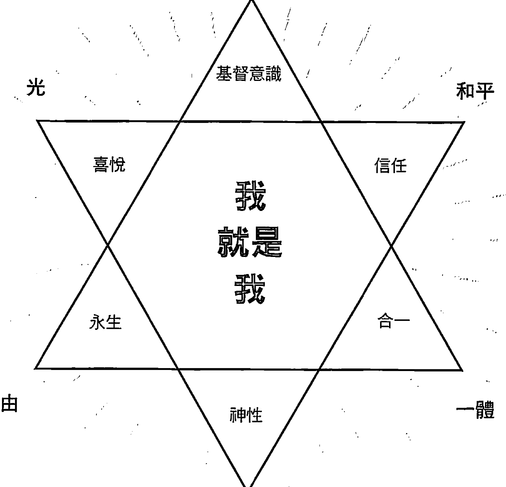

将爱注入水的符号。

## 星癒奇蹟：以愛而非邏輯療癒你的自我宇宙
Star Magic - Heal the You-Niverse: Rooted in love, not in logic

- 作 者／傑瑞・薩吉安特（Jerry Sargeant）
- 譯 者／吳宜蓁
- 發 行 人／簡志忠
- 出 版 者／方智出版社股份有限公司
- 地 址／台北市南京東路四段50號6樓之1
- 電 話／（02）2579-6600・2579-8800・2570-3939
- 傳 真／（02）2579-0338・2577-3220・2570-3636
- 總 編 輯／陳秋月
- 資深主編／賴良珠
- 責任編輯／鍾瑩貞
- 校 對／鍾瑩貞・賴良珠・丁鳳逸
- 美術編輯／李家宜
- 行銷企畫／張鳳儀・王莉莉
- 印務統籌／劉鳳剛・高榮祥
- 監 印／高榮祥
- 排 版／莊寶鈴
- 經 銷 商／叩應股份有限公司
- 郵撥帳號／18707239
- 法律顧問／圓神出版事業機構法律顧問 蕭雄淋律師
- 印 刷／祥峰印刷廠

2018年7月 初版
2019年6月 3刷
STAR MAGIC - HEAL THE YOU-NIVERSE: ROOTED IN LOVE, NOT IN LOGIC by JERRY SARGEANT
First published by Findhorn Press, an imprint of Inner Traditions International, Rochester, Vermont, USA.
This edition published by arrangement with Inner Traditions International,
Copyright © Jerry Sargeant, 2016
Through BIG APPLE AGENCY, INC., LABUAN, MALAYSIA.
Traditional Chinese edition copyright:
2018 FINE PRESS
All rights reserved.

獲取更多好書，請加微信号：strcdts 店铺：http://strdcrix

> 你本來就應該得到生命所必須給你的一切美好！秘密，就是過去、現在和未來的一切解答。——《The Secret 秘密》

◇ 很喜歡這本書，很想要分享
圓神書活網線上提供團購優惠，或洽讀者服務部：02-2579-6600。

◇ 美好生活的提案家，期待為您服務
圓神書活網 www.Booklife.com.tw
非會員歡迎體驗優惠，會員獨享累計福利！

## 國家圖書館出版品預行編目資料

星癒奇蹟：以愛而非邏輯療癒你的自我宇宙 / 傑瑞.薩吉安特 (Jerry Sargeant) 作；吳宜蓁譯. -- 初版. -- 臺北市 : 方智, 2018.07
320面；14.8×20.8公分 -- (新時代；183)
譯自：Star Magic - Heal the You-Niverse: Rooted in love, not in logic
ISBN 978-986-175-499-4 (平裝)
1.另類療法 2.能量 3.健康法
418.995 107007775

傑瑞在一場嚴重的車禍後，眼中看見的世界，就是幾何組成，之後他發現自己擁有了療癒能力，開始走上靈性旅程，並發掘了「星癒技術」。
他使用星癒技術療癒斷裂的骨頭、移除囊腫和腫瘤、消除纖維肌痛症、解決心臟疾病，也修補破碎的關係，讓企業加足馬力獲得極大的成功。
如果你對生活並不滿意，那麼你就得認識——星癒技術。

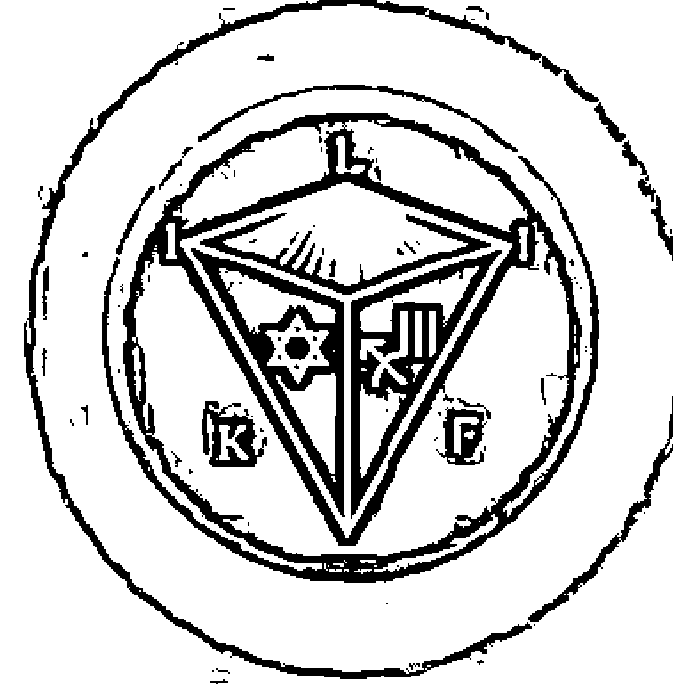

星癒技術，是每個人都有能力使用的療癒方式。
星癒技術，能療癒你自身的宇宙，釋放完整的人類潛能。
星癒技術，是在心理、生理、情緒和靈性方面都得到自由的機會。
星癒技術，可以消除病根，但不是透過消滅它，而是經由觀察者的眼，去改變被觀察者的實相。
星癒技術，是一把鑰匙，可以打開通往自由、愛與慈悲世界的大門，前往以愛孕育滋養的空間。
星癒技術，使用了應用量子物理學，可以快速清除你可能正在經歷的、阻礙你創造與活出最超凡生活的，身體、心理和情緒上的阻礙壓力創傷。
星癒技術，是靈魂的技術，它不會失效、不會破滅，只會擴張，如同有生命的物質，變得更好、更強大，你所需花費的力氣少了，但功效會發揮得更快。
星癒技術，是煉金術的能量，是最強大、最符合這時代的療癒方法。

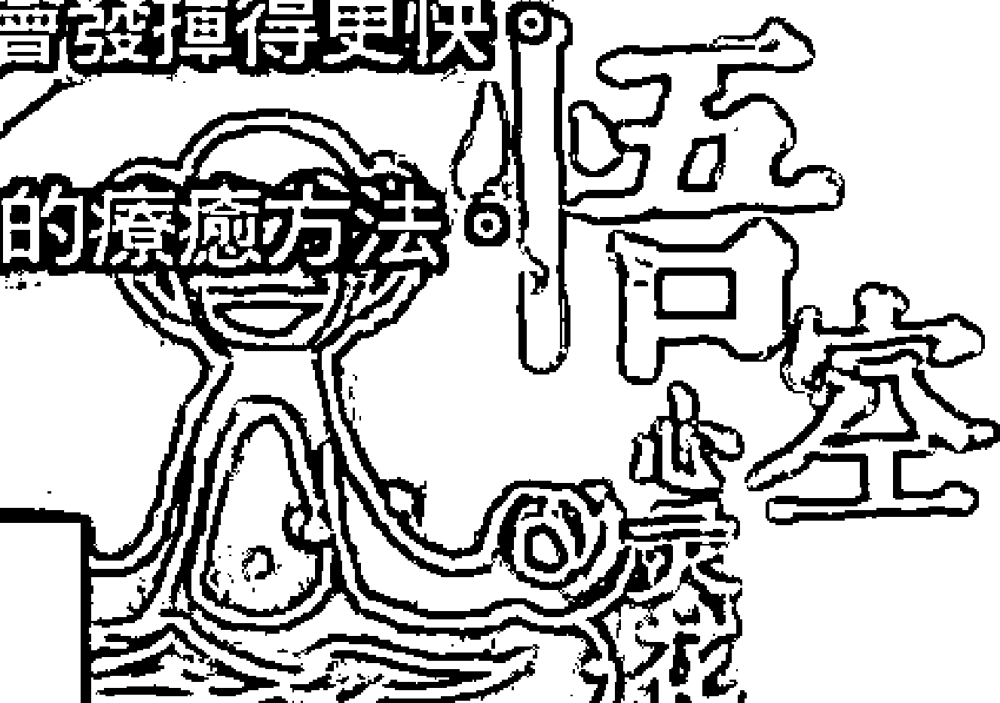

ISBN 978-986-175-499-4  [418]
00350
9 789861 754994
圓神書活網 BOOKLIFE