# 星際馬雅十三月亮曆

13調性×20圖騰，活出自己的天賦能量，以更高維度的視角校準人生

陳盈君 | 著

> IN LAK'ECH!

當我們開始學習這套十三月亮曆法，也就準備開始與銀河系整體的能量同步運作。

# St. Royal College
天使神秘学院

- ※ 专业占卜预测机构
- ※ 神秘学培训机构
- ※ 水晶能量研究中心
- ※ 神秘学资料库
- ※ 官方微信：strcdts
- ※ 微信公众平台：strc2011
- ※ 读书交流QQ群：
    - 占星塔罗占卜师交流群：814594478（加入密码：PDF）
    - 神秘学其他综合群：659338717（加入密码：PDF）

微信号：strcdts
天使神秘学院

天使神秘学院 院长QQ：715104687

微信公众平台：strc2011

# 制作说明：

本书由《天使神秘学院》出重金从台湾购入的原版书籍扫描制作完成。为达到最好阅读效果，特地把原版书全部切开后，再经由专业扫描设备高精度扫描完成，并经过一张张的PS后期处理最终成书，其间花费大量的人力、物力以及时间，只为能给大家提供经济并优质的神秘学学习资料而努力。

本学院强力谴责某些机构和个人，把本学院花心血制作完成的电子书籍，包装后直接放在自家淘宝网上低价倾销的行为，以谋取不劳而获的经济利益。如果长此以往最终将无人愿意再为大家花心思制作电子书，那以后可能大家再无新书可读。

为让大家以后能够读到更多的好书，也为了本学院的良性发展。本学院恳请大家尽量做到如下几点：

- 一、尽量在本学院的网站购买电子书籍。
- 二、请勿用技术手段把电子书内的水印及加密去掉。
- 三、在收到电子书后小范围传阅即可，千万不要公开传播，更别挂到淘宝网上低价销售。

同时为答谢广大支持者，学院电子书将做如下调整：

- 一、学院会把一些早已收回制作成本的电子书折价销售。
- 二、最新制作的电子书籍会开放打印功能，大家购买后有条件的可自行打印成书。

天使神秘学院
2019年1月

# 星際馬雅十三月亮曆

13調性×20圖騰，活出自己的天賦能量，以更高維度的視角校準人生

陳盈君 | 著

# CONTENTS
目錄

作者序 時間，是讓所有事情發生的力量……10

## CHAPTER 1 曆法關鍵字與重要概念

- 星際馬雅十三月亮曆是什麼？……16
- 曆法傳遞者……18
- 時間法則……19
- 共時的曆法……20
- 馬雅新年 & 無時間日……21
- 馬雅萬年曆……22
- 宇宙座標……22
- 卓爾金曆……23
- 宇宙綠格：銀河啟動之門……23
- 星系印記 & 圖騰 & 調性……24
- 和平旗……25
- IN LAK'ECH……26
- 魔法烏龜日……26
- 戀人日……27
- 彩虹橋靜心……28

## CHAPTER 2 尋找13:20星系印記

- 什麼是星系印記？……30
- 找到自己的主印記……33
- 年份表……34
- 月份表……35
- 調性對照表……36
- 卓爾金曆……37
- 引導圖騰對照表……41
- 找到周圍的星系印記：支持、挑戰擴展、隱藏推動、引導……36
- 時間區段：生活實踐……44
- 排出自己的生命波符……45

## CHAPTER 3 顏色&調性

- 顏色／Hunab Ku……56
- 調性／銀河音階……59
- 一：磁性……62
- 二：月亮……63
- 三：電力……64
- 四：自我存在……65
- 五：超頻……66
- 六：韻律……67
- 七：共振……68
- 八：銀河星系……69
- 九：太陽……70
- 十：行星……71
- 十一：光譜……72
- 十二：水晶……73
- 十三：宇宙……74

### 圖騰

- 圖騰運用與解析……76
- 一：紅龍……77
- 二：白風……81
- 三：藍夜……85
- 四：黃種子……89
- 五：紅蛇……93
- 六：白世界橋……97
- 七：藍手……101
- 八：黃星星……105
- 九：紅月……109
- 十：白狗……113
- 十一：藍猴……117
- 十二：黃人……121
- 十三：紅天行者……125
- 十四：白巫師……129
- 十五：藍鷹……133
- 十六：黃戰士……137
- 十七：紅地球……141
- 十八：白鏡……145
- 十九：藍風暴……149
- 二十：黃太陽……153

## CHAPTER 5 內在女神力量

- 連結內在女神力量……158
- 計算女神力量……159

## CHAPTER 6 13:28 & 個人生日

- 認識星際馬雅十三月亮曆……162
- 尋找馬雅生日……163
    - □ 馬雅年份表……163
    - □ 馬雅萬年曆……164
- 放射等離子……166
    - □ 等離子與日期對應表……167
- 七大脈輪……168
- PSI ／行星記憶資料庫……170
    - □ PSI表……171

## CHAPTER 7 個人流年 & 地球家族

- 找到自己的流年……174
- 身體全息圖……177
    - 圖騰……177
    - 調性……180
- 地球家族……183
- 五十二流年命運城堡……187
    - 繪製自己的五十二流年命運城堡……188

## CHAPTER 8 關係合盤

- 我與他人的關係……194
    - 合盤的計算方式……195
    - 合盤的探索……196
- 來自父母的力量：內在小孩……199

## 國王石棺印記

- 國王石棺印記解密……202
    - 國王石棺的十三個清晰印記……205
    - 與曆法最有關連的兩個圖騰……206

## APPENDIX 附錄：馬雅星際護照

- 卓爾金曆——找到屬於自己的 Kin……208
- 星系印記……210
- 生命波符……212
- 馬雅生日……214
- 五十二流年命運城堡……216
- 關係合盤……218

目錄中的圖示為計算星系印記、馬雅生日、放射等離子與PSI所需的數據與圖表。

# 作者序

## 時間，是讓所有事情發生的力量

順流於和諧時間之中，活出天賦，開展生命藍圖！

獻給此時此刻翻開這本書的你，親愛的馬雅家人。
因著你們的愛，陪著我一路走來，持續地分享愛。

Kin163／共振藍夜，來自地球波符的馬雅旅人

時間就像巨大的載體，所有的事情都在時間之上發生著。當我們以和諧共振的頻率走在時間之流中，所有的發生也都能攜帶著和諧的頻率。無論過去已發生的事、現在當下正在進行中的，或者未來即將到來的，都帶有時間軸的元素。而我們的意識如何詮釋你的過去、如何經驗你的當下、如何創造你的未來，都決定於核心所投射出的影像究竟是些什麼，這關鍵的意識源頭，就是我們的「心」。

心的和諧頻率，帶來生命的和諧；
世上所有的力量，來自於心靈的選擇能力；
生命轉化的奇蹟，來自於你的念頭，存乎心念之間。

2013年8月，我開始接觸星際馬雅十三月亮曆法（簡稱十三月亮曆）；2014年秋分，感謝彭芷雯老師、ShavatY老師、David Wang帶團照顧，讓我踏上墨西哥馬雅聖地旅行，開啟我與馬雅文明的連結。

學習十三月亮曆的那一年，剛過了所謂的2012馬雅末日預言，舊週期結束，並迎接新的大週期到來，當年曆法正巧就是Kin164／銀河黃種子年，新世紀的第一道曙光，正好也是我自己的地球波符，寫書的這一整年（Kin169／宇宙紅月年）也是地球波符。

這道曙光，照進了我生命中的每個角落，我就像進入一股宇宙洪流之中，一個個美麗驚喜的共時、一個個豐盛的機緣安排，不斷地在我眼前盛開。教學課程從台灣、馬來西亞、中國大陸、香港等地不停開展，馬雅力量的種子，遍地開花。從教學至今，包括線上課程，已經累積一百多個班級，教導出無數的學生們，而這些馬雅種子教師們，也繼續在各個國家、各個城市進行分享。

一開始，馬雅曆法的中文書籍幾乎等於零，我很感謝我的啟蒙老師Katarina、Ana、Rebecca。感謝Katarina老師把西班牙原文資料翻譯成英文，再由Rafeeka將Ana老師帶來台灣，我們才有幸能夠接觸並學習。我的第一堂十三月亮曆法課，便是Rebecca老師帶領的。

我自己花了很多時間上網研究原文網站與各種英文資料，也開始整合自己多年來的諮商輔導系統，把人格天賦與關係伴侶諮商也放進去，做成教學內容。後來，因著自己教學的便利性，也為了讓大家能在生活中實踐曆法，我與左西團隊開始全力策劃並出版各項工具與實用專書，《超級馬曆》因而誕生，也同步創作《iMaya 馬雅卡》、《很角色卡》系列。

經歷了多年的分享教學，我真心希望把博大精深的時間法則及曆法知識傳遞給更多人。於是，我跟出版社的芳如和韋毅開始討論起這本書的出版可能，把我在教學過程中的精華都寫進書裡面，不藏私地完整呈現解密細節及步驟。特別感謝地平線文化給我這個機會，讓這本書正式出版，謝謝芳如一直給我鼓勵，感謝主編韋毅耐心協助我一直討論與調整，盡善盡美！

十三月亮曆，不只是一套認識自己的系統，更是一套調頻、轉化的好工具，能打開你理解生命的不同觀點，以一種新的方式重新看待你自己、以新的方式看待生活、以新的眼光看待他人，讓我們更能發揮天賦、啟動潛能，活出本然的自己。

這本書，完整呈現了十三月亮曆的自然法則，以及在學習曆法過程中所需要的基礎知識，願所有讀者都能夠循序漸進、按圖索驥，進入十三月亮曆的樂趣之中。

藉此機會，獻上我最深的愛給地球母親、天空父親、馬雅祖靈與星際老師，還有教導過我的十三月亮曆導師們，由衷感謝在世界各地的馬雅家人們，無論你在哪個城市、哪個國家，我知道彼此都因著彩虹橋而連結，我們心中都有心電感應的彩虹頻率在互相支持著。最後，感謝我的父母給予我生命，感謝最強大的左西團隊與全球各地的粉絲們，總是力挺我到底！

感謝每一位夥伴在過程中的彼此支持、付出與貢獻，這本書能順利出版，有著大家滿滿的愛、灌注在一致的願景上，一起成就美好的事，完成現階段的星際宇宙任務，真的是太美麗了！

當我們連結上源頭的生命力量時，豐盛也將源源不絕朝你而來。
整體的地球頻率將持續成長與躍進，我們躬逢其盛，也與時俱進。

2019年的後半年，成了最關鍵的時刻，進入磁性白巫師年的新啟動。
不只決定了下一個七年週期的顯化頻率，更影響了你的十三年新週期！

讓我們做好準備，迎接2020年「維度轉換」至第五次元的意識大躍進！
現在時間正在加速，我們處於加速轉變期。
你準備好了嗎？跟我們一起加入馬雅彩虹心靈戰士的行列吧！

IN LAK'ECH

陳盈君。 寫於台灣

獻給每位馬雅家人

# CHAPTER 1
## 曆法關鍵字與重要概念

### 星際馬雅十三月亮曆是什麼？

我們常常會這樣說，馬雅文明與其曆法的共時智慧，能夠為人們的生命帶來無限擴展，也相信學習這套星際馬雅十三月亮曆有其重要性，然而，原因是什麼呢？

馬雅人是時間的管理者、預言者，我們又將他們稱為時間旅者、宇宙的旅行者（Galatic Navigator）。星際馬雅人，帶來了宇宙銀河星系的智慧，而荷西·阿圭勒斯博士（Dr. José Argüelles）則接收並傳遞了這股來自天狼星的美麗訊息，把完整的「星際馬雅十三月亮曆法」系統化，讓我們得以在生活中實踐體驗「時間就是藝術」（Time is Art）的理念，超越原本機械式的時間規則與緊迫掌控，更能協助自己活出本然的天賦力量。

> 世界上所有的一切，都是頻率！

物質是頻率、意念是頻率、聲音是頻率、時間也是頻率，不同的頻率會顯化出不同的能量與事件。當我們開始接觸並學習這套曆法，就是開始讓自己與宇宙頻率「校準」對頻。當頻率對上了，能量就對了，我們在地球上的能量就能夠更正確的被運用，正確活出自己與生俱來的能量。

談到這裡，大家可能會好奇，十三月亮曆為何會在現代又開始盛行起來了呢？這樣的星際馬雅人智慧，又是如何被重新喚醒的呢？

### 2012年12月21日，結束大週期，開啟新紀元！

1973年，荷西·阿圭勒斯博士在其著作《馬雅效應》（*The Mayan Factor: Path Beyond Technology*，1973，Bear & Company出版）中，曾經提到一段解釋：

> 從西元前3113年起，到西元2012年，地球與太陽系正在通過一束來自銀河系核心的銀河射線。馬雅人相信，太陽系在經歷長達5,125年的「大週期」（The Great Cycle）過後，也就是到達2012年12月21日，當地球、太陽和銀河系中心重合之時，太陽系將會發生根本的變化——「同化銀河系」，地球上的人類文明也將進入全新的紀元。

因此，從1992到2012年的二十年間，地球進入了「大週期」最後階段的最後一個時期，馬雅人認為，這是與銀河系同步非常重要的時期，因而稱為「地球更新期」。

我相信，許多人跟我一樣，都聽過2012年末日預言的傳說。這些預言在當時確實引來不少身心靈界人士的討論，人們甚至紛紛囤積蠟燭，準備度過所謂的2012年冬至的「黑暗三日」。回想2012年跨越到2013年的時刻，許多人也跟著地球頻率的轉化，同步經歷生命中的大成長與躍進階段，當時真是所謂新時代的覺醒時刻，也是地球提昇的轉化期！

### 曆法傳遞者

荷西·阿圭勒斯博士，又稱Valum Votan，意思是週期終結者。1939年1月24日（Kin11／光譜藍猴）至2011年3月23日（Kin89／光譜紅月）。

荷西博士出生於美國明尼蘇達州，為芝加哥大學藝術史與美學博士，曾任教於多所大學。他將一生的藝術工作奉獻於和平與星球意識轉化運動，其中最讓人耳熟能詳的，就是發起1987年8月16與17日的「和諧匯聚*」活動，提倡全球和平靜心，讓世界關注馬雅與星際馬雅十三月亮曆法議題，同時，他也是「世界地球日」（Earth Day）理念的創始人之一。

> 作者註
*是世界上第一個全球同步的冥想運動，由荷西博士所倡導，在 1987 年的 8月 16及 17日於全世界同步舉行。這項運動吸引了成千上萬的新時代活動成員，在全球一百多處神聖地點，如英國巨石群、美國加州舊金山大橋以及亞利桑那州的聖多娜等地參加。

作為學者，他對《易經》的研究有著卓越貢獻，並深入研究蘊藏於《可蘭經》的數學密碼與時間法則的關聯性。最受人矚目的是，他在1989年發現了「時間法則」（Law of Time），為馬雅曆法數學系統研究貢獻甚多。

荷西博士在1992到2011年間曾環遊世界數次，舉辦無數場會議與研討會，提倡他的理念：「時間不只是金錢，時間更是藝術」，並著有《馬雅元素》、《地球揚升》、《大角星探測》、《時間與科技場域》、《運轉心智場》等多本著作。

荷西博士的主印記為Kin11，也是中國的生日印記（1949年10月1日）。完美隱藏推動則是Kin250／電力白狗，開啟白色銀河愛的季節六十五天的守門員。

他的PSI是Kin131／磁性藍猴，也是佛陀的出生印記。另外，Kin144也是個重要的數字，是荷西博士1993年7月26日在墨西哥收到訊息的印記，有啟蒙點化的含意。144也是Gamma的心電感應指數。

### 時間法則

我們藉由學習星際馬雅十三月亮曆，將舊週期12：60機械式的頻率，轉換到新週期13：20的自然法則。透過改變時間的使用方式，我們能夠有意識地提昇頻率，開始觀察到生活中種種「共時」事件的發生。觀察每天的星系印記，都是與第四次元心電感應的連結，運用這樣的能量校準，讓我們的能量與宇宙對頻，替我們的心智開啟嶄新潛力，完成生命真正的蛻變，讓生命更寬廣。

當你學習這套曆法，便會開始回歸自然的時間法則（相對於2012年之前的舊時代機械法則12：60），你會認識自己的宇宙源頭能量，這種方式就是開始給予地球母親最大的愛，也是給自己最大的支持。同時，你會開始認識身邊每個人的真實力量，而這也是給予他人支持的一種方式。

### 13：20共時序

13：20代表了十三月亮曆的十三個調性、二十個圖騰，13×20=260，就是卓爾金曆上二百六十個星系印記的位置，我們可以從這裡面看到共時（Synchronic）的能量與運作。

### 13：28週期序／循環序

13：28代表十三月亮曆的十三個月，每個月有二十八天，13×28=364，算出來一年會有三百六十四天，這就是月曆上的循環週期。但是，一年實際上共有三百六十五天，那麼，少掉的一天去哪裡了？其實這一天是「無時間日」（Day Out of Time），也就是每年的7月25日，本書將在接下來的內容介紹無時間日。

### 共時的曆法

這套宇宙的星際馬雅曆法，又稱「行星服務的曆法」，完整的名稱叫做「星際馬雅十三月亮曆」，也有人稱「十三月亮二十八天曆」，本書則簡稱「十三月亮曆」。這是關於生命的教導，更是一套「共時」的宇宙曆法。當你在生活中練習並利用曆法來實踐時，就是開始「校準」頻率，讓自己回到「自然的頻率」當中。

如果我們能夠開始在生活中觀察到「共時現象」，就能進一步地認出各種宇宙的巧妙安排，其實都是同步性、都是共時性，例如巧合的發生、奇妙的體驗、剛剛好的奇遇。就如同日本哲學家森信三（Shinzō Mori）曾說過的：「人的一生之間，一定會與命中註定的人相遇。相遇的時機將早一分太早、晚一分太晚般的恰到好處。」

學習曆法後，共時經驗在生活中出現的次數將會越來越多，這是因為我們跟宇宙頻率調整到一個「對準」的能量上，也因為這樣的共時，能讓我們生命更順流，做任何事情都能越來越順暢、順利，且輕鬆不費力！

因此，當你開始運用曆法來過生活，就會對自己、對生命、對他人產生最大的支持。運用十三月亮曆，是最生活化且簡易的方法，能改變我們自己和環境，進入與太陽系同步共時的和諧頻率之中。從西元2013年開始，這一年的7月26日是銀河黃種子年新世紀的第一道光，我們正進入一個準備期。接下來將有七年時間，能夠讓我們好好調整自己的頻率，進入次元的轉化階段，以迎接2020年第五次元的到來！

許多人已經在生活中感受並體驗到真實的改變發生，能量快速而且強大。而我們相信，十三月亮曆的智慧原本就在自己之內。我們本來就擁有曆法所說的智慧，現在的我們將要重新喚醒並拿回自己原本的力量，讓每個人都憶起，自己就是宇宙中移動真理的象徵。

### 馬雅新年 & 無時間日

### 7月26日，整年度馬雅能量的定調

西元每年的7月26日就是馬雅新年，這一天的能量將會定調（錨定）整年的頻率，包括顏色、調性、圖騰。大家一定會很好奇，為何是這個日子呢？因為西元7月26日這天，天狼星、太陽、地球這三個行星會校準在「同一條線上」。因此，當我們開始學習這套十三月亮曆，也就是與銀河系整體共同的能量同步運作。

### 7月25日，無時間日

卓爾金曆是依照月亮繞地球一圈二十八天的週期所發展出來的曆法；七天為一週，二十八天為一個月，十三個月為一年，再加上一天「無時間日」，總共三百六十五天。「無時間日」的意義，就是讓我們在新與舊的年度之間，有個完整的一天，可以完全釋放舊的生活與思想，並重新擬訂新一年的方向或計畫。

這一天是所有次元融合的能量，7月25日這天生日的人，在十三月亮曆中是「沒有日子」的，在「PSI表」裡也無法找到對應的數字，因此主印記即是PSI（無論是要尋找哪一個次元的印記，都會回到主印記本身）。

在這天適合以靜心音樂、舞蹈等藝術形式來歡慶，世界各地的不同國家、不同文化，都會一起慶祝和平、宇宙之愛，度過「時間就是藝術」的一天。

### 馬雅萬年曆

回想西元曆法，每個月份開始跟結束的日期，會落在星期幾皆不固定，每隔四年還有一次閏月的2月29日，因此，日期排列會讓我們感覺有些混亂、難以記憶，無法以直覺去理解這個曆法的規則性。

十三月亮曆最特別的地方在於，日期的排列是很有規則的，週期固定且一直重複循環，因此又被稱作循環序、週期序（13：28）。

每個月份固定四週，依照紅、白、藍、黃的順序，每個顏色各一週，每一週代表了四個月相。一週有七天，一個月二十八天。二十八天循環代表了一個月亮週期。每一年，總共會經歷十三個月亮週期，也就是這部曆法的十三個月份（參考第六章P164）。

### 宇宙座標

依照十三月亮曆的規則，每年都有專屬的「年度能量」，及其對應的「宇宙座標」，這有點像中國的十二生肖，例如雞年、狗年，以此類推。例如，2018年7月26日開始的馬雅年是「宇宙紅月年」，2019年7月26日開始的馬雅年是「磁性白巫師年」。

宇宙座標的寫法是以NS開頭，後面加上數字。NS就是New Sirius（新天狼星），NS 1.31，指的是新天狼星第一個週期的第三十一年。2017年是水晶黃種子年，就是NS 1.30，接下來是宇宙紅月，而其宇宙座標的年度寫法就是NS 1.31（參考第六章P163）。

再把馬雅日期的「月、日」加上去，例如十三月亮曆的宇宙紅月年5月28日，宇宙座標的寫法即為：NS 1.31.5.28。

### 卓爾金曆

馬雅學家給了馬雅版的中美洲二百六十天曆法一個名稱：「卓爾金曆」（TZOLKIN）（參考第二章P37），這是依據猶加敦語（Yucatán）所建立，引申意義為「日子的計數」（count of days）。

卓爾金曆從左上角開始起算，從上往下共二十個圖騰，每一個圖騰橫列裡有一到十三個調性，所以形成了總共二百六十個Kin（一個Kin代表一天），而這張卓爾金曆，包含了整個宇宙與十三月亮曆最重要的密碼。

### 宇宙綠格：銀河啟動之門

卓爾金曆裡頭一共有五十二個綠色格子，遇到綠格子時，便代表了宇宙能量開啟的日子；銀河門戶（GAP，又稱銀河啟動之門）打開的日子，也就是綠格子那一天，會有來自Hunab Ku（參考第三章P56）釋放出直接對頻的訊息，從宇宙源頭Hunab Ku釋放出電波，傳遞到銀河系、太陽系、太陽，再一路傳到地球，宇宙和地球的網格（grid）閘門會完全敞開，讓我們能夠直接接收到精準的宇宙頻率。因此，綠格子的日子很適合靜心，畫Hunab Ku，直接與宇宙的能量對頻。

我們又將綠格子稱為「宇宙綠格」。綠色代表宇宙，Hunab Ku的中間正好是綠色。因此，綠色在十三月亮曆的象徵意涵很重要，綠色也正好對應脈輪裡的心輪，所以綠格子也直接等於地球對應心輪的頻率。

### 星系印記 & 圖騰 & 調性

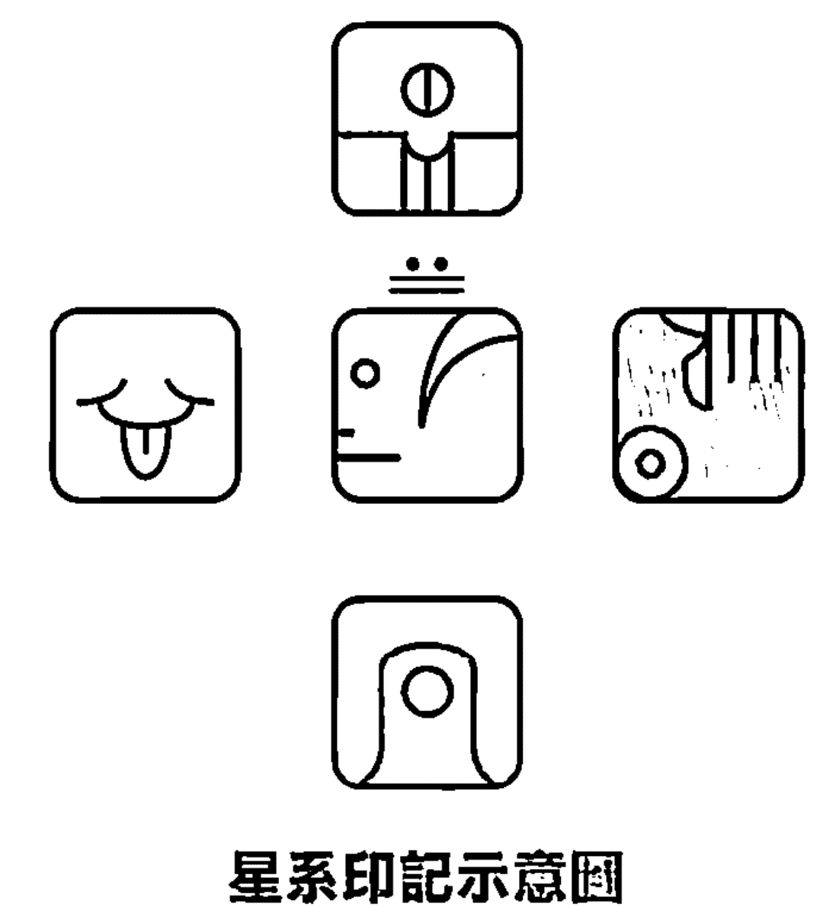

### 星系印記

每個人依照自己的西元出生年月日計算，會得到一組星系印記（Galactic Signature）的編碼（第二章會教大家如何找出自己的星系印記），我們會稱這個號碼為「銀河常數」，意味著我們與生俱來的特質與能量配備。

### 圖騰

在卓爾金曆裡，一共有二十個太陽圖騰（Solar Seals），簡稱圖騰（Seal），代表了人生必經的二十個課題，也是生命原型。不同的圖騰，會有不同的特質與課題。

### 調性

在卓爾金曆裡，一共有十三個調性，調性指的是銀河音階（Galactic Tones），簡稱調性（Tone），是數字頻率。不同的調性，則具備了不同的特質頻率。

### 和平旗

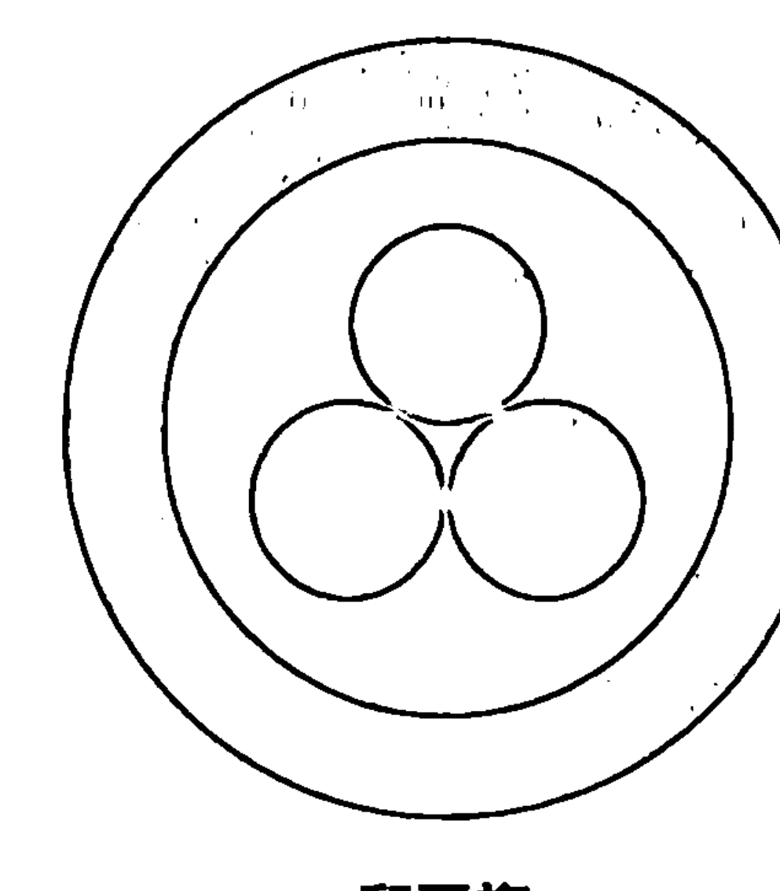

和平旗的三顆圓球，代表了藝術、靈性與科學，是多次元共同體的結合。紅色代表一個人類家族的生命血脈，而環繞著三顆圓球的紅圈，代表了時間13：28的循環本質在生活中的完整落實。

1935年，二十二個國家在美國華盛頓特區共同簽署了尼可拉斯·羅列赫（Nicholas Roerich，1874-1947）所創立的「羅列赫和平公約」（Roerich Peace Pact），宣示以文化促進和平，懸掛和平旗的地方正是提醒每個人，以和平取代所有戰爭。

無論在社區、學校、醫院及公開的場所懸掛和平旗，或推廣十三月亮曆活動，都會採用和平旗作爲正式的標幟之一。因此，我們分享這套十三月亮曆的同時，也是在傳遞這套和平的曆法之精神。

> 文化所在之處，就有和平。
和平所在之處，方有文化。
——尼可拉斯·羅列赫

### IN LAK'ECH

「IN LAK'ECH」是馬雅人的招呼語，意思是「你是我，我是另一個你。我們是一體的！」來到你身邊的每一個人，你都能認出：他就是你的一部分，你也是他的一部分。

當我們遇到學習十三月亮曆的朋友時，會說彼此是「馬雅家人」。而打招呼的問候語就是「IN LAK'ECH」。當我們說出「IN LAK'ECH」時，就能夠透過音頻共振每個來到面前的人，並給予祝福，而且能夠認出面前的每個你，都是與自己有內在頻率的共振，所以彼此才會互相吸引，一起來這裡學習、玩耍，來人間服務，來地球做一些美好的事情。

「IN LAK'ECH」，除了打招呼、問好之外，還可以在什麼時候使用呢？

如果你聽到一段生命經歷的分享，可以直接回應「IN LAK'ECH」，代表了感謝語，回應並感恩聽到這段分享。

當你發現生活出現了很多奇妙的巧合、偶然或奇蹟般的神奇默契，我們都稱之為「共時」的現象。例如，我們會發現某些重要印記的人物出現在生活裡（為家人朋友計算星系印記時，可能會發現對方剛好就是自己的完美推動、完美支持等等），當這些夥伴出現在你身邊時，我們就可以跟對方說「IN LAK'ECH」，代表這個巧合且共時的經驗，因此，這句話也代表了對一個美好共時安排的回應。

### 魔法烏龜日

當天調性與當月月份調性相同時，稱為「魔法烏龜日」。這天的能量頻率會與當月份最對頻。例如在三月「電力鹿之月」碰到調性三的日子時，就是魔法烏龜日。

### 戀人日

在棋盤預言*裡，十三月亮曆每個月的第二十三天，是國王（代表全人類的陽性力量，黃烏龜為其象徵）與皇后（代表全人類的神聖陰性能量，白烏龜為其象徵）相遇的日子，黃烏龜與白烏龜相聚的時刻，具有陰陽能量和諧、合一的力量，也就是馬雅「戀人日」（情人節）。因此，曆法中的每個月都有情人節。

> * Telektonon，指的是地球心靈的發聲通道，也是心電感應的能量場，就像是立體版的十三月亮曆知識，整合了13:20與13:28的校準方式，以第四次元的維度來認知第三次元的世界。

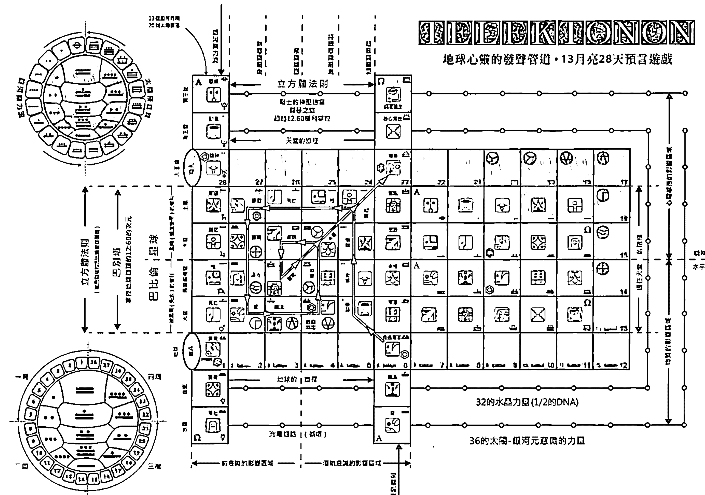

### 彩虹橋靜心

在等離子 SILIO ⊕ 以及水晶調性 ☽ 的日子，地球母親會釋放出彩虹光，邀請所有馬雅家人一起進行彩虹橋靜心。無論你身在何方，都邀請你的靈魂、意識一同加入我們。

彩虹橋靜心的目的是產生一個愛的心靈感應場域。它連結了地球與我們自己的中心，創造一股守護地球磁場的雙極彩虹橋的電磁場。我們將以世界性的心靈感應，創造一個電力流動的場域，這是一個真實正向思維的振動保護場，將地球的共振維持在和諧與寧靜的狀態。

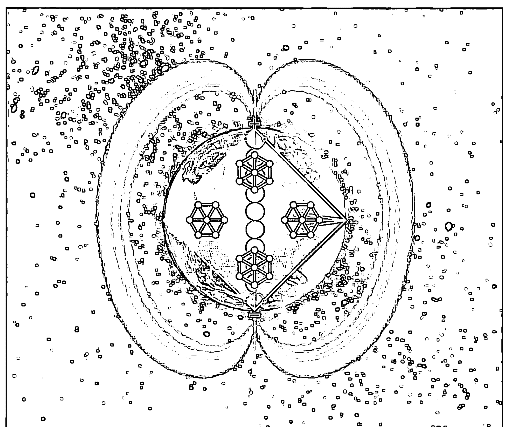

彩虹橋靜心示意圖

### 靜心引導詞

1. 觀想自己位於地球內部的八面水晶體（上方為兩面紅色與兩面白色，下方則是兩面藍色與兩面黃色）。核心中央是強烈閃耀的白光。一道乙太光柱從閃耀的中心向北方與南方伸展，觸及八面水晶體的頂端。
2. 乙太光柱以紅色與藍色兩道流管旋繞，就像DNA的雙股螺旋結構。
3. 水晶體的內部有四顆時間原子。一顆紅色時間原子繫在北邊軸線，一顆藍色時間原子繫在南邊軸線。八面水晶體的地心重力層，以水平方向由中心向外發射。平面上還有兩顆時間原子，分別是白色與黃色，環繞著中心，以逆時鐘的方向如輪軸般轉動。
4. 想像一道充滿等離子的七彩光，從水晶中央沿著地球兩極的軸線流出，射出後，分別形成兩道圓心角為一百八十度的圓弧彩虹。當地軸繞著自己的軸線旋轉時，彩虹橋維持靜止不動。
5. 接下來，將整座彩虹橋圍繞地球的影像放置於自己的心輪。想像兩道彩虹光流發射，穿過你的中軸線，到達頭頂與腳底，並且在身體的四周形成彩虹橋。
6. 現在，你與彩虹橋合而為一。這座世界和平的彩虹橋是真實的。一旦有足夠的人，以愛的心電感應流一起觀想，這道彩虹橋就會成為真實。

# CHAPTER 2
尋找 13:20 星系印記

## 什麼是星系印記？

像這樣由五個圖騰排列在一起的組合，稱為「星系印記組合盤」。這五個圖騰代表了五種頻率能量，也是每個人與生俱來的配備。當你選擇來到人間，靈魂選擇了一個特定日期（出生年月日）誕生的時候，能量就是以一個完整的組合進來，你能夠感受到屬於自己的支持、挑戰擴展、引導、隱藏推動等能量，其實都已經具備了，只是若要在生活中開發出來，我們就得做出相對應的行動與練習，透過有意識地覺察自己的情緒、想法與行動，活出本然的天賦力量。

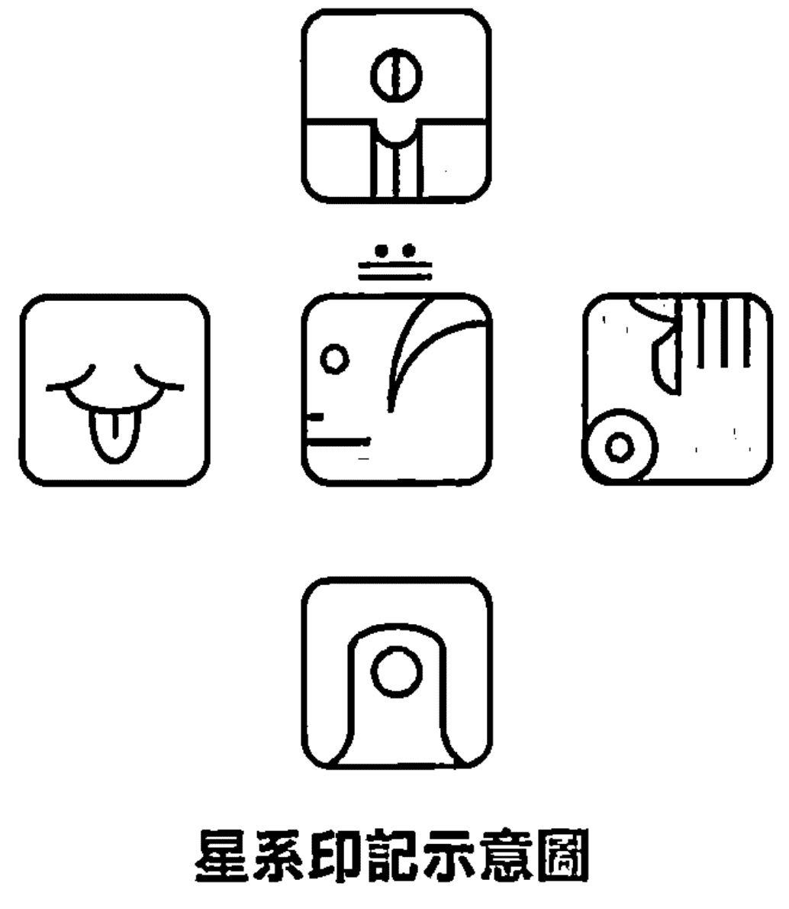

舉右上圖為例，主印記為黃人，支持為藍手，我們如果能多展現一些藍手圖騰的特質行為，做一些該圖騰對應的活動（每個圖騰的特質請參考第四章），便可以支持你的能量；內在的想法計畫，同樣可以透過「手」去創造。

相同的，遇到黃人主印記的日子，在當天有意識地創造這些行為，能夠讓這些有意識的行為加持今天的能量。換句話說，若你想在那天找人討論事情，便應該要很落實地談論「可以怎麼做」、「怎麼調整」等等。而當你把十三月亮曆運用到生活時，會發現自己能夠更有意識地過生活。

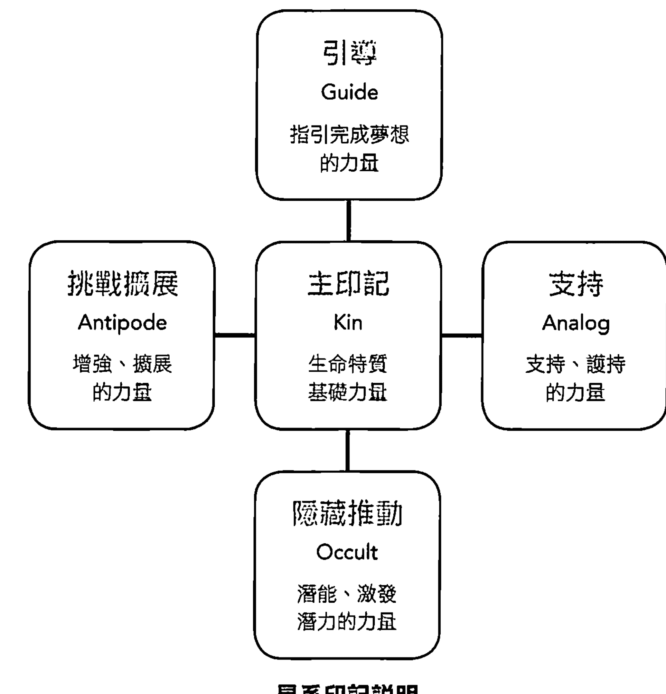

### 動手計算是調頻最快的方法

對馬雅人來說，他們相當注重親自動手畫出圖騰與彩色圖案。幾千年前並沒有 app、沒有課本，當然更不會有太多資料可以作為參考，所以馬雅人只能親自動手算出這些數字，而親自將這些數字跟馬雅圖騰頻率連結，正是調頻最快的方法。

### 星系印記說明表

由每個人的西元出生日期計算出來的，也代表了與生俱來的能量頻率，一個 Kin，便代表了一個日子。
每個人都選擇了一個特殊的日期投胎轉世，來到地球。從靈魂的層面來看，我們在出生前的靈魂會議中，已經幫自己選定好這一組出生日期，以此當作我們這一生的密碼（無論是自然產或剖腹產，誕生的日期都已在我們出生前便決定了）。而這個年月日是永遠不會改變的，會帶來一組天生的特定頻率，這是每個人獨特的先天能量。**主印記是生命特質展現出來的基本力量，也是一個人最重要的天賦特質**。因此，當你思考著「我要活出自己」時，即代表你要活出「主印記」的力量。

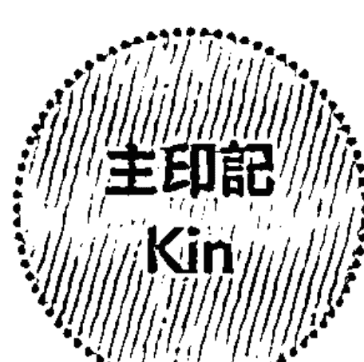

**代表你在生活中比較熟悉的特質**，就像你的慣用手，是能夠為你的行動加分的，也代表能夠支持你的方式，為你帶來更多轉化與改變的動力。
支持就像在身旁護持著你，幫你的主印記加分，並為生活添加更多生命的能量。有時，我們在合作關係中的夥伴，剛好就是我們的支持力量，這樣的互助合作就會非常美好，能夠帶來改變的可能性。

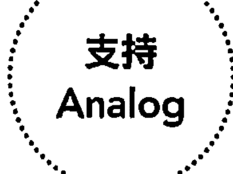

**指的是生活中比較不熟悉、陌生的特質**，甚至可能是不擅長的部分，就像你的非慣用手（但也有人天生就擁有很活出挑戰的特質，就像是有人天生左撇子）。例如你在遇到什麼事情，總是會特別感到充滿挑戰。但是，相對的，挑戰擴展的能量也可以協助我們擴展與打開力量，開展原本侷限的自己，這也是協助我們強化自己的關鍵頻率。

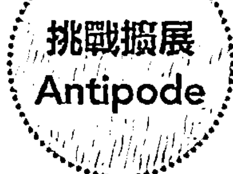

位於組合下方的隱藏推動，就好像是我們的潛意識，**屬於我們內在隱藏起來的自己，也是等待被我們開發的潛能**。有時，我們意識不到自己擁有這個部分，必須透過他人來看見自己的這些特質。當我們能夠認出這個力量時，它就會形成一股向上的推動力，這個推動力可以協助我們認出並實踐人生更遠大的夢想，把自己隱藏的潛能再次挖掘出來。

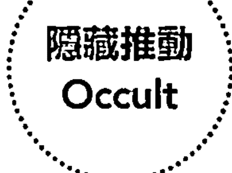

位於組合上方的引導，**是指引我們實踐夢想的力量**，比較像是「高我」，更高力量的我們。這個力量將會是協助、指引我們完成人生夢想的關鍵。當你需要指引時，可以多運用這個特質來成長出新的高度，彷彿在眼前指出一個更清晰的方向、告訴自己可以怎麼做。一旦我們發揮這個能量特質，更能完成目標。

※主印記就像是火箭的主機，支持與挑戰擴展是火箭的雙翼，引導是火箭頭，隱藏推動是火箭的燃料。

我曾聽過許多夥伴分享：學習曆法的效果特別好，是因為每個圖騰都是自己動手算出來、畫出來的。反倒是透過手機或電腦運算的同學，有時會比較難連結頻率。所以，我特別鼓勵大家在調頻的過程中，避免用 app 或網站查詢生日資料，建議「自己動手計算出來」，透過一筆一畫繪製出來的過程，會很清楚且直接地明白：力量來自何方、為何如此。一步步替自己慢慢解密的過程，是非常奇妙的體驗。

「動手計算」也是學習過程的重要關鍵，如此一來，才會知道自己哪裡算錯，而且幸運的我們現在還有書籍可以對照、檢驗。完整畫完再對照是比較好的方法，更何況親自動手計算與繪製的過程，其實就已經在為自己調頻了。

### 找到自己的主印記

我們會在接下來的內容說明如何算出自己的星系印記組合盤。為了增加你的印象，我們用 2018 年 1 月 26 日這一日作為範例，教你一步步算出主印記以及其他印記。

主印記是最重要的一個，在計算出自己的主印記之前，我們必須先知道自己的出生年月日，並注意以下三個狀況：

1. 計算生日：計算星系印記時，是以真正的西元出生日期為原則。
2. 不知道真正生日的人，直接用身分證上的出生日期計算即可。
3. 如果只知道農曆（陰曆）生日，建議先推算出真正的西元出生日期。

### STEP 1 · 出生年份

首先，在下頁的「年份表」左欄找到自己的西元出生年，然後橫向往右欄對照，找到對應數字。

【範例】2018 年，橫向往右邊對照，可以找到數字 222。

### 年份表

| 出生年份 | 数字 |
|---|---|
| 2117、2065、2013、1961、1909 | 217 |
| 2116、2064、2012、1960、1908 | 112 |
| 2115、2063、2011、1959、1907 | 7 |
| 2114、2062、2010、1958、1906 | 162 |
| 2113、2061、2009、1957、1905 | 57 |
| 2112、2060、2008、1956、1904 | 212 |
| 2111、2059、2007、1955、1903 | 107 |
| 2110、2058、2006、1954、1902 | 2 |
| 2109、2057、2005、1953、1901 | 157 |
| 2108、2056、2004、1952、1900 | 52 |
| 2107、2055、2003、1951、1899 | 207 |
| 2106、2054、2002、1950、1898 | 102 |
| 2105、2053、2001、1949、1897 | 257 |
| 2104、2052、2000、1948、1896 | 152 |
| 2103、2051、1999、1947、1895 | 47 |
| 2102、2050、1998、1946、1894 | 202 |
| 2101、2049、1997、1945、1893 | 97 |
| 2100、2048、1996、1944、1892 | 252 |
| 2099、2047、1995、1943、1891 | 147 |
| 2098、2046、1994、1942、1890 | 42 |
| 2097、2045、1993、1941、1889 | 197 |
| 2096、2044、1992、1940、1888 | 92 |
| 2095、2043、1991、1939、1887 | 247 |
| 2094、2042、1990、1938、1886 | 142 |
| 2093、2041、1989、1937、1885 | 37 |
| 2092、2040、1988、1936、1884 | 192 |

| 出生年份 | 数字 |
|---|---|
| 2091、2039、1987、1935、1883 | 87 |
| 2090、2038、1986、1934、1882 | 242 |
| 2089、2037、1985、1933、1881 | 137 |
| 2088、2036、1984、1932、1880 | 32 |
| 2087、2035、1983、1931、1879 | 187 |
| 2086、2034、1982、1930、1878 | 82 |
| 2085、2033、1981、1929、1877 | 237 |
| 2084、2032、1980、1928、1876 | 132 |
| 2083、2031、1979、1927、1875 | 27 |
| 2082、2030、1978、1926、1874 | 182 |
| 2081、2029、1977、1925、1873 | 77 |
| 2080、2028、1976、1924、1872 | 232 |
| 2079、2027、1975、1923、1871 | 127 |
| 2078、2026、1974、1922、1870 | 22 |
| 2077、2025、1973、1921、1869 | 177 |
| 2076、2024、1972、1920、1868 | 72 |
| 2075、2023、1971、1919、1867 | 227 |
| 2074、2022、1970、1918、1866 | 122 |
| 2073、2021、1969、1917、1865 | 17 |
| 2072、2020、1968、1916、1864 | 172 |
| 2071、2019、1967、1915、1863 | 67 |
| 2070、2018、1966、1914、1862 | 222 |
| 2069、2017、1965、1913、1861 | 117 |
| 2068、2016、1964、1912、1860 | 12 |
| 2067、2015、1963、1911、1859 | 167 |
| 2066、2014、1962、1910、1858 | 62 |

### STEP 2 · 出生月份

在下方的「月份表」左欄找到出生月份，橫向往右欄對照，便可以找到對應數字。

【範例】1月，橫向往右邊對照，可以找到數字0。

### 月份表

| 出生月份 | 數字 | 出生月份 | 數字 |
| :--- | :--- | :--- | :--- |
| 1月 | 0 | 7月 | 181 |
| 2月 | 31 | 8月 | 212 |
| 3月 | 59 | 9月 | 243 |
| 4月 | 90 | 10月 | 13 |
| 5月 | 120 | 11月 | 44 |
| 6月 | 151 | 12月 | 74 |

### STEP 3 · 出生日期

直接使用西元的出生日期即可。

【範例】出生日期為26。

### STEP 4 · 算出數字總和

計算方式＝年份數字＋月份數字＋日期

【範例】222+0+26=248。

### STEP 5 · 整理總和

以二百六十為標準，若總和低於此數字，便得到所要計算的數字；若總和超過，則需要減掉二百六十，取餘數。記得，最後的數字要小於二百六十。

【範例】248小於260，數字便為248，因此主印記的編號就是Kin248。

### STEP 6 · 對照卓爾金曆

在右頁的「卓爾金曆」上找到STEP 5算出的主印記數字，數字上方會有對應的符號，即為主印記調性（參考下方的「調性對照表」）。接著再橫向往最左欄對照，即可找到主印記圖騰。由此可得知主印記的調性與圖騰。

【範例】在「卓爾金曆」找到248，可看到調性為「磁性」（一點），再往最左欄對應到「黃星星」圖騰，所以主印記是Kin248／磁性黃星星。

### 調性對照表

| 數字 | 符號 | 調性 | 數字 | 符號 | 調性 |
|---|---|---|---|---|---|
| 1 | • | 磁性 | 8 | ••• | 銀河星系 |
| 2 | •• | 月亮 | 9 | •••• | 太陽 |
| 3 | ••• | 電力 | 10 | = | 行星 |
| 4 | •••• | 自我存在 | 11 | ≡ | 光譜 |
| 5 | — | 超頻 | 12 | ≡ | 水晶 |
| 6 | ≡ | 韻律 | 13 | ≡ | 宇宙 |
| 7 | ≡ | 共振 | | | |

### 找到周圍的星系印記

找到自己的主印記後，接下來就能繼續計算並找出周圍的印記。

### STEP 1 · 畫出主印記圖騰與調性

先把主印記的圖騰畫在正中央，再將主印記調性畫在圖騰上方，然後把Kin號碼寫在右下角。

【範例】主印記為Kin248／磁性黃星星。圖騰為黃星星，調性為磁性。

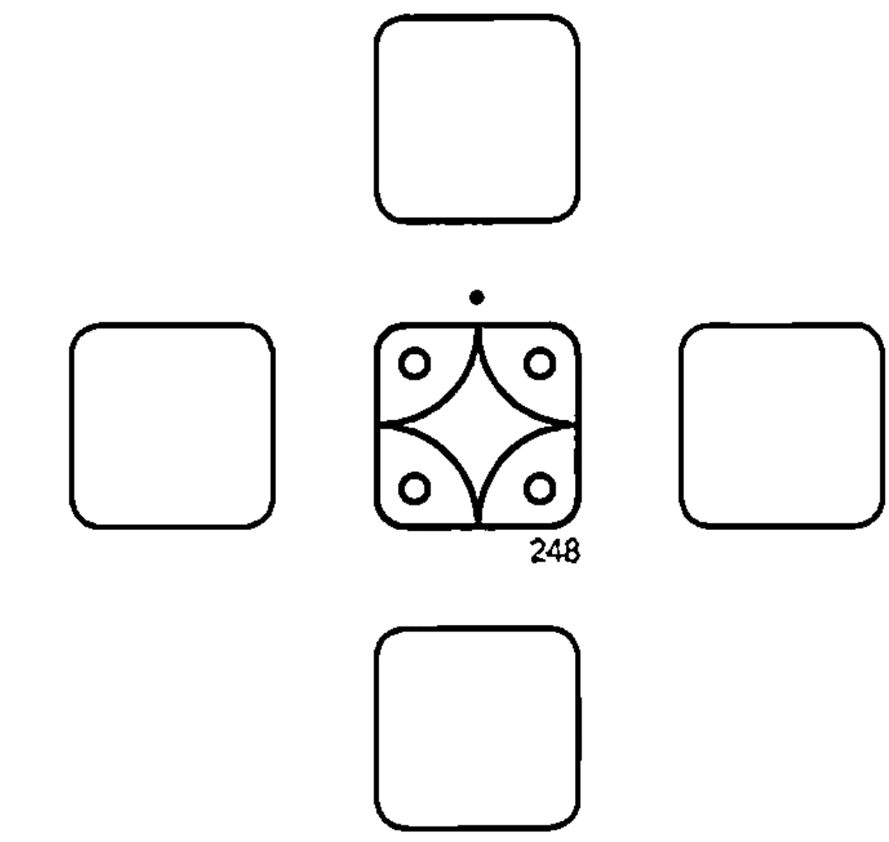

### 卓爾金曆

| | | | | | | | | | | | | | |
|---|---|---|---|---|---|---|---|---|---|---|---|---|---|
| | 1 | 21 | 41 | 61 | 81 | 101 | 121 | 141 | 161 | 181 | 201 | 221 | 241 |
| | 2 | 22 | 42 | 62 | 82 | 102 | 122 | 142 | 162 | 182 | 202 | 222 | 242 |
| | 3 | 23 | 43 | 63 | 83 | 103 | 123 | 143 | 163 | 183 | 203 | 223 | 243 |
| | 4 | 24 | 44 | 64 | 84 | 104 | 124 | 144 | 164 | 184 | 204 | 224 | 244 |
| | 5 | 25 | 45 | 65 | 85 | 105 | 125 | 145 | 165 | 185 | 205 | 225 | 245 |
| | 6 | 26 | 46 | 66 | 86 | 106 | 126 | 146 | 166 | 186 | 206 | 226 | 246 |
| | 7 | 27 | 47 | 67 | 87 | 107 | 127 | 147 | 167 | 187 | 207 | 227 | 247 |
| | 8 | 28 | 48 | 68 | 88 | 108 | 128 | 148 | 168 | 188 | 208 | 228 | 248 |
| | 9 | 29 | 49 | 69 | 89 | 109 | 129 | 149 | 169 | 189 | 209 | 229 | 249 |
| | 10 | 30 | 50 | 70 | 90 | 110 | 130 | 150 | 170 | 190 | 210 | 230 | 250 |
| | 11 | 31 | 51 | 71 | 91 | 111 | 131 | 151 | 171 | 191 | 211 | 231 | 251 |
| | 12 | 32 | 52 | 72 | 92 | 112 | 132 | 152 | 172 | 192 | 212 | 232 | 252 |
| | 13 | 33 | 53 | 73 | 93 | 113 | 133 | 153 | 173 | 193 | 213 | 233 | 253 |
| | 14 | 34 | 54 | 74 | 94 | 114 | 134 | 154 | 174 | 194 | 214 | 234 | 254 |
| | 15 | 35 | 55 | 75 | 95 | 115 | 135 | 155 | 175 | 195 | 215 | 235 | 255 |
| | 16 | 36 | 56 | 76 | 96 | 116 | 136 | 156 | 176 | 196 | 216 | 236 | 256 |
| | 17 | 37 | 57 | 77 | 97 | 117 | 137 | 157 | 177 | 197 | 217 | 237 | 257 |
| | 18 | 38 | 58 | 78 | 98 | 118 | 138 | 158 | 178 | 198 | 218 | 238 | 258 |
| | 19 | 39 | 59 | 79 | 99 | 119 | 139 | 159 | 179 | 199 | 219 | 239 | 259 |
| | 20 | 40 | 60 | 80 | 100 | 120 | 140 | 160 | 180 | 200 | 220 | 240 | 260 |

### STEP 2 · 找出支持、挑戰擴展和引導調性

當中間的主印記調性確定以後，也等於知道了右方支持、左方挑戰擴展、上方引導印記的調性——它們的調性都與主印記相同。

【範例】主印記調性為磁性（一點），所以左、右、上方印記的調性序號全是1／磁性。

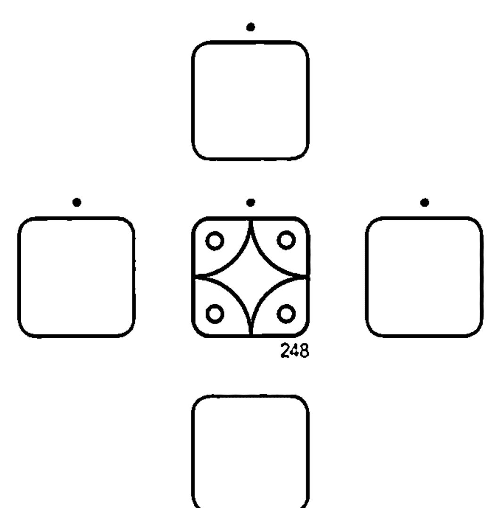

### STEP 3 · 找出隱藏推動調性

下方隱藏推動印記的調性，是數字十四減掉主印記調性的序號，然後透過「調性對照表」（P36）找出所屬調性。

TIPS｜主印記調性序號＋隱藏推動調性序號＝14。

【範例】14-1=13，所以下方隱藏推動的調性序號為13／宇宙。

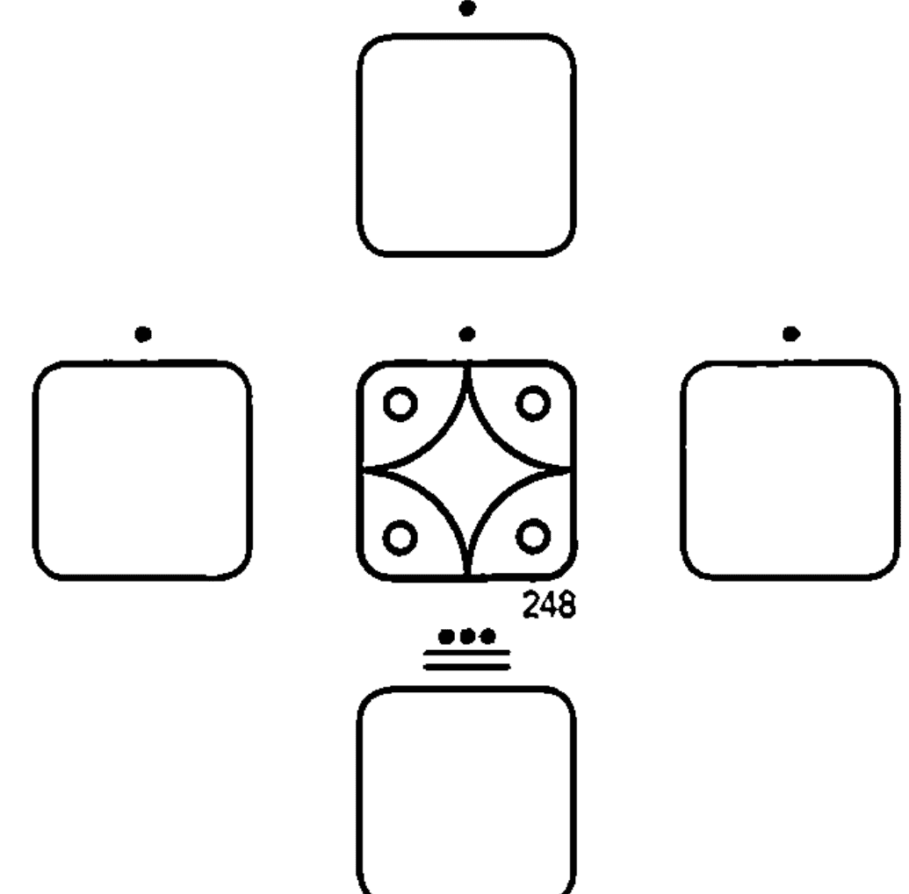

### STEP 4 · 找出支持圖騰

當我們遇到風暴來襲，被突如其來的暴風雨吹得天搖地動，會感覺到生命非常需要支持。因此，在這樣的頻率裡面，自己的主印記與支持相加就是藍風暴，生命會於自己與支持在一起時，出現很大的改變和轉化，促使自己產生新的成長。藍風暴是圖騰十九，因此，右邊的支持圖騰和主印記圖騰的序號相加，必須等於十九，此數字永遠是固定的，只有一種可能性。

TIPS ❶ 主印記圖騰序號＋支持圖騰序號＝19。
❷ 計算圖騰時，黃太陽可以當作是0。
❸ 主印記圖騰若是排序19的藍風暴，右邊的支持圖騰就會是排序20的黃太陽。兩個永遠互為支持。

【範例】主印記黃星星的圖騰排序是8，所以支持圖騰的數字為19-8=11，也就是排序第11的藍猴。因此，支持圖騰便為磁性（一點）藍猴，對照「卓爾金曆」以後可以找到Kin131。

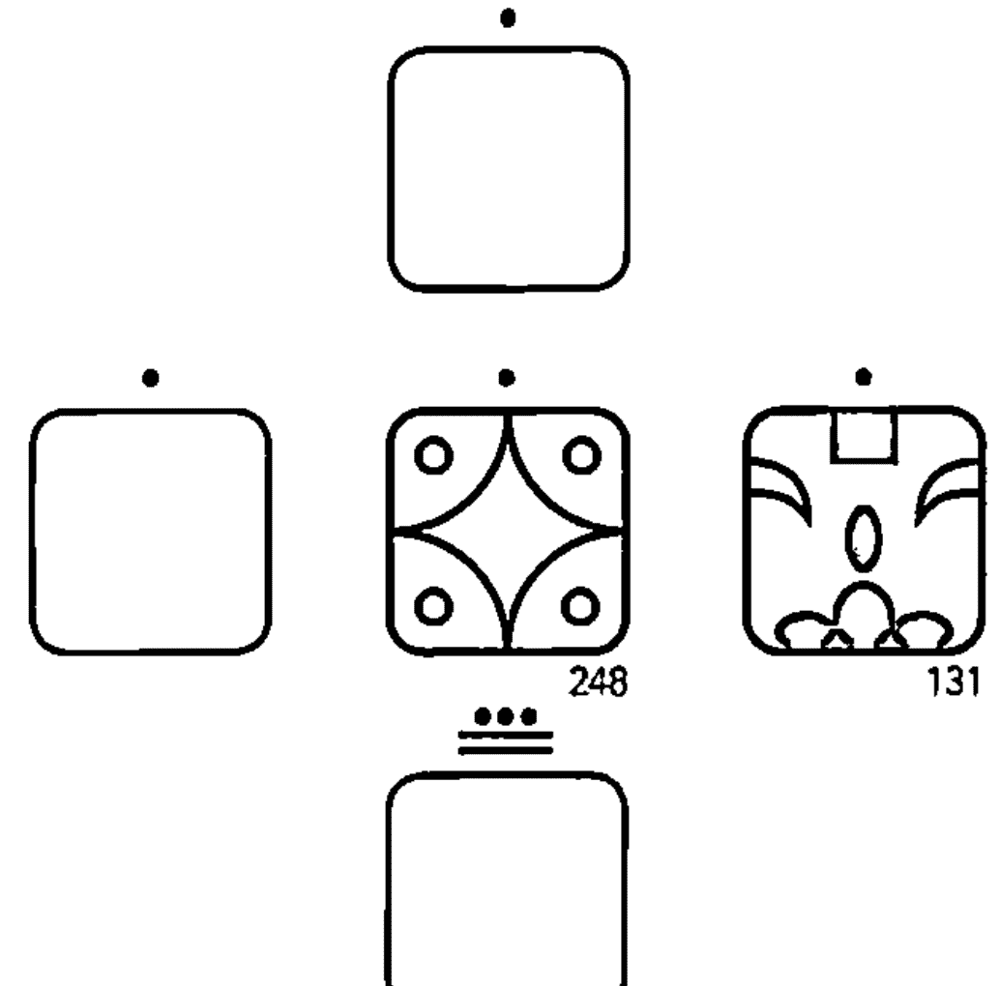

### STEP 5・找出挑戰擴展圖騰

當我們遇到挑戰擴展，可能會產生不願意面對的心理；然而，一旦願意接受挑戰，它就會變成擴展生命的力量。如何面對生命中的挑戰呢？就是利用排序第十的白狗能量：無條件的愛——面對挑戰和擴展的方法只有一個，無條件地愛自己。

TIPS｜主印記圖騰序號加或減10之後，得到挑戰擴展的圖騰序號。

【範例】主印記的排序是8，數字小於10，所以加10，8+10=18，得到排序第18的白鏡圖騰，對照「卓爾金曆」，可以找到白鏡的磁性（一點）位置就是118，因此，挑戰擴展就是Kin118／磁性白鏡。

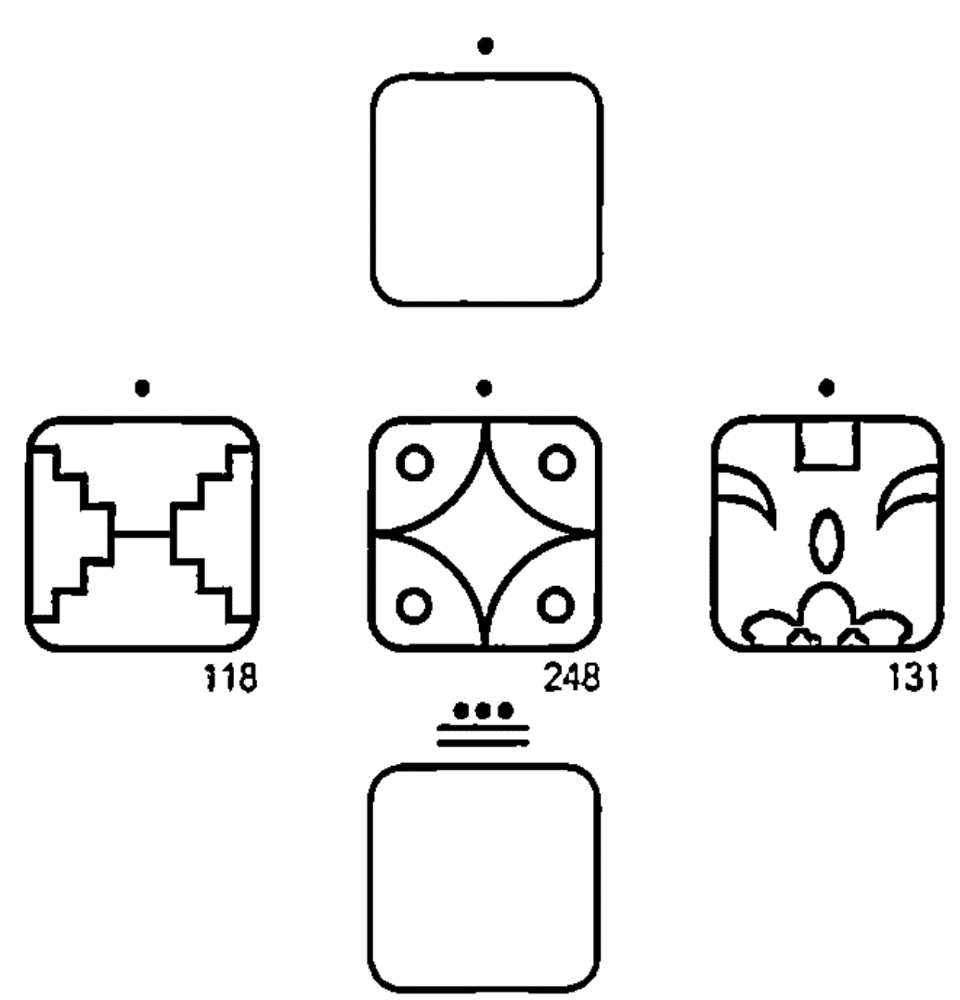

### STEP 6 · 找出隱藏推動圖騰

在星系印記組合裡，下方隱藏推動圖騰的力量須透過對角線，以彷彿照鏡子的方式尋找（上下顛倒、左右相反）。找出隱藏推動圖騰的算法，是下方圖騰序號加上主印記圖騰序號，必須等於二十一。由於圖騰只有二十個，所以要在數字超過二十時減掉二十。例如相加等於二十一，就是回到一，21-20=1，這是我們生命最原初的力量，紅龍的原初力量。

回到卓爾金曆，你會發現Kin248和Kin13的相對位置其實剛好位在對角線，直接穿過卓爾金曆正中央（Kin130與Kin131的中間點）斜對角。

TIPS ｜ 主印記圖騰序號+隱藏推動圖騰序號=21。

【範例】主印記圖騰序號是第8，21-8=13，所以隱藏推動圖騰就是排序第13的紅天行者。找到宇宙調性的紅天行者，透過「卓爾金曆」對照，就是Kin13。

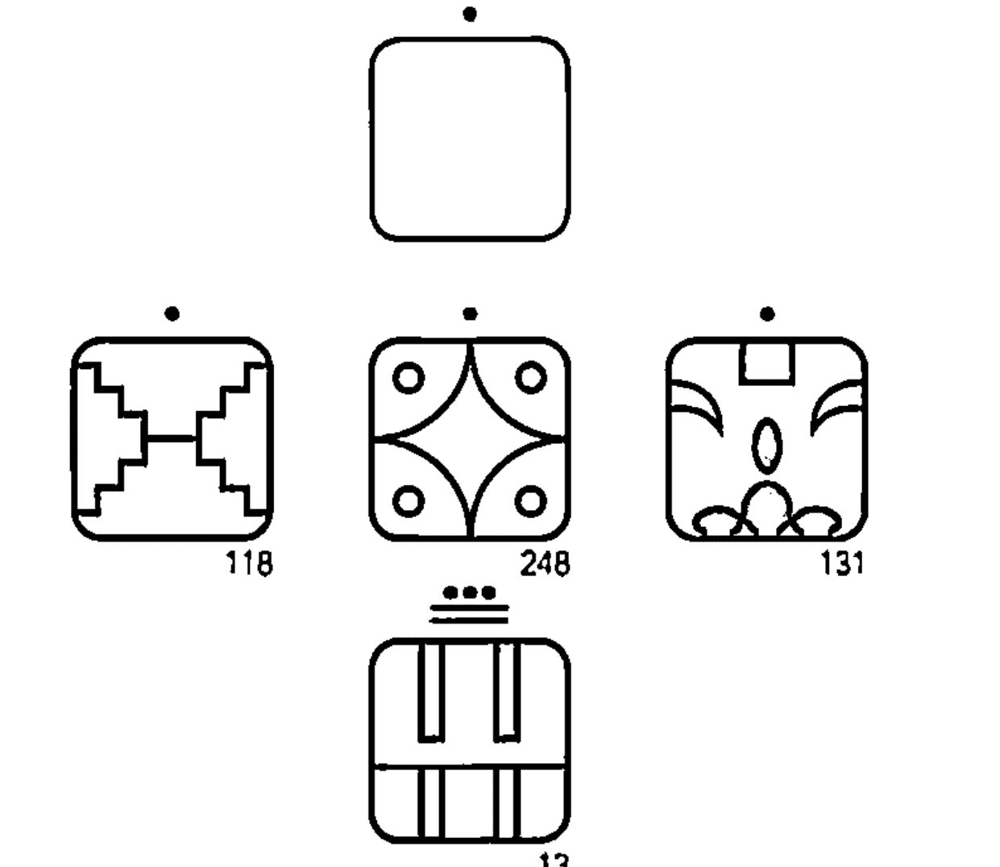

### STEP 7 · 找出引導圖騰

必須透過右頁的「引導圖騰對照表」查詢。先在左欄找到自己的主印記圖騰，再於右邊五個欄位裡找到與自己同調性的圖騰，即為引導圖騰。

【範例】主印記為磁性（一點）黃星星，從「引導圖騰對照表」五個欄位對照，得知引導圖騰就是自己，黃星星。

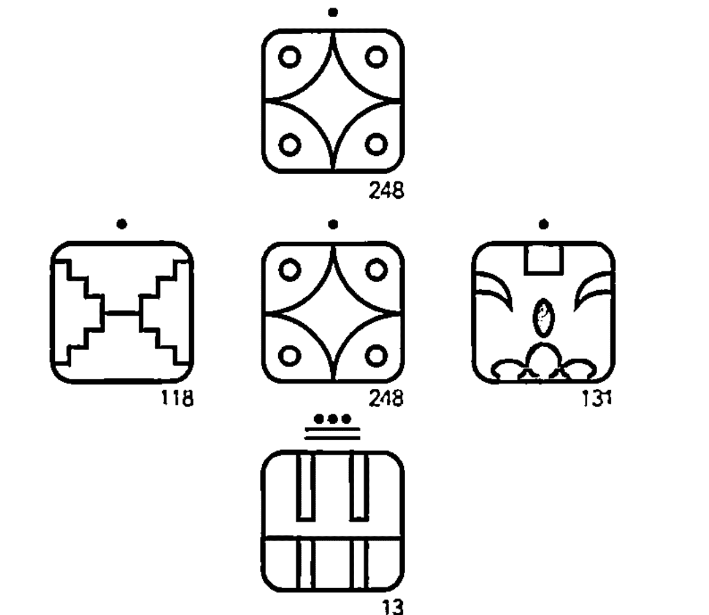

### STEP 8 · 著色

### 引導圖騰對照表

找到所有的星系印記以後，就可以試著為圖騰上色。對照卓爾金曆，一一確認Kin的號碼並寫上。若是Kin遇到綠格子，可以在該圖騰外圍畫上綠色框線。

| 圖騰 | 調性 |
|---|---|
| (圖騰符號) | (調性符號) |
| (圖騰符號) | (調性符號) |
| (圖騰符號) | (調性符號) |
| (圖騰符號) | (調性符號) |
| (圖騰符號) | (調性符號) |
| (圖騰符號) | (調性符號) |
| (圖騰符號) | (調性符號) |
| (圖騰符號) | (調性符號) |
| (圖騰符號) | (調性符號) |
| (圖騰符號) | (調性符號) |
| (圖騰符號) | (調性符號) |
| (圖騰符號) | (調性符號) |
| (圖騰符號) | (調性符號) |
| (圖騰符號) | (調性符號) |
| (圖騰符號) | (調性符號) |
| (圖騰符號) | (調性符號) |
| (圖騰符號) | (調性符號) |
| (圖騰符號) | (調性符號) |
| (圖騰符號) | (調性符號) |
| (圖騰符號) | (調性符號) |

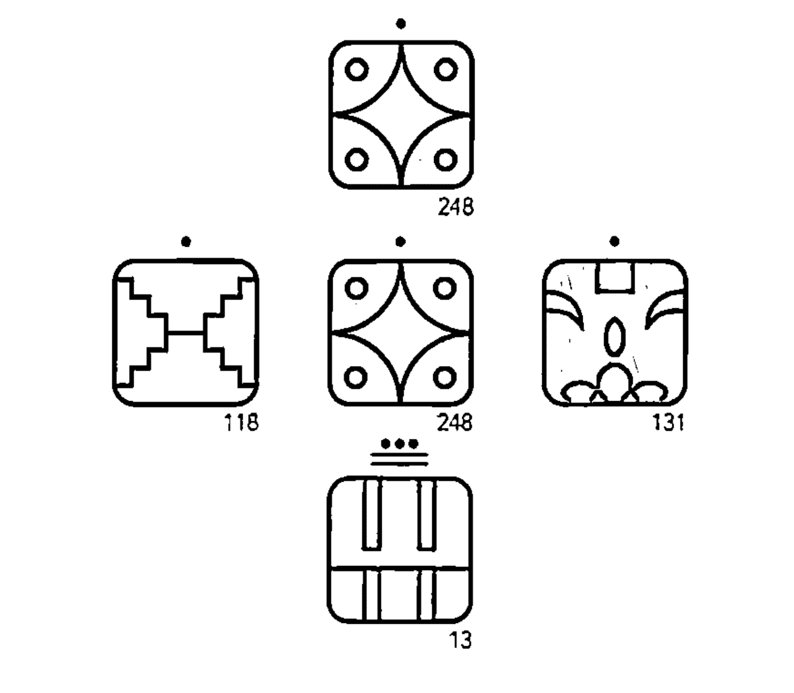

### STEP 9 · 調頻檢查

1. 除去了主印記圖騰，上、下、左、右四個圖騰，一定會是紅、白、藍、黃各一。
2. 引導圖騰和主印記會是同樣顏色。因為顏色相同，才會有相同的力量能夠引導。
3. 上、左、右方的圖騰調性必須一樣，因為頻率相同，才能同頻共振——支持、挑戰擴展、引導一定是同頻率的。只有當主印記的調性為七／共振，此時的上、下、左、右圖騰的調性就會都跟主印記一樣；當主印記為其他調性，位於下方的隱藏推動調性序號，與主印記調性序號加起來則會等於十四，這是照鏡子的反射，雙方反向。

### STEP 10 · 完美推動四角形

主印記下方的隱藏推動，是透過照鏡子的反射找出來。卓爾金曆Kin260和Kin1的位置剛好位在斜對角。因此，主印記和完美隱藏推動加起來是二百六十一。以湖面倒影為例，在湖面上的自己是上下顛倒，左右相反，這就是斜對角的概念，亦即完美隱藏推動的力量。

> 練習

**如何尋找完美推動四角形**

首先，若是把卓爾金曆的正中央做「十字對切」，二百六十個Kin的正中央位於Kin130與Kin131中間，即為中心點，會被切分成四個區塊。四個區塊各有一個代表的Kin，連起來就變成一個四方矩形。

舉例來說，如果主印記是Kin1，它的完美隱藏推動就是穿過卓爾金曆中心點，循著斜對角可以找到Kin260；如果是Kin241，完美隱藏推動就是Kin20，以此類推。

這就像是一間房子，必須要有四根柱子才是最穩定的結構，完美推動四角形很適合協助我們找到合作夥伴，如果你是Kin1，會找到完美隱藏推動是Kin260，另外兩個也是完美推動的印記，即Kin20和Kin241（可以用卓爾金曆的綠格子作為座標）。

但也有特殊狀況，如果你的主印記位於中柱，中柱只會有完美隱藏推動，那是因為中柱的能量特別強大，本身就有雙倍的動能。除了中柱，其他位置都可以找到完美推動四角形，而中柱只會有一上一下（僅有上下顛倒的部分）。

隱藏推動指的是內在隱藏版的自己。我們在生活中看到的都是外界，很少往下、往內看見自己，只有在照鏡子時，才會知道原來自己是長這樣。

所以，隱藏推動指的也可能是我們平常沒有注意到、沒有特別展現，但可以透過鏡子看見的自己——或許是有盲點的自己，或許是沒有留意，但能透過鏡子發現的自己。

你和隱藏版的自己就像站在鏡子兩端的人。如果你和好朋友是互為隱藏推動，你看到的他，就是他展現出來的你的內在，兩個人就像照鏡子一樣，互相呈現，讓對方看見自己可能還沒有意識到、注意到的部分。

若是當你在生活中遇見隱藏版的自己，不妨特別觀察對方展現出了哪些你從未意識到的自己。你可能會覺得自己與對方很相像，或是很不喜歡對方的某些特質，而對方剛好藉著這個機會向你展現。這並不代表你討厭他，而是讓你覺察到你討厭內在那個沒有辦法接受的自己，是內在比較私人、內我的部分。

認識了隱藏推動的力量，能夠讓你更清晰地知道，哪些能量會是你生命中很重要的燃料、動能，哪些是指引並推動你的力量，也像是火箭升空的推動力，只是我們常在生活中忽略了。

### STEP 11 · 力量動物

在十三月亮曆當中，每一個調性都有其頻率所對應的力量動物，認識自己主要的力量動物，不僅能學習力量動物的生命智慧，更能協助我們了解自己、了解每一個人不同的頻率特性，活出本然的天賦。以主印記的調性為主，找到對應的力量動物，力量動物與調性所代表的意涵，在第三章將會詳細介紹。

【範例】主印記為磁性黃星星，磁性的力量動物就是「蝙蝠」。

### 時間區段：生活實踐

### 當日能量

在前面的文章裡，我們已經知道星系印記在五個位置各會代表不同的意義，若把印記放到每天的日子來觀察，當日印記的能量會有其時間區塊順序（上、下、左、右四個位置，皆有固定的時間順序規則）。

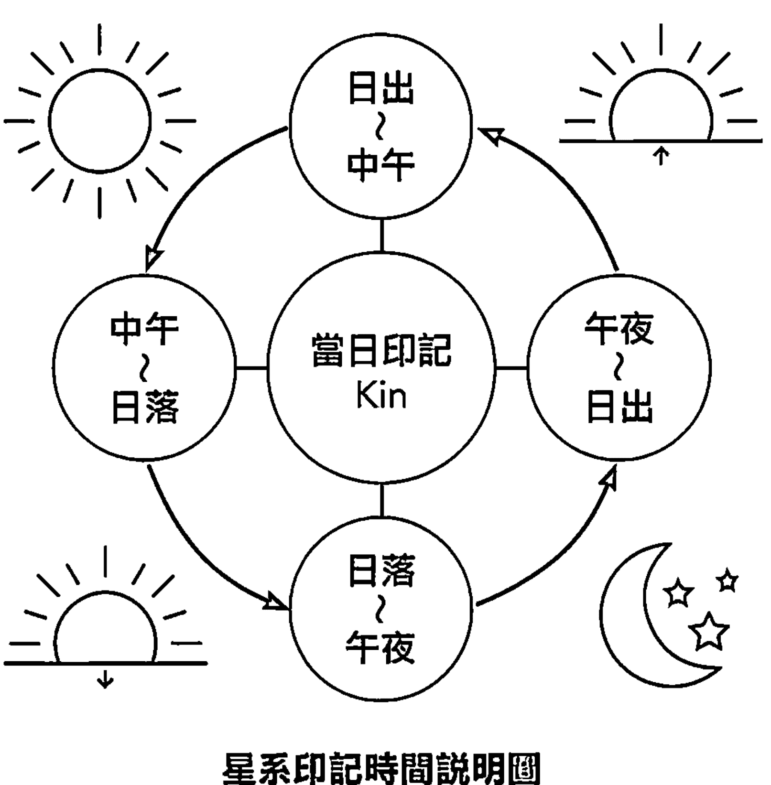

若依照Hunab Ku的東、北、西、南四個方位逆時針前進，把一天分成四個時間區段，每天午夜開始，從午夜到日出，對應到每天東方位置的印記。日出後到正中午，對應到北方位置的印記。中午開始到日落前，對應到西方位置的印記。日落後到午夜，對應到南方位置的印記。

可以運用印記對照的概念，選擇哪一個時段要做什麼事情，例如下午是白風圖騰，若當天要進行協商溝通，我會建議把會面時間定在下午，因為下午的白風具有溝通表達的能量，有助於把話講得特別清楚。

### 出生時段

在我們找到自己出生的星系印記後，如果知道自己的出生時間「位於哪一個時間區段」，就能對應到自己星系印記中的圖騰印記。例如，在凌晨一點出生，就是對應到東方位置的圖騰印記。試著感受這個圖騰對自己的影響是什麼？

### 排出自己的生命波符

什麼是波符（Wave Spell）？波符指的是前進的方向、運動的軌跡，也可以說是生命前進的道路、將要行走的路徑。你在哪個波符誕生，就代表了你的生命道路將會怎麼走。

怎麼開頭？哪裡是目的地？會在哪裡轉彎？十三月亮曆都標示得很清楚，打個比喻，就像是地圖的標示，其實都已經幫你設定好了，你可以按圖索驥，循序前進。

同一個波符出生的人，就像是同一條路上的「同道中人」，然而當我們真正走在路途中，每個人會見到不同的風景，欣賞不同的風光，卻又特別能夠體會一路走來的酸甜與甘苦。

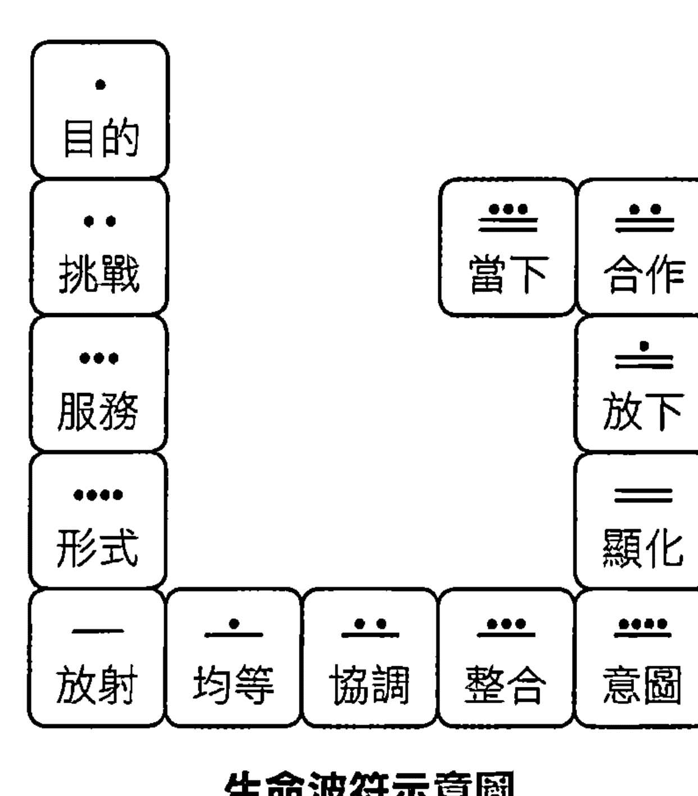

### 尋找自己的波符

一條完整的波符一共有十三個圖騰，涵括了十三種調性。請對照卓爾金曆，找到自己的主印記後，根據Kin的數字往前推算，找到調性一・的位置。這個一點代表「磁性」，也是波符的開頭。從一・開始，直到十三≡為一組，而這十三個圖騰代表完整的一條波符，以落在調性一的圖騰命名。

前述範例裡的Kin248是磁性黃星星，如果主印記是落在Kin248到Kin260之間，生命波符便是星星波符。星星波符掌管Kin248到Kin260，以星星圖騰帶頭與命名。

再舉個例子，我的主印記是Kin163，調性是七／共振≡，從Kin163這個數字往前回推，找到調性一・開頭的地方，再對照「卓爾金曆」的左邊圖騰欄位，可以找到紅地球，所以我是地球波符的共振藍夜。若要對夥伴自我介紹，我們可以說：「我是Kin163／共振藍夜，來自地球波符。」

若運用在個人的生命波符中，十三個調性就分別代表了十三個不同的面向，它們都是同時存在的。十三個位置提供了生命中的關鍵提醒與指標訊息，十三個提問則對應了十三個答案，「問句在調性，答案在圖騰」，讓我們完整體驗這一生。

若運用在每天生活的日期中，十三個Kin就代表了十三天，一天走一格，每天有不同的提問與答案：「問句在調性，答案在圖騰」，以其完整體驗十三天的力量。波符的開頭是我們生命道路的起頭，也是我們生命的目的。每個人的主印記一定都會是生命波符之一。

若是當天的日子剛好遇到你的主印記Kin，則那天就是你的「星系印記生日」（Kin Kin Day）。

### 波符代表的生命意義

第一，我們的生命目的是什麼？答案就要看波符裡的磁性位於什麼圖騰，把圖騰的解釋變成答案。

第二，我們的挑戰是什麼？解答就是第二個圖騰。

如果你的波符剛好與當時的流日相同（波符和流日可對照「卓爾金曆」，查出自己的所在波符），就剛好非常共時，這十三天就像你生命道路的微型縮影。把這十三天過好，就可以創造出生命裡更大的奇蹟。

接下來我們就以先前範例裡的黃星星繼續來說明，當日期走到星星波（對照「卓爾金曆」）時，你可以好好利用這十三天重新改寫，重新創造生命中的奇蹟與想要的品質。這就是十三月亮曆的智慧所在，總是從未來看見現在的生活，把未來的能量與魔法應用於現在。

### 以星星波符為例

這十三天的頻率，可以用「問句在調性，答案在圖騰」來理解。磁性的位置最重要，它的能量會帶起這一串波符，是這串波符的目的。

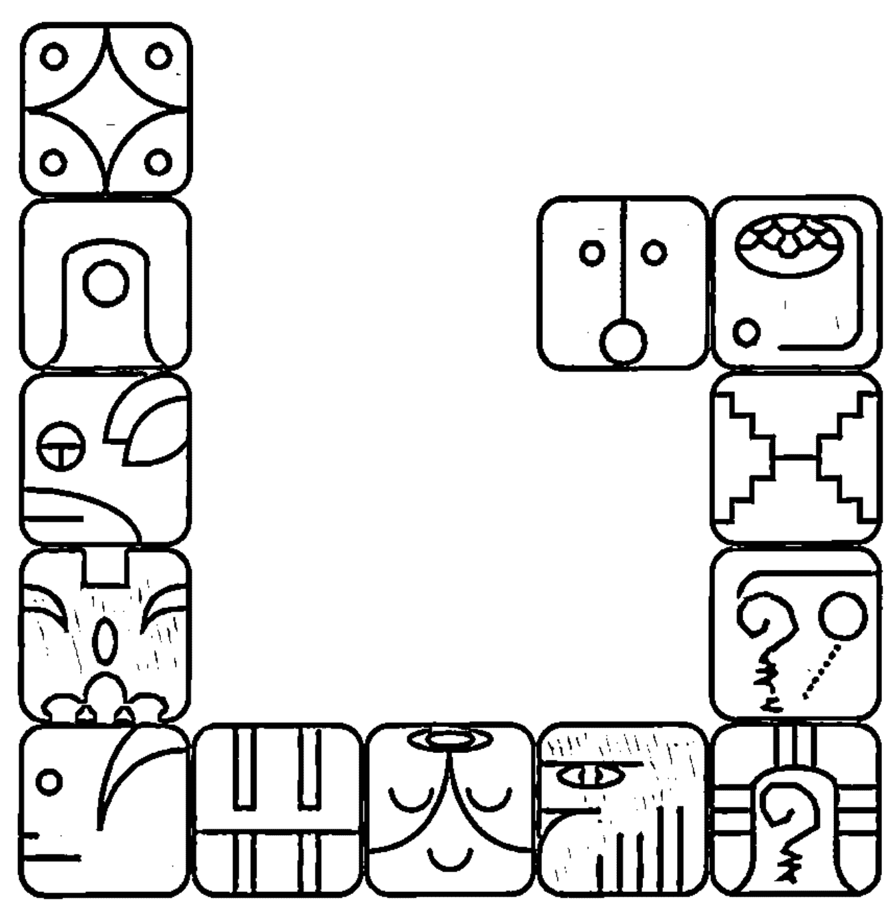

Q 磁性：生命的目的是什麼？
A 黃星星。就是要像星星一樣綻放光芒。

Q 月亮：我所要面對的挑戰是什麼？
A 紅月。也許情緒較難流動，或是情緒波動較強烈，所以必須調解，讓自己的情緒轉為可以接納的較舒服的狀態，去看見這些波動。

Q 電力：我該如何給予最好的服務？
A 白狗。就是愛與忠誠，用無條件的愛對待自己。

Q 自我存在：我該以什麼方式服務自己？
A 藍猴。要用好玩、有趣、幽默的方式，來創造美麗的黃星星頻率。

Q 超頻：我的最佳力量是什麼？可以透過什麼實踐方式來展現自己最大的力量？
A 黃人。代表我們在生活中，透過自由意志展現自己。

Q 韻律：我該如何找到身心靈的平衡？
A 紅天行者。透過探索、穿梭、來回移動，帶著好奇心找到內在穩定的平衡。

Q 共振：如何讓自己回歸生命的核心？
A 白巫師。位於每個波符的正中央，也是最重要的位置，代表的數字就是七的共振。檢查能量有沒有扭曲、有沒有偏離，若想再次回到生命的平衡，關鍵就是找到波符的共振位置。在圖騰裡找解答。星星波符共振的位置是白巫師，而你就是要運用白巫師的力量，回到當下，不被時間的幻象蒙蔽，在內心找到指引，而所有問題的解答也都在心裡。

Q 銀河星系：如何活出內在的信仰？如何整合自己？
A 藍鷹。協助自己擁有更高的格局與視野。

Q 太陽：我／生命的意圖是什麼？該如何實現人生的目的？
A 黃戰士。意圖很清晰，尋找答案，面對生命中的勇氣，發現自己無畏無懼的勇敢，因夢想而前進。

Q 行星：我該如何讓事情能夠更完美地進行與完成？我在人世間想要顯化什麼？
A 紅地球。你在生命須共時地臣服、順流。

Q 光譜：我該放下、釋放什麼？該如何放下？
A 白鏡。在每個人的波符裡，十一的位置提供了很好的釋放方法。例如，什麼方式特別能釋放壓力？看清自己內在所有鏡子、所有一切，擁抱自己的真實面，看見就能釋放。

Q 水晶：我該如何與人合作、奉獻？如何為他人服務？我最能夠看清楚什麼事情？
A 藍風暴。在每個波符的水晶調性位置，是我們最能夠看得最清晰的主題，也提供了我們能夠與他人一起合作的方式。透過合作，我們能自然而然地讓彼此的生命成長蛻變，清楚的看見自己有哪些舊有的部分等待轉化，再次重整我們的生命架構。

Q 宇宙：我如何回到當下，並超越進展到下一個階段？我又該如何分享愛與喜悅？
A 黃太陽。利用覺醒開悟的能量，回到當下，並超越進展到下一個階段，展現太陽般的溫暖。

### 二十個波符的涵義

我們將以日常生活的日期為例，解釋波符的運作。在日子裡遇到自己的生命波符時，這十三天也正意味著你生命的微型縮影，把波符的十三天過好，就能為自己的生命再次調頻校準並增加力量！

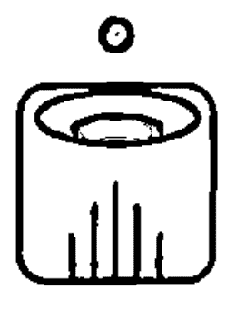

#### Kin1~Kin13
#### 龍波符／創造波符：適合發起新事物的起頭開創課題

龍波符開啟全新的生命循環，卓爾金曆嶄新的二百六十天就是從這裡開始。從磁性紅龍到宇宙紅天行者的十三天，某些回憶、舊時光的人事物將出現連結，讓我們重新感受，並再次整理自己的生命，靜心，讓自己的心打開並安靜下來。

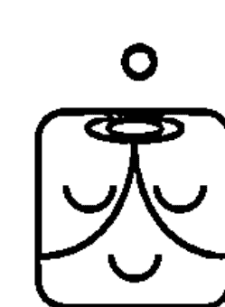

#### Kin14~Kin26
#### 巫師波符／魔法波符：快速顯化心想事成的魔法課題

巫師波符從磁性白巫師到宇宙白世界橋，我們在這十三天要練習「無時間」的感受，讓自己全然地活在當下，把關於過去與未來的意念都拉回現下，透過靜心與內在觀察，我們明白沒有時間就沒有死亡，更毋須執著。

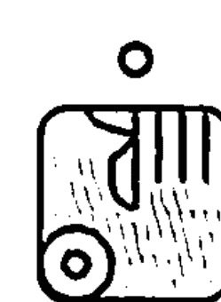

#### Kin27~Kin39
#### 手波符／實踐波符：做到才是真正知道的完成實踐課題

手波符從磁性藍手到宇宙藍風暴，這十三天是創造與改變的好時機。透過雙手，能夠帶來一切的療癒能量，親身實踐生活中想要完成的計畫。這些行動與創造，將會帶來生活中自然而然的改變，不必反覆設想，做就對了。

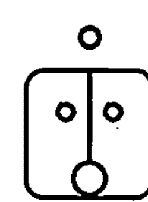

#### Kin40~Kin52
#### 太陽波符／覺醒波符：散發給予溫暖的小太陽課題

太陽波符從磁性黃太陽到宇宙黃人，這是覺醒開悟的能量，讓自己的溫暖光芒照亮他人的內心。一個覺醒的人，能明白所有智慧行動的展現，就是能負起全然的責任，真正的自由意志，便是能夠放下我執，進入散播喜悅與愛的能量之中。

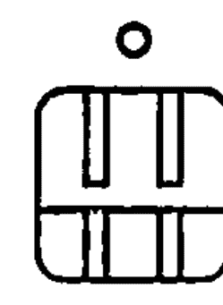

#### Kin53~Kin65
#### 天行者波符／國王波符：體驗不同空間轉換的穿梭探索課題

天行者波符從磁性紅天行者到宇宙紅蛇，我們將以全然的好奇心探索未知，這十三天的生活會比較忙碌與奔波，也是一個練習跨越限制、跨越自我設限的好時機。可以多練習靜心，讓自己更穩定落實、蛻皮蛻變，蛻去無法支持我們生命熱情的一切。

**TIPS** ｜帕克・沃坦國王的出生以及死亡印記都位在這個波符，故又稱為「國王波符」。

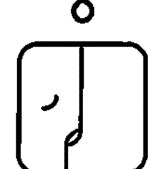

#### Kin66~Kin78
#### 世界橋波符／連接波符：看清楚為何放不下的斷捨離課題

世界橋波符從磁性白世界橋到宇宙白鏡，我們要練習讓自己放下、放手、放掉我執。清楚地看見所有的一切都是自己內在的反映，我們便能夠放下執著的意念，讓自己成為單純的橋樑與管道，擔任溝通協調的角色，連接著此岸與彼岸的兩端。

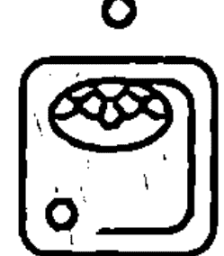

#### Kin79~Kin91
#### 風暴波符／改變波符：迎接隨時可能改變的轉化課題

風暴波符從磁性藍風暴到宇宙藍猴，我們要在這段時間體驗改變的發生，這樣的改變與轉化能量是自然而然的，或許也會一起翻出很多必須面對的議題。讓自己在這個徹底改變的過程中，如同孩子般地玩樂吧！保持輕鬆與幽默感，就能超越一切。

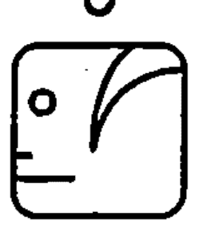

#### Kin92~Kin104
#### 人波符／自由波符：為全然的自己做出選擇的自由課題

從磁性黃人到宇宙黃種子，學會用自由意志來尊重自己，唯有如此，才能為自己的生命與決定負起全然的責任，並且認出自己的潛力、相信自己必能豐盛地綻放，在耐心等待收成的時刻裡，體會甜美的果實終將到來，智慧的能量因此盛開。

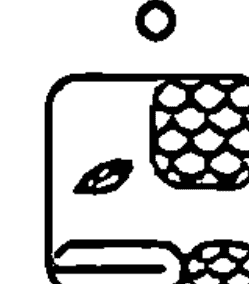

#### Kin105~Kin117
#### 蛇波符／生命力波符：打開身體力量與生命力的蛻皮課題

蛇波符有連續十天開啟宇宙能量的綠格子。從磁性紅蛇到宇宙紅地球，開啟身體全然的覺知，觀察自己身體的需求，讓自己的生命力、熱情與活力，藉由回歸天然飲食、自然療法的生活方式，來協助身心靈的全面整合。

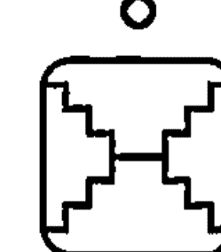

#### Kin118~Kin130
#### 鏡子波符／真相波符：拿著放大鏡看見清晰真相的課題

鏡子波符開始進入卓爾金曆宇宙中柱。從磁性白鏡到宇宙白狗，我們學會看見真相，就能看見愛！看見所有的一切，我們能更加明白真理就在自己之內，一切人事物也就是無窮無盡地映照我們自己罷了。唯有對自己誠實、承認發生的事實與真相，才能全然接納自我。

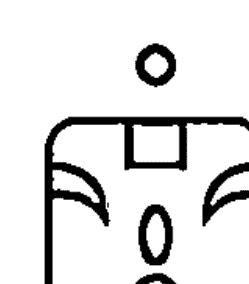

#### Kin131~Kin143
#### 猴波符／遊戲波符：體驗玩耍遊戲的幽默人生課題

猴波符是卓爾金曆宇宙正中央的起始點。從磁性藍猴到宇宙藍夜，像魔法小孩一樣擁有遊戲的天真單純與幽默，保持一顆遊玩的心，就是回到內在小孩的家。這段時間能夠協助我們看穿幻象與頭腦的把戲，回到單純好玩、有趣的狀態，讓我們勇敢夢想，讓自己能豐盛地美夢成真。

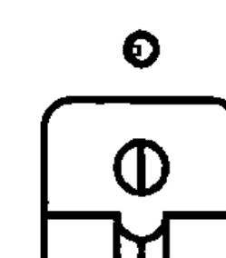

#### Kin144~Kin156
#### 種子波符／豐收波符：耕耘並植入美好意念種子的課題

種子波符有連續十天開啟宇宙能量的綠格子。從磁性黃種子到宇宙黃戰士，要我們確定自己的目標，清楚知道自己要做什麼、要去哪裡。我們在過程中必須學會培養勇敢的力量，不害怕、不退縮、不恐懼地往前進、往上成長，長出智慧的果實。

#### Kin157~Kin169
#### 地球波符／共時波符：觀察生活中自然又巧合的課題

地球波符從磁性紅地球到宇宙紅月，這段期間可以多出去踏青、接地氣與扎根，更可以留意生活裡共時事件的發生，讓水的能量協助我們清理與淨化，釋放卡住的情緒，展現真性情並讓情緒流動，越是順其自然、越是順流，我們的生命越能連結地球母親令人信賴的導航能量。

#### Kin170~Kin182
#### 狗波符／愛波符：讓自己沉浸在充滿愛的課題

狗波符從磁性白狗到宇宙白風，我們知道「愛」就是內在心靈的本質。在這段期間，我們要體驗對自己無條件的愛，對自己全然誠實、忠誠與疼愛，對別人說出你的需要或開口求助，在溝通中加入愛的元素，並說出真心話。

#### Kin183~Kin195
#### 夜波符／豐盛波符：看見並感謝自己所擁有的豐盛課題

夜波符從磁性藍夜到宇宙藍鷹，因為夢想遠大，所以能夠看得更寬廣。因著格局視野的提昇，我們更能清晰看見自己更深的內在與潛意識，在潛意識與夢境裡頭，我們看見自己內在無比的豐盛。夜波符的十三天，我們要好好犒賞自己，活出豐盛的品質。

#### Kin196~Kin208
#### 戰士波符／智慧波符：體驗為自己出征的勇敢力量課題

戰士波符從磁性黃戰士到宇宙黃星星，教會我們成為生命中無比勇敢的彩虹戰士，勇敢發問、無畏懼地探索生命中的疑問。在這十三天，我們勇敢地面對問題、解決問題，接收靈感與創意，連結美麗與藝術的事物，活出「時間就是藝術」的品質。

#### Kin209~Kin221
#### 月波符／水情緒波符：體驗感受瘋狂強烈的情緒療癒能量課題

月波符從磁性紅月到宇宙紅龍，這個波符開啟綠色魔法城堡心想事成的能量。宇宙之水的能量協助我們滋養生命，清晰看見自己的情緒，便能回歸生命的源頭，連結古老智慧的傳承，以及正視自己與家庭的關係。

#### Kin222~Kin234
#### 風波符／精神波符：想著並說著美好語言的課題

風波符從磁性白風到宇宙白巫師，這段時間請保持對自己意念的覺察，觀照自己的想法與起心動念，意念所關注的，都會顯化成真。在靜心的活動中，讓自己回到當下，唯有當下才能穿越一切時間的壓迫與限制。

#### Kin235~Kin247
#### 鷹波符／視野波符：退一步海闊天空的寬廣視野課題

鷹波符從磁性藍鷹到宇宙藍手，我們的目標就是要看得高、看得遠，讓自己的格局能夠放大。除了用銳利的眼睛洞察一切之外，還需要藍手強而有力的實踐行動來創造，一步一腳印地依著遠見來執行，就能夠創造出豐盛無比的能量。

#### Kin248~Kin260
#### 星星波符／藝術波符：體驗靈感湧現的美麗課題

星星波符從磁性黃星星到宇宙黃太陽，這是卓爾金曆的最後一個波符，也是生命最終必須要到達的目的地，藉由自身的成長、覺醒與開悟的鍛鍊，讓自己成為溫暖發光的太陽，把生命的光芒與喜悅散播給身邊的人，藉由服務他人，讓自己的生命更美麗。

### 二十個波符的圖騰故事

從龍波符開始，我們在誕生的時刻開始感受到存在，所以會問道：「我是誰？」「我從哪裡來？」

我們知道，這個世界上所有的一切都能成真，跟魔法小孩一樣單純地相信，時間是不存在的（巫師波符）。於是，我們開始運用雙手感知生活的一切，開始創造、開始進行療癒（手波符），因著感受到的美好生命，於是我們分享，給予他人溫暖與關懷（太陽波符）。生命繼續前進，我們越來越好奇，於是我們探索，從外在到內在不斷探索（天行者波符）。走過了天行者波符（國王波符），接著顯現的就是連結天地管道的能量（世界橋波符）。這兩個圖騰，是十三月亮曆裡從帕克·沃坦國王石棺印記帶出來最重要的兩個圖騰，剛好是互為支持的力量。這股相互支持的力量，能為生命帶來轉化與前進。

因此，緊跟在後的風暴波符，帶來一連串的生命覺醒——走向真正的自由（人波符），掀起浴火鳳凰的蛻皮重生（蛇波符），因此，更能看清真相與真實（鏡子波符），不被幻象所蒙蔽（猴波符），我們能更清楚知道自己的目標與潛力（種子波符），能深深理解地球母親的共時導航（地球波符），認出何謂愛的真相，就是無條件地愛著自己（狗波符），才能體驗內在潛意識與外在物質的豐盛（夜波符），接著，我們就能無畏無懼地面對問題、衍生智慧並找到答案（戰士波符）。走到這裡，我們便準備要正式進入「綠色中央施展魔法的城堡」了。

讓自己真正地流動起來（月波符），說出心中真正想說的話、心口合一以及對的話語（風波符），帶來老鷹的洞見與輕盈飛翔（鷹波符），因而更能接收來自上天的靈感與美的藝術生活（星星波符），全然覺醒的開悟，並付出愛與服務。

# CHAPTER 3
## 顏色 & 調性

### 顏色

### Hunab Ku

The term Hunab Ku, usually translated as One giver of Movement and Measure; It is the principle of life beyond the Sun. This phrase combines Mayan and Tibetan language as chanted.

> ——荷西·阿圭勒斯

以上這段話，出自於十三月亮曆法之祖師爺荷西博士。Hunab Ku，中文譯為「胡娜庫」，是十三月亮曆—曼陀羅的圖騰，也是這套曆法最重要的圖騰，代表了「宇宙的源頭」，更是宇宙間衡量與移動唯一的給予者，能夠直接連結到宇宙能量的源頭與核心。這個詞能連結數字零、空性的法則，代表一切歸零，回到源頭與空，而空也代表一切。Hunab Ku可以分成三個音節，各自代表了三個不同的訊息。

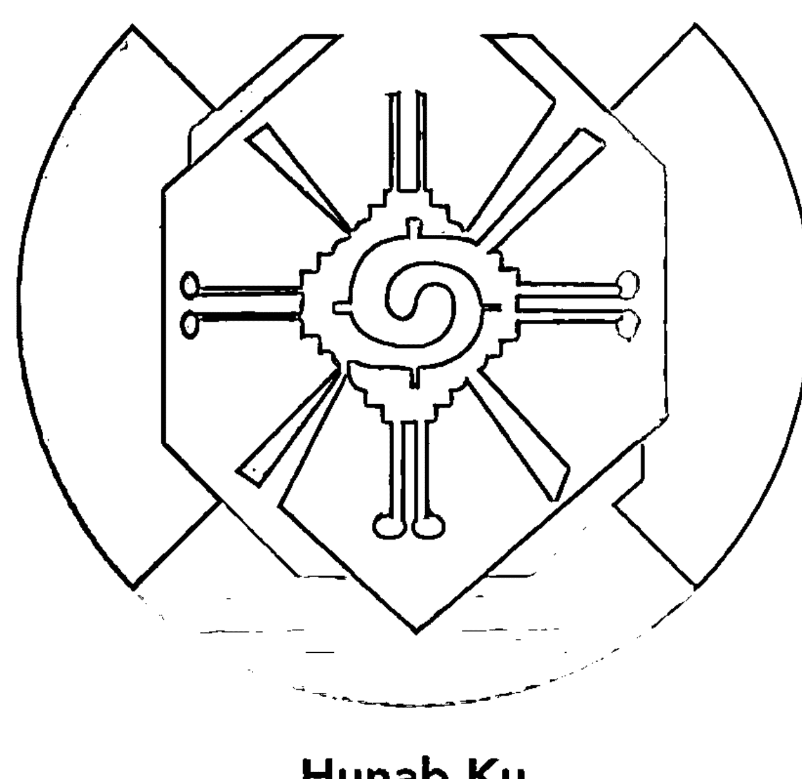

**Hu**: Oneness，合一之意，母親與父親的能量合而為一，我們內在陰性與陽性能量合一。

**Nab**: Movement and Measure，測量的方式、移動的方式，或是法則。

**Ku**: God、Lord，神、神性或神性的道路。這並非意味著我們要成為神，因為神就在我們的內在，我們本身就是神性能量的中心。

宇宙的法則即是神性的道路，就是讓自己合而為一，讓自己能夠把陰性與陽性能量合而為一。Hunab Ku協助我們直接連結宇宙最源頭的力量，當我們開始彩繪Hunab Ku的時候，其實就會開啟和宇宙源頭的能量連結。特別是遇到宇宙綠格子的日子，Hunab Ku釋放出的訊息，將傳遞到銀河系、太陽系，一路傳至地球，能量是非常強大的。你還可以把心願寫在Hunab Ku旁邊，向宇宙下訂單！

### 著色方法

彩繪Hunab Ku是調頻過程很重要的部分。著色時，可以使用彩色鉛筆。從紅色開始，依照固定順序塗繪紅色、白色、藍色、黃色，最後是綠色，近似螺旋狀，從外往內捲進去。

當我們一邊著色，一邊連結宇宙能量頻率的同時，記得輕輕吸氣與吐氣。裡面的點點也要畫，顏色同樣是紅、白、藍、黃，也可以選擇先塗點點。

**TIPS**｜順序：紅、白、藍、黃、綠（逆時針：東、北、西、南、中）。

### 顏色的代表

**紅色**代表東方，關鍵字是「啟動、開始」。如果你的馬雅圖騰是紅色，代表你的開創性以及啟動與開始的力量非常重要，而且自身就具備了這樣的頻率，所以在生命裡常常扮演開創者與先鋒的角色，走在前方開拓或完成。

**白色**代表北方，關鍵字是「淨化、單純」。如果你的馬雅圖騰是白色，代表你特別能簡化複雜的事情，尤其擁有淨化人心的力量。我們在日常生活也會以白色代表能量單純、潔白無暇的意義。關於淨化的方法，可以使用聖木、線香，也可在聖壇上擺放羽毛類飾品。

**藍色**代表西方，關鍵字是「蛻變、轉化」。如果你的馬雅圖騰是藍色，代表你的天賦正是轉化能力，能夠帶來改變、調整，具有變化的彈性、靈活的特質。如果家中擺設聖壇，可以放置水、精油等液態物品，並放在聖壇西方的位置。

**黃色**代表南方，關鍵字是「收穫、結果」，與種子及土地裡長出來的東西有關，如果你的圖騰是黃色，會特別具備收穫、收成與分享成果的能量。如果家中有擺放聖壇，可在南方的位置放豆子、穀物，也有人喜歡放水晶，因為水晶是源自地球的產物。

**綠色**代表中央，直接對應宇宙的中心，所以關鍵字是「中央、宇宙中心」。中央處有一個螺旋，而螺旋代表靈性的陰性能量，代表地球母親的心臟、心輪、地球媽媽的子宮。卓爾金曆裡有些綠格子，代表銀河啟動之門，與Hunab Ku的力量有特別連結。所以，我們會在綠格子的日子彩繪Hunab Ku，因為當我們開始和宇宙的能量緊密連結時，Hunab Ku就會釋放大量的訊息，此時地球母親的通道跟閘門是完全敞開的。

許多人會發現，彩繪Hunab Ku的動作看似簡單，但是在著色過程中，其實能夠釋放許多不愉快的情緒，讓自己感到平靜。畫完Hunab Ku，壓力也將隨之消散。在著色的過程裡，要將心思意念慢慢沉澱下來，同時也能在Hunab Ku的空白處寫下想做的事情，接下來的運行會很容易心想事成。

### 調性 ／ 銀河音階

我們在第二章學會了如何找到自己的星系印記，而每一組星系印記，都帶有各自的調性（頻率）。接著，我們就要來進一步說明什麼是調性，以及每個調性的內涵與意義。

### 調性

調性（Tones），指的是銀河音階（Galactic Tones），代表了數字的頻率，不同數字有不同頻率。重要的是，每個人身上都有一到十三的調性，不是只有主印記的調性會跟自己有關係，其實，十三個調性都在我們身上，只是主印記的調性能量會特別突顯，也是今生最重要的功課，而其他的數字仍然都與自己有關。

這十三個調性可以依據銀河音階劃分成五個家族。頭頂上有一點的叫一點家族，有兩點的稱作兩點家族，依此類推，還有三點、四點以及橫線家族（或稱線家族）。

首先，我們可以先從調性的符號來判斷，自己是屬於銀河音階的哪一個家族，而下頁的表格，可以幫助你從自己的調性找到自己的音階家族。

> 馬雅小學堂

**從調性家族找到的星系印記**

你是否還記得，在星系印記的五個位置中，哪一個位置是依據調性家族找到的呢？答案就是「引導」，引導是根據「引導圖騰對照表」對照家族的格子，再對應到引導的圖騰。同一個家族會有同一個引導圖騰。

## 調性／銀河音階家族說明表

**一點家族**
調性一、
調性六、
調性十一

**獨立的**
一點家族的人，自己就是自己的引導者，內心也有答案與定見，知道要前往的方向，也清楚自己的決定。個性比較獨立，喜歡獨自作業，也有自己的想法與行事模式。但如果表現得太過，就會變成聽不進別人的意見；偶爾向他人詢問意見時，也僅是為了驗證心中的答案。
鼓勵一點家族的人學會先放下成見，打開自己的內心，傾聽他人所說的話，會有很大的幫助。

**兩點家族**
調性二、
調性七、
調性十二

**雙數的**
兩點家族的人，喜歡有一起合作的同伴，適合與人共事。看待事情的觀點：是非分明、二元性明顯，所以要學習了解自己的立場，釐清是非黑白，才不會有矛盾。
鼓勵兩點家族的人把自己的原則立場說清楚（但並非要求或說服對方一定要做到），接納自己內在的黑與白，覺察並承認自己就是有這些原則，並尊重他人與自己不同的原則，這樣的彈性會讓內心更舒坦。

**三點家族**
調性三、
調性八、
調性十三

**服務的**
三點家族的人，人生就是以服務為目的，無論在各行各業，都能夠提供服務，服務自己，也服務他人。三的頻率是靈性的力量，也是變化較多的，喜歡讓自己在行動中保持調整與改變的可能性。
鼓勵三點家族的人，在做任何事情時，觀察自己是否展現出服務熱忱與樂於分享的特質，如此一來，能夠讓自己的能量更加穩定、平衡，發揮與生俱來的天賦特質。

**四點家族**
調性四、
調性九

**穩定的**
四點家族的人，天生擁有穩定的力量。四的頻率，能夠建立出一種具體的形式、方法與行動策略，這些規則能帶來穩定的力量。就像房子的四根柱子，也像桌椅的四支腳，讓人事物穩定下來。
鼓勵四點家族的人，做決定之前，先靜下心聆聽，在設定規則與界線的同時，保持彈性。如果團隊成員有四點家族的人，往往可以帶來穩定與安全感。

**橫線家族**
調性五、
調性十

**開展的**
數字從四進展到五，就會連成一線，形成橫線家族。五是一橫線，十是兩橫線。橫線家族的人天生就有開展的力量。五的頻率，帶有傳遞與溝通交流的天賦。把內心的力量展現出來，綻放出內在正向的光芒與獨特性。
橫線家族的人別限制自己，別把自己侷限在不自由的信念裡。盡可能地讓自己活出生命的自由美好，綻放光彩。

## 調性意涵說明表

| 調性 | 關鍵字 | | |
|---|---|---|---|
| | 創造力 | 動力 | 功能 |
| 磁性 Magnetic | 合一 Unify | 吸引 Attract | 目的 Purpose |
| 月亮 Lunar | 二元 Polarize | 穩定 Stabilize | 挑戰 Challenge |
| 電力 Electric | 活化 Active | 結合 Bond | 服務 Service |
| 自我存在 Self-Existing | 確定 Define | 測量 Measure | 形式 Form |
| 超頻 Overtone | 強化 Empower | 掌握 Command | 放射 Radiance |
| 韻律 Rhythmic | 組織 Organize | 平衡 Balance | 均等 Equality |
| 共振 Resonant | 通道 Channel | 激發 Inspire | 協調 Attunement |
| 銀河星系 Galactic | 和諧 Harmonize | 塑造 Model | 整合 Integrity |
| 太陽 Solar | 振動 Pulse | 領悟 Realize | 意圖 Intention |
| 行星 Planetary | 完美 Perfect | 製造 Produce | 顯化 Manifestation |
| 光譜 Spectral | 消解 Dissolve | 釋放 Release | 放下 Liberation |
| 水晶 Crystal | 奉獻 Dedicate | 普及 Universalize | 合作 Cooperation |
| 宇宙 Cosmic | 安忍 Endure | 超越 Transcend | 當下 Presence |

## 調性一 磁性

□ 我的目的是什麼？
What is my purpose?

調性一的人常常需要尋找方向，加上磁性是每段波符的第一個位置，所以往往也是帶領方向的人。一，這個數字也是起頭的數字，比較具有領導者獨立開創的特質。

磁性最重要的關鍵字就是「吸引」。作為第一個調性的磁性，吸引力特別強，較能夠聚眾、吸引想要的人事物，而且無論好壞，說什麼就吸引什麼。由於調性是跟著圖騰能量運作，所以我們要判斷，磁性對應的是哪一個圖騰，而「吸引」的究竟是什麼，就要看「圖騰的答案」了。例如磁性白風往往一說就成真、成功；磁性藍夜則是會吸引豐盛的源頭。

磁性的力量動物是蝙蝠，這種動物的特性就是敏銳，即便在黑暗中，還是可以清楚地判定方向。為了增強磁性能量，不妨把相關的力量動物圖像穿在身上，例如買蝙蝠俠的衣服來穿！

力量動物：蝙蝠 Bat
課題：我的目的是什麼？我能夠吸引什麼？
學習：在黑暗中找到前進的方向，清楚自己要前往哪裡，集中力量，達成目標。
調性：個體

- 1. 單一能量，喜愛創造，屬於「創造」的調性。
- 2. 調性一能自由快速地移動，擁有強大的力量。
- 3. 堅定、自信；一舉一動吸引眾人目光；自我教導、自我學習。
- 4. 萬物的開始，也是整體、合一的。
- 5. 任何有調性一的人參與的事物，都能擁有很好的推動與帶動力量。
- 6. 調性一的人在面臨挑戰時，往往可以發揮最大的潛能。他會找到，甚至創造不同的解決方法，激發創造的潛能。
- 7. 學習讓自身「創造的管道」保持開放與通暢，也就是讓自己保持在健康的狀態。

## 調性二 月亮

□ 我的挑戰是什麼？
What is my challenge?

由於月亮本身不會發光，而是透過太陽的反射，所以月亮掌管的是情緒、內在的陰影和黑暗面。在占星學裡，月亮特別指的是內在情緒的波動，就好像月亮有陰晴圓缺。塔羅牌的月亮，也反映出內在的焦慮、恐懼與不安，所以月亮的關鍵字叫作「挑戰」。這是調性二最重要的學習課題。

二，在能量學裡是二元對立的元素，是非、對錯、黑白分得很清楚，但是月亮調性的人常會卡在一個地方：即便自己很有原則、黑白分明，但往往會把不希望他人看見的部分，向別人說成自己並不在意、沒有黑暗面。

因此，在能量平衡方面的練習，月亮調性的人必須清楚地承認，並看見自己內在的二元性與黑暗面，如此一來，反而會更容易找到平衡點。因為承認與看見，就是一種接納，當自己的對立面被接納之後，就會減少搖擺與不確定，多了堅定與彈性的溫柔。

力量動物：蠍子 Scorpion
課題：我的挑戰是什麼？挑起我的恐懼與害怕的是什麼？
學習：看清內在的黑暗面，接受自己的二元性，知道什麼最能挑戰我的陰影，並讓我有勇氣面對。
調性：二元

- 1. 決定、挑戰、改變的協調者。
- 2. 二元的奧秘，渴望再次合一。
- 3. 做決定時，先讓自己保持中立、平衡。任何的光明／黑暗、陰／陽、好／壞，都是二元能量的代表。
- 4. 調性二的能量就是要讓我們體驗相異、分別、兩極的。
- 5. 調性二能量也是挑戰舊有的一切。
- 6. 強調為了更好而改變。看似破壞性的能量，其實是除舊布新，為了迎接新的事物，打造新的空間。
- 7. 不帶批判，只需要認出相似與相異之處，就可以讓我們在改變的路上走得更順利。

蠍子是與月亮非常搭配的力量動物。就像天蠍座喜歡探索內在深刻的部分。

## 調性三 電力

□ 我該如何給予最好的服務？
How can I best serve?

力量動物：鹿 Deer
課題：我該如何給予最好的服務？我最佳的服務特質是什麼？
學習：靈性、靈敏、反應快、耐性。靈性能量是用來服務，釋放電力，提供給需要的人。
調性：行動

三點的名字是電力，最重要的關鍵字是「服務」。「人生以服務為目的」就是電力人的座右銘。不論電力人從事什麼職業或工作，身心靈領域導師、清潔人員或守門員，身處哪個位子，就做好那個位子的服務角色。所以，如果你是電力人，不妨試著想想如何在生命裡好好服務自己，同時也做好對別人的服務，在與他人的互動過程中，找到最適合自己、讓自己最舒服的方式。

- ❶ 有趣、行動、輕盈、愉悅、快樂、移動、傳遞的。
- ❷ 調性三的能量擅於運用各種方式表達自我。
- ❸ 作為變動、移動的基本元素，調性三的人有其自然的韻律與步調。
- ❹ 生生不息，自然而然地不斷運行。
- ❺ 連結調性三的能量，能預見事物的運行。
- ❻ 這股能量照亮了黑暗勢能，遍及我們身處的世界。
- ❼ 調性三的頻率可以滋養心靈與萬物，帶來豐盛繁榮，進入平衡狀態。

電力調性的力量動物是鹿。鹿給人的印象是單純、善良、可愛又機靈，鹿在所有力量動物中，相對較有為人服務的特質。例如，童話故事裡的麋鹿會幫忙聖誕老公公拉雪橇，到世界各地分送聖誕禮物。各位不妨找找看，跟鹿有關的象徵物。

電力的你，不妨這樣問自己：能用什麼作為服務？我的服務特質是什麼？

調性三的特質與「電力」有關的原因，可以想像成人類生活所使用的電力（電燈與冷氣等電器），都是用來為人類服務、提昇生活品質與便利。主調性是電力。

## 調性四 自我存在

□ 我該以什麼方式服務自己？
What is the form my service will take?

在五個調性家族當中，四點家族是最穩定的。四點能夠形成四方形，具備穩定的力量，可以協助我們找到自己，在任何狀態都能安定、安心。因此，調性四與九是所有調性中最穩定的兩個。

力量動物：貓頭鷹 Owl
課題：我該以什麼方式服務自己？以什麼方式服務他人？
學習：學習沉著穩定的力量。我知道內在有智慧的引導，能提供他人智慧的指引，在安靜的觀察中提供穩定的力量。
調性：穩定

四點調性叫作自我存在，力量動物是貓頭鷹。貓頭鷹在一般人的印象裡，是沉穩、智慧的象徵，所以可以在空間裡擺放穩定的象徵物，讓自己更安定，例如成對的貓頭鷹，因為它是四的調性，也是第一個形成穩定能量的概念。四的數字力量是一種「具體的形式」，代表了具體的作為與方法、實際的規則、落實的行動策略等等。

- 1. 療癒、理解、反省、穩定、舒適、方法、沉著、反思、平衡。
- 2. 做決定之前，先靜下心聆聽。
- 3. 深思熟慮、重整、允許。
- 4. 最穩定的形式是立方體。
- 5. 數字四定義了體積、容量基礎，數字四也定義了方位的上下左右，以及廣度與幅度等等。
- 6. 調性四的能量也設定了種種規範中的自由與界線，例如在關係、工作與遊戲中的規則等等。
- 7. 調性四的頻率能夠讓事情逐漸趨於和緩，慢下來，以便看清事物的核心與背後的議題。

如果公司經營者或主管的調性是四點家族，營運狀況通常會非常穩定。換句話說，經營者的能量調性是什麼，往往就會創造出什麼樣的特質。例如，若你的服務就是協助人們改變、讓生命蛻變，那麼你該探討的，就是要用什麼方法或形式來完成，可以是尋找某種工具，也可以是一種具體的作為。像我就是透過寫書、諮商個案及教學等具體的形式，來協助人們改變。

## 調性五 超頻

□ 我該如何賦予自己最佳力量？
How can I best empower myself?

超頻的力量動物是孔雀，調性五與十是擁有放射、發光的特質，所以又被稱作最佳力量。屬於超頻調性的人，不管主印記是哪一種圖騰，就是要像孔雀開屏一樣，華麗而且光芒四射，把自己的力量向外發展、向外綻放。如果能夠做到，不僅能發現自己的力量變強大，同時也能鼓舞身邊的人事物，讓活力激發更多活力，光芒引動更多光芒，快樂帶來更多快樂。最大的力量由此而生。

如果你是超頻調性，卻又活得太保守、低調或壓抑，那麼，請學習孔雀的特質，讓自己彷彿登台作秀般光芒萬丈，不要在躲在人群的背後，嘗試看看讓自己的力量有機會放射出來。

力量動物：孔雀 Peacock
課題：我該如何讓自己擁有最大的力量？我的最佳力量是什麼？
學習：我能活得像孔雀開屏般光彩奪目，我能自在地展現自己的光芒、綻放力量，讓力量從中心點往外擴展。
調性：力量

- ❶ 動態、放大擴大、雀躍、力量、正面積極、向外、賦予力量。
- ❷ 在立方體的中心找到五，這是保有理性與組織的能量，掌管物質、知識的傳遞與應用。
- ❸ 數字五就像是自然界的橋樑，協助互通有無。
- ❹ 調性五的人可以在任何情況下，直接切入問題的核心，是一名優秀的觀察者。
- ❺ 調性五可以給予人事物正面的穩定支持。具有鼓舞人心的能量，是開心、有活力的。但也可能會遇到抗拒的人，帶來抱怨、負面的感受。
- ❻ 建議與讓你感到快樂的人在一起。

## 調性六 韻律

□ 我該如何將平等向外擴展？
How can I extend my equality to others?

調性六是韻律，也屬於一點家族，因為下方多了一條橫線，彷彿找到了平衡木上的平衡點，所以，韻律人特別重視人與人之間的關係。

塔羅的六號牌是戀人牌，特別重視平等與在人我之間找到平衡。這個調性需要學習的關鍵字就是「平衡、平等、愛自己」，以及如何讓自己的能量在身心靈的各層面都能得到平衡。

調性六的力量動物是蜥蜴，會隨著環境與氣候順流改變，生命力強，甚至有斷尾求生的能力，也能像變色龍一樣，配合環境改變顏色，找到生存方法。

調性六的韻律人若是能夠正確活出能量，可以帶動自己的生命找到韻律與節奏，甚至能影響並帶動別人的潮流。反之，如果能量偏離，可能會被世俗與社會傳統的價值觀制約（例如年紀到了就該結婚生子），被別人的節奏帶著走，隨波逐流，失去自己。

力量動物：蜥蜴 Lizard
課題：我該如何在人際互動中擴展對他人的平等？我如何讓身心靈平衡？
學習：靈活的律動，在適應環境的過程中變換自如、調節能量。遇到困難時能夠斷尾與再生，隨時都能保持在平衡的最佳狀態。
調性：流動

- ❶ 在流動中尋找穩定的平衡、成長、改善、增進、流動。
- ❷ 空間的位移，創造了時間。
- ❸ 數字六是順流又充滿熱忱的能量。
- ❹ 調性六的人就好像是舞者美妙的律動，再加上運動員熱情的活力。
- ❺ 調性六的能量可以強化，並改善生活各種面向。
- ❻ 調性六對於長期持續的過程有極大幫助。
- ❼ 調性六帶來平衡、穩定的能量，協助事物長期運作的順暢，確保穩紮穩打地成長。
- ❽ 調性六就像穩定的能源供應者，一旦外在有所變動，便能夠給予穩定的支持。

## 調性七 共振

□ 我該如何使我的服務與他人協調？
How can I attune my service to others?

調性總共有十三個，在一到十三的正中央，剛好就是數字七。因此七是調性中最重要的一个。

共振，對應身體正中央的部位：脊椎，我們的核心力量。共振（共鳴）的特質是特別容易與人產生共鳴，特別有同理心，很能感受他人的感覺。如果這個頻率沒有回到內在核心，就很容易被外在共振並受他人影響。如果與外在環境的共振程度太過度，很容易因為干擾而失去平衡。因此，共振人很適合鍛鍊核心肌群，讓自己更有力量。

調性共振的能量本身就是個管道，像是通透的共振體，同時能與身邊的人共振，也是接收訊息的管道。

共振的力量動物是猴子，所以共振的人往往有活蹦亂跳、靜不下來的動能。卓爾金曆包含了十三條柱子，第七條柱子位於正中央，叫作中柱，因此關鍵字是「中道」。回歸中道，指的是回到不偏不倚的正中央，必須在兩端、理性與感性的過程，協調自己與他人等各種狀態，如同回到中庸之道，運用成熟與智慧，練習回歸自己的中心。

力量動物：猴子 Monkey
課題：我該如何調整出更好的服務？我如何歸於中心？
學習：能跟猴子一樣有趣自在，讓生活充滿幽默。我能在群體協調自己與他人，找到屬於自己的最佳位置。
調性：反照

- 1. 神秘、神奇、形而上、反射、投射、神聖之流、夢境、目的、箭。
- 2. 數字七就像是鏡子，區分了光與影，照見所有，包含虛實。
- 3. 數字七和創造的源頭有關，也是代表神聖意志的數字。
- 4. 數字七是一切的秩序，也是存在的意義。七是現在，也是未來。
- 5. 數字七是連結萬事萬物的源頭，也是連結另一個世界的管道。
- 6. 調性七是連結未知的閘門，是神秘之地，也是夢境。
- 7. 調性七的人協助我們了解未知的世界，如同「發明家」。

## 調性八 銀河星系

□ 我是否活出自己的信念？
Do I live what I believe?

關鍵就是「整合」。內在相信什麼，外在就要活出並展現這種力量。這是整合內在與外在合一的調性頻率。

銀河星系可以簡稱銀河，力量動物是老鷹，格局是高的，視野是寬廣的，洞見是清晰的，能用客觀、宏觀的角度拉遠，看待事情。因此，老鷹很重要的能量之一就是「看見」。老鷹在天上高飛，看見了什麼，就會採取行動；反觀我們，如果無法用銳利的鷹眼洞悉事情，就無法決定下一步並落實能量。銀河最重要的關鍵能量就是「是否活出了所相信的信念和信仰？」你的內在相信什麼？而你活出那樣的生命狀態了嗎？如果沒有內外一致，老鷹會提醒你，再次看清什麼才是自己想要的，銀河調性教導我們整合並活出真正想要的。

找到自己喜歡的核心信念，例如「我能保持彈性、輕鬆快樂地成長」，用肯定句鼓勵自己，同時把這信念種在意識田裡，帶著喜悅的能量發現內在的寶藏、天賦與能力，並好好發揮出來。

力量動物：老鷹 Hawk
課題：我以自己的信念生活嗎？我是否活出了我所相信的？我忠於自己的什麼？
學習：清晰且輕盈地在高空飛翔，飛得高、看得遠、展望得廣，寬廣的格局是我的視野。
調性：正義

- 1. 創造力、喜悅、共振的訊號、電脈衝、正義、和諧、實相。
- 2. 數字八的意圖是和諧、平衡。
- 3. 數字八衡量萬事，使之平衡。
- 4. 數字八也是組織化的力量，應證「天上如是，地下如是」(As above, so below)。
- 5. 調性八的人習慣觀察各種事物的脈絡與行為模式。
- 6. 從簡單到複雜，從零到無限，調性八掌管了所有層面的創造。
- 7. 調性八的能量，賦予事物創造的可能性。
- 8. 調性八的人天生便具有維持和諧的能量。
- 9. 調性八是種正義與平衡的狀態。

## 調性九 太陽

□ 我該如何實現我的目的？
How do I attain my purpose?

調性九的名字叫太陽，其中最重要的關鍵字就是「意圖」。意圖的白話就是「我想要發生什麼事情？我希望事情如何發生？」伴隨而來的就是完成的方法。因此，有人把調性九叫作「使命必達」，是所有調性中完成度最高的。

調性九的人會很清楚老闆交代什麼事情，並且一定會找到方法完成；即便一開始不知道該怎麼做才好，但重點是意圖清楚，知道自己要做什麼，要去哪裡，因此重點不是找方法，方法是自然伴隨而來的。因為太陽是四點家族，所以能量更完整、更紮實穩定，有具體的形式與方法。

馬雅的太陽神殿就是由豹所護持，每到了晚上，太陽神就會變成花豹，因此馬雅神殿的雕像上方是太陽神，下面騎著一隻花豹。而調性九的力量動物正是豹。

力量動物：豹 Jaguar
課題：我的意圖是什麼？我如何實現人生目的？
學習：獨立、專注、冷靜沉著，清楚知道自己要的是什麼，我就能看準目標，並以最快的速度完成。
調性：耐心、毅力

- 1. 連結到更高的頻率、互相連結、舒適、透視、穿透、耐心、毅力、保持能量。
- 2. 調性九的能量可以給予更大的可能性、更宏觀的畫面。讓計畫逐漸成形，趨向完成。
- 3. 數字九也代表了事物歷經過程的完整週期，完整的體驗過程對調性九的人來說是重要的。
- 4. 調性九的能量是種內建的信號，與溝通、創造有關。
- 5. 調性九對事物有加乘的效果，能協助你輕鬆達標。

## 調性十 行星

□ 我該如何完美完成？
How do I perfect what I do?

力量動物：狗 Dog
課題：我要在世間顯化什麼？
學習：單純、忠誠、良善的心，純淨的能量是我的特性，我能忠誠地對待自己、我能善待他人，並給予溫暖的支持。

調性五（一條橫線）的力量動物是孔雀，調性十的行星（兩條橫線）就是兩隻孔雀的綻放，所以我們又稱它是「雙倍放射的力量」。數字十，象徵著美好的力量，例如我們會說十全十美、十分滿意等等，都是以數字十來代表一種美好的感受、完美的境界。

調性：顯化

- 1. 顯化、物質、具體化、表達、短暫、美好、實現的可能性、強大的力量伴隨著責任。
- 2. 調性十的能量，讓無論是期望或擔憂的想法念頭皆具體實現。專注力在哪裡，顯化的力量就會在那裡。
- 3. 調性十的頻率會協助我們在萬事萬物之間看見美，也會協助我們對焦於美好，明白所到之處都是美好。
- 4. 調性十的能量關乎顯化，鼓勵擴大個人體驗與經驗，別讓自己被制約、約束。

調性十的能量是行星，力量動物就是狗，象徵著行星調性的頻率是帶著純淨、完美、忠誠的狀態，關鍵字是「完美顯化」，讓事情更加完美。

我們在太陽調性九的位置，已經找到了意圖與方法，要讓事情更加完美，把事情更完美地顯化，就是透過行星調性的力量了！因此，我們也會發現主印記為行星調性頻率的人，會帶有完美主義的性格，同時也要提醒自己，避免拖延事情的進程。

## 調性十一 光譜

□ 我該如何釋放與放下？
How do I release and let go?

來到調性十一，我們便再度回到一點家族。調性十一的頻率叫作光譜，力量動物是蛇，蛇會蛇會會蛇會蛻皮、蛻變與重生。

蛇的力量關鍵字就是「褪去」，也就是釋放。釋放有兩種層面，其一是將某些東西從內到外「釋放」，例如夢境中許多重要訊息，就是把潛意識的訊息釋放出來。另一種則是把什麼不需要的東西「釋放、放下」，例如放掉某個執著的想法、放下某一段關係等等。

因為光譜調性與釋放有關，所以還有這個可愛的名字：「掰掰調性」（bye bye tone）。碰到光譜調性的日子，很適合丟東西，包括內在與外在。順道一提，家中大掃除可以選在藍風暴或白世界橋的日子，能量特別適合斷捨離，適合把東西釋放出來、丟出來。

十三月亮曆的祖師爺荷西博士是光譜藍猴，因此他把許多曆法的資訊釋放出來，藉由藍猴的特質展現有趣幽默的能量，能夠協助人們透過十三月亮曆來看穿幻象，這就是荷西博士擁有的光譜藍猴能量。

**力量動物：蛇 Serpent**

**課題：** 我該如何釋放、放下？

**學習：** 在生命中學會蛻皮就是成長，每一次蛻皮，就是蛻變的力量。我能有彈性地彎曲與運用身體，以「之」字爬行，讓左右能量的釋放去輔助我前進。

**調性：解析**

- 1. 潛力、改變、連結、連結天堂與地球、解決、改善。也與移動、變動有關。
- 2. 調性十一具有動力，也為事物保留了變動的空間。
- 3. 每一個新的創造，都要在宇宙找到自己的空間。
- 4. 在創造的過程中，改變調整必然發生，改變、改善與簡化就是調性十一的動力。
- 5. 天生擁有十一能量的人，也會被各種改變推著走。

## 調性十二 水晶

□ 我該如何將自己奉獻給所有生命？
How can I dedicate myself to all that lives?

調性十二是水晶，力量動物是兔子，兔子是一種敏銳又聰明的動物，靈活機伶、反應快。

水晶調性代表了合作，天然水晶在地球經過冰河時期千萬年以上的淬鍊，長期與大自然共振及互動，能幫助人類將自身的能量頻率轉為正向磁場。因此，水晶可說是象徵地球用來協助人們成長的禮物，是奉獻給人類一起合作的產物，而我們也將學習如何運用此特質與他人合作、幫助自己成長。

水晶呈現的是清透的質地，所以調性十二在波符的位置，其實也代表了「讓你把某件事情看得最清楚」的主題。

也由於水晶是兩點家族，數字二，除了挑戰黑暗面、是非對錯，還有合作與協調的特質，所以在這個調性裡，會特別強調合作跟奉獻。水晶調性的你適合與人合作，而非單打獨鬥，因為合作會開啟你更強大的力量。調性一的人喜歡獨立完成工作，調性二是喜歡兩人一起，調性三則喜歡團隊合作。

### 聯想關鍵

**力量動物：兔子 Rabbit**
課題：我該如何將自己奉獻給所有生命？
學習：擁有聰明機智的頭腦，能無所畏懼地面對困難，能自我照顧，也將學習如何運用與他人的合作來幫助自己成長。
調性：理解

- 1. 知識、教導、持續的智慧、廣大的訊息、動力、理解、想法、不斷改變。
- 2. 數字十二的能量擁有追憶、回憶的天賦特質。
- 3. 調性十二連結了看似無關或分離的部分，其具備連結的可能，並能帶領連結進入新的層次。
- 4. 調性十二的能量呈現了對事物的知識、深層的理解，並累積過往豐富的經驗，這些經驗都能教導我們，並帶領我們成長。
- 5. 調性十二的人是天生的老師，善於教學與分享。

## 調性十三 宇宙

□ 我該如何散播我的喜悅與愛？
How can I expand my joy and love?

在塔羅牌裡，十三號牌是死神；也有十三號星期五的說法，某些國家甚至很不喜歡十三這個數字。
但多數人會在學習十三月亮曆之後開始喜歡數字十三，因為馬雅系統裡的十三是宇宙的數字，也是最強大、最有能量的數字。而宇宙調性的力量動物是烏龜，也是所有調性的最後一個，所以行動有時比較慢，想得可能也比較慢。雖然十三是調性的最後一個數字，看起來是結尾，但其實接著會再回到下個循環的開始，所以十三是最後一個數字，但也是個轉折，代表了開始。
宇宙的能量與當下、超越與安忍有關，烏龜則是把時間智慧和知識揹在龜殼上，加上又是走過所有道路的最後一個，所以充滿智慧。用智慧與人分享愛、喜悅以及所知道的知識，能量因此必須再次回到當下。如果可以超越這個能量，就能夠再往下一段生命道路繼續前進。

力量動物：烏龜Turtle
課題：我如何回到當下，並超越至下個階段？如何分享愛與喜樂？
學習：帶著生命累積的智慧，記錄在龜殼上，分享並散播一切。我能緩慢地前進，以穩健的腳步到達終點，並超越所有限制。
調性：揚升

- ❶ 橋樑、純淨的創造能量、頓悟、連結本源、憶起，向下個階段精進。
- ❷ 數字十三的能量會鼓勵你嘗試新事物、激勵你多給自己嘗試的機會。
- ❸ 調性十三能夠連結過去與未來，連結曾經發生與即將發生的事物，也是連結當下與未來的橋樑。
- ❹ 調性十三的人擁有探尋的能量，也是邁向新進展不可或缺的關鍵。
- ❺ 調性十三的頻率代表了關照、愛和包容，也是每個人都不可或缺的一部分。
- ❻ 調性十三是溫和、細緻的能量。

十三是結尾，在整個波符區段裡也是目的地，我們最終會走到這裡，這是最後一個生命智慧的能量結果。

## 圖騰運用與解析

二十個圖騰，代表的是二十個人生會經歷到的學習主題，每一個圖騰都會對應到一個星際原型。星際原型不同於我們一般心理學所講的原型，這是全新的力量，每隔二十天喚醒一次，是我們跨次元進入多次元的門戶，跨越幻象，藉由這二十個星際原型，帶領我們重新認識自己意識的多次元層次。

除了說明每個圖騰的本質、課題與日子，本章還會探討圖騰組合盤，我們能在日常生活練習運用組合盤的能量，發揮這些特質並多多連結圖騰。

另外，每個圖騰的最後還收錄了調頻靜心引導詞，教你如何運用與實踐：

- 1. 有兩種圖騰的選擇：一是跟著十三月亮曆，每天的日子有其主圖騰，每天都可以有一個安靜的時刻，來進行專屬圖騰的靜心，可以自己做每日練習，也很適合帶著他人一起進行。二是選定自己星系印記的主圖騰，每次靜心時，都做自己主印記的練習也很好，為自己的能量充電。
- 2. 可以搭配自己喜歡的輕音樂，讓靜心帶領你練習調頻，這是非常重要且關鍵的過程，讓我們把概念與身體結合，透過呼吸與內在對話，融入身體細胞裡，讓自己整合起來。
- 3. 當你想要做靜心時，找個安靜的地方坐下來，輕輕閉上眼睛，做個深呼吸，跟著步驟進行。可以輕鬆拉高頻率，再次回到身心能量平衡的狀態。
- 4. 靜心時間可以非常有彈性。結束後，把任何收到的感受寫下或畫下來。

## 紅龍
RED DRAGON

### 關鍵力量

**人格特質**：獨立、拓荒、單打獨鬥、先驅、發起、召集
**興趣喜好**：神秘學、古老智慧、對未知好奇
**擅長的領域**：教學、技術、知識、老師、家族系統、童年經驗回溯
**適合發揮**：資料整理、影音檔案記錄保存與傳承
**優勢**：充滿點子、創意、豐富的靈感、目標導向、聚焦核心
**功課**：將家庭的壓力轉化為動力、開創後的持續，以及兼顧完成任務
**關鍵字**：滋養、存在、誕生

### 本質

紅龍是卓爾金曆上的第一個圖騰，對應馬雅的星際原型是「原動力」。一是它的數字（序號），也是我們生命中第一個要學習的主題：滋養。

數字一也代表了起源，指的是生命的源頭、誕生與創造。對圖騰為紅龍的人來說，家庭、根源是很重要的概念，往往會被紅龍人視為最重要的事情。

紅龍人與家庭的緣分是很深的，這可分為兩種層面來解讀：一是家人非常支持他，能夠給予很多的溫暖力量；另一個則是家人給予的愛過於濃烈，反而會有拘束牽絆的限制，讓紅龍人感到窒息以及被綑綁。由於與家庭連結的能量非常強，因此紅龍人也適合學習（或從事）家族治療以及家庭心理學的相關領域，協助自己與人們探索生命根源對自己的影響。

在人格特質方面，紅龍人很適合在群體裡擔任開創、帶頭或發起的人，常能為大家提供想法。在相關印記裡擁有紅龍能量的人，通常也容易對古老智慧、古文明或神秘的領域產生興趣，例如古董、塔羅、馬雅文明、埃及文物等等。

### 課題

紅龍人容易遇到的生命課題可以分成兩個層面：一是關於持續力、續航力，學習如何在開創事物之後，讓能量持續穩定，並且在穩定中繼續發展，最後讓任務圓滿收尾。

第二個層面則是關於家庭，如前面所述，家庭會帶來影響力量，無論在原生家庭或婚姻中，都要學習如何轉化來自家庭的困境與壓力，讓它變成支持與滋養自己的力量，獲得超越現狀的動力，讓生命更上一層樓。

### 紅龍的日子

在紅龍的日子，有機會遇到老同學、舊情人、老朋友或很久不見的人。也可能會在紅龍的日子回憶起生命過往的故事、經驗，然後試著回溯、整理過去，也可能會特別想跟老朋友聯絡。這些都是紅龍日子可能會發生的共時現象。另外，紅龍的日子也特別適合家族聚會，這是連結家族能量很重要的頻率。

紅龍日調頻與擇日的好方法有二：第一是擇日時，特別適合選在這天分享或連結古老智慧，也適合安排家族聚會，這在家族能量連結上是很重要的頻率。第二是鼓勵大家找到最能滋養自己的方法，不妨在這一天問問自己：做什麼事情最能滋養自己呢？當我們做出滋養自己的行動時，就能再次與大宇宙的頻率對接。

### 紅龍與藍猴互為挑戰擴展

藍猴能幫忙紅龍更加擴展自己的能量，挑戰那個不熟悉的自己。藍猴也會在協助紅龍看清楚幻象的過程中，設下挑戰的題目。藍猴督促紅龍看見自己，到底有什麼事情是太過認真，太過嚴肅。透過幽默有趣的力量，協助紅龍開展生命中更多的可能，更放鬆的去看待一切生命經驗。因此，紅龍最終會明白，家庭與過往事件帶給自己的，並非限制，而且能夠看清楚那個最根源的本質就是「愛」。當我們明白這是「愛的真相」時，就能從挑戰進入擴展，擴展我們關於愛的智慧與理解。

### 紅龍的組合盤

### 紅龍與黃太陽互為隱藏推動

### 紅龍與白鏡互為支持

白鏡能協助紅龍看清自己的盲點，擁有洞察真相的能力，練習「覺察反觀自我」，也就是回過頭來看看自己，是否因為內在狀態發生了什麼，便投射向外，導致這些現象的發生呢？
同時，白鏡能夠幫助紅龍看清楚生命中的回憶與家庭的因素，究竟是如何影響自己，進而找到調整自己、擺脫舊有制約的動力。紅龍也可以經常練習「零極限」的清理，運用四句話「對不起」、「請原諒我」、「謝謝你」、「我愛你」，釋放舊有力量與家庭制約。

黃太陽是紅龍的隱藏能量，與覺醒、開悟、發散生命的光與熱有關。因此紅龍有個隱藏的潛能，就是很想分享在這些生命歷程中所鍛鍊出的智慧，以及用生活中的經驗，去照顧並溫暖更多人。紅龍展現開創的力量，並透過黃太陽的能量綻放光芒，讓自己成為發光發熱、溫暖的太陽，滋養自己，也滋養他人。在外在表現上，主要的人格展現通常都來自於主印記圖騰，因此紅龍會呈現較獨立的特質，但事實上，撇開紅龍獨立開創的內在，內心是個非常溫暖的人。

### 紅龍的引導

**一點家族：** 一點家族的紅龍擁有雙倍力量，專注活出主印記圖騰的力量，就能找到夢想引導的方向，而內心自有引領自我的答案。透過與他人討論分享、激盪靈感，將更清晰地了解內心的聲音與答案，更明白將要前進的方向。

**二點家族：** 引導是紅天行者，協助紅龍朝向實踐夢想的道路。因為紅天行者帶著好奇心的能量，因而指引紅龍在生活中學習、探索與冒險，特別喜歡去古文明聖地，喜歡靜心冥想。

**三點家族：** 引導是紅蛇，協助紅龍學習找到身體的活力熱情與專注，包括全然的投入、蛻變，打破原本制度。鼓勵從事身體的鍛鍊，例如瑜伽、舞蹈等等。

**四點家族：** 引導是紅地球，要紅龍學習順流與臣服。特別重視旅行，可以多前往自然環境，獲得引導的能量與啟發，也特別愛在生活中使用天然的物品，舉凡食物、水晶礦石等等，都能夠帶來指引的力量。

**橫線家族：** 超頻紅龍或行星紅龍的引導是紅月，特別適合擔任療癒師，因為紅月的天賦與情緒連結特別緊密，能夠理解別人的心情，都是適合成為療癒師的天賦特質。

> ### 紅龍的圖騰靜心引導詞

1. 將眼睛輕輕地閉起來，慢慢吸氣、吐氣，做幾個深呼吸。
2. 把注意力放在右手食指（紅龍的關節點）。
3. 持續吐氣，試著讓內在浮現紅龍的圖騰，讓能量跟隨著意念，感受龍的頻率、能量。你可能會真的看見龍的形象，不妨觀察龍是什麼顏色？觀察龍的樣貌，此刻出現的龍是哪一種元素？風的龍、火的龍、水的龍，還是土的龍？是安靜的龍嗎？還是活潑的龍？
4. 感覺身體每個部位與七個脈輪，感覺一下此刻紅龍的能量位於身體的哪一個部位，慢慢地把呼吸跟注意力放在這個部位，或相對應的脈輪，同時問自己：「此時此刻的生命裡，我想要用什麼樣的能量來滋養自己呢？」（停留一些時間去感受）完成後，謝謝今天來到我們畫面中的龍，先邀請龍離開：「謝謝你今天來到這裡支持我。」
5. 再次慢慢吐氣，讓後腦杓和背部同時放鬆，再次吸氣、吐氣，做一個完整的深呼吸，把意識帶回身體，慢慢張開眼睛，把自己完整的帶回來。

## 白風
WHITE WIND

### 關鍵力量

**人格特質**：溝通、連結、說與聽、唱作俱佳、表情生動
**興趣喜好**：文字、書寫、抒發
**擅長的領域**：教學、技術知識、老師、說書人
**適合發揮**：資料整理、記錄保存與傳承
**優勢**：公關、交際、社交、聽覺敏銳、耳朵聽到的聲音、心聲
**功課**：給自己正向肯定、真實表達感受
**關鍵字**：傳遞、呼吸、心靈

### 本質

### 課題

白風是卓爾金曆上的第二個圖騰，對應馬雅的星際原型是「女祭司」。二是它的數字（序號），也是我們生命中要學習的第二個主題：溝通。

白風會遇到的課題有二個，第一個是學習「表達內心的想法」，釋放關於表達的恐懼，停止對自己的批判（當然也要停止對他人的批判），別因為太過於在乎別人的想法而不敢表達。

共時呼應了塔羅的二號主牌「女祭司」，因此白風人可以被比擬成預言傳遞的管道，也代表了心靈與精神層面。白風人的每一個念頭及語言，都是靈性的傳遞，容易說出口就成真。而白風圖騰看來就像一張可愛的嘴巴，因而掌管了呼吸與呼吸道，透過呼吸，便能讓生命力充滿全身。

第二是前面提到的，練習「善意的語言」。因為白風人說話或傳遞出的意念容易成真，所以首先要停止批判自己、不再給予自己負面的評價，可以常常給自己與他人正向的肯定句，這些話語會像充滿力量的精神食糧，也可以運用正向肯定句的牌卡（例如熊讚卡）與書籍等工具，是非常有幫助的。

若從對應的內在層面來看，白風人可以經常觀察自己如何與自己對話，如何與他人對話，內在是如何對話的？比較多讚美，還是批評？開始練習正向肯定句，傳遞內在真正的意念與感受，心口一致，這是白風很重要的練習。

### 白風的日子

白風人是吃貨，愛美食也重視飲食。有的白風也很愛講話、非常健談。白風人的天賦是溝通、表達想法，且對於靈性的領域與知識都非常感興趣。當白風人在物質生活達到一定基礎後，就會往精神心靈方面去探索。在相關印記裡擁有白風能量的人，可以朝向講師、發言人、寫手或作家等方向發展。

在白風的日子裡，可能會有以下幾種共時的現象：呼吸道容易不舒服，所以記得要照顧好自己；也可能會有享受美食的邀約，或者出現能好好把話聊開的機會。

在這個日子裡，有三個調頻與擇日的好方法：第一是找人聊天或溝通事情，抒發與表達情感。第二是做呼吸練習。三是書寫，透過寫下文字和訊息，告訴別人心裡的想法，或是對愛的表白，或是任何想要感謝的內容。第四是若要教

### 白風的組合盤

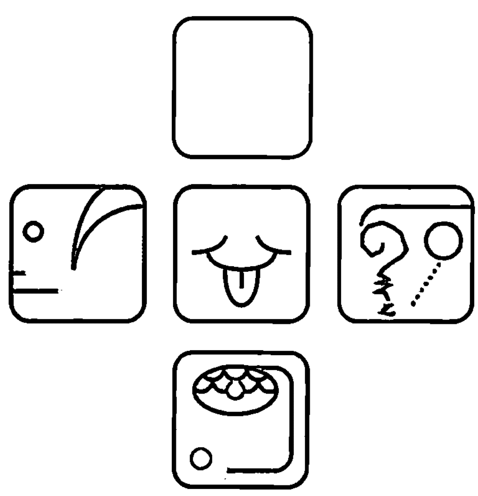

### 白風與紅地球互為支持

紅地球的能量是很落實、接地的，而白風比較精神性，紅地球可以協助白風落實精神性的能量。落實以後，白風能藉由紅地球的順流能量，幫自己所要傳遞的訊息做更好的整合。藉由探索各種好玩的人事物，讓白風能繼續玩耍、傳遞並分享想法。不妨到世界各地旅行、教學分享、與人溝通，也或許可以在跨國公司擔任公關。

### 白風與黃人互為挑戰擴展

黃人可以協助白風擴展能量，挑戰不熟悉的自己。黃人的能量是自由的頻率，能協助白風的擴展，自由地發揮內在靈性、心靈潛能，也是協助白風把內在訊息傳遞出來的力量。雖然能夠自由地說話，但黃人也會要白風能夠為自己所說的話負起責任。相同的，言論的自由表達、思考如何解決問題、自由解放、特立獨行的作風等等，都能擴展白風的力量。

### 白風與藍風暴互為隱藏推動

白風有時會害怕改變，就像改變根深柢固的想法與信念那般不太容易，因此，藍風暴擁有的轉化能量，能讓白風推動內在的改變與成長。主印記和隱藏推動是一體兩面，最重要的是表達與思考這樣的改變會為生命帶來什麼樣的前進和成長。望向自己的內心，問問自己，現在是需要改變的時刻嗎？

白風主要是說的能量，透過藍風暴的推動力，讓話語一旦由自己的口中說出，就形成能量的顯化和變動，這是白風特殊的潛能。

### 白風的引導

**一點家族：** 一點家族的白風，在精神層面具有雙倍的力量，也能專注活出主印記圖騰的力量。透過與人討論分享、激盪靈感，會更清楚內心的聲音與答案，更明白將要前進的方向。

**二點家族：** 引導是白巫師，讓意念顯化成真的能量非常強大。巫師的天賦會引領白風朝著實踐夢想的道路前進，可以多與神秘學、魔法課程、能量頻率等領域多多連結。

**三點家族：** 引導是白世界橋，白風加上白世界橋，讓溝通協調成為強項，可以進行工作分配、擔任協調者、安排各項事務。白世界橋也擁有放下執著的能量，提醒自己不要執著，才能以更好的方式服務他人。

**橫線家族：** 引導是白狗，也是特別有愛的白風，能讓身邊的人感受到溫暖。透過愛自己、忠於自己，並誠實面對自己的心，能夠引領我們朝向生命中更大的可能性與更高維度的自己前進。

**四點家族：** 引導是白鏡，說話特別能說到人的心坎裡，也因為是白鏡，天生就帶有放大鏡，能夠看得更清晰，更能洞察人性。當然，還需要關照自己的內心，因為當一切都來到面前，白鏡便會協助我們看得更清楚，更能清楚認識自己是誰。

### 白風的圖騰靜心引導詞

1. 把注意力放在右手中指，用大拇指輕輕碰一下中指（大拇指是太陽，太陽可以支持所有的圖騰）。
2. 先從嘴巴慢慢吐氣，然後慢慢從鼻子吸氣，讓氣進入鼻腔、胸腔，再到達腹部，最後透過嘴巴，把氣吐出來。
3. 觀察頭頂沿著脊椎保持一直線，肩膀與背部同時放鬆。感受外界有一陣清涼的風從身上吹過，白色的能量能帶來淨化，讓生活裡的事物變得更單純、純淨。
4. 白色有放下、清理的能量，透過吐氣，再次清理與釋放所有內在的恐懼。現在，從你的心去感受，直覺地出現在內在視覺心像的人（等待畫面浮現出來），看著這個人，你想跟他說什麼呢？（留一些時間讓彼此對話）
5. 接下來，讓注意力回到自己，放在心輪，如果現在要送一句話給自己作為支持或鼓勵，你直覺想要跟自己說什麼呢？再一次的吐氣、吸氣，把這句話當成禮物，放在心輪，感受這句話的力量。
6. 當你準備好了，再一個完整的吸氣、吐氣，慢慢張開眼睛，把自己完整的帶回來。

## 藍夜
BLUE NIGHT

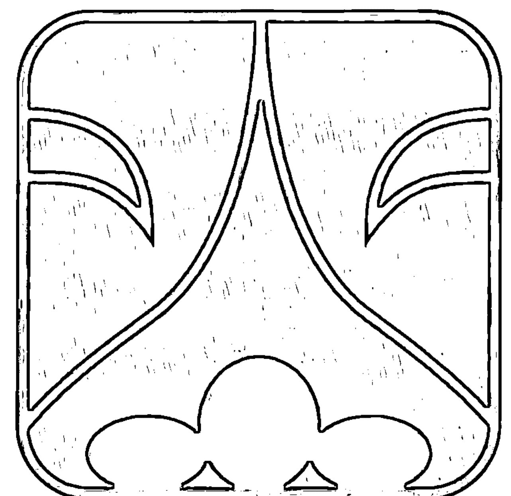

### 關鍵力量

**人格特質**：豐盛、分享、給予、優雅、品質、細緻
**興趣喜好**：學習、成長、學生
**擅長的領域**：善用潛意識媒材工具（輔導諮商、心理學、潛意識相關）的高手
**適合發揮**：潛意識、媒材運用、牌卡
**優勢**：直覺、知道、憑直覺行動
**功課**：平衡、施與受、物質與感受
**關鍵字**：夢想、直覺、豐盛

### 本質

藍夜是卓爾金曆上的第三個圖騰，對應馬雅的星際原型是「夢想家」。三是它的數字（序號），也是我們生命中要學習的第三個主題：夢想。

藍夜主要掌管夢想、夢境與潛意識。夢這個字的解讀有兩個層面，一個代表夢想，另一個則代表了夜晚的夢境。因此，藍夜人的天賦是能夠把夢想創造成真，透過潛意識、直覺靈感、夜晚的夢境，藍夜人能把這些豐富的訊息加以轉化，成為實踐夢想過程中可運用的素材。而分享豐盛是藍夜的本質，而且越分享越豐盛，並從內在擴展轉化到外在實際物質的豐盛。

藍夜人的直覺是非常強的，不妨多多練習相信自己的直覺與靈感，學習開發潛意識，例如各種藝術治療的媒材、探索潛意識的工具系統、催眠等等。同時，藍夜人也非常重視睡眠（有一款藍夜人晚上不睡覺，入夜後精神特別好），好好地睡一覺，就像是回到宇宙的懷抱裡充電，並在夢中提取潛意識訊息，像是預知未來的夢或可能發生的畫面等等。藍夜人可以多利用睡前對自己的暗示：「關於今晚的夢境，能給予我關於……的訊息」，去夢見想要創造的畫面或者是解答。

在相關印記裡擁有藍夜能量的人，適合從事與心理學或潛意識相關的工作，或帶領與「夢想」主題的相關活動，例如夢想藍圖的課程、談夢想實踐，或者夢想版的製作活動等等。

### 課題

藍夜會遇到的生命課題，是關於「豐盛感」這件事。能量失衡的藍夜人，內心常會感到匱乏，即便真相不是如此，但由於看不見自己的豐盛之處，導致這些匱乏感連帶影響外在物質世界，呈現不足。在實際行動上，會用購物來滿足自己，或害怕付出、不願分享。因此，在藍夜人的課題上，要學習看見已經擁有的豐盛，並練習分享。當你分享與給予時，會感受到更多的回應，這就是「宇宙三倍法則」：不論我們給予什麼，都會三倍回到自己身上。因而更能夠活出藍夜人內外都平衡的豐盛。

### 藍夜的日子

在藍夜的日子，會發生的共時現象有兩個：一是當天夢境可能會特別清晰，並帶來一些重要訊息。二是可能收到別人贈送的禮物或有人請客，特別豐盛。

在這個日子有三個調頻與擇日的好方法：一是記錄自己的夢境，把感受與聯想都寫下來。二是自己幫自己創造豐盛能量，例如購入需要的東西，吃飯時加一盤小菜或吃好一點的料理。三是關於夢想的許願，或潛意識投射卡的活動，讓豐盛能量協助夢想成真。

### 藍夜的組合盤

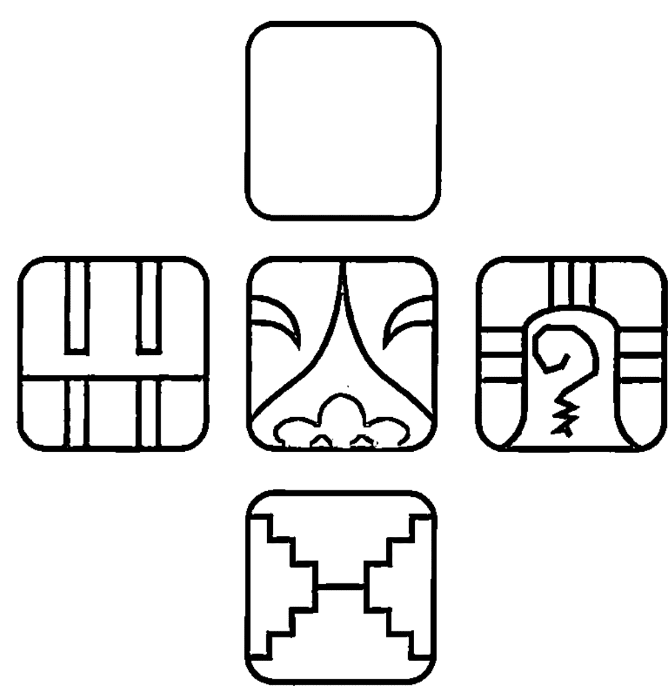

### 藍夜與白鏡互為隱藏推動

白鏡是藍夜的隱藏能量，藍夜掌管夢境和潛意識，很理解人性內在隱藏的潛意識地圖。我們的潛意識和夢境隱藏了許多祕密，但也像一面清楚的鏡子，當我們能清楚解讀這些訊息時，所有的祕密便能夠被解碼。另一個部分，藍夜也喜歡透過潛意識分析工具或夢境解析，進行內在心理狀態的討論。

### 藍夜與黃戰士互為支持

藍夜內在擁有豐富的潛意識訊息與夢想渴望，透過黃戰士的智慧提問，能協助自己釐清，究竟要的是什麼？這是真心渴望的夢想嗎？同時，黃戰士也能協助藍夜找到解決之道，使其在追夢之路上勇敢跨出每一步。黃戰士這種無畏無懼的勇敢力量能夠為藍夜加分。

### 藍夜與紅天行者互為挑戰擴展

紅天行者能夠協助藍夜擴展能量，挑戰那個待在舒適圈的自己。紅天行者的能量與穿梭、好奇、移動有關。我們在追尋夢想的過程中，絕對不會停留在原地，而紅天行者就是帶著藍夜擴充可能，打開生命當中更大的格局與潛能，無條件愛上探索生命的過程。

### 藍夜的引導

**一點家族：** 一點家族的藍夜，帶有雙倍豐盛的力量，若能專注活出主印記圖騰的力量，就能找到夢想引導的方向，內心有引領自我的答案。透過豐盛的分享，觀察潛藏在夢境與潛意識中的訊息，會更明白內心的聲音與答案，以及要前進的方向。

**二點家族：** 引導是藍鷹，協助藍夜在追尋夢想的過程中，往更高的地方飛去，透過藍鷹的視野與更高維度的格局，看得更廣、更遠。越是讓自己的能量輕盈，越能獲得指引。讓生命持續改變、蛻變，並一直前進，不斷以更大的格局打破原本的限制。

**三點家族：** 引導是藍手，藍手的能量跟實踐力有關，所以必須要落實，然後檢視自己關於夢想的清單，一步一腳印的親自去實踐。

**橫線家族：** 引導是藍猴，因此特別有幽默感。越有創意、越好玩的事，越能夠成就實踐夢想的藍圖，因此，一定要把有趣、幽默的元素帶入正在做的事情或工作當中，甚至，在遊戲中還能獲得指引的訊息。

**四點家族：** 引導是藍風暴，尤其能協助人們在生命裡擁有轉化與改變的力量。在夢想實踐的過程中，顯化的力量將會讓生命持續改變、蛻變，並一直前進，不斷以更大的格局打破原本的限制。

### 藍夜的圖騰靜心引導詞

1. 輕輕把眼睛閉起來，注意力放在右手無名指，這代表了豐盛的能量，也代表每一個人潛意識中無限大的潛能——潛意識裡擁有非常非常多的訊息。
2. 想一想，如果現在要對你的潛意識問一個問題，你要問些什麼？「親愛的潛意識，親愛的內在直覺，你想要了解什麼？請給我一些靈感、直覺的訊息，讓我用我可以接收的方式，清楚看見。」
3. 開啟你直覺的天線，打開內在潛意識的潛能，如果現在沒有任何感覺或畫面，沒有關係，你的潛意識會持續運作，甚至會在不同的時間點，給你不同層次的答案。
4. 慢慢吐氣，慢慢吸氣，做一個完整的深呼吸，把豐盛的能量吸進來，再吐出豐盛。當你準備好時，慢慢張開眼睛，把自己完整的帶回來。

## 黃種子
YELLOW SEED

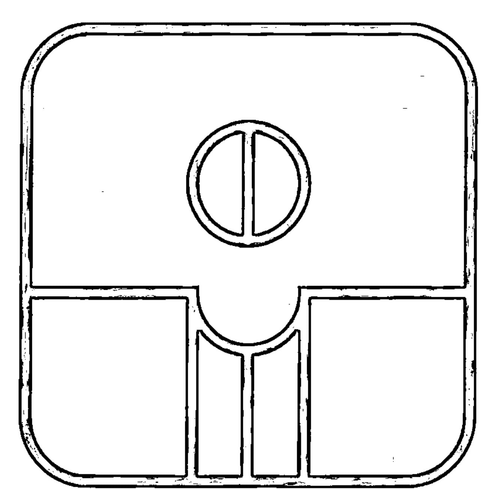

### 關鍵力量

**人格特質**：耐心、仔細、等待、順流、信任、放鬆
**興趣喜好**：培育、孕生、伴人成長
**擅長的領域**：團隊合作、齊心協力
**適合發揮**：財務管理、金錢、數字、格局、擴展、疆界
**優勢**：目標、對焦、正中紅心
**功課**：透過自我覺察，清楚知道目標是什麼，並耐心等候開花結果
**關鍵字**：目標、覺察、開花結果

### 本質

黃種子是卓爾金曆上的第四個圖騰，對應馬雅的星際原型是「天真之人」。四是它的數字（序號），也是我們生命中要學習的第四個主題：目標。

黃種子人經常保有良善天真之心，而且大智若愚，信任自我的潛能，耐心等待以達成目標，帶有內在覺醒的動力，從萌芽累積成豐收的果實。

黃種子人的目標規劃與完成速度，往往與其他人的期待不一樣。其他人常會認為黃種子人的速度稍慢，導致黃種子人會不自覺加速趕趕，以達成社會或別人的期待，所以許多黃種子人（與身邊親友）的急性子，往往就是這樣被逼出來的。在競爭激烈、步調快速的時代中，倘若我們能給予彼此更多的時間與信任，放下焦慮，便都能活得更自在。

### 課題

黃種子的生命課題有兩個部分：第一是「清楚聚焦在自己的目標上」。透過在生活中的學習與探索，找到並專注投入於目標裡，在過程中慢慢增長信心，看見自己擁有無窮潛能。第二是關於「耐心」，在達成目標的同時，練習耐心等待而不著急，跟隨自己的速度到達目的地，只要給予足夠的時間，放掉壓迫與壓力，種子自然會發芽並開花結果。

### 黃種子的日子

在黃種子的日子，會共時發生的現象有兩個：一是可能遇到考驗耐心的事。二是可能會有豐收的好消息，或是之前種下的種子開花結果，例如經營很久的客戶訂單終於成交了。

種子的能量法則教我們觀察：種下什麼種子，就會收穫什麼樣的結果。給予種子人越多讚美，就會綻放越多美麗的花朵。種子人能覺察自己種下的意念，帶著耐心與信任去等待，給予自己足夠的時間去完成目標。

在黃種子日有兩個調頻與擇日的好方法：一是非常適合許願，把能量意念的種子灌注到心願中（黃種子和白巫師互為挑戰擴展，心願特別容易顯化成真）。二是針對想要種下的目標種子採取行動，做一些象徵式的行為，幫助自己在宇宙頻率中先正確校準。例如想要結婚的人不妨去看婚紗，想生寶寶的人就去看嬰兒用品，想要考過某項考試的人就先請朋友吃飯。

在相關印記擁有黃種子能量的人，適合從事需要細心與耐心的工作，也很適合團隊合作，與大家齊心協力，一同完成任務。

### 黃種子的組合盤

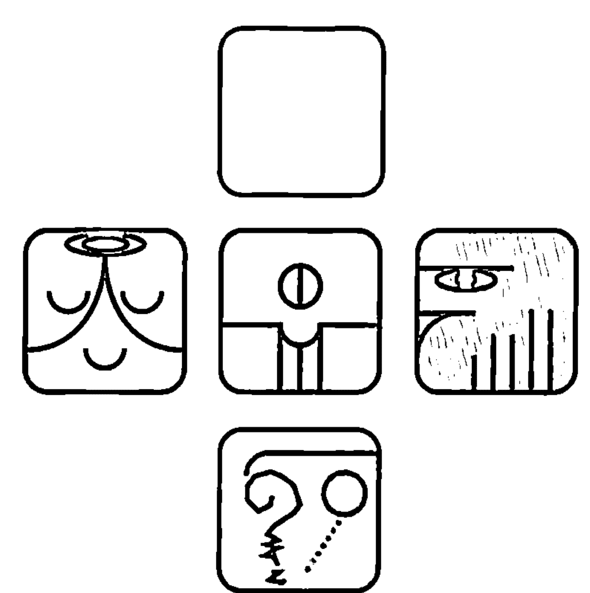

### 黃種子與藍鷹互為支持

黃種子非常清楚自己的目標，也需要耐心等待。藍鷹的能量能幫黃種子加分，協助黃種子不急於一時，不對進度的快慢患得患失，把注意力放在目標與願景上，把格局拉遠拉高，再次更精準地確認方向，並付諸行動。

### 黃種子與白巫師互為挑戰擴展

白巫師所能提供的協助是跨越時間，對於在乎時間速度與進展的黃種子來說，確實為思維擴展了不同的角度。白巫師的能量可以協助黃種子再次聚焦於當下，做到當下就是永恆，並打破對於時間感到著急焦慮的心境，在失去信心的時候，能再次看進自己的內心，找到解答。

### 黃種子與紅地球互為隱藏推動

紅地球是黃種子的隱藏能量，因為種子要種在土地裡。當種子落地後，必須先扎根，才能往上生長，但這也是黃種子有時會忽略的地方，忘了要好好在一個地方扎根、信任自己在生命當中所有的相遇與安排，然後臣服與順流。紅地球的「順流與信任」與白巫師的「心向內」有關。接受、臣服順流所有來到面前的每一件事情，白巫師告訴我們，所有的一切都是回到自己的心，內心就有這些答案，能夠給予自己一些指引，打開生命當中更大的格局。

### 黃種子的引導

**一點家族：** 一點家族的黃種子，具有雙倍的力量，專注活出主印記圖騰的力量，就能找到夢想引導的方向，內心有引領自我的答案。越是自我覺察，越能增加自己的信心，也會更明白內心的聲音與答案，以及所要前進的方向。

**二點家族：** 引導是黃戰士，協助黃種子在追尋夢想的路上擁有更多勇氣與智慧，越是勇敢提問、表達，越能夠找到解決問題的答案，綻放智慧的果實。

**三點家族：** 引導是黃星星，這是特別優美、具有美感與藝術性的頻率。黃星星的能量會引導黃種子多學習或參加與藝術美感相關的活動，並很有可能在藝術活動中獲得指引與靈感。

**四點家族：** 引導是黃太陽，能看見自己其實擁有非常有溫暖且發光發熱的力量，展現黃太陽覺醒和開悟的力量，並把這個光芒傳遞給身邊的每一個人。

**橫線家族：** 引導是黃人，特別喜歡自由自在的狀態，喜歡思考關於生命的問題，遵照自己的意願行動，而且不能催促他。

### 黃種子的圖騰靜心引導詞

1. 把眼睛閉起來，慢慢吐氣，再慢慢吸氣，再次放鬆全身，把部分注意力放在右手小指頭，連結黃種子的頻率。今年的你想要為自己種下什麼種子呢？有什麼美好的種子意念？把這樣的願景跟願望放在心輪。
2. 輕輕吐氣，同時感覺心輪的種子，拿一把土，為它澆水、灌溉，像看著縮時攝影一樣，內在的種子慢慢發芽，冒出頭來，慢慢地長大。它長成什麼樣？是一棵樹嗎？感覺種子往下延伸出了根鬚，往下扎根，往地球母親的心輪不斷延展，同時也繼續往上延伸，往天空不斷開展，長出綠葉、果實，眼前彷彿也出現了你取下這個心願的畫面，一切你想要的、渴望的，以及有關的人事物，都一步步在眼前越來越具象。
3. 輕輕送出一個感謝，謝謝這一切。也祝福參與自己最美好的開展過程中的每個人事物。慢慢吸一口氣，把這樣品質吸進你的心，再次灌溉這片肥沃的土地。
4. 當你準備好的時候，做一個完整的深呼吸，把自己帶回來，慢慢張開眼睛，你可以把這個過程寫下來或畫下來。

## 紅蛇
RED SERPENT

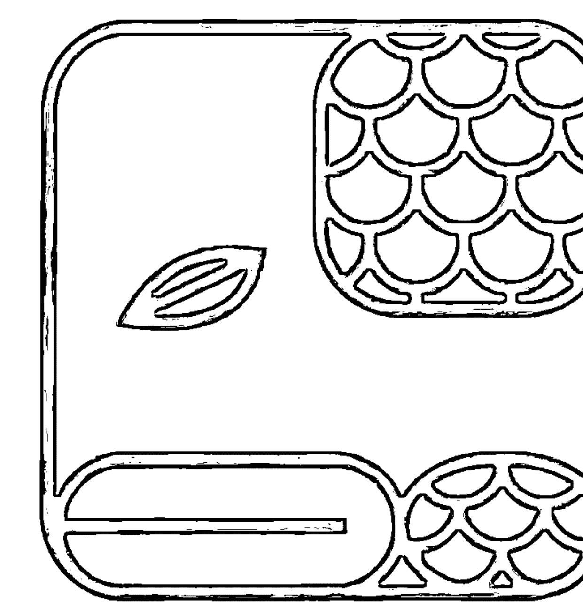

### 關鍵力量

- **人格特質**：活力、熱情、青春
- **興趣喜好**：感官、享受、享樂
- **擅長的領域**：全然投入、專注、熱情
- **適合發揮**：身體活動、舞蹈、肢體展現
- **優勢**：自信、光芒、鼓舞人心
- **功課**：活出生命的熱情，喚醒生命的推動力
- **關鍵字**：生存、本能、生命力

### 本質

紅蛇是卓爾金曆上的第五個圖騰，對應馬雅的星際原型是「啟動的蛇」。五是它的數字（序號），也是我們生命中要學習的第五個主題：生存。

啟動的蛇，就像對應到海底輪的能量，代表了生命的原始本能，協助我們喚醒生命力與熱情，照顧身體的需求，尊重並回應身體直覺的訊息。所以紅蛇人在生活中要非常照顧自己的身體健康，因為健康與生命力息息相關，擁有健康的身心，才能擁有生命的活力。在工作與人際方面，同樣也要找到動力與熱情並維持下去，才能保持平衡狀態。因此，紅蛇的「蛇」本身就象徵著「要生命存活，就要持續保持蛻皮」，當蛇褪去舊有的老皮後，就能持續成長與改變，從舊有能量中汰換，讓生命再次從內到外獲得新生力量。

說到紅蛇人的天賦，身體的直覺力很強，所以要信任自己的身體敏銳度，仔細聆聽身體的訊息與反應，適合多做伸展，展現身體的力量與能量。藉由運動、舞蹈與肢體展現，輔以健康的食物和生活，讓紅蛇人的身心靈達到平衡。

在相關印記擁有紅蛇能量的人，適合引發他人的熱情與生命力，也很適合接觸、從事與身體健康有關的領域。

### 課題

紅蛇要修煉的生命課題有三個階段，而且彼此息息相關。第一階段是學習找到生命的熱情，找到一件可以引發最大生命力的事情，讓你啟動生命能量的感覺，若感到怦然心動，那就對了。第二階段是喚醒身體的直覺力，當我們對生命產生熱情與動能時，身體的敏銳度與覺知才能被喚醒，自我與身體的連結也將更緊密，才能知道身體需要什麼，傾聽身體帶給自己的訊息。第三階段是蛻皮蛻變，當熱情不再、身體失去健康平衡時，就必須與這個階段的自己告別，生命就能前進到下一個新的階段了。

### 紅蛇的日子

在紅蛇的日子裡，會發生的共時現象有三個：一是感覺特別坐不住，很想起來扭動身體、跳舞或運動，釋放身體過多的能量。第二是皮膚會有脫皮或過敏狀況，共時的呼應了紅蛇蛻皮的頻率。第三個或許是你當天會遭遇到某件衝擊內在課題的事件，讓你不得不去面對，去「蛻掉／褪去」舊有模式。

因此，在紅蛇的日子調頻與擇日的好方法，就會與這些共時的現象有關。你可以安排與身體有關的自我照顧行程，例如瑜伽、運動、跳舞、身體療癒或SPA，開展肢體潛能，發揮身體能量的熱情與活力，讓身體透過這些活動再次恢復平衡。

### 紅蛇的組合盤

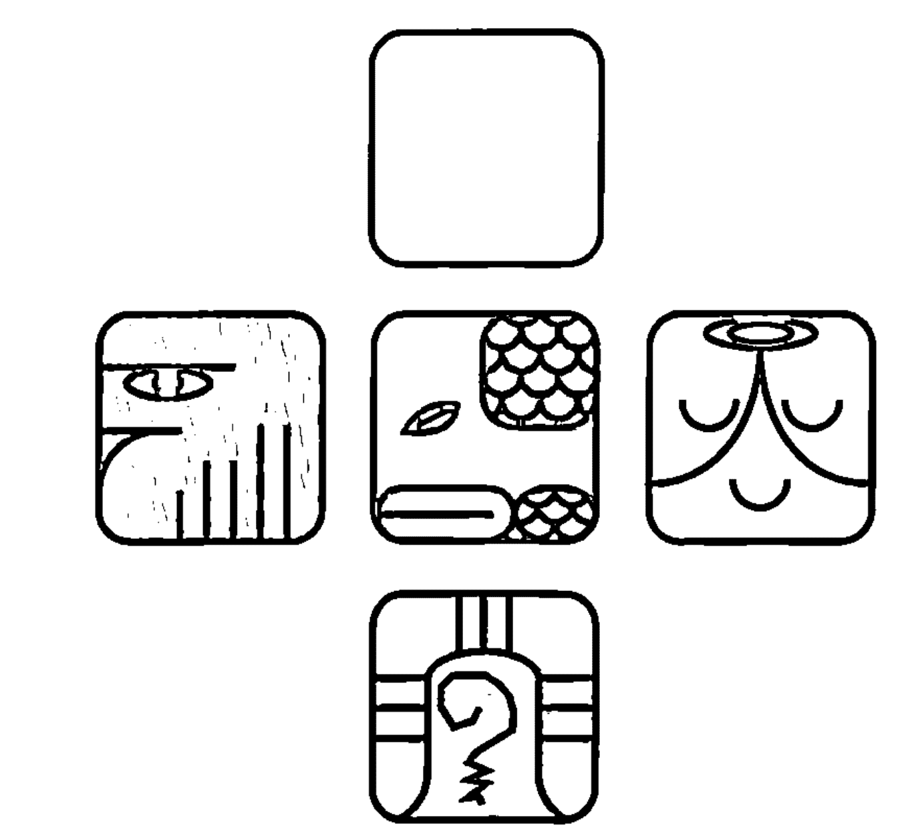

### 紅蛇與黃戰士互為隱藏推動

黃戰士是紅蛇的隱藏能量，當我們面對改變時，往往會感到害怕，習慣待在舒適圈。沉浸在長久的安逸中，是沒有辦法有更多成長的。若是此時，紅蛇又面臨了生命狀態的考驗，黃戰士的出現，就會像是被忽略已久的戰鬥力突然浮現，代表無畏無懼的潛能，讓紅蛇拿出戰士的力量，勇敢蛻皮，勇敢改變。

### 紅蛇與白巫師互為支持

白巫師能為紅蛇加分，支持紅蛇的成長與改變。白巫師告訴我們，眼光不能停留在外面，要「心向內」。紅蛇偶爾會對某些事情上癮，這些事情可能會對紅蛇不利，但紅蛇卻無法覺察或做出改變，此時，白巫師便能幫助紅蛇。閉上眼睛，其實你的內心早已都有了答案，早就想要離開某個人或某件事。

### 紅蛇與藍鷹互為挑戰擴展

藍鷹能幫助紅蛇擴展能量，挑戰不熟悉的自己。藍鷹的任務便是提醒紅蛇，必須看得更清晰，以及為什麼現在需要改變？從更長遠的生命旅程來研判，現在的自己需要做什麼調整，或者其實需要先照顧好自己的健康，找回對於生命的熱情，而不是短視近利，只看眼前。

### 紅蛇的引導

**一點家族：** 一點家族的紅蛇，具有雙倍蛻皮的力量，專注活出主印記圖騰的力量，就能找到夢想引導的方向。透過發掘自己的熱情，喚醒生命的動能，內心有引領自我的答案。透過與他人討論分享來激盪靈感，會更明白內心的聲音與答案，以及所要前進的方向。

**二點家族：** 引導是紅地球，紅蛇蛻變需要倚靠地球母親給予引導，這種類型的人特別喜歡旅行與自然的東西，因為越是貼近自然，越有助於紅蛇的身體健康。多接觸天然食物與用品，常常到大自然中走走，能讓紅蛇的身心靈獲得平衡與滋養。

### 紅蛇的圖騰靜心引導詞

1. 閉上眼睛，輕輕吐氣，再輕輕吸氣，感覺到你的海底輪有一股力量，是生命熱情的頻率，你知道這是紅蛇的能量，接著從海底輪繼續往上，感覺到像是雙股交叉螺旋一樣，交會處就是脈輪（就是你們所知的療癒權杖，雙頭蛇）。從生命底層根部的能量中心，帶起生命的動能，慢慢升起，停留一下，感受這個頻率。
2. 把部分注意力放在右腳大拇趾，然後慢慢吐氣。
3. 再次吸氣時，請從海底輪吸氣，讓這股能量慢慢地跟著呼吸延展，從臍輪、太陽神經叢、心輪、喉輪、眉心輪到頂輪，然後吐氣，感覺一下身體，應該能感受到一股熱能，因身體的熱能而與能量的頻率振動。保持身體的覺察，觀察現在身體有沒有哪個部位有些感覺，可能是特別穩定、舒服或緊繃，或許有某個部位正等待著你的特別關注。
4. 把注意力放在需要關注的地方，讓那個部位做三次吐氣與吸氣。吐氣時完全放鬆，吸氣時再次吸入更多的光與氧氣。感受內在，想一想現在生命的熱情是什麼？做什麼事會感覺特別有活力？留意直覺浮現的那項活動，留意是跟誰在一起、做什麼事，感覺那種怦然心動，並記住此時身體的感受。
5. 再次完整地吸氣與吐氣，把這股能量擴展到身體的每一個細胞，然後把自己慢慢帶回來，慢慢張開眼睛。

## 白世界橋
WHITE WORLD-BRIDGER

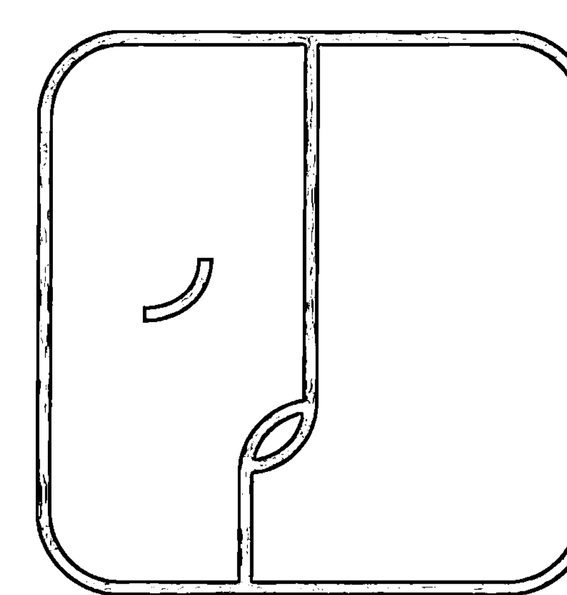

| 關鍵力量 |
| --- |
| **人格特質**：愛護動物、友善、照顧、服務、有求必應、有問必答 |
| **興趣喜好**：有說服力、分享、推廣 |
| **擅長的領域**：公關、社交、溝通、連結、說與聽 |
| **適合發揮**：連結、管道、拯救、媒介、提供方法 |
| **優勢**：調節、拉近彼此 |
| **功課**：擔任中間的管道，不執著於任何一方，學會放下 |
| **關鍵字**：相等、機會、死亡 |

### 本質

白世界橋是卓爾金曆上的第六個圖騰，對應馬雅的星際原型是「教皇」。六是它的數字（序號），也是我們生命中要學習的第六個主題：平衡。

教皇的原型，象徵了建立神聖秩序的平衡，也是無畏死亡的大師。白世界橋圖騰一上一下的線條，象徵天賦是成為連結並平衡兩端的人，就彷彿連結了天地的能量，是很暢通的訊息接收者，也是連結人事物的管道。白世界橋很會溝通喬事情，就好像和事佬或調解委員一樣，遇到什麼談不攏的事情，可以試著尋求白世界橋人的協助；找不到東西時，也可以問問白世界橋人。

白世界橋的特質，是能在不同角色的切換中來去自如，從這個舞台到下一個舞台的轉換。在生活中也要學習「結束」或「轉換階段」的自由切換、灑脫面對結束與分離，並在切換中找到平衡的方法。學習放下執著，面對死亡、結束、新階段開始的恐懼，學會以自在灑脫的態度去因應。

死亡這概念就像是「結束」，象徵了跨越次元、階段，從原有階段到新階段的轉換，新的身分角色開始，例如從學校畢業、出社會工作、結婚、生子，就是白世界橋的象徵意涵。在相關印記擁有白世界橋能量的人，適合成為搭建橋樑的人，鏈接人事物，可以擔任團隊裡的協調者、斡旋者、平台搭建者、仲介與媒人等等。

### 課題

白世界橋要修煉的生命課題，是「放下執著」。學習信任、理解，並進而放手，面對無法掌控之事物的焦慮、害怕局面失控、對於未知或不確定性的擔憂、對於死亡（結束）的恐懼等等，都是白世界橋必經的修煉歷程。這些擔憂與執著，都源自於人類對於死亡的恐懼，認為死亡便是「結束」。但死亡（結束）真正的意涵，代表的是新階段與身分即將展開。而白色圖騰的能量能夠協助我們淨化、清理，看得更清楚，能夠學會放下這些原本對於恐懼的想像。放過自己，也放過他人，不再執著。

### 白世界橋的日子

在白世界橋日，會共時發生的現象有兩個：一是認識新的朋友，建立新的人際關係。二是或許會有朋友找你討論事情，並達成共識，產生新的合作關係。

在白世界橋日也有兩個調頻與擇日的好方法：第一是可以選在這天進行簽約、簽章，甚至如訂婚儀式，都很適合——你是否也有發現，這個圖騰就像兩個人在握手。第二，如果你想要成為橋樑，例如媒人、牽線人、仲介等等，或者想要促成某一件事情，也可以安排在這一天。

無懼，協助白世界橋拿出戰士的精神，有勇氣放下與斷捨離，有智慧地面對離開與結束。黃戰士給予的擴展力量，會為生命開啟更大的勇氣。

### 白世界橋的組合盤

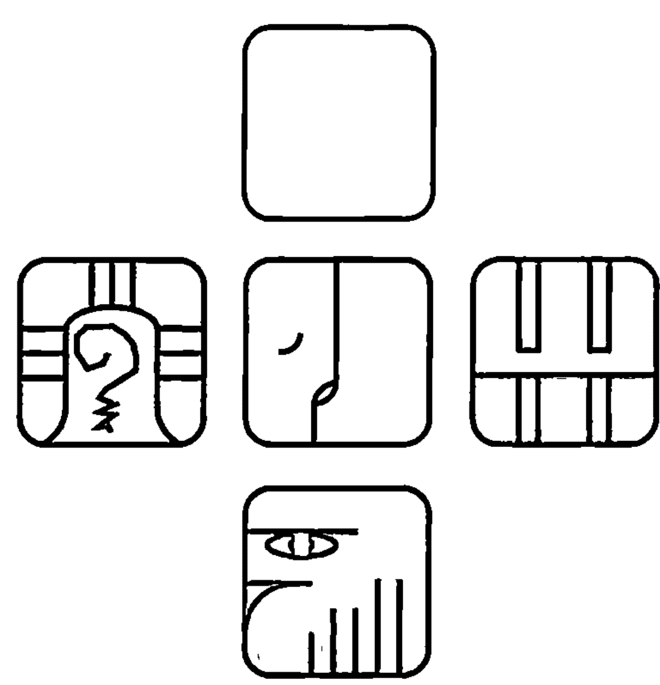

### 白世界橋與藍鷹互為隱藏推動

藍鷹是白世界橋的隱藏能量，協助白世界橋飛得更高，看得更遠，所以白世界橋的人這麼會喬事情，是因為具備了一種潛能：內在有一張可運用資源的地圖，能看清楚很多事情，用更大更寬闊的視野來看，就能夠把事情協調到很完美的狀態。

### 白世界橋與紅天行者互為支持

紅天行者能夠為白世界橋的能量加分，支持且改變前進的動力。橋樑的功能與概念是「跨區域的連結」。在不同地區，與不同的人事物進行各種合作，能協助白世界橋打開更多機會，讓自己成為行動橋樑，把每個點都串聯起來。

### 白世界橋的引導

**一點家族**：一點家族的白世界橋，具有雙倍的力量，專注活出主印記圖騰的力量，就能找到夢想引導的方向。與自己的內心溝通，讓心裡頭的魔鬼與天使對話，讓理性與感性連結，自然能有引領你的答案出現。

**二點家族**：引導是白鏡，協助我們像鏡子一般，看得更清透，更理解人性。需要指引的時候，就從生活周遭的人事物當中觀察，看得清晰，就能獲得指引的訊息。

### 白世界橋與黃戰士互為挑戰擴展

黃戰士能幫助白世界橋擴展能量，挑戰不熟悉的自己。黃戰士的能量是勇敢。

**三點家族**：引導是白狗，所以特別充滿了愛。不害怕失去與死亡，因為上面有狗狗的力量與無條件的愛作為引導。別忘了要回歸自己的心，心就會告訴你該放下什麼。

**四點家族**：引導是白風，特別擅長說話與溝通，中間是連結的橋樑，上面是傳遞意念的白風，真的很適合擔任溝通協調者呢！

**橫線家族**：引導是白巫師，超頻和行星的白世界橋，對於神秘學、魔法都特別感興趣，更重要的是，內在意念是非常關鍵的，是能引領、協助他擁有實踐夢想的力量。

### 白世界橋的圖騰靜心引導詞

1. 閉上眼睛，輕輕吸氣，再慢慢吐出來，把注意力放在右腳食趾。
2. 感受一下目前的生活，問問自己：「想要放下什麼？哪些人事物讓你糾結，影響著你？」並且信任直覺跳出來的答案，接著吐氣，把氣從右腳的食趾吐出來，讓它回歸大地。
3. 感覺自己是一個連結的管道，就像是中空的蘆葦。透過自然的呼吸，放下執著與緊緊抓住的感覺與想法，讓能量順暢的來回流動。輕輕吸氣，再慢慢吐氣，讓橫向與縱向的管道都通透順暢。
4. 一切只有吸跟吐，讓自己成為全然的通道，感受美好事物的能量、豐盛頻率朝你而來且通過你。最後做一個完整的深呼吸，把這樣的能量擴展到身體的每一個細胞，準備好以後，慢慢張開眼睛，把自己完整的帶回來。

## 藍手
BLUE HAND

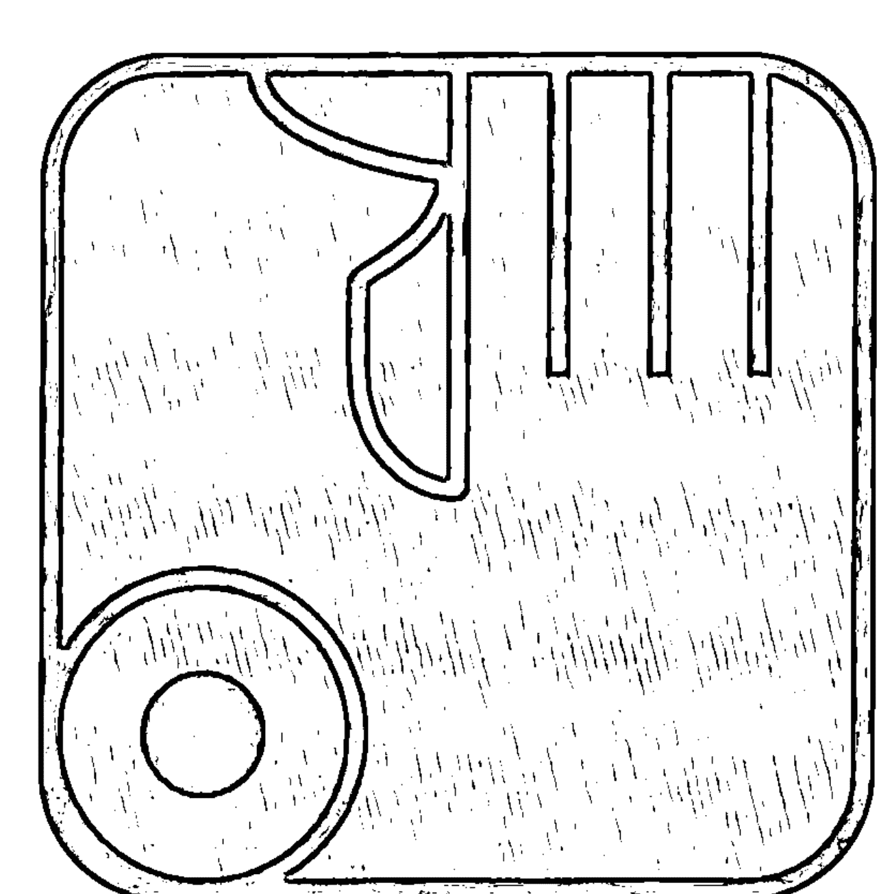

### 關鍵力量

**人格特質**：獨立、拓荒、單打獨鬥、耐心、仔細、等待
**興趣喜好**：尋求真理、實踐
**擅長的領域**：療癒、身心靈、治療師、手作、工藝、創造
**適合發揮**：烘焙、料理、食物
**優勢**：建立制度、創造、從無到有
**功課**：將空想轉化成實際行動，用手創造所有可能
**關鍵字**：知曉、療癒、實踐

### 本質

藍手是卓爾金曆上的第七個圖騰，對應馬雅的星際原型是「阿凡達」。七是它的數字（序號），也是我們生命中第七個要學習的主題：知曉。

藍手是實踐的力量，代表透過手的力量，去創造、觸碰、知曉一切，並採取行動完成療癒的能量，關鍵字就是「知曉」（know）。藍手人的特質，是腦袋裡擁有很多知識與想法，但必須透過實際操作，才能知道並理解。因此，藍手人很需要透過雙手的碰觸，產生療癒的力量，就能打開所有的學習和覺知。

藍手圖騰代表了雙手萬能與實踐力，雙手能創造所有的力量。因此藍手人的能量是非常豐盛的，象徵著一做就有、就成、就會。

在相關印記擁有藍手能量的人，適合學習畫畫、植物、模型、拼布、烘焙等技藝，或是透過雙手療癒的身心靈系統，例如靈氣或手印療法等等。如果談到適合從事的工作，電腦繪圖、美容美髮、攝影藝術、甜點廚師，都與藍手的力量有關連，透過雙手，一步步去創造出許多東西。

### 課題

藍手要修煉的生命課題，是關於「一步步地實踐」。能量扭曲的藍手，容易停留在腦袋空想的階段，覺得知道了就好，不必特別去行動，因此容易天馬行空，說的比做的更多，缺乏行動力，也少了一些生活的實踐過程。而這些拖延、懶惰或無法落實的狀況，往往是起因於害怕自己做不到，或是害怕執行結果與想像有落差。

因此，破除藍手這些停滯不前的方式就是「拆解步驟」，把想要做的項目拆解成小步驟，先跨出第一步後，再一步步往前，最終就能達標。做了就會知道其實不難，難的是自我設限。

### 藍手的日子

在藍手的日子會發生的共時現象是，這天會突然很想動手做個東西，例如拼個拼圖、烤個餅乾、整理房間，或是完成某件事等等。

在藍手日有兩個調頻與擇日的好方法：第一就是實踐，這是非常適合實踐的日子，如果你有滿腦子的想法，還不如寫下來。這也是個非常適合動手做的日子，想到任何點子或計畫，就寫下來吧，然後開始實踐計畫。第二，如果你有事情因為拖延而遲遲未能完成，在藍手的日子，可以藉由宇宙力量，把耽擱一陣子的事情順利完成。

熟悉的自己。紅地球能夠提醒藍手，腳踏實地做事，以及順流行動是非常重要的。紅地球代表一個挑戰的位置，在生命中的許多行動，並非只有埋頭苦幹，也不是趕快把事情完成就好，而是要一邊做，一邊修正，並同時感受順流能量的前進。

### 藍手的組合盤

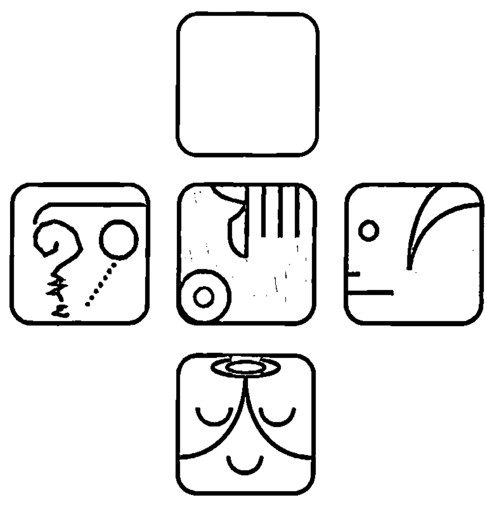

### 藍手與白巫師互為隱藏推動

白巫師是藍手的隱藏能量，藍手採取行動的時候，常會忽略內在的起心動念，白巫師能提醒藍手，覺察我們內在究竟有什麼想法，進而導致這樣行動的結果。你的意識專注力和焦點放在哪裡，那裡就會被你創造出來。這也就是我們看到兩個不同的人做同一件事，為何會造成兩種天壤之別的結果，這就是內在意念的潛力與推動所形成的現象。

### 藍手與黃人互為支持

藍手代表實踐的力量，支持是黃人，所以當藍手想要創造出一個行動時，這個行動一定要跟著黃人內在的自由意志去落實，不然會變成想像與實際執行不一致。黃人的能量是來幫藍手加分的，這兩個加在一起就是「知行合一」。黃人代表了聰明、智慧和思考。藍手代表了行動等於知道，做了就代表知識得以落實展現，是加分的重要關鍵。

### 藍手的引導

**一點家族**：一點家族的藍手，具有雙倍創造的力量，專注活出主印記圖騰的力量，就能找到夢想引導的方向，內心有引領自我的答案。容易創造豐盛、吸引成功，且很容易一行動就成功。

**二點家族**：引導是藍風暴，落實行動的能量會帶來改變和改革的力量，特別有催化改變、重建事物的天賦。當他採取行動時，很多事情就會跟著轉動起來。

### 藍手與紅地球互為挑戰擴展

紅地球能幫助藍手擴展能量，挑戰不熟悉的自己。紅地球能夠提醒藍手，腳踏實地做事，以及順流行動是非常重要的。紅地球代表一個挑戰的位置，在生命中的許多行動，並非只有埋頭苦幹，也不是趕快把事情完成就好，而是要一邊做，一邊修正，並同時感受順流能量的前進。

**三點家族**：引導是藍猴，所以要做有趣的事。當我們在面對生命中有意義的事情時，一定要試著去想像有趣、幽默或有意思的事。能夠一邊玩耍，一邊獲得指引的訊息。

跟著夢想同步前進的。不妨談談夢想與行動，試著讓夢境給你指引與方向。

**橫線家族**：引導是藍鷹，代表較大的格局。這樣的藍手在行動上，必須看得比較遠，因為他在進行的事情，往往無法立即見效的。所以採取行動時，可以考量什麼能讓未來更好？如何讓三年、五年內的我，都能朝向目標前進？

**四點家族**：引導是藍夜，非常豐盛。當我們採取行動時，夢想會引領方向，也更能實踐並完成行動，因此，實踐力是跟著夢想同步前進的。不妨談談夢想與行動，試著讓夢境給你指引與方向。

### 藍手的圖騰靜心引導詞

1. 閉上眼睛，輕輕吐氣與吸氣，讓心靜下來。把注意力放在右腳中趾，從這裡吸氣，再從這裡吐氣。
2. 回想你在最近的生活裡創造了什麼？做了什麼事情呢？或者完成了什麼事情？想讓哪些事情落實？
3. 試著讓內心慢慢浮現那些事情的影像。不妨先張開眼睛，寫下你想到的關鍵字或短句，再閉起眼睛，感受這些事情完成的畫面。接著，讓自己站在完成的位置，轉身回頭看，從完成的狀態往現在回溯，看到自己如何一步一步完成。寫下計畫如何一個環節接一個環節進行，彷彿看到事情已經完成。
4. 再一次完整的吸氣與吐氣，把能量擴展到身體的每一個細胞，當你準備好時，慢慢張開眼睛，把自己完整的帶回來。

## 黃星星
YELLOW STAR

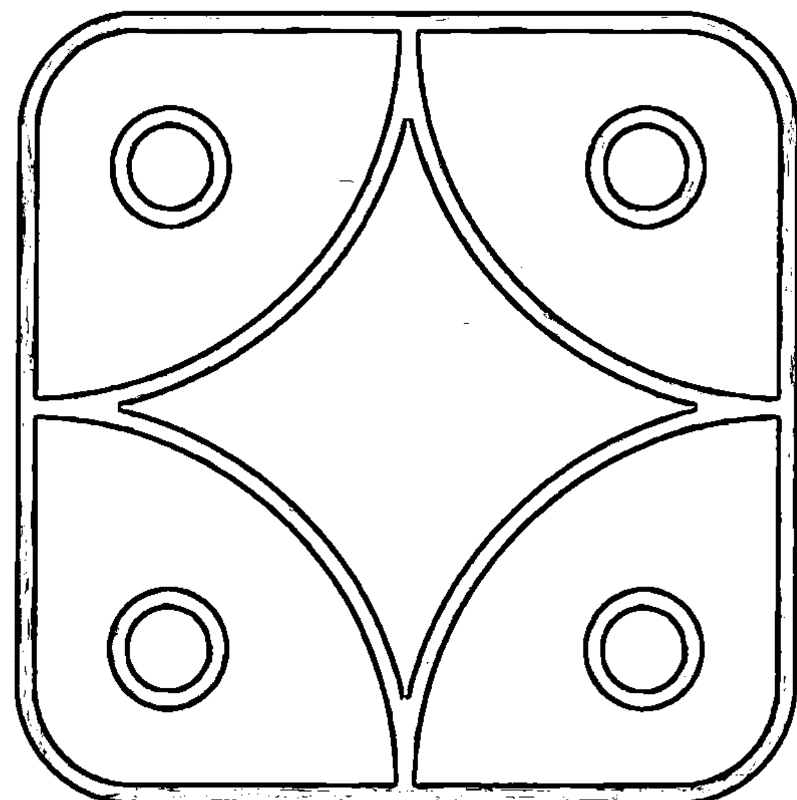

### 關鍵力量

**人格特質**：藝術、表達、內在感受
**興趣喜好**：品味、欣賞、有美感
**擅長的領域**：手作、工藝、創造、軍師、幕僚、企畫、網路
**適合發揮**：思考、理性、分析
**優勢**：點子、創意、豐富的靈感、優雅、細緻
**功課**：分享美麗的事物，對於美的偏執與挑剔
**關鍵字**：美麗、藝術、優雅

### 本質

黃星星是卓爾金曆上的第八個圖騰，對應馬雅的星際原型是「藝術家」。八是它的數字（序號），也是我們生命中要學習的第八個主題：美感。

黃星星圖騰代表宇宙中最美麗、最優雅的藝術，所以黃星星人本身就具備了有如藝術家的獨特美感與品味。黃星星人有特殊的靈感接收方式，這些靈感，很多時候是天外飛來一筆，就好像從遙遠的星星一閃而來的訊息一樣。這些訊息未必會有邏輯，所以黃星星人可能會說不出什麼理由，但這樣乍現的靈感，常被運用在藝術創作、生活美感以及創意發想上，都是黃星星人的天賦。而黃星星的頻率往往來自於天空，因此也特別適合從事傳播媒體與網路相關的行業、網站製作、網路教學、網路拍賣、部落客等等。

黃星星人是最能把美麗優雅事物帶到人間的人。他們也有獨特的鑑賞力，所以，如果要找人針對美感評斷或選擇，甚至提供修正的建議時，黃星星人通常會是適合的人選。

在相關印記有黃星星能量的人，只要身處於自己有興趣的職業裡，往往都能夠盡情發揮與美相關的特質，例如網頁設計、餐點擺盤、櫥窗布置等等，或者在團隊中擔任設計或藝術相關職務，演藝圈與設計相關工作，也都很適合黃星星人。

### 課題

黃星星要修煉的生命課題有兩個層面：第一是美的提昇，在生活中淬鍊自己對美感的敏銳度。第二是跟藝術家的偏執及挑剔性格有關，如果對某些事情因標準太高而過於執著，就會落入追求完美的痛苦與失望之中。這些執著與挑剔，不僅讓旁人或合作者痛苦，自己也會陷入掌控欲帶來的緊繃狀態，無法順利在生活當中前進。因此，調整一下自己對於優雅的定義，並釋放這些非理性的完美期待。能量到位的黃星星人，在生活當中其實是很落實接地的，很優雅的活在人間，與人分享許多美麗事物。

### 黃星星的日子

在黃星星的日子，會發生的共時現象是這天會特別想打扮自己、想拿起畫筆創作、想去買個花帶回家、想拍下美麗的風景等等。

在黃星星日有三個調頻與擇日的好方法：第一是可以妝點生活中值得變美麗的部分，例如買新衣服、換髮型、更新家中用品，把自己跟環境弄得美美的。第二是用美好的角度來看待自己，每天都去觀察與記錄自己的美好，並讚美自己。第三，可以把創作或藝文相關活動安排在這一天。

常會很直接的反應每一個人的內心，例如作家感人肺腑的文字，或音樂家淒美動人的旋律，都與創作者的人生經歷有關，所以當一個人失戀時，可能會寫出很好的小說跟動人的情歌。

### 黃星星的組合盤

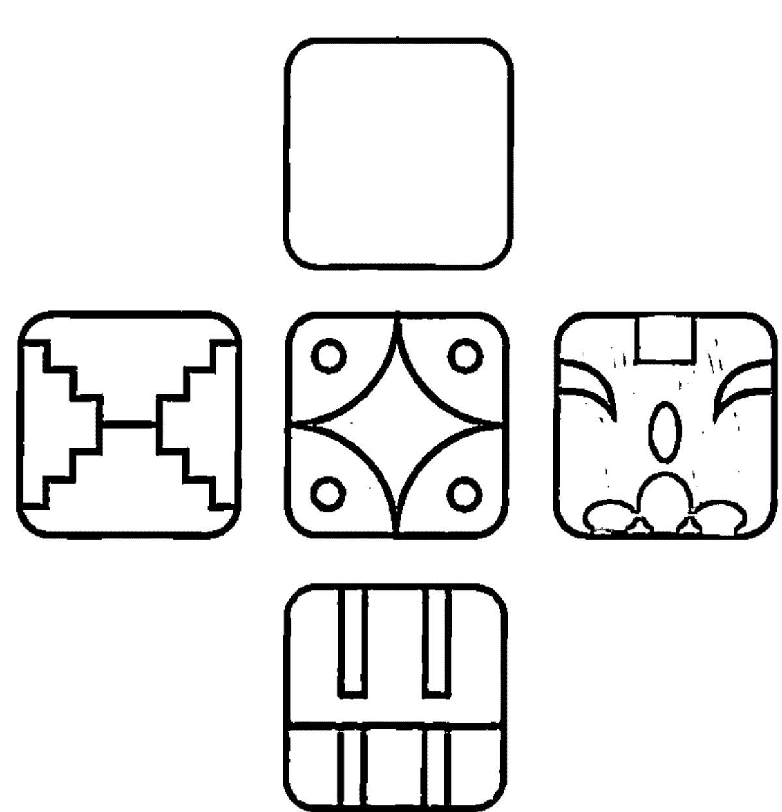

### 黃星星與紅天行者互為隱藏推動

紅天行者是黃星星的隱藏力量，對於藝術形式的活動充滿了強烈的好奇心。如果他很喜歡攝影，就會去研究如何增進攝影能力。紅天行者的能量，是在不同地點到處移動、天馬行空的，甚至可以穿梭到不同的時間與空間。到處畫畫寫生，在不同的咖啡館寫作、創造出好的作品，或到世界各地攝影拍照等等。

### 黃星星與藍猴互為支持

藍猴是黃星星的支持。黃星星人本身頗具幽默感，而藝術形式的活動也一定要好玩，就像音樂、畫畫一樣，藝術不能枯燥沉悶。有意思的事情，特別能讓黃星星的頻率綻放。當黃星星以有趣好玩的方式展現藝術時，身為支持的藍猴，特別能夠幫忙加分。

> 祖師爺荷西博士的圖騰就是藍猴，支持是黃星星，他是藝術史與美學博士，所有圖騰都是他重新繪製的，他也畫了很多曼陀羅時空之門創作，擁有很強的能量。黃星星是藍猴的支持，而「時間就是藝術」這句話，正是十三月亮曆法裡非常重要的觀念。

### 黃星星與白鏡互為挑戰擴展

白鏡能協助黃星星擴展能量，挑戰不熟悉的自己。很多藝術形式或創作，常會很直接的反應每一個人的內心，例如作家感人肺腑的文字，或音樂家淒美動人的旋律，都與創作者的人生經歷有關，所以當一個人失戀時，可能會寫出很好的小說跟動人的情歌。

> 在心理學領域裡的表達性藝術治療媒材，透過抽牌卡、畫畫與創作等藝術形式的活動，能直接看出當事人的內在狀態，例如內在會有哪些故事，內心反應了什麼，這些層面就好像放大鏡和照妖鏡一樣，很真實的反應出黃星星的頻率。

### 黃星星的引導

**一點家族**：一點家族的黃星星，具有雙倍黃星星能量的引導，能接收來自上天的訊息。如果需要接收指引和引導，可以常去觀星，在星空下接收訊息，尤其是晚上會特別有靈感。

**二點家族**：引導是黃太陽，特別溫暖，是暖心系的藝術家。透過生命的鍛鍊，為自己帶來覺醒跟開悟的力量，也更能協助自己和他人。把生命當中優雅和美感的能量，用智慧傳遞出去。

**三點家族**：引導是黃人，也是最熱愛自由的。如果他對這件事有感覺，會毫不猶豫的往前走，任性隨心，而這樣自由的頻率，可以協助黃星星更加閃耀。在合作時，也一定要給予絕對的自由，好讓他發揮能量。

**四點家族**：引導是黃種子，特別具備穩定、耐心的能量，允許自己用更多時間來醞釀創意、等待靈感湧現。從種子直到變成大樹，往往需要一段時間，而黃星星也是如此，需要耐心等待，讓夢想慢慢茁壯。

**橫線家族**：引導是黃戰士，特別需要勇氣去實踐夢想，在面對生命中的許多事情時，要更勇敢，並透過提問以獲得智慧的指引。在面對與解決問題時，用更高層次的智慧綻放光彩。

### 黃星星的圖騰靜心引導詞

1. 輕輕把眼睛閉起來，慢慢吐氣，再深吸一口氣。
2. 想像頭頂上方有整片星空，跟著心裡頭的讚嘆：「哇，好美喔！」從你的頂輪連結這股寧靜能量，所有星星都代表了我們遙遠的過去，將曾經在遙遠地方閃耀的，連結回你的心，在心輪放入黃星星的頻率，你生命中的優雅與美麗會是什麼？生命中最珍貴、像星星般閃耀的美好又會是什麼？
3. 信任直覺跳出來的訊息，並且問自己：「如果生命裡有一件事情，讓你想到了會微笑，那會是什麼事情呢？」把這樣的微笑放在心裡，感謝它。
4. 慢慢地連結回右腳無名趾，在這部位做一個完整的吸氣與吐氣。
5. 再一次完整的吸氣與吐氣，把能量擴展到身體的每一個細胞，當你準備好時，慢慢張開眼睛，把自己完整的帶回來。

## 紅月
RED MOON

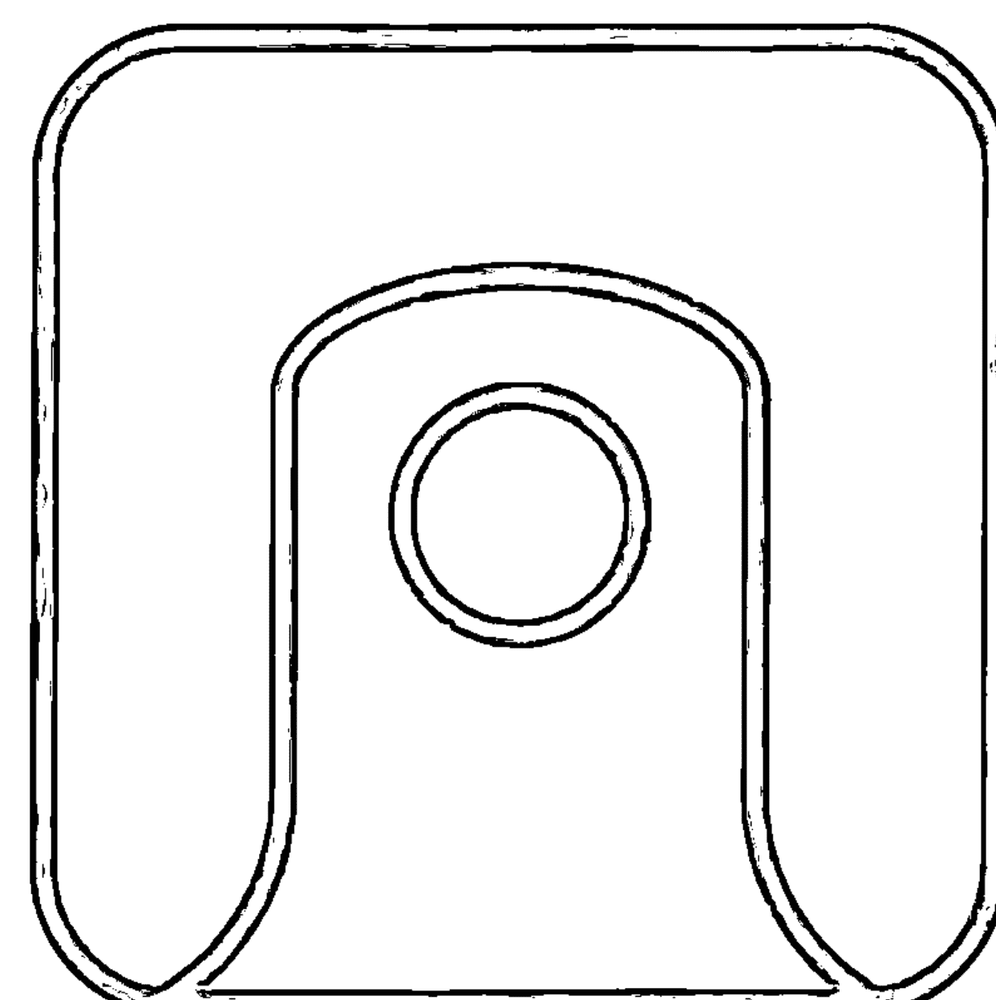

| 關鍵力量 |
| --- |
| **人格特質**：陪伴、同理心、慈悲、愛心、唱作俱佳、表情生動 |
| **興趣喜好**：模仿、舞台、表演 |
| **擅長的領域**：舞蹈、肢體展現、療癒、身心靈、治療師 |
| **適合發揮**：說書人、連結、管道 |
| **優勢**：聽覺敏銳、心聲 |
| **功課**：學會將內在的情緒感受做適當表達 |
| **關鍵字**：淨化、流動、宇宙之水 |

### 本質

紅月是卓爾金曆上的第九個圖騰，對應馬雅的星際原型是「治療師」。九是它的數字（序號），也是我們生命中要學習的第九個主題：淨化。

圖騰為紅色月亮，所以能量與淨化、水元素有關，可以透過流淚、流汗、泡澡、喝水等活動達到排毒淨化，也能讓自己的身體與情緒流動。紅月人的天賦是感性、溫柔、慈悲、柔軟與同理心，特別能夠對別人的情緒感同身受。因此，紅月人適合協助他人表達情緒，透過情緒的流動，釋放沉積已久的阻礙。

月亮是掌握情緒的關鍵，人的情緒就像月亮一樣，隨時都會變化，所以我們要能夠有意識的覺察情緒變化，並學習更舒服的表達方式，才能活得更健康。

紅月人可以運用擁有水元素的療癒工具來幫助自己與他人，例如精油、靈性彩油、花精等等，都與紅月「宇宙之水」的水元素有關。當我們的情緒能夠流動、表達，便更能用平常心去理解：出現在生活中的所有感覺，其實都是正常的。同時，也可以透過如聽音樂、看電影、運動、唱歌等活動來觸發心裡的感受，進行會感到愉快或觸動心弦的事，都是讓情緒流動的方法。

在相關印記擁有紅月能量的人，適合從事與人互動的工作，例如服務業，也適合往身心靈療癒的領域發展。

### 課題

紅月所遇到的生命課題，是「不壓抑情緒」的學習。學習將內在情感做適當的流動與表達，當你在面對自己的各種情緒時，無論是開心、感動、憤怒、焦慮或恐懼，最重要的是能夠允許自己表現出情緒，並觀察反應，不要急著批判此時是否應該出現情緒，也不必太快去分析情緒從何而來，因為當我們試圖為情緒找到合理的解釋時，就會落入頭腦理性的分析判斷，忘了讓情緒流動。透過觀察這些情緒與自己的關聯，都是自我覺察與成長的好機會。

### 紅月的日子

在紅月的日子裡，會共時地發現，自己好像特別容易感動、開心、情緒高漲或難受想哭，甚至一會兒哭一會兒笑。在紅月的日子到來時，這些原本沒被關注到的心情，就像內在渴望被看到的自己，等待你去回應、正視與陪伴。

在紅月的日子有幾個調頻與擇日的好方法：透過水的能量來淨化自己、多運動流汗、喝水排毒、泡湯滋養自己、流淚，也適合看海或踏浪，找朋友聚會談心、唱KTV，或是在山谷大喊、揹沙包等等，讓情緒流動與釋放。

要再一次擴展我們，所以，當我們越不害怕改變，就會改變得更快，也越不害怕負面情緒的影響，並擴展我們對情緒的理解，打開生命更大的可能性。

### 紅月的組合盤

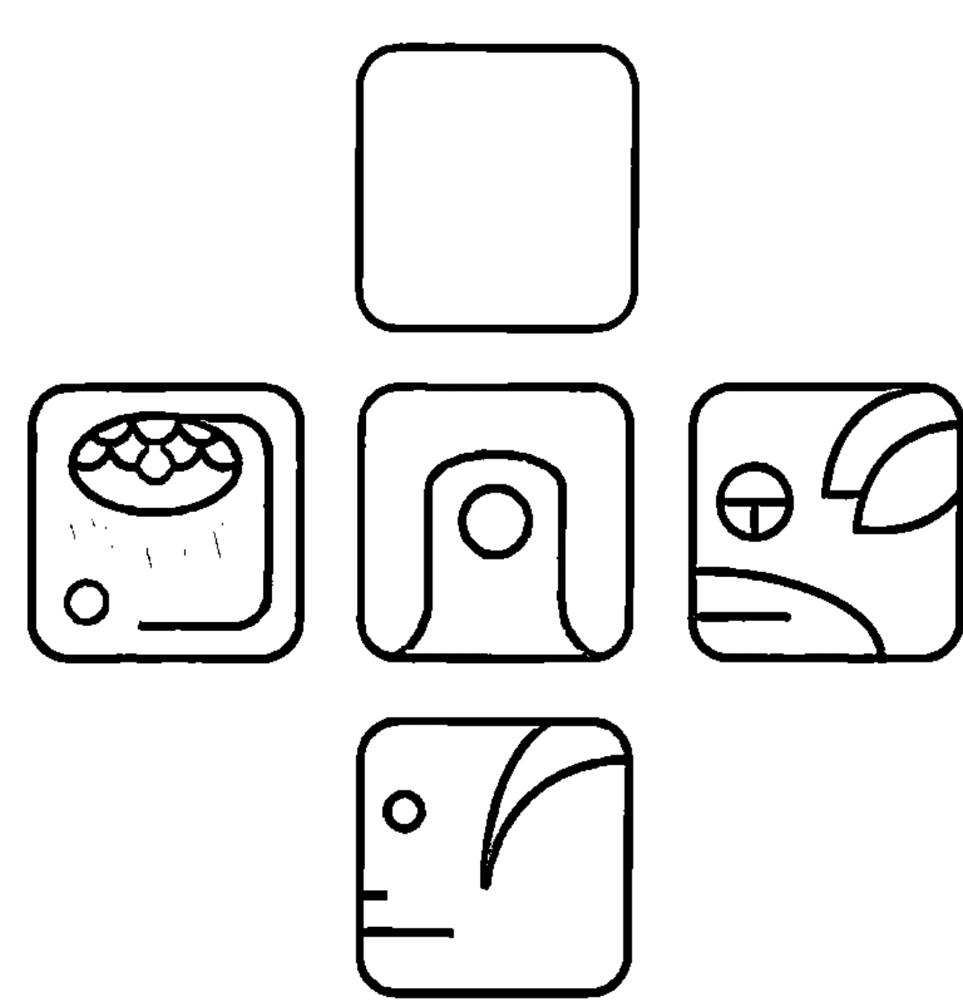

### 紅月與白狗互為支持

白狗是為紅月加分的力量，可以協助紅月感受到更多愛的支持。當你的情緒出現時，不要忘了給自己更多無條件的愛，接納而非批判這些情緒。提醒自己先接住自己，好好照顧內心的感受，誠實回應自己，允許內在所有感受自然呈現並流動出來。

### 紅月與藍風暴互為挑戰擴展

藍風暴能夠幫助紅月擴展能量，挑戰不熟悉的自己。當我們在生活中想要改變、蛻變，想要往前推進時，內心往往也會產生許多恐懼。其實這些情緒正是

### 紅月與黃人互為隱藏推動

紅月內在隱藏版的自己，是個不想被管控的自由黃人，渴望能夠自由表達想法，並讓情緒自在流動。這也是許多被壓抑的紅月所忽略的課題，很難在他人面前自在表達情緒。學習情緒是能自由表達的，並為自己的情緒負起責任。

### 紅月的引導

**一點家族**：一點家族的紅月，有雙倍療癒的能量，他本身擁有非常適合引導他人說出感覺的天賦。內心有引領自我的答案。透過與他人討論分享、激盪靈感，會更明白內心的聲音與答案，以及所要前進的方向。

**二點家族**：引導是紅龍，透過家人的力量以及古老智慧的工具，都能獲得指引的訊息。適合從事家族治療、家庭回溯、童年回溯、童年經驗、內在小孩等等跟家族家庭有關的領域。也可以成為古老力量或情緒的療癒者。

**三點家族**：引導是紅天行者，可以進行時空的意識旅行或靜心冥想，進入不同的次元，探索各種能量場的療癒頻率，帶領大家進入水晶療癒能量的想像，或者進入心靈療癒的花園等等，在靜心中獲得指引的訊息。

身體能量流動的活動，讓身體的動能引導內在身心靈的能量頻率。

**四點家族**：引導是紅蛇，透過身體能量的流動與覺察，來獲得指引的訊息。身體就是最好的引導者，所以要喚醒身體的敏銳度。好好照顧身體，經常做能讓

**橫線家族**：引導是紅地球，適合運用大自然的力量，或是在旅行中獲得指引。喝花草茶或成為精油療癒師等等都非常適合。可以透過身處在大自然，得到大地療癒的力量。

### 紅月的圖騰靜心引導詞

1. 輕輕閉上眼睛，慢慢吐氣，再深吸一口氣，把注意力放到右腳的小趾頭上。
2. 觀想自己現在站在一座瀑布下方，瀑布用舒適的水溫，從我們的頭頂上沖刷下來。完整吐氣，清理淨化全身的能量場，讓宇宙之水的頻率，釋放所有堆積在身上的情緒與負擔，藉由吐氣，將那些不再適合我們的一切清理乾淨。
3. 感受最近的這段日子裡，有哪些情緒還梗在心頭，想像藉由眼淚、瀑布的沖刷，再次把這些情緒帶回地球的擁抱，成為地球母親的養分。
4. 感覺瀑布的能量，從頭頂到腳底流洩下來，流動的水就像你的情緒，讓它過去，同時也問問自己：「身體有哪些地方感到疼痛緊繃嗎？」讓瀑布的水滋養身體的每一個細胞。讓被水沖刷後的身體能量變得更清透、輕盈、放鬆。
5. 再次吐氣與吸氣，將全新、清新的頻率帶回來，把這樣的能量擴展到身體的每一個細胞，當你準備好了，慢慢張開眼睛，把自己完整的帶回來。

## 白狗
WHITE DOG

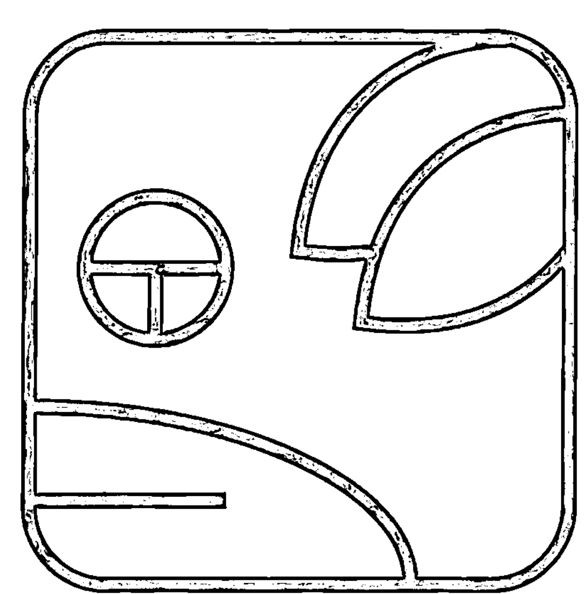

### 關鍵力量

**人格特質**：顧全大局、犧牲、奉獻、愛護動物、友善、照顧
**興趣喜好**：傳遞、鼓勵、把愛傳出去
**擅長的領域**：法律、公平、道德、培育、孕生、伴人成長
**適合發揮**：服務他人、服務自己
**優勢**：陪伴、同理心、同行、慈悲、愛心
**功課**：在無條件愛自己與對他人奉獻之間取得平衡
**關鍵字**：愛、忠誠、心

### 本質

白狗是卓爾金曆上的第十個圖騰，對應馬雅的星際原型是「慈悲者」。十是它的數字（序號），也是我們生命中要學習的第十個主題：愛。

白狗圖騰的天賦，象徵著永恆的忠誠、愛，以及奉獻與服務。基於這些特質，白狗人要學習的課題，反倒是得把這些力量全部拿回來，放在自己身上，也必須在生命中先無條件並完整地愛自己，才能擁有平衡的力量，將愛繼續忠誠地奉獻給其他人。

白狗人要學習如何看見自己的心與感覺，學習如何跟隨自己的心去做出選擇，去過生活。當白狗人能夠直接面對心裡的感受，看見內在需求與想要前往的方向，才是真正活出了白狗的天賦。

也由於白狗的天賦是忠誠又熱心，所以無論在家庭或工作的人際互動上，都會是我們忠誠的好夥伴，而當白狗人出現在我們身邊時，也是提醒我們要記得好好愛自己。如果在生活中感覺低潮無力、缺乏希望或身心不舒服時，都是內心在等待我們去愛的區塊，也是為了提醒我們，要回來把自己照顧好。

在相關印記擁有白狗能量的人，適合擔任志工、醫護人員或服務業。

### 課題

白狗要修煉的生命課題，是關於「有智慧的愛」。能量不到位的白狗人會有兩種極端：一種是變得自私、自我，只想到自己，但他會告訴你「這樣做是為了你好」，把自己認為的好，硬套在對方身上。另外一種極端是完全忘了自己，一直付出、犧牲自己。白狗人情緒失衡時，就會開始抱怨，會感覺到自己受苦，認為別人都辜負自己的付出與真心，追根究柢，都是因為忘記要先照顧好自己的心。因此，當白狗人能夠先把自己的心照顧得很好、無條件接納與愛自己時，對別人才能夠付出有智慧、剛剛好的愛。

### 白狗的日子

在白狗的日子，你會有「看見愛」的共時發生，彷彿宇宙正在對你眨眼。一是你會在出門時遇見白狗，能認出這是宇宙在對你傳送愛。二是你會遇到有人向你傳達愛與感謝。

在白狗的日子，有三種調頻與擇日的好方法：一是好好愛自己，犒賞與滋養自己，與好朋友或伴侶來場小約會，表達彼此的愛與感謝，交流情感。因為白狗跟紅月互為支持，所以這一天很適合情感的表達與流動。二是這天非常適合告白、結婚或舉辦喜宴，讓愛的智慧充盈在幸福的關係中。

服務他人，黃太陽用光芒照耀別人，所以黃太陽幫白狗點亮了一盞燈，給他更大的生命能量去照顧他人。當白狗的能量可以全然愛自己時，就能夠活出黃太陽的光與熱，以及覺醒跟開悟的力量。再者，白狗常常忙著照顧別人而忘了自己，有時候黃太陽也是如此。所以黃太陽在發光發熱之前，要先記得白狗帶來的功課，而擴展的方式，就是學習如何先把自己照顧好。

### 白狗的組合盤

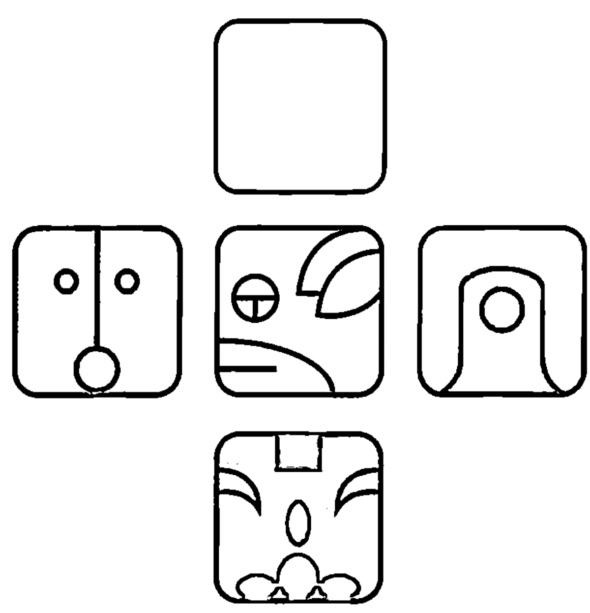

### 白狗與紅月互為支持

紅月可以支持白狗，讓一直付出愛的白狗，也能夠自在的流動情緒，表達情感，面對想要告白或表達感謝的人事物，也都能夠真實傳遞內在的感受。同時，紅月也能支持白狗自在表達負面情緒，對於不舒服的感受，嘗試不壓抑的真實呈現，讓情緒能夠獲得轉化。（可搭配參考「紅月」組合盤支持的內容）

### 白狗與黃太陽互為挑戰擴展

黃太陽能幫助白狗擴展能量，挑戰不熟悉的自己。黃太陽和白狗都是能夠犧牲奉獻，並照顧別人的人。白狗喜歡

### 白狗與藍猴互為隱藏推動

白狗內在有藍猴搞笑的特質，隱藏版的幽默白狗是很調皮的。當你面臨一件令你痛苦的事情時，自己是如何面對、如何解決的呢？到底什麼是愛？什麼是愛自己呢？藍猴能夠協助白狗看清盲點，並告訴白狗：「只要是遠離愛、遠離心的事情，都是腦袋製造出來的把戲，都是假的，唯有愛才是真實的，愛是一切的答案。」

### 白狗的引導

**一點家族**：一點家族的白狗，具有雙倍的能量，引領白狗再次回到自己的心，不要忘記心就位於自己的內在，好好照顧自己，才有更多能量和力氣去愛自己與別人，這是朝向夢想力量的方法。再次提醒自己，做回自己，練習無條件的愛與接納。

**二點家族**：引導是白風，協助白狗朝著夢想實踐的道路，帶著溝通的能量，學習如何表達心裡的感受，同時也可以接收來自精神層面的學習，從這些精神領域中獲得指引。

**三點家族**：引導是白巫師，對內在的力量更感興趣，會有興趣接觸神秘學、魔法。一些內在心想事成的法則，進入內在起心動念的覺察，都是很重要的關鍵。除了心裡的聲音，更重要的是心思意念，只要去感覺，心便能夠引領你走向答案，以及更開闊的夢想之地。

**四點家族**：引導是白世界橋，是能夠連接平台的人，所以適合當媒人，或串聯大家的情感。白世界橋協助我們看見每個人內在的愛，然後串聯成愛的大平台。白世界橋也擁有結束與斷捨離的能量，有時候白狗會因濫情或情感過於充沛，以致於無法離開早已不適合的關係，所以四點家族的白狗要學習，因為愛的智慧，更能擁有斷捨離的力量。

**橫線家族**：引導是白鏡，特別能夠一眼就看穿「有沒有愛的感覺」。對於內在的所有感受，是否有善待並接納自己，都要去覺察。別人都是你內在的一部分，都是你心裡面的部分投射。這樣子的頻率能引領我們實現夢想的力量，但關鍵就是認清所有的真實都源自於自己，並且在自我接納中獲得指引。

### 白狗的圖騰靜心引導詞

1. 輕輕閉上眼睛，慢慢吐氣，再深吸一口氣，把注意力放到左手大拇指，試著去感受愛的頻率在這個部位震動。
2. 再把注意力放到心輪，回到你的心，試著問自己：「你對自己的感覺是什麼？（直覺且誠實回答）你想要什麼？不想要什麼？你是否忠於自己和自己的感受呢？」如果回答出現否定的聲音，也請同時在心裡對自己說：「對不起、請原諒我、謝謝你、我愛你。」
3. 接下來，試著思考你最想要對誰表達愛與感謝（除了自己），深吸一口氣，把愛隨著吐氣慢慢送出來，並將能量傳送到對方的心輪。給自己一點時間完整表達心情，並繼續讓愛的能量蔓延，用無條件的愛融化自己的心輪，擴展心的空間。
4. 完整的吸氣與吐氣，把能量擴展到身體的每一個細胞，當你準備好了以後，慢慢張開眼睛，把自己完整的帶回來。

116 第四章

## 藍猴
BLUE MONKEY

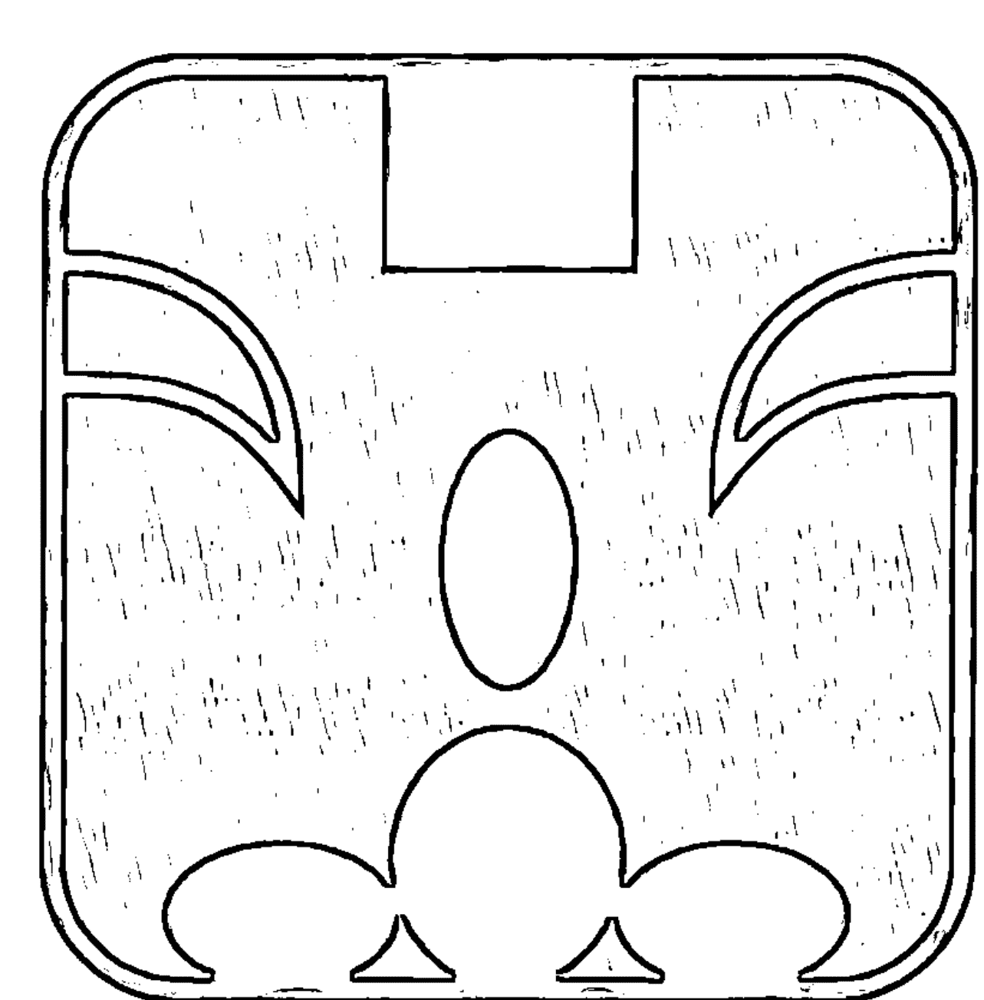

### 關鍵力量

**人格特質**：活力、熱情、青春、幽默感、娛樂、高EQ
**興趣喜好**：模仿、舞台、表演
**擅長的領域**：軍師、幕僚、企畫、儀式、巫師／女巫、魔法
**適合發揮**：應變能力、有彈性、角色切換
**優勢**：智慧的眼光、洞見、看見
**功課**：生命就是遊戲，擁有一顆好玩的心，認出腦袋製造的把戲並幽默以對
**關鍵字**：遊戲、魔法、幻象

### 本質

藍猴是卓爾金曆上的第十一個圖騰，對應馬雅的星際原型是「魔術師」。十一是它的數字（序號），也是我們生命中要學習的第十一個主題：玩耍。

藍猴的本質象徵著遊戲，也告訴我們：有時得放輕鬆，把生命當成遊戲，擁有一顆玩耍的心，在日常生活的遊戲場域中，得學著不要事事都那麼嚴肅。當你過於嚴肅看待一件事情時，也表示你進入了輸贏、對錯的二元對立之中，所以我們常說「認真就輸了」，指的就是這個意思——輸給頭腦的把戲！

我們在這裡用猴子象徵頭腦，學習不要在頭腦製造出來的幻象裡執著，被那些自己想像出來的把戲給耍了，因為多數人總習慣自己上演許多小劇場，相信事情有多麼嚴重、可怕而且無法改變，必須爭個贏輸。因此，這也是藍猴人的天賦，當我們能去覺察頭腦的這些想像是怎麼操控自己時，就能夠更清楚的看見真實、看穿幻象，把那些蒙蔽我們的想法都除掉。

荷西博士主印記圖騰就是藍猴，他自己本身是Kin 11／光譜藍猴。

在相關印記擁有藍猴能量的人，適合從事需要幽默感，或是有趣好玩、與遊戲開發相關的工作類型，他們可以協助團隊激發創意與點子，也適合擔任化解尷尬窘境的角色。

### 課題

藍猴所遇到的生命課題，是關於「輕鬆幽默」的學習。他們往往過於認真看待事物，過於嚴肅，因而忘了與生俱來的幽默感。因此，要學習運用輕鬆的態度，生命的最高智慧就在於「詼諧」，也就是我們說的高EQ。當我們在生活中面對各種人事物時，若能夠以幽默感來回應，就能不被眼前的困境給侷限，以輕鬆態度去改變且轉化所遇到的困境和難題，因此，學習幽默感是非常重要的關鍵。

### 藍猴的日子

在藍猴的日子裡，你會容易遇到搞笑、莫名其妙、被耍的荒唐事情，或感覺好像做白工，甚至會懷疑這是幻覺嗎？而這些共時的現象，都是為了提醒我們學習「幽默以對」，當我們能輕鬆一笑，就能瞬間恍然大悟，因為今天是藍猴日呀！不妨把這些事當作宇宙在與我們開開玩笑，鍛鍊我們的幽默感。

在藍猴日有三個調頻與擇日共用的好方法：一是安排玩樂的行程，大玩特玩，開心玩樂。二是舉辦團體聚會，特別是同學會、同樂會，肯定開心。三是如果選在這一天舉辦一些分享或課程，可以多採用遊戲的方式來進行。

夠更打開藍猴的幽默感與遊戲心，讓靈感很多的藍猴，得以在探索家庭議題或學習古老智慧時，用更有智慧以及更幽默的特質，感受到滿滿的滋養與喜悅。（可搭配參考「紅龍」組合盤挑戰擴展的內容）

### 藍猴的組合盤

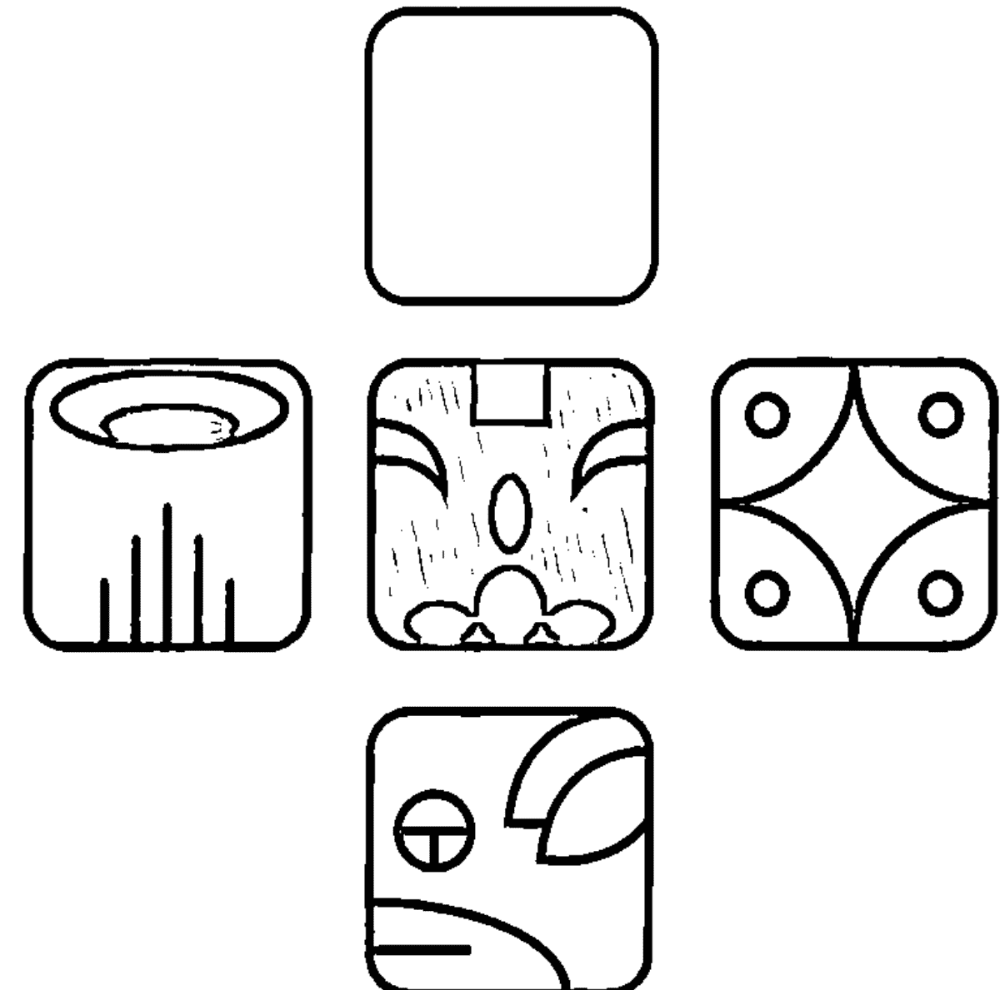

### 藍猴與白狗互為隱藏推動

隱藏推動的力量是白狗，能夠讓藍猴看見，之所以願意用幽默去面對困境，是因為藍猴知道內在隱藏著這份愛的本質；因為你愛對方，也愛自己，願意用幽默去化解彼此的尷尬，而非製造對立。（可搭配參考「白狗」組合盤隱藏推動的內容）

### 藍猴與黃星星互為支持

黃星星能夠為藍猴的能量加分，協助藍猴改變並成長。藍猴的能量是魔術師，黃星星的能量就是美感藝術的展現與表達，可以幫助藍猴在施展魔法時添加美麗的元素，把遊戲的過程以藝術創作來表達，也把藝術創作本身視為一種變魔法的過程。（可搭配參考「黃星星」組合盤支持的內容）

### 藍猴與紅龍互為挑戰擴展

紅龍能幫助藍猴擴展能量，挑戰不熟悉的自己。紅龍的古老智慧元素，能

### 藍猴的引導

**一點家族**：一點家族的藍猴，具有雙倍幽默的力量。可以開自己玩笑，學習看見為何自己常常被自己朦騙，搞出烏龍事，別再被自作聰明所騙（也就是聰明反被聰明誤）。學習自我幽默，取悅自己，取悅他人。

**二點家族**：引導是藍夜，協助藍猴朝著夢想實踐的道路走去，而夢想會引領方向。特別適合「遊戲」結合「夢想主題」的活動，也可以試著讓夢境給你指引與方向。

**三點家族**：引導是藍鷹，協助自己在生命的道路上看得寬廣，把夢想的眼光放得更遠。藍鷹引導我們，很多事情不是只看現在，特別是藍猴感到憤怒或嚴肅緊繃的狀態出現時，藍鷹可以協助藍猴飛到高處，看看人生的寬廣，然後拿出幽默感，化解一切。

創造出來。這組頻率的人通常蠻會手作，例如很會做教具的老師，或者是把創意變成具體的產品。

**四點家族**：引導是藍手，可以把幽默有趣的點子都寫下來，並透過實際行動去

**橫線家族**：引導是藍風暴，特別具備強大的轉化力，能協助自己與他人突破關卡，在前往夢想的道路上打掉重練，重新轉化、鍛鍊，告訴自己，生命當中要不斷前進，不要害怕改變。

### 藍猴的圖騰靜心引導詞

1. 閉上眼睛，慢慢吐氣，再深吸一口氣。把注意力放在左手食指，輕輕用左大拇指與左食指互相碰觸，這兩隻剛好互為隱藏推動。再做幾個深呼吸，輕輕吐氣，然後慢慢吸進來。
2. 感受一下現在的生活裡，有沒有哪些人際互動讓你覺得糾結、緊繃或嚴肅？或者與誰互動時，常常有關於對錯、疏離的爭論。接著，慢慢深吐氣，讓這些所有不輕鬆的感覺消融，吸氣時再次吸入幽默，給自己一個微笑，瞬間帶起輕鬆好玩的感覺。
3. 接著，想像這個畫面，我們能與對方輕鬆交談、幽默談笑。當我們能夠一笑置之的時候，就能更接近愛的本質，因為這些緊繃感，都是為了提醒我們，讓心再次回到愛的源頭。
4. 再次完整的吸氣與吐氣，把能量擴展到身體的每一個細胞，當你準備好時，慢慢張開眼睛，把自己完整的帶回來。

## 黃人
YELLOW HUMAN

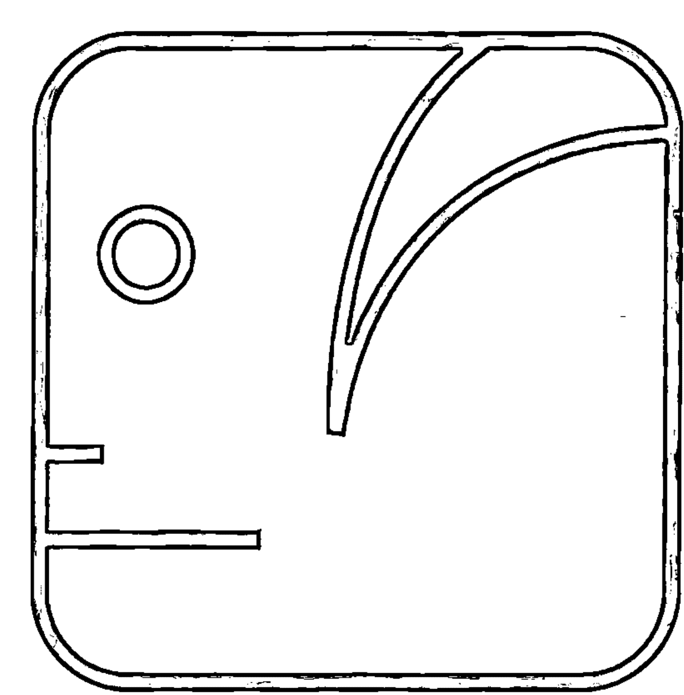

### 關鍵力量

**人格特質**：叛逆、特立獨行、獨特、捍衛、發聲、爭取權益
**興趣喜好**：勇於嘗試、冒險、多種可能
**擅長的領域**：數理、邏輯、推演、思考、理性、分析
**適合發揮**：發問、釐清、解決問題
**優勢**：平衡、施與受、物質與感受、自由、解放、釋放
**功課**：在自由與責任之間找到平衡
**關鍵字**：影響、智慧、自由意志

### 本質

黃人是卓爾金曆上的第十二個圖騰，對應馬雅的星際原型是「聖哲之人」。十二是它的數字（序號），也是我們生命中要學習的第十二個主題：影響力。

黃人象徵智慧，能思考方向並做出選擇，對自己負責任，活出真正的自由。藉由發揮內在穩定的影響力，來掌握更高的心智層面。

在二十個圖騰裡，只有黃人圖騰是以「人」作為命名，因此黃人的特質也象徵著人類與其他萬物不同之處——自由意志，內外在都要活得自由自在。害怕被管束或被逼迫去做什麼，這都是黃人的痛苦之源。另外，如果要與黃人溝通討論時，不妨多多尊重他們的想法，讓黃人自己點頭答應，而不是由你告訴他們該怎麼做。

黃人的天賦，是能夠為自己表達想法，在自由與責任之間找到平衡點，當黃人做好決定，說出要做某件事情時，才能夠全然為自己採取行動，這時的他們會負起責任，把最大的自由能量發揮出來。

在相關印記擁有黃人能量的人，適合擔任軍師，或是從事提供想法與觀點等思考型的工作。

### 課題

黃人所遇到的生命課題，是學習在面對自己想要的自由時，要「勇於承擔責任」。能量不到位的黃人，之所以無法面對心之所向的選擇，是因為不想為自己的選擇負責，害怕失誤與後悔。因此，做決定時要問問自己，究竟哪一個選擇符合內心渴望的自由，有捨有得，知道要獲得些什麼，就要相對捨掉些什麼，並且讓這個負責的力量帶出新的行動，勇敢決定，做出「心」的選擇。

### 黃人的日子

在黃人的日子，有些事情會引發你的思考，會有促使自己去想「究竟要如何」的共時發生。你或許會有個人主張以及原有的價值觀與想法，但在黃人日這天，容易讓人掙扎、猶豫不決，或是搞不定自己。往往也會不知道自己要什麼，而先暫時把事情擱置。

在黃人日有三個調頻與擇日共用的好方法：一是寫下所有的靈感想法，成為生活智慧的養分。二是向你認為有智慧的人請教，你將獲得指引的訊息。三是做一些爭取自由的行動，問問自己，什麼事情讓你感覺到自由自在，什麼行動更能活出內在自由的力量。

### 黃人的組合盤

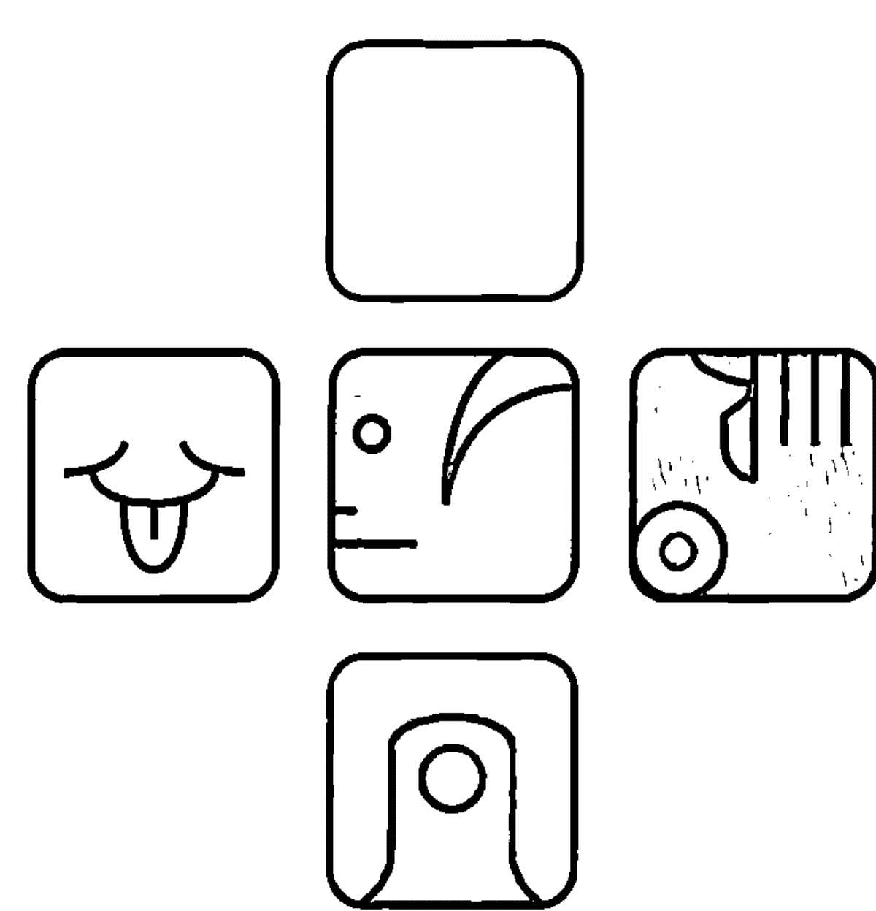

### 黃人與紅月互為隱藏推動

黃人有個隱藏版的自己是紅月，紅月能讓情緒感受流動，黃人內在有很細膩敏感的部分。隱藏版的紅月很能夠察覺別人的情緒反應，具備了高敏銳度與覺察力，當他能夠覺察自己內在隱藏的層面，細膩觀察內在情緒時，自然比較能表達出來，如此一來，黃人的內心也更加自由了。（可搭配參考「紅月」組合盤隱藏推動的內容）

### 黃人與藍手互為支持

藍手能夠幫黃人的能量加分，來自內在自由意志的想法，要透過雙手落實，腳踏實地完成。藍手黃人互為支持時，就能「知行合一」，藍手能協助把黃人的聰明、智慧、思考後的想法具體展現、創作、落實下來。（可搭配參考「藍手」組合盤支持的內容）

### 黃人的引導

**一點家族**：一點家族的黃人，具有雙倍的力量。一個非常需要自由的人，個性上也相對比較自我，非常清楚自己要的是什麼。學習傾聽並尊重不同的意見，透過與他人討論分享、激盪靈感，會更清楚內心的聲音與答案，以及所要前進的方向。

**二點家族**：引導是黃種子，特別需要耐心等待，清楚知道目標是什麼，允許自己有更多時間來醞釀想法的熟成。一個夢想從萌芽到變成大樹，或許會需要一段長時間，才能讓夢想更加成熟、逐漸茁壯長大。

**三點家族**：引導是黃戰士，特別有種為自己生命戰鬥的戰士力量，鼓勵這個家族的人勇敢為自己發聲，勇敢提問，說出生命中的渴望，為自己出征。透過思考，找到解決問題的方案，一路過關斬將，實踐夢想。

**四點家族**：引導是黃星星，有藝術優雅的品質引領生命前進，所以，自由自在的黃人蠻適合從事跟黃星星特質相關的工作，包括藝術、傳播媒體、線上互聯網等等，都是這家族可以去發揮的領域。

**橫線家族**：引導是黃太陽，發光發熱而特別溫暖，分享生命中的智慧，以及分享自己如何走過生命的困境、綻放光芒，擁有更強大的力量走向夢想。

### 黃人與白風互為挑戰擴展

白風能幫助黃人擴展能量，挑戰不熟悉的自己。黃人重視自我想法與個人自由，因此常會覺得自己想好怎麼做就可以了，不一定要與其他人溝通。因此，白風會鼓勵黃人多向人表達想法。透過交流內在的智慧與思考，能夠更加擴展黃人的智慧。（可搭配參考「白風」組合盤挑戰擴展的內容）

### 黃人的圖騰靜心引導詞

1. 輕輕閉上眼睛，做幾個深呼吸。吸氣、吐氣。把注意力放在左手中指，將能量帶到這裡。
2. 慢慢把注意力帶回心輪，感受一下你在生活裡有感覺到自由嗎？覺得自己是個自由的人嗎？在你的生活、事情的安排與人際關係，擁有多少自主權呢？有多少能夠為自己做決定、負起責任的力量？
3. 當你明白你能完全為自己想要的事情說「好」時，同時也能對不想要的事情說「不」（內在沒有任何回應的事物，就可以拒絕）。你能判斷是「好」多一點，還是「不」多一點。如果你是一個濫好人，在生命中不斷地說「好」，黃人力量就無法展現。你沒有給予「拒絕」足夠的自由，可以說出不要，但當你的內在已經準備好，有回應的時候，你才能讓自己答應這件事。
4. 慢慢吸氣，把能量帶到心輪，把這樣的自由呼吸進來，吸進自由、吐出自由。
5. 再一次完整的吸氣與吐氣，把能量擴展到身體的每一個細胞，當你準備好時，慢慢張開眼睛，把自己完整的帶回來。

# 紅天行者
## RED SKYWALKER

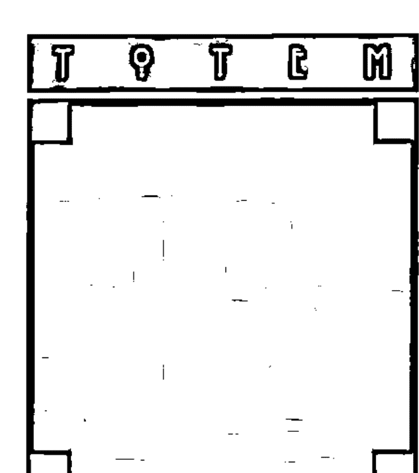

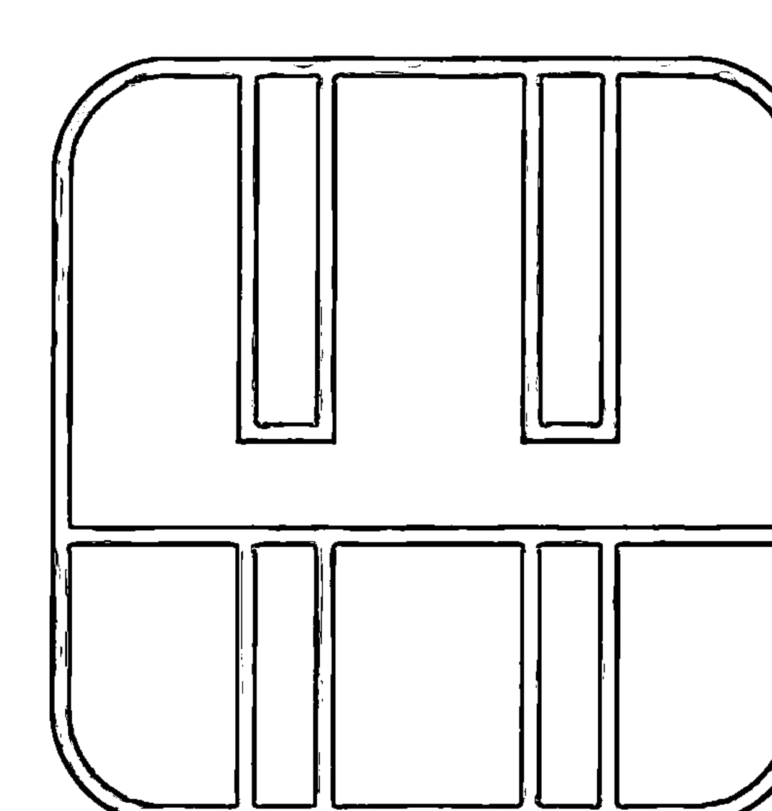

| 關鍵力量 |
| --- |
| **人格特質**：學習、成長、學生、應變能力、有彈性、角色切換 |
| **興趣喜好**：神秘學、古老智慧、對未知感到好奇 |
| **擅長的領域**：願景、預言、趨勢、指引、未知、人生方向 |
| **適合發揮**：勇於嘗試、冒險、多種可能、直覺、知道、依直覺行動 |
| **優勢**：才華、才藝、興趣廣泛 |
| **功課**：在移動奔波中，平靜自己的心 |
| **關鍵字**：探索、覺醒、空間 |

### 本質

紅天行者是卓爾金曆上的第十三個圖騰，對應馬雅的星際原型是「預言家」。十三是它的數字（序號），也是我們生命中要學習的第十三個主題：探索。

紅天行者的圖騰象徵一扇門，我將這扇門形容成「任意門」，紅天行者的天賦，就是能夠穿梭於不同空間，自由探索不同的可能性，因此也被稱為預言家，指的是能夠看到前方道路，並指引方向的人。

紅天行者擁有好奇寶寶的特質，他們對於生活中新奇或沒有體驗過的事物，都是充滿好奇的，而且具備探索及學習的動力。他們可能會常說：「我沒做過，所以想試試看。」「我沒學過，所以好奇這是什麼。」「我沒吃過，所以很想知道這是什麼味道。」

紅天行者喜歡穿梭於不同地點，因此如何找到內在穩定的力量，讓自己更加落實，也是必須學習的課題之一，好讓自己能夠帶著好奇心探索內在與外在，練習透過靜心而得到平衡與穩定。

在相關印記擁有紅天行者能量的人，並不適合一直待在辦公室裡，更適合需要時常移動、切換工作場所、帶著電腦到不同座位，或是需要時常出差的工作。透過移動，會增加更多動力與靈感，去學習、探索並獲得成長。

### 課題

紅天行者所遇到的生命課題有兩個：第一個是學習「投入體驗」，讓自己放下理智的判斷，好好投入感到好奇的事物之中，單純進入體驗並享受過程。第二個是讓自己「更務實、更接地」，紅天行者偶爾會活在天馬行空的想像裡，遇到令自己擔憂的事情時，也常會不切實際，所以不妨練習具體的討論，如何讓這些飄在半空的想法落實，或者練習具體說出自己在擔憂什麼，真的會發生嗎？或者其實這些擔憂都是多餘的呢？

### 紅天行者的日子

在紅天行者的日子，會發生的共時現象有兩個：一是你會發現自己在這一天花費較多時間在「移動」，例如開車或搭乘大眾運輸工具，往返不同地點，拜訪不同的人，有奔波的感覺出現。二是在這一天，你會突然對一些事情感到特別好奇，想要了解更多，也會想要在一些正在進行中的事情上，有更進一步的超越與突破。

在這一天裡，有三個適合調頻與擇日共用的好方法：一是靜心冥想，練習在不同的畫面中穿越。二是安排出差或到不同地方工作，重要的是，在移動過程中保持內在的穩定。三是安排學習新的事物，接觸新的體驗。

### 紅天行者的組合盤

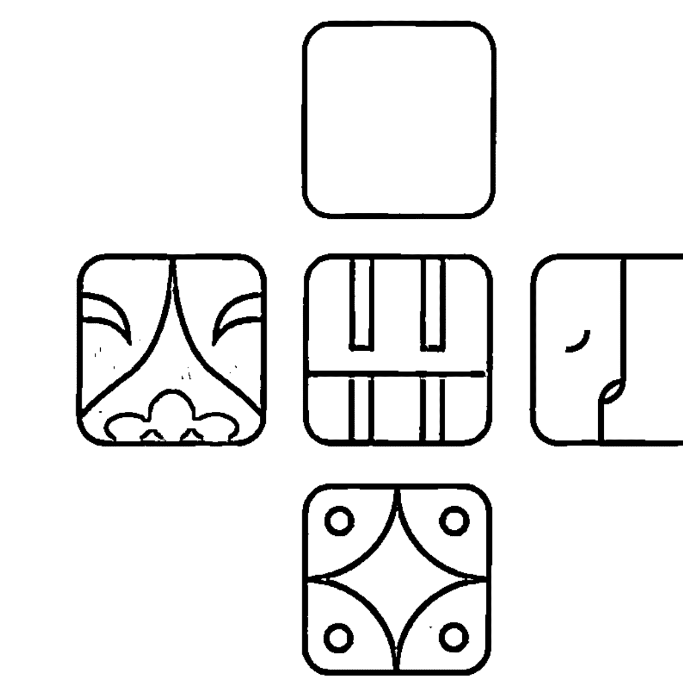

### 紅天行者與黃星星互為隱藏推動

黃星星是紅天行者的隱藏力量，因此紅天行者本身也同樣具備美感，喜歡如藝術般的美麗事物。黃星星能讓紅天行者在奔波忙碌、移動穿越的過程中，保持優雅頻率，也能在靜心中透過音樂與藝術形式，接收更多靈感。（可搭配參考「黃星星」組合盤隱藏推動的內容）

### 紅天行者與白世界橋互為支持

白世界橋的能量是跨接兩端的橋樑，支持紅天行者前往不同的空間，連接不同的人事物。在探索各種新鮮人事物的過程中，白世界橋負責協助溝通斡旋，幫忙跨越與連接，替紅天行者的能量大大加分。（可搭配參考「白世界橋」組合盤支持的內容）

### 紅天行者的引導

**一點家族：** 一點家族的紅天行者，具有雙倍的力量，專注活出主印記圖騰的力量。特別自主，自己決定自己要探索什麼，要體驗什麼。自己的人生，由自己來引導。

**二點家族：** 引導是紅蛇，協助紅天行者朝向夢想實踐的道路。特別適合進行身體能量的探索，學習對身體的覺察與關照，從事照顧身體的工作，包括中醫、健身、養身等等。

**三點家族：** 引導是紅地球，對於天然的東西都特別有感覺，接受大自然給予的指引，接觸水晶、旅行、身處於大自然裡，都是接收訊息的方式，在大自然裡靜心也非常適合。

**四點家族**：引導是紅月，有療癒師的天賦特質，能引導自己和他人的情緒流動，具備同理心、感同深受的敏銳度。適合結合靜心做情緒療癒。

**橫線家族**：引導是紅龍，對於古文明以及古老智慧特別有好奇心。這個家族如果需要協助，可以透過塔羅牌、十三月亮曆等古老智慧獲得指引，或透過家人長輩的分享跟交流，將能從中獲得一些指引。

### 紅天行者與藍夜互為挑戰擴展

藍夜幫助紅天行者擴展能量，挑戰不熟悉的自己。藍夜掌管夢想的力量，也握有潛意識內在與外在豐盛的力量。夢想與豐盛，讓紅天行者在探索生命的旅程中，學會相信自己的直覺、信任自己是無限豐盛的，也更能無拘無束地自在探索生命。（可搭配參考「藍夜」組合盤挑戰擴展的內容）

### 紅天行者的圖騰靜心引導詞

1. 做幾個深呼吸，輕輕吸氣，把注意力放在左手無名指。
2. 慢慢深呼吸，先做一次吸氣，吐氣時，做一次馬雅金字塔的旅程。想像眼前出現一座金字塔，你站在金字塔最下方的左邊，看著眾多的階梯。
3. 開始以Z字型往金字塔上方移動，從最左邊爬上階梯，每一步都向右邊移動一點點，來到金字塔階梯右方時，再慢慢往左邊，蛇行逐漸向上。我們就快要接近頂點了。
4. 來到頂端後，做一個深呼吸。站在最上方俯瞰，旁邊有很多森林，你會聽到老鷹的聲音，看見老鷹在空中盤旋，在金字塔最上方找個地方坐下來。
5. 再做一個完整的吸氣與吐氣。準備好，慢慢站起來，一樣以Z字型爬下，用自己的速度，從某一個角落開始，慢慢走到某一端，再慢慢地一步步走下來。
6. 當你走回地面時，謝謝這座金字塔，感謝與它能量的連結。
7. 再次完整的吸氣與吐氣，把能量擴展到身體的每一個細胞，當你準備好時，慢慢張開眼睛，把自己完整的帶回來。

# 白巫師
## WHITE WIZARD

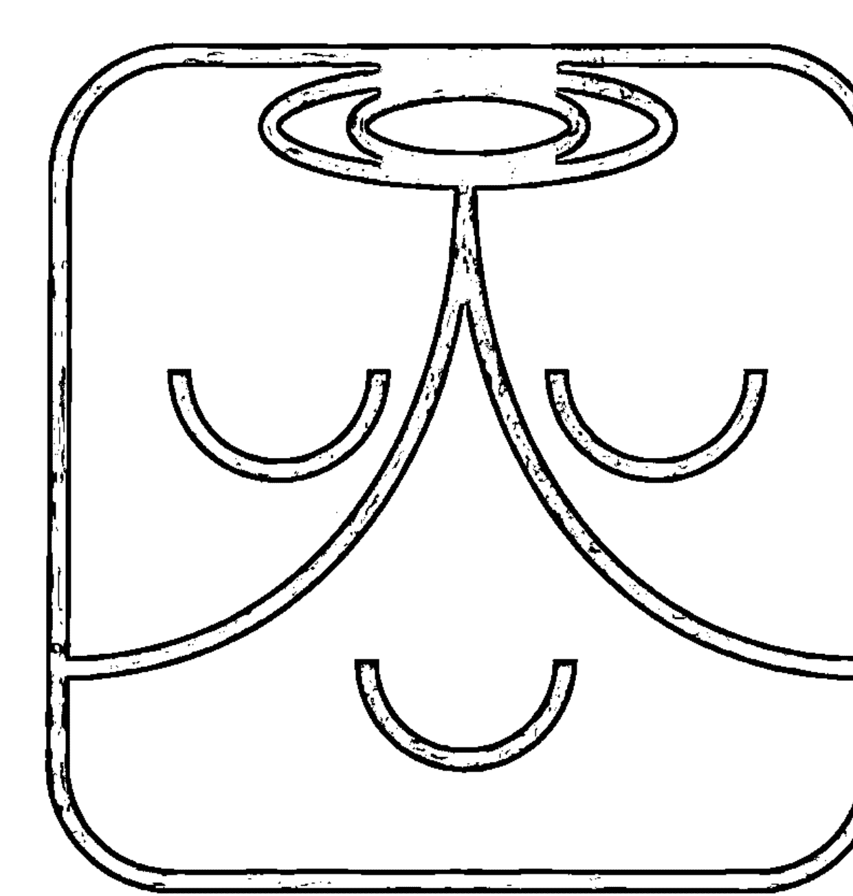

### 關鍵力量

**人格特質**：全然投入、專注、熱情、視覺、畫面、影像
**興趣喜好**：文字、書寫、抒發
**擅長的領域**：潛意識、心理學工具媒材、牌卡、儀式、巫師／女巫、魔法
**適合發揮**：修煉、出世、自我關照
**優勢**：自然、地球、共時
**功課**：透過內在的力量，顯化生活中一切的可能
**關鍵字**：施展魔法、接收、永恆／無時間

### 本質

白巫師是卓爾金曆上的第十四個圖騰，對應馬雅的星際原型是「巫師」。十四是它的數字（序號），也是我們生命中要學習的第十四個主題：施展魔法。

白巫師的圖騰形象很可愛，你不妨觀察身邊的白巫師人，往往真的就是笑咪咪的形象。白巫師圖騰的頭頂好像有一個接收器（天線），讓巫師可以閉起眼睛，靜心冥想。

如果說紅天行者掌管的是「空間」，是穿越空間的人；白巫師掌管的就是「時間」，是穿越時間的人。在二十個圖騰中，最需要也最喜歡靜心冥想的，就是紅天行者和白巫師（紅天行者穿梭次元與空間時，閉起眼睛冥想，在內在找到穩定的力量）。白巫師的天賦特質，是透過閉起眼睛靜心，接收內心答案，因為巫師知道，在內心世界能不受時間的限制，心能創造超越時間的魔法。因此，巫師「施展魔法」的力量也就是在自己的「心」，心擁有一切的答案，唯有心的力量（心念）能夠顯化一切，所以魔法才有立即實現的可能。

在相關印記擁有白巫師能量的人，適合學習或帶領人們穿梭時間的心理探索（例如時間線回溯、生涯輔導），學習魔法、靜心、冥想等等，包括魔法油、魔法工具的運用，也可以從事相關工作的服務。

### 課題

白巫師會遇到的生命課題有兩個：一是學習「跳脫線性時間的制約及限制」，讓自己練習在時間安排上保持彈性與放鬆。能量不到位的白巫師，可能會有兩種極端：一是缺乏時間觀念、容易遲到。二是時間控，行程滿檔，把時間抓得太緊，過於在乎流程順序。第二個課題是學習「心向內、不外求」，透過內在的覺察與意念的調整，讓注意力從「關注外在」轉回「關注內在」，觀察心的意念，練習問自己，發生這些糾結的事情，內在經歷了什麼情緒感受？為何自身會發生這樣的事情？這些經歷究竟想引導自己學習什麼？如此才能夠正確地運用心的能量，對焦到正確人事物上。

### 白巫師的日子

在白巫師日，意念成真的過程特別快速，當自己一動念，一有畫面或念頭，很容易就能有共時發生。常常也會在這天，聽到有人發票中獎或其他意外驚喜的好消息。

在白巫師日，適合調頻與擇日共用的方法，是進行許願儀式、魔法靜心小儀式、彩繪胡娜庫與宇宙能量連結，或是向宇宙許願下訂單，這些都適合在內在觀想自己渴望的畫面成真，並在心中送出感謝的能量，讓願望顯化成真。

### 白巫師的組合盤

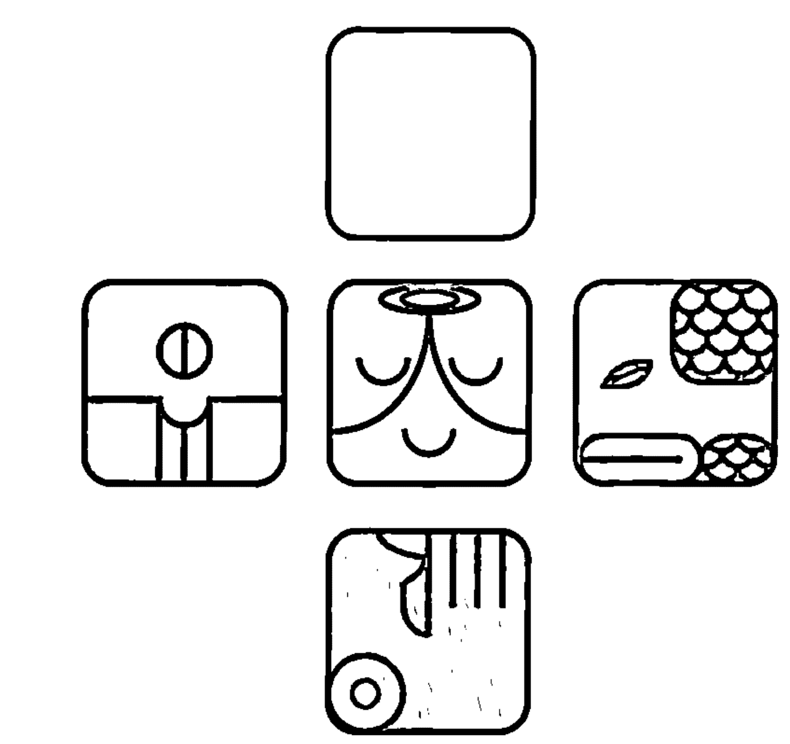

### 白巫師與藍手互為隱藏推動

藍手是白巫師的隱藏力量。藍手的能量是親自動手做，透過編織、釀魔法油等手作，連接魔法的力量，把內在的意念實踐出來，而非空想。同時，把白巫師內在觀想的畫面，透過具體行動的執行力，讓宇宙的能量和宇宙的頻率加乘。（可搭配參考「藍手」組合盤隱藏推動的內容）

### 白巫師與紅蛇互為支持

紅蛇是白巫師的加分力量，能協助白巫師看見內在必須蛻變的部分，把那些陳舊的意識釋放掉，讓紅蛇協助白巫師蛻變，增長生命力。透過向內的覺察，去看清楚哪一些是「不再能支持我們、不再適合此刻的生命」的想法，統統都蛻去。（可搭配參考「紅蛇」組合盤支持的內容）

### 白巫師的引導

**一點家族**：一點家族的白巫師，具有雙倍施展魔法的力量，專注活出主印記圖騰的力量，並去相信內在擁有一切的答案。對自己實踐夢想的過程有所疑惑時，不妨找人談談、說說話，再次把注意力轉回自己的內在，就能發揮強大的生命能量。

**二點家族**：引導是白世界橋，這個家族的白巫師有著連接天地的管道。因為巫師的「巫」這個字就代表「人」，像是白世界橋的連結管道，讓「天、地、人」三者的能量頻率順暢到位。

**三點家族：** 引導是白鏡，這個白巫師是能夠看得最清晰的，是一面生命的放大鏡。而且不只是看見內心，更能看見宇宙當中的法則，其實就是透過心念去創造一切可能的法則。我們朝向生命當中更大的可能性，更高境界的自己前進。

**四點家族：** 引導是白狗，這一個白巫師家族是特別有愛的，能量是很溫暖的，透過愛自己、忠於自己的心，能夠引領我們朝向生命當中更大的可能性，更高境界的自己前進。

**橫線家族：** 引導是白風，透過與他人說話、溝通的過程，獲得指引的訊息。也適合進行心靈相關內容的傳遞分享，成為講者或教學者，協助白巫師壯大邁向夢想的力量。

### 白巫師與黃種子互為挑戰擴展

黃種子能幫助白巫師擴展能量，挑戰不熟悉的自己。協助白巫師閉起眼睛，透過心思意念創造並顯化魔法時，更能清楚目標，看見內在無限的潛能，耐心等待開花結果。（可搭配參考「黃種子」組合盤挑戰擴展的內容）

### 白巫師的圖騰靜心引導詞

1. 閉上眼睛，慢慢吸氣，慢慢吐氣，把注意力放在左手小指頭。
2. 一樣把注意力再次放到心輪，用心去感受，現在的生活裡想要顯化什麼？想要在哪些事情施展魔法？白巫師知道自己的心與內在。心中的願力，就是魔法的根源。
3. 巫師閉起眼睛、微笑，正是因為它明白能夠從自己的心找到一切的答案，知道萬象物質的顯現，都是內在一切的發生。
4. 再問一次自己，現在想顯化什麼？想要創造什麼？每一個呼吸都能帶領自己進入當下。或許想要做的這件事情是發生在將來，也許是半年後、一年後，不管多少時間，它都會因為內在的運作，以加速的方式來到身邊，在你的生活裡實現。
5. 再次完整吸氣與吐氣，把能量擴展到身體的每一個細胞，當你準備好時，慢慢張開眼睛，把自己完整的帶回來。

# 藍鷹
## BLUE EAGLE

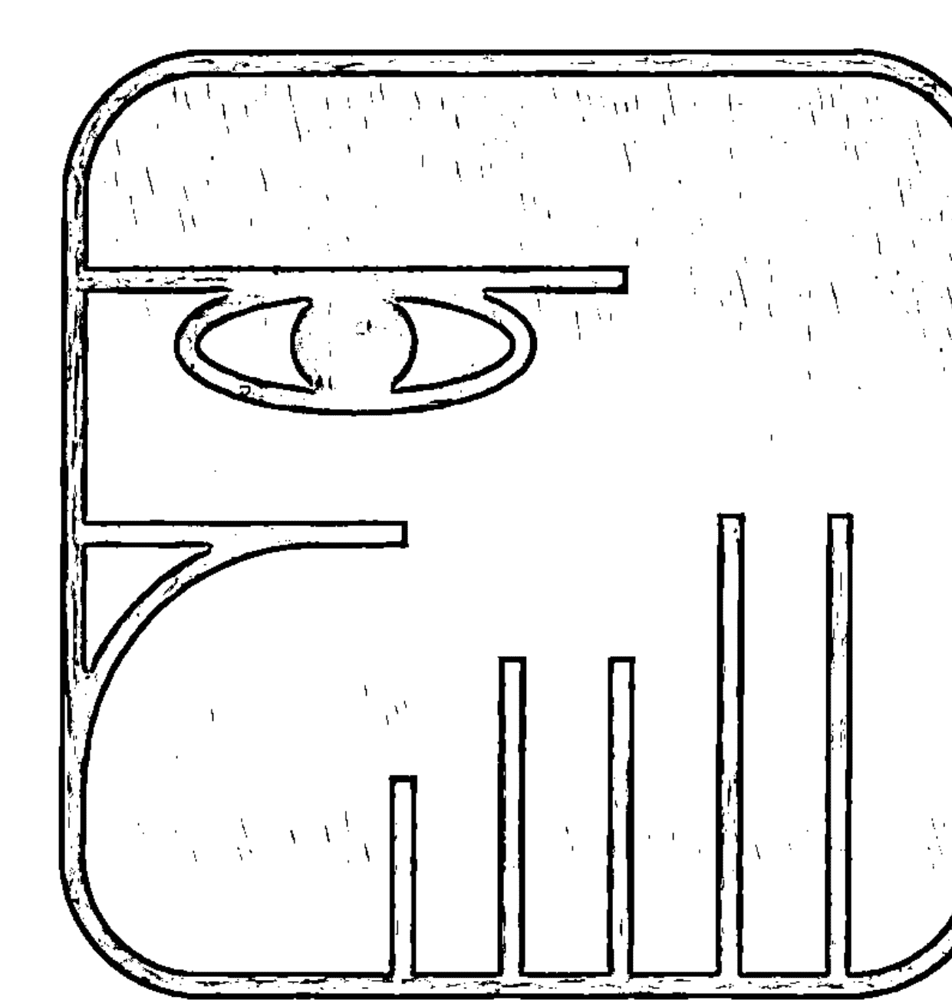

### 關鍵力量

**人格特質**：視覺、畫面、影像、智慧的眼光、洞見、看見
**興趣喜好**：鑑賞、深度、看見核心
**擅長的領域**：數理、邏輯、推演、格局、擴展、疆界
**適合發揮**：統籌、整合、放對位置、願景、預言、趨勢
**優勢**：指引、未知、人生方向
**功課**：提高自己看事情的高度及格局
**關鍵字**：創造、心智、視野、洞見

### 本質

藍鷹是卓爾金曆上的第十五個圖騰，對應馬雅的星際原型是「觀照者」。十五是它的數字（序號），也是我們生命中要學習的第十五個主題：創造。

藍鷹的圖騰，看起來就像是擁有清晰明亮的鷹眼。藍鷹的家在無窮無盡的天空，藉由清晰的意念，飛向寬廣的天空，看見更高的視野，站在更高的格局創造，創新的行動因而產生。

藍鷹以觀照者為象徵，是觀察萬物的犀利眼光，也是洞悉世界與本質的人，這也是藍鷹人的天賦，能從不同的角度清楚看見事情的立體全貌，探究各種可能性與觀點，寫下關於未來的計畫。同時，執行也是很重要的，避免高談闊論而不切實際的想像。

若藍鷹能量還不到位，會有以下幾種可能：一是只考慮眼前的利益。二是只考慮到大方向而容易忽略細節。學習廣度與深度兼顧，並且把這樣的洞見落實在具體的行動上。

### 課題

藍鷹所遇到的生命課題有兩個：第一是練習從第三方的角度來觀察自己，不是只看到自己所處位置的觀點，練習讓自己拉出新高度，可以做些創新的行動，用創新的方式思考，學習如何提昇格局、換位思考，看清楚事情的不同面向。第二，除了練習看見開闊的視野，也要練習看得深遠而後動。

### 藍鷹的日子

藍鷹人具備的能量雖然能夠帶來更高的格局，但偶爾還是會出現短視近利的狀況，所以即便藍鷹人本身的能量就具備優勢，還是得時時刻刻提醒自己，要練習看得遠、想得遠，或從不同的角色來換位思考，甚至，有時候退一步，收穫會更多。

在藍鷹日子會發生的共時現象有兩個：第一是會感受到生活中的輕盈感，有向上提昇的感覺，或許會有些事情讓你重新思考，產生新的思維，讓自己像老鷹一樣，輕鬆飛翔。第二是感覺到自己能特別觀察到平常沒有注意的細節。

在相關印記擁有藍鷹能量的人，適合在群體中擔任領導、智囊團、統籌者、整合事物的人，也能夠把每個人放在適合的位置。

在藍鷹日有三個適合調頻與擇日共用的方法：一是登高望遠，安排去山上走走，透過眺望城市，讓自己調頻、提昇到新維度。二是進行回顧過去、盤整總結、展望未來的整理或主題討論。三是與工作夥伴或好友相聚，討論新計畫與擬定實際執行策略。

要更覺察身體的狀態，照顧身體的需求，傾聽身體帶來的訊息。（可搭配參考「紅蛇」組合盤挑戰擴展的內容）

### 藍鷹的組合盤

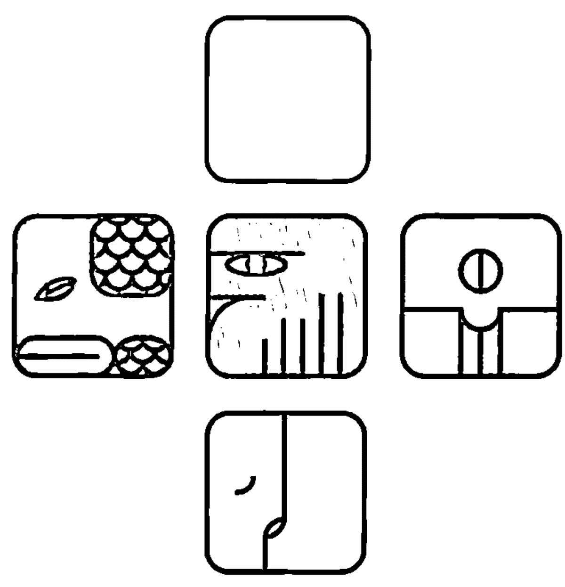

### 藍鷹與白世界橋互為隱藏推動

白世界橋是藍鷹的隱藏力量，藍鷹人的生命中，常會出現關於生離死別的議題，隱藏版的自己要學會放下，看清楚了，就可以放下了，也能跨越過橋。同時，藍鷹也具有很強的連結能力，連結不同的人事物，也擅長把不同的概念互相靈活的串聯起來。（可搭配參考「白世界橋」組合盤隱藏推動的內容）

### 藍鷹與黃種子互為支持

黃種子能幫藍鷹加分，讓藍鷹更清楚自己的目標，給予耐心等待的支持，看見自己內在的潛能，不必急於一時，成果會慢慢展現出來。老鷹飛到天空中看清楚後，種子就能落地扎根，落實藍鷹的遠見。（可搭配參考「黃種子」組合盤支持的內容）

### 藍鷹的引導

**一點家族**：一點家族的藍鷹，具有雙倍的力量。他常常練習用更高維度、第三方的角度來觀察自己。第二個自己是從另一個更高的格局往下看，看看自己在做些什麼，自己在觀察些什麼，看看自己此時此刻在思考什麼，感覺什麼，觀察跟引導自我對話。

### 藍鷹與紅蛇互為挑戰擴展

紅蛇能幫助藍鷹擴展能量，挑戰不熟悉的自己。藍鷹要非常注意身體健康，因為紅蛇是在挑戰的位置，藍鷹的眼睛會把注意力放在外面的環境、目標放在未來，或是正在做的事情上。因此藍鷹

**二點家族**：引導是藍手，藍手的能量就是協助老鷹看清楚方向後，執行和落實。藍手會協助老鷹實踐與創造，指引老鷹在很多事情上，要非常落實的一步一步進行，不能只是盤旋空中、空想。

**三點家族**：引導是藍風暴，藍風暴特別具備改變跟改革的能量，在面對生命不斷前進與轉化的過程時，不害怕改變，學習看見就要行動、蛻變的能力。如果看見了某個未來的趨勢，便是暗示此時為打掉重練的時機，能加速生命的改變與前進。

獲得指引與方向，透過藍猴的引導，讓生命更開闊。

**四點家族**：引導是藍猴，運用遊戲玩耍的能量，善用自己的幽默感，讓很多事情用好玩的方式呈現，讓藍鷹在遊戲中

**橫線家族**：引導是藍夜，特別需要對焦在豐盛的頻率上，也是特別重視夢想的力量。勇敢的做夢、追尋夢想，讓豐盛能量引領藍鷹飛得更遠。而藍夜夢想的特質，會為藍鷹帶來更大的開展。

### 藍鷹的圖騰靜心引導詞

1. 閉上眼睛，先做幾個深呼吸，把呼吸放在左腳大拇趾，輕輕吸氣，再慢慢吐出來。
2. 藍色也代表了轉化與改變的力量，能讓某些事情進行調整與變化。現在把注意力放在頂輪，藍鷹接收來自上天的訊息，感覺在鄰近眉心的地方，有著藍鷹能量銳利的眼睛，協助我們不只看到表象，還能看進核心，看見平常可能沒有注意到的地方。
3. 感覺自己站在高山上，化身老鷹，張開翅膀在空中盤旋，俯瞰地面、湖面與海面，有沒有獵物、目標或想停留的地方？找到之後，張開翅膀飛向那裡。
4. 慢慢深吸一口氣，把這樣冷靜、平靜的觀察力與力量，再次帶回身體。
5. 再次完整的吸氣與吐氣，把能量擴展到身體的每一個細胞，當你準備好時，慢慢張開眼睛，把自己完整的帶回來。

## 黃戰士
YELLOW WARRIOR

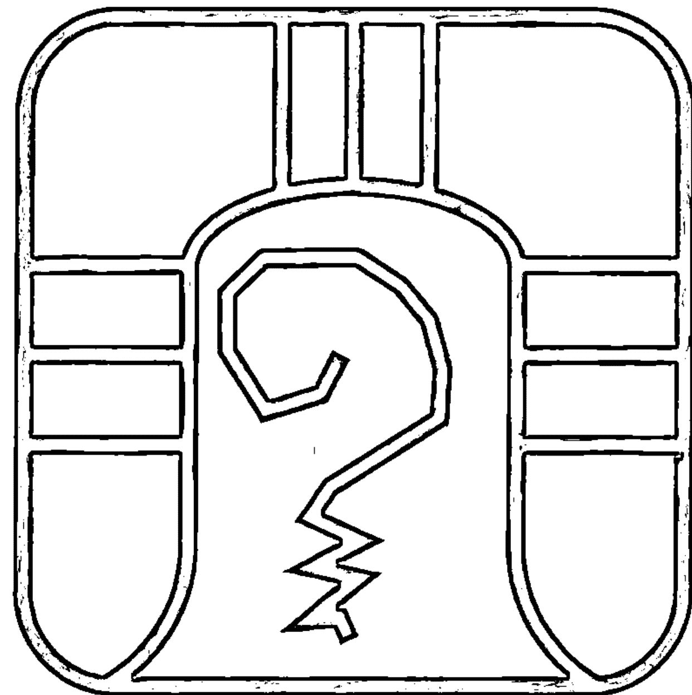

### 關鍵力量

**人格特質**：捍衛、發聲、爭取權益、先驅、發起、召集
**興趣喜好**：勇於嘗試、冒險、多種可能
**擅長的領域**：法律、公平、道德
**適合發揮**：服務、有求必應、有問必答、突破限制、意志力、自我超越
**優勢**：面對黑暗、脆弱、不完美、發問、釐清、解決問題
**功課**：將內在恐懼轉化成勇敢無懼
**關鍵字**：詢問、無懼、智慧、理解

### 本質

### 課題

黃戰士是卓爾金曆上的第十六個圖騰，對應馬雅的星際原型是「開創者」。十六是它的數字（序號），也是我們生命中要學習的第十六個主題：發問。

黃戰士所遇到的生命課題，有兩個層面：一是修煉關於「解決問題」的能力，如上所述，面對問題時，除了要勇敢提問，提出心裡的想法與他人進行確認之外，更重要的是直接面對問題，減少猜測與懷疑的過程，直接採取行動，找出解決方法。第二個課題是緊扣著第一項而來的，練習的是「勇敢面對」，面臨生活中的挑戰與考驗，要有勇氣去成長改變，學習如何勇敢，給予自己力量，以及無畏無懼的放下，跨越困難，並且往前走。

仔細看黃戰士的圖騰，會發現在盔甲裡頭有個問號的意象，這代表了「戰士的精神」，即便對前方的道路充滿疑惑及不確定，也能無所畏懼地勇敢前進。

我們在生活或工作中常有感到疑惑的時刻，但往往因為恐懼而不敢說、不敢提問。這樣的習慣會導致我們悶著頭一直做，就算做錯或走錯方向了，自己都不曉得。

黃戰士的天賦，就是從發問中得到生命智慧，而且越挫越勇。他在解決問題的過程中，會不斷學習和吸收經驗，讓生命長出更多的經驗值。因此，透過這些體驗與總結，能把內在的勇氣及能量發揮得更好。為自己開創道路的力量，就是去面對內在的恐懼，進而清除不安焦慮，成為真正的拓荒者。

### 黃戰士的日子

在黃戰士日，會發生的共時現象是需要解決的問題出現在眼前，或許這些問題已存在一些時日了，而在黃戰士的這一天，我們要去回應這些問題，思考如何解決問題。

在黃戰士日有三個適合調頻與擇日共用的方法：一是舉行各種會議，進行各種討論或檢討，大家一起面對及解決問題。二是如果有一些分享或課程會在這一天舉辦，可以選擇「勇氣、勇敢、生命戰士」的相關主題，或是在課程中多安排「討論」與「Q&A」的環節。

在相關印記擁有黃戰士能量的人，適合從事協助他人解決問題的工作，例如服務業、心理諮商或企業顧問，或是在公司開拓新市場時擔任職位。

### 黃戰士的組合盤

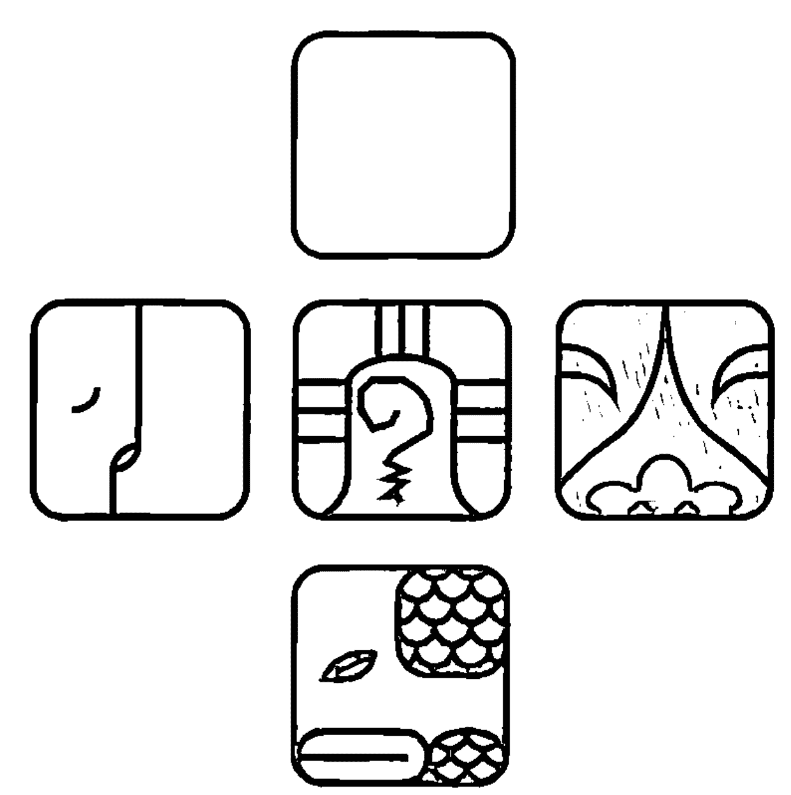

的燃料。容易忽略身體健康的黃戰士，更要去關照身體給自己的每個回應，例如感到恐懼時，身體就出狀況，那是因為生命當中有太多的懷疑。所以，紅蛇再一次提醒黃戰士：找到生命的熱情了嗎？找到活出熱情的能量了嗎？勇敢去追求吧！（可搭配參考「紅蛇」組合盤隱藏推動的內容）

### 黃戰士與藍夜互為支持

藍夜能為黃戰士加分，越是勇敢，越能將夢想顯化成真。藍夜告訴黃戰士，別忘了還有夢想，別忘了你是豐盛的，不要懷疑自己，在人生道路上勇敢的往前走吧！（可搭配參考「藍夜」組合盤支持的內容）

### 黃戰士的引導

**一點家族**：一點家族的黃戰士，具有雙倍的勇氣力量，透過自己的生命引領，以及他人的生命智慧，提供自己更多勇氣和力量的指引。當我們在某些時刻感到困住、無法解決問題時，黃戰士可以藉著與別人討論，去引發內在更多的智慧力量。鼓勵一點家族的黃戰士多提問討論，而自問自答也是重要的過程，能觸發內在智慧的動力。

### 黃戰士與白世界橋互為挑戰擴展

白世界橋能為黃戰士擴展能量，挑戰不熟悉的自己。白世界橋能協助黃戰士放下執著，而在看到夢想與熱情時，就勇敢往前跨越吧！透過與他人連結，能一一跨越各種難關。（可搭配參考「白世界橋」組合盤挑戰擴展的內容）

**二點家族**：引導是黃星星，特別喜歡音樂、藝術等充滿美感的活動，透過聽音樂而獲得指引的靈感，也很適合從事網際網路與線上平台等符合黃星星頻率的工作。不妨把黃星星的工作內容和天賦拿來這裡運用，夢想的方向就會越來越清晰。

### 黃戰士與紅蛇互為隱藏推動

紅蛇是黃戰士的隱藏力量，也是生命

**三點家族**：引導是黃太陽，這樣的黃戰士在人生當中會累積不少鍛鍊而來的智慧，黃太陽指引了光芒與方向，等待戰士覺醒與開悟，為自己發光發熱，協助每一個人成為勇敢的生命戰士並前進。

負起責任。

**四點家族**：引導是黃人，特別熱愛自由的黃戰士，因著這個追尋自由的能量，讓他能更勇敢，能夠為自己做出不一樣的決定。以自由作為引導前進的力量，渴望活出全然的自由，所以更有勇氣去

**橫線家族**：引導是黃種子，黃種子的能量讓黃戰士學會培養耐心，需要指引時，先給自己足夠的時間去探索目標，看到自己內在無窮的潛能，允許在生命歷程裡慢慢為自己扎根，種下種子，成熟時自然綻放生命的果實。

### 黃戰士的圖騰靜心引導詞

1. 閉上眼睛，準備連結戰士的力量。先把注意力放在左腳食趾，在這裡吸氣、吐氣。
2. 再次把能量放進心輪，感受內在生命戰士的動力。吸氣、吐氣之際，召喚內在戰士的原型，有一個勇敢、為自己發聲、為自己戰鬥並挺身而出的力量。
3. 試著問自己：「能夠真實的提出內在想法嗎？」勇敢提出困惑、內在的質疑，透過生命的體驗，在面對與問題之中，找到徵兆與智慧。
4. 在靜心中，可以觀想一個目前生活中想要解決的問題來到畫面裡，並且邀請內在戰士與它面對面，你看到自己真實勇敢地解決問題，並給予自己鼓勵。
5. 再次完整的吸氣與吐氣，把能量擴展到身體的每一個細胞，當你準備好時，慢慢張開眼睛，把自己完整的帶回來。

## 紅地球
RED EARTH

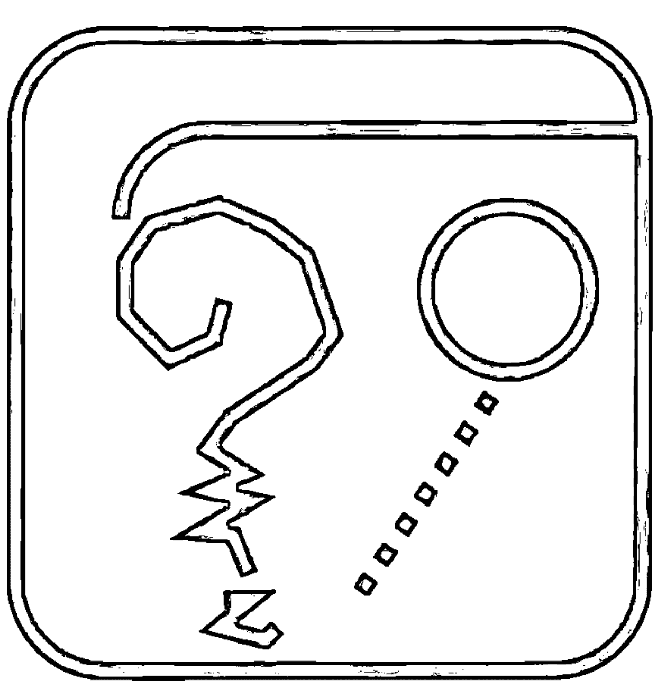

### 關鍵力量

- **人格特質**：自然、地球、共時、順流、信任、放鬆
- **興趣喜好**：味覺、嗅覺、品味
- **擅長的領域**：服務他人、服務自己、植物、大自然、水晶礦石
- **適合發揮**：資訊中心、蒐集、資源連結
- **優勢**：拯救、提供方法與管道
- **功課**：打開生命的導航系統，認出生命的共時頻率
- **關鍵字**：發展、共時、導航

### 本質

紅地球是卓爾金曆上的第十七個圖騰，對應馬雅的星際原型是「領航者」。十七是它的數字（序號），也是我們生命中要學習的第十七個主題：開展。

仔細看紅地球的圖騰，也會發現問號的意象，但這個意涵與黃戰士的「疑問」是不一樣的，這裡的問號，代表「對地球上的一切好奇」，想要了解以及探索。

紅地球人的特質，就像是星際的領航員，因為他們天生就配備了地球母親的GPS系統，握有星際方向盤，而指引方向的重要元素，就是生活中發生的共時徵兆，進而信任、臣服與開展。

紅地球人的天賦特質與土地的連結非常強，對自然的相關產物以及可運用的療癒方法，都會特別感興趣，例如與水晶、礦石、植物等相關的自然療法，也適合在自然環境裡進行療癒，特別可以釋放壓力。紅地球人也會想去世界各地看看，這都是因為對地球的好奇心，想藉由旅行窺見地球的真貌。

紅地球人通常也會比較重視食衣住行、吃穿用度是否取材於自然，他們喜歡選擇天然或有機的產品與食物，非常重視衣服布料的生產過程，包含自然農法、對地球友善的產品等等，都代表了紅地球人對地球的愛。

在相關印記擁有紅地球能量的人，適合從事旅遊、水晶礦石、天然飲食、環保等相關產業。

### 課題

紅地球所遇到的生命課題，是要學習「臣服」。臣服的意思是順應生命的流動，不是認命，也不是放棄努力，而是讓自己全然的在當下，去接受所有的發生。特別是我們遇到困境時，常會感到自己像是活在逆流之中，因而產生很多抗拒與批評，甚至怨天尤人、抗拒與掙扎。而能夠帶領我們回到順流之中的方法只有一個，就是臣服於當下。無條件的全然接受，能夠再次引領我們回到當下，緊接而來的就是採取積極行動，帶領自己脫離困境。

### 紅地球的日子

在紅地球的日子，你會感覺到似乎無法一直待在室內，想要往外跑、出去玩。順應當下的能量，不妨安排外出行程，去感受一下地球對你的召喚。

在紅地球日有三個適合調頻與擇日共用的方法：一是前往大自然的環境進行療癒，包括脫掉鞋子接地氣、抱抱大樹、踩草皮，多做深呼吸，讓吐氣的能量釋放給大地，成為地球的養分。二是安排旅行，滿足我們對於地球上不同地點的探索與好奇。三是從事愛護地球的活動，例如淨灘，或是各種的環保小活動，也很適合安排在這一天。

熟悉的自己，並打開更大的可能性。紅地球加上藍手，可以做水晶療癒師、園藝治療師，或是進行跟大自然頻率有關的手作，把自地球生長的產物，透過創作而做出更多變化。（可搭配參考「藍手」組合盤挑戰擴展的內容）

### 紅地球的組合盤

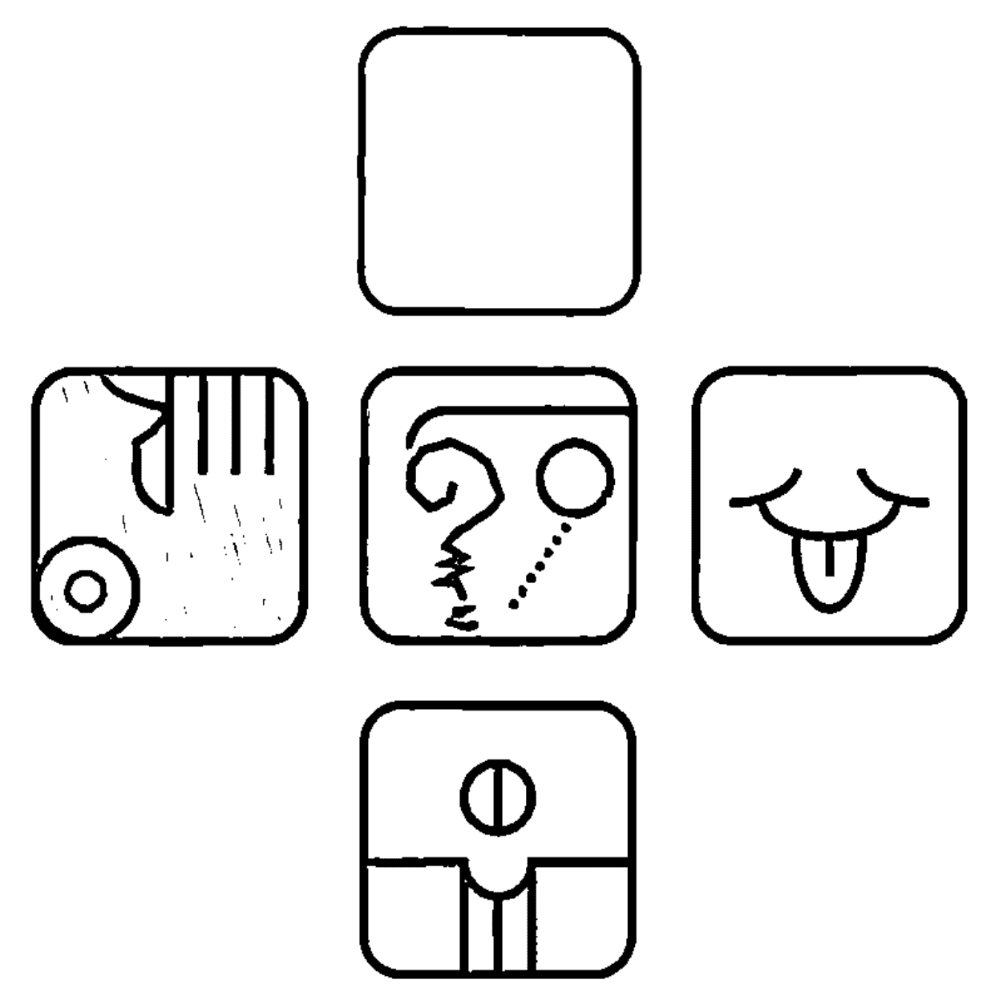

### 紅地球與黃種子互為隱藏推動

黃種子是紅地球的隱藏力量。紅地球的人必須去學習順流和臣服，若能臣服於順流的頻率，知道現在不要急，順著能量流，感受上天是怎麼安排的，然後耐心等待開花結果。而在過程當中，除了等待，也一邊綻放生命的花朵，投入令自己充滿熱情的事物，觀察共時跟生活當中發現的一些現象，生命自然就能開展出新的道路。（可搭配參考「黃種子」組合盤隱藏推動的內容）

### 紅地球與白風互為支持

白風能幫紅地球加分，當你在世界各地旅行，跟各方不同的人互動，有一個很重要的關鍵，就是溝通，並傳遞內心想要說的話，分享自己的生活經歷。當然，美食也是一大重點，享用美食、交談、溝通等等，都是可以幫紅地球加分的力量。（可搭配參考「白風」組合盤支持的內容）

### 紅地球的引導

**一點家族**：一點家族的紅地球，具有雙倍的力量。在生命中認出共時與導航的能量，自然就能夠更加順流臣服，並觀察到很多事情在生命當中自有安排。

**二點家族**：引導是紅月，特別能夠引領我們前往大自然裡進行情緒療癒與釋放。有療癒師的特質，能夠引導自己和他人的情緒流動，擁有同理心、感同深受的敏銳度及敏感度。

### 紅地球與藍手互為挑戰擴展

藍手能幫忙紅地球擴展能量，挑戰不熟悉的自己，並打開更大的可能性。紅地球加上藍手，可以做水晶療癒師、園藝治療師，或是進行跟大自然頻率有關的手作，把自地球生長的產物，透過創作而做出更多變化。（可搭配參考「藍手」組合盤挑戰擴展的內容）

**三點家族**：引導是紅龍，能夠協助探索古老的智慧，例如探索地球上的古文明與古蹟，或是去古蹟聖地拜訪與旅行，都很適合這個家族。

**四點家族**：引導是紅天行者，喜歡在移動的過程當中，用靜心冥想協助自己回到內在更穩定的扎根。很適合進行地球母親的「彩虹橋靜心」，也適合當日或這組頻率能量的人在生命當中多運用，常做靜心冥想，在穩定中扎根得更穩。

**橫線家族**：引導是紅蛇，指引我們在生活裡從事激發自己熱情的事。當你在做這些事情時，真的感覺到怦然心動了嗎？有引發生命活力嗎？要非常注意身體給予的訊息，紅蛇作為紅地球的引導，多吃天然食品，不吃再製加工或化學食品，是這一組頻率特別要注意的。

### 紅地球的圖騰靜心引導詞

1. 閉上眼睛，將注意力放在左腳中趾，讓我們與地球母親連結。在左腳中趾的紅地球位置，輕輕吸一口氣，再慢慢吐出來。
2. 一樣把注意力放在地球母親的心輪，做一個深呼吸，進入心的空間，連結地球母親的核心，感覺自己坐在地球正中央，地球母親環繞著你，以及你的整個心輪。在你的心輪空間裡，擁有了地球母親的高山、湖泊、海洋，所有一切豐盛的資源。
3. 吐氣時，心輪再次完全擴展，從我們的心釋放出彩虹般的光芒，一直往上，到達喉輪、眉心輪、頂輪。
4. 接著，想像這道彩虹光像一道瀑布，從我們的頂輪擴散下來，環繞整個地球母親的能量場，整座地球與你的整個身體，都被彩虹的光芒包圍，你整個人的能量場都變成彩虹光，這道能量一直往下，來到海底輪，也就是地球的南極。
5. 這道彩虹噴泉從地球南極、你的海底輪繼續往上，延伸至脊椎中柱、海底輪、臍輪、胃輪，一路再回到心輪，往上的同時吸氣。
6. 繼續往上來到頂輪，在彩虹光來到頂輪時，做一個完整的吐氣，再次覆蓋整個能量場，你可以從內在感受到外圍被這樣的光所環繞，地球母親的彩虹網格（grid）閃閃發光。
7. 再次回到我們的心，把彩虹所有的光吸進來，吐氣時再次擴展心輪，把能量擴展到身體的每一個細胞，當你準備好時，慢慢張開眼睛，把自己完整的帶回來。

## 白鏡
WHITE MIRROR

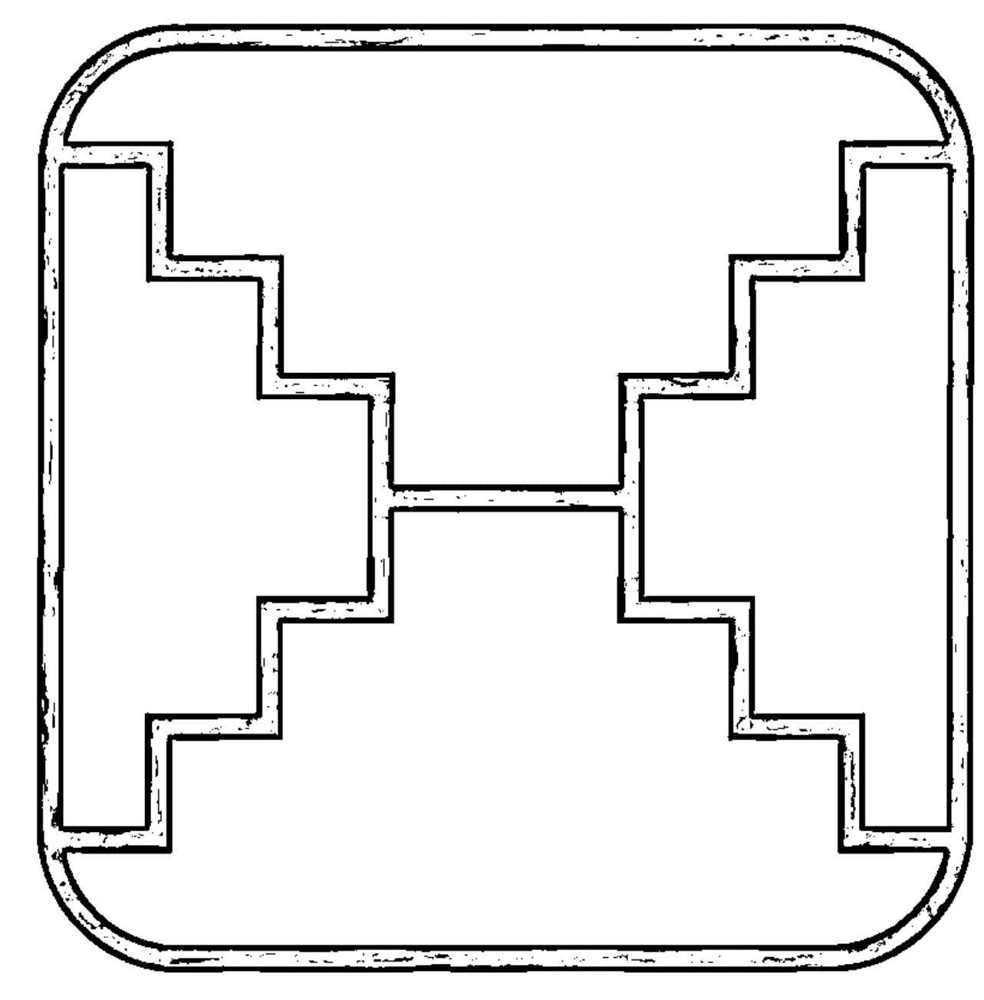

### 關鍵力量

**人格特質**：轉化、蛻變、重整、修煉、出世、自我關照
**興趣喜好**：尋求真理、實踐
**擅長的領域**：財務管理、金錢、數字
**適合發揮**：鑑賞、深度、看見核心、調節、接近、拉近彼此
**優勢**：品味、欣賞、美感、面對黑暗、脆弱、不完美
**功課**：如何關照自己，接納自己的一切
**關鍵字**：反射、秩序、無窮無盡

### 本質

### 課題

白鏡是卓爾金曆上的第十八個圖騰，對應馬雅的星際原型是「瑜伽士」。十八是它的數字（序號），也是我們生命中要學習的第十八個主題：反射。

白鏡所遇到的生命課題，是關於學習「寬恕」。無法放過自己，往往是因為定義完美的標準較高，因此，當生活中發生不完美的事情時，便會開始自責與指責他人，因為這些事情發生，破壞了我們對於完美的想像，而對自己有太多的罪咎與懊悔，活在過去的事件裡，也無法真的放過他人。

觀察白鏡圖騰，會發現圖騰裡的圖像，上下左右都是對稱的，這象徵了整個宇宙就是一個鏡像次元，世上的一切都是鏡像反照，透過我們生活事件的修煉，能明白一切物質都是我們的投射反照，這就是瑜伽士，也是白鏡人的特質。因此，白鏡人要能先清晰看見自己，明白所有來到眼前的一切人事物，都是自己的反射，才能夠接納自己的一切，同時得以接受並清晰看見他人。當白鏡人能夠如此接納自己的所有，就能無窮盡昇華，成長至新的高度與境界。

我們要練習在寬恕之前，得先「願意承認黑暗面」，接納人生就是有不好的事、黑暗面與陰影，這些不完美的狀態，都是為了讓我們更「圓滿」，就像太極的陰陽與黑白並存，形成生命真正的平衡。當我們能往內不斷的去擁抱黑暗與光明，內在的力量能夠穩定扎根，才能向上不斷成長。

談到白鏡人的天賦，他們其實是非常能夠理解人性的，就像一面魔法鏡，照出一個人內外在的一切。因此，白鏡人非常適合擔任解讀者或諮商師的角色，能夠幫助他人梳理問題的脈絡，並且找出癥結點。

### 白鏡的日子

在白鏡的日子，我們會把原本看不清楚的事情「看清楚」，會看到一些盲點，會看到平常不想承認的人事物，這些都會共時地發生在你面前，讓你承認並且接受都是真的。

在相關印記擁有白鏡能量的人，很適合在群體中擔任引導者，能清楚看見事情原貌並給予建議，協助大家看見「對方如何扮演鏡子」，照出自己什麼樣的面向，進而找到新的理解方式。

在這一天，適合調頻與擇日共用的方法如下：試著照鏡子，這會是一個很好的練習機會。不管是什麼態度或狀態，都可以好好練習看清楚自己。白鏡的日子是一個真實擁抱自己、發現自己，發現真相很好的機會。

助白鏡去看見自己的盲點，以及內在的所有層面。很多白鏡人喜歡音樂或藝術創作，喜歡參與藝術活動，例如繪畫、學習樂器等等，因為透過藝術進行自我探索與療癒，可以更全面且更清晰地發現內在的不同面向。因此，白鏡能看清內在盲點，加上黃星星的藝術媒材組合，可以成為很好的「表達性藝術治療媒材」運用者。（可搭配參考「黃星星」組合盤挑戰擴展的內容）

### 白鏡的組合盤

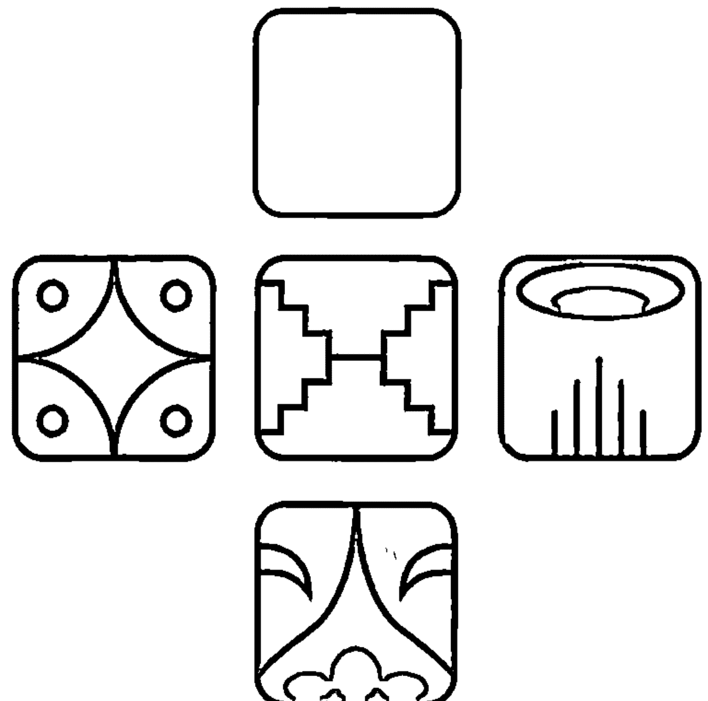

### 白鏡與紅龍互為支持

紅龍是白鏡的加分力量，原生家庭就是我們的鏡子，能夠從家庭成員當中去看見內在投射的一切，並且看清楚過往的記憶和原生家庭帶給你什麼樣的影響？是正向的滋養力量，或是約束和包袱，讓我們覺察並看清楚，這些都與自己的內在有關，而且全部都是要來幫忙自己改變和轉化的。（可搭配參考「紅龍」組合盤支持的內容）

### 白鏡與藍夜互為隱藏推動

藍夜是白鏡的隱藏力量。白鏡人本身是很豐盛的，藍夜則要幫助白鏡好好運用直覺的潛能，把隱藏的潛意識與夢境看得更清晰，把潛藏的豐盛能量好好聚焦並分享出來。同時，在追尋夢想的過程當中，看清楚自己恐懼的是什麼？再一次的接納自己，在夢境當中釋放恐懼，都可以推動白鏡更朝向夢想實踐的力量前進。（可搭配參考「藍夜」組合盤隱藏推動的內容）

### 白鏡與黃星星互為挑戰擴展

黃星星能幫忙白鏡擴展能量，挑戰不熟悉的自己。黃星星的能量可以再次協助白鏡去看見自己的盲點，以及內在的所有層面。很多白鏡人喜歡音樂或藝術創作，喜歡參與藝術活動，例如繪畫、學習樂器等等，因為透過藝術進行自我探索與療癒，可以更全面且更清晰地發現內在的不同面向。因此，白鏡能看清內在盲點，加上黃星星的藝術媒材組合，可以成為很好的「表達性藝術治療媒材」運用者。（可搭配參考「黃星星」組合盤挑戰擴展的內容）

### 白鏡的引導

**一點家族**：一點家族的白鏡，具有雙倍的力量，透過自我觀照的對話，就像透過另外一個鏡子來反照自己。例如自由書寫、透過抽牌卡來做自我對話。當自己能看清楚自我引導的過程時，也非常適合成為引導他人進行對話的角色。

**二點家族**：引導是白狗，充滿無條件的愛，告訴白鏡其實最終能引導我們的力量就是愛。什麼能量可以為自己帶來指引呢？就是無條件的愛，去接納所有層面的自己，以愛為初衷，以愛為指引，以愛為引導。

**三點家族**：引導是白風，特別適合說話、溝通、分享。很清晰的表達自己，透過精神性的傳遞，去溝通分享。三點家族的白鏡都是很好的講師、治療師或諮商師，能夠把自己看見的東西真實傳遞出來。

**四點家族**：引導是白巫師，內心能夠接納所有的一切。帶著魔法的巫師清楚知道，一切要透過內在心思意念的創造，而內心擁有所有指引的答案*3。

**橫線家族**：白世界橋特別適合創建平台和擔任連結者，很會協調事情，並透過連結不同的人事物，協助他發揮夢想的力量。他可以做到很好的資源連結、整合和協助對方搞定很多事情。

> **作者註**

*3：佛洛伊德的主印記是自我存在的白鏡，引導是自我存在的白巫師，他的研究帶給心理學界很大的影響。

### 白鏡的圖騰靜心引導詞

1. 閉上眼睛，做幾個深呼吸，將注意力放在左腳無名趾，在這個部分吸氣與吐氣。
2. 想像眼前有一面很大的鏡子，能完整映照全身。當你看到鏡中的自己時，第一個冒出來的感覺是什麼？
3. 我們永遠會在照鏡子的時候，先看看自己不夠好的部分，無論你對自己多挑剔、多不滿意，現在都請看看自己可愛的樣子。從頭、臉、脖子、身體到腳，給每個部位一個微笑，看見自己現在的樣子多麼美好。
4. 接著，我們來好好來擁抱自己的不滿意，問問自己：「自己的個性或做事方式等等，有哪些不夠好的地方？」同時，在這些缺點上，找到可以翻轉的正向詮釋（例如覺得自己很懶惰，而這個懶惰促使自己想出了很多很有效率的做事方法）。把這些陰影能量先通通擁抱進來，再轉化成為正向動能。
5. 再一次完整的吸氣與吐氣，把能量擴展到身體的每一個細胞，當你準備好時，慢慢張開眼睛，把自己完整的帶回來。

# 藍風暴
BLUE STORM

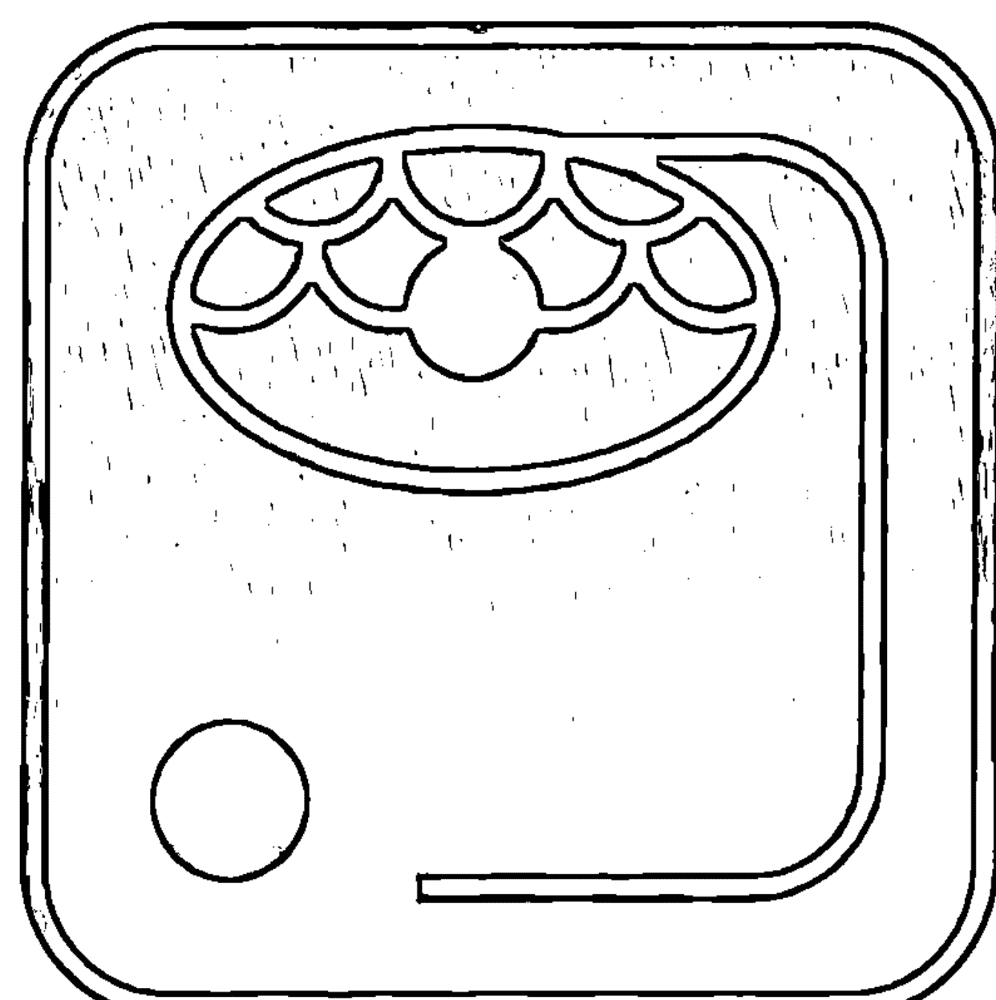

### 關鍵力量

**人格特質**：叛逆、特立獨行、獨特、自由、解放、釋放
**興趣喜好**：轉化、蛻變、重整
**擅長的領域**：建立制度、創造、重建架構
**適合發揮**：打破制度、顛覆、革新
**優勢**：具說服力、分享、推廣
**功課**：讓生命中的改變自然而然發生，帶著穩定的力量前進
**關鍵字**：催化、能量、自然運生

### 本質

藍風暴是卓爾金曆上的第十九個圖騰，對應馬雅的星際原型是「世界的改革者」。十九是它的數字（序號），也是我們生命中要學習的第十九個主題：催化。

藍風暴象徵著煉金、蛻變的過程，也代表能夠自然改變和改善的一種轉化器。風暴的產生常是突如其來的，也沒有固定路徑，就像在我們生活中穩定太久、陳年老舊，且早該改變但還未改變的事物，當改變的時刻到來，自然會產生變化，這是一股摧毀與汰舊換新的力量，因此，風暴人的特質往往與「促成改變」的角色有關。

我們在計算星系印記時曾提到，主印記圖騰和支持圖騰相加一定是藍風暴，也就是自己跟支持相聚時，可以為彼此帶來生命中的轉化時刻。

在風暴圈的正中央，通常都是最風平浪靜的（就像颱風眼），協助我們從核心去催化這股強大的改變動能，好讓這股力量向外轉動。所以，不妨觀察身邊的藍風暴人，會發現他們通常是外表看來很沉穩的人，不會感覺到是帶來狂風暴雨的改革之人，但只要藍風暴人進入團隊或組織，就會帶起整個團隊的改變，這是能量的一種推動力。

在相關印記擁有藍風暴能量的人，適合學習或從事「整理」、「整頓」相關的領域，例如斷捨離的人生整理術、企業改善、優化流程顧問，協助人們打掉重練，建立新的架構。

### 課題

藍風暴所遇到的生命課題，是要學習「接受生命中的未知」。突如其來的改變總讓人不知所措，不在計畫中的變動，打亂了原本的節奏，而往往讓人無法接受的，是那些不可預測的未來。面對未知的狀態，常常讓我們心生恐懼，因為不知道會發生什麼，害怕事情無法掌握或變得更糟，因此，我們要練習去看見這些自然的發生有其意義，並協助自己在生命中穩定前進，因為這是一個重建自己生命節奏的契機。

經常練習鼓勵自己，生命此刻準備好要重建與改變，要迎接更好的未來，所以讓風暴來推一把，我們得以前進。所謂「如果不是未來有更好的要來，其實也不會有現在改變的發生」，就是這個意思，如果現在是最完美的時刻，上天也不會安排你去改變。

### 藍風暴的日子

在藍風暴的日子，會發生的共時現象有兩個：一是你會很想要整理東西、丟東西，或是調整家裡布置、家具位置，甚至改變店鋪的陳列。二是會有突發狀況，例如飛機航班因故停飛、約好的會面臨時更改時間、老闆找你談論人事異動等等。

因此，如上所述，在藍風暴的日子，調頻與擇日共用的好方法就是調整。調整物品、人事、工作，讓舊有狀態打掉重練，把原有的東西做一次新的排列組合。當你感受到這些煥然一新的能量時，生命就再次提昇晉級啦。就像暴風雨後的天空，總是特別清爽。

### 藍風暴的組合盤

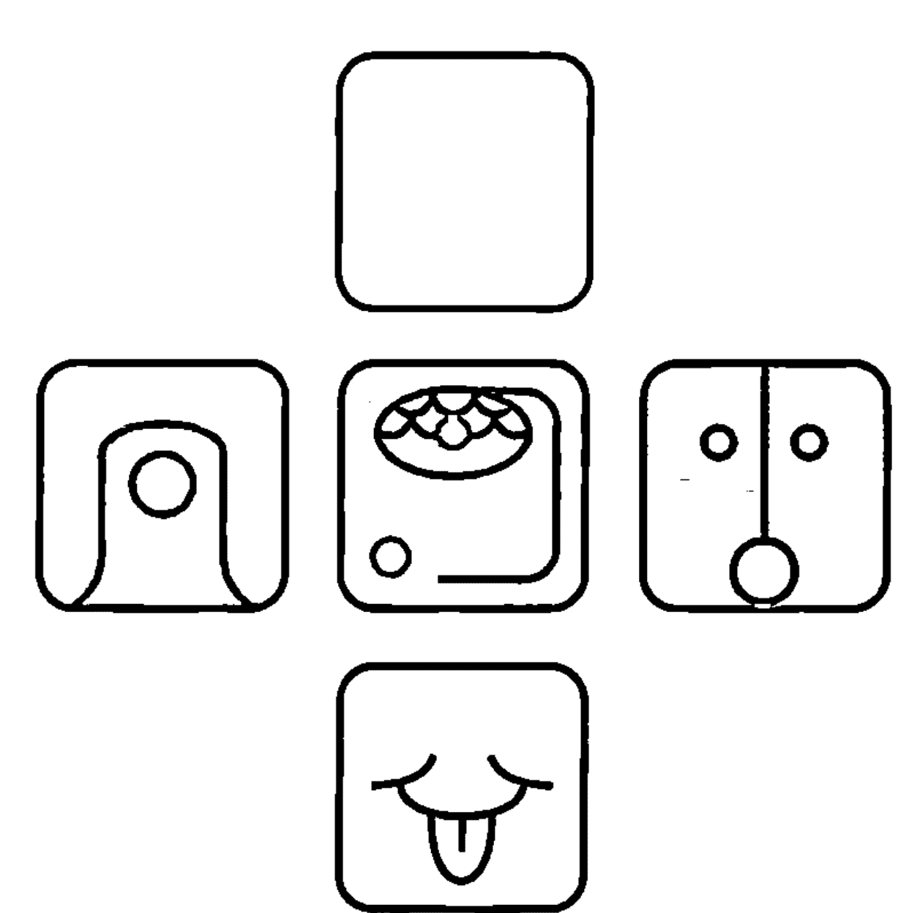

### 藍風暴與黃太陽互為支持

黃太陽是藍風暴的加分力量，能夠協助藍風暴在風雨過後重見光明。雨過天晴，就有陽光的展現，因此，黃太陽是來支持藍風暴，告訴藍風暴，打掉重練是個必經的過程，不需要擔心，有黃太陽在背後支持並替你加油。而當走過風雨，經歷改變與重建後，就有陽光般覺醒的力量與發光發熱的開悟智慧在下一個階段等待你了。

### 藍風暴與紅月互為挑戰擴展

紅月能幫助藍風暴擴展能量，挑戰不熟悉的自己。紅月代表水的流動能量，讓藍風暴內在的情緒能再次流動和釋放出來，風暴中挾帶著大量的水能量，能夠好好清理、淨化、釋放，若我們能用無條件的愛去接納改變過程中的所有情緒，像是害怕、恐懼，清理淨化就能更透徹，並迎來全新的自己。（可搭配參考「紅月」組合盤挑戰擴展的內容）

### 藍風暴與白風互為隱藏推動

白風是藍風暴的隱藏力量，在改變與生命成長的過程中，透過與人交談互動，能大大增加自我改變的覺察，無論是與專業人士交談，或是日常生活中的聊天分享，都能整理我們的思緒脈絡，對於需要改變的要點，一說出口，就會形成改變的能量。因此，你也可以找到信任的人，跟他說「你想要什麼的改變」。這是一種宣告，一經宣告，能量就會開始轉動。（可搭配參考「白風」組合盤隱藏推動的內容）

**三點家族：** 引導是藍夜，特別豐盛，而夢想的力量也會給予指引。為了尋求夢想，生活當中要持續改變、成長、前進，而且勇敢並踏實地做夢、改變自我、茁壯力量，朝向夢想邁進。

### 藍風暴的引導

**四點家族：** 引導是老鷹，能指引我們方向，並練習用更高的視野、第三方的角度來觀察自己的生命藍圖，只要能夠看得更全面，更清晰的道路就會出現，看清楚方向後，就能用落實的力量行動。

**一點家族：** 一點家族的藍風暴，具有雙倍的力量。透過與他人討論分享、激盪靈感，會更清楚內心的聲音與答案，以及自己要前進的方向。

**橫線家族：** 引導是藍手，給予我們行動上的指引、理解實踐的重要，以及改變必須要有持續的執行力；同時，在打掉後的建設力也是特別強大。再者，這個家族的能量也特別適合創作，藍手能引領藍風暴創造出「改善人們生活」的作品或產品。

**二點家族：** 引導是藍猴，協助藍風暴看得更清楚，不害怕改變。改變是個自然、去蕪存菁的過程，試著用幽默感與好奇心去面對生命當中所有天搖地動的時刻，保持輕鬆好玩、遊戲的心，藍猴會協助你度過所有難題。

### 藍風暴的圖騰靜心引導詞

1. 閉上眼睛，做幾個深呼吸，將注意力放在左腳小拇趾，輕輕地吸氣，然後吐氣。
2. 感覺暴風雨來到你面前，它的能量帶走了很多老舊不堪的事物，樹木、車道、人行道、廣告看板、建築物等等，一切都被大雨清洗得非常乾淨。你的內在也彷彿被洗滌了一輪，把舊有的能量與模式，以及必須放下的，都放下吧。
3. 感覺暴風雨過後的平靜，天空開始出現彩虹，你重新整理房子與花園，看到那些原本長得很好、扎根穩定的植物，一樣完好如初。
4. 感覺所有植物被大雨洗刷過後，都綠油油的，彷彿可以聞到青草地的香味、泥土的芬芳，把這樣的清新吸進來，吸進心輪後，再慢慢吐氣。
5. 再一次完整的吸氣與吐氣，把能量擴展到身體的每一個細胞，當你準備好時，慢慢張開眼睛，把自己完整的帶回來。

# 黃太陽
YELLOW SUN

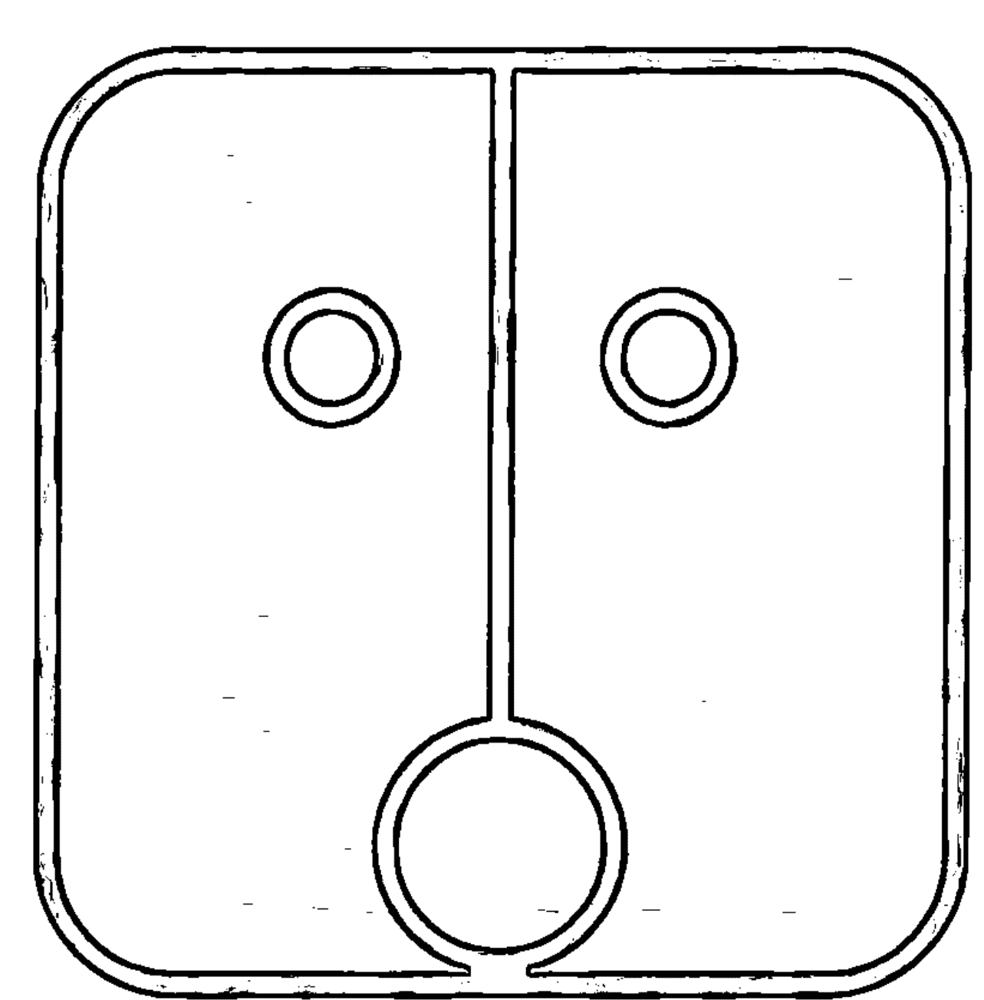

### 關鍵力量

**人格特質**：豐盛、分享、給予、顧全大局、犧牲、奉獻
**興趣喜好**：傳遞、鼓勵、把愛傳出去
**擅長的領域**：突破限制、意志力、自我超越
**適合發揮**：團隊合作、齊心協力、照顧、協助、支持
**優勢**：自信、光芒、鼓舞人心、幽默感、娛樂、高EQ
**功課**：用生命中的磨練考驗，打開生命的深度與廣度
**關鍵字**：滋養、存在、誕生

### 本質

黃太陽是卓爾金曆上的第二十個圖騰，對應馬雅的星際原型是「開悟者」。二十是它的數字（序號），也是我們生命中要學習的第二十個主題：開悟。

黃太陽是所有太陽圖騰裡的最後一個，也意味著我們從紅龍走到黃太陽，生命所要學習的前十九個主題都已走過一輪，並來到了最後階段，是最高真理之光的展現、無限光芒的綻放者，也是覺醒力量的代表圖騰，因此我們稱之為「開悟者」。

黃太陽人的特質是帶有生命的韌性，因為要成為發光發熱的黃太陽，可不是件容易的事。在生命中會經歷一些磨練與考驗，或者大起大落，或者精彩萬分，就像風暴過後的天晴，也像是浴火重生的鳳凰。因此，黃太陽人的天賦也是如此，擁有自帶光芒的力量，天生具有溫暖的熱情，理解人們生命歷程中的不易，所以特別能夠幫助與照顧他人，給予支持。每個生命都是如此，最終我們要成為覺醒的宇宙之光，散發溫暖的陽光，在生命中有所鍛鍊，獲得開悟的智慧。

我們在計算星系印記時有提到，黃太陽圖騰無論加上誰，都還是回到對方本身的圖騰，因為黃太陽特別能夠在群體中提供支持的能量。

在相關印記擁有黃太陽能量的人，適合從事支持他人的服務，喚醒人們生命覺醒的相關工作，支持人們心靈開啟的分享者，例如老師、教學者、演講者、導師。

### 課題

黃太陽所遇到的生命課題，是關於對於「生命鍛鍊」的自我肯定。承上所述，生命往往會很精彩，經歷修煉，偶爾也會苦不堪言，甚至可能覺得「自己的人生比別人辛苦」。但凡走過必留下痕跡，這些一步步走過的鍛鍊，都將成為一盞盞的燭光，當你回首看著來時路，會發現早已經匯聚成大燭火。此時，成長彷彿大躍進般，最後變成覺醒的太陽。因此，黃太陽人本身自帶光芒，這些生命光芒的故事與智慧將自然而然開展，別人也會想要向你學習，你是如何走過這一切的。

### 黃太陽的日子

可以好好留心這天所發生的事，因為這是一個獲得領悟的機會。你或許會在這一天想通一些事、獲得啟發，也可能有撥雲見日的感覺。

在這一天有三個適合調頻與擇日共用的好方法：一是最重要的，就是利用這天的能量好好曬太陽，可以背對太陽，讓陽光作為後盾能量；如果沒有太陽，可以想像太陽的力量灑在身上。二是如果有練習瑜伽的朋友，可以做拜日式的練習。這兩項練習都能讓自己全身充滿流動的力量，讓陽光穿透自己的每個部位，讓每個細胞都充滿能量。

### 黃太陽與白狗互為挑戰擴展

白狗能協助黃太陽擴展能量，挑戰不熟悉的自己。白狗提醒黃太陽，不要蠟燭兩頭燒，不要忙著奉獻自己、照顧他人，要好好的愛自己、照顧自己。當我們在給予愛、分享愛的時候，要先把自己愛得充分、完整，這顆太陽才不會黯淡無光，宇宙之火才能火力十足地持續燃燒。（可搭配參考「白狗」組合盤挑戰擴展的內容）

### 黃太陽的組合盤

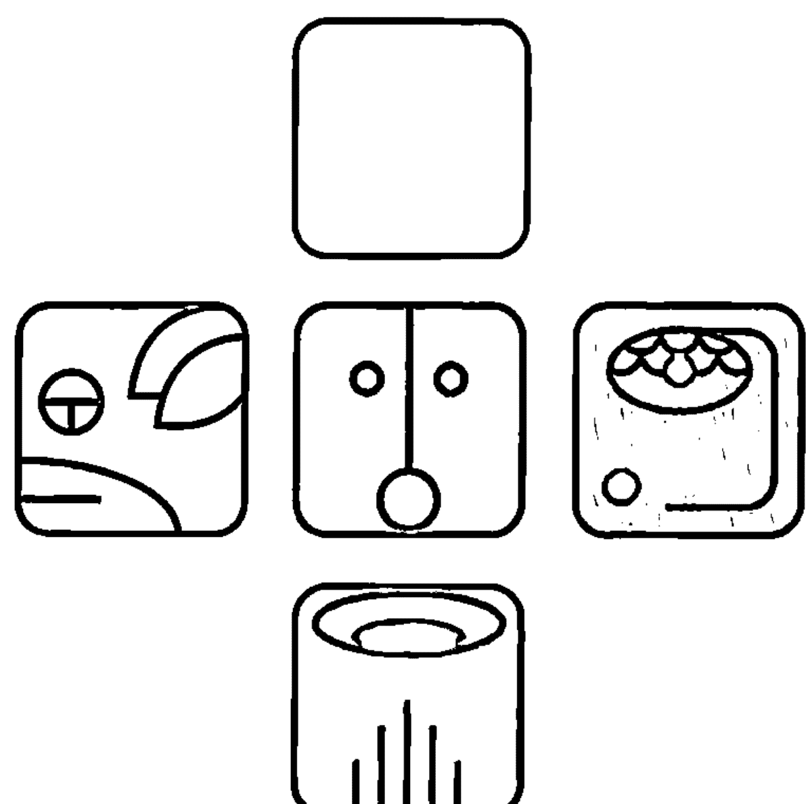

### 黃太陽與紅龍互為隱藏推動

紅龍是黃太陽的隱藏力量，內在得以源源不絕滋養生命的能量，就是來自於家人的愛。對他來說，原生家庭的愛是非常強大的力量。生命當中的一切，最終都是要回歸根源，找尋源頭的力量，透過回溯並傳遞感謝，感謝能夠有更大的動能推動前進，進而延伸到對於人類歷史的愛、古文明與智慧的愛，以及對自己愛的滋養。（可搭配參考「紅龍」組合盤隱藏推動的內容）

### 黃太陽與藍風暴互為支持

藍風暴是為黃太陽加分的力量，協助黃太陽理解，生命中經歷的考驗與鍛鍊，都是為了儲存自己的光芒，等待發光時刻到來。種種生活的考驗、去蕪存菁的歷練，都是為了更加成就黃太陽的生命光芒。（可搭配參考「藍風暴」組合盤支持的內容）

### 黃太陽的引導

**一點家族**：一點家族的黃太陽，具有雙倍的力量，自帶雙倍光芒，專注活出主印記圖騰的力量。黃太陽自己能夠榮耀自己，親身體會而得來的智慧，就是自己最好的生命導師。

**二點家族**：引導是黃人，引領黃太陽去展現自己，把自由自在的能量綻放出來，尊重自己的生命體驗，重視自己的想法與價值觀，然後散發出溫暖且自由的光。

讓覺醒開悟的太陽鍛鍊出更大的智慧。在經歷過這些歷練後，也能幫助他人解決相同的人生問題。這個家族多了一份勇氣的光芒與智慧。

**三點家族**：引導是黃種子，給予黃太陽目標的指引，等待發芽前的蓄積能量，待能量足夠以後，才能把光芒綻放出來，迎接生命的大豐收。

**橫線家族**：引導是黃星星，黃星星的閃耀讓黃太陽的光芒更加耀眼，這是「白天發光、晚上也發光」的一組閃耀力量。黃星星的頻率在這裡能夠指引黃太陽去分享智慧，分享生命中的美好事物，以及無比閃耀，獨一無二的自己。

**四點家族**：引導是黃戰士，等待我們去面對智慧的考驗，解決生命中的問題，

### 黃太陽的圖騰靜心引導詞

1. 閉上眼睛，做幾個深呼吸，把注意力連結右手大拇指，因為黃太陽與紅龍（右手食指）互為隱藏推動，所以把這兩隻手指放在一起。
2. 把注意力放在右手大拇指，吸氣，然後吐氣。再次深吸一口氣，把注意力放回心輪，太陽的本質與能量，代表每個人內在最溫暖的原型。如果現在請你用一句話鼓勵或問候自己，你會想要跟自己說些什麼呢？
3. 感覺頭頂上有溫暖舒服的陽光灑落，微風輕輕吹過。我們從紅龍一直走到黃太陽，彷彿經歷了一生，然後走到這裡。回顧前面，那是協助我們開悟、成長以及開啟智慧的過程，試著去回顧每一個重要的里程碑。
4. 把二十個圖騰的能量都相應到我們身上，手指、腳趾，甚至是身上的每個細胞，把二十個圖騰的能量匯聚起來，回到心輪。
5. 再次完整的吸氣與吐氣，把能量擴展到身體的每一個細胞，當你準備好時，慢慢張開眼睛，把自己完整的帶回來。

# CHAPTER 5
內在女神力量

## 連結內在女神力量

「內在女神力量」（Goddess force，簡稱G-f），指的是我們內心的靈性力量，也有人稱為「內在女神」或「女神力量」。幫助你與「直覺力」和「內在導師」取得連結，同時也能開啟你的神聖陰性力量，連結宇宙中各種女神能量（例如埃及神話裡的愛西斯〔Isis〕、希臘神話的蓋亞〔Gaia〕、東方的觀世音菩薩等等），獲得更多心的洞察力。最能夠協助我們展現內在女神力量的關鍵，就是自己「心的頻率」，當心的頻率越高，便越能展現。

連結內在女神力量，這是拿回陰性力量的主導權。因此，找到並連結內在女神力量的印記，也就是我們內在覺醒最重要的練習。

每個人都有女神力量，不分性別，無論男女，皆代表了每個人內在陰性本質，是靈性、神性的部分，而內在溫柔、接納、滋養、照顧、傾聽等等的特質，我們都稱為「神聖陰性」（Divine Feminine）的面向。女神力量可以讓我們知道，當我們活出星系印記全部的能量，也就是啟動了主印記等五個圖騰五合一的能量時，我們將會成為什麼樣的自己。

### 計算女神力量

把星系印記五個Kin加總得到的合盤——上、下、左、右與中間全部的Kin加起來——便是女神力量，也就是所謂五合一的力量。把五個Kin加起來，數字若超過二百六十，則減去二百六十，會得到一個Kin。

- TIPS ❶ 女神力量的圖騰就是引導的挑戰擴展。
- ❷ 將星系印記五個Kin的數字相加，加總後的總數，再減掉260或260的倍數，讓餘數在260以內。

【範例】以Kin10／行星白狗的星系印記為例，

- ❶ 把星系印記的五個 Kin 數字相加：
  10+49+218+140+251=668
- ❷ 上個步驟得到的668減掉兩次260：
  668-260-260=148
- ❸ 得到Kin148，對照「卓爾金曆」，女神力量即為超頻黃星星。

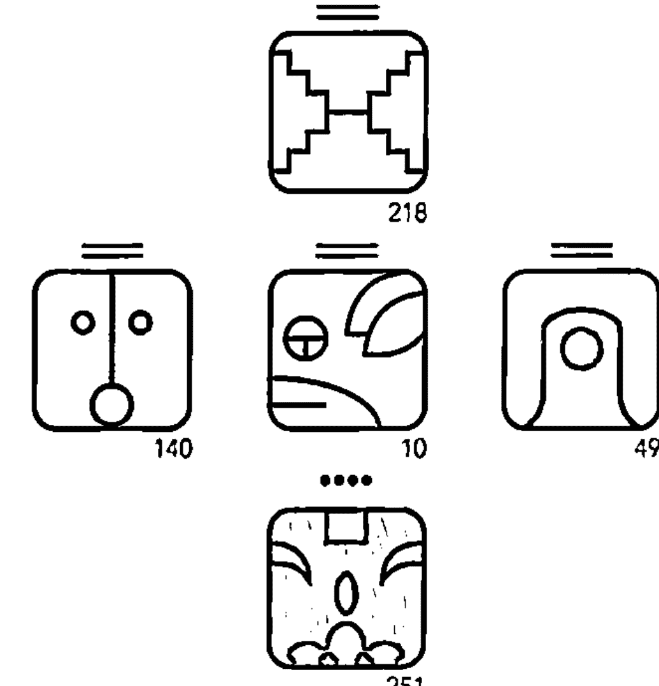

### 將女神力量運用於生活中

當你活出了整組星系印記的力量，就可以想像這是五合一、完整且圓滿的自己。最重要的是活出主印記的力量，並把加分支持的力量活得很好，同時完整、清晰地看見隱藏版的自己，成為生命的燃料，以及無條件地愛你的挑戰，在朝向引導的地方前進，以更高維度看見夢想實踐的力量是什麼？女神力量就是你圓滿版本的想像，最高頻率五合一的力量。

### 最重要的印記

常常有人問起，十三月亮曆的學習探索中，個人的印記種類繁多，有主印記、支持、隱藏推動、引導等等。現在又加上了女神力量，到底哪一個是我們調頻校準時最重要的參照點呢？要參照哪一個圖騰呢？

答案是「主印記」。活出主印記的能量是最重要的關鍵。做個比喻，當你要拿起一串粽子，維繫整串粽子的力量就是中央的繩頭，所以不妨想像一下，主印記就是「粽子的繩頭」，當你提起一串粽子時，就像是活出了主印記的頻率，所有的頻率便都會自動到位。因為，所有生命能量的連結，都是根據你的這組生日在運作，所以拿到一組八位數的西元出生日期，第一步就要先算出主印記，其餘所有訊息才會隨著主印記而開展。

### 馬雅小學堂

#### 如何想像女神力量？

我把星系印記五合一後的女神力量比喻成「飯糰」。主印記是香Q的米飯，幫香氣加分的滷蛋是支持，挑戰口感的辣菜脯是擴展，秘方特製的滷豆干是隱藏推動，提昇口味層次感的油條是引導。當我們一口咬下這顆飯糰時，我們會咬到五種元素，這種五合一的味覺口感，就是女神力量。

### 練習

#### 排出你的女神圖騰及調性

- ❶ 你的女神力量主印記是什麼？女神圖騰是什麼？關鍵字是什麼？你要學習的課題是什麼？
- ❷ 你的女神力量調性是什麼？關鍵字是什麼？問句是什麼？力量動物是什麼？你要學習的課題又是什麼？
- ❸ 你的女神力量波符是什麼？這條生命道路要告訴你什麼訊息呢？
- ❹ 想像活出自己的女神力量，這是五合一、完整且圓滿的自己，那將是什麼版本的自己？與現在的你有什麼不同呢？它將帶給你什麼訊息或啟發？

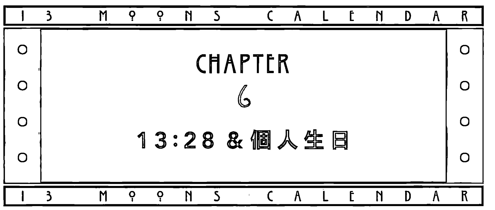

## 認識星際馬雅十三月亮曆

星際馬雅十三月亮曆，顧名思義，指的是一年有十三個月份，以十三個調性的頻率當作月份的主題，每個月的問句與關鍵頻率，都與調性的解釋相同（參考第三章），我們可以看到「馬雅萬年曆」（P164）上的標示，一月份就是「磁性蝙蝠之月」。每個月有二十八天，二十八代表了月亮繞行地球一圈的天數。因此，一整年會完成共十三個月亮的循環。一個月有四週，依照紅、白、藍、黃的顏色頻率排列。一週有七天，依照等離子的頻率排列（參考本章的放射等離子）。我們稱這樣每個月二十八天的週期、每年十三個月亮的循環所組成的13：28序列為「週期序」、「循環序」。

十三月亮曆是萬年不變的固定循環，是用來校準我們日常生活的時間法則。正如「馬雅萬年曆」裡的每一天，都會固定對應到一個西元的日期。例如這套曆法裡頭的1月14日，是磁性蝙蝠之月的第十四天，對應到西元日期，就是8月8日。你也可以試著依據西元日期，來找出今天是十三月亮曆的幾月幾日？

### 尋找馬雅生日

如同你的西元生日，十三月亮曆的生日也有年月日。在學習十三月亮曆時，我們要尋找的是自己生命源頭的馬雅力量，但除了認識「主印記」之外，認識「馬雅生日」也同樣重要喔。我們在第一章曾經提到，西元每年7月26日的馬雅印記，就是接下來一整年的馬雅年頻率，有了這個概念以後，讓我們一起根據「馬雅萬年曆」找出自己的馬雅生日。

### STEP 1 · 對照馬雅年份表

首先得查到自己出生年份的圖騰、調性，以及宇宙座標的編碼。而在右邊的「馬雅年份表」裡，每個表格下方的西元年數字，代表了當年的7月26日至隔年的7月25日。以表格左上角第一格為例，指的是1935年7月26日至1936年7月25日，以及1987年7月26日至1988年7月25日。在這個區間裡，無論哪一天生日的人，都屬於同一個馬雅年（類似中國十二生肖的概念）。

【範例】如果出生於1987年11月20日，對照「馬雅年份表」，剛好就落在左上角第一格的區間，格子中標示的調性，就是年份的調性，因此，這個人的出生馬雅年就是銀河白巫師年。

### 馬雅年份表

| S/P MALDEK (28) | S/P PLUTO (388) | G/K JUPITER (52) | G/K MERCURY (4) |
| :---: | :---: | :---: | :---: |
| NS1.0 ... 34 1935-36 1987-88 | NS1.1 .... 139 1936-37 1988-89 | NS1.2 — 244 1937-38 1989-90 | NS1.3 — 89 1938-39 1990-91 |
| NS1.4 — 194 1939-40 1991-92 | NS1.5 ... 39 1940-41 1992-93 | NS1.6 • 144 1941-42 1993-94 | NS1.7 .. 249 1942-43 1994-95 |
| NS1.8 ... 94 1943-44 1995-96 | NS1.9 .... 199 1944-45 1996-97 | NS1.10 — 44 1945-46 1997-98 | NS1.11 — 149 1946-47 1998-99 |
| NS1.12 .. 254 1947-48 1999-2000 | NS1.13 ... 99 1948-49 2000-01 | NS1.14 .... 204 1949-50 2001-02 | NS1.15 — 49 1950-51 2002-03 |
| NS1.16 — 154 1951-52 2003-04 | NS1.17 .. 259 1952-53 2004-05 | NS1.18 ... 104 1953-54 2005-06 | NS1.19 • 209 1954-55 2006-07 |
| NS1.20 .. 54 1955-56 2007-08 | NS1.21 ... 159 1956-57 2008-09 | NS1.22 .... 4 1957-58 2009-10 | NS1.23 — 109 1958-59 2010-11 |
| NS1.24 — 214 1959-60 2011-12 | NS1.25 .. 59 1960-61 2012-13 | NS1.26 ... 164 1961-62 2013-14 | NS1.27 .... 9 1962-63 2014-15 |
| NS1.28 — 114 1963-64 2015-16 | NS1.29 — 219 1964-65 2016-17 | NS1.30 .. 64 1965-66 2017-18 | NS1.31 ... 169 1966-67 2018-19 |
| NS1.32 • 14 1967-68 2019-20 | NS1.33 .. 119 1968-69 2020-21 | NS1.34 ... 224 1969-70 2021-22 | NS1.35 .... 69 1970-71 2022-23 |
| NS1.36 — 174 1971-72 2023-24 | NS1.37 • 19 1972-73 2024-25 | NS1.38 .. 124 1973-74 2025-26 | NS1.39 ... 229 1974-75 2026-27 |
| NS1.40 .... 74 1975-76 2027-28 | NS1.41 — 179 1976-77 2028-29 | NS1.42 — 24 1977-78 2029-30 | NS1.43 .. 129 1978-79 2030-31 |
| NS1.44 ... 234 1979-80 2031-32 | NS1.45 • 79 1980-81 2032-33 | NS1.46 .. 184 1981-82 2033-34 | NS1.47 ... 29 1982-83 2034-35 |
| NS1.48 .... 134 1983-84 2035-36 | NS1.49 — 239 1984-85 2036-37 | NS1.50 — 84 1985-86 2037-38 | NS1.51 .. 189 1986-87 2038-39 |

### STEP 2 · 尋找自己的馬雅出生月與日期

在「馬雅萬年曆」上找到自己的西元出生日期（月日），便可以對照出自己是在十三月亮曆法的第幾個月、第幾週／顏色力量、第幾天出生。這一天便是你的馬雅生日。

【範例】接續上一個步驟，1987年11月20日的人，對照「馬雅萬年曆」，則可以得知馬雅生日為5月6日，是超頻孔雀之月的第六天，週次則是紅色啟動之週。

### 馬雅萬年曆

7月25日
無時間日

#### 宇宙烏龜之月
| 1 | 2 | 3 | 4 | 5 | 6 | 7 |
|---|---|---|---|---|---|---|
| 6/27 | 6/28 | 6/29 | 6/30 | 7/1 | 7/2 | 7/3 |
| 8 | 9 | 10 | 11 | 12 | 13 | 14 |
| 7/4 | 7/5 | 7/6 | 7/7 | 7/8 | 7/9 | 7/10 |
| 15 | 16 | 17 | 18 | 19 | 20 | 21 |
| 7/11 | 7/12 | 7/13 | 7/14 | 7/15 | 7/16 | 7/17 |
| 22 | 23 | 24 | 25 | 26 | 27 | 28 |
| 7/18 | 7/19 | 7/20 | 7/21 | 7/22 | 7/23 | 7/24 |

#### 水晶兔子之月
| 1 | 2 | 3 | 4 | 5 | 6 | 7 |
|---|---|---|---|---|---|---|
| 5/30 | 5/31 | 6/1 | 6/2 | 6/3 | 6/4 | 6/5 |
| 8 | 9 | 10 | 11 | 12 | 13 | 14 |
| 6/6 | 6/7 | 6/8 | 6/9 | 6/10 | 6/11 | 6/12 |
| 15 | 16 | 17 | 18 | 19 | 20 | 21 |
| 6/13 | 6/14 | 6/15 | 6/16 | 6/17 | 6/18 | 6/19 |
| 22 | 23 | 24 | 25 | 26 | 27 | 28 |
| 6/20 | 6/21 | 6/22 | 6/23 | 6/24 | 6/25 | 6/26 |

#### 光譜蛇之月
| 1 | 2 | 3 | 4 | 5 | 6 | 7 |
|---|---|---|---|---|---|---|
| 5/2 | 5/3 | 5/4 | 5/5 | 5/6 | 5/7 | 5/8 |
| 8 | 9 | 10 | 11 | 12 | 13 | 14 |
| 5/9 | 5/10 | 5/11 | 5/12 | 5/13 | 5/14 | 5/15 |
| 15 | 16 | 17 | 18 | 19 | 20 | 21 |
| 5/16 | 5/17 | 5/18 | 5/19 | 5/20 | 5/21 | 5/22 |
| 22 | 23 | 24 | 25 | 26 | 27 | 28 |
| 5/23 | 5/24 | 5/25 | 5/26 | 5/27 | 5/28 | 5/29 |

#### 行星狗之月
| 1 | 2 | 3 | 4 | 5 | 6 | 7 |
|---|---|---|---|---|---|---|
| 4/4 | 4/5 | 4/6 | 4/7 | 4/8 | 4/9 | 4/10 |
| 8 | 9 | 10 | 11 | 12 | 13 | 14 |
| 4/11 | 4/12 | 4/13 | 4/14 | 4/15 | 4/16 | 4/17 |
| 15 | 16 | 17 | 18 | 19 | 20 | 21 |
| 4/18 | 4/19 | 4/20 | 4/21 | 4/22 | 4/23 | 4/24 |
| 22 | 23 | 24 | 25 | 26 | 27 | 28 |
| 4/25 | 4/26 | 4/27 | 4/28 | 4/29 | 4/30 | 5/1 |

#### 共振猴子之月
| 1 | 2 | 3 | 4 | 5 | 6 | 7 |
|---|---|---|---|---|---|---|
| 1/10 | 1/11 | 1/12 | 1/13 | 1/14 | 1/15 | 1/16 |
| 8 | 9 | 10 | 11 | 12 | 13 | 14 |
| 1/17 | 1/18 | 1/19 | 1/20 | 1/21 | 1/22 | 1/23 |
| 15 | 16 | 17 | 18 | 19 | 20 | 21 |
| 1/24 | 1/25 | 1/26 | 1/27 | 1/28 | 1/29 | 1/30 |
| 22 | 23 | 24 | 25 | 26 | 27 | 28 |
| 1/31 | 2/1 | 2/2 | 2/3 | 2/4 | 2/5 | 2/6 |

#### 銀河星系鷹之月
| 1 | 2 | 3 | 4 | 5 | 6 | 7 |
|---|---|---|---|---|---|---|
| 2/7 | 2/8 | 2/9 | 2/10 | 2/11 | 2/12 | 2/13 |
| 8 | 9 | 10 | 11 | 12 | 13 | 14 |
| 2/14 | 2/15 | 2/16 | 2/17 | 2/18 | 2/19 | 2/20 |
| 15 | 16 | 17 | 18 | 19 | 20 | 21 |
| 2/21 | 2/22 | 2/23 | 2/24 | 2/25 | 2/26 | 2/27 |
| 22 | 23 | 24 | 25 | 26 | 27 | 28 |
| 2/28 | 3/1 | 3/2 | 3/3 | 3/4 | 3/5 | 3/6 |

#### 太陽豹之月
| 1 | 2 | 3 | 4 | 5 | 6 | 7 |
|---|---|---|---|---|---|---|
| 3/7 | 3/8 | 3/9 | 3/10 | 3/11 | 3/12 | 3/13 |
| 8 | 9 | 10 | 11 | 12 | 13 | 14 |
| 3/14 | 3/15 | 3/16 | 3/17 | 3/18 | 3/19 | 3/20 |
| 15 | 16 | 17 | 18 | 19 | 20 | 21 |
| 3/21 | 3/22 | 3/23 | 3/24 | 3/25 | 3/26 | 3/27 |
| 22 | 23 | 24 | 25 | 26 | 27 | 28 |
| 3/28 | 3/29 | 3/30 | 3/31 | 4/1 | 4/2 | 4/3 |

#### 磁性蝙蝠之月
| 1 | 2 | 3 | 4 | 5 | 6 | 7 |
|---|---|---|---|---|---|---|
| 7/26 | 7/27 | 7/28 | 7/29 | 7/30 | 7/31 | 8/1 |
| 8 | 9 | 10 | 11 | 12 | 13 | 14 |
| 8/2 | 8/3 | 8/4 | 8/5 | 8/6 | 8/7 | 8/8 |
| 15 | 16 | 17 | 18 | 19 | 20 | 21 |
| 8/9 | 8/10 | 8/11 | 8/12 | 8/13 | 8/14 | 8/15 |
| 22 | 23 | 24 | 25 | 26 | 27 | 28 |
| 8/16 | 8/17 | 8/18 | 8/19 | 8/20 | 8/21 | 8/22 |

#### 月亮蠍子之月
| 1 | 2 | 3 | 4 | 5 | 6 | 7 |
|---|---|---|---|---|---|---|
| 8/23 | 8/24 | 8/25 | 8/26 | 8/27 | 8/28 | 8/29 |
| 8 | 9 | 10 | 11 | 12 | 13 | 14 |
| 8/30 | 8/31 | 9/1 | 9/2 | 9/3 | 9/4 | 9/5 |
| 15 | 16 | 17 | 18 | 19 | 20 | 21 |
| 9/6 | 9/7 | 9/8 | 9/9 | 9/10 | 9/11 | 9/12 |
| 22 | 23 | 24 | 25 | 26 | 27 | 28 |
| 9/13 | 9/14 | 9/15 | 9/16 | 9/17 | 9/18 | 9/19 |

#### 電力鹿之月
| 1 | 2 | 3 | 4 | 5 | 6 | 7 |
|---|---|---|---|---|---|---|
| 9/20 | 9/21 | 9/22 | 9/23 | 9/24 | 9/25 | 9/26 |
| 8 | 9 | 10 | 11 | 12 | 13 | 14 |
| 9/27 | 9/28 | 9/29 | 9/30 | 10/1 | 10/2 | 10/3 |
| 15 | 16 | 17 | 18 | 19 | 20 | 21 |
| 10/4 | 10/5 | 10/6 | 10/7 | 10/8 | 10/9 | 10/10 |
| 22 | 23 | 24 | 25 | 26 | 27 | 28 |
| 10/11 | 10/12 | 10/13 | 10/14 | 10/15 | 10/16 | 10/17 |

#### 自我存在貓頭鷹之月
| 1 | 2 | 3 | 4 | 5 | 6 | 7 |
|---|---|---|---|---|---|---|
| 10/18 | 10/19 | 10/20 | 10/21 | 10/22 | 10/23 | 10/24 |
| 8 | 9 | 10 | 11 | 12 | 13 | 14 |
| 10/25 | 10/26 | 10/27 | 10/28 | 10/29 | 10/30 | 10/31 |
| 15 | 16 | 17 | 18 | 19 | 20 | 21 |
| 11/1 | 11/2 | 11/3 | 11/4 | 11/5 | 11/6 | 11/7 |
| 22 | 23 | 24 | 25 | 26 | 27 | 28 |
| 11/8 | 11/9 | 11/10 | 11/11 | 11/12 | 11/13 | 11/14 |

#### 超頻孔雀之月
| 1 | 2 | 3 | 4 | 5 | 6 | 7 |
|---|---|---|---|---|---|---|
| 11/15 | 11/16 | 11/17 | 11/18 | 11/19 | 11/20 | 11/21 |
| 8 | 9 | 10 | 11 | 12 | 13 | 14 |
| 11/22 | 11/23 | 11/24 | 11/25 | 11/26 | 11/27 | 11/28 |
| 15 | 16 | 17 | 18 | 19 | 20 | 21 |
| 11/29 | 11/30 | 12/1 | 12/2 | 12/3 | 12/4 | 12/5 |
| 22 | 23 | 24 | 25 | 26 | 27 | 28 |
| 12/6 | 12/7 | 12/8 | 12/9 | 12/10 | 12/11 | 12/12 |

#### 韻律蜥蜴之月
| 1 | 2 | 3 | 4 | 5 | 6 | 7 |
|---|---|---|---|---|---|---|
| 12/13 | 12/14 | 12/15 | 12/16 | 12/17 | 12/18 | 12/19 |
| 8 | 9 | 10 | 11 | 12 | 13 | 14 |
| 12/20 | 12/21 | 12/22 | 12/23 | 12/24 | 12/25 | 12/26 |
| 15 | 16 | 17 | 18 | 19 | 20 | 21 |
| 12/27 | 12/28 | 12/29 | 12/30 | 12/31 | 1/1 | 1/2 |
| 22 | 23 | 24 | 25 | 26 | 27 | 28 |
| 1/3 | 1/4 | 1/5 | 1/6 | 1/7 | 1/8 | 1/9 |

#### TIPS
1. 週次說明：紅色啟動之週、白色淨化之週、藍色蛻變之週、黃色成熟之週
2. 7月26日是馬雅年度的第一天
3. 西元2月29日，設定與3月1日同一天

### 放射等離子

等離子是心電傳輸的單位；七個放射等離子，是構成宇宙的基本部分。這是一個能量脈衝的概念，就像是中醫談到的「氣脈」，也就是「氣」呈現與集中的狀態，我們能夠感受到能量的流動之中有其電流。人體系統的七脈輪（左右兩脈與氣的交會處）就是七個等離子的接收器，透過七脈輪的接收，放射等離子能量振動，能激發所對應的七個脈輪能量中心。

> 作者註
> *《獵戶瞳孔》一書曾提到：在宇宙科學中，等離子使宇宙充滿了電力、電流、電磁場與放射力線。宇宙存在數個分類的電荷與等離子，於不同層次或時刻進行持續的交互作用，而塑造出宇宙中的不同可能性，因此，整個宇宙就像一個電路板。

每個等離子也依序對應到一週的七天，依照螺旋的轉動順序，激發該脈輪的能量點。馬雅生日所對應的脈輪，就是生命能量最重要的脈輪點。例如Dali對應到「頂輪」，關鍵字是「目標」，對應每個月的第一、八、十五、二十二天。承前述範例，若馬雅生日是5月6日，超頻孔雀之月的第六天，等離子就是⊕，LIMI 6，性質是淨化，對應的脈輪為胃輪。這裡引用一段《獵戶瞳孔》*的文字，讓大家更了解等離子的功用。

> 氣，是我們生命所需的能源。在時間法則科學下，藉由有意識呼吸所進入身體內的氣，是等離子的乙太營養素。

氣位於七個放射等離子中，各有不同的特色和力量。在有意識地吸入後，放射等離子會進入不同的脈輪，強化心理機能。在十三月亮曆中，我們每一週七天會啟動不同的脈輪和放射等離子。

這些放射等離子每日作用後，我們就可從身體內部啟動宇宙與太陽電力。……這會加速消去我們在第三次元個體中的較弱力量，也能幫助我們校準第五次元的自我，啟動更高位的宇宙靈魂個體。

——史蒂芬妮·南，《獵戶瞳孔》

### 放射等離子示意圖

### 等離子與日期對應表

| 等離子符號 | ⊕ | ≋ | ⊏ | ⊠ | ⊛ | ⊙ | ⊚ |
| :--- | :---: | :---: | :---: | :---: | :---: | :---: | :---: |
| 發音 | DALI | SELI | GAMMA | KALI | ALPHA | LIMI | SILIO |
| 性質 | 目標 | 流動 | 平靜 | 建立 | 釋放 | 淨化 | 發射 |
| 對應脈輪 | 頂輪 | 海底輪 | 眉心輪 | 臍輪 | 喉輪 | 胃輪 | 心輪 |
| 對應日期 | 1, 8, 15, 22 | 2, 9, 16, 23 | 3, 10, 17, 24 | 4, 11, 18, 25 | 5, 12, 19, 26 | 6, 13, 20, 27 | 7, 14, 21, 28 |

### 七大脈輪

脈輪一字，源於梵文的「Chakra」，有圓盤、漩渦、輪子等意思，顧名思義，就像輪子般不停轉動，調節著整個系統的生命能量循環。人的身體裡一共有七個主要脈輪，從身體中軸往外，一直到身體外皮膚上方三到四吋之處，分別位於脊椎底端至頭頂的七個點上，每一個脈輪都有特定的振動頻率，影響著人的身心狀態，並分別對應重要的神經叢和內分泌腺體。

### 呼吸調頻練習

找到自己的等離子之後，先試著閱讀右頁「七大脈輪說明表」裡的關鍵字。閉起眼睛、深呼吸、輕輕的發出等離子的拼音（唸出聲來），感受這個等離子的性質，並且啟動這個脈輪的位置，開啟該脈輪的平衡頻率。

承前述範例，若等離子為 ⊕，LIMI 6，淨化，胃輪。則可以輕唸LIMI，把觀察的注意力放在胃部，將深呼吸帶到胃跟後背的整圈區塊。透過呼吸，想像這個練習能幫助我們淨化五臟六腑，增強個人力量、意志力與自尊……

| 練習 |
| :--- |
| **排出你的馬雅生日年月日、等離子** |
| ❶ 你的馬雅出生年的主印記是什麼？圖騰是什麼？關鍵字是什麼呢？你要學習的課題是什麼？ | ❷ 你的馬雅出生年的調性是什麼？關鍵字是什麼呢？問句是什麼？力量動物是什麼？你要學習的課題是什麼？ |
| ❸ 你是在哪一個馬雅月份出生？關鍵字是什麼呢？月份調性的問句是什麼？力量動物是什麼？你要學習的課題是什麼？ | ❹ 你是在哪一個馬雅週出生？顏色的關鍵字是什麼呢？ |
| ❺ 你是出生在哪個日期？對應的放射等離子是什麼？性質、脈輪又是什麼？要學習的課題是什麼？ |

### 七大脈輪說明表

| 脈輪 | 關鍵字 | 概念字 | 脈輪位置 | 簡述 |
| :--- | :--- | :--- | :--- | :--- |
| 頂輪 | 知曉、體悟、超越意識 | 連結、合一、精神層次 | 頭頂中心 | 頂輪主要掌管宇宙智慧、更高次元的力量，以及和世界為一體的感覺。 |
| 眉心輪 | 洞見、直覺力、想像力 | 直覺、逆向思考、好點子 | 前額中間眉心處 | 眉心輪主要掌管洞察力和視覺化能力，以及看穿幻象的觀察者智慧。 |
| 喉輪 | 聲音、溝通、創造力 | 創造、溝通、表達 | 喉嚨前後 | 喉輪主要掌管自我表達的方式、溝通與創造力展現。 |
| 心輪 | 愛、平衡、親和力 | 接納、溫柔、允許接受 | 胸口中心 | 心輪主要掌管愛的給予，以及接受、寬恕與接納包容。 |
| 胃輪 | 個人力量、意志力、自尊 | 自我認同、自主性、界線清楚 | 肚臍與胸骨的中間 | 胃輪主要掌管你在團體中的感覺、力量展現與界線議題。 |
| 臍輪 | 情緒、感受力、喜悅 | 信任感、親密感、性能量 | 耻骨到肚臍中間 | 臍輪主要掌管金錢吸引力、情感吸引力、豐盛的關係。 |
| 海底輪 | 生存、身體、家族 | 歸屬感、行動力、專注當下 | 脊椎尾端 | 海底輪的能量主要掌管與物質生活、生命力的聯繫，使人感覺安全放心。 |

### PSI / 行星記憶資料庫

PSI指的是「行星記憶資料庫」，也就是我們常聽到的靈魂阿卡莎記憶（Akashic Records），是人類的雲端資料庫。每一天都有對應的PSI，必須根據當天的「馬雅月日」尋找。

個人的PSI，就以每個人的「馬雅生日」對應。無論是地球上或是銀河星系裡，這一天發生的所有事，都會透過宇宙能量的連結，上傳到PSI的記憶庫當中儲存起來。因此，同月同日誕生的人，PSI就會是同一個。

PSI就像是一個銀行，是靈魂記憶的儲存源頭，也是我們的圖騰調性中，另一個更高維度的自己。因此，除了星系印記組合盤之外，PSI會是另一個讓你參考學習的力量。

每一個月都有十二天是綠格子，分別是前六天（第一至六天）、後六天（第二十三至二十八天）。每當PSI遇到綠格子的日子，宇宙的能量便會特別強大，擁有三倍能量。行星記憶資料庫的容量特別大，連續三天共用一個PSI，能量連續開啟三天，接下來，就來練習如何找到自己的PSI。

### 找到自己的PSI

#### STEP1 · 找到馬雅生日

先用西元生日對照「馬雅萬年曆」（P164），找出自己的馬雅生日。以西元9月1日為例，馬雅生日就是2月10日。

#### STEP2 · 找到PSI

對照右頁的「PSI表」，找到2月10日（2.10）的位置，再對照「卓爾金曆」與「調性對照表」，就可得到PSI為行星藍夜。

### PSI表

| 图标 | 1.1 | 2.9 | 3.11 | 4.11 | 5.11 | 6.11 | 6.21 | 8.9 | 8.19 | 9.19 | 10.19 | 11.19 | 1.23 |
|---|---|---|---|---|---|---|---|---|---|---|---|---|---|
| 图标 | 1.7 | 2.1 | 3.12 | 4.12 | 5.12 | 6.12 | 6.22 | 8.10 | 8.20 | 9.20 | 10.20 | 2.23 | 12.21 |
| 图标 | 1.8 | 2.10 | 3.1 | 4.13 | 5.13 | 6.13 | 7.7 | 8.11 | 8.21 | 9.21 | 3.23 | 11.20 | 12.22 |
| 图标 | 1.9 | 2.11 | 3.13 | 5.1 | 5.14 | 6.14 | 7.8 | 8.12 | 8.22 | 5.23 | 10.21 | 11.21 | 13.7 |
| 图标 | 1.10 | 2.12 | 3.14 | 4.14 | 7.1 | 6.15 | 7.9 | 8.13 | 7.23 | 9.22 | 10.22 | 11.22 | 13.8 |
| 图标 | 1.11 | 2.13 | 3.15 | 4.15 | 5.15 | 9.1 | 7.10 | 9.23 | 9.7 | 10.7 | 11.7 | 12.7 | 13.9 |
| 图标 | 1.12 | 2.14 | 3.16 | 4.16 | 5.16 | 10.1 | 7.11 | 10.23 | 9.8 | 10.8 | 11.8 | 12.8 | 13.10 |
| 图标 | 1.13 | 2.15 | 3.17 | 4.17 | 8.1 | 11.1 | 7.12 | 11.23 | 8.23 | 10.9 | 11.9 | 12.9 | 13.11 |
| 图标 | 1.14 | 2.16 | 3.18 | 6.1 | 5.17 | 12.1 | 7.13 | 12.23 | 9.9 | 6.23 | 11.10 | 12.10 | 13.12 |
| 图标 | 1.15 | 2.17 | 4.1 | 4.18 | 5.18 | 13.1 | 7.14 | 13.23 | 9.10 | 10.10 | 4.23 | 12.11 | 13.13 |
| 图标 | 1.16 | 2.18 | 4.6 | 4.19 | 5.19 | 13.6 | 7.15 | 13.28 | 9.11 | 10.11 | 4.28 | 12.12 | 13.14 |
| 图标 | 1.17 | 2.19 | 3.19 | 6.6 | 5.20 | 12.6 | 7.16 | 12.28 | 9.12 | 6.28 | 11.11 | 12.13 | 13.15 |
| 图标 | 1.18 | 2.20 | 3.20 | 4.20 | 8.6 | 11.6 | 7.17 | 11.28 | 8.28 | 10.12 | 11.12 | 12.14 | 13.16 |
| 图标 | 1.19 | 2.21 | 3.21 | 4.21 | 5.21 | 10.6 | 7.18 | 10.28 | 9.13 | 10.13 | 11.13 | 12.15 | 13.17 |
| 图标 | 1.20 | 2.22 | 3.22 | 4.22 | 5.22 | 9.6 | 7.19 | 9.28 | 9.14 | 10.14 | 11.14 | 12.16 | 13.18 |
| 图标 | 1.21 | 3.7 | 4.7 | 5.7 | 7.6 | 6.16 | 7.20 | 8.14 | 7.28 | 10.15 | 11.15 | 12.17 | 13.19 |
| 图标 | 1.22 | 3.8 | 4.8 | 5.6 | 6.7 | 6.17 | 7.21 | 8.15 | 9.15 | 5.28 | 11.16 | 12.18 | 13.20 |
| 图标 | 2.7 | 3.9 | 3.6 | 5.8 | 6.8 | 6.18 | 7.22 | 8.16 | 9.16 | 10.16 | 3.28 | 12.19 | 13.21 |
| 图标 | 2.8 | 2.6 | 4.9 | 5.9 | 6.9 | 6.19 | 8.7 | 8.17 | 9.17 | 10.17 | 11.17 | 2.28 | 13.22 |
| 图标 | 1.6 | 3.10 | 4.10 | 5.10 | 6.10 | 6.20 | 8.8 | 8.18 | 9.18 | 10.18 | 11.18 | 12.20 | 1.28 |

在尋找PSI以及對照「PSI表」時，還有以下這些要點必須注意：

1. 每個月有十二天是綠格子的日子，遇到綠格子的時候，會連續三天共用一個PSI，也就是同一個PSI能量會連續開啟三天的意思。
2. 馬雅生日為每月的1、2、3日時，就對照「月份數字.1」。
3. 馬雅生日為每月的4、5、6日時，就對照「月份數字.6」。
4. 馬雅生日為每月的23、24、25日時，就對照「月份數字.23」。
5. 馬雅生日為每月的26、27、28日時，就對照「月份數字.28」。

| 練習 |
| :--- |
| **尋找並連結自己的PSI** |
| 尋找自己的PSI，並將PSI的組合盤畫出來（PSI作為主印記），這代表了高維度的自己，靈魂記憶的源頭。 |
| 1. 你的PSI主印記圖騰是什麼？關鍵字是什麼？你要學習的課題是什麼？ |
| 2. 你的PSI調性是什麼？關鍵字是什麼？問句是什麼？力量動物是什麼？你要學習的課題是什麼？ |
| 3. 你的PSI波符是什麼？這代表了你更高維度的靈魂生命道路。 |

# CHAPTER 7
個人流年 & 地球家族

## 找到自己的流年

流年，就是以自己的「生日」當天做切點，生日這天的星系印記，就會是接下來你一整年的主要能量，我們稱為個人的「流年主印記」。這個星系印記的能量會支持你一整年，直到下一年的生日前一天為止，因此，每年的生日就是切換新的流年能量的日子。接下來，我們用西元7月20日這一天出生的人來示範如何計算流年：

STEP 1 · 2018年7月20日至2019年7月19日的流年：計算出2018年7月20日當天的星系印記：Kin163 ／共振藍夜。

STEP 2 · 2019年7月20日至2020年7月19日的流年：計算出2019年7月20日當天的星系印記：Kin 8 ／銀河黃星星。

STEP 3 · 依此類推，可以找出任何一年的流年能量（更宏觀的五十二流年盤，又稱五十二流年命運城堡，請見本章P187）。

### 善用流年能量

❶ 這天開始的能量會影響一整年，可以學習活用這個星系印記的優勢能量。

2. 畫出流年星系印記的組合盤，參考引導、支持、隱藏推動、挑戰擴展。
3. 畫出流年的波符能量，並帶出十三個問句與答案的生命道路，看懂關鍵的提醒。
4. 找到調性的力量動物，多與力量動物連結。可以穿戴相關圖案的飾品或衣服配件，也可以把力量動物圖片放在顯眼常見的地方，例如手機或電腦桌面，想想看：「這個動物可以讓我學習到什麼？」
5. 直到隔年生日切換成新的能量。可以在生日來到的前一天，依照上述方式，開始為新的一年做準備。

### 解讀自己的流年盤

可以運用〈馬雅星際護照〉（P210）來繪製流年的星系印記與波符：

#### 一、流年主印記的優勢能量：一整年最能發揮的天賦才華與特質

1. 圖騰是什麼？關鍵字是什麼？要學習的課題是什麼？能發揮什麼天賦？
2. 調性是什麼？關鍵字是什麼？問句是什麼？要跟什麼力量動物學習？
3. 今年有什麼計畫要開展嗎？這個圖騰要帶給你什麼訊息或啟發呢？

#### 二、流年支持的優勢能量：好好運用什麼特質？多做什麼事情？以這些方式回頭支持自己

1. 圖騰是什麼？關鍵字與學習的課題是什麼？
2. 可以運用什麼特質支持自己？可以多做什麼事與行動來提昇改變的動能？
3. 有沒有認識支持圖騰的人？互相支持激勵，看能否帶來什麼訊息或啟發？

#### 三、流年挑戰擴展的優勢能量：好好運用什麼特質？多做什麼事情？以這些方式擴展自己的能量

1. 圖騰是什麼？關鍵字是什麼？要透過擴展的力量來學習什麼愛的課題呢？
2. 今年有沒有想要練習跨越哪些困境？突破什麼舒適圈？可以透過這個圖騰的提示，好好運用哪些特質？可以多做什麼事情來幫助自己擴展呢？
3. 有沒有認識挑戰擴展圖騰的人？互相擴展，看能否帶來什麼訊息或啟發？

#### 四、流年引導的優勢能量：好好運用什麼特質？多做什麼事情？以這些方式完成夢想

1. 圖騰是什麼？關鍵字及展現的方式是什麼？
2. 寫下今年的夢想清單，在這一年好好實踐夢想的力量。透過這個圖騰的引導，好好完成。
3. 找到引導圖騰的人。無論性別、角色或身分，都跟他聊聊、向他請益，會帶給你新的訊息與啟發。

#### 五、流年隱藏推動的優勢能量：可以好好運用什麼特質？多做什麼事情？用這些方式發揮潛能，推動生命朝向目標邁進

1. 圖騰及調性是什麼？關鍵力量與學習課題是什麼？
2. 這是今年的隱藏力量，也代表了今年較容易忽略的部分，或者無法看見自己其實有這樣的能力。透過這個圖騰，讓我們重新認回自己的力量，拿回潛能，發揮潛力！
3. 有沒有認識這個隱藏推動圖騰的人？可以試著從對方身上認出自己的力量，互動推動，看看能否帶給你什麼訊息或啟發？

#### 六、流年波符：畫出你的流年波符，代表這一年的學習道路

#### 七、流年的女神力量：畫出今年的內在女神圖騰（參考第五章），代表今年的圓滿整合力量。

很多人會好奇，在一年之中，究竟是出生的主印記重要，還是當年的流年重要？答案就是：出生主印記是一輩子最重要的力量，流年印記就像是多出一個配備的加乘，多了一種可運用的能量。

## 身體全息圖

我們的身體就像一個小宇宙，會共時對應到大宇宙「圖騰」與「調性」的頻率。身體總是誠實地傳遞訊息，若是我們能夠學會傾聽身體的訊息，便可以得到無窮的智慧。

在認識身體全息圖之前，可以先了解這個概念：圖騰會對應到人體的二十個小關節；而調性則對應到人體的十三個大關節。接下來，就讓我們來分別說明圖騰與調性如何對應連結我們的身體。

### 圖騰

從第一個位置紅龍來看，當我們比出數字一的時候，通常會用哪隻手？哪隻手指？答案通常是右手食指。所以，我們身上的圖騰就是從右手食指（紅龍）開始、右手中指（白風）、右手無名指（藍夜）……依此類推，而最後的黃太陽，會回到我們的右手大拇指，完成一個完整的循環；對應到日子裡，當二十個手指與腳趾走完後，也完成了一輪二十天的圖騰小週期。

當我們學習了圖騰符號的象徵訊息後，可以實踐應用在日常生活中，例如任何一個手指頭或腳趾頭受傷、疼痛時，就可以問問自己，是不是這個圖騰來提醒我們，該去關注它了呢？

例如，右腳小趾頭（紅月）在我們走路時不小心受傷了，或許就是一個訊息，來提醒我們是否太過壓抑、最近情緒是否不穩定，更要照顧自己的心情平衡等等。

> **TIPS**｜圖騰循環順序：右手是一，右腳是二，左手是三，左腳是四，最後再回到右手。

### 右手

1. 紅龍：右手食指
2. 白風：右手中指
3. 藍夜：右手無名指
4. 黃種子：右手小指

### 左腳

15. 藍鷹：左腳大拇趾
16. 黃戰士：左腳食趾
17. 紅地球：左腳中趾
18. 白鏡：左腳無名趾
19. 藍風暴：左腳小趾

### 右腳

5. 紅蛇：右腳大拇趾
6. 白世界橋：右腳食趾
7. 藍手：右腳中趾
8. 黃星星：右腳無名趾
9. 紅月：右腳小趾

### 右手

20. 黃太陽：右手大拇指

### 左手

10. 白狗：左手大拇指
11. 藍猴：左手食指
12. 黃人：左手中指
13. 紅天行者：左手無名指
14. 白巫師：左手小指

### 找出圖騰與身體相對應的位置

1. 找出你的主印記圖騰位於身體的什麼位置。
2. 依序找出你的支持、挑戰擴展、隱藏推動、引導、女神力量以及PSI，分別位於什麼位置。
3. 依照當日的頻率做指頭按摩。

### 調性

調性一／磁性對應的位置，是從右腳腳踝開始，一直到調性十三／宇宙的位置，是在左腳的腳踝。

1. 磁性：右腳腳踝
2. 月亮：右腳膝蓋
3. 電力：右邊髖關骨
4. 自我存在：右手手腕
5. 超頻：右手手肘
6. 韻律：右肩膀
7. 共振：頸椎
8. 銀河星系：左肩膀
9. 太陽：左手手肘
10. 行星：左手手腕
11. 光譜：左邊髖關骨
12. 水晶：左腳膝蓋
13. 宇宙：左腳腳踝

### 找出波符、圖騰與身體相對應的位置

依照個人主印記的波符，用身體走一次生命道路。請在圖上的每個位置畫上圖騰。

❶ 磁性的位置：生命的方向。此生的方向是這輩子靈魂要前進的目標，也可以說是使命和任務最重要的起始點。剛好是磁性位置的人，好比掌舵者、控制方向盤的人。這個身體部位容易受傷的人，可以觀察自己最近是否有找不到方向的迷惘感。

❷ 月亮的位置：心靈的黑暗面。包括心理陰影以及較為恐較為恐懼的部分。

❸ 電力的位置：生命的品質。內在的品質是什麼？當你帶著什麼品質到來，你就最能給出這樣的品質。

❹ 自我存在的位置：服務的方式。你的靈魂想要提供什麼方式的服務呢？

❺ 超頻的位置：你的生命想要綻放什麼樣的力量？靈魂最大的力量是什麼？

❻ 韻律的位置：你的靈魂來到此生想要達到溝通互動的平衡，要用什麼方式尋求人與人之間的平衡？你又是用什麼方式獲得與他人之間的平衡？

### 身体全息图：调性与波符

7 共振的位置：你是用什麼方式和他人共振？如何讓自己回到核心？你的核心是什麼？核心就是我們靈魂的中心點。

8 銀河星系的位置：生命的信念。內在靈魂與生俱來的價值觀。你覺得什麼是重要的？你相信什麼？信念是什麼？外在會依此呈現這樣的氛圍，實際出現在生命裡，而這個信念會告訴你內外整合的方法。

9 太陽的位置：生命的渴望。這個部位能具體看見自己的渴望是什麼，確定並活出自己的渴望。

10 行星的位置：生命完美的顯化與呈現。代表了你此生最能完整呈現自己的具體行動。

11 光譜的位置：靈魂釋放內在信息的方式。透過什麼方式把內我的信息釋放出來？

12 水晶的位置：生命的清晰度。靈魂對於什麼事情看得最清晰？此生和他人合作的項目是什麼？

13 宇宙的位置：生命的目的地。靈魂將要走到哪裡？你能成為什麼樣的人？

### 練習

### 身體全息圖的日常生活運用

綜觀上述的圖騰及調性說明，我們可以嘗試以下的自我觀察及練習：

1. 尋找自己的主印記在哪裡，好好按摩這個部位。
2. 好好觀察受傷的部位，覺察這個位置的頻率是否失衡。
3. 配戴飾品時，選擇想要加強的能量位置。

## 地球家族

在本章前半段，我們已經學會從身體全息圖的全觀角度來覺察自己，發現原來馬雅的13：20都在我們身上，但我們要練習的不僅是如此，還要直接將身體能量跟地球對應。

地球家族中的五個家族，會對應到地球的五個脈輪能量。因此，我們能想像自己就像是一顆「行走的地球」，身體能量的五個脈輪位置，會與地球脈輪位置共振。

在本頁的地球家族圖表中，我們可以看到位於同一個橫軸的圖騰，即同一個地球家族（例如最上面的圖騰，分別對應黃太陽、紅蛇、白狗、藍鷹，屬於極性家族）。每個家族都有四位成員，紅、白、藍、黃圖騰各一，圖騰的序號都相差五。

同時，我們的「個人流年印記」能量也是跟著地球家族同頻共振的，這部分內容，會在接下來的「五十二流年命運城堡」有更多詳細說明。

有一個口訣要先提供給大家：「個人流年印記，只會在自己的地球家族中循環」。因此，你的個人流年印記只會出現「自己家族的這四個圖騰」，依照紅、白、藍、黃的圖騰順序出現，每多一年，調性會持續加一。

### 地球家族說明表

| 家族類型 | 圖騰1 | 圖騰2 | 圖騰3 | 圖騰4 |
| :--- | :---: | :---: | :---: | :---: |
| 極性家族 | (圖示) | (圖示) | (圖示) | (圖示) |
| 主要家族 | (圖示) | (圖示) | (圖示) | (圖示) |
| 核心家族 | (圖示) | (圖示) | (圖示) | (圖示) |
| 信號家族 | (圖示) | (圖示) | (圖示) | (圖示) |
| 通道家族 | (圖示) | (圖示) | (圖示) | (圖示) |

### 極性家族
對應地球的北極
接收來自上天的訊息

頂輪

### 主要家族
對應地球的北半球
掌管地球的歷史文明

喉輪

### 核心家族
對應地球的赤道
掌管地球母親內在心靈發聲

心輪

### 信號家族
對應地球的南半球
掌管無時間日／把訊息帶出來

胃輪

### 通道家族
對應地球的南極
掌管新年門戶的開門者

海底輪

### 地球家族對應脈輪示意圖

### 極性家族

對應地球的頂輪，位置在北極，專門接收來自上天的訊息。又稱「橫線家族」，因為此家族的圖騰序號都是以「橫線一」計算，有五／紅蛇、十／白狗、十五／藍鷹、二十／黃太陽。

### 主要家族

對應地球的喉輪，位置在北半球，與地球歷史的文明有關，專門把古老智慧發送出來。此家族的圖騰序號都是以「一點·」計算與開展，又稱「一點家族」，有一／紅龍、六／白世界橋、十一／藍猴、十六／黃戰士。

### 核心家族

對應地球的心輪，位置在赤道，掌管地球母親內在心靈的發聲力量，專門把各種人事物的內在語言轉譯並呈現出來。此家族的圖騰序號都是以「兩點··」計算與開展，又稱為「兩點家族」，有二／白風、七／藍手、十二／黃人、十七／紅地球。

### 信號家族

對應地球的胃輪，位置在南半球，掌管無時間日，運用獨一無二的接收訊息或靈感的方式，把收到的信號傳遞出來。因此，每個西元7月25日無時間日只會遇到這四個圖騰，將無時間日收到的訊號，傳送給新年。此家族的圖騰序號都是以「三點…」計算與開展，又稱為「三點家族」，有三／藍夜、八／黃星星、十三／紅天行者、十八／白鏡。

### 通道家族

對應地球的海底輪，位置在南極，掌管過年這一天，也就是每個西元7月26日，這一天是新年開啟的門戶，通道家族是守門員。因此，每年的新年這一天，就是迎接宇宙頻率的時刻。年度能量會在新年這一天從地球的海底輪往上進入地球，而年度馬雅圖騰只會出現通道家族這四個圖騰。此家族的圖騰序號都是以「四點…」計算與開展，又稱為「四點家族」，有四／黃種子、九／紅月、十四／白巫師、十九／藍風暴。

> 練習

**連結自己的地球家族**

找到自己的地球家族，看看守護的是哪個地區、哪些國家特別有連結與感應，可以前往那個地方旅遊，接受宇宙的指引、回應內心的召喚。

### 五十二流年命運城堡

我們在本章開頭已經了解如何計算自己「當年的個人流年」，也練習了解讀的步驟。現在，我們要把視角拉大，從當下的流年盤，進展到用宏觀格局去理解自己的生命全貌，讓我們一起來看看，十三月亮曆法的智慧如何帶領我們觀看人生的完整樣貌。

從出生開始，每一年都會經歷一個主印記，一路進展到二十六歲、五十二歲，直到超過七十八歲……人生的流年能量盤，全濃縮在一張「命運城堡」裡，我們之所以稱它為「五十二流年命運城堡」，是因為它以四條波符的結構形式組成，一個格子代表一年，一個城堡掌管了十三年，這十三年區間裡包含了一個顏色城堡的力量，共有五十二個格子。

我們可以將這份全觀圖形容成一張「人生地圖」在你眼前展開，你會看清楚自己現在的位置、理解自己的過去、現在與未來。接下來，跟著引導，一起來揭開自己的全人生地圖吧！

### 四個城堡的名稱

- 東方：紅色啟動城堡，帶有啟動與開創的力量
- 北方：白色跨越城堡，帶有跨越與淨化的力量
- 西方：藍色蛻變城堡，帶有改變與轉化的力量
- 南方：黃色給予城堡，帶有收穫與給予的力量

### 繪製自己的五十二流年命運城堡

STEP 1
寫上自己的西元出生日期與主印記：這張五十二流年命運城堡，每一年的切換點，就是你的「個人生日當天」。

STEP 2
在表格右上角「地球家族」的位置寫上家族名稱，並畫上家族的四個圖騰（紅、白、藍、黃各一個）。
【範例】參照右頁，以1977年12月12日／共振藍夜作為示範。藍夜圖騰屬於信號家族，其中包括紅天行者、白鏡、藍夜、黃星星。

STEP 3
在表格正中央的圓圈位置，畫上主印記圖騰。
【範例】先在正中央畫上藍夜圖騰。

STEP 4
東方的位置第一格，畫上家族的紅色圖騰。依此類推，北方第一格畫上家族的白色圖騰，西方第一格畫上家族的藍色圖騰，南方第一格畫上家族的黃色圖騰。
【範例】東方第一格（中央圓圈的右邊）畫上紅天行者，北方第一格（中央圓圈的上方）畫上白鏡，西方第一格（中央圓圈的左邊）畫上藍夜，南方第一格（中央圓圈的下方）畫上黃星星。

### 五十二流年命運城堡

姓名：○○○
出生日期：1977年12月12日
主印記：共振藍夜

STEP 1

STEP 2

地球家族：信號家族

STEP 4

STEP 3

### STEP 5

接下來，依照波符的流動方向，在其他空白格子中，把家族的四個圖騰依照「紅、白、藍、黃」的順序一直循環畫出，並塗上顏色（注意，整張圖只有同一個家族的四個圖騰）。

> 【範例】紅天行者的後面是白鏡，白鏡後面是藍夜，藍夜後面是黃星星，黃星星後面是紅天行者，一直重複。

### STEP 6

依照波符的順序方向，在每個位置依序標上「調性」，從調性一到十三。

> 【範例】如圖所示。

### STEP 7

找到自己的主印記「圖騰調性」的位置，寫上「出生零歲」，依序往後開始寫上一歲、二歲、三歲……一直到五十二歲。「五十二歲」這一格，會回到「出生（零歲）」同一格。

TIPS：
1. 如果歲數已經超過52歲，就繼續往下寫，寫到你想要的歲數。
2. 檢查看看，26歲這一年是不是你完美挑戰擴展的印記？52歲這一年是不是回到了出生（0歲）的主印記位置？如果是，那麼你就畫對了。

> 【範例】找到主印記共振藍夜 的位置，在那裡寫上「0歲」，在下一格銀河黃星星 的位置寫上1歲，就是滿1歲生日。1歲的流年從銀河黃星星的頻率開始，依此類推。

### 五十二流年命運城堡

姓名：○○○

出生日期：1977年12月12日

主印記：共振藍夜

地球家族：信號家族

### 練習

### 回顧生命歷程的重點

1. 生命大事紀：從出生到現在，每一年發生了什麼事情？好好回顧並寫下來。
2. 繪製自己的五十二流年命運城堡圖時，有沒有哪個位置畫錯，或做了塗改？觀察這個共時的現象，看看這些年發生了什麼事，這些「不小心畫錯」的訊息，彷彿是宇宙正在對我們眨眼，讓我們再次看見，並清理過往事件中的情緒。
3. 對照那一年的流年能量走到了哪一個圖騰？哪一個調性？在遇到同一個圖騰時，是否曾發生類似的事件？
4. 流年命運城堡包括三個最重要的關鍵年份，分別是二十六、五十二、七十八歲。請特別留意你在這些年發生了什麼事？二十六歲屬於「完美挑戰擴展年」，這一年的個人流年主印記，就是主印記的完美挑戰擴展。五十二歲則是「重生年」，你這一年的個人流年主印記回到出生主印記，與零歲的Kin相同，代表重新誕生。七十八歲為「完美挑戰擴展年」，你這一年的個人流年主印記，就是主印記的完美挑戰擴展。若有機會到一百零四歲，就會是再次重生，你的個人流年主印記會再次回到出生主印記。
5. 你出生在哪個城堡？帶有什麼樣的天賦力量而誕生？
6. 你現在正在哪個城堡？正在經歷什麼樣的十三年呢？
7. 看看自己在切換城堡時，有沒有發生什麼重要的改變？
8. 當波符遇到開頭、轉彎與結束的地方，也就是調性一、五、九、十三，是需特別觀察的重要年份。

# CHAPTER 8
關係合盤

## 我與他人的關係

在我們的生命裡，每個人之間都有著千絲萬縷的聯繫，我們可以想像有隱形的能量線把我們連結在一塊。透過認識自己的星系印記，透過了解關係合盤，能讓我們拉高視角，看懂自己與他人。

我們總是會想知道「我跟他在一起適合嗎？」「我跟他的合作會成功嗎？」或者「我跟他會結婚嗎？」諸如此類的答案。但是，在學習合盤之前，我們要先放掉「是非」、「對錯」的二元性。

馬雅的十三月亮曆，教導的是超越二元性的思考角度，我們若能超越這些「是否」的二元答案，拉出新高度來看這些問題，便能獲得新的理解。如此一來，也能開始在互動中觀察自己：我在這段關係中，可以學習什麼？我現在遇到這樣的合作關係，將會為生命帶來什麼樣的體驗？並且帶給我什麼樣的擴展？

成長與改變的契機，就從「重新看見」開始。

### 合盤的計算方式

把兩人或更多人的主印記數字Kin相加，若是超過二百六十，就減去二百六十，持續減到數字少於二百六十，這就是合盤的Kin，再去對照卓爾金曆，找到圖騰與調性。

合盤，指的是你與某一個人（或某些人）的能量加總。學習合盤的目的，可以讓我們了解人際關係的互動狀況，我們將在這個關係中激盪出什麼火花與能量？這段關係需要學習什麼？優勢力量是什麼？挑戰力量又是什麼？可以一起創造出什麼？以及如何協助這段關係等等，都可以在合盤中獲得解答。合盤大致有以下這些類別：

1. 兩個人的關係合盤：伴侶、夫妻、親子、合夥、同事，任何兩個人都可以計算合盤。
2. 超過兩個人以上的團體合盤：學習夥伴、旅遊團體、公司同事。
3. 整個家庭成員的合盤：原生家庭、婚姻家庭或整個家族。
4. 任何你想要計算的組合（寵物也可以），只要有對方的主印記Kin，就可以計算合盤。

### 釐清合盤概念

許多人一定都有這樣的體驗或觀察，在同一家公司裡，有的人可以很輕鬆，與老闆相處愉快，有人卻很辛苦，與老闆處處不對盤；同樣的日子，有人過得很豐盛順流，有人卻過得辛苦萬分。我們借用曆法的頻率來解釋這個現象，因為每一個人的Kin不同，所以即使遇到同一個人、同一個日子，合盤出來的Kin都不同，碰撞出的頻率也會有所不同。因此，我在這裡提供一個進階的討論，讓有興趣深入研究的人作為參考：

1. 如果想要了解自己在公司中的工作能量，可以計算自己與公司的合盤。公司的生日以營利事業登記證的日期為準。如果無法取得登記日，或者是小型工作室沒有正式登記，可以用負責人的生日替代。
2. 如果想要了解在婚姻關係中的自己，可以計算自己與結婚登記日的合盤。
3. 如果想要了解在某天的自己與宇宙頻率激盪出什麼，可以計算自己與當日的能量合盤，也可稱為「個人流日」。

### 合盤的探索

當我們找到合盤的印記後，最關心的就是如何理解這段關係？這段關係要讓我學習的是什麼？如果希望這段關係更和諧、平衡，我可以怎麼做呢？
首先，把合盤的「星系印記與波符」畫出來。接下來，請跟著以下幾項要點，開始好好探索這段關係、解開合盤的密碼（詳細的圖騰與調性說明，請參考第三章與第四章）。

### 一、主印記調性：代表這段關係的互動頻率

1. 調性可以看出應該要學習什麼關鍵課題。
2. 調性的特質，就是這個互動關係特有的力量。

### 二、主印記圖騰：代表這段關係最重要的關鍵力量

1. 圖騰可以看出應該學習的關鍵課題。
2. 能夠互動出什麼樣的氛圍。
3. 能一起創造出什麼能量。
4. 可以一起合作什麼樣的事。
5. 這段關係如果遇到相同圖騰印記的人與日子，可以提供加倍的能量。

### 三、支持圖騰：代表這段關係的加分力量

1. 做什麼事情或行動，能支持這段關係？幫這段關係加分？
2. 當這段關係需要支持時，可以往哪個方向探索、思考？
3. 這個圖騰的力量能為彼此帶來更多轉化、改變的動力。
4. 遇到相同圖騰印記的人與日子，可以在關係裡提供支持的力量。

### 四、挑戰擴展圖騰：代表這段關係的擴展與張力

1. 可以從圖騰看出這段關係比較具有挑戰的課題。
2. 做什麼事情或行動，能擴展這段關係？幫這段關係開展更大的可能？
3. 這個圖騰可以協助彼此生命擴展力量，並開展原本認為做不到的限制。
4. 遇到相同圖騰印記的人與日子，可以在關係裡提供擴展的力量。

### 五、隱藏推動圖騰：代表這段關係的潛在部分

1. 這個圖騰如同關係中的鏡子，把內在隱藏的部分投射出來。
2. 這是我們未被看見的潛能，藉由正視這樣的隱藏力量，把力量轉化為推動力。
3. 這是在相處中容易忽略的盲點，提醒彼此要去面對的部分。
4. 遇到相同圖騰印記的人與日子，可以在關係裡提供推動的力量。

### 六、引導圖騰：代表這段關係的指引力量

1. 可以從圖騰看出能為這段關係提供什麼更高層次的指引力量。
2. 為這段關係提供指導與建議，指引彼此達到實踐夢想的境界。
3. 遇到相同圖騰印記的人與日子，可以在關係裡提供指引的力量。

### 七、波符：透過波符，我們能了解這段關係相處的十三個關鍵力量（參考第二章P45）

1. 磁性的圖騰：代表這段互動關係的源頭是什麼？這段關係帶有这样的特質，並且往這個方向邁進。
2. 月亮的圖騰：代表這段互動關係裡比較令人焦慮的部分，也是比較容易引發情緒的面向。
3. 電力的圖騰：代表這段互動關係的特質，一起合作，以此特質服務自己與他人。
4. 自我存在的圖騰：代表這段互動關係的服務形式，共同合作，用這個具體的方式採取行動。
5. 超頻的圖騰：代表這段互動關係最能綻放什麼強大力量？
6. 韻律的圖騰：代表這段互動關係用什麼方式尋求平衡？
7. 共振的圖騰：代表這段互動關係以什麼方式和對方共振呢？以什麼方法讓彼此回到核心？
8. 銀河星系的圖騰：代表你在這段互動關係中相信什麼？內在信念是什麼？這也是這段關係最重要的信念，能夠讓你們整合內心與外在。
9. 太陽的圖騰：代表這段互動關係的渴望。確定你們的需求、活出渴望。
10. 行星的圖騰：代表這段互動關係的顯化與呈現方式，讓彼此目標成真的方式。
11. 光譜的圖騰：代表這段互動關係中，最能釋放內在信息的方式，也是讓彼此放下的方法。
12. 水晶的圖騰：代表這段互動關係中，能看得最清晰的部分，也是這段關係中可以合作的項目。
13. 宇宙的圖騰：代表這段互動關係的目的地。這段關係的合作，能共同成就彼此什麼？能透過什麼方式，將愛和喜悅與我們相遇的人及這個世界分享？

### 來自父母的力量：內在小孩

內在小孩，是透過自己與父母的「三人合盤」去計算出來的，這是自己在原生家庭中的樣貌，也代表了我們「內在純淨的力量」、「生命根源的善」，更能夠「提醒我們要多去關注與照顧的層面」。透過「探索」、「看見」並「認回」生命的源頭力量，能協助我們對自己的生命有更多的理解，更接納與包容自己的內心世界。

學習探索生命源頭的方法，我們可以試著找到父親與母親的星系印記，並探索自己與父母的合盤，協助我們認回這個能量。藉由接納原生家庭的源頭頻率，讓我們能更清晰看見自己如何受到原生家庭的影響，進而自我接納，更有自信。當我們更有力量，就能站得更穩，這也是家族及父母給予我們的力量與祝福。

### STEP 1 · 列出父母雙方的出生日期，找到各自的星系印記

參考第二章，計算出父親與母親的星系印記。

### STEP 2 · 畫出父母與自己的合盤

- 1. 畫出父親與自己的合盤（兩人的關係合盤）。
- 2. 畫出母親與自己的合盤（兩人的關係合盤）。
- 3. 利用本章「合盤的探索」（P196）的內容，進一步分別認識父親與自己、母親與自己的關係。
- 4. 有什麼發現呢？帶給你什麼訊息或啟發？

### STEP 3 · Kin數字相加

把父母親與自己共三人的主印記Kin數字加起來，就代表了三人關係的合盤，也就是你的「內在小孩」面貌。若Kin的數字若超過二百六十，則減去二百六十，讓最終數字在二百六十以內。

【範例】❶ 父親 Kin ＋母親 Kin ＝父母合盤 Kin
Kin130 ／宇宙白狗 🐶 ＋ Kin79 ／磁性藍風暴 🌪️
＝ Kin209 ／磁性紅月 🌙

❷ 父母合盤 Kin ＋自己 Kin ＝內在小孩 Kin
Kin209 ／磁性紅月 🌙 ＋ Kin163 ／共振藍夜 🌌 ＝ 372

❸ 372-260 ＝ 112
得到 Kin112，內在小孩即為銀河黃人 🧑‍🤝‍🧑。

| 練習 |
| :--- |
| **探索內在小孩** |
| ❶ 圖騰是什麼？關鍵字是什麼呢？ ❷ 調性是什麼？關鍵字是什麼呢？ 問句是什麼？力量動物是什麼？ ❸ 帶給你什麼訊息或啟發？ | ❹ 波符是什麼？ ❺ 如何照顧這個「內在小孩」？如何 好好活出這個力量？ |

## 13 MOONS CALENDAR
# CHAPTER 國王石棺印記

## 國王石棺印記解密

在這個章節裡，我們要介紹的是馬雅遺址與墨西哥國王的陵墓。馬雅史學家認為，帕倫克（Palenque）古城地下陵墓的出土，是馬雅古遺址中最重要的發現之一。帕倫克古城位於墨西哥境內的猶加敦半島上，是七世紀的馬雅城邦，也是馬雅文明古典時期最重要的城邦之一。雖然如今古城大部分的面積都還隱沒在叢林裡，但在這裡卻發現了一具非常具有意義的國王石棺，這座石棺，正是所有馬雅曆法知識的起源。

墨西哥國王帕克·沃坦（Pacal Votan），中文又可譯為巴加爾大帝或巴加爾二世。帕克·沃坦國王的石棺（簡稱PV國王的石棺）於西元1952年出土，石棺上頭刻劃的神話圖案中，有著類似宇宙飛行船的圖像，從右頁的圖中可以清楚看見，位於中央的國王搭著飛行船，與星際馬雅能量連結。

我們可以這樣推算，帕克·沃坦國王死亡年份為西元683年，荷西博士死亡年份為2011年，時間相差1,328年，正是十三月亮曆13:28（週期序、循環序）新曆法的振動頻率。

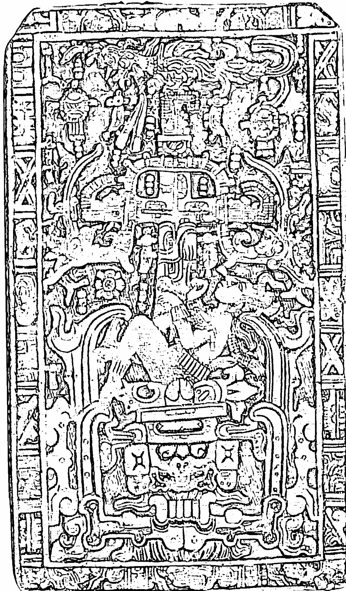

北

西

東

南

### 國王石棺

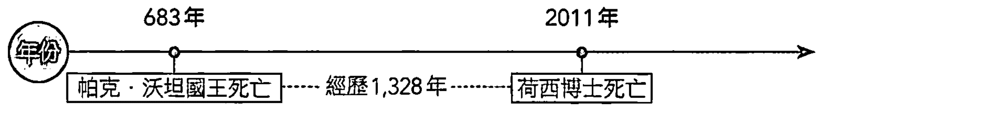

帕克·沃坦國王的陵墓在692年完成，直到1952年石棺出土，經歷了1,260年（舊頻率的能量）。直到2012年冬至，大週期結束，經歷了1,320年，帶出頻率轉換的訊息，從12：60到13：20。

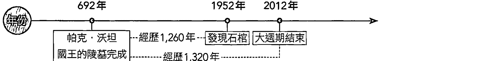

#### 帕克·沃坦國王

- 出生：603年來到地球
- 出生印記：Kin60／銀河黃太陽，天行者波符
- 死亡：683年離開地球
- 死亡印記：Kin58／韻律白鏡，天行者波符
- TIPS ❶ 出生與死亡的印記，都刻印在石棺南方印記的位置。
- ❷ 西元692年陵墓落成、下葬。離開地球後，花了九年完成陵墓。

#### 荷西博士

- 出生：1939年1月24日
- 出生印記：Kin11／光譜藍猴，龍波符
- 死亡：2011年3月23日
- 死亡印記：Kin89／光譜紅月，風暴波符
- TIPS ❶ 出生與死亡都是光譜調性，釋放出許多宇宙訊息給世人。

### 發現帕克·沃坦國王的石棺

墨西哥考古學家阿爾伯托·魯茲（Alberto Ruz）1948年在帕倫克發現陵墓，1949年開始挖掘陵墓。歷時三年，打開通往地下陵墓的通道，進入金字塔陵墓入口；1952年6月5日，阿爾伯托·魯茲在碑銘神廟底部的墓室中，發現了帕克·沃坦國王的石棺。

### 石棺出土

1952年6月5日是石棺被發現的日子，當天的印記爲Kin208／宇宙黃星星（PSI：Kin226／超頻白世界橋，藉由連結通道賦予我們最佳力量）。

### 星際馬雅十三月亮曆問世

1952年6月15日是帕克·沃坦國王的石棺被挖開的日子，可於石棺厚板側面看見十三個清晰的印記。自此發現星際馬雅十三月亮曆。當天印記爲Kin218／行星白鏡，代表行星的真相。

### 共時理論問世

1952年，知名心理學家榮格（宇宙白巫師）發表《論共時性》（*On Synchronicity*），詳細定義共時現象的「心靈與外在世界」同時發生。

### 國王石棺的十三個清晰印記

在石棺側面有十三個清晰印記，分爲四個方位，從南方的第一個印記開始，Kin60／銀河黃太陽，就是國王出生的主印記。

- 南方印記：Kin60、Kin58
- 東方印記：Kin57、Kin176、Kin87、Kin20、Kin245、Kin132
- 北方印記：Kin106
- 西方印記：Kin211、Kin30、Kin40、Kin26

這十三個印記的Kin數字相加後，得到Kin208／宇宙黃星星，代表十三月亮曆是一套「宇宙藝術品」的美麗象徵。

若單獨將這十三個調性數字相加，得到Kin78／宇宙白鏡，代表十三月亮曆是一套能「顯現宇宙知識、揭露宇宙真相」的系統工具。

### 與曆法最有關連的兩個圖騰

紅天行者：在石棺南方的兩大清晰印記，是國王出生與死亡的印記，且都在天行者波符，因此我們又稱天行者波符為「國王波符」。

白世界橋：在石棺的北方與西方，有兩個白世界橋的印記，也是後人唯一有給予命名的石棺印記，Kin106是小鑰匙，Kin26是大鑰匙，因此白世界橋圖騰在曆法的發現中，顯得特別重要。

TIPS ‖ 紅天行者與白世界橋，是互為支持的圖騰。

| 練習 |
| :--- |
| **尋找十三印記與自己的關聯** |
| 大家可以找找這十三個印記與自己的關聯，是否與你的任何印記有關？或者你的主印記是否與大小鑰匙屬於同一個波符？ |
| 我發現有件事情很奇妙，許多對馬雅文明或曆法有興趣的朋友們，無論是找我學習曆法，或是找我解盤諮詢，甚至是想要研究或分享推廣的朋友，每當我算出他們的主印記時，常常發現正是石棺上十三個清晰印記之一，或者是與石棺有關的任何印記，例如Kin208或Kin78。我總會開玩笑說：「是國王叫你來找我的吧！」 |

### 卓爾金曆

| | | | | | | | | | | | | |
|---|---|---|---|---|---|---|---|---|---|---|---|---|
|  | 1 | 21 | 41 | 61 | 81 | 101 | 121 | 141 | 161 | 181 | 201 | 221 | 241 |
|  | 2 | 22 | 42 | 62 | 82 | 102 | 122 | 142 | 162 | 182 | 202 | 222 | 242 |
|  | 3 | 23 | 43 | 63 | 83 | 103 | 123 | 143 | 163 | 183 | 203 | 223 | 243 |
|  | 4 | 24 | 44 | 64 | 84 | 104 | 124 | 144 | 164 | 184 | 204 | 224 | 244 |
|  | 5 | 25 | 45 | 65 | 85 | 105 | 125 | 145 | 165 | 185 | 205 | 225 | 245 |
|  | 6 | 26 | 46 | 66 | 86 | 106 | 126 | 146 | 166 | 186 | 206 | 226 | 246 |
|  | 7 | 27 | 47 | 67 | 87 | 107 | 127 | 147 | 167 | 187 | 207 | 227 | 247 |
|  | 8 | 28 | 48 | 68 | 88 | 108 | 128 | 148 | 168 | 188 | 208 | 228 | 248 |
|  | 9 | 29 | 49 | 69 | 89 | 109 | 129 | 149 | 169 | 189 | 209 | 229 | 249 |
|  | 10 | 30 | 50 | 70 | 90 | 110 | 130 | 150 | 170 | 190 | 210 | 230 | 250 |
|  | 11 | 31 | 51 | 71 | 91 | 111 | 131 | 151 | 171 | 191 | 211 | 231 | 251 |
|  | 12 | 32 | 52 | 72 | 92 | 112 | 132 | 152 | 172 | 192 | 212 | 232 | 252 |
|  | 13 | 33 | 53 | 73 | 93 | 113 | 133 | 153 | 173 | 193 | 213 | 233 | 253 |
|  | 14 | 34 | 54 | 74 | 94 | 114 | 134 | 154 | 174 | 194 | 214 | 234 | 254 |
|  | 15 | 35 | 55 | 75 | 95 | 115 | 135 | 155 | 175 | 195 | 215 | 235 | 255 |
|  | 16 | 36 | 56 | 76 | 96 | 116 | 136 | 156 | 176 | 196 | 216 | 236 | 256 |
|  | 17 | 37 | 57 | 77 | 97 | 117 | 137 | 157 | 177 | 197 | 217 | 237 | 257 |
|  | 18 | 38 | 58 | 78 | 98 | 118 | 138 | 158 | 178 | 198 | 218 | 238 | 258 |
|  | 19 | 39 | 59 | 79 | 99 | 119 | 139 | 159 | 179 | 199 | 219 | 239 | 259 |
|  | 20 | 40 | 60 | 80 | 100 | 120 | 140 | 160 | 180 | 200 | 220 | 240 | 260 |

# APPENDIX

## 馬雅星際護照

星系印記

生命波符

馬雅生日

五十二流年命運城堡

關係合盤

### 星系印記

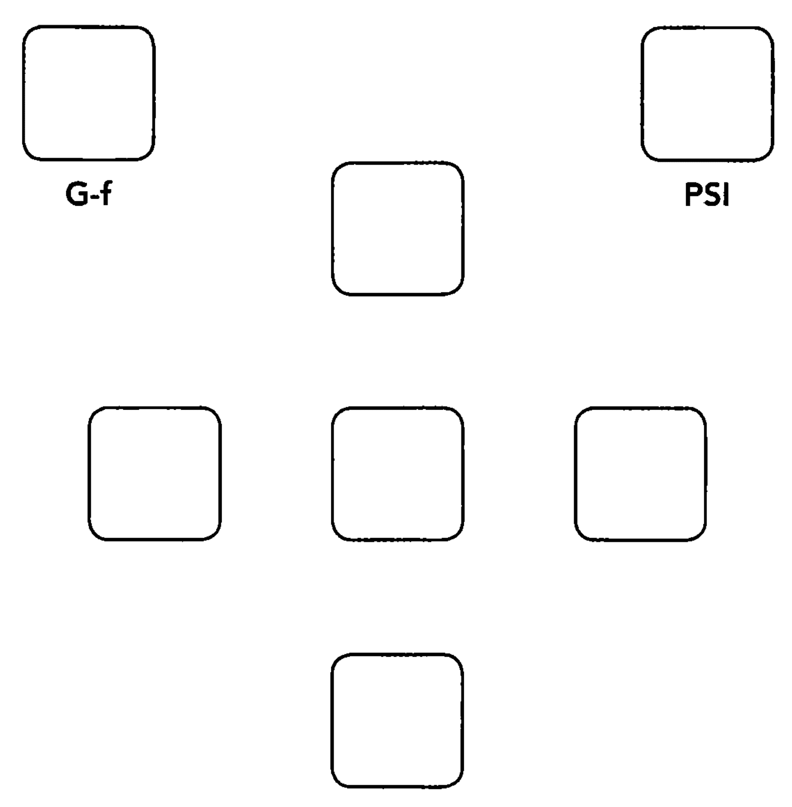

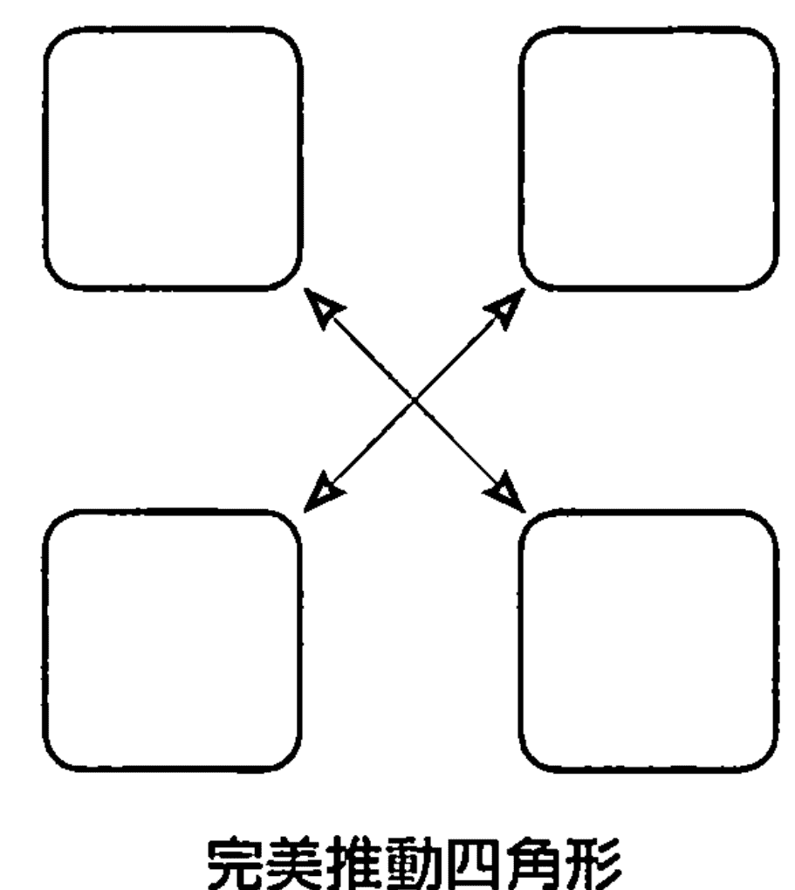

### 主印記

- 1. 圖騰：
- 2. 本質：
- 3. 課題：
- 4. 顏色：
- 5. 調性：
- 6. 調性力量動物：

### 星系印記四大守護力量

- 1. 支持圖騰：
- 2. 挑戰擴展圖騰：
- 3. 隱藏推動圖騰：
   隱藏推動調性：
- 4. 引導圖騰：

### PSI

- 1. 圖騰：
- 2. 調性：

### 女神力量

- 1. 圖騰：
- 2. 調性：

### 生命波符

### 波符的十三個問句

- 1. 磁性：生命的目的是什麼？
- 2. 月亮：我所要面對的挑戰是什麼？
- 3. 電力：我該如何給予最好的服務？
- 4. 自我存在：我該以什麼方式服務自己？
- 5. 超頻：我的最佳力量是什麼？可以透過什麼實踐方式來展現自己最大的力量？
- 6. 韻律：我該如何找到身心靈的平衡？
- 7. 共振：如何讓自己回歸生命的核心？
- 8. 銀河星系：如何活出內在的信仰？如何整合自己？
- 9. 太陽：我／生命的意圖是什麼？該如何實現人生的目的？
- 10. 行星：我該如何讓事情更完美地進行與完成？我在人世間想要顯化什麼？
- 11. 光譜：我該放下、釋放什麼？該如何放下？
- 12. 水晶：我該如何與人合作、奉獻？如何為他人服務？我最能夠看清楚什麼事情？
- 13. 宇宙：我如何回到當下，並超越進展到下一個階段？我又該如何分享愛與喜悅？

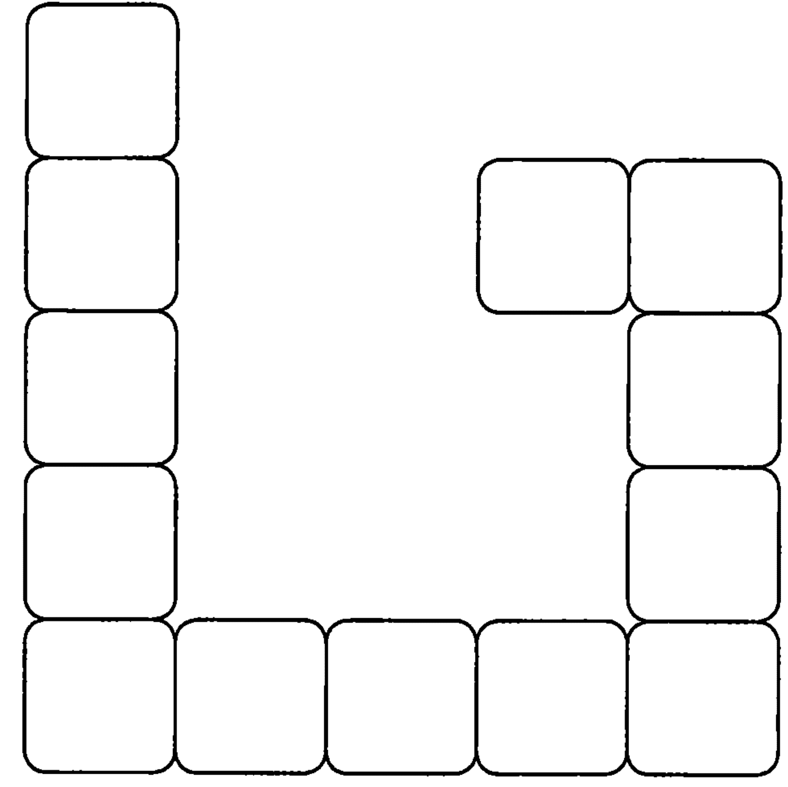

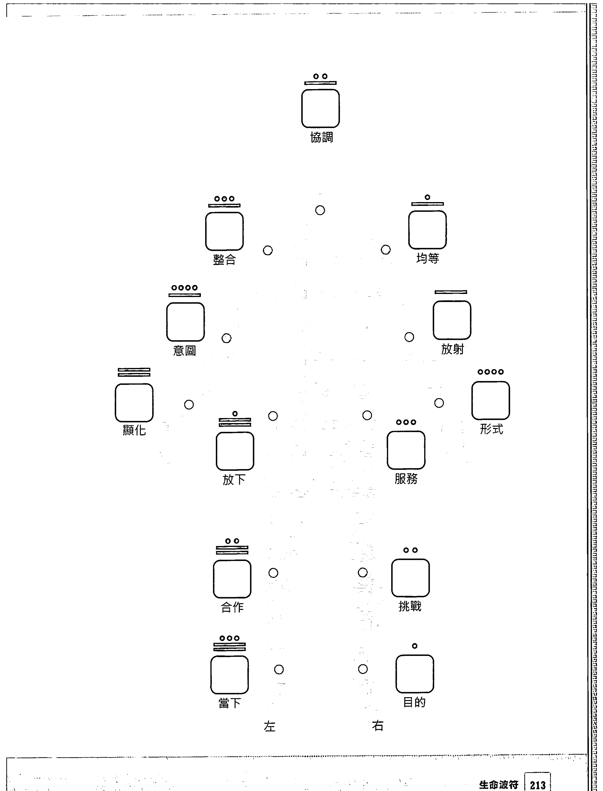

### 馬雅生日

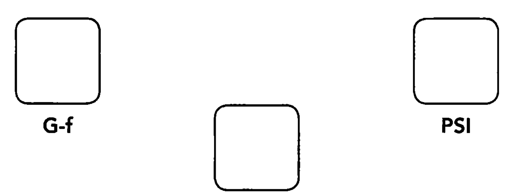

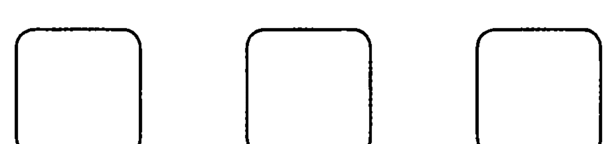

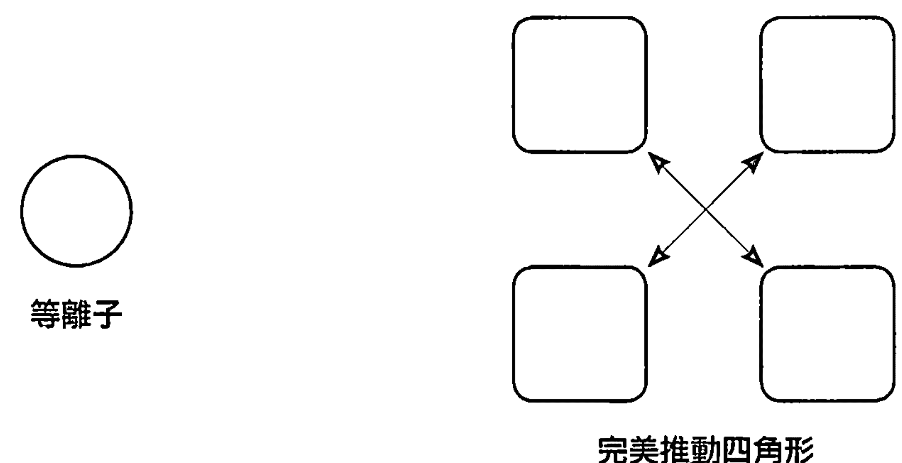

### 馬雅生日

- 1. 馬雅出生年：
- 2. 馬雅出生月份：
- 3. 馬雅生日／等離子：

### 馬雅生日的探索與練習

- 1. 你的馬雅出生年的主印記是什麼？圖騰是什麼？關鍵字是什麼呢？你要學習的課題是什麼？
- 2. 你的馬雅出生年的調性是什麼？關鍵字是什麼呢？問句是什麼？力量動物是什麼？你要學習的課題是什麼？
- 3. 你是在哪一個馬雅月份出生？關鍵字是什麼呢？月份調性的問句是什麼？力量動物是什麼？你要學習的課題是什麼？
- 4. 你是在哪一個馬雅週出生？紅、白、藍、黃的哪一個？顏色的關鍵字是什麼呢？
- 5. 你是出生在哪個日期？對應到的放射等離子是什麼？性質、脈輪又是什麼？你要學習的課題是什麼？

### 五十二流年命運城堡

姓名：
出生日期：
主印記：

地球家族：

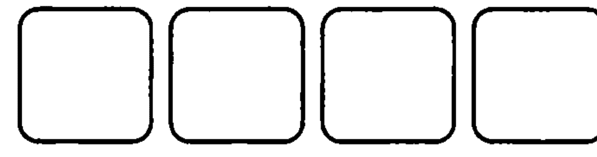

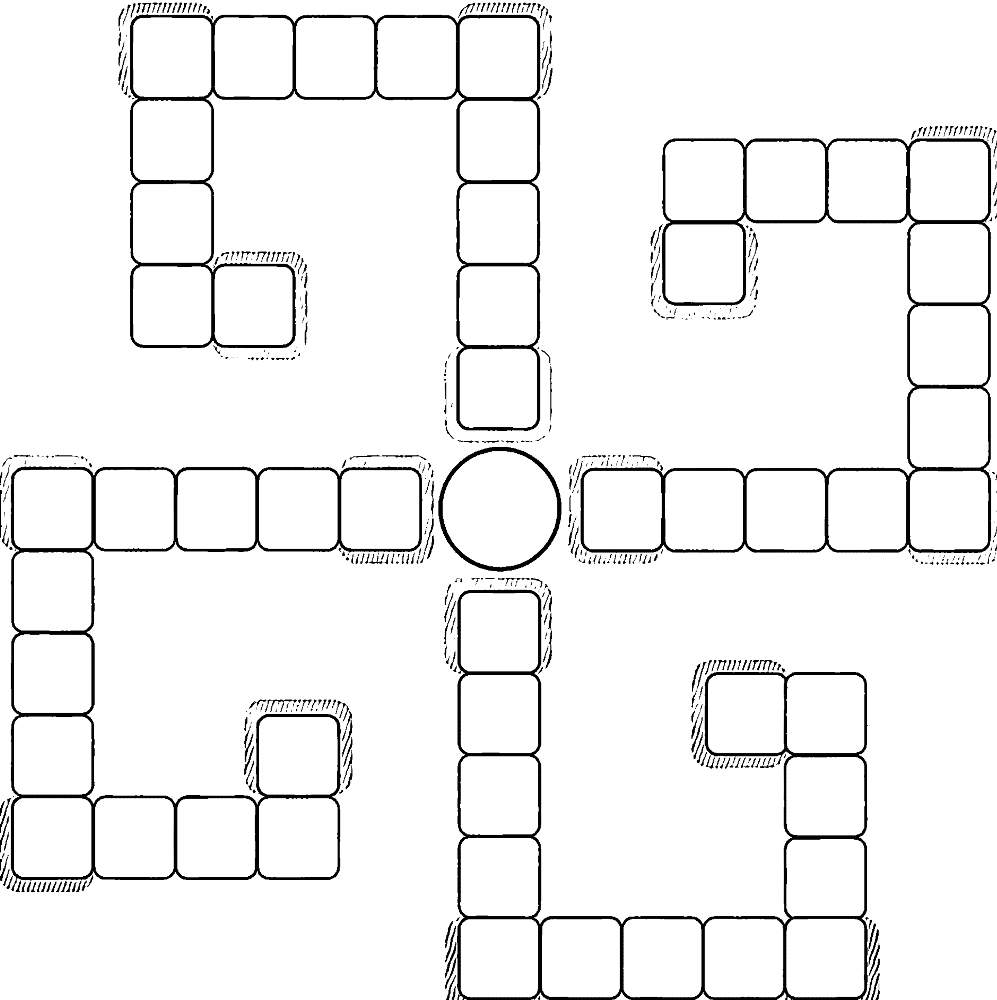

### 回顧生命歷程的重點

- 1. 生命大事紀：從出生到現在，每一年發生了什麼事情？好好回顧，並且寫下來。
- 2. 繪製自己的五十二流年命運城堡圖時，有沒有哪個位置畫錯，或做了塗改？觀察這個共時的現象，看看這些年發生了什麼事，這些「不小心畫錯」的訊息，彷彿是宇宙正在對我們眨眼，讓我們再次看見，並清理過往事件中的情緒。
- 3. 對照那一年的流年能量走到了哪一個圖騰？哪一個調性？在遇到同一個圖騰時，是否會發生類似的事件？
- 4. 流年命運城堡包括三個最重要的關鍵年份，分別是二十六、五十二、七十八歲。請特別留意你在這些年發生了什麼事？二十六歲屬於「完美挑戰擴展年」，這一年的個人流年主印記，就是主印記的完美挑戰擴展。五十二歲則是「重生年」，你這一年的個人流年主印記回到出生主印記，與零歲的Kin相同，代表重新誕生。七十八歲為「完美挑戰擴展年」，你這一年的個人流年主印記，就是主印記的完美挑戰擴展。若有機會到一百零四歲，就會是再次重生，你的個人流年主印記會再次回到出生主印記。
- 5. 你出生在哪個城堡？帶有什麼樣的天賦力量而誕生？
- 6. 你現在正在哪個城堡？正在經歷什麼樣的十三年呢？
- 7. 看看自己在切換城堡時，有沒有發生什麼重要的改變？
- 8. 當波符遇到開頭、轉彎與結束的地方，也就是調性一、五、九、十三，都是需特別觀察的重要年份。

### 關係合盤

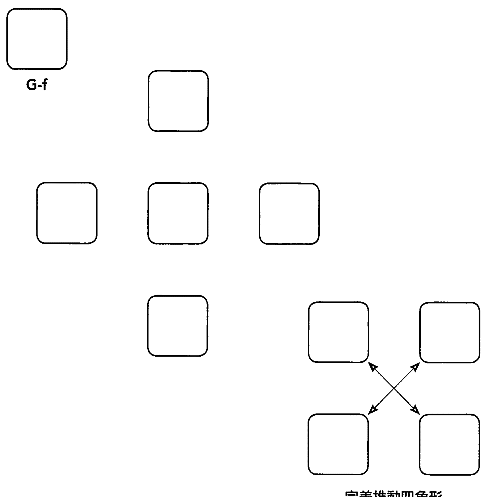

### 合盤的星系印記

- 1. 主印記調性：代表這段關係的互動頻率
- 2. 主印記圖騰：代表這段關係最重要的關鍵力量
- 3. 支持圖騰：代表這段關係的加分力量
- 4. 挑戰擴展圖騰：代表這段關係的擴展與張力
- 5. 隱藏推動圖騰：代表這段關係的潛在部分
- 6. 引導圖騰：代表這段關係的指引力量
- 7. 女神力量圖騰：代表這段關係的合一完整力量

### 合盤的波符／一起走的生命道路

代表了一起走的生命道路，
也代表這段關係相處的十三個關鍵力量。

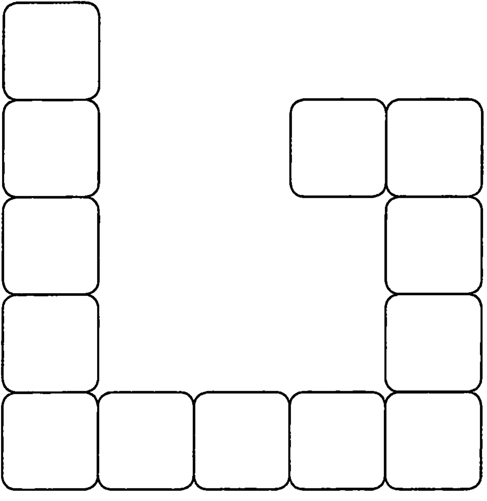

## 参考资料

- 1. 时间法则基金会：lawoftime.org
- 2.《猎户瞳孔：通往跨次元存在之门，开启宇宙编年史的大钥匙》，史蒂芬妮·南（Stephanie South）著，林子元、张雅婷译，三一二八生活美学文化创意
- 3.《彩绘静心胡娜库 许愿本》，陈盈君著，地平线文化
- 4.《iMaya 马雅卡》，陈盈君著，郭懿萱绘，左西心创艺
- 5.《超级马历：马雅历法实践书》，陈盈君著，左西心创艺

## 星际马雅十三月亮历

13调性 × 20图腾，活出自己的天赋能量，
以更高维度的视角校准人生

| 作者 | 陈盈君 | 发行人 | 苏拾平 |
| --- | --- | --- | --- |
| 插画 | 郭懿萱 | 出版 | 地平线文化／漫游者文化事业股份有限公司 |
| 图表绘制 | 陈于真 | 地址 | 台北市松山区复兴北路331号4楼 |
| 封面设计 | 庄谨铭 | 电话 | (02) 2715-2022 |
| 内页设计 | TODAY STUDIO | 传真 | (02) 2715-2021 |
| 内页排版 | 高巧怡、叶若蒂 | 读者服务信箱 | service@azothbooks.com |
| 编辑协力 | 魏嘉仪 | 漫游者脸书 | www.facebook.com/azothbooks.read |
| 行销企划 | 林芳如 | 漫游者书店 | www.azothbooks.com |
| 行销统筹 | 骆汉琦 | 划拨帐号 | 50022001 |
| 业务发行 | 邱绍滢 | 户名 | 漫游者文化事业股份有限公司 |
| 业务统筹 | 郭其彬 | | |
| 责任编辑 | 何韦毅 | | |
| 总编辑 | 周本骥 | | |

初版一刷 2019年8月
定价 台币520元
ISBN 978-986-96695-5-9

国家图书馆出版品预行编目（CIP）资料
星际马雅十三月亮历：13调性 × 20图腾，活出自己的天赋能量，以更高维度的视角校准人生／陈盈君著.-- 初版.-- 台北市：地平线文化，漫游者文化出版：大雁文化发行，2019.08 224面；17×23公分
ISBN 978-986-96695-5-9（平装） 1.历法 2.预言
298.12 108009441

本书如有缺页、破损、装订错误，请寄回本公司更换 版权所有，翻印必究（Printed in Taiwan）

## TIME IS ART.

這是一套將時間視為藝術的曆法，
它所詮釋的時間，
不再是機械式與緊迫掌控的規則，
而是一種更貼近宇宙，也更能貼近自己的概念！

在生命的旅途中，我們是否能夠察覺到，
自己有哪些與生俱來的天賦才能，以及尚未開展的可能？

什麼樣的人會為我帶來挑戰與成長？
什麼樣的人能為我帶來支持的能量，為生命平添精彩？
什麼樣的人能夠為我挖掘出自己所沒看見的內在潛能？
還有什麼樣的人，可以指引我實踐人生更遠大的夢想？

學習星際馬雅十三月亮曆，不僅讓我們向內觀照自己，
甚至能透過關係合盤等多種方式，幫助我們更有意識地察覺：
每一個來到身邊的人與事，其實都帶著不同的能量，或是成為我們的課題，或是成為力量。
最後，我們要為自己做到的，
是順應這套曆法，回應宇宙自然流動的頻率，並以更高維度的視角，校準我們的人生。

## ——本書特色——

- 最詳盡的星際馬雅十三月亮曆法入門
- 圖騰星系印記組合盤
- 13調性×20圖騰深度解說
- 女神力量
- PSI
- 流年流日
- 關係合盤
- 附錄：馬雅星際認證

