# 昨日的天空

## 占星与轮回

前世未竟的课题会在此生的出生星图上反映，并影响着人的生理、心理状态

[美] 斯蒂芬·福里斯特 (Steven Forrest) 著

Lucia 译

立品图书

# 昨日的天空

Astrology and Reincarnation

[美]斯蒂芬·福里斯特 著

Lucia 译

经作者、译者授权，内部出版

书 名 昨日的天空

著 者 [美] 斯蒂芬·福里斯特

译 者 Lucia

出 品 立品图书

网 址 www.tobebooks.net

责任编辑 草原

装帧设计 九章文化

开 本 185mm×260mm

印 张 22

字 数 200千字

版 次 2015年10月第1版

印 次 2015年10月第1次印刷

版权所有，未经书面许可，不得转载，复制、翻印。

## 作者简介

斯蒂芬·福里斯特（Steven Forrest），生于1949年，进化占星学的创始人之一，当今世界最有影响力的占星大师之一。1971年毕业于美国北卡罗莱纳大学宗教学专业。1984—1988年间，出版了《内在的天空》《变幻的天空》和《昨日的天空》三本占星经典著作，奠定了他早期在占星学界的地位。迄今为止，斯蒂芬出版了12部占星著作，在世界占星学界享有很高的声誉。他是屡获国际占星大奖的世界顶尖占星师，充满智慧与人文情怀。

## 译者简介

Lucia 琉璃，1982 年生，北京外国语大学经济学学士，中山大学企业管理硕士。2010 年起，全职致力于推动优质西方占星学进入中国，曾为杂志长期撰写占星学专栏并接受媒体占星师专访；目前以“豌豆星文化”微信公众号为自媒体平台，从事以进化占星学的咨询、翻译、写作与教学工作，并致力于东西方合流的身心灵文化传播。

## 目录

- 推荐序 1
- 译者序 5
- 前言 我的第二春 9
- 第一章 出生图上的任何呈现都是前世因缘 1
  - 有果必有因 3
  - 混沌理论 4
  - 这并不是一本关于月亮交点的书 5
  - 土星在第七宫 6
  - 多种故事版本 11
  - 整合的理论 13
  - 慈悲 13
- 第二章 为什么相信轮回转世？ 15
  - 轮回转世有没有其他令人信服的好理由呢？ 15
  - 证据 17
  - 伊安·斯蒂文森博士（Dr. Ian Stevenson） 18
  - 海伦·万巴赫博士（Dr. Helen Wambach） 20
  - 彼得·让姆斯特（Peter Ramster） 22
  - 阿瑟·吉尔德姆（Authur Guirdham） 23
  - 布莱恩·魏斯（Brian L. Weiss） 23
  - 埃德加·凯西（Edgar Cayce） 25
  - 罗杰·伍尔杰（Roger J. Woolger），帕特丽夏·沃尔什（Patricia Walsh），和“深层记忆处理” 27
  - 许多路径 31
  - 萨拉哈的活佛 32
  - 藏传佛教 33
  - 个人经验 34
  - 历史 36
  - 其他文化 39
  - 结尾 41
- 第三章 技巧的精华
  - 混沌中的秩序 43
  - 月亮南交点 44
  - 业即是习惯 46
  - 消极态度的益处 47
  - 发现前世故事 48
  - 南交点所落的星座和宫位 49
  - 如何将故事细节化 50
  - 与南交点合相的星体 52
  - 南交点的守护星体 53
  - 与南交点呈相位的星体
  - 与南交点呈对分相（180度）的星体
  - 与南交点呈对分相的星体在不同宫位的表现
  - 与南交点呈四分相（90度）的星体
  - 把业力故事的线索串起来
  - 煎锅
  - 投射
  - 龙头
  - 与北交点合相的星体
  - 北交点的守护星体
  - 与北交点呈四分相的星体
  - 一个常见的难题及其解决之道
  - 结论
- 第四章 一个实例
  - 出生图背后的出生图
  - 结论
- 第五章 天文学中的月亮交点
  - 交点周期
  - 日月食
  - 平均交点与真实交点
- 第六章 南交点在十二星座
  - 南交点在白羊座（北交点在天秤座）
  - 南交点在金牛座（北交点在天蝎座）
  - 南交点在双子座（北交点在射手座） 91
  - 南交点在巨蟹座（北交点在摩羯座） 93
  - 南交点在狮子座（北交点在水瓶座） 95
  - 南交点在处女座（北交点在双鱼座） 96
  - 南交点在天秤座（北交点在白羊座） 98
  - 南交点在天蝎座（北交点在金牛座） 99
  - 南交点在射手座（北交点在双子座） 101
  - 南交点在摩羯座（北交点在巨蟹座） 103
  - 南交点在水瓶座（北交点在狮子座） 105
  - 南交点在双鱼座（北交点在处女座） 107
- 第七章 南交点在十二宫位
  - 南交点在第一宫（北交点在第七宫） 110
  - 南交点在第二宫（北交点在第八宫） 112
  - 南交点在第三宫（北交点在第九宫） 115
  - 南交点在第四宫（北交点在第十宫） 117
  - 南交点在第五宫（北交点在第十一宫） 119
  - 南交点在第六宫（北交点在第十二宫） 121
  - 南交点在第七宫（北交点在第一宫） 123
  - 南交点在第八宫（北交点在第二宫） 125
  - 南交点在第九宫（北交点在第三宫） 127
  - 南交点在第十宫（北交点在第四宫） 130
  - 南交点在第十一宫（北交点在第五宫） 132
  - 南交点在第十二宫（北交点在第六宫） 135
- 第八章 与南交点合相的星体
  - 太阳合相南交点 142
  - 月亮合相南交点 143
  - 四轴合相南交点 145
  - 水星合相南交点 145
  - 金星合相南交点 147
  - 火星合相南交点 149
  - 木星合相南交点 151
  - 土星合相南交点 153
  - 天王星合相南交点 155
  - 海王星合相南交点 156
  - 冥王星合相南交点 158
  - 其他星体合相南交点 160
- 第九章 南交点的守护星体
  - 南交点守护星体的意义 163
  - 这一章为什么这么短 164
- 第十章 与南交点呈紧张相位的星体
  - 与其他星体没有相位怎么办 167
  - 紧张相位 168
  - 拟人化的解读方式 169
  - 与南交点呈四分相的星体 170
  - 与南交点对分的星体 171
  - 区分四分相和对分相 173
  - 投射 173
  - 太阳与南交点呈紧张相位 174
  - 月亮与南交点呈紧张相位 175
  - 上升点/下降点与南交点呈紧张相位 175
  - 中天轴与南交点呈紧张相位 176
  - 水星与南交点呈紧张相位 176
  - 金星与南交点呈紧张相位 177
  - 火星与南交点呈紧张相位 178
  - 木星与南交点呈紧张相位 178
  - 土星与南交点呈紧张相位 179
  - 天王星与南交点呈紧张相位 179
  - 海王星与南交点呈紧张相位 180
  - 冥王星与南交点呈紧张相位 181
- 第十一章 行星与南交点呈和谐相位 182
  - 太阳与南交点呈和谐相位 183
  - 月亮与南交点呈和谐相位 184
  - 上升点/下降点与南交点呈和谐相位 185
  - 中天轴与南交点呈和谐相位 185
  - 水星与南交点呈和谐相位 186
  - 金星与南交点呈和谐相位 187
  - 火星与南交点呈和谐相位 188
  - 木星与南交点呈和谐相位 188
  - 土星与南交点呈和谐相位 189
  - 天王星与南交点呈和谐相位
  - 海王星与南交点呈和谐相位
  - 冥王星与南交点呈和谐相位
- 第十二章 正确的观念
  - 关于语言
  - 接受南交点的必然
  - 把南交点作为礼物
  - 耐心
  - 只是因为这感觉起来不自然
  - 解药
  - 问题的核心
  - 只是个好主意
  - 自我接受
- 第十三章 业果成熟时
  - 微调
  - 螺母和螺栓
  - 交点轴的激活
  - 交点行运对星盘的触发
  - 什么时候不筛选掉
  - 行运对推运
  - 给交点上色
  - 容许度
  - 相位
- 第十四章 综合解读 224
  - 问题的核心 226
  - 你的看家本事 229
  - 宇宙与意识 230
  - 通往神秘的幽暗森林的地图 232
  - 进入北交点 235
  - 用北交点帮助理解南交点 236
  - 通向未来的地图 237
  - 优雅收尾 239
  - 有多少故事? 240
  - 连续剧 241
- 第十五章 阿加莎·克里斯蒂 244
- 第十六章 比尔·威尔逊 256
- 第十七章 阿道夫·希特勒 265
- 第十八章 克莉丝汀·乔根森 276
- 第十九章 卡尔·荣格 287
- 结 语 无以言表 305
  - 生理进化占星学 312
  - 催眠回溯 313
  - 通灵工作 314
  - 占星绘图 (Astromapping) 316
  - 佛教与印度教的实践 317
  - 结语 318

## 推荐序

斯蒂芬·福里斯特认为他生命的第二春就是在50岁的时候，迎接进化占星学的到来。他认为将进化占星学的哲学角度加入到基本的心理占星学中，就像是扔掉家常菜谱，而到法国普罗旺斯的五星级饭店吃饭一样。

这是一个事实还是一个比喻，由你决定。毕竟，斯蒂芬的《内在的天空》一书早就奠定了他在心理占星学界的地位。那他为什么要研究灵魂进化占星学呢？

有些人的选择了心理学的自我成长后，还要选择灵魂意识的进化？有些人学习了心理治疗之后，还要学习灵性修行？这是为什么呢？

这很难回答，有时候是因为一种自我超越的心灵需求，有时候是一种内在的直觉声音或一种内在的神秘体验。

更多时候，我们感受到自己遗忘了灵魂的重要性，想在灵魂转世的命运长河中寻找我们灵魂意识进化的故事。

一旦占星师产生灵魂探索的驱力，就会从南北交点或冥王星下手。

斯蒂芬在2008年出版了《昨日的天空》，此书以南北交点为主，先教读者如何透过南交点的星座和宫位描述一个星盘的前世故事，再透过与南交点合刑冲的行星描述这个轮回故事的业力模式。一旦我们认清这个业力模式，就要靠北交点的灵魂新进化方向，来打破这个业力模式。

但斯蒂芬说：北交点是一个隐晦的好主意。因此，找出南交点最贴切的前世故事后，接下来的功课是你找得到北交点这个好主意吗？你吃得到北交点的解药吗？

斯蒂芬又给了一个有趣的比喻：北交点是在你渴的要死的时候，那瓶被遗忘在你车上的水。北交点是在你顶层抽屉里放着却不起眼的那张彩票。北交点是在你的监狱离你睡的地方只有十步之遥的没上锁的那扇门。

北交点除了是一个灵魂进化的好主意之外，有没有可能是更具体的灵性修行方向？有关这一点，我们可以参考印度教吠檀多学者大卫·弗沃勒（David Frawley）的观点，他直接从吠陀医学的观点去研究南北交点对身心健康的影响，但他没有要刻意丑化南北交点是造成精神疾病的主因。他也从密宗修行的因果观点去研究南北交点对修行人的微细妨碍力量，但他没有刻意丑化北交点是盲目的欲望。这是因为大卫本质上是灵修的学者，不是宿命事件派占星师。

但斯蒂芬真的只认为北交点是一个灵魂进化的好主意吗？我记得2011年在上海工作坊遇到斯蒂芬时，他除了一位深懂佛学的智慧老顽童之外，他也让人感受到一份慈悲心。

我可以理解的是斯蒂芬不想当上师，他只想慈悲地凝视你的星盘，提供一个非常温和引导的灵魂进化故事，让你在夜空下静静地省悟。当你听完这个故事后，你要不要走上灵魂修行的进化之路？有关这一点，斯蒂芬放弃了上师的指导权，他把选择权还给你。

而我教南北交点时，选择了以精神分析为主的凝视，少了一份慈悲心，多了一份洞悉力的法眼，提供的是一个非常残酷写实的灵魂业力挣扎故事。

你呢？你会如何对待和诠释南北交点？

李孟浩

台湾心理占星、塔罗、Oh Cards和花精能量疗愈首席培训师

2014年10月

于广州

## 译者序

第一次与斯蒂芬在上海见面，正是我第一次土星回归精确成相之时。斯蒂芬听说后对我笑着说: Congratulations ! You are an adult now ! （恭喜你，你是个成年人了！）那时候，行运土星也正与我的南北交点形成90度相位。之后不久，我终于下定决心，鼓起勇气，回应立品出版的邀请，要把剩余的《昨日的天空》译完。那之前，出于与大家分享的乐趣，我曾自行翻译了一部分《昨日的天空》放在网络小组里。

后来的时光证明，这确是一份土星的挑战。仅仅从翻译工作本身来讲，由于这本书本意是针对西方新时代文化背景下对占星学有一定基础的受众群体，有特殊的话语背景，理解与传达其真实含义的困难比我想象的要大许多。

对我个人的内在灵性成长与外在现实工作的影响，则另有曲折故事。其实，早在2002年时，我便有灵光一现，体悟到了初步的基于占星与轮回的神秘联系，也建立了简单粗糙的以佛法缘起说和大乘佛教精神为基础的哲学框架。但是，我当时完全无法将其落实到对具体人生的理解和修行的指导上来。与《昨日的天空》的邂逅，成为我灵性实践中一块扎实的地基，不但激活了我埋藏已久的灵感，也提供了宝贵的技巧，成为我入世从事助人工作的缘起。以我自己的内在蜕变经验来看，对这一灵性哲学的认同可以提供对技巧的实践信心，而持续的实践可以促进对我们生命本质意义的理解。对于现代人来说，是深入灵性世界，走向心灵自由的好法门。

为了理解进化占星学的历史背景，我对西方新时代运动有了进一步的探索，对中国灵性的新启蒙状态有更多的思考和期待。顺理成章的，许多志同道合的朋友从四面八方聚集而来，我也开展了教学工作，这些让我更进一步触摸到自己推动疗愈团体共同温暖成长的灵魂愿景，呼应于自己的北交十一宫巨蟹。

这本书的翻译，也最终成为了一项集体性的团队工作试验。出土儿、Cecilia、徐姗姗和李含分别受邀翻译了第十五章、第十六章、第十七章和第十八章，前言的部分译文和第二章的大部分出自《内在的天空》译者阿光之手，王达菲翻译了第二章的一部分和结语部分，最终由我统一修订。大家的知识才能和认真努力对此书的贡献不可埋没。另外，还有诸多实践和爱好占星的朋友们参与了书的校对与修订，他们提供了许多宝贵建议，在此就不一列名。这是一次新的尝试，我们邀请与此书结缘的朋友们不吝反馈，参与到改进和创造这项实践的过程中来。

《昨日的天空》又一次经我修订收稿时，行运土星与我的南交点准确呈精确的120度相位——宇宙又一次呈现了共时性的神奇。我也再一次发愿，在整合中西方灵性传统的背景下，持续深入推动心灵工作进行，以此回应土星带来的功课。

最后，感谢父母对我无私的爱，感谢我的先生James M. Ford对我的帮助、启发和鼓励，感谢我的小宝宝豌豆给我的生命带来的惊喜启示，也感谢我的学生们将进化占星学与他们个人心灵成长结合后给我带来的满满的月亮五宫摩羯座的安心感与成就感。

Lucia

## 前言

### 我的第二春

我很幸运，在我50岁的时候，迎来了生命里的第二春。像大部分的作者一样，我的年轻时期像天堂一样，灵感与启示如涌泉般喷发。每一个发现都让我感觉意义重大，似乎能令大地震动不已。当然，我只是自豪地再次“发明”了轮子而已（译者注：指这些都是前人已经发现过的）。不过，新点子像春天的花粉一样纷纷扬扬，并且实施这些点子的兴奋感和能量也随之而来。真是意气风发的年代。

宇宙的配合也相当惊人：在我刚30岁出头的时候，我跟班坦出版社（Bantam）签下合约。我最受欢迎的著作“天空三部曲”在那些快乐的岁月中来到——《内在的天空》、《变幻的天空》，以及当时和我的新婚妻子朱迪·福里斯特所写的《天空的伴侣》第一版（我们后来重写了此书，分两册出版）。不过，那时候我已经为余生的工作设定了一个基础——或者说这只是我之前的想法。

其实，我的内在总是保持神秘学（metaphysical）的倾向，这在我的早期几本书中并没有太多反映。我当时不清楚这些神秘学思想会将我带到哪里。就像我在后面部分会提到的那样，我在12岁的时候看到了著名通灵人埃德加·凯西（Edgar Cayce）的著作。通过他的著作，我了解到意识在通过不断转世而进化。这一直都是我的信念，虽然我所参加的是一个基督教教堂。当我写自己的第一本书《内在的天空》时，我希望自己能够遵循这些哲学信念来写。不过那个年代，在纽约出版界，灵性还是一个边缘话题。出版社告诉我如果一定要提“灵魂”，就尽量轻描淡写。我最后只在那本书里偷偷塞了几个关于前世的东西，大概塞到200多页那么深的地方。我当时能够做的也就这些了。

就这样一直过了很多年。我当时主要还是一位心理占星师，我强调选择和个人责任，并且与那些占星宿命论者作战。我在灵魂进化的哲学背景下呈现我的工作，只是模糊地将前世作为佐料加在里面。慢慢地，在我跟客户们共同工作的过程中，我发现前世的模式跟今生的挑战和境遇之间的对应性变得越来越清晰。不过我当时所呈现的公众形象还是被“天空三部曲”所框定了，主要还是受限于心理学角度。

这时候，我与杰夫·格林相识，同时到来的还有我的第二春（译注：杰夫·格林是进化占星学的创始人之一，《冥王星——灵魂的演化之旅》的作者）。从始至今，杰夫的技巧跟我的都不太一样。我们俩个性也很不相同。不过我们很快就意识到了我们都在以同样的假设来关注同样的问题。在2001年初的一期《大占星师》（Mountain Astrologer）杂志的访谈中，哈德利·菲茨杰拉德（Hadley Fitzgerald）直截了当地询问杰夫我们对占星学的看法是否有任何不同。杰夫回应道：“没有。我们在用不同的方法说同样的事情。我想不出在本质上有什么彼此矛盾之处。”

杰夫和我当时都已经是成功的占星学作者，我们各自在占星学会议上都会吸引大批的听众。比较起来，他更像一个特立独行的人，越南战争中的海军岁月留下的痕迹反映在他的行事风格和社交反应上。我俩的月亮都落在第四宫，很少有人会相信我的是在白羊座，而他的是在双鱼座。杰夫看上去像个斗士，而我看上去更加礼貌。我们的月亮似乎是反了一样。不过我们建立了深厚的友情，对我来说，杰夫的工作就像是我做面包用的酵母。也像我俩各执一副扑克的一半。

这段友情产出了两本书，《测量黑夜》(Measuring the Nights) 第一册和第二册。它们集结了我们在20世纪90年代末期在加利福尼亚州和亚利桑那州的一系列演讲。对很多人来说，这些演讲的出版标志着进化占星学正式成为了现代占星学的一个独立和广受关注的分支，而不再只是某一个人的工作。另一方面，很多年前雷蒙德·梅里曼 (Raymond Merriman) 已经出版了一本名为《进化占星学：灵魂通过不同的意识状态的旅程》(Evolutionary Astrology: The Journey of the Soul Through States of Consciousness) 的书。我和杰夫都不知道他的工作，它最初在1997年以手写本的形式印了1440本。跟我们的处理方式一样，雷蒙德的方式也围绕着轮回转世，虽然他的技巧跟我和杰夫两人的技巧又截然不同。据我所知，雷蒙德是第一个发明“进化占星学”这个词的人。而令人惊奇的是，我和杰夫也各自独立从80年代早期开始使用这个词。另外还有一些人，较为为人所知的如斯蒂芬·阿若优 (Stephen Arroyo)、阿兰·奥肯 (Alan Oken)、马丁·舒尔曼 (Martin Shulman)、大卫·瑞雷 (David Railey)，还有A.T.曼恩 (A.T.Mann) 都以非常类似的哲学背景来使用占星学。

简单地说，一股共时性的波浪通过集体意识，而我们中的许多人都乘上了它。在跟雷和杰夫的私人通信中，我发现，虽然我们都希望把事情理清楚，但是我们都没有想要独占“进化占星学”这个词。它比我们任何人都更广大，这一点我们都知道。在《测量黑夜》一书中，杰夫和我列出了一系列定义这个领域的原则，至少它们是针对我俩和我们的学生的。在我的认知中，最简单的说法就是，如果你认为意识在通过转世而不断进化，并且以自由意志为基础来讨论占星学，那么你就可以算是一个进化占星师。这个帐篷可很大啊。

我从杰夫·格林那里学到了很多，其中主要的是一种灵魂的渗透，这超过技巧的交换。他是一个很智慧的人，更像是一个先知，而不是一个学者。他给我的一个礼物就是毫不掩饰地推广这种占星学的本领，毫无歉意，也并不想要赢得学术界朋友的赞同。从技巧上来说，我从杰夫那里得到的是，更加重视跟南北交点成相位的行星以及南北交点的守护星。那些上过杰夫的冥王星学校的朋友，如果看这本书就会知道，我所用的技巧跟他的非常不同。首先，在我的工作里面，冥王星并没有那么中心的角色，虽然它也非常重要。另外我对各个行星之间以及它们跟南北交点之间的位相（phase relationships）并不强调。我并不是否定杰夫的这些技巧，只是我自己的工作走上了另外一条路。

不同的道路都指向一个闪着光辉并且无限的金色领域！将进化占星学的哲学角度（和伴随着的误会）加入到基本的心理占星学中，就像是扔掉家常菜谱，而到法国普罗旺斯的五星级饭店吃饭一样。对我来说，这实在令人激动。这就好比我看到了占星学本来面目，不再是“差不多就行”，而是反映了上帝的旨意（as God intended it）。

我的第二春也来源于我想到尚待发现的东西时所感到的兴奋。我要强调的是，进化占星学是一个在发展中的工作。我们中有很多人在此领域工作，探索不同的方向。这些不同的方向似乎都富有成效，它们都是相互补充的，而不是相互矛盾的。还没有人将它们全部整合在一起，这可能是下一代或者下两代要完成的事了。

不过我已经感觉到进化占星学是目前为止从“心理”占星学中所产生的最准确的占星形式。我已经相信尚未处理的前世模式对一个成人的心理塑造比幼年的形成阶段的影响要更大。我很尊重心理占星学，事实上，我们可以说进化占星学是一种整合了神秘学的心理占星学。一个 20 世纪的心理学占星师可能会关注一个人的童年，一个进化占星师关注的则是灵魂的童年——前世，以及从前世所带来的未解决的问题上。换句话说，它是一种神圣的心理学 (Sacred Psychology)。不过它又是可证实的，它基于可观察的、这一世的事实之上。这里面没有任何古怪的东西，进化占星学就像激光一般清晰和有力。如果你的体会和我的一致，一旦你掌握了基本的概念，再看一张星图时，眼光会不一样了。

如果我没有向占星世界之外的老师们学习过，我肯定无法完成那些我所完成的在进化占星学上的进展。在四十年前我还是个年轻人时，占星界的状态是这样的，技术上很先进，却没有整体的哲学框架或者目的。那时候它都是事件论述。我必须到其他领域中去探索才能够将占星学放进一个更大的意义格局里。之前我已经提到过我最初学习了埃德加·凯西这位“睡着的预言家”的工作。如果你还没听说过他，那么你后面会很快知道更多关于他的东西。

而最重要的是，我对轮回转世的理解是被佛陀、他的教导以及那些遵循他的教导的团体（佛、法、僧三宝）所指引的。在我十几岁时我就开始努力去理解和实践这条路，而我也有幸和很多在世的当代大师们互动。《昨日的天空》并非是一本正式或者公开的“佛教书籍”，不过如果有人冲我微笑偷偷暗示这个说法，我也会很高兴地冲他们眨眨眼的。

佛教关于前世的说法非常微妙而复杂。在这里我不去论述它们，因为它们如此丰富。我会使用较简单的西方关于灵魂转世的说法。作为一个在基督教传统里成长起来的西方人，我很习惯说上帝，而佛教徒可能更习惯使用一个不那么人格化的词“法身”。佛教常常被描述成一个无神论的宗教。更准确地说，佛教对终极实相的看法是，它超越任何特质或者描述。对一个老到的佛教修行人来说，坚持认为法身具有“非人格”的特质并不比说它有“人格”更加准确。

对这些，你想怎么理解都行。如果在占星学中有一个核心信息的话，那就是对个性化的尊重。换句话说，你可以以自己的神学观点来写东西，我为你祝福。你肯定不需要是一个佛教徒才能理解这本书。你甚至都不需要认定轮回转世是一个事实就能理解这本书。就像卡尔·荣格在1939年的演讲中说到的那样：“人们会说起转世这件事本身……就意味着跟这个词相关的一些精神体验必然是存在的。”

> “人们会说起转世这件事本身……就意味着跟这个词相关的一些精神体验必然是存在的。”

这是一个事实还是一个比喻，由你决定。

到目前为止，我不希望我让你感觉到我在说教，如果你不觉得，那我达到了我的目标。不过有一件事，我必须得说教，而我毫不难为情。这就是——自由意志决定了我们的体验。在一些“决定论”的占星圈里，这可是一种亵渎。我个人相信人们可以改变自己，可以进化。我们没有任何一个人是被行星所在的位置所定义的特质所限制的。在我的第一本书里的第一句话就是“人是会改变的”。我怀疑当我临终的那一瞬间，我对我们自我转化能力的信念依旧存在。不过，我相信我们在生活中所遭遇的大部分事情是我们的自由意志和占星原型所定义的广阔可能性两者相碰撞的结果。我们在那个非常广阔不过还是可以界定的范围中进行选择。我们的“宿命”是去面对那个占星学的范围。我们的自由是在那其中做出选择。

你们中间有些人对我的工作较熟悉，可能已经听过我关于个人自由的激昂演讲。我就不再在此多说了。这样强调是因为前世和业力常常被误解为是宿命和决定论的。（“你在1492年烧了某人的房子，现在你的房子必须被别人烧掉。”）业力有可能这样运作，但是其实它的运作机制更加微妙。比如说，业力很可能是你会不断重复自己的行为——如果你在1492年烧了某人的房子，你今天可能还会烧别人的房子，只不过将它们都存到你的“业力信用卡”上了。

让我们进一步深入，看看现存最好的佛教老师之一竹庆本乐仁波切所说的话。他在《走向自由：四个警示》（*Turning Towards Liberation: The Four Reminders*）中，引用了巴楚仁波切的话：“我们好或者坏的业跟我们的想法和动机相关。如果我们的动机是纯洁和慈悲的，即使行为本身显得负面，业力也是正面的。如果动机不纯，即使我们显得温柔善良，业力也不是那么正面的。这就是说，好或者坏的业大都来自我们的意识。”

换句话说，在占星学和业力中，意识是最大的变数。因为在转世的并非是身体，而是意识。所以在此书中，虽然我们会探索如何了解前世业力模式，但是重点还是在此刻进行疗愈和释放。简单地说，进化占星学的目的是去支持那些进化的选择。前世的总结只是其中的一个部分，这个部分只有在它能够帮助我们更清晰这一世所要面对的问题时才显得重要。著名的禅宗和尚一行禅师在《般若之心》中曾经说道：“这是一个邀请你去认出自己的旅程。如果你做的很好，那么你能够看到自己的过去世和未来世。”他补充道：“请记住我们不是在谈理论，而是在谈现实。”

让我大声强调一下，占星学是象征主义而不是写实主义。我们这些进化占星师无法看到一个人的星盘然后告诉一个人说她曾经是20世纪70年代生活在费城名叫乔的体重250磅牙齿不整齐的拳击手。进化占星学不是用来做这个的。就像任何在心理层面使用占星学的占星师一样，我们看到的是意象和比喻。我们相信它们跟前世的真实情况是类似的。对这个简单原则的无知已经在占星界造成很多不必要的伤害。我们的反对者宣称“任何人都可以随便说前世的东西，谁能够证明它的真假呢？”这很合理，我同意！但是，那种写实的前世并非是占星学的领地。我们立足于现在，我们的角度必须跟可以体验的现实相连。就像威廉·福克纳所说的那样“过去并未死亡，它甚至还没有过去”。我们的假设非常简单，并且可以验证。一言以蔽之，通过在这本书中的技巧，我们可以揭示出一些来自前世的问题，而这些问题现在还困扰着你。

去听一听你的星盘在对你说些什么关于前世的故事，然后看看你现在的生活，如果它们彼此没有对应性，那么你就忘掉进化占星学吧！

我已经感谢过埃德加·凯西、杰夫·格林，还有佛陀。我还要感激更多的人。在1998年我第二次高峰到来的时候，我创立了占星学徒计划。数百人已经通过了此计划，我对他们所有人都心怀感激。每个计划中的部落人每年都会相聚两次，每次四天。气氛常常是非正规的，不过工作却是非常严谨的，有时候充满了情感。这是因为它的核心不是抽象的占星理论，而是心灵的直接体验。我们会解析自己的星盘，并且看看它在我们生活中所反映出来的状况。我对所有参与其中的人的感激无以言表。我对此书中自己所写的东西的清晰度和信心都是他们给我的礼物。一旦我对概念的热情让我偏离实际，这几百个人的真实生活就给予我绝佳的现实参考。我希望自己可以将他们的名字都放在这里，他们也完全值得这样。让我告诉大家在我的网站上有一页是关于我和我的妻子朱迪所培养出的占星师名单。朱迪的占星导师计划也是一年聚会两三次。请浏览www.sevenpawspress.com，然后点击Training，在下拉菜单中点击Forrest Trained。

我也想表达我对那些咨询客户的感激。再一次地，我想说，当你在想象的世界跑得太远的时候，没有什么比你客户的脸更好的现实参考了。

最后我想要感谢整合医学基金会（Integrative Medicine Foundation）为我提供丰厚的资金来完成这本书。在佩奇·鲁安（Paige Ruane）、哈迪·阿里（Hadi Ali）和帕特里克·卡尼（Patrick Kearney）的带领下，这个基金会正在做非常了不起的救助生命的工作，他们在发掘非洲和其他地方的草药智慧。在整合医学的范式下面是身心灵的等边三角形。佩奇、哈迪和帕特里克认识到进化占星学可以对健康的心灵起到有力的支持，所以决定帮助我将这本书完成。我为他们的勇气和慷慨的精神而鼓掌。

所以现在请系好你的安全带。在你所熟悉的星盘背后还藏了另一个星盘，它的存在你可能从来没有注意过。它带着你的宝藏，也带着你的伤口。如果你有时候发现自己的星盘跟自己的现实生活之间的对应性不够强，那么这个星盘背后的星盘就会帮助你了解这是为什么。

我认为自己是幸运的，在我已经进入 60 岁的时候，找到了自己的第二春——我发现了一种解读内在天空的方法，它为我带来那种 19 岁时占星学所带给我的激动感。我希望你在阅读本书时能够像我曾经一样受益。

斯蒂芬·福里斯特
于北卡州教堂山
2008 年春分

# 第一章  出生图上的任何呈现都是前世因缘

依据佛教与德鲁依教（古代凯尔特人的宗教）的教法，我们的灵魂曾经多次转世投胎。

或许没有。

既然是或否都无法被证伪或者证实，我怀疑这一问题永远也不能以思量来解决。在下一章，我们会看到客观确凿的有关转世的证据。转世这一问题依然部分属于信仰的范畴——或者直接的直觉经验。我们无法了解过去世，至少不是以二加二等于四的方式了解。

但是，以下这两点非常肯定。

-   1. 所有接受转世理论的人都会同意，我们今生的个性和境遇可以追溯到前世。
-   2. 占星师们公认：人们的个性和境遇可以在我们的出生星图（或称星盘）（译注：下文中有时简称出生图，有时称星盘）中反映出来。

由此可以顺理成章地推导出第三点：

-   3. 如果我们同时接受转世和占星学两种概念，那么我们无疑得承认我们今生的出生图可以反映出前世的状况和业力。——这些线索隐藏在我们的出生图中，很微妙，讲述了我们在前世里曾经是谁，做了些什么事。

如果我们同时接受占星学和转世的理论，就只能承认第三点，即出生图能够追溯到我们的前世。让我们更进一步，问自己一个基本的占星学问题：你的出生图为什么是这样的？为什么你先天带有这些特征呢？这只是一种随机现象吗？从逻辑上说，随机性当然是成立的。占星学在随机的宇宙规律中也是成立的。这可能仅仅是反映了某些宇宙法则，这些法则科学尚未证实。

我们也可以考虑另外一种可能，那就是，在你的出生图背后有更深层次的原因，宇宙并非是随机混沌的组成，而出出生图上的占星符号中反映出的你生命中面临的挑战，是与更深广、更神秘的所在交织在一起的。这些都隐藏在生命的表象之下。这意味着有些什么因缘令你出生在特殊的时间和特殊的地点。上帝？智慧的宇宙？业力？

做出你自己的选择吧。

在这种理论框架之下——就是说在你出生的时候，某些更广大的所在曾经参与之中——还有一个我们必须将其纳入这一理论框架当中的事实：从你出生的那一天起，你就有了你的出生图了。这点无可置疑，是吧？也就是说任何令你拥有这张出生图的原因必须是在你出生之前存在的。

当然，这并不是能够证明转世存在的确凿证据。这些只是证明了，一旦我们明确地感受到占星学的说服力，我们就没办法不拼命动脑思考。除非我们固执地认为生命本身就是随机的，否则我们可以假设有些事情在我们出生前就已经确定了，这才会让我们今生的出生图的呈现合乎情理。

我们可能会说：“这是上帝创造你的方式。” 人们也可能会引用 DNA 理论——说出生图反映了你祖先“过去的人生”以分子、化合物的方式存在于你的内在。或者我们可以听听佛教徒、印度教徒、德鲁伊教派等是怎么说的，他们会告诉你我们曾经有很多前世。

从现在开始，我们会假设转世是事实。如果你喜欢，你可以转向其他隐喻，这是一项值得训练的有用技能，当你遇到一位对转世理论不那么认同的客户时，它就派上用场了。但是在这里我们不会就其他解读方式进行展开阐释，我们会用轮回转世的语言进行解读，我们假设人类通过在许多物质形态的身体里不断转生，意识随之进化。

## 有果必有因

在你出生图的背后，有一个秘密宝藏——这是一个久远以前的故事，讲述着你今生之前所发生的事。我们无法得知所有的故事细节，至少占星是做不到这一点的。但是，占星学能够给我们一整套关于过去世的暗示，更重要的是，能够指导我们如何在今生的旅程中持续进步。

在我们的出生图里，任何一个特征都存在双重含义：它既说明了我们灵魂曾经的境遇——也向我们指出了超越它的办法。

这是一个极其关键的概念，需要我们理解吸收。进化占星学的核心是疗愈，这个概念与这一核心密切相关。每一个出生图上的特征都代表了我们需要面对的挑战——通过理解我们过去世“遗留”的情境，能够更深刻地了解这些挑战。于是，我们就可以奋起拥抱这一特征所隐藏的更高潜能，我们就能够治愈旧业的伤痛，向新的可能性进发。在以下的章节里，我会举一个例子，这一概念就不再那么抽象了。

## 混沌理论

正如你已经注意到的那样，你的今生，是复杂的，充满着遗留议题和矛盾冲突。你做的决定和你认定的价值观经常很难协调一致。我们相信作为人应该真诚，可我们说谎。我们觉得自己是环保主义者，开车的时候却并不选择节能车。

一旦涉及到过去世，事情就变得倍加复杂。在这里，我们讨论的是许多次的人生。进一步说，“进化”这个词本身就暗示着在你的过去世里，你没有现在这么开化（evolved）——也就是说，假定你过去世的表现不尽人意，做了些现在不会再做的事。所有这些不相关的、原始的元素混沌地交织在一起，在我们出生时的星图上就被反映出来。业力是复杂的、不规则的——这一特点投射在我们的星盘上，便呈现出混沌的特征。

现在，让我们把这一概念运用到生活中。比如，很简单，想象一下，某个人曾经活过两辈子——有一世是僧侣，过着禁欲生活，而另外一世里，他喜结良缘，在稳定的婚姻里感受到对方的宠爱和保护。这个例子里，形成了某些模式——而这些模式流转和延续至今生，表现在今生的星盘里。那么，星盘中可能同时存在着两种特征，一方面是对亲密关系的逃避，或者说，对亲密关系的困惑，这是因为僧侣的人生留下的；另一方面，又有一种冲动，总想与某人相依相伴，这源于那桩舒服顺意的婚事。

这还真是矛盾。

翻译成占星的语言，我可能会说，金星与土星相合在摩羯座，落于第十二宫——同时，月亮在巨蟹坐落于第七宫。今天，这一个星盘属于某一个人，但是说“一个人”并不恰当。从业的观点来说，我们每个人都像是一群非常不同的人，试图达成某种和解。

在第三章，我们将步入探索业力分析的康庄大道：如何用月亮南交点和与之相关的因素来阐述。这会将我们带入核心的问题：对今生有着直接影响力的关键业力的故事。这些技巧理解起来简洁明了——我们学着发掘出来的这一过去世故事极可能会令你大吃一惊，因为显而易见，这故事与你今生关系密切。

然而，这种分析的说服力即使强大，我们也不能对如下事实视而不见：在每个星盘里，还有很多信息碎片，而这些并不与故事的主线吻合。这些碎片反映了过去世的拼图，各种未了的缘分，各种矛盾。这一混乱现象并不奇怪。

关键的一点是，要记住，星盘上的所有线索都是前世因缘的示现。

## 这并不是一本关于月亮交点的书

接下来，我们将进入细致入微的探讨，探讨月亮南北交点如何提供了我们前世故事的情感的主线。没有南北交点，我们无法进行进化占星学分析。不过，正如我们之前描述的一样，在你星盘中的所有一切都有其因缘。很多行星或敏感的星相位置与交点没有相位，与交点没有直接联系。但这没关系，它们依然是你的业力。我们把月亮交点当成深入核心问题的敲门砖。这是很好的起点和基础。但是，如你所见，这不只是一本月亮交点的书。这是一本关于占星学和转世的书，这是一个更为广泛的命题，需要把星盘中的所有细节都纳入考虑的范围之内。最终，不会遗漏任何线索。

因为这本书里大多数内容都是围绕着月亮交点的，那么，为了着重强调我们所探讨的命题不止于此，范围更广，让我们从某一个星盘特征开始，以进化占星学的分析方式进行探讨，而这一星盘特征和月亮交点没有任何关系。

## 土星在第七宫

传统上讲，土星经常被看做不吉的星体，它给任何它所能触及的宫位都带来厄运。第七宫是婚姻的经典宫位。那么，土星在这一宫传统上表示爱情中的恶兆。在《占星学：一门宇宙科学》（Astrology: A Cosmic Science）里，伊莎贝尔·M·海基（Isabel M. Hickey）写道：“这代表着一种深度的自我孤立倾向，使此人与另外的人很难连结。”在占星经典著作《占星学》（Astrology）中，罗纳德·C·戴维森（Ronald C. Davision）警告道：这可能代表着“不幸的伙伴关系”和“冷酷的、过于野心勃勃的伴侣”。在《灵魂的功课》（Saturn: A new Look at an Old Devil）中，丽兹·格林（Liz Greene）对这一点进行了深入的探讨，然而，她也写道：“对第七宫落入土星最重要的基本解读是婚姻或其他亲密关系中的悲伤、困难或障碍。大体上，这些悲伤不是这个人的错，更像是被掌控在宿命的手中。”

进化占星学的基础是有意识地选择对人生的重塑力量——在自己身上下功夫的意愿。任何断言或宿命论式的占星解读都过于狭隘了。我们总是可以达到更高的境界。这并不只是哲学式的论断。我们看到很多活生生的例子。你可能就是其中之一！尽管传统占星学是压抑的，我们可以把传统占星学的描述作为进化占星学的“起始线”。这些描述通常反映了旧有的业力模式的重现。藏传佛教的导师莲花生大师说：“如果你想知道过去的人生，就看一下你现在的人生。”换句话说，你现在面临的挑战，来源于过去。（莲花生大师接下来的话是：“如果你想知道你的来世，就看一看现在的行动。”）

那么，大多数传统占星学中连篇累牍的负面解读是正常的，至少在一个人人生中的早期阶段是准确的。这种解读的危害在于他们认为起点和终点是同样的。他们忽略了人类是可以学习和成长的这一事实。

土星在第七宫的人婚姻生活中充满悲伤和困难的例子有很多。埃莉诺·罗斯福（Eleanor Roosevelt），美国总统罗斯福的夫人，是一个经典的案例。她的土星在第七宫，显然，她嫁给了一个野心勃勃的人。结婚十三年之后，她发现了丈夫恶劣的出轨行为的证据：她的私人秘书写给她丈夫的肉麻情书（这意味着双重的背叛）。她的婚姻又持续了二十七年之久，但是显然这只是徒有其表。有证据显示他们不再有任何身体和情感上的亲密。而且，罗斯福在那段时间里的大多数时候都在轮椅上——这又是一个埃莉诺婚姻宫的“土星现象”。

英格兰的伊丽莎白一世，著名的“处女女王”，她的土星也在第七宫。基本可以肯定她不是处子之身，但她从未结婚。显然，她年幼时曾经被继父性虐待，在成年后与已婚的莱斯特伯爵保持了长期的婚外情——又一次，感受到土星这一“老恶魔”令人沮丧窒息的掌控。

在现代，涅槃乐队的音乐家柯特·科本（Kurt Cobain）的土星也在第七宫——他娶了生活方式古怪反常出了名的科特妮·洛芙（Courtney Love），这一婚姻一直持续到他自杀身亡为止。

同时，土星还有更高的境界——忠贞不渝、遵守承诺、成熟稳重和严于律己。这些显然有助于形成长久的亲密关系。悲观的占星师们把落在第七宫的土星看做难以形成亲密关系的不祥之兆，但也有一些占星师对此抱有乐观的观念，他们将这些观念传递给大众，并给出了许多天长地久的婚姻作为证据。这种乐观的观点也是对的！我们这一代人都知道一个著名的天长地久的动人爱情故事，故事的主人公是保罗·麦卡特尼（Paul McCartney）和琳达·麦卡特尼（Linda McCartney）。他们的婚姻持续了二十九年，随着琳达因乳腺癌去世而终结。在这二十九年中，除了保罗以窝藏大麻获罪入狱的十天之外，他们从来没有分开过夜！（注意二十九也是土星的一个周期！）琳达的土星就位于第七宫，逆行于金牛座。

女演员蜜雪儿·菲佛（Michelle Pfeiffer）的土星也落于第七宫。在一次失败的婚姻之后，1993年，她与现任丈夫大卫·凯利（David E. Kelley）结合；种种迹象表明他们的婚姻忠贞又快乐，这在生活方式疯狂的好莱坞影视圈里相当稀罕。

相似的例子还有丹尼·德维托（Danny De Vito）。他也是土星落于第七宫的人，他与伴侣莉亚·佩尔曼（Rhea Perlman）从1970年起一直没有分开过。

传统的占星师热衷于在这种话题上争执不休。究竟土星在第七宫是“好的”还是“坏的”？他们也会在土星的相位好与坏上大做文章，试图以这种方式解释问题。但是，当他们有足够的勇气来面对现实的话，这种幻觉也灰飞烟灭了——丹尼·德·维托（Danny De Vito）的土星与金星相冲，而且被海王星刑克！琳达·麦卡特尼的土星与另外一个同样意味着不幸婚姻的标志星体——天王星落入第七宫！

这些占星师忽略了人类生活中最重要的力量：意识（consciousness）。

对我而言，用以上的方式讨论土星在第七宫代表了什么，就好像观察一个公立学校，然后争论学生们是6岁还是16岁一样。（译者注：公立学校的孩子各种年龄层都有）就像学校一样，土星在第七宫，或者任何其他的星盘配置，都代表了一系列的进化可能性。我们可以观察到，土星在第七宫的人可能会孤单一生，可能困在自己不满意的关系里，可能奉行独居和单身的生活却不以为苦，也可能有着长久稳定的模范婚姻。

愚蠢的占星师们无视他们自己直接的经验和同行们提供的证据，就这个问题争个没完。对占星学进行批判的人耸耸肩膀，认为这个星盘配置可以“代表任何事”，于是没有任何意义。他们忽视了土星的原型领域的根本内涵：

### 土星所在的位置意味着：

1.  你带着某种障碍来到这个世界上。
2.  你受邀接受这一事实，并以踏实、自律和诚实的态度而努力，以相应于土星的高级形式。
3.  如果你不这样做，你的生命将被这种障碍所限定。
4.  如果你这样努力了，你便能够取得进步。

现在，让我们把土星落第七宫这一特征完全带入进化占星学的领域来看。

从心理学的角度来讲，第七宫是与信任相关的。如果出生的时候，土星位于第七宫，会有与生俱来的信任功能的障碍。这来源于前世，基于今生的观点，是业力的，对这个人来说，在亲密关系的问题上，他是需要努力的。

关系是人类经验中有相当份量的命题，这个命题实在太大，不便于在此展开讨论。如果你对这方面占星学的详细内容感兴趣，我推荐《天空伴侣》（Skymates），这本书是我和妻子朱迪合写的。在这里，这样说就足够了：在人际关系的领域，土星能够以不同的方式令我们感受到它的影响力，每一种方式都符合我们这里所探讨的观点。

直截了当地说，人们不可能只凭借一己之力就能对信任有充分的了解。信任这一命题本来就是人际互动中产生的现象。我们能够从独自安静的自省中获益，但最终我们究竟进展如何只能通过与他人亲密关系中的互动才能衡量和检验。土星在第七宫不仅告诉你天生的伙伴和朋友是怎样的人，也同时说明了你自己是怎样的人。显然，我们不可能没有他们的帮助就能独自完成这一进化中的功课，我们可以通过他们典型的土星标志来认出他们：他们是值得依赖的人！这看似是残酷的现实，但明白无误的是：如果你生来就有信任问题，正如土星第七宫所代表的那样，如果你没有其他值得你信赖的人的帮助，你是不可能自己解决这个问题的。

土星的本质喜欢誓言和承诺。如果土星在第七宫，你命定的伴侣是那些不怕承诺的人——他们的勇气也让你不再那么害怕。土星也很喜欢仪式，喜欢婚礼的红地毯，喜欢交换婚戒，大声地说出誓言。土星喜欢记录过去的成绩或成就并喜欢为之庆祝。各种周年纪念日因此变得很重要。

信任感是需要时间建立起来的。土星很有耐心——如果你的第七宫有土星，那种急不可耐地想泡你上床的人会让你倒足了胃口。急什么？谁能这么快地信任一个人呢？这种急性子只会让你变得更加自保，不再信任这段关系。许多人无需信任就可以和对方上床！

表现尊重在这里也非常重要。土星是很正式的——但并不意味着僵化。它意味着更多的礼节和界限感，比如在使用卫生间的时候，他们比其他人更可能会把门关上。

从进化的角度来看，只有满足了所有这些条件，才能创造一种亲密的氛围，在这种氛围中，才能治愈信任的能力。如果你的土星在第七宫，对你的生命而言，这将是很重要的功课。

是什么原因导致了一个人出生的时候土星在七宫呢？在他的前世，发生了什么事？这里有各种可能。这些可能性都有一个共同点。在这个人的前世，在亲密关系中，他曾经有过亲密关系突然间消失的经历，而这一伤痛在他的那一世结束之前都没有被治愈。这里有两种主要情形：遗弃和丧偶。

想象一下，在前世，你的另一半在你们大婚的那一天逃跑，把你一个人孤零零地丢在圣坛上。也许他从此杳无音讯，或者他还在本地，只是和其他人一起，过上了美满的日子。你需要多久才能从这种被抛弃的感觉中走出来呢？

再想象一下，在前世，你和真爱喜结良缘，过得幸福美满。你年轻可爱，开始组建家庭。这时，你的爱人突然被雷电击中，从此撒手人寰。

那么，需要多久，一个人才能从这种伤痛中恢复？

这种问题显然是没法回答的。伤痛有一个自然平复的过程，这因人而异。人们可以压抑伤痛，但它并未消失。或者人们会执著于伤痛不肯放手，困在其中，把哀悼期变得过于漫长。我们经常会观察到人们在临终时，有些人依然带着未释怀或未察觉的伤痛。

形而上的看，当我们观察到这些人从死亡的另一端，即通过母亲的子宫降临人世的时候，他们的伤痛依然像雏菊一样新鲜——于是，在他们的出生图上，我们可能会观察到土星位于第七宫的位置。

### 多种故事版本

虽然被抛弃和丧偶是非常不同的情形，但在这里我们依然把这两类情形放在一起。我们这样做，是因为他们的情感本质其实是一致的。无论是信任的人让我们失望，还是去世了，在这两种情形下，我们都因这一外在的事件在心里留下阴影，从此认为信任他人风险是很大的。所以，即使这两件事看上去明显不同，但都可以导致出生图上的土星位于第七宫的位置。这是因为，这两件事中的任一种都会让我们带着信任功能的障碍来到人间，同时带来想要治愈这一障碍而进化的渴望。

稍稍动用一下想象力，我们就能够想到许多可能的前世故事版本。也许在某一个前世，你发誓要遵守宗教中的戒律，过着禁欲的生活。这时，对亲密行为的自然冲动对你变成了危险和威胁，于是，你只能压抑它，把它视为敌人。慢慢地，你对有吸引力的异性的第一反应是恐惧的情绪。

或者，在你某一个前世，你是一个妓女；你学会了自己的内心，将性行为中自发产生的亲密感觉排斥在外。

或者，你曾经被严重地虐待过；也许，被折磨过；也许你曾经在某个意大利的宫殿里，身为廷臣，整日面对着很多暗怀杀机的人。

容易让人产生信任危机的可能性非常多。这也无可厚非，因为人类的悲惨遭遇数不胜数！每十二个人里就有一个人的土星落于第七宫，那么这一定代表了各种各样可能性。

当你深入阅读这本书时，你会发现有许多技巧，能够帮助你把这数不清的可能性缩小，使这个人的轮回故事更加清楚。只是知道土星在第七宫，我们就可以了解到这么多。现在总结一下我们学到的：

在某一前世，你产生了信任危机。临终时，这一问题依然没有解决。在今生，你出生时，这一伤痛依然没有被治愈——同时，你也拥有通过某些方式治愈它的力量。首先，你需要的伙伴是“很土星”的人，就如我们在前面描述过的一样。在他们的帮助下，你需要勇往直前：许下认真的承诺。如此一来，你就为自我治愈创造了一个良好的环境。

如果你不选择这种进化的路径，你就选择了受这一未治愈的伤痛所限的路径。在这种局限下，你有两条路可走。一种是，你可以孤独一生，不怎么敢与人交心，甚至不踏进亲密关系一步。另外一种是，你可以与你内心恐惧的象征结合——和那些你并不太在意是否会失去的人在一起，这样，即使失去了，你的投入不多，也不会那么容易被伤害。

## 整合的理论

我们可以看到，在进化占星学的框架之内，传统占星对土星位于第七宫的各种可能性的解读都被整合在了一个框架之内，无论它代表了“爱情上的不幸”，隐居的生活，还是“天长地久、幸福快乐的友谊和婚姻”。进化占星学将不同的理论整合在同一个框架之内了。好像我们观察一所学校，从幼儿园到十二年级一览无余，都是在同一幢红色的校舍里。进化占星学同样漂亮地结合了形而上的古典占星学和新奇古怪的、“在自己内心下功夫”的现代精神治疗学。

## 慈悲

更重要的一点是，进化占星学是以同情的视角来看待土星位于第七宫的问题。我们能够理解为什么一个人可能会体验到某一系列的特定困难。我们以“不批评，不指责”的方式洞察这些。没有任何人是“有毛病的”或者“有缺陷的”。

比如，你有个好朋友，六个月前，她的另一半刚刚在车祸中不幸丧生。有个好心却不识相的家伙为她安排了一次相亲，她退缩了，她说自己真的没有准备好进入到另外一段亲密关系中。她依然在悲痛中。

你难以理解她的处境么？你会觉得她有任何不正常么？你当然不会。无须任何努力，你心中自然地充满了温柔、同情和对她的支持。才六个月，她当然没有准备好另一次约会。你完全能理解她！同样，你也会感觉到她将踏上一条漫长的治愈之路，你对她满怀信心，觉得只要机缘到了，她就会慢慢好起来。

让我们更进一步探讨这个问题。比如，你在前世曾经在车祸中失去了伴侣。今生，你的土星落于第七宫。也许你在爱情方面会有障碍。也许你曾经有两次失败的感情关系。也许你福至心灵，能够意识到这些不幸也是“你自己的问题”，来源于你的态度、业力、心理模式以及你对伴侣的选择。

现在，想象一下，你去找一个传统的占星师，他告诉你，你的星盘显示你在亲密关系上是“有问题的”。这个论断和你自己的实际经验是吻合的。但是，这造成了危害。这一解读实际上是断言你是有毛病的。这个占星师羞辱了你，打击了你，他也没有指出前进的方向。

我们看看进化占星学疗愈性的解读所产生的效果，对比一下：在你的前世，你曾经被伤害过。你需要一段时间才能从中解脱出来。这才是正确的做法。如此解读才能发掘深层真相，这就是怀有同情尊重的态度，真正的洞察和终极的鼓励。

于是，我们清晰地了解到，无论对任何人类处境的解读，进化占星学都同时有两位天使陪伴：

1.  一位叫做慈悲——无论是对自己还是对他人的；
2.  另一位叫做希望。

# 第二章
## 为什么相信轮回转世？

“轮回转世”这个概念听上去不错。能够再活一次，首先，没人会真的死去——大家可以不怕死了！其次，在这一世，你不需要事事圆满。再次，善恶有报，诸事公平——有个小孩儿偷了你家自行车，恶报成熟的时候，别人会偷他的自行车！我们可以永生不朽，我们有第二次机会，永恒的公义——这些都颇具吸引力！

还有更好的事儿呢。无论非洲皮包骨头的饥饿儿童还是奢侈无度的富人，在轮回中，他们都是平等的！每个人都会穿上另外一个人的鞋子，体会其他的人生。这个轮回转世的主意，真是美丽高雅，精妙平衡。

### 轮回转世有没有其他令人信服的好理由呢？

显然，如果对轮回没有兴趣，你不会打开这本书。你并不孤单。在美国，据说，相信轮回转世的人的比例是 20% 到 35%（据 CNN, Yankelovich Partners, Gallup, Luitz Research 等机构公布的数据）。

我个人的占星实践吸引了各种类型的人，在我的客户中，相信轮回转世的人比例更高。当我第一次见一个人的时候，我总是会问，如果我用过去世这种语言来描述，对方是否能接受。只有两个人提出异议。其中一次是一个无主教大学的教授。过了十年，他又找到我，说：“好吧，告诉我，我的前世是什么样的。”

我也时刻准备好，当对方不想知道过去世的时候，我就用其他的表达方式来代替。我可以很容易把轮回转世的语言翻译成其他的语言，比如“上帝这样创造了你”或“祖先的 DNA 在你现在的人格中展现”。不过，到现在为止，我还没遇到使用这些说法的机会。大多数的人，都愿意听到他们的前世。

来找我占星的是哪些人呢？很明显，这不是一个随机的人群。被解读，是一个暴露自己脆弱面的行为，这也代表是他们自己主动选择的。大多数人会想象，我的客户大多数是那些神秘派的素食主义者和环保人士，就像我自己一样。这完全不是真的。别忘了，在过去的两个世代，对占星出了名的痴迷狂热的一个例子，是罗纳德·里根。

很有趣，占星学显然穿越了文化的藩篱。我的客户大多数都是思想开放的人。社会教导我们不要相信占星学，所以，出现在我大门口的人，都是些能独立思考的人。这些人也过着“检视过的人生”——如果对认识自我没有兴趣，谁想做占星解读呢？

从统计学来讲，可能有三分之一的美国人对轮回转世抱有开放的态度。基本上百分之百来找我做占星咨询的人能够接受轮回转世的概念。为什么来找我做占星咨询的人比例比较高呢？显然这说明他们是自主选择的。我的结论是，那些整天看电视、从不思考人生大问题的人，压根儿就不会想轮回转世这个事情——也没有人去督促他们思考。来找我的人，常常会纠结于人生的意义，最终，他们所有人都至少会想一想轮回转世的可能性。

如果你是一个占星师，你担心自己如果与客户谈过去世，你会“走得太远”，我觉得这种担心是没必要的。那些来找我们做咨询的人，通常会很喜欢这种说法。依据我的经验，你得到的客户，比你失去的客户多得多。

但是，当然，这些都不会让轮回转世更加“真实”。我们一开始的问题依然存在：我们为什么会相信它？这个哲学观点容易流行，很有吸引力，除此之外，还有什么其他的原因呢？

### 证据

我们可以证实或者否定轮回转世的真实性吗？这个问题很棘手。第一反应可能就是回答“不能”，不过这个回答太轻率。也许我们不用如此教条，“证实”其实是一个容易引起歧义的词。从科学的角度看，“证实”意味着这个法则总是有效的，也总是能够被演示——比如说，能量等于质量乘以光速的平方。这个法则从未在任何实验中失效过。我们也许永远无法以这样的方式来证实轮回转世。大多数的科学比这更加模棱两可。我们都知道，当天气预报说，星期四有35%的可能性会下雨时，我们不会全信。气象学就是一门科学，但是是一门为赌徒开的科学。经济学也是这样。量子力学也是。同样，在法庭上，“证据”也被定义为“在一个合理的不确定范围里”所看到的东西。轮回转世可以通过这样的测试。我觉得它已经通过了，就像我下面将为大家揭示的那样。在这一章里我不会试图展现这个丰富的、有活力的领域的研究全景。那可能需要一本书，事实上可能需要一个图书馆的书。在下面的部分，我想要展现的是关于轮回转世真实性研究中的一些较突出的例子。

下面有一段话，它是拉斐尔·纳塞尔（Rafael Nasser）〔《同一天空下》（Under One Sky）〕的编辑在几年前发给我的：

> “此时在超感知领域有三个结果让我觉得值得认真研究：1. 人类通过思维可以（虽然很稀有地）影响电脑上的随机数字发生器；2. 人们能够在五官被遮蔽的情况下接收到投射给他们的思想和图像；3. 年幼的孩子能够描述前世的细节，这些细节最后被发现是准确的，这只可能来自轮回转世。”

听上去可能难以置信，这些话居然来自20世纪著名的科学家卡尔·萨根（Carl Sagan）。

很明显，他所提到的第三个研究就是下面的这个：

## 伊安·斯蒂文森博士（Dr. Ian Stevenson）

伊安·斯蒂文森博士生于加拿大，他是弗吉尼亚大学的精神病专家。他的兴趣主要在于那些开始说起前世的孩子，他们一般是2~4岁。这些孩子通常到七八岁时就会忘记了自己的前世。斯蒂文森博士在全世界旅行，寻找这些神奇故事，然后非常细致地将它们记录下来。在2007年他去世的时候，已经搜集了有两千个这样的传奇故事。他出版了很多书，其中最知名的就是《二十个说明轮回的案例》（Twenty Cases Suggestive of Reincarnation），此书出版于1966年，1974年出版了增补版。他的团队在吉姆·塔克（Jim Tucker）的领导下继续这个工作。

这里有一个他所遭遇和记录的故事的例子：

1964年在黎巴嫩的科恩亚伯（Kornayel），伊安听说当地的一个孩子说起前世。这个名叫伊马德·埃拉沃尔 (Imad Elawar) 的男孩，在他不到2岁的时候，就开始谈论自己在柯瑞比 (Khriby，一个25英里之外的村落) 的前世。他提到，自己在前世属于一个叫“布哈姆兹”的家族，并且不断提到一个叫做亚米勒 (Jamile) 的女人，并且说，她比自己现在的母亲更好。斯蒂文森将这个男孩的五十七点描述——记录了下来。

当伊安到达那个叫柯瑞比的村庄 (那个男孩从未去过的地方) 时，他验证了，在那里的确有一个叫伊卜拉希姆·布哈姆兹 (Ibrahim Bouhamzy) 的人在9年前死于肺结核。他有一个情人叫亚米勒。这两件事情，以及另外有四十九点描述都被验证了。伊马德甚至知道伊卜拉希姆·布哈姆兹的遗言。他还能够能够认出那个家族的成员，有一次，4岁时他跟祖母上街，他跑到一个陌生人面前与他拥抱，把那个人吓了一跳。伊马德说那个人曾经是他的邻居。结果发现那个陌生人的确来自柯瑞比村落，并且曾经是伊卜拉希姆·布哈姆兹的邻居。

我们如何解释这些呢？

这里还有一个故事。

一个叫做威廉的孩子天生就有肺部动脉的缺陷。到3岁的时候，他明显地表现出，他跟自己过世的祖父之间有一种解释不清的情感联系。他的祖父是一名纽约警察，在一次执行任务时，被子弹洞穿肺部动脉致死。年幼的威廉在母亲威胁要打自己时告诉母亲说，当他是她的父亲的时候，他可从来没有打过她！他甚至知道自己母亲年幼时那些宠物的名字。

看起来，威廉曾经就是自己的祖父。

这只是其中的两个故事。当然，我们可以很容易地耸耸肩膀，表示无所谓——不过，还有两千个这样的故事，而且，这些记录都很详细。伊安·斯蒂文森本人是一个非常科学派的人，所以他并没有将这些案例称之为轮回转世的“证据”，而是说：这些证据显示，轮回转世可能存在。挺公道的了。

## 海伦·万巴赫博士（Dr. Helen Wambach）

海伦·万巴赫博士曾经有一次自发地认出了一本书。这本书原来归她自己的前世所有。这件事情激发了她一生对探索过去世的兴趣。她是一位使用催眠技巧的心理咨询师和老师，她帮助人们找回自己的前世记忆。她在1978年出版的《重过前世生活》（Reliving Past Lives）和《生命之前的生命》（Life before Life），以及1984年出版的新版《重过前世生活：催眠下的证据》中，从学术层面详尽地呈现了自己的工作。在十年之间，她为1088人进行了催眠，并且认真仔细地记录了这些人所记得的前世故事。一般来说，这些工作的进行，是在为时一天的小工作坊中，让十来个人参与。工作坊完成后，这些人都会填写一张表格，其中有些格式化的问题：你当时吃的什么？用的是什么餐具？你的性别是？你穿的是什么衣服？

她所收集的这些日常生活记忆当中，与常识以及历史不符的细节，不到1%——没有人开着一辆1958年产的雪佛兰去十字军东征，或者将自己的iPod摔到五月花号轮船上。

非常好的一点是，所有这些人都没有回忆说自己是某个著名人物。他们没有一个人曾经是埃及艳后克利奥帕特拉，也没有人是十二门徒。没有人曾经拯救世界。有10%的人回忆起自己是上流社会的成员，20%~35%的人是中产阶级，还有60%~77%的人接近贫困线及以下。这些社会学词汇的定义当然有一些模糊，并且跟随时代会发生改变，不过从主观上看，这个分布很接近现实状况。

万巴赫的发现的神奇之处，在于细节的特殊性。比如，其中有五个人回忆起，自己在三四千年前曾经住在中亚地区的帐篷里，过着移居生活。令他们自己感到惊奇的是，他们记起自己是金发碧眼的白人，这让他们都否认自己的这个记忆，认为它们是错误的。因为他们都“知道”那个人种没有在中亚生活过。然而，历史事实是，白种人在那个时期的确已经移民到那个地区了。因此，这些前世记忆是独立于那些当事人的信念系统而存在的。

这些人的记忆中常常有关于服饰的详细描述。这些描述一次次地被证实为准确的，这非常令人震惊，因为服饰的风格一直在随着时间改变。现在你能立即回答公元前1000年埃及的上层社会穿的是什么样的服饰吗？答案是半身或全身的白色棉袍。在催眠状态下，海伦的一个案主知道这个答案。

这是怎么回事？

这样的结果令我吃惊。

这1088人的过去世中，一共有62%死于疾病或者正常终老，18%死于战争或者暴力，20%死于事故。

这也是一个很合理的分布，不是吗？

也许海伦博士最令人信服的发现是，在十年的这一千多个案例之后，她发现有50.6%的人回忆自己的前世是男性而49.4%为女性——换句话说，各占一半，就像我们在现实中会期待的一样。

就像对待伊安·斯蒂文森博士一样，我们也可以认为海伦·万巴赫博士所搜集的这些故事都只是些趣闻。也许你的一个朋友对你发誓说：她看到了一只大脚野人在前面半英里处走过。你会怎样认为呢？你信任你的朋友。不过你的观点也受到理性和经验的影响，据那些半可信赖的权威说，大脚怪是不存在的。所以你耸耸肩膀。谁知道那是什么？也许只是一只狗。也许是一个人披了猩猩的皮。但是如果你有一千个朋友都看到了大脚野人呢？这时你会怎样认为？通读斯蒂文森和万巴赫的工作，会给你带来这样的震撼。我在此只是介绍了他们，如果你对轮回转世的信念还需要一些鼓励和支持的话，花时间看看他们的书吧。那些累积在一起的证据会令你吃惊。

## 彼得·让姆斯特（Peter Ramster）

澳大利亚悉尼的心理学家彼得·让姆斯特的工作中有一些非常精彩的催眠回溯案例。就像我之前所提到的那些研究者，我在这里的介绍只是给你一个简介。如果你想要知道更多，请去阅读他的书《追溯前世》（In Search of Lives Past）或者他的视频《在另一世》（In Another Life）。

彼得的个案中，有一位叫格温·麦克唐纳德的女士，她从来没有离开过澳大利亚。跟让姆斯特一样，她一开始，也对轮回转世心存怀疑，但是她答应进行一次催眠回溯。在这次回溯中，她回忆起自己在18世纪英国萨默塞特郡的一世。她在催眠中甚至能够浏览那个地区，找到自己前世所住村庄的方向。她描述了一些垫脚石，而位于那个地方的居民证实说，那些石头五十年前刚被拆掉。她还知道一些村庄的名字，这些名字，在两个世纪前就没人使用了。她带着调研队找到了一栋已经被改建成鸡舍的房子。当他们清扫干净鸡舍的地板，找到了一块石头——这块石头跟格温在纸上素描出来的一模一样。

让姆斯特的工作充满了这样的故事。就像伊安·斯蒂文森和海伦·万巴赫一样，他们的说服力来源于他们的大量案例。“格温·麦克唐纳德是一个超感知者”或者“这是假的”的说法会变得很牵强，因为神奇实例的数目如此庞大。只要我们认定轮回转世是真的，所有这些实例都能轻易被解释。

## 阿瑟·吉尔德姆（Arthur Guirdham）

这位英国的精神病专家有一个案例：斯密斯夫人总是会有梦魇，她梦到自己是法国南部的一位农家女孩，因为天主教对清洁派教徒的迫害而被烧死在火刑柱上。令人惊叹的是，她在上学的时候的确用朗格多克语写了一些诗，而这正是清洁派教徒所说的语言，这种语言几乎已经失传了。在1944年，她凭借记忆写下了一些歌曲，她声称，这些歌曲就是那个时期的。20年后，记录这些歌曲的一些资料才在一个图书馆中被发现！她能够详细地描述那个时期建筑的细节，也知道那个时期的首饰是什么样子。

最有趣的是，阿瑟·吉尔德姆本人从年幼时起也有非常类似的清教徒的梦魇。斯密斯夫人宣称他当时是一个牧师，叫罗杰·格里索勒，他们在那一世认识。她的梦和记忆的准确性震惊了阿瑟，于是阿瑟决定自己做一些学术调查，看看是否能够发现什么相关的历史记录。他发现，的确有一个罗杰·格里索勒在1242年被残害。他们前世连接的业力在此生重新成熟，牧师成了精神病医生。他们再次相遇。

这只是一个简介，如果你有兴趣，请阅读阿瑟·吉尔德姆的书《清洁派教徒和轮回转世》（*The Cathars and Reincarnation*）。

## 布莱恩·魏斯（Brian L. Weiss）

精神病医生布莱恩·魏斯1998年出版的《前世今生》（*Many Lives, Many Masters*）成了一本畅销书。在此之前，他的发展一直很不错，不过有些传统——哥伦比亚大学的优等生，在耶鲁大学上医学院，然后在迈阿密大学成了精神病学副教授，心理药物学部门的领导人，以及佛罗里达州一间大医院的精神病部门的主任。当他开始写关于轮回转世的东西的时候，当然是冒了很大的职业风险。当他谈到这件事情时，他会快活地模仿自己爷爷的口音道：“管它呢，管它呢！”

他在信念上的这一冒险突破，是由一个事件触发的。1980年，有一位27岁的名叫凯瑟琳的女士来到他的办公室。她显现出阵发性焦虑，而且症状在18个月的传统心理治疗中变得越来越厉害。她对使用药物治疗不感兴趣，坚持要通过交谈来进行治疗。

在1982年的时候，凯瑟琳参加了芝加哥的一个导游带领的埃及艺术品参观。让她自己都感到惊异的是，她会指出导游所说的一些细节错误，而且她的指正被证实是正确的。这个故事激起了魏斯博士极大的好奇心，于是他决定对凯瑟琳进行催眠。他的观点当时还很传统，所以他认为凯瑟琳的焦虑来自她的童年。魏斯将她带回童年，然后他发现了她早年曾经遭到性侵害，这毫不令人惊奇。

不过，在这之后，她的症状还是一样厉害。魏斯博士感到很费解，于是在接下来的一次催眠中，魏斯在不知情的情况下走出了重要的一步。他告诉凯瑟琳说：“回到引发你的症状的时间点。”

> “我看到白色的阶梯向上一直延伸到一座建筑，”凯瑟琳说道，“这是一栋巨大的带立柱的白色建筑，从前面开口……我穿的是一件由粗糙质地材料制成的长袍……我的头发是长的、金色的，编成辫子了。”魏斯询问她的名字叫什么，以及那是哪一年。“阿朗达，我18岁……我看到篮子……我们会把篮子扛在肩上……这是公元前1863年。”

剩下的部分，我就留给魏斯博士去说了，他在《前世今生》中很精彩地讲述了这个故事，并且后来在这个领域还写了很多东西。对我来说，他的工作的美妙之处在于凯瑟琳说出自己的业力故事之后所发生的疗愈。（在此催眠过程中，我们还知道她经历过86次前世。）

在魏斯对凯瑟琳的治疗结束之后四年内，她的焦虑症状就再也没有出现。

魏斯写道：“从凯瑟琳开始，我已经为超过12人做过多次的详细的前世回溯。这些人都没有精神病，也没有幻觉，没有人格分裂。他们的症状在回溯之后都有激动人心的好转。”

《前世今生》只是另外一个故事。从论证的角度来说，它并不比之前的那些研究者所做的工作更加具有说服力。一个人也可以认为这不过是凯瑟琳的一个想象。不过就像我们在此书后面的部分会讨论的那样，魏斯的工作从本质上来说跟进化占星学的工作很接近，其目的都是疗愈。

## 埃德加·凯西（Edgar Cayce）

1923年的一天，当埃德加·凯西从出神状态中醒过来时，没有人比他自己更震惊。他被告知自己刚才诊断了一个人的病症，病因在于这个人前世的经历。凯西生于1877年，卒于1945年，他是一个虔诚的南方基督教徒。他每年都会从头到尾读一遍圣经。有20年的时间，他进入出神状态并为人们的病痛提供诊断。他一共进行了14,000次的解读，其中有2,500次是关于前世的。

我还记得自己在12岁的时候在父母的书架上找到托马斯·萨格鲁（Thomas Sugrue）所写的埃德加·凯西的传记《一条大河》时的情形。即使是在那个荷尔蒙混乱的年龄，我对这本书的珍视也超过了载有裸体非洲人照片的《国家地理》杂志。阅读埃德加·凯西改变了我生命的轨迹，它是我成年后的一半的信念和认识的基础。在我一生中，我曾经有幸获得很多的荣誉和尊重，其中让我备感开心的就是我有两次被邀请到埃德加·凯西所创建的位于弗吉尼亚海滩的探索和领悟协会（A.R.E.：Association for Research and Enlightenment）进行演讲。

跟万巴赫还有斯蒂文森的工作不同之处在于，埃德加·凯西并没有力图变得很科学化。他的出发点是纯粹的服务。不过，他的解读跟万巴赫还有斯蒂文森的工作一样还是被非常细致地记录和保存下来，他的解读放在一起数量庞大令人震撼。所有的资料都在A.R.E.的图书馆里供人查阅，其中很多也可以在多年来出现的各种关于凯西和凯西资料的书籍中可以读到。

这里有一个例子，摘自诺埃尔·兰勒（Noel Langley）的著作《埃德加·凯西谈轮回转世》。在第一次世界大战之后、第二次世界大战之前，一个叫加尔文·莫蒂默（Calvin Mortimer）的人来找凯西做解读。解读上面记录道：“在这一世之前，这个存在体（Entity）也在这片土地上，就在美国独立战争之后不久的时期……是来自英国的士兵，在美国的领土上执行类似于情报任务。他当时并不是一个间谍，而是一个替豪（Howe）和克林顿（Clinton）进行战略设计和布置的人。不过在独立战争之后，这个存在体并没有离开。他并没有阵亡，而是留在那里开展美国和英国之间的合作工作。他当时的名字是沃伦，他通过在两国之间成功建立关系而得到了很大的收获。所以在这一世，我们会发现他对外交关系、对帮助不同的国家之间进行意见交流很感兴趣。”

当第二次世界大战爆发时，莫蒂默年龄已经比较大，无法直接作战，所以他加入了海上警卫队，不过很快就被调到了国家情报服务机关（Domestic Intelligence Service）。在那里，他服务于战略办公室，也就是中央情报局的前身。在战争结束时，他已经是间谍学校的主管。“他训练那些会进入敌后的人，就在长岛这块土地上。正是在这里，他曾经在独立战争时为豪和克林顿策划和布置战略。”

请记住，埃德加·凯西的解读是在二战之前进行的。

在埃德加·凯西的解读中，我们一次又一次地读到这种前世的模式在未来重复的前瞻性描写。就像我们刚才在莫蒂默的例子中看到的那样，有地理位置和职业的联系，不过也有关系、身体疾病以及才能的联系。在凯西的所有工作中，都有一种很强烈的道德哲学。或者用一种更合适的说法是，有一种对原因、影响、结果——也就是自然因果法则的常识。

比如，凯西为一位在酒瘾和性瘾中挣扎的女士做了解读。他将此跟她的前世相连，那是法国历史上一个非常开放自由的时期。跟我们的常识相悖的是，在那一世，她是一个清教徒式的人，充满评判，谴责他人的“污浊”，最后自己躲进了一个修道院。在催眠状态中，凯西对她说：“你指责了那些行为有悖律法的人。但是那些对肉体缺乏抵抗的人，这是他自己的过错还是更大的安排？我们要清楚，当我们指责他人时就在指责自己。到底是谁在犯更大的罪呢？”

在出神状态中的埃德加·凯西不但是一個通灵者，也是一个伟大的灵性导师。我从他那里受益良多。

## 罗杰·伍尔杰 (Roger J. Woolger), 帕特丽夏·沃尔什 (Patricia Walsh), 和“深层记忆处理”

当我们谈到疗愈和释放时，我们知道真正回忆起自己的前世会有很大帮助。另外，我们也可以跟一个通灵者或者进化占星师进行咨询，然后听到关于自己前世的情况。不过，也许我们还是不确定，或者也许不知道该如何理解。但是，当记忆从你自己的无意识之中喷涌而出时，这种体验就有一种无法抗拒的直觉性。在冥想和做梦时，这可能会发生，不过催眠回溯和其他使人出神的方法是进入直接体验的经典途径。我们已经看到了这种过程的例子，最突出的就是海伦·万巴赫。这方面的一个先锋是罗杰·伍尔杰。

在牛津大学学习之后，伍尔杰在瑞士苏黎世的荣格学院接受了训练。他的著作《其他的转世，其他的自己》(Other Lives, Other Selves) 被认为是对前世回溯的发展做出最重大影响的工作之一。他的工作跟我们一般所说的催眠工作不一样。他的合作者帕特丽夏·沃尔什在一封给我的私人信件中，如此描述这种区别：

> “是的，这种回溯也是在闭上眼睛和意识改变的状态下发生的，不过催眠回溯跟我们所运用的荣格派技巧的‘主动想象’之间有一个主要的区别。催眠会试图让一个人放松，带来一种出神状态，而在我们的这种形式里面，我们会让一个人注意任何一个升起来的身体、情绪、心智症状，并且让这个人更加深入其中，这会让一个人自然地进入一种改变的意识状态。前世的故事和性格已经在症状之中，无需再去寻找。这事实上是一种更加像萨满的方法，因为萨满巫师们常常会放大症状，让一个人更加深入其中。布拉德福德·基尼 (Bradford Keeney) 博士是一个跟世界各地的萨满学习过的心理治疗师，他说过：‘布须曼人和其他很多原住民的疗愈者所运用的方法跟我们文化里面的完全相反。我们会让人们变得平静，给他们用药、麻醉他们。我们会教他们冥想和放松技巧，让他们降低自己的矛盾。萨满巫师则主张完全不同的东西：他们会引导那些有问题和感到不安的人增大那个能量。’基尼博士所指的方法很像顺势疗法 (homeopathic medicine)，有点像以毒攻毒，疗愈就藏在痛苦的症状之中，一个人必须深入其中才能找到疗愈的珍珠。当一个人放大问题的时候，会开启这个症状更深的一个层面，同时也就开启了一个更深层次的疗愈和解决办法。在催眠中，一般来说，一个人会‘观察’前世，尤其是在痛苦事件发生的时候，他们被鼓励‘从边上观看’。在我们的工作中，我们希望这个人完全成为这个角色，因为我们在做创伤疗愈，希望疗愈分裂和分割的意识。”

在罗杰·伍尔杰出名之前，他到北卡罗来纳州开工作坊，我当时参加了。当时我的第一本书《内在的天空》刚出版。一个朋友介绍我和罗杰认识，我们一块吃了午饭。他很渴望从我这里知道如何出版书的诀窍，而我同样渴望从他那里了解关于前世的奥秘。以一种共时性的方式，我们的命运被联系在一起。没过多久，他就跟我的出版商班坦出版社（Bantam Books）签了出版合约。虽然我从小时候开始读埃德加·凯西时就被轮回转世所吸引，罗杰那一次演讲还是让我看到了前世回溯的疗愈的可能性，也激励我在占星方面进行前世回溯的探索。

就像布莱恩·魏斯一样，罗杰·伍尔杰的工作在说服怀疑者方面作用不大。他的工作被他称为“深层记忆处理”。这个工作是为那些思想开放的想要进入自己心灵中去直接体验自己前世的人准备的。它跟“证实”轮回转世完全没有关系，事实上伍尔杰跟这个问题保持距离。他在《其他的转世，其他的自己》一书中说道：“……前世疗愈一般并不想证明任何事情。对轮回转世的证实或者反证应该完全是超心理学（parapsychology）及其研究学者们的事情……另外，任何对解释的关注在一个治疗师那里都是次要的，治疗师首先是帮助自己的客户了解他们无法控制的痛苦症状和行为模式，并且帮助他们获得症状的缓解。”

罗杰·伍尔杰的目标跟我的是如此相似，所以，我们的路途在多年前相交。

是毫不惊奇的事情。其他的事情，也不出意外：几年前，当我在康涅狄格州开一个占星学工作坊的时候，我碰到了一个非常聪明和热情的女士，她说自己在跟罗杰工作。她的名字就是帕特丽夏·沃尔什。她跟随我的朋友，《测量黑夜》的合作者杰夫·格林学习过进化占星学的原理。她将杰夫的前世工作跟人们在回溯中所忆起的前世进行了非常有效的对应。换句话说，帕特丽夏·沃尔什证实了进化占星学和回溯工作的结果是一样的。她的工作非常详尽细致具体。她进行了很多案例的比较，两个体系里的结果非常戏剧性地彼此对应。

帕特丽夏的书《理解业力情结：进化占星学和回溯治疗》(Understanding Karmic Complexes: Evolutionary Astrology and Regression Therapy) 已经出版了，如果你有兴趣，我建议你看看。

我发现罗杰和帕特丽夏的工作非常令人激动，这有两个原因。第一，将回溯跟进化占星学结合有巨大的疗愈潜能。在一次回溯中，如果一个人直接体验自己的前世伤痛，那么这是非常具有疗愈效果的，这会为相对抽象的占星解读带来一个新的维度。另一方面，占星解读能够让人注意到最重要的没有解决的业力主题。一般来说，如果前世你曾经是一条奴隶运输船上的船长或者奴隶，你很可能更愿意回忆起自己当法国面包师的那一世！占星学会策略性地让人将注意力放到那些最需疗愈的方向上，而深层记忆处理更能够触发、释放那些非常具体的记忆并获得疗愈。

将深层记忆处理跟进化占星学结合让我如此激动的第二个原因是因为它如此具有说服力。如果乔告诉你，他昨天晚上在水库边上看到了UFO，你可能会感兴趣，但是不会确信。但是如果一个小时以后，从没见过乔的卡若尔也告诉你同样的事情，你就更倾向于相信了。先看到占星符号所展示出的业力故事，然后又听到它从那人的嘴里说出来，这会让最顽固的怀疑者感到震惊。

> 罗杰·伍尔杰在给我的一封私人通信中说道：“进化占星学对我理解前世心理机制的帮助超过所有其他方法。”

## 许多路径

与你在前文所述中看到的一样，人们得到他们前世的信息可能有许多方法。像加文尔·莫蒂默，会与埃德加·凯西这样的灵媒坐在一起，只是听他讲述这个故事。或像布莱恩·魏斯在深度记忆处理疗法中的客户；或者是海伦·万巴赫的研究对象，可能借助催眠回溯和一位向导的帮助，自己发现故事。阿瑟的研究对象——史密斯太太，她的前世图像可能在梦中出现，或者是被直接回忆起来。许多人，尤其是非常年幼的孩子，似乎就是“知道”了，就像在伊安·斯蒂文森博士的研究中出现的那样。

进化占星学也有自己的一席之地。与其他的方式一样，它有其特定的优点，也有缺点。优点是其技巧非常客观，可以复制和模仿。它不会受到人们的希望或恐惧的影响，也能避免掺杂被遗忘的记忆造成的混淆——比如我们3岁的时候看到的电影，很可能会被误以为是前世的画面。

缺点是进化占星学只提供了符号和比喻。它不会告诉你，在独立战争期间你曾经在长岛，为了豪和克林顿工作。也不会把你带到英格兰的萨默塞特郡的一个鸡圈里打扫地板，寻找一块特定的蚀刻的石头。

就像我们会看到的那样，如果治愈和释放是我们的最初目标，就像它们对于布莱恩·魏斯或罗杰·伍尔杰那样，那么，真实的前世事件，比起我们在其中所寻找的情感来说，就不那么重要了——通过符号和隐喻，与通过真实的事件一样，能够有效地抓住情感的主线。

最终，没什么其他的隐喻系统像占星学这样有力，这样接近本源。

## 萨拉哈的活佛

故事发生新中国成立前的西藏。策曲林（Tsé-Chöling）寺的住持过世了。在佛教的风俗中，解决办法不仅仅是简单地选择一个继承者，而是等待已故住持的转世。

与此同时，一个男孩在远方出生了，不久，他开始讲“曾经是一个山上寺院的和尚”的事情。

寺院长老偶然间听到了这个男孩的传闻，并且安排了一次非正式的访问。这个男孩当时三四岁的样子——正是伊安·斯蒂文森博士的研究中，人们开始讲述前世的典型年纪。依照西藏的习惯，寺院长老带来一大袋东西，其中有一些属于那个过世的住持，其他则不是。他把这些东西摊开在孩子面前，让孩子自己随便挑。这个孩子马上选了一个坏的铃铛，他喜欢这个坏的，甚至超过另一个好的铃铛。

> “这有一个更好的铃铛，为什么你想要这个旧的？”寺院长老问道，“你要这个新的漂亮的吗？”

> “不，我更喜欢我自己的旧铃铛。”男孩回答道。

> “你怎么知道这是‘你’的铃铛？”

> “因为有一天它被碰倒了，边上有个裂口。”男孩指着内沿缺失的一块金属回答道。

这个案例取自于喇嘛戈文达（Lama Anagarika Govinda）的杰作《白云之路》。他接着写道：“这个男孩马上认出了每一件属于那个过世的住持的物品，

## 藏传佛教

在一个认为轮回转世是既定事实的文化中，例如传统西藏，这种事件是相当普遍的。而认出前世之物也并非认定转世的唯一方法，我们下面会讲到其他的方法。

也许在西藏灵性界，最高的转世者就是所谓的“噶玛巴”。第十六世噶玛巴在经历了与癌症漫长的斗争之后，于 1981 年 11 月在美国去世。他的忠实追随者阿空仁波切向第十六世噶玛巴索要的唯一一件东西，就是噶玛巴火葬后的一颗牙齿。但是，由于第十六世噶玛巴在遥远的美国过世，情形比较混乱，阿空仁波切没有得到这颗牙齿。老师的去世令他悲痛欲绝，他没有参加火葬，他本来应该在那儿索要那颗牙齿的。

几年之后，阿空仁波切和一群喇嘛一起出发寻找噶玛巴的转世。这个故事非常复杂，如果你对此感兴趣，我建议你阅读米克·布朗 (Mick Brown) 写的《十七世之舞》(The Dance of 17 Lives)。故事的简要版本就是第十六世噶玛巴按照西藏一般的传统在去世之前写了一封信，详细叙述了他想要出生的村庄名，以及父母亲的名字等信息。那封信过了一段时间才出现，这引起了相当的混乱。

最后，阿空仁波切和一群喇嘛按照信上的指示，最终寻访到了一个叫阿波嘎嘎的男孩，他出生于 1985 年 6 月 26 日。用阿空仁波切的话说，“当我第一次看到噶玛巴时，我和他说，你死之前曾承诺给我一件东西，它在哪？”

> 阿空仁波切接着说：“那个小男孩有一块小地毯，在地毯下面是一颗他的乳牙。他把这颗牙给了我。于是，这解决了所有的问题。”

第十七世的噶玛巴的转世就这样被认定了。

像我之前提到的那样，引人注意的是，转世的合理证据、显著的例子、严格的方法，以及像伊安·斯蒂文森和海伦·万巴赫那样的研究者的数据分析，迄今为止都是空前未有的。对于这项工作在治疗上的应用的理解，我会仰赖罗杰·伍尔杰、帕特丽夏·沃尔什、布莱恩·魏斯和他们的同事及同辈人的叙述。但是，没有我的佛法老师们，我不可能获得对人类长期进化的更深奥道理的真正理解，为此我只能感谢他们的传承。他们如此善良慷慨，向那些想要倾听的人们分享他们的理解。

## 个人经验

在那些接受转世概念的社会中，比如印度，伊安·斯蒂文森发现了更多记得自己前世的孩子。相比而言，在那些转世信仰没有广泛普及的社会，比如美国和西欧，则少很多。从直觉上我们很容易明白为什么会这样。一个西弗吉尼亚州刚开始咿呀学语的孩子，说一些自己曾经是喜马拉雅寺院中的和尚的事，不会得到多少正面的反应去让他继续说这些。尽管如此，像我们之前看到的那样，百分之二十到三十五的美国人实际上“相信”轮回转世，尽管大部分人对转世的印象是一个外来的异国概念。我不太确定欧洲、拉丁美洲或者犹太基督信仰的其他地区相应的数字是多少。也许差异并不太大。

这些人到底从哪儿获得了他们的信仰呢？进一步来说，你是从哪儿得到你自己的（虽然是暂时的）对转世的信仰呢？

我们这里所说的也许并不客观和科学，但是如果你有一些心智开放的朋友，大家围在一张桌子周围放松地聊天，请注意他们谈论自己过去生的印记，尤其是他们对历史上某些地区和时期的密切连接感。“我总觉得我曾经是法国修道院的一个修女”，“我一直知道赖安和我都在圣殿骑士团里”。

通常，总会有些“小奇迹”来加强这些印象——知道或者感觉到一些细节，形成惊人的“巧合”。举一个我自己的例子，当我年轻的时候，我去欧洲和我的伙伴一起徒步了几个月，在灰暗的十一月的某天，在庞贝古城荒芜的废墟中，我们遇到了一个守卫。他看着我的金发女友，眨了下眼告诉我，作为一个男人，我不应该错过那座古老的妓院废墟里的壁画。但是他说，很遗憾，女士不允许到那儿去，因为那儿的艺术太过刺激——但我不需要担心，因为当我去那儿的时候，他可以替我保护我的女朋友。

即使在那个幼稚的年龄，我也看穿了他的伎俩——但奇怪的是，当他开始为我指出妓院的方向的时候，我马上接着他说了下去，我知道在庞贝古城中妓院在哪儿！

很多年以后，我翻阅一本关于世界各地镶嵌画的彩色插图书，遇到了一张有点色情的，而我马上就知道它来自于同一家庞贝妓院。索引中的插图说明为我确认了这一点。

考虑到生命的进化本质，我非常喜欢我自己的这个故事。假如我“记忆”起我曾经是耶稣基督的冥想老师，那我将会祈祷对此保持怀疑！但知道了几千年之前我曾经在那家妓院里享受欢愉，我倒觉得有些对头。（我这辈子从未做过类似的事，从未认为这种想法很吸引人——也许因为在那时我和这种事了断了因缘）。重点在于，我那时没有现在开化程度高。

同样的，我就是从骨子里知道当我在庞贝生活的时候，基本上来说那是幸福的一生。我非常确信，在那座城市为人熟知的那次著名的“不愉快”事件（译者注：指庞贝城被火山灰所淹没）发生之前，我就已经离开了那具身体。

我说了如此多关于我自己的事，重点并不在于为我自己特意证明什么或表现什么。我想要表达的是，我相信世界上一定还有着数百万的类似的故事。横亘于我们和那些故事之间的，是一种集体性的“官方的”对轮回转世的不信任——这种观念正在瓦解。

## 历史

大多数的西方人一直习惯性地认为转世是一种“东方”信仰。如果没有前世与来世的概念，人们无法想象佛教与印度教的样子。我们之前已经了解转世和西藏佛教文化之间的现实联系。在印度教的根源中，克利希那在《薄伽梵歌》中说：“一个人扔掉旧衣服穿上新衣服，身体中的居住者也是一样，离开了旧的凡人的躯壳，进入了其他新的躯壳之中……”

更不为人知的是，凯尔特人同样有着轮回转世的信仰。当我做演讲时，环顾课堂和讨论会上参与者的脸庞，凭良心讲，我们正在谈论的是相当多现代占星学家的老祖宗！人们普遍相信凯尔特人基本上是属于英国或爱尔兰的，这是个对历史的认知错误。尽管他们确实是在那些地区对罗马人进行了最后的抵抗，然而凯尔特人在欧洲的分布曾远远大于那个范围——因此，他们是今日西方高举着现代占星之灯的许多人的祖先。对于那个民族，凯撒大帝写道：“他们的一个主要的信条，就是灵魂不会消失，而是死亡之后由一个身体转到另一个。”

历史总是由胜利者书写的。当凯尔特王朝在罗马人面前倒下，他们的德鲁伊被处死时，这种精神财富的丧失对人类全体而言是无法估计的。由于凯尔特人的信仰没有书面记录，这更加剧了悲剧。他们的文化是口头形式的，根据记忆与师承代代相传。对于我们之中那些有着北欧血统的人来说，损失尤其严重，我们的灵性根基被深埋在层层的“异国”哲学之下，即中东和地中海的哲学：犹太—基督传统，或者说，表面上是希腊—罗马的哲学与逻辑。

名义上，转世并不是犹太或基督教的信仰。然而，在圣经中许多处都清楚地提及转世。试着读一下标准修订版《圣经》中《马太福音》第十七章第10到13节：

> > “门徒问耶稣说：‘文士为什么说以利亚必须先来？’耶稣回答说：‘以利亚固然先来，并要复兴万事；只是我告诉你们，以利亚已经来了，人却不认识他，竟任意待他。人子也将要这样受他们的害。’门徒这才明白耶稣所说的，是指施洗的约翰。”

以利亚是公元前9世纪的一位先知。他生活在耶稣说这些话的八百年以前，在《旧约·玛拉基书》第四章第5至6节，我们读到：

> > “看哪，耶和华大而可畏之日未到以前，我必差遣先知以利亚到你们那里去。他必使父亲的心转向儿女，儿女的心转向父亲，免得我来咒诅遍地。”

《玛拉基书》（译者注：以先知玛拉基命名的《圣经·旧约》十二小先知书的末卷）的确切年代已经难以确定，但是根据书内的线索，人们将它的年代确定在不早于公元前515年，不晚于公元前445年——那么至少是在以利亚生活的几个世纪以后，耶稣本人认定以利亚的转世是施洗约翰！卓越的诗人与学者罗伯特·格雷夫斯直截了当地说：“没有一个诚实的神学家能够否认，如果他从逻辑上接受了耶稣作为基督，那么就让每个基督徒都接受了转世的信仰——至少以利亚的例子是这样。”

这是怎么回事？在西方，转世的概念为什么后来消失了？它明显“在圣经里”。然而那些大力鼓吹圣经的正统基督教派人士，他们相信圣经中的一切都确实是上帝的话，但却倾向于视转世为一个亵渎神灵的概念。这是怎么发生的？为了斥责转世这一概念，他们不得不对一些圣经里的白纸黑字熟视无睹，像我们刚看到的那样。

用布莱恩·魏斯的话说：“在公元325年，罗马皇帝君士坦丁大帝和他的母亲海伦娜一起，删除了新约中关系到转世的部分。在公元553年的第二次君士坦丁堡大公会议上，落实了这一举措，并且宣称转世的概念是一种异端。”

这只是一种观点，尽管总体来说，学术界对此意见模棱两可。引用罗杰·伍尔杰的话说：“尽管学术资料堆积如山，当代的基督教神学者看上去还是对早期的基督教是否接受轮回转世的信条这一点存有分歧。”莱斯利·韦斯瑟赫德 (Leslie Wetherhead) 主张：“在最初五百年，早期的教会接受转世的概念。”海德 (Head) 和克兰斯顿 (Cranston) 提供了文本来支持他。另一方面，约翰·希克 (John Hick) 认为这个观点是完全错误和误导性的，“转世是在教会内部发生诺斯底运动之后才被人认识的，而诺斯底派在早期就与基督教不同，并且被视为危险的敌人。”

我知道一些早期基督教中关于转世的分歧来自于两种观点的交织：过去世和预先存在的灵魂。后者是一种简单的观念，认为所有灵魂由上帝在时间之初创造，与之相对的就是“按需打印”的灵魂，上帝会在人类怀孕或者出生的时刻创造它们。这在一千五百年前是一场激烈的争论。你可以认为有一些预先存在的灵魂，简单地等待着人生的一次性旅途，或者这些预先存在的灵魂一次又一次地转世——不管是这两种方式中的哪一种，灵魂都有着“过去”。你无法拥有新鲜的、没有经验的，却又有过去世的灵魂。

“预先存在”的议题在早期基督教中是非常有争议性的。也许过了几千年，语言和文本经过了翻译，那些高贵的学者们或者认为转世符合“预先存在”一说，或者不符合。

这依然是一团糟。

无论如何，很明显的是，如果不认真考虑转世的话，就没办法理解圣经的一些段落，像我们展现的那样。与早期基督教思想紧密相关的诺斯底教徒们毫无疑问相信转世。即使有争议，也存在大量证据表明柏拉图和毕达哥拉斯也假定了轮回转世之说。像我们看到的一样，在北方那片凯尔特“野蛮”的森林中，转世只是一种简单的生命事实而已。换句话说，转世的观念如果不是普遍存在，至少也是随处可见的。

## 其他文化

最近，我有幸在澳大利亚做了一次报告。那儿的赞助者丽莎·琼斯（Lisa Jones）和谢丽尔·库珀（Cheryl Cooper）为我准备了一个惊喜。就在我开始五天的报告之前，一个土著男人突然出现了。他腰上围着腰布，身体上用烘干的泥土做成庆典的图案，准备好给我们讲故事，并用他的手鼓伴奏。他向所有人施了一个咒语，然后他留下听我报告，他听了几个小时。当我中场休息的时候，他走上前来告诉我，他们的人和我有共同的信仰。我之前根本没有想过！从历史角度来讲，也许澳大利亚的土著居民最大的特点，就是他们在欧洲征服者到来的五千年之前，与世界其他地区保持了完全的隔离。而他们也同样接受生命轮回的观点，这不是非常有意思吗？！他们自己的心告诉他们的真理，与佛陀的所见是一致的。

在关于前世的引文合集《轮回转世：东西方选集》中，约瑟夫·海德 (Joseph Head) 和 S. L. 克兰斯 (S. L. Cranston) (之前由罗杰·伍尔杰所引用) 列出了那些接受转世概念的“原始的”居民。下面是一个简略的版本：

-   北美洲: 阿耳冈昆人, 达科塔人, 休伦人, 易洛魁人, 克里人, 摩哈维人, 霍皮人, 那切兹人, 努扣特尔人, 波瓦坦人, 塔库里人, 特林吉特人, 爱斯基摩人, 海达人。
-   中美与南美洲: 加勒比人, 奇瑞瓜诺斯人, 玛雅人和奎查人, 巴塔哥尼亚人, 秘鲁人, 索塔人, 波帕扬人, 伊卡那人和阿比索诺人。
-   欧洲: 芬兰人, 拉普人, 丹麦人, 挪威人, 冰岛人, 早期撒克逊人, 高卢凯尔特人, 威尔士人, 英格兰人, 爱尔兰人, 旧普鲁士人和早期日耳曼人与立陶宛人。
-   非洲: 肯尼亚的苏克人, 瓦尼卡人, 阿卡卡雨人, 曼丁果人, 埃多人, 伊博人, 埃维人, 约鲁巴人, 卡拉巴尔人, 锡耶纳人, 契维人, 班图人, 巴罗策人和马拉维人。

如果你相信你有前世，可能在现代的北美和欧洲显得有点古怪。但是请留心：在今天的这些社会中，即使统计数据显示你在“少数派”当中，其人数也等于所有同性恋者和原教旨主义者（译者注：信奉正统基督教的人）的人数加起来那么多。

你是在一个少数派中，但却是一个庞大的少数派。

从人类学的观点来看，在横跨数千年的人类文化范畴中，你也许是个大多数。

## 结尾

我写这章的目的，本意就是想让读者觉得，转世是一个事实，它是“安全”的。接下来，我们会按照这个假设，在技术领域探讨和掌握进化占星学。

我相信，占星师不会比他们所在的文化明智——我们和其他人一样喝着同样的水，呼吸着同样的神话气息。我相信过去五百年来西方对于转世的奇怪排斥，已经让占星学与世界上几乎所有文化中的神秘主义根源切断了连接。我感觉到是重新恢复这些根基，把灵魂与神秘主义放归到系统中的时候了。

最后，在过去三十几年里，伴随着进化占星学的兴起，我扮演我自己的角色，探索着这本书中详述的技术，对此我有一种似曾相识的感觉：与其说是创造，不如说是忆起。

我想知道为什么……

# 第三章

## 技巧的精华

在菩提树下，佛陀忆起了无量无边的过去世……一，二，三，四，五……五十，一百……乃至成千上万。

在第二章，我们看到，当布莱恩·魏斯把他的病人凯瑟琳催眠之后，她声称她曾经在这一世之前转生了八十六世。

不管这个转生的数字是多少，如果我们把所有前世的象征都画在星盘上，估计这星盘会被涂得满满的，变成黑色了！这其中的规律一定不是如此，一定有什么过滤的机制在起作用。我相信，并不是所有的前世信息都包含在星盘中，这一世的星盘仅仅告诉我们在这一世需要了解的，这样我们便不会虚度此生。星盘只是描述了与此生相关的前世。

严格地讲，我认为，星盘上这种对前世的选择过滤有两步。任何展现在星盘上的信息都必须通过这两步检验。

首先，这必须是在某一前世未解决的遗留问题。

其次，在此生必须有一种“灵魂的意愿”或“进化的需求”，想要致力于这个问题。或者说，“因缘成熟”了。

可能你在前世曾经是亨利八世，但是，那一世的因缘已经了结，于是，那一世的信息就不会再次出现在你的星盘中。还有一种可能性是，你还没有准备好面对那些问题，而是在生命进化旅程的另一条岔路上，那一世的问题也不会出现在目前的出生图上。

出于很明显的心理上的动机，我的小我（ego）大概会非常乐意接受在前世“我是最早的了解耶稣真正本质的人，他是我的密友”。这让我看起来既高尚又有智慧。我大概不会乐意回忆的是，在伊丽莎白时代，我曾经从一个眼瞎的老妇人那里偷钱去买啤酒喝。而进化占星学可以绕过这些自我的陷阱，仅仅是客观和准确地告诉我们需要知道的事，并不涉及我们的希望和恐惧。

## 混沌中的秩序

正如我们在第一章中指出的一样，从根源上看，星盘中的所有信息都是业力的，也就是说，我们可以这样理解——出生图上的所有信息都与前世有关。如果我们像之前探讨土星在第七宫那样，把这样的思路用于分析星盘中所有的星体要素，那么我们会得到大量的深入的信息，这些信息可能零零散散，互不相关。这些无法构成一个故事，只是一些信息的碎片。

如果我们有一定的觉察力，可能会感觉到信息与信息之间互相关联，构成某个主题。一个星体可能与另外一个星体的主题相关——土星在第七宫，就像我们在第一章中曾经探讨过的一样，可能与冥王与金星呈四分相这一相位所揭示的主题相关。看到这一相位，我们很容易会想到在前世的亲密关系中的背叛行为。那么，我们就不会太关心土星第七宫所代表的丧亲主题，而是把被抛弃的主题作为重点。星盘要素之间是相互呼应的。

但是，我们很可能还是会看到一团乱麻。在第一章里，我们称之为“混沌理论”。前世通常在那些互不相关的信息中显得混乱不清，正如今生也不是那么清晰明了一样。

虽然前世是一团乱麻，但这并非表示我们无处着手！如果我们能更敏锐地专注于这一任务，会很有帮助。在这一章里，我们会把这一宏伟的任务聚集于一点：月亮交点。月亮交点非常强有力，正如你即将看到的那样——但是你需要时刻铭记，在我们的进化之路上，所有的星体都是参与其中的，尤其是月亮交点的守护星和与月亮交点有相位的星体。

在这一章中，我们会给整体体系做一个简单的介绍。我希望这会给你一个大致的思路，帮你串连起这一方法的细节，这些细节将在本书余下的部分里加以展开。

当你理解消化了这一概述之后，在余下的章节，我们将在这一基础上加以扩展，这包括三件事：

1.  提供对所有基本要素的速查手册。
2.  深入探讨与月亮交点有关的行星相位。
3.  结合实际生活中的具体例子进行解读。

## 月亮南交点

> （注：对技巧和天文有兴趣的读者可以参看第五章，其中解释了月亮交点的天文学含义，月亮交点的周期，真实月亮交点与平均月亮交点的区别。）

所有占星学所用的行星（太阳除外），都有南交点，所有的南交点都与过去相关。但是我们这里说的是月亮交点——历史上被称为龙尾——这是通常的说法。

为什么呢？

有个简单的答案，这是我们即将学习的这一系统的重要启发。月亮是非常情绪化的。我们痛苦地穿越生死之门后，如影随形的并非实际记忆，或者说，并非“水星记忆”（译者注：占星上水星代表记忆、沟通和理智），我们留下的是情感记忆，即“月亮记忆”。我们通常记不住前世的名字或者住址。我们无法记起国籍和地区。但是我们从过去世将情绪和态度带到了今生。除此之外，我们至多只能回忆起名字、某些细节和历史的印象碎片。

你能够在一个人的星盘中看到和感觉到他南交点所代表的过去的情绪和态度。这些穿越了死亡和转生的过程，留存下来。

我们可以认为，这些深刻的情感记忆是我们从过去世带来的唯一东西，对我们现在的生命依然有着重要影响。这些记忆依然鲜活，深铭内心，所以留存下来。

想象一下，有一个2岁的孩子，她被严重虐待了。她长大成人，但是早年的创伤被压抑了。在意识层面，她对发生的事情全然无知。但是，无论她走到哪里，都带着羞耻、恐惧和怀疑。这影响了她的情感生活，对身体的态度和对自我形象的认知。你可以感觉到围绕着她的情绪仿佛一块乌云。她记不起任何事——从水星的层面来讲。但是月亮携带的情绪记忆却完好无损，就像玻璃瓶里的蝴蝶标本一样。

心灵的记忆能够超越死亡；但意识的记忆不能。

这就是月亮交点如何起作用的，而且能够跨越漫长的时间。它能够跨越的，并不是在某一生中从儿童到成人的阶段，而是从这一次的人生到另一次的人生。月亮的基本业力像指纹一样，它的特征，就是超乎寻常的强烈情绪。那是“心灵的记忆”。杰夫·格林（Jeff Green）曾经在《大占星师》（The Mountain Astrology）第94期中精彩地揭示道：“最简单的了解前世问题的方式，就是观察一个人在受到某种特定刺激后，其超乎寻常的反应。”请允许我再补充一点，业力材料反映出来的问题，通常与通过传统的心理学途径发现的“童年阴影”一致。这并不令人惊讶，因为没什么比我们对父母的“选择”更能反映我们的业力模式了。

## 业即是习惯

这些深层的与态度相关的记忆一直延续至今。如果你在前世已经了结了它们，那么，就不会在今生再次面对——也不会与你今生的人生道路相关。但是，如果它们悬而未决，你便不得不在这辈子面对这些现实问题。业，只是一种习惯。它不浪漫，也没什么情调——只是一种不断重复旧模式的习惯，或者相反，是一种条件反射般的抗拒。举个例子，假如我成长的环境有一种不正常的对性过分压抑的态度，成人之后，很可能我是一个性压抑的人，但也有可能变成一个花花公子。这两种极端状态都表明我依然生活在往事的阴影之下。

要知道，人们总觉得业力就是“善恶有报”。这种作用的确存在，但是，业力常常是一种不断重复的模式。如果你前世偷了别人的东西，并不表示今生别人会偷你的东西。更可能的是，你还会习惯性地继续偷窃。尊敬的创古仁波切在《佛教徒行为准则：十种行为美德》中曾写道：

> > 例如，如果一个人犯下杀业，在来世，当这一行为的果报成熟时，他会经历各种因此而起的烦恼。其后果之一可能是短寿。其后果之二可能是，他还会不由自主地延续这种杀戮的倾向。如果此生这个人偷盗，来生可能还会继续偷盗。即使他们在童年时期，也容易有这些不良的习性。

月亮南交点，定义了一种习惯性的、内在的态度——一系列的情感前提——这促成或强化了一整套重复的戏剧化场景。在你能够意识到它们之前，它们会掌控你的人生，就像19世纪对性别的前提假设（译者注：大概指男尊女卑，有兴趣的可以研究19世纪的历史）一样，看不见摸不着却确实存在着。伟大的丹恩·鲁依尔（Dane Rudhyar，人文占星学派创始者）曾经在《行星和月亮交点》（Planetary and Lunar Nodes）一书中写道，

> > 南交点“代表了一种人们容易认为是理所当然的经验；也就是说，一个人倾向于允许这些经验控制自己的潜意识，而不是有意识地去控制这些经验。他天生擅长面对这些经验，于是他很少与这些经验对抗，从而无需付出努力就能得到它们。正因如此，他更容易重复和沉溺于这些经验之中”。

换句话说，这就是习惯。

## 消极态度的益处

在所有的咨询书籍里，都会举出一个正面典型。但是，对于南交点来说，我们应该在解读中有意偏向消极一面——这样才对！对于温柔待人的占星师来说，这一点听起来大概很郁闷，不过这样做有它的理由：我们从过去世带来的业——至少是那些可以通过星盘解读出来的——是我们今生努力的基础素材。通过南交点，我们可以了解到前世做错的事——或者虽然事情做对了，但过程中的后遗症依然在今生阴魂不散。这天生就是“负面的，消极的”。

快乐的素材当然也会在转世过程中传递，但这无法确切地在占星的符号系统中清楚地反映出来。这样做是有效的：如我们前面了解到的那样，出生图似乎只是告诉我们“我们需要知道的”，并不能描绘出灵魂旅程的详细图景。它凸显的是我们需要面对和解决的问题。

南交点代表着前世未解决的伤痛、悲剧、局限和失败，它影响着我们今生实现灵魂契约的能力。

南交点毫无疑问是来源于过去的，既然进化过程是推动我们前进的，也就是说在过去世，我们没有现在这么好。这些老旧的、未了结的过去，对灵魂纠缠不放，我们也很容易重蹈覆辙。

即使南交点带来的“好东西”也令人感觉疲倦不堪，过于熟稔。对于这些已经了然于心的事，我们没有再次学习的迫切需求。

### 发现前世故事

任何值得一读的小说都充满了虚构的事件，读者借此发现了不起的真理。以南北交点为主线而挖掘出的前世故事也能帮我们发现了不起的真理。我们并不真的期望发掘具体的、可以证实的有关过去世的事实真相。如果真想知道的话，去找个灵媒或者试试催眠回溯吧，就像我们在第二章描述的那样。

通过对交点的推敲，我们最终得到的是寓言故事，与实际发生的前世经历可以等量齐观。关键在于，故事并不必要是“事实”或“真实的”。即使没有任何特别的直觉，我们运用这里探索得来的技巧也能得出在心理层面上极富启发性的结果——与灵魂的无意识深处共鸣的故事。

比如，一个人前世实际上是美国西部的一个拓荒者，凶恶的印第安的卡曼其族人对他进行围攻，致使他不幸丧命。但是，在我们对于南交点的解读得出的故事版本里，她乘船穿越大西洋，船上满是饥肠辘辘的海盗。

我们的“事实”并不准确——但这故事在心理上依然是“真实的”，因为情感上的经验是一致的。这就是我们在这里学习的东西。

### 南交点所落的星座和宫位

南交点所落的星座描述了这个人的本质以及他或她在过去世的灵魂契约。在这里有个诀窍：解读时稍微带点负面的态度，然后把南交点想象成通常意义上的太阳星座，只是把它放到过去世里。占星学里，太阳星座描述了你的关键身份和价值。南交点则描述了你过去世的太阳星座。要记住，过去可不像现在这样妙不可言和不可预知，旧有的灵魂契约并未完成，至少不是圆满完成；否则它便不是你的南交点，还会在今生伴随着你。

南交点在白羊座？那是战士的本质和能量——但是，你要看到负面的问题，比如因为遭受暴力或实施暴力所导致的压力和恐惧。南交点在天秤座？很可能我们看到的是一个很有爱的人——但是小心太多的“圆滑”，犹豫不决，或对外表的过度关注。这些是天秤座的阴暗面。

在第六章，你会找到速查表，可以对应查看南交点落于十二星座的意义。

南交点所落的宫位代表了这人过去世的实际场景——他实际上做了什么，表面上看来他是什么样的人。通过宫位，也能看出压迫或限制他的环境。

南交点在第九宫？联想一下学院或教会，或考虑一下旅行和迁移。第十一宫？是社会群体运动、部落、团体、几乎难以抵抗的群体心理。第二宫？是钱财的问题，生存的物质基础。第十宫？是作为公众人物的地位问题——可能是令人窒息的公众身份。

在第七章里，你会发现类似的对南交宫位解读的速查表。

接下来，把星座与宫位结合在一起。南交点在天秤座第十一宫？很可能我们看到的是一个已婚的人，被犹豫不决的性格困扰着，对他人的想法（天秤）顾虑太多——他生活在一个压抑保守的社会里（第十一宫，被天秤方向所引导）。

请注意，当我们把星座与宫位结合在一起时，故事变得具体化了，因为二者相互限制。出生图上的每个细节都会把故事变得具体起来，变得明朗起来。

再试图想想南交点在白羊座，依然在第十一宫。与天秤相反，这个人现在以好战、愤怒和冒险的形象出现在我们的故事里。他依然在群体的背景下（第十一宫）行动，但是现在这群体不再彬彬有礼，而是带上了白羊爆发性和破坏性的特色——仍然是第十一宫，但是以白羊的形式呈现。白羊第十一宫听起来像是一支军队。这至少是个有启发性的比喻。这也可能是一群愤怒的人，或者非常火爆的运动员团体。这些比喻和形象都在描述出于竞争或战斗的目的而聚集在一起的人群。

我们在这里寻找的就是比喻。

### 如何将故事细节化

刚刚我们把星座和宫位结合在一起，将前世故事的叙述范围缩小了。星座与宫位结合后，我们得到了 144 种故事版本！很多，值得庆祝！现在每个故事占总体的比例是 1/144，即 0.69%，这已经很精确了，每次我们只需要从 144 种故事中选择就可以。但是，这依然不够明确，人生的故事版本远比 144 种复杂多样，我们还需要把故事变得丰富起来。

接下来要介绍的是一系列的技术流程。这些看上去可能挺难的——但是要想把进化占星学活，你得把好多因素都仔细计算在内。但是，有一个因素是最重要的。如果你理解了这最重要的一点，你就不会被细节吞没。

我们加入的每一个因素都使我们寻找故事的工作变得更容易。

每一个有关南交点的调节点——星座、宫位、相位和星座的守护星——都帮助我们把目光聚焦在更具体化的故事上。最重要的是，每一个加入的细节，都帮助我们从各种可能的故事版本中筛选出最后的版本。

你知道，第十一宫代表的可能性非常多。你也看到，当我们加入天秤座的要素加入之后，故事的范围就大大缩小了。

就是这样。复杂性是友非敌——不过，即使成了朋友，也是个吹毛求疵的家伙！

这样一来，我们开始了这个故事，这些人类故事的领域非常宽广。随着每一步，每一个新的符号的加入，我们把故事层层具体化。最后，我们就得到了一个这样的寓言故事，它讲述了今生内在情感的来龙去脉。

我们一边发现，一边捡择，我们在寻找一个故事，这个故事要与所有的交点信息一致，而且故事里的所有细节都同样重要。

我们讨论了南交点所落的星座和宫位，这只是刚刚开了个头儿。有很多年，我只知道这些，即便如此，我依然感觉这对人们是有帮助的，我的解读引起了不错的反应，使我能够赖以谋生。之后，我渐入佳境。就像我之前提到的那样，这些很大一部分归功于我的学生和客户，还有我的灵魂兄弟，杰夫·沃尔夫·格林（Jeffrey Wolf Green）。

## 与南交点合相的星体

与南交点合相的行星进一步限定了这个人的前世能量和环境。记住要把南交点想象成前世的太阳星座，与南交点合相的行星与前世这个人的自我身份联系非常紧密。同样，你可以把与南交点合相的星体想象成与前世出生图上的太阳合相——当然，之后你还会不断修正，得到更加理想的解读。

比如，土星与南交点合相。这代表着一个人不得不长期面对充满着责任、限制或贫困的环境，过着煎熬和自律的生活。我们看到的是前世中的疲惫或压抑。

木星与南交点合相会怎样呢？把扩张和胜利的元素加入其中——就是通常人们所说的“幸运”。然后，把目光投向木星的阴影表现：发光的不一定都是金子，骄兵必败，梦想成真未必是好事，这些主题很可能就是过去世寓言的一部分。

之前，我们思考了南交点位于白羊座、第十一宫代表的意义，最后我们得到了有关军队的意象隐喻。现在，联想一下，军队里有士兵、厨师和杂役；还有军官和统帅的分别；有勇士，也有懦夫。在战斗中，有的是胜利之师，有的兵败如山倒；当然也有不打仗的军队，只是坐视不理，袖手旁观。也就是说，在那0.69%的几率里，依然还有非常多的可能性，我们还可以继续细分下去。将木星的合相加入对南交点的解读，焦点就愈加清晰了。故事的主角很可能在之前所说的军队里身处高位，有着权威、荣耀和权力（木星）。他很有可能在战争中凯旋而归（木星与胜利有关）。让我们为他佩上一些勋章吧。可以确定的是，命运给予他自我膨胀和过分夸张的机会，他自视过高，或者试图神化自己。他的幸运很轻易地让他因此而陷入麻烦。

这样一来，我们也同时排除掉了我们故事的主角服杂役的可能性。

## 南交点的守护星体

如果南交点在双子座，水星是双子的守护星，无论水星在出生图中的位置在哪里，我们又发现了一系列关于前世故事的新线索。如果南交点在金牛座，我们就关注金星；如果南交点在巨蟹座，我们就关注月亮。

从本质而言，南交点的守护星是交点本身的延伸，从新的角度描述了前世故事，经常透露了前世故事的关键情节。

例如，如果南交点在第九宫，南交点的守护星落于第十二宫，我们可能会这样联想：在某一个前世，这个人去旅行（第九宫主题），但是船沉没了（第十二宫代表损失和麻烦）！还有许多其他的可能性，但这是其中之一！第九宫也与宗教相关。与第十二宫结合起来，我们面前的故事也许是修行人的生活——宗教（第九宫）和从世俗生活中退隐（第十二宫）天衣无缝地结合在一起了。这个人也许是个僧侣或是修女。

你可以看到，在这样的例子中，我们有两条非常不同的故事主线：一艘沉船和僧侣生涯。这两条主线都与出生图中的象征相吻合。把它们都摆在面前，继续探索。当更多的象征加入进来时，故事情节会变得越发清晰。

记住，每一个新的出生图线索都进一步限定了这一场景。这时，场景依然相当宽泛。

之前的例子中，南交点落在白羊座、第十一宫，与木星合相，现在让我们把火星——南交点的守护星——加入其中。我们发现，火星是落于第八宫的，传统上的“死亡之宫”。战士夺取敌人的生命，也可能被敌人杀死；他们目睹不计其数的死亡，与禁忌和极限共舞。这都是第八宫所代表的。目睹死亡对一个人会有什么样的效果？丧命于他人之手又如何？如果你能够回答这些问题，你就会知道如何在你的交点故事里加入视角新颖的关键心理情节。

让我们再试试，如果火星在第五宫又如何？第五宫代表着游戏、创造力和快乐。这有难度，因为战争和这些乐趣之间的关联并不明显。但是，战士的压力很大。他们需要释放压力。当一个士兵休假时，他会做什么？他的行为举止如何？答案之一是，他会惹事生非！原本压抑的火气和紧张需要发泄，他们会立即采取措施。

别忘了木星：凯旋而归的士兵如何响应内心的快乐？在艰苦的战斗之后，他们如何对付战争中夺取的城市居民？可能的答案有很多，但是既然我们在讨论南交点，让我们联想一些阴暗的可能性。你听说过水手们放假时以自制禁欲闻名吗？士兵们对贞洁情有独钟？难道你没联想到烧杀淫掠么？

由于守护星的本质与其守护的星座是一致的，守护星本身并没有给我们带来更多的信息。比如南交点落在白羊座，白羊座的守护星是火星，白羊座和火星是一回事。守护星有用之处在于它在出生图中坐落的位置，即它的星座、宫位和相位。

南交点的守护星的关键作用在于，它指向了另外的星座、宫位和相位结构，这些都是与前世故事相关的。

有一种需要特别指出的情况，如果一个人的南交点在狮子座，太阳是其守护星。那么这个人今天的性格的核心部分（他或她的太阳星座）带着深深的过去世的烙印。每个人都有业力，但对这个人的业力，我们必须充分的理解，这至关重要。就像我们其他人一样，为了他最基本的生命力，他必须真实面对他的太阳星座特质。这样一来，他很容易就会堕落到这个星座低级的、缺乏自觉的模式中，这是因为那种根深蒂固的业力模式有一种让他堕落的力量。他就像一个戒了酒的酒鬼，需要夜复一夜保持清醒地坐在酒吧里。

一般而言，有关交点的戏份可能成为人生舞台上的焦点，也可能隐藏在背景当中。有力的相位，突出的落点，重要的格局和守护星——所有这些标准的占星解读方式在这里同样适用。

南交点就像其他任何行星一样——在一张星盘里可能处于非常突出的位置，也可能并不显著。南交点在星盘中的重要性标志着前世的业力对今生的影响力有多大。

上文中，交点在狮子座的解读就说明了这条规则，我们知道太阳星座在任何的占星解读中都处于核心位置。经验告诉我们，在出生图里，行星的权重可以通过各种方式来综合判断。比如，上升点的守护星，与太阳或月亮合相的行星，与许多星体有相位的行星，等等。

所有这些规则都同样适用于交点。在不同的出生图上，交点的重要性不同。这与过去世的业力对今生的影响大小成正比——而这一点也经常与我们人生中觉得是“宿命的”事件有关：那些看起来偶然的好运和灾祸降临到某些人头上，对其他人却总是擦肩而过。

再谈一下守护星的概念。如果南交点在双鱼座，我们应该如何看守护星？大多数的现代占星师会看海王星，但其传统守护星是木星。水瓶座的现代守护星是天王星，传统上是土星。天蝎座的现代守护星是冥王星，传统守护星是火星。

按照我自己的经验，两种都是说得通的，都与它们守护的星座有密切关系。

“统治”这个词很可能是争议的罪魁祸首。[译者注：英文中 “守护” (rulership) 的本意是 “统治”。] 从语义上看，这让我们觉得行星应该是“国王”。与其这样认为，不如把 rulership 联想成为“密切关系”，而不是“从属关系”。不止一个行星与特定的星座类似。我建议对双鱼座、水瓶座和天蝎座的两种守护星都认可。这让图景变得复杂，但是，就像我们已经看到的那样，更多的细节意味着更具体、更确切的范围。

这可能是我的一面之辞，不过从个人的实践来看，现代占星中的守护星似乎更能切中事物的核心要害，而传统占星中的守护星能给出有用而实际的细节。我鼓励你两种都用。

### 与南交点呈相位的星体

包括合相在内，所有与南交点呈相位的行星都表示过去世对这个人的影响力。它们指向的是外在的现实，尽管它们同样也是内在的、主观的。既然在人类的经验里，很大一部分是广义的“关系”，这些行星经常表示“其他人”——与他人的互动常会对人的经验有很大的影响，正所谓环境塑造人。

四分相（90度）与对分相（180度）指的是形成挑战、抗拒和消极影响的人或情形。三分相（或称三分，120度）和六分相（或称六分，60度）是支持和帮助的力量。前面我们已经提出，对任何与交点有关的分析，都要带着消极的怀疑的精神，所以我们要小心，不能对和谐相位大加赞赏。这些代表的可能仅仅是在困难的情境下，有个温暖的避风港或者“茶点和同情心”。就是说这些可能代表当我们做蠢事时，助纣为虐的人或事。

接着上面的士兵的例子说，再加上一个元素：金星落于狮子座、第二宫，与位于白羊座的南交点呈三分相。也许，我们的主角很有钱（第二宫的主题）。也许，他有出众的长相（金星狮子座）作为“资本”。

这是好消息吗？在历史上，有多少家庭富有、统治阶层的孩子因为宗族的需要被哄去参军？这是好事吗？记住之前的设定还有火星在第五宫——被冲动和宣泄紧张的需求驱使着去寻欢作乐，他又很有钱，会怎样？

回答是：“很有帮助嘛！”

当我们看到呈三分相或六分相的相位时，一定要警惕：这也可能是案主的不良行为受到鼓励和支持的方式。

正如我们马上就要了解的是，对南交点最有动力的相位，除了合相之外，就是刑冲相位了——刑冲相位很有力，我们要特别强调，特殊对待。在第八、十和十一章，我们将探索这些重要的托勒密相位。在这里，我们只介绍最基本的概念。

所谓的“次要相位”在分析中也起到一定的作用，但是，我倾向于避而不谈，与其把细节铺陈太多，不如深入地探讨最基本的相位。

对次要相位不妨简而言之：

-   补十二分相位（Quincunxes，150度）表示紧张，出其不意，突然出现的人或事，这些人或事彻底改变了局面，或要求做出很大调整；
-   补八分相（Sesquiquadrats，135度）意味着令人纠结的人或事，在心智上令人迷惑，有种“左也不是，右也不是”的味道；
-   八分相（Semi-squares，45度）意味着长期、尚能忍受的烦恼，让人零零碎碎受到折磨的烦心事，可以联想一下蚊子；
-   五分相（Quintiles，72度）意味着行动中的休息、暂缓，“神圣的降临”（divine visitations），以及创造性的间歇。

## 与南交点呈对分相（180度）的星体

任何与南交点呈对分相的行星，通常我们称之为“与北交点相合”。南交点与北交点成180度，所以这是一定的。但是我们在这里专注于南交点，所以我们只关注这颗行星与南交点的是对分的。

与南交点呈对分相的行星代表在过去世阻碍、压抑、击败、撩拨、挑逗了案主的人或事，或是求而不得、可望不可及的人或事。要么是难以克服、无能为力的，要么是得不到的。这代表了现实的高墙。

求而不得的：木星与南交点呈对分相，可以代表所有生命中的美好事物，却就是得不到。想一想狄更斯笔下的雾都孤儿，在圣诞节前，他饥肠辘辘，鼻子抵在高档酒店的玻璃门上，向内张望。

难以克服的：想象一下，国王向敌国宣战，性情温和的诗人被迫参军。他痛恨战争，这违背了他的信念。但是面对国王的至高无上的权力和威严，他能说些什么呢？这种事就是“现实的高墙”。你必须面对，没有其他选择。

这两个故事非常不同，但是二者都与木星对分南交点的主题相符。你怎么知道该讲哪个故事呢？你不能知道——如果你从这个相位开始叙述，或只从这个相位开始讲的话。记住，进化占星学的技巧是循序渐进的。我们试图从大量的暗示和线索中寻找一个故事。就像我之前说过的那样，我们只是寻找所有与交点信息有关的线索，事先不预设任何情节。你做的第一件事就是把所有相关的线索列出。

故事是由角色和情节构成的。当我们考虑与南交点有关的相位时，我们已经理解了过去世里主人公扮演的角色。我们是通过南交点的星座和宫位、守护星的位置以及与南交点合相的行星了解到的。

现在我们要考虑南交点的相位，加入故事情节，这些故事情节是由动态元素构成的。

## 与南交点呈对分相的星体在不同宫位的表现

与南交点呈对分相、落在第一宫的行星与“重要的他人”有关，也就是说这个人的权威定义了案主（我们故事的主角）。

与南交点呈对分相、落在第二宫的行星代表物质上的重要问题，即富可敌国或者穷困潦倒，缺乏最基本的生存必需品：食物、住处等。

与南交点呈对分相、落在第三宫的行星代表着因为形势瞬息万变、伶牙俐齿的人、兄弟姐妹而导致的局限。

与南交点呈对分相、落在第四宫的行星代表着因家庭或部族产生的压倒性、无法逃避的要求。

任何与南交点呈对分相、落在第五宫的行星代表着养育孩子的道德要求，或者因为上瘾性、强迫性的享乐行为造成的困境。

与南交点呈对分相、落在第六宫的行星代表着重大的责任、义务，有时是居高临下的导师形象，或者由仆人、员工或下属制造的挑战。

与南交点呈对分相，落在第七宫的行星代表来自婚姻或伙伴关系的现实困境：他人的要求或需求，法律上的束缚或者依赖性强的伴侣。

与南交点呈对分相、落在第八宫的行星代表极端的、噩梦般的境况，也许与面临死亡或性的黑暗面有关。

与南交点呈对分相、落在第九宫的行星代表着与宗教或法律的冲突，也许代表被迫的移民——难民处境。

与南交点呈对分相、落在第十宫的行星代表着社会制度或权威人士与个人欲望或需求之间的冲突矛盾。

与南交点呈对分相、落在第十一宫的行星代表着社会舆论的压倒性力量、团体或部落的意志，从众心理或传统习俗。

与南交点呈对分相、落在第十二宫的行星代表着极端或无法避免的损失、逃避者行为、僧团权威、监狱权威、限制自由的疾病或幕后的背叛行为。

如果存在与南交点对分的行星，便存在一个核心事实：无论问题是怎样的，都无法回避，没有绕过去的路。人生充满了不能解决的问题。或早或晚，我们都会面临无法战胜的局面。

## 与南交点呈四分相（90 度）的星体

与南交点呈四分相的星体显然也同时与北交点呈四分相。就如我们刚刚讨论过的对分相位一样，与北交点的相位最好另行处理。在这里，我们只关注南交点——也就是说，关注业力故事。

与南交点呈四分相的星体，代表了某个人、某个情境或者某个问题，这些曾经在过去世令这个人烦恼不堪，或者消磨了他的意志力，阻碍了他实现自己的需求。这是过去世的遗留问题，今生又重新出现，寻求解决之道。

海王星与南交点呈四分相？探索一下这样的感觉：一生被慢慢消磨掉的感觉。更进一步：如果海王星在第四宫，这便与无休止的、无底洞式、永远依赖的家庭（广义上的）需求联系在一起。“妈妈搬来一起住了，她60岁了，开始等死。现在她90岁了，依然身体倍儿棒，继续等死——如果她不快点死，杀了我吧。”

如果海王星在第五宫或者第十二宫，可能代表逃避式的行为举止。这两种情形中的任意一种，都可以让我们想象一个人借酒浇愁，落得个不人不鬼的样子。

在这些海王星与南交点呈四分相的例子里，我们总需要认识到其他的可能性也存在。儿子其实可以告诉他的喜欢情感操纵的妈妈要靠自己过活。他其实可以设立界限感的。在酗酒的例子里，人们也可以英雄般地甩掉上瘾的恶习。

这其中的任何一个答案都不容易，很可能当时当事人并没有达到更高的境界。但关键在于南交点的四分相（与对分相位有很大不同）对应了烦恼的情境，在这些情境下，我们自己的盲目性和错误占据了很大一部分原因。

盲目和错误是人生的一部分，我们都曾对它们俯首称臣。一定记住如下洞见，这在灵性进化中非常重要：我们在过去世更加愚痴！面对这些过去世的错误，我们不应该带着罪恶感或羞愧感，而是要认知到我们都有创伤，我们都冒着重复过去旧模式的风险，同时，我们可以做出更好的选择。

不是所有的与南交点的四分相都代表我们自己的错误——这只是你开始架构这个故事时其中一种有用的可能性。有些四分相仅仅代表我们面对人生的宏大剧情时的脆弱。四分相通常是我们的盲区——这些常是那种“我们从没想过会发生的”情境。当那些强硬星体（火星、天王星或冥王星）与南交点呈四分相时，这种情况尤其明显。飞来横祸，出乎意料。这些通常都会给这个人造成心理创伤。

也许落在第八宫的天王星与南交点呈四分相：一个人正值中年，忽然猝死；恐怖分子撞上了大楼；昨天晚上的吵架居然是我们与伴侣之间的最后一次交流。这样突如其来的天王星创痛令我们难以想象。从形而上学的角度来讲，我们可以假定，案主突然被夺去了生命，肯定有一些“未了之事”，这就是四分相所代表的独特含义。

## 把业力故事的线索串起来

以上的排列组合可能令人眼花缭乱，但是要记住，虽然每一块拼图都增加了细节，但是每一块拼图同时将整个谜题简化了。你可能已经把每一块拼图都考虑过了，你手头有大量的信息——尤其是刚好有许多行星与南交点形成相位的时候。只是知道南交点的星座，就能把故事的发生几率降低到整个人类故事的8%（十二分之一）。就把南交点的宫位加入，就如我们看到的那样，把故事的发生几率降低到百分之一以下了。

这是很大的进展！

与南交点合相的行星？万岁！你又把余下的可能性减少了90%。每个南交点都有一颗守护星——又减少了90%的可能性！

这确实是正确的思路——并不仅仅因为这更加鼓舞人心！这也是可靠的方法论：我们想要找到的，如前所述，是这样一个故事，这个故事与所有的交点信息都吻合，而且丝毫不画蛇添足。在这个过程中，一半是发现，另一半是有策略的削减。

## 煎锅

每个占星符号都代表了一个非常广阔的原型领域。比如第六宫，代表健康、责任——也代表导师、日常模式还有谦卑心。这只是心理层面的材料！第六宫还代表了宠物、姑姨舅叔伯、侄子侄女外甥外甥女，工具箱里的工具，你姐妹的家，你孩子的财务状况……这个单子长得可怕。不过这是应该的，因为我们用十二宫把宇宙分到了十二个显然是巨大无比的盒子里。

让我们在头脑中想象这样的图景：这些原型领域就像巨大的煎锅，充满了代表这些元素的各种标志。火星在处女座第九宫？这是三个锅。火星，处女座和第九宫。

-   火星：把战士、先驱、冒险者、运动员、处于压力下的人、愤怒的人、恐惧的人的标志放进去。
-   处女座：在这个锅里，需要代表这些动机和态度的标志——谨慎小心、责任感、自我怀疑、挑剔批评、僵硬拘谨、唠唠叨叨、备受折磨、技术流。
-   第九宫：探险、大学、宗教、信仰、法律、探索、知行合一、草率下结论。

对与南交点有关的其他原型也进行同样的步骤——也就是说，南交点的守护星体以及所有与南交点形成相位的星体。

现在，让我们寻找这些煎锅的共同之处。看看他们是不是有什么重复的地方，或者有哪些可以自然连贯地组合在一起，组成一个故事。比如，一把枪可能暗示了谋杀，一只船与航行有关，或者孤独和愚蠢的关系有关。
你已经发现了。
这就是出生图背后的出生图。
这就是你的业力故事。

现在是时候继续了。我们已经定义了这个问题——业力故事常常会自我重复，或者它听起来就是今生的故事。让我们用一些结论和解药来形成一个框架。这些也在出生图中。

## 投射

不久之前，我们遇到了那个孤儿，他饥肠辘辘地把鼻子贴在豪华饭店的玻璃窗上——对那些品尝佳肴、奢侈浪费的富人们他做何感想？那位因为国王的命令被迫上战场的温柔诗人——他对法律和权威做何感想？

当我们被其他人伤害、阻碍或者嘲笑的时候，我们通常把他们往坏里想。我们高高地抬起头，骄傲地说：“我一百万年也不会像他们那样。” 然后上帝就把这写到一本小黑书里。

我们抵制那些伤害了我们的事物。我们把压迫了我们的人或物“去人性化”。我们把他们远远地拒于心门之外。在心理学里，我们这样做是对这些实体进行消极的投射。这些投射实际上是我们的一部分。或早或晚，这些投射必须被放下。但是我们讨厌这样做！

与南交点呈四分相或者呈对分相的行星代表了我们必须学着去放下仇恨、停止判断和否定的人。或者说，如果我们想要继续生命的旅程，我们必须对自我释怀，这些恰好就是我们拒绝接受的内在自我。

请注意，这并非是在宣扬原谅和接受的美德的通用法则！这远远比那更加具体实在。让我们举一个实例，把这实际化：如果木星与北交点合相，也许这个人（在前世是一个饿死的孤儿）这一世需要体验财富和地位。也许她需要放下她内在对贫困潦倒、籍籍无名和得过且过的逆来顺受。为什么？正如我们马上要发现的那样，北交点将这一答案明朗化。她可能在这一世有一些很重要的团体工作要做——但她如果不能与权贵阶层平起平坐，推杯换盏，这工作就无法实现。也许她这一世必须要成为一个像肖邦一样的音乐家，可是，你最近了解过钢琴的价格吗？过去，她曾经对那些有钱有势的人愤愤不平、大加批判，但是现在，为了继续前行，她必须停止这些批判。这与美德无关，这是对我们灵魂进化有益的、实际的、符合逻辑的解决之道。

放下投射，是治愈过去的一部分，我们需要这样做，否则我们就无法继续前进。以上只是因接纳事实付出的代价，请注意，现在魔法要开始上演了！

## 龙头

月亮的北交点与南交点呈对分相位（180度）。后面大多数的定理是由这简单的对分关系推导而来。我们观察到的有关北交点的定理是：

北交点与南交点形成最大的张力——它代表了个人未探索过的、未知的可能性。
它回答了南交点的问题；它解决了南交点的困境。
它代表个人的进化动机和灵魂契约。

但是：
因为它是未曾经历过的，在这一生命领域中很容易有不成熟的、尴尬的和困惑的经验，于是容易采取回避的态度，或者导致有趣的、有启发性的错误。

北交点没有任何实质性的能量，北交点只是完美的建议。

之前我们研究了一个南交点在白羊座的案例，在这个案例中，南交点在第十一宫与木星合相，守护星体是火星。我们假定这个人曾有过行伍经历，很可能来自“良好出身”的家庭，是一个军官。

他的北交点一定落在天秤座、第五宫，因为这个位置与南交点白羊座第十一宫是相反的。那么，他的灵魂进化动机是天秤座的：他今生是为了强化与他人相处的能力，为了体验和平、美感和安宁。天秤座与白羊座相反，就像和平与战争相反，和谐与不和谐相反一样。安宁与紧张相反——经过了战争的紧张感之后，首当其冲的就是寻求安宁的需求。天秤座也代表我们的审美功能——我们与美丽事物的和谐，我们欣赏艺术的能力：这些对这个人来说，是有用的“瑜伽练习”。总体来说，从内在的暴力和战争的残酷中走出来，进入到反映人类文化传统中温和面向的文明状态，就是这组南北交点带来的感觉。

我们从这一北交点中观察到这样的灵魂契约：安定下来，从战争的创伤中恢复和治愈。

更进一步，北交点在第五宫，这代表了一种对创造性的自我表达的渴求。

我们刚刚挖到了宝贝：重合的部分！天秤座也代表艺术家的原型。第五宫表达自我创造性的冲动与艺术家原型直接相关。于是，我们意识到了这个灵魂的进化策略：通过创造性的自我表达手段，发现和平、释放、平衡和治愈。

当然，这些原型有更复杂的维度。第五宫也与愉悦快乐相关。经历过战争之后，我们需要这些。经过了无尽的残酷和紧张之后，有些东西在我们内变得坚硬了。经历过旷日持久的暴力、丑恶和恐惧之后，有些东西变得粗糙冷漠。北交点在第五宫，存在一种柔软下来、敞开心扉的需求。怎样做？艺术是其中之一，就像我们已经知道的那样——有人在贝多芬的第九交响乐的演奏会上兴奋不已，潜然泪下，他伸出手，握住另一半的手。感受到对另一颗心的敞开了么？这就是天秤座和第五宫结合后的能量。

谈到快乐，记住我们已经学到的：南交点的守护星、火星也落在了第五宫，这代表着这个人容易陷入到不计后果的寻欢作乐里。当我们试图帮助这个人走向更高的境界时，我们不由对这件事提心吊胆：我们必须一方面肯定他对快乐感的追求，这是进化的需要，但是，另一方面，我们也需要警告他，过度的寻欢作乐也容易带来不良后果。关键在于，多鼓励和强调第五宫的健康的表达方式，而不是对那些不良表达方式横加鞭挞。

孩子也与第五宫有天然的联系。北交点在这里——尤其是在天秤座，传统上代表婚姻的星座——很容易联想到这个人的灵魂动力之一便是有孩子。当然，这是属于个人的选择，告诉一个人要生孩子可不是占星师的活儿。生育小孩和北交点吻合，但是这并非唯一的可能性。更恰当的说法是，他的功课是经营亲密关系，让关系变得平静、安全和稳定。于是，他可以自主地选择是不是要小孩。

用最简单的话说，这个灵魂需要学习的是：战争已经结束了。

## 与北交点合相的星体

如果一颗星体与北交点合相，我们之前在探索业力模式的时候已经遇到它了——就是这颗星体与南交点对分。那时候，它代表着困难重重的、无法解决的、无法完成的事物。现在，在北交点的情境之下，我们看到，这颗星体与这个人现在的进化动机是正向相关的。他正试图把这颗星体能量的高级部分和自己整合。

研究一颗与北交点合相的星体是很好的练习，我们可以学习所有星体的高级层面和低级层面。土星与南交点呈对分相？说明在过去世，曾经有一些难以解决的匮乏——也许是贫困——挡在了这个人和他（她）想要的东西之间。很可能是某个代表了法律或限制的人——某个宣称“你不应该这样”或“不可能！”的人。而现在，今生土星与北交点合相，他（她）需要放下这种投射，拥抱土星能量，同时升华它。这是一种进化的需求，即将当下的紧张感和自我否定内化，自我尊重，建构未来。比如，为了将来购置房屋削减现在的开支；进入医学院接受教育；养育健全的孩子；与爱人坚守承诺。如此一来，他（她）便克服了一种内在的习气，这习气是一种死气沉沉的宿命式的悲观，是一种对未来的消极预设，认为无论做什么最终都会以失败告终。现在，取得成就、达成目标的尊严替代了这种习气。土星依然是土星，但是与北交点合相，我们便把注意力集中在更鼓舞人心的土星潜能方面。

与南交点呈对分相的星体代表过去世的困顿和伤痛。从负面解读它。

还是这颗星体，又因为与北交点相合，向你展示了前进的路径。从正面解读它。

在这里，呈现的是进化占星学的核心理念：没有任何符号一定是好的或坏的，幸运的或不幸的。每个符号都代表了一系列的可能性，从最糟糕透顶的到最华丽壮观的。我们的意识和动机决定了我们的人生将会实际呈现哪些可能性。

## 北交点的守护星体

北交点的守护星体帮助我们到达我们需要到达的终点。它支持进化动机的开展。它提示了有用的战略战术，是你的好盟友。

北交点的守护星体代表了实现灵魂契约的有用策略，或者说，是谜题的重要部分，是如何做对题的有用线索，是锦上添花的手段——告诉你怎么样在北交点的功课里得“A”。

理论上的关键在于，北交点的守护星体的意义是从属于北交点的。我们必须把握这个优先顺序，才不至于失掉焦点。

这里有两个可以拿来对比的例子。让我们假设落在第六宫的金星是北交点的守护星体。在这个例子里，要想在功课里得“A”，此人必须建立负责（第六宫）的亲密关系（金星）。

记住这一点。

把北交点放在第十宫。这个人最基本的灵魂动机是对社会有所建树。但是，要记住金星是在第六宫：要想成功，他很可能需要雇佣（第六宫）他喜爱的（金星）有艺术感的、有创意的、有一技之长的人。

现在换个方式：把北交点放在第五宫。这样一来，进化的动机就与创造性的自我表达有关。为了实现它，这个人必须找到艺术上（金星）的导师（第六宫）寻求指导。

这个过程背后的思路可能看起来很令人迷惑，但是一旦你记住其中的原则

## 与北交点呈四分相的星体

之前我们研究了与南交点呈四分相的星体，这代表了一个人未解决的遗留业力问题。如果此人要前进，这个遗留问题必须得到解决——这是星体与北交点呈四分相的一半意义。

根据杰夫·格林的说法，这样的星体代表了“跳过的一步（skipped step）”。它可能会纠缠我们不放，唯一的可行方案就是回到这个老旧的、未解决的问题，在这一世把它解决掉。这就仿佛在一个陌生的城市里驾驶：如果你在高速公路上行驶，错过了关键的弯道，唯一的办法就是掉头重新来过。

也许某人通过从一段亲密关系中离开，逃避到另外一段关系里去，看上去“解决”了他的问题。但是我们都知道长期这样是行不通的。很可能发生的事情是，你在前一段关系中拒绝面对的问题，在新的关系中又会重复出现。与交点呈四分相的星体就是这种情况，是你无法回避的问题。

与交点轴呈四分相的星体的能量就是这样，卡在过去与未来之间，悬而未决。它很容易又退回到旧的习气中，令老旧的南交点困境再一次重复。理想的情形是，这个星体的能量得到升华，从而为北交点服务。

之前我们了解了一下海王星与南交点呈四分相的状况。我们想到的可能性之一，是这个人在过去世曾经沉迷于酒精当中，把他的进化目标置之脑后。另外一种可能性，是她纵容她的母亲对她的无限依赖，落得筋疲力竭。这是许多可能性中的两种不同的故事——但是在两种情况中，我们都看到海王星的黑暗面：无创造力的、无生产力的、盲目的自我丧失。

而在今生，海王星与北交点呈四分相，那么就意味着海王星能量是“悬而未决”的。这个人需要前行。但这海王星不肯离开！如果她没有做对，她就会做错——又一次做错。这一次，海王星希望自己的能量以一种生气勃勃的灵性生活的方式绽放开来，与超个人领域亲密接触，或者深入意象创作的领域，这一领域我们称之为艺术。

整体来看，如果她的北交点在第十宫，灵性生活或艺术生活就需要在公开场合和社会中展现，也许她也会从事灵性或艺术的职业生涯。

如果北交点在第五宫，这代表“为了艺术而艺术”。这种情况下，没有任何在公众场合展示的必要。

如果北交点在第九宫或第十二宫，这一交点会呈现海王星更为灵性的层面或带有神秘色彩，而不是倾向于想象力和创造力的层面。

我们的目标是，找到那些重合的部分，让每个符号都彼此交流、协调一致。

记住这一点很关键：只有解决与交点轴呈四分相的星体的问题，才能获得前行的许可证。除非解决了这些遗留问题，否则会一直停滞不前——无论我们对此是否了解——在过去世，这些问题曾经阻碍了我们，如果放手不管，它们注定会轮回重现。

与交点轴呈四分相的星体代表的那些障碍和曲折必须释放和澄清，在此之后灵魂契约才能实现。若非如此，北交点是无法达到的。

## 一个常见的难题及其解决之道

我们现在看到的所有问题的关键点都在于南北交点之间形成的对分相位代表着天然的紧张状态。因为相反的星座和宫位总是代表同一枚硬币的两面，南交点与北交点代表了两极。

天秤座的平和“治愈”白羊座的压力感，白羊座的勇敢和直率“治愈”天秤座的犹豫不决和“礼貌过度”。第三宫的好奇和开放治愈第九宫的教条主义，就如第九宫的信仰治愈第三宫的怀疑和不确定性一样。

这种“相反相成”的思维方式贯穿整个交点理论——其实整个占星学都如此，荣格心理学与炼金术也是一样。

但是有时候，南北交点彼此非常相似，他们之间的天然对立状态似乎溶解了。我们可能会看到南交点在双子座，第九宫。这样一来，北交点就在射手座（第九宫的星座），“但是”在第三宫——这与代表第三宫的星座双子座有天然的共振。那么在这种情形下，我们怎么办？

或者，我们看到南交点落在双子座——但是水星（双子座的守护星体）与北交点合相。未来和过去看起来非常相似！我们怎么从双子座出发去向水星？我们可能会看到北交点落在射手座——木星是射手座的守护星体，但是木星却落在双子座与南交点合相，这就是说，过去和未来看起来太相似了。

在所有这类情况里，答案都是一样的：你需要非常清楚地辨别占星象征符号的高级和低级的表达方式之间的差异。灵魂契约总是从低级形式走向高级形式。过去与未来的象征符号非常相似，不同之处在于他们彼此的高级和低级的差异。

为什么这样呢？

双子座在南交点，意味着过度思考，头脑疯狂运转，思维不断地兜圈子却不得要领。水星在射手座，与北交点相合，那么在这一世，你寻求有意义的哲学框架——但是为了成功，你不得不不断思考，不断学习和保持心智的开放和逻辑的严密，并且乐意发现那些出其不意的、甚至是令人震惊的真相——这是水星（或双子座）更高阶的表现方式。

北交点的守护星体与南交点合相时，像我们之前讲的那样思考：在过去，你卡在这颗星体的低阶形式里。现在，你试图升华，达到高阶形式，于是你可以回溯或重演过去，在这次的轮回里把事情做对。你想要通向进化的未来（北交点），需要通过业力的过去（南交点）实现。你会又一次站在生命进化的十字路口。上一次你左转了，这次向右转吧！

这就是整个的理论，只有短短的几页而已。进化占星学的核心就在于掌控这几个技巧。与其他的严肃占星学形式一样，实践与经验会有很大的差异。如果你了解了这些理论，而且运用想象力、对人类自由的尊重和慈悲之心去实践应用，你就不只会发现“出生图背后的出生图”，而且也会发现向前的路径。

## 结论

相对来说，在出生图的细节层面上演绎一个前世故事是一项新技巧。这一技巧有其独特的原则和流程，但是，在常规的占星解读中，基本的思维程序在这里也适用，我们把它们翻译过去就可以了。换句话说，如果你是一个遵循常规流程的现代占星师，你已经掌握了大多数的方法。这些技巧其实只是扩展了你已有的理解范围。运用它们并不比常规的占星解读要难。但是，这就像在沙漠的山丘上看星星，远比在都市公园里清楚得多。

过去世可能看起来是个模糊的领域，一个占星师可以“随便说”的领域，很难判断谁说的更有道理。实际上，人们对此确实缺乏实际的技巧和判断标准，这种指责倒是很公道。这里的关键是业力模式倾向于再次轮回重现。我们可能不会直接看到过去世，但是我们很容易看到过去世的故事与今生生活的关联性，常常会发现细节都是准确的。我们邀请客户来评价我们所说的——或者怀疑，如果他或她选择这样的话！

从现在进行时来看，进化占星学可以捍卫自己的观点和视角。当下就是我们现在的经历。现在是神奇无比的——充满着各种选择，这些选择会塑造我们的未来！

# 第四章 一个实例

在上一章，我们探讨了基本的进化占星学原理。现在，我们来看一下，这些原理如何应用在一个活生生的实例上。请原谅我那南交点天蝎欲言又止、秘而不宣的习惯吧，我现在先保密，几页之后再宣布这个人是谁。

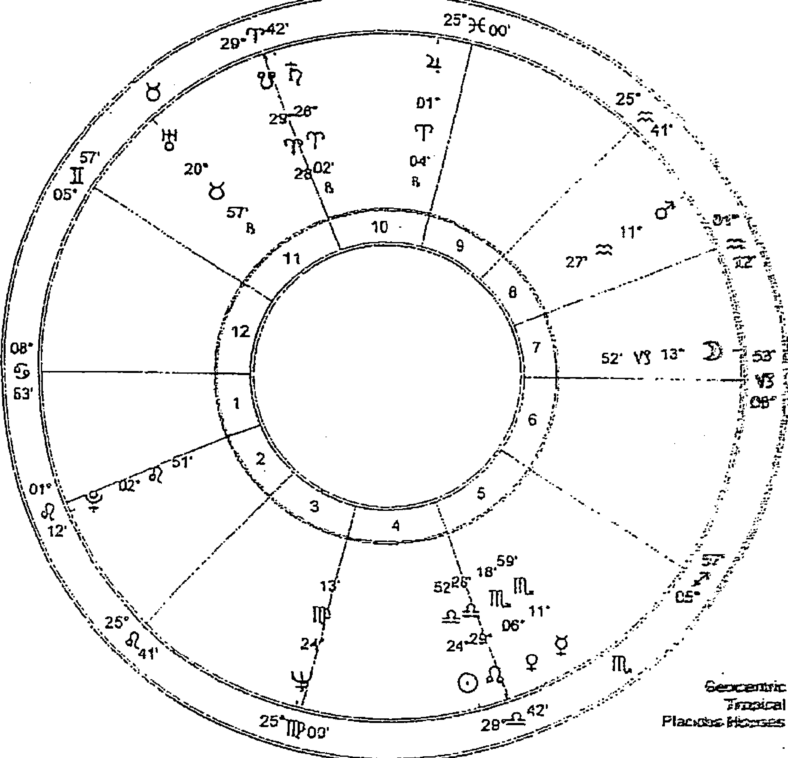

他出生于 1939 年 10 月 18 日晚上 9 点 55 分，美国新奥尔良 (New Orleans)。现在来看这个神秘人士的出生图。先从现代心理学的视角来看，只从那些最基本的占星符号入手，来一个大体的鸟瞰。仿佛在高空抓拍几张实景照片一样。

这个人是个天秤座，这就代表着关系导向的性格，代表着对美感的呼应，代表着对平衡的追求。太阳在第四宫，将人格朝向了内在情感和家庭。再加上巨蟹座的上升，更加强了四宫太阳的内向性。巨蟹座的上升，意味着月亮是这张图的命主星，更进一步深化了这个生命的敏感和内倾程度。这同时也支持了家族化的、滋养化的动机。因为月亮又在第七宫，这进一步加强了天秤座在人际关系方面容易同情他人的特征，暗示了一种给予的慷慨和与他人和谐相处的意愿与欲望。月亮在摩羯座，增加了负责和谨慎的本能习惯，这孤独的特质似乎和其他关系导向的众多元素有些矛盾。当我们注意到还有土星在白羊座与太阳呈对分相位的时候，这个孤独的特质就更明显了。还有木星在白羊座，冥王星在狮子座。这三个火象星座增加了紧张度。但这些特质依然被天秤、摩羯和巨蟹这几个更为内向化的特质所统辖。这些敏感的特质，进一步被落在四宫头的海王星加强，把所有这些特质都强调出来了。在占星学里，我们总是会把相悖的元素加以权衡，那么，所有学习现代占星的人都会认为这个人是比较内向、情绪化，甚至有一点压抑，但是总体来说是礼貌的，这个人会更注重简单、安静的生活。

## 出生图背后的出生图

如果分析这个出生图的业力故事，就会发现这个故事与我们刚才已经发现的大相径庭。南交点在白羊座，落在第十一宫的宫头。为了更有效率，我会用之前章节里的一个抽象的例子。如果你记不清楚了或者当时读的时候略过了，可以回头复习一下。那么，我们看到的是一个战士原型，是在一个群体之中的，这个隐喻是——军队里的战士。土星与南交点相合，代表着僵化严格的纪律和压抑的环境，这个人在长时间地努力适应困难的环境。这一状态与现实中僵化刻板的军队环境很相应。记住，土星合南交点，他被土星人所定义了。我们想象一下，一个疲惫不堪的士兵在泥泞里爬行，漫长的冬天也进入我的脑海里。南交点的守护星体火星位于水瓶座第八宫——著名的象征“死亡”的宫位。每天都面对着自己作为一个凡俗之人的微尘般不足道的生命，又面对着杀死其他人的可能产生的挣扎，这些又进一步强化了之前战士的隐喻。水瓶座代表着因为杀戮而漠然抽离的情绪，土星代表没完没了的对凡俗生命的不安全感。于是，在新的一天里，我们神秘的主人公反思了一下，就像昨天一样，就像前天一样……他耸耸肩，把这些念头从脑海中抹去，远远地又射杀了一个人，并且看着这个人倒下去。然后，他又耸耸肩。

这种情绪上的漠然抽离是水瓶座的阴影之一，要把它激活，只需要创伤——在第八宫的水瓶座火星带来了创伤。作为南交点的守护星，这颗冷漠的创伤的火星给我们的故事增添了另外一个新的心理维度，开启了一个新篇章。

还有更多信息——冥王星在第二宫狮子座，与南交点呈四分相。这个四分相是一个“异质”的四分，在“错误的星座”。(译者注：这里是说，南交点在白羊座，如果冥王星是在巨蟹座的话，因为白羊与巨蟹是90度的，这种才是“对的”。) 但是这个角度非常接近90度，所以它的影响力也很真实。因为是呈四分相，所以这个冥王星是他的烦恼或障碍。若是在一个比较平和的交点故事里，这个冥王星可能代表痛苦的、情绪上和心理上的问题。但是由于我们对这个故事的其他设定，所以看上去一点也不平和。在这个极端的故事里，冥王星会代表非常真实的、噩梦般的场景。究竟是什么呢？狮子座可以代表一个国王的原型，带着冥王般的权威，凶暴残忍、暴虐成性。在军队的环境下，这可以代表等级制度，任何一个士兵都无法回避高级军官的权威。

冥王星在第二宫，在这个已经渐渐浮出水面的场景之下，第二宫所代表的远不止金钱。在这个场景下，代表着与生存相关的基础物质需求。冥王星又与令我们害怕的东西相关，这就代表物质匮乏！在这里，没有什么神圣的牺牲，有的只是营养不良、暴露在有毒物质中、疾病瘟疫。他很可能感染痢疾，在一个冰冷的泥潭里死掉了。这至少是一个可以激发我们想象的隐喻。

还有很多，太阳与北交点合相，这意味着与南交点呈对分相。就像与南交点呈对分相的星体一样，北交点代表着一个人无法回避的东西，这是“现实的高墙”。在太阳系里，太阳的引力很大，行星围绕太阳转。在占星中，太阳代表着那些“引力巨大”的人，他们对我们握有权力，我们无法逃避他们的意志和需求。他们有着我们无法抗拒的魅力，或是拥有世俗地位与权力。这又加重了冥王的主题——无法逃避的、无法抗拒的世俗威权压迫得我们这位神秘主角无法翻身，这些都是与我们主角的内在本质和欲求相抵触的。

太阳在第四宫，主人公面对对自己家族所要求的忠诚无处可逃。他怎能对家人说不？他怎样才能无愧于江东父老？即使他们不强迫也不操纵，他们的存在本身就构成了一种压迫性的道德责任。

这个交点故事已渐渐成形。现在是反刍和整合的时候。我们将传统的心理分析稍加变化。如果你认识这样一个人，他经历过这些童年经验——暴力、饥饿、被暴虐成性的权威掌控——你猜想一下，他现在的状态会是怎样呢？任何读过几页心理学的人都会自然而然地得到一些阴暗的猜想。现在，让我们把这种常规的心理学视角在时间上向前推移，推移到童年之前，推移到这个灵魂的童年时期。

我们将所有这些素材看做是源于过去世的潜在的未解决问题，我们认为过去世那些不可见的经验影响到了这张星盘，使星盘呈现出这些状态，其中的机理正如痛苦的儿童时期的经验会影响到成年生活一样。

除非真正的治愈出现，否则我们自然想象得到这位神秘男主角不停地在愤怒和抑郁两种模式中往复循环。我们也会推测他可能在对待权威时容易情绪化，容易把消极的形象投射在权威人士的身上。我们会担心他旧有的业力模式会带来冷漠和抽离的暴力倾向。我们还可以想象，主人公在想要体验内在情感的敞开和亲密无间时——按照传统的出生图解读方式来看，他的出生图上显示他极强烈地需要这些——内在那种不寒而栗的感觉严重地阻碍了这些美好感受的发生。我们还会从星盘上看到对家庭纽带甚至家国与文化身份认同的纠结心理。因为业力主题通常会重复，把我们带回旧的业习中去，因此我们也会猜测我们的这位神秘主人公会受到那些施暴的团体的吸引，最常见的这类团体就是军队。

有一点特别关键：请注意在业力故事中这种强烈的紧张状态，与从传统意义的解读中分析出的温和的、滋养的气质形成了鲜明的对比。

这个痛苦纠缠的灵魂来到这个世界上寻求和平，或许寻求一个家庭，但这并非轻而易举。让我们注意到他天秤座的北交点是与太阳合相的。那么，在进化故事（北交点）中关键的挑战点就在于他太阳星座的心智健全和“自我主体感”。他极度需要一份有承诺的、稳定的亲密感。这就是疗愈发生之处。但是，想要以任何一种方式活出健康的四宫天秤座，都是对这颗灵魂极高的要求——他所有的业力模式都与这一新模式相反。

这是李·哈维·奥斯瓦德的出生图，他声称自己对1963年约翰·肯尼迪的暗杀事件负责。

当然，对于奥斯瓦德在肯尼迪暗杀事件中的具体角色有很多争议，但这已经超出我们这一章所要探讨的范围了。他要么亲自枪杀了肯尼迪，也许有同谋；要么他出于某种原因被选中，为这次事件当了替死鬼，最后被杀——任何一个故事版本都符合我们得到的业力解读。

值得着重指出的是，我们可以注意到李·哈维·奥斯瓦德的个人生平故事与从传统角度的占星解读几乎没有任何一致性。

但是，用进化占星学的角度分析，他的故事就顺理成章了。

## 结论

李·哈维的星盘让我们对进化占星学在实践中的作用刮目相看。我举这个例子是因为它真实验证了这一占星学的新分支：传统占星学分析会尴尬地失效，但是与进化占星学的框架整合之后，我们的占星学观测又找回了准星。

就如你能够想象到的那样，并不是所有的交点故事都会表现得这样极端。有时候业力故事只是融合或强化了出生图的其他部分。这时进化占星学的技巧并不会有太多用处。但是，我们需要警觉，这个人可能很容易以一种空虚、徒劳或者平淡的负面方式重复那些旧模式。

或者，与奥斯瓦德的出生图相比，有时候一张出生图上的交点并没有特别突出，与其他行星的相位也较少，这种情况下业力故事也不是特别重要。

大多数情形下，依据常识，业力故事并不那么戏剧化。我们可能有一个非常“懒洋洋”的业力故事，呈现出平淡乏味、缺乏新意的今生。这也是业力。业力有无数的表现方式，既然人生的可能性无法穷举，业力也必须反映这些广阔的可能性。

当然，我还是得坦诚地说，以我自身经验来看，客户当下的生活从来不会对交点没有任何反映。

现在，你对这一系统的作用机制有了初步的概念。也许这里面包含的几步流程可能是你不熟悉的，但是与传统的占星流程差距不大。如果你已经能熟练运用以心理学方式切入的现代占星学技巧，学习进化占星学只是为你增添了新的工具，并没有真的摒弃任何其他技巧。

在之后的章节里，我们会看一下更具体的例子。现在让我们卷起袖管，好好学习如何精通这些基本工具吧。

# 第五章 天文学中的月亮交点

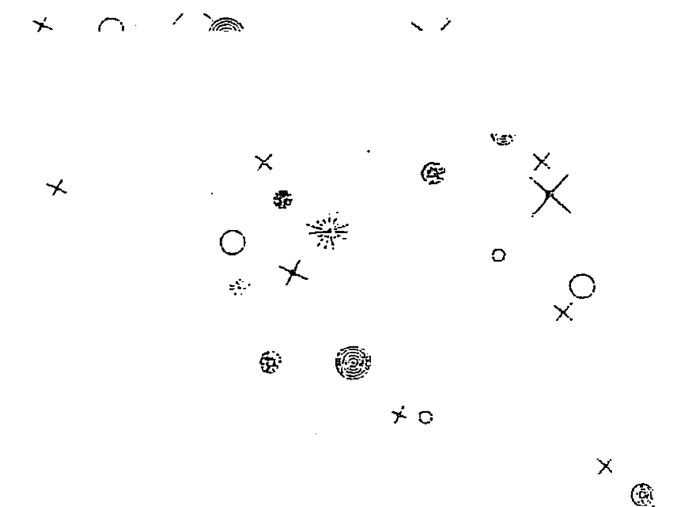

如果你是个喜欢钻研的书呆子，欢迎来到天堂。如果你一读理科就呵欠连天，却在讲浪漫诗歌的课堂上目不转睛，你也很可能成为一个不错的占星师——但是你可能很想跳过这一章。

那么，什么是月亮交点呢？很显然，月亮交点不是行星。既然交点是进化占星学的基础，是业力分析的入手之处，就让我们带着严谨的态度来学习理解吧。

地球绕着太阳转，但是，因为我们身在地球，所以看起来并非如此。我们的祖先千年以来都一直假定：太阳绕着地球转。占星学是以地球为视角进行观察的，在我们的语言和视角中都会秉承这一点。我们实际上会看到太阳每年都会通过同样的星群带，占星师把那条星群带叫做黄道面或带（Zodiac），天文学家称之为黄道（Ecliptic）。

在头脑里想象这样的场景：地球围绕太阳转的同时扫出一条玻璃平面圈。这个碟状平面就是黄道面。在我们这些认定了地球是宇宙中心的头脑里，我们会认为黄道带是一圈想象中的星体环——外面是广袤的星体球面，里面是我们。当黄道面与星体球面接触时，就是太阳每年运转的轨迹。除太阳之外，其他的星体也是如此。这就是黄道带（Zodiac）的概念。

月亮绕着地球转动，这一周期只需要不到 27 天零 8 小时。想象一下，当月亮绕地球公转的时候，扫出另一个玻璃圆环。这是月亮的轨道。我们也把这一轨道放在天球的背景下来看，就像黄道面那样。（记住这个事实很有用：即使月亮的公转轨道要比地球的公转轨道小得多，可是当我们以自己为中心进行观测的时候，它们在天球上的大小是同样的。）

这就说到关键的一点了：月亮的公转轨道面与黄道面并不是处在同一平面上的，而是呈 5 度 8 分 40 秒的斜角。于是，有一半的时间月亮是在黄道面的上面，另外一半时间在下面。（在这里，我们很恬不知耻地套用欧洲殖民者的迷信：“上”北“下”南。）（译者注：原意是欧洲殖民者觉得北半球的人比南半球的人高等，斯蒂芬这里的引用是为了说明南北与上下对应的概念。）

如果你明白了以上的概念，你就做好了理解月亮交点的准备：

当月亮穿过黄道面，朝向北方的时候，这就是月亮的北交点。当月亮穿过黄道面朝向南方的时候，就是月亮的南交点。更确切地说，当月亮轨道平面在黄道面之上与之相交时，我们将其定义为北交点。当它在黄道面之下的时候，我们将其定义为南交点。

月亮在公转周期里可以处于任何一点。但实际上，月亮每个月通过黄道面只有两次，一次是向上，一次是向下。

## 交点周期

转一个螺旋。观察它，它飞快地旋转着，按顺时针方向。慢慢的，它的动量消耗殆尽，你观察到当它倒下之前会开始以逆时针方向旋转。类似的，当月亮每个月围绕地球公转的时候，轨道面会逐渐向相反的方向滑动。或者说，月亮轨道与黄道面相接的地方——交点——并不永远停留在黄道面的同样角度。交点缓慢地逆行，只需要 6793.39 天就能够回到初始的位置。这个天数相当于18.5997年——18年7个月零几天。

换句话说，月亮交点在黄道的每个星座的逆行时间是一年半。

月亮交点每 19 天移动一度。

## 日月食

如果你想一想，就会发现日食与月食现象也明显包含在交点理论里。每个人都知道日食是重大的天文现象，人们很把这当回事儿。有些人长途跋涉就是为了看一回日食。不过，很多人都没有意识到，在每个月里，在某个时间点，都有很接近日食发生的状态。每 29 天，我们都有一次新月。新月意味着太阳与月亮位于黄道带的度数是一致的。

那为什么新月的时候没有发生日食呢？

答案是：即使太阳与月亮排成一线，月亮也会在太阳之上或者之下的位置，月亮公转平面与地球或太阳的平面大概形成 5 度的交角。

月亮交点——就像我们已经学到的那样——是月亮公转时与黄道面相交或者平行时形成的。那么，日食其实是新月与月亮交点非常接近的时刻。类似的，只有满月与月亮交点距离很小时，月食才会发生。

在现代，一个小型的掌上计算器就能把这些全部计算清楚。在古代，我们的祖先建造了很大型的设备来计算同样的事。这个大型设备叫做巨石阵。

## 平均交点与真实交点

在占星界，大家一直对究竟应该用真实月交点还是平均月交点争论不休。大家对这件事热情高涨，即使真实月交点和平均月交点之间的差异并不大，最多不会超过 1 度半。我发现这种争论很无聊，要想平息争论，只需要问一个非常简单的问题：在天文学上，这二者究竟有什么差异？人们听到这问题，通常都会突然沉默下来。

月亮绕着地球转。这是简单的说法，基本上也是正确的。更精确的说法是地球与月亮围绕同样的重力中心运转，这一中心，即重心。

把地球想象成大块头的男人，正在和他身材娇小的妻子一起跳舞，他们双手交握，围绕着对方快乐地转圈子。粗略地观察，会觉得男人的块头更大，他是稳定的，她绕着他转。但是，如果你仔细观察，就会发现情形没有那么简单。他的身体重心会不时地略有偏移，这是因为她将他一会儿向这边拉，一会儿向那边拉。

男人和女人好比地球和月球。他们的共同重心——质量中心——并不是位于地球的球心。实际上，这个重心位于离地球的球心距离地表的四分之三处。也就是说，这个重心在地球内，但不在地球的球心。

现在让我们使用更技术化的语言。小女子和大男人跳舞，围绕着他转动，同时她把大男人身体的中心向她拉近了。她比他轻很多，所以她对他的影响是非常微弱的，但这个影响依然真实存在。就像月亮一样，她围绕他转动的“轨道”有一个平面，但是那个平面——看起来是以他的臀部为中心——并不是固定不变的。这个平面总是被拉向她那一边。

早些时候，我们把月亮南交点定义为月亮轨道与黄道面相交的点——此时月亮会移到黄道面的下面（记住，我们把平面看做一层玻璃环面）。但是，就像我们的舞蹈者们一样，这个玻璃环面会摇摆，那么月亮交点的确切位置也会摇摆。真实月交点就反映了这种摇摆的状态。平均月交点则不会。

这变得更加复杂。

两个物体之间的距离越近，它们之间的吸引力越强。这就是物理学上众所周知的“平方反比定律”——物体或粒子的作用强度，随距离的平方而线性衰减，即作用力与距离平方成反比关系。月亮围绕地球的运转轨道不是完美的圆形。就如大多数的天文轨道一样，月亮的运转轨道也是椭圆形的，有时距地球近，有时距地球远。这意味着，月亮对地球的引力随着月亮一个月之内所在位置的不同而变化。其结果是地球与月球的共同重心变得更加颤颤巍巍，摇摆不定。

更进一步讲，太阳巨大的质量也是方程中的一部分。我们之前学到，相对于地球围绕太阳公转的轨道平面来说，月亮围绕地球的轨道平面并不是“平的”——两个轨道之间的夹角大概是5度。那么，有时候太阳的质量中心在“下面”，有时候在“上面”。太阳的作用力也增加了月亮轨道的摇摆。

当我们把这些所有因素加总后，便能得出月亮交点的实际轨迹是非常不规则的这一结论。这就是真实月亮交点——尽管在实际应用当中，大多数的占星软件并不把所有的影响因素计算在内。也就是说，所谓的“真实”交点也并不真实。真实交点的轨迹并不规则，甚至偶尔会走直线。

平均交点的计算依据的是这样一个简单假设：月球围绕地球的中心运转。其效果是把运转轨迹变得平滑化。

就像我早前提到的那样，真实交点和平均交点的差异总是很小的，对我们目标的影响其实微不足道。

我对这一点并不教条，但我在实践中用的是平均交点。我的理由更多出于实际的原因而非理论的原因。我的经验是这样的：偶尔我会遇到一个人，他的平均交点和真实交点是不同的，这很典型，真实交点与平均交点的差别大概只有一度左右。但是对这个人来说，这差别足够大到让他的月亮交点完全处于两个不同的星座。比如，平均月交点在29度37分，真实交点在0度43分。我会按照平均交点来看——至少是很完美的小白鼠！我会尝试告诉这个人两个可能的业力故事，问他哪一个感觉更对，我也根据我对他的主观印象和他实际呈现出来的人生状态比较两个版本。比任何天文学上的争执更有价值的是，人类生活的真实状态才能判断占星学的准确性，才是占星学的高级法院。

对我自己来说，更常见的状态是，平均月交点更有说服力。

还要提醒两件事：

首先，不要去试验真实交点和平均交点的宫位。宫位交界比星座交界更为模糊——它们的衔接更加流畅，就像季节变换一样。而星座的交界就像互相有大段距离的“咔哒”，像电视频道的转换。在占星学里，有一个妖怪就是人们的出生时间的精确性。即使是一个很小的误差都会把宫位交界变得很模糊，对我们想要达成的目标影响很大。也许真实交点所落的宫位对你来说比平均交点更有说服力——很可能你对宫位的感觉是对的，但是我首先会猜测是你的出生时间差了那么一两分钟。

其次，在探索真实交点和平均交点的差异上，尽力避免只通过一个或两个人的出生图来判断。有一半的关于占星学的错误见解都是这么来的。“我的好朋友木星在第一宫人，她是个爱猫的人。那么，如果木星在第一宫，你会很喜欢猫。”
我们得广撒网，多观察，才能发现更可靠的模式，这些模式才是炼金术里发现的金子。

# 第六章

## 南交点在十二星座

我写任何机械教条的占星解读，都会有点不舒服。没有任何事物存在于真空中，占星技巧的核心在于将所有信息编织在一起，组成独特的完整解读。在下面的部分，我要告诉你“南交点在白羊座代表什么”。请不要完全相信！如果南交点是独立的，甚至落在愤怒的白羊座，落在第七宫会怎样？那么，在前世，这个人是被另外一个人所定义和限制的，很可能这种愤怒是集中在依赖性上。“战争”在非常私密的环境里发生。但是，如果南交点在白羊座落在第十宫呢？那么，战争故事就会在世界范围内上演了。如果被土星和冥王星对分会怎样呢？失败是痛苦的。如果与木星相合又是怎样？胜利是传奇的。背景是一切。

把以下的说明仅仅当做起点。记住：每十二个人里就有一个人的南交点是落在某个星座里的。它肯定是模棱两可的——有别的可能吗？

在下一章里，我们会解读宫位，以上提示也适用。但如果你把二者结合——北交点在某一星座某一宫位，你就前进了很大的一步。这不再是十二分之一，而是一百四十四分之一了。然后你就真的……喔，上道了！

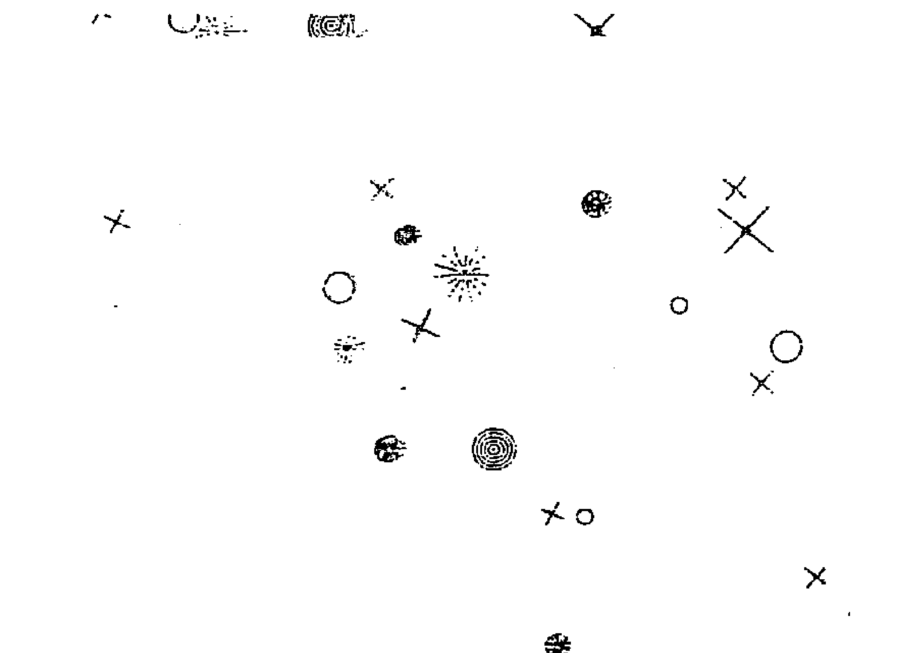

### 南交点在白羊座（北交点在天秤座）

对出生图上的南交点进行解读，是判断过去世戏剧的关键时刻，就像一位医生手持听诊器放在病人心脏部位的那一瞬间一样。我们知道这个人感觉如何——但是我们对他或她看见什么、想什么、做什么毫不知情。我们拿到这个情感讯息之后，再利用出生图中的其他信息，试图识别整个故事大纲。看到南交点在白羊座，我们就知道这个人被肾上腺素大量影响着！换句话说，他或她面临着战争。从人类历史的角度来讲，人类对战争相当狂热，也可以佐证这一事实。我们可以把这个白羊特征看做前世在战争中对暴力的真实经历：这个人很可能在前世确实面临过一种你死我活的对抗状态。但是，“战争”也可能只是人类处在愤怒、压力、紧张和竞争状态下的隐喻：爬上高山，驾驶西班牙帆船驶入未知的水域，留下创伤的分娩，甚至在生意场和政治场上的竞争也包括在内。

一个年轻士兵从巴格达返回，或者是从越南战役、卡西诺战役（Monte Cassino）或安提坦战役（Antietam）归来，神经紧张不堪。晚上，他与喜欢的人同床共枕。忽然，一辆汽车的尾灯开了，光线照在街道上。他瞬间就完全醒过来了——抓起一把刀掷到墙上。他的朋友吓得啜泣起来，他也觉得自己反应过激，真是疯了。然而，正是同样的应激反射机制让他在战争中生存下来。

知道北交点落在天秤座帮我们打开了视野。这个个体的进化意图，在于平静下来，寻找内在的和平与安宁。为了达成这一目标，他需要理解自己不容易自知的有害习气：让自己持续处在一种戏剧化、紧张和令人疲惫不堪的状态里。这要么徒劳无益，要么有害身心健康。他必须消除这种竞争感，而不是让它在自己个人觉察的空白地带如杂草般生根发芽。他习惯把别人二分化，认为他们要么是敌人，要么是朋友，现在他必须学会抵制自己的这种习惯。多花时间去了解别人，发现他们微妙复杂的人性。他会从文化熏陶中受益：绘画、音乐，或者接触优雅的人。总之，他需要吸收消化这样一个观点：相比激情而言，爱是更伟大的概念。

### 南交点在金牛座（北交点在天蝎座）

金牛座是土象星座的第一个星座。这个星座与我们地球上的原住民很相应，或者与我们这些两条腿走路的生物相应——我们还没有走得太远，远到忘记了我们的自然根基。金牛座是有关自然天性的：食物、温暖、舒服、住所和爱。它喜欢熟悉的事，避免意料之外的事。南交点在金牛座的人，他的过去世很可能是与农耕相关的，或者与自然很接近。他可能在灵魂深处还保留着属于“原始”文化的记忆——纳瓦霍族人（Navajos，美国最大的印第安部落）、盖尔人（Gaels，英国少数民族）、阿善提人（Ashanti，非洲部族）。这种解读方式并不确凿，但这与金牛座特征相符。也就是说，这是简单的生活：农民、手工业者、渔民过的生活。我们常常发现这些人和动物相处很自然，或者是天生的园艺师，或者是博物学家。他们经常表现出在手工制作方面的天赋。

再进一步概括，我们能够发现南交点金牛座在过去世被这样的欲望驱动着——保持所有事物稳定，凡事可以预见。而这也恰好是陷阱所在。对稳定性和可预见性的执著——保守主义——占据了这个灵魂。在今生，他很容易停滞不前。这个问题很容易演化成对经济稳定性的担忧，为了钱付出太多。另一种危险就是避免在人际关系中发生冲突，即使自然的冲突对一段关系的发展有益——他们很容易被“幸福地生活在一起”的预设所限制，结果却避免那些实际上能够令一段关系持续幸福的功课。

金牛座有许多简单、天性自然的优秀品质。代表了一种“天然的道德”，没有过分的哲学观点的包装和粉饰。凭着本能，我们内心便知道杀人取乐是错误的，性侵犯儿童是错误的。这种天然的善良很可能每个人都有。但是，这种淳朴很可能也是天真——很容易被邪恶掠食。我们大概都看过一些“狡黠的城里人”把“乡下佬”骗得倾家荡产、家破人亡的故事。

了解这些都有助我们认识到北交点天蝎座的重要意义。他的进化意图是与生命中的复杂性、荒诞性和双重道德和解。这个个体今生已经准备好心理上的巨大飞跃了。他打算与阴影共舞，并把部分阴影整合到自己的生命中来。对于一个进化的灵魂来说，这是非常微妙的一步。需要肯定的是，这个目标并不是变“坏”！而是与一个人本身内在已经存在的天蝎座和解。就像亚当和夏娃一样，这个个体是要“品尝善恶树上的果实”的时候。这功课围绕着接受一个人内在对权力的需求、对性的欲望以及内在的嫉妒和操控等议题展开——所有那些人们玩的“肮脏游戏”。他必须学会接受这些特质，把它们摆到桌面上来，学着适应。在这一生，他必须超越善，进入合一的境界，这是最高形式的爱——一种不排拒任何事物，不为任何事物感到羞愧的爱。用心理学的术语来说，他是在学习收回自己的投射，这意味着承认他对别人的那些判断其实都存在于他自身。

### 南交点在双子座（北交点在射手座）

机变的反应、灵活的口才和敏捷的思维——这些是双子座的特质。想一下那些节奏飞快的对谈，想一下你的头脑可以多么迅速地展开联想。再想一下开车在高速公路汹涌的车流中飞驰的感觉，同样刺激和反应迅速。这些急智，这种“边走边搞定”的感觉，绝对是我们对双子座最基本的了解。南交点在双子座，这个个体拥有快速的头脑能量和内在状态。在过去世，那些需要快速反应的状态塑造了他，这表现在他快速应变的能力上，他的应变比小猫抓住一只飞过的蜂鸟还要快。这个人的精神能量的运作方式是理性的、头脑的，甚至有些令人疲惫不堪的——这是一种对环境必要的适应。但作为人类，单单靠头脑运作未免狭隘。当他出生时，这种旧习气会继续吸引着他们，人生刚开始便在加速了。

双子座也常代表兄弟姐妹。我们不应该死板地抓住这个概念不放，但是很容易想象，南交点双子座的个体今生可能会遇到过去世的兄弟姐妹——这种联结非常强，以致他们之间依然有些未解决的问题。你把自己沉浸在一个手足为生存而竞争的故事里，就很容易感觉到南交点双子座是什么样的。

双子座这种纯粹的速度和应变同样也与年轻相关。对这个概念也不要执著，但是南交点在双子座确实常常令人信服地与年轻人的业力经验有关，可能是作为年轻人会遇到的危机或机遇。比如，你能想象50岁的时候还会发生一段不成熟的、带来创伤的婚姻吗？但是，如果出生图上有南交点在双子座，而且南交点与关系有联结的话，这种婚姻是有可能发生的。同样的，性侵犯、学生时的经历、高中时的学生内部政治和恶作剧——这些都是作为年轻人的经验范围。

也许南交点双子座最核心的指向是语言。将人类经验转换成词句在这一世显得轻而易举。很可能在过去世这个个体的沟通才能发展得很好——当然也要看一下出生图的其他部分。他可能是一个作家？大学老师？吹牛高手？

在这一世，南交点在双子座的人必须小心一种过度扩张的习气。他或她必须小心只有太多有用的战术技巧却缺乏中心目标和战略。有一些无休止的压力容易让这个人喋喋不休，原地绕圈子。可能他或她相信这些压力是外部施加的，但其实这只是业力情绪的后遗症而已。真相是，这些压力大多来自内心，而非来自外部现实。

北交点在射手座，射手座是哲学家的星座，强调了这个人现在的需求是深刻思考人生中真正重要的是什么。他或她的价值观、信仰和个人哲学需要被引导。广义的宗教可能会增进此人的洞察力。而“瑜伽”的效果就好比每年在“山顶上”花一些时间，反思他或她处在人生大图景中的哪个位置——明年同一时间，他或她想要成为什么样子。旅行可能是北交点射手座有用的维生素，在旅行中，他更容易出离现实生活中的故事情节和散乱状态。可能他或她也会被直觉性地引导。向前世双子座创痛的真实发生点望去，单纯地看到那个场景，大体认出它，就能有释怀的作用了。

### 南交点在巨蟹座（北交点在摩羯座）

告诉任何一个称职的父亲或母亲，他们的孩子正处在危险中，对他们而言都一定是首要大事。这是父母自然的反应。我们大多数人甚至在看到一个父亲或母亲不这样做时，会进行指责。特定的本能——像是保护孩子——对人类来说是如此基本，可以越过高级的大脑功能。大多数本能都与维持种族繁衍有关，这些构成了我们道德和法律系统的基础。

巨蟹座是由月亮守护的，一般来说是占星学中本能的缩影，尤其是与家庭、炉灶和保护妇孺相关的本能。南交点在巨蟹座，这个个体带着家族深刻的烙印，或者受到父母的影响非常深。从出生起，就对身边某些人有一种很深的、不容置疑的忠诚和联结感，不管那些人是不是值得！在这里，情绪和本能说了算。

只要与南交点相关，关心那些过去世业力带来的潜在的盲目或限制所造成的影响总是有帮助的，即使过去世可能是非常值得尊敬的。家庭是一个典型的值得谨慎关注的单位。家庭会极度专注于滋养各种需求，于是很容易产生一种死气沉沉的稳定气氛。在家庭里，我们看到，本身复杂而充满激情的人类只有角色和功能可言。这里可能有一种悖论：那些每天都在熟悉的环境里相处的人，相比在火车上偶遇聊天的陌生人之间更缺乏觉察了解。

无条件的爱、原谅、容忍与接受对方，这些都是宝贵的特点，经常可以在南交点巨蟹座的人身上发现。但是这些特点有时也变成心理上的大毒草。这样的个体必须努力，才能把其他人看成是多元特征的成年人，能够独立自主，至少要知道他们即使失误也能学到有益的功课。他或她需要警惕这种诱惑——把所有关系都搞定，让关系变得舒服却麻木。他或她需要有意识地下决心，学会划清自己和血亲之间的界限。类似的，这个人需要小心警惕不要让他的朋友，尤其是那些总是索取不休的朋友，成为他或她的“孩子”。甚至是为了宠物付出太多时光都很容易成为一个问题。

南交点在巨蟹座的个体有这样一种趋势：不敢面对赤裸的精神，不愿把其他人当做赤裸的灵魂看待，逃避的手段是把注意力放在他人的需求上而不是力量上。

北交点在摩羯座，意味着在这一世需要“坚毅”。这是年长者的星座。当我们年长的时候，不可避免的，我们会看过许多悲剧。摩羯座代表着一个新的发展阶段，这个阶段超越筑巢和父母哺育的本能。这其中有冷硬的真相，有忍受孤独和分离的意愿。这个个体的进化动机在于拥抱一种成熟。他或她正在学习享受孤独、维护孤独。他或她正在学习不再“可爱”，不管是在公众生活里还是在私人生活里。哺育者逐渐让位，他成长为一个说出真相的人。

没有比家庭更强大的培养心智的摇篮——当然也可能培养心理障碍。在过去世，这个人曾经从那里学到了许多。北交点在摩羯座，这一世是从狭隘的家庭视野中走出来，与更多的人分享智慧的时候。

### 南交点在狮子座（北交点在水瓶座）

狮子——万兽之王——威振一方，统摄百兽，至少在民间传说里是这样的。我们很容易揣摩到传说里这样说形容原因——打量一下虎斑猫，我们就能看到祖先们在猫科动物身上感觉到的“王族”特质。南交点在狮子座，想到这个个体在前世曾经是“王族”，就把我们的思路带上正轨了。对于符号学来说，避免望文生义是很基本的，所以“王族”当然并非意味着这个人前世戴着王冠。但是，他或她一定处在有特权和地位的位置上，并很可能因此令他人心生妒意。

有时候，人们可以通过自己的努力和成就变得显赫起来。然而有史以来，人生有贵贱则是常态。那些出生于特权阶层的人也常常继承了许多社会期待，比如需要扮演特定的角色，不管在工作、婚姻还是在价值观、言行举止上都要符合一定的标准。这可能会像一件紧身衣一样，束缚了一个灵魂自然的人生诉求。

一个南交点在狮子座的人过去世未必世袭财富或地位，但是他或她一定是闪光的，不管是以什么方式。这样的人通常要肩负一种责任，不得不扮演某种“完美”化身，或者人们视他们为“幸运儿”，不管他或者她付出过多少艰辛努力。常常这样的人能够取得可观的成就。金钱可能是成就的一部分，但是我们也要敏锐地看到，在与创造力有关的领域或其他行业里，银行账户并非最终的判断标准。一个简单的观察是，这样的人通常穿着很鲜亮耀眼，不只是看上去不错，而且看上去很自然。这是另外一个关于“王族”背景的线索。

对照北交点水瓶座的进化意愿，理解南交点狮子座的陷阱就很容易了。水瓶座总是带着真正自由的能量。这是对于真实个性的占星解读。立刻，我们就理解了狮子座的业力模式：取得成功大多是为了实现他人的期待和价值观，而不是真实的灵魂诉求。这个个体很容易表现出一种空洞的戏剧感。通常来讲他并非有意这样，这“只是发生了而已”。但是，更深入地分析，就会暴露出这其中的核心问题：在前世，也许在今生也一样，这个人被其他人的主观投射诱惑和淹没了。即使这些投射是正面的，也是来自于他人的，而不是这个人内在的深刻自我。这些投射是外来的。

水瓶座的解决方法？做自己喜欢做的事！培养对其他人的意见满不在乎的态度。找到内在的自由，让内在的声音引领自己，可能做出一些看似违反世俗行为准则的“不好的”决定。更看重自由和诚实，而不是掌声和地位。

### 南交点在处女座（北交点在双鱼座）

可怜的处女座受到了很多取笑。但是，与其他黄道星座一样，处女座有其神圣和珍贵之处。有个处女座的笑话是，他们按照字母表把袜子编号。即使如此，这个星座也代表了人性中某些最优秀的部分：朝向称职、精确和谦逊的驱力。处女座的原型是仆人，暗示着有技巧的帮助。处女座代表我们内在的一种意愿，为了最终擅长于什么而做出努力的意愿。但是，既然我们观察的是南交点，我们就理应带着怀疑的态度看待这个问题。对于一个南交点处女座的人来说，现在是突破处女座特质中那些限制性和或盲目性的时候了。这些特质又是什么呢？

完美主义代表了严苛而精确的标准。没有人能够达到完美。然而，这个人在前世曾经试图这样做。当然，失败了。把这称为失败或“错误”就像是哀叹重力或者税负的存在一样。但是，他或她把这种感受内化了，这种感受就是不足，以及连带的羞愧、内疚和罪恶感，自我惩罚的态度。压抑人性、建立在羞愧感之上的宗教可能是罪魁祸首——但是，就像我们很容易观察到的那样，文化中的清教徒主义，种族歧视，因过于苛刻的导师的戒律所导致的自尊心粉碎，或者性虐待等等，都可能造成这样的后果。

南交点在处女座，我们观察到的可能是“真实”的罪恶感——对于实际的黑暗种子未能释怀的反应。但这种可能性必须小心拿捏，因为大多数情况下，南交点在处女座与“虚假”的罪恶感相关，这些罪恶感来自不得不咬紧牙关苦苦握过的外界苛刻无情、不合常理的要求。如前所述，业力故事的细节必须还要通过检视南交点所落的宫位和其守护星，南交点与其他星体形成的相位等等。我们看到，南交点在处女座本身代表了自我怀疑、烦忧不安、无休止的焦虑情绪，这会过滤掉生命中的快乐和神奇，如果这种情绪一直存在的话。

月亮的北交点，也就是这个灵魂的进化意图，在双鱼座，为了理解这个象征的意义，我们必须从这样一句话开始——虽然这句话几乎注定要左耳入右耳出——神的爱是绝对的。

这些单词的意思是，人类无论做什么都无法影响神的爱——它是绝对的、无条件的。在爱的条件下，神才不会理睬我们是拯救世界饥饿儿童还是滥杀无辜呢。用这样吓人的言辞表达的目的是希望能够唤醒我们，解放我们内在的双鱼座能量，这就是绝对的爱。北交点在双鱼座，这个人在旅途上已经到达了这样一个地方，在这里，他或她必须放下对如下观点的认同：只有奋力挣扎才能进化。他或她需要玩耍，变成小孩儿。

让我们加入一个危险的概念：一个南交点在处女座的个体需要冥想。这个概念为什么危险呢？这是因为，他或她会因为业力惯性的本能反应，把冥想又理解成挣扎，很快，就把这当成是自己失败的又一证明。真正的双鱼座冥想是放松的，当我们厌烦的时候就结束，而不是要严格卡时间——一定要在闹钟响了的时候结束，它没有目的性。在冥想的结尾，冥想与我们日常的意识融汇在一起，变成了神那仁慈的眼神注视下的翩翩起舞。神爱我们已久，舞蹈也是同样的持久。

## 南交点在天秤座（北交点在白羊座）

我们人类是危险的灵长类动物，情绪激烈，牙齿尖利，富有攻击性。因此，任何人可以想象一种关系——或者文明——能够在没有足够的敬意，没有机智老练、让步妥协和优雅拿捏的情况下蓬勃开展吗？让我们再加上优雅、同情和爱的同盟者：幽默感。这些都是天秤座的品质。南交点在天秤座，不管此人内心矛盾有多激烈，总有一个指南针指向愉悦、文明的情绪。在过去世里，非常明显，这个人和特定的人以特定的方式结合在一起，很擅长“如何相处”的艺术。很容易猜测到这来自前世的婚姻的影响，即使也存在各种其他形式的人际关系：生意伙伴、事业同志、一辈子的友谊。因为这种业力模式，毫无疑问，这个个体会在今世遇到许多“熟悉”的关系。在很多场景下，他们可能会说：“我觉得我以前认识你啊。”

更进一步来说，出于天秤座与微妙繁复的文明面向的自然联结，这样的一个人很可能满怀对于艺术和公正的兴趣，也会散播所有高尚的、振奋人心的事物。还可能会在年纪很小的时候“奇迹般”地表现出很高的艺术家般的创造性才能。当然这不是在今生学到的，只是回忆起了前世所学。

这一切有什么问题吗？没有！但是我们确实需要提醒自己，月亮南交点的核心含义，在于它代表了过去已经达成的目标，这很容易导致进化上的停滞不前，必须受到挑战才能激活。我们必须对阴影加以警惕。

“不偏不倚”的中道对每个人来说都可能毫无活力。妥协可能意味着必须讨好每个人。礼节和尊敬可能会隐藏真相，好让我们的对真相的恐惧有藏身之处。艺术类的体验——音乐、电影、电视、美丽的服饰——也可能成为阴影和逃避的方式，让我们避免互相对视、直面对方，但这却是灵魂互相碰触的核心。这个人过去世与伙伴们相处时，有时甚至都不怎么了解对方，许多真相隐藏在“得体”的高墙之后。公平、理性和尊严抢占了爱的位置。社会面具隐藏了他们真实的脸孔。

现在，北交点在白羊座。对这个个体而言，进化的目标在于拥抱火焰、风暴一般的激情，甚至愤怒，如果这些是必要的话。现在到了暴露他们真实的内在经验甚至所有疮疡的时刻。他或她会从冒险中获益——任何让他们害怕的情形都有益处。这些压力和紧张对这个灵魂的幸福来说远远没有缺乏动力和热情的舒服生活那么有威胁性。想象一下那些躲避在防空洞里的人们，或者在海上风暴中航行的人们，他们在午夜时分，可能会产生一些有深度的想法和反应。并非要去冒不必要的愚蠢的风险，但是这个人确实需要看到他或她在通常所扮演的角色失效时自己的真实感受，赤裸是令人兴奋的。

## 南交点在天蝎座（北交点在金牛座）

人生有些事令我们浑身发冷：无耻的丑恶行为；不可思议的折磨；极端痛苦中的孩童；可怕的身体疾病；令人发指的暴力；卧轨自杀的人死前一秒钟的精神状态。

没人想接近这些可怕的事物，可是它们常会不期而至。黑暗可怕的事情发生了，而且在灵魂上留下印记。南交点天蝎座的人曾在前世濒临如此绝境。有些人会对这种经历麻木，但南交点天蝎座的人并非如此，他们并未抽身而去（抽离的状态更多是水瓶座的黑暗面）。于是，在这儿，我们看到这样一幅画面：心灵的创伤并未愈合，依然在梦魇中震惊和战栗着，无法逃脱毒龙的注视。

在此，有一种很严肃的气氛——也很容易目光狭隘，悲观和怀疑，尤其不相信存在着轻松愉快的人类经验。同时，也可能有苦修来的智慧和慈悲心肠。关键在于，从进化的观点来看，首先要承认灵魂在极度的困境当中经常进化得很迅速，就如这个个体在前世曾经经历的那样。想象有这样一个人，他被抓起来锁在奴隶船上，在航程中船沉了。在这一年内，他对他人生和他自身的了解一定比美满幸福地度过了一生的人更多。这样的灵魂成长过程的结果自然是带来辛酸的眼泪和严峻的态度，当然还有悲剧导致的难以痊愈的内心伤疤。

当我们更一步探索这一命题时，我们必须承认，生命中的黑暗面有时会令人着迷。只要浏览一下你家附近电影院的上映片录，我们很快就能确信人们会有这一古怪矛盾的心理。这看似离奇，但令人最害怕面对的事实似乎确实充满了推动力。

回到电影上来：你能想象这样一个电影明星么——极度性感却一点都没有危险的味道？性感是一种不能脱离阴暗面存在的特质。性感迫使我们直面心中的饥渴和需求，并为此付出代价。南交点在天蝎座的人很可能在前世曾极具致命的诱惑力。如果南交点与关系的特征有关联的话——比如与金星相合，便可以认定南交点与性感有关。

与精神上的压抑和苦痛并存的，还有对沉重感的执著，这构成了此人最深的障碍。即使更高的境界是在海滩上愉快而单纯的散步，未尽的前世伤痛也容易把他拉向黑暗的深处。

如此一来，我们把目光投向北交点，金牛座。在这里，进化的重点在于平静下来——真正从那些给这个灵魂带来难缠的精神烦扰的经历中恢复过来。北交点的功课总是艰难繁重。这个人来到这个世界上寻求舒适与安慰。以金牛座的作风，这种舒适一定是看得见摸得着的——一个及时的拥抱，而不是一句名言警句；一个热水澡或者打个小盹，而不是一次严肃的谈话。这些人会尽可能地远离都市，从中获益良多，即使不住在郊区也要时不时地出城逛逛。和动物相处会教会他们很多，养猫猫狗狗会很不错，宠物代表了家居的舒适感。在关系方面，这个人会在对另一半简单而自然的接受的过程中得到好处。两个人的相处是很复杂的，这话我们听得太多了，但是南交点天蝎座的人最不需要被强调的就是这个。他需要的观点是，有个伴儿生活会更简单些，我们是人嘛，有个伴儿怎么也比没有快乐许多！这话可能对地球人来说并非都适用，但是对这家伙来说，这才是正确观点。平静、自然，返朴归真，这就是未来的道路。

## 南交点在射手座（北交点在双子座）

射手座代表探索者——南交点位于射手座，意味着这个个体已经在这一世之前长途跋涉了很久。对于各种可能性都兴致勃勃的活力，以及认为生命就是冒险的开放精神充满着这个灵魂。就好像背包或旅行箱已经准备好，秘密宝藏的地图已经被小心翼翼地折好放进了口袋，而路就在脚下。如此跋涉又究竟为何？不为其他原因，只是为了我们存在的意义。在这个个体的前世，他或她曾经下定决心，希望理解人生。他或她本能地晓得：要理解，只能通过彻底地将自己的所有感觉都沉浸在世界里。在前世，他或她曾经背井离乡，飘洋过海，踏上征程；他或者她曾经在午夜时分月亮升起的时候在椰枣树下等待，准备加入驶向远方的大篷车队。

有时候，射手座这种强烈的理解人生的渴望可能会隐没在纯粹对冒险的追求中。即使是这样，至少在潜意识中，也助长了哲学的火苗。如果冒险把这个人引向弥天大错——正如经常发生的那样——情况更是如此！

其他时候，这种对哲学的渴望更加明显：这个灵魂的宗教烙印很深，固守着明确的信念系统。他在过去世可能做过出家人，甚至曾经卷入到宗教运动中去，尤其是在出生图上第十二宫的影响很显著的情形下。如果有火星或冥王星的强势影响，我们大概能辨认出一种殉道者的经验——这是南交点在射手座的纯粹信仰的力量。

射手座的宗教冲动常常与不安于室的地理迁移相关，这种不安分会产一种令人迷醉的乌托邦信念，导致长途迁徙。南交点在射手座，这样的人也许曾经是一位远行去犹他州的摩门教徒，或者是一位返回以色列的犹太人，或者一位迁往美属殖民地的政治异见分子。

我们还是要警惕南交点带来的旧模式的黑暗面——即使这些模式本质上是健康的，其中也有一些东西是疲惫和破败的。对于价值和哲学的“信仰”可能是盲目的。即使“对爱情有信心”也容易让一个人麻木，对于相处中交涉和调整的过程变得不那么敏感。距离把人生的真实复杂性重新编撰，“信念”只有咫尺之隔。与许多宗教人一样，在过去世，这个人曾经掉进这样的一种陷阱当中去，使得拒绝真实与朝圣背道而驰——距离原始的伊斯兰和基督教义，新时代的想法也只有咫尺之遥。在业力里，南交点在射手座，他或她在这里需要解决的问题，是一种对确定性的强迫性上瘾。

这就把我们带向了双子座的北交点：我们看到了对于倾听和接受的专注，愿意接受惊喜。他或她需要惊喜和奇迹。双子座代表双胞胎，意味着对话，也就是关系。两个人，肩靠肩，什么都互相同意——这多无聊！这个个体的灵魂成长有赖于朋友之间有活力的、有敬意的不同意见，随之是长久的谈话。若没有差异，没人能教另外一个人什么。让佛教徒和基督徒睡在一起吧！让存在主义者爱上占星师！这次，这个模式是无休止的对谈，被出乎意料的思想和扩展思维的经验浸没，另还有对差异的欣赏——另外要肯定这样一种智慧：对于人生，不管我们看到了什么，都远远不止这些。

## 南交点在摩羯座（北交点在巨蟹座）

现实是残酷的老师。我们战胜现实，或者在它脚下屈服。前世，曾经经历过残酷的现实，今生，这个人有着成熟稳重、一本正经的特质。南交点在摩羯座，有着绝佳的生存技巧。他计算二加二，结果永远等于四——即使其他人会因为这些数字哭出来。在前世，他曾经直面严酷的现实，为了把事情做对硬下心肠。而且，这种现实通常是他自己独立面对的。摩羯座也是“隐士”，灵魂深处铭记着适应孤独的标记。

时下的流行心理学有一种说法：“接纳你的感受。”当然傻瓜才会反对这种说法。然而，道德伦理和冷冰冰的现实经常逼迫我们不得不把自己的感受置之一旁，做出理智的选择——或者这种选择从长远来讲，对得起良心。任何曾经抵御过诱惑的人都理解这一点，南交点在摩羯座的人更是如此。在前世，他或她曾面对严酷的道德和现实的要求。也许，这个人曾经是一位拓荒者，在荒野中苦苦求生。也许，他或她曾经生下一个残疾的孩子，或者一大群健康的嗷嗷待哺的孩子。他或她了解极度贫穷或权势的无情要求。在前世，这个灵魂过得并不轻松。

我们总是能通过对南交点所在宫位和许多其他相位的综合研究给出对现实情况更确切的解释。而仅仅通过南交点在摩羯座，我们可以看到摩羯座的基本标志:力量、自制，在严苛环境和无情压力下发展出的坚忍品质。

南交点在摩羯座的人是朋友们可以信任的。如果他有小孩，孩子的物质需求总会得到满足。如果他搬到新的社区，他会担任社区监管协会的主席。他在工作上、生意上业绩会不错，绝地重生的表现会让对手们瞩目。这个人吸引责任和义务，他以成熟、稳健和沉静的态度来担当。即使这些责任义务忽然变重，他也会积极应对挑战，看不出来任何要扛不住了的迹象。

一步步的艰难前行，渐渐成为一种习惯。自制也变得习以为常。即使处境绝望也没什么大惊小怪的。慢慢的，我们不再注意到痛苦和需求。这个灵魂挺过了那些会毁掉一般人的事。这个人可能守信、正派、能干——但是他有什么乐趣么？如何才能把他从不得不应对的困难境地所带来的创伤治愈？允许他去感受，去哭泣，表达自己的需要？让他内心那个在街头度日的孤儿来到舒适的地方？

这些问题让我们必须将目光投向位于巨蟹座的北交点。这个人来到这个世界上，是为了治愈的。这种治愈最终会从个人的事情拓展成为集体的事情，然而，从自我开始是最重要的。

在过去世，他或者她都是偷偷将泪水下咽，哭泣是一件奢侈的事。当然，我们不需要羞辱他们，好让他们哭出来；我们只需要意识到他们有一种对非人的恶劣现实的适应能力。这种动机现在需要软化。他的灵魂要整合、接受以及安慰柔弱、情绪化和温和的部分。

他必须哭泣，让忍了很久的泪水流下。

南交点在摩羯座，业力中的情绪模式是对终极安全感的永恒渴望。与这一渴望紧密相关的是，他希望在这世界上建构出一块让自己感觉到安心的土地。身体和财务上的安全是其中的一部分，在忠诚的亲密关系基础上的内心安全感也同等重要。这可能意味着婚姻或者类似的关系，也可能意味着长久而真挚的友谊。当他的守护天使发现这家伙不再种季节性的金盏花而是开始种树的时候，他们微笑了。当看到他因为感觉到安全而表达自己的悲伤、愤怒、内心需求或者弱点的时候，他们高兴地跳起来。巨蟹座代表“伟大的母亲”（Great Mother），北交点在巨蟹座，意味着是时候在她的怀抱里休息一会儿了。

## 南交点在水瓶座（北交点在狮子座）

古埃及人能想象一个没有法老的世界吗？中世纪的欧洲人能想象一个没有国王、教皇和公爵的世界吗？历史的车轮向前滚动。我们回顾历史书，觉得很多历史的发生无法避免、无法抗拒，仿佛真的有什么“车轮”在滚动，以一种非个人的机理在运作着。但是，真相是，这个世界的改变是因为许多个人在推动。这些人大概总是人群中的一小部分。通常，他们因给予我们的礼物付出了代价——在已存在的文化中，社会当权者会强烈镇压任何挑战他们地位的人。
当这些“革命者”转世的时候，他们经常显示出南交点在水瓶座——反叛者或流浪者。当我们看到这样的南交点时，我们便知道在前世这个人是一个“局外人”，与现实有一些紧张。这里有一种感觉，即“我”（或“我们”）与世界是对立的。如果这是“我们”，我们大概会谈一些他或她曾经参与其中的激进运动。（如果是这种情况，水瓶座的南交点可能会呈现出与第十一宫的联系。）

换言之，我们面前的这个人，可能是13世纪在法国遭到屠杀的卡特里派——或者是20世纪在阿拉巴马遭到屠杀的人权运动分子。

如果我们总是随波逐流，人云亦云，大脑不会得到什么锻炼。但是，如果我们遇到的每一个人都说我们错了，那我们的头脑会因加速思考变得很强壮！这就是南交点在水瓶座的情形——代表了一种强烈的为个人而思考的前世发展。对于一个南交点在水瓶座的人来说，有一种本能要“用自己的方式行事”，质疑那些“听上去的智慧”，走上人迹罕至的路。他或她会独立思考，于是，会被次文化所吸引，这些可能与社会主流是脱节的。相比我们中的大多数，这样的人真正在写下属于自己的剧本。

因为被这种无意识的灵魂业力限制，他或她可能条件反射式地对“正常”的舒适和智慧忽略不计。他或她可能会认同一系列多姿多彩的、叛逆的观念，与那些自然感受和人类本能失去联系。这样的人可能会无必要地把自己与人类家庭疏远起来。

进一步说，因为他或她可能保有一些被处决或折磨的灵魂记忆，那么可能会有一些抽离的倾向——基本上是一种情绪上“走得远远”的本能反射。这也可能让这人有这样一种智性倾向，一方面心智很惊人，却存在大脑与代表人类基本情感的“腹部”之间的鸿沟。

北交点在狮子座，这样的人有狮子一般的灵魂进化意愿：咆哮！要所有人都听得到！在过去世有些未了结之事，他此生转世的部分原因，是想为很久之前的事做一个了结。消息没有完全送达，被流放的异教徒必须让这个世界感受到他或她的存在。

“正确”是一回事儿，“影响力”是另一回事儿。前者需要头脑的自由，质疑权威的意愿——南交点在水瓶座的人已经具备这点了。后者，被别人听到，便需要一系列他在前世没有掌握的不同的技巧。这大多数的技巧相对智力技巧来说更戏剧化、更政治化——这是狮子座的领域。他或她必须找到令自己显得有信服力、有说服力的方式，尤其是对那些心智未开的受众。这次，他必须找到有效的桥梁。他需要有感染力，没有威胁性——除非在威胁是绝对必要的时候，他需要放射出自信的光芒。即使是衣着打扮所传递的信息也要仔细算计。同样，对于语言和文字的选择也是如此。

不要被这里对于外在表现的强调误导了。内在的突破正在萌芽。狮子座北交点，这是“从极寒之地走出”的时候。这样的人曾经被其他人评判，他或她也变得容易批判他人。因为他或她曾经被孤立过，背负着来自社会的隔离。灵魂契约是给其他那些曾经把他送上火刑架的人们带来积极的影响。这代表着真理的更高境界——原谅和无条件的爱。

这样的人正走在超越正确性，变得更有影响力的道路上。

## 南交点在双鱼座（北交点在处女座）

神秘的传统教法都鼓励我们超越世界的表相看问题。这些在教导着双鱼座的真理：我们真正的本质不是短暂的肉身，我们真正的家不是这个无尽头的三维世界。对一个南交点在双鱼座的人来说，这种认知是理所当然的。

但是，如果他或她真正把世界观照为梦幻泡影，他或她所做的一切有什么意义呢？喂养想象中那些饥饿的孩子，或者屠杀想象中的敌人：有意义么？对比仇恨而言，慈悲又有何干？

在过去世，这个人体验过了自我消亡感。他或她学到了把世界看做一个梦，他们行走在世界上也像一个鬼魂一样。很可能这个灵魂前世经历过灵性的修行：长久的冥想，虔诚的仪式和禁食。僧侣的戒律约束也是另外一种可靠的猜测，尤其是当我们看到其他有关宗教的暗示与南交点相关的时候——比如第九宫的元素。

这些很容易让这个人听上去很神圣，也许他的确配得上这个词语。但是双鱼座的能量也可能以并不怎么神圣的方式表达出来。很可能这个人过去世曾经在酒吧里疯狂买醉，或者过着随波逐流的日子，庸庸碌碌地扮演着特定的社会角色过了一辈子，或是在其他人的期待中活着，仿佛无聊的黄粱一梦。

以上所述的情况都可能发生在个人的身上——灵性体验排在首位。也许违反直觉的是，虽然灵性这种体验是良药，但是如果一个人没有准备好就开启这种体验，由此引发的变化会让这个灵魂变得脆弱、没有方向感。

在我们探讨这个人的进化目标的时候，我们应该花点时间来数一数他们的宝藏。他们的秘密世界包含着许多精深的、有真实感的魔力，灵性的敏感度可能超常——这个人很可能感觉自己会读心术，或者有很强的想象力和创造力。

这一生他或她降临于人世的目标由月亮北交点所象征。当我们想到处女座是土象星座的时候，我们很容易想到：这个人的灵魂契约是为了变得更加“脚踏实地”。这意味着他需要更加实际和稳健。他或她要学习如何以更有效、更有秩序的方式来行动。

处女座也代表仆人，但是我们措辞需谨慎。并不是要成为字面意义上的仆人，也并非要成为“人民公仆”。实际上，这个词仅仅意味着变得对某件事更为精通，从而对他人有用。接受特定的责任，妥善地交付任务对于处女座来说是核心议题。细节是要紧的，这是北交点处女座的重要功课。

或她容易滑落到“精神路径”的迷幻陷阱中去。他到达了进化旅途的这一步，在这里，他需要实践一种古老的去除我执的解药：服务。这个人需要将他人的困难置于自己的困难之上。在这一路径中，实践的是非常深刻的无我。于是，在变得对他人有用的过程中，这个个体自己也受益匪浅。

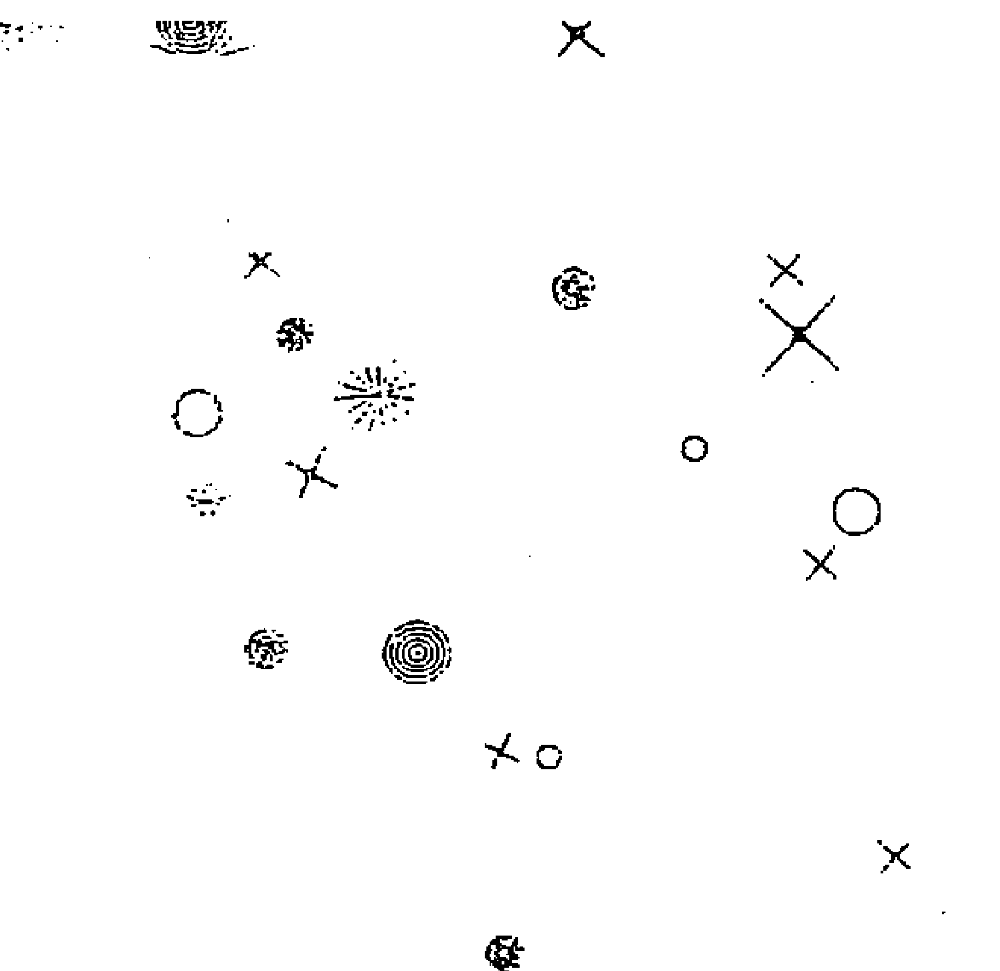

# 第七章
南交点在十二宫位

小心，小心！这一章可能会危及你的占星想象力！就像我在上一章说的一样，这类“手册”式的解读可能会令人上瘾——就像大多数的上瘾症一样。从长远来讲，它们不会对你的灵魂、对你的创造性有所贡献。

请记住，南交点的真正含义需要观察整个出生图而定（也就是说，要把这本书读完）！

## 南交点在第一宫（北交点在第七宫）

自由：我们都看重自由——矛盾的是，我们对自由的那位形影不离的伴侣却恐惧万分，这位伴侣就是不确定性。真正自由的情境意味着我们必须做出选择。有时候，我们的选项比较容易，仅仅是在做正确的事还是愉快的事之间二选一。有时候，我们无论怎样选择都进退两难。大多数时候，我们不知道选择会将我们导向何方。没有人敢保证，结婚之后会快乐还是会难过？如果生孩子会怎样？如果搬家到海边去会怎样？南交点在第一宫，这个人可能会一而再、再而三地感觉到这种自由带来的重荷。在过去世，他或她曾经在没有足够信息的情况下，不得不采取果决的行动，在做出决定时无法绝对自信。我们在这里讲的是一种格外强硬的态度，仿佛破釜沉舟的决心。

在前世，这些戏剧化的选择不仅影响了自己，而且影响了其他人的生活。这是因为第一宫的能量与领导力有关——领导者，而不是跟随者。更深入地讲，领导人也许在做决定时表现得确凿有力、态度鲜明，但他们内心却常常犹豫不已——这样的人必须做出决策，这些决策会极大地影响他人的一生，他们却不知道自己的决定是正确还是错误。对这个人来说，这些压力带来了一种独立的品质，外人很难清晰地看到他们的内心。他或她可能令人印象深刻、光芒四射，看似坦白透彻，内在却难以捉摸。

即使第一宫常常代表个人的独立性，我们也很快就了解到这里涉及到关系议题——北交点在第七宫（婚姻）。选择是否婚嫁是我们终极的、天赋的自由。但是，一旦爱情荷尔蒙产生的朦胧之美开始消退，我们就意识到，在爱情中，我们不得不放弃许多可贵的自由。南交点在第一宫，这个人曾经在这样的十字路口徘徊，最终选择了一人独自前行。通常情况下，他只是没有遇到这样一个伴侣，以便有足够的自信把持住关系的另外一端。在这里，我们必须也看到，在过去世的场景里，伴侣关系令这个人烦恼不已——这个人有一个弱势的或者索求无度的另一半，于是，他处于主导地位，变得很孤立。另外一种场景涉及到太过依赖的伴侣，或许是性格原因，或许是现实原因，造成另一半是虚弱无力的。

前世的这些状况自然赋予了这个人权威感，以及“承担个人责任”的驱力，人际互动中精巧的平衡从此也不复存在了。

在这样的交点配置下，这个人很可能在过去世有强势的敌人和竞争对手——寻找一下，是否有与南交点形成刑冲的星体。如果有，我们也会在今生找到许多这方面的证据。

北交点在第七宫，传统上的“婚姻宫”。如果说今生这个人必须要结婚（或者缔结类似的关系），便有些太过教条主义了，一般来说，是意味着这个人的进化动机在于人际关系和合作。过去世的业力模式的力量会与这个进化动机相违背，促使这个人习惯于自给自足，总是处于照顾他人的位置，容易变得孤家寡人，莫名其妙地陷入孤立的境地。这个人需要学会倾听他人、依靠他人，学会对某些同伴（谨慎选择的同伴）让步。在这里，核心的进化课题是信任和承诺。人生中许多目标本来就只能在伙伴关系中才得以实现——所谓尺有所短、寸有所长，我们有不同的技巧和天赋，相互之间可以取长补短。只有通过伙伴关系，注视对方的眼睛，倾听彼此的心声，这个人和他的伙伴们才能够真正成就了不起的事。

## 南交点在第二宫（北交点在第八宫）

把第二宫称为“金钱的宫位”，就好像说管弦乐队发出的声音很响一样——的确是这样，但是其他的乐队也可以啊！资源，并非只是钞票，是第二宫的真正议题。食物、住所也包括在内。同样的，那些让我们赖以谋生的技巧也是——这就包括太多了，从原始时代钻木取火的技能到现代科技时代的专业技能都在这张清单上。

南交点在第二宫的人，他们的前世议题围绕着这类资源展开，这类事情在他们身上留下了烙印。还要观察南交点的星座和来自其他星体的影响，有这种配置的人可能在前世曾经饿死过——这一配置在那些今生有饮食不调问题的人身上很常见，原因仅仅是他们曾经在过去某一世曾经饿死过。他们也可能曾经暴露在恶劣的致命的环境里：流离失所、断水断粮。在过去世，他们很可能经历了极端的财务状况，也许是因为贫穷，但是，巨大的财富也可能会编织出一张缀满了期望、操纵和猜忌的网，轻易地将人生扭曲。所有这些曾经威胁到此人实际生存的前世经验，其中有物质的或精神的或二者兼而有之，这些将恐惧、自我怀疑和不安感烙在了这个灵魂上。

请注意，南交点在第二宫既可能代表富裕，也可能代表贫穷。资源方面的极端状况或不稳定，都会极大地影响到人生质量，南交点在第二宫就意味着有这样的前世。有关南交点的其他信息会告诉我们其他的细节。与木星相合？看上去更像是财富。与土星相合？更像是贫穷。与天王星相合？这代表在资源方面曾经有过突然的、出人意料的变化。

解释了这一交点配置可能导致的外部环境之后，我们再来考虑内在的心理状况：一种严重的自我怀疑。财产和日常生存的资源不足以支持个人的自我实现。也许，在过去世我们有能力写成一部了不起的小说——但是如果我们从来都支付不起学费，我们整天想的只是怎么养活孩子，那么，写成小说有多大的可能性呢？显然，几乎是零。

在我们内心现在是什么感受？灵魂中的感觉会是这样的，我们可能写就一篇巨著，但是我们没有。当我们再次转生时，这种挫折感会给我们的自信心和尊严带来什么影响？它会残留一种类似错过航班的感觉——总感觉自己会是那个永远都赶不上航班的人。

一位非常富裕的年轻人曾与我有过一次令人心酸的对话。他曾经用他的财产做了许多慷慨大方的、了不起的事。他抱怨说，他总是听到他人这样议论：“当然了，如果我像他这么有钱，我也会那样做。每个人都会。”这让他觉得心碎。他的成功都被归结于他的钱，而不是他自己。这并不准确，也不公平，但是，这种消极评价深深打击了他。我们大多数人都有这种狭隘的信念：有钱是最好的事。如果想要检视这种信念正确与否，去问一问那些富人吧！这种在过去世身为富人的业力可能会在今生的出生图上展现——南交点落在第二宫。所以请小心，不要总是把南交点第二宫解读为贫穷。

那么，这样的人如何通过实现自己的灵魂动机得到满足感呢？北交点在第八宫，我们必须认识到，他或她不可能单独成功。第八宫是关于最深刻的亲密关系的。通常，这会暗示性关系，但是，只有那种能令两个人紧密联结的性关系才算，伴随着所有脆弱感，他们互相分享灵魂的赤裸相对。在这种过程中，这个人尝试以全然的、充满自我觉察的成熟臣服于另一个人。这个人内在想要达到这种爱的极致，这种需求已经压抑良久。为什么？只为单纯地在另外一个灵魂面前无所遮掩，赤诚以对。这种天真纯洁的人类礼物是对前世伤痛的一种解药。

第八宫也是关于深刻的内在修行的。对那些曾经的抗拒和抵制深入挖掘，进而发现真相。就像我们看到的，第二宫的南交点代表了尊严和自我价值感的伤痛。这些自轻自贱必须层层剥落和根除。对这些人来说，有时单纯只是回忆起过去世就能带来淋漓舒畅的强烈效果——理解真相，谅解自己，能够快速地治愈。

更进一步说，第八宫蕴含着一种潜在的力量感。那些本命图上第八宫很强的人，可能没有世俗的权势地位，可是，当他们走进房间的时候，你可以感受到一种内在的强度。这样的人是无法小觑、需要认真对待的。南交点在第二宫，这个人前世可能曾经被剥夺了力量。我们看到，在这一世，他们对自己自然的力量和权威的重新确认至关重要，有所裨益。这个人必须勇敢地修行内在功课——如果能够与一位可靠的伴侣建立稳定、令人满意的联结，充分地体验作

## 南交点在第三宫（北交点在第九宫）

也许，你在拥挤的公路上行驶，路上满是匆匆驶过的车辆。你突然间意识到，还有不到半英里就到出口了，你必须拐弯。就在这时，坐在你副驾位置上的朋友向你提出了一个有关人生哲学的问题。

你很可能对他置之不理！如果这时候你还心有旁骛，就要出车祸了！即使你回应了他的问题，也会言简意赅，可能只是打个趣应付了事。

有时候，人生就像开车走在拥堵的公路上。事情发生太快，太不可预料，我们几乎没时间停下来反思。我们确实在思考，但我们的思绪只是集中在当下的担忧上而已。在这种模式下，我们的思维方式是实在的、具体的，有着仿佛条件反射一般的逻辑思维。南交点在第三宫，这个人的过去世业力模式是紧张、快速、随机应变。也许，他或她年幼时就成了孤儿，不得不在市集上行窃谋生——饥肠辘辘的感觉已经令人顾不上分析偷窃在道德上是对是错。快速辨认机会，在机会溜走前抓住它，这样，他或她才活了下来。

当然，成为孤儿只是我们可以设想出来的成千上万的场景中的一种。但在这每个场景里，现实的压力都很紧迫，如果我们不赶快着手处理就可能大祸临头。如果这真是个沉重的孤儿故事，查找一下出生图中其他的线索，看看有没有来自其他星体的刑冲相位，或者它的守护星是否处于压力之下——比如落在第十二宫。

这个人也可能在过去世享有巨大声望。比如，一位著名的摇滚歌星，总是感受到提升自己的迫切需要，以达成更精彩的下一击。又比如，一位社会名媛的银行存款并不像她华丽的外表看上去的那么多。在这里，我们看到第三宫的基本特征：无休止的、可塑性极强的适应性，被急智和机变驱动着。在这种情况下，南交点的守护星体可能在第十宫，也可能有来自木星的影响。

麻烦在于，在今生，此人可能容易延续这种前世的习气，无法把注意力从车流中移开，没有时间停下来想想他对人生哲学的看法。南交点代表了已经过时的模式，是过去时态了。我们需要认出这些应该被淘汰的特质，继续前行。如果这个人没有成功辨认出这些特质，对他而言，人生会永远身不由己，疲于应付。他或她也许会反应机敏、足智多谋，也许会成就惊人，但是，他或她缺乏真实的远见卓识，只有应变和急智。他也许伶牙俐齿，谈锋甚健，但从来不涉及灵魂层面。

语言和交流技巧对于南交点第三宫的人来说是至关重要的。在过去世，他们曾经在这些领域下足了功夫。一种简单的可能性是，这个人过去世是个话匣子。这可能仅仅表示他前世很爱说话，总爱滔滔不绝，或者，他可能曾经做过类似吟游诗人的角色，类似个说书的，或者是一位老师。

好消息是，这一世，他不必把自己束缚在南交点这种总是大脑上了发条的模式当中。北交点在第九宫，代表哲学的宫位，进化的动机在于“坐在山顶上”，沉思一下。他或她需要思考最基本的问题——人为什么活着？我的核心价值观是什么？在这一生即将终结时，我将对自己的人生做何种回顾？

宗教，从某些层面来说，可以帮助这个人在回答这些这些问题时有所收获。任何宏观的、能够开阔视野的事物都会有所裨益。例如，这个人可能会意识到，有一件事非常有意义，这就是旅行。也许本能会把他带回到过去世的那种情形：事情发生得太快，令人无暇沉思反省。又回到之前讲到的“市集”场景上来了，在这个场景里，他行事匆匆，只求生存。看到“犯罪现场”对这个人也许有极大的解脱感，这就是为什么我们必须探讨旅行，以一种正面积极的进化的观点。这是此生一种基本的灵性自律。

## 南交点在第四宫（北交点在第十宫）

城市仅仅有数千年的历史而已，即使国家，也是个全新概念。纵观人类的整个历史，我们在这个世界上的归属感依然根源于我们的血缘关系——家庭、宗族和部落，以及我们脚下的神圣土地。这些就是第四宫的现实。当我们想象一个南交点在第四宫的人时，我们必须非常小心，不要为现代人的家庭概念所限。这些概念太过狭隘了。他或她在过去世当然来源于“家庭系统”，但是这就像说人有两条腿一样没有意义——因为每个人都是父母生养的。我们需要明了的是，家庭限定了这个人，家族期望和家族迷思对他来说是严峻的事实和束缚。这就是这个人的业力。

那么，我们可以迅速做出这样一个假设，在这一世，这个人身边很容易被那些前世的亲友围绕着。他们可能不是这一世的家人——但感觉上就像家人。现代人很难设想他们今生是与前世的兄弟姐妹发生亲密关系的人，但是事实上常常如此。互为其他的亲属也有可能——比如一个人是另外一个人的祖父母或者侄辈甥辈。

不管是哪种情况，对“家庭”（不管如何定义家庭这个词）的绝对忠诚感存在于这个人身上，这种忠诚也许有理由，也许毫无理性。经常性的，他们从关系伊始，就觉得自己和“家庭成员”之间有一种莫名的、不可思议的熟悉感。住在一起常常感觉是非常自然而然的事，而且常常发生得很快。

请注意，我们这里的“家庭”都是打引号的。感觉上是家人的人大多数都没有血缘或亲属关系。其他时候，更可能是朋友、恋人，或者工作关系，这些都渗透着“家庭”的意味，带着坚实的承诺和全然的互相认同。有这一交点配置的人通常和自己的原生家庭有深刻的、纠结的关系。这些关系可能是温暖的，也可能是冷漠的——在前世的场景里也同样如此。温暖还是冷漠，这些问题的答案可以从出生图的其他星体那里得到一些线索。但不管是温暖还是冷漠，家庭都曾经吞噬了这个人，给他打上了深深的烙印。这才是业力模式的重点。

我们可以对人与人之间的联结表示深深的敬意，但是，面对月亮交点在这个位置的人，我们必须慎出此言。家庭也可能是非常疯狂的，或者可能是功能失调的。人们可能会被这种家庭吞噬，家庭挟持了他们的个人命运，此时，个人对家庭的忠诚便显得缺乏价值。

业力陷阱在于，这个人的个人身份认同容易来自于“家庭系统”的要求。这种隐患可能以两种形式出现。第一种是被原生家庭的要求压倒：陷入到家庭的戏剧化情节里，被家族迷思营造出来的有关人生的限制性现实所奴役——“我们史密斯家的女人总是和酒鬼结婚”或者“我们琼斯家的男人最后总是给电器公司工作”。如果有这种情形，我们很可能会发现，南交点的守护星体与海王星或双鱼座相关，或者有第十一宫的因素——它们意味着“被团体限制”。

第二种陷阱是他们会自己成立新家庭，让自己变得不堪重负——生育过早，生育过多，或者生活被一位过于依赖、缺乏独立性的配偶占据。在这种情形下，南交点的守护星体可能落在第一宫——这代表自主的（或欠考虑的）决定以及自己创造的现实。或者南交点在第七宫——意味着完全被另一个人定义的内在强迫性动机。

北交点在第十宫，灵魂的强烈欲望是走到外面的世界中去——换句话说，就是要走上社会。这个个体了解某些对人们有用的事情。现在，不是躲在自己私密的、不可言说的想象中的时候了，不是把个人表现限制在家庭之内的时候了，现在是给世界做出贡献的时候。他或她进化的策略仅仅在于接受大的社会背景中人生浪潮的洗礼和冲击，而不是缩在家庭的小圈子里。

实际上，单纯把事业的考虑置于家庭之上常常是满足这种动机的重要筹码。“我是否应该离开父母，接受这份千里之外的工作？”这种情况下，离开常常能够反映这种进化的动机，待在家里常常是应该抛弃的业力模式。

把这种思路拓展开来，我们意识到，北交点在第十宫，意味着这个灵魂到达了这样的人生阶段——人生的社会成就变得比家庭的安宁舒适更加重要。

## 南交点在第五宫（北交点在第十一宫）

创造力、孩子、风流韵事、享乐主义这四个因素定义了这个人的业力可能性范围。究竟是哪一种情况占据首要位置呢？通常可以通过观察与交点相关的其他因素来辨别，即便所有这四种都值得考虑。

如果我们发现南交点与月亮、土星或巨蟹座、摩羯座相关的话，我们就要尤其注意有关孩子的业力——在占星里，这些是与父母相关性最大的象征符号。这是很常见的模式，尤其是因为大多数人都有孩子，孩子很容易让人生变得复杂。虽然养育孩子的快乐和回报无以伦比，我们也需要记得在人类历史上，人们因为做父母牺牲了很多。另外，意外怀孕总是很多——这把人们逼入了不成熟的、不幸的婚姻。一旦有了孩子，孩子的需求常常凌驾于父母的需求之上。这是自然的，却也可能是悲惨的。既然我们以怀疑的偏见来看待南交点，我们解读孩子在前世经验中带来的负面影响，常常很有收获。

在这一世，这个人也可能会重复旧有的模式。或者说，对于是否要孩子会有很多的紧张焦虑，明显的恐惧感、厌恶感会让要孩子的决定变得更麻烦。

南交点在第五宫，在前世，这个人也很可能参与到艺术创作中。最简单的确认这种可能性的方法，就是观察今生这种模式是否有所重复——如果他或她今生被创造性的工作所吸引，或者表现出某些特别的艺术天赋，这就与这种业力根源相对应了。想一想莫扎特的例子，当他几乎还裹着尿布的时候，他就可以作曲。同样的，我们需要把注意力导向其他的与创造有关的可能性——有没有金星或天秤座的因素？

通常而言，艺术家在社会里常常扮演实验性的角色，平常人也许会发现某些情绪、激情和经验令人着迷，却不敢自己冒险，艺术家们则更大胆，容易越界尝试。那么，我们也常常观察到有创意的人生和享乐主义的问题是有关联的。比如，摇滚明星嗑药很常见。南交点在第五宫的人，可能既有艺术性创意，又有耽于享乐的问题——当然，仅仅是耽于享乐而毫无艺术性也是可能的！弗洛伊德的著名观察之一，是力比多从来没有忘记过享乐。大多数上瘾症和欲望容易沾染，却不易摆脱。这个人很容易陷入前世的模式，放浪形骸，耽于声色。当然，他或她不需要是一个艺术家才有这种资格！

风流韵事也是另外一种典型的第五宫表现，经常在南交点的解读中占据重要的一席之地。风流韵事可以导致怀孕，顺理成章地带来孩子的问题。即使不考虑孩子，也值得考虑这种可能：在前世，这个人曾经打破社会约束，触犯性的禁忌。如果有水瓶座或天王星的因素牵涉其中，这点就更加可能了。看看有没有位于第十一宫的对分南交点的星体——这会暗示“来自群体的评判”，这个人可能背负“红字”。

在今生，北交点在第十一宫，对这个个体而言，核心的治愈过程围绕着如何学习策略性思考。眼光要放长远，这个人要认识到自己有时间做出决定，建筑梦想。他或她会从放眼于长期目标中得益：勤俭节约以建立家庭，完成学业以利未来事业发展，精心计划一次大型的外出探险。如果想要孩子，对这个人来说，最好要推迟怀孕一段时间，将这一决定有意加以控制。对于创造性的事务，需要假以时日，培养自己的艺术才能——也许要向大师们求教学艺，在技巧上细细磨炼。友情非常重要，但是要审慎处之。他可能需要发展出这样的洞察力，了解哪些人对他达成目标、成为自己心目中想要成为的人最有帮助——从另一方面，认识到那些单纯只是带来乐子的朋友对自己无益，与他们在一起可能只会荒废时日。

如果说北交点在第十一宫的人需要放弃人生乐趣，这是极大的误导！其实，这个个体是在学习如何更明智地从人生中获取最大的快乐，他需要了解两个基本的真相：首先，廉价而盲目的快乐是没有乐趣可言的；其次，因为生命短暂易逝，我们需要有策略性的生活计划。正是出于这样的策略，我们尊重宝贵的每一刻，仿佛珍视永恒的钻石。

## 南交点在第六宫（北交点在第十二宫）

这个人有很多世都是被责任义务限定的。他或她的个人需求总是淹没在责任、自我牺牲和谦卑中。传统上，第六宫是奴仆宫——他或她有可能曾经是一名仆人，但是我们不能只按字面意思理解。许多“公仆”也有显赫的社会地位。如果围绕第六宫有足够多凶险的星体因素的话，我们确实也可以想象这个人过去做过奴隶——凶险的星体因素指的是土星和冥王星这样的星体。

奴役并非总来自于外力强加。这个人很可能是自愿套上枷锁的，并没有来自外界的虐待挟迫。在人们发明节育之前，一对夫妇很容易就会发现自己不知不觉淹没在成群的孩子里。或者他或她曾身为长子或长女——弟妹众多，不得不辛劳地照顾他们（观察一下是否有第五宫的因素）。或者爱人生病或残疾，责任在召唤。如果是这种情况，服务因婚姻而来，这也会创造出不平衡的业力表现，甚至是憎恨（看一下南交点的守护星体是不是在第七宫）。

学徒或者弟子会被对老师的责任与义务紧紧束缚住。这仍然是自愿的，但自愿不表明束缚就少了。自治权被牺牲掉了，奉献和臣服成为主旋律。一旦这个学徒“毕业”，他或她又会陷入到另外一系列的责任义务中——把技艺传承到下一代那里去。南交点在第六宫很容易暗示这些——观察一下有没有双鱼座、海王星或第十二宫的因素，如果有的话，更能确认与“灵性”的情境相关。

在传统观念里，乐于自我牺牲是一种“善业”。即使是作为奴隶受苦，也被看做是“烧尽恶业”。然而，我这里的结论似乎有渎神灵：上帝亏欠这个人的！这些服务在宇宙里创造了不平衡。在这一世，这种不平衡会纠正过来。他或她必须接收些什么。

这将我们的目光引向灵魂的动机——北交点在第十二宫。现在，在这一世，他或她需要放下这种业力模式，他们的习气是把自己淹没在责任义务的迷宫里。他或她已经为他人服务过了——现在需要把重担交付给别人。怎样做呢？就是要从不由自主地参与到其他人的事务中去的习惯里解脱出来，保证有足够的独立性，有滋养自己灵魂的时间。这一次，灵魂想要赋予此人魔力和洞见的礼物——更精确地说，他们以自己过去世的服务在轮回中赢得了这种报偿。必须声明自己值得拥有它。在何处？在了不起的静谧中、在高山上、在荒野中、在教堂里、在安宁的床上。

没什么事情是他们首先要做的。这个人只是需要停下手里的事，在把自己的人生变得更复杂之前仔细考虑一下。

## 南交点在第七宫（北交点在第一宫）

那些已有的责任呢？鉴于这种业力模式的本质，我们有理由认为这些责任已经存在了，除非这个人非常年幼。当然，我们所有人都有一些责任，有良知的人都不能推辞忽略。但是，对于南交点在第六宫的人来说，常见的是，那些他们认为自己有责任帮助的人已经改变了，进入新的发展阶段，这时，“帮助”常常弊大于益。如果不把小鸟扔出巢穴，它们就永远学不会飞翔。宇宙以这种方式让两种模式相互对应——一个人需要摆脱过多的责任，另一个恰好需要独立飞翔——只是我们得有辨别能力！责任义务和自我牺牲并非总是崇高境界。

当我们看到月亮南交点在第七宫的时候，我们很快就意识到这个人在前世的身份定位来源于与他人的关系。这个人被另一个人限定住了，他或她的现实在另一个个体的力量面前受限。要了解这种情形，用一个词就可以直中要害：约翰·史密斯太太！（译者注：指出嫁后从配偶姓，没有自我了）这种情形在现代社会几乎已经绝迹了。

现代女性或现代男性如果被冠以这种称谓常常会不舒服。这太古旧了。但是我们许多人在成长过程中还常常遇到这种情况。在父权社会里，女性的公众身份还是来自她们的先生。这是南交点在第七宫的可能性之一：妻子身份的存在完全附属于丈夫。

我们要立即承认，这种情形并不是说一定存在暴力或虐待——如果想知道是否存在的话，可以看一看是不是有诸如土星、火星、冥王星与南交点呈四分相或对分相的状态。通常，一位传统女性可能会对此感觉非常自然，并不会想一想自己是不是还有其他选择。当然也可能她的丈夫深爱她，并非像个暴君。

但是，既然我们对于南交点总是带着负面的有色眼镜来看，我们必须认出这个人曾经的状态是没有权力的，或者是无话语权的。

女性特别容易遇到这种状况，但并不只是她们！男人也很容易受到另一半的控制——所谓的“妻管严”。

在这里，我们并非只局限于婚姻的范畴。人生里充满了各种权力不平衡的人际关系。比如，客户受控于心理医师。或者一个很有魅力的朋友会在伙伴关系里占主导权。

还有一种相反的状态——有时候，南交点在第七宫会出现这样一种前世故事，这个人在关系里是占主导地位的。如果得出这种解读，要看南交点的守护星体是不是处于强势有力的位置——如在火象星座或者第一宫。这如何理解呢？似乎这是违背我们直觉的，为何一个强势的人会被弱势的人限定？也许可以这样来解释：假设你结婚时称心如意，但你的另一半后来身体残疾或长期卧病不起了，你的爱使你忘记了自己的生活，你永远围绕着另外一个人无休止的需求打转。

南交点代表未治愈之伤或未完成之事。我们理解到，只有在识别和释放旧模式之后，构成这个人现世关系的灵魂契约才会得以实现。这些旧模式是什么？让我们想象一个男人和一个女人，都是单身，理智而独立，他们有缘相识。过了几年，他“忘了”怎么做饭。她“忘了”怎么给汽车加油。他们俩都丢掉了自己一部分的完整性，把某一部分投射到另一半身上了。某些事务的分工是自然的、健康的，也是伴侣关系的实际福利。但是，在这种健康分工和病态缺失之间是有区别的。在过去世，这个个体的一部分曾经迷失和消融在另一半那里。这一定不能再次发生。

应该怎么做呢？并不是要和另一半分手，停止付出爱。在关系里，需要为作为独立个体的自己留出一些空间。北交点在第一宫，标志着他或她的目标是一种有觉悟的自私。即使在关系当中，这一目标也是在独立的道路上做独立的灵魂。有时候，两个人需要不同的经验。经常的，这可能意味着两个人在周四晚上身处不同的地方——或者这一年里在不同的地方度假。他们必须克服对分离的恐惧，要把尊重彼此的自主空间作为一种爱的礼物来看待。很自然的，他或她往第一宫的方向进化，会有更加果决和自我的体验。所有的守护天使都会欢呼不已！爱情因人类的独特性而绽放，爱情因人类之间有创造力的张力而繁荣。光与暗彼此赋予了意义。男人和女人因彼此的存在而对自身更有觉知。合一是非常深的智慧，但灵魂通过二元对立觉知自己。对这个个体而言，是在这种爱情的二元中得到一些自主呼吸的空间的时候了。在分离时，爱情会进化至更深的灵性成熟度。

## 南交点在第八宫（北交点在第二宫）

风暴般的强烈情感是前世的遗留，这定义了这个人的情绪体验。南交点在第八宫，他曾经在烈火中煅烧过——很可能是噩梦中。这个人怎样应对噩梦是一个开放性的问题。如果只是看南交点所落的宫位，我们肯定不需要假设任何正面或负面的东西——戏剧化的人生能激发出人们最好的一面，也可以让人们堕入深渊，这都取决于他们如何回应。我们认为这个人曾有一些极端的经验就行了，这些极端的经验仿佛是对于人心的X射线，有很强的揭示性，很可能带有一些悲剧化的元素。

第八宫在传统上是有关死亡的宫位。生死存亡并不是唯一的主题，但是对提示前世情节很有效。当然，我们在前世都死过！但是，在这里，死亡是带有戏剧化情节的。这里的死亡不是“自然”死亡。大概没有什么比死亡更容易制造出强烈的情感了——只是想一想电影里生离死别的场景，就足以使我们黯然泪下：某人牺牲了自己换回了朋友的生命；好人悄声说出遗言。

想象一下一个参军的年轻人，第一次亲眼目睹支离破碎、形状可怖的尸体。想象一下一位生活在中世纪的妇人将死于鼠疫的人放上货车。想象一个男人将垂死的妻子抱在怀里，耳边还回响着新生婴儿的啼哭。

类似的经验会对一个人产生什么影响呢？他或她会如何回应？答案当然因人而异。也许我们会观察到情感的深刻和坦诚。也许我们会观察到因为恐惧而退缩到内在世界，对外界拒绝。进化也许会加速，但也许会延缓，因为个体可能无法消化这些恐惧的经验，精神上不堪重负。不过，在任何一种情况下，都有深刻的伤痛烙印：恐惧、悲伤、焦虑。

另外，还可能有一种状况，即性幻想。这并非凭空捏造。深入的性关系的最大敌人是情感距离。在第八宫的一切都朝向相反的方向——灵魂的赤诚。在这个灵魂的历史中，很可能有深刻的情感连结体验。他或她在这一世也有可能与前世的爱人相遇——吸引力同样如旧。从相遇伊始，他们就惊愕于彼此相知的深度，他们对彼此平时隐藏的性格面向非常熟稔。这种相识是源于床笫之间还是战场之上并不重要。

奇怪的是，第八宫也与幽默感有关。在我们看到的所有因素里，这种说法就像“性幻想”一样，可能显得有些另类。但是，请回忆一下你听过的成千上万的笑话：大多数讲的都是非常可怕的东西。有多少笑话是有关生病和死亡的？有多少是有关偷情的？性无能呢？衰老的可怕？死孩子？人类总是拿幽默来应付一些极端的、不可思议的状况。这一交点的人常常带有一种“绞刑架式的幽默”。著名的电视系列喜剧《蒙提·派森》(Monty Python) (译者注：Monty Python 充满了恶搞和无厘头幽默，在20世纪70年代风靡全球）的演员里许多人都有这一交点配置。

很久以前，有些南交点在第八宫的人学到了“让你笑”，同时其他人学到了“让你哭”。有些人两者都学到了。

这次的灵魂契约是什么？北交点在第二宫，最简化的称呼就是金钱宫。实际上，第二宫的意义很宽泛，它包括的所有元素都与赖以生存的资源相关：食物、住所、适当的技能、社交网络。对这个人来说，要学会治愈过去世的伤痛，一个需要解决的问题是，他或她必须创造出一个感觉安全的环境。准确地说，这与我们人类智力和逻辑所认为的安全感不同，必须是“内在”感受到的安全感。人类智力能够理解，我们大多数人如果财务稳定，住在安全的家里，有一系列的“保护伞”，如人寿保险、健康保险、退休计划等等。对这个个体来说，建议他们忽视这些问题，因为这些是“非灵性”的，是太过粗暴的举动。建立这类支持系统也可以是灵性练习的基础。对这个人来说，“内在”需要安全稳定的保障和舒适感，如果可能的话，它（指“内在的动物”）住在接近大自然的环境里会更好。它喜欢看到食物在手边。它需要撤离路线。它也可能需要某种武器——甚至是一段祷文，在需要的时候可以用！如果这个个体能够创造出第二宫的环境，在这种安全环境下，他或她可能会得到更深层的胜利：对于自己和人生的自信心的回归。简言之，就是信念。

## 南交点在第九宫（北交点在第三宫）

在学校里，孩子们学习哥伦布，相信“地球是圆的”。在哥伦布之前，人们相信地球是平的，如果在海上航行太远，就会在世界边缘坠落。哥伦布打破了这种恐惧。即使历史真相远比传说更复杂，但是这种孩童般的想象代表了一种发自肺腑的信仰之力。信仰是如何创造了我们的现实经验——这也是第九宫代表的。

如果我们“相信”什么事物，我们就能有非凡的成就。信仰令人有力，就像“什么都不信”会让人弱小一样。南交点在第九宫，这个人的灵魂记忆是被强大的、能改变人生的信念塑造的。

考虑到人们的历史，我们可以做另外一个推测：大多数重塑了文化的信仰体系在本质上有一部分是宗教的。那么，我们可以确信，在过去世宗教曾经给这人打上了强大的、不可磨灭的烙印。他或她是在“神圣的秩序”之下么？这是可能的。我们可能会从观察出生图上的其他维度来确认——南交点的守护星体是否在第十二宫（寺庙、修道院）？如果是这样，就很可能。但是，我们不能假定这个人曾经在修道院生活。宗教可能会以很多其他的方式影响一个人的一生，比如通过社区、家庭——甚至是通过历史悠久的对宗教战争的狂热。

让我们把另外一个第九宫的维度带入画面：旅行。也许，这个个体的业力模式与宗教毫无关联——但是，在我们抛下宗教转向旅行的时候，先考虑一下，在历史上，宗教是多么频繁地促使人们长途跋涉，体验其他的文化。想象一下十字军东征，或者去麦加、罗马、马丘比丘（译者注：Macchu Pichu 又译麻丘比丘，著名的前哥伦布里斯的印加帝国遗迹，位于南美洲的秘鲁）、贝那里（译者注：Benare，佛教圣地）朝圣。我们也可以想象清教徒为了逃避迫害而流亡到新大陆，摩门教徒的西移，犹太人的流离失所。

教育是第九宫的另一种可能性。如，可能过去世曾经有在大学里的经历。如果是这样的话，这类机构会在现世让这个人感觉很舒服，很有吸引力。我们回忆一下就知道，近几个世纪来，那些学术界人士常常带着不可一世的自负，轻易就淘汰和取代了曾经的教育。学术界多多少少也是一种宗教。

我们还是带着质疑的眼光看待南交点，南交点常常代表了过去世的阴暗面，我们要寻找那些限制或歪曲今生经验的事实。对信念的需要蒙蔽了我们看到真相的能力。和那些“真正的信徒”争论是不可能的，他们通常无法想象他们自己可能是错的，不管有什么样的证据。这样的人会成为凶手，无视他人也是人类的事实。他或她也会否认他们自己的感官给出的证据。这样的人宁愿驾船坠落到世界的边缘也丝毫不考虑自己的愚蠢。有多少19世纪的物理学家曾经嘲笑过爱因斯坦？有多少寻找黄金七城（译者注：16世纪时的传说）的征服者最终只是抛骨荒野？有多少朝圣者和十字军成员曾命丧异域？在过去世，这个人曾经被自己的热忱蒙蔽心智。

或者压抑人性的教条礼法曾经紧紧束缚住这个人。没什么比宗教哲学更能驱动我们疏远自己的身体和自然本性了。

那么，由过去世带入今生的核心问题在于：在这个人的世界里，他曾经执著于一种错误，至少是不完全正确的观念！出于“信念”，在过去世他丢弃了自然直觉和常识。

北交点在第三宫，代表这个灵魂的进化意愿在于只相信那些基于他个人经验的证据——收集越多这样的证据越好！那么，开放的心态就成为强大的进化驱动力。他需要回归到一手的知识、基于感觉的智慧和发现。好奇心可以引领方向。这个人从学习经验中受益——尤其是令人迷惑的经验！这可能听上去很奇怪，但是简而言之：如果他或她遇到了一个令人印象深刻的新时代运动（New Age）老师，这个人同时也需要很快寻找一个基督徒、穆斯林或科学家当老师。

无止境的探索是关键因素，所有信仰必须保持实验性——可以拓展，能够经得起质疑。有帮助的策略在于和那些有不同见解的人交谈。鉴于人生的复杂性，对于这个灵魂来说，和信任的朋友们时常沟通，交换意见，不设禁忌的话题和观点，是康庄大道。这里的目地在于学习与不确定性和未知性共存，思想开放，不固执己见。

## 南交点在第十宫（北交点在第四宫）

对轮回转世有一种很合情合理的批评，是说太多人“回忆”起他们曾经是知名人士，曾经参与到重大的历史转折中。逻辑推理会告诉我们，几乎我们所有人都曾度过平凡无奇的人生，在这样的人生里，一旦我们去世，就很快为世人淡忘。当然了，即使活得籍籍无名也没有什么可惭愧的——人们在绝对隐姓埋名的情况下，也能有了不起的灵魂进化成就。

根据同样的逻辑，我们也要接受以下事实，大多数人名不见经传，也代表我们中的某些人一定死后留名！在出生图上，判断过去世是否曾经显赫，典型的标志就是看南交点是否在第十宫——这是传统上描述社会声望的一宫。如果有这个位置，我们便知道这个人曾经是广为人知的。说他曾是埃及艳后克娄巴特拉或者吉他手吉米·亨德里克斯（Jimi Hendrix）比较接近。不过当然这也是夸张的说法。十二分之一的人都有南交点在第十宫，人群中的名人比例可没这么高。我们需要更深入地了解第十宫的奥秘。其实问题不在于这个人是否名垂青史。这代表着作为一个群体中模范榜样的身份——这个群体最后是否留存或消失并不重要。关键在于，这个人在灵魂里留下了曾经拥有地位的经验。

南交点在第十宫，这个人过去世在他们的社会里享有声名和领导权。基于社会和历史现实，很可能他们刚一出生就享有声名——声名显赫的公爵显然比农奴要多得多。

声名和权力令人艳羡，但是南交点在第十宫，我们就需要意识到，从进化的观点来讲，我们需要小心了。因为对这个人来说，过去世未解决的问题依然缠绕着他。权力有没有消极的面向？声名和出身会不会困住一个灵魂？对这个人来说，我们需要考虑到，长期的角色扮演、不得不曲意奉迎、为了地位处心积虑，这些会有什么危害？

我们必须谨慎，这个人也许从前世继承了这样的习气，总是要提高他或她在今生的地位：他们因为业习的驱动，也许会对事业和地位格外重视。向上爬或者保住地位是一种本能，而不是一种有意识的决定。也要当心，不要假定我们现在讨论的是传统意义上的地位。一个人可能是拳击界的名人，也可能在集邮方面有成就。

有时候，金星或第七宫会与南交点有关联。在这种情况下，有一种可能性，虽然听起来让人有些不太舒服，但是我们也要考虑，这就是，在过去世这个人曾经为社会地位结婚，而不是为了爱情。这种“政治”婚姻在历史上很常见——现代社会也并未绝迹。在这一世，这个人必须确认，他或她对自己爱人的感情是真实的，并非因为被社会认为是“幸运婚姻”就结婚。每次他或她听到有人说，“你们俩属于彼此”（或者“你值得有更好的”）的时候，就需要重新确定一下，这一婚姻决定是不是单纯从私人感受出发的。

我们强调这种自主性是有理由的。北交点在第四宫，这个个体的灵魂契约，首当其冲就是他或她要深入自己的内心，信任任何一种发现。第四宫是我们的内在心理展开的地方：我们最深的感受和需求都在这里。这个个体的目的，是要把诚实和内省放在首位，如此才能得到对自己的真实认识，而不是受外界的影响或虚荣心的引诱。

第四宫也代表家庭的需要。如果说，在内在探索之后，这个人选择了一个伴侣，目标就是一起建立家庭。表面看来，拥有一个反映了他们的本质和长期承诺的住所是这种功课的很大一部分。他们或者单身，或者有伴侣，也许他们会买一所房子——迈出第四宫健康的这一步。但是，房子仅仅只是一座建筑而已。家才是一个有关滋养、安全和储存共同感情记忆的地方。如果没有伴侣，即使一只狗或一只猫都可以把一座房子变得温暖，变成一个家。人类之间的联系也是极关重要的！北交点在第四宫，这个个体需要一个广义的家庭。他们不需要有共同的血脉，他们不需要生活在同一个屋檐之下。但是，在这里一定有一种共同的承诺，这是超越外在情境的。有一个问题，应该永远有一个答案——如果我失去了在这个世界上拥有的一切，如果我被世界抛弃，两手空空，谁的心里还会有我？ 这个答案，就是家庭。

## 南交点在第十一宫（北交点在第五宫）

来道数学题？站稳了：这是史蒂芬的群体动力学第一定律。一群人的 IQ 值，等于所有人的 IQ 的平均值除以群体人数。

好吧，可能这并不是什么精密科学，但是这种公式确实解释了人类历史中的很多现象。愚昧状态在人群中可以观察得到，例如，滥施私刑的暴民，烧杀抢掠的军队，对于财务宣讲人、穆斯林高僧、犹太教士的集体盲目崇拜。甚至在日常中也能看到，比如在体育赛事里，想象一下三万多人嚎叫着，渴望看到血拼现场，这也是一种可怕的动物性表现。

南交点在第十一宫，我们看到的是这个个体的灵魂记忆为社会集体力量所影响。在前世，这样的人可能被卷入了历史、社会和文化的大潮里。这些事件把这个人带离了真实性，抹杀了他真实的灵魂动机，与自然的价值观相去甚远。他在群体的意愿里丧失了个性。可能会出现我们在前一段所描写的疯狂场景，不过除非有来自冥王星、火星对南交点的影响，否则我们不能确认一定是暴力场景。如果有金星的影响力，我们可能看到的是比较复杂微妙的状况——一个“礼仪之邦”对一个人的影响力，文化的圧力令这个人必须“嫁个好人”、“好好过日子”，并且相信其他人所相信的。如果有来自木星的影响力，也许集体意识对于“成功”的定义曾使这个人偏离了自己原有的人生轨迹，甚至影响到他们的灵魂进化。我们大脑中的动物性机制令我们很容易在群体中丧失自己的身份，这种机制可能以软硬兼施的方式出现。群体可能对我们威逼利诱，甚至不需要动用任何手段，我们就主动对集体意识的妄想缴械投降，束手就擒了。动用私刑的群体是杀人凶手，但是在群体里，有几个人真正亲手实施了死刑？

无论在什么样的情景之下，可以保证的是，在这一世，这个个体有一种灵魂中的意愿，想要寻求更多的自由，而不是屈从于外界的影响，不管这些影响力来自于家族，还是来自于公司。但是北交点在第五宫，我们也不能掉以轻心。第五宫是快乐的宫位。我们想一想人类对于快乐的需求就可以了解这一宫位的快乐法则。对这个人来说，从进化的观点看，做他喜欢做的事是当务之急。但这比看上去要难得多。为什么呢？因为南交点在第十一宫的人很容易把集体意识里的信念当成是自己的，把大多数人认为的快乐当成是真正的快乐——拥有新车，去圣地塞多纳冥想，减肥……对这个人来说，这些可能并不能给他带来快乐。除了明显的“食色，性也”，知道什么能真正带来快乐是一门艺术。

这一治愈过程的必要的基础阶段，是恢复辨别和认识自己自然欲望的能力，并且在此基础上行动。这一过程常常会从最简单的事情开始：听听非主流的音乐，去一些名不见经传的地方旅游。

随着进化的深入，这个人可能会进一步体验到一种表达自己创造力的欲望。也许，他会学习绘画和表演，也许他会写诗。在个人表达方面，伴随着一种极大的快乐。

如此去做，这个个体可能会发现自己身处一群艺术家之中。在这样的进化节点上，他可能会遇到十字路口——这是一项很重要的仪式，可以辨认第十一宫。从一方面说，他有自然的灵魂伴侣群体——那些真正具有实验精神的艺术家，能够坚决地探索和冒险、庆祝人生的人，他们并不轻易评判他人。这样的艺术家是真正的艺术家，他们代表了“集体思维”的反面。这些人会鼓励他自然地、自发地、忘我地表达自己，等于给南交点的对面一端激励加分。

从另一方面来说，他可能会遇到另一些人，这些人代表着落伍的、因循守旧的集体意识——很可能他与这些人有强有力的业力。这在“艺术家”当中同样可能发生。其实，没有比先锋派更守旧的了。没有什么比一个总担心自己看上去不酷的人更不酷的。他如果和这些人接触，而且被他们的观点影响，就又会落回自己旧的南交点模式里——虽然一时庆幸自己是酷的，但实际上根本不是。不过，一个随大流的人可能从来不会这样想。

那么，最大的挑战——就像以往一样，很难达到——就是个性、快乐、玩乐的自发性和创造性，从对表面的成功、时尚的需求中得以解脱，哪怕是那些最微小的需求。

## 南交点在第十二宫（北交点在第六宫）

可怕的损失和灵魂的成长，这二者常常配对出现。有失必有得。婚姻破裂，事业垮掉，收到病危通知……于是，我们转向灵性，我们转向神明、宗教或灵性道路。这些改变可以完全真诚地发自内心。临终医院里常常有许多闪闪发亮的眼睛。南交点在第十二宫，这个人在前世曾经与损失和痛苦相伴——这大抵是肯定的。也有一种可能性，他或她曾经养成了深刻的灵性本能。

当我们考虑南交点的时候，通常也要更细致地考察南交点星座的守护星体，以及与南交点构成的相位，这些会充实故事的细节。如果只知道南交点在第十二宫，也已足够激发我们想到丧亲、囚禁、疾病及其他所有足以剥夺这个人生命中欢乐的损失。南交点在十二宫也与寺庙或修道院的场景吻合，或是在某种神秘的机构里——如秘密学校或地下组织。很明显，前世这个人在情感上难以接受外在世界的时候，他或她会寄信念于另外的世界。

这个人对于短暂人生的残酷事实有着深刻的体察。对于南交点，我们一定要找出过去世未解决的问题，这些问题依然存在于今生，可能会干扰这个人实现他真正的灵魂契约。这样一来，我们认识到“自我的丧失”依然缠绕着这个人。绝望同样也是。简单地说，有这种印记的人容易对外在的、实存的简单快乐视而不见，迷失在内心的泥潭中。他们可能会忘记自己有肉身这一事实——而实际上，他们的身体中可能留存了痛苦感和匮乏感，使得他们与自己的身体疏离。这样的人可能会沉溺在想象的世界中，不停地看电影、看电视和阅读。他也可能会在灵性修行中把自己融化掉。这种灵魂记忆中被强化的痛苦也会导致酒精和药物上瘾。那么，如果不付出进化的努力，这个人可能像悲伤的鬼魂一样虚度一生。

北交点在第六宫，这个个体的灵魂契约的一部分就是回到身体中。第六宫与健康和人生的物质现实有关。锻炼是有帮助的。享受有规律的饮食也是。更有帮助的是触摸，这个人需要与他人单纯的肢体接触、拥抱，和朋友一起在睡眠中放松。

更进一步说，第六宫与让我们焕发活力的日常事务有关。有些可能是无聊的琐事——付账单，购买日常用品，但是还有许多是基本的身心养生方式：定期的身体护理和保健，合理膳食，充足睡眠，避免摄入有害物质。对于北交点在第六宫的人来说，创造这样的生活方式，也是一种灵性上的成就。实际上，身心健康确实可以是一种灵性成就。找到这种平衡是一种挑战。当我们的意识开始进行自我身心检视之后，我们也有可能会变得过度紧张和神经质，但更常见的还是对身体健康发出的信号麻木不仁。

第六宫也是关于服务的，与我们觉得自己是否称职、我们对他人是否有用有关。北交点在第六宫，这个人的灵魂契约当中包括回馈世界。除了对于痛苦和损失的记忆，他或她也带着一份真实的智慧。当然了，在过去世，这个人至少已经开始试图整合自己失去的痛苦。很可能，对于这种伤痛，他或她找到了真正的灵性老师。于是，这个人也携带着宝贵的财富：对于生命无常的理解，很可能还有对于这些特定的灵性实践和视角的真实记忆。伴随伤痛，南交点在第十二宫的人也有一份感恩心，从而会自然地希望以一种对他人的慷慨来表达。伤痛希望抛弃这个世界，感恩希望为这个世界服务。这个人现在的进化依赖于如何平衡这两种矛盾的情绪——对世界的厌弃和感恩，从而通向服务。

这种服务，其最高的境界，是希望以典型的第六宫传统来表现自己：传承。一旦我们学到了有价值的东西，我们自然希望将它传递下去。我们对于老师的感恩之情永远都不能直接报答，于是我们在日后偿还——通过把智慧传递给我们 的后人，让慧焰继续燃烧。在这种反复的循环中，通过对他人的服务可以带来进化。同时这个灵魂会更进一步向其他灵性老师的教诲敞开。北交点在第六宫，与师父和指导者相遇时，巨大的转变可能很快被激活。于是，传承当然就同时指向两个方向，我们在施与受中觉醒。

参与到传递蜡烛的慧焰的过程中，便是第六宫北交点的最高境界。

# 第八章

### 与南交点合相的星体

（请注意，以下也适用于南交点的守护星体——详细说明参见第九章）

亚瑟·柯南·道尔先生为世界献上了一位不朽的虚构人物，了不起的大侦探福尔摩斯。他开创了现代侦探小说的先河，并且有数以千计的后继者——如阿加莎·克里斯蒂，P.D.詹姆斯，罗伯特·帕克，苏·格拉夫顿等。柯南·道尔作为第一人，开创了这个领域。

当我们看到在他的出生图里，他的太阳与天王星合相的时候，就一点都不觉得奇怪了，这一相位代表着独创性和天才。还有，太阳和天王星合相在双子座（与写作相关），落于第十二宫，这代表“看不见的东西”或者“隐藏的事物。”

天王星总是打破规矩，质疑权威。如果没有天王星，我们可能还相信世界是平的，是四方形的。社会变革不会发生，进化演变不会发生。柯南·道尔的例子就很有说服力，他示现了天王星的这部分意义。

为了保持客观，我们必须要记住，并不是所有的传统和“接收来的智慧”都是错误的。这些传统智慧包含人性与自然律之间的关系，其中还有许多是常识。在叛逆和打破文化规范的时候，天王星有时候会表现得非常离奇古怪。比如，柯南·道尔曾经宣扬花园精灵的照片是真实的，可这些照片大多连现代社会里的12岁小孩儿也骗不过。

这些都不奇怪。大多数占星师熟知与本命太阳合相的行星带来的影响，熟知这些行星是如何成为这个人身份的核心部分的。实际上，对太阳的解读之一就是身份本身，那么，如果一个星体与你的太阳合相，你很容易与之认同——你通过那种方式经验到自身。其他认识你的人也能看到这颗行星带来的影响力。柯南·道尔就是一个鲜活的例子。这些是我们熟知的占星知识，回忆这些知识，能帮我们掌握进化占星学里最有价值的一些技巧。

与南交点合相的星体，其运作方式会与合相太阳的星体非常类似——只是它代表了前世的身份。若回到前世，所有认识你的人会觉得你就是那个星体的化身，你自己大概也会同意。

因为业力模式会延续、会带到现世，我们很可能会在你的今生也看到这一星体非常明显的印记。比如，天王星与南交点合相，那么你的性格和人生中会充满这些天王星的烙印：天才，叛逆者，与权威的对抗，古怪而不可预测的经历。

制片人迈克尔·摩尔以在影片中大胆发问、勇于质疑而著名。他的影片有《科伦拜恩的保龄》、《华氏911》和《神经病人》。在他的出生图上，就有南交点与天王星的合相（落在巨蟹座，第十二宫）。奥普拉·温弗里也有这个相位（南交点落在巨蟹座，第七宫）。在他们二人身上，我们又一次看到了基本的天王星特征——对现代社会文化的挑战和质疑。其实，他们前世就如此，这只是昨日重现罢了。

既然我们把南交点想象成“过去世的太阳星座”，基本的“诀窍”就是：

对于合相南交点的星体，把它们当做与太阳合相的星体去理解，只是 要记住这不是今生，而是过去世的。

这样的星体与你前世的性格和命运息息相关。你曾是它的化身。在业力法则的限定之下，这个星体的影响依然根深蒂固。你还是会通过这颗星体的有色眼镜看世界。为了进化，你需要像局外人一样观察自己。我们还知道，从负面和批判的角度看待南交点通常会格外有帮助和启发。南交点主要是一种执著或迷恋。你把这种情况带入今生，是为了全力克服它，从它的限制中解脱出来。理解与南交点合相的星体，我们也要持同样的态度。

这颗星体也有积极的面向，它的优势也会在今生轻易显现出来：再想一下迈克尔·摩尔和奥普拉的例子。不过原则上，我们要对这颗星体略带怀疑。这样，你的解读才会更接近真相。

> “性格即命运。”这句话只有五个字，却给我们提供了很好的人生公式——尤其是它的推论：如果我们改变性格，就等于改变我们的未来。

逝者不可追！业力之河中，河水奔流不息；我们的任务是从出生图上解谜那些符号，最终将我们的人生从它的束缚中解脱出来。即使在过去世，这依然是真理：性格决定命运。过去的命运已成定局——并且反映在这颗合相南交点的星体上。

最后，我们不能把性格与命运分开。人物和故事情节分析也许在小说里可行，但在现实中，它们互相紧密纠缠，形影不离。

天王星与南交点合相？你过去世的性格是天王星式的——毫无疑问，天王星的特质也会体现在你今生当中，在你“命定的”环境中出现。

我们也可以加入荣格的共时性概念：你的内在心理与外在境遇常常具有一致性。换句话说，如果你的灵魂已与天王星的功课有约，你会在“不经意 间”遇到许多暴君——他们是那些给你机会，让你锻炼出天王星肌肉的人。你会不小心触及那些官方的界限，犯些错误。你容易加入叛逆者和异教徒的阵营。

在实践中，基于共时性的法则，当你看到与月亮南交点合相的行星时，就能了解到过去世的性格是这样，过去世的境遇也是这样。

星体在星座代表的心理和宫位代表的环境之间建立了桥梁。这是占星学中的基本法则之一。

在迈克尔·摩尔的出生图里，就像我们看到的那样，天王星与南交点在第十二宫合相。这说明他在过去世就曾经是一个叛逆者，就像今生一样。第十二宫代表他在前世的命运是痛苦和损失一切，我们知道叛逆者常常被送上绞刑架。这种情况可能是突然发生的，出乎意料，这也是天王星的外在表现。

在奥普拉的出生图里，天王星与南交点合相在第七宫。这是完全不同的情形。很容易想象她从一桩压抑沉闷的婚姻当中胜利大逃亡。

这是两个完全不同的故事！我用他们作例子，是为了强调不要生搬硬套我以下几章里所讲的内容。以下只是一系列宽泛的指导方针。与南交点合相的行星的原型，其涵盖范围非常广泛。要运用这些技巧，你必须根据出生图上的所有相关符号，寻找与所有线索匹配的关键点。基于整张出生图作出综合的、完善的解读，是我们的主旨！

这听起来可能很难，但是随着实践，你会掌握它。实践才是唯一通往成功的道路，速查手册只能陪伴你走一段。我们在第十四章会详细地讲到如何把这些细节综合在一起。

### 太阳合相南交点

太阳的基本特质之一是光明，第二是温暖，第三是巨大的重力。太阳与南交点合相，这其中的任何一种特质或者所有特质都对你的前世身份很关键。人们围着你转，不管你想要还是不想要，你都拥有权力。你可能会展现出相当可观的个人魅力——这也是太阳的特质。至少，你带有一种威严感。人们有理由认真对待你，不管他们喜欢还是不喜欢你。

想象这样一个场景：你在高速公路上行驶，匆匆忙忙，你要错过一次重要的约会了。但是，这时候，你从后视镜里看到警车的蓝色灯光闪烁，你该怎么办？当然，你要停车熄火，向警官的权威致敬。逃逸是愚蠢的，因为不管警察本人是什么人，他都代表了国家权力。这就是太阳的威力！你必须围着他转一会儿。

在前世，你可能有世俗权威。你是有头衔的人。寻找一下有没有其他关于地位的标志——也许南交点在第十宫，或者在摩羯座。一个人不一定必须光芒四射、魅力十足才拥有权力。在狮子座，你可能很有魅力！而在摩羯座或者处女座，你的头衔或技能足以骄人。

许多人说，当他们遇到名人的时候，会被他自然的光辉打动。理解这种光辉，会帮助我们理解太阳与南交点合相的情况。这种“光辉感”是文化投射么（比如对影星、歌手、政治家的投射）？或者这些人本身就与生俱来带有这种魅力？或者二者都有？在许多情况下，我怀疑第三种情况才是正确的：魅力会吸引权力和地位，这二者常常密不可分。再说一次，“你的性格就是你的命运”。观察一下这“光辉感”，看看南交点是不是与木星或者狮子座相关，或者落在第一宫也有可能。

消极的方面是什么？也许是我执太重。想象一下，成为经常在报刊亭的杂志封面上露脸的人，或者成为某个重要会议上的贵宾，这会让你觉得自己非常重要。也许你确实很重要，但重要性也可能让人上瘾。你可能变得傲慢，自以为是，甚至成为一个暴君。

杂志封面上露脸的名人，是不是真的是一件“好”事呢？如果你是他们中的一员，当你到了下一世，没有人关心你最喜欢的颜色或者你的政治观点的时候，你会有什么感觉？

不要因为这是太阳就假设“自我”（Ego）一定是问题所在。责任的重负也会在这个灵魂上留下可怕的痕迹。领导者意味着重担。权力也容易带来孤立——可能会是一种公众角色的孤独感。

在任何一种情况下，今生这类人都有一种需要，想要更多的坦诚，更少的公众关注。对这类人来说，作为一个在别处的陌生人是良药——从所有角色和期待中摆脱出来，成为“没什么特别的人”。

### 月亮合相南交点

让我向你展示一下月亮，这样你就知道我们谈论的对象是什么了。比如，你有个孩子。你把孩子紧紧抱在怀里。这时我出现了，对你说：“好可爱的孩子呀！我给你二十美元，你把她送我吧。”

显然，你会对这一提议不屑一顾。你甚至会感觉受到冒犯。关键是，你内心有些深刻的本能被触动了。你就是不能抛弃你的孩子。这原则在任何道德伦理之上。它就是这样深植于人类的头脑和灵魂里。做母亲的容易体会这一本能——当然，我们在这里也对做父亲的表达一些敬意。假设一家人出去露营，有一只熊来袭，把一个孩子拖走了，哪个男人不会挺身而出呢？

月亮的滋养和保护本能有很美丽的一面。它不思考，只行动。当保护幼小的时候，它是不惜一切代价的。

很明显，我们中的大多数人在过去世都为人父母。但是，南交点与月亮合相，代表这种经验被强化了。爱护孩子，抚养孩子，看他们长大成人，这种经验和出生、衰老、死亡一样是人生常态。但有些事出岔子了，比如孩子丢了。我们都理解，至少大体了解，大概没什么比失去孩子更极端的事情了。在这种情况下，南交点一定是被“害”的——可能冥王星、土星或火星与南交点呈四分相。如果是相反的情形呢——我们对孩子不肯放手？那就看一下有没有来自海王星的作用力。如果一个孩子有身体或精神上的问题呢？比如唐氏综合征？脑瘫患者？很可能你会看到来自土星（责任）的强大影响力，也可能是处女座或者第六宫的关系——这代表着无休止的、令人疲倦的服务。

除了抚养儿女，月亮还有其他的含义，它也代表家庭和宗族。实际上，我们所有人都来自于“家庭”，但是，如果在前世，你出生在一个我们现在称之为“机能不全”(dysfunctional)的家庭里会怎样？这种业力印记可以从月亮与南交点受到其他因素的挑战来确认。如果有酗酒问题，看一下有没有来自海王星、双鱼座和第十二宫的压力；乱伦看冥王星，尤其是在金星和火星也有影响的情况下；暴力来自火星的硬相位。（如果火星也与南交点相合，意味着火星同时合相月亮，这可以代表你把这种暴力内化了。如果是刑冲相位的话，代表是暴力的受害者。）

还有另外一个选项——前世的家庭并非是异常和疯狂的，仅仅只是太有吞噬性，占据了一切。如果你在前世完全为家庭限定，看一看是否月亮主题被强化了——比如，月亮与南交点的合相在第四宫或者巨蟹座。

就像所有的业力模式一样，在这里，令人毛骨悚然的是老故事通常会在今生再次重复。有这种星体配置，就存在这样一种需求——以前曾以自己对他人的滋养来定位自己，而现在想要超越这种定位。家庭并非不好——但是我们必须小心，除了家庭生活之外，我们的人生还有其他的事情。这样的一个人可能 非常擅长和孩子打交道，但划清一些界限、保持头脑明智很有益。有一个很好的建议，也很简单，就是不要太早要孩子——先发展出自己的个人身份。当你有一个家庭之后，你也需要明确的将自己与家庭划分开来。

月亮的基本表达之一，是提供饮食。还有什么比这更能代表滋养？通常有这个星体配置的人都是好厨师！他们喜欢拥抱，常常表现出同情和悲悯，这也是月亮的影响力。虽然这些是可贵的品质，但是作为南交点，进化的目标并不在此。

最后，月亮是有关情绪和敏感度的，是极度主观的。也许，你曾经试着与某人平息分歧，结果你发现自己非常有挫败感，因为这个人不肯看到明显的逻辑关联。我们不能期待感受是有道理可讲的——对这个人来说，感受是第一重要的，道理是次要的。他们看不到的是，当他们把二加二的结果当成是三的时候，可能会为此付出代价。这种现象可能会在南交点与月亮合相的人身上很常见。与情绪的认同是如此的全然，理智的功能便隐没不见了。

### 四轴合相南交点

上升、下降、中天和天底与南交点合相的运作方式与星体是类似的。要了解这些合相，可以回到第七章，分别参考月亮南交点落在第一、四、七、十宫的表现。这四轴——当然，是指这四个宫的宫头——的解读是一样的，只要再加几个感叹号强调一下！

### 水星合相南交点

滚烫小巧的水星88天就绕太阳一周。没有其他星体比它运行更快。“上亦是下” (注：占星学中的上下一致法则，指天上星体呈现出与地上人类意识的一致性) 在这种情况里也明显适用——水星与人类意识中最疯狂、最快速的机能相匹配：我们无休止的、飞速运转的思维。

在更深的层面上，思考一下感官知觉本身，这些也是水星的领域：眼睛、耳朵，以及它们织就的咒语。我们看见，我们思考我们看见的东西。究竟我们看到的是确实存在的，还是我们只看到了自己造作出来的期待？这是个老问题了——这个问题水星可能会思考到宇宙终结！

水星与月亮南交点合相，在过去世，你可能被快速的、认知性的、反应性的知觉深深影响。这很可能是当时的需要——那一世，这个人面临着快速变化的环境，需要随机应变。因此这个人大多数能量都用在了我们称之为智力的意识部分。随之而来的代价，是意识的其他部分很容易被忽视，如情绪和身体的觉知。也许你曾经生活在大马士革，浪迹街头，靠扒窃偷生——这样的话，水星和南交点可能与火星、冥王星和天王星相关，也可能与第十二宫相关。或者，你曾活在中世纪西班牙的萨拉曼卡，是一位著名教授——南交点可能在第九宫，与土星合相。

还有可能语言在前世扮演了重要角色。水星不但代表说，也代表听。思想的交流是核心部分。除非存在许多对这一配置的困难相位，否则我们很容易观察到今生这个人拥有流利的口头表达。

如果在前世是耳聋，或者哑巴会怎样？这也是水星主题——我们需要看一下有没有困难相位。比如，也许土星与南交点和水星呈四分相。

水星的另一个印记是年轻。这是比较老旧的占星学说法，在进化占星学的语境中可能非常有用。通常来讲，年轻人比老人更“水星”。他们行动更快，他们更容易紧张，他们需要更多刺激。这些都是水星的印记。特定的经验和敏感 度在年轻人那里被格外强调。接受教育和指导是典型的年轻人的经验领域——这些抓住了典型的水星技巧：通过模仿学习。一个南交点与水星合相的人，即使在今生，也可能留存了模仿他人语音语调的天赋。

年轻人更容易受到性虐待，也可能在性方面过于懵懂。要支持这一解读，需要看其他的影响力。也许，南交点在第四宫，代表这个人“被家庭限定”，或者还有其他更黑暗些的冥王星、第八宫或天蝎座元素掺杂在内，这可能代表乱伦。也许这个配置落于第五宫，代表“恋爱关系”或者“孩子”，这种配置会更像性懵懂。

在任何一种情况下，都不要忘记这个配置的根本特征：智性的、认知的能量，急智和感官反应。

### 金星合相南交点

在所有的星体中，金星的轨迹是最接近圆形的。它在黄道面上的运行周期是8年，当它逆行时，与太阳合相，五次合相的位置构成了一个完美的五角星。

它在行星中是最闪亮的，因为它距离太阳比较近，我们几乎总能在清晨或傍晚的天空中观测到它，它像火焰上的珍珠一样闪亮。没有其他行星比它更洁白，没有其他行星比它更美丽。我们的祖先为什么把金星奉为美神？金星为什么代表着最吸引我们的、最令我们喜欢的事物？它为什么代表着我们爱的能力？又为什么代表着我们为美感振奋的能力，以及创造美感的渴望？看到金星，你是否对这些问题有答案了呢？

从实践的角度，金星与人生的两个基本领域有关：人际关系和美学。

每个人都会建立人际关系。这些关系包括友情、爱情或者实际的合作关系## 火星合相南交点

前面几段里，我们提到，因为历史和文化原因，把金星与南交点的合相解读成前世是女性很有帮助，不管你今生是男是女。因为类似的原因，火星与南交点合相，我们也会小心地倾向于认为这个人前世是男性。原因非常明显：男性通常接受训练、参战，或参与某种竞争。请小心——古往今来，很显然，男性艺术家和竞争性强的女性都不乏其人！

为什么人类会战争？战争总是很丑陋，但是我们大多数的人都会同意这一点：战争有时候是正义的。如果有人无缘无故对你发动袭击，你因为正当防卫而伤到人，谁会谴责你呢？所有文化都承认，从原则上来说，我们天生有个人防卫的权利。

假设，为了制止一个坏人伤害孩子，你把一个煎锅掷到他头上。不管你感觉如何，你都会受到赞扬。当一个战士拿起武器保卫无辜的人，世界公认这是一件荣耀可敬的行为。同样，如果一个人保卫弱小时临阵退缩，我们会瞧不起他。

有时候，南交点代表我们前世做错的事。有时候，它代表我们做对了，但是在这个过程里，我们也受到了伤害。南交点与火星合相也容易是第二种情形。你确实攻击了那个坏人，救了孩子。但是，你眼睁睁地看着那个坏蛋在你面前死于脑部大出血。你也许受到了赞扬——但是你可能在之后很久都整夜整夜地做噩梦。这种未释放的业力可能以火星与南交点相合的情形出现。

在好莱坞动作片里，有许多都是以这样的场景开场：一个好人——纯洁无辜的人，无法保护他或她所爱的人——受到了恶劣的不公平待遇。从这一刻起，你捧着爆米花，快乐地看完这之后 127 分钟的血腥残暴场面。现在好了，知道你是怎么中了圈套吧！恶有恶报嘛。又一次，当战士拿起武器保卫无辜的人，世界公认这是一件荣耀可敬的行为。带着这种前提假设，我们可以抑制一下自己对暴力和虐待的反感。在这里，不要太苛求这种老掉牙的桥段，它们的确实成就了不少了不起的电影，更不用说很多文学巨著了。

但是，有没有这种可能：面临战争时，政府也用了相似的诡计呢？宣称自己是在保卫弱小，而指责对方是无人性的邪恶化身？宣称无辜的人遭到攻击，我们必须保卫他们？与电影不同，这可是真枪实弹。人们，尤其是年轻人，是多容易被这种伎俩煽动！同样，把这种影响加诸在年轻女子身上，她们会容易认为战士是性感的，这更让男人们热情高涨。

人类历史说明，人们——大多数是男人们——是多么经常受到煽动而互相杀戮？一旦暴力循环开始，人们开始犯下罪行，从此冤冤相报，无休无止。我个人猜测，这一现象制造了大多数人类黑暗的业力面。

如果你的南交点与火星相合，你很容易被卷入这种暴力的业力——战争，或者是真正的战争，或者仅仅是个人打斗。你很容易手染鲜血。在前世，你曾经是个杀人犯么？这个词在这个场景里很可能是不准确的。为了有信服力地解读火星与南交点的合相代表着前世曾经执行过“最恶毒的谋杀”，需要有其他证据的支持，比如冥王星的影响。很可能，也有一些遭社会评判或被孤立的标志——例如有天王星和水瓶座的影响。

当然，真实的杀戮只是这种交点组合比较极端的可能性。火星的黑暗面更多表现为愤怒、仇恨、恼火等。

在任何一种情况下，当我们看到火星与南交点合相，我们就知道这个人来到今生时是带着冲动的愤怒、强烈的恐惧和巨大的伤痛的。这个人可能容易对一些极端的行为着迷，容易对他人有一种激情。冒险还在诱惑着他，“正常的生活”可能令他生厌。他也可能有一种性感的特质。也可能有一种对正义的热望，不管是明智的还是被误导的。“英雄主义”容易占据这个人的意识。我们并不是想要过分解读，但是在今生，暴力有可能重复，也许他会重蹈覆辙。

## 木星合相南交点

大多数银河系里的恒星都是双星系统，像太阳这样的单星系统很少见。太阳系其实也差点难逃双星命运。如果木星在其他星体成形时，再稍微大上那么一点点，它的重力就会吸引更多的星尘和气体，在内部引发核反应。这样一来，它就会成为一颗小型的红矮星，从此和太阳缔结良缘，在地球上把皮肤晒成古铜色可就容易多啦——对地球人来说是个灾难。

天体物理学告诉我们很多关于木星的事实，这是一颗差点就变成恒星的星体。四颗像月亮一般大小的卫星围绕木星公转，几乎像一个小型太阳系一样。难怪我们的祖先称其为众神之王。

如果木星与你的南交点合相，这表明，在前世你很可能是一个“明星”，很可能你像磁石一般散发着迷人魅力。你豪爽而自信，激发起人们对你的敬仰之情。你很可能也有很强的幽默感。

因为我们对南交点的解读总是带着怀疑的态度，我们也需要认清木星代表的危险——假设你容易落入它们的陷阱。过度扩张仅仅是最微弱的危险。也许在前世你吃的太多，消化不良。也许，你曾是“彼得原则”的典型（译者注：管理学家劳伦斯·彼得提出，在组织或企业的等级制度中，人会因为某种特质或特殊技能，被擢升到不能胜任的地步，反而变成组织的障碍物及负资产），曾经被提升到了你不能胜任的职位上。过度反应、骄傲、自负——这些是木星的灵魂牢笼，是这些人的特征。

我们是在谈论过去世的世俗权力吗？是的，如果木星与南交点的合相落在第十宫的话。或者这种自我膨胀的根源是金钱吗？请看第二宫。是自我感觉良好的家庭吗？看第四宫。

罗马神话里朱庇特的妻子朱诺备受煎熬，朱庇特总是让少女们怀孕，让她烦恼不已。用现代心理学的语言来说，他有“界限问题”。引用奥斯卡·王尔德的话来说：“可以抵制任何事情，除了诱惑。”如果南交点还与金星或第五宫有关联的话，那可能代表滥交问题。如果南交点与海王星或第十二宫有关联，可能代表逃避现实，比如用酗酒的方式来迷醉自己。木星的阴影如果是自负，看一下木星有没有与土星或摩羯座南交点的关联。饮食的问题，可以查看一下与月亮和巨蟹座的关联。宗教信仰上面的教条主义，要看有没有射手座或第九宫的影响。

很可能，“比生命更广阔”的基调延续到了现世。健康的自信是很棒的品质，但是在这一世，必须要低调做人，以削减这种倾向。

## 土星合相南交点

愤世嫉俗者们说，人生痛苦无比，最终还难逃一死。这种论调并非事实，不过我们确实在有些日子里感觉是这样子的。土星与月亮南交点相合，关键是要意识到，这些人曾经有过这样艰难的人生。如果我们对这种悲观论调只是置之不理，认为我们就应该采取积极的人生哲学，那就等于不敢直面事实。而且，我们也弃慈悲于不顾。纵观历史，有些人生来就是奴隶，死时也是。在人生的不同场景里，我们常常看到祸不单行，命运弄人，人们深陷疾病贫穷之中。我们看到在残酷的现实面前，人类无比脆弱。

看到土星与南交点合相时，我们头脑中便浮现出这种意象。但是，土星也代表着责任，很大可能代表这个人在前世身负重任。想象一个农妇，突然间丈夫去世成了寡妇，她有六个孩子要养活。想象在中世纪，一个动机纯良、正派体面的市长，遭遇黑死病袭击了他的城市。想象在1673年，你住在马萨诸塞州，你的配偶突然患上了肌肉萎缩症。

在我描述的任何一种悲惨场景里，这个人内心如何反应？当然，这也是任何一种交点配置的关键问题，即何种感觉和情绪跟随这个人到了今生。“事件”只是灵魂功课的物质载体而已。外在事件与内在感受相比，前者影响人生的范围要小得多。

即使现实状况林林总总，不一而足，面对如此惨淡的人生，基本上只有两种人：一种人奋起迎接挑战，另一种人被现实压垮。让我们逐一审视一番。

在那些奋起迎接挑战的人身上，我们看到了人类的力量、持久力和诚实，让我们示以敬意。这些品质常常沿袭至今，在今生，我们依然能在他们身上辨认出这些品质。这些人看上去似乎可以胜任任何事，承担任何事。他们把这个词叫做“自律”。他们内在有一种绷得紧紧的感觉，放松、单纯地去感受对他们来说很困难。这是因为在过去世，那些受创的经历，让他们变成了自制力强、老于世故、用心专注的人。这是他们的生存之道，轻松自在或情感滋养对他们而言都过于奢侈。他们把自己变得冷感生硬。他们从出生时就这样了。他们从来学不会依赖某个人，仅仅因为在前世，他们只能靠自己。

这些人的土星与南交点的合相落在星图的显著位置，比如落在角宫（第一、四、七、十宫），或者落在火相星座。也许木星、火星和太阳与之相关。你观察它的时候，你会感觉到这个人曾经决心要“马革裹尸还”。

那些前世被土星压垮的人呢？在土星永不停息的车轮的压碾之下，我们看到这些人在今生带着一种失败、悲观和绝望的感觉，其中许多人很抑郁。他们觉得很累，这不是睡眠能够解决的那种疲劳。孤独是他们中的普遍情绪，这种孤独感常常伴随着自我孤立。从灵魂的牢笼中摆脱出来很难，占星学对此特别有帮助，可以准确地描述正确的“解药”。这一解药，就是活出生生图所代表的最高境界的意愿，尤其对月亮北交点要格外关注。

从技术上来讲，我们可以通过观察其他因素来确定哪些是被压垮了的人。比如落在第十二宫，或者与双鱼座或海王星有关联。很可能南交点也受到来自其他相位的很大的压力。我们在第十章里会了解更多，这些困难相位代表了痛苦的、艰难的环境因素，使这个人不堪重负。

本着慈悲心和智慧，了解到任何人都可能被压垮很重要。即使是看上去非常强大的交点位置，也可能代表一个被灾难击倒的人，比如，火冥的合相，或与太阳对分。

显然这些是令人望而生畏的交点配置。但不要忽视这样的事实：这个人今生已经准备好继续前行，治愈自己。出生图会精确地告诉他要如何去做。

## 天王星合相南交点

关于天王星，有很多陈词滥调。他们是“圆孔中的方楔子”。当他们沿着“人迹罕至的路”旅行时，他们“听到的是与众不同的鼓声”。他们“跳出框框想问题”，总是“我行我素”。

当我们不自己动脑的时候，我们通常会引用陈词滥调。我们常常无意识地给这些人施加压力，希望他们妥协，“回归正常”。这些压力可能会表现为微妙的嘲讽，缺乏敬意。更有甚者，可能会排斥和放逐这些人，或者对他们施加暴力。可叹的是，没有这些天王星人，我们恐怕还活在刀耕火种的年代，互相抓虱子玩呢。天王星的能量是天才和改革者的印记。他们打破规则，允许变革发生。

天王星与你的南交点相合，在前世，你是一个边缘人。放逐者的原型对你影响很大。你不得不发展独立性和敏锐的思维能力。不同于“寻常人”，你的选择很少。

有些人只是本来就与主流社会不一样罢了，他们“天生如此”。我们知道，有些人的心理就决定他们不可能为大公司工作。要确定你在过去世是否就是这样的天王星人，我们可能会观察南交点与天王星的合相是否落在第一宫，或者与太阳相合。

如果这个合相位于第九宫或者射手座，我们可能会看到一个在前世被社会孤立的人，因为他或她所信仰的宗教被放逐；或者仅仅可能是他们经历了地理迁移，比如以前是一个海盗。

我们没办法决定自己的家庭出身。有些性格最温顺、最易妥协的人也许会出生于 15 世纪的西班牙，是犹太血统。在那个世纪晚期，有人尝试把犹太人赶出“基督教”的领域。许多犹太人逃走了，但是也有许多没有，他们不得不一边对原来的信仰守口如瓶，一边划着十字。想象一下，如果你有那样的人生，不得不把你真实的身份隐瞒起来，永远从自己的家园被放逐。不顾你自己的本性实际上是传统的，甚至没有一点反抗性！在占星上，你又如何用符号来描述这种状态呢？把天王星放在第四宫（家庭宫），放在水相星座，把它与金星、土星、月亮和海王星连结起来。

不管是高调张扬，还是低调安静，甚至是怯懦的，天王星与南交点合相的印记都带着一种孤立的感觉，似乎对现实有免疫。也很可能有一种创意才华。

天王星也和突发事件有关，尤其是当天王星与南交点有困难相位时。但是，合相也有这种可能，在前世，出现过突然的、可怕的环境改变。也许是一个人的地位（第十宫）经济状况（第二宫）或者伙伴关系（第七宫）突然土崩瓦解——任何一种灾难都说明这一点。这样的经验常常会给今生留下一些情绪上的距离感，或者抽离感。

## 海王星合相南交点

什么人深深地眼望虚空？任何这样做的人都符合海王星描述！前面这个问题仅仅只有十个字，但是要回答它，需要一点时间——有太多不一样的人都符合了！

第一种回答，也是最明显的回答，就是“每个人”。每一个人，当他思索一些宏大的、不确定的、重要的事情的时候，都会眼望虚空。当我们寻求灵感的时候——或者寻求上帝指引的时候，或者力图从潜意识里发现一些什么的时候，我们或者说从灵魂里、或者从想象里寻找它们。我们有许多词汇可以用，但是所有这些词都超出了意识的、自我的和逻辑的头脑。它们都指向我们内在携带的秘密，都指向了海王星。

那么，更具体的，谁会眼望虚空？首先，我们要说，神秘主义者会这样。海王星合相南交点，也许你在前世是一个神秘主义者。如果与第九宫（宗教）或者第十二宫（修道院）相结合，你很可能前世是一位僧侣或者一位修女。在宗教的支持和同伴的陪伴下，你接受系统性的教育，试图将意识从人格中分解出来。也许你在这个过程中会走得太远。我记得我的一位灵性老师曾经提到一个有这种问题的人，她说：“他太过活在天堂里了，以至于在地球上没有任何用处。”

当我们说到神秘主义者的时候，让我们首先意识到，这样的人永远不停在舍弃食物、金钱、性欲……这种不执著在许多灵性实践的高级形式里扮演着核心角色，但是这会引导我们认识到另外一种可能的负面的海王星特质：南交点与海王星合相，可能会不必要地舍弃一些他们实际上在过去世需要的东西。比如，舍弃忠贞的爱，这可能会在出生图上呈现为合相落在第七或第八宫。破坏性的禁食可能与月亮、巨蟹座有关。过早禁欲可能牵涉到金星、火星和第八宫。

灵媒或预言家也眼望虚空。艺术家和有创意的人们也这样做——如果有第五宫或者金星的标记。

不过，说到眼望虚空，最多的一种人大概是酒鬼、上瘾症患者和其他魂不守舍的人。海王星与南交点合相，也代表容易有这方面的业力。要了解前世是否有这种状态，我们要观察他今生的行为。他们要么在今生重新上演旧问题，要么表现出对沾染这些问题的恐惧——因此我们尊重他们！从技术角度上说，如果我们看到的是前世的上瘾问题，我们很可能面对的是第十二宫和双鱼座的能量，可能也掺杂了第五宫的影响力，或者有木星和金星的标志。

就像在酒精里逃避现实一样，人们也通过性来逃避。性上瘾的业力印记可能来自金星或火星——前者是一种“浪漫”上瘾，后者更像是生理的，带着一种征服者的味道。

我们下一代的进化占星师们看到的“上瘾模式”会是水星、海王星的混合。很多人将会死在电视和电脑屏幕前，忘了自己的现实人生。他们中的许多人在下一世都会有海王星与南交点的合相。

## 冥王星合相南交点

很多“不可思议”的事情都在发生。很多人经历过一些他们从未想象过、从未思考过的事件。也许，公元79年8月24日，你正在意大利阿巴尔菲的海滩上，与家人围坐在一起欢乐聚餐，这时候维苏威火山爆发了！你惊慌逃跑，却最终被热火山灰和有毒的气体呛死了。也许，你曾亲历发生在广岛、翁第德、加里波利、蒙特卡罗或滑铁卢的事件。也许1906年旧金山地震的时候，你正在擦窗子。也许，克拉克托火山在印度尼西兰爆发的时候，你在现场。也许1244年3月在蒙特古（Montsegur），教皇想让你成为一个更好的天主教徒（译者注：十字军围困清洁派大本营，投降后的清洁派教徒被施以火刑）。

任何一种这样的前世经验都会表现为冥王星与南交点的合相。历史从来不缺乏这些事件。我在这里列举的这些悲剧都是广为人知的，若是集体性的事件，那我们可能还会看到第十和第十一宫的线索。

冥王星的关键点在于，你很容易认同受害者。人们很难想象曾经发生在你身上的可怕事件。

其中有些极端状态更隐私，也更个人。被强暴会如何？你需要多久才能从中痊愈？我们并非想要涉及太敏感的话题，只是想说，你可能曾经带着未释怀的经验死去。在这种情况下，你可能看到在这一世冥王星与南交点相合，也可能有第八宫和天蝎座的影响，或者可能有火星的能量，代表暴力行为。

南交点与冥王星合相，还有更不堪的状态要考虑。系好安全带吧。我曾经与一个参加过越战的朋友交谈，他提到了一些他曾经做过的可怕事情，以及他带着那些回忆生存是如何艰难。我谈到对自我的谅解。他说：“史蒂芬，有些事就是难以忘记。”这是典型冥王星的瞬间。我无法与他争辩。并非我真的同意他的话，我只是太爱戴和尊敬他了，无法用哲学式的思辨将他的话轻描淡写。

如果有冥王星合你的南交点，那么你在过去世真的经历过很可怕的事——比如，你曾经参与到强暴和凶杀里。或者冥王星与南交点相合，你可能从过去世携带了一些罪恶感，你无意识地在这一生惩罚自己。

如果是这种“自作恶”的情况，看一看冥王星与南交点的合相是否带有第一宫或者第十宫的能量，尤其是与火星和火象星座的关联。

温斯顿·丘吉尔为了掩盖他们已经破解纳粹通讯密码的事情，任由纳粹空军轰炸埃克塞特。他这样做，可能保全了同盟军。然而因为这个决定，他领导下的人民死去了。不过值得一提的是，历史似乎决定他做的是对的，这一选择最终拯救的人比牺牲的人多。但是他如何带着这样的记忆活着？从中恢复需要多久？我们当然不知道温斯顿·丘吉尔是否再次转世了，但是，如果他转世了，## 其他星体合相南交点

凯龙星与南交点合相如何? 其他几十万已注册的小行星, 或者13000左右已命名的小行星呢? 即使只算大型小行星, 比如作为“四大”的谷神星(Ceres)、智神星(Pallas)、灶神星(Vesta)和婚神星(Juno)、健神星(Hygeia)也应该包括在内——比婚神星要大呢? 新的行星厄里斯(Eris)呢?

我会很严肃地对待所有这些与南交点合相的星体。根据经验, 我尤其会特别关注凯龙星、谷神星、厄里斯。

坦白地讲, 我在占星实践中都会把这些用到。这很可能是我的弱点。但是, 我在写自己这几本书的时候, 我意识到我有很大的责任, 因为人们可能会基于我所写的东西来做决定。于是, 我会遵循这样的原则: 只写那些我有把握的、相当明确的部分, 那些我在客户身上验证过的真实的经验。让我告诉你, 没有比在客户那儿通不过测试更糟糕的事了! 你在这里读到的所有内容都通过了测试, 非常确定。

即便这样, 我还是谨慎地给出以下几段简要的指导方针, 是有关刚刚提到的三个星体的。

凯龙星: 前世是体质衰弱的人, 或者照顾病弱者的人。如何判断这两种情况? 运用我在前面几页里描述过的技巧。如果凯龙与交点的合相看上去很强大, 而且是“掌控”的, 就考虑照顾者的角色。如果看起来比较虚弱无力, 或者依赖性强, 则考虑被照顾者、病人或者体弱的人。

谷神星: 现在有些天文学家认为这是一颗“矮行星”, 它至少是最大的小行星了，几乎占据了小行星带的三分之一空间。它代表“母性”和照顾者的行为，代表红白喜事，代表疯狂的、不可思议的、因为丧失亲人带来的哀痛。比如孩子病重或者被绑架的情形下父母的感受。

厄里斯：这个新行星需要一本书才能写完。我已经开始把它严肃对待了，但是，让我引用一下我的好天使们说的话：

> > “斯蒂芬，对于厄里斯，你还是闭嘴吧，等你熟悉它一段时间再说。这是本书，可不是一封电子邮件那么简单！你不能删除它。”

那么，我还是很小心地提示一下厄里斯与南交点合相的状态吧，这表明在前世有非常激烈的竞争状态——达尔文的“适者生存”主题。虚荣心可能是一个影响因素。

# 第九章
南交点的守护星体

如果南交点在双子座，水星是其守护星体；在金牛座，则由金星守护。南交点的守护星体对我们理解业力故事意义重大，它代表了你的状态与个性的其他维度。也许它提供了故事的新章节，常常非常具体；也许它是整个业力故事的关键。

对我来说，意识到南交点守护星体的力量，就仿佛从黑白片时代过渡到彩色片时代。也仿佛从欣赏埃及艳后克娄巴特拉的浮雕，变成和她本人坐在花园里对饮。

如何运用南交点的守护星体呢？让我们把它放在更大的理论框架里，让它与其他的谜团碎片自然共处。

为了理解在前世这个人是谁，看一下：

- 1. 南交点的星座和宫位
- 2. 与南交点合相的星体
- 3. 南交点守护星体所在的星座和宫位

要理解这个人前世面对了什么，看一下：

- 1. 除了与南交点合相之外的其他相位

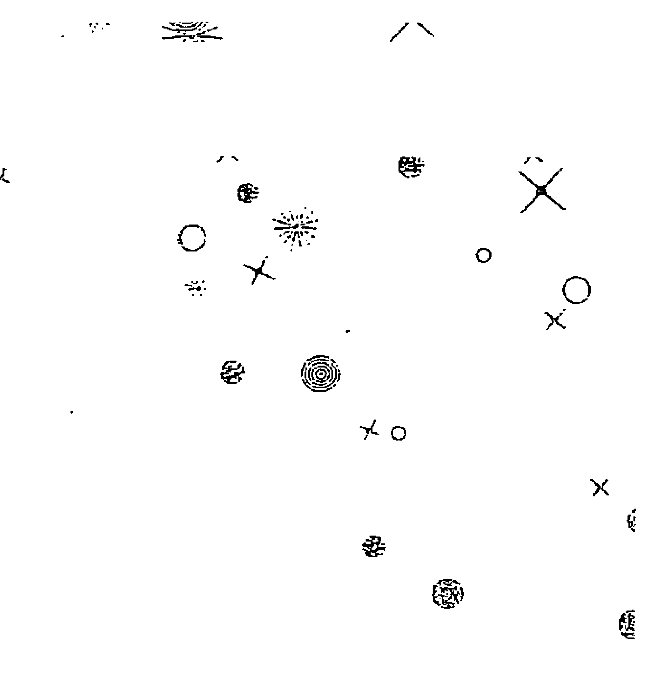

- 2. 南交点所落的宫位（注意，这一点与上面重复，是有意为之）
- 3. 所有与南交点守护星体形成的相位

这个对于系统的描述非常恰当——思索一会儿，我们就意识到，我们的经验影响到我们的本性，反之亦然。我们无法划分得很清楚。然而，这些划分依然是很有效的方法，当你陷入各种象征符号的困境时，这能够帮助你组织思路，理清我们前世的信息和比喻。

如果南交点在双鱼座如何？其守护星体是什么？这个问题比较麻烦，就像我们在第三章中讲述的那样。传统占星师认为双鱼座是木星守护的，现代占星师认为双鱼座是海王星守护的。我说这二者都是。很明显，占星学是人类对星空领域的一种心理投射。我们应该放弃“统治”这个词，“统治”代表从属关系，而“守护”（译者注：rulership 通常汉译为“守护”，本意为“统治”）实际上意味着密切关系，或者关联性与和谐性——木星和海王星都与双鱼座有共振。双鱼座肯定不能决定它“最喜欢谁”。我们讨论的是神秘宇宙，而不是一所有好恶的高中！

如果你看到南交点落在双鱼座（或水瓶座或天蝎座），就算你走运啦。这个情形虽然更加复杂，使你也有双份的信息可以利用。水瓶座的南交点？要看天王星和土星。天蝎座的？要看冥王星和火星。我的建议是两个都要用。占星学是在发展中的一门学问。一则永恒的规律是“上即是下”。在天象中呈现的，在现实中也必定有意义。

### 南交点守护星体的意义

如果你的南交点在白羊座，我们会自然想到战士的原型——急躁、勇敢和极度的暴力竞争。因此知道火星统治白羊座，看来并没有增加更多信息——我们知道火星也代表战士，我们已经了解了这部分。

南交点守护星体的最重要贡献，是把一个新的星座和新的宫位带入到故事之中。

行星本身作为一个标志物出现——就守护星体所在星座和宫位的解读上来说，记住这颗行星的能量很关键。火星依然代表“战争”，但是火星作为南交点的大使，把白羊座的战争弥漫到了其他领域。

也许南交点在第二宫，与木星合相——我们可以设想，前世的问题是围绕着拥有大把金钱展开的。如果南交点的守护星体在第十宫，很可能你前世的钱财来自职业或地位。也许落在第四宫——“家族的金钱”跳到我们的脑海里。

这个人或者通过个人努力，挣得了大笔金钱，或是生来就是富翁：这两种情形有多不一样？这种澄清就是南交点守护星体带来的礼物。

当然，有时候南交点守护星体的所在位置与南交点落在同一宫位或者同一星座（或者既在同一宫位，又在同一星座）。这加强了南交点的信息，但是并不能给我们增添信息。当你有了解读经验之后，你很快会发现有些星图的交点故事是非常详细的，但有时候我们只会从交点中得到少量的信息和提示。

### 这一章为什么这么短

一旦你确定了南交点的守护星体，以下就是如何解读它。

回顾一下第八章，南交点的守护星体，与合相南交点的星体运作方式基本相同，你可以用同样的方式来解读。守护南交点的星体，以及合相南交点的星体，都代表了你的前世。

守护星体所在的宫位和星座极其重要——在这里，你可以参考第六章和第七章关于交点在十二星座和宫位的提示。再一次的，交点的守护星体（就像交点本身）同样代表了你的前世。守护星体所在的星座显示了一系列动机和兴趣，宫位则提供了背景。

在以下的两章里，我们会试图理解一颗行星与南交点呈紧张相位（困难相位）或和谐相位（柔和相位）的情况。我们以下学到的技巧，也适用于南交点的守护星体，只是次要一些。

这就是为什么这一章如此简短。南交点的守护星体极其重要，但是你们对此需要知道的大多数东西，都分布在这本书的其他章节里。

# 第十章
## 与南交点呈紧张相位的星体

前世可以概括为两个问题：你是谁？你在做什么？也就是人物和情节，犹如我们之前讲到的。这二者是相关联的，但是比较间接。性格外向的人比性格内向的人更容易接触陌生人，这就是人物性格决定情节的例子。但坏事也能发生在好人身上，这是硬币的另外一面——不太符合人物性格的情节也可能发生在这个人身上，成为“情节转折”。

当我们更进一步探索，人物和情节之间的界限开始变得不清晰了。通过共同性的镜片来看，我们看到内在生活和外在经验之间的关联是没有偶然性的：在一种平和的、无执的心态下，你感觉到很幸运。你扔了一颗骰子，掷出幸运的7（译者注：7在西方是幸运数字）。在这之前你已经感觉到了。最终，“内在”和“外在”之间密切相关，很难用简单的原因解释。

但是，把人物和情节分开是很有用的头脑策略。我们每天都在分别，我们在占星学里也这样做。

解读业力故事，有两种可行的假设。两种都过于简化，两者也都极有效。我鼓励你把它们作为起点，帮你建立起一个稳固的基础。

要了解前世人物，就把注意力集中在南交点的星座和宫位上，包括与南交点合相的行星，包括南交点的守护星体，也包括与南交点的守护星体合相的星体。

要了解前世故事的情节，就把注意力集中在与南交点呈相位的星体上（除了合相之外），其次是南交点守护星体的相位。也看一下南交点所落的宫位。

注意南交点的宫位在此扮演了一个双重角色。既然宫位是故事情节和行为发生的活跃领域，于是它们讲述的既是你在前世所遭遇的，也讲述了你是谁。假设你的南交点在第十宫，说明环境被可见的公共角色所限定，你的本质也会在很大程度上被这种权力和地位的经验所定义。

我们注意到，这种南交点的“迷雾”实际上会弥漫到整个过去世的符号里。经验会影响到我们内在的现实，内在的现实也会在外在的选择中反映出来。它们会给过去世的故事建立可靠的情节和人物框架。

在过去的几章里我们试图发现在过去世你是谁。我们已经探讨了南交点的宫位和星座，与南交点合相的行星，南交点的守护星。现在，是时候专注于故事情节本身了。

### 与其他星体没有相位怎么办

很可能出现的情况是南交点与其他星体没有相位，当然，除了与北交点对分之外。这时我们怎么办？很明显，没有太多的故事情节！当我们想要更多的细节来补充故事的时候，这种情况可能让我们垂头丧气！但是不能无中生有，不能强行榨取信息，这很重要。没有信息实际上也是一种信息。有时候，我们找不到很多情节线索和发展脉络，因为有时确实发生不了多少事——很可能这就是你眼前这张星盘呈现的状况。有时，一种情形贯穿了人生的始终。比如，南交点在处女座，第六宫，与土星合相，此外没有其他相位。生来就是个奴隶，死的时候也是个奴隶。没什么其他事发生。这就是整个故事。

永远不要无中生有地阐释星盘上的象征。要深入地思考，它们正在告诉你什么。

有用的提醒：如果没有星体与南交点形成相位，注意一下南交点守护星体的相位，它们经常会加入情节中没有的元素。

### 紧张相位

任何与南交点形成相位的星体都告诉我们关于过去世的一些信息。其实，“容易”的相位——三分相（120度）和六分相（60度）——并不像它们听起来这么容易！下一章我们会谈到。现在我们研究紧张相位。紧张相位主要指四分相（90度）和对分相（180度）。我在这里陈述的，也适用于次要的困难相位——150度相位等。在我的实践中，会关注“主要的”托勒密相位，因为这些相位很能够唤起许多记忆。通常，这些已经给我足够多的信息。在“没有相位”的情况下，次要相位也有意义。

与南交点呈紧张相位的行星代表了前世给你造成困扰的事。用传统占星学的话来说，这些折磨了你。也许，这些事物意味着惹火了你，又也许意味着你被杀了。在任何一种情形下，这些都在你的灵魂上留下了痛苦的印记。在这些世，这些行星的鬼魂依然缠绕着你。这些创伤没有解决。这些都在宇宙信用卡上记着帐呢。里存着，现在是还款的时候了。

### 拟人化的解读方式

当我们反思今生面对的麻烦、痛苦和挑战的时候，我们意识到，许多故事都自然而然地围绕着他人发生。爱情和友情是了不起的礼物，没有这些，人生会很难。许多挫折和戏剧性事件都与他人有关：伴侣，对手，敌人，老师，爱人，孩子，父母。

当你看到一颗行星与你的南交点呈四分相或者三分相时，要试图把它想象为一个在前世给你创造了难题的人。这种方法不一定总行得通，但这很快就会打开一条故事主线。

有时候并不需要用到这种“拟人化”的解读。如果金星（爱情）在第七宫（伴侣关系），与第十宫的南交点呈四分相，可以直接解读为婚姻或爱情与你的事业追求（第十宫）起了冲突。而有时候，拟人化解解读很有用。想想，如果太阳落在第四宫，与你第十宫的南交点和金星的合相对分，其中的一种解读方式是，你作为一个艺术家（金星）的事业野心（第十宫）和一个强势、严苛的父亲（太阳在第四宫）形成对立。

如果你觉得把一颗“困难”行星拟人化有些勉为其难，或者无法给你任何灵感，就放弃这种方法。除了人之外，还有其他很多会让我们烦恼的事！来自第二宫的紧张相位？是金钱问题。南交点在第九宫，与第十二宫的行星呈四分相？可能你飞到巴西，但是飞机失事了。

我们的目标，是倾听出生图中所有可能关于前世的声音，并且找到一个平衡的整合点——包含所有这些信息，不捏造任何关键信息，只是以最简单、最自然的方式“落实”。当然，世界上也有很多奇怪的事情发生。我们觉得这些事情奇怪，因为它们不经常发生。前世故事最好不要加入自己太多的想象和臆想，这样它们才最可能是对的。它们遵循“一般性原则”。

就像上述所说，我们会更集中于四分相和对分相。这两种情况确实有很多共性，分辨四分相和对分相的尝试只是理论上的胜利，而非实际的经验。但是它们确实也不太一样。它们的共通之处是拒绝、烦恼和麻烦。从现在开始，让我们来探索它们各自的特点。

### 与南交点呈四分相的星体

所有与南交点呈四分相的行星，都与北交点呈四分相。但是，它们依然是不同的相位，我们要从不同角度解读。与南交点相联系时，是在前世限制我们的事物。与北交点相联系时，我们是在观察帮助一个人在进化道路上前进的事物。

与南交点呈四分相的星体是：

- 1. 在前世曾经阻碍你，或者烦恼你的事物；是“出其不意的袭击”；是不公平或偶然的事件；是攻击了你的事物，是让你发怒的事物，或者让你感觉到愤怒的事物。
- 2. 这个星体代表的问题在过去世没有得到解决。
- 3. 于是，解决这个问题就成为“跳过的一步”。为了这一世继续向前，你必须把它做对，或者清理它。
- 4. 这个星体是遗留的问题，它“悬而未决”。它与过去相应吗，或者它能帮助你向未来迈进吗？

顺便说一下，“跳过的一步”这个短语是从我的“冥王星兄弟”杰夫·格林的那里学到的。

假设你的金星与天王星合相，与南交点呈四分相。其中的一种解读是，在前世，你突然间被你所爱的人（金星）抛弃了（天王星）。这种经验“出其不意地袭击”了你。在过去世，也许你太过依赖，你的伴侣离开了你。也许你不愿意做出明确的承诺，选择了一个同样不愿承诺的伴侣。有许多种可能性，但是在任何一种情形下，这一问题都是“跳过的一步”。在你自由地探索北交点的追求之前，你要以严肃的态度有成效地面对它、治愈它。它纠缠你太久了，它把你的能量和信念耗费太多了。这个问题是“悬而未决”的。你会重复旧的业力故事吗？或者，你会寻找到有活力的伴侣关系吗？对个人的不同之处有所尊重，尊重各自对“空间”的需求，可以真正帮助你完成北交点的功课？

对与南交点呈四分相的星体，以上是几条指导原则。南交点和北交点的具体意义，放在更大的背景下，会让这些四分相的解读更加扼要和明确。但是，这些基本原则是细节的基础。

### 与南交点对分的星体

……当然也是与北交点合相的星体！

从它们与南交点对分这个角度，可以得知过去世它们扮演的角色。与北交点的合相，则强调了它们对于业力困境的积极的“解药”作用。

与南交点对分的行星，可以从两种基本方式进行解读，根据不同的情况采取不同方式。比较直接的方式是，这可能代表一些曾经在过去世给你制造了极大障碍的事物，它们是“现实的高墙”。第二种视角，可能是你非常想要得到的事物，但是从来没得到过。对于对分相位，这种可替换的解读来自一个事实，就是任何与你南交点呈对分相的行星，都代表了那些最遥不可及的事物。同样也要记住，对分的相位是典型的浪漫状况，即众所周知的“相反相吸”。

我们怎么区别这两种对分相状态呢？

通常讲，如果那个与南交点呈对分相的行星看起来是“坏的”或者“困难的”，解读倾向于是强大的伤害你的可怕事物。如果看上去是“柔和的”或“甜蜜的”，那么把它看做是你渴望过的事物。

冥王星与南交点对分？也许你赶上过维苏威火山爆发。或者你曾在广岛长崎。你无能为力，这就是所谓的“现实的高墙”。

木星与南交点呈对分相？你对财富或成功念念不忘，为伊消得人憔悴。与金星？你爱上一个不该爱的人。这种渴望可能是病态的，可能会在灵魂中制造一种饥渴的感觉，强大得能够延续到来世。

与北交点相合的行星当然是同一颗，但是我们解读它的方式不同。这一行星成为北交点的一部分。开发这颗行星的最高形式的潜力就是进化的目标。冥王星在北交点？有一种进化的需求，可以做非常深入的内在功课。例如，释放悲伤。如果你曾在大阪，这一点理解起来并不困难。比如你需要哭泣，你需要捶打枕头或者嚎叫，以释放过去的情绪。这些功课不是仅仅从理智上理解就能完成的。

木星合北交点？你的灵魂需要成功！获得成功和丰盛成为一种灵性上的势在必行。你曾经生生世世地渴求过这个。最有效的进化策略，就是满足那种渴望——看看当某些梦想满足的时候，你感觉如何。佛教可能会说你“对不执著这件事很执著”，但是，出于对你自己的慈悲，你需要得到点生命中的好东西。

合相金星？体验到自己是值得被爱的，这是关键。我们需要建立持续的亲密感。过去世的浪漫渴望已经耗竭了你的尊严和个人价值感。

再一次，这些小的解读只是粗线条的勾勒，只是为了让我们大体感受一下对分相。就像以前一样，当我们把所有线索都考虑在内的时候，细节才会浮现出来。

### 区分四分相和对分相

你可以尝试如下假设：与南交点对分的行星只是你没办法绕过的；而呈四分相的行星代表了一种现实，如果你曾经更有觉悟，是有可能规避它们的。有时候，人们待在毁灭性的婚姻里，或者做着一份糟糕的工作，其实是可以离开它们的。如果你待在这种困境当中没有离开，就会在来世表现为一种与交点的四分相状态。船沉了，炸弹爆炸了，疾病胜利了，海啸发生了，如果你曾置身这样的处境之下，没办法摆脱，那么这会在来世以对分相的状态表现出来。

四分相更多表现为愤怒和挫折，而对分相大多表现为绝望。

### 投射

正如我们在第三章里讲述过了，一颗与我们南交点呈四分相或对分相的行星曾经在前世伤害过我们，我们对那颗行星很恼怒！这是个问题，因为我们需要和这颗行星和解，这样才能向前——如果是四分相，这是跳过的一步，我们的进化目标在北交点。我们必须“放下投射”。

也许，太阳、木星和金星在第二宫合相，与南交点呈对分相，在前世，富足看上去很可能是遥不可及的事。如果我们那时候长期一贫如洗，这一世很可能需要经历一些富裕的状态。但是，富裕、美丽和强大看似都在嘲笑我们。我们很可能发现自己被过去的一种承诺困扰着：“我从来不想富裕！我只是不那么物质罢了。耶稣说过，富人上天堂比骆驼穿过针眼儿还要难。我每天都感恩上帝我是个穷人！”

如果说这话的人内在真正解脱了，那么就不会有限制性的业力牵涉其中。但是我们很容易看到，这些语言可能被一种憎恨驱使着，憎恨那些在物质上富裕的人。如果你曾经在前世真的解脱了，就不会嫉妒别人的财富，这个问题也就不会在现在的交点模式上出现。

让我们简单地看一下与南交点呈四分相或对分相的每一颗行星。我们会考虑到四分相与对分相之间的共通之处，只会在关键处做些区分。

### 太阳与南交点呈紧张相位

烦恼: 把太阳拟人化，常常能帮我们开个好头。在过去世，你曾经失去了你的身份和能量，因为被另外一个人硬拖进他的“轨道”里。那人要么有极大的世俗权力和权威，要么只是太过有魅力，令你无法抗拒。如果不那么拟人化地讲，这个太阳可能代表在过去世对人生有极大塑造作用的环境，如社会政治变革。

没有解决的问题: 这一生，灵魂缺乏方向，不能自己产生远见和动力。自我需要极大的发展。这可能会表现为要么是“迷失的羔羊症候群”，要么就是出于弥补心理，有一种强调自我的强迫行为。

可能的投射：对那些有力量的人或者受人关注的人憎恨、愤怒和嫉妒。

解决方式：正面发展自我感。对这个人来说，最有害的话就是告诉他，灵性就是放下自我。这个灵魂需要发展出自我坚持与独立的能力，有时候甚至是自私。

## 月亮与南交点呈紧张相位

烦恼：把月亮拟人化，我们可能会想象一个家庭或者一位母亲，在过去世对你有一种极大的挑战性影响力。也许，你完全被自己在部族中的期望所定义。也许，你被溺爱或者过度保护。也许，来自父母的要求令你窒息。如果不拟人化，我们可以这样想，情感上的大风大浪令你困扰，这种情感风暴被外界环境加强，这由月亮所在的宫位和星座所代表。

没有解决的问题：残留下来一种忧郁的情绪。又代表着很容易被所谓“亲族纽带”的需求所限制——并不一定是真正意义上的家族成员。

可能的投射：对照顾他人的人有一种矛盾的、阴郁的既依赖又仇恨的情绪。

解决方式：拥抱积极的、有承诺感的家庭经验，尊重个性，尊重人与人之间的自然差异，愿意自我滋养。

## 上升点 / 下降点与南交点呈紧张相位

烦恼：星盘中，最好把这条轴线理解为一个符号，代表着他人与自我之间的两极性——试图平衡做自己的需求和对他人的关怀与爱。如果交点与这条轴线呈四分相，代表在过去世可能无法找到自我和他人的平衡。到底偏向哪一极，看一下南交点的本质就可以了：看上去是自私还是自我牺牲？

没有解决的问题：在与他人的关系和自我独立中找到一种适度的平衡。

可能的投射：对那些“太过依赖的”或者“太过自私、无法承诺”的人有夸张的愤怒。

解决方式：建立既付出承诺又给予空间的关系，找到与自己真正平等的伴侣。

## 中天轴与南交点呈紧张相位

烦恼：最好的理解方式，是把中天 / 天底这条轴线当做一个符号来看。它代表我们的外在世界与内在世界的两极性，代表了一个人的公共生活和家庭生活之间的张力，也代表公共责任和对于内省、简单、私密和照顾自己的内在驱力之间的争执。当南交点与这条轴线呈四分相的时候，在过去世，这个人曾被上述的两难境地烦恼。想知道哪一端是重头戏，可以看一下南交点的特征更符合哪一端？

没有解决的问题：在内在世界和外在的公共责任之间，发展出一种持续的、相互的支持和平衡。

可能的投射：对那些“野心过大”（渴求权力、执著地位）的人或者“太过家居”（怯懦、不抢眼、无关紧要）的人的愤怒和批判。

## 水星与南交点呈紧张相位

烦恼：有说服力和正确是两码事。问一个律师就知道了。在过去世，你被一个你认为比你聪明的、消息更灵通的人困扰。也许，他受的教育比你多，你因此感觉抬不起头来。也许，你就是被忽悠了：水星可能是个诈骗高手或者大话王。你也许曾有一个兄弟姐妹，在与对方的竞争中败北了。不用拟人化的方式解读，你在那一世可能因为缺乏教育，抱负未能施展。你感觉自己没有话语权。

没有解决的问题：对自己的智慧和声音的怀疑。这会导致不能发挥智力潜能。同样，这可以表现为对博学的着迷，追求“正确性”，极力想要展现自己智力上的权威。

可能的投射：对“知识分子”或者“愚蠢的人”的过度批评。

解决方式：通过与老师和可以智力交流的朋友对话，找回自己真实的声音。

## 金星与南交点呈紧张相位

烦恼：爱的功课不会总是一顺风顺。爱可以给我们带来深深的痛——心碎的感觉、得不到回应的渴望，分离和无望。假如你不理解的话，那花点时间听听情歌电台，你就会对这一领域的议题有很好的了解。在前世，这种爱令你痛苦烦恼。另外，你也要敏感地觉知金星也代表创造力、优雅和艺术，在前世，这些能量被阻碍了，或者被用于对你的讽刺。

没有解决的问题：一种消耗自己的、悲情的感觉，似乎没有另外一个人就不完整。需要变得美丽，展示创造力和优雅的需求。

可能的投射：对那些获得“幸运爱情”的人，或者那些可爱的人，带着评判的态度，或者“吃不着葡萄说葡萄酸”的嫉妒，或者盲目的、一厢情愿的崇拜和渴望。对“艺术家”的愤怒，或者对那些敏感的、文明的人群的愤怒。对那些在社会团体里受欢迎的、受喜爱的人的嫉恨。

## 火星与南交点呈紧张相位

烦恼：简单地说就是暴力。曾经被杀、被伤害或者被致残，或被这些事物带来的威胁所掌控，这些给这个灵魂留下了深深的烙印。暴力不一定是针对身体上的，肢体暴力常常是最简单的一种情形。口头虐待、嘲弄和羞愧也留下了印记。记住，在真实生活中，不总是好人赢。

没有解决的问题：愤怒。极度的恐惧。无力感。憎恨。

可能的投射：一种悖论式的感受：“实施暴力的人应该被拖出去毙了。”要解决这个问题，这个人必须体验自己的力量和勇气。学习武术或者进行体能上的挑战也是有帮助的。同样，建立一些情谊，在其中可以对对方自在地表达愤怒。必须要重建对内在战士的信心。不需要再次体验暴力，但是需要再次体验自我防御的能力——军事重地，闲人免进。

## 木星与南交点呈紧张相位

烦恼：木星是众神之王，可能仅仅代表在前世给你带来麻烦的权威。你曾经有“蚍蜉撼树”的感觉。丰盛、魅力、“明星范儿”、繁荣、名声、地位——人类对这些总是汲汲以求。看到别人得到了而我们没有得到是一种木星的烦恼。同样，如果南交点的故事暗示了特权和地位，那么，对这类灵魂牢笼的执著也可能是问题所在。

没有解决的问题：对名声、钱财和权力的欲望。渴望被关注，渴望被认真对待。

可能的投射：对地位令人羡慕的人的嫉妒，有时候会伪装成评判性的厌恶出现。“一夜致富”的梦想。对于魅力、富裕和名声的执迷。

解决方式：需要实现某种有意义的成功，需要被关注和夸奖。通常，这需要通过一点愿意冒险的信心来实现。

## 土星与南交点呈紧张相位

烦恼：土星代表了困难的、实际的限制。银行里没有钱。船在下沉，我们离岸边还有200英里。在严寒里挨冻。没有食物。将军疯了，但是如果我们不遵守命令就会被枪毙。土星与南交点呈紧张相位可以代表其中任意一种情况。也可能是无法逃避的责任在无休止地压迫着我们。综观历史，人类总是对于可怕的挑战表现出无限的忍耐。这都是土星统辖的区域。

没有解决的问题：对于不可能和无用功的忍耐。下意识的压抑。顺从的自我牺牲。

可能的投射：可能会对宇宙投射出一种没所谓的态度，甚至是敌意。可能会假定权威是冷漠或者不负责的人。

解决方式：从事伟大的工作。获得成功。成功地应对众多可怕的挑战。最终爬上山顶。抵达圣地。

## 天王星与南交点呈紧张相位

烦恼：“地震和闪电”是天王星的绝佳比喻。它代表了所有突然强力来袭的，完全改变了原有状态的事物。在前世，你因突发事件受到惊吓。经济突然崩溃，你突然残疾，配偶落跑，革命爆发，杀手来袭。也许，某个置身于法律或社会规则之外的人困扰或欺负了你。又或许你被抛弃了。

没有解决的问题：你依然瞠目结舌，呆若木鱼；处于隔绝状态。事情“就这么过去了”，没有眼泪。你没有经过疗愈的过程。很可能，你还没有时间这样做。

可能的投射：一种过于警觉的状态，常常带有一种焦虑的感觉，觉得不稳定，或者觉得所有事情都会失控。对于那些带来混乱的人有种不舒服的感觉，这些人包括罪犯、捣乱分子、边缘人士、负心人。

解决方式：更多的个人独立性，这代表着自立自足，自己的身份定位不依赖于任何外界的社会环境或者现实环境。

## 海王星与南交点呈紧张相位

烦恼：乌托邦式的理想主义可能会让我们撞到现实的墙壁，然后重重地跌落谷底。可能是在前世对集体性的社会理想或灵性理想的认同幻灭了。如果海王星的印记太过个人化，可能代表一种缺乏根基的对某个人的浪漫信念，而这个人最终的表现不如预期，令人失望。密集的灵性修行，尤其是那些强调无我和个人牺牲的修行，容易让一个人走得太快太远，就像迷幻药的效果一样。最后，还有可能是经年累月的酗酒、滥用药品等——其中任意一种情况，非法的或者社会认可的，都会把我们与物质世界的连结模糊掉，而物质是我们生来就要学习与之相处的。这些在前世的上瘾症或者依赖症也都可能带来海王星与南交点的紧张相位。

没有解决的问题：自我功能有点模糊，这个灵魂对当下可能的危险性影响没有免疫力，缺乏动力、专注力和理解力。

可能的投射：希望外界因素为人生带来意义和奇迹——灵性老师、正确答案和信仰系统。对于某些事物有不实的信念，如相信猫王可能坐着 UFO 忽然到来，改变我们的基因，把地球变成一个和平的、充满爱和理解的地方。

解决方式：需要正确、健康地进行某种灵性修行。有些修行可能看上去很“宗教化”，但是它可能会很容易开发创造力。进行独立于外界环境和观察者的观想练习，也有助于消除障碍。

## 冥王星与南交点呈紧张相位

烦恼：“噩梦”是个有用的词。人生充满了真实可怕的可能性事件：精疲力竭、痛苦的疾病、暴力虐待、惨不忍睹的事故、迷失灵魂的邪恶行为。幸运的是，我们大多数人从未经历过这些。但是有些人经历过。如果你在前世曾经有过这样的经历，在今生的星盘里，很可能会出现这种冥王星相位。两种现实会触及到你：大灾难或者不加掩饰的邪恶。“受害者”这个词用在这里，非常恰如其分。

没有解决的问题：压抑的记忆。当经历极端体验的时候，人类有把这些经验压抑到潜意识中的能力。我们可能不记得前世——但我们内心会有一种愤怒或恐惧，也许是一种病态的感觉，折磨着我们精神上的平静。

可能的投射：深入的冥王星旅程需要在黑暗中进行。有些可能会与萨满传统有关，以及我们所谓的“灵魂的重新发现”。还有其他可能的精神疗法。重点在于，即使具体的前世很难忆起，我们不能理解自身压抑情绪的源头，如恐惧、愤怒、羞愧及悲伤等情绪，但能够与这些情绪连结便已足够。前世回溯催眠技巧，其中罗杰·伍尔杰 (Roger Woolger) 的技巧，可能对此会非常有益。

# 第十一章

## 行星与南交点呈和谐相位

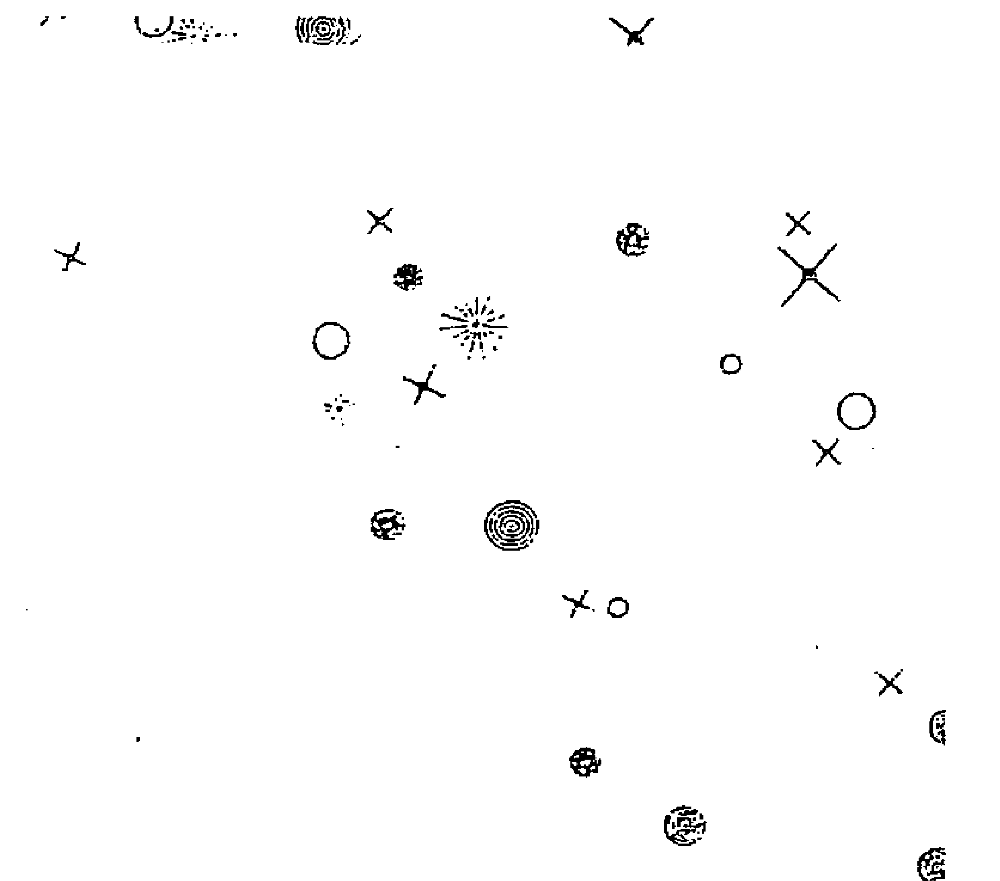

很久以来，占星师就认识到行星之间的 60 度和 120 度意味着和谐。这里也存在一种错误倾向，是过于简化，把和谐等同于“好的”。两个年轻人相处和谐，开着一辆很酷的新车，决定“看看我们能冲到多快”。

和谐仅仅意味着和谐而已。在愚蠢、懒惰、暴力中，我们都可能是和谐的。当然了，我们在友谊和支持中也可能是和谐的。当我们解读和谐相位，即 120 度和 60 度时，需要注意这些可能性都是存在的。与其他南交点的相位一样，我们必须要意识到负面一点的解读可能更有用。它们同样是我们的业力，同样可能会包括过去世那些未解决的问题，包括那些未痊愈的伤口。意识到负面和消极的面向，也是我们积极治愈灵魂的终极策略。即使是那些“好的”相位，我们也要注意其负面影响。

从根本上讲，和谐相位以一种或两种方式运作：

与南交点的和谐相位代表着曾经在困难时刻给我们提供安慰的人、才能或环境。我们对这些依然怀有一种未释放的喜爱、依赖或亏欠的感觉。

和谐相位也代表那些“帮助”我们遇到麻烦的人，他们是那些我们不具抵抗力的诱惑。

在我的实践中，我会首先专注于合相、四分相或对分相上，它们会讲述故事的主要情节，和谐相位则填充故事的细节。通常来讲，在没有困难相位的时候，我会更多使用它们——当我必须得更用力地“挤”一张出生图，挤出一个故事来的时候！

如果没有困难相位，却有许多和谐相位，基本上意味着在前世过得太轻松了。想象一个出身富贵的被骄纵坏了的小孩儿，直到50岁还从来没有干过任何活儿。不难想象，像这样一个沉溺于享乐的人，现实对他完全没有挑战性，他因此会缺乏灵感、个性和努力。在接下来的一世里，这种业力很容易呈现为交点的和谐相位。

### 太阳与南交点呈和谐相位

以人格化的方式来描述，太阳总是代表了一个有权威的人，在你的人生中曾经有着重要的影响力。和谐相位下，这个人与你关系良好——至少看上去如此。这个人当然会为你做出基本的决定，很可能，你没反对过。你是顺从的状态。

以场景化的方式来描述，太阳代表着你必须适应的力量，你必须把其他顾虑放在一边。经济走势，社会动向——所有这些没办法抗拒的“重力”，过去你曾经从中获益。

未解决的执著，是对于外界的影响力和人格魅力像羔羊一样臣服，丧失自我。对于“其他人”的着迷可能会让这个人的灵魂、自我价值和创造力黯然失色。当事人毫不抵抗地放弃了个人自由。

内在的力量，我们曾经被有感召力和领导力的人所统治。

更高的境界，在于避免落入扮演跟随者的温柔陷阱，需要索取领导权——至少是对自己人生的“领导权”。

### 月亮与南交点呈和谐相位

以人格化的方式来描述，月亮代表母亲。一般来说，月亮代表在前世扮演滋养角色的人。虽然这是一种强烈的温柔和真诚的爱意，但是有时候，爱一个人，是要放弃权力的。有时候，小鸟在巢里待得太久了。在这种相位下，我们容易无意识地产生这种过度的依赖性，我们必须要努力克服这种过度受到保护和溺爱的倾向。

以场景化的方式来描述，月亮常常代表了家庭或者部族。和谐相位下，前世的家庭并非机能不良，也没有痛苦——但是，我们接受的爱是无条件的，个性被弱化了。在前世，这种“滋养”或“支持”的结果，是把这个人变得太过软弱，容易对痛苦反应过度。

未解决的执著，是这样一种脆弱性，一个人的人生道路被那些给我们忠诚和爱意的人的需求和期待所裹挟。很可能，也有自我沉溺和对成人世界的逃避。

内在的力量，是我们被强大的榜样性人物控制了，他们带有“家长式”的行为。

更高的境界，需要建立界限、自主权和自由，培养一种特定的头脑冷静的特质，从不恰当的、过多的期待和要求中离开。

### 上升点 / 下降点与南交点呈和谐相位

以人格化的方式来描述，上升 / 下降的轴线没什么意义，它不具备其他行星的“个人化特征”。这一轴线的运作方式更为情境化、心理化。

以场景化的方式来描述，上升 / 下降的轴线代表未解决的业力，是与寻找施与受的平衡相关的，即在必要的自私和对他人的慷慨之间寻找平衡。这个相位是和谐的，代表着无论这种平衡采取怎样的方式，都没有受到别人的挑战和对抗。如果其他的交点配置中暗示了自私的倾向，那么，我们可能会在极不敏感、缺乏同理心的情况下依然不会遇到麻烦。如果其他的交点故事暗示了给予和牺牲的状态，那我们可能有一个非常苛刻的配偶，总是对我们有太多期待，令我们卑躬屈膝。

未解决的执著，是一种要么给予太多、要么给予太少的倾向，具体是哪一种情况要依据以上的原则来判断。

内在的力量，在于我们曾经被过于强力的榜样所掌控，而这再一次与“情境化”的逻辑对应。

更高的境界，在于通过给予爱和接受爱，学习敏感地感觉到我们的道路。

### 中天轴与南交点呈和谐相位

以人格化的方式来描述，中天 / 天底的轴线没有像行星那样的“性格”，而是更倾向于以情境化和心理化的方式运作。我们依然可以把它人格化，作为世界的“面目”，或者公共观点（中天），以及我们与家庭或宗族之间的关系（天底）。

以场景化的方式来描述，中天／天底的轴线暗示了未解决的业力，是与平衡家庭生活和职业责任相关的，或者说平衡家庭生活的快乐和事业带来的满足感。既然相位是和谐的，这代表着无论这种平衡采取怎样的方式，都没有遇到挑战和对抗。如果交点故事的其他部分暗示了家庭或关系主题，我们很可能牺牲了事业。如果交点故事的其他部分暗示了公众和使命感取向，我们很可能背弃了家庭。不过，没人怪罪我们。

未解决的执著，在于很容易牺牲事业或牺牲家庭，具体是哪一种情况，要看交点故事的其他部分确定。

内在的力量，在于我们建立了健康的家庭基石，或发展了社会地位。

更高的境界，在于在两种需求之间找到平衡，一方面，不管我们的世俗成就与地位如何，都需要“根”，一个称做“家”的地方；另一方面，当我们对社会大众有所服务和贡献时，我们才会感到人生有了意义。

### 水星与南交点呈和谐相位

以人格化的方式来描述，水星代表一个老师，或者一个学生，在前世，与你有和谐的连结。但很快我们也意识到，你可能跟着那位老师鹦鹉学舌，或者沉溺想要迷住这位学生。充斥着概念的学术领域可能会很具诱惑性，我们可能会把知识当做智慧。水星也可能代表一位好朋友，你与他之间有深入的交流。类似的，也代表一位在前世相处不错的兄弟姐妹。

以场景化的方式来描述，水星代表所有传播知识的环境或机构。也可能代表书籍——也反映了许多世纪来，在文学中寻求安慰、逃避现实的人们。还可能代表任何忙碌、分心和快速变化的环境。

未解决的执著，是一种随意的执迷。谈话、老师、娱乐和传媒——这些可能会很有吸引力，闪闪发光，但最终会把我们从更重要的事情里带走。

内在的力量，在于我们曾经在前世为那些思维活跃、有很好沟通和表达技巧的人所掌控。

更高的境界，在于把注意力转向内在灵魂的安静的、微细的声音，并跟随它们。

### 金星与南交点呈和谐相位

以人格化的方式来描述，金星代表我们所爱的人。这种爱也许是浪漫之爱，也许仅仅是友谊的温情。与南交呈和谐相位，这个人抚慰人心，令人神怡。如果这代表诱惑，也代表那些没有经过刻意筹划或恶意预谋的的诱惑。我们看到了一个有金星特质的人，我们对他或她的缺点视而不见，这无法避免。这个相位可能仅仅代表友谊的慷慨美好，但是，也可能是一种渐渐的幻灭感——和一位不错的对象谈了一场不错的恋爱，却感觉渐渐淡去。金星还可能代表具有创造力的同伴，或者艺术性的影响力。

以场景化的方式来描述，金星也暗示了优雅。首先，是优雅的表现和得体的礼节，其次可能还有舒适的环境。

未解决的执著，是一种浪漫和美学的理想主义，可能从来没有面对过现实。

内在的力量，在于我们曾在建立关系和公众关系，公关或者艺术方面受制于某一榜样。

更高的境界，在于投入到真实的亲密关系所面临的难题里，不回避困难的存在，如实接受这困难只是因为爱上了一个同样不完美的人。这里常常有一种对美感和独立创造力的渴望，要表现得更为“自然”，表达更直接的个性。

### 火星与南交点呈和谐相位

以人格化的方式来描述，火星并不一定代表敌人，也可能代表友好的竞争对手。想象一下在网球场或象棋赛或者其他形式的竞争中遇到的“值得与之交锋的对手”。或者简单地把火星作为一个有共同志愿的朋友——在竞争中站在你一边的人。最典型的形象，是在战争场景里，人们之间发展出患难与共的忠诚。

以场景化的方式来描述，火星总是代表压力和肾上腺素的流动。和谐相位带来一种兴奋感——胜利的晕眩感，纯粹的愤怒能量的表达，性激情的释放和完成。

未解决的执著，是一种不自然的过分夸张的期待，认为人生必须提供些什么。肾上腺素、戏剧化元素都可能令人上瘾。

内在的力量，在于勇气或意志力方面，我们曾经被有力的榜样影响和控制过。我们懂得如何使用力量以达成完美。

更高的境界，在于保存力量，稳定地积蓄勇气和活力，而不是总实践或体验它。

### 木星与南交点呈和谐相位

以人格化的方式来描述，木星在你的过去世代表一个权威人物，或者任何你觉得比你地位高的人。在和谐相位的情况下，很可能你喜爱这个人——比如，一位你真诚爱戴的国王或者上司。假设这种喜爱是互相的，可能这个人对你很慷慨。他是你的资助人。但是你可能有一种自惭形秽的感觉——就好像现在的我们见到好莱坞明星。

以场景化的方式来描述，木星代表了各种意义上的丰盛：钱赋、力量、奢华、心意满足的人生。和谐相位代表这些让你“活得场面很大”的事物曾经被你热切拥抱。就像弗洛伊德所说，“力比多从来忘记不了快乐”。上山容易下山难。

未解决的执著，在于过去世曾经得轻松，因为享有特权或其他优越感而自我膨胀。

内在的力量，在于我们曾经被充满自信和自我价值膨胀的角色所影响。成功似乎很自然，一点都不显得奇怪，一点都不遥远。

更高的境界，在于面对冒犯、误解和阻抗时，继续保持努力和专注。即使成功来得不那么迅速，依然是可以达成的，艰难的成功常常比得来全不费功夫的成功更为甜蜜。

### 土星与南交点呈和谐相位

以人格化的方式来描述，土星代表了前世的父亲。我们与父亲的关系可能是复杂的、未解决的。土星呈现出的控制和保护特征，在这里显得温和一些——你的父亲可能会让你变得愚蠢无能。由于 120 度或 60 度的影响，你很可能觉得这种关系挺舒服的，严厉管束对你意味着安全感。从父亲的角色延伸出去，也可能代表任何严肃的权威角色，很可能在情绪上比较冷淡，但总是可靠的。从灵性层面来讲，可能代表一个导师。

以场景化的方式来描述，土星代表困难、缺乏、限制和强迫。但因为是和谐相位，我们必须小心，这些状态不能解读得太过困难。在前世，你可能觉得这些是可以接受的，甚至是舒服的。比如，为什么工人阶级的孩子会拒绝常春藤大学的奖学金，却和他的朋友一道去州立大学呢？为什么许多罪犯在刑满释放之后，一两年之内又会重回监狱？限制有时候会令人觉得舒服，不那么有威胁性。

未解决的执着，在于对于限制的适应。在这个人的态度里，有一种特别的下意识的压抑感——一种悲观，伪装成不抱怨的现实主义。

内在的力量，在于我们习惯强势榜样的管教，发展出容忍、耐心和谦卑等美德。

更高的境界，在于把这种土星能量导向实现性更高、更有野心和扩张性的梦想。

## 天王星与南交点呈和谐相位

以人格化的方式来描述，天王星常常代表妈妈眼中的“不良影响”。可能母亲是对的，但是，我们必须意识到，这个人可能帮助我们，帮我们解放，质疑权威，打破我们社会角色的限制。他或她代表的是“打破常规”和自由，很有吸引力，即使会导致我们走下坡路，却是有激情的、有主动精神的。

以场景化的方式来描述，天王星象征“革命”。事物变化有时候猝然发生，可能会像“邪恶的风，不给任何人带来好处”。在过去世，社会规则被打破了，而你看到了机会，并且抓住了它。

未解决的执着，是“疯狂的面向”。可能会想要一夜暴富，想要走捷径。对于正常、缓慢的发展进程缺乏耐心。

内在的力量，是我们曾经被强有力的角色所控制，这些人是天才——那些“不按常理出牌”，改变了我们对世界的基本假设的人。

更高的境界，在于坚守诚实、真诚、正直的品格。要专注于天才的实质而非外表。

## 海王星与南交点呈和谐相位

以人格化的方式来描述，海王星代表一个与人类正常的“自我状态”不同的人。从较低的层面描述，可能是任何有逃避状态的人：酗酒、上瘾症，所有这些状态创造出来的“出神”状态。从较高的层面描述，这代表了真实可靠的、神秘学的、灵性的老师。从中间层面来讲，海王星可能描述了一个有创意的人、有远见的人、理想主义者、心灵的朋友。这里的主题总是带有一种有吸引力的超现实感。

以场景化的方式来描述，海王星与激励性的，但是并不一定实际的信念、活动或场景有关。常常极富魅力，同时带有幻觉和幻灭感。这也可能代表一种混乱、逃避和寻欢作乐的时代状态，比如克伦威尔时代之前的那段英格兰历史，或者北美、欧洲的20世纪60年代。

未解决的执着，在于把世界当做一种充满神奇和时刻满足于当下的地方，即使这会付出幻灭和个人毁灭的代价。

内在的力量，在于我们曾经被有创意的、有灵性敏感度、有理想主义的模范人物所教导，我们也可能曾与真正的灵性光芒连结。

更高的境界，在于对这种激情的专注和落实，把它与日常的灵性和创意联系起来。意识曾被启迪，灵感曾被激发，但是并不持久。因此要有持之以恒的决心。

## 冥王星与南交点呈和谐相位

以人格化的方式来描述，冥王星可以代表替我们保守秘密的知心好友或咨询师，可以是一个我们与之共享极端经验的患难之交，也可以代表提供给我们枪支、药品或性服务的人。这样的一个人既可怕又有吸引力；我们与他们在夜晚的月光和灯光下，而非在白天的阳光下相见。

以场景化的方式来描述，冥王星通常代表任何噩梦般的可怕事物。在和谐相位的情况下，我们会想到，人类常常喜欢踏入禁区寻求刺激。只要想想那些动辄赚到上亿票房的电影就知道了，其中充满暴力、性和复仇主题。

未解决的执着，是对极端体验的执迷和打破禁忌的兴奋感。

内在的力量，是我们曾经被社会规则忌讳的榜样人物和极端经验影响。就像威廉·布莱克（William Blake）的名言：“极端之路通向智慧殿堂。”

更高的境界，在于打破对这些极端体验的个人执着，专注于慈悲，了解慈悲对他人的影响，走向充满智慧的慈悲。

# 第十二章

### 正确的观念

占星学既是科学，又是艺术。作为科学，它建立在对人生模式与天文现象之间关联性的观察之上。

作为艺术，占星学是自然的、是温柔的，意欲绽放生命、疗愈生命。

到现在为止，我们探索过的这些都可以理解为科学——就像所有科学一样，你可以验证一下它的有效性。我们的假设简单明了：通过技巧分析得来的前世故事，会在今生留下烙印。从绝对的科学意义上讲，你回不到过去世直接核实它们，但是你肯定知道你自己现在的经验。观察你的经验，并与交点故事对照，如果它们相互吻合，你就有依据了。进化占星学与你的人生确实相关，不需要任何特别的信念，甚至不需要相信轮回。你只需要观察自己人生的客观事实，并把它们与解读相对照。

这些观察可能令人气馁，甚至可能会很吓人。想象一下，你要告诉一个人他或她前世可能在一个纳粹集中营里当守卫，或是个强奸犯，或是西班牙宗教裁判所里的用刑者……与这些过去世现实相关的隐喻很容易从占星符号中推断出来。事实上，占星符号的力量就是这样，能够代表任何真实可信的人类经验，包括那些最可怕的。如果不是这样，占星这门语言就太过局限，没有什么效用了。

进化占星学的团体里流传着这样一个故事。一个聪明勤奋的新生谈到他给一位女性客户咨询，说到他是如何以他X光般的洞察力“摆平了”她，透视了她的内心。但很明显，他并不是很喜欢她。我怀疑他对这个女性的分析是否是准确的。占星技巧非常有力，而且不难学，但就像任何工具一样，它们不比使用者更有智慧。其他学生质疑这个学生用的词“摆平”，真不错！摆平人们是我们的动机吗？我们必须非常小心，在工作的过程中，不让傲慢控制我们。“正确”的时候感觉很好，我们当然都喜欢这种感觉。但是，想要正确的欲望——从本质上说不是坏事——需要配合慈悲之心，以及改善他人生命的助人之心。

有一次，我和一位学生出了点麻烦。我们抽签，我在整个班面前做了一个解读。这个解读针对的是一个冥王星与南交点合相的女性——这个相位常常代表曾经陷入某种黑暗，很可能是他们自己选择的结果。在我给出的分析中，我强调了她在前世的动机的正当性。我削弱了她可能对他人造成的损害，即使她很可能曾经致人于死地。

晚些时候，学生质疑我对她太过心慈手软，但是我并不后悔自己的决定。很少有人想要做坏事，即使这世界上并不缺乏邪恶。假如我偷窃是为了养活孩子，虽然这是偷窃，但我很可能是在挂念孩子的饥饿，而不是对行窃对象幸灾乐祸。

重点在于，罪疚和羞愧感很少能帮助他们。没有人在被“摆平”的情形下能得到帮助。我们要做的是进入这个人前世的主观现实，尽可能慈悲地呈现那些行为的结果。我们尽可能维护这个个体的自尊，鼓励她或他觉得自己值得进化成长。

在这里，我的观点是，从传统心理占星学向进化占星学的演进，就好像小米加步枪升级到原子弹一样！只是注意收敛一点，宽厚一点，不要做得过火。

### 关于语言

在以下的章节里，我们会将“南交点”或“交点模式”等同于“业力模式”。这些名词是我们在这本书中所讲的整体解读系统的缩写方式。

也就是说，当我们说到“南交点”或“交点模式”的时候，不止是指的南交点！南交点只是迷宫的大门。只看南交点，就仿佛想从一个人的性别来判断他信奉的哲学一样。当我们提及“南交点”或“交点模式”的时候，也包括了南交点的守护星体、相位，与北交点的轴线关系等等。

更完美的解读，要把所有出生图上的象征都按照前世的视角综合地完整地包含在内——观察所有的星体，即使是那些与交点不直接相关的星体，就像我们在第一章里做的那样。简而言之，今生的星盘中呈现的一切都有独立或随机的源头。我们探索的，是整个领域。

### 接受南交点的必然

你的姐姐周二戒烟了，她周四又想吸烟了，你不会觉得奇怪。她对自己很不满，我们自然会安慰她。我们说：“你周二之后就没吸烟吗？”她说：“四百多次——在我想象里。”我们为此表扬她。我们很诚恳。习惯是很难打破的，她已经做得非常好了。即使她周六晚上又抽了一支烟，我们还是鼓励她继续尝试戒烟。失败也没有什么可羞愧的，只要她不放弃就好。周日又是新的一天。

过了一段时间之后，她对香烟的欲望很可能变淡了，但是，改变的发生既不快，也不容易。我们了解这种情况，因此我们心怀同情，作为人类，我们有许多根深蒂固的坏习惯，我们与之相伴相随数千年了。

业力模式比烟瘾的根源更深，依据经验，我还没发现有人能完全摆脱前世遗留的问题，我指的是用我们的占星技巧发掘出的问题。突破这些模式需要一生的时间——实际上，我们也许应该说，这就是为什么我们有这一生。即使意识到这些模式，也已经是了不起的灵性成就了。不过，单纯地对业力模式有觉察，依然远比摆脱它们容易得多。

出于这些原因，我们有以下两条原则。

第一条原则是慈悲：

接受交点结构所揭露的业力模式会在你的人生中呈现，这无可避免。不需为此感到羞愧。观察它就是非常好的开始。

第二条原则是觉察：

对于业力模式，尽可能地保持觉察，越多越好。要有持续的警觉。

即使被业力模式所控制，也要自我肯定，你的力量很强大，比习惯要强大得多。这种力量总有一天会赢。

这两条原则是基石。当你了解了理论，在自我进化的实践中前行的时候，它们会给你提供有力的支持。

还有另外一种有益的技巧，可以帮助我们摆脱南交点的业力束缚。让我们探索一下。

## 把南交点作为礼物

南交点并非总代表黑暗。如果你曾经是行刑者，你会非常了解人类意识在极端状态下的运作状况。这种了解的本质是非善非恶的。如果你曾经是纳粹集中营的守卫，你会理解团体意识的运作。如果你是个强奸犯，你会了解未解决的愤怒可以把一个人的灵魂带到何种堕落的境地。这些了解都是可以善加利用的知识。

当然，这些都是可怕的极端的例子，大多数出生图中呈现的故事都没有这么戏剧化。南交点在双子座？很可能你曾是个妙语连珠、脑筋灵活的人。聪明反被聪明误，这是故事的核心部分，但是双子座的能力本身并没有错。在进化占星学的咨询中，我们认为，现在是从老旧的双子座观点、假设和行为模式中走出来的时候了——这些对今生的进化目标有干扰。

对于业力模式做一些消极的假设非常有用，但我们必须记住在过去世还有许多积极的元素。过去世并非全然愚钝无明。即使在最黑暗的时代，我们也可能从错误中学到东西。但是，在咨询过程中，我们淡化那些积极的元素。这虽然听起来违反直觉，但我们必须意识到，作为咨询师的目标，是帮助人们打败他们对于南交点模式的执着，夸奖他们并不能帮助他们打破执着。

重点在于，你已经不能从自己重复的业力模式中受益了——你已经学到了功课，不需要再学——但你还能应用它们去帮助其他人。南交点在双子座的人，可以帮助其他人学英语，或者修改小说手稿。前世是西班牙宗教所的行刑者？可以帮助那些受折磨的人或者那些折磨别人的人从可怕的伤痛中走出来。

接受南交点的行为模式是不可避免的，善加利用它们带来的天赋和助力，帮助他人。用这样的方式，你就能放下对它们的个人执着。这能够帮助你完全地放下它们。

从策略上讲，这招非常高明。我们并不直接与业力模式的强大力量对抗。我们对抗自己对它的认同。放下它，我们会放下一些自我的执着，我们不再自私地想要从那种行为里获益。我们唯一想要满足的欲望是利他主义——即使我们可能会希望得到赞扬和认可，希望他人承认我们自己的慷慨无私……好消息是，我们把自我的执着变成了对他人的关怀。

丹恩·鲁依尔（Dane Rudhyar）在他的《行星与月亮交点》一书中提到南交点的时候，用了“牺牲”这个词。他写道：“说到牺牲，有很多方式，有些是非常无意义的，甚至实际上是自我中心的，或为了从中得到受虐快感的。但是，牺牲的真正含义是‘变得神圣’，这代表一个人所有的思想和行为全然奉献于上帝或者人类——或者奉献给一个特定的族群、文化族群或者有着共同理想的团体。这代表着自我意志的臣服。”

又一次，我们没有直接与南交点对抗。就像我们不再需要，但别人还用得着的餐具一样，我们把它们转送给别人。

在第五章里，我们看了欧普拉·温斯利出生图的几个特点。她的南交点在巨蟹座，第七宫。她的前世曾经被限制在人际关系里，丧失了自己的自主权。这或者是她主动放弃的，或者是被他人剥夺的。巨蟹座与家庭生活相关，这种关系非常像是婚姻关系，也可能是其他的家庭连结，因为太过纠结以致不健康。天王星与南交点合相，暗示了欧普拉·温斯利的行为表现非常叛逆，打破了家庭和婚姻的传统模式。她“越狱”了。听起来是好消息——但是这也设定了一种亲密关系不稳定的业力模式。在她的今生，她把这种业力变成了一种天赋才能。她的所做所为就是我们上述所说原则的绝佳表现，她帮助上百万白天待在家里看电视的群众从二元对立的、思维僵化的、心理单调的生活中解放出来。欧普拉给他们带来了书籍、思想和希望。于是，她的“越狱”的业力模式作为一种天赋表现出来了。这种模式继续在她的个人生活里上演，但是，她的自我更少地与这种业力模式认同。

欧普拉的业力故事，肯定比这里的寥寥数语复杂得多。她绝妙地展现了我们所讲的“策略性的慷慨”，当她这样做的时候，她也从中获益。

### 耐心

想象运动场馆的地板上涂满了蜡，场馆中央是一根柱子，有一根长长的有弹性的皮带把你拴在柱子上。如果你挣扎，想要逃离，皮带会伸长，你会离柱子远一些。但是，如果你停止挣扎，只需十秒钟，这根皮带就会把你拉回来。所有的努力都白费了。

这就是业力的运作方式。不管何时，当你停止觉察了，业力就会把你拉回到旧模式、旧信念和旧态度里。自然而然，无休无止。你的个人觉知稍有蒙蔽，业力便会开始消耗你的生命。只有通过勤奋的、持久的努力，你才能从中解脱。

这些是讨厌的蔬菜。吃了吧，很健康。

下面上甜点。

有弹性的皮带随着时间的推移，会变得松弛，业力的皮带也是如此。但是，只有当你总是不停地拉扯它的时候才会起作用。你的觉知和你的努力必须比那无觉知的皮带更为坚持和耐久。

这些原则是外在自然律和内在精神律的本质。即使我们不喜欢，这些也依然存在。没人能在不付出任何努力的情形下进化。在这个过程中，必须要是：自律、努力、谦卑的自我省察，对自己内在智慧的根本信念，以及最重要的是耐心。

但是，我们能做到！我们足够强大。

这种矛盾的态度——既谦卑，又对我们灵魂力量有绝对的信心——却是一步步推动我们通往灵性之巅的力量。在你的内在发现这种平衡，当你探索进化占星学时，用这种态度感染你的客户、你的朋友。

在这一章里我们探索过的所有东西，都是对于南交点和与它关联的星体之象征的正确态度。让我们把注意力转向另一面：北交点，以及它代表的进化潜能。在这里，正确的态度是什么呢？

很明显，北交点与南交点相反。所有我们需要掌握和理解的都与这一简单的观察有关。南交点是过去，北交点是未来。南交点是熟悉的，北交点是陌生的。在南交点，我们聪明；在北交点，我们笨拙——或者是从未经历过，这二者常常是一回事儿。南交点是习惯性的，北交点还有待被发现。南交点感觉很安全，北交点感觉不安全、没有根基，所以是危险的。在南交点，我们左右逢源，长袖善舞；在北交点，我们笨手笨脚，不知所措。南交点黯淡乏味；北交点生气勃勃。

当一个人临终时，他反观一生，如果他是依据南交点来生活的，会感觉到空虚而无意义，不管他的人生在其他人眼里看起来是多么成功。

当一个人临终时，他反观一生，如果他是依据北交点来生活的，会感觉到有富足和有意义。从直觉或神圣的观点来看，感觉是“对的”。

是死得其所还是死得凄惶无依？我们的文化害怕死亡，即便是思考死亡，也是打破禁忌——但是，有没有比生死更根本的问题？或早或迟，我们都会面对死亡。避免对南交点阴暗面的着迷，培养对于北交点不确定性和脆弱感的喜爱，是尘世通往安宁出口的道路。对我们而言，这太过宝贵，不能让恐惧或习性限制我们去实现它。

## 只是因为这感觉起来不自然

并不代表不好！养成对北交点的正确习惯至关重要。我们可以允许自己感觉不自然——这只是因为我们的灵魂对它不熟悉。凡事都是不做不知道。

从文化而言，“自然”已经变成陈词滥调了。自然的就是好的，不自然的要小心。我自己觉得从养生的角度，可以说要小心那些我们摄入体内的东西。但从心理的角度，这个问题没那么简单。对于一个酒鬼来说，没什么比来一杯感觉更自然。对一个依赖心很重的人来说，即使面对一个疯子，同意和顺从对方也感觉最自然了。打破模式会感觉很陌生、困难、棘手——你可能会认出，这些就是我们之前描述北交点时用到的关键词组！这些全都意味着“不自然”。

业力就是习惯，习惯是熟悉的。北交点的功课是不熟悉的事，实践它不需要很大的勇气，而且需要临时应变，以及面对尴尬、不安全和脆弱的意愿。

这个时代最好的诗人爱伦·金斯伯格（Allen Ginsburg）的南交点在摩羯座、第十一宫，代表他的业力模式是认同自己是某个社会团体的一份子（第十一宫），这个团体的特征是遵循僵化的社会规则、“正确的想法”和惯例（摩羯座）。他的南交点守护星土星在天蝎座、第八宫，为这一业力模式添加了更多的细节——前世，社会压迫让他变得很孤立甚至抑郁（土星），很可能是因为未表达出来的（土星）受到禁忌（天蝎）的性欲望（第八宫）。另外，冥王星在第四宫，与他的南交点形成对分相，暗示了“他没办法绕过的现实高墙”，起源于他家庭里（第四宫和巨蟹座）有毒害作用的精神环境（冥王星）。

金斯伯格的北交点在第五宫、巨蟹座，今生，他“不自然的”功课在于温柔地、充满爱意地“滋养”自己，尤其是治愈他自己与酒神之乐（注：原文是Dionysian pleasure, Dionysus即狄俄尼索斯，是罗马人的酒神）的扭曲关系。与自己的性欲发展出一种正确的、不畏惧的关系是其中的重要方面。一般意义上的创造力和个人表达都是实现第五宫北交点潜力的关键要素——第五宫与冥王星合相，这代表金斯伯格的创造力需要结合禁忌的、不被“礼貌的社会”接受的事物。

我清楚地记得，第一次听到爱伦·金斯伯格朗读他的诗作是在20世纪70年代初期，在杜克大学，礼堂里坐满了观众。当他开始朗读诗作——极其有画面感也极富有同性恋色彩的色情的诗作；观察观众的肢体语言真的非常有意思。我只能想象是“不自然的”、神圣的旅程把爱伦·金斯伯格带上了那个讲台。“长着天使头脑的希比们在夜的机械中为了古老而神圣的交合，在向星光闪耀的发电机燃烧”，他的诗作《嚎叫》大概这样写道。

爱伦·金斯伯格的月亮在双鱼座，第十二宫。作为北交点的守护星体，我们从中辨认出，在他的进化计划里，另一个“不自然”的元素是探索神秘、探索意识的状态，获取第一手的神圣知识与经验。这不但表现为对迷幻药品的沉迷，还表现为对佛教和印度教的长久探索。我们看到一个非常著名的共时性的神奇例子，金斯伯格“偶然”遇到了著名的、有争议的西藏金刚乘上师秋阳创巴，他们俩在纽约市想要打同一辆出租车！这开启了他一生的佛法修行。

## 解药

如果南交点是灵魂的病，北交点就是灵魂的药。在这种关系中，有一种内在的完美；如果你掌握了其中精髓，就会知道南北交点之间的和谐是非常优雅的。夸张一点说，如果南交点是毒药，北交点就是解药。

南交点在白羊座？代表对于激情的执着，很可能是愤怒。解药？天秤座的和平、宽容、真诚和优雅。南交点在第四宫？代表被个人的内在世界牵绊，很可能是被家庭牵绊。解药？找份工作！走进广阔的世界，在外面寻找一个更有意义的领域。

这些是非常简单的“解药”的例子，依据是相反的宫位和星座。充分彻底地理解这些两极是学习进化占星的良好基石——实际上，也是一般意义上的占星学的基石。我们在第六章和第七章涉及到了这些两极，讲得很详细。如果你真的想要进入原型理解的世界，请把这些深深地印入你的脑海。

随着探索的深入，理解北交点是解药的过程就变得更加复杂，变得不那么明确——但解读也变得更加个人化，因人而异。诗人金斯伯格就是一个非常好的案例。他的业力困境的细节非常精确——比起只知道摩羯座和第十一宫而言，我们得出了更为丰富和整合的解读。相应的，对于金斯伯格北交点的解读也更为集中、更具差异化，而不只是单独地理解巨蟹座或第五宫。而一旦我们把双鱼座第十二宫的月亮纳入其中——月亮是北交点的守护星体，我们得到了更加清晰的解读。

# 第十三章

### 业果成熟时

在第四章的另一个例子中，我们对李哈维·奥斯卡出生图背后的出生图进行了比较深入的探索。在他的例子中，我们也可以找到能够治愈过去世留存的巨大伤痛的解药。

又一次，即使我们把“南交点”作为业力、“北交点”作为解药来看，记住，这也只是简化后的说法，它们代表的是整个理论视角，最终的理想化的整合是出生图中的所有线索。

在本书的最后一部分，我们会深度解读五个有影响力的人物的星盘，详细讲述整合的过程。

换句话说，如果你觉得还不能完全看到整个画面时，不要担心，我们会讲到的。

### 问题的核心

北交点是解药，吃了它，会起作用的。你必须不断地拉扯那根皮带，就像之前我们讲到的那样。如果你一直拉伸它，这种张力就会消失，你最终会解脱。

能够达成这个目标的，不是时间，是你。

### 只是个好主意

月亮北交点没有任何内在的能量。从这种意义上说，它与占星中的任何其他符号都不一样。所有其他的占星符号，都遵循这样一条铁律：这一符号总会在你的人生中出现。它们是能量，所以不能被创造，也不能被毁灭，只是形式上有所改变而已。它们不会走开。你的水星、太阳、金星都是如此。这些是“注定”要在你人生中发生的——根据你如何使用它们。你的南交点亦如此。从这种意义上而言，南交点与行星的运作方式是一致的。南交点既有能量，又有惯性。

但是，这些不适用于北交点。北交点什么都不是，只是个纯粹的好主意，这个主意，你完全可以接受，也可以忽略。更进一步讲，这是个好主意，隐藏在你的盲目和执着里——即使看到它都困难（记住，我们对北交点的关键词是：不熟悉，陌生，危险，笨拙，异己的，不自然的……）

除了北交点，出生图中的其他任何符号都有“自动”的因素。但是，北交点的表现只会因动机而触发。否则，它会是惰性的——不好，不坏，甚至不以任何有意义的方式存在于那里。

北交点是在你渴得要死的时候，那瓶被遗忘在你车上的水。北交点是在你顶层抽屉里放着却不被注意的那张彩票。北交点是在你的监狱里离你的床只有十步之遥的没上锁的那扇门。

### 自我接受

当我看到北交点在双鱼座、第十二宫，或者与海王星合相时，我经常会对客户说：“在今生，你的人生动机是开悟。”他们会扬起眉毛！我的客户常常是在灵性上非常发达的人——那些“有足够的感觉知道”他们很可能不会在此生达到弥赛亚那种意识层次的人。当然，从实践的角度上来说，预测是否能开悟是不靠谱的。

但是，这种说法引起了我的客户的注意——也就是说，我说到了点子上。我让他们想象，他们有一千次的人生都在冥想，每一次，他们都带着这种谦卑的念头，觉得自己无论如何也不可能开悟。我要求他们想象一下这种顽固的认知已经重复了一千次的轮回。

谦卑是一种非常基础的灵性价值观，在每个宗教的神秘传统里，都被赞扬。放下我们的自我重要性和自我执著是神之城邦的主要广场之一——不管我们在哪里游荡，我们都会一次又一次地路过它。

然而，然而……在任何一个神秘的传承里，都有另外一个与之相抵触的原则：你已经到达那里了。所有的一切都是一。我们与基督是一体的。佛性存在于所有众生之中。阿特曼和婆罗门是一体的。然后你选择吧。这说的都是一个事物——光芒耀眼、几乎无法承受的事物。

这就是那个永恒的谜题。你必须坚定不移地努力向前，但是你本来已经到达目的地了。

如果你只信奉后者，你就会变成自大狂或者懒汉。如果你只信奉前者，你会变得沮丧，像个被打败的奴隶。

类似的：

进化占星学可以以令人害怕的精确度描述我们的灵魂牢笼。小心，这不是要“摆平”你！只专注于南交点是非常危险的，可以让你心碎。

为了平衡这一危险，就要踏实地、有希望地专注在北交点上。与北交点和它的守护星一起修行，要保持信念！不要失去信心，要知道你可以做到，答案总是在你的内心。把南交点的幻觉和扭曲感擦掉，让光从窗户照射进来——没有什么挡在你与觉悟之间，你的窗户上只是有一些污渍罢了。西藏佛教徒把这称为“金刚慢”（译者注：也称佛慢），培养它。我们可能很容易称之为信念。这是对抗绝望和羞愧的解药。这是真正的对灵魂的接受。

从长远的观点来看，外在宇宙或你内在的原始疯狂都没有办法抵抗它。

很久以前，你在古埃及转世。你正在市场上闲逛，你租赁骆驼的生意在这个星期里很红火，硬币在你口袋里叮当作响。你觉得世界很美好，对神明们充满了感恩之情。这时候，你转过一个拐角，遇到了一个衣衫褴褛的麻风病患者，他长相丑陋不堪。你以前就曾见过他，但是心生厌恶，未曾理睬。可是今天，你的内在仿佛有些什么改变了，你的感恩之情变成了慷慨之心，慷慨之心变成了仁慈之心。你摸出一些硬币递给他。你注视这个麻风病患者的眼睛，意识到他也是一个人。他也看到你注视他，你们灵魂相遇。他开心地接受了硬币，但是，他内心深处的感恩不是对硬币，而是对于你给他的真正礼物：透过他的外表，接触他内在的人性。

今世，这个麻风病患者的名字是比尔·盖茨。他觉得对你有所亏欠。

真是善业！

在这里，我只是编了个故事。我不知道比尔·盖茨在前世是否曾经是个麻风病人。但是，我完全不怀疑他一而再再而三地曾经接受其他人的慷慨帮助。这些慷慨的行为是美好的事物，但是，它们让业力不平衡。我们感觉要归还这种帮助。这一概念，也是个形而上学的哲学理念，你无需真的把这一观念纳入信仰体系。你可以只是在你的日常经验中试着探索与觉察。如果在一个雨天你的车爆胎了，一个陌生人停下来帮助你，你觉得如何？当然很感激，但是同样渴望报答对方。这也是业力，只是时间跨度较短。

我怀疑比尔·盖茨会常常遇到一些人，他莫名地想要帮助对方。如果我刚刚讲的那个故事真的发生过——那今天你可真走运了！

但是，在这里，“走运”不是个最合适的词。运气意味着宇宙中有随机性。这种随机性纯粹是臆想。你和比尔·盖茨仅仅是需要重新平衡那种业力关系而已。从表面来看，似乎他是无缘无故地对你很慷慨——大家都这么觉得。但是，你们俩不这么感觉。即使比尔·盖茨给了你一百万美元，他的感觉会是舒适、快乐、解脱及释怀，你也会感觉到开心。但是在更深层的意识里，你接受这份礼物并不觉得尴尬。这感觉是对的。如果你觉得别扭，比如你想说“我不能接受这个……”，这只是因为你所受的社会教育进来插了一脚。在你内在的沉默中，你会感觉到与比尔感觉类似的东西：舒适，快乐，解脱和释怀。你们俩都没了负担。债务偿清了。

那么，你什么时候会真的遇到比尔·盖茨？你应该在日历上标注时间的话，是哪一天呢？你很久以前的慷慨之举曾经种下了一个种子，或者说，在你和他的灵魂之间存在着某种潜在的能量。什么时候才会显现？什么时候业力会成熟？

### 什么时候种下的业果会成熟？

我有个很好的猜想——当木星行运经过你出生图上的南交点的时候，同时也有类似的扩张性的、与交点相关的行运发生在比尔·盖茨的出生图上。占星上有许多种可能，在这一章，我们深层的目的就是研究这些。这些状况发生的时候，总有交点轴或其他与交点相关度较大的重要星体位置被激活。这些就是业果成熟的时候。

顺便说一句，1999年，行运木星与比尔·盖茨的南交点呈60度相位，确实驱动他表现出慷慨之举。在那一年的年初，他向国际艾滋病疫苗协会捐赠了一笔巨款，在九月份，他承诺投入十亿美元帮助困难学生完成教育——这是有史以来最大的一笔学术捐款。

你的业力是复杂的。每个人的都是。在比尔·盖茨是个可怜的麻风病患者的时候，你可能对他很友善。但是，你也可能曾经偷窃和杀戮，或者嘲笑过残疾人或无家可归的人，也可能囚禁过好人，压迫过穷人。业力之井很深，千变万化，是个大杂烩。

当一颗行星与你的交点呈相位时，就像一个有色滤镜，你可以通过它看一看你的业力万花筒。即使这个万花筒的光芒在到达你的眼睛之前被过滤了，或者在它到达现象世界之前被过滤了。如果木星经过，你会看到业力现象有一种木星的特质——玫瑰色的！或者至少是闪亮的。也许是慷慨。宇宙真的欠你点儿什么，你曾经对宇宙的孩子们很慈悲。现在这必须被平衡。

但是，如果你对宇宙的孩子们比较刻薄会怎样？也许火星正经过你的南交点——你开车在公路上行驶，有个司机莽撞地超过你的车，差点让你撞上了另外一辆车。你花了五分钟才让恼人的肾上腺素和愤怒感离开你的身体。没什么大不了的。但这也并不是偶然的。如果昨天或者前世的你曾经很有攻击性——这种攻击性会回到你身上。这不只是个猜想，这是法则。火星很可能是这种业力的触发器。当著名的邦蒂号哗变发生后，弗莱彻·克里斯琴把威廉·布莱【译者注：威廉·布莱(1754.9.9—1817.12.7)是英国海军将领，因邦蒂号哗变事件而闻名，好莱坞曾三次根据这段故事拍摄电影《叛舰喋血记》】抛弃在海上，那时候行运的火星正合威廉·布莱的北交点。当纳尔逊·曼德拉1962年8月入狱，从此开始27年的牢狱生涯时，行运的火星正与他的南交点对分。

与之类似，每个行星都有一定的音调或质地，当这颗行星与你的交点系统相遇时，会带来某种特定类型的业力现象。把你的南交点想象成白光——“白色”在这里并不代表纯粹，而是代表复合体，包含着所有人类可能性的彩虹的颜色，从最低的到最高的。当星体“带色的滤镜”与交点或相关的点形成相位的时候，这一业力的白光便暂时地呈现出那种色彩。

慢慢的，在这一生，你所有的业力可能性——所有那些已经成熟的业力——都会变成现实。你会经历过去世你自己创造的种种结果，有些好，有些不好，有些奇特，有些很棒。

### 微调

出生图上的所有呈现，从根源来讲都是业力的。没有什么是偶然存在的。但是，就像我们学到的那样，业力不是井然有序的，就像人生并非井然有序一样。通过交点分析，我们学到了如何发掘最典型的过去世故事。我们围绕交点建立了最核心的解读。但是，我们识别出还有些“散落的情节”。比如，你的冥王星可能在第三宫，就像我们之前看到的那样，这一象征常常代表了在前世不真实的言论。也许你撒谎了，也许别人对你撒谎了。在任何一种情形下，不管是施者还是受者，真实，都成为今生重要的进化主题之一。

现在，这一位于第三宫的冥王星可能不会与交点轴有任何直接的相位关系，也可能不是任何一个交点的守护星。换句话说，可能对于交点故事没有重要的影响。但是，它也能够帮助我们一瞥业力之井。即使我们也许能把它与主要的交点故事编织在一起，只围绕它组织一个故事可能还是信息不够。

在任何一种情形下，正如你出生图中所有其他标记一样，冥王星代表了某种可能的业力能量领域。任何相对于冥王星的行运、推运或太阳弧都会与这样的机遇相关——推进冥王星的重要精神性议题——要么就仅仅是与一些根深蒂固的重复的业力模式简单对应；你会说谎，或者其他人对你说谎。如果没有进化的意愿，在今生可能会出现更多的谎言。这里的目标，是对整个模式的超越。谁是撒谎的人并不重要，导致人们撒谎的情境才比较重要。

如果主要的业力故事是有关亲密关系中的欺骗——比如，第五宫双鱼座的南交点与第七宫的海王星呈四分相——这个主要的故事情节（亲密关系中的欺骗）会很容易与第三宫的冥王星（谎言）相联系。不需要任何直接的相位就能看到这种内在关联。

一旦我们理解了这一关联性，当本命的冥王星被行运或者推运启动的时候，我们就能够给出更为明确的建议了。我们会知道，在今生中，以诚实的态度消除误会（或是重复欺骗和谎言的模式）的机会在亲密关系中很可能会出现。我们也知道在过去世，更可能是别人对我们说谎，而不是我们对自己说谎——这是在这种情形下的特殊业力主题。内在的业力是被欺骗而不是欺骗别人。我们可以提前警告客户。他可以鼓励自己在这段时间里问一些令他心里忐忑的问题。业力在此时正成熟。

我们在这里看到的，是当我们不再进行“单一的元素分析”之后，如何深化我们的理解，如何开始将整个出生图中的信息都尽可能地包含在内。不只进化占星学是这样，其他类型的占星学也是这样。

### 螺母和螺栓

在寻找业力成熟的时间点的时候，我们会使用占星学提供的所有类型的“预测技巧”。在我自己的实践中，我使用行运、次限推运以及太阳弧。

> > （另外，如果你想要学习以自由意志为基础的预测方式，你可以看一下我的另一本书《变幻的天空》。在本书里，我假设你已经理解了这些初级技巧。）

如果你被其他的预测技巧吸引，如日月蚀、三限推运或无论什么其他的技巧，都试着运用吧！

以下是两种基本的可供考虑的基础。它们在有效性上是同等的，二者都很基础：

- 首先，考虑一下任何激活交点轴、交点守护星或任何与交点形成重要相位的星体的行运。
- 其次，考虑交点自身的移动。

### 交点轴的激活

如果行运的水星经过你的南交点，这常常是一种比较容易察觉的占星事件，即使它只持续几天的时间。你会注意到自己可能变得忙碌，更多的事件围绕着沟通或传播发生。这些都会与你的业力特质相关。也许你会看一本关于业力转化的书。也许这就是你为什么现在在读这本书的原因！也许，无论你知道与否，你的守护天使都会听到你“说出与1875年在巴黎时一模一样的话”。与交流有关的事很可能会发生，它们感觉起来可能很相似——或者有一种宿命感。当琳达·特里普偷偷录下莫妮卡·莱温斯基与闺蜜的通话，背叛了莫妮卡，此时行运的水星正与莫妮卡的南交点对分。

经过你南交点或者南交点守护星体的行运冥王星会永远地改变你的生命。相对水星行运而言，这一行运要重要得多，它提供给你一个机会，让你真正地深入到进化的核心议题中。思考一下这个例子：1997年2月19日，朗姆·戴斯突然中风，这时，行运的冥王星正与他的金星呈四分相——金星是他南交点的守护星体。

在为客户提供年运预测中，大多数的占星师甚至都不会提到水星行运。但是，没有一位进化占星师会忽略冥王星的行运。考虑一下：从短期来看，每个事件都是同等真实而且有力的，不同之处在于冥王星的影响时间比其他的星体长久得多，可以有更多的状况发生！于是，这一行运便有足够长的时间来发展深刻和复杂的意义。

这是非常关键的一点：行运的冥王星不比行运的水星更有力，但是当人类的意识与星体能量互动时，事件越慢，影响力越大。仅仅是因为它有足够的时间变得重要。很好的一个现实检视，是考虑一下推运的或者太阳弧的水星与你的南交点发生联系时发生的状况，这一事件更为缓慢，会在你的人生中留下重要的印记。对于拿破仑来说，太阳弧水星与他交点轴呈四分相意味着滑铁卢事件！

避免“太过”是所有占星学的要点所在。我们必须做一些战略性的“筛选”。如果我们试着同时消化太多的符号，大脑会死机，心脏会停跳。这太悲剧了，这种整合工作会让心脏不堪重荷。出于这种原因，我建议我们只专注于最主要的因素，即移动的星体与本命交点的相位。

行运：木星、土星、天王星、海王星和冥王星。也注意一下厄里斯！

推运（月次限推运）：太阳，月亮，水星，金星，火星，上升点，中天点。

太阳弧：所有的星体！（注意太阳弧太阳和月次限中的太阳是一回事）中天的推运有各种方式。我同时使用太阳弧中天和月次限推运中天。很长时间以来，我更注意太阳弧的中天。不过后来，我又重新评估了一下，发现我自己更倾向于用二次限的中天。

### 交点行运对星盘的触发

交点轴的直接行运，相对于其他星体的行运、月次限和太阳弧来说，范围小得多。在这里，我们只观察交点轴如何在星盘上运转。这样的状态下，交点自然地与本命星体接触，将潜在的业力势能影响带给它们。这里有三种可能性。

行运的交点轴 每 6,793.39 天，也就是 18.5997 年，交点轴围绕黄道面运行一周。时间即十八年零八个月多一点。交点需要花一年半的时间穿过一个星座。那么，从一般人的角度来讲，南交点与你本命星体产生行运相位会发生四到五次。

不要期待每次的交点行运总是大事。它们经常默默发生，丝毫不引人注意。若假设每一个都在业力层面上很重要，对我来说感觉太勉强。很可能它们都有深层的进化意义。从我的经验来讲，这些行运交点有时会格外重要，有时可能完全没用，除非有其他重要事件发生，这会增加额外的维度。

记住我们主要的筛选技巧：星体移动速度越慢，它的影响力越大。交点轴只需要三个月就行进5度——容许度是2.5度的话，所以对某个星体位置只形成三个月内的影响力。这个时间并不是很长。

### 太阳弧对交点轴

在三种“运行交点”的技术中，这是我一直以来觉得最可靠的。太阳弧交点的影响力大概在一年一度。它们有足够的时间产生深度和复杂度，而且从其他的占星事件中获得“帮助”。进一步说来，太阳弧通常容易变得非常事件导向。从深层本质来讲，太阳弧具有太阳的那种活跃特质。太阳是对自我的关切：基本上讲，它是传记性的而非深层的。太阳弧并不侧重于微妙的内在发展。那么，从确定业力潜能的物质界现象显现的时间点来说，太阳弧对这一任务非常适合。当太阳弧交点与本命星体形成相位时，尤其是与交点故事相关时，请注意，业力成熟了。

### 月次限的交点轴

这个方法有个无奈的缺陷。在我们的一生中，因为月次限的交点轴移动速度太过缓慢了，除非在非常宽广的时间层面上才有意义。在一生的时间里，交点可能只移动5度左右。当形成准确相位的时候，它比较值得注意，或者交点从一个星座移动到另外一个星座的时候也比较值得注意——大概六到八个人中的一个人才会有这种经验。同样，交点移动到一个新的宫位也值得关注。但是，在这里有另外一个问题：除非一张出生图的出生时间调整得非常精确，否则你永远也不能真的确切知道你的宫头在哪里。一分钟的生时误差都可以把宫头线移动四分之一度——虽然不多，但是导致交点进入一个新宫位的时期就会相差四年。

在我自己的实践中，当我运用自己的直觉对各种信息进行筛选，只留下可

### 什么时候不筛选掉

在“筛选”的原则上，有一种情况是个很大的例外，这与“事件盘”有关。比如，你刚遇到你的真爱，你当然想要知道那天占星上发生了什么。即使是快速移动的行星，也会在这种出生图上变得非常关键。比如，阿诺德·史瓦辛格与玛丽亚·施莱佛结婚的时候，金星与他本命图上的北交点几乎准确合相。奥普拉脱口秀的首映日在1996年9月8日，此时行运的北交点与她的本命太阳呈120度三分相，也与她的本命金星呈三分相。

这种情况的关键在于，我们并不是想要提前告诉某人他未来的进化挑战。业力实际上已经显现，而且我们知道在什么时候。即使是快速行运的行星现在冻结在那张已经成为过去时态的星图中了，我们依然知道它们准确的位置。如果说，这个人确实是你的真爱的话，几乎毫无疑问，你会发现，在你们会面的时候有各种重要的占星事件发生。它们可能不一定严格地与交点相关——比如，你二次限的金星与太阳呈主要的相位。但是，很可能你也会看到一些在这一章里提示的行运——对某些与交点有关的触发。你可能也容易看到一些小的“萤火虫”事件——比如行运的金星在第七宫与南交点形成120度三分相，行运的水星合相你的北交点。这类“触发”行运，在几天内会形成精确相位。实际上，它们可能会实际上参与到业力显现的过程中。唯一的问题，是几乎不可能提前使用它们，因为这些行运实在是太多了。

比如，二次限的金星与你的南交点形成相位。这可能会在几年内都有影响。

力，代表你可能会遇到一些“似乎莫名熟悉的人”。在这两年的时间段里，可能会有几百个这种“萤火虫”式的行运，其中的任何一个都可能是你的重大时刻——或者还是另外一个人的重大时刻。

我们还可以继续调整我们的技巧，可能会更好地猜测到哪些“萤火虫”的行运更容易触发一些重大事件。比如，每当一个重要相位即将形成准确的度数时，你会自然地对一些快速的行运更加注意。状况升温了。或者如果有许多快速的行运似乎在一个特定的时间内集中——在你的日历上又应该加一次标注了。

即使很合理很有效，这些“调整中”的技巧也并非完全可靠。我个人的感觉是它们更像是一种“派对作秀”的占星学领域——人们太多专注于具体明确的预测了。我觉得把注意力集中于长期的重大的交点触发时期的深刻意义更有帮助。这样一来，你就能够帮助你自己——和你的客户——尽可能做好准备，最佳地利用事件，不管它们实际上是何时发生的。

### 行运对推运

回顾一下你人生中的重大事件，尤其是那些有典型的“业力”特征的：感觉像是“宿命的”。你几乎肯定会找到一些我们刚才一直在考虑的关联材料：对于本命出生图的影响力。

你也很可能会看到有些“太阳弧南交点与行运冥王星的合相”。这些“移动对移动”的事件也是有力的征象，常常在这类时间出现。我相信它们——但是我使用它们不多。从进化占星学的角度来看，出生图的根本结构，告诉我们非常准确的过去世故事。当这些个别的潜在势能被激活时，我们能很好很精确地对事件进行分析。我们整合性地综合许多星体的能量。这里的关键在于，相对于本命盘移动的事物（比如，行运，二次限或者太阳弧）触发和激活了这一非常准确和细节化的本命出生图潜力的整体。

当我们看到某个行运激化了太阳弧或二次限的时候，我们就失去了这种深入的精确度。它们都不是来自本命出生图中的细节。我还要重复强调一次，这类移动的相位确实是起作用的——当你的背包在杜布罗夫尼克被偷的时候，很可能行运的土星正与你落在第九宫的太阳弧南交点合相。这一特征是吻合的。我们在做预测的时候，也可能会提前警示你。如果你免于被偷当然很好！但是，可能更好的是，首先了解你为什么会被偷。这个答案要在本命出生图里找！

### 给交点上色

当行运的土星碰撞到敏感的占星点时，我们知道我们会与坚硬的现实相遇。我们知道任何健康的回应都需要自律和努力。我们不能期待“运气”或者想搭顺风车。我们知道，在这里，正确的行动会导向成熟——从深层意义来讲，我们已经准备好，准备好超越自己，准备好超越我们那颗本命行星所代表的已经过时的反应模式了。我们也了解，如果我们不能响应土星的更高级召唤，我们就经验到阴暗土星的不幸、绝望和灵魂的疲惫感。

我们知道，换句话说，很清楚土星会把什么摆上桌面。如果在考虑我们本命土星的力量、脆弱之处以及最终的进化意图时，我们能够升华它。我们的祖先把这些行星想象成为神并不奇怪。它们有自己的人格。

当行运、次限推运和太阳弧触发了交点的时候，我们也同样做吗？是的，但是过程会稍有不同。议题会锁定在一个问题上：准确地说，南交点代表什么？我们知道，从根本上说它代表你对过去世某些未解决的问题的情绪或态度上的执著。就是这样。但是，这些议题是什么？暴力？消极？傲慢？绝望？当涉及业力的时候，可能性的范畴非常广阔，我们对南交点最基本的定义太模糊，不足以有太大的用处。在行星与交点之间，有非常基本的差异。我们知道一颗行星的本质，但是交点更像是大纲的草图。我们必须给它上色。

你的南交点可能在天秤座或者第十二宫——你的业力盲点与懒惰、逃避有关，你可能听任其他人限定你。也许，你的南交点在第一宫，白羊座——你的业力执著与上面一种相反——权威、控制、独立性和力量。这两种相反的交点状态，被行运、推运和太阳弧触发的时候，它们之间的差异就像金星和火星之间的差异一样！

这类整合性的思考方式，本身就是很好的实践；但是，从进化占星学层面来说，这对于成功的分析至关重要。交点本身不像行星那样信息丰富。

但是，把它们放在本命图的背景中，它们就有声有色了！

### 容许度

我们的大脑细胞是英勇的小战士。一旦它们遇到难题，它们就一直会顽强地不眠不休，紧皱眉头勇敢思考。问问那些通过微积分考试的人，或者学过希腊单词词形转换的人吧。但是，人类的心才是含摄一切的。在头脑里想象一下你的朋友。你知道她的无数事实，但是这些都不是马上从你心中升起的。当你想到她的时候，你有一种感受。她的本质就像在你的内心敲击了一个音符。所有你曾经与她经验过的都蕴含在这一感受里。这就是我所谈的心的整合。你的朋友的大量的事实、你对她的记忆和印象都在这一音符里一起跳舞。

你在研究出生图时，如何找到这一个音符，是占星能否变得有效的关键问题。如果你对于个别事实太过专注，你可能永远也找不到。不过，如果你没有事实，你也永远找不到。占星学需要在头脑和心之间建立一条中间道路。现代占星学习中最大的弱点，也许就是过度强调学术“头脑”的能量，而丧失了诗意和灵魂。

为了达到这种平衡，我们必须小心处理，不让头脑里充斥太多的事实和细节。像之前我强调过的那样，我们必须做一些“筛选”。其中最有效的控制方式之一，就是利用相位和容许度。简单一句话：我们常常只是信息过量。这时，我们需要意识到这一点——很简单，这是因为心的功能开始关闭了。星盘开始看上去像用深奥的数学手段加密过的密码。这阻碍了感觉，就像你对朋友的感觉那样。

我们也需要非常有系统性地保留一些事实，抛弃一些事实。很明显，关键在于抓住重点。

容许度——也就是我们对相位运用的“宽容程度”——如果两颗星体形成的90度越精确，这种“四分”的力量就越大。我们也知道即使有10度的容许度或者更大，也可能感受到“四分”的力量。如果，我们寻找那些月交点轴的推运时，我们用10度的容许度——我也很可能会发现点什么。在与交点轴形成准确四分相的前后明显有两点。如果每一个推运都在20度范围内起作用的话（在精确呈四分相之前10度，精确呈四分相之后10度），我们很容易就看到，对于一个星体而言，在这个范围内的几率是40除以360。也就是9分之1。

这是有根据的占星学——10度的容许度比平常的容许度要大，也可以经常被视为有效的。我们能感觉到它。如果我们把容许度减小到5度，我们就减少了一半的四分相起作用的范围。我们这样做是有策略的——我们把那些力度小的状况筛选掉，留下更有力（也是更精确）的状况。现在没那么令人迷惑了——没有太多的相位要考虑。你的大脑不再抗议信息过载。你的心可以更加自在呼吸。

我们可以继续调整这种方法，并不是所有星体都是平等的。两个因素在交互作用。首先，对于本命出生图中重要性更大的星体，我们使用更大的容许度。（可参见《内在的天空》这本书，重新复习一下如何判断在出生图中不同星体的重要程度）。其次，也是更加重要的，移动缓慢的星体需要的容许度更小。对于推运的水星，如果运用10度的容许度，影响力也只在几个星期之内。但是对于二次限的太阳来说，就是20年了！虽然经验证明这也可能是事实，但是，如果我们把注意力限于这个影响力的最大峰值的那几年，我们的解读会更加专注，更有效力。我们尤其要注意到月次限太阳影响力最大的那一年。

在这里，我不想推荐某个容许度，我宁可鼓励你自己尝试一下，看看到什么程度，你还能与出生图保留情感上的连结。如果这种连结消失了，就把容许度开小吧！

比较实际的建议是一开始不要关注那些移动迅速的推运。给那些移动缓慢的、更重要的事件以2.5的容许度——一个星座的十二分之一。戏剧化的时间点的高峰期会从这些混合物中跳出来。这样一来，你就有一个坚实的基础。你可以在这种信息的基础上，做有用的工作。如果你还能够对全局保持感觉，就继续加入一些新的细节。

### 相位

要用到哪些相位？135度相位（八分之三相）会让你烦恼，150度会强迫你适应，72度（五分相）和51度（七分相）会从天使和缪斯那里为你带来灵感。

许多占星师真的很喜欢相位，而且把它们细细推敲，得出很多细微的差别。水星在15度白羊座，土星在9度处女座——这是6度容许度下的150度相位呢，还是精确的补七分相（102.86度）相位呢？二者真的——都容易引发占星会议上面的流血冲突事件。我自己通常躲得远远的。

我自己喜欢保持简单，从而更加贴近灵魂。95%的时间里，我个人用五个角度：0度，60度，90度，120度，以及180度。这些把圈圈整体分割，意味着：六个呈六分相相位，四个四分相，三个三分相，两个对分相位就可以构成一个完整的黄道面——同时，落点的星座度数都相同。可能有人会补充说30度相位也是如此。除此之外，其他的相位就没有这样的了。再次申明一遍，这不是什么神圣密意，只是我自己的风格而已。我感觉这五种相位是最有生机，最有活力的。如果我需要更多的信息，我也会使用其他的相位。但是迄今为止，这些“托勒密”相位总是能够给我足够多的需要向客户提供的信息。

在这些相位里，也有一个重要性排序，合相位是最有活力的，其次是对分相、四分相、三分相和六分相相位。

在实践中，如果有某一个移动缓慢的行星与交点或交点的守护星体形成合相、四分相和对分相，我分析时肯定会更加关注。这些“困难”相位通常代表业力是以某种非常强有力的、突破转折一样的方式显现出来。有些事变得非常关键。

呈三分相和六分相相位的戏剧性和张力便不那么显著了。通常，这是一种能令进化步骤变得相对轻松的机会。我们成功所需要的资源已经到位，门向我们敞开着。困难在于，我们可能会糊里糊涂的一觉睡过去！有三分相与六分相的时候，我们很容易滑入到旧有的业力模式当中去。这些号称“好的”相位，通常有一种悲剧式的依赖性：它们更喜欢“容易”的，更不是喜欢好的！很清楚，以前那种对“好”相位与“坏”相位的划分方式，在进化的背景下，并不是很有帮助。

当你进入到占星学的这一分支中时，用到行运、推运和太阳弧的好方法，是集中注意在合相位和对分相上面，容许度为2.5度。这会让你直抵问题的核心，你不会对问题的核心丧失全局观念。

如果没有任何相位该怎么办？你可以把容许度放宽，使用次要相位，但是我认为更好的主意，是把时间线延伸：向过去和未来看一看，直到你对那些符合我们标准的征象有所发现。当下只是对所有过去的功课和未来的挑战的整合。

在这里，有一些基本的分析业力显现的技巧。在本书下面的五个案例里，我们会看到更多的实际应用。

# 第十四章 综合解读

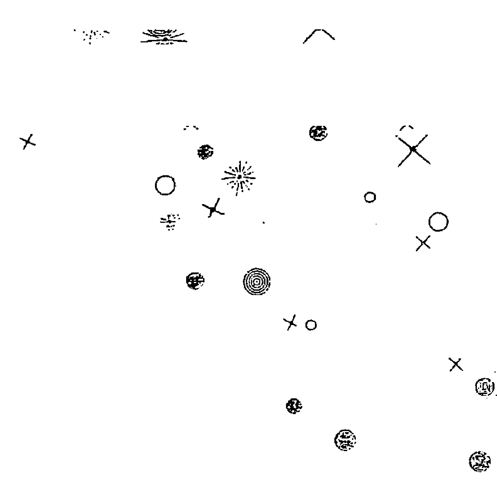

> 尽可能简单，但不是过度简化。
——艾尔伯特·爱因斯坦

你被交点分析的复杂技巧给吓到了吗？它们确实复杂。就这样吧！听一听爱因斯坦的话——如果我们方法过于简单，会付出很大的代价，这一系统的深度和准确度会丧失。

好，现在这个坏消息已经说破了，我们就不差更多的坏消息了——现在我们讲一讲重要性的排序，以便更有效地把握这一复杂技巧。当然，如果你心理占星学学得比较好，这些技巧对你来说就很轻松，很容易掌握。

所有的占星学都有同样的诱惑人的陷阱：片断式的解读。“我是个狮子座。告诉我，我是什么样的人。”回答这个问题是危险的！月亮能量很强，或者太阳在第四宫的狮子座会比较害羞。而有射手座上升、月亮白羊，天王星和星盘中的所有点都有相位的狮子座是热情澎湃的。

“狮子座”在占星师的口中，可以是一种原型法则，但是，如果他们陷入明显的傻瓜逻辑，认为只有十二种可能的人类特征的时候，除非上帝才能帮得了他们。“狮子座”本身有一种实际存在的抽象意义，但是，具体到个人——在某个特殊的人的身上——就几乎完全取决于整个的星图语境了。

这条原则对所有占星学中的象征符号都适用，包括月亮交点和与交点有关的其他符号。

当我们学习占星的时候，不可避免地要从通晓基本的占星语言开始——星座、行星、宫位和相位的一般意义。这是好的，也是必要的。没人能够跨越这一步，就像我们要接受教育，就必须先在母语上下足功夫一样。

在这一步，我们很容易陷入各种诱惑，喜欢走捷径。

你手里现在就拿着一本非常像捷径的书！

我的意思是：在前面所有的章节里，我确实提供了一些常用的交点意涵的解读。

你的南交点在第三宫吗？不需要真的读完这本又长又绕的书，翻到第七章就可以了。海王星与你的交点轴呈四分相？看看第十章。

嗨，干嘛买这本书？！你直接站在书店里，装得像个想要买书的人就可以了……（等一会儿——我好像扯远了……）

这些捷径像是能把占星学变简单——这经常是错的，至少是误导人的。这种复制粘贴的方式可能很快就导向最可怕的谎言：只有一半的真实。如果你有海王星与交点轴呈四分相，或者你的南交点在第三宫，确实有很多可能与你相关的原型事实。从相关章节里，你可以学习这些——也学习到有关你自己的事实。你可能很明白，也可能彻底搞错。

别这样做！学学爱因斯坦：进化占星学可以尽可能简单，但不是过度简化。最起码你必须在整体的背景下观察每一个象征。这需要练习。组织良好的解读策略会帮助你在容易信息过载的情况下还能够保持平衡。我会在下文提供这样的策略。

你确实需要先学习每个符号个别的抽象意义，这就是为什么前面有一些简单的章节。它们是发射台。

火箭是你的聪明才智和想象力。

### 问题的核心

十二星座，十二宫位……十大星体（取决于你把哪些星体考虑在内），再加上两个月亮交点，是三十六个符号。它们加起来，可以描述几乎人类可见的宇宙中的任何东西。所有的可能性，接近于无限，现在是什么，过去是什么，可能是什么……全部都包含在这三十六个宇宙盒子里。

这些可是大盒子。

最简单的陈述，是问题的核心。每一个符号代表的意涵都很广阔。每一个都是一个原型领域，包括了所有潜在的意义。

假设你的南交点在摩羯座，即使这只是一个符号，它可能呈现的表达范畴却是如此宽广，一个人在这种银河系般宽广的范畴里只能表现出几个原子那么微小的份量。但是，是哪些原子？知道南交点在摩羯座不能回答这个问题。把这个问题开放！尽可能地简单，但是不要过于简化。

比如，你的南交点摩羯座在第二宫。就像摩羯座一样，第二宫也是我们三十四个原型“盒子”之一。这也代表在如此宽广的可能性范围中，要一次在舞台上呈现出全部内容有多么困难。

你可能会觉得问题变得更头痛了。你知道交点在摩羯座，这可能代表千千万万的不同事物。同样，交点在第二宫也可能代表许多不同的事物。加起来，你要哭了吧？

不，不是这样的……这样的南交点实际上在告诉你，业力故事既包括了摩羯座，又包括了第二宫。这并不是把事情复杂化，而是把可能性缩小了。真实的故事必须通过这两步审核，必须通过这两个滤斗。

假设你正找一个来自俄亥俄州的人，你只知道她是女性。这并不能把我们的研究范围缩小，俄亥俄州有一半人都是女性。现在再加入一个滤斗：她是个金发女子。这很有帮助！这个人是女性——这就好像知道南交点的星座；她是金发女子——相当于加上宫位。

但是事情还是没有头绪。俄亥俄州有许多金发女子。

如果你知道她住在克利夫兰市呢？（南交点的守护星体落在哪个宫位？）在城南吗？（守护星体落在哪个星座？）

这样你就得到了整个画面。

你第一眼看到交点在摩羯座的时候，你可以允许自己有被淹没的感觉。你在头脑里列了一个摩羯座可能代表的问题列表之后，便眩晕了。于是，你乱了章法：你做了一个无意识的决定，想要把事物简化——这非常不成熟。你肯定知道摩羯座是关于“伟大成就”的。于是，你决定了，在过去世，这个人必须做过什么了不起的事情。你忽略了摩羯座可能代表的其他事物。你忘记了这个原型领域的其他部分。

这是个错误，但你可能因此感觉良好。你不只是把摩羯座所代表的其他可能性忽略了，而且你也没给第二宫一席之地。

第二宫的心理学意义，关于自我怀疑和不安全感的业力分析。从物质层面上看，它与金钱有关，或者是支持我们生存的资源。从这一点说，你对摩羯座做出的狭隘的、不成熟的“伟大成就”的假设让你的解读几乎走进了死胡同。你认定这个前世故事是基于“伟大成就”的，也就是说通过很了不起的努力，积累了大把钞票。

但是，如果当你想到摩羯座时，保持开放心态，就不会一下子跳到某个结论里。伟大的成就——这当然是摩羯座。但是，长期的自我限制、非理智的小心谨慎、不擅长求助——这些也都是摩羯座的主题，只是在光谱暗黑的那一极。把这些概念和第二宫结合在一起，另外一系列的主题就显现了：可能这个人的前世出于自我怀疑，不能实现他最大的潜力，或者以“经济需要”为理由，机械而重复地履行某种责任，以掩饰这种失败。

丰富的解读，在于对每个符号的所有可能性保持开放的态度，之后再把它们结合在一起，换句话说，在你试图得出任何结论之前，允许它保持复杂。在你跑到俄亥俄州去拍每一个陌生女人的肩膀的时候，把所有的证据都放在桌面上。

我们刚才说的只包括了星座和宫位，这是很好的开始，但是，南交点至少还会有一个守护星体。90%的时候，这颗守护星体会为我们的阐述增加一个不同的星座和宫位。同样的原则也适用于守护星体，把所有的可能性都摆在桌面上。注意：这并不意味着你应该首先决定南交点的星座和宫位的意义之后才观察守护星体！如果你能够让它们同时说话，把所有这些可能性都开放。努力去听整合的信息。

当然，基于同样的理由，当我们把与交点轴形成相位的其他行星加入其中的时候，也继续这样做。让所有这些线索发出自己的声音。消化它们。看看它们共同的趋势朝向哪里。

把所有符号的可能性含义都包括在内。每一个原型领域都同时敞开，寻找那些重合的、互相加强的，或者能够顺畅叙事之处。

这一过程并不简单，实际上还是比它听起来简单一些。在下一章节，我们会继续探索。

### 你的看家本事

如果我突然提到你朋友的名字，你的心中会立即产生一种感觉。在不到一秒的时间里，一种特定的情绪和弦在你身心的系统中作响。你朋友的样貌可能也会在你的意识中浮现，但是，我想要提醒你集中于内心的瞬间经验里。

这是什么感觉？这是关于你对朋友的所有直觉性的情绪概念。之后，关于她的事实和记忆才会浮现。如果我开始询问你一些她的细节，你可能会很快地搜索脑中那些确切的信息——你们在哪里认识的，她目前单身还是已婚，她讨厌什么东西，她最爱哪张CD，她的水星星星座，她的月亮星座。这个列表几乎没完没了。但是，这一事实列表并不是我所谈论的。我只是在谈你身心系统瞬间响起的情绪和弦。在这个微妙的时间里，你感觉到一种所有这些零碎的事实的总和。

对这一现象的简捷描述，在于我们以两种方式体验这个世界：通过心的综合，以及通过头脑的认知。头脑里充满了事实信息，心里充满了瞬间可触的情绪总和。

（从占星学角度来看，脑和心可以翻译为太阳和月亮，这两种不同的认知过程，可以用双子座和射手座分别代表。）

你的杀手锏，就是你可以在心的层面上做交点解读。就像你对你朋友的印象一样，你用同样的方式来了解这些符号。换句话说，你能够在你的身心中感觉到它们。让这些辽阔的原型领域敞开并不可怕。

在分析交点故事的时候，或在进行其他形式的占星分析的时候，我们必须使用心的直觉。只有心，才能既把握这原型领域的海量信息，又不过于简化它们。

这当然是个美妙的想法，但是不要太沉浸其中。头脑的工作依然是必须的！再想一想你最好的朋友。那个在你内心响起的情感音符，是多年积累的结果。经过年复一年的倾听，产生的珍爱和分享的结晶。我们都遇到过骗子——那些想要在二十分钟内获取我们的心，假装是我们最好的朋友的人。没人能这么快就了解你。他们必须努力一段时间。这就是为什么朋友彼此珍重。这也是为什么我们知道自己是被爱的——有人觉得我们值得努力去了解，并且如此行动。

我们的心对于占星原型的掌握，是通过学习、记忆、观察和经验渐渐达成的。艰苦的认知工作是获得直觉制高点的基础。

我再次提醒一下，对这本书的速查手册部分，要谨慎对待，不要简单地模仿。我相信我在这里给出的内容，对于理解占星符号的原型意义从根本上是准确的，与交点分析是最相关的。但是这些依然只是对单一要素的分析。现实状况并不是这样。如果你有水星与南交点合相，你先读一下那一段，然后再研究一下你星图中的其他部分。有些语句比其他的重要十倍，有些则可能完全不吻合。不吻合的部分可能离题万里。

### 宇宙与意识

我们存在于物质的世界里，但是我们同时也生活在意识的世界里。占星学的基础原理认为，这两个世界是以相似的规则构成的，他们是互相对应的。

们内在发生的与外在发生的互相折射。这一概念的其中一个表达是共时性。比如出于进化的内驱，你去了丁格尔半岛（译者注：位于爱尔兰西部），“碰巧”有个朋友给了你丁格尔半岛一幢别墅的钥匙。宇宙和意识共舞，比表相显现的更加关系密切。

不过，在内在的原型世界和外在的物质世界之间有一个基本的区别：虽然意识本身很复杂，但是比起外在世界，内在世界依然简单得多。比如，你的意识里有一个“黄色”的原型，但是在外部世界，黄色的东西多种多样，无穷无尽。又比如，你意识里有一个“坏人”的原型，但是在现实世界里，在文学、影视、历史和政治里，有多少坏人呢？

占星学包含宇宙的核心原型。当你启动“摩羯座”时，就像接触到了一个地底的含水层。当水升起，进入到个人的意识时，它变得复杂了。当它到达地表，进入物质的表相时，这复杂性爆发了，它的可能性变得几乎无穷无尽。摩羯座的原型并不简单，但是，比起它能代表的东西而言，它的依然简单许多——它能代表的东西包括政府、规划图、机械开关、商业计划、矿产权益、山羊、法规、宏观经济、毛蕊花、正式场合的着装、硬盘结构、社会责任、专制压迫、陡峭到难以攀登的山脉、冰原地带、文字大纲、冰箱……你大概了解了吧。

如果你的意识处理的是摩羯座的原型，而不是试图把所有可能的物质层面的表象都包括在内，以整合的、内心导向的方法来整合，会简单得多！当摩羯座的原型在你的人生中激活，我们可以百分之百地肯定，这些物质显现会成为故事的一部分。但是，是冰原地带，还是社会责任呢？这就棘手了。

这些是为了解释为什么占星学中的心理形式比物质形式，即一般的“预测”形式要来得准确。心理领域比物质领域简单，原型领域比心理领域简单。从单一推演到多元，从心理领域推演到现象界，这一形而上学的不变真理给我们这些进化占星师提供了非常有帮助的指引。我们把心更多专注于交点符号系统的心理或原型的真实意义会更容易，我们不需要担心我们的客户是不是要买一个新冰箱。

## 通往神秘的幽暗森林的地图

有许多方法可以分析星盘。下面是攻略，其中没有僵硬的教条——只是对实践方法的一系列建议，都是我亲身试验过的，很灵验。我鼓励你们自己身体力行，这样才能知道是否行得通。原因是，即使我们只专注于原型和心理的层面，交点轴所带来的信息也是海量的。我们再用心，能整合的信息也有个限度。所以，有优先顺序很重要。先建立基础的花床，如果你还有余力，再用牵牛花和花栗鼠装饰它。

以下是我们通常采取的步骤，记住两个关键点。首先，对所有的步骤、所有的感觉都开放，而不是试图记住关键词。其次，着重观察那些限制的、负面的或者有破坏性的可能性。

- 对南交点的星座进行冥想
  描述前世的心理角色和情绪议题。
- 对南交点的宫位进行冥想
  描述前世的情境。
- 对南交点守护星体的星座位置进行冥想
  加入新的前世角色和议题的维度。
- 对南交点守护星体的宫位进行冥想
  加入新的前世情境的维度，或者发现故事的某个关键章节。
- 有没有与南交点合相的星体？
  在前世，这个人是这个星体的化身。他或她与之认同很深，是私下的心理认同，也很可能是公开的认同。
- 有没有与南交点守护星体合相的星体？
  这个星体也是一个重要的“形容词”，放大和重塑我们对这个人前世性格和身份的感觉。

静坐，感受。你会得到许多信息，给你的心一点时间整合它们。有一些重复的主题吗？（比如水星合南交点，交点的守护星体在双子座）有其他明显的对立、矛盾和冲突吗？（独立的天王星人，但他或她受到外在关系的束缚——比如，南交点或者它的守护星体落在第七宫或第十一宫，与天王星合相）

第一步是定位这个人前世的身份。把这些线索放在一起，综合地感受它们，然后我们有了人物。在接下来的步骤里，我们要发掘故事情节。

- 与南交点对分的行星？
  在这个人的前世，什么阻碍了他？现实的高墙来自什么事，什么人？他觉得哪些是得不到的，或者不可能的？他希求什么人或者什么事？他被什么击倒和打败了？
- 什么星体与南交点呈四分相？
  在这个人的前世，什么令他烦恼和困扰？有哪些议题悬而未决？什么事物让他盲目？哪些进化的步骤被跳过了？
- 假设有与南交点四分或对分的星体，其中有没有刚好也是南交点的守护星体？
  如果一个人前世是自己最坏的敌人，会是什么情形呢？什么样的独立自主的选择让这个个体陷入麻烦或者伤害了自己？前世的行为导致了今生怎样的结果？

再停顿一下，沉思，呼吸。如果有与南交点呈四分相的星体，你可能会发现一个曲折的故事。如果这个故事结局很糟糕会怎样？如果这个人依然遗留了心理或精神上的创伤呢？

自己评估一下。在搜寻过程中，你可能已经走得够远的了，也许还有其他的线索，但是你已经看到了主要的那些。要抵制贪求更多信息的诱惑。只有当你的心足以把握这其中的复杂性时，它们才是真实的。你可能已经有足够的素材了。你很睿智，停了下来。我自己已经常在这时止步。

准备好加入更多材料了吗？

- 有与南交点呈三分相和六分相相位的星体吗？
  什么事，什么人，曾经安慰和支持了这个人？什么事，什么人，提供了愚蠢的鼓励和支持？这个人没能抵制的诱惑是什么？谁曾经诱惑或欺骗了这个人？有许多呈三分相和六分相的相位吗？如果是的话，是不是因为太过舒服的状态导致这个人慵懒懈怠，缺乏进化的动力呢？
- 有哪些星体是与南交点的守护星体对分或四分的？
  这些影响与步骤 7 和 8 中的类似，只是不如与交点直接形成相位的星体那么有力。
- 与南交点的守护星体呈三分相或六分相的星体？
  这些影响与步骤10中的类似，但不如与交点直接形成相位的星体那么有力。

这十二个步骤，足够给你提供有帮助的、有启发性的前世故事的骨架了。就像我们前面讨论的，现在你从这条河里淘到的金子，只是有用的寓言——象征依然不是文学。这个故事不是随机的，是根据对过去世的痛苦烦恼的记忆而来。这个故事与这个人的今生直接相关，它连结的是这个人挥之不去的行为模式。它是未了之缘，是没解决的问题，是没偿还的业债——或没讨还的业债，是错误的信仰，是人类常见的疯狂。这个模式被带入这个人现在的环境和心理状态里，其印记可以被清楚地观察到。

我们发掘到的，可能不止一个故事，更多可能将在下文描述。

如果我们在这里停止这个分析过程，我们可能有一些惊人的结论，我们会知道前世对今生的遗留影响。但是，这些结论的结果可能是毁灭性的。我们诊断了疾病，我们必须开出解药。

## 进入北交点

月亮北交点是解药——对我们刚刚厘清的业力困境。为了理解它，我们需要换个档位。我们把注意力从已经不可更改的过去的业力，转向神奇的领域：当下，通向充满创造的未来。不确定性的原则是由人类意识决定的，在这里起主要作用。我们抛弃那些来自算命师的乏味“预测”——这些预测比色情片的想象力也就好那么一点点。我们应该主动地负起自己创造未来的责任。

## 用北交点帮助理解南交点

你可以使用北交点来理解南交点的故事。有时候，我在南交点的故事中理不清头绪的时候，经常会发现，先跳到北交点会柳暗花明。

我们先来虚构一个复杂的人类故事情节。我会先用大白话讲，下一段再翻译成技术性的占星术语。你结婚了，她病倒了。她只能指望你——她没有其他选择。你一辈子都在服侍她，牺牲了本来可以从正常的婚姻中得到的快乐和舒适。你妻子的状态委实糟糕，但是还有更令人绝望的——她精神上垮掉了。她满腹牢骚，整天抱怨，对别人的帮助毫无感激之心，完全不愿意配合你，不肯付出丝毫的努力减轻你的负担。你忍受了一辈子。

我们假设这是某一个前世。

用占星学的语言翻译：你的南交点在处女座，第七宫（婚姻宫里的仆人），守护星体水星也在处女座，在第六宫（又是服务主题）。这一交点与土星（责任）呈四分相，土星落在第四宫（家庭）。木星在第一宫，落在双鱼座，与南交点对分——那代表了你的妻子，你的挑战。她跋扈无度（木星），受苦受难（双鱼），自我中心（第一宫）。她就像现实的高墙，你无法逃避。

这个悲剧故事，在道义上非常复杂。你与妻子是合法伴侣，对彼此负有义务——从精神上或是心理上都绕不过去。难道你能简单地说，“再见，宝贝”，然后一走了之吗？不过，牺牲自己的人生就是对的吗？你如此看重你的婚姻誓言，哪怕做出巨大的牺牲，这到底是对还是错呢？

如果一个人很快就得出确定的结论，我不会喜欢和他一起用餐的。生命本身充满了各种道德困境，比十诫中所讲述的复杂得多。这种情形很微妙。我们如何呈现这一南交点故事？这一世留下了哪些进化议题呢？

问问北交点吧。理解解药或许会帮助你理解疾病。在这里，北交点在双鱼座，第一宫，与木星合相。很清楚，你的进化未来，在于庆祝和丰富（木星），你需要学会自私的艺术（第一宫），这是能够激发神秘悟境（双鱼座）的方法。
这样很难，因为这与你过去世的受奴役状态和坚守誓言的根深蒂固的习气相反。

现在，让我们专注于理解前世故事。我们非常尊重你前世的负责与自我牺牲，但是，我们也认识到，这种经验让你的灵魂对逆来顺受的无望习以为常。你假设你还是一个奴隶，不管你主观上是不是这样体验的。你会习惯围着别人转，试图满足他们的需求，不管他们的需求是多么荒谬无理。不管是现实层面还是能量层面，在今生，婚姻或家庭契约都很容易沿袭这一旧模式。

那么，了解了北交点，可以帮助我们厘清南交点，我们要自豪地带着过去世的美德（正直）和需要治愈的伤痛（过多牺牲）前进。不仅如此，北交点也告诉我们如何治愈伤痛。

## 通向未来的地图

再一次，我重申，不存在僵硬的教条，以下只是一系列的实际的方法，可以帮助我们分析月亮北交点。尝试它们，看看它们是否对你有用。如果你的经验足够，也可以另辟蹊径。

- 对北交点进行冥想
  想一下这个灵魂的进化目标，这个灵魂想要发展出什么样的基本美德和智慧。
- 对北交点的宫位进行冥想
  它描述外在的、行为的生命领域，灵魂在这些领域可以最有效地学到所需的功课。它提示我们需要哪些领域的知识？
- 对北交点守护星体所在的星座和宫位进行冥想
  对灵魂的进化目标加入第二个支持性维度：灵魂如何完善进化计划？什么样的经验会引发突破性的进展？在这一生中，怎样才能高分通关？
- 有与北交点合相的星体吗？
  这一灵魂试图将什么核心星体原型整合进灵魂图象里？应该仿效什么英雄形象？必须收回对“哪些类型的人”的消极投射？必须停止羞辱谁？你必须小心不要把自己的权力给谁？
- 有与北交点的守护星体合相的星体吗？
  什么样的特质和态度对进化目标能够扮演有效的支持性的角色？
- 有与北交点呈四分相的星体吗？
  为了达成进化意图，哪些问题必须解决？这一星体的能量，依然是悬而未决的，如何才能为进化目标服务而不是落入到重蹈覆辙的情况？必须停止什么样的消极投射？什么样的人可能成为你的绊脚石？

现在，我们已经用心去感知了这些信息，让我们以整合的感官系统评估它们。有足够多的信息了吗？可能有了。再多一些信息你能承受吗，会不会头脑混乱？在这里止步，也没有问题。

- 有没有与北交点呈三分相或六分相的星体？
  为了支持这一进化工作，你最好的资源是什么？谁可能是你的好朋友，好伙伴？
- 有与北交点的守护星体呈四分相或对分相的星体吗？
  这一影响力不如直接与北交点呈四分相或对分相的星体，如果有的话，用与步骤6相似的方式理解它。
- 有与北交点守护星体呈三分相或六分相的星体吗？
  参考步骤7。

## 优雅收尾

星图上的所有呈现都是业力，正如我们在第一章中讲述的那样。在你的星图中，每一个星体的存在都是有前因的，这些前因来源于你出生之前。个别来讲，一颗星体不一定要与交点轴有关系（即交点的守护星体，或与交点呈相位）才有它的前世因。在进化占星学里，人生中没有什么事情是随机的，没有无意义的事情。

对我们所有人来说，业力是复杂的——当然比任何单一的过去世故事传递的信息要复杂得多。我们都有许多过去世。在每个过去世里，都有执著和妄想，也有进化突破发生。现在这张星图只讲述某一个过去世的故事，显然是不合理的。我们应该期待星图背后的星图讲述了更多的事情，有许多不相关的碎片。

以交点轴为基础的业力分析的美妙之处，在于它能够直击要害，我们看到了核心——最主要的、最相关的业力故事。我们通常只会讲一个故事，但是我们知道它是许多故事的总和。简化是很有用的。但是这依然只是缩写版本。

南北交点的守护星体或与南北交点呈相位的星体，都可以囊括到我们的故事情节里——这本书就是在讲这个。与交点轴无关的星体，被放在一旁，假设它们与故事情节无关。这很好！就像我们看到的那样，控制复杂性是我们的关键步骤。但是，有时候你也可以提供非常好的收尾。有时候，你会发现某个与交点轴毫无关系的星体也可以编入故事。这样也很好。
比如，你会发掘一个战争故事，充满了死亡和黑暗，就如我们在前面看到的奥斯卡的那个故事一样。让我们把土星再放到第七宫，但是，土星与交点轴没有我们之前提到的任何关联性。动用一下我们的智慧：士兵在战争中会失去战友。还不止这个。战争会让人心变硬，他们可能会害怕与人建立关系，因为害怕会失去他们。（看到土星在第七宫是如何加入到故事中了吗？）这样的经验，可能会一直延续到下一个轮回。第七宫的土星与故事的衔接在这里显得天衣无缝。
即使一颗行星与交点轴既没有相位，也不是交点的守护星体，也不能把它排斥在业力故事之外。

## 有多少故事？

占星师可能会预测股票，可能会告诉你钱包丢在哪儿，或者预测你在选举或大赛中是否获胜——这些都是占星学的合理方式。很明显，这样的占星师非对即错。他们中做得最好的，也只有天气预报的准确率而已。把所有因素都考虑在内，这已经很不错了。
但是，对于我们其他人来说，我们使用寓言。我们在寻找隐喻和意象，它们能够启发我们的朋友和客户的认知、反应和释放。寓言式的工作，才是我们做的工作。

出于这些原因，我们从来不假设在我们的出生图里只有一个“正确”的交点故事。我们能够认出了不起的分析——一个好故事，能够囊括所有技术性的基础，而且打动内心。我们也能够认出一个差劲的分析——出自主观想象，不合情理，随意剪接。其实我们只是在创造一个故事。我们从来没有“标准答案”。

没有所谓符合标准的业力答案，因为占星象征太丰富了，有许多答案都是对的。也许其中的一个是真实的前世故事。但它是哪个？不使用灵媒和直觉信息，是没办法知道的。

如果我们选了错误的故事，会怎样？这很可能发生，但结果并不像看上去那么糟糕。我们的目标从来都不是讲述事实，而是说出真相——这是更大的概念。如果我说，你前世曾经是个士兵，事实却是你曾经是贫民区黑帮分子，但无论怎样我们显然已经点出了基本的心理和存在原型。

## 连续剧

有时候，一些从象征符号中浮现的故事，似乎以某种进化顺序呈现。如果我们感觉这样呈现比较合情合理，那就这样做。其实，我们在谈论的学习过程，可以在几个过去世中完成，也可以在一个过去世中完成。比如，我们从事了有名望的事业，但与我们的灵魂毫无关系。几年后，我们厌烦了，换了职业，即使挣的钱没那么多，但是我们不再讨厌星期一了。这些是在一世，还是在几世中发生的？这样的过程也可能在几世中发生——我们其中有些人学得比较快！

上面的故事感觉起来像是一次人生。换句话说，这很容易在一生的故事中陈述清楚。但是其他的进化之旅就更宏大，更容易在一系列的人生中呈现，而这些都与同样的核心议题相关。用直白的话讲：醉鬼走了，神秘家来了；为了权力汲汲营营的人，意识到权力的空虚，变成了一个伟大无私事业的领导人；学徒变成了上师；凶手洗心革面，变成了治疗师。

几十年，还是许多世纪？请自便。这些都不影响重点。

讲到连续的转世时，通常容易分辨哪些是低阶，哪些是高阶的进化状态。按照从低阶到高阶的顺序来讲述它们！但是要敏感一点，不要被表相迷惑。一个人可能热衷慈善事业，人们认为他是个圣人。但是他的动机并不纯粹，因为他这样做其实是为了寻求公众注意和赞许。即使这样，他的慈善活动依然是善业。但是业力依然是业力。当他来世这一执着于自我的业力种子成熟的时候，会变得自我沉溺，娇惯蛮横。从而，他也会体验到放纵这些习气的苦果——这也是进化的一步，只是表面上看起来不是。

在这一工作中，换句话说，要小心那些世人教给你的判断。在这一世的一个小偷，前世可能是发誓固守贫穷的一个僧人。在这一世的一个妓女，前世可能是发誓单身禁欲的尼姑。一个抛弃她孩子们的女人，可能在前世曾经为孩子们牺牲了太多自己的灵魂。

你现在已经拥有了我在过去十年，在占星咨询中用到的所有基本工具了。对我而言，它们通过了唯一真实的测试：在咨询室里，这些是有效的。这些工具能够帮助人们。我许多学生和学徒，也都在他们自己的客户那里使用这些工具，并且也得到了很好的反馈。他们中的许多人——这真是快乐的时刻——辞掉了他们的日常工作。他们现在做着有益的工作，帮助他人提升自己的生命价值。如果你也被这一条道路吸引，你的下一步，就是增加经验。换句话说，实践，实践，再实践。这样，你才能成功。

为了帮助你在这条道路上走得更远，我们下面要进入五个深度的业力解读。其中三位是著名的，另外两位有文化上的重要意义。我并不是按照能够证明我的理论的优先顺序来选取这些案例的——很久之前我就了解到，如果这样选取，一个人可以证明占星中的任何理论！我们的方法足够精巧，不需要特意选取某些支持性的解读。我是这样选择这五个案例的：

- 这些人都已过世一段时间，足以让我们认识他们人生的某些面向。
- 这些人对于近代一二十年的读者有足够的知名度。
- 这些人都活得足够精彩，我们很容易观察到他们业力模式的外显。

在每一个案例里，你都会看到过去世的魅影暗藏在今生传记的角落里。在至少其中一个案例里，轮回的模式又重复了。而在其他一些案例里，进化过程闪亮耀眼。

# 第十五章 阿加莎·克里斯蒂

日期：1890年9月15日

时间：格林威治时间早上4点整

地点：英格兰，托基

罗登生时评估系统评级：A

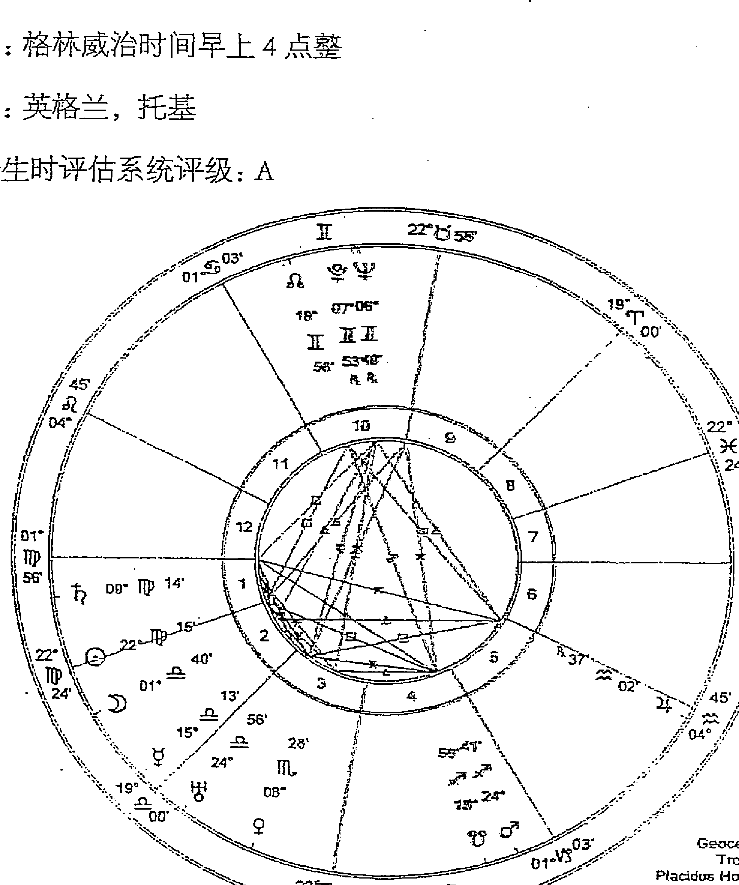

（译者注：罗登生时评估系统（Rodden Rating）是评估出生时间记录准确度的指标，从最高级 AA 级开始，依次是 A, B, C, DD, X, XX，代表着从出生证或官方原始记录到连日期都不确定的不同等级。）

她的书拥有数以亿计的版本流传于世，被认为是历史上最畅销的作家。她的戏剧《捕鼠器》自从 1952 年 11 月 25 日在伦敦首次上演以来，成为了全世界上演时间最长的戏剧，并且延续至今仍长盛不衰。

她作为侦探小说作家闻名于世。其作品开创先河，自成一派。她笔下的比利时侦探赫尔克里·波洛性格自负，留着精于保养的八字胡，聪明绝顶，擅长推理，比夏洛克·福尔摩斯这样一贯正确无误的侦探原型更多了些人性化的味道。1975 年，克里斯蒂的小说《窗帘》广受关注，大为流行，她在小说中杀死了波洛，从而使他成为唯一一个让《纽约时代周刊》为其发讣告的虚构人物。她塑造的马普尔小姐深受读者喜爱，她和波洛一样聪明而且更迷人，这个形象的塑造打破了大西洋两岸中老年中产阶级妇女的意识局限，从此她们也都可以拥有旺盛的精力和狡黠的眼神。

今天来看阿加莎·克里斯蒂的侦探小说，人们可能会认为其中充斥着模式化的陈词滥调，但恰恰是她创造了这种模式。我们甚至可以说当代的每一位侦探小说家都欠她一个大人情。

那么她到底是个怎样的神秘女人呢？

阿加莎诞生在英格兰南海岸的德文郡。她妈妈是英国人，爸爸是个美国的股票经纪人在阿加莎 11 岁的时候去世。她的家境宽裕——举例来说，她 16 岁的时候，家庭的经济情况足以负担她去巴黎的德莱登夫人女子精修学校学习钢琴和声乐。1914 年，她嫁给飞行员、陆军上校阿奇博尔德·克里斯蒂，并于## 第十六章

## 比尔·威尔逊

日期: 1895 年 11 月 26 日

时间: 美国东部时间 早上 3 点 22 分

地点: 佛蒙特州，东多塞特

罗登生时评估系统评级: B

1919年8月生下女儿罗莎琳德。1920年10月，她的第一部小说《斯泰尔斯的神秘案件》出版，让她开始在文坛闪光。这本书写于1916年，行运的天王星和推运的太阳与她的北交点呈三合相。出版的时候，太阳弧木星，即她的南交点守护星，冉冉升起进入第七宫。

1926年12月8日，行运太阳合相南交点的时候，阿加莎失踪了十天。那时候她已经非常有气势，是媒体追逐的对象。流传最广的说法是炒作，但是看起来阿加莎自己的解释应该更为真实可信。这基本上是因为她丈夫出轨带来的高度神经紧张导致的崩溃。在她失踪期间，她用他丈夫情人的名字登记入住了一家酒店——请记住这个奇怪的线索，我们在下面还要深入去探讨这件事。不久后的1928年，她的婚姻破裂，那时候行运的土星来来回回在她的南交点施压。

阿加莎于1930年再婚。第二任丈夫马克斯·马洛温爵士是一位考古学家，比她小14岁。这段婚姻显然一度愉快幸福，之后随着第二任丈夫的一系列出轨事件再次跌入暗黑低谷。由于马洛温的考古工作，克里斯蒂得以多次前往中东旅行，并让这一地区成为她很多小说中的场景和故事发生地。她最著名的《东方快车谋杀案》就写于伊斯坦布尔并发表于1934年，彼时她的太阳弧南交点与她的本命月亮呈三合相，并合相她的南交点守护星木星。

1971年，阿加莎被授予不列颠帝国女爵士勋章。她卒于1976年。

从占星学的角度来看，阿加莎·克里斯蒂是处女座，并且上升处女。这样一来，水星就是她星盘图的守护星体，并且最终定位星是太阳。她有两个行星——天王星和金星——在第三宫（交流宫），还有两颗星高悬第十宫双子座：紧密合相的冥王星和海王星。占星师都不会吃惊这张星盘图的主人是位高产的成功作家。“神秘”天生就是冥王星和天蝎的领域。落在她第十宫的冥王星，以及落在第三宫天蝎座里面的金星可以让我们很容易地找到占星学上的论据来支持我们已经知道的事实：她是一位写侦探小说的高产作家。

让我们来看看进化占星学能否带我们进入阿加莎灵魂的更深处。

她的南交点位于第四宫射手座，合相火星。射手座的原型是“吉普赛人”。热烈，无法忍受限制和约束，渴望探险，想要认识世界，去学习，去扩展，这些都是射手座特质。火星，同样天生炽热，又落在火象的射手座，也代表一种爆发性的冒险精神，以一种“不自由毋宁死”的态度反抗制约。（注意在这里我们看到能量十足的交点和双处女的谨慎小心之间的基本张力）

阿加莎的南交点星座和与之合相的行星描绘出一个活泼的打破疆界的前世本性。我提到“本性”这个词是因为本性是由星座和行星来描述的。它们反映出我们是什么：我们的风格，我们的表现，我们的能量。

但是如果你想知道阿加莎在过去世做了什么，那就要看相关的宫位，它们描述了生活的情境和形式。

阿加莎的南交点落在第四宫：家，家族。注意这个矛盾：一个充满自由意志、热情、渴望冒险的个体发现她被家庭定义并束缚了。她是热情如火的人，是加强版的战士，是行走江湖的吉普赛人，但是却被困在了家里。她不仅为此感到沮丧，还很愤怒（火星）。这感觉就像老虎被关入笼子或者雄鹰的爪子被铁链锁牢在地面。那种炸弹要在钢铁密室中爆炸的比喻开始浮现在我们脑海里。

这样的火是很难被生生咽下的。到底是什么让阿加莎在过去世感到被家庭所困呢？

按照我们的程序，我们要来看一下南交点的守护星。在这里我们可以立刻为我们的问题找到不止一个答案。射手座的守护星是木星，它在水瓶座第五宫逆行。我们已经知道，这些给了我们她过去世身份的另一个维度，或者说通过故事的另一个章节来对她的身份有更清晰的认识。第五宫自古就和孩子相关——当我们的第一个情节是家庭（南交点第四宫）的时候，自然而然的，我们一下子就会想到孩子。这些都是我们需要寻找的有连锁关系的隐喻。在这个例子里，我们可以推测出这是在讨论关于很多孩子的事情——木星倾向于扩张，而水瓶座与一大群人相关。

我们还可以再加上一些情节，阿加莎已经呈现出充满热情的特质——这是她的热烈的火星合相南交点透露的信息。而且射手座也是那种看也不看就敢跳的冲动的人。把这些要素都加在一起，阿加莎在过去世是一个被一大群孩子和家庭束缚的人这一形象便呼之欲出了。要知道，节育是这些年才有的论调。

这无疑也跟她在这一世中第一段婚姻持续五年却选择只生一个孩子有关系。在现代，独生子是不会引起特别注意的，但是在她生活的那个年代，这可不是个多见的选择。那时人们通常有很多孩子，社会也认同并支持这种普遍存在的事实。

但是在过去世，孩子成为了囚禁阿加莎的牢房上的锁。

第五宫也有其他意义：绯闻，创造力，欢庆，放纵。我们不该忘记它们——它们也是原型的一部分，但是我们暂且把它们往后放一放。

那些和南交点的困难相位呢？我们现在要描述的越来越复杂了——行星与南交点呈相位总是会帮助我们看到更多。它们打磨了更多的情节。

冥海的合相接近于对分南交点，但是 11 度或 12 度的容许度有点太宽了。等我们对故事有了更有力的切入，再回来仔细“榨取”这个相位里面的细节。

我们发现，太阳落在第二宫头处女座，与南交点构成一个可靠的 3 度四分相。这里我们遇到了故事里面另一个主要的元素。太阳总是代表我们生命中必须要服从的力量。有时候它代表一种压倒性的道义责任，一种我们无论如何也无法违背的事情——比如一位亲爱的朋友的请求。有时候它代表我们完全无力掌控的情境——船就要沉了而我们离岸还有几百英里。通常对太阳的最好的切入点是把它想象成一个有绝对控制权的人，能管束我们的人，他说话我们必须服从的人。

让我们从后面的角度切入，看看有什么发现。

阿加莎身处家庭并感觉被束缚。对孩子们的爱也是束缚的一部分。这里的太阳很容易被看成是她的伴侣——我们很自然地会在一个和家庭相关的故事中寻找伴侣这种角色。如果她是一位隐士，我们就不会考虑那种可能性。而在一个家庭故事中，把太阳想成丈夫或是妻子是很自然的。

我们该怎么形容这位伴侣呢？首先他或是她个性强势（太阳），非常有可能专横而挑剔——这是处女座的阴影面：永不满足，不断苛求批判。说“所有的处女座都这样”是不公平的，但是在进化占星学中，我们是在试图找到过去世未能解决的问题。我们不能从每一个符号的最高阶的表现入手。所以在过去世，阿加莎的伴侣是一位颐指气使又挑剔苛求的人。这是起点。

太阳在第二宫的宫头。这位伴侣可能非常在意金钱。这并不代表富有或是贫困，只是表示在意和担心。

考虑到太阳更广义的面向可能是一种强制性的情境，我们可以推测阿加莎的状况可能充斥着无法忽视或无法逃避的的财务危机——这在家庭中也不算是个少见的情形。孩子们总要吃饭，诸如此类。

处女座可以代表自我怀疑，被不可能达到的标准奴役着。第二宫，从心理角度讲，与无法拥有需要的资源而产生的匮乏感相关。加上太阳代表伴侣，我们现在可以得出一个更深刻更关键的看法：这位伴侣，虽然强势，但是缺乏安全感、感到无能、暗自自我苛责。这个人握有权力的王牌，但实际上，却远不如阿加莎那么坚强有力。

到目前为止，我们用他或她来提及阿加莎在过去世的伴侣。我们可以把范围再缩小一些么？从行星来判断性别是不太靠谱的事情。虽然有时候是显而易见的：比如一个在军旅生涯中死亡的人可能指向一位男性，而过去世难产而死的人绝对是位女性；但是你永远没法百分百确定。那些金星意指女性、火星代表男性的经验之谈其实并不十分可靠——虽然我们很期望如此。但在这个故事里，阿加莎的南交点合相一颗热气蒸腾的火星，我暂且推测她在过去世是一位男性。那么太阳代表的伴侣就是女性：阿加莎有位要求苛刻、颐指气使、缺乏安全感的妻子。

进一步来看，射手座代表哲学、宗教和信仰。一般来说，这些都与道德相关。阿加莎的南交点座落于此星座，我们可以假设她在过去世有着很强的是非观念。很有可能这种道义上的框架是由第四宫来建构的——“家庭纽带”。她把家庭当成宗教信仰了。火星所代表的激情、强烈的战士原型代表的特质表明，如有必要她愿意为家庭牺牲且不惜一死。

这种对家庭的承诺有着很强的道德权威感，但是这不应该被误以为是爱。这与那种温柔的感情上的连结无关，它是强烈的，为道德责任甘愿自我牺牲的。在本质上绝没有爱的愉悦。我们已经知道她像一只被家庭责任困在牢笼中的猛虎：愤怒、不幸福。而现在，这牢笼又多了一副枷锁：无论她感觉如何，她都要做出道德上的承诺，去履行家庭义务。

前几段里，我们曾经问过，是什么在过去世束缚了阿加莎的自由意志？现在我们有三个答案：它们都互相关联。第一，孩子；第二，一个苛求、没有安全感、物质上不满、带着极强的掌控性的伴侣；第三，强烈的道德感。

这些就是灵魂牢笼上的枷锁。

这让她愤怒（火星），但是怒火被压抑在铁屋（第四宫）中。

切入问题的核心看看黑暗的面向，那就是火星的本性是想要杀戮。说得好看些，是某些时候人性中有关杀戮的那部分能量被称为火星能量。简单说就是这么回事。我们都有那一部分。一旦你感觉想要杀了某人时，你的火星就升起了。

我假定，在过去世道德与现实层面的铁屋中，阿加莎·克里斯蒂对他的妻子积攒了满腔怒火，但是这愤怒却从来没有机会被表达出来，它深深地被第四宫包裹着，被灵魂囚笼上的三座大山重压着。

我再假定那些未被解决的问题和所有未能释放的关于谋杀的幻想在她今生的小说中得以表达。

在中规中矩的英国人外表下，阿加莎的小说和戏剧都是关于那些“受尊敬的体面的好人”之间互相谋杀的故事，经常让人心惊肉跳。

我们再来看看更多的情形：南交点守护星木星所在的第五宫的其他可能性——出轨绯闻、创造力、欢庆和放纵。

在我们描述过的那种情形中，一个充满激情的男人在束缚之下会怎样呢？他要怎样生活？他会找到怎样的发泄渠道？他可能用那些生命中最容易找到的东西来满足自己：食物、酒精、玩具、游戏、运动、友谊。这张盘里没有很多线索表明过去世有上瘾倾向，比如说，没有严重的海王星问题。但是我怀疑阿加莎那时候应该没少寻欢作乐。

木星坐落的水瓶座倾向于打破常规，是个造反派。把这些因素放进我们的公式中，我们或许可以想象一下他曾经有婚外性行为。一定要记住很重要的一点，谈到轮回转世，就会涉及历史。性从来不曾走开——要不就没有我们了，它只是被风俗和信仰变形。不同的历史阶段总是有完全不同的性风俗。男性与女性所承担的性道德的压力、标准和期望通常是不同的。感谢上帝，时至今日声名狼藉的所谓“双重标准”已经在很多地方消失了。通奸和卖淫曾经通常是被默许的，“爷们儿有需求”，就那么回事儿，只要他们不说出来，事后还能回家就行。

木星喜欢放纵，第五宫爱享受愉悦，水瓶喜欢走在另类的路上。所有这些都适用于阿加莎的业力故事。这样的木星特质守护她的南交点，我们可以推测阿加莎在物质和世俗层面对家庭是忠贞的，但是她在性关系上则不然。

这个推测有进一步的支持：金星落在天蝎座，代表好奇和探究的第三宫，与木星呈四分相。天蝎座和金星都代表性驱力，而通过与南交点守护星的四分相，我们知道有麻烦了。

我们可以通过占星学以外的方法进一步探索这个性关系问题。让我们来看看她的实际生活。阿加莎的第一次婚姻失败的部分原因是她丈夫出轨。而她的第二次婚姻，刚开始的时候可是幸福美满的，后来她丈夫也多次出轨。他虽然与阿加莎维持着关系——但是阿加莎一死，他就娶了相爱多年的情人。

业力就是简单的模式重复，而有时候，我们得吞下自己种的苦果。我相信阿加莎的复杂业力结出了果实。还记得么？当她失踪的时候，她用他丈夫情人的名字登记酒店。为什么她想用一个情妇的名字？她与这两个在性上对她不忠诚的男人又有怎样的共鸣呢？

我们还有一个因素来形容南交点守护星木星在第五宫，那就是创造性。我猜想阿加莎还用另一个更健康的方式捱过了地狱式的婚姻，那就是艺术表达。

有多少只吉他的主人是真正的摇滚明星？比例是多少？有多少本小说只写了一个开头就半途而废，更不用说真正出版了？人们创造东西就是为了好玩。当然，有时候好玩也就足够了。我觉得在过去世，阿加莎的那些创造性活动也就是简单地为了暂时消遣一下。创造是另一种娱乐。

我们再深入一步探究这个猜想。冥王星和海王星合相在双子座第十宫，几乎对分南交点。我们当然可以对它忽略不计，但是星盘中的任何东西都有其意义——即使这个相位容许度有点大了。就从想象这个对分相位有更小的容许度开始吧，想象它是需要被重视的相位。这样能示现什么含义呢？家庭之外的广阔世界里立着一堵现实的墙，你根本无法逾越。也许阿加莎渴望着什么。这会是什么样的渴望呢？两颗行星在双子，是“极度”渴望被听见。听见什么？海王星：梦幻与想象；冥王星：严峻的甚至是骇人听闻的事实真相。但是，这些都是和公众舆论或世俗文化严重相抵触的。它们并没有被听见。公众舆论和世俗文化（第十宫）都是现实的高墙。

记得么，这个对分相位是不那么紧密的，所以可能不会真的有影响。我们需要弱化一下这样的解读。我认为比较合理的说法是在过去世，幻想被公众听到并认可的念头曾经在阿加莎的脑海里偶然闪过，但是很快就被放一边去了，因为这些绝无可能又遥不可及。

无论如何，这个对分相位是整个解读中很微小的一部分。它只对阿加莎过去世的创造渴望小小地推波助澜了一下，仍然是私密的、不公开的。我好像看见她给孩子们编睡前故事，那可能都是很棒的故事，可是只有孩子们能听到。

如果我们开始分析第十宫的双子座北交点的话，冥王星和海王星的声调就开始变得更严肃重要起来：北交点在第十宫双子座，意味着阿加莎的灵魂带着强烈的意愿来到这个世界上，就是要发出声音，并且让所有人都听到。这是她灵魂创伤的解药。她很愤怒，对于自己的困境很厌倦。是时候去到更广阔的世界里了。冥王星代表真相，是时候坦白说出她对困在社会习俗里、困在婚姻和家庭中的真实感受了。

北交点的守护星水星落在天秤座第二宫，阿加莎需要对自己证明她作为一个能发表言论（水星）的艺术家（天秤座）的自我价值（第二宫）。与之密不可分的，是她使用想象力（海王星）构思一些冥王星式的社会和家庭的黑暗情节的意愿。

一个重要的“被跳过的一步”阻挡了阿加莎前进的道路：太阳四分她的南北交点。如果她想要达成自己的北交点目标，她首先需要重建一个自我。在过去世，她把这样的力量和权力拱手让给了自己的伴侣。她让别人主导自己的生命历程，只纵容自己从事一些微不足道的不正当的消遣活动，那些防止她精神崩溃的东西——她沉迷其中。最后，这造成了更多的愤怒，而且可能伴随着负罪感慢慢发酵膨胀。

此外，阿加莎对前世的妻子投射了很负面的评价，投射出的形象是苛求的、以自我为中心的。她说：“我永远不会以自我为中心，对他人颐指气使。”这句话出于傲慢，把自己置于道德制高点上，非常片面。这句话其实是她给自己的自我困境寻找道德哲学上的正当理由，而她的自我困境至少有一部分也是她自己造成的。这样一把自我合理化的道德大伞延展开来，想必也掩饰了她那些所谓的“小小的自我消遣活动”，比如各种逃避倾向，不正当的性行为以及其他。

所有这些问题都需要被解决。阿加莎需要声明她自己的权利，要学会自私，要满足她自己的需求。去问任何一个作家：没有某种程度的自私，你根本就无法在这方面取得成功。若不自私，你可能永远也找不出来写东西的时间。处女座代表着工艺和技巧。阿加莎的那个“跳过的一步”（太阳四分南北交点）部分表现在精益求精地打磨她的技能——在这个故事中，这个技能就是写作。然后，从整个世界的舞台上来看，她要真正卸下她带到这一世来的沉重负荷——在一个看似美好的家庭中滋生的想要杀人的愤怒，这样的愤怒是压抑下来的。这些不仅束缚了她的双翼，也导致了她的堕落。

而仅仅“谈论”一下这些都可以让她感觉好很多！这一洞见简单明了，平淡无奇。那些压抑的愤怒才是灵魂的毒瘤。挖出来，写成文字，从胸中驱散——我们都知道这是有帮助的。即使有时不能达成完全的共识，也会净化氛围。未经处理的怒火屏蔽了爱，锁住了心。我们甚至不需要伴侣的认同——很多时候，只要知道我们被倾听到就足够了。

我们当中的某些人在茶余饭后的交流中经历了这样的治疗和释放。而阿加莎·克里斯蒂，借助她的北交点第十宫双子座能量，把这样的过程变成数十亿本书。

比尔·威尔逊可能是过去一个世纪中影响力最大的无名人士。他的事业挽救了无数的生命，甚至是无数的灵魂。然而，你甚至可能都从未听闻过他，除非你直接或间接地参与过他所创建的社团。而这恰恰是他要强调的重点之一。他是“匿名戒酒会”（Alcoholics Anonymous，又称嗜酒者互诫会，美国戒酒互助协会）的创建人。

威尔逊初次尝试喝酒是在20多岁时，当时是一战期间，他在军队里服役。那时，太阳弧的海王星和金星，伙同推运上升点，都以六分相位迷醉着他的南交点。众所周知，酒瘾很容易养成。当他发现杯酒如润滑剂般能帮助他在社交场合巧舌如簧，便很快对酒精上了瘾。1919年到1925年的几年间，他结了婚并成为了一名成功的证券分析师，但是，之后酗酒让他付出了应有的代价，他的事业也随之衰落。他尝试戒酒，甚至为戒酒入院治疗，但屡屡失败。最终1934年12月11日他喝下最后一杯，之后就再也没喝过。几个月过后，也就是在1935年5月1日下午5点左右，在俄亥俄州的亚克朗市，他遇上了传说中的“鲍勃医生”。很多人把这个时间作为匿名戒酒会的诞生时刻。那天，行运土星紧紧地合相威尔逊的北交点，而停滞的海王星（译者注：即星体顺行与逆行互相转换的时间点）则接近其南交点。此外，行运南交点几近合相中天，而行运水星也在四分他南北交的轴线。至此，业果成熟了。

顺便提及，我所查到的威尔逊的出生时间是在“凌晨3点前后”。占星家唐娜·坎宁安（Donna Cunningham）将其校正调整为凌晨3点22分。我认同她所校正的时间，因为这看起来确实比凌晨3点更吻合威尔逊的人生大事件时点。

正如下文中很快将看到的那样，威尔逊的前世业力的根本议题并非以成瘾为主导，而是伤痛与羞辱。但乍一看，确实让我们注意到了他的双鱼座月亮——众所周知，除非学到了积极处理自身敏感度的方法，“神秘主义”双鱼人是多么容易成为“酒鬼”。月亮位于第五宫的末尾，这与“纵情酒色”有所关联。又有潜在的逃跑专家海王星与之呈四分相。况且，金星还是命主星，金星总是在寻求压力的释放——它在有成瘾倾向者的星盘中扮演的重要角色，远胜于众多占星师们所认知到的程度。金星还在第十二宫，更加强调了这个神秘或酒醉的主题。威尔逊是个太阳射手座，又有木星三分太阳——显示出更多可能屈服于过度沉溺的指征。

呈上这张星图，应该没有占星师会因为听说此人经历过滥用药物的事实而讶异。但一个进化占星师又能看到哪些传统占星师看不到的东西呢？

月亮南交点位于第十一宫的处女座。探寻前世环境，我们能识别出威尔逊是个热衷于技能和效率的人，且有可能担当过某种“服务”的角色。他惯于忧心忡忡的焦虑，并充满自我怀疑。这一切都是处女座的信息。

身处第十一宫内，我们看到威尔逊的前世自我是在团体的环境中运作的，被团体的洪流席卷，并由其在团体中的角色所定义——那便是第十一宫的含义。经整合处女座的仆役原型与第十一宫的象征意义，我们认知到，他在团体中的角色是居于从属地位的，他服从着上级的指令。这让我有一种他是“穿着制服”的感觉，尽管至此我们还没有理由将之确认为军装。也可能只是件棒球队服而已。我们深知的只是，他作为团队的成员，致力于发展技能，并置身于他人的命令之下。

第二宫内的天蝎座水星是其南交点的守护星。我们淘到了金子——水星身处星群，与天王星紧密合相，与火星很接近，又与土星有不到8度的合相。这里有大量信息，但让我们还是先来把握全局。之前由处女座南交点所揭示的自我怀疑主题，在此被置于第二宫的南交守护星体又强调了。当一张星盘如此重复一个主题，就好像在增加惊叹号。我们必须使用强调过的语言来传达这份象。象征意义。因此，在这个前世，威尔逊成了一个被自己头脑里不知所措的念头逼疯了的人。

天蝎，在交点环境的分析中，常代表生命的各种极端情况——死亡，背叛，打破禁忌，狂风暴雨般的性关系。换言之，这些曾压倒威尔逊的事同样可能会压倒你我任何人！注意：在此我们所见的一切，并没有让我们认为前世的他有多么懦弱胆小。想必他是遭遇了什么大事，可以压倒任何人的大事。

现在再来看一下那三个与南交点守护星合相的行星之重要性。它们都在为这个前世身份添加立体感。天王星，地震与闪电之主。火星，战神。土星，传统占星中指示失败、绝望与不可能的星体。很显然，威尔逊的南交点守护星体在牵引着我们走进一个相当戏剧化的故事。要牢记那些我们对南交点本身已知的内容——他被集体的洪流席卷，在如此暴烈的情境里担当着从属者的职务功能。

土星在三种修饰性的影响中显得最弱，只因它与守护月交点的水星距离最远。它回荡着“指令”与“职责”的声响，强化着那些主题。指令与职责被植入了他的身份。

火星很强有力，与水星不到三度。它还落在了天蝎座，其传统守护的星座。记住，与南交点的守护星体合相的星体也能给我们一些此人在前世环境中的个人身份信息。威尔逊真的是个士兵吗？火星当然可以指示这个，正如我们前面在李哈维·奥斯卡的星图中所见的那样。威尔逊像是生活在一个充满怒火、怨恨甚至暴力的竞争情境中。

天王星距水星不到1度——因此提供了最有力的修饰特征：威尔逊被认作是叛逆的化身。他打破规矩，他抗衡权威，他陷入麻烦。这些都是天王星的行径。

我们绝不能忽略那个极其重要的天王星主题。但要注意它是个多么格格不入的信息——我们至此所见的其他线索都一再表明威尔逊身处等级制度中，扮演从属地位的角色，被期望去行使他的职责。而现在我们却突然见到了一个反叛者。这两种情况彼此抵触，却又确凿无疑。可能他先是遵从，而后反叛。这条主线很引人入胜，但还是先稍安勿躁，因为尚有些我们未曾探知的线索。

没有什么行星与威尔逊的南交点对分，但当我们寻找四分相时，却有所斩获。第二宫的射手座太阳四分了月交点轴线，而第八宫内的双子座冥王星则从另一侧与之四分。此外，海王星合相冥王星，也与月交点轴线有个八度外的四分——当然这足以被作为一个因素考虑。

让我们从太阳开始说起。太阳总作为一种强势的压倒性能量，代表不可避免地必须被遵守之事。正如行星们无论喜欢与否都须绕行太阳。同样的，有些人物或情境也要求我们注意并顺从。他们大权在握。你试试去告诉政府你今年不想付税了，因为你就是不把税收制度当回事。现在，你可以那样做——但后果是不可想象的。那就是太阳的方式。某个具有这种无法抗拒的权威的人物或事情深深折磨着威尔逊。不管他是谁或它是什么，也是具备射手特质的——即很独断的，冲动的，擅长哲学式合理化，且自以为是的角色。

回顾一下，我们有多少次重复地看到了命令与阶层的主题？而刚探索过的太阳很可能就是它们的源头：不可否定、无法逃脱、无所不能的某种事物，它控制并烦扰着威尔逊。还记得前述提到的天王星式反叛的迹象吧？反叛什么呢？还记得所有那些削弱了威尔逊信心的影响吗？故事至此，愈发像是老鼠对猫的特权那种无效的反抗。好似在固若金汤的堤坝前，经年累月堆积起的一种无能为力的沮丧与愠怒。

另外，还有个冥王星静候在此呢。它也四分交点轴线。冥王星总会唤起绝境与梦魇，尤其当它落在第八宫里的时候，那含义被如此强烈地深化。第八宫是传统的死亡宫位。当冥王星落入，它指示着可怕的死亡形式——或弥漫的蚀骨的心理威胁感。

别忘了冥王星、第八宫、天蝎座三位一体的象征意义——要记得威尔逊的四个天蝎座行星都是我们交点故事的一部分。噩梦与恐惧的象征正在逐渐增加。占星学词典里的每个能预示噩梦的词汇都在此交点故事中呈现了。

冥王星所落的双子座，代表口才，呼应了威尔逊的南交点守护星水星。因此，以言语反叛权威的主题在此凸显。且双子座又与呼吸有关，当处于死亡宫位的布景下，这令我们注意到那些因呼吸直接中断而导致生命戛然而止的情形。

最后，海王星四分南交点，尽管没有像冥王星那么准确地四分。可能在前世威尔逊为不接地气的理想主义而受苦？那常是海王星的阴暗潜质之一。第八宫也可能预示他有殉道情结？有嗜酒或嗜好其他物质的倾向？那当然也属于潜在的海王星式问题。考虑到威尔逊今生的实际情况，这个解释合情合理——但仍须强调，这并非故事的中心。在所有与南交点呈四分相的星体中，海王星的戏码显得最弱。

在我们将所有的线索串成连贯的故事之前，南交点的支持相位又如何呢？他的盘中明显缺乏这些——唯独有个在第一宫的天蝎座土星与南交点呈六分相。我猜这说明在前世有些上司喜欢威尔逊——或至少对他的能力和忠实表示欣赏。也可能他比大多数人更习惯独处。

即使如此，我们寻找到的支持性信息依然很少。这个人在群体中是孤单的，被孤立、被放逐的。

在人类故事里，战争向来有一席之地，我们很容易把这个故事置于战争情境中。很容易想象，在过去一世中，威尔逊曾是个低等级的士兵，他被迫去从事黑暗的暴力行径（火星天蝎），这些令他越发感到自责。在这里，有一种不断升级的戏剧化张力，一方面是实实在在的责任感，另一方面是越来越强烈的对死亡与杀戮的厌恶与震惊。很可能还有一个握有权力的“真理的信徒”强迫他这样做（射手座太阳）。可能还有些由于震惊而产生的天王星式的抽离的情绪混杂于其中。可能酒精暂时抚慰了他受伤的意识和情绪，但忽然有一天，他心中有什么东西爆发了，他直抒胸臆，揭竿而起，却以卵击石。我猜他被吊死了。

我并没什么特别的理由非要把威尔逊的故事渲染为战争题材。我所知悉的全部只是，他作为等级制度的一份子，参与到与死亡和禁忌相关的某些极端行径中。尽管天蝎座火星合相南交点守护星，足以支持我们对他前世士兵身份的认定，却也不必把这一可能性当做唯一，局限我们的想象力——尽管这可能令他在1917年一战期间作为士兵第一次饮酒的那件事变得值得玩味。

保持诚实的态度，向更多微妙的比喻尽情敞开，还可以更简单地去想象：威尔逊是大团体中的小人物，腐败行径让他惊骇，他可能因为“揭发”，而被永远沉默地处理掉了。可能他是一个“犯罪之家”的成员，尽管对其族人效忠，却终在一朝达到了道德觉醒那愤怒的沸点——要记得这一事实：天王星可以指示罪犯。

不管故事是怎么样的，诠释的关键是要注意到那份绝对无法调和的冲突——一种完全没机会再积极生活下去的精神状态。一方面，背叛宗族是道德上无法接受的——更不用说完全孤军奋战地去实施这惊骇之举。另一方面，有一种与日俱增的疏离感与震惊感。最终，那份天王星要素，暗示着“有朝一日，突然崩溃”。那种爆发感被火星与水星落天蝎的鲁莽倾向陡然放大。就好像他身陷“前有狼，后有虎”，“横竖都得死”的情境下。

最终，这一切逼得威尔逊似乎除了自毁别无选择。酗酒开始成为一种“解决办法”，但迹象表明这种行为并未来得及充分发展成为社会认定的那种酗酒程度。酒精毕竟不是他前世故事的核心。伤痛、羞愧、怒气、怨恨和无能为力才是主题。

有趣的是，应留意今生最初将威尔逊拖入酒精的，恰恰是因他发现在人前开口说话非常困难，除非获得酒精的协助。在前世，他的声音曾令他陷入巨大的麻烦。天王星式事件的发生，迅雷不及掩耳。可以想象，前世他脱口而出的言辞，是当时社会背景下无法被原谅的——且是性命攸关的。转世后，他又如何能够自发又自如地说话？

北交点又如何？它落在了第五宫的双鱼座。这一次，上帝将威尔逊踢下天堂，说：“我想让你去人间尽情享受了！”那就是第五宫。但威尔逊真的并不太懂得该怎么做。像我们所有人一样，他会对北交点所象征的领域表现出无知的倾向。一杯威士忌下肚让我们感觉飘飘然，一整瓶威士忌又会是何感受？

第五宫的深意是欢乐。双鱼座的较高阶能量是臣服与狂喜。此人需要让人生重新展现魔力。他需要恢复童真。如我们所描画的那样，威尔逊在前世受尽苦难。道义与精神上的折磨，使他感受到了强势的恶魔凌架于无能为力的善良之上的那份剧烈的刺痛。他感受到了极度的疏离感，完全缺乏支持与理解。冷漠与残忍的不公正是他曾经的认知。他怀揣着未解决的灵魂巨痛来到了这个人世。

沉思着所有这一切，那熟悉的语句“我真的需要来杯酒”跳入脑海。从古至今多少人在酒中寻求单纯的快慰。但酒不是治愈这类伤痛的良药——如果我们试图透支酒所能够给予的东西，它必然将演变成为更深的伤痛之源，这种伤痛可能是我们无法应付的，因为我们本身的负担已经够重了。

更高阶的双鱼座与神秘性与灵性相关。你们中那些对匿名戒酒会有所了解的人们，会知道那个围绕着必须向“更高力量”求助而展开的方案，而此原则可能在每个人心智中获得共鸣。今生，在经历过未竟业力的那些痛苦后遗症后，威尔逊看似真的已驶向其北交星座所指示的内容了。他找到了他的“药”。那即是灵性。

第五宫常与创意的自我表达相关。虽然我们并不容易把匿名戒酒会与艺术联想在一起，但那种对能接纳你并能支援你的听众们“讲述自己的故事”的方法，是威尔逊“疗法”中很有意义的内容。第五宫也与当下息息相关，浮现脑海的是匿名戒酒会的箴言——“每次过一天”（One day at a time）。

1939年，比尔·威尔逊撰写了后来成为 A. A. 圣经的《戒酒无名会》，俗称“大书”。那时，他的推运中天合相南交点。与此同时，他的太阳弧冥王星也来到了中天。如果威尔逊选择了一条更轻巧的路，这些征象很容易表现成低阶的彻底堕落——或只能起到“警示后人不可效尤”这一作用的死法。然而，他却活出了此中天的最高意义——活出了自己在世间的使命，并留下了惠及众生的礼物。

我们可以从威尔逊的故事中汲取信念和勇气，即使我们自身从未体会过那种混沌状态中的觉悟。这是一个关于一个灵魂落入自身业力的深潭之后，又努力设法爬了上来的故事。威尔逊最终采摘到他北交点上的精神快乐——而他是利用南交点所学的功课向世界献上了大礼。通过他的故事，也让我们学会深入事物的表相。酗酒只是他业力故事里的一个症状。当深谙了这个现实后，我们体验到对威尔逊与生俱来的创痛的同情心，我们也体验到导致他伤痛的那份徒劳的、却也许是了不起的勇气的敬重。

# 第十七章

## 阿道夫·希特勒

- 日期：1889年4月20日
- 时间：地方时晚上6点30分
- 地点：奥地利，布劳瑙镇
- 罗登生时评估系统评级：AA

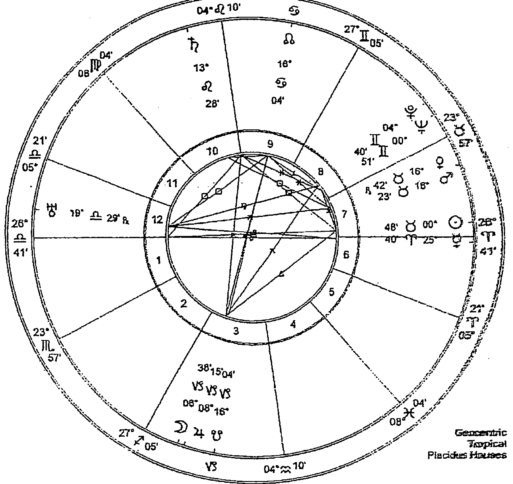

Geocentric Tropical Placidus Houses

人类历史从不缺少反面人物。可达到登峰造极之势的人，必然与众不同。一人便可小天下。就像天才中的顶级人物爱因斯坦，傲视财富榜的比尔·盖茨一样，阿道夫·希特勒已然成为恶魔化身的标准隐喻。能在历史长河中雄踞一方，此人身后到底隐藏着何种业力因果呢？

希特勒的出生星图是出了名的有欺骗性，所以已经无数次被当做案例，让大多数占星初学者从中学习，从而避免犯下愚蠢的错误。但还是让我们先从传统占星的角度正儿八经地审视一下他的出生星图吧。希特勒的第七宫落金牛座——对于太阳星座来说，并不是一个好战好斗的宫位。你可能会想这个位置在处理人际关系时应该是一副通情达理的合作态度，以寻求和平、解决问题为导向，做事务实。上升在天秤，再一次回应了之前的看法——一副“我们好好相处”的姿态。和平之神——金星就是该星图的守护星，而且落在第七宫，在金牛座。爱神之星不可能再强大了。月亮在摩羯座，再一次揭示了该星图的主题就是脚踏实地、讲究务实、通情达理。月亮与木星合相，落在摩羯座，可能会带来野心勃勃。此外，月亮与木星的结合常常会体现出某种博大的胸怀和宽容的心灵。

这是什么情况？看看希特勒的真实生活，那他的星图根本没有“可参考性”。

有些占星师努力把他的星图跟其犯下的滔天罪行联系起来，从中发现了这样一个事实：金星是逆行命主星的，而且与战争之神火星紧紧合相。他们还特意指出代表着控制的土星坐落在代表君王的狮子座，以雄心勃勃著称的第十宫，且与火星、金星的合相呈四分相。

不过，查理·卓别林跟希特勒一样，金牛座中也有金星、火星组合，而且与狮子座的土星呈四分相！就连游戏节目主持人默文·格里芬也一样——尽管在他的星图中，这些行星落在不同的星座里。不妨暂缓一下，换种方式来讲。总的来说，传统占星中的那些基本用语无法清晰地描绘希特勒，看不出他的名字已经成为人类邪恶、堕落的深刻典范。从占星上来看，如果他是个普通人的话，阿道夫·希特勒看上去会是个温文尔雅的家伙。

我们之前在书中探讨过李·哈维·奥斯瓦德的星盘，进化占星对业力模式的解读相当抢眼，希特勒的星图也是如此。当这种业力模式与“显而易见”的从传统占星解读出来的星图主旨截然不同时，我们会发现该业力模式总是显得毋庸置疑。如果无视业力模式，那我们的各种解释会明显离题万里。但如果加入这种模式，我们的分析就会深入透彻，直指靶心。

业力模式分析通常跟传统分析大相径庭。为了保持该书的可信度，我一般都会随机任选一些星图，这样反映出的事实会比较有普遍性。但每当我想为进化占星学辩护几句，我就会引用像希特勒或李·哈维·奥斯瓦德那样的星图。

希特勒的月亮南交点在摩羯座，说明存在一种渴望成功的驱动力，一种对控制力的渴求——而且愿意不惜一切代价去实现这些目标。那个南交点还暗示着他心理隐藏着一种孤独索居、自给自足的情绪，可能还有点寂寞和“凄凉”感。

> （要一直牢记，在业力模式分析中我们要遵循的基本原则之一是强调负面！这一态度原则贯穿整本书，它之所以对分析有帮助，其实在于那些未消解的业力模式肯定是成问题的。）

南交点在第三宫的位置显示出希特勒前世的心理特质，是一种随机应变、反应迅速的状态。这跟其坚实的语言技巧有强烈关系，这些大概都是在其前世锻炼出来的。第三宫还会让人有些缺乏是非观念——这也恰好提醒了我们第三宫就处在以有原则、讲求道德性为标志的第九宫对面。但这并不会让第三宫贴上“不道德”的标签，而是强调了一种迅速、务实的应变能力，兵来将挡，水来土掩。再与摩羯座联系起来看，第三宫那种务实甚至精于算计的品质就更加凸显了。这么一说，脑海里就会闪现出“狡猾”这个词。

摩羯座也经常代表了各种艰难的、适者生存的局面。前世里，希特勒可能发现自己必须自立谋生，就像那些露宿街头的人所知道的那样，什么道德礼节、处世哲学根本填不饱肚子。

木星与南交点合相，月亮也是仅仅在不到相距10度的位置。希特勒南交点里出现的“众神之王”木星，让我们对他的理解更进一步。到目前为止，我们一直关注的可能是一个流浪街头的孤儿，带着动物般的狡猾试图填饱肚皮——事实上，在希特勒的业力故事中确实可能存在这样的主题，深埋在灵魂记忆的深处。但更直接的业力是轻快膨胀的，是非常快乐愉悦的。前世的生活野心极度膨胀，他一心想爬上高峰。而且对物质财富、荣耀和世俗权力欲望强烈——这都属于木星。木星还带来了非凡天赋——善于雄辩和说服的出色能力（第三宫）和精于算计和谋略的禀赋（摩羯座）。

从相位上来说，月亮与南交点的合相也大概在10度之内。对此我们也要考虑在内，但是因为容许度过大，我们要小心不要过度强调它。与木星相似，月亮也是希特勒前世中的标志性特质。月亮代表了他的内在需求和情感，希特勒自己也无法将其轻易剥离。在此，我们也已经知晓了一些关于其内在需求和情感的本质——我们在前面几段一直在挖掘其中的内涵：野心、控制和权威。而且，月亮常常与我们的“根基”紧密相关，某种意义上来说，“根基”指的是：我们的家人，我们的家庭，我们的民族以及我们的土地。这不正好符合希特勒自己认同的身份吗？他执迷于自己想象中的“优等民族”雅利安人。

诚然，月亮代表了滋养，而且常常代表温柔的特质。但那些所有关于月亮的描述词语在这儿都或多或少地受到摩羯座和第三宫的牵制，因为这两个都无法支撑那些能量特征。而且，合相的容许度比较大。木星可以代表慷慨大方，当处在摩羯座势力范围的话，不如说是迅速膨胀的野心更加准确。

此外，还有一个原因削弱了月亮代表的那些滋养特质，一个可以力压其他一切的王牌。不妨让我们细细看来。我们可以翻的牌还有一张。现在，它是一张王牌。土星守护南交点星座，如此一来，就代表了希特勒故事中关键的一个方面。土星落在狮子座和第十宫，土星代表了“父亲”和全面控制，坐落于第十宫（世俗权力和公众权威）和代表王者的星座（狮子座）。

要注意啦，占星中有两个君王的象征：木星，众神之神；狮子座，狮子可是兽中之王。这里，木星与南交点合相，同时南交点的守护星落在狮子座。此外，“君王”常常被称为“陛下”（sire），“陛下”同时也有“父亲”的意思——土星和摩羯座恰好就是父亲的典型占星象征，所以出现“君王”“陛下”之类的说法也就理所当然了。最后是第十宫，虽然该宫位与“皇家”象征没有直接联系，但它代表一个社群中的优势地位，或者至少是对地位的渴望。

在进化占星学的分析当中，我们正寻找一些强化、重复的主题。我们在阿道夫·希特勒业力分析中看到的一切，几乎都关乎一股力争成为强中之强的劲头。月亮代表的滋养主题必须放在更大的背景下才行。希特勒在前世中滋养了野心，以及那些能够帮助他实现野心的事物。就像布鲁斯·斯普林斯汀（Bruce Springsteen）说的一样，“穷人渴望富有。富人想当国王。而当了国王他也不会满足，直到自己统治了一切。”
除了“父亲”，原型之处在此或许要加上一点，就是月亮通常与母性原型相关联，这样一来，希特勒的业力中就有了一种“养育”的特质——但是这里没什么暗示他会远离世俗野心，过着快乐美满家庭生活。这种“父母”元素意味着一种对许多生命的统治，在更大范围的群落里霸占要职。

在前世中，希特勒可能已经升为布拉迪斯拉发某个小镇的镇长。或者可能已经在马其顿西南部地区不择手段垄断了当地的鞋帽市场。

或者他可能已经位列人类历史上著名四暴君之一了——弗拉德公爵（Vlad the Impaler）、成吉思汗（Genghis Khan）、波尔布特（Pol Pot），以及荷南·科尔蒂斯（Hernán Cortés）。

表面来看，这些前世大相径庭，但业力并不直接关联外在事物。重要的是意识、态度、价值和动机。从内在来看，这些故事基本一样，都是从最低级、不起眼的小人物成长为一些在历史上某个时期身后留下累累白骨的人。

按照程序，接下来我们要去审视一下星图中与月亮南交点呈相位的星体。许多星图并没有这样的星体，但在这个例子中，我们很快就会发现有不少相位值得思考。这可以让那些已经被挖掘出的个性特征有更加丰富的内涵。

天王星落在天秤座和第十二宫，与南交点呈紧密四分相。

水星与交点轴呈四分相，恰好落在10度容许度之内，位于白羊座。因为水星本身在这张星图中是一个非常强的行星，跟第七宫宫头形成合相，所以我们才对这么大的容许度比较有信心。另外，水星和南交点本身在第三宫之间就存在一种天然共鸣。

合相、四分相和对分相常常能讲述故事的大部分情节。但在这张星图中，金牛座中的金星与火星在第七宫的合相与南交点出现了一个极其精确、富有戏剧性的三分相。当我们发现这个三分相还与土星——南交点的守护星——构成四分相时，该合相对我们故事的意义就被进一步放大了。

很显然，希特勒的故事还不止之前所述。

上面提到的行星与交点形成的相位都有一个共同的主题：关系。水星在第七宫宫头上。金星与火星相合落在第七宫，且金星是爱之神。甚至天王星都落在在天秤座，天秤座的守护星就是金星。

谁能独自爬上权力之巅？王权建立是集体努力的结果，有敌人，也有朋友。不妨从历史的角度回想一下，第七宫不仅仅是婚姻宫，而且是一个代表公开敌人的宫位。这样一来，就一目了然了。这四个行星当中，有两个（金星和火星）与南交点处于彼此和谐的关系，另外两个（水星和天王星）则与南交点处于冲突关系中。简单点吧，这些就分别表明了朋友和敌人——不过我们对这些“朋友”还是稍加慎重比较好。火星、金星与南交点虽然是三合相，但它们也与其守护星呈四分相。诚然，涉及到战争之王火星，即使与金星合相，也不会总是带来和谐。所以我们能看到明确的敌人们，以及暧昧不明立场不定的朋友们。希特勒摩羯式的独自为战的野心与他获得同盟支持的现实需要之间展开了拉锯战。金星逆行，进一步说明了他想与那些遮遮掩掩、有所隐瞒的人们产生联系。公平来讲，充其量他们也只是一些暂时的朋友，他们的友谊建立在有意识的人际利用以及相互操纵之上。通过水星，我们也观察到一些对希特勒具有相当影响力（水星几乎与七宫头完全合相）且对其愤恨无比或具有竞争力（白羊座）的公开敌人们。

这就把我们带到了落在第十二宫天秤座、与南交点呈紧密四分相的天王星。天王星代表了震惊，代表一些出乎意料、晴天霹雳般的事物。在这种敌对局势里，第十二宫代表损失。它往往暗示着全部事物的灾难性损失：一无所有。将宫位和行星联系起来的话，我们可以在希特勒的命运故事中窥探出某种“不幸”，一种突然的晴天霹雳、灾难性损失，他的世界在一瞬间天崩地裂。

我们还漏掉了什么？之前的分析已经让我们获得了不少有效暗示，那对希特勒而言有何意义呢？在其前世生活里，他一度爬升到拥有巨大权力的地位，大概是靠一些狡猾欺诈的手段达到的，不过一切都在某一天消失于某次意外事故中。

在此，我们大概会给处于第十宫的土星附加上一个典型释义：到达权力的巅峰，之后便跌入谷底。当然，这种不吉的预言不会总在现实中上演！不过此例中，土星守护南交点，我们会关注一些黑暗可怕的解释，如此一来，各种解释便讲得通了。而且，当我们看到两种独立的星体格局都肯定了同一种意义时，还是值得记住这样一句话的：希特勒在前世中一度爬升到至高，之后一切又荡然无存。

我们还有另外一个暗示：天王星落在天秤座，也说明了存在关系紧张这样的局面，之前我们对此已经探讨过。希特勒生前的败落很可能根源于某一个他还没意识到的敌人——别忘了，在传统占星里第十二宫常常被认为代表了“隐秘敌人”，正好与第七宫代表“公开敌人”形成对比。在前世中，希特勒是被内部人搞垮的。他的世界爆炸了。他可能自杀过，也可能被刺身亡。

阿道夫·希特勒星图的全面解析，包含对其一生各类行运、次限推运以及太阳弧的分析，得要一本书才能写完，而我们在本章节中无此意图。与其展现出他完整的人生故事，不妨让我们把视角锁定在早年前的一个时间，做个占星速写，将这个时间认定为业果成熟的时间我觉得很合适。即1921年7月29日，希特勒首次被推选为国家社会党元首的日子。这个时间点对他来说：牢狱之灾还未到来，《我的奋斗》一书还未成书。但此时，业力模式显然已经展开。就在那一天，他当上了纳粹领袖。

行运水星穿过他的北交点——当然那时也与其南交点对分。行运木星当时与其南交点以及金星与火星的合相呈三分相。换句话说，机会（木星）来敲门了，邀请希特勒发出声音（水星）。

正如我们所见，有两个行星（水星与天王星）与希特勒的交点轴呈四分相。而且两个行星都在这前后被触发。就在希特勒成为元首前的两天，也就是7月27日，行运火星与其本命水星呈四分相。两天后的8月1日，行运水星刑其天王星。7月29日那天恰好落在中间，这样一来，两个行运都在那个至关重要的日子有些许影响。

如前文所述，更大的业力模式的展开是由质量较重、移动较缓的行星揭示的。移动较快的行星仅仅是一些深刻主题的触发源。当时行运冥王星通过对分相位扣动了希特勒的野心——业力深重的木星。同时，太阳弧冥王星对分其月亮。这样一来，他宣布成为元首的那天，与南交点合相的两个行星同时接受了来自冥王星的对分！一个是通过行运，另一个是通过太阳弧。考虑到冥王星偏爱挖掘心底深处的黑暗这一事实，这应该是极重大、不寻常的事件。这是业果显现的时刻。

让我们继续把这个画面变得更完整——行运海王星（幻想，魅力）正与第十宫里的土星呈合相，而土星是其南交点守护星。换句话说，这是个完美的占星风暴。交点受到激发，与其合相的行星被激发，与其呈四分相的行星也被激发，还有南交点的守护星也被激发。还是那句话，因缘成熟，业果显现了。

业力就是习惯，业力就是重复一些模式的强迫性。我们都会或多或少地重复上演南交点故事。我们对自己要有慈悲之心。进化之路长久且艰辛——虽然路上不时会出现玫瑰花、挚友和音乐！正如我们所见，希特勒开辟的生活非常接近业力模式。不像阿加莎·克里斯蒂和比尔·威尔逊，希特勒的人生看不出有什么进化的痕迹。考虑到希特勒的暴行，很容易就能推断出他早已挖出了一个相当深邃的业力之洞——早在走上这条黑暗道路之前，他就已经对这个模式轻车熟路。这么说来，希特勒很可能早些时候已经出现在我们当中了，他可能是弗拉德公爵、波尔布特，或者是荷南·科尔蒂斯。我们之前也做过的这种推测，看来不无道理。

不管怎样，进化占星学更正了我们对希特勒星盘的解析。这样说非常公允，之前我们都会认为他是一个温文尔雅、通情达理的人呢！原来“友善”的第七宫金牛座和上升天秤的背后还隐藏着可怕的野心。在这里，用传统占星方法分析出的“人格”，到了某些一直作恶的灵魂手里，就成了一种工具而已。

概括一下实用进化占星学：以业力模式视角架构传统占星方法，对其进行重塑并贯穿其中。用当前的心灵象征和古老的灵魂象征共同起舞——这样你不仅会得到更加深入的洞见，而且还能更加准确地看清现实。

公平来说，传统的占星观并不完全错误。历史也记录了希特勒的魅力和诱惑力，他热爱艺术，语言天资超群，辩论能力卓尔不凡——一般占星师能看到的这些特点绝大多数都真实可靠。不过此案中，我们唯有透过进化占星学的滤镜才能以平衡的视角加以鉴定。

那希特勒有没有可能走上一条更高尚的道路呢？这个谜团我无力解答。我只知道，若他以一位年轻艺术学生的身份向我咨询指导意见时，我会告诉他什么。

可能我在设计这个前世故事时，会比较小心翼翼，不会像上面那样直白。我会强调北交点巨蟹，以及在经历前世生活的创伤后生命对歇息和治愈的需求。我也会着重于第九宫，并强调遵循最高价值观度过人生的重要性——在希特勒的案例中，我认为巨蟹座的价值观会打下良好基础。这些是将家庭生活和家人放在首位的各种益处，而且会让家庭因素雄踞志向榜前列，连职业追求上的野心也不及于此。我还会强调私密关系中有效的、明确的沟通（水星在白羊座第七宫，与南交点呈四分相）对希特勒的最终幸福是何等迫切，他必须要面对。这也会包含对愤怒情绪的良性表达。观察一下交点与天王星的四分相，我会鼓励他对真诚的精神价值和经验（第十二宫）进行极其独立的（天王星）探索和研究，不妨通过一些艺术作品，并且找一位信得过的同伴（天秤座），与其展开稍微私密的对话。我将这些“跳过的步骤”定位为希特勒要认同其真正目标所需付出的必要代价。这一真正目标，即在他一生至死都坚信的价值观的基础上建立一种温柔的、有爱的生活——这才是北交点在巨蟹座第九宫的基本涵义。

所有这些都是深层真相，以慈悲之心调和。实践中，如果年轻的希特勒有各种正面的反馈——口头或身体语言，会鼓励我深入到更深层的阴暗面。如此一来，我会解释他的北交点守护星体月亮与南交点合相的意义：向前进，他必须回顾过去。有债必须还，事实必须面对，业果会在这一生中成熟。

这些依旧真实。在这个宇宙中的某个地方，曾经是阿道夫·希特勒的意识正在面对两个永恒不变的事实：势不可挡的进化可能性和他早期抉择的各种后果。

# 第十八章

### 克莉丝汀·乔根森

- 日期：1926年5月30日
- 时间：美国东部夏令时间上午9点整
- 地点：纽约州，纽约市
- 罗登生时评估系统评级：A

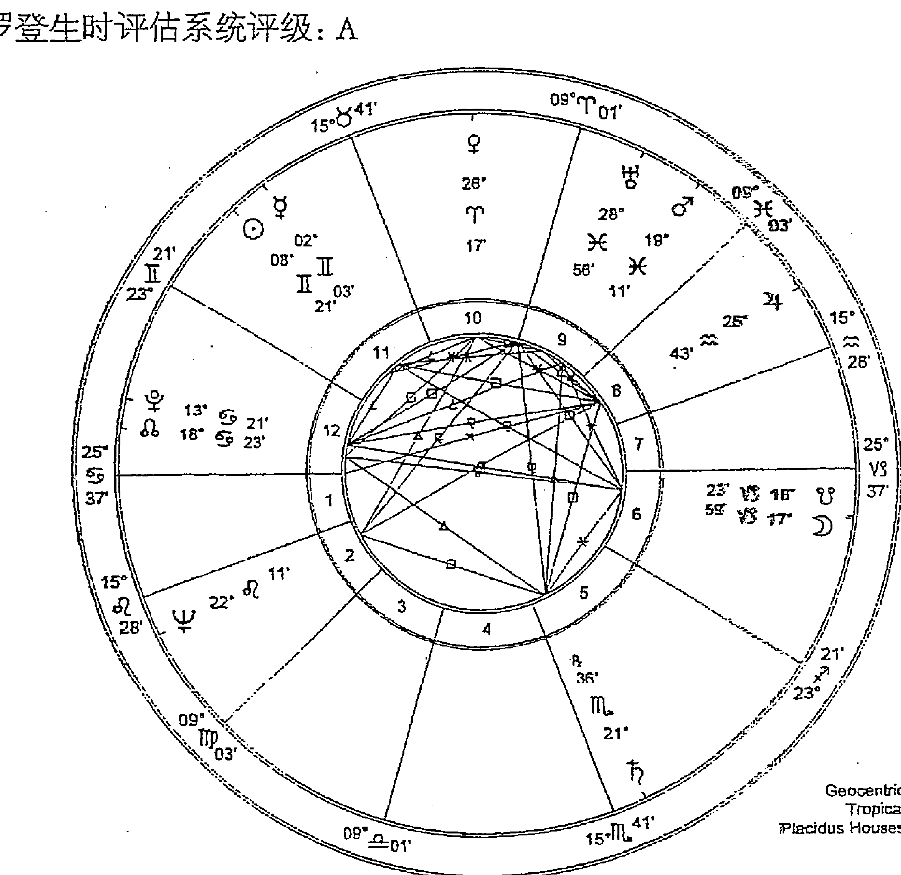

克莉丝汀·乔根森出生时是乔治·乔根森（George Jorgensen）（乔治是男性的名字，克莉丝汀是女性的名字），但他总觉得“大自然犯了一个错误”。内心里，他觉得自己是个女人。不仅仅是在心理上，乔治的男性生理发育也不正常。1950年，乔治远赴丹麦，两年后回来时，他已经是克莉丝汀。他随后在各个媒体掀起风暴，他的手术被视作史上第一次变性手术。这种说法其实不尽然——早在1920年，德国就完成了身体转变手术。但是克莉丝汀的手术增添了一个关键性因素：雌性荷尔蒙。出于这一原因以及文化上的争议，克莉丝汀·乔根森是史上第一位变性人也言之有理。

出生时生理上是男人，但心理上却是女人——这背后潜藏着怎样的业力才造成了如此困窘的境遇？当然，这里的问题不止同性恋那样简单。大部分同性恋男人都认为自己是男性，而非女性。

在克莉丝汀的出生星图中，月亮南交点落在了摩羯座，第六宫。很明显的是，月亮与南交点紧密合相。

过去的数千年历史都是以男性至上为根本。占星师也是由这样的文化土壤所孕育，或者，说得宽容一些，他们对自己的文化进行了适应。在这样的背景下，过去许多占星师——让我感觉遗憾的是，现在依然有——认为月亮和金星对应女性，其他除小行星以外均对应男性。在我看来，这不仅是公然的大男子主义，更是糟糕的观察。在历史的画卷之中，何曾缺少过男性艺术家的身影？——这是金星所象征的形象。难道缺少勇敢无畏的火星式女人么？男性大厨？女性会计？所有的星体都能够以两种性别表达自己。这是根本性事实，我在前文中也有阐述。

但是，社会与文化加强了性别角色，我认为，当看到月亮或金星与南交点合相时，认为是一个女性的前世化身很合理。因为在过去，社会在性别方面确实僵化。所以，根据这个月亮交点的情况，我们有充分的理由推测克莉丝汀在前世曾是一位女性。

进一步来看，我们必须认识到，金星与月亮并不是可互换的。在传统社会和神话内容中，金星代表着女性有魅力的、迷人的一面。月亮代表的是女性多产、生育、滋养、母性的一面。

接下来，我要推测一下克莉丝汀南交点与金星的四分相。金星也是业力的一部分，那么也就是说，一些“性感、欲望”的女性元素在折磨着他，他以女性“滋养、助人”的一面自居。

剧情开始变得复杂，我们知道这是必然的。我们大部分人都在转世时更换过性别，但几乎没有人想过去丹麦治愈这一“大自然”的错误。很久很久以前，在某一世轮回中，一定出了一些问题。

我们通常从南交点所落的星座和宫位开始分析，然后根据行星调整。月亮南交点落在第六宫，传统的仆役宫，并且落在了摩羯座，强调了义务和责任。在克莉丝汀的案例中，月亮的讯息十分戏剧化地呈现出来，让我不能不立即从它切入。从第六宫和摩羯座，我们可以看到月亮的主题“滋养”不仅有卑屈的涵义，并且与努力工作的摩羯座以及仆役宫结合便代表了顺从、义务与效率。这位“母亲”富于责任感与服务精神。她感受到的爱是真挚的，但却是被迫给予，在谦卑、卑躬屈膝、饱受束缚的情况之下。

之后我们的标准程序是思考南交点的守护星，此案例中是土星。对于该行星的分析能够帮助我们了解故事的另一面向，深入理解克莉丝汀的前世身份。（“情节”放在后文中与行星的相位一同讨论）

土星逆行于天蝎座，落在第五宫。第五宫往往与乐趣和创造有关，但这些主题都与我们目前所知以及天蝎座土星毫无关联。传统上还认为第五宫是与孩子有关的宫位——这下我们说到点子上了。养育——不谈义务、服务和责任——是我们在谈到孩子时自然会想到的主题。这需要大量的工作！我们找到了一种方式让南交点的主题恰如其分、合情合理地与土星主题共存：抚养的义务和服务于孩子们的需求。

阐释就此展开。

下面我们来看另一个凸显的主题：天蝎座和第五宫双双与性关联。很明显，性与生殖相关联，于是关于孩子的议题又浮出一条潜在的线索。第五宫通常与婚外或婚前性关系有关。让我们把性的问题记下来，作为储备素材。有时候，我们将关键故事具体化时可以把这种遗留问题搁在一边。另一些时候，它们成为了决定性的一步。那些最初看起来并不是答案的元素十分值得注意。这一点在本案例中尤为正确，星图中两次提出了主题——天蝎座和第五宫双双与性关联，克莉丝汀·乔根森的南交点守护星正落于此。

继续分析，金星与月亮交点呈四分相，冥王星与南交点呈对分相。我们就要谈到这些因素了。但到目前为止，我们对于克莉丝汀的前世已经有了概念。这一信息是从月亮交点、其守护星体和所有与之合相的行星中得出的。让我们看一下现在已经对她的"身份"有了哪些了解，之后再看看金星与冥王星又增加了哪些"情节"。

关于她的身份，我们有理由相信在她的前世，克莉丝汀是一位女性的服务者。因此，她会有一位或多位主人。她服从命令，忠诚尽职，唯命是从。她的任务困难且持久（摩羯座），她的工作也以月亮为主导：呵护、养育、清洁、照顾——卑贱的生存工作，或是在父权下我们常说的"女人的工作"。她或许就真的是一名奴隶——不是在棉田，而是在一个家庭背景之中。她的职责很可能与孩子有关，因为她的土星落在第五宫。这很可能不是她的孩子。

克莉丝汀非常有可能就是现在所谓的女仆或保姆。个性方面，结合摩羯座（月亮南交点）和天蝎座（其守护星）的能量预示着她至少本性很严肃，还很可能悲伤，甚至是抑郁。这也符合“奴隶”的身份，这是无法逃脱的。她被无尽的责任困在苛刻的环境中。她在内心里适应了“卑微的”自我形象。

仆人侍奉主人。那么克莉丝汀·乔根森为谁服务呢？与南交点呈对分相的冥王星落在了第十二宫，巨蟹座。冥王星很适合扮演她所要面对的权威角色。对分相告诉我们，她的主人是“难以企及”的，也代表着“难以逾越的现实壁垒”，有时候就是照字面意思理解，是她无法接触到的存在。

我们将冥王星拟人化为她的主人。正如前面章节里提到的，将与交点呈相位的行星转化为拟人化的角色非常有效。落在第六宫的南交点要求我们找到有关主人的证据，了解主人的性情。

记得冥王星的对分相位置还涉及到一些非关个人层面的事情——梦魇，无法逃避的现实。比如，我们可以很容易推测出这个经济和社会结构上的“难以逾越的壁垒”将她推到了侍者的角色以求得生存。在17世纪英国，有多少洗碗女仆会靠卖淫为生以便过得更好？有多少能在奴隶的身份下求得更好的选择？

下面让我们聚焦到冥王星作为主人的身份上。这透露了怎样的信息？他“来自冥府”，很可能喜怒无常、苛刻严厉、带有邪恶的色彩。巨蟹座和第十二宫的信息强烈地暗示了他的某些隐藏或私密的事情，那些藏在暗处，那些“见不得光”的事情。

一切尽在他掌握。他就是难以逾越的现实壁垒。你臣服于主人。

记得么，之前我们还有一个遗留问题？土星，南交点的守护星，落在天蝎座第五宫，表达了性的暗示——但这里并不是婚姻中的性暗示，有时候这意味著“婚前或婚外的性”。当然，土星带来的是义务，不论你是否喜欢，都必须接受。现在，我们要解开这个遗留问题，将其纳入到故事情节中来。

我相信克莉丝汀的主人在前世对她进行了性侵犯，她无力抵抗。此外，她被迫保守这个秘密。保守这个秘密像一场梦魇，揭露这一秘密的后果更像是噩梦成真。简单审视现实，我们很自然会发现，在社会底层的境遇中，在性别与经济不平等的条件下，女性在整个历史进程中都面临着这种危险。

我们还有一条线索去参详克莉丝汀的未解之业力。金星落在白羊座第十宫，与南交点呈四分相。这代表着，在前世有一些事情烦恼着她，并因此遗留下未解决的问题。

让我们由这个烦恼开始分析。正如前文所见，在历史背景下，金星往往暗示着女性，尤其是展现出阿佛洛狄忒式性吸引力和魅力的女性。从金星与南交点的四分相，我们可以看到这位女性与克莉丝汀是敌对关系。金星落在白羊座进一步强调了这种对立的感受——这位女性强势，很可能脾气暴躁；而落在第十宫，说明她是一位有地位、有权势的女人。同样，她十分严厉，野心勃勃，争强好胜——第十宫白羊座的特质。

鉴于克莉丝汀的女仆身份，便很自然的想到金星代表了她的女主人。这是非常具体的描绘，从克莉丝汀的视角来看，金星在第十宫，预示着这位女性的社会阶级是高于她的，这一线索很明显地支持了“女主人”的解释。这应该是对该格局最为简单的解读了，所有线索都被考虑到了。进一步来看，金星代表了一位充满力量和激情的女人，优雅但恐怕很难被认为是美丽的女人——她只有在被仆人惹恼，或是仆人做错事时才会注意到他们。

我们已经了解了冥王星所代表的主人身份，排除的过程进一步支持了冥王星的男性特征，因为我们将金星化身为女主人是令人信服的。

有趣的是，冥王星和金星所在的星座之间是四分的，尽管相位的容许度太大，我们不会称之为四分相。在我看来，克莉丝汀前世的两位男女主人关系并不和谐，但是他们回避彼此，以回避冲突。克莉丝汀与一位成“四分相”，与另一位成“对分相”，她好像就是他们之间的一座桥梁。但这是一座备受摧残的桥梁——妻子用愤怒和暴躁虐待她，而丈夫制造的问题更加难以挣脱，是问题的根本，是卑劣的行径。

有任何和谐或支持元素么？土星与南交点呈六分相。克莉丝汀很可能真的喜欢孩子。她就是一位天生的养育者。对孩子们的爱曾经“助纣为虐”，这正是对与南交点呈舒适相位的典型描述之一。在这个案例中，她对于孩子的爱可能是她并未制造麻烦、安于保护者角色的另一个原因。

第九宫的双鱼座火星也与南交点呈六分相。宗教或许也带给她一些慰藉，这里的星座和宫位均有此暗示——很可能这个宗教强调了勇敢（火星）殉难（双鱼座）的美德。基督教和伊斯兰教都有优秀的楷模。

与南交点呈四分相的行星总是预示着前世遗留的未解决问题，如果我们想要到达北交点的彼岸，就必须去经历、去纠正。往往，解决南交点四分相的难点在于，我们对于伤害自己的人和事心怀怨恨。于是，我们很难“收回投射”，将能量关注于自身。

想象一下，如果你置于克莉丝汀的境遇，你会怎样看待这位女主人。她衣着华丽——很可能正是你服侍她穿戴，所以你知道她衣着、妆扮、首饰的每一个细节。甚至你可能偷偷地穿戴过一两次，可怕的是，女主人突然回来抓住了你的行径。她严厉地责罚了你。她就像是骄傲的女神，优雅、有教养——你知道，这是你无法企及的高度。你渴望这种迷人魅力，这种渴望又让你感到害怕。

在这一生，克莉丝汀需要解决这个未解的议题——去建立与阿佛洛狄忒的私人关系。男人不做手术也能做到这一点！也许我们需要转换一个说法，将阿佛洛狄忒称做“狄俄尼索斯”（希腊酒神）或“阿波罗”（希腊太阳神）。男人也会虚荣，也需要获得性崇拜，这已经是公开的秘密。这不是女人的专权。在克莉丝汀的生命中，还有我未能理解的神秘之处。但有一点我非常明白，整合金星是她漏掉的一步。她必须完成这一步。出于一些原因，她需要真正地整合阿佛洛狄忒的女性特质。或许这个原因正是她对于月亮原型的基本责任感。

克莉丝汀手术之后的经历非常有趣，她并不满足于一个普通女人的平静生活，她需要成为万人迷。她需要被瞩目。从斯堪的那维亚回家之后，她登上了头条新闻。天王星行进在她的北交点时，《纽约每日新闻》惊呼：“曾经的乔治·乔根森变成了金发美女。”她成为了卡巴莱歌手，身着美轮美奂的礼服。她会唱着：“我享受做个女孩儿”，然后在表演结尾时换上神力女超人的行头（想一想白羊座金星！）。

她“未解决的问题”并不简单地指一般意义上的女性概念，而是指非常具体的一个白羊座第十宫的概念，表达了一种纯粹的、自信的、耀眼逼人的阿佛洛狄忒能量。

当然，克莉丝汀成为那一段时间里许多笑话的主角。所以，我们钦佩她的勇气，钦佩她以强烈的态度向恶毒的女主人要求重新融入到具有致命诱惑的女性原型之中。

冥王星代表了一项激烈的挑战，其自身和对分相都说明了这一点。冥王星一如既往往地扮演着生命所呈现的最黑暗的那部分潜能。它落在南交点的对分相上，显示着一个人恐怖的前世经历——这一梦魇延续到今生依然原封不动，力量强大。在克莉丝汀月亮交点的架构背景之下，我们可以将冥王星视做性压迫与剥削的主人。

坦诚面对冥王星，我们就要做好准备面对它带来的不适——这就是这颗行星的特质。

星的本质，这就是它所代表的内容。当一个男人人大权在握，以毋庸置疑的独尊姿态凌驾于丰饶的月亮女性能量之上时，你能想象到的最黑暗的男性能量的表达是怎样的——这里的女性能量需要依赖于这位男性求得生存？只要我们年纪够大，答案不言自明。

再次重复，根据灵性的不变法则，疗愈冥王星代表的未解决问题需要收回投射。克莉丝汀·乔根森如何平静地面对这股明知如同撒旦一般的男性能量？基于这种现实情况，她甚至是否能够意识到自己的感觉是一种“心理投射”呢？

（一个犹太人在达豪集中营能够宽恕纳粹么？一位拉科塔人怎能在翁迪德尼原谅白人？）（译注：1890年12月29日，近200名美洲土著拉科塔人在此被白人屠杀。）

这些问题的回答不胜枚举，但是让我们首先满怀同情地处理其中的罪恶行径。克莉丝汀业力印迹中的伤痛经历明显伤害了她的灵魂，践踏了她的尊严，粉碎了她的自我价值意识。她被“金星的”女性能量（她的女主人）忽视，然后被男性能量（她的男主人）性侵犯。

带着这样的前世经历，今生却为男儿身，这是多么惊骇！这就是“乔治·乔根森”在出生时所面对的事实。想象一下，他在面对自己男性生殖器官时的愤怒和心理恐惧。他的男性生理发育迟缓是植根于业力模式的生理影响。这些印迹就是这样具有强大的力量。

克莉丝汀的故事是极端的。交点故事也是极端的。占星学上，要理解她的现实状况，其关键在三股力量的互动上。首先，她十分认同自己作为受伤女性的身份。第二，她深深地厌恶和恐惧与男性的连结。第三，公众对她女性魅力的赞颂是她“跳过的一步”。

北交点在巨蟹座第十二宫，直接将我们的注意力引向克莉丝汀·乔根森的根本主题——新生与进化的可能性。巨蟹座预示着需要自我滋养与疗愈。受过伤之后，我们本能的感觉是需要平静，需要让自己和世界保持距离。我们想宅在家中，不愿外出。我们也许只是需要大哭一场。这就是巨蟹座的签名——这就是它的疗愈策略。

同样的，第十二宫也在邀请我们给予灵魂安慰，并且像巨蟹座一样退出世界。最终，对于克莉丝汀的疗愈走向了这一种方向。

但这里还有更多信息。关键点是月亮，月亮是北交点的守护星，它与南交点合相。因此，她进化的未来直接与重新回顾业力史的需求紧密地联系在了一起。北交点的守护星落在了南交点，未来的苍天大树深深植根于过去。要超越我们描述的灵魂桎梏，克莉丝汀需要回首直面月亮的伤口。这些伤口不是那么容易就能够“释怀”的。戏剧元素需要从不同的视角重新体验。

这一主题进一步呼应了冥王星落在北交点的主题。这里我们看到了冥王星的另一个面向，而不是对分南交点的那副恐怖模样。这里不再表现出黑暗冥王星的狰狞形象，而进入了冥王星的更高层面：它是心理学大师，是引领我们进入冥界的萨满巫师，然后带我们找回被偷走的那部分灵魂。加上月亮是北交点的守护星，却落于南交点，冥王星告诉我们，克莉丝汀需要再次经历过去。这就是冥王星的工作：深入挖掘心理脉络，成为今生的资源。

此外，我们已经认识到金星是被“跳过的一步”。想要进步，想要获得疗愈，克莉丝汀首先需要体验纯粹的金星能量。她需要成为神力女超人。她需要在光芒万丈、欢呼掌声和万人瞩目的疗愈场中驱散她的羞涩。只有这样，她才能够强大到处理内在冥王星的功课——超越、宽恕、获得力量。

克莉丝汀·乔根森成功了么？生理性别的改变真的是必经之路么？坦白说，我无法判定这些问题，我也不认为你们能！作为一名进化占星师，我只能说，她与两种性别都有很深的未解议题。另外我要补充的是，基于前世的羞辱，她必须感受到自身可能性的能量和力量才能前行。基于对这一点的理解，她就能够在自身疗愈的道路上做出有力的、冥王星式的自由选择，这是她前进道路的基石。这代表了巨蟹座北交点根本治愈这一灵魂伤口的最高层次良药：“我爱你，你值得！”

身体与心灵的交辉，是一种复杂的现象。在这一体系里忽略任何一个元素都是愚蠢的。最终，轮回的、不断学习的意识会显化为现实世界的表现。在这里，在我们深层的意识中，我们最深远的功课必须发生。

如果装扮成神力女超人真的能够带来心灵上的帮助，那就披上斗篷，穿上闪亮的鞋子吧！

# 第十九章
### 卡尔·荣格

**日期**: 1875年7月26日
**时间**: 格林威治标准时间晚上7点32分
**地点**: 瑞士，凯斯维尔
**罗登生时评估系统评级**: A

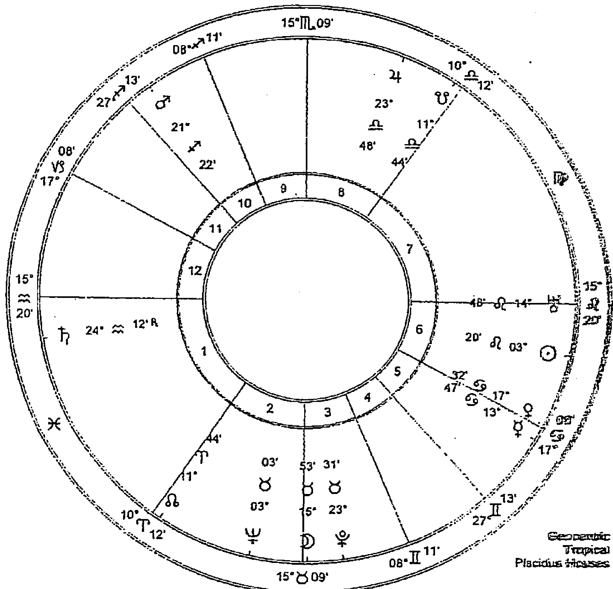

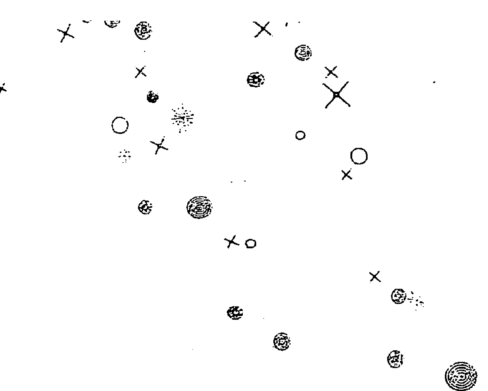

现代心理学起源于一个世纪之前。任何研究心理学的人都会发现有两个名字在早期频繁出现：弗洛伊德和荣格。每个都是天才，只是方式不同。弗洛伊德更有名气，然而，今日大多的心理占星师都觉得与荣格的理论更有共鸣。像我们一样，他热爱象征手法和符号学。世界、思想，所有曾经发生过的故事都像梦境一样在等待他的解读。他自己就是个占星师。他是20世纪的巫师原型。他留存火种，使其传承。

没有卡尔·荣格，心理占星学可能不会存在。他为这一学科打下了基石。他将我们从算命的阴影里带出来，给我们指引了方向。就我个人而言，无论是在智性上还是灵性上，亏欠荣格的比其他纯粹的占星导师要多得多。

荣格的非凡才华在他的出生图上有充分反映。他上升水瓶座，天王星落在出生图的左半边角宫里。他土星落一宫，显示了他性格中“老者”的特征——他在这个世界里的“人格面具”。你见过多少荣格年轻时的照片？当然了，他也曾年轻过，但历史希望记住他在土星年龄时生命全然绽放的阶段。土星也落在水瓶座——这是另外一个天才的表征，与美丽的巫师原型叠加在一起。

太阳在狮子座，这是“国王”的星座，落在第六宫，表示他与其他在历史中的神秘主义者之间的传承谱系。同样的，他也具备出色的承担艰苦工作的能力——这一能力又与土星共鸣。我可不想把荣格全集带在身上！（实在太多太重了）但是如果必须背着这些书跑个上千里才能保存它们的话，那我肯定愿意。这些是神圣的书籍，对我的灵魂非常宝贵。他第三宫（写作和教学）里有月亮与冥王星的合相，同落金牛座。本能的脚踏实地，尊重自然力与原始能量，穿透事物表相、一针见血的洞察力——都在这里显示出来。

那么，在转世成为荣格之前，这个了不起的灵魂是什么人呢？为何他会有这种与生俱来的天赋？更切题的问题是，有什么业力问题是他此生需要面对的呢？圣徒传记是危险的，不是我们的本意。在这里我们的目的是还原荣格的本来面目——仅仅作为一个人，作为一个进化中的灵魂来看，而不是一个神奇人物。

按照我们一贯的方式，我们通过月亮南交点开始业力分析。荣格的月亮南交点落在第八宫的宫头，天秤座。我们知道星座和宫位这两个大的象征领域相互影响和强化，从这点开始解读，我们将会发现故事的核心。

- **天秤座**：平衡，优雅，礼貌，文明，关系，审美，创造技巧，对悖论和含糊的容忍，与他人相处的能力。
- **第八宫**：深度，心理上洞察力，与死亡的觉知关系，性关系，复杂的人际交往，遗产，固有的魅力和世俗权力，与神秘领域和萨满领域的接触。

所有这些都很有帮助——我们可以看到荣格作为一位从事实践工作的心理分析学家，具备其中大多数的素质。但是，在涉及南交点的时候，我们知道必须格外警惕“阴影”(Shadow)，这也是荣格自己发明的术语。从根本上来说，南交点代表我们执著的伤痛点，因为这种执著，我们的身份被定位了。简单来讲，南交点代表我们过去世犯的错误，或者为了纠正这些错误我们受到的伤害。进化占星学里，最可靠最实际的原则就是我们可以在今生发现未解决问题的痕迹。通常，我们可以看到这些碎片被重新拼接起来，成为整个故事。

那么，让我们以更谨慎和批判的态度，整合天秤座和第八宫的特质：

- **天秤座**：优柔寡断，犹豫不决，无法选择和承诺，敏感和紧张过度，自大虚荣，关系上的戏剧化，依赖，懈怠懒惰，阿谀逢迎，贪图舒适，伪善。
- **第八宫**：情绪化，只专注于自己，病态，对死亡的强迫性恐惧，性上瘾和性怪癖，欺骗，背叛。

当我们确信之前提到的很多正面和中性的特质会在荣格的人生中显示出来的同时，我们也要肯定这些黑暗面同样存在。

在这里我们看到的是什么模式？关系主题，绝对如此。关系对天秤座和第八宫而言都是核心议题。天秤座也与优雅和文明有关，而第八宫经常代表权力，不用说还有遗产和“其他人的钱”。那么，这就代表，在荣格的前世，他从社会层面已经了解了舒适和地位，这些要么就通过“提升地位的婚姻”或者说他生于上流社会，缔结了一桩“得体”的婚事。当天秤座与第八宫互相影响和强化时，这些主题便浮出水面。

在现实中，荣格的母亲来自一个富裕的家庭，但是他的父亲是瑞士新教的一位贫穷的牧师。荣格谦卑地成长起来——在他的早期生活里，他确信自己被两种人格占据着。第一种是他表面上的人格——瑞士的小学生。显然，第二种是一位有尊严的、有权威的、有影响力的 18 世纪人士。(在他的自传里讲过这个故事，可参见《回忆、梦、思考》，英文名为 Memories, Dreams, Reflections)

我怀疑这是真实的业力记忆。

1903 年情人节那天，荣格与爱玛·劳申巴赫（Emma Rauschenbach）结婚。她出身于瑞士最富有的家族之一。从那时起，荣格变得富有起来。之前他追求了她七年之久。在婚礼之日，他 27 岁了——太阳弧月亮与他的南交点呈三分相，大概距离精确的位置半度多。继承财富与地位的业力成熟了。

天秤座从其他人的角度看问题。在第八宫的亲密关系的现实中，这一方式通常很有挑战性，因为我们自己的伤痛、需要和恐惧如此强烈。南交点落在这个位置，明确地显示出在这一世之前，荣格不仅经历过社会层面上舒适的亲密感，同时这种亲密感也是有深度的。这意味着复杂的亲密关系，充满着原始的情绪，双方过去的经历也常阴魂不散。这样的激情并不轻松，即使开始时是轻松的，之后便很难说了。

考虑到南交点本身象征的烦恼，我们不认为荣格在过去世的亲密关系总是一帆风顺的——事实上失败的亲密关系会在我们的分析里作为主题出现。荣格确实在过去世里对这些有直接体验。他曾经历过激烈的感情，留下了伤疤，也从中历练，学到智慧。

我相信荣格过去世里在亲密关系中的诸多体验对他今生的天赋至关重要。因为这些经验，他发明了如下这些概念：阿尼玛（anima，男性的女性意向）、阿尼姆斯（animus，女性的男性意向）、情结（complexes）、原型戏剧（archetypal dramas）、人格面具（Persona）、阴影（Shadow）等。在前世，他看到它们在自己与他人身上的呈现，对这些概念非常熟悉。

我们也不能排除说荣格曾接受秘术训练。显然，从总的人口数而言，有这种经验的人比例很低，但这是第八宫核心的象征。了解一个人神秘主义（mysticism）的倾向要观察第十二宫。黑白魔法、占卜、萨满、巫师，都属于第八宫。荣格自传里有明显的证据，表明他曾经涉猎过这些领域的事，尽管这些对于大众来说有些太过异类。他对炼金术、占星术、萨满仪式都很着迷——这些都是“边缘”或“神秘”的传统。

这些我们在下文都会探讨到。现在仅仅是个开始。

让我们把注意力转向南交点的守护星体。南交点在天秤座，把我们的注意力引向了金星，荣格的金星落在六宫头巨蟹座，与第五宫的水星呈合相。这里包含了大量的信息。我们可以据此找出重点，为接下来的故事添加细节。

巨蟹就是大螃蟹，一个因为硬壳而活下来的生物。从心理上说，这代表着对外界敏感，以及防卫自己的持续需要。因为脆弱，巨蟹总是需要在严酷的现实世界和自我之间建筑起壁垒。那么，这就自然地指向了家庭、家庭成员和避风港。巨蟹也常呈现出羞涩的特征，至少社交上会表现的很谨慎。作为水象星座，巨蟹是情绪化的。通过金星，这些特征就表现为在爱情上的情绪，尤其是有浪漫性质的爱情。因与伟大的母亲的养育原型相关，巨蟹也与慈爱的特质、帮助、养育和支持他人的内在冲动相关。后面这个主题——助人——被金星所在的宫位第六宫强化了。大概而言，六宫代表服务性和支持性的角色。

在这里，有什么矛盾吗？之前我们看到优雅的特性，优越的婚姻和体面的社会地位。现在我们看到一个仆人？

要解决这个明显的悖论，关键在于对第六宫有更丰富的理解。并非所有的“仆人”的社会地位都是低下的。我们也可能属于优越的社会阶层，但依然扮演执行命令的角色。实际上，在某些方面而言，命令越是苛严，我们的地位越高。在日常生活里，谁更自由些？一个工薪族单身母亲的孩子，还是总统的孩子？一个流浪汉还是波音 747 飞机的副驾驶员？

除此之外，第六宫也有传承的涵义。我们被长者启蒙，进入某个传统，之后对我们的期望是将传统传承下去。巨蟹的象征与婚姻的象征混合在一起，在荣格的案例里，这也许代表一个为了与保持社会地位有关的某种家族传统。这可能也代表艺术和手工艺的某种传统。

在前几段，我们分析了南交落在八宫，我们推测他在前世可能接触过某些秘术传统。现在我们可以把这个推论扩展开来。守护南交点的金星落于第六宫，我们看到荣格处在“接受命令”的位置上。他在某种意义上，是一个“仆人”。那么，在萨满传统的背景下，这代表着什么呢？很快，巫师的学徒这一意象从脑海中浮现出来。在一个魔法学校的背景下如何？他可能做过年轻的学徒。

第八宫通常带有性的含义。涉及到金星，若是忽略其中蕴含的色情意味未免假道学。有些神秘的传统确实有意识地利用性能量——密教中的某些派系是很明显的例证。我很怀疑荣格在前世，曾经在这样的传统中受到过启蒙和训练。

是我们评估收集到的线索的时候了。我们知道‘一桩利好的婚姻’。我们看到了一个有相当社会地位的从属角色。我们看到有关性的秘术。

换句话说，我们的线索很分散。别担心！这正是在这一步我们想要的结果。记住，我们解读的策略就是把所有可能性尽可能长时间地留在桌面上。在决定故事的主线，放心地忽略细枝末节之前，我们需要看到整个图景。现在，让我们继续。就像玩抛球的杂耍游戏，我们还有更多的球要接住。

传统意义上，我们视金星为女性，这也许不靠谱。就像我们经常强调的那样，现代占星师们适应时代发展，改变了占星中性别角色的假设以及期望——这主要在于意识到在现代社会，不管是男是女，都能活出任何一个行星的能量出来。但是在过去，并非如此。当我们看到和南交点相关的强烈金星影响力的时候，我们必须记住我们是与过去世打交道——也就是在历史上‘男是男，女是女’的时代。那么，推断这是位女性角色通常相当有效——记住，这也可能是一位男性的艺术家或者外交官，或者是位同性恋。

换句话说，我们也许是在观察荣格身为女性，有着作为女性的经验的一生。

还有更多的线索。水星与金星形成合相，但是在第五宫，不在第六宫。与南交点守护星合相的星体就像修饰名词的形容词一样。我们知道荣格是‘金星人’。现在我们可以了解到他是有五宫水星味道的金星人。这带来了什么新元素？

位于这个位置的水星显示荣格好奇心强，求知欲旺盛，可能是个学生。他喜欢新体验，追求兴奋感。水星在卜卦占星学中也意味着‘年轻人’。年轻人比起老人来说，通常不安于室、活泼好动，渴望新的经验——这也是为何水星与年轻相关的原因。记住水星也可能代表其他可能性，正如金星未必总代表女性一样。水星也代表信息。可能是个语言学家；可能是个小偷。但是，对于年轻人来说，某些经验是独有的。恋爱，尤其是在过去的年代成为最明显的可能性——我们也要记住恋爱和绯闻是第五宫的重点。那么，这个主题就被强化了。每当我们看到这种被强化的主题的时候，我们要格外重视。

因为水星也牵涉其中，我们记住我们是在考虑年轻的荣格——也就是说，这是他前世特别关键的经验。之前我们看到的一切都有很强烈的对人际关系的暗示——在六宫的从属者位置——荣格是个年轻人与这个大背景是吻合的。年轻人通常被年长者呼来喝去。在这些隐喻里，这种理解轻轻松松就浮现出来。这种前后衔接的一致正是我们寻求的。

天秤和金星与美学中的对称性和有吸引力的平衡有关。我们发现他们的表达赏心悦目。卡尔·荣格，在他的某个前世，很可能是个美妙尤物。更进一步说，我们大概很年轻就懂得“漂亮”和“性感”是不同的。我们都认识只符合其中一条的人。但是，卡尔·荣格，在某个前世，两者兼备。第八宫代表性感，金星和天秤座代表漂亮。那么，我们有很多理由相信荣格是很有吸引力的——费尽周折之后，我们看到这因素，这一信息一定是至关重要的。

如果我们假设荣格是个女性，我们便可以加入第三点。从冰冷的科学角度讲，大多数异性恋的男性在一位女性身上感觉到的最强烈的性感吸引力其实来自女性的生物学上繁殖力的指标——曲线、乳房、年轻、没有怀孕的表征等等。繁殖力是属于巨蟹座的范畴，而荣格的金星和水星都位于这个星座。如果作为男性，对于异性恋的女性而言，这些巨蟹座特征也常代表“好丈夫”。

我们这个世界对身体上的吸引力非常看重。但是，开动你的脑筋，问问自己：年轻，有吸引力，有地位，这样的女性容易面临什么危险？成为一个奖品或者战利品？即使是一位年轻男性，也会面临类似的境遇呢？也许其中任何一种条件都把某人导向一个“特权”的地位，但是他或她依然被命令和职责所约束？

然而，在我们做出任何明确的推论之前，让我们看看对这块慢慢变大的蛋糕还能添加点什么上去。记住，我们的整体战略建构总是把所有的线索摆在桌面上，之后再考虑给出任何明确的结论。

有什么行星与南交点形成合相？木星距离南交点十二度——这个角度过大了，所以不包含在我们即将得出的解读之内，但是与“特权阶层”这个概念很吻合。这让我们对这个概念更有信心了，但是不多。

与南交点呈紧张相位的行星有没有？金星与水星的合相与它呈四分相——这促使我们不得不从第二个角度看待这两颗行星。水星与南交点呈四分相非常紧密，离精准合相只有几度之遥。金星的四分相更宽一些，但是他在六度的容许度之内。那么，这代表在荣格的前世里为他造成麻烦的事，他的烦恼。

先看金星。金星在这里是双重角色，不仅是南交点的守护星，同时四分南交点。之前我们看到的都没错，而通过这个四分相可以看到更多。我们很快就了解到，荣格的业力中有很重的金星成份，因为金星在交点分析中出现了两次。

守护南交点的行星讲述的是我们前世的身份，与我们的价值观、动机和自我形象有关。这涉及到他人如何看待我们，对我们有什么样的期望。

与交点轴呈四分相的行星讲述的是曾经给我们制造问题的事物。折磨我们、攻击我们、困扰我们。它经常代表一个和我们关系紧张，对我们有敌意的人。不管这颗行星代表什么问题，我们都知道这是过去世的遗留问题。于是，这一生，这个问题依然阴魂未散，困扰着我们。直面这个问题，收回我们消极的投射，把这一能量以一种有益的方式整合。这是过去世曾经被跳过的问题，这是我们前进途中必须做好的。

在荣格的盘里，金星扮演双重角色。既代表他在过去世的身份定位，又代表曾经困扰过他的事物。也就是说，他自己困住了自己，给自己制造了难题。他搬起石头砸了自己的脚。换句话说，他是自己最坏的敌人。

更进一步说，荣格为自己创造的麻烦是金星性质的。记得我们要有大局观——我们中的大多数人都会在浪漫情事上陷入困境。其实，稍有些智慧和成熟度，我们便很容易了解到，这些错误只不过是人生学习的过程。少有谁能一帆风顺。如果你 16 岁的时候，在同一个星期里，曾经热吻过两个不同的人，这事恐怕不会在下一世你的南交点上有所显示的！在两性关系方面，很多事都能让我们涉险。那么，在荣格这个例子里，什么是根本问题呢？

让我们从已经知道的金星开始分析。金星位于巨蟹座，第六宫。这可能极富诱惑，同时顺从（六宫）和害羞（巨蟹）。这和家庭有关。当然，也可能和家族有关，家族常常会管教约束子女。

一个“体面的家庭”会怎样管教他们妙龄如花的女儿？答案可能有很多，但是最明显的肯定和保持贞节、避免制造丑闻有关——最重要的是有个好归宿，生孩子。当然，也要记得荣格可能曾经在前世是个男性，那这些约束会变成什么呢？大概不会变太多——尽管可能在保持贞节上面强调的少一些。从历史角度上看，什么是“适婚年龄”呢，年轻的时候，当然至少从我们现在这个世界的标准来说。荣格顺从了。他很可能年纪轻轻就“结了门好亲事”。另外也有两个明显的生孩子有关的符号——金星在巨蟹，水星也在巨蟹，都在第五宫（第五宫与孩子有关）。因为金星在仆从的宫位（第六宫也代表奴仆），荣格有三个主人——孩子、配偶和家庭。

很多人对婚姻，对成为父母感觉心满意足。在这个过去世里，荣格并非如此。记住他是被金星性质的事件困扰了。他有着强烈的驱力，想要体验激烈的、赤裸的和有转化性的亲密感——天秤南交八宫的根本意义——而他人把他塑造成的他们理想中的美感和服务的化身，这两点是相抵触的。很可能，别人会觉得他很“可爱”，人们喜欢拍拍他的头。

这里，还存在另外一个基本的紧张点，有点复杂。让我们兼顾这两点进行解析。

第一点，我们看到很强的家庭忠诚度的标志，传宗接代和职责。第八宫代表深刻的联结。没有随便的性关系。天秤试图取悦他人，代表着长久的伙伴关系。巨蟹指向家庭，很慢热。第六宫代表循规蹈矩。

第二点，水星带有一种好奇的特质，修饰了金星。水星想要经验和知识。在第五宫，与求爱阶段有关——相互发现和着迷的心醉神迷的过程。这反映出当年轻人开始整合自己自然发展的性需求和行为的过程：实验性的、广泛尝试。

或许我们现在能衡量一下两点的比重，然后下结论说第一点的重要性超过了第二点。但是我们可能忽略了核心议题：我们分析的根本点依然在于南交点所落的星座和宫位。荣格的灵魂内在意愿推动他经验充满激情的性亲密，就像我们之前描述的那样。这一驱动力不会消失，也不会在“得体的婚姻”得到满足，尤其是这一婚姻是荣格前世的父母的选择，而不是根据荣格自己的意愿。

更进一步说，卡尔·荣格的前世，是天秤座和金星的——他（或者她）的目的在于取悦他人。尤其是当第六宫牵涉其中时，我们看到的是一种顺从的品质。考虑到现实状况，一个有吸引力的年轻人可能会受到什么样的约束呢？记住金星刑交点：美感（金星）和善意（巨蟹）在这里变成了折磨。荣格如何能拒绝他人热情的祈求呢，尤其是当他们提供的刚好是他渴望的？忠诚的特质和猎奇的心互相角力，后者时不时地占了上风。

最后，我们还有一条线索，毫无疑问，这条线索使得天秤朝向第二点倾斜了。金星，南交点的守护星体，四分南交点。卡尔·荣格是他自己最坏的敌人。战场是被金星定义的，天秤与第八宫。他自掘坟墓的这个战场就是和性事有关的。

就在我们分析的起始，我们谈到南交点天秤座，而且把“人际关系上的戏剧化场面”列举出来。第八宫还包括“自我沉迷”、诱惑力和性上瘾。我们也列举了其他的方面，但是放在整个分析的框架下时，其他的方面比重并不大。

还有一点：出于种种我们已经列举的原因，我们并不能完全肯定是在观察一位女性的前世。金星和巨蟹的特征的确显示了这些线索，而且可能确是位女性。但从某个角度来说，我更倾向于认为——荣格在那一世里是男性。我的推理比较简单，尽管可能听起来有点悲哀。多数文化历史的现实状况是，社会对男性婚姻出轨的态度更加宽容。我注意到在荣格的出生图里，天王星特征与业力指标并没有直接联系（译者注：业力指标在这里指的是与南交点有关的星体特征）。若是女性，因为不忠的行为，她会遭受更多的社会指责。若是男性，通常不会太多。荣格的出生图上，总体来讲，天王星是非常强的！但是，天王星与南交点业力模式的关联，仅仅是与南交点呈六分相相位，似乎是说他所在的社会其实是支持婚姻不忠的。历史上，某些社会传统里，无论男人和女人有婚外情都是可以接受的，但是大多数的社会是对男女的行为有“双重标准”的。

现在是不是对荣格前世的性别有点糊涂了？把你的困惑转化成为理解。荣格的出生图，这两个方向都有可靠的证据。我们的目标是最终得到符合所有事实的故事，既不遗漏，也不添油加醋。我的结论是两种性别的可能性都有可能。荣格曾经当过女人也当过男人。很可能至少有一个女性前世和一个男性前世体现了星盘中这种业力模式。

是时候检视一下现实了。卡尔·荣格与爱玛·劳申巴赫的结合提升了他的社会地位，这段婚姻一直持续到1955年她去世为止。他们有五个孩子。在整个婚姻过程里，荣格都公开地不忠。他与至少两个前任的病人保持了长久的婚外情，萨比娜·施皮尔莱恩（Sabina Spielrein）和托尼·沃尔夫（Tony Wolff），与后者的婚外情更有名一些。

荣格和沃尔夫的恋情始于1914年。在前一年的9月份，太阳弧金星与他本命的土星对分，大概放大了他对浪漫情事和性事渴求的业力倾向。他们的关系一直持续到1940年，前后将近三十年。在这里我们看到荣格的业力是一种奇特的矛盾体——天秤、巨蟹和第八宫的忠诚倾向与放纵混乱混杂在一起。他与托尼·沃尔夫的婚外情甚至比很多婚姻关系都持久。但是，即使在一桩婚外情里，荣格也并不忠贞。他还有其他的情人。

一开始，爱玛·荣格得知荣格与沃尔夫的关系真相时大为受伤，后来她保持了表面的和平。沃尔夫甚至是荣格家里周末聚餐时的常客——再一次，请注意这一婚外情表现出来的奇异的家庭（巨蟹）特质。当托尼·沃尔夫1953年去世时，荣格没有参加她的葬礼。在那之前，他俩已经分手了，分手的原因是荣格研究炼金术，沃尔夫对此持有异议，与多年前荣格与弗洛伊德决裂的状况很相似。等等我们会再回到这个话题上来。

提到炼金术，又把我们带回了“秘术”的主题——我们的假设是，在前世，卡尔·荣格曾经以学徒（第六宫）和学生（水星）的身份，接受过某些秘术的传承（南交落第八宫），这一秘术的启蒙带有某种可怕的与性有关的特质（第八宫，金星主题）。

你可能会说这种解释“太怪异”啦。传统的婚姻和性关系显然更普遍，更有代表性。一个爱在外沾花惹草的花花公子的可能性远远大过萨满传承人。对于传统的分析，我们也有可靠的证据：婚姻和性关系方面的业力模式在荣格今生的个人生活的现状里有细节上的呼应性，正如我们所看到的那样。这些通过了现实检验。

但是异国文化的神秘传承这一论断同样也成立。在现实世界里，荣格是个巫师——在“科学时代”，他是个多个面的人，他感觉到自己对神秘学的痴迷和好感。弗洛伊德曾向他施压，希望他放弃“与巫术的黑暗联结”。荣格拒绝了，这是他们关系破裂的重要原因之一。托尼·沃尔夫，担心荣格因对炼金术过于执迷的兴趣危害名誉——他因此抛弃了她，甚至不去参加她的葬礼。

托尼·沃尔夫可能是对的！今天，心理学学术体系已经像庞大如迷宫，荣格常被主流所忽视。从某种角度来说，他的确因为自己对秘术和人类灵性领域的忠诚而牺牲了自己的历史地位。时至今日，即使在学术领域，荣格研究者们也倾向于淡化他终生对占星术的强大迷恋——从我的经验来说，他们在这事上“拍拍他的头”。（译者注：见前文，这里表示不重视的态度）

不管怎样，这里的要点是，是从他的人生经历来看，我们有确凿的理由接受这一观点：荣格在前世曾经是一个秘术学徒。出生图的业力模式分析显示这一点，他的现世生活也符合这一点。这也通过测试了。

从中我们学到了什么呢？首先，就像我前面提到的，我的感觉是我们在这里观察的至少是两次或者三次的前世经验。我怀疑做秘术学徒的那一世在时间上更早。我们总是分析交点，来揭示那些前世未解决的问题。我估计荣格前世所受的神圣的性启蒙影响了他，让他无法忍受一桩正常的传统的婚姻。经由一个老师的影响，他体验到了精神性的性关系，没有那个老师他是不可能体验到的。这不仅开启了通往神秘学智慧的大门，也点燃了他对那种性经验的渴望，这种体验是在这个世界上他与和自己处在同样意识状态的伴侣无法得到的。他并非没有在此两三次的转生中寻求过：除了转世为荣格的这一生，还有另外两次业力模式类似的前世。

这是我们都知道的原型，荣格自己也会很容易认出来——进入更深水域，却无法控制状况的巫师学徒。米老鼠也曾经如此。卡洛斯·卡斯塔尼达（Carlos Castaneda）（译者注：一个美国人，在青少年和嬉皮士中很著名，曾经跟随印第安巫师唐望学习巫术）也曾如此。我相信卡尔荣格也曾有过类似经验。

荣格怎么才能向前？

金星在巨蟹座第六宫最纯粹、最高阶的表现方式是在家庭环境中有谦卑、忠诚的奉献精神。我现在得声明一下占星不是清教徒式的。占星很擅长直接描述性生活方式，这会让一个害羞的人脸红——比如，可以试试金星与木星、天王星合相在双子座、第五宫！在荣格的案例里，我们所看到的金星位置的理想化的状态，表示了稳定忠贞的感情。这只是金星在那个星座和宫位的本质。

记住：金星与荣格的南北交轴呈四分相。这代表了“跳过的一步”，他没有解决、没有完成的事，他前世没有做对的事——依然在这一世困扰着他。为了完成灵魂更大的目标，荣格需要处理这个问题。他需要有效的、正确地体验这些，而且是在他的配偶和家人的支持之下。他需要那种忠贞不移的爱。他需要典型的男性经验——男性，而不是男孩。

一位常规意义上的心理占星师会指出喜欢破坏规矩的天王星是他星盘的命主星，而且在第七宫的宫头。这通常会代表在亲密关系上的不稳定。没什么可争的！这一位置确实可以与在婚姻上非传统的选择相关，而且经常表示对承诺模式的反叛。非常明显，甚至是在一桩健康的婚姻里，荣格也比其他人需要更多的“空间”。继续这一常规分析，即使天王星这一戏剧化的位置很重要，也有其他因素平衡。要看到，这颗强有力的天王星与荣格出生图上代表天性保守和自控力的土星关系紧张，再加上金牛月亮对稳定性的重视，另外，荣格出生图上总体是固定星座，具有稳固的特质，把所有的因素综合起来看，对一位技巧高超的常规占星师来说，这也是个困难的判断。荣格在婚姻里会经历变动；还是说有一桩稳定的婚姻，但有一些不寻常的独立和躁动的特质？

从进化占星的角度来说，我们了解到荣格的天王星有个同盟，就是被“跳过的一步”，金星的状态，另外还有其他的被强化的业力模式。在常规分析中会较模糊，但出生图后的出生图进入我们的视野时，就打破了原来的势均力敌，而倒向其中一边。从传记中呈现的基本事实来看，卡尔荣格的表现显然倾向于更疯狂的一面。

荣格对很多人来说，包括我来说，都是一种鼓舞。令人不舒服的是，我们得记住他个人的亲密关系中，有一种基本的冷淡态度，甚至是冷酷的态度。他的妻子爱玛因此受尽情感上的折磨。他甚至把他的情人变成周末家庭宴会的常客。三十年的亲密关系之后，因为一个职业上的不同意见，他离开了她，甚至不参加她的葬礼。她并不是他唯一的情人——在他的人生中，有其他的亲密情人。荣格身后血迹斑斑，都是破碎的心。

荣格与母亲艾米莉（Emilie）的关系，也是传记中的谜题之一。她是个情绪化又抑郁的人，荣格小时候，她可以连续几小时地待在自己的房间里“与灵对话”。在《记忆、梦、思考》里，他写道，其结果是，他对于女人的态度是一种“天生的不信赖感”。他把这比作“一开始解缚了的手铐”。

从常规的心理学观点来讲，可以得出明确的判断。但是，从业力的角度呢？在前世，当荣格是女性时，她自己曾体验到自己是“天生不可被信赖的”；如果他是男人，他会体验到女性是骗局，是可以随意丢弃的。

在这个交点故事里，荣格曾有多世浸淫在炼金术的阴影里。也许我们会说他在“灵性上”“成长迅速”，但是拔苗助长，也会有后遗症。他潜入黑暗，或者说，被扔到黑暗里。他更智慧了——同时也伤痕累累。在他的前世，这些问题没有解决，他把这些带到了他的现世。

这一业力的终极解药，总是在北交点。在他的出生图里，北交点落在第二宫宫头，白羊座，涉及到第二宫，这代表“向自己证明自己”。这里有一种需要强调的基本的不安全感——这种不安全感与白羊的原型有关：具有独立自足的荣耀的战士。与代表伙伴关系的天秤座相反，白羊座代表强烈的自主性。荣格需要整合的是他能够独立于亲密关系而存在的认知。这是个异己的、陌生的观念。他对于自己和生命的所有假设——换言之，他的南交点——暗示了性亲密是生命的基本目的。矛盾的是，这种对性权力的夸张信仰，使他无法真正体验亲密关系。他想要的太多，以至于没人能令他满足。

当婚姻没办法满足他不可能实现的需求时，他便寄希望于多个情人，企望以经验的多样性来填补。但是他又一次失败了。

实现白羊座的自给自足，不对性爱寄以太多浪漫幻想，这才是答案。而通往这一答案的道路，就如我们已经看见的那样，通过他“跳过的一步”——与水星呈0度合相落在巨蟹座的金星来实现。这代表对一位伴侣无条件的忠贞（巨蟹），很可能这种忠贞也是对于他们的孩子（巨蟹，再加水星第五宫）。就像我们在前几段所讲的那样，要放下那种很有代表性的、典型的对“男性气概”神话的追逐。

荣格的良伴需要具备与他相当的心智，在与他的对谈中能够不落下风——这里有水星参与其中，代表金星这一“跳过的一步”的自然表达方式。爱玛是他忠实的妻子，五个孩子的母亲。很可能托尼·沃尔夫是他心智上的伴侣，或接近这个角色。其他情人也填补他的一部分空缺，使他强迫性的业力饥渴得到暂时释放。

但是，这不应该是“碎片”。这不是巨蟹的方式。从我的观点来看，如果声称荣格此生进化的目标是失败的，这并不公平。在亲密关系上，他这种将自己的终极目标分成碎片，且“拼凑在一起”也是一种朝向正确方向的试探性努力。终其一生，他都没有离开爱玛。他与托尼·沃尔夫的关系维持了很久。更重要的，记住问题的核心在于得到白羊座的独立性——向他自己证明他不需要被戏剧化的性事定义，也不需要任何“大师”的认可。有证据表明他在这些领域的长足进步——他与弗洛伊德的决裂代表了他从“大师”认可中的解缚。

这一业力故事的重心迫使我们审视他在亲密关系、婚姻和性事方面的成功与失败。这些是业力主题。当然，他的生命不止这些，很多都直接与北交点相关。当然，他勇敢地在一个新领域中开拓前行（白羊座），以实际的创造性工作向自己证明了自己。进而，火星作为北交点的守护星，落在射手座、第十宫。那么，他白羊座独立性发展和进化的表达关键在于事业——换个更好的说法，指的是他在这个世界上的使命。在世界的舞台上，他受邀坚持一系列火热的信念和原则（射手座），抵御所有的攻击者（火星）。我想，公平地说，他迈出了那一步。在一个非常黑暗的时代，他捍卫了“巫术的黑暗潮水”，从另一个角度使得世界得以安宁。为此我感谢他！（译者注：通常的说法是：抵御了巫术的黑暗潮水。）

最终，没有一位占星师能够为一个人的人生做出最后判决。这不是占星师的工作。真正的目标，只是在另外一个灵魂面前，持一面清晰的镜子，让这个灵魂做出自己的选择。荣格的教诲是纯粹而有力的。像我们一样，他也是人类——也许，这是他的教诲如此有影响力和如此真实的原因。

## 结语

## 无以言表

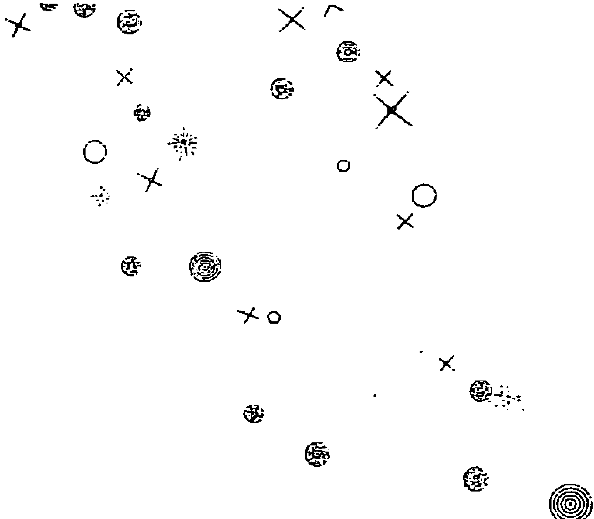

当我还是个孩子的时候，我所遇到的占星学都是纯描述性的。摩羯座的人穿着西服，处女座的人把东西按照字母表的顺序摆放好，狮子座的人傲慢自大，水瓶座的人穿着紫色的衣服。时至今日，我还是不太明白当初这些愚昧的东西是怎么吸引我的兴趣的。即使我当时只有13岁，我也看得出来那种占星学是多么不足一哂。不仅仅是不足一哂，而且大多数是错的。我是一个“走在科学的康庄大道上”的孩子，对天文学兴趣浓厚。在那个世界里，很难找出一句不把“占星”与“迷信”两个词联系在一起的话。那时在我的世界里，一切都只会驱动我对占星滋生不屑一顾的想法。

但无论如何，占星却成了我骨子里的一部分。占星成了我的嗜好。如果我想要在占星圈赢得掌声，我就应该这么写：“然后我发现了，在那些愚蠢的太阳星座之外，还存在着一个丰富的、有说服力的世界，那里的占星学是严肃和技术性的，充满了理性的光辉。”但这是在撒谎。我最终发现的是，尽管像脑力填字游戏一样的技术占星学要求甚高，我在20世纪60年代所遇到的严肃占星学在本质上与那些愚蠢的太阳星座的东西并无太大区别：它也仅仅是描述性的，过于重视预测，经常在结论上琐碎不堪，仍然有着诸多错误。（说句公道话，当时的占星学还是有很多不错的进展的，但我找不到，它们太隐蔽。）

但我仍然对它着迷。我开始积累占星经验——我合上书本，对我的朋友们和他们的出生图敞开心扉。就像我在我的第一本书《内在的天空》中叙述的一样，我意识到人们一直在改变和成长，而书本上的术语都是静态的。这个简单的观察就像催化剂一样，我一下子“恍然大悟”。它就像面包里的酵母一样，让我把所吸收的所有传统占星学重新组织，使它重获生命。

这个过程花费了几年的时间，但回顾起来，它却十分的简单。我现在仅仅用一段话就能叙述这个过程。通过阅读一些占星学的文献，我学习到了狮子座的人是高傲的（负面影响），但我也学到了他们可以是生动的、有创造力的（正面影响）。传统占星学中关于太阳星座的大多数描述性材料都符合那种叙述风格——混合着单一的、令人尴尬的特点，点缀着一些鼓励性的、有希望的可能性与优点。我们携带着诸多缺点而开始我们的生命，但逐渐的，通过不断的自我修行，我们可以向优点迈进。带着一点儿同情心的心理学叙述是这样的：狮子座的人表现得很高傲，实际上他们是被一种不安全感所驱使，而他们可以通过真正具有创意的自我表达而满足这种需要。

突然之间，对我来说，占星学超越了描述性，而进入了指导性。根据每个人星盘上的配置，我可以提醒他们对自己的阴暗面保持警惕，同时也指导他们朝向更高的可能性去迈进。这样做的效果非常好，人们喜欢这种方式。到了我28岁生日的时候，我可以辞掉我的工作了。

额外的快乐是，我意识到曾经苦学的传统占星学的一切仍然有用。我付出的那些辛苦完全值得。所需的全部就是一个作为催化剂的洞察——一个关于意识进化的精确系统——来融化保险丝。即使我的工作变得越来越精巧复杂，那种快乐的意识还是完好如初：那些花费在学习传统占星学上的不眠之夜真不是浪费，它们是基础。

现在的占星界很活跃。有许多不同的占星派别在进行角逐。现代心理占星学，吠陀传统占星学（Veitic 或 Jotish），希腊与文艺复兴时期的占星学（Hellenistic and Renaissance），宇宙生物学（Cosmobiology），恒星系统（Sidereal systems），天王星占星学（Uranian astrology）。在不同阵营间常常免不了尖刻之词。在对的人手中，所有的流派似乎都产生很棒的结果。我是在现代心理占星学的全盛期成长起来的，那是我学着说的一门基础语言，我在它的框架下发展出了自己的一个分支：进化占星学。我怀疑如果我年轻的时候学了吠陀占星学，可能我就会把进化占星学的技术嫁接到那个系统里。

我实践的进化占星学有着诸多基本要素——这些就是这本书的主要内容。但进化占星学不仅是一套技术，它更是一种哲学，或者说一种理解生命的尝试。在实际的层面来说，进化占星学是基于对我们在生命道路上学习、成长与改变的简单与客观的观察。因为我们是直接经验这些的，所以无法否认。这一观察驳斥了那种静态的、描述性的占星学。处女座的人能够克服批判，摩羯座能够停止控制。月亮在天蝎座第四宫四分冥王星的人也能够克服他们的与母亲相关的议题。关于这一点，有些这样的人甚至没有与母亲相关的议题！

因此，个人的进化本身实际上并不在哲学的范畴之内，尽管许多哲学都以此为基础。没有人可以眼睁睁地否认这一事实。当我们开始问一些更大的问题时，才是进化占星学真的进入到了个人信仰的领域时：为什么你有这样一个特殊的星盘，有这些盲点与缺点，有这些确切的进化可能性？为了本书的需要，我们假定了轮回转世。就像我们在第二章中见到的一样，有足够的理由去接受这一事实——任何把轮回转世简单地视为迷信的人，都将遭遇到一大堆客观的证据。

但公平地来讲，轮回转世是一种信仰。阐述理解生命意义的方式很多。那些不接受我们可以有许多次生命的人在进化占星学的世界中也同样受到欢迎。在实际应用与关联性方面，就算不提及过去世，进化占星学也是一套独立的系统。很明显，实际上被这套系统吸引的人通常也对转世的概念比较敞开。从社会的角度讲，这个团体包含了瑜伽士、冥想者、形而上学者、被东方信仰吸引的人、转世（和再转世）的异教徒、少数的神秘基督徒、苏菲舞者、心理研究者、卡巴拉主义者（Kaballists）。这些人群组成了这一工作的天然社区。它丰富而具有活力，日渐成长，十分有趣。作为占星界中日渐壮大的力量，进化占星学在哲学上与文化上都与之十分的契合。

对于许多人来说，也许并不是这样。诚然，作为一名占星师，我必然会尊重人的多样性。我们并不是为了让人们改变信仰；我们只是要求一种公正的倾听。我们的五个要点非常简单。

- 从进化占星分析出的未解决的前世议题在今生仍是显著的。
- 通常，通过任何其他形式的传统占星学分析都无法发现这些未解决的议题和趋向。
- 这些要点常常会完全改变解读的基调。
- 我们可以进化以超越这些议题；星盘告诉了我们该如何去做。
- 这些未解决的议题可以此时此地被客观地观察到。理解这个事实的一种方法是，把它们看做前世的遗留。

最后一点是非常关键的。实际上你是如何碰巧拥有自己独特的星图的？当然，你可以以任何你喜欢的方式去解释这个问题。上帝对你的神秘安排或者在一个随机的宇宙中，占星只是随机地起作用，就像阿伏伽德罗常数（Avogadro'snumber）和普朗克常量（Planck's constant）一样（译者注：二者是人为定义的常量），随便你选择什么，或者想出来其他完全不同的东西。那都是你自己的事。

不能否定的事实是，这些技术都直接地、真实地和人们生活的故事相符合。我们能观察到，这是真的。所有占星学的分支都如此，但进化占星学看到了一些常常被忽略的要素。

根据我的经验，通常情况下占星学团体都对进化占星学保持开放与接受的态度。来参加讲座的人都兴致勃勃；书卖得不错，学生们也发展了蓬勃的占星实践。但不可避免的是，这个领域也吸引了反对者。我们欢迎那些提出尖刻问题的人——他们让我们更强大。让我难过的是有些人在不理解的情况下便反对整个体系。他们窃窃私语，摇摇头，然后说：“他们是一群怪人……他们都以为自己是埃及艳后”，然后眨眨眼睛。流言不能判定真相。在流言面前，没有人能真的为自己辩护。

更令人沮丧的是，有些人说它“无法被检验”，以贬低进化占星学。“对前世你可以说任何事，有谁能证明你错了呢？”当然，这么说完全合理。但它与真正的要点无关，就如同我们上述五点说明的一样。进化占星学是我遇到过的最能被检验的一种占星学。

我所谈论的进化占星学也许听上去像一个统一的系统。非常重要的是——也很令人高兴的是——它并不是这样的。在这一册书的前言部分，我谈到了我和杰夫·格林的合作关系。他的技术途径和我的明显不同，但我们意识到我们的根本目的却是一致的。在前几段，我写到过进化占星学“不仅是一套技术，它更是一种哲学，或者说一种理解生命的尝试”。杰夫和我有着共同的观点，所以我们很轻松地一起工作了两三年的时间，直到疾病拖住了他的脚步。我们都有大量的教学计划，我们也很高兴我们有很多共同的学生。我发现在我们两个系统之间的交叉式互补是非常令人兴奋的，我知道杰夫也是这样觉得。我们都畅想过，等我们这两个怪人老了退休之后，我们的学生能够吸取我们各自系统中的精华——同时也加入他们自己的精髓。

在这本书的开头，我提到了雷蒙德·梅里曼，国际占星研究协会 (International Society for Astrological Research) 的现任会长，也是我所知的进化占星学这个概念的提出者。他的技术和我或者杰夫的都完全不同。我还没有严格地研究过他的技术，还不能对它做出评估，并把一些吸收到自己的工作中，但我的确知道雷对这个名称的广泛流行非常豁达，而他完全可以把这个名称当做“自己的品牌”。他也察觉到这个概念比任何个人来的广阔得多，为此我非常感谢他。最近在一次讨论会上我有幸遇到了简·斯皮勒 (Jan Spiller)，畅销书《灵魂占星学》的作者，它是一本关于月亮交点的畅销书。她的技术也是非常独特的，但她也有着同样的核心的“哲学”，或“理解生命的尝试”。出于好奇，我问她是否把自己叫做一个进化占星学家。她说她并不主动这样说，但她对此非常开放。一旦我描述了这双鞋的时候，她就知道这鞋很合适。

这双鞋对我们中间越来越多的人来说都很合适。这里所列出的人都很吸引我，尤其是那些崭露头角的年轻占星师，他们已经在这个领域中出版了著作并且开始授课。但这个名单并不是真正的重点；在推荐阅读这章中列举了相关著作和作者，在我的网站上也列举了那些与我一起学习过的人们。进入 www.sevenpawspress.com，点击“Training”，下拉“Forrest Trained”。我向你推荐他们所有人。

一代人以前，马丁·舒尔曼 (Martin Shulman) 从轮回转世的角度做过一些有关月亮交点的关键研究，我并没有机会和他会面。这些哲学视角在斯蒂芬·阿若优的精华著作中也相当显著。而他们也会偶尔瞥一眼在一两代人之前的丹恩·鲁伊尔（Dane Rudhyar）的作品。与鲁伊尔同时代的爱丽丝·贝利（Alice Bailey）和神智学者伊莎贝尔·希基（Isabel Hickey）的著作也可做参考。虽然他们都没有使用“进化占星学”这个概念，但我认为他们都是这个阵营的。

进化占星学的领域是生动的、多元的、繁荣的。现在的西方占星学一直以来都渴望一种一致的哲学基础。在相当长的一段时间里，西方占星学完全缺乏这样的基础——而堕落成了纯粹的描述。无论表面看上去多么博学，底下却是不可知论的虚无主义：我们是愚蠢的人类，在随机的宇宙中经历着生命的起伏。但有了进化占星学，“意义”进入了系统中。而附加的心理学和事实上的准确性，只是锦上添花而已。

进化占星学会成为一种独立、一致、统一的系统吗？我不太希望是这样——对我来说，那听上去太像终结的开端了！进化占星学需要自己的呼吸，有自己演化的步伐。与其说它是一种定义清晰的工艺，不如说它是整合占星与形而上学的一种运动。就其本身而言，我猜想它会始终保持开放。但我猜想在下一个世纪会有一些技术的整合。当然一些新的技术将会兴起。

在我们往下进行之前，我想要做一点回顾。在我写这些的时候，我正在经历自己的第二次土星回归，也在进入做祖父的周期中（译者注：第二次土星回归是在将近60岁）。我认为《昨日的天空》是我的第一本书《内在的天空》的伙伴，写第一本书是在我刚步入中年、第一次土星回归的时候。在某种意义上，这本书包含了那些我现在了解到的，而在第一本书里仅仅暗示过的一些内容。

青春与中年的激情，和与之相伴的所有激起的心理状态，在进化系统中是天然的勇气。我们非常直接地经验我们的业力。这就是一个我们并没有意识到自己在做梦的梦境，而且很难从中醒来。《内在的天空》的很多部分都是在那个领域中——并且希望为读者指出一种向前穿越的方法。随着我进入人生的最后三分之一，我的头脑自然的冷静和清晰了一点。水流不再湍急，泥土逐渐下沉。我经常更有结构性地在本质上回顾过往的个人业力，模式开始浮现。

《昨日的天空》从我内在的那个部分产生，在生命的短暂的光中，吸收了更为广阔的意义范畴。从作为“祖父”的视角，我想要对进化占星学的发展方向做一点推测——不仅关于我自己的兴趣向哪里发展，也关乎在我离开之后将会发展出什么，像纪伯伦说的一样，那是我将要拥有“风上的小憩”。

## 生理进化占星学

如果我不得不批评自己的系统，它最大的问题可能就是缺乏对物质身体的关注。业力潜藏在很多健康问题背后——一个典型的例子是，在前世被绞死的人今生很可能有喉咙的疼痛问题。在前世被刺死的地方，今生可能有一个胎记。我觉得进化占星学在健康和身体相关的领域会有许多应用：对于潜在问题的预警、诊断，甚至治疗和预防。为这些治疗与预防预测时间是出现在我脑海中的一种应用实例。直觉上说，我相信随着我们向北交点进化，我们会找到许多药方与解决方法，从而根治疾病背后的潜在病因。我在这里并不提倡任何关于疾病的单一视角，但的确有许多身体状况的根源不在生物化学中，而在古老的意识体中，然后才反映到物质领域。

有很多人在医学占星领域做出了杰出的成就——我最先想到的是英格丽·奈曼博士（Dr. Ingrid Naiman）。杰夫·格林（Jeffrey Green）也做出了重要的贡献。诺·泰尔 (Noel Tyl) 的《重症的占星预测》(The Astrological Timing of Critical Illness) 也是很好的相关著作。我非常振奋地看到我自己的学生罗伯特·芬尼根博士 (Dr. Robert Finnegan)，在他的新书中开始把西医与对进化占星学原则的深入理解相结合。在这儿我也要提一下金姆·玛丽 (Kim Marie) 的作品，她是杰夫·格林的老学生了。

我自己的北交点落在金牛座 (身体意识)，并且在第六宫 (健康与疾病)，我可能是世界上最没资格引领这场尝试的占星师——尽管如果参与的话对我大有裨益，这种事谁也说不好。共时性已经呈现了这一可能性：我对“整合医学运动”有着活跃的持续参与。也许随着我的灵魂缓慢前行，有一天我可以足够勇敢地进入那个领域……

在此，我推测生理进化占星学将是这一持续工作中的下一个黄金领域。

## 催眠回溯

在第二章中，我描述了罗杰·伍尔杰以及帕特丽夏·沃尔什的工作。本质上来说，罗杰是将催眠回溯作为帮助人们获得前世记忆方法的先驱之一。他的搭档帕特丽夏·沃尔什，曾跟随杰夫·格林学习过。她正在把占星学业力分析的结果与人们实际的回溯内容联系起来，并正在写一本书。目前，我知道她发表了一篇题为《前世治疗的占星分析》(Astrological Observations from Past Life Therapy) 的文章。这篇文章发表在国际占星协会 (ISAR) 的期刊《国际占星》(The International Astrologer) 2006年第36期，“狮子座专刊”第三页上。这篇文章将催眠回溯的前世记忆与进化占星学的分析结果做了非常细致与精确的关联。

从纯粹的逻辑观点来看，当两个完全独立的系统得到相同的结论时，总是说服力很强。证明轮回或者进化占星学可能一直是一个难以捉摸的目标——但如果一个占星师在一间屋子里解读出一个人星盘上的业力模式，而这个人在另一间屋子里做催眠回溯时出现了一致的故事情节，这将使怀疑论者非常头疼。就像帕特丽夏·沃尔什已经证明的一样，这的的确确是正在发生的事。

更重要的是，催眠师和进化占星学家都能从彼此身上学习。进化占星学的一些假设可以通过个人的实际情况得到验证。举个具体的例子，就拿确定前世性别这种棘手的问题来说，我曾经推测，金星和前世的女性性别有关，火星和男性性别有关。我也感到过犹豫，但还是在实践中经常这么做。如果在催眠回溯中，人们回忆起的故事和业力模式清晰地相符，但性别看上去却像是随机分配的……那么，我们就该放弃这种金星/火星的假设了！但如果相反的情况发生，我们就该信任它。“另一种观点”通常是一种帮助！

在支持轮回转世的贡献上，催眠回溯也许是西方最成绩卓越的一门学科了。在第二章中我提到过海伦·万巴德，布莱恩·魏斯，彼得·拉姆斯特和其他人的相关著作。我一直没进行过深层记忆处理的训练，并且我也忙于接待客户，以及写作和教学，没有时间去实践它。但如果一百个在两个系统中都受过训练的人开始彼此交换意见，我会非常激动。

### 通灵工作

真的有“灵视”。除非你相信，否则和通灵现象的任何接触似乎都不可能。就像占星学一样，它很难把握并且很难用科学的方式被证明，但涉及到具体的案例时又非常令人叹服。许多灵媒都做和前世有关的工作，从阿卡西记录中复原故事——基本上这个记录记载了全宇宙的记忆，储存了所有事情。在第二章中，作为一个精彩的例子，我详细说明了埃德加·凯西的工作。在西方社会中，任何大小的社区中都有灵媒的存在。

对于灵媒的工作而言，核心要点和我在几行之前描述过的催眠回溯是一样的。我的想法是大家一起评估与证明灵媒与进化占星学家之间一致和不一致的地方，想必从而可以让每个领域独立地证明或者质疑另一个领域的结论。而这样的证明将是令人信服的结论，将会让两个领域的人更加信任，从而吸引更多的人进入到这项工作中。更宝贵的是，我们将获得知识——同时也有关于错误的知识。转世的“数据”是难以把握的，灵媒可以帮助进化占星师们加强和清晰他们的技术。

人们总是说，每个人都有点儿通灵。我猜这句话可能是真的。当我们从进化的视角对自己的星图沉思时，直觉会不可避免地被激发。占星学的符号可能激发一连串更详细与具体的前世记忆。很显然，对我们中的大多数人来说，这样的直觉难免遭到各种各样影响的扭曲，从我们5岁时候看的电影开始！但如果有几百个进化占星师就他们个人的直觉经验交流意见，有用的信息模式就可能会浮现。

还有另一个工具与这个概念相关。就在写这本书的时候，我听到消息有一套塔罗牌专门针对激发前世回忆，由英格丽·吉纳尔、彼得·奥尔班和西亚·韦勒设计。这些“象征主义”的卡片把星座的象征和欧洲的神秘图形结合了起来。显然我们很多人都没在欧洲的文化中生活过，但这些卡片对于催化前世记忆与进化占星学结合得非常好。

## 占星绘图 (Astromapping)

你前世究竟生活在哪儿？我个人并不知道回答这个问题的可靠的占星学技术，但我相信这样的技术可能存在。原因是占星师们开发了另一套方法，来测定对于地球上的任何特定地点，我们在现在这一世的生活中会怎样反应。我猜想在这些方法下有着业力的主题，等待着我们去发现。

两个主要的工具是占星制图学 (Astrocartography) 和本地占星学 (Local Space astrology)。两种方法都产生了一系列的地球上十字交叉的“行星线 (planetary lines)”——这些线和我们曾经生活过和在今生曾经到过的地方一致。这些线在那些我们到过的地点投射下光线。占星绘图非常复杂，显然超出了这本书的描述范围。但我想这些地点也许与前世有关系。

就我自己而言，我对于“进化占星绘图”只是做了非常简单的尝试。我曾经把自己直觉感知的业力和我自己的占星地图做了比较。我也研究了周围亲密的朋友和那些想要尝试的人的生活。结果很有趣——占星绘图似乎真的能指出一些“线索”，这些线索符合个人自己对前世的印象直觉。但它也错过了很多——就和在传统的应用中，这种技术所表现出的一样。

我觉得占星绘图是另一个黄金领域，等待有人去研究和开发。在团体中，利用现有的绘图技术，把它们应用到进化问题上是非常富有成效的——我之所以强调“团体”是因为除非这样，其他都只是娱乐而已。对于我来说“奏效”的，可能只是纯粹的偶然。假设这对其他每个人都适用是很危险的。我们需要很多占星师一起交换意见，这就是这个领域如何保持先进的方法。

## 佛教与印度教的实践

数千年来这两种灵性传统一直保持着轮回转世的传统。就像我在自我介绍中写的一样，如果不是站在佛教传承的肩膀上，我是不可能写出这本书的。佛教与印度教的关系大概相当于基督教与犹太教的关系。在这两种情况下，都是后者从前者发源而出，并且带有前者的痕迹。所以我对印度教圣者的古老传承同样感激，尽管我很少与它有直接的接触。

占星师们没有必要去和客户与学生们叙述信仰体系。这并不是我的目的，我也不是想把所有的占星师都变成催眠回溯师、医师或者灵媒。但这里有等待开发的宝藏：这些东方的灵性传统长久以来一直都在探索因果的微妙原则，这是业力和转世的基础。这些传统给了我测验客户生活现实的原则与哲学，并且这些传统通过了测验。

在西方世界的某些人可能获得了心理学的博士学位，从而被社会认为是精神健康问题的专家。但非常明显的是，就算是这样的人，也可能变得疯狂——危险，不能维持关系，冷漠，缺乏爱心，诸如此类。今天在进化占星学的领域也有可能发生这样的灾难。任何智力足够的人都可以学习这些技术。但有了这种能力之后，这样的人就可以做出可怕的破坏，就像那些糟糕的心理学家一样。有了业力分析的知识，我们可以毁灭人们：很有可能会羞辱他们，剥夺他们的力量，在灵性上打击他们。这是一种神圣的知识，因此它具有风险。在过去，这样的知识可能会被保密，并且只对受灌顶启蒙者才开放。

佛教和印度教都是非常讲求智性的传统。但这种智性是在更大的心灵训练的背景下展开的：冥想，服务，产生对众生不伤害的慈悲心。我祈祷未来的进化占星学将会追寻更完整的灵性系统，而不是危险的、单维度的、纯粹理性的西方学术方式。进化占星学对那些没有更大的灵性背景的灵魂来说，是一剂太强的药方，无法使之落地生根。

到目前为止，我都备受鼓舞。大多数我认识的进化占星师都有某些灵性实践。也许他们并不都是佛教徒或者印度教徒，有的是基督徒，还有许多追随美洲原住民的道路，以及瑜伽行者和冥想者。有一些来自穆斯林背景，在现今世界的两极分化下，他们的出现真是件好事。人们如何选择自己的道路是他们自己的问题，但当我看到进化占星社团文化的发展方向时，我还是备受鼓舞的。

## 结语

我不能证明我将要说的话，但我直觉地感到，我对这本书的基础原理的建构，与其说是创造，不如说是回忆。我相信这些原理的大部分在过去已经存在了。

无疑，占星学历史中没有对这些独特技术的记载先例。从任何学术占星的角度，它们都是新的。不管是不是这样，人们普遍认为进化占星学是在一两代人之前被一群占星家发明的，而这些占星家大部分在美国。但让我鼓起勇气来质疑这些。

关于个人占星学，根据现代人的模糊回忆，是在二十三个世纪以前突然在希腊世界出现的。众所周知，这通常是被人们所接受的占星学的起源。吠陀占星师们声称他们的系统有更早的起源，可以追溯到至少两万五千年以前——但西方学术界的历史学家全面地否定了这个说法。

在埃及和墨西哥的金字塔中，以及巨石阵、吴哥窟、纽格莱奇墓（译者注：爱尔兰最为著名的史前坟墓之一）、蒂亚瓦纳科遗址（译者注：玻利维亚印第安古文化遗址）——所有这些地方的石头中都有证据显示我们的祖先感觉到了和天文现象间的强烈联系。除非我们想象他们是在做纯粹的科学研究，否则我们必须承认这就是最一般意义上的“占星学”：它是这样的一种感觉——天空中有对我们有用的信息。我们的祖先对这个想法的感受非常强烈，从而在地球上建造了巨大的纪念碑和石头来反映天象结构。

有些见解独特的学者相信地球上有早于现代人认为的历史文明存在，这个文明在大约一万一千年前、上个冰河时代的末期毁于自然灾难——大洪水爆发，突然间海平面上升，淹没了海岸。他们的论点并不像乍一看那样的不切实际——如果你感兴趣，谷歌搜索一下格拉哈姆·汉考克（Graham Hancock）并且读上个半小时就可以了。在这儿我并不想总结他的作品，但它实在令人印象深刻。我个人在这些方面的见解未必有很大价值，但我得说，格拉哈姆·汉考克详尽的研究说服了我。我并不是一个学者，但我也不是一个傻子。在这种背景下，吠陀传统声称的个人占星的更早起源似乎也是可信的。我尊重并承认这种观点。

我们可以进一步讨论这个问题。无论在东方还是西方，一直都有传授秘密教导的神秘学校，而只有学生被认为准备好的时候，才能接受这些教导。但它们完全没有，或者非常少被完整地记录下来，以防落入缺少经验的人手中，造成破坏。举例来说，这在现在的金刚乘佛教中仍然很普遍；耶稣也会经过一段时间才对门徒们宣说更深的秘密。时至今日，人们并不清楚希腊的厄琉息斯神秘学校里教授什么，或者德鲁伊教了他们的助手什么。

我相信，在历史的长河中，哪里有占星学，哪里就聚集着轮回转世的信仰和神秘学校，这是进化占星学的核心原理——和其他未知的深奥的占星学原理——都一直被保持着。我也相信这宝贵的传承中断了很多次，但它总能又续接上。这是怎样做到的呢？首先，这些法则，就像科学法则一样，只是简单地存在着，它们会一次又一次地重新被发现，只要有人开始问正确的问题就可以了。它们隐藏在平凡的风景之下，看起来并不像是什么秘密。你可以通过细心的观察和关联来重新发现它们。

其次，通过转世，那些曾经掌握了这种知识的人们再次来到人间。

进化占星学现在正在复兴，并且看上去前途光明。我可以想象一个未来的占星历史学家这样记录：我或者杰夫·格林，简·斯皮勒，马丁·舒尔曼，抑或雷·梅里曼“发明”了或者“创造”了这种技术。我不能替其他人发言，只能对这种想法笑笑。客观地说，我真的觉得我没有创造什么，只是在回忆。

很多年以前，当人们习惯性地问我做了多久占星师的时候，我总是开玩笑地回答“四千年了”。实际上，现在我觉得这个数字可能是相当精确的。这也让我成了这个领域里的年轻人。

我自己的南交点落在天蝎座（秘密），在十二宫的宫头（灵性）。除了这个交点组合难以克服的神经兮兮，其象征也和前世神秘传统的传承有关。我感到自己曾坐在大师的脚边——实际上这种机会在今生也重复了几次。业力和以往一样，也在重复。不管怎样，我觉得这些灵性大师们，有时对我这个人有些兴趣。我可以诚实地说，这些想法让我感到的更多是惭愧，而不是自大。这些大师们当时比我智慧得多，现在仍是这样。没有什么比坐在一个比你超前千倍的人面前，能更快把我执消除的了。

我在第三宫（教导；演讲）顶端有金星与水星的合相，紧密地四分我的交点——这样的配置反映了我在前世未解决的苦难，因此是我今生的被“跳过的”功课。

“一步”。在这里我不会让你听一个关于我业力的冗长又自我的解释。相反，我会直接切入最后的结论：在前世，我滥用了自己的言论（第三宫），我的理性（水星）和我的技巧，并且是用一种有口头感染力的方式传输给别人（火星合水星）。进一步来说，我曾经是“我自己最大的敌人”，按照我们的理论——它的出现是由于火星，这个天蝎座的传统掌管者，也掌管着我的南交点，非常精确与之呈四分相。在前世，我经受了苦难。我是自己最大的敌人。

举个例子，我相信自己曾将言论和理论服务于一个非常黑暗的目的：在西班牙入侵墨西哥时期，我曾用基督教的教义，把土著居民所受到的折磨合理化。最开始我没有意识到我是罪恶的同谋，过了一段时间我才意识到。

当我21岁的时候，一位智慧与慈悲的灵媒，同时也是我的第一个真正的灵性导师——玛利亚·斯达莫斯（Marian Starnes），说我在这辈子的晚年可能会面临耳聋。她给出的原因是“在前世我可能无法忍受人们尖叫的声音”。这就是她的原话，她没有多说什么。

现在我明白了，玛利亚这样说真是太善良宽容了。我不能忍受的是人类忍受折磨的声音——面对阿兹特克用活人献祭时，我作为基督徒很震惊，但我从教义上将它合理化了。我虽然自己没有去折磨他们，但我鼓励、支持并且祝福那些这么做的教堂。

以耶稣的名义。

现在我将近60岁了，我已经戴了几年的助听器。玛利亚是对的，逐渐加重的耳聋，现在是我个人生活的主要噩梦。业力已经成熟了。

从传统占星学的角度看，火星（麻烦）损害我在第三宫（听力）的水星（听觉与交流）。足够准确——小时候我甚至演讲时会口吃——但传统占星学的解释遗漏了很多东西。它遗漏了造成我耳聋的原因。

让我在这儿加一个奇怪的插曲。我定期去讲课的唯一一个国家就是墨西哥。我主要就在墨西哥城讲课，讲了很多次。某些情形表明我曾经在西班牙统治者征服阿兹特克人的历史时期，待在离这里非常近的地方。

还有更多的插曲：我的占星作品已经被翻译成了至少十几种语言，有一些是相对生僻的语言——土耳其语，罗马尼亚语，荷兰语，捷克语，意大利语。但它们从来也没被翻译成西班牙语。就像业力仍然禁止我以那种语言被听到。

而西班牙语是我除了英语之外唯一能用来完全交流的语言。

就像其他有行星四分交点的人一样，我的业力困境的解决方法在于解决那个被跳过的步骤。水星（在摩羯座）和火星（在水瓶座）现在必须为我进化的目的而服务，否则我就会跌入旧有的模式。我富有激情的、传教士一样的声音（水星，火星）正“悬而未决”。在灵性议题上，我必须以我所见的自然法则的真实去陈述，而不管现实后果是什么——这是对我的火 - 水配置的正当表述。

我必须让自己那富有激情的声音服务于我的北交点，我的北交点在金牛座（对自然法则的直觉的觉知），在以传承为荣耀的第六宫。

在此，我对那些在我之前的先行者，以及传授我知见和修证的人深深鞠躬。

我承诺在我的有生之年将这火焰勤奋地传递下去。

我也向你们这些将这火焰传递给未来人类的人们感恩地鞠躬。谢谢你们！

我就是以这种信念来写这本书的。

每个字都是我所知的至高的真理。

斯蒂芬·福里斯特

加利福尼亚州博雷戈市

2008 年 4 月 27 日